# 塔罗逆位牌

逆位牌的顛倒世界

《塔羅逆位牌》是第一本全面聚焦在塔羅占卜中一個至關重要卻普遍被漠視的領域：逆位的塔羅牌釋義。市面上的書籍，關於逆位牌的解釋常常只有寥寥數行，可是一般的牌陣裡卻有一半以上的牌都是倒轉的。很多書甚至沒有提到逆位牌的意義，有的書只是不假思索仿效「傳統的」解釋，也就是僅列出正位牌的相反意義而已，而且通常還相當悲觀消極，強調的是負面的特點。結果，平均至少有一半的塔羅占卜在解牌時都不求甚解，而做出不適切的詮釋；更有甚者，在這負面解釋為多數的影響下，解牌偏重的變成是問題而不是契機了。這也難怪大家會對逆位牌避之唯恐不及。

這本書為各種程度的讀者提供了十二種判斷逆位牌涵義的方法。大部分的內容是針對在每一種方法中出現的七十八張逆位牌做出範例解讀，其中也包括傳統的意義。去發掘哪一種取向對你的塔羅占卜風格和世界觀最有幫助吧！學會每一種方法背後的概念理論，除了能讓你立即應用於詮釋意義外，還能補強你的塔羅諮詢，使它更有深度。

——瑪莉·K·格瑞爾

> ~献给~

夏琳。麥當諾
與
芭芭拉。萊普

## 推薦序——
塔羅玩家探索逆位牌義的寶庫

Daniel

在丹尼爾教學的經驗當中，有關塔羅牌逆位的解釋是最常被提出來討論的問題之一，各家各派的說法各不相同，即使是有經驗的塔羅占卜者也不一定能說出個所以然來。有些人乾脆放棄逆位的牌義，把所有的牌當成正位來解（這是丹尼爾及本書作者建議初學者的做法），也有人強調逆位非常重要絕不可忽略；但正如本書作者所說「不管我使用的是哪一套詮釋，只要我刻意想讓牌順應那套系統，逆位牌似乎都會產生影響。要不要使用逆位牌是看讀者自己的決定，你要逆位牌代表什麼意義也是。」因此，我們可以把逆位的使用作為一種可能的選項，在學習塔羅牌的過程當中增加深度與樂趣。

作者在〈前言〉當中介紹一些基本概念，同時也體貼地提供本書所使用到的特殊詞彙表，讓大家在閱讀接下來的章節時能有比較清晰的概念，〈第一章〉羅列了與逆位置有關的各種理論、歷史與用法；〈第二章〉是本書的核心，介紹了十二種逆位牌義的解釋原則，並且告訴讀者遇到逆位牌時可以如何解讀；接下來作者依照大牌、數字牌、宮廷牌的順序，介紹每一張牌的正位牌義及逆位變化。而在〈第三章〉，作者介紹了幾個好用的牌陣，並在〈第四章〉提供了解牌的案例。作者在〈附錄〉中整理了逆位常用的關鍵字，幫助讀者學習與聯想，最後以一則「女英雄之旅」的故事做總結。

平心而論，這不是一本非常適合初學者閱讀的書，缺乏塔羅牌經驗的讀者可能會被書中大量的資料與豐富的象徵搞得暈頭轉向；但如果你是有一定經驗的塔羅玩家，那麼本書絕對是一本值得一讀再讀的經典之作。建議你先依序讀完〈前言〉、〈第一章〉到〈第二章〉的理論部分，再深入去研究各張牌的逆位變化；有些地方作者使用的觀念比較艱澀，第一次讀不懂的話不妨先跳過，或是放下書本去做點別的事，再回頭來看也許就會突然頓悟了！

雖然本書已經在國外出版超過十年，但是當中提到的許多觀念仍然歷久彌新，丹尼爾在授課與寫作的過程中，也常把這本書翻出來參考，現在有中文版的問世，相信對於提升華語世界的塔羅牌視野會起重要的作用，在此誠心地推薦給大家。

丹尼爾

- 透過占星學與塔羅牌踏入神秘學領域的研究者。
- 神秘學作家，占星學與塔羅牌課程講師。

## 前言
### 關於本書

本書收錄的逆位牌涵義以各家的理論和傳統為基礎，意在讓讀者對「傳統」塔羅牌的意義，以及現代從數字、元素和畫面中產生意義的取向都有所了解。提出這些解析的用意是希望能刺激你產生自己直覺的想法。你在嘗試各種方法的時候，不妨留意你覺得哪一種取向最好用，這其中有一部分取決於你個人的世界觀、解讀風格、占卜的目的和詢問的問題。

如果你的目的純粹是算命和預測未來，你也許會覺得標示為「傳統」的解析，和它提出的特定內容就已經足夠了。這類牌面的意義幾乎不會模稜兩可，除非是和其他的牌放在一起看才會變得比較模糊；但透過觀察、直覺和經驗，你也能養成組合牌義的才能。不過，如果你想要的是檢視個人動機、釐清目標和願望，或是看看有沒有其他的選擇，那麼你或許會認為現代逆位牌的取向會更適合你。

傳統對逆位牌的解釋通常也跟疾病有關。這之所以合理，是因為逆位牌的出現是在暗示你需要做些調整了，而壓力是身體回應調整和改變的方式。今日，醫生相信所有的疾病都源自壓力。你對壓力的反應愈強，它就愈有可能產生有害的效應。壓力會找到身體鎖鍊裡最弱的環節，而逆位牌只不過是指出當下那個「最弱的環節」。

> 在長遠的歷史裡，各種文化最常見的醫療照護方法是薩滿信仰。」薩滿信仰認為「疾病是一個很正面的信使，它表示你需要重新平衡你的靈性。」

本書涵蓋每一張逆位牌在薩滿信仰和魔法中的觀點。塔羅是個絕佳的反饋機制，它能讓你在失衡顯現在身體上，或出現在充滿壓力的行動和互動關係之前，就先接收到訊息。當能量的失衡已經顯現，它也可以準確指出它的來源為何，這樣你就可以下工夫，把它從潛藏的批判、憤怒、怨恨、內疚、恐懼等模式中解放出來。

### 關於健康

千萬別把本書中說到健康和疾病的地方當成醫療方面的預言。不管是對你自己還是別人，解牌的時候，都不要預言疾病或給與醫療的建議，除非你是合格的醫務人員。如果問卜者擔心自己的健康，就建議他們去找合格的醫生。

書中所有關於健康和身體狀況的指涉純粹都是隱喻而已。它們隱喻的是可能會誘發壓力的心理傾向和思維模式，如果一段時間沒有去紓解這些壓力，就可能會導致疾病，它們絕不是表示某人得了任何一種書裡提到的病症。比如「精神錯亂」指的可能是新奇的點子，或大腦皮質的神經元不能正常運作。這個詞譬喻的是一連串的可能。

### 我的故事

我一開始寫這本書時，是想糾正一個「錯誤」的觀念：逆位牌代表的是和正位牌相反，而且通常還是負面的意義。雖然面對並處理問題是必要的，但我在解牌時會強調你要釐清目標，並且有意識地創造你想要的人生。這樣的話，問題代表的就是受到壓迫的能量，而你是可以釋放這股能量的。然後，我們就可以接通它背後的智慧和潛力。我以前應該要徹底了解這一點，但我卻沒有：這就好比打開一支骯髒的水管時，會先有各種髒東西跑出來，最後才會跑出乾淨的水一樣。

你和任何寫過有關塔羅牌的書籍、以一週一卡的方法教學或研究塔羅的人，還有創作過塔羅牌的藝術家一樣，都會發現你和你的牌有離奇的同步性。弗莉達。哈里斯（Frieda Harris）在第二次世界大戰期間創作了托特牌（Thoth）。她畫到名為「勝利」（權杖六）的牌時，同盟國打了大勝仗；她畫到「挫敗」（寶劍五）時，同盟國吃了大敗仗。雖然常理會認為這太荒謬，但哈里斯依然感到這些牌和當時的事件是有關連的。我也一樣——我在自己的生活中經歷了每一個逆位的現象。

下面只是一些當你進入心靈或靈魂的幽冥之境時，曾經驗到什麼的個人例子。逆位牌絕對不是邪惡的，雖然它們有時代表逆境——那些教會我們一些能力，教我們明白什麼是有意義的、什麼是最重要的，試煉我們人品和人格的逆境。當我們在逆境中奮鬥，就能學會用誠信來回應事情，也能學會下定決心，不逃避每一個情況要教會我們的功課。

在我述說一些我遇過的情況之前，我想說：我的人生很有福氣，我幾乎沒有受過重大的傷害，家人也沒有生病，每次的截稿期限也差不多都有趕上。

我第一次的延誤發生在新電腦花了一個月都還沒有送到的時候。有一個房客向我承租了三年，可是當我著手寫逆位的宮廷牌時，我在四個月之內就換了四個房客。寫到寶劍牌的時候，我處理了一間機構的危機，其中涉及可疑的騙局。逆錢幣王牌和我去義大利進行四天的塔羅之旅前，嚴重扭傷腳踝相呼應 ②。寫到逆錢幣十的時候，銀行搞丟了兩張原本要拿來支付我房屋稅的支票。

我寫到逆女祭司的時候，正在讀克莉絲汀娜·摩根（Christina Morgan）的傳記，她畫出了她在心中看到的畫面（是在榮格分析她之後開始出現的），這些畫成了榮格四年課程的基礎。傳記作者經常形容摩根是個逆位的女祭司，例如：「（她）映照著阿尼瑪（anima）——就像那倒映、完整，並創造出那個男人的愛人……那靈感女神……消失在她的角色裡。而愛著自身倒影的男人，卻覺得他有權認為那個倒映出他的人是他想像中的財產。」③

很多我正在讀的書、教授和學習的課程，都和我當時在研究的牌相呼應——也跟我在寫的內容一字一句都有共鳴；比方說，我寫到吊人的時候，榮格的研討會正討論到「犧牲」。

我開始寫死神的那一天，我辦完離婚。寫高塔的時候，一位朋友突然盲腸炎發作。寫到太陽這張牌的時候，是一月最熱的一天。開始編輯之後，我跌倒了，背部嚴重扭傷。我第一次必須臥床休息，沒有拐杖的話什麼也做不了。接著，在我瘋狂地為完稿刪刪改改的時候，遇到了暴風雪、停電、電子郵件故障，然後我的繼女被診斷得到乳癌，所以我把所有的事都先放在一邊。還好盧埃林的策劃編輯芭芭拉·摩爾體諒，我才能用自己的速度完成這本書。

儘管無比艱難，這些充滿壓力的經驗仍讓我迎頭面對自己的心理狀況，為了療癒自己，讓「各種力量和諧」④，我必須用誠實和最大的清明來面對。

我同時也有很好的經驗，包括來自朋友的支持，而支持的程度是我前所未見的。我剛好上了靈氣第一、二級的訓練，及時派上用場。還有，書寫到一半的時候，洛杉磯塔羅座談會（Los Angeles Tarot Symposium, LATS）的策劃人芭芭拉·萊普頒獎表揚我對塔羅界的服務，我感到非常榮幸。獎盃是一座由伊德·葛蕾（Eden Gray）打造的韋特版吊人銅雕。這件作品意義深遠，是葛蕾唯一的塔羅雕塑；芭芭拉在芝加哥第一屆塔羅大會買下它，當時葛蕾自己也獲頒大獎。這座銅雕在芭芭拉家裡放了三年，然後她覺得送給別人的時候到了。而當時，我剛好在寫一本以這張牌作為寓意的書。座談會開始的時候，他們要我為大家抽一張能代表那一天的牌——我抽到了吊人。

### 關於解析

當代或英語系的牌義，基本上都以受萊德—韋特—史密斯（Rider-Waite-Smith）所影響的牌面上的視覺畫面元素，以及黃金黎明秘術修道會所使用的概念與關鍵字為基礎。一九〇九年推出的萊德—韋特—史密斯牌（編註：以下簡稱為「韋特牌」），是有史以來第一次在七十八張牌面上全部出現圖案，而此舉永遠改變了塔羅藝術。雖然使用不同的牌或許會對你做出什麼解析有極大的影響，但韋特牌是最廣為使用的英國牌，對現代解析的影響也最為深遠。

比較古老的，或是我所謂的「傳統」牌義，都以埃特伊拉(Etteilla)最初於一七八三年在法國的創作為基礎（參見〈第一章〉的歷史），後來使用埃特伊拉或馬賽風格塔羅牌的作家又做了些更動。到了現在，義大利、西班牙和法國的作品都有些變化。有些逆位牌的解析看起來很武斷，甚至可能跟正位牌毫無關連。而有時候，從傳統的意義過渡到當代的意義時，逆位和正位的意義互換了。現代的技巧比較喜歡修改正位牌的意義，不喜歡用無關的概念。不過，你仍然可以從很多當代英文解析的源頭看出埃特伊拉的影響，這類解析或許能讓你在解牌時產生新的洞見。

傳統的解析源自下列作者：

- 由帕布斯 (Papus，1909) 重新製作的埃特伊拉牌 (大約在一七 八〇年代)
- 麥克葛拉傑·馬瑟斯 (MacGregor Mathers，1888)
- 聖傑曼 (Saint-Germain，1901)
- 尤迪·皮卡爾 (Eudes Picard，1909)
- 聖甲蟲出版社 (Lo Scarabeo Publishers，當代)
- 大東方／韋特 (Grand Orient / Waite，1889)
- A. E. 韋特 (A. E. Waite，1910)
- M. C 潘索／亞儂 (M. C. Poinsot / Anon，1939)
- 亞歷山卓·比連基 (Alessandro Bellenghi，1985)
- 瑪莉祖·古勒 (Maritxu Guler，1976)
- 富尼埃出版社 (Fourneir Publishers，1992)
- 多克圖爾·瑪希俄思 (Docteur Marius，1975)
- 大埃特伊拉（Grand Etteilla）/B. P. 葛立矛德（B. P. Grimaud，1969）

記得，本書提供的解析僅僅是建議而已。不同副牌使用的意象、牌陣裡的其他牌、個人的直覺和聯想，都可能帶給你全新而且更加適切的牌義。

### 特殊詞彙

- 阿尼瑪（anima）／阿尼姆斯（animus）：這是榮格用的詞，分別表示隱藏在男性身上可能是無意識的女性元素，和隱藏在女性身上可能是無意識的男性元素。雖然在男性和女性身上的運作方式略有不同，但基本的功能都是帶來啟發。
- 原型（archetype）：指的是殘存自遠古那些訴諸本能，而且存在於人類心靈中，影響我們心理的意義型態。這些集體的思維模式是與生俱來，代代相傳的。我們看不見原型的本身，只看得見因這些模式而生的特定意象和主題再現，突然出現在世界各地的神話和童話故事，以及夢境、幻想、個人藝術創作中。
- 對應性（correspondences）：是玄妙形上學和魔法的一項基本原則或「法則」，指的是宇宙中相同或類似的振動頻率之間，存在有象徵性的類比關係和相似性；當一個事物受到影響，其他事物也會透過這個象徵性的關係受到影響。秘術會有句真理可一言以蔽之：「在上的，如同在下的。」（As Above, So Below.）
- 宮廷牌（court cards）：十六張分成四色牌組的「人物」牌，它們的意義大致上指的是自己或別人，角色和面具，次人格（subpersonalities）或行動模式，不過也可能指的是你面臨的情況。雖然名稱有很多種，但英文中最常見的是：國王、皇后、騎士、侍者。
- 四大元素特質（elemental dignities）：一張牌的涵義會根據它與別張牌的元素是否親和而有所變動。請見〈附錄 C〉。
- 元素（elements）：構成宇宙的基本要素，在西方的玄妙形上學裡由火、水、風、土構成。塔羅牌組和元素之間的對應性是什麼，要看你用的是哪副牌而定，解牌者不是需要忽略牌面創作者的出發點，就是需要修改牌面特色的敘述內容。可參照〈附錄 B〉。
- 元素的對應關係（elemental correspondences）：本書所用的元素和塔羅牌組之間的對應關係為：
  - 權杖 火 慈望。能量。靈感。自我成長。衝動。
  - 聖杯 水 情緒。關係。想像。反思。
  - 寶劍 風 思緒。衝突。辨別。解決問題。
  - 錢幣 土 物質顯化。安全感。價值。結果。
- 物極必反（enantiodromia）：榮格用這個詞表示心理狀態的逆轉。這個詞的意思是事物翻轉成相反的樣子，或是看起來相對的兩極互相逆轉。這個詞來自赫拉克利特（Heraclitus），意指跑到相反的那一邊。
- 埃特伊拉（Etteilla）：尚一巴提斯特。阿里埃特（Jean-Baptiste Alliette，1738-1791）的筆名。他是最早為塔羅牌的占卜意涵寫書的人，他的著作影響了現代的解析；他創造了逆位牌的概念，還發明了法文「cartonomancie」一字，意思是「用牌占卜」。他也設計了一副塔羅牌。
- 黃金黎明（Golden Dawn）：黃金黎明秘術修道會是一八八八年創立於倫敦的組織，今日仍然存在。成員使用西方魔法傳統的儀式魔法。他們根據塔羅、星座符號，以及影響了兩副二十世紀最受歡迎的塔羅牌（韋特牌與托特牌）的希伯來字母，發展出一套自己的對應關係組合，並據此進行儀式和魔法。韋特、史密斯和克勞力（Aleister Crowley）等塔羅創作者都是此會成員。「黃金黎明傳統」指的是那些互為對照的對應關係組合，像是由李維創立的法國傳統、浮光兄弟會（Brotherhood of Light）的「埃及」對應組合。
- 榮格（Jung）／榮格派（Jungian）：卡爾·古斯塔夫·榮格（Carl Gustav Jung，1875-1961），瑞士心理學家及精神病學家。亦指榮格的心理學理論，他的理論對探索心靈或靈魂和符號的解析，有深遠的影響。
- 李維（Lévi）：伊萊·李維（Eliphas Lévi，1810-1875），真名為阿方斯一路易·康士坦（Alphonse-Louis Constant），是法國作家和魔法與玄妙學的理論家。他創始了一般稱為法國派塔羅的對應組合，深深影響了法國的玄妙塔羅，以及使用馬賽塔羅的人。
- 魔法（magic）／魔法的（magical）：傳統的玄妙學定義是：「魔法是一門為了促成意識和物質環境改變，而運用少數已知自然力的藝術和科學。」⁵ 更為心理學的定義是：「魔法……是世界的靈魂按照自身的法則創造出它自己。」⁶ 按照這個觀點，在魔法的界域和玄妙學家的「內在世界」裡，原型都有了實體，我們可以感知到世界的靈魂。
- 大阿爾克那（Major Arcana）：二十一張有編號和一張沒編號的牌，以隱喻的方式刻劃景物，取材自中古世紀後期和文藝復興早期，歐洲天主教裡大家普遍知道的意象。現代的解析一般認為它們指的是原則、課題和事件。
- 馬賽塔羅（Marseilles Tarot）：亦稱為「Tarot de Marseille」。大多數使用「馬賽風格」塔羅的人會用李維設計的占星和希伯來字母的對應組合，而不用黃金黎明的。通常你需要記憶基本的意義，因為小阿爾克那的數字牌上只有牌組的符號（沒有像故事書一般的圖畫）。
- 小阿爾克那（Minor Arcana）：共五十六張牌，分為四個牌組，每一個牌組都包含十張一到十的牌，以及四張宮廷牌。所以一共有四十張數字牌（「花點」牌），和十六張宮廷牌。現代的解析一般認為它們指的是事件、情況和遇到的人。
- 神聖（numinous）：榮格派用這個詞來形容一個物品或事件在觀者或經驗者的心中所引發的深刻情感反應，如讚嘆、陶醉和奧妙的那種感覺。
- 玄妙學（occult）／玄妙形上學（occult metaphysics）：玄妙的意思是「奧秘」或「隱藏」，意指必須透過追尋才能揭曉或現身的知識。形上學指的是超越物質的事物哲理。相關的詞為「秘傳」（esoteric），意思是「與內在有關之事物」。這兩個字加起來，指的是：心靈中隱藏著知識和智慧，當你加以檢視，就能夠意識到它；當你以魔法的方式運用它，就能創造改變。
- 投射（projection）：心理學用語，指的是下意識地認為自己的特點（包括情緒、態度、欲望）屬於其他的人或物。同時，投射的始發者拒絕承認自己身上有這些特質，或是排斥它們。
- 心靈（psyche）：源自希臘字，意思是「呼吸」，因此也指稱「靈魂」。它代表心智的過程，包括有意識的和無意識的，也指人類渴求和上帝合一的部分。在希臘神話中，愛神愛洛斯（Eros）愛上少女賽姬（Psyche），後來她象徵靈魂從無意識發展到有意識，並進入神聖合一的過程。心理學就是把心靈當成心智在研究。
- 亡靈指引者（psychopomp / psychopompos）：靈魂的指引者，尤其是指引靈魂穿越冥府。
- 沛爾（Puer）／沛茲（Puella）：榮格用這個詞來代表「青春永駐」的原型。沛爾是情緒永遠不成熟的男性，沛茲則是女性。它代表青春期的玩心、美麗、魅力、誘惑力，但無法以負責任的方式全然付出承諾。
- 治療法（remedy）：指的是用來幫人恢復健康的媒介，如藥物、療法。

## 藥方 (Rx)
這個字的字根為 medi，意思是「把出錯的導正」或「修補」，它可以修正或像解毒劑一樣，產生抵銷作用，矯正不受歡迎或不健康的情況。它的縮寫是 Rx。矯正本身是一個煉金術的過程，涉及調整酒精濃度或「心靈」（spirits，譯註：這個字在英文本身也有烈酒之意）。

## 萊德-韋特-史密斯（RWS）
指的是一九○九年首度出版的萊德-韋特-史密斯（Rider-Waite-Smith）牌，由倫敦的威廉·萊德（William Rider）公司推出，亞瑟·愛德華·韋特（Arthur Edward Waite）設計，潘蜜拉·高曼·史密斯（Pamela Golman Smith）繪製。這是有史以來第一副每張牌都有畫面呈現的牌，它成為除了「古典」的馬賽塔羅牌以外，今日最有影響力的塔羅牌之一。因為「解牌者」有根據牌面圖案說故事的癖好，所以它支持用自由聯想和文化圖像的方式來解析，不再需要只是記憶牌面的意義。因為這副牌受到大眾歡迎，所以影響了很多現代的塔羅牌，在我們的工作裡成了基本的參考資料。

## Rx
這是塔羅玩家常用的縮寫，代表逆位牌，占星家用它來代表行星「逆行」。這也是一個藥學的符號，表示處方或用來處理疾病的治療法。這個符號本來是用草體的大寫 R，加上一短撇，把 R 的一撇延伸成 X。根據《布魯爾慣用語與寓言辭典》（Brewer's Dictionary of Phrase and Fable）：「這個字母的裝飾性部分是木星（♃）的符號，所有的藥品都在這個星球的特殊保護之下。因此，字母的本身（Recipe，拉丁文的「服用」）及其花體的字母，可以改述成：『在藥物守護神朱比特（Jupiter，譯註：亦為木星）的福祐下，以既定的分量服用下列藥物。』」Recipe（處方）的意思為「讓人順心如意的配方或方法。」因為傳統和現代對逆位牌的解析往往不脫「給人壓力，且可能演變成疾病的情況」，也指出每種壓力背後的正面動機，所以我喜歡把 Rx 想成是「用不適（dis-ease，譯註：此字也有疾病的意思）來尋找安適」。

## 占卜 (scry)
源自「辨認」(descry)，意思是「辨識出難以看清的東西」⑦。它指的是以催眠般的狀態凝視一個物品，例如塔羅牌上的意象、火焰、水或油中的倒影，以得到預知未來的視覺影像。

## 老人 (senex)
榮格用這個詞來表示涵蓋兩極的老人原型，包括智慧老人，以及充滿壓抑、憂鬱、垂死的末路老人。

## 陰影 (shadow)
榮格用這個詞來代表受到壓抑、否定、尚未實現，以及有意識的自我尚未發覺的無意識部分。陰影的特質常常被投射在別人身上，這些特質可能是「光明」的或受人喜愛的，也可能是「黑暗」的或不討人喜歡的。

## 薩滿 (shaman)
蒙古通古斯族語，意思是「興奮、感動、振奮的人」。受天啟的男巫或女巫進入一種狂喜的恍惚狀態，接通不尋常的實相（通常認為是來自天界或下部世界，lower world），為自己與他人得到知識、保護和療癒性的能量，還有／或是支持⑧。

## 牌組 (suit)
小阿爾克那分為四組：權杖、聖杯、寶劍、錢幣。通常每個牌組都會和四元素的其中之一相對應。

## 同步性 (synchronicity)
榮格和物理學家包立 (Wolfgang Pauli) 發展出的理論，是個非因果的原理，說的是在時間裡某一瞬間發生的所有事情，都有一種有意義的關連。

## 塔羅奇 (Tarocchi)
最早用塔羅牌玩的遊戲，今日歐洲還有些地區在玩。跟橋牌很像，不過它的圖案全都是王牌牌組。在義大利，這個字也指「牌」的本身（單數是 Tarocco）。

## 神聖界域 (temenos)
一個神聖的地方、場域、庭院，通常是封閉的空間。在榮格派心理學中，指的是能安心進行深度蛻變工作的地方。

## 傳統的／傳統的逆位
如本章稍早所述，這個詞指的是源自十八世紀「用牌占卜」的埃特伊拉發展出的牌義系統，主要由來自法國、義大利、西班牙塔羅學派的評論家加以擴增，也出現在馬瑟斯和韋特早期的著作中。

## 王牌（trumps）／勝利牌（triumphs）
大阿爾克那的另一個名稱，這個名稱來自這類牌在北義大利已知最古老的名字：「I Trionfi」；從這個字可看出它在紙牌遊戲中的角色，它是永遠的王牌牌組，可以贏過其他所有的牌，也可能是指佩脫拉克（Petrarch）的詩《勝利》（Trionfi）。

## 註釋
- 1. Dean Shrock, Doctor’s Orders: Go Fishing, p. 96。
- 2. 《文藝復興塔羅牌》與《敏奇亞特塔羅牌》的創作者布萊恩·威廉斯於二〇〇〇年帶領這趟北義大利之行，是塔羅意象源頭的朝聖之旅。
- 3. Claire Douglas. Translate this Darkness: The Life of Christiana Morgan, the Veiled Woman in Jung’s Circle. 摩根和她多年的愛侶兼工作夥伴 Harry Murray 創造了主題統覺測驗（TAT），是個使用意象的性格評鑑工具。許多偉大的榮格派分析家都參與了這個為期一週的研討會，會議的文字記錄分為兩冊出版，Visions: Notes of the Seminar Given in 1930-1934 by C. G. Jung，由 Claire Douglas 編輯。
- 4. 這句話引自 Magister Ludi 和 Joseph Knecht，見 Hermann Hesse 的 The Glass Bead Game，p. 311。
- 5. 這個簡潔的定義來自 Francis King 和 Stephen Skinner 的 Techniques of High Magic，p. 9。它以黃金黎明祕術修道會成員使用的定義為基礎。
- 6. Robert Sardello，Facing the World with Soul，p.20。
- 7. American Heritage Dictionary of the English Language。
- 8. 感謝夏琳·麥當諾告訴我這個定義的核心，還有她在神話及薩滿方面的知識。

## 第一章
## 不一樣的觀點

「我要怎麼解讀逆位牌——牌陣裡那些看起來顛倒的牌？」①「幹嘛要管逆位牌？」在我為學生回答了三十年這些問題之後，我決定動手寫作此書。

有一段時間我忽略逆位牌，因為我不喜歡我在書上找到的牌義。然後我發現，不管我使用的是哪一套詮釋，只要我刻意想讓牌順應那套系統，逆位牌似乎都會產生影響。要不要使用逆位牌是看讀者自己的決定，你要逆位牌代表什麼意義也是。〈第二章〉會給你許多選擇，你可以自由地選擇你最認同的世界觀所帶來的解析。

很多占卜者都發現，逆位牌為正位牌添加了一分深度、細微的差異、調性與附加的概念。當你想要尋找不模稜兩可的答案時，逆位牌更是能有效地加倍你成功的機率。此外，逆位牌也鼓勵我們從不同、更複雜的角度來看事情。雖然翻到太多逆位牌可能會讓你有「望洋興嘆」的感覺，但希望這本書能幫你逆轉局勢。

其實，逆位牌是種看穿「另一面」的方法，它幫我們超越已知的限制，提供更進一步、但不是馬上就明顯可見的可能性和洞見。它給我們一個機會去超越邏輯，帶領我們進入屬於潛力和潛在原因的世界；在這個世界裡，萬事萬物都互相連結，而魔法就在這裡發生。逆位牌邀請我們跳脫表面，進入更豐富的涵義。你可以試著把逆位牌看成是受到神聖愚者或吊人影響的牌，那對這個過程會很有幫助。逆位牌會揭示神秘或隱藏的元素，這個世界的薩滿觀點，所謂與「現實」相對的夢境或內心世界。在一次網路的討論中，一位睿智的女士說：「逆位牌代表的是一種機會，你能更接近平常不易觸及的能量、感受、事實與潛力。」②

雖然逆位牌的潛力豐富，但大家卻常用有限或簡單的方式來解讀。雖然你可以用好／壞，或任何一種二元對立來形容每張牌，但是別被逆位牌只是逆轉它原本的好壞特性這種錯誤的想法誤導了——雖然有時候這是對的。當你把所有的逆位牌都看成是負面的，你就無謂地強調不理性的恐懼和懷疑，對你心靈和心理的創意天賦產生愈來愈大的影響。沒有牌是絕對的好或壞，每張牌都涵蓋了有問題和有利的意義。例如太陽這張牌，可以代表快樂和喜悅，或曬傷、燈枯油竭。逆位的太陽意義在傳統上傾向於能量減弱而非改變，所以你可能會有否認有喜悅或是燈枯油竭的經驗。不過，逆位牌也可能是叫你去尋找內在的太陽和它在靈性上的引導光芒，而不是只把它當成外在的泉源。

初學者在對基本的解析有良好的理解之前，不妨先只使用正位牌。有經驗的占卜者若因為種種原因而只使用正位牌，也沒有關係。不論是哪一種情況，這本書都可以大大拓展你對塔羅牌潛力的認識。就算最後你依然選擇只用正位牌，你也會變成更靈通的解牌者。

首要的規則是：要知道每張牌的基本意義，包括從最有利的到最嚴重的可能性。有幾副牌我仍然只用正位牌，像是威廉·布雷克塔羅牌（William Blake Tarot）和托特牌，但我把我對逆位牌潛在意義的體認也整合進去，成為更全面的意義。

## 同步性，原型，二元對立，物極必反

在解牌的時候，一切都是有意義的，所以我已經開始體會到以顛倒之姿出現的牌會添加特殊的細微差異，而這差異是不應該受到忽視的。心理學家榮格和物理學家包立聯手發展出一套非因果的理論，叫做「同步性」，認為在某一片刻的瞬間發生的每件事都有意義上的關連（參見＜前言＞的「特殊詞彙」）。從這個觀點來看，只要我們有時間或意願去思考所有的可能性，意義無所不在。當我們在排出牌陣的時候，都立下了一個意念，就是想在那一刻找出問題和抽到的牌之間，有什麼有意義的關聯。逆位牌有自己獨特的訊息，去考慮那訊息會是什麼也是我們工作的一部分。

塔羅也可以看成是把直覺式的圖案用特有的方式展現，或是人類心理中的古老遺跡，心理學家榮格稱之為「原型」³。這些「原始的意義典型」（例如父親、母親、英雄─拯救者、掠奪者、陰影、智者、負傷的療癒者）影響著我們的心理，不斷驅策並吸引我們。榮格常說原型是「雙極性」的，意即它有二元的面向，像是正與負，光明與黑暗，男性與女性，好與壞。在這裡我們可以加上：正位與逆位。不過，他也說像這樣把原型的形式分裂成對立、一分為二的意象，是一種心理發展不足的症候。杰瑞米．泰勒（Jeremy Taylor）在《活的迷宮》（The Living Labyrinth）中指出：「更令人振奮的事實是，沒有其中一個，另一個也無法存在，因為它們實為同一股能量的不同面向。」泰勒指出，榮格派通常把無意識歸因為「人類的共同傾向，會因恐懼而做出『分裂』或『合併』多種原型力量的反應」⁴。當我們企圖用逆位牌的方式來分裂牌義，往往會陷入充滿恐懼和陰影的世界中，還有其他屬於邊緣或文化上不被認同的運作形態，例如薩滿或魔法。然而，對於二元之間相反張力的認識，正好可以讓我們提升敏銳度，增進自我覺察。

> 杰瑞米．泰勒（Jeremy Taylor）在《活的迷宮》（The Living Labyrinth）中指出：「更令人振奮的事實是，沒有其中一個，另一個也無法存在，因為它們實為同一股能量的不同面向。」

榮格借用了一個赫拉克利特的詞：物極必反。用泰勒的話來說，它描述的是「一種可預測的傾向，看似相反的兩極在看起來剛好最對立的時候逆轉，變成對方。」⁵ 這發生在能量通道的障礙被移除，或開啟新能源場的時候⁶，而塔羅占卜有時也能達成這些效果。榮格形容結果是：

然後，我們迫切需要去欣賞以前與我們的理念相反的價值，去發現以前信念的錯誤之處，去體察以前認為是真理的不真之處，去感受到目前為止在那被認為是愛的裡頭，藏著多少敵意乃至仇恨……。重點不是要變成那相反的，而是在體認那相對的之後，也一併保存它原有的價值。⑦

逆位牌之所以棘手的一個原因，是因為它會帶我們去最不舒服的地方——靈魂的國度。很多人都透過「不適」——也就是讓我們無法安適的事物——來認識或接觸這個國度 ⑧。然而，如果我們能夠學會在這個國度裡航行，欣賞它的奧秘，就會有豐富的收穫。它不再需要透過不適和糾纏來困住我們，而可以是生命全然給與的豐沛中，一場淋漓盡致的欣喜經驗。你會在這整本書，特別是〈第二章〉中，看到這些概念如何應用在逆位牌的使用上。

## 吊人：反轉逆境的藝術

如果要說有哪一張牌最能象徵逆位牌，那就非吊人莫屬了，它代表「負傷的療癒者」的原型。在原本的義大利牌中，這張牌描繪的是將叛徒倒吊，以羞辱的方式懲罰。就某種程度而言，這個意象講的是我們自身的羞恥，還有我們因所有曾經歷過的傷害，而背叛了自己最高的潛力。

當我們學會把悲慘和痛苦轉換成滿足和理解（由韋特牌的光圈表示），我們就能逆轉那些對自己和人生錯誤的想法及詮釋——外表的假象——看清真相。在明白我們能映射出自己真正的中心之後，我們就能學會看到膚淺的外表下到底是什麼，就像法國和義大利牌的吊人，把頭埋在地底下一樣；我們可以從小我的人格模式轉換到真我。這需要我們完全逆轉對意識和人生的觀念，彷彿把平日生活的價值觀反轉一百八十度一樣。

當我們體會到所有的情境都是大靈與靈魂的某種衝撞，我們就能將自己從宇宙意識中垂放下來，扭轉逆境；吊人牌圖的活樹就代表宇宙意識（見左頁馬賽牌的圖）。這能改變我們認為痛苦源自哪裡，還有我們為何受其宰割的觀念。真「我」是不可能出錯的。每個逆境都是累積智慧和了解的機會，只有經驗能消除無知⑨。

當內在的成長成了自我人格的敵人（以逆境的形式出現），自我人格的意志就必須向內在成長的過程臣服，或是死去。當內在的心理衝突太過激烈，生活便停滯不前，我們就被這些障礙「倒吊了」（hung up），人生無法繼續。榮格派的治療師法蘭茨（Marie-Louise von Franz）形容這生命之流的阻斷和難以忍受的磨難，就像是你「想動右腳，但左腳拒絕，反之亦然。」⑩ 吊人的牌面上描繪的正是這個問題：一隻腳是自由的，另一隻卻被綁住了。原型治療師詹姆斯·希爾曼（James Hillman）指出，薩滿會用單腳跳舞，這種不自然的扭曲或「不正常的立足點」代表了超自然的力量。跳舞的人「受到阻礙，很像英雄，很神奇。」⑪

米爾希亞·以萊達（Mircea Eliade）曾說：「我們必須讓一個人人生死亡，好通往另一個人生……那種有機會參與神聖事物的人生。」⑫ 正是那日常現實中「綁住我們的信念體系」能夠釋放我們，走入靈魂下一次的綻放。

## 歷史

雖然塔羅的起源似乎在十五世紀初的北義大利，但學者找到關於心理或占卜意義的塔羅牌起源系統，都出現在十八世紀以後。

一七七〇年，筆名埃特伊拉的阿里埃特出版了第一套占卜的逆位牌卡。他的原書論「cartonomancie」：一個他編的名詞，用的是縮減過的紙牌，叫做「皮克牌」（piquet），其中只有三十二張牌。為了能增加一些預兆，他加上了逆位牌的涵義⑬。這本書《Etteilla, ou maniere de se récrér avec un jeu de cartes part M*** (埃特伊拉，或一種用牌自娛的方法，***先生著)》，列舉了許多算命的方式，包括一種他稱為「塔弧」（les Taraux）的東西，這是塔羅早期的法文字⑭。阿里埃特本來是個種子和穀物商，後來賣印刷品，在巴黎和史特拉斯堡玩牌，最後終於成為「professeur d’algèbra」，意思可能是數字學家吧。例如，他用「代數的娛樂」來形容紙牌算命⑮。

一七八一年，吉比隆（Antoine Court de Gébelin）在他的巨作《原始世界》（Le Monde Primitif）的第八部中，向世界宣告塔羅蘊含埃及偉大奧秘的遺跡。一七八一這一年不只見證了西方玄學及占卜塔羅的誕生，更因為其他的原因而成為意義重大的年份。美國革命結束。三月三十一號赫歇爾（William Herschel）發現了天王星，這是自史前巴比倫時代後首度發現行星。俄國的凱薩琳大帝和神聖羅馬帝國的約瑟夫二世劃分巴爾幹半島（後來成為兩次世界大戰的推手和搖籃）。康德出版了《純粹理性批判》，吉朋出版了《羅馬帝國衰亡史》。莫札特正在譜寫他偉大的作品。這是一個時代革命性的結束，一個新時代的起點。

兩年後，埃特伊拉出版了塔羅的占卜意涵，包括他不久前發明的逆位牌義。這是個充滿決鬥、付不出錢就被關、流行病蔓延、嬰兒及產婦死亡率很高、革命爆發，還有不久後就會將人送上斷頭台的年代。當悲慘的前兆成為家常便飯，人們覺得自己受無法捉摸的命運擺布，而且命運通常還會突然逆轉，那麼逆位牌會馬上被大家認為很「不祥」也就不足為奇了。不過我們會看到，逆位牌其實可以「補救」正位牌義中出現的問題。

十九世紀末，馬瑟斯成為黃金黎明秘術修道會的領導人（1888-1900），此修道會孕育了韋特牌和克勞力—哈里斯（Crowley-Harris）的托特牌。他教導了一套用四大元素特質（Elemental Dignities，縮寫為 EDs）來調整牌義的系統，這套系統以四個元素和四套牌組之間的相吸性和相斥性為基礎。過去幾年，這個方法又再度復興，愈來愈受到歡迎，現在不管有沒有用到逆位牌，都會用到它。現代的占卜師把馬瑟斯原本的說法做了提升和修改，摘要可見〈附錄C〉。

時代已經改變，整體而言解析已經更側重在心理和靈性的導向，強調人的成長潛力。可是，逆位牌的涵義卻一直都過於負面和宿命論，至少在從前的著作中是如此。人們都用恐懼和憂慮看待它。雖然穿越恐懼之後是可以找回活力，但也要用一種能確保努力會帶來收穫的方式才行呀！

我和全國各地獨立發展出和我相似途徑的塔羅占卜師談過，儘管每個占卜師都創造了自己的逆位牌技巧，但這十分直覺式的智慧卻鮮少見於文獻或訴諸文字。現在，逆位牌的新時代就看我們了。

# 開始
## 用洗牌得到逆位牌
占卜時，用洗牌或混牌的方式，讓正的牌變成倒的，或倒的牌變成正的，以此得到逆位牌。洗牌時，所有的牌面都朝下，讓圖面背對你，你只看得到牌的背面。你可以用任何你喜歡的方式洗牌：不管是把牌分成兩半，各拉起一邊再放開，讓它們交錯疊成一副牌的洗法，還是拿在手上輪流混牌都行。你也可以把所有的牌都攤在一個乾淨的平面上，像在一個水池中攪拌一樣。務必要偶爾把一些牌由正轉倒。

## 抽牌
要替一個牌陣抽牌，你可以：
- 從一堆牌中任意抽選。
- 把牌展開成扇狀，放在桌面上或拿在手上，任意抽選。
- 把牌疊成一落，切牌，再重新疊成一落，然後從最上面開始拿牌。

按照葛蕾的教法，最後一個技巧是由問卜者洗牌，並用左手把牌切成三落，依序往左放 ⑯ 。解牌者把三落牌重新疊成一落，不限順序，然後從最上面的那一張開始拿牌，排成牌陣。

把牌拿好是很重要的，這樣把牌翻過來的時候，正位牌和逆位牌才能和問卜者洗牌時保持同樣的方位。如果你坐在問卜者旁邊，或是為自己占卜，就把牌由右往左翻。如果你坐在問卜者對面，你就需要把整疊牌倒轉過來，好讓它面向你的方向，並和問卜者洗完牌後的方向一致。不然，就把洗過的牌從對面拿過來（不要轉方向），掀牌時依序倒轉。

# 牌陣
牌陣（Spread）又稱「牌形」，由固定的牌位構成，牌與牌之間互有關連，是在洗好牌之後排列出來的。而「解牌」是根據問題的內容，按照每個牌位的意義將牌的涵義組合出來。比方說，有一種最基本的牌陣是有三個牌位：過去，現在，未來。你在分別解析每一張牌、在某個牌位上的某張牌及其與問題的關連時，你需要轉換時態（從過去到現在再到未來）。

基本上，牌陣有數百種可供選擇，你也可以自己發明一種。任何一種牌陣都可以使用逆位牌。基本的三張牌牌陣和一種十到十二張的牌陣，是大多數占卜者的慣用手法，但你說不定也會想探索過去幾年來發明的好幾百種牌陣。每個牌位的涵義帶出的議題都能幫助你判斷問題的關鍵因素，所以你要選擇牌位涵義適合的牌陣。

幾乎每一本塔羅書都能找到克爾特的十字架牌陣，這自然是有原因的。它像所有的好故事一樣，一開場在牌陣的中心就是衝突：由中間兩張如十字交疊的牌所引發的根本困境。這就是問卜者目前生活中的核心問題，只不過現在是用塔羅的符號系統來敘述。剩下的牌會探討潛意識的根源、過去、超意識或理想、問題未來的情況；接著是代表自己、環境、希望與恐懼、結果或後果的牌。這個牌陣既處理問卜者在整體上的掛慮，也探討特定的問題，兩種狀況它都能完整反映。〈第四章〉有為莎拉解牌的示範，用的就是基本的克爾特的十字架。

有些牌陣能洞悉生活的特定領域：家、健康、人際關係、事業、創造力、金錢等等，或是聚焦看一個情況的推移發展。有些牌陣在探討各種選擇或替代方案，有些在敘述一個過程的不同階段，有的會去探索個體心理的不同面向，或是一個互動中的不同元素。〈第三章〉有幾種牌陣可供你參考。

## 出現太多逆位牌的時候

有些塔羅的占卜師選擇不解有太多逆位牌的牌陣，他們認為這表示問卜者無心接受牌中的訊息，或是問卜者太沮喪痛苦、不誠實了，無法好好看待這次的內容。如果你主要用的是負面的解析，那麼這在某種程度上是符合邏輯的，但事實未必見得如此。如我在書中強調的，逆位牌不是只有負面而已。你必須判斷對這個人而言，到底是讓他看見了牌面卻又不解牌，還是解了牌之後可能會證實他的恐懼，哪一種更令他難過。有一種解決方法是重新開始另一個牌陣，你改問：『此刻，什麼對問卜者最有幫助？』⑰

然而，還有另外一種可能：塔羅想告知你占卜這個問題是沒有用的，或是這次解讀的效果不彰，而讓逆位牌過多或許是塔羅目前唯一可以用的方法。這是一個機會，你可以幫助這個人看到為什麼這對他的成長或許是必要的。

要處理逆位牌為壓倒性多數的牌陣，另一種方法是去判斷這些顛倒的牌有沒有共通的主題。例如，如果共通的主題是延遲或否定，就把牌轉正，並記住哪些牌原本是逆位的，然後繼續解牌，同時尋找方法去接通或疏通能帶來裨益的契機。原本是正位的那少數幾張牌，可能會指出最有支持力和影響力的地方。正位牌也可能會代表那些很明顯、理所當然的特點或情況，或是能指出哪些能量是正常流動的。這些牌可以提供一條出路或助力，協助補足和逆位牌有關的解牌。

## 其他使用逆位牌的方式

有一種塔羅的傳統做法是建議你先把整副牌都轉成正位。然後在洗牌之前，問卜者只把三張牌逆轉。如果這三張牌之中有任何一張出現在牌陣裡，那就大大地強調這些牌是「命運的手指」（fingers of fate），它們的分量就大於其他的牌。

我有另一種變化方式：整副牌都用正位洗牌，排好牌陣，然後全部解一遍。寫下每張牌的位置，拿起來，只洗這次排出的牌，隨意選三張牌逆轉。把牌依原來的牌陣放回。現在，三張逆轉的牌代表的是最困難或最令人難過的地方。你已經看過整個牌陣的潛能了，現在你只需要判別哪些地方可能會妨礙你實現那份潛能的「路障」或阻礙即可。如果你願意的話，就把整個牌陣的牌全部混在一起，不要只逆轉三張，讓命運決定有多少張最後會是顛倒的。

記住，如果你把整副牌都混在一起，有一半的牌出現逆位是「正常」的。十張牌裡有六甚至七張是逆位牌，都還是正常的！

## 從單張逆位牌（Rx）的牌陣開始

想要更了解困境，超越一般理解的現實，來到魔法的國度，或試試看這本書裡講的解析準不準，那就抽一張逆位牌吧！一張逆位牌可以回答像是下列的問題：

- ▲ 什麼受到了阻礙或延誤？
- ▲ 我沒有看到自己內在的什麼？
- ▲ 我在哪裡遭遇到困難？
- ▲ 我在突破或顛覆什麼？
- ▲ 有什麼新的觀念或想法在等我認同？
- ▲ 這個情況的竅門（magic）在哪？

在你抽牌之前，先確定牌已經隨意翻轉再洗牌。然後切牌，重新疊成一落。一張一張翻開，直到第一張逆位牌出現。用〈第二章〉的概念來解牌。

要得到更多資訊，你可以留意在第一張逆位牌出現之前，你翻開了多少張牌。如果前兩張就出現逆位牌，表示能量很強，而且目前還很活躍。如果超過五張以上，表示這個情況深藏在意識中，遙不可及，或沒什麼機會。如果超過十張以上，問題的意義可能不大；若是這種情況，就改天再找時間詢問，或換個問題試試。

## 注釋

- 1. 本章稍後會定義何謂牌陣。
- 2. 感謝 DancingWorld@yahoogroups.com 的 Eva Yaa Asantewaa。
- 3. 見榮格的《人及其象徵》。若想更了解原型，我也推薦 Mirrors of the Self，Christine Downing 編，以及 Robert Johnson 的著作，他稱原型為「心理的能量建材」（psychological building blocks of energy）。
- 4. Jeremy Taylor，The Living Labyrinth，p. 74。
- 5. 出處同上，p.73。
- 6. Marion Woodman 和 Elinor Dickson，Dancing in the Flames，p. 148。
- 7. C. G. Jung，On the Psychology of the Unconscious，para. 117-119。
- 8. James Hillman 在 ReVisioning Psychology 中討論到「病變」的角色，認為它是通往靈魂或心靈的道路。
- 9. 改寫自 Paul Foster Case’s Organization，Builders of the Adytum (BOTA) 前執行長 Ann Davies 在 Inspirational Thoughts on the Tarot，pp. 51-54 的觀點。
- 10. Marie-Louise von Franz，Shadow and Evil in Fairytales，pp. 36-41。
- 11. James Hillman 編輯，The Puer Papers，pp. 102-104。
- 12. 我找不到這句引言的確實出處。
- 13. Ronald Decker 等人，Wicked Pack of Cards，p. 74。
- 14. 出處同上，p.83。
- 15. 出處同上，p.82。
- 16. 葛蕾在紐約市開了一家形上學書店，當時英文的塔羅書不多，她為韋特牌寫了簡明易懂、好用、現代的使用手冊，其中第一本叫做 Tarot Revealed，自費出版於一九六〇年。
- 17. 參見 Caitlin Matthews 的 Celtic Wisdom Tarot，p. 129。
- 18. 參見前言的「特殊詞彙」，有 Rx 符號的有趣說明，在此指「逆位牌」，占星學家指稱「逆行」，醫藥業者指稱「處方」。

## 第二章
逆位牌的運用

你在《第一章》學到了要如何洗牌以取得逆位牌，如何使用牌陣，出現太多逆位牌時該怎麼辦，也開始運用了單張逆位牌的牌陣（更多牌陣可見《第三章》）。你會在本章找到很多解讀逆位牌的方式，並知道要使用哪一種技巧。你也將學習如何「矯正」一張牌，以及何時該把逆位牌的涵義運用在正位牌上。

整體而言，把逆位牌當成「紅色警報」會對你有幫助，因為這表示你應該多加注意它。它是一個訊號，表示某件事出現異常。通常，正位牌代表有意識的、外在的、自發性的、進行中的、可以取得的，而逆位牌則代表抉擇點，你必須多加留意。如果你想要善加利用這些能量和機會，那你需要謹慎認真、有意識地處理。就像當你知道一輛車有往右偏的傾向時，你就必須保持警覺，做出調整。或者，它的出現表示你該停止掙扎、放輕鬆，放下所有的期待。

## 十二種解讀逆位牌的方式

以下的建議說明了逆位牌可能會讓正位牌的涵義產生什麼變化。把所有的可能都試過一遍，直到你找出哪一種解析在哪一種解讀時最好用。最後，你就會發現下面哪一類最適合你個人的解牌風格和世界觀。

### 1) 障礙或抗拒

代表牌所呈現出來的能量遭遇了阻礙、壓抑、否定、排斥或抗拒。這有可能是恰當且健康的，也有可能是一種恐懼的表現，端看情況而定。舉個例子，逆（Rx）① 聖杯八可能表示抗拒獨處、有事情阻礙你去度假，或是壓抑踏上內在之旅的渴望。另一方面，當你克制住想逃跑的衝動，你也可能重新回到一個滋養你的環境。審判的逆位牌可能表示你抗拒「採取行動的渴望」，或你適當地忽略某人的批評或評論。

### 2) 投射 ②

逆位牌表示你可能有把自己拒絕承認的內容投射在別人身上的傾向。它或許是你推崇的特質，也或許是你不喜歡的特質。逆皇帝可能表示你把自己壓抑的攻擊性投射在不當或無能行使權力的人身上。或者，也可能是你把他們的優點和命令過度理想化。

### 3) 延誤，困難，得不到

可能表示猶豫、不確定、得不到，或外在的延誤。很多張牌都是逆位的時候，整體的改變會比預期花上更長的時間。這可能表示你應該等待對的時機，因為這樣的延誤或許是想讓你準備好迎向收穫更豐富的契機。抽到逆王牌或逆命運之輪，可能表示雖然有新的事業或轉變近在眼前，但卻難以開展，可能要靠自己做出清楚的選擇、額外的努力，或有意識的付出——如果你願意的話——才會有展開的動力。這可能是一條充滿障礙和難題的崎嶇道路。能量的流動沒有那麼順暢或自然。不過，如果你抽到的是聖杯三，那麼當你的朋友暫時沒空的時候，就不見得適合把這張牌轉成正位來解讀。如果牌陣中還出現隱士，那可能表示這是一個向內看的機會。我有一個個案在不再和愛喝酒的朋友們鬼混以後，就抽到逆聖杯三。這張逆位牌不僅表示他會酗酒，也表示他不再和那群朋友來往了。

### 4) 內在的，無意識的，私密的

這股能量可能是無意識的、內在的、私密的，而非有意識的、外在的、公開的。例如，逆聖杯二可能指內在的二極，以及自己和內在的男性面或女性面的關係。也請記得，如果這股能量真的是無意識的，問卜者說不定也還沒有察覺到它。

### 5) 新月或黑月（或其他圓形牌的變化用法）③

這項說明針對圓形的牌卡，這種牌的不同方向會影響牌的意義。這類牌大多以女性或女神為中心，完美地呼應榮格派的人文占星學家魯迪雅（Dane Rudhyar）所描述的月亮週期。簡單來說，逆位牌象徵黑月或新月的階段：無意識的、本能的、隱藏的。這是內在有全新的構思和重新組合的時刻。當牌的頂點在左邊，表示月亮漸盈或漸滿，代表成長、學習、發展、探索。正位牌代表滿月，指的是全然覺察、發展良好、明顯可見的情況。當牌偏向右邊，就是教學、貢獻、推廣的時候。當頂點接近底端，可能是釋出或放下那些已經不再必要或是需要蛻變的東西。剛好指向正左或正右的時候，代表月亮盈、虧循環中的危機點。

### 6) 突破，顛覆，拒絕，改變方向

問卜者可能正在顛覆、破繭而出、掙脫、抵制、拒絕或脫離他描述的處境，也可能表示一個情況在結束或消逝、放鬆或改變方向。比方說，逆寶劍八代表束縛、朦蔽你的東西或屏障可能正在消失。逆權杖十表示這個人或許正在放下責任或重擔。

### 7) 不是或沒有（正位牌的意義）；缺乏

有時候，你可以在標準的正位牌義前加上「不是」或「沒有」。或者，試著在字首——在正位的牌義前——加上「非」或「不」。逆皇帝可能表示「沒有表現得很陽剛或權威」。要小心別變得太批判、過分專斷，或讓態度過於負面。曾有一位多才多藝的小姐來尋求指引，想知道大靈要她成為什麼、做什麼。一系列美妙的大阿爾克那牌出現了——全都是逆的。最後我了解，塔羅是叫她不要特別認為自己是老師、藝術家或愛人，因為她真正的靈性目標是超越這些標籤的，她不應該被角色框住。

### 8) 過度，過度補償或補償不足

逆位牌可能會強化或削弱牌的涵義，或是涵義變得極端，變成過度耽溺。它表示太少或太多，不足或過多，不成熟或老化。在心理學的用語中，可能指過度補償或補償不足（over- or undercompensation）；或有一種傾向是會在兩極之間戲劇性跳換。問卜者通常可以感覺得自己在哪一極，因為這個極端太明顯了——除非是問卜者拒絕承認的元素。

### 9) 誤用或誤導

對準錯誤的目標、誤用或走錯方向，都代表了錯誤的開始；時機不對，或是沒有恰當地運用事物。逆錢幣六表示金錢或善心用錯了地方。逆寶劍七表示你可能定錯了策略或跟錯了人，或是原先你以為是「敵人」的，並非真的是敵人。試試看在其他詞前面加上「誤」（mis-）字。

### 10) 「回……」意的字：退休，撤回，回顧，重新考慮

逆位牌（reversal）直接指出其他有「回」（re-）意的字，如上列的那些④。這個有「回」的字義指：往後的動作、縮回、相對、否定，或再做一次。在占星學中，這類的字用來形容向後倒退的行星運動，行星宛如逆行一般穿越黃道帶；這類的字也形容我們回顧、回頭考慮、回頭再做一次之前的動作。逆魔術師可能會想收回意念。逆權杖七或許會想重新考慮他的需求，好穩住自己的立場，避免對立。

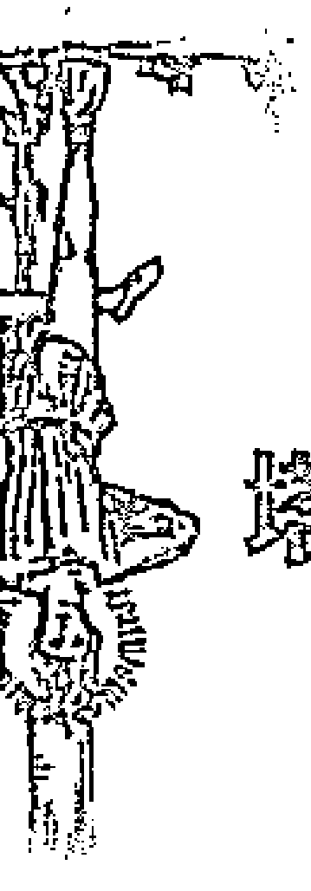

### 11) 矯正：化不適為良藥

我們可以把逆位牌看成不適（至少是可能演變成不適的壓力），也可看成良藥：「殺不死你的，將會療癒你。」根據《美國傳統英語辭典》（American Heritage Dictionary），「良藥」（remedy）是「用來恢復健康的媒介」，它以產生反作用的方式修正問題，於是反錯為正。「矯正」（rectification）也有「精餾」的意思，就像煉金術的過程：透過蒸餾和調整液態烈酒的濃度，來萃取、提煉出精華。就電學來說，這個字還有「整流」的意思，是指把交流電轉換成直流電。「良藥」的英文字根意為「採取適當的措施」，而「medi」也是「靜心」（meditate）的字根，暗示療癒和冥想一直是有關連的。有時當你深入逆位牌，你不只是探求結果，更想知道原因；你也經歷了所有越界的行為，那麼你就能穿越，來到另外一邊的世界。〈前言〉有更多與逆位牌代表的健康與良藥的概念可供參考。矯正逆位牌的方式可見第42頁。

### 12) 非傳統，薩滿，魔法，幽默

如果正位牌描繪的是傳統的智慧，那麼逆位牌描繪的就是非傳統的智慧。它質疑所有由正位代表的預設牌義。它不直接，反而很迂迴、瘋狂。每張牌都有你可以「看透並深入」的地方。你必須看穿那「看似為真」的面具。所以說，逆位牌可能有弔詭的一面。也許你需要有幽默感，你得到的訊息是別對這個情況太認真。逆教皇顯然是指「郊狼的能量」（coyote-energy）：以預想不到的形式出現的智慧和靈性。

薩滿和魔法的觀點會特別邀請你走入牌中，展開愛麗絲夢遊仙境般的旅程，帶回重要的訊息或領悟。它建議你從不同於日常世界的角度看待事物。它認為我們平常視為隱喻的其實才是活生生的實相，而我們所謂的現實只不過是一場夢罷了。這個觀點講的是「秘傳之學問」，也就是秘密或隱藏的學問。

### 其他技巧

塔羅占卜師總是在創造逆位牌的新技巧，這些技巧是從個人認為實相如何運作的信念衍生出來的。有些人（〈註釋〉中有他們的全名）還建議了以下的系統：

- 逆位牌有時會和前一張牌的正位牌義相近。新能量之所以無法全然展現，是因為你對前一張牌還有留戀。也許你需要回頭重新看看它的功課或經歷。所以，逆位牌可以「把你丟回」或「讓你回復成」數字順序中的前一張牌 ⑤。逆權杖五回頭反映了權杖四；逆星星可能要你思索關於高塔的課題。王牌可以回到十號牌，那愚者和侍者呢？自己找出答案吧。
- 如果正位牌義代表「陽性」或「主動」，逆位牌可能就是它「陰性」或「被動」的表現。注意背景的形狀（有點像陰影的意象），然後問問如果正位中的人走了出去，會有什麼樣的可能性從背景浮現出來？如果你把畫面中主動（正位）的能量刪去，那會剩下什麼？當我做著正位的事情時，我忽略了什麼？這種方法看的是當你略過平常扮演的角色或活動，會產生什麼間接、隱微的結果 ⑥？逆位牌也同樣指出靈性的訊息，代表來自「鏡中倒影，陰影或平行世界」⑦ 的影響力或訊息。
- 逆位牌可能是你無法指望的情況或人。同樣也可能代表你缺乏技術或才能，所以把它變成了問題或弱點。它也可能是指一個出錯的地方 ⑧。
- 有時宮廷牌或大阿爾克那的逆位牌，指的是和牌面上相反的性別 ⑨。
- 美國塔羅協會（American Tarot Association）的約翰·吉伯特（John Gilbert）提供了下述兩種方法：「逆位牌表示這些事情是……重大的問題，需要用最負面的角度來解這張牌。正位牌一定是用最正面的角度來看。因此，逆位的大阿爾克那牌表示你的靈性之旅走錯方向，你變得太過涉入這一世的物質世界的現實。所以，你需要看看你認為自己正走向何處，你覺得你正在靈性上做些什麼。」⑩
  這個建議是把兩種類型的意義套用在牌的方向上⑪。

|  | 吉利&正位 | 不祥或逆位 |
| --- | --- | --- |
| 錢幣 | 工作和事業 | 財務事宜 |
| 寶劍 | 點子 | 擔憂和顧慮 |
| 聖杯 | 人際關係 | 不成熟的情緒 |
| 權杖 | 直覺 | 意志力和決心 |
| 大牌 | 靈性道路 | 物質（非靈性）道路 |

## 判斷要使用哪種逆位牌的涵義

一張逆位牌可能同時會有好幾個特點在共同作用，產生多重的意義。逆位的皇后（正位牌義包括女性化、照顧、連結）可能表示（逆位的關鍵字以粗體表示）沒有用女性化的方式行事。若更深入去看，這可能是因為你正在突破家裡要你照顧人的模式，或是你抗拒母親對你很冷淡的影響。不過，特別是當你在心中質疑社會對女性的期許，想探索如何在不滿足大家的需要和期許的情況下，活出你的女性面時，你真的可以認為你的舉動會帶給你力量，而不會使你缺少什麼。所以說，你可能是在反抗規範，探索神聖女性的一切。

不過，有時太多的可能反而令人困惑。如果你的解牌風格主要是預測未來，或是處理一些需要答案非常明確的問題，那你可能需要選擇一個相當精準的系統。如果你最在意的是洞悉靈性和心理，那你就會欣然接受不精確的問題和答案，因為這會讓你去探索原型多重的意義。

若你是塔羅占卜的新手或是你需要簡化，你可以只採用下面其中一項就好：

- ▲ 記住每張逆位牌的涵義。不過我發現強記牌義很困難，所以這是我最不喜歡的方法。當然，這也會阻礙你臨場應變的能力和答案呈現的廣度。然而，如果你常用的是法國和義大利傳統那種獨斷的解析，例如逆聖杯八代表「祖父」，正位的錢幣九代表「祖母」，那你就非記不可了。
- ▲ 抽到逆位牌的時候，你只選兩到四個類別或關鍵字來用。你可以從上面「十二種解讀逆位牌的方式」或〈附錄 A〉的「逆位關鍵字」中選擇。不然就試試瑞克里夫（James Ricklef）的五條記憶法「遲、降、反、黑、變」⑫：
  - 1. 原本的效應延遲出現。
  - 2. 原本的效應降低。
  - 3. 和原本的牌義剛好相反。
  - 4. 原本牌義的黑暗面。
  - 5. 方向改變。
- ▲ 看看牌陣裡其他的牌之中，有沒有什麼反覆出現的主題、符號、顏色或動作，一起呈現出某種細微的涵義。例如，在逆寶劍十的後面出現權杖王牌，可能表示你突破了舊的循環，來到了新的起點。逆星星和聖杯三可能表示很多人一起進行祭酒的儀式，而非私下舉行；同時抽到逆星星和逆權杖六可能表示當你的成就沒有受到別人注目，你的自尊心就動搖了。
- ▲ 用「逆位關鍵字」（〈附錄 A〉）為每張逆位牌選擇最適合用來調整的詞彙，並使用下面這個直覺式的技巧：閉上眼睛，把紙轉到不同的角度，然後指向其中一個詞。用離你手指最近的詞來調整正位的涵義。
- ▲ 仔細看看逆位牌的畫面，看這個新呈現的畫面有沒有打動你。例如，有人認為逆寶劍九中，那些平行的劍看起來就像通往地下室的梯子。逆钱币五里面的窗子变成了门。逆宝剑三和逆宝剑十里的剑好像从心脏和背部掉下来一样。

- 当你在琢磨该怎么看这本书或其他著作里建议的涵义时，可以把它們变成开放式的问题（如何？何时？何地？什么？……等等），让问卜者回答。
- 我最喜欢的方法是请问卜者形容正位牌给我听（这时不要做任何的解析），包括画面中人物的态度、感觉、心情。然后运用你对正位牌的认识，听听看有没有反常的地方，也就是任何和常态有出入、有悖常理的地方。例如，若问卜者形容正位的圣杯九里面的人很不快乐、不满足、杯子是空的，那么这和正位牌的意义不怎么吻合，比较像是在描述问卜者的“不适”，而且他预期他的愿望不会实现。此外，当问卜者的描述严重偏离“正常”的正位牌义，你或许会感觉到这表示他有深沉的痛苦、他在否认或他缺少体悟。想多知道一点的话，可以请问卜者就空杯编一段小故事，然后问他目前在生活中如何经验到这种情况。
- 和问卜者一起看看几个可能的解析，问他觉得哪个最符合。
- 使用删去法。和问卜者一起判断哪些解析不适用，看看最后剩下什么。
- 将前述所有的解读方式全部派上用场，对牌阵中的每张逆位牌都采用不同的方法⑬。记住，多元的意义会增加你解牌的深度。

## 「矫正」逆位牌的方式

如果你或你的个案抽到了一张逆位的塔罗牌，却想要得到它正位的意义，那有没有补救的办法呢？当然有！塔罗占卜的重点是帮你觉察到你用目前的态度创造出了什么，以及你有什么选择。透过解牌做完整厘清和确认之后，它可以帮你做出新的、有意识的决定。虽然有些情况比较难改变，但你所做的每一个决定和举动都会创造出新的未来。因为正位和逆位的意象都属于这张牌的能量，所以它的一切都是向你开放的，只不过你会觉得好像要跳过障碍，或是在泥沼中前行。基本上你必须发挥想象力，尽力达成你想要的改变。

## 帮你「矫正」逆位牌的方法包括：

- ▲ 测量它。想像你把一张牌的涵义全都标示在一个半圆的计量器上（像瓦斯表一样），两端分别标示着最有帮助的和最严重的解析。你给两端分别举个例子。想像你的前臂是这个计量器上的针，把你的前臂从一端转到另一端，最后停在你觉得能代表你现况的点上。描述这个点和整体意义的关系。然后，移动手臂，直到它停在你「希望」成为的点上。大声说出这个你比较喜欢的点在整体的牌义上代表什么。
- ▲ 激发它。在解牌后的两天内，表现出或象征性地传达出你想要的那股能量。比方说，你想要感觉更好玩，那就去游乐园。这叫做模仿的魔法，你模仿你想要创造出来的东西。
- ▲ 梳理它。看着同一个牌组里前一个数字的正位牌，想想看你对它是否缺少某种理解，才会妨碍了你的进步。把缺乏的部分补足，或回顾前一张牌的课题。
- ▲ 说出它。看着逆位牌上颠倒的人物，问它们问题在哪里、它们希望你怎么做、你接下去该怎么办。说出或写下第一个浮上心头的想法。如果你觉得很困难，那就随便编个最愚蠢的答案，然后再从这个答案继续你的对话。至少按照其中一个来行动，无论那有多微小。
- ▲ 演出它。尽力演出逆位牌上的画面，然后把牌转正，再演出一次那个画面。你需要怎么做才能从第一个画面前进到下一个？
- ▲ 观想它。运用你的想象力，把牌的涵义延伸得愈远愈好，或是在安全的状态下演出那些极端来深入逆位牌。根据〈第一章〉讨论过的「物极必反」原则，当你够极端，能量就会反转，然后你就能经常洞悉问题的根源，出现“我知道了！”或只是一种如释重负的感觉。好比说，你抗拒逆审判中描绘的“召唤”，那你就用手捂住耳朵，然后反复说或大吼：“我不要听。我拒绝。我就是不听。”之类的话。做一阵子你就会明白你“真正”拒绝听的是什么了。这可以将你的能量从某个情况中释放出来，而这个情况说不定其实还不完全是妳真正的顾虑。
- ▶ 追踪它。描述一下正位牌与逆位牌。当有令你心烦的情绪触动了你，你就发现了一个“危险区”；把它当成一条线一样地追踪它，或当成一条生命线带你回顾过往。当你回首那些事件时，试着让情绪像当时你所感受到的那样鲜活。一直顺着这条情绪线前进，直到你能看到最早的场面出现为止。留意你的情绪对过去那个场景有什么反应。你可以用慈悲的心原谅年轻的自己吗？通常，光是重新经历以前的情况，就能释放眼前的情况带给你的压力和紧张了。

注意：你不必非把逆位牌转正不可。说不定你对它的预兆非常满意，或是愿意观察这能量将如何自然演变。学会欣赏它的奥秘吧！那么，你就能把它当成生命献给你的丰富经验之一，欣然接受了。

## 把逆位的牌义应用在正位牌上

逆位的牌义也可以用在正位牌上。举个例子，逆权杖七可能是“大家都要来整我了”的被害妄想。不过当正位牌受到扭曲、挑战，或是代表一个问题时，这个意义也适用。遇到下列情况时，逆位牌义也适用：

- ▶ 在牌阵里，其中有些牌位的意义包含逆位关键字的其中一个（见〈附录 A〉），或是包括像“核心问题”、“最重要的挑战”、“什么在反对你”这类的概念。
- 有其他的牌用像是“相对的元素”（见〈附录 C〉的“四大元素特质表”）或“交叉的牌”，在动摇、干扰或削弱你正在探讨的牌。
- 其他的牌也反复出现同样的主题，让牌想要传达的东西变得十分强烈（无论是过度还是不足）。
- 解牌的重点放在一个人内在的修炼和动机、人生目的、灵性之旅或心理的层面。因为逆位牌会很自然倾向强调原因、动机和内在的生活。
- 解牌的重点放在一个人的问题、不舒服的地方、“不适”、障碍、担忧或错误。
- 解牌探讨的是萨满或魔法的层面。

记住，逆位牌通常代表在牌全部的涵义中，原本就存在的极端。

## 更进一步的做法

- 想一想逆转、上下相反、颠倒、反转、倒转这些字对你的意义是什么。
- 留意你在占卜的时候，看到逆位牌的反应。你是否预期会有坏消息、失败、困难，还是你相信这表示一定是某人的错呢？例如，有些人相信逆位的宫廷牌表示有人想对你不利，或是他令人不悦的个性为你的生活带来难题。这些预期心理是从过去的经验中产生的吗？
- 翻到“逆位关键字”（〈附录 A〉）的列表，选出十二个你认为对逆位牌而言最意义重大的字。把这列词汇缩减成最主要的三到四个字。随意从一副牌中抽出几张牌，看看你选择的关键字适不适用。
- 看一下“逆位关键字”的列表，把所有对你没有意义的关键字都删掉。
- ▲ 创造你自己的逆位牌分类手册，用几张不同的牌测试一下。留意哪些类别在实际运用的时候是有意义的，而哪些在你自己解牌的时候最为有效。

接下来我会提供牌面的范例解析，呈现本书提到的原则如何更动现代和传统的意义。只要将这些解析视为你直觉认知的起点或启发即可。

## 注释

1. 参见〈前言〉的“特殊词汇”，有 Rx 符号的趣味历史，在此代表“逆位牌”，医药业则用来指称处方。
2. 见“特殊词汇”的“投射”。
3. 这类原型牌包括：Motherpeace（和平之母），Daughters of the Moon，Tarot of the Cloisters，以及纽西兰牌 Songs for the Journey Home。
4. 多年前，Nina Lee Braden 在我于 Omega Institute 举办的塔罗工作坊和我分享了这个观点。她在个人精彩的网站上讨论她对逆位牌的想法。
5. TarotL 的 Rita Moore 和 Sherry l Smith 都分别提到了这个效果。
6. 源自 Tom Tadfor Little，他和 TarotL 分享了这个观点。
7. “比较塔罗”讨论社群的 Eva Yaa Asantewaa 和 Little 对逆位牌的想法差不多。
8. Ballantree Reprints 的出版商 John Ballantree 在他的著作 Tarot for the Millennium 为逆位牌下了这个定义。
9. 感谢 TarotL 的 Patty Keaney。
10. 美国塔罗协会的吉伯特鼓励你要“有一个完善的系统，别把这些事情交给直觉、想象力或爱推论的头脑。”他在二〇〇〇年 ATA News 的七、八月号上，发表了解析逆位大阿尔克那的推荐书单。
11. 出处同上。
12. 摘自瑞克里夫的塔罗专栏，其中包括精彩的“Ask Nighthawk”，在许多塔罗刊物中都看得到，目前也已编辑成书。
13. 纽约市塔罗学校的 Wald Amberstone 和 Ruth Ann Brauser 认为这是他们最好玩、最有启发性的方法。

# 大阿尔克那解析

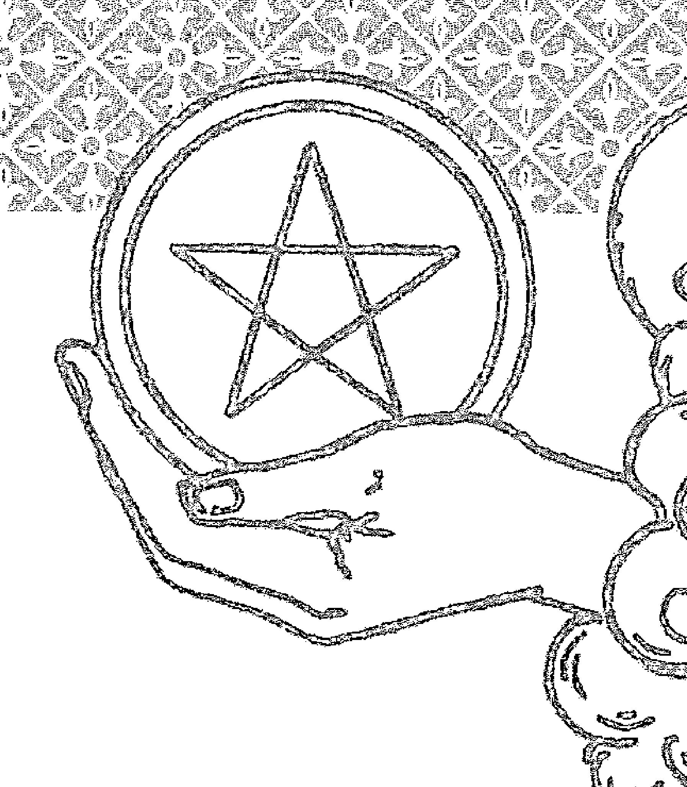

# 愚者（The Fool）

这张牌代表正要显现的大灵，这时所有的可能性都是存在的。你或许正处於人生一个新的起跑点，你轻装便捷地上路了。也许，你正展开新的事物，但你所知不多，也没有多想。愚者是活在当下的，他用新鲜、兴致勃勃的眼光看待事物。这张牌让你能够挥洒奇想和想像力，带你迎向引人入胜的可能性；不过，它本身缺乏魄力，无法有始有终。你受本能驱使（通常由狗或山猫作为象徵），你追求的可能是古怪的奇想。比方说，你可能觉得有什么一直“挥之不去”（dogging you），促使你变得更傻气，驱策你去追寻全新与冒险的事物。

你可能把责任放在一边，渴求一种你无法名状的东西。你或某个认识的人，可能表现得像个小孩，展现出有热忱、很自由或愉悦的样子。你可能表现得很愚蠢，或是以超乎冷静的态度做事，冒着若非英明就是愚蠢的风险。你的行为可用不理智和好骗来形容，甚至可说是没脑筋。你可能会因困惑和不负责任而造成混乱，也可能令人耳目一新。愚者代表对大灵有绝对的信任，或是像疯子、白痴一样地胡搞。它谈的是虽然所知不多，却敢於学习的意念。

有时愚者也被视为浪子、游民或是无家可归的人，容易饱受骚扰之苦。你或许缺少“正常”的观点或目标，没有目的地，毫无头绪。你也许有能力现身於任何地方，但却又是没有力量的。你或许觉得自己受人摆佈，或是任人宰割。你随兴的行动背後可能其实思虑并不周全，结果不小心洩漏了原本该保密的事物。然而，因为你没有目标，也没有目的地，所以你不可能迷路，也不会失败。

传统涵义：疯狂，愚蠢，痴呆，愚行，夸张。误入歧途，错误，脱序。声名狼藉。陶醉，激动，痴狂。盲目，著迷，错觉。背叛。没有知觉，不理性。天真。不受压抑的色欲，不道德的。胡说八道。慰藉或弥补。

# 逆位的愚者

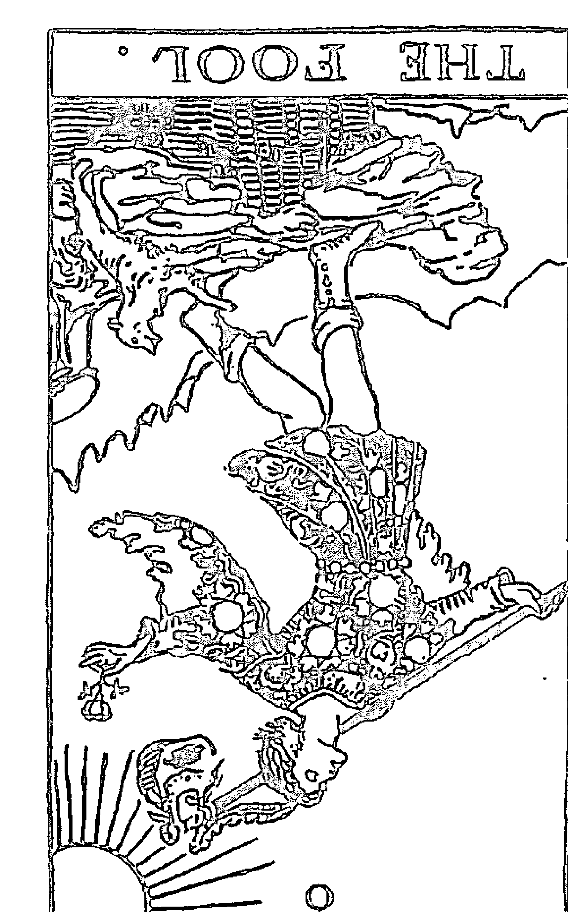

逆愚者是不会去冒险的；另一个极端是，他会放肆地、鲁莽地冒险。有时候它表示你要小心，或是你该长大了，负起成年人的责任。它常会限制或否定不受拘束的精神。你的生活可能缺乏冒险，或是你抗拒旅行的机会。正位愚者的纯真在现代解析中，就像一种神圣的防护罩，但逆位牌描绘的却是他摔得很惨。你可能不希望被当成傻瓜，因此非常害怕做出蠢事。也许你不信任某个情况——无论这种感觉是不是对的。你坚持传统和安全的方法，或许还把限制视为理所当然，或是你无法信任未来的发展。此外，你也可能很懒惰、麻木。因为你不知道该从哪里开始，所以感到浮躁、漫无目的，或是认为别人排斥你。你可能觉得大灵遗弃了你，或是心中充满悔恨。别人也许不会认真看待你的懊悔和想弥补的意图。

你或许想重新琢磨你可能会做的决定，考虑其他的选项。也许你没注意到某个警告，没有听从直觉，或粗心大意、轻率行事。比较古老的牌面上，有一只狗或猫把愚者的裤子扯破了，表示你可能试着“明哲保身”，避免有人扯后腿，或是想要掩饰错误。你在追求的可能是件“蠢事”，你白白浪费了时间，徒劳无功。你也许正在尽力避开可能会发生的尴尬情形。

如果你把这张逆位牌投射到别人身上，你可能会认为他们很天真，但没有责任感、有勇无谋、长不大。他们无知的滑稽举动把你搞得神经紧张，不愿信任他们。在心理学上，这代表的是你的“内在小孩”，当你不承认它，它就会在不适当的情况下爆发，不过当你承认它，它就能让你优游於各种情况，对不同的机会保持开放。就牌面而言，也可能是一个你认识的小孩有问题。逆位牌也表示你突然对你以前认为很傻的人或事改变看法了。

从萨满或魔法的角度来看，逆愚者表示将自己交给上帝或大灵，就像流浪的苦行僧，带着化缘的钵，像个不会骗人的傻瓜，或是因天真无邪而得道的小丑圣人。它的意思是在日常的事物中找到魔法。它也展开了一段没有终点的开悟之旅。

传统的逆位牌义：随便，不好的决定，笨拙，粗心大意，分心，愚蠢。低能。鲁莽。缺席。麻木，精疲力竭。没有价值，空虚，琐事。错误。犹豫不决。缺少物质资产。抛弃。徒然的懊悔。

# 魔术师（The Magician）

这是一张关于“我，我自己，我是”，古语中的“自我”、小我或我执的牌——所以这可能是单指靠自己在做一件事。它讲的是在工具、技术和能量的支援下，专注意识，把意志力集中在一个任务上。你有意识地自觉到，你是个独一无二、有创造力的个体。你或许正在用你的头脑、技术和机敏，来组织或运用点子和材料。你可能正展开行动，发想出新的点子，和别人沟通。你也许正为自己宣传，为计划定调，或运用具说服力的战略。你或许正一个人工作，或独自为一个结果负责。如果你和别人一同工作，那你需要有自主权。若你是促成者，你会引发改变；若你是网路串联者，你会连通并创造连结。这张牌代表的是使用语言和沟通的技巧。你或许正在写作、演说或使用某种新的科技。这张牌也代表机智、灵巧和精明。它有机敏的本质，代表了弹性和千变万化的能力。你可能正在建立人脉或促进某种互动。最糟的情况是你用骗术和狡诈去促成一个假象，玩弄事实来满足个人的目的。它可能代表一个年轻人，或任何像年轻人一样机敏、有魅力的人，有能力使人著迷，如同荣格所谓的“青春永驻”，或沛尔和沛兹。不过，传统的意义认为你或某个你认识的人，可能表现得像江湖术士、骗子或吹牛的人；根据更现代的意象，可能是像园丁、诗人或艺人。魔术师常常能使事情发生。韦特牌上的花表示你也许在酝酿、准备或精炼材料，而这是一项大计划中的第一步。你可能正在把一个局面转变成更有利于你的需求。

传统涵义：技术，机敏，手艺，花招。公关，口才。适应力。意志，意志力，意图。自信。原创。开始。狡诈，瞞骗。虚弱，生病，疼痛。麻烦，损失，灾难。

# 逆位的魔术师

逆魔术师让我想说“不是我，不是我干的。我根本不在场。”的年轻人。事情可能跟计划中的不同。这也许是个棘手的状况。你可能必须放下你的责任，或放下一个情况。或许你没有必要的技能（不适任），或你无法独力完成（能力不足）。想想看你是否把焦点放错了地方。你的计划也许不够完备，需要重新想过。逆位牌的危险是：你会变得过分自信或自信不足，你可能揽下了太多事情，或是力有未逮。你可能像魔术师的学徒一样，开始了一项你无法完成的事。

也许你和表面上看起来的不一样。魔术师拥有的变身能力很容易成为欺骗的手段，包括朦骗自己和别人。你可能降低品格，以自私的手段或大胆的心机，达成你的目的。再加上你的意志薄弱或推托之词，这些能量就演变成一场个人的灾难了。作为一张代表希腊神赫密斯（Hermes）的牌，它的逆位强调了小偷、骗子、花言巧语的一面，就算只是些小事。或者，它也许是代表你很乖戾、任性。你的危险在於滥用尚未发展成熟的个人力量，或是你在幕後操控一切。

也许你感到寂寞，或厌倦了什么事都自己来。你可能没有自信去建立友谊。说不定有困难在阻碍你着手一件事。沟通也许受阻或方向错误。你或许感到悲观或愤世嫉俗。

如果投射在别人身上，他们的俗艳、炫耀与机灵可能令你感到迷惘，你不知道他们是否会攻於心计；或是你认为他们是性急、没什麽经验的专业人士，自以什麽都知道，想不计代价跑在前面。就内心而言，你可能正致力於自我发展，灌溉内心的花园——在自己身上施展魔法。

健康方面，可能会有心理或神经方面的疾病，或是指处理这类疾病的治疗师。

从萨满或魔法的层面来看，他是一个算命师、巫医、炼金术士、草药学家，在今日的世界里可能是医生、整脊师、心理治疗师或灵疗者。根据福尔丘（Dion Fortune）的定义，魔法是一门“随心意改变意识的艺术”，因此魔术师拥有改变意识、看穿幻象的能力。

传统的逆位牌义：意志薄弱。心理或精神疾病。头部的伤害，折磨。耻辱，不满足。优柔寡断。医生，法师。吹牛的人。江湖术士，冒牌的人，骗子，小偷，剥削者。隐瞒，幻术家。煽动者。

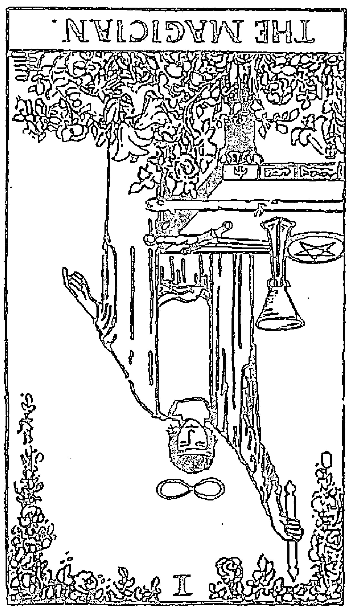

# 女祭司 / 女教皇（The High Priestess / Papess）

若说魔术师代表的是自我，那女祭司代表的就是知识了；两者合在一起，就引发了自我认识（self-knowledge）。女祭司的知识只能透过符号的面纱看见，只会用心情或情绪的方式传达。

这张牌指的是花时间独处，与世隔绝，留意你身体和本性的自然节奏与循环。它表示你或某个认识的人可能表现出神秘、冷淡、漠然的举止，却又很仁慈地给与指引和体谅。它代表你心里有秘密，或是你注重隐私。你寻找更深的意义、灵性的目的或价值的举动，让你的生活和工作有了更大的价值。可能有睿智的女性、谘商师、调停者给你忠告或协助，或是你成为别人充满同情心的倾听者。隐藏的动机或看不见的因素可能会影响决定或谈判的结果。你可能和某人很有默契或直觉的连结，或是你像他的“灵感女神”。也许你透过一次性经验而有了蜕变、疗愈的体验。贺尔蒙周期可能会影响你的感知。这张牌代表一段独自沉浸在梦想、静心或心情的时光。你可能在寻找内心的指引，或透过谘商来找出你的道路——中道——不想为极端所困。偶尔这张牌也表示有来自前世的影响。若你渴求知道秘密，女祭司建议你一定要先统合那些相对的极端。

这是奥秘的国度，也是内在女性智慧的领域。你可能表现得像传达神谕的通道，像在知识的月亮潮汐与循环里漂浮的处子。你在自我认识的神圣界域、教堂或圣殿里，揭露了那隐密的、秘传的、秘密的内在本我。直觉是你的心灵导师，是你梦想的守望者。它也可能暗示你需要记得某件事。如苏格拉底所言：“所谓的学习，只不过是一个记忆的过程而已。”

> “所谓的学习，只不过是一个记忆的过程而已。”

传统涵义：奥秘，秘密，智慧，知识。尚未揭晓的未来。直觉。闭关，退休，圣殿，隐退，静心。静默，谨慎，庄重，深谋远虑，和平。学习，教育。记忆。女性的问卜者，或令问卜者感兴趣的人。

# 逆位的女祭司 / 女教皇

逆女祭司可能表示难以接通直觉，记不住梦境，或不太知道自己的感觉。你可能没有连接到内在的女性智慧，或是你否定它。有些人觉得和正位牌深沉的暗潮相比，逆女祭司反而是比较舒服的。一个极端是你不再矜持，完全放开，在肤浅的一时潮流和调情中浪荡。另一个极端是你变得更加拘谨、认真务实或内向，可能还觉得你被困住了。你也许像个壁花或荡妇，或是在困境中折腾，因为没有更多选择而坐立不安。不然就是你敢於跳脱别人的期望，拒绝当个逆来顺受的人，而可能被贴上母夜叉或巫婆的标签。有时候，逆位表示缺乏女性的友伴，或是被女性背叛。整体而言，它为人际关系增加了肤浅和距离感，不然就是在独处一段时间之后，重回世界。

虽然多了寂寞和缺乏自信的感觉，但你可能还是毅然决然地“靠自己”。有时它代表性的激情、诱惑、放荡，或是你不想要的性接触。也许你的纯洁被玷污了，不论是实际上还是象徵性的。如果你像别人的启发者、镜子或调解人，你可能会觉得失去了自我，怀疑自己的身分认同。有人洩露或拒绝承认秘密，暴露了私密的谈话；阴谋可能会瓦解人与人的互动。你平静、善於包容的外表可能会变得浮躁不安。

当你投射到别人身上，你不是觉得对方神圣不可侵犯，就是觉得他不理性、放荡、不可靠。你可能会怀疑他其实很冷漠、肤浅、不真诚，或是坚持相信他细致、脆弱的样子。因为女祭司反映的是你的阿尼玛，所以逆位反映出的涵义可能会让你不安。

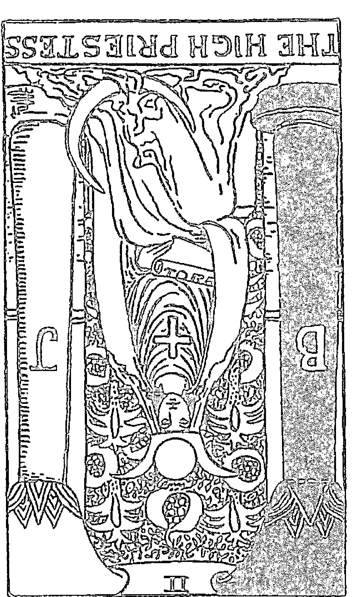## 皇后（The Empress）

就健康而言，女性可能有月經或其他女性健康的問題。任何一種週期都可能被干擾。因為這張牌跟月亮有關，所以可能會有因荷爾蒙而產生的情緒波動或「精神錯亂」（lunatic，譯註：字根為月亮，古人相信瘋狂的行為是受月亮的週期影響）的行為。用藥方面可能需要做些調整。

從薩滿或魔法的角度來看，這是個可祈請女神從黑暗的地府現身的時機。它代表月亮的儀式、女性的祭典、秘密組織，以及女英雄之旅中崎嶇難行的幽冥之路 ①。它也代表出神狀態和夢境治療、占卜、通靈、巫術和靈魂附身。

傳統的逆位牌義：激情，熱情，歡騰，生氣勃勃，滔滔不絕。騷動。辛辣。表面的知識，膚淺，無知。自私。陰謀，秘密的意圖，虛偽。秘密揭曉。錯誤的判斷。懶惰。

傳統上，這是母親／愛人的牌，指女性面及創造的生命力。皇后代表大地和人類生育力的富饒與旺盛。她促進並滋養萬物的成長與發育，把相異的元素整合成和諧的整體。她是維納斯——阿芙羅黛蒂，是愛與吸引力的化身，強調與別人交際和連結。你可能正在享受感官的歡愉，盡情享受你的女性面，或是在吸引某個人。這張牌指出你母親的影響，以及你自己在照顧和養育別人上的問題。你可能在生產或誕生某樣東西：有創意的點子、新的產品或小孩。有時這暗示懷孕，在早期的解析裡也代表婚姻。

韋特牌的皇后身在花園中，代表自然環境、園藝、美化環境、做菜、栽種植物或提升自己。你可能很在意外表，想改變髮型或穿衣風格，或想在身邊創造美好的事物。你欣賞有美感的東西，享受精緻的物品。也許你關懷環境或是你社區中的文化。你可能用娛樂、幫忙或招待的方式運用你的社交技巧。對男性而言，這張牌可能代表你生活中的某位女性，也很有可能代表你的內在女人（榮格的阿尼瑪），或是你有能力展現培育和照顧的特質。你可能正在完成一項計畫。有時它代表一個你想表示敬意、愛，想去吸引或保護的人或機構，或是一個你想遵守的象徵性原則，例如大地之母、家、「有媽媽的味道」，或是「慈善」。若你為人父母或長官，你可能會用能促進和睦、互動和身體健康的方式表現你的權力和權威，也期望你的地位能夠獲得同等的尊敬。

- 傳統涵義：
  - 生育力，多產，財富
  - 母親，姊妹，妻子
  - 婚姻
  - 忠貞，理想主義
  - 優雅，魅力，謙恭有禮
  - 社交
  - 行動，計畫，從事
  - 行動，運動，進步
  - 隱晦，偷偷摸摸，未知
  - 符號，人物，意象，隱喻

### 逆位的皇后

逆皇后可能是把人壓得喘不過氣來、苛求或是缺席的母親，也或許是不想變得像你母親一樣。這種負面的女性特質還包括放縱、虛榮心和膚淺。相反地，你很有建設性地在否定或拒絕傳統的女性角色，或決定不生小孩。它可能代表墮胎、流產、子宮切除、不孕、性冷感、離婚或守寡，不過還要有其他牌支持這類解析才算。你可能沒有好好照顧自己或別人，或是你表現得太無私、太慷慨了。也許你太揮霍了，你過度放縱，結果不得不節制預算或節食。你不覺得自己特別有吸引力或性感，或是你放著家事不管。你因為昏睡或懶惰而猶豫不決，沒有行動。你或某個認識的人可能對一項計畫喪失了興趣或撤銷了贊助。你覺得自己因為性別或女性特徵而被剝奪了權利、失去力量，或受人蔑視。有時它代表「空巢期」（empty house）症候群，你感到孤單和沒有用處。

在逆位牌中，正位的生產力和創造力可能會轉變成失控、不健康的生長。你可能缺少界限，計畫不斷擴充，最後因為變得太龐大而無疾而終。你也可能覺得缺少創意，或是因創造力被否定而感到氣餒。就健康來說，它可能指營養或甲狀腺異常，或是腫瘤和囊腫這類需要由身體提供生長環境的病變。

因為這張牌和社區、交際有關，所以逆位牌可能表示譴責、不認同傳統無法接受的行為，尤其是不合規矩的禮儀、享樂主義、角色對調、非法的結合、婚外情或私生子。如果你把皇后投射在別人身上，這點可能會更加明顯。她也是榮格所謂的「發光的陰影」（bright shadow，譯註：指自己美好的特質，和「黑暗的陰影」相對。有時我們會把自己的優點投射在別人身上，看不到自己擁有這些特質，例如覺得某人很有才華、有魅力等，但自己沒有）的化身，是無法實現的理想女性——無論是母親的形象、選美王后還是模特兒。不然的話，你可能會認為她過於防衛或是有毀滅性。就內心的層次而言，你會覺得真實的你沒有被接受，或是你用傳統的女性特質來掩蓋你的真我。

從薩滿和魔法的觀點來看，她代表女性創作者、大地之母、大地的魔法，包括遇到有神聖女性特質的地方及自然的力量。這張牌也表示遇到女性和大自然恐怖、毀滅的一面。基本上，各種形式的愛和豐饒的魔法、草藥和酊劑（tinctures）都會在這裡出現。

傳統的逆位牌義：裝模作樣，虛榮心，輕薄。躊躇，浮躁。懶散，無力，沒有行動。焦慮。不孕，不忠，勾引。沒有愛心。物質的損失。白天，清晰，光，真理。方便，安適。開啟。

## 皇帝（The Emperor）

這張牌代表父親、為人父、內在男人，以及年紀較長、陽剛、如父親般、權威以及專業的人士。皇后掌管的是心，而皇帝掌管的是理性。他是整個有機體的統領，用理智和邏輯當個仁慈的獨裁者。這張牌顯示你有能力制定規則、立下界限、任命和定義，以及分析你的領域。它表示你正在開創、建造、進行，或是管理、命令、建立。你以女祭司和皇后的感覺與想像力為基礎，現在要展開創新的計畫和組織。這張牌代表精通，你有知識和專業能力。你可能正在確立領導權、取得權力，或是承擔責任。這個情況代表一個機會，你可以果敢、堅定地行動。對男性而言，這張牌可能代表社會對你的期許，或是男性情誼，以及決定誰能取得優越地位的競爭行為。無論你是哪一種性別，它可能代表你內化的父親在認同或否定你的舉止，界定你該有什麼表現。

這張牌要你承認屬於你的權威，或是覺察到你在哪方面放棄了這個權威，或是你賦予了誰這個權威。你對這張牌的反應代表你和權力、法律、秩序的關係。工作上，你可能正在執行任務、做決定、展開計畫、分配資源，或是你聽命於一個在做這些事的人。它是主管、老闆、負責人那種負責掌管的態度，也可能代表政府或軍隊。皇帝鼓勵你在階級架構中表達你的願景，設定目標，打造並引導你的未來。你可能也在劃出疆界，或是用策略來武裝自己，以避開攻擊、意外或擾人的情緒。你或許正為倚賴你的人建立穩定感和保護。這張牌代表男子氣概，對外展現你的意志力。

- 傳統涵義：意志，力量，權威，法律。保護，穩定，肯定，信心，確信。實現，成就，達成。理智，邏輯，智性，原則。父權，陽剛，男子氣概。領導，支配。契約。公司。

### 逆位的皇帝

逆皇帝經常代表一個不那麼慈愛的獨裁者，是個專制且自以為是的暴君。不過也可能是相反的意思：意志薄弱、膽小怕事、沒有男子氣概的懦夫。然而，它的角色通常介於兩者之間，例如父親或老闆；你的領袖背叛了你的信任，他收回支持、保護不了你，或是他無法堅持原則。這裡它代表缺席或沒有用的父親、失敗的領袖，也可能代表虛妄的驕傲——穿新衣的皇帝，成了一個小丑。逆位牌表示你可能突然間地位降低，你的王國瞬間被推翻。

你可能在搖擺、退出挑戰、失去控制，或是行使過多的權力。你沒有在建立界限，反而在創造障壁和路障。你沒有強化決心，反而變得太死板而無法動彈。也許你一直都太倚賴所謂的理性和「事實」，沒有空間接受不同的見解。你可能太愛批評、批判，或自以為是、競爭心強，有父權主義的心態、沙文主義的態度。逆位牌代表的是用權力或較強的身體、理性力量來支配別人的人。如果你把權威讓給別人，最後可能會侵蝕你的自信，讓你覺得缺少自我價值。

另一方面，你也可能拒絕某些男性的特質，或正在突破傳統的男性刻板印象，想定義出新的可能。如果有其他牌相呼應，這張牌可能表示不成熟或衰老，或是不符合傳統的性趣和性傾向。也許此刻你和男性沒有什麼來往。逆位牌也可能代表內在男人（榮格的阿尼姆斯）、內化的父親和權威，他可能保持不認同和吹毛求疵的態度，或是提供你與現實世界的運作有關的明智指引。

至於對別人的投射，可能會出現各種情況，不過有時你會賦予對方一個理想的專家形象，或是把他們當成暴君或傻瓜，施虐者或受虐者。

這張牌也可能代表對手，從王座上摔下來的前任英雄。健康方面，包括痛風、頭痛、失去男性雄風和精力、前列腺的問題、意外、受傷和創傷後壓力症候群。

從薩滿和魔法的層面來看，這張逆位牌代表亞瑟王傳說中受傷的漁王（Fisher King），他負傷之後，國土也隨他一起荒廢了，只有當聖杯（神聖）重回人心，他才能痊癒。它代表男性的成年禮，象徵教導年輕人、堪稱為典範的公民領袖或長角的神（horned gods）。

- 傳統的逆位牌義：
  - 保護
  - 慈愛
  - 慈悲
  - 善意
  - 對立
  - 障礙
  - 中斷
  - 固執
  - 不成熟
  - 沒用
  - 猶豫
  - 偏見
  - 暴君
  - 性格軟弱
  - 濫用權力
  - 失敗
  - 劫持

## 教皇 / 教宗（The Hierophant / Pope）

這張牌講的是教導、諮商和學習。教皇代表你生活中的「應該」和「理應」，和傳統的價值觀與既定認知有關。教皇教育你從神祇、社會和政府創造的律法，培養你的良知。至少在理論上，這能夠確保你會遵守禁忌，服從戒律。就目前而言，你可能在上課或教學，學習怎麼做是有用的，時間已經證明什麼是有效、有意義的。你或許專注於解決問題，著重把靈性真理實際應用到生活中。你可能在尋找秘訣，想加入社團、找到一種生活方式或進入下一階段的成長和改變。也許你希望透過上師、宗教或個人成長課程中當紅的講師來找到這些東西，或是靠你自己尋找。

像女祭司一樣，你可能會尋求或給與建言，不過這張牌顯示這建言依據的是已證實的來源。你可能在面對大型機構或組織、「體制」或「市政府」。對一些問卜者來說，這張牌可能代表施工的品管員，他拿著他的委任暨法規手冊在維持標準。當你可以用容易理解的方式說明專門的知識，晦澀難解的過程也變得更好懂了。有些人認為，這張牌上的人物是親切、樂於助人的良師益友或諮商師，但有些人像一九七○年代早期解牌的人一樣，覺得他很武斷、僵化，拒絕接受質疑的態度。

「教皇」這個詞指的是透過可理解的角度揭示神聖知識的人，因此，對你的內心而言，它代表發揮你的才華，或是你與生俱來的長處和精神。你也許會找教會或寺廟來為你指路，或是投入靜心和靈修。上帝的賜福、祝願和赦免原罪是具有療癒力的。你可能一心信仰更高的力量，或是立誓投入某條道路。

- 傳統涵義：靈感。結合，連結，結盟，婚姻。囚禁，奴役，限制。仁慈，善意，親切，寬厚。責任，道德，良知，順從。體面，含蓄。原諒。教學。好的建議。

### 逆位的教皇 / 教宗

逆教皇表示你在質疑傳統的道德觀、不遵守規矩、懷疑或誇耀道德原則，或是排斥你的宗教訓練。它代表「局外人」，或離經叛道的意識。也許，「質疑權威」的時候到了。你希望選擇自己的標準，而不是接受「當權者」的規範。你可能在和「既有的體制」對抗，包括宗教的、企業的、政府的或教育的體制。你或許渴望參與市民的反抗運動或想徹底反叛。也許你的良知正使你不安。那些「應該」和「理應」使你疲乏。你正在思索一些邪惡的、不道德的、沒有原則的事。如果是每日的解牌，它可能純粹表示不恰當的行動，輕微的「罪惡」，或是某件令你感到羞恥的事物。

另一方面，它可能表示太過僵化或武斷。你可能執著於過時的想法或不適當的原則。也許你嚴苛地批判自己，或是容許別人擔任你的判官，你接受了他的譴責或負面的觀點。你可能害怕溝通或是被驅逐。也許你發現之前所投入的道路，最後證明是一種限制和束縛。

你或某個認識的人可能表現得很自負、正直或傲慢。或許你憑著一股腦兒的盲目信念，執著於某些尚未確立或無法確立的原則。這張逆位牌指出了你思維的慣性或過時的習慣。另一種極端是你缺乏信念，或是不敢勇於堅持你的信念。

你可能很困惑，不確定對、錯之間的差別，或有一個「兩對」或「兩錯」的難題讓你進退維谷。如果有其他的牌相呼應，可能代表離婚，或是脫離傳統、離開學校。

如果投射在別人身上，你會認為他能帶你接觸靈性的真理，他比其他的凡人更高級、純淨。不然的話，你可能會覺得他立下了不可能實現的標準，偽善地擁護法律的字面意義而非精神，或認為他是個偽君子。有時逆位牌表示老師或上師被困在一個必須妥協的情況裡，因此讓你感到你所崇拜的人或體制背叛了你。

就健康而言，這張牌可能表示有耳、鼻、喉的狀況或感染，肌肉緊張和疼痛，或是關節僵硬。

在薩滿和魔法的層面上，這是其中一張代表薩滿——作為不同世界的中介者或連結者的牌之一。這張牌與儀式有關，還有主持正式祭典的祭司，闡述神聖奧秘的宗教意義。

傳統的逆位牌義：社會，機構。過度善良，愚蠢的慷慨，軟弱。不適當的親密，熟悉。易受影響。不純的混合，組合，混雜。非正統。咬文嚼字、拘謹的道德律，呆板。宣告放棄。

## 戀人（The Lovers）

這張牌讓你學習如何把教皇教的道德責任，應用在人類的互動上。你可能很投入在與家人、朋友、同事、戀人、大靈之間的任何一種關係，還有你不同面向之間的關係。戀人通常能連結它旁邊的兩張牌，或顯示出它們之間的關連，這兩張牌會互相吸引或平衡。你可能正參與一件併購案，或是一個需要合作的情況。你有戀愛或圓房的可能。也許你身邊的某人正在影響你的思考或決定。

在黃金黎明的傳統裡，戀人呼應占星學的雙子座，因此也跟溝通有關。既然婚姻諮商通常由溝通技巧開始，那麼溝通可能是你最關心的事。你可能想和別人連結，想透過共享的象徵和經驗交流想法和意見。韋特牌的畫面中有兩個人裸體以對，表示你想要暴露自己，希望真實的你能被接納，不用隱藏什麼。愛可以讓你從壓抑和罪惡感中解脫。也許你需要調和與平衡自己心中某種的二元對立。你可能在尋找一個更高的觀點，能夠兼納或綜合出你的看法。或者，你可能渴望的是靈性而非肉體的結合。伴侶對待你的方式也許可以反映出你的自我價值感。想想你最愛的是什麼，你選擇了誰或什麼來陪伴你。

韋特牌描繪的伊甸園中，夏娃選擇吃下知識之樹的果實，所以你的選擇也會帶給你知識和經驗。較古老的牌上顯示了兩條道路，還有在善與惡之間做抉擇。也許有某件事正在測試你是否成熟，你需要有判斷力。這張牌也顯示正在射箭的邱比特，表示狂熱可能會讓你受到無意識的衝動迷惑。

傳統涵義：欲望，感覺，渴望。感情，吸引力，愛。青春，純真，美好，完美。克服試煉，誘惑，考驗。不同的力量得到平衡。和諧。一致。信任。明智的選擇。自決權。責任。

### 逆位的戀人

逆戀人可能代表無形的合一，是靈魂而非身體的結合。有時候，這是一對純潔的靈魂伴侶在天堂有緊密的結合，可是卻因為物質的環境而分開了。你可能將某人理想化（尤其如果他不在身邊的話），或只是把所謂的關係理想化了。

你可能處於困難、不和諧、不成熟或不健康的親密關係裡，這與兩側的牌所代表的事物特別有關。也許你有溝通上的問題，或是不知道該如何親近某人。意見不合或誤會可能令你困惑，出現衝突。有時或許是沒有談戀愛的可能，或是你本來有機會產生一些互動卻無疾而終，所以感到很失望。

就戀情而言，你可能在沒有愛的情況下去引誘別人或被別人引誘，或是你的愛沒有得到回報。你的性生活可能不和諧或令你挫折。嫉妒、羨慕和占有欲令你痛苦。在極少數的情況下，也可能出現「致命的吸引力」和跟蹤偷窺的行為。此外，你或許過度耽溺在歡愉、肉慾和享樂之中。也許有人太想控制你，或是你們兩個人在爭奪支配權。結合或合併可能壓抑了你的個體性。說不定現在你只是需要空間而已。

你可能缺少判斷力，做出了壞決定，結果你很後悔和內疚，尤其如果這件事是與別人有關。有時你難以做出決定或是拖延下一步，結果別人對你下了最後通牒。你無法決定要把自己奉獻給另一個人還是你的高我，心中十分衝突，陷入困境。你可能害怕分離，就算只是暫時的。如果有其他的牌也相呼應，或許還有不信任或欺騙、爭執或不貞的問題。偶爾這張牌也代表分手、分居或離婚。如果你們正漸行漸遠，你們可能不知道要如何用有意義的方式重新連結。

在這張逆位牌中，主要的問題還有心理的投射，以及你需要透過別人的眼睛來看見自己。不過，如果你正在有意識地整合你的心靈，它可能表示內在男人與內在女人很平衡，或是他們在夢境裡，很活躍地互相作用著。

就薩滿和魔法的層面而言，這張牌可能代表「成年禮」（Great Rite）或「神聖婚姻」（Sacred Marriage），男性和女性的力量在儀式中結合。它也可能反映出和魔鬼或夢中情人的關係，或是在內心層面上有深刻的靈魂交流。

- 傳統的逆位牌義：
  - 失敗
  - 不明智的計畫
  - 沒通過考驗
  - 相反的事物
  - 懷疑，猶豫，混亂
  - 不服從
  - 干涉
  - 勾引
  - 通姦
  - 誘惑，軟弱
  - 缺乏信任，幻滅
  - 不成熟
  - 分離

## 戰車 (The Chariot)

最早的王牌遊戲或塔羅奇的牌，可能是以馬車當作勝利遊行為基礎而發展出來的，就像這張牌。你可能正在獲勝，也就是說：取得勝利，或證明你的優勢。你或許正在尋求能讓你掌握生活狀況的力量。前一張牌講的是愛，而這張牌講的是戰爭，至少是積極地宣告自我利益。你需要發展出能把你帶向目的地的自我，同時還要能牢牢控制住本能（人面獅身或馬）和情緒（肩上的月亮）。比方說，你可能是個幹勁十足的人，你正在公司的階級制度中向上爬升。韁繩掌控在你手中——至少是象徵性的。可能有某件事在驅使你有所成就，發展優勢。基本上，你在努力掌控你的工具、鍛鍊你的能耐，專心地達成目標。你可能正在創立事業、名望和影響力。你雖然在某些問題上採取積極的態度，卻又同時覺得有互相衝突的需要和欲望，把你拉往兩個以上的方向。你可能會為了某個理念，像戰士般挺身而出，成為家園的鬥士。你為了得到成功而打扮自己，就像穿上「盔甲」一樣，也以此清楚地宣告你很專業，但它也像一個掩蓋你脆弱的面具、角色和次人格。當你駕馭了男性面和女性面、意識和潛意識，使它們並駕而行，你就有勝利的機會。偶爾這張牌也指兵役或運動競賽，你的任務是要打敗對手，跨過障礙。

然而，它更常指稱旅行和移動。你的事業或個人生活可能正在往前邁進，你在前往新的地方或是去旅行。你可能需要學習技術和謀略，來處理複雜的生意和金融交易。最後，這張牌表示有事情在測試追尋個體性的你是否已經成熟了。

傳統涵義：勝利，成功，優勢，征服，控制。克服困難，戰勝敵手，進步。旅行，探索。救援，遠慮。戰爭，爭論，混亂，報復，打仗，麻煩。生氣，狂怒。受傷。名聲，驕傲，傲慢，炫耀。

### 逆位的戰車

從逆戰車可以看出伊底帕斯的故事：駕著馬車的他停在一個叉路上，他殺死了一個老人。帶翼的人面獅身問了他一個謎語，他答對了，答案是「人」；然後他拯救了國家，娶了王后。後來，伊底帕斯發現那個老人是他父親，王后是他母親。這是佛洛依德「伊底帕斯情結」的理論出處。你也可能在自我探索的旅途上克服困難，達成勝利，但逆位牌要問的是：你付出了什麼代價？有些人主張這位戰士基本上是個青少年，才剛展開通往成功的道路，因此這張逆位牌顯示的是他通往失敗。你的態度可能過於自信，而行動卻太過倉促。你的車子也許會出狀況，在路上或旅行的安排上遇到問題。旅行可能因故延誤或取消。你也很容易在途中走上叉路。

你可能會因為對立的意見或目標，而經歷到衝突和問題。你或許會因為對立或缺乏經驗而退縮，結果猶豫不決，或是輕率行事；發展過快的點子將你困住，你的努力毫無成果，沒有朝目標前進。你的能量可能很分散，或是因太狂亂而失控。或許，你沒有體諒或顧慮到別人的權益。可能有憤怒、煩躁的情況發生，有時還牽涉到暴力。你也許會因為缺乏能量、耐力或專業知識而在比賽或競爭中落敗。不然，你也可能會表現得極具侵略性而沒有公平競爭。你有自我膨脹的危險，你相信你可以為達目的不擇手段。

投射在別人身上的話，你可能會認為他們是恃強凌弱的人、不法之徒、罪犯、革命人士，或經常出差旅行的人。就「發光的陰影」而言，你可能會把這個人理想化，認為他是戰勝的英雄或救世主，什麼都能搞定。此外，你可能有意識地選擇不要站上前線，而是留在幕後操盤。你也許不想離家，比較想要好好在一個地方生活，或是專心進行內在之旅。

在健康方面，看看有沒有出疹子、潰瘍、腸胃或其他與壓力有關的問題，意外或受傷，說不定還會有坐輪椅的需要。

就薩滿和魔法的角度來看，這是一個靈魂出竅的體驗：神遊或星光體（astral body）出遊。對內心世界而言，你正踏上英雄之旅；最高的境界是你轉化成讓宇宙能量現身的傳導工具，將你的本性塑造成埃及人所謂的荷魯斯（Horus）神，一個靈性戰士②。

傳統的逆位牌義：騷亂，噪音，喧囂。爭吵，爭論，訴訟。競賽。推翻，被征服。失敗，挫敗，瓦解。奪權，密謀。暴亂，叛逆。意外。壞消息，擔憂，延誤。過分野心勃勃。不當的成功。危險的投機主義。

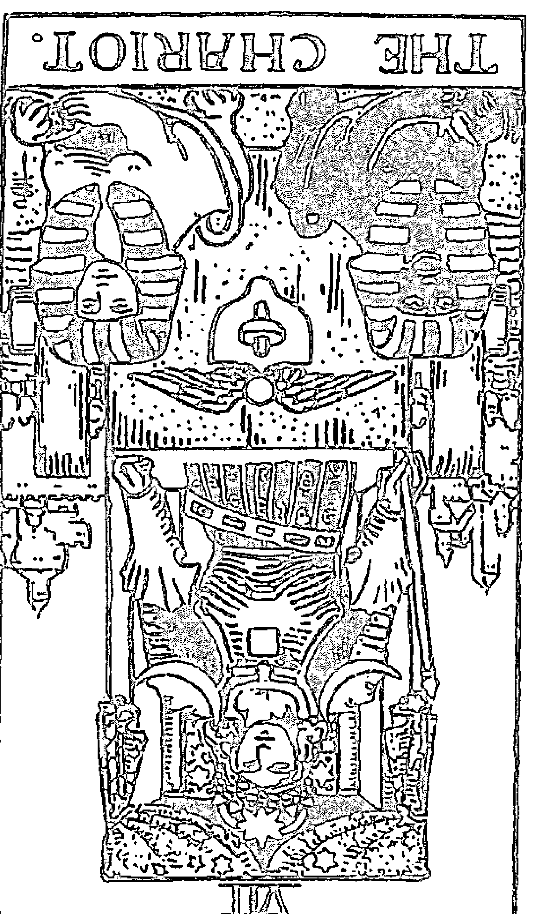

## 力量 (Strength)

堅忍是一種能幫助我們克制恐懼，調節我們的膽量與勇氣的美德，它使我們以合理的方式面對危險。它是恐懼與魯莽之間的平衡點。你可能正在處理情緒，和本能做朋友，面對任何一種也許會吞噬你的東西。你發現了「內在的力量」，用它來培養自信——而不是用戰車那「贏過別人的力量」③。無論你內在本性的本能有多麼難以駕馭和嚇人，你都需要去接納並尊重它，它會給你勇氣、自信、傑出、耐心和堅毅。也許你正在和一個問題搏鬥，此刻你需要的就是這樣的堅毅。你可能需要獅子豪邁勇敢的特質。你或許有一個強烈的慾望，或正在擁抱你的渴求。如果你基本的求生機制被啟動，就用你的智力和意志去引導你的衝動。此外，憤怒和怒氣有時能給你力量，去做出有療癒性的改變。

這張牌也與鞏固連結和建立情誼有關。當你成為一個「好的傾聽者」，你就可以鼓勵和支持別人。你也許能用愛和溫柔的體諒來舒緩痛苦，平息憤怒。當你結合熱情的承諾，以及溫和的指引和慈愛的引導，你就能鎮定自若地處理危機，緩和野蠻的獸性。你像女巫一樣，可以馴服不成熟的能量，把它蛻變成你成功必要的東西。當你熱愛生命，有勇氣全然地奉獻給予，你就會有力量去表現你獨特的創造力和生命力。

有時這張牌代表對動物的愛或投入，尤其是貓科動物。這張牌也可能在描述文雅的一方與粗魯的一方兩者之間的互動。你或許需要意志、堅強的性格、清晰的頭腦和決心。或者，你只是需要用體力完成手邊的任務。性能量也可能促成有創造力的蛻變。

傳統涵義：力氣，威力，堅毅，勇氣，權力，勢力，能力。堅持不懈，耐久。權威，命令，信念。高尚，偉大。耐心，鎮定。熱忱，熱情。道德能量。克制熱情。意念勝過物質。

## 逆位的力量

逆力量表示你害怕你的熱情、渴望或本能；相反的話，它表示你太過大膽、放肆了。也許你正在和心中的分裂搏鬥，理智與本能、文雅與粗魯在你心中產生了不協調。當你的心不在某件事上，這種內心的掙扎可能會令你無法忍受。失控的力量有可能會淹沒你。

此外，你可能會用個人的權力來支配或壓制別人，不然就是你很膽怯、順從、畏縮，像被打的動物一樣搖尾乞憐。因此，逆力量可能表示你在建立某種權勢階級，它可能是好玩的，像打鬧一樣，或有如貓抓老鼠，變得很邪惡。熱情可能會失控，或是受到壓抑和不合理的否定。也許會有不舒服的窒息感浮現出來。可能有失敗、怯懦、個人弱點、衰弱，或是莽撞、過分驕傲、意志過強的情況發生。曾經有人把邪惡定義為「沒有正確使用的本能」。你可能高估了自己的能力，接手了不可能的任務，堅持一件最好停止的事。或者，你因為害怕無法處理一個情況而感到手足無措。你可能變得善變、容易動搖，沒有信心。

除此之外，這張牌可能表示洩露機密——不只是不慎洩漏秘密，你還釋放出應該被限制，但卻無法被限制的力量。

當你投射在別人身上，你可能會認為他很情緒化或控制欲很強。也許你覺得他試圖用魅力來綁住你。你不是害怕就是欣賞他的力量和支配力。對內在而言，這張牌講的是平衡你的身與心，當你隨心所欲且均衡地使用兩者，你就能找到道德勇氣。你可能正非常仔細地傾聽身體在傳達什麼訊息。

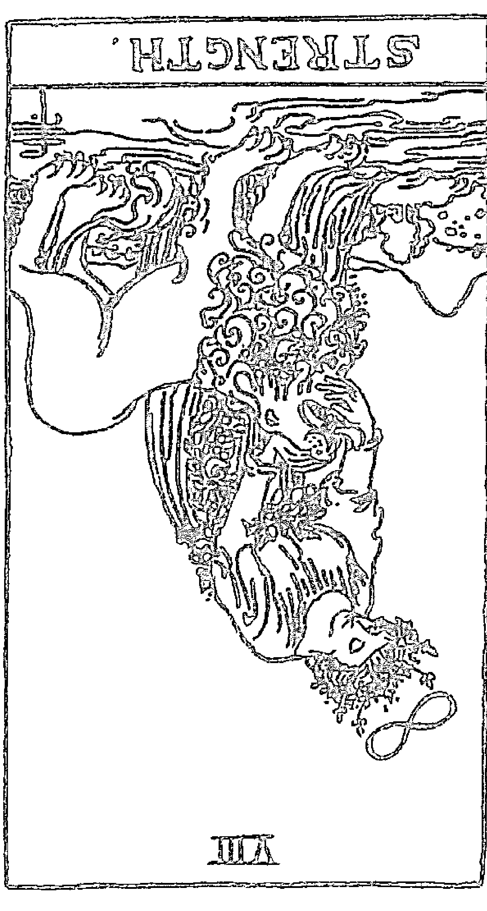

就健康而言，試圖表現堅強可能會引發冠狀動脈的問題、高血壓和憂鬱。你也可能有賀爾蒙引發的潮熱紅或經前症候群。生氣和憤怒可能正在傷害你的身體，肢體暴力亦然。

從薩滿和魔法的角度來看，這是代表生命力的能量非常重要的一張牌。它與魔力、巫術、譚崔性愛、月經的奧秘、化身為動物，以及和力量動物（power animal）或同盟合作有關。它也象徵手觸帶來的療癒力量，或是元氣治療（vital healing）。在玄妙形上學中，這張逆位牌可能表示你自身的魔力覺醒了，無論是好的還是壞的。

傳統的逆位牌義：專制，暴君，濫權。主權。王國，國土，政府，行政。人民，國家。虛弱，無助，不完美。憤怒，殘酷，不和諧。沒有耐心。向誘惑屈服。

## 隱士 (The Hermit)

隱士和教皇一樣，都可以是老師或上師，不過隱士比較像引導者、良師益友或榜樣，也就是榮格的智慧老人或老人的原型。這張牌偏重獨處和內省，你也許在迴避人群或組織，雖然這張牌也表示你會繼續深造。但比較可能的情況是，你在透過非傳統的途徑追尋真理、智慧和知識。這是第九張牌，也是最後一張單數牌，它代表某種程度的成就，其中包括以人道方式服務他人的責任。可能會有人來找你提供指引。

為了要專注和集中心神，你遠離了會使你分心的影響。也許你在磨練一個技藝，或完成一項計畫。靜心、寫日記、心理治療這類內省的追尋可能很吸引你。你或許會想要把一個情況思索得很透澈，或是你正在尋找某個生命經歷的意義。善用過去所知，能幫助你選擇一條讓潛力繼續發揮的道路。比方說，這張牌或許能幫助你判斷過去的遭遇如何影響未來的機運。

你可能正在策劃一個明智、謹慎的行動，它有賴你的經驗、不偏頗的態度，以及獨特的觀點。較古老的牌面上畫的是一個拿著沙漏的隱士，這表示你可以好好安排你的行程和優先順序，創造出最大的效益。但它也可能表示期限要到了，快沒有時間了。你可能在用自己的方法做事，會默默地打破傳統，但不會大聲誇耀你的風格，實際的情況也可能需要你低調而審慎。如果你有伴侶，你或他（她）可能需要時間獨處。這張牌也表示一段獨身或沒有性慾的時期。或許有一個比你年長很多的人很吸引你，或是你與年長的人一起工作。你還有苦行、要求完美、沒有彈性的傾向。

傳統涵義：審慎，謹慎，深思熟慮，周到，慎重。智慧。警覺。克制，限制，屈從。內向，獨來獨往。靜心。諮商。偽裝，掩飾，秘密。背叛，欺騙，腐敗。

## 逆位的隱士

你可能不想獨處了，因此逆隱士有時代表你因為害怕會孤獨終老，所以想要追尋一段關係。或是你覺得不想和人交際，想逃避親密的關係。可能有人拋棄了你，或是你自己想疏遠朋友和家人。也許你最後發現某個老師或上師是假的，或是他背叛了你。這張逆位牌可能表示你過度要求自己和別人達到完美，遵守不可能實現的標準。不然就是你沒有警覺，變得不夠謹慎和愛炫耀。你也許宣稱你有某種你並不具有的專業能力。

你或許害怕仔細檢視一個狀況，或是拒絕承認你眼前的情況。當你過分謹慎，你可能會變得偏執。你或許拒絕傾聽，或是給了別人不好的建議，或自己接受了差勁的建議。此外，你可能對某件你想隱藏或掩飾的事而變得偷偷摸摸。逆隱士會指出你對什麼不滿，他極其慈悲地催促你進入某種情緒經驗，從你的心理或過去尋找根源。這種踏上內在的旅途，找到有意義的洞見的需求，可能還會強烈到演變成一種非做不可的情況。

這張逆位牌可能代表中年危機。不管你幾歲，你都可能害怕變老，或是變得年邁體衰。你可能用裝年輕來逃避，或是創造出二次童年。相反的極端是，你執著於古老的信念、習俗或是過時的想法。也許你深陷懷舊之情，無法自拔。你可能表現得過度拘謹，或變成了脾氣暴躁的人；你討厭年輕人，無法忍受他們，尤其是你心中曾留有什麼悔恨的話。這張牌也可能代表族譜研究。

當你投射在別人身上的時候，你會覺得他雖然經驗豐富，卻很孤單。他不是拘謹的老古板，就是德智兼備的好榜樣。這張逆位牌就像內在的引導者，要你放下對別人的投射，找回屬於你的觀點，好看清自己的缺陷和潛力。

就健康而言，也許會有消化方面的問題。它可能代表所有與老年有關的問題，包括衰老、僵硬，視力、聽力退化以及失眠。

從薩滿和魔法的角度來看，逆隱士是煉金術師、隱逸派（hermeticist）、玄學家或形上學書店老闆。他是亡靈指引者或靈魂的嚮導。不過，韋特和克勞力都認為這個人物是隱身的波西凰（Persephone）：冥王之后，她在冬季時引導靈魂進入冥府，到了春天，又帶領它們重生。

傳統的逆位牌義：
- 羞怯，隱遁，獨居，隱士，獨行俠
- 孤絕，寂寞
- 不社交，陰鬱
- 恐懼
- 過度謹慎，不謹慎
- 消極
- 不成熟，早熟
- 愚蠢，差勁的建議
- 隱瞞，偽裝
- 獨身，貧窮，靜默

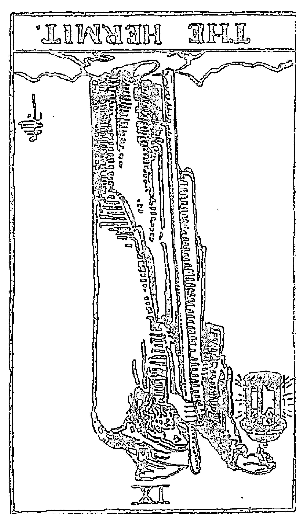

## 命運之輪（The Wheel of Fortune）

命運之輪象徵改變、運動、擴展，到處都有機會。這種改變通常既突然又明確，可能還會令人振奮，但最後的結果或後果卻難以預測。然而，因為有幸運女神的參與，所以局面有可能轉好。你可能會覺得它很玄，像命運而非機率，像緣分而非巧合。因為命運為定數之女（譯註：在希臘神話中，命運女神 Moirai 是定數女神 Ananke 之女），所以你會按照不同時節的需要來調整並改變。或許會出現有利的情況，但要不要賭一賭、把握機會，就看你了。畢竟俗話說：「準備加上機會等於好運。」你的資源、人脈、金錢或消息可能來來去去。你可能正面臨同一個循環反覆出現的情況，或是事情一直起起伏伏，就像商業活動、結婚週年，以及每年的季節慶典會遇到的那樣。你可能想從全貌中提取核心觀點，尋求更高的角度，或只是想隨便看看，甚至活在來得容易去得也快的善變態度中。

也許你已經完成的事物為你帶來了獎賞和名聲。你可能處在社會活動的漩渦中，生活速度也不斷加快。你的視野拓展了，機會出現了，包括升遷、旅行或轉換地點，拓展知識。就像韋特牌中那四個有翅膀、拿書的人所代表的一樣，你可能正嘗試多元發展、升官、建立人脈、從事宣傳或透過媒體散播訊息，也許還會發展出廣泛且全面的效應。

你可能偶然巧遇某人，或是在對的時間出現在對的地點。這張牌可能代表轉世和業力的課題，將你與重生之輪和螺旋狀的進化意識緊密相連。這張牌也提倡回收和可再生資源的重要性。

傳統涵義：命運，天命，命數。意外的成功，好運，幸福。不可避免。天意。昌盛，進步，發展。提升，高升，前進，運動。改變，流動。頂點。有收穫的第一步。勝利。健康良好。

## 逆位的命運之輪

傳統上，逆命運之輪仍是有利的，不過比較不穩定——就像心理起伏的溜溜球——希望和消沉交替出現。當你希望改變發生的時候，改變可能會被延誤，也會有些事情讓你惱怒，就像機器老是開開關關一樣。你可能感到焦慮，雖然你已經準備好迎向新事物，卻又遇到障礙和困境，不知下一次的轉折會把你帶向哪裡。情況有可能還不到「收成」的時候，行動也還不夠成熟。你可能需要重來一次，或再做一次你之前做過的事，再跑一次同樣的流程。

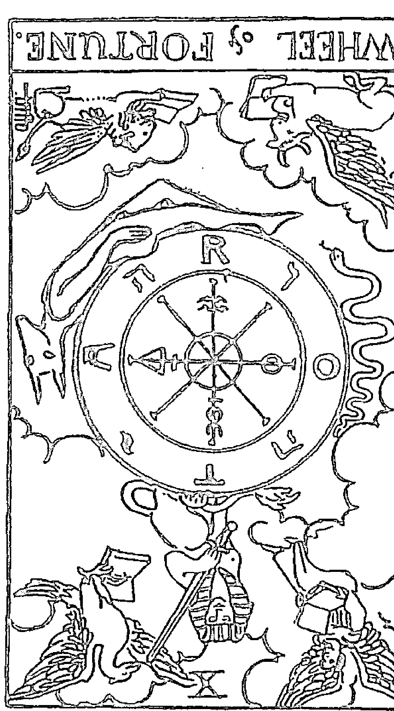

另一個極端是，社會漩渦的刺激感或人生的轉折，開始讓你感到忙亂、緊繃，就像在踩一台停不下來的跑步機。有時改變發生得太大，它雖然成長和擴展得十分迅速，效果卻很分散、凌亂。要做任何一種計畫現在都可能還太快。如果你覺得事情發生得太快、太容易，你可能會因為希望它放慢速度，而變得太過謹慎、僵固或保守。

有些解析認為逆命運之輪代表失敗和厄運，但問題其實更有可能是在態度上，因為負面的心態開始偷偷滲入了正位牌樂觀的看法。你需要勇氣、韌性，並相信輪子終有一天會轉回來。你抓的時間點可能不對，如同在季節不對的時候做事一樣。你可能害怕錯失良機，而你不確定你還有沒有下一次的機會。和戰車一樣，你可能會有和旅行相關的問題。因為逆位牌很不穩定，所以賭徒的風險變得很，或許會有不預期的輸贏。事情變得更加不可預測。

如果投射在別人身上，你可能認為他擁有一切的好運，就快要爬上天際，命運對他微笑；但如果你待久一點，可能就會看到他摔下來。就內心世界而言，意識裡發生了一些目前看不見的運動和改變，要等日後它們才會在外在的事件裡浮現。你或許會意識到一些模式和循環的意義，是你以前沒發現的。你也可能開始察覺到你的行為如何影響並反映整體。

就健康來說，這張牌表示任何病狀起起伏伏，像是復發、體重增增減減、閉尿症、或躁／鬱心情的不穩定。它也可能指過敏或季節性的感染疾病。

從薩滿和魔法的觀點來看，可能有前世的治療或修行方法能幫助你擺脫轉世之輪。這張牌全和季節的魔法，還有四季及季節轉換本身產生的效應有關。韋特牌上描繪了來自世界四角落的智慧之書，以及代表蛻變的煉金術符號。

傳統的逆位牌義：增加，發展，擴展，生產。豐富，盈餘，過剩，多餘。粗心大意，隨便，不安全，不穩定。善變。探險，風險，投機。意料之外的，不講情面的。厄運，失敗，悲慘的命運。失去權力。

## 正義（Justice）

抽到這張牌表示你要為你的行為負責。你可能到了一個做決定的時刻，這個決定會影響後續的事情和結果。你可能正在和別人擬定協議，在你跟別人的需要和慾望之間取得平衡，包括契約、婚姻、夥伴關係、談判、交換或結清帳目。你也許涉及法律案件、訴訟案、調查或調停裡，不過當然，你可能是要求公平正義的那個人，或你是促成判決的法官、律師、調停者或中間人。一些評論家認為正位牌表示真理和正義會勝出，無論是否符合業力、道德、倫理或法律，你就是會得到你應得的。

因為筆比劍更有力量，所以這張牌也可能代表寫作和作家。有時它是要求紀律、邏輯、原因、理由以及嚴謹的批評之聲。牌上的符號讓人想起音樂的節拍器，要求她保持一定的步調。

更深層的意義是：要忠於自己和你的本性，否則你和別人的約定不會完全公平、公正。你必須權衡利弊、分析評估，列出所有的項目、評估其價值，才可以做出你可以接受的決定。你可以按照心中的感受做些調整，尊重你真正的感覺，但同時保持公平和正直。正義旁邊的牌通常會指出你想要平衡、調整的是什麼，或是你在哪兩者之間做決定。

天秤也表示商業活動，例如結算支票或帳目，付帳單、貸款和繳稅，以及商業交易和合夥關係。在親密關係中，你可能要求對方負起公平、均等的責任。也許你想讓親密關係「合法化」。畫面中的女神是西蜜斯（Themis），她的名字意義為「常規」或社會上固定的看法；一如其名，她在牌中也代表公眾的意見。

傳統涵義：均衡，平衡，平穩，和諧。公正，公平，廉潔，正直。不偏頗。誠實，誠信，美德。法律／秩序。仁慈／公平。邏輯／理智。對／錯。好／壞。行政，執行。規律，方法。紀律。必然性。勝訴。

## 逆位的正義

當人們看到逆正義時，常說表示有「不公平」的地方，害怕正義真的被推翻，秩序被顛覆，欲望受到阻撓。你可能有法律糾紛或損失，或是根本不理睬法律。你或許需要調整生活和人際關係中失衡的地方，兩側的牌會告訴你是哪裡需要調整。也許你害怕要為自己的行為負責，或是接到通知要承擔一些事情，需要你賠償或改善。你可能感到丟臉或屈辱，或是難以面對後果。另一方面，你反而可能謙虛地承認並接受你的錯誤。逆位牌可能代表善惡到頭終有報，某人以一種不可思議的方式得到了應有的報應，而且是很諷刺地適得其所、恰到好處。它也代表作家的創作瓶頸，或是淹沒在日常的文書工作中。

原本穩定、平衡或日常例行的事物可能會被打亂。以前的價值觀、行事法則、社會的期望也許都不再可靠，你必須在幾乎沒有什麼可賴以為續的情況下，在當下隨機應變。你可能在努力擴大社會和傳統可以容忍的界限。當你需要冷靜的理智時，卻反而做出情緒化的反彈。也許你想為你的行為找藉口。此外，你可能因優柔寡斷和消極而停滯不前。

當然，不公正是這張逆位牌的一個主題，偏執、偏見和歧視亦然。聖安博（St. Ambrose）曾提到力量和正義之間的關係，這兩張牌都曾被編為第十一號。他對不公不義的定義是：沒有正義的力量，隨時準備壓迫弱者。你的批評或許過於嚴苛，結果變得有殺傷力，或是你的評語缺乏認識。你可能過度倚賴理性或事實，或是因為缺乏判斷力而忽略了事實。

投射在別人身上的時候，我們可能會取笑律師和警察，或像在警察影集和「偵探梅森」（Perry Mason）所看到的，把他們理想化了。當你向內看，你也許會覺得最難達到的，其實是內在的正義和堅定。

就健康而言，這張牌可能代表任何一種新陳代謝的失衡或缺少維他命，不過傳統上它與毒物有關，因此也與肝臟受損有關，特別是環境和化學造成的敏感和疾病，或是會導致法律行動的意外或狀況。

就薩滿和魔法的角度來看，天秤中丈量的是心。這張牌也和無論做了什麼事，都會以三倍的狀態回到我們身上的「三重法則」（the threefold law）和神聖誓言，以及打破誓言的後果有關。它也包括幫助你發現失衡、疾病或災難根源的占卜技巧和磨難的事件。

傳統的逆位牌義：
- 法學家，法律專業人士
- 立法，法律，法規，法令
- 警察
- 人權與自然權利
- 偏執，偏見，偏狹
- 不實的指控
- 法律糾紛
- 濫用公義
- 過度嚴苛
- 不平等
- 官樣文章

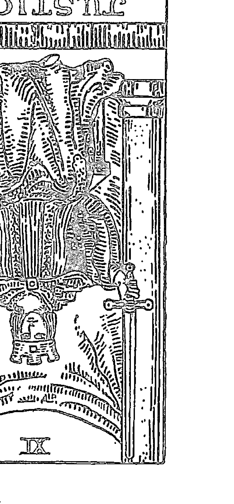

## 吊人 (The Hanged Man)

因為這張牌本身就是逆轉的，所以平常出現在逆位牌的特徵都能在這張正位牌裡找到，下面我們也會討論。吊人是塔羅裡面最複雜的意象，也許這能夠解釋它為什麼常常出現在電影和文學裡。我們之所以懼怕它，是因為我們不了解它。很多解析都源自這份不安：覺得受害，無力逃避命運，因受困而焦躁，被幻想和靈異的幻象困擾。你可能會覺得自己「被綁在十字架上」，或受到處罰；你自憐自艾，迷茫和困惑正折磨著你，你漫無頭緒或困住了，一籌莫展；有人在貶抑你或攻擊你，你成了代罪羔羊。上述的任何一種情況，還有面臨揶揄和虐待——不管你是否真的活該——都可能令你感到丟臉。

塔羅第一次出現的時候，把叛徒畫成出現在公共建築物的恥辱畫上的倒吊人。不過，這並不是這張牌的深層意義。它真正想呈現的是當你卡在對物質的憂慮中，或是逃避下一個意識階段對你的要求時會遇到的情況。真實世界彷彿瞬間休止，而你也可以暫停下來，去思考你真正執著的是什麼。

吊人的本質是完全臣服於相反的觀點，反轉你的意識，做出不同的想像。你把靈性的覺知放在第一位，你尋求的是意義和智慧，而不是世俗的物品和資料。這張牌代表奉獻、無我和犧牲。你可能會覺得神秘學家、薩滿、靈療者、藝術家、詩人或夢想家很親切，生命似非而是的真理和奧秘亦然。你也許想獻身於某種理想或計畫，或是自願為某個錯誤贖罪。你可能捨棄了世俗的期望，更全心接受生命的試煉和狀況，在聖靈的聖壇前無私地奉獻。然後，你可能會從小我中解放，在超越理性和自我控制的狂喜之境渾然忘我。所以說，你可能會為了更偉大的境界而犧牲次要的東西，雖然那比較無形。犧牲（sacrifice）在英文的意思是「使神聖」（to make sacred）。

> 小說家瑪莉·雷諾（Mary Renault）曾說：「召喚力量來的不是流血，而是你允許了這份力量。」重點不在救贖，而在你願意被拯救。

從這個觀點來看的話，你就能看透表面，逆轉你對生命意義的認知。逆境變成了累積智慧和領悟的機會，而這正是逆位牌有問題的部分所帶給你的契機。當你抗拒內在成長的過程，你可能會不由自主地受困，覺得自己很可憐。但你只要交出已在正義裡發展至頂峰的智力和自我意志，就能避免這種痛苦。最有效的方法是透過祈禱和靜心，把自己交託給更大的力量。抽到吊人的時候，它可能會透過身體經驗、占卜、夢境和異象，來暗示你這種交替出現的現實，並給你引導跟肯定。

當這張牌投射在別人身上，你可能會覺得他不切實際，是無可救藥的理想主義，又敏感又愛幻想，甚至很瘋狂或「被困住了」。

就健康來說，任何身體的、心理的或精神上的病痛都可能出現，因為它會啟動「負傷的療癒者」原型，這種原型的前提是只有當我們自己曾受過傷，我們才有辦法療癒別人。然而，上癮或其他形式的逃避或虐待，很容易就會削弱大靈對你的召喚。

這是薩滿領域裡一張很重要的牌，因為它代表進入另一個世界。

> > 人類學家路易斯（I. M. Lewis）說：「那些受神召喚的人會先因煎熬和痛苦而心懷謙卑之情。」「臣服自我換來天啟的恩賜……這在各地都是一種在控制下達成的附身。」

在儀式的魔法中，它代表進入需要死亡然後復生的內在秩序。它也代表狂喜的狀態，很多靈療工作和預言都是在這種狀態下完成和誕生的。

傳統涵義：
- 犧牲
- 自我犧牲
- 割捨
- 無我
- 智慧
- 生活暫停
- 陶醉
- 奉獻
- 屈服於責任
- 愛國主義
- 叛徒
- 試煉
- 直覺
- 預知
- 先見之明
- 理想主義
- 新生
- 逆轉
- 懺悔
- 贖罪

## 逆位的吊人

注意：一般逆位牌會討論的主题，都可見於吊人正位的描述中。

逆吊人看起來好像準備好要行動了，但又沒有事要做。他頭上明亮的光圈和淘氣的站姿，讓他看起來好到不像真的，而這可能是個事實。你也許想看起來很好，想取悅大家，但背後卻別有用心。你可能沒有外表看起來那麼坦誠。你的目的或許很自私，或是你一心只想著個人的計畫和觀感。你可能過於重視物質。雖然你外表看起來很活躍，但也許會毀約，或打破原先需要你作出犧牲的承諾，說不定你其實根本就對需要犧牲這件事忿恨不平。最糟的情況是你在站不住腳的情況下，擺出一種傲慢、「我比你神聖」的態度和虛妄的優越感。你也許很不踏實、百般聊賴、懶散，只是隨便閒晃，漫無目的。

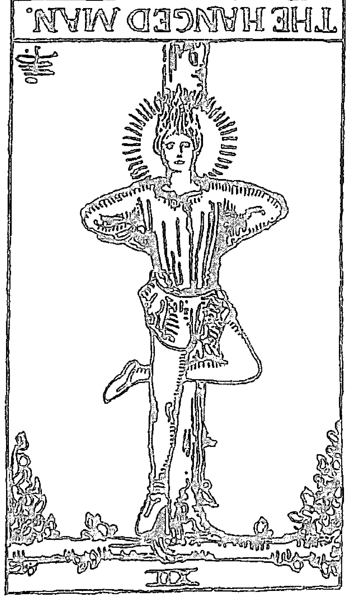

你也可能比外表看起來更脆弱，你想把事情做好，但又不確定該如何著手，或是因延誤而進退兩難。你可能覺得被困住了、被逼到角落裡、任人宰割，或是剛從某種禁閉的形式中解放。你或許急著想前進，但又有小麻煩和責任束縛你。

也許你才剛從你的狀況中清醒，還不知道自己有哪些選擇。你可能處於靈性的轉捩點，你在尋找方向，等待徵兆或預兆。你就像年輕的小沙彌或學徒一樣，希望師父能就某個道途或教誨給你關注和建言。如果你感到很脆弱，就看看牌陣中其他的牌，尋求多一點指引。

傳統的逆位牌義：自私，偏袒，無用，尚未完成的犧牲。群眾，庶民，居民，政治體。未實現的計畫或沒有執行的點子。沒有遵守諾言。充滿小我。錯誤的預言。不公平的指控或監禁。擺脫束縛。

## 死神 (Death)

當你抽到這張牌，可能會覺得如釋重負，或是夾雜著解脫與痛苦。疑慮和恐懼結束了，但改變與轉化勢不可免。你曾經與之搏鬥的若不是已經結束，就是很快會結束，你終於能夠往前走了。這個過程就像去蕪存菁，清出一條路來讓新的成長；那些腐爛的與衰敗的，會把剩餘的殘跡蛻變成肥沃、充滿營養的土壤。由珍·羅伯茲（Jane Roberts）通靈的高靈賽斯（Seth）說，我們所謂的死亡其實是「充滿創造力的生命能量澎湃而至」，因為它會帶走缺乏生命力的事物。為了新生，毀滅正在醞釀中；瓦解正為了重生殺出一條路來，最後你或許會放下限制你的習慣和過時的方式。你正在離開一個死氣沉沉的環境，或是放下你成長以後，已經不再適合你的友誼。你的計畫或工作可能要劃下句點，也可能代表削減和清算。

當你清掉所有的旁枝末節，就能接近情況中的赤裸本質，找出真正能支持你的東西。死神表示放下你的個人意志，捨棄不必要的形式。它或許會需要一段時期的哀慟和哀悼。

不過，你也可能正感覺到強烈的激情、情欲或解放。在莎士比亞的年代，性高潮叫做「小小的死亡」，因為他們認為每一次高潮都會縮短你一天的生命，而且高潮能讓你忘卻自我，引發有如死亡般的經驗。這張牌也可能代表任何令你「屏息」的東西，或是你願意為之「付出生命」的事物。

有一位懷孕的太太，在照超音波的那天抽到了這張牌。她看到韋特牌的旗子上，也有個白色的人形在黑色的背景裡。「這些一層層的東西讓我想到了綻放的玫瑰，尤其玫瑰的中心是玫瑰的子宮和胚胎（雌蕊和子房）；當然，玫瑰也是女性生殖系統的經典象徵。」小寶寶最後很平安，這是一個絕佳的例子，告訴我們不用害怕這張牌。

傳統涵義：改變。結束。蛻變。修改。生命終將腐朽。毀滅，殲滅。捨棄。腐敗，墮落。失去，分裂。失敗。腐化。醒悟，幻滅。不執著，認命。沒有工作。

### 逆位的死神

如果你想抵抗不可避免的改變，那麼逆死神可能會比正位更令你難以接受。你也許想要延後或逃避某件事的結束，於是你欺騙自己，想延後痛苦和憂傷，結果阻礙了新的發展。它可能表示你預料某件事會令你擔心和憂慮，尤其是你認為它會很糟糕或是有害——不論這個恐懼是否會成真。你可能覺得某件事或某個人像「瘟疫」一樣地折磨你，到處追著你或跟蹤你，使你惱怒。這也可能表示死氣沉沉的現象，像是怠惰、睡太多、懶洋洋或疲軟，呆滯、發呆和便秘——全是由各種恐懼和不安全感所引發的。注意，這張逆位牌比較傾向於消極的態度或心理狀態，而不是真正的平靜。不過，這種消極可以把最燦爛的一天都變得一片死寂、了無生趣。

相反地，你可能覺得自己「死而復生」，你走出了憂鬱期和停滯期，你再度甦醒，重新享受生命和感官的樂趣。也許你正從悲痛和哀傷中復元。以前你認為死掉的東西可能又復甦了，例如過去的熱情死灰復燃。某人可能「從死亡中回來」，無論是象徵性還是他真的經歷過「瀕死體驗」（NDE）。

此外，死亡、病態或歌德式的場景可能令你著迷。你可能想和亡者溝通，或是參與靈性的活動。也有可能相反，你排斥或不相信這類的事情。

如果投射在別人身上，你可能會覺得他帶有不祥或恐怖的氣息，例如稅務員——有時大家把他們與等死畫上等號，還有「黑衣人」以及那些沉悶掃興的人。你也可能把他當成心理層面的吸血鬼，他雖然讓你情緒低落，卻又散發出奇怪的吸引力或是色情感。

就健康而言，千萬別把這張牌（無論是正位或逆位）詮釋成死亡的預兆。如果真的與死亡有關，人們通常會告訴你的。疾病可能包含便秘、傳染病（尤其是性病），手術和各種切除，或是萎縮、身體某些部位沒有知覺以及昏迷。它也是更年期的象徵之一。

在薩滿和魔法的角度裡，知道如何死亡是啟蒙的一大奧祕，高階的啟蒙通常還包括死亡和重生等接近「瀕死體驗」的儀式。它也可能代表「不死之物」：巨石妖怪（golems）、殭屍、吸血鬼以及向亡魂問卜的妖術。

傳統涵義：
- 千鈞一髮逃過死亡或意外。
- 懶散，睡覺，有氣無力。
- 停滯。
- 毀滅。
- 動彈不得。
- 夢遊。
- 緩慢或局部的改變。
- 轉變得更好。
- 洩氣，消極，抑鬱。
- 希望和計畫的毀滅。

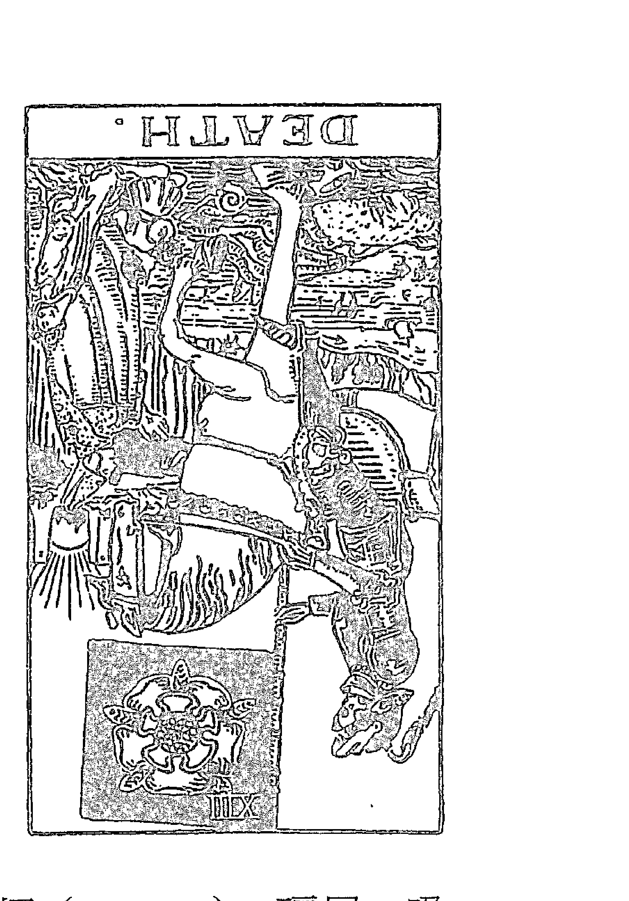

## 節制（Temperance）

節制講的是適度、緩和，以溫和周到的態度，在極端之間找到屬於自己的路。你可能正用混合、組合或變換成分的方式來創造新的東西，而這些成分的屬性可能是互相衝突的，這可由兩側的牌觀察出來。也許你想要解決問題、彌補斷層並促成改變，讓自己與身邊的環境及情勢和諧共處。這裡最重要的是過程而非目標或結果，你可能需要反覆不斷地嘗試、測試、試驗或出錯，才能「引發對的化學作用」。要維持並找到最大的平衡（homeostasis，體內平衡），你必須持續不斷地調整。你也可能在專心觀察時機、溫度、音調或情緒的傾向，試著感受什麼是對的時間、季節、步調或數量。它可以像煮飯一樣的世俗，也可以像調配魔藥一樣的崇高。

節制天使代表神聖的指引或你的守護天使，祂以耐心、慈悲和包容，支持你轉化的煉金過程。也許你正從可靠的來源得到引導和協助。有時，在放下死神之後，你會經歷洗禮、重生或再生。現代的解析認為它是塔羅牌中最主要的療癒牌，在修正了失衡、調和了對立的信念之後，療癒就會全面發生。你可能正在舒緩緊張、安慰別人，或是維持鎮定的性格與放鬆流暢的能量以促成和解。這張牌把壓力視為有創意的挑戰，把錯誤看作福氣。你可能在肯定自己的完整、美好與力量，以及心想事成的能力。

有一位問卜者認為這張牌指的是金主，演藝界的「財神爺」。你可能在處理管理、編列預算或產品測試等事務。如果你是公關，你也許在促成連結和聯繫，或是一件併購案。它要你用具體的務實態度平衡情緒，讓點子和影響力都保持暢通。

傳統涵義：調節，適應，調整。管理。節約，節儉。組合，聯合。兼容，調和。撫慰，緩和，減輕，安慰。節制。沉著。謹慎，周到。溫度，時機。

### 逆位的節制

逆節制表示可能有某件事物失衡，發生衝突或超出限度，結果帶來壓力。如果狀況沒有減輕，可能會導致生病。你可以從兩側的牌找出哪裡有問題或無法整合的部分。或者，你可能會覺得是大家不配合，或是你的興趣和需求在互相抗衡、衝突。情緒可能會失控，引起爭執和意見不合。也許會有意外發生，或是機械、產品出了差錯，例如漏水、冷／暖氣或控管系統故障。化學溶劑可能離析或變得混濁。能量消散了。有創意的計畫和實驗最後變得不切實際，或是需要更多時間，讓你十分著急和氣餒。你也許缺少慈悲心，相信你必須「寧為玉碎，不為瓦全」。你可能覺得自己突然脫節，失去連結。

也許你不願丟掉任何東西，或是不肯因投入一種可能性而忽略其他的機會。你可能覺得自己沒創意又缺乏自信，所以想逃避面對問題。你也許會因為注意力不集中、沒有效率或搖擺不定而拖延或浪費時間。這張牌代表不安、浮躁和不確定。時間點可能不對，你可能脫節了，做出的調整也有問題。你也許反應過度，或是在心理上過度補償。

若是投射在別人身上，你可能會認為他太好、太完美，就像個溫柔可人的天使，他的才華難以望其項背。或是你覺得他不知節制。就內在而言，它要你覺察自己內心的性情和生理狀態。你或許能夠直覺地感知到一個情況需要什麼樣的元素組合，但卻無法表達或說服別人。

就健康而言，這張牌表示你的體內平衡過程和下視丘正在努力調節內在的狀態，例如它在產生抗體，對抗感染。你也許會因食物中毒、消化不良而不舒服，還可能有其他的飲食問題出現，或是你暴飲暴食。你或許會對能量治療、手觸療法、按摩整脊、草藥的酊劑和補品、花精、芳香療法和同類療法等同時照護身體與精微能量體的整體治療有很好的反應。

從薩滿和魔法的層面來看，這張牌講的是心靈手術 (psychic surgery)、煉金的質變和療癒。它表示有能力同時在兩個世界工作。它也代表接觸或餵養某個地方或物品的守護靈，或是進行召喚天使的魔法。它代表神職人員在主持有關神聖奧秘的宗教儀式。

傳統的逆位牌義：教會，宗教，神職人員及其職務。不和諧，分裂。有欠考慮的組合。競爭。利益衝突。缺乏合作。被動的改變。心情不穩定。不耐，氣餒。重病。未解決。

## 魔鬼（The Devil）

魔鬼主要和恐懼、謊言、無知，結果造成懷疑和消極有關。這個字的英文字根意為「敵人」（adversary），也就是和你的利益或福祉對立的人或事。這張牌顯示出可能會阻斷、限制或局限你的創造能量及行動的事物，也可能代表童年時的愧疚。比較溫和的涵義是你可能做出「魔鬼般」的舉動，對自己很「壞」的事，還有奚落、激怒別人，成為別人的魔鬼。你可能逾越了社會或性的禁忌，滿腦子想著物質的事，或是被引誘去竄改規則，滿足自己的目的。或許你也會為了得到利益而運用不正當的權力和影響力。你可能不是在聽從別人，就是想支配他們。你也許害怕某種殘酷的外力或命運想要傷害你，所以就找你心存偏見或討厭的人當你的代罪羔羊。這背後潛藏的是無法去愛的感覺，結果帶來了孤絕和分離之感。

心理上，這張牌強調的是「陰影」：你心中被否定、不承認或隱藏的部分。雖然有可能指的是性，但也很容易就染上變態、暴力的色彩。性慾、欲望、貪婪或驕傲可能正在誘惑你。或許有一段感情令你念念不忘，或某件東西令你夢寐以求，對你有致命的吸引力。你也許感到慌張而困惑，或者，引發騷動和導致混亂的人就是你。有時候，這純粹是淘氣、惡作劇——「一時鬼迷心竅」。你恐懼和逃避所有你認為壞的事物，而這種想法本身就會局限你、束縛你。有時它指刻意或惡意在別人身上加諸痛苦，或是因嫉妒、羨慕、怨恨而做出一些事。你可能受上癮或強迫性行為影響。魔鬼像牧神潘（Pan）一樣，用神聖玄妙的自然力讓你敬畏、吸引你。不過，它也可能指沒有幽默感，無法笑看自己，過分武斷，只看事情的表面。

傳統涵義：命運，宿命。暴力，混亂，毀滅，驚嚇。疾病。強烈，威力，力量。推力。狂妄。激情，性慾，感官享樂，吸引力。神祕的力量，邪術。束縛。惡毒。誘惑。自我毀滅。

### 逆位的魔鬼

逆魔鬼是所有的牌中，最能表現「極端」的牌了。它的一個極端是邪惡的勝利者、對靈性盲目，或是屈服於誘惑、盡情縱欲。另一個極端是，你也許遠離了邪惡和束縛，開始步上開悟的道路。按照物極必反的原則，從罪人變成聖人是很容易的，就像蕩得太遠而越界的擺錘一樣，瞬間翻轉。就像聖保羅在前往大馬士革的路上臣服了一樣，他從惡人變成了使徒。有時這張逆位牌表示你覺得自己比其他人的缺陷和弱點優越，或是你極端正直、端正、品德高尚。

你也可能會拒絕誘惑，除去束縛你的東西，逃出一個令你不快的情況。比方說，也許你覺得你被公司「占有」了，或你只是為了糊口而被工作束縛，而現在你該辭掉這個摧毀靈魂的工作。你的創造力和即興享樂的能力就像被守護和埋藏的寶藏，而這張牌表示挖掘這寶藏的機會來了。如果你知道你的恐懼是沒有根據的，你就可以從不正確的壓抑、操弄和倚賴的模式中走出來。通常你會更意識到自己的毀滅行為，以及你如何濫用你的力量。有時候，公眾人物的弱點與像魔鬼般的行為可能會讓你幻滅。也許你正在找藉口，不願意面對事實上很糟糕的情況。

當你相信這股能量不屬於你，而把它投射到別人身上，你可能會覺得他是不誠實的領袖、吞噬靈魂的惡魔或搗蛋鬼。你可以在政治人物和支持他們的人、獨裁者及其代罪羔羊、發動戰爭的人和受害者，以及術士和被他愚弄的人身上看到這股能量。就內在而言，你會覺得這宛如一場惡夢，堅信這一切都與罪有關，或感到極大的慌張。相反地，這種能量也可能很戲謔地爆發，就像一部以擊敗魔鬼為主題，劇情充斥虛偽的傲慢和無價值的偏見的喜劇。

就健康而言，正位牌可能代表虐待（身體的、情緒的、性的）以及藥物上癮、抽菸、痔瘡、性病；逆位牌可能表示復元。某些文化相信所謂的細菌和病毒是入侵身體的惡魔，所以逆位牌表示這些惡魔可能已被驅逐。

從薩滿和魔法的層面來看，這張牌代表本性不受控制的長角神。它也有小丑的能量。它掌管的是設有保護力的鎖鏈和五芒星，涉及靈魂復元、夢境和陰影的工作，而薩滿必須透過這些修練去打敗一個敵人。

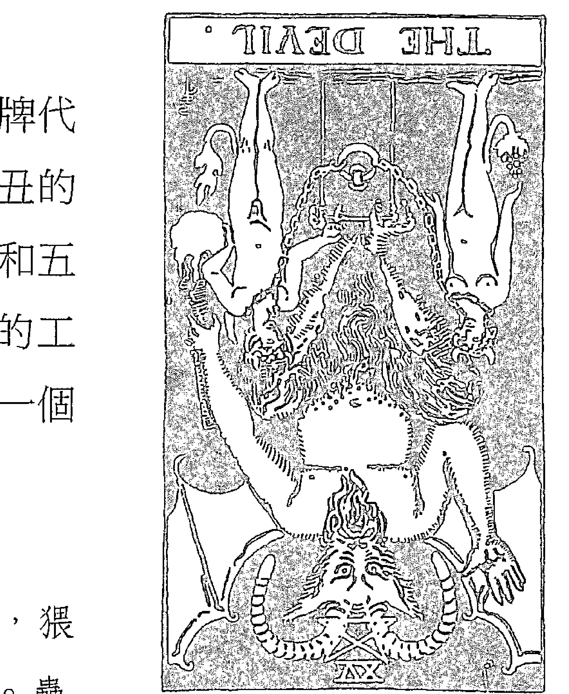

傳統的逆位牌義：命運，宿命。軟弱，猥瑣。盲目。色慾。糾葛，陰謀，麻煩。蠱惑，著迷。從束縛中解脫，結束奴役。恢復，緩解。離婚。開始靈性的體悟。美德。道德。

## 高塔（The Tower）

高塔是「改變牌」之一，不過這裡的改變通常很突然，在意料之外，而且是在你不情願的情況下發生的。它指的是反覆無常的狀況，以及這種狀況導致的突破和瓦解。因為它通常表示脾氣爆發，或是憤怒爆炸，所以你可能處於有攻擊性的行動和爭吵中，有時還牽涉到暴力。因為它的終點是要讓你有更多的覺知，所以它會粉碎所有僵化、頑固的東西，把你從限制你的情境中逼出去。壓抑太久的能量會突然得到釋放。它表示命運和宇宙介入你的人生，帶來突然的刺激、動盪和危機。你可能面臨棘手或危險的情況，或是身心受到了驚嚇。這次的撼動會協助你了解你有哪些不堪承受壓力的缺陷和弱點，因為它會瓦解任何在工作、家庭、親密關係或自我感中，其實並不存在的安全感。你也許受到了屈辱的打擊，或是你崇高的地位和心態被推翻了。或許有人挫了你的銳氣，你人格模式這雄偉結構中的裂痕也暴露出來了。不過，由於這張牌與天災、意外、破產、被炒魷魚等狀況有關，所以悲慘也許是難免的。它也表示你突然洞悉了一些事情，或是有突破性的想法，而且常帶來不請自來的衝擊。不過，你也可能純粹只是在打掃房子，丟掉老舊的物品。

閃電代表有洞見揭露了新的契機，而火焰就像引擎的火星塞被點燃，在驅使你行動。皇冠代表頂輪，當拙火（kundalini）揚昇，感知力的門戶也會隨之開啟。你正在清掉殘渣，從障礙中燒出一條路來，你進行淨化與創新。高塔象徵噴射與高潮的創造性能力，因為壓抑的能量被解放了。有時這張牌代表墜入愛河、有如晴天霹靂那種爆炸的情緒，但也可能只像牌面上那樣，是屋頂出了問題。更大的層面包括都市更新、地震、革命，以及隨之而來的撤離。

傳統涵義：
- 悲慘，痛苦。
- 貧瘠，貧乏，窮困。
- 災害，災難，破壞，毀滅。
- 跨臺。
- 突然，突如其來。
- 敵人，厄運。
- 推翻。
- 羞恥。
- 失去。
- 破產。
- 懲罰。
- 覺醒。
- 有益的危機。
- 劇烈的天災。
- 沉船。

### 逆位的高塔

傳統上，逆高塔會減輕正位牌的程度和影響。而且它可能代表驚險地逃過災禍，從限制中解脫，或是困難結束了。曾經有一位問卜者認為牌面上的人「避開了處罰」，所以你可能在事情變得太糟之前，就先逃出了困境。

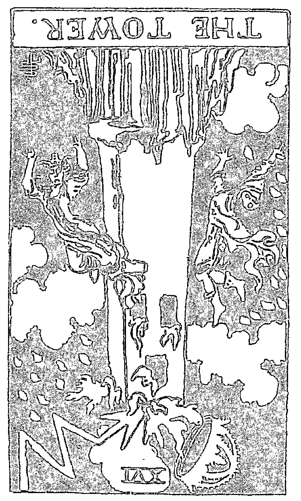

此外，雖然你堅持你沒有問題，但你生活中有些地方可能正在瓦解，不過你可能會接受這些瓦解和挫折，或是你已經跟它們共存太久，已經不再讓你感到意外了。你需要的改變可能被耽擱或否定，這讓你有機會在狀況爆發之前，先緩和一下。

相反地，壓力可能愈演愈烈，你無法再逃避了。你和別人之間有些緊張，但你可能拒絕面對屬於你的責任，或是拒絕承認現有的緊張，對壓力視而不見。雖然你可能接受事情是不對的，卻又不願意有所行動。你也許眷戀既有的體制和現狀，不理會警訊，認為自己百毒不侵。或者你認為災禍即將發生，心中滿是憂慮和慌張，但你困惑和不安的程度可能超過事情真正的危急度。或許你正在清理一些個人狀態崩解之後的殘跡。法國塔羅有一個傳統：這張逆位牌代表監禁，一般認為拿破崙被放逐到聖赫勒拿島（Saint Helena）的時候，抽到的就是這張逆位牌。

若是投射在別人身上，你可能會怕對方找麻煩或故意製造混亂。也許你認為他在生氣，或是他很有毀滅性。或許你覺得他很活潑、果決，而且有刺激的危險感。就個人的層面而言，這張逆位牌可能代表內在的混亂、騷動或憤怒，也可能是宇宙「踢你一腳」，讓你無法繼續沾沾自喜。

就健康而言，它代表手術、外科、化療，還有意外、傷口、燒燙傷。可能會有發燒或皮膚出疹的現象，像是青春痘、疥瘡、癬、疹、噁心和嘔吐。不過，這樣的症狀可能表示你的身體正在排毒。有一個問卜者剛好遇到急性盲腸炎。正位牌可能代表男性射精，而逆位牌可能代表不舉。

從薩滿和魔法的層面來看，它可能代表因為拙火或神聖的介入，所以能量如筒狀般揚昇，或是經歷開悟前令人驚恐的突破。它也可能代表心靈手術和性愛魔法，魔法格鬥或是用心靈力量對戰。

傳統的逆位牌義：
- 較小程度的毀滅、瓦解、推翻、損失。
- 囚禁，逮捕，俘虜，誘捕。
- 壓迫，暴君，征服。
- 生病。
- 懲罰。
- 私生子。
- 壟斷。
- 流亡。
- 迫害。

## 星星（The Star）

高塔的暴风雨之后是平静，你不只从囚禁中脱身，而是真正解脱与感到宁静。它代表你可以完全对一个情况敞开心胸，坦率地表露自己，毫无保留。这是人类进化中，自尊心和信心的核心。星星讲的是在生活里看见宇宙格局中的自己，把自己视为大自然的力量。因为你感觉到星辰和地球、天上与地下之间，有着深刻的连结，感觉到一个情况在生态上和星球上的意义，所以你会把精力投入一个好的理念，或是献身于一个长程的计划，然而你的想法可能过于先进，别人不欣赏。比方说，你可能正参与环境保护或资源再生，或采用谨慎的保育管理（conservation management）。这张牌的其他表现还有静心、仪式、科学和电脑，或是自然医学。占星学、天文学和其他以定轨为主的系统或网络连结，以及像是在网络上参与免费的推广和交流想法，也都很有意义。

除此之外，你可能像「明星」一样，是众人注目的焦点，你的美丽和成就得到大家赞赏。这张牌可能表示将才华公诸于世，或是你有「凌云的雄心壮志」。你可能以优雅、自信与充满魅力的态度处理一件事，或是不求回报地付出。在感情上，你可能在与特别独立的人交往，而且你可能把他理想化了。这张牌也代表高超的洞察力，或是有创意的想像力和灵感，提供你冷静而清晰的观点，让你在对的时间做出对的事情。你或许认为有更大的天命或天意透过你运作。倒酒可能代表祝福、净化或感谢。它也代表回收、因滋润而恢复青春，彷佛在「青春之泉」中焕然一新。

传统涵义：希望，信心，期待，光明的前途。灵感。理想主义。青春与美丽永驻。坦率。自然，气候，气氛。天界，占星学，命运。好兆头。在希望与努力之间取得平衡。满足。

## 逆位的星星

逆星星如同女英雄通往幽冥世界的旅程。你可能放下了所有靠地位、外表和財產來認同自我的錯誤觀念。或者，就像榮格「發光的陰影」的概念，你可能在否定你真正的天賦，以為你缺少才華、魅力或美貌，所以你看不見自己是顆明星。通常這張牌代表暫時的幻滅，這是由缺乏遠見所引起的，並非真正的事實。它可能表示你和靈感的來源失去了連結。你的野心看起來似乎不值得追求，或是無法達成。你缺少清晰的展望，所以你的決策可能會支離破碎、沒有焦點或是遲遲無法定論。你的努力像是想用篩子清空池塘一樣，會徒勞無功或是很吃力。也許會出現爭奪的情形，或是會失去純真。你可能因為自尊心低落，所以不想受人注目。也或者，這不是得到讚賞或在外在努力的時期，反而要你進行內在的沉思，或只是「存在」而非「行動」。

相反地，你可能變得高傲自大，濫用別人的奉承，瞧不起他們的讚美和禮物。你也許身陷虛妄的野心和自我欺騙中。這張逆位牌可能代表各個領域的荒蕪。你或許覺得累壞了，或是想像力枯竭了。曾有一位問卜者認為，這張逆位牌表示很難在「真實世界」的責任（把水倒到地上）和靈性工作（把水倒回宇宙的水池）之間取得平衡。另外，這張牌還代表沉浸在毫無意義的流行風潮中。你或許也在渴望一個達不到的理想，像是完美的靈魂伴侶，總是看得見卻又摸不著。

當你把它投射在別人身上，你可能會覺得他很美麗、才華洋溢、魅力四射，或是無拘無束、思想自由——他體現了你彷彿缺少的特質，但你也會覺得他們不像你一樣欣賞自己的天賦。就內心的層面而言，你會體認到自己是宇宙的燦爛火花，而事實是你本來就是會發光、一切俱足的存有，你向外流動的能量和受你吸引的人的能量，會使你內在產生的能量達到完美的平衡。

就健康而言，這張逆位牌可能表示你的身體正在痊癒中，特別是能透過生物反饋法（biofeedback）來培養的康復過程。星星的能量很適合驅逐負面思想、降低發燒的體溫、舒緩偏頭痛和疹子；它還能緩和歇斯底里、過動和神經壓力。

從薩滿和魔法的角度來看，這張牌代表與自然界的神靈合作，還有大地與植物的藥劑。它也表示在身體和靈魂在宗教儀式上呈現不潔的狀態時，進行淨化與聖化的過程。它也和運用星體連珠（astrological alignment）的現象進行修練有關。

傳統的逆位牌義：希望未實現，期望落空。傲慢，自大。無恥。爭奪。測試。劃分，分開。不謹慎，輕佻，不自然。固執。運氣差。不穩定。風暴，暴風雨。

## 月亮 (The Moon)

這張牌講的是同步性、直覺、夢想、奧秘以及符號學（榮格把符號形容為「某種模糊、未知或玄妙難解的東西」）。月亮因為有倒映的光，所以代表意義從一處移轉到另一處。李維說：「沒有符號，便沒有奧秘。」反之亦然。你會先在夢境和靈視這種看不見的世界——心靈的界域——中想像出現實。點子或新的形式可能在你心中出現，但尚未定型。這張牌描繪的是出現在你演化的道路上，在陌生的場域裡，你最後一道防線外頭，那些使你苦惱的恐懼和幻象。假象、深沉的恐懼乃至於驚恐，都可能喚醒你的求生本能，使你以不理性或慣性的行為做出反應。你可能感到困惑、迷茫、失落或恐懼。也許有些事你不太能領會，在你認知範圍的邊緣。被情緒擊垮的你，可能發現自己遇到了誤會、模糊的觀感、隱藏的動機、秘密和潛藏的問題（不管是你的還是他人的）。不過，你也可能覺得受到命運的潮汐，或一種難以抵擋的衝動所牽引，想去實現某個迄今尚未明確的目標。螯蝦在清理無意識習性的水池，你就像牠一樣，可能在消化過去的殘留物，並在本能的需求和「放不開」的戀家心情（domestication，譯註：螯蝦也是巨蟹座的象徵物）之間，勇敢地穿梭。

如果在作夢的時光或星光的國度、集體無意識或潛意識中，你會感到如回家般自在，那你可能會有像靈媒一樣的表現、靈魂出竅的體驗；你會寫詩或創作充滿想像力的小說，從事心理治療或協助亡者重返天堂。如果主觀的經驗或潛在意義讓你不舒服，那麼你可能會害怕你所感知到的是危險的幻象。當代塔羅牌創作者威廉斯說，法國人形容薄暮時分變幻不定的形狀就像「entre chien et loup」，意思是「分辨不出是狗還是狼」，表示一件危險的事可能在你眼中看起來是友善的，反之亦然。

傳統涵義：隱藏的敵人。奧秘，玄妙的力量。欺瞞，幻象，假象。日落，黑暗。未知。危險，警告。本能的恐懼。驚恐。陰謀。醜聞，誹謗，八卦。虛情假意的朋友。懷舊。夢境。精神失常。航行。

## 逆位的月亮

逆月亮可能表示你認為看不見的世界是不存在的，你執著於理性，你很理智、一板一眼與務實，尤其當你面臨困惑、感到不理性的時候更是如此。你可能阻擋了心靈的訊息，或不願意接受直覺的印象。你也許會嘗試把「野性的事物」擋在外面，或是想把它們嚇跑，導致內心感到精疲力竭。你可能縮回傳統和服從的堡壘中，或是退回沉默、不動、困乏的狀態。你也許覺得月亮代表的改變（包括大氣的改變）讓你適應不良，尤其是這些改變沒有道理的時候。有時這張牌會代表不現實的東西：遇到幽浮或外星人、平行生命（parallel lives）、輪迴的生命、極端的浪漫主義，以及少數人認為存在的另類世界。原型的內容可能會從集體無意識中冒出頭來，這些內容有時披著都市神話（urban myth）的外衣，或被視為其他世界的冒險。若你特別恐懼陰謀或不法之舉，被掠奪者攻擊或是被附身，那麼逆位牌可能會增加不理性的行為。你所恐懼的也許是假象，但也不見得就是。不過，這張逆位牌也可能表示你有能力用接受的態度，鎮定地面對危險，特別是當個人或文化在蛻變或靈性在演化的時候。所以，不穩定的情況和謊言好像沒有正位牌那麼嚇人。隱藏的事物可能開始見光，不為人知的上癮症、瘋狂或創傷可能會被揭露，最後需要治療。若是投射在別人身上，你可能會覺得他很愛作白日夢、愛騙人或過度情緒化，不為自己的舉止負責。或是你相信他故意用某種心靈攻擊的方式來傷害你。就內心的層次而言，你可能在欺騙自己。此外，你或許會洞悉心靈的意象，用十九世紀神秘學家安娜·金思浮 (Anna Kingsford) 的話來說：「靈魂從內在得到光明，神聖回憶照亮了心房陰暗的幽深之處。」接納能幫你消化和釐清你的經歷。

就健康而言，這張牌特別和所有的精神異常和心理健康有關。除此之外，還可能有大小便失禁或閉尿症、睡眠問題、神經衰弱、嗅覺問題，或任何受到腦幹、小腦和邊緣系統 (limbic system) 影響的狀況，以及所有與原始生存有關的問題。它也可能指濫用藥物或酒精、昏迷，還有瀕死的過程。

這張牌對薩滿和魔法來說是一張很重要的牌，它代表星光體出遊、地下世界之旅、夢境解析、前世記憶、找回失物，和月亮週期合一以及各種形式的月亮魔法、與動物接觸、附身、心靈攻擊和防衛，以及靈魂復元。

傳統的逆位牌義：不穩定，變動，震盪。流質，露水，薄霧，雨。靜默。無常。不理性的改變。想像或夢幻的信念。輕微的欺騙，微不足道的錯誤。占某人便宜。埋伏，詭計，恐嚇。克服缺點或誘惑。

## 太陽 (The Sun)

太陽講的是一種喜樂、容光煥發的幸福感。它歡呼「是的！」可能有什麼事特別令你開心，或你只是很高興自己活著，享受單純的樂趣。有時它預告成功、榮耀、繁榮、理智的勝利、本我如花兒般盛開——至少，你有短暫體會到了。你可能剛實現一個等待已久的目標，或家裡有人、有某種新的企業剛誕生。天上的太陽代表與生俱來的玩心和即興反應，所以你可能表現得像小孩一樣清新和純真無邪。或是你可能在做與小孩、動物有關的事，或在處理內在小孩的課題。陰霾一掃而空，你的生活重見光明，小事、小問題都變得輕鬆愉快。你可能感到光明樂觀，因為你能夠自由自在地表現你的個性。你也許很享受工作或在戶外玩耍。或許有一個很棒的新點子讓你興致勃勃，或是你正盡情發揮才華、興趣和能力。你的樂觀、創造力與展望可以照亮別人的生命，鼓舞人心——然後，你能有效率地推廣一個你真心相信的產品或概念。這張牌表示某件事物可能是你宇宙的中心，其他一切都圍著它打轉，也許是小孩、工作、感情、家庭、健康或其他的掛慮。它也可代表自信和自我肯定。

凡是太陽照到的地方，都會揭露和釐清隱藏的事實和動機，情況會變得赤裸而公開。你也許有了真知灼見，或是突然領悟到一個真理，有醍醐灌頂的感覺。你可能有意識地和別人結合，確立友誼或是和解。你能大方和別人分享你的好運。不然，你也可能正考慮在陽光下度個假，或是已經在享受你的陽光假期。

傳統涵義：啟發，清晰，揭露。快樂，滿足，喜悅，滿意。成功，榮耀，光榮，成就。發光。理性的偉大。真誠。物質財富。婚姻，婚姻美滿。關係良好。

## 逆位的太陽

基本上，逆太陽與正位一樣，只不過若非稍微減弱一些，就是變得太過頭。無論如何，愉悅和滿足都可能稍微少了點。你也許拒絕承認生命中的喜悅，或是它蒙上了陰影。大家看似清楚的事，你卻誤會了。或許你害怕享受自己、接受好東西，或懷疑它不會長久，因為它「好得不像真的」。你可能缺乏自信，不相信你值得讚賞或成功。你也許壓抑了你內在的光。

此外，你的生活可能太緊湊了。你或許很自戀，或是喜歡炫耀。你的能量也許太蠻橫或太熱情，你過度的自我膨脹和驕傲自恃刺痛了別人。不過，你也可能覺得油盡燈枯或疲累不堪。天氣本身要不是太過炎熱，就是充滿陰霾。如果有其他指出困境的牌，也許會是協議破裂、合約作廢，或是一片光明的情況蒙上了污點。離婚往往很平和。這張逆位牌最糟的情況是，你建立了一個虛情假意的陣營，到處充滿空話和傲慢，充滿虛假的樂觀和不真誠的快樂。你也不可能居了不屬於你的功。

你也許表現出不適當的幼稚和不成熟，或是害怕有人會發現你的脆弱和玩心。有一位占卜師發現，它代表你和比你年輕的人發展浪漫關係，而你們在意表象更甚於真誠的感受。我有一位個案認為它具有深奧的意象——代表死後的生命，因為它呈現了他剛過世的伴侶，而她是在中國的馬年出生的。我的個案在家中到處放滿了馬的雕像，我可以想像他的伴侶已經在彼端恢復了生氣，從痛苦中解脫出來了。

若是投射在別人身上，你可能會覺得他是有創意的領袖，充滿青春的樂觀和熱忱，雖然他可能不是太自我，就是太容易上當或太天真。這樣的人似乎很容易發光發熱，會和別人分享他們的快樂。

就健康而言，它可能在警告你小心中暑、心臟病發、皮膚癌和曬傷。不過，這張牌主要講的是健康、活力、重生，還有季節性的情緒波動、恐懼和焦慮得到緩解。就內在的角度來看，它表示你溫柔地接受自己是獨一無二的個體。

從薩滿和魔法的角度來看，它是啟發、開悟、完成偉大的工作、聖婚（hierosgamnos）或神聖結合、煉金、洋溢真愛的大靈之心、喚醒神聖的內在小孩、脫離束縛以及從原罪中解脱。

傳統的逆位牌義：程度稍小的快樂，喜悅，成功。熱，火焰，激情。啟發。虛榮心，驕傲，吹牛，浮誇。虛張聲勢，表面。誤會。蒙上陰影的未來。訂婚或結婚破裂。遲來的勝利。

## 审判（The Judgment）

审判讲的是超越物质限制或有限环境的狭隘范畴。你可能发现自己处于十字路口，而你得到了顿悟或天启，带来深刻且意义重大的改变。你就像蜕变的蝴蝶一样，可能得到了某种新的形式，或是从限制中脱身。或许有什么东西在「呼唤」你，无论是新的假期、聪明的点子，还是伟大的真理。你可能面临重大的抉择或决定，需要你全心投入。你也许自愿参与一项任务。这张牌预告型态将有转变：新的观点、意义或生活品质会突然出现。或者，它也宣告某件重大的事情即将发生，例如新的循环或新的人生阶段。也许你良心发现，给自己一个机会去弥补过去的罪行或错误的判断。你可能在清点个人的生活或进行自我评估。它表示你要重新斟酌人生的方向，接受过去的行为带来的责任，结束业力的模式。有些人会觉得它像重生，或是找到真正的召唤。

此外，你可能正以成熟且健全的方式运用你所有的才能，培养良好的判断力。你可能在批判人或被人批判，或是在负责审核专案。就法律的审判而言，可能有更高的真理得到了成全。如果你认为自己是吹响号角的天使，那么你可能在发号施令、自吹自擂、发布警报、宣传目标，或是向大团体发表演说。家人、团体和社区的合作及行动，以及如佛陀般对众生的关怀可能变得很重要。你或许对大众的需要、风尚和欲求十分敏感。有时候，这张牌讲的是让某种老旧的东西重生复活，或是复兴它的风格和趣味。这张牌也代表每一个世代在意识和身份认同上的挣扎，奋力找到属于自己的声音。偶尔这张牌与音乐、频率的共振有关。

传统涵义：新生。复活。觉醒。运动，改变。结果，后果。智性，理智。意见，信念。判断一件事情。解释。弥补，忏悔。欣喜，惊奇。名声。使命。

## 逆位的审判

逆审判讲的是辛苦的转变和抗拒蜕变。你可能放弃了一个理念，或是逃避一个威胁你以往的方式、做法或财产，以及会让你失去舒适和安全的情况。你也許讨厌改变，逃避做决定，或是需要时间调整。如果挖得更深一点，可能还会看到停滞和衰退。或许，你拒绝听见「呼唤」或排斥新的科技。此外，你可能过于鲁莽，太快答应要自愿做某件事情。

也许家庭会破碎或遭受打击，你被迫前进，或是蒙受货物的损失。你可能会因为错失一个机会或一次重要的沟通，而导致延误或混乱。也许有某个邀约将你排除在外。一群人可能觉得彼此之间很疏离，或有人制造混乱，以及抗议和游行。最糟的情况是聚众闹事或是发动暴乱。

法庭或法律的判决或许会令你不满。你可能太爱批评、分析自己，批判性太强。或是你认为别人的批评太鲁莽、恶毒，充满偏见，可能会妨碍你创造力的表现。整体而言，你缺少远见，看不见全局，这会让你做出错误的判断和不良的决定。你或许错过了一些重要的消息或资讯。就世俗的层面来看，这张牌可能代表不请自来的推销员，或是噪音的干扰。你或许怀疑（不论这怀疑是否正确）改变是否有价值、内在声音是否可靠，或是怀疑领导者的承诺。有时它代表恐惧年迈和死亡。

投射在别人身上的时候，你可能会觉得他尝试用性格的支配力或宣传活动来影响别人。或者相反，你认为他是听话的软脚虾。就内心的层面而言，你可能会听见内在之声，或接收到天启异象。

就健康来看，这张牌可能表示过敏、昆虫咬伤、晕船、消化不良、偏头痛、气喘、腹绞痛、经痛，或整体健康不佳。它也可能代表突然且意外地康复。

就萨满和魔法而言，它讲的是有意识地在社会、集体的层次，还有全球变迁的议题上下工夫，也许包括气候和地球的转变，或是新纪元的来临。更具体来说，它代表音乐和振频的魔法有提振精神的效用。

传统的逆位牌义：迟迟不出现的结果，延误，反感。无精打采。软弱，无能。简单。判刑。逮捕。噪音和烦躁。失望。优柔寡断。延宕。迟滞，延缓。疏远。

## 世界（The World）

世界是大阿尔克那的最后一张牌，讲的是圆满功成，奋斗之后的胜利。当目标完成，你拥有成就的光环，你可以站在物质的礼物中间，宣告你的一席之地，接受你的奖赏。当你的成就完全开花结果，这个世界的礼物和认同就会围绕着你。重点是你要体认自己是多元的存有，肯定自己是肉体与灵魂的实存。你可能在限制中翩然起舞，也就是说，你在局限性的时空这一无法脱逃的藩篱中找到了个体的自由，或是在艺术媒介的框架中挥舞创意的灵感。此外，你可能来对了地方，你在这里能得到你所需要的一切。你或许能够整合各地的资源和人脉，把它们结合成复合的整体。你也可能在做全球性的思考，四处旅行，或是参与有关国际关系的事务。另外，你可能在创造或划出你的影响范围，或是设定身体和心灵的界限。这张牌也可能是要你拒绝你能力所不及的事，按照你的需求来建立个人的防护和安全感。你也许正用沉着的态度应对一件很有挑战性又复杂多元的事。你可能在重新创造自己，进入新的层面，把男性和女性的特质整合进你个人的表现中。

就画面的涵义而言，你可能在跳舞，进行身体工作或运动，或是采用身心灵整体的健康取向。你可能因为工作做得很好，而得到奖励或升迁。这张牌讲的是行星或盖娅（Gaia）意识，对众生心怀尊重。它表示你处于美好、兴旺、优雅的状态，你正努力变得杰出。同时，你的宇宙之舞和神圣游戏中，也出现很踏实、实在、持久的事物。你正从过往人生的子宫中探出头来，准备兴奋地跃入无穷潜力的未知之中。

传统涵义：完成，成功，实现，满足，胜利。完美，达成目标，最后的结果。报酬，奖赏，升迁。健康。荣耀。航行，迁徙，飞行。健全。旅行。整合，综合。继承。狂喜。

## 逆位的世界

跟太陽一樣，逆世界基本上也維持原樣，只不過程度減輕了些。升遷或獎勵可能會被耽擱，或是沒有原先希望的那麼好，成功得比較低調、不為人知。不過，它也表示縱使計畫已經圓滿落幕，空虛的感覺卻隨之而來，和產後憂鬱症很像。也可能出現旅行方面的困難。你或許會故意延後高潮或結尾。此外，你可能必須把你以為已經做完的事重做一遍。

你可能覺得受限，或是能量受到不舒服的約束。也許你被過度保護，受到環境的限制，覺得綁手綁腳。你可能缺少遠見，難以看到全貌。你的物質狀況或許會限制其他個人成長和發展的途徑，讓你感到挫折，覺得若有所失。惰性和停滯可能會阻礙你朝你所希望的方向前進，或是你想安於目前勝利的狀態，所以決定不幹了。責任和義務可能綁住了你，這張牌上的人和吊人一樣，兩人的腳都以同樣的方式交錯；然而，這裡所做的犧牲可能是出於智慧和慈悲。這張牌就像是靈魂已經結束了業力，達到開悟之境，不過又選擇回到肉身，直到所有的靈魂都得到解脫為止。

如果其他的牌也有呈現出問題，可能會表示失去職務、失敗，甚至發生災難。

投射在别人身上的時候，你可能會用理想化的角度來看他，認為他很美、很有成就，身邊圍繞著崇拜者。他看起來神聖不可侵犯，如天神一般，不屬於塵世。就個人層面而言，這張牌代表內在至善至美的一刻，你放下了阻礙你參與神聖造物之舞的一切。

這張牌與健康很有關係，同時它也特別強調社區。萬一有其他表示疾病的牌，那你可能會有背部、脊椎或骨頭的問題，骨質疏鬆，肢體殘障或是免疫系統變弱。你可能很在意減肥和外表。正位牌和逆位牌都可能預告生產順利，但若是逆位牌時間可能會延後。

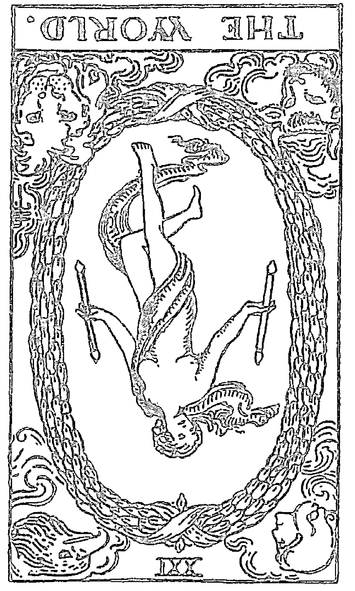

從薩滿和魔法的層面來看，這張牌是蓋婭、大自然或大地女神的化身，也代表創造出能反映「在上的，如同在下的」這條律則的神聖儀式空間。它也描繪了狂喜之舞，一支以歡慶生命為核心的舞。它強調了所有魔法修練都想達到的完整、和諧與平衡，以及它所允諾的永恆生命。

- 傳統的逆位牌義：惰性，固定不變，停滯。
- 障礙，失敗。
- 令人討厭的獎賞。
- 有敵意的氣氛。
- 元質（prima materia）。
- 物質。
- 地球。
- 不完美。
- 缺乏展望或遠見。
- 分心。
- 沒有方向感。
- 絕望。
- 劇變。
- 未完成的工作。

## 註釋

- 1. 參見將逆位的大阿爾克那視為「女英雄之旅」的〈附錄D〉。
- 2. 感謝 Normandi Ellis 在 *Dreams of Isis* 一書中描述了這個過程。
- 3. 在 Starhawk 的著作 *Dreaming in the Dark* 中，更詳細地發展出「內在的力量」和「贏過別人的力量」之間的區別，完全適用於戰車和力量的對比。
- 4. I. M. Lewis, *Ecstatic Religion*, pp. 70 & 57。
- 5. 珍·羅伯茲 (Jane Roberts)；《賽斯書：個人實相的本質》。
- 6. T. Susan Chang 於 TarotL 分享了這個故事。
- 7. 源自 TarotL 的 Elizabeth Hazel。

## # 小阿尔克那解析
数字牌

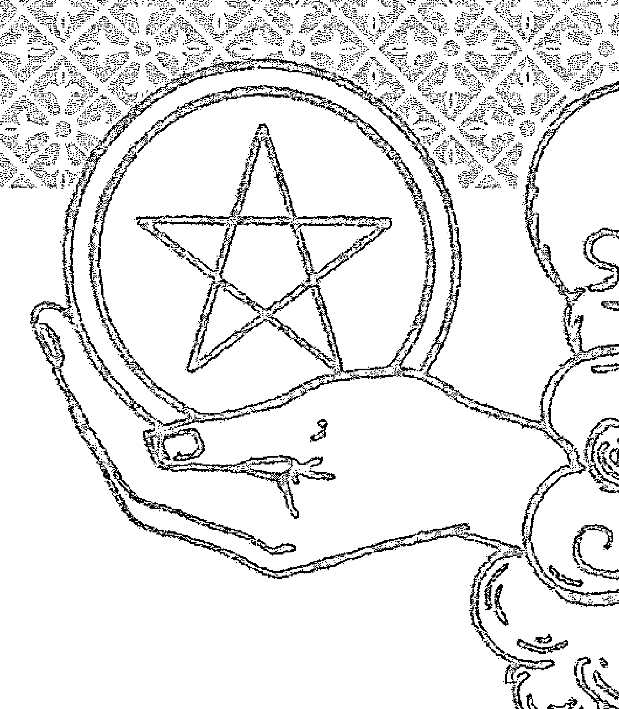

## 權杖王牌（Ace of Wands）

這張一號的王牌在能量的層面上提供了新的契機。它是「豎起大拇指」或「肯定」的牌，允許你去做任何你正在考慮的事，也許是個點子、熱愛的事物、靈感，或自我成長的衝動。它偶爾也代表誕生。你可能掌握了一個重要的機會，朝氣蓬勃地往前邁進。王牌都代表潛力或種子，然而要不要發展這潛在的機會就看你自己了。這張牌顯然是陰莖的象徵，顯示你企圖採取熱情的行動。如果你準備好了，那「熱血就會沸騰」。這張牌可能在刺激你即興發揮，做出敏捷的決定。出現這張牌的時候，你可能已經渴望改變有一段時間了。它代表一個使你產生動力的信念，也就是相信事情會愈來愈令人興奮，它也暗示成功的到來。它也說魔法是存在的，當你接受挑戰，你就可以召喚奇妙的事物。你要多加注意牌陣中出現權杖王牌的那個位置，它就像在特別強調，簡直是命令你注意它一樣。這張牌代表目標。不過，曾有一位問卜者認為它是「綁在棒子上的紅蘿蔔」，像誘餌般收買他去做他不想做的事。

- 傳統涵義：許可證。命令，布告，政令。宣布。開始，誕生，發端。發明，財富，進取。探險。威力，權威，秩序。起源。原則，傑出。前提，原因，理由。房子，世系，家族。

### 逆位的權杖王牌

逆權杖王牌有時又稱為「大拇指朝下」的牌，它建議你不要行動，「不行」或「不是現在」。不過，雖然是逆位的王牌，空氣中還是聞得到新的開始。你或許覺得準備好要改變了——你有想改變的欲望或渴望——不過適當的機會還沒出現。再者，情況還沒有成熟，你的能量還不足，也還沒做好足夠的準備，最後你可能會感到很氣餒、低潮。如果你的目標是虛幻的、犯法的，那你的熱忱可能用錯了地方。如果你太過熱情、興奮，那麼事情也許會以倉促或錯誤的方式開始。你或許不願意承擔更多的責任，心裡很抗拒。其他牌會指出是什麼讓這個過程不順利。有時候，它代表延遲、取消或妥協，或是一個機會無疾而終。可能還有貨品受損，或招募不到員工的情況。或許有人會讓你失望。你覺得興趣缺缺，無精打采。這張牌和所有的逆位牌一樣，都可能代表疾病出現。這裡的陰莖象徵表示通貨緊縮或不舉。你可能感到很無力或沒有效率。如果你曾申請過某個職務或提出計畫，你也許會被打回票、拒絕、否決，或被禁止行動。最好重新考慮你的計畫和目標，或是暫時擱在一邊。

在韋特牌中，權杖好像插在天上一樣，這表示你的點子要以靈性潛力的層面為依歸，而且別對結果有所期待。這張牌建議你面對外在採取「不做」的態度，而會建議你的內心「去做」，強調你要接通內在的權威與力量。

從薩滿和魔法的角度來看，它可能象徵火把，有如引領人穿越幽冥之旅的光明和指引。和權杖牌有關的神秘準則是「意願」(will)，也就是把你的能量設定並集中在具體、有意識的目的上。

- 傳統的逆位牌義：跌落，衰微，毀滅，式微。崩潰，苦惱。物品損失或損傷。工作沒有生產力。蒙上陰影的喜悦。私自接生或生產困難。暴君，殘忍，迫害。遺棄。糟糕的開始。希望沒有實現。

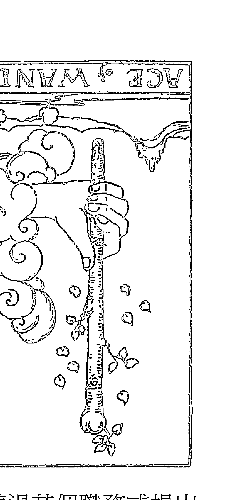

## 權杖二（Two of Wands）

這張牌常被視為雖然「擁有一切」，但還「渴望得到更多」。權杖二的出現表示你可能正在決定下一個計畫是什麼。或許你正在評估幾個選項或行動方針，或是在尋找替代方案。韋特牌上畫了一個人把世界捧在手中，表示他能夠支配資源。你也許有足夠的權力、影響力和控制權，能在世界上做任何你想做的事。你可以選擇你想在特定的影響範圍內達成什麼。你也可以先把立足點建立起來，之後再進行擴展。或許你正打算來趟旅行，或是想在前往異國的土地之前，最後一次環顧你的四周。這張牌可能表示你有通往機運的入口，不過你猶豫著，不敢走過去。你也許正等著看之前的努力有沒有成果。這張牌有一個奇怪的矛盾：在眾多帶來財富和地位的成就中，似乎仍有憂愁和不滿。有一位個案把這張牌解釋為夫妻分居。不過，兩支權杖也可能表示協同、合作、權力結盟或權力平衡。你正站在做出抉擇的分水嶺上。這張牌最深的層面是，你可能在靈性和物質的本質中找到了平衡的關係。

- 傳統涵義：讓人感到驚訝與哀傷的離去或缺席。憂鬱。哀痛。痛苦。麻煩。失去信心。受苦。爭執。憤怒。怨恨。失望。嫉妒。金錢損失。婚姻失敗。

### 逆位的權杖二

逆權杖二也叫做灰姑娘牌，因為它預告原本看似無解的情況，可能會出現驚人的改變。你可能缺乏方向，資源有限，或是覺得被綁住，對自己做決定的過程感到很挫折。別人強勢的性格可能令你感到倍受限制，或是你不願離家、旅行。也許你渴望得到一個你無法擁有的東西，結果反而丟棄了已經拿在手裡的東西，或不再珍惜你原本已經擁有的事物。不過，可能會有奇蹟帶你走出目前的限制，事情會突然轉彎，要不是讓你讚嘆，就是把你壓垮。這張逆位牌要你用接受的態度而非意志來得到成果。某人可能會突然抵達，讓你大吃一驚。或是你因為遇到困難，所以需要停止旅行。期待讓你意外的事吧！因為它可以開啟你之前甚至不認為存在的新觀點和新眼界。然而，若牌陣中有其他表示欺騙的牌，就想想看你是不是太好騙或是被愚弄。可能會有失望和不滿的情況，為一系列的事件劃下掃興的句點。你也許會透過失去一些東西而看清你內心的潛力和資源，不再倚賴外在的刺激。

就健康而言，這張牌可能代表曠野恐懼症，也就是害怕開闊的場所。

如果投射在別人身上，你可能會覺得他握有全部的權力，他要不是不願分享他的財富，不然就是你太過畏懼他的偉大，所以覺得自己不值得受到他的關注。這個人可能看起來像在阻礙你的機會。

從薩滿的層面來說，和很多奇幻故事一樣，它可能代表通往另一個世界的入口或通道，或是令人意外的國度和魔幻之境，洋溢著狂喜、開心與癡迷的氣息。

- 傳統的逆位牌義：
- 意料之外
- 吃驚，詫異
- 癡迷
- 奇妙，讚嘆
- 奇蹟
- 魔幻
- 意外的喜悅
- 回程
- 恐懼，驚恐
- 麻煩
- 支配
- 新的可能
- 意外的失去及哀傷
- 焦慮

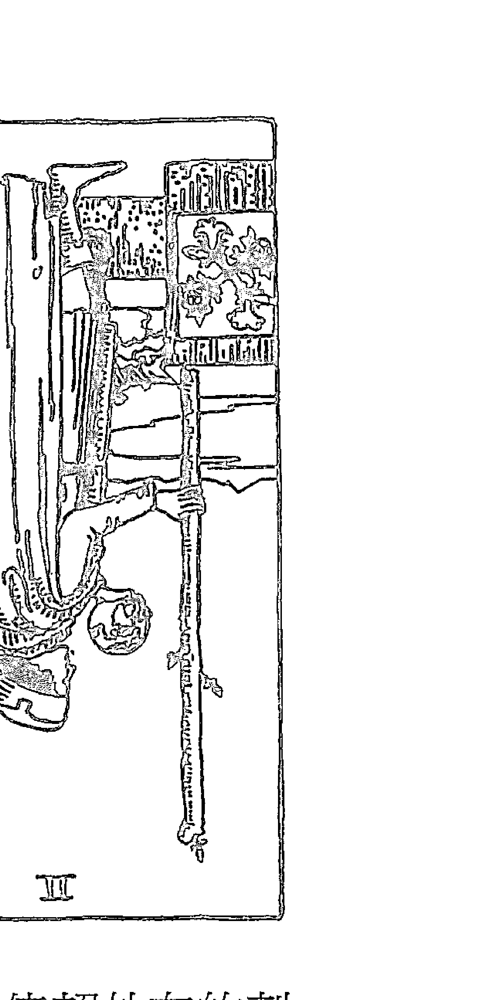

## # 權杖三（Three of Wands）

權杖二表示要做的決定，但在權杖三，事情已經展開了。在韋特牌的畫面中，船已然起航。這張牌表示你有強健的力量、自信和膽量去展開事業，也許只要把三個人或三種因素整合在一起就可以了。你會站在權威的位置來命令、督導和指示活動。這張牌可能和貿易、商業，或是海外生意、國外協商有關。你的船一旦啟動之後，你就可以稍事休息，只要等它行駛回程。在歷史上，船運業是高風險的冒險事業，如果成功，可能也要等上數月甚至數年才會拿到利潤。因此，你可能正在進行長程的規劃，或是展望未來的前景，你需要得到「全貌」，或是有創意地綜觀全局。不過，你也有可能忽略小而迫切的細節。你也許在尋找新的遠景和領土，準備好要抓住出現在前一張牌的機會。這張牌表示你在朝目標展開行動的時候，很無畏、英勇、敢於冒險，雖然看起來也許不夠謹慎。這張牌也許表示你需要旅行，或是必須從遠方處理事業。當你判斷未來的需求是什麼的時候，遠見可能是很重要的。

- 傳統涵義：事業，貿易，協商。活動，進行。大膽，無畏，急躁，不謹慎。抓住，奪取。勇氣，敢於冒險。智性的動力（intellectual dynamism），商業能力。創新。旅行。探索之旅。有成效的合作。

## 逆位的權杖三

逆權杖三表示你很難將計畫化為行動，或是你經歷到創作的瓶頸。你可能因為要承擔超過你能力範圍的事而感到挫折，這個情況讓你壓力倍增。一個極端是你表現得缺乏遠見，你倉促地行動，結果最後害你精疲力盡，造成災難。另一個極端是你有白日夢、希望和心願，但你卻不知該從何著手或害怕面對風險，所以從未開始行動。問題也可能是你的野心過大、傲慢、固執所造成，你焦慮是否能看見任何進展。你可能猶豫著是否請求別人的協助，因為你無法信任別人或是害怕被騙，結果你變得很孤立和疏離。雖然這些事情可能導致延誤和挫折，但基本上都是暫時的，情況會有機會好轉。然而，你的投資可能不會得到回收，或是計畫會失敗。

專注在眼前務實和循序漸進的細節上吧！你可以把一項工作重新安排成幾項較小的工作。你可能有一些無意識的預設和期望，當有人無法達到你的標準或做錯的時候，問題就來了。你或許覺得消息圈（information loop）忽略了你，或是拒你於門外。從更個人的層面上來說，你為了專心研究過去而忽略未來，包括前世記憶、族譜研究等各種形式。這張牌也可能表示移居國外。

投射在別人身上的時候，你可能會認為他是個愛作白日夢的人或只專注在個人未來的潛力上，卻忽略了平日該做的事。就健康而言，它可能表示在出國旅行時染病，或是某些健康問題源自基因的傾向。

從薩滿和魔法的角度來看，這張牌表示一個人要為自己的行動和決定負責，因為它們的作用力會影響未來的「七代子孫」，有些人甚至說會溯及過去的七代。

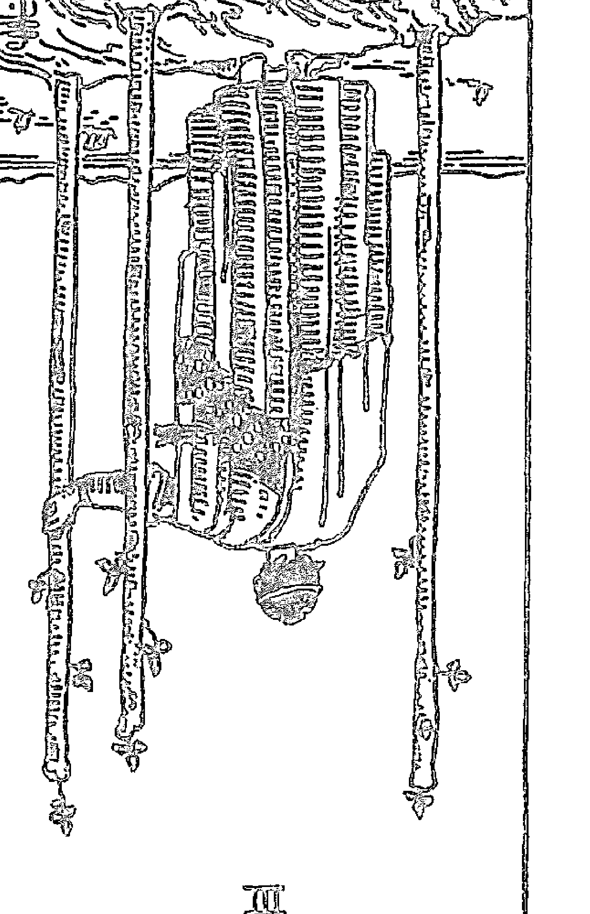

- 傳統的逆位牌義：外在的動機。不信任，背叛，欺騙。因厄運而中斷。勞力得到報償。逆境中止。痛苦、辛勞和失望結束。折磨暫止。留意別人提供的幫助。希望，欲望，意圖，心願。

## 權杖四（Four of Wands）

權杖三象徵啟程，權杖四代表抵達或返家。這張牌通常表示一個階段的完成，或一個季節和當季的工作結束，你大肆慶祝一番。工作完成了，果實也豐收了。你的努力達到最高峰，你覺得成就得很踏實。你可能會用人生的重大儀式來慶祝這些時刻，例如訂婚、結婚、結業、畢業典禮、團圓、舞會，還有研討會上的頒獎晚宴。你可能在鞏固人脈，建立聯盟，再次確立友誼，或是回歸家族的根。另一方面，你可能在對立的派系之間調解出協議，重新找回和諧和平衡。也許你在鼓勵或激勵別人為即將到來的任務而努力。這張牌也表示季節性的儀式或週末的工作坊。你可能正愉快地待在鄉下，或享受其他遺世獨立的假期。這張牌還代表休息、放鬆、享樂、社交融洽，以及快樂。此外，你也在購買房地產，或為將來的成長奠定穩健的基礎。當你在籌備前往下一個新的體驗時，不妨停下來，感謝到目前為止你所得到的一切。

- 傳統涵義：社會，聯盟，社區。團聚，相聚，舞會。歡樂的聚會。待在鄉下。慣例，契約，協議。突如其來的時機。小獎勵。成就後的放鬆。力量。繁榮。工作豐收。

### 逆位的權杖四

傳統上，逆位的權杖四和正位沒什麼差別。整體而言，大家還是很開心，生活還是對你很好，雖然你可能忘了要心存感激。我們大多數人對家人或學校的聚會和頒獎晚宴，都抱著不情願和抗拒的態度，以及有一種矛盾的感覺。一方面你可能想見見大家，卻又同時害怕自己格格不入，畏懼社交的細節。你心中的不安和壓抑可能會浮上檯面，你也可能不舒服地發現，檯面下其實隱藏著失色的生活。這張牌也可能會打破舊有的傳統。或許你在這類場合中找不到樂趣。你也许会发现自己投射完美的幸福到别人身上，认为自己是唯一一个得不到幸福的人。如果你参加了令人愉快的工作坊和聚会，那么你可能会担心离开、重新回到正常生活后该怎么自处。家人或团体成员各奔东西的时刻，可能令人既感伤又开心。看似圆满的事好像有些缺憾。人生大事可能令人不安或不符合传统，像是不受到认同的婚姻。也可能是离家或把家卖掉的时候到了。这张牌也许代表社交场合的灾难和失误，不过比较是幽默而非破坏性的那种。工作上，你可能过于长袖善舞，或是害怕因扫兴而伤害生意。

投射在别人身上的时候，你可能把他当成大家庭的一部分或是恩人。就健康而言，它表示重拾健康，或是生产、医疗过程很顺利。

从萨满和魔法的层面来看，这是张很重要的牌，代表人生大事，而它根本的目标之一，是达到教化或灵性的目的。在灵性的旅程上，它代表辅助你从幽冥世界平安回家的咒语、鼓声和祈祷。

- 传统的逆位牌义：繁荣，成功，美好，快乐，愉悦，浪漫。稳固的基础。兴旺。好处，晋升。美好，锦上添花。不完整的幸福。缺少享乐。失色的美丽。

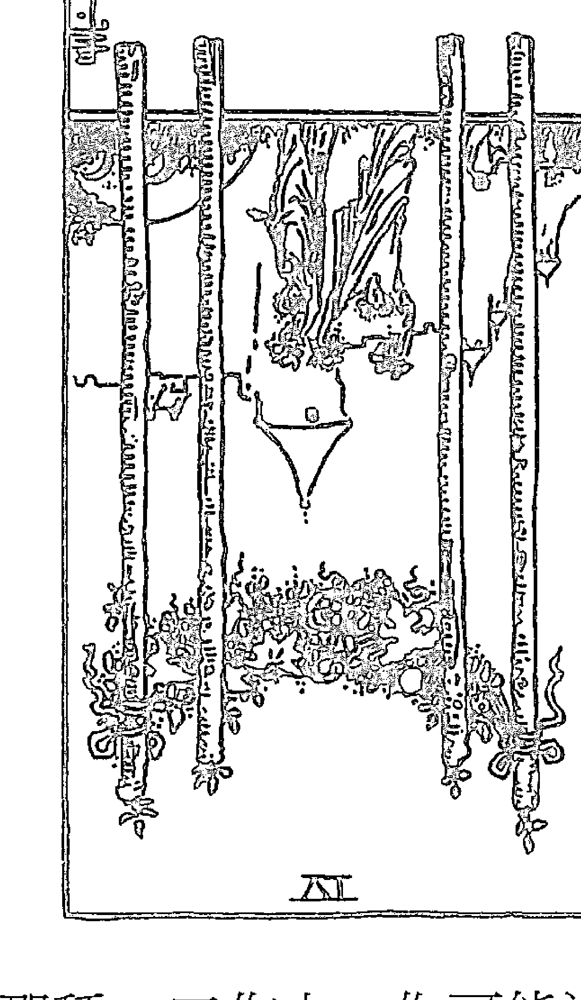

## 權杖五 (Five of Wands)

權杖五打亂了權杖四的和諧。它表示你捲入了傾軋、競爭、權力鬥爭、比賽、野心或驕傲的態度裡。不過，韋特牌的畫面同樣適用於團體競賽、發想和解決問題，或是大家都以積極的態度為成功奮鬥。我把這張稱為「委員會牌」：你可以透過和別人的衝突、意見不合來測試你的想法，或是在自己心中由五個不同的部分所呈現的慾望衝突中掙扎。一開始好玩的競爭或假裝的戰爭，到最後可能會演變成怒氣勃勃的對戰，或是具有殺傷力的批評。當你害怕你的想法不被認同，或是你的慾望不會得到滿足，你可能會心生敵意。此外，這張牌代表你可以特別用自由和好玩的方式表達想法，幫助你探索多元的觀點。它也表示激勵人心的活動、耍手段爭得職位，或是激起強烈的性慾。你可能正努力獲得成功，或掙扎著想被聽見。韋特牌的五個人好像在建造一個五角星形，它是力量和保護的象徵。這張牌建議你檢視不同的觀點。雖然你有機會進步，但你可能必須很努力和克服障礙才能獲得。

- 傳統涵義：黃金，財富。豐富，豪華，光彩。豐盛。收穫。慎重的婚姻。高道德活動。過度驕傲或愛生氣的個性可能會毀掉成功。

### 逆位的權杖五

逆權杖五可能表示要突破障礙，或結束一段充滿衝突和壓力的時期。然而，這可能需要法律或專業的介入。你可能拒絕再玩，或是不想再參與一個反覆無常的情況；你想讓它消失，但你可能無法置身事外。就像柯林頓總統和盧文斯基（Monica Lewinsky）一樣，其他人可能會為難並騷擾你，到最後還展開法律程序。某人可能會暗自破壞協商，好讓事情懸而不決或不穩定。

也許你希望減少自己的意見，不想提出來供人討論。你可能害怕開口，或是不敢製造爭議。逆位牌表示混亂可能是內在的，你也許因為心中感到衝突，因此難以做出決定。你的優先順序是什麼尚不明朗。敵意可能演變成大爭執或爭吵，或是因耗盡力氣而減少。在正位的韋特牌中，所有的木棒都參差不齊，而逆位牌中人物的腳卻都是對齊的，所以另一個極端是你們最後可能會同心協力，變得融洽，結束敵意。然後你可以有機會放鬆，開始一段平靜、輕鬆的時期。遊戲或運動賽事可能會延後或取消。

就健康而言，這張牌可能表示抗體正在對抗感染。投射在別人身上的時候，你可能會相信都是他們在製造敵意或爭吵的行為，但自己是平靜、不為所動的。或許你也懷疑是他在搞鬼。

從薩滿和魔法的層面來看，你可能正在從事自我的心靈防禦。或者，你可能有瞞騙或耍花招的傾向，像是用詭計或奸詐的方式來引發爭端。這可能是一種聲東擊西的方法，讓人們分不清你真正的目的，然後你再乘亂逃逸。

- 傳統的逆位牌義：訴訟，法律程序。法庭，裁決。爭議。奸計，騙子。迫害。激怒，騷擾，爭執。牴觸。雖然受到延誤而有些不愉快，不過整體而言結果是好的。

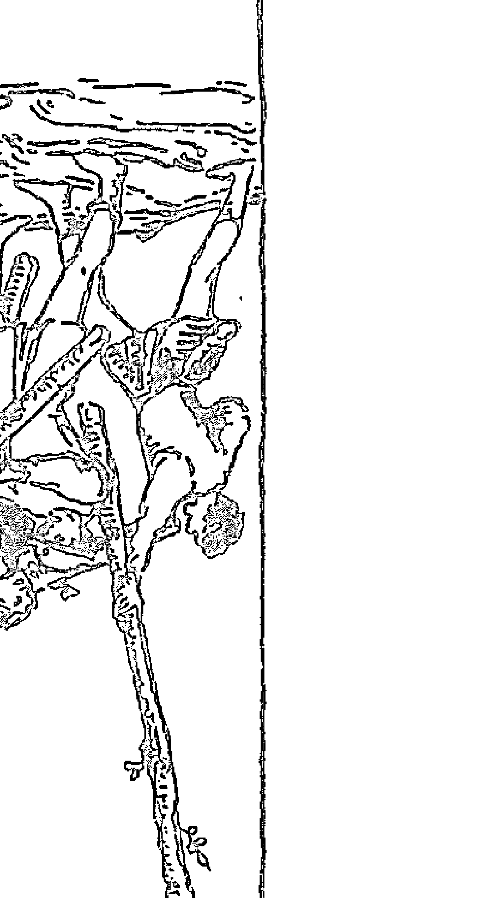

## # 權杖六 (Six of Wands)

在權杖五的鬥爭之後，權杖六出現了贏家或領袖，其他人集結在他身邊，擁護他。它也代表為了主要的計畫動員。這張牌代表成功、勝利、驕傲，得到更多力量或進步，而且通常是靠自己的技能和勇氣。我們可以在章特牌上看到一個戴著桂冠的人，騎在馬上象徵他志得意滿。這張牌預告勝利、取得權位或得獎。你可能會變得家喻戶曉，人人稱羨，或你的成就為你帶來了獎賞。你也許在擔任領導的角色，或是擁護並追隨處於領導地位的人，因此你可能會期望在上位的人有領導能力。這個人物可能會帶來好消息，或是預告希望和願望會實現。其他人也許會把你當偶像般崇拜，或是請你指揮大家。你的自信和積極的態度會鼓舞追隨者或團隊工作。不過，你需要大家繼續對你友好，才能維持這個位置。權杖六這張牌表示領袖和擁護者在和諧的狀態下共同運作，所以會互惠互利。除此之外，這張牌也描繪集結在一起的勞動者，以及能為你帶來人氣，也能使你失去人氣的民意。

- 傳統涵義：居家或家庭生活，家庭，僕人，家務。信差。好消息。希望、慾望、願望、期望實現了。難題解決了。懶散和工作交替。僕人之間爭吵。努力帶來回報。進步。

## # 逆位的權杖六

繼權杖五可能帶來的迫害和騷擾之後，逆權杖六可能表示從高處摔下來。這是「特洛伊的木馬」牌。傳統上，它代表勝利或成功可能很無常。敵人或許就在門外，某種叛變和背叛也許正在發生。消息或快遞的物件被搞丟或被攔截，或是你遭遇溝通不良的情況。員工或你手下的人可能對你不忠，不支持你，也或許只是讓你失望。除此之外，你也許對屬下很傲慢、自大或頤指氣使。勝利可能迷惑了你。

的行動或許會受阻。事情有被耽誤的機會，或是你很恐懼、憂心。請小心行事，尤其是你要倚靠別人的時候，但別讓不信任轉變成不和的局面。驕傲可能會讓你出錯，或是害你尷尬地摔跤。這可能是一個虛有其表的情況。領導者也許能力不足，效益可能不彰。你發現某個英雄或公眾人物說不定有「致命的缺點」。你可能正在從一段承諾的關係中抽身。也許你抗拒或拒絕擔任領導的職位。雖然你可能懷有不為人知的野心和內在的成就，但別認為你必須藏起你的桂冠。

如果你把勝利投射在別人身上，你可能會感到嫉妒、不相信他的能力，或是想要暗中破壞他的努力。就健康而言，它表示你的抗體雖然在努力對抗感染，但最後可能會失敗，或你可能真的因為跌倒而吃盡苦頭。

從薩滿的層面來看，這張牌讓人想起童話裡從土堆跑出來惡作劇的人，宣稱任何偶然發現他們入口的人都屬於他們。如同蘇美神話中伊南娜（Inanna）的追尋，它可能代表墜入幽冥之地，展開一趟自我探索之旅。

傳統的逆位牌義：不貞，叛變，不忠。憂慮，小心，恐懼。等待，期望。希望遲遲未實現。背叛。耽擱。差勁的服務。短暫的收穫。表面的利益。信件丟了或被攔截。信任自己。自信。遠見。

## 權杖七（Seven of Wands）

這是一張爬上頂峰、稱霸世界的牌，與堅持立場、說服歧異有關。和權杖六一樣，每當有人爬上頂峰，就有人在等著挑戰他，或是把他拉下來，就像權杖七上畫的一樣。接下來就是要測試你是否有克服這種障礙的毅力。你勇敢地當上領袖之後，不論是面對逆境，甚或只是進行簡單的協商，都需要拿出勇氣、堅持不懈。你可能需要想好應對的態度，或是需要捍衛你的立場、信念和理想。你也許面臨競爭，或是在演講、討論或網路上遇到反對你的看法。也許有人不認同你。韋特牌上的人物好像抱著騎牆的觀望態度，或是站在懸崖的邊緣。雖然他站在優越的有利位置，他卻穿著兩雙不一樣的鞋，這可能表示他的立足點不穩或不明確。當你用堅持而又自制的態度來處理問題、敵對關係及對抗，你就能培養出對自我價值的信心還有勇氣。不過，有一位塔羅的占卜師說，處理與你敵對的人事可能會消耗精力、浪費時間，你不如把時間花在更好的事情上 ①。此外，畫面中的人物可能是在將權杖插在地上，象徵你可以專心建立適當的配置，或是讓任何會出現在計畫中的元素和諧地搭配在一起。

傳統涵義：討論，協商，演講。貿易，商業。晤談，會議，座談會。論文。八卦。成功，好處，利益，收穫。辛苦、競爭後的成功。高生產力。考試成績很好。

## 逆位的權杖七

這張牌讓人想到柏林圍牆，它的出現是為了要讓兩邊的人無法互相接觸。這張牌可能和偏執有關，或是想克服偏執、拆掉圍牆。它也表示感覺太過沉重，或是要處理的事情太多。也許家人和朋友反對你下一個工作或與人交往，而你正在克服這個問題。或是你主動設下防禦和藩籬，想與人保持距離。在好的情況下，這類藩籬可以讓你有時間或空間在做決定前反思一番，或是讓你一個人好好解決困難，平靜地做出調整。不過，這張牌也可能是拿坐立不安當藉口，逃避跨出下一步。傳統上，這張牌叫做「為難」，它有雙重的涵義：一是扭捏不安的痛苦，二是因為東西太多或太好而把事情搞得很複雜，難以選擇。你可能變得太過小心或軟弱，特別是當你的地位比較不利或比較低的時候；你選擇打退堂鼓或退出，或是以退為進。你沒有堅持立場，反而在談判中妥協，因為你想要得到好處或人氣。不過，你也可能毫不退讓，或是攻擊、生氣，特別是你認為自己很脆弱，以及害怕被欺負而做出過度補償的時候。猶豫不決可能會害你搖擺不定或洩氣。若投射在別人身上，你也許會覺得他意志薄弱和柔順，有時也會覺得他像窮追不捨的跟蹤狂。逆位牌也可能代表卸下人與人之間的防禦、圍牆和屏障。

就健康而言，這張牌可能表示神經緊張、強迫症，或是身體產生太多某種化學物質，例如糖尿病的情況。

從薩滿和魔法的層面來看，這張牌代表根植大地和歸於中心的技巧，每當你要敞開心房，或是處理你個人塵封已久或排拒不看的恐懼和兒時創傷時，這些技巧就變得非常重要。

- 為難
- 焦慮
- 驚駭
- 猶豫不決
- 懷疑
- 優柔寡斷
- 猶豫
- 不確定
- 困惑
- 躊躇
- 損失
- 多樣
- 多元
- 被欺負
- 詆毀
- 過剩
- 超量

## 權杖八 (Eight of Wands)

權杖八也常被稱為「戀愛牌」，黃金黎明稱之為「敏捷」(swiftness)。你可以想像它表示有狂熱、了不起的點子或熱忱席捲了你——彷彿腎上腺素激增一樣，欲望令你心醉神馳。活動和能量都在啟動，而且愈來愈強烈。這張牌代表商業交易，還有手機、網路或快遞等迅速的溝通。它也可能是搭飛機旅行、演習、比賽，或是一種對準目標的快速進展。韋特牌上畫了「愛神之箭」，這些箭全都在半空中，而且是整齊地平行並排。你可能正在進行系統化、理出頭緒、校準或簡化的過程。你也許在獨立思考一些事情，不過你走的是和別人一樣的路線，就像好幾個人同時在同一個方向上發現了一些東西。它通常表示事情雖然有進展，不過有太躁進的危險。要願意順其自然。你或許會發現一些緣分或巧遇，在肯定你走的方向是對的。不過，這張牌可能表示你正經驗到如同在廟會或主題樂園的那種狂熱的能量。

傳統涵義：
- 住在鄉下或遠足
- 農業，灌溉
- 花園，田野，森林
- 旅程
- 娛樂，消遣，慶祝活動
- 大型活動
- 平靜，安詳
- 有愛的感覺升起
- 幸運
- 倉促的發展
- 商業交易
- 進步，方向

## 逆位的權杖八

逆權杖八的權杖好像在擋路或是在晃動，象徵你可能會迎頭撞上問題。和諧變成爭吵，狂熱變成嫉妒或敵對，你的情緒四處竄動。戀情可能會破局。你也許太過衝動，或是困在反覆出現的善變模式中。也許會有意见不合和爭執的情况。你的感受變得太強烈，可能還會失控。或許有第三者擾亂你的愛情生活。你的溝通出現失誤或找不對人的狀況。你在浪費精力，努力說不定也會白費。可能很多小事都出了差錯，你到最後一分鐘都還在倉促奔走。若情況變得太激烈，你可能還會歇斯底里或驚慌。這張牌也代表不遵守、不相容、不規則，或是不吻合的事物。此外，還可能有罷工或速度變慢的情況，以及平常逆位牌所代表的延誤和取消。計畫和靈感可能不了了之。不過，這張牌也可能讓你的機會不再受限，現在你可以自由面對其他可能性。牌的運動方向不是朝向地面，反而像是往上，表示你正在突破，曾經驗到新的東西。

有一位問卜者已經和先生分居三年，這張牌呈現了她當時的狀態：她不再搖擺不定（錢幣二），提出離婚訴訟。當她放下強加在自己身上的限制、破繭而出，她所有的疑慮都消失無蹤。

如果投射在別人身上，你可能會認為他太急躁，結果製造出混亂或問題。就健康而言，這張牌代表賀爾蒙、腎上腺素或其他身／心和身體裡引發心情轉換的化學物質。

從薩滿和魔法的觀點來看，這是蓬勃的生命力爆發。因為它與迅速的動作有關，所以可能代表女巫的掃把，以及飛行的能力或是星光體出遊。

傳統的逆位牌義：爭吵，家裡的爭執，不和諧。嫉妒之箭，內部的爭吵，良心的提醒，家裡不和睦。干擾婚姻的第三者。倒退，停止，罷工。後悔，悔恨。良心不安。

## 權杖九（Nine of Wands）

權杖八的進展到了權杖九，終於大功告成。在韋特牌中，當權杖達到了目標後，就被排列成堡壘的樣子。你可能預期自己會被某個人或事物攻擊，他們看起來甚至不怎麼明顯。你可能在保衛、看顧你的計畫或利益，或在囤積你必須保護的補給品。如同老軍人身上的傷痕可以證明他的經歷，你的訓練、發展和紀律都已經為你帶來道德和靈性的力量或品德。你謹慎的態度和智慧會建議你小心評估，因為有朕兆顯示可能有衰退和懷疑的問題，會遇到困難，有敵人出現。這些現象如果真的發生，你可能會耽擱、延遲或暫時中止工作，不過也可能只是休息一下而已。你可能會在眾多的選項中選擇其一，把其他的選項都犧牲掉。你或許在凸顯自己，表現出一種特立獨行的樣子，和別人變得很疏離；你可能因為過去的傷痛，所以躲在自己創造出來的防禦裡。沒有彈性的觀點和舊有的習慣模式可能更加根深柢固。當你堅持你的路線，或果決地捍衛你創造出來的東西時，決心的力量和信念的勇氣能幫助你面對困難。這張牌代表「再看看」的態度，和權杖八的倉促相反。

傳統涵義：延遲，中止，休會。移除。失和。難題，挫折。等待，預期。潛在的敵人。停滯。秩序，紀律。經驗。備用的力量。暫停行動。謹慎。缺乏動機。

## 逆位的權杖九

韋特牌的逆權杖九上面畫的人好像已經準備好要衝破限制，他正在尋找出口。正位牌的障礙和難題可能會變得更極端，寂寞和疏離感亦然，最嚴重時會感覺像是一種放逐。也許卸下防備，重回人群懷抱的時候到了。不過，你也可能在嘗試克服某人的抗拒。你也許在重新考慮要不要遵守承諾、想逃避責任、變得缺少紀律，或是已經厭倦老是要等待一個永遠不會到來的東西。不過現在你也可能並沒有責任要承擔。當你得到一點自由，你可能會變得衝動，或是草率行事。

你的進展或許遇到了死路，或是你的事業正在退步。這張逆位牌的感覺就像在醫生候診室或在機場候機室等了太久，你可能會變得很絕望，不知道到底會不會輪到你。就健康而言，你有輕微但拖了很久的疾病，也許是擾人的慢性病，或是衰弱的免疫系統，表示你可能還要繼續為健康而戰。換句話說，你基本的抵抗力可能下降、受損。生活中，你可能有個人的「十字架要背」，它會在無意間阻礙你達到終點。如果把這張牌投射在別人身上，你可能會覺得他有敵意，彷彿在阻擋你加入某個社團或某種經驗。或許你表現出虛假的外表，但又拒絕承認是你自己感到懷疑和不友善。要不是你戒心太強，就是有人在你毫無防備的狀況下逮到你。這張牌也可能代表內在沒有與人分享，或是無法與人分享的知識和經驗。

就薩滿和魔法的層面而言，它和智慧老人、隱士，甚至是龍的原型有關。龍是守門人，等著旅人抵達。它代表在使用法力時的辨別能力。

傳統的逆位牌義：障礙，磨難。逆境，問題，延遲，災難。要克服的屏障。痛苦。輕微但拖很久的病。運氣不好，厄運。遲鈍。不愉快。

## 權杖十（Ten of Wands）

十號牌從九號牌的個體成就走出來，要去和大家分享成果。就權杖十的情況來看，這可能會是既成功又痛苦的行動。在王牌開始的時候，原本只是一個很棒的點子，或許現在是因為你太有信心的關係，反而把它擴充成很多計畫，要堅持下去的沉重感令你倍感壓力。它也可能表示資訊過多或累壞了。這張牌和負擔、責任、義務與必須按照期望來做有關。你可能覺得自己的野心害了你，或是你怨恨你所付出的對象。如果是被「系統」壓垮的話，無論這個系統是家庭、政府或工作，你都會覺得這些擔子已經變得不公平而且殘忍。你承受重擔，受到拖累。你可能覺得被困住了，壓力很大。或許你不知該如何分攤責任給別人，或是自私地想要掌控一切。計畫變成了看不到未來的障礙。熱忱被沉重的責任壓垮，連同你的創意也陷入瓶頸。或者，你也可能很驕傲自己擁有能夠幫助別人的技術和能力，你用堅忍甚至是輕鬆的態度扛起了這些事情。這張牌表示最後的階段到了，一個漫長而成功的努力終於來到了最後痛苦的一步。

傳統涵義：壓迫。過度活躍。背叛，不忠。贗品，看起來像假的，偽裝，不誠實。不公平。殘忍。難以根除。旅行。信心，安全，榮耀，誠懇。高賭注的賭局。不計代價的成功。豐收。大筆的獎賞。

## 逆位的權杖十

逆權杖十可能表示卸下重擔，從有壓迫感的狀況中脫身，以及和別人分攤責任。你可能正在脫離困境，從壓力中解脫，或是在清出一條路，走向新的開始。不過，你也可能會否認你的工作過於龐大。如果你困在一個讓你無法站穩的情況裡，你可能會感到喪失信心和絕望。你或許會「把頭埋在沙裡」逃避問題。若借用傳統正位牌義，它可能代表贗品和虛假，那種核心已經腐爛的東西，或是單純的假裝。

你可能因過分謙遜而不露鋒芒，或是為了逃避而偽裝，像福爾摩斯假扮成普通的勞工來作為掩護一樣。想一想有沒有欺騙和不忠的情況，這很重要。檢視自己把擔子交給別人時是出於良知，還是在推卸責任。

如果把這張牌投射在別人身上，他們會看起來非常矛盾和虛偽，或是你認為他們不負責任，不值得信賴。或許你過去信任某人，現在他卻讓你「背黑鍋」。工作可能還沒做完。絆腳石可能讓你無能為力。無論你付出過多少努力，都可能沒有產生正面的效果。它可能宣告懷抱多年的野心或夢想結束了。你可以從其他的牌來看出整個情勢，或是替代的處理方案。就健康而言，傳統的涵義表示染上因沒有注射疫苗而發作的疾病，例如流行性感冒、麻疹或結核病。如果你正在辦理财產抵押（譯註：如擔保、扣押等），你可能會覺得生活中多了一個新租約。這張牌可能表示清理殘餘，清掉家裡亂七八糟的東西。你可能在搬家或移民。

從薩滿和魔法的層面來看，它可能代表治療祖先的部分，以釋放基因和家族中已不再能幫助你實現最高目的的模式。

傳統的逆位牌義：努力的結果有限。核心腐爛。陷阱。障礙。故意違反諾言，刻意打破信任，背叛。你不是表面看起來的那樣。相反。損失。詭計。虛偽，擔憂，陰謀。

## 聖杯王牌（Ace of Cups）

這張聖杯王牌為情緒、心靈和家庭的層面提供了新的契機。它可能預告會有新戀情展開，或是已存在的親密關係會變得更加深刻。你可能會開始談戀愛，張開雙臂迎接幸福，或是歡迎某人加入你的家。你也許有很多的食物或飲料，或是有派對、社交場合在籌備之中。或許你會經驗到一股莫名的衝動或洶湧的情緒，因為牌面上描繪了你的心和情緒滿溢而出。你和你所愛的人可能會因別人送的禮、神聖的祝福和靈性的灌溉而受惠。可能有人想愛你或向你表示情意，也許是用情書的形式。這張牌鼓勵你順應時勢，和別人連結。工作上，你可能有機會「跟著你的幸福走」（follow your bliss，譯註：由美國比較神話學大師坎伯提出來的想法，他鼓勵大家要聽從內心，跟著讓你充滿熱情、感到幸福的事走，那麼你的英雄之旅就會圓滿實現），做你所愛的事。有時候，它還代表生殖力、受精、出生或結婚。它也和開啟心靈，或夢想、願景、直覺如泉湧而出有關。現在你可以進入想像力和無意識的國度了。也許此刻你特別善於接納、反思。這是個向內看的好時機。你滿心喜悅，「你的福杯滿溢」（譯註：源自聖經詩篇23:5）。這張牌表示基督聖杯（Holy Grail）的理想主義，豐饒角（cornucopia，譯註：裝滿花果及穀穗的羊角，象徵豐盛）裡靈性和物質恆滿的恩典。

傳統涵義：
- 家
- 壁爐
- 住所
- 家庭
- 桌子
- 宴會
- 滋養
- 盛宴
- 邀請
- 振奮
- 豐富
- 放縱
- 好消息
- 繁殖力
- 出生
- 愛
- 激情
- 善良
- 豐盛
- 美
- 喜悅
- 持久

## 逆位的聖杯王牌

逆聖杯王牌表示情緒、心靈或夢境遇到了限制或界限。你之前對某人、家庭或工作的熱情，可能已經隨著時間過去而磨損或消逝。或許你感覺很倦怠或空虛。也許你在和某個情況保持距離，想避開它破壞性的影響力。不愉快的回憶和過去的失望可能會讓你意不願接受新的觀點或感情。你可能會拒絕承認自己有某些感覺，不然就是對別人表現出你並沒有真心感受到的關懷和牽掛。例如，你可能用不誠懇的奉承來操弄別人，或是用感情來交換金錢、保障和職位。如果你在飲食上太放縱，或是有飲食上的問題，那麼這張牌指出還有更深的原因。你可能遇上沒有回報的愛情、失戀或欺騙，或是你渴望的那份愛毫無回音。和其他的逆王牌一樣，也可能會出現延遲或不孕的現象。

也許你壓抑了自己通靈、直覺的神秘能力，或是認為它們不值得信任。此外，你可能漫無目的且容易受騙，無法專心，也無法認真投入一個方向。如果投射在別人身上，你可能會認為他很善變或優柔寡斷。你不歡迎改變，而且因為留戀過去而變得愁善感或憂鬱。或許你覺得別人在「潑你冷水」。你可能拒絕了一段友誼的開端，或回絕了一個機會。不過，這張牌也可能表示你在遠離毒品、酒精和放縱的生活，希望能更深入地領會人生真正的泉源。就健康而言，這張牌代表和上癮有關的問題，還有胃痛、消化和其他和食物有關的疑慮，以及「女性」方面的問題。

從薩滿的觀點來看，這張牌表示深入你的感受——尤其是負面的部分。像循著線頭一樣回溯以前的記憶，這樣你就可以從那次遭遇帶來的激動情緒和殘存的內疚中，重新找回你真正的感覺。

傳統的逆位牌義：改變，新奇，革命，更改。腐蝕，變質，變形。善變，不穩定。沒有回報的愛。虛情假意。不孕。交換，交易，販賣。捐獻。不屑接受利益。

## 聖杯二 (Two of Cups)

如聖杯二的畫面所表現的一樣，這張牌講的是愛，還有愛那令人振奮及療癒的力量。展翅的紅獅子表示熱情有機會變得靈性，整張牌代表的是平等、互重和互惠。人們常提及異性相吸的力量，而這張牌就表示有機會造就充滿愛的關係或彼此關愛的互動。你可能在和某人合作或分享，想要超越彼此的異同，或是你們為了某個更高的目的而互相吸引。也許你在接合你身上兩種不同的面向，例如男性面與女性面、外在與內在，你活在施與受和諧的交互作用中。你可能對某人感到慈悲和同情，或是願意去遷就他。二號牌可能和選擇有關，而這裡它代表不同的選項可以混合或結合在一起。布雷克認為，相反的兩方需要彼此，才能引出自己最圓滿的表現。因為這張牌表示把分裂的結合或合一，所以如果你有過衝突，那你可能正在尋找寬恕或和解的方法。這張牌也可能表示結婚或訂婚、友情、熱情，或是單純的迷戀。也許你保證你會徵求雙方同意，或大家在一件合作的活動上意見都很一致。

傳統涵義：關係，愛，依戀。吸引力。熱情。感情，親和力，親切。和諧，同理心，一致。真誠。訂婚，結婚，伴侶關係，結合。友誼，合作。共同的好運。仁慈。

## 逆位的聖杯二

逆聖杯二可能表示互相衝突的訊息，像「拔河」一樣的互動，或是爭執和空洞的熱情。想要在一起的意圖也許會失敗，至少暫時如此。相愛可能會遇到阻礙或反對。兩人的差異也許會導致離婚——不過也不一定。它可能表示有一段時期你會很孤單，沒有任何的戀情，但它也可能指盲目的信任。或許你在拒絕愛，想結束感情，或是在進行秘密的戀情。如果你目前的感情狀況很好，那麼也許只是暫時的問題而已。其他牌會指出問題在於虐待、不忠或是性生活不協調。也可能是占有欲、溝通不良、分開、沒有回報的愛、沒有戀情，或是有人讓你名譽掃地。最嚴重的情況是信任破裂，熱情不再，或是願望沒有成真。也許你被一段對你不好的感情吸引。不過，因為這真的是一張很好的牌，所以除非有事情支持那些最嚴重的情況，否則它只是表示情況沒有完全按照你所希望的那樣發展。不是每對戀人都像羅密歐與茱麗葉那麼倒楣；比較可能的是你約會對象遲到、情人之間的口角或只是離別一個週末時那甜蜜的哀傷。

若投射在別人身上，你可能會覺得他背叛了愛情或拒絕遷就你。如果向內看的話，它可能表示你要平衡內在的男人與女人、金星與火星，或意識和潛意識。因為現在的情況也反映出你內在的自我，所以別人對待你的方式也反映出你對自己的感覺。就健康而言，它可能表示性病，或是會出現其他的感染，不過這張牌主要還是和痊癒有關。

傳統的逆位牌義：相對的欲望。願望，想要，渴望，渴求。貪求。羨慕，貪婪，嫉妒。強烈的性慾，欲望，激情。幻象。阻礙，障礙，對立。爭吵，衝突。分開，離別。不滿意。不忠。

## 聖杯三 (Three of Cups)

繼二號牌建立連結之後，聖杯三是你放寬互動的範圍，向大眾公開。這張牌對女性的圈子和聚會有特別重要的意義，不過它也可以代表男性情誼、不分性別的友誼，或友善的工作環境。它表示意氣相投，也可以代表結盟、舞會、歡樂的場合、好客和一般的美好時光。你可能會參與某種娛樂、獨唱會、表演或玩遊戲，慶祝你的好運和成就，像是升遷或完成專案。你也許會得到同儕的幫助和支持，或是從大家的建議和資訊中受益。韋特牌中的豐收符號，象徵收成和豐美的時節，工作順利完成，問題也解決了。它暗示這裡的成功特別與藝術（文學、詩、歌、音樂和跳舞）有關。你可能會參加儀式，因為這三個人好像在一起激發能量，提升靈魂。這張牌強調享受、滿足、恩典、團體分享和相互支持。歡樂和跳舞接踵而來。然而，如果有其他的牌相呼應，可能會有藥物或飲酒過量的問題，或是有關共依存（codependency）的問題。

傳統涵義：
- 成功，名聲
- 豐收
- 困難結束，快樂的結尾
- 恢復，解脫，安慰，療癒
- 成就
- 完美
- 文學聚會
- 歡愉，歡樂
- 豐富
- 訂婚
- 懷孕

## 逆位的聖杯三

逆聖杯三可能表示你和朋友見面與社交的時間變得比平常少，也許是因為你有其他的事在忙。生活的步調可能變快，似乎沒什麼時間閒逛或是和朋友瞎混。不論是失去了陪伴與美好的時光，或只是次數變少，你心裡都可能因為懷念而有酸酸甜甜的感覺。然而，你也許會太過沉浸在這種感覺裡，而對那些你該做的事感到厭煩。或許你對夥伴或同事已不再存有幻想，或是覺得平常的娛樂既空虛又不能滿足你。這張牌可能表示暴飲暴食，還有上癮的病症。牌面上的舞蹈也許是醉後的嘻鬧，或是你在還有工作要做的時候玩樂。你的共依存或支持網絡可能消失了。這張牌也可能表示你在節制或戒酒，不再跟同一群人鬼混。如果你正嘗試讓某項計畫順利收尾，那你可能還會遇到障礙，或是需要和別人合作。這張牌也可能與派系或小圈子把你排除在外有關，像是在排斥你，而你也會覺得受到冷落。有一派傳統提到這張牌表示你認識的人會偷你的東西。你不選擇和會為你的成功開心的人在一起，反而和會嫉妒你成功，或是與你的價值觀、目標不一致的人在一起。如果投射在別人身上，你可能會覺得他們像是在螞蟻準備過冬時愛嬉戲的蚱蜢。就健康而言，聖杯牌通常代表放縱，不過也可能代表意外和跌倒。

就薩滿和魔法的層面來看，這張牌代表三相女神（Triple Goddess）：少女，母親，老太婆。它表示為了和自然界的力量維持良好的關係，而提供祭品給小妖精以及掌管各種自然力的精靈。它也指為了進行魔法修煉而提振能量。

傳統的逆位牌義：終止，結束。進行生意，快速，迅速處理。在快樂結局之前要克服的障礙。挫折。過度歡愉，過剩，過度放縱。失去聲望。延遲。偷書賊。意外。

## 聖杯四 (Four of Cups)

聖杯四有時又稱為「夜晚過後的清晨」，夜晚指的是聖杯三。歡樂完了之後，你可能需要安靜地沉澱、穩定下來，休息一下。也許你會想靜心、冥想或獨處，尋找靜謐，或你只是感覺慵懶、無聊和不想動。你可能把你的放縱以及噁心、反感或不滿足重新反省了一遍。也許你真的感到宿醉、胃痛，或是因過度努力而精疲力竭。沒有什麼能激起你的興趣，讓你開心。因為你刻意地表現冷淡，所以可能會忽略或拒絕好運、機會或友誼的開端，或是將事情太視為理所當然而不再付出努力。你也許會想休假或度假。

另一方面，這是張代表白日夢的牌，你可能在沉思、幻想或想像自己在安排一些事情。如果是和創作有關的情況，這張牌可能代表休耕期，表面上好像沒什麼進展，但這是為了讓創意和新點子能在放鬆的狀態中躍進和誕生。它也代表花時間與大自然合一，或你只是在等待下一步變得更清楚。

傳統涵義：疲軟，疲憊，沮喪。惱怒。無聊。噁心，反感，不滿足。不滿意，不愉快。心情鬱悶。家裡有問題。愛情的痛苦。苦惱。困境，怨恨。痛苦。令人不滿的關係。沒有動靜的階段。

## 逆位的聖杯四

逆聖杯四表示你在尋找新的機會，想要克服無聊和消極。若你想讓你的存在恢復生氣，那不妨重新考慮你之前拒絕過的選擇。你所需要的只是一些徵兆、預兆或預感，告訴你要投入哪個新的研究、友誼或事件。逆位牌有時會加強這張牌通靈的潛力，讓你對來自看不見的世界的訊息更加敏感。針對過去的老問題，可能會有新的解決方法意想不到地出現。有時這張牌表示一種坐立不安的感覺，你坐不住，無法安靜地冥想。你可能正在突破正位牌中令人不滿足的休耕期，渴求新的經驗。如果過去的人際關係讓你覺得很無聊，那你會迫切地想結交新朋友，但你可能不會特別去管是否只是被他們新奇的地方吸引。有時你也許會有一些預兆或前兆，像是「我突然打了一個冷顫」。把這張牌投射在別人身上的話，你可能會覺得他固執又頑強，不願意經驗新東西，或是他飄忽不定，老是在追逐不同的潮流，卻又總是很快就厭倦。在極端的情況下，你可能深深沉浸在夢想、靜心或幻想的世界裡，拒絕投入生活。

就健康而言，你可能沒有胃口。疲倦和慵懶的感覺或許愈來愈強，特別是因為有低血壓、血液循環不佳、貧血或長期的疲倦讓你渾身乏力的關係②。

從薩滿的觀點來看，這張牌可能表示使用占卜工具或神諭。也許有精靈或仙女在你絕望的時候送禮物給你，就像童話故事一樣。另外，它代表身體疲倦不堪所造成的影響。

傳統的逆位牌義：新穎。事情有新的轉折。新的知識，朋友，機會。徵兆，前兆，預感。預兆，徵候。預測，預知。

## 聖杯五 (Five of Cups)

聖杯五代表受苦、哀慟、悲傷、失望和心不甘情不願的犧牲。在聖杯四的消極之後，你可能懊悔痛失良機或平靜離你而去。韋特牌中的人物身穿黑色斗篷，它代表無知、限制或恐懼。這張牌顯示出哀慟的幾個階段：失去，憤怒和絕望，重新站起來，過渡到下一個階段，最後泰然處之。它可能是要你哀悼你所失去的，好好哭一場。不過，還有兩個聖杯等著你注意，可能會有某種寶貴的東西因這個情況而誕生，傳統上認為是別人遺留的東西或遺產。不過，你也可能會因為生氣而踢翻聖杯，那你留給別人的就是虐待和憤怒了。目前你正處於一個轉捩點，但你可能滿心自責或自憐，充滿「要是……就好了」的感覺。你或許發現別人背叛、欺騙或對你不忠。希望也許遭到破壞，計畫也打亂，或許今天什麼事都不如意。當你把焦點放在被搞砸的事物，那你可能就會忽略那些僅存的事物，然後你的選擇就會受到限制。被遺棄的恐懼彷彿會成為真實。雖然憂鬱和悲傷或許會讓你停留在過去，不過你也可以接受「覆水難收」，繼續過你的日子。

傳統涵義：嘆息。沒有愛的婚姻。不完美，錯誤。爭執，分手。失去。遺物，遺留，繼承，遺贈。禮物。傳統。犧牲。欺騙，不忠。危險的接觸。走出過去。懊悔。傳承下來的虐待、世仇。

## 逆位的聖杯五

整體而言，聖杯五挺有希望的，它代表恢復和新生——從悵然若失中走出來，繼續好好過日子。這麼做可能會帶給你意想不到的回饋。老朋友或親戚歸來、受邀參加聚會，或是發現有朋友在背後支持你，這都會令你又驚又喜。重點在於療癒裂痕，讓往事隨風而逝。你可能正在建立將來會對你有利的聯盟和人脈。這張牌的特色是有因政治或環境理念相同而聚在一起的同質團體，你們或許是因為受到物種和棲息地瀕臨絕種的刺激，或是因為擔心未來的世代而相聚。你可能在探討家族歷史和族譜，發現有「害群之馬」和基因的缺陷，以及曾為英雄和天才的祖先。如果有其他的牌相呼應，分開的父母和子女可能正在尋找原生家庭，或是重逢。有時這張牌會比較辛苦，特別是你否認自己面臨失去和哀傷，或拒絕從悲痛中走出來的時候。如果是這樣，情況通常會相當明顯，因為你會不願和別人進行有意義的連結，你會認為自己很可憐或很犧牲。你也可能將悲傷和若有所失的感受深埋在心中，裝出一副開朗的樣子。當你把這張牌投射在別人身上，你可能會認為他困在過去裡，為了已經沒有意義的理念浪費才能。他的不快樂可能會讓你很挫折和擔心。

就健康而言，可能有大小便失禁的情況，或是因意外或疾病而導致殘障，或是讓你喪失某種能力，令你悵然若失。

從薩滿的層面來看，這張牌可能表示通靈以及與亡者溝通。它是踏入幽冥世界的原型旅程的第一階段：你必須卸下所有世俗的驕傲和外表，才能發現真正的寶藏。

傳統的逆位牌義：有希望的前景。聯盟，密切的關係，連結。血親，家族成員。種族，後裔。邀請。老朋友或親戚歸來。團聚。益友。反對繼承。假計畫。

## 聖杯六（Six of Cups）

在聖杯五的悵然若失之後，聖杯六表示你可能會從過去尋找慰藉，或是歡迎目前朋友給你的安慰和支持。這張牌整體而言講的是過去對現在的影響。你或許懷念以前比較單純、快樂的時光，或是早年的創傷可能影響了你對眼前這個情況的感受。記憶偶爾會追溯到前世業力的牽連。六號牌通常被視為每個牌組的最高點，代表相互作用或平等的交流，而這裡指的是情緒的能量。你可能正在給人禮物，或繼續表現出純真愛情的浪漫舉動。也許你在追憶青春和童年，渴望從前的方式和時光。你也可能在追求某人，或在爭執之後言歸於好。這張牌代表感官的歡愉和快樂，或別人的關懷與欣賞。你也許在美化環境，尤其是用復古的、某段時期特有的風格。韋特牌另有一種解法可供選擇：守衛、封閉的院子、兩個人物的大小不同，這些象徵都表示你不是在保護就是在密謀；不過，它可能還代表更令人不安的意義：這張牌在某些罕見的情況下，代表童年受虐，不過可能被否定或遺忘了，就像在快樂的家族合照裡，隱藏著不尋常的事實一樣。

傳統涵義：過去，以前的，早先的。回憶。追憶過去的愛情。懷念。逝去的，消逝的。老年，衰老，古老。渴望，渴求。對愛情猶豫不決。不佳的選擇。創傷，錯誤。不滿，缺少感情。求愛。新認識的朋友。

## 逆位的聖杯六

雖然傳統的涵義把逆聖杯六視為未來的事件，但現代的解析認為它強調留戀過去。若把這些意義合在一起，表示你可能正在走出過去，把焦點放在未來；不論你是否成功，兩者都暗示你沒有全心活在當下。一心一意想著過去可能會讓人了無生氣、無精打采，就像直覺治療師（medical intuitive）凱若琳·密思（Carolyn Myss）所言，「傷痛學」（woundology）有讓人無法超越過去傷痛的危險。

相反地，這張牌也可能是一張重生的牌。從心理治療的角度來看，你可能正在釋放從前的情緒羈絆及其無意識的模式。當你回到過去的環境，你或許會覺得它完全跟你的記憶不一樣。當這理想化的記憶面臨殘酷的現實，記憶可能會瓦解。你或許正讓自己從以前的義務和責任中解放。

另一個極端是，你可能投入在新的科技、科幻小說，或其他和未來有關的事情。因為這張牌可能與內在小孩的療癒有關，所以它也表示你該長大了，活在當下；或許你需要放下童年的家或家裡的東西，無論是象徵性還是實質的事物。你可能會把家裡重新裝潢一遍，好走出過去的記憶。超越你過去的環境吧！如果過去令你感到羞恥，你就會有動力去施展對未來的抱負。偶爾這張牌表示與舊愛重新連絡。

當你把這張牌投射在別人身上，你可能會認為他是反動份子或極端激進份子，或是拒絕長大的人。

從薩滿的觀點來看，這張牌可能指藥用植物，像是牌面上的花。它也代表回到過去或未來的時光之旅。氣味和味道可能激發你內心的意象，或是讓你再經歷一次過去的事情，所以庭院是提醒你在神聖空間或神聖界域修練的重要性。

傳統的逆位牌義：未來，未來的前景。很快，不久，之後。很快就會發生的事。前途一片光明。重生，復活，再生。新朋友或環境。可能失敗的計畫。

## 聖杯七 (Seven of Cups)

隨著我們在聖杯的牌組中前進，我們愈來愈深入夢境、幻想與異象的國度，要辨別甚麼是幻想與假象已經愈來愈困難，要做出清楚的決定也愈來愈不容易。因為七是試煉和考驗的數字，所以這張牌可能是一種靈魂衝突（psychomachia）或靈魂的戰爭，測試你有沒有能力看穿錯誤的觀點。韋特牌的聖杯中出現的幻影，可能代表嚴重影響靈性成長的七宗罪（譯註：使靈魂得不到永生的表現，包括憤怒、貪婪、嫉妒、貪食、淫邪、驕傲和懶惰），或代表神秘學家或藝術家的夢想。你可能正在探討富有創意的想像力和靈魂所運用的符號，或是盡情放蕩、耽溺在罪惡和感官享樂裡。你也許在做白日夢，或是因優柔寡斷而迷惑、苦惱。不過你也可能正在想像刺激的可能性，在心中排演你要達成的計畫，而這麼做的危險是你可能會太沉迷於夢想，沉浸在白日夢之中而浪費你的能量。因為牌面看起來很像直銷手法，所以你也許受到能一夜致富的方案誘惑，希望能馬上成功。韋特把這類如夢似幻或暫時性的成功叫做「童話的恩惠」（fairy favor）。其他的牌可能會指出要如何實現這些夢想。

傳統涵義：思維和計畫。想像。靈魂，精神，智力。點子，心情，想像。靜心，省思，幻想。觀點，見解。不切實際的態度，愚蠢的怪念頭。成功的幻覺。

## 逆位的聖杯七

逆聖杯七強調清晰、邏輯性的思考，做出務實的計畫，擬定出優先順序。它是渴望能夠得到實現的好預兆。你可能正在穿越困惑和假象的迷霧，一心專注在選定的目標上。你懷著這股決心，立定意向，找出解決之道。不過，你的迷惘也可能會愈來愈強烈，演變成讓你和現實脫節的極端。你可能在掙扎著抗拒誘惑，或是用意志力來壓抑你的欲望，或設法讓它昇華。比方說，這張牌可能代表一個禁欲的人捨棄了感官的樂趣。而且，你可能正用和七宗罪相反的美德來抵抗這些惡行：用謙虛對抗驕傲，用善良對抗嫉妒，用禁食對抗貪食，用貞潔對抗淫邪，用耐心對抗憤怒，用慷慨對抗貪婪，用勤奮對抗懶惰。過去你渴求過的事物可能不再那麼吸引你，所以你可以為了更大的報酬而放棄暫時的歡樂。至於這指的是靈性的目標，還是你想要達成其他的目的，可由其他的牌中看出。

如果你是發揮創意的藝術家，或許你有一個概念完整的設計，然而卻依舊缺少正位牌上的神來一筆和靈魂。如果你投射在別人身上，你可能會覺得他太理性，無法欣賞想像力的奇妙，或是看不見他的假設裡潛在的錯誤。希望可能破滅了。就健康而言，這張牌可能代表疑心病，毫無根據地相信自己生病了，或是因罪惡而衍生的疾病。

在薩滿的領域裡，這張牌講的是破除幻象，看見幻象裡的事實，面對例如導致許多上師和領袖墮落的世俗誘惑。它也可能代表在想像的世界裡花了太多時間。

傳統的逆位牌義：計畫，設計，專案。欲望。意志力，意念。決心，果決。清晰的思維。幾近達成的目標。聰明的選擇。抱負實現了。

## 聖杯八 (Eight of Cups)

八號牌代表進步，你一邊往前一邊調整。聖杯八代表利益減少或是被吞噬。你可能會把之前吸引你、灌溉你、情感上支持你或令你著迷的人事物拋在腦後，例如聖杯七的夢想。親密關係可能令你的情感枯竭，你因此而感到精疲力盡、困乏、不滿或失望。你或許在安排放假或閉關。也許你需要找到一個能離開某種情境的方式，至少是暫時的，去療癒並恢復你的精神。韋特牌畫面中的水暗示大海有撫平心境的能量，或是退潮後在海邊的小水窪靜思的樂趣。你也許會受到某種不明所以，但身體已經感覺到的渴望所吸引（欲望的紅袍），它可能會以靈性探尋或深度的靈魂追尋等方式展現。這是流浪者或旅行的牌之一，所以也可能指出遺棄的課題。你或生命中的某人也許失去了興趣，感到疏離或不滿。因為你們覺得好像少了什麼，所以情緒無法平靜。其他的牌會指出這究竟只是一時的情況，還是你真的徹底「喪失了信心」。你可能用害羞、膽怯或憂慮來隱藏對成功的恐懼，或是因為不想造成痛苦，所以表現出這些情緒；然而，別人卻可能解讀為是你失去興趣了。

傳統涵義：和金髮或漂亮的女孩談戀愛，她很樸實、害羞、柔順。得體。膽怯。依戀，溫柔。事物衰退。無以為繼的努力。對愛情的夢想有成真的機會；恐懼事物不會成真。

## 逆位的聖杯八

逆聖杯八講的不是離開，而是在充滿滋養的環境裡復元。就像拋棄了整群羊去尋找一隻不見的羊的牧羊人，逆位牌可能代表當不見的那隻回來時，你滿心的欣喜和舉行盛宴慶祝。傳統上，它代表堅持把程序走完，以確保最後的成功。在逆位牌的畫面裡，聖杯在最上面，代表「機會之窗」，有更多的可能性可以進來。聖杯可能代表畫中人物撿回來的囤積物品，他總是想要更多——一個積習難改的收集者。

此外，你可能不想要獨處。你拒絕或延遲度假，或是有人在阻礙你對度假的渴望。想逃離的夢想也可能因懶惰而受阻，或是你覺得你被那些自以為對你最好的人困住了。

這張牌也可能表示一個無法忍受限制或一直無法適應環境的人，在絕望、漫無目的地閒晃度日。你或某人可能害怕親密，很難對感情認真和專情。另一個極端是，你可能覺得難以放手，無法往前，就算感情已經破裂、無法修復，你依然固執地抓住過去。

這張牌可能代表在引導下進行的觀想和內在之旅，是一張很重要的牌。最壞的情況是，你可能把內在或外在之旅當成一種逃避，或用它來逃離現實。就健康而言，你可能有失眠或夢遊的現象，或是需要拔牙。

在薩滿和魔法中，這張牌講的是探索心靈中「填不滿的洞」或「無底洞」，它可能用飲食失調或瘋狂購物的樣貌來呈現。回到最初的狀況並修復它（就像用更強力的補丁來取代暫時性的膠帶），可能是你需要去做的內在修練。

傳統的逆位牌義：快樂，滿足，喜悅，心滿意足。慶祝，盛宴，慶典。家族聚會。公開場面。準備。持之以恆而成功。道歉，彌補。債務償清。

## 聖杯九 (Nine of Cups)

傳統上，聖杯九又叫做「願望牌」，表示你的願望會實現。它代表物質的快樂和情感的滿足。整體而言，它預告健康和幸福，雖然稍微有過度耽溺的傾向。你的胃口滿足了，欲望實現了，一切都好像如你所願。不過，「高處不勝寒」。也許你是藝術活動的贊助人。你可能是慶典的主導人，正在安排活動或製作表演。從牌面來看，這張牌可能代表晚宴，你高朋滿座，展示著收藏品和獎盃供大家欣賞。你可能對自己很滿意，沾沾自喜，心滿意足或自以為是。然而，檯面下可能隱藏著令人尷尬的事情，或是「裝作它不存在」。紅帽子表示你發展出能觀想你要什麼的能力，你的想像有精確的細節，而且清晰到你真的有能力把它創造出來。不過，就像宴會無人現身一樣，你可能忘記了一件很重要的事。能量在九號牌達到頂峰，所以你可能會愈來愈自滿，甚至愈來愈懶散。小心喔！因為你可能會變成俗話說的「沙發馬鈴薯」(couch potato)，整天坐在沙發上發呆，看太多電視。

傳統涵義：
- （外）祖父
- 和年紀較大的人結婚
- 打贏敵人
- 夢想實現
- 成功，豐富，好處，收穫
- 物質事務的成功
- 愉悅的愛
- 華麗
- 身體安康
- 克服難題
- 繁榮

## 逆位的聖杯九

逆聖杯九表示差錯、錯誤、瑕疵和失誤可能都被揭穿，所以這張牌在傳統上代表事實和錯誤。原先藏起來不讓人看見的所有不愉快，可能都暴露出來了。這也許是因為有人很誠懇、很有誠信，所以他說出了這個情況的事實，或是他讓你看到你的做法有什麼錯誤的地方。最後，一旦你從膚淺或錯誤的羈絆中走出來，就會感到如釋重負。你需要放下過去的沾沾自喜和自得意滿的心態，而這表示你要揭開情緒的面紗，看清你對人們表現的感覺的背後是什麼。可能會有與你作對的事或困難出現，阻礙你的計畫，尤其是和派對與娛樂有關的事物。或許大家會有不同的意見，那麼去釐清資訊就變得很重要。正位牌中的自我耽溺和過度的傾向可能會變得很明顯，導致不顧後果的享樂主義、膚淺的態度和上癮。不過，這張牌也表示會有人叫你出來負責。自滿於過去的榮耀會損害你現在的能力或方法。在這個迅速轉變的世界裡，你可能會落後。

此外，這張牌可能和內心而非外在的快樂有關，為了靈性的快樂而捨棄物質的享樂。它描繪的是一個追求享樂的人，為了單純和沉思而推翻原先的生活方式。如果你在思索什麼能讓你快樂、你真正想要的是什麼，那麼你可能已經不用再維持假象了。就健康而言，你也許在飲食上過度放縱，雖然可能還沒有症狀或其他的疾病顯現。

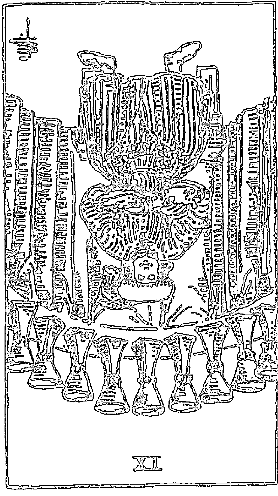

從薩滿的層面來說，這張牌可能代表淨汗室（sweat lodge，譯註：美國印地安的傳統淨化儀式。在一個圓頂式小屋裡，地上中間擺上燒得滾燙的石頭，再將水澆上去產生蒸汽。可能還會搭配談話交流、祈禱或草藥）或蒸汽浴，身體和靈魂的毒素都在此得到排除。它也可能代表饋贈：能夠把你所有的東西都分送出去，就是在向大眾展示你真正的財富和幸福。

傳統的逆位牌義：可能得到釐清和克服的錯誤，失誤，出錯，瑕疵。真誠，真實，誠實。忠誠。坦率，簡單。自由的權利。科學，自由。富裕。方法中的錯誤被指出來。一時的受苦或困難。

## 聖杯十（Ten of Cups）

聖杯九的喜悅到了聖杯十，變成大家所共享。它是這套愛、想像力、夢想和無意識牌組的頂峰。它代表讚嘆和狂喜，豐厚的收穫和光明的前程，鍾愛與和諧，融洽的關係還有幸福的家庭。它表示「在最美好的世界裡，一切都是為了最美好的目的而存在」（譯註：出自法國文豪伏爾泰的小說《甘第德》，這句話是樂觀主義的男主角甘第德說的）。在韋特牌中，聖杯排成彩虹的樣子，象徵暴風雨後的平靜。然而，因為彩虹是個幻象，所以看似理想的事物，實際上是你過度理想化了——無論是家庭、國家、婚姻還是一項計畫的結果。你可能渴望著販賣幻夢的廣告商在促銷的那種達不到的夢想。牌面上傾向的意思是，你可能住在大家庭或溫馨的社區中、旅居鄉間、你在歡迎貴賓，或被當成貴賓接受款待。你或許衣錦還鄉，聲名遠揚。小孩可能是你生活的重心。你也許找到了將個人生活和工作銜接起來的方法。托特牌把這張牌叫做「飽足」（Satiety），指情況中蘊含的事物比想要的還多，多到超過適當的範圍。這張牌最好的情況是指與周遭環境以及身邊的人和睦共處。

傳統涵義：家鄉，鄉間，小鎮，居住，場所，住所。市民，人群，居民。居住的地方。眾所周知的榮耀。尊敬，光榮，美德。名聲。家裡的愛。福祉。滿足。安全感。

## 逆位的聖杯十

逆聖杯十代表家庭或親密關係可能出了問題。你可能很快就會遇到「掃興的事」或「干擾」，或是其他強迫你面對現實的事情，讓你看清楚你的希望。慶祝、返家和團聚可能會延後、取消，或是令你的情緒低落。幻想或夢想可能會破碎。有時它預告小孩離家時的「空巢期」症候群，不過也可能是任何一種告別、分手，或是失去你所謂的家。它代表不契合、離婚或爭執。你可能成了代罪羔羊或家裡分裂的原因。你也許感到羞恥和憤慨，例如有人強迫你接受慈善之舉、救濟或憐憫。此外，你被家裡對你的情感需求和期許壓得喘不過氣來。因為是十號牌，所以你遇到的情況比較是和種族或家族的價值觀與信念有關。你或許用拒絕參與家庭生活，或決定不要有小孩的方式來排斥這些價值觀。

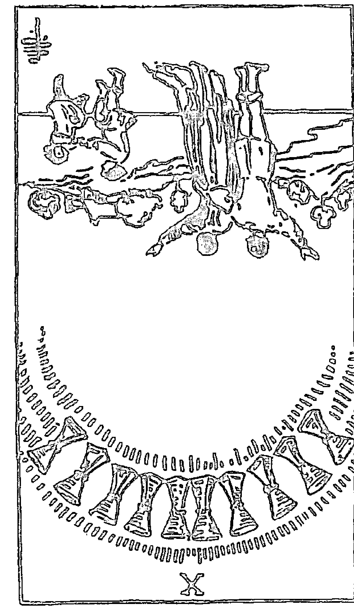

這張牌也可能在講飽足變成了噁心。有過剩的情況出現，多到令人為難，多到不健康。就健康而言，這種情況也反映在你整體環境的舒適度上。它可能指市鎮發展得太快，田野變成了都市醜陋且雜亂的延伸，或是你自己的院子和花園沒有多餘的空間了。你或你的社區可能沒有關照到弱勢者的福祉。

就內心的層面來說，這張牌代表你心中的家庭，內在和諧的元素結合在一起。它表示內心不需要外在的刺激就能擁有情感的滿足，以及心靈的健全。

從薩滿的角度來看，逆轉的彩虹象徵埃及的歐西里斯（Osiris）和其他在日落時分展開大海之旅的月亮神所乘的船，或是亞瑟王離開宮廷時所乘的船。在神話的傳統中，這是一趟有著重生和復元的歡喜旅程，象徵身體死亡時，靈魂與精神的重新團聚。

> 傳統的逆位牌義：狂怒，憤慨。哀傷。侮辱。妨礙幸福的魯莽。家裡的爭吵。意見不同。衝突，惱怒。失去朋友。器量狹小，憤怒，生氣，戰鬥。暴力。

## 寶劍王牌（Ace of Swords）

這張王牌代表新的決心，還有發揮意志力。你可能正在運用新的思維方式，解決問題或不清晰的推論。舉劍象徵集中精神，承諾投入新的方向和特定的行動。因為這是一張風元素的牌，又和金屬的銳利有關，所以和新計畫或策略，還有運用批評與分析等分析性的方法有關。一如這支寶劍是雙面刃一樣，你也可能覺得某件事讓你分裂，或是你需要權衡一個問題的兩面，檢視利弊，評估它的真假。也許你在解開一個糾結或受困的情況，釋放出行動的能量。從牌面上解釋，它可能和手術、雕刻或其他用到尖銳物品的事物有關。筆和寶劍是同源的象徵（羽毛筆可視為風和頭腦），暗示溝通可能很重要。因為王冠和桂冠代表為成就加冕，所以可以看出寶劍王牌是野心勃勃的，不過它也代表公平競爭、法律及秩序。你可能對你的機智、靈巧和解決問題的能力很有信心。它要你準備好去往前採取行動，主張你的權利。你所做的判斷和決定，都會以理智、邏輯和科學方法為基礎。

傳統涵義：困難。意外。衝突，戰爭，侵略性。勇敢。力量，正義，權力。過度。憑蠻力獲勝。權威。征服。榮耀。競爭。能力。脾氣，熱情。構想。

### 逆位的寶劍王牌

和逆權杖王牌一樣，這張逆位牌建議你「別做」。也許計畫會延誤，會有不利於你的評論出現，或是努力會失敗。我們「非戰即逃」（fight or flight）的生理機制叫你「逃跑」。如果侵略性和邏輯沒有用，就換個方法：把寶劍變成犁刃（或錢幣）。這張牌可能表示小我謙卑地臣服，說：「願你的而非我的意旨成就。」事情可能因為被動、缺乏自信而出了差錯，導致風元素（如果你認為是火也可以）特有的心理壓力和神經狀況。你可能經驗到心理或身體的痛苦，像是偏頭痛或潰瘍，或是你拒絕接受讓人心煩的念頭。你也許很難清晰地思考，導致寫作瓶頸或是無法解決的問題出現。

若這張牌表示敵對結束，那可能是因為你覺得這個情況你輸定了。你有把自己的侵略性投射在別人身上的傾向。你或許發現自己以冷酷的事實和客觀之名刺傷了某人，或是被別人刺傷。可能有人用文字和邏輯來騙人。你和權威之間也許發生了衝突。你害怕受到譴責和懲罰，感覺自己「任人宰割」，尤其是如果你不想順從的話。

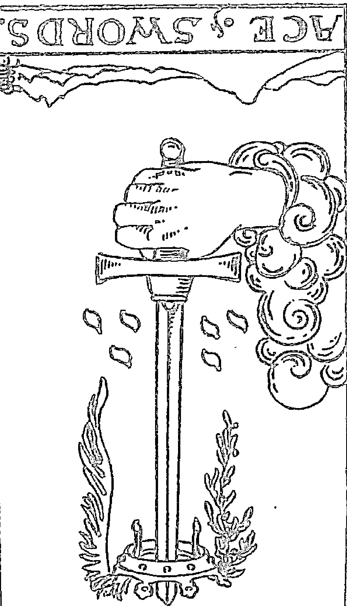

你可能在為一個計畫定出界限，具體界定出影響範圍，或是把一個東西放在能被妥善保管的地方（例如石中劍）。你可能拒絕奚落別人和反擊，或是在撤銷、收回惡劣的言論。雖然我們可能會以為這張牌代表陽痿，但這張逆位牌的古老意義其實是受精！

從薩滿的觀點來看，這張牌代表遠離天空的下部世界之旅。它可能還代表心靈手術，摘除導致失衡和「不適」的東西，包括象徵性或實質上的事物。它也代表用來與謊言和欺瞞作戰的靈性武器。那把想像中的寶劍依然插在湖中、石頭或山洞裡，直到有英雄呼喚它一同前去為這個世界找回正義。

傳統的逆位牌義：屠殺。災難。懲罰。暴君。不公不義。失去力量。毀滅。障礙，阻礙。偏見。種子。精子。受精。陽痿。

## 寶劍二（Two of Swords）

寶劍王牌表示只有一個想法，但寶劍二的出現卻表示我們產生了互相衝突的觀點，你想讓兩方和平、和諧及契合。這意謂著你要放下敵意和批判，不選邊站。你可能在參與外交談判，或透過安撫和勸慰來緩和局面，創造平衡。雖然你所建立的均衡可能是多種力量之間的舒適平衡，但也可能是僵持的狀態，大家因為恐懼、猶豫或需要服從，所以維持著觀望的態度。這是個不易維持的和平，其中有著微妙的權力平衡。你可能會為了求取共同的利益，而用中立的態度和別人結合。這些互相衝突的想法和展望需要大家好好溝通，整個局面才能緩和下來。不過，你可能不想看到或認識那些會擾亂你平衡狀態的人事物，所以把自己封閉起來。或許你害怕某人會對你發揮不正當的影響。當你的頭腦在這困境中掙扎，你也會把心保護起來，不再敞開心房。遇到互相衝突的目的時，你會有模稜兩可、猶豫不決、不願承諾投入的傾向，所以你可能無法做出決定，你要等到事態改變之後才會行動，而你現在可能只是在拖延而已。當想法互相衝突的時候，你需要仰賴你的直覺。

傳統涵義：友誼，感情，和睦，溫柔。融洽。契合和平衡。危險的時機，需要勇敢和勇氣。不致命的決鬥。緊張。均衡的力量。協定。

### 逆位的寶劍二

逆寶劍二和打破平靜、採取行動有關。忠誠可能會分裂成兩半，導致謊言和欺騙，無論是不是有意的。你可能會覺得像身處拉鋸戰之中，被撕裂成兩半，心裡不得安寧。你也許不想讓權力平衡，想要打亂計畫；更適切地說，你可能想把某人擊倒。或許你想突破自滿的狀態和表面的和諧，扯下眼罩，看清楚那些令你困擾的問題，做出行動。你可能不認為製造麻煩或打破法律是一件榮譽或有智慧的事。

這張韋特牌的逆位畫面象徵圓規：兩支針腳，會合於上方，一支針腳在圓心，另一支針腳以它為中心畫圓。它的目的是要環繞、關閉或包含。它不是正位牌那種分開但均等的畫面，對立的兩方反而都被包含在整體裡，帶來內心的平靜。另一個極端是，圓規畫出的是界限，或是用界限來限定，對立的兩邊就變成像假朋友一樣，很不可靠。在日常生活中，你可能會想要把你喜歡的東西圈限起來，例如劃分吸菸區和非吸菸區。

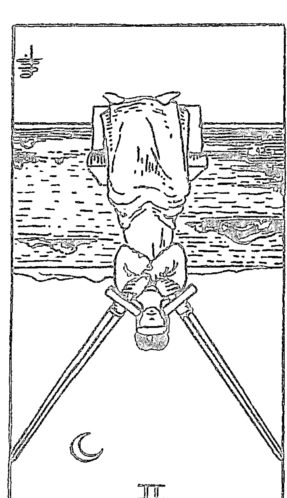

整體而言，正位牌的僵持不適用於這裡，但和睦也可能不適用。你可能在整合對立的兩方，或是認為它們無法調和。雖然你選邊站了，但可能選錯了邊。你或許會張開眼睛看清事實，卻發現你一直都生活在謊言之中。無論如何，更深層的事實似乎很快就要揭曉。

從薩滿的觀點來看，這張牌表示若你認為你可以和干擾保持距離，那是很荒謬的。身為靈性戰士，你必須出去見見敵人，這敵人就是——或是偽裝在——你自身中的虛假。

傳統的逆位牌義：欺騙，口是心非，謊言，詐欺。虛假，假冒。假朋友。背叛或欺騙的受害者。不名譽。決鬥。膚淺。分歧。斷交。

## 寶劍三 (Three of Swords)

寶劍二想要妥協的企圖失敗了，心理的壓力大到無法承受。寶劍穿心第一次出現在塔羅牌中，是在十五世紀末的索拉布斯卡 (Sola-Busca) 牌，由此可看出它代表嫉妒、心痛和破裂已經有悠久的歷史。雖然三號牌和創造力與整合有關，但三把劍帶來的卻是不和諧，最後還導致哀傷，顯示出要協調三個人不同的需求或三種想法是一件多麼困難的事。也許你的心想要某樣東西，但頭腦卻說你不能擁有。也許你覺得不快樂，自憐自艾。也許你遇到了三角戀情、失敗的愛情，或是分手。合夥關係或伴侶關係不和諧。寶劍牌的特色是信念不一致或溝通不良，這種情況可能會導致問題，讓人嚎啕大哭，跑去控訴別人，說出惡劣的言詞。有時這種情況還有明顯的惡意。你也可能會遇到身體的疼痛、受傷或手術。甚至連「修女」都包含在傳統的牌義中，表示（在那個時代）有人在違反自己心意的情況下離開家裡或社會，獻身於沉思基督的憂患。從更世俗的層面來說，你的心可能不在工作上或這段感情中，或是有人傷了你的心。平心而論，憂傷確實激發了很多動人的藝術和優美的音樂，而共同的痛苦可能會帶來深厚的情誼和真知灼見。再說，沒有什麼比好好大哭一場更令人痛快的了。

- 傳統涵義：移走，出發。分開，分歧，破裂。反感，仇恨。不契合。異議。爭執。錯亂的本能。病態。失去。眼淚。沒有回報的愛。修女。

### 逆位的寶劍三

在驚險萬分的災難過後，逆寶劍三帶來了如釋重負之感。寶劍從心上掉落下來，烏雲退去，你放下憂傷，開始康復的過程。舊傷可能在癒合，痛苦正在減輕。然後，手術變得不再必要，或只是動個小手術而已。也許你在爭執後設法消除誤會，並接受你自己的責任，不再怨怪別人。這張牌也表示你承諾支持，無論是對朋友還是一個理念或機構。

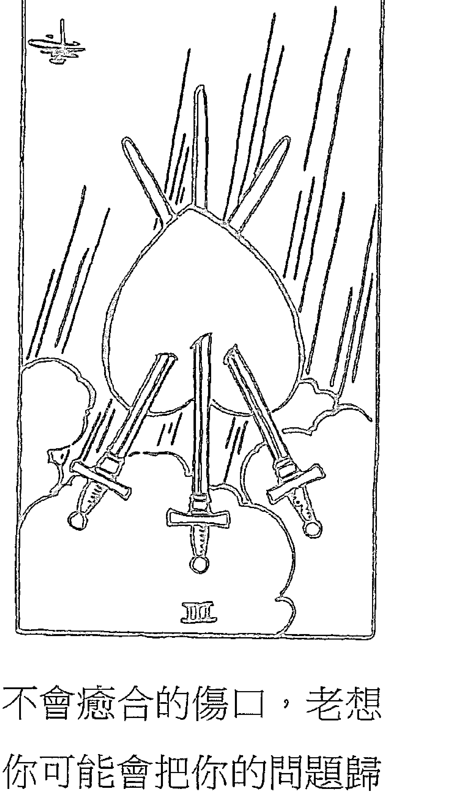

然而，你或許正感覺到心中有看不見的痛苦。你可能否認感到嫉妒或憂愁，或是拒絕相信友誼已經變質。這張牌也可能形容那種從來不哭的人。

投射在別人身上的時候，你可能會覺得他是一個很戲劇化的人，永遠都在製造感傷的故事。在極端的情況下，這是個永遠都不會癒合的傷口，老想著它可能會使你和別人疏離，最終讓你崩潰。你可能會把你的問題歸咎給別人，拒絕承認屬於你的責任。

較早期的解析警告，災難會愈來愈嚴重。情況會愈來愈糟，變得一團亂，演變成失序和無政府狀態。爭執會演變成暴力。你可能覺得你會心碎而死，或痛苦快把你逼瘋了。

從薩滿的觀點來看，這張牌代表邪術、詛咒、巫毒和害人的魔法。雖然我們的文化視這類觀點為荒唐，嗤之以鼻，但原始部落的人知道這類負面的願望會造成整個社區很深的不平衡與不和諧。在身體以及想像的世界中創造出防護罩，能幫助你避開有害的意念。你或許需要明智與有愛心的治療師、薩滿或諮商師來協助你。

> > 傳統的逆位牌義：疏離，孤立，寂寞。瘋狂，精神錯亂。錯誤，迷惑，混亂，失序。疾病。爭執。戰爭。『你會在一次出遊中屈從於你的友伴，然後等你重新出現在大家面前，這件事將令你很難為情。』

## 寶劍四 (Four of Swords)

如果寶劍三的壓力和受傷沒有緩和，到了寶劍四，可能會影響你的健康。你也許多會為了逃避悲傷或釐清思緒而離群獨處，或是去睡大頭覺。你希望能停止敵意，舒緩壓力，你想投入靜心或作夢。在韋特牌中，有三把劍掛在牆上，而這個人躺在第四把劍上，這表示你藉由整理思緒和把要做的事排好優先順序，來處理精神的壓力。它也代表你把很多問題先放在一邊，讓潛意識只處理一個部分。不過，那些懸掛的劍可能會令你倍感壓力。你可能正在經歷一段寫下思緒和夢境的自我觀察期，或是有人在看顧你。韋特牌中的彩繪玻璃上，有一個人跪在地上，向頭上有光圈的人懇求，畫面上嵌有 PAX 的字樣，指平靜的意識。這些牌面的細節可能代表祈禱、尋求忠告，從醫生、律師、神職人員、上師或神靈這類的權威那裡得到協助。此外，這張牌也可能代表監禁、退休或和平主義。

這張牌在少數的情況下可能代表死亡。曾經有一個例子：一位年長的俄羅斯知識份子，她計畫如果她的病嚴重到無法自理生活，她就要自我了斷。彩繪玻璃中的意象顯示她多麼希望她的子女能夠了解她的決定並平靜地接受。

- 獨處，疏離，庇護
- 警戒
- 安靜
- 閉關，退休，僻靜的住所
- 流亡，放逐
- 遺棄
- 墳墓
- 疾病
- 緩解

### 逆位的寶劍四

從韋特牌的逆位牌，可以很容易看出在寶劍三中交叉的劍，到了寶劍四已經排整齊了。現在這個人彷彿從天花板俯視一樣，宛如在夢境中或做水晶球占卜時那種靈魂出竅的體驗。你可能正從象徵性或真正的睡眠中清醒，醒來的你也許感到更加清晰，或是擁有和之前不同的觀點。平靜和安寧的階段結束了，你可能正在解決疑慮。你也可能正從病中復元。如果不是的話，不妨想想你是否拒絕請教別人或照顧自己。這張牌也表示因失眠或令人不安的夢境而無法好好休息。你或許正在結束隱居的生活，重新踏入世界。這張牌也可能是「出獄牌」，或是走出任何你認為的限制或隔離。你也許正在重回職場，不然就是在辭掉沒出路的工作。

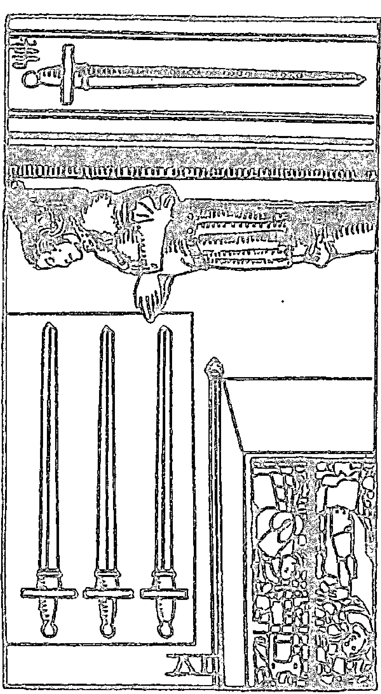

畫面上的人可能會掉到寶劍上，象徵你可能感到「進退不得」，或被環境釘住無法動彈，心裡很絕望。傳統的涵義強調你要小心。透過小心謹慎、經營管理和節流，你可以挽回生意上的損失、解決個人的難題或從疾病中復元。

若把這張牌投射在別人身上，你要不是覺得他永遠都很好，就是覺得他停留在完美的那一刻，例如曾經叱吒風雲但已經去世的人，或是在等待時機清醒的沉睡英雄。不過你也可能認為他很內向或生病了，或是無法或不願伸出援手。你也可能很同情某人。

就薩滿的層面來看，這張是一張與夢境時光或星光界（astral plane）有關的牌。它描繪的是與內在的指引者或有力量的人士連結，就像彩繪玻璃窗上的懇求者一樣。它也可能代表與通靈或靈媒有關的能力或職業。

> 傳統的逆位牌義：節約，管理開銷。慎重，預防。英明的經營管理。遠見。損失慢慢恢復。和諧。同情。貪心，貪慾。

## 寶劍五 (Five of Swords)

寶劍四短暫的舒緩，到了寶劍五演變成戰爭爆發。鋸齒狀的雲反映出如暴風般的心情。一板一眼、純理論的頭腦裝滿了「事實」，打敗了比較脆弱的情緒。你可能正在和別人爭執，覺得自己就像韋特牌面上畫的三個人其中之一。最遠處的人好像被打敗了，很洩氣的樣子。中間的那個人走開了，也許是因為拒絕戰鬥。前景的那個人似乎打敗了對手，他就像食腐動物，從別人的不幸得到好處。我們可以從這裡看到戰鬥者和敵人之間會有的態度。你可能想要挽救這個局面，或只是希望退出。通常這張牌也代表溝通破裂的情況。雖然這裡用的原則可能很合乎正義、很有道德，不過卻缺少寬厚和體貼，或是執行手法並不公平。你的思維很破碎，覺得自己很散亂，或覺得有人在攻擊你。或許你需要把一項大工作拆解成好幾個小部分。此外，分裂可能會帶來果敢、破碎的思維或是負面的思考。

這張牌基本上叫做「沒有贏家」的局面——贏了一時的戰役卻輸了長遠的戰爭——最後失去了朋友或支持。不管你是選擇沾沾自喜還是羞辱，似乎全會產生反效果，因為什麼問題都沒有解決。如果有其他的牌相呼應，這張牌也可能代表虐待。

傳統涵義：損失，毀滅，破壞，蹂躪。不幸，毀壞。擊敗，潰敗，打鬥。征服。羞恥，聲名狼藉，羞辱。綁架。惡意。心術不正。詆毀。家中失竊。強暴，謀殺。

### 逆位的寶劍五

這是少數幾張在傳統上逆位和正位有相同解析的牌之一，不過還要再加上大屠殺或掩埋之後的哀悼感。「掩埋」這個詞和挽救相反，指的是隱藏或保護。因此，這張逆位牌可能表示有潛藏的動力出現。例如，當一個人經驗到無法忍受的痛苦，他的人格模式可能會分裂，次人格就出現了，就像牌面前景中的霸凌者；他那受害、受傷的部分退縮了，深埋在心靈之中。

另一個動力是抽象的理想主義，認為人道原則比個體重要。如果別人與你的任務無關，你可能會對他們沒有同情心。抽象的信念（例如愛國主義）可能會讓你滿心懷著一個「真理」、問題或任務，儘管它帶給別人極度的痛苦。

這張牌也可能表示「把兵器埋起來」，也就是和解，結束衝突或意見不合的情況。從這個觀點來看，不妨留意有「回」意的英文字，如後悔、懊悔、撤回和補償。消除誤會之後，看看你可以挽救什麼。這張牌不是在蒐集寶劍，反而是是在召集人群，做出彌補、修補裂痕，或是判斷責任和義務的歸屬。就像大多數的植物在修剪過後會生長得更茂盛，這張牌也反映了失去和哀傷後的靈性成長⑤。

這張牌傳統的意義也和以「不」為開頭的字有關，例如不幸、不安、不屑。投射在別人身上的話，你可能會覺得他在設法阻撓你，但你可能會拒絕感到自己打輸了。整體來說，無論是正位還是逆位，這張牌都不會帶來新的探險。逆位的時候表示你要解決令你困擾的問題。可能會有背叛或罪惡的事被揭發。

從薩滿的觀點來看，這張牌要不是表示靈魂的各個部分分裂了，就是靈魂在死後流浪徘徊。無論是哪一種情況，這個靈魂都可能需要協助。這張牌也可能代表埋葬的儀式和改變天氣的魔法。

傳統的逆位牌義：不幸，損失，麻煩。哀悼，痛苦，洩氣，憂傷。葬禮，掩埋。悲痛，驚慌。懊悔。復仇。新的冒險失利。

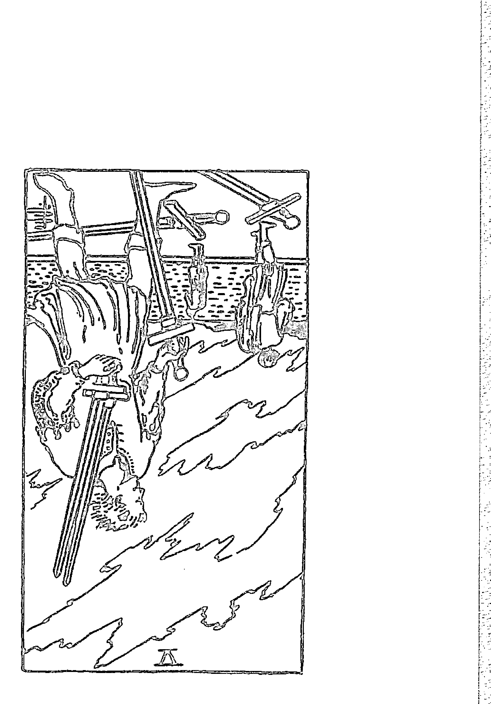

## 寶劍六（Six of Swords）

在寶劍五的困難過後，你可能需要讓自己保持一些距離，好重拾平靜。寶劍六常被稱為「水路之旅」，代表任何一種過渡或遷徙。你可能正遠離困難，想要重新恢復和諧與心靈的平靜。你或許正逃離危險，尋求安全與避風港。不過這張牌也一樣可以代表假日出遊、快樂的旅程或改變工作地點。因為它與風和金屬有關，所以也可能表示你在計畫旅程或轉換想法、資訊或材料。它偶爾也代表隱密及與離開有關的行動。

這張牌和科學、理智的頭腦有關，需要與在研究的對象保持距離。所有牌組的六號牌都有合作的面向，強調明辨人際關係和模式是很重要的。你想離開急流和風暴，尋找更平靜的海岸，以獲得客觀的觀點，而韋特牌的畫面顯示出你的努力會得到支持。除此之外，你可能正對別人的福祉表現出人道的關懷。從你最認同牌中的哪個人，就可以看出你的心態和狀態。你也有機會選擇要接受哪些看法和意見。你需要進行清楚的溝通，並願意付出努力，才能了解別人的觀點。

傳統涵義：道路，路徑，通道。手段，方法，路線。散步。旅行，航行，度假。使者，信使，旅客。痕跡，遺跡。倚賴別人。嘗試新目標或方法。試圖克服困難。

## 逆位的寶劍六

逆寶劍六表示你可能無法離開一個棘手的情況，或是你抗拒新的觀點。也許你的思想還有身體都困住了。你拒絕去旅行，或是根本不想移動。極端的情況是你得了曠野恐懼症，害怕開放的空間。可能會有延遲的情況發生，計畫改變，或出現交通的問題。水災、與水有關的困難、窒息或溺水都有機會發生，但你也可能覺得你在逆流而上。隱密的行動會曝光，例如在國境邊界被抓。你覺得自己死路一條。這張逆位牌也可能純粹表示你旅行結束準備返家，或許還經歷了一些文化衝擊。

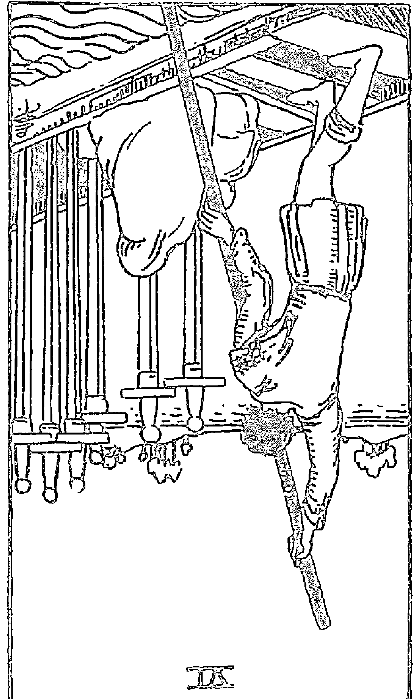

你緊貼著海岸前進，待在淺灘處，表示你可能害怕投入某個方向。你或許誤解了某人的觀點，為了安全感而執著於你的偏見，用主觀的態度認知一切，不願從外在去證實。

投射在別人身上的時候，你可能會認為他「跳船」了，或是棄你不顧。他的思維好像沒有彈性，跟你無法產生共識。你有堅持自己的信念和偏見的危險，但你的信念並沒有經過檢驗。傳統的牌義有秘密公開或揭露之後的不快，也包括不受歡迎的提議，這些可能會迫使計畫改變，或害你需要逃跑。此外，你的旅程可能發生於內在而不是外在，例如在引導下進行的意象之旅，或是坐在搖椅上的旅行。

當你面對一個枯燥乏味的前景，你可能會在心理上用冷淡、漠不在乎的態度過度補償，或相反地面對難題。若是心理補償不足，你會覺得被困住，糾結在恐懼和猶豫不決中。

從薩滿的層面來看，這是幽冥之旅的牌之一，可能代表靈魂復元或療癒，或是看見前世或來世——沒用牌面上順著時間之河旅行的意象。它特別指稱自我、內在小孩和指引者現身的時候。

傳統的逆位牌義：不受歡迎的提議。宣告，揭發，告解，披露，驚訝。診斷出疾病。改變了計畫的發現。因公開聲明而變得聲名大噪或聲名狼藉。

## 寶劍七 (Seven of Swords)

寶劍六遠離了危險以後，你強化了成功的機率，把失去的找了回來——就像○○七的詹姆斯龐德。這張牌和考驗頭腦，善用策略迎接挑戰有關。或許有一個「危險的機會」需要你秘密行動，而你不是很果敢就是很猶豫。為了要達成理想的目標，好像不管用什麼手段都是正常的，包括找藉口。機智可以讓別人卸下武裝，靈巧的頭腦可以讓他們解除防備。現代的意義強調徒勞無功、欺瞞、背叛和模稜兩可，不過較早期的傳統講的是雖然不安全，但仍堅持到底。這張牌的涵義從研究、策略、準備，到謀報、欺騙跟逃跑都有。如果和「騙局」有關，它可能表示「人間蒸發」，或是你在迴避你不想面對的東西。

你可能在蒐集想法、為一個計畫做研究，或為了自己的利益而操弄結果。那些插在地上的劍可能代表分配任務或貨物，或將點子落實。你若非足智多謀，就是在逃避。這張牌通常代表不忠還有秘密的戀情。信任可能破裂，而原本是一體的分裂了，就像寶劍分裂成好幾堆一樣，不然就是你在潛逃。這張牌和上一張牌的水路之旅相反，它代表陸路之旅，或是隱姓埋名、不引人注目的旅行。

傳統涵義：希望，欲望，願望。新計畫。意念。誓言。企圖。堅持到底。對你的努力有信心。雖然不安全還是拿出力量。提出權利要求。偷竊。背叛。窮人的悲哀。不可能實現的夢想。陸路之旅。

### 逆位的寶劍七

逆寶劍七表示你可能比較謹慎，因為你害怕被抓到。或許你太誠實了，不願用卑劣的手法成功，或是太粗心大意，沒有留心好的建議。此外，你有逃避危險的傾向。你可能否認自己做出了丟臉的行為。或許你推翻了之前擬定的計畫和安排。不誠實的行為或謊言可能會被拆穿。不過，你也可能非常豪爽，表示你沒有什麼秘密。

你的慾望和脆弱感似乎在互相衝突。如果你缺乏自信卻又羨慕別人，那你可能會避免做出醒目的動作，轉而耍弄狡猾和偷偷摸摸的手段。但是，走出來坦然面對的時候到了，別再跟你所害怕的一起待在角落，它可能會把你壓垮。

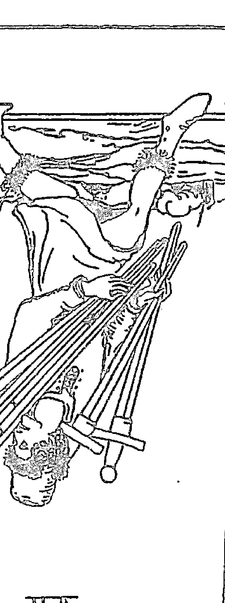

另外，這張牌可能是講回溯某個事件的場景，回到原處取回某樣東西，或是幫助另外一個人。被偷的物品可能會物歸原主。你或許在檢視過去的行為，判斷是哪裡出了差錯（和「戒斷十二步驟」類似，你請求原諒，彌補過去犯的錯）。你可能會建議或警告某人，或是提醒他忽略了什麼。你甚至可能在訓練別人掩護的技巧或如何暗中做研究。

如果投射在別人身上，你可能覺得他要為偷竊、背叛或為了滿足一己之私而耍弄心機負責。此外，你可能在讓別人占你便宜，接受別人傷害你，讓自己面臨風險。

從薩滿的層面來看，這是一張和啟蒙儀式有關的牌。秘密行動、詭計或偷竊也是神聖儀式或啟蒙考驗的一部分。主持儀式的人向候選人解釋它秘傳的意義，以及如何使用神聖界域的詞彙和象徵。

傳統的逆位牌義：指示，建議，警告，勸告。新聞，宣告。明智的建議，好的諮商（不見得每次都被接受）。謹慎，小心。誹謗。爭議。一時的挫折。

## 寶劍八（Eight of Swords）

寶劍八與束縛有關，它是無助的受害者或等待拯救的受難少女。在寶劍七所做的事可能窄化了你的觀點。大眾的譴責、身體的動彈不得，以及無法透過感官得知外界的訊息，都進一步引發了危機。雖然你覺得綁手綁腳，不過最可能阻礙你的，還是你那愛扯自己後腿、愛批判的思維方式。思維被扼殺或突然卡住。當你嘗試釐清、看清事實或運用你天生的直覺時，你會遇到阻礙。理性可能會妨礙其他種類的洞見。

- 傳統涵義：危機，災難。危急或麻煩的狀況。譴責和審查制度。註釋，後記。官司。批判。譴責。囚禁。住院。意外。來自眾人的汙衊和羞辱。

### 逆位的寶劍八

寶劍八和重新評估以及進步有關，而這兩種能力在正位牌中被愛批判的思維方式或環境限制住了。你可能需要魔法才能克服這些限制——不是胡迪尼的舞台魔術，而是真正的魔法。佛罗伦斯·法尔（Florence Farr）将魔法定义为「让共通经验不再受限」的能力；理查·卡文地许（Richard Cavendish）则定义为「超越所有人类限制的力量」⑥。埃特伊拉认为这张逆位牌和命运、宿命、注定的事件有关，而这些都是可以超越的⑦。

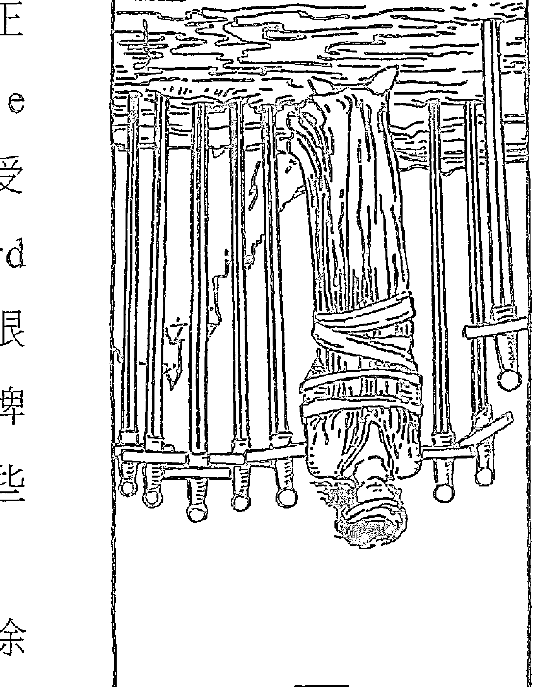

还好，这张逆位牌也大大增强了消除障碍时所需的足智多谋和即兴发挥。你可能正在突破限制，包括社会强加给你的。虽然这些限制可能是暂时的，但另一个极端是，如果显而易见的逻辑和理智也认为你受到迫害，那这些限制就更令人无法忍受。你可能因为害怕成功而做出扯自己后腿的事。你也可能不喜欢张扬自己，尤其是发自假谦虚的态度。

或许是因为有人骗了你，你才会遭遇目前的困难。宝剑代表容易受有说服力的点子、论点或事实影响。一位问卜者认为这张牌表示拒绝看到或听见医生说她母亲快死了；而事实上，她母亲也活下来了。

投射在别人身上的话，你会觉得他是受害者，什么事都找藉口，把事情弄得一团糟，或认为他是害你遇上麻烦的骗子。

从萨满的观点来看，这是一张和启蒙传统有关的关键牌，它显示只有候选人的信念和信任才重要，而非他们的技术。它可能是一场关于耐力和脆弱的试炼，其中灵性的连结必须透过非肉体的感官而来。克努力说这张牌「有神秘主义的倾向」。它也能代表切断情感的连系或心灵的连结。在少数的情况下，它甚至代表发现幽浮绑架事件。

传统的逆位牌义：命运。宿命，不幸，意外，危险。惊讶。严重的困难和辛苦的努力。心理抑郁。厄运中的小成功。过去的背叛。

## 寶劍九 (Nine of Swords)

寶劍八的危機演變成絕望，心中的羞恥感在譴責你，你對殘酷視而不見。我們看到抑鬱、煎熬、內疚、畏懼和追悔——所有能使你頹廢的心理折磨。這張牌可能代表失眠和惡夢，靈魂的暗夜，或是受傷和生病。一切都好像都失敗、不見了，而且還是因為你自己的缺點或處理不當才造成的。你因為意志消沉而無法更上一層樓，絕望可能讓你平靜的思緒變得混亂。因為覺得毀滅逐漸逼近，所以你在等寶劍掉下來。不過，玫瑰的拼布棉被表示你的生活中依然有一塊溫暖的地方，上面的星座符號暗示時間會讓人痊癒。

就比較接近生活的層面而言，可能會出現熱潮紅和夜間盜汗，或是短暫的憂鬱。你可能覺得很悲觀，經常鬱悶地沉思或想像最壞的情況，不知該如何是好。例如，你可能得知一個痛苦的事實，恐懼會意外懷孕，或是你暴露在生病的危險之下。你可能因失去或改變而哀慟，或是因傷害了某人而痛苦。

和其他的九號牌一樣，寶劍九也有孤立和疏離的感覺，十八世紀的解析就是獨身禁欲和修道院的生活。更早期的意涵包括虔誠和奉獻，也同樣和良心和苦行有關。

傳統涵義：獨身禁欲。神職人員，僧侶，隱士。女修道院。教派。虔誠，奉獻。良心。誠懇，誠信。慶典，儀式。憂愁。流產。結局。失望。危險，懷疑，受苦。哀慟。道義上的苦惱。疏離。不公不義，怨恨，羨慕。

### 逆位的寶劍九

這張逆位牌可能表示你走出憂鬱了。惡夢結束，事情愈來愈好。告解減輕了內疚和自責。你把自己拉出了自憐自艾的狀態。但是，你可能還是很難找到要鍥而不捨地做完這個計畫所需要的信念和能量。你可能會否認自己有羞恥、憂鬱或寂寞的感覺，很強烈地在抵制或反抗它。也許你之前失去了什麼，卻到現在才反應過來。如果有其他的牌相呼應，不妨看看心中有沒有你尚未承認的憂鬱，它已經演變成長期而且嚴重的問題，說不定還很危險。

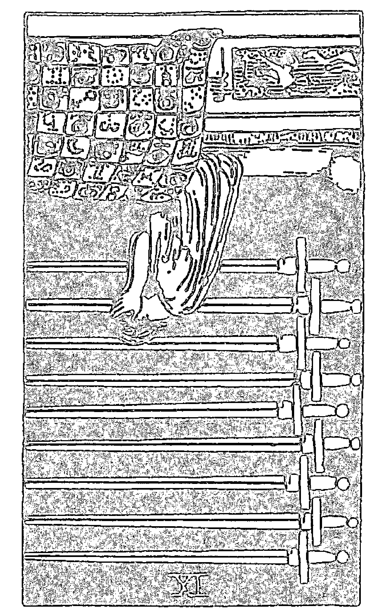

另一方面，這張牌也可能是治療心理的陰影，或是靈性的靈魂追尋，需要你願意探索恐懼和自我怨恨。有一位問卜者在占卜之前，剛好夢到他走下樓梯到地下室。樓梯看起來正好就像一排劍，地下室充滿了他需要面對的驚恐。所以，你也可能有機會去面對你的恐懼。

你的焦慮可能是有道理的，你的懷疑也很合理。因此，這可能是「得到批准的」哀傷或痛苦。你可能害怕危險，想躲開討厭的熟人。如果你是流言的目標，而這流言和你對自己的批評一致，那你就會想避開大家的看法，不想面對別人。不過，你也可能覺得你受到了不公平的對待，你想重建自己的名聲。

若投射在別人身上，你可能會覺得很害怕、疲倦，或老是想著可鄙的幻想。這張逆位牌也代表霸凌者或虐待者雖然宣稱後悔，但還是可能會故態復萌。

在薩滿的領域中，這張牌是「青年或少女之死」，害怕解體和失去，也象徵面對未知的驚恐，或是打破禁忌——而這是啟蒙考驗很重要的一部分。

傳統的逆位牌義：中傷人的八卦。正當的防禦。合理的恐懼或懷疑。羞恥，不光彩，聲名狼藉。謠言。靈性的掙扎。謹小慎微。

## 寶劍十（Ten of Swords）

寶劍十通常沒有寶劍九那麼艱難。克勞力認為寶劍十指的是大眾的精神錯亂，而非個人的瘋狂和痛苦。你的威力可能太強了，殺傷力太大了，造成超越個人的災難。你可能曾把全部的信心都寄託在某個背叛你的人身上，不過現在放下的時候到了。

不過，這張牌的出現還是代表個人的挫敗、失敗和結束。你也許會失去健康、財富、地位或榮譽。你可能跌到谷底，窮途末路，或是困在思維的死胡同裡。或許有人從背後捅你一刀。這張牌容許改變與新的可能發生。整體而言，你不再掙扎，你接受那無可避免的發生，向神、命運或環境臣服你的意志。過去的信念和思考模式不再受用；老舊的思考方式死去。雖然看起來好像一場災難，但它也是一種釋放、解脫和結束，就像做完瑜伽後的死屍式一樣。掙扎是沒有意義的。

也許你有背部的問題，或是正在做針灸。你可能又病又累，或是過著刻板乏味的生活。雖然你可能客觀地確認了事實，但是已經沒意義了。如果你願意放下舊有的，邁步往前，嶄新的一日就會破曉。

傳統涵義：苦惱，眼淚。淒涼。抱怨，牢騷，懊惱。悲傷，痛苦，悲痛。精疲力盡。結束。失敗。社會、經濟條件改變。意外的厄運。信心破滅。失去朋友。敵人。

### 逆位的寶劍十

逆寶劍十象徵恢復和重生。寶劍好像要從這個人的背上掉下來，黑暗逐漸退卻。金黃的地平線上映照著湛藍的天空。你已經扭轉了局勢，事態愈來愈好，但你可能覺得像經歷過一場災難，有如瀕死的生還者。解放和令人興奮的突破即將到來。當你不再需要用理智解決一切，你就能從壓力中解脫，就像暴風雨過後放晴的天空。最壞的已經過去了。如果你正從病中逐漸康復，病症還是有可能復發。你可能也會有反覆出現的健康問題，特別是背部、慢性疲倦、狼瘡或免疫系統等問題。

你可能仍然感到懷疑和自尊心低落，這讓你的新收穫變得很不穩定。擔心未來使你如坐針氈。有一位小姐覺得她好像躺在釘床上，以彌補她的罪過。正如英文「自作自受」的諺語：「自己鋪的床，自己去躺。」還有一個人覺得她離開釘床的時候到了，而釘床象徵自憐。雖然可能會有劇烈的改變發生，但只要你還對過去的痛苦產生情緒上的反彈，你就無法真正的進步。

你也許正在專心修補你計畫或防禦中的弱點。有時你也許會否認問題的嚴重性。你也可能拒絕放手。

投射在別人身上的時候，你可能會覺得他沒有效率，或是需要被犧牲。你甚至可能相信他活該，因為「只有強者才能生存」。

在薩滿的層面，這張牌可能表示星光體與肉身分開——在夢境、星光體出遊或瀕死體驗中。就啟蒙儀式而言，它也指重生前的儀式性宰殺、支解或打碎物質形體的考驗。你必須向這個新的狀態臣服，儘管它是完全未知的。

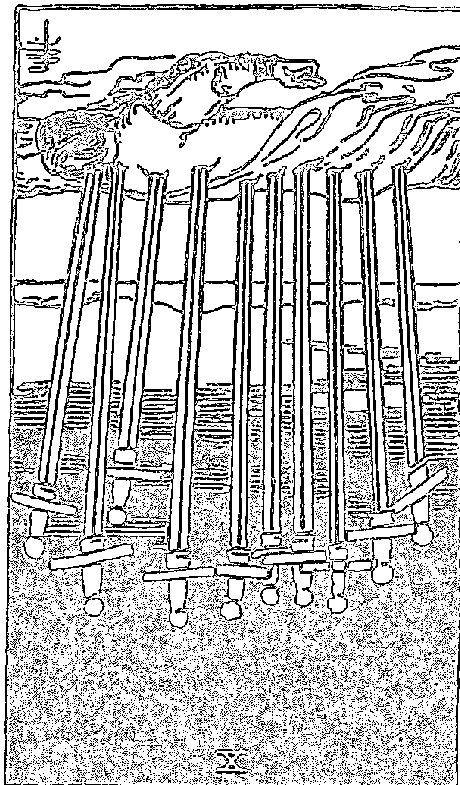

傳統的逆位牌義：暫時的好處，恩惠，利益。恩典，善意。權力，權威，影響。暫時性的收穫。短暫的成功。利潤。一些進步。意外之財或財務意外變好。恢復。

## 錢幣王牌 (Ace of Pentacles)

這張王牌提供了新的契機，你在身體和物質的層面上都會有好運，例如得到工作或專案，或加薪、升遷等。接受這個契機得到的不只是報酬，也要承擔相對的責任。這張牌蘊含昌盛、舒適、歡樂和保障的種子，當這些種子成長，喜悅和滿足的感覺也會油然而生。前景看起來是如此美好，不往前進好像就太傻了。一般的解析甚至認為它能降低旁邊其他牌的負面程度。韋特牌的畫面暗示，物質的收穫也許會讓你留在花園的安全範圍，把你留在家的附近，你就不會想去探索未知了。然而，大門的開口朝向代表靈性抱負的山川，提醒你物質的舒適雖然會讓你遠離比較艱辛、嚴苛的靈性之路，但你會得到靈性的報酬。兩種選擇都會帶給你黃金，只是形式不同。錢幣是你努力的成果，是其他牌組工作後的結果。你收割報酬，贏得獎牌，欣賞你努力得來的成品。

這張牌講的是身體安康和物質豐富。它要你尊重並珍惜你有形的資源，包括健康、財產和實用的技能。它有時也指遺產、禮物、得到工作或其他的意外之財。

> 傳統涵義：完完全全的滿足，快樂，幸福。豐盛。突然得到的財富。魅力，狂喜，歡愉，滿足。成就。完整的太陽療法（solar medicine）；黃金。「開運符」。

### 逆位的錢幣王牌

傳統上，這張逆位牌不但沒有減少牌象徵的好運，反而更加放大了它的好處——小富有變成大富裕，小玩意兒變成了無價的珍寶，所有的東西都變成黃金，就像麥達斯王（Midas）點石成金的詛咒一樣。你可能太專注於物質的收穫，所有的東西都只被你當成財產看待，被人用它的珍貴程度和價格來論斷。你也可能因為太害怕一無所有，所以不向人表示善意，拒絕分享，變得很貪婪。當你恐懼失去，你的選擇就會慢慢變少。這種壓抑會讓你無法善用資源，金錢不再流動。你的身體會失去機動性和彈性，因此這張逆位牌可能要你多給身體或物質層面的問題一些關注。

因為牌面看起來像個輪子，所以表示你可能困在相同的軌道上。你或許會抗拒那種「好得不像真的」的機會，或是你懷疑它會給你不喜欢的限制。付款、就業機會、貨物運送可能會延誤。它也可能表示你得到「檯面下」的收入。不過，這張逆位牌也可能代表更輕鬆地面對事情，不那麼執著，因為「只不過是錢而已」。

從薩滿和魔法的角度來看，這張牌的意象很豐富。與錢幣有關的秘教格言是「保持靜默」，以貯存並集中魔法的能量。因為錢幣看起來好像卡在手上一樣，所以它和一個民間故事的主題有關：黑寶貝（Tar Baby，譯註：這個故事描述狐狸先生為了抓住兔先生而用柏油做了一個娃娃放在路上，就是黑寶貝。兔先生對黑寶貝講話卻沒有得到回應，他很生氣地打了黑寶貝，但他愈打，手卡得愈深。後來大家用這個詞代表困境）因為貪心或憤怒而卡住了。你可以用掌心的能量中心將能量拉向你。薩滿在做治療的時候，會用這種吸力來進行心靈手術。最後，則是煉金術的黃金意象——隱藏在物質之中的大靈。

傳統的逆位牌義：找到寶藏。財富。黃金的財源。利潤。富裕。不快樂的繁榮。無價。總數。資金。資本。浪費。貪心，吝嗇，貪婪。物質主義。腐化人心的財富。愚人金（黃鐵礦）。

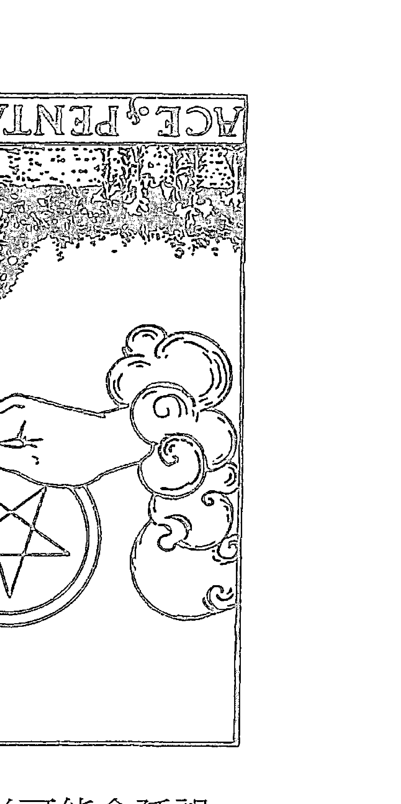

## 錢幣二 (Two of Pentacles)

到了錢幣二，你的禮物加倍了——不過帶給你的也許是驚愕更甚於開心。雖然俗話說「錢滾錢」，但前提是必須有持續的流通，貨物和服務處於不斷交換的狀態中。因此這張牌也可能代表商業，特別是市場的波動。雖然二號牌代表選擇，不過這裡你「魚和熊掌都想兼得」。你可能需要用巧妙的花招和敏捷的腳步才能同時做好幾件事，例如兩份工作，和兩個人交往或談兩件生意，或是讓工作與玩樂交替進行。和平之母（Motherpeace）塔羅牌畫了一個女人養育一對雙胞胎——既欣喜又辛苦。雖然良好的適應能力有助你做出改變，但往往會讓你把焦點放在過程上而非成果上。歐陸的解析強調同時處理多個問題會很困難，或是盈虧起起伏伏。現代的解析則是要我們好好享受這趟旅程，不用擔心目的地，所以它強調的是玩樂、慶祝、娛樂、運動，通常還建議你去度假。韋特牌畫面中的船代表旅行的主題，尤其是出差，它描繪的是「在波濤洶湧的海面上掙扎前行」。模糊、困惑或其他的問題可能會導致窘境——或許是財務上的。最嚴重的情況是你可能會陷入某種令人疲憊不堪的循環中。

傳統涵義：難以展開新計畫。阻礙，障礙，妨礙，擱淺。困惑，糾結，煩躁，迷惘。擔心。尷尬。合約或生意交流。廣受歡迎。前後不一。

### 逆位的錢幣二

這是一張與「繁文縟節」或熱門消息有關的牌。你可能困在一堆形式、文件、檔案或電子郵件中。資料累積愈來愈多，比老式的磁帶跑得還快，超過你處理的能力範圍。你可能在努力避免資料超載，或是正在處理電腦方面的大問題。你也可能在評估互相矛盾的資料，例如股市的指標或政治民調。一個微妙的可靠情報或股票交易可能會讓你感覺像在坐雲霄飛車。要注意！別人很容易就可以動搖你。雖然你可能已經改變了觀點，但外表還看不太出來。

較早期的牌義強調文學能力，不過比較像新聞報導或僱傭寫作，以速度和字數來計算酬勞。也許你正把稿件或提案寄給出版社，或是在辦公室傳閱一份商務便函。和字母與寫作有關的解析源自早期的塔羅牌出版商，他們把名字和出版日期印在圈住兩個錢幣的彩帶圖樣上。所以說，你可能正在做某種推銷或廣告。

極端的情況是財務和資訊的問題失控了。行動變得很錯亂，但你嘗試假裝一切都沒問題。這裡也暗指羅馬大火時還在拉小提琴的尼祿（Nero）。如果投射在別人身上的話，你可能會覺得很輕薄、空泛、同時從事太多活動卻又一事無成。能量在波動。你可能覺得困在同樣的軌道上。玩樂變得乏味，笑話也了無新意。

從薩滿的層面來看，這張代表小丑、魔術師或男／女性的變裝者，他們會故意模仿某些人，或是開公共議題的玩笑，好讓大家注意到失衡的地方。金雞獨立或單腳殘廢是標準的薩滿主題，牌面上代表力量的圓錐帽亦然。

傳統的逆位牌義：票券，檔案，文書工作。文學能力，學習。字母，書寫。信，訊息，散文。生意交流。嚴重的財務壓力和虐待。忽略。不公不義。強顏歡笑。

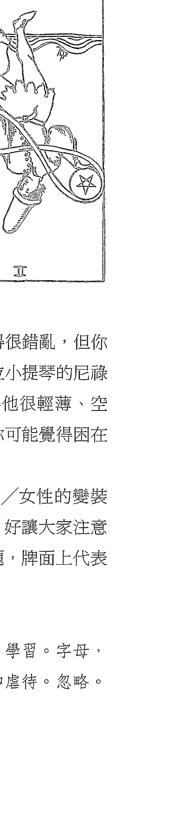

## 錢幣三（Three of Pentacles）

在錢幣二掙扎讓事情順利之後，你得到了別人的幫助。我們從章特牌中看到有一個團隊在蓋教堂或寺廟：委派工作的住持，提出計畫的建築師，以及有技術的工匠。每個人都在做自己被指派的工作。同時，三個人必須一起和諧工作才能把工作完成——這本身就是一項才能。除了有一個思慮完整的計畫，擁有按照指令完成的能力也會有幫助。這張牌代表了所有工作會遇到的情況：為要做的事和人合作，培養技能，做簡報，示範過程，評估與批評，約聘工作，交換或是交易。這張牌與藝術才能和學徒制有關，它的重點是自我進步和來自關鍵人物的贊助或支持。你可能需要通過測試，或用你工作的樣品來證明你的專業能力。它更深的層面是把神聖的事物物質化，得到來自靈性源頭的協助，以提高你的尊嚴和位階。你看起來正在創造有價值的東西，很有美感也很精細。也許你需要做些改進或更新，因此既需要才能和技術，也要下苦工。在少見的情況下，它也可能意謂著服務或是接受傳喚。

+   **傳統涵義：**
- 位階和權力
- 重要的、高貴的、有名的
- 十分壯觀
- 優秀，聲望，著名
- 開始帶來利潤的工作
- 很多小的開銷
- 考試成功

## 逆位的錢幣三

逆錢幣三很像挖洞或陷落到地下室裡的意象。你可能遇到和工作有關的問題。例如丟了工作——無論這是個問題還是種解脫。面試和簡報很不順利，或是你拒絕了一個機會。也許你和同事或長官之間發生了問題。你覺得自己沒有被看見，不受重視。計畫和表格裡頭可能有錯誤。也許有東西受損或故障。年輕與沒有經驗可能會導致散漫和延誤，而你也不願意問別人，請求協助。有時它純粹代表平庸，甚至是難堪的自卑感。你的努力可能不怎麼傑出，或是沒有人注意到，也可能是工作很無聊。你的條件若不是太好，就是太差。如果你的工作正接受別人評估，要有被批評的心理準備。

別人可能會收回支持，或是目前你缺少支持。此外，老闆可能要你做一件不誠實或有危險的事。你也許會發現問題的某個觀點只有你一個人支持。廢棄物也許是個問題。這張牌可能表示有陰謀或叛變，甚至是事先計畫好的破壞活動，在暗中破壞先前打下來的基礎或努力。

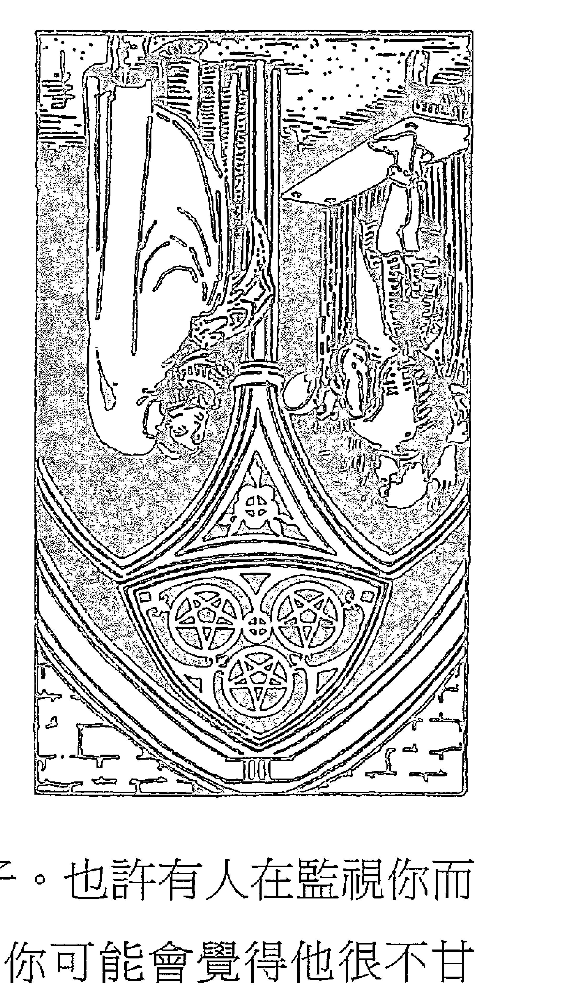

你可能掙扎著想得到新鮮、有創意的點子。也許有人在監視你而令你緊張。如果把這張牌投射在別人身上，你可能會覺得很不甘願、沒效率或沒有能力。小心你有貶低自己努力的傾向，會看輕自己或別人的工作。想一想你生活中那些無形的價值，以及你是否在做你喜愛的事。

這張牌在薩滿和魔法的層面上特別有意義。它很像大石匠聚在一起，讓人想到在人間建造天堂的「偉大工作」。它可能代表在無意識、下部世界或想像力中修行——建立內部的結構，或把秘教的圖象視為異象之旅的地圖。也許你遇到了內在的指引者或導師。

傳統的逆位牌義：幼稚，輕浮。縮小，微小，瑣碎，卑微。平庸，普通，品質低劣。冷漠，懶惰，散漫。缺少資金。危險的，不確定的。浪費的，揮霍的。

# 錢幣四（Four of Pentacles）

錢幣三的建設工作在錢幣四，以物品和力量的形式穩固下來了。在現代的牌中，這張牌和控制與保護資源有關，也與穩定和立下界限有關。不過，它也可能表示你不對人付出真心。此外，雖然傳統的解析強調善意和慷慨，但按照現代的思維，這麼做可能是為了利己的目的。你可能在一心一意累積物質的商品、權力和財富，想確保你能長久擁有。這可能與退休和存款計畫或投資，以及建立商業或政治帝國有關，而保障對你來說是最重要的。這張牌又叫做「吝嗇牌」，象徵麥達斯王，他的手能將每樣東西都變成黃金，包括他的女兒。最後，累積東西的需要占有了你，而不是你占有東西。除了貪婪和囤積以外，它還代表對失去的恐懼、便秘與缺少熱情。你可能沒辦法放鬆、放下。韋特牌面上的人在心口前拿著一面盾牌，保護自己不會受到攻擊，它就像是個維護地盤的標誌或商標。

不過，你也可能很歡迎這張牌的保護、舒適和自我中心。它代表源自你身體力量中心的穩定感、安全感和內在的力量。這種深刻的扎根感解釋了它為什麼與根莖類蔬菜有關。

+   傳統涵義：
- 善良，慷慨，大方
- 恩賜，恩典，禮物
- 機會
- 額外的好處
- 月亮療法（lunar medicine）
- 根莖類蔬菜
- 歡愉，快樂
- 成功建立生意或企業
- 投資
- 恐懼失去

# 逆位的錢幣四

逆錢幣四代表釋放、風險和改變，不論是對錢幣還是對四號牌來說，這都不是件容易接受的事。你可能會從兩種極端來反應：要不是變得更加恐懼、貪心與防備，就是像佛陀悉達多和其他苦行者一樣，放下權力和財產。傳統的牌義代表限制，雖然不是由你的錯誤所造成，但卻導致了阻礙、延誤或挫折。或許你真的有水管堵塞的問題。你可能覺得每次要轉彎時都會卡住，有限制束縛了你。你可能在工作上遇到無形的障礙，無法晉升。

此外，你可能會輕率地花錢、投機或賭博。有些商品可能會降價，或是款項被扣住。這張牌表示投資不利。不切實際或無力感（不夠踏實）可能會妨礙你做決定。你或許因為某些原因而對財務或物質的問題不滿。如果投射在別人身上，你可能會覺得他需要掌控一切，認為他不顧一切地緊抓他的東西不放。

若有其他的牌相呼應，逆錢幣四可能代表放鬆和舒緩緊張。你或許在放下曾經消耗你注意力的事物或責任。或者，你開始卸下戒心和防護罩，表達自己的感受。你可能不愛革命，也不願意推翻某種鞏固的權力或破除壟斷。你該重新考慮你究竟需要什麼才會有安全感，以及你力量的中心在哪裡。

從魔法和薩滿的觀點來看，這代表透過魔法工具和護身符而來的力量。它可能表示被神祇或靈魂附身，祂要你付出豪華的物品、名聲和權力，才會幫你治療。因此，只有幾乎沒什麼權利和掌控權的人，才能透過這類象徵特權的附身得到恩典。

傳統的逆位牌義：圍住，周長。妨礙，堵塞。壟斷。與世隔絕。固定的，強加的。里程碑，限制。阻礙，付款延誤。財務損失。考試失敗。

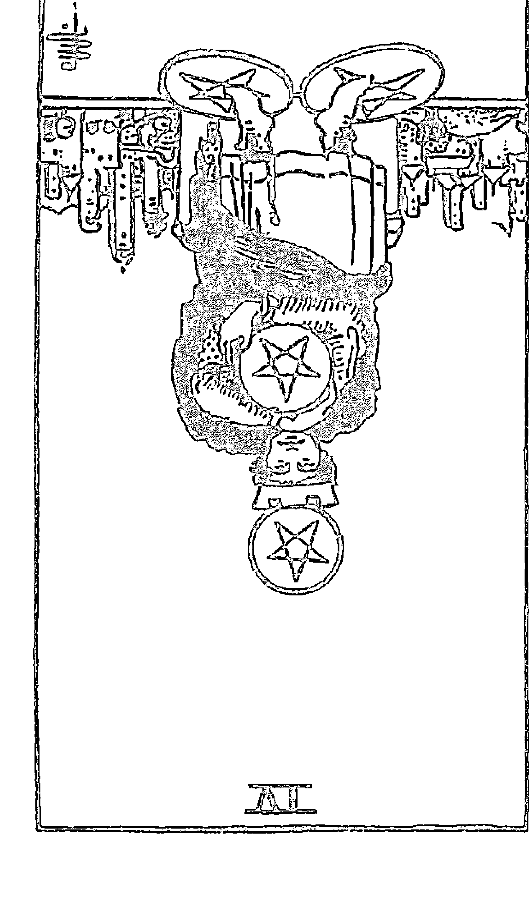

# 錢幣五（Five of Pentacles）

錢幣五顛覆了四號牌所建立的成果，它代表財務危機、生理上的不穩定以及實地的干擾，你需要在物質的層面上做些調整。韋特牌中有一扇發光的教堂窗戶，在俯視外頭被冷落在寒風中那些辛苦的人們。也許你一直認為自己很匱乏，害怕會「一無所有」或是被社會拋棄。韋特稱畫面上的人物為「乞丐」（mendicants），意思是「有缺陷的人」，表示你可能覺得很疏離、自己有缺點或受人鄙視。這張牌也可能是「自願過著簡單的生活」，這種非傳統的方式是為了更崇高的價值而去避免物質的奢華。這張托特牌叫做「擔憂」（Worry），上面畫了輪子或齒輪互相齧咬（worrying，譯註：在英文中同時有擔憂、齧咬和不得安寧之意），不得安寧。你或許擔心身體是否安康，你可能面臨破產、無家可歸或精神受損的情況，不過幫助其實就在身邊。資訊可能延誤，資源無法取得，或是你有運輸和溝通方面的困難⑧。

最早期的意義和現在大相逕庭，將這張牌稱為「夫妻之愛」、鍾愛、友誼。因為婚姻的誓詞需要兩方忠誠，縱使遇到貧窮或疾病也不改變，所以可把這張牌解析為「沒有麵包的愛情」，或是因為個人的人際關係而蒙受生意的損失⑨。除此之外，這張牌也指照顧生病的人。螺旋塔羅牌（Spiral Tarot）畫了一個人從窗外看著屋裡的舞會，而我有一位問卜者真的如實描述她如何站在舞廳的外面，看著她的前任男友和新歡在一起。

+   傳統涵義：戀人，情婦，配偶，朋友。鍾愛，有吸引力的人。愛，珍惜，愛慕。適合。得體。危險的激情。婚姻問題，貧窮。窮困。戀情的物質障礙。失去。

# 逆位的钱币五

逆錢幣五表示在盛衰的變化中依然堅持到底，在失業之後重返職場，或是擺脫破產。在面臨了物質或精神的困擾後，它可能是個轉捩點。這張韋特牌的逆位，積雪變成在上面，黑暗逐漸退去，窗戶變成避風港的門，可以推想它是在建議你找一個庇護所。有人認為這張牌表示他可以接觸到潛在的機會了。它可能預告一個不好的走向即將逆轉，還有你對物質的事物會重新產生興趣。波恩沙特（Poinsot）認為你會在路上得到意外的好處⑩。

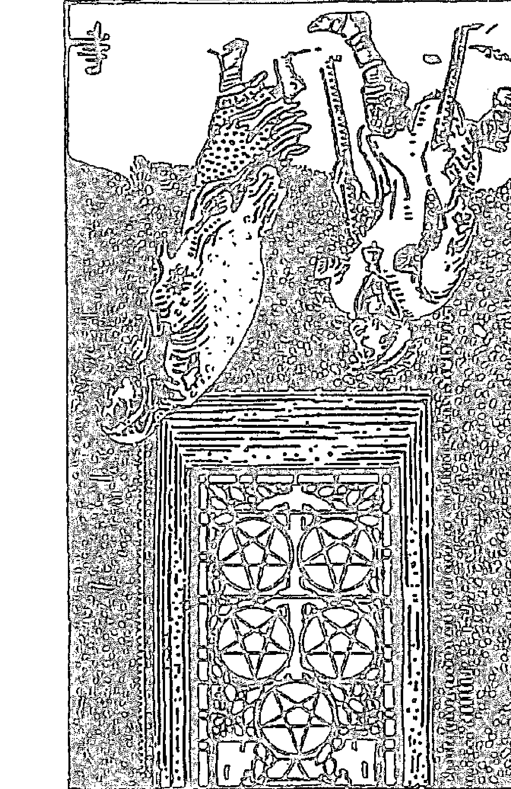

另一個極端是因為脫序或濫用、揮霍資源而造成損失。若把這張牌投射在別人身上，你可能會覺得他很放縱，認為他的不幸是因為缺乏節制或品德，或是你把社會的病徵歸因於這些人的放蕩。不過你可能會同情他們，認為他們其實是社會的受害者。

有些朋友或你愛的人，是你認為並不適合交往或生病了，你和他們之間的情況可能會因為分開或是你更加投入而有所改變。很多與愛滋病有關的問題都能從這張牌（正位和逆位）看得出來。此外，如果你和心愛的人疏遠了，那你可能會克服不和諧而和好如初。它代表大赦的時期，壞人改邪歸正或是被接受。有一位問卜者覺得這張牌表示宗教組織會引發拒絕和背叛的感覺，是麻煩的來源⑪。

在薩滿的層面上，這張牌確實畫出了對可能成為薩滿的人來說，經常是迎向內心呼喚起點的疾病和痛苦。就祭典的魔法而言，它表示和低頻靈體一同工作是很危險的。以榮格派的用語來說，它代表深度的「陰影工作」。

傳統的逆位牌義：不端正的行為。失序，騷動，混亂，雜亂，毀滅。消耗，衰落。消散，放蕩。不光彩的愛情。輕率，放肆，放浪。不和諧，災難。愛情中的麻煩。不好的趨勢逆轉了。

# 錢幣六 (Six of Pentacles)

錢幣五的兩個乞丐在錢幣六裡找到一個慈善的來源。黃金黎明認為每一張六號牌都是牌組和元素的高峰。六是一張代表和諧、互惠還有社會關懷的牌，因為贊助者需要人給他贊助，而恩人需要有人施恩。你可能正付出或得到金錢、禮物或幫忙。你也許在接受經濟援助，得到版稅或支票。它也可能代表得到貸款。你或許正在捐錢、分享利潤，或在離婚協議中分財產。最壞的情況和支配與服從、富有與貧窮、象徵性的改革或共依存有關。畫面會因為你最認同畫面中的誰而有不同的意義。最好的情況是我們有物質的豐盛，大家共享資源，金錢在社會所有的階級中流動，有公平且慷慨的真正慈善。其他的意義包括償還貸款，贏了一件訴訟案，或是得到遺產。天平的兩端呈現平衡的狀態，問題也解決了。

你可能在要求加薪，或是對老闆卑躬屈膝。這張牌可能和贊助商或投資人，或是捐獻有關。交易成功，利益也順利交換。你所分配的不一定是金錢——這張牌也指流程安排、時間管理，或分配其他的資源。

傳統涵義：當下的，目前的，現在的，突然地，今天。留意，警戒。贈品，禮物，可喜的事物。眼前的繁榮。博愛，仁慈，慈善。貸款的償還。

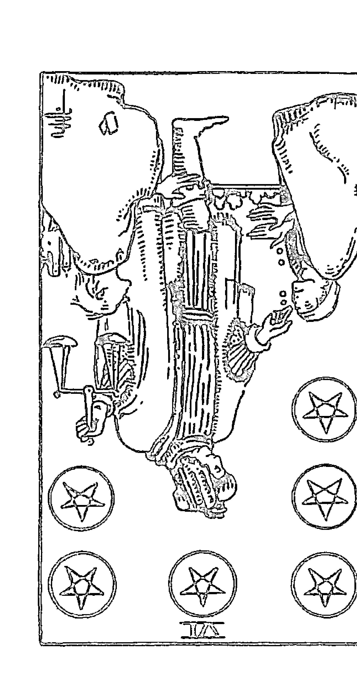

# 逆位的錢幣六

這張逆位牌有個部分就像羅賓漢一樣，是把富人的財富重新分配給窮人。權力可能會愈來愈不均衡，想推翻這種比例的欲望也會愈來愈強。你或許會覺得被欺騙或被否定。一個極端是貪婪擊敗了正位牌中的公平。另一個極端是遇上呆帳，一夜致富的計畫或財務期望也無法實現。你可能不得不請求、處理或幫忙別人，或是遇到令人不快的附帶條件。金錢可能會被盜用或濫用。貸款沒有付，遺產消失了。報酬變成一場空，或是你心中不存感激。你彷彿在嘗試填滿一個無底洞，欲望和滿足之間好像始終有一道裂痕。

你可能拒絕從事慈善活動，否認自己或別人的需求。如果投射在別人身上，你或許會覺得他要不是不夠慷慨，就是永遠都無法滿足。

若你曾經得到卑劣的對待或受到忽視，你可能會渴望得到注意。考慮給自己一份禮物吧！如果有人找你借款，他可能不會還你，或是你不妨改成送禮或捐款。這張牌也可能代表突破社會的階級，使階層平等化。重新考慮一下你運用時間和金錢的方式，以及你要如何提升狀態來符合標準。還有，這張牌可能也建議你不要貸款或扣住預備金。就治療方面而言，留意傳染病可能會擴散，並適當斟酌你藥物的劑量。

就薩滿和魔法的層面來看，這張牌講的是判斷每一位學生準備好要面對什麼、能處理什麼。個案和學生都可能希望得到明智的治療者不會想提供的方便法門。或者，這張牌可能代表江湖術士先丟出一點誘餌，進而敲詐更大筆的金錢。

+   傳統的逆位牌義：
- 欲望，願望，狂熱，熱情。
- 急切，渴望。
- 貪心，羨慕，嫉妒，貪欲，貪財，夢寐以求。
- 自私。
- 野心，目標。
- 假象。
- 呆帳。
- 有爭議的遺產。
- 缺乏平衡。
- 不公不義。

# 錢幣七（Seven of Pentacles）

錢幣七是一張與努力、耐心還有評價有關的牌。你可能正在評估你的收穫，在判斷你的努力是否值得。身為一張與考驗和挑戰有關的牌，它要你發揮技能、勇氣和決心來證明你會成功。整體而言，這張牌預告下苦工會有好結果。韋特牌的畫面中有一個農夫在看著他的作物，也許是在等待最成熟的時機才要採收。你可能在觀察一項投資，或是正在盤點。雖然你的事業開始收成，但你也許需要有點耐心和信任，因為大自然完整的循環週期是催促不得的。黃金黎明的觀點比較陰鬱，他們認為獲利會減少，或有人會不遵守諾言。你所得到的可能不是你所種下的。心理上，這張牌代表「恐懼成功」，你破壞自身潛力，因為你不相信或信任你會得到報償。

較早期的牌義強調清理或淘汰，像是丟掉受損的物品，清理你的衣櫃，或是透過揀選來確保品質。仔細照料你在培養的一切！有時這張牌純粹表示休息一下，或是等待接下來會發生什麼事。也可能有要求完美和耽擱的情況出現。這張牌的意義容易受到它附近的牌的影響。

傳統涵義：金錢，財富，財務，貨幣，利益。清理，淨化。緩慢的進展。辛苦工作後的收穫。務農或養殖不順。事業的阻礙。足智多謀。

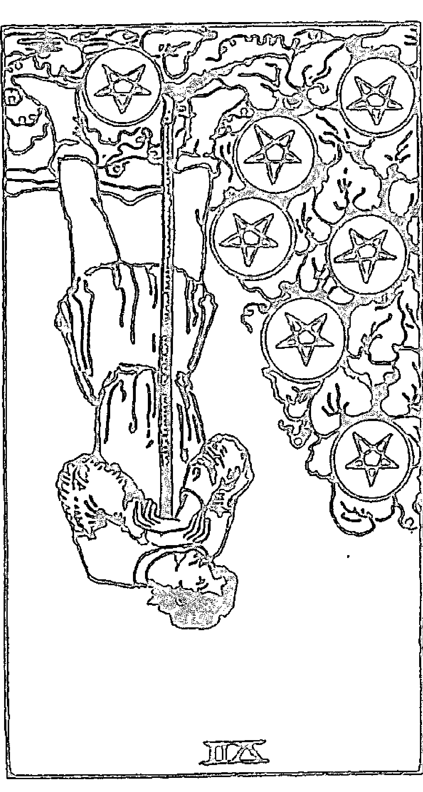

# 逆位的錢幣七

幾乎所有人都認為逆位牌表示焦慮和失去的機率都會增加。你可能有一種說不出所以然的不安感、擔憂和憂鬱。著急使你苦惱，你難以擺脫拖延的情況。你可能會認為別人想竊取你的點子、成果或東西，使你一直處於戒備狀態中。如果有其他的牌相呼應，那你的不信任和猜疑就是有道理的。錯綜複雜的糾葛正在發生。總是有更多事情要做——直到你精疲力盡為止。無論原因是什麼，你都覺得很難休息一下。

通常會有工作上的問題。利潤和酬勞與你付出的時間和努力不成比例。有一位個案認為她只不過是個苦力：

> 「那些成果不屬於我。雖然我很辛苦，但工作完成後我並沒有得到金錢、讚賞或什麼好處。」

資源可能有過度發展的現象，結果剩下很多沒有用的東西。雜草或廢棄物可能失控地叢生。另一個極端是完全沒什麼成長。投資和流程沒按照計畫發展。同樣地，眼前等你去做的工作或沒有回收的財務開銷，數量大到可能會令你喘不過氣來。

若是投射在別人身上，你可能會覺得他們很懶惰或投資錯誤，或認為他們偏執地擔心潛在的損失。就健康而言，它與你的體弱有關。在內心層面，這張牌講的是把同樣的專注力和精神，放在你所做的任何一件事上，如同這句箴言所強調：

> 「開悟前，砍柴，挑水；開悟後，砍柴，挑水。」

在薩滿和魔法的世界裡，這張牌代表建立聖壇，它就像是轉變意識的聚合點。謹慎地將你的意念注入聖壇（或咒語）之後，便可邀請並餵養神靈，你必須不干涉這個過程，信任它會發揮該有的效用。

+   - 焦慮
- 干擾
- 擔憂
- 憂鬱
- 精神折磨
- 著急
- 苦惱
- 錯綜複雜的糾葛
- 挫敗
- 不信任
- 猜疑
- 關心
- 關注
- 注意
- 不明智的投資

# 錢幣八 (Eight of Pentacles)

錢幣七的收成入袋以後，你就可以專注在接單出貨，控制品質。你可能正在達成一些目標，完成配額或使技術至臻完美。你可能正在為不景氣或退休做準備，謹慎是你最看重的事。說不定你正忙於改善家務。這張牌和錢幣三一樣，與工作及技術有關，但更強調精準、準時和細節。也許你正在念書或蒐集群研究資料。有人認為韋特牌上的錢幣就像在展示他的文憑一樣。傳統的牌義有貞潔和端莊的女孩，描述的像是一個「理想」的員工：遵守命令，辛勤工作，不問問題。你或許正在完成銷售訂單、存貨和盤點，或是在為工作和投資做預防措施。此外，你也可能在健身、運動或為表演練習。其實這張牌與任何一種得分、反覆進行的工作或每日的進步有關，以及堅持不懈、勤奮、循序漸進的發展。然而，就算是新的技能也會變成日復一日、乏味且無聊的事。雖然你可能會變得很有效率，發展出精簡的生產方式，但接下來你還是要回到日常的維護工作。

對黃金黎明而言，這張牌講的是「省小錢而花大錢」。這張牌也與維持健康有關：吃對的食物，計算熱量，運動；還有像托特牌畫的一樣：防曬。

傳統涵義：有深色頭髮和皮膚的女子。純潔，純真，端莊。率直，坦白，務實。平等。財產和遺產公平分配。晚婚。好職位。有決心。學徒制，學識，學習。

# 逆位的錢幣八

這張逆位牌表示你可能厭倦工作，你工作得太辛苦，或是困在沒出路的工作裡。也許你想換工作，或創造出新的工作習慣。或許你沒有在你想要的工作方面受過訓練。因為正位牌代表謹慎，所以逆位牌可能代表輕率和魯莽。傳統的牌義認為虛榮心、對金錢的欲望和缺乏野心，可能會讓你做著沒有意義的工作。收入會很短暫，或是無法長久。乏味和無聊的工作讓你變得麻木，於是你就做出劣質的產品，偷懶走捷徑或發生意外。你可能無法專心。或許該休息一下。不過，你也可能無所事事或沒有工作。也許有罷工在發生，或工作機會稀少。

你可能用諂媚、偽善或耍詐的方式來獲得成功。它也可能代表直銷，你或別人說服其他人投資。

如果你受人雇用，工作可能不會完成，或是會遇到問題。帳單可能令你苦惱萬分，你的信用卡額度也許已經用完了。

如果你把這張牌投射在別人身上，你可能會覺得他們是和你這隻蚱蜢相對的螞蟻，或是顛倒過來——總之要不是太勤勞就是太輕浮。就內在修練而言，你可能在進行心理治療，檢視過去的模式並下功夫，或你可能每天都在寫日記。不然，你可能在記錄你得到了多少讚美、輕蔑或成就。

從薩滿或魔法的角度來看，這張牌講的是製作祭祀用的神聖工具，以及準備魔藥和治療藥物。它指一絲不苟地運用最好的材料、相稱的星體連珠，還有適當的意念和祈願。你可能是過分熱心的魔法師學徒。郊狼會認為你太過嚴肅認真了（譯註：在薩滿的動物能量裡，郊狼就像神聖的愚者，像小丑一樣有趣幽默，大智若愚）。

傳統的逆位牌義：真空狀態，空虛，貪婪，高利貸，諂媚，偽善，虛榮心，自負，不可靠，散漫，不真誠，急躁，缺少訓練，缺少野心，陰謀，不誠實，小風險，工作的問題。

# 錢幣九（Nine of Pentacles）

錢幣九代表前面的牌都開花結果，它的意象給人繁榮和富足的希望。現在你安全了。你已經得到物質的回饋，你在享受悠閒的時光。它可能代表隱退、度假，或你在花園裡輕鬆度過一個下午。韋特牌中的人物穿著優雅，葡萄成熟，獵鷹也已就位——這些象徵都代表奢華、享樂和嗜好。它預告良好的健康，各種形式的身體安康和滿足。九號牌也是隱士的數字，所以你可能也在培養獨處的樂趣或追求自我實現。土地和財產在這裡意義重大，表示你可能在購買或照顧這類的東西。

韋特牌的畫面包含好幾個矛盾。雖然長袍有金星的符號點綴，這個人卻是單獨一人。小鳥通常代表志氣和自由，但這隻鳥卻是帶著遮罩的食肉動物。牌上到處都有包圍的象徵：寬大的長袍、有圍牆的花園、手套和遮罩——既是保護，也是限制。前面的地上有一隻蝸牛在爬，這隻低等的動物小心翼翼地扛著殼，正在蠶食著花園。舒適和優雅與性好掠奪的本能（被掩飾著）形成對比，想得到自由的渴望可能是你正面臨的問題。這張牌代表天生的秩序和紀律。

傳統涵義：作用，後果，結果，實現，成就，達成，成功，周到，慎重，謹慎，洞察力，喜歡流浪的性格，財產，滿足，生意拓展，成熟。（外）祖母。

# 逆位的錢幣九

逆錢幣九常會增強被圍困的感覺，以及想要自由的慾望。你可能在抗拒財富的誘惑，還有奢侈的獨處對你的吸引力。豐盛仍然是這張逆位牌的主題，但它似乎變得沒有價值，或是隱約藏有一種焦慮。也許你周遭的一切都不太順利。你可能感到很無聊，或是對其他生活方式產生好奇，想去流浪。也許有人在占你便宜，認為你是很好到手的獵物。你的滿足和安全感可能正受到威脅，無論這威脅是源自你的內心還是在外。財產要不是因為自然事件，就是因為不誠實的經營而蒙受損失。或許有環境的問題在影響你的身體健康。你可能是一場騙局的受害者，或是你用詐計得到了一些東西。也許你會遇到詐騙和搶劫。如果你正在添購資產，你可能會想重新評估這個情況。

偶爾這張牌表示一個人會拒絕接受他的幸福或好運，但也可能表示豐盛看起來好像根本遙不可及。就算你已經努力完畢，你還是會覺得很難放鬆。也許你沒有時間放假或發展嗜好。反之，你可能非常任性，認為你可以想要什麼就有什麼。就健康而言，你的運動量可能不夠。

如果投射在別人身上，你可能覺得別人什麼都有，或許是出生在什麼都有的環境裡，或是靠可恥的行為、剝削別人才得到他所擁有的東西。你也可能認為他在垂涎你擁有的東西。就內在修練而言，你可能會體驗到安詳與平靜。

從薩滿和魔法的層面來看，這張牌可能代表精靈皇后或冥后，她們雖然會給人不可思議的恩賜，但代價也同樣很大。換個角度來看，它可能代表和動物盟友或妖精一起修練。

- 詐騙
- 偷竊
- 欺騙
- 不可靠
- 奸計
- 內疚
- 盜竊
- 失望
- 空頭的承諾
- 計畫中途失敗
- 危及安全
- 風暴
- 損失
- 任性
- 表面的而非真正的收益

## 钱币十 (Ten of Pentacles)

钱币九成就的富足到了钱币十，变成了「祖传财产」和「家庭价值」。虽然这张牌可能会被视为财富和财产，但它和广义的遗传和传承更有关系。它指的是能持久永存的东西。你可能很关心任何一种财务、基因或文化的遗产，或前人传承下来的智慧与知识。这可以延伸到与家族、朋友、社区和传统有关的事情。家中的事务、人际关系和财产可能会有危险。古老的宝藏可能会增值。或许你正在追溯你的族谱，或在检视资料库。你可能在参加某种团聚。家族的责任可能驱使你思考关于遗产和保险的事，或是其他能增益后代子孙的事。

与机构、法人或家族企业有关的状况可能会影响到你个人。这张牌有时也和忠诚有关。你的「归属」感或想融入的渴望可能在影响你。有一位男士希望他过世已久的父亲认同他所有的成就，而牌面上真的画了一对夫妇、他们年轻的儿子和两条狗，以及曾经是他们家的老旅店。

也许你是一份遗嘱的执行者或受益人，或是你需要照顾年迈的父母。这张牌强调「家」。它与为了你所爱的人提供一个安定的环境有关。你可能旅行结束回到了家，可能搬到更好的房子，或是扩大住家的范围。与这张牌相关的词是：「大」、「全面」和「广泛」。

传统涵义：房子，住处，居所，家，家庭，种族，世系，后裔，资料库，档案，财富，经济，存款，留给后人的东西，遗嘱，契据，养老金，保险，智慧，保障，荣誉，旅行。

# 逆位的钱币十

逆钱币十可能表示远离家庭或拒绝传统。要不是你不受欢迎，就是你对家族的信念或传承很陌生。通常会有家族或社区，或机构、组织的问题。这张牌可能会引发争执或长期的仇恨，或表示婚姻出现困難。你的忠誠可能會產生衝突，你覺得自己像個局外人。你可能得不到幫助或財產。有智慧的看法和建議會受到忽略。

換個角度來看，你可能沒有表現出自己的才華和技能；另一個極端是你把物質世界視為你終極的源頭。例如，這張牌逆位的時候，韋特牌中生命之樹的圖案變成了「王國」（Malkuth）在上，即物質世界。這張牌表示你要不是陷在物質的問題裡，就是才剛展開回到大靈的演化之旅，把與物質有關的阻礙放在一邊。

如果投射在別人身上，你可能會覺得他們是年邁、需要你照顧的負擔，或是覺得這個人被家裡留下的包袱和責任拖累。就內心世界而言，物質世界的一切都反映出你自己的許多面向，而這些面向在宇宙中都各自有共對應的事物。

若有其他的牌相呼應，損失可能會很嚴重，而且和家庭、家族或存款有關。最後可能證明某個遺產或寶藏是沒有價值的。或許你會因為簽樂透或賭博而散盡家產。你可能覺得命運不如你意，老天在開你玩笑，但也可能只是一場囤貨出清大拍賣而已！至於健康的問題，不妨看看基因的影響。檢查你所繼承到的情緒包袱。

從薩滿和魔法的層面來看，這張牌很豐富，充滿靈性的祝福。牌面暗示了祖先以及他們對部族的關心。這是一扇通往你內在風景的門，你會遇到你的心靈，或是和已逝的前人交流。

傳統的逆位牌義：機率，危險，命運，宿命，天數，遊戲，賭博，耗散，搶劫，損失，課稅，有爭議或沒價值的財產，禮物，嫁妝，津貼，不確定，不安全。

## 注释

1. 由 Ancestral Path Tarot 的藝術創作者 Julie Cuccia-Watts 提出。
2. 源自紐約市塔羅學校的 Ruth Ann Brauser。
3. 這些和健康有關的疑慮由紐約市塔羅學校的 Ruth Ann Brauser 提出。
4. 源自 Grimaud 出版的 Grand Etteilla Tarot。
5. 源自 TarotL 的 Elizabeth Hazel。
6. 法爾曾是黃金黎明秘術修道會倫敦神殿的首領。卡文地許是 The Tarot 和 The Black Arts 的作者。
7. 參見〈第一章〉「歷史」章節中對埃特伊拉的評註。
8. Elizabeth Hazel 在 TarotL 提到這點。
9. 這個洞見要歸功於 Christine Payne-Towler，她對傳統牌義價值的體會讓我第一次重新考慮其功用。
10. M. C. 波恩沙特是 The Encyclopedia of the Occult Sciences 的編輯。他的解析為十九世紀的法國作者做了摘要，尤其是 Elie Alta 和 Eudes Picard。
11. 感謝瑞克里夫（又名「夜鷹」）指出這點。

## 小阿尔克那解析

## 宫廷牌

## 權杖侍者（或公主）（Page [or Princess] of Wands）

權杖侍者是個無拘無束的人，熱烈、熱情又充滿熱忱，擁有火象星座（牡羊、獅子、射手）年輕和不成熟的特質。雖然所有的侍者牌都代表新聞和消息，但這張牌特別有使者、媒介或傳訊者的意涵。你或某個認識的人可能專注於某個特定的事物或目標，或是對它感到很好奇。新點子可能令你著迷，或是你迫不及待投入某個使你充滿熱忱的新東西。你願意馬上把握機會嘗試任何一種能帶來興奮感或冒險的事物。你渴望認識自己，可能會去追尋自我成長或進步的新方向。也許你有一個崇拜的人，你十分尊敬他。你可能處於次要的職位，但你很積極，想要爬到頂峰。你也許很率真直言，不加修飾也不做作。你或許會用無所畏懼的風範來探索身邊的事物，也可能身在一個奇怪的環境中，所有的東西都很不尋常且迷人。這張牌可能表示展開熱情，或年輕人以理想化的態度崇拜某人。你或許像粉絲或愛好者那樣狂熱，或是沉迷在某種嗜好裡。因為這張牌代表消息和信差，所以也代表突如其來的訊息、驚喜和可能需要你馬上行動的新契機。通常這個消息或傳送它的人就像觸媒一樣，會促進正面的改變。這個人就像小孩一樣，特別活力充沛、外向，需要受人注目。

傳統涵義：陌生人，未知，匿名，傑出，不尋常，空前的，令人驚異，美妙，令人讚嘆，奇觀，插曲，離題，故事，傳說，使者，特使，郵差，奇怪的消息，忠實，一致，愉悅，滿足，災難，二流的。

## 逆位的權杖侍者（或公主）

逆權杖侍者如果不能稱心如意，或是玩具被人拿走，可能會耍起脾氣來。或是她可能累了，失去熱忱、拒絕再玩。你或某個認識的人可能在抗拒某樣新的東西，或是害怕改變或失望。你或許拒絕了一個機會或計畫，卻覺得你才是被拒絕的那個人。也許你缺乏好奇心或專注力，厭倦了瑣碎和單調無聊的工作。你可能會覺得不想重新開始，太辛苦了。你不想看起來很幼稚、天真或好騙。也許你表現出一種刻意的、已經玩膩的優越態度或自大。或者，你可能很無知、輕率或遲鈍。

相反地，你可能什麼都願意嘗試，但是很急躁、不耐煩而且雜亂無章。因為你現在就想得到，所以可能不會花時間做出好的判斷。你可能很享受冒險和賭博的刺激，喜歡腎上腺素激增的感覺。因為你很魯莽，所以可能會忽視有價值的東西，不會去欣賞事物更細膩的部分。這張逆位牌是那種經驗豐富但品味不高的人，一個業餘愛好者或「素人」，那種模仿最新潮流後又丟在一邊的人。你或許很不可靠，對感情若即若離，不知道你真正想要的是什麼。你也可能已經完成靈感的階段，想要進一步發展出一些東西。

小孩可能很任性或犯了法。小時候，你的熱情可能沒有人懂，或當你要去拿一些東西時，手指被燙到或被打了耳光。不過，你也可能得到你想要的，但卻恃寵而驕，變得很任性。

身為信差，傳統上她（或他）會帶來壞消息，例如被拒絕的信件。或者，這個消息只涵蓋一個情況最初或部分的內容。它也可能代表一個愛吹牛的人信口雌黃。

就健康而言，可能會有燒燙傷、小意外、脫水的情況。或許會有過動或注意力不集中的問題，但也可能是相反的無精打采的狀態。就薩滿和魔法的層面來說，這張牌可能指巫師的學徒，攬下了自己能力所不及的事。這張牌也可能是受訓中的吟遊詩人，訴說遙遠王國的傳說、奇幻的生物和古怪的行為。

傳統的逆位牌義：壞消息，例如輸了官司，猶豫不決，不穩定，不一致，無力，不快，通告，通知，指示，建議，勸告，逸事，編年史，故事，歷史，傳說，寓言，評論，教誨，信條，不忠，朦混，擔憂。

## 權杖騎士（或王子）（Knight [or Prince] of Wands）

權杖騎士是個大膽的探險家，隨性、有創意、一頭熱，代表火象星座（牡羊、獅子、射手）的活潑能量。他也是個戀人，既熱切、衝動又興奮。雖然他非常熱烈而且積極，但是不願認真。你或某個認識的人可能正在進行激情的邂逅，或是對這種邂逅很感興趣。你也可能會激動地一頭栽入一些計畫，滿心期待，卻又沒有做完多少。或許你渴望能自由行動，有機會探索新的領域。你不願讓你和你所欲求的事物之間有任何阻礙。當你遇上了一個挑戰，你會發明或即興反應出一個辦法來應對，但你可能會像個衝動的聖戰士一樣，很難處理細節與例行程序並徹底執行。你或許會因為反抗笨拙或過時的事物，而想徹底改革一個體系或程序。你可能在鼓勵大家變得更隨興，多做不同的嘗試。你也許在用浮誇、輕率、傲慢、善變或不耐煩的態度來做事。你有到處搞笑，逗大家開心或娛樂大家的傾向。你可能對貿易活動、競爭性的運動或戲劇有興趣。你或許寧願賣點子甚於賣商品，你可能在為新的方法或挑戰努力。這張牌表示你是個有遠見的、重視未來的人，你擅長鼓勵大家實行叛逆的理念。它也可能代表旅行、改變居住地，或是化想法為行動。你或許正在到處旅行，認識有趣的人，面對需要你臨場反應的挑戰。它代表炎熱乾燥的天氣，或用助燃引擎的交通工具進行陸路之旅。

傳統涵義：啟程，飛行，搬遷，分開，距離，旅行，旅程，換地址，遺棄，拋棄，移民，遙遠，缺席，陌生，走入未知，調換，轉化，移植，更改，逃避，改變位置。

## 逆位的權杖騎士（或王子）

逆權杖騎士是個亂無章法的外行人或超級搗蛋鬼，是個沒有理念的鬥士或反叛者；他很愛炫耀，會自私地追求刺激；他可能是個無賴，也是個愛吵架的惡霸。

也許你沒地方可去，也沒有精力走到目的地。你有勇無謀，衝得太快。你就像一把快而猛烈的火，把所有你碰到的東西不分青紅皂白地燒焦。你可能會很不耐煩、魯莽或欠缺考慮，使得情況變得分裂或不和諧，等你離開時已經滿目瘡痍，支離破碎。說不定還會出現幫派活動。這張牌描繪了一種混亂的狀態，表面下的慾望沸騰，即將爆發，可是找不到焦點或出口，或是慾望會隨意流竄，無法預測。你可能遇到了「愛完就走人」的情況，性變成一種娛樂或競爭性的運動。激情要不是裝出來的，不然就是曇花一現。你的脾氣很暴躁易怒，如果事情進展得太緩慢，令你感到挫折，你就會勃然大怒。意見不合會演變成爭吵、辯論和嫉妒。你可能會覺得別人剝奪了你的職位，你感到不穩定。

另一種情況是火點不著。你可能抗拒或拒絕改變和令人興奮的機會，踩著煞車，壓制新的努力方向。當激情變成一種危險，你可能馬上就抽身撤離。旅行可能會取消、延遲或因故中斷。你或許在克制衝動和慾望。當你放慢腳步，你就能停下來「聞聞花香」，不再老是滿腦子想著未來的進展。逆位牌的步調較慢，可以讓你更有效率，有更深刻的體驗。不過，延宕可能還是會讓你一事無成。「Festina lente」（慢步快衝）這句似是而非的道理可能很適合你。現在這個人全身都是火蜥蜴，他比較傾向是傳播熱情的媒介，而非一個熱情的人。

就健康而言，身體裡可能有些失衡的地方，會突然以水泡、瘡、疹子或發炎的方式爆發。就薩滿和魔法的觀點而言，這就像是過火儀式，你把恐懼投入火中，毫髮無傷地走在火上。他也是內心世界的先驅探險家，想知道他的符咒、護身法寶和通關密語能帶他走到多遠。

傳統的逆位牌義：不團結，爭吵，不和諧，誤會，失和，口角，爭吵，破裂，意見分歧，不一致，區分，分開，傾軋，爭辯，競賽，派系或黨派，中斷，中止，關係破裂，貸款未償還，突如其來的改變。

## 权杖皇后（Queen of Wands）

权杖皇后有戏剧才能，她喜欢当浪漫的女主角，想要生活充满热情与兴奋。这张牌讲的是烈火般的女性，有火象星座（牡羊、狮子、射手）的特性，和其他的皇后牌相比，她拥有领导能力和果敢的决心，很有主张，能按照自己的意思去做，同时保持友善与乐观。当你或某个认识的人表现得就像这张皇后一样，你们可能会很热切地想实现愿望，大胆表现出热情的本性，或有自信地说出充满创意的愿景和原创的点子。你可能在主持一个委员会，或控管一个大型的生产流程。韦特牌中的向日葵权杖显示出你光芒四射、外向的特质，以及明星般的架式和对戏剧的喜爱。你可能觉得很乐观，充满点子，精力充沛，很有志气。你可能会认同或推广一项产品或服务，表现你冒险进取的精神。如果你比较在意的是个人发展，那么灵性工作和发人深省的哲学可能会吸引你。虽然你积极追求的是自己的兴趣，但你也有影响别人的能力。黑猫代表独立、沉着、反对限制，或是当你受到攻击或想捍卫别人的时候，会变得很凶猛。你可能正热切地谈着恋爱。身为母亲和伴侣的你，整体而言是很温馨、勇敢和有爱心的人，但也可能会变得高傲、强势，过度控制小孩的生活和未来。

传统涵义：乡下妇女，同伴，伙伴，高尚的，正直的，受人尊敬的，女性的魅力和优雅，有同情心，体谅，友善，有爱心，礼貌，彬彬有礼，甜美，柔顺温和，温厚，贞洁，喜爱金钱，生意成功，节俭，简朴，节约。

## 逆位的權杖皇后

逆權杖皇后可能像安·波林（Anne Boleyn，譯註：英國都鐸王朝亨利八世的第二任妻子，原本是皇后的女侍。一般認為她當上亨利八世的情婦後，用盡心機讓他跟第一任妻子離婚，登上皇后寶座，但過了三年後就失寵，流產後更因通姦罪名被斬首）一樣，是個魅力四射又危險的心機人士，但她的女兒伊麗莎白一世卻擁有正位牌的特徵。正位牌的幹勁和成功到了逆位牌，變成了巫婆、潑婦、惡婆娘的標籤。而且，如同宙斯的妻子希拉，她可能很善妒、愛報復，因為同樣身為造物主的她被褻瀆和侮辱。她可以從火苗化身為大火或冰塊。

雖然你掙扎著想得到個人成長與自我發展，但可能會受到限制，遇到困難。你的抱負可能會受挫、遇上阻撓，或是你缺乏證明和挑戰自己的機會。計畫可能被那些嫉妒你、要你「待在原地不動」的人蓄意破壞。對抗的行為和競爭可能會引發惡意傷害。最後，你要不是感到沒有方向、意志薄弱，就是變得自私、跋扈、愛發脾氣，甚至歇斯底里。

你或某個認識的人可能表現得很自我中心，咄咄逼人，或是陰險、惡毒。因為逆位牌有某種無法預測的性質，所以你可能會隨著能量的改變而搖擺不定。此外，有一種危險是你如此熱切地著眼於未來，所以忽視了當下的情況和立即的需求。或是你一直拖延，避免做出決定，延後改變的時間。

可能有一股狂野的熱情讓你變得混亂，做出不忠或欺騙的舉動。你有善變的傾向，或是讓情況變得過度戲劇化。互動可能會演變成對抗，或是你會隱退獨處。你要不是愈來愈自私，要不就是放棄自決權，變得軟弱、沒有效率。你可能會變得很散漫，或是你不屈不撓的意志讓你精疲力盡。不過，你也可能延後滿足自己的需求，把它放在一邊，先去服務別人。身為母親或伴侶的妳，可能過分強勢、容易動怒或煩躁，自以為是，而且活在自己的世界裡，或是沒有用心陪伴家人。

就健康而言，你可能會有發燒、熱潮紅、病毒、感染、長瘤和躁鬱的行為，但也可能代表自發性的療癒。

從薩滿和魔法的層面來看，這張牌是薩滿或女巫在施用咒語、符咒，以及法術、真言和咒文。她也代表大自然熾熱、破壞和掠奪的力量，這對減少和抑制生長過剩的情形來說是必要的。

傳統的逆位牌義：好女人，善良，仁慈，施恩，樂於幫忙，利益，善意的行為，殷勤有禮，恩惠，可能的欺騙，不忠，羨慕，不穩定，變化無常，阻礙，障礙，抗拒，用錯對象的慈善，過度（有時正位牌義也適用）。

## 權杖國王（King of Wands）

權杖國王表現出火象星座（牡羊、獅子、射手）已建立起來的成熟，既慷慨又勇敢，擁有傳說人物獅心王理查（Richard the Lion-Hearted，譯註：十二世紀英國金雀花王朝的第二位國王，在十字軍東征期間以驍勇善戰著稱）的高尚。他是高貴莊嚴、氣勢宏偉的國王，有點像是仁慈的獨裁者或專制君主，是那種主導性格強烈，會為了他所相信的事物而赴湯蹈火的人。他堅守他的權力。

你可能是用冒險和創意來爬到最高峰的企業家。你可能會用活力和自信來主導一個情況，也許會看起來咄咄逼人、太過積極，直到你清楚地建立起你的地盤和事業為止。也許你在密切注意新的計畫、活動或程序。你或某個認識的人可能很有自信地行動，擔任領導的角色，用意志力來主導別人，或掌控你的領域。或許有人請求你幫忙做重要的決策，設立目標，但你可能會想都由自己一手掌控。也許你在提供團體或個人建議，支持他們。你可能帶著驕傲、尊嚴和對自己的尊重在處理一件事，或是大家認同你的才幹。通常你還有想要展現自己與表達自己想法的欲望，創造一件能讓你與眾不同的事物。

對身為父母或伴侶的你，這張牌強調「一家之主」的態度：堅定且掌控一切，又能鼓舞孩子，而且勤奮、慈愛。這張牌代表發展中的階段，它已經有一個基礎的典範，已成為主流的思想，不過它背後的假設可能需要有人挑戰一下。

傳統涵義：鄉紳。優良、端正、清新的男人。嚴肅、嚴厲。誠實，好意。良心，誠信。農夫，勞工，農業研究者。已婚的男人及／或父親。天賦，天才。知識，教育。

## 逆位的權杖國王

逆權杖國王誇大了高貴的特徵，變得很傲慢、專制、蠻橫。他不容許任何干擾，自以為是地堅持他的權威。火象星座明顯的驕傲傾向變成了跋扈無禮。在這一切的背後，他是「穿新衣的國王」：他的權力、自我和虛榮心，都是靠說大話、表演和諂媚得來的。

你或某個認識的人可能沒有明智地運用權力，或做出了愚蠢的決定。你可能純粹為了表現優越感而反對別人。你可能極具侵略性，在虐待別人，像個惡霸或沒有人性的指揮官。有人惹你的話，你可能就會大發脾氣。界限和限制經常是個問題：你不是設定得太過分且太嚴格執行，不然就是太軟弱和沒有效率，彷彿界限根本就不存在。隱退的生活或丟了工作，也許會讓你覺得很難適應。你可能看起來很愚蠢，就像李爾王一樣，退位後就不知道自己是誰了。當你的世界不再如你預期中的那樣運作，你可能會變得很沒效率。看似微不足道的小事會被忽略或放大，或是錯誤的判斷會浮上檯面，對你的情勢不利。你可能會集中所有的精神支配一個小小的角落或影響範圍，忽略了更大的世界，結果逐漸衰敗。最嚴重的情況是一次失足或一個失誤，就讓整個王國徹底崩潰。

另一方面，你可能會從權威的位置上退下來，讓別人掌權；你比較想要服從，不想領導。你或許會發現自己缺乏專業素養和知識，所以交出控制權。忽然得到某個階級或職位可能讓你感到不自在，所以你想逃避行使這個職位的權力。或者，你可能想要推翻領導人或一個想法。

身為老闆或父親的你，可能是絕對的權威，要求大家徹底服從，不可質疑。或者，如同其他逆位的國王牌，這張牌可能代表缺席的父親，或是缺乏正面的男性典範。不過，你也可能過分寬大，容易受人影響。就健康而言，可能會有心臟方面的問題和中風。在薩滿和魔法的領域裡，這張牌代表對與火有關的事駕輕就熟，例如吞火。它也提醒我們高貴的智慧通常會擁抱愚者的智慧，或是承認自身的愚蠢。

### 傳統的逆位牌義
- 認真的好人
- 寬大
- 寬容
- 端正
- 包容
- 默許
- 投資失利
- 過分、誇張的想法
- 諮詢，建議
- 武斷
- 嚴苛，嚴峻
- 邪惡的

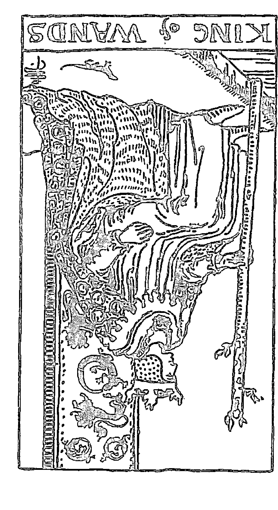

## 聖杯侍者（或公主）（Page [or Princess] of Cups）

聖杯侍者是個浪漫的夢想家，或是擁有水象星座（巨蟹、天蠍、雙魚）特色的小孩或年輕人：富有同情心，敏感，樂於合作而且迷人。你可能正在注意來自夢境、直覺或無意識的聲音。你也可能是朋友的絕佳傾聽者。你用關懷和樂於參與的態度來支持、照顧某人，表現你的愛心。可能有人請你保守秘密。也許你願意敞開心胸迎接戀情，它感覺起來彷彿是青春的初戀或是第一次的約會，亦或是在一起很久之後又重新開始。你的情感可能很脆弱或天真。你有把戀情理想化或渴望浪漫的傾向。你可能會透過輕鬆的玩心、友誼，以及服務他人的願望，為別人的生活帶來喜悅和歡樂。你或許急於避免衝突或不愉快的事，想促進和諧或美好的感覺。可能有人在給你建議，或是你想要得到別人的讚賞。這張牌偶爾也代表打扮和化妝的技巧進步。

身為學生的你，當你處在互相分享和溫馨的氣氛下，以及你在情感上受到吸引的時候，你的學習效率是最好的。若這張牌代表一道訊息，那也許是社交的邀請、情書或與訂婚、結婚、懷孕或生產有關的消息。若有其他的牌相呼應，它可能象徵生殖力。它也表示八卦或閱讀浪漫小說。這張牌可能代表你生活中某個敏感、想象力豐富和有愛心的小孩。

傳統涵義：金髮碧眼白皮膚的年輕人。好學。忠誠。專心致志。學習。應用。工作，職業。反思，觀察，考量，冥想，沉思。誠實。謹慎，誠信。樂意提供服務。

## 逆位的聖杯侍者（或公主）

逆聖杯侍者可能害怕愛或抗拒愛，或否認她（或他）的情感是很脆弱的。有時它代表失去純真和信任。不過，它也可能表示在性方面很有經驗，老是在追求新的對象，或是需要有人一直向你保證你是被愛的。可能有人很吸引你，這種情況令你十分苦惱，或是你用引誘和奉承別人的方式來讓自己開心。或許你刻意誇大冶豔的風格，或是在別人都穿牛仔褲的時候盛裝打扮，或是愛上了出身貧寒的人。這張逆位牌也可能代表對日常生活而言太過細緻的過度敏感和感情。不過你也可能在有人抗議你不夠愛他和溫柔的時候，表現得不夠浪漫、麻木不仁與沒有感覺。你或許決定你永遠不會再脆弱。

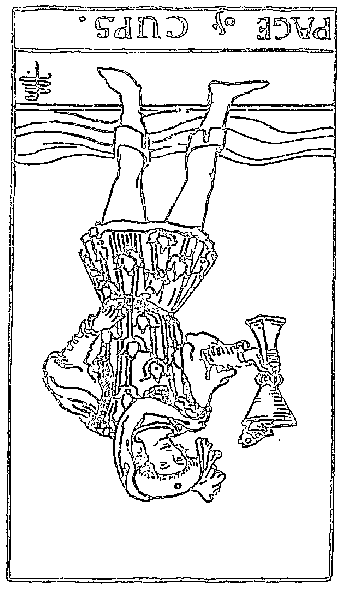

你可能在逃避一個人或一個情況。你或許拒絕傾聽別人的建議、故事或消息。你的直覺可能在告訴你一件你聽不見或不願意聽的事。你也可能被指導靈、鬼神、碟仙和占卜迷惑了。你可能退縮到自己的幻想或浪漫情調中，或是你有自己私密的王國，充滿了想像出來的朋友。

它可能代表一個小孩，他過去曾想用心中的愛和別人連結，卻被人嘲笑或一腳踢開。他可能很容易就被別人支配、影響和傷害。當一個東西對他有吸引力，而他也能運用想像力的時候，他的學習效果會最好。就內心世界而言，這張牌要你聆聽夢境，即使畫面令人不安或害怕；另外，去學會聽見與愛你的內在小孩，為他帶來撫慰。

就健康而言，可能是為愛消瘦或生病，包括噁心、間歇性的暈眩和胃部不適。這張牌指的消息可能包括分手信，或是邀約、社交約會取消。得到的消息會影響你的情緒而非理性。通靈得來的消息最後可能證明是假的。

在薩滿和魔法的層面上，這張牌代表青春期和初經的儀式。有一個傳統認為這張牌代表啟蒙儀式中的「稻草人」，可能代表部落中一元復始的豐饒。

### 傳統的逆位牌義
- 軟弱的年輕人，很容易受影響。
- 傾向，嗜好，習性。
- 吸引力，品味，風格。
- 同情心，鍾情，依戀。
- 愛。
- 心痛，羨慕，嫉妒。
- 吸引力，魅力，引誘。
- 邀請，同意。
- 奉承，討好，諂媚。

## 聖杯騎士（或王子）（Knight [or Prince] of Cups）

最好的聖杯騎士是踏上靈性追尋的基督聖杯騎士，純潔而且完美，或是一個把一切都奉獻給愛的吟遊詩人。他是個理想主義的夢想家，遵循內心的價值觀和情感，在浪漫的享樂國度裡探險。你或某個認識的人可能充滿關愛，表現出水象星座（巨蟹、天蠍、雙魚）那種冷靜、溫和、詩意和藝術家的本質。殷勤且友好的你，可能正在建立人脈、提出提案，或是把邀約擴大為一個活動。你可能會遇到與音樂、跳舞、靈性和奉獻的修行、諮商、承辦酒席，以及如電影之類的奇幻娛樂等有關的情境。或許你用禮物和各種付出在追求某人，以美食款待你的心上人。你可能想對他們付出你最深切的感受、充滿創意的想像、精神上的娛樂，滿足他心靈和情感的需求。你或許對別人的情緒狀態特別敏感，你也在練習取悅別人的技巧來促進和諧的人際關係，避免衝突。不過，你也可能認為愛情會使人分心，而傾慕或奉承是能幫助你達成目的的方法。即使是正位牌，這張牌也可能代表「愛過一夜就離開」的類型，因為征服才是目標。此外，你可能在「追尋」意氣相投或能在藝術上啟發你的環境，或是想把一件很有價值的事物帶到新的地方去。或許有靈性或非世俗的願景，或心靈的覺察力在引領你，你想為務實的問題找到靈性或有療癒力的解決方法。這張牌可能代表水路之旅，或是在潮濕的天氣中旅行。

傳統涵義：誘人、迷人的戀人。邀請，提議。到來，抵達，靠近。吸引。征服。著陸。會見。接待，歡迎，問候。接近。拉在一塊兒，使在一起。協議，承諾，意氣相投。獲得，聯合，合一。匯合。比較，相似。

## 逆位的聖杯騎士（或王子）

逆聖杯騎士可能是騙人的謀略者，或是過度敏感的唯美主義者在追逐幻象。他可能會十分坦率地表露情感，也可能會隱藏愛意，或只是用愛來達成個人的目的。這張牌事實上還有一個傳統的解析：「不敢說出口的愛意」，這是十九世紀同性戀的委婉用語。這張牌強調了逆位牌柔和與秘密的面向。如果這張逆位牌表示你變得比較直接了當，那麼它可能代表任何你隱瞞的事都會「出櫃」。不然的話，可能是邀請被撤回，或是你帶著適當的懷疑和克制在檢視一項提議。也許會有得不到回報的愛，或是外遇和欺騙。情況往往不是它表面看來的那樣。你或某個認識的人可能會用謹慎的態度看待承諾。或許你沒有誠實表現出你真正的情緒，反而討好、奉承、虛偽、口是心非，原因可能是你總是用柔軟、流動的方式順應和適應情況，使你很難明確表態或主宰局面。你可能會「愛上戀愛的感覺」，或很自戀地只愛自己，沒辦法愛別人。你或許會被憂鬱的心情、眼淚、感傷或不安全感壓垮。你可能會慢慢變得無精打采，作夢和幻想令你苦惱。或許你漸漸不想再投入感情了。

就健康而言，若有其他牌相呼應，可能會有性虐待、藥物濫用或酗酒的情況，目的是想找樂子或逃避殘酷的現實。失衡狀態會讓你貧血或浮腫，容易感冒、流膿、噁心、宿醉和困惑。當這張牌代表內心的表現，會像用魚和水紋作為裝飾的袍子所象徵的一樣，代表繁衍、潛意識的媒介，而不是代表人。因此，你可能會覺得自己沉浸在詩意的奇想中，悠游在充滿心靈意義的海底世界和與水有關的聯想裡。

在薩滿和魔法的世界裡，這張牌可能是為了靈魂復元而旅行，或是透過夢境修練，你探索夢境的象徵有什麼更深的意涵。它也是神秘學的詩人，用性愛來描寫靈性的合一。

### 傳統的逆位牌義
- 欺騙，勾引，朦騙，騙子，狡猾。
- 騙人，無賴，邪惡。
- 騙術，詭計。
- 細微，狡詐，奸計。
- 敏感，足智多謀。
- 柔軟，順從。
- 機靈。
- 十惡不赦，殘暴，背叛，詆毀。

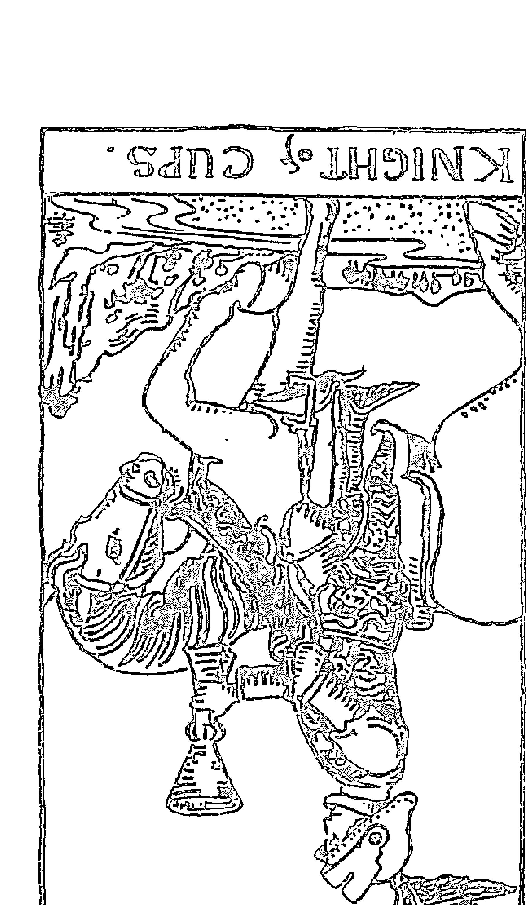

## 聖杯皇后（Queen of Cups）

聖杯皇后就像象牙塔裡的少女一樣：纖細，浪漫，愛作夢、沉思，有深沉的情感。她可能很有愛心、優雅、善良、充滿關愛，擁有敏銳的美感，善於鑑賞詩、美和藝術的細緻。但她也可能活在自己的世界裡，不切實際，沒有目標，脫離世俗。你或某個認識的人可能會用情緒反應和個人的價值觀來評估事情。你能感覺到細微的差異和潛在的暗流，也可能特別容易受心情和情緒影響，無論是你自己還是別人的。別人可能會來找你提供直覺的洞見，或許你會用通靈和同理心的能力來理解他們。因為你很柔軟，也想要取悅別人，所以可能會接受別人的投射，把他們無意識的女性面反射回去。因為你會流入任何一種給你舒適和安全感的形式或容器，所以你很難認識自己。有些人可能會覺得這種敏感很虛偽。不過，你也可能想保護自己敏感的特性，所以變得沉默寡言、獨來獨往。你可能依循的是內在的韻律和流動，而不是時鐘上的時間。這張牌暗示你很害羞、多愁善感、容易受騙、異想天開、愛作夢。你可能比較喜歡平靜、和諧的環境，但你在幻想和想像的國度裡也能生活得很好。偶爾神秘主義會使你著迷。或許別人眼中的你是個充滿魅力、誘人、迷人，能使人神魂顛倒的人。你可能在和你的心上人打情罵俏，或是夢想與他廝守一生。談戀愛的你會想被捧在手心般被疼愛。身為母親和伴侶的妳會認為妳愛的人完美無瑕，妳會為他們創造出充滿藝術氣息的美麗環境。

傳統涵義：金髮女郎。善良，高貴，正直，溫馨，可敬，端莊，體面，貞潔，誠實，好看，文雅，高雅，忠實，秀麗。美德的典範。

## 逆位的聖杯皇后

逆聖杯皇后看起來如天使般的飄逸，彷彿不屬於這個世界。諷刺的是，她也可能是墮落的女子或勾引男人的女人。在維多利亞時代的文學裡，她被愛沖昏了頭；在情人背叛她之後，她跳水自盡，變成水鬼或妖婦，引誘男人步向毀滅。她一方面像個蕩婦，一方面又很矜持。

逆位牌表示你可能否認你的情緒，或是了無生氣，沒有活力且怯懦。它也可能代表拒絕向造假的手段屈服，不願相信不屬於你的信念。一個極端是你可能會縮回不切實際的幻想裡，自憐自艾，或是酗酒、嗑藥。你有一種想和你欲求的對象在精神上結合的傾向，這可能會讓你魂不守舍，容易受靈體或邪惡附身。另一個極端是你可能很機警、能幹，你不讓任何人占你便宜；你戰勝了假象，以及拒絕被感覺淹沒。

或許你很不務實，對批評過度敏感，或是常會忽略時間上的考量和規定。你可能很輕佻善變，或是會為了自己的養分供應而榨乾別人的心理能量。你也或許會採取消極的抵抗方式，用生悶氣或性來勒索你想要的。不安全感讓你愛吃醋、善妒，充滿敵對的恨意，可能還會出現報復心，不然就是很執著與緊咬不放。不過，你也可能會和別人疏遠，變得冷酷無情、麻木不仁或愛報復。你可能會隱藏自己的愛意。

就健康而言，可能有消化不良、心情鬱悶、閉尿症、貧血的情況。若你為人父母或伴侶，這張皇后牌可能是沉默寡言的，充滿怨懟、自私自利，會因她的不快樂而指責別人。她的需索或依賴性可能會讓她所愛的人感到窒息。在內心的層面，可能會與神和大靈有深刻且神秘的連結和奉獻，而且會出現與感官脫離的經驗。

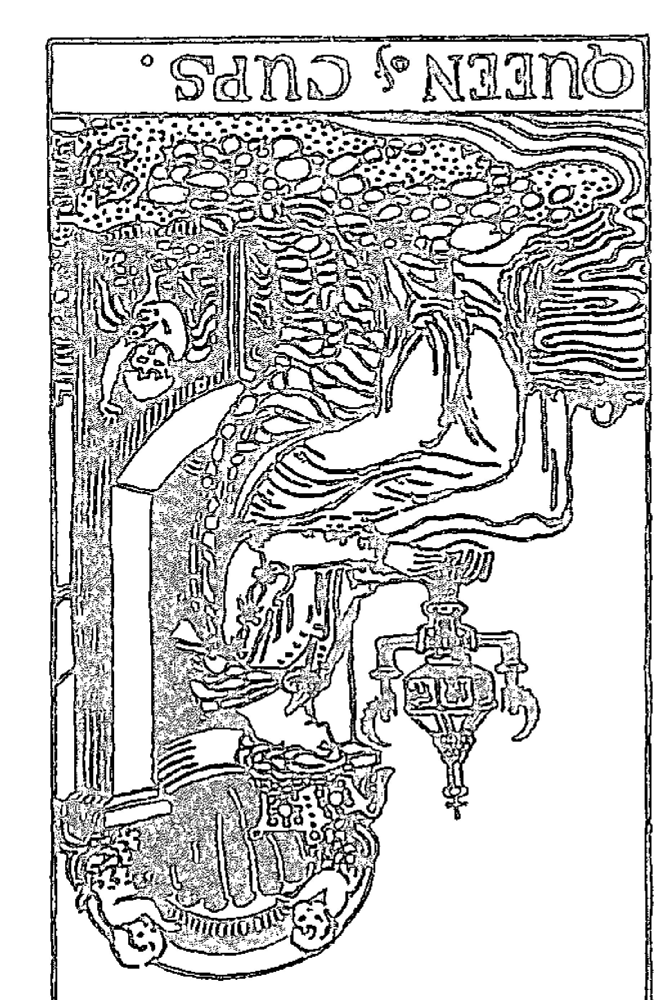

在薩滿和魔法的層面，這張牌講的是通靈會、進入恍惚狀態的通靈，以及透過承接別人的疾病與痛苦來進行心靈療癒。在某些薩滿的附身形式中，她成為慈愛的靈體的妻子，或是落入惡魔愛人的魔爪中。它也代表藥草茶和酊劑。

### 傳統的逆位牌義
- 階級高貴的女子。
- 有美德的女性。
- 也有：邪惡，不名譽，不誠實，墮落，厚顏。
- 放蕩，傷風敗俗。
- 腐敗，醜聞，放肆，不節制，私通。
- 善變，不一致。
- 地位崇高的已婚女子奉獻她的愛。

## 聖杯國王 (King of Cups)

聖杯國王可能會讓人聯想到狄俄尼索斯（Dionysus），他是希臘的酒神與詩神，以放縱著名；但他只喝醉過一次，而且和許多希臘神明一樣，對他的妻子忠貞不渝。這張牌也可能會讓人想到海神波塞頓（Poseidon），他充滿潛在的深度和深沉的水流，確立他水象星座（巨蟹、天蠍、雙魚）的成熟權威。你可能正努力在快將你淹沒的情緒波濤中站穩腳步。若你處於權威的地位，目前的文化幾乎不會鼓勵你發揮藝術才能和直覺，溫柔親切地照料人們。如果你這麼做，別人可能會認為你很軟弱。要讓自己不被情緒淹沒，你可能需要嚴格地自我控制，看起來就像他脖子上掛的魚一樣冷硬。不過，你也可能表現得很可靠、敏銳、有愛心而且慈悲，你擔任親切的東道主、好朋友，別人的知己。這張牌象徵詩人或藝術家、商業鉅子、神職人員、家庭醫生或諮商師。

你或某個認識的人會事先考慮到別人的需求，並設法滿足或成為他們慰藉的來源。你可能在主導文化活動，提供慈愛、明智的諮詢，或是故意牽動別人的情緒，好讓大家同情你的目標。你可能有懷舊的傾向，信奉老派的價值觀。對身為父親的你來說，聖杯國王可能代表慈愛或養育，或是因為自己的文化教養而不敢表現出他真正的關心。

傳統涵義：金髮、高貴的男子。誠實，正直。平等，公平。藝術家。科學家。律師。虔誠。公平處理，善良，負責，體貼。樂於支持，溫馨。

## 逆位的聖杯國王

逆聖杯國王可能在封閉自己，他看起來鐵石心腸，或是他可能為了探測自己心靈的深度，而犧牲了外在的人際關係。你多愁善感，容易落淚。不過，你也可能表現得很剛強，以免大家認為你很懦弱。或許被感受折騰的你害怕情緒會失控。你可能對自己很失望，所以很憂鬱、悶悶不樂——結果，你變得心不在焉。

你可能在完全錯誤的地方尋找愛，或是像約翰·藍儂對小野洋子的深情一樣，愛妻之心表露無遺。此外，你可能相信愛應該要在你無為等待的時候來臨。你認為這個世界很冷淡、充滿剝削，所以你也占別人便宜——因此，傳統的牌義有侵吞與詐騙。你可能躲在有愛心的面具背後，或是在大家面前假裝逢迎。如果你曾假扮某種角色來滿足某人的需要，那你可能已經搞不清楚自己是誰了。或許沒有人能體會你為家人犧牲的感受。你可能只是想得到同情。這張逆位牌就像短篇故事的主角華特·米提（Walter Mitty，譯註：美國小說家James Thurber於一九三九年發表的短篇小說《華特·米提的秘密生活》[The Secret Live of Walter Mitty]的主人翁），怕老婆的先生退縮到幻想世界裡。

和其他的聖杯牌一樣，你可能會用對藥物、酒精的倚賴或成為工作狂來逃避。你抱著一種「我好可憐」的心態，活在消極抵抗的自憐裡。也許特別難直接行動，所以你就偷偷摸摸地去做。你也可能消極地矇混度日。

若你身為父親或伴侶，這張逆位牌可能表示你過度保護、讓人窒息，或是別人無法和你有情感的連結（可能是因為酗酒），你的心情陰鬱不定。你可能有性方面的矜持、怪癖或縱慾的傾向。另一方面，這張牌可能表示突破社會對男性角色在照顧家人方面的觀念，以及對男性情誼的看法。就健康而言，你可能在考慮非傳統的治療方式。逆位牌建議你去尋找「不適」或不和諧潛在的原因。就牌面來說，可能表示有暈船或生育方面的問題。

就薩滿和魔法的層面來看，這是如祭司般積極奉獻的角色。它指向亞瑟王聖杯傳奇的漁王：在故事中，他的傷一直沒有好轉，直到最後有人問他：「這個聖杯侍奉的是誰？」他才痊癒。

### 傳統的逆位牌義
- 經商或坐在辦公室的男子
- 不名譽的男人
- 心口不一
- 勒索
- 侵吞
- 賄賂
- 不公不義
- 強盜，搶匪，小偷
- 無賴，欺騙，騙子
- 邪惡，腐敗，不公平，醜聞
- 墮落

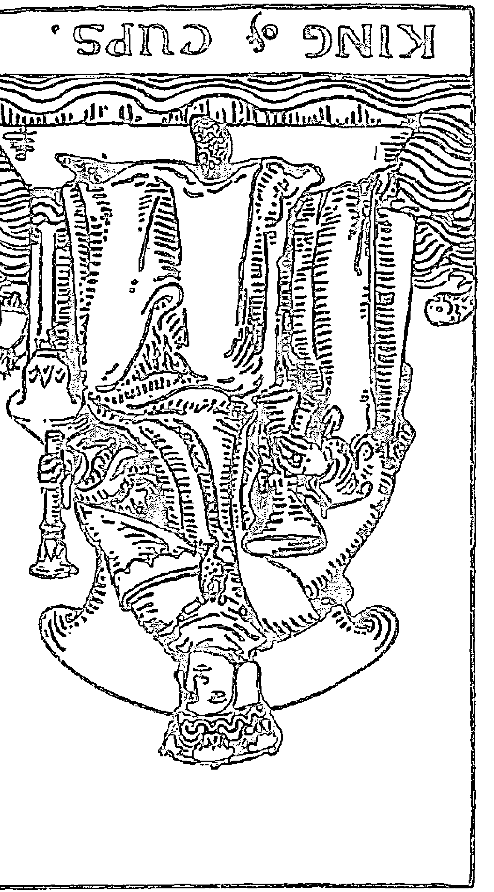

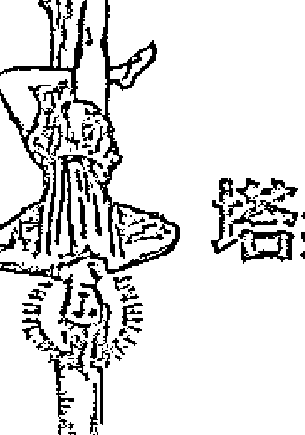

## 寶劍侍者（或公主）（Page [or Princess] of Swords）

寶劍侍者看起來就像棒球打擊手，他（或她）的眼睛盯著球，等待下一步。你或某個認識的人可能很好奇接下來的發展；若預期有衝突，你可能進入防禦的戒備狀態；或者你會無畏而大膽地行動。你在互動時會表現得很警覺、機智與靈活，但若受到威脅，你就會變得很尖銳，表現出惡意。也許你在嘗試必須迅速適應的新點子或科技；或是你在玩一場同時挑戰身體和頭腦的遊戲，還需要靈活和機敏的技巧。你可能正在解決問題或處理危機，或想先蒐集事實與資料，再承諾要不要接下工作或專案。你也許正在學習或運用邏輯、語言、書寫和口語、研究、設計、調查，電腦和科技。此外，你可能捲入了間諜或監視活動。這張牌最好的情況是你發展出鑑別力、機敏的應答技巧和風趣的言行，還有隨機應變的能力。你準備好運用頭腦的本領和靈活的策略，把握當下。

這張牌可能真如牌面所示，表示使用劍、刀或其他銳利的工具。你也許需要保持警戒和小心。寶劍侍者就像個小孩，可能代表某個因兒時受到背叛或傷害，所以變得防備心重或猜疑心強的人。這張牌也可能代表早熟的好奇寶寶，或是風象星座（雙子、天秤、水瓶）不成熟的表現。也許會有與困難、談判、契約或法律事務有關的消息，或是八卦或閒言閒語。它通常也表示很樂於接受並渴求新的想法。

傳統涵義：諜報，秘密，好奇。監視。觀察者，調查者，警戒。財產管理人，財務主管。檢查，記錄。推測，測量，計算，數值。博學多聞，學者，科學家，演員。

## 逆位的寶劍侍者（或公主）

逆寶劍侍者可能很刻薄、嚴厲，喜歡罵人，或是很脆弱，總是不知道該說什麼。你可能降低了心防，或是放下了作戰的寶劍。也許你覺得要替自己說話是一件很難的事。或者，你在使用拖延的策略，讓自己有時間把事情仔細從頭想一遍。

寶劍侍者防備的姿勢可能代表兒時受到傷害，但又無法有效處理早年的創傷。你或某個認識的人可能會突然發動攻擊，以傷害、蔑視別人為樂。可能會有人惡意中傷，散播謠言和八卦。也許你享受為了爭論而爭論，或是決心報復。此外，你可能沒有發覺你的言語和行動造成了什麼影響。

你可能會逃避社交或與人交際的活動，在群眾面前猶豫著不敢開口，害怕分享你的想法或是說不出話來。你也許行事隱密，不想讓別人知道有關你的事。你也可能說話漫無目的，沒有邏輯。你蠻幹的樣子會被別人認為是裝腔作勢。

或許會發生言語或書面上的誤會。你會在工作上偷工減料。你沒有發表想法的自信。如果投射在別人身上，你可能會覺得他很狡猾、殘酷、愛騙人或是會背叛你。你覺得到處都是陰謀。你可能會認為自己還沒準備好，缺少心理或技術上的能力，於是變得很保護自我。

在法律方面，這張牌可能代表遇上麻煩的年輕人，或是他受到離婚、失和的負面影響。他也許受到輕視、嘲笑或羞辱，拒絕溝通，或是正在克服這類的經歷。

就健康而言，這張牌可能代表語言障礙、自閉、口吃、心理或身體的虐待，或是免疫系統變弱。如果有其他的牌相呼應，可能會有想自殺的念頭。

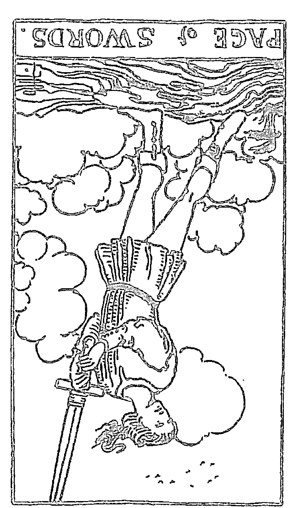

消息也許會來得很突然，出乎意料——突如其來發生，導致痛苦和不安。計畫或程序會因為不夠合理、缺乏規劃，或是大家意見不一致而無法展開。

從薩滿和魔法的層面來看，這張牌代表成年的考驗，像亞瑟拿出石中劍，或是展開靈視探尋（vision quest，譯註：在北美原住民的文化中，小孩長大後要獨自到荒野中進行靈性之旅，通常伴隨著斷食；他的守護動物會以異象或夢境的形式出現，之後他的人生方向也會慢慢浮現。接著他回到部落中，成年後就會去追尋這個方向）。它也代表在想像的世界中思考的能力。

傳統的逆位牌義：
- 虛弱、軟弱的人。
- 騙子。
- 缺少防備。
- 生病。
- 陰謀，攻擊。
- 突然的，意外地。
- 突如其來，冷不防。
- 驚訝，詫異，令人驚奇。
- 在沒有心理準備的情況下說話或行動。

## 寶劍騎士（或王子）（Knight [or Prince] of Swords）

寶劍騎士不顧一切地殺進衝突中，像發誓要殺了惡龍的英雄，或是想通報警訊的信使。他表現出風象星座（雙子、天秤、水瓶）革命的能量，而且會專注在頭腦和語言的行動上。這呈現出你或其他人的一個面向：你們會以批判的態度，來思考、分析、辨別並斟酌每件事物。你可能很果決、有說服力，但卻剛愎而且沒有耐心。或許你在嘗試修正某個錯誤，或是克服障礙。雖然你企圖提出重要的見解，溝通你的想法或哲學，但由於你很輕率、衝動，而且還有一種「自認無所不知」的傾向，所以你可能不會停下來傾聽別人的觀點，或留意自己會衝到哪裡去。你或許正在訂立原則或為事物分類。另外，你可能處於一種會讓你憤世嫉俗、冷嘲熱諷的情況裡。你會正當地捍衛你所認為的真理，或是樂於挽救大家不太信服的觀點。你會急著為了辯論而辯論。你可能會將邏輯、批評和分析當成武器，或是你正在去除不理性與模糊的事物。這張牌代表你對研究和分析的工作、規劃局、強制執行法律或是溝通感興趣，也有機會接觸這類的事情。你可能會為了一個理念而戰，會帶領運動。或許你的思考很有效率，你急著處理掉瑣碎的小事，或減少沒有效率的行為。這張牌代表的旅行模式是飛機或機車，或是你去哪裡都很匆忙。天氣或氣壓的表現可能是強風或暴風雨。

傳統牌義：
- 劍客
- 軍人
- 忠實的追隨者
- 惡霸
- 刺客
- 鬥士
- 敵人
- 爭吵
- 戰爭
- 戰役
- 決鬥
- 英雄般的行為
- 狂熱
- 攻擊
- 防禦
- 反對
- 破壞
- 毀滅
- 魯莽的極速行動
- 推翻
- 粗野
- 怨恨
- 惡意
- 嫌隙
- 生氣
- 憤怒
- 狂怒
- 技能
- 勇氣
- 勇敢
- 英勇

## 逆位的寶劍騎士（或王子）

逆寶劍騎士可能很狂熱或失去控制，或是他終於精疲力盡了。這張牌就像一個足球員，他衝去觸地得分卻跑錯邊，或是活在錯覺中的唐吉訶德（Don Quixote），和風車對戰。人們最後認為這個騎士很荒唐、輕率或無能。你或某個認識的人可能滿口空話，在和空泛的東西作戰，說著不著邊際的想法，或為不切題和空洞的理論而爭辯。某個不公不義或不公平的舉動可能令你勃然大怒，但你卻沒有查證事實和你的資料來源。你說的話聽起來像胡說八道，你的論點很不理性。或者，你可能已經千瘡百孔，被尖銳的話語傷害，只想從前線撤退，放下寶劍。你正在嘗試克服衝動，或是馴服內在所謂的「脫繮野馬」，無論那指的是你的本能還是思想。你可能會深思熟慮、小心慎重，不想那麼急躁。

然而，你還是可能會耍脾氣，急著想帶給別人痛苦、傷害或損傷。你會變得很殘忍或想報復，把錯誤歸咎給別人，或用殘酷的理由來製造毀滅。若你做事太倉促，你可能會犯下錯誤，發現自己在浪費時間。你在炫耀的時候，可能會不小心令別人陷入危險。韋特牌上的馬看起來比正位牌還要生氣，表示你沒有聽進別人的忠告就一頭往前衝。你可能想要僥倖成功——就算是用騙局或詐欺——你以為你比別人更敏捷、更精明。反之，你發現自己被這樣的人傷害。你怒氣衝衝地想報復某個不義的舉動。此外，你可能在退步而不是在進步，你匆忙地從一個嚇人的情況中撤退。這張牌對交通來說不是好預兆，你可能會碰上出軌、被迫下飛機或是繞路的狀況。

就健康而言，有出現暴力、意外和受傷的傾向，尤其是手或腳，以及和速度有關的事。它也可能指中風（也叫做腦內風暴）。在薩滿和魔法的層面上，這張牌代表靈性的戰士，在上部世界進行戰事。它也可能代表心靈的自我防禦。

傳統的逆位牌義：
- 扒手。
- 騙子。
- 詐賭。
- 裝傻。
- 輕率。
- 無能，笨拙，無知。
- 軟弱。
- 衝動的錯誤。
- 愚蠢，單純，愚笨。
- 胡說八道，奚落。
- 自負，虛榮。
- 揮霍。
- 靠小聰明過日子。
- 傳來災難的消息。

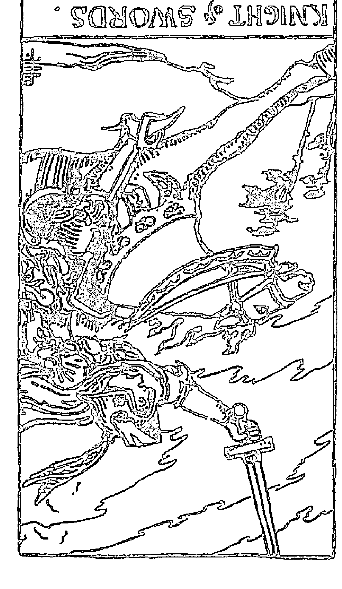

## 寶劍皇后（Queen of Swords）

寶劍皇后在傳統上代表離婚或守寡的女性，或是老處女。她雖然聰慧且有識別力，但也很矜持而冷淡，像個冰山女王。雖然她那正經、獨立的樣子可能會令人畏懼，但你可以相信她的坦誠。她會直接穿透任何情況的核心，不講沒意義的事。她可能穿著剪裁俐落的套裝，也可能穿著寡婦的喪服。她勇敢地從人生的痛苦中學習，面對悲劇和失去（由牌背景中低垂的雲作為象徵），也得到了智慧。複雜的頭腦讓她有能力應付複雜的狀況。她擁護嚴格的職業道德，支持真理和原則，不在意他人的感受。她那精心鍛鍊過的頭腦和自律能力，可以做出誠實且一絲不苟的評論、研究、寫作或商業交易。你可能在要求別人誠實，更有能力、效率和專業素養，變得更幹練。你會給人睿智的指引，不過別人可能很難達到你完美主義的標準。你可能會公正不阿地處理各種情況，把令人失望的事處理的很好。你重視個人自由，以及不受別人意見左右的能力。你可能很果決、嚴峻、有批判性而且不讓步，在必要的情況下你會與熟人斷絕來往，就算你因他們痛失親人而哀傷。然而，你也可能會切斷自己的情緒。在伴侶關係中，敞開心房溝通是很重要的——雖然你可能會把親密關係拿來分析個沒完沒了。身為母親的妳要求很高，很愛批評，而且對妳所期望的事毫不讓步。

傳統涵義：守寡，悲傷，哀愁，喪失，缺乏，缺席，分開，匱乏，荒蕪，窮困，貧窮，不幸。空虛，空缺，空的，空著的，空位，暫停活動，閒置。

## 逆位的寶劍皇后

逆寶劍皇后在傳統上，就像莎士比亞的馬克白夫人或白雪公主的後母。她用欺騙和詭計達成她狂熱的目標。然而，假如單純將她視為純粹邪惡的人物，我們就會覺得這是一齣通俗劇，反而沒有看見這是有致命缺陷的人類所創造出的更大悲劇。殘酷和心胸狹隘通常不是真正的邪惡，只有很深的失望和自我欺騙才會把一個人變成這樣。她的壞脾氣和負面信念，很有可能是施展不開的抱負、變質的理想，能力被犧牲或是被閒置所造成。不過，這張逆位的皇后牌也可能會變得更有愛心、容易動情、沒那麼冷漠，比較依賴，也能卸下武裝。

一個極端是你把出眾的才華和能力藏在奸詐的外表下。另一個極端是苦行主義者，你拒絕舒適和別人的陪伴。你壓抑哀慟，抗拒憂傷。孤寂、約束和偏狹可能是心碎和失望的結果。你也許會把過度批判的態度投射在別人身上，或是嚴苛地自我批判。這張牌可能表示你不願劃下句點，或遲遲不做決定。你雖然害怕孤單或被拒絕，卻又和你身邊的人保持距離。你可能排斥過度理智的思考，拒絕玩頭腦遊戲，或正在努力克服一個冷淡、漠不關心的親人或老闆所帶來的痛苦。如果有其他牌相呼應，這張牌可能指與死亡、離婚、分手有關的事，因為它們可能不會「乾淨」地結束。在你的人際關係中，你可能壓抑了憤怒或冷酷，或缺少毅力和識別力。身為母親的她，心中可能有極大的悲傷，但要不是以慈悲就是以冷酷和保持距離的方式呈現。她可能很不寬容、不理性，或是很優柔寡斷、遲鈍。

就健康而言，這張逆位牌可能表示和氣喘有關的症狀、過敏（特別是對黴菌），還有環境中的危險源。從薩滿和魔法的層面來看，代表有能力設下保護、明確知道該做什麼，或知道有哪些事不該進行。它也指毒藥和毒素的知識，不論它的功能是用於殺人還是治療。它可能包括為亡者進行的準備和儀式，傳統上這類死亡會由年長的女性預見。

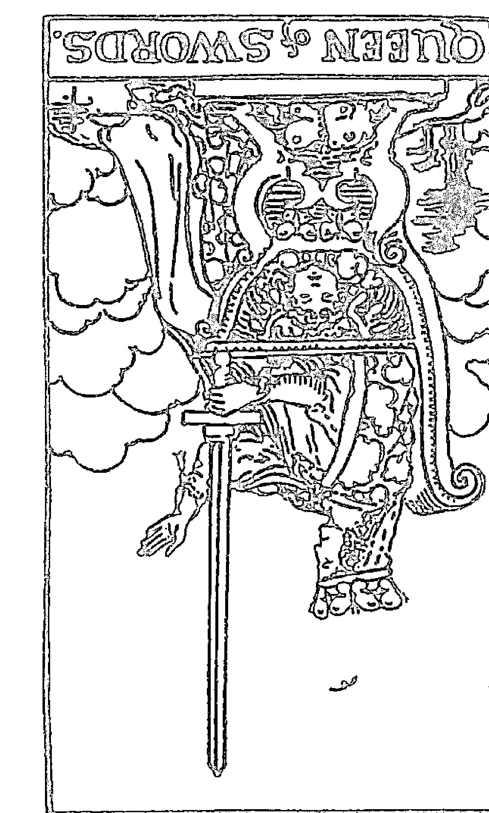

傳統的逆位牌義：
- 邪惡、心術不正、懷恨在心的女子。
- 惡毒，惡意，報復。
- 欺騙，狡詐，朦騙，背叛，奸詐，詐術。
- 偏執，假道學，虛偽，偏狹，狂熱。
- 心胸狹隘。
- 孤寂。

## 寶劍國王（King of Swords）

寶劍國王在「執行責任」。他是個嚴峻的法官、不畏縮的軍人、編輯、外科醫生、法官或哲學家。他用寶劍來統治，意思是他有一套嚴格的評量標準，他據此衡量事物。和其他國王牌一樣，他是真理和正義的公正仲裁者，所有拖延的問題到他手裡都會結束。他表現出風象星座（雙子、天秤、水瓶）顯現於外的專業素養。因此，他是一個根據邏輯和理性、倫理、原則、事實來做出選擇的決策者。這張牌最好的情況是他努力做到誠實、公平、嚴格，並精確地定義，擁有絕對的規則和指導原則。這張牌也代表處理法律事務、審判和談判，或與警察和軍隊有關的事物。你或某個認識的人可能在遵守一些標準或時間表，或是在批評某樣工作，而且會特別留意瑕疵、錯誤或缺點。你可能在嚴格的要求下生活。你或許在設立界限，而且如果有需要，你會為了遵從一項原則或決策，而放棄你想要的東西。你公正、冷靜地面對事情，想達到最大的效率、準確度和秩序。紀律是必要的。你謹慎地評估計畫中的行動會產生什麼後果。如果有其必要，你會切斷或去除所有不必要的東西，就算那表示要做出個人的犧牲。若你身為父母，這張國王牌有很高的標準，他的教誨就是每個行動都會產生後果。身為配偶的他，可能很聰明、誠實、有紀律，不過也很愛批評，要求很多。

傳統涵義：宗教人士或律師。法官，顧問，督導，議員，理事，生意人，醫生，法律學者，訴訟當事人。法學。權力，命令，智能。威力。

## 逆位的寶劍國王

逆寶劍國王用極端的態度看待命令和紀律——用憤怒、沒有人性的態度——而且沒有同情心，麻木不仁，你無法動搖他的行動。他的懲戒可能很嚴苛而且殘酷，毫不仁慈。不過，他也可能無法堅持任何事情，意志很薄弱、散漫，無法做出決定。這張逆位牌也可能是心不在焉的教授：雖然對某些領域很敏銳，但對某些領域卻完全沒有概念；逆位牌也可能表示缺少知性的能力。

你可能正在應付厚顏無恥或狡猾的人，尤其是和法律相關的事務。或是你有些非法的行動，犯了一件罪行。有時你會有錯誤的思想，或是把偏見當成事實接受。它也可能表示你只是需要放鬆一下，說個笑話。

世界可能看起來很不公平而且腐敗。司法系統、政治或商業會讓你或某個認識的人感到幻滅。或許你覺得自己雖然很有原則，卻沒人支持你。或許你曾經受到不公平的對待。審判或決策可能不如你的意，你遇到了不公平和偏心的情況。你可能在嘗試打倒體系，或是想逃避你的行動造成的後果。你可能無法主張你的信念或完成目標，除非你找藉口推託。你可能會表現出倔強的樣子，或是有意無意傷害了某人。你也許太愛批評、挖苦，很無情而且愛記恨。

這張牌可能表示你想駁回不人道或不公平的規則。你或許想翻案，否決老闆的意見，或是撤下已經被選定的幹部。這裡還可能暗示你對政治或軍事行動有不同的意見，因為那些人獨裁的態度令你不舒服。

就健康而言，可能有心智退化和衰老的情況。疼痛可能是個問題，也許是僵硬、早年受的傷或背部問題。

這是一個壞脾氣的父親形象，他可能會剝奪小孩的繼承權或斷絕來往，或是要求不合理的懲罰。他也可能沒有辦法面對任何人或主張任何事。他要不是個紀律嚴格的人，就是無法有所堅持。

從薩滿和魔法的層面來看，這張牌講的是面對考驗和歃血立誓。它也代表奉行宇宙法則的靈性戰士。

傳統的逆位牌義：
- 邪惡的意念。
- 危險人物。
- 敵人。
- 邪惡，惡意。
- 搗蛋。
- 壞脾氣。
- 剛愎，背信棄義。
- 犯罪。
- 殘酷，不人道，殘暴。
- 虐待狂。
- 擔憂，哀痛。
- 衝突，干擾。
- 打輸官司。

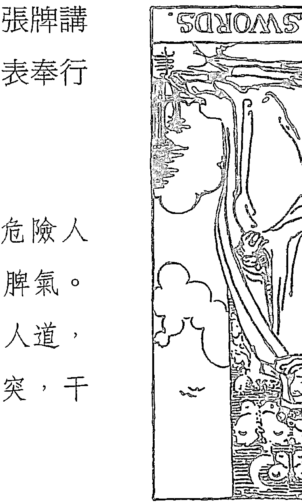

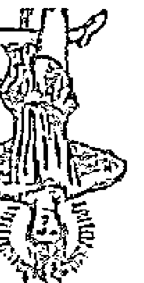

## 錢幣侍者（或公主）（Page [or Princess] of Pentacles）

錢幣侍者是個學生或學徒，代表土象星座（金牛、處女、魔羯）不成熟的特質。他（或她）很謹慎小心，腳踏實地，忠誠而且穩定，而且只相信自己看得見摸得著的事物。你或某個認識的人可能會用讚嘆或驚奇的心情，再配合常識來檢視某個事物。或許你在追蹤事實，蒐集資料，在觀察一個過程或實驗。你可能在上課、考慮要選擇什麼職業，在學習新的技能（可能是透過在職訓練），或是在申請工作。新科技或其他驚奇的事物會令你目不轉睛，著迷不已。若你在考慮買東西，你會仔細檢查品質和手藝。你可能在蒐集東西，例如海灘的石頭。你也許會去冒險，但前提是必須有實際的目的，能實現特定的目標，符合特定的標準。偶爾這張牌表示有未滿足的欲望和渴望。

這張牌若是傳訊者，可能是告訴你要特別注意有形的東西，例如你的身體、健康、財產，以及務實、實際的事務。你需要非常小心閱讀有關生意或金融的通訊或合約，或是遵守指示和圖解。這張牌也可能表示情報與資料的蒐集和傳播。

它形容的是很警覺、認真或務實的小孩，對大自然特別好奇。他們常會獨自一個人玩，自己找樂子，還喜歡把東西拆解再裝回去，想了解它們的運作方式。

傳統涵義：為你工作的深色皮膚和頭髮的年輕男子。學習，指示，應用，冥想，反思，專注。工作，職業，學徒制。學校，門徒，弟子，學問，學徒，業餘者。投機商人，貿易家，談判家。有壞朋友帶你去賭博。

## 逆位的錢幣侍者（或公主）

逆錢幣侍者可能失去了焦點，不再認真，或是乾脆翹課；整體而言，他（或她）和實際的事務及問題脫節。也許機會不會實現、期望或計畫告吹，例如你的工作前途，或是你自己把它拒絕掉了。你或許覺得學習新東西很困難，要抓住必要的資訊或事實也不容易。你可能對某個有價值或寶貴的東西失去了耐心，結果犯下嚴重的錯誤。或是你原本真的很想要一個東西，但現在覺得它沒有吸引力，就改變了心意。有時候這張逆位牌表示過度吹毛求疵。

你可能在垂涎金錢和財產，滿腦子想著這些事情。你也可能對你認識的人產生不成熟或神經質的依戀。你說不定發現自己擁有的東西變多，參與的事務增加，但數量多到超過你的能力範圍。

不過，你也在逃避物質的事務，將焦點轉移到靈性和短暫的事情上。你看重靈視力更甚於肉眼的視力，所以對占卜、凝視水晶球或使用碟仙比較有興趣。你可能不讓別人知道你有這類興趣。

或許你忽略了你的健康或衛生狀況。而更進一步來說，你可能也會忽略或不尊敬大地之母，例如隨地亂丟垃圾、製造廢棄物或破壞你周圍的環境。你的視力可能受損，也許是身體或象徵性的意義。你可能會因為太專注於生活中的瑣事，而覺得自己被困住。不過，你也可能會宣布要擺脫瑣碎的執念，你發現有一個充滿嶄新觀點的世界正在等著你。

就健康而言，這張牌可能代表因過度工作而產生的憂鬱和疲倦。它也可能代表童年時期會有的病痛。傳訊者可能會帶來壞消息，例如計畫取消。若投射在別人身上，你可能會覺得他們太過重視物質或與現實脫節。

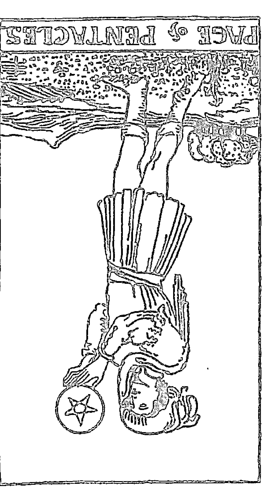

從薩滿和魔法的角度來看，這張牌代表學徒。在童話故事中，它代表最年幼的弟弟或妹妹，雖然不明白一個東西真正的價值，不過還是找到了它，而且依舊維持敞開和讚嘆的心情來保護它。

傳統的逆位牌義：
- 專業
- 慷慨，豐厚，豪華
- 過多
- 大方，饋贈
- 人群，群集，大眾
- 降級，降低
- 損傷，破損，掠奪
- 浪費
- 叛逆
- 帶來壞消息的人
- 管別人的閒事

## 錢幣騎士（或王子）（Knight [or Prince] of Pentacles）

錢幣騎士是很有用的人，是一個可以指望的人，因為他說會出現的時候就是會出現，直到把工作完成為止。他知道如何修理一個東西，不然也一定會找出辦法。有時他甚至是個技藝精湛的工匠，擁有細膩的美感。他是土象星座（金牛、處女、魔羯）那種能發揮影響力的人——他可能不常動起來，而一旦他動作，就會堅持到底。他頭盔上的橡樹葉告訴我們，他的韌性和智慧來自大地，他關注土地以及相關的問題。他認真負責又可靠，但也很享受感官的樂趣，對身體的歡愉有健康的慾求。從他犁得很整齊的田地，我們可以看出他的自豪，他也會慢慢地、仔細地觀察事物。在親密關係中，他會帶給你有價值、安全感、秩序和可靠的感覺，雖然有人欣賞他這種特質，但也有人覺得他很無趣。你或某個認識的人，可能正在用務實、井然有序的方法處理一項計畫，或是向別人表示忠誠，為他服務。你可能在關注與節約資源、進行投資，或維護財產有關的事情。你也或許會採取常識性的方法，仔細檢查事實和細節，專注在真正可以達成的目標上。用運動和營養維持身體健康是很重要的。進取心不足和固執的態度可能會讓你的動作變慢。作為一張旅行牌，它代表坐公車或火車的陸路之旅；不過，最好的交通工具是野地四輪驅動車或黑色的賓士轎車。

傳統涵義：積極的人。有用，耐用，有益。實用。利己，掛慮。有趣。有利可圖、有吸引力的價格。有利的，收成，利潤。重要，必要。體貼，善良，樂於助人。用力量、堅持和意志成功。

## 逆位的錢幣騎士（或王子）

逆錢幣騎士可能太沉迷於物質主義和物質世界，所以沒有空間與別人互動、作白日夢，也沒有閒暇的時間。他所有的精神都專注在他努力所生產的成果，或是他下一個想得到的東西。他可能就像反應遲鈍的墨守成規者，社交場合中的木頭人或是沙發馬鈴薯——他的整個世界都是由電視、啤酒和零食所組成。反之，他也可能只專注在運動和健身上。

你或某個認識的人可能很頑固、不寬容，或是你感覺非常暴躁、不愛交際。也許你累了，無精打采，懶洋洋的。這種倦怠和無聊通常發生在覺得工作和生活好像沒有價值、沒有意義的時候。你也許無法持之以恆，失去興致。結果，你棄別人、計畫或努力而不顧，錯失良機。可能會發生的情況包括失業、困在沒出路的工作、缺少方向，或變得完全沒有機動性。你恐懼自己會一事無成。你預期得到的援助可能不會抵達。時間、努力或資源說不定會被浪費掉，或是你因疏忽和粗心而錯失了一個機會。如果沒有別人激勵，你可能會缺少進取心。

另一方面，你也可能會放下物質的罣礙，專注在內心的價值與心靈的安全感。你會練習靜心，尋求內在的平靜與安寧。這張逆位牌可能表示工作完成，玩樂的時間到了，找些樂子，享受娛樂吧！但如果這些活動缺乏意義，結果就會淪為空虛的玩樂和沒有目的的樂子，只是在讓你逃避缺乏自我價值感或任何一種目的感的事實。你可能在挖掘埋藏起來的寶藏，或是發掘了別人忽略的事物。

就健康而言，這張牌可能代表過胖、缺乏運動，或是為了有健壯的肌肉而過度運動。生理系統可能很遲鈍、笨拙，或是動脈阻塞。你或許有慢性疲倦的現象。

從薩滿或魔法的層面上來看，錢幣騎士代表樹精靈和橡樹王（Oak King，譯註：在英國傳說中，這是男性的大地神祇）。它也代表仔細地觀察大自然，並解讀其中微妙的符號和預兆。

傳統的逆位牌義：和平，平靜，安寧。睡意。慵懶，懶洋洋，停滯，不活動。閒晃，無業。悠閒，娛樂，玩樂。粗心大意。懶惰，怠惰。平和。麻木，沒有活力。氣餒。

## 錢幣皇后（Queen of Pentacles）

錢幣皇后就像號稱全球時尚家居女王、怡然享樂的瑪莎·史都華（Martha Steward）一樣，她好客、過著雅緻的生活，以及擁有富足的物質。她對如何保存資源有很務實的關注，對事業、大自然、動物、家政，室內或景觀設計感興趣。這張牌通常代表興旺。

她代表你或別人的一個面向：在意經濟的安全感，想促進物質的發展和福祉。你可能在照顧和關心你的身體、飲食、土地或財產。或是你很享受舒適，以及你在社會的聲望。你可能很慷慨，樂於支持別人。可能有人靠你來得到豐盛的大餐、舒適的環境、療癒、養育、照顧，甚至是秘書般的服務，你甚至會幫對方付帳單。此外，你可能在商業事務、企業管理這方面很務實、能幹。或許你正在享受某種形式的財富、豪華或豐盛。或許你正在從事某種手藝，精心編寫一首歌，或是發展有形的產品或服務。

你會大膽且自然地表現出感官帶給你的愉悅，而且其中包含了一種滋養的元素。透過腳踏實地的常識，你會幫助事情順利發展。你可能在努力保存某種對你或你的社區而言很有價值的東西。也許你正平和地看著事情美好且順利地發展。你有牢不可破的原則，會堅持某些標準，提供精緻的設施。你以責任為優先，用你的足智多謀來提供別人穩定的生活，並捍衛或改善你的生活標準。身為母親，這張皇后牌想要她的小孩擁有一切的物質優勢，並且感到絕對的安全。

> 傳統涵義：深色皮膚的女子，富有的女繼承人，交際花，暴發戶。嚴格但慷慨，心胸開闊，心靈寬廣。經濟自由，保障，安全感。財富有錢，豪華。信心，肯定。大膽，無畏。坦白，真誠。興旺。地位高。

### 逆位的錢幣皇后

逆錢幣皇后不是一個家庭至上的人，她也很討厭鄉下。她不會煮飯，不事園藝，她會叫每個人打理自己。你或某個認識的人可能沒有在照顧自己或環境。你看起來不修邊幅，家裡也一團亂。你可能拒絕照料別人，或扮演母親、照顧者的角色。也許你有經濟上的困難。你在揮霍資源，或是囤積垃圾。也許你覺得你付出的努力永遠都不夠好，食物或生活用品會不夠用，或是某人的需求不會得到滿足。有時當你面對基本的管理需求，你會變得優柔寡斷而且不知所措。不過你可能相反，會狂熱地做著家事，執著於食物和運動，渴望並想占有你心愛的人。

若你的占有欲和你對安全感與地位的欲求愈來愈強烈，卻有人威脅到它，那你可能會想報復，或下定決心要不計代價奪回來。另一個極端是，你的反應是瑟縮、膽怯而自卑。在這些反應的背後是你對匱乏有很深的恐懼。你渴望你未曾感受過的安全感或價值感。你也許感到很無助，需要人關心，或是你沒有花時間好好照顧自己。你的身體可能會用受傷或生病來違逆你的意願。性生活的品質可能會降低，或是性純粹變成了一種交換的手段。若沒有有力的原則可以依靠，你可能會覺得無法做決定。反之，你也可能會公開放棄保障或家族的價值觀，想要享受更無拘無束、冒險的生活。

就健康而言，這張牌可能代表任何消化或營養的問題，還有身體整體的照顧和維持。你可能會對環境的毒素愈來愈敏感。身為母親的形象，她的家卻可能亂成一團，小孩沒餵飽或很撒野，但這並不表示她不愛他們。或者，這張牌也可能代表她過度管控小孩的生活，強調融入社會、財產和外表更甚於它們真實的重要性。在薩滿和魔法的層面上，她帶領人們經歷人生的重要階段；她是女巫的首領，擅長廚房的魔法。

傳統的逆位牌義：健康不佳。邪惡、猜疑的女性。懷疑，不信任，不忠。背叛。剝奪，變化無常，不確定。不和諧。報復。邪惡。畏懼，驚恐，擔心。膽怯。躊躇，猶豫，優柔寡斷。迷惑。不在意責任。女冒險家。

## 錢幣國王 (King of Pentacles)

錢幣國王有正面的點石成金術——他所碰到的一切都會興旺、茁壯——只要是屬於物質世界。他的心態愉悅而快活，他保守、務實且穩定。這張牌表示很有金錢管理的能力。「牛」（bullish）這個詞語可以用在這裡，因為它不只代表土象星座的金牛，也代表對股市漲價的樂觀與自信。雖然這張國王牌是個提供者和族長，但他可能會認為他的人民是他的財產或可轉讓的商品。

你可能在從事金融、市場、房地產或投機的事業。你關注務實的事務，以及身體和物質的安康。你渴求生命美好的事物，可能會專注在東西的實用性和價值上。你欣賞美食、美酒和好的生活，享受感官帶來的樂趣。其他能表現這個土象星座個性的詞彙包括：踏實，結實，穩定，吃苦耐勞，強健，堅定可靠，有耐力，精力充沛。若你在花費金錢或付出努力，那麼你會很在意品質和可靠度。有時它還代表對土地懷有深刻的愛，想要照顧它的物產。你的焦點也可能是在身體與健康、運動和鍛鍊上。當有人讓他們感覺有多麼舒服、覺得被重視和安全的時候，他就會覺得自己是被愛的。你可能正在為深刻且持久的親密關係或計畫提供穩固的結構。這張牌可能表示保守的心態，會遵循傳統的價值觀。身為父親的他會想提供安全和富裕的生活，並以此保護家人。

傳統涵義：深色頭髮的男子。商人，貿易商，銀行業者，證券經紀人，會計，投機者，高利貸者。在體能、數學和科學等領域很有能力。講師或教授。忠心。

### 逆位的錢幣國王

逆位的錢幣國王可能表示你的行為很吝嗇，你在剝削別人，或是很浮夸且鋪張。這張牌可能代表腐敗的老闆或企業領導人，用權力和金錢操弄政治。一切都是買賣，包括地位。你可能對人或物充滿佔有慾和嫉妒心，特別是當你感到沒有被看重的時候。你也可能會用優越的態度來掩飾沒有安全感的事實，沒有人可以和你連結：想鞏固地位、拒絕在一個問題上讓步的做法就是這種表現。

逆位牌也可能代表強奪、剝削、濫用土地、資源、虐待別人，或是積極地反抗這類情況。你或許希望用拒絕財富象徵的方式來推翻以物質為重的價值觀。你該重新考慮你重視的是什麼。雖然你的生活表面看來好像很貧窮，但這段時間你心中反而感到很安全、滿足和幸福。雖然有些人會覺得這很簡陋，但有些人會認為這才叫做實在。另一個極端是，你可能會故意誇大粗魯的行為，變得很粗俗、下流、粗野和鈍。你也許感到很無趣、吃力、憂鬱或洩氣，缺乏想像力而且枯燥沉悶，或是困在無聊、令人討厭的活動裡。或許你用過於直白或遲鈍的態度對待某人較為細膩的心情。

財務可能很蕭條，或是你的生意在下滑。你對錢愈來愈擔心，而且錢好像怎麼留都留不住。一般認為這張逆位牌表示因存摺的收支不平衡，或是無法應付財務和稅務而感到挫折。要管理和照顧家庭、房地產、保險和其他貴重的東西，可能令你倍感壓力而且沒有把握。

就健康而言，喜愛美食可能會讓你暴飲暴食，造成消化的問題。也許有老化的症狀，例如活力和耐力衰退，關節炎或關節的發炎症狀，以及衰竭的問題。這個身為父親的人物可能很虛弱、冷淡和麻木。他要不是無法提供保護，就是用鐵腕手段來統治。從薩滿和魔法的層面來看，這張牌講的是豐盛的綠巨人（Green Man），還有地精王或山怪，他可能會給你大地的寶藏，不過他每次都會要求一點回報。

傳統的逆位牌義：邪惡，貪婪。缺乏，錯誤，缺陷，不完美。虛弱，軟弱。腐敗。有缺陷的形體，本性不佳。不規則，失序，醜陋，畸形，乖僻。惡臭，臭氣。邪惡的老人。不忠。

## 第三章 牌陣

任何牌陣都可以使用逆位牌。接下來我要介紹幾個特別有效的牌陣，其中吊人牌陣的設計是要讓你洞察逆位牌更深層的涵義以及驅動你的因素。下一章則會使用克爾特的十字架牌陣（Celtic Cross Spread）做範例解牌，也會清楚解釋每一個牌位的意義。

### 提出問題

用你平常提出問題的方式就可以了。此外，有幾件事要記住：

我占卜時通常都會用概括且涵蓋多種目的的問題：「在我目前的生活中，我最需要去看的是什麼？」你可以調整這種問法，來強調任何主題：「就我的職業而言，我最需要去看的是什麼？」或是：「我和________的關係現在的狀況如何？」這是我所謂「主題導向」的問法。我傾向於採用這類的問法，因為比較特定的問法會限制你考量的面向，也不見得每次都能觸及最令你受益的部分。

如果你在尋找具體的建議，那就盡量提出精準的問題，而且，因為神諭通常會就字面上的意義回答問題，所以你要把問題寫下來，確保你準確知道問題要表達的遣詞用字。因為每一個選擇又會帶出一連串全新的選擇，所以大多數解牌的準確期限只到六個月或一年。不過，你最好還是指明你要的時間效期。例如：「接下來的兩週，我該如何提高升遷的機率？」

整體而言，開放式問句會比用「是」或「不是」來回答的問題要好，除非你刻意採用是一否牌陣（見第252頁）。

### 全部都是逆位牌的牌陣

就像你可以用全部都是正位牌的牌陣來占卜，你也可以用全部都是逆位牌的牌陣來占卜。請參見〈第一章〉的單張牌陣，當中有這個技巧的簡單案例。全逆位牌陣特別適合探討以下問題的解讀：

- 令你感到煩心、痛苦、困難或被耽擱的事。
- 與疾病或「不適」有關的暗喻。
- 你內在拒絕承認，並投射在別人身上的部分。
- 你可以突破或推翻什麼。
- 潛在的原因、動機和需求。
- 薩滿、魔法、夢境的國度。
- 一點點的「黑色」幽默。

### 基本的三張牌陣

有很多人都使用三張牌陣來得到立即的回答。這個牌陣可以指出線性的發展、有什麼選擇方案，而中間這張牌可以調解旁邊兩張牌。我在下面列出了幾種可能。你可以全部用逆位的牌，把前面建議的問題結合以下的牌位。

| 潛意識 | 意識 | 超意識 |
| :--- | :--- | :--- |
| 問題或課題 | 什麼在阻礙 | 什麼能幫助 |
| 情況 | 建議 | 結果 |
| 選擇一 | 問題 | 選擇二 |
| 自己 | 關係 | 對方 |

### 是—否牌陣

因為這個牌陣要靠逆位牌或正位牌來得到答案，再加上答案通常到後來可以得到驗證，所以很適合用來測試你的牌義是否有效。看你想要得到多少訊息量，再決定要抽出多少「單數」張的牌，通常是三、五、七張。洗牌，切牌，然後從最上面開始發牌，把牌從左到右排成一橫排。

正位牌代表「是」，逆位牌代表「否」。因為中間這張牌算兩分，所以你可能會得到「平手」。如果得到平手，表示：

1.  結果尚未明確。
2.  這時候給你答案對你並不是最好的。
3.  你的問題不清楚。

提示：仔細留意你對答案的反應。有時光是透過觀察自己是感到解脫還是失望的反應，你就能得到清晰的洞見。

得到是或否的回答後，就按照時間線來解讀每一張牌：中間的牌代表現在，左邊的牌（可能有一張以上）描述過去，右邊的牌（可能有一張以上）形容未來。在占卜之前，你可以先決定每個牌位的意義，例如每一張牌可以代表一個選擇、一個人或這個情況的一個面向。

### 清點生活牌陣①

下列生活的七個領域可能是某段特定的時間裡，你具有優勢和感到幸福的地方，或是你感到壓力的地方。當牌位上出現逆位牌，表示這個部分可能正在發生抗拒、能量匱乏、補償或改變的情況。這個占卜能幫助你連結自己對這個情況的感受，決定是否有必要做出調整，並思索如何因禍得福。如果你想要改變什麼，可繼續使用下一個問題解決牌陣，或嘗試〈第二章〉的「矯正逆位牌的方法」。

-   牌位1：社會和家人的支持；關係。
-   牌位2：養分；你正在吸收和消化的。
-   牌位3：玩樂；什麼帶給你喜悅；天真。
-   牌位4：生命目的；靈性。
-   牌位5：意象；靜心；放鬆；直覺；夢境。
-   牌位6：運動；活動身體；擴展的能量。
-   牌位7：工作；義務；責任。

### 問題解決牌陣 ②

你可以獨立使用這個牌陣，或是和上頁的清點生活牌陣一起使用。如果是後者，就把上頁牌陣中最令你困擾的牌放在這個牌陣中的牌位1或2；若不知該放哪裡好，就放在牌位1。要把你抽到的牌所代表的意義全都寫下來，這很重要。其實，用一張牌來發想或許就會產生幾種可能的解決方法。當這個牌陣中出現逆位牌，就嘗試在它的正位牌義之前加上「不」或「沒有」，然後再問：「如果你沒有在做某件事，那麼你在做什麼？」例如，如果你抽到逆寶劍九，而你「沒有倒在床上感到鬱悶」，那麼你會感覺到什麼？你會做什麼？

#### 步驟一：界定問題

牌位1：症狀或可見的影響。
牌位2：這個影響的潛在需求、動機或原因。

#### 步驟二：描述問題

牌位3：看起來你好像「應該」或「必須」做什麼？
牌位4：誰這麼說的？這個反應來自誰？
牌位5：依據什麼？這個「應該」背後的想法或信念是什麼？

#### 步驟三：找出其他的解決方法

牌位6：抽二到四張牌來代表其他的解決方法。
牌位7：這個問題最瘋狂的解決辦法是什麼？
注意：牌位6和7的牌有什麼建議？列出所有可能的解決辦法後，就按照你想嘗試的先後順序排出優先選項。到牌位7時，讓自己不受拘束，天馬行空地想像吧！

#### 步驟四：願望

牌位8：你希望你的解決辦法帶來什麼結果？什麼能使你有精神和動力去採取行動？
注意：你可以從整副牌中隨便抽代表這一張的牌，或是把整副牌全部翻過來，一張一張選，直到你發現最能啟發你去行動的那一張。它最支持哪一個解決方法？

#### 步驟五：行動

不需要再抽牌。反之，寫下一件你會去做的事，不管是多麼小的事，而且要盡快（最好在四十八小時之內）完成。這個行動可以是很實際或是象徵性的，也可以像一場儀式。然後就去做吧！

### 吊人牌陣

這個牌陣很特別，因為每張牌都會被解讀兩次：第一次當成問題來解讀，第二次當成內在對大靈的回應來解讀。它以〈第一章〉提到的想法為基礎：每個逆境都是讓你累積智慧和體悟的機會。

當內在的成長成為自我人格的敵人，那麼自我人格的意志就必須向內在成長的過程臣服，或是死去。當內在的心理衝突變得太嚴重，生活就會停擺，無法繼續向前。「想動右腳，但左腳拒絕，反之亦然。」這代表生命之流的阻斷和難以忍受的磨難³。吊人需要你向內在成長和改變的過程臣服。這個牌陣會幫助你看透膚淺的表象，說不定還會反轉你的思維、你對自己的詮釋，特別是與痛苦的來源還有你會痛苦的原因有關的部分。當你從這兩個角度來看每一張牌，它就會幫助你那個活在痛苦與悲慘中的自我人格死去，然後在神聖、靈性的次元中重生。我也稱這個牌陣為狂喜牌陣，因為當你體認到傷痛帶來的恩賜和祝福，靈魂就會燦然綻放，這是個令人狂喜的體驗。

牌陣請見下圖。

請從兩個角度來回應每個牌位的牌：一個是外在或正位的角度，一個是內在或逆位的角度。

#### 牌位 1：倒吊他的樹

我在外在世界中「倚賴」什麼（正位）？
我在內在世界中「倚賴」什麼（逆位）？
注意：倚賴的意思是「依靠，以取得支持或協助；對它有信任；垂掛下來。」④

#### 牌位 2：綁住他的繩子

外在：是什麼在束縛我、把我困住或綁起來？這是個什麼樣的逆境？
內在：這裡可能會累積出什麼樣的智慧和體悟？

> > 牌位 3 和 4 通常會呈現出是什麼在互相唱反調，就像法蘭茨的這句話：「 想動右腳，但左腳拒絕，反之亦然。」

#### 牌位 3：意識層面／右腳

外在：我的意識認為這件事如何？我對這件事的信念是什麼？
內在：我正在穿越哪扇門，進入神聖的世界？

#### 牌位 4：無意識層面／左腳

外在：是哪些無意識的信念在意識層面的意志發生衝突？
內在：這個衝突如何成為一個內在成長的過程？

#### 牌位 5：藏起來的手

外在：我在犧牲、放棄或放下什麼？哪個部分讓我覺得無力？
內在：我需要完成什麼內在修煉？

#### 牌位 6：發光的頭

外在：這個情況如何迫使我更有耐心和謙卑？
內在：是什麼相反的新想法在照亮黑暗，完成神聖的偉大工作？

### 潛在的影響力牌陣

選一張你的代表牌。任何一張你現在認同的牌都可以。如果你有疑慮，男性就用魔術師，女性就用女祭司。把你的代表牌留在整副牌裡。

洗牌。把牌切成三份，每份盡量平均。（提示：從側邊拿著牌，抓大約三分之一與三分之二的位置切牌）。

找一下這三份牌哪一疊有你的代表牌。不要弄亂順序。把另外兩疊收起來。

牌面朝下，把這一疊所有的牌都用上頁的擺法和順序排在一張大桌子上。翻牌時由右往左翻，排牌的時候全部正面朝上。

注意，你排出來的牌陣會根據你這一疊牌有多少張牌而有所改變。你可能會有二十到三十二張牌（二十六張牌剛好是三分之一）。

找出你的代表牌。它就是你！更具體來說，它是你要覺察的關鍵點。代表牌周圍的那些牌（最少三張，最多八張）是你最主要的關切點，對你會有最直接的影響。你也是相對的兩張牌（例如你上面和下面的那張，左邊和右邊的那張）之間的連結者或中介者。

#### 橫排：

-   最上面的橫排：創造力的渴望，靈感，意念。火。
-   第二橫排：情緒，感受，幻想。水。
-   第三橫排：頭腦，思緒，態度。風。
-   第四橫排：物質的表現，結果，形式。土。
-   第五橫排：無意識的動機，需求，潛在的因素。
-   第六橫排：和第五排一樣，不過隱藏得更深。

包含代表牌的橫排多了幾分重要性，它所涵蓋的元素亦然。舉例來說，代表牌若在第四橫排會特別強調「土」元素，讓錢幣／土牌組的牌變得更加重要。

#### 直排：

你的代表牌永遠表示現在。如果它在最左邊，那麼所有在它右邊的直排都代表未來。如果你的代表牌在最右邊，那麼這次解牌全都與過去和現在有關。

如果代表牌在中間的直排，那麼你有：

-   最左邊：遙遠的過去。
-   左邊：最近的過去。
-   中間：代表牌的現在。
-   右邊：即將來臨的未來。
-   最右邊：更遙遠的未來。

#### 對角線：

-   任何從左下到右上、構成一條對角線的牌，全都代表能量的移動：從過去隱藏的肇因到未來的靈感。反之亦然。
-   任何從左上到右下、構成一條對角線的牌，全都代表能量的移動：從過去的意念到未來的顯現（橫排五），或是未來的需要（橫排六）。反之亦然。

#### 指標牌：

有些牌會指出某些特定的事情。例如，戀人和聖杯二會告訴你關係的問題在哪裡。戰車和寶劍六會告訴你何時、何地、為何會有機會旅行或「向前進」。與金錢有關的牌會告訴你錢在哪裡。正義、節制或錢幣二這種代表平衡和選擇的牌，會指出你有什麼選擇——看它旁邊的兩張牌就知道了。宮廷牌可能表示你的風格，或是你處理它周圍情況的方式，也可能代表其他人。

如果你正好有二十六張牌，那麼第六橫排的那一張牌就多了幾分重要性。它是驅動你的因素，直接指向牌位 24 的結果，而它又會策動作由牌位 25 所代表的新方向。

# 更進一步的建議

1.  離代表牌最近的牌往往對你有最大、最立即的影響，不過你也最容易處理並調整它們。若你的代表牌在第三（頭腦）橫排，表示你現在會用邏輯和理性來理解事情，但接下來你必須用情緒（第二橫排）來影響你的意念（最上面的橫排）。
2.  如果你的代表牌是逆位的，那麼你會比較知道那些逆位牌要說的故事是什麼。它們是你可以看到而且理解的東西，也會呈現出你在這個情況裡經驗到什麼。在這個情況下，正位牌比較和發生在你身上的事有關。然而，逆位的代表牌也可能表示這次解牌全和這個人的內在或靈性生活有關。試著把它當成薩滿或神話之旅來解讀。
3.  如果你的代表牌是正位的，表示你比較積極，而那些正位牌傾向於代表你所做的選擇。在這個情況下，那些逆位的牌比較可能會是挑戰或障礙。
4.  只看逆位牌，把所有的正位牌都翻到背面，這樣你就看不到正位牌的畫面。試著只用逆位牌來說故事。前後相鄰的牌會互相影響，因此也可以把它們的涵義結合在一起。
5.  只看正位牌，把所有的逆位牌都翻到背面。像步驟 4 一樣說個故事。正位牌比較以事件為導向，而且是以明顯且直接的方式發生。留意你要如何分組，把涵義結合起來。
6.  讓所有的牌都正面朝上，然後留意正逆位兩組牌如何互相影響。以三張一組的方式解牌：中間的牌調和、連結、平衡或接合另外兩張。側邊的牌支持、調整中間的牌。有些三張一組的牌屬於同一段時間（直排），但功能的層級（橫排）不同，有些牌則會顯示出不同的功能層級如何在不同的時間點上運作。
7.  如果你使用四大元素特質，那就把相關原則應用到重要的三張一組上，特別是以下列兩種牌為中心的三張一組：代表牌，或是呈現出問卜者想要的東西的牌。

## 註釋

1.  這個牌陣受到 Dr. Carl Simonton 的啟發，他列出了打造個人健康計畫的六大項目，Dean Shrock 在 Doctor’s Orders: Go Fishing 一書中有提到。這本書有很棒的概要研究和技巧，並闡述了會影響生活品質和健康的身心作用力。Shrock 曾是「身心醫學」的執行長，指導了四十間癌症中心，他是最初從事抗壓團體如何支持癌症存活者的研究者之一。
2.  這個牌陣源自 Ken McCaully 的「Four D’s to Problem-Solving」，Dean Shrock 的 Doctor’s Orders: Go Fishing 也有提到。
3.  法蘭茨在 Shadow and Evil in Fairytales，p. 46 論及這個概念。

# 第四章

# 為莎拉解讀

五十二歲的莎拉已經當了外婆，但她看起來好像只有四十歲。她生性樂觀，過著有創意而且愜意的生活。她經常旅行，也經營好幾種她深信不疑的另類事業。雖然沒有一種能讓她生活完全無虞，但這些事業的結合則給了她渴望的那種變化和自由。

問：若我想要「迎接奇蹟」，那我最需要知道的是什麼？

我們採用了韋特牌，以及過去幾年來我調整過的克爾特的十字架牌陣。十張牌中有六張牌為逆位，只比占卜時會出現的「平均」逆位牌數多了一點點。雖然莎拉以前也占卜過，但她本身並不用塔羅，她還問皇后是不是一張「大」牌。這次解牌的時間稍微超過一個半小時，因此下面的文字只是我們討論過的內容最粗略的摘要。

在我告訴你我的解讀是什麼之前，我先從一副塔羅牌中典型的「小白皮書」摘錄了牌陣的涵義。我想讓你知道我的技巧和新手可能使用的技巧有什麼不同。我建議你從自己的塔羅牌中排出這些牌，好對這些例子有最詳盡的了解。

# 「小白皮書」的解析

-   ▲ 核心問題：逆聖杯七：這個問題與願望、決心、快要達成的結果和目標的追求有關。
-   ▲ 交叉牌：女祭司：與牌位一交叉的是隱藏的智慧，這智慧不但是直覺性的，也來自潛意識。另外還有洞察力，顯示表面下有很多事在發生。
-   ▲ 下面：逆聖杯王牌：根源是蒙上陰影的喜悅，挫折的心情，空虛，失去信心。
-   ▲ 後面：逆錢幣四：過去有經濟上的挫折、延誤的情況，有阻礙她獲利的事物。
-   ▲ 上面：逆皇后：她在思考關於匱乏或缺少某樣東西的問題。因為（頭腦）在浪費精力，所以無法成功；這又助長了憂鬱的感受，而這種心情可能會影響到家庭和收入。
-   ▲ 前面：寶劍三：在不久的將來，當她掙扎著想獲得洞見與尋求療癒所需要的信任時，她會感到疏離、困惑、無法專心、悲傷與混亂。
-   ▲ 自己：命運之輪：雖然她認為自己在改變，運勢起起伏伏，但她仍然相信「這也會過去」。
-   ▲ 環境：權杖九：有某個人預期會遇上困難，但他在面臨阻礙（來自她的嗎？）時會獲得勝利，也許是因為他掌握了環境的控制權並嚴格管理，也建立了秩序（施加於她嗎？），所以他能達成工作的目標。
-   ▲ 希望、恐懼、課題：逆權杖六：敵人會勝利，也因為她失去了地位，所以她害怕回報會遲遲不出現，也恐懼她會失望。她需要學習有關官僚作風的事。
-   ▲ 結果：逆聖杯二：結果會是一段關係破滅、出現不忠、誤會，或是反對和爭執。她的愛會得不到回報。

# 摘要

雖然莎拉對於如何達成目標和願望有她的直覺，但是她過去有過挫折的心情和經濟的挫敗，所以她預期自己不會成功，而且不久後情況還會愈來愈糟。她正在改變，不過有人認為會遇到困難，而且會嘗試掌控她，好贏得勝利。結果，她會失去地位。此外，她會和某人結束關係，她的願望不會得到回報。建議是：她需要信任，如此她才能夠得到療癒，並繼續相信這一切都會過去，然後學習與官僚作風有關的事。

## 評語

上面的解讀聽起來蠻慘的，不過卻是有很多逆位牌時會出現的典型解牌。這種解牌能幫助莎拉改善她的情況嗎？因為我認識莎拉，她創意十足，總是從經驗中學習，努力把生命變得更有意義，而且她都會支持並照顧社區裡的人。所以，我認為對這樣的一個人來說，這是很平板而且比較沒有希望的回答。她看起來似乎不可能再有所成長；然而，我清楚地看到莎拉從她的遭遇中破繭而出，而且這些遭遇根本沒有上述所形容的那麼慘。留意下面的解牌：幫莎拉認清她的疑慮會帶給她更多力量，比解牌者用「客觀」的方式陳述要來得好，因為後者通常聽起來會很像是一種批判。你覺得呢？你比較喜歡哪一種風格？還是你喜歡介於兩者之間的方法？

## 幫莎拉解牌

### 牌位一，你的情況

莎拉的第一張牌，也就是她心中和這次占卜的內在焦點：逆聖杯七。我讓她看著正位牌，請她形容一下這個畫面。她認為這張牌的杯子充滿禮物，全是她想要而且認為自己配得的東西，例如美好舒適的家（城堡），榮耀（花環）和金錢（珠寶）。她馬上就認為自己是在那塊白布下發光的人，而且她不喜歡那隻朝她伸過來的蛇。當我問她要如何拿掉那塊白布時，她相信這會在適當的時機自然發生——就像開花一樣。

我請莎拉想像前景的那個人物可能有什麼樣的心情或感受。她說她看不見他，因為他很暗而且隱藏起來，不過她確定這個人就是她渴望的靈魂伴侶。他也看不見她，因為她被白布罩住了。「他會完全接受我，而且一定會讓我得到所有我想要的珍寶。」她補充道。當然，這不包括那隻會讓她想起兒時恐懼的蛇和龍。

就這張逆位牌而言，從莎拉自己的描述中出現了幾個重點，可以視為逆位牌的特色。我仔細聆聽，想看看這些主題有沒有重複出現。

1.  她沒有把自己當成前景中的觀賞者，反而把自己當成被面紗遮住的人，而她甚至看不到這個人物。這種角色的逆轉很不尋常。
2.  她認為聖杯中的物品代表尚未滿足的渴望，那兩個看不見彼此的人物更肯定了這一點。
3.  若得不到一個未知人士的協助，她無法擁有那些寶藏。
4.  蛇和龍是令人討厭而且嚇人的。

注意：對我來說，克爾特的十字架的前兩張牌是用塔羅的語言重新描述問題，有時則是重新界定問題。這也就是這次塔羅解讀想要探討的主題。

### 牌位二，與你交叉的牌

第二張牌或交叉的牌是女祭司。因為這張牌和月亮有關，所以強化了這兩張牌的水元素。莎拉跟我約個案的時候，就問我有沒有關於女神與靈性的推薦書單，因此這張牌出現的時候，我並不意外。對莎拉而言，女祭司代表神秘和記憶。她說她相信自己前世是個女祭司，而現在又被召喚回到這條道路上。她很好奇那幅卷軸的意義是什麼，我認為那代表她現在正在追尋知識，以及她寫作的工作。她解釋她才剛把第一篇文章賣給國內一間大型雜誌社，講的是一些女性到了人生的較晚期才實現延宕已久的夢想。她因為結婚生子而放棄在國外就讀大三的機會。去年，五十一歲的她實現了一個過去沒能成真的渴望：她去義大利住了一年。在這個過程中，很多長年來的怨恨和隱藏的憤怒都得到了化解。

我們講到女祭司是她自己的智慧，在她想要「迎向奇蹟」（這次解牌的主題）時擔任她的引導。她發現「處女」（virgin）這個字的原意是「完整，屬於自己而非任何男人」，她覺得很有意思。看來這次的解牌可能會與她內心（靈性殿堂）在處理未實現的願望有關。
如果把這張牌和逆聖杯七合在一起看，月亮或傳達神諭的女祭司經常和蛇畫在一起，她可能會從蛇的毒液得到洞見。在原型心理學中，蛇和龍代表心靈最隱晦、神秘的部分。

### 牌位三，你的下面

這個牌陣的底部或根部是逆聖杯王牌，這是第三張水的意象。莎拉馬上就看到天主教會的核心象徵：白鴿，代表聖靈以及基督的身與血的聖體和聖杯。對她來說，這些是彌撒聖餐變體（transubstantiation）的奧妙所在，源自前基督時期。她說：「它是純粹的魔法，不過他們不會這樣稱呼。」所以，這張逆位牌可以視為源自過去的傳統、不受承認的奧秘和魔法。它也代表了她目前想從愛得到滿足的渴望，不過這一點目前仍然令她挫折。我們簡短地討論了基督聖杯的奧秘，而且我提到它代表子宮，這是她以前所不知道的。
這張逆位牌的掌心朝下，她覺得雲把杯子「藏起來」了，就像聖杯七那個被面紗遮住的人一樣。她也覺得打從孩提時代起，她就一直在躲藏起來，沒有被看見、認同，她自己的母親也拒絕看見她。

### 牌位四，你的背後

代表過去的牌是逆錢幣四。到目前為止，四張牌中有三張逆位，表示這次可能是以「逆位解牌」（reversed reading），也就是內在、薩滿和魔法的面向為主。這對莎拉來說是有意義的，因為她關於奇蹟的問題全都與內在的現況有關。她馬上就覺得這張牌表示有個小孩在等待：「我一直都觉得我在等待。」

我請莎拉做出牌中的人物正位的姿勢，告訴我她的感覺如何。她把腳放在想像的錢幣上，放一個錢幣在她的頭頂上，並把第四個錢幣抱在胸前。她說：「感覺很強烈，而且很有力量。這些是我力量的來源：知識，魔法和深度；它們來自我過去的人生，不過以前是隱藏起來的。」我請莎拉看著這些錢幣，用內心去觀想它們代表她過去的哪些部分。「它們是我以前的諮詢工作，我推廣的商業工作坊，還有我讓我先生念完了醫學院。」過去，她總是透過其他的媒介或為別人工作，但現在她願意看見自己的能力了。

我肯定她已經發展出真正的技能還有內在的價值，又問她過去是否難以表現和運用這些長處。她回答：「確實有。」並解釋了為什麼現在她不再參與這些事情。此外，她認為她的男性導師和同僚最後背叛了她，也就是最後證明了他們並沒有真正看見她或欣賞她的價值。雖然她所學到的一切依然屬於她，然而不幸的是，她把這些和她曾經深深景仰的男性師友所造成的傷痛混在一起了。

### 牌位五，你的上面

第五張牌代表她腦子裡在想什麼，而這裡出現逆皇后。莎拉認為這代表她在自己的農場裡，有小溪、苜蓿和裸麥，點綴著野花。她認為珠寶和皇冠是她想要的財富，然後她提到了那支代表權力的權杖；皇后用一種隨性而仁慈的權威拿著它，而這種權威是莎拉目前尚未完全建立起來的。

「我的腦子和心裡都想著成就，想著『擁有』，因為我覺得我在邊緣地帶。我想要現在就『擁有』。這個皇后很有權力，不過是用一種很陰柔而且是與大自然產生連結的方式。」

「要是我知道自己有一面盾牌不知該有多好。我覺得那會幫助我知道我可以擁有我的力量，因為我可以保護自己了。」

因為上一張牌中間的錢幣也很像一面盾牌，所以我們談到她需要真正創造出一面盾牌（內心與外在的世界都需要），它既可以確認莎拉的自我認同，同時又可以保護她。

皇后和女祭司同時出現在牌陣中，莎拉有了塔羅最前面的兩個女性原型相伴，它們代表希臘的豐收女神狄米特（Demeter）還有她年少的女兒波西鳳（Persephone）。波西鳳被擄到冥府去的時候，她的母親是如此哀慟，大自然也停止了生產活動。

這張逆位牌表示莎拉還是不覺得她的美、長處和天分真的有被看見或認同。她的母親不願看見她（逆皇后的另一個特點）。雖然她有一個同時是她朋友的情人，但兩人都同意他們會等待真正的人生伴侶出現。除此之外，莎拉已經把她幾個女兒都拉拔長大（也花了很多年的時間解決家裡的問題），所以她並不想像母親一樣照顧情人年幼的兒子。因此，雖然她明確地認為自己是那個皇后，但她知道她並不想接受這張牌的一些傳統特徵。我建議她，既然這麼多張逆位牌指出這次解讀強調的是內在的心靈，那麼她最先要做的可能是探索她和內在男人的關係，這樣她才會準備好與她所尋找的那種人生伴侶在一起。

### 牌位六，你的前面

寶劍三出現在代表不久將來的第六個牌位上。這是第一張正位牌（因為女祭司順時鐘轉了九十度，所以既非正位也非逆位）。

「我想，那麼年輕就結婚最讓我難過的地方是：雖然現在我覺得是我的命，但我當時並沒有選擇一個真正適合我的男人，一個能讓我真正做自己而且讓我成長的男人。我想知道我還有時間嗎？我覺得我靈魂之旅的那個部分，是要和我自己以及另外一個人有深刻的連結。」

我們兩個人都認定這張牌代表對不久的將來抱持著痛苦的想法。

「真正的我是誰，是真的沒有被看見。」未來也可能會有某種傷害，和她之前的背叛有一些關連。這源頭可能和聖殤雕像描繪的哀愁有關，雕像的基督之母也有一顆類似受傷的心。我提到這個主題，莎拉馬上就想到全歐洲的聖母馬利亞像，看起來都很像女祭司和寶劍三的結合。

我建議莎拉，如果我們認為「迎向奇蹟」表示要經歷寶劍三的話，那麼「妳就要順著它走。下次當妳感覺到不被看見的傷痛、有人不認同妳的工作，或是恐懼不會找到一個完全接納妳的人生伴侶時，就去感受這個痛，順著它回溯，彷彿它是一根指引線，並留意有哪些記憶閃過，盡量找出最早的記憶，然後妳就去探索那個記憶。」莎拉過去做過這類的練習，她知道這對她目前的情況來說可能很重要。

### 牌位七，自己

牌位七有時也叫做「你認為的自己」，而莎拉抽到的是命運之輪。莎拉這時提到她早上喝了一杯咖啡——她平常是不喝的——那種亢奮令她不舒服。我相信同步性的意義，便問起她的生活中有哪些地方類似這杯咖啡帶來的亢奮。「我都一次做很多事情，如果我不留意的話，我就會跑得太快。所有的事都擠在一起發生。」

我向她肯定她確實覺得這個改變的過程發生得太快。她也同意，同時提到這張牌看起來很樂觀，彷彿事情不久後就會改善一樣。這張牌代表季節的轉變，支持她之前說的：等時機到了，聖杯七的面紗就會從那個人身上掉下來。她提到皇后的時候，說過她覺得等春天繁花盛開，就會有一些事情發生。

輪子上的希伯來文字母和煉金術的符號，就像在盾牌上標誌出自我認同一樣，如同先前所論及的。牌的角落有書，讓她想起女祭司的捲軸。她們的研究可以讓意識進一步擴展。盤旋在下的蛇又讓人想起聖杯七那隻向她伸過來的蛇。輪子頂端的人面獅身像握住的可能是寶劍三的劍之一，顯示出若要釋放痛苦，就要順著進入它的內心深處。

注意：如果莎拉想要創造出盾牌的話，就值得探討看看她是否能夠把蛇整合在盾牌上，做為她內在修練的動物盟友。人面獅身像也可以是她靜心的時候，一同修練的力量動物（power animal）。

### 牌位八，你的環境

第八個牌位一般叫做「環境」，我為了把它和第七個牌位做出對比，所以把它叫做「非你」的牌（在某些克爾特的十字架版本中，它是「別人對你的看法」）。這裡，我們的牌是權杖九，又是一個正位牌，畫的是一個受傷的人，他好像在盯著寶劍三看。如果這張牌出現在這個牌陣別的地方，這個人物或許就會代表莎拉本身，但反而莎拉是那個輪子，與她的改變一起朝向他轉動，他是一個屏障或圍場前的常設守衛。問題是：「他是誰？這個屏障是什麼？」

按照莎拉的說法：「他不太信任別人。他看起來好像如果有需要，他隨時都會出手。他心中懷有怨恨。」

我問她：「如果說，這個圍場橫在妳和迎向奇蹟之間，而他是其中的守衛的話呢？是誰在阻礙妳穿越過去？」

她回答：「我想到的是『怪罪別人』。就像和我一起工作的一個男子，我怪他言行不一，而我怪自己沒有把兩人之間的協議界定清楚。我覺得沒有被看見，是因為他並沒有真正承認我的貢獻。又來了——沒被看見的感覺可以回溯到我的母親。所以這張牌可能代表放下對任何人的責備，去做我想做的就好了。」

「因此輪子可能表示妳需要改變『有人在阻礙妳得到妳想要的東西』的感覺。妳有機會去善用妳在那些情境中經歷到的痛苦（寶劍三），順著它，妳就能得到更深刻的體悟。」

莎拉認為這個人是她的前夫，還有和她一起經營事業的兩個男人。「他們一直不願意分享權力，不過他們真正代表的是我對我自己力量的恐懼。」

他們有沒有可能覺得被她傷害呢？事實上，其中一個男的是因為太太吃醋，所以才背叛她。整體而言，這張牌代表了那些在她心中必須克服的傷痛和防禦（回頭參照逆皇后），這才是她一直把不滿投射到這些男人身上的原因，而這些男人在這個過程中也可能同樣遭受傷害。就是這個原因在阻礙她。也許她需要把這個人物重新整合到她的心靈裡，畢竟到最後，牌陣中所有的象徵都是她自己的一部分。

## 牌陣九，希望和恐懼

「希望和恐懼」也可以視為「要學習的課題」，她在第九個牌位抽到的是逆權杖六。對莎拉來說，這張牌很有希望，有凱旋而歸的感覺。騎馬的男人好像剛從義大利回來，而且顯然他周圍的人都有看見他。他戴的桂冠和聖杯七還有皇后牌裡的一樣，表示莎拉希望她的新事業會成功，別人會看見她做得很好並且尊敬她。

我告訴莎拉：「妳去義大利的時候，妳的渴望已經被滿足了，妳已經重新找回了妳自己的那個部分。現在妳踏上了另外一個旅程，妳要重新找回自己沒被看見的那個部分。」

莎拉想像這個人騎向未來——騎向他的歸屬地，現在他正在把它找回來。由於逆位牌改變了方向，所以他看著的是聖杯七，而聖杯七其實是她的「願望」。她「恐懼」的是她可能又會遇上麻煩，因為這張逆位牌也看著寶劍三。她想要「學會」如何信心滿滿地迎向權杖九的守衛，不費吹灰之力地讓他退到一邊給她通過。

### 牌位十，結果

最後一張牌是逆聖杯二。莎拉一眼就看到希臘醫藥之神拿的蛇杖，她忿恨地說：「我曾經和兩個醫生在一起，而且我幫第一個念完了醫學院。」然後她看到女人頭上的翠綠花冠，她說：「這也是我，為什麼那男人頭上是粉紅色的花？」我說這可能表示他很細膩、有愛心。我也提到愛的療癒力量使那隻獅子的動物性欲望和本能靈性化（翅膀）。它讓動物原始的本能昇華到大靈的境界。

不過，這張逆位牌表示療癒需要先發生在自己身上，在她的內在男人和女人身上，她才能夠冀望她會從外在找到擁有這些特質的人。命運之輪這張牌表示該是改變的時候，這些逆位牌（十張裡面有六張）也顯示她已經準備好進行內在的修練。我指出聖杯七中那隻朝她伸過來的蛇，而且就像她說的，龍的眼睛在看著那個男子。這些都是很強大的力量，需要她最後加以整合和化解。聖杯二裡的面紗和黑色都消失了，兩個人能夠清晰地看見對方。

我問她：「如果女祭司代表女神的智慧，如果她就像那些刻劃出馬利亞傷痛之心的雕像一樣，那麼女祭司會給聖杯七裡那個被白布罩住的人什麼建議呢？」她馬上就說：「出來吧！現在你安全了。別等了。」「要不要問問她要怎麼出來？」「她說：『妳會知道的。』她說：『春天快到了。』繼續做好準備迎接它吧！」

## 突破的過程

為了完成這次的解牌，我問莎拉這次牌陣的牌裡，有哪一張牌會是在她不久的將來遇到的最大問題、障礙或阻礙。她指向寶劍三：「因為看起來很痛苦。」我把它從牌陣中拿出來，請她舉個這在實際上會如何發生的例子給我。她的描述花了一點時間才變得具體，然後她說：「今天晚上我要去為策劃商業工作坊的人所辦的舞會。我很久沒遇見這些人了，我當時離開的時候，就知道為什麼我會失望。還有一個女的，我很怕她會刺傷我或捅我一刀，或是誤會我。」

我請她從牌陣中選一張代表她突破問題或是處理得很好的牌。她選了權杖六：「他很強大，他戴著花環，他騎著馬穿過去了。我知道我工作的品質，而我也值得擁有應得的認同。」

「如果妳是權杖六的那個人，而那個女人又做出了傷人的評語，妳會怎麼辦？」

莎拉挺直了背，笑著說：「我根本就不會注意到她。我知道我的方向，而且我還有別的事要做。」

「如果這個女人說了一些刺傷妳的心的話，權杖六會有什麼建議？」

「我會往前走，不會回頭。她想把我拉回去。我在馬上，我要向前走去，我戴上了花環，我用全新成長的樣貌拿著權杖。感覺起來很像是——『別忘了自己的力量，還有我是什麼樣的人。』如果我向她讓步，就是放棄我自己的力量。我已經不是去義大利以前的那個我了，我也不想讓別人覺得我還是以前的那個我。」

最後一個步驟是，我請她選一張牌代表她近期最希望在自己身上培養的特質。她很快就選了聖杯二。我請她說出是哪些特質，然後就以她的話所衍生出來的肯定語，結束了這次解牌：

「我的男性面和女性面處於平衡的狀態，我知道自己是完整而且圓滿的整體。」

## 評語

注意，雖然莎拉最初的問題與一項工作計畫，以及她所謂「迎向奇蹟」的概念主題有關，但解牌的本身卻強調了人際關係，而這也是她心中正在想的事情。這表示她人際關係的狀態是她判斷「奇蹟」是否真的發生在她生命裡的一條重要途徑。

## 後續

那天晚上的舞會，莎拉「根本就沒有注意到」那個女人是否對她做出了貶抑的批評。起初，莎拉沒有多給我一些回應，讓我有些失望，但接著我發現她其實又用了一次她在「突破的過程」中所說的那句話，一模一樣。

## 深入學習的練習

如果你想把這次的牌陣拿來進行進階的學習，你可以做下列一個或一個以上的練習：

- 嘗試用你自己的解析來解這次的牌，或是用你最喜歡的塔羅解牌書來幫莎拉解牌。你會給她什麼建議呢？
- 用不同的塔羅牌來檢視這次的解牌。有哪些地方一樣？有哪些地方不同？你比較喜歡哪種版本？這也能幫助你找到最適合你的塔羅牌³。
- 把這次解牌的兩種版本都走過一遍，找出所有的共通點。兩種解牌都指出了什麼警告？都給了什麼建議？有什麼地方不同？
- 看一遍我幫莎拉解牌的內容，每當你遇到逆位牌，就找出莎拉的說詞裡，指出逆位牌義的遺詞用字。我已經幫牌位一的牌做過了。
- 把出現在一張以上的牌（無論是真正出現還是用暗示的）的符號和主題都列出來，並根據重要性排出順序，也根據你自己的發現把莎拉的情況做個摘要。
- 你有沒有想向莎拉推薦什麼其他的做法或練習，好幫助她這次的解牌能滿載而歸？最好的建議是：莎拉自己提到的（但她可能沒有發現），或是會用到那些好像很引人注目的符號和主題。
- 雖然這個牌陣的牌涵蓋各種牌組，但以水元素為主，你會怎麼看這件事？或是一共有：一張一號牌，兩張二號牌，兩張三號牌，一張四號牌，一張六號牌，一張七號牌，一張九號牌，一張十號牌；沒有五號牌和八號牌。你怎麼看？
- 按照黃金黎明的對應法，她的大阿爾克那與三個星球有關，但沒有與星座有關：月亮（女祭司），金星（皇后），木星（命運之輪）。小阿爾克那有：金星在巨蟹座（聖杯二），土星在天秤座（寶劍三），太陽在魔羯座（錢幣四），木星在獅子座（權杖六），金星在天蠍座（聖杯七），月亮在射手座（權杖九），共三個基本星座，兩個固定星座，一個變動星座。若你是占星研究者，你覺得在占星上要怎麼解讀？若你採用的星座對應法不同，那會如何改變這個牌陣整體上的解析？
- 若你有使用元素對應表（見〈附錄C〉），那麼你對於下面根據元素之間是互相支持或對立而排出的三位一組，有什麼看法呢？這種分析如何支持或抵觸上面的解析？
    - ∧ 聖杯七，女祭司，聖杯王牌（牌位1，2，3）
    - ∧ 錢幣四，皇后，寶劍三（牌位4，5，6）
    - ∧ 命運之輪，權杖九，權杖六（牌位7，8，9）
    - ∧ 聖杯七，聖杯二，女祭司（牌位1，10，2或1，2，10）
    - ∧ 聖杯王牌，聖杯七，皇后（直向牌位3，1，5）
    - ∧ 錢幣四，女祭司，寶劍三（橫向牌位4，2，6）
    - ∧ 皇后，寶劍三，聖杯二（未來牌位5，6，10）
    - ∧ 錢幣四，聖杯王牌，權杖六（過去牌位4，3，9）
    - ∧ 命運之輪，權杖九，聖杯二，女祭司（牌位7，8，1，2）

## 註釋

- 1. 這些解析源自 Melanie Gendron 的 The Gendron Tarot 裡面所附的小冊子。
- 2. 有些人覺得把自己分成男性面和女性面的做法很局限、很干擾，會產生反效果。大多數的牌都把性別的意象兩極化，但這對個人來說也許適切，也許不適切。我之所以強調莎拉的內在男人和女人，是因為這可以傳達出一種她很容易就能捕捉到的感受。我想感謝 ComparativeTarot@yahoogroups.com 的 Eva Yaa Asantewaa 指出這種取向可能會產生的局限。
- 3. 感謝 ComparativeTarot@yahoogroups.com 的主持人 Valerie Sim-Behi 教了我很多這種技巧的變化用法。

# 附錄A

## 逆位關鍵字

為了找出逆位牌義，有時我們可用下列的詞來調整正位牌義。你不妨考慮把這幾頁影印起來，當成可隨時放在手邊的參考資料。

## 用直覺找出關鍵字

當你想要解讀一張逆位牌的時候，你不用把下面所有的詞都看過一遍，但可以試試看這個直覺的方法。把這些關鍵字放在前面，閉上眼睛，把書或影印的備份轉個角度。讓手指在紙上畫圓，請求最適合的關鍵字出現，等你準備好，就隨便指向一個詞。用離你指尖最近的那個（些）詞，來調整你那張正位牌的涵義。

| 困住 | 過去 | 幽默 |
| :--- | :--- | :--- |
| 卡住 | 無法獲得 | 狡猾 |
| 受到妨礙 | 沒辦法（沒能力） | 不法 |
| 受到挫折 | 無法接近 | 笑話 |
| 掙扎 | 突如其來 | 亂七八糟 |
| 被否定 | 意外的 | 看穿 |
| 被逃避 | —— | 顛覆傳統的 |
| 受到違逆 | 內心的 | 相反的 |
| 受到抗拒 | 向內的 | 破除因襲的 |
| 受到壓抑 | 無意識的 | 不正派的 |
| 被拒絕 | 內部的 | 瘋狂的 |
| 被排斥 | 個人的 | 受到阻撓 |
| 被中止 | 私人的 | 古怪的 |
| —— | 深 | 新的觀點 |
| 有疑慮 | 秘密 | —— |
| 被耽擱 | 隱蔽的 | 被翻轉 |
| 受到抑制 | 假象的 | 被推翻 |
| 受到挫折 | 不真實的 | 克服 |
| 短暫的 | 沒有表現出來的 | 突破了 |
| 變得困難 | 退縮的 | 貶低了 |
| 艱險的路 | 不直接的 | 改變了 |
| 優柔寡斷 | 了無生氣的 | 調整了 |
| 分心 | —— | 倒塌了 |
| 受到妨礙 | 下面的 | 擺脫困難 |
| 有障礙 | 地下 | 遠離 |
| 受到暗中破壞 | 潛在的 | 消失 |

> 《塔羅逆位牌》由生命潛能出版，作者格瑞爾授權影印此頁，僅供個人用途使用。

|  |  |  |
| :--- | :--- | :--- |
| 被濫用 | 隱藏的 | 免職 |
| 不確定 | 受到欺騙 | 受到破壞 |
| —— | 沒有被看見 | 解開了 |
| 受到破壞 | 在……之下 | —— |
| 受到搗亂 | 在……下面 | 退出了 |
| —— | 投射的 | 重新考慮了 |
| 內在的 | 蒙上陰影的 | 重新做過了 |
| 幾乎 | 黑暗面 | 重新檢視了 |
| 結束了 | 畏懼 | 撤回了 |
| ……的結束 | 受傷 | 退化了 |
| 中斷了 | 被傷害 | 反方向 |
| 不接受的衝動 | 沒有化解的 | 反對 |
| 斷交了 | —— | 受到怨恨 |
| 無限的 | 不穩定 | 不相信 |
| —— | 不負責任 | 無聊 |
| 不 | 不可靠 | 烏雲密布的 |
| 沒有 | 沒有根據 | 懷疑的 |
| 否定的 | 失控 | —— |
| 對立的 | 腐敗的 | 有下列字義的字： |
| 缺少 | —— | 誤；不當 |
| 缺席 | 沒耐心的 | 非 |
| 變少 | 失衡的 | 不 |
| 有問題的 | 禁止的 | 沒有 |
| 不適當的 | 病態的 | 朝內的 |
| 變窄了 | 不適的 | 免除；離開 |
| 畏懼 | 痛苦的 | 逆；反 |
| 再；重新；退回 |  |  |
| 過度 |  |  |
| 在……之下 |  |  |
| 亞；次；下；從屬 |  |  |
| 一起；完全 |  |  |
| 反對；對抗 |  |  |
| 不受……限制 |  |  |
| 沒有…… |  |  |
| —— |  |  |
| 不成熟 |  |  |
| 發展不良 |  |  |
| 減少…… |  |  |
| 削弱了 |  |  |
| 未實現的 |  |  |
| 暫時的 |  |  |
| 軟化了 |  |  |
| 變柔和了 |  |  |
| 初期的 |  |  |
| 被動 |  |  |
| 發酸了 |  |  |
| 停滯了 |  |  |
| —— |  |  |
| 太多了 |  |  |
| 太強了 |  |  |
| 有壓迫感 |  |  |
| 焦慮的 |  |  |
| 擔憂的 |  |  |
| 憂心的 |  |  |
| 抑鬱的 |  |  |
| 憤怒的 |  |  |
| 氣餒的 |  |  |
| —— |  |  |
| 自由了 |  |  |
| 解放了 |  |  |
| 更新了 |  |  |
| 補救了 |  |  |
| 修正了 |  |  |
| 解脫了 |  |  |
| 放鬆了 |  |  |
| 歸回了 |  |  |
| 清償了 |  |  |
| 治好了 |  |  |
| 矯正了 |  |  |
| 修訂了 |  |  |
| 改變了 |  |  |
| 過度的 |  |  |
| 過多的 |  |  |
| 誇大的 |  |  |
| 強化的 |  |  |
| 過分耽溺了 |  |  |
| —— |  |  |
| 受到虐待 |  |  |
| 增加力量了 |  |  |
| —— |  |  |
| 導致了 |  |  |
| 有動力 |  |  |
| 激發了 |  |  |
| 瀕危 |  |  |
| 走錯方向 |  |  |
| 誤解了 |  |  |
| 放錯了 |  |  |
| 不信任 |  |  |
| 不幸 |  |  |
| 錯過 |  |  |
| 刺激 |  |  |
| 準備 |  |  |
| 動力 |  |  |
| 注定的 |  |  |
| 命定的 |  |  |
| —— |  |  |

> 《塔羅逆位牌》由生命潛能出版，作者格瑞爾授權影印此頁，僅供個人用途使用。

# 附錄B

## 牌組與數字的關鍵字

### 大阿爾克那

正位牌：原則，法則，課題。人類潛力。心靈的需求。集體無意識的原型。

逆位牌：濫用或缺乏原則和需求。消退的能力。未化解的問題。未實現的潛力。恐懼。加深。向更高的目的臣服。另一種實相。看穿表相。突破。

### 小阿爾克那

權杖：自我成長，精神，創造力，熱忱，欲望，精力，靈感，動力。

逆權杖：過多或過少的：精力，行動；自私或無我；壓垮，精疲力盡。

聖杯：情緒，想像力，直覺，夢境，異象，關係，樂於接受，反映。

逆聖杯：過度情緒化，麻木不仁，不切實際，感情脆弱，上癮，喜歡逃避，超脫世俗，不為感情所動。

寶劍：思緒，理智，掙扎，衝突，決定，智力，分析，溝通。

錢幣：身體的，物質的，結果，感知，安全感，表現形式，技能，報償。

王牌：開始，種子，焦點，禮物，機會。

二號牌：二元，選擇，平衡，回應，反映，反思。

三號牌：創造力，行動，合作，豐饒，整合。

逆寶劍：憤怒，內疚，嚴厲的批評，懲罰，缺少慈悲心，釋放，嫉妒，不讓步。

逆錢幣：物質的損失，財政問題，羨慕，過度放縱，缺少運動，剝削，不重視。

逆王牌：耽擱，無法捕捉，無能，貧瘠，物質性，內在的焦點，渴望，前意識（preconscious）。

逆二號牌：失衡，不和諧，猶豫不決，反對，口是心非，反思的心情，內在的平衡，打破束縛或僵局。

逆三號牌：什麼都沒有用，不配合，痛苦，過分耽溺，不行動，不孕，恢復，療癒過去，建立內在的支持。

### 四號牌

鞏固，休息，實現，根基，秩序。

逆四號牌：對限制不滿，沒有安全感，倉促，失控，預告未來的機會，解除限制，強健的內在根基。

### 五號牌

危機，衝突，試煉，改變，適應。

逆五號牌：懶惰，教條，壓抑，受害，揮霍，迎合，放蕩，僵局，希望，重新恢復興趣，一致，和解，滿足。

### 六號牌

互惠，交換，支持，知識，完美。

逆六號牌：自我中心，虛榮，失和，膚淺，洩氣，自我實現，看起來很自私、不肯服從的自我意志。

### 七號牌

挑戰，測試，誘惑，掌握，權力，力量。

逆七號牌：傲慢，欺騙，妄想，尷尬，困惑，懦弱，焦點，設計，意圖，堅決抗拒誘惑，堅定不變，執行。

### 八號牌

進步，調整，延伸，重新評估，分配。

逆八號牌：缺乏毅力，進步受阻，儲備，判斷不佳，魯莽的行動。靈性的進步，慷慨，理解力，涵括，拓展。

### 九號牌

完成，單獨，智慧，品德，保護。

逆九號牌：未受訓練，沒有自覺，受損的防禦，倚賴，敵意，內在的智慧，慈悲之心，排毒，非物質的收穫。

### 十號牌

結局，結果，傳承，豐收，滿足。

逆十號牌：元素過多，叛逆，損失，剝奪，家族爭執，短暫的成果，內在的豐收，解放，解脫，得到寬恕，卸下重擔，緩和。

### 侍者

小孩，信使，學生，身體，催化劑，開始，不成熟，天真，風險，接受，敞開，學習，服務，嘗試，發展。

逆侍者：假裝成熟，容易受傷，憂鬱，鬧脾氣，行動，封閉，拒絕學習，脆弱，好騙，被剝奪，不好的開始，壞消息，內在小孩，未發展的潛力。

## 騎士

精力，旅程，追尋之旅，行動，運動，冒險，發動革命，擴展，侵略，剛愎，任務或目標導向。對女性來說是阿尼姆斯；對男性來說是自我。

逆騎士：自然力的媒介，狂熱，魯莽，毀滅性，不負責任，受到誤導，漫無目的，無動於衷，毫無進展，步調變慢，內在的追尋之旅，在內在控制衝動。

## 皇后

掌握內在，個人的能力，人際管理，成年女性，母親，女負責人，權威，自我／陰影／阿尼瑪，有魅力，吸引，養育。

逆皇后：自私，令人窒息，不明智地使用權力和控制，不安全，沒有效力，愚蠢，不忠實，善變，不忠心，軟弱，不可靠，缺席，受到破壞，處女或蕩婦，壞母親，推翻父母、社會的苛責和權威，內在的女性面。

## 國王

掌握外在，公眾的能力，外在的管理，成年男性，父親，家長，權威，自我／陰影／阿尼姆斯，攻擊性，命令，統治。

逆國王：自私，像暴君一樣，不明智地使用權力和控制，不安全，沒有效力，愚蠢，不忠實，善變，不忠心，軟弱，不可靠，缺席，霸凌，傲慢，寬大，壞父親，推翻父母、社會的苛責和權威，內在的男性面。

# 附录C
## 四大元素特質表

四大元素特質是把牌分成兩張一組或三張一組後，根據這些牌的牌組是互相支持還是牴觸來決定牌的強弱度。黃金黎明秘術修道會的馬瑟斯，是第一位描述這種解析塔羅牌的組合和互動的人。他寫了一篇《T 之書——塔羅（綜合N、O、P、Q、R的手稿，還有未述文字的T.A.M解說）》① 的論文。一張大阿爾克那的本質傾向，是由元素和星座間的對應關係，或是與這張牌有關的行星是什麼來決定的。下面的引文源自最初的著作。

雖然它基本的概念頗為單純，不過若要了解它如何運作，就必須研究馬瑟斯提供的例子，或是去看專為這個技巧所寫的網頁，網址可見註釋。因為有愈來愈多的人運用這套系統，所以我們也能更加了解它實際上的運作情況。

當牌組／元素相同，他們的「好或壞都非常強烈，至於好是壞則要看它的本質。」

- 權杖／權杖（火／火）
- 寶劍／寶劍（風／風）
- 聖杯／聖杯（水／水）
- 錢幣／錢幣（土／土）

當牌組／元素都是陽性／正向，或陰性／負向，它們代表「中等強烈」，因為它們「互相支持」。

- 權杖／寶劍（火／風）
- 聖杯／錢幣（水／土）

當牌組／元素互補，它們代表「稍微互相支持」。

- 寶劍／聖杯（風／水）
- 權杖／錢幣（火／土）

当牌是「对立的元素」，往往会「大大削弱对方的好或坏，中和（或抵消）它们的力量」。

- 权杖／圣杯（火／水）
- 宝剑／钱币（风／土）

根据黄金黎明手稿的描述：在三张牌之中，「如果两侧的牌中，只有一张是对立的元素，那么另外一张就会变成连结牌，这样第一张的能量就不会变弱，只是受到了调整，因此仍然颇为强烈。如果主要的那张牌是圣杯，两侧的牌都是权杖，那么这个人可能缺少权杖牌代表的特质。如果一张牌夹在两张本质上对立的牌之间，那它就不会受到太多影响，因为这两张牌会互相削弱。」

## 大阿爾克那的元素對應關係表

| 牌名 | 对应天体/星座 | 元素 |
| :--- | :--- | :--- |
| 愚者 | 天王星 | 風 |
| 魔術師 | 水星 | 風（土）② |
| 女祭司 | 月亮 | 水 |
| 皇后 | 金星 | 土 |
| 皇帝 | 牡羊 | 火 |
| 教皇 | 金牛 | 土 |
| 戀人 | 雙子 | 風 |
| 戰車 | 巨蟹 | 水 |
| 力量 | 獅子 | 火 |
| 隱士 | 處女 | 土 |
| 命運之輪 | 木星 | 火（水） |
| 正義 | 天秤 | 風 |
| 吊人 | 海王星 | 水 |
| 死神 | 天蠍 | 水 |
| 節制 | 射手 | 火 |
| 魔鬼 | 魔羯 | 土 |
| 高塔 | 火星 | 火（水） |
| 星星 | 水瓶 | 風 |
| 月亮 | 雙魚 | 水 |
| 太陽 | 太陽 | 火 |
| 審判 | 冥王星 | 水（火） |
| 世界 | 土星 | 土（風） |

## 註釋

1. 這篇論文由 Robert Wang 於 *An Introduction to the Golden Dawn Tarot*，還有 Isreal Regardie 的 *The Complete Golden Dawn System of Magic* 中再度呈現。四大元素特質已經有很好的研究。可參見下列網站：www.supertarot.co.uk (Paul Hughes-Barlow著，見「Lessons」)，以及 lonestar.texas.net/~r3winter/edig.html (Jess Karlin著)，或是搜尋這些關鍵字：「四大元素特質」+塔羅 ( "elemental dignities" + tarot )。

2. 有些星球主宰兩個星座，因此有兩個元素的傾向。括號中的元素代表它與四大元素特質一起作用時，主導性比較弱一些。

# 附錄D
## 女英雄之旅

塔羅研究者創造出很多愚者走過大阿爾克那之旅的版本，其中有一些奠基於榮格和坎伯（Joseph Campbell）提出的「英雄之旅」。寫這本書的時候，很多逆位牌都讓我想起神話和童話裡的場景，這些場景可以濃縮成一個原型的女英雄之旅。影響這個篇章的故事「女英雄」包括長髮姑娘、白雪公主，希臘神話中的賽姬、安卓美達（Andromeda）、波西鳳，愛西斯，巴比倫女神伊什塔爾（Ishtar），伊南娜，以及很多其他的女性。下面我嘗試詳細寫出若這種旅程出現在神話、童話和現代生活中會是什麼光景。我的用意是要激發出你自己的想法，而不是要定義什麼，也別認為逆位的大阿爾克那只代表女性。這不過是眾多可能故事中的其中一種罷了。

- 0 – 逆愚者：女英雄踏上了旅程。或者，在很多情況下，她逃跑了。不像英雄啟程時那樣得到大家的鼓勵、強迫或慶祝，大多數女英雄在啟程時並沒有引起人們的注意。

### 第一組的七張牌

在旅程的這個階段，逆位牌往往與正位牌義相反。

- 1 – 逆魔術師：她的聰慧和才能沒有得到讚揚，她也沒有受過訓練，讓她能運用方法在這世界上開創出屬於自己的路。如果她受過訓練，也是暗地進行的，或是透過欺騙的手段，並未得到社會的准許。她的愛好很奇特，和她不太相稱。她嘲弄追求她的年輕男子，說他們的才華和能力都不夠好，以此表現她的機智。
- 2 – 逆女祭司：一直有人讓她與世隔絕，讓她不清楚世界運作的方式，這不是因為尊重她或崇敬她，而是把她當成珍貴的財產（她若被玷汙，就會失去價值），或是當成不值錢的奴工，不承認她的價值。

# 塔羅逆位牌

或與生俱來的權利。有人告訴她只可以扮演一種角色，她對這個角色十分惱怒。在不遠的地方可能有一個會魔法的女人，她隱藏著或偽裝起來，她可能是女英雄真正的母親、女巫、神仙教母或女神。

-   3 - 逆皇后：她的母親死了或放棄了她，而且（或是）有了一個邪惡（貪婪）的繼母。除非她生下兒子，否則她不會擁有地位。在我們現代的世界裡，她的寶寶在育嬰中心，而她在辦公室裡，嘗試在這個父權的世界中證明自己。

-   4 - 逆皇帝：她的目標是要見見世面，想得到男人擁有的利益或好處，或是透過男人得到。她擁有才幹和能力，能很有主張地統治和主宰她的環境，但大家認為這叫做沒有女人味。在神話中，雖然她的父親可能受人愛戴，但常常是個意志薄弱或缺席的人。

-   5 - 逆教皇：有人告訴她所有她不應該做的事，她是社會法律的奴隸。在神話中，會有某種競賽或試煉來決定她的命運（也就是要把她嫁給誰）。

-   6 - 逆戀人：在神話中，她必須等待被選為新娘，或是她斷然回絕了所有戀人的追求。在現代世界中，別人可能把她視為處女或妓女，所以她無法談戀愛。她想找到一個理想的靈魂伴侶，但這人並不存在。她墮落縱慾，或是離婚等等。

-   7 - 逆戰車：她失去了她認為在父權世界中已經建立起來的聲望，從駕駛座上跌下來，抓不住韁繩而失去控制權。有人告訴她該回家當賢妻良母，受男人保護或囚禁。她無法再駕車，在某些國家裡，她甚至無法旅遊。在神話中，她必須等待一個英俊的陌生人來「拯救她」，因為她自己做不到。

### 第二組的七張牌

逆位牌可以視為她把自己的長處和能力投射在別人身上。

-   8 - 逆力量：雖然她發現自己對什麼有熱情，但有人罵她說妳被騙了。她拒絕承認自己的力量。她發現有她無法欺騙或魅惑的人。她唯一的朋友和幫手是那些她一開始不相信的動物。她一心想存活下來。她準備好要被野獸——那黑暗的女性——所吞噬，她不認為她可以克服。

-   9 - 逆隱士：她被放逐了，鎖在高塔裡或圍繞著荊棘的城堡，她走入荒野或冥府。她很茫然，黑暗之中升起不可預測的力量。她的好奇心引導她照亮某個不能看的東西，這同時加速了她的滅亡和她最終的救贖。

-   10 - 逆命運之輪：周圍的環境劇烈地改變，原有的狀態崩解，她失去方向，一切都和她認為的不一樣了。她的命運交付在別人手中。

-   11 - 逆正義：別人毫不留情地批評她的錯誤，認為她有罪。也許她被陷害了，因為男人的法律常常把錯歸咎給受害者（例如那些被痛打或強暴的人）。她接受了眾人對她的指責。

-   12 - 逆吊人：她受到申斥、處罰，遭人遺棄，或是被當成非自願的祭品綁起來，留給怪獸。這可能是為了愚蠢、不公平或無知的原因。

-   13 - 逆死神：她死了、被殺了、陷入漫長的睡眠；或是她放棄了，落入冥府。她在探索突如其來的死亡，就在此時，她開始尋找真正的自己。

-   14 - 逆節制：在神話中，諸神大發慈悲，或是神仙教母重新在背後操控，渾然不知的女英雄走入了最終會幫助她的環境裡。事實上，她開啟了直覺的本能，發現了失衡的地方，開始為自己的療癒負責。

### 第三組的七張牌

逆位牌不再是對立的，反而在內心的層面上運作，呼應她深層的蛻變。

-   15 - 逆魔鬼：她的敵人（負面的阿尼姆斯或陰影）指責她是壞人，訂出一連串不可能的任務，徹底引發她心中對自己不夠好的恐懼。在神話中，這是囚禁少女以及重大寶藏的惡龍。如果她有足夠的成長，她會發現惡龍其實是駐守在她的創造力入口的守衛，知道要和牠結交朋友。

-   16 - 逆高塔：在神話中，她陷入絕望，認為自己永遠也完成不了任務。當她成長，她就會猛然醒悟她過去的態度和自我形象是有缺陷的，必須被粉碎。她也必須不再相信會有英雄來解放她這種事。這會把她和她的阿尼姆斯（以及所有她投射在男人身上的東西）從社會期望的虛假限制中解放出來。

-   17 - 逆星星：她必須用篩子清空水池，或把各種不同的豆子分開，或從冥后那裡拿到她裝有美貌之秘的盒子。已成長的女英雄就算在冥府也會閃閃發光。她給予並接受來自大地和河海的療癒力量，開始看見她真正的美，體認到她是萬有中燦爛的火光。

-   18 - 逆月亮：動物（和塔樓）在荒野中現身來幫助她，引導她，或是幫她完成任務，每一個都教會她天生本性的智慧。已經成長的女英雄不再恐懼無意識的力量，她引導人們穿過靈魂的暗夜，帶給他們重生的希望。

-   19 - 逆太陽：她輝煌地成功了，皇室／宇宙的家接納了她。她生下完全與自己天生本性相連結的神聖小孩。

-   20 - 逆審判：她的家人團聚了——自己、戀人、小孩。她本身也變得神聖，新的時代就此展開。她得到很多經驗，也開拓了視野，能在她未來做決定的時候幫助她。她的故事將流傳人世，她的事蹟和她為任務付出的努力會持續裨益人類。

-   21 - 逆世界：她知道自己是個智者，是有適當的界限的完整的人。她滿心感激地將她的動物幫手留在身邊，提醒自己牠們擁有的智慧。她揚昇了，在諸神和宇宙中占有一席之地（或許變成星座），或是有意識地轉世，重返人間。

## 註釋

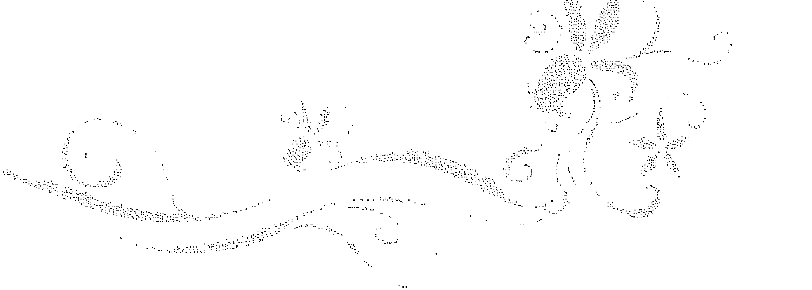

-   1. 除了榮格和坎伯的著作以外，這本書也有助定義女英雄之旅：Maureen Murdock 的 The Heroine’s Journey（Boston: Shambhala, 1990）。另外推薦：Christopher Vogler 的 The Writer’s Journey: Mythic Structure for Storytellers and Screenwriters（Studio City CA: Michael Wiese Productions, 1992）。特別感謝夏琳·麥當諾與我一起發想。

# 謝辭

我想感謝盧埃林全球心靈出版社的策劃編輯芭芭拉。摩爾，她在改善塔羅文獻的品質上有卓越的貢獻，也謝謝盧埃林致力於出版更多進階的內容。我特別要感謝芭芭拉在我遭逢個人逆位的問題時能體諒我。康妮。希爾（Connie Hill）是睿智的天使，每當我需要她，她總是在我身邊。

艾德。布林（Ed Buryln）和夏琳。麥當諾（Sharyn McDonald）看過草稿之後，給了我許多寶貴的意見和指正，我甚至分不清他們個別的貢獻了。不過，我書中任何的錯誤都不會是他們的責任。

我和瑞秋。波拉克一起教學多年，她一直都是我靈感的來源，我所有課程中的學生也是，不過他們人數太多了，無法在此一一指名；還有我的個案，他們的洞見每每使我心懷謙卑之情。我要特別感謝「符號課」的同事：夏琳。麥當諾，Dawa Fitzmaurice，Chris Irving，Vail Kobbé，Charlotte Bollinger，Virginia Westbury；特別感謝Jack Meyer和David Haight，他們的系列課程「神話中的隱喻」總是觸發我新的點子。謝謝協會和愛西斯聖殿裡的女祭司姊妹，大家給了我很多鼓勵和支持。

我該爬上屋頂，大聲喊出曾經幫忙建立塔羅社群的名字：Thalassa，芭芭拉。萊普（Barbara Rapp），Janet Berres，Gary Ross，Anne Shotter，Wald Amberstone，Ruth Ann Brauser，約翰。吉伯特（John Gilbert），Crystal Sage，以及所有曾經參與過塔羅聚會的人。特別感謝克莉絲汀。培恩桃樂（Christine Payne-Towler），她對歐洲塔羅傳統的興趣拓寬了我的視野，以及感謝布萊恩。威廉斯領我走過義大利文藝復興塔羅牌精妙的矩陣。此外，還要感謝 Donna Hanelin，Fern Mercier，Geraldine Amaral，Arnell Ando，Alexandra 和 Ken Genetti，James Wells（他定期從多倫多來電提供我對逆位牌的建議），Nina Lee Braden（同是玩逆位牌的姊妹），Melanie Oelerich，Leah Samul，Doreen Vitkuske，詹姆士。瑞克里夫（James Ricklef）（又名「夜鷹」）。

網路上的塔羅社群，尤其是 TarotL 和 yahoogroups.com 的「比較塔羅」（ComparativeTarot），因為有像下面的這些人和我慷慨分享他們的想法而變得好精彩：Tea Hilander，Valerie Sim-Behi，Diane Wilkes，Michele Jackson，Elizabeth Hazel，Eva Yaa Asantewaa，dtking，Tom Tadfor Little，Bob O'Neill，James Revak（他指出埃特伊拉的詮釋如何影響了馬瑟斯和韋特，非常精彩）。我也要向所有在註釋中提到的人致謝。要感謝的名單基本上可以多達好幾百位，但既然我很確定一定還會有所遺漏，倒不如就此打住，向大家說聲謝謝你們。

最後，我要向所有以塔羅為題寫作過、創作過的先人致意。你們是占卜傳統的先鋒，我們有幸從你們那兒承襲了如此之多。

# 關於作者

瑪莉·K·格瑞爾是自我探索和蛻變的專家和心靈導師，著作甚豐。她是美國塔羅協會的大師，也是許多塔羅機構的成員，在美國及海外的塔羅大會及研討會都占有舉足輕重的地位。有許多來自女性和異教社群的人，都追隨她在女性靈修和魔法上的工作。她是愛西斯協會（Fellowship of Isis）的聖女祭司，也是黃金愛西斯聖殿（Iseum of Isis Aurea）的創立者。格瑞爾研究和從事塔羅與占星的領域達四十四年之久，她曾在加州的新學院（New College of California）任教十一年，也帶領過數百場工作坊、大會與課程。她也是 T.A.R.O.T.（蛻變工具與儀式，Tools And Rites of Transformation）學習中心的創辦者和執行長。

格瑞爾的著作包括：《跟著大師學塔羅》（Tarot for Your Self: A Workbook for Personal Transformation），《塔羅星座：看清你的命運格局》（Tarot Constellations: Patterns of Personal Destiny），《塔羅明鏡：照見人生意義》（Tarot Mirrors: Reflections of Personal Meaning），《魔法精華：塔羅、儀式和芳香療法》（The Essence of Magic: Tarot, Ritual, and Aromatherapy），《黃金黎明秘術修道會的四才女：叛逆的女祭司》（Women of the Golden Dawn: Rebels and Priestesses），並與凱狄·卡威莉（Kathi Keville）合著《芳香療法：療癒身體與靈魂》（Aromatherapy: Healing for the Body and Soul）。

# 寫信給作者

如果你想連絡作者，想得到更多關於本書的資訊，請來信盧埃林全球心靈出版社（Llewellyn Worldwide），我們將為您轉交。作者和敝社若收到您的來信，知道您喜愛本書，以及本書對您的幫助，將十分感激。雖然敝社無法保證每一封信都會得到作者回覆，但一定如數轉交。請寄到：

Mary K. Greer
c/o Llewellyn Worldwide
2143 Wooddale Drive
Woodbury, MN 55125-2989

請附上貼好郵票的回郵信封，或在信內附上一美元。美國境外的來信者請附上國際回郵郵資券（international postal reply coupon）。

盧埃林的很多作者都有網站，上面有許多資訊和資源。想知道更多，請到我們的網站：<http://www.llewellyn.com>

# 與天使夫人同遊天使國度
# 朵琳．芙秋系列

朵琳。芙秋是一位具靈視能力的心理學家，她在國際間舉辦工作坊，探討天使療法、天使溝通與靈性治療。朵琳經常參加電視與廣播節目做天使解讀，並運用靈視能力與人們的守護天使溝通，帶動了與天使及自然界神性存有連結的風潮。

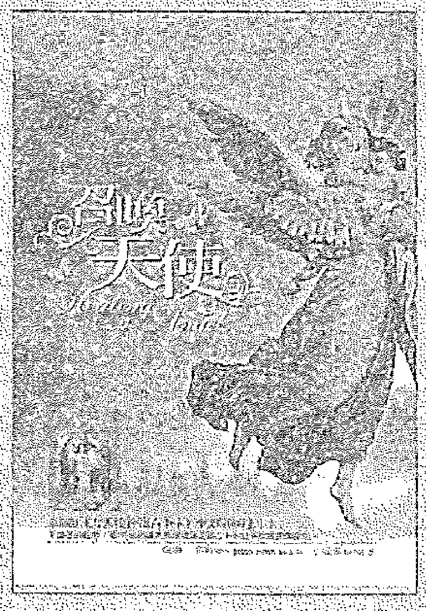

# 召喚天使
邀請天使能量共創幸福奇蹟
定價：280元
本書提供充分的訊息說明天使帶來的祝福，教你如何與天使連結，運用天使能量度過難關，與天使共同合作療癒你的關係、身體、事業與家庭的課題。

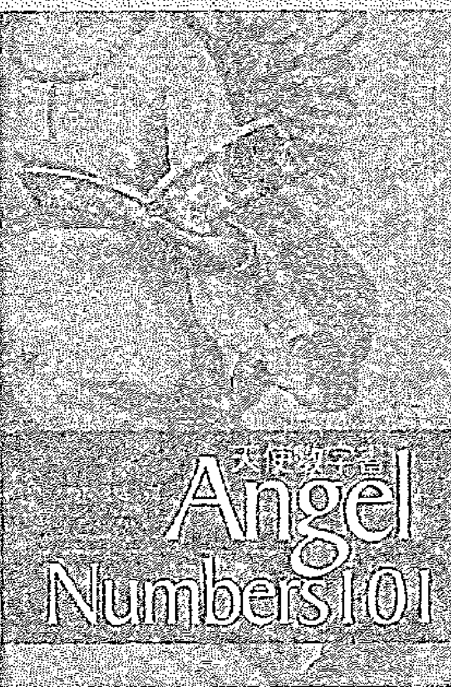

# 天使數字書
定價：250元
相信嗎？眼前不經意閃過的數字，都可能是天使給你的訊息。如同天使的羽毛，數字是天使傳遞訊息主要的工具之一，只要你祈請與召喚，天使都樂於協助你。

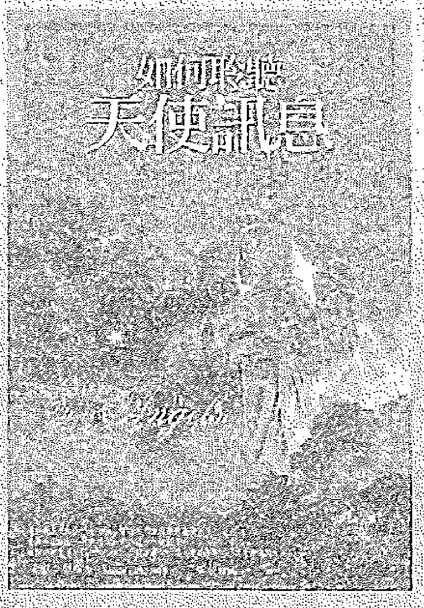

# 如何聆聽天使訊息
定價：220元
這是一本指導手冊，使你能從書中學習分辨真實的上天訊息和想像或幻覺之間的區別，輕易辨識出你所接收的影像、話語、想法和感覺的神聖指引，因而發現靈性溝通的方式。

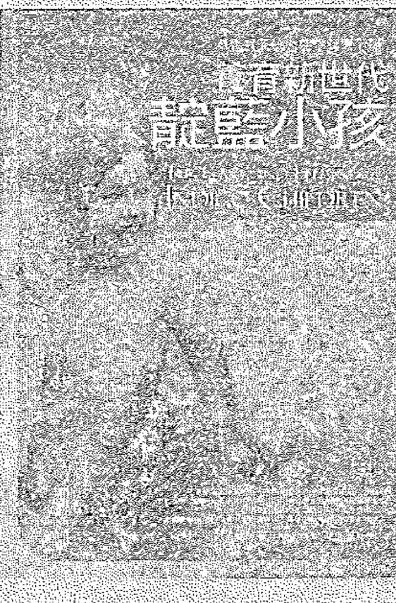

# 養育新時代靛藍小孩
具靈性天賦的孩子與眾不同
定價：300元
朵琳·芙秋博士根據其廣泛的研究，以及專訪兒童治療專家、老師、父母與靛藍小孩們，探索這些特殊小孩的心靈，了解其嶄新且不尋常的心理屬性，並且提供除服用藥物之外的解決之道。

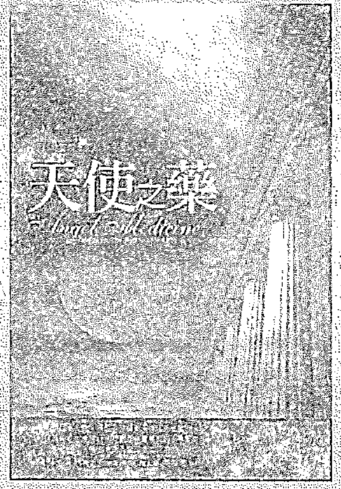

# 天使之藥
亞特蘭提斯天使的神奇靈藥
定價：340元
朵琳透過本書，邀請你一起進入亞特蘭提斯的古老天地，拜訪大天使麥可與雅典娜的聖殿，探索巨石陣秘藏的訊息，了解如何開啟個人神性力量。

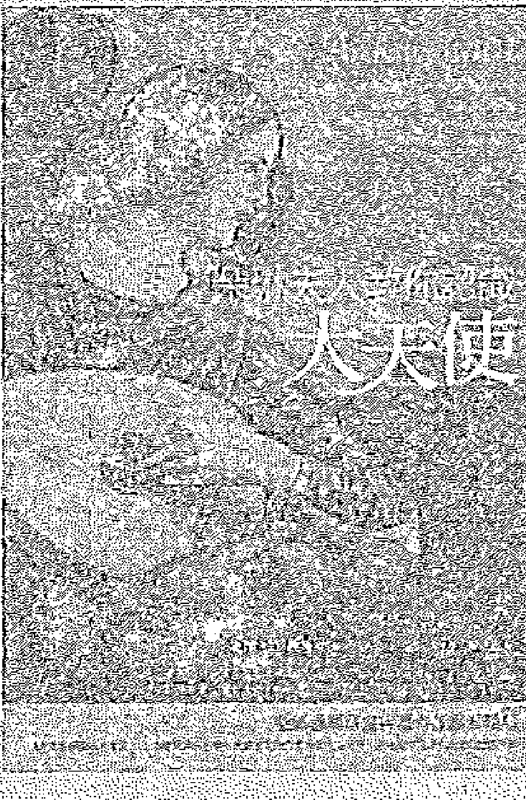

# 朵琳夫人教你認識大天使
定價：280元
朵琳夫人將帶你全方位認識眾大天使，不同的性格、專職，對應的色彩光暈、星座和水晶。善用書中召喚大天使的專屬祈禱文、觀想、肯定句，讓他們成為你幸福生活的友伴及嚮導。

# 光之冥想系列

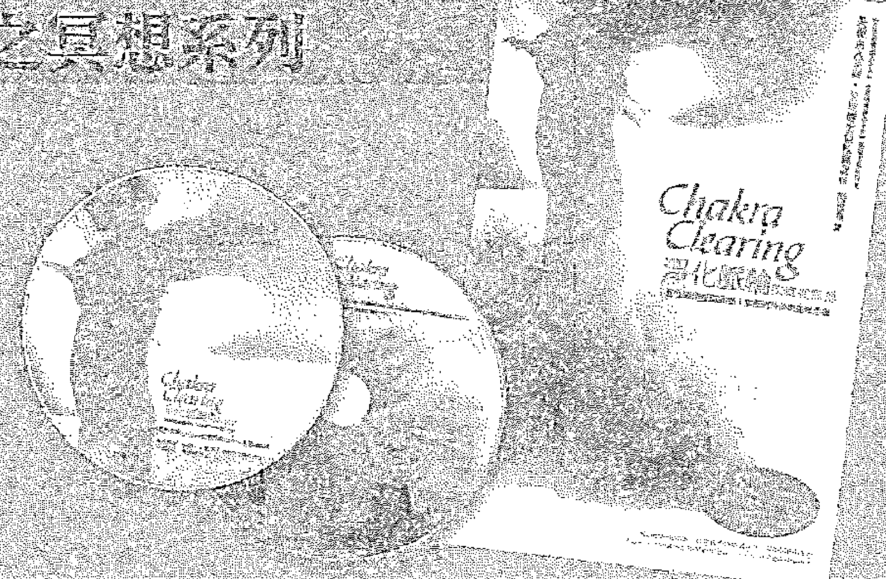

# 淨化脈輪引導式冥想
定價：480元
具有靈視力的朵琳·芙秋博士，設計的這套晨昏兩段引導式淨化脈輪冥想，將幫助你透過簡單的步驟、甚至只是聆聽，就能激發出本具的靈性療癒力。

乘著天使的羽翼飛翔，透過與天使的連結，開創喜悅豐盛的生活。

# 女神神諭占卜卡

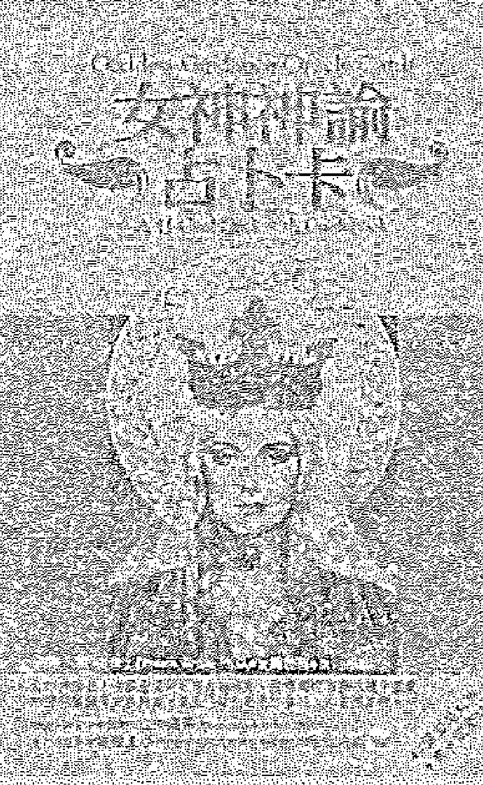

44張女神卡+書+塔羅絲絨袋
定價：780元
藉由與女神互動，你可以療癒且激發自己內在女性的智慧，你的直覺會被喚起，讓你更具靈通力。女神們也會清理與開啟你的心輪，加強你實現與彰顯的能力。

# ANGELS 守護天使指引卡

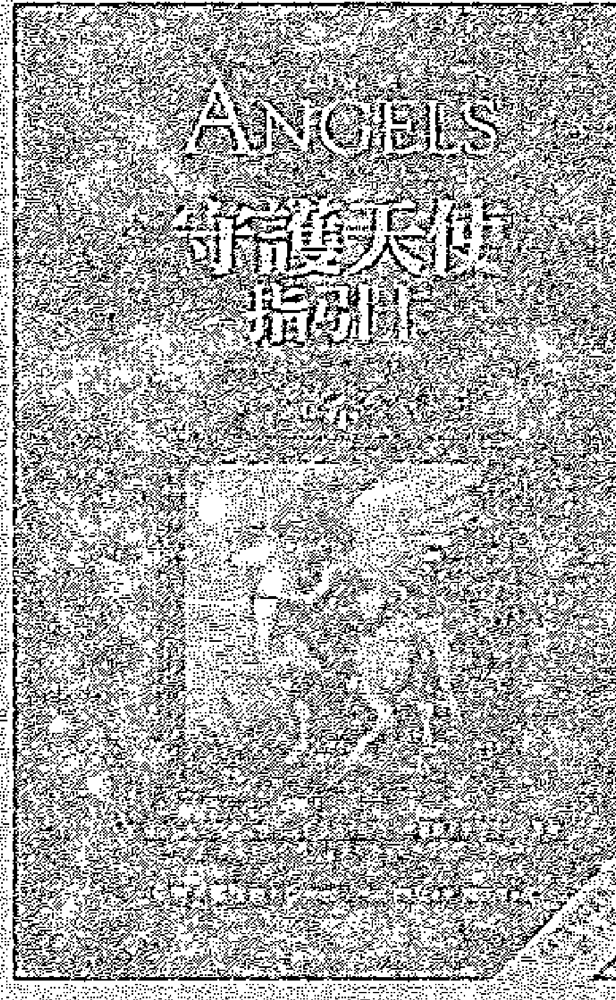

44張守護天使指引卡+書+塔羅絲絨袋
定價：780元
記得每天與你的守護天使連結，接收祂要給你的訊息，協助你在每日的生活與工作中清楚自己的方向，穩定地發揮個人的力量。

# 大天使神諭占卜卡

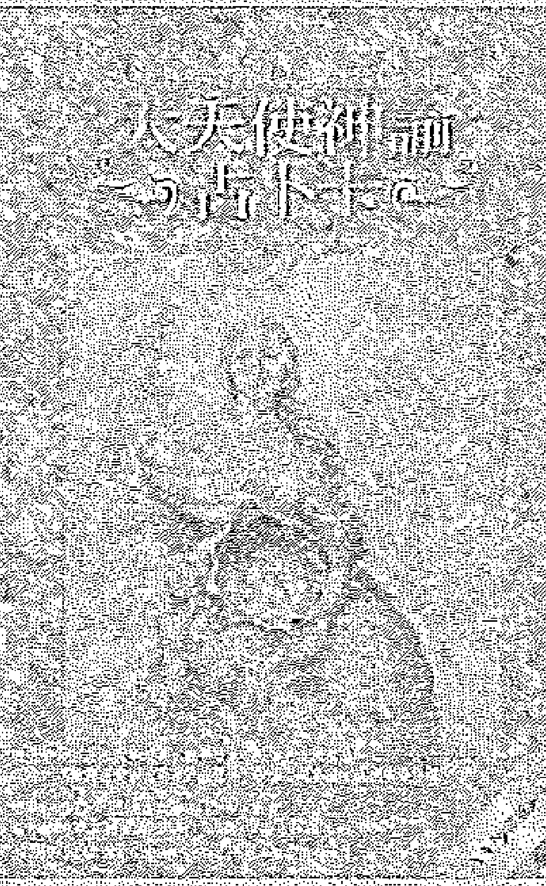

45張大天使卡+書+塔羅絲絨袋
定價：780元
透過這副牌與掌管不同範疇的十五位大天使連結，你會感受到每位大天使的獨特氛圍，以及祂們對你永恆不變的愛。
(2009年新版)

# Angel Therapy 天使療癒卡

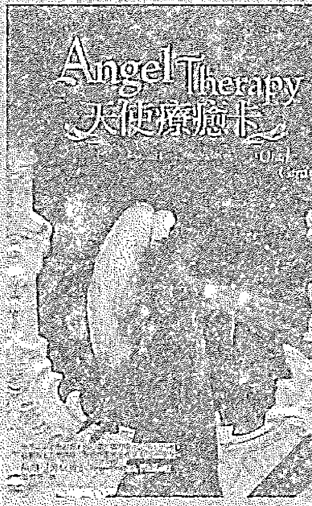

44張天使療癒卡+書+塔羅絲絨袋
定價：850元
這副卡可協助你釋放恐懼或其他阻塞的情緒，攸關個人天命與其他問題的啟示，以及療癒你的身體與人生。讓天使療癒與防護的光環繞你，清除毒素，使脈輪維持平衡發揮原有的功能。

# Ascended Masters 揚昇大師神諭卡

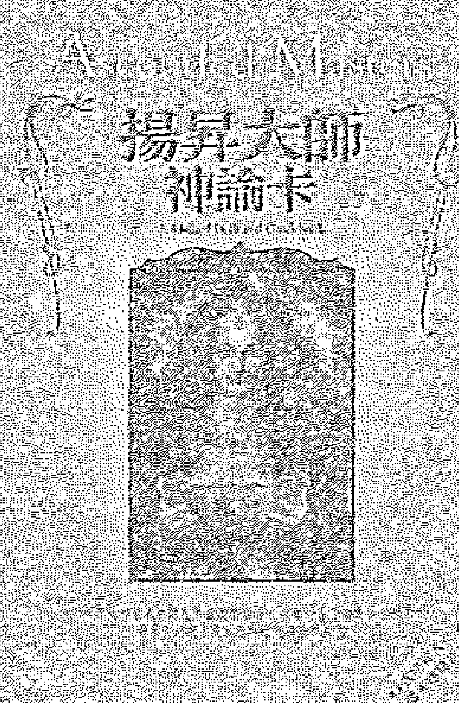

揚昇大師神諭卡
44張揚昇大師卡+書+塔羅絲絨袋
定價：780元

# 神奇精靈指引卡

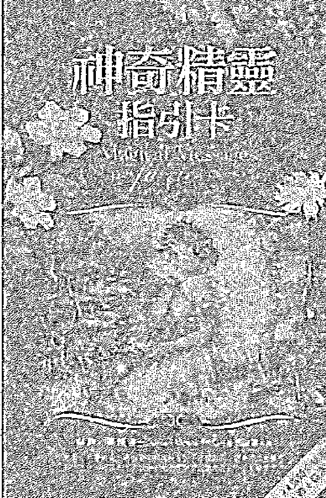

神奇精靈指引卡
44張神奇精靈卡+書+塔羅絲絨袋
定價：850元

# 聖者天使神諭卡

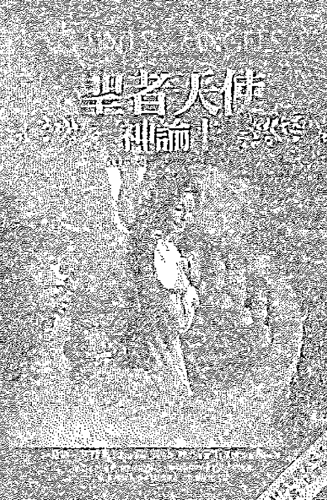

聖者天使神諭卡
44張聖者天使神諭卡+書+塔羅絲絨袋
定價：850元

# Mermaids and Dolphins 神奇美人魚與海豚指引卡

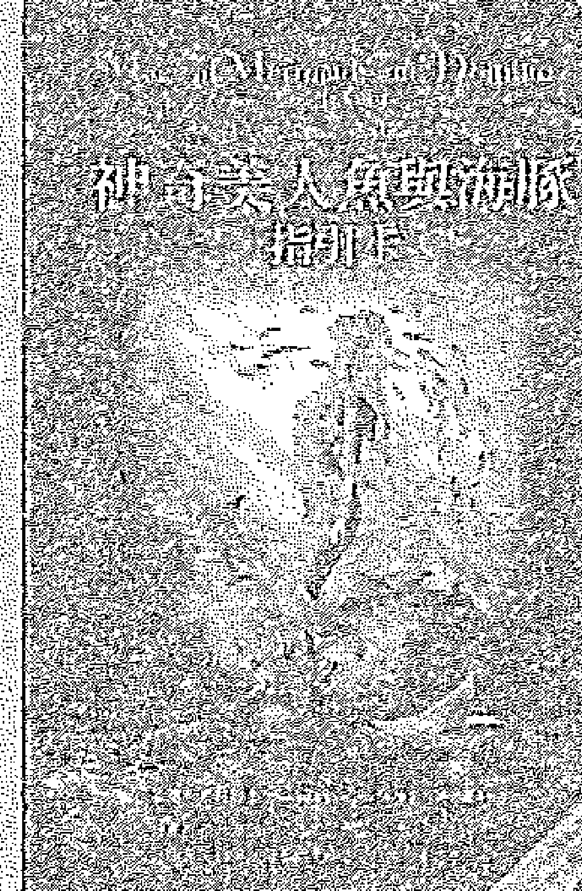

神奇美人魚與海豚指引卡
44張指引卡+書+塔羅絲絨袋
定價：850元

