# 女生塔罗

# 第一章 塔罗为什么？

## 塔罗爱你

塔罗可以帮助人们了解命运，认识自己的内心。
可这又是为了什么？
因为你看不透自己的心，看不清自己的命。这个世界并不是你的故乡，而是你的磨难。你的心被摧残得千疮百孔，你的命被扭曲得七零八落。
尤其是女生。你从生到死都无法摆脱别人的支配，无法不看别人的脸色。男人在乎你的相貌，在乎你的身体，在乎你为他们所做的付出和牺牲，但却从来就没有在乎过你的心灵！他们编出了种种奇谈怪论，说女人的幸福就是男人的成功。于是你从小就相信，你活着就是为了让他们爽，你天生就该是别人的附庸。
可是塔罗跟我说，不应该是这样，女人不该仅仅是女儿、妻子和母亲，女人一样有自己的价值，不能用财富衡量，不能用事业衡量，甚至也不能用爱情来衡量。
塔罗说，和男人相比，女人心中多了一份灵秀，便注定了要用自己的生命滋润这个世界，让世界变得温润美好。可这个世界被男人统治，男人就像贪玩的孩子，霸道而蛮不讲理，以摧毁和征服为乐，女人只能缩进自己的房间，默默编织脆弱的生活。
塔罗说，人们以为女人的世界就是爱情。其实她们想要的不只是爱情，她们也想让整个世界变得像自己的心灵一样美丽，一样有碧草蓝天，一样有笑语欢颜。可是男人不许，不能容忍自己的权威受到女人的挑战。不是每个女人都有机会成为武则天，大多数女人都只能屈从，放弃上天恩赐给自己的礼物，放弃自己来到人间的使命，在尘世间弥漫的屈辱和压抑中，只盼望能找到一个懂自己的人。
塔罗说，爱情不是女人的归宿，因为每个男人的心里都只有自己。即使他连生命都舍得，他真的想要爱你，也还是不懂你到底需要什么。
塔罗说，男人不懂如何爱你，因为你的心远比他们的美好得多！你的命运不能交给他们背负，你自己的使命必须自己承担！
塔罗说，你的心里生来就藏着一对高傲的翅膀，你来到这个世界就是为了——飞翔！

自古以来，这个世界就有它的规矩。自古以来，这些规矩就对女人不公平。三从四德不仅是中国的事，欧洲的中世纪一样用基督教来强迫女性服从。
他们要人们服从神的安排，男尊女卑是因为夏娃来自亚当的肋骨，是因为夏娃诱惑亚当犯罪。这全是一派胡言！先造男人后造女人，说明女人是男人的升级版，是一种比男人更好的生命。而把堕落的罪责推到女人头上，则反映出男人骨子里就有的懦弱和逃避。这些，牧师们从来不说。
更可恶的是他们假托神的名义，实际维护的却是现实社会中并不合理的森严等级。你的一切并没有交给神，而是交给了负心的男人。
这时塔罗出现了，在十字军东征的时候，从异教徒那里出现了。它被带回了欧洲，迅速传播蔓延，让人们开始用赞赏的眼光看待不同的信仰，这直接导致了十字军的消亡。圣徒方济各流泪哭泣也无法换回的和平，竟然被这小小的塔罗牌奇迹般地实现了。
基督教称其为黑魔法，因为它把人的命运从神和皇帝的手里夺了回来，重新交还到人类自己的手中。他们就像始祖亚当一样不知反省，不肯承认耶稣的爱已经在世上荡然无存，宗教和世俗权力的结合已经让神的眷顾离开了人间，他们只会把一切罪责推到塔罗头上。使用塔罗的人都是女巫，都要火刑处死，而这些献身的人却没有像布鲁诺一样得到后世的尊崇，只因她们是“迷信的女人”。

自古以来，女人从肉体到精神都是男人的财产，相信男人相信皇帝都不算“迷信”，而敞开自己的心灵探索命运轨迹，居然就成了“迷信”！

而实际上，他们只是嫉妒。上至皇亲国戚，下至贩夫走卒，无不沉迷于塔罗的启示，这让他们感到自己的权威受到了挑战，那些占卜的女人似乎拥有超越王权的力量。于是，他们那低下的智能便做出了愚蠢而残酷的决定——火刑！

当美丽的火焰把美丽的女人吞噬，所有参与迫害的人便与天堂再也无缘，等待他们的只有地狱的火焰。

从战争中异教徒的血到这些女人的血，塔罗来到世上的每一步都充满了残酷和血腥。而人们却不知道，那些连名字也没有留下的人，在默默地用自己的血为世人赎罪，就像耶稣一样。

每个人心中都有一道门，这门后面藏着“真正的自己”，当自己还葆有纯真，是可以轻易地穿越这道门，让“真正的自己”出来透透气的，那时候的哭是哭，笑是笑，快乐而逍遥。

随着年纪渐长，越来越懂事之后，由于害怕“真正的自己”受到挫折，受到伤害，或被别人看穿，只好在心中的那道门上加上一道道的锁，阻止别人直接进来，却也让“真正的自己”被锁在里面了。这时，笑已经不是笑，哭也不是哭，只是一种模式化且世俗化的反应而已。

要怎样才能让“真正的自己”走出来呢？宗教的净化、冥想、心理咨询都是不错的方式，而塔罗牌也是这些方式中的一种。

塔罗牌就像一种探测器、X光机一样，你只要掌握住基本的使用方式，它就可以帮助你扫描出你目前锁住自己的锁，而且它还会告诉你一些最佳的行动方式，进而协助你打开这把锁。

那要如何解开这道锁呢？别忘了，锁是自己锁上的，钥匙在你自己手中，塔罗牌只是一种探测器，是没办法直接开锁的，而且它只是告诉你锁与钥匙的样子与一些最佳的行动方式，而要不要打开这道锁（你愿不愿意）、如何打开（你选择的行动方式）、什么时候打开（时间），全在于你自己的想法与做法。

同样的道理，当你遇到了别人将你锁在门外，不让你进入的情况时，不要强行破坏别人上的锁，这样只会造成你与对方的相互伤害。这时候，你不妨使用塔罗牌探测目前锁上的锁是什么样式，但终究，解铃还须系铃人，此时，再让塔罗牌告诉你最佳的行动方式，说服对方心甘情愿地交出钥匙打开那道锁，这样才可以打开对方的心门，进到对方的世界。

所以，塔罗牌只是一个工具，它间接帮助你身体方面、心智方面、感情方面以及精神方面的成长，并让你解开心中的束缚。在遭遇问题时，塔罗牌可用来寻求最适合的行动方向与了解问题的关键，但别忘了你才是自己人生的主角，而且钥匙也在你手上，想不想行动，要不要行动，并不是塔罗牌能告诉你的，而是你自己决定的！

## 塔罗算什么

我们再来深入探讨一下，到底塔罗牌占卜重视的是什么？

您会发觉事情发生时的样貌，必定包含发生的时间、原因、过程与结果这样几个方面。

举个例子。一个来问卜的女生说，这三个月来，她和她男友不断地吵架，后来，他们在咖啡厅谈话，男友提出他们不适合，于是两人在还给对方定情的戒指以后，分手了。

- 这三个月来——发生的时间。
- 不断地吵架——过程。
- 双方不适合——原因。
- 分手了——结果。

那这四部分，到底哪部分是塔罗牌占卜重视的呢？
我们试着改变其中一种因素，看看会有何变化。
因为求卜者（当事人）所问的问题可能已经发生了，也可能还没有发生，所以我分成两种情况来看。

(1) 求卜者（当事人）所问的问题已经发生了，如上例中，女主角刚和男友分手。

- 改变发生的时间——把事情发生的时间延后。
我想不管延后分手的时间多久，问题依旧存在，就算30年、40年后，还是会分手的。
- 改变过程——不用吵架的方式。
就算今天不吵架，而将心事藏在心底，看似平静，却转换成了冷战，彼此间的问题依旧存在，还是会分手的。
- 改变原因——改变分手的原因。
改变自己不适合对方的原因，就算分手，难道没有复合的机会吗？
- 改变结果——改变分手的事实，两个人还是在一起。
死不分手，一直不放过对方，但问题还是在，这样只会让两个人都痛苦而已！

这样看来，您知道什么是塔罗牌占卜重视的环节了吗？再看另一种情况：

(2) 求卜者（当事人）所问的问题还没有发生，女主角与男友只是可能会分手。

- 知道可能发生的时间——
事情还没发生，知道结果可能发生的时间，只会让当事人恐慌，那时间的压迫感会让人十分痛苦(而且塔罗牌预知的时间是可以依当事人的努力改变的)。
- 知道必须改变的过程——
改变与男朋友相处的过程，让他能够与自己契合，但状况这么多，哪些需要注意，哪些可以放下心，很难拿捏。
- 知道必须改变的原因——
改变自己不适合对方的原因，让分手的原因不成立。
- 改变将来的结果——
事情还没发生，要直接改变结果，其困难度非常的高。

稍微比较两者的情况(虽然以上是举例，但相信各位可以在生活中找到类似的情况)，你会发现改变已发生的时间，只会提前或延后事情的发生。而改变发生的结果，不是非常困难就是问题还是存在，只会让痛苦延伸。剩下来的只有改变过程与原因，才可能改变结果。

但是每一个人发生问题的过程有千百种，谁有能力、有时间、有心力能完全掌握事情的所有过程与变化呢？谁能一天二十四小时看着别人做什么？一天二十四小时掌握事情的走向？就像一家公司一样，难道要总经理盯着所有员工吗？

当然是总经理盯着经理，经理管副经理，副经理再管下面的员工。
同理，只要掌握key point、key man（关键点、关键人物），就可以主导事情的结果。而这些key point、key man说的就是影响事情的主要原因。

所以，塔罗牌占卜重视的是什么呢？是事情背后的原因，如同佛家所说，“有因必有果”，只要改变事情的根本原因，对于结果必然有一定程度的影响。而且着眼于问题的关键点，才是解决问题的最好方式。别忘了我说过，塔罗牌就像一种探测器、X光机一样，是没办法直接去帮你解决问题的，但塔罗牌却可以用图象式的方法，具体指出关键点、关键人物、背后的原因与真相，但要不要去做，如何做，什么时候做，在于你自己的想法与行动。

请记住：

塔罗牌是可以用来预测未来，但它不仅限于此，它同时可以揭示某种形势的根本成因，以及在此形势中学到的教训。

那些不从历史中记取教训的人，注定要重蹈覆辙。

在遭遇问题时，塔罗牌可用来寻求最适合的行动方向，以免一再得到同样的教训。实际上，我们总是在重蹈覆辙，而且我们都有机会采取更具挑战性的其他选择。

塔罗并不是什么时候都可以算。让我们从两方面谈一下：

### 内在层面的考量：

- 1. 没有心理准备不卜

当你觉得占卜出来的结果，可能会让你感到害怕、难过，那不如先让自己静一静，思考明白自己的问题点与目标再来占卜比较好。若在心情过于浮动时占卜，在解释塔罗牌的牌面时，很容易受到自己内心的恐惧潜意识影响，将牌义解释得过于极端，让自己陷入“不可能”、“完蛋了”的想法当中，错误地以为事情已经没法挽回，进而放弃努力，使事情的结果更加恶化。

- 2. 自己可以做决定的事情不卜

像是要不要坐车，吃饭还是吃面，这种自己可以做决定的事，直接下决定的效果绝对比占卜来得快且好。假设，若是占卜出来叫你吃面，可是你却很想吃饭，这样不又陷入另一个迷惑当中了吗？

- 3. 不切实际的事情不卜

例如，我能不能跟金城武结婚，可不可以赚到一个亿，这种与自己目前现实情况差距很多的问题，拿来占卜是没有意义的。不如当成自己的梦想，分析其可能性并拟定计划赶紧去做，这样比自己坐在那里做白日梦或占卜强得多。而且，你占卜这种不切实际的问题，塔罗牌通常也只会告诉你“多努力吧”！

- 4. 无法加入自己努力（或结果已经确定了）的事情不卜

当一件事结果已经确定了，或是过程中无法藉由自己的努力程度而改变的事情就不要去占卜了，因为这样只会影响自己的心情。除非你有心理准备，并且不会因占卜结果好坏而影响你的行动。比如去大公司应聘，面试完了后，对方跟你说你若符合他们的条件就会通知你结果，此时你的努力过程已经到完成的阶段，剩下的只是等待结果而已，此时占卜就比较没有意义，不如在应聘前占卜，看看自己哪些方面需要注意，对自己比较有帮助。

### 外在层面（时、事、人、地、物）的考量：

- 1. 时间不对不卜

应该吃饭、应该睡觉的时候，就应该去吃饭、睡觉，保持正常的生活、拥有健康的身体是占卜分析师最重要的课题，连自己都顾不好，还谈什么其他事情？另外刚吃饱饭、刚运动完也不适合占卜，因为这时身体并未调整过来，此时进行占卜，对于自己的身体与占卜的结果、解说都会有影响。

- 2. 事情不对不卜

个人隐私、生死问题、投机的事情，算了只是让自己或他人产生不必要的联想或过度期待，对自己或他人都不是一种帮助，反而会害了自己，也害了对方。

- 3. 人不对不卜

当你面对一个不相信你的人，纵有惊世之才、滔滔之语，也是宛如“对牛弹琴”、“秀才遇到兵，有理说不清”。塔罗占卜的禁忌最关键的一条，就是“不疑卜”。所谓不疑卜，并不单指占卜分析师要相信占卜，而且要求问卜者也要相信占卜（不重卜、不戏卜都是不疑卜的延伸）。所谓信心生力量，不信当马屁，当一个不相信占卜的人听到你为他占卜出来的结果，他势必会当做耳边风，甚至去强力改变占卜的预测结果，这样不但没帮到他，反而让他意气用事，那不如就随他去，等有缘再帮他。

- 4. 地点不对不卜

通常塔罗牌排完牌阵之后，要做的就是连结直觉与思考，并加以解释，此时如果占卜地点过于嘈杂，对于思考解释必定有所影响。至于像办公室、车上、易受气候等因素影响的场合（如起风、下雨、冷气过强），都有可能因为其他人的打扰与突然的因素干扰而让占卜中断，此时都不建议进行占卜。

- 5. 物品不对不卜

桌子过小，桌面太杂太脏，有饮料，都尽量不要占卜，因为都有可能影响你的心情（牌被弄脏）与占卜的进行（不好洗牌）。

### 塔罗师守则

1. 我将秉持客观及怜悯的态度诚实而完整地解读塔罗牌。
2. 我的目的是提供给我的受占者以引导，以便于他们在成长时做出对他们最有利的决定。我同时将努力地帮他们洞悉问题的症结，并在每次解读时给予他们希望。
3. 对于我的塔罗牌我将随时给予尊重并且行为要专业，并遵守关于塔罗牌的一切伦理方面的戒律。
4. 如果我解读塔罗牌的行为是收费的，我将在一开始便公开地说明，也不会有任何额外收费。
5. 我在学习塔罗牌时，愿意保证不外泄教学内容及一切机密，除非是我或他人身处于危险或恐吓中，或是我得到允许；如果在解读时遇到危险，我将确保我的被占者处于安全的处境。
6. 如果我的被占者的问题是属于法律、精神病、财政或是医学等方面的专业问题，非我能解决的，我将请他们去求教相关的专业人士。我也需鼓励他们改善自己的生活，为此我将准备一些资源供他们参考。
7. 我不会谈论关于财富的问题，因为当塔罗牌在解读时，每个人都将为所解读的事情负责；我相信我们的未来是由自己创造的，我也将以塔罗牌来教育我的被占者什么是可以做的，什么是不能做的。
8. 我只解读被占者要求解读的部分，我也不会泄漏给第三者知道；但是如果必要，我将改变原有的措词给其他人知道，藉以帮助我的被占者。
9. 我将努力地在塔罗牌上钻研知识及学问，并努力去实践它们。

# 第二章 大阿卡纳妙解

这部分给出了22张大阿卡纳的解说。遇到具体问题时，凭借自己对画面和牌意的联想，便可以找到最准确的答案。也可以参阅拙作《塔罗奥义》。

## 0. 愚者

### —正 位—

愚者的个性无拘无束，内心天真而纯洁。轻便的行囊中，带着他过去的经验与知识，让他在面对未来的危险时不会害怕。因有好心人的提醒，他也了解现实的残酷面，但是这并不会降低他对未来的好奇心与求知欲。脚下的路才刚刚开始，他对未来充满了信心。虽然不知道以后会怎样，也不知道前方将有什么危机发生，但这都不用担心，因为做了就会知道了。

在古密教的传说中，愚者在诺斯替信仰里代表着新生或是重生的灵魂意象，不管是代表宇宙的或是个人的。从感情上来看，愚者代表即将开始或已经步入一段简单、轻松、无拘无束、没有什么压力的感情生活，有点黏，又不会太黏，一切都是刚刚好；从事业上来看，它代表对事业的态度有一种洒脱、无拘束的感觉，随时保持着轻松自然的心情来面对未知的将来。

### —逆 位—

愚者喜欢无拘无束，制度化的束缚会让他感到不舒服。因为想法天真、单纯，所以对于现实面上的危机意识有些差。有些自负地带着过往的经验与知识，前往希望中的成功之路，却因为对未来的希望太过梦幻而迷失了自己。对于旁人的忠告不理不睬，只是自顾自地往自己认为对的方向前进。即将遇到的危险会让他尝到失败的感觉。也许就像刚出生的婴儿一样，他需要学习什么是对的，什么是错的。也许从错误中学习，能让他最快了解到自己的问题所在。

愚者逆位的感情世界中，近乎天真的执著让他看不清楚事实的真相，对未来的结果也编织了过多的梦想，与对方的沟通有着深深的鸿沟。事业上的现实残酷不会让他有任何的警觉心，不听旁人的劝告，只照自己的想法前进，也让自己在往成功的道路上绕了一大圈。

## I. 魔术师

### —正 位—

魔术师的道具是代表四大元素的圣器，这四个圣器代表了四种力量：明确的动机，周详的计划，如泉涌般强烈的热情与脚踏实地的执行。除此之外，他还拥有从天上导入的灵感，以及自身的创造力。他把他的希望与想法转化成可能发生的现实，再运用他的意志力，产生具体的成果。在旁人看来这一切都是这么的神奇，但对他来说却很平常，因为他的智能是无穷尽的。他比平常人更容易成功。但这不是侥幸的，是他努力得来的结果，他拥有着比平常人更多的热情与乐观的态度，对事情的热心度与持久力，也超出平常人很多，他对每一件事情都持有纯洁而专一的动机，这些都是他成功的条件。

### —逆 位—

象征四大元素的四圣器被倒置过来，这让魔术师失去了他最重要的四种力量，他的动机、计划、热情与执行力都失去了，与天上的导师也因为自己的不小心而失去了联系。虽然无穷无尽的智能所产生的创造力与想法依然超过常人的水平，但是他却丧失了把想法具体实现的心思与动力。他那热情乐观的态度与对事情的专一程度正在萎缩，对事情的灵敏度也在降低。他渐渐地把自己封闭了，因为他的目标已经失去了。

感情上，魔术师有着正确的动机，他知道自己需要的是什么，也知道对方需要的是什么，并努力地规划着未来。小心地规划着自己的事业，对未来的发展也已经有了明确的计划，良好的机会与动机更加速了他的成功，脚踏实地地往他计划中的路程走去。

对待感情已不是那么的确定，也不相信自己的能力，对追求感情产生了害怕的情绪。事业方面，没有一个明确的目标与方向，态度上存在偏差，对目标的设定也不是那么的积极。自我封闭，生怕受到外来的伤害，对未来失去了信心。

## II 女教皇

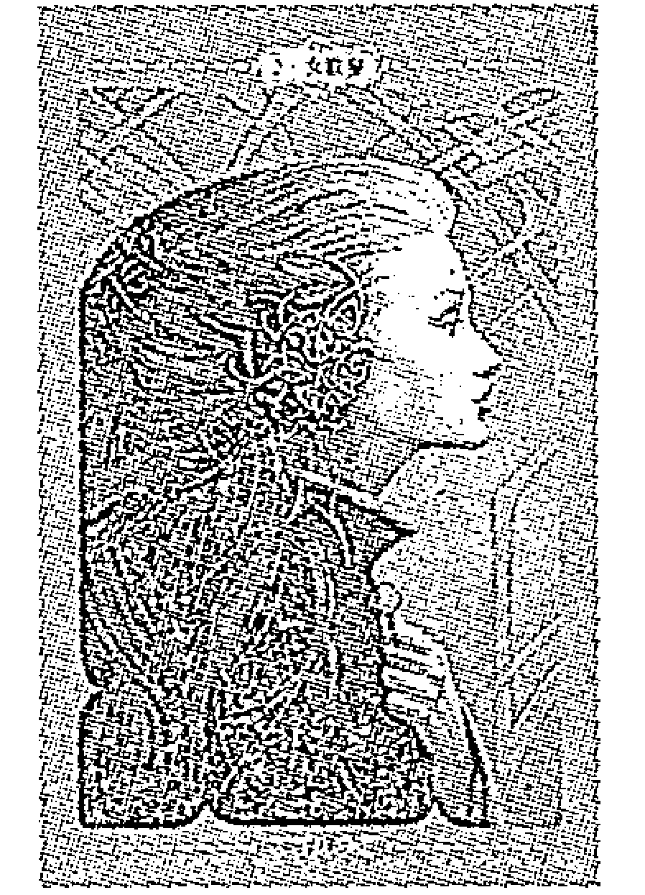

### —正 位—

女教皇内心存在两种力量，一种是逻辑——务实与力量，一种是想象——直觉与接受，这两种力量互相对立，也互相交流。它们的相互对立，让女教皇进入了一段自我反省的时期，也让她从反省之中找寻到自己最真实的力量。而女教皇也从他们的交流中得到新的直觉力与洞悉力，使她在思考一些重要的问题时，能清楚且仔细地分析每一个步骤，并让女教皇能往更远的未来探测，让她能了解到未来的发展与自己的不足。

中世纪的神秘主义者把女教皇看成纯粹女性的三位一体——创造主、将万物融在和谐中的结合者、统治者（也称上帝），充分地运用她的精神来分析感情，时刻省视自己在这段感情中所扮演的角色。对感情的未来发展也有相当程度的掌握，倾向于较具精神层面的恋爱。在事业之路上，每走出一步前都要准确地分析，小心地运用高超的直觉力来探测每一件将发生的事，对未来的走向也随着自己的变化作逐步的修正，周围的变化也是她对未来发展的参考。

### —逆 位—

在高位的女教皇倒立了，她内心的两种力量没有了交集点，彼此往各自的方向前进，让女教皇失去了应有的自省与判断力，也失去了对未来发展的洞悉力与直觉力。

感情问题的不明确性，让自己痛苦了好一阵子。不断地从过去的经验中找寻解决之道，但并不容易获得成功。失去了直觉的她对未来的发展也没那么确定。不再倚靠心灵的力量来面对感情，开始把自己新悟到的方法放到感情中运作。面对事业上的变化，也不再靠精神的力量来分析，开始采用较具科学的方式来计算着未来的发展，努力地求取外来的援助与合作。

## 大阿卡纳妙解

## 3 女皇

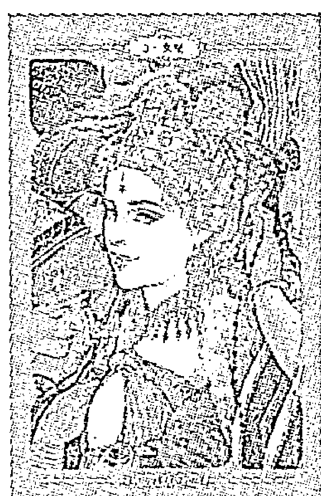

### —正 位—

温柔的女皇穿着华丽的衣服，手持权杖，姿态优雅地置身终生的环抱中。女皇象征了生生不息的生命力，滋润着天地间的万物。女皇还代表了生产力与新生命的来到。浅浅的微笑代表她不断地释放出连接着心灵与物质表象的爱，藉由这个爱的传达让整个宇宙的生命力更为活跃。头上那受到众人祝福的皇冠，是她脚踏实地努力得到的甜美果实。因为之前的努力，女皇有着非常丰富的经验，她也很愿意与他人分享自己的经验。

塔罗牌中的女皇在古奥菲教中代表着拥有丰饶力量的狄米特女神，她也象征着生生不息的生命力与延续后代的力量。感情发展稳定，脚踏实地的感情观使她能够在这段感情中过得非常充实与安心。对彼此的感情态度都非常的了解，也充分地掌握着这一段感情的命脉。事业上的成就是她脚踏实地得到的，不曾停止的创意与先进的思考能力让她站到了社会脉动的前端，经过努力而得到的经验让她在成功的路上走得更顺利。

### —逆 位—

手中象征着权力与实力的权杖因为倒立的关系，快要从女皇的手中掉落。也因为这样，女皇开始运用较理性的方式，来紧抓手中的权杖。曾经源源不断的生命力也有了枯竭的现象，虽然女皇依然努力地运用自己的能力去维持尚存的繁荣，但她已越来越感觉到心有余而力不足了。之前努力得来的皇冠，也因为她太过沉迷在自己的想法中而有些滑落。也许女皇现在需要来一段时间的自我反省吧，这样她才能较具理性地处理事情。

抛弃感性的一面，以理性的态度对待感情。努力地从过去的经验中找寻下一步的落脚点。也许会有丧失一个小生命的可能。事业上的不安全感慢慢从心中油然而生，虽然做事脚踏实地是好的，但效率却不够，总也赶不上别人要求的速度。也发现了自己的不足处，正在努力地改善中。

## 4 皇帝

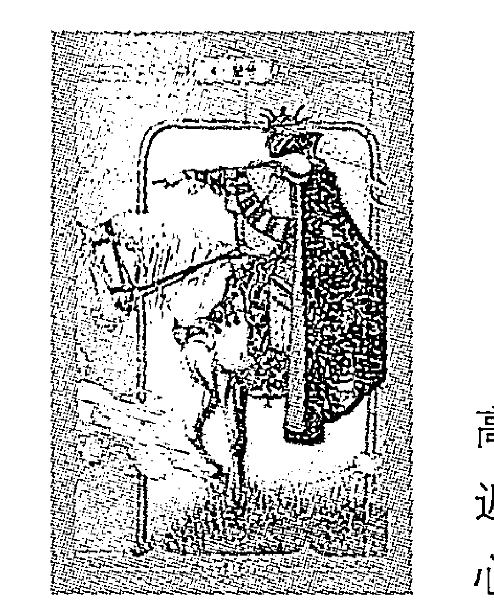

### —正 位—

位于权力顶峰的皇帝，严肃的外表下，有着一颗亲切的心。高高在上的表面后，有着努力辛苦奋斗的过去。亲切的心让皇帝愿意与请教他的人们分享他的成功秘诀，而他的成功秘诀，都是来自他努力奋斗的过去所累积的经验。他这过去的经验，也代表着他是值得信赖的，他的诺言是值得信任的。

皇帝牌与毁灭、重生的轮回关系，暗示了一个诺斯替教讯息：物质上的成功与骄傲都会在轮回中走向灭亡。你那缺少情调的感情生活，总给对方一种木头人的感觉，也许这也跟你不善表达的个性有很大的关系。透过自律和脚踏实地的努力，你在事业上取得了相当好的成绩，也因为务实的态度，你能在事业的最高点站得更稳、更久。

### —逆 位—

因为牌的倒立，皇帝从高位走下来了，也因为较接近平常人，他得以让自己内心的亲切面完全地表现出来，严肃的面容看上去也柔和多了。他依然乐意与人分享成功的经验，甚至主动向人传授秘诀。在他一路的指引下，人们快速地向成功的方向迈进。

感情方面，在对方眼中，你是一个非常热情，并且真心愿意付出你的一切的人。但让对方窝心的是，你总是在双方讨论彼此的关系是否应更进一步时，就犹豫了。事业方面，你脚踏实地、踏实肯干，你的实力与能力都可以让你早一步到达成功的殿堂，但是你那稍微不果决的态度与过于温和的个性，让你多花费了一些时间。

## 大阿卡纳妙解

## 5. 教皇

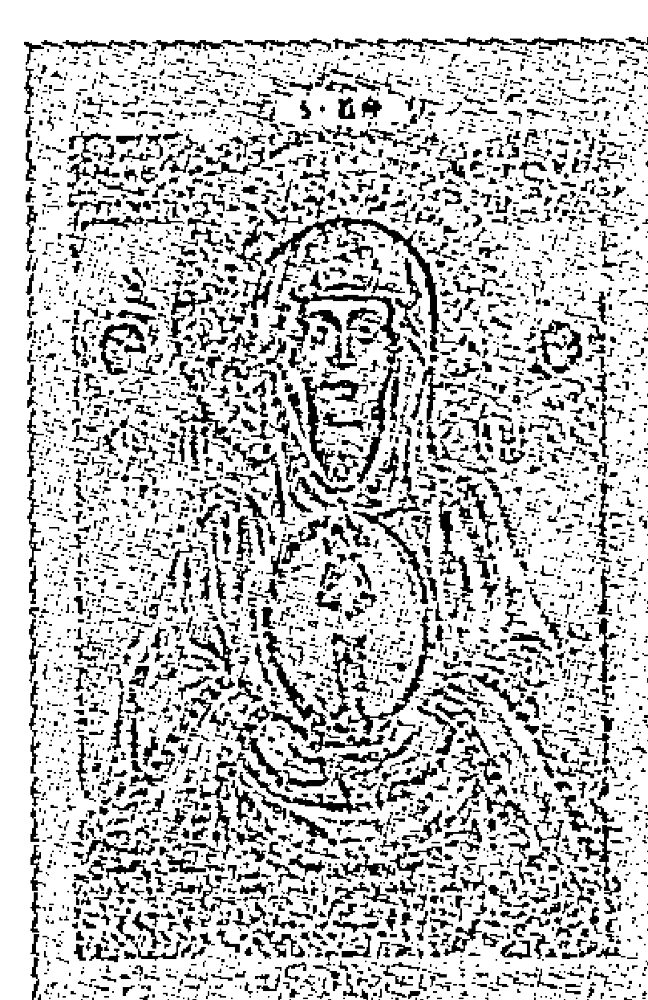

### —正 位—

面色庄重、圣洁的教皇正在接收来自天空的能量，他的两侧各有一个天使，代表了他内心的两种能量，一种是热情与持久力，另一种则是纯洁的动机。这两者的能力是教皇已经超越并且能运用自如的，但是他却不以此为满，他要建立与上天沟通联络的管道，与上帝直接联系。

以号码而论，教皇牌是与恶魔牌相呼应的。十三世纪时，诺斯替教派便相信罗马教会的耶和华是魔鬼，他创造有形的世界只是要设陷阱捕捉灵魂。感情上，你放弃了自己内心最真实的感受，只是照着对方的要求来调整你的想法与做法，这样只会让你觉得爱得有压力，而不能让你自愿地付出。事业上，你认真、负责，在别人眼中你是优秀的，但是这对你而言，却是一种挥之不去的压力。

### —逆 位—

教皇放弃了他高高在上的态度，开始与他的信徒平起平坐，也把他收藏起来的两种能力再度开启使用。另外，他已经建立了与上天沟通联络的管道，可以直接、全然地接收来自上帝的讯息，但他有选择权，可以选择自己能完全吸收的，选择真正对自己有益处的，拒绝无止境且没选择性的接受。

在感情上，你开始正视自己的真实感觉与做法，你已经找到属于自己的真实情感，但你还是不会忽略对方的要求与感受。你也不会再全然接受了，当你知道自己无法接受时，你愿意与对方沟通，并且找出可行的改善方法。在事业上，你的思维较以前灵活，不再死板，不再受旧观念的束缚，产生了很多新想法与创意，不断有新的突破。

## 6. 恋人

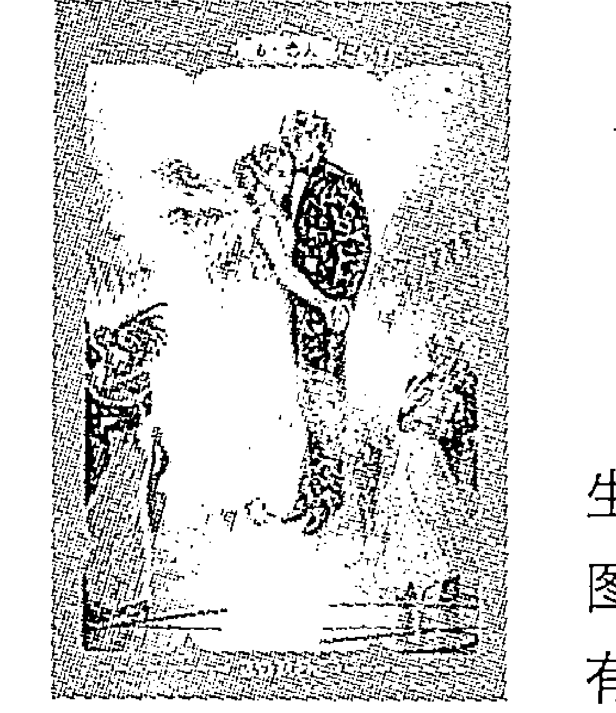

### —正 位—

大天使长在伊甸园里种下了两棵树，一棵是知识之树，一棵是生命之树。知识之树代表着女人，生命之树代表着男人，而大天使长则代表着内在的精神层面。恋人牌代表着青春期的开始，知识之树代表着思想的独立与自信的建立，生命之树代表着对自我性别的确认与对性的好奇心将开始，也开始寻找爱的真实感觉，并且从探索爱的真实感觉中找到对自我的信心与信任。恋人牌也是一张确认自我的牌，确认自己的智能、精神与生命力都已经准备好了，可以迎接未来的挑战了。

在秘教中的生命之轮上，第六张图画是一对亲吻的恋人，这幅画的意思是接触。与他人的第一次接触，是在塔罗牌中的恋人牌上。情感方面，恋人牌表示在你俩对现有的关系不再感到满足时，你们将开始找寻一个让彼此的关系更亲密的方向前进，而且也更加地罗曼蒂克了。事业方面，你将进入一个决断的时期，决定自己将如何在事业之路上走得更好，或做一个改变，重新决定你对未来的规划与实践。

### —逆 位—

因为倒立，知识之树与生命之树失去了养分的补给，图中的男人与女人也不再拥有共同的目标，象征精神层面的大天使长也暂时地蛰伏了。逆位恋人这张牌依然代表着青春期，但是你却无法对自己的行为与想法有任何有效的管理，精神层面还停留在孩童阶段，做事也像个小孩子，一遇到难题就躲到父母的羽翼下。对成长虽也有期待与企盼，但却不敢自己去经历风雨，软弱，容易退缩。这同样是一张决定的牌，只不过是一张永远无法决定的牌，因为你的内心已经失去了对正确事情的判断力。

感情上，你让对方有很强烈的不安感，也许是因为你的怕，怕付出太多收不回来，而且在感情的路上，你也有 一些幼稚，不成熟，不够脚踏实地。事业上，你的畏缩容易让人产生强烈的不信任感，别人与你谈生意时，你总是抱着很强的警戒心，这会让对方感觉很不自在，从而减弱对方与你合作的意愿。

## 7. 战车

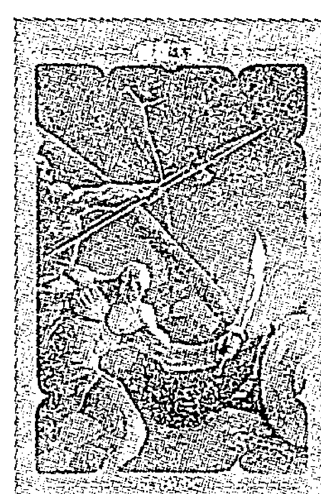

### —正 位—

一辆整装待发的战车，左右各站着一名兵士，一人持戟，一人握刀，前方战火已经燃起，只等将军下达出战的命令。这是考验这位将军的意志力与决心的时刻。车旁的两名兵士代表的是两股相对立的力量，如果驾驭得好，这两股力量就会为将军立功，驾驭得不好，这两股力量就会给他带来麻烦，甚至灾难。

柏拉图在费特罗斯提出，马车夫代表人类的灵魂，驾驶着宇宙的身体——马车，在属于时间的空间中航行。感情方面，目前的你正努力地控制着自己的情绪，并且控制得非常好，这对你们的感情有非常大的助益，而且你也知道如何让这段感情发展得更好。事业方面，你已经准备好要在自己的成功之路上加上一笔自信了，并开始在事业的排程上加注更多的精神与决心，客户对你更有信心了，愿意与你签订重要的合约。

### —逆 位—

也许因为将军的经验不足，或者因为他精神力不够，手下两名兵士彼此间的力量开始互相抵制，互相争斗，战车也翻掉了。将军还没有出征，便丧失了前进的力量。他现在迫切需要前人的经验，以加强自身的精神力，从而顺利完成战斗的任务。

在感情上，你失去了原有的冷静与准度，致使对方对你慢慢失去了信心与感觉。也许你应该回到你之前的时空，找回你当初的想法与做法。在事业上，也许你的一次投资不是那么顺利，也许一路荆棘，你曾经相信凭借你既往的经验能够突破这些困难，但事实上，你只有放弃这一想法才能更精进，因为当你放弃了你现在所拥有、所坚持的，你重新得到的将更好，更完美。

## 8. 力量

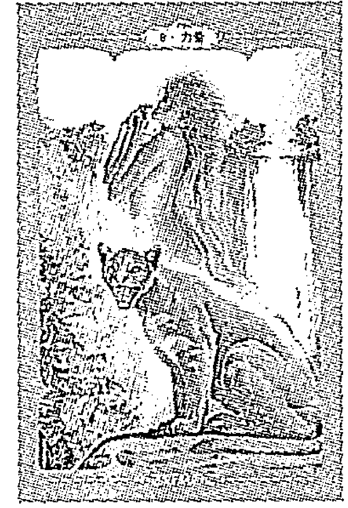

### —正 位—

美丽的女神用她的温柔与爱抚驯服了一头凶猛的豹子，象征了一个人运用他的理智，来控制他自身无法掌握的恐惧和危险的发展。女神一面从上天导入能源，一面藉由双手，把这份安定又温柔的能源慢慢地传到不安定的内心中，让内心的力量慢慢地稳定下来，也让内心的力量与外来的能源融合在一起，成为自身的一股新能量。

在这个启蒙阶段，力量女神开始出现在月亮领域里，深层而神秘。豹子大张的嘴，对女神没有构成威胁，让我们不得不佩服女神所拥有的神奇力量。感情之路上，你运用你十足的勇气与信心，与对方努力地开疆扩土。也因为你全心全意的付出，对方对你的信赖是完全的。事业之路上，你持续努力，不断取得新的突破，让上司与客户对你的工作有了充分的信心，而你的成就与身价也因此不断地提高。

### —逆 位—

从上天导入的能源已经有一些失控了，也许过强，也许过弱，这都让你产生了深深的无力感。身边那头代表恐惧的豹子也慢慢地失去了控制，让你感觉害怕，害怕自己将会失控，于是你开始封闭自己的内心。外界导入的能源与自己内心的能量，这两股力量开始互相攻击，让你感到惊慌失措，你想退缩，退到你自认为的安全线之后。

感情上，你对自己的感觉不是那么的确定了，开始怀疑对方的想法与付出，一点点的风吹草动都会令你担惊受怕。也许只是自己吓自己吧。在事业上，你遭遇了瓶颈，你对自己的信心慢慢减弱，上司和客户都强烈地感受到了你的浮躁。你不断地产生对自己的疑问，也不断地让自己的动向受到限制。

## 大阿卡纳妙解

## 9. 隐士

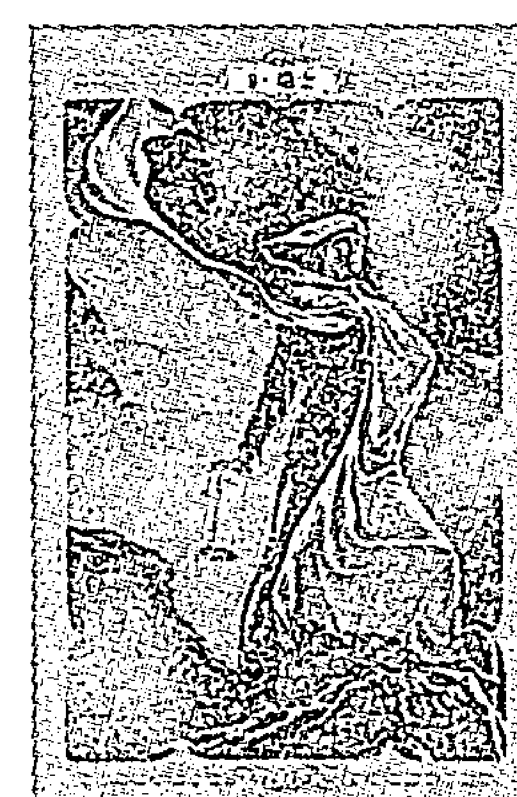

### —正 位—

黑暗的星空下，全身包裹在灰色斗篷中的隐士，右手提着一盏微弱的灯火，帮助他在黑暗中可以看清自己细微的缺点，探寻自我的内心最深处。独自一人立于高地上，能更深入地倾听自己的心声与想法，并找到一个真正属于自己的最终目标。这张牌代表着你开始放弃外在的诱惑与一切感觉，开始把精神全面地放入自己的内在感觉，你的精神也因而集中于内在。你将得到你心灵深处最真实的想法与做法，然后带着这些想法与做法走出去，把自己真实地呈现给外面世界里的人们。这是一个很大的冒险机会，不过你愿意去冒这个险。

你还在探寻内心深处最真实的自我，但你已不再满足于手中灯火那微弱的光亮了，你希望找到更亮更大的灯。你不再执著地追求自我，而是打开心门，让外面世界的诱惑与世俗占领你的心。灯火变得更弱了，你也快迷失了。

你开始以忙为借口，来回避这段感情。当对方需要你在这段感情中付出一些小小的真诚时，你却以冷淡回答对方，让对方的心直落谷底。事业上，你执著的态度让自己都吓了一跳，你不再愿意去面对那些琐碎的事务，不过这样，反而会让你在事业上有另一番戏剧性的突破。

密教传统教导，经历婚姻及世事等尘世生活之后，应该要隐居沉思，过忏悔的生活。在晚年的时光里，智者必须面对即将来临的死亡，并与精灵会面。你开始在这段感情中寻找你真正的想法与需求了，也开始想着你在这一段感情中的角色是否正确与实在，不断地探索彼此间的互动与共同关系。在你事业最光辉灿烂的黄金期，你却突然地退了下来，令周围的同事非常地惊讶。只有你自己清楚你这样做是为的什么，你是在为下一次的辉煌作休整，积蓄力量。

## 10 命运之轮

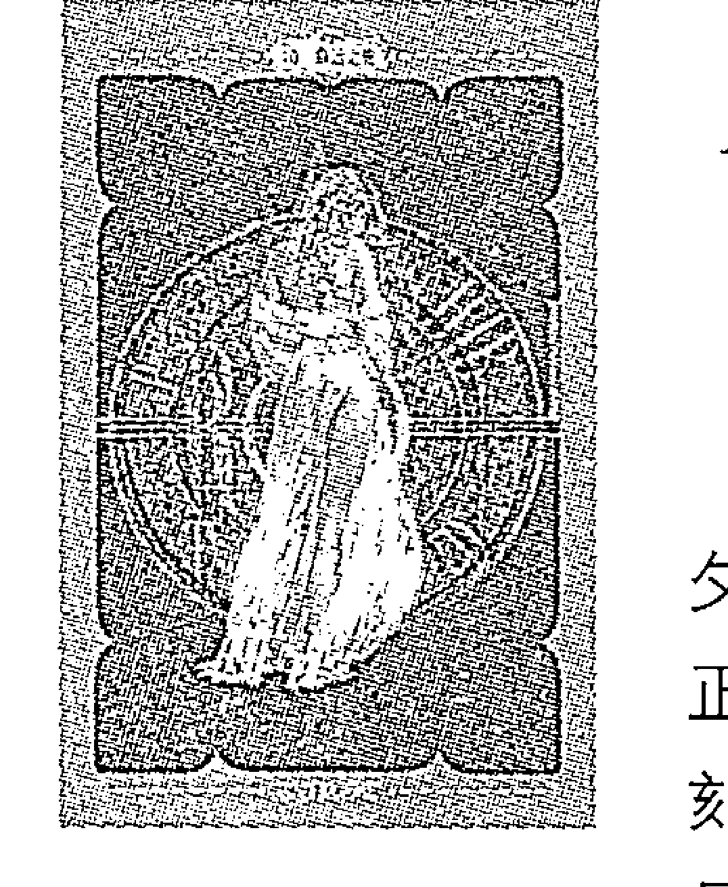

### —正 位—

你的命运有如那转动的命运之轮，有时转到好的一面，有时转到坏的一面，这都是一种很公平的循环。在你的命运之中，有四大元素在一旁看顾着你，在你需要帮助的时候扶你一把，它们分别是代表水的老鹰，代表火的翼狮，代表土的翼牛，和代表风的天使。它们各持一本书，准备在适当的时间，把各自所拥有的智能教授给你。因为你现在还不懂得，该如何把这四大元素要教授给你的智能融合，所以你要等，等着命运之轮转到合适的角度。命运之轮无论是转到你喜欢的角度，还是转到你不喜欢的角度，一切都会过去，变化无常的生命也充满了挑战与刺激啊。

命运之轮是由命运女神而不是男神转动。感情上，之前的风风雨雨都将过去，你俩的关系将取得一个较圆满的结局。事业上，这是一次不错的改变，从中你将得到学习与成长的机会，你的努力也会换来好的收成。继续努力，你的收获将会更多。

### —逆 位—

月有阴晴圆缺，人有旦夕祸福，那公平的命运之轮正转到了你人生最低迷的时刻。也许你有些无法接受，但是若能以平常心看待，这时无疑是你静下心来做一番反思的大好时机，为你以后的成长积蓄力量。四元素依然在你身旁看顾着你，但是不会主动帮助你，你要学习主动去要求帮助，这样才能在往后的路上走得更稳。

感情上，你很努力地想把你们的关系转好，但是却有很多的阻碍在你前面不断地挡着你，让你感到了无力。事业上，虽然你不停地突破一些障碍，但还是有更多的障碍在前，让你几乎失去信心。不断努力向前是你的特色，不管遇到多少荆棘，你都愿意去排除。在这段艰难时期里积累下来的经验，将为你铺就一条通往成功的道路。

## 大阿卡纳妙解

## 11.正义

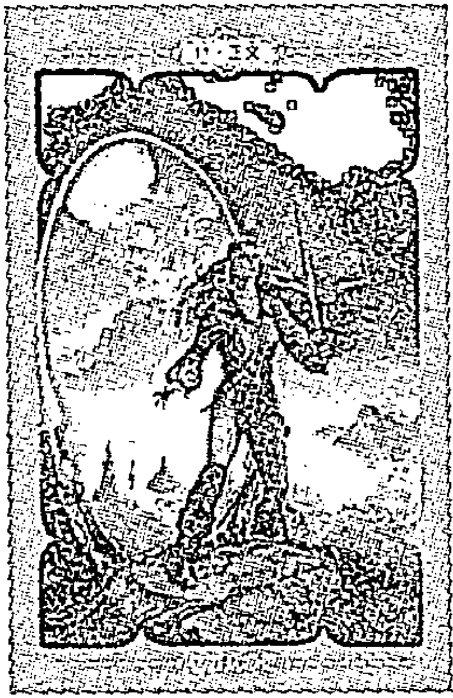

### —正 位—

正义女神高擎正义之剑，站在能分断阴阳两界的椭圆形镜面之前，藉由这两样圣器，正义女神可以轻易地了解事情的来龙去脉与未来的发展，并告诉众生因果循环的道理。

### —逆 位—

正义女神从她站立的石台上走了下来，左手里的剑因为过度使用已有些钝了，身后能分断阴阳两界的镜子也蒙上了灰尘，看不太清晰。

正义牌有时也称为法官马特或蒙大拿的马利亚。蒙大拿的马利亚之所以出现在塔罗牌里，也许是因为诺斯替教派认为她才是真正的教皇。

这张牌表示你应该从前线退下来，到后方去重整你的战斗力，在激流中勇退才是上上策。也许在不久的将来，等你的战斗力补足之后，再次出征时你将会使你的敌人感到害怕，你也会重新坐上成功的石椅。

感情上，你对目前两人的关系状况感到很满意，因为这是你所选择的，是你一手造就出来的，而对方也对你的选择采取了接受的态度。事业上，不论你现在的成就如何，也不论你现在的计划是否能正确无误地执行，你都不会有特别的感觉与希望。你只是继续地走下去，走在你自己选择的路上。

感情上，也许是长时间的忍让与包容，你已经太过压抑自己了，这将造成一次大的爆发，你们开始互相指责，这很有可能造成你俩的关系走向崩溃。事业上，你不再信任自己的能力了，对自己的要求也开始降低，你在事业发展的最关键时刻，停顿了下来。也许你是该好好地休息一下了，把自己的能力补足了再往前冲。

## 12 吊人

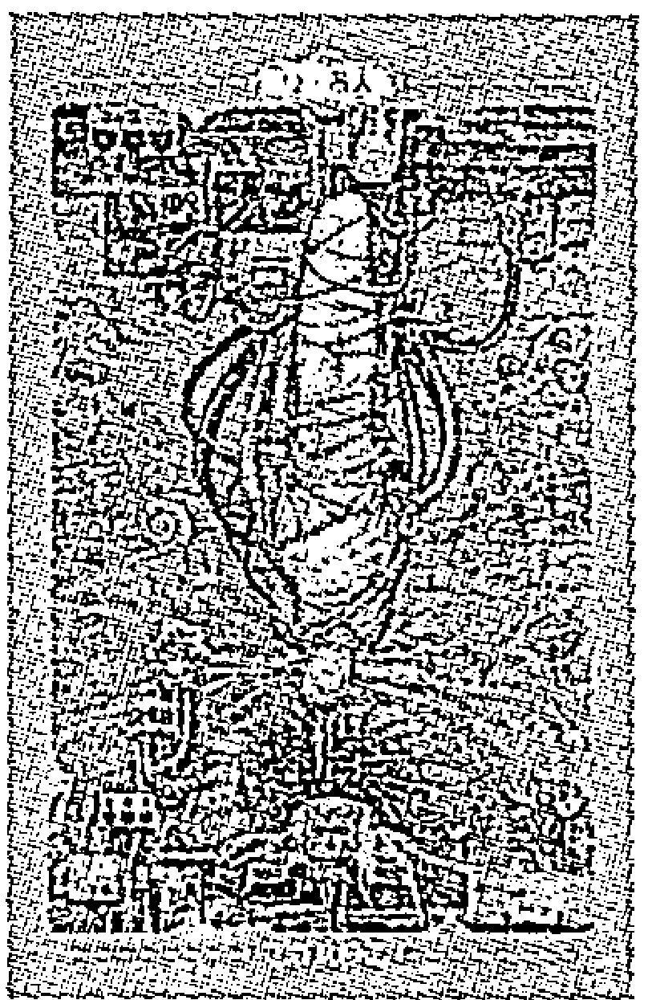

### —正 位—

勇者被双手反绑着倒吊了起来，但他依然保持着沉着与冷静的心性。虽然在旁人看来这样很痛苦，但是他却愿意顺从且忍耐，因为他知道，这对他而言是一种特别的磨练，借着这一磨练方式，他已经进入了圣人的境界。而且由于是处于倒挂当中，他得以从一个全新的角度观察这个世界，去发现一些平时看不到的东西。

奥丁神话显示，唯有自我牺牲、死后重生，方能获得神秘启蒙，奥丁就是献身吊死在绞架上，才学得有关命运、魔术、神秘文字、咒语及诗的灵感等诸般秘密。

感情上，你的自我牺牲与奉献，在对方眼里是何等的令人感动啊，如同被施了催化剂，你们的心更加紧密地粘合在了一起。事业上，你进入了一段对自我进行确认的时期，是到了对未来的走向进行修正的时候了。

### —逆 位—

勇者不甘心自己被束缚住，不断地想要从中挣脱出来。他不想做什么圣人，只想做个平常人，生活在自己所熟悉的环境里。

这种态度充分显示出了你的不满和无忍耐力，凡事都只替自己打算，不为他人的利益着想。而且你很自负，不觉得自己需要接受什么特别的磨练。

感情上，你对对方的感觉越来越淡了，想要挣脱这段感情的束缚，但对方对你的态度依旧没变，这使得你更加想要逃避，因为你已不再想为对方付出。事业上，你不断找寻上升的空间，但是却忽略了你内心深处那正确的判断力，这直接导致你开始遭遇非常多的失败。

## 大阿卡纳妙解

## 13. 死神

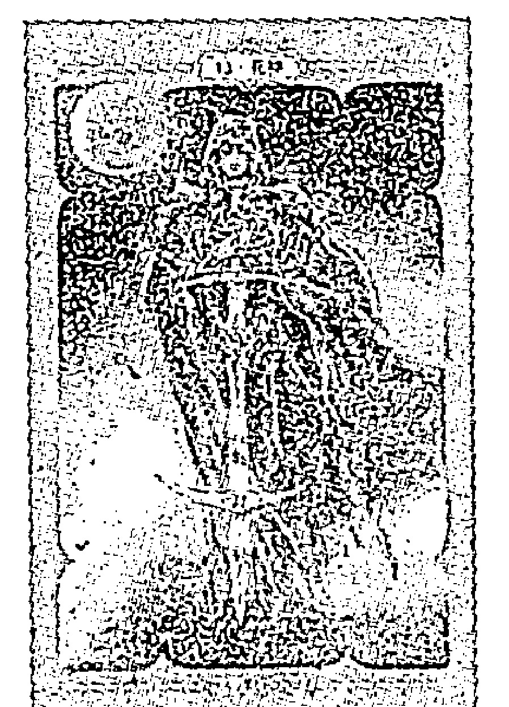

### —正 位—

惨白的月色下，死神身罩黑色的斗篷，双手握着象征毁灭的利剑。但是这把剑并不意味着杀戮与掠夺，它代表的是改变。你只要凝神倾听，就会听到死神正在说，只要你愿意跟随他改变，杀戮与掠夺都将不存在，只要你愿意放弃现在拥有的，就会获得更丰硕的收益。

在西方社会，数字13一向被视做与死亡有关，因为依照古历法，第十三个月份是死亡及重生的月份。感情上，你俩的关系将告一段落，接下来你们将开始一段新的互动关系，走上新的爱之旅途。只要你们愿意顺从这一改变，你们未来的感情之路就会走得更加顺利。事业上，你已经知道，你将进入一段转折期，未来将走的是一段更新、更好的路线。你不拒绝改变，而是明智地选择接受，这让你能够更快地进入下一段美好的旅程之中。

### —逆 位—

死神依旧默默地站在那里，手握象征毁灭的死之利剑。他希望能和平地为人们带来改变，并不希望有杀戮与掠夺的发生，但是人们却很愚蠢，认识不到死神的良苦用心。他们只是害怕死亡的到来，于是进行了消极而无谓的抵抗，这让死神感到伤心，也感到不解，明明改变是有益的，为什么你们却要加以抵制呢？

感情上，你们俩的关系已经进入了一段改变的时期，但是你害怕这种改变会对你的感情生活产生不好的影响，于是你裹足不前。可对方已经往前走了，他愿意接受这种改变，也希望你能接受这种改变，如果你依然不愿意前进，那么你们俩的距离就会越拉越大了。事业上，这一改变是好的，意味着借此机会你将获得重生，得到更美好的结果。但是你害怕了，退缩了，躲藏了起来，这只会让你在这瞬息万变的社会里慢慢沉沦，被抛弃和遗忘掉。

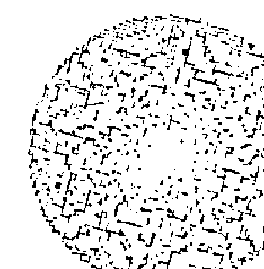

## 4. 节制

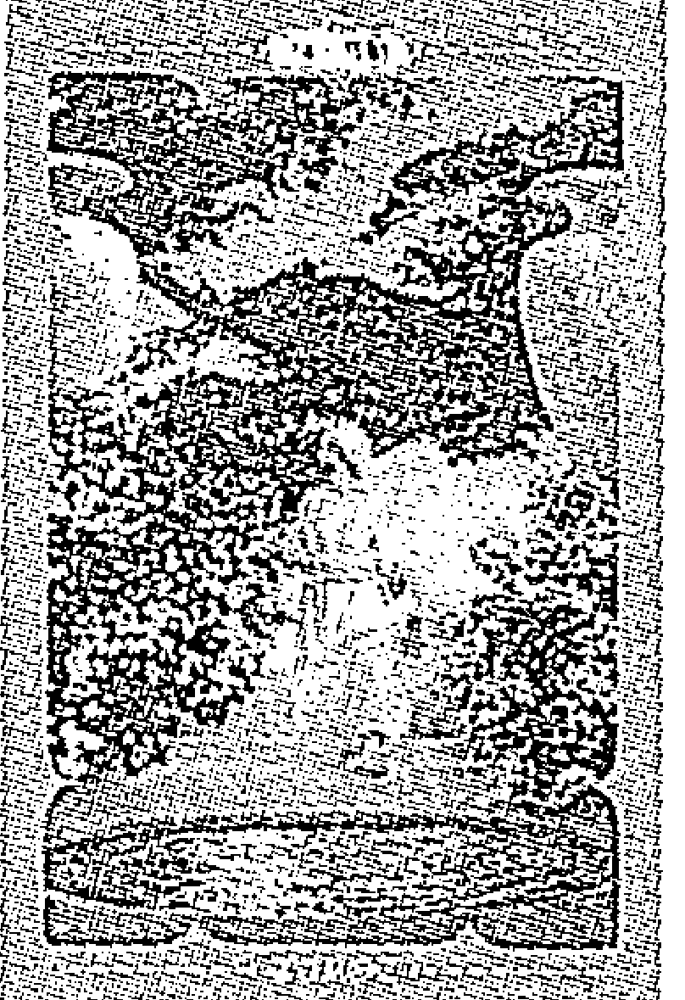

### —正 位—

### —逆 位—

两只圣杯分立于圣水湖畔的两侧，它们分别代表“物质”和“精神”，二者相互沟通，相互节制，相互平衡。这张牌告诫我们当面对各种各样的诱惑时，控制好自己的欲望是最重要的。从这张牌上，我们感到的是一种平淡的美，而平淡的生活才是真正的幸福。它还代表人的能力是由掌握的知识与对知识的理解共同组成的，做任何事情都要有目的，通过这些事情让我们成熟，事业得到发展。

因为倒立的关系，圣水倾倒了出来，生命的能量也在一点点减弱，你开始寻求外在的帮助，不断尝试修正自己的脚步，但是却无法准确地找到自己的真正目标与目的地。代表物质与精神的圣杯之间的联系也被割断了，面对外界的诱惑，你都忘记该如何使用自己的精神力量来调整自己了。

诺斯替教派炼金术典籍将爱放在死神与恶魔之间。有什么比地狱与死亡更强势呢？但是爱能征服这两者。

感情上，你们的关系产生了裂痕，虽然彼此还在不断尝试着沟通，但每次的沟通之后总是感觉没有收获，正因为如此，你们之间的距离才会越拉越大。事业上，你对自己的想法和做法产生了怀疑，进而陷入了朝令夕改的怪圈，不妨效仿一下愚者勇往直前的精神，或许能够取得更大的成功。

感情上，目前你们的关系变得更加简单了，一切都是那么的单纯、安和，也因为彼此间的沟通，你们的感情之路走得更为顺畅，没有丝毫的不适。事业上，你懂得利用自身的精神力量，来解决一些外在的问题与疑虑，小心地经营，理智地决断，令你的合作伙伴感到非常的放心。

## 大阿卡纳妙解

## 15 恶魔

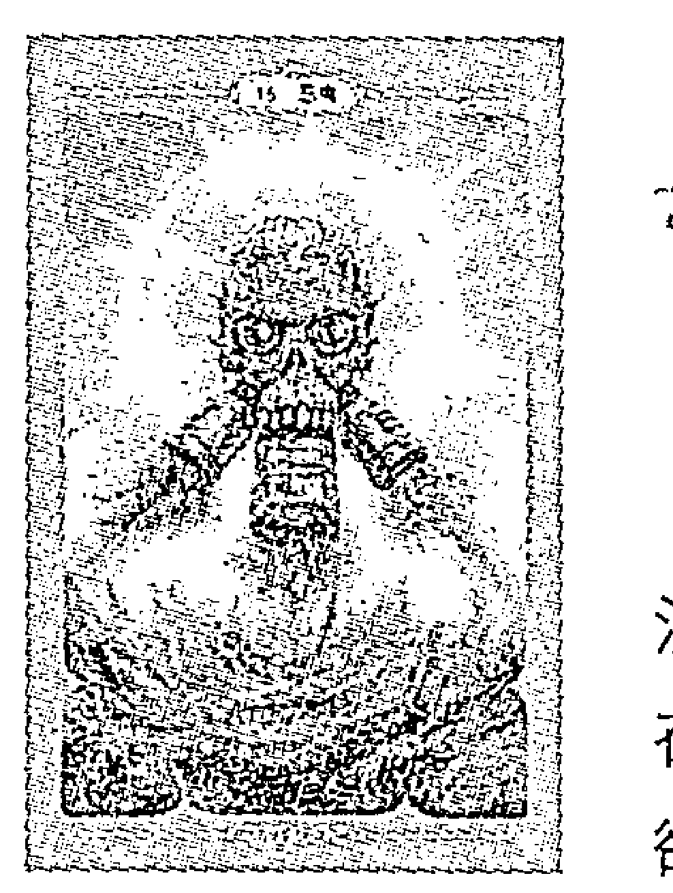

### —正 位—

### —逆 位—

恶魔看着尘世间受欲望驱动的人类，露出狰狞的笑容。然而虽然面目可憎，他却有着美妙动听的声音，他用金钱和所谓的安全引诱人们成为他的奴隶。在他的控制下，人们被赤裸裸的原始欲望占据了心灵，除了金钱，不再有其他人生追求，变得极度自私和贪婪，却意识不到，当生命结束时，这些物质就不再具有任何意义了。

恶魔对人们的影响已经没那么深了，它也需要休息。在它休息的这段时间内，被欲望囚禁的你试图冲出这樊笼。这个阶段对你而言是痛苦的，但是你愿意去尝试，去改善，也愿意接受自我内心深处的黑暗面与欲望。凭借自我调节的精神力，你慢慢摆脱了束缚，以理性战胜了欲望，这代表了你的精神力的恢复与重新掌握。

恶魔代表一种错误的观念——拥有物质财富就拥有了一切。外在的干扰让人的冲动支配着理智，自我的精神上的要求不断消失，不愿意为自己的行为负责，而是把一切过错都推给恶魔。

感情上，你俩正慢慢地突破对彼此的束缚，让这段感情转往更为顺利的路程上，开始尝试着与对方沟通，让你俩的感情变得更加坚固。事业上，你开始懂得在一些时候运用你的理性来思考，不再只是为了工作而工作，愿意尝试一些新的方法，以使自己的目标得以更加顺利地实现。

中世纪时，恶魔与上帝极为相似，仿佛是继承了波斯双生神祇的二元观念。诺斯替教徒称它为路西法，耶和华的兄弟，具有更高的道德。感情上，你俩的关系渐渐变得束缚，但你们却不愿意去做一些改善，只是一味地互相指责，表达自己的不满。事业上，你将获得很大的名声与财富，在你眼里，事业就是你的一切，财富就是你最终也是唯一的目标。

## 16. 塔

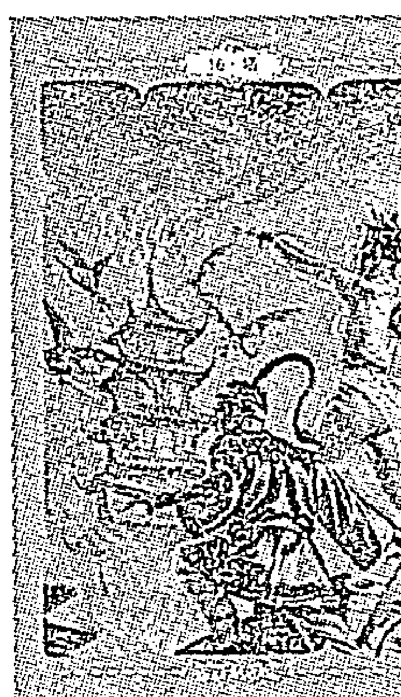

### —正 位—

高耸的尖塔突然遭遇闪电的攻击，陷入一片火光之中，这是不可预期的，有如人生的命运路程中，突然遇到强烈的变化。这种改变，因为太突然，太强烈，也许你一时之间还无法接受，但随着时间的推移，你慢慢会领悟到其实这是生活里必须的教训，它教你成长。抗拒它不如接受它，这样你以后的路走起来就会比较轻松。

闪电与高塔，自古以来就象征阳具神，古代世界的天父，也是基督教世界的恶魔。闪电一度是持三叉戟者——湿婆挥舞的武器，代表着他与三位一体的女神结合。

感情上，你们已经走入了一段需要改变的时期了，也许是你，也许是对方，又或是你们双方都需要作一下改变。可能这种改变是强烈的，不舒畅的，但这是让你们在未来的路程中走得更好的方法。事业上，你将遇到一次你想象不到的改变，这可能导致你之前的努力化成泡沫，让你的心血全都白费，但这却是你得以更快成长的好方法。

### —逆 位—

闪电打下来之前，正站在塔上的你预先得到了消息，你有充分的时间在灾难发生之前顺利下到地面。然而虽然你能够避开闪电的攻击，却还是无法完全地躲过伤害，因为塔还是会塌下来。既然危险和磨难是成长道路上必须要经历的，那就想办法避开塔上坠落的砖石吧，走过风风雨雨，未来的路才能更加顺畅。

感情上，你们彼此间的关系慢慢由波动走向平稳，不再有什么大的争执发生。虽然偶尔也会因为沟通上的困难而有些插曲发生，但只要稍作让步就会风平浪静。事业上，目前是你最大的一个转折点，也许放松心情去面对，会让你的工作做得更轻松、更出色。不要尝试去抵抗，这样只会让你的路越走越艰难。顺着命运之神的指引，你会越走越顺。

## 大阿卡纳妙解

## 17. 星星

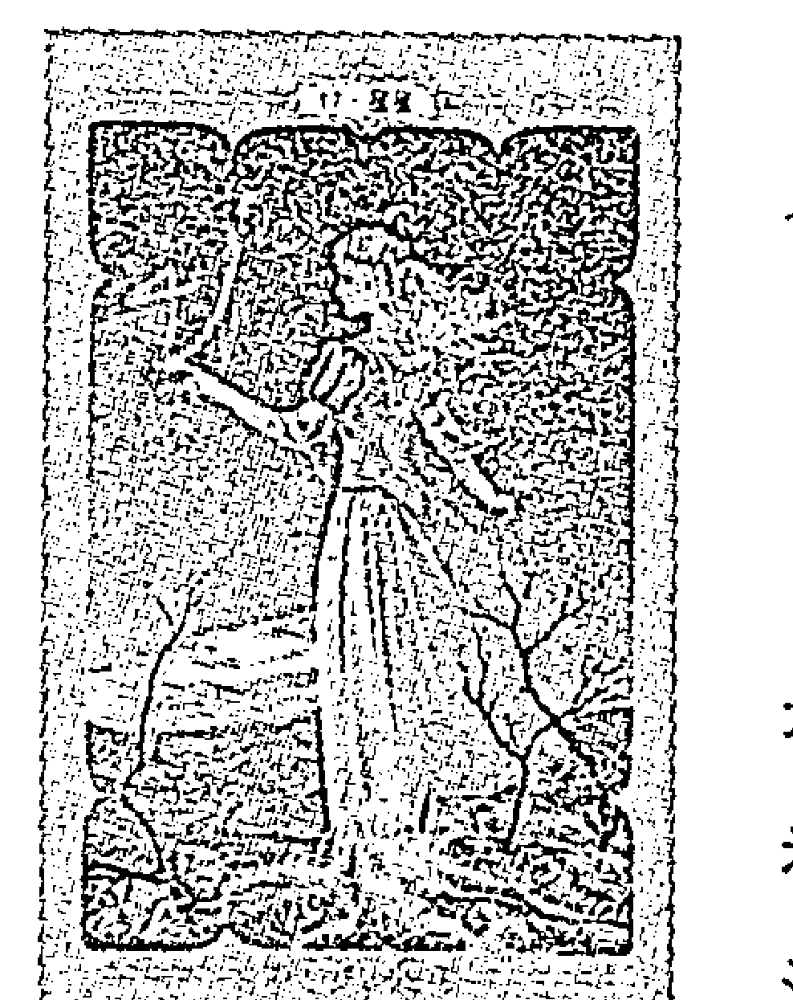

### —正 位—

这是一张充满希望的牌。在希望之星天狼星的照耀下，希望女神将希望之密语记录在了海蓝色的天幕上。她知道，人们是需要希望的，人要有希望才活得快乐，人要有希望才能有足够的动力去完成很多事。对她来说，希望就是人最根本的动源，所以她决定把希望带给人们，让人们通过使用这希望得到幸福。

这张牌也是爱西斯之星，象征每年一度尼罗河泛滥，将生命食粮带到埃及各地。爱西斯成为生命之水的源头，引导灵魂登上布满繁星的天空。

感情上，你对目前两人的关系非常有信心，也相信自己能掌握得很好，并且努力地追求彼此的希望，你们可能命中注定是要在一起的。事业上，当你知道如何从潜意识中取得希望的能量时，你也将开始得到希望的祝福与助力，相信你能在以后的事业路程中走得更好。

### —逆 位—

希望之密语被倒置，原有的含义被破坏，而希望女神也因为处于倒立状态，无法将自身的能量发挥出来，改善局面，她只能希望人们自己发现这个问题，透过自己的潜意识领悟希望之密语的真面目。她虽然这样希望，但是却没有多大的效果，因为愚昧的人们只一味地依赖希望女神来帮助他们，不懂得主动去求取希望。仁慈的希望女神感到了无力，流下了伤心的泪水。

感情上，你们进入了一段无法给予彼此信任与寄托的时期。也许你们应该退一步，冷静下来好好想一想，找出问题的症结点，来做个小改善。事业上，你放弃了原本的希望与目标，不断地在旧的世界与想法中打转，你错误地以为这样会对你的前途有益处，事实上这样只会让你活得很辛苦。尝试一下，将自己的内在与外在做个连结吧。

## 18.月亮

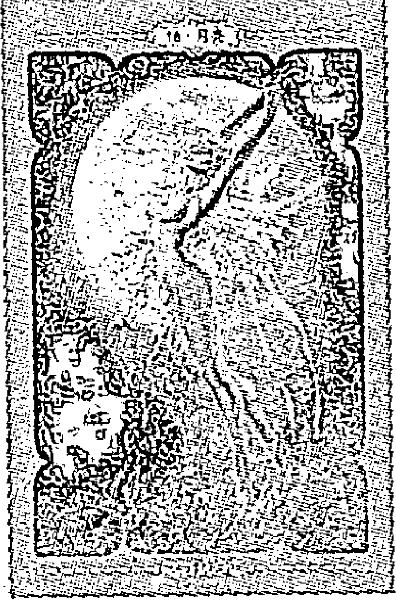

### —正 位—

这是张代表迷惑和不安的牌。风高的月夜，海水剧烈地翻腾。因为不安和恐惧，也因为受月亮女神的吸引，一只小海蛇从海水里探出了脑袋，想要靠近月亮女神，求得庇护。但是要到达月亮女神，它先要克服一些阻碍与恐惧，这也是月亮女神对它的试练。

月亮是到达精神世界的桥梁。月赢月亏象征着转变，当满月出现时，人们知道它马上就要亏损了，心中的不安油然而生，在幸福时担心不幸的到来，使人们不能有任何的懈怠感。

月亮也是女性和情感的象征，在事业上则指具有艺术性或创造性的事业，它也暗示着欺骗。解这张牌的关键，就在于“迷惑”。感情上，表面看来，你们似乎对彼此都没有太多的怨言，但私底下，你们却常找好友哭诉。你们不愿意去面对将到的挑战，只想活在过去的想法中。也许只是一些逃避的心态吧。事业上，你开始对自己的工作感到一些不满足，想要把自己内在的力量全抓出来使用，这时的你会有想要使用晚上的时间的想法。

### —逆 位—

潜意识里小海蛇想要爬到月亮女神那里，但是在面对路程中的阻碍时，它却害怕了，胆怯了。它对自己没有信心，也不知道该如何去应对面临的困难，它用乞求的眼神望着月亮女神，希望她能够主动伸出援助的手，帮它脱离困境。然而每个人都只能自己做自己的救世主，只有克服了眼前的困难，你才能到达安全和幸福的彼岸。

感情上，存在于你们之间的问题已经慢慢地浮现了。现在，你们也开始愿意去面对这些问题了。虽然有点痛，但是当你们面对了，问题就已经解决了一半了。事业上，你开始在目前的职场领域退缩了，只因为自己的一些精神压力，让你无法挥洒自如，甚至对自己的未来走向，也感到异常的怀疑了。

## 19. 太阳

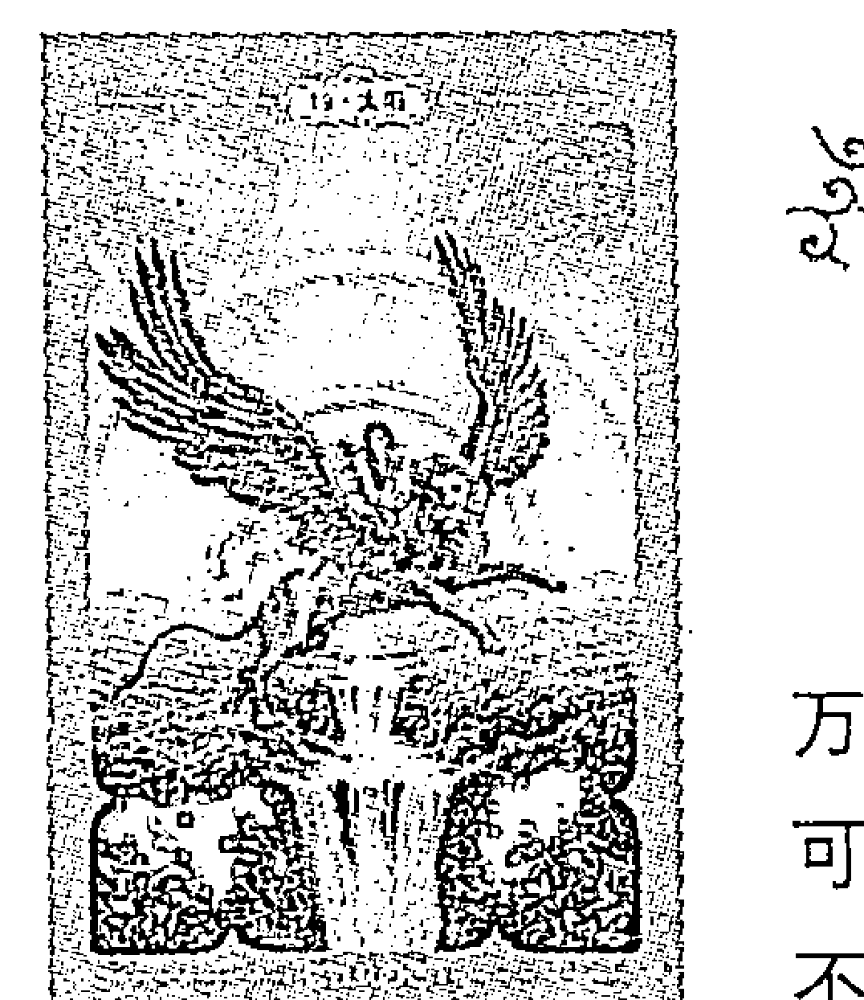

### —正 位—

这张牌象征知识与活力。牌面上一名美女的女子骑着一头长有双翼的雄狮，在歌颂太阳带来的生命力，接受着太阳赋予她的能量。太阳的力量如此强大，它给世间万物以生命，它的光芒如此温暖，所有的生命都为之感动。它的力量完全是正面的，充满希望和理想，任何黑暗都抵挡不住它的光芒。

解这张牌的关键在于“生命力”，它是希望和理想的力量，不受任何外在的干扰与内在的对抗，即便有内心的黑暗面想要出来干扰你，但在太阳的光芒下，它们都会立刻消失，所以不必为一些烦恼所困扰。

感情上，你们已经从荆棘坎坷中走出来了，在你们面前等着的，是充满幸福与欢愉的感情之旅。你们也开始正式地规划未来的生活。事业上，你有贵人相助，将得到更好的发展机遇。

### —逆 位—

太阳依旧照耀着大地，万物依然得到太阳的生命力。可是坐在狮子身上的女人却不再歌颂太阳了，因为她被自己内心的黑暗面捆绑住了，忘了该如何去接受太阳给予她的生命力与强力的能源。而且，她对自己是否能接受到太阳的力量感到怀疑。她开始不断地攻击别人，让自己能够得到多一点的能源。她是自私的，缺乏一颗包容的心，只因为她害怕失败，害怕被太阳拒绝。可是她忽略了一点，太阳给每个人的能源都是公平的，任何人都不应该侵犯他人的利益来满足一己之私利。

感情上，两人间出现了一些微妙的变化，开始在意对方对自己的态度，对自己是否是真心付出，这些怀疑和担心也许都是没必要的。事业上，你的竞争心实在太强烈了，把你的对手都吓跑了，也让你的合作对象感到害怕，也许你该把心放松一些。

## 20. 审判

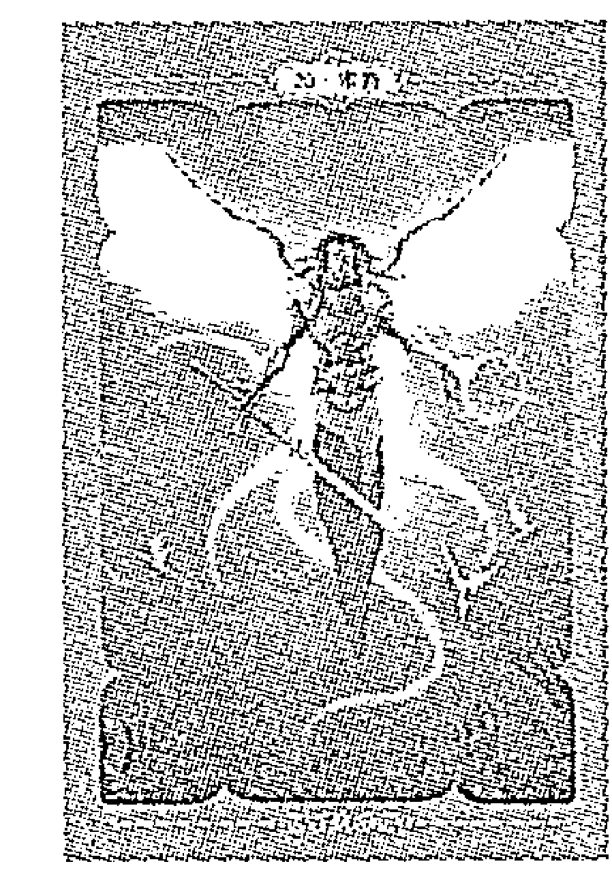

### —正 位—

天使右手持剑，左手拿着象征光明的光环，向已死之人发出救赎的天堂之音。他的声音可以唤醒所有死者的情感，即使是曾经有罪的人也有到达天堂的希望。天使的救赎之音象征着旧观念已经死亡，在他的召唤下人们拥抱新世界。在新世界里，你总结整理过去的经验，丢弃错误，留下宝贵的知识；在新世界里，你将不是孤独的，有很多朋友和你一起学习，尽管你们素昧平生，但天使让你们彼此互助，这使你们的生活更加愉快。

古老的世界末日及最后审判日的印欧神话，从米斯拉教派、苦修派传到基督教之后，有很大的改变。他们不再阐扬不断循环的毁灭与重生，而变成单线静态的世界观。

感情上，你们目前的关系包含了过去所播下的种子与努力过的一切，这段时间你们将从错误中找到正确的彼此相爱的方式。事业上，过去的努力造就了你现在的成就，你品尝到甜美的果实了。继续努力，并发现工作中隐藏的问题，你将收获更多。

### —逆 位—

天使优美的救赎之音回荡在山谷，可是这声音里却充满了孤寂的感觉，因为人们都甘心躲在自己所熟悉的旧世界的怀抱里，享受死亡般的安逸。他们害怕新世界的不确定，对适应新环境缺乏信心，于是他们裹足不前。

感情上，你们之间存在着对过去的依赖，不愿意正视目前的问题。不断地回忆着过去的美好种种，对目前与未来的走向却不重视，不理会，也不愿意下功夫去营造与建设。事业上，你尝试着把自己的时间压缩，再压缩，但还是不断地想要放弃这一切。对你来说，新世界是危险的，令人惧怕的，但是你可曾注意到，新世界里的人们正以愉快的心情与和善的态度迎接你的到来呢。

## 大阿卡纳妙解

## 21 世界

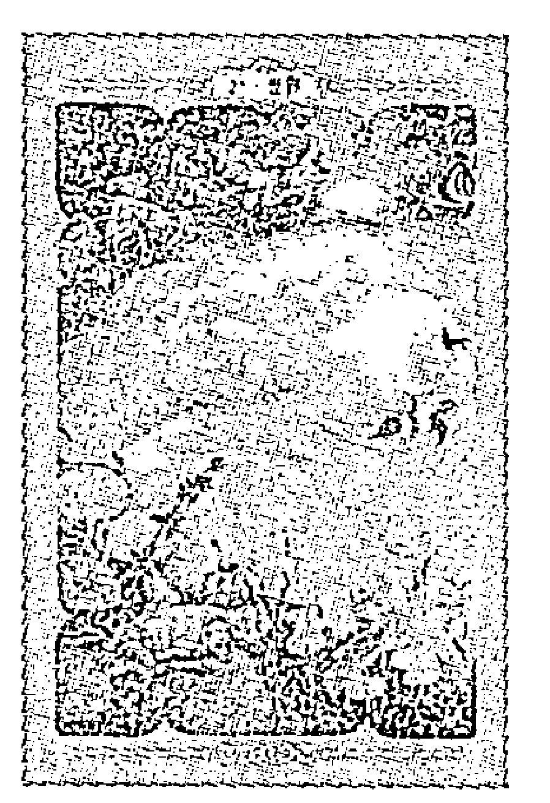

### —正 位—

这是一张象征永久和持续成功的牌。你已经到达了成功之门的前方，成功女神让你耐心等待，她会让你进入成功之门的，只不过是时间的问题罢了。成功之门周围是你经历过的幸福与哀伤，成功与失败，在到达乐土之前回忆一下过去的时光是很有必要的。这张牌暗示只要你拥有一颗感恩的心，就必能在你为自己打造的美丽世界中，寻找到幸福与快乐。

牌的本意是“达成”，它告诉我们所有的事情都可以达成，所有的梦想都可以成为现实，没有不可能得到的事物。只要有耕耘，就能有相应的收获。

感情上，在经历了共同的成长、学习和生活之后，你们的关系已变得很默契，到了彼此给予承诺的时候了。事业上，你正处于最辉煌的时期，这是你持续努力、不断耕耘的结果。保持积极进取的心态，你的成就将会更大，更巩固。

### —逆 位—

成功女神依旧把守在成功之门前，但开启大门的胜利之钥却丢失了。而这时你已到达这扇门的面前，正满怀兴奋之情等待着成功女神的检阅，但没有钥匙，即便你符合条件，也走进不了这成功之门。你现在需要的，是在花园里耐心地等待，让自己的心平静一下。你还可以和女神一起寻找这钥匙，这样你的功劳簿上就又会被记上一笔，让你在进入成功殿堂之后，受到更多神祇的祝福。

感情上，你们的关系进入了一段重承诺、有契约的阶段，然而可能有一方是非自愿的，被动的，也许这会让你们在将来过得很辛苦。试着好好沟通一下，不要埋下痛苦的种子。事业上，你终于得到了一切，你之前的努力得到了回报，但是你却忘了去维持现在的成功。你总是沉湎在过去的奋斗和既得的辉煌中，丧失了挑战未来的动力。

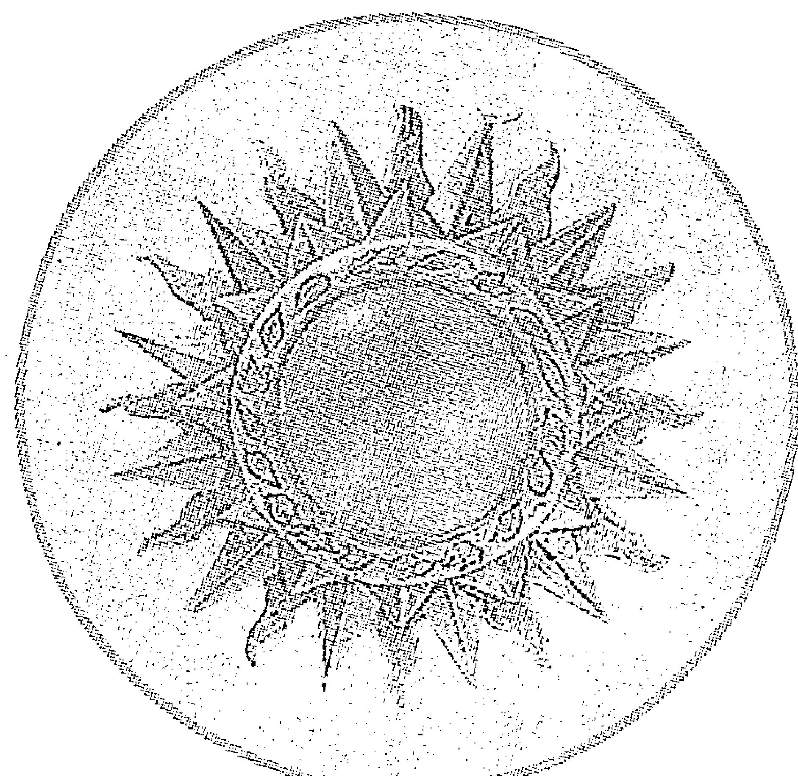

# 女 生 塔 罗

T A R O T

## 第二章
小阿卡纳的奥秘

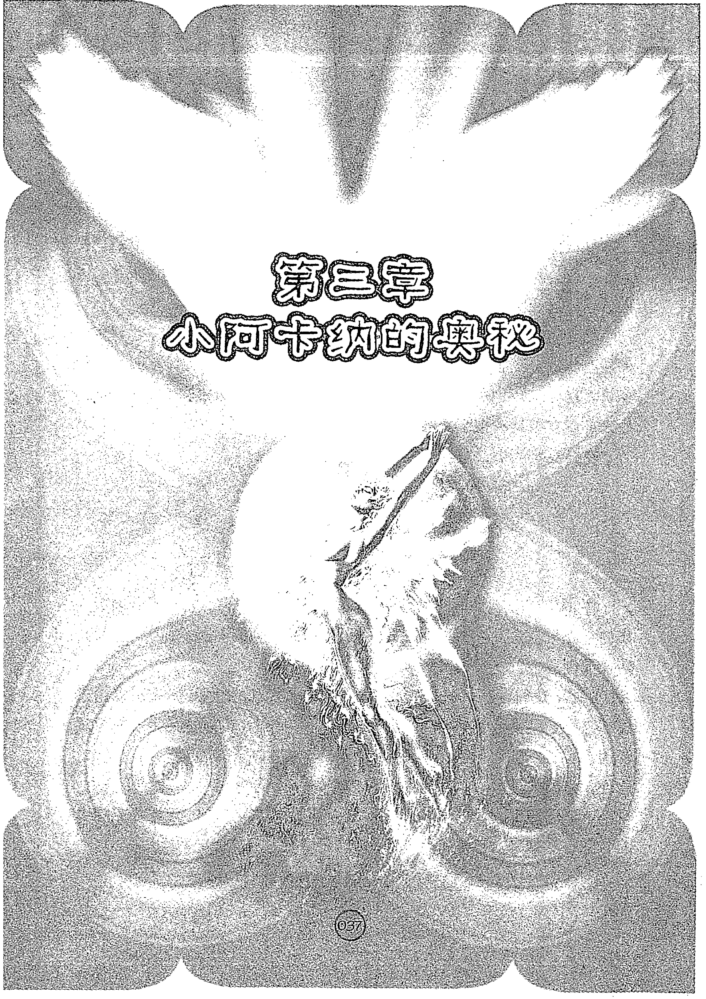

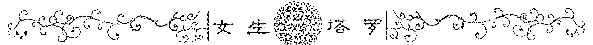

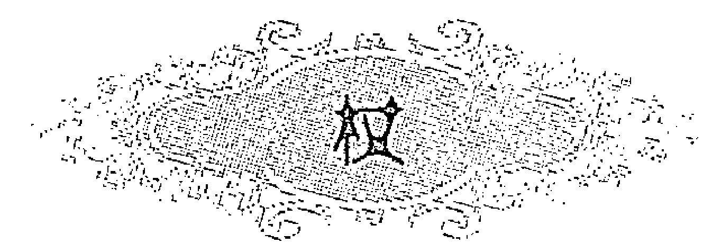

杖（WANDS）代表着魔法之杖，象征着创造事物的意志与欲望，要是少了它，人类的生活便无法运行，相对的，也就会缺少爱的滋润了。因此，这张牌正象征着力量的来源。

它与精神上的活力来源有着密不可分的关系，具体地解释，它与生活的所有状况、人生基础分野等，皆有着密切的关联。就火地风水四大元素来讲，它与“火”相对应，代表着“精神性”。魔杖原本指的是嫩的树枝，后来即以树枝或棒棍来象征。

在扑克牌当中，魔杖代表着“梅花”。

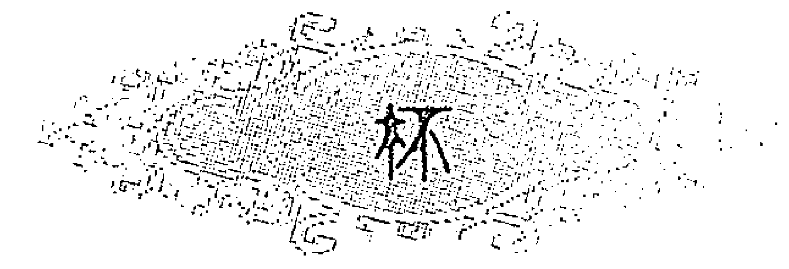

杯（CUPS）就如同它的名称一般，代表着“圣杯”，它掌管着创造事物的意志与欲念，是一只神圣的杯子。一旦意志力装满这个杯子，它就会转变成创造力。

因此，我们可以将圣杯这张牌解释成与艺术和感性相连，它可以用来解答与感觉及情绪等有关的问题。当然，恋爱和结婚问题也是由圣杯所掌管的。在火地风水这四元素当中，它与“水”相对应，支配着情绪与爱情。此外，为了要把水给装满，容易会有浪费的情形产生。

由于圣杯代表着爱与感情，所以我们也将它视为心脏，现今扑克牌中的“红心”就是由它转变而来的。

## 小阿卡纳的奥秘

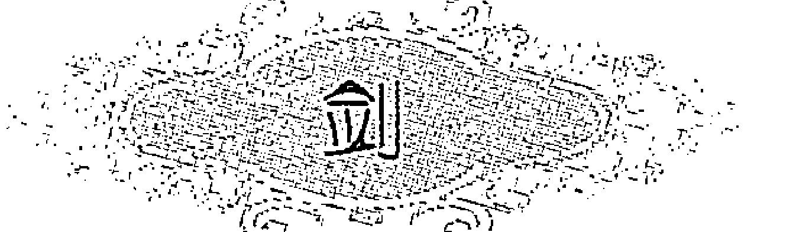

剑 (SWORDS) 就是“宝剑”。宝剑与杯子代表着对事物的创造力，它们象征着欲望与野心的觉醒，也就是指对美丽、舒适及爱等事物引发独占的情绪。宝剑代表了实现野心及欲望的手段，同时，对正义者而言，它也代表了伸张正义，除暴安良。

因此，宝剑这张牌也主宰了对立、纷争、麻烦等事件。除此之外，它也警示着战争的悲惨与心志的颓废。在火地风水这四个元素之中，它与“风”相呼应着，代表了知识与技术，这是因为战争有促进知识与技术的功能。

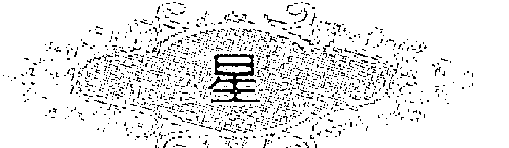

星 (PENTACLES) 代表着“五角星”、钱币。在希腊神秘的毕达哥拉斯的宗教团体里，五角星象征着“完全的恩宠”。这张牌纵合了宝剑、圣杯、权杖等财富，暗示着恩宠与享乐。

富裕的生活、物质的享受与精神的满足，这些世间最大的幸福都是钱币所象征的。此外，它还有集结众力、同心合作与维持社会秩序的含义。在火地风水四大元素之中，它主管“物质”，与“地”相对应。

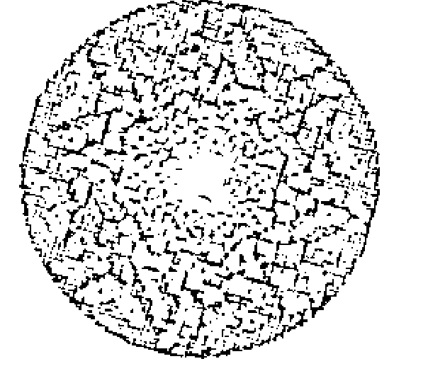

## 杖·国王

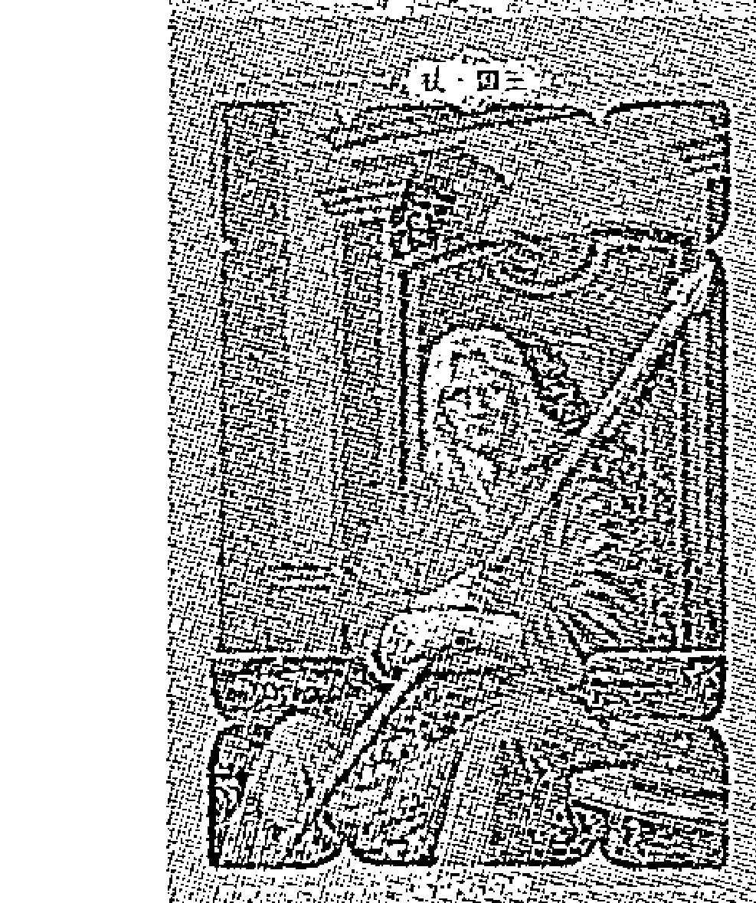

占星学符号：牧羊座
牌面寓意：成熟的阳性能里，动态的活动，特定向外的方向。
经过自律而成功。
国王运用火的能量将所有的障碍烧尽，他知道他的方向，同时有能力到他想要去的地方。

## 杖·王后

占星学符号：狮子座
牌面寓意：成熟的阴性能量，接受反应的能量，自我的觉知。
透过内在力量而成功。
王后静静地和自己的能量连结，对一个情况加以分析、理解，并反映它。

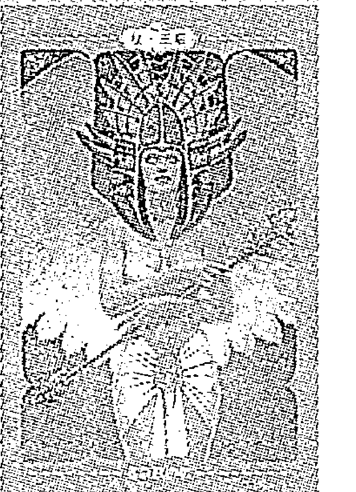

## 杖·骑士

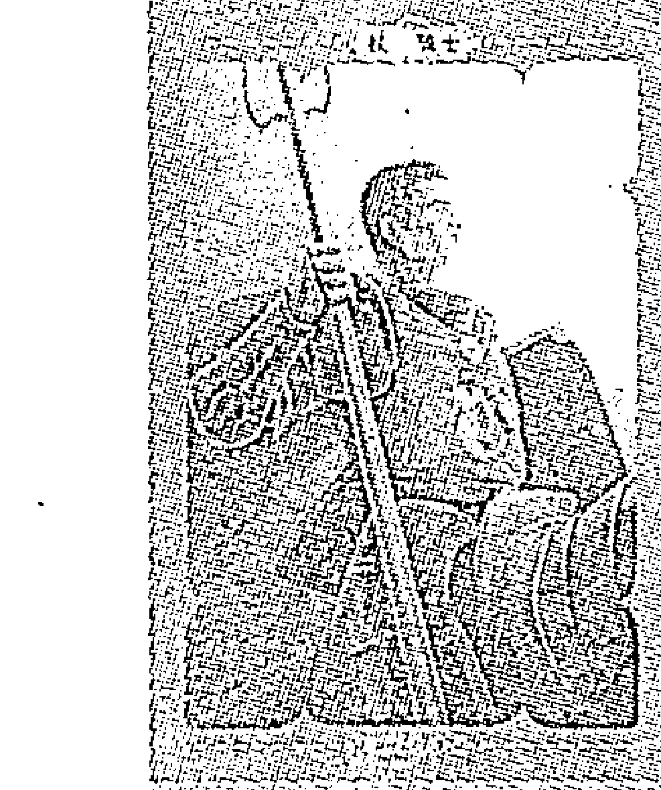

占星学符号：射手座
牌面寓意：热情的或尖锐压迫的，新鲜的方法，能量创造性的使用。
旅行或改变。
天真敞开的心。
强而有力的动物能量，尚未学会小心。

## 杖·男仆

占星学符号：牧羊座
牌面寓意：流动的能量，随任何事情发生而不被恐惧所限制。
一项新的方案。
挑战的消息或开始。
已经克服的因为恐惧而产生的能量障碍，除了本身的能量，完全不另加保护。

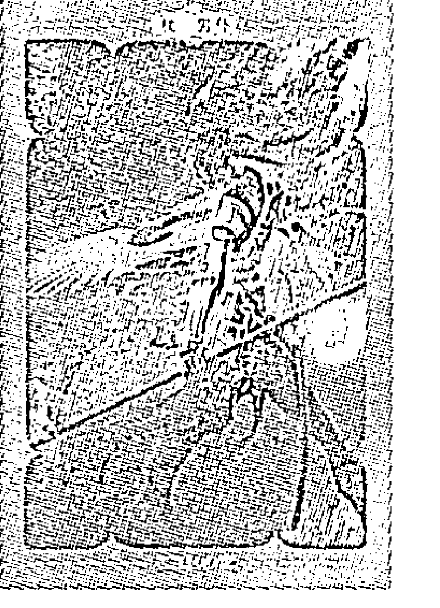

## 小阿卡纳的奥秘

## 杖·ACE

占星学象征：无
牌面寓意：很高、很纯或很强的能量；火。
开始执行新方案或旅行。
初始、巨大的力量爆发，如何利用或改变它是最大的课题。

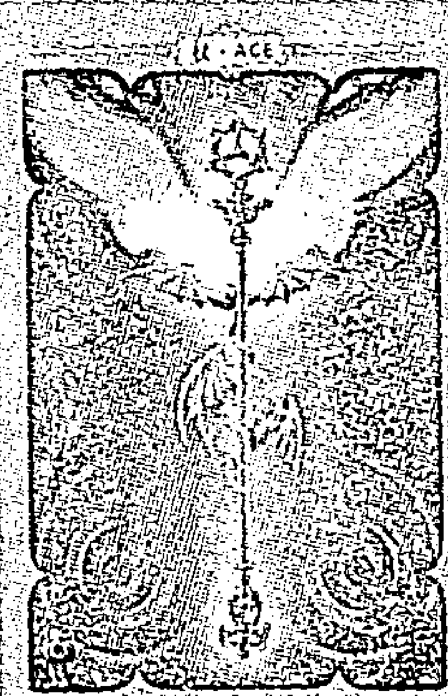

## 杖·2 [主权]

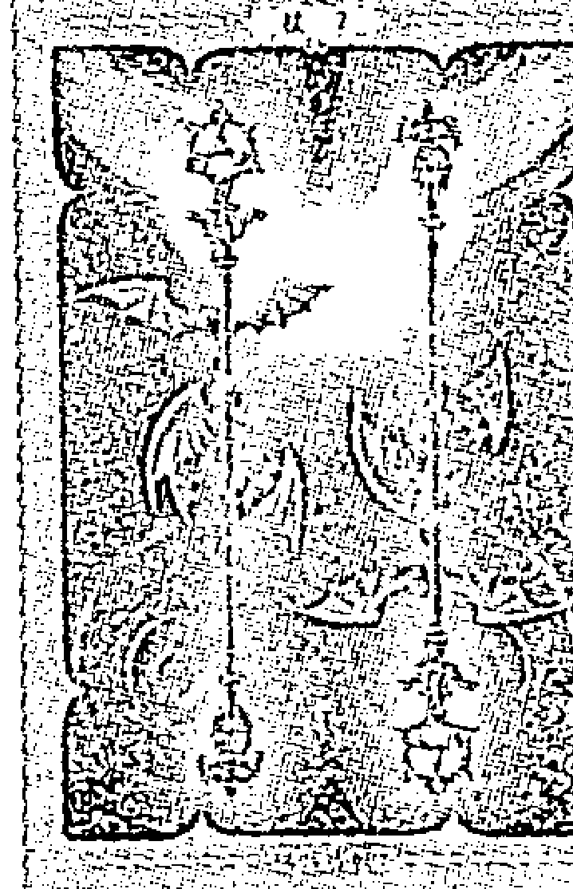

占星学象征：火星在牧羊座
牌面寓意：新的方向，动态的新方式。
一个决定。
指挥、统帅、支配。
从一个有力的地方进到另一个地方。

## 杖·3 [美德]

占星学象征：太阳在牧羊座
牌面寓意：完整、正直、真实、自然。
开始旅行。
内在的花朵开始绽放。
因为内在的统一而产生新的活力,成为真实的自己。

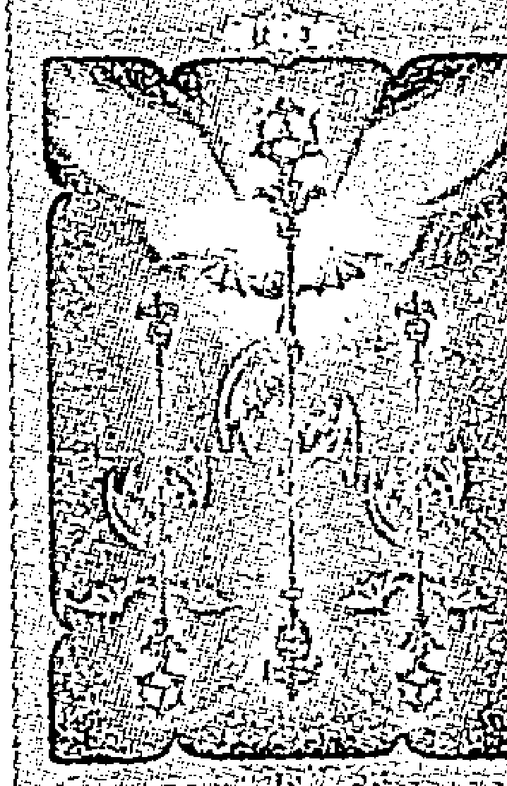

## 杖·4 [完成]

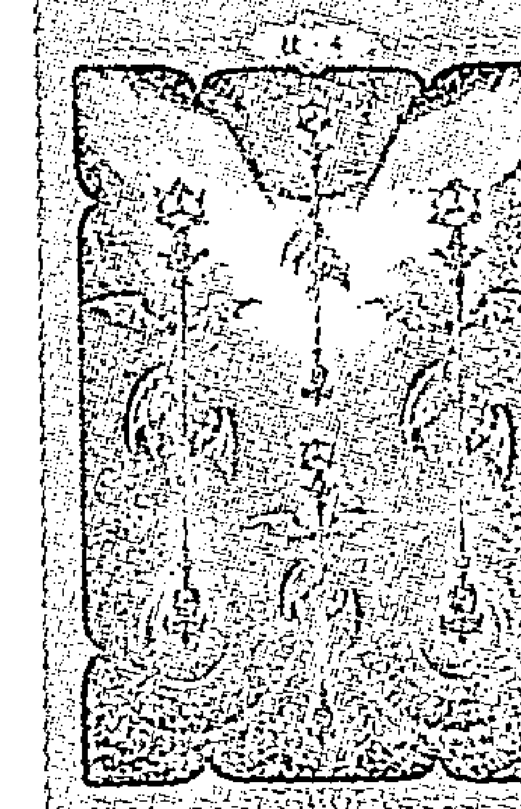

占星学象征：金星在牧羊座
牌面寓意：完成、解决、结果。
一个新家或在一个新环境下安顿。
以一种有心的品质、很美的方式，尽一切努力完成一个特别的情况。

## 杖·5 [争吵]

占星学象征：土星在狮子座
牌面寓意：难题、冲突、困难，受阻的能量。缺乏和谐，内在的冲突。

## 杖·6 [胜利]

占星学象征：木星在狮子座
牌面寓意：胜利，正向的态度，没问题。对人生充满自信的态度。事情进行得很顺利，问题也已经被成功地解决。

## 杖·7 [英勇]

占星学象征：火星在狮子座
牌面寓意：勇气，有力量的，努力。经由坚忍不拔所获得的成功。不顾一切困难向前走的力量和决心。

## 杖·8 [飞逝]

占星学象征：水星在射手座
牌面寓意：改变意识形态，新的观点。旅行及自由流动的能量。藉由新的清晰的观点快速地行动。使困难解决，获得成功。

## 小阿卡纳的奥秘

## 杖·9 [力量]

占星学象征：太阳在射手座
牌面寓意：完整，独立，自己产生出来的力量。重新评估从前的承诺。你的能量很独立地运作，不需依赖他人。

## 杖·10 [压抑]

占星学象征：土星在射手座
牌面寓意：被压抑的能量，受束缚，沮丧。一个委任某些责任的时机。任何被压抑或受限的状态。

## 杯·国王

占星学符号：巨蟹座
牌面寓意：成熟的男性情感，给予、分享。透过创造和情感上的训练而成功。为能够成为一个具有爱心、能够给予的人，感到骄傲。

## 杯·王后

占星学符号：双鱼座
牌面寓意：成熟的女性情感，心的敞开，接受性，脆弱。透过倾听直觉而成功。拥有自己感情的品质，并反映在外在的世界。

## 杯·骑士

占星学符号：天蝎座
牌面寓意：感情的欲望、愿望、梦想。在感情与行动之间做出决定。没有真正进入感情，只希望通过欲望来改变。

## 杯·男仆

占星学符号：巨蟹座
牌面寓意：感情的自由，不执著，友善，自由的爱。有益于情感的奉献。不去控制占有，轻盈的心。

## 杯·ACE

占星学象征：无
牌面寓意：纯粹的爱的能量。肯定自己的感觉。情感的连结与满足。爱自己之后才能真正爱别人。

## 杯·2 [爱]

占星学象征：金星在巨蟹座
牌面寓意：处于爱中，浪漫的爱。环绕在爱周围的制约模式。平等的伙伴关系或两性关系。相爱时的完美世界。

## 小阿卡纳的奥秘

## 杯·3 [富足]

占星学象征：水星在巨蟹座
牌面寓意：游戏的心情，庆祝，洋溢的富足。庆贺或重聚。轻盈奔放的情感品质。隐藏事实，肤浅轻浮。

## 杯·4 [奢华]

占星学象征：月亮在巨蟹座
牌面寓意：舒适，感情的安全。留意目前感情上潜藏的机会。太在意舒适与安全便受到限制。

## 杯·5 [失望]

占星学象征：火星在天蝎座
牌面寓意：失望、不满足、心的渴望。悲伤、失落、空虚。

## 杯·6 [欢乐]

占星学象征：太阳在天蝎座
牌面寓意：享受，将欢乐带进来。保障和安全。追求安乐，保持愉悦。逃避人生更深的层次。

## 杯·7 [放纵]

占星学象征：金星在天蝎座
牌面寓意：过度的放纵。应该认知内在的需求。过度放纵享乐造成自我的迷失。

## 杯·8 [怠惰]

占星学象征：土星在双鱼座
牌面寓意：枯竭，筋疲力尽，懒惰，昏沉无力。必须去追寻某种东西。改变。

## 杯·9 [快乐]

占星学象征：木星在双鱼座
牌面寓意：随着欲望的满足带来的感情幸福，对这种幸福的期待。对自己的满足与荣耀感。暂时的满足和幸福的状态。

## 杯·10 [饱足]

占星学象征：火星在双鱼座
牌面寓意：被压抑的能量，受束缚，沮丧。一个互利的团体或家庭状态，得到所有需要的。

## 小阿卡纳的奥秘

## 剑·国王

占星学符号：水瓶座
牌面寓意：成熟的男性头脑，专心、热情，集中地思考，决心。通过清晰的思考、实际的努力而得到成功。

## 剑·王后

占星学符号：天秤座
牌面寓意：成熟的女性头脑，清晰客观的思考，敞开的心胸，揭开虚假。经过深思熟虑所得到的成功。看穿伪装的洞见。

## 剑·骑士

占星学符号：双子座
牌面寓意：打破限制的观念、思维。没有耐性。暗示要达到愿望，需要敏捷的行动。

## 剑·男仆

占星学符号：水瓶座
牌面寓意：清除笼罩思想的乌云，过滤掉不好的心情。太多的梦想，行动不足。需要实际的思考，寻求洞见。

## 剑·ACE

占星学象征：无
牌面寓意：清晰的头脑，做决定，洞见的闪现。开始、计划一项新的冒险。

## 剑·2 [和平]

占星学象征：月亮在天秤座
牌面寓意：头脑的和平，让命运发生。暗示该下决定了，有事情必须被了解。

## 剑·3 [忧伤]

占星学象征：土星在天秤座
牌面寓意：痛苦、挫折、愤怒。接受痛苦与悲伤。

## 剑·4 [休战]

占星学象征：木星在天秤座
牌面寓意：接受事物原本的面貌。隐退，深思熟虑的一段时期。接受事实，转化为创造。

## 小阿卡纳的奥秘

## 剑·5 [挫败]

占星学象征：金星在水瓶座
牌面寓意：挫败、失败、失去希望。争吵、紧张，解决的机会渺茫。一个该承认失败的点。改变思想才能改变命运。

## 剑·6 [科学]

占星学象征：水星在水瓶座
牌面寓意：清晰、客观的分析，科学探讨。混乱之后逐渐恢复平静。从宏观的角度看待事物。

## 剑·7 [徒劳无功]

占星学象征：月亮在水瓶座
牌面寓意：徒劳无功，没有意义。想要成功，需要一种新方法。

## 剑·8 [干扰]

占星学象征：木星在双子座
牌面寓意：混乱，未知，犹豫不决。限制，丧失个人能力。需要超越思考或让直觉发生。

## 剑·9 [残酷]

占星学象征：火星在双子座
牌面寓意：自我怀疑、批判，内在的不安全感、不确定。梦境传达的直觉，对问题的担心。吹毛求疵的态度或自我怀疑，经常性的不安全感或不确定的状态。

## 剑·10 [毁灭]

占星学象征：太阳在双子座
牌面寓意：放掉、放弃的点。另一个开始前原有状态的结束。事情除了放弃别无他法。

## 星·国王

占星学符号：金牛座
牌面寓意：成熟的男人，自信，准备好的内在力量。务实而坚定的态度所带来的成功。以实际和务实的方式很放松地处理世事。

## 星·王后

占星学符号：摩羯座
牌面寓意：成熟的女性，实际，在自我的存在中休息。爱好自然。有良好的生意眼光。经过漫长的学习到达的单纯自己的状态，放松地接受自己。

## 小阿卡纳的奥秘

## 星·骑士

占星学符号：金牛座
牌面寓意：实际的决心使某件事发生，目标明确，未来清晰。稳健而认真地计划。以钢铁般的决心走往自己的方向。不隐藏自己或目标。

## 星·男仆

占星学符号：处女座
牌面寓意：耐心地等待，出生，怀孕。努力学习。等待某件事自然地发生。

## 星·ACE

占星学象征：无
牌面寓意：根着于事实所产生出来的丰富。有足够的钱执行计划。上升意识的可能。纯粹的存在状态。

## 星·2 [改变]

占星学象征：木星在摩羯座
牌面寓意：改变与金钱有关的决定。改变的必要。

## 星·3 [工作]

占星学象征：火星在摩羯座
牌面寓意：具创造性的，使某件事发生。透过研究、学习将构想付诸实现而改善自身的境遇。

## 星·4 [权力]

占星学象征：太阳在摩羯座
牌面寓意：执著、限度、控制。暗示节省金钱或精力。力量来自对外在世界僵硬的防卫。

## 星·5 [担忧]

占星学象征：水星在金牛座
牌面寓意：担忧、焦虑、忧思、考虑。对能充实你的事物的疏离。失去平衡带来的不适。

## 星·6 [成功]

占星学象征：月亮在金牛座
牌面寓意：成功、胜利，把事情做好。一种结构性的关系，上位控制下位。达成目的的状态。

## 小阿卡纳的奥秘

## 星·7 [失败]

占星学象征：土星在金牛座
牌面寓意：恐惧。思考未来的财务或物质状况。因为逃避而被恐惧所支配。被隔离、限制。

## 星·8 [谨慎]

占星学象征：太阳在处女座
牌面寓意：谨慎、小心，保护脆弱的东西。对某人或某种状况的承诺。对需要爱与照顾的东西予以滋润和保护。

## 星·9 [获得]

占星学象征：金星在处女座
牌面寓意：获得，正向的，祝福，任何发生都是对的。自信和适当的规划可以带来成功。事情刚好就需要这样发生。

## 星·10 [财富]

占星学象征：水星在处女座
牌面寓意：活在当下，一步步开展产生的富有，内在或外在的财富。物质上的成功、富足。单纯的信任。一步一脚印的经验过程。

# 女生塔罗

TAROT

## 第四章
### 塔罗故事

这里是一些例子。想要更多、更好地了解塔罗牌，不妨从这些故事开始。

## 晴空的愚者正位

每天固定时间上网的晴空，在一间不大的网络聊天室里认识了一个南方女孩。两人认识才两个月的时间，但这个女孩的真与温柔已经深深打动了晴空的心。晴空从心里发誓要追到这个女孩，与她海誓山盟，永浴爱河。他曾通过E-mail暗示过心中的想法，但是这个女孩却聪明地用其他的话题带过。后来又试了几遍，依然得不到任何答案。

饱受相思之苦的晴空，猜不透对方的心思，开始茶不思饭不想，身形日渐消瘦。一位得知内情的好友见他这样，便介绍他试着用塔罗牌占卜一下。刚开始，晴空因为对塔罗牌不了解，便婉拒了好友的好意。可最终因忍受不了思念之苦，他还是打算用塔罗牌尝试着解析一下，看这段感情是否有成功的可能。经由好友的介绍，他找到了一位在泡沫红茶店驻店的塔罗占卜师，运用圣三角牌阵占了一下。未来牌占得的是愚者正位，这张牌希望他能把心情放轻松，不要太急于得到这一段感情，也希望他能慢慢地来。因为愚者也代表着无计划、无时间地完成一件事，所以一切就是……慢，希望他能把速度放慢，不要让对方感到压力。而希望能得到佳人的晴空，当然也就照做了。过了几个月，晴空带着心爱的她，一起到塔罗占卜师那里去道谢，谢谢塔罗占卜师给他的建议，让他们俩现在能快乐地在一起。

## 愚者逆位的心碎

小妮是在一间Pub里认识了他。他是那间Pub的吧台。因为他的风趣与外向，让小妮深深地着迷。为了看到他，小妮每晚都到那间Pub，同样的时间，同样的位置，同样的金汤尼，同样深情款款的眼神看着心目中的他。那熟练的身手与干净利落的动作深深地吸引着小妮的视线，让她沉醉在其中。当然，他也慢慢知道了，知道了小妮的心意、想法与真情。他们开始恋爱了，小妮也为了他释放出她所有的感情。他的想法，他的希望，他的愿望，在小妮看来都像金科玉律一样，而她的心中也不断地回荡着他所有的承诺。他想要自己创业，开一间属于自己的店，小妮把多年的存款提出来交给了他，让他去运用。他许诺说店开成后要跟小妮结婚，小妮相信了。一位很了解他的朋友不忍心看到小妮再这样沉迷下去，跟小妮说了他的过去与个性，但是小妮不相信他会是这样的人，好友只好带着半信半疑的小妮到一位塔罗占卜师那儿，去了解一下这件事的未来发展。

小妮选择了圣三角牌阵，在现在的位置上得到了愚者逆位这一张牌。占卜师跟小妮说明了她在这段感情中将失去很多，也浪费了相当多的时间，对方在这段感情中根本没有付出过，一切都是小妮自己编织的梦想，未来的结果也会让她心碎。可是等小妮与朋友告别了占卜师后，她的心又回到了他的身上，继续为他付出，而他却慢慢离开了小妮。当小妮发现时，他已经带着从小妮那里骗来的钱远走高飞了。

## 魔术师正位的飞扬

飞扬是某大学财经系的学生，人长得高高瘦瘦的，戴着一副金边眼镜，长相斯文，很受系里女生们的欢迎。个性也好，常常收到仰慕者的情书，但是飞扬的心中只有一个她，比他小一届的学妹。两人是在一次社团活动中认识的，也因为常常在一起讨论功课的关系而产生了情愫。终于在一次情人节，飞扬与学妹正式地在一起了，两人也对这一段感情定下了海誓山盟。飞扬答应学妹，等她毕业了两人就结婚。双方家长知道他们的事情后，学妹的父亲除了要求飞扬等学妹毕业，还要飞扬准备好一套房子，这才能放心地让学妹嫁过去，但是不能靠父母的帮助。这着实让飞扬伤透了脑筋，还是学生的他也只能靠打工呀。深爱他的学妹不忍他如此伤脑筋，告诉他可以利用他的所学来赚钱。但是生性小心的飞扬想了很久还是犹豫不定，因为投资要是失败了，那就……学妹为了让飞扬有勇气，不断地鼓励他，但是……

也许是爱的力量吧，学妹找到了一位塔罗占卜师，要帮飞扬打气增加信心。因为并不知道占卜出来的结果会是好还是坏，她便事先与占卜师沟通好，希望占卜师挑好的方面说就行了，占卜师也答应了。也许是学妹的爱感动了天，占卜师在帮飞扬占卜时出现了魔术师正位这张牌，他便告诉飞扬他可以放心地去做，因为他本身所学足以让他在投资领域取得好的收获，而他的个性也能让他在迷雾般的股海中保持着清晰的思维。再说他放飞自己的时间已经到了，一切的准备都已经妥当，是时候出去打拼一番了。飞扬听了占卜师的话，放心地把存款拿到股市中投资，两年后，他终于达到岳父的标准，与学妹结婚了。

## 小雪的魔术师逆位

小雪在一年前出国旅游时认识了他。刚开始小雪对他的印象并不是很好，但是他却用温柔与关心慢慢打动了小雪的心。半个月的假期很快就过去了，回到上海他便向小雪提出了交往的要求，小雪也答应了。起初两人因为有相同的话题与嗜好过得很愉快，也在一段时间后同居了。但是后来小雪发现他有事瞒着她，刚开始小雪不以为意，但是日子一长，小雪还是希望知道他心里的秘密。可他还是不愿意说，终于，在一次争执中，他说了出来，他是双性恋。第二天他把东西收拾好，搬走了，小雪下班回到家，看到了他留的信，伤心地请了一个星期的假。在这一个星期中，小雪跑遍了全上海，只是为了能散散心，把这段感情彻底忘掉，但是……

回到工作岗位后，小雪却常在空闲时想起他，想起与他在一起的日子，想起他的风趣、健谈，想起他的温柔、体贴，想起他的一切。她强烈地思念着他，像疯子一样到处去找他，到他从前会去的地方找他，到他们俩曾经去过的地方找他，到他的朋友那儿去找他，到他可能出现的所有地方找他……最后都失败了。她开始常常以泪洗面。一位看不过去的好友把小雪强拉到一位塔罗占卜师那里，希望小雪能从塔罗牌上得到一些讯息。

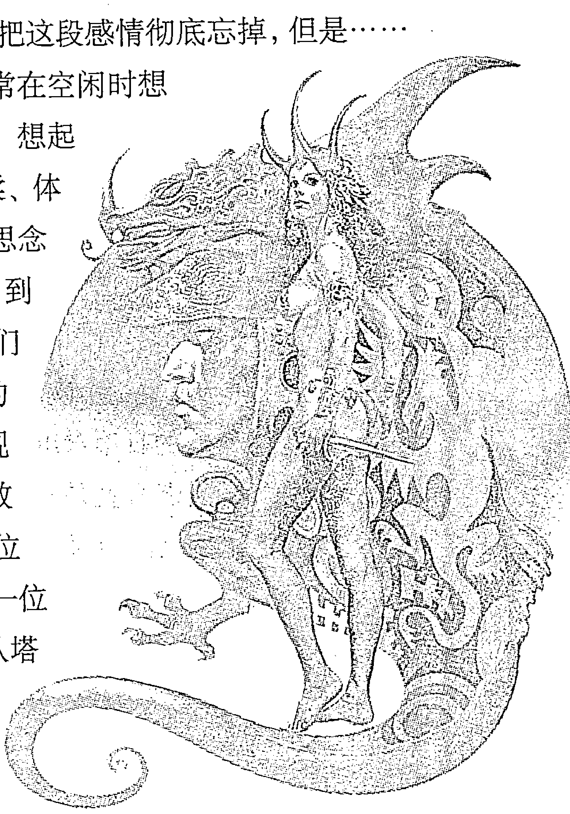

小雪拿到的是魔术师逆位这张牌。占卜师跟小雪分析了她的问题，小雪对感情的态度已经失去了应有的正常反应，太过的神经质让她过得很不愉快，持续沉沦在过往的感情思念中不能自拔，只会加深她的痛苦。占卜师希望小雪去学禅坐，将这段感情彻底地从心中除去，这样她才能重回到正常的生活轨道上，并在事业上有好的表现。过了几个月，小雪因为在工作上表现良好，升迁了。

## 妙子爱情的女教皇正位

妙子是在台湾念书的日本人，在台湾认识了她的第一个男朋友，也是她的学长。两个人认识的过程很富有戏剧性。妙子还在日本时，就常听来台湾玩过的好友提起台湾小吃的美味。刚到台湾，在办理好入学手续，找好住的地方后，她马上跑到附近的夜市，准备大尝特尝这人间的美味。到了夜市，看着琳琅满目的小吃摊，她心花怒放，一家接着一家地吃，等吃完最后一家准备付账时，她才发现身上的台币不够了。仔细算算，还差一百多元，心急之余她只好用生硬的中文跟老板商讨用日币来付账。但她的运气实在是不好，这个店老板恰是当年的一位抗日英雄。也许是因为年轻时的战争记忆，他对日本来的妙子一点都不客气，不但拒绝了她的请求，还声称要叫警察来。着急的妙子赶紧一个劲地赔不是，并把身上所有的日币拿出来，表示不是不付账，只是身上没台币了。但是态度强硬的店老板就是不肯给妙子面子。这时，一个在场的男孩实在看不过去了，主动掏出两百台币给了店老板，然后伸手便拉着妙子朝夜市外走。到了夜市外，妙子不停地向这位帮助她的男孩道谢，并要他留下联系电话，自己好把钱还给他。但是这个男孩只是笑了笑，说不用，然后就走了。第二天到学校报到准备上课时，妙子看到了这个男孩，马上高兴地跑过去把两百元交到他的手上。原来他是妙子的学长。人生地不熟的妙子开始每天黏着学长。渐渐地，两人间的情愫也产生了。妙子想与学长有更进一步的发展，但是不管她如何暗示，学长好像木头一样无动于衷。因为学长没反应，妙子开始着急了，但是着急也不能主动啊。这时妙子想起了她刚学没多久的塔罗牌，便想用塔罗牌来占卜一下学长的心意。可牌阵摆好后，看着塔罗牌上的图案，读着书上的解释，她依然无法得知塔罗牌要跟她述说的结果。

一日，她意外地从网络上得知了一位塔罗占卜师的网站，忙高兴地把之前得到的牌与问题E-mail给了那位占卜师。没多久她就收到占卜师的回信了。占卜师告诉她，学长的爱情观正进入一段自我反省的时期，也许是因为之前的感情让学长受到很大的伤害，所以他也在逃避与妙子有进一步的发展，因为他怕再次受到伤害。而且，学长的感情观有些许的柏拉图。看完占卜师的回信，妙子心里也有了底了，自觉无法谈较精神方面的恋爱。与学长好好谈了一下后，妙子提出了分手，学长也答应了，让妙子去找寻适合她的感情。

## 女教皇逆位的骄纵

敏儿与男友认识有四年了。四年来两人的感情发展还算稳定，没有什么大风大浪，也没发生过大的争执。男友把敏儿保护得好好的，敏儿只要一通电话，男友一定马上就到。要是敏儿有什么要求，男友也想办法做到，除非是不可能的任务。敏儿偶尔也会发发小姐脾气，男友也努力地去安抚她，逗她开心。在好友眼中，敏儿实在是太幸福了，被男友捧在手中跟个宝一样。但是自从那件误会发生后，敏儿的态度便有了一百八十度的大转变，她也开始学会对男友温柔些了。

一次约会，男友迟到了，敏儿在学校门口等了近一个小时，手机打了又打，却怎么也无法接通。后来男友才匆匆地跑来，跟敏儿解释是因为社团的会议拖延时间了。敏儿正在气头上，也不管男友如何解释，转身就回去了。焦急的男友拼命给敏儿打电话，但敏儿就是不接，后来干脆把手机关掉，却不知男友在她的宿舍外站了一整夜。第二天上课时，敏儿发现男友没有到，也没有请假，心里觉得奇怪，便给男友打手机，但始终打不通。发短信也不回。敏儿担心了，下了课直接跑到男友的住处，但是男友的父母说他一整晚都没有回家，今天白天也不知道他去了哪里，家中也在找他，有急事要他去办。心急的敏儿到处打电话找男友，但就是找不到。深夜，男友悄悄回家了，也没跟敏儿通一下电话，并从第三天开始躲着敏儿。在学校里只要一有敏儿的影子出现，他就躲了起来，在课堂上也躲着敏儿的视线，下了课一溜烟就跑回家了，也不等敏儿。敏儿跟着他追到他家里，他也躲着不见。这让敏儿很是伤心，她以为男友是因为那天约会的事不理她。敏儿的好友注意到两人的情况，主动问敏儿事情的来龙去脉，觉得可能不像敏儿所想的那样，下课后，便带着敏儿去她认识的一个塔罗占卜师那里寻求帮助。

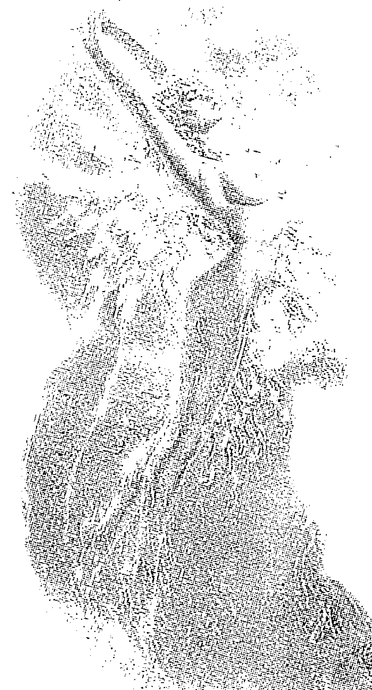

塔罗占卜师向敏儿提了几个问题后，便请敏儿抽了两张牌。在自己的态度这个位置上，她得到了女教皇逆位这张牌。占卜师分析说，这张牌表示敏儿应该转变一下一贯对待感情的态度，不要一直沉醉在男友的保护中，不要让男友感到这段感情中只有他在付出。占卜师要敏儿也适时地付出她的关心与耐心，也许那天男友真的不是故意的。就改善两人目前的关系来讲，占卜师表示，敏儿应该用稍微温柔的方式去找他，跟他沟通一下，因为牌上显示他是被敏儿的反应吓到了。后来敏儿用传纸条的方式把男友约出来，请男友原谅她那天的坏脾气。男友也表示，自己是以为敏儿还在生气，所以才一直躲着她。两人因为这次的沟通又快乐地在一起了。后来，照着占卜师的建议，敏儿渐渐改掉了她从前骄纵的坏脾气。

还是社会新鲜人的小琴，用上大学时做家教挣下的一笔钱，在闹市区租了个摊位，批发精致的手表，开始了她梦想中的SOHO生涯。从摊位的租借到货品的批发，一切都要自己来，不假他人之手，这都是凭着心中的一股雄心壮志。每天最早开市，也最晚回家，她的努力让周围的摊贩对她升起了一股敬意。虽然她这么努力，但老天爷好像都没有看到一样，三个月了，每天的营业额总是无法与开销打平，甚至有超支的现象发生。摊位的租金、手表的成本全都收不回来，怎么办？虽然住在家中不用烦恼房租，可当初跟父母夸下的海口如何兑现？晚上回到家后她就开始仔细琢磨问题的所在，是商品的价格太贵，还是商品的吸引力不够，抑或是自己的亲切度不足？或者……

她想了又想，却想不出个头绪来。算了，明天再说啦，说不定明天会好。小琴几乎每天都这样安慰着自己。但是当这样的情况又持续了两周后，这种自我安慰也失去作用了。这天，小琴收摊后，为了放松心情，跑到附近一家泡沫红茶店，找了个靠窗的位置坐了下来。在翻阅菜单的时候，她意外发现这家店有塔罗牌的占卜。想起还在学校的时候，同学都很迷这个，而且塔罗牌确实很准，又想起自己的事情，她便起了占卜的念头。等了好一会儿，终于轮到了她。还没等占卜师发问，小琴就一股脑地把所有的问题都说了出来。占卜师请小琴先定一定神，再抽出两张牌。在代表外来援助的地方出现了女皇正位，占卜师告诉小琴这张牌要她多忍耐一阵子，因为她的生意将会有所起色。女皇代表了生产力与生命力，也是丰收的表象。但要让这张牌真正发挥效力，得先让牌中的泉水活一下，也就是要小琴再增资添购新的样式，让客人有多一些的选择。几个月后，小琴自己租下了一间店面，借着塔罗牌的指示和自己辛勤的耕耘，不到半年便成为月收入过万的多金SOHO族的一员了。

## 冷却的女皇逆位

与男友相恋已经三年的小雅，慢慢发现自己在这段感情中已经冷却了下来，没有了当初的感觉和激情，这常让她感到痛苦。虽然男友对她的感情没有变化，但是每次的约会，她都提不起兴致。也许男友对自己太好了吧，她开始觉得亏欠，并借着加班或开会的理由来回避与男友的见面。她想让自己冷静一下，看这段感情是否有走下去的必要。知道这件事的好友一直劝小雅，让她不要这样轻易地放弃。是啊，像这样多金又帅气的男人已经很少见了嘛，而且也很温柔、体贴。可正是因为这样，小雅才更想要分手，因为自己已经慢慢从这段感情中撤离了，不忍心看到男友再为自己付出多余的感情。终于，在一次约会中，小雅向男友提出分手，但是深情的男友怎么会同意呢？他苦苦哀求小雅收回这个要求。刚开始小雅态度坚定，但看到男友从始至终都是一脸的真诚、恳切时，小雅心软了，答应试着再继续交往下去。之后，男友对她态度更加殷勤，可小雅对他的感觉还是不能恢复到从前的状态。苦恼的小雅想起男友很喜欢算命，便想借着算命的方式让男友认识到彼此的缘分已尽，于是请同事介绍哪里有不错的算命地点。也许是同事听错了吧，她给小雅介绍了一位塔罗占卜师。小雅也不懂，挑了一天把男友约出来到那位塔罗占卜师那里，没想到男友居然也喜欢塔罗牌，还很相信。小雅可高兴了，马上就请占卜师占卜一下两人未来的感情发展。

在小雅的想法那一个空格里，出现了女皇逆位这张牌。当占卜师分析到了小雅的想法时他摇了摇头，跟小雅的男友说小雅的感觉已经失去了，当初的激情已经冷却，取而代之的是倦怠，要他多包容小雅。小雅在一旁听得连连点头，而男友的脸色则变得难看起来。小雅随即表示两人已经谈过分手的问题了，但是男友不答应。这时占卜师看到在未来发展的空格中牌非常好，就跟两人说别担心，要小雅先把心情冷静下来，不要想得太多，也不要急于分手，多给男友一些机会，其实两人的缘分并没有尽。说完他马上离席，并丢下了一句话：好好地沟通一下吧，有沟通就有未来。过了五个月，小雅与男友又去找那位塔罗占卜师，谢谢占卜师的帮忙开导，让他们俩终于取得了感情路上的新进展。

## 皇帝正位的恋情

小绮与男友从相识到相恋只有短短的一年。在他们俩相识一周年的前两个星期的一天下午，小绮在麦当劳的一个小角落的桌子上写个不停，是分手信。是的，小绮准备在她与男友相识一周年的那一天提出分手。回想两人相处的这一年，没有什么风风雨雨，也没有什么大起大落，一切都是平平顺顺的，男友对她也很好，但小绮总感到不满足，因为男友有点呆，还单纯得要命。

刚认识时她觉得男友的单纯很可爱，并且他对她很温柔，虽然假日没有什么好的休闲活动，但每次逛街他都心甘情愿地为她提着大包小包，从来没有一句怨言。生活简单，没什么不良嗜好，小绮的家人都很欣赏他，但是小绮还是觉得不够。到底什么地方出了问题呢？是事业心太重，还是不够情调，又或者是感情被动？

虽然假日里男友一定会陪着小绮，但如果在平常，心血来潮想要去公园散个步时，总是被告知要加班，这让心情原本不错的小绮又低落了下来。难得的假日想要去哪里好好地玩一玩，想了几个地方，跟他商量时，得到的回答永远都是“都不错呀，你决定就好了，我尊重你的意见。”

几次假日出游看夜景时，花前月下，时光正好时，男友要不就是天南地北，要不就是太阳、星星、月亮的，似乎忘了身边还有一位连kiss都还没有过的美丽女友。一想到这里，小绮就有气，每次费尽心机制造机会，那个木头就是没感觉。想想自己也不差呀，为什么男友每次都无动于衷？认识都快一年了，还只是牵手而已，这说出去还不被笑死？想想自己都已经28岁了，再这样下去就玩完啦。

写完分手信，回家把这些日子来男友送的东西打包好，准备跟分手信一起给男友。收着收着，在抽屉的小角落发现一张折叠得工工整整的小纸片，似曾相识的感觉。

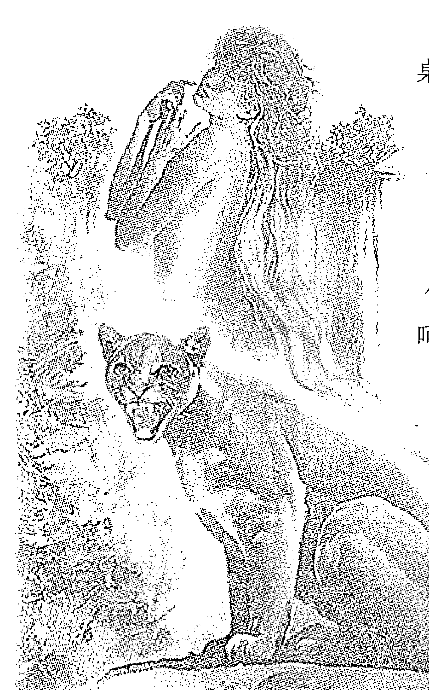

拿起来漫不经心地看了一下，就往桌子上一放不管它了。

东西都打包好了，又注意到了那张小纸片，似乎勾起了一些回忆。拿起来打开一看，小小的纸片上写着工整的几个字——皇帝正位：你将遇到一位对你温柔、体贴、呵护有加的好男人，但是他的个性比较木讷，没什么情调，事业心也重。如果你可以接受他的个性，你们能顺利地步向红毯的另一端。

看到这里，小绮想起了当初，为了是否要接受男友的追求，与好友一起去找塔罗占卜师占卜了一下，得到了这个建议。

回想起这件往事，两行泪水就这么流了下来。是的，当初是自己的选择，为什么现在又要放弃了呢？不再多想，她一下子就把分手信给撕了，又把刚打包好的东西拆开塞回了抽屉，高高兴兴地给男友打电话，甜言蜜语去了。

## 皇帝逆位的压力

从出版社回来，拿着刚被编辑退回的文章，雅兰坐在电脑跟前直发呆。这已经是这篇文章第五次被退回来了，这样的事情在以前还从没发生过，到底是哪里出错了呢？反复回想编辑讲过的问题和错误，她开始重新修改这篇文章。这是编辑给的最后一次机会了，再不行这个月就不刊她的文章了。

几个小时后，雅兰把修改好后的文章传给了编辑，并且不断地祈祷这次别再被退了。但是，天不从人愿，没多久编辑就打电话来说这个月不上她的文章了。挂了电话，雅兰哭出声来。从开始做一名文字工作者到现在，也有七八年的时间了，从来没有跟其他出版社合作过，只是死心塌地地在目前的出版社做个小小的文字SOHO族。虽然没有功劳，但也有苦劳啊。自己的文笔是不算特别的好，但也不像编辑说的那样差吧，为什么这次编辑就这么不留情面呢？就这样她独自伤心了好一段时间。

一通电话把她从伤心的情绪中拉回了现实。是与她同时进入同一家出版社的同学兼好友。对方知道了她的事情，特地打电话来安慰她，也希望她把心放开一点。是的，做这一行就是这样啊，总是要经过编辑提供的各种磨练才能更出色啊。雅兰也知道这个道理，但还是会伤心，因为这一次编辑真的说得太过分了。

聊完电话，她打算放松一下心情，就打开了电视，无聊地从一个频道切换到另外一个频道，突然她被一幅美丽的画面深深吸引住了。原来是一家旅行社的广告。多希望自己现在就在那里啊！想到这里她马上拿起电话，照着广告里留下的电话号码打过去，问好了价钱和出发日期就订下了。

到了出发的日子，经过转机的折腾，终于到了目的地，看着蓝天白云与清澈的大海，她心中日积月累下来的劳累与怨气通通一扫而空。就这样她在那里悠闲地度过了一个星期。

刚回到家中，就收到了编辑的传真，有三篇文章等着她交。也不管刚回来行李还没整理好，她马上打开一个星期没碰的电脑，开始了与键盘的厮杀。几个小时后，她终于把文章打好并传了出去。

这次的文章编辑是赞不绝口啊，还特地请雅兰到出版社去聊聊吃顿饭，庆祝雅兰的文笔回复到当初的优美。雅兰要回家时，编辑就问她，这次的文章中多了些自信，是否跟这次出国玩有很大的关系。雅兰说这是大秘密，就回家了。

回到家，雅兰把她这次从国外带回来的一个小小兽皮包打开，里面有一小片叶子。那叶子上用象形文字写了一些字，是她经由塔罗牌占卜得到的建议。叶子上写了她自信心虽足，但却总是在重要时刻就退缩了。如果能把心放开，就能再次往前迈进。还建议她要多让自己的心飞跃起来，不要一直活在过去的怀念中，要把自己的心放在未知的将来。

## 教皇正位的暗喻

正在网络上闲逛的小芬突然被一则广告吸引住了——

塔罗牌免费占卜，让你知道你的爱情在何方。

她不由得就点了进去，想看看到底是怎么一回事。

塔罗牌免费占卜……你只要到本网站抽三张牌，我就能告诉你你的爱情在哪里。

抱着试试看的心情，小芬点开了那个网址。到了那个网站一看，很普通的网页设计，没什么美感，不过排版还不错，做美编的小芬不自觉地又把她那职业性的批评拿出来了。找到那个抽牌系统，她抽了三张牌，可能那天晚上特别塞车吧，只有一张牌显示出来。

> 教皇正位……你的他已经在那个你不曾注意的地方，注意你许久了，也许他是你的亲密好友，也许他是你的好同事，也许他是……多注意一下身边的人……因为你将找到你下半辈子的幸福。

随随便便地看了一下，她就把这个网站关掉了。想起自己刚结束了一段感情，现在还想单身一阵子，不想又被卷入另一段感情漩涡。说得更准确些，是怕又受到伤害。

在上一段恋情中，小芬付出了很多，可对方居然在国外奏了一首异国恋曲给她听，这足足让小芬伤心了一个月。现在回想起来，还是会让她难过得要命……索性把电脑关了，睡觉去。就这样小芬又度过了平凡的一个月。

一天上班，小芬吃惊地发现自己的办公桌上有一封匿名信，是爱慕者写的，信旁还摆着一束玫瑰花。看完信中的内容，小芬的心情愉快了一整天。可到底是哪个傻瓜送的呢？明明大家都知道自己曾经因为失恋而立下誓言，在这一年内绝不再谈恋爱的。第二天，第三天，第四天……连续一个月，天天都有信，还有玫瑰花，这就让小芬起了找到这个人的念头。挑一天，小芬特别早到公司，连大门都还没开呢，够早了吧，还怕看不到你的真面目吗？

小芬躲进卫生间，一边补妆，一边留意大门边的动静。不一会儿，就听见大门开启的声音，她轻手轻脚走到卫生间门边往大门那边看。也许是角度的关系吧，只看到一束花，看不到拿花的人。她只好更努力地往外探头看，一个不小心，没扶好，跌倒了。跌倒就算了，还有一点大声。小芬跌倒的声音把那神秘人给引来了。

哇，这下惨了，没看到人家倒先让人家看到自己了。正要爬起来时，一双温暖的大手把她从地上扶起，正要跟对方道谢时……哇……是老板！

这才知道，原来这一个月里收到的信与花都是老板送的。年过四十，却因忙于事业一直没时间交女友的老板，在小芬刚进公司时，就对她产生了好感，可又怕被人讲闲话，所以一直不敢向她表白。更何况，那时小芬正与上一位男友在交往，所以这份感情就一直藏在心中。直到小芬失恋后，才敢做一点小动作。

也许是老板那淳朴的心打动了小芬，没多久，公司里的同事就吃到了老板与小芬的喜酒了。

## 距离遥远的逆位教皇

Pub里，男友正在为小莲庆祝生日。今天的小莲，心情还算不错，因为男友的特别准备着实让自己惊喜了一下。想不到，平常一年到头忙得不见人影的男友，会为自己今年的生日特别找了这间情调十足的Pub。但是生日才过了一半，男友接了一个电话，就跟小莲说因为临时有客户要找，所以要先离开，留下小莲一个人在Pub里吃着才切了一半的蛋糕，喝着还没倒几杯的香槟，听着Pub里驻唱歌手反复唱的那首“还是会寂寞”。又呆坐了几个小时，她才意识到时间已晚，该回家了。

回到家中，她寻思，这些年来男友虽然很懂得照顾她，可是却很难见到他的面。虽然每天有电话可以互诉相思之苦，也无法完全地排解心中的寂寞。跟男友就这个问题讨论了好几次，但每次最后都是自己先退一步，

## 塔罗故事

她怎能说服男友为了自己而把大好的事业耽搁了呢？

第二天小莲接到男友的电话，说因为要谈一笔大生意，他要到美国去一趟，也许要一个月以后才回得来。到机场送男友，她没什么特别的表示与不舍，因为已经习惯了。是的，这么多年来，小莲早已经习惯了呀。

晚上小莲忍不住又打电话跟好友诉苦，好友在电话中开导了她，并用塔罗牌让小莲了解一些事。挂上电话后小莲想了想，觉得自己再这样下去，只会活得更加不快乐。这次等男友回来，一定要跟他讲清楚，绝不再妥协了，不然她的幸福就永远也看不到了。

男友刚下飞机，小莲马上把他拉到家中。不等男友发问，她便一口气把自己心中的想法和愿望全都说了出来。男友听完后，沉思了片刻，然后对小莲说，希望她多给他几天时间，让他好好想一想，因为这关系到他的事业啊。

男友思考的这几天，小莲去找了一份工作，因为她知道要男友多花些时间来陪她是很难的事。男友虽然说会回去想，但多半是打马虎眼，所以小莲也下定决心，要是这次男友再不答应的话，就分手。

虽然男友苦苦地哀求，但是小莲已经下定决心了，小莲也从没有自我主见的小女人成长为一个能独立自主的女强人。也许这要谢谢她男友的没时间吧，也许，她要谢谢那天听她诉苦的朋友开的牌吧。

## 恋人正位的情人

虽然才短短的两个月，在网络上认识的小杜与小树已经产生了浓如蜜的爱意，而两人也正在慢慢把彼此间的爱与信任推向那更美好的未来……

记得那是一个很特别的网站，网站的主题跟占卜有关。因为这个网站的关系，小杜与小树相遇了……那时小树才从一段失败的感情阴影中走出没多久，她急切地想要通过占卜来确定她未来的情感走向……

而小杜则是站上一位很热心的网友，时常帮没什么空的站长回复网友的问题，所以小杜的名声反而比站长大。自然的，充满疑问的小树也就把问题传给了小杜，简单的三张牌，揭示出小树过去那充满坎坷的爱情路。细心的解释，耐心的回答，让小树的心灵突然有了一个依附……

之后，小树开始常常向小杜提出各种各样的问题，有关塔罗的，也有关于情感与人生的，而小杜每次都会细致并耐心地回答她，慢慢地，小树的心开始暖了起来。而小杜也通过回答她的问题，渐渐对她有了了解，知道了她的好，她的温柔，知道自己已经爱上了她，于是他决定对小树展开追求。可是小树由于之前所受的伤还没完全愈合，她对小杜的追求感到有些害怕。虽然给了她暖暖的感觉，虽然让她有了心动的想法，但是，她怕这会是另一个不幸的开始。她不断地在心中交战着，是接受，还是不接受？

用情专又深的小杜知道她怕的是什么，愿意等她，愿意用他的专与深来打动她的心。随着时间的推移，两人网络间的联系越来越频繁，终于有一天，小杜打动了小树的心，虽然只是照片，虽然甜言蜜语是藉由网络的传递，两人间的感情却已越来越好，也越来越稳定。

超越了时空的界限，他们的感情就如那未来位置的……恋人牌正位一样……

## 恋人逆位的事业

来自台湾南部的小贵，充满信心地来到繁华的台北都市找寻他的梦想……

他的想法很简单，希望能在这台北城里得到发迹的机会，等挣够了钱就衣锦还乡，光宗耀祖。

凭着过硬的专业技术和不错的口才，他很快找了间小办公室，买了些必备的办公用品，开始了他的创业之路。

肯拼实干是他的特点，努力诚实是客户欣赏他的地方。短短的几年间，他就将一间小小的个人工作室，发展为一间小有规模的多人工作室。因为他为人善良，一些不错的个人工作室纷纷主动跟他联络，表示愿意加盟，当然，他都答应了……

但是南部长大的孩子终究有一股傻气，对别人也缺少必要的防范心理。一些比较有心机的合伙人就利用了他的单纯，偷偷抢了他的一些生意。因为正在赶一件较大型的案子，小贵没有发现这些小动作。直到有一些看不过去的合伙人主动跟他提起，他还是不以为意，认为这属于正当竞争。

但是他却不知道，他不只是被抢走客户，还被恶意中伤。直到这些事严重到了无法收拾的地步，他才伤心地把工作室做了个了结，回家去了……

虽然回到了家乡，他的雄心壮志依然存在。这次他比较低调地在那遥远的南部慢慢地扩张他的事业版图，就这样，他把触角又慢慢地伸回了台北，这个他的伤心地……

他懂得了运用较谨慎的办事态度来处理很多的事情，对之前的合伙人采取井水不犯河水的态度，重拾了旧客户的信任，再次地登上了台北这个繁华都市的舞台。恋人逆位的合分无常，事业版图的或张或缩，在这繁华的台北城市，一幕一幕轮流地上演着……

## 战车正位的雅萍

在一间装点个性的小咖啡屋里，雅萍点了一杯香浓的卡布奇诺，轻轻燃起一只维珍妮凉烟后，开始赶昨天晚上没完成的采访稿。

也许是对咖啡的执著或是特别的喜爱，她只喜欢这间咖啡屋的咖啡。曾经尝试过别间的咖啡，但总是无法引起她再次尝试的兴趣。

手中的这份采访稿，其实已经前后修改过三次了，但总觉得不够通顺，也不知道是哪里不对。被采访的对象是一名塔罗占卜师，她是为了让自己的作品能够更加多样化，才选了这样一个特别的目标。

慢而优雅地吸了一口手中的维珍妮，回想起采访时，那位塔罗占卜师介绍的塔罗牌，雅萍的心中又升起一股兴奋的感觉。这是她生平第一次接触塔罗牌。在采访时，她反复摩挲着跟占卜师借来的牌，觉得实在是太不可思议了。78张牌，78幅简单的图案，其中却隐藏着深刻的人生哲理，真是神奇啊。雅萍忍不住小声地感叹。占卜师听见她的话，不禁莞尔一笑，道：“黄小姐愿不愿意也占卜一下呀？为了谢谢你的采访，我今天就帮你占卜一次。”可雅萍听了却笑着摇摇头道：“下次吧。”现在好像没有什么问题想问呢，把牌交还给占卜师后，又继续问了些问题，聊了些塔罗牌的近况与未来走向后，就结束了这次的访问。

几天后的一个清晨，雅萍被一阵急促的电话铃声吵醒。还在半梦半醒之间的她拿起话筒，还没反应过来时，就被电话那头的编辑那超高八度的声音给震得清醒过来。“雅萍，快起来！快来我这儿一趟，有件好事要让你高兴一下！”

一小时后，雅萍赶到了报社，还没来得及坐下，编辑就一阵连珠炮似的说道：“雅萍，这次的塔罗牌专访很成功，读者的反应很强烈，他们希望能有更多这方面的报道与专访。经过开会决议，我们决定把这个专题全权交给你去做，并增加你20%的稿酬。”才走出报社的大门，忍了半天的愉悦心情终于释放了出来，也不管路人诧异的目光，雅萍高兴地大声哼着歌，一路漫步回家。从今天开始，她就要进行她的独家塔罗占卜师专访活动了！

为了有更强的吸引力与卖点，雅萍走访全国，四处打听消息，看看哪里有很灵或很准的塔罗占卜师。同时为了能让自己在下笔或访问时能更有料，她还去书店买来些书进行研究。功夫不负有心人，几个月后，雅萍负责的塔罗占卜师专访成了这家报纸最火的栏目，也因此雅萍得到了报社的一笔奖金。收获成功硕果的雅萍并没有因此而停顿下来，她继续到全国各地寻找采访的目标，继续丰富她的塔罗知识……

仿佛有永远也用不尽的动力在推动着，雅萍始终精神饱满地向下一个目标挺进。战车正位……塔罗牌中第七张的战车正位，在雅萍的身后，我们似乎看到这张牌正默默地帮助着她。

## 战车逆位的恋情

手中拿着一张塔罗牌，小纪正对着上面的图案出神，这是一张战车逆位。看着这张牌上的图案，小纪想起了一些往事。

高三的时候，因为就要高考了，小纪很努力地学习，每天都往图书馆跑。就是在图书馆的自习室，小纪认识了她。她长得并不令人惊艳，但却有一种静静的美。一头齐腰的长发柔顺飘逸，纤细的身子看上去有一种说不出的古典美。小纪眼睛一眨不眨地看着她，呆住了。

发现小纪在呆看她，她却没有生气，也没有感到不自在，只是冲小纪淡淡地一笑，点了个头，就低头继续看自己的书。反而是小纪羞得面红耳赤，心道，偷看人家居然被人家发现，真是丢死人了。可也因为她的反应，让小纪起了追她的想法。她一定是个温柔的女孩子，她真的好漂亮，她的气质真的好棒！心中反复想着这几句话，小纪的心神都飞到她的身边打转了，摆在桌上的书也不知道什么时候被反转过来了。

“哇，小纪，你功力高啊！书反过来了你也可以看得津津有味，真是对你佩服之至啊！”

正出神的小纪被同学一把拍醒，意识到自己的窘态后忙向同学辩解起来。在安静的图书馆，两个人的说话声马上引起了一阵小骚动。图书馆管理员闻声赶过来，厉声斥责了他们一通。小纪一边和同学道歉，一边拿眼睛偷瞄她。看来小纪的心已经被她俘虏了。

回到家躺在床上，小纪依然在想着那个女孩，不知道她是哪一班的？几年级？有没有男朋友了？一堆子的问号就这样伴着小纪进入了梦乡。

“哇，又要迟到了，惨了……”

几乎每天都会上演一遍的赶车剧，又演出了。他手中拿着书包，嘴里咬着早餐，脚上套着没穿好的鞋子，三步并两步就往公交车上冲。也许爱神真的垂青小纪了，他居然在公交车上碰到了那个女孩。因为车上人多很挤，那女孩并没有发现他，小纪就这样偷望着她。到了学校，小纪没往自己的教室走，而是跟在那个女孩的身后，就这样，他终于知道了她是哪个班的。虽然因迟到而被老师罚站，小纪却依然微笑着，因为这次的迟到是值得的。无聊的语文课上，年逾半百的老师正以那催人入睡的音调念着课文，平常必定会犯瞌睡的小纪今天却目光炯炯有神，写情书。既然已经知道是哪一班的，那就发动攻势吧。

好不容易等到了下课，小纪拿着情书，哼着歌，脚步轻快地朝女孩所在的班级走去……

终于，小纪和这个可人的女孩在一起了。因为两个人都要准备高考，所以就一起看书，一起回家，就这样一直到高考。

放榜了。

小纪考得不错，被北京的一所名牌大学录取了，但是她成绩不理想，被南方的一所专科院校录取了，两个人要分开了。离别时，两人依依不舍，感觉造化弄人。分别后，刚开始两人每天一通电话，互诉相思之情。

但是随着课业的更加繁忙、社团活动的增加，两人间的电话从每日一次变成每周一次。渐渐地，也因彼此共同的话题越来越少，电话里不再有甜言蜜语，取而代之的是口角和冷淡的回应，相隔两地的两人感情越来越淡了。

一封分手信的到来，给两个人的情感画上了句号。事后知道的同学都问小纪为什么不去设法维持下去？小纪自己也不知道该如何回答。

真的不想维持吗？
不啊，小纪当然想了。
只是……他怕……他怕失败……

## 力量正位的小馨

“老板，我要十个红豆的！”“老板，我要三个奶油的！”“老板，我要……”

小馨一边回应客人的要求，一边拿小叉子不断地翻着铁板上的车轮饼。见越来越多的学生围了过来，她有些心慌了，忙加快了做饼的速度。虽然摆摊不过几个月的时间，小馨的技能却已熟练了许多。终于忙完了，一如往常地收了摊子，把东西整理了一下，她推着摊子回到了家里。虽然只有短短的四个小时，却像打了一场大战一样累。

把生财的器具洗刷了一番，又把明天需要的东西准备好，该冰的冰，该煮的煮。全都收拾停当后，小馨坐到桌前开始计算今天的收入，哇，今天有八百块呢！扣掉成本与开销，还有四百块的净利呢，好棒！

要是照这样的收入一直下去的话，再加上一点投资，过不了几年，就可以有一套自己的房子啦！

这是一个希望，也是一个梦想，是小馨长久以来所企盼的。她刚出生时，母亲就因为生她而难产死了，是父亲努力把她养大的。父亲文化不高，靠开大货车维持父女俩人的生计。然而不幸的是，她高二那一年，父亲出了车祸。撑了两天没睡的父亲，在高速公路上精神不济，昏了过去，车子翻了。就这样，小馨失去了她唯一的亲人。坚强的小馨在父亲死后，把家中的东西整理了一下，退了租，搬到一间较小的房子住。

因为要省钱，她开始半工半读。也还好，父亲生前在银行存了一笔钱，是准备买房子用的。就这样，小馨念完了大学。刚毕业的小馨着实为了要做什么样的工作烦恼了好一阵子。因为自己所修的专业并不热门，就业前景并不理想。从前台到董事长秘书，每个月的收入也不过两三千的样子，没什么长进。不过省一省，生活倒也还过得去。就这样过了两年。

一天下班时，小馨经过一个小巷子，看见巷子里挤满了小朋友，在买什么东西。那老板忙得不可开交，可虽然忙，脸上却满是笑容。嗯，这老板一定会成功。正准备转头去公交车站时，突然觉得那老板有些面熟，定睛一看，哇，那不是她大学同学吗？她赶紧走了过去。

“老板，我要三个车轮饼。”
“嗯，要什么口味的呀？”同学忙着手里的活，头也没抬地问她道。
“我要……草莓口味的。”
“我这儿没有草……莓。”同学抬头回答时，发现是她。
“馨啊！好久不见，最近在忙什么啊？”同学忙停下手里的活，一把握住小馨的手，询问起她的近况，“馨，你等等我，等我收摊，我们去喝杯咖啡叙一下旧。”这一等就是两个多小时，其间小馨也帮着同学应付那一帮小萝卜头。

等终于忙完了，两个人便在附近的一家咖啡店里坐了下来。闻着浓郁的咖啡香味，两个疲惫的女人重又精神起来了。因为已经许久没见过面了，两个人有着说不完的话题。说着说着，小馨就问同学怎么会想到自己摆摊子。被问到这个问题，同学的脸上掠过一阵阴霾，但随即她还是将事情的前因后果毫不隐瞒地向小馨说明了。等说到最近生意越做越红火的时候，同学又变得神采飞扬起来。说完了自己的事，同学也询问起小馨对未来的打算。

“未来？我还没想过呢，只希望能在现在的公司里安养天年吧。”拿着咖啡杯呆望了一下旁边的墙壁，小馨有点失神地说出她心里的话。

“你怎么能这么想呢？人活着应该有点追求啊。活跃一点，别浪费了大好青春啊。”大学时候就很活泼的同学，到现在还是一点没变。

回到家中，小馨躺在床上反复地想，自己真的要这样平平淡淡过一生，还是要轰轰烈烈一点？

突然看到墙上挂着的那一幅大大的图腾，小馨马上跳起来，打电话给同学，宣布她也要开始车轮饼生涯了……

那是一张很美丽的图，在夜晚的星空下，山谷中有着一颗银白色的树。树的周围有八颗神秘之石，源源不绝地把那神秘的力量传到树里，而树就利用这神秘的力量造出了一颗能源之星。

树上写着：“力量”。

“嗨！今天好吗？天气有点冷了，入秋后的台湾真的是凉了，但是也冲淡了夏天的炎热，是一种清爽的凉。不知道你那边天气怎么样呢？等你的回信……”

“今天还不错呢，接到了一件不错的案子，真的托了你的福呢！你的塔罗牌真准。对了，加州这里的天气一年四季都不错啊，什么时候你来，我带你到处走走。先这样啦……”

半年前，小云在网络上认识了远在加州的他，是留学生，刚毕业，正在考虑是回台湾还是留在美国就业。后来因为小云的占卜，他决定留在美国发展，而他也开始追求小云。

半年来的电子邮件与航空邮递，他终于得到了小云的心，但是……他们一直都没有正式地见过面，只是彼此交换过照片。

他太忙了，小云也还是大学生，两人都没有太多的休息时间，但是两人的感情还是非常稳定地成长。虽然小云的身边不乏追求者，但是她的心只牢牢地系在那远远的他身上。

一个月后小云大学毕业了，也开始找工作，他知道了，一直要求小云到美国陪他，但是小云以家庭为由没答应他，他表示理解，因为他是家庭观念重的人。没多久……

“云……我们公司要到台湾设分公司，我力争到分公司发展，公司同意了……为我高兴吧，我快要回台湾了，这样就能天天与你在一起了，……期待与你相见！”

“真的？太好了！我……我等你回来……你什么时候会回来？……快点跟我说啊。”

收到信的小云高兴得眼泪直流。第二天，她把这件事告诉给了她最要好的朋友，朋友也为她高兴。

“云……确定是下个月的三号，你会去机场接我吗？想在第一时间看到你……等你！”

“我会去……:)我会穿得漂漂亮亮地去。你认得出我吧？别说你会认不出来呀。”

但是，人心是很奇妙的，随着见面的日子一天天逼近，小云却开始害怕见面了。不是不爱他，只是……有种说不出的害怕，这种感觉越来越明显。她跟好友说了这种感觉，好友劝她别担心，说这只是一种不确定感，过了就没事。可是这种感觉还是无法排除，她只好求助塔罗牌。她小心地把塔罗牌打了开来，仔细地在桌子上铺好一块黑色的亮绒布，慢慢把牌一张一张地翻过一遍。想了想心中的问题，抽了一张牌，是力量逆位。

“为什么会是这个样子？我的心为什么要感到害怕？我在担心什么？连牌都要我别担心。”

看到牌的小云，心中的问题却有增无减。

“小云，你不是要去机场接朋友吗？都几点了，怎么还不去？”看到小云瘫在沙发里，连妈妈都着急了。

“马上就去。再等会儿吧，头发还没干呢。”

小云有气无力地回应了妈妈，心里却越发地感到犹豫。

“滴答，滴答……”眼看着时间就这样一点一点过去了，小云还是没从沙发上起身，她真的怕，太害怕了。

晚上，一阵急促的电话铃声把正在看电视的小云惊得从沙发上跳了起来。

“小云，是我！我在你家楼下的7-11，你愿意下来吗？今天你没去机场，是不是太忙了？没关系。”

“你……你在我家楼下？……我马上下来！”透过窗户，小云远远见到7-11门口站着一个西装笔挺的高瘦男子。

“是他吧？也许是吧，别害怕呀小云，别再害怕了。”小云不断地在心里安慰自己。

“小云……你是小云，果然是……人跟照片上一样的美，你知道吗？我等你等了好久，现在终于见到你了，好想你！”他一看到小云，马上抱住了她。

“对不起……我今天没去机场接你，对不起……我……”

两行泪水从小云的眼角流了下来。

## 隐士正位的梦想

磨子是台湾一位知名的塔罗占卜师，他经常外出帮人占卜塔罗牌。塔罗占卜的问题一般不外乎爱情、事业、学业等，可有一次，在一个平凡的午夜，他遇到了一个奇特的女孩子，她要占卜梦想。

那一次的占卜不是事先预约的。那天磨子在外面跑了一整天，回到家时已经午夜十二点了。因为太累，他一回到家就倒在床上昏睡了过去。刚睡着没多久，就听见电话铃声响了起来。可是因为实在太累了，他没有去管它。又过了几分钟，电话再次响起，磨子依然躺在温暖又舒服的床上没动。可打电话的人却没有放弃的意思，电话铃声一遍又一遍地响起，磨子被逼得没办法，只好起身去接，一看是一个陌生的号码，心下不禁诧异，究竟是什么人这么执著呢？

“您好，我是磨子，请问哪里找？”虽然刚被对方从床上挖起来，但是基本的礼貌还是要有的。“啊，你是磨子？”电话那头传来一个女孩的声音，还带着一点怀疑的语气。“是啊，我是磨子，没错，我是男的。”磨子无声地叹了口气，心道，这又是一个把自己当成女孩子的网友了。“嗯，对不起，我一直以为磨子是女孩子，而且你在网络上的说话方式很容易让人以为你是女孩子。”“没关系啊，我已经习惯了。先说说看你有什么事情要占卜吧，那么急着找我。”我笑着问她。“嗯，对不起，我想请你帮我占卜，但是很急！”她带着有点抱歉的声音说道。“好啊，什么时间呢？我把事情安排一下。”“现在！”“现……现在？”

“是现在没错吧？”听到“现在”这两个字，我一下子懵了，天！现在可是凌晨一点啊。“没错，就是现在，我人已经在敦南诚品的大门跟前了，因为从网络上得知，你很喜欢约人在敦南诚品见面。”电话那头的声音听上去很坚定，而且她居然已经在那里等我了，我怎好再推辞？“嗯，好吧，那你要等我一下，因为我还要换件衣服，然后准备一下东西，给我

## 塔罗故事

“半个小时好吗？”“OK，你不用找我，我会主动找你的，一会儿见。”说完她就挂上了电话，我连再见都还没来得及说呢，这个世界真是奇妙！最奇妙的是，她又不知道我长什么样子，怎么主动找我呢？

挂掉电话，我用最快的速度洗了个澡，换了件衣服就骑上我的铁马往诚品去了。到了诚品，我终于知道她要怎么主动找我了，就见一个身形清瘦的女孩站在诚品门口，手里拿着一张A4纸，上面写着“磨子，我在这里！”那一瞬间，我真有转身回家的冲动，可是不行啊，我要是回了家，这女孩不得在这儿站一整夜？那磨子我不就臭名远扬了？想到这里我快走几步到她面前，从她手中拿走了那张纸。

“小姐，你找人的方式真是酷啊！”我无奈地笑了笑。她先是吓了一跳，但马上脸上就堆起了笑容。“你就是磨子啊？谢谢你这么晚还愿意出来帮我占卜，因为我出门的时候有点晚了，所以才赶到台北。”“啊，才到台北？什么意思？”“我是从南部赶过来的啦，这次是专程来台北找你占卜的。因为临时遇到一些事情，所以出门有点晚了。”“天啊，那你不得明天早上才能回去？”我惊讶地问道。“是啊，所以我今天晚上就跟定你了。”她半开玩笑地说道。“啊？这样啊。我们还是先找个地方坐坐吧，嗯，去双圣好了。”到了双圣，我们找了个比较不易受到干扰的位子，顺便点了些东西。“嗯，你有什么问题需要占卜呢？”点完东西，我问她道。“我想占卜梦想，请你一定要帮我。”“没有问题啊，我人都已经坐在你面前了，当然是来帮你占卜的呀！”我微笑着对她说。

不一会儿，东西上来了，我们一面吃，一面聊着有关塔罗牌的一些小道消息。等到东西吃得差不多了，服务生过来把杯盘收拾干净，我就把塔罗牌拿了出来，先教她洗牌的方法，然后把牌交到她的手上。等她把牌洗好，我就把牌阵摆了出来。“来吧！你的问题是，占卜梦想？”“是的。”“你有一个梦想，你想问能不能实现？”“不是的，是我现在没有梦想，我想占卜看看我能不能有一个梦想。”她很认真地说。听完她的问题，我愣了一下。

不会吧，没有梦想，想要占卜能不能有一个梦想？这实在是太奇妙了。“嗯，这问题很……不一样，OK，就让我们来看看牌面吧。”我一面说一面依序将牌翻开，并逐张地向她解释。在这四张牌的牌阵里出现了两张空白牌，算是少见，而在建议的位置则出现了一张隐士正位。这样看来，这张建议牌就很重要了。再说她的问题也怪，所以我就抓着隐士正位大做起文章来，并且给了她一些建议。

“梦想一定有，但是你需要先做一些梦想前的规划，要去动这个念头，才会有这样的结果产生。”“你一定会觉得我的问题很怪吧？”她突然问道。“是有点怪。”我苦笑着回答道。“我们家很有钱，从小我就没为吃穿用发过愁。因为家里经常向学校捐助财物，所以我在学校也很受老师的照顾。但是无忧无虑的日子过久了，人是会感到麻木的。有一天我听到同学在聊他们的梦想，突然觉得他们才是幸福的，因为我没有梦想，什么事情家里都会帮我准备好、处理好，我什么也不用去想。但是，我却想要有梦想的那种感觉，所以就上台北来找你，请你帮忙。”

听完她的事情，我心中万分感慨。我们因为没有，所以才会需要有梦想，但是居然有人不需要去梦想，却想要一个梦想。这个世界真是奇妙。

这件事情的主角现在已经有了一个梦想，并且正在国外实现这一梦想。这一则占卜也是经过她的同意，才那么详细地写出来。也许有梦想的我们，应该感到幸福吧。

## 隐士逆位的咖啡

雪莉坐在电脑跟前，努力地把手中的报告一个字一个字地敲进电脑里。这份长达四五百页的报告，让她感到很痛苦，可是明天就得把它交给大头，不做不行。第几页了？……算了，不管了，先休息一下，去冲杯咖啡吧！雪莉走到饮水间，拿了杯速溶咖啡用开水冲泡了一下，果然是速溶，不过几分钟一杯咖啡就出来了。不过也因为是速溶，咖啡该有的香醇都没有了。算了，在此时此刻，自己还能奢求什么呢？

十五楼的视野果然好，透过饮水间的大型落地窗，雪莉俯视着街区美丽的夜景，心中感慨，自己已经有多久没有这样悠闲地喝着咖啡，看着夜景了？总是在夜深人静的时候，自己一个人还留守在公司挑灯夜战。这样做好像是出于什么原因吧？好像是的，因为那个原因而把一切都投入了工作，是好还是不好？不知道。

那个让雪莉铁了心不顾一切投入工作的原因，是他。就在他们俩论及婚嫁的时候他突然离开了雪莉，去跟别人结婚，对象是表姊。雪莉怎么也不会想到，与自己交往的同时，他居然还与她的表姊交往，而且发生了关系。

伤心了好久，雪莉开始迷上塔罗牌，想借着塔罗牌的占卜让自己受伤的心有点安慰。每次占卜她都是问感情，而每次她得到的，都是隐士逆位。这张牌到底要告诉自己什么呢？是该忘记那次的伤痛，开始找新的感情，还是将心灵之门封闭起来？上网络问同样喜好塔罗牌的网友询问，大家给出的建议都是：忘了过去才能找到新的感情。但是后来公司人事上的一次调整，让隐士逆位这张牌成真了。雪莉的工作量不断增加，不断地有新的压力出现，也让她成功逃避出了昔日的感情阴影。有时想想，也许命运从某种程度上讲，是不容自己去轻易改变的吧！

# 女生塔罗

TAROT

## 第五章
### 塔罗记事本

> 塔罗的图案中，包含着无尽的启示。所以这些故事，打开你的灵性之门吧。

## 女皇

丰收的季节中
以及成熟的果实里
埋藏着诱惑人而危险的漩涡

果实的甜蜜，总是在丰收的季节里，显得更加诱惑与吸引人。在这样一个收获的时节里，没有人会希望在自己的田里，收不到任何的果实；而天神的眷顾，不在丰美的果实与产物，而在她逐渐丰满的身躯里，心灵的丰腴，也慢慢接近收获的日子。

她坐在一个洒满午后阳光的房间里，桌上摆着一杯茶，一本书，以及一顶女士的礼帽。但她只是安静地坐着，思考着，在她逐渐丰满的身躯、逐渐丰腴的心灵中，她开始感到超出负荷的满足感。同时，也开始感到一股奇特的欲望慢慢浮现。

她双颊泛着红潮，为自己的思绪飞往一个不被允许的世界里感到羞愧和不安。但巨大的诱惑却像正在收紧的罗网一样，将她的身心重重包裹起来，她在坚持与放弃之间不断徘徊，一再地退步，又一再地坚定自己的心。

战火就这么迅速地在丰满的心田中燃起。

她身穿铠甲，手持长剑，骑着一匹雪白的马，向着巨大的风车前进；风车像是巨人一般，手持巨大的剑往她的身上砍落，碰撞产生的火花，绽放着绚丽的幻象，与血光一同飞翔在虚幻的世界里，不停地落下，又不停地上升。

她喘息着，几乎被巨大的压迫感击溃。不知怎的，在她心中，一直有一股细细绵绵的声音传来，在她耳边低低地呢喃着；她恍若圣女般的圣洁，正不停挥砍着靠近她的黑影。但终究因势单力薄，她开始滑向黑暗的彼端，一个传说中到达后，便再也回不来的世界。

而那个世界正是过去那青涩与不成熟的年代。

当她俯视身上的铠甲与手中的长剑时，不知是满足还是无可言喻的悲哀；她一直迷惑着，无法理解。就这样她淹没在了巨大的欲望潮里，连呼救都没有，一切都只是安静，却又全然的坚定。

依旧是在一个洒满午后阳光的房间里，她奋力挣扎着，从欲望的世界中醒转过来，从黑暗的彼端回来了。她的嘴角溢出了笑容，突然之间，她的周身都散发出了成熟的魅力，仿佛已经成熟的果实，她期待着被摘取的那一天……

## 皇帝

支配的欲望若超过人性中的污点
就会衍生出许多
不知是污秽还是纯洁的动机

在她的生命中，她未曾尝试过失败的滋味；你可以说她还小，二十年的顺遂，代表不了什么。可她却认为，世界在她的手里，她的世界没有人可以侵犯，没有人可以替代她那至高无上的权威。

的确，从小到大，她一直都是在家人的保护下、同学的包围中、师长的呵护里慢慢成长；而她的表现也一向不凡，却又保持着温和的态度，还有一种惹人怜爱的柔弱。她并不是一个表里不一的人，只是在她生长的环境中，没有什么困难交给她去处理。又加上她天生聪明，所以直到二十岁，她都没有遇到什么大挫折，或是失败。

不过，当一个人持续志得意满的时候，总会遭遇到一些人的冷言冷语。她把这看成是嫉妒，并不放在心上。这也正是她失策的地方，她忽视了言语的力量。

就在她二十岁那一年，她发现身边的朋友，个个都变得面目可憎起来，好像这些接近她的人，全都抱着某种目的。她变得非常孤独，非常寂寞。

她安慰自己说，这是优秀的人所必须经历的考验。可她也知道这是在欺骗自己，没有朋友相伴的日子是不好受的，所以她找了一个足以匹配她，甚至在某些方面超越她的人，然后，他们很自然地，成了一对“天造地设”的情侣。

而他这个人，老实得跟块木头一样，有些时候，她都搞不清楚他是装傻，还是真的不懂得一些生活上的常识；可是他又是一个表现非凡，在功课与体育上非常杰出的人，这一点让她感到佩服。

只是这种搭配，让很多人觉得，像是皇帝与臣子的组合。她是那个皇帝，而他则是那个臣子。大家都以为这样的组合无法天长地久，甚至很多人怀疑，长此下去，他会变成一个软弱的人。

当然，他们不过二十岁，他们的未来还长得很，还有很多的事情等着他们去尝试与犯错。而她所犯下的最大的错，就是相信爱情可以永恒。

## 塔罗记事本

虽然她明知爱情中没有一定的事，但她还是犯下了很多人都会犯的错误，就是把心丢了进去。虽然他怎么看也不像个会移情别恋的人，可事情还是发生了，而且他移情别恋的对象，只是一个平凡的学妹，跟她无论怎么比，都输上一大截的人。

她默默无语地承认了这个事实，但心里却很迷惑，不明白为什么会发生这样的事情。老实说，她移情别恋的机会，比他要多上很多才是，但事实摆在眼前，她能说什么呢？或许是自己给他的压力太大了，他才会选择离开的吧。

这件事给她往后的生活造成了非常重要的影响。

又过了十年，她登上了事业的顶峰——成为一个在全国各地都拥有分公司的集团总裁，在自己一手建造的王国里，她拥有无上的权威。可她的感情生活却还是空白一片。当有记者问她为何还是单身的时候，她思考了很久，才缓缓地答道：“如果我说我已经嫁给了这个我自造的王国，大家很可能以为我是在开玩笑。但是，对于感情这种东西，我本身已经足够了，不需要很刻意地去寻找一个伴侣，那只会给我还有我的王国增添困扰。也希望大家以后不要问我这类问题了，这就是我的答案。”

等记者采访结束，她慢慢走回自己的房间，把房门锁上，将自己重重地摔在了床上。

她哀怨的叹息声，只有窗外迷蒙的灯光听得见。她现在事业上的成功，是她牺牲了很多才换来的。这一切只缘于她年轻时所得到的一条经验——爱情这东西是信不过的，只有权力和控制才是真实并可靠的。

只是，当我们把视线从窗外收回到房间里时，我们会看到，在一个角落里，擦拭得一尘不染的桌上，放着一个装有她与他的合照的像框，相片上的她天真无邪地笑着……

## 战车

追求着永恒的成功
并非，也绝非如同战车般勇往直前
偶然的回首，手上的缰绳坠落
是另一种胜利的方式

放下手中的企划书，她长叹了一口气，这已经是第五次被退回来了，换谁都会灰心丧气的。

她曾想过，如果再被老板退回的话，就要考虑是不是要转行了，至少也要换一家公司吧。其实以她的能力，到哪里都会有人要的，可是时机这么差，换一个工作并不一定会比现在的好。更何况她也吞不下这口气，费了这么多时日做出来的企划，被退回的理由竟然每次都是一样的。

> “你的企划还是不够有创意，回去重做！”

五次被退回来，都是这同一个理由，让她觉得很伤脸面，要不要再奋斗第六次呢？

她优雅地取出一支烟点上，深深地吸了一口，然后缓缓把烟吐出。在烟雾的缭绕下，她的脸孔看上去依然年轻，但细小的纹路已经爬上她的眼角，残酷地把岁月的痕迹刻在了她的脸上。

在吞云吐雾里，想起刚出来工作的时候，那种拼劲还有不认输的态度，连她自己都不敢相信。能够那么轻松地把一群男人抛在身后，她的胜利，格外的耀眼。

现在，十年的时间过去了。好像得到了很多东西吧，却也恍惚间，失去了很多东西。她想不出来还需要些什么，只知道需要一些东西来填补自己日渐空虚的心灵。于是就有很多人对她说，要早点找个人嫁了，一个人过日子太寂寞太无聊，而且对自己的心理也有不好的影响。

但她就是不习惯跟另一个人住在一起，宁愿养一只猫、一条狗，当成是自己的家人，就是不愿意找一个男人，乖乖地待在他的身边。因此她宁愿自己怪一点，也不要找罪受，去找另一个性别的人，然后同在一个屋檐下生活。

她又长长地叹了口气，烟头上火红的一点光，在她脸颊边发出微弱的光芒。仿佛潮水一般，忽然很多往事涌进了她的脑海。

从小到大，自己手上就像是握了一只胜利的号角，不管在哪里，都吹奏着光荣而喜悦的音符。但她几乎忘了，在这号角上，刻有别人的失败，也刻上了自己某一方面的失败。虽然她不认为在爱情上自己是个输家。

一根烟很快就烧完了。她摁灭了烟蒂，转头看着桌上的企划案，那标题上有着大大的爱情字样。她默默地拿起那份企划案，丢到一旁的废纸篓中，就像一切都未曾发生过似的，把前五次的记忆也都丢了进去。

至少号角与缰绳还在她的手上，她依然还是那个吹奏胜利号角的女人。永远不会让自己在战场上撤退的女将军，却会在战况最激烈的时候，回头看着车轮辗过的血迹，有敌人的，也有同伴的，她心下一凛，又快马加鞭地奔向下一个，再下一个，不知道将会有多少个的战场……

她，就是这样的一个人，一个吹奏号角的人。

## 力量

拥有钢铁般的意志
或是柔弱无比的心
总是让人叹息着
在前方所看见的景致
真的如此美好？

芳玲前面站着的，是她的大学同学，一个从进大学开始，就跟她作对到大四的人。无论哪门课，必修或是选修，重修或是三修，他们总是会在同一个班级出现；甚至连寒暑修，都不约而同地去了同一间教室，继续着他们之间独有的沟通方式。

同学都笑他们是最佳搭档，但是芳玲一点都不觉得好玩，反而觉得这是上天跟她开的一个玩笑。

每次上课，他都会找一些问题，甚至一些令人哭笑不得的问题，来考验她的耐心和其他人的自信心。但每次她都可以顺利地回答过关，连教授都觉得，这两个人之间，一定有着别人看不出来的秘密。但他们真的只是同学而已，并没有其他关系。

但这也是到今天而已，因为他约了她出来，说要请她看场电影。

听到他的邀请后，芳玲立在那里呆了三秒钟，因为这四年来她从没有想过，他会对她做这种事情。难不成他是在向她表达爱意？或者这只是一个玩笑，一个可以让其他人八卦的玩笑？她真是搞不懂到底怎么一回事了。

她就那样静静地站在他面前，微笑着看着他，想从他脸上读到一些东西或是看到些什么。但是毫无结果。无奈之余，她只好放弃。

然后，他们一起吃了个晚饭，看了场电影。回来的路上，两个人若有似无地碰着对方的肩膀，有点暧昧又带着距离地走着。

“方玲，你觉得刚才的电影给你的最大的感受是什么？”两人默默无语走了良久，他终于忍不住开口问道。

“我觉得是主角的意志吧，他的精神真的很让人敬佩。你说怎么会有这样的人呢，可以在这么恶劣的环境下撑过去。换了是我，恐怕只有乖乖等死的分吧。”

“不，我倒是觉得，在你的身上，可以看得见那个主角的影子。”

芳玲停下脚步，困惑地盯着他。她不知道为什么他会有这样的想法，她从来不觉得自己是一个意志力坚强到可以做任何事情的人。

“你怎么会这样看我呢？我不觉得自己是这样的人。”

“呵呵，我都看了你四年了，怎么会看不出来你是怎样的人呢？”

“天啊，你竟然观察了我四年，真够变态的！认识你真是我的不幸，以后还是不要请我看电影了，我会觉得很奇怪的。”

“本来我也没有想到要请你。只是当我看到这部电影的时候，直觉就认为你一定要看，就算是我请也无所谓。”

“你看了两次？”

“不，我看了三次，因为第一次看完，怕自己搞错，所以特地又看了一次确认一下，自己的感觉有没有错。”

“你还真有钱呢，而且我想你也搞错了，我不像你说的是那么有意志力的人啊，至少我自己是这么觉得的。”

他不说话，只是静静地把一个盒子递给了芳玲。芳玲拿过盒子，好奇地打了开来，只见里面装着一瓶香水，是她最喜欢的薰衣草所调制的香水。但这品牌的香水据她所知，并不很便宜，而且在市面上也并不容易买到。

她睁大眼睛看着他，一时间搞不清楚这礼物到底有多大的分量。

“这香水有个名字，叫做钢铁意志，因为采用了特殊的调配方式，所以它的使用时间很长，不用喷太多，香味就可以持续很久。我想，这是最适合你的香水，也是我这四年来，一直寻找的礼物。”

“为什么要送我这礼物呢？我不明白。”

“有些事情，不用明白，只要小心地收藏起来就好了。”

之后很久很久，她都没有再见过他，唯一剩下的，就是手中这一瓶还残留些许香味的空瓶子。

“我想，很多事情真的用不着太清楚，或太认真吧！”

这是某日，她对着这个瓶子自言自语的台词。

不管在哪里，哪一个时代
哪一个世界，或是哪一个人
都免不了牺牲或陷入所谓进退两难的局面
不是你，就是我，牺牲

“你要我帮你算什么？”

## 塔罗记事本

“我要算……爱情好了。”
于是朵儿把塔罗牌用熟练的手法，干净利落地洗好，砌成方方正正的一叠，摆在他的面前。

“我看看，第一张代表着过去，女皇正。第二张代表着现在，吊人正。第三张代表着未来，死神逆。”

“死神？”他困惑地看着面前的牌，想不透这些牌都代表了什么含义。

“我先从过去讲好了。女皇代表着丰收，如果是说感情方面，代表很有收获，而且处理得很好。不过，女皇通常也代表着与比你年长的女性比较有缘分，也就是说之前的女朋友，应该都比你大吧？”

“是的，我前任女友大我三岁，可是我们已经分手了。那‘现在’要怎么说呢？吊人这张牌，意思好像不怎么好吧。”

“其实在塔罗牌里面，只有相对的好与坏，没有绝对的好与坏，所以不管出现多棒的牌，或是多差的牌，它都只是给你一个意见，或者是反映出你内心的状况而已。牌的本身只是牌，它的含义是会随着问卜人本身的性格和情况而发生变化的。”

“那么你算了这么久，有没有发生什么不一样的事情啊？”

“不一样？要是说什么预言啦，或是真的梦到什么东西的话倒还没有。但我觉得我跟塔罗牌之间，会有种默契吧。”

“默契？怎么说？”

“好像当我失意的时候，它就会故意出现一些好的牌让我开心；当我得意的时候，又会提醒我不要太骄傲。”

“这么好啊，我看你跟塔罗已经成了好朋友了呢。”

“是啊。哎呀，我应该先帮你算完，再聊天。现在到了第二张。它的含义是牺牲，也就是说从某方面来说，你对于感情有退让，或者是说喜欢你的人觉得你有退让的迹象。”

“退让？可我是很积极地追求呢。”

“这可能是因为你忽略了自己的某些特质，或是把自己的一些原则给修正或是抛弃了，所以牌面才会有这样的显示。那么就看你自己怎么想了，至少我觉得对于感情这种事情，不要太过于认真，或许会好一些。”

“呵呵，所以说吊人这张牌，并没有它那种牺牲的意思？”

“话也不是这么说，只不过在现代这个社会啊，爱情变得像快餐了。很多人找我算爱情，老是会出现这一张吊人呢。”

“哦？那么多人在感情上退让，这很好啊，可为什么还是有这么多问题呢？”

“那是因为，他们都想着要对方退一步，而不是自己退一步。自私的想法让塔罗得知了，所以它就将这一张牌当做一种警讯。吊人虽然没有死亡，但他那种倒吊法，也是会让人感到痛苦的。伤害了别人，最后也伤害了自己啊。”

“我明白了，就如同我现在要追你一样，我不可以有期待你退让的心态，而是我自己要做改变了吧？”

“我可没说。你要追谁是你的自由，可是找到我的头上，那你就得多努力了。我可不像你想象中的那样好追。”

“我知道，所以我才会先找你帮我卜一下，看情况如何啊。”

朵儿看着他的眼睛，想从里面读到些什么，却发现自己没有那种解读的能力。于是她把手上的塔罗牌弄散，再重新堆砌成一个方方正正的样子，横放在他的眼前。

“这一次，换我占卜我自己了。一样是爱情。”

“你还没把我的说完呢，怎么这么不专业啊。”就在他抱怨的同时，朵儿把牌一张张地翻开。

“第一张是过去，星星逆。第二张是现在，吊人正。而第三张……”

# 女生塔罗

TAROT

# 第六章 实用塔罗牌阵

这里介绍几种常用的占卜方法。如果想要了解更多的占卜法，请参阅拙作《塔罗奥义》。

### 1. 一张牌的玩法

使用张数：1

使用时机：想确实知道问题的重点时

解牌要宗

这种占卜法十分适合初学者，因为它只能指出解答问题的单一重点，换言之，占卜者必须掌握问题本身更内在的部分，从而学会询问问题的方法。正如人们一贯说的，好的答案必须有好的问题。可不要逃避思考的好机会哦！再者，撇掉牌和牌的互动关系，初学者能更简单地了解每一张牌的意义。

### 2. 圣三角牌阵

使用张数：3

使用时机：想确实知道问题的过程时

解牌要宗

圣三角牌阵是根据三张牌下判断，所以能直接知道答案，也是初学者较容易学会的占卜法。已熟悉占卜法的人，也可以利用这种占卜方式作为深入探讨牌意的练习，有助于培养推理能力或直觉。只要将问题的内容具体地形成“重点”，就能得到正确的答案。

摆法及牌意

- 第一张牌→（问题的）过去的经验。
- 第二张牌→（问题的）现在的状况。
- 第三张牌→（问题的）未来的预测。

### 3. 寻找对象的牌阵

使用张数：4

使用时机：还没有遇到生命中的另一半时

解牌要宗

这一牌阵是针对还没有恋爱对象的人而特别设定的，共由五张牌组成，其中第二、三、四张牌是环环相扣的，解牌时一定要联系起来看，才能对改变现状需要付出的主客观努力、需要克服的困难与障碍有一个完整的认识，也从而预测出将来你的情感归宿。

摆法及牌意

- 第一张牌→本人现在的情感状态。
- 第二张牌→合理的选择与态度。
- 第三张牌→产生障碍的原因。
- 第四张牌→建设性意见，可行的办法。
- 第五张牌→最后的结果。

### 4. 恋人三角牌阵

使用张数：4

使用时机：想确实知道二人发展的可能性

解牌要宗

这一牌阵是根据四张牌下判断，包括你和你的对象现在的情况，你们之间的关系，以及你们的未来发展，是时下较为流行的恋爱占卜法。如果可以的话，请利用这种占卜方式为现在的关系做出探讨，令你们之间的关系可以向更正面的方向发展。

摆法及牌意

- 第一张牌→你的情形和想法。
- 第二张牌→对方的情形和想法。
- 第三张牌→你们之间关系的现状。
- 第四张牌→你们之间关系的未来发展。

### 5. 爱情金字塔牌阵

使用张数：4

使用时机：想知道自己与对方恋情的未来发展

解牌要宗

如果对于自己与另一半的情爱之路能否走得长远，心存疑惑，不甚确定，不妨用这个牌阵来做个测试，也好早作打算哦！

摆法及牌意

- 第一张牌→本人的感情状况。
- 第二张牌→对方的感情状况。
- 第三张牌→双方关系的现状。
- 第四张牌→双方关系的后续发展。

### 6. 二选一牌阵

使用张数：5

使用时机：在两者之间的选择上感到困扰时

解牌要宗

如果拥有两个喜欢的对象，无法决定选择哪一个的时候，最适合使用这种占卜方式。在占卜之前，先要确定两个对象谁是A、谁是B。（例如，交往较久的对象是左方的A，最近出现的新恋人是右方的B。）

摆法及牌意

- 第一张牌→本人的状况、心情。
- 第二张牌→A的状况、心情（对象是人的时候）。
- 第三张牌→B的状况、心情（对象是人的时候）。
- 第四张牌→A的最后预测。
- 第五张牌→B的最后预测。

### 7. 问题六芒星牌阵

使用张数：7

使用时机：对于某事件想要清楚地得到一个结论时

解牌要宗

顾名思义，这一牌阵的排列方式就像一个六芒星的形状，同时，它亦是占卜时最被普遍使用的方法。当你遇到了困难或是无法解决的问题，感到束手无策时，就可用这个六角占卜法，通常都会得到很正确的指引。

摆法及牌意

- 第一张牌→代表过去，主要用于说明这个问题的导火线（原因）。
- 第二张牌→代表现在，主要用于说明目前这个问题处于何种状况。
- 第三张牌→代表未来，主要用于说明今后这个问题会有什么变化。
- 第四张牌→代表解决的方法，主要用于说明必须以何种方法来解决这个问题。
- 第五张牌→代表周围的状况，主要用于说明所有与这个问题有关的人或事的状况。
- 第六张牌→代表愿望，主要用于说明你尚未察觉但却是你心中真正的愿望。
- 第七张牌→代表结论，主要用于说明这个问题最后会变成何种局面。

### 8. 克尔特十字牌阵

使用张数：10

使用时机：适用于对于某事件想要做出深思，并经过思索了解事情的真相

解牌要宗

有别于问题六芒星及其他提及的牌阵，克尔特十字牌阵可算是较为复杂的牌阵，有时解说上更不能以个别一张牌而言之。克尔特十字牌阵是一种历史悠久的占卜方法。当你想探讨人、事、物的相互关系时，你可以借牌与牌的关系帮助你领会、思考出问题的真正所在。

摆法及牌意

- 第一张牌→代表现在——问题的中心，事情的最重要之处。
- 第二张牌→代表阻碍——次要的重点，不可预知的因素。
- 第三张牌→代表内在——内心的动机，问题的根源。
- 第四张牌→代表外在——自我的期待，潜在的可能性。
- 第五张牌→代表过去——发生过的人事物、信念、希望和恐惧。
- 第六张牌→代表未来——短期的未来，将来的人事物。
- 第七张牌→代表自己——对面临的事情的态度，自己的表现方式。
- 第八张牌→代表环境——别人对自己的看法，周遭的环境情形。
- 第九张牌→代表引导——此事件让自己学到的事情。
- 第十张牌→代表结论——主要用于说明这个问题最后会变成何种局面。

# 第七章 塔罗案例

# 女生塔罗

问卜人资料：女，血型B，刚刚大学毕业

占卜主题：学业考试

占卜内容：参加今年的幼师资格考试是否会金榜题名？

适用牌阵：圣三角

## 塔罗案例

### 牌面分析及建议

1. 星国王代表你本身的状态：
这是一张非常好的牌！它已经很明确地暗示了你，你有足够的精力或充分的条件来应对此次考试。五芒星于塔罗牌中属于土元素，影射在物质金钱层面上，但在这里不能完全解释为物资金钱，而应是你的周遭环境资源与你潜在的能力发挥。但绝不能因此就掉以轻心，毕竟星国王还暗示你，凡事必须务实与脚踏实地才行。

2. 杯骑士逆位代表你遇到的障碍：
抽到这张牌，是人最易懒散怠惰之时，并因为产生了不切实际的想法，有了疏忽和懈怠，而导致败北。所以请克服你的这个最大的敌人，更不要只有三分钟的热度才好。
逆位杯骑士有时也暗示人们，不要因太在意或过分耽溺于事情的情感层面，而疏忽了其他事件。所以这一点也是你需留意的地方。
如果能把逆位杯骑士的这个缺点改掉，那么考试对你来说，是绝对没问题的。

3. 杖王后代表考试的结果：
先恭喜你，这张杖王后对你来说真是一个好消息！因为她代表你考试如愿以偿了。但要注意一点，只有在你解决了逆位杯骑士暗示的问题后才能实现这张牌，且凡事对自己要有信心才是。

# 女生塔罗

问卜人资料：女，未婚

问卜对象：男

占卜主题：爱情

占卜内容：和对方分分合合数次，对方的桃花似乎很强，想知道和对方的后续，或是需另谋出路了。

适用牌阵：爱情金字塔

## 塔罗案例

### 牌面分析及建议：

1. 圣杯9代表你的感情面：
以这张圣杯9而言，你应该是一位很懂得珍爱对方的女性，也远比你男友成熟多了，毕竟你的付出远远超过对方的。然而拥有圣杯9的你，应该可以安然度过没有他的日子，毕竟圣杯9的女性就算分手了，伤心难过也只是个过渡期，很快就能重拾回自己，毕竟，喜欢你的男人并不止他一个啊。所以圣杯9也告诉你，要认清事实真相，不要再往里面钻了，应该好好地找出你的另一片天空才是。

2. 世界代表对方的感情面：
世界这张牌原是一张很好的牌，但可惜出现的位置不对啊！这张牌出现在此，暗示对方很喜欢耽溺于被爱的浪漫世界中，享受着被爱与被包围着的感觉！就算对你做出什么承诺，也难逃他本身潜意识的作祟，难逃如你所言的“桃花很强”。所以在他的内心世界中，就是如此，没有开始也没有结束的时候。如果这张牌能出现在第三或第四的位置就好了，可惜没能如我们的愿。

3. 死神逆位代表你们双方的关系：
这张牌的出现正好应验了你刚才所说的“分分合合”！它指你们双方中有一方并不想改变这种关系，但事实上这种改变是必然的，是无法抗拒的！所以就算分手了，只要有一方或双方不想让这种改变发生时，便会走向复合。但是刚才已经说过，逆位的死神牌已指出这种改变是必然的，是无法抗拒的，你必须接受这种改变，而这种改变对你而言却是好的，是一次重生的机会！所以建议你不妨坦然去接受这种改变。

4. 剑3代表你们双方的关系是否有后续：
当这张牌出现在这里时，暗示你真的需要坦然地接受这种悲伤与失落了。因为就算你与对方继续交往下去，也不会有结果的。所以你必须坦然以对，不要压抑或逃避了。毕竟这段感情终将有真正结束的一天，不妨趁早找到属于你的真爱。

# 女生塔罗

问卜人资料：女，未婚，血型A

占卜对象：男，1948年7月28日生，有家室，两个女儿

占卜主题：婚姻爱情

占卜内容：想知道对方的心态，是否还会在背地里与其他的女人来往。

适用牌阵：爱情金字塔

### 牌面分析及建议：

1. 逆位剑王后代表你的感情面：
这张牌正在告诉你，你应该好好地做一番思考并决断，不要让自己停留于旧的习惯与思考模式中，也不要感情用事，这样会对你很不利的。

有时候这张牌暗示自我的人格表现，逆位剑王后有些倾向于完美主义，不容许对方背叛，且处心积虑地找出对方的弱点，以便掌握住对方，且常会多疑，处于负面的思维中，所以想得太多或钻牛角尖对你是不好的。

2. 星王后、杯9代表对方的心态：

先说杯9好了。杯9是一个很懂得拿捏感情的人，他深思熟虑，他的付出能让女性深感在心！杯9人在感情面上有时候是很让人意外的，因为他拿得起放得下，说变就变！只要逼急了，他就会快刀斩乱麻，所以有张逆位剑王后的你，也有种好像掌握不住他的感觉！这让你感到不安。但对方其实还是可以信任的，毕竟拥有星王后的人，当他正发展一段两性关系的时候，他是能够务实地对待对方的，就算他与他太太的关系仍存在，也是如此！所以说到他是否还与其他女性交往，这一点并不需要担心，除非你与他的关系已经结束，或者他认为你没什么可取之处。但这种情况在这两张牌上还看不到。所以你与他交往最忌讳的是，过分束缚他！他要的是一个有助于他或了解他的女性。

3. 星8代表你们双方的关系：

这张牌暗示了你需处于支持他的地位。但是你没告诉我，他与他太太的关系是否还在，或已离婚为单身。但星8拥有着与对方能结合的暗示，还包含了对方希望你所扮演的角色是个贤妻良母的意思。如果对方与他太太的关系还在，他会离开她而与你共建家庭。但是你需先将逆位剑王后暗示的坏毛病革除掉，方为上策。

4. 杖国王代表你们双方的关系是否有后续：

杖国王暗示你不要只是想，或嘴巴说说而已，要拿出真实的行动来才行。赶快把自己的缺点改掉吧，如果你真心爱他，也愿意与他共度一生的话！毕竟他的个性就是需要一位真正能支持他、有助益于他的女性，而不是一位会限制或控制他的女性。当然我并非说你会去限制或控制他，但他就是忌讳这些！所以你不可不慎。只要避开这些障碍，你与他共度一生的愿望就一定能够实现！

问卜人资料：女，未婚，无对象，血型B

占卜主题：婚姻爱情

占卜说明：何时可找到好对象且顺利结婚？

适用牌阵：寻找对象

### 牌面分析及建议：

1. 杯5代表你本身的状态：
这张杯5意味着你心情失落，毕竟您渴望一段爱情的到来。然而正是这失落感成为你的牵绊，或多或少左右并影响着你。但杯5也告诉你，你身边有很多关心你的人正默默地祝福着你！如果你能够跳脱出这份失落感，杯5将达成你的梦想，开始一段新的两性关系。

2. 逆位剑7代表你存在的问题：

剑7原本是要传达给你一个不要放弃任何机会、尝试新方法的讯息，但很可惜这张剑7处于逆位，而逆位的剑7传达给你的信息是，你仍在沿用过时的方式，该是听听别人的意见与看法的时候了！如果你要达成你的目标，就必须留意你四周的人、事、物，不要死守着旧有的思维模式或生活理念不放，唯有改头换面，适时地对事物做出合理的选择与思维，才是对你有利的，否则将只是自欺欺人，无法跳出你自设的陷阱。

3. 逆位剑国王代表问题的症结所在：

相较于逆位剑7，逆位剑国王更明确地指出，你往往没有看清问题的症结点，没有在问题上做出正确的选择与改变，使得你的想法和行为受阻，你感到了困惑，久而久之就有了失落感，如此一来，感情问题又如何得以顺畅解决呢？是需要好好地思索一番了！

4. 教皇代表可行的办法：

这张牌有多层面的含义。就你的这个问题来看，它是建议你不妨寻求友人的帮助，也许友人的建议将会让你彻底改变过来。所谓当局者迷，旁观者清，要我们自己找出问题，并不是一件容易的事，但往往旁观者能够看出一点端倪。

再把教皇做其他解释，它也暗示你将会靠有人介绍或相亲而产生姻缘！教皇也是一张贵人牌，你的友人或长辈皆是你的贵人，请不要疏忽了他们的助力。

5. 杖7代表最后的结果：

这张牌代表着只要你能坚持下去并突破困境，美好的姻缘将会到来。至于你问到何时可找到好对象且顺利结婚，这一点我也另外占卜过，如要有比较明确的姻缘产生，需要到今年11月，要是这个缘分能把握住的话，明年初将有结婚之象。

# 女生塔罗

TAROT

# 第八章 塔罗档案

“你能不能帮我算算我的财运？”
“当然可以啊！”
问卜的是一个三十多岁的女人，最近正投资开餐厅。
我看了一下牌面，星ACE，剑骑士，代表问卜人有了新的工作而且很有冲劲，剑5跟星10逆位，表示工作有冲突，而且所得不容易固守。星王后跟杖国王都出现了，也许冲突就是来自这里！
“财运很好啊！”
“真的吗？可是最近工作很累呢。”
“工作性质适应吗？”
“适应啊，以前就是在餐厅工作的，但当初只是个领班，不用负责盈亏。现在当股东，不但要自己工作，还要担心盈亏，真麻烦！好想抽身走人。”
这叫适应？我想剑5就是代表她的想法跟实际有出入吧。你以为开了店，什么都不做，钱就会滚滚而来啊！
“如果你只是问财运的话，店会赚啦！”
“会赚啊？那就好！我把所有的心思和精力都投进去了。”
“对了，这家店有几个股东啊？股东之间的关系似乎不是很协调。”
“唉……其实大家都是为了店好，不过理念都不一样。”
“多多协调吧，会对你们有好处的。”
“你确定会赚吗？”
我确定她是星王后！
“会的！你要相信我。”

## 塔罗档案

“这是什么？”
“塔罗牌，一种占卜的工具。”
“就是算命，对不对？”
“对啊！”其实我不太喜欢算命这个词，毕竟占卜跟命理还是有些许的不同，但我想我没必要跟她解释那么多。
“那能算什么？”
“都可以吧。你想算什么？”
“那我想算我的家庭，可以吗？”
“好啊！”
问卜的是一个二十四岁的新婚女子。
我看了一下牌面，杖5，代表婚姻不协调，又处于逆位，表示压抑自己，我想跟皇帝牌有关吧。
“你的婚姻不是很协调，你在家属于不常发表意见的人，因为你的丈夫比较独断，算是大男子主义的人吧！”
“哇，算得真准！那我最近怀孕，需要注意些什么吗？”
“牌面并没有显示这方面的东西，所以我无法回答。”
……
“好！那我也要算。”
这时一个男人坐了下来。
“你想算什么？”
“工作。”
牌面出现了两张骑士逆位以及杖3逆位，显示目前的工作无法让他发挥专长；皇后逆位，表示不满足吧！
“其实你的能力很强，虽然目前的工作你能接受，但你并不感到满意，因为现在的工作场所无法让你真正地发挥专长！”

我逐张解牌，但这名男子始终不发一言。直到我要解到女皇牌的时候……

“那我的家庭怎样？我老婆怀孕了。”

其实占卜讲究的就是一种随机，当我解到女皇逆位时间怀孕，其实并不好。……不对！怀孕？那刚刚那个女的……

“那刚刚那个女的……”

“她就是我老婆啊！”

糟糕！刚刚在他面前说他们感情不协调，又说他大男子主义～空气中弥漫着一股尴尬而带着杀意的气息，原本只说七分话，现在更只敢说三分的。

“怀孕啊……”

“没关系，你讲啊！”

“嗯……产前检查做得仔细一点！”

“你在说废话啊！”

我当然知道我在说废话，可是仅凭一张女皇逆位，我也不敢断定他老婆会有流产的可能啊！

“仅仅这个样子吗？”

“大致上就这样了。”

“好，那我要重算！我不相信牌面还会这样。”

对于他这种举动我并不感到意外，当皇帝的威信受到了挑战，他会极力加以对抗和否认的。他的这种行为让我更加确定刚刚的皇帝就是指他！不过重算牌面当然不会这样，而且刻意地重算是不敬的行为。我当然没有帮他重算，因为……后面还有人在等呢！

“等我帮后面的人算完，再帮你算，好吗？”

## 塔罗档案

“我也要算！”这是个刚二十出头的毛头小伙，目前在餐厅打工。
“你想算什么？”
“也算财运。我想看看你跟那个算卦的说的一样不一样。”
想试探我啊！无妨，反正我不收钱，不准也没关系。杯3逆位，杯2逆位，表示目前的工作场所相处并不融洽。杖国王，表示行动力不错。命运之轮逆位，表示不是时机。剑5，说明自己的想法与现实不合，是个自恃甚高的人。女皇在结果的部分，表示周遭的环境应该不错。
“他的感情怎样啊？”旁边有人发问。
“不好，有三角的可能。”我不假思索地回答。
“什么？我问的是工作，你用来回答感情，应该不准吧？”
“也许吧。”我笑了笑。其实准不准不完全取决于占卜者本身，还会受到问卜者的影响，如果问卜者本身问工作，想的却是感情，恐怕牌面要准也不容易吧。
“如何？”
“其实不错，但你真正的机会在于未来，目前的工作并非你长久的打算。”
“你所谓的未来是多久啊？”
“三到六个月。”
“哦，那还好。反正我只是拿来作参考，这种东西我是不会去相信的，除非让我听了很高兴，我才会去相信。像那个算卦的说我能力很强，只是不懂得发挥，所以要多多充实自己，我听了就挺受用！”
听他这么说，的确也像剑5的特质，不过更像魔术师。自傲到让人不敢领教，也难怪所有的牌面都不好，只有女皇是好的。因为他不太会对周遭环境心存感激，自然难以发现环境所给予的有利的帮助，所以跟其他牌格格不入。

“当然！仅作参考就好，不要太在意。”

“那我的机会什么时候会来临？”

“年底吧！”我稍微推测了一下。

“哦，那还挺准的，那个算卦的也是这么说。”

我发现“年底吧”这句话真的很好用，反正不知道的通通说年底，大家就会觉得准，哈哈！

“你要不要让我来帮你算算看？”我很少主动给别人算，除非是熟人。

“塔罗牌？”

“对啊。”

“好啊！”

他是我同学，严格说是曾经的同学，因为他被退学了。这次他刚好有空来找我，我也就顺便帮他开副牌，反正是实验嘛，他也不会有什么损失。

“由牌面得知此人是个废人！”他说。

“没有！”其实自卑是他最大的缺点。

“过去是教皇、剑6逆。其实教皇有自大的意思，也有自卑的意思；有帮助的意思，也有依赖的意思。”

“那我是极度自卑而又乐于帮助别人的人？”

“哈哈……”

“那剑6呢？”

“阴沟里翻船！”

“没错！我被老师‘斗’倒了。”

“你都不去上课，怪谁啊！”

## 塔罗档案

“那现在呢？”
“现在是节制跟剑2逆。”
“节制有平衡、协调、冷静以及净化的意思。”
“冷静？可是我没有很冲动啊！”
“它是代表你对于你目前所遇到的抉择必须再三考虑！”
“……”
“怎么？有心事是不是？”
“对啊！也不知道是该准备再考一次，还是去找份工作。我爸妈希望我继续读，但是凭我现在的成绩，我只能读一个普通的专科，将来未必有前途，还不如早早出来赚钱。”
“沟通过吗？”我知道他家教很严，他的想法很难得到大人的同意。
“没用啊！那这张呢？”
“犹豫不决。”他指的是剑2。
“那未来呢？”
“未来是星星逆，杖10。”
“星星是代表希望。”
“唉，未来没有希望，一片黑暗啊！”
“星星逆是代表你对于未来还没有明确的方向，不是没有希望。”
“你不是说星星代表希望吗？那逆位就是没希望啊。”
“不过杖10是代表太多杂事烦心，压力太大。”
“那就更没希望了！”
“你要这么说也行。”
“那这两张是……”
“这两张是最终结果，命运之轮逆跟杯骑士，代表目前的时机其实对你来说并不是很理想，不要太情绪化，感情用事。”其实我想他也不会，他敢吗？
“哦！”

其实我很喜欢跟他聊天，因为他突发奇想的解牌方式常常让我对塔罗有新的想法。

“我问你，太阳在未来代表什么意思？”我好奇地请教他。
“我又不懂。”
“没关系，说说看嘛！”
“太阳在未来表示……一筒很可能会点炮。”
“哈哈……”真是三句不离本行，天才！

“好像很有趣的样子，我也要算！”一个中年女子凑过来说。
“你想算什么？”
“运气！算算我运气如何。”
“很好啊！”我稍微推测了一下。
“嗯？怎么我不用摸牌啊？”
我“碰”了嘛！当然轮不到你摸牌。
“塔罗牌不是算运气的，你要有特定的问题来占卜才比较好。”
“这样啊，不行，我也要摸牌！”
那也要等我“开和”了再说！
“好啊，你想算什么？”
“我不知道我要算什么。”
“嗯……这个问题太有禅理了！我没办法用塔罗来算，你还是找个具体的问题来问吧。”
“那我算感情好了！我要不要回乡下住？”
我问了一下对方的身份，原来她是名单身妈妈，已经39岁了，还没有结过婚。

## 塔罗档案

牌面出现杖5，表示不融洽。世界逆，还是不融洽！剑2，表示犹豫不决。

“不好，因为你跟那边的人相处得不好。”

“真是呢！我老公那边的人对我不好，处不来。那你觉得我把小孩接过来跟我住好不好？”

“不好！”我用了二选一帮她算。

“孩子跟着他爸真的比较好吗？”

“也不好！重点不在于孩子跟着谁，而在于你真的能将孩子接过来住吗？”

“……”她沉默了一下。

“他不会让我把小孩接过来的。”

“那你算算看我什么时候会结婚。”

我帮她推测了一下，不对，她今年应该有机会结婚啊！

“今年！”

“可是今年都快过了呀！”旁边的人起哄说。

“如果今年没结，就要等到5年以后了。”

“准！你真的准。”阿姨说。

“其实今年我弟弟结婚时，就叫我跟着一起结，只是我没答应。”

“你再帮我算算我老公对我的看法好不好。”

我能说不好吗？我帮她开了我自创的双子阵，牌面出现女教皇，表示保守。力量逆，表示压抑。隐士逆，表示隐瞒。皇帝正，又是一个皇帝男！……天哪！居然出现了消失多年，百年难得一见，传说中的……空白牌！

“你丈夫其实并不关心你，因为你们之间交流太少了！而且你们的感情会变得更加冷淡。你在过去隐瞒了某些不为人知的秘密，你甚至不愿去回想！”最后一句我指的就是空白牌。

“对啊！因为我是被他强奸的嘛！”这个出人意料的回答，让我当场愣住。

> “就是因为被他强奸有了小孩，才跟他订婚，不过一直没有结婚。”

原来是因为观念的保守才导致现在的不幸。但最终的受害者则是孩子，唉……

# 附录

## 塔罗符号对照

| 符号 | 火 | 水 | 风 | 土 |
| :--- | :--- | :--- | :--- | :--- |
| 塔罗的花色 | 杖 | 杯 | 剑 | 星 |
| 其它符号 | 棒 | 圣杯 | 箭 | 钱币、盘 |
| 扑克牌花色 | 梅花 | 红心 | 黑桃 | 方块 |
| 代表方向 | 南方 | 西方 | 东方 | 北方 |
| 代表季节 | 夏天 | 秋天 | 春天 | 冬天 |
| 一天中的时刻 | 正午 | 黄昏 | 黎明 | 年夜 |
| 月亮周期 | 上弦月 | 满月 | 下弦月 | 月缺 |
| 特性 | 热且干燥的 | 冷且潮湿的 | 热且潮湿的 | 冷且干燥的 |
| 性质 | 易燃的 | 流动的 | 无实质的 | 坚硬的 |
| 现代的元素 | 氮 | 氢 | 氧 | 碳 |
| 相应的器官 | 肝 | 肺 | 心及肾 | 大肠 |
| 性情 | 易怒、暴躁的 | 迟钝、冷漠的 | 乐观的 | 忧郁的 |
| 人格类型 | 野心勃勃的、精明的、机灵调和的 | 冷淡的、冷漠的、喜怒不形于色 | 易兴奋的、热情的、乐观的 | 消沉的、迟缓的、沮丧的 |
| 心灵的功能 | 洞察 | 感情 | 思考 | 感觉 |
| 元音的音节 | Ra | Va | Ya | La |
| 通晓的层次 | 心灵上的、直觉的 | 归纳的、心理的 | 演绎的、逻辑的 | 字义上的、确实的 |
| 范围 | 治疗的 | 心灵的 | 分析的 | 魔法的 |
| 灵魂 | 形而上的身体 | 情绪上的身体 | 心智的身体 | 物质的身体 |
| 与什么分享 | 神 | 动物 | 人类 | 世俗的存在 |
| 葬礼 | 火葬 | 海葬 | 天葬 | 土葬 |
| 大天使 | 麦克 | 加百利 | 拉斐尔 | 阿瑞尔 |
| 才能 | 保护 | 想象力 | 治愈 | 教导 |
| Tetramorphs | 狮子 | 鹰 | 有翅的天使 | 公牛 |

# 女生塔罗

| 辩证的过程 | 论点 | 对照、相对 | 综合 | 结果 |
| :--- | :--- | :--- | :--- | :--- |
| 魔法的过程 | 意向 | 情绪 | 创造力 | 实现 |
| 创作的过程 | 概念 | 接受 | 发展 | 结构 |
| 司法过程 | 信念 | 见解、主张 | 科学 | 体验 |
| 魔法的行动 | 想或做 | 了解 | 果敢行为 | 保持沉默 |

| 星座 | 白羊座 | 巨蟹座 | 天秤座 | 摩羯座 |
| :--- | :--- | :--- | :--- | :--- |
| | 狮子座 | 天蝎座 | 水瓶座 | 金牛座 |
| | 射手座 | 双鱼座 | 双子座 | 处女座 |

| 职业 | 管理者 | 心理学家 | 科学家 | 名匠 |
| :--- | :--- | :--- | :--- | :--- |
| | 探察者 | 圣职者 | 士兵 | 农夫 |
| | 发明家 | 艺术家 | 政治人物 | 资本家 |

| 优点 | 有创意的 | 爱 | 逻辑 | 实际的 |
| :--- | :--- | :--- | :--- | :--- |
| | 成长的 | 想象力 | 正义 | 技能 |
| | 热情 | 连结 | 辨别力 | 坚忍的 |

| 缺点 | 自大的 | 喜怒无常 | 轻率的 | 顽固的 |
| :--- | :--- | :--- | :--- | :--- |
| | 自私的 | 爱幻想 | 冲动的判定 | 占有欲强 |
| | 无休止的 | 不懂节制 | 批评的 | 缺乏想象力 |
| | 作风 | 燃烧的 | 流动的 | 意见共享或交换 |
| | 封闭 | 鼓舞的 | 使扩散的 | 努力的 |
| | 基础 | 充满活力的 | 充满情感的 | 决断 |
| | 冷酷 | 改变的 | 使软化的 | 限制的 |

| 形象 | 火焰 | 湖 | 云 | 山 |
| :--- | :--- | :--- | :--- | :--- |
| | 火山 | 鱼 | 短剑 | 果实 |
| | 向日葵 | 荷、莲 | 羽毛 | 钱 |
| | 灯泡 | 镜子 | 风 | 机械 |
