# 宝灵心塔罗：塔罗能量数字占卜

## 導讀

数字学在塔罗牌中占据了不可或缺的位置，两者携手，也在你的生命中造成小的驱动力。从《塔羅能量——數字占卜》中，我们将带着你循序渐进，了解自己的生命历程。

数字，带你浏览每一个数字的基础能量。有了这些概念之后，跟着我们的脚步，从塔羅大阿爾克納与小阿爾克納的角度，带领你一一探索数字在塔羅牌中走过的旅程与足迹。让初学者除了涉及数字学的概念，更能走入塔羅的意境；也让有塔羅基础的读者可以從不同的面向尝试塔羅牌，能有全新的体悟与视野。

接下来重头戏“数字人生”，从塔罗牌组一一剖析其中的数字能量，从小阿爾克納到小阿爾克納，一个都不放过。这个单元特别设计了数字能量的正负向关键字解读、代表颜色、适合职业，以及数字冠军排行榜，让读者可以马上进入数字的能量境界，也能在后续的占卜中快速的对照与查找。我们还准备了“数字能量静心”，帮助你协调各个数字能量，达到完美的平衡！

在接下来一连串绝无冷场的数字流年与数字占卜当中，书中将会介绍生命中各个方面的数字能量占卜，包括工作运、感情运、财富运等等生命能量，无需繁琐的工具；更不用复杂的手续，教你轻松掌握自己的人生。还要教你占算数字流年、流月、流日、流秒，让你挑对时机、做对事情，真正的赢在起跑点！提供了详尽的解答。首先，你可以参考数字各项的关键字解读。接着，再从各个塔罗牌解析中，推敲进一步的答案。如果手上有塔罗牌卡，也可以拿出来一起对照：更能帮助你感受该数字的能量。如果你目前身上流窜着数字1的能量，但你总是表现差强人意；或者，你目前缺乏数字1的能量，那么，“数字能量静心”将能为你带来全新的纾解管道，不妨细细品味其中的文字，彻底洗炼自己的灵魂。了解自己的数字能量之后，故事可不是就此到了尾聲。你可以改变自己的人生，过数字风水，让你补充缺乏的能量，让生命达到和谐。你可以从数字占算当中推演出自己不足的数字能量，再由数字能量表中找出各个数字代表的颜色与象征物件。由此来摆设属于自己的数字风水，更能依照自己的喜好，让改运也可以很时尚！诚挚希望各位都能发掘自己的数字能量，掌握人生的主导权，经由数字、塔罗，让生命更加升华、获得幸福喔！

## 跟著數字舞動人生

## 自序

电话号码、车牌号码、时间，我们每天的生活都由许许多多的数字组成，每一个数字都拥有独特的能量。精细一点地说，每一个人的体内都存在着各种数字的能量，只是各个数字能量相互互补、抵触，随时都在竞合与消长。 在《實靈心塔羅》之中，我们试图唤醒各位的心灵，带领你从最纯净的内心来解讀塔罗牌，这是你感性的一面，是你真实的灵魂。而这次，我们要從理性的角度，从生活化的層次，带你认识另一种面向的塔罗牌，更要教你简单易上手的“生命数字盤”占算法，帮助你了解自己的数字命盤。透过数字加上塔罗牌的完美解讀，让占卜变得更加精密细繖，带领你對自己的人生一窺究竟。占卜方式很简单，不用塔罗牌，更无需任何工具，只要一张纸、一支笔，以及一颗好奇心！ 想知道哪一种数字最八卦，哪一种数字最聪明，那一種数字最浪漫嗎？“数字排行榜一将为为你一一解答。你知道摆对风水可以转运，那你知道数字也有风水之說嗎？运用简易的数字风水，能夠为你带来好運氣，希望透過生活化的方式，带领大家輕鬆學習数字塔羅，为自己找到人生的解答。

寶靈

## 塔羅能量數字占卜

## 愚人的旅程

從前世到今生，經過生命的淬煉與洗禮，愚人就像剛誕生的嬰孩，對世界充滿期待，對未來充滿希望，他的腦中湧現許多想法與主意。於是，愚人背起行囊，望向晴朗的天際，準備踏上一段未知的冒險之旅。舉目所見，世界處處充滿新奇，魔術師看見未來的種種可能性，他備齊工具，開始運用自身的創造力，與上天建立連結，將腦中的想法與創意付諸實行。理解了外在世界。

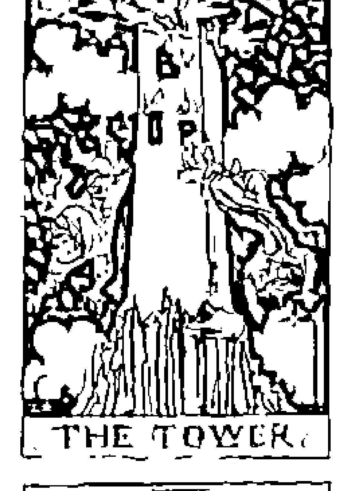

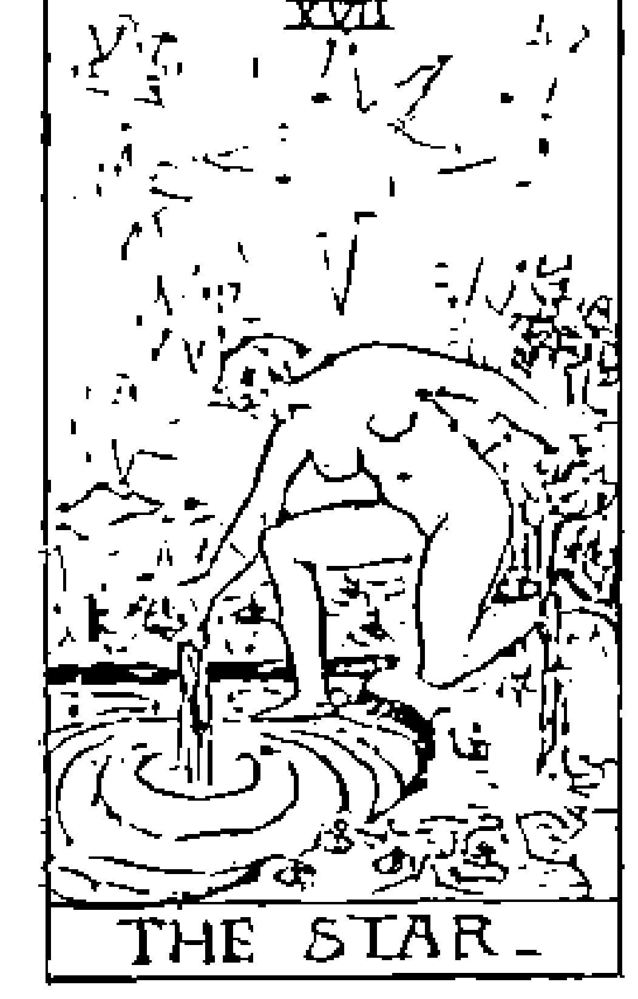

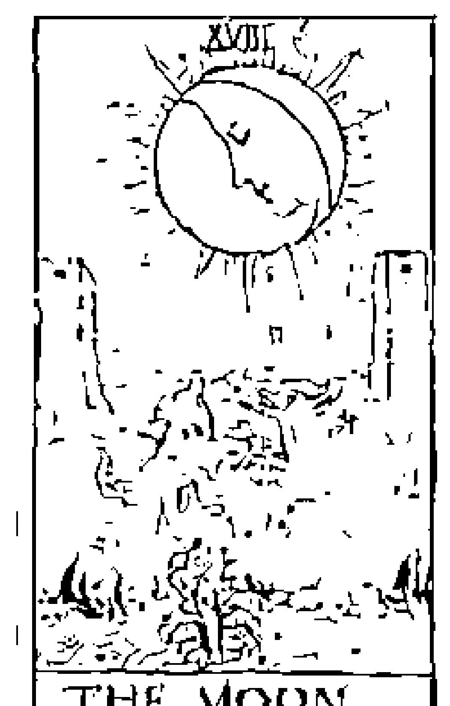

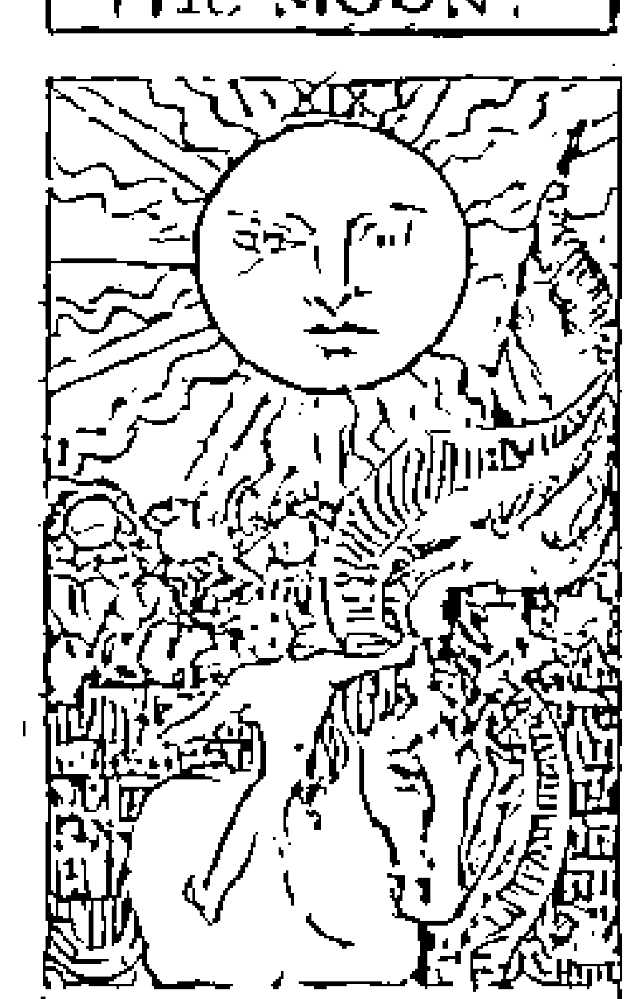

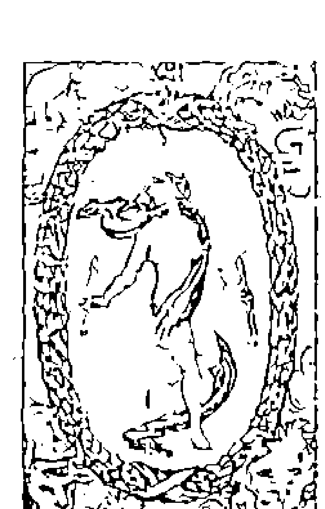

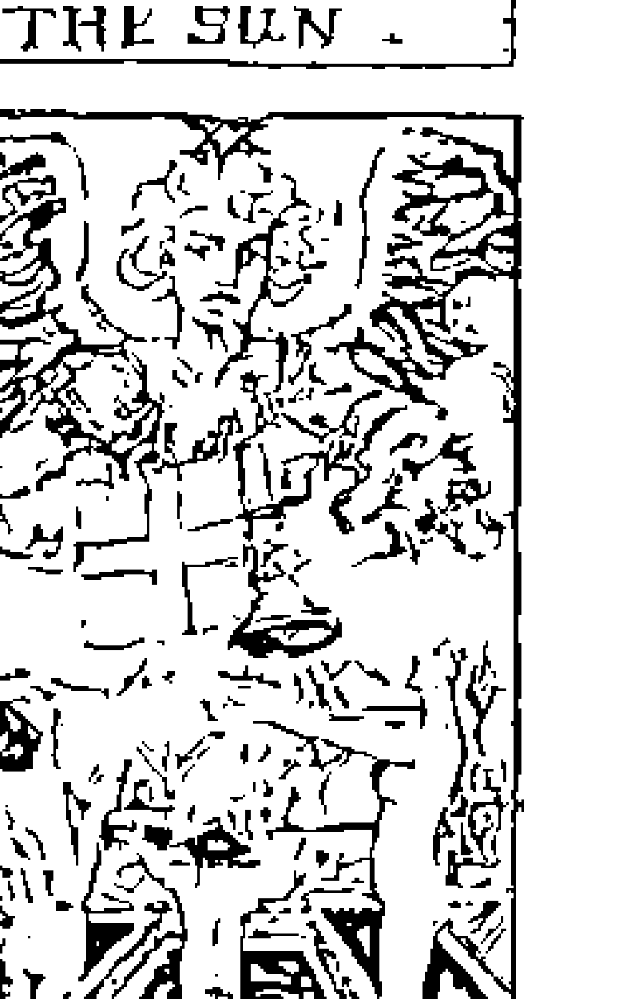

之後，女祭司逐漸探索內在的心靈。她漸漸體會到，萬事萬物都具有二元性，正面的另一面就是反面，女祭司要用內在心靈之後，女皇開始經驗生命的可能性，並且享受物質層面的豐碩，她開始感受到愛的能量，她愛人，也希望能獲得回報。當自身擁有一切之後，皇帝便開始向外拓展能量，他希望掌握權力，統治世界，而另一方面，也懂得守成，鞏固自己的資源與財富。

之後，漸漸傾向心靈成長，從支持家人到關懷眾生，教皇展現慈悲的靈性能量，用無私的精神服務他人。在這一連串自我整合的旅程中，愛的能量再次浮現，找到了生命中的戀人，初次體會愛情的甜蜜，與世界產生新的連結與溝通。當愛的層次愈來愈高，使命與目標也會隨之成長，戰車帶來動力，在工作中美奔波、努力，以行動來實現夢想。面臨挑戰時，可以衝鋒陷陣、貼身肉搏，也可以善用個人內在的力量，以柔克剛。

力量牌不僅學會了戰車的勇氣，也懂得運用智慧，克服內心的恐懼，以柔性的能量征服巨獸。人生至此，經歷過成功，也體會過失敗，隱者選擇與自己獨處，回歸自己的內心。他要尋找超越世俗價值的意義，探究生命更高層次的智慧。達到內心的平衡之後，隱者整裝出發，生命在命運之輪中出現了新的轉變。人生又重新開始，出現更高層次的使命。

在正義牌中學會良好的判斷力，懂得人間的是非善惡與因果報應，能夠找到世界萬物的平衡。為了尋求和諧與平衡，倒吊人面臨生命中的掙扎，他學會反省自己，知道必須捨棄與犧牲，才能自我成長，往下一段路邁進。於是，在死亡牌中，徹底地放下過去的束縛，從毀滅中求取新生。到了節制牌，學會了融合與調整，進退拿捏得宜，懂得維持團體間的和諧，與夥伴相互合作，共同開創新目標。

然而，世界充滿著無限誘惑，物質的欲望正如頸上的枷鎖，於是惡魔牌發出提醒，必須擺脫原始感官的欲望，回歸生命中更高層次的價值，找回屬於自己的自由。人生瞬息萬變，過往累積的罪惡能量，如今突然爆發，塔牌帶來了毀滅能量，生命中降臨了場駭變。經歷巨變之後，一切回歸平靜，全盤崩解也意味著新生的可能，星星牌點燃內心的潛意識，帶來無限希望與信心。

建立與直覺的連結之後，到了月亮牌，開始出現自我懷疑與不安，既緊張又焦慮，經驗了自己內在真實的恐懼。一旦挑戰自己，克服內心的限制與幻覺之後，黎明便會到來。陽光照耀大地，太陽牌帶來光明的力量，萬事萬物一切圓滿快樂，帶來喜悅與幸福。獲得成功之後，內在的覺知將自己喚醒，進入審判牌的階段，過往曾做過的是非善惡，如今必須一一了結。放下過去的限制與束縛，讓靈魂繼續昇華。旅程至此已進入尾聲，生命經過不斷的碰撞與衝擊，到了世界牌已臻於完美，愚人的旅程終於抵達終站，而新的冒險之旅蓄勢待發，再度回歸愚人的能量。

## 數字的奇幻旅程

權杖牌組屬於火元素，象徵行動力與進取心。牌組中，每根權杖的頂端皆發出新芽，象徵源源不絕的活力與生命力，具有熱情、衝勁與冒險精神。權杖根植於大地，帶來內在的力量，具備創造的動力。權杖類型的人具有冒險犯難的精神，有著堅定的意志力，遇到失敗反而能愈挫愈勇，個性直爽、開朗，但有时過於衝動、急躁，想到什麼就做什麼，缺乏完善的規劃。

在權杖1中出現了新想法、新目標，渾身充滿行動力，把握良好時機，用火的元素將權杖點燃，往夢想邁進。一陣衝動過後，到了權杖2，便回頭開始思考之前的決定是否正確，在行動面上開始重新整理自己，評估人生是否有另一種可能性。不斷思考過後，權杖3做出決定並積極行動，生命出現轉變，得以落實先前規劃的目標。

努力耕耘總有收穫，權杖4品嘗到成功的滋味，在自己打拚下來的小世界中安樂享受，擁有鞏固的安全感。然而，隨著時間流逝，目前的成就已經無法滿足自己，權杖5決定擴張版圖。拚命工作、積極競爭，為了重組人生的環境，不惜創造紛爭，來帶給自己更大的成就感。

經過一番激烈奮戰，到了權杖6，先前的努力終於得到收穫，實力受到證實，獲得眾人的景仰與敬重。成功的甜美滋味讓人難忘，權杖7開始擔心底下一雙雙覬覦的眼光，內心產生懷疑與猜忌，開始想盡辦法削弱敵人的力量。等到釐清內心的擔憂，並找到實行夢想的方法時，權杖8便帶來強大的行動力，開始不顧一切地征戰討伐，動用身邊所有資源、人脈，發揮自己的極限。

一陣激戰過後，權杖9身心俱疲，開始反思，人生的目標究竟為何？這些壓力不斷堆疊累積，讓權杖10感到困惑，迷失了自己的方向，種種負擔與責任壓得自己喘不過氣，終究必須學會割捨與放下。

## 聖杯的愛之旅

聖杯牌組屬於水元素，象徵情感、愛與學習。聖杯牌組的旅程是一趟愛的流程，是內在心靈的轉化與循環，聖杯牌組的人擁有滿滿的愛，願意為了愛而付出，甚至犧牲自一陣激戰過後，權杖9身心俱疲，開始反思，人生的目標究竟為何？這些壓力不斷堆疊累積，讓權杖10感到困惑，迷失了自己的方向，種種負擔與責任壓得自己喘不過氣，終究必須學會割捨與放下。

## 寶劍的思路之旅

的二元性，帶來衝突與學執，也意味著生命中的挑戰。寶劍牌組的人擁有清晰的頭腦與理性的態度，懂得先分析情勢、規劃流程，之後才會採取行動，再加上伶俐的口條與溝通能力，是一名優秀的軍師。然而，寶劍的二元性也帶來胡思亂想的能量，在腦中不斷與自己奮戰、鑽牛角尖，自己與自己作對。

寶劍具有攻擊與防禦的力量，象徵著傷害他人與自我保護，喜歡競爭的感覺，不輕易顯露自己的情感，也不願意正視生命中的痛苦與哀傷，需要聖杯的能量來中和時刻戒備的心防。寶劍牌組的順序與其他牌組相反，從寶劍10的能量開啟旅程，寶劍10原先充滿自信，挺身迎向挑戰，卻接連遭受挫敗，被徹底擊倒在地。這段痛苦的回憶造成寶劍9的陰霾：人生失去信心，內在存在擔憂與不安，讓他慘慘在噩夢中驚醒。兩後雖然狀況逐漸好轉，寶劍8已經從床上爬起來了，但身旁插滿了利劍，仍慘處於行屍走肉的階段，於是寶劍7用逃避的方式，不去回首過去的傷痛，表面上看起來似乎乎已經看開了，但內心卻自我欺騙，學會將痛苦的回憶留在過去，之後寶劍6走出自我譴責的關卡，終於放下在寶劍10所受到的傷害。然而，當初在寶劍7所逃避的負面能量，在寶劍5又再度竄出，出現了攻擊與傷害他人的狀況。而寶劍5曾經傷害過的人，現在集結起來，決心回頭報復，因此，寶劍4終於體會到，自己必須反省，必須正視曾經造成的傷口，而沉思則能帶來療癒的能量。仔細思考過後，寶劍3看見了血淋淋的事實，帶來巨大的打擊，必須鼓起勇氣；面對殘酷的現實。現在只能靜下心來，寶劍2試圖找出自己過往的傷痛，下定決心面對與處理，徹底放下過往的回憶，寶劍1終於回歸原始的自我，精神飽滿、思慮清晰，能夠以正面的思維模式看待人生。

## ◆錢幣的實踐之旅

錢幣牌組代表士元素，象徵物質與計劃，具有按步就班、具體實踐的力量。錢幣意指物質世界，包括金錢、利益、資產，也意味著控制欲與安全感。不若權杖元素進展快速，錢幣元素的運作速度緩慢而漸進，必須逐步累積、循序漸進。這類型的人行事穩重，遵循傳統教條與規範，相信自己的實際經驗，總是腳踏實地，做好自己的本分。錢幣帶有堅固的能量，渴望安定的生活，對於不確定的事物容易感到不安與焦慮，而這也意味著不輕易變動與改變，容易出現墨守成規、堅持己見，不願意與他人分享的狀況。錢幣1帶來一筆巨大的金錢或資源，對未來目標進行規劃。錢幣2開始操作與運用這些資源，期待將現有的資金發揮最大的價值。但自己的力量畢竟有限；錢幣3決定與他人合作，互相交換資源，分工合作，讓彼此的價值發揮地淵漓盡致。獲得初步的成功之後，錢幣4緊抓著手上的金錢不放，沉浸在自己的小世界中，不願意付出與給予，由於在錢幣4的自私、隱瞞與保守，讓原本支持的力量一舉消散，此刻的錢幣5感到孤苦無依，失去大量資源，藉由分享，錢幣6重新找回人脈與資源，重獲他人的信任與支持。體會過失去的痛苦，錢幣7懂得珍惜與守成，開始仔細規劃與思考未來的發展，了解生命的方向之後，錢幣8心懷踏實的態度，認真努力地為夢想打拚，收成的時刻終於來到，錢幣9品嘗到富足的滋味，達到自己階段性的成就，但也突顯出內在對情感的需求，到了錢幣10，便能夠達到物質和諧的狀況，完成當初設下的所有目標。

## 第3章 數字人生

## 數字1——啓蒙的力量

1 是一個數字的起頭，它代表開始，代表啓蒙，也跟自主、獨立有關係。1 號牌表示有東西準備要去呈現，代表有事情要去做，因此抽到 1 號牌，無論你採用什麼元素，勢必要踏出第一步，呈現自己的力量。1 的人做事相當積極，也非常有行動力，往往擁有足夠的資源，能夠運籌帷幄，一旦確定目標就會積極展開行動。1 也是非常直接的數字，做事直率，絕不拐彎抹角。由於 1 是一個起始，是一個開創者，往往代表著必須完成既定的使命，但也意味著一切都得靠自己。這個拓荒者可以是非常有自信的，也可以是極度退縮的。自信的他是一個掌舵的船長，以自我為中心發號施令、喜歡支配大家，帶領著船員前往唯一的、明確的目標邁進，所有人都得聽命於他的掌控；然而，退縮的他卻變得膽怯、沒有目標，變得無所適從，不知該如何是好，有時候會很想依賴別人，可能會有自我迫害的情形出現。雖然數字1代表著自立自強，但卻是很有能量的數字：包含了權杖、聖杯、寶劍、錢幣四種能量，而數字1就像個領導者，握著這四種工具，呼風喚雨，帶領眾屬下向前探險。

正向解讀：開始、自信、獨立自主、感性、自我接受。

負向解讀：侵略性、獨裁、缺乏自信或過度自信、好勝急躁、自我懷疑。

代表顏色：紅色

適合職業：演說家、記者、媒體人員、領導者、商人、業務、職員、演說家，或者是第一線的人員。

數字冠軍排行榜：最有行動力、最愛出風頭、最有自信、最獨立、最自我、最自戀。

## 數字 1 塔羅牌組

## ※ 1 魔術師

## 牌義解析

魔術師，給人聰明絕頂又變幻莫測的角色，他具有強大的感官能量，透過觀察、直覺與分析能力就可洞悉一切。他

## 塔羅能數字占卜

## 逆位牌義精解

心靈：目標明確、主動追求自己的夢想、新的人生計劃。

金錢：完善的理財規劃、新的投資理財計劃、出現新的理財標的。

工作：思考能力強、口才好、反應靈敏、運用創意完成任務、清晰的頭腦。

感情：起口角、有學執但不至於分開、出現小問題、一方不願意受拘束。

工作：工作效率低、注意力不集中、缺乏自信、自我懷疑、意志力薄弱。

金錢：準備不周全、缺乏資金或資源、行動力不足、計劃淪為幻想。

心靈：自信心不足、想太多、太過敏感。

## 塔羅數字能量

魔術師在數字學中代表數字為 1，1 是非常具有行動力的，也擁有廣大的資源讓他去實踐目標和理想。1 也非常有想法，具有主見和分析能力，數字 1 的人代表他有事情要去做，他必須邁出第一步。這樣的特質和魔術師剛好不謀而合，魔術師必定有個任務或目標，需要運用他的智慧和資源去達成。然而魔術師的自傲和數字 1 堅持己見的特質，常常讓他人無所適從：可能會導致他人棄之遠去，自己孤軍奮戰的情況。

## 數字人生

## ※ 10 命運之輪

## 牌義解析

中，低點的胡狼代表事件的結束，上方的人面獅身則意味著調合，可以很清楚的感受到 事件有起有伏。四個角落分別是右上角天蠍座，代表水元素的情感層面，左上角水瓶 座，代表風能量細膩的思考能力，右下角是火元素的獅子座，左下角則是土元素的金牛 世界上充滿許多變化，你可以選擇跟著輪子改變、進化，不斷學習，讓自己更上一 層樓；也或許你選擇死守固有的模式，不願意轉變，那麼，命運之輪便會帶著你向下淚。命運之輪也點出了生命中沒有一定的好或壞，失意到了盡頭總會有好轉的一天，只 要願意突破、勇敢改變，命運之輪會拉著你向上攻頂。

命運之輪也意味著一個轉折點，到了做決定的時候，此時你的抉擇將會是個關鍵，得過且過？還是勇於突破？全在你的一念之間。在情感方面代表一感情更換期，例如兩人關係從性關係提升到心靈層面，或兩人開始論及婚嫁，抑或是關係緊繃到一個臨界點，不得不做一些處理。 1 的獨立與自信，卻顯得格外純熟，原本的衝動與焦躁已經消磨不少，讓他能夠突破以往的障礙，往新的旅程邁進，但也由於經歷過數字旅程的轉化，對於生命歷程的挑戰與刺激，命運之輪便會顯得失去動力，面對眼前的問題，往往選擇逃避，此時命運之輪只會用一不知道、不清楚、不要再問我一來回應？。

正位牌義精解

感情：感情轉換期、彼此關係的提升、關係好轉、修成正果。

工作：新事件的開始、準備好接受改變、接受命運安排、克服生命中的改變。

金錢：如果金錢豐裕，代表即將有財務上的損失，建議捐錢或做慈善；如果缺乏金錢，代表將有一筆財富進帳。

心靈：接受人生的轉變、體認目前的狀況、明白生命的時間性。

## 數字人生

## 逆位牌義精解

感情：感情告終、關係逐漸變質、戀情轉淡、得過且過。

工作：不利於自己的情況、無法適應改變、沒有準備好就去做、推託找藉口。

金錢：沉淪於金錢遊戲、缺乏計劃、巨額的金錢虧損、負債。

心靈：無法克服生命中的轉變、心中充滿恐懼與害怕。

## 塔羅數字能量

1 加 0 等於 1，也就是一件事情的結束，也形成了另一件事情的起頭。命運之輪已經經歷過 1 到 9 的能量，可以決定要繼續往上升，或者決定維持現狀，也可能是直接往下掉，而事情發生的過程當中，四元素相互作用與牴觸，讓命運之輪不斷轉動與迴，經過蛻變之後，命運之輪的 1 號能量顯得更加有智慧，能夠在關鍵時刻做出對的決定，也能在開創新未來時審慎思考。不要畏懼眼前的危難，只要跟著自己的腳步走，命運之輪會帶著你攻上巔峰。

## 塔羅能量數字占卜

## 19太陽

## 牌義解析

大大炙熱的太陽高掛天空，蔚藍的天、盛開的向日葵，還有歡愉的孩童，都在在展現出生命力、充滿新希望的世界。牌中的太陽炫彩奪目、光芒萬丈，代表著轉機、新生開始，所有的厄運都結束了，新生活正在眼前等著你，抽到太陽牌的人代表所有的事情都是正向的，好運正要開始。騎在白馬上的小孩愉快的笑著，他天真、他快樂，他樂觀的對眼前可能的一切挑戰，而白馬象徵著對成功的渴望，正雄心勃勃地帶領小孩奔向成功；小孩手中的大紅旗象徵超強的行動力和領導能力，指揮自己和他人一起達成目標，獲取成功。一朵朵向日葵盛開著，顯現出豐收的意味，先前所做的努力現在終於有了成果。向日葵代表著地、水、火、風四大元素，是正向和樂觀的象徵，抽到這張牌的人開始相信世界充滿著光明的未來，你先前的付出終於被人看見，獲得正面的回應。

太陽牌代表生命新的開始，充滿活力、幹勁，用最樂觀愉悦的心去接受任何磨難和挑戰，總是十分積極正面的，不會因為挫折而喪志。抽到太陽牌的人開心的逐步達成自己應盡的責任，且願意幫助他人，這是代表豐收的一張牌，你之前的努力都沒有白費，現在是得到回報的時候。

## 正位牌義精解

感情：幸福的戀情、訂婚、結婚、無私奉獻的愛、公開目前的關係。

工作：開心的工作、樂觀面對挑戰、充滿幹勁、事情出現好轉、先前的付出獲得回報、成功達成目標。

金錢：慷慨、先前的投資獲得報酬、遠大的理財目標。

心靈：樂觀正面思考的能量、心情開朗、樂觀。

## 逆位牌義精解

感情：單戀、沒有結果的愛、不滿足、單方面的付出。

工作：遲到的成功、工作消極、逃避現實、悲觀的工作態度。

金錢：害怕變動、不敢嘗試新的投資方法。

## 塔羅數字能量

太陽牌是數字19，1加9是10，是代表數字1的能量，太陽牌新生、起始的能 量，以及積極向前朝目標邁進的特性，和數字1的能量不謀而合，數字1代表著開始，且勢必有事情要去做，正如同太陽牌中小孩駕著馬車一般，歡欣鼓舞的朝既定的方向前進，開啟人生新的一頁。

## 權杖 1

## 牌義解析

在雲團中伸出一雙大手，熱情的、有力的抓住這根權杖，象徵對自己夢想與欲望勢在必得的決心，對於生命中的挑戰，依然能用滿滿的熱情與活力去面對，終將搖雲見日

[PAGE 35]

[PAGE 36]

[PAGE 37]

[PAGE 38]

[PAGE 39]

[PAGE 40]

[PAGE 41]

## 数字人生

## 正位牌義精解

感情：新戀情的出現、正向樂觀的態度、互信依賴的關係、注重當下的感覺。

工作：開始一項新任務或是一項有意義的計劃、有創造力、充滿幹勁、勇往直前、目標明確、新冒險、新旅程。

金錢：新投資、財運佳、繼承財富。

心靈：充滿信心與勇氣、靈性成長的開始。

## 逆位牌義精解

感情：不真實的感情、不切實際的愛情觀、在感情上沒有耐心。

工作：三分鐘熱度、沒有衝勁、容易因挫折而放棄、計劃中斷、否定自己的能力。

金錢：因衝動造成金錢上的損失、破財。

心靈：心浮氣躁、易產生懷疑。

## 塔羅數字能量

權杖是火元素，是行動力、實踐力的表徵，而數字1又代表著開始與新生，也代表著獨立與自主。權杖和數字1的結合，形成一股強大變革創新的力量，而且一定會付諸行動，它是新局勢、新想法、新計劃的具體實踐。抽到權杖1的人當前勢必有一番作為，且前景光明，可以放膽勇敢的去做，特別是在於工作方面，有新的機會、新計劃、新目標，會信心滿滿的勇往直前，且成功的機會相當大。

## 數字人生

## ※ 聖杯 1

## 牌義解析

從雲中緩緩的生出⼀隻⼿，輕輕地、柔柔地捧住聖杯，好似小心翼翼地呵護著聖物一樣。聖杯代表著愛，一切事物皆以情感為導向，杯中滿溢的水傾瀉而下，好似滿滿的愛、情感、情緒源源不絕流出；沒有終止的一天，這象徵著情感的富足及心靈上獲得滿足。手代表自我，雲代表自由的意志，有別於權杖 1，手從結實的雲中伸出，強而有力的抓住權杖，代表著強烈的企圖心與勢在必得的決心；聖杯 1 更渴望情感，需要滿滿的愛，不需要任何有形的东西，情感是左右其想法或決定的關鍵因素。

鴿子代表著和平與平靜，在情感上代表正向的意義。鴿子嘴上叼著中間有十字的圓餅，圓饼是基督教的聖餐、聖餅，象徵著心靈上的依靠與依賴；而杯中裝著基督教的血，代表著我喝基督的血、吃基督的肉，為了愛，他可以像基督一樣甘願犧牲奉獻一切而不 求回報。

聖杯 1 的出現，往往是剛剛開啟的愛情，不論在工作上、金錢上，或是感情上，只要有滿滿的愛，他們就能夠不顧一切地完全犧牲奉獻。聖杯 1 的人可能因為喜愛這份工作，不論多累、薪水多少也願意撐下去；也會因為愛這個人，即便遍體鱗傷也依然奮不顧身愛著。這就是聖杯 1，情感至高無上，其他的不值一提，或許外人看來認為他們很傻很笨，但沉浸在愛裡的聖杯 1 卻不這麼認為，愛使他們心靈富足，完全不覺得有任何的虧損。

## 正位牌義精解

感情：新戀情、剛開始的感情、為愛付出與犧牲、心靈的契合、開始動心、求婚成功、 呵護愛情。

工作：新階段的到來、善意的回應、事業成功、圓滿的結束。

金錢：豐富的獲利、財源滾滾、投資順利。

心靈：滿滿的愛、心靈上的富足、沉浸在喜悦中。

## 逆位牌義精解

感情：單戀、單方面的付出、虛假的愛、感情遭到欺騙、混亂的內心、沒有回報的愛

## 數字人生

## ※寶劍 1

工作：對工作失去熱情、沒有回報、無法獲得喜悅、感受黑暗面。情。

金錢：不安定與焦躁、投資無法獲得回報、不穩定的環境。

心靈：嫉妒、猜疑、沒有安全感、恐懼、內心痛苦與哀傷。

## 塔羅數字能量

數字 1 的獨立與自主，碰上代表沖情感的聖杯，這個愛是陽性的、是主動的。

抽到聖杯 1，在戀情方面，代表著只要主動示愛，就會有正面的回應。1 也代表著開始，這可能是一段剛剛開始萌芽的愛情，也可能是心靈獲得成長與滿足；而 1 的自我 會用其他因素去衡量事情，一切取決於心，只要有愛，那就是對的選擇。

## 塔羅能量數字占卜

## # 錢幣 1

## 牌義解析

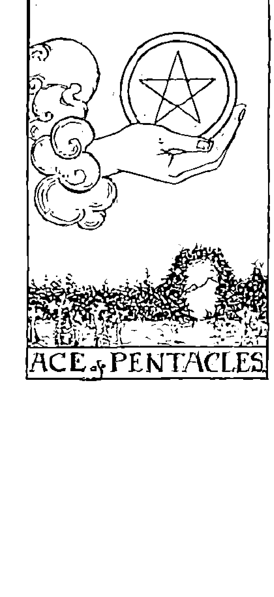

從雲中伸出右手捧著錢幣，右手代表執行力，錢幣則是金錢和物質的象徵，錢幣被右手穩穩地捧著，是一個安全感的象徵，代表自己掌握住財富，在財務上會有巨大的收 穏。牌下方的泥巴道路和拱門，象徵著通往幸福的康莊大道，預期要去的地方將會有很 好的發展。拱門後面有座小山，代表生命當中未知的挑戰，在物質上有所收穫以後；還有新的任務在迎接你。

而錢幣中的五角星，是人類的象徵，尖端代表頭部；左右代表手，而下方則代表雙腳，人類的世界是物質的，人類要吃、要喝、要睡、要有性愛，這是人類最基本的需求，這就是生存的能量。

抽到錢幣1的人代表在物質財富的基礎下可以去追尋自己想要的，也能夠達成自己想要的，例如投資能夠獲利、獲得心靈上的滿足，或是獲得自己覺得很有價值的事物。金錢或物質能夠讓錢幣1的人獲得安全感，他覺得具有後盾、退路，心態穩定之後，往往能產生巨大的能量，幫助他向前進。錢幣1代表金錢、收入方面的事物即將獲得正面的回饋，例如會有加薪、升遷的機會、新事業的成功、投資上面的獲利等等，然而錢幣1的成果是急不得的，它的收穫必須是循序漸進的，或許要等個一年的時間才能夠看到實質的回饋。

而逆向的錢幣1或許會成為金錢的奴隸，被金錢、物質追著跑，生活的重心全放在賺錢上。它對金錢缺乏安全感和知識，所以錯用資金、胡亂投資，或是毫無節制地恣意揮霍，可能導

## 塔羅能量數字占卜
## ※聖杯10
## 牌義解析
![img/5c336ea522515c2c6caff4bc15b72a91_54_0.png]
在聖杯9的時候，雖然金錢和物質生活富足，卻不願與人分享，內心依舊空虛寂寞，然而到了聖杯10，天空萬里無雲，七彩續紛的彩虹橫跨天際，還有底下和樂融融的一家人，象徵著無論內在與外在皆獲得充實、滿足的情況。在歷經了大大小小情感的課題過後，聖杯10悟出的人與人間的相處之道，情感的進退取捨皆能拿捏得宜，而且能夠彼此信任，不再有任何猜忌或懷疑。牌中的男女穿著樸實、互動親密，代表情感不再受物質或權力所左右，彼此能夠心靈相通，關係和諧融洽，而且雙方皆能夠在對方的立場思考，懂得付出與奉獻，將愛昇華到最高的境界。抽到聖杯10的人象徵幸福、喜樂的開始，在感情方面歷經磨難後終於修成正果，有結婚、懷孕的機會；在家庭中意味著緊密的親子關係，家人間的情感連結強勁；在一作
## 数字人生
方面則是和同事或下屬像家人一般的關係，彼此心靈契合，合作得相當愉快。總之，聖杯10是兩過天晴出現的彩虹，所有的事情都過去了，現在都朝著正面的方向邁進，原來幸福是可以如此的平凡、簡單！
## 正位牌義精解
感情：苦盡甘來的感情、和另一半心靈相契、像家人一樣的愛、和諧的關係、有結婚或懷孕的機會。
工作：和同事關係良好、像家人一樣的工作夥伴、自由與滿足的工作環境、事業版圖擴張。
金錢：苦盡甘來、投資終於獲得利益、富足的成果。
心靈：富足的心靈世界、滿足與喜悦、努力終於獲得回報、內心成熟穩健。
## 逆位牌義精解
感情：感情失和、家庭出現爭吵、不快樂的關係、孤獨、沒有安全感。
工作：和同事間起口角、合作關係破裂、工作進度混亂、自私、孤立無援。
金錢：為金錢煩惱、對金錢缺乏安全感、獨自奮鬥。
心靈：自我中心、不懂得珍惜、忽略別人的付出。
## 塔羅數字能量
## ※寶劍 10
## 牌義解析
![img/5c336ea522515c2c6caff4bc15b72a91_56_0.png]
聖杯10是一個和諧、完整的景象，所有的事情都有圓滿的結局，情感昇華至心靈層面，不再為物質或欲望有所爭執。這是一個完美的結束，也是一個新的開始，聖杯10具有數字1的能量，1是一個新生、一個開始，沒有猜忌與懷疑，沒有廢殺掠奪，一切是那麼的平靜祥和，愛與和平包圍了整個世界，我的人生充滿了新希望，我已具備強大的能量，如此完整的我帶著滿滿的信心，再度踏上新的旅途。
黑暗陰沉的天空下，男子倒臥的血泊之中，十把鋒利的寶劍插在他的背上，男子毫無招架之力，他徹底的死亡，進入下一個輪迴。
## 數字人生
男子是被自己的恐懼和罪惡害死的，黑壓壓的天空暗藏心底最深的不安與害怕；太負面能量的積累把男子推向萬丈深淵。寶劍象徵著思維和信念，十把寶劍就陷入過度
命。然而，在臨死之前，男子右手比出祝福的手勢，他欣然面對死亡，因為死亡並不是
結束，而是帶來重生，他終於能夠獲得解脫了，下一個輪迴將是新的開始，有新的機會
和希望在等待著他。
寶劍10這些負面的能量，多來自心靈上的因素，過去壓抑的情緒、過往的傷痛或深
深的罪惡感始終沒有消弭，因為寶劍不斷的在自欺欺人，總是不願意面對這些問題，所
以到了寶劍10便走向精神崩潰、情緒失控的狀態。寶劍10也代表對某件事上癮的可能
性，到了無法自拔的狀態，例如像是酒癮、藥癮等等。
抽到寶劍10的人不要沮喪，這不是絕對的毀滅，或許你現在正處在生命中的最低
潮，正是最痛苦、最無助的時候，但經歷最壞的狀況之後，就代表好運即將開始了，逆
境只是人生轉化和蛻變的必經過程，另一段新的旅途又在那等著你呢！
## 正位牌義精解
感情：想太多、自我毀滅感情、情緒失控、注定遭受痛苦、自閉的傾向。
## 數字人生
工作：太過胡思亂想、過度分析、處於逆境中、遭遇挫折、絕望、無助、毀謗、爭辯、金錢：勢必會虧損、悲觀、失去信心、面臨低潮。心靈：情緒崩潰、混亂、心煩意亂、巨大的壓力、沉重的無力感。逆位牌義精解
感情：暫時的傷痛、關係即將好轉、從傷痛中成長、試圖獲得注意。工作：短暫的挫折、即將否極泰來、試圖吸引他人的目光。金錢：暫時的虧損、情況將有所改善。心靈：從困境中走出來、在失敗中獲取經驗、敞開心胸。
## 塔羅數字能量
寶劍是非常具有智慧的，他們運用聰明的頭腦打贏許多勝仗，也因為太過聰明、想得太多，把自己給束縛住，使自己痛苦不堪。在實劍8時女子作蘭自縛，被許多自己設立的教條和信念纏繫住，實劍9時壓抑的負面能量，在睡夢中爆發出來，使你不得不視存在的問題，若是持續自欺欺人，忽視自己的內心，到了實劍10這些負面能量終於徹底將你壓垮，心靈將徹底的死亡。然而，正向的數字1所具備的能量，為死亡帶來了新
## 數字人生
## 牌義解析
## ※錢幣10
![img/5c336ea522515c2c6caff4bc15b72a91_59_0.png]
物的衣服一再顯示出主人的富裕與尊貴。這是一個象徵物質生活富足的牌，經過先前的努力，錢幣10到了生活不餘匱乏的境界，而且他們也懂得付出與分享。牌卡上的人物是一組家庭，老人安穩地坐在椅子上，顯然正是房子的主人，老人把注意力全都放在前方的小狗身上；而夫妻正在一旁自顧自的交談，小孩則是害羞地躲在母親身後，並沒有獲得大人的注意。這個家庭看似和樂融融，但事實上相互的情感連結薄弱，生活上的富
## 在一座富麗堂皇的豪宅中，錢幣無所不在，牆上精緻的雕花、屋內的擺設、以及人
## 生，實劍10的毀滅也是一場教訓，在轉化和改變過後，新的輪迴不再重蹈覆轍，將以全
## 新的自己踏上全新的旅途。
## 正位牌義精解
足使他們開心地享受這一切，但他們卻不知道如何表達對親人之間的關懷之情，以致疏離感十分濃厚。
錢幣10代表豐收的財富，而且是相當大的豐收，物質生活的充足使生活感到穩定，不再有一絲的擔憂害怕，而且變得很有力量、很有信心。然而，錢幣10提醒我們在生活不虞匱乏之時，必須重新建立人際關係、和家人間的關係、以及心靈的交流。錢幣10的人由於太習慣和冰冷的金錢相處，反而忘了如何和溫暖熱情的群眾交流，他們不是不願意分享和付出，只是不知道該如何去做；或是常常用錯了方法。他們可能藉由給父母或小孩很多的錢，來表示自己有多愛、多關心他們，但殊不知父母或小孩要的不是這些；他們需要的是真切情感傳遞，是實質的陪伴。錢幣十的人通常是一個有條理、按步就班的人，在獲得成就與利益時，他很願意分享與付出，但卻時常從物質層面來給予關懷與愛。
## 因此，錢幣10的人必須試著表露出你最真實的情感，只要真心的付出愛與關懷，定能會得對方相同的真心。將你那冰冷的世界注入些熱情吧！你將發現原來生命是可以過得如此熱血沸騰呢！
## 數字人生
感情：關係穩定、渴望安全感、情感疏遠、表面上的幸福。
工作：理性、條理分明、按步就班、達成夢想、獲得成就。
金錢：生活富裕、龐大的財產、繼承資產、獲利。
心靈：內心空虛、將話藏在心裡、用物質評斷一切。
## 逆位牌義精解
感情：爭執、感情不和、缺乏真愛、算計的愛情、勾心門角。
工作：沒有方向、觀念受到衝擊、和工作夥伴不合、出現糾紛。
金錢：愛慕虛榮、合作卻無法獲取利益、金錢糾紛、上一代留下來的債務。
心靈：受物質世界的束縛、沒有靈魂、沒有人生目標。
## 塔羅數字能量
錢幣走到了數字10，終於能達到物質和諧的狀況，擁有豐厚的財富，也能不吝於付出及分享，現在最完美、最滿意的狀態，內心已再無所求了。因為獲得物質生活的滿足，整個人充滿著信心與希望，將帶領這筆巨大的資金和資源，為下一個新的目標做規劃，成為下一個人生階段的強大資本。這個階段已經完美的告一段落了，同時挾帶著數字1的能
## 數字 1 的塔羅故事
數字 1 為人生帶來了嶄新的一頁，匯聚了火、水、風、土四大元素。權杖屬火，熱情有行動力；聖杯屬水，情感充滿又細膩；寶劍屬風，頭腦清晰有條理；錢幣屬土，
## 數字人生
循序漸進最穩定。舉凡 1 號牌中，四大元素都是不可或缺的重要角色。在魔術師裡，
四大元素以工具的樣號呈現，魔術師有著偉大的藍圖，而桌上的工具正是實踐的能量。而在命運之輪中，四大元素化身為四種神獸，坐落在四個角落落當中，讓中間的命運之輪不停轉動，意味著人生有起有落。在魔術師到達成功的彼岸之前，必定體會過甜頭，也遇過挫折，這些都是必經的過程，而經過層層歷練之後，在太陽牌：四大元素已經幻化為一體，凝聚在向日葵當中，各自互補，讓整體力量有一加一大的作用，將太陽的光芒發揮到極致，也帶來發光發熱的成功。
## 數字人生
數字 1 的四大元素也各自分散在數字牌中，每張 1 號牌都代表著不同層面的新起點，錢
## 數字人生
幣 1 代表著新的錢財進帳，聖杯 1 往往意味著新戀情的出現，而權杖 1 表示著新的行動，寶劍 1 則是指新計劃、新想法。這四張 1 號牌也代表著四種季節：錢
## 數字人生
幣 1 是春天，風光明媚，作物豐收，自然帶來不少的錢財。聖杯 1 是夏天，蓮花朵朵
## 數字人生
綻放，水流從聖杯中不斷湧出；也代表著滿溢的情感，意味著新的戀情與關係的進展。權杖1代表秋天，正是要展現行動力的時刻，權杖上的樹葉開始出現凋落的情况，是時候發揮行動力，用樂觀、正面的積極力量開展未來。而寶劍1是冬天，寒風刺骨，這時候的環境條件較嚴苛，不適合硬碰硬，因此寶劍懂得善用頭腦，用清晰的邏輯規劃出一条新道路，用創意解決難題。從數字1走到數字10，代表著一段旅程的結束跟另一個新開始。在10號牌中可以發現故事到了尾聲，但似乎又出現新的契機，10其實就是1，這是生命的輪迴，練就了經驗老到的1：是進化版的數字1，將1號牌的能量加乘，就成了10號牌的畫面。錢幣穩紮穩打、刻苦又好調教，錢幣10的生活自然、富裕又多金，只是錢幣不善表達情感的缺點，到了錢幣10便會變得更加明顯；聖杯生性細膩貼心，總是處處為他人著想，不吝於付出關懷，聖杯10一家和樂的畫面自然不難想像，權杖充滿了行動力，什麼事總是衝第一，大大小小的任務都跑到權杖的頭上，變成了權杖10責任推著走的窘境；而寶劍善於規劃思考，卻缺乏行動力，往往製造了戲劇化的情結，卻沒有在真實人生中上演，反倒讓自己的腦袋陷入了死胡同，然而，10號牌都帶來了無敵寶貴的人生經驗，只要懂得從經驗中成長，就能脫變為進化版的數字1，跳脫以往的泥沼與難關。
## 數字能量講心
## ◆ 數字2——感性與理性的折衝
準備一支紅蠟燭，紅色洋溢著數字1的熱情、活力跟行動力，將蠟燭點燃之後，以最舒服的姿勢坐下，將蠟燭置放在你的前方，以最舒服的姿勢坐下。接著，面對這支紅色蠟燭，觀察整個光火的延展與能量，眼睛專注地注視那團光火，對著那團光火做呼吸、吐氣的動作，不斷深呼吸、吐氣，深呼吸、吐氣，同樣的動作重複循環，大約十五分鐘。當你的能量與煙光漸漸融合爲一，你便可以感受到數字1的能量，朝氣與自信由火光那頭緩緩地傳遞到你的體內，讓你的活力重生，往日的挫折不再。告訴自己：‘現在，我要像眼前的火光一般出壯、一般耀眼。’

2是由兩個1組成，

## 塔羅能量數字占卜

## 權杖2

## 牌義解析

代表敏感的直覺，強大的直覺力是助力，幫助你達成期望的目標；而0則是一個輪迴，萬物的終點和起點皆為0，在不断循環的過程中持續學習、持續提升；而審判牌則是拋去過去、選擇未來，也是數字2二元特性的具體展現。

權杖2的出現，就代表有新的抉擇出現，生命出現另一種可能。權杖2的牌面上，出現兩支權杖，一支牢牢的固定在牆上，一支則是未受束縛握在手上。這表示內心出現兩種不同的聲音，一種是安於現況，不想做任何改變，一種則是想擺脫束縛，要做自己想做的事，或是想挑戰自己，去開創自己的無限潛能。 牌卡中的人手捧著地球儀仔細凝視，地球儀象徵偉大的理想和抱負，是他內心所渴望達到的目標；而牆外的景綠，從近而遠；有矮房、有城堡、以及雄偉的碉堡；這是他夢想中要一步步得到的東西，先前一手建立起的矮牆已經不足以滿足他的欲望，他有遠大的雄心壯志；他要飛，飛向更高更遠的地方，不想再一成不變地站在原地了，然而灰濛濛的天空透露出未來的隱憂，山巒起伏也象徵著前行之路將遭遇到的挑戰與困難，這也是要邁向成功所必須克服的難題，這也是他做出這樣的決定後所要付出的代價。

## 正位牌義精解

氣質、逞強、情緒不穩定、急欲證明自己的能力的狀況。 突破現況，想更上一層樓，但是當滿腹雄心壯志無法力行、精力無法消耗時，便會出現象，處在一個不滿足於現況，卻又對未知的未來有點遲疑的狀態。權杖2的人往往想欲望，或是生活中有另一個選擇，例如出現了更好的工作機會，或是感情上出現新的對害怕改變是否真的對自己有利，害怕失去目前所擁有的一切。也或許是心中出現另一個權杖2的人通常面臨生活的抉擇，可能是厭倦目前的生活，想要徹底改變，卻又

感情：出現好對象、面臨抉擇、走出情感的束縛、可以選擇自己渴望的愛情、異國戀
工作：有理想、有雄心壮志、能夠做出正確的決定、有勇氣接下新的任務、有海外發展情
金錢：出現好的投資機會、有海外投資的機會。
心靈：面臨人生重大抉擇、內心充滿力量與勇氣、希望開拓不同的格局。

## 逆位牌義精解

感情：情感矛盾、容易自責、過於依賴、有面臨傷心的可能、出現來擾局的人
工作：過於衝動、做出錯誤的決定、舉棋不定、做事拖拖拉拉、有理想卻沒資本
金錢：有理財計劃，但缺乏資金。
心靈：內心矛盾、自我懷疑、缺乏自信。

## 塔羅數字能量

數字2就如同權杖2牌中的兩支權杖一樣，生命不再只有單一的選擇、單一思
想、單一的可能性，經由衡量評估後，能夠選擇最有利的那一個。而權杖的行動力和冒
險精神，正可以帶領自己朝所選的方向開天闢地，路途中或許碰到失敗與挫折，但權杖
愈挫愈勇的能量帶來強大的力量與信心。

## 數字人生

## ※聖杯2

## 牌義解析

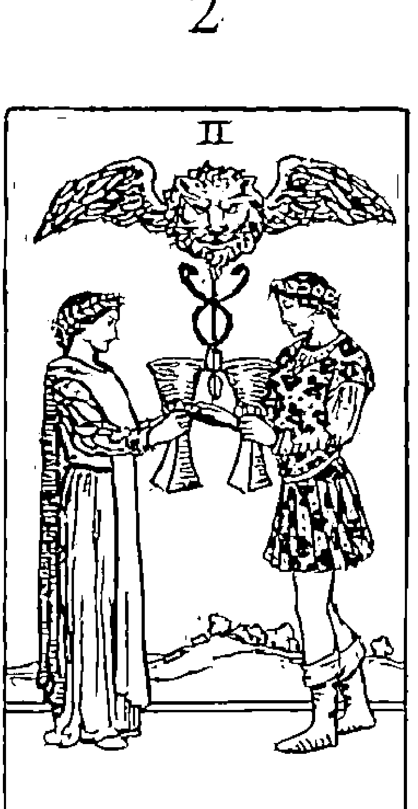

聖杯2上畫著一男一女，手中各握著一個杯子，而且是站在平等的位置，表示相
互依賴、彼此尊重，兩個人有良好的關係。兩人把杯子舉在同一個高度，意味著平等互
信，暗示平等的爱或生意關係。

這一對男女中間，有雙長了翅膀的獅子，獅子代表強大的力量和物質的欲望，獅子
長出了翅膀，中和靈性與物質的能量，有主動的勇氣跟心靈的能量。獅子下方相互交繞
的蛇，是男性和女性能量的象徵，兩者交繞在一起，還能維持平衡，象徵彼此心靈上的
契合，也象徵著男女之間彼此能量的轉換，心靈交融在一起。

男女各有不同的特質，彼此互補相互提升，男子擁有數字1主動的能量，有衝
勁、勇於冒險，而女子擁有感性、想像力和直覺力，兩人截長補短，相互扶持、相互成
長，創造最大的效益。

聖杯 2 代表著一段協調的關係，可能是男女關係、也可能是合作關係，抑或是上
司或下属的關係，無論是何種關係，彼此都是相互依賴扶持的，也是相互信任，並且雙
方是屬於平等的地位。由於兩個人的互補互助，以致事業的成功、心靈的富足或感情加
溫等等，都是非常好的結果。

除此之外，聖杯 2 的人渴望照顧他人，喜歡營造享受的感覺，營造出家的感覺。

若男生抽到，會被有媽媽感覺的異性吸引；如果女生抽到，會主動照顧他人，希望從照
顧當中獲得愛。

## 正位牌義精解

感情：平等和諧的關係、相互尊重和信任、照顧對方、彼此愛慕、願意為對方犧牲
工作：良好的夥伴關係、和上司或同事相處融洽、信賴工作夥伴、有行動力和衝勁
金錢：互惠關係、賺錢能力佳、新投資計劃的開始、因合作而獲利
心靈：心靈和諧富裕、兼具理性與感性、真誠地付出

## 逆位牌義精解

感情：虛假的關係、表裡不一、懷疑、背叛、單方面的付出

## ※寶劍2

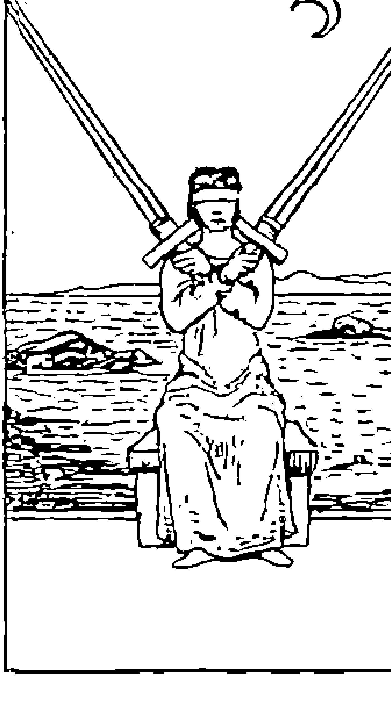

工作：缺乏溝通、不對等的合作關係、獨裁、分心、未獲得對等的回報
金錢：投資失敗、商業合作破局、遭到欺騙、無法回收資金
心靈：不信任、猜疑、不滿足、失去動力

## 塔羅數字能量

數字2帶來了合作的契機，也讓兩個人能夠站在相同的地位上彼此溝通與協調。

權杖2是在權力或物質層面上，在兩個選項之間取得平衡點，而感性的聖杯是追求情
感上對等的關係，彼此相互依賴信任的關係。數字2雖然意味著兩個不同的個體，但
透過彼此能量的轉換，相互交融契合，能在關係和諧、情感富足的情況下，雙方獲得最
大效益。

## 數字人生

## 錢幣2

## 牌義解析

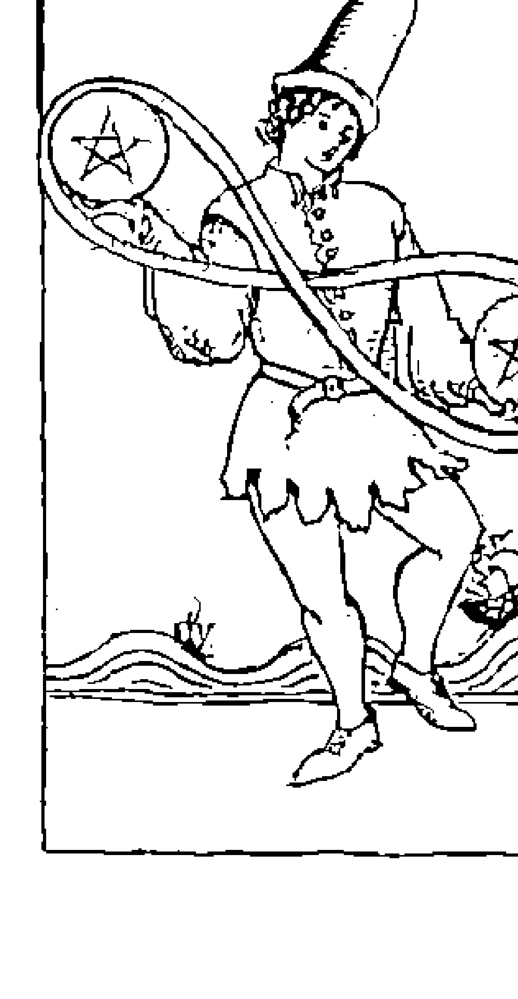

看見錢幣2的出現，就代表出現與物質、金錢有關的抉擇，你必須做出決定！

牌中身穿鮮豔的衣服的小丑把玩手中兩枚錢幣，錢幣是由無限大符號連結起來，任 魔術師的頭上也有這種符號，代表他生命中的無限可能，他可以賺取很多財富，也可能浪費錢財。錢幣一高一低，左手的錢幣代表花掉的錢，右手則代表目前所擁有的資產，

錢幣輪流不停的運轉，代表這個人具有很好的投資或理財能力，也可能代表這人是存不 到錢的，是標準的月光族。 小丑是聰明機伶的，他頭上紅色的髮帽代表無限的創意和想像力，常常會有很多出 奇不意的鬼點子。他身上鮮豔的衣服代表擁有許多才華和能力，藉由玩弄自己的才華、 能力或是個人事業，創造豐厚的物質與金錢，然而，正所謂聰明反被聰明誤，玩弄的結 果也可能導致一無所有，甚至損失慘重。 兩枚錢幣也代表同時想做兩件事情，例如有一份正職工作，但也想要賺外快， 也可能是必須同時應付兩件事情，讓你忙得不可開交。一高一低相互流通的錢幣，存在著一 元衝突，在身兼數職當中，必須要找尋平衡點，或是有所取捨，才不會在兩件事情上搖 擺不定，讓自己忙得暈頭轉向。 抽到這張牌的人太過於重視金錢或物質層面，而忽略了應有的情感或生活品質，太 過沒營營的賺錢，可能賠上自己的健康，也可能失去朋友、家人的關愛，許多關係甚至會淪為金錢導向的思考模式。 錢幣2的人很清楚人生的波動，通常很樂觀，但可能過於樂觀，動用到自己不應 該動用的資源，因而面臨短暫的失敗。在資源不足、環境比較緊繃的狀態下，可能必須
放棄一些東西，但卻不敢做出決定。然而只要將願望誠實的說出來，做出決定，秉持誠 懇的態度，便可能得到別人的資源與協助，讓目標順利達成。

## 正位牌義精解

感情：感情中惡性循環、用金錢衡量愛情、用肉體吸引愛情、保持彈性的關係、金錢維 繁愛情
工作：無限大可能、在工作中表現絕佳的機制與才華、可以進行新計劃、有很多事業或 副業
金錢：具理財投資的頭腦、源源不絕的財富、穩定的財富、做出適當的決定
心靈：生命中出現改變、在混亂中改變

## 逆位牌義精解

感情：放棄彼此的愛情、感情有波動、起伏不定的情緒
工作：面臨抉擇、放棄、無法下決定、希望事情盡善盡美、具有良好的處事能力
金錢：過度執著金錢、為利益而放棄某些事物、無法兩全其美
心靈：進退兩難、無法抉擇、改變的力量

## 塔羅數字能量

## 數字 2 的塔羅故事

數字 2 的兩種選擇、兩種資源或兩個衝突碰上錢幣，就變成在物質或金錢上的能 量，物質錢財的相互流通，自身能力或才華的相互應用，或是在多種事業中有所取捨。錢幣 1 時帶來巨大的財富，錢幣 2 和其他 2 號牌組的能量一樣，對兩件事物有所搖扎，開始運用這些財富來創造更大的利 益。錢幣 2 和其他 2 號牌組的能量一樣，對兩件事物有所搖扎，必須在其中取得平衡 點，才得以獲得正向與加乘的效果，否則不幸將會循環不已，得不到解答。

路，你會發現，原來要到達目標，也可以走另外一條路！這時候，人生的選項多了一個，除了自己之外，也可以與他人合作，邁向成功不一定要單打獨門，種種的三元面向開始呈 現，數字 2 摧脫了數字 1 的說氣與霸道，能夠從較公平、平等的角度看待事情。 而數字 2 屬於比較陰性的能量，溫柔細膩、觀察力敏銳，但也帶有情緒化、猶豫 不決的特質，還有那麼一點矜持與含蓄。因此，面對抉擇時，往往難以下決定，導致 直在原地打轉，難以前進。所以，對數字 2 來說，面對眼前的選項，做出決定就是最
大的課題。
女祭司掌握著陰與陽的力量，手上的經文為她帶來智慧，讓女祭司在陰陽當中取得平衡。女祭司所面臨的二元挑戰是前世與今生、理性與感性、意識與潛意識，這些面向位於天秤的兩端，讓她邏遲無法做出決定，更遑論求取和諧，於是常常出現猶豫不決，甚至會有情緒化的狀況出現。
比起女祭司，正義牌中的女性則多出幾分魄力，右手握寶劍，立下決心，而左手懸著天秤，代表剛正不阿，秉持著公平正義的精神。正義牌中的女性身上的大紅袍，看起來來得有動力，雖然仍然坐在原位上，但是長袍裡的腳似乎有點動靜，悄悄地向外伸出，好像離下定决心目標已經不遠。到了審判牌，數字2所挾帶的二元衝突逐漸明朗化，女祭司與正義牌中的猶豫紛葛雲時間化解。天使穿著號角，喚醒棺材中的人們，讓他們能夠判定然拋卻過往的束縛，迎向未來，脫身陷二元衝突的世界。
2號牌都面臨了多元選項的問題，權杖2與錢幣2的身邊似乎都出現了不錯的新機會，可是要不要冒險呢？就是值得深思熟慮的問題了。權杖2遇上的是工作上的新機會，錢幣2碰上的則是金錢上的新契機，必須仔細權衡，可別因為貪圖擴張而大意失荊
## 数字能量靜心

從以前到現在關於你跟你家人的記憶，或者是感情層面中的故事，你們之間的互動是什麼，有什麼難以忘懷的事件嗎？前因後果發生了什麼事情，你覺得你無法釋懷的感受是什麼

接著試著書寫出解決辦法，如果你最後能夠找到紓解的方式，或者是你已經完全釋懷的話，就把這張紙摺起來，把紙張埋在土裡，這件事情就讓它隨著大自然的流轉而結束。

2 與愛人有關，讓我們一起乘著時光機，回到過去讓你耿耿於懷的那一天。回想過去情感上曾經受到的創傷，或是曾經背負的罪惡，寫下跟感情有關的點點滴滴，寫下

## 塔羅能量數字占卜

## 正位牌義精解

感情：為愛情糾紛、經歷痛苦與磨難、在痛苦中體會愛情、懸在兩段感情之中。

工作：理性思考、想法和行動相互矛盾、換個方法解決事情、具防備心、暫時停滯。

金錢：從金錢損失中獲得教訓、透過捨棄與放下獲得更大的利益。

心靈：內心充滿矛盾與掙扎、自我反省、面臨人生的過渡期。

## 逆位牌義精解

感情：無謂的犧牲、付出無法獲得回報、無法顯露真正的自己。

工作：不知反省、提醒當事人不應鑽牛角尖、出現錯誤預感。

金錢：計劃進行到一半、事情懸而未果、必須試著放下、朝著下一步邁進。

心靈：內心已經想得清楚明白、內心得到變、因內省而獲得智慧。

## 塔羅數字能量

倒吊人牌屬於12號牌，1加2等於3，具有3號牌組的能量。3號的矛盾與衝突在倒吊人中明顯展現。而數字3往往會有突如其來的新想法，具備新思維、創新的能量，就如同倒吊人將自己的思考模式翻轉，常常得到一個意想不到的想法，也為自己執著已久的事情解套。數字12是由1和2所組成，1是代表自己，2是別人。在這

## 牌義解析

## ※ 21世界

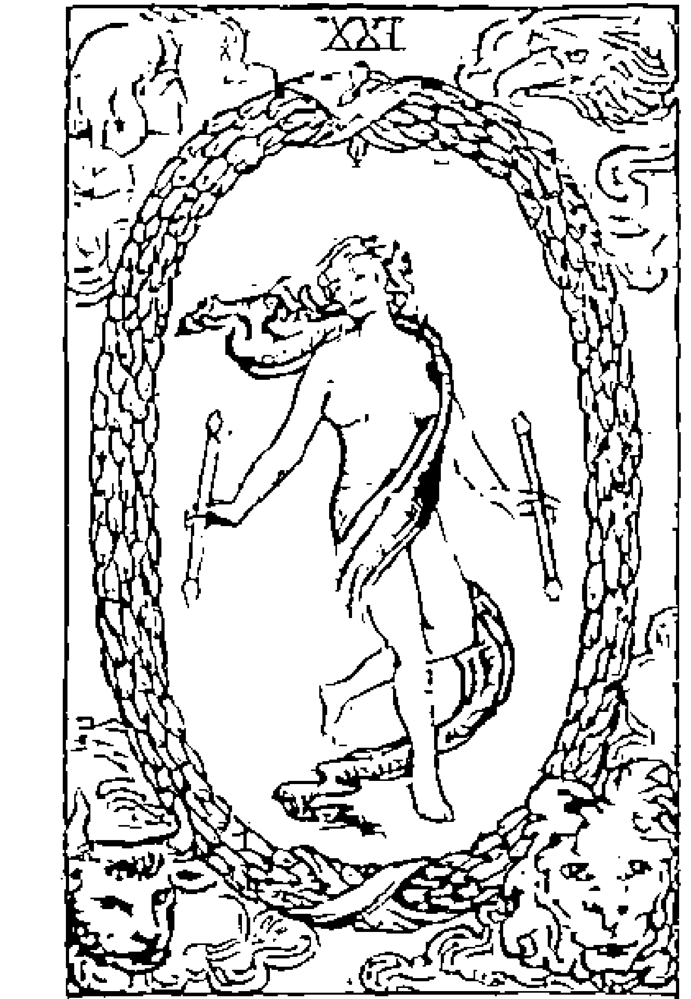

個世界中，倒吊人已經可以接受每個人都獨立的個體，每個人都有所差異，想法不同、作為也不同，願意找尋新的合作方案，以同時滿足每一個人。

世界牌代表著生命不停流轉、永恆不息，這是一個結束，也是一個開始，愚人的旅程到達終點站，所有的心靈與物質，內在與外在都富足飽滿，所有的能量提升到最高點，然而這並不是個結束，而是另一個新人生的開始。

牌中的少女握著兩根權杖，代表具有很好的行動力，一支權杖指引著前進的力量，另一支則疏導著後退，既能攻也可守，人生的方向完全掌握在自己的手中。外圈不停轉動的桂冠是勝利的象徵，代表著成功的模式不停循環轉動；而桂冠上的紅色帶呈現無

## 塔羅能量數字占卜

限大的符號，代表生命的無限擴張與成長。少女身上繫緊了一條紫色絲帶，這是靈性的上的富裕、情感層面的滿足、強大的行動力，以及良好的洞悉能力，這四種能量相輔相成，又相互牽制，讓生命持續成功、持續擴張。抽到這張牌的人，代表你已完成所有的任務，所有難關你也都一一擊破了，現在是豐收的時刻，在心靈上、物質上、權力欲望上、及感情上你都擁有豐富的收穫，整個生命皆已圓滿，這樣的圓滿不僅獨享其身，還可以貢獻給其他人，善用你所擁有富足的資源，回饋大地萬物；造福整個宇宙。這般美好的結束，將引領你走向下一個開始：生命萬物不斷循環，生生不息。

## 正位牌義精解

感情：找到完美的伴侶、和諧的感情、成熟的愛情、在海外邂逅的機會。

工作：強大的行動力、圓滑的處事技巧、統整與規劃的能力、完成計劃、事情有完美的結果。

金錢：財源滾滾、投資獲利、海外投資的機會。

心靈：了解生命的真理、心胸寬大、包容力強、達到身心靈平衡。

## 逆位牌義精解

感情：內心恐懼、看似完美的感情出現裂縫、感情受阻、僵持不下的關係。

工作：不願意改變、停在舊觀念中、出現小錯誤、進度停滯不前、差一點成功。

金錢：投資失策、因投資損失財物、理財計劃被打斷。

心靈：內在無法平衡、過於膽怯、過於衝動、不願接受轉變。

## 塔羅數字能量

21 號的世界牌，具有 1 和 2 兩種能量，1 代表創造力，具有無限的創意和想像空間，2 更代表豐富的想像力，世界牌天馬行空的新想法是無邊無際的，是不可估量的。1 加 2 是 3，3 的能量將魔術師的創造力化為真實，是一種執行的力量，使創意和想像力不再只是虛幻，而是真正付諸實行的真實作為。3 所具備有極度想像力的能量，在世界牌中也得到了印證。

## 塔羅能量數字占卜

## ※ 權杖 3

## 牌義解析

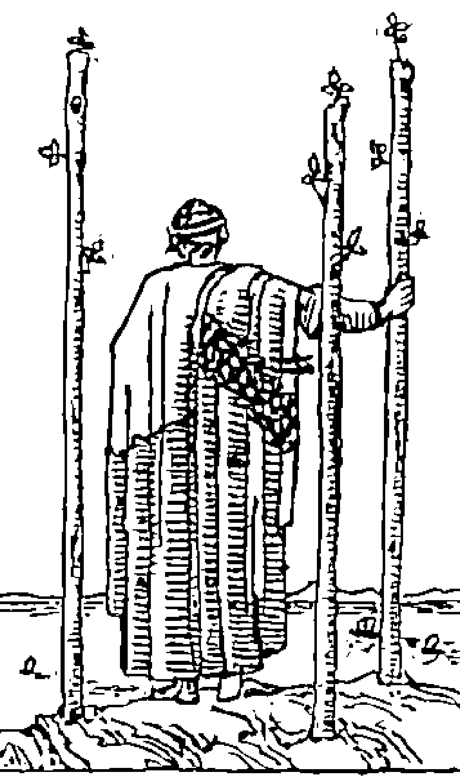

牌卡中男子擁有 3 根權杖，靜靜的看著海上來來往往的船隻，其巾也有他的商 得的財富或成就，這代表權杖 3 已完成一個階段的任務，現在正要往下一個階段或計 劃前進。權杖 2 面臨的拉扯與抉擇，現在得出了結論，權杖 3 的能量就是將這個結論 付諸實行。男子沉穩安靜地站在岸上，等待最好的時機，他像是猛獸出閘前的沉靜，已 經看準目標，等到時機到來，就火速出擊，一舉擒獲獲物。

權杖 3 代表一方面追求改變：一方面讓自己有足夠動力去做自己的事，他現在要 開始享受自己的生命。在事業方面，權杖 3 具有知識增長的能量，運用獨到的生意頭 腦和精明的眼光，為事業開拓新局面，也為自己帶來豐厚的成就和財富。

權杖 2 往往在兩種選項中猶疑不定，試圖在其中找尋平衡點，然而在權杖 3 時，千萬不要讓自己深陷二元衝突的矛盾之中，你應該抬起頭來看看，說不定會發現有另一個更適合的選擇，這就是權杖 3 所具有的冒險、驚奇的能量。權杖 3 的出現代表將會出現意外驚喜，告訴你不要執著於眼前，說不定若好好等待，會有更好的選擇出現。不過，有時候權杖 3 也代表不切實際的夢想，做事徒勞無功，在感情上往往將自己的心纏繞住，無法逃脱囚牢，也代表存在著第三者或處於三角關係，讓自己內心苦悶，感到失落或悲傷。正位牌義精解

感情：甜蜜的感情、成功的遠距戀愛、尋找新戀情。

工作：具備生意頭腦、經商交易有利、未來前途光明、合作無間的關係、生命出現驚喜。

喜。

金錢：嘗試新的理財方式、財務狀況佳、與他人共同投資獲利。

心靈：充滿動力、探索未知、謹慎規劃、迎向未來。

## 逆位牌義精解

感情：三角關係、第三者、困住自己的心、失落、悲傷。

工作：不實際的夢想、停滯不前、工作延期、所做的事白忙一場、被利用、不融洽的合作關係。金錢：獲利少、投資失敗、財富遭人利用。心靈：失去動力與精神、退縮、心靈被束縛。## 數字人生

## 數字4塔羅牌組

數字冠軍排行榜：最誠實、最忠心、做事最認真、最不容易出差錯、最難以說服。

## 牌義解析

## 4皇帝

他是皇帝，是至高無上的，所有人都要聽命於他的指揮，右手握著的球象徵全世界，左手的寶杖代表行動力和無上的力量，頭上的皇冠則是皇帝權位和尊榮的象徵。皇帝是父親的化身，為了他想鞏固、保護的東西會奮不顧身，會跟對方拚命；他身著的盔甲就是最好的象徵，時時處於備戰狀態，一刻也不鬆懈，只要有誰膽敢侵犯他的領土，

THE EMPEROR.

## 正位牌義精解

他就會和人爭個你死我活。然而華麗的紅色外袍透露出在他剛毅的外表下，有一顆熱情、感性、甚至有些脆弱的心，只是他用盔甲將其保護起來，不讓人發現，若是誰能取得他的信任，擺開他的心防，就會發現皇帝並不是永遠嚴肅令人懼怕的，他其實也有可愛的一面。

皇帝牌在感情方面屬於標準的大男人，他負責、控制欲強，對另一半是絕對的好，但也必須完全聽命於他，若另一半想和他玩掌控權的遊戲，皇帝可能就受不了了，這時或許就會另覓其他的伴侶。他永遠需要另一半的讚美和注意，這會使他感到安全感，否則他便會焦躁不安，甚至無理取闢。皇帝是不輕易表達對另一半的愛意的，或許是太重面子，儘管內心愛火奔騰，但他依然愛在心裡口難開。

皇帝的好勝心非常強烈，也十分愛面子，或許因這樣，他無法忍受自己的失敗，所以皇帝牌的人往往可以為了達到目標而不顧身，也因此皇帝牌的人在事業上、賺錢投資上通常都顧成功，但皇帝的固執、獨斷可能會為他帶來不小的麻煩，在工作當中尊重別人的意見是相當重要的，皇帝若經常堅持己見、一意孤行，恐怕會落得眾叛親離，甚至遭人怨恨的情況。

## 數字人生

感情：負責任、穩固的感情、喜歡身體碰觸、需要安全感、照顧家庭、早婚。

工作：學習力強、行事謹慎、愛面子、專制、理智、事業有成、達成目標。

心靈：充滿自信、希望受讚美與認同。

## 逆位牌義精解

感情：給不起承諾、幼稚、大男人、不負責任。

工作：意志消沉、好高騖遠、推卸責任、做事沒效率、堅持己見、難溝通。

金錢：負債卻依然奢侈消費、喜歡打腫脹充胖子、說大話。

心靈：缺乏安全感、沒有自信、渴望穩定。

## 塔羅數字能量

皇帝牌屬於4 號牌，數字4 本身就代表鞏固和安全感，所以皇帝牌對於他想要保護或鞏固的事物會竭盡所能的去達成，沒有人可以侵犯他的領土，去破壞他安全感的來源。當皇帝牌的人有一個目標的時候，他通常會採取最安全的方式去取得，這是4 號牌所顯現出安定的能量，而且數字4 的人觀念本來就較為保守，改變或冒險對他來說風險太大了，他不會有想追求新事物的念頭。

## 塔羅能量數字占卜

## 牌義解析

## 13 死亡

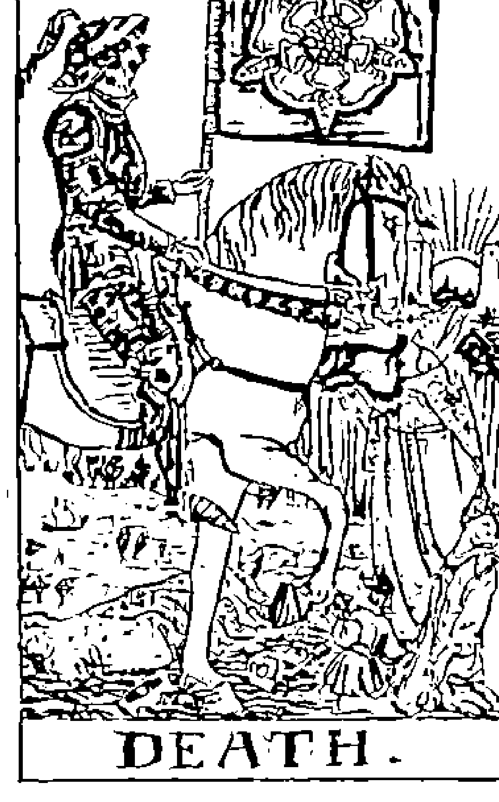

牌義解析
※ 13 死亡
死亡並不是結束，而是新生的開始，死神殺死的是舊有生活模式、舊的思維、舊的
貪痴傻，而帶來了新的轉變和機會，捨得、放下是死亡牌告訴我們的意義，我們唯有放
下過去的一切，才得以重生。
牌中死神騎著馬，手裡拿著象徵死亡的旗幟，昭告世人準備接受輪迴了；下方的四
個人各有不同面對死亡的方式，皇帝被自己的恐懼嘛死了，他的地位、權力也紛紛瓦
解，象徵著一段關係的結束、一個觀念的轉換，或是生活徹底的改變等；長年修行的教
皇，深知死亡可以帶來轉變，所以欣然地迎接死神的到來；而年輕女孩不甘就此失去生
命，她不捨人生還有許多未嘗試的事物，她抗拒死亡，跪著求死神放她一馬；至於小孩
懵懵懂懂，他才剛從死亡中獲得新生，他無懼死亡，還捧著花來迎接死神。

## 數字人生

這四個人代表著不同人面臨死亡時不同的態度，然而，無論是何種態度，死神的力量是不可抗拒的，既然抗拒不了，那我們就欣然接受吧！若選擇像少女一樣的執著頑固，生們選擇死亡是新生的開始，所以不要害怕，放下所有的執著和包袱，勇敢地迎接死亡吧！抽到死亡牌的人告訴你現在要做出一些改變，可能是換一份工作、一段戀情、轉換一個心境，或是搬家、換髮型、改變習慣等等，這些事情或許是延宕許久、或困擾你很久的事情，現在是時候要有所行動了，試著放下、捨棄過去，不要被過去纏綁住而裹足不前，一定要徹徹底底地死過一次，才能夠浴火重生，迎向成功。

## 正位牌義精解

感情：一段關係的結束、新戀情的展開、邁入更深層的關係。

工作：換工作、任務結束、工作觀念轉變、升遷、轉換工作方式、開創新的未來。

金錢：改變理財方式、改變帶來財富。

心靈：順應生命中的改變、放下過去、無畏無懼。

## 逆位牌義精解

感情：放不下舊戀情、陷入過去傷痛中、執著、走不出去、失戀。

## 塔羅能量數字占卜

## 牌義解析

兩名女子歡欣鼓舞的高舉著花束、頭帶著花圈，後方的人們也牽起雙手開心的慶祝 著，四根權杖上高掛的花果和花朵是豐收的象徵，而穩固的城堡和伫立在大地上的權杖 捍衛著我們的家園，權杖4就是一個豐收、安定的力量。 權杖3出海遠行，為了遠大的理想和目標而戰，現在努力有了成果，權杖4帶回 了傲人的戰績，現在要回到那穩固的家園，他疲憊的身心在家中可以得到紓解，家的溫 暖、安定的力量正是他現在所需要的，在家中充分休息、養精蓄銳過後，他才能夠繼續 勇往直前，再戰一百回！ 權杖4代表付出終於得到了回報，先前的努力不懈沒有白費，一切終於有了成 果，權杖4安穩的能量代表你在工作上、感情上或心靈上都十分穩定，可能是工作都 上了軌道或是感情趣於穩定，權杖4也代表有新房子、新環境、新感情、新工作環 境，或是進入家庭生活，讓整個人有所歸屬，不再飄浮不定。 然而，權杖4也提醒我們，要擁有這些安定的生活，必須要有肩膀，必須要有 任、扛起重擔，你必須一步一腳印，腳踏實地的把事情做好，休想投機取巧、一步登 天，這樣，高耸堅固的城堡才是你的，結實累累的瓜果才是你的，只要耐著性子，穩住

## 塔羅能量數字占卜

## 正位牌義精解

自己的步伐，就能獲得最後的勝利。

感情：感情穩定、浪漫的愛情、新戀情出現、進一步的承諾、結婚、共組家 庭、穩固的家庭。

工作：穩定的工作、完成任務、穩定的工作步調、努力獲得回報、有擔當。

金錢：穩定的財富、好的投資起點、從混亂中恢復穩定的收入。

心靈：內心平靜、感到充實與滿足、信任自己、享受穩定的生活。

## 逆位牌義精解

感情：缺乏安全感、守候、等待、出現第三者、不安定的愛情、缺乏責任感。

工作：假象、出現壓力、不負責任、不平静的環境、毫無進展。

金錢：不穩定的投資環境、危險的理財計劃、突然失去錢財、等待。

心靈：內心不安、思緒混亂、心情起伏不定。

## 塔羅數字能量

數字 4 具有穩固、安定的能量，給總是不断往外衝、向外冒險的權杖一個平靜自 己、休養生息的依歸，權杖 4 的四根權杖牢牢地固定在大地上，任憑風吹雨打也不動
，更強了穩固的感覺。而數字4溫暖、關愛的能量，更成為權杖心靈的補給站，權杖4 心靈的富裕平靜，在感情上的穩定，使生命更趨圓滿，權杖更有力量爲下一個目標而戰。

## ※聖杯4

## 牌義解析

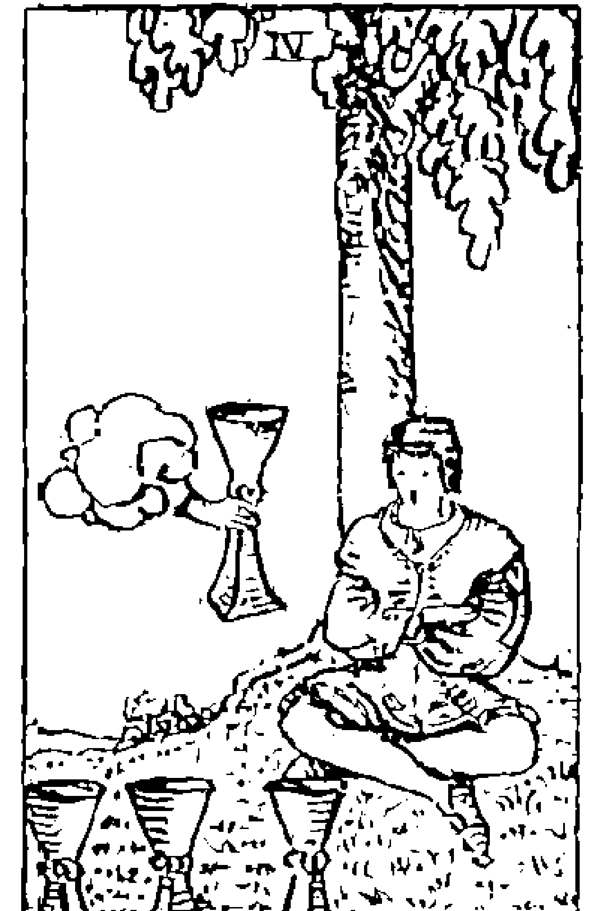

搖，，更強了穩固的感覺。而數字4溫暖、關愛的能量，更成為權杖心靈的補給站，權杖4 心靈的富裕平靜，在感情上的穩定，使生命更趨圓滿，權杖更有力量爲下一個目標而戰。

牌中的男子盤坐在樹下，雙手交叉於胸前，表情冷漠，看起來極為無聊。他看著眼前之三個杯子，這是他現在所擁有的，但他不因此而感到滿足，他要的更多。旁邊的雲朵中伸出一隻右手，為他送上另一個聖杯，這是他心裡期盼的多一個渴望：‘如果再多一個什麼就好啦！’男子默默地思索著，然而他的手依然交叉著，遲遲不敢伸手去拿，這表示男子缺乏勇氣、害怕改變。

一個什麼就好啦！男子默默地思索著，然而他的手依然交叉著，遲遲不敢伸手去拿，這表示男子缺乏勇氣、害怕改變。

## 塔羅能量數字占卜

聖杯 4 就是一個不安於現況的能量，他所擁有的已經夠多了，但他還是不滿足，還想要得到更多，然而機會終於出現了卻不敢去要，還是坐在那裏空想一動也不動，永遠只會作夢。聖杯是代表情感上的能量，聖杯 4 或許代表著一段穩固的感情，對方已付出了三個聖杯的情感，但依然無法獲得滿足，希望對方付出的更多，或是還期望另一段戀情的到來。

的，無法活在當下就會錯失掉眼前的美好，我們不應該虛度光陰，永遠想著那得不到的東西，在虛幻、不切實際的想法中打轉。應該要面對現實，珍惜眼前所擁有的，腳踏實地的生活。而當機會來臨之時，也不應膽怯退縮，要勇於接受挑戰，無懼任何改變，如此才能為自己開啟更多道窗，創造更多生命的美好。

## 正位牌義精解

感情：不滿現在的感情、過度依賴、精神外遇、多情、幼稚的感情、期待的戀情。

工作：不安於現狀、背叛自己的事業、失去工作熱忱、注意力不集中、不成熟的處事態度。

金錢：對金錢欲求不滿、感到失望、依賴他人。

## 逆位解牌經解

心靈：反感、感覺疲憊、永不滿足、做白日夢。

感情：新戀情的出現、舊感情有新希望。

工作：舊有的問題獲得解套、新階段、新機會、新工作模式。

金錢：新的投資方法或目標、出現新的可能性。

心靈：開放包容的態度、迎向新的階段。

## 塔羅數字能量

數字4 通常具有穩定、安全的能量，然而在聖杯4上卻完全不成立，聖杯4是
4號能量的反動，是數字4的另一面。穩定、安全另一種解釋就是無聊、一成不變，

聖杯4 雖然渴望生命中有新的變化、新的契機，然而他却害怕改變，遲遲不敢行動。

除此之外，數字4是兩倍的2，2代表依賴，所以聖杯4具有雙倍的依賴，特別在

感情方面，他需要比一般人更強大的情感依歸，所以可能會出現多情、監情的現象。

## ※實劍4

## 牌義解析

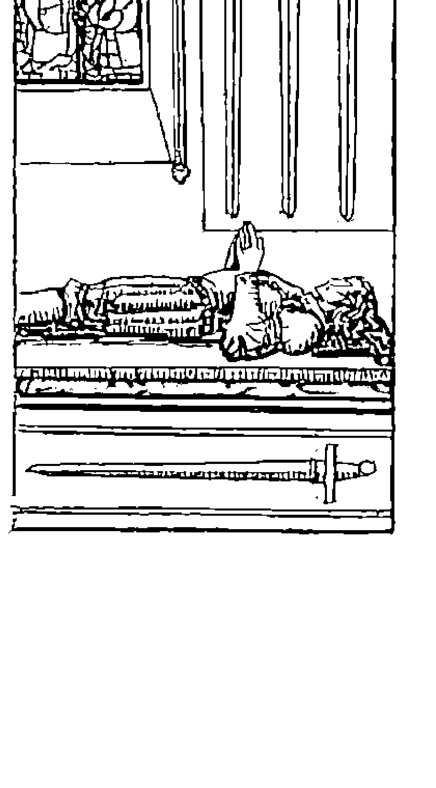

在實劍3中，三箭穿心，劍劍鋒利刺痛，弄得遍體鮮傷、難以平復。到了實劍4，是該好好休息療傷的時候了，也讓自己沉澱下來，想想過去到底犯了什麼過錯：起別人這般的剌傷他。牌中的男子靜靜地躺在棺木上，他雙手合十，虔誠地懺悔過往的錯誤。下方的金黃色寶劍，沾滿了男子曾經殺戮過的鮮血，代表他曾經蠶橫跋扈、作風強勢，因而傷害過別人；而上方的三把寶劍同時向男子的方向刺去，這些都是男子曾經得罪或傷害過的人，現在群起來圍攻他，男子現在才驚覺，過去的所作所為造成現在四面楚歌的情勢，他悲傷、懊惱，也充滿了困惑與不解，他不知道自己為什麼這麼失敗，也不知道問題到底出在哪，於是把自己沉靜下來，好好反省，要找出問題的癥結點，或許問題解決了，

## 數字人生

寶劍又可以再度出鞘，馳騁沙場。

厭不振，必須要靠自己的意志力，找出問題的所在，好好的反省、改變自己，才能讓自已快速地站起來。雖然寶劍4的人現在身處逆勢，但牌中的彩繪玻璃灑下一絲曙光，
改過革新之後，必定會有光明璀璨的人生，況且寶劍4是個幸運星，在家人關係、情感關係或是友誼關係中，一定有人肯伸出援手，給予你支持和協助的。

## 正位牌義精解

感情：孤獨、絕望、感情受傷、逃避心理。

工作：遭受挫折、面臨威脅、採取消極的做法、自我放逐、不敢向前、放棄。

金錢：投資失敗、不敢投資、放棄投資。

心靈：自我封閉、沉澱心靈、精神壓力大、無法面對現實。

## 逆位牌義精解

感情：決定走出情傷、放下

## 数字人生

而，混乱的状态却是数字5不可或缺的过程，从混沌当中，能够让数字5成长与茁壮，亲身体验过的摇扎才是最有价值的经验。从数字4中蜕变之后，数字5显得自我由、不受拘束，在自由自在的环境中，才能让数字5发挥成功的特质，厘清与认同自我正向解读：勇于冒险、不怕挑战、自我成长、自由自在、享受生活乐趣、不受拘束、好奇心十足。负向解读：好战、攻击性强、愤怒、恐惧、欲望、遗失、失落、为达目的不择手段。代表颜色：蓝色。适合职业：心灵导师、宗教人士、教育专业、业务性质的工作、空服人员、与海外相关。数字冠军排行榜：最宁住自由、最善变、学习能力最好、最叛逆、好奇心最重、最有攻击性。

## 塔罗能量数字占卜

## 数字5塔罗牌组

## ※5 教皇

## 牌义解析

教皇是属於师长型的人物，他是心灵导师，是为了服务大众、救赎众生的心灵而生。教皇的右手向天，传递宇宙灵性的能量，左手持着三叉权杖，赋予教皇敏锐的直觉来向世人解释上天的旨意。牌卡下方的两个人就是教皇的追随者，两个人皆為秃头，代表他们精神层面的乾渴、窮困，他们正等待教皇的救赎，带领着他们一同提升净化心灵。

教皇具有极正面、向上的能量，可以淬炼升华自我，更可以带领他人一同向上，而教皇心中存在著二元冲突，红色的外袍即代表教皇内心潜在对权力、欲望的渴望，他

的内心是相互纠结冲突的，要如何单纯的传递宇宙的能量，带领群众向上提升，而抑制住想要掌控大众、获取权力的心呢？这是教皇所必须克服的难题，教皇脚下的钥匙可以是通向天堂的金锦，也可以引领追随者开启地狱的大门。教皇拥有着一颗宽大慈悲的心，他生来就是要帮助他人，为社會、为群众牺牲奉献献，必须把家人、情人放一旁。但对他来说，能够造福大众的大爱比这些小情小爱重要得多，他以成就大众的幸福快乐为使命，因此，教皇非常适合从事神职人员、社工人員或心理諮詢师等工作。教皇牌也代表现在正面临抉择的状态，可能是对人生方向的抉择，或是情感方面的抉择。除此之外，教皇牌的人在溝通能力和學習力上都具有强大的能量，他常常成为体中溝通協調的桥梁，吸收學習新事物上也比一般人来得快速。

## 正向牌义精解

感情：面临抉择、宽大无私的爱、情感豐沛、相互包容的關係。

工作：具有教师特质、坚毅有恒心、能够解决艱鉅的任务、服务与照顧他人。

金錢：具有良好的賺錢能力、金錢無慮、与銀行金庫相連結。

心靈：心胸寬大、慈悲、具有大爱、愿意幫助別人。

## 塔罗数字能量

属于5号牌组的教皇，具有冒險犯難、樂觀、不怕苦難的能量，所以教皇牌的人喜歡

救赎別人，替別人解決問題、提升大眾的心靈。即使任務相當艱難，教皇牌的人依舊視

为自己的使命，務必達成任務。5号牌也具有變動、喜好自由、富有好奇心的能量，所以

教皇牌也代表著出國留學或海外旅行的機會，喜歡吸收新知，擁有很棒的學習能力。

## 数字人生

## 牌义解析

什么是對？什么是錯？什么是该做的？什么是该做的？生命中没有絕对的是非對錯，该如何取捨、该進该退都是經过自己調節平衡後所做的決定，我们生命當中无時無刻都在做這樣的中和試驗。節制牌就是生命中遭遇衝突、混亂或對立的調節能量，兩個杯子象徵陰與陽、男與女、是與非，这是兩種意見、兩種做法或兩種態度交互運轉的能量，哪一種该多一點、哪一種该少一點都端看自己心中的那一把尺。整张牌再再透露出二元對立的融合，牌面中兩個杯子一个属火、一个属水，水火相互融協調。天使胸前的徽章，是由代表精神層面的白色方格，和代表物質層面的橘色三角形所組成，这是物質和精神層次中和的能量，而天使的腳一隻则踩在象徵理性的陸地上，这也是兩種能量自我調節的過程。透過兩種元素不断的調和試驗，讓我们釐清現在這混亂的狀況，或許調節的過程中会經過重重挑戰，但後方升起的太陽告訴我們，在經過完美的融合和調節過後，將會出現另一個轉機或全新的希望。節制牌代表著對自己的處事或態度上要適當的做些調整；例如個性太衝的人要學習耐住性子，深思熟慮後再做行動；容易鑽牛角尖的人要試著放寬心，不要想東想西庸人

自擾；而行事被動的人要學著轉換態度，積極主動出擊。節制牌的課題就是要你審視自

己；調節自己那多一點或少一點的部分，只要有行動去改變現況，事情就一定會有轉

機，許多問題一定都能迎刃而解。

## 正向牌义精解

感情：對等溝通、心靈上的調和、互補關係、完美的結合、成功的戀情與婚姻。

工作：透過溝通來協調衝突、調節做事的方式、良好的合作關係、尋求中庸之道。

金錢：節制對物質的欲望、開源節流、收支平衡、有效地運用金錢。

心靈：調節內心達到平衡的狀態。

## 逆向牌义精解

感情：溝通不良、不對等的感情、情緒化、缺乏耐性、意氣用事。

工作：適應不良、找不出解決的辦法、偏執、行為失衡、陷入僵局、過度衝動或過度懦

弱。

金錢：過度浪費或過度節儉、孤注一擲的投資。

心靈：偏激、單一思考模式、固執己見、心靈失衡。

## 數字人生

## 權杖5

## 牌义解析

看著這張牌，带给你什麼樣的感覺？沒錯！這就是一個混亂、廢殺較勁的情況，牌中的五个人拿著權杖拚個你死我活，谁也不肯讓誰，每個人都想稱王，都想在團體中位居領导地位，所以戰爭就發生了。牌中五个人所穿的衣服、鞋子顏色各異，代表彼此不同的立場和觀點，各個心懷鬼胎默默在心中盤算策劃著。這五个人拿權杖的方式也都不

同，代表五種做事方法、五種人生目標、五種想法、五種欲望。如此這般的分歧局面，要不衝突、不對立、不門個头破血流也難。權杖5就是一個狀況百出、衝突混亂的象徵，它具有暴動的能量，代表外在的不和諧與內在的衝突。權杖5代表正處於一個痛苦的局面，內心有很多聲音和想法不斷的拉扯自己，他可能想放棄某段關係，但內心卻有多種想法讓他不知如何是好，也可能正面臨權力門爭的局面，必須要時時提防、不斷的門爭才能夠確保自己的地位。權杖5可能會被這些衝突門爭弄得身心俱疲或焦躁不安，對生命感到有些失望。然而，權杖5這樣好強好勝、不斷爭奪的原因，是出自於內在的恐懼和焦慮，或許是他極度的缺乏自信，所以需要靠不斷的和他人競爭，來奪得眾人勝利的掌聲；來獲得自得心靈短暫的緩解，無法真正解決根本的問題。權杖5的人應該要正視自己的內心，一味的逞凶鬥狠，只能獲得心理：第三者、多角戀、價值觀不同、感情疏遠、因意見不同而爭吵、分手、舊情復正位牌义精解工作：權力門爭、衝突、工作中惹是非、小人、事情遭遇阻礙、無法順利升遷、發生口

角。

金錢：金錢上的衝突和紛爭、投資有去無回。

心靈：情緒焦躁、不安全感、面臨生命的挑戰、內心痛苦掙扎。 逆位牌义精解 感情：猶豫不決的關係、矛盾的感情、爭吵過後的妥協、無法離開的感情、必須包容對方。 工作：衝突、爭執、遺受欺騙、用蠻力解決問題。 金錢：遭到欺騙而損失錢財、詐騙集團、金錢上的衝突、錢財受到束縛。 心靈：混亂的情緒、內心矛盾焦躁。 塔羅數字能量 極具行動力的權杖碰到想要獲得團體認同的數字5，就變成權力門爭、斃殺較勁的場面。數字5擁有強勢、好勝的能量，靠著不斷的競爭與衝突獲得權力與地位，獲得其他同伴的尊敬和臣服，唯有透過門爭才能讓數字5承認自己存在的價值，才能讓找出生命的意義。數字5不斷戰鬥，試圖擴大版圖，這是成就感的來源，也是數字5所具有的能量。

## 塔羅能量數字占卜

## ※聖杯5

## 牌义解析

聖杯5呈現出悲傷、失落的氛圍，此时正處於低潮的狀態。牌卡中的男子用黑色斗篷將自己緊緊的包住，垂头喪氣地看著眼前三個倒下的杯子。這三個杯子代表逝去的過往，是他錯失的機會，他無法釋懷，無法理解為何自己付出了這麼多、做了那麼多勞力，卻得不到好的結果。他將自己沉浸在無止境的憂愁和哀傷中，却看不見後面還有兩個完好的杯子，事實上男子還是有機會、有人支持著他的，然而極度的悲觀蒙蔽了他的雙眼，使他看不見人生還有許多轉機和美好之處。這是一個因失去而帶來的強大失落和絕望的能量，或許是一段感情，你付出了自己的全部，却換來分手的結局；或是曾經努力所獲得的豐功偉業，如今卻毀於一旦。你惋惜、你沉痛、你是多麼的不甘心啊！由於受傷太深於是將自己緊緊的封閉住，不想再

做任何的付出和努力，然而，正所謂山窮水盡疑無路，柳暗花明又一村，我們人生往往

存在著新契機，若是一味地想着逝去的過往而駐足不前，就會錯失掉更多的機會。

聖杯 5 應該了解到，現在你或許很絕望、很痛苦，但絕不可因此一蹶不振，應該要繼續努力朝自己的目標邁進。只要抬起頭來看看周圍，就會發現事情並沒有這麼糟，還

來了，因此從現在開始，丟掉過去的枷鎖，把握現有的機會，繼續踏上人生的旅程吧！

## 正位牌义精解

感情：後悔、傷心、一段感情結束、不快樂的感情、對過去戀情無法釋懷、覺得自己無

法再愛下去。

工作：失去工作、合作關係結束、錯失機會、感到失落和悲傷、無法忘懷過去的陰霾、

無法擺脫過去的工作模式。

金錢：金钱流失、後悔先前的投資計劃、沒有獲利的理財計劃。

心靈：內心被過往的傷痛所困住、鑽牛角尖、看不見未來。

## 逆位牌义精解

感情：走出過往的傷痛、嘗試新戀情、有希望的感情。

[PAGE 144]

## 塔羅能量數字占卜

## ※寶劍5

## 牌义解析

這是一場殘酷的廝殺惡門，為了欲望、權力或利益彼此爭強鬥狠，殺個你死我活。正前方的男子意氣風發露出得意的笑容，顯然是贏得了這場惡戰。他左手握著自己的寶劍，右手還拿著兩把，旁邊有兩個垂頭喪氣的人和兩把躺落地上的寶劍，顯示出他戰功顯赫，用他的心機和智慧打敗所有的人。然而，天空中厚重的烏雲代表著戰敗者強烈的憤怒與仇恨，一層一層強大的負面能量聚集積累，總有一天將全體反撲，向男子復仇，這就是門爭所留下的業力。

男子現在的志得意滿和快樂只是暫時，雖然贏得了想要的东西，卻輸掉了人與人之間的信任和友好關係。他用盡心計不擇手段的贏得勝利，却在工作上或許在同一個團體中為了取得主導的地位而明爭暗鬥，甚至引爆衝突；在感情上比較自私，常常只想到自己而不在乎他人的感受。攻擊與爭奪似乎成了寶劍5的習慣，但其實這是寶劍 5 為了證明自己的手段，找出自我價值的方式。

寶劍 5 必須要好好的檢視自己內心，這樣無止境的「爭」，是否真的快樂呢？只

要造成傷害，傷者勢必會回過頭來復仇，而為了不被打倒，你又必須用更殘酷的手段，犧牲更多的人以獲得勝利。如此冤冤相報、惡性循環的結果只會把自己弄得傷痕累累、跟叛親離，爬得愈高卻愈感到寒冷孤寂。

試著釐清自我吧！找出自己的價值才能釋放好戰的那一面，而放下才是唯一解套的方法。實劍5的課題就是要告訴我們，退一步才是真的海闊天空，步步緊逼，逼死的不僅是別人，還是自己。把心放寬，笑著揮別一切的紛紛擾擾吧！和平安穩才是真正的幸福。

## 正位牌义精解

感情：破壞他人的感情、不名譽的關係、出現競爭對手、心胸狹窄、感情關係墮落。

工作：征服對手、獲得權力、有衝突事件、違別人中傷或出賣、違同事怨恨、受到權力的誘惑。

金錢：金钱紛爭、出現對手、不好的名聲。

心靈：孤單寂寞、自私、內心衝突、憂鬱沮喪。

## 逆位牌义精解

感情：感情遇上挫折、消極的感情觀、從失敗的經驗中成長。

工作：為了目的不擇手段、失敗機率增加、不幸的事件降臨、充滿不確定性。

[PAGE 147]

## 數字人生

## ※錢幣5

金錢：金钱虧損、物質世界的誘惑。 塔羅數字能量 心靈：豁然開朗、自我反省、從錯誤中成長。 實劍5擁有數字5的混亂、鬥爭的能量，這是一場惡鬥，是眾人分食一塊大餅的狀態，為了得到權力或地位，善戰的實劍向所有人宣戰，把和他作對的人殺個片甲不歸，最終奪得想要的东西。然而，別忘了，實劍具有

## 數字人生

## 數字6——為愛犧牲與付出

你好，是數字6常常冒出的台詞。因此，這類型的人常常會採用自己主觀認為對的方針來對待周遭的人們，而如何控制愛意與控制欲，則是數字6重要的課題。

從數字1一路走來，數字6經歷了大大小小的挫敗與勝利，在這個階段，經驗值已經累積到一定程度，再加上克服了數字5的混亂，取得了協調的能力，讓數字6能夠體驗人生第一波成功的滋味，在工作、理財方面，都能有不錯的表現。然而，數字6還是要小心過度主觀的問題，成功容易帶來驕傲，建議多多詢問他人的建議，不要太過獨斷才好。

數字6對自己的要求非常嚴格，具有強烈的道德觀，對他們來說，一規範一是很重要的事情，有時候數字6外表看起來浪漫，但內心可是非常正經、嚴肅的，他會把每件事情都套進社會道德的框架中，例如：認為不該有婚前性行為等等，只要數字6認定這件事情不符合道德規範，便會死命堅守這個原則，他們嚴格的要求自己每一個小細節，說話、舉止、胖瘦、美醜，多一點少一點都不行，而除了要求自己，他們還會要求別人，所以往往為身邊的人也帶來壓力。

正向解讀：犧牲奉獻、有正義感、盡責、忠誠度高、替人著想、嚴肅、一絲不苟。

負向解讀：殉道者、內咎、被框架限制住、不修邊幅、不太關心別人、喜怒不形於色。

## 數字人生

## 數字6塔羅牌組

牌義解析

## ※6戀人

## 數字6塔羅牌組

戀人牌充滿著愛的能量，天使散播愛的光芒，帶來祝福與光明，牌中的男女是亞當和夏娃，他們不顧外界的阻擋為了愛勇往直前，男人的後方是生命樹，樹上燃起熊熊火焰，代表旺盛的生命力，也代表掌控和欲望，所以抽到這張牌的男性大多都有大男人主義，女人的後方是棵知識樹，是智慧的象徵，而樹上的蛇則象徵著愛變與轉化，也是一種誘惑與禁忌，牌中的男女相愛卻沒有緊靠在一起，中間的高山代表愛情中的重重阻礙與考驗，然而雲朵搭起兩人溝通的橋梁，讓彼此的心靈得以交流，這代表著愛情並非只是肉體上的接觸，需要兩人彼此心靈相契，並能通過各種考驗和磨難，才是至死不渝的懸人牌和兩性關係、情感關係相關聯，雙方正進入結合的階段，或許是感情開花結果；或是彼此在事業上的合作，不論是哪種關係的結合，雙方都必須相互協調、妥協，找到最佳的平衡點，才能維持維持這段關係。然而樹上的蛇和阻擋的高山告訴我們，這段關係中存在著誤惑、猜疑和不信任，或許是在事業上對合作夥伴的不信任，或是在感情中彼此之間有疙瘩，仍然存在著不確定性……，總而言之，要維持愛的穩定長久，要這個愛完整沒有瑕疵，雙方都必須懂得付出、珍惜這段情感才行，愛是要有肉欲、物質和靈魂之間的溝通，愛也是要雙方相互信任，一起面對問題克服挑戰的，唯有雙方的協調合作，關係才會走得長久。

## 數字人生

## 正位牌義精解

感情：完美的愛情、相互信任的愛、和諧、樂觀、鞏固的愛情、受到祝福的戀情、愛情出現小摩擦但不致構成大傷害。

工作：合作關係良好、尋求合作關係、貴人出現、面臨重大抉擇、注重道德觀、良好的

金錢：金錢的誘惑、藉合作關係獲得利益。

心靈：探尋真實的自我、找回純真的心靈。

## 逆位牌義精解

感情：盲目的犧牲、不信任的愛情、猜忌、過度的占有欲、缺乏自信。

工作：無法達成共識、言語衝突、溝通不協調、容易自責內疚。

金錢：因為金錢誘惑而做出不道德的事情。

心靈：自我欺騙、不誠實、內心搖擺矛盾。

## 塔羅數字能量

在數字學中，屬於6號牌組的戀人牌，具有願意為愛付出一切、犧牲奉獻的能量。在數字3中，人們開始學會在三種能量中融合接納、找尋平衡，是和諧的概念 - 

## 塔羅能量數字占卜

## ※15 魔鬼

## 牌義解析

而數字6是兩個3所組成，更強調人與人之間的和諧，是一種無條件的愛、無私的給 予和奉獻。在戀人牌中所散發的正是滿滿愛的能量，這是一個和諧、充滿祝福的氛圍， 然而數字6具備控制、不信任的能量，可能會懷疑對方，會有負面的情緒產生，這也 是一段關係中需要雙方共同克服解決的問題。

人生在世，我們為自己的理想、為身邊所愛的人、為認為值得的事物打拚，不斷的 犧牲奉獻，付出所有的愛。然而付出的愈多，欲望的胃口就愈來愈大，例如在工作上希 望努力能獲取更多的報酬或更高的職位，在感情上付出愈多，控制對方的欲望也就愈來 愈強烈，於是，魔鬼出現了，用層層枷鎖把你綁綁住，使你動彈不得。

## 數字人生

魔鬼牌的出現，表示人類深受欲望的控制，在工作方面，這是個很好的現象，代表著進取的野心，不斷的要求自己，牌中的男女都長了一條尾巴，男人的尾巴是火，是對 一種繼續生存下去的欲望；而女子的尾巴是一串豐收的葡萄：是對安全感、穩定生活的渴求，為了達到這些需求，就必須更努力、更積極，在工作、理財、感情關係中皆然。

在情感方面，魔鬼牌也代表著兩人的關係更進一步，走入了柴米油鹽醬醋茶的世界，可是更深度的交往關係，也可能是走入了婚姻生活，兩人都對彼此有更多的在乎與關懷，希望更進一步了解對方的世界，於是嫉妒、控制欲不免隨之而來。

魔鬼帶來很多欲望，讓人積極奮鬥，但也帶來許多壓迫。適時地放過自己吧！放下對他人的控制欲和壓抑自己的種種教條，脖子上的鎖鏈是鬆的，你隨時都可以解開枷鎖、擺脫束縛，就端看自己的選擇了。

## 正位牌義精解

感情：關係更加緊密、控制欲強、過度重視性愛、需要安全感、壓抑、受束縛。

工作：為利益而工作、獲得權力和地位、為了得到權力而不惜代價、工作狂。

金錢：將金錢物質放在第一位、為錢不顧一切、獲取金錢和名利。

心靈：受到物質欲望的束縛、受社會教條的束縛、壓抑、忽略心靈層面的需求。

## 逆位牌義精解

感情：放下所有的束縛、願意為感情負責、改正自己的控制欲、關係回歸自由。

工作：不受權力欲望的束縛、找回工作的價值與意義、相互依賴的合作關係、用不正當的方式追求權力和地位。

金錢：放下過度的金錢欲望、以不正當的方式獲取錢財、利慾薰心。

心靈：心靈重獲自由、找回內心的價值和理想。

## 塔羅數字能量

在數字學當中，魔鬼牌是15號牌，1加5等於6，具有6號牌組的特性。6號牌總是循規蹈矩、恪守教條；為了愛不惜犧牲自我、全方位付出；而在魔鬼牌中太多過度的付出和愛，形成一股莫大的壓力，一條絕對不可打破的規範，控制著意志和心靈。魔鬼牌也具備數字1和數字5的能量，1在這個位置的出现，會開始深深考慮，自己的付出究竟值不值得，並渴望得到自由，想要得到更多，想要以輕鬆的方式來解決問題；而數字5存在著教皇的能量，代表無條件的愛，全心全意的付出。

問題；而數字5存在著教皇的能量，代表無條件的愛，全心全意的付出。

## 數字人生

## ※權杖6

## 牌義精解

經過權杖5的一場混亂斬殺、腥風血雨之後，在權杖6中不同的意見和紛爭終於被統一，大家有志一同的朝既定的目標邁進，成功可說是勝券在望。牌中男子騎著白馬凱旋歸來，男子高舉著權杖歡欣鼓舞的迎接他，男子頭上和權杖上都戴著桂冠，象徵著勝利與榮耀，也象徵著男子充滿無比的信心去面對人生，只要充滿信心，便能無懼人生中的任何難題和挑戰。牌中眾人擁護一同歡慶勝利，男子並非獨自分享喜悦，代表勝利是團體合作的成果，可能是公司團隊的努力，或是和客戶達成一致的共識，進而造就全體最大的利益。權杖6是一張代表成功、好運到來的牌，由於先前努力的化解紛爭，尋求解套的方法，現在開啟了新契機，混亂弭平了，風暴也過去了，好運接二連三的發生，可能是受 到上司的重用，或是投資獲利，也或是夫妻、情人間化解了誤會，感情穩定發展。

然而，權杖6的人要特别注意，勝利之時絕不可太過驕傲自大，人站在愈高的位 置就要愈懂得謙卑，否則將遭受眾人的攻擊，使你跌得更慘。權杖6因為現在的勝利 是權杖6所要警惕我們的事情。

## 正位解牌關鍵字

感情：成功的戀情、戀情開花結果、感情順利發展。

工作：好工作機會上門、同事團結一致、成功達成目標、溝通協商順利、無往不利。

金錢：投資成功、完善的理財規劃、資金豐厚。

心靈：榮譽感、充滿自信、歡愉、擁有動力和熱情。

## 逆位解牌關鍵字

感情：感情遭背叛、失戀、缺乏熱誠的愛、禁不起失戇的打擊。

工作：計劃延期、被挫折打敗、一時的勝利、表面上的成功、成功遙遙無期。

金錢：投資功虧一篤、帳面數字漂亮，但實際獲利很少。

心靈：內心恐懼、缺乏信心、失去熱情、不相信自己能成功。

## 塔羅數字能量

## ※聖杯6

## 牌義解析

6 號牌組是經過數字5的混亂、衝突、平衡過後，所得到的勝利果實。在權杖6中，經過一番衝突、勾心門角之後，眾人達成共識，團結合作的達成目標。正所謂團結力量大，一個團結、目標一致的團體，比起一個人單槍匹馬的戰門要強大幾萬倍。現在正是共同奮戰、贏得勝利的時候，大家手舞足蹈分享高悅，這就是權杖6的能量。

聖杯6 蕴藏着犧牲付出、照顧守護的能量。牌卡後方的房子穩健牢固，是最安全的庇護所，而左手邊有一名男子手持利矛，正快步走回碉堡，身負起保衛這塊土地的任務，阻止任何人傷害孩童及家園。前方的兩名孩童正在搬運盆栽，高大的男孩肩負起保…

## 塔羅能量數字占卜

因為對彼此還不了解，所以始終有一些溝籬。

戀人牌中兩人的距離到了魔鬼牌便有大躍進的突破，數字6的愛意在此裡變得更加濃烈，兩人的脖子上各自掛上鐵鍊，連繁著兩人，雖然讓彼此的距離縮短，但也製造了控制與界線，這也是數字6的能量，照顧與付出的另外一面便是掌控與束縛。在感情方面，如果說戀人牌是曖昧期與熱戰期，那麼，魔鬼牌就是磨合期了，在這個階段兩人的關係雖然更進一步，但也因為更加熟悉彼此的性格，也會產生更多的摩擦與爭吵。

數字6其中隱含著付出與控制的學問，這在聖杯6與錢幣6中可略見一二。無庸置疑的，數字6天生擁有樂於分享的性格，但也具有過於主觀的問題，常常一味的付出，卻忘了關心受照顧者的感受；錢幣6的濟貧畫面，富人雖然公平的施捨與給予，但受施者卻是跪著領受錢幣，難道真正公平嗎？再說聖杯6的無私照顧，也可能讓小女孩變得不純潔立呢！這些問題都是數字6在付出的同時必須思考的課題。

獲得初步勝利的數字6比起其他數字，顯得充滿自信，就像權杖6的騎士一般，看起來志得意滿。白馬上披著亮眼的鮮綠披風，除了宣示和平與反戰之外，也突顯出數字6的審美觀。數字6很注重外表，雖然不像數字3能夠引領風潮，但總是能將自己打理得乾淨整齊、符合時宜，因此很適合從事與美容相關的行業。

## 數字人生

## 數字能量靜心

循規蹈矩的數字6，有時候也會被自己設下的教條給困住。在實劍6中，傳統的規範可以讓人邁向成功，也可能變成阻礙。因此，數字6必須注意過度主觀與驕傲的問題，適時聆聽他人的建議，不要忘記，幸運的數字6總是會有責人在身邊，只要稍微變通一下，克服困境其實沒有那麼困難。

浪漫的數字6常常會因為感情上的問題所困擾，針對感情的模式，你可以採用一解決路徑圖一來化解感情問題。方法很簡單，如果目前面臨情感或是人際關係的瓶頸，你可以設想十到十二项的解決方式，將這些策略畫在問題的下方，形成龐大的樹枝圖，這就是專屬你的解決路徑圖，是解決這件事情的各種不同方法。然後，將這個解決路徑圖用粉紅色的盒子裝起來，粉紅色是跟愛有關的能量，代表用愛的能量去包圍一切的衝突與爭執，表示非常有誠意要解決人際關係的問題與困難，最好還可以放上二張兩人的合照在上頭，更能夠固雙方的關係，這就是既簡單又有效的情感小魔法。

## 數字 7 —— 善用頭腦的智者

7 是所有數字牌組中最聰明的數字，不僅頭腦好、反應快，還善於利用理性的思維去處理事情。所以即便身處危機之中，數字 7 依然有辦法能夠全身而退，而且通常都是以「奇招」致勝，讓人猜也猜不透。數字 7 具備豐足的自信，因為他們自知比別人聰明，懂得運用一些小策略，而數字 7 也是好戰和貪心的；有許多想法和欲望，希望獲得滿足，會為了自己的目標而戰。相較於數字 5，兩者同樣是好戰的數字。然而數字 5 的攻擊比較直接，往往沒有多想，傾向與人正面交鋒，拧個你死我活；而數字 7 的攻擊則顯得迂迴，達成目的的、又能保全自己的選項，不過，非不必要的時候，數字 7 不会與人正面衝突，这也是他們比數字 5 更聰明的地方。因為數字 7 的聰明過人、善於思考分析，往往會想得很多很難，反而使自己變得猶豫不決，無法做決定，例如計劃投資理財，數字 7 可能會蹦出比其他人更多的方案與計劃，每一個都非常好，都會有不同的收穫，但這反而造成數字 7 不知如何取捨，

而十分苦惱了！數字 7 也代表自己怎麼看待自己、怎麼看待別人，會將自己的看法，投射到別人身上。

正向解讀：聰明、理性、有分析頭腦、反應快、意志力堅強、不輕言放棄、好勝心強、有教養、威嚴。

負向解讀：想很多、貪心、猶豫不決、二元衝突、小聰明、雞裡挑骨頭。

代表顏色：紫色

適合的職業：專業型與研究型的工作，例如律師、醫師、會計師、數學家。需要分析能 力以及與數字相關的行業，像是股市、股票、銀行業，另外具偵查性質的 記者和徵信業者也很適合。

數字冠軍排行榜：最聰明、最有行銷頭腦、最能抓住成功的捷徑、最貪心、最喜歡在雞 蛋裡挑骨頭。

## 數字7塔羅牌組

## ♧7戰車

## 牌義解析

戰士駕著戰車勇往直前，朝著自己的目標和夢想挺進，後方的城堡代表強大的後盾，許多的支持、資源、希望都寄託在戰士的身上，他擁有豐富的資源，但也有許多壓力。戰車是行動力和生命力的象徵，車頂上的斗篷佈滿了星星，代表戰士爲了目標，夙夜匪懈的努力，不僅匯集所有的力量和資源於一身，也極具行動力，因此，戰士的成功是指日可待的。戰士手上的權杖，具有強大的能量，而肩膀上的明月，則是直覺力的象徵，幫助戰士。

士引導自己走向正確的方向。戰士身上的盤甲表示正處備戰狀態，也是防衛心的象徵，牠處處提防小心，有時會顯得疑心病較重，而戰車前方的兩隻人面獅身是力量的象徵；牠們都有明顯的乳房，代表戰士外在資源相當充足，然而兩隻人面獅身一黑一白，又面朝不同的方向，代表存在著二元衝突，內心的拉扯掙扎不斷。戰車牌雖然擁有眾多的資源、運氣也不錯，自身又肯拚、肯努力，然而經常處於猶豫不決、矛盾狀態之中，可能是老早有人幫你鋪好路了，只是道路太多條：每一條又好像都很不錯，於是戰車牌的人就開始不知所措，不知道該選哪一條路才好。戰車牌的灰。倒不如就什麼也别想，運用戰車牌與生俱來的直覺能力吧！憑直覺去選擇你要走的路，往往會獲得意想不到的成功呢！

感情：永不放棄的精神、努力獲取對方的愛、以真心打動對方、擊敗競爭對手。工作：意志力堅強、有豐富的支持和資源、行事謹慎、不輕舉妄動、只要正面迎戰就能實現夢想、有海外發展的機會。金錢：資金富足、豐富的資源。

## 心靈：充滿信心、獲得支持的力量、奮戰的精神。

## 逆位牌義精解

感情：一廂情願、單戀、面臨挫折、防衛心強、情緒突然崩潰。

工作：與人對立、倉促行動、沒有深思熟慮的決定、猶豫不決、過於主觀。

金錢：資金不足、被名利沖昏頭。

心靈：內心拚扎拉扯、面臨二元衝突、焦慮不安。

## 塔羅數字能量

戰車牌屬數字 7 的能量，數字 7 代表頭腦，代表理性的思考模式。當戰車面臨二
元對立的抉擇時，會運用自身的智慧；在腦中反覆推演分析；運用理智去判斷一切的狀
況，再做出自己認為最適當的決定。數字 7 通常十分主觀，會將自己的想法，投射到
別人的身上，認為別人也應該要和自己擁有同樣的想法及行為模式，因此戰士牌的人在
對人對事上，常常以刻板印象來看待他人。

## ※16塔

## 牌義精解

人生住世，我們內心或許積累了許許多多負面的情緒，為了某種原因不得不一再的
壓抑自己，所有痛苦挣扎都往肚裡吞，然而這些負面的能量並非就此消散，而是在內心
愈積愈高、愈積愈深，等到內心無法承受之時，就像山洪爆發般爆炸開來，一發不可收
拾。

塔牌的能量就是代表有件突如其來、不可預期的事情發生，所有局勢有了重大的轉
變，你必須當機立斷做出決定，來解決現在的問題。會爆發如此大的變革，是因為之前
長久以來沒有真誠的面對內心的自我，可能是在感情上一直在自欺欺人，或是一直汲汲
營營地追求名利而忽略了內心真正的渴求。跳出塔的一男一女，代表隱藏的感情問題終
於爆發，或許是雙方一直沒有坦誠的面對對方，彼此相互猜忌、你爭我奪，卻又始終不
把問題說出來討論，最後終究導致分手的結果。

塔牌也代表著置之死地而後生，這場災難將過去的付出和努力都摧毀了，但塔牌的課題是要告訴我們，要吸取過去的教訓，要學習寬恕、放下一切，快速的從這場災難中獲得成長、改變自己。事實上這場災難並非突然爆發，而是已經累積一段時間了，你早就已經知道問題的存在，現在爆發出來是要強迫你去正視、面對這個問題，進而解決問題，才能迎向嶄新的未來。因此，抽到塔牌並非是壞事，它提醒你，該正視自己的內心了，你和真的實的自己分開太久，必須重新和自己對話，徹底消弭內在所有負面的能量。

## 正位牌義精解

感情：突如其來的轉變、累積的情緒一次爆發、不誠實的感情、從過往戀情中學習愛情、開創新的感情模式。

工作：突然發生的事情、轉變過去的觀念、自我改正、拋棄過去的束縛、學習寬恕。

金錢：意外損失大筆錢財、從過去的理財方式中獲取教訓。

心靈：沒有誠實的對自我、內心複雜混亂、透過混亂來整合自己。

## 逆位牌義精解

感情：持續壓抑內心情緒、走不出過往的情傷中、不坦誠的愛情。

## 數字人生

## ※權杖7

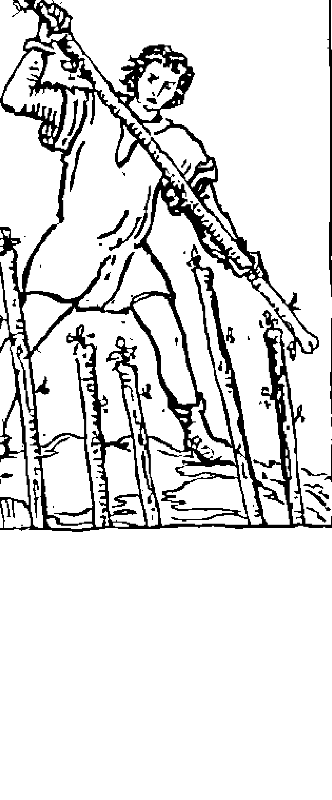

工作；過度緊張、壓抑自我、執著於舊有模式、不願意改變。

金錢：理財計劃遭到中斷、金錢損失、鑽牛角尖。

心靈：逃避現實、不願面對真實的自我、沉溺於過去的傷痛中、不願拋下逝去的過往。

## 塔羅數字能量

塔牌屬於數字16，1加6等於7。塔牌具有數字7進化過的能量，7代表重新自我釐清，要用更高的意志和智慧，來轉化可能會發生的災難，要做出一個決定，來改變未來的局面。就如同塔牌中長期壓抑的負面能量突然爆發，必須運用智慧來平衡內心衝突，做出決定來改變自己，這樣的決定可能會讓自己不舒服，會覺得很痛苦，但這是轉變所必經的過程，必須堅持下去才能避免災難再度發生。

## 塔羅能數字占卜

## 牌義精解

門爭又再度展開了！在權杖5時殘酷的火拚斷殺，到了權杖6時贏得了勝利，受
到眾人的歡呼擁戴，然而，在權杖7時，底下的人又開始蠢蠢欲動，決心來個大反撲。

牌卡中的男子拿著權杖，奮力向下擊退敵人，雖然是以一擊六，但男子的臉依舊鎮定，透
露出自信，這表示男子是個驍勇善戰、堅毅不拔的人，也代表目前的危機必須要靠自己
力量化解，任何人都無法幫上忙，男子身處高位，拿著在權杖6中凱旋歸來的戰利品應
戰，顯示男子是高人一等的，有一定的權力和地位，所以這場戰事成功的可能性很高。

權杖7代表為了目標而奮戰，為了達成目標，即便其中會有許多挑戰、許多反對
的聲浪，依舊決心放手一搏。這類型的人通常十分強悍、行事大膽；且勇於冒險，只要
是他們下決心要做的事情，無論如何都會堅持到底，他們的心像一團火球，既熱情又
奔放！他們愛要愛得轟轟烈烈，工作也是個拚命三郎，一路衝到底。

這樣的個性是造就成功不可或缺的因素之一，權杖7是代表挑戰的出現，只要發
揮堅毅、永不放棄的決心，必定能克服所有難關，成功就在不遠處，然而權杖7的人
容易存在著根深蒂固的觀念，戀棲於過往的經驗，這反而成為你邁向成功的绊腳石。

## 正位牌義精解

感情：愛情中佔優勢、勇於挑戰競爭對手、戀情成功、不放棄受阻擾的愛情、堅定的意 志力。

工作：佔據有利的位置、堅持達成目標、積極面對挑戰、有恒心、成功盡在不遠處。

金錢：能夠回收成本、遇到挫折也不放棄。

心靈：內心堅強、永不放棄、努力奮戰的精神。

## 逆位牌義精解

感情：猶豫不決、進退兩難、害怕、陷入僵局。

工作：缺乏自信、處於弱勢、手足無措、面臨二元抉擇、無法解決問題。

金錢：遇到限制、退縮心態、投資條件不佳。

心靈：不相信自己、軟弱、容易動搖、缺乏勇氣和衝勁。

## 塔羅數字能量

數字7 象徵著目標，也象徵著單獨的狀態。權杖

## 數字人生

## 逆位牌義精解

心靈：有智慧、往前邁進的力量、深思熟慮後才行動。

感情：結束戀情、之前的信任遭到破壞、突然爆發衝突口角。

工作：創業失敗、失去了先前擁有的成就或資源、不在預期之中的意外。

金錢：投資失利、一夕之間財富盡失、揮霍無度、錯誤的理財規劃。

心靈：遭遇挫敗、震驚、沮喪、沒有珍惜身邊的資源。

## 塔羅數字能量

錢幣 7 繼含了數字 7，分析、謹慎的能量，決定事情之前必定會審慮思考，不會冒然行動。錢幣 7 先前的努力終於有了成果，身邊有一些小資源可以運用，然而數字 7 的能量使他思考下一步的方向時，會相當謹慎，經過一番研究分析後，才會做出自己認為最保險的決定。有時候會太過猶豫不決，想太多而看不清楚方向，或是因為想得太久，把大好的機會錯失掉了。

## 數字 7 的塔羅故事

數字 7 的腦袋時時刻刻都在運轉，而且是高速轉動，想的還都和别人不太一樣，時常冒出令人跌破眼鏡的想法，點子之多之奇特，常常被歸類為鬼才型的人物。數字 7 的人很理智，邏輯推理能力很好，喜歡分析身邊所有事情，很適合從事研究、規劃分析的工作。數字 7 不僅腦袋活動十分熱絡，意志力也是出奇的堅強，這類型的人只要搭配足夠的行動力，成功的機率通常很高。

戰略分析：戰士知道自己有十足把握，他堅定的眼神，透露出幾分自信。數字 7 具有精細的分析能力，在行動之前，會從自身資源、環境條件、其他變因等去推敲適合的戰略，他的腦袋中會出現 A 計劃、B 計劃，甚至還有候補策略，以防臨時出現巨大變動。但也由於數字 7 的腦筋動得太快，一時之間許多想法充斥腦中，有時候也會讓數字 7 陷入苦思，不知道要選哪一個才好。當數字 7 的腦袋消化不良時，腳步也會跟著混亂，塔牌就是很典型的狀態。數字 7 是很理性的能量，習慣用理智來解決所有事情，對世界充滿著批判與價值判斷，當這種評斷變成挑剔時，負面能量就逐漸上揚與堆積。

## 數字人生

積，當數字 7 輪迴過後，在塔牌中一次爆發，而整場混亂也提醒著數字 7 整合與釐清自我的重要課題。數字 7 搭配上寶劍，讓思考分析的能量更加强烈，兩股力量交融之下，往往能夠造就出奇制勝的驚人策略，就像寶劍 7 中的男子一樣，雖然勢單力薄，但只要偷走敵軍最關鍵的武器，照樣能夠夠將敵方一軍，雙方勢力不至於相差太多。數字 7 總能讓自己處在上風，權杖 7 中的男子，雖然同樣的以寡擊眾，但占據了良好的地理位置，讓自己更具優勢。有時候，數字 7 的願望很多，凡事都想要嘗試看看，似乎有些貪心，數字 7 總認為人生不夠完美，老覺得缺了什麼，腦筋動得快的他們，馬上就能列出一系列願望清單，永遠又臭又長，而且每一項，數字 7 都覺得無比重要。聖杯 7 中，每一個杯子都裝載著一個願望，每一項看上去都不可或缺，讓黑衣人猶豫不決，再度陷入混亂的狀態之中。數字 7 常常因為欲望太多，但又無法一一實現，而讓自己感到深深的無力感。思考的力量幫助數字 7 解決難題，有時卻又為自己造就難題。進入混沌狀態時，可別跟著亂了手腳，建議數字 7 將自己的思維好好修整一番，沉澱自己的心靈，才能更了解自己的需求與渴望，就像錢幣 7 中的農夫一樣，停下腳步或許是不错的做法。

## 塔羅能量數字占卜

## 數字能量靜心

數字 7 智慣用理智的眼光看待世界，因此對生命有很多的批判跟評斷，顯得憤世競俗，甚至會出現雞蛋裡挑骨頭的狀況，不僅讓周邊的人充滿壓力，也讓自己充斥著負面情緒。關於這樣的狀況，「亂語靜心」是很不錯的選擇，能夠幫助數字 7 �舒緊緊繃的發條，釋放負面的能量。提醒你，要做「亂語靜心」之前，請挑選一個空曠的場地，不要有太多雜物，以免在過程中讓自己受傷。選定安全的場域之後，再來請挑選一首節奏快一點的音樂，音樂類型沒有限制，只要自己覺得舒服的就可以了。接下來，請閉上眼睛，隨著音樂的節奏先往右邊連續旋轉十分鐘。在旋轉的過程中，你可以隨著心靈發出聲音，不要多想，這時候潛意識中冒出什麼話語，就儘當拋出來。向右轉可以幫助你將頭腦既有的刻板印象、過往的負面經驗通通轉出去，使你忘卻過去所有的紛紛擾擾，讓身心靈完全浮空。完成之後，再緊接著往左邊轉，同樣十分鐘左右。左轉是把好的能量拉進來，讓你的思緒朝正面、積極的方向走，這樣就能完成一整套「亂語靜心」的流程。

## 數字 8——目標明確、勇往直前！

## 數字人生

經過數字 7 的整合之後，數字 8 做事情有條有理，明確地清楚自己的目標，氣勢非常旺盛。8 號類型的人渴望權力，希望透過權力掌控一切，希望眾人依照他的指令行事。數字 8 呈現出對權力與地位的欲望，也跟性能力、債務、不動產有關。這類型的人通常是老謀深算的人物，不像其他人只看到事情的表象，他能夠立即參透真相，默默醞釀與策劃，接著一次出擊，使對手措手不及。數字 8 是偶數的最後一個數字。數字 2 代表情感上的需求、溝通與矛盾，數字 4 帶有穩固、安定的力量，而數字 6 突顯出付出、奉獻的感覺，到了最後一個偶數，數字 8 要跟世界結合，或是排除全世界，活在自己的世界中，這是兩個極端的選項。數字 8 的格局與視野廣大深遠，如果要做大事的话，通常都没有問題。數字 8 非常渴望權力和地位，為了達到目標，做任何事情都認真、努力不解，而且身邊具備豐厚的資源，往往都能坐上高位，比較容易得到成功，然而，數字 8 如此渴望權力和各種欲望，是源自於極度的不安全感，數字 4 崇向穩固與安定的狀態，需要大量的安全感，而 8 由兩個 4 所組成，更是需要加倍的和安定力量，而權利與地位便是數字 8 安全感的來源。

正向解讀：勤奮、努力、雄心壯志、資源豐厚、支持的力量、有相當的成就、勇於挑戰 自我、清楚自己的目標、成功就在不遠處。

負向解讀：控制欲、極度不安全感、意志力薄弱、怠惰、鬆散懶散。

代表顏色：白色

適合的職業：適合擔任調度指揮的角色，例如領導者、主管、店長。另外也適合往演藝 事業、媒體業、表演藝術方面發展。

數字冠軍排行榜：最堅持、最有氣勢、最老謀深算、最有規劃、物欲最重、最受面子。

## 塔羅能量數字占卜

## 數字 8 塔羅牌組

## 牌義解析

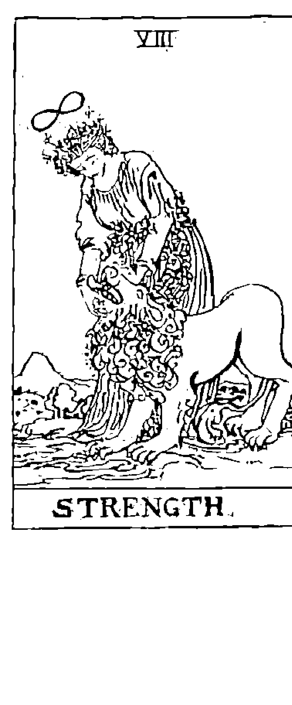

牌中的少女面對兇猛的獅子無所畏懼，反而溫柔的、安詳的撫摸著獅子，用柔性的力量制服這頭猛獸，少女的手直接碰觸獅子身上最危險的部分——尖牙，代表少女充滿無比的勇氣，力量牌的人就是具備滿滿的勇氣和力量，喜愛向高難度挑戰，而且遇到困難時絕不會硬碰硬，往往選擇以柔克剛，反而能達成目標。力量牌的人對權利與欲望有強烈的渴求，掌控欲也很強，獅子代表著權利和欲望，或是所欲達成的目標。也代表挑戰和阻礙，意味著在追求目標的過程中可能面臨的磨難，需要運用智慧和勇氣去克服，就如同少女制服獅子一般。少女頭上無限大的符號，是力量與智慧的象徵，也暗喻著未來發展的無限可能，另外也代表勇敢、有智慧、未來無可限量，有極大的發展空間。

## 正位牌義精解

感情：剛萌芽的戀情、用柔性的力量征服對方、以愛感化對方、運用勇氣和自信追求愛情。

工作：對權利或地位有強烈的欲望、出奇制勝、以柔克剛、反其道而行最終獲得勝利。

金錢：大方、物質欲望強盛、對金錢有強烈的掌控欲和支配欲。

心靈：有勇氣和智慧、具有柔性的力量、運用智慧化解危機、追求權利和欲望。

## 逆位牌義精解

感情：控制欲旺盛、過度強勢、不擅表達情感、沒有自信、意氣用事。

工作：猶豫不決、不相信自己、喜歡挑戰危險的事物而導致危險。

金錢：物欲控制自己、愛慕虛榮、浪費、崇尚名牌、重視外表、守不住錢財。

心靈：缺乏自信、過度在意別人的眼光、希望獲得認同和讚賞。

## 數字人生

## 牌義解析

## ※8 力量

牌中的少女面對兇猛的獅子無所畏懼，反而溫柔的、安詳的撫摸著獅子，用柔性的力量制服這頭猛獸，少女的手直接碰觸獅子身上最危險的部分——尖牙，代表少女充滿無比的勇氣，力量牌的人就是具備滿滿的勇氣和力量，喜愛向高難度挑戰，而且遇到困難時絕不會硬碰硬，往往選擇以柔克剛，反而能達成目標。力量牌的人對權利與欲望有強烈的渴求，掌控欲也很強，獅子代表著權利和欲望，或是所欲達成的目標。也代表挑戰和阻礙，意味著在追求目標的過程中可能面臨的磨難，需要運用智慧和勇氣去克服，就如同少女制服獅子一般。少女頭上無限大的符號，是力量與智慧的象徵，也暗喻著未來發展的無限可能，另外也代表勇敢、有智慧、未來無可限量，有極大的發展空間。

## 正位牌義精解

感情：感情不穩定、陷入迷惘、鑽牛角尖、無法驚嘆目前的感情、想逃脫現在的狀況。

工作：緊急事件、有衝突發生、不穩定的環境、無法施展。

金錢：不穩定的投資市場、金錢糾紛。

心靈：固步自封、對自己失去信心、太在乎外界的想法。

## 逆位牌義精解

感情：決定要背叛、憂鬱、捨脫一段不好的感情、覺醒、嘗試放下。

工作：沒有自信、可能有意外發生、捨脫枷鎖和束縛、改變現況。

金錢：發現之前的錯誤、改變理財計劃、嘗試新的理財方式。

心靈：懂得放下、對過去得以釋懷、找到自己的方向。

## 塔羅數字能量

## [17星星]

## 牌義解析

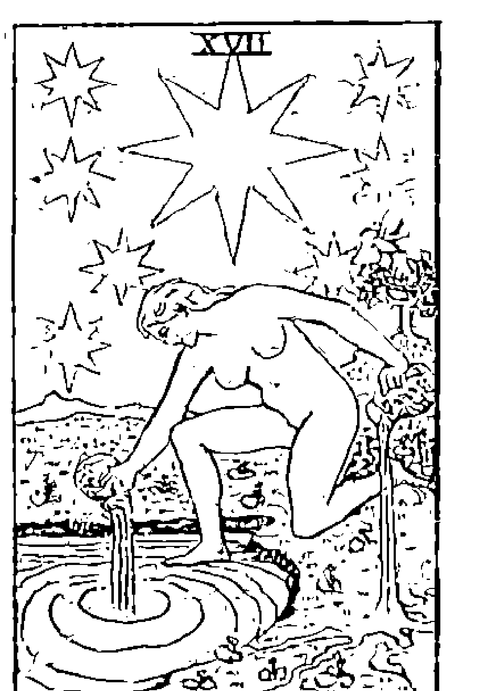

力量牌擁有數字 8 的能量，8 號牌對於物質、權力和欲望有強烈的渴求；事實上，這些渴求源自於內心的不安全感。數字 8 由兩個 4 所組成，4 號牌組是對穩定和安全感的渴望，希望擁有家的感覺，所以數字 8 更對安全感的需求。因此力量牌不斷追尋權力，無不希望能站得更高更穩，獲得足夠的安全感。數字 8 的人通常有點霸氣、很強勢，勇於追求自己想要的事物，去體現自己的個人價值。這類型的人也十分注重階級和地位，認為自己獨樹一格、與眾不同。

星星牌是一個重生的力量，是一個新希望、新的開始，歷經先前的束縛、壓抑，到

## 正位牌義精解

感情：愛情充滿希望、不受拘束的關係、靈性層次的愛、光明的未來。

工作：樂觀、充滿希望、有信心、新機會的出現、有責人運、超越自我的成就、成功近
在咫尺。

金錢：新的投資機會、賺錢的機會、能夠賺取利益。

## 逆位牌義精解

感情：令人失望的感情、沮喪、難過、開始懷疑和不信任對方。

工作：悲觀、沒有衝勁、還沒做就放棄、固執、猶豫不決、失去機會。

金錢：投資運不好、錯失機會、不相信自己。

## 心靈：重拾信心、對人生充滿希望、心靈平靜與自由。

## 塔羅數字能量

17 號的星星牌，在數字學中歸類為 8 號牌組，不僅具有數字 8 的能量，也具有數字 1 和數字 7 的能量。數字 1 蕴藏自我和行動力的特質，代表星星牌的蟬變，是自 己採取主動，是自己選擇要改變，數字 7 則代表從中釐清問題，進一步了解生命的目 標，兩股力量相互衝擊與協調，讓星星牌從混亂、毀滅之中，走向一個平靜、祥和的狀 熊，在這裡，數字 8 聚集了廣大的資源和能量，已經擁有一定的權力，具備足夠的資本，得以朝新的方向邁進，數字 8 很清楚自己要的是什麼，能夠往對的方向努力奮 门，終將開

## 数字人生

工作：一步一脚印、努力不懈、脚踏实地、一定会成功、工作十分专注、喜爱自己的工作。
金钱：资金或成本充足、持续累积财富、做好万全的准备。
心灵：勤奋踏实、积极、稳定扎实的人生观、谦虚、率直。

## 逆位牌义精解

感情：不守承诺、不负责任、还没打算定下来、不安稳的爱情。
工作：没有门志、缺乏工作动力、投机取巧、高估自己的能力、不肯努力、妄想一步登天。
金钱：毫无理财观念、缺乏收支概念。
心灵：自负、虚伪、幻想一步登天。

## 塔罗数字能量

钱币 8 具有数字 8 勤力不懈、精益求精的能量，尽管钱币 8 的人已是高高在上、名利双收了，但绝不会因此而停滞不前。数字 8 对自己的期望很高，会不断求进步，希望获得更高的成就，这也跟数字 8 具有强大的权力和欲望有关，钱币 8 也蘊藏了数字 6 和数字 2 的能量，所以他们一切的奮鬥努力，都是为了奉献给所爱的人，然

而数字 2 的能量却点出了钱币 8 的盲点，要如何在工作和生活间取得平衡，消弭二元冲突，这就考验着钱币 8 的智慧了。

数字 8 经过数字 7 的整合自我之后，愈来愈清楚自己的使命与目标，往往能夠将人生发展做好完整的规划与衡量，数字 8 很清楚自己的界线，渾身上下散发出自信，这类型的人说話或者行事作风都很有气势，很能掌控全局，非常適合擔任主持、領导或者談判性质的工作，由於清楚自己的定位与资源，数字 8 做事果決，行事有效率，全身充满了成功的特質。

力量牌中，女子虽然手无縛难之力，但却充满勇氣，完全不畏惧凶猛的獅子，反而善用柔性的力量克服猛獸，这突顯出数字 8 善於拿捏分寸，虽然看起來严肃，但也能放下身段，掌握了陰陽調和的力量，所以有时候你會发现，数字 8 的人其實個性跟外表完全搭不上，外表看似柔弱，却內藏驚人的力量與勇氣。

權杖 8 的八根權杖正說明了数字 8 在工作上讲究效率、目标明确、行事果決的一

面，也如圣杯8，一旦发现自己不足的地方，就會立刻转身鯉向山林尋找，无論目前的狀态如何，数字8都不會因此滿足，他對权力与欲望的渴求无止无尽，不容易被滿足，因此，数字8会不断要求自己，不只跟同儕竞争，也要跟自己比賽，在圣杯8中，即便眼前已经擺滿了七座圣杯，男子仍毅然披上紅袍，带着热情与勇氣，再度向自己挑戰。数字8是個梦想实践家，不只是畫大餅而已，他对人生的种种规划，会按照自己的节律与腳步，逐一實踐，这种能量在钱币8中明显展露，工匠專心地打造钱币，认真的神情说明了他对自我的要求，不容自己有一絲的懶懈；数字8在事業上是標準的續優股與資優生，但比较起來，在处理情感關係上就顯得有待加強，钱币8的工匠全心全意地工作，完全忽略遠方的家園與親人，意味著数字8容易将心力全放在自我的規劃與發展上，容易讓人生的比例失去平衡。数字8在工作上往往表現良好，但在感情上常常不及格，数字8有兩種極端的類型，一種是全身上下散发出迷人自信，傲氣逼人；而另一種则是极度缺乏安全感，需要不斷證明自己被深深愛著、自己擁有許多物質。就像寶劍8的女子，不斷懷疑自己，懷疑別人，想盡辦法找回安全感。她蒙住自己的眼睛，讓腦中更增添恐怖的氣氛，反而

## 数字能量諮心

数字8对權力、地位与各種欲望有莫大的渴求，人生充滿著許多願望，也容易耽溺於聲色娛樂的享受当中。一旦列入了数字8的欲望名單中，即便是壞習慣，卻像強迫症一樣，怎麼改也改不掉。因此，整合生命中種種欲望，对数字8來說是很重要的課題。

課題。

迫症一樣，怎麼改也改不掉。因此，整合生命中種種欲望，对数字8來說是很重要的

想想看，過去的人生當中，曾經出現過哪些不好的習慣，将這些壞習慣全部寫下來。再針對這些習慣，寫出轉移目標的小對策。舉例來說，如果你正在減肥，卻又對油炸物毫無抵抗力，這時候你可以告訴自己：「那就吃顆蘋果吧！」或者，你是揮霍無度的購物狂，下次經過精品店櫥窗時，轉個彎，去買一張可愛的卡片吧！整理過後，你就会很清楚，哪些欲望原來就是人生痛苦的來源，你必须下定决心放掉這些習慣，藉由放下過多的欲望，讓自己的心靈得到紓解。

## 数字9——慈悲为怀的修行者

数字9是最後一個數字，經歷了大風大浪，故事即將進入尾聲。数字9代表著更高層次的愛，意味著慈悲與大愛。這跟数字6的愛不太一樣，数字6的標的針對個人，只為所愛的人犧牲奉獻，並且希望獲得回饋，而数字9能夠將世界看得清楚透徹，因此賦予自己巨大的使命，期望以自身的力量，讓整個社會、整個宇宙變得更好，然而，如果数字9發現自己沒有能力改變狀態的時候，就容易變得極端，變得憤世疾俗。他會感到痛苦與無奈，覺得自己不屬於這個世界的，對整個社會充滿排斥，這是数字9負面的能量。

数字9非常天真，但有时候會過於理想主義，他們非常博愛，总是希望能讓社會

炸物毫無抵抗力，這時候，你可以告訴自己：「那就吃顆蘋果吧！」或者，你是揮霍無度的購物狂，下次經過精品店櫥窗時，轉個彎，去買一張可愛的卡片吧！整理過後，你就会很清楚，哪些欲望原來就是人生痛苦的來源，你必须下定决心放掉這些習慣，藉由放下過多的欲望，讓自己的心靈得到紓解。

## 塔羅能量數字占卜

数字9相信，即使自己的力量小，但是只要能讓地球更好，他都很願意身體力行，這正 是生命價值的所在。歷經了数字1到数字8的風風雨雨，数字9已經累積了許許多多的經驗，能夠 把事情看得很透徹，但有时候真相是醜陋、恐怖的，也讓数字9增添了許多煩惱與恐 惧。舉例來說，在科技日漸進步的同時，数字9卻看到了環境汙染的危機，擔心親子 教育問題，也煩惱人際關係的疏離，数字9總是將愛擠及人群，秉持著人道主義，對 世界充滿關懷，而相對地，他看待事情的面向也會較其他數字來得深遠與多元。 数字9非常細心，行事小心謹慎，不過有時候反倒成為阻礙自己的力量，想得愈 久，就愈多顧慮，徒增許多無謂的煩惱和恐懼，反而成為導向成功的絆腳石了。 正向解讀：善良、慈悲、大愛、富有同情心、天真、樂於幫助人、心思縝密、有智慧、 謹慎小心、完美主義。 負向解讀：憤世嫉俗、想得太多、恐懼、煩惱多、杞人憂天。 代表顏色：紫紅色。

## 數字人生

## 牌義解析

## ※9 隱者

## 數字9塔羅牌組

一個老人手持權杖、提著燭台，用黑色斗篷將自己包裹住，頭低低的站著，老人是

適合的職業：公益事業，例如社工、志工、慈善團體，或與永續發展相關的工作，像是

能源再生事業、綠事業。另外歷史悠久的行業也很適合，例如傳統產業、

數字冠軍排行榜：最細心、最有耐心、最完美主義、最悲觀、最具大愛、最有使命感。

古蹟維修、建築業、歷史學者、考古學家等等。

## 塔羅能量數字占卜

## 正位牌義精解

一位隱者，他無法面對真實，無法獲得滿足，於是選擇背對人群，將自己與外界隔絕開來，他需要遠離外界的紛紛擾擾，好讓他得以沉澱下來，審視內在的自己，思考下一步該怎麼走。隱者提著的燭台是六芒星散發出的光芒，這是智慧之光，引領隱者思考的方向，找到未來的道路。六芒星點出隱者的智慧，他是極為聰明及心思縷密的，他很清楚自己要的是什麼、該如何得到，只是目前正在思考階段，等到準備就緒，隱者便會勇往直前、完成使命，而隱者手中的權杖正代表他是具有行動力的，不全然的封閉自己，只是隱者行事較為小心謹慎，絕不會輕舉妄動。隱者或許現在正需要一點空間靜下心來好好思考，可能是在感情上需要冷靜下來，給彼此時間和空間處理目前的狀況，調整彼此的關係或相處模式。或許在工作上是該暫時停下腳步，好好思考下一步該怎麼走，思考自身的價值在哪裡？隱者牌的人是個完美主義者，對自己要求很嚴苛，不容許有一絲的汙點。他們的思維往往讓人摸不著頭緒，也認為別人都不了解自己。隱者擁有長者的智慧，透過不斷的思考分析來提升自己，使自己不斷的成長。

## 數字人生

## 感情：保護自己、害怕受傷、需要給彼此時間和空間、冷靜思考的階段、不要過度依賴

另一半。

## 工作：心思細密、注意細節、小心謹慎、從反省中成長、思考未來的方向、面對現實、

感到滿足、用智慧達成目標。

## 金錢：好的賺錢能力、反思金錢與物質背後的意義、不取不義之財。

## 心靈：富有智慧、慈悲、大愛、知道自己要什麼。

## 逆位牌義精解

感情：不滿足、自私、沒有自信、胡思亂想。

## 工作：總是批評門爭、雞蛋裡挑骨頭、心不在焉、在乎別人的看法、逃避現實。

## 金錢：一毛不拔、小氣、只顧自身利益。

## 心靈：封閉自我、自我中心、想太多、庸人自擾。

## 塔羅數字能量

隱者牌在數字學中屬於 9 號牌組，具備數字 9 心思縝密、小心謹慎的特性。因此

隱者牌在做人處事上，往往會想得比別人多，也絕不會衝動行事。數字 9 很有智慧，

能夠看透事情的發展脈絡，因此在決定事情前總是在腦中規劃思量許久，因此有些人會

覺得數字9的人行事龜毛，思考的能量同樣在隱者牌中顯現，隱者透過思考，讓自己更清楚未來的方向，但想得太多，也容易讓自己產生恐懼與懷疑。

是讓我們看清楚自己的內心。月亮代表夢，反映出最真實的自我，將被我埋藏在內心夜幕低垂，大大的月亮高掛天際，太陽是讓我們看清楚外在的物質世界，而月亮則

深處的恐懼與不安喚醒，提醒我們正視這個問題。月亮下方的狗和狼正在對著月亮狂吠，狗代表過往的經驗和記憶，狼則代表野性的自我和生命中的誘惑，我們內心理性的

自我，不斷和過去、和外在的誘惑，或是和狂野、獸性的本能衝突拉扯，因此產生了困惑、掙扎、矛盾或衝突，甚至出現恐懼，不敢面對真實的自己。水中剛剛探出頭來的龍

## 數字人生

蝦，正代表深深的恐懼和不安全感，只要有一點風吹草動，牠馬上又會縮回水中。猜忌、懷疑，這些細微的情緒是你不願被外人所知，或是你極力想要遺忘的記憶。然而再怎麼騙、怎麼躲還是逃脫不了自己的內心，暫時隱藏的問題並非真的不見，而是愈積愈多到身心無法負荷的那一天為止。月亮牌具有很強烈的感知能力，在內心深處其實早就察覺這些異樣了，只是自己願不願意去面對而已。月亮是有陰晴圓缺的，在滿月能量最強大的時候，是下決心、做出改變的好時時機，而當月亮由盈轉虧，能量逐漸消散的時候，正是擺脫過去負面經驗、迎向嶄新未來的絕佳時機，因此月亮牌的人必須要學習到，勇於面對深藏在心底已久的負面能量，試著去改變它、化解它，才能夠真正擺別陰霾，迎向人生下一個里程碑。

## 正位牌義精解

感情：感到焦慮、內心充滿恐懼、對愛情的不信任、莫名的擔憂、情緒化、情緒不安。

## 工作：對不確定的事感到害怕、不安與迷惘、潛在的危機、受欺騙或中傷。

## 金錢：遭到設計、不理性的投資、被自己的幻覺蒙蔽。

## 心靈：對未來與未知恐慌不安、自己騙自己、害怕改變、不願意面對現實。

## 逆位牌義精解

感情：情緒起伏大、充滿謊言的愛情、受到欺騙與傷害、多愁善感、猜疑。

## 工作：患得患失、缺乏自信、恐懼、出現危機、遭受口舌是非。

## 金錢：遭到欺騙或詐欺、損失金錢。

## 心靈：內心恐懼襲捲而來、極度缺乏安全感、焦慮不安。

## 塔羅數字能量

18 號的月亮牌屬於 9 號牌組，想得太多所以內心隱藏著深深的不安與恐懼。數字 9 是個很矜持的數字，常常將真實的自我隱藏起來，讓別人誤以為他們過得很好，什麼事情也沒有。月亮牌的出現，代表必須要經過一番苦難，必須要正視自己內心的狀態，才能夠順利突破難關，擺脫一切的束縛。月亮牌具有數字 1 和數字 8 的能量，1 代表行動與主動，而 8 則是會為了目標努力不懈，月亮牌要重拾幸福與快樂的自我，必須要歷經煎熬與努力，要具有行動力，才能夠擺脫恐懼，迎向新的人生。

## 數字人生

## ※ 權杖 9

## 牌義解析

歷經過往的風風雨雨、斷殺惡門，男子獲得了勝利，但也身負重傷，他將從戰場中奪回來的八根權杖一一排好，形成一道屏障，以防敵人再次來襲，男子神色緊張、內心恐懼，時時處於戒備狀態，他知道屏障的中間有一個大縫隙，敵人隨時有可能趁機潛

## 塔羅能量數字占卜

## 心靈：內心恐懼、悲觀、鑽牛角尖、抑鬱寡歡、壓抑。

## 逆位牌義精解

感情：彼此不信任、疑神疑鬼、關係漸漸好轉。

工作：猜忌、恐懼、正視問題、從挫折中復原。

金錢：擔心、不安、害怕、裹足不前。

心靈：對他人不信任、試圖釐清現況、走出陰霾。

## 塔羅數字能量

實劍 9 將數字 9 恐懼、不安、猜疑的能量通通喚醒，使實劍 9 不得不正視這個問題。9 號牌的人擅長偽裝自己，表面上看起來好像一點事也沒有，事實上內心早已傷痕累累、不堪負荷了。數字 9 通常想得很多很遠，為自己加諸煩惱與疑慮，使內心愈來愈沉重、愈來愈壓抑，又不懂得向外人傾訴，終於這些恐懼與不安在午夜夢迴時，如大海般席捲而來，使你驚醒。

## 數字人生

## ※錢幣 9

## 牌義解析

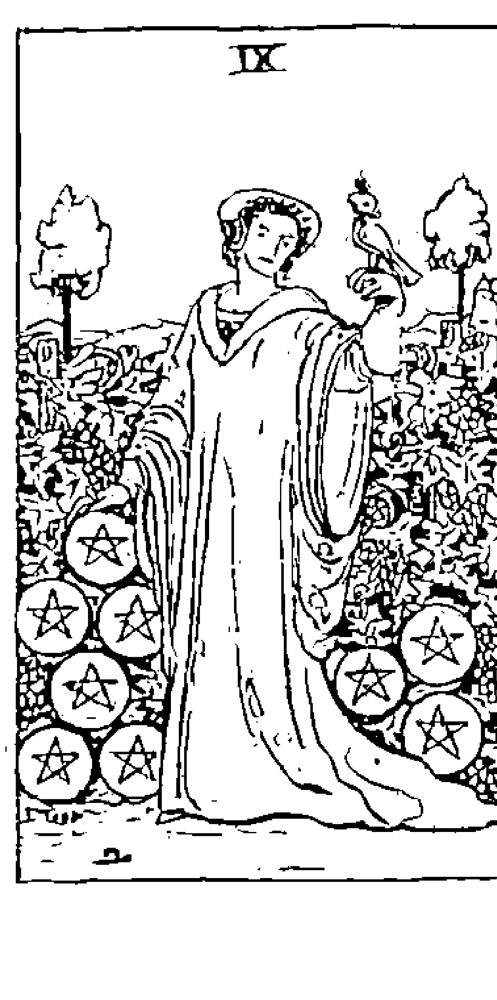

實而堅固的屏障，使女子得以無憂無慮的生活著，整個莊園瀰漫著一種富饒、幸福的喜悅，大地萬物是如此的美好，女子顯得怡然自得。牌中一串串的葡萄與錢幣，象徵優渥的物質生活，是女子先前辛勤耕耘所獲得的，現在所有的苦難都過去了，正是豐收的時候。女子的右手放在錢幣上，代表他對現況當滿意，而左手上的鳥，是女子的內心世界，鳥是沒有束縛的，代表內在的自由意識，心靈自由自在。女子身上的華服帶有金星符號，散發出充沛的愛與美，女子不僅在物質生活上很富足，還有顆慈悲的心，願意施予、幫助別人。錢幣 9 先前歷經了一番刻苦與努力，內在與外在不斷調適、脫變之後，有了現今

## 塔羅能量數字占卜

這般成就，此刻的你富饒喜悅，成功終於降臨在你的身上。而你也開始體認到施予的真 活。錢幣9的人是善良的、是慈悲的，不僅在物質生活上充裕優渥，在心靈層面上更 是獲得極大的滿足。

## 正位牌義精解

感情：戀情開花結果、甘願為愛情犧牲自由、甘願臣服於對方、滿足的愛情。

工作：努力終於有成果、有一定的權力或地位、危機已經過去、願意為工作失去自由。

金錢：投資開始獲利、由虧轉盈、衣食無缺、金錢物質生活優渥。

心靈：喜悦、安詳平靜、從容不迫、慈悲、大愛。

## 逆位牌義精解

感情：單身、感情空窗、遇到不合適的對象、未得善終的感情。

工作：半途而廢、沒有信用、主觀自我、做出錯誤的決定。

金錢：滿足於現況、斤斤計較、算計他人。

心靈：自滿、過於安逸、不求長進。

## 塔羅數字能量

## 數字9塔羅故事

錢幣9 蕴藏了數字9 慈悲、大愛的能量，和大部分的9號牌一樣，錢幣9已達到衣食無缺，擁有豐富的資源和能量的階段。相較於權杖9 和聖杯9，因為擁有的太多而不願付出與分享，反而將自己封閉住，小心翼翼的守住所屬的東西。錢幣9則懂得幫助、照顧他人，因為自身有能力了，他們願意造福大眾，讓大家都能夠過上好日子，這是錢幣9非常難能可貴的地方，正因為如此，錢幣9散發出慈悲與大愛，讓心和靈一樣充實完整。

數字9 對世界充滿使命，希望對所處的社會貢獻自身的力量，對周遭的人事物抱持著關愛的精神。這類型的人能夠從多面向來看待事情，思考的角度也較為深遠，以至於能看到別人看不到的層次。數字9屬於完美主義的一群人，行事細膩，凡事小心翼翼，再加上較能維持注意力，數字9不輕易出差錯，也能夠將交辦的事項處理得妥貼，只是，數字9屬於悲觀主義者，總是看到事情脆弱的一面，認為自己的力量太過渺小，常常感到哀愁，這類型的人時常壟罩著一股憂鬱的氣息。

## 隱士牌就是數字9最貼切的詮釋，隱者擁有深度的智慧以及豐富的人生歷歷，雖然身處高位，但有感於人生世事半點不由人，因此甘願選擇隱居鄉野，等到時機允許時，再現身奉獻自身的力量。這張牌透露出數字9淡泊名利的特質，重視精神層面大過於金錢物質，不願意同流合汙，內心擁有純粹的真善美，通常數字9的人會散發出一種看透世事的氣息，這種成熟的談吐與價值觀會讓年輕的數字9顯得有些老成。數字9常常覺得「沒有人懂我」，對於日常的交際活動，數字9通常將自己自動轉換到「社交模式」。但是，要看到真實的數字9，必須先經過他的審核；如果你通過成熟考驗，才能進入數字9的真實世界。數字9非常保護自己，就像權杖9與聖杯9中的男子，各自護衛著胸口，不讓人輕易看穿自己的心思。當然，他也不會輕易地付出感情，數字9曾經受過傷，他了解痛苦的滋味，現在的他寧願寂寞，也不想冒險。不過，只要你能化解數字9心中的冰山，數字9呈現出反差之大，可是足以讓你瞠目結舌的呢！然而，比起其他數字，數字9顯得悲觀，對於過去受過的傷害以及負面的經驗總是難以釋懷。月亮牌中的恐懼逐漸攀升，正是因為過往的回憶不斷侵蝕自己的內心，讓數字9停滞不前，總是不斷輪迴著記憶中的模式。數字9總是能將自己伪装得很好，就像實劍9中的女子，午夜夢迴才反射出自己最晦暗的一面，因此，數字9比較容易生成心靈上的問

## 數字能量靈心

數字 9 的人非常有智慧，藉由思考能夠幫助自己成長，找到解決事情的辦法，而
冥想就是非常適合數字 9 的靜心活動，能夠協助整合內心的思緒與想法、舒緩壓力與
緊繃的生活。所謂的冥想是要針對一個主題去思考，譬如說自己的感情生活，或是工作
上遇到的困境等等。
開始冥想之前，先挑選一首自己喜歡的音樂，藉由音樂回想自己在感情生活或工作
上從頭到尾發生的事情。舉例來說，你的丈夫外遇了，他不再愛我，你真的覺得好痛
苦。請你把痛苦的事發過程從頭到尾，再倒帶一遍、再去想一遍。然後最後做出一個決

題，當生命出現問題時，可能會反映到夢境上面，或者出現驚慄、情緒不穩定的狀況。
數字 9 必須懂得適時打開心胸，釋放心中滿腔的熱血與愛，就像錢幣 9 中女子的
外袍，布滿了金星的符號，讓愛的能量散發出來，此外，數字 9 的人還要學會享受人
生，有時候盡情放縱自己也不錯，嘗試做一些突破自己的瘋狂舉動吧！你會發現，原來
人生還有另一種滋味呢！

## 數字 0 —— 開始與結束

定，或許是決定讓他離開，或者是更加愛自己。把傷口先拉回來看，看清楚事情的前因後果，整合之後，然後就將痛苦放下，擺脫這樣的陰霾。冥想是幫助你將事情看得更清楚，了解自己為什麼陷入挾扎與苦難，釐清事情真正的面貌，就能真正的放下，幫助自己釋放負面的情緒。

0屬於一種符號，不歸於數字學之列，可視為一個開始，也可以說是一個結束，它代表著萬物的起點與終點；大地萬物的起始從0開始，從最純淨、最無我的狀態下開始，在歷經了許多風風雨雨、愛恨情仇之後，當生命死亡、消逝之時將一切又歸於零，然後又再一次的開始與結束，永不間斷生生不息。0是還沒開始，渾沌、無我的狀態，它是空，是所有事物最原始的狀態；它也代表著新生和希望，代表潛在的無限可能，也代表著冒險與生命力的開始，0具有宇宙最純粹的能量，是萬物所有的開始與結束。

## 數字 0 塔羅牌組

## ※ 0 愚人

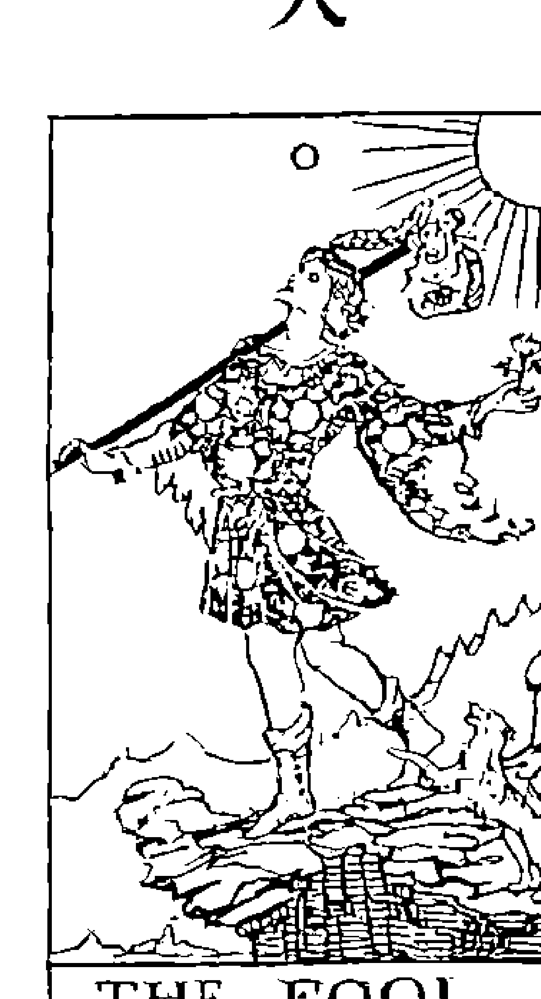

正向解讀：新生、開始、冒險、大膽、有衝勁、無心機、活在當下、快樂、積極。

負向解讀：草率、浮躁、莽撞、三分鐘熱度、衝動、不考虑後果、愛畫大餅。

代表顏色：透明

適合職業：自行創業、演藝事業

數字冠軍排行榜：膽子最大、神經最大條、最享受當下、最不計形象。

## 牌義解析

歷經了前世的洗禮與孕育，一切又回歸到原點，愚人以脫胎換骨、以全新的面貌回 到世間，重新聚集廣大的能量。愚人是充滿衝勁的、是樂觀開朗的、是有夢想有抱負 的，他對未來感到好奇，更充滿了希望，他已經準備好了，要開啟一趟全新的旅程。 愚人手上拿著白色桔梗花，象徵愚人純潔、單純的心靈，他像是一張白紙，沒有愛 恨情仇，對任何事情都不會想太多，另一手握著的權杖，代表愚人的行動力，他的態度 積極，渾身充滿了活力，迫不及待要開始他的探險之旅，而肩上的包袱裝載著前世的業 力，無論是何時種的因，這個果經過幾番輪迴後還是必須得償還，在這趟旅程中，愚人 將隨時會有不同的課題出現。 站在懸崖邊的愚人，看起來好危險，但事實上這是愚人自己給自己設下的遊戲，他 喜歡刺激、喜歡冒險，懸崖增添了旅途的危險性，使這趟旅程變得更有意思。懸崖所具 有的危機感，迫使愚人更加堅毅勇敢，也激發愚人的創造力；然而，懸崖也代表了愚人 會有犯錯的可能，一個不小心，說不定他會掉入萬劫不復的深淵中。 這趟冒險看似布滿荆棘，但後方大大的太陽，代表著背後的助力，在愚人遭遇困難 的時候，總會有人適時的拉他一把，默默地幫助他，而追在愚人後方的小狗，可以是愚

人的忠實夥伴，在他陷入危機時，小狗的狂吠得以適時給愚人警告；但牠也可能是扯愚

不要落入陷阱之中。

對愚人來說，冒險是必然的，然而唯有嘗過了酸甜苦辣，人生才稱得上豐富精采。

愚人牌具有凡事皆能逢凶化吉的力量，不要害怕，勇敢地踏入未知的旅途吧！

## 正位牌義精解

感情：有勇氣與毅力追求自己的感情、純純的愛、希望獲得對方的注意與認同。

工作：有衝勁、正面積極、大膽決策、工作上的危機皆能化險為夷。

金錢：大膽投資、金錢無虞、享受當下。

心靈：活在當下、快樂、大膽規劃未來、想法單純。

## 逆位牌義精解

感情：短暫的戀情、不了解彼此、不穩定的關係、為愛不擇手段。

工作：草率、衝動、魯莽、光說不練、先斬後奏。

金錢：理財方式錯誤、投資失利、歷經波折。

心靈：透過失敗與挫折體悟生命、感性大過於理性。

## 數字 0 的塔羅故事

在所有塔羅牌當中，只有愚人是屬於 0 號牌組，0 是蛋型符號，象徵著宇宙初始的意識，也代表生命像圓形一樣永無止境的循環。牌中愚人在歷經前世的旅程之後，現在又回到原點，重新從 0 出發，0 所代表的新生、開始的能量在愚人牌中徹底體現，而 0 所具有的樂觀、積極和無限大的潛能，更讓愚人充滿活力與希望，現在愚人要背起包袱，朝嶸新、未知的旅途中邁進了。

在數學中 0 這個數字牌不算正式的數字，但卻是承先啟後的連接詞，地位舉足輕重。0 像是初生的嬰兒，對這個世界完全陌生，不具任何技能，一切從頭開始。0 也能量，也就是皇帝牌與死神牌的特質。

是龜蔽死亡後的虛幻靈魂，在塔羅牌中屬於形式上的第22張牌，因此也帶有數字4的能，也就是皇帝牌與死神牌的特質。很奇妙吧！你可能会說，不對吧！0 是狂放、大膽，而4 是保守、傳統，好像有
點衝突。沒錯，如果以婚姻關係來做比喻，數字0應該是離婚後尋找下一春的過程吧！在這個階段中，你走完一段婚姻的旅程，帶著前一場婚姻的洗禮與醒思，雖然恢復單身，好似充滿機會，但戀愛總得從頭談起。0的能量屬於愚人，而4號能量則非身旁的小狗莫屬，0雖然是一場新生，卻受到上一場輪迴的沖刷，帶著前世因果與使命，進入新的世界。

## 第4章 計數字流年

## 流年流月流時流分流秒

隨著時間流動，數字能量也會跟著起伏，除了各類能量數字之外，還可以算出今年

的流年、流日、流時、流分、流秒能量。什麼？可以算到「流秒」？沒錯，數字學精細的程度可能會讓許多人感到驚訝。透過流年的占算，可以協助你更加了解自己的數字能量，教你輕鬆算出良辰

## 塔羅能量數字占卜

案例解讀：數字4是典型的家庭數字，代表皇帝牌的穩定、鞏固生活。在家庭的互動中，數字4很矜持，不太懂得表現對家人的情感，要說出「我愛你」、將對家人的感情表現在具體作為上，例如幫忙做家事、買美食與家人一同享用。尤其是美食研究方面，數字4有著獨到的品味與見解，通常能燒得一手好菜，或者是美食評鑑高手。然而，數字4也有13號死神牌的執著能量：對家人是固執、不願意妥協的，與家人吵架過後，心中即便後悔，也不願意先低頭。如果身為家長，通常都扮演著嚴肅的一方，對小孩管教嚴厲，但其實是刀子嘴、豆腐心，建議數字4的人試著浪漫一下，不妨來點「甜言蜜語」，能夠增加家人之間的感情喔！

人生轉捩點：如果年紀在29歲以上（包括29歲），便能進一步占算生命中遇到第一個考驗的年紀，請用【78】減去今年的年紀即可。例如：張小姐今年33歲，【78】－【33】＝【45】，張小姐的人生轉戶點便會落在45歲那一年。78代表著78

例如：【1984】＋【9】＝【1993】＝【1＋9＋9＋3】＝【22】＝【2+2】＝4，陳小姐的家庭數字為4。

## 數字流年

張塔羅牌，是人生必經經過的路程與所夾帶的使命。此占算請依照第一次做占算的 年紀為準，而超過78歲的人已經過了生命考驗與挑戰的時點，不適用此占算喔！這 是生命中遇到第一道關卡的年紀，雖說會遇上考驗與挑戰，但也是人生中的轉屆點 與幸運點，可為人生的成就與幸福打下完美的基礎。

※靈魂富裕點：將人生轉屆點的年紀加上9即可，此占算同樣僅適用於29以上的人。 例如：張小姐今年33歲，人生轉振點的年紀為45歲，【45】+【9】=【54】，則

張小姐的靈魂富裕點落在54歲。當人生轉振點走過數字1到數字9，在這9個年

頭中，完成了人生必經的挑戰與考驗：靈魂也會跟著愈來愈純熟、成長。這是人生

中最富裕的時刻，無論在心靈或者財富上皆然，因此能夠達到完美、滿足的境界。

## 第5章 計數字占卜

## 身分證字號擴演人生命盤

## ※占算方法

## ※身分數字解碼

身分證字號是每個人最原始的數字能量，也代表著人生最基本的數字能量，透過身分證字號的能量計算，可以推知你來到這個世界上最初夾帶的使命與能量。操作方法很簡單，除了最開頭的英文字母之外，將所有的數字相加就可以了，記得簡化到個位數。

例如：陳小姐的身分證字號為A123456789，那麼他的身分數字就是【1+2+3+4+5+6+7+8+9=45→4+5=9】。趕快來算看看你的身分數字吧！

◎數字1：你非常健談、知性、觀察力敏銳、很有想法、工作能力很強。擁有極佳行

動力，甚至是超越身體極限的動能，不僅能完成使命，還能挑戰不可能的任務，甚至能夠創造奇蹟。你擁有很强的規劃和佈局能力，擁有清晰的思考能力，渾身上下充滿著創性的能量，能夠整合、平衡各種力量。你的生命中充滿哲學思想，勇於接受人生的轉變、明白生命的時間性。你的直覺能力很強，你的第一直覺往往是正確解答。你擁有清晰的洞察力與理智，懂得掌握事情的平衡。你很清楚，硬碰硬不能解決問題，擅於以柔性的力量化解危機，也擅長保守秘密。你是個負責任的人，凡事講求公平與正義。你的判斷力很強，能夠在短時間內看清事情的所有面向。你行事直截，注重榮譽感與美德，擁有著一顆純潔的心靈。你擁有熱情的生命力和源源不絕的活力，情感豐沛，很容易感動。你渾身散發出迷人的風采，再加上待人親切，好人緣自然跟著來。你的外型通常很亮眼，散發著藝術天分，喜歡接近大自然。你具備內省的能力，思考著未來的種種發展可能。為了成就大事，你會不惜燃燒自己，照亮別人。你善於反向思考激盪各種可能性，從傳統價值中顛覆舊有束縛，找出新的創意。

## 數字占卜

## 數字4：雖然外表看似冷酷，不苟言笑；但你的內心熱情如火，具備十足的行動力，是個很有主見的人，並且謹守承諾。你深具嚴以律己的力量，遵守規則，很有一套自己的原則，不僅不允許自己任意踰越，也對他人很嚴格。家庭對你來說是很重要的支持力量，身後有穩固的家庭，你才能勇敢的往前衝。

## 數字5：你的心胸寬大無私，很樂意幫助別人，深具慈悲心。在人際關係中，你常會成為團體中人們溝通的橋梁和管道。無論是實質教育方面，還是心靈層次的追求，都擁有很棒的吸收能力。你生性樂觀，具有冒險犯難的精 神，喜歡改變，好奇心十足。你擁有生命中自發性的智慧，能夠主動追求知識，調和自己的身體與心靈，並能夠持平地判斷事情，善於透過協商與溝通來解決二元衝突。

## 數字6：你的分析能力很好，溝通能力很強，很在乎人與人之間的交流與互動。你是能非常流暢、切中要點的表達自己的想法與意見，擅長協商溝通，甚至至常常擔任同事間或朋友間的和事佬。你懂得為生命負責，對待所愛的人，你願意付出所有。你也是個很浪漫的人，總能讓生活充滿情趣。

## 數字7：沒有人能比你更認真、更積極了！你是個勇敢編夢，並且願意身體力行的

人。對你來說，計劃，絕對不只是說說而已。你做事小心謹慎，擁有不放上面對與處理，十分果斷與勇敢。你是個說到做到的人，秉持著一坐而言不如起而行一的觀點，行動力與機動性十足，反應靈敏。

## 數字8：愈是高難度的挑戰，你就愈想征服，就是這般不同凡響的勇氣，讓你完成許多夢想。你深知聲力無法解決問題，善用智慧化解危機，懂得以柔克剛。創意十足的你腦中總是擁有一堆怪想法，總是能讓單調產生化學變化。你擁有強烈的意念與毅力，只要是已經決定的事，就會堅持到底。

## 數字9：你心中懷抱著謙卑與慈悲，對人充滿了信任，擁有大愛的精神。內斂沉穩的你不受出風頭，但卻能在朋友們陷入苦思時，語出驚人地破解謎團。你很聰明，知道自己要什麼，對自己要求很嚴格，做事細心、追求完美。細膩的你往往能察覺到細節的變化，觀察力非常敏銳。

## 手機號碼運勢占卜

## ※占算方法

手機號碼代表著溝通能力，是人们接觸外界的一種管道，也意味著工作運勢與能

如果你想知道公司的運勢，也可以用公司電話來計算，同樣可以測出公司運勢。例如：陳小姐的手機號碼為0912345678，則計算方法為【0 + 9 + 1 + 2 + 3 + 4 + 5 + 6 + 7 + 8 = 45 → 4 + 5 = 9】。

## ※手機數字解碼

數字1：主動積極和獨立自主就是你人生的寫照，你從小到大都不太需要爸媽念週計劃、一年計劃、或是十年計劃的人，總是樂觀地、充滿信心地朝目標邁進。

數字 2 : 你那感性、敏锐的思维往往能把事情看得更透徹、看穿他人的內心世界，你是大家傾吐心聲的絕佳對象，因為你能和他們一起哭、一起笑，給他們最誠懇確切的建議。你那細膩的心思使內在不斷上演著衝突和協調的戲碼，兩種不同的想法相互拉扯，然後又找到平衡點，你的人生彷彿就像個天秤，永遠在尋找那最平衡的位置。

數字 3 : 你非常能適應團體生活，你了解團體世界中的遊戲規則該如何運行，你絕對不是一個獨斷、我行我素的的人，而是知道如何和其他人協調溝通使事情進行得更順利，超強的溝通能力和社交技巧是你 在團體生活中游刃有餘的利器。

數字 4 : 在你身上總是可以看見穩定、可靠的感覺，即便你一個人在外生活，也不會讓家人擔心你會亂來，因為你本身就不喜歡太複雜跳躍的生活，那樣反而使你感到不安，你恪守本分、循規蹈矩，做事非常有決心，假設你訂下每天運動三十分鐘的規定，你務必會堅守自己的原則，不受外在環境所左

數字 5 : 無拘無束、充滿創意的你，極具有藝術家的性格，你受不了道德和禮教的右。

數字 6 ： 你是個完美主義者，對自己要求非常嚴苛，總是希望呈現在大家面前是最完美的那一面，所以你會督促自己要讀書上進、要努力減肥，你是那個到了五十歲別人都鬆垮發胖了，你依然容貌年輕、身材曼妙。你也是個喜怒哀樂不形於色的人，因為你不想讓別人看到自己脆弱的一面，所以有時候會讓自己會承受過大的壓力。

數字 7 ： 在所有的數字當中就屬你最聰明了，你會運用一些方法和技巧來達成自己的目標。以同樣是背課文來說，其他人可能只會照著通用的模式，一句一句地慢慢背，而你卻懂得用畫圖或舞蹈的方式讓自己輕鬆記起來。你的腦筋動得很快，在做事情之前總是會先思索過一遍，再找出最符合效益的方法去做，而且你的想法總是會讓人驚嘆，是所謂鬼才型的代表人物。

數字 8 ： 不論做甚麼事情，你總是充滿著野心和欲望，而且努力不懈的去達成，你是成功企業家的代表性性格，儘管已經有所成就，依然不因此而自滿，仍然

尋找自己的不足之處，不斷求進步。現階段的你應該是滿足快樂的，因為 你先前的努力，現在不論在工作、感情或金錢上都有不錯的發展。

的人佩服，你不僅是對自己的愛人和親友付出奉獻而已，你懷抱著更崇高 的理想，一直希望能幫助世界上更多的人。或許你的志向是到非洲當護 士，或到偏遠地區教孩童讀書，你是天生的慈善家，照著你的理想去實踐 吧！

## 情感密碼配對占卜

## ※占算方法

## ◎數字1：恭喜你們的關係最近會有新的進展，彼此都這段關係充滿信心，對未來充

後的生活模式、要住在哪裡、要生多少個小孩等等。你們對未來的一切充滿滿著希望。可能是近期有結婚的打算、開始計劃著兩人要如何發展，或是婚無限的想像，迫不及待向它狂奔而去。

個則文靜，兩人之間因意見不合偶爾有些小摩擦，但相互溝通、相互磨合的

結果反而讓彼此更加契合，雙方能夠因為理解而更能包容對方。而互補的性

格也能讓彼此相互學習與成長。

## ◎數字2：你們彼此有著截然不同的個性，或許是一個理性、一個感性，一個衝動、一

则計算方法為【1+9+8+4+1+0+2+2+1+9+8+0+1+2+3+0=51→5+1=6】。

陳小姐：1984年10月22日 龍先生：1980年12月30日

個人也是如此，但要記得要將數字簡化到個位數。例如：

## ◎數字3：你們的感情忽然有個意想不到的發展，關係中迸出許多新鮮事；一方運用創出現第三者，要趕緊檢視愛情中是否出現問題了；而對於已經步入婚姻的日中製造一些浪漫，能讓雙方感情更加升溫。人，則代表著懷孕的可能性。數字3也代表著突如其來的驚喜，在特定節都能達成共識，有步入家庭的打算。你們一直對「家」充滿著渴望，希望從都能達成共識，有步入家庭的打算。你們一直對「家」充滿著渴望，希望從家中獲得依靠和安全感，也希望從照顧所愛的人當中獲得成就感。雙方對此都非常依賴，也很習慣對方的生活作息與個性，感情基礎非常穩固。

數字3也代表著突如其來的驚喜，在特定節都能達成共識，有步入家庭的打算。你們一直對「家」充滿著渴望，希望從都能達成共識，有步入家庭的打算。你們一直對「家」充滿著渴望，希望從家中獲得依靠和安全感，也希望從照顧所愛的人當中獲得成就感。雙方對此都非常依賴，也很習慣對方的生活作息與個性，感情基礎非常穩固。

## ◎數字4：目前你們的感情狀況於相當穩定的階段。彼此關係和諧，在觀念、想法上都能達成共識，有步入家庭的打算。你們一直對「家」充滿著渴望，希望從家中獲得依靠和安全感，也希望從照顧所愛的人當中獲得成就感。雙方對此都非常依賴，也很習慣對方的生活作息與個性，感情基礎非常穩固。

都能達成共識，有步入家庭的打算。你們一直對「家」充滿著渴望，希望從家中獲得依靠和安全感，也希望從照顧所愛的人當中獲得成就感。雙方對此都非常依賴，也很習慣對方的生活作息與個性，感情基礎非常穩固。

## ◎數字5：在感情方面，彼此都能給對方適度的空間與自由，對你們來說，距離反而能增進感情的美感。在這段關係中，你們總是讓對方覺得很快樂、沒有壓力，雙方都能享受在自由、隨興和享樂主義當中。在這個前提之下，彼此之間的信任便非常重要，有了信任的基礎，才能為彼此帶來安全感。

在這個前提之下，彼此之間的信任便非常重要，有了信任的基礎，才能為彼此帶來安全感。

## ◎數字6：對你們來說，黏膩的關係才是幸福，每天甜蜜的電話傳情，

## 塔羅能量數字占卜

## 數字5：

周圍擺上一些房屋造型的裝飾品，或是綠色色調的物品，都能為你提升數字4的能量。而數字4總是將話藏在心理，最缺乏的就是數字6的貼心了。數字6能夠增加數字4浪漫的氣息，幫助數字4勇敢的把自己內心的感覺說出來。

數字5外向主動，行事積極又有衝勁，代表的顏色是藍色。數字5崇尚自由，行事思考也相對地不具任何束縛，做任何事情不太會自我設限，因此，數字5的發展空間非常廣泛。數字5的學習能力很強，在求學時期或是進修時期，數字5的能量能夠增加學習方面的吸收與思考能力。你可以在書桌前或房間裡擺上藍色色調的物品，幫助在唸書或是工作時，注意力能夠更加集中。不過數字5是悲觀主義者，恐懼容易在心中滋生，阻絕數字5前的進的腳步。而數字1的熱情與樂觀這時候便派得上用場了，數字1能幫助數字5化解恐懼，讓數字5凡事往好的方面思考，終結數字5的混亂人生。

## 數字6：

數字6：數字6是一個充滿愛的數字，他們喜歡與朋友、家人分享一切，對於自己所愛的人更是照顧有加。數字6非常浪漫，對工作、感情充滿憧憬，總是

- 數字6：數字6是一個充滿愛的數字，他們喜歡與朋友、家人分享一切，對於自己所愛的人更是照顧有加。數字6非常浪漫，對工作、感情充滿憧憬，總是

## 數字風水

## ◎數字7：

數字7擁有壯強的意志力以及不屈不撓的奮鬥精神，具備最善於分析規劃的頭腦，代表的顏色是紫色。數字7非常理智，邏輯推理能力很好，如果要增加數字7的能量，不妨在生活周遭放一顆紫水晶、車子或是具有火焰形狀的物品，都能幫助你增加意志力，做事更具衝勁。然而，數字7對世界充滿了批判，負面的數字7，有時想法與態度充滿了偏激與刻板印象。相對的，數字3的逆向思考與創造力便能呈現緩頓的力量，讓數字7能夠用另一種觀點看待世界，不要太過執著了。

## ◎數字8：

說到目標明確、行事果決，你一定會想到數字8。他們做事認真奮鬥，具備領導風範，代表顏色為白色。數字8行事講究效率，思考模式很成熟，懂得得以柔克剛，透過最小的資源，達到最大的效果。你可以隨時攜帶白色的裝

飾品，或是在房間或辦公桌上擺放獅子圖案、星星造型的物品，都能幫助你增加數字8的戰鬥能量。數字8在工作上的表現可圈可點，但在處理情感關係中則容易產生疏離的狀況。數字8需要有穩定的環境及力量支持，才能發揮最大的能力，而數字4能夠提供數字8最堅固的安全感，讓數字8能夠無憂無慮的大顯身手。

## ◎數字9：9

是最後一個數字，是對人生看的最徹底得數字。數字9 有著深層的智憲，成熟而內斂，雖然話不多，卻總是語出驚人，代表顏色為紫紅色。如果如果你想增加數字9 的細膩與謹慎特質，可以在生活周邊擺放六芒星或是月亮的圖騰，能幫助你沉澱心靈，內心更加平靜，更能夠審慎的思考。然而，數字9 屬於悲觀主義者，加上內斷的性格，如果遇到問題，不太願意向他人傾吐心聲，往往將自己關在自己的小世界中。此時，數字5 的能量能幫助數字9 解開束縛，找回原本擁有的自由。

## 數字能量表

## 代表顏色 象徵物件

| 數字 | 代表顏色 | 象徵物件 |
| ---- | ---- | ---- |
| 1    | 紅色   | 瓔果造型的裝飾品、蟷燭、太陽       | 成對的娃娃、陰陽成對的裝飾品、天枰 |
| 2    | 橘色   | 成對的娃娃、陰陽成對的裝飾品、天枰   | 圖畫、創意小品、藝術品、金星符號 |
| 3    | 黃色   | 圖畫、創意小品、藝術品、金星符號       | 房屋造型的擺設、建築模型、山的圖案、公山羊的符號 |
| 4    | 綠色   | 房屋造型的擺設、建築模型、山的圖案、公山羊的符號 | 水、琉璃、陶土製品、宗教的符號或是圖案 |
| 5    | 藍色   | 水、琉璃、陶土製品、宗教的符號或是圖案   | 桔梗花、天使的圖案、愛心圖案 |
| 6    | 靛色   | 桔梗花、天使的圖案、愛心圖案           | 紫水晶、車子、火焰狀圖案 |
| 7    | 紫色   | 紫水晶、車子、火焰狀圖案             | 狮子圖案、太極、工作所使用的工具、星星 |
| 8    | 白色   | 狮子圖案、太極、工作所使用的工具、星星   | 紫紅色 六芒星、月亮符號 |
| 9    | 紫紅色 | 紫紅色 | 六芒星、月亮符號 |

/* 互補數字行 */
| 5    | 4    | 3    | 4    | 1    | 6    | 7    | 1    | 2    | （表格延伸部分，若作为单独表格则需调整）
| ---- | ---- | ---- | ---- | ---- | ---- | ---- | ---- | ---- |
| 5    | 4    | 3    | 4    | 1    | 6    | 7    | 1    | 2    | （若互補數字单独成表格，则按此格式）

## 互補數字

+   5 4 3 4 1 6 7 1 2
