# 宝灵心塔罗：解惑故事牌

## 作者簡介

寶靈 台灣最療癒的塔羅師 非關命運塔羅老師 瓣果日報、時報周刊專欄 著有《寶靈心塔羅：開啟直覺的78堂塔羅課》、 《寶靈心塔羅：塔羅能量數字占卜》等書

## 一顆愛的種籽

隨著世界與局勢的轉換，塔羅牌也必須換個造型。一寶靈心塔羅：解惑故事牌一是以偉特系統為基礎，隨著世代轉變而整合出來的嶄新能量，顛覆了原始偉特年代的教條和制約，更符合現代人的需求。裡頭有許多從未公開過的私藏故事，希望能引導各位邊讀邊思考，透過這副牌的解析，期望能幫你更了解自我，解決你生活中的難題。這是一副具有現代靈性的塔羅牌，能夠解析更精準的內心層面，一針見血地看到你目前的問題。你不妨每天隨機抽一張牌卡，憑著直覺，看看自己第一眼看到牌面上的什麼元素，藉此觀察自己內心的變化與運氣的走勢。書中也收錄了許多小測驗，如果你意猶未盡，或是有任何問題，都歡迎你到Facebook一寶靈魔法學院一來交流互動喔！我將會在一寶靈魔法學院一陸續刊出更多有趣的小測驗！這不只是一本答案書，這是讓你自我探索的好時機。人生難免會有負面的經歷，但是你有改變的自我由與空間，你可以選擇轉化，將負面逆轉成正面。我希望能藉由這本書，在你的心中埋下一顆愛的種籽，籽，讓良善的能量不斷發芽，繼續支持更多需要幫助的人。我誠摯奉上愛的能量，希望藉由你的力量，讓整個世界跟著轉變。不要小看自己的能量，只要找到內心的平衡與和諧，你絕對有力量顛覆過往的陰霾。加油！各位親愛的讀者，相信自己，你絕對做得到！

實靈

# 逆位解析

心靈：內心充滿生命力、擁有愛與美的能量、希望吸引他人的目光、喜歡貼近大自然。

金錢：衣食無缺、財源滾滾、獲利、賺錢。

工作：腳踏實地、極富創造力、獲得成就與財富、有藝術天分、人際關係良好。

感情：成熟有智慧的爱情、希望獲得回報、穩固滿足的關係，結婚或懷孕的機會。

# 正位解析

感情：成熟有智慧的爱情、希望獲得回報、穩固滿足的關係、結婚或懷孕的機會。

工作：腳踏實地、極富創造力、獲得成就與財富、有藝術天分、人際關係良好。

金錢：衣食無缺、財源滾滾、獲利、賺錢。

心靈：內心充滿生命力、擁有愛與美的能量、希望吸引他人的目光、喜歡貼近大自然。

你是個腳踏實地的人，一步一腳印讓自己的生命更充實完整。這張牌也代表媽媽或女性，通常是一位成熟女性，有很好的謀生能力。在財富方面，表示一定會賺錢，衣食無缺。工作方面，表示事業蒸蒸日上，財源滾滾來。你具備創造力、表達能力和豐富的靈感，屬於社交型人物，適合從事設計師、美容業、廣告、公關、服飾業等所有與美有關的職業。

## 請你跟我這樣做

如果你是穀神狄蜜特，當你的女兒走丟時，你會怎麼做呢？你一定傷心欲絕，找眾神之王宙斯幫忙不失為好方法，但除此之外，你還可以做些什麼呢？？你可以善用自身良好的人脈發動搜尋，或許運用你的創造力將這則消息大肆發布。動起來吧！只要你願意行動，你身邊擁有豐沛的資源，再加上你的創意，一定能心想事成！

感情：努力付出卻不被珍惜、驕縱任性、無法付出真心、外遇醜聞、性渴望、意外懷孕。

工作：個性懶惰、不願意付出努力、過度招搖、招致口舌是非。

金錢：強烈的物質慾望、貪婪、負債、打擾脫充胖子、愛慕虛榮。

心靈：內心充斥慾望、對現狀不滿足。

[PAGE 20]

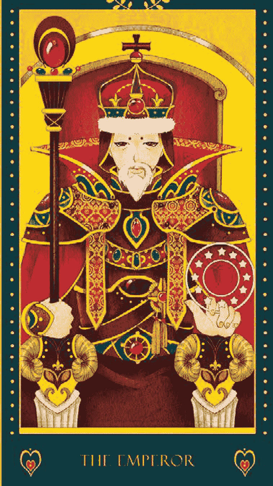

## 皇帝

[PAGE 21]

# 塔羅故事

## 推翻暴政的諸神之王宙斯

希臘神話中，泰坦族之王克羅諾斯曾經弒父，因此身上背著一個可怕的預言：—你將死於自己骨肉之手。—於是，當妻子瑞亞每產出一個寶寶，克羅諾斯就吞掉一個，一連吞了五名幼兒。這讓愛子心切的瑞亞非常不忍，此時，瑞亞又即將臨盆，這次她將孩兒藏起來，並用嬰兒襲布包住石頭，假裝是嬰兒讓克羅諾斯吞下，而這個倖存的孩子就是宙斯。

當宙斯長大成人後，他決心救回兄弟姐妹，他用藥讓父親克羅諾斯將先前吞下的子女全數吐出，並聯合這些長大成人的兄弟姐妹，一同對抗父親。這場戰爭打了十年，在百手巨人的幫助下，終於戰勝父親，並將克羅諾斯關在地獄最底層，重建和平的國度。眾神推派宙斯為領袖，宙斯制定了統治階級，並分配眾神的工作與任務，讓整個天界恢復秩序。

# 讓塔羅走入你的心

犯，對於疆域領土十分保護。抽到這張牌通常是權威者、政治人物，或者是事業有成的男人；如果是女性，則會是一位行動力十足、極具野心的強悍人物。

你擁有很棒的領導能力，行事很有效率，具備很强的行動力以及規範自己的能量，遵守社會律法及世俗規範。雖然你看起來嚴肅、不苟言笑，但一擲千金，絕對說到做到。你擁有很好的學習能力，但是

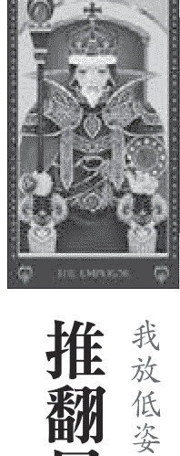

皇帝

我放低姿態 接受他人建言 有效率地完成任務

[PAGE 22]

# 逆位解析

心靈：缺乏安全感與自信心、渴望穩定的感覺。

金錢：負債卻有著奢侈的消費習慣、打腫臉充胖子、說大話。

工作：意志消沉、沒有效率、逃避責任、固執、堅持己見、一板一眼、難以溝通。

感情：無法許下承諾、幼稚的感情觀、大男人主義、不負責任。

# 正位解析

感情：負責任、給予承諾、穩固的關係、需要安全感、照顧家庭、早婚。

工作：行事謹慎、負責、學習能力良好、愛面子、嚴肅、理智、事業有成、達成目標。

金錢：鞏固既有的資源與財富、定性強、穩定的賺錢能力。

心靈：充滿自信、希望獲得認同與尊重。

## 請你跟我這樣做

人。牌面上的皇帝已經卸除盔甲，以往在偉特牌義中的自我保護與矜持不再，願意真心待人，真誠地與

辭地挺身而出。但是你的主觀意識較強，有時會顯得固執。在感情上，你不擅長甜言蜜語，但會將體貼與愛表現出具體行動上，十分照顧另一半。

發揮行動力與效率，你達成任務的機率都很高喔！

人的建議，當你受到認同與尊重時，你會更有自信、更有勇氣去面對所有挑戰。只要你勇於承擔責任，

人生走到皇帝這一階段，通常是很成功的。要讓自己更上一層樓，必須加強內心的安全感，聆聽他

[PAGE 23]

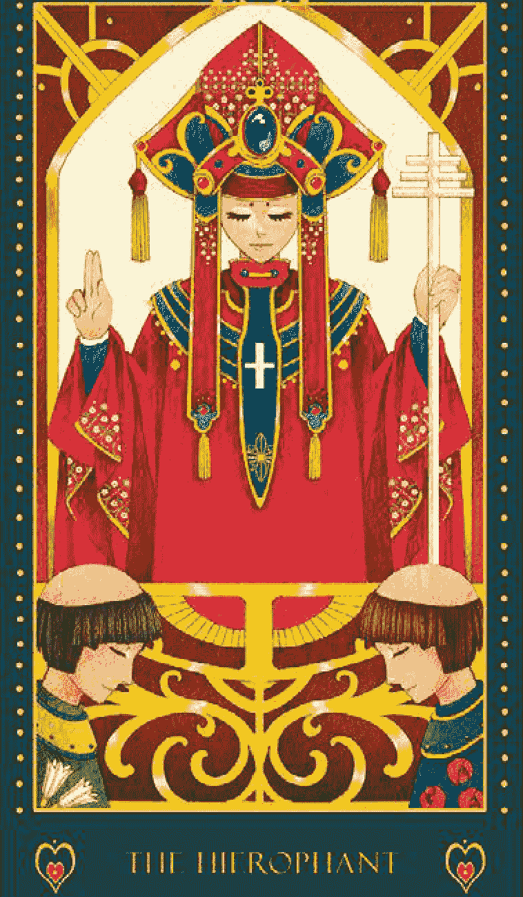

## THE HIEROPHANT

## 教皇

[PAGE 24]

## 靈性指引者凱龍

## 凱龍故事

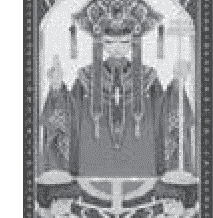

## 教皇

我找尋心靈的力量
淨空自我
服務他人

有人馬族的殘暴個性，他擁有精深的藥草知識，高貴典雅，集所有智慧於一身。然而，凱龍擅於療癒他人，卻救不了自己。大力士海格力斯在殺了九頭蛇怪之後，不小心以九頭蛇的劇毒誤傷了凱龍。無奈凱龍是不死之身，不但無法化解劇毒，也擺脫不了劇毒的煎熬。後來凱龍將心思轉向精神層次的救贖，成爲了靈性的指引者與教育者，找到了兩個世界間的連結，帶領人們探索內與外在的世界。
凱龍是具有生命智慧的心靈導師，帶領信徒探索真實的內在。牌面中的教皇與偉特牌中的形象不同，這個教皇女性特質較強烈，身上的服飾類似中國新娘服裝，意味著神性與佛性穿越了性別和國籍，當你願意接受神性與佛性時，你也是別人的引渡人。這張牌跟學習有關，無論是實質教育方面，還是心靈層次的追求，都擁有很棒的吸收能力。這種的教皇不再是高高在上，兩位信徒面對面，三人呈現平等的地位，彼此互相尊重。你無欲無私，願意犧牲奉獻，擁有寬大的愛，並且破除了原本教皇內心對權力的渴望與掌控，懂得尊重他人，能夠理性處理事，教皇身上背負上天給予的使命，必須犧牲奉獻，服務他人。因此在情感方面，代表階段不是第一順位，你的重心在服務別人，成就大眾的幸福與快樂。教皇不需要情。

# 讓塔羅走入你的心

[PAGE 25]

# 正位解析

# 逆位解析

## 請你跟我這樣做

感情：相互包容的關係、寬大無私的愛、形式上的愛、慈悲的愛。

工作：學習能力佳、服務與照顧他人、堅忍不拔、有毅力、富直覺。

金錢：賺錢能力很好、錢財不缺、金錢捐獻。

心靈：擁有慈悲的愛、願意幫助別人。

感情：感受力敏銳、容易受傷害、壓抑的情感、渴望自由。

工作：邪惡、頹廢、能力不足、孤立無援。

金錢：缺乏金錢與資源。

心靈：沒有自信、活在恐懼當中、壓抑內在的情感。

轉移注意力，藉此療愈自我的內心。你呢？當你面對傷痛時，你怎麼處理呢？教皇牌能夠給你一個省思幫助更多同樣受傷的人們，引導出生命的智慧，用心中無私的愛奉獻，服務他人。幫助更多同樣受傷的人們，引導出生命的智慧，用心中無私的愛奉獻，服務他人。甚至能將自身經驗當做教材，

[PAGE 26]

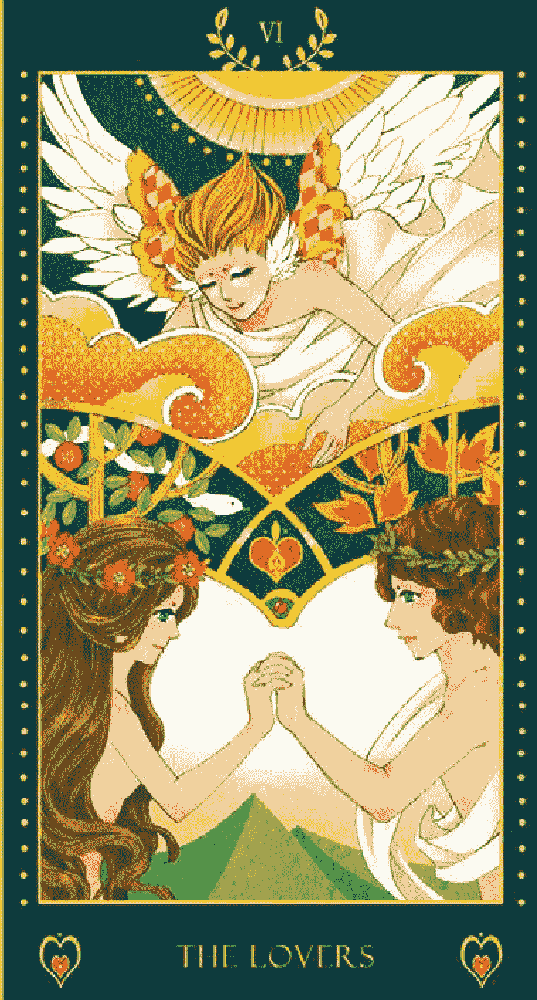

## 戀人

[PAGE 27]

# 塔羅故事

## 天使祝福的亞當與夏娃

# 讓塔羅走入你的心

## 戀人

傳說中，亞當與夏娃是男人與女人的形。上帝派遣亞當看守園中的善惡之樹，並從亞當身上拔了果，亞當隨後也大咳樹上的果實。善惡之樹的果實遭到偷採，上帝發現之後勃然大怒，忿忿然地質問亞當是誰偷吃了禁果？亞當連忙撇清，直說是夏娃的錯。而夏娃也急得辯解，還將責任全推給了當初總恿兩人的蛇。上帝當然不是省油的燈，他不懂得將蛇的四隻腳摘去，還懲罰亞當必須終生勞動以得食糧，而

夏娃則必須經歷分娩之苦。

兩人的蛇。上帝當然不是省油的燈，他不懂得將蛇的四隻腳摘去，還懲罰亞當必須終生勞動以得食糧，而

果，亞當隨後也大咳樹上的果實。善惡之樹的果實遭到偷採，上帝發現之後勃然大怒，忿忿然地質問亞

當是誰偷吃了禁果？亞當連忙撇清，直說是夏娃的錯。而夏娃也急得辯解，還將責任全推給了當初總恿

前面臨愛的課題，代表正在經歷暧昧、熱戀、與事業上的初步合作。樹上的蛇點出了雙方信任的問題，

代表彼此必須通過考驗，兩人的情感也才能更加鞏固。但是不用擔心，牌面中的天使散發出閃耀光芒，

照耀著男人和女人，播送祝福的光芒，代表一段受到眾人祝福的感情、有貴人相助解決問題。

牌面中，兩人的手緊緊握著彼此，相較於偉特牌，雙方的距離又更近了一步，代表著雙方關係才剛剛開始，

面對外界的誘惑與層層挑戰，彼此必須表現出真實的自我，磨合協調，才能突破重重難關，讓彼此的關係更加緊密。

我勇敢付出愛 相信對方 包容與接納

[PAGE 28]

## 請你跟我這樣做

方成長。在工作方面，你具有良好的分析能力，口才很棒，擁有極佳人際關係。

張牌，則代表吸收能力很強、想像力豐富，通常會付出的比較多，像母親一樣，燃燒自己的生命，讓對

惜，學著接納與包容。愛是無條件的，先去愛別人，自己才會得愛。而故事中也點出了信任的問題，

當兩人的關係出現了謊言，中間的山便會愈顯茁壯，彼此的距離就會愈來愈遠。唯有面對真實的自己、

信任對方，不要吝於付出，以正面思想看待兩人關係，愛的能量才能發揮最大的效用。

感情：樂觀的感情、完美的愛、和諧、互相信任、浪漫、鞏固的關係、受到祝福的感情，雖然會面臨考

驗，但無須擔心。

工作：面臨重大抉擇、尋求合作關係、注重道德觀、有貴人出現、良好的人際關係。

金錢：利益的誘惑、從合夥關係中獲利。

心靈：探尋真實的自我、找回純潔的心靈。

# 逆位解析

感情：盲目犧牲自我、佔有慾過強、彼此不信任、缺乏自信。

工作：言語紛爭、溝通方面出問題、無法達成共識、容易自責內疚。

金錢：因為利益薰心而做出不當的舉動。

心靈：自我內在的不誠實、心中感到矛盾與挣扎。

# 正位解析

[PAGE 29]

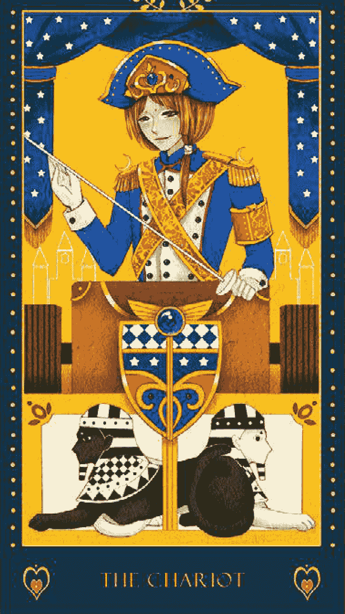

## 戰車

[PAGE 30]

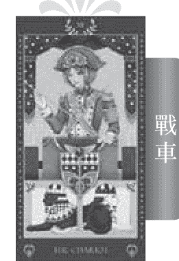

# 塔羅故事

## 驍勇善戰的戰神阿瑞斯

## 以柔克剛 勇敢面對挑戰

## 力量

海格力斯是希臘神話中的超級英雄，他是宙斯與凡人所生的小孩，宙斯的外遇惹惱了元配席拉，她誤導海格力斯血刃妻兒，讓海格力斯懊悔不已。為了洗清罪孽，海格力斯自願完成十二项艱困任務。第一项任務便是征服猛獅，海格力斯拿着弓箭與木棒，準備大举擒獅，只是这头狮子力大无穷、刀枪不入，不管用弓箭、巨石或其他武器，獅子根本毫髮未傷。此时，狮子突然发狂，直直地往海格力斯撲來，海格力斯便趁这機會，拿起木棒，猛力往獅头上一擊，接著，他躍上獅背，揮起一拳，狠狠飆過去，并顺势掐紧獅子的咽喉，徒手将巨獅活活掐死。海格力斯利用獅子尖锐的爪子取下獅皮，将獅头制成帽子。披着獅头獅皮的海格力斯继续奋戰，顺利完成了后续的任务。

牌面中，力大无穷的勇士由一位溫柔少女呈现，这是因为在少女運用勇氣與智慧騙服兇猛獅子，不用蠻力也无需武器，她運用靈性的力量，以柔克剛，让獅子乖乖臣服在腳下。獅子身上掛着的紫色披風，正是願意服從的象徵，也代表著默性受到啟發，轉變為人性的智慧。

像戰車牌總是有靠山，海格力斯的十二

## WHEEL OF FORTUNE

## 命運之鑰

我面對人生的變數 勇於轉變 迎接新的開始

在希臘神話故事中，脫著輪子的阿奴比斯有著胡狼的身體，為亡者打開新的道路，是亡者的守護神。阿奴比斯象徵結束的能量，也帶來了重生、重新開始的強大力量。旁邊的蛇懷抱強大的負面能量，夾帶一股邪惡的力量，讓命運之輪往下沉淪，進入陰森的恐怖世界。而輪子上方的人面獅身代表和諧的能量，擔任仲裁的角色，中和著胡狼的正面能量和蛇的負面能量。人面獅身黑白相間的頭髮代表陰陽能，象徵二元衝突、成功與失敗、可以與不可以，意味著生命當中的一體兩面，宇宙間的變化都與調合有關係，而手上的劍代表思考能力與判斷準則，表示用智慧平衡善惡之力，以求取和諧。讓塔羅走入你的心盤，會轉到哪裡，誰也猜不到，但是你可以控制旋轉的力道！命運之輪象徵生命的輪轉，中間的圓輪像是俄羅斯轉盤的業力，你可以選擇跟著命運漂流，如果消極面對人生，不願意翻新，也不願意改變，那麼，命運之輪會帶著你向下沉淪。命運之輪也代表生命中沒有一定的好或壞，人生就像抛物線，花開花謝，度過了最艱難的時刻，就能夠迎接幸福。只要你願意突破、勇於改變，命運之輪會拉著你向上攀頂。抽到這張牌代表你面臨人生的轉折點，不要害怕目前的低潮，當你耐心克服目前的難關之後，路途將會愈來愈順遂。命運之輪也代表人生處處充滿不定數，當你到達人生的顛峰時，記得多一份謹慎小心，未來難以預測，必須做好萬全準備。命運之輪象徵人生另一個嶄新的階段，例如職務受到升遷、戀人結婚、家中有新生兒誕生等等。

人生中永遠不變的事就是「變」，你永遠猜不到下一秒會發生什麼事，這就是生命有趣的地方。命運之輪夾帶著業力不斷輪迴，你或許會認為命運捉弄人，或覺得天命難違。其實所有事情都其來有自，只要放寬心、耐著性子，勇於承擔責任，克服眼前種種問題，你會發現，事情沒有你想得那麼糟，未來使命，每個人都有自己的生命任務，你必須整合自己，平衡體內各種力量來支持別人，創造美麗的未來，回饋宇宙更多正面能量！

原著使命，每個人都有自己的生命任務，你必須整合自己，平衡體內各種力量來支持別人，創造美麗的未來，回饋宇宙更多正面能量！

## ## 請你跟我這樣做

心，未來難以預測，必須做好萬全準備。命運之輪象徵人生另一個嶄新的階段，例如職務受到升遷、戀人結婚、家中有新生兒誕生等等。

人生中永遠不變的事就是「變」，你永遠猜不到下一秒會發生什麼事，這就是生命有趣的地方。命運之輪夾帶著業力不斷輪迴，你或許會認為命運捉弄人，或覺得天命難違。其實所有事情都其來有自，只要放寬心、耐著性子，勇於承擔責任，克服眼前種種問題，你會發現，事情沒有你想得那麼糟，未來使命，每個人都有自己的生命任務，你必須整合自己，平衡體內各種力量來支持別人，創造美麗的未來，回饋宇宙更多正面能量！

來，回饋宇宙更多正面能量！

## ### 正位解析

## ### 逆位解析

感情：感情轉換期、彼此關係的提升、關係好轉、修成正果。

工作：新事件的開始、準備好接受改變、接受命運安排、克服生命中的改變。

金錢：金錢豐裕代表將有財務損失，建議捐錢或做慈善。缺乏金錢代表將有財富進帳。

心靈：接受人生的轉變、體認目前的狀況、明白生命的時間性。

感情：感情告終、關係逐漸變質、戀情轉淡。

工作：不利於自己的情況、無法適應改變、沒有準備好就去做。

金錢：沉淪於金錢遊戲、缺乏計畫、巨額的金錢虧損、負債。

心靈：無法克服生命中的轉變、心中充滿恐懼與害怕。

[内容合并后的文本，已去除分页标记，并进行了格式化处理，包括标题、列表等]

# 正位解析

感情：大吵一架、突如其來的轉變、看清對方真面目、結束磨合期、走出情傷、迎接新感情。

工作：不可預期的事件、舊觀念被瓦解、改掉壞習慣、拋棄過去的束縛、自我悔改。

金錢：從損失中學習、在虧損前先做好準備。

心靈：透過混亂整合自己、敏銳的感知能力、從傷痛中走出來。

# 逆位解析

感情：沉溺於過往情傷當中、壓抑內心的情緒、沒有向對方坦承。

工作：過度緊張、壓抑情緒、執著於舊有模式、不願意改變。

金錢：鑽牛角尖、理財計畫遭到中斷、流失金錢。

心靈：不願拋下逝去的過往、流連於記憶的傷痛、逃避現實。

這次的改變會讓你變得更好。在感情方面，塔牌代表激烈的爭吵、發現第三者，終於能讓你看透對方，並且灑脫地離開，勇敢接受下一段感情。也或者雙方可以藉由這次爭吵，兩人終於可以把心中的話全部說出來，讓彼此關係更進一步，正式向磨合期說拜拜。抽到塔牌的人，通常已經知道問題在哪裡了，只是與崩壞不是結束，而是一個新起點，是一個更美麗的開始！，請你跟我這樣做塔牌的火能量很強，可能會讓你有焦慮、不安或失眠的狀況，你可以用另一種顏色來抵銷紅色的能量。建議你飲用紫水晶水，只要將紫水晶泡在水中二十四個小時，飲用淨化過的水即可，一直飲用到情緒綜恢復為止。

緒恢復為止。

## 星星

# 塔羅故事

## 打開盒子的潘朵拉

我對未來充滿希望 勇敢承諾與信任 去做應該做的事

# 讓塔羅走入你的心

在塔牌的震撼崩解後，星星牌顯得無限寧靜，讓一切回歸原始，未來充滿光明與希望。牌面的天空上有八顆希望之星，其中七顆代表人體七脈輪，而中間的金色星星則是第八個脈輪，位於人頭頂上方三到四吋，正是所謂的舉頭三尺有神明。現在人類已經進化到了十二脈輪，能夠與宇宙相連結，超越人體肉身，接受上天的引導。抽到這張牌代表你將發現自己的天命，能幫助你發揮潛能，為了自己的生命負責任。後方的朱鷺星星牌代表敞開心懷，清楚自己的目標，去做應該做的事，為自己的生命負責任。後方的朱鷺

普羅米修斯竊取仙界的火送給人類，他對人類的過分關心惹惱了宙斯，宙斯便想了個方法來懲罰人類。宙斯原本想將潘朵拉送給普羅米修斯，但是深思熟慮的普羅米修斯當然不會接受。於是宙斯將這份禮物送給了普羅米修斯的弟弟伊比米修斯，還附贈一個盒子。雖管戒慎恐懼，但天命難違，伊比米修斯只好收下這兩份大禮。伊比米修斯知道盒子中可能有詐，於是嚮咐潘朵拉千萬不可以將盒子打開。只是，潘朵拉一直難耐好奇心。有一天，她終於忍不住了，趁伊比米修斯不在家時，偷偷將盒子打開，就在一瞬間，幸福、友情、愛情、傷、年老、疾病全部一溜煙全跑出來了。潘朵拉嘛壞了，趕緊將盒子蓋上。但一切都來不及了，盒子裡只剩下「希望」。

而努力。星星牌代表敞開心懷，清楚自己的目標，去做應該做的事，為自己的生命負責任。後方的朱鷺

## 請你跟我這樣做

在感情中意味著理念相同、心靈相通的伴侶，也可能代表遠距戀愛，工作上則代表有共同目標與願景，而無論在哪一方面，未來都充滿著希望，所以不要著急，美好的結果就快出現了喔！

# 正位解析

感情：充滿希望的爱情、自由自在的關係、靈性層次的愛、光明的未來。

工作：樂觀、堅定的意志與毅力、充滿自信、新機會、找到擁有相同願景的夥伴、金錢：出現投資契機、賺錢的機會、能夠賺取利益。

心靈：心靈回歸平静與自由、對人生充滿希望與自信。

# 逆位解析

感情：令人失望的感情、沮喪的情緒、感情中出現懷疑與不安。

工作：悲觀、還沒做就想放棄、失去機會、沒有活力、頑固、難以下決定。

金錢：投資運不佳、不相信自己、錯失獲利的機會、評估錯誤。

心靈：內在不平衡、無法釐清自己、對自己失去信心。

力與直覺。才能相信別人，這是一種轉化與蛻變。星星牌是一張安靜的牌，回歸內心的沉靜，就會有很好的洞悉能 力與直覺。

己，才會有美麗和信心，未來將充滿希望。想要建立自我的高度信任感，必須先卸下心防，信任自己，

## 月亮

# 塔羅故事

## 留住回憶的月亮女神阿提米絲

## 我勇敢面對內心的恐懼 我回最真實的自己 走出陰霾

狩獵，擁有高超的射箭技術。有天，阿提米絲在山林中聽到一陣嘹亮動人的歌聲，她向前一看，怎麼會有如此俊俏的人呢！讓阿提米絲不禁愛上眼前這位牧羊少年。阿提米絲總是趁著夜深人靜，悄悄來到少年耳邊輕訴愛語。直到有一天，阿提米絲突然驚覺，牧羊少年為凡人肉身，總有一天會老去、會死亡。阿提米絲於是懇求父親宙斯，賜給少年不死之身。宙斯雖然答應保留少年青春的容貌，讓他長生不老，但少年必須永遠沉睡，無法醒來。讓少年沉睡去，永遠活在夢的國度。在月亮牌中，將讓你面對自己的恐懼，看到最真實的自己。月亮代表夢與想像力，潛藏過去曾受傷害的經驗，因此造就了今日的恐懼。先前，你選擇將不願回憶的過去埋藏起來，這是自我保護機制，但月亮牌將記憶重新翻出來，幫助你整合自己，踏出新的一步。抽到這張牌代表清晰的思路，是你做出決定與擺脫陰霾的最好時機。牌面中有一隻狗和一隻狼同時對月亮咆叫，狗代表馴化過的自我，狼代表內心的野性。水中的龍蝦則突顯出深層的恐懼，是對未來和不确定性的畏懼。這意味著你的神經變得纖細，能夠感知更深層的自我。讓塔羅走入你的心

則突顯出深層的恐懼，是對未來和不确定性的畏懼。這意味著你的神經變得纖細，能夠感知更深層的自我

## 請你跟我這樣做

已，目前你的良知與慾望面臨擇扎，你的內心充滿了懼怕，可能出現情緒不穩定、失眠、做噩夢等狀。在生活中，有人不小心勾起了你內心底層的害怕，但你卻不願意承認，因此無法發現其實生活中很多問題都來自於內心的傷痛。所以你必須傾聽內心真正的聲音，你會發現碰到的困難原來是恐懼的投射。如果你無法克服內心的恐懼，會變得綁手綁腳，導致你沒有辦法往前走。

# 正位解析

# 逆位解析

感情：神秘的戀人、感到焦慮、胡思亂想、情緒上的不安、情緒化。

工作：敏銳觀察力、害怕未知與不確定性、感到不安與迷惘、潛在的危機。

金錢：陷阱、圈套、不理性的投資、被自己的幻覺蒙蔽。

心靈：對未來感到恐懼、自我欺騙、害怕改變。

感情：情緒起伏不定、多愁善感、疑心病重、關係存在著謊言。

工作：患得患失、沒有自信、危機浮出檯面、遭受謠言中傷、判斷失準。

金錢：金錢損失、投資錯誤、受到謠言影響、虛驚一場。

心靈：被內心的恐懼襲擊、缺乏安全感、感到焦慮與不安。

夢境，就是你吐露心聲的最好場所，可以幫助你釋放痛苦與負面能量，往往將問題埋藏在潛意識當中。而答，透過夢來療癒自己。試著幫自己的夢做紀錄吧！夢的日記將能幫助你整合內心的畏懼，喚醒最真實的靈魂。

## 太陽

# 塔羅故事

## 文武雙全的太陽神阿波羅

# 塔羅故事

我保有赤子之心 享受當下 樂觀面對一切

落花有意，流水無情，阿波羅不但不領情，還對克萊堤兒不理不睬。這可讓克萊堤兒傾慕阿波羅已久，只可惜

傷心欲絕的克萊堤兒不吃也不喝，只能在河邊偷偷地看著阿波羅的一舉一動，以解相思之苦。就這樣，整整九天九夜，茶不思、飯不想，只能在河邊偷偷地看著阿波羅的一舉一動，以解相思之苦。就這樣，整整九天九夜，

面容也化成一朵鮮花。當阿波羅駕著馬，從天空降臨時，這朵鮮花便會轉向太陽，永遠凝望著心愛的阿波羅，而這朵花就是太陽牌中的向日葵。

讓塔羅走入你的心

太陽光芒萬丈，照耀著整片大地，代表事情開始出現好轉，或是開始出現動力，讓你能夠離開月亮或是很懼的能量。抽到這張牌代表所有事情都是正向的，不管正位或是逆位，都代表著一個很棒的開始，

生命中的快樂，就能真正獲得喜悅。騎在馬上的少女代表天真、樂觀，有很好的創造力。你總是樂在當下，不管過程可能艱辛或困難重重，你都樂觀以對，這就是你不被打敗的原因。白馬象徵對成功的慫

望，是遠大恢弘的理想，代表有超越自己的志氣。而少女手握的大紅旗具有指揮的力量，代表領導能力很強，不僅能讓自己成功，還善於部署資源。你的行動力百分百，只要想做，一定能達成目標。抽到太

## 請你跟我這樣做

陽牌表示你的人生觀非常正向積極，你相信之前付出的努力都能被看到，並且可以得到很棒的回饋。在

感情方面，太陽牌代表感情融洽、相處愉快、坦誠相對、快樂愉悅的關係，有訂婚與結婚的機會，但如

現在有太陽牌之所以能夠充盈著快樂的氣圍，是因為曾經有一個陰暗的過去，讓你從中學習、成

嘰！

心。只要維持著天真與活潑以及內在強烈的慾望，創造力就會源源不絕，不管做什么都能無往不利

的能量吧！用你的熱情與樂觀支持更多人。這張牌的出現也代表你不管幾歲，都能保持著一顆赤子之

長，愈來愈堅強茁壯。你是天生的治療師與療癒者，能夠為身邊的人帶來笑聲與熱情，請好好發揮快樂

# 正位解析

感情：天真活潑的對象、坦承相對的關係、相處愉快、訂婚、結婚。

工作：保持赤子之心、具有管理長才、精力充沛、有野心、樂觀面對所有事情、出現轉機。

金錢：慷慨、遠大的理財目標、先前的投資獲得報酬。

心靈：正向思考的能量、悅開心的感覺、樂觀的態度。

# 逆位解析

感情：單戀、單方面的付出、沒有結果的愛、不滿足、失落。

工作：工作消極、逃避現實、行事過於嚴肅、沒有創意、延遲的成功。

金錢：因為恐懼而不敢投資、害怕改變、不敢嘗試新的理財方法。

心靈：感到憂鬱不安、對自己失去信心、悲觀看待所有事物。

## 审判

# 塔羅故事

## 善良博爱的大天使加百列

## 我反省自己 轉變意念 不再重蹈覆轍

# 讓塔羅走入你的心

在人類死後，加百列總是傳奏著號角，宣布審判日，召唤所有的靈魂，告诉大家應該脫離逝去的肉身，是真的一面，幫助靈魂找回潛在的力量，勸人改過向善。她守護純真、善良的人們，協助人類帶走悲傷與傷痛，透過智慧幫助人類開發直覺，帶來嶄新的希望與歡樂。在耶穌受胎、誕生時，加百列正是報訊的使者。她透過夢境向人類傳達神的旨意，協助意識與潛意識中有效溝通，為人類帶來幸福與快樂。

審判牌的出現，象徵一個非常有覺知的自我，你時時刻刻都在檢討自己，能夠透過自我反省而達到轉變。這張牌代表收到外界的批判，也可能是自己對自己的檢視，表示有成長與學習的空間。審判牌也代表拋去舊觀念，可能是突然改變想法、變換不同工作模式，或是結束一段關係等，而轉向另一個更適合自己的新生活。

每個人都要經過審判，這代表著生命有重生的機會。抽到這張牌代表必須放掉過去、自我批判與罪惡感，活出人生的新方向。例如先前對家人沒禮貌，反省自己之後才知道原來覺得媽媽偏心不是母親的本意。最後放掉批判，將壞習慣改掉。這是精

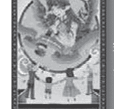

# 正位解析

感情：感情突如其来结束、抛下过往的情感、不再自责、新感情的可能性。

工作：事情提早结束、突然改变工作模式、体认不足、懂得悔改、重新开始、恢复活力。

金錢：突然改變理財方式、苦心沒有白費、之前的理財規劃能有好的成果。

心靈：放下自我批判與罪惡感、自我檢視、挖掘自己的潛能。

感情：情緒起伏不定、多愁善感、疑心病重、關係存在著謊言。

工作：患得患失、沒有自信、危機浮出檯面、遭受謠言中傷、判斷失準。

金錢：金錢損失、投資錯誤、受到謠言影響、虛驚一場。

心

## 權杖皇后
QUEEN OF WANDS

# 塔羅故事
## 苦守寒窯的王寶釧
宰相王允有三個女兒，小女兒王寶釧尤其出落得美麗動人，當眾人急著為王寶釧尋找門當戶對的佳偶結為連理。薛平貴後來參加部隊，從軍去了，王寶釧則在窯洞裡日夜等待。日子一天一天過去了，薛平貴終於返回故鄉迎回王寶釧，讓她與公主平起平坐，夫妻終於重逢。

## 放開我執 我正面思考 人生充滿彈性
你永遠有用不完的體力與精力，你很敢衝，不怕忙也不怕累。朋友都覺得你很勇敢，熱情有活力、樂觀開朗，無論再大的困難與挑戰你都無所畏懼。的確，不可否认的，你很勇敢，但心中仍然恐懼。你不害怕艱難的挑戰，也不害怕險惡的人心，你害怕的是自己，怕自己做不到。難度愈高的挑戰，你愈有興趣。對於冒險，你總是感到興奮，有挑戰性的事物對你來說最有吸引力。但是你能夠從這件事中得到什麼呢？這是你想要的嗎？在當下往往你根本沒有想到，腦中唯一閒過的念頭，就是一衝就對了。覺得這樣才能證明自己的能力。你是否有過這種經驗？打掃了一整天，終於回到家，躺在舒服床上後，有一種迷惘的感覺油然而生，這時候你才開始想，為誰辛苦為誰忙呢？你要的是勝利，但勝利背後的意義呢？這是你時常遺忘的問題。

## 請你跟我這樣做
你來說就是滔天大罪了。平常的你是很隨和的，但是一旦你做出決定，可就不輕易動搖了，這份堅毅在感情上都是如此，當你認定一個人時，固執的狀況可以持續很久，直到你自己膩了、想開了為止。

你渾身上下充滿著自信，為人坦率又積極，對於自己想要的东西，一定會盡全力去爭取。從外表觀察，或許看不出你的勇氣與堅毅，當你下定決心，任誰也無法更動你的決定。有時候，這一點可是有危險性的，萬一你做的決定是錯的呢？建議你多多聽取長輩、親友的意見，讓人生保持彈性，放下內心的執著，你會發現，前方的路途會更加開闊。

# 正位解析
感情：善解人意、喜歡照顧他人、積極追求情感、執著、親切開朗的對象。
工作：充滿行動力、熱情有活力、果斷而積極、得到成就感、具備獨立作業的能力。
金錢：努力獲得自己理想中的獲利、有自制力。
心靈：慈祥、樂意助人、直率、積極、充滿自信。

# 逆位解析
感情：愛情不專一、驕縱任性、公主病、容易由愛生恨、嫉妒心強、情緒化。
工作：自私、鬱橫不講理、個性火爆、容易與他人起衝突、堅持己見。
金錢：自私自利。
心靈：個性執著、殘酷，不懂得替他人著想。

## 權杖騎士
## 迎戰噴火怪的柏勒洛豐
## 我不逃避人生中的轉變 調適自己 迎接新生活
柏勒洛豐卻不為所動，不堪受辱的皇后因此向國王進言，誅陷柏勒洛豐，皇帝一怒之下，便下令要柏勒洛豐送信給里西亞國王，而信中的內容即是要要求里西亞國王除掉這個信差。不殺來使是希臘的傳統禮節，因此里西亞國王想出一個好辦法，他給了柏勒洛豐一個艱鉅的任務——除掉噴火怪獸。想不到勇敢又善戰的柏勒洛豐成功完成了任務，並毫髮無傷地回來，里西亞國王因此十分賞識柏勒洛豐，並將女兒許配給他。讓塔羅走入你的心你永遠有用不完的體力與精力，你很敢衝，不怕忙也不怕累。朋友都覺得你很勇敢，熱情有活力、樂觀開朗，無論再大的困難與挑戰你都無所畏懼。的確，不可否认的，你很勇敢，但心中仍然恐懼。你不害怕艱難的挑戰，也不害怕險惡的人心，你害怕的是自己，怕自己做不到。難度愈高的挑戰，你愈有興趣。對於冒險，你總是感到興奮，有挑戰性的事物對你來說最有吸引力。但是你能夠從這件事中得到什麼呢？這是你想要的嗎？在當下往往你根本沒有想到，腦中唯一閒過的念頭，就是一衝就對了。覺得這樣才能證明自己的能力。你是否有過這種經驗？打掃了一整天，終於回到家，躺在舒服床上後，有一種迷惘的感覺油然而生，這時候你才開始想，為誰辛苦為誰忙呢？—你要的是勝利，但勝利背後的意義呢？這是你時常遺忘的問題。

## 請你跟我這樣做
抽到這張牌代表你的世界即將出現變動，雖然很刺激、很具挑戰性，但如果你不确定自己能不能贏時，你便會亂了陣腳，甚至開始恐慌。建議你，不要害怕生命中的變動，這是人生中的機會與可能性，調適自己的心態，讓自己學習成長，祥和地迎接新的生活吧！

# 正位解析
感情：展開新戀情、熱戀、對愛情充滿衝勁、閃電結婚、突如其來的求婚。
工作：熱情有衝勁、坦率積極、好機會降臨、勇於嘗試接受挑戰。
金錢：新投資機會、出現獲利機會。
心靈：樂觀自主、天真率直、勇於接受挑戰。

# 逆位解析
感情：不成熟的愛情、不想安定下來、不確定對方是不是對的人、沒有思考周全便進入婚姻。
工作：衝動躁進、容易與人發生爭吵與口角、人際關係變差、出現阻礙、對自我迷惘。
金錢：投資受阻、歷經波折的投資、衝動的決定。
心靈：出現過於天真的想法、過於衝動直接、產生迷惘。

點緩衝的時間，讓自己好好思考，即便是幾秒鐘也好。在忙碌之餘，記得給自己獨處的空間，讓自己有時間靜下來思考人生的目標與夢想，讓你在為未來奮鬥的同時更有方向，心志更加篤定。

## 權杖侍衛
## 活潑有創意的搞怪小孩
## 我不怕犯錯 持續學習 達向成功
權杖侍衛是農家出身的小孩，從小家境貧窮，只要有工作、能吃飽就很快樂了。父母從小忙於農事，權杖侍衛在無拘無束的環境下長大，終日與自然為伍。這孩子調皮得不得了，在教室總是坐不住，翹課不說，他還玩弄鄰居家的牛、欺負同班同學、偷拔果園裡的橘子，讓父母很傷腦筋。尤其權杖侍衛很愛惡作劇，他總是有著天馬行空的整人點子，能夠把大人、小孩搞得兵荒馬亂、手足無措，讓大家恨得牙癢癢。雖然每次都會被揍得哭天喊地，還是改不掉愛搞怪的性

# 讓塔羅走入你的心
你的精力充沛，一刻也不得閒，好奇心強的你，什麼新玩意兒對你都 很新奇，讓你羅羅欲試。就是這種性格，為你的童年時期增添不少精彩的回憶，也因為強烈的好奇心，你很容易受到誘惑，在求學時期可能會有許多脫軌的行為，像是抽菸、喝酒等等。當你覺得沒有安全感時，你會開始挑釁別人，但通常只是作勢嘩嘩對方，沒有要傷害別人的意思。你很脆弱，常常覺得心神不寧，情緒也時起起伏不定，有時很容易動怒，甚至惹出麻煩。對於人生，你一直抱持著學習的態度，犯錯對你來說並不可怕，即便做錯事情了，只要讓你懂是非錯的道理，你也有道歉與改過的勇氣。學習一直是你人生的課題，而你的處事態度讓你在工作上、人際方面都會不斷提升與成長。有時你讓人覺得捉摸不定，你下一秒會做什麼事，別人完全猜不到，因為你的思緒是跳躍式的，

## {寶靈心塔羅：解惑故事牌} 58

## 請你跟我這樣做
且你習慣憑著直覺做事，想到什麼就會去做什麼，不喜歡拐彎抹角。你的個性單純開朗，想法天真，身邊有許多好朋友，但是一談到喜歡的人，你會變得很害羞，支支吾吾地連話都說不好，而一談起戀愛，你會變得任性又愛胡鬧，調皮的你總是讓另一半一個頭兩個大。從錯誤中學習是你人生很重要的課題，不要害怕嘗試，換個角度想，錯誤或許可以帶來意外的驚奇喔！重要的是，除了滿腦好創意，也要身體力行，不要只是三分鐘熱度，堅持下去才能完成夢想。目前你的你還在驀驟階段，千萬別小看自己，現階段的成果尚未成定局，你的努力空間還大得很，為自己加油，未來就操縱在自己手上。

# 正位解析
# 逆位解析

感情：親密的關係、忠實的感情、害羞。
工作：誠懇、天馬行空的創意、充滿好奇心、好消息到來、人際關係融洽。
金錢：獲利的消息、多元投資機會。
心靈：對人生充滿熱情、凡事躍躍欲試、認為人生充滿希望。

感情：情緒起伏不定、胡思亂想、受到打擊、胡鬧任性、心碎。
工作：流裡流氣、遭致流言中傷、受到批判、工作進展不順利、受到侷限。
金錢：投資受限制、無法好好管控自己的財富、受到金錢誘惑。
心靈：過度自我壓抑、自我約束的力量不足、心神不寧。

## 聖杯國王
## 感動天地的奧菲斯
## 我樂觀面對人生 相信自己 理性面對情感
奧菲斯傷心欲絕，他悲壯的哭泣聲讓天地為之動容。他決定冒險直探冥府，慾求冥王釋放愛妻，奧菲斯彈奏著感人的樂曲，感動了冥河的船夫，例外放行活人進入冥府，連三頭兇猛的守門犬也受到音樂感

# 讓塔羅走入你的心
你對自己要求很高，做事認真負責，看起來一副很有威嚴的樣子，隨著人生歷練的增加，無論在工

你對自己要求很高，做事認真負責，看起來一副很有威嚴的樣子，隨著人生歷練的增加，無論在工

總是能用同理心來與他人溝通，也願意傾吐自己的心聲，與他人分享內心的世界。你是一個稱職的心靈導師，跟你談話作

你對自己要求很高，做事認真負責，看起來一副很有威嚴的樣子，隨著人生歷練的增加，無論在工

總是能用同理心來與他人溝通，也願意傾吐自己的心聲，與他人分享內心的世界。你是一個稱職的心靈導師，跟你談話作

## {寶靈心塔羅：解惑故事牌} 60

## 請你跟我這樣做
經驗夠愛情，仍然會不停出軌、外遇，有欺騙愛情的可能。

你沒有處理好感性的一面，容易出現壓抑情感的狀況，而變得陰沉、忘不掉過去的傷痛。而如果你還沒

信心，你創作的作品、付出的感情才會有力量。你是很棒的傾聽者與開導者，但你也很需要關懷與擁抱，不要壓抑自己的情感，適時地說出自己的需求吧！關懷的能量經過交流會變得更加溫暖。你很感離，才能順利克服感情中的阻礙喔！

# 正位解析
感情：具有責任感、溫柔體貼、成熟的感情觀、能夠克服情感中的阻礙、渴望安定。
工作：敏銳的觀察力、創意十足、見多識廣、可靠、值得信賴、以理性平衡感性。
金錢：蓄勢待發、懂得自我規範、等待進場時機。
心靈：善良仁慈、重視生命成長、成熟寬厚、和善親切、擁有同理心。

# 逆位解析
感情：走不出過往情傷、壓抑情感、爆發紛爭、令人窒息的愛、互相傷害、欺騙、外遇。
工作：不公正的待遇、受到欺騙、裡外不一、不誠實的行事態度。
金錢：金錢損失、不願意努力、懶散。
心靈：雙重人格、道德淚喪、壓抑仇恨、陰沉。

## 聖杯皇后
## 溫情似水的陳圓圓
## 我面對現實放下過去的傷痛用愛擁抱自己與他人
爲之驚豔，爲她的美色與才藝傾倒。無奈軍情緊急，吳三桂只能先到前線打仗，暫時將陳圓圓安置在京城。怎知，此時李自成攻陷京城，也難敵陳圓圓的美貌與才藝，便抄了吳家，奪走了陳圓圓。吳三桂怒髮衝冠爲紅顏，引清軍入關，打敗李自成，重新奪回陳圓圓。他們在雲南共度甜蜜的時光，一起欣賞風花雪月。但陳圓圓發現吳三桂有竄位的野心，她不忍見到兵戈再起，選擇住進佛庵，終日念經、修身養。最後，吳三桂打了敗仗，抑鬱地抱病身亡。陳圓圓聽到這個消息，她從容走向佛庵旁的蓮花池，安詳地縱身跳進池中，結束了精彩的一生。

你在家裡頭是個聽話乖巧的小孩，但談戀愛之後，愛情會變成你的第一順位，結婚之後，你則會變成任勞任怨、默默付出的好媽媽。你有一種柔柔的美，看起來楚楚可憐，是個像水一樣的女子，溫柔婉約又深不可測。你很有敏銳的直覺與細膩的心思，總是能懂得別人難以說出來的苦處，這一點融化了許多男人的心，讓人忍不住愛上你。當你陷入愛情時，常將另一半當成偶像，覺得爲對方## 請你跟我這樣做

你的工作與興趣不符的話，你的表現會與個性落差很大，如果強逼自己爲了五斗米折腰，對感受力極度敏銳的你來說，是一件異常痛苦的事情。

自信，很自然地，别人就能夠欣賞到你的價值。對於感情，你總是過度浪漫，浪漫到有些不切實際，你必須不斷學習，將每次失敗當做機會，幫助自己成長，讓自己在感性與理性之間能夠取得平衡，變得更加成熟與穩重。

# 正位解析

感情：剛剛發展的愛情、暧昧不明的戀情、尚未穩定的感情、爲雙方關係而努力、豐富的情感。

工作：努力學習、值得信賴、職場關係融洽、願意幫助他人、有海外發展的機會。

金錢：適合海外投資、吸收財財資訊、發現投資新契機、找到值得信賴的理財專家。

心靈：擁有敏銳的感受力、好奇心十足、懂得反省自己。

# 逆位解析

感情：談戀愛的時機不對、戲劇化的愛情、扮演苦情的角色、態度不堅定而錯過真愛。

工作：有不良嗜好、不務正業、阿諛諂媚、注意力無法集中、行爲脫序。

金錢：喜歡投機、遭受金錢詐欺、收到金錢虧損的消息。

心靈：過度浪漫、容易分心、想法不切實際。

## 寶劍國王

# 塔羅故事

## 始終缺愛的李爾王

## 寶劍國王

我愛我自己 我打開心 相信愛

就象故事裡的李爾王，寶劍國王高高在上，手中握著的是呼風喚雨的權力，享受著榮華富貴。這

旁人虎視眈眈，覬覦著寶劍國王的權力與錢財，因此，寶劍國王身邊總是圍繞著巴結、奉承的小人，包

括下属以及身旁的女人。而這一點，寶劍國王自己是知道的，他再清楚不過了，卻仍將自己的優勢當做

鈎鯉，因為，這是獲得愛的最快捷徑，而他是那麼地需要被愛。

讓塔羅走入你的心

過往的童年記憶與負面經歷讓你的內心充滿著不信任與不安全感，總是覺得有一天，所有人都會離開自己，而在這個世界上唯一值得信任的人，就只有自己了。這種受害者情節讓你必須假裝堅強，甚至有一些殘酷與冷血，因為這樣才能保護自己。由於不安，擔心目前的美好會消失，你變得更想要、更想

掌控所擁用的一切，不過這種消極的心態，只會吸引來更多負面的人。

你總是習慣用邪惡來偽裝自己的脆弱，用殺戮來證明自己的力量，但是誰又看得到，你在堅強的盔

甲之下，有著一顆極度不安的靈魂。你將精力都放在防備與攻擊上面，比賽讓你覺得有存在感。當你發

現世界上沒有對手，就會覺得無趣，甚至会自己創造出競爭對象，這樣一來英雄方有用武之地，也才能

證明自己的價值，其實本質上你缺乏自信，又不喜歡努力，因此喜歡透過摺倒別人來證明自己的力量。你是標準的謀略型人物，總是能用最少的成本，獲得最高的獲利，可能有人覺得你投機，但又不得不

## 請你跟我這樣做

不佩服你天馬行空的創意與企劃能力。你的反應十分靈敏，口才流暢、機智聰明，能夠當一個稱職的業 務人員，很適合從事媒體業與商業、貿易相關的行業。

你的內心充滿著愛，卻不懂得愛自己。這樣的負面能量讓你遇到挫折時，無法適當的紓發情緒，只 會駝鳥心態的將傷口堆在心頭，以為能夠化解內心的不安與痛楚。你往往愈難過，就會顯得愈具攻擊 性。建議要用更大的愛來消弭內心的不安，你必須相信世界上的確有愛的存在，學著愛自己，身邊的人 才能放心地愛你。不要用利益與鈔票衡量所有的人，試試看，把心打開，釋放出最原始、最純真的自 己，勇敢的愛吧！你會發現，原來你也能暢快、無拘無束的享受愛的甜美。

# 正位解析

感情：負責任、很好的婚姻、穩定的感情、務實的感情觀、愛情專一。

工作：天馬行空的創意、反應機敏、口才流暢、善於企劃。

金錢：循序漸進的獲利、逐漸成長的財富、良好的投資眼光、優秀的賺錢能力。

心靈：重視物質生活、愛好享受、有品德。

# 逆位解析

感情：沉浸愛情的花花世界、無情、重視肉慾、冷酷。

工作：工作狂、為獲得利益而不擇手段、散漫、工作能力不足。

金錢：利慾薰心、玩弄名利、有錢便開始作亂、被金錢腐化、奢侈、重視金錢多於成就。

心靈：貪戀世俗的玩樂、得不到真正的快樂。

## 寶劍皇后

## 綁著馬尾的女戰士

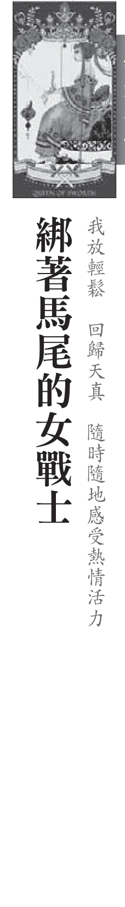

寶劍皇后在前世是位戰士，為了理念而戰，希望世界和平。她很聰明，知道要社會更加祥和，不光說，只要能達到理想的彼岸，受到國王的掌控與牽制，犧牲幸福與青春算得了什麼！果然，寶劍皇后憑著堅毅、果決的性格，按照計畫的影響了朝綱，創建了有利於百姓的制度，人民終於有好日子過了。只是，寶劍皇后始終受到國王的箝制，而深鎖在宮室中，爭權鬥勢的生活也在所難免。漸漸的，初不知怎麼的，心不禁噗通跳了好幾下。

讓塔羅走入你的心 勤，讓自己的判斷失準。在專業上，你不喜歡別人干涉自己的決定。遇到問題你絕不硬碰硬，反而運用柔性的力量來獲得勝利。與其自己耕耘，你會選擇更有效率的方法來達到目標，像是和主管打好關係、向權貴遊說等等。你很懂得看人眼色，腦袋瓜裡總是充滿著策略與計謀，這讓你做起事來總是比别人順利，不過在過程中，你容易迷失自己，甚至變得利慾薰心、貪圖肉慾，而忘記了自己最初的夢想。

你起來像個女強人，精明幹練又有點酷酷的，但內心卻藏著個天真的小女孩。大女人主義讓你單

我放輕鬆 回歸天真 隨時隨地感受熱情活力

## 請你跟我這樣做

身的機率很高，雖然對感情渴求，卻表現得冷漠，雖然你談戀愛時能夠全心全意的付出，但是表面的冷

酷常常在第一時間就把對方嚇跑了，而如果身邊有伴侶，你常常擔任照顧與付出的角色。

你的眼界很廣，心中有著偉大的夢想，希望自己的力量能讓世界更美好。只要善用規劃與發想的能

力，發揮統籌的優勢，你可以帶給世界正面的影響。你可能爲了獲得利益想走捷徑，寧願當別人的魁儡，受到金錢權勢的支配。但是聰明的你明白，有一天自己會剪斷這些操縱的線，做回真正的自己。你必須學會自由自在過日子，拋卻慾望，無欲則剛。你擁有創意與發想的能量，是個天生的藝術家。只要善加發揮企劃能力與創意巧思，你不用依賴其他人，憑著自己堅毅的性格，必定能讓專業更加精進，打造出屬於自己的一片天地。

# 正位解析

感情：理智的感情、冷酷的外表、全心全意付出、內心渴求情感、不喜歡主動討好。

工作：精闊的分析能力、良好的事業發展、機智聰明、做事一板一眼、條理清晰。

金錢：謹慎的理财規劃、理性思考。

心靈：內心理智、習慣與人保持距離、不輕易透露真心。

# 逆位解析

感情：過於強勢、胡思亂想、心胸狹窄、透過心機爭取愛情、報復心強、過度依賴。

工作：咄咄逼人、不知變通、陷入唇槍舌戰、批判性強、容易樹敵。

金錢：得失心重、透過不正當的方法獲利。

心靈：主觀意識過強、堅強的武裝、固執、過度壓抑自己、悲觀主義者。

## 寶劍騎士

## 才華洋溢的幕後創作者

相信自己 我做得到我也能成為主角

抗敵的能耐受到國王的肯定，但他知道，他的夢想不只是這樣，他不只要打敗敵軍，還要打敗國王，讓腳下這片領土成為自己的國度，讓天下過著祥和的生活。這位寶劍騎士不僅有戰力，還有腦袋，懂得拉攏重要大臣，甚至得到皇后的愛戴。最後，就像故事中上演的劇情一樣，騎士競位成功，而寶劍騎士一直被另一個勇士推翻了。

你的工作能量很強，腦袋瓜總是塞滿無限的創意，擁有很棒的危機處理能力，但你往往低估了自己能力，沒有發現其實自己的潛能，以至於不敢面對挑戰，以為自己做不到。就像劇團的幕後創作者，能夠演繹出張力十足的劇本，甚至指導演員排戲，其實這個幕後藏鏡人很想在幕前演出，但不認為自己有能力辦得到，有著鏡頭恐懼症的你，當被镁光燈照著時，就不由自主地害羞起來了。

你對自己總是充滿質疑，雖然有夢，卻不敢實現。你現在做的事情並不是自己想做的，當然無法好好發揮。由於了解社會的現實面以及自己內心的不安與不踏實感，有時候你喜歡抄捷徑、攀關係，一輩子都在尋找靠山。一如廣告中，面試官秘書口中念的「這是老總的表哥的女兒」，那些需要找人靠的多

讓國家愈來愈衰敗，造成民怨四起。不久後，就讓另一個勇士推翻了。讓塔羅走入你的心

[PAGE 107]

## 請你跟我這樣做

半是這個類型。感情方面，你剛開始會有一段穩定的感情，可能曾經屬於愛情長跑族，但最終步入禮堂

的人通常不是前一段安定的那個，你很容易缺乏安全感，總覺得沒有人了解自己，沒有人懂你。如果遇

到知心，天雷勾動地火的情節立刻就會發生在你身上，容易閃電結婚，這類型的人較容易有二次婚姻。

你渾身上下充滿了幹勁，是一個很棒的企劃人才，很適合做管理職位，或者是行銷企劃、廣告創

意、公開方面的職務，也很適合做創作以及音樂相關的工作，你必須相信自己的能力，你是很棒的人

才，不要依賴別人替你撐腰，你必須明白，你身上具備種種的優點，你是有能耐克服一切難關，有能耐成為主角，有能耐完成夢想的。可別小看自己了！

# 正位解析

感情：喜歡競爭的感覺、短暫的愛情、喜新厭舊、閃電結婚、二度婚姻。

工作：幹勁十足、有衝勁、面對挑戰毫無恐懼、喜好冒險、優秀的企劃能力、無限創意。

金錢：過於衝動的決定、透過分析能力獲利。

心靈：對未來充滿希望、勇氣十足。

# 逆位解析

感情：衝動的愛情、傷害他人、破壞他人感情、喜歡挑剔對方、出於利益的愛情。

工作：攀關係、找靠山、過於衝動、欠缺思考、重蹈覆轉、自以為是。

金錢：對不義之財動心、利慾薰心、衝動之下做決定。

心靈：過於魯莽、凡事不設想後果。

## 寶劍侍衛

## 擁有敏銳觀察力的傑克

## 我不怕混亂 善用感知能力 學習成長

# 塔羅故事

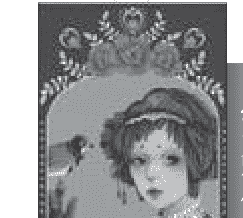

## 寶劍侍衛

讓塔羅走入你的心

過。雖然口袋沒有半錢，雖然不太會念書，但寶劍侍衛的夢想可大了，他想成為有錢人，想幫助窮人，想讓大家的生活過得更好。這家伙擁有一嘴好口才，年紀輕輕卻十分了解交際手腕，街上的差吏使一個眼色，他馬上知道要靠過去擦擦鞋，奉承兩句。寶劍侍衛很快地便混進宮廷，有了一些錢、一些權之後，還愛上了賭博，賺到了錢就去賭，周而復始的在宮廷中過著如此的生活。

事化教育，因此你是非常早熟的小孩，非常清楚如何自保。雖然不太會念書，但是你在人際關係方面很有一套，懂得察言觀色，也知道什麼時候該說什麼話。

在三十歲之前，你的感情狀況總是處於超混亂狀態，充滿性與愛的放縱，有時候連自己也不知道自己已到歲在幹嘛？這來自於兒時的恐懼，讓你對愛情容易感到不安，因此你會以逃避的方式解決自己的不安，其實你是很專情的，但是找不愛情之前，你總是貪心，想經驗更多。

這類型的人通常有成癮性行為，例如酗酒、菸癮、沉迷電動等等，但是也代表你擁有很强的能量，不過在摸不清方向之前，總是會釋放在不對的地方。牌面中，侍衛手上的小鳥自動停在他的手上，代表

## 請你跟我這樣做

你的創造力非常強，以你的能力，通常年輕時就會很有成就，而你必須透過兒時的經歷讓自己成長，無論是與三教九流的人物交往，或是如同社會新聞的經歷都是成就的養分，都讓你更有動力去服務別人。

折，你必須寬恕家人對你的傷害，進而去支持與幫助他們，並且用過往的經歷處理現有的問題，規劃自己的人生與目標。不要埋怨自己命苦，這是一個探索自己的過程，必須將自己的超感知能力變成一種很大的、很有影響力！

很人、很有影

## 錢幣騎士

錢幣騎士在優渥的環境下長大，讓他在舉手投足之間散發出貴族的氣息。從小到大錢幣騎士都是模範，但錢幣騎士卻只想開創環保事業，研發新技術，讓垃圾變黃金，這個決定掀起了命運的轉折。在實驗室，靠著謹慎與動奮的精神，長時間奮戰，終於開創出自己的品牌與事業。命運，這是錢幣騎士第一次抗拒父母的命令，雖然抗爭成功，但沒有金援、也沒有人力，錢幣騎士天天睡在外人看來，你是幸運的，你的父母鍾你、愛你，無論學業、事業，你都表現得可圈可點。你的人

生還算順遂，就跟大多數人一樣，考試、升學、就職、結婚、生子，你按照著大多數人的步調過生活，選擇大多數人也選擇的道路走，因為這樣最安全、最可靠，你一直都是用功的學生、認真的職員、謹慎的上司，守規矩，從不摸魚偷懶，只要有一套健全的體制可依循，你一定能表現得很好。

但是你常常覺得不夠、不滿足，卻又不敢跨越，很怕走出自己舒適的圈圈。對凡事都小心翼翼的你

顯得不夠果決，如果没有充足的準備，你絕對不敢嘗試，這一點讓你對許多事怯步。比如常常抱怨目前

的工作壓力太大、薪水不夠高，此外還擔心自己無法勝任其他工作，怕自己能力不夠。

完美主義是你的一大優勢，卻也是內心壓力的來源。你常常將事情看得太絕對，不是完美、就是不

完美，這是你堅持下去的動力，也是你虐待自己的根源，你是標準的「嚴以律己，寬以待人」，只對自

己苛責，如果没有達到對自我的要求，你會不停地做，直到滿意為止。

試著放過自己吧！要求完美是一件好事，但如果近乎苛求的話，就是對自己殘忍了。人生總會有一

些瑕疵，這都無傷大雅，太過執著只會讓自己忽略其他更重要的事物。你必須跳脫既有的價值觀，放掉

束縛，相信自己，只要做就是了。請保持現狀，你是沒有問題的，其實你的頭腦很清楚，堅毅與循規蹈

矩的個性讓你不至於出太大的差錯，持續努力下去，終有一天你一定能完成夢想。

# 讓塔羅走入你的心

## 請你跟我這樣做

感情：穩定的愛情、成熟穩重的對象、以結婚為前提的關係、不輕易變心。

工作：負責任、可靠、值得信賴、遵守教條與規範、有耐心。

金錢：穩定地獲利、逐步成長的資產、有計畫的投資。

心靈：認真對待每一件事情、外冷內熱、重視自我成就。

# 正位解析

感情：穩定的愛情、成熟穩重的對象、以結婚為前提的關係、不輕易變心。

工作：負責任、可靠、值得信賴、遵守教條與規範、有耐心。

金錢：穩定地獲利、逐步成長的資產、有計畫的投資。

心靈：認真對待每一件事情、外冷內熱、重視自我成就。

# 逆位解析

感情：過於木訥、不體貼、悶葫蘆、沉悶的感情、令人厭倦的感情。

工作：反應遲鈍、行事拖拖拉拉、動作緩慢、不懂得舉一反三、光說不練。

金錢：受到規範限制、遲遲不敢下決定。

心靈：不清楚人生方向、缺乏決心。

## 錢幣侍衛

# 塔羅故事

自我壓抑的水晶小孩

我放下過去的執著 釋放自己 讓自己快樂

年輕的錢幣侍衛在愛情世界中總是迷惘，他勇於嘗試，曾經甜蜜，也曾經痛苦，但仍找不到歸宿。過去幾段失敗的感情隨著時間，也慢慢地被遺忘了，但是一直忘不掉的，是他曾經人工流產的小孩。他回憶起過去瘋狂歲月，自己對於靈魂是那麼地不尊重與不崇敬，對他來說，這是很深層的傷痛。他努力地做靜心，告訴自己放下對過去的執著與恐懼，決定在內心祝福這個靈魂平安快樂，讓自己得到釋放。

論時間過了多久，都會不斷地在你的人生中掀起波浪。如果你對這張牌很有感覺，大多曾經歷單親家庭、隔代教養、與家人一方的不連結等狀況，讓你對家庭有很深的渴求，很需要家人給你的愛。這也讓你從小就很獨立，比同齡小孩都來得早熟，而你是很執的，就像一頭牛一樣，意志力超強，非常難說服。這張牌也提醒你注意與孩子之間的關係，你擁有很多的愛，但卻不擅長表達與溝通，再加上你很壓抑自己的感情，什麼情呀愛呀，很難說出口。你是個中矩的人，很願意努力與學習，知道必須一步一腳印才能成功，總是清楚什麼時間該做什麼事，不太需要他人操心。無論什麼事，你總是堅持到底，絕不輕易放棄，擁有很棒的工作能力，事業運也很順遂。然而，如果抽到逆位牌的話，就會變得非常大的落差，代表不按規矩做事情或是陽奉陰違，愈是禁止你做什麼事，你就偏偏想試試看，會變得非常叛

逆，不聽指揮，再加上固執的個性，要自己跌過跤、知道痛之後才會學乖。

## 請你跟我這樣做

感情：不可靠的關係、感情出現裂縫、缺乏自制力而導致分離與背叛。

工作：工作消極、缺乏動力、容易分心、不按規矩做事、缺乏準備、陽奉陰違。

金錢：揮霍浪費、喜歡挑戰高風險的投資選項。

心靈：擁有不切實際的想法、叛逆、不聽從他人勸言。

# 正位解析

感情：出現戀愛對象、對感情負責、壓抑的情感、結婚、容易早婚、年輕時懷孕。

工作：注意力集中、穩定的發展、逐步進步的成就、穩紮穩打。

金錢：能賺取想要的金錢、有發展潛力的投資機會。

心靈：擁有務實的想法、一步一腳印的人生態度。

# 逆位解析

感情：第三者、三角關係、將自己的心綁住、被判出局、失落、悲傷。

工作：不實際的夢想、徒勞無功、停滞不前、目標延遲達成、被利用、不融洽的合作關係。

金錢：獲利減少、財富遭到利用、投資失利。

心靈：退縮、失去動力與精神、無法擺脫情緒上的束縛。

## CHAPTER THREE

## 數字牌

## 權杖一

## 冒險故事的開端

我全力以赴 梦想有多大 世界就有多大

從前有個國王名叫伊森，他的王位遭到親弟弟帕利阿斯的眼中釘，伊森國王知道，必須趕緊將兒子送出皇宮，否則傑森便會面臨巨大的危險，伊森國王有一位剛出生的兒子傑森，醫術、軍事、藝術都很有研究。凱龍將傑森託付給半人半馬的神獸凱龍，凱龍住在遙遠的森林深處，對於導能力，教導傑森成為真正的領袖。在傑森長大成人之際，凱龍說：‘傑森，你離開我的时候到了，上路吧！去奪回你的皇位！’讓你傷透腦筋，一方面你安於現狀，不願意改變，另一方面卻又對新機會蠢蠢欲動，渴望人生有第二種可能性。這些抉擇象。這些新契機，或許是新的合作關係，或是分裂的力量，都蘊藏著無限潛力，而你思考規劃的同時，也蓄勢待發，準備大展身手一番。在你的心中也存在著二元抉擇，要跟隨主流文化的聲浪呢？還是堅持自己的風格呢？通常碰上這張牌代表你對目前的現狀有所不滿，想要有所突破與轉變，但因為內心仍舊存在恐懼，讓自己無法脫離況，為自己找理由、找藉口。其實你是個勇者，如果下定决心離開、做出改變，拿出勇氣與力量，你一

定有能力順利完成新任務。 你總是面臨抉擇，心中總是對自我充滿著質疑與矛盾，有時候你會摸不清楚自己的模樣。對於櫃面 上的價值觀與審美觀，除了崇拜與欣賞，往往你會傾向模仿，希望透過這般一學習一讓自己成為出色的 人，但是，只是複製外表無法重現靈魂，你必須找出真正的自我，做出理性的決定，讓內在真實的自己 跳脫出來，用自己的力量獲得光彩與掌声。最近你可能會遇到人生的新挑戰或新機會，或許環境與條件 不是很成熟，但卻值得一試，只要相信自己，發揮無窮的潛力與實踐力，無限美好的未來正等著你喔！

# 正位解析

感情：出現好機會、面臨抉擇、勇於放下目前的束縛、可以選擇自己渴望的感情。

工作：有勇氣接下新任務、成熟理性、能夠做出正確的決定、有海外發展的機會。

金錢：出現好的投資機會、海外投資的契機。

心靈：面臨人生重大抉擇、內心充滿力量與勇氣，希望開拓不同的格局。

# 逆位解析

感情：容易自責、過於依賴、感情進展得不順利、有傷心的可能。

工作：過於衝動、做出錯誤的決定、無法抉擇、行事拖拖拉拉、喜歡模仿他人的作法。

金錢：有理財計畫，但缺乏資金。

心靈：內心存在矛盾、自我懷疑、缺乏自信、失去自我。

## 權杖三

## 接受挑戰、前往冒險之旅

傑森出發了，邁向他的冒險之旅，準備奪回王位。在返國的路途中，傑森遇到一位老婦人，要求傑森一口答應，便背著老婦人渡河，而隨著傑森往前踏進的步伐，老婦人變得愈來愈重，儘管吃力，傑森仍盡力將老婦人送至對岸，過程中還掉了一雙鞋，這名老婦人其實是諸神之后席拉的化身，透過这次考驗，席拉決定要暗中幫助這名有為的青年。而在皇宮享受榮華富貴的帕利阿斯，始終受到預言所苦，祭司告訴他，他的皇朝將被一位只穿著一雙鞋，心中驚慌不已，表面上他假意同意，但同時也要求傑森證明自己的能耐，他才願意心甘情願摘下皇冠，而帕利阿斯給了傑森一個不可能的任務：將金羊毛帶回來。

你的冒險之旅已經開始，生命中将出現意外的驚喜。你先前的計畫似乎逐漸成形，或是規劃中的事情正進行到一半，有更多任務等著你去完成。你的視野變大了，格局也變得更廣，相對地，身上背負的使命更重了，所面臨的挑戰也跟著愈來愈多，你必須用更多的力氣或尋找合作夥伴來達成目標。現階段的你已經找到自己的步調，能夠按部就班地按照目前進度往前走，而在享受成就的同時，你也想探索人生的內涵，尋求內在的成就感以及更深層的智慧。

我按部就班 堅持下去 找到自己的步調

不過，一心想擴大版圖的你，有時候會忘記自己的立基點，也忘了評估自身的氣力與條件，腦中仍 然存著不著邊際的幻想，讓先前的努力徒勞無功，而在感情方面，你往往將自己的心綁綁住，無法逃脫 囚牢，這張牌也代表存在著第三者或處於三角關係，讓你的內心打了結，感到失落以及悲傷。 不要因為眼前的誘惑而讓自己分心，你的計畫已經進行到一半，付出的努力即將成長為甜美的果 實，你必須繼續堅持下去，付出一定會得到回饋，並會有更好的選擇出現。你需要時候的沉積，必須等待、學習，之後才能走入生命的下一個旅程。你擁有很棒的行動力與實踐力，但在這個時候如果能多多 參考他人的建議，或者與他人互相合作，能夠將你不切實際的構想往現實拉近一步，會讓你距離夢想愈 來愈近。

# 正位解析

感情：甜蜜的感情、成功的遠距戀愛、尋找新戀情。

工作：具備生意頭腦、有利經商交易、有前景的未來、生命中出現驚喜、合作無間。

金錢：財務狀況良好、與他人共同投資獲利、嘗試新的理財方式。

心靈：充滿動力、探索未知、謹慎規劃、迎向未來。

# 逆位解析

感情：第三者、三角關係、將自己的心綁住、被判出局、失落、悲傷。

工作：不實際的夢想、徒勞無功、停滞不前、目標延遲達成、被利用、不融洽的合作關係。

金錢：獲利減少、財富遭到利用、投資失利。

心靈：退縮、失去動力與精神、無法擺脫情緒上的束縛。

## 權杖四

## 我承擔責任 付出承諾 一步一腳印

為了這趟冒險之旅，傑森需要一艘大船。這時，雅典娜女神伸出援手，用許多具有神奇魔力的建話，還能預言未來。傑森號召了一批英雄好漢，共同邁向這趟尋找金羊毛之旅，成員包括力大無窮的英亞哥號的船首是由一顆聖樹所製，不僅能開口說話，還能預言未來。傑森覺得自信滿滿，他有自信，絕對能順利帶回金羊毛，正式地奪回皇位。讓塔羅走入你的心你像是小資女孩，是一個認真努力過日子的人，每一分每一毫的金錢與成果，都是先前勞碌辛苦取而來的，所以你很懂得如何運用財富，也很珍惜現在所享有的一切。你對未來有著強烈的夢想與期待，你選擇努力工作賺錢、存錢，而等到你到達了一個穩定的基礎後，你會開始實現夢想，例如出國念書、創業等等。但有时候你仍會存在消極的態度，覺得人生好辛苦，似乎得拚到筋疲力盡才撑得過去，不過你知道，只要自己抱著希望，總會有好事發生。

# 正位解析

說，事業就是生活一部分，事業就是服務，有了事業，才會發現自己的價值。請你跟我這樣做傳統偉特版本的權杖五，大多釋負面的門爭和爭執，但在這副牌當中，權杖五本質的攻擊力量轉化為動力和動能，為自己夢想和目標努力，不再怨天尤人、不再抱怨憤怒，不再因為他人言語或是別人的一舉一動而受到影響。牌面上的小女孩清楚自己的目標，願意為了夢想而奮戰，因為沒有多餘時間去經歷無聊的是非糾紛，外在環境的耳語對他來說，非但不是阻力，反而是一種推動力。因為只要有是非就有注意力，可以讓你在人前表現地更加負責、積極，你知道，只有自己願意轉化，才能轉變局勢！

# 逆位解析

心靈：面臨生命中的挑戰、為了生活奮戰、積極樂觀。

## 感情：友誼重修舊好、為了愛情而奮鬥、寬容彼此的過錯、努力獲取芳心。

## 工作：為了夢想而努力、不怨天尤人、負責、勇於接受挑戰、目標明確。

## 金錢：拚命賺錢、嘗試各類投資、透過創意賺錢。

## 心靈：混亂的情緒、矛盾的內心、焦躁不安。

## 感情：矛盾的感情、猶豫不決的關係、爭吵過後的妥協、必須包容對方、無法離開的感情。

## 工作：衝突事件、受到欺騙、爭執、用錢吵過後的協、必須包容對方、無法離開的感情。

## 金錢：金錢上的紛爭、遭到詐欺、詐騙集團、錢財受到束縛。

## 心靈：混亂的情緒、矛盾的內心、焦躁不安。

# 權杖六

# 正位解析

感情：成功的戀情、戀情終於開花結果、感情發展順利。

## 工作：好消息、機會上門、獲得勝利、成功達成目標、靠自己的努力實現願望、無往不利。

## 金錢：投資有成、財源豐碩。

## 心靈：感受到成功與榮耀、對自己充滿自信、擁有動力與熱情。

# 逆位解析

## 感情：膚淺的愛情、禁不起失戀的打擊、缺乏熱誠的愛、遭到背叛。

## 工作：短暫的勝利、表面上的成功、計畫延遲、被挫折打倒、合作關係破局。

## 金錢：帳面數字漂亮，但實際獲利卻不然、投資等待回收、功虧一箇。

## 心靈：內心充滿恐懼、失去熱情、不相信自己能成功。

# 權杖七

# 用計擺脫追捕、航向歸國之路

我回歸初衷 謹清自己的目標 堅守信念

眼瞬睜看到珍藏的金羊毛被奪走，又遭到女兒的背叛，艾厄特斯國王很不甘心，他派出戰船艦隊追捕傑森的亞哥號。眼看，艾厄特斯國王的艦隊就要追上來了，國王的艦隊武力龐大，亞哥號上的英雄好漢可能無法招架，在這個情勢急迫的當下，美狄亞竟用計將親弟殺害，並且大卸八塊，將屍塊丟入海中。原來，這就是美狄亞當初帶弟弟上船的目的，根據希臘傳說，屍體不全的靈魂無法上天堂，艾厄特斯國王只好放棄追捕亞哥號，沿途打撈兒子的屍塊，而傑森一行人也因此逃過一劫，繼續航向歸國之路。

# 權杖八

# 順風航行歸國

駛去。幸運的傑森一路上得到許多天神的大力相助，也遇到英雄好漢願意情意相挺，更得到愛妻美狄亞的幫忙，在克服種種挑戰之後，傑森手中握著得來不易的金羊毛，現在海上的風浪顯得平靜，放眼望去一片浩瀚，海面上正吹起順向風，讓亞哥號得以加速前進，一切順暢無阻。現在，傑森似乎只剩下後一個任務：就是返航歸國，奪回屬於他的皇位。後一條暢直的路線了，倒數的里程數提示牌已經印入眼簾，讓你心裡不由得暗自歡喜，也下意識地加快腳步。對比先前的辛苦與煎熬，現在的你已經整理出一套做事的標準模式，能夠老練地處理眼前的障礙，讓你不管遇到什麼問題都能快、狠、準一一解決。在這個階段，你的步調會加快許多，具有強大的行動力，就像一陣龍捲風，瞬間橫掃整片田園。工作方面，你大腦的思考速率會加快不少，做事進度大幅超前，讓你在工作上順暢無比。此刻的你彷彿被按了快轉鍵，做什麼都快，有倉促決策的可能性，周遭環境也有快速變化的機會，而這張牌與旅遊相關，在工作上會出現國外業務、海外派遣的機會，也有出國旅行的機會。

# 權杖九

# 關關難過關關過

我從回憶中甦醒

從壓力中脫困

我回純真的自我

過了，你知道今日的朋友可能成為明日的敵人，凡事總是抱著警戒心，也從來不敢卸下心防。

經過多年的努力與奮戰，再加上你苦幹實幹的精神，你的表現顯然駕凌在同期的同事之上，工作能力無庸置疑。這得來不易的成就讓你欣慰，卻也讓你擔心，是否有人覬覦我的職位？會不會遭到竄位？

這個人靠不靠得住呀？為了保護自己的地位，你時時刻刻帶著面具，懷著戒慎恐懼的心情，隨時保持備

# 權杖十

# 奪回皇位卻不知感恩

讓塔羅走入你的心 你具備有條不紊以及規律的行事態度，擁有豐富的閱歷與實務經驗，能夠將交辦事項辦得妥貼穩斷抱怨，但最後仍會把事情完成。你的忍功一流，不太會發出求救，長久以來，將呈現身心俱疲的狀態，可能會出現肩頸疼痛、怎麼睡都睡不飽的狀況。你衝動又熱情的個性，對於來者的要求，往往不懂得拒絕，將責任、壓力全數攬在身上。明明已經不堪負荷了，卻還是不断把壓力與職責往身上扛，一方面是責任感與英雄感作祟，且擔心別人做不好；

# 聖杯一

# 意外愛情的展開

維娜斯是從海上的泡沫中誕生，再透過西風的吹送，將她送到父親宙斯面前。維娜斯是愛神與美神，她貌美如花，掌管人世間的婚姻與愛情，但是維娜斯也具有善妒、愛慕虛榮的特質。有一天，維娜斯發現她的聖壇漸漸杳無人煙，人們不再來祭拜。原來，人世間有一名公主名叫賽姬，她的美麗讓世人為之傾倒，人人將她視為女神般崇拜與愛慕，甚至認為賽姬才是真正的美神。這讓維娜斯氣炸了，她嫉妬賽姬的美貌，不僅對前來向賽姬求婚的人百般阻擋，還命令兒子丘比特用金箭襲賽姬。公主時，為她的美貌癡迷不已，金箭一不小心刮傷了丘比特的手，從此丘比特便深深地愛上了賽姬。

## 聖杯二

此時的愛神丘比特也為愛情煩惱著，他不僅沒有完成母親交代的使命，還愛上了賽姬公主。於是丘比特請求天神阿波羅的幫忙，兩人聯手計劃迎娶賽姬的妙計。而因為始終無人前來向賽姬公主求婚，讓國王與皇后急得發愁，此時，阿波羅下了一道神諭給國王：賽姬必須嫁給大蛇怪，否則舉國上下便要遭受飢荒與貧窮的懲罰。同時，丘比特化做大蛇，出現在國王的夢中，要求國王隔天將賽姬帶到山嶺上，而悲傷的人民將賽姬送到山峰上，接著便一一離去，而賽姬獨自站在大石上，等待著未來的丈夫——大蛇怪。

讓塔羅走入你的心

愛情，需要主動的力量，需要積極爭取與付出，就像丘比特對於賽姬公主的用心。牌面中身後的男子具備行動力、有衝勁，結合前方女子的感性與直覺力，兩人互相學習、成長，是一對很有創意與發展的組合。這張牌代表著無論在工作上或是感情中，都必须尋找一個與自己互補的對象，兩人彼此扶持與照顧，發揮出更大的價值。在感情中，你與對方處於平等和諧的狀態，懂得相互尊重與依賴，兩人都很願意為彼此付出奉獻，是很幸福的一對呢！這張牌中走入婚姻的意涵沒有那麼強烈，但兩人緊密的依存感與快樂的氛圍也足夠誠摯旁人了。在工作方面，你會遇到相互依賴的事業夥伴或合作對象，彼此相輔。

## ## 請你跟我這樣做

化成冷漠與疏離，這讓你覺得更不自在，更想逃離，讓你精神變得萎靡，甚而逃避感情。

心靈上的富足需要兩個人的合力，如果只是等著對方為自己付出，愛情的天秤終究會失衡，親愛的朋 友，在享受愛情的同时，必須懂得知足與珍惜，要釋放自己的真心，勇於奉獻與付出，在為兩人關係勢力的同時也讓自己成長吧！

## ## 正位解析

感情：平等和諧的關係、願意為對方付出、相互尊重與信任、彼此愛慕、有訂婚的機會。

工作：有行動力與衝勁、順利簽約、和諧的合夥關係、合作愉快，值得信賴的夥伴。

金錢：主動出擊、良好的賺錢能力、透過合作獲利、新投資計畫的開始。

心靈：心靈處於和諧的狀態、兼具理性與感性、真誠地付出。

## ## 逆位解析

感情：表裡不一的關係、單方面的付出、虛假的關係、懷疑、背叛、分開。

工作：缺乏溝通、獨裁、付出未獲回報、不協調的合夥關係、精神不濟、分心。

金錢：投資失敗、無法回收資金、遭到欺騙、合作關係破局。

心靈：不信任他人、感到不滿足、失去動力。

## 聖杯三

# 由美人魚見證的婚禮

# 讓塔羅走入你的心

我與他人分享快樂 感激眼前一切 相信自己

殿。折騰了一天，讓賽姬一抵達宮殿便抵擋不住睡意，在入睡前，丘比特趁著黑暗，在賽姬的耳邊悄聲說：—我是你命中注定的丈夫，但是我的長相實在太醜陋，所以白天不能出來見人，夜晚才能過來陪你。—並要求賽姬必須在午夜十二點過後將爐火吹熄，以免他醜陋的面容賊到賽姬。丘比特提醒賽姬，如果違反了這個約定，他們的婚姻將會破局，賽姬也會從此失去他。賽姬答應了，兩人終於正式舉辦了婚禮，三隻美人魚是這場婚姻的見證人，在島邊歡喜地為兩人慶賀，而賽姬果然信守承諾，在典禮中終沒有轉頭去看她的丈夫。讓塔羅走入你的心圓滑的處事手腕，人際關係方面打點得恰到好處，終於成功迎娶美嬌娘，還得到三隻美人魚的祝福與見證。這意味著你有覺得很溫馨，而聰明的你遇到問題不會硬碰硬或單打獨門，懂得尋求夥伴合作來解決問題，而你平常做人處事很得人緣，朋友都很樂意幫忙，讓你的生活輕鬆不少。這張牌意味著現階段出現值得慶祝的事，讓你眉開眼笑，歡欣鼓舞地和朋友一同慶祝，但這次旗開得勝只是第一階段的達陣，真正的主菜還沒上桌，後續還有更多挑戰等著你，所以，在歡樂慶祝同時，

## ## 請你跟我這樣做

你是不会因現階段勝利而滿足，你的野心不懂懂於此。喧嘩過後，你的內心仍然焦慮，思考著如何保持...

這快樂的瞬間？如何更進一步挑戰自我？工作方面，你很適合透過團隊合作發揮長才，但你是個不好馴...

方，必須小心呵護，或是會巧遇舊識而意外擦出火花，也有舊情復燃的機會。

雖然目前的一切看起來美好幸福，但是你的內心仍然不滿足，總覺得少了什麼。你的慾望無限蔓...

延，是目前的你無法速成的夢想，不免讓你在午夜夢迴時有些惆悵。往自己有的東西去看吧！珍惜眼前...

樂樂，將歡樂分享出去，會讓你更懂得幸福的美好！ 好好努力吧！當你遇到快樂的事情，獨樂樂不如眾...

## ## 正位解析

感情：舊愛重逢、展開新的戀情、與以前的朋友擦出火花、快樂的感情、有計畫性的懷孕。

工作：解決難題、好運氣、有結論、滿意的結果、與之前的合作夥伴繼續合作。

金錢：出現賺錢機會、獲得計畫中的錢財、重新投資股票與基金。

心靈：快樂滿足、分享喜悅與歡樂、具有療癒他人的能量。

## ## 逆位解析

感情：縱慾、過度放縱、短暂的戀情、感情遇到阻礙、感到失望。

工作：過度享樂、事件的延遲、缺乏感激、不願服從、出現歧見。

金錢：炫耀金錢、奢侈的消費習慣、不懂得回饋。

心靈：過度重視美麗的外表、內心感到空虛、失落。

## 聖杯四

# 安定的兩人世界

賽姬在宮殿中過著無憂無慮、豐衣足食的生活，生活起居都有僕人服侍。賽姬的蛇丈夫只有夜晚才出現，宮庭中没有蟻燭，到了夜晚便一片漆黑，因此她始終沒看過丈夫的真實容貌，但蛇丈夫既貼心又溫柔，對待她極好，兩人的生活濃情蜜意。但是日子久了，賽姬開始思念家人，雖然丘比特知道讓賽姬的姐姐來訪。賽姬的姊姊與家人見面將為兩人的婚姻帶來危險，但心疼妻子的丘比特仍然答應讓賽姬的姐姐來訪。賽姬的姊姊來到宮殿，發現這裡金碧輝煌，賽姬過得比她們都好，心中不由得興起嫉妒心。姊姊們慫恿賽姬殺掉蛇夫君，並偷偷塞給了賽姬一把刀與一根蟻燭，要求賽姬趁半夜利用蟻火看清丈夫的面容，並一刀殺了的他。姊姊們認為，只要賽姬看到了妖怪的真面目，一定能夠下得了手，而賽姬竟也耐不住好奇心，答應了姊姊們的要求。讓塔羅走入你的心圖。你擁有華麗的外表、寬闊的人際，你是一個很出色的人才，在自己的小小舞台上發光發熱，但其實你心裡常常會出現有志難伸的悲嘆，你有了更大的理想與抱負，期待跨出現在的小舞台，擴張格局與版圖。你對現況不是太滿意，甚至覺得無聊透頂，你想要有更大的發展空間，也想拓展自己的舞台，但卻少了一點勇氣，通常也缺乏了行動力。因此，在工作上你總是很難集中注意力，或內心湧現轉職的打算。感情方面則代表步入穩定期，感覺彼此就像老夫老妻，安定卻也有些單調，讓你出現想向外發展的

我不畏懼 勇敢接受生命中的轉變 找回安全感

念頭。對於腦中種種的想法與慾望，其實你有實現它們的潛能，但內心卻充滿著擔憂與不安，害怕轉變

與失敗，最後只好選擇待在最安全的地方。

## ## 請你跟我這樣做

如果你是賽姬，結婚了一年，卻從沒看過丈夫的容貌，你會不會好奇？你會信守承諾，永遠待在黑暗的宮殿裡，享受榮華富貴？還是會冒險一試，用爐火夜探丈夫的臉龐？這張牌告訴我們必須面對真實

的自我，你對現實生活有任何不滿足嗎？你是否終日抱怨，接著不甘願地噴口氣，繼續回到原本的牢籠

中待著。你必須從不滿足的地方去挖掘自己的夢想。而要達到夢想，你必須擁有完成夢想的才情與能

力，就像巢中的鷹鳥，想翱翔天際，必須先長好翅膀。讓自己勇於突破與體驗人生，讓自己學習成長，

滿足當初的不滿足。

## ## 正位解析

感情：單調的戀情、不滿意目前的感情、過度依賴、一成不變、精神外遇、期待新感情。

工作：轉職的打算、不安於現狀、注意力不集中、失去熱情、依附他人。

金錢：不滿足目前的獲利、感到失望、注意力不集中、失去熱情、依附他人。

心靈：感覺疲累、對事情反感、永遠不滿足、做白日夢。

## ## 逆位解析

感情：新戀情出現、舊的情感創造出新希望。

工作：用新方法解決舊有的問題、新階段、新機會、新工作模式。

金錢：出現新的可能性、新的投資目標。

心靈：開放包容的態度、迎接新的階段。

## 聖杯五

# 愛情在懷疑中崩壞

我選擇釋懷 放開心胸 寬恕過往的傷痛

# 讓塔羅走入你的心

才不到一晚的時間，賽姬的丈夫丘比特隨風而逝，宮殿也隨之消失，頓時，她跌坐在海邊的大石上，手中還握著結婚時的白百合。回想起與丘比特在一起的那些快樂時光，兩人的生活是那麼惬意、愉悅，賽姬此刻才終於明白，自己曾經被深深愛著，而她也不知不覺地愛上了丘比特，她後悔自己不懂得珍惜昔日的愛，傷心的她一度墜海自盡，卻又被海浪沖上岸來，賽姬開始極盡自己所能地四處尋找丘比特，但她盡管不眠不休的尋找，卻仍然沒有丈夫的消息。有一天，失望又落魄的賽姬走到穀物女神廟，跪斯，她將會幫助你尋回丈夫。一

讓塔羅走入你的心呈現愛的方式有很多種，你屬於面面俱到，凡事都照料得無微不至的那一種。如果你是母親，為了個萬能媽媽，為孩子鋪好所有的路，大至升學補習班，小至早餐吐司的營養成分，你都用心計較。為了讓孩子成長路上走得順遂，你希望孩子朝你的期待發展，但可不是所有孩子都那麼受控，你與孩子在掌控之間不斷拔河。感情模式與工作態度亦然，你總是希望所有事情按照你想的去走，事與願違時，會怨嘆為什麼沒有人懂得你的苦心。這張牌有失去、遺失的意涵，當你愈想要占有和確定，讓生活過得太清楚、太詳細，反而讓你失去了新鮮感和有趣的

[content]

## 請你跟我這樣做

感情方面，則代表一段關係的分離或走向下一個階段，總之，你必須做出改變。揮別過往的戀情不是一件簡單的事，但是此刻的你擁有過人的勇氣與飽滿的活力，能夠邁開大步，斬斷所有牽掛與束縛，追求新的戀情或與另一半攜手走向婚姻。

在這個換季時刻，當你在過往與未來之間遊走徘徊時，你必須經過一段混沌期，會有點難熬，但是很必要。為了幫助自己釐清內心的想法，你可以透過靜坐、冥想、靜心等方式，透過直覺來感應真實的狀況，以追尋心靈層面的成長，與內在的真我對話。你會很清楚，在此之前，你走著別人建立的道路；而覺醒之後，你決定邁向自己的旅程，為自己而活。

# 正位解析

感情：對現狀不滿足、找到目標、下一段感情會更好、渴望愛情、勇於追求愛情。

工作：具備勇氣與力量、不滿意現狀、力求突破、實現計畫、不惜代價達到成功。

金錢：已經有一定的錢財、對現狀仍不滿意、放下過去的束縛與限制、繼續努力賺錢。

心靈：勇敢的態度與堅定的意志力、放下過去的包袱、追尋自己渴望的夢想。

# 逆位解析

感情：逃避問題、很快就放棄、自我封閉、缺乏自信。

工作：逃避現實、缺乏信心、缺乏行動力、怠惰、思慮不周詳、驟下決定。

金錢：沒有勇氣嘗試新事物、沒有想清楚就放棄。

心靈：內心充滿擔憂與恐懼、轉而逃避、不願意面對現實。

## 聖杯九

# 塔羅故事

## 歷劫歸來夫妻重逢

身在維娜斯聖殿的丘比特有如熱鍋上的蟻蟲，焦急地等著賽姬的歸來，但是枯等了好幾天，始終見不著賽姬的身影。看著賽姬為了尋找自己的行蹤，丘比特也軟化了，在心中早已暗自原諒愛妻。這次的任務艱鉅又困難，讓丘比特不禁擔心起賽姬的安危，他決定親自出去尋找賽姬的行蹤，經由山中蝴蝶的協助，丘比特終於發現沉睡中的賽姬，她手中還握著一只打開的盒子，機警的丘比特趕緊環抱住他，夫妻終於睡眠種籽收進盒中，並輕聲在耳邊喚醒賽姬。漸漸甦醒的賽姬一見到丘比特，便緊緊地環抱住他，為兩人都感動不已，而維娜斯此刻也站在一旁，為兩人獻上祝福。

# 讓塔羅走入你的心

賽姬與丘比特這對眷侶經歷了千辛萬苦，終於得一團聚之願，這代表著你曾經歷了許多感情挑戰與試煉，你曾受傷、也曾傷人，但目前的你已經紮成熟，懂得珍惜所擁有的愛情，也懂得分享與享受滿精力、內心充滿榮譽感。這張牌代表幸福與豐收，這份幸福來自於內心的滿足，是心靈的和樂與平静。現在你覺得人生至此已然圓滿，所擁有的一切都是自己辛苦打拚而來，當然要好好守護自己的資產，但相對地，也變得更害怕失去，因為知道眼前的一切得來不易，更要緊緊守牢，有時候這會讓你變得自私、不願意分享，或

我打開心胸 分享內心的愛 珍惜身邊的人

## 請你跟我這樣做

在愛情的世界跌跌撞撞之後，你學會愛自己以及愛別人。但歷經許多慘痛的經驗之後，你開始恐懼，擔心這美好的一切會消失。你害怕再度付出愛，害怕再經歷一次痛苦，於是你開始封閉自己，不願自我，打開心胸吧！過去的傷痛會成為讓你成熟的養分，只要願意付出與分享，不要怕受傷害，拋開孤獨的物，用心支持他人，幸福一定會圍繞在你身邊。

# 正位解析

感情：愛情出現好的結果、只羨羨不羨仙的情感關係、珍惜身邊的對象、無法付出與分享。

工作：獨立奮鬥、事業上獲得成就、成功的事業、捍衛自己的權利與地位。

金錢：優越的賺錢能力、獲得物質上的滿足、守護手上的資產。

心靈：努力獲得代價、學習分享的課題、試著服務他人。

# 逆位解析

感情：幼稚的感情觀、過分保護感情、不珍惜眼前的感情、不滿足現況。

工作：濫用工作資源、消極的行事態度、懶惰、不願意幫忙。

金錢：守財奴、吝嗇小氣、斤斤計較、不願意施予。

心靈：安守在自己的世界中、過度保護自己、封閉自我。

## 聖杯十

# 塔羅故事

## 修成正果

丘比特與賽姬終於破鏡重圓，但礙於人與神之間的距離，讓兩人無法真正結為夫妻。丘比特誠摯地祈求眾神之王宙斯讓兩人結為連理，宙斯被兩人曲折的愛情故事與真情所感動，便破例開恩升賽姬為天神，讓兩人得以雙宿雙飛、長相斷守，從此過著幸福快樂的日子。後來丘比特與賽姬產下一名女兒，名字就叫做「快樂」。

# 讓塔羅走入你的心

你經歷了大大小小人際關係的課題，領悟了人與人之間的相處之道。過往的歷練與經驗，讓你學會了妥善經營關係的方法，而此刻便是成果的展現，也是一個完美的結局。在情感關係上代表經歷雙方的付出與耕耘，愛情長跑終於修成正果，意味著苦盡甘來的關係，找到靈魂伴侶，也有結婚、懷孕的機會。家庭方面代表著和樂融融的親子關係，家人間懂得相互體諒與關懷。在工作上則代表上司或下屬與自己就像家人一樣，擁有自由、滿足、快樂的和睦關係，帶有繁衍不息的能量，能夠獲得富足的成就與收穫。在愛的旅途中，你學著在愛中成長、學著表達與溝通，到了最終站，不僅能得到心靈上的富足，也懂得知足與感恩，達到愛當中最美妙的時刻。在這個階段，為對方付出，也能站在彼此的立場，為對方著想。

我把握當下 享受身邊的幸福 快樂自在

## 請你跟我這樣做

無論富裕抑或貧窮，兩人的關係始終如一，彼此的靈魂相互連結，完美無暇。丘比特象徵肉體上的愛，而賽姬象徵心靈上的愛，兩者結合便達到了圓滿與幸福。但如果你的心中仍然存在擔憂與不安，請你拋棄一切負面的想法，活在當下、把握現在。無論年紀再大，心靈中必須保持著童真與純潔，若對任何事情都充滿新鮮感，人生就是一場好玩的遊戲。只要心態開朗正向，不管情再紊亂、再麻煩，都可以一笑置之，這也提醒我們，不要把生命看得太過嚴肅，享受當下，每天都會是幸福的一天。

# 正位解析

感情：苦盡甘來的感情、找到靈魂伴侶、等同親情的愛、圓滿的關係、有結婚與懷孕的機會。

工作：出現契合的同事、自由與滿足的工作環境、不斷擴大的事業版圖。

金錢：終於獲得利益、富足的投資成果。

心靈：心中感到滿足與喜悦、努力終於獲得回報、成熟穩健的心靈。

# 逆位解析

感情：感情失和、不快樂的感情、孤獨、家庭出現爭吵、缺乏安全感。

工作：團體間起爭執、孤立無援、自私、混亂的工作步調、合作關係破局。

金錢：獨自奮鬥、煩惱金錢問題、對金錢缺乏安全感。

心靈：過度自我、忽略別人的付出、不懂得珍惜擁有的一切。

## 寶劍一

## ACE OF SWORDS

# 塔羅故事

## 過去的傷痛

有位残忍的父親想測試眾神的能耐，不惜將兒子佩洛普斯殺害，並將肉煮成佳餚宴請眾神。這技倆一下子就被諸神看穿，他們將這名父親打入冥府受苦，並將佩洛普斯的肉體拼湊起來，讓他重生。佩洛普斯有兩名兒子，阿楚斯與提厄斯特斯，哥哥阿楚斯是希臘國王，某天，阿楚斯發現弟弟與妻子有染，他滿懷怨恨下將弟弟的兩名兒子殺害並烹煮，設宴誘使弟弟吃下自己骨肉。提厄斯特斯知道實情後雖然痛心，卻無力挑戰哥哥，他向天祈求，希望這個家族遭到天譴。幸好，提厄斯特斯其中一個兒子倖免於難，他名叫艾基斯索斯。寶劍家族的故事便由這個詛咒開始，由阿楚斯的孫子厄斯特斯承擔這悲慘的命運……。

寶劍一象徵顛覆與推翻，你的腦袋中總是藏著與眾不同的想法，勇於挑戰世俗八股的規範，你有一種亦正亦邪的能量，大部分時候理性卻又不時讓人跌破眼鏡，這種難以摸透的神秘感還挺迷人的。你一直是一個敢做敢當的人，充滿勇氣，不管遇到什麼困難，都會主動出擊，解決所有問題。抽到這張牌代表對某個目標強烈的慾望與執著，而你是一個很有力量的人，能夠當機立斷，只要是你認為對的事情，你定會奮不顧身堅持到底。你喜歡嘗試、喜歡刺激感，腦袋中充滿創意與獨特見解，又有些離經叛道，看起來好像百毒不侵，但是在這層防衛之下，你其實很希望被了解與疼愛。這張牌代表著你在過去受過傷

起來好像百毒不侵，但是在這層防衛之下，你其實很希望被了解與疼愛。這張牌代表著你在過去受過傷

# 讓塔羅走入你的心

[PAGE 186]

## 請你跟我這樣做

書、失去摯愛，你可能曾是傷害人的角色，或是曾被傷害，內心深處藏著愧疚與思念，而你還沒有釐清 自己的狀況，內心有著一個不為人知的洞。

請你跟我這樣做 面對眼前的困境，與其枯等與猜忌，不如將腦中劇情轉化為現實中的對策。記住，你才是感情中的 主導者，你有決定權，不要忘記，你值得擁有美好的生活，而為了你想要的幸福，你必須衝破關卡，說 出真心話讓愛繼續，或是決定放手迎向未來。請深深感受最愛的人，你將知道，他會永遠支持你，你也
必須帶著感激的心視福對方，徹底與過去的傷痛說再見。創作能量豐富的你可以透過寫作、畫畫、音樂 等療癒內心的傷口，放下過去，從今天起，你將會開始經歸新生命！

# 正位解析

感情：積極追求、主動出擊會有好結果、感情中的新體驗、用創意讓感情加溫。

工作：工作態度積極，當機立斷、創意十足、理性解決問題、提出新方案。

金錢：詳盡的理財規劃、積極投資、理性投資、嘗試新興投資標的。

心靈：從挫折中成長、理性思考達成目標。

# 逆位解析

感情：鑽牛角尖、胡思亂想、脾氣暴躁、出現情敵、想太多、忘不了先前的傷害。

工作：遇到瓶頸、專制、紙上談兵、競爭對手、事業受阻、遭受不公平的待遇。

金錢：出現阻礙、金錢不足、金錢的困難。

心靈：不了解內心的需求、受困於情緒之中、無法釐清內心的感受。

## 寶劍二

## 為獻祭之事爭執不下

我正面接受自己的慾望 找到內在信仰 為自己負責

阿楚斯特，是寶劍家族的悲劇主角。當特洛伊戰事爆發，特洛伊與希臘為了美女海倫興起一場腥風血雨 時，希臘國王阿伽門農決定親上戰線，但其中一名士兵不小心殺了狩獵女神的聖鹿，狩獵女神盛怒之下，便在海上捲起一陣陣巨浪，讓阿伽門農的艦隊無法出航。爲了平息神怒，阿伽門農趕緊請教祭司，但祭司竟說出了一個讓人為難的解決方法：‘若阿伽門農將自己的大女兒當做祭品，獻給狩獵女神，這場風暴自然會停止。一克莱蒂涅絲拉當然不肯犧牲自己的骨肉，夫妻兩人便因此起了爭執。’ 讓塔羅走入你的心 實劍二象徵著兩難與抉擇，就像故事中的阿伽門農，對於是否要將女兒獻祭感到兩難，一邊是國家大事，一邊是自己的血親，他變得裡外不是人，不管做哪一種選擇都將會變成罪人。眼前的窘境讓你苦惱不已，但唯一的解決方法，也只有做出決定，並且勇於承擔責任。 牌面中的女人將一大塊黑布裹住頭與臉，讓人看不清臉上的表情，試圖掩蓋自己的情緒。這意味著過往曾受過的傷痛讓你難以釋懷，你帶著不穩定的心情和脆弱的情緒，內心隱藏著害怕與恐懼，但是這份恐懼實在太沉重了，讓你無力消化，只能裝作一切都不曾發生，遮著眼睛不去看內心的傷痛。雖然看起來堅強勇敢，但其實是你的武裝與防備，當感到傷痛與無力時，你反而會表現得更無所謂，甚至會比
## 寶劍二

[PAGE 189]

## 請你跟我這樣做

目前的你處於逃避的狀態，而唯一的解決方法就是行動。封閉自己的感覺並不能真正解決問題，你可以將問題說出來，釋放自己的情緒，讓周邊正面的能量幫助你化解憤怒與哀傷。打開自己的心防吧！你必須面對自己內心的慾望，放下過往的傷痛與悔恨，勇敢地做出決定，並且為自己的決定負起

## 寶劍五

不可抵抗的神論：我跳脫宿命，用愛化解恩怨，用微笑揮別紛爭。親死於劍下，而兒手正是你的母親與她的情夫艾基斯索斯。一聽到這個震據的消息，厄斯特傷痛欲絕，但不待厄斯特加以思考，阿波羅便接著說：一一命償一命，你必須為父親報仇，接管父親的皇位，管理希臘王國。否則，我將讓你付出代價。一因此即使厄斯特深受煎熬，但他仍無法抵抗阿波羅的神諭。他沒有選擇的餘地，只能離開這個成長的安逸國度，返國為父親復仇。牌面中的男子用罩子遮住一雙眼睛，神情中露出一絲絲無奈。在故事中，厄斯特被迫離開原本平静的生活，走向復仇之路，他面臨兩難的窘境，但是他並沒有發表意見的空間，只能任由命運推著他往前走。寶劍五象徵爭門，不是真的動粗打架，多是指門智、心理戰、謀對謀或是情緒上的爭執，但这种斷殺並不是出於自願，大多是因为現實環境的逼迫。遊戲，但在壓力與現實的逼迫下，一切都由不得你。好處是，抽到這張牌通常代表你位於有利的位置，勝利的機率也比其他對手來得高，只是通常在廝殺結束之後，你的內心會出現一陣感傷，因為戰勝的同時，你也会失去。寶劍五代表有對手出現，出現爭執並打敗別人，可能会有受流言中傷、被出賣的狀態。

## 請你跟我這樣做

況。你總是被這個現實社會推著走，你開始出現叛逆的念頭，你想念當初純真的自己，你渴望自由。因 此，在情感關係方面，只要你覺得受到操控與牽制，就會想要逃離，甚至會出現自私的行為模式，只在 乎自己，卻忽略他人的感受。

想看看，你在處理事情上，是否曾有不負責任的態度呢？在你的驕傲之下，是否藏著一點點心虱 呢？生命中要有動力與勇氣，這時候既然什麼都躲不掉，就以好聚好散的態度面對，彼此和平地溝通 吧！帶著微笑揮別這場紛爭，不要彼此傷害。在人生的道路上，爭鬥不見得能獲得真正的勝利，當你的 靈魂認同身體的作為時，你才能真正安心，你的付出與努力才能獲得支持。用愛與寬怒化解恩怨吧！你 有顆善良純真的心，你做得到的，加油！

# 正位解析

感情：破壞他人的感情、不名譽的關係、出現競爭對手、不願意受拘束、受到逼迫。

心靈：受到挫折而感到憂慮沖喪、內在衝突的性格、渴望獲得自由。

工作：征服對手、遭到罷免、有衝突事件、受到挫折、遭流言中傷、被別人出賣、受到權力的誘惑。

金錢：金錢紛爭、出現對手、不好的名聲。

感情：感情失敗、消極的感情觀、從失敗的經驗中成長、獲得自由。

工作：失敗的機率增加、不確定性、不幸的事件降臨、不擇手段達成目標。

金錢：金錢虧損、物質世界的誘惑。

心靈：心境開闊、自我反省、從挫敗中學習。

# 逆位解析

感情：劈腿、遭到背叛、自我欺騙、執著於感情當中、付出未得到回報、不想再隱瞞了。

工作：毀謗、擺明的騙局、徒勞無功、商業間諜。

金錢：詐騙集團、金錢遭竊、偷錢。

心靈：固執、消極、不願意認輸、自尊心過強。

## 寶劍六

受到阿波羅的神諭命令，雖然幾經掙扎與煎熬，但厄斯特沒有選擇，他不能違抗天神的指令，他只 能回到原本的國家，為死去的父親報仇——殺掉自己的母親。厄斯特乘著小船，隨行的還有厄斯特的姊 妹依萊克翠，一同駁向歸國復仇之路。

希臘故事中，厄斯特即將回到出生的故土，面臨他命運中最大的挑戰，抽到這張牌代表面臨生命的轉折，過程中將經歷重重難關，必須經歷痛苦，不一定是身體上的痛楚，也可能是心理或情緒上的疲乏與勞累。但會有貴人出現，為你指引迷津，只要秉持著正面樂觀的念頭，不向困難妥協、耐心等待，未來一定會有曙光出現。你是個很幸運的人，在你落難之時，身邊一直有人陪伴著你，與你相依相存。你周遭也有貴人相挺，幫助你渡過難關，邁向新氣象。

抽到這張牌代表你對於過往哀痛、悲傷的回憶，已經能夠逐漸接受與釋懷，或是對於眼前充滿挑戰的環境，狀態已經漸漸好轉，距離目標不遠了。目前的你已經適應了現階段的環境與生活，你知道自己未來的方向，只是現在必須耐著性子等待，等到時機成熟，便是你大放光彩的時刻。

寶劍六在感情上代表著受到保護的戀情，雙方冰釋前嫌，感情愈來愈好；對於過往的情傷能夠逐漸放手，開放自己的心胸。工作上則代表目前的困境只是暫時的，只要你咬著牙撐過去，將會出現好的結 果，而逆位牌則意味著遇到更艱難的挑戰、狀況百出，也代表僱持不下的局面。逆位牌的寶劍六帶著負 面的能量，代表著鑽牛角尖、固執，不願意聽從他人建議，隱藏著封閉自我的意義，不願意面對現實。

## 請你跟我這樣做

面對真實的自己，做出抉擇，勇敢面對真愛。記住，想要什麼樣的生活，就從自身轉變，讓生命充滿彈性。你看盡生活百態與現實世界，早就放棄偶像劇般的浪漫戀愛，但你可以選擇回歸單純！你必須相信有一天，你會過得單純自在！你最終必須做出抉擇，跳脫世俗的眼光，勇敢面對真愛。單身的人則會有不敢跳進愛情的情况，必須處理並淨化過去的戀愛經驗，放下一切回歸平靜，讓自己重新開始。

# 正位解析

感情：逐漸接受分手的事實、傷痛漸漸療癒、逐漸好轉的關係、出現和事佬、受保護的戀情。

工作：出現貴人、經歷痛苦而達成目標、終於克服難關、恢復正常、出現和事佬、受保護的戀情。

金錢：好的投資機會、貴人指點。

心靈：人生面臨轉折、心中感到勞累、對未來有美好的信念、耐心等待。

感情：彼此僅持不下、不願正視過往的傷痛、封閉內心。

工作：陷入僵局、堅持己見、困難加劇、挑戰接踵而至。

金錢：停滯不前的狀況、不斷虧損、損失大筆金額。

心靈：掀起內心的傷痛、從痛苦中漸漸療癒。

# 逆位解析

感情：劈腿、遭到背叛、自我欺騙、執著於感情當中、付出未得到回報、不想再隱瞞了。

工作：毀謗、擺明的騙局、徒勞無功、商業間諜。

金錢：詐騙集團、金錢遭竊、偷錢。

心靈：固執、消極、不願意認輸、自尊心過強。

## 寶劍七

返回突圍宮殿：面對真實的自己，做出抉擇，勇敢面對真愛。回到故鄉的厄斯特與姊姊依萊克犟一刻也不得閒，他們立馬前往宮宮，準備發動復仇之行。他們悄 憶直闖皇宫，從宫殿暗門準備突圍。這張牌代表著在逆境中，即便知道自己失敗的機率很高，仍然不輕 易舉白旗，絲毫不放棄任何可能扭轉劣勢的希望。

你不輕易認輸，即便勝算不高也要堅持到底，而機智聰明的你很清楚近身肉搏只會輸得更快，你懂 得利用智取來扳回贏面。你能夠以不同角度思考事情，用創新的方法扭轉逆境，以一窮則變，變則通一 的思考模式解決問題，因此有顛覆傳統、扭轉劣勢、反敗為勝的機會。

你是等爱的女人，雖然不缺情感對象，但是你爱的人不屬於你。這張牌代表活在痛苦中但享受痛苦，地下戀情讓你無法自拔，卻又離不 者關係，或是愛上不該爱的人。其實你很單純，你清楚自己的目標加上作風強勢，通常事業成績都不錯。你需要心靈上的愛與支持，而對於身邊的伴，你已經沒感覺了；說實話，你也愛現在的情感對象，但內心缺乏火花，性能量也不再強烈。如果你在婚姻當中，你與伴侶是互相相愛的，只是缺了新鮮感，你需要刺激與挑戰，有時會過度貪心而腳踏兩條船，或是大玩戀戀的情遊戲。

## ●請你跟我這樣做

記住，想要什麼樣的生活，就從自身轉變，讓生命充滿彈性。你看盡生活百態與現實世界，早就放棄偶像劇般的浪漫戀愛，但你可以選擇回歸單純！你必須相信有一天，你會過得單純自在！你最終必須做出抉擇，跳脫世俗的眼光，勇敢面對真愛。單身的人則會有不敢跳進愛情的情况，必須處理並淨化過去的戀愛經驗，放下一切回歸平靜，讓自己重新開始。

# 正位解析

+   感情：善變、地下戀情、愛上不該的人、感情疲乏、缺乏新鮮感、不敢投入真感情。

+   工作：不放棄、小聰明、柔軟身段、謊話、投機、欺騙、自私、不可告人的秘密。

+   金錢：受到詐騙、投機、只注重自身利益、隱瞞財富。

+   心靈：罪惡感、虛偽隱瞞、強烈占有慾、白色謊言。

# 逆位解析

+   感情：劈腿、遭到背叛、自我欺騙、執著於感情當中、付出未得到回報、不想再隱瞞了。

+   工作：毀謗、擺明的騙局、徒勞無功、商業間諜。

+   金錢：詐騙集團、金錢遭竊、偷錢。

+   心靈：固執、消極、不願意認輸、自尊心過強。

## 寶劍八

面臨兩難無法抉擇：厄斯特打開宮殿的後門，他看到母親克萊蒂涅絲拉與情夫艾基斯索斯，母親的身影是那麼熟悉又那麼陌生，他握緊手中的劍，內心百般煎熬，揮扎猶豫著是否該下手弒母。這時，阿波羅現身了，祂告訴厄斯特：一你身上背負著為父親復仇的使命，動手吧！奪回你的皇位，否則，我將懲罰你。一厄斯特沒殺了母親，我們姊妹向前一步時，復仇女神三姊妹阻擋著他的去路，喊道：一厄斯特，你若是大逆不道地令以及復仇三姊妹的警示，到底要聽哪一個呢？一這讓厄斯特更加蹣跚，阿波羅的命讓塔羅走入你的心 就像故事中的兩難情況，抽到這張牌代表進退不得的窘境，所以一直處在停滯狀態，或是內心的恐懼將執行力壓垮，讓你覺得自己做不到，只敢做夢，不敢行動。但是寶劍八的两難常常只是作蘭自縛而以無法做出選擇、無法面對真實的自我，連同生命一併蒙蔽，讓你什麼事都做不了。雖然心中不願意，但你卻仍被某些事綁住而失去自由，例如被事業綁住、放不掉家族事業、成為錢的奴隸、放不下某段感情與關係。在感情當中，你很容易陷入迷惘，遲遲醒不過來。抽到這張牌代表你必須重新與自己連結在一起，發揮原本的創造力與動力。你之所以被自己困住，是因為內心的恐懼，當下的環境，狀況就能夠紓好轉。

## 請你跟我這樣做

我果斷做出決定，走出自己的束縛，我做得到 當下的環境，狀況就能夠紓好轉。

# 正位解析

感情：無法駕馭目前的感情、力圖掙扎逃脫、不願意面對現實、過份擔憂。

工作：緊急事件、衝突狀況、不安定的環境、逃避心態、面對兩難、無法做出決定。

金錢：不穩定的投資市場、金錢糾紛、猶豫不決。

心靈：畫地自限、覺得自己沒有能力、太在乎外界的看法。

工作：失去自信、可能有意外發生、突破現狀、擺脫過往的限制。

金錢：發現之前的錯誤、試圖改變、下定決心。

心靈：決心讓自己放下、找到自己的方向。

# 逆位解析

感情：決定要背叛、憂鬱的傾向、從不愉快的感情中掙脫、覺醒。

工作：緊急事件、衝突狀況、不安定的環境、逃避心態、面對兩難、無法做出決定。

金錢：不穩定的投資市場、金錢糾紛、猶豫不決。

心靈：畫地自限、覺得自己沒有能力、太在乎外界的看法。

工作：失去自信、可能有意外發生、突破現狀、擺脫過往的限制。

金錢：發現之前的錯誤、試圖改變、下定決心。

心靈：決心讓自己放下、找到自己的方向。

## 寶劍九

親手弒母卻夜夜噩夢：揮扎許久之後，厄斯特做出決定，他先與姊姊依萊克翠聯手殺掉了母親的情夫艾基斯索斯。接著，厄斯特一個箭步，手刃親母。殺了母親的厄斯特沮喪不已，復仇女神三姊妹立刻將厄斯特圍住，每個女神身穿黑色長袍，飄長的頭髮就像一條條斷嘶吐信的蛇，他們手上各拿著三把劍，直直地指向厄斯特，大聲譴責他違逆倫常。其實，厄斯特自己也被罪惡感與## 錢幣二

# 塔羅故事

# 琢磨手藝、不斷進步

我不用利益的眼睛看世界 打造平等 創造雙贏

你對金錢與權力很有野心，極富創造力，可能有很多事業或是很多副業，很有理財規劃的頭腦，懂得錢滾錢，增加自己的財富。你很懂得變通，做事很有彈性，總是能看到事情的另一面發展性，你永遠會將自己的行程表排得滿滿的，努力地賺錢。但錢幣二象徵變動與選擇，因此也有風險存在，代表一次想做兩件事，處於兩難之中難以抉擇，或是必須同時應付很多事，常有應接不暇的狀況。這張牌也有循環的意味，你運用同樣的模式達到成功，或是錯誤不斷惡性循環。例如在感情中，你不断付出，奉獻所有，而對方卻只對另外一個人犧牲奉獻，又例如你在这家公司中賺取大筆財富，而這間公司也同樣從其他來源獲取大量營收。

的皇室貴族，該城市的守護之神便是智慧女神雅典娜。戴達勒斯從小就對工藝有著濃厚興趣，他花了大部分的時間在琢磨自己的技術，鑽研更純熟的技法。雅典娜被戴達勒斯的堅持與努力所感動，於是親自指點他打鐵的技巧。其實，戴達勒斯沒有與生俱來的工匠魂，他在工藝方面也没有特别的優勢，他靠著自己不斷地摸索，從錯誤中學習，才練就了一生好本領，戴達勒斯發明了許多工具，還為石雕神像修補缺漏的部分。

因此，在這個時期你的注意力被分散了，情緒容易有焦慮的情況，而為了保護自己，你會緊抓著看得到的東西，像是金錢、工作，企圖尋找安全感，像是一輩子努力賺錢，但可能賠上健康。也可能有用利益衡量一切的狀況，包括用物質獲取愛情，用肉體營造吸引力，會將自己困住，陷入惡性循環當中。請你跟我這樣做你受綁了物質的牢籠了嗎？你可以跳脫，用愛去支持，真的去愛，不需要用金錢、肉體來吸引情感對象，也不需要巴結老闆、拚命加班，你可以顛覆有形社會的束縛，站在平等的關係來看待自己的人生。想一想，現在要做的事情是不是值得讓我付出關懷？你可以用愛與服務支持別人，擴開一切利益的與權力爭門，讓你的目標變得純粹。因為利益到頭就只剩對立，世界永遠不會有和平。你必須改變觀念，相信社會上存在著真實的友情與愛情，帶著你的真愛、力量與勇氣，尋找真正的合夥關係與幸福的情感。

# 正位解析

感情：彈性的關係、感情中的惡性循環、以利益衡量愛情、因肉體與勇氣，尋找真正的合夥關係與幸福的情感。

工作：往上提升、可以進行新計畫、小心玩火自焚、具備好的能力而達成目標。

金錢：錢財方面逐漸穩定、源源不絕的財富、做出適當的決定。

心靈：生命中出現新的改變、在混亂中改變。

感情：放棄彼此的感情、感情面臨波動、起伏不定的情緒。

工作：面臨抉擇、放棄、具備良好的事情處理能力、希望能將事情做到完美。

金錢：過度執著於金錢、為了利益而放棄某些事物、無法兩全其美。

心靈：面臨生命中的兩難、改變的力量。

# 逆位解析

感情：放棄彼此的感情、感情面臨波動、起伏不定的情緒。

工作：面臨抉擇、放棄、具備良好的事情處理能力、希望能將事情做到完美。

金錢：過度執著於金錢、為了利益而放棄某些事物、無法兩全其美。

心靈：面臨生命中的兩難、改變的力量。

## Pentacles III

## 錢幣三

# 塔羅故事

# 錢幣二

# 闖出名堂、打響名號

戴達勒斯利用自己發明的工具與淬煉出的新技術，打造了一部又一部讓人爲之驚嘆的機器，不斷突明，戴達勒斯的知名度愈來愈高，登門拜訪的客戶愈來愈多，其中不乏貴族名流，讓戴達勒斯賺進了大把鈔票。這時的戴達勒斯在雅典可謂是工匠界的第一把交椅，名聲響亮。

故事中，戴達勒斯先前的努力終於展現初步成果了。牌面中的房子代表錢幣三穩定的基礎，具有犟固、紮根的意味，而畫面中的三隻小貓則象徵互助合作的力量，透過與他人合作而得到自己想要的目標，能夠在兩性關係、團體關係與合作關係中打下穩固的基礎。這張牌具有非常正向的力量，代表聚集所有人的能量，創造新的格局，建造穩定的根基，帶來安全感。在事業方面，能夠獲得權力與知名度，尤其貿易方面很有優勢，也代表精打細算。情感方面代表能夠增進情感、得到權力，要用分享的態度經驗生命，關係會愈加升溫。

從牌面看來，錢幣三比錢幣二要動態許多，代表盤算已久的計畫終於得以付諸實行，延宕的規劃終於可以開始起跑。如果能夠透過團隊合作，或參考他人意見，你的努力更有加乘的效果，成功的機率也會因此升高。而你擁有特殊的美感與創意，很適合從事藝術方面的工作。但可別因目前的成就而自滿，# 讓塔羅走入你的心

[PAGE 222]

進，但逆位牌代表合作關係變調，每個人堅持已見、互不相讓，容易出現吵架、團體中出現不合或是心結的情況。抽到逆位牌也代表不願聽從他人勸告，過於固執。

## 請你跟我這樣做

充滿動力的你在此刻具有無限熱情，在團隊中你的長才反而更能被看見，也能讓你的努力獲得更高的報酬。建議你在此刻轉一個彎說話，修飾自己的情緒與表達能力，讓自己放開心胸，接納他人的意見。在此時此刻，千萬不要因為眼前的成就而懈怠或滿足，你必須了解自己的優勢與劣勢，清楚自己在團隊中的角色與位置，隨著時代變遷而調整自己的想法與步調。未來還有許多考驗與挑戰在等著你呢！目前只是牛刀小試，真正的好戲還在後頭喔！

# 正位解析

感情：增進情感、在感情上得到權力、穩固的關係。

工作：良好的合作關係、透過合夥讓事業成長、有利於貿易、獲得知名度與權力。

金錢：精打細算、透過團隊合作獲利。

心靈：身心靈達到和諧、透過分享來經驗生命。

# 逆位解析

感情：出現情慾剋葛、雙方容易發生口角、沒有努力經營愛情。

工作：缺乏技術與技巧、沒有特殊才華、行事草率、工作不認真、糾紛、失去人和、固執。

金錢：金錢狀況出問題、金錢糾紛。

心靈：消極行事、不願意付出、過度執著。

## 錢幣四

# 塔羅故事

# 心生嫉妒、不願傳授技術

# 鐵幣四

戴達勒斯有一名徒弟，名叫塔洛斯。出乎戴達勒斯的意料之外，塔洛斯在工藝方面的領悟力異於常人，居然能一點就通、舉一反三，他的天賦顯然在戴達勒斯之上。這名天才小工匠的名號愈傳愈響亮，眼看就要蓋過戴達勒斯，上門的客戶開始紛紛指定塔洛斯的生意，看在戴達勒斯眼裡很不滋味，戴達勒斯對此很不開心，開始拒絕傳授技術給徒弟，他想牢牢地守住自己的技能與財富。

護塔羅走入你的心
牌面上人人守護著屬於自己的物品，突顯出鞏固與堅守的意味，錢幣四象徵安全與穩定，代表你渴望安定的生活，可能因為過去曾經歷過一段苦日子，內心缺乏安全感，對於不確定性與缺乏特別容易感到焦躁，因此你需要穩定的財務來補足你的安全感，對金錢有強烈的控制慾。這張牌象徵財務上的增加，靠著自己的努力獲得實質的回饋，尤其適合投資房地產或是餐飲事業。
抽到錢幣四，代表著封閉自我、吝於付出，不願意讓別人猜透內心的想法。因為一旦靈魂被滲透，感情後，你會毫無保留地全盤付出了，因此便設計了這種自我保護機制，而一旦擁有了穩定的基礎或是穩定的以及緊張、焦慮的狀態。

{寶靈心塔羅：解惑故事牌} 152

## 請你跟我這樣做

# 正位解析

感情：渴望安全感、嫉妒心強、封閉自我、控制慾強、自私。

工作：穩定紮實、走最安全的方向、不容易出錯、逐漸增加的收入。

金錢：囤積錢財、物質主義者、吝嗇、不願意出錯、逐漸增加的收入。

心靈：以自我為中心、若無法取得對等的回饋便不會付出。

# 逆位解析

感情：無拘無束的愛情、不喜歡給對方束縛、學會如何給予愛。

工作：得到權力、容易出差錯。

金錢：慷慨、懂得施捨與分享、容易有揮霍無度的問題。

心靈：與他人分享、開放的心態。

這張牌代表對身邊所有事情都呈現出明顯的掌控慾，而這份控制慾是來自於缺乏信任，同樣的，也容易出現忌妒的狀況，而這其實來自於缺乏自信。錢慾四在人際或感情關係上，代表不對等的關係，錢幫四的人往往太過保留，在關係上較為自私，以自我為中心、不願意先付出，容易出現猜忌的情況。

要解決不安的情緒，你必須透過靜心、冥想，讓內心的恐懼釋放出來，光追求物質上的豐碩只會讓天秤愈加失衡。如果要改善關係，必須發展真正的自我，真誠地坦白內心，學習寬容與分享，站在他人的立場，設身处地為別人著想，而面對錢慾四的人，必須給予足夠的安全感，讓他完全放心、信任，就能夠改善雙方的關係。

# 錢幣五

# 塔羅故事

# 錢幣五

# 事蹟敗露、躲藏天涯

我知足常樂 鼓起精神 樂觀面對挑戰

服，他可是花了多年時間辛苦磨練，才有今日這番好成績，而這毛頭小子竟憑著天賦就能超越他的成就。他愈想愈不甘願，嫉妒的情緒也跟著愈漲愈高。有一天，戴達勒斯領著塔洛斯去修葺雅典娜女神的神廟，兩師徒爬上屋頂，拿出工具準備工作。突然間，戴達勒斯喊了一聲，用手指著遠方，戴達勒斯眼天邊看去時，戴達勒斯便一把將徒兒給推下去了，此情此狀被許多前來祭祀的雅典人目擊，戴達勒斯看自己逃不過司法的判決，便趁夜收拾行囊，棄下多年建立的工匠坊，逃命去了。

於一旦。想想看，擁有一個天才工匠的徒弟固然是威脅，但是換個角度想，若師徒倆相互切磋，搞不好可以破解既有的限制，讓許多發明提前誕生呢！錢幣五帶有損失與失落的意味，抽到這張牌代表你曾經享受過，曾經有一番成就過，或是曾經被照顧得非常妥當，但因為不懂得珍惜、不夠知足，甚至擺霍無度，導致現在入不敷出，呈現吃老本的窘境。這張牌的窮困不見得是指金錢不足或遺失物品，也可能是安全感與自信的缺乏，因此會造成嚴重依賴與索取的心理狀態。

# 讓塔羅走入你的心

看自己逃不過司法的判決，便趁夜收拾行囊，棄下多年建立的工匠坊，逃命去了。

神廟，兩師徒爬上屋頂，拿出工具準備工作。突然間，戴達勒斯喊了一聲，用手指著遠方，當塔洛斯往
在故事中，戴達勒斯好不容易建立起來的聲望與財富，就 because 狹窄的心胸，而讓自己的大好前程毀
可以破解既有的限制，讓許多發明提前誕生呢！錢幣五帶有損失與失落的意味，抽到這張牌代表你曾經享受過，曾經有一番成就過，或是曾經被照顧得非常妥當，但因為不懂得珍惜、不夠知足，甚至擺霍無度，導致現在入不敷出，呈現吃老本的窘境。這張牌的窮困不見得是指金錢不足或遺失物品，也可能是安全感與自信的缺乏，因此會造成嚴重依賴與索取的心理狀態。

## 請你跟我這樣做

這次的困境是一個檢視自己的好時機，我是不是不夠知足呢？對於曾為我付出的人，我是否懂得珍
互扶持，在偉特牌義中，象徵著堅貞的愛情、彼此照顧的關係與深厚的情感。

身的機會，會出現消極的處事態度，而在感情上則恰恰相反，貧窮也讓人回歸原始，人與人開始懂得相
在工作或事務處理上，面對生命中的失落，你會感到無力，開始悲觀面對一切，覺得自己不再有翻
# 正位解析

感情：互相扶持的感情、堅貞的愛情、不離不棄。

別脆弱與悲觀，跟他們說話時要注意語調與言詞，不要一個不小心就刺傷了他們脆弱的心靈。

上，一念一世界，逆境總有翻轉的一天，試著看看世界溫良美好的一面，樂觀面對挑戰，生命掌握在自己手
要願意努力，總會有補起來的一天。試著看看打起精神，睜開眼睛看看眼前的困境，不管多大的破洞，只
# 逆位解析

感情：感到孤獨、寂寞與空虛，需要透過靈性成長來提升自己。

工作：能夠克服挑戰、找回自信泉源、重新振作。

金錢：對物質世界不再恐懼、金錢狀況逐漸好轉。

心靈：尋回自信、重新開始。

## 錢幣六

# 接受恩惠，東山再起

# 我找回自信 快樂地施與 互相幫助

戴達勒斯逃離雅典之後，流亡了一段時間，直到他抵達了克里特島。克里特島的國王米諾斯對於這位技術精湛的工匠早有聞名，為了提升國家的建築與工藝技術，米諾斯

## 請你跟我這樣做

成功，金錢累積得愈來愈多。這張牌帶有承諾的意味，具有持續精進的意志力，會為自己以及生命中所愛的人，擔負起照顧的責任，也代表著成功即將到來。你對愛情將會無條件付出，為了所愛的人，願意承擔所有照護的責任，因此願意努力工作、持續不懈。

# 正位解析

感情：願意給予承諾、擔負照顧的責任、因為工作而忽略另一半、身旁有人在等著你。工作：一定會成功、一分耕耘一分收穫、努力不懈、注意力十分集中、尊重自己的工作。金錢：做好萬全的準備、擁有足夠資金與成本、不斷累積的財富。心靈：穩定紮實的人生態度、勤奮認真、率直、謙虛。

# 逆位解析

感情：草率付出承諾、無法兌現諾言、還沒打算穩定下來、無法安定的愛情。工作：缺乏野心、失去工作動力、高估自己的能力、投機取巧、想賺錢卻不肯努力。金錢：沒有理財計畫、缺乏收支概念。心靈：自責、虛偽、幻想一步登天。

提醒你别忘了在你身旁守候的人。有人正在等著你呢！不要忘了自己最初對家人的承諾。為工作打拚是為了讓家人過更好的生活，但可別因為過於專注於工作，而顧此失彼了。忙碌之餘，不妨回首看看所愛的人，多一點關心與貼心，拉近之間的距離喔！

## 錢幣九

## 錢幣九的正位解析

感情：戀情開花結果、甘願臣服、甘願為愛情失去自由、滿足的愛情。

工作：付出能夠獲得回報、危機已經解除、願意為了工作犧牲自由。

金錢：投資開始獲利、由負成長轉為正成長、優渥的財富。

心靈：享受之前努力的成果、安祥平靜、從容不迫、帶著愛與美的能量。

## 錢幣九的逆位解析

感情：遇到不適合的對象、單身、感情虧乏、感情受到傷害。

工作：半途而廢、失去信用、做出錯誤決定、自我主義。

金錢：滿足於目前的財富狀況、斤斤計較、算計他人。

心靈：自滿、過於安逸、不願意自我突破。

維持情感關係的彈性才能持久喔！

重點，而其中的比重與分配權則操之在你。在感情中，這張牌則提醒你，要給彼此多一些空間與自由，
隱私呢？而如果可以再選擇一次，你願意嗎？抽到錢幣九是讓你思考這些問題的好機會，生命中有很多

## 錢幣十

## 錢幣十的正位解析

感情：穩定的關係、渴望安全感、表面上的幸福、疏離的情感。

工作：完成夢想、善用理智思考、井井有條、按部就班、獲得成就。

金錢：富裕、繼承資產、優渥的物質生活、獲利。

心靈：空虛的心靈、將真話藏在内心、用物質評斷一切。

## 錢幣十的逆位解析

感情：發生口角、感情不合、缺乏真愛、算計的愛情、暗藏心計的關係。

工作：沒有目標、觀念受到衝擊、出現糾紛、與同事不合。

金錢：愛慕虛榮、合作關係失利、發生金錢紛爭、上一代留下來的債務。

心靈：受到物質世界的束縛、沒有靈魂、缺乏人生目標。

## CHAPTER FOUR

## 解惑小測驗

## 【戀愛篇】

在愛情的路上，你是否常常在同一個地方跌跤？總覺得怎麼這種事老是發生在
我身上？你了解自己的感情模式嗎？感受一下這張牌，你第一眼會看到什麼，
就可以了解你的感情模式了喔！

- A 吊在線上的紙鶴
- B 女子背後的翅膀
- C 女子手中的棒子
- D 服装的裙襬

## 【戀愛篇】

你與他之間是否存在問題呢？感情的問題是否常常困擾著你？憑著直覺，看看自己第一眼看到什麼元素，就能知道要如何改變才能讓雙方的感情升溫喔！

- A 女子後上方的籠子
- B 女子手上的煙斗
- C 女子的手指頭
- D 頭上的帽子

## 【戀愛篇】

你是否有一段難忘的戀情呢？舊情人的影像在你腦海中揮之不去嗎？看著牌，憑你的直覺，你會先注意到哪一個部分呢？這可以幫助你了解最近有沒有機會與舊情人復合喔！

A女子頭上的帽子
B女子身後的翅膀
C女子兩手握著的剪刀
D女子的寬褲

## 【工作篇】

最近工作讓你煩心嗎？你是否覺得自己高才低就了呢？還是最近腦中不斷浮現換工作的念頭？憑著直覺，看看自己第一眼看到什麼元素，就能知道最近自己適不適合轉換跑道囉！

- A 背景的氣球
- B 下方的動物
- C 女孩的耳機
- D 女孩的長髮

## 【工作篇】

這是個發揮創意的世代，所有的原創者將經歷到前所未有的成功，憑著直覺，你對哪一張牌最有感覺呢？來找出你的靈感來源吧！

- A 與生俱來的好口才
- B 實踐創意的能力
- C 內心敏銳的直覺
- D 神性的直覺引導

## [工作篇]

常常覺得錢不夠用嗎？你這麼努力工作賺錢，為什麼還是存不到錢呢？憑著直覺挑一張牌吧！就可以知道你的財富會從哪邊來喔！

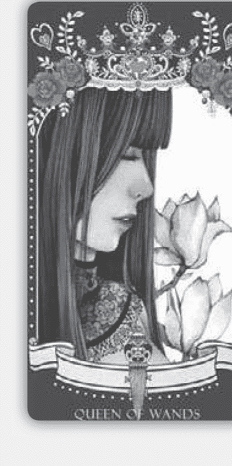

## B 權杖皇后

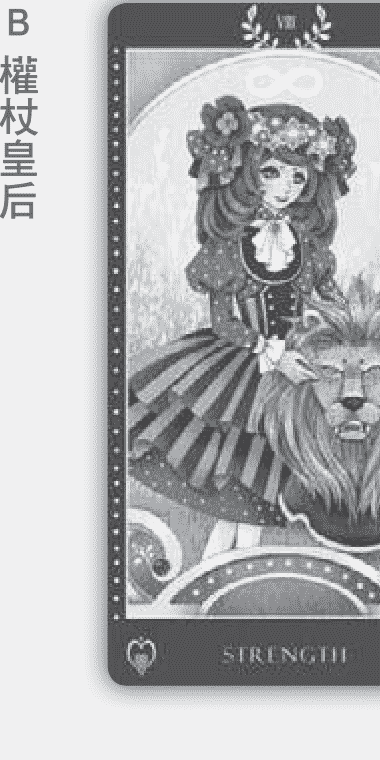

## A 力量

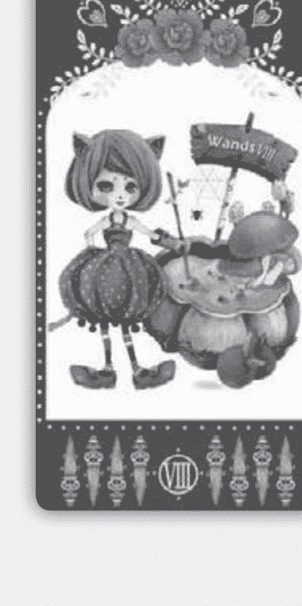

## D 權杖八

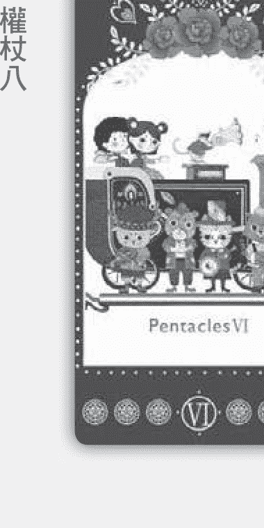

## C 錢幣六

## A 本身就擁有財富

你出生就已經擁有財富，你只需要節儉存錢，讓自己做正確的投資即可。首先先投資自己，透過學習或富，但如果現在開始努力，你一定會獲得想要的！

## B 自己創業製造錢潮

你已經清楚知道你的目標而且想要去行動了，但目前你害怕自己經濟狀態不夠穩定，不敢放手一搏，想要保守進行比較能夠獲得安全感的事。其實你的財富是從自己創業、自己打拚和做自己覺得快樂的事情所獲得的，所以你只需要去行動，堅持自己要做的事情，就會漸漸有財富了嗎！

## C 團隊合作帶來財富

團隊合作能夠讓你擁有財富。你身邊很多貴人在幫忙你喔！別小看周遭的朋友，良好的友情能使你獲得財富。有很多朋友是你的貴人，透過真實的了解，你們會創造出很多合作機會和火花喔！記得談得來的投緣朋友是你生命中的貴人，而且重點不是在賺錢，你的友誼，能使你獲得心靈上的富裕喔！

## D 做自己有興趣的工作

你不能做一成不變的事情，有趣好玩並且感興趣的事，財富才會跟著你。你的想法另類，有很多新點子，透過好想法能讓你可以擁有財富。唯一要注意的是，不要偷懶喔！你生命中必須承擔很多別人的事情，要處理別人的狀況，太多瑣碎小事情讓你感到麻煩，甚至感受到氣餒和意志消沉。請注意，讓自己回歸到最初的目的，支持周遭夥伴，多付出一點也是值得的喔！你擁有無比強大的能量和毅力，堅持下去，財富就會飛奔向你喔！

## 【工作篇】

## B 教皇

## A 錢幣國王

## C 聖杯皇后

## D 錢幣二

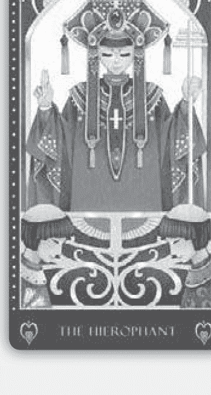

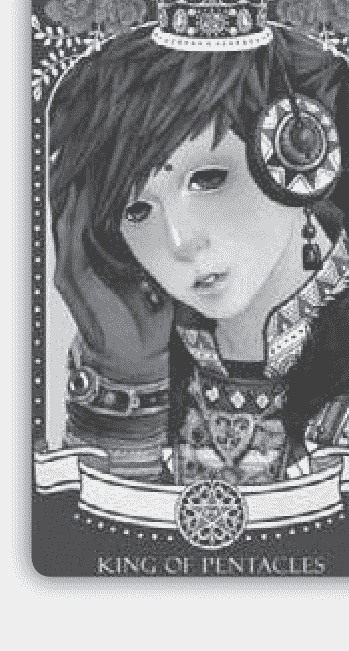

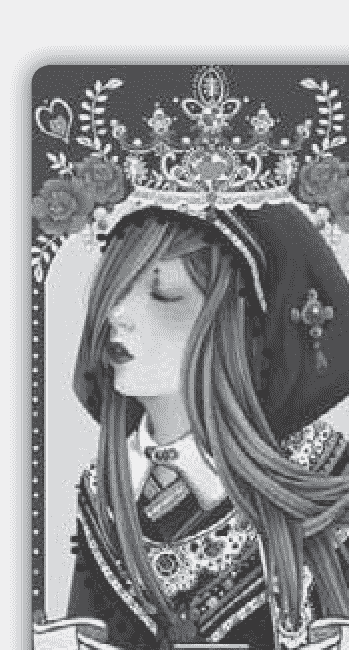

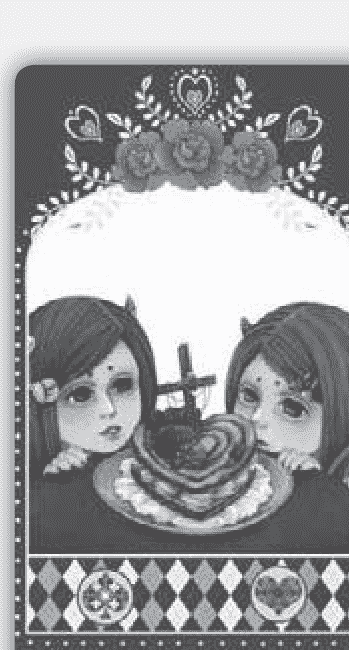

今年是你發現自我潛能的一年，你將挖掘自己在工作上潛藏的力量，發現自己比以往都進步許多。挑選一張最有感覺的牌，就能知道最近的工作運勢了喔！

## A 摆脫烏煙瘴氣的陰霾

恭喜你，你即將脫離過去烏煙瘴氣的工作陰霾，重新出發，進入新領域拚命啦！你是熱愛工作的，但過去因為在主管下屬間經歷了一番冷暴力，讓你被打壓得無法發揮實力。現在遇到伯樂的你，終於開始舊勢待發，可以將真實的實力發揮出來了！請好好把握機會，衝鋒陷陣吧！

## B 跳脫一成不變的公式

你對工作很有責任感，凡事盡心盡力。但這段時間你荒廢自己太久，也忽略了成長的重要性，所以工作對你來說變成一種習慣。其實你須要把夢想變成工作，這樣你才不會厭倦。賺錢、過生活已經無法滿足你的需求，你需要學習更高深的學問，如果還是做一成不變的事情，你遲早會離開。你擁有教育、教學的天賦，也是很好的領導者，並且勇於創新求變，要期許自己不要被環境打敗喔！

## C 受人情壓力束縛

你根本厭倦了目前的工作，但因為人情壓力，因此暫時離不開這環境。工作對你來說，是要證明自己價值的存在，但現在你把自己廉價出售，自己也覺得不值得。但你又害怕沒錢、沒機會，愈做愈沒力氣、愈做愈氣自己。未來遲早有一天你會放手，自己也有勇氣去尋找你真正要追尋的東西了。真正適合你的工作是和人有聯繫的工作。

## D 感情困擾失去動力

你的工作運勢平平，你需要整合的不是工作，而是感情。你本來工作運勢很旺，但因為感情因素，讓你的工作呈現停滯狀態。你知道自己不應該再過去感情經驗影響，可是卻仍然思念。你原本工作上的熱情與活力被分配到感情和情感的算計中，無法全心全意衝刺，進而失去工作動力。建議你整合愛，包括家庭的愛、責任的愛、過去的愛，你的工作才會順！

## [心靈篇]

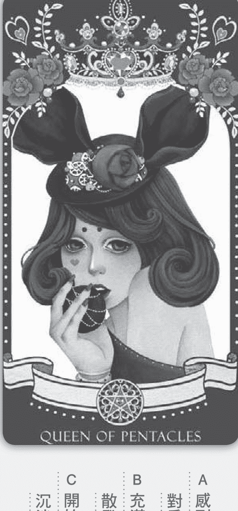

遇到難以解決的問題，你總是習慣逃避嗎？你總是遮住眼睛、說服自己事情其實沒有想像中的糟糕嗎？有時候你還能掩藏得很好，身邊的親朋好友都看不出個所以然，可是，卻藏不住自己內心的恐慌，看看畫面中的女孩，你覺得她在想什麼呢？就讓我們來解析你心中不敢面對的問題吧！

+   - A 對愛情失望……感到哀怨、鬱悶，

+   - B 充滿慾望，散發出迷人的挑逗氣息

+   - C 開始自我墮落，沉迷於酒精或賭博

你對現實生活感到無聊，一成不變的事情讓你覺得沒有挑戰性，你開始質疑自己是否要繼續過這樣的生 活。目前處在想改變，卻又不確定未來方向的階段中，只能嘴上埋怨，但仍然繼續手邊的工作。建議你 多多迎向大自然，多到戶外走走，吸收芬多精的同時，會讓你的心胸更加開闊，心情更加舒適。找出自 己的潛力在哪裡，才能讓自己的未來更加具體喔！

## B 渴望愛情卻又不敢說出口 恭喜你，最近桃花運旺盛，有機會遇到心儀的對象。不過悶騷的你總是將情話藏在水裡，要不然就是緊 張地一直結巴、說錯話，建議你可以去有花花草草的地方約會，開闊的環境能舒解你的緊張，讓你更加 放鬆。有對象的人則代表著你與對方最近有話沒有說開，建議多增加時間互動，多幫對方按摩、碰觸身 體也是增進愛情的好方法喔！

## C 感受到疏離卻不敢明講 最近要注意自己是否壓力過大或者過度勞累，讓你和家人或朋友之間產生了些磨擦，而你是否有話卻說 不出口，有種人際關係的疏離感呢？建議你敞開心胸，大方地先釋出善意，主動跟家人溝通、跟朋友聯 絡，把彼此的心結打開吧！

## 【心靈篇】

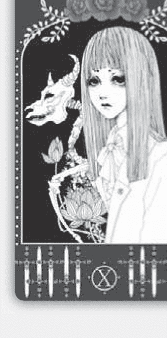

## B 寶劍十

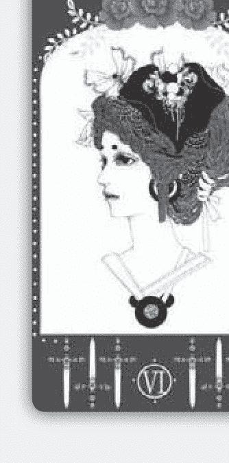

## A 寶劍六

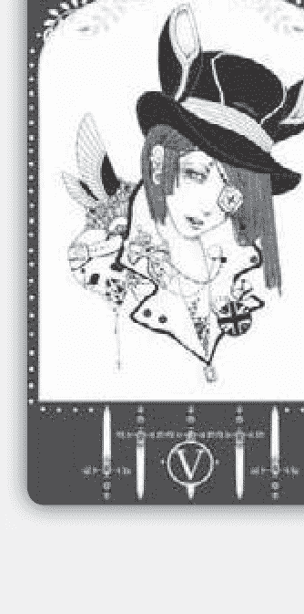

## D 寶劍五

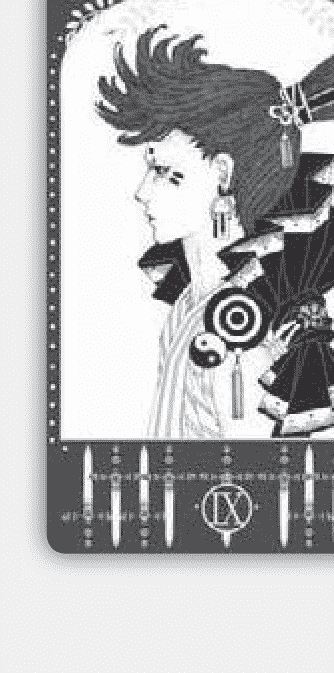

## C 寶劍九

你最近曾感受到失望和絕望嗎？人們的內心往往充滿理想，但因為現實過度考量，而不敢衝，也害怕失敗，所以停滯現狀，憑直覺選一張牌，看你最近會為了什麼而感到失望呢？

## A 悲觀想法與負面情緒

你最近較多悲觀想法和負面情緒，需要多些朋友和新事情來改變自己對生活的態度，不然就會容易發怒或是有無名火上身。有時候情緒一來會假装平静，優雅度過情緒低落的時光，但獨處時還是會感到失落與無力感。

## B 敏銳的感知能力

你有非常強大的感知能力，有時候就是因為太敏感了，所以不敢感覺自己真實的想法，怕看太透徹會失去控制和判斷力。你只想維持現狀，能讓自己處在安全狀態，不過內心有一股熊熊烈火，想顛覆現有的生活。

## C 被小事情影響情緒

你有學習神秘學的天賦，天生喜歡了解生命的意義，也想要知道自己從哪裡來、要往哪裡去？你希望能幫助或支持朋友，但有時候又覺得無能為力。無力感出現時就會把自己封鎖起來，害怕受到影響，你很容容易被小事情干擾、影響情緒。所以建議你，當情緒出現或是怕被干擾時，表示你需要一些空間，讓自己淨空能量，你可以做冥想，會對你很有幫助喔！

## D 對自己太嚴格了

你把很多事情看得很嚴肅，因為太清楚自己了，時常會讓自己處在過度檢視自己的狀態。你總是要求完美，希望大家和你一樣，這會造成自己壓力過大或是讓旁人喘不過氣來。有時候小小偷懶可以讓自己放鬆一下喔！

## 最近是否覺得內心無法平靜？憑著直覺，看看自己第一眼看到牌中什麼元素，就能知道最近必須做什麼轉變才能滋養心靈？

+   - A 女孩的眼睛
- B 女孩手上的愛心
- C 女孩的帽子
- D 女孩身上穿的護士服

## 获取更多好书，请加微信号：strcdts

官网：http://www.ac2011.cn

## A 從職場上尋找成就感

注意眼睛的朋友們，你最近工作開始有很多好機會在進行，雖然回收不大，但卻非常有成就感。你是慢工出細活的人，個性穩定，經濟觀保守，但要搏也可以搏很大！最近要注意財務會比較吃緊，但這只是過渡期，過了兩個月之後，你將開始有爆發財富的力量喔！

## B 寻找愛、對自己好一點

注意愛心的朋友們，金錢對你來說不是最重要的部分，你需要的是朋友和真心了解你的人。你的生命是來付出和給出好能量的，但最近覺得自己有點負荷不了。你天生有敏銳的直覺能力，你可以感受到周遭環境變化，然後再改變自己，就像個變色龍一樣，變換自己個性和情緒。你對外可以很圓滑，但對親密夥伴其實很龐毛。你需要愛，現在是要愛自己的時刻，建議對自己好一點，才能給出更多喔！

## C 做自己，不再配合別人

注意帽子的人代表你太重視別人對你的評價。不要為了短暫利益委屈自己，你可以擁有自主權。你知道你的沒有主見或者假裝配合都是在討好，不是自己真的樣子。既然這樣，就做自己吧！不需要配合別人，不要被幾句話或是刻意的評斷擊倒，記得，你依然是你，當你發揮實力時就是你開花的時刻了！

## D 吸收好能量，讓自己成長

注意到護士服代表你天生是個專業治療師，平常工作或是和朋友一起時就像心理諮詢師，朋友有事情總會去找你聊；但你自己感到寂寞無助時，卻沒人能幫你。你必須時刻保持好能量，不然當你有狀況時就會變得格外挫折！建議你每天呼吸新鮮空氣或是去跑步，上心靈成長課程，學學塔羅牌，你也可以擁有專業諮詢技術來服務別人喔！

{寶靈心塔羅：解惑故事牌} 188

## 最近出現了煩心的事嗎？你是否出現失眠、焦慮的狀況了呢？趕快來檢視自己的內心，看看是哪裡出了問題了呢？憑著直覺，看看自己第一眼看到什麼元素，就能知道最近要如何才能獲得心靈上的平靜喔！

+   A 右上方的圓形轉輪\nB 女子織出的長巾\nC 女子手中的毛線球\nD 女子身上穿的蓬蓬裙

## 寶靈心塔羅：解惑故事牌

作者／寶靈

文字整理／張美華

插畫・封面設計／阿乃

發行人／黃鎮隆

協理／王怡翙

總編輯／潘玫均

責任編輯／張景威

美術總監／周煜國

出 版／城邦文化事業股份有限公司 尖端出版

台北市民生東路二段141號10樓

電話 : ( 02 )2500-7600 傳真 : ( 02 )2500-1971

讀者服務信箱 : Momoko_Chang@mail2.spp.com.tw

發 行／英屬蓋曼群島商家庭傳媒股份有限公司

城邦分公司 尖端出版行銷業務部

台北市民生東路二段141號10樓

電話 : ( 02 )2500-7600 傳真 : ( 02 )2500-1979 劃撥專線 : ( 03 )312-4212

劃撥戶名 : 英屬蓋曼群島商家庭傳媒(股)公司城邦分公司

劃撥帳號 : 50003021

◎劃撥金額未滿500元 請加付掛號郵資50元◎

法律顧問／通律機構 台北市重慶南路二段59號11樓

台灣地區總經銷／中彰投以北(含宜花東)高見文化行銷股份有限公司

電話 : 0800-055-365 傳真 : ( 02 )2668-6220

雲嘉以南 威信圖書有限公司

(嘉義公司)電話 : 0800-028-028 傳真 : ( 05 )233-3863

(高雄公司)電話 : 0800-028-028 傳真 : ( 07 )373-0087

馬新地區總經銷／城邦(馬新)出版集團 Cite(M) Sdn.Bhd.( 458372U )

電話 : ( 603 )9056-3833 傳真 : ( 603 )9056-2833

E-mail : cite@cite.com.my

香港地區總經銷／城邦(香港)出版集團 Cite(H.K.)Publishing Group Limited

電話 : ( 852 )2508-6231