# 托特塔罗学习手册

與您探索托特塔羅的象徵意義，並提供完整而全面的分析。本書以「金色黎明」和「泰勒瑪」體系的符號作為分析的基礎，為您介紹每張牌中的象徵符號是如何界定並塑造整體意義。此外，本書也揭露克勞利如密碼般暗藏在托特塔羅中的系統性關聯，以及許多難以捉摸的謎團。

## 推薦序

克勞利多才多藝，他創作的托特牌，是世界上公認最難學成的牌，那十幾年前，我為什麼第一次用就選這副牌來研究呢？因為我覺得難一點才有研究不完的動力，也因為當時是初學者，對我來說，每一副牌都很難（XD），那乾脆選最難的，反正我也分不出塔羅之間的差異，想不到，這一選就繫住了我大部分的神秘學動力跟知識來源，一副托特牌跟奧修禪卡，就可以代表了我大部分的神秘學世界。

拿到出版社寄給我的書稿之後，我如獲至寶，我被托特牌的深邃與神秘的構圖所吸引，但當年只有一本《直覺式塔羅牌》的中文譯本，就算我對占星跟塔羅都只是初學，也看得出裡面的世界極為廣大（我不覺得《直覺式塔羅》寫得不好，但這本書給我的感覺是，它只是喜歡強調直覺的必要性，而不是這副牌只能用直覺解，作者比較是站在奧修門徒，也就是「修行者」的立場，想要強調靈性的部份，而托特牌的世界非常廣大，不能只限制於區區一小塊「靈性」的範圍，只強調直覺就容易忽略其他的部份，例如魔杖九，占星符號是月亮在射手座，但作者可能太過重視圖像，上面的月亮畫得很容易被誤認為太陽，因為它畫的月亮是經過磨練，可以發揮出自己的光芒時，如果沒有仔細比對原著，就很容易以為是太陽在射手，而不知道是月亮在射手）。

所以我第一個方法是，在床上把八十張托特牌（托特牌的賢者有三種造形，所以跟一般的塔羅牌總數為七十八張不一樣，加上兩張多出來的賢者牌，總共是八十張，克勞利認為他自己是賢者本人，「賢者」在一般的塔羅牌中，牌名是「魔術師」，至於克勞利為什麼把這張牌稱之為「賢者」？在書中有解釋）攤開來，細細每一張研究一番。

這幾年已經出好幾本托特牌的書，但書中好像很少提到當初第一個吸引我的目光的地方，就是它們的色彩，我發現一件事，只要是魔杖牌，都是紅、黃、橙的組合，我覺得這個系統的顏色接近火元素（我研究的時間很早，那時大部份的塔羅書，都不太提到塔羅牌跟四元素的關聯，就算有，也只是一個標註而已，不具有任何實質的涵義），我是因為學占星，占星中有提到色彩，所以讓色彩變成我第一個注意到的地方。還有，我研究四大元素已有一定的基礎，所以容易很直覺的聯想過去，我還發現一件事，代表實際行動的火跟土元素，他們的色彩都非常固定，不是紅黃橙（火元素），就是褐跟綠、黃（土元素），火元素（魔杖牌）跟土元素（圓盤牌），在我的元素分類中被列為積極元素，我猜因為如此，他們的顏色才特別穩定，風元素跟水元素，則是被我列為消極元素，也就是不具本位性，所以寶劍牌（風元素）跟聖杯牌（水元素）在色彩構圖中，則比較缺乏固定的主色，大多是清淡的複合色，四種元素的屬性，在這時被我確定下來，魔杖屬火，寶劍屬風，聖杯屬水，圓盤屬土，後來我翻閱各大塔羅牌書，確定了我的推斷沒有錯（那時托特牌是我第一副自修型學習的塔羅牌，所以沒有其他可以參考的資料）。

我的專長是占星（當時剛開始研究占星，雖然說是專長，但也才研究幾個月而已），數字牌上的占星符號，很理所當然地吸引我，我學習東西一向會先試著分類，後來我發現魔杖牌上的星座符號，全都是火象星座，寶劍牌上的星座符號，全都是風象星座，聖杯牌上的星座符號，全都是水象星座，圓盤牌上的星座符號，全都是土象星座，所以再一次的確定，我抓的方向是沒錯的，唯一的疑問就是，行星的排列有什麼涵義？它們跟迦勒底次序的行星尊貴法則，有著一點點的相似之處，迦勒底次序是：火日金水月土木，但也不對啊！我把魔杖牌排下來，魔杖二是火星在牡羊座，魔杖三是太陽在牡羊座，魔杖四是金星在牡羊座……到這邊為止都還說得通，但是魔杖五是土星在獅子座啊！到這裡就已經超出迦勒底次序的範圍了，以迦勒底次序來說，金星的下一顆應該是水星啊！在這裡卻變成土星了？這說不通啊！所以我之後開始教托特牌課（當然是過了很長的時間之後）就決定，先不要講解行星，因為我抓不到它的邏輯，後來是我第一班的一個學生葉子毓，也跟我學占星，也很熱愛占星跟托特牌，她有一天突然很激動的打電話給我，說：「我知道托特牌的行星是怎麼個排法了。」我說：「怎麼排的？我想了老半天，次序明明是照著迦勒底次序的，但是都照著走了兩、三顆就中斷了，所以我想應該是照其他種法則的。」我數給她聽：「你看，魔杖二是火星在牡羊座，魔杖三是太陽在牡羊座，魔杖四是金星在牡羊座，接下來應該是水星啊！但魔杖五上面的是土星，這是怎麼搞的？」她哈哈大笑，跟我說：「妳忘了迦勒底次序遵照的是占星的邏輯？所以牡羊下面是哪個星座？」我找一下金牛座在哪幾張牌，是在土元素的五號到七號，所以圓盤五真的是……水星在金牛座！圓盤六是月亮在金牛座，圓盤七是土星在金牛座……！依此類推，所有的謎底都解開了，我們用托特牌也更得心應手了，但是想到魔杖九，就覺得有點怪怪的，因為依照迦勒底次序，魔杖九應該是月亮在射手座啊！但圖上書上寫的畫的都是太陽在射手座，因為對占星的信賴，我決定還是把這張牌列為月亮在射手座，因為我覺得邏輯性是絕對不會錯的，後來陸續出版幾本塔羅大師寫的托特書，果然都證實了魔杖九是月亮在射手座，至於為什麼畫成太陽的樣子呢？那是因此這張牌代表著外界的壓力，造成本身的進化跟改變，所以月亮發出太陽般的光芒，也沒有什麼奇怪之處了。

魔杖四是一張很好的範例，金星在牡羊座，金星跟火星是兩顆在同質性之下，又完全相反的行星，大家應該都聽說過：「女人來自金星，男人來自火星」這句話吧？牡羊座的守護星正是火星。由此可見，火星是非常男性化的，正向說是積極進去，負面來說是暴力衝動，而金星就是代表女性了，正向來說是氣質舉止跟教養都很好，負向來說的話是流於表面，說的比做的多。這張牌結合了金星跟牡羊座，顏色也非常的符合，代表火星衝動傾向的紅色，在四根杖子中，代表和平的金星的綠色做為背景色，紅色是重點，又是杖子，代表即動即行的行動力，綠色在背景部份，代表整體而言是安全的，杖子的兩頭，一頭是牡羊，另一頭上金星代表的和平鴿，兩者相互交錯，沒有誰比誰更重要，代表這兩個面相交融得非常好。牌名是「完成」，表示有行動力之下，會有一定的作為，也會成功，但有綠色，代表這份成功會被保護住，也可以一直保持下去。所以不管在哪個方面，出現魔杖四都是代表相當理想的未來。而且紅色是動物的生命力，綠色是植物的生命力，兩個顏色結合在一起，表示進退得宜，可動可靜，是待人處世的重要特質。

我覺得這本書非常適合拿來當我托特課的教科書，因為完整實在，又沒有太多後人附加上去的見解（這些見解可能是好的，但我的個人見解會不知道要往哪裡擺XDDD，畢竟每個人的風格跟經驗感想都不同。只好選最古老最中立的這本，如果我消化過後，可能很適合「餵食」我的學生）。

### 推薦人／天空為限

占星學家・華人首席塔羅占卜師、女巫神算館站長&占星版版主、各大學塔羅牌、占星、禪卡、兩性課程講師。著有《麻瓜也能算塔羅！竹貓星球塔羅占卜大解密》達觀出版、《十二星座都是騙人的》達觀出版、《藏在塔羅裡的占卜符碼》橡實文化、《奧修禪卡占卜書：以塔羅元素為鑰，貫穿靈性與現實兩層面的終極占卜》橡實文化。

## 引言

艾利斯特·克勞利的托特塔羅是當代最為風行、且最為神祕莫測的塔羅牌之一。長期鑽研塔羅及喀巴拉的克勞利，從「金色黎明」魔法體系擷取了塔羅的設計與結構，並依據其自創的「泰勒瑪」（Thelema）魔法體系加以修改。這兩種體系的結合，在佛瑞妲·哈利斯夫人的妙筆彩繪下，化身為一副生動而繁複的塔羅牌，其魅力遠遠延伸至「泰勒瑪」和「金色黎明」體系的研習者之外。

《托特之書》（The Book of Thoth）是克勞利豐富多產的寫作生涯中，最後的一部重要著作。這部作品在他過世前三年方才發表，它是克氏廣博繁浩的魔法知識與經驗的記錄，也是祕傳塔羅之歷史與結構的指南，並包含對各張牌的詳細描述。至今，《托特之書》仍是曾經出版過的最高深的塔羅教科書之一。

然而，克勞利對托特塔羅象徵意義的描述往往令人迷惑，有時也不太完整。《托特之書》假設讀者已經擁有相當的知識，尤其是關於「金色黎明」和「泰勒瑪」魔法體系。全書充斥著晦澀的引述，也未曾列有參考書目讓人尋求答案。對於托特塔羅中的許多象徵細節，《托特之書》往往草草帶過，有時甚至對牌中的象徵略過不提。

本書的目的在於探討托特塔羅的象徵意義，並對這副牌提供完整而全面的分析。本書以「金色黎明」和「泰勒瑪」體系的資料作為分析的基礎，向讀者介紹每張牌中的象徵符號是如何界定並塑造該牌的整體意義。此外，本書也將揭露克勞利如密碼般暗藏在托特塔羅中的繁複對應關聯（correspondences），以及許多難以捉摸的謎團。本書的第一章探討托特塔羅的大阿卡納牌，並包含一篇導言，詳述克勞利之大阿卡納牌設計與象徵的主要源頭。第二章則解析宮廷牌的繁複象徵架構——這原本記載於「金色黎明會」的文獻《Book T》之中，而克勞利將之沿用於托特塔羅上。第三章分析托特塔羅之數字牌的象徵意義。第四章則提供對於塔羅占卜的指導，並包含相關的練習，幫助你學習牌的意義，並發展出自己的直覺。本書並在附錄中提供了象徵組（symbol set）與對應關聯的表格。

塔羅係以象徵的語言對我們說話。運用塔羅牌來占卜的人，將會發現對於紙牌象徵意義的知識能夠增進占卜的深度和清晰度。我在書中納入了我對牌意的詮釋，那是衍生自牌中的象徵符號，以及我自己作為塔羅牌師的經驗。

本書中的資料特別有助於「路徑運作」（pathworking）的練習。理解大阿卡納牌中的象徵符號及其意義，能協助魔法師在觀想時與之互動，並幫助他做出詮釋。研習托特塔羅中的象徵用法，將協助新手魔法師學習並運用「金色黎明」與「泰勒瑪」體系中的許多喀巴拉對應關聯。這本書也可以作為克勞利作品中的「泰勒瑪」概念及象徵的基本導論。

如同《托特之書》,本書並不是一部對於塔羅的介紹性教本。我建議讀者熟讀附錄中所列出的象徵符號組,以完整理解此處呈現的內容。市面上有許多魔法及塔羅書籍都曾界定並探討這些象徵組合;我十分推薦區克・西塞羅(Chic Cicero)和珊卓・塔巴莎・西塞羅(Sandra Tabatha Cicero)合著的《對金色黎明傳統自我啟蒙》(Self-Initiation into the Golden Dawn Tradition,暫譯)。一點點的準備將會帶來深刻得多的理解。

本書是托特塔羅真正象徵意義的鑰匙。願它在追求「偉大工作」(the Great Work)的道途上協助你。

奧西里斯弟兄(Frater Osiris)

美國華盛頓州西雅圖

2006年11月

## 大阿卡納牌

托特塔羅的二十二張大阿卡納牌之象徵意義，主要衍生自兩個源頭：「金色黎明會」和艾利斯特·克勞利的著作。

「金色黎明會」為克勞利早期對於祕傳塔羅的研習提供了基本的架構。在「金色黎明會」中，這份知識是以《Book T》的形式，傳授給「小達人」（Adeptus Minor）位階的會員。這份文獻對塔羅的七十八張牌列出了某種特定的象徵規劃，它事實上並未對大阿卡納牌提供太多的資訊，而只是列出在上一個位階「實踐者」（Practicus）中便已揭露的最基本的對應關聯（correspondences）。真正的「金色黎明」大阿卡納牌，是以實體的形式授與「達人」（Adept）位階的修行者，令其手繪複製，以供個人使用。

我們知道克勞利十分熟悉《Book T》的內容，不僅由於他曾經是位「小達人」，也因為他曾在 1912 年在《分點》期刊（The Equinox）第一卷第八冊中發表過相關的文章。儘管《Book T》對於大阿卡納並未提供太多資訊，卻對宮廷牌和數字牌做了詳細的描述，對於托特塔羅中小阿卡納牌的設計影響甚鉅。

對於大阿卡納牌的象徵和意義，「金色黎明會」在各種啟蒙儀式中做了較為詳細的描述。「金色黎明」的啟蒙位階，乃是對應於「生命之樹」上較低的「薩弗洛斯」（Sephiroth）。當候選人在「外會（outer order）的位階中逐漸晉級，他便是在象徵性地攀登「生命之樹」——從「Malkuth」攀升到「Tiphareth」。「生命之樹」上較低的路徑，係以相對應的塔羅大牌之形式向入門者揭示（見表一）。

## 表一·位階／大牌之對應關係

| 位階 | 薩弗拉(Sephira) | 大阿卡納牌 |
|---|---|---|
| 忱信者（Zelator） | Malkuth | 無 |
| 理論者（Theoricus） | Yesod | 宇宙 |
| 實踐者（Practicus） | Hod | 新紀元，太陽 |
| 哲人（Philosophus） | Netzach | 月亮，星星，塔 |
| 中門（Portal） | 無 | 惡魔，藝術，死神 |
| 小達人（Adeptus Minor） | Tiphareth | 無 |

艾利斯特·克勞利曾是「金色黎明會」的「小達人」，因此能夠取得該會關於大阿卡納的資料。他在較低的層級曾接受喀巴拉（Qabala）、占星學和煉金術方面的指導和測試，因此對這些主題也有相當的瞭解。

克勞利是位多產的作家，而其大阿卡納設計的許多面向，都衍生自他最重要的公開作品。我們在此簡短地審視其主要的出處。

《律法之書》（The Book of the Law，即Liber AL）或許可說是克勞利畢生撰述的最重要的作品。此書係於 1904 年自「高靈」處「接收」而來，引領並宣告了「泰勒瑪」的律法與「荷魯斯紀元」（the Aeon of Horus）。當克勞利成為「新紀元」的使者和「泰勒瑪」的先知，他的整個人生都改變了，而《律法之書》也是他後期作品中不可或缺的一部份。克勞利在書中的宣言「律法是人人的」（The Law Is for All），乃是「泰勒瑪」象徵體系之中特別重要的依據。

在本書中，對於《律法之書》的引用都將以「AL II:73」的格式標示，其中羅馬數字是指該引文係出自第幾章，而其後的阿拉伯數字則是指第幾詩節。

《律法之書》中的一句話「『Tzaddi』並不是『星星』」（AL I:57），啟發了兩張塔羅大牌之屬性的根本改變。在多番思索後，克勞利瞭解到希伯來字母「Tzaddi」應該歸屬於「皇帝」牌，並將字母「Hé」分派給「星星」。這種更動，改變了這兩張大牌在「生命之樹」上的位置。

托特塔羅的大阿卡納牌包含了大量的「泰勒瑪」象徵。例如，「大祭司」呈現了三個「泰勒瑪紀元」的神祇——愛西斯（Isis）、奧西里斯（Osiris）與荷魯斯（Horus）。「慾望」牌呈現了「巴巴隆」（Babalon）與「野獸」（the Beast）的合體。「星星」牌描繪著「努特」（Nuit）女神，她是「無垠的空間，和此中無盡的星子」（AL I:22）。克勞利對於傳統設計最為激進的偏離出現在「新紀元」牌中，他重新設計此牌，使之近似於「昭示之碑」（the Stèle of Revealing）上的圖案，即「荷魯斯新紀元」的圖符。

《靈視與靈聽》（The Vision and the Voice，即Liber 418）是托特大牌之設計與象徵的另一靈感來源。此書記錄了克勞利在「以諾魔法」的三十重天（Enochian Aethyrs）中所經歷的靈視異象，其中大量論及塔羅與喀巴拉。克勞利對這些靈視異象的評註和分析，近年被重行刊印在《分點》期刊第四卷第二冊中，對於解讀克勞利某些較為晦澀的象徵用法十分有助益。「戰車」、「調節」、「命運」等牌，各自都在不同的靈視異象中扮演了重要的角色。

《書卷阿萊夫》（Liber Aleph，即Liber 111）是克勞利為他的「魔法教子」（magickal son）阿加德弟兄（Frater Achad）所撰寫的一系列關於魔法哲學的書信。此書包含了對於數張大阿卡納牌之許多面向的評註，包括「愚人」和「惡魔」，同時闡釋了出現在「大祭司」、「戰車」和「宇宙」牌中之「人面獅身獸」的各種力量（the Powers of the Sphinx）——並且解說了「死神」牌中「天蠍」的三種面貌（the Tripartite Scorpio）。

《書卷777》是一部喀巴拉與漢密特（Hermetic）對應關聯的重要概論。托特塔羅中許多象徵符號的定義，都可以在《777》書中的表格查到。另一份發表在《777》中的有用資源是《薩弗洛斯之書》（Sepher Sephiroth），這是一部喀巴拉辭典，可透過希伯來文的字母代碼系統（gematria）來判定對應的意義。

《書卷ABA》（Liber ABA, Book Four, parts I–IV）乃是克勞利的重量級魔法鉅著。它包含了早先發表在《魔法四書》（Book Four）以及《魔法的理論與實踐》（Magick in Theory and Practice）中的資料，以及克勞利較短篇作品的精彩選集。書中的一些文獻也對塔羅有所闡釋，尤其是「泰勒瑪」聖典《Liber Cheth》和《Liber A'ash》。

這份清單不能不包含克勞利自撰的托特塔羅指南《托特之書》(The Book of Thoth)。這是此一主題的權威著作，缺了它，任何對於托特塔羅的研究都不能算是完整。

## 塔羅大阿卡納牌與希伯來字母系統

「金色黎明」體系為二十二張大阿卡納牌與二十二個希伯來字母指派了特定的對應關係，並將一種元素、行星或黃道星座（見表二）分派給每一張牌/字母。傳統的對應關係被修改了兩處，「金色黎明」將「正義」（在托特塔羅中更名為「調節」）牌與「力量」（「慾望」）牌的路徑對調，以符合「天秤座」和「獅子座」的星座歸屬；克勞利後來又依照《律法之書》的指示，對調了「皇帝」和「星星」的屬性，以對應於希伯來字母「Tzaddi」和「Hé」——這樣的變更，平衡了「金色黎明」所做的修改（註1）。

「新紀元」和「宇宙」牌分別擁有雙重的屬性：「火/靈元素」和「土星/土元素」。這反映出古人原本相信宇宙係由「火、水、風」三種元素構成；「靈」和「土」元素乃是後來才加入這種元素系統的。

### 表二・大阿卡納牌的首要屬性

| 大阿卡納牌 | 希伯來字母 | 數字值 | 字母名稱 | 意義 | 歸屬 | 路徑 |
|---|---|---|---|---|---|---|
| 0. 愚人 | Aleph | 1 | Aleph | 公牛 | 風元素 | 11 |
| I. 魔法師 | Beth | 2 | Beth | 房屋 | 水星 | 12 |
| II. 女祭司 | Gimel | 3 | Gimel | 駱駝 | 月亮 | 13 |
| III. 皇后 | Daleth | 4 | Daleth | 門 | 金星 | 14 |
| IV. 皇帝 | Tzaddi | 90, 900 | Tzaddi | 魚鉤 | 牡羊座 | 28 |
| V. 大祭司 | Vau | 6 | Vau | 釘子 | 金牛座 | 16 |
| VI. 戀人 | Zayin | 7 | Zayin | 劍 | 雙子座 | 17 |
| VII. 戰車 | Cheth | 8 | Cheth | 籬笆 | 巨蟹座 | 18 |
| VIII. 調節 | Lamed | 30 | Lamed | 趕牛棒 | 天秤座 | 22 |
| IX. 隱士 | Yod | 10 | Yod | 手 | 處女座 | 20 |
| X. 命運 | Kaph, Taw | 20, 500 | Kaph | 手掌，拳頭 | 木星 | 21 |
| XI. 慾望 | Teth | 9 | Teth | 蛇 | 獅子座 | 19 |
| XII. 吊人 | Mem | 40, 600 | Mem | 水 | 水元素 | 23 |
| XIII. 死神 | Nun | 50, 700 | Nun | 魚 | 天蠍座 | 24 |
| XIV. 藝術 | Samekh | 60 | Samekh | 帳棚釘 | 射手座 | 25 |
| XV. 惡魔 | Ayin | 70 | Ayin | 眼睛 | 魔羯座 | 26 |
| XVI. 塔 | Pe | 80, 800 | Pe | 嘴 | 火星 | 27 |
| XVII. 星星 | Hé | 5 | Hé | 窗 | 水瓶座 | 15 |
| XVIII. 月亮 | Qoph | 100 | Qoph | 後腦 | 雙魚座 | 29 |
| XIX. 太陽 | Resh | 200 | Resh | 頭, 臉 | 太陽 | 30 |
| XX. 新紀元 | Shin | 300 | Shin | 牙齒 | 火/靈元素 | 31 |
| XXI. 宇宙 | Tau | 400 | Tau | 十字 | 土星/土元素 | 32 |

> 註1. 克勞利，《托特之書》，10-11。

在托特塔羅的象徵體系中，「色彩」也扮演著重要的角色，某種象徵符號所呈現的顏色，往往指出它在喀巴拉體系中的對應意涵。「生命之樹」上的每個「薩弗拉」和路徑都連結著四種色彩，各自對應於四個喀巴拉世界中的一個（見表三）。「新紀元」和「宇宙」牌各有兩重色彩屬性，因為它們各自擁有兩種元素歸屬。托特塔羅運用了此種「四重色彩層級」（the Four Color Scales）來標示其所連結的「薩弗拉」或大阿卡納牌的能量及影響。

### 表三・四重色彩層級

| 薩弗拉 Sephira | Atziluth (騎士層級) | Briah (王后層級) | Yetzirah (王子層級) | Assiah (公主層級) |
|---|---|---|---|---|
| Kether | 光輝 | 白色的光輝 | 白色的光輝 | 灑金斑的白色 |
| Chokmah | 柔和的純藍色 | 灰色 | 藍珍珠灰，如同貝母的顏色 | 灑紅、藍、黃斑的白色 |
| Binah | 緋紅色 | 黑色 | 暗褐色 | 灑粉紅斑的灰色 |
| Chesed | 深紫羅蘭色 | 藍色 | 深紫色 | 灑黃斑的深蔚藍色 |
| Geburah | 橘色 | 猩紅色 | 亮猩紅色 | 灑黑斑的紅色 |
| Tiphareth | 清透的粉紅玫瑰色 | （金）黃色 | 濃鮭魚色 | 金琥珀色 |
| Netzach | 琥珀色 | 翡翠綠 | 亮黃綠色 | 灑金斑的橄欖綠 |
| Hod | 紫羅蘭色 | 橘色 | 紅赤褐色 | 灑白斑的黃褐色 |
| Yesod | 靛藍色 | 紫羅蘭色 | 極暗的紫色 | 灑蔚藍斑的檸檬黃 |
| Malkuth | 黃色 | 檸檬黃、橄欖綠、赤褐色，和黑色X形十字 | 同「王后層級」，但均帶灑黑斑的金色 | 泛黃光的黑色 |

| 薩弗拉 Sephira | Atziluth (騎士層級) | Briah (王后層級) | Yetzirah (王子層級) | Assiah (公主層級) |
|---|---|---|---|---|
| 0. 愚人 (風元素) | 明亮的淺黃 | 天藍 | 藍翡翠綠 | 灑金斑的翡翠綠 |
| I. 魔法師 (水星) | 黃色 | 紫色 | 灰色 | 泛紫羅蘭光的靛藍色 |
| II. 女祭司 (月亮) | 藍色 | 銀色 | 冷調的淺藍色 | 泛天藍光的銀色 |
| III. 皇后 (金星) | 翡翠綠 | 天藍 | 早春綠 | 泛淺綠光的鮮亮玫瑰色或櫻桃色 |
| IV. 皇帝 (牡羊座) | 猩紅 | 紅色 | 鮮豔的火焰色 | 灼熱的紅色 |
| V. 大祭司 (金牛座) | 紅橘色 | 深靛藍 | 溫暖的深橄欖綠 | 濃褐色 |
| VI. 戀人 (雙子座) | 橘色 | 淡紫 | 新黃皮革色 | 泛紅的灰色，趨近於淡紫 |
| VII. 戰車 (巨蟹座) | 琥珀色 | 褐紫紅色 | 亮濃赤褐色 | 暗綠褐色 |
| VIII. 調節 (天秤座) | 翡翠綠 | 藍色 | 深藍綠色 | 淺綠 |
| IX. 隱士 (處女座) | 綠色 (泛黃) | 暗藍灰色 | 綠灰 | 梅紅 |
| X. 命運 (木星) | 紫羅蘭 | 藍色 | 濃紫 | 泛黃光的亮藍色 |
| XI. 慾望 (獅子座) | 黃色 (泛綠) | 深紫 | 灰色 | 泛紅的琥珀色 |
| XII. 吊人 (水元素) | 深藍 | 海綠 | 深橄欖綠 | 灑紫斑的白色 |
| XIII. 死神 (天蠍座) | 綠藍 | 晦暗的褐色 | 極暗的褐色 | 暗沉的靛褐色 |
| XIV. 藝術 (射手座) | 藍色 | 黃色 | 綠色 | 鮮明的暗藍色 |
| XV. 惡魔 (魔羯座) | 靛藍 | 黑色 | 藍黑色 | 近黑的冷暗灰色 |
| XVI. 塔 (火星) | 猩紅 | 紅色 | 威尼斯紅 | 泛蔚藍或翠綠光的亮紅色 |
| XVII. 星星 (水瓶座) | 紫羅蘭 | 天藍 | 泛藍的淡紫色 | 染紫暈的白色 |
| XVIII. 月亮 (雙魚座) | 緋紅色 (紫外光) | 灑銀白斑的暗黃色 | 半透明的淺粉紅褐色 | 石頭色 |
| XIX. 太陽 (太陽) | 橘色 | 金黃 | 濃琥珀色 | 泛紅光的琥珀色 |
| XX. 新紀元 (火元素) | 灼熱的橘紅色 | 硃砂色 | 灑金斑的猩紅色 | 灑翠綠與緋紅斑的硃砂色 |
| XX. 新紀元 (靈元素) | 近灰的白色 | 近黑的深紫色 | 稜鏡折射的七色 | 白、黃、紅、藍、黑 |
| XXI. 宇宙 (土元素) | 檸檬黃、橄欖綠、赤褐及黑色 | 琥珀色 | 暗褐色 | 灑黃斑的黑色 |
| XXI. 宇宙 (土星) | 靛藍 | 黑色 | 藍黑 | 泛藍光的黑色 |

五種元素亦有其基本的色彩屬性。

| 元素 | 色彩 |
|---|---|
| 靈 | 白 |
| 火 | 紅 |
| 水 | 藍 |
| 風 | 黃 |
| 土 | 綠或黑 |

# 托特塔羅學習手冊

## 0 號牌 愚人
(The Fool)

「愚人」牌是宇宙之無限創造潛能的圖符。這是第一張大阿卡納牌，意味著「偉大工作」（the Great Work）的開始。

「愚人」頭戴鑽石之冠，那是歸屬於「Kether」的寶石。環繞他頭部的彩虹光暈象徵他從「Kether」接收到的啟迪。後方的背景是「風」元素的黃色，點綴著白色的鑽石，亦是「Kether」的象徵。

「愚人」的皮膚是黃色的，即「風」元素的色彩。他頭上的雙角象徵創造驅力。他身著綠衣，是豐饒大地的顏色；鞋子則是金黃色，即太陽的色彩——那溫暖、滋養大地的生命創造之光。由於「四字母聖名」（Tetragrammaton）中的「Vau」（屬「風」元素）歸屬於「Tiphareth」（太陽之域），因此太陽與「風」元素亦有所關聯。

## 0 號牌 愚人

- 希伯來字母：Aleph
- 意義：公牛
- 歸屬：風元素
- 路徑：11
- 連結：「Kether」和「Chokmah」

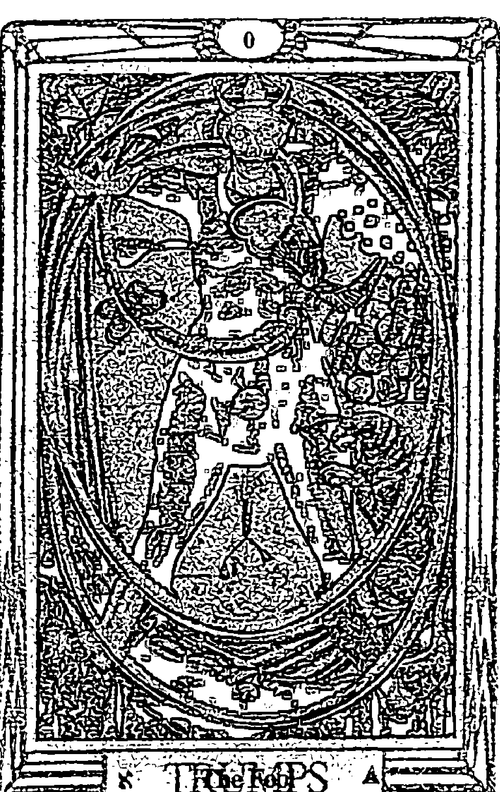

太陽的象徵符號出現在「愚人」的「根輪」（root chakra），代表最基本層面的人類意識，即新生嬰兒對生存與安全感的需求。太陽亦象徵著生殖器之中的創造潛能。

一道彩虹色澤的螺圈環繞「愚人」三匝，象徵「Ain Soph Aur」，即「生命之樹」上高於「Kether」的「存有之三重負向帷幕」（the Three Negative Veils of Existence）。那螺圈形成努特女神的豐饒子宮，孕育出哈潑克拉提斯（Harpocrates），即寂靜之神。依此脈絡，這螺圈同時也是臍帶，連結至「愚人」的「心輪」（heart chakra），此處是脈輪系統中較高與較低能量之間的中介鏈結。

一隻鴿子、一頭兀鷹和一隻蝴蝶飛向「愚人」的心臟。鴿子象徵「靈」之降入物質。二十道光芒從那鴿子輻射而出，即「Yod」完整拼出時的數字值。鴿子亦是維納斯的聖鳥，是陰性的象徵，而那光芒則又指出「Yod」的陽性影響力。因此，那鴿子在性別上是完整的，是雌雄同體的象徵符號。

兀鷹代表「姆特」（Mut），她是埃及的母親女神，是「底比斯的阿蒙」（Amun at Thebes）的配偶。姆特這個名字的意思就是「母親」，古埃及人相信她擁有雌雄兩性的生育能力，因而認為她是萬物的創造者。這種信仰的基礎是，古人相信兀鷹沒有雄性，而雌性的兀鷹則是見風（「風」元素）而受孕。

蝴蝶是「風」元素的一種象徵，牠也代表靈魂；在這張牌中，牠象徵靈魂進入子宮中尚未出生的胎兒。

引領螺圈前進的是一柄型態特異的「神使之杖」（caduceus），頂端有個松毬，杖身則是一柄劍。「神使之杖」和寶劍亦為「風」元素的象徵，而此杖同時也象徵創造的能量。松毬則暗指「酒神之杖」（Thyrsus），即酒神戴奧尼修斯（Dionysus）所持的以松毬飾頂的柱杖（註2）。「酒神之杖」亦是創造能量的象徵。

一枝葡萄藤從「愚人」的心輪冒出，將他連結於戴奧尼修斯和巴庫斯（Bacchus，即酒神之羅馬名號）。酒是瘋癲與狂喜的媒介，尤其是在戴奧尼修斯神話的脈絡中。

葡萄藤上懸掛著一袋錢幣，上頭鐫刻著占星的符號。太陽居中，周圍環繞著古代的六顆「行星」，更外層則圍繞著黃道帶的眾星座。這代表「大宇宙」（macrocosm）——即努特的身軀——的影響力。行星和星座則代表「愚人」能夠汲取的潛在力量。

「愚人」的左手握著一支火炬，或是燃燒的松毬——象徵生猛的創造之火。他的右手握著一只杯盞，將杯中物傾注在地上。這杯盞的基座是個金字塔，乃是陽具的象徵，而杯身則是子宮的象徵。這兩種生殖器官繼而又是「Chokmah」和「Binah」的象徵，在兩側護衛著「Kether」的鑽石之冠。（「生命之樹」在此牌上的投射可以更進一步地延伸，牌面中央的太陽代表「Tiphareth」，而下方的鱷魚則是「Malkuth」。）在「風」之漩流的包圍中，「火焰」越過「愚人」頭頂，與聖杯結合。此一象徵意象類同於「戀人」與「藝術」牌中締結「煉金術婚姻」（註3）的「矛與杯的合一」。

「愚人」胯下有一簇型態奇特的花束。最上方的花是白薔薇；白色呼應著「Kether」，而薔薇則是「金色黎明會」啟蒙儀式中「風」元素的象徵。薔薇的莖梗上懸掛著四朵百合。百合歸屬於「Binah」（土星）、「Malkuth」和處女座，象徵「地土」之純淨。其中三朵較小的百合型態類似，都有四片花瓣，較大的那朵則有五

> 註2. 以松毬飾頂的「酒神之杖」在「權杖王后」牌中亦曾出現。
> 註3. 詳見「戀人」與「藝術」牌中的描述。

瓣，共計有十七片花瓣。合在一起，它們代表十六種次元素，以及統領這些次元素的「靈」。

克勞利描述這簇花束為「三花合一的賜福」（the benediction of three flowers in one，註4）。此乃指涉「四字母聖名」中最後的一個「Hé」，歸屬於「土」元素的「女兒」——是為「父」、「母」與「子」的產物。於是，神之聖名的四個字母，全都表現在這張牌中了：火炬代表「Yod」，聖杯代表原初的「Hé」，薔薇代表「Vau」，而百合則是最後的「Hé」。

在花束下方相互擁抱的嬰兒也代表「Vau」和最後的「Hé」，這兩個嬰兒長成後將會成為「拉－胡爾－庫特」（Ra-Hoor-Khuit）和哈潑克拉提斯，也就是「戀人」和「太陽」牌中的「太陽孿生子」（the solar twins）。

一頭老虎和一隻鱷魚威脅著「愚人」。老虎歸屬於獅子座，呈泛紅的琥珀色，即獅子座在「Assiah」的色彩。猛虎代表激情和慾望，可能會誘使「愚人」從「偉大工作」中分心。

鱷魚歸屬於土星，是為「吞噬者」（the devourer，註5）。作為土星的象徵，它亦指「宇宙」的影響力，終結了由「愚人」所開啟的大阿卡納循環。這鱷魚同時也是塞貝克（Sebek）——代表太陽之毀滅力量的埃及神祇。在古埃及神話中，塞貝克藏身於尼羅河畔，伺機要吞噬哈潑克拉提斯。

註4. 克勞利，艾利斯特，《托特之書》，（York Beach, ME: Samuel Weiser, 1993），69。
註5. 土星的英文名稱「薩騰」（Saturn）原本是古希臘神祇克羅諾斯（Cronus）的羅馬名號，他是一位泰坦神（titan），由於懼怕自己的孩子會篡奪他作為眾神之王的地位，因而吞食了他們。

## 牌意詮釋

作為第一張大阿卡納，「愚人」牌象徵創造、新生，以及新計畫的開始。「Kether」之冠意味著靈性上的智慧，而諸多「風」元素的符號則代表心理方面之事務的成功。當「愚人」出現在牌陣中，可能意味著創生新想法，潛能得以實現，發想出某項計畫。不過，「愚人」的智慧和潛能只有在後續的大阿卡納中才能獲得彰顯，尤其是「魔法師」牌。

逆位的「愚人」則指出，對於這些想法，若是不合乎實際地評估落實執行的方法，只知悶著頭蠻幹，將會徒勞而錯亂。於是，威脅著他的猛虎和鱷魚，便暗示情緒及物質事務上的愚昧。戴奧尼修斯的松毬和葡萄藤，則象徵當一個人脫離現實時所生出的癲狂。

## 1 號牌 魔法師 (The Magus)

「魔法師」是「受到駕馭和導引的意志」之圖符，體現於原型魔法師「漢密斯·崔斯梅吉斯塔司」（Hermes Trismegistus）的形象中。

市面上許多托特塔羅牌都包含了三種版本的「魔法師」，讓使用者選擇自己最中意的。這三種版本雖然外觀各異，但總體的象徵意象卻是一致的，因此接下來的解析多半對這三者全都適用。不過，此處討論的版本，是以三者之中最常用的，也就是印在《托特之書》封底（註6）的那一張為準。

牌中的「魔法師」是赤裸的，揭示他乃雌雄同體。如同上方的「愚人」，「Beth」的路徑源自於「Kether」的絕對合一，因此沒有分別的性徵。他的皮膚呈黃色和灰色，乃水星在「Atziluth」與「Yetzirah」的色彩。

註6. 克勞利，《托特之書》，225。

### 1 號牌 魔法師

| 項目 | 內容 |
| :--- | :--- |
| 希伯來字母 | Beth |
| 意義 | 房屋 |
| 歸屬 | 水星 |
| 路徑 | 12 |
| 連結 | 「Kether」和「Binah」 |

「魔法師」拋擲耍弄著八種物件，也就是他用以貫徹意志的工具：圓盤、火炬、「雙重力量之杖」（the Wand of Double Power）、尖嘴筆、羊皮紙、有翼之卵、聖杯，以及匕首。

圓盤、匕首、聖杯和火炬是「魔法師」的四種元素武器。請留意火炬取代了傳統的魔杖，作為「火」元素的武器。與聖杯合用，這火炬代表「金色黎明會」之「新入門者儀式」（Neophyte Ceremony）中的獻祭之火，同時亦見於「諾斯底彌撒」（the Gnostic Mass）之中。生有翅翼的卵則代表第五元素「靈」。

「雙重力量之杖」乃是「新紀元」主神荷魯斯的能量與神力之象徵。它代表太陽與「Tiphareth」的協調能量，其作用是將對立事物整合於同一意志之下。此杖同時也是「金色黎明會」之「小達人」所持的「鳳凰杖」（the Phoenix Wand），象徵復活重生。

尖嘴筆和羊皮紙是天神托特的用具，他是古埃及主掌書寫、智慧與魔法的神祇。托特創造了象形文字，因而也是天界的書記官。書寫保存了記憶和知識，是溝通與教育的工具，更是才智與意志的表現。

「魔法師」後方有一柄巨大的「卡杜西斯」蛇杖，傳統上是神之使者墨丘利的魔杖，象徵創造力與能量。杖上的雙蛇象徵能量的正負電流，導向創造之目的。蛇身呈紫色與黃色，是水星在「Atziluth」與「Briah」的色彩。

雙蛇纏繞在「卡杜西斯」的杖柄上，構成垂直的雙紐線——也就是此牌的傳統設計中，「魔法師」頭頂的「無限大」符號。這雙紐線象徵「全知」。左邊那條蛇頭戴寶座形狀的愛西斯頭冠，指涉「Binah」，即偉大的母親；右邊的蛇則戴著一頂簡單的王冠，象徵「Kether」。此種象徵意象反映出「魔法師」將「Kether」與「Binah」連結起來。相仿地，「魔法師」後方放射出「Kether」的白色光芒，而他下方則是屬於「Binah」的黑暗。

「卡杜西斯」的杖首為一有翼的陽具。頂端的圓盤中央有隻藍色的鴿子，代表「靈」，以及自天界下降的「Kether」之影響力。鴿子亦是維納斯的聖鳥。在塔羅中，維納斯即是「皇后」，那豐饒之母。因此陽具狀的「卡杜西斯」本身亦包含了陰性的原則，在性別上是完整的。此杖的輪廓為黃色，即「風」之色彩，為「四字母聖名」中的「Vau」，乃「Yod」與原初之「Hé」結合的產物。

「魔法師」足繫漢密斯的有翼繩鞋。漢密斯是希臘神話中諸神的使者，那鞋的繫繩是一條蛇，與「卡杜西斯」之蛇型態相同。這繫繩的形狀和性質都暗示著「安卡」（ankh）十字，即古埃及永生的象徵；同樣地，由於蛇會蜕皮新生，也是永恆生命的象徵。這飛鞋同時也象徵人面獅身獸的第五項力量——「行動」註7。

「魔法師」右下方的動物是「托特之猿」塞諾西法拉斯（Cynocephalus）。克勞利描述牠與托特的關係是敵對的，聲稱此猿的角色是扭曲托特的話語註8。不過，在古埃及的「亡者之書」（the Book of the Dead）中，塞諾西法拉斯被描繪成托特的伙伴，具有高度的智慧，協助他在「審判之廳」中秤量人心註9。

註7. 「人面獅身的五種力量」在「大祭司」牌的描述中有所討論。
註8. 克勞利，《托特之書》，72。
註9. 巴吉，E·A·華勒斯（Budge, E. A. Wallis），《埃及諸神》（The Gods of the Egyptians），第一冊，（New York: Dover, 1969），20-21。

此猿其實是一頭狒狒，這種動物在古埃及被歸屬於托特神。這猿猴將拳頭舉在空中，暗指希伯來字母「Kaph」（意為「拳頭」），以及對應於此字母的大阿卡納牌「命運」。在「命運」牌中，塞諾西法拉斯之猿代表煉金術中的「汞」元素。

## 牌意詮釋

在占卜中，「魔法師」牌實現了克勞利對魔法的定義：「遵照『意志』以造成改變的科學與藝術。」（註10）「雙重力量之杖」象徵魔法師的意志，而「卡杜西斯」之杖則是指受導引的意志在我們周遭的世界中造成改變的創造力。五種元素的武器——用來操控俗世宇宙的工具——象徵精熟與技藝（兩者都既是科學又是藝術）。托特的尖嘴筆和羊皮紙象徵書寫、溝通和教育，而漢密斯的有翼繩鞋則象徵信息和旅行。水星（墨丘利）所主掌的商業與生意，也歸屬於這張牌。

「魔法師」逆位時，「托特之猿」塞諾西法拉斯扭曲了上述的特質。意志變得薄弱、徒勞而無效，且缺乏焦點。它意味著缺乏技藝，或是某個宣稱擁有技藝的人，卻是純屬吹噓。這張逆位牌暗示溝通失誤、誹謗詆毀、謠言和八卦，水星的負面特質也存於其中，如偷盜和欺詐等等。

> 註10. 克勞利，艾利斯特，《書卷ABA，魔法四書，第一至四部分》（Liber ABA, Book Four, parts I-IV），（York Beach, ME: Samuel Weiser, 2000），126。

## 2 號牌 女祭司 (The High Priestess)

「女祭司」是純淨、渴慕與祕傳奧義的圖像符號。

「女祭司」頭戴古埃及女神愛西斯的冠冕，那是一輪圓月，嵌在一對犄角之間，象徵「盈、滿、虧」三種月相（phases of the Moon）。「愛西斯之冠」意味著週期變化和循環流動等與月亮相關的概念，而她的寶座則象徵穩定。此外，「寶座」本身也與愛西斯密切相關，因為在古埃及的象形文字中，愛西斯的名字便是寶座的圖形。這種種「愛西斯象徵」結合起來，示現著「變化即穩定」這句格言。

七個逐漸增大的新月從她頭冠上懸垂下來，「七」是金星（維納斯）的數字，而維納斯即是塔羅中的「皇后」——這張大阿卡納描繪著作為「永恆母親」的愛西斯女神，對應於「Daleth」的路徑，在「深淵」上方與「Gimel」的路徑交會。

### 2 號牌 女祭司

| 項目 | 內容 |
| :--- | :--- |
| 希伯來字母 | Gimel |
| 意義 | 駱駝 |
| 歸屬 | 月亮 |
| 路徑 | 13 |
| 連結 | 「Kether」與「Tiphareth」 |

無限大」符號覆蓋「女祭司」的雙眼，意味無所不知、無所不曉。

遮掩著「女祭司」的帷幕同時也是一道彩虹，是「藝術」牌中雌雄同體者的斗蓬之「空靈版」——「藝術」牌亦位於「生命之樹」的中柱上，在「女祭司」正下方；循此脈絡，女祭司膝上的弓箭代表射手座，即「藝術」牌所屬的黃道星座。

克勞利指出，她膝上的器械乃是亞特米絲（Artemis，註11）的銀弓，即歸屬於此一路徑的希臘女神。她是月亮與獵人的處女神。

哈利斯夫人則指出那是一種稱為「叉鈴」（sistrum，註12）的樂器，原本是古埃及女神海瑟（Hathor）的崇拜象徵，後來又連結於愛西斯女神。「叉鈴」的樂聲據說可以抵擋邪靈，並能招來愛西斯的庇佑。

端詳此牌實際的圖像，我們會發現那是一具七弦豎琴，是屬於阿波羅的樂器——他是亞特米絲的兄長，也是「Tiphareth」的太陽神。「女祭司」的路徑「Gimel」連結著「Tiphareth」和「Kether」這兩個薩弗洛斯，因此它也是修行者冀望與神性連結的途徑。

豎琴底下放置著「奧祕之書」（the Book of the Mysteries，註13），象徵「女祭司」所擁有的祕傳知識（相對於「大祭司」的公開教化）。「Gimel」是「生命之樹」上唯一穿越位於「深淵」之中的隱形薩弗拉「Daath」（希伯來文「知識」）的路徑。「奧祕之書」是闔上的，因為它隱匿於「深淵」的帷幕之後，而這層帷幕遮蔽了天界的三個「薩弗洛斯」及其隱密知識。

註11. 克勞利，《托特之書》，73。
註12. 華瑟曼，詹姆士（Wasserman, James），《艾利斯特·克勞利之托特塔羅指南》（Instructions for Aleister Crowley's Thoth Tarot Deck），（Stamford, CT: U.S. Games Systems, Inc., 1983），39。

寶座的基座上鐫刻著一彎倒轉的新月，是為「無意識心靈」的象徵。倒轉的新月也曾出現在「月亮」牌中，位於牌面的頂端。新月的位置指出了這兩張與月亮相關的大牌之間的差異。「女祭司」示現透過控制無意識心靈而獲致的啟蒙直覺之特質，而「月亮」則顯現未受控制的無意識心靈所引起的蒙昧和幻覺。

「女祭司」端坐於「慈悲」與「嚴厲」兩柱之間。它們也就是「共濟會」和「金色黎明會」的啟蒙聖殿中的黑白雙柱（「Jachin」與「Boaz」），代表候選者必須通過、以獲知聖殿之奧祕的門檻。在此牌中，這對柱子是銀色的，泛著天藍色光芒，即月亮在「Atziluth」的色彩。

傳統上，「深淵」之帷幕乃是懸掛於黑白雙柱之間，而「女祭司」則端坐在柱前。在克勞利的版本中，「女祭司」則是坐在幕後，雙手將紗幕拉開，遮蔽住自己。只有前景中的象徵物件位於簾幕之前——它們全都意指「深淵」之下的顯象。這暗示著你必須穿透「深淵」的簾幕，才能汲取「女祭司」的隱密知識。

在簾幕前方的象徵物件之間，綻放著兩朵花。第一朵花中央有五片花瓣，外圍環繞著五片較大的花瓣。第二朵則有十片花瓣，呈螺旋狀排列，中心有個種籽的圓盤。「十」是「Malkuth」的數字，代表「顯化」。這兩朵花同時也反映著其後方雙柱的能量；第一朵花的凹面花瓣暗示「形式」（Binah）的概念，而第二朵花螺旋狀的花瓣則是驅力的象徵（Chokmah）。這兩朵花分別呈鮭魚紅和黃色，即「Tiphareth」在「Briah」和「Yetzirah」的色彩，顯示此一

> 註13. 克勞利，艾利斯特，《靈視與靈聽》（第十九重天）（The Vision and the Voice with Commentary and Other Papers）（19th Aethyr），《分點》（Equinox）期刊，第四卷第二冊），（York Beach, ME: Samuel Weiser, 1998），105。

路徑連結於「Tiphareth」。

花朵之下是羅馬酒神巴庫斯的松毬和希臘酒神戴奧尼修斯的葡萄。兩者都是歸屬於「Tiphareth」的神祇，此外他們也都連結著「愚人」牌中所表現的「合一之創造潛能」。

牌面左右下角有四個幾何物體，每邊兩個。作為固體，它們代表「深淵」之下顯化的概念。牌面底部佇立著一頭駱駝，即希伯來文「Gimel」的意義。如同「女祭司」，這駱駝是白色的，即「Kether」與「靈」的色彩。牠是她的象徵性使者，引領我們橫越「生命之樹」的「深淵」之荒漠。

## 牌意詮釋

在占卜中，「女祭司」意味著身心靈的純淨——在許多不同的靈性與宗教傳統中，這純淨的狀態能夠增進直覺、理解和靈知的特質。「奧祕之書」是指密傳的知識，唯有能透過直覺、情緒和其他管道與無意識心靈連結，從而穿透「深淵」之帷幕的人方能瞭解。這張大阿卡納也象徵對更高事物的渴慕——無論是在靈性、道德，或其他方面。

逆位的「女祭司」意味著這份純淨的敗壞，以及對靈性事物的否定。精神原則與物質世界之間可能存在著衝突，也可能是指對靈性信仰的操弄以獲取物質的利益。花朵、葡萄和松毬是太陽的象徵，它們的逆轉，暗示你或許將小我的慾望誤認為無意識心靈的直覺，敗壞或切斷了與更高自我的連結。

## 3 號牌 皇后 (The Empress)

「皇后」牌是陰性與物質力量的圖像符號。她是原型的母親，擁有金星和月亮的最高面向。

「皇后」是以側像呈現，與和她配對的「皇帝」面對面。她的頭冠很類似「女祭司」牌中的愛西斯月冠，而圓球與十字則是王權的象徵；這些象徵物件在「皇帝」牌中也會出現。等臂的「馬爾他十字」（the Maltese cross）代表四種元素處於完全均衡的狀態。圓球位於「皇后」的頭頂，是人體之小宇宙的「Kether」之位，而「Kether」也正是「生命之樹」上位於「Daleth」路徑正上方的「薩弗拉」。

「皇后」的衣衫為綠色和玫瑰色，那是金星的色彩。她的上衣飾有蜜蜂和骨牌的圖案。克勞利將蜜蜂歸屬於陰性的象徵「尤尼」（yoni，註14），以及天界之母「Binah」。同時，蜜蜂也象徵著活力與勤奮。

### 3 號牌 皇后

| 項目 | 內容 |
| :--- | :--- |
| 希伯來字母 | Daleth |
| 意義 | 門 |
| 歸屬 | 金星 |
| 路徑 | 14 |
| 連結 | 「Chokmah」和「Binah」 |

> 註14. 克勞利，《777與艾利斯特·克勞利的其他喀巴拉著述》（777 and Other Qabalistic Writings of Aleister Crowley），（York Beach, ME: Samuel Weiser, 1993），89。

「骨牌」的英文「domino」源自法文，原本是指基督教士的一種外黑內白的兜帽，亦指一種以黑與白為特色的面具式樣，其總體的概念為黑白相間，象徵二元性——光與暗，陰與陽，「Chokmah」與「Binah」。骨牌四周圍繞著螺旋狀的設計，在「皇后」的衣服上構成類似薔薇的圖案，暗示整合並平衡這些二元驅力的能量乃是「愛」。

「皇后」腰間的黃道飾帶代表「努特」——那無所不在的母親與愛人。那腰帶同時也是維納斯的魔法武器，象徵美與魅力。

「皇后」將愛西斯的蓮花握在胸前，位於心輪之上，此處是愛與友情的泉源。那藍色的蓮花是「水」元素的象徵，暗示水的繁殖力與創造力。它同時也代表「尤尼」——顯化的媒介，因此它有四朵花瓣，即「Chesed」之數。

她雙臂的姿勢暗示著煉金元素「塩」的符號（見圖 2）。「塩」元素屬陰性、被動、密實而沉重。如同「皇后」，「塩」元素亦是顯化的媒介。

「皇后」坐在盈月與虧月之間，虧蝕中的月牙位置較盈滿中的新月為低，放射出的光輪直徑也比新月的光輪來得小些。「皇后」面對著新月，它與這張牌內蘊的「成長與繁殖」的概念是相通的。麻雀和鴿子停棲在她寶座的頂端，那是維納斯的聖鳥。在她後方有一道門或拱門，是希伯來字母「Daleth」完整拼出時的意義。

圖 2

寶座的基部有一朵白色的薔薇，是維納斯（金星）的象徵。薔薇流溢出「宇宙生命之水」（the Water of Universal Life），即「Binah」之大海的生命能量註15。這水呈綠色，再次連結於金星與繁殖力。兩條魚悠游於自薔薇湧出的水流之中——由於其形狀，魚乃是陰性的象徵。

地毯上點綴著鳶尾花，象徵「尤尼」與「林迦」（lingam）——即陰與陽的結合。這圖案共有三個，暗示與「Binah」的子宮之間的連繫。關於鳶尾花的原始象徵意義有許多理論，但它最可能代表某種風格化的睡蓮或蓮花。中央的鳶尾花是天藍色的，即金星在「Binah」的色彩。

盾牌和鵜鶘這兩種象徵，揭露這張牌在煉金術上的重要意義。

「皇后」的盾牌代表白色的染酊（the White Tincture），是淨化了的「塩」元素，與銀和月亮相應。盾牌上的圖案是一隻白色的雙頭鷹，牠象徵「膠液」（gluten），即雌性用以潤滑及射出的生殖液體。鷹頭後方有一彎新月，象徵「戀人」牌中的「白王后」（the White Queen）所體現的月亮軀力。盾牌的背景混合著綠色（金星）和白色（靈），金星的象徵符號隱藏在盾牌圖案的設計中，由月亮的光輪和老鷹驅幹的中段，再加上雙腿和尾巴共同組成。

以自身的鮮血餵食幼鳥的鵜鶘，是基督與基督教美德的常見象徵。牠是母性犧牲的標誌，因而是「奧西里斯紀元」的一種象徵符號。為了強化此種連結，牌面上的鵜鶘有著二十四根羽毛，相應於「死神」的第二十四條路徑和舊時代的神祇奧西里斯。這鵜鶘位於

註15. 在「星星」牌中，維納斯（金星）連結於「Binah」之水域。虧蝕之月下方，而盾牌則在盈滿新月之下，意味著舊紀元的影響正在衰退，而新紀元的影響則在增長。

「皇后」、盾牌和鵜鶘象徵著一種基本但重要的煉金過程。「皇后」象徵煉金元素「塩」，而「塩」被分離成為白色染酊和殘餘的渣滓或雜質，分別由盾牌和鵜鶘來代表。舊紀元的影響已被袪除，尤其是犧牲與垂死神祇的概念，特別是那些透過征服鎮壓與家長式的教條將女性妖魔化的元素。這些渣滓被淨化、掃除了，餘下的是新紀元的精煉之「塩」。

此種分離過程的催化劑或許是「銻」（antimony）；圓球上方加上十字同時也是「銻」的符號，在煉金術中，這種金屬被用來袪除人體內致病的穢物，以及金屬中不純的雜質，將之轉化為黃金。

## 牌意詮釋

在占卜中，「皇后」牌意味著情緒的寧適和滿足。她的服飾和盾牌象徵著金星（維納斯）的特質：愛、吸引力、美和愉悅。作為原型的「母親」，「皇后」象徵物質的本能、同理心，以及養育的行為。繁殖力、成長與創造力，也是這張大阿卡納所包含的面向。

當「皇后」逆位時，維納斯的特質降格為虛榮、享樂主義，以及在性愛或情感上的操控。那鵜鶘意味著母性的犧牲，以及傳統社會和家庭角色對女性的壓抑。逆位的「皇后」牌亦指荒蕪不孕、衰減，以及情感上的痛苦。

## 4 號牌 皇帝
(The Emperor)

「皇帝」牌是父權與男性力量的圖像符號。他是原型的「父親」，連結著太陽、火星與牡羊的特質。

「皇帝」頭戴冠冕，以側影呈現。他形似「歲月的老者」（the Ancient of Days），即「Kether」的圖符之一，而「Kether」正是「皇帝」之力量與權威的終極源頭。他的鬍鬚是父權與成熟的象徵。

「皇帝」的金冠是太陽的象徵，而日輪正從他的後方升起。這種象徵表現與此牌在「金色黎明」文獻《Book T》中的傳統標題相符：「早晨的朝陽，強者的首領」（註16）。太陽廟旺於牡羊座，而牡羊則代表太陽能量在年度循環中的更新。

那太陽冠冕有四個尖角，冠上的珠寶則有四個面，指出與木星（「四」乃木星之數）相關的「權威」，而木星（朱庇特亦是父系的統治者）。「皇帝」形似第四個薩弗拉「Chesed」的魔法形象——頭戴皇冠、坐在寶座上的強大王者。他手中的圓球和權杖亦是與「Chesed」相關的象徵。「皇帝」右手握著權杖，頂端飾有牡羊頭。出現在此牌中的諸多牡羊圖形都是牡羊座的象徵。這張牌的主要色彩是紅色，屬於火星，是牡羊座的守護星。「皇帝」手握權杖的角度，彷彿是在吸收從右上方射來的光芒。那是「Chokmah」的方位，因此這光芒代表著「Chokmah」（即原型的父親）的影響力。

「皇帝」的左手捧著一顆圓球，頂端飾有「馬爾他十字」（the Maltese cross），乃是統治權的象徵。他將圓球與十字置於「臍輪」的位置，那是生殖的性能量與性愉悅的中樞——此二者分別為月亮（Yesod）和金星（Netzach）所主掌。

「皇帝」的袍服上繡著蜜蜂的圖案，是「能量與勤奮」的象徵。蜜蜂與花朵的授粉過程有關，而蜂巢的結構極為井然有序，暗示政府與秩序的概念。皇袍上的另一種圖案是一系列迴旋的線條，末端有個箭頭，強調「能量與活動」的概念，亦與此牌息息相關。

「皇帝」的手臂和雙腿構成「三角加十字」的圖形，這是煉金術中「硫」元素的符號（見圖 3）。「硫」的性質為陽剛、活躍、火熱而易揮發。寶座扶手的前端各飾有一顆十六芒星，「十六」是「硫」元素的原子序，也是希伯來文字「Chach」的數字值，意為「鉤子」，也就是此牌所屬的字母「Tzaddi」的原意。

「皇帝」腳下的地毯飾有鳶尾花的圖案，那是法國皇室的表徵，代表統治權，因而對此牌是妥適的象徵。它同時也代表我們在「皇后」牌中討論過的「尤尼」與「林迦」（即陰陽符號）的結合。

「皇帝」牌在煉金術中的意義，顯現在其盾牌以及「羔羊與旗幟」（the Lamb and Flag）的象徵符號中。

「皇帝」的盾牌代表「紅染酊」（the Red Tincture），它是純化的「硫」，類比於黃金和太陽。那金色的雙頭鷹源自於家徽紋章，代表皇權；而那老鷹火紅的羽毛則令人聯想到鳳凰——重生之火的象徵。鷹頭後方的「太陽圓盤」亦將這張牌連結上黃金，以及「戀人」牌中的「紅國王」（the Red King）。

「羔羊與旗幟」是一種基督教的象徵符號，稱為「Agnus Dei」——這是拉丁文，意為「上帝的羔羊」。在《舊約聖經》中，羔羊往往是上帝所偏愛的祭品（註17）。基督徒將「羔羊與旗幟」等同於耶穌基督，他被犧牲在十字架上，以救贖人類的罪。作為基督教的犧牲象徵，「羔羊與旗幟」乃是連結於「奧西里斯紀元」。對照之下，羔羊是柔弱而溫馴的，而「牡羊座」的公羊則是強壯而富攻擊性。

「皇后」牌所描述的同樣的煉金過程，也發生在這張牌中。「皇帝」代表「硫」元素，精煉後成為「紅染酊」。由「羔羊與旗幟」所象徵的「舊紀元／基督教犧牲思想」已被袪除且揚棄了。因此，從上方射來的光照在盾牌上，把「羔羊與旗幟」留在黑暗中。

註16. 雷加狄（Regardie），《金色黎明》（The Golden Dawn），第六版，（St. Paul, MN: Llewellyn, 1995），542。

註17. 希伯來文「血」這個字「dam」，以及「羔羊」（taleh），在字母代碼系統中的數字值均為四十四。

註18. 克勞利，《托特之書》，79-80。

註19. 這四頭守護神獸在最後一張大阿卡納牌「宇宙」中也會出現，在那兒，牠們被描繪為活生生的動物。

註20. 「馬賽塔羅」的「戀人」牌，即為此種安排的一個好例子。

| 項目 | 內容 |
| :--- | :--- |
| 希伯來字母 | Tzaddi |
| 意義 | 魚鉤 |
| 歸屬 | 牡羊座 |
| 路徑 | 15 |
| 連結 | 「Netzach」和「Yesod」 |

註18. 克勞利，《托特之書》，79-80。

註19. 這四頭守護神獸在最後一張大阿卡納牌「宇宙」中也會出現，在那兒，牠們被描繪為活生生的動物。

註20. 「馬賽塔羅」的「戀人」牌，即為此種安排的一個好例子。

| 項目 | 內容 |
| :--- | :--- |
| 希伯來字母 | Vau |
| 意義 | 釘子 |
| 歸屬 | 金牛座 |
| 路徑 | 16 |
| 連結 | 「Chokmah」和「Chesed」 |

註18. 克勞利，《托特之書》，79-80。

註19. 這四頭守護神獸在最後一張大阿卡納牌「宇宙」中也會出現，在那兒，牠們被描繪為活生生的動物。

註20. 「馬賽塔羅」的「戀人」牌，即為此種安排的一個好例子。

| 項目 | 內容 |
| :--- | :--- |
| 希伯來字母 | Zayin |
| 意義 | 寶劍 |
| 歸屬 | 雙子座 |
| 路徑 | 17 |
| 連結 | 「Binah」和「Tiphareth」 |

註18. 克勞利，《托特之書》，79-80。

註19. 這四頭守護神獸在最後一張大阿卡納牌「宇宙」中也會出現，在那兒，牠們被描繪為活生生的動物。

註20. 「馬賽塔羅」的「戀人」牌，即為此種安排的一個好例子。

## 6 號牌 戀人
(The Lovers)

「戀人」是分解、分析的圖像符號。它例示了「溶解」（solve）的煉金程序，將「第一物質」（the First Matter，指不純的金屬或物體）分解為本質的要素，並加以純化，為「藝術」牌中的重新整合——即「凝結」（coagula）的程序預做準備。

來自「隱士」牌的隱士立於牌面中央，主持「黑國王」與「白王后」的煉金婚禮。那「隱士」代表「Yod」，即創造力，以及處女座，即潛在的豐饒與生殖力。環繞他雙臂的經卷是「墨丘利之道法」（the Logos of Mercury），乃是創造與合一的話語；而「隱士」的雙手比著「進入者」的魔法手勢（the Sign of the Enterer），以導引這份創造力。墨丘利即為「魔法師」，是「Kether」的使者，而「隱士」腦後的白光則是「王冠」的賜福。他的袍服為紫色，為水星（墨丘利）在「Briah」的色彩。

那「隱士」代表煉金元素「汞」，是結合「硫」與「塩」的轉化媒介。站在「隱士」面前的「國王」和「王后」，頭戴與「皇帝」和「皇后」牌中人物相同的王冠，將他們等同於紅、白染酊，亦即淨化後的「硫」與「塩」。

「國王」的冠冕呈金色，象徵太陽；而「王后」的冠冕則為銀色，象徵月亮。這暗示著日與月的婚合，此乃煉金象徵體系中一種常見的主題。「國王」的金冠有五個尖角，乃「Geburah」之數；而「王后」的銀冠則裝飾著圓球與十字，是「Chesed」的象徵符號。「國王」的衣袍繡著蛇的圖案，蛇身盤蜷成「無限大」的雙紐線，象徵「生、死與重生」的永恆循環，而「王后」袍服上的蜜蜂圖案則象徵繁殖力。

「國王」和「王后」後方各蹲踞著一頭獅子和一隻老鷹。獅子（代表「獅子座」）是火元素的符號，而老鷹（代表「天蠍座」）則象徵水元素。獅子的尾巴從前陰部位豎起，像是勃起的陽具。獅尾上有五綹毛束，而鷹尾上則有四根長羽，呼應著王冠上「Geburah」與「Chesed」之對比。

「國王」手持「聖矛」（the Sacred Lance），代表陽具；而「王后」手握「聖杯」（the Holy Grail），象徵子宮。在「諾斯底彌撒」（the Gnostic Mass）中，矛與杯是祭司主要的魔法法器，為「漢密特婚禮」（the Hermetic Marriage）的一種演示。杯身飾有維納斯（金星）的聖鳥「白鴿」，是「皇后」的屬性。從杯身射出的五道光芒暗示第五元素「靈」，而白鴿亦是「靈」的象徵符號。

一黑一白兩位孩童隨侍著「國王」和「王后」。這對孿生子代表「雙子座」，是歸屬於這張大牌的黃道星座。他們是這張牌中唯一被交錯置換的互補對立物——白小孩站在「黑國王」身邊，而黑小孩則隨侍著「白王后」。圍繞這對孿生兒的白色光暈，以及他們站在「奧菲克祕卵」（the Orphic Egg）翅膀上的位置，暗示他們代表「奧菲克祕卵」（即「王」與「后」結合的象徵性產物）的精神或潛能。因而這對孩兒代表即將在「藝術」牌中發生的「對立面之合一與整合」。他們係從「愚人」中的嬰兒演化而來，將會在「太陽」牌中被充分解放。

這對孩兒同時也是太陽孿生子「Vau／Hé」，即「拉—胡爾—庫特」（Ra-Hoor-Khuit）和「赫魯—帕—克拉特」（Heru-Pa-Kraat）。太陽孿生兒代表力量與靜默，亦即兩人手中的黑棍棒與白薔薇所反映的特質。棍棒是一種武器，因而是火星與「Geburah」的象徵，而薔薇有四朵，象徵「Chesed」。

那被蛇所纏繞的卵便是「奧菲克祕卵」。根據希臘神話，此卵包含著整個宇宙。由於它呈現著「天界薩弗洛斯」（the supernal Sephiroth）的色彩——白、灰，和黑色，此卵象徵著「漢密特婚合」的理想或潛能。它的翅膀為緋紅色，是「Binah」在「Atziluth」的色彩，而那蛇則是紫色，即水星在「Briah」的色彩；水星與「Chokmah」相關，因為後者是水星的「高八度」。「奧菲克祕卵」在「隱士」牌中也會出現，但在那張牌中，卵與蛇卻呈現著「Netzach」與「Hod」的色彩，其所展現的乃是處於較為顯化狀態的「奧菲克祕卵」。

「奧菲克祕卵」是「王」與「后」結合的產物，此一結合同時也表現在「祕卵」上方橘色的圓錐區塊上。這個區塊是紅黃衣袍交疊之處，而橘色則是水星在「Atziluth」的色彩。這片交疊的區塊呈現著蛇與蜜蜂的圖案，亦即「藝術」牌中雌雄同體者衣袍上相同的象徵符號組合。

在獅子、老鷹和「祕卵」底下，是一張隱藏在牌面底部的長弓。「國王」手中的矛，同時也可作為此弓的箭矢。這是對「藝術」牌的另一項指涉，因為該牌歸屬於「射手座」。

盤旋在「隱士」上方的人物是羅馬愛神「艾洛斯」（Eros）。他的箭筒上寫著「泰勒瑪」（Thelema）的字樣，而他的金箭則象徵受到導引的意志。他代表愛與意志，亦即「漢密特婚合」得以發生的兩個必要原則。在「愛即律法，意志下的愛」（AL I:57）的信念之外，此牌也傳達著這樣的領悟：「除愛之外，沒有任何羈束能結合分離者：其餘一切皆為詛咒」（AL I:41）。

在牌面頂端，侍立於艾洛斯兩側的是夏娃（Eve）和莉莉絲（Lilith），代表「Binah」（即此牌路徑所源出的「薩弗拉」）之二元性。夏娃是「愛瑪」（Aima），光燦豐饒的母親，而莉莉絲則是「埃瑪」（Ama），即黑暗貧瘠的母親。在希伯來文中，「Binah」母親這兩個面向的名稱，拼法只差一個字母「Yod」，它象徵繁殖力，由居於兩者之間的「隱士」所代表。

夏娃、莉莉絲和艾洛斯都來自「戀人」牌的傳統設計（註20）。舊版的「戀人」暗示選擇或決定，強調心智之劍（希伯來字母「Zayin」的原意）的分割行動。克勞利將這些象徵推到牌面最頂端，讓位給新的詮釋——不再是簡單的選擇，而是完整的分析。

這張牌的背景是這條路徑在「生命之樹」上之位置的象徵性表現。夏娃和莉莉絲站在兩根黑柱頂端，代表作為「生與死之門」的「Binah」。黑柱後方是一排拱門狀的劍陣，導向「Kether」之光。那拱道呈現太陽的色彩，指出「Tiphareth」的和諧影響力。

## 牌意詮釋

在占卜中，「戀人」牌意味著分析，在做決定之前仔細權衡某種情況的方方面面。它指出在如商業投資或締結婚姻等重大決定中，所涉及的審慎籌畫。「隱士」結合了「國王」與「王后」，因此象徵某項爭端中對立兩造的仲裁，以及異議的調解。

逆位的「戀人」暗示對某種情況欠缺分析，並可能意味某項衝動或未獲得足夠資訊的決定。另一種可能是對情勢的過度分析，這可能會讓你難以做出決定。寶劍是種分割的器械，它象徵口角、意見不和，以及爭執。

## 7 號牌 戰車
(The Chariot)

「戰車」牌是有成就之修行者（the Adept，達人）的圖像符號，他已通過路徑「Cheth」，跨越了「深淵」（the Abyss）。

這位修行者頭盔上的冠飾是「巨蟹座」的螃蟹，亦即歸屬於此牌的黃道星座。他的盔甲為琥珀色，係「巨蟹」在「Atziluth」的色彩，同時暗指巨蟹座保護性的特質。盔甲上飾有十顆星星，歸屬於「Assiah」世界（註21）。「十」這個數字和「Assiah」都連結著「Malkuth」，即「新娘」或「較低母親」（Inferior Mother）。這些星形飾鈕為藍寶石所製，而星光藍寶石係歸屬於「Binah」，即「天界母親」（Supernal Mother）。這些象徵用法，反映著在「Binah」之中的形式本源與其在「Malkuth」之物質層面的最終顯化之間的鏈結。

註21. 克勞利，《托特之書》，85。

## 7 號牌 戰車

| 項目 | 內容 |
| :--- | :--- |
| 希伯來字母 | Cheth |
| 意義 | 籬笆、柵欄 |
| 歸屬 | 巨蟹座 |
| 路徑 | 18 |
| 連結 | 「Binah」和「Geburah」 |

人的身軀和臉孔會揭露許多關於其人格的訊息；而這位戰車駕馭者完全被甲冑所包覆，因此無法對之做出任何這類的論斷。這代表人格（小我）的摧毀，是修行者必須獲致的境地，而後方能成功跨越「深淵」。

修行者盤腿而坐，彷彿處於深度的冥想。他的座席是一彎銀色的新月，象徵被修行者控制和駕馭的無意識心靈。它同時也呼應著月亮對巨蟹的守護關係。他身披白色的斗蓬，象徵內在的純淨，外罩紅色的斗蓬，象徵熱情。這和「諾斯底彌撒」（the Gnostic Mass）中的祭司法袍完全相同。

戰車的車輪呈猩紅色，即「Geburah」在「Briah」的色彩。紅色亦為火星的色彩，而火星廟旺於巨蟹座。「Geburah」則提供了能量和動力，推動戰車越過「深淵」，來到「Binah」。支撐戰車篷蓋的桿柱是褐紫紅色，為巨蟹在「Briah」的色彩。那桿柱與戰車前方的四頭人面獅身獸對齊排列，前方雙柱向下延伸至牛頭及獅首的兩隻獅身獸（註22）。這篷柱就像是路徑「Cheth」，跨越了「Geburah」（戰車）和「Binah」（篷蓋）之間的「深淵」。這暗示適當地理解並實踐人面獅身的四項力量，已令修行者做好準備，越過「深淵」。驅動戰車的是人面獅身獸的力量，牠們並未被拴上韁繩，亦非由修行者所控馭，而是他不可或缺的重要部分。

戰車篷蓋的邊緣寫著「ABRACADABRA」的字樣，是魔法咒語「ABRAHADABRA」的奇特變體。克勞利以希伯來字母「Cheth」取代了「Hé」，以強調這個字母與「新紀元」之字「ABRAHADABRA」的關聯註23。完整拼出的「Cheth」之數字值加總起來是「418」，與「荷魯斯紀元」之字「ABRAHADABRA」相同。

「ABRAHADABRA」共有十一個字母，即魔法之數。它可以被分拆為五個母音和六個子音，因而示現了人（五角形）與天（六角形）的合一，偉大的工作於焉完成。在「生命之樹」上，「ABRAHADABRA」係歸屬於薩弗拉「Tiphareth」，在此，透過與較高自我的認知及對話，人與神達到了初步的合一。

成就者所行的道路係由二十一塊方磚建構。二十一是「Eheieh」的數字值，此乃「Kether」的一種神聖名號，是成就者終極的目的地。「戰車」駛過這條道路，通往神性。

那戰車是從「Binah」的大海（the Great Sea of Binah）浮出水面，海面的波紋是由「聖杯」之中發散而出。那「聖杯」乃是此牌最重要的特徵，它是由純淨的紫水晶（歸屬於木星的寶石）製成，杯緣呈紫羅蘭色，即木星在「Atziluth」的色彩，而杯身則是藍色，木星在「Briah」之色彩。聖杯的把手是由四個螺旋構成，四乃「Chesed」（木星）之數，也就是跨越「深淵」之前，必須被掌控的最後一個「薩弗拉」。

「聖杯」的中心放射出六道光芒，代表「Tiphareth」的影響。中央有個小點的紅色球形，構成了太陽的符號，而太陽是在夏至時分進入巨蟹座，達到其力量與威勢的顛峰。聖杯中鮮紅的血液乃是精液（註24），即子宮之內的種籽，象徵「偉大工作」的完成。

註22. 這個概念也可見於佩布斯（Papus）的塔羅名著《波西米亞塔羅》（The Tarot of the Bohemians）（London: Senate, 1994），或許還是源出於此。135頁：「此一象徵在另一度的概念中重演了第一號和第二十一號大阿卡納。那四根柱子代表第二十一號大牌中的四種動物，以及第一號大牌中的四種魔法象徵，是為此四元組之所有意義的象徵。

註23. 請留意，希伯來字母「Cheth」通常發為硬音（如英文「change」中的發音），但也可以發為軟音（如英文「hang」中的發音）。

註24. 見「藝術」牌。

### 牌意詮釋

在占卜中，「戰車」意味著重大的勝利，或是征服了對手。此牌中的人面獅身獸和修行者的其他特質，強調若要獲致勝利，適當的準備是必要的。牌中也指出對於激情（由紅色的斗蓬和車輪所象徵）、無意識的慾望（新月），以及小我的自我控制。作為一種載運工具，戰車象徵著行動、依計畫前進，或是把握機會。巨蟹座的保護特質也呈現在牌中，由修行者的甲冑、頭盔和盔飾所象徵。

逆位的「戰車」意味著失敗和挫折，往往緣於未能採取行動或是準備不足。你可能過度保護，或是太過謹慎，而無法前進，面對新的挑戰。缺乏自我控制或許會導致暴力，或是自我毀滅的行為。逆位的「戰車」也可能意味著企圖控制他人的衝動，以彌補對於自我控制的欠缺。

## 8 號牌 調節
( Adjustment )

「調節」牌是平衡與均勢的圖像符號。它例示了「四字母聖名」中的「女兒」（最後一個「Hé」）成熟為「母親」（原初的「Hé」）的過程。

克勞利將這張大阿卡納牌的標題由「正義」（Justice）改為「調節」，以反映「維持均衡乃是一種動態過程」的概念。「正義」牌中端坐且矇眼的靜態人物不見了；這牌落實了「變化即穩定」的格言。

這張牌中的「正義」女神戴著眼罩，上頭有兩個小小的拱形眼孔；褲腿上印著菱形十字圖案，那是義大利喜劇丑角哈立群（Harlequin）的註冊商標。哈立群乃是原型的「愚人」，此處對他的指涉暗示泰勒瑪公式「AL」（Aleph-Lamed）中「調節」與「愚人」的連結。「AL」在希伯來文中意義為「神」，顛倒過來的「LA」意為「非」（not）。這公式表達著「0=2」的方程式，即「LA」（非，無有）與「AL」（神，萬有，顯化的二元性）。當相對的驅力處於適當的均衡時，將會彼此抵銷。「A」和「L」這兩個字母也以其意義而相互連結，因為「Aleph」是公牛，而「Lamed」則是趕牛棒，用來驅使公牛往正確的方向移動。

牌中的主人翁頭戴古埃及正義女神「瑪特」（Maat）的藍色鴕鳥羽冠。「瑪特」乃是在大宇宙及小宇宙（宏觀及微觀）中，某種崇高的道德、真理、秩序概念之擬人化。埃及文「Maat」不僅可以被翻譯為「正義」，也有「真理」、「正確」，甚至「凡為直者」（"that which is straight"）的涵意。「瑪特」的職司乃是為宇宙帶來秩序並加以維持。

「正義」女神也呼應著「昔邁斯特」（Thmaist），即「金色黎明會」之「新入門儀式」（Neophyte Ceremony）中的「引導者」（Hegemon）之神格形式。「引導者」負責調節並平衡儀式中的各種能量——尤其是執杯的「籌備者」（Stolistes）和執香爐的「持炬者」（Dadouchos）。他在神殿中的位置，是在「嚴厲」與「慈悲」的黑白雙柱之間。

「正義」女神的形體是完全均衡的，以「魔法師的巨劍」的尖端為支點。此一巨劍的設計，縝密地平衡著陽性與陰性的象徵符號，以反映「父」（Yod）與「母」（原初的「Hé」）在「子」（Vau）和「女」（最後的「Hé」）的顯化中同等的影響力。這柄「魔法師的巨劍」同時也是「真實意志」（True Will）的象徵，劍刃上並鐫刻著「泰勒瑪」（Thelema）的字樣。

作為審判與懲罰的象徵，此劍乃是「Geburah」的武器。「正義」牌傳統圖像中的女神一手持天秤，一手執劍，暗示審判的過程即將來臨或正在發生。相對地，「調節」牌的圖像中，女神、天秤和寶劍都是平衡的，指出審判已經發生，先前造成不平衡的事物已然被寶劍斬除。

那寶劍同時也代表陽具，置於「正義」女神的雙腿之間，象徵性行為。正是經此方式，「女兒」得以成為「母親」。她便是那「被滿足的女子」（the Woman Satisfied）。

女神的頭冠懸吊著兩個秤盤或球體，平衡著「阿爾法」（Alpha）和「歐米迦」（Omega），即開始與終結。秤盤和鏈索是黑色的，顯示土星（即廟旺於天秤座的行星）的影響。土星指出「時間」的元素，即一切變化之脈絡。那球體同時也象徵睾丸，呼應著陽具寶劍。

女神的寶座完全均衡地安置於藍色和綠色的球體之間。在塔羅的宮廷牌中，只有「王后」是坐在寶座上。「公主」（最後的「Hé」）只有在成熟為女人後，才能坐上「王后」（原初的「Hé」）的寶座。作為「被滿足的女子」，「正義」女神贏得了登上「均衡之寶座」的資格。

牌面上的球體無論上下左右都是完全交錯對應的。它們呈藍色和綠色，即此牌之路徑在「Atziluth」和「Briah」中的色彩，因此象徵陰陽能量的平衡。作為支點的球體呈藍綠混合色，代表完美的均衡。

註25. 關於「魔法師的巨劍」之描述，請見克勞利，艾利斯特，《書卷ABA，魔法四書，第一至四部分》（Liber ABA, Book Four, parts I-IV），（York Beach, ME: Samuel Weiser, 2000），87。「魔法師的巨劍」在「寶劍王牌」中亦曾出現。

### 牌意詮釋

女神身旁包圍著簾幕，其上飾有菱形的圖案；而簾幕本身亦在女神四周構成一個大大的菱形。菱形（鑽石）乃是「Kether」的象徵，首先出現在「愚人」牌中，因此也暗示「愚人」與「調節」的聯繫，以及「AL」的公式。這簾幕同時也象徵處女膜。在「女兒」成為「母親」時破裂。

在占卜中，「調節」牌的首要詮釋很明顯：均勢，平衡與調節。寶劍和天秤意味著對問卜者有利的裁決與公道，特別是在法律事務上。「瑪特」的羽冠象徵著真理和秩序，因此應當盡力尋求實情，或是實話實說。「調節」牌的出現，也可能暗示某個女子或男子臻於成熟，或是任何人對自身的平衡、判斷或真相負起責任。

逆位的「調節」意味著失衡與欺偽。土星保守的影響力暗示對改變或調整的抗拒。它也可能是指獲得公道的延遲，或是對問卜者不利的裁決。最後，逆位的「調節」也可能象徵缺乏責任感或有欠成熟。

## 9 號牌 隱士
(The Hermit)

「隱士」牌是蓄勢待發但尚未顯化之生命的圖像符號。它處於精子的形態，乃是由「Yod」和處女座所象徵，是富於創造力但仍如處子般的種籽。

「隱士」佇立於一片成熟的麥田間，而處女座便是作物收成的星座。他的斗蓬呈梅紅色，是處女座在「Atziluth」的色彩。他的鬚髮因年歲而霜白，臉孔被遮蔽住。這些都是「Kether」的象徵特質，以「白頭老翁」（the White Head）、「歲月的老者」（the Ancient of Days），以及「隱中之隱」（the Concealed of the Concealed）等名號為人所知。「Kether」乃是此牌所象徵的創造力量之終極源頭。

「隱士」提著一盞燈籠，裡頭裝著「太陽」。這和我們在「愚人」牌中看見的是同一個太陽，而在這兩張牌中，太陽的位置都是在生殖器部位，作為創造之光的圖像符號。在「隱士」牌中，「太陽」乃是由八條筆直和八條波狀的光芒構成，暗示它與水星的關係，即由處女座所守護的行星。那燈籠也有八個邊，亦是與「Hod」和水星的連結。

「隱士」戀慕地看著「奧菲克祕卵」（the Orphic Egg），此卵在「戀人」牌中亦曾出現。其泛綠的色澤乃是金星與「Netzach」的色彩，即水星（卵上的蛇）和「Hod」的互補者。這繼而反映出「Binah」和「Chokmah」之間充滿動能的關係，因為此「祕卵」乃是包藏整個宇宙的形體，而水星之蛇則代表驅力。

「隱士」腳旁有一柄「蛇杖」（the Serpent Wand），形狀也很像精子。蛇杖的杖頭繪製得很巧妙，既呈現出蛇頭的形態，又像是一個以胚胎姿勢蜷臥的胎兒。這胎兒象徵精子的潛能，他頭頂的四芒星代表構成一切外顯生命的四元素之種籽。

隨侍在「隱士」後方的是生著三個頭的地獄之犬「塞勃洛斯」（Cerberus），即希臘神話中冥府的守衛者，看守銅牆鐵壁的地府門戶。在與塞勃洛斯的關係中，「隱士」擔負起墨丘利之「亡靈引領者」的角色，提著燈火，引領靈魂走過幽冥世界。他馴服了塞勃洛斯，這象徵他已戰勝死亡的力量。

克勞利在其著作《牛軛之書》（Liber Jugorum）中，揭露了塞勃洛斯更為深層的象徵意義：

- 一、犁田之獸有三：獨角獸、馬，和牛，而你應當用由「一條鞭」（One Whip）所控制的三重軛架套住牠們。
- 二、這些野獸狂亂地在大地奔跑，並不輕易服從於人。
- 三、對於塞勃洛斯，那地獄的巨獸，這兒什麼也不必說。牠是這三獸中的每一個，也是牠們全部的合體，甚至如亞他那修（Athanasius）早已預示的。因為此事非屬外在的「Tiphareth」，而是內在的「Tiphareth」（註26）。

在《牛軛之書》較後段，克勞利為這三種野獸各自指派了一種人類的屬性，然後提出了練習，透過這些練習，吾人可以逐漸駕馭這些屬性。獨角獸是言語，馬是行動，而牛則是思想。如同上面的引文所界定，塞勃洛斯乃代表這三種野獸（三個頭，三種野獸）全部的屬性。

「隱士」馴服了塞勃洛斯，意味著他已能充分掌控自身言語、行動和思想的功能。在這張牌中，塞勃洛斯的三個頭反映了這些屬性的特質。第一個頭嘴巴張開，代表言語；最後一個頭向後回望，代表行動；中央那個頭抬得比其他兩個頭高，神態沉穩而若有所思，代表思想。

牌面上半部有兩道光，並非從燈籠中射出。這兩道光的輪廓是白色的，而燈籠的光則為黃色。這兩道白光構成了此牌隱藏的背景；三角形的光束構成一個金字塔的兩邊，而其下方較為水平的光束則代表地平線（見圖4）。

註26. 完整版的《牛軛之書》（Liber III vel Jugorum）收錄在克勞利的《書卷ABA》（Liber ABA），647。

那金字塔是陽具的象徵（註27），即傳輸精子（處女般的種籽）的媒介。此種傳輸賴以發生的性行為，亦象徵性地呈現在「隱士」牌中，燈籠的光芒和金字塔光束的尖端兩兩匯聚，相互會合。

跟隨「隱士」的動作，由右到左第一道黃色的光芒照亮牌面左下角的精子，亦即未實現的生命潛能。第二道光芒是垂直的，從金字塔／陽具的頂端射下，照亮「太陽」之燈。它代表富於創造力的挺立陽具，由「隱士」手持著。第三道光芒指向金字塔的另一個端點，恰好在「隱士」身體的正前方，照向三頭犬塞勃洛斯，那亡靈之國的守衛者，牠象徵射精之後「死去」的陽具。第四也是最後一道光芒射向「奧菲克祕卵」，顯示精子與卵結合了，卵子被授精，新生命被創造出來。在「性魔法」（sex magick）的脈絡中，「奧菲克祕卵」也象徵與魔法師之意圖結合的性高潮之力量。

### 牌意詮釋

在占卜中，「隱士」牌代表啟悟、啟發，由牌面中央的燈火所象徵。黑暗被驅散，隱匿的事物被揭露出來。這張大阿卡納牌同時也意味著孤立、隔離：將自己從某種情境中挪移出來，以獲得洞見。這或許是該從某工作或計畫退休，或轉向某項新事物的時候了。

逆位的「隱士」代表祕密、隱匿實情，以及混淆事實。你或許將自己孤立起來，把能夠幫助你的人摒絕在外，或是展現反社會的行為。這張逆位的大牌也可能意味著合群一點會有益處，建議你走出來和世界互動。這或許是揭開祕密、將計畫或實情公諸於世的時候了。

註27. 克勞利，艾利斯特，《不流淚的魔法》（Magick Without Tears），以色列·雷加狄（Israel Regardie）主編，（Tempe, AZ: New Falcon, 1991），12。

## 10 號牌 命運
(Fortune)

「命運」牌是宇宙運作機制的圖像符號，表現為繞輪軸迴旋的三種煉金原則。

那巨輪有十根輻條，以逆時針方向旋轉，如漩渦般漩出十條能量的卷流。「十」為「Malkuth」之數，暗示被巨輪的運行所控制的顯化宇宙。巨輪底部有個拳頭，即希伯來文「Kaph」的意義。它象徵命運之神「佛圖娜塔」（Fortunata）的手，旋轉著輪軸。那拳頭放射出六道光芒，即「Tiphareth」之數，意味著運轉巨輪的力量乃是平衡不偏倚的。

三個人物攀附在巨輪的邊緣：他們是赫瑪奴比斯（Hermanubis）、泰風（Typhon）和人面獅身獸司芬克斯（Sphinx），分別對應於「汞」、「塩」和「硫」這三種煉金原則。

正在攀上輪緣的是赫瑪奴比斯，代表著煉金原則「汞」。赫瑪奴比斯是漢密斯（Hermes）和阿奴比斯（Anubis）的綜合體，這兩位神祇都擔負著引領亡靈的任務，負責牽引靈魂往來於物質世界和靈性世界之間。相仿地，「汞」也是流動的元素，在「塩」與「硫」之間扮演中介的角色。

希臘史學家蒲魯塔克（Plutarch）主張，赫瑪奴比斯事實上乃是「赫魯一伊姆一安普」（Heru-em-Anpu），即作為阿奴比斯的荷魯斯（註28）。此種形式結合了光明（荷魯斯）與黑暗（阿奴比斯），因而也執行著「汞」的功能，即結合相對的原則，如我們在「戀人」牌中所見。

儘管克勞利明確指出攀上輪緣的人物乃是赫瑪奴比斯，牌上的圖形其實很像「魔法師」（即墨丘利）牌中的「塞諾西法拉斯」猿猴（Cynocephalus Ape）。為了確認牠與「汞」（墨丘利）的關聯，此猿身上的外衣有著十五個區塊，即「Hod」的數字值。

沿著輪緣下降的人物則是泰風，代表煉金原則「塩」。「塩」的符號出現在他的耳後，確認了此一屬性。

根據希臘神話，泰風乃是泰坦神族的一員，是大地女神蓋亞（Gaia）和冥府之神塔達拉斯（Tartarus）最小的兒子。泰風是個可怕的巨大怪物，他最顯著的特徵是腰部以下全是蜷蜷蠕動的蛇虺。因此在這張牌上，他蛇狀的下半身纏繞在輪緣之上。

泰風對奧林帕斯諸神發動攻擊，以報泰坦族兄長們戰敗被殺之仇。在與宙斯多次交手後——其中一次宙斯落敗，幸得漢密斯與潘搭救逃脱——泰風終於被宙斯的雷電擊倒；宙斯將埃特納山（Mount Aetna）擲向他，將他掩埋。這則神話的元素亦反映在此牌。

註28. 巴吉（Budge），《埃及諸神》（Gods of the Egyptians），第二冊，265。

## 10 號牌 命運

| 項目 | 內容 |
| :--- | :--- |
| 希伯來字母 | Kaph |
| 意義 | 拳頭 |
| 歸屬 | 木星 |
| 路徑 | 21 |
| 連結 | 「Chesed」和「Netzach」 |的象徵中。宙斯即是朱庇特（木星），他的雷電從天而降，擊中了泰風。泰風從輪上墜落，即將被巨輪碾碎，猶如被埃特納山壓頂。

泰風也與「賽特」（Set）有關，即古埃及的暴風雨和黑暗之神。賽特是殺死奧西里斯的兇手，而在這張牌中，泰風正在折斷奧西里斯的曲柄手杖，取下象徵生命的「安卡」十字架（the Ankh of Life）。

坐在巨輪頂端的是人面獅身獸，代表煉金元素「硫」。她有著女人的頭，獅子的身軀，象徵陰陽力量的平衡。人面獅身代表「慾望」牌中所描繪的「巴巴隆」（女人）與「野獸」（獅子）的結合，她的前爪握著一柄劍，象徵勇武陽剛的能量，連結著「皇帝」牌，亦與「硫」元素密切相關。

巨輪後方的背景中有個等邊三角形，此一型態表現著三種煉金原則之間的平衡。巨輪的軸心構成了「三角形之眼」（the Eye in the Triangle），此乃靈性啟悟的象徵符號。巨輪上方有一圈星星，是「努特」女神的抽象表現。在此脈絡中，那三角形代表哈地德（Hadit），是「輪子的軸心」（AL II:7）。圓圈周圍的星星都有五道光芒，「五」代表人類，正如五角星形是小宇宙的象徵。它所代表的概念是「每位男女都是一顆星星。」（AL I:3）這些星芒呈不規則狀，反映出每一個人都是獨特無二的。

圓圈中央有一顆十芒星，乃是巨輪中央那顆星星的反影。此種關係示現了那句著名的漢密特格言：「如其在上，如其在下。」（That which is above is as that which is below）

## 牌意詮釋

在占卜中，「命運」牌指出形勢的有利發展，而這些情況原本涉及運氣成分，結果並不確定。巨輪頂端的人面獅身獸象徵掌控自身的命運，並在意料之外的機會來臨時能採取行動把握它。上升的赫瑪奴比斯意味著適應變動環境的能力。在所有情況下，此牌都建議你審視宏觀的局面，考量你的行為在宇宙中全面的牽連影響。

當「命運」逆位時，泰風上升到巨輪的頂端，帶來壞運道和黑暗時刻。你可能被超出你能掌控的情勢所擺佈。只有憑藉個人的努力，才能克服種種不利於你的力量。

## 11 號牌 慾望
(Lust)

「慾望」牌是性與魔法力量的圖像符號，表現為「巴巴隆」（Babalon）女神和「野獸」（the Beast）在性的結合中合而為一。

這張牌的傳統設計描繪一名女子扳開獅子的下顎，象徵有意識的意志控制著獸性的激情和慾望。此一概念在「慾望」牌中展現為「巴巴隆」女神騎乘、駕馭著獅獸。在此，有意識的意志不僅控制了獸性的激情，同時也與之合一。

克勞利對此牌的設計，與《聖經》〈啟示錄〉中對「巴巴隆」和「野獸」的描述若合符節：

> 於是天使帶我到曠野去，我就看見一個女人騎在朱紅色的獸上；那獸有七頭十角，遍體有褻瀆的名號。
那女人穿著紫色和朱紅色的衣服，用金子、寶石、珍珠為裝飾；手拿金杯，杯中盛滿了可憎之物，就是她淫亂的污穢（註29）。

「野獸」的七個頭代表七個脈輪（chakra）。「巴巴隆」激活了「野獸」的脈輪，將能量吸入她的子宮，亦即「聖杯」（the Holy Grail）之中。被性的結合所喚醒的亢達里尼（拙火）之蛇（the Kundalini serpent）高舉在她頭頂。請留意「巴巴隆」正凝視著這條獅蛇（象徵陽具），而「野獸」則面對著聖杯，即子宮。

《謊言之書》（The Book of Lies）第四十九章指出，「野獸」的七個頭分別是天使、聖徒、詩人、蕩婦、勇士、淫徒，以及獅蛇之首（註30）。克勞利將自己連結於「野獸」，而這七個頭分別代表克勞利的不同面向。克氏是一位詩人，也十分勇敢；蕩婦和淫徒則指涉他的性癖好，而蕩婦更暗示他的雙性戀傾向；克勞利並自封為「諾斯底真知教會」（the Gnostic Catholic Church）的聖徒。《謊言之書》第四十九章的評註解釋了第一個和最後一個頭：「『天使』這個詞或許是指他傳道的使命，而『獅蛇』則是他的上升星旬（decan）之印記（註31）。」克勞利的上升星座是獅子座。

「野獸」的尾巴是一條獅蛇，此一象徵將獅子座的「獅」連結於「蛇」，後者乃是希伯來字母「Teth」完整拼出時的意義。獅蛇頭上的光輪有著十三道光芒，是希伯來文「achad」（合一）與「ahbah」（愛）的數字值。《律法之書》解釋了此種關聯：「除愛之外，沒有任何羈束能結合分離者：其餘一切皆為詛咒。」（AL I:41）獅蛇亦曾出現在「塔」牌中，象徵「荷魯斯紀元」的曙光。

註29.《啟示錄》（Revelation），17:3-4。

註30.克勞利，艾利斯特，《謊言之書》（The Book of Lies），（York Beach, ME: Samuel Weiser, 1993），108-9。

「巴巴隆」赤裸地騎乘著「野獸」，頭部在高潮的狂喜中甩向後方。她高舉「聖杯」，杯中裝盛性行為的聖體。那聖體是精液與「膠液」（gluten）的混合，乃是在子宮內部發酵而成的日（陽）月（陰）精華。

地平線上方，新生命的曙光正在浮現。十道光芒為十個「薩弗洛斯」帶來秩序。那代表「亞當神人」（Adam Kadmon），即「生命之樹」在小宇宙之中的化身。此一圖形四周環繞著十個角，象徵創造的驅力。

「野獸」踐踏著聖徒的圖像。聖徒的純淨與貞節，將自身阻絕於此牌所展現的性愛與魔法的力量之外。這些圖像被「野獸」的四蹄踏散，構成希伯來字母「Shin」的字形，「Shin」是代表「新紀元」的字母。「昭示之碑」示現了「新紀元」的神祇，正如「慾望」牌示現了「巴巴隆」和「野獸」，亦即這些神祇在塵世的化身。

### 牌意詮釋

在占卜中，「慾望」牌意味著某人身上或某種情境中的能量或力量。那獅子（獅子座）象徵妥善駕馭或導引此種能量所必備的勇氣與堅毅。此牌也指出性的結合與性的力量，但並非愛——愛的概念乃是屬「皇后」牌管轄。「慾望」也可能意味著懷上孩子。

逆位時，「慾望」所象徵的能量變得散漫而不穩定，這暗示著軟弱或沒有能力控制這份能量。當事人或許對手邊的事務欠缺熱忱與熱情。你或許已精疲力盡，需要休養生息，恢復元氣。逆位的「慾望」也可能意味著性虐待和性侵犯，亦即對性力量的變態濫用。

註31.同上，109。

## 12 號牌 吊人
(The Hanged Man)

「吊人」牌是作為「善人」（God-Man）或「救贖者」（Redeemer）的修行者之圖像符號，被上下翻轉並懸吊在「Kether」與「Malkuth」之間。

修行者倒吊在一座逆轉的「安卡」（ankh）十字架上，左腳被一條盤蜷的蛇拴住。「安卡」是古埃及的永生象徵，係由「Kether」的白光中投射而出。「安卡」同時也代表人面獅身獸的第五項力量，「行動」（to Go）。人面獅身獸的第五項力量只能由有成就的修行者實現，他已掌控了人面獅身的其他四項力量：知曉（to Know）、意志（to Will）、勇氣（to Dare）與靜默（to Keep Silent）。

克勞利移除傳統設計中的絞刑架，那是痛苦與懲罰的象徵，不適合他對這張牌的「新紀元」版之重新詮釋。伊萊·列維描繪那絞架形似希伯來字母「Tau」(註32)，而韋特的版本則展現「吊人」倒懸於「T」字形的絞架上，那也是指「Tau」。呼應傳統的象徵意象，托特塔羅中的「安卡」十字架，最頂端呈深橄欖綠色（「Mem」在「Yetzirah」中的色彩），構成一個倒轉的「T」。「Tau」所歸屬的大阿卡納牌是「宇宙」，意味著「偉大工作」的完成。

拴住「吊人」的蛇位於「Kether」之白光正下方，蛇身蜷繞了兩圈，暗示牠與「Chokmah」的連結。作為「Kether」的理法（the Logos），「Chokmah」乃是創造者；但作為二元性的源頭，它亦是毀滅者。蛇的意象同時也連結著水星（汞、墨丘利）。

「吊人」的雙腿形成一個十字，雙臂則構成三角形。這「十字加三角」乃是「金色黎明會」的標誌。三角形是光的象徵，而十字則是生命；兩者的結合意味著「光降入黑暗，以救贖之」。因此「吊人」乃是救贖者，他搭起了靈界（「Kether」之光）與物質界（在「Malkuth」中顯化的生命）的橋樑。「吊人」的頭位於三角形正中央，也暗示著「三角形之眼」，即靈性啟悟的象徵符號。

釘住「吊人」的釘子形似希伯來字母「Vau」，代表「吊人」作為救贖者的角色與責任。如同「大祭司」，救贖者乃是將「天界三角」的智慧與理解帶到「深淵」之下的人。然而，固定他手腳的綠色圓盤，暗示這個角色並非強加在「吊人」身上。綠色代表金星（維納斯），因而意味著愛——還有那「Vau」形的釘子；因為「金牛座」歸屬於「Vau」，而在人面獅身獸的四種力量之中，「金牛座」代表「意志」。凡此種種結合起來，象徵著「吊人」的職責：「愛即律法，意志下的愛。」（AL I:57）

「救贖」並不暗示「犧牲」的概念（傳統上此牌往往連結著這個概念）。克勞利認為「犧牲」乃是「舊紀元」的觀念，「新紀元」則強調無需犧牲的救贖。我們也在「皇后」和「皇帝」牌中看見對於「救贖」的相同詮釋。在那兩張牌中，「舊紀元」的犧牲象徵，在淨化的過程中被移除了。

「吊人」下方有個「維西卡」（vesica），即「雙圓光輪」或子宮圖形。「吊人」頭上放射出十八道光芒，照向這子宮的中央。「十八」為希伯來文「chai」的數字值，意為「活」（living）。子宮中的蛇蜷繞四圈，意味著「顯化」，而子宮內的黑色水域則指涉「Binah」，即「偉大海洋」（the Great Sea）和「偉大豐饒的母親」（the Great Fertile Mother）。蛇身的顏色近黑，上有黃色的格紋圖案；泛黃光的黑色乃是「Malkuth」在「Assiah」的色彩，意味著完全的顯化。那子宮乃是顯化的載具，而那蛇則是透過修行者的工作顯化在「Malkuth」中的「Kether」之光。

「吊人」後方是一片由小小正方形構成的格柵。這些方格乃是「以諾魔法體系」（the Enochian system）中的「四元素哨崗」（the Four Elemental Watchtowers），代表建構塵世宇宙的各種能量。「吊人」的雙腿在顏色較暗的格柵前方形成一個十字，將他等同於「靈之黑十字」（the Black Cross of Spirit，註33），即分離並結合「四元素哨崗」的區塊。

背景中，水平的線條較為突出，而垂直的線條則較為黯淡而模糊，暗示水的反射及折射的特性。在此脈絡中，「吊人」同時也是「溺水者」（the Drowned Man）——此一稱號連結著溺死又復活的神祇奧西里斯，他在下一張大牌「死神」中會在水底現身。

註33. 在「以諾魔法體系」（the Enochian System of Magick）中，「靈之黑十字」（the Black Cross of Spirit）係由「合一魔方陣」（the Tablet of Union）來代表。

### 牌意詮釋

在占卜中，「吊人」意味著救贖。或許你將有個機會，從某種情境中解救自己，修補受損的事物，或是重建失去的東西。這張牌的水象本質，意味著某種靈性或情感層面的救贖，讓你從責難、罪惡感，或是心靈的過犯中解脫出來。「靈」之降入物質，從「Kether」之白光行進到「Malkuth」之蛇，往往顯現為心靈所激發的利他與慈善行為。

逆位時，「吊人」的傳統詮釋便出現了：犧牲、受苦，與懲罰。在「舊紀元」的救贖者奧西里斯與基督的神話中，這些特質乃是十分重要的元素。你或許會失去歡心、喪失榮寵，或者名譽和人際關係遭受損毀。如同「吊人」中的修行者，你的世界可能名符其實地天翻地覆。逆位的「吊人」也可能暗示一位虛假的救贖者，一個操弄心靈以謀求物質利益之人。

## 13 號牌 死神
(Death)

「死神」牌是自然變遷與轉化的圖像符號，透過「腐敗分解」（putrefaction）的煉金過程來表現。

在這張牌的傳統意象中，揮舞鐮刀的骷髏是人命的收割者。這種圖像是在反映對於「奧西里斯紀元」所執守之垂死與死亡的強調。在「荷魯斯紀元」，這種關於死亡的概念被揭示為一種幻象，因此克勞利的「死神」牌強調的是死亡之後的轉化、復活和創生。

那骷髏乃是「腐敗分解」之煉金程序的執行者，在此過程中，「第一物質」（the first matter）透過分解、腐敗和死亡而被純化、淨化。在「腐敗分解」的自然力量完成工作之後，骨骼是人體僅存的部份。那骷髏呈黑色，為土星的色彩，而他的雙腿形成希伯來字母「Tau」，亦是歸屬於土星。土星連同「Binah」，連結著「形式」的概念，而「死亡」不過是自然力量從某種形式過渡到另一種的轉換。此外，土星不僅意味著結構和形式，也與「時間」的概念有關。「腐敗分解」是種十分漫長的過程，尤其是發生在自然界時。那骷髏跳著舞，意味這是一種活躍的過程。

那骷髏頭戴「奧西里斯之冠」（the Crown of Osiris），那是「上埃及之冠」（the Crown of Upper Egypt），側面飾有瑪特（Maat）女神的鴕鳥羽毛[^34]。在古埃及神話中，奧西里斯是亡者的統治者，是冥府杜埃（Duat）水域的主宰。奧西里斯與「死亡之水域」的關聯還不止於此，在一則埃及神話中，他的兄弟賽特（Set）將他溺死在尼羅河中。牌面上游泳的魚和浮升的氣泡，顯示這骷髏乃是置身於水底，反映出他與奧西里斯的聯繫。

骷髏的腿旁有兩個淡藍色的人形，其形態象徵著死亡的過程。下方的人形萎頓癱倒，顯得稀薄而虛弱。鐮刀的刀刃橫過他的脖子，像是在將他斬首。頭顱代表「Neschamah」——心智的精髓，即超越自我的較高靈魂。從這人的頭顱中冒出了第二個人形，飄昇到鐮刀上方。這個人形較為活潑而有生氣，眼望前方的明燦光芒。死神的鐮刀將永生的靈魂從會朽壞的色身中釋放出來，令它得以轉世重生。

骷髏身上冒出許多氣泡，各自包裹著不同年齡的人形。鐮刀上方最大的氣泡中有個成年的男性，然後是成年的女性、一個嬰兒，和一顆精子。這些氣泡由交織的線繩串連在一起，而這些線繩構成了骷髏的陽具。陽具是創造的器官，功能是令這些靈魂投胎轉生在肉體中。他用鐮刀毀滅生命，而用陽具創造生命。

> 註34. 見「調節」牌中的描述。

牌面左方呈現著「天蠍的三種化相」（the Tripartite Scorpio）：蠍子、蛇，和老鷹，代表「死亡、創生與轉世」的循環。

蠍子置身於百合與蓮花之間，這兩種植物乃是歸屬於「Binah」和土星。百合的形狀類似希臘字母「阿爾法」（Alpha），而字母「歐米迦」（Omega）則以淺藍線條描繪在蓮花上。這些象徵令人聯想起土星關於「時間」與「限制」的特質，有著開始與結束。蠍子被困在兩者之間，意味著色身必然會朽壞的宿命。

那條蛇代表「亢達里尼（拙火）之蛇」（the Kundalini serpent），平時蜷伏在脊椎基部，直至被性的吸引和肉體的歡愉所喚醒。蛇的尾巴被一條魚銜在口中。魚（因其形狀）是陰性的象徵，而蛇則呈陽具之狀。合在一起，它們意味著帶來創造的肉體結合，因此位居骷髏用以創造的陽具後方，是十分合宜的。

老鷹位於牌面頂端，代表肇發生命的性高潮之精神狂喜。老鷹撒下線繩，連結於下方的創造過程，即輪迴轉生的奇蹟。

天蠍的三種化相也象徵物質的三態，亦即在腐化的過程中被分解而出的人體成份。由於牠的硬殼，蠍子代表「冰」（水之固態）；蛇則因其流線的動作而代表水之液態；老鷹則是蒸汽，即漂浮在空中的水之氣態。

### 牌意詮釋

在占卜中，「死神」意味著自然的轉化，如透過創造、死亡與重生，在一切眾生身上皆明顯可見的自然生命進程。它象徵時間的推移及其作用：小孩成熟，身體老朽，朝代興衰，新的科技發展出來，對社會造成衝擊……。它指出某種情況之合乎邏輯的發展。這張牌可能暗示，該是啟動改變、或是革除老舊想法與習慣的時候了。「死神」牌也意味著耐心的必要，因為自然的變化需要時間。

逆位時，這張牌暗示著衰退和停滯。你或許試圖強迫某件事比計畫中（或一般可能的步調）更快發生，導致不必要的浪費，甚至失敗。如同那隻蠍子，你可能感到受困於時間的拘迫，或是自身的侷限。逆位的「死神」也可能是指對死亡或改變的恐懼，這往往會令人受縛於艱難或有害的情境。

## 14 號牌 藝術
(Art)

「藝術」牌是「合成、綜合」(synthesis)的圖像符號，亦即「戀人」牌所表現的「溶解」」(solve)過程之後的煉金程序——「凝結」(coagula)。

這張大阿卡納牌的原始標題是「節制」(Temperance)。「金色黎明會」在其「中門儀式」(the Portal ritual)中，會呈現這張牌的兩種不同版本。一種是依傳統風格繪製，如在馬賽塔羅(the Marseilles tarot)及後來十分風行的「萊德/韋特」(Rider-Waite)牌中所見。傳統的設計顯示一位天使將水從金瓶注入銀瓶，象徵「火水相濟」，即日月能量的結合。另一種版本則使用較為繁複的煉金象徵，描繪對立物的化合。此種版本的「節制」即是「托特版」構圖的基礎。

克勞利將這張牌重新命名為「藝術」，因為它乃是煉金藝術的圖示。此一標題同時也暗合克勞利對魔法的定義：即「遵照『意志』以造成改變的科學與藝術。」「戀人」牌是分析的圖示，即「科學」的基礎；而在魔法的定義中與之對應的，即煉金的「藝術」。

在「戀人」牌登場的「漢密特婚姻」（the Hermetic Marriage）現在臻於完滿，「黑國王」與「白王后」重新出現，變成一位雌雄同體者。「黑國王」頭上有著原本屬於「白王后」的金髮和銀冠。相仿地，「白王后」現在有著「黑國王」的暗色頭髮和金王冠。這張牌上處處都是這種位置的互換，意味著相對事物的完全整合。

這位雌雄同體者在太陽神經叢處佩戴著一個藍色的符印，此乃「Tiphareth」的魔法武器。符印上鐫刻著六個顯著的球體，象徵「生命之樹」上位於「深淵」下方、對應於六顆行星的「薩弗洛斯」。這些球體也代表乳房，將此雌雄同體者連結於戴安娜——羅馬神話中擁有許多乳房的豐饒女神。戴安娜也是月神，因此這個符印也同時具有日與月的性質，再次象徵相對之物的結合。

對應於「Yesod」的球體刻有射手座的箭矢，箭頭指向「Tiphareth」，指出「生命之樹」上「Samekh」路徑的位置。在「金色黎明」的啟蒙體系中，「Samekh」路徑係由「外會」（the outer order）的初級階層，通往「Tiphareth」中的「小達人」（the Adeptus Minor）階層。在此脈絡中，這位雌雄同體者代表修行有成的「達人」（the Adeptus），其「較高自我」已與有形的自我完成整合。

雌雄同體者的衣袍呈綠色，象徵「王」與「后」的結合所蘊含的豐饒繁殖力。袍子上裝飾著蜜蜂與蛇的圖案，與「戀人」牌中「王」與「后」的衣袍相同。蜜蜂與蛇的組合，代表更新生命循環的繁殖力。

雌雄同體者將水與火傾入鍋爐，其手臂與臉部的膚色相互交錯。獅子和老鷹的顏色也對調了，牠們站在燃燒的水面上，象徵火與水的融匯結合。白色的獅子將紅色的鮮血注入鍋爐，而紅鷹則加入她的白色膠液。以煉金術語而言，此乃「皇帝」的「紅染酊」和「皇后」的「白染酊」被煉金元素「汞」（由彩虹所象徵）融合於一爐，以煉製「哲人之石」（the Philosopher's Stone）。

那鍋爐代表修行初成的「達人」或雌雄同體者。在先前的牌中，修行者的組成元素被分析、平衡，並淨化，在此重新整合為一整體。那鍋爐呈金黃色，即「Tiphareth」與太陽的色彩，反映此中元素的均衡與和諧。十字和骷髏頭是連結於土星與「Tau」的符號，這是「生命之樹」上位於「Samekh」正下方的路徑字母。鍋爐邊緣的「Tau」十字象徵五種元素的和諧融合。棲息在骷髏頭上的烏鴉意味著「caput mortuum」，即拉丁文「死頭」（dead head）之意，是此種煉金程序的渣滓。這同時也暗示造就性液體（即鍋爐中的血液和膠液）之結合的「高潮之死」。

能量和光跟隨射手座的箭矢——代表雌雄同體者之真實意志（the True Will）的熱切渴望，從鍋爐中昇發出來。「Samekh」之箭是由「Qesheth」之弓推動飛昇，那是希伯來文「弓弩」之意，係由「Qoph」、「Shin」和「Tau」三個字母構成，亦即從「Malkuth」升起的三條路徑之字母。從鍋爐昇發的能量之流轉化為一道彩虹，構成雌雄同體者的斗篷。「Qesheth」這個字也意味著「彩虹」，而彩虹即是啟悟的象徵，太陽（意識）的光照過「無意識」的水域——又是一種對立之物的結合。

牌面頂端的一對新月指涉月亮和「Gimel」，即「Samekh」在「生命之樹」中柱正上方的路徑（即「女祭司」之路徑）。雌雄同體者的新月頭冠「Gimel」乃直通「Kether」（王冠）的路徑；此外，這對新月也構成女獵神暨月神亞特米絲（Artemis）的銀弓。

牌面上方的卵狀光圈外緣寫著：「Visita Interiora Terrae Rectificando Invenies Occultum Lapidem」，這句拉丁文的意思是：「探訪大地內部，透過粹煉、去蕪存菁，你將找到隱匿的寶石。」句中每個字開頭的字母合成「vitriol」一字，意為「宇宙溶劑」，係由煉金元素「硫」、「塩」和「汞」(註35)的完美平衡而構成。「隱匿的寶石」便是煉金師所謂的「哲人之石」，代表真實的自我和「偉大工作」的完成。這寶石只能在求道者自身當中尋得，即「大地的內部」，透過宇宙溶劑的運作而獲得淨化。

這個句子的關鍵詞是「粹煉」（Rectificando），即透過反覆蒸餾而純化的煉金過程。牌中這個拉丁文字被兩彎新月框了起來，以強調此種過程的重要性。從這個觀點看來，這張牌象徵性地圖示了蒸餾粹煉的過程。「第一物質」（the First Matter）連同萃取液被放置在燒瓶（鍋爐）中，那液體（例如酒精）擁有水與火的雙重特質，被穩定的火焰加熱，以模擬太陽的力量。「第一物質」的精微要素裊裊上昇，聚集在另一個容器中，如彩虹般凝降，而渣滓則留在底下的燒瓶中。

註35. 克勞利，《托特之書》，104。

## 牌意詮釋

在占卜時，「藝術」牌意味著聯結與綜合。它或許是指團隊工作與合作，結合資源以完成某項特定目的或目標。在較為個人的層面上，那雌雄同體者象徵自我之不同部份的粹煉與整合——意識與無意識心靈、情感與理智，以及身心靈的合一。這張牌也意味著中庸節制，亦即在兩種對立事物或極端之間的健康平衡。

逆位時，「藝術」牌意味著對立雙方的衝突傾軋；火蒸散了水，而水澆熄了火。歧異與不合可能會使團體分裂或瓦解。這張逆位牌也暗示對手之間的競爭。創傷經驗可能會擾亂自我的不同部份之間的和諧。逆位的「藝術」也可能意味欠缺節度或自制，導致有害的失衡、過度，或缺損。

托特塔羅學習手冊

## 15 號牌 惡魔
(The Devil)

「惡魔」牌是原初衝動與本能的圖像符號——由那山羊和陽具所象徵的生存與繁殖的基本衝動。

傳統上，「惡魔」牌中所描繪的羊頭人物係與基督教的惡魔有關。克勞利則對山羊提出了一種較為正面的詮釋：

> 話說「Ayin」的路徑乃是水星與太陽之間的鏈結，而在黃道則意味著牡羊座。這牡羊又被稱為「力量」，在春天的黎明立於山巔，而牠的本性便是在山上跳躍……山羊並不能如老鷹般飛翔；但也要思考這點：人的真實本性乃是居住在大地上，因此他的飛翔往往只是狂想；的確，老鷹也受縛於牠的巢和雛鳥，也不能以空氣為食。因此這山羊，每次跳躍都帶著熱情，但卻始終安住於牠自己的「元素」之中，乃是「魔法師」真正的圖符（註36）。

> 註36. 克勞利，艾利斯特，《書卷阿萊夫》（Liber Aleph vel CXI: The Book of Wisdom or Folly），（York Beach, ME: Samuel Weiser, 1991），第174章。

## 15 號牌 惡魔

| 項目 | 內容 |
| :--- | :--- |
| 希伯來字母 | Ayin |
| 意義 | 眼睛 |
| 歸屬 | 魔羯座 |
| 路徑 | 26 |
| 連結 | 「Tiphareth」和「Hod」 |

牌面中央是一頭山羊，生著螺旋狀的雙角，額頭上有隻「第三眼」。那山羊代表「泛生者潘」（Pan Pangenetor）、萬物生發之父（All-Begetter），以及「巴弗滅」（Baphomet），即生命力的象徵圖符。牠的犄角象徵陽剛的能量和生殖力，其螺旋的形狀呼應著在自然界一切層面皆明顯可見的普世能量型態或結構——從DNA的雙螺旋到漩渦狀的星雲皆然。當「惡魔」的原初生殖能量被汲取、導引，便會導致「慾望」牌中所描繪的強大魔法。

山羊的第三眼象徵靈性的啟悟，即「眉心輪」（the Ajna chakra）的開啟。那眼睛也代表陽具，因為它形似陽具的頭部。第三眼上方、兩隻犄角之間是一串葡萄，暗示酒神戴奧尼修斯或巴庫斯的狂歡祕儀。這些葡萄在「愚人」牌中也曾出現，描繪著宇宙的創造潛能。

山羊前方有一柄「宗師之杖」（the Wand of the Chief Adept），那是一種特殊型態的「卡杜西斯」（caduceus）蛇杖。「宗師之杖」會出現在「金色黎明會」的「小達人儀式」（the Adeptus Minor Ritual）中，用來召喚「靈」元素。杖上的雙蛇在兩側護衛著有翅翼的太陽圓盤，象徵精子。那兩條蛇頭戴上埃及與下埃及之冠，指涉上下埃及的統一，隱喻著對立事物的和諧統合。

「卡杜西斯」是創造能量的象徵；它同時也代表有翅翼的（勃起的）陽具。此杖也曾出現在「愚人」（最初的創造衝動）和「魔法師」（意志）牌中。在此脈絡下，它也類同於「Chiah」，即創造的衝動與神性的意志。

那樹幹及其下方的兩個球體顯然代表勃起的陽具和睾丸，即男性創造驅力的器官。樹幹向上穿透了牌面頂端的土星（魔羯座的守護星）之環，而這環圈也代表努特女神，她以偉大母親「Binah」（註37）的化身與土星連結。

球體內部的男女人形，代表渴望藉由性行為而被創造出來的可能形體。左邊的球體內有四個女體，其中三個崇拜著那山羊，第四個則仰臥在地。右邊的球體中有三個男人，做出崇拜渴慕的姿勢，卻被一隻牛頭人身獸所壓制。那是「牛魔」米諾陶（Minotaur），出於希臘神話中帕西菲（Pasiphae）的故事，是海神波賽頓所豢養的神牛。在此，牠代表凡人女子帕西菲與神牛的性結合所創造出的潛在「神人」（god-man）或彌賽亞（messiah）。

這些球體也象徵細胞，即生物的建構單位。這些細胞正在分裂，以創造生命。每個球體都包含十對染色體，或是二十個標記；這些數字皆連結於「Yod」，即睾丸之中生成的精子。

在樹幹後方的淺紅色背景上，是一片混亂的樹根狀圖案。哈利斯夫人將這些斑紋連結於火星的溝渠，指出此背景乃是火星的表面。火星是廟旺於魔羯座的行星（註38），同時亦主掌一切生物的性能量和性驅力。

註37. 見「星星」牌中的描述。

註38. 華瑟曼（Wasserman），《艾利斯特·克勞利之托特塔羅指南》（Instructions for Aleister Crowley's Thoth Tarot Deck），42。

## 牌意詮釋

占卜時，「惡魔」牌意味著本能的創造性衝動。它象徵驅使我們建構關係及生殖繁衍的性興奮和性吸引力。魔羯座的影響指出幹勁、決心與雄心。這張牌也代表競爭、贏的慾望，以及力爭上游的動力。

當「惡魔」逆位時，本能掌控了局面，誘惑變得太過強大，無法抗拒。因此它意味著不貞、肉慾，以及違犯社會的性禁忌所帶來的負面後果。衝動和驅迫性的行為或許會讓你不經思考就行動，令你日後追悔莫及。「惡魔」象徵「逃或打」（flight or fight）的本能，因此可能是指「牛魔」米諾陶所象徵的暴力行為。這張牌競爭、暴力和衝動的本質，也可能暗示犯罪的活動。

## 16 號牌 塔
(The Tower)

「塔」牌是「藉由毀滅而淨化」的圖像符號——透過火星毀滅性的火熱能量而表現。

牌面頂端的巨眼是「荷魯斯之眼」（the Eye of Horus），正在以火焰摧毀「舊紀元」（由高塔所象徵）。巨眼上以黑線描繪著太陽的符號（作為瞳孔），更確認了它與太陽神荷魯斯的關聯。這「太陽之眼」輻射出二十七道光芒，而「塔」牌正是歸屬於「生命之樹」的第二十七條路徑。

這隻巨眼亦聯繫著「惡魔」牌中山羊的第三眼。第三眼之脈輪（眉心輪）的開啟，將透過啟悟，導致幻象的毀滅。牌中的高塔象徵表意識的心靈，或是「小我」，被靈性啟蒙的閃電摧毀了。

眼睛後方便是那道閃電，象徵毀滅和啟明。擊中高塔基部的閃電有著五個尖角，即「Geburah」和火星的數字。

## 16 號牌 塔

| 項目 | 內容 |
| :--- | :--- |
| 希伯來字母 | Pé |
| 意義 | 嘴 |
| 歸屬 | 火星 |
| 路徑 | 27 |
| 連結 | 「Netzach」和「Hod」 |

那高塔代表「Malkuth」的物質世界，由塔上兩扇有柵欄的窗戶點明了出來。較低的窗戶被分隔成十個正方形，乃是「Malkuth」之數；上方的窗戶則是由斜對角的十字所分隔的圓形，暗示「Malkuth」之四元素的「X」型十字。

四個人影從高塔墜落，它們被繪成黑色，以連結「土」元素。防衛碉堡被畫成某種抽象的型態，以模擬岩石和礦物的晶體結構。這指涉著它們與「Ayin」和魔羯座的傳統關聯，後者乃是黃道中的「本位土象星座」。

若是以「性」的角度來詮釋這些象徵，那高塔代表陽具，閃電代表性高潮，而駐防的部隊則是射出的精液。高塔被摧毀，象徵高潮之後勃起的萎頓。值得留意的是，克勞利在日記中用「Pé」這個字母來代表「口交」。「Pé」是對應於此牌的希伯來字母，意思是「嘴」，而高塔則代表陽具（註39）。

牌面下端是羅馬的冥府之神「底斯」（Dis），一般被等同於希臘的「黑地斯」（Hades）。他被表現為一張大嘴（即「Pé」的意義），在高塔底部噴出毀滅之火。「牙齒」的希伯來文是「shin」，此字母也代表「火」元素，在此表現為從底斯口中噴發而出的火焰。

地獄之口噴出九條火舌，即「Yesod」之數。克勞利將「Pé」稱為「Yesod」的屋頂（註40），而字母「Pé」的數字值為「80」，等同於「Yesod」之值。「Yesod」是「生命之樹」的「基礎」，而「月亮」和「風」元素也都歸屬於此一薩弗拉。此種關聯暗示著「變化即穩定，停滯即死亡」的概念，拒不改變者將被毀滅、消亡。

《律法之書》曾提到鴿子與蛇和「塔」牌的關聯：

> 愛即律法，意志下的愛。亦不要讓愚者誤解了愛；因為愛與愛互不相同。有鴿子，也有蛇。你要善加選擇。他，我的先知，已經做了選擇，明白堡壘的律法，以及「神之屋宇」的偉大奧祕（ALI:57）。

鴿子代表基督神學中的「聖靈」，正急急逃離「舊紀元」的毀滅。那鴿子口銜橄欖枝，乃是和平的象徵，正被戰爭（此牌的另一標題）所驅離。

一條獅蛇正在向牌面中央移動，接替了鴿子。牠和「慾望」牌中的獅蛇形貌相同，在該牌中，牠象徵正在進行強大性魔法的陽具。鴿子是「基督教舊紀元」的象徵，而獅蛇則象徵「荷魯斯的新紀元」。

克勞利稱呼此蛇為阿勃拉克斯（Abraxas）。「阿勃拉克斯」這個神聖名號的數字值為「365」，即太陽年中的日數——這在古代可是個大奧秘。

那蛇被一輪十五芒的光環所圍繞，那是「Hod」完整拼出時的數字值；相仿地，鴿子乃是金星（維納斯）和「Netzach」的象徵。「Pé」的路徑連結著「Hod」和「Netzach」，是為心智與情感衝撞之處。化解這份衝突的啟悟和光明是由「太陽之眼」所象徵，即「Tiphareth」的太陽。

## 牌意詮釋

占卜時，「塔」牌是指意料之外的遽變，往往是某種創傷性的事件，長期看來卻會導致較佳的境況。舉個例子，你可能丟掉了工作，但卻找到更好的事業；或是你與情人分手，後來卻領悟到這段關係窒礙了你個人的成長。「塔」牌也意味著透過毀滅而帶來淨化，它給人沉重的壓力，但結果卻是有益的——像是當某人受到新經驗的啟發，而被迫拋棄某些信念或看法。「塔」牌的重要性，可以被比擬為老舊的建築必須被拆除，好讓新的建構取而代之。

逆位時，「塔」牌象徵危險、傷害和災難，往往是在身體上或實質上的。它也可能意味對無可避免的明顯變化之抗拒，像是堅持「正統性」，而抗拒社會與文化的演進。情感與理智的衝突可能會帶來混亂和痛苦，尤其是在面對突然的劇變時。爭鬥、傾軋和戰爭等歸屬於火星的特質，也是這張牌的屬性。

## 17 號牌 星星
(The Star)

「星星」牌是重生復活與生命更新的圖像符號。

在《托特之書》中，克勞利指出牌面中央的人物是「努特」（Nuith）女神，是常用拼法「Nuit」的變形（註41）。「Nuith」的數字值加總為「466」，與「Olam ha-Yetzirah」——「成形的世界」相同。當我們把四個喀巴拉世界投射在同一株「生命之樹」上，「Yetzirah」被歸派給第四到第九個「薩弗洛斯」。在此，喀巴拉的能量得到顯化，因此「Nuith」乃是「Nuit」的顯化形式。

努特在牌面上的位置也暗示著顯化。「星星」牌的傳統設計是，星星少女一腳踏在陸地，一腳浸入水中。努特後方的水域是「Binah」之大海，前方則是顯化的宇宙，由結晶的陸地象徵。如果努特一腳在水中，一腳在地上，她便跨越了「深淵」,將「天界三角」之未顯化的力量帶入了顯化。同樣地,「星星」的路徑「Hé」也連結著「Chokmah」和「Tiphareth」,跨越了「深淵」。

## 17 號牌 星星

| 項目 | 內容 |
| :--- | :--- |
| 希伯來字母 | Hé |
| 意義 | 窗 |
| 歸屬 | 水瓶座 |
| 路徑 | 28 |
| 連結 | 「Chokmah」和「Tiphareth」 |

牌中對努特女神的描繪神似水瓶座的持瓶者,而水瓶也正是歸屬於此牌的黃道星座。牌中少女也具有另一位埃及女神「Nut」的特徵,她一般被描繪成頭上頂著水甕的女子。作為象形符號,這個圖形意味著「Nu」這個字,在《律法之書》中,此字常被用來替代「Nuit」(註42)。

金杯和銀杯象徵日與月的力量。太陽的光芒被月亮吸收、反射到大地;相仿地,「Chokmah」的力量令「Binah」的偉大子宮受孕,繼而滋生出「深淵」之下的顯化。「Yod」啟動了能量的波流,而原初的「Hé」則吸收、反射並傳導著它。

從金杯之中,努特向自己身上傾注「宇宙生命之水」(the Water of Universal Life),即一切生命的本質精髓。就人類而言,這精髓便是靈魂,它永生不死,不斷輪迴轉生。這份生命能量充滿努特的子宮,顯化為地球上的生命。能量從金杯中迴旋而出,顯現為水和光。迴旋能量的中心有個小小的藍色七芒星,即維納斯之星(金星),象徵「宇宙生命之水」中內在固有的愛。

從銀杯之中,努特向豐饒的大地傾注「宇宙生命之水」。在此,生命能量在顯化的宇宙中具有了形式。前景中那結晶的大地,是由七塊有著二十個面的半透明晶體構成。「七」這個數字指出金星的影響;而二十個面則指涉「Yod」,即「隱士」,代表未實現、未完滿的肥沃大地。為物質世界賦予生命的,是從銀杯之中傾注而出的「宇宙生命之水」。

五隻蝴蝶從牌面右下角飛起。蝴蝶是希臘神話人物「賽姬」(Psyche)的象徵，代表靈魂。在這張牌中，蝴蝶象徵橫越「深淵」的靈魂，在「巴巴隆」的子宮內獲得重生。它們被剝除了小我，即「Ruach」；留下來的只有修行者的精髓本質——靈魂或「Neschamah」。蝴蝶的數目是「五」，指出牠們與第五元素「靈」的連結。

蝴蝶下方有三朵紅色的薔薇，象徵肥沃的大地。薔薇同時也連結著金星（維納斯），作為愛的象徵。遠方的岸上，是「Binah」之中的「金字塔之城」（the City of the Pyramids），是修行者越過「深淵」之後的居所。

努特後方的球體事實上是她在「深淵」彼岸的倒影——「Chokmah」之「原動天」（Primium Mobile）。球體之內的星星是「維納斯之星」（金星），它的影響力向外迴旋，包裹住整個天球。維納斯在「皇后」牌中，出現在「深淵」的上方。

在「原動天」（已知的宇宙）之外的那顆星星，是「巴巴隆之星」（the Star of Babalon）。它是一顆七芒星，上頭標記著七個「7」字。「巴巴隆之星」協調並整合了這張牌上所有主要的象徵意象。在《律法之書》中，「巴巴隆」女神等同於努特：「現在，因此，我以努特之名為汝所知，而對他，當他終於知曉我時，我會授予他一個祕密的名號。」（AL I:22）克勞利在《謊言之書》（The Book of Lies）第四十九章的評註中，告訴我們這個祕密的名號就是「巴巴隆」註43。

註43.克勞利，《謊言之書》（The Book of Lies），109。

「巴巴隆」居住在「深淵」之上，「Binah」之中。在那兒，她是「金字塔之城」的女主，等同於「偉大的母親」。她連繫著維納斯（金星），而她的名字以七個「7」書寫在七芒星上——「七」是「Netzach」和金星的數字，而「巴巴隆之星」的影響力遍及這整張牌，它的靈性光芒迴旋輻射，甚至遠及天球之外。

## 牌意詮釋

在占卜中，「星星」牌意味著希望與信心，由轉世重生、更新，以及宇宙的仁善本質等靈性概念所滋生的信念。洗禮與淨化也和這些靈性概念息息相關。此外，這張牌也指涉冥想與沉思等探索、檢驗內在自我的法門。

逆位的「星星」意味著不信任和懷疑主義。當事人不願審視自我，以及自身的行為——往往是由於害怕向內審視時，會發現或遭遇什麼。逆位的「星星」也可能象徵欺騙，並可能暗示當事人太過天真或輕信人言，因此很容易遭人利用。

## 18 號牌 月亮
(The Moon)

「月亮」牌是幻覺與欺偽的圖像符號——連結著無意識心靈和星光界（the astral plane）。「女祭司」牌代表月亮最為崇高的特質，而「月亮」牌則代表它較為陰暗、險惡的面向。

牌面底部有一隻甲蟲，扛著太陽圓盤。此乃古埃及神祇「凱普拉」（Khephra）的圖符，代表子夜的太陽。太陽是表意識心靈的象徵，它降入無意識的黑暗水域，去面對潛藏其中的精神失調、恐懼，以及其他未曾調解的情緒。那水域暈染著藍紅兩色的潮汐曲線，指出月亮對無意識心靈的水域所造成的影響。

塔樓和山嶺之間有一條通道或河流，守衛這通道的是阿奴比斯（Anubis）的雙重形式。在「金色黎明會」的「新入門者儀式」（the Neophyte Ceremony）中，他們被稱為「東方的阿奴比斯」和「西方的阿奴比斯」，是「新入門者大廳」（the Neophyte Hall，註44）的守護者。他們守衛著意識與無意識心靈的門檻，遣回那些尚未準備好要面對無意識的恐怖與邪魔的人。新入門者若是忽視阿奴比斯的嚴肅警告，便陷入了被「Nephesch」吞噬的危險。「Nephesch」是「喀巴拉靈魂四部份」中的「動物靈魂」，由兩隻胡狼所象徵。「Nephesch」在「生命之樹」上的位置是在「Yesod」之中，即「月亮」，並連結著頭部後方（即希伯來字母「Qoph」的原意）的小腦。

仔細觀察牌面左方的人物，我們會發現他的特徵比較接近「賽特」，而非阿奴比斯。他的嘴鼻較窄，耳朵和脖子比較長，這些都是賽特神獸的特徵。賽特是古埃及神祇，主掌沙漠、暴風雨和黑暗。他是位強大而雄壯的神祇，但卻被奧西里斯的信徒妖魔化為謀殺奧西里斯的兇手。賽特代表擊敗無意識之妖魔所需的力量、能量和勇氣。阿奴比斯則擔任穿越黑暗的嚮導，是「Qoph」路徑上的靈魂接引者。

賽特手中握著的「安卡」十字架事實上是水星的符號。水星落陷於雙魚座，它所主掌的理性與邏輯思維在無意識的領域並無用武之地。阿奴比斯手中的象徵則是由海王星（雙魚座的守護星）與金星（廟旺於雙魚）的符號結合而成，與「月亮」牌的能量較為相應。賽特和阿奴比斯還各握著一柄「鳳凰杖」，乃重生復活的象徵。

九個「Yod」形狀的血滴從牌面頂端的月亮落下。「九」是「Yesod」之數，它是「星光界」和「月亮」所屬的「薩弗拉」。

註44. 雷加狄（Regardie），《金色黎明》（The Golden Dawn），341。

血滴乃是經血，是歸屬於「Qoph」路徑的「香精」之一（註45）。「Yod」代表生命潛伏的種籽；如同經血，它象徵自身的潛能未曾實現，未受精的卵子被排出了。這一切都發生在由山嶺和塔樓所構成的象徵性子宮之內。同時也請留意，在黃道輪上，處女座（Yod）係位於雙魚座的對宮。

「Yod」血滴排列成海王星的符號，即雙魚座的守護星。在占星學中，海王星較為陰暗的面向和「月亮」牌的概念大致相符：夢境、幻覺、妄想、迷霧、懸疑、混亂、恍惚、上癮、催眠，和夢遊等等。

牌面頂端有一彎眉月，象徵性地代表正在虧蝕的月亮。但是如牌中所描繪的月亮，只有在月蝕時分才會出現在天空。因此，那泛藍的球體乃是地球，隔開了太陽和月亮。

藍色的球體之內，以緋紅色的線條銘刻了希伯來字母「Kaph」，顯示出木星的影響。木星連同海王星，都是雙魚座的守護星。緋紅色乃是雙魚在「Atziluth」的色彩，而「Qoph」路徑向上連通著「Kaph」路徑。這些屬性指出，求道者或許能召喚木星的熱望和信念，在穿越無意識心靈之暗夜的旅程中獲得力量。

## 牌意詮釋

在占卜時，「月亮」牌是指幻覺和妄想。無意識的慾望和受壓抑的情感或許會干擾當前的情境。無意識的妖魔可能會幻化為精神失調、憂鬱沮喪和癲狂錯亂在生活中作祟。此牌中所描繪的荒瘠子宮意味著拒斥、未實現的計畫，以及個人的危機。

逆位時，「月亮」牌意味著承認無意識心靈的妖魔，並且面對它、處理它。如同子夜的太陽「凱普拉」，作為象徵明意識心靈的太陽神，卻降入無意識的黑暗之域，與潛藏其中的妖魔戰鬥。這項任務可能是由案主獨力完成，也可能是藉助親友或心理治療。

註45. 克勞利，《777與其他喀巴拉著述》（777 and Other Qabalistic Writings），121。

| 項目 | 內容 |
| :--- | :--- |
| **希伯來字母** | Qoph |
| **意義** | 後腦 |
| **歸屬** | 雙魚座 |
| **路徑** | 29 |
| **連結** | 「Netzach」和「Malkuth」 |

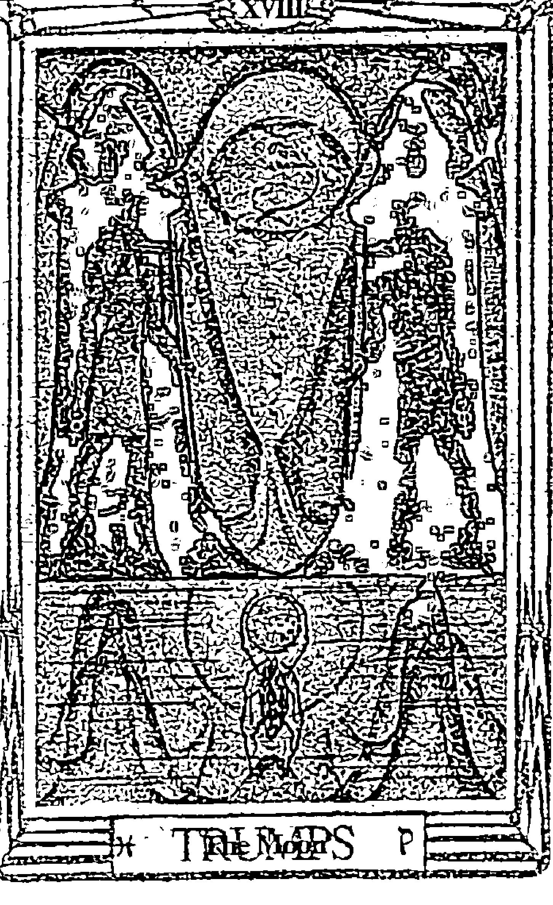

## 19 號牌 太陽
(The Sun)

「太陽」牌是解放與自由的圖像符號，這些都是與「荷魯斯紀元」的來臨相關的精神原則。

牌面中央的太陽代表「赫魯一拉一哈」（Heru-Ra-Ha），根據《律法之書》，此乃太陽神荷魯斯的複合名號。太陽圓盤中央是一朵薔薇，對應於「薔薇十字」（the Rose Cross）的象徵符號。在「太陽」牌中，克勞利在「新紀元」的脈絡下重新界定「薔薇十字」的象徵，用十二道光芒的星星取代了傳統的四臂十字（註46）。「四」是顯化與限制的數字，四臂十字象徵塵世的四種元素之結合。十二芒星則對應於黃道的十二星座，代表無限的宇宙和「努特」女神身軀。如此，克勞利擴展了「薔薇十字」象徵的深度和廣度，從現世宇宙的侷限，開展到天界宇宙的無限自由。

註46. 克勞利，《托特之書》，114。

太陽的光芒分隔了牌面外圍的各個黃道星座；較短的光芒又將每個星座分隔成三「旬」（decan，即十度）。星座的圖形係以最高的喀巴拉世界「Atziluth」中的對應色彩繪製；因此它們盛載了各自最具靈性的最崇高特質。這些星座被呈現在一道彩虹上，而彩虹象徵太陽的能量透過「水」而顯化，意味著開悟的意識。太陽升上一座綠色的山丘，象徵豐饒的大地。

兩個孩子歡欣雀躍地在山丘前跳舞。男孩是紅色的，代表「火」元素，而女孩則為黃色，代表「風」元素。兩個孩子都生著蝴蝶的翅膀。在「星星」牌中，蝴蝶是靈魂的象徵；而在此處，男性和女性的靈魂都被釋放，自在飛翔。他們的手臂上舉，兩腿交叉。這是「吊人」姿勢的逆轉，意味他們已然從傳統「吊人」牌所象徵的犧牲和懸宕中解脫出來。從「泰勒瑪」的觀點來看，這兩個孩兒就是「赫魯－拉－哈」以其雙重形式的展現：「拉－胡爾－庫特」（Ra-Hoor-Khuit）是那紅孩兒（火），而「哈潑克拉提斯」（Harpocrates）則是那黃孩兒（風）。

孩子們在兩枚圓盤上跳著舞，那是牌中顏色最暗的象徵物件。每個圓盤上都鐫刻著一個人形，被釘在「Tau」十字上。這些圓盤代表「薔薇」和「十字」的基督教準則，以基督為「舊世紀」的神聖標記。它同時也暗指「垂死或被犧牲的神」等歸諸於「Tiphareth」（太陽）的屬性。

那圓盤分別呈藍色和綠色，代表被動元素「水」和「土」。這兩種元素曾出現在此牌的「金色黎明」版本中，象徵「水」和「土」生發萬物的影響力（註47）。在托特塔羅的「太陽」牌中，紅孩兒（火）從藍色圓盤（水）昇起，黃孩兒（風）則從綠色圓盤（土）昇起。這四種元素之間的關係（「風」與「火」昇起，「水」與「土」居下），象徵著「荷魯斯紀元」戰勝了「奧西里斯紀元」。圍繞山丘的紅黃色石牆，也意味著「火」和「風」這兩種主動的元素，和諧地共同運作。

## 牌意詮釋

在占卜時，「太陽」牌意味著自由與解放。你或許將從某項義務或債務中解脱，令你得以自己作主，或是獲得力量，去追求自己的命運。牌中的孩兒代表快樂和健康，他們的姿態象徵著行動或選擇的自由。「太陽」的屬性也意味著財富、榮耀，和成功。

逆位時，「太陽」牌中的孩兒做出了傳統「吊人」牌的姿勢，因此暗示失去自由或選擇。你可能肆意運用了自身的權益，但卻忽視了它們所附帶的規範與責任。物質與情感的壓力（由藍綠圓盤所象徵）可能妨礙了你的幸福與健康。逆位的「太陽」也暗示著健康問題、貧窮，與恥辱。

註47. 雷加狄，《金色黎明》，175。

| 項目 | 內容 |
| :--- | :--- |
| **希伯來字母** | Resh |
| **意義** | 頭 |
| **歸屬** | 太陽 |
| **路徑** | 30 |
| **連結** | 「Hod」和「Yesod」 |

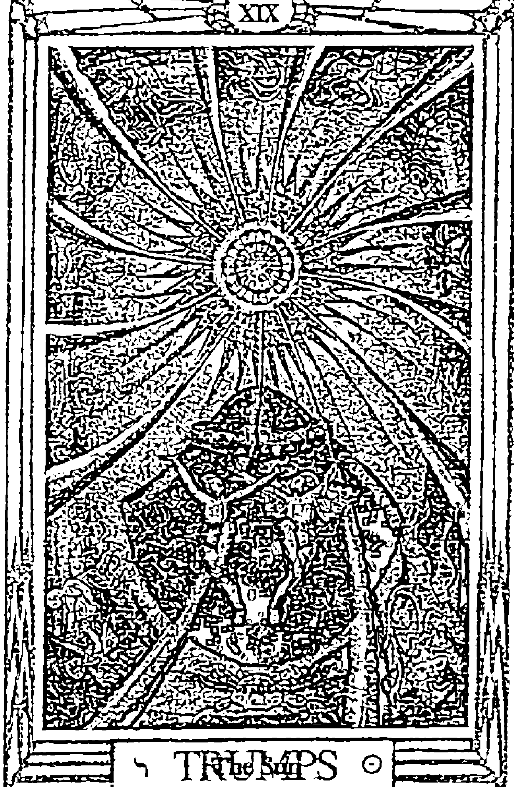

## 20 號牌 新紀元
(The Aeon)

「新紀元」牌是最高深層級之改變的圖像符號，在本質上往往是屬靈或普世的。克勞利將此種改變的規模比擬為「諸神之分點」（the Equinox of the Gods），即「荷魯斯紀元」接替「奧西里斯紀元」的時刻。因此，他將「審判」牌的傳統設計改為古埃及「昭示之碑」（the Stèle of Revealing）上的圖案——這面葬禮木碑正是宣示「荷魯斯紀元」福音的使者，亦是「泰勒瑪」力量的象徵。

這張牌展現了「昭示之碑」的另一個視點。在原碑上，觀看的角度是旁觀者的視點——我們看見古埃及祭司安卡阿夫納庫蘇（Ankh-af-na-Khonsu）走向「拉—胡爾—庫特」（Ra-Hoor-Khuit），努特和哈地德這兩位神祇也都在場。在「新紀元」牌中，我們取代了安卡阿夫納庫蘇的位置；這種視點乃是直接的經驗，因為我們正是活在「荷魯斯紀元」中。

努特女神弓起的身軀框住牌面大部份，比起在「昭示之碑」中，她被描繪得較為抽象。她的乳頭是螺旋狀的星雲，乳房下方有一條環帶，裝飾著數個球體，代表行星。她腳環上飾有尖刺狀的圖形，手環上則有波浪狀圖案，分別象徵著「已知」的和「無限」的。

哈地德位於努特的雙手與雙腳之間，以一個有翅翼的圓球來象徵。那有翼的圓球乃是「卡杜西斯魔杖」（the Caduceus Wand）的頭部，而其下方的希伯來字母「Shin」則是魔杖的冠冕。那有翼的圓球也代表勃起的陽具，如「魔法師」和「惡魔」牌中所示。盤蜷在陽具圓盤下方的雙蛇乃是睪丸，而蛇本身亦象徵精子。在此脈絡下，這張牌顯示哈地德的陽具穿入了努特的子宮。

不同於其他兩位神祇，「拉－胡爾－庫特」的形貌幾乎和「昭示之碑」上一模一樣，只依據《律法之書》修改了原碑上的一個細節：「……但我的左手空空如也，因為我碾碎了一整個宇宙，什麼都沒剩下」（AL III:72）。「昭示之碑」所描繪的「拉－胡爾－庫特」，左手握著「雙重力量之杖」（the Wand of Double Power）；右手則握緊拳頭。但是在「新紀元」牌中，他是以右手握著權杖，左手則是空著並張開的。

荷魯斯的另一個化身「哈潑克拉提斯」（Harpocrates）站在牌面最前方，被描繪成半透明狀，暗示他是不可見的，彷彿像是有形有相的「拉－胡爾－庫特」的投影。赤裸的形體意味著他的純真和年輕。他的食指貼著嘴脣，做出「沉默的手勢」（the Sign of Silence），也就是專屬於他的姿勢。

哈潑克拉提斯戴著一頂精緻的頭冠，上有一對犄角，往水平方向迴旋，類似古埃及創造之神「庫努牡」（Khnum）的山羊頭造型。羊角側面有兩條蛇，象徵這個孩兒體內所駕馭的正負能量流。頭冠的下半部是埃及的傳統頭巾，由第三條蜷繞的蛇固定在他頭上。蛇頭位於他的眉心輪（the Ajna chakra）正上方，即第三眼，意味著力量和開悟。垂在他右肩上的那簇單邊髮綹稱為「荷魯斯髮綹」，在古埃及是青春的象徵。

哈潑克拉提斯站立在「Shin」字母上，字體為金黃色，呼應太陽的象徵意象。在字母上方的「Yod」火焰中，有三個人形跪著祈禱。這提醒我們此一字母路徑的雙重任務，既歸屬於「火」，又歸屬於「靈」元素。最右邊的人形是父親，左邊是母親，中央最明亮的人形則是小孩。「荷魯斯紀元」乃是「加冕得勝之子」（the Crowned and Conquering Child）的紀元，而這個「子」便是先前的「愛西斯」和「奧西里斯」紀元之主宰者的兒子。

努特後方的背景是灼熱的橘紅色，即「Shin」在「Atziluth」的色彩；字母「Shin」後方是「天秤座」的象徵，也就是一座天秤。天秤座歸屬於「調節」牌，該牌的主人翁是瑪特（Maat）女神，亦即下一個紀元的主宰。此牌底部繪著天秤座的象徵，實為饒富深意的，因為古埃及神祇往往被描繪成站立或坐在瑪特的象形符號上，意味他們的根基乃是真理、正義，和秩序。

藍色和淺綠的色帶乃是天秤座在「Briah」和「Assiah」的色彩，橘紅和猩紅的色帶（點綴著金黃色的「Shin」）則是「火」元素在「Atziluth」和「Yetzirah」的色彩。一道鋸齒狀的線條穿過橘紅色帶，意味著「火」元素（也就是變化的啟動者）的活動。

## 牌意詮釋

占卜時，「新紀元」是指某一項對你的人生會有重大影響的個人決定。舉例而言，你可能決定要戒煙，好好照顧自己的身體，或是要從事一項新事業。這張牌可能意味著改變人生的經驗，像是某種深刻的靈性體驗，或死裡逃生的驚險遭遇，令你改變了人生觀。

如果「新紀元」以逆位出現，這項決定對你的人生將有負面的衝擊。你可能陷入自我毀滅的生活方式，像是上癮等等，也可能是新事業未能成功。你或許會遭遇個人的挫敗，未能達到個人的目標，或是被迫做出違背自身道德或信念的決定。逆位的「新紀元」有時也意味著心理的糾結或創傷，可能會干擾你做出重大人生決定的能力。

| 項目 | 內容 |
| :--- | :--- |
| **希伯來字母** | Shin |
| **意義** | 牙齒 |
| **歸屬** | 「火」元素和「靈」元素 |
| **路徑** | 31 |
| **連結** | 「Hod」和「Malkuth」 |

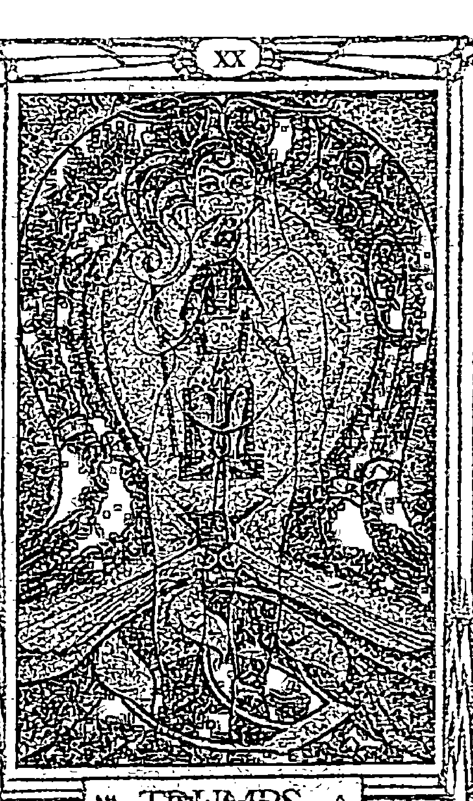

## 21 號牌 宇宙
(The Universe)

「宇宙」牌是最終的顯化、以及「偉大工作」（the Great Work）之完成的圖像符號。

牌面中央，一位少女在跳著舞。她的姿態和「太陽」牌中的孩童很類似：雙腿交叉，手臂上揚。這是與「吊人」牌相反的姿勢，象徵選擇與行動的自由。

少女的雙腿形成一個十字，這是希伯來字母「Tau」的含意。「Tau」十字意味著四種元素以及「四字母聖名」（Tetragramaton）的四個字母之間的平衡。她的雙腿交叉於牌面中央，對應著牌面四角的「四神獸象徵」，後者亦為連結於四種元素的象徵圖符，反映著小宇宙（元素）與大宇宙（黃道）的密切相應。

少女的頭部輻射出一片四方形的光暈。光暈象徵靈性的躍升和啟悟，而四方形則是物質與顯化的象徵。兩者結合，意味著「靈」在物質之中的躍昇。

伊萊·列維（Eliphas Lévi）曾在他的著作《超驗魔法》（The Transcendental Magic）中解說過「少女與蛇」的整體象徵意象：

> 要獲得魔法力量，如我們所示現，有兩件事是必要的——將意志從奴役狀態中解放出來，並且以操控的藝術施以導引。在我們的象徵中，至高無上的意志是由搗碎蛇頭的女子，以及用長矛和足跟壓制猛龍的燦爛天使來表現。讓我們在此強調，偉大的魔法媒介（the Great Magical Agent）——那雙重光流，大地活生生的靈界之火——在古代神話中係以生著牛、羊或狗頭的蛇來代表。它是「卡杜西斯權杖」的雙蛇，是《創世紀》中的那條老蛇，但牠也是摩西的那條銅蛇，交纏在「Tau」十字上，亦即，那生發萬物的「林迦」（lingam）……它實則乃是靈魂若想從塵世的枷鎖中解脫出來，所必須征服的盲目驅力；因為，除非其意志能讓自身擺脫這份致命的吸引力，便將會被那生發它們的驅力吸入洪流之中，歸返中央的永恆之火。因此整個魔法運作，便在於將我們自身從那古老的蛇網中解放出來，然後踏足於其頭頂，依我們的意志引領它（註48）。

列維強調，那「偉大的魔法媒介」或生命能量，乃是一種中立的盲目驅力，可以用來為善或為惡（註49）。這張牌中的巨蛇蜷繞了兩圈，反映著它的二元性：第一道圈中是陽光，第二道圈中則是黑暗。「卡杜西斯權杖」中也可以見到同樣的二元性，它象徵正與負的能量流（蛇）受到意志（有翅翼的圓球）的控制和導引。

註48. 列維（Lévi），《超驗魔法》（Transcendental Magic），242-3。
註49. 同上，75。

列維也指出這條蛇亦是《創世紀》之蛇，這引發了對此牌象徵意象的不同詮釋。在《聖經》中，夏娃受到蛇的引誘，導致她和亞當被逐出伊甸園，這又被稱為「人之墮落」（the Fall of Man）。而在「宇宙」牌中，我們看見夏娃（那女子）乃是人類的救贖者，搗碎了那條欺騙她的蛇的腦袋。

在《創世紀》中，那蛇被懲罰在地上爬行；而在「宇宙」牌中，那蛇身呈泛黃光的黑色，即「Malkuth」在「Assiah」的色彩，也就是四個喀巴拉世界中最低的「薩弗拉」。因此，這條蛇同時象徵著「宇宙」牌的兩種屬性：它既代表「Binah」（即土星）的生命能，而其色彩也連結著「Malkuth」和「土」元素。

那蛇與少女的身軀在她的第二脈輪處交叉，那是「生殖輪」，主管、調控著「性」的功能；在此意義下，牠也代表「亢達里尼」（拙火）之蛇。在「性」的脈絡中，那蛇代表精液，從牌面右上角的眼睛（Ayin）射出，後者如「惡魔」牌中所描述，象徵著陽具。那眼睛的樣貌類似「塔」牌中的巨眼，亦與射精時的陽具相關。透過受孕，「女兒」（「Malkuth」之最後的「Hé」與「土」元素）成為「母親」（「Binah」之原初的「Hé」與土星）、「四字母聖名」的循環得以更新。

克勞利指出，那蛇是來自「太陽」牌的「赫魯一拉一哈」（註50），而那巨眼則是「荷魯斯之眼」。在此意義下，「赫魯一拉一哈」之蛇便是那巨眼的延伸。那眼睛的位置是在水瓶座的象徵神獸之旁，而「水瓶座紀元」的時期大略與「荷魯斯紀元」重疊。巨眼中輻射出十一道光芒，其中九道呈藍、紅和黃色，對應於「水」、「火」和「風」三種原初的元素。光芒的總數「十一」則是「努特」女神與魔法的數字。

少女與蛇在繁星構成的圓環中跳著舞，那便是「努特」的身軀。這圈星環由交錯的線條分隔成許多區塊，圓周有七十二個單元，深度有三層，共計兩百一十六單元。「216」是《聖經》〈出埃及記〉第十四章第十九到二十一節中希伯來字母的數目，這三篇詩節中的字母可以排列成七十二欄三個字母的縱列，構成「神之七十二部聖名」（Shemhamphorash），即上帝的七十二個面向，其中每一個都被分派到一位天使。這七十二位天使統屬著黃道的三十六「旬」（decan），以及塔羅的三十六張數字牌。「七十二部聖名」是上帝的完整全名，是「四字母聖名」（由少女交叉的雙腿所象徵）的充份延展。

如同「太陽」牌中的黃道星座符號，這個星環暈染著各個星座在「Atziluth」中的色彩。環帶中的星星並未構成明顯的圖案，並不對應著黃道中的星座模式。

少女後方的綠色球體是地球，亦是歸屬於此牌的行星。球體中央的奇異螺旋是此牌傳統設計中那條披巾的抽象形式，因此它的顏色是泛黃光的亮藍色，即「Kaph」在「Assiah」的色彩。

少女與蛇下方有個骨架般的構造，那其實是個化學元素表，亦即一切顯化的建構單元。元素表後方有三座金字塔，暗示埃及吉薩區（Giza）的金字塔群，遙遙呼應著古埃及的奧祕。如同化學元素

| 項目 | 內容 |
| :--- | :--- |
| **希伯來字母** | Tau |
| **意義** | 十字 |
| **歸屬** | 土星和「土」元素 |
| **路徑** | 32 |
| **連結** | 「Yesod」和「Malkuth」 |

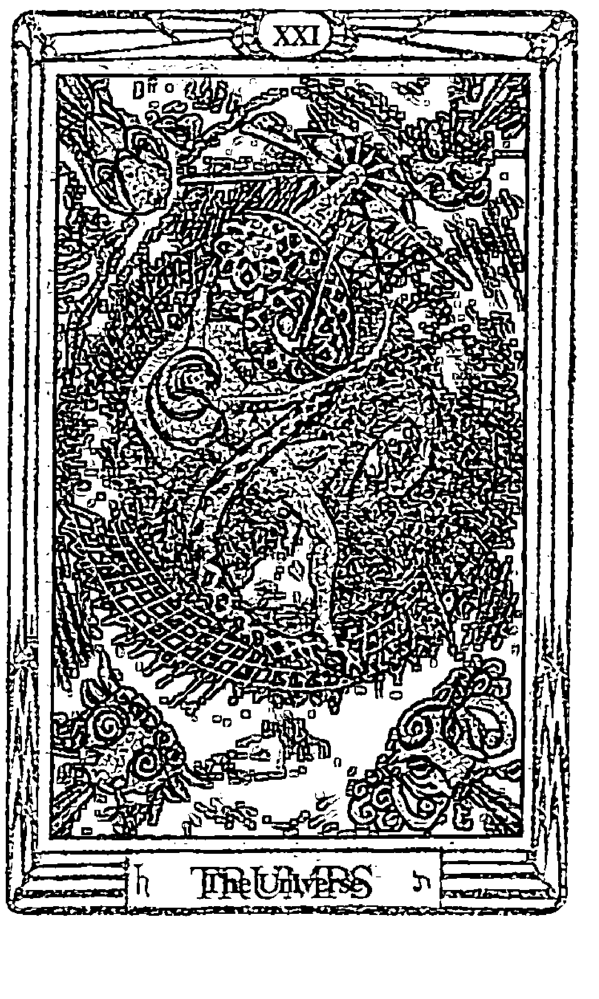

註50. 克勞利，《托特之書》，118。

表，金字塔亦是顯化與物質的象徵。

分據牌面四角的是四神獸象徵，它們以與「大祭司」牌中相同的模式排列，但卻生著翅膀，而且臉孔朝外，口鼻中有風噴出。那風是「風」元素的表現，乃是「愚人」牌的屬性。四神獸象徵代表成形宇宙的四種元素，與「Tau」十字所表現的概念相同。它們同時也代表已獲充份實現與掌控的人面獅身獸之四種力量。

四神獸象徵的排序與它們在黃道帶上的順序並不一致——天蠍座和水瓶座的位置對調了。然而，每個神獸象徵都帶有一個數字密碼，連結著與其屬性相同的大阿卡納牌。老鷹頭上環繞著十三根短羽；十三號牌是「死神」，歸屬於天蠍座。人頭的耳朵上寫著數字「一」和「七」；十七號牌是「星星」，歸屬於水瓶座。獅子有十一綹鬚毛；十一號牌「慾望」歸屬於獅子座。最後，公牛頭上有五捲髮綹；五號牌「大祭司」歸屬於金牛座。

神獸牌的排列方式暗示著與土星相關的生命循環：「慾望」牌是受孕與生殖的圖符；「大祭司」展現人生的奧祕；「死神」意味肉體的死亡；而「星星」則示現靈魂在死亡與重生之間的遷徙。在「宇宙」牌中，四神獸的翅膀共同構成魚囊狀的「雙圓光輪」（vesica），包裹住整個宇宙，指出一切顯化均由「生、活、死、來生」的循環所主宰。

## 牌意詮釋

占卜時，「宇宙」牌意味著某項情況或計畫的完全顯現或完成。它也可能暗示是時候該完成你所開始的事物了。少女制服了蛇，象徵意志的力量展現了結果，並達成了物質的目標。四神獸符號則象徵知識的實際運用，並學習去掌控人生，決定自身的命運。

逆位的「宇宙」牌意味著未能完成或終結某個情況。你可能因為時間不夠，或資源不足，而無法完成你所展開的工作。那蛇壓制了少女，暗示土星的限制，以及受到物質慾望的奴役。「宇宙」牌逆位時，也可能意味不願承認某種情況已然終結——拒絕放手、放棄，而向前邁進。

## 宮廷牌

宮廷牌中象徵符號的用法，是以「金色黎明」文獻《Book T》所記載的元素及星座架構為基礎。「騎士」、「王后」、「王子」和「公主」分別對應於「四字母聖名」（Tetragrammaton）中的四個字母。這四個字母的元素屬性，結合四個牌組的屬性，組合成十六種次元素，構成每一張宮廷牌的元素屬性。詳情請參見第252頁的「宮廷牌屬性表」。

《Book T》也詳細載明了宮廷牌的星座屬性，將黃道的三個「旬」（decan，即十度）指派給各張「騎士」、「王后」和「王子」牌。每張牌都被分派到某個星座的最後一旬和下一個星座的前兩旬。「公主」牌並未分派到黃道的度數，而是統轄著黃道輪上四分之一（三個星座或九十度）的空間象限。她們所統轄的空間象限，是以與其牌組元素相應的「神獸（固定）星座」為中心，例如，「權杖」（火象）公主統轄的是「巨蟹／獅子／處女座」的天界象限，以火象固定星座「獅子座」為中心。

宮廷人物的紋飾和象徵乃是由《Book T》中的「宮廷牌特徵表」(註51)衍生而來。其中許多紋飾係源自於該宮廷牌所屬之黃道星座的象徵符號。

註51. 雷加狄，《金色黎明》，551。

在塔羅占卜中，宮廷牌通常代表問卜者所處情境中某個具有影響力的人物。本章列出了每張宮廷牌的人格特質，幫助讀者辨識出這個人，同時也指出此人在該情境中可能會如何作為。

在托特塔羅中，每張宮廷牌也都示現了某種關鍵的概念，可能切中占卜的主題。舉例而言，「權杖騎士」是指新計畫的啟動，而「權杖王子」則意味著獨立和不同流俗。我們在第四章中，將會更為詳盡地討論宮廷牌的解讀方式。

## 權杖宮廷牌

「權杖」牌組代表「火」元素，每張牌中火焰的型態，代表著該牌的創造領域及能量範疇。噴湧（直線）的火焰代表陰性的能量，而波浪狀的火焰則代表陽剛的能量（註52）。

在「權杖騎士」中，火焰是波浪狀的，而在「權杖王后」中則是直線狀。依照《Book T》的指示，「權杖王子」應該包含波浪和直線的火焰，表現「騎士」與「王后」兩者的能量。克勞利沒有理會這個細節，而用了陰性的直線火焰來平衡「王子」牌中強勢的陽剛意象。「權杖公主」攀昇上波浪狀的躍動火焰，而她的祭壇則燃燒著噴湧的火舌，權杖上也放射出直線的火焰。

> 註52. 雷加狄，《金色黎明》，175。

## 權杖騎士

## 描述

「權杖騎士」代表「火中之火」，展現火的活動與能量。他的紋飾是有翼的黑馬頭，歸屬於火星，即天蠍座的守護星。

那燃燒的棍棒連繫著「權杖王牌」，如同陽具般從「騎士」的鼠蹊部突挺而出。呼應此種「性」方面的詮釋，背景中的黃白光芒大略匯聚於「騎士」的臍輪（與性的愉悅相關）。在此脈絡下，「火中之火」可以被重新詮釋為「『Yod』中之『Yod』」，即活躍的精子；但也請記住，「騎士」代表「某種迅捷而猛烈的力量，但其作用很快便會消逝。」(註53)

牌面的背景是明亮的淺黃色，即「愚人」在「Atziluth」的色彩。如同「愚人」，「權杖騎士」啟動了他所屬的一系列宮廷牌。他背後刮起了風，當他躍向火焰時，將他的鬚髮和馬的鬃毛及尾巴向前、向上吹起。

## 人格特質

積極主動，富侵略性，憤怒，武斷，性好競爭，自信，活躍，衝動，富開創性，容易激動，心胸狹窄，好為先驅，暴躁易怒，性情暴烈，是位天生的領導者。

註53.雷加狄，《金色黎明》，544。

元素屬性
火中之火

星座屬性
天蠍座20度到射手座20度

紋飾
有翼的黑馬頭

象徵
黑馬，波浪狀的火焰，類似「權杖王牌」中燃燒的棍棒，猩紅色的斗蓬

關鍵概念
新計畫的啟動

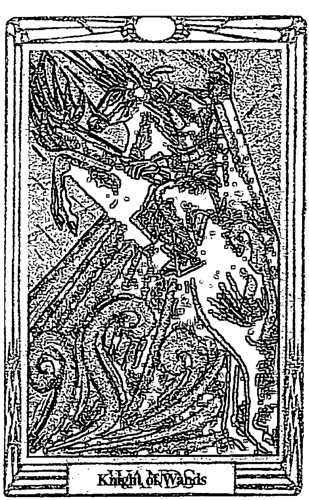

## 權杖王后

元素屬性
火中之水

星座屬性
雙魚座 20 度到牡羊座 20 度

紋飾
有翼的花豹頭

象徵
花豹，穩定的火焰，
頂端為毬果的權杖

關鍵概念
對自我或他人的掌控

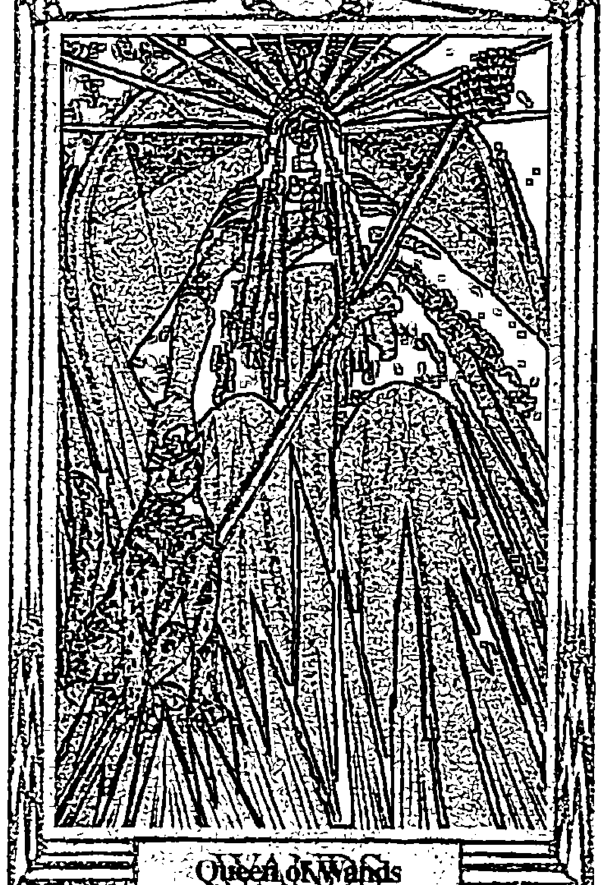

## 描述

「權杖王后」的王冠放射出十二道光芒，即黃道星座的數目。黃道繼而又是無所不在的母神「努特」的象徵（註54）。「王后」的頭冠和胸部的輪廓構成一個魚囊狀的「雙圓光輪」（vesica），又是一種母性的象徵。

「權杖王后」左手握著一柄權杖，頂端是個毬果。那是希臘神話中酒神戴奧尼修斯（Dionysus，羅馬名為「巴庫斯」（Bacchus））的女信徒之象徵和武器。酒神的女信徒被稱為「美娜蒂」（Maenads），在希臘文中是「瘋女人」的意思，其特徵為有著不受羈束的情慾與動物般的激情。那權杖橫過「王后」的臍輪和花豹的鼠蹊部，其形類似陽具，暗示她是個「滿足的女人」（Woman Satisfied，註55）。

她的右手撫摸著花豹的頭，後者象徵「Nephesch」或「動物靈魂」，即原初的衝動和驅力，亦由「酒神之杖」所象徵。她的手摁住花豹的頭，意味著她已控制了「Nephesch」的動物激情和慾望。

## 人格特質

利他的，掌控的，威風凜凜的，超然公平的，坦白，誠實，理想主義，缺乏耐性，易感的，忠誠，精力充沛不斷活動的。

註54. 見「皇后」和「太陽」牌中的描述。
註55. 見「調節」牌中的描述。

## 權杖王子

## 描述

「權杖王子」的王冠放射出十一道光芒，此乃「魔法」之數。他的右手握著「鳳凰杖」（the Phoenix Wand），那是「金色黎明會」的「小達人典禮」（the Adeptus Minor ceremony）中「第二達人」（即「大達人」，the Adeptus Major 6=5）的法杖（註56）。「鳳凰杖」呈紅色，鑲有綠眼和綠足，即火焰閃耀的色彩。「王子」所駕的戰車也是以紅與綠的火焰色彩繪製。他的左腕上搭著獅子的羈繩，獅身呈象徵激情的紅色，如「慾望」牌中所示；拉著戰車的獅子代表獅子座，即歸屬於此牌的神獸星座。

這張牌上最不尋常的象徵，是「王子」胸前的「佘利昂大師」（To Mega Therion）印記。這個印記係由「野獸標記」（the Mark of the Beast）與七芒的「巴巴隆之星」結合而成。這顯然是代表克勞利個人的宮廷牌，他之所以選擇這張牌，是由於獅子座是他的上升星座，或許也因為獅子座與「慾望」牌的關聯。在他的著作《大師之心》（The Heart of the Master）的〈佘利昂大師略傳〉（The Master Therion: A Biographical Note）一文中，克勞利甚至以「李奧」（Leo，即「獅子座」之意

> 註56.比較「權杖五」。

元素屬性
火中之風

星座屬性
巨蟹座20度到獅子座20度

紋飾
有翼的獅首

象徵
獅子，直線狀的噴發火焰，
「忱信小達人」（Zelator Adept）的火權杖

關鍵概念
被認可的需求

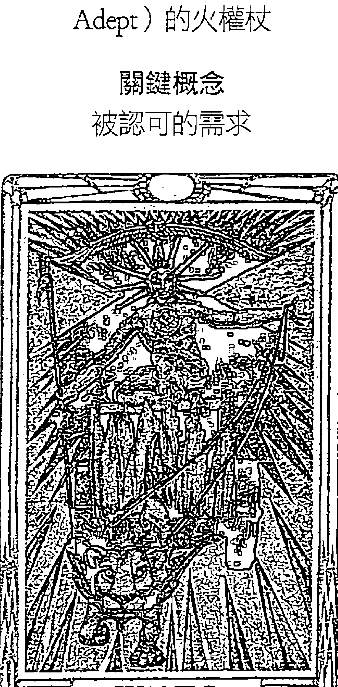

）這個名字作為化名（註57）。

在《托特之書》中，克勞利對此牌性格特質的描述，不折不扣就是他本人，這也就是他為什麼用了比其他宮廷牌更長的篇幅來闡述這張牌。彷彿是要強調這份重要的關聯，「權杖王子」是「唯二」兩位繪有瞳孔的宮廷人物之一。（另一位是「寶劍王后」，她代表天秤座的前兩旬，即克勞利的太陽星座之所在。）

這位「王子」乘著直線狀噴發的火焰而來，而非《Book T》所指示的波浪加直線的火焰。這張牌中陰性火焰的獨特用法，或許是為了要平衡「火中之風」活躍、陽剛的元素屬性。

## 人格特質

雄心勃勃，尋求注目，有吸引力，大膽果敢，富有魅力，戲劇化，自我中心，慷慨，高尚，浮誇自負，驕傲，自信，堅強。

註57. 克勞利，艾利斯特，《大師之心》（The Heart of the Master），（Tempe, AZ: New Falcon, 1992），11-21。

## 權杖公主

## 描述

「權杖公主」頭上的王冠係由兩束風格化的鴕鳥羽毛所構成，那是瑪特女神的羽冠，代表正義，並標示出她是「調節」牌中的「女兒」。《Book T》中的虎頭紋飾變成了一頭真正的老虎。老虎歸屬於獅子座，其色澤為琥珀色，即巨蟹在「Atziluth」的色彩；這兩個星座都歸屬於這張牌。

她的左手握著一柄「太陽權杖」，放射出三十道光芒，指涉「Resh」字母的路徑及其所屬的「太陽」牌。權杖頂端的太陽圓盤有著直線狀的噴發火焰，輻射出耀眼的光芒，指出這張牌的陰性火象驅力。祭壇呈「太陽」的金色，其上裝飾著公羊頭，即「牡羊座」的圖符。牡羊是春天的使者，當太陽在春分時節進入牡羊座，白晝與黑夜是等長的，此係由環繞祭壇的兩圈公羊頭所象徵，每圈各有十二個羊頭，一圈羊頭朝下，一圈朝上。五朵薔薇在這「春之祭壇」上焚燒著，代表五種感官的激情。

「權杖公主」代表「火」元素的土象部份，但是這張牌上並沒有可供立足的土地。「公主」後方的火焰形狀類似字母「Yod」，它不僅與「火」相關，也連結著處女座，即這張牌的另一種星座屬性。那火焰的泛綠色澤暗示著在「Atziluth」的處女座，以及「土」元素。

元素屬性
火中之土

星座屬性
巨蟹座，獅子座，處女座

紋飾
鴕鳥羽毛

象徵
老虎，跳躍的火焰，金色祭壇，太陽權杖

關鍵概念
不同流俗而獨立自主

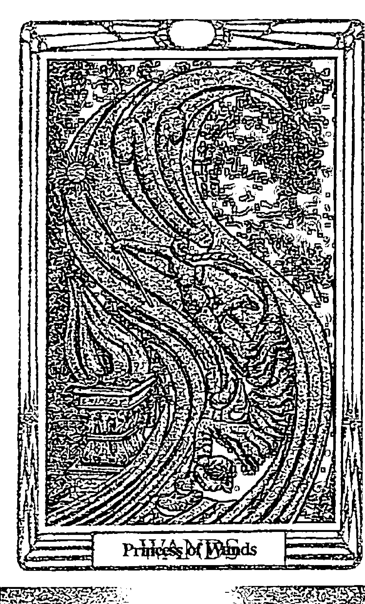

## 人格特質

具報復心，大膽，愛好自由，衝動任性，獨立自主，不理性，不從眾，性情多變，不受羈束，難以駕馭，不穩定。

## 聖杯宮廷牌

「聖杯」牌組代表「水」元素，即情感與直覺的領域。每張宮廷牌所呈現的不同水域（水體），代表其各自示現的情感狀態，參見表四。

表四·水體及其意義
| 宮廷牌 | 水體 | 情感狀態 |
|---|---|---|
| 聖杯騎士 | 海 | 表現與超越 |
| 聖杯王后 | 池塘 | 反思與同理心 |
| 聖杯王子 | 湖泊 | 壓抑與理性化 |
| 聖杯公主 | 濺起浪花的海 | 幻想與想像 |

## 聖杯騎士

元素屬性
水中之火

星座屬性
水瓶座 20 度到雙魚座 20 度

紋飾
無

象徵
白馬，由杯中爬出的螃蟹，
孔雀，海洋

關鍵概念
熱切渴望；冀望未來

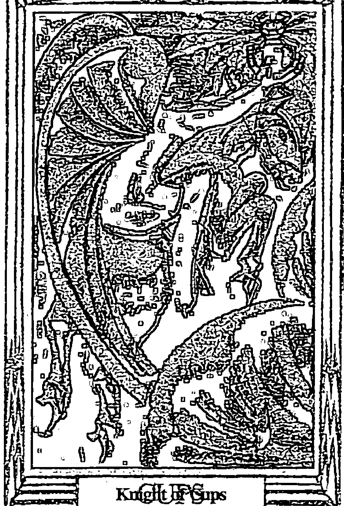

## 描述

「聖杯騎士」的甲冑呈橄欖綠色，是「Netzach」的綠色與「Yesod」的紫羅蘭色在「Malkuth」之十字方陣中的混合色。「Netzach」與「Yesod」之間的傳統路徑是水瓶座所屬的路徑，也就是這張牌的星座屬性之一。

那「騎士」手持赤褐色的聖杯，此色為「Hod」的橘色和「Yesod」的紫羅蘭之混合色。赤褐色與橄欖綠在「Malkuth」的十字方陣中處於相對的方位，兩者合起來代表「火」與「水」元素，亦即此牌的元素屬性。

一隻螃蟹從聖杯中爬出，是為巨蟹座的象徵。那螃蟹呈琥珀色，即巨蟹在「Atziluth」的色彩。螃蟹後方有九道波紋或光芒，顯示「月亮」的影響，它是巨蟹座的守護星，主宰著海洋的潮汐。

「聖杯騎士」是唯一沒戴頭盔的宮廷人物。《Book T》中所描述的孔雀紋飾現在變成牌面右下角的一隻孔雀。孔雀是一種煉金術的圖符，預示著「黑化」（Nigredo）過程的終結。此種煉金程序將「第一物質」轉變為較具靈性的形式，因此「騎士」生著翅膀，象徵他已然被淨化的狀態；而他的白馬——象徵「白化」（Albedo）過程，即「黑化」的下一階段

——則躍過那孔雀，示現此一重要的變化。孔雀羽屏的色彩，也暗示著處於火象面向之「水」元素的光燦與繽紛。

## 人格特質

情緒化，富同理心，喜怒無常，過度敏感，滋養、培育人的，過於謹慎，如父親般，防護的，浪漫的，支持的，頑固的。

## 聖杯王后

元素屬性
水中之水

星座屬性
雙子座20度到巨蟹座20度

紋飾
朱鷺

象徵
朱鷺,由杯中爬出的螫蝦,
蓮花,池塘

關鍵概念
情感左右了理智

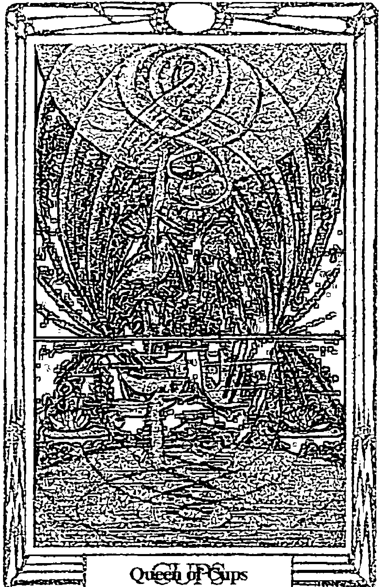

## 描述

「聖杯王后」代表「水」元素結合「月亮」的象徵時,所激發的感受力與觀照力。月亮在「王后」後方升起,而籠罩著她的光幕曲線,乃是「Yesod」之靈光的波流。她左手中捧著的貝殼,不僅是水中生命的象徵,也代表子宮,它既屬於「Yesod」,也歸屬於月亮。「王后」在水中的倒影顯現月亮從貝殼杯中發散出來,更進一步強化這兩種象徵之間的連結。

螫蝦的象徵來自「月亮」牌,在那兒,牠代表最基本的意識層面「Nephesh」,我們的原始情緒便是源出於此。牠同時也指涉著「聖杯王后」的星座屬性,如「金色黎明會」的「哲人儀式」(the Philosophus Ritual)所陳述:

螫蝦是巨蟹座的象徵,也是古代的「聖甲蟲」(Scarabeus)或「凱普拉」(Khephera),象徵著當「月亮」在天上盈滿時,位居地平線之下的「太陽」。同時,當「太陽」位於雙魚座,「月亮」將會在巨蟹座盈滿,如螫蝦圖符所示(註58)。

「王后」右手中握著一朵蓮花,垂落在朱鷺頭上。蓮花是「聖杯」牌組的關鍵象徵,它不僅代表「水」元素,也象徵情感。那蓮花有九片花瓣,連繫著「Yesod」和「月亮」。朱鷺則是天神托特的象徵,這位埃及神祇也兼為

> 註58.雷加狄,《金色黎明》,185。

月神，他所連結的「薩弗拉」是「Hod」，因此也是心智的象徵。這些象徵符號結合起來，示現著「情緒壓倒並控制理智」的關鍵概念。

「王后」下方的水池，強調「水」與「情緒」的扭曲特質。漂浮在平靜水面的兩朵蓮花，則指涉此牌「雙子座」屬性。牌面上共有三朵蓮花，為「Binah」之數，即「偉大海洋」和孕育一切生命的子宮。

## 人格特質

平靜沉著，有憐憫心，易動感情，漫不經心，富於直覺，富有母性，觀察力敏銳，消極被動，感受力強，敏感，富於靈性，具同情心，善體人意，不切實際，不可靠。

## 聖杯王子

**元素屬性**
水中之風

**星座屬性**
天秤座 20 度到天蠍座 20 度

**紋飾**
老鷹

**象徵**
老鷹，由杯中爬出的蛇，蓮花，湖泊

**關鍵概念**
心智掌控情感

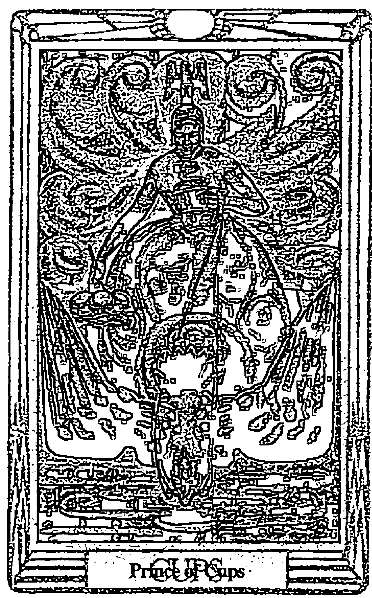

## 描述

除了展示紋飾的頭盔之外，「聖杯王子」幾近赤裸，皮膚呈藍綠色，是天蠍座在「Atziluth」的色彩。拖曳戰車的老鷹代表天蠍在煉金術中的最高形式，這一點我們在「死神」牌中已詳細討論過。「王子」左手中的黑色韁繩暗示「腐化分解」的過程，亦與天蠍相關。

「王子」左手中還捧著一盞聖杯，杯中爬出一條蜷曲的蛇，是天蠍在煉金術中的第二種形式。蛇亦是水星（墨丘利）與心智的象徵，白色的煙霧或蒸汽從杯中冉冉升起，意味著「水中之風」。

「王子」的右手握著一朵蓮花，花朵倒轉過來，意味著對直覺或情感領域的拒斥。他專注地凝視著聖杯中的蛇，即水星（心智）的象徵，因此這張牌象徵著理智宰制了直覺；請與「聖杯王后」做一比較。

「八」這個數字多次出現在老鷹的羽毛束中。「八」與「Hod」及水星相關，而老鷹則是水象固定星座的神獸象徵。因此就整體而言，老鷹便是這張牌的屬性「水中之風」的總體象徵。「王子」後方有八綹煙霧（水中之風），而在他下方，雨水正打在湖面上。

## 人格特質

不由自主的，專注的，強烈的，內向的，易怒的，嫉妒心強，有磁性富魅力，熱情的，具有消極的侵略性，隱密不坦率，抱持懷疑態度，任性的。

## 聖杯公主

元素屬性
水中之土

星座屬性
天秤座，天蠍座，射手座

紋飾
天鵝

象徵
海豚，由杯中爬出的海龜，
蓮花，綴有冰晶的海

關鍵概念
夢想與幻想

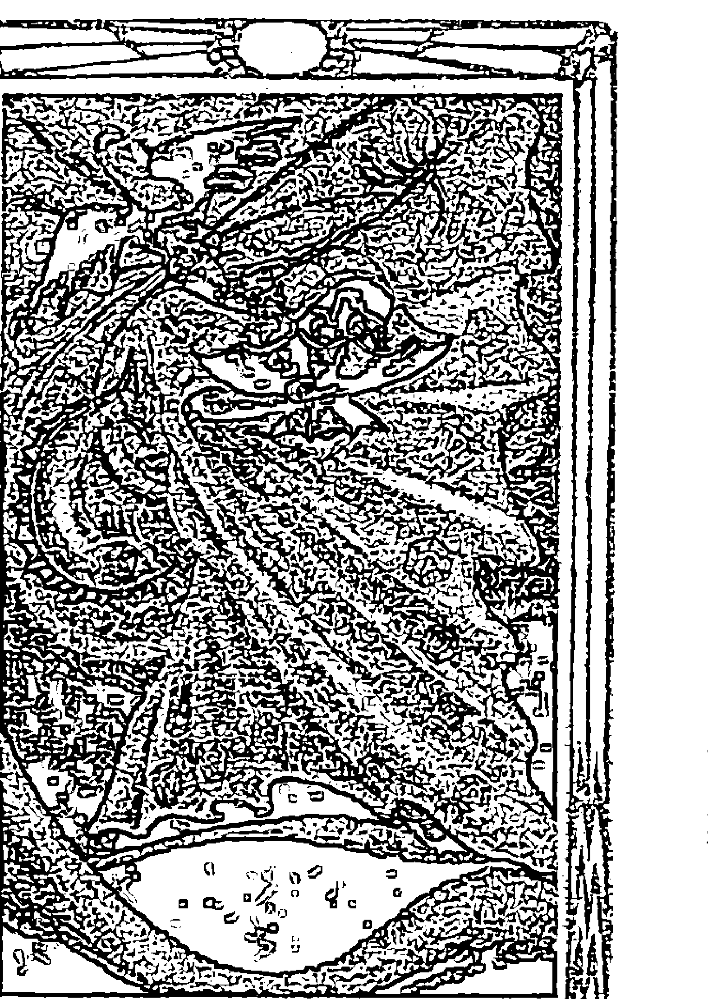

## 描述

「聖杯公主」的天鵝紋飾歸屬於金星，即天秤座的守護星。十道光芒從天鵝身上延伸出來，係為「Malkuth」與「土」元素的數字。她的頭飾和衣袍上的冰晶或鹽晶，反映出此牌「水中之土」的屬性。她服飾上的晶體呈六邊形，意味著「Tiphareth」的均衡，而晶體共計有十一個，乃「魔法」之數。

「公主」右手中捧著一盞貝殼狀的聖杯，裡頭有一隻海龜，係歸屬於巨蟹座。她的左手則握著一朵蓮花，花朵朝上，象徵她對情感領域的接受與表現。她的皮膚、聖杯和海龜都是綠色的，即「土」元素之色彩。

牌面左方有隻海豚，在克勞利的著作《777》中被歸屬於雙魚座，因此暗示著「聖杯王后」的影響，即「聖杯公主」的母親。（相仿地，巨蟹座的海龜則顯示其父「聖杯騎士」的影響。）海豚在傳統上亦是維納斯（金星）的象徵，而牠胸鰭上的四個尖角則連繫著「皇后」牌，亦歸屬於金星。總體而言，海豚象徵著陰性的創造原則（註59）。

## 人格特質

富接受性，孩子氣，情緒不穩定，和藹親切，優雅端莊，富想像力，具直覺力，心懷愛意，善於社交，不切實際。

> 註59. 關於「海豚」之較為詳盡的解析，請參見「聖杯二」牌中的描述。# 寶劍宮廷牌

「寶劍」牌組代表「風」元素，即心理與智識的領域。每張宮廷牌所呈現的不同雲朵形態，象徵其各自所代表的心智面向（參見表五）。

**表五・雲朵形態及其意義**

| 宮廷牌 | 雲朵形態 | 描述 | 意義 |
| :--- | :--- | :--- | :--- |
| 寶劍騎士 | 暗色的層雲 | 扁平，水平的 | 方向，心智的焦點 |
| 寶劍王后 | 灰色的積雲 | 堆積的 | 概念的累積 |
| 寶劍王子 | 灰色的雨雲 | 擴散、發散的 | 心智的發散 |
| 寶劍公主 | 白雲（所有形態） | （所有形態） | 心理過程的綜合 |

此外，「寶劍」牌組的四張宮廷牌，也透過其與「薩弗洛斯」的相互歸屬，對應著喀巴拉的四個靈魂部份（見表六）。

**表六・寶劍宮廷牌及其對應的喀巴拉靈魂部份**

| 宮廷牌 | 薩弗拉 | 靈魂的部份 |
| :--- | :--- | :--- |
| 寶劍騎士 | Chokmah | Chiah |
| 寶劍王后 | Binah | Neschamah |
| 寶劍王子 | Tiphareth | Ruach |
| 寶劍公主 | Malkuth | Nephesch |

每張宮廷牌都繪有特定的象徵，將之連結於其所屬的「薩弗拉」。「寶劍騎士」牌面右下角有三隻燕子，是屬於字母「Beth」和水星的鳥類。「Beth」連結著「Yechidah」和「Chiah」，而「Chokmah」是水星的「高八度」。「Chiah」是靈魂的意志或創造衝動，而這「騎士」騎馬奔馳的專注與決心，正是此種驅力的特質。

「寶劍王后」頭冠的紋飾是一個小孩的頭，「像是個小天使的頭，如常見於墓園的石雕者。」（註60）這份與墳墓的關聯，將此紋飾連結於土星和「Binah」。「Neschamah」是靈魂的熱望和直覺；這張牌中的「王后」提著一顆割下來的頭顱，象徵「小我」（ego），或「Ruach」，而她頭頂的天使頭紋飾則代表「Neschamah」。

「寶劍王子」連結著「Ruach」，即靈魂的智性或「小我」。牌中的「王子」高舉寶劍，彷彿正要斬斷疆繩，斷絕他與精靈之間的連結——後者正往四面八方任意拖曳著戰車（心智）。透過這種行動，他將能實現由孩童頭紋飾所象徵的「Neschamah」。

最後是「寶劍公主」。透過其頭冠的紋飾——蛇髮女妖梅杜莎（Medusa）的頭顱，她連結著「Nephesh」。「Nephesh」乃是動物靈魂，即靈魂的原始情緒和感覺。以蛇為髮的女人頭顱，象徵著「爬蟲腦」（reptilian brain，即演化中最為原始的「腦幹」），負責「Nephesh」的原初衝動。在此牌中，「公主」採取了反應性的防衛姿態，像是一頭受到威脅的動物。她以寶劍向下戳刺，彷彿要刺入正在升起的太陽（代表「Ruach」）。

> 註60. 雷加狄，《金色黎明》，548。

## 寶劍騎士

### 描述

「寶劍騎士」的甲冑呈檸檬黃色，即「風」元素在「Malkuth」的色彩；而他的馬則為赤褐色，乃「火」元素在「Malkuth」的色彩。兩者合起來，即意味著這張牌的元素屬性「風中之火」。「騎士」頭冠的裝飾是個六芒星，延伸為四條翅翼，標示著四個方位。「騎士」躍向東南方。在「金色黎明會」的「小五芒星驅逐儀式」（the Lesser Banishing Ritual of the Pentagram）中，「火」元素屬於南方，而「風」元素則屬於東方。「騎士」躍馬的方向，正是「風中之火」所對應的象限。

「騎士」右手握著一柄寶劍，護手上飾有翅翼，即「風」元素的標記。他的左手握著一柄匕首，那是某種特殊的短劍，劍身細長，是用來戳刺，而非切割。匕首的護手構成太陽標記的圖形，連結著「火」元素。因此寶劍和匕首合在一起，再次意味著「風中之火」的元素屬性。

伴隨「騎士」飛翔的燕子歸屬於水星，即雙子座的守護星。雙子座的影響也顯示在兩柄劍刃和有翼的六芒星上——後者在《Book T》中（註61）被歸派給雙子座的主神卡斯特（Castor）與帕勒克斯（Pollux）。

> 註61. 雷加狄，《金色黎明》，548。

**元素屬性**
風中之火

**星座屬性**
金牛座20度到雙子座20度

**紋飾**
有翼的六芒星

**象徵**
黃馬，層疊的雲，
出鞘的寶劍和匕首

**關鍵概念**
攻擊：善用機會

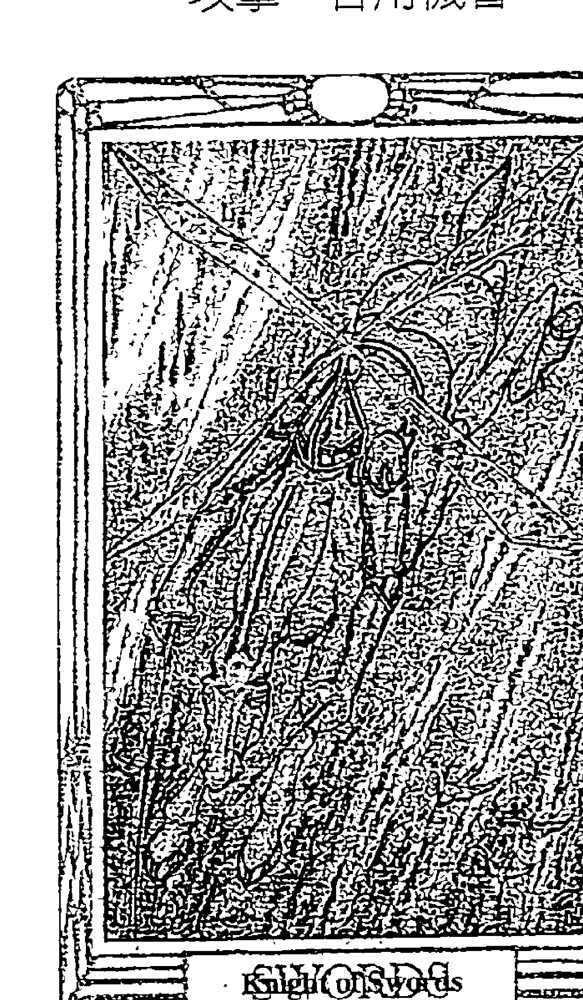

### 人格特質

模稜含糊，願意妥協，善於合作，疏離超然，公正不偏坦，矛盾反覆，猶豫不決，缺乏耐性，巧舌善遊説，機敏圓滑，寬容。

## 寶劍王后

### 描述

「寶劍王后」的頭盔上裝飾著一個小孩的頭，「像是個小天使的頭，如常見於墓園的石雕者。」（註62）此種與墳墓的關聯指涉著土星，土星廟旺於天秤座，即此牌的星座屬性之一。同時，古埃及人將天秤座連結於天神「庫蘇」（Khonsu），他是一位月神，被描繪為孩童的形貌。在著名的丹德拉（Dendera）神廟天宮圖中，其圖像出現在天秤的上方。克勞利的太陽星座是天秤座，因此「寶劍王后」是「唯二」眼中繪有瞳孔的宮廷人物之一（另一位是「權杖王子」）。「王后」的盔飾放射出十五道光芒，係「Hod」完整拼出時的數字值；水星是處女座的守護星，而處女座即為此牌所屬的另一個星座。

「王后」右手中握著一柄寶劍，左手則提著一顆割下來的人頭。寶劍意味著分析，而蓄著鬍鬚的人頭則象徵老舊的想法和思考模式。那孩兒頭紋飾代表新概念取代了舊想法。在此脈絡下，她確實是「心智的解放者」（註63）。

**元素屬性**
風中之水

**星座屬性**
處女座 20 度到天秤座 20 度

**紋飾**
小天使的頭

**象徵**
割下的老人頭，堆積的雲，
出鞘的寶劍

**關鍵概念**
放下舊想法，掌握新概念

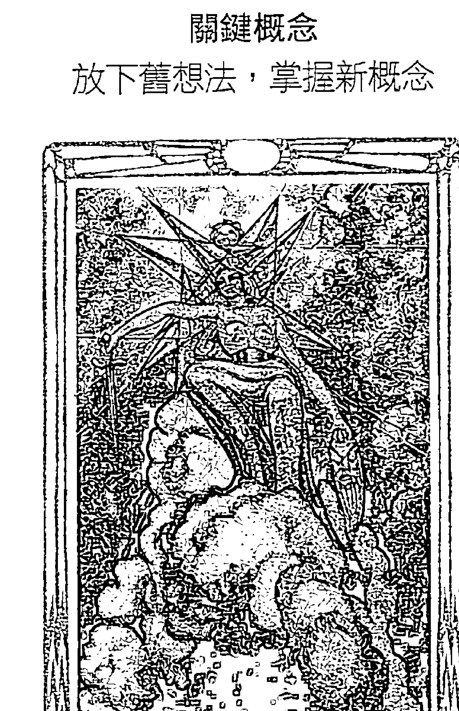

### 人格特質

善於分析，性情冷漠，長於溝通，好事好奇，聰明機敏，有邏輯頭腦，開明無偏見，思考迅捷，不可信靠，機智慧黠。

註62. 雷加狄，《金色黎明》，548。
註63. 克勞利，《托特之書》，161。

## 寶劍王子

**元素屬性**
風中之風

**星座屬性**
魔羯座 20 度到水瓶座 20 度

**紋飾**
小孩的頭

**象徵**
有翼的精靈，雨雲，
出鞘的寶劍和鐮刀

**關鍵概念**
有思考而無行動；
未實現的計畫

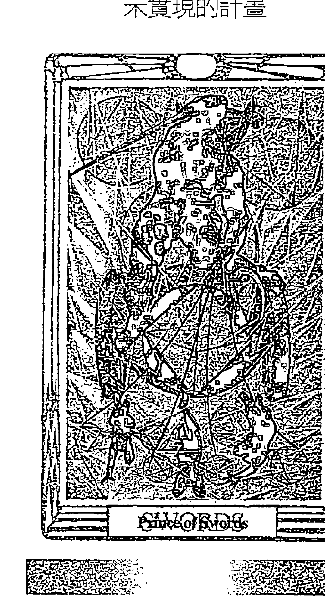

### 描述

「寶劍王子」戴著一頂金色的頭盔，那是「太陽」與「Tiphareth」的色彩。孩兒頭的紋飾是「Ruach」的象徵，而孩童也是「Tiphareth」的屬性之一。

「王子」的左手握著一柄鐮刀，同時抓著戰車的疆繩，右手則高舉寶劍，彷彿正要砍下。寶劍是心智的象徵，負責創造、分析概念，而鐮刀（土星的武器）則摧毀概念。「風中之風」的屬性使得「王子」代表純粹的智性，充滿想法，但卻無法在它們消失之前付諸實現。唯有學習控制小我（Ruach），這位「王子」方能斬斷他與精靈（想法、念頭）之間的連結——後者正在把他的戰車任意拖往相互衝突的方向。

牌中的精靈乃是「風之象徵」，他們是人類或天使的退化形態，歸屬於水瓶座。「王子」和精靈的翅膀，以及戰車的一部份都呈黃色，即「風」元素的色彩。「王子」和精靈的身軀則呈藍翡翠綠色，即「Aleph」（屬「風」元素）在「Yetzirah」（亦屬「風」元素）或「風中之風」的色彩。戰車前方有個黃色的菱形（鑽石）標記，框在暗綠色的圓盤之中。鑽石是「風」元素的象徵，它有八個邊，暗示「Hod」、水星，以及心智。

### 人格特質

思想極端,愛好自由,人道主義,個人主義,富想像力,性好思辨,聰明穎悟,善於創新,粗率散漫,膚淺,寬容,不專注。

## 寶劍公主

**元素屬性**
風中之土

**星座屬性**
魔羯座，水瓶座，雙魚座

**紋飾**
蛇髮女妖梅杜莎（Medusa）的頭顱

**象徵**
銀祭壇，煙霧，
雲，出鞘的寶劍

**關鍵概念**
防衛

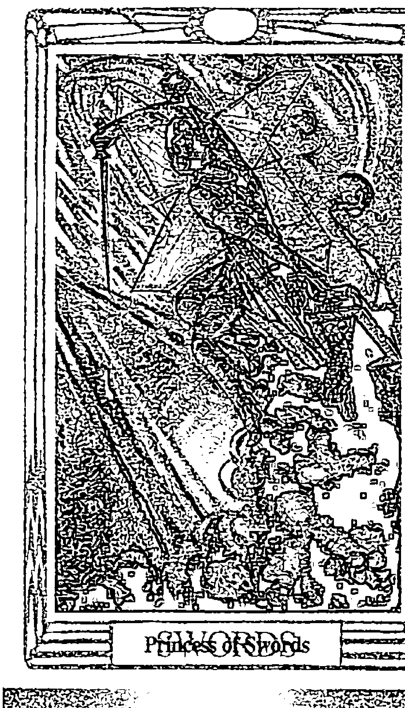

### 描述

「寶劍公主」頭盔的紋飾是蛇髮女妖梅杜莎的頭顱，它也是羅馬女神米奈娃（Minerva）神盾上的紋飾。《Book T》將米奈娃歸屬於這張牌，而在克勞利的著作《777》中，她也是歸屬於水瓶座的女神。「公主」穿著墨丘利（水星）的有翼繩鞋，而水星正是廟旺於水瓶座。這種飛鞋也曾出現在普修斯（Perseus）的神話中，這位英雄正是運用了此一神物，方才得以獵獲梅杜莎的頭顱。這位「公主」係以「風」元素的色彩繪成：她的披巾為黃色，衣服是天藍色，身軀則呈翡翠綠和黃色。

「寶劍公主」模仿著她的母后「寶劍王后」持劍向下擊刺，那是分析之劍。她的左手按在一座銀祭壇上，有灰色的煙霧從中冒出。煙霧是「風」元素的土象部份，此種元素屬性也表現在祭壇壇身的圖案上——上半部為圓盤（土），下半部則為鑽石（風）的菱形。

她站在「寶劍王后」的堆積雲朵之上，背景則是「寶劍騎士」的層疊雲彩。她的前方有一道拱洞，上升的太陽從中出現。太陽是「Tiphareth」，是「Ruach」，而「寶劍公主」（代表「Nephesch」）緊握寶劍，彷彿是在抵擋它可敬可畏的強大力量。

### 人格特質

性好爭辯，小心謹慎，靈巧狡猾，防衛心重，膽怯，富本能性，喜歡批判，反應敏銳，善於自保。

## 圓盤宮廷牌

「圓盤」牌組代表「土」元素,即物質與財務的領域。在《Book T》中,這個牌組中四張宮廷牌的背景,分別代表一年的「秋、夏、春、冬」四季(見表七)。

| 宮廷牌 | 背景 | 季節 |
| --- | --- | --- |
| 圓盤騎士 | 栽植作物的耕地 | 秋 |
| 圓盤王后 | 沙漠 | 夏 |
| 圓盤王子 | 繁花盛開的大地 | 春 |
| 圓盤公主 | 無葉的樹叢 | 冬 |

「圓盤騎士」置身於栽植作物的耕地中,手裡拿著一把打脫穀殼用的連枷,全都暗示著秋天,收穫的時節。「王后」牌的背景是一片沙漠,中有綠洲,暗示夏天的熱度,而那「王后」的外表也像是熱帶非洲人士。「王子」駕車駛過繁花綠叢之間,枝葉繁茂的植物在春天迸放色彩。「圓盤公主」的背景則是一片無葉的枯樹叢,暗示冬季。此外,那「公主」外表看似北歐人或塞爾特人,她身上厚重的羊皮斗蓬,也是適於冬季的裝束。

## 圓盤騎士

#### 描述

「圓盤騎士」延續並完成了貫穿所有「騎士」牌的色彩象徵，他身披赤褐色的斗蓬，其下是黑色的甲冑，即「火」和「土」元素在「Malkuth」的色彩。紅色的馬鞍和黑色的盾牌，也承載此種元素屬性。

因應騎士的尚武本質，「圓盤」牌組的象徵被轉化為一面盾牌。我們看不見盾牌的正面，但它的圖案或許會是傳統設計中「忱信小達人」（the Zelator Adeptus Minor）的六芒星符號（見圖五）。

圖五．「忱信小達人」之六芒星符號

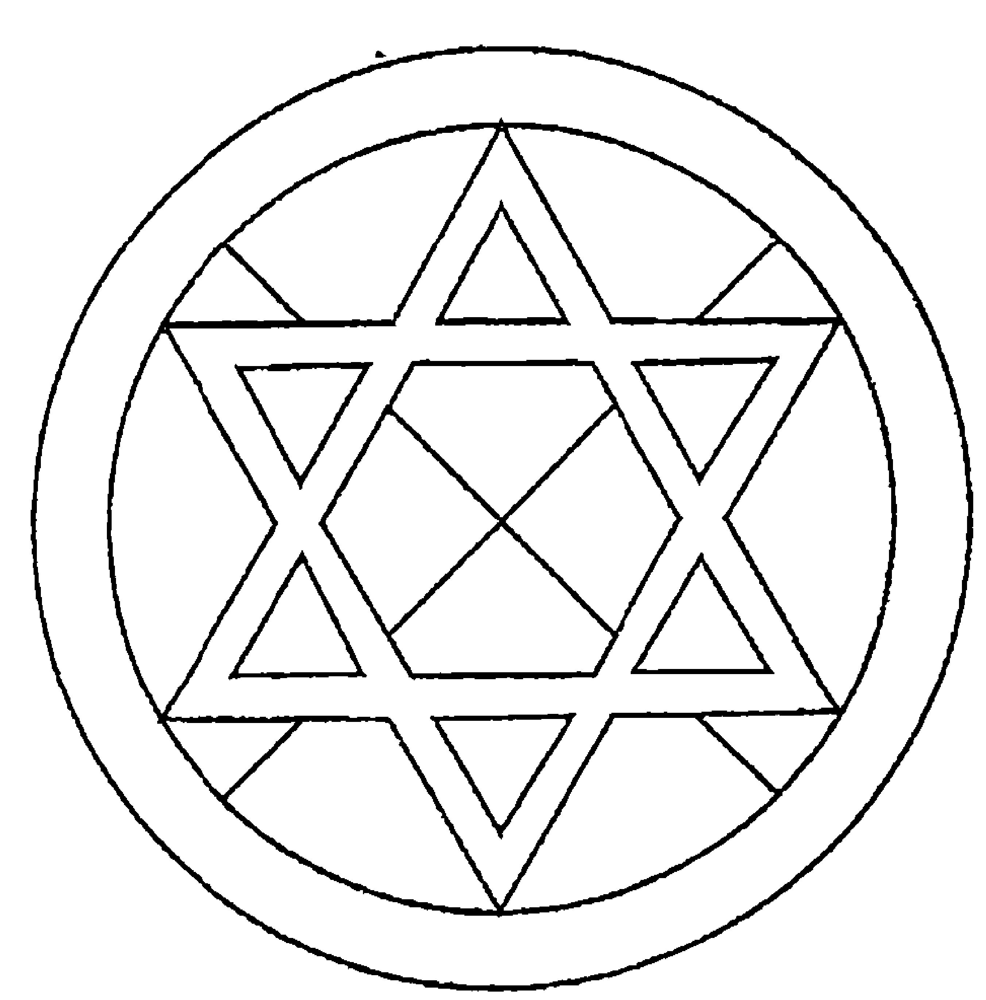

此一符號包含「Malkuth」在「Briah」的X形十字，其上繪著一個六芒星，即太陽的象徵；而在此牌中，太陽顯然正在向栽植作物的耕地放射光芒。那光芒暈染著黃色、琥珀色和玫瑰色——全都是屬於太陽的色彩。盾牌背面的設計納入了「火」與「土」元素的符號。它是黑色的,不僅反映其「土」元素的屬性,也和它正面放射出的光芒構成對比。

「騎士」頭盔的紋飾是有翼的雄鹿頭。在文藝復興時期,雄鹿代表「審慎」的基本美德。此種美德也歸屬於「隱士」牌和處女座,後者即是此牌的星座屬性之一。這位「騎士」駐足於一片成熟的麥田,而「隱士」牌中也有麥田。他手中的木製連枷,自古以來就被用來打脫麥殼。因此這連枷也連結著處女座,即主掌豐饒與收成的星座。

**元素屬性**
土中之火

**星座屬性**
獅子座20度到處女座20度

**紋飾**
雄鹿的頭

**象徵**
褐馬，栽種作物的耕地，
打穀子的連枷，
「忱信小達人」的六芒星符號

**關鍵概念**
計畫的實現

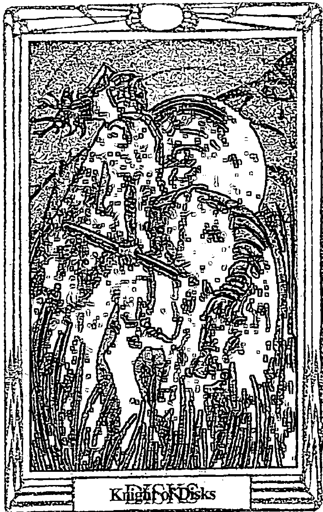

#### 人格特質

善於分析,積極而有建設性,性好批判,有鑑別力,謙遜,有組織有條理,完美主義,實事求是,講求實效,沈悶乏味,節儉,冷漠而缺乏同情心。

## 圓盤王后

#### 描述

「圓盤王后」凝望著後方的沙漠；她是整副牌中唯一不是面向前方的「王后」。她頭冠的紋飾並非傳統的山羊頭，克勞利用撚角山羊（markhor）的犄角取而代之。那是一種生活在阿富汗到印度山區的野生山羊，克勞利或許在旅行時曾經見過。另一方面，撚角山羊原名的意思是「食蛇獸」，顯然影射著「口交」，而獸角向來也是雄性能量與生殖力的象徵。

「王后」右手中握著一柄長長的權杖，頂端是個嵌有六芒星的立方體。這柄權杖是「圓盤國王」與「王后」之傳統權杖的綜合體。六芒星是太陽的象徵之一，而立方體則意味著大地；因此，這柄權杖象徵著由太陽生發而來的大地繁殖力。

「王后」的左手捧著一顆金球，上有十三圈相互連結的環。那金球便是太陽，而第十三條路徑歸屬於「女祭司」和月亮，後者與「水」元素互補，並反映太陽的光芒，因此這金球代表著以其最高面向（太陽）表現的被動性（月亮）。

前景中還有第二顆球，一頭山羊站在圓球上，代表太陽在魔羯座，即這張牌的星座屬性之一。作為「惡魔」牌的魔羯座，代表陽剛的創造能量，與「圓盤王后」的豐饒特質十分相應。「王后」後方是一片沙漠，中有綠洲，並有一條小河蜿蜒流過，象徵「土中之水」。

**元素屬性**
土中之水

**星座屬性**
射手座 20 度到魔羯座 20 度

**紋飾**
撚角山羊的犄角

**象徵**
沙漠，山羊，
飾有立方體與金球的節杖

**關鍵概念**
回想過去

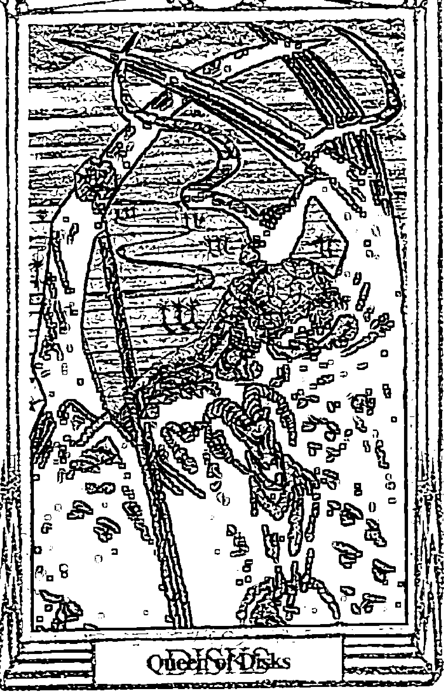

#### 人格特質

雄心勃勃，小心謹慎，保守，堅毅果決，豐饒多產，勤懇刻苦，性好孤獨，物質主義，緘默冷淡，嚴肅認真，不願妥協，剛健而有男子氣概。

## 圓盤王子

#### 描述

這位「王子」頭盔上的有翼公牛頭紋飾意味著金牛座,即這張牌的星座屬性。他的右手握著一柄權杖,頂端飾有圓球和十字,象徵對大地的主權。「王子」的膚色和拖曳戰車的公牛均為紅橘色,即金牛座在「Atziluth」的色彩。戰車本身為黑色,是「土」元素的色彩。

傳統上,他左手中的圓盤是一顆金球。這此象徵之上,克勞利精心添加了十字、立方體,和三個圓圈。那金球是太陽的象徵,而十字與立方體則象徵大地;兩者合起來,即意味著太陽滋長生命的能量,及其在農業上的作用。那圓球被朝下按住,強調「圓盤王子」的角色,及其對此過程的掌控。

氮氣的小球構成戰車頂篷的內襯,氣體(風)被封存在土壤(土)中。在背景中,花朵和植物在豐饒的大地上繁茂生長。

**元素屬性**
土中之風

**星座屬性**
牡羊座20度到金牛座20度

**紋飾**
有翼的公牛頭

**象徵**
繁花似錦的大地,公牛,飾有圓球與十字的節杖,圓球向下

**關鍵概念**
成長與經營管理

#### 人格特質

可靠,溫和,工作勤奮,物質主義,有耐心,佔有欲強,自我耽溺,注重感官,動作緩慢,穩定有恆,穩健從容,固執倔強。

## 圓盤公主

**元素屬性**
土中之土

**星座屬性**
牡羊座，金牛座，雙子座

**紋飾**
牡羊頭

**象徵**
無葉的樹叢，
飾有鑽石的節杖，五芒星，
麥稈束圖案的祭壇

**關鍵概念**
完成與更新

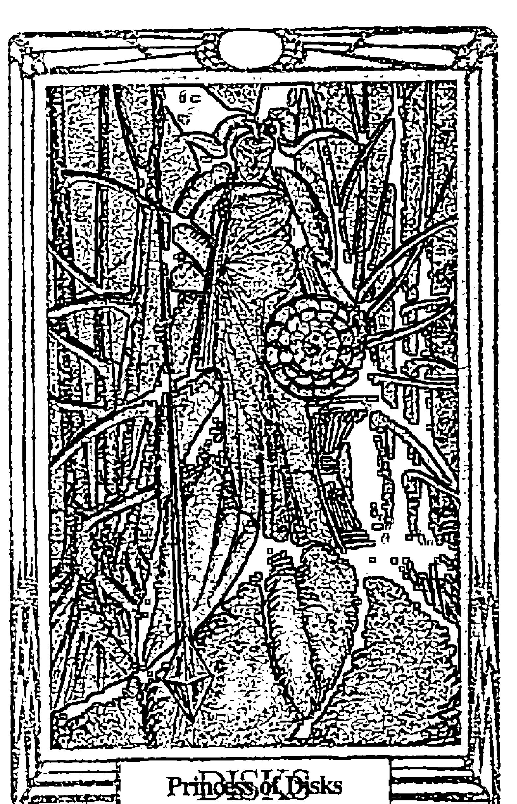

#### 描述

這位「公主」的頭冠是個公羊頭，是牡羊座的標誌，即這張牌的星座屬性之一。她身披羊皮裘，亦指涉著牡羊座。她的長袍柔軟貼身，顯示出她身懷六甲。因此這位「公主」是即將成為「母親」的「女兒」；她重新啟動了「四字母聖名」的循環。

她的右手握著一柄權杖或長矛，頂端為一顆鑽石，矛頭倒轉，放射出光芒。鑽石是「Kether」的象徵，而發光的鑽石則象徵宮廷牌循環的開始。矛頭所放射出的明亮淺黃色光芒（「愚人」在「Atziluth」）也曾出現在「權杖騎士」的背景中，該牌的主人翁手持一柄燃燒的權杖，類似「權杖王牌」（「Kether」在「Atziluth」）中的棍棒。

「公主」左手中的圓盤盾牌，是以與「圓盤王牌」相同的太陽色彩繪製：玫瑰色、黃色、鮭魚紅，以及琥珀色。薔薇圖形中央的太極「陰陽魚」符號，被三輪十二片花瓣環繞著。這些花瓣代表構成一個太陽年的黃道三十六「旬」（decan），而牡羊座正是太陽年的起始。

「圓盤公主」佇立在一片光禿禿的樹林中；地面呈透明狀，顯現出地底的樹根，而如同其餘的景物，這樹根被來自下方的光線照亮。

牌面背景被暈染成雙子座的橘色和黃色，以及金牛座的褐色。「公主」身旁有座石製的祭壇，壇身雕刻著麥束圖案。麥稈束乃是大地女神狄米特（Demeter）的聖物，她也是更新宮廷牌循環的「母親」；而「圓盤公主」則象徵寒冬之後大地的復甦。

#### 人格特質

沉著自信，堅忍持久，堅定剛直，百折不撓，實際幹練，深謀遠慮，自律，注重感官，穩定。

## 數字牌

在二十世紀之前出版發行的塔羅牌中，數字牌通常十分簡單，只繪出該數目的牌組標誌，以對稱的幾何圖形排列。這種做法在「萊德／韋特」（Rider-Waite）牌問世之後有了改變，這副牌的繪圖者潘蜜拉·柯爾曼·史密斯（Pamela Colman Smith）為每一張數字牌繪製了中世紀風格的場景，藉以示現它們的意義。在大多數現代的塔羅牌中，這已經成為數字牌最為普遍的概念。

托特塔羅的數字牌卻在新舊風格之間提出一種獨特的折衷。圖解式的場景被捨棄了，採用類似中世紀塔羅的數字牌設計，但卻添加了較為繁複的象徵與色彩，為圖像帶來更為複雜的深度和意義。

數字牌整體的象徵意義，係由該牌的三種主要屬性來決定：牌組的元素、該牌的喀巴拉屬性，以及星座屬性。喀巴拉屬性是指該牌所對應的「薩弗拉」在其所屬的喀巴拉世界之中的屬性，而星座屬性則是指該牌所對應的行星位於某個星座的屬性（參見「附錄」之完整列表）。在四張王牌的情況中，該牌組在「四字母聖名」（YHVH）中所對應的那個字母，取代了星座的屬性。

衍生自「金色黎明」文獻《Book T》，每張數字牌都被賦予了一個標題。這個標題指出了該牌的基本意義，被印在牌面上，以幫助塔羅占卜者解讀其含意。

## 權杖王牌

**標題**
火之力量的根源（The Root of the Powers of Fire）

**喀巴拉屬性**
「Kether」在「Atziluth」

**四字母聖名屬性**
Yod

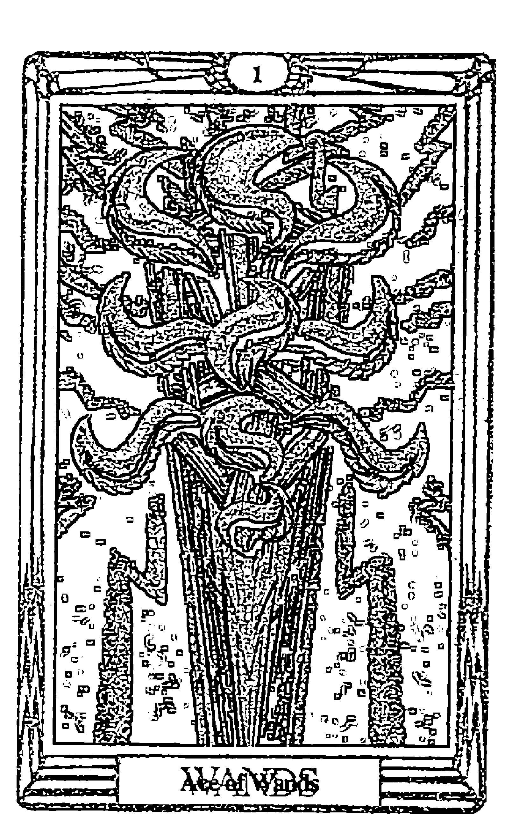

#### 描述

一根碩大的木棒標示著「生命之樹」的印記——十股「Yod」火焰構成了「薩弗洛斯」，木棒的棒身也刻著二十二條路徑。十八道綠色的閃電從木棒射出，象徵未受箝制羈束的創造力量。「十八」是希伯來文「chai」的數字值，意為「活」（living）。那木棒亦代表勃起的陽具，而「Yod」則象徵射出的精液（註64）。背景和閃電被繪成閃耀火焰的色彩，即紅與綠。

#### 牌意詮釋

能量，力量，創造的衝動。自然的力量（相對於外力引發的力量）。對照「寶劍王牌」。

#### 逆位牌

暗示實現相位良好時的詮釋之舉措受到阻礙，周圍的牌或許會界定出受阻的方式。

> 註64. 見「隱士」牌中的描述。

## 權杖二

### 描述

牌中的兩柄權杖是交叉的「金剛橛」（Dorjes），克勞利如此定義它：「此乃西藏的雷電象徵，代表天界的力量，但較偏向其毀滅性，甚於其創造性。」（註65）那六道閃電代表「太陽」（Tiphareth）的能量，結合火爆的行星「火星」及火象星座「牡羊」（以火星為守護星），則象徵巨大的力量。這張牌代表完全的自由被摧毀，以導引或控制能量或驅力。

這張牌的藍色背景趨近於「Chokmah」在「Atziluth」的色彩，即柔和的純藍色。火星與牡羊的火象能量驅散了心智的雲霧和混亂，揭露了澄明的藍天。

### 牌意詮釋

- 統轄（勢力範圍，至高權威）。
- 權力。
- 對他人的影響力。
- 駕馭並控制能量或驅力的方向。

### 逆位牌

- 專制獨裁。
- 報復。
- 頑固。
- 強橫。

### 基本資訊

| 項目 | 內容 |
| :--- | :--- |
| **標題** | 統轄（Dominion） |
| **喀巴拉屬性** | 「Chokmah」在「Atziluth」 |
| **星座屬性** | 火星在牡羊座 |

> 註65. 克勞利，《托特之書》，189。

## 權杖三

### 描述

三柄「蓮花杖」相互交叉，會合處放射出十道筆直與十道彎曲的火焰。筆直的火焰中有六道為白色，代表「太陽」平衡的影響力。「蓮花杖」的金色杖柄亦暗示「太陽」。其餘的火焰象徵著前兩張牌的能量：十道彎曲的火焰代表「權杖王牌」中的十個「薩弗洛斯」，而四道橘色的筆直火焰則暗示「權杖二」中交叉的「金剛橛」（Dorjes）。

前兩張牌的能量在「Binah」中獲得顯化，而「太陽在牡羊」的占星屬性也蘊含著「出生」或「創造」的概念——太陽廟旺於牡羊座，而牡羊則標示著春天的開始。

「蓮花杖」連結著古埃及的偉大母神「愛西斯」，並象徵創造的力量。每朵蓮花都有九片花瓣，連結著富創造力的水性薩弗拉「Yesod」。與此同時，「蓮花杖」亦是「金色黎明會」的「小達人儀式」中屬於「Tiphareth」的魔法武器。因此，這張牌處處都蘊藏著「創造」的概念。

最後請留意，此牌中的圖形均以緋紅色描繪輪廓，即「Binah」在「Atziluth」的色彩。

### 牌意詮釋

- 創造。
- 生發。
- 確立的力量。
- 初期奮鬥的成功。
- 希望的實現。
- 可能意味著驕傲、高貴，或權力。

### 逆位牌

- 自大（過度的驕傲）。
- 傲慢。
- 自以為偉大、強大，或是豐功偉業的妄想。

### 基本資訊

| 項目 | 內容 |
| :--- | :--- |
| **標題** | 美德（Virtue） |
| **喀巴拉屬性** | 「Binah」在「Atziluth」 |
| **星座屬性** | 太陽在牡羊座 |

## 權杖四

### 描述

四柄權杖排列成一個圓圈，每柄權杖兩端都分別鑲有牡羊座的公羊頭（代表意志的能量）和金星的鴿子（代表愛）。圓圈則代表工作的限制或完成。

權杖相互交叉，構成一個八芒星，中央放射出八道火焰。「八」是希伯來文「abah」（意志）、「ahab」（愛），與「ahgad」（結合或召集）的數字值，全都意味著與此牌相關的關鍵概念。「愛即意志，意志下的愛」（Love Is the Law, Love under Will，AL I:57）。

牌面上下的占星符號係以牡羊的紅色繪製，而背景則暈染成金星的綠色。紅與綠亦為閃耀之火焰的色彩。

### 牌意詮釋

完成，往往是一樁「愛與意志」的工作。它或許意味著工作的終結，或是工作後的休息，視所處情境與周圍的牌而定。

### 逆位牌

- 一項被迫或令人不喜的工作。木星在「Chesed」的擴張性或許掌控了局面，暗示一項巨大的工作，距離完成還很遠，或是令人喘不了氣。
- 一項由於焦慮而被催趕的工作，因為不可靠、不均衡，或是沒做好準備而未能完成。
- 一項已完成但卻不牢靠的工作。

### 基本資訊

| 項目 | 內容 |
| :--- | :--- |
| **標題** | 完成（Completion） |
| **喀巴拉屬性** | 「Chesed」在「Atziluth」 |
| **星座屬性** | 金星在牡羊座 |

## 權杖五

### 描述

「權杖五」運用了「金色黎明會」的「小達人儀式」中的幾種「達人之杖」（the Adept's wands）作為象徵（註66）。牌中四柄較小的權杖形制並不統一，元素屬性也不和諧。「蓮花杖」有著藍色的杖柄，符合其「水」元素的屬性，但權杖的頂端卻呈紫色，為紅（火）與藍（水）的混合色；「鳳凰杖」的杖柄為橘色，即「Geburah」在「Atziluth」的色彩，但其杖頭卻是「水」元素的藍色。尤有甚者，「鳳凰杖」面對著「蓮花杖」（與後續幾張牌中的排列方式相反），彷彿這對權杖正處於爭執或衝突中。

中央的「卡杜西斯」（caduceus）蛇杖壓制著其他的權杖。這柄權杖乃是「宗師之杖」（the Wand of the Chief Adept），歸屬於「Chesed」，因此杖柄為藍色，且有四個翅翼。這柄權杖亦象徵著木星（朱庇特）的權威，其頂端和底部的翅翼均呈紫色，為「火」與「水」的混合色。那兩條蛇則象徵相對驅力的合一，牠們分別頭戴上埃及與下埃及的王冠，兩者合併為一，遂成為遼闊而強大的埃及帝國。

這張牌最有趣的面向，應該是蛇杖頂端的標記：「野獸印記」結合「巴巴隆之星」——陽具在子宮之內。如同雙蛇與翅翼，這象徵著正負能量、陽與陰，以及「火」與「水」的結合。此外也請記得「卡杜西斯」蛇杖乃是天神墨丘利的魔杖，歸屬於「風」元素，亦為「火」與「水」結合的產物。

那「野獸印記」係以藍色描繪在橘色的背景上，這兩種顏色乃是閃耀之「水」的色彩，反映「Chesed」的水象本質，更進一步指出此一權杖與朱庇特之權威的關聯。

蛇杖的杖身呈現著紅色的土星標誌和獅子座符號。獅子座的「火」被土星限制性的嚴肅本質給悶熄了。土星亦與此牌其他的行星屬性相互衝突，對抗著水星（蛇杖）的迅捷和木星（Chesed）的擴展性。

十道火焰從權杖交會處迸發而出。這指涉著「權杖十」，後者示現當土星得以完全壓制「權杖」牌組的「火」時，會有什麼結果。由於「Geburah」的火性本質，以及「卡杜西斯」蛇杖的權威，「權杖五」的標題才會是「衝突」，而非「壓迫」（註67）。

### 牌意詮釋

- 傾軋。
- 爭吵。
- 爭鬥。
- 衝突。
- 競爭。
- 可能的暴力。

### 逆位牌

- 揮霍浪費或慷慨大方。

> 註66. 關於「小達人儀式」，可參閱雷加狄的著作《金色黎明》，221-247。
> 註67. 「權杖十」的標題即為「壓迫」（Oppression）。

### 基本資訊

| 項目 | 內容 |
| :--- | :--- |
| **標題** | 衝突（Strife） |
| **喀巴拉屬性** | 「Geburah」在「Atziluth」 |
| **星座屬性** | 土星在獅子座 |

## 權杖六

### 描述

牌面上的六柄「達人之杖」（the Adept's wands）配置均衡且兩兩成對，指出「Tiphareth」的和諧特質。「蓮花杖」上的蓮花呈藍色和白色，為「水」與「靈」元素的色彩；「鳳凰杖」上的鳳凰頭則為「Tiphareth」的黃色。「卡杜西斯」蛇杖上的太陽圓盤呈紅色，而翅翼則為藍色，意味著相對之物（「火」與「水」）的結合，即此杖的力量之所在。

權杖的杖身均呈泛紅的琥珀色，乃是獅子座在「Assiah」的色彩。獅子座之火象能量的堅強和穩定，在牌面上無處不在。牌面背景暈染著木星在「Atziluth」的紫羅蘭色，其屬水的性質有助於平衡此牌中據支配地位的「火」。

權杖交會處迸發出九道穩定的火焰，即「Yesod」與月亮之數。此種火焰代表陰性的能量，平衡了火象的陽剛能量，因而為此牌帶來均衡和諧。那九道火焰亦將此牌連結於「權杖九」——與「勝利」息息相關的「力量」。

### 牌意詮釋

- 努力之後的成功。
- 爭鬥之後的勝利或凱旋。
- 平衡的能量。
- 獲益。

### 逆位牌

- 蠻橫。
- 驕傲。
- 傲慢。

### 基本資訊

| 項目 | 內容 |
| :--- | :--- |
| **標題** | 勝利（Victory） |
| **喀巴拉屬性** | 「Tiphareth」在「Atziluth」 |
| **星座屬性** | 木星在獅子座 |

## 權杖七

### 描述

一根歪扭不平整的權杖或棍棒，壓制著來自前一張牌的六柄「達人之杖」。那根大棍棒是由十個節段組成，暗示某種物質性（十）的粗糙影響力，裂解了「權杖六」的均衡能量。那棍棒是一種武器，而武器則與火星相關。

那六柄「達人之杖」的杖頭反映出火星與金星（Netzach）之間的衝突。由於與金星的親緣關係，「蓮花杖」仍是藍色的，但是「鳳凰杖」卻褪鏽成琥珀色——「Netzach」在「Atziluth」的色彩——而「卡杜西斯」蛇杖則呈火星的紅色。「鳳凰杖」的底部（鳳凰腳）亦為紅色，彷彿即使在此處，火星的能量也已征服、瓦解了虛弱的金星。同樣的概念亦適用於中央的棍棒，其色彩為趨近於紅色的琥珀色。

權杖交會處的火焰狂亂而搖曳不定。請留意牌面上的占星符號都偏離了中央，反映出此牌能量的不穩定。牌面的背景為深紫色，即獅子座在「Briah」的色彩。獅子座的均衡之「火」，如同那些「達人之杖」般，被火星的影響力推擠到背景中。

### 牌意詮釋

- 對抗與衝突，但有面對它們的勇氣。
- 英勇。
- 一場沒有組織的混戰，戰果不明，只能藉由個人的努力來贏得勝利。

### 逆位牌

- 恐懼。
- 怯懦。
- 退敗。
- 在微不足道的小事上獲勝，卻消耗了真正戰役所需的能量。
- 問卜者身為受欺壓的劣勢者。

### 基本資訊

| 項目 | 內容 |
| :--- | :--- |
| **標題** | 勇氣（Valor） |
| **喀巴拉屬性** | 「Netzach」在「Atziluth」 |
| **星座屬性** | 火星在獅子座 |

## 權杖八

### 描述

兩座相互交疊的金字塔構成了一個八角星。這是「權杖」牌組中唯一沒有出現火焰的一張牌；權杖變成了八道紅色的電光，由牌面中央發射而出，末端成為箭頭，標示出金字塔的尖角。那電光是天神墨丘利的象徵，他主掌溝通與科技；此外，它們亦指出這張牌的屬性「迅捷」與「速度」，因為「電」令我們能夠以閃電般的速度溝通。

金字塔上方有一道彩虹，連結著射手座和「藝術」牌。彩虹的色彩也可以在水銀（汞）中看見，即歸屬於墨丘利的金屬。

那兩座金字塔是「Chesed」的象徵，反映著上方彩虹的各種色彩。正方形的金字塔被繪上對應於「Malkuth」之X形十字的色彩，而那菱形的金字塔則沒有明確可辨的色彩模式。兩座金字塔的尖端都偏離了中央，象徵要將這張牌的靈能帶入顯化時，可能會產生的困難。

### 牌意詮釋

- 迅捷。
- 速度。
- 勿促。
- 達到目標的途徑。
- 溝通。

### 逆位牌

- 太過快速地運用太多的力量。
- 曇花一現。
- 精力耗竭。
- 衝動的暴力。
- 任性的行為。

### 基本資訊

| 項目 | 內容 |
| :--- | :--- |
| **標題** | 迅捷（Swiftness） |
| **喀巴拉屬性** | 「Hod」在「Atziluth」 |
| **星座屬性** | 水星在射手座 |

## 權杖九

### 描述

八支交叉的箭矢（權杖）被一根大權杖所壓制，後者頂端為太陽，尾端則是月亮。箭矢是射手座的象徵，而那權杖則像是「生命之樹」上連結「Tiphareth」（太陽）和「Yesod」（月亮）的「Samekh」（射手座）路徑。權杖交會處出現六股火焰，不僅指涉「太陽」，也呼應著「權杖六」。

箭矢的箭桿呈「火」元素的紅色，頂端和尾羽均由銀色的新月構成，每支計有九個彎月。「太陽」出現在牌面最上方，放射出九道彎曲和九道筆直的光芒，顯示著「月亮」的影響。背景為靛藍色，即「Yesod」在「Atziluth」的色彩。

這張牌所體現的「力量」，來自於日與月（意識心靈與無意識心靈）的聯結與結盟。這是透過「Samekh」路徑而完成的，即由「射手」之箭矢象徵的「受到導引的意志」（註68）。

如同前面兩張牌，「權杖九」也打破了慣例：此牌所屬的兩個占星符號都出現在牌面最下端，而非如其他的牌那般分置於牌面上下。射手座的符號位於「月亮」的球體之內，象徵「受導引的意志」之種籽（Yod）在無意識之中萌芽。

最後，月亮、射手座及箭矢等象徵的結合，喚起女獵者與月之女神亞特米絲的意象。她的特質如力量、決心與獨立，都和這張牌的能量十分相應。

### 牌意詮釋

- 因方向、導引而強化的能力，驅力，或強大的力量。

### 逆位牌

- 憤怒。
- 生猛而不受控制的力量，被以某種衝動且往往是負面的方式所導引。
- 浪費掉的能量或力量。
- 軟弱。

> 註68. 請將此牌與「藝術」做比較。

### 基本資訊

| 項目 | 內容 |
| :--- | :--- |
| **標題** | 力量（Strength） |
| **喀巴拉屬性** | 「Yesod」在「Atziluth」 |
| **星座屬性** | 月亮在射手座 |

## 權杖十

### 描述

八柄兩端鑲有鉤爪的權杖相互交叉，交會處迸出火焰。來自「權杖二」的「金剛橛」延伸為柵欄，障蔽著這些權杖，以及後方的火熱能量。在「權杖二」中，「金剛橛」的力量控制著「Chokmah」未受羈束的能量，但這份「控制」的元素，在「生命之樹」頂端是如此必要，在「Malkuth」中卻變得專橫、壓迫而設限。後方權杖的利爪和尖鉤，強調其所涉及的驅力之嚴峻、猛烈。

射手座的樂觀被土星嚴厲的權威主義壓垮了。「金剛橛」呈黑色，是土星與「Malkuth」的色彩。兩個占星符號被「金剛橛」完全禁錮住，而這也是四個牌組中，唯一一張沒有以「生命之樹」形態排列的十號牌。這張牌象徵性地與「生命之樹」的其餘部份隔絕了。

牌面背景為橘色，即「Geburah」在「Atziluth」的色彩，連結著「權杖五」。「Geburah」的影響力為這張牌所象徵的嚴厲與衝突雪上加霜。

### 牌意詮釋

- 殘酷與惡意。
- 報復。
- 壓迫。
- 鎮壓。
- 最具毀滅性的「火」。

### 逆位牌

- 在毀滅性、壓迫性的情境中的自我犧牲或慷慨行為。

### 基本資訊

| 項目 | 內容 |
| :--- | :--- |
| **標題** | 壓迫（Oppression） |
| **喀巴拉屬性** | 「Malkuth」在「Atziluth」 |
| **星座屬性** | 土星在射手座 |

## 聖杯王牌

### 描述

一盞聖杯從一朵大白蓮中顯現。一道白光（「Kether」在「Briah」的白色光輝）從天而降，照亮杯中的水。光與水的互動激盪出彩虹般的反射與折射。

聖杯前方有三個交疊的圓環，這個符號在「大祭司」牌中也曾出現，象徵《律法之書》中的三個紀元。在舊紀元中，「聖杯王牌」描繪著基督教傳統中的「聖杯」（the Holy Grail）；而在「荷魯斯紀元」，它則是「巴巴隆之杯」（the Cup of Babalon），是孕育一切生命的子宮。

在背景中，地平線之上的圖案令人聯想起貝殼，是水中生命的象徵。地平線之下則是「Binah」的大海，是「生命之樹」上原初的「Hé」，以「愛瑪」（Aima）的名號為人所知，即「光燦豐饒的母親」（the Bright Fertile Mother）。

### 牌意詮釋

- 豐饒肥沃。
- 多產。
- 美。
- 歡愉。
- 快樂。

### 逆位牌

- 暗示實現相位良好時的詮釋之舉措受到阻礙，周圍的牌或許會界定出受阻的方式。

### 基本資訊

| 項目 | 內容 |
| :--- | :--- |
| **標題** | 水之力量的根源 (The Root of the Powers of Water) |
| **喀巴拉屬性** | 「Kether」在「Briah」 |
| **四字母聖名屬性** | 原初的「Hé」 |

## 聖杯二

### 描述

一朵蓮花漂浮在綠色的海面，兩條海豚交纏在花莖上。牌面頂端的蓮花流溢出水來，分為兩股，澆淋在海豚頭上，然後再流入前景的兩盞大杯。這兩盞杯子流溢出十股水流，注入下方的海中。

傳統上，海豚歸屬於維納斯（金星）；而在希臘神話中，海豚原本是太陽神阿波羅或海神波賽頓的聖物。克勞利將海豚連結於煉金術（註69），但在所有主要的煉金文獻中，海豚都不曾被提及，也未曾在現代對於煉金意象的詮釋中被討論過。然而，海豚的確曾經出現在一幅煉金圖像中，克勞利或許相當熟悉。這幅圖像名為「漢密特大奧祕」（the Great Hermetic Arcanum），出自於十七世紀煉金術文獻《漢密特博物集》（Musaeum Hermeticum）。在「金色黎明會」的「中門儀式」（the Ritual of the Portal）中，它會被展示給候選人，並加以簡短的描述。

在這幅圖像中，陰性與陽性的象徵符號被分置於兩極。右邊是一位以新月為冠的王后，在水面上騎著海豚；在左方作為平衡的是一位國王，頭頂有太陽光輪，以獅子為坐騎，棲息在山丘上。獅子下方還有一條火蜥蜴，吞吐著火焰。

作為獅子的對應物，海豚成為月亮／陰性原則的象徵，將其範疇由七顆（或十顆）行星之一的原型，擴展為日／月二元之半。海豚、杯盞和蓮花兩兩對偶的性質，反映出「Chokmah」的影響，陽性的力量平衡了此牌許多陰性的元素。若是沒有「Chokmah」，這張牌將會不穩定且失衡得多（見「聖杯四」）。

兩條海豚都有著紅色或玫瑰色的軀體和金黃色的鰭，全都是太陽的色彩。兩處微妙的差異區隔了牠們：較明顯的是左邊那條海豚的眼睛是黃色的（太陽），而右邊那條則為銀色（月亮）。第二個較為隱晦的差異是牠們內側的胸鰭（朝向下端的花莖）。左邊那條「太陽」海豚的胸鰭有五個尖角，暗示著第五號大阿卡納牌「皇帝」，即煉金術中的「硫」；而右邊那條「月亮」海豚則只有四個尖角，第四號大牌是「皇后」，即煉金元素「塩」。

日月兩條海豚相互交纏，象徵陰陽原則的結合。屬月的象徵符號呈現了屬日的色彩，意味著陰陽原則的合一；就煉金術而言，這兩條海豚均為雌雄同體，象徵煉金元素「汞」（墨丘利）。請記得海豚不僅是維納斯的聖物，亦歸屬於墨丘利（水星）。也請留意那蓮花透過海豚的影響，滋養著自身。

克勞利並未依循傳統，將金星及巨蟹座的占星符號分置於牌面上下，而是將之左右並列，置於地平線上方的高處。這十分妥適，因為感性而多慾的金星之域，在敏感而滋養人的巨蟹座相當「得位」，如魚得水。這兩個星座符號均呈褐紫紅色，即巨蟹在「Briah」的色彩。

杯盞中流溢出十股水流，指出這張牌的特質將會達到完全的顯化。水流注入綠色的海中，即金星的色彩。

### 牌意詮釋

- 意志下的愛。
- 陰陽的和諧。
- 溫暖的友誼。
- 結伴的歡愉。
- 和諧。
- 歡樂。
- 婚姻。

### 逆位牌

- 愛之較為嚴苛的面向。
- 不和諧的結合。
- 愚昧，愚行。
- 一見鍾情。
- 執迷。
- 可說是「愛之下的意志」。

> 註69. 克勞利，《托特之書》，196。

### 基本資訊

| 項目 | 內容 |
| :--- | :--- |
| **標題** | 愛（Love） |
| **喀巴拉屬性** | 「Chokmah」在「Briah」 |
| **星座屬性** | 金星在巨蟹座 |

## 聖杯三

### 描述

牌中聖杯的造型為鮮紅的石榴，指涉波瑟芬妮（Persephone）與狄米特（Demeter）的神話。波瑟芬妮在冥王黑地斯（Hades）的國度吃下了石榴籽，每年必須被扣留在冥府四個月，擔任冥后。當波瑟芬妮返回人間，母親狄米特歡欣雀躍，於是春天便來臨了。因此，這張牌代表春天的溫暖與豐饒。

牌中的八朵蓮花指涉水星（墨丘利），即此牌的行星屬性。正是墨丘利傳達了宙斯的祈請，令波瑟芬妮得以從冥府獲釋；也正是墨丘利以他的戰車（巨蟹座）將她帶回人間。「八」同時也是波瑟芬妮留駐人間的月份數。

蓮花的黃色暗示太陽的影響；而聖杯的紅不僅指涉石榴，也代表牡羊座，即引領春天到來的星座。

杯中的水滿溢出來，流入「Binah」的大海。狄米特是希臘的農業與豐收女神，歸屬於「Binah」。事實上，狄米特乃是「Binah」之雙重面向的經典範例。在春天，大地的植物發芽、生長、繁茂，狄米特就像是「光燦豐饒之母」（the Bright Fertile Mother）；而在冬季，當植物枯萎凋零，她便像是「黑暗貧瘠之母」（the Dark Sterile Mother）。巨蟹，這個黃道中最為「母性」的星座，處於此牌底部的...

### 基本資訊

| 項目 | 內容 |
| :--- | :--- |
| **標題** | 豐盛（Abundance） |
| **喀巴拉屬性** | 「Binah」在「Briah」 |
| **星座屬性** | 水星在巨蟹座 |

## 牌意詮釋

豐富。歡愉。殷勤好客。感官性。喜悅。幸運。被動的成功。豐饒。愛，但並不如「聖杯二」中那般均衡。

## 逆位牌

浪費。虛幻易逝的歡樂。負面的奢侈揮霍。波瑟芬妮神話的黑暗面或許會顯現，曾經是豐饒或活潑的事物，可能會變得荒蕪死寂。

## 聖杯四

### 標題
奢華（Luxury）

### 喀巴拉屬性
「Chesed」在「Briah」

### 星座屬性
月亮在巨蟹座

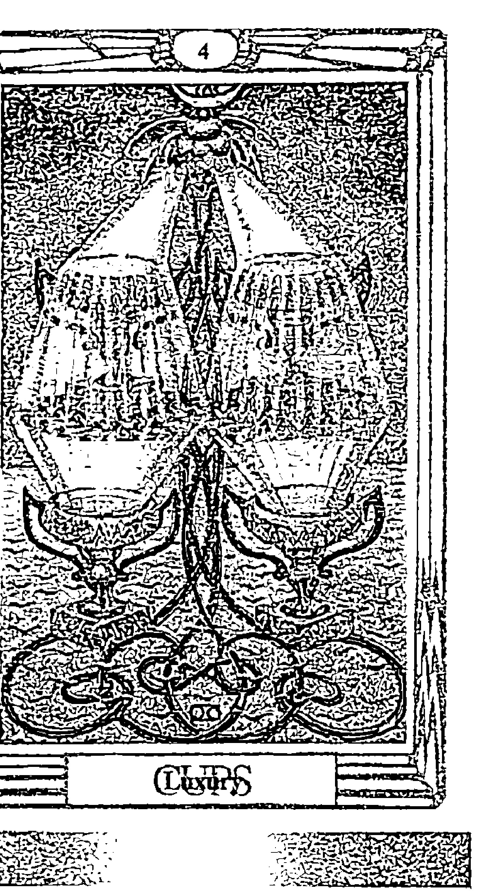

### 描述

四盞聖杯排列成正方形，上方的蓮花將上排的杯子注滿了水，再向下流溢到下排的杯中，但卻不再流溢出來。

此牌的弱點在於它所有的屬性都與「水」有關：「Chesed」（尤其是作為朱庇特／波賽頓）、相當於原初之「Hé」的「Briah」、月亮，以及巨蟹座。月亮作為巨蟹的守護星，更加強化了此種一面倒地偏向水象的不平衡。

在此同時，這張牌中卻有著某種明確的「太陽」影響。蓮花的花瓣呈粉紅色，乃「Tiphareth」在「Atziluth」的色彩，而蓮花的中心還有個黃色的圓盤。四個杯盞均呈金黃色，乃是「Tiphareth」在「Briah」。但是那陰霾的天空和蓮花頂上的月亮標記，卻暗示這份太陽的影響並非直接，而是反射而來，正如同月球表面反射著陽光。

杯盞的基座為正方形，指出「Chesed」的穩定性。然而，上方的杯盞穩穩地安置於杯墊上，下排的杯盞卻缺乏穩固的基座，暗示不穩定已然滋生。

背景中，天空灰暗而陰鬱，海面也微微擾動起來，暗示一場暴風雨即將來臨。牌面底部的花莖之中，隱藏著「無限大」符號的雙紐線，在此象徵「大海」無垠的本質和無窮的潛能，這是「聖杯」牌組的每一張牌中共有的特質。

### 牌意詮釋

虛弱。耽溺於慾望。享樂主義。混雜著焦慮的歡樂。享樂即將告終。短暫的快樂（例如嗑藥或酗酒），藉以逃避某種問題或情境。

### 逆位牌

無聊。厭倦。漠然。耗竭。渴望更好的事物。

## 聖杯五

### 標題
失望（Disappointment）

### 喀巴拉屬性
「Geburah」在「Briah」

### 星座屬性
火星在天蠍座

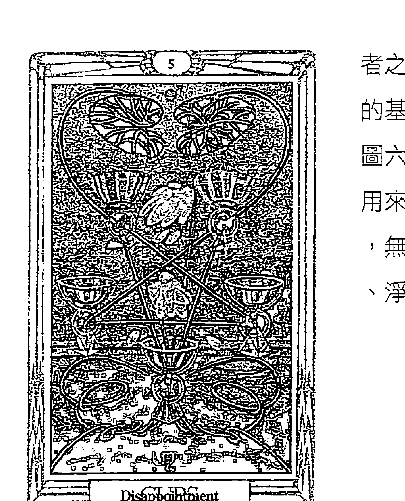

### 描述

五盞聖杯排列成倒轉的五角星形，牌面中央的兩朵蓮花正在凋萎，也不曾流溢出水來。
「Geburah」和火星的「火」壓倒了這張牌中「水」象的元素。蓮花的花莖呈紅色，花朵乾枯，垂頭喪氣；後方的天空泛著火焰般的橘紅色。杯盞雖為藍色，即「水」元素的色彩，但杯中的水卻已蒸乾。

牌中的聖杯形似「金色黎明會」的「籌備者之杯」（the Cup of Stolistes），有著正方形的基座、球狀的杯柄，以及新月形的杯盞（見圖六）。此杯在「金色黎明」的儀式中，乃是用來淨化神殿和執事人員。五只杯盞都是空的，無法執行其功能；杯中沒有水可被用來洗滌、淨化，而下方的水又因為腐敗而污濁不堪。

圖六・籌備者之杯

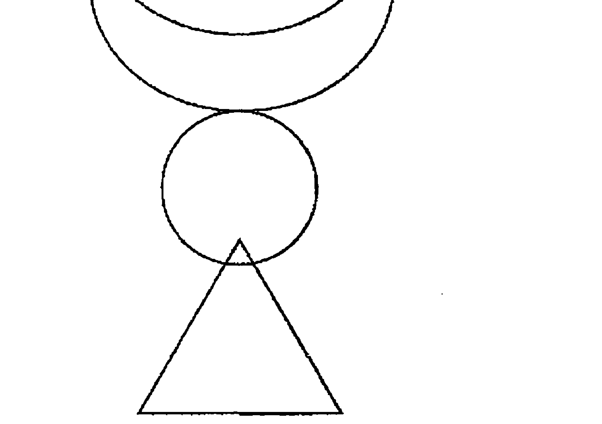

那倒轉的五角星，意味著「靈」被其他四種元素所壓制，也傳達著相同的概念。

火星是天蠍座的守護星，是此牌中「火」與「水」之間唯一和諧的關係。綠灰色的水暗示天蠍的「腐敗分解」作用，而泛紅的波紋則指出火星的熱度（與腐敗作用有關）。火星的符號也透露了這份和諧的關係，它被繪成藍色和橘色，乃是「水」元素的閃耀色彩。

### 牌意詮釋

失望。歡樂的終結。壞運道。最意料不到的騷亂。友誼或關係的喪失或終結。悲傷。來自意料之外源頭的麻煩。也可能意味欺騙、背叛，或惡意。

### 逆位牌

情感上的穩定。適應的本領。克服橫逆和焦慮的決心與毅力。

## 聖杯六

### 標題
享樂（Pleasure）

### 喀巴拉屬性
「Tiphareth」在「Briah」

### 星座屬性
太陽在天蠍座

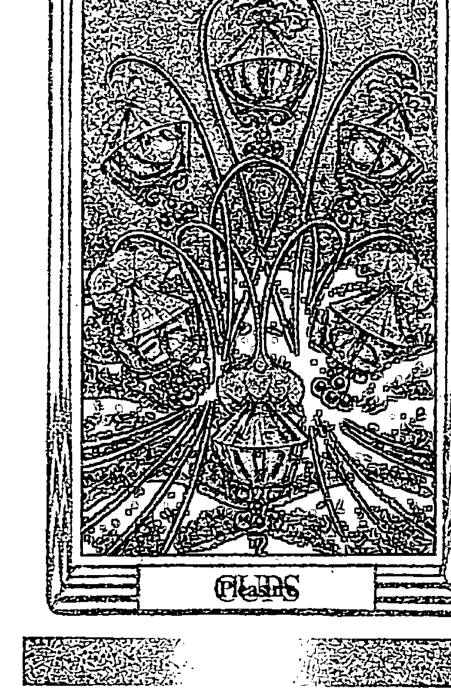

### 描述

六只杯盞排列成六芒星形，太陽位居中央，是一種以「生命之樹」為基礎的配置方式。蓮花呈黃色，即「Tiphareth」在「Briah」的色彩，而杯盞也是以太陽的色彩繪製。水並沒有從杯中流溢出來，而彷彿像是在杯中迴旋著。

聖杯的基座係由五顆小球組成（第五顆並未顯露出來，但為保持平衡所必需），暗示著火星；小球之上是牡羊座的星座符號，兩者共同構成聖杯的基座。「火星在牡羊」是「權杖二」的星座屬性，該牌的標題為「統轄」（Dominion），暗示「聖杯六」所象徵的歡樂，終極來自於「權杖二」之能量的確立和導引。

「聖杯五」中腐敗、分解的海水現在變成藍色，且洋溢著生機。太陽帶出天蠍較為正面的特質：熱情，慾望與享樂。牌面底部明顯可見的十條蓮花莖，暗示這份歡樂有著物質的源頭，喚起與天蠍相關的強烈肉慾之聯想。

### 牌意詮釋

享樂的開始。此牌所指的享樂乃是緣於自然力量的和諧，而不必然是慾望的滿足。樂觀。性意願的滿足。

### 逆位牌

享樂受到擾亂，通常是由於問卜者的行為，但此騷擾的真正本質需由周圍的牌界定。犧牲他人而獲得的享樂。

## 聖杯七

### 標題
墮落(Debauch)

### 喀巴拉屬性
「Netzach」在「Briah」

### 星座屬性
金星在天蠍座

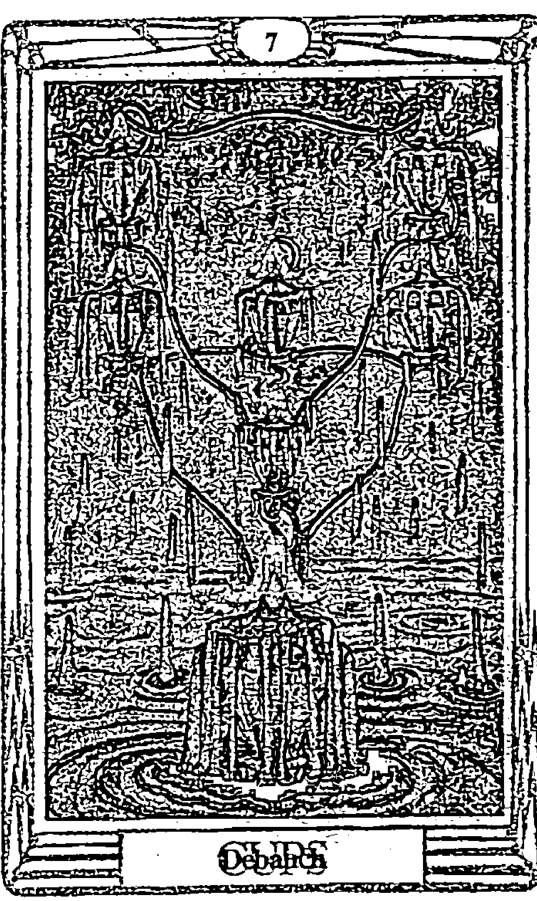

### 描述

七只杯盏排列成兩個下降三角形,重疊在一只較大的杯盏上方。此種型態暗示著「深淵」之下的「生命之樹」——隔絕於天界之「Binah」的影響,因此牌面底部的大海是污濁而有毒的。蓮花似乎染病了,滲出翠綠色的污泥,即「Netzach」在「Briah」的色彩。

金星的符號呈藍色,為「水」元素之原色;天蠍座的符號則為暗沉的靛褐色,即「Scorpio」在「Assiah」的色彩,代表天蠍最為低下的特質。金星在天蠍是為「落陷」,暗示此行星的感性本質未能被表現,而因貼近天蠍較為陰暗的一面,遭到敗壞而隱匿了。逐漸變暗的天空和即將來臨的暴風雨,預示著伴隨此種壓迫而來的情感與能量,正不祥地積累著。

最後,請留意那污濁海面上的漣漪呈紫羅蘭色,即「Yesod」(月亮)在「Briah」的色彩,而月亮在天蠍亦為落陷。此牌之中真正的毒素,乃是天蠍之墮落與腐敗的元素。

### 牌意詮釋

歡樂的敗壞。妄想與錯覺。虛幻的成功。說謊。欺騙。詭詐。酗酒或濫用藥物。未獲實現的承諾。或許也意味某種情感關係中的肉慾、廉價的性愛,或是暴力。

### 逆位牌

鬆弛。放鬆和放手。暫緩。假期。為減壓並充電而叫停。

## 聖杯八

### 標題
懶散（Indolence）

### 喀巴拉屬性
「Hod」在「Briah」

### 星座屬性
土星在雙魚座

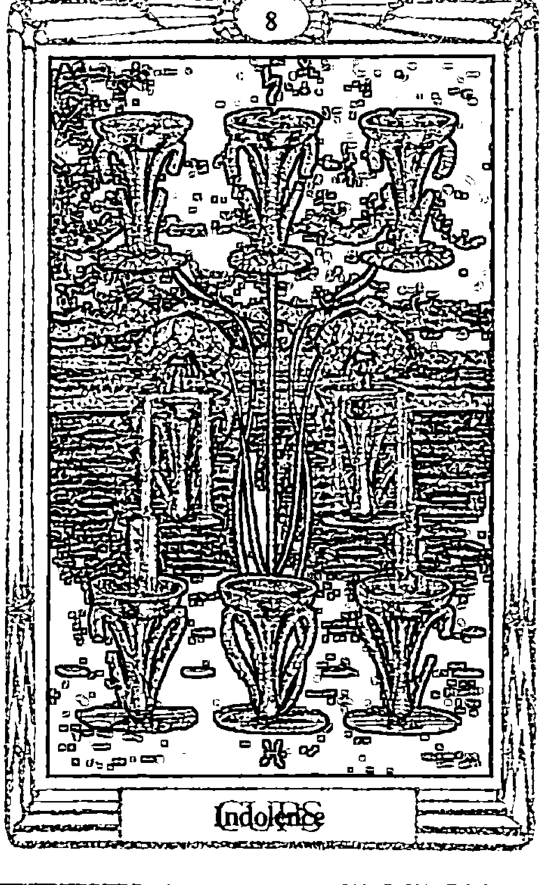

### 描述

牌中的杯盞破損缺角，基座窄小而不穩。最上排的杯盞空空如也，兩朵病懾懾的蓮花溢出水來，注入中央的兩只杯子；水滿溢出來，注入最底下的兩只杯子，但是下排中央的杯子仍是空的，另外兩只杯子則還不到半滿。

污濁的小水坑散佈在荒瘠的大地上，杯盞則立於水坑之中。上方是靛藍色的陰雲，即土星在「Atziluth」的色彩。土星沈重地壓制著雙魚，後者原本就傾向於遲滯怠惰；尤有甚者，水星（Hod）在雙魚亦為「落陷」，因此在這張牌中，水星的能量和速度受到了壓抑。唯一救贖的希望是地平線上的黃色光芒，它象徵著「Tiphareth」的能量，為克服土星的惰性所必須。

### 牌意詮釋

由於怠惰（懶散）而放棄的成功。疾病。苦難。對任何事物的興趣都減退。四處漂蕩。沮喪。情感上的不滿足。缺乏創意。空虛。不滿。思想或情感的遲滯。自殺。放棄。不孕。

### 逆位牌

動機、動力。自保。創造性的衝動。審慎的樂觀。改進的潛力。

## 聖杯九

### 標題
快樂（Happiness）

### 喀巴拉屬性
「Yesod」在「Briah」

### 星座屬性
木星在雙魚座

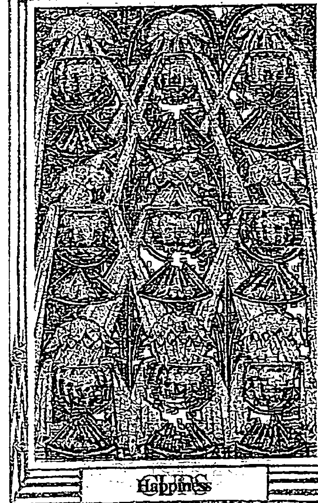

### 描述

清水從九朵蓮花中注入九只杯盞，滿到流溢出來。杯盞呈紫羅蘭色，即「Yesod」與木星在「Briah」的色彩。九只杯盞排列成方形，那是歸屬於木星的形狀，意味著穩定與顯化。

木星是雙魚座的守護星，容許生長與擴展。天空為藍色，即木星在「Briah」的色彩，指出此一行星擴張的本質。杯盞佇立在雙魚的寧靜水面上，「Yesod」則帶出「月亮」的影響力，強調「水」元素歡樂而富創造性的面向。

木星與雙魚的符號係以紫羅蘭和緋紅色繪成，為兩者在「Atziluth」的色彩。

### 牌意詮釋

完全實現或體驗到的歡樂與幸福。感官感受。

### 逆位牌

過度耽溺。未實現的幸福。對快樂或歡樂的自我克制。

## 聖杯十

### 標題
饜足(Satiety)

### 喀巴拉屬性
「Malkuth」在「Briah」

### 星座屬性
火星在雙魚座

### 描述

十只杯盞以「生命之樹」的形態排列,背景中錯綜複雜的蓮花莖構成了「薩弗洛斯」之間的路徑,而杯盞本身便是「薩弗洛斯」,其中的「天界三角」置身於頂端巨大的蓮花之中。蓮花最高的花瓣,為「Kether」位置的杯盞注滿了水,而它再將清水注入下方所有的杯盞中。位於中柱的杯盞全都滿溢了出來。

火星的占星符號位於「Kether」之杯上,帶出此一行星最高且最具靈性的特質。從「Kether」之杯流出、並越過「深淵」的水流共有五股,暗示火星之靈性力量的傳遞與顯化。牌面底部的雙魚符號被「水」浸濕,即其本然的元素,而「Malkuth」則更進一步為此牌的能量帶來穩定性。

牌面的背景係以火星系的色彩繪成。蓮花的輪廓呈鮮明的猩紅色(「Geburah在「Yetzirah」),花莖為猩紅色(「Geburah」在「Briah」),而天空則是橘色(「Geburah」在「Atziluth」)。只有「Geburah」在「Assiah」的色彩——火星的紅,灑著土元素的黑斑——未曾出現。此種安排指出,火星最低且最具物質性的特質並未被表現在這張牌中。

最後請思考,火星火熱的驅力不僅可以活化雙魚的平靜與遲滯,也能提供「黃道之輪」所需的動能，推動它由雙魚進入牡羊——後者是由火星所守護，代表春天的肇始。牌中的杯盞形似牡羊座的占星符號，彷彿是要指出此種變遷。

### 牌意詮釋

完全而持續的成功。事務如願地安排、解決。和解。

### 逆位牌

成功的瓦解，有時是暴烈的。消耗、浪費。枯竭、耗盡。對抗、競爭。來自下方的攻擊。

## 寶劍王牌

### 標題
風之力量的根源 (The Root of the Powers of Air)

### 喀巴拉屬性
「Kether」在「Yetzirah」

### 四字母聖名屬性
Vau

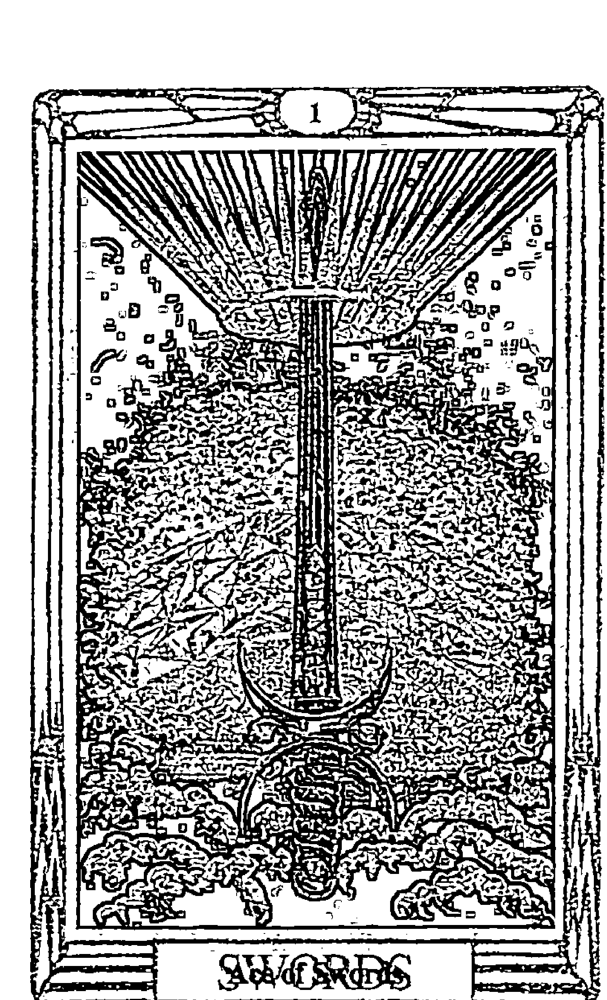

### 描述

聳立於牌面的寶劍乃是「魔法師的巨劍」(the Great Sword of the Magician)，劍柄係以銅（金星）鑄，而劍刃則為精鋼（火星）打造。劍身呈綠色，為黃（太陽）與藍（水）的混合色。劍柄端正地安置於「Tiphareth」的「太陽」之中，而其頂端的圓球，則是後方正在升起的日輪之中心點。一條蛇在劍柄上纏繞了六圈，亦指涉著「Tiphareth」和「Vau」。寶劍的護手係由兩彎新月構成，平衡著太陽的能量。

劍刃上鐫刻著「Thelema」（泰勒瑪）的字樣，即「意志」。「寶劍」牌組代表心智或「Ruach」，但是「魔法師的巨劍」則象徵「真正的意志」（the True Will）。劍尖刺穿了「Kether」的王冠，其色彩為外白內黃，指出神（Kether）與求道者（Tiphareth）之間和諧的關係。

背景中，太陽正在水面升起，意味著「火」與「水」的結合正在顯化為「風」。寶劍的力量燒融了雲霧，為心智帶來澄澈與光明。在牌面頂端，我們可以看見綴著星星的夜空，即「努特」的身軀。

### 牌意詮釋

引發而來的力量（相對於「權杖王牌」的自然力量）。代表意志或心智所帶來的為善或為惡的強大力量。

### 逆位牌

暗示實現相位良好時的詮釋之舉措受到阻礙，周圍的牌或許會界定出受阻的方式。

## 寶劍二

### 標題
和平（Peace）

### 喀巴拉屬性
「Chokmah」在「Yetzirah」

### 星座屬性
月亮在天秤座

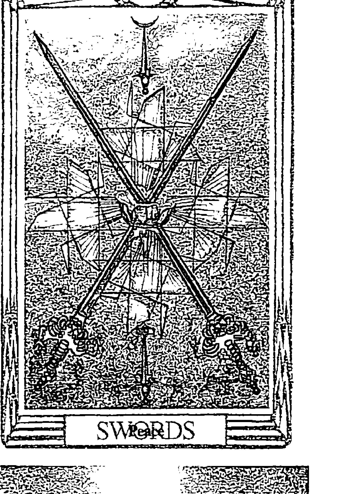

### 描述

兩柄寶劍相互交叉，結合於一朵藍色薔薇之中；牌面頂端有個月亮符號，平衡於一柄匕首上，牌面底部還有另一柄匕首，支撐著天秤座的符號。月亮暗示著安詳與平和，而天秤座則為此牌帶來更進一步的平衡。兩柄寶劍的護手都是由和平的象徵所構成——鴿子和屈膝祈禱的天使。

薔薇的顏色是「Chokmah」在「Yetzirah」的藍珍珠灰色。對應於「Chokmah」的「喀巴拉靈魂部份」是「Chiah」，即「真正的意志」，它是維持這張牌的平衡之一切驅力背後的力量（註70）。

牌面的背景是亮黃綠色，係「Netzach」在「Yetzirah」的色彩。出現在「寶劍」牌組背景中的幾何圖形是「卍」字符號（swastikas），代表「風」元素恆常不斷的活動。

### 牌意詮釋

和平。恢復的和平。某種情境之中情感面與理智面的平衡。和諧。

### 逆位牌

遲滯。猶豫不決。和平的終結。平衡的瓦解，尤其是在理智與情感驅力之間的平衡。

> 註70. 見「權杖二」。

## 寶劍三

### 標題
悲傷（Sorrow）

### 喀巴拉屬性
「Binah」在「Yetzirah」

### 星座屬性
土星在天秤座

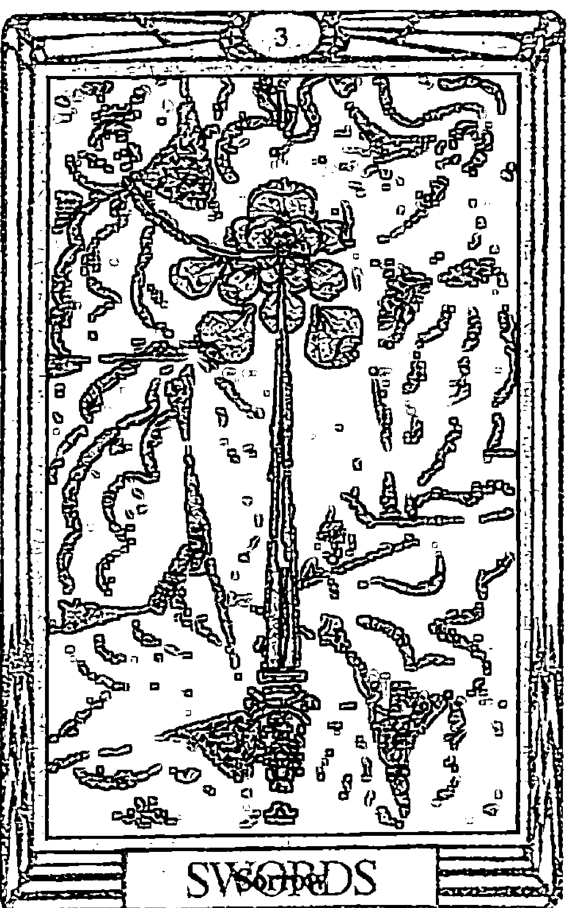

### 描述

來自前一張牌的薔薇被寶劍斬碎了。牌面下方的寶劍形似「寶劍王牌」中的「魔法師的巨劍」，但它的護手卻短了許多，劍刃尖銳得多，也並未鐫刻「泰勒瑪」（Thelema）的字樣。這是「魔法師巨劍」較為低劣的版本，它將薔薇固定住，而上方那兩柄短劍則將花兒斬碎。這三柄寶劍都泛著天秤座的綠色。

土星廟旺於天秤座，但是「Binah」的影響力卻以土星的能量淹沒了這張牌，將它沈沈壓下，帶來限制與束縛。在此，「Binah」成了「埃瑪」（Ama），即「黑暗貧瘠的母親」（the Dark Sterile Mother），由背景中那起著風暴的漆黑海面所象徵。

此牌誠然是「悲傷之恍惚」（the Trance of Sorrow）的圖像符號。此種境地必須被實現，方能走上通往「Binah」中之「Neschamah」（即靈魂四部份中的第三部份「靈魂直覺」）的道路。再明顯不過，在這張牌中，「Neschamah」的直覺與智能尚未被實現。

### 牌意詮釋

悲傷。瓦解。分離。憂鬱。不快樂。淚水。

### 逆位牌

忠貞。誠實。歡唱。

## 寶劍四

### 標題
休戰（Truce）

### 喀巴拉屬性
「Chesed」在「Yetzirah」

### 星座屬性
木星在天秤座

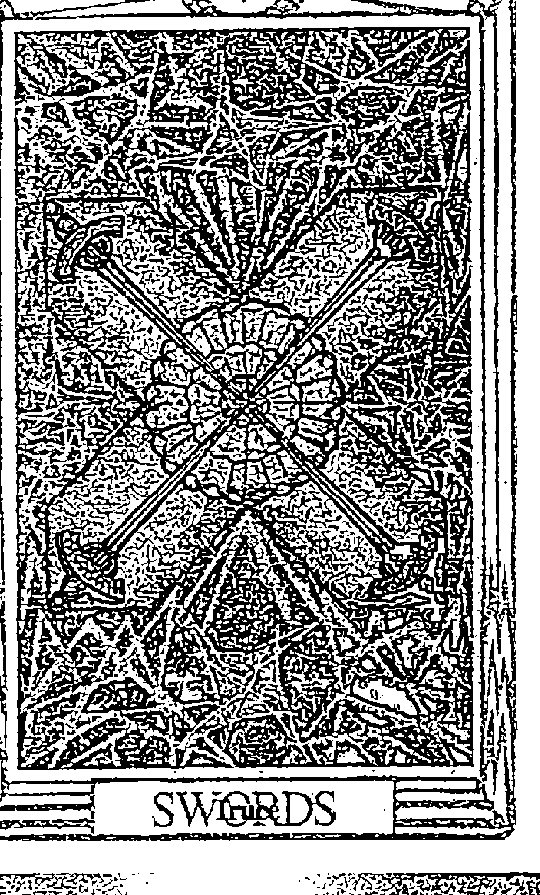

### 描述

四柄寶劍對稱排列於綠色的「聖安德魯十字」（St. Andrew's cross）之上，尖端插入一朵四十九瓣的薔薇（註71）。每柄寶劍的護手上都有一個圖案，各自代表四元素中的一個：波浪代表「水」，火焰代表「火」，某種不規則的圖案暗示「風」的活動，而圓盤則代表「土」。

那綠色的十字狀似「薔薇十字」，其色彩為天秤座的綠色。四十九瓣（七乘七）的薔薇代表社會的和諧，而它同時也是金星（天秤座的守護星）的神祕數字。薔薇亦是「靈」的象徵，此處，「靈」運用了「Chesed」（慈悲）與「Gedulah」（愛）的力量，結合了四種元素（四柄寶劍）。

牌面背景呈木星與「Chesed」的藍色，突顯出黃色的光芒，以大略對稱的模式凸出尖角。黃色代表此一牌組的風象屬性，兩個占星符號則以深紫色繪成，即「Chesed」在「Yetzirah」的色彩。

### 牌意詮釋

常規。妥協。止息紛爭。從心理的混亂中尋得庇護。從病中康復。戰爭之後的和平。焦慮的緩解。可能是暫時的狀況，需視周圍的牌而定。

### 逆位牌

困境、僵局。受迫的妥協。暫時的停戰、休養生息，或和平；將會很快再啟爭端。

> 註71. 「聖安德魯十字」（the St. Andrew's cross）係由使徒安德魯得名，他自認不配被執刑於與基督相同的十字架上，而要求在斜對角（X）形的十字架上殉教。

## 寶劍五

### 標題
挫敗（Defeat）

### 喀巴拉屬性
「Geburah」在「Yetzirah」

### 星座屬性
金星在水瓶座

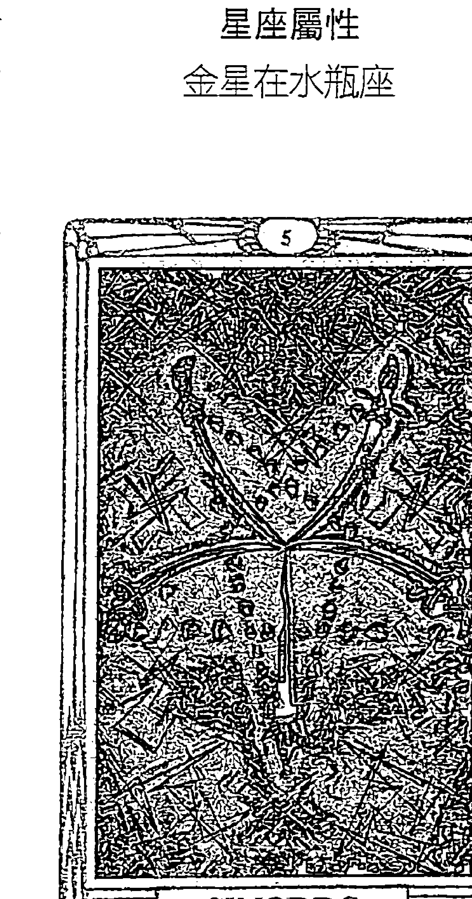

### 描述

前一張牌中的薔薇已經完全被寶劍斬碎，花瓣也由白色轉為亮猩紅色，即「Geburah」在「Yetzirah」的色彩。碎落的花瓣排列成一個倒轉的五芒星，寶劍的劍柄構成星形的尖端，劍尖則在五芒星中央交會。

最下方寶劍的劍柄上有個王冠，代表「靈」。倒轉的五芒星象徵「靈」被其他四種元素壓制，因此這柄「靈寶劍」的劍刃有所缺損。其餘四柄寶劍亦各自歸屬於一種元素：劍柄上的綠蛇代表「土」，魚代表「水」，紅色的劍柄代表「火」，而最後一支劍柄上鑲有數字「6」，即「Tiphareth」與「Vau」之數，代表「風」元素。

金星在水瓶座的位置並不甚佳，水瓶之個人主義而冷靜淡漠的本性，與這顆掌管人際關係的行星有所牴觸。心智之劍斬碎了薔薇，即「愛與情感」的象徵。金星被火星（Geburah）的火熱能量所壓制，因此其行星符號係以閃爍之「火」的色彩繪成，即綠（金星）與紅（火星）。

牌面的背景暈染著金星的綠色，以及水瓶座在四個喀巴拉世界的色彩：紫羅蘭；天藍；泛藍的淡紫色；以及染紫暈的白色。

### 牌意詮釋

挫敗。軟弱。失敗。對一方不利的衝突。損失。在人際關係中，它可能意味著惡意、怨恨、詆毀，或侮辱。

### 逆位牌

悲傷。哀悼。從挫折或失敗中恢復。某種情況的餘波、餘累。

## 寶劍六

### 標題
科學（Science）

### 喀巴拉屬性
「Tiphareth」在「Yetzirah」

### 星座屬性
水星在水瓶座

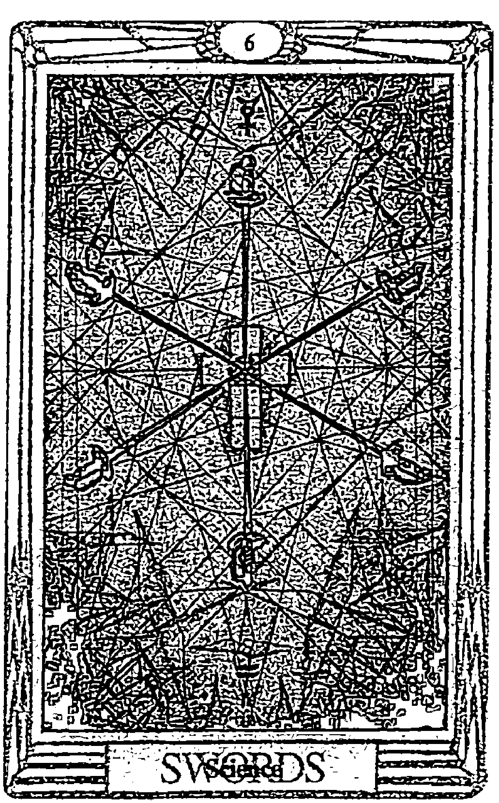

### 描述

六柄寶劍排列成一個圓圈，劍尖交會於中央的「薔薇十字」。寶劍的劍柄分別呈現各條行星路徑在「Atziluth」中的色彩：黃色為水星，紫羅蘭色為木星，藍色為月亮，靛藍色為土星，猩紅色為火星，而翡翠綠則為金星。由六個正方形構成的金色十字代表「太陽」，為這六柄「行星寶劍」帶來了平衡。「薔薇十字」象徵大宇宙和小宇宙的合一，亦即「偉大工作」的完成。

「Tiphareth」乃是「Ruach」的座席，即有意識的心智。這張牌顯示「Ruach」的機能完全被實現，與連結於各個行星之「薩弗洛斯」的其他喀巴拉靈魂部份和諧運作。水星廟旺於水瓶座，強化了此牌的智性特質。牌中的兩個占星符號均呈紫羅蘭色，即「Hod」（水星）與水瓶座在「Atziluth」的色彩。

哈利斯夫人曾為文解說此牌背景中奇特的圖案：「〔那些寶劍〕係陳列於擊劍師的圖形（十四世紀）之上，此圖經過科學地設計，顯示擊劍者可以站立而不被擊中的位置。」（註72）

### 牌意詮釋

達成目標的才智。勞心的工作。焦慮或苦惱之後的成功。耐心。可能也指水路或空中的旅行。

### 逆位牌

智識上的傲慢。自負。將非科學的問題理智化。

> 註72. 華瑟曼（Wasserman），《艾利斯特·克勞利之托特塔羅指南》（Instructions for Aleister Crowley's Thoth Tarot Deck），47。

## 寶劍七

**標題**
徒勞（Futility）

**喀巴拉屬性**
「Netzach」在「Yetzirah」

**星座屬性**
月亮在水瓶座

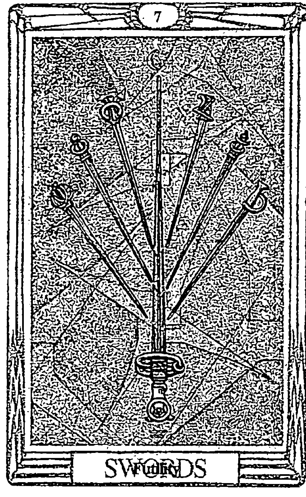

### 描述

六柄寶劍排列成彎月形，劍尖向下，對抗著一柄較大的寶劍。這些寶劍的劍柄係由行星符號構成，而那柄大劍則鑲著太陽的符號。

較大的寶劍代表在「Tiphareth」中的「Ruach」，正在對心智的其餘部份（由行星符號代表）施加壓力。金星、火星、木星和水星代表「Ruach」的其他元素；土星則是「Neschamah」（靈魂直覺），為通往崇高元素的鏈結；而月亮（由鑲有新月狀圓環的劍柄所象徵）則代表「Nephesch」，即「動物靈魂」。這種徒勞的爭鬥是由情緒所驅動，係來自「Netzach」和月亮的影響，蒙蔽並扭曲了水瓶與「Yetzirah」的智性特質。太陽在水瓶座是為「落陷」，這也進一步弱化了「Ruach」。

牌面的背景是冷調的淺藍色，即月亮在「Yetzirah」的色彩，而寶劍則呈染著紫暈的白色，為水瓶座在「Assiah」的顏色。不同於其餘的「寶劍」牌，「寶劍七」背景中的「卍」字符號呈不對稱排列，象徵無秩序和不穩定。

### 牌意詮釋

不穩定的努力。搖擺、躊躇。努力對抗太過強大的力量。不可靠。一個不可信賴的人。由於缺乏能量而在勝利在望時放棄。也可能是指陸路的旅行。

### 逆位牌

支援。協助。意料之外的幫助。好的建議。

## 寶劍八

**標題**
阻礙（Interference）

**喀巴拉屬性**
「Hod」在「Yetzirah」

**星座屬性**
木星在雙子座

### 描述

兩柄較長的寶劍構成了其餘六柄短劍的柵欄，示現了這張牌的標題：「阻礙」和「縮減的力量」（Shortened Force）。《托特之書》一一標示了這些短劍的名稱，分別是馬來西亞的波紋短劍（kris）、廓爾喀的曲刀（kukri）、撒克遜的獵刀（scramasax）、匕首、中南美洲的大砍刀（machete），以及土耳其的彎刀（yataghan）。它們並非真正的寶劍，而多半可被描述為「刀」（註73）。這再一次暗示了「縮減的力量」之概念。

木星位於雙子座是為「落陷」，雙子好奇好問的天性妨礙了這顆「擴展之星」。寶劍後方的星座符號和「卍」字符號分別繪成了藍色和橘色，是「水」元素的閃爍色彩。這暗示「阻礙」的根源乃是情緒性的，因為不受控制或激烈的情感可能會對理性思考造成障礙。

### 牌意詮釋

限制。干擾。對細節的注意妨礙了更重要的事物。缺乏持續性。未曾預見的厄運。問卜者道途上的障礙。情感阻礙了理性思考。

### 逆位牌

障礙。干擾，諸如此類，如上所述，但比較容易克服。

> 註73. 克勞利，《托特之書》，207。

## 寶劍九

**標題**
殘酷（Cruelty）

**喀巴拉屬性**
「Yesod」在「Yetzirah」

**星座屬性**
火星在雙子座

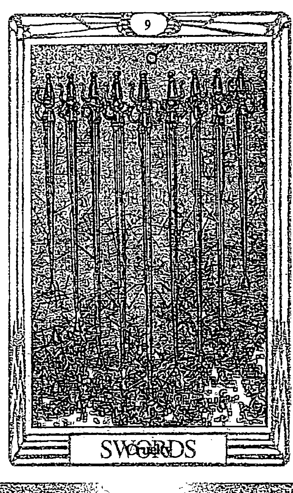

### 描述

九柄長短各異的寶劍一字排開，劍尖向下，滴著鮮血。一滴滴黃色的毒液從天而降，隨著毒液和血滴的下降，牌面的背景變得越發陰暗、駭人。

那些缺損不平的劍刃呈火星的紅色。劍刃上坑坑疤疤的鏽蝕是「鐵」的衰敗，又是火星的另一項屬性。劍身滴下的血珠，強調著痛苦與受難的概念。在雙子座中，火星那殘酷、侵略性的能量，壓倒了「Yesod」與月亮較為被動而具接受性的能量。「Yesod」是「Nephesch」的座席，即人類的「動物靈魂」，也就是不利於理性的原始情緒和慾望。

火星的符號呈紅色，而雙子座的符號則繪成閃爍的綠色。毒液是在寶劍後方降下，而非從劍刃滴落。毒液消失處，血滴開始滴落，暗示正是那毒液（象徵怨毒與殘酷）導致了淌血的苦痛。

### 牌意詮釋

絕望。殘酷。苦難。痛苦。損失。疾病。壓迫、重擔，或恥辱帶來的痛苦。

### 逆位牌

一樁需要學習的痛苦教訓。悲痛、絕望、殘酷或苦難正在緩解或減輕，但卻尚未結束；所處情境將不會結束，只會好轉，至少是暫時的。

## 寶劍十

**標題**
毀滅（Ruin）

**喀巴拉屬性**
「Malkuth」在「Yetzirah」

**星座屬性**
太陽在雙子座

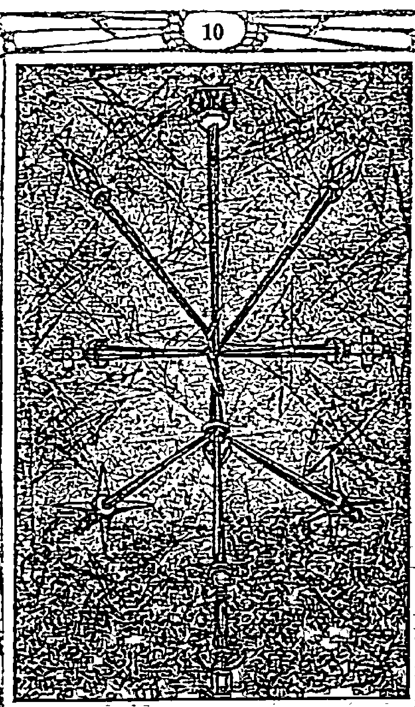

### 描述

十柄寶劍的劍柄以「生命之樹」上十個「薩弗洛斯」的形態排列，其中九柄寶劍摧毀了中央的「Tiphareth」之劍。

上方的五柄寶劍負責擊碎「Tiphareth」之劍，而在研究它們之間的關係時，我們可以發現某種有趣的模式。「Chesed」和「Geburah」位置的兩柄寶劍，劍柄都是一個「Tau」十字，乃土星之象徵。「Chokmah」與「Binah」位置的劍柄則是沙漏，象徵時間，因此也代表土星。「Kether」位的劍柄是一具天平，是天秤座的象徵，而土星廟旺於此。這暗示土星最具毀滅性的元素都在此運作著：限制，消沈，貧乏，衰老，以及死亡。

下方的四柄寶劍則將「Tiphareth」之劍固定住。「Hod」與「Netzach」之劍的護手都有四個尖釘，顯示與其上方「Tau」十字相同的土星影響力，強調著限制與束縛。「Yesod」之劍的劍柄中央有個太陽符號，而「Malkuth」之劍的劍柄則鑲著一個五角星（人的象徵）和一彎新月。意識已被推擠入無意識的幽暗領域，而無意識的衝動已然浮出表面。

「Tiphareth」之劍所放射出的十道黃白光芒，指出發生在這張牌中的「毀滅」之實質顯化。牌面的背景為火熱的橘紅色，上有紅色的「卍」字符號，均為火星的色彩。在古代的占星術中，火星被稱為「小災星」（Lesser Malefic），而土星則被稱為「大災星」（Greater Malefic）；兩者都將其不祥的兇性授予了此牌的能量。

### 牌意詮釋

理智與現實分家。失敗。災難。肉體的死亡。在靈性上，可能意味著妄想的終結。

### 逆位牌

死裡逃生。與死神擦肩而過。明白「人皆有死」的宿命。躲過悲劇，但卻付出了重大的代價。

## 圓盤王牌

**標題**
土之力量的根源（The Root of the Powers of Earth）

**喀巴拉屬性**
「Kether」在「Assiah」

**四字母聖名屬性**
最後的「Hé」

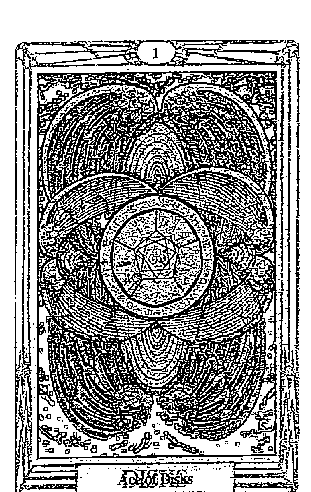

### 描述

圓盤的外緣刻有「大佘利昂」（To Mega Therion）的字樣，即希臘文「偉大的野獸」，也就是艾利斯特·克勞利作為魔法師的銘言。克勞利自認是《啟示錄》中的「野獸」，同時也是《律法之書》中的「野獸」。

圓盤中央是「野獸標記」（the Mark of the Beast），由三個圓圈組成，形似鳥瞰角度的陰莖和睪丸。那三個圓圈係以「Tiphareth」的黃色繪製，強調與太陽的連結；圓圈中央有個白色新月狀的月亮符號，平衡著太陽的能量。睪丸之內以紅字書寫著「666」，此乃「啟示錄的野獸」之數字，也是「佘利昂／野獸」（Therion）這個字在希臘字母代碼系統中的數字值。「六」為太陽之數，而「666」則是「太陽魔方陣」（the Magical Square of the Sun）中所有數字的總和。

「野獸標記」銘刻在七道光芒的「巴巴隆之星」當中，陰莖和睪丸被安置於由這星星構成的子宮之內。兩者合起來，成為「巴巴隆」與「野獸」之合體的圖像符號，即「泰勒瑪」的陰陽原型，結合於創造的行動中。

一個十邊形圍繞著這個符號，象徵「Malkuth」，顯化的王國。這個十邊形有如車輪的輪軸，計有十根輻條，暗示此牌組符號（圓盤）持續不斷的運轉與活動。輪圈的內部呈鮭魚紅色，為「Tiphareth」在「Yetzirah」的色彩，輪子的邊框為「Tiphareth」在「Briah」的金黃色，而「大佘利昂」（To Mega Therion）這幾個字則以「Tiphareth」在「Assiah」的金琥珀色鐫刻在輪圈上。

圓盤後方有兩個半透明的褐色橢圓形，意味著「林迦」（lingam）與「尤尼」（yoni）——即陽與陰——的結合。此一圖形被四對翅膀所承載，而它們又被背景中的兩對翅膀屏障著。這些翅膀被繪成「土」元素的綠色，點綴著太陽的黃色斑紋。翅膀象徵「Kether」的賜福，以及「土」元素的靈性昇華。

### 牌意詮釋

「靈」顯化為一切意義上的純粹物質主義。實質的創造與構想。靈性與物質世界的連結。這張牌很大程度上受到相位的影響，通常表現為損失或獲益。

### 逆位牌

暗示實現相位良好時的詮釋之舉措受到阻礙，周圍的牌或許會界定出受阻的方式。

## 圓盤二

**標題**
變化（Change）

**喀巴拉屬性**
「Chokmah」在「Assiah」

**星座屬性**
木星在魔羯座

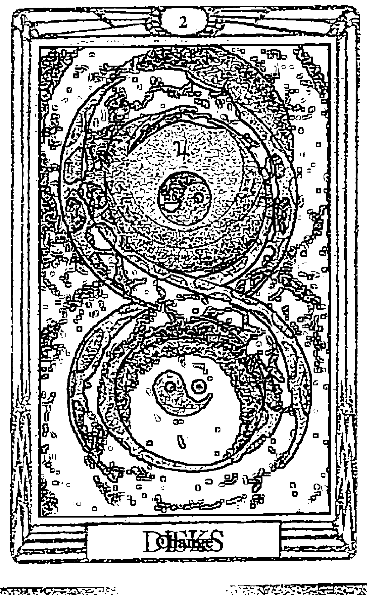

### 描述

這張牌中的圓盤，乃是黑白兩個圓盤上嵌著太極的「陰陽魚」符號，周圍蜷繞著一條戴著皇冠的蛇。

那「陰陽魚」的「眼睛」中刻有「火土風水」四元素的符號，繪上相應的元素色彩。兩個太極符號的上半部分別繪成綠灰和梅紅色，乃是處女座在「Yetzirah」和「Assiah」的色彩。處女座對應於「Yod」，為「四字母聖名」投射於「生命之樹」時歸屬於「Chokmah」的字母。兩個太極符號的下半部均為黃色，即水星在「Atziluth」的色彩。

蛇身的兩個環圈容納著相對的驅力：陰與陽、積極與消極的元素、黑白圓盤、木星的靈性熱忱與魔羯之世俗的物質主義。那蛇體現了兩極之間恆常的變動——變化即穩定。

蛇是「智慧」的象徵，即「Chokmah」的涵義。牠戴著黃色的皇冠，為水星在「Atziluth」的色彩。那「水星之冠」有七個尖角，呼應著金星（Netzach），宣示其本質為「愛」，相對於那條蛇本身所象徵的「意志」。為達此目標，蛇身裝飾著八邊形的斑點或鱗片，因為「八」乃是水星（Hod）之數，連結著作為「宇宙之理法」（Logos）的「Chokmah」，而「荷魯斯紀元」的宇宙理法便是「泰勒瑪」——「意志」。

魔羯座的符號係以綠灰色繪成，而木星符號則呈梅紅色，即處女座在「Yetzirah」和「Assiah」的色彩。牌面背景為紫羅蘭和靛藍色，即木星與魔羯在「Atziluth」的色彩。

### 牌意詮釋

和諧的變化。交替、輪替（得與失，弱與強，興高采烈與消沉憂鬱，諸如此類）。旅行或漫遊。

### 逆位牌

不和諧的變化。帶來負面結果的改變。前後矛盾，無一貫性。努力時缺乏焦點。

## 圓盤三

**標題**
工作（Work）

**喀巴拉屬性**
「Binah」在「Assiah」

**星座屬性**
火星在魔羯座

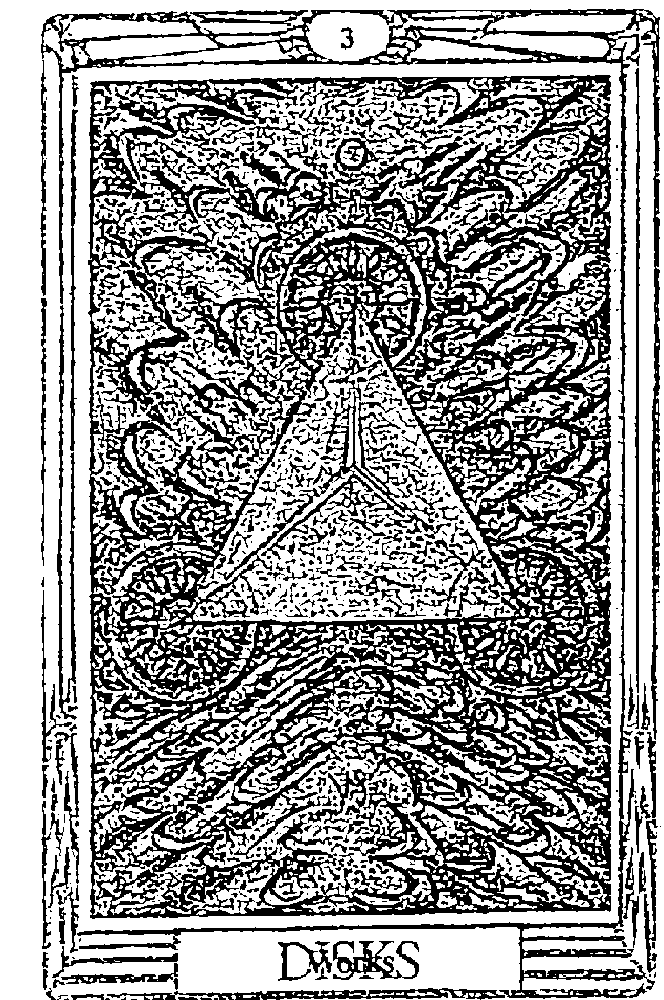

### 描述

此牌中的圓盤是三個輪子，構成金字塔的基座。輪子呈火星的紅色，展現能量與行動。火星廟旺於魔羯座，為這張牌貢獻了建設性的能量。輪軸上標示著煉金元素「汞」、「硫」和「塩」的符號，這三種煉金原則均等而平衡，共同和諧地投射出那座金字塔。

金字塔的顏色趨近於白色，點綴著紅、藍、黃色的斑紋，即「Chokmah」在「Assiah」的色彩。在此，驅力開始凝聚成形。那金字塔只是某種投影，因為真正的實體只會在「深淵」之下顯化。

由於魔羯座（標示著冬至時節）的影響，「Binah」的大海凍結凝固了。然而，輪子和金字塔周圍的冰，卻因火星的火熱能量而融化了。牌面背景呈靛藍和綠色，分別是魔羯在「Atziluth」，以及「土」元素的色彩。

### 牌意詮釋

商業。建構。物質的創造。支酬的工作。

### 逆位牌

經營不善。在商業事務上的拖延，有時會造成損失。有時是指自私或貪婪。尋求不可能的目標。

## 圓盤四

**標題**
力量（Power）

**喀巴拉屬性**
「Chesed」在「Assiah」

**星座屬性**
太陽在魔羯座

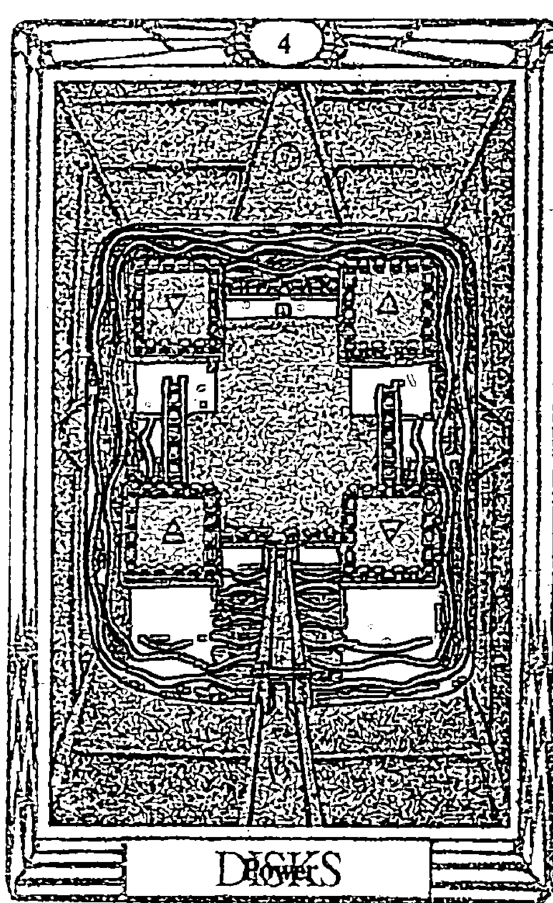

### 描述

此牌中的圓盤是一座碉堡的塔樓，各自標示著四元素之一的符號。那碉堡有四面牆，北、東、西面都有通道，而大門則在南面。每道城牆上都有六座城垛，即「太陽」之數。一條深藍色的護城河圍繞著碉堡，河中有黃色的波紋。遠方的地形暗示，這碉堡乃是構築於一座山丘上。

這張牌中，唯一可被獲取的是物質的力量。在通往碉堡的門戶中，只有南面的大門是開啟的，其道路通往「Malkuth」。路面上的魔羯座（為土象星座）符號更進一步強化此一概念。北方的通道標示著太陽的符號，卻是這座「四元素的碉堡」所無法到達的。背景中的太陽色系，指出了太陽在此牌之中間接的影響力。

護城河呈綴有黃色斑紋的深蔚藍色，是「Chesed」在「Assiah」的色彩。穩定、秩序和律法，皆為「Chesed」這「薩弗拉」的特質。

「圓盤二」也包含了四種元素的符號，在那張牌中，它們是處於恆久不斷的運行和變化中。而在「圓盤四」，它們卻是分離、結構化，且穩定的。

### 牌意詮釋

世俗的力量，除此無他。安全（感），安穩。法律與秩序。經營管理物質驅力的技能。

### 逆位牌

偏見歧視。覬覦貪求。懷疑猜疑。缺乏原創性。

## 圓盤五

**標題**
憂慮（Worry）

**喀巴拉屬性**
「Geburah」在「Assiah」

**星座屬性**
水星在金牛座

### 描述

沿襲「聖杯五」和「寶劍五」的模式，五個圓盤排列成一個倒轉的五角星。印度的「五行」（tattwas）被分派給各個圓盤；代表「靈」的黑卵位於五角星最底下的一角，象徵物質壓倒了「靈」。五個圓盤遮蔽住背景的光源，亦為物質勝過「靈」的又一隱喻。

五個圓盤因緊張壓力而扭曲、變形。它們形似齒輪，但卻被鎖死，無法動彈；運轉的機件卡住了，工作被擱置。水星的速度和流動性衝撞著金牛座的緩慢與固著，更為此牌中的緊張壓力火上添油。「Geburah」的力量，也被金牛與「Assiah」的土象本質沈重地壓制著。

牌中的兩個占星符號係以「水」元素之閃爍色彩（藍與橘）繪成；「風」元素的閃爍色彩——黃與紫羅蘭——更凸顯了圓盤的暗藍灰色。牌中並未出現代表「火」的紅色或綠色，而即使是印度五行中的火元素符號「紅色三角形」也褪成了紫羅蘭色。因此，當「水」、「風」和「土」都被明顯地表現出來，牌面上卻沒有「火」來提供能量，以打破這張牌所象徵的緊張與遲滯。

### 牌意詮釋

伴隨著持續不作為的強烈緊張感，尤其是在心靈事務上。金錢或工作的損失。財務上的焦慮。

### 逆位牌

辛勞。耕種田地。建造。運用於工作的才智。

## 圓盤六

**標題**
成功（Success）

**喀巴拉屬性**
「Tiphareth」在「Assiah」

**星座屬性**
月亮在金牛座

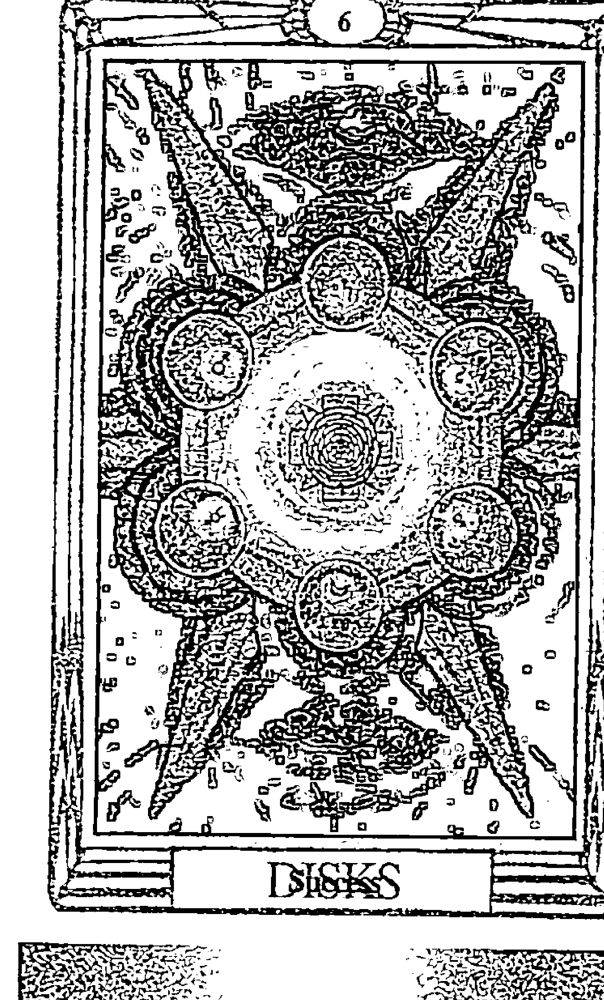

### 描述

六個圓盤排列成六邊形，圓盤之中的行星符號則以「生命之樹」的配置形態排列。六邊形中央是一朵以藍色線條勾勒的薔薇，有四十九片花瓣，重疊在由五個正方形所構成的紅色十字之上，形成一個「薔薇十字」。這個符號被數個圓圈和六邊形環繞，皆呈「Tiphareth」的色彩：清透的粉紅玫瑰色，金黃色，濃鮭魚紅，以及金琥珀色。

這個「薔薇十字」代表「Geburah」（紅色十字）與「Chesed」（藍色薔薇）的能量在「Tiphareth」之域中的整合。此一象徵符號和「金色黎明會」之「小達人儀式」中所使用的「聖棺」（the Pastos）前端的薔薇與十字（見圖七・「聖棺」前端的薔薇與十字）雷同（註74）。依循此例和其他的例子，這個符號後方對角線上的光芒中應該刻有「INRI」的字樣，即「Tiphareth」與太陽的定則。

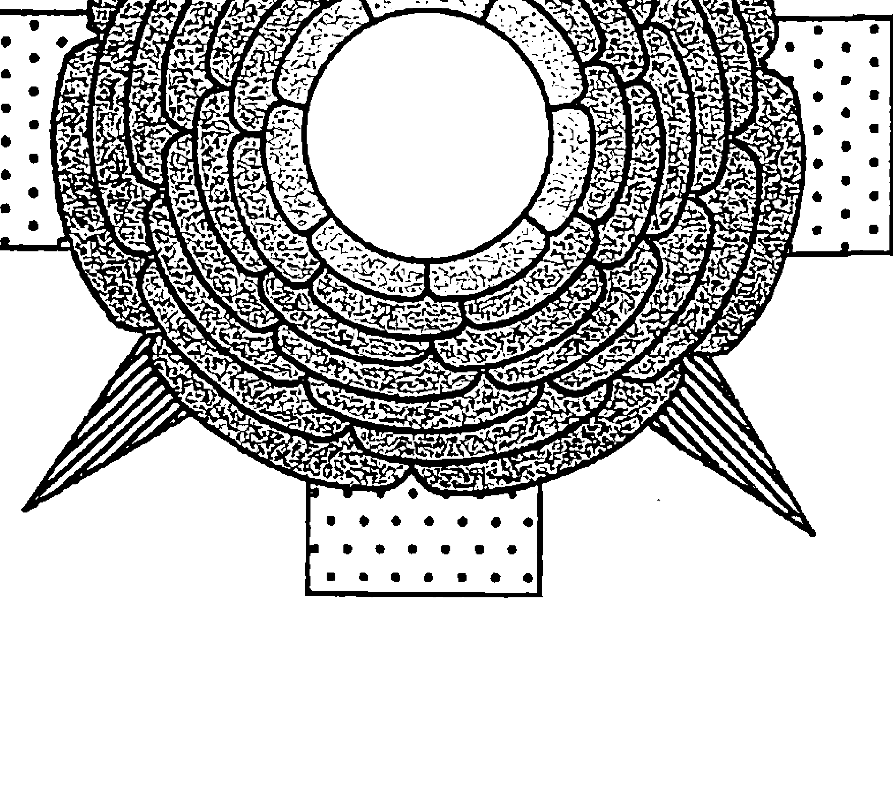

月亮廟旺於金牛座，為此牌帶來了豐饒與顯化。牌中的圓盤呈藍色，乃是月亮在「Atziluth」中的色彩；行星的符號則為橘紅色，即金牛在「Atziluth」。牌面背景係以月亮的藍色調和金牛的棕色系繪成，圓盤交會處迸出六道綠光，則象徵著運作於此牌之中的均衡、豐饒的能量。

### 牌意詮釋

物質事務上的成功和獲益。物質的權力、位階、影響力，或高貴高尚。可能是指慈善的行為。

### 逆位牌

奢侈揮霍。以財富驕人。財務經營上的問題。傲慢。

> 註74. 雷加狄，《金色黎明》，243。

## 圓盤七

**標題**
失敗（Failure）

**喀巴拉屬性**
「Netzach」在「Assiah」

**星座屬性**
土星在金牛座

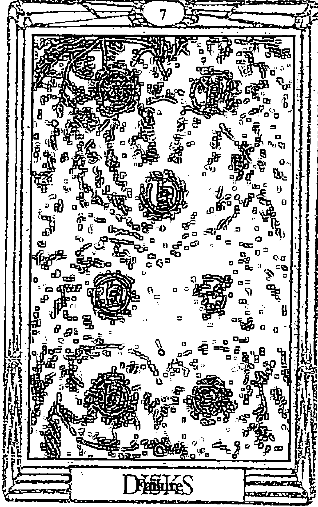

### 描述

七枚圓盤排列成「撒泥占卜」（geomancy，即撒泥於地，觀其形推卜吉凶）中的「Rubeus」圖形，這是此種占卜體系的十六種卦象中最為凶險的。在「撒泥占卜」中，「Rubeus」幾乎在任何狀況下都會為問卜者預示厄運。此外，「金色黎明」亦將「火星在天蠍」的占星相位歸屬於這個卦象（註75）；火星與此牌數字所對應的金星（Netzach）乃是對立的，而金星在天蠍是為「落陷」。

這張牌承載著「土」元素最不討喜的面向。牌中的圓盤都鐫刻著土星和金牛的符號，土星緩慢而限制性的特質，結合遲鈍而重物質的金牛性格，為此牌帶來了惰性与停滯。生命仰賴變化；因此，背景中的植物正在凋萎。土星（Binah）代表「埃瑪」（Ama）女神的影響力，在此，「黑暗貧瘠的母親」擊敗了維納斯（金星，即「Netzach」）的豐饒。

就色彩而言，這是整副牌中色調最為暗沈的一張。圓盤外圍紅與藍（代表陽性和陰性的能量）的環圈褪了色，被橄欖綠與褐色（金牛在「Yetzirah」與「Assiah」）的箍環給窒息了。

### 牌意詮釋

勞多而得少。被放棄的辛勞。成功的指望未能實現。被辜負或粉碎的希望。失望、挫折。奴役。貧困、危急。無法獲利的投機交易。

### 逆位牌

延遲但有成長。慈善，施捨。不期待物質獲益的辛勞。

> 註75 雷加狄，《金色黎明》，526-7。

## 圓盤八

**標題**
謹慎（Prudence）

**喀巴拉屬性**
「Hod」在「Assiah」

**星座屬性**
太陽在處女座

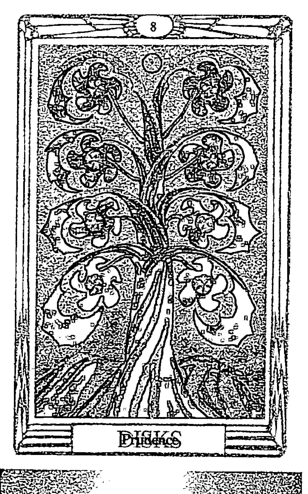

### 描述

一株美樹生長在肥沃的大地上，樹上的花果便是牌中的圓盤。果實呈「Hod」在「Briah」的橘黃色，中央有個綠點，意味著金星（Netzach）的豐饒；花朵則是處女座在「Assiah」的梅紅色。處女座表現著「土」元素最為陰柔的形式，而此星座又連結著「隱士」牌，因而代表「審慎」的美德。處女的守護星為水星，此一行星在「戀人」牌中也曾與「隱士」產生關聯。

每顆果實都劃分為五個區塊，每朵花也都有五片花瓣。「五」是希伯來字母「Hé」的數字，那是「四字母聖名」中的「母親」，連結於大自然與豐饒。整體看來，果實的區塊和花瓣的數目加起來為「十」，乃是「Malkuth」與顯化的數字。

圓盤係以橘色的花莖附著在樹幹上，並被綠色的碩大葉片遮蔽著，如其果實一般反映出「Hod」與「Netzach」之間的平衡。樹幹呈暗藍灰色，為處女座在「Briah」的色彩；背景中的肥沃土壤則暈染著金星與處女的顏色。大樹後方的天空呈黃色，逐漸轉為橘紅，顯示水星與太陽的影響。

處女座的符號被繪成「Hod」的橘色，而太陽的符號則呈梅紅色，中央有個綠點，呼應著樹上的果實，並指出太陽在農耕上至關重要的角色。

## 牌意詮釋

審慎。謹慎。建構、營造。小心。運用於物質事務的才智。農耕。緩慢而穩定的獲益。也可能指狡獪機巧。

## 逆位牌

對小細節投注過多的注意。貪婪。囤積。憂慮。「貪小便宜吃大虧」的心態。

## 圓盤九

**標題**
獲益（Gain）

**喀巴拉屬性**
「Yesod」在「Assiah」

**星座屬性**
金星在處女座

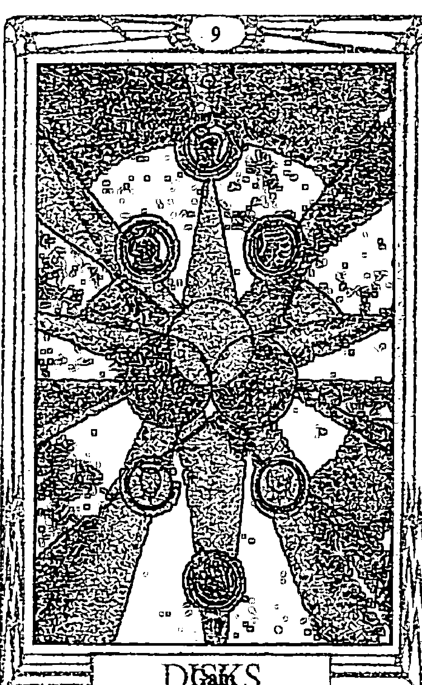

### 描述

牌面中央的三枚圓盤分別呈玫瑰色、綠色和藍色，構成一個正立的三角形。六枚錢幣在其周圍排列成六邊形，上頭都鐫刻著人物的頭像，均由其行星符號衍生而來。

中央的圓盤代表三顆最為豐饒的「行星」之影響力：玫瑰色代表太陽，綠色為金星，而藍色則是月亮。三種色彩交織而成的光芒，從圓盤交會處輻射而出，投射著豐裕與富饒。周圍的行星圓盤亦得益於這份能量，被藍、綠與玫瑰色的光圈籠罩著。金星在處女座是為「落陷」，但此種不利的關係並未反映在此牌的象徵意象之中，也不曾影響它整體的意義。

此牌的兩個占星符號均以處女座在「Assiah」的梅紅色繪製，牌面背景則是由泛黃的綠色、暗藍灰色、綠灰與梅紅等色拼織而成，即處女座在四個喀巴拉世界的色彩。背景的圖案頗為近似即將收成的耕地。

### 牌意詮釋

伴隨物質事務的好運道。遺產。恩惠。獲益。財富的增長。

### 逆位牌

犧牲他人而獲益。覬覦貪求。偷盜。失寵、受冷落。

## 圓盤十

**標題**
財富（Wealth）

**喀巴拉屬性**
「Malkuth」在「Assiah」

**星座屬性**
水星在處女座

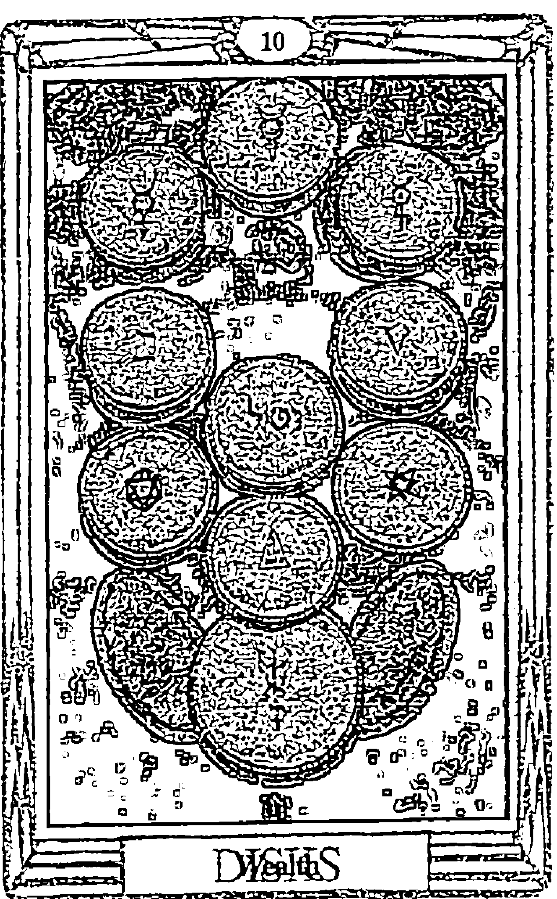

### 描述

十枚圓盤以「生命之樹」上十個「薩弗洛斯」的模式排列，每個圓盤上都鐫刻著一種「水星／墨丘利」的符號：

- 一、「Kether」。水星（即墨丘利）的行星符號。
- 二、「Chokmah」。各個行星的符號整合於水星的符號之中。
- 三、「Binah」。如「生命之樹」上所繪的水星符號。（留意此符號中的球體）
- 四、「Chesed」。「以諾魔法體系」中的字母「Pe」，對應於英文中的「B」，因而也對應於希伯來字母「Beth」，即代表「魔法師」與水星（墨丘利）的字母。
- 五、「Geburah」。希伯來字母「Beth」，連結著「魔法師」與水星（墨丘利）。
- 六、「Tiphareth」。以希伯來文書寫的「拉斐爾」（Raphael），即「Tiphareth」的大天使，亦為水星的守護天使。
- 七、「Netzach」。一個八芒星；「八」是「Hod」與水星的數字。
- 八、「Hod」。六邊形之中的六角星，兩者均為太陽的象徵。要克服「土」元素之中固有的惰性，必須結合太陽與水星（Hod）的能量。「六邊形之中的六角星」亦與水星相關：六乘以六等於三十六，是為水星的神祕數字（1 + 2 + 3 + 4 + 5 + 6 + 7 + 8 = 36）。
- 九、「Yesod」。一座由水星之神祕數字構成的金字塔（註76）。「8」是「Hod」與水星的數字。「64」是水星之「魔方陣」（Kamea）中的方格數。「260」是這個「魔方陣」中任一行、列，或對角線上數字的加總；它同時也是「Tiriel」這個字的數字值，意為「墨丘利之智」（the Intelligence of Mercury）。而「2080」則是這個「魔方陣」中所有數字的加總，同時也是「Taphthartharath」，即「墨丘利之靈」（the Spirit of Mercury）的數字值。
- 十、「Malkuth」。一柄飾有三個希伯來「母字母」（「Shin」、「Aleph」，和「Mem」）的神使之杖。它便是「卡杜西斯」（caduceus），即天神墨丘利的魔杖。

這些「薩弗洛斯」圓盤均呈黃色，紋理則為綠色，即水星和處女座在「Atziluth」的色彩。水星為處女座的守護星，亦廟旺於處女。後方還有八個深色的圓盤，趨近於「土」元素及「Malkuth」的黑色。背景中還有十一個紫色及紫羅蘭色的圓盤，散佈於靛藍色的場域中，為水星在「Briah」與「Assiah」的色彩。

### 牌意詮釋

錢財與物質的財富，有時多到失去其重要性的地步。物質獲益與財富的實現，但除了物質之外別無其他。可能會消散的財富，除非以創造性、建設性的方式來運用。純粹的積累。

### 逆位牌

懶惰。獲得了財富，但卻付出極大的代價——慘勝，得不償失。

註76. 克勞利，《777與其他喀巴拉著述》（777 and Other Qabalistic Writings of Aleister Crowley），35-6。

## 塔羅占卜

塔羅牌是一組象徵與圖像，可以用來洞悉個人的問題，並找出解決疑難的各種選項。作為一種解決問題的諮詢工具，在面對令人困惑的情境時，塔羅有助於帶來清明客觀，並揭示隱而不顯的問題和解決之道。

塔羅乃是運用象徵的語言，與「較高自我」（the Higher Self）進行溝通。那是自我的神性部份，與宇宙有所連結。象徵的語言能夠繞過表意識心靈的審查，容許我們從「較高自我」接收訊息，而免於「較低自我」（the Lower Self），即「小我」（ego）的干擾。作為塔羅占卜者，我們解讀塔羅的象徵符號，將之轉譯為有意義的資訊、洞見和建議。

塔羅占卜並不預測未來。宇宙變動不居，混沌莫測，有著太多的變數，無法加以預測、掌控。因此十分重要的是，我們必須瞭解，塔羅占卜的結果並非板上釘釘、不可改變的。塔羅占卜只是根據現有的資料，提出最有可能的結果與選項。接受占卜的人（問卜者）可以選擇採取其他的因應方式、從該情境中撤離，或是完全不理會紙牌所提出的建言。

## 問題

一次好的塔羅占卜始於一個好的問題。當你為占牌設計問題時，有幾個因素需要考量。

相較於是非題，不設定答案的問答題將能揭露更多的資訊。運用塔羅的優點之一，便是紙牌能夠揭露相當份量的深度與細節。如果你要的只是「是或否」的答案，丟銅板可能會是更好的選擇！

這次占卜所涵蓋的時間架構為何？由於宇宙混沌而「非線性」的本質，你越是往遙遠的未來望去，你所獲得的資訊往往就越不可靠。研究某個情境接下來一個月的發展，比起審視同一局面在一年之後的發展，會來得準確而切題。你總是能以較短的時間區間，來檢視某個長期的情況。

有些問卜者可能會要求概括性的占卜，而非提出特定明確的問題。由於缺乏事件的脈絡作為解牌的基礎，概略性的占卜可能較為困難。此外，概略的占卜往往會產生概略的答案。

如果你對概略性的占卜感到不自在，或許可以考慮幾種選項。首先可以請問卜者選擇某個生活領域，把焦點擺在這裡。有時人們尋求概略性的占卜，是因為他們有好幾種不同的生活領域想要探索。對問卜者說明，有焦點的問題通常可以占出較為切題也較有幫助的訊息，並設法幫助他構思出較為明確的問題。你也可以建議問卜者稍後再來占卜，直到他心中有了明確的問題或情境。

人們前來問卜的主題大致可歸入以下三大類：金錢、健康和感情。關於個人成長或靈性發展的問題較為少見，但有時也會遇上。

這些全都是人生中的重要事務，而對牌師而言，以合乎道德的方式來進行占卜是十分重要的。塔羅占卜應當賦予人們力量，聚焦於問卜者能做些什麼，以改變局面，或是讓某些事情發生。此外，塔羅占卜不應取代適當的法律、醫藥或財務意見。在這類事務上，你永遠應該鼓勵問卜者在採取行動之前諮詢專業人士。在決策過程中，塔羅可以是種寶貴的工具，但它不應是唯一的工具。

有時候，問卜者會詢問一些似乎已有明顯答案的問題。人們可能會來占問某種冒險或愚蠢的投資，覺得那將會是下一個明星產業，能讓他們快速致富。或者他們會執迷於挽回分手的情人，或是維繫一段分崩離析或暴虐傷人的關係。在這類情況下，最好的方式是讓紙牌説話，而非直接提供你個人的忠告。

身處這類情境的問卜者，往往早已被周遭的人提醒，告知其想法實屬不智，但他們卻聽不進去，也不太能接受進一步的建言。他們來找塔羅牌師，多半是想要尋求超自然的訊息，確認或支持他們對問題的看法，因此會比較願意聽取牌面的訊息，而非個人的建議。你會發現，紙牌往往會告訴這些人他們應該聽到的，而非他們想要聽到的。

此外也要考慮的是，你或許並不知道關於此事的全部資訊，有時問卜者的話也會不盡不實、誇大扭曲，甚至連他自己也並不明瞭事件的真實狀況。若是碰上這種情形，由於你並未掌握所有的事實，可能會提供錯誤的個人建議。藉由塔羅牌來與你的「較高自我」溝通，並與宇宙接軌，你將能觸及問卜事件的實情。

## 為自己占卜

當你使用塔羅牌來探索攸關自身的事件，尤其是涉及情感的狀況時，往往很難保持客觀。你的情緒可能會暈染或壓倒直覺，導致錯誤或誤導的解讀。在這類情況下，最好是央請另一位塔羅牌師——某個置身事外而能保持客觀的人，來為你解讀牌意。

## 與宇宙接軌

在你開始使用塔羅占卜之前，先與你即將與之對話的較高力量建立連結，乃是十分明智的。這可以用好幾種方式達成。

最簡單的方式是請求你的「較高自我」作為導引。閉上眼睛，清除雜念，靜靜地祈請「較高自我」協助你解讀牌意。你不需要是個修行有成的「達人」才能與「較高自我」溝通；你心中知道，你的「較高自我」已經聽見你的祈請，將會給予你所企求的指引。

另一種方法是在你與紙牌和宇宙之間創造某種能量的連結。將紙牌握在手掌之間，閉上眼睛。當你吸氣時，讓能量透過你頭頂的「頂輪」，流入心臟部位的「心輪」。如果你對能量的運作並不熟悉，或是無法感覺到能量在體內的流動，將這能量想像為一道白光，流向你希望的地方。吐氣時，將這能量留存在「心輪」。

第二次吸氣時，將能量從腳底或「根輪」吸入，再導引、留存於「心輪」。第三次吸氣時，將「心輪」中的能量導引至左手臂，流經塔羅牌，再沿著右手臂而上，回到「心輪」。第四次吸氣時，將這能量在體內循環一周，流經紙牌。此種方法可能需要一些練習才能掌握，但這份努力將是值得的。

## 洗牌

用你感到自在的任何方式洗牌。如同拉斯維加斯二十一點賭桌的發牌師般，毫不費力地讓紙牌在手中翻飛的洗牌技巧，對塔羅占卜而言並非必要。唯一重要的是，你得把牌徹底混合。許多塔羅牌師會一邊洗牌，一邊與問卜者構思問題。如果你要使用逆位牌，記得要在洗牌時將半數的牌翻轉數次。在你覺得該停止時，便停下洗牌的動作——運用你的直覺。在你完成洗牌後，你或許會想要讓問卜者再洗一下牌，或是切牌。這能讓問卜者將能量注入此次占卜，並參與整個過程。攤開牌時，將牌面朝上，如此你便能看出整體牌陣中具有重要意義的區塊。

## 牌陣

確定要占卜的問題之後，你必須選擇一種牌陣。牌陣是一種象徵性的模式，能將紙牌所揭露的訊息置入某種脈絡之中。牌陣中的各個位置，指出要占卜的情境之中的不同面向，像是外部環境因素、過去與現在的影響，以及可能的結果等等。

市面上有許多塔羅書籍，提供了為不同問題所設計的牌陣，幾乎囊括了每一種可能的狀況。或者你也可以設計自己的牌陣。許多塔羅牌師會實驗各種不同的牌陣，找出一兩種最適合自己的，然後在大半的占卜中都使用它們。不過，當你初學塔羅占卜，最好先從簡單的牌陣著手，像是下面介紹的「三牌牌陣」。

#### 三牌牌陣

你可以用兩種不同的方式看待「三牌牌陣」。首先，你可以個別地解讀這三張牌，為牌陣中的每一張牌指派不同的意義。舉例來說，第一張牌代表過往事件對所占情境的影響，第二張牌代表現在的境況，而第三張牌則代表未來，或是占卜的結果。或者，你也可以將這三張牌視為一個整體，將它們讀成一個「句子」。此種方式的優點是，將好幾張牌解讀成一個群組，將會提供額外的深度。如果你願意，它也讓你得以運用元素之間的「相容性」（見第232頁）來調整牌的意義。

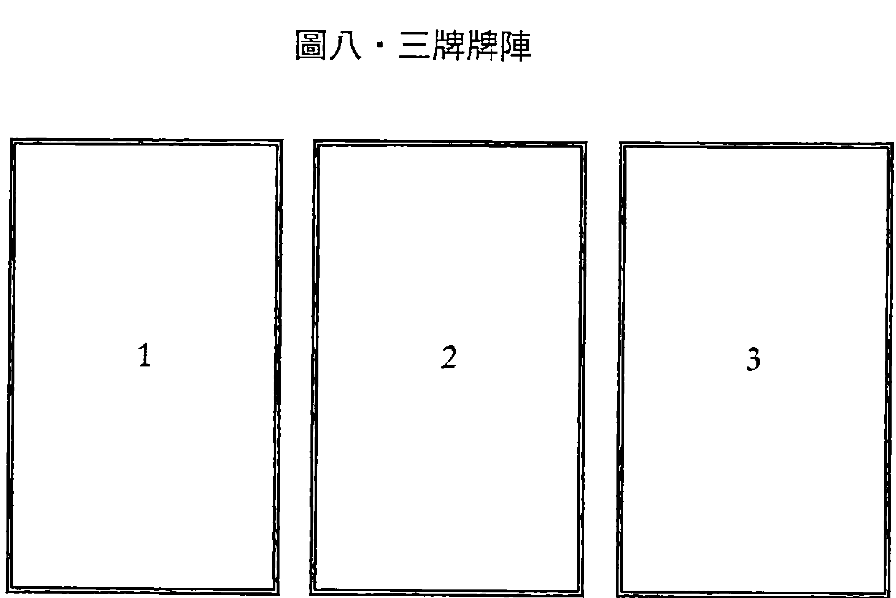

#### 十五牌牌陣

一旦你在「三牌牌陣」中獲取了一些經驗，你便可以進展到十五張牌的牌陣。「十五牌牌陣」在本質上便是五個「三牌牌陣」，以「X」形彼此連結。而每個三張牌的群組則代表牌陣中的一個位置。

如圖九所示，十五張牌依逆時針方向以螺旋形排列成圖中的模式。螺旋是宇宙性的能量結構，從DNA雙螺旋到星雲的構造，無所不在。以螺旋方式排出牌陣，便是象徵性地汲取這份宇宙能量。

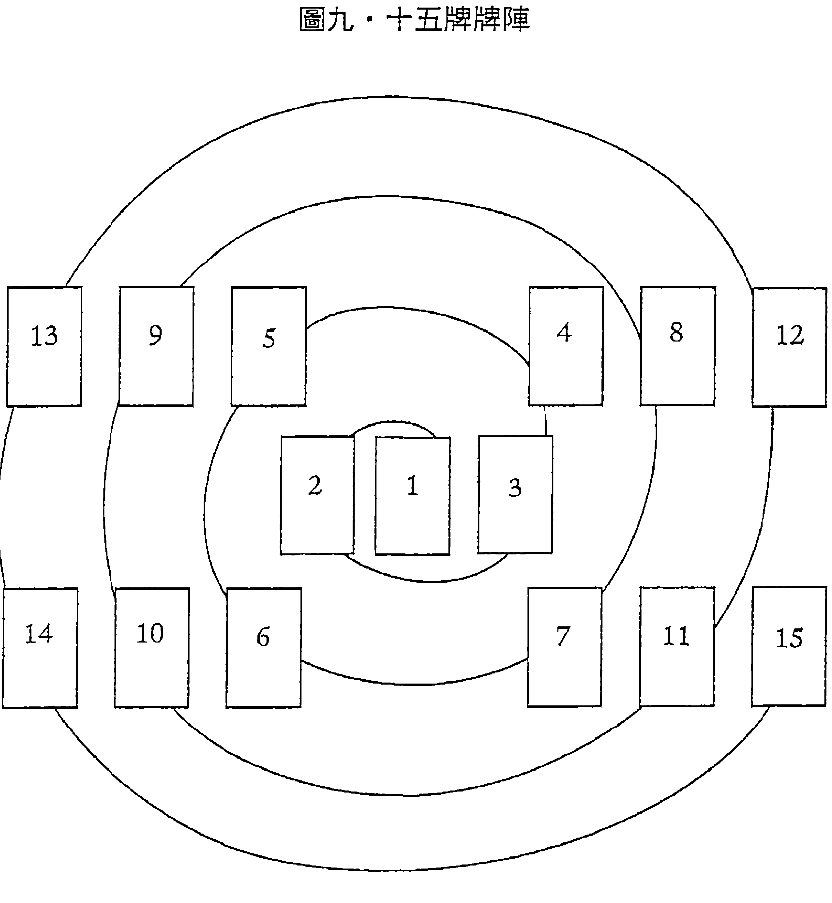

第一個位置（牌一、二和三）代表目前的情境。有時它只是在陳述我們已經知道的狀況，但它有時也會對占卜的主題提供洞見，或是不同的觀點。第一位置中的牌往往與周圍的牌（螺旋的「臂」）有著某種關聯，示現目前的情境與結果之間的連繫。

第二位置（牌六、十和十四）代表環境或外部的因素。出現在此處的宮廷牌幾乎總是代表與問卜情境有關的人物。

牌陣中的第三位置（牌五、九和十三）和第四位置（牌四、八和十二）代表可能的結果。有時它們會描述同樣情境的兩種面向：「如果你決定接受這份工作，轉換跑道，你可能會犧牲社交生活，但獲得物質上的財富。」也有時候，它們是代表兩種選擇或選項：「如果你決定接受這份工作，轉換跑道，將會發生情況甲；但若是你決定留下來，結果則會是情況乙。」

第五位置（牌七、十一和十五）代表潛藏的影響力，以及在問卜者掌控之外的驅力。它往往會針對整體的情況，對問卜者提出概括性的建議，甚至對整個人生提出建言。這個位置甚至可能提供第三種選項，以化解某種局面。

## 解讀牌意

要解讀占出的牌，並沒有特定的方法或公式。隨著時間和練習，每個人都會發展出自己的風格。下面的建議將能幫助你踏出第一步，但它們僅只是建議，此外無他。

一開始，請將牌陣視為一個整體來加以審視。可有任何幾張牌或牌陣的某個部份特別吸引你的注意？你可曾看見任何重複出現的象徵或模式？你對此牌陣的第一印象是什麼？

牌陣中有多少張大阿卡納牌？大阿卡納一般意味著在此情境中運作的較強驅力，以及根本性的問題。因此，比起數字牌與宮廷牌，大牌在占卜中具有較重的份量，並且會指出牌陣的焦點。當牌陣中出現大量的大阿卡納牌，便暗示可能有著超出問卜者掌控範圍的驅力，或是情況較為難以改變。反之，較少數量的大牌，則暗示問卜者對於占卜的情境及其發展擁有較大的掌控度。

其次，請審視各個牌組的配置與比重。牌陣中較強或較弱的牌組，將會指出牌意解讀的主題。請記住，「權杖」牌代表精神及能量的領域，「聖杯」代表情感與直覺的範疇，「寶劍」涉及智識與心理的層面，而「圓盤」則代表物質與金錢方面的事務。

某次針對財務問題的占卜，若是出現很少的「圓盤」和許多張「聖杯」，可能暗示問題的關鍵不在於物質資源，而是你對此一情況的態度和情緒。相仿地，針對人際關係所占的牌陣，若是沒出現幾張「聖杯」，但卻有許多「權杖」，可能暗示此人投注於這段關係中的能量，才是主要的議題。

解讀牌陣中個別的牌時，你可以尋找這張牌中特別突出的象徵，它們將會提供線索，指出這張牌在問題的脈絡及牌陣位置上的意義。運用你對牌意的瞭解，再加上直覺，來決定某張牌在牌陣中的意義，以及它與周圍的牌的關係。

如果你對解讀牌陣的某個部份感到有點困難，先進行下一部份。你總是可以先從其他的牌擷取更多的資訊，然後再回過頭來研究這一部份。往往牌陣的某個部份，將會啟發、闡明其餘的部份。

解讀牌陣中的宮廷牌往往有些棘手，因為它可能代表某種概念，也可能代表某個人物。決定牌意的主要方式是運用直覺，雖然也可以訴諸一些概略性的準則。當宮廷牌出現在牌陣中關於「環境」或「外部影響」的區塊，它往往是代表人物；若是出現在提供「對個人的忠告」或是「未來的行動建議」的位置，則比較可能是代表某種概念。

在針對某個特定的人占卜時——像是問卜者的另一半、父母，或是老闆——占出的牌陣往往會出現一張宮廷牌，代表此人的影響。要決定某張宮廷牌所代表的特定人物身份，方法之一是檢視宮廷牌的星座屬性。例如，若是出現「圓盤騎士」，你可以探詢問卜者：「你的兄弟／情人／朋友」是處女座的嗎？當然，宮廷牌所代表的人物總有可能是問卜者不認識或不熟悉的，在此情況下，你的解讀可能也會十分概略、籠統。

要留意的是，宮廷牌的性別與其所代表的人物性別並非總是一致。我們都認識非常男性化的女人，或是具有女性特質的男人。你或許要思考問卜者所描述之人的人格特質，將之與占出的宮廷牌之人格特質做一番比較。在任何情況下，從每張宮廷牌所對應的人格特質當中做出選擇，往往是種直覺性的決定。

## 逆位牌與元素的相容性

運用逆位牌和元素的相容性，將為塔羅占卜增添另一層詮釋。請留意逆位牌的意義並不必然與正位牌相反。有時牌的逆轉只是在強化或弱化其原本的含意。

元素相容性的概念則比逆位牌要複雜一些，其原理為主動的元素「火」與「風」可能與被動的元素「水」和「土」相互衝突。由此推之，「權杖」和「寶劍」牌組即與「聖杯」和「圓盤」牌組相衝突。當兩張相衝的牌在占卜中比鄰出現，其中之一或兩者的含意便要以詮釋逆位牌同樣的方式來解讀。在「三牌牌陣」中，中間那張牌可能會被夾在兩張與它相衝的牌之間（例如一張「權杖」牌位於兩張「聖杯」之間），此時中央的牌不受影響，而保留原本的牌意。

逆位或元素相位不佳的宮廷牌可以用幾種方式來解讀。如果這張宮廷牌在牌陣中代表某種關鍵概念，逆位牌的詮釋很可能對問卜者不利。舉例而言，「權杖騎士」的關鍵概念之一是啟動新計畫；若是逆位，則可能暗示此時並非啟動新計畫的好時機，或者，某人正在啟動一項新計畫，與問卜者的目標相牴觸或構成競爭。

若是這張逆位的宮廷牌代表某個人物，負面的人格特質將會佔上風。逆位的宮廷牌也可能是指某個對問卜者處境不利的人，像是不誠實的同事，或是唱反調的父母。

大阿卡納牌的元素相容性乃是植基於該牌的主要屬性。連結於元素的大阿卡納牌，其元素屬性十分明顯；連結於黃道星座的牌，則使用這些星座的元素屬性，例如牡羊座為火象，金牛座為土象，以此類推。至於連結於行星的大牌，請參見下面的表八。

#### 表八·行星牌的元素屬性

| 大阿卡納牌 | 行星 | 元素 |
| :--- | :--- | :--- |
| 宇宙 | 土星 | 土 |
| 命運 | 木星 | 風 |
| 皇帝 | 火星 | 火 |
| 太陽 | 太陽 | 火 |
| 皇后 | 金星 | 水 |
| 魔法師 | 水星 | 風 |
| 女祭司 | 月亮 | 水 |

## 與問卜者溝通

塔羅牌師乃是一位直觀的詮釋者，依直覺解讀紙牌，並將其含意及訊息傳達給問卜者。向問卜者傳達訊息的方式，就和正確地解讀牌意同樣重要。以下是一些建議：

- 在詮釋牌意時，避免太過負面。與此同時，也不要害怕告訴問卜者一些他們或許不想聽到的話。誠實而坦率明確地解牌是很重要的——只是不要太過嚴苛。
- 始終要對問卜者提出正面的行動方針。理想上，當問卜者做完占卜，應該能夠得到有助於解決問題的想法。
- 在剖析牌意時，直接使用各張牌的名稱。將你的解讀與紙牌本身連結在一起，將有助於問卜者更為貼近這次占卜。例如：「『五角星十』指出金錢並非問題所在。」

「『皇后』牌出現在『結果』位置，暗示你必須多參與社交活動，以達成目標。」

「『聖杯國王』代表某個願意幫助你擺脫困境的人。」

- 塔羅占卜不應取代適當的法律、醫藥或財務意見。務必建議問卜者在採取重大的法律、醫藥或財務行動之前，先行諮詢專業人士。
- 當你將牌意解讀完畢，應該為問卜者總結此次占卜的要點。一次塔羅占卜可能會出現大量的資訊，因此，讓問卜者清楚瞭解此次占卜的訊息是十分重要的。

## 意義與直覺

要成為出色的塔羅牌師，你必須培養兩種技能。首先，你必須對紙牌及其意義獲得個人的理解。再者，你必須肯定並發展自身的直覺。前者需要運用理性、邏輯的左腦，而後者則需運用創造性與直覺性的右腦。

要瞭解塔羅的象徵語言，這兩種技能是至關重要的。你必須熟悉塔羅牌，以及象徵符號的廣泛涵意，方能有效地運用它們；而你的直覺將會告訴你，某張牌或象徵的某種特定的詮釋，對於此次占卜的主題是恰當、適切的。

你不必等到完全精通這些技巧才開始解讀塔羅。要培養你的技能，唯一的方法便是多加練習，而占算塔羅就是理解牌意並強化直覺的最佳方式之一。

## 瞭解牌意

對於一位塔羅新手，最大的挑戰或許便是熟習整副塔羅中七十八張牌的意義了。這最初看來是項令人膽怯的任務，但是隨著練習，學習牌意會變得容易起來。大多數人一開頭會攤開紙牌，翻閱隨牌附贈的小冊子，或是其他的參考書籍來查看牌意。在初初學習解牌時使用參考書，並沒有什麼不對，而此種方法的確也有所助益。不過，若是你能對牌意發展出個人的理解，你的解讀將會有深度得多，也會準確得多。

對於牌意的個人理解，遠遠超出了記誦一連串意義表單。背誦牌意只不過是將某些資料輸入記憶庫。想想你在學校為了考試而背誦的那些事實與數字，考完試後，你可能很快便忘了那些資訊。要讓資訊真正深植腦海，它必須擁有屬於個人的意義，而真正的理解來自於以有意義的方式運用那些資訊，來自於使用它們，並在腦海中建構連結。

下面的練習將能幫助你對紙牌建立個人的理解。你可以依任何順序來做這些練習，或是從中選取幾項。你應該把這些練習的結果，連同你在研習牌意時的任何其他註記與心得，記錄在一本塔羅筆記中。

### 練習一：每日一牌

理解牌意的最佳方法之一，是每天研習一張牌。在一日之始，從整副牌中選出一張。你可以用這個練習依序熟習整副牌，從「愚人」直到「圓盤十」；或者你也可以洗牌切牌，隨機抽取一張。花幾分鐘研究這張牌，查閱它的意義、屬性，以及象徵。牌的意義是如何反映在牌面的象徵符號上？以這張牌為主題進行冥想。如果可能，整天隨身攜帶這張牌。

是日終了，花幾分鐘想想這張牌的意義如何反映在這天的事件上。例如，你抽到了「寶劍四」，你或許可以自問：我今天做了哪些妥協？我曾需要花些時間，從焦慮或衝突中恢復嗎？我今天所做的妥協是被迫而為的嗎？它們在本質上是暫時的還是永久性的？在塔羅筆記中記下你的觀察所得。

### 練習二：描述你的一天

回想一天當中的重要事件，然後選出兩或三張牌來代表這些事件。舉例來說，如果你和另一半發生爭執，你可能會選「權杖五」。如果你和一位老友共進晚餐，你或許可以選一張最能代表此人的宮廷牌。如果你感到沮喪，你可以選擇「聖杯八」或「圓盤七」。在塔羅筆記中記下你選擇的牌，以及挑選它們的理由。

這項練習非常適合與學習塔羅的夥伴或任何熟悉塔羅的人一起進行。輪流用塔羅牌描述自己的一天，然後討論挑選那些牌的理由。這可能會激發有趣的對話，像是：

> 「你今天過得如何？」
>
> 「噢，『寶劍三』、『圓盤四』和逆位的『命運』。那你呢？」
>
> 「『聖杯三』。……『權杖騎士』終於到來了！」

和同伴一起進行這項練習的趣味在於，你將會發現其他人對這些牌的詮釋與你有何不同。

### 練習三：牌意手冊

幾乎每副塔羅牌都會隨牌附贈一本小冊子，簡短介紹這副牌，然後列出每張牌的基本意義。當你初初學習解牌時，手邊有這樣一本參考書是挺不錯的。如果你可以創造一本屬於自己的塔羅牌意手冊，那就更棒了。

買一本至少有八十頁的筆記本，每張牌一頁，記錄這張牌的意義。一開始你可以從隨牌附贈的小冊或是其他塔羅書籍中抄謄牌的意義。不過，如果你能從自身的研習和解牌的經驗中彙整出牌意，那就最好不過。當你越來越熟悉塔羅，這本手冊中的牌意詮釋將會變得越發深刻而個人化。

### 練習四：塔羅占卜模擬

模擬占卜是種很棒的方式，能夠增進你對牌意的理解，並讓你在沒有壓力的狀況下練習解牌。構思一個問題或情境，然後進行占卜，占斷可能的結果。當你做完這次占卜，將牌調換位置，再次解讀它們。這將教導你，根據特定的牌在牌陣中的位置，其意義可能如何變動。

### 練習五：搜尋意義

構思不同的想法、概念和情緒，然後找出代表它們的牌。例如，哪張（或哪幾張）牌代表下面的情況：

- 嫉妒？
- 憂鬱？
- 矛盾的心情，例如又愛又恨？
- 你與某位同事或友人的關係？

對於宮廷牌，這種練習的運作方式略有不同，因為它們可能代表概念或人物。將宮廷牌從整副牌中取出，然後判斷哪張（或哪幾張）宮廷牌可能代表：

- 你的父母或兄弟姊妹？
- 你最好的朋友？
- 你的初戀情人？
- 你最不喜歡的老師或教授？

將結果記錄在塔羅筆記中。

## 發展直覺

直覺乃是超越五種感官範疇之外而感受到能量的能力。你或許曾經運用過直覺許許多多次，但卻不曾意會到。想想某些時刻，你覺得受到某種事物的吸引，結果發現那正是你當時所需要的。或者當你面對某個複雜的難題，但卻想都不用想，就知道正確的決定。那就是直覺！

每個人都擁有直覺。直覺能力看來如此神祕而不尋常，是因為現代社會並不重視它。我們從小就被灌輸，分析、解決問題的最佳方式是理性邏輯的思考。依直覺解決問題會被認為是不可靠、誤導、超自然，甚至是危險的。因此，大多數人並不被鼓勵去發展或展現直覺的能力。

關於直覺的另一迷思是，它是僅只少數人方才擁有的能力。的確，有些人天生就比他人富於直覺，但是每個人來都擁有不同的強項與能力。有些人是天生的領袖，有人則生具演奏樂器或解決複雜數學問題的天賦。

直覺是種可以經由練習而發展出來的技能，正如彈鋼琴或寫程式。如果你時常練習運用直覺，你會發現你將毫不費力地接收到直覺性的訊息。

「本能」、「小我」與「直覺」三者之間有著重要的差別。「本能」是「Nephesh」的功能，亦即「喀巴拉靈魂部份」中代表生存繁衍之原始本能的區塊。它也被稱為「動物靈魂」，是我們與所有哺乳動物及爬蟲類共有的機能，歸屬於「生命之樹」上的「Yesod」和「Malkuth」。

「小我」是「Ruach」的功能，代表智識和理性心智，即心理與道德的特質。「Ruach」在「生命之樹」上位置居中，歸屬於「深淵」之下、「Yesod」之上的幾個「薩弗洛斯」，而以「Tiphareth」為中心。

「直覺」則是「Neschamah」的功能，它歸屬於「Binah」，代表智慧、領悟與直覺等較高的機能。它同時也體現著「Chiah」，即創造的衝動和神性的意志，以及「Yechidah」，即我們之中的神性火花。因此，「Neschamah」乃是「喀巴拉靈魂部份」中觸及宇宙和「較高自我」的區塊，而「較高自我」即是直覺知識的源頭。

要探詢直覺，首先要清淨心思，詢問問題，然後聆聽。直覺的自我往往以你腦中的聲音來進行溝通，也可能顯現為某種感覺或心象，或是某種方向感。回應你問題的直覺答案，將會是浮現在你心中的第一個意念。

不要將直覺之聲與小我或人格的聲音搞混了。直覺的話語通常平靜而安詳；小我則會大吼大叫。小我會告訴你你想聽的話，而直覺則會告訴你你該聽的話。

以下的練習將會幫助你發展直覺的能力。請務必在筆記中記下你的心得與結果。

### 練習一：冥想

冥想是發展直覺能力的絕佳方式。它將教導你專注心思，摒除雜念，聆聽內心的聲音。關於冥想的書籍汗牛充棟，但實際的練習則非常簡單。找一個不會受到干擾的地方，以舒適的姿勢坐著，閉上眼睛，慢慢地深呼吸。隔絕一切外界的影響，聆聽內在的對話。從這兒起，你有兩種選擇：你可以清除心中的一切雜念，或是專注於一個物體、聲音或念頭上。大多數初試冥想的人會覺得後者比較容易。

塔羅牌上的象徵是很好的冥想主題，因為它們的形狀和顏色多半很簡單，但卻有著複雜的屬性與涵意。以這些象徵來冥想，將會揭露其更為深層的意義和對應關聯，這些知識將會在你尋求理解、解讀紙牌時有所助益。你可以從四個牌組的符號之一著手：權杖、聖杯、寶劍，或圓盤；然後再進行到其他的象徵，像是「安卡」十字架、眼睛，或金字塔等。此外，你也可以針對抽象的概念進行冥想，像是煉金元素或顏色。以塔羅象徵為主題來冥想，對於後面的「路徑運作」（pathworking）練習極有幫助。記得要將心得記錄在筆記中。

### 練習二：整合直覺

發展直覺的技能需要練習。塔羅占卜是練習直覺的一種方式，但最佳的方法是將直覺整合入日常的決策過程。從無關緊要的小決定開始；當你對此能力獲得初步的掌握之後，再將你的直覺運用到較為重大的人生決定上。

舉例而言，你可以詢問直覺：「今晚我該和朋友出去，還是待在家裡看影片？」你可以探詢，為何這種選項對你而言是正確的；在這個例子中，你可能會獲知，「若是出門，你會交到新朋友」或是「你需要待在家裡休息、充電。」

以下是其他關於如何運用直覺的建議：

- 當你覺得似乎忘了什麼事，詢問你的直覺：「我忘了什麼？」
- 如果你在大城市中工作、生活，停車通常會是個問題。當你在尋找停車位時，詢問你的直覺。請它為你指引鄰近目的地的停車位。你的答案可能顯現為某種方向感，但更常見的是，你會一邊開車，腦中一邊有所感應：「左轉，直走兩條街，然後右轉。」
- 當你感到無聊時，詢問直覺你該做些什麼。
- 當你想要購買某項商品，但卻有許多品牌、樣式或特色可供選擇，運用直覺幫助你做決定。拿起每種產品，或是觸摸它，詢問自己，哪種感覺最好？

在筆記中記下結果。

## 路徑運作

「路徑運作」可以説是探索、理解塔羅牌意的最佳練習。它是一種在「生命之樹」的路徑上進行的主動冥想。運用特定塔羅大牌的屬性、符號和概念，你可以創造一次想像的旅程，從中體驗該牌的能量，並與之互動。透過「路徑運作」，我們將能意識到大阿卡納牌的能量，以及它們是如何運作於我們的日常生活中。

要為「路徑運作」預作準備，你必須先熟習你想以之練習的大阿卡納牌。首先請研讀這張牌的象徵意義及屬性，然後以此牌作為焦點進行冥想。在你進行到下一步驟之前，你必須能在心中建構出整張牌的完整圖像。

一開始，找個不受干擾的安靜所在，靜靜坐著，然後放鬆，深深地、平緩地呼吸。將你想要練習的大阿卡納牌握在手中，把所有的注意力凝聚在牌上幾分鐘。接著閉上眼睛，在心中觀想這張牌。務必盡你所能，重行建構出所有的象徵符號與細節。將牌的圖像擴大成一座門戶，跨過牌面的邊界，走進牌中。

一旦走進這道門，你便可與這張牌的象徵元素進行互動。首先和牌中的主要人物交談，詢問關於這張牌的象徵符號與能量的問題。你也可以依據該牌的意義，詢問他們對於相關議題的意見。舉例而言，你可以詢問「皇帝」該如何加強自我控制，或是請教「正義」女神，該如何在生活中取得平衡。

當你完成「路徑運作」的旅程，想像這張牌的邊界出現在你眼前，然後跨過門檻，回到正常的意識狀態。在你的塔羅筆記中寫下這趟旅程的經驗，以及你從這次練習中學到的功課。

## 附錄

## 符號組與對應關聯

### 煉金元素

| 元素 | 符號 | 在「命運」牌中的擬人化角色 | 大阿卡納牌 |
|---|---|---|---|
| 塩 | ⊖ | 泰風 | 皇后 |
| 硫 | ♀ | 人面獅身獸 | 皇帝 |
| 汞 | ☿ | 赫瑪奴比斯 | 魔法師 |

### 「四字母聖名」與四元素

| 字母 | 宮廷人物 | 塔羅牌組 | 元素 | 喀巴拉世界 | 薩弗拉 |
|---|---|---|---|---|---|
| Yod | 騎士（父親） | 權杖 | 火 | Atziluth | Chokmah |
| 原初的「Hé」 | 王后（母親） | 聖杯 | 水 | Briah | Binah |
| Vau | 王子（兒子） | 寶劍 | 風 | Yetzirah | Tiphareth |
| 最後的「Hé」 | 公主（女兒） | 圓盤 | 土 | Assiah | Malkuth |

### 五元素

| 元素 | 符號 | 神獸星座 | 神獸象徵 | 人面獅身的力量 |
|---|---|---|---|---|
| 靈 | ⊕ | （太陽） | 安卡十字架 | 行動 |
| 火 | △ | 獅子座 | 獅子 | 意志 |
| 水 | △ | 天蠍座 | 老鷹 | 勇氣 |
| 風 | ▽ | 水瓶座 | 人 | 知曉 |
| 土 | ▽ | 金牛座 | 公牛 | 保持靜默 |

## 脈輪

| 脈輪 | 名稱 |
|---|---|
| 頂輪 | Sahasrara |
| 第三眼 | Ajna |
| 喉輪 | Vishuddha |
| 心輪 | Anahata |
| 太陽神經叢 | Manipura |
| 臍輪 | Svadisthana |
| 根輪 | Muladhara |

## 「金色黎明會」的位階

| 位階 | 薩弗洛斯 | 元素 |
|---|---|---|
| 新入門者 (Neophyte) | - | - |
| 忱信者 (Zelator) | Malkuth | 土 |
| 理論者 (Theoricus) | Yesod | 風 |
| 實踐者 (Practicus) | Hod | 水 |
| 哲人 (Philosophus) | Netzach | 火 |
| 中門 (Portal) | - | 靈 |
| 小達人 (Adeptus Minor) | Tiphareth | - |

## 行星

| 行星 | 符號 | 薩弗拉 |
|---|---|---|
| 土星 | ♄ | Binah |
| 木星 | ♃ | Chesed |
| 火星 | ♂ | Geburah |
| 太陽 | ☉ | Tiphareth |
| 金星 | ♀ | Netzach |
| 水星 | ☿ | Hod |
| 月亮 | ☽ | Yesod |

## 黃道星座

| 星座 | 符號 | 模態 | 守護星 |
|---|---|---|---|
| 牡羊座 | ♈ | 本位火象 | 火星 |
| 金牛座 | ♉ | 固定土象 | 金星 |
| 雙子座 | ♊ | 變動風象 | 水星 |
| 巨蟹座 | ♋ | 本位水象 | 月亮 |
| 獅子座 | ♌ | 固定火象 | 太陽 |
| 處女座 | ♍ | 變動土象 | 水星 |
| 天秤座 | ♎ | 本位風象 | 金星 |
| 天蠍座 | ♏ | 固定水象 | 火星 |
| 射手座 | ♐ | 變動火象 | 木星 |
| 魔羯座 | ♑ | 本位土象 | 土星 |
| 水瓶座 | ♒ | 固定風象 | 土星 |
| 雙魚座 | ♓ | 變動水象 | 木星 |

## 薩弗洛斯及其意義、屬性與魔法形象

| | 薩弗洛斯 | 意義 | 屬性 | 魔法形象 |
|---|---|---|---|---|
| 1 | Kether | 王冠 | 宇宙 | 年邁蓄鬚的國王,以側影示人 |
| 2 | Chokmah | 智慧 | 黃道 | 蓄鬚的男性人物 |
| 3 | Binah | 理解 | 土星 | 成熟的女性人物 |
| 4 | Chesed | 慈悲 | 木星 | 頭戴王冠、身登王位的強大國王 |
| 5 | Geburah | 嚴厲 | 火星 | 頭戴王冠、全副武裝、乘坐戰車的強大武士 |
| 6 | Tiphareth | 美 | 太陽 | 莊嚴的王者/孩童/被釘上十字架的神 |
| 7 | Netzach | 勝利 | 金星 | 赤裸的美女 |
| 8 | Hod | 光輝 | 水星 | 雌雄同體者 |
| 9 | Yesod | 基礎 | 月亮 | 赤裸的美男子,十分強壯 |
| 10 | Malkuth | 王國 | 土(四元素) | 頭戴王冠、蒙著面紗的年輕女子 |

## 大阿卡納牌與希伯來字母

| 大阿卡納牌 | 希伯來字母 | 數字值 | 字母名稱 | 意義 | 歸屬 |
|---|---|---|---|---|---|
| 0.愚人 | | 1 | Aleph | 公牛 | 風元素 |
| I.魔法師 | | 2 | Beth | 房屋 | 水星 |
| II.女祭司 | | 3 | Gimel | 駱駝 | 月亮 |
| III.皇后 | | 4 | Daleth | 門 | 金星 |
| IV.皇帝 | | 90, 900 | Tzaddi | 魚鉤 | 牡羊座 |
| V.大祭司 | 1 | 6 | Vau | 釘子 | 金牛座 |
| VI.戀人 | 2 | 7 | Zayin | 劍 | 雙子座 |
| VII.戰車 | 3 | 8 | Cheth | 籬笆 | 巨蟹座 |
| VIII.調節 | 4 | 30 | Lamed | 趕牛棒 | 天秤座 |
| IX.隱士 | 5 | 10 | Yod | 手 | 處女座 |
| X.命運 | 7, 2 | 20, 500 | Kaph | 手掌, 拳頭 | 木星 |
| XI.慾望 | 6 | 9 | Teth | 蛇 | 獅子座 |
| XII.吊人 | 8 | 40, 600 | Mem | 水 | 水元素 |
| XIII.死神 | 7, 1 | 50, 700 | Nun | 魚 | 天蠍座 |
| XIV.藝術 | 9 | 60 | Samekh | 帳棚釘 | 射手座 |
| XV.惡魔 | 10 | 70 | Ayin | 眼睛 | 魔羯座 |
| XVI.塔 | 7, 5 | 80, 800 | Pé | 嘴 | 火星 |
| XVII.星星 | 11 | 5 | Hé | 窗 | 水瓶座 |
| XVIII.月亮 | 12 | 100 | Qoph | 後腦 | 雙魚座 |
| XIX.太陽 | 13 | 200 | Resh | 頭, 臉 | 太陽 |
| XX.新紀元 | 14 | 300 | Shin | 牙齒 | 火/靈元素 |
| XXI.宇宙 | 15 | 400 | Tau | 十字 | 土星/土元素 |

## 大阿卡納牌的四重色彩層級

| 大阿卡納牌 | Atziluth (騎士層級) | Briah (王后層級) | Yetzirah (王子層級) | Assiah (公主層級) |
|---|---|---|---|---|
| 0.愚人 (風元素) | 明亮的淺黃 | 天藍 | 藍翡翠綠 | 灑金斑的翡翠綠 |
| I.魔法師 (水星) | 黃色 | 紫色 | 灰色 | 泛紫羅蘭光的靛藍色 |
| II.女祭司 (月亮) | 藍色 | 銀色 | 冷調的淺藍色 | 泛天藍光的銀色 |
| III.皇后 (金星) | 翡翠綠 | 天藍 | 早春綠 | 泛淺綠光的鮮亮玫瑰色或櫻桃色 |
| IV.皇帝 (牡羊座) | 猩紅 | 紅色 | 鮮豔的火焰色 | 灼熱的紅色 |
| V.大祭司 (金牛座) | 紅橘色 | 深靛藍 | 溫暖的深橄欖綠 | 濃褐色 |
| VI.戀人 (雙子座) | 橘色 | 淡紫 | 新黃皮革色 | 泛紅的灰色，趨近於淡紫 |
| VII.戰車 (巨蟹座) | 琥珀色 | 褐紫紅色 | 亮濃赤褐色 | 暗綠褐色 |
| VIII.調節 (天秤座) | 翡翠綠 | 藍色 | 深藍綠色 | 淺綠 |
| IX.隱士 (處女座) | 綠色 (泛黃) | 暗藍灰色 | 綠灰 | 梅紅 |
| X.命運 (木星) | 紫羅蘭 | 藍色 | 濃紫 | 泛黃光的亮藍色 |
| XI.慾望 (獅子座) | 黃色 (泛綠) | 深紫 | 灰色 | 泛紅的琥珀色 |
| XII.吊人 (水元素) | 深藍 | 海綠 | 深橄欖綠 | 灑紫斑的白色 |

| XIII.死神 (天蠍座) | 綠藍 | 晦暗的褐色 | 極暗的褐色 | 暗沉的靛褐色 |
|---|---|---|---|---|
| XIV.藝術 (射手座) | 藍色 | 黃色 | 綠色 | 鮮明的暗藍色 |
| XV.惡魔 (魔羯座) | 靛藍 | 黑色 | 藍黑色 | 近黑的冷暗灰色 |
| XVI.塔 (火星) | 猩紅 | 紅色 | 威尼斯紅 | 泛蔚藍或翠綠光的亮紅色 |
| XVII.星星 (水瓶座) | 紫羅蘭 | 天藍 | 泛藍的淡紫色 | 染紫暈的白色 |
| XVIII.月亮 (雙魚座) | 緋紅色 (紫外光) | 灑銀白斑的暗黃色 | 半透明的淺粉紅褐色 | 石頭色 |
| XIX.太陽 (太陽) | 橘色 | 金黃 | 濃琥珀色 | 泛紅光的琥珀色 |
| XX.新紀元 (火元素) | 灼熱的橘紅色 | 硃砂色 | 灑金斑的猩紅色 | 灑翠綠與緋紅斑的硃砂色 |
| XX.新紀元 (靈元素) | 近灰的白色 | 近黑的深紫色 | 稜鏡折射的七色 | 白、黃、紅、藍、黑 |
| XXI.宇宙 (土元素) | 檸檬黃、橄欖綠、赤褐及黑色 | 琥珀色 | 暗褐色 | 灑黃斑的黑色 |
| XXI.宇宙 (土星) | 靛藍 | 黑色 | 藍黑 | 泛藍光的黑色 |

## 宮廷牌的屬性

| 宮廷牌 | 次元素 | 星座屬性 | 紋飾 | 象徵 |
|---|---|---|---|---|
| 權杖騎士 | 火中之火 | 天蠍座20度到射手座20度 | 有翼的黑馬頭 | 黑馬，波浪狀的火焰，類似「權杖王牌」中燃燒的棍棒，猩紅色的斗蓬 |
| 權杖王后 | 火中之水 | 雙魚座20度到牡羊座20度 | 有翼的花豹頭 | 花豹，穩定的火焰，頂端為毬果的權杖 |
| 權杖王子 | 火中之風 | 巨蟹座20度到獅子座20度 | 有翼的獅首 | 獅子，噴發的火焰，「忱信小達人」的火權杖 |
| 權杖公主 | 火中之土 | 巨蟹座，獅子座，處女座 | 鴕鳥羽毛 | 老虎，跳躍的火焰，金祭壇，太陽權杖 |
| 聖杯騎士 | 水中之火 | 水瓶座20度到雙魚座20度 | 無 | 白馬，由杯中爬出的螃蟹，孔雀，海洋 |
| 聖杯王后 | 水中之水 | 雙子座20度到巨蟹座20度 | 朱鷺 | 朱鷺，由杯中爬出的螯蝦，蓮花，池塘 |
| 聖杯王子 | 水中之風 | 天秤座20度到天蠍座20度 | 老鷹 | 老鷹，由杯中而出的蛇，蓮花，湖泊 |
| 聖杯公主 | 水中之土 | 天秤座，天蠍座，射手座 | 天鵝 | 海豚，由杯中爬出的海龜，蓮花，綴有冰晶的海 |
| 寶劍騎士 | 風中之火 | 金牛座20度到雙子座20度 | 有翼的六芒星 | 黃馬，層疊的雲，出鞘的寶劍和匕首 |
| 寶劍王后 | 風中之水 | 處女座20度到天秤座20度 | 小天使的頭 | 割下的老人頭，堆積的雲，出鞘的寶劍 |
| 寶劍王子 | 風中之風 | 魔羯座20度到水瓶座20度 | 小孩的頭 | 有翼的精靈，雨雲，出鞘的寶劍和鐮刀 |
| 寶劍公主 | 風中之土 | 魔羯座, 水瓶座, 雙魚座 | 蛇髮女妖梅杜莎的頭顱 | 銀祭壇, 煙霧, 雲, 出鞘的寶劍 |
| 圓盤騎士 | 土中之火 | 獅子座 20 度到處女座 20 度 | 雄鹿的頭 | 褐馬, 栽種作物的耕地, 打穀子的連枷, 「忱信小達人」的六芒星符號 |
| 圓盤王后 | 土中之水 | 射手座 20 度到魔羯座 20 度 | 撚角山羊的角 | 沙漠, 山羊, 飾有立方體與金球的節杖 |
| 圓盤王子 | 土中之風 | 牡羊座 20 度到金牛座 20 度 | 有翼的公牛頭 | 繁花似錦的大地, 公牛, 飾有圓球與十字的節杖, 圓球向下 |
| 圓盤公主 | 土中之土 | 牡羊座, 金牛座, 雙子座 | 牡羊頭 | 無葉的樹叢, 飾有鑽石的節杖, 五芒星, 麥稈束圖案的祭壇 |

## 數字牌之屬性

## 權杖牌（火）

| 數字牌 | 喀巴拉屬性 | 占星屬性 |
|---|---|---|
| 王牌 | 「Kether」在「Atziluth」 | 「火」之根源 |
| 二號牌 | 「Chokmah」在「Atziluth」 | 火星在牡羊座 |
| 三號牌 | 「Binah」在「Atziluth」 | 太陽在牡羊座 |
| 四號牌 | 「Chesed」在「Atziluth」 | 金星在牡羊座 |
| 五號牌 | 「Geburah」在「Atziluth」 | 土星在獅子座 |
| 六號牌 | 「Tiphareth」在「Atziluth」 | 木星在獅子座 |
| 七號牌 | 「Netzach」在「Atziluth」 | 火星在獅子座 |
| 八號牌 | 「Hod」在「Atziluth」 | 水星在射手座 |
| 九號牌 | 「Yesod」在「Atziluth」 | 月亮在射手座 |
| 十號牌 | 「Malkuth」在「Atziluth」 | 土星在射手座 |

## 聖杯牌（水）

| 數字牌 | 喀巴拉屬性 | 占星屬性 |
|---|---|---|
| 王牌 | 「Kether」在「Briah」 | 「水」之根源 |
| 二號牌 | 「Chokmah」在「Briah」 | 金星在巨蟹座 |
| 三號牌 | 「Binah」在「Briah」 | 水星在巨蟹座 |
| 四號牌 | 「Chesed」在「Briah」 | 月亮在巨蟹座 |
| 五號牌 | 「Geburah」在「Briah」 | 火星在天蠍座 |
| 六號牌 | 「Tiphareth」在「Briah」 | 太陽在天蠍座 |
| 七號牌 | 「Netzach」在「Briah」 | 金星在天蠍座 |
| 八號牌 | 「Hod」在「Briah」 | 土星在雙魚座 |
| 九號牌 | 「Yesod」在「Briah」 | 木星在雙魚座 |
| 十號牌 | 「Malkuth」在「Briah」 | 火星在雙魚座 |

## 寶劍牌（風）

| 數字牌 | 喀巴拉屬性 | 占星屬性 |
|---|---|---|
| 王牌 | 「Kether」在「Yetzirah」 | 「風」之根源 |
| 二號牌 | 「Chokmah」在「Yetzirah」 | 月亮在天秤座 |
| 三號牌 | 「Binah」在「Yetzirah」 | 土星在天秤座 |
| 四號牌 | 「Chesed」在「Yetzirah」 | 木星在天秤座 |
| 五號牌 | 「Geburah」在「Yetzirah」 | 金星在水瓶座 |
| 六號牌 | 「Tiphareth」在「Yetzirah」 | 水星在水瓶座 |
| 七號牌 | 「Netzach」在「Yetzirah」 | 月亮在水瓶座 |
| 八號牌 | 「Hod」在「Yetzirah」 | 木星在雙子座 |
| 九號牌 | 「Yesod」在「Yetzirah」 | 火星在雙子座 |
| 十號牌 | 「Malkuth」在「Yetzirah」 | 太陽在雙子座 |

## 圓盤牌（土）

| 數字牌 | 喀巴拉屬性 | 占星屬性 |
|---|---|---|
| 王牌 | 「Kether」在「Assiah」 | 「土」之根源 |
| 二號牌 | 「Chokmah」在「Assiah」 | 木星在魔羯座 |
| 三號牌 | 「Binah」在「Assiah」 | 火星在魔羯座 |
| 四號牌 | 「Chesed」在「Assiah」 | 太陽在魔羯座 |
| 五號牌 | 「Geburah」在「Assiah」 | 水星在金牛座 |
| 六號牌 | 「Tiphareth」在「Assiah」 | 月亮在金牛座 |
| 七號牌 | 「Netzach」在「Assiah」 | 土星在金牛座 |
| 八號牌 | 「Hod」在「Assiah」 | 太陽在處女座 |
| 九號牌 | 「Yesod」在「Assiah」 | 金星在處女座 |
| 十號牌 | 「Malkuth」在「Assiah」 | 水星在處女座 |

## 薩弗拉的四重色彩層級

| 薩弗拉 | Atziluth (騎士層級) | Briah (王后層級) | Yetzirah (王子層級) | Assiah (公主層級) |
|---|---|---|---|---|
| Kether | 光輝 | 白色的光輝 | 白色的光輝 | 灑金斑的白色 |
| Chokmah | 柔和的純藍色 | 灰色 | 藍珍珠灰，如同貝母的顏色 | 灑紅、藍、黃斑的白色 |
| Binah | 緋紅色 | 黑色 | 暗褐色 | 灑粉紅斑的灰色 |
| Chesed | 深紫羅蘭色 | 藍色 | 深紫色 | 灑黃斑的深蔚藍色 |
| Geburah | 橘色 | 猩紅色 | 亮猩紅色 | 灑黑斑的紅色 |
| Tiphareth | 清透的粉紅玫瑰色 | (金)黃色 | 濃鮭魚色 | 金琥珀色 |
| Netzach | 琥珀色 | 翡翠綠 | 亮黃綠色 | 灑金斑的橄欖綠 |
| Hod | 紫羅蘭色 | 橘色 | 紅赤褐色 | 灑白斑的黃褐色 |
| Yesod | 靛藍色 | 紫羅蘭色 | 極暗的紫色 | 灑蔚藍斑的檸檬黃 |
| Malkuth | 黃色 | 檸檬黃、橄欖綠、赤褐色，和黑色X形十字 | 同「王后層級」，但均帶灑黑斑的金色 | 泛黃光的黑色 |

## 詞彙表

「深淵」（Abyss）——「生命之樹」上分隔三個天界的「薩弗洛斯」與其餘七個較低「薩弗洛斯」的虛空地帶，分隔著理想界與現實界。

亞當神人（Adam Kadmon）——投射於「生命之樹」上的人體。

達人、成就者（Adept）——獲致對「較高自我」的知識及其導引的修行者。在「金色黎明」體系中，「達人」係指到達「小達人」位階的修行者。

小達人（Adeptus Minor）——「金色黎明會」中第七階、也是最終的啟蒙階層。在此位階中，入門者已獲得對「較高自我」的知識及其導引。

荷魯斯紀元（Aeon of Horus）——第三個也是現階段的「泰勒瑪紀元」（Thelemic Aeon），其特徵被描述為「聖童的紀元」（the Aeon of the Child），標舉個人性。亦被稱為「新紀元」（the New Aeon）。

愛西斯紀元（Aeon of Isis）——第一個「泰勒瑪紀元」，其特徵為母性的力量，以及對大地的崇拜。

奧西里斯紀元（Aeon of Osiris）——第二個「泰勒瑪紀元」，其特徵為父性的力量，以及對犧牲、死亡與復活之神（以奧西里斯和基督尤著）的崇拜。亦被稱為「舊紀元」（the Old Aeon）。

以太、天界（Aethyr）——「以諾魔法」（Enochian magick）體系中啟蒙的精神層面。

Ain Soph Aur（希伯來文：「無量無限之光」）——「Kether」之上的負向存在之三重帷幕。

安卡阿夫納庫蘇（Ankh-af-na-Khonsu）——「昭示之碑」上所描繪的祭司書記。

Assiah——四個「喀巴拉世界」（Qabalistic Worlds）中的最後一個，即行動與物質的世界。

星光界（Astral Plane）——與物質界同時並存的能量界。一界中的變化將會導致另一界的變化。

Atziluth——四個「喀巴拉世界」（Qabalistic Worlds）中的第一個，即原型與神之聖名（神性）的世界。

巴巴隆（Babalon）——偉大的母親，神聖的娼婦，泰勒瑪的女祭司；原型之女性。

「野獸」（Beast）——泰勒瑪的祭司；原型之男性。

血（Blood）——在「性魔法」（sexual magick）中，血代表精液。

《律法之書》（The Book of the Law）——泰勒瑪的首要聖典。

《Book T》——「金色黎明會」的一份文獻，記載著塔羅的祕傳屬性。

Briah——四個「喀巴拉世界」（Qabalistic Worlds）中的第二個，即天地萬物與大天使的世界。

脈輪（Chakras）——印度體系中，掌管人體身心健康的七個能量中心。

Chiah——四個「喀巴拉靈魂部份」（Qabalistic Parts of the Soul）之一，代表創造衝動與神性意志。「Chiah」係歸屬於「Chokmah」。

金字塔之城（City of the Pyramids）——修行者越過「深淵」之後的目的地。「金字塔之城」係位於「Binah」。

「旬」（Decan）——黃道輪的十度。每個黃道星座（三十度）均包含三個「旬」。

元素武器（Elemental Weapons）——施用於傳統魔法法術的四種法器，對應於四種元素和塔羅的四個牌組。

以諾（Enochian）體系——一種由天使所授的魔法體系，係由依莉莎白一世時代的魔法師約翰·迪伊博士（Dr. John Dee）及其先知愛德華·凱利（Edward Kelly）接收傳世。以諾體系乃是「金色黎明」魔法體系中的重要部份。

諸神之分點（Equinox of the Gods）——「荷魯斯紀元」（Aeon of Horus）的開始；明確地說，是一九〇四年三月二十日的春分點。

「第一物質」（First Matter）——在煉金程序中被轉化之未經純化的原始物質。在有形的煉金術中，第一物質是指鉛；而在心靈的煉金術中，則是指未啟蒙的人類。

字母代碼系統（Gematria）——喀巴拉靈數學的一種法門，運用希伯來字母的數字值，計算出特定希伯來文字的數字值。具有相同數字值的文字，被認為具有特殊的關係或是類似的意義。

撒泥占卜（Geomancy）——運用泥土或石頭的一種占卜方式。

膠液（Gluten）——煉金術術語。係指雌性用來潤滑及射出的生殖液體。

諾斯底彌撒（Gnostic Mass）——克勞利的魔法會社「東方聖殿會」的神聖儀式。

偉大的工作（Great Work）——即天人合一。人與宇宙的合一；小宇宙與大宇宙的融合。較低與較高自我的整合。

哈地德（Hadit）——《律法之書》中的第二位神祇，乃無限收縮之神，被表現為空間中的一個點，或是有翅翼的太陽圓盤。

哈潑克拉提斯（Harpocrates）——古埃及的靜默之神；是作為「赫魯—拉—哈」（Heru-Ra-Ha）之荷魯斯的一個面向。

漢密特婚禮（Hermetic Marriage）——兩種相對原則的儀式性結合，通常被描繪為男性與女性的婚姻，或是日與月的結合。

赫魯—拉—哈（Heru-Ra-Ha）——《律法之書》中埃及神祇荷魯斯（即「赫魯」，Heru）的一個名號，即「拉—胡爾—庫特」（Ra-Hoor-Khuit）與「胡爾—帕—克拉特」（Hoor-Pa-Kraat，即哈潑克拉提斯）合而為一的形式。

六芒星（Hexagram）——代表神性及大宇宙的符號，連結著七顆「行星」，尤其是太陽。

較高自我（Higher Self）——我們自身當中與宇宙和諧共存的部份；即神性的自我。

荷魯斯（Horus）——「新紀元」的主神；愛西斯與奧西里斯之子。

魔方陣（Kamea）——用於「行星魔法」（planetary magick）中，一種包含數字及／或希伯來字母的魔法方陣。

守護神獸（Kerubim）——象徵黃道的四個固定星座（獅子，天蠍，水瓶，金牛）以及四元素的四種動物（獅子，老鷹，人和公牛）。

亢達里尼（Kundalini）——又譯為「拙火」。印度修行體系認為脊椎底部蟄伏著如蛇一般的能量，在靈性啟悟或性高潮時會上升至頂輪。

林迦（Lingam）——即陽具；雄性的性原則。

道法（Logos）——希臘文「文字」、「話語」之意。指神之話語，即造物之道法。

蓮花杖（Lotus Wand）——連結於「水」元素的魔法權杖，用於「小達人」儀式。

大宇宙（Macrocosm）——神；神性；外在、客觀的宇宙。

魔法（Magick）——依照人的意志而造成改變的科學與藝術。

魔法形象（Magickal Image）——與「生命之樹」上某個「薩弗拉」連結的人物圖像。

魔法師（Magus）——已越過「深淵」、並精通魔法之科學與藝術的修行者。

汞（Mercury，煉金術用語）——煉金元素之一，其屬性為流動、具創造力、整合性，且為中性或兼具雌雄兩性者。

小宇宙（Microcosm）——人；內在、主觀的宇宙。

新入門者（Neophyte）——「金色黎明會」第一階層的啟蒙層級。又稱為魔法新生或新手魔法師。

Nephesh——四個「喀巴拉靈魂部份」（Qabalistic Parts of the Soul）之一，代表生存及繁衍的原始本能，亦被稱為「動物靈魂」。「Nephesh」係歸屬於「Yesod」和「Malkuth」。

Neschamah——四個「喀巴拉靈魂部份」（Qabalistic Parts of the Soul）之一，代表理解與直覺。「Neschamah」係歸屬於「Binah」。

努特（Nuit）——《律法之書》中的第一位神祇，乃無限空間之女神，「夜空」為其化身之一。

五角星形（Pentagram）——代表人與小宇宙的符號，連結著五種元素。

哲人之石（Philosopher's Stone）——煉金術修煉的目標，吞服此物，能為人帶來健康長壽。

哲人（Philosophus）——「金色黎明會」第五階層的啟蒙層級，連結於「火」元素及薩弗拉「Netzach」。

鳳凰杖（Phoenix Wand）——連結於「火」元素的權杖，用於「小達人儀式」中。

中門（Portal）——「金色黎明會」第六階層的啟蒙層級，連結於「靈」元素。

人面獅身的力量（Powers of the Sphinx）——要成為「達人」（有成就的修行者）所必須實行的美德：「知曉」（to Know）、「意志」（to Will）、「勇氣」（to Dare）與「靜默」（to Keep Silent）。在此之外，克勞利又加上了第五項力量，「行動」（to Go）。

實踐者（Practicus）——「金色黎明會」第四階層的啟蒙層級，連結於「水」元素及薩弗拉「Hod」。

原動天（Primium Mobile）——即黃道帶。

喀巴拉靈魂部份（Qabalistic Parts of the Soul）——歸屬於「生命之樹」的人類心靈元素，包含四部份：「Chiah」、「Neschamah」、「Ruach」，及「Nephesch」，有時再加上第五部份「Yechidah」。

喀巴拉世界（Qabalistic Worlds）——宇宙放射發散的一種模型，共計有四個層面，每一層面都包含各自的「生命之樹」。這四個世界是：「Atziluth」、「Briah」、「Yetzirah」和「Assiah」。

問卜者（Querent）——從塔羅占卜中尋求訊息和建議的人。

拉—胡爾—庫特（Ra-Hoor-Khuit）——《律法之書》中的第三位神祇，亦為太陽之神；為荷魯斯作為「赫魯—拉—哈」（Heru-Ra-Ha）的一個面向。

紅染酊（Red Tincture）——陽剛之性的最高特質；純化的「硫」。

薔薇十字（Rose Cross）——代表「偉大工作之完成」的象徵符號，傳統上包含一朵五瓣薔薇（人），以及由六個正方形構成的十字（神性）。

Ruach——四個「喀巴拉靈魂部份」（Qabalistic Parts of the Soul）之一，代表心智、理智心靈，以及小我。「Ruach」係歸屬於「Chesed」、「Geburah」、「Tiphareth」、「Netzach」與「Hod」這幾個「薩弗洛斯」，但主要係連結於「Tiphareth」。

鹽（Salt，煉金術用語）——煉金元素之一，其屬性被描述為密實、沈重、固定、非活性、被動，以及陰性的。

薩弗洛斯（Sephiroth，單數形為「Sephira」）——構成「生命之樹」的十個放射發散之球體。

神之七十二部聖名（Shemhamphorash）——由七十二個希伯來字母組成的神之聖名，每兩個字母分配到黃道帶的一「旬」（decan，即十度的區間）。

進入者手勢（Sign of the Enterer）——「金色黎明會」的「新入門者儀式」中的一種手勢，其作用為投射能量。

沈默手勢（Sign of Silence）——「金色黎明會」的「新入門者儀式」中的一種手勢，其作用為收回能量，並封印氣場。

昭示之碑（Stèle of Revealing）——古埃及著名政教人物安卡阿夫納庫蘇（Ankh-af-na-khonsu）的墓碑，標示了「荷魯斯紀元」的開始。這片木製墓碑示現了「泰勒瑪」宇宙論中的三位神祇，連結於《律法之書》中的三個篇章。此三位神祇為：努特、哈地德，以及拉一胡爾一庫特。

硫（Sulfur，煉金術用語）——煉金元素之一，其屬性被描述為火熱、易變、具擴張性、活潑主動，以及陽剛的。

天界三角（Supernal）——「生命之樹」上最高的三個「薩弗洛斯」，即「Kether」、「Chokmah」和「Binah」。

Tattwas——連結於五種元素的印度象徵符號。

四字母聖名（Tetragrammaton）——由四個希伯來字母構成的上帝聖名「YHVH」，即「Yod」、原初的「Hé」、「Vau」，以及最後的「Hé」。

泰勒瑪（Thelema）——即希臘文「意志」（Will），代表「律法」，意味著個人的「真實意志」。

理論者（Theoricus）——「金色黎明會」第三階層的啟蒙層級，連結於「風」元素及薩弗拉「Yesod」。

佘利昂大師（To Mega Therion）——希臘文「偉大的野獸」（The Great Beast）。為艾利斯特·克勞利在「魔法師」（Magus）階層的個人銘言和標語。

天蠍的三種化相（Tripartite Scorpio）——歸屬於天蠍座的三種象徵（蠍子，蛇，和老鷹），代表生命的三個循環週期（出生、活著，與死亡），以及物質的三態（固態、液態，和氣態）。

維西卡（Vesica）——即「雙圓光輪」，是一種象徵子宮的幾何圖形。

雙重力量之杖（Wand of Double Power）——即「荷魯斯之杖」，其作用為聯結、調和一切相反事物於同一意志之下。

白染酊（White Tincture）——陰柔之性的最高特質；純化的「塩」。

滿足的女子（Woman Satisfied）——有過性行為的女子，意味著性的成熟。

Yechidah——「喀巴拉靈魂部份」（Qabalistic Parts of the Soul）之一，代表每個生靈的生命力精髓，以及神性的火花。「Yechidah」係歸屬於「Kether」。

Yetzirah——四個「喀巴拉世界」（Qabalistic Worlds）中的第三個，即構成型態的世界，歸屬於天使。

尤尼（Yoni）——即陰戶與子宮；雌性的性原則。

忱信者（Zelator）——「金色黎明會」第二階層的啟蒙層級，連結於「土」元素及薩弗拉「Malkuth」。

## 參考書目

克朗與哈裘·班札夫（Akron and Hajo Banzhaf），《克勞利塔羅》（The Crowley Tarot）。Stamford, CT: U.S. Games Systems, Inc., 1995。

阿若優，史蒂芬（Arroyo, Stephen），《占星、心理學與四元素》（Astrology, Psychology, and the Four Elements）。Davis, CA: CRCS Publications, 1975。

巴吉，E·A·華勒斯（Budge, E. A Wallis），《埃及諸神》（The Gods of the Egyptians），第一、二冊。New York: Dover, 1969。

———.《木乃伊》（The Mummy）。London: Senate, 1995。

凱斯，保羅·佛斯特（Case, Paul Foster），《塔羅：世代智慧之鑰》（The Tarot: A Key to the Wisdom of the Ages）。Los Angeles: Builders of the Adytum, Ltd., 1990。

西塞羅，區克（Cicero, Chic）與珊卓·塔巴莎·西塞羅（Sandra Tabatha Cicero），《創造魔法工具：魔法師的技藝》（Creating Magical Tools: The Magician's Craft）。St. Paul, MN: Llewellyn, 1999。

———.《新金色黎明儀式塔羅》（The New Golden Dawn Ritual Tarot: Keys to the Rituals, Symbolism, Magic and Divination）。St. Paul, MN: Llewellyn, 1997。

———.《魔法法器之儀式運用》（Ritual Use of Magical Tools: Resources for the Ceremonial Magician）。St. Paul, MN: Llewellyn, 2000。

———.《對金色黎明傳統自我啟蒙》（Self-Initiation into the Golden Dawn Tradition）。St. Paul, MN: Llewellyn, 1995。

克勞利，艾利斯特（Crowley, Aleister），《聖典評註及其他論文》（Commentaries on the Holy Books and other Papers）,《分點》期刊,第四卷第一冊(Equinox 4:1)。York Beach, ME: Samuel Weiser, 1996。

———.《謊言之書》(The Book of Lies)。York Beach, ME: Samuel Weiser, 1993。

———.《托特之書》(The Book of Thoth)。York Beach, ME: Samuel Weiser, 1993。

———.《瑜珈八講》(Eight Lectures on Yoga)。York Beach, ME: Samuel Weiser, 1994。

———.《分點》期刊,第三卷第十冊(The Equinox, vol. 3, no. 10)。York Beach, ME: Samuel Weiser, 1991。

———.《大師之心》(The Heart of the Master)。Tempe, AZ: New Falcon, 1992。

———.《泰勒瑪聖典》(The Holy Books of Thelema)。York Beach, ME: Samuel Weiser, 1990。

———.《光明無邊》(Konx Om Pax)。Chicago: The Teitan Press, 1990。

———.《人人的律法》(The Law is for All)。Tempe, AZ: New Falcon, 1993。

———.《魔法四書》(Liber ABA, book 4, parts I-IV)。York Beach, ME: Samuel Weiser, 2000。

———.《智或愚之書》(Liber Aleph vel CXI. The Book of Wisdom or Folly)。York Beach, ME: Samuel Weiser, 1991。

———.《導向真理的小文章》(Little Essays Toward Truth)。Tempe, AZ: New Falcon, 1991。

———.《野獸666之魔法記錄》(The Magical Record of the Beast 666),約翰·西蒙斯(John Symonds)和肯尼斯·葛蘭特(Kenneth Grant)主編。London: Gerald Duckworth and Co., 1993。

《不流淚的魔法》（Magick Without Tears），以色列·雷加狄（Israel Regardie）主編。Tempe, AZ: New Falcon, 1991。

《777與艾利斯特·克勞利的其他喀巴拉著述》（777 and Other Qabalistic Writings of Aleister Crowley）。York Beach, ME: Samuel Weiser, 1993。

《塔羅占卜》（Tarot Divination），《分點》期刊，第一卷第八冊（Equinox 1:8）。York Beach, ME: Samuel Weiser, 1992。

《靈視與靈聽，附評註及其他資料》（The Vision and the Voice with Commentary and other Papers），《分點》期刊，第四卷第二冊（Equinox 4:2）。York Beach, ME: Samuel Weiser, 1998。

克勞利，艾利斯特（Crowley, Aleister）與伊凡潔琳·亞當斯（Evangeline Adams），《The General Principles of Astrology》。York Beach, ME: Samuel Weiser, 2002。

狄克，隆納（Decker, Ronald）與麥可·登米特（Michael Dummett），《祕傳塔羅史》（A History of the Occult Tarot）。London: Gerald Duckworth & Co., 2002。

杜奎特，羅·米洛（DuQuette, Lon Milo），《泰勒瑪魔法》（The Magick of Thelema）。York Beach, ME: Weiser Books, Inc., 1993。

《儀式魔法塔羅》（The Tarot of Ceremonial Magick）。York Beach, ME: Samuel Weiser, 1995。

《托特塔羅解密》（Understanding Aleister Crowley's Thoth Tarot）。York Beach, ME: Samuel Weiser, 2003。

佛瑞斯特，史蒂芬（Forrest, Steven），《內在天空》（The Inner Sky）。San Diego: ACS Publications, 1988。

戈德溫，大衛（Godwin, David），《戈德溫之喀巴拉百科全書》（Godwin's Cabalistic Encyclopedia），第四版。St. Paul, MN: Llewellyn, 1994。

格雷夫斯，羅伯特（Graves, Robert），《希臘神話》（The Greek Myths），一、二冊。New York: Penguin, 1960。

葛瑞爾，約翰·麥可（Greer, John Michael），《Paths of Wisdom: Principles and Practice of the Magical Cabala in the Western Tradition》。St. Paul, MN: Llewellyn, 1996。

古特曼，艾瑞兒（Guttman, Ariel）與肯尼斯·強森（Kenneth Johnson）。《Mythic Astrology: Archetypal Powers in the Horoscope》。St. Paul, MN: Llewellyn, 1993。

賀森，保羅（Huson, Paul），《Mystical Origins of the Tarot》。Rochester, VT: Destiny Books, 2004。

卡普蘭，阿耶（Kaplan, Aryeh），《創造之書》（The Sepher Yetzirah）。Northvale, NJ: Jason Aronson, Inc., 1995。

克瑞格，唐諾·麥可（Kraig, Donald Michael），《現代魔法》（Modern Magick）。St. Paul, MN: Llewellyn, 1994。

———.《現代性魔法》（Modern Sex Magick）。St. Paul, MN: Llewellyn, 1998。

列維，伊萊（Lévi, Eliphas，本名阿方斯·路易·康斯坦〔Alphonse Louis Constant〕），《超驗魔法：學說與儀式》（Transcendental Magic: Its Doctrine and Ritual）。亞瑟·愛德華·韋特（Arthur Edward Waite）翻譯。York Beach, ME: Samuel Weiser, 1999。

———.《The Magical Ritual of the Sanctum Regnum》。Kila, MT: Kessinger Publishing，日期不詳。

馬瑟斯，S·L·麥奎格（Mathers, S. L. MacGregor），《塔羅：關於占卜紙牌的短論文》（The Tarot: A Short Treatise on Reading Cards）。York Beach, ME: Samuel Weiser, 1993。

佩布斯（Papus，本名傑哈德·昂考賽（Gérard Encausse）），《波西米亞塔羅》（The Tarot of the Bohemians）。London: Senate, 1994。

帕拉塞爾蘇斯（Paracelsus），《The Hermetic and Alchemical Writings of Paracelsus the Great》，亞瑟·愛德華·韋特（Arthur Edward Waite）主編。Edmonds, WA: Alchemical Press, 1992。

波拉克，瑞秋（Pollack, Rachel），《七十八度的智慧》（Seventy-Eight Degrees of Wisdom）。San Francisco: Thorsons, 1997。

雷加狄，以色列（Regardie, Israel），《金色黎明》（The Golden Dawn），第六版。St. Paul, MN: Llewellyn, 1994。

——.《The Middle Pillar: The Balance Between Mind and Magic》。St. Paul, MN: Llewellyn, 1998。

U. D.，弟兄（U. D., Frater），《西方性魔法之祕》（Secrets of Western Sex Magic: Magical Energy and Gnostic Trance）。St. Paul, MN: Llewellyn, 2001。

王，羅勃特（Wang, Robert），《喀巴拉塔羅》（The Qabalistic Tarot）。York Beach, ME: Samuel Weiser, 1992。

溫勒斯，詹姆士（Wanless, James），《新時代塔羅》（New Age Tarot）。Carmel, CA: Merrill-West, 1986。

華瑟曼，詹姆士（Wasserman, James），《艾利斯特·克勞利之托特塔羅指南》（Instructions for Aleister Crowley's Thoth Tarot Deck）。Stamford, CT: U.S. Games Systems, Inc., 1983。（托特塔羅牌往往隨牌附贈這本小冊，但依牌的大小而附贈不同的版本。較大的版本收錄了兩篇哈利斯夫人的文章，較小的版本則只有一篇。）

《新韋氏大專辭典第九版》（Webster's Ninth New Collegiate Dictionary）。Springfield, MA: Merriam-Webster, 1988。

威廉斯，布萊恩（Williams, Brian），《文藝復興塔羅牌》（A Renaissance Tarot）。Stamford, CT: U.S. Games Systems, Inc., 1994。

# 一部必須擁有的
克勞利傳奇式托特塔羅占卜牌的
簡明解說

文利斯特·克勞利的托特塔羅，是有史以來最受尊崇、卻也最神祕難解的塔羅牌之一——一本由儀式魔法師與塔羅專家麥可·奧西里斯·史納芬精心編著。乃是要理解托特塔羅真實象徵意義的鑰匙。本書在泰勒瑪、喀巴拉，以及儀式魔法的脈絡下揭示了七十八張塔羅牌——這些博大精深的玄祕體系，也正是托特塔羅賴以建構的靈性基礎。作者詳盡的詮釋，揭示了實貴的洞見、蘊含意義的象徵符號之對應關聯，以及克勞利以密碼隱匿的諸多祕密。

本書指引你如何運用托特塔羅來占卜、冥想、發展直覺，以及進行「路徑運作」(pathworking)的練習。本書的風格明晰直接且「對使用者友善」。之後並附上詞彙表、參考書目，以及詳盡周延的附錄，提供最多份詳細象徵符號對應關聯的實用參照表格。

麥可·奧西里斯·史納芬：

> 「塔羅係以象徵的語言對我們說話。運用塔羅牌來占卜的人，將會發現對於紙牌象徵意義的知識能夠增進占卜的深度和清晰度。」
> 「塔羅乃是運用象徵的語言，與『較高自我』(the Higher Self)進行溝通。那是自我的神性部份，與宇宙有所連結。象徵的語言能夠繞過表意識心靈的審查，容許我們從『較高自我』接收訊息，而免於『較低自我』(the Lower Self)，即『小我』(ego)的干擾。作為塔羅占卜者，我們解讀塔羅的象徵符號，將之擴展為有意義的資訊、洞見和建議。」
