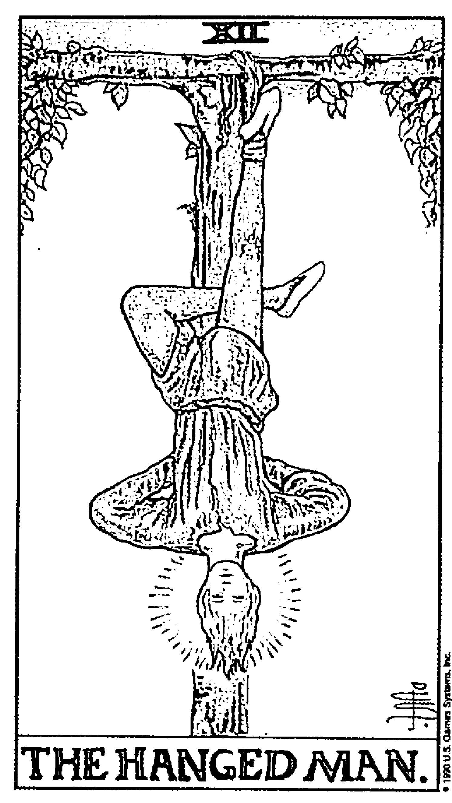
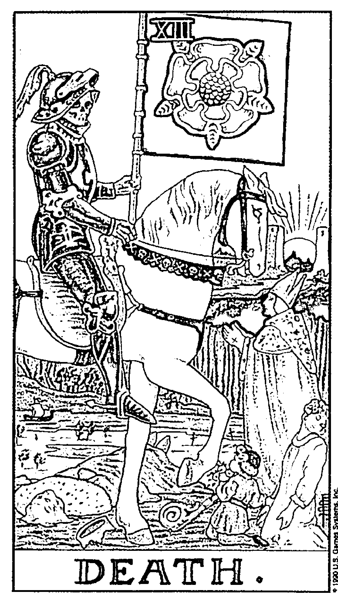
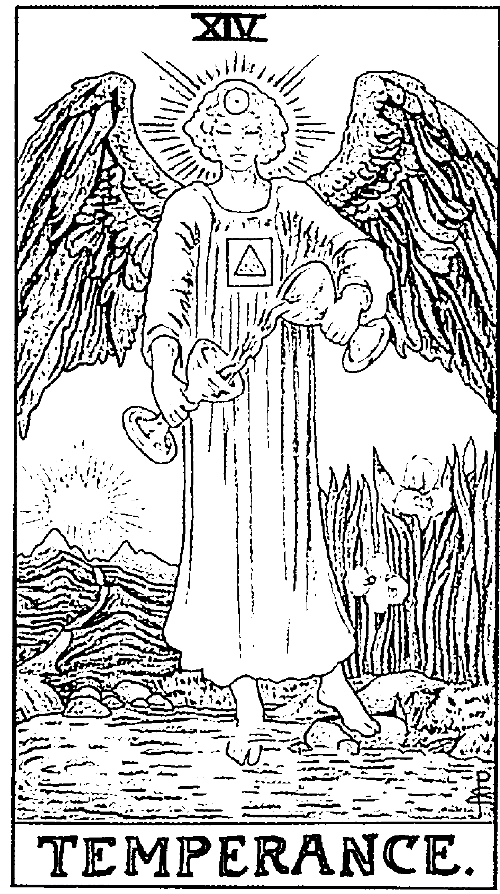
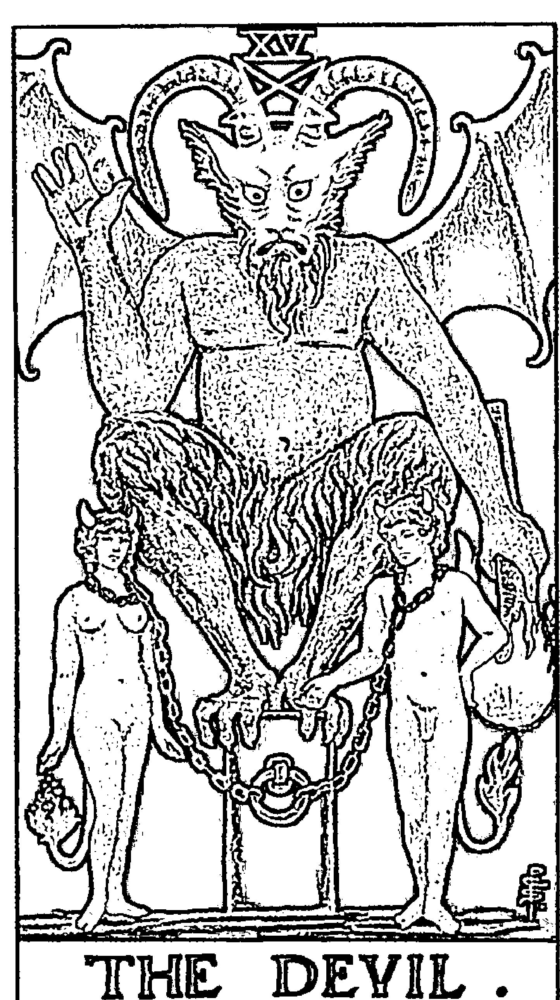

# 拥抱塔罗密码

# 【推薦序】

## 天降大任
愛心廣傳的靜唯老師

我跟靜唯老師認識也有數年了，他是我見過很有機緣的人，除了認識好的老師和學員，不斷自我學習成長的機緣外，也是生命中的經歷特別多元，事業、人際、感情、親情上的多層次經歷，讓她幫助個案解讀時，可以苦人所苦，藉由同理心去跟對方共振，而來到她面前的被諮詢者，都能夠得到安心與溫暖回家，這是一種罕見的能力，也是上天給予她很好的機緣，只是難免會覺得，她過得很辛苦，畢竟，能有如此機緣，便如孟子說：「天將降大任於斯人也，必先苦其心志。」因此，靜唯老師一路走來，並不輕鬆，常常需要處理不同的人生議題，跨越、成長，然後分享給大眾。

我想，能夠對每個來到面前的學員與朋友表現龐大的愛心能量，還是源自於靜唯老師的巨蟹本性，子玄學習星座已經數十年了，每每對星座上的驗證度驚嘆，特別是太陽星座只分十二種，但依據節氣來分類，卻又如此的精準和貼合宇宙、自然，巨蟹座是媽媽、是愛人、是慈悲的關懷者，靜唯老師顯示出一種如母親般的溫暖，對於來到她面前的朋友，包括我也感受到她的熱情，感染她的生命力，因此雖然忙碌，也是偶爾出席活動表示支持，對於她對這個社會的貢獻，感到佩服，也很希望她能夠持續的為這個世界付出，畢竟這是她的良好機緣。

於是，機緣又到了新的階段，靜唯老師要出塔羅相關的書籍了，關於塔羅的學術部份，書本和網路其實已經汗牛充棟，但能夠將書的內容貼近民眾的、寫的淺顯，則就有不同的功力，最重要的，是生命的案例，靜唯老師在解讀個案的貼心與溫暖，可以從書中探知一二，這才是學習者不可多得到的經驗，當然，也是想要藉由書籍了解自己的人，能夠快速進入書中知識的門道，有學習與經驗、案例的結合，才是一本親民的好書，這也是巨蟹座的能耐吧！

2019 年，是天王星進入金牛的年份，學習特別可以用在自己的生活體驗中，希望大家藉由靜唯老師的《擁抱塔羅密碼》，將書中的知識用在生活的安排、人際的應對和自我的提升上，相信這是一本對你的人生成長很有幫助的書籍。感謝靜唯老師在百忙之餘還寫出一本好書，嘉惠這個世界，也感謝靜唯老師找我寫序，希望大家都能一起成長，為了讓世界更好而努力。

曾子弘
2019.4.19

## 祝福・滿滿

關於塔羅牌的起源眾說紛紜，不過可信的是大約在十五世紀前後，流行於義大利。儘管最初作為占卜使用，但是因為天主教會的禁止，逐漸變成了紙牌遊戲，最終變成了現在的撲克牌。直到十八世紀後期，塔羅的占卜功能重新受到重視，並逐漸在神秘主義者的重新規範與定義中，擴充了原本的牌義解釋。今天的塔羅牌，大致可分為馬賽、韋特和混合系統三種。其中最受歡迎、影響力最普及的，當屬韋特牌系統。該系統源自十九世紀倫敦黃金黎明社團的萊德韋特，他重新整理了塔羅的體系，加入了占星與靈數的元素，使得塔羅牌的占卜更加系統化。

我很有幸當初在學習的時候，遇到了不錯的老師，知道從這樣的占星體系進入而非一般坊間流於唯心感應的歧途。簡單來說，塔羅所謂的大牌象徵了行星與星座，小牌除了對應的星座，更含括了靈數與四大元素。四大元素各自象徵了行動、感情、知識和物質，十二星座更隱藏有占星術中命、財、兄、田、子、僕、妻、疾、遷、官、福、相等後天十二宮位的意涵，配合上靈數的應用（這種靈數絕不同於坊間的資料，要由牌與牌的對比中做驗證與了解）彼此間環環相扣，牌義豐富而立體，並不是看圖說故事那麼的簡單。可知塔羅的占卜中知識的背景，遠遠要大於通靈的成份，是一種有系統的神祕學。當然如果討論塔羅牌面所對應的西方神話故事，更能看到西方中世紀的文化與歷史，可討論玩味的面相就更多了，只是超出占卜的範圍，在此暫不論述。

李靜唯是我當初塔羅家教的學生，對於學習命理認真而具有天份，在很短的時間內就能了解其中三昧，學以致用，現在也已成為人師，桃李滿天下了。如今著書立說，深為可喜。

祝她算命之路愈加寬廣，功成名就之際也能莫忘初心。

命理工作者 草山人

## 算數、定數、命數

李靜唯老師有醇厚的內心，以生活為師，對生命進行不同闡釋。取中西各家脈絡中的精髓，她化數致理，證己度人，這是積極生命實踐的妙境，亦為美的生命實踐。

我們常聽到許多人自小被視為非富即貴，或必將有成，有時這會成為自證預言，有時，變化卻也會逆天。我們想，事實真是如此嗎？置入不同時間與流動年歲，隨季節與心性變動不羈，萬物本就是流動的；如靈光乍閃，那些富貴或卑微、豪氣與康健，是否真如人意，或如某某的誰隨口拋出的語言應驗了。

比起大量曝光，自我宣傳的各種歷代人，我較相信一個人或一群人對於一門手藝、思維、學科能付出的時間，時間是水火，能夠淬鍊人的本事與心性。

大音希聲，不動之動，彷彿更接近理路的路途，而風景各異，人人不同。

你是不是也曾聽聞或親身經歷過不同類型的占卜、數學、論命、改運等各種巧妙幽微的行動與事蹟？以自己的親身經驗為例，大家都知道，建築是一個集合了各種工法、數學、力學、美感與設計的可能性的實踐類型的職業與志業。我們當時的校園中有各種植物花樹、鳥與松鼠，那是春夏。我記得，在一堂建築課程上，講堂上，那位學習過拉丁文與希臘文字的教授，他從文藝復興時期的廣場，講述到哥德式建築，又論及近現代幾位大建築師，偶然間，他提到流年與命運，岔出了正題，提到了大建築師柯比意的流年與命勢，夾敘夾議，生老病死，而頭頭是道。那半個小時，許多人聽得津津有味，中西的應證，古今的比對，一個名流青史的西方大建築師是否想到他自己的命運可以是如此或這般的，被人這樣理解著。

李靜唯老師以她的生命應證這項學問，付出許多時間與心力，復以她半生所學來為人解惑提點，將她的所學所悟所感帶給有緣人，這是緣法的流動。

吉凶悔吝，成住壞空，慈悲喜捨，由數至心。

人有不同的階段、階級與性格，亦有不同的環境與遭遇，我也有遇過同年同月同日生的朋友，甚至我們是同一個時辰降生的，我們卻有不同的性格與命數，我數學、運動好過她，她的哲思與琴藝卻遠勝過我，這差異只在一瞬之光。

我們都像個孩子，在世界的溪流中漂泊。天命難測，因果人為，天地間的生剋變化中，高高低低，是沉溺其中或雲淡風輕，個人遭遇各異，造化修為不同。中國自周朝開始有《河圖》、《洛書》，自古至今，印度與西方也有自己的生命學問，塔羅二字深廣宏遠，我所識的李靜唯老師認真而不執著，她的作品將能帶給人影響，這是一份給有緣閱聽人的溫柔禮物。

文明是血液中的 DNA，我們就像灑在不同土壤上的種子，當這個時代，各種癮與毒質幻化成不同的相貌，有人搶搭權力的渡輪，攀附慾望的列車，甚至將自我靈魂的高貴變賣給出價的人與機構；這時候，若有人指路，若能靜心，認識自己，吸納閱讀美好深刻的養份，會是多好的轉變。生命就像一枚硬幣，正反之間，捏起每一枚不同的硬幣，那圈連綴側面的圓的那一環，或許就是「時間」。李靜唯老師作品，帶著祈禱與助人的真誠，祝福這本書的讀者。

2019.04.07 12:56

多年來，在研究命理術數這條路上，我始終堅持以中西合併，多元化及包容的心態去不斷驗證和融會貫通。

# 【自序】

## 知命，運命，而不是被命運所操縱

距離我的第一本書《相遇在印度占星》整整三年了。

記得這本書是在 2016 年 6 月出版，雖然想要學習印占的客戶很多，但古印度吠陀占星博大精深，學習門檻較高，所以我決定從最簡單入門的塔羅占卜招生，同年 9 月我第一屆塔羅職業班開始教學，到目前為止，台北、台中已經有六屆學生，由於招生對象一直沒有對外公開，全部都是我命理群組的三合一客戶，所以我非常享受小班精緻教學的樂趣，也十分樂意完全不藏私的傾囊相授。

由於我從大學時代就對命理五術充滿興趣，最早看遍各種命理書籍自學，一直到兒子幼稚園時才開始正式拜師學藝，在這段漫長的學習生涯中，唯一讓我覺得最簡單易懂，實用性最高的就是塔羅牌。直到現在我面臨重大事件時，除了參考印度占星大運流年流月運勢之外，我一定會搭配塔羅占卜來決定當下要立刻抉擇之事。譬如何時出國機遇最好？短期工作發展？兩人之間感情的關係？哪間房子風水格局最適合我？等等不一而足……但我絕對不會事事占卜，雖然命理諮商師是我的職業，但我從不鼓勵盲目迷信，可每個人的人生總會面臨幾次徘徊在十字路口，不知該向左轉還是向右轉的時刻？這時候占卜就是一個很好的工具，可以透過憑直覺選擇的牌卡，也就是所謂潛意識來幫我們釐清一些讓自己身陷其中，當局者迷的問題，進而提供占卜者一個最中肯的建議及方向。

從 2010 年學習塔羅開始，我的粉彩偉特塔羅已經跟了我將近 9 年，這中間曾經因為掉過幾張而重新換過一次，如今已然有了歲月的斑駁和陳舊的痕跡，這 80 張塔羅牌陪我走過超過 3000 多個日子，我總是跟學生說要跟你專屬的塔羅牌建立感情，常常跟它對話，所以每張牌都有屬於它的靈性與閱歷……。

學習塔羅看似簡單，其實能夠真正掌握牌義的訣竅才是最重要的，雖然坊間充斥太多塔羅牌義介紹的書籍，可謂百花齊放，大同小異，但選擇好的老師和不斷練習解牌才是成為一個優秀占卜師的不二法門。

兩年前學生介紹一本結合塔羅及生命靈數的翻譯書給我，我突然靈機一動，為何不將西元出生年月日結合塔羅牌來發展出屬於個人專屬的生日密碼？就像西洋星座分析性格般普及且琅琅上口？於是我開始研究塔羅〈人格牌〉，〈靈魂牌〉，〈財富牌〉，〈愛情牌〉及〈流年牌〉的公式，盡量用最簡單明瞭及人性化的牌義來分析一個人的整體性格及內在情緒，甚至精細到每個流年必須掌握的大方向。雖然生日密碼是用塔羅 22 張大牌來解釋，但因為牽涉到牌義正逆位問題，嚴格來說實際解牌一共有 44 種不同的意涵。

多年來，在研究命理術數這條路上，我始終堅持以中西合併，多元化及包容的心態去不斷驗證和融會貫通，最後只得到一個再簡單不過的結論，那就是——

每個人從呱呱墜地，脫離母體的那一刻起，命運的藍圖與結構已然成立，不論用何種命理來推算一個人的吉凶禍福，富貴窮通，其實結論都是一樣的。絕不會因論命方式是用東方的紫微八字，亦或是西方的占星塔羅而讓命運改變。所謂異曲同工，各擅勝場，每個命理術數都有它的強項與不足的地方，雖然塔羅密碼不如印度占星精細，但它真正的精髓並不是以算運勢為主，而是著重於一個人整體性格的分析，所謂性格決定命運，當你了解了自己性格上的優缺點，就可以學習改變自己，加強彌補自己個性上的死穴與罩門，而不是一味地跟著命運的浪濤隨波逐流……

所以我們要先懂得知命，而不是宿命；懂得運命，而不是被命運所操縱。

感謝我的學生王耀邦及陳奕偉幫我整理及編輯塔羅教材，如果不是因為他們的鼎力相助，這本《擁抱塔羅密碼》的出版也許永遠遙遙無期。講到這裡就必須用塔羅密碼分析一下我自己囉，因為我外在人格是經常有選擇性障礙的〈審判牌〉，內心卻有著〈女祭司〉敏感而纖細的靈魂，導致我對名利的追逐並不是這麼熱衷，反而比較會跟著自己的感覺走。這個生日密碼的優點是我從未停止追求自己內在智慧的成長，所以 2017，2018 年我連續考上大陸，美國〈情緒療癒師〉證照；缺點則是我有很嚴重的拖延症候群，尤其關於截稿這件事，總是不到最後通牒不會提筆，所以常常會讓自己陷入天人交戰的糾結混亂當中……

2018 年我的流年走〈命運之輪〉，不論是感情還是事業都發生了一連串命中注定該發生的事，不管是好的壞的，快樂的還是心痛的，如今想來一切的一切都是老天爺早就安排好，送給我人生的禮物；2019 年終於走到〈正義〉牌，也象徵著我過去所有累積的努力及付出都會在今年得到一個最公平公正的結果。

人生太短，想要做的事太多。
就像跑一場考驗耐力與體力的馬拉松
沒有奇蹟，只有累積。
就像烏龜與兔子賽跑
不到最後，沒有人會知道誰是真正的大贏家。

# 引言

數字的發明對於人類的文明與文化產生了歷史悠久的影響，這股影響力的成效在現代的各個領域中都能察覺，舉凡數學、物理學、建築學乃至於近代發展而出的電腦科學和航太科學都需要數字這個重要的元素。

希臘瘋狂的數學家畢達哥拉斯透過數字對於西方的玄學也有許多的貢獻，為什麼我會用瘋狂來形容他呢？這個人就是大家耳熟能詳畢氏定理的發明人，用盡一生都在傳達一個概念，他認為數字具有超凡的意義可以解釋萬物背後的一切真理，藉由數字能夠完整的詮釋人生的意義，生在西元前五百多年的他，在當時秉持著這樣的理念四處宣揚真的很瘋狂！

畢達哥拉斯將每個人切身相關的數字加以解釋，這些數字就是每個人的出生年月日，這些與生俱來的數字可以用來證明每個人性格的優缺點，以及自己該正視與學習的課題。

依照他的論述，天生的性格特質會自然而然的引動學習的課題，從這一點也能夠解釋為何在相同父母以及環境成長的人，會有截然不同的興趣，畢達哥拉斯在提倡的觀念裡是希望人們去發掘自己人生的課題到底是什麼，並進一步的發揮優點改善缺點，數字也能代表一個人的身份特質與生命特徵，潛藏在數字裡的能量更能促進人與人之間的互動與連接，讓生命的意義更為昇華。

隨著西方歷史的發展，這一套哲學一直廣為流傳，直到中世紀末期開始出現了一種紙牌遊戲，也就是現在我們所熟知的塔羅牌，塔羅牌的誕生與起源眾說紛云，不過這不是本書想要探討的重點，而是這種以透過圖像牌卡傳遞訊息的概念在當時是一種很先進的文化，這一點與中國的易經就有著異曲同工之妙。

對於易經略有研究的人都知道，這是一個只有陰陽兩種符號組合而成的一本經書，人們對於符號的認知加以使用文字解釋，在史書上最早的記載是在周文王時期，爾後還有孔子對於周易的讀後的心得報告稱為十翼。

身為中華兒女，有時候真的很佩服老祖先的智慧常常比西方先進數百年，好吧！言歸正傳，塔羅牌從原本是貴族之間的一種遊戲，後來發展到民間成為占卜的工具，這樣的紙牌為何能夠成為窺探吉凶的占卜工具呢？

除了把人類的意識與想法用圖像表現出來外，也同時融入了流傳許久的生命數字系統，因而造成文藝復興時期科學與天文學的突飛猛進。現在我們所看到的塔羅牌才會結合了占星學、生命數字學、色彩學，以及心理學。

常常有人會問我，為什麼塔羅牌具有準確性？這個答案就跟心理學有著非常密切的關聯，在我研讀情緒治療師的課程時，學到了很多心理學相關的專業課程，其中一位心理學界的重要人物——卡爾·榮格，在他終其一生的研究當中，就有談到塔羅牌這一類的占卜工具，為何會有準確性。

首先，他承襲了名師佛洛依德的潛意識理論，並且加以提出了兩個概念，分別為：「個人潛意識」及「集體潛意識」，他認為人們對於圖像都會有既定的印象與概念，例如，看見骷髏頭都很容易聯想到死亡，看見黑色會感受到寂寞與冷淡。

基於這樣的基礎，塔羅牌的圖案就能夠反映出問卦者當下的潛意識與意念，對於占卜未來會有準確度就要提到榮格所提出的另一個理論——「共時性原理」，這個理論簡單來說就是一種巧合，而且是無關因果的巧合，而這些看似偶然發生的結果，往往會與占卜時的牌卡有著微妙的關聯性。

有人總是會覺得算命占卜都是一種迷信，一點都不科學，這讓我想起了偉大的科學家牛頓，牛頓生活在一個凡事都要講求實驗、追求結果的年代，但是其實這些偉大的科學家也曾相信很多很荒謬的理論。例如，把一隻溫馴的狗的血液灌輸到另一隻凶暴的狗的血液中，他們相信如此能夠改變狗的性格，但是唯一特別的是他們會透過實驗結果，來驗證自己所相信的理論是否為真。

牛頓所提出來的著名理論表面上是物理特性，實質上涵括了很多意想不到領域。以牛頓第一運動定律為例：靜止的物體會保持靜止，直到有淨外力施加於此物體為止；運動中的物體若不受外力或淨外力為零時，則其速度的大小與方向都不會改變。

這個定律運用在塔羅占卜時，牌面上的結果若是與問卜者心裡所想相同時，一切都會靜止不動不會改變。

假若牌面的結果與問卜者心理預期不一致時，問卜者都會想要做些什麼來改變答案。

牛頓的第一運動定律解答了占卜的成果，當你有疑惑進行占卜，你若不改變你的未來，就像物體一樣是靜止的。若是你的未來正在往壞的方向前進時，你若不改變你的未來，還是會保持相同的速度與方向往壞的結果前進。可見占卜的成果與原理和準確度可以使用科學的理論解釋時，你就再也不會覺得算命是一種迷信了。

隨著時代的改變，塔羅牌也一直都在演進，現在最廣為流傳的塔羅牌的創製者是亞瑟·愛德華·偉特，他是美國出生的英國人，也是英國著名的神祕學團體——黃金黎明協會的成員，他所創製的塔羅牌稱為萊德偉特牌，其牌義與圖案與其他的塔羅牌系統不同。

最初版的圖案只有黑白兩色，後期幾位著名的畫家依據他對於牌卡所賦予的意義增添了色彩，有趣的是他和榮格是同時期的人物，兩人大約相差近二十歲。

這一套塔羅牌就充份展現了占星學、數字學、色彩學，並且將內容與神話故事和聖經故事結合。

因此我都會建議想要學習西方命理的人第一步先學塔羅牌，從這一個點為基礎，再深入研究其他的學理，本書將會以最淺顯易懂的方式讓讀者了解牌卡的意涵，以及透過案例的分析與解說，讓讀者知道如何解讀占卜的答案。

## 認識塔羅牌

一副完整的塔羅牌總共為七十八張，結構設計上分為兩大部分，內含三種類型，第一大部分為大阿爾克納，有二十二張，牌簡稱為大牌，並且將牌卡編號標示為 1～21 號，以及一張編為 0 號的牌。

另一部分的牌共有五十六張，稱為小阿爾克納，簡稱小牌。小牌分為四種花色，分別是代表火元素的權杖、水元素的聖杯、風元素的寶劍，以及土元素的錢幣，每一種花色有十四張牌。在小牌當中又區分為兩種，一種是編號 1～10 的數字，另一種是用四種人物做為代表的宮廷牌，宮廷牌的角色分別有：侍者、騎士、皇后，以及國王。一副塔羅牌中一共有十六張宮廷牌。

大牌的設計原理是用來表達很抽象的觀念，以及人們的精神層面，所以大牌的牌義會有很多很深層的哲學思想意涵，小牌的設計原理就著重在世間上具體的人、事、物，宮廷牌的設計就是依據當時社會文化所創造出來的階級與職業之分，以階級而言，侍者代表平民，騎士代表貴族，皇后代表柔性的掌權者，國王代表剛性的掌權者。以職業而言，權杖代表農民，聖杯代表神職人員，寶劍代表軍職，錢幣代表商人。所以塔羅牌的設計涵蓋了哲學與觀念、人類的階級職業，以及各式各樣的事物，由於涉及範圍很廣，因此也才會用來占卜論斷吉凶。

元素觀念在塔羅牌的設計中也佔有重要的一環，中國的命理把元素分為五大類。分別是木、火、土、金、水，並且有相生與相剋的觀念，然而西方命理認為萬物元素只有四類，分別為火、水、風、土，彼此之間並無關聯性。其實熟悉東西方命理的人就會明白，其實兩種文化中的元素觀念其實都是相同的東西，東方元素的木類似於西方元素的水，這兩個元素所指涉的都是生命，東方命理以樹木代表生命，表現出生命的長度、強度、韌性，以及結束也是另一種開始。西方命理認為水代表生命萬物滋長，生物的成長都離不開陽光、空氣、水。東方元素的水類似於西方元素的風，所指涉的都是捉摸不定的變化。對東方命理而言，水是一種捉摸不定的東西，沒有固定的形態。當數量龐大時還會造成災害。對西方命理而言，風是一種感受的到卻無法控制的東西，而且風在自然界中也是千變萬化的。威力強大到一定程度後也會造成災害，例如害，例如颱風、颶風和龍捲風。東方元素的金類似於西方元素的土，泛指有價值的資源，在東方社會裡選擇用黃金或一些好切割的金屬做為市場交易的貨幣，對東方人而言就是一種財富。然後西方文化中也同樣是用金屬來鑄造貨幣，而金屬的來源就在土壤裡。火元素在東西方的文化指的都是相同的東西，代表著能量。

有人一定會好奇那麼東方命理的土代表什麼？這個問題的答案就跟地理位置，以及宗教文化有很大的關聯性。我們都知都歐洲人主流信仰是天主教，並且認為人死後的世界只有天堂和地獄，一旦人結束了自己的生命之後，經過最後的審判一切就底定了。

反觀東方受到印度佛教文化的影響，死後的世界雖然也是有天堂與地獄，但是卻畫分出了六個領域。分別是天道、阿修羅道、人間道、畜牲道、餓鬼道、地獄道。可是在佛教的系統中是會給人機會改變的，所以會依照每一世的修為讓自己轉變領域，我們稱為六道輪迴。

而這樣的包容性與轉變性就是東方命理土元素概念的原型，而印度人也因為在宗教裡有空與無的概念，所以在阿拉伯數學符號上發明了「0」這個符號，這個符號發明的重要性堪稱是人類發展史上前十大重要的發明。而這個數字觀念的流傳也影響了塔羅牌大阿爾克納的牌組順序，其中一張影響最為明顯的就是編號為 0 的愚人牌。（註：本書因為方便塔羅密碼計算公式的運作，所以將愚人牌的編號設定為 22）

解讀塔羅牌需要理解的不僅僅是牌義而已，必須懂得牌組的設計原理，從文化與歷史的角度深入了解整套占卜系統的演進，才能夠清楚的明白牌面對於問題所要表達的意涵。

不過解牌時難免還是會出現解讀者看法不同，以及認知不同的問題，因此市面上還是有出現許多與以偉特牌為基礎而衍生出的各種圖案畫風的牌卡，不過只要我們擁有科學的精神、累積案例做事後的分析，最終會最貼近真相。

占卜的準確性對於大多數人來說都是非常重要的。在實務經驗中會發現，事後驗證不準的牌面其實都隱藏著某種真相與答案，只是當下占卜師並未理解到牌面上有如此深層的含意。所以市面上的占卜師收費有高有低，取決於占卜師專業上的修為與經驗的累積和傳承。

## 塔羅密碼 1

### 魔術師

#### 密碼意涵

魔法師是塔羅密碼 1 號的象徵，偉特所設計的魔術師以中世紀時期的煉金術師為樣版，這類型的人都擁有非常靈巧的一面，並且充滿著自信與驕傲。

#### 圖面解說

右手指天，左手指地，象徵將上天的旨意帶到凡間。顯示有足夠的能力扮演溝通的重要角色，並且帶來能量正面的消息。

桌面上的聖杯、權杖、錢幣與寶劍各自代表了自然界的四大元素，顯示魔術師本身已俱備充足的能力可以輕鬆自在地掌控一切。

花叢裡的紅玫瑰與白百合，代表著男女之間的感情心境，紅玫瑰象徵熱情，白百合象徵純潔。

腰上所配帶的蛇環腰帶，這條腰帶蛇咬著自己的尾巴，代表一種循環的意涵，暗示魔術師擁有豐富的創造力，並且生生不息，創意無上限。

頭上的無限符號代表著力量與變化沒有極限，而在頭頂位置也象徵智力高的意涵。

#### 故事起源

魔術師這張牌是描述希臘神話中的信使赫密斯（Hermes），他是宙斯（Zeus）與山林女神所生的孩子，從小就非常頑皮，曾經偷走了哥哥阿波羅的牛，之後更是變本加厲的偷走了爸爸的閃電。他非常頑皮，年幼時，他的才華與能力可說是相當充沛，只是沒有用對地方。

長大之後赫密斯因為他的聰明與機伶被宙斯封為信差之神，時常往返於天界與人間。右手拿著信件指向上天，左手指向地面。就是在展示他身為信使的身份與能力。傳說中他擁有一根蛇杖可以治療百病，因此在圖畫中這根蛇杖化身為他的腰帶。他因為聰明才智過人，也身兼了商業之神及科學之神的職位，牌面中才會以四大元素的物品和頭頂上的無限符號，來顯現他的才華洋溢。

#### 密碼意涵

魔法師是塔羅密碼 1 號的象徵，偉特所設計的魔術師以中世紀時期的煉金術師為樣版，這類型的人都擁有非常靈巧的一面，並且充滿著自信與驕傲。

對於各種事物容易產生好奇心與熱誠，善於溝通。為人大方喜歡幫助朋友解決問題，但是由於鋒芒畢露，有時候會在不知情的狀況下得罪人而不自知。

雖然說表現自己自信的一面是一件好事，但是有時還是要選擇場合，並且懂得收斂和低調。謙虛與低調往往是才能者最佳的生存工具，人不要只單方面的想要往成功邁進，當你將自己的修為與才能鍛鍊至頂峰時，成功自然而然會來找上你，到時候你想掙脫都不容易。

#### 牌位解析

魔術師這張牌面往往代表著這個人反應很快，頭腦機伶，是一個天生的業務高手。

當牌面呈現正位的時候，代表學習力極強、有著過人的機智，同時也代表新的機會、創新、改變的時機的意涵。

當牌面呈現逆位的時候，容易流於吹噓浮誇，巧言令色，說話容易得罪人或被人欺騙。

#### 占卜意涵

這是一個美好的開始，也是一個好的機會要好好把握，拿出自信心相信自己一定能夠辦的到，展現出自己如同魔術師般的渲染力去感染身旁的人，老天自然會給你好消息，讓一切都能順利進行。

其實你所面對的難題，資源與工具已經掌握在你自己的手中，只要肯主動出擊，成功機率已經有一半以上了。

在困境中找到新方法或新觀念是你能突破的關鍵點，多學習新事物能夠讓你眼界與人脈大開，激發出你的創意與才華，讓你展現如同魔術師般閃耀動人心想事成的魔法。

### 名人案例

史蒂夫·賈伯斯（Steven Jobs）出生於西元1955年2月24日。賈伯斯是一位美國知名得企業家、發明家及創意家，美國蘋果電腦的聯合創辦人之一。

在他的生平，他在幾個重要的時機點發揮了他的創意與想法創造許多日後改變人類生活習慣的商品。例如：我們所熟知的iPod、iPhone、iPad以及最早在PC電腦上採用圖型介面作業系統，都是在當下那個時代的人難以想像的技術與商品。

賈伯斯被認為是電腦業界的指標性人物，他曾七次登上時代雜誌的封面。並將美學至上的理念推廣至全世界，他傳奇性的一生可以說是非常徹底的展現出魔術師這張牌所有正負面的特質。

## 塔羅密碼 2

### 女祭司

#### 密碼意涵

女祭司是塔羅密碼2號的象徵，偉特所設計的女祭司除了參考了希臘神話中波瑟芬的角色與故事外，也結合了古埃及神話中的月亮神。他想要用這一張牌來突顯女性陰柔的力量，與中國太極所表達的以柔克剛不謀而合。

#### 圖面解說

頭頂上的王冠代表在陰性的智慧，而坐在中間胸前掛著四邊等長的十字架，代表著女祭司擁有著平衡陰陽的力量。

女祭司在古埃及文化中表示具有法術及醫術的能力。聖經故事中索羅門王在耶路撒冷建立聖殿中柱子上刻有 B 與 J 的字樣，左方的黑柱（Boas）與右方（Jachin）的白柱代表著陰與陽，聖殿後方的水池象徵著不受情緒的干擾能夠冷靜的判斷是非對錯，高雅文靜的女祭司也是在反映出靜默旁觀的觀察一切。

腳下的上弦月代表著新生卻還不成熟的特質，也象徵著女性的直覺能力。手裡拿著的卷軸象徵深奧的智慧，卷軸上 TORA 意思是律法，也代表著女祭司對於法律、平等及遵守規範是非常的重視。

#### 故事起源

女祭司這張牌的故事描述的是希臘神話中冥界皇后波瑟芬（Persephone），她是宙斯（Zeus）與狄密特（Demeter）所生的女兒。

春秋詩經裡提到「關關雎鳩，在河之洲，窈窕淑女，君子好逑」。相傳有一次意外的讓冥王黑帝斯（Hades）見到了這位美麗動人的小姑娘，強行的就將波瑟芬帶回了冥界。女兒被強行帶走後母親狄密特非常的傷心難過，終日以淚洗面，以至於造成了大地的蕭條。宙斯看到這個情形實在是不忍心讓自己的妻子鬱鬱寡歡傷心難過，於是挺身而出來到冥界要向黑帝斯討公道。

宙斯使出渾身解數動之以情、說之以理，加上了武力鎮壓，最終冥王妥協願意讓波瑟芬離開冥界回到母親的身邊。自從她回到母親身邊後狄密特心情愉悅大地又恢復成生氣勃勃的樣子，不過黑帝斯也不是省油的燈，他在波瑟芬離開之前給她吃了一種毒藥，藥效每半年會發作令她身體非常難耐必須回到黑帝斯身邊才能緩解，而這樣的循環造就了大地每半年朝氣勃勃另外半年非常蕭條，據說這就是春夏秋冬四季的由來。

#### 密碼意涵

女祭司是塔羅密碼 2 號的象徵，偉特所設計的女祭司除了參考了希臘神話中波瑟芬的角色與故事外，也結合了古埃及神話中的月亮神。他想要用這一張牌來突顯女性陰柔的力量，與中國太極所表達的以柔克剛不謀而合。

塔羅密碼 2 號的人代表著是一個冷靜成熟、靈性很強的人，能夠敏銳觀察一切事物並加以精確的剖析，不過有時候又太過於依賴直覺而造成失誤。

此外，這樣類型的人擁有著非常矛盾的特質，一方面喜歡獨自面對一切，而另一面又渴望別人的呵護與照顧，從神話故事中我們可以感受到波瑟芬對於問題雖然總是獨自承受，但內心其實很想回到母親的懷抱。

所以這類型的人有時會產生兩種極端的面向，不是過度有自信就是依賴心過重。他們也許並不善於人與人之間的溝通交際，但是對於自己有興趣的事情會不顧旁人的眼光，廢寢忘食，專注的投入其中。

#### 牌位解析

女祭司這張牌面代表著情緒的控制會是一大課題，很多的問題往往來自於心情的調整，內心過於敏感纖細，感受力特別的強大，也因此容易受到外界的環境影響自己。

當牌面呈現為正位的時候，代表內在的靈性和直覺特別強，也是一個很有智慧的人。所以只要跟著自己內心的感覺走，對自己很有興趣的事物就會十分專注，完全不會在意外界的眼光。

這張牌同時也代表對於「神秘學」、「宗教」、「玄學」很有天份，只要專注在內在的成長或發展自己的天賦，才可以達到一個身心靈平衡的狀態。

當牌面呈現為逆位的時候，會展現出無法控制情緒，過度情緒化的狀況，有時候也會太過在意他人對自己的看法，所以情緒控管對逆位女祭司來說是非常重要的。

#### 占卜意涵

女祭司這張牌顯示當下按兵不動，靜靜的觀察是最好的方式，等待事情有進一步發展之後再擬定策略，面對危險時要保持距離以策安全。

有些事情並不是非黑即白，總是會有模糊混沌的灰色空間，試著透過理性的觀點取得一個最佳的平衡點，這個平衡點在實務中或許會非常難找到，但是貿然的決定往往會讓事情的發展更難收拾。

女祭司這張牌顯示感情上的關係會處在一個不穩定或若即若離的狀態，同時也表示感情非當下的重點，此時唯有耐心的等待，以不變應萬變才是上上之策。建議可以透過精神上的寄託。例如：修行、占卜、命理玄學等方式為自己的疑惑尋求解答，藉由不一樣的視角來看待自己內在的問題。

### 名人案例

莫札特（Mozart）出生於西元 1756 年 1 月 27 日的薩爾斯堡，他的父親是薩爾斯堡大主教教廷交響樂團的演奏家和作曲家，生長於音樂世家的他 3 歲就展現出自己在音樂方面的天份。他不僅具備絕對音準，還擁有超出常人的記憶力，5 歲時就請求父親教大鍵琴給他學，隨後亦涉及小提琴、管風琴和樂曲創作等。

從他的成長過成中可以觀察出，他對於自己的天份與興趣的結合是專注的，並且全力投入在其中，這一點非常符合塔羅密碼 2 號的特質。

他的塔羅密碼流年走到了命運之輪，這一年正是 1782 年，神聖羅馬帝國皇帝約瑟夫二世要求他完成一部歌劇。這就是後來的《後宮誘逃》，這個作品讓維也納作曲家兼公眾音樂會指揮克里斯托夫·維利巴爾德·馮·格魯克非常感動，並對莫札特讚譽有加。

兩年後他加入了共濟會，開始他人生最輝煌的音樂人生。流年牌的掌握對於成功是有很重要的影響，而命運之輪是一張成長與墮落的轉捩點，他將自己所學的在那一年全數發揮而影響了他日後在音樂上的成就。

## 塔羅密碼 3

### 皇后

#### 密碼意涵

皇后是塔羅密碼 3 號的象徵，偉特在設計這張牌時是想要表達出狄密特心情愉快的一面，穀物生意盎然、森林茂密、河水湍流，一切的一切都非常的美好，同時也表達出女性母愛的特質，塔羅密碼為 3 號的人，性格是很溫馴但是柔中帶剛，這類型的人有一個天生的缺憾就是感情往往是自己最大的課題，很多皇后牌的人情感世界極其敏感複雜，有些人是控制不住自己，總是會同時間愛上不同的人。

#### 圖面解說

右手握著權杖並且高舉，象徵著女性也能夠擁有權力的意思，也意謂著女性不必遵循傳統處於被動狀態，只要願意都可以主動出擊的方式掌握主導權。

頭上皇冠上的星星共有十二顆，代表著十二星座，表示能夠擁有掌控時間的能力，並且時時刻刻都能有最佳的靠山。

穿著輕鬆坐在舒適的椅子上，象徵著放鬆自在能夠享受物質上方面的成果。

後方的森林與瀑布象徵生命力源源不絕，也代表著皇后能夠孕育出大地萬物。

前方的金黃色麥穗，代表著物產豐饒，也顯示時機已成熟能夠收割成果了。心型符號和金星符號象徵愛情，這也是愛與美的化身，這張牌顯示外表對於愛情有著強大的吸引力。脖子上的項鍊有七顆珍珠，這代表古典占星學中的七顆星，象徵能掌握局勢力量。

#### 故事起源

皇后這張牌的故事描述的是希臘神話中大地女神狄密特（Demeter），她是宙斯的眾多妻子之一，也是對人類最友善的希臘神其中一位，因為她有規律的掌管穀物的生長，才使得人類在大地上的生活可以得到溫飽。

而她在希臘神話故事中最有名的一段就是女兒遭冥王黑帝斯強行娶走，這一段故事也是一年會有春夏秋冬四季的由來。

皇后牌象徵是一位地位崇高的女性長輩，所以當有衝突時還是要尊重長輩，事情才能圓滿解決。

#### 密碼意涵

皇后是塔羅密碼 3 號的象徵，偉特在設計這張牌時是想要表達出狄密特心情愉快的一面，穀物生意盎然、森林茂密、河水湍流，一切的一切都非常的美好，同時也表達出女性母愛的特質，塔羅密碼為 3 號的人，性格是很溫馴但是柔中帶剛，這類型的人有一個天生的缺憾就是感情往往是自己最大的課題，很多皇后牌的人情感世界極其敏感複雜，有些人是控制不住自己，總是會同時間愛上不同的對象。

皇后牌因為母性強烈，所以有些人會把感情對象當成自己的孩子般照顧的無微不至，可是過多的關心往往會讓對方感到害怕而想要逃避。

#### 牌位解析

皇后這張牌，象徵博愛、溫柔，有著明顯的陰柔性格特徵。皇后牌也代表著貴人（尤其是女性貴人）意涵，意味著人緣好，也善於打扮與包裝自己。

當牌面呈現為正位的時候，皇后牌象徵著同時擁有財富與愛情，也很得女性貴人的疼愛，懂得讓自己享受與品味美好的生活。容易扮演照顧者，主導性強但善解人意，喜歡成為眾人的目光焦點。

當牌面呈現為逆位的時候，則會變成多愁善感、情緒不穩定。只在乎自己感受，自私的性格會浮現出來，容易成為大家口中的公主病／王子病。

習慣享受別人對你的好感，耽溺於物質金錢方面，以至於虛榮心過重，所以當運勢低落時，就會變成虛索無度、被眼前的浮華所誘惑。

#### 占卜意涵

皇后牌是一個可以放鬆好好享受的歡樂時光，帶著放鬆愉快心情的去面對問題會有意想不到的好結果。這張牌顯示目前的產量非常充足，只要願意行動並且盡一切最大的努力，豐厚的收穫即將等著你來收割。只要你用心去感受，一切美好的事物其實已經悄悄來到了你的身邊。

### 名人案例

英國維多利亞女王（Queen Victoria）出生於西元 1819 年 5 月 24 日，維多利亞是肯特與斯特拉森公爵愛德華親王之女。

愛德華與其父喬治三世同時在 1820 年去世，維多利亞在母親薩克森·科堡·薩爾費爾德公主維多利亞的嚴格監督下成長。因為父親三個長兄都未留下合法子嗣就去世了，時年 18 歲的維多利亞於是在 1837 年繼承王位，1876 年 5 月 1 日開始成為英國女皇。

她在位期間長達 63 年又 7 個月，這個時期在歷史上稱為維多利亞時代，這是英國一個工業、文化、政治、科學與軍事都得到了相當大的發展的時期。

而這位女皇私生活也引發了不少爭議，晚期她有一名與她深交的僕人阿卜杜勒·卡里姆，這段故事後來也被拍了一部電影。片名叫做《女王與知己》，描述晚年的女王是當時世界權力最大的人，內心卻是相當空虛寂寞，她所深愛的另一半離開她將近三十年，在深宮裡有充斥著鬥爭，完全沒有可以談心的對象，阿卜杜勒的出現帶給她生命新的活力。不過實際上英國皇室對於這一段歷史插曲是極力的想抹滅，可想而知女皇的感情世界是充滿了多少秘辛與無奈。

## 塔羅密碼 4

### 皇帝

#### 密碼意涵

皇帝是塔羅密碼 4 號的象徵，偉特在設計這張牌時完全仿造了宙斯的感覺，並且也同時參考了中古世紀羅馬帝國的皇帝，不過這張牌表面上是賦與了帝王一切優渥的條件與特質、實質上也充滿了許多暗喻。

#### 畫面解說

右上握著 T 字型上帶有圓圈的古埃及十字架代表著宇宙、生命、重生，對古埃及人而言這個十字架掌握著死後復活的力量，象徵著皇帝掌握著生殺大權。

背後的寸草不生的岩山，以及下方的河流，一個代表堅定剛強的意志、一個代表著君主需有仁慈之心，也象徵帝王所統治的江山。

乘坐的石椅上鑲有四個羊頭裝飾，象徵行動力與執行魄力，也代表著皇帝擁有承擔一切的使命感。

左邊所握的相傳是地球，代表著掌握著自己所管轄的領土，另一方面也代表穩定與穩固的意思。身上的服裝一部分是穿盔甲以及嚴肅的表情，象徵帝王內心雖孤單卻還是要武裝起來保衛自己的最後一道防線。頭頂上的皇冠是尊貴與榮耀的象徵，也表達出階級之意。

#### 故事起源

皇帝這張牌的故事描述的是希臘神話中三大主神之一的宙斯（Zeus），他的權力很大是整個世界的支配者，相傳他是靠著努力與毅力推翻了自己殘暴的父親而取得皇位，掌握權力於一身的他非常愛管閒事，只要誰一不小心得罪他或是讓他不高興了，他就展開懲罰，以天神界來說他是一個不太受大家認同的一個領導者。

白居易在〈長恨歌〉裡曾寫到，「後宮佳麗三千人，三千寵愛於一身」來形容皇帝神秘的感情生活。這一位高高在上的天神宙斯也不例外，他平時的樂趣就是四處尋找美女，喜歡的就大力追求，涉及的範圍除了仙界之外，連凡人也不放過，許多希臘神話中的神，都是他和凡間女子所生的子女。

#### 密碼意涵

皇帝是塔羅密碼 4 號的象徵，偉特在設計這張牌時完全仿造了宙斯的感覺，並且也同時參考了中古世紀羅馬帝國的皇帝，不過這張牌表面上是賦與了帝王一切優渥的條件與特質、實質上也充滿了許多暗喻。

塔羅密碼 4 號的人天生對於權力是無法抗拒的，他們喜歡掌權，無論在哪種環境中總是會想領導別人，做為一個最頂尖的領導者。

然而在爭取或奪取這些權力的過程中，必需要懂得犧牲自己其他的利益，如果只願意待在自己所熟悉的舒適圈裡生活，這類型的人很容易突顯出剛愎自用的樣子。

相反的如果有勇無謀的一直向前衝，會因為只想到自己而忽略別人，追隨在你身旁的人很容易就會想離你遠去。

面對感情需要多一些的同理心，不能一直把自己的慾望加注在別人身上，這樣會讓你的感情世界分崩離析。

#### 牌位解析

牌位裡面有皇帝這張牌的時候，主導權掌控慾望強烈，凡事會希望能先以自己意見為優先考量，執行力強是最大特點。

當牌面呈現為正位的時候，顯示容易成為團隊的領導人，能夠清楚知道自己的目標與方向，並且準確的執行達成目標。其中，富有野心以及企圖心，有著廣大的夢想，不服輸的性格是其中的關鍵。

當牌面呈現為逆位的時候，就會變成只會魯莽草率向前衝的人，不懂得思考後再做決定，容易憑直覺就下去執行，完全無法聽進他人的建議，常常因一時衝動造成無法挽回的錯誤。

同時也具備來得快、去得也快的三分鐘熱度，因此忽略細節導致大意失荊州的情形。

#### 占卜意涵

行事風格需要穩定逐步踏實的去實踐，執行力雖然很強。但是需要心懷仁德，自古以來暴政必敗，唯有仁君才能將國家治理好。對於一些事物會有強烈的掌控慾望，適當的授權及給予自由，才能夠讓事情順利完成。

心境方面不要太拘謹，遇到難題時要懂得將自己的身段放軟，凡事以和為貴，太多的權謀算計很容易造成兩敗俱傷。

此外，強而有力的意志力是突破困境的最佳利器，堅持不放棄雖然很難做到，可是經驗告訴我們唯有撐到最後才能成為贏家。

### 名人案例

曹操出生於西元 155 年 9 月 2 日，他是沛國譙縣人，為東漢末年著名的軍事家、政治家以及詩人。由於他對於文學詩賦的愛好，所以他較為疼愛曹植，因此也在歷史上造成了曹丕與曹植在太子之位的爭奪戰。

曹操曾在煮酒論英雄時，對於他從小認識的袁紹有四句半的評價，他說袁紹色厲而膽薄，好謀而無斷，幹大事而惜身，見小利而忘命，非英雄也。

自古成敗論英雄，畢竟曹操當年是兵力以寡擊眾的情況下，在官渡之戰擊敗了袁紹，而從塔羅密碼觀點可以針對這一場戰役做分析。

官渡之戰發生在建安五年，亦是西元 200 年，這一年的曹操流年牌走到了皇帝牌，而這一年曹軍糧食及兵力都遠少於袁紹，但是有趣的是這一年袁紹的重要謀士許攸投靠了曹操，使得曹操得以突襲袁軍的糧倉烏巢。最後袁紹潰不成軍，然而事後雖然恨士大夫在戰前與袁紹有私下往來，但是曹操表現出肚量既往不究，一把火將這些士大夫與袁紹往來的書信全數燒毀。

還可以再舉一個例子，建安十三年亦是西元 208 年。這一年他的流年牌是吊人牌，這是張進退兩難，寸步難行的牌。而這一年就是他赤壁之戰敗北的年份，從這兩場戰役可以看出掌握流年牌的重要性。

皇帝流年讓他奠定了北方霸主的地位，吊人流年奠定三分天下。他自此再也沒有向南方進攻。

而皇帝牌所代表的風流，曹操也曾有個案例，當年宛城軍閥張繡第一次投降曹操，不料曹操色性大開，看上了張繡的嬸嬸將她納為妾室，張繡後來憤恨難平，決定先下手為強，襲擊曹軍，那一場戰役損失了兒子曹昂以及愛將典韋，從這個案例可以明白，擁有權力享受好處的同時，肯定也一定會要付出代價，這就是皇帝牌典型的案例。

## 塔羅密碼 5

### 教皇

#### 密碼意涵

教皇是塔羅密碼5號的象徵，偉特在設計這張牌的時參考了當時宗教領袖的樣貌而繪製，他在這張牌當中一直在傳遞著一個重要的訊息，就是引領，當你身旁的人向你求助時，你會義無反顧的伸出援手，而你時時刻刻都在學習提升自己的能力與價值。

#### 圖面解說

場景中有兩個柱子，教皇坐在寶座接見信徒，象徵有濃厚的宗教意義，也具有傳承的特質。

教皇頭頂上所配帶的頭冠，一共有三層，代表著身、心、靈，象徵世間上的秩序需要層層相疊才不會混亂，每一個人都要懂得在道德倫理方面，扮演好自己的角色，無論如何都要受到倫理道德的約束。

右手所拿的主字型權仗象徵神聖的權利，左邊的手勢象徵祝福的力量，也代表著靈性方面的成長。

左邊的信徒身穿紅玫瑰樣式的衣服，表現出求道者的熱誠，也象徵自己的努力然後得到貴人相助。

右邊的信徒身穿白百合樣式的衣服，代表著階級之間的關係，也象徵受到靈性的教誨及臣服。下方的兩把鑰匙象徵能夠打開通往智慧之門的關鍵，代表當你遇見教皇時你的智慧即將開啟。

#### 故事起源

教皇這張牌的故事描述的是希臘神話中的智者凱龍（Chiron），根據神話的描述他是以人頭馬身的形象出現，精通天文地理、醫術、武術及很多各式各樣的能力，他可以說是一個十八般武藝樣樣精通的人。

而他最出名的學生就是大力士海克力斯，而這位學生後來的表現也算是青出於藍而勝於藍，不過可惜的是在一次意外當中凱龍還是被他的學生海克力斯所殺害了。

西元 1977 年天文學家發現了一顆新的星球，這顆星球的運行軌道介於土星和天王星之間，占星學者就將這顆星命名為凱龍星，並且在占星學中將這顆星定義為一個治療心靈傷痛的導師，起源就來自這個神話故事。

因為土星代表了心碎、悲傷、痛苦與鬱悶，而天王星代表的則是一種嶄新的開始，因此運行在這兩顆行星當中的凱龍星就象徵著能夠引領人們從痛苦與悲傷中走出來，並且進行心靈療癒，讓人們懂得如何在低潮展開全新的人生。

#### 密碼意涵

教皇是塔羅密碼 5 號的象徵，偉特在設計這張牌的時參考了當時宗教領袖的樣貌而繪製，他在這張牌當中一直在傳遞著一個重要的訊息，就是引領，當你身旁的人向你求助時，你會義無反顧的伸出援手，而你時時刻刻都在學習提升自己的能力與價值。

主耶穌說：施比受更為有福，天生善良仁慈的人喜歡從幫助別人中得到快樂，不過有些時候還是要量力而為，才不會連自己都深受牽連。感情方面總是會想將對方照顧的無微不至，也願意與對方一同努力打拼，不過教皇牌的感情觀太過於天真樂觀，或是有著崇高的理想，在現實生活中很容易受到傷害。

這類型的人也有一個通病，就是太過於保守，難以忍受別人對於自己專業方面的批評。有時候將心態上軟化一點，包容心大一些，你會發現世界是如此寬廣自在。

#### 牌位解析

牌位裡面有教皇這張牌面時候，表現出的是仁慈，對弱勢族群展現出感性和柔軟的一面，並且容易成為團隊的精神領袖。

當牌面呈現為正位的時候，會表現出更明顯的慈悲，對於身邊的人總是呵護備極，總是願意為對方付出自己的全部所有，只要在你面前表現出可憐楚楚的樣子，你就會不自覺的聖母心發作，讓自己成為一個好人好事代表。

當牌面呈現為逆位的時候，你就像是一個爛好人，毫無主見。失去倫理的枷鎖，讓道德淪喪，存有僥倖，隱匿自己最負面的假道德，被過多的慾望淹沒。

太過鑽牛角尖會讓自己陷入死胡同，莫名的固執也會成為自己內心最沉重的負擔。

#### 占卜意涵

所謂不經一事不長一智，透過事件發生的經驗與教訓，必定能夠讓人有所成長，尤其是在靈性方面的成長會有很大的進步空間。

抱持著仁慈的心態，寬以待人不求回報，是能夠為你帶來更好局面的人際關係，有好的人緣與人脈相互幫忙，可以一同解決問題。

運氣正旺的你，貴人運很強，試著想想是否有年長且有社會地位的人出現在你身邊，盡量釋放出你需要幫助的訊號，貴人自然會出手相助。如果你態度保守反而會讓你錯失有貴人幫忙的機會。

### 名人案例

孔子出生於魯襄公 22 年 9 月 28 日，他是春秋末年魯國的教育家與哲學家，儒家的創始人。所創的仁、義、禮、智、信五行思想影響了整個中國兩千多年。

孔子一生都如同他的塔羅密碼牌義從事教育事業，不過他對於自己的理念倒是非常的堅定，從他帶著弟子周遊列國輾轉於衛、曹、宋、鄭、陳、蔡、葉、楚等地，完全沒有受到任何一國的重用，晚年才又回到魯國不過依然沒有受到重用，但是他思想都已透過教育傳遞給許多弟子，也在戰國時代產生了很大的影響。

其實在當時，他的觀念其實真的是非常先進的，所以當時他才總是受不到重用。舉個例子，春秋時候的陳國他有一個昏君叫陳靈公，他跟兩個臣子共同包養一女子叫夏姬，四個人常常一同玩樂。

當時陳靈公有一個臣子叫泄治，他就看不下去於是建言陳靈公應該收斂，陳靈公一聽好像有點道理，就跟另外兩個臣子一同商議，只是最後的結論竟然是殺了泄治。

有人就拿了這個是非曲直很明顯的故事問孔子看法，孔子說泄治活該！一個良臣給君主提建議是正確的，可是他跟隨的是一個昏君，並妄想用一己之力導正淫亂的朝廷，完全自不量力，根本就是活該。從孔子的例子我們可以感受到每一個時代的價值觀都會有所不同，但是如何選擇正確的價值而不被混淆，這就是密碼5號人要思考的課題了。

## 塔羅密碼 6

### 戀人

#### 密碼意涵

戀人是塔羅密碼 6 號牌的象徵，偉特在設計這張牌的時候參考了聖經中亞當與夏娃的故事，這類牌型的人性格非常的善良體貼，對於周遭人事物也特別敏感，圖畫中安排一男一女袒裎相見，是要表達這類型的人充滿著好奇心，喜歡探索未知新奇的事物。

#### 圖面解說

圖面上的女孩是夏娃，男孩是亞當，這兩位是傳說中人類的始祖，兩個人赤裸裸的袒裎相見，象徵男女之間兩情相悅的情況。

夏娃後方是善惡樹，相傳一旦吃了樹上的果實就開始有辨別善與惡的能力，也表示人類有自我意識。

亞當後方的樹叫生命樹，一個月會結一顆果實，圖案上共有十二顆，代表著一年有十二個月，象徵對於生命永恆的追求。

善惡樹上的蛇代表的是一種誘惑，也代表著人類對於慾望的渴求，這條蛇也象徵著有性的暗示。

後方的天使透露出耀眼的陽光，象徵神為人間帶來神聖與純潔，也表示人類有受到上天的祝福。後方的高山稱之為聖山，是天使居住的場所，代表著能夠前往靈性的源頭。

#### 故事起源

戀人這張牌的故事，描述的是聖經中的伊甸園，根據《聖經》舊約創世紀記載，耶和華將一男命名為亞當，一女命名為夏娃安置在伊甸園中。

伊甸園中有各樣的樹，其中有兩棵樹，一棵是「生命樹」，另一棵是「善惡樹」。上帝吩咐說園內所有樹上結的果子他們都可以用作食物，唯獨善惡樹上的果子例外，上帝吩咐他們不可食用，因為他們吃到後必定會死。

後來夏娃受蛇的誘惑，吃了善惡樹上所結的果子，也讓亞當食用，二位人類的祖先遂被上帝逐出伊甸園。

這一張牌也有另一個希臘神話故事，描述的是特洛伊王子佩瑞斯（Paris），他是的工作就是專門判斷誰是最美麗的女神，但是最後因為他收受了賄絡，而將最美女神的封號頒給了愛情女神維娜斯，而後也因此爆發了特洛伊戰爭，也是知名的特洛伊木馬的由來。

看似一切美好的事物，都有可能會在一個不經意的事件後，徹底崩潰瓦解，所以無論再美好的事物，背後都會有一個外人所看不到那面。

#### 密碼意涵

戀人是塔羅密碼 6 號牌的象徵，偉特在設計這張牌的時候參考了聖經中亞當與夏娃的故事，這類牌型的人性格非常的善良體貼，對於周遭人事物也特別敏感，圖畫中安排一男一女袒裎相見，是要表達這類型的人充滿著好奇心，喜歡探索未知新奇的事物。

情感方面雖然很豐沛，可是也因為如此容易被愛情沖昏頭，這樣衝動的方式容易引發不良的後果。

感情固然是很美好的事情，但是人世間還是需要柴米油鹽醬醋茶才能夠過日子，這類型的人都把愛情幻想的太過於美好，會讓人感覺不夠務實，也就難以掌控。

#### 牌位解析

牌位裡面有戀人這張牌面時候，往往代表著多情，善於溝通，重視精神層面的交流。

當牌面呈現為正位的時候，喜歡充滿著粉紅泡泡，讓自己沉浸在戀愛的氛圍，對於愛情會有許多的夢想與規劃，重視彼此溝通以及情感的交流，無論是肉體還是精神層面的對話都會要求要一致。

當牌面呈現為逆位的時候，會呈現出溝通不良，誤會以及欺騙的狀況，感情容易出現第三者，也容易出現三心二意及曖昧不明的情況，注意力無法集中，容易分心，失去理智變得無法控制。

#### 占卜意涵

遇到難題時，試著將自己一切的思緒都放下，回到最單純的點去切入看待問題，事情可能根本沒有你所想像的這麼複雜，簡單的方法就可以順利的解決問題。

感情的問題，表示兩人之間絕對兩情相悅，雖說無論有多大的阻礙，都很可能澆熄這場愛情的火花，只是乾柴烈火燒盡後，還是需要面對實際現況。

有些狀況表面上看似美好，但其實只是一場誘惑，如何保持理性，就是你所需要面對的課題，很多人都是因為抵擋不住誘惑而因小失大。

### 名人案例

阿爾伯特·愛因斯坦（Albert Einstein）出生於西元 1879 年 3 月 14 日德國烏爾姆市，猶太裔理論物理學家創立了近代物理學重大學術成果相對論以及發現質量等價公式。

他的性格特質發揮了典型戀人牌的密碼意涵，對於未知的領域會充滿著無限的好奇心，並且加以探究原理，而不受框架約束的思考模式，讓他貫穿了物理學中全新的理論。

西元 1905 年愛因斯坦發表了四篇劃時代的論文，分別是關於光的產生和轉變的一個啟發性觀點，熱的分子運動論所要求的靜止液體中懸浮粒子的運動，論運動物體的電動力學，物體的慣性同它所含的能量有關嗎。

而這一年他的流年牌走到了節制牌，這是一張代表科學研究特質的牌，這一年也被後世稱為愛因斯坦奇蹟年。

## 塔羅密碼 7

### 戰車

#### 密碼意涵

戰車是塔羅密碼7號牌的象徵，偉特在設計這張牌的時候改變了許多原有的設計，他將羅馬戰士的形象混入其中，並且加入了埃及聖獸，成為了全新面貌的戰士。

#### 圖面解說

背後的城堡象徵自己的家園，而在家園前方的戰士表達出，對於自己家園的保護的決心。也同時代表將要向外出征。

戰士身後的護城河，象徵一切準備就緒即將出征，也表示挑戰才剛要開始，要做好離開舒適圈的心理準備。

右手上拿的武器是代表戰士想要獲勝的決心，也表示阻礙與衝突的發生是無法避免的，必要時需使用很激烈的手段才能解決問題。

車頂蓬上方的星星象徵自我意識中的希望與理想，也代表著戰士是為了自我相信的真理與價值而戰。

戰士肩膀上的月亮是猶太教祭司在占卜時的工具，稱為烏陵與土明，也很像中國傳統廟裡求籤詩時用的爻杯。前方一黑一白的獅身像代表兩種不同的力量，而戰士能夠駕馭象徵擁有高超的智慧與能力。

#### 故事起源

戰車這張牌的故事描述的是希臘神話中戰神阿瑞斯（Ares），他是天神宙斯與天后希拉的兒子，他的性格殘暴，喜愛殺戮、嗜血好鬥，是典型的軍人特質，他是一個驍勇善戰的人，經常四處引發戰爭，才因此有了戰神的封號。

在傳統的希臘神話描述裡，阿瑞斯他是一個有勇無謀，做事不經大腦思考的人，有一點與中國三國時期的張飛相似。

雖然他表面上是一個不敗的戰神，事實上他有一次經典戰敗的例子。這是在攻打特洛伊城時他信心十足駕馭戰車勇往直前，只可惜他的對手是雅典娜，運用了戰術將他擊潰。

但是他的故事傳到了羅馬時期後就開始有了轉變，人們反而非常推崇他熱愛戰鬥的性格，也將他視為勇敢的英雄人物，後來有了新名字叫馬爾斯。

#### 密碼意涵

戰車是塔羅密碼 7 號牌的象徵，偉特在設計這張牌的時候改變了許多原有的設計，他將羅馬戰士的形象混入其中，並且加入了埃及聖獸，成為了全新面貌的戰士。

而原先這種單純好鬥的性格特質加入了保護的元素，將戰車牌定調為一個有能力保護他人、為正義而戰的牌。

這類型密碼的人最在乎的是自己家人或親近的人，表面上他們和別人的相處上常有衝突，對於很多事情都很愛表達自己不滿的意見，實際上這些行為都不僅僅是為了自己，而是為了別人發聲。

這類型的人很重視自己的感情生活，不過觀念上反而會很保守，傳統對他們而言是很大的框架。有些人經過時間與環境的磨練開始懂得如何突破框架活出自己的新人生，面對挑戰時不會退縮，而是用盡全力證明自己。

可是如果當遇到真正的絕境時也還是會想要放下一切一走了之，在這種矛盾的性格特質中要學習如何達到平衡狀態。

#### 牌位解析

牌位裡面有戰車這張牌的時候，尋求安定的特質會彰顯出來，同時也會表現出忙碌停不下來的狀況。

當牌面呈現為正位的時候，顯示能夠控制著這樣的馬車，讓你忙碌的事業與生活能夠得以控制，時間的安排能夠非常的妥當。

在正位的時候，也代表著成家立業置產買車的可能，可以為了家庭像多頭馬車一樣汲汲營營，付出一切心力。雖然過程會有很多挫折跟阻礙，但只要堅持到最後一定會成功。

當牌面呈現為逆位的時候，會將內心的不安放大，感受到蠟燭兩頭燒狀況，左右為難並無法決定方向。就像是翻車的陀螺一直原地打轉，找不到可以倚賴的平衡感與安全感，內心呈現空洞脆弱。

#### 占卜意涵

你會面臨到競爭與衝突，而且狀況已經到了無法閃躲的時刻了。

唯有正面積極的面對才能克服難關。

調整好自身狀況與節奏，會是首要目標方向。

檢視目前手上最佳的武器，準備迎戰的醞釀。

最重要的先讓自己懂得冷靜下來，不要衝動、也不要感到煩燥不安，有些時候，不能正面迎戰時要想辦法智取，計劃與謀略可以為你省下不少的力氣，明白這個道理才能夠打造出文武雙全的你。

### 名人案例

李小龍出生於西元 1940 年 11 月 27 日。他是國際著名的武術家、武打演員，他出生於美國舊金山。少年時期回到香港生活，李小龍的性格特質反映出典型的戰車牌型，他年少時常與人有衝突，有一次因為挫敗，而到油麻地拜師，成為知名詠春拳宗師葉問的門生，他一生對於武術的熱愛與貢獻在華人世界是眾所皆知的，而後來他集合了許多武術的精髓創立了截拳道。

西元 1970 年，邵氏兄弟透過朋友接洽邀請他回到香港拍片，不過因為某個因素這個合作案破局了，邵氏行政總裁另組了橙天嘉禾再一次邀請李小龍回到香港發展。

爾後的兩到三年李小龍主演的電影都大受好評。例如 1971 年的唐山大兄、1972 年的精武門及猛龍過江、1973 年的龍爭虎鬥，龍爭虎鬥是他第一次在好萊塢電影中擔任主角，使他一躍成為世界級的國際影星，同時也奠定了他在華人圈裡武術之王的地位，至今無人能及。而 1970 年正是他流年走到命運之輪的一年，這張牌是一張對於人生起伏有重大轉折特性的一張牌。

## 塔羅密碼 8

### 力量

#### 密碼意涵

力量是塔羅密碼 8 號牌的象徵，偉特在設計這張牌的時候參考了希拉與海克力斯之間這種矛盾的情節，所以這類型的人在性格上是非常的強勢頑強不服輸，而這張牌也隱藏了柔性與剛硬的兩股力量之間的抗衡，荀子〈王制篇〉中有提到一段話「庶人安政，然後君子安位。君者，舟也；庶人者，水也；水則載舟，水則覆舟」。換言之，塔羅密碼 8 的人要懂得善用自己的力量與權力。

#### 圖面解說

在塔羅牌中遠方的高山都是象徵靈性的高峰，代表人類都要學習靈性的成長與修行，透過自我的修為強大自身的力量。

頭頂上的無限符號與魔術師雷同，都有著無限大或無止境的意義，也代表能力非常強大。

白色的長袍象徵潔白無瑕。外表看似柔弱，內心卻十分堅強，是一股清流的白色力量。

女子頭戴花環觸摸著獅子的頭，象徵一種技巧性與方法處理難題，就是當面對強硬的逆境時將自己的身段放下，用柔軟的態度去面對，能夠有效的改善。

獅子是一種不受約束的力量象徵，也代表著如何馴服內心的野獸。這也是力量牌的課題。

#### 故事起源

力量這張牌的故事描述的是希臘神話中大力士海克力斯（Hercules），他是宙斯跟凡人所生的孩子。

當這段感情東窗事發時，海克力斯的母親為了怕被希拉報復，於是將海克力斯丟棄到田野裡，當宙斯知道這件事後就相約希拉來到田野中，希拉看了這個棄嬰於心不忍就親自哺乳。

海克力斯吸取了希拉的乳汁後他的能力與力量逐漸強大，雖然事後希拉知道自己被騙，海克力斯其實是宙斯的孩子後，非常的生氣但也無可奈何。

雖有多次千方百計想要殺害他，不過始終沒有得逞。

長大後的海克力斯力大無比，到處為民除害，而後在牌卡中就化身萬獸之王。這張牌卡的圖面設計很明顯是在描述希拉與海克力斯之間的關係，可是從神話故事中很明確知道希拉是不喜歡海克力斯的，有人認為這張牌是表達希拉的力量無比強大能夠壓制海克力斯讓他乖乖就範。

#### 密碼意涵

力量是塔羅密碼 8 號牌的象徵，偉特在設計這張牌的時候參考了希拉與海克力斯之間這種矛盾的情節，所以這類型的人在性格上是非常的強勢頑強不服輸，而這張牌也隱藏了柔性與剛硬的兩股力量之間的抗衡，荀子〈王制篇〉中有提到一段話「庶人安政，然後君子安位。君者，舟也；庶人者，水也；水則載舟，水則覆舟」。換言之，塔羅密碼 8 的人要懂得善用自己的力量與權力。

因為這類型的人的慾望與貪念較一般人強烈，所以對於追求自己所要的目標，行動力都特別強，如果在追求過程中控制得宜就尚可。

例如追求名利的過程中，投機心態過重或太過貪得無厭，想要坐享其成，就會給人留下很差勁的印象。

#### 牌位解析

力量這張牌面代表的是衝勁、爆發力，為了得到名利、物質慾望而努力打拼的象徵。

當牌面呈現為正位的時候，能夠有效的控制自己的慾望並得以宣洩。讓自己清楚地知道方向與目標後再勇往直前，收斂自己浮華不實的貪念，並且將這些慾望轉換為持續努力的動力。

當牌面呈現為逆位的時候，則會呈現失控的狀態。讓自己沉溺在慾望的深淵無法自拔，縱慾、一夜情，讓自己迷失在人性的漩渦當中。在短暫的爆發宣洩慾望之後，反饋的會是一陣又一陣的空虛無助。

#### 占卜意涵

培養自己特有的自信與安全感，建立起與自我的對話，讓自己能腳踏實地一步一腳印的往目標邁進，切勿妄想一步登天。

看待事情不要過度自信，要為自己保留一些空間。行事作風要務實一點。千萬不要耍小聰明，當心投機取巧會為自己帶來傷害。

如果從客觀的條件下認為不適合你的選項，最好能夠放下不要進行，若是你勉強進行後果將不堪設想。

如果事情的發展已經到了一個關鍵性的決策點時，一定要拿出你的勇氣，千萬不能在此時退縮，而失去大好的機會。

### 名人案例

董卓出生於西元 138 年 4 月 10 日，涼州隴西臨洮人。東漢時期的軍閥，我們所知道的董卓大約是一個性格兇殘，魚肉鄉民的暴政者。

正所謂羅馬不是一天造成的，他最後會演變成一個評價如此負面的人物，跟他的塔羅密碼 8 號有著密切的關聯性。

首先我們要先了解東漢的基本結構，整個朝廷一共有四股勢力，分別是外戚、宦官、士大夫，以及地方軍人。

這個時代皇帝都是幼年就繼位，在無法管理朝政的狀況下，實權都落在了母后的家族成員也就是外戚的手中。

而當小皇帝長大成人後，想要奪回權力時就會依靠宦官的協助，只是當時的皇帝壽命都不長，然而這樣看似枯燥的惡性循環，卻也維持了一百多年的時間。

早期的董卓，是地方軍人出身，很豪氣交友廣闊，西元 189 年漢靈帝過世，當時外戚的代表人物何進被宦官所殺，袁紹因此帶兵把所有的宦官勢力全數鏟除，而聞訊之後董卓就帶兵衝進洛陽。

但是入主京師之後，受不了名利與權力的誘惑，殺了當時的漢少帝另擁立漢獻帝，並且火燒洛陽城，另遷都到長安。

從歷史的角度來看，董卓就是因為無法控制對於權力的慾望，不停的想要擴張自己的實權，導致後來死在自己乾兒子呂布的手中，諷刺的是董卓逝於西元 192 年 5 月 22 日，這一年董卓的流年走到了力量牌。

## 塔羅密碼 9

### 隱者

#### 密碼意涵

隱者是塔羅密碼 9 號牌的象徵，偉特在設計這張牌的時候，參考了希臘神話中克諾斯的故事外，同一時期歐洲正處教會的改革時期，許多修行者無法忍受教會的腐敗，都紛紛隱居在山林之中，過著純樸的生活。

#### 圖面解說

右手提舉的燈籠，當中有一顆發光的六芒星，象徵智慧之光。透過這道光芒隱喻運用智慧引導別人走向正確的道路。

白鬍鬚的長者象徵時間累積而成的經驗與智慧，而老人將眼睛閉上代表沉思與反省，他身上衣著簡樸象徵苦難與修行，也代表透過修行遠離世俗的紛擾。

圖畫中只畫出一隻腳象徵一種不穩定或不安定的因素，暗示需要安穩的意思。

左手使用的拐杖是一種象徵得到支持與協助，年邁的老人需要依賴道具才能夠穩定行走，也透露出想要安穩還是需要獨自面對。

獨自一個人站在終年冰封的高山的頂端給人一種高處不勝寒的感覺，也代表已經到達了一個很高的境界也無法再突破改變，高峰後的道路只剩下下坡路，有一種由盛轉衰的意思。

#### 故事起源

隱者這張牌故事描述的是希臘神話中宙斯的父親克諾斯（Cronos），他原先是掌管世界的神，但是他有一個不好的惡習，他擔心自己的孩子會繼承自己的位置，而他想要永生永世當世界的主宰。於是，若是自己的孩子一旦出世，就會將其吞入肚中。

而宙斯因為受到了母親與姑姑的保護而存活，長大後的宙斯不滿父親一直殘害自己的骨肉，於是率領眾人攻打自己的父親，經過長時間的纏鬥最後獲得勝利。

而宙斯並沒有處斬自己的父親，而是將他流放到遠方。希望父親能夠好好反省自己為自己贖罪，傳說當時克諾斯流放的地點就是現今的義大利。

#### 密碼意涵

隱者是塔羅密碼 9 號牌的象徵，偉特在設計這張牌的時候，參考了希臘神話中克諾斯的故事外，同一時期歐洲正處教會的改革時期，許多修行者無法忍受教會的腐敗，都紛紛隱居在山林之中，過著純樸的生活。

密碼 9 號的人通常很有智慧，並能夠引領周遭的人，這樣的魅力會讓人不由自主的想要追隨。

有時他們喜歡與世隔絕獨處的感覺，認為極靜能夠安定自己的心，因此對他們不熟悉的人，會覺得他們難以親近。

然而事實上這類型的人會有自動自發反省的能力，時常會思考自己是否還有改進的空間，人與人之間的溝通對他們而言就是很重要的課題。

感情方面這類型的人是很被動的，縱然遇到熱情如火的追求者，也會不知所措。主要的原因，是因為他們會有很多自己內心的小劇場，不斷上演著各種劇本與橋段，總是希望自己的感情世界能夠非常的完美，沒有缺憾。

無論是在生活上或是感情上遇到挫折，總是有苦自己吞，建議試著找三五好友聊一聊發洩自己心中的不滿，才不會讓自己的心靈受傷。

#### 牌位解析

隱者這張牌面呈現出退隱江湖之意，想要遠離人群，找尋自己內心的寧靜與平衡。

當牌面呈現為正位的時候，你會讓自己鑽研一些專業的學問，精神層面能夠相當的集中與專注，明白並清楚的知道自己所需要的人生方向，容易與身心靈、宗教、神秘事物產生關聯。對於各種人事務都相當要求，追求完美。

當牌面呈現為逆位的時候，你會感到無力感很重，想要放棄一切，在探索的人生旅程中迷路。封閉自己的社交圈，什麼都會呈現無所謂的狀態，會想要逃避現實，遠離塵囂，躲回自己的世界裡面。

#### 占卜意涵

如果你現在感到非常的混亂，你需要的是找個安靜的空間靜一靜，把自己的思緒整理清楚後，你會因此找到完美的解決方法。

如果你已經是某一個領域的專家，或是經驗豐富的人，請不要吝嗇分享你的所學所聞，這個世界會因為你願意傳承而更加美好。

有些事情卡關或是遇到瓶頸時，如果你已經靜下心來完整的思考過一遍，還是無法突破盲點時，顯示事情可能會越來越糟，你要有心理準備。

如果你即將面對一個選擇或是考驗，請務必要以最謹慎的態度面對，因為接下來對你而言，若是失誤，則會造成長期或是永久性的傷害。

### 名人案例

莫罕達斯·卡拉姆昌德·甘地（Mohandas Karamchand Gandhi）出生於西元 1869 年 10 月 2 日，博爾本德本，帶領印度脫離英國殖民統治。

他 19 歲到英國留學主攻法律，留學期間謹記母親的教誨，不吃葷食不喝酒，成為標準的素食者。

甘地奉行個人克己的生活紀律。包含素食、冥想、獨身、禁慾，他深受印度宗教文化的影響，相信真理並努力實踐，而他的哲學中不暴力，不合作的概念逐漸的傳遞在印度人的心中，也完全展現出密碼 9 號人會讓旁人不由自主想要追隨的魅力。

西元 1948 年 1 月 30 日甘地遭到槍擊身亡，而這一年他的流年牌走到了充滿毀滅與意外的塔牌。他傳奇的一生不停的透過修行增加智慧，並且大方的與眾人分享他的理念，眾人受到他的感召而追隨他的腳步，最終脫離英國的殖民統治。

## 塔羅密碼 10

### 命運之輪

#### 密碼意涵

命運之輪是塔羅密碼 10 號牌的象徵，偉特在設計這張牌的時候參考了希臘神話中命運三女神的故事外，主要是依照古埃及神話裡掌管生命系統為主軸的人物而設計。

#### 圖面解說

左下方的牛代表土元素的金牛座，右下方的獅子代表火元素的獅子座，右上方的老鷹代表水元素的天蠍座，左上方的人類代表風元素的水瓶座，命運之輪這張牌擁有世界裡的四大元素，也同時是構成世界的主要物質。

正中間的輪的上下左右各有一個字母分別為四個單字的字首 Rota、Orat、Tora、Ator，全文的意思是哈托爾女神的律法透過塔羅之輪訴說，其餘四個符號是希伯萊文的字母，代表上帝最古老的名字。

左方的蛇，代表埃及惡人賽特掌握黑暗與沙漠風暴，象徵為人類世界帶來不幸與災禍。

支撐輪子的是阿奴比斯，他是人類死亡後靈魂的護送者，象徵重生的力量。這張同時擁有正面與負面能量的牌，將經由上方持劍的人面獅身的智慧做出正確的判斷。

#### 故事起源

命運之輪這張牌故事描述的是希臘神話中命運三女神的故事，根據希臘神話的傳說，她們操縱著象徵所有人和神命運的絲線，從出生一直到死亡，甚至來世。她們透過紡織絲線的長度來代表一個人的壽命的長短。

妹妹克洛托負責將生命線從她的捲線杆纏到紡錘上，二姐拉客西斯負責丈量絲線決定命運之絲的長度，大姐阿特羅波斯負責剪斷生命之絲，因為她們三姐妹的存在證明了世人的命運是被掌控住的。

這張牌的元素非常豐富。想要表達的意涵也極其深遠，許許多多正反面的意義與能量都涵蓋在這張牌面當中。

#### 密碼意涵

命運之輪是塔羅密碼 10 號牌的象徵，偉特在設計這張牌的時候參考了希臘神話中命運三女神的故事外，主要是依照古埃及神話裡掌管生命系統為主軸的人物而設計。

以掌握死亡的三個聖獸為代表，搭配周圍四個光明聖獸，讓這類型的人會感受到生命之中總是冥冥之中有許多巧妙的安排，同時也會賦與這一類型的人異於常人的才能。

這些才能用對地方可以改變一整個國家的命運，從旁人的眼光來看他們是一群非常幸運的人，因為幸運女神跟他們站在同一邊。

但是過度的幸運會使人懶散或是沉溺於某個理念，當你已經沉淪而無法自拔時，也代表你的好運也即將結束了。

#### 牌位解析

命運之輪這張牌面象徵的是命中註定的命運，有因果輪迴元素在其中，同時也代表著上天賜予的出眾才華。

當牌面呈現為正位的時候，代表一切事物的轉變會是一個好的轉機，一個命中註定的結果，轉變與蛻變為更成熟、更好的局勢，但過程辛苦難免。

當牌面呈現為逆位的時候，那就要提早做好因果報應的結果，必然是之前種下的惡因，讓目前的結果變成注定的惡果。

#### 占卜意涵

有些事情其實是命中註定，縱然你有千百個不願意也難以抗拒，不管是好是壞都取決於你的心態正確與否，因為你擁有決定事情未來發展的關鍵能力。

請記住，現在所發生的一切事情，不管是好是壞，都是為了成就將來的美好。

對你而言，接下來可能面對非常巨大的改變，但是你一定要將自己穩定住，以處變不驚的態度去面對才不會被牽著鼻子走，事情的發展對你而言可能會充滿誘惑與考驗，若是你一不小心迷失了方向，會造成你往錯誤的方向發展。

### 名人案例

司馬懿出生於西元 179 年 10 月 19 日。他是河內郡溫縣人，三國時期魏國的權臣有名的軍事家、政治家。

早年的司馬懿並不想入仕為官。曾裝病閃躲曹操的徵召，相傳當時郭嘉曾在見過司馬懿的才能後告訴曹操，若是此人不肯歸順則殺之，後來司馬懿也只好順勢而為，成為魏國的權臣。

從歷史的角度而言，他是一個很標準密碼 10 號人，他的才能在他輔佐曹丕時展露無疑，大舉推廣屯田制讓魏國的糧食無後顧之憂，在幾次重要的戰事當中扮演了決勝關鍵的重要角色，他抵禦過諸葛亮北伐，平定過遼東叛亂，還曾擊退過吳兵，他整個人生大多數時間都奉獻給了魏國，並且輔佐魏國四代的君王。

但是到了晚年七十歲時，為了消滅曹爽的勢力而發動了高平陵之變，奠定了司馬家掌控大局的基礎，古人的壽命平均來說本來就不長，但究竟為何高齡七十的他卻要冒著賠上全家性命的風險而發動政變，後世的人都認為他是沉溺於權力，而迷失方向，這一點特質也非常符合命運之輪。

不過從一些史料的角度來看，其實只是順勢而為，高平陵之變成功的因素主要有兩個，一個是郭太后的聖旨，另一個是司馬師所養的三千死士，郭太后的聖旨讓這一場政變師出有名，而司馬師帶領的軍隊，以及三千名死士才是真正的重點。司馬師是這一場政變真正的實力掌握者，也就是說真正有叛變之心的人其實是司馬師，只是在那樣的年代高齡七十的司馬懿，只能協助自己的兒子政變成功，才能保住司馬一家人的安穩，並且事成之後曹芳任司馬懿為丞相他推辭不受，可以推論他實屬魏國忠臣。

## 塔羅密碼 11

### 正義

#### 密碼意涵

正義是塔羅密碼 11 號牌的象徵，偉特在設計這張牌的時候除參考了希臘神話中雅典娜的故事外，主要也參考了埃及神話中正義女神瑪奧特的故事。

#### 圖面解說

右手持有一把寶劍象徵武力和權力，擁有力量的人都會被賦與智慧用來判斷是非對錯。

頭頂上的皇冠鑲有一顆藍色寶石，這顆寶石象徵能夠洞察一切的能力，身為一個執法者必須清楚了解事情發生的前因後果，以及辨認真偽的能力，才能夠給予最公平公正的判決。

後方的石柱與布幔，以及正義女神所坐的石椅，打造的是一個古代法庭的場景，代表著事情需要依照法律的途逕才能有效的解決紛爭。

左手所持的天秤是一種衡量的器具，象徵公平公正的標準，也可以用來裁量是非善惡。法袍正中間有一顆紅色寶石，這顆寶石象徵著執法者的內心絕無私心，也絕不會有偏袒任何一方，一切一定會秉公處理，主持正義。

#### 故事起源

正義這張牌故事描述的是希臘神話中正義女神雅典娜（Athena）的故事，雅典娜是宙斯的女兒，相傳她一出生身上就披戴盔甲、手持長矛與盾牌。

她被封為女戰神，不只是她為了公平正義的理念而戰，更曾經發生過一段小插曲，讓雅典娜正義凜然的形象深植人心。

海神波賽頓與梅度莎在神殿偷情被雅典娜撞見，於是她將梅度莎的樣貌變得非常醜陋，並且將她美麗的金髮變成了蛇髮，也對蛇髮下了一道詛咒，凡是看到梅度莎的人都會變成石頭，以阻止她再去勾引其他人。只是沒想到這道詛咒反倒成了梅度莎的最佳武器，於是雅典娜準備了隱型頭盔、一雙有翅膀的鞋子，以及一面青銅鏡給了帕修斯，命令他將梅度莎的首級取回，為了不讓她禍害其他人。

#### 密碼意涵

正義是塔羅密碼 11 號牌的象徵，偉特在設計這張牌的時候除參考了希臘神話中雅典娜的故事外，主要也參考了埃及神話中正義女神瑪奧特的故事。

瑪奧特她掌管宇宙永恆的秩序，是真理與正義的化身，每個人死後都需經過奧賽里斯法庭的審判決定來世的去處，而瑪奧特就是審判長。審判時亡者的心臟會放置在天秤的一端，另一端則是放瑪奧特的羽毛，如果天秤的兩端達到平衡，就認定亡者是正義的人。

這一類的人天生的使命感特別強，對於世上的真理與公平性特別在乎。

你若仔細觀察密碼 11 號的人，常常都是為了別人的事情在忙碌，因為他們相信世上最重要的真理就是正義，也會以抱持這這樣的信念面對生活。

只是有時候要注意，太過於專注是非對錯而忽略了情理的適當性，會讓別人覺得你是一個不通情理的人，這個尺度上的拿捏，就要控制恰當，才不會讓朋友不敢與你交心。

#### 牌位解析

牌位裡面有正義這張牌面時候，代表著公平正義，以及一板一眼、自律甚嚴的價值觀。同時也代表著不斷在追求內心的平衡。

當牌面呈現為正位的時候，顯示付出的結果能夠加倍得到回報，同時遇到官司相關的糾紛困難，也能順利的迎刃而解，化險為夷。此外，還會呈現追求一個家庭及事業合夥合法的關係，並且能夠得到期盼的結果。

當牌面呈現為逆位的時候，付出得不到相對的回報，會呈現合作關係失去平衡，一旦遭遇官司時則無法全身而退，讓生活陷入一團混亂狀態。

#### 占卜意涵

最好能盡量的讓自己保持在中立的立場，才能客觀的看待問題，如果你已經有先入為主的觀念或想法，就會失去一個正確判斷的機會。其實，公道自在人心，處理事情一定要用最公平的方式，千萬不要為了一點蠅頭小利鑽旁門左道，這樣的經營之道絕非長久之計。

若是真的與別人發生的糾紛，最好的解決辦法就是採取法律途逕，唯有透過一個公正公平的第三方為你們做一個評判，才能夠得到讓雙方都能滿意的答案。

### 名人案例

包拯出生於西元 999 年 4 月 16 日，合肥人，官至樞密副使、朝散大夫、上輕車都尉，封東海郡開國侯，包拯以清廉公正聞名於世，被後世稱譽為「包青天」。

在他早年入京當官時，負責對處事不當、行事不法的官僚，進行彈劾，而他曾多次彈劾外戚張堯佐，並且在朝堂之上與皇帝爭論，皇帝最後也沒辦法只好罷了張堯佐的官位，後來他不畏權貴剛直不阿的名聲才在民間傳開。

我們大多數的人，認識的包拯都是從戲曲或電視影集中認識的，不過史實記載他是五十八歲才當上開封府尹，而且任期只有大約兩年的時間，不過在這短短兩年期間敢於懲治權貴的不法行為，堅決抑制開封府吏的驕橫之勢。包拯公正廉明、明察秋毫、鐵面無私、斷案如神，把開封府治理得井井有條。因此受人敬仰。

## 塔羅密碼 12

### 吊人

密碼意涵
吊人是塔羅密碼 12 號牌的象徵，偉特在設計這張牌的時候除參考了希臘神話中普羅米修斯的故事外，也參考了北歐神話奧丁的故事。

#### 圖面解說

將人捆綁在樹上象徵受苦受難，也代表犧牲的概念，與聖經中耶穌被釘在十字架上的概念雷同。

紅色褲子代表身心靈當中的身，也就是人類的肉體，藍色的上衣代表身心靈當中的心，表示人類自主的意識，金髮與頭上的光環代表身心靈當中的靈，表示人類對於智慧有所領悟。

雙手放至背後，以及雙腳交叉型成型，在煉金術中這樣的交叉符號代表火鉸的符號，象徵燃燒自己照亮別人。

臉上平靜的表情，顯示縱然有任何干擾也依然保持平靜的心、繼續等待，而背後 T 字型樹是北歐神話當中的義格卓席爾巨樹。

據傳知識之泉就在樹根的位置，而奧丁曾到達知識之泉，犧牲自己的右眼換取至高無上的智慧來領導眾神。

#### 故事起源

吊人這張牌故事描述的是希臘神話中普羅米修斯（Prometheus）的故事，相傳普羅米修斯是泰坦神族，而這個名字有先見之明的意思。

當時宙斯是禁止人類使用火的，可是普羅米修斯他看到了人類因為沒有火而不方便，因此決定偷火來幫助人類，也因為這件事情惹怒了宙斯。

後來火神很佩服普羅米修斯就悄悄的跟他說：「只要你願意承認錯誤、歸還火種，我一定會請宙斯饒恕你。」但是他卻用很堅定的語氣說：「為了造福人類，我可以忍受各種痛苦，所以我不會歸還火種。」

火神不敢違背宙斯的命令，只好將普羅米修斯帶到高加索山，用一條無法掙脫的繩索綁住他，讓他忍受風吹日曬與飢餓。

#### 密碼意涵

吊人是塔羅密碼 12 號牌的象徵，偉特在設計這張牌的時候除參考了希臘神話中普羅米修斯的故事外，也參考了北歐神話奧丁的故事。

歐洲曾在某個時期宗教的殉道者都是被綁在樹上或是十字架上處死，他們為了心中所相信的理念而犧牲奉獻的精神，剛好符合吊人牌的意涵，這類型的人天生有我為人人，人人為我的精神，除了樂善好施、熱心助人以外，必要時還願意犧牲小我，完成大我的思考眼界，一切都會以大局為重。

感情方面表現的更為明顯，總是站在對方的立場思考，完全不顧自己的感受，只要能夠讓心愛的人得到快樂，無論要他們付出多大的代價也在所不惜。但現實往往是殘酷的，如果遇到一個不懂愛自己的人，就會讓別人覺得你毫無價值，因而也很難得到另一半的尊重與愛護。

#### 牌位解析

吊人這張牌面主觀表現出犧牲奉獻的意涵。為了所愛的人，可以容忍及承受一切。

當牌面呈現為正位的時候，代表停滯不前，身不由己，進退兩難。

無力改變眼前的狀況，讓自己陷入悲劇角色的情境，完全不重視自己感受，讓自己成為瓊瑤劇裡悲情的女主角。

當牌面呈現為逆位的時候，雖然同樣顯示停滯，但卻可以帶來不同視角看待這樣的世界。此時的吊人不再是以顛倒角度看著世界，而是能改變自己想法產生新的思維。

#### 占卜意涵

未來的一切都尚不明朗甚至是停滯不前，這時候需要的是耐心等待細心觀察，以不變應萬變。
基本上對你來說，應該是重複循環的困境，雖然你還沒有準備好，不過你或許可以透過一次次的試煉，讓自己有所成長，也許事後你會發現原來以平靜的心態面對，反而可以讓你走出眼前的考驗。

### 名人案例

伊娃布朗（Eva Braun）出生於西元 1912 年 2 月 6 日，她是軍事狂人希特勒的情婦，她 17 歲時愛上希特勒，並且開始同居，當時希特勒的政權才剛剛起步，所以她對於希特勒的真實身份並不清楚。

兩個人可以說是一見鍾情，一個 40 歲的男人對一個 17 歲的小女孩一定是疼愛有加，而伊娃當時完全是被迷得神魂顛倒。

不過身為一個有權有勢的男人身邊怎麼可能只有一個女人，與她交往一陣子後希特勒就劈腿，而次數高達八次，不過奇怪的是希特勒的每一個女人都為他自殺過，伊娃也不例外，為了奪回自己的真愛，她用了苦肉計曾拿槍自殘也吞過安眠藥，最終希特勒還真的回到她的身邊。

西元 1945 年 4 月 30 日希特勒在敵軍攻入前服毒自盡，而此時的伊娃也在她身邊一同服毒身亡，這樣的意識可以感受到她對於感情的忠貞，以及願意犧牲性命也要和自己心愛的人男人在一起。

## 塔羅密碼 13

### 死神

密碼意涵
死神是塔羅密碼 13 號牌的象徵，偉特在設計這張牌的時候參考了希臘神話中黑帝斯的故事，不過傳統的死神手持的都是有殺傷力的鐮刀，但是他所設計的死神卻是高舉了一面旗幟。

#### 圖面解說

骷髏騎士騎著白馬，象徵死亡已經到來，並且死神坐在白馬上，代表著死神掌管死亡的權勢。

遠方在雙塔之間升起的太陽，代表黑夜將要結束光明即將來臨，象徵死亡不是結束，而是一種全新面貌的開始。

河流與船代表的是一種解脫的過程，在希臘和埃及的神話當中，人死後都要坐船經流冥河前往冥界。

圖面上的四個人，代表了四種面對死亡的態度，躺在地上的國王，代表無論身份地位多麼高尚都需要面對死亡，而且當死亡來臨時也只能接受這樣的毀滅。

跪在地上的少女將臉撇向一邊，象徵逃避不想面對死亡。

兒童向死神獻花，代表對死亡沒有概念沒有想法，願意歡喜的接受。

雙手合十站立的教士，代表有智慧的人面對死亡是從容不迫，完全不會感到害怕。

#### 故事起源

死神這張牌故事描述的是希臘神話中冥界之王黑帝斯（Hades）的故事，起初宙斯、波斯頓、黑帝斯三人爭奪世界的掌控權，後來三分天下，宙斯成為天神，波斯頓是則被封為海神，而整個地底下的區域，則歸給了黑帝斯。

因此黑帝斯掌管死亡、黑暗和地下的礦物，也由他來判斷來到冥界的人該去向何方。人死後靈魂會搭著船順著冥河來到了冥界，並且由引導之神赫爾墨斯將他們靈魂穿過黑暗的厄瑞玻斯，到達冥界。

在這裡，洶湧奔流著一條黑色的大河，名為痛苦之河。大河橫阻了前進的道路，只有一個滿面髭髯的船夫卡戎可以將亡靈們擺渡到對岸。但是，亡靈必須繳納一定的過河費後方可上船，否則將在痛苦之河的沿岸流浪，找不到歸宿。

來到冥界後，經過黑帝斯分析每個人的福報與罪過，來判定是該留在冥界還是可以前往至福樂土，牌卡上畫出的光明的遠方就是至福樂土。

#### 密碼意涵

死神是塔羅密碼 13 號牌的象徵，偉特在設計這張牌的時候參考了希臘神話中黑帝斯的故事，不過傳統的死神手持的都是有殺傷力的鐮刀，但是他所設計的死神卻是高舉了一面旗幟。

藉由這樣的概念告訴人們面對死亡是可以有數種選擇的，反映在密碼上這類型的人對於和朋友交心是很困難，他們在面對利益時總是會不由自主的先想到自己，因此在人際關係方面的經營不一定擅長。

但是在事業方面卻非常有企圖心，有些人甚至會不由自主的，為達目的而不擇手段，當然不代表塔羅密碼死神牌的人都是壞人，只是他們善於洞悉人心，並且敏銳的觀察局勢，懂得找到符合自己利益的位置，而且一旦決定了目標就會勇往直前、堅持到底。

所以有時候這類型的人會讓旁邊的人感受到壓迫感和恐懼感，適當的放軟身段，能夠拉近人際關係能夠讓你的生活更美滿。

#### 牌位解析

死神這張牌面代表的是結束、死亡、重生，人生已經處於最低點，或許會痛苦萬分，但別忘了這已經是最糟的了，接下來就是重生的開始。

當牌面呈現為正位的時候，象徵的是一個常態性終結，一段關係模式的結束，當病入膏肓時，甚至可能會瀕臨死亡。

同時也可以代表著黎明前的黑暗，迎接最美好的晨曦。

性格上也代表著細心、觀察入微、果斷結束、壯士斷腕的決心。

當牌面呈現為逆位的時候，牌面就會呈現出糾結不斷的痛苦，無法結束的傷害，陷入改變不了的死局。

性格上也會呈現出糾結，追根究底，喋喋不休的讓人感到壓迫的感受。甚至會出現疑神疑鬼，猜忌的內心恐懼。

#### 占卜意涵

事情已經到了如此糟糕的地步了，無論你如何掙扎都無法改變，倒不如藉此機會結束過去並接受事實。

因為你要明白結束並不一定代表真的結束了，如果你不試著結束那又該如何迎接另一個全新的境界呢？只是這些轉變都需要時間去適應，也許很長，也許很短。

### 名人案例

武則天出生於西元 624 年 2 月 17 日。是中國歷史上唯一的女皇帝，祖籍山西文水。武則天她十四歲入宮為才人，唐太宗因其美貌賜名媚，人稱武媚娘。

唐太宗死後武則天出家為尼，唐高宗繼位後才又復召入宮，並且逐漸在後宮坐大勢力。

早在唐太宗時期，李淳風與袁天罡所合著的推背圖第三象寫到：日月當空、照臨下土、撲朔迷離、不文亦武，參遍空王色相空、一朝重入帝王空、遺枝撥盡根猶在、喔喔晨雞孰是雄。

而這一篇從後世的驗證認為當時已經預知到武則天會稱帝，武則天的性格就展現出死神牌的標準特質，善謀心計、心狠手辣、能敏銳的洞察局勢，最終自立稱帝，並改國號為周。並給自己重新取名為武曌，與當初推背圖所言日月當空，不謀而合。

## 塔羅密碼 14

### 節制

密碼意涵
節制是塔羅密碼 14 號牌的象徵，偉特在設計這張牌的時候參考了希臘神話中伊麗絲的故事外，同時也參考了聖經故事中天使的形象而繪製。

#### 圖面解說

圖畫上這一位就是傳說能治療人心的大天使拉斐爾，相傳當他降臨人間時，會運用他的智慧啟發人內在最深層的心念，進而開通人類的智慧。

遠方王冠形狀的光芒，以及山中的道路，象徵通往智慧的道路。胸口前的正方型及紅色三角形是煉金術中符號，象徵融合的意思。

一腳踩在陸地、一腳踏入水中，陸地象徵已知，而水中象徵未知，這個意象代表已知的意識和未知的潛意識兩者能夠兼顧。

天使身上穿的白袍象徵純潔，而水邊的黃色蝴蝶花象徵憂喜參半，天使手上所拿的兩個杯子一杯裝水一杯裝酒，透過水與酒的相互融合，象徵兩種不同想法或意見能夠交流與融合。

天使身上火紅色的大羽翼代表積極的行動力，搭配她專注地讓水與酒融合時的神情，象徵著研究的精神。

#### 故事起源

節制這張牌故事描述的是希臘神話中彩虹女神伊麗絲（Iris）的故事，在希臘神話中伊麗絲是海神波賽頓的女兒，長大之後成宙斯的信使，替神仙傳遞訊息，而且她只傳遞宙斯和希拉的命令，自己本身並不會參與意見。

她的樣貌非常漂亮，身穿長袍手執黃金杖，當她將手杖揮向天空一劃，天上會出現一道彩虹，看見彩虹的人們心靈將得到撫慰，因此後世人們才稱她為彩虹女神。

#### 密碼意涵

節制是塔羅密碼 14 號牌的象徵，偉特在設計這張牌的時候參考了希臘神話中伊麗絲的故事外，同時也參考了聖經故事中天使的形象而繪製。

這張牌其實一直在表達的特質，就是能將兩種不同、甚至是衝突的元素融合在一起，人類雖然是群居的動物，可是只有在理念、利益、目標相同時人類會一同合作共創贏面，但是相反的，如果當雙方的理念、利益、目標不一致時，人類會為了保護自己而不惜發動戰爭。

所以這類型的人天生擁有的特質就是「調合」，在他們內心中一直深埋著一個理念就是世界大同，他們希望世界和平，人與人之間不要有鬥爭，他們也會很努力的在衝突中尋求和平的解決方案。

這種人有點像是和事佬，為了能夠當一個稱職的和事佬，他們天性裡喜歡研究、讀書、獲取新知，因為他們認為知識才是真正無形的力量，而這一股力量可以強大到改變世界。

#### 牌位解析

節制這張牌面象徵海外發展、情感交流、人際關係良好，是一張代表強大行動力的牌意。

當牌面呈現為正位的時候，代表整合接納多元意見，著重溝通上的共同方向性。以及象徵遠距離發展，重視情感交流的契合度，強調身心靈的愉悅，也是一段身心旅行的新開始。

當牌面呈現為逆位的時候，就會呈現原地停留，溝通不良，無法接受他人意見，逃避現實，不願意面對真相，懶散而志小，空有想法執行力差。易倦怠慵懶，以憤世嫉俗的心態看著世界。

#### 占卜意涵

也許你遇到的狀況已經有出現各種不同意見的聲音，你要運用的智慧思考從中找到大家都可以接受的共識，試著將不同的意見、想法結合在一起，也許能夠產生出新的概念。

有時候過時的理念會成為阻礙進步的包袱，如果你想邁向更遠大的目標與理想就要拋掉你的包袱，大步向前走才會進入到一個新境界。

只是處理事情的手法不要太激烈可以溫和一點，適度的減緩緊張的對立關係，或許是目前最適合的協調方式，多點溝通、少點摩擦，加強彼此心靈的契合。

### 名人案例

亞伯拉罕·林肯（Abraham Lincoln）出生於西元1809年2月12日，曾擔任美國第十六屆總統。

林肯是來自一個貧困的開墾家庭。長大後在伊利諾州當律師，在他的年代美國人是有蓄奴的習慣，尤其是南方人，並且在當時奴隸都是黑人。據統計黑人為奴的人口數曾高達400多萬人。

其實從美國打完獨立戰爭到建國以來，都一直無法解決蓄奴的問題，直到林肯的出現，他完全展現出了節制牌的基本特質，他認為美國應該奉行憲法人人平等的精神，並且在南北戰爭結束後，他展現出的理念不是單一方的獲勝，而是透過戰爭將南北雙方的理念融合在一起。

因為事實上南北戰爭的起因雖然與奴隸制有很大的關聯性，但是實質上雙方是為了理念而戰。

當時林肯雖然當選美國總統，可是他完全沒有拿到一票南方州的選舉人票，而後因為奴隸問題南方人決定要脫離聯邦獨立，而這一點是林肯身為總統完全無法接受的，因此才發動了南北戰爭。

## 塔羅密碼 15

### 惡魔

密碼意涵
惡魔是塔羅密碼 15 號牌的象徵，偉特在設計這張牌的時候，參考了希臘神話中潘恩的故事外，也明顯的也將聖經中伊甸園裡亞當跟夏娃，沉淪和墮落的一面設計在牌卡當中。

#### 畫面解說

右手的手勢代表能夠帶來災禍，象徵暴力的破壞能夠為人間帶來痛苦。

惡魔頭上的五角星符號代表了物質，而倒過來的五角星符號象徵過渡的重視物質而忽略精神層面的意思。

圖畫上的男人和女人都長出了角和尾巴這是一種獸性的象徵，代表人們釋放出原始的獸性，為了追求感官方面短暫的快樂，以及為了世間的名利而鬥爭，充滿了各式各樣的慾望，需要被滿足。

而栓住兩人的鎖鍊，代表著不自由被束縛，象徵為了滿足慾望需要與惡魔簽訂邪惡的契約。

左手拿的火把象徵慾望的火種，有一種引誘或勾引的概念，因為在黑暗之中當看見火光時會不由自主的靠近，因此，牌面的場景和底色都是採用黑色。

#### 故事起源

惡魔這張牌故事描述的是希臘神話中牧羊神潘恩（Pan）的故事，潘恩在牧羊時非常喜歡吹排笛，相傳他的笛聲擁有催眠的能力。天生好色的他喜歡對著路過的美女求愛，雖然他的長像很特別，但是卻往往都能吸引美女跟他在一起。有一次眾神在河岸邊聚會，他一時興起吹起了排笛，結果引來了百頭巨妖，眾神被嚇壞之餘通通變成動物逃離現場，而潘恩在一時情急下，也變身成下半身人身，上半身羊頭的樣子，由於他長成了羊頭人身，半羊半人的造型。因此成了中古世紀惡魔的原型。從此惡魔就成了邪惡代名詞，並且會對人間造成破壞並且還會蠱惑人心。

#### 密碼意涵

惡魔是塔羅密碼 15 號牌的象徵，偉特在設計這張牌的時候，參考了希臘神話中潘恩的故事外，也明顯的也將聖經中伊甸園裡亞當跟夏娃，沉淪和墮落的一面設計在牌卡當中。
惡魔牌的人基本上有很強烈的企圖心，決定目標之後會很確實地去執行，直到成功為止。
從世俗的角度來看，這群人或許能力很好、事業有成、外表生活非常光鮮亮麗，但是這些成功的背後，可能都付出了很多慘痛的代價。

有些人功課成績非常好，但是他可能是天天熬夜苦讀的成果，有些人擁有豐厚的財富，但可能取財之道相當引人爭議。

總而言之，這一類型的人非常容易沉迷於外在的物質享受，也會用盡全力去追求名利與權勢，但是會缺乏精神層面的寄託，有些人甚至會追求旁人無法理解的道德價值。

#### 牌位解析

惡魔這張牌面象徵的是金錢、名利、性慾、不擇手段，與撒旦交易所付出的昂貴代價。

當牌面呈現為正位的時候，即便要不擇手段以達到目的，付出再大的代價也會覺得值得。

情感方面主要在滿足肉體最原始的慾望、忽略真心的交流，因此也代表一段糾纏不清，難分難捨的孽緣。

當牌面呈現為逆位的時候，代表心態上很想改變或迷途知返，但付出的代價很難回收、或是一段不可明說的關係、或被劈腿導致分手、總之會讓自己身心俱疲，找不到改變目前狀況的契機。

#### 占卜意涵

如果只是為了貪圖短暫的享樂，而沒有顧慮到後果時，持續的沉溺於名利或肉體方面的慾望，只會讓人一再沉淪於業力糾纏之中。

如果不願意克制自己內心強大的慾望，縱然最後得到了想要的一切，但最終還是得付出龐大的代價，內心因此會感到空虛不已。

事情會逐漸往壞的方向發展，你會開始陷入迷茫，感受到痛苦煎熬，如果對立持續僵持你甚至會面臨暴力的威脅，這些暴力，有肢體的也有言語的，而你只能接受這些暴力所帶來的傷害。

### 名人案例

理查·米爾豪斯·尼克森（Richard Milhous Nixon）出生於西元 1913 年 1 月 9 日，曾擔任第三十七屆美國總統，他除了是少數沒有連任的美國總統之外，也是目前為止，在任內就辭職下台的美國總統。

他會下台的原因就是因為爆發了水門案，而從水門案我們可以感受到尼克森展現出標準的惡魔牌的特質。

水門事件主要是以尼克森政府所進行一系列的秘密活動，而且這些活動當中有許多是非法的。其中包括竊聽政敵和尼克森及其手下官員懷疑人物的辦公室。尼克森和他的親信下令通過聯邦調查局、中央情報局和國家稅務局騷擾激進組織和政要。

西元 1972 年 6 月 17 日，五名男子潛入水門綜合大廈的民主黨總部後被警方捕獲，《華盛頓郵報》開始跟蹤報導這個事件。

從這件事情可以明顯感受到惡魔牌的人對於權力慾望的追求其實是無止盡的，就算是有任何阻礙也會用盡一切手段排除，到了西元 1974 年他還是抵不過民眾以及政治環境的壓力，宣佈辭去美國總統的職位，這也他人生當中為了追求權力付出最慘痛的代價。

## 塔羅密碼 16

### 塔

密碼意涵
塔是塔羅密碼 16 號牌的象徵，偉特在設計這張牌的時候參考了希臘神話中波賽頓的故事，此外也參考了聖經創世紀中，巴別塔的故事。

#### 圖面解說

高空落下的閃電代表一種由上天而降下的懲罰，象徵一種無法預期的意外與變化。

塔頂上的火餓，象徵一種傷害，而且傷害才只是剛開始，這把大火將還會繼續延燒。

塔上有三個窗戶分別代表身、心、靈，顯示這三個部分都正在遭受前所未有的打擊與傷害，也代表受到痛苦與煎熬。

從高塔上有兩個向下跳的人，一位是國王，另一位是大臣，圖案上的王冠代表遇難時的國王，也需要捨棄自己已經擁有的一切而逃離，這也象徵一種投降或是臣服之意，表示遇到災難是有悔悟之心。

而大臣的逃離，表示人在慌亂中難免會有不理性或失去理智的情形，而棄國王於不顧，也象徵失去忠誠。

二十一個火光，代表大阿爾克納除了塔牌外的二十一張大牌，表示不分性別、階級都要一同面對這場災難。

#### 故事起源

塔這張牌故事描述的是希臘神話中海神波賽頓（Poseidon）的故事，傳說在討伐克諾斯時獨眼巨人送給宙斯閃電火、波賽頓三叉戟給黑帝斯隱形頭盔，當他憤怒時揮動三叉戟，能夠輕易掀起濤天巨浪，引起風暴和海嘯來讓陸地沉沒，並且天崩地裂。

他曾在海上建立一棟輝煌的宮殿，不過他還是有強烈的侵略性和極大的野心，他曾密謀想要篡奪宙斯的寶座，可惜後來行動失敗，被宙斯放逐到陸地受刑，因此協助拉奧默多王修建了特洛伊城。

#### 密碼意涵

塔是塔羅密碼 16 號牌的象徵，偉特在設計這張牌的時候參考了希臘神話中波賽頓的故事，此外也參考了聖經創世紀中，巴別塔的故事。

相傳古代人類擁有相同的語言，彼此之間溝通無礙，所以傳遞訊息與知識非常方便。但是人類開始懷疑上天到底有什麼，於是密謀蓋一座通天的高塔，上帝知道後就落下一道雷，摧毀了這座高塔，並也施展法力讓人類的語言不再統一。

所以密碼為塔牌的人，往往都是一個領域的霸主，如同波賽頓一樣，可是能力強大的人，所以就會有難以掩蓋的企圖心與野心，因此他們喜歡競爭的感覺，非常樂於享受競爭勝利後得到的甜美果實，只是通常他們面對成功的時候，都會面臨突如其來的挑戰。

這些挑戰會造成他們的措手不及，只是他們也會展現出不服輸的鬥志。除了喜愛競爭外，若是能為自己提升靈性的成長，可以為他們帶來心靈的安定，也能夠避免不必要的麻煩。

#### 牌位解析

塔牌代表著意外，不可抗拒之災難，也代表著毀滅，以及夜郎自大。

當牌面呈現為正位的時候，你可能面對一場毀滅性意外，讓你感到非常震感受挫。具有相當的破壞力，導致事與願違，並且後遺症不斷。甚至會陷入困難重重的處境，以及強烈的恐懼不安，提心吊膽與精神緊繃，容易發生重大的天災人禍或是血光意外。

當牌面呈現為逆位的時候，顯示傷害已經造成，目前需要很長的時間去修復。當下唯一能做的就是盡快收拾殘局，提升自我能量價值，並且盡快走出低潮。

#### 占卜意涵

雖然付出了很多心力，但很遺憾的因為一場突如其來的劇變毀滅了一切，所有成果都將化為烏有。縱然你有很多的不甘心，但也只能坦然接受，而且你想要東山再起，另起爐灶是不太可能了。事情的嚴重性會超出你的預期，你也難以控制，一切也只能小心的應對。
此時最好要量力而為，如果過度自信而剛愎自用，你會發現很多失敗的原因都是你自作自受，建議你要虛心的檢討自己，不要再執迷不悟。

### 名人案例

約翰·費茲傑拉德·甘迺迪（John Fitzgerald Kennedy）出生於 1917 年 5 月 29 日，曾任美國第三十五任總統，並且參與第二次世界大戰，當時他是擔任美軍的空軍飛官。

冷戰時期美國與蘇聯有許多軍事與政治上的對立，在冷戰期間因為這兩國的立場相互，影響了當時許多事件，包含了國共內戰、韓戰、古巴飛彈危機，以及越戰。雙方除了在科技與軍事上競爭，到了後期還有太空方面的競賽，也因此才有阿波羅計劃，並在西元 1969 年阿波羅 11 號登月成功。

而這些瘋狂的競爭許多都是在甘迺迪任內發生的，他完全展現出標準塔牌的特質，喜愛透過競爭，享受勝利的甜美果實。

當他正在享受勝利果實的一切時，不幸的事情發生了，這是一樁讓他措手不及的意外狀況，他在西元 1963 年 11 月 22 日遭到槍擊身亡，關於他遭刺殺的傳聞非常多，在此就不多做揣測了。

不過還有一個人的傳聞也是讓人感到非常巧合。同樣塔羅密碼也是塔牌的瑪麗蓮夢露，傳言她與甘迺迪發生了關係後，因為看到了許多有關太空生物的機密檔案而遭到謀殺，並且偽裝成是用藥過量而亡。

她的案例也反映出塔牌類型的人，當站在一個領域的高峰時，總是容易遭遇意想不到的打擊。

## 塔羅密碼 17

### 星星

密碼意涵
星星是塔羅密碼 17 號牌的象徵，偉特在設計這張牌的時候，參考了希臘神話潘朵拉的故事，雖然這故事中的主角潘朵拉是一個無知的人，但是偉特在設計這張牌時，想要表達出一個能將內心放空的人，才能夠裝下最多的東西。

#### 圖面解說

中央黃色大的八角星代表星空中的北極星，北極星是一個固定位置的星星，象徵能夠指引正確的方向，這些方向充滿了理想及明確的目標。

其他七顆白色的星星代表古典占星學中的七顆星分別是：太陽、月亮、木星、火星、土星、金星、水星，以天文運行象徵秩序。

停在樹上的小鳥代表無拘無束的感覺，也象徵天空與陸地連接。

下跪的裸女一腳在陸地、一腳在水中，代表橫跨物質與精神兩個層面，也象徵一種臣服與謙卑的態度。而裸女象徵的是最純真的一面，一切不受世俗眼光的影響。

倒到陸地上的水，分為五條水路。代表人類是透過五種感官去感受這個世界的物質。倒到池裡的水，代表與精神領域的連結，象徵歸屬回到靈性的層面。

#### 故事起源

星星這張牌故事描述的是希臘神話中潘朵拉（Pandora）的故事，火神奉宙斯的命令用黏土和水做了一個女人，這個女人擁有女神級的外表，但是卻沒有什麼智慧，這個女人就是潘朵拉。

由於普羅米修斯不願意歸還火種，因此宙斯將潘朵拉下嫁給普羅米修斯的弟弟，並且贈送給她一個盒子，也囑咐她千萬不能打開。

不過後來潘朵拉在好奇心的驅使下還是打開了盒子，為人間帶來了忌妒、病痛、仇恨等等……不好的事情。

其實宙斯這樣做的目的，是在利用潘朵拉的無知與單純，來達到對於人間獲得火種所做的懲罰。

#### 密碼意涵

星星是塔羅密碼 17 號牌的象徵，偉特在設計這張牌的時候，參考了希臘神話潘朵拉的故事，雖然這故事中的主角潘朵拉是一個無知的人，但是偉特在設計這張牌時，想要表達出一個能將內心放空的人，才能夠裝得下最多的東西。

因此，塔羅密碼星星牌的人通常會很有遠瞻性，對於新奇的事物會有實驗與驗證的精神，他們與生俱來就有非常豐富的想像力與創造力。對他們而言，很多世俗的框架，是無法限制住他們的思維與邏輯的，他們善於靜下心來，用冥想或感應的方式來了解這個世界。

只是有時候他們的特立獨行，會讓旁人摸不著頭緒，也很難理解他們。有些時候會過渡的追求實踐自我的崇高理想，而忽略了現實面的考量。所以可以觀察到他們並不害怕失敗，可是也不容易從失敗中吸取經驗或教訓，久而久之這樣的特質，反而成為他們進步的絆腳石。

#### 牌位解析

星星這張牌總是想得多做得少，執行力不夠，常常有很多天馬行空的想法，想像力豐富，尤其對於占星、宗教、神秘學有一定程度的興趣與連結。

當牌面呈現為正位的時候，能夠以周全的想法來制定計畫。藝術、創作相關連結，反應快、腦筋轉很快、靠直覺做事，總是能有不同角度的看法來詮釋眼前的事物。

當牌面呈現為逆位的時候，喜歡做白日夢、會有不切實際的幻想，想法很多但都無法執行，說的永遠比做的多，也象徵一個理想或夢想的破滅。

#### 占卜意涵

也許現在的你非常渴望自由，如果你不願意接受現在環境的束縛，你一定會努力為自己爭取自由的空間，千萬不要被現實的難題所擊倒。

有些事情其實並沒有你想像中的美好，有時太過於一廂情願的想法，最後只會是證明是你想太多了，面對問題還是要務實才是最好的方式。

或許你可以透過有靈性的人來協助你尋找答案，因為你的思維可能脫離現實太遙遠了，藉由這些有智慧的人開導你，可以為你指引明路。

### 名人案例

巴勃羅·魯伊斯·畢卡索（Pablo Ruiz Picasso）出生於西元 1881 年 10 月 25 日，他是西班牙著名的畫家、雕塑家、版畫家、陶藝家，他也二十世紀現代藝術的代表人物之一，也是少數在生前就名利雙收的藝術家。

他從小受到父親的訓練，很早就展現出對於繪畫的熱誠與能力，他的畫風可分為幾個重要時期，受到好友自殺影響時的藍色時期，後來與奧利佛談戀愛墜入愛河的粉紅色時期，以及最後創立的立體派時期，從他的畫作風格，可以感受到他發揮出星星牌的基本特質，就是自己本身並不會受到框架的限制，並且會隨著心境去表現出自己的意識。

西元 1907 年他畫出了亞維農的少女，開啟了立體派畫風的里程碑，這一年他的流年正走到塔牌，代表著一種將過去累積成果全數毀滅，而重新產生的意思，可以感受到流年牌對於他改變畫風的重大影響。

## 塔羅密碼 18

### 月亮

密碼意涵
月亮是塔羅密碼 18 號牌的象徵，偉特在設計這張牌的時候參考了希臘神話阿提密斯的故事，他設計這張牌的用意，在於告知世人要懂的探索自我內心的意識，並學會與意識對話。當面臨危機時內心會感受到極度的不安，此時人們會因為恐懼喪失信心。

#### 圖面解說

圖畫上月亮發出十六道長光芒及十六道短光芒，月亮裡的表情是向下方注視，象徵在不明確的狀況下依然保持平靜。

此外，十五滴狀的光點，象徵思念的淚珠。天空呈現朦朧的狀態代表著神秘和詭異的氛圍，左右雙邊的石塔，象徵界線與關卡，代表意識看待自己不熟悉的領域會感到不安，完全不願意跨出舒適圈。

通往遠方山頭的小徑，象徵前往未知的道路，也隱藏可能會遇到危險且充滿捉摸不定的變化因素。

左邊的狗代表可以被人類馴服的生物，象徵只有在遇到危險時才會有自我本能的反應。

右邊的狼代表無法被人類馴服的生物，象徵凡事都仰賴自我敏銳的直覺，並不會有過多的盤算與計劃。

從水池中爬出的螯蝦代表脫離精神層面，而螯蝦的外殼則象徵自我保護的心態。

#### 故事起源

月亮這張牌描述的是希臘神話中阿堤密斯（Artemis）的故事，阿堤密斯是太陽神阿波羅的雙胞胎姐姐。她負責掌管月亮，並且喜歡在夜晚才出來狩獵，射箭的技術非常高超，經常在森林中追逐野獸。

牌卡上畫的上弦月是她的弓，月光是她的箭，在許多她的故事中總是充滿了不安，因為相傳她的戀情都是無疾而終的

不過這張牌的主角並不是月亮而是底下的螯蝦，螯蝦所在的地方是一個水池，象徵人的潛意識。站在牠面前的狼與狗是代表現實世界的黑暗面，反映出人類面對危險時的不安與恐懼，並且相信只要能夠走到遠方的山頭就能獲得安全感。

#### 密碼意涵

月亮是塔羅密碼 18 號牌的象徵，偉特在設計這張牌的時候參考了希臘神話阿提密斯的故事，他設計這張牌的用意，在於告知世人要懂的探索自我內心的意識，並學會與意識對話。當面臨危機時內心會感受到極度的不安，此時人們會因為恐懼喪失信心。

面對不安的情緒很容易為了生存而做出不理智的行為，但是塔羅密碼月亮牌的人會了解只要內心得到平靜，一切都會安好。

所以他們有的人終其一生都在為了追求平靜而努力，只是這類型的人要注意的是自己的情緒起伏。他們直覺力很強，並且善於探索與分析潛意識的訊息，能夠深刻體會人性的黑暗面，當中的一些人，會藉由提升自己的智慧來幫助別人解決問題

#### 牌位解析

月亮這張牌象徵曖昧不明，起伏不定的情緒，內心充滿迷惘與不安全感，猶如月亮一般陰晴圓缺，低調黑暗。

當牌面呈現為正位的時候，內心極度敏感脆弱，缺乏自信，感性情緒高漲淹沒理性，對未來充滿不確定及恐慌，如何做好情緒控管是最大的關鍵。

曖昧不明的情況會加深，容易引發地下情，感情糾葛不清，無法控制情緒化的狀況，導致許多自虐且不理智的情況發生。

當牌面呈現為逆位的時候，為了保護自己的內心，常用更加反覆的情緒來掩飾自己的不安。其實潛意識是相當想要改變的，只是必須先從安定整合自己的內心開始，才能有效的緩解目前混沌不明的狀況。

#### 占卜意涵

建議對於不了解的現況要謹慎以對，可能會有潛藏的陷阱與流言蜚語，千萬不要太過情緒化而失去理智，做出讓自己後悔莫及的決定。

可是如果你內心總是存在著不安與恐懼的情緒，你必需要重拾信心。否則這些不安的情緒，只會讓你喪失理性與判斷力。不要被眼前所看見的現況所蒙蔽，因為這些可能只是一種幻境而已，最重要的是培養自己內在的自信與正面能量。

### 名人案例

德瑞莎修女（Master Teresia）出生於西元 1910 年 8 月 26 日，她一生無私的奉獻幫助貧苦的人令人動容世人銘記在心。

她 12 歲就立下志願要到國外傳教，從事救助窮人的工作，隨後她不到 20 歲就前往印度。1950 年，德瑞莎修女創立羅馬天主教人愛傳教會，為愛滋病、結核病及麻瘋病患者提供住所，也營運醫院、孤兒院及學校。

教會成員必需誓願全心全意為最貧苦的人服務，她所創立的機構目前一共在 133 個以上的國家活動，修女數目超過 5000 人。

她擁有典型塔羅密碼月亮牌的特質，她一生都在追求每個人內心能夠得到平靜，希望藉由她自己的力量去改變窮苦人的命運，從她偉大的情操與智慧給予這個世界光明的希望，而在西元 1979 年她榮獲諾貝爾和平獎，得獎後她把獎座賣掉了，把所得經費全數獻給窮人，對她而言獎座本身沒有價值，能夠換取金錢來幫助窮人，才是真正的價值。

## 塔羅密碼 19

### 太陽

密碼意涵
太陽是塔羅密碼 19 號牌的象徵，偉特在設計這張牌的時候，參考了希臘神話阿波羅的故事外，也參考了聖經中救世主的故事。

#### 圖面解說

太陽當中的人臉代表人類意識中的理解力，二十一道光芒象徵除了太陽外的二十一張大阿爾克納牌，帶有一種領導的特質。

太陽光芒中直線，象徵力量，曲線象徵能力，代表著這張牌擁有散發自我能量的意義。

四朵向日葵代表世界上四種有形物界，分別是植物界、礦物界、動物界以及人類，代表著不分種類一視同仁的態度。

大紅色的旗幟象徵權威與勝利，他來自軍事戰場上指揮作戰發號施令的一種物品。

後方石頭堆砌而成的石牆，代表著一種界線，小孩騎著白馬在前方，象徵已經有充足的能力離開舒適圈，向外發展闖蕩這個世界。

裸體的孩童，代表純潔無污染的心智，駕馭白馬也代表理性與慾望的一種完美的結合。

#### 故事起源

太陽這張牌故事描述的是希臘神話中阿波羅（Apollo）的故事，太陽神阿波羅與妹妹阿提密斯傳說是一對雙胞胎，他們兩個人輪流掌管白天與黑夜，在各種神話當中都有太陽神的存在，通常都是駕著馬車載著太陽，由東向西奔跑，有時候看到人間有困難時也會給予幫助。

在希臘時期，阿波羅典型的造型，是右上拿七弦琴左手拿象徵太陽的金球，他是光明之神，從不說謊、行事風格光明磊落。

他精通箭術百發百中，從不失手，經常會透過自身的能力保護人民。

#### 密碼意涵

太陽是塔羅密碼 19 號牌的象徵，偉特在設計這張牌的時候，參考了希臘神話阿波羅的故事外，也參考了聖經中救世主的故事。

傳說中救世主來到人世間可以掃除一切黑暗的事物，為人們帶來了永恆的光明。所以塔羅密碼為太陽牌的人，充滿積極正面的力量，有他們出現的場合總是能夠充滿歡樂的氣氛，並展現出一股難以抵擋的領導魅力。

在他身邊的人都很容易受到他的理念與感召，願意加入他、並追隨他，不過他們要注意的是，這世上不可能真的讓黑暗消失，有光明存在的地方也一定會有陰暗的角落。

太陽的能量非常強大，他們在生活中總是能夠活力十足的表現自己，可是很容易缺乏同理心而忽略別人的感受，而這股強大的能量，有可能也會造成別人的傷害。

就像我們在正中午拿了一個放大鏡，將太陽光聚焦在同一點時會產生燃燒的現象，塔羅密碼太陽牌的人也是如此，如果自己把專注力都集中在一個點時，很有可能會造成別人意想不到的傷害。

#### 牌位解析

太陽這張牌面代表樂觀、正面、積極、熱情、活力旺盛，總是會成為人群的焦點，讓周遭的人感受到溫暖並且情不自禁地去接近他。

當牌面呈現為正位的時候，朋友多，人緣好，充滿赤子之心，臉上總是掛著笑容，像陽光一樣光明燦爛，平易近人，做事總是會有意想不到的好運，一切難題也都會迎刃而解。

當牌面呈現為逆位的時候，人格特質容易過動，過度熱情、天真爛漫，有時會給周邊的人帶來困擾，或被不安好心的人所欺騙。

#### 占卜意涵

事情的發展即將到達一個圓滿成功的地步，對於妨礙你的力量，都已經被你完全清除乾淨，接下來就是讓你發揮實力，大展身手的時刻了。

其實事情已經很順利了，你要好好的享受這幸福的時刻，如果你還是會胡思亂想的話，這樣就太過於貪心了。

面對事情，不要有太多個人的意見參雜在其中，最好能夠做到一視同仁，不要有偏頗集合各種的想法與意見，才能夠完成你想要達成的計劃。

拿出你的信心與熱誠去感動身旁的每一個人，你的光明面，會透過你的努力散發到各個角落，隨之而來的可能是各種有助於你的協助與意見，只要掌握好這些資源就能邁向成功。

### 名人案例

喬治·華盛頓（George Washington）出生於西元 1732 年 2 月 22 日，帶領當時受到英國殖民統治的美國人民打贏獨立戰爭，並成為美國第一任總統，也是美國的國父。

他在我們的印象中最出名的就是砍櫻桃樹的故事，而這個故事先不論真假都反映出他在太陽牌上不會說謊的特質。

事實上，他的出身背景很好，有豐富的學識涵養，他是一位當時一直宣揚自己理念的一個政治家，也是因為他擁有太陽牌裡強而有力的號召力，以及領導能力，讓當時許多人都自願的加入他的行列。

西元 1783 年美國獨立戰爭結束，直到西元 1789 年他經由民主選舉，成為美國第一任總統，並且是有史以來唯一一位沒有拿到反對票的美國總統，而經由兩個任期之後他拒絕再競選連任，並向全國人民說：「我走在尚未踏實的土地上，我的所作所為將可能成為以後歷屆總統的先例，如果人民再選我為總統美國就沒有民主制度了」。

## 塔羅密碼 20

### 審判

密碼意涵
審判是塔羅密碼 20 號牌的象徵，偉特在設計這張牌的時候，參考了希臘神話赫密斯的故事外，也參考了聖經當中最後的審判。

#### 圖面解說

百加列是神派來的使者，吹著號角代表有重要的事情要宣佈。

帶有紅色十字架的白旗，象徵審判結果的生死簿，顯示事情將要邁向最終的結局了。

號角吹出的七個音階，象徵七美德與七宗罪，顯示將透過這十四個項目，作為最後評判的依據，七美德有貞潔、節制、慷慨、勤勉、耐心、寬容及謙虛；七宗罪有色慾、暴食、貪婪、懶惰、暴怒、妒忌以及傲慢。

群山與墳場象徵已遠離塵世間，即將來到死後的世界，暗示一切都將已無法挽回了。

面臨審判的人都向天空仰望並張開雙手，象徵對神的崇拜，以及即將要得到救贖的機會，代表一種覺醒的精神。

棺木中復活的有男人、女人、小孩，象徵任何人都有機會能夠得到復活的審判。

#### 故事起源

審判這張牌故事描述的是希臘神話中信使赫密斯（Hermes）的故事，赫密斯雖然小時候調皮搗蛋，還會偷走哥哥的牛，但是聰明過人的他，長大後漸漸受到父親的重用，他除了是個信使之外，還有負責另一項工作，就是他要負責引渡亡靈去到冥界接受黑帝斯的審判。

在希臘時代，人們會將金幣放在亡者的口中然後下葬，因為他們相信當赫密斯來引渡亡靈時，有準備金幣的人會得到較為妥善的照顧，這個概念與東方對於幫往生者準備金銀紙錢的概念有許多相似之處。

#### 密碼意涵

審判是塔羅密碼 20 號牌的象徵，偉特在設計這張牌的時候，參考了希臘神話赫密斯的故事外，也參考了聖經當中最後的審判。

偉特在這張牌的設計中賦與了一個概念，就是人死後，若是有受到上帝的感召，亡者是能夠復活的。

這也表示塔羅密碼是審判的人，天生就是受到感召的一群人，他們會將這股力量，展示在他們的天份與才華，以及很棒的管理能力上。

他們會讓自己接受很多的訓練，來增加自己的專業以及判斷力，再藉由自己的角色去告訴別人怎麼做最好。

在生活中時，塔羅密碼是審判的人常扮演教官或是審判者的角色，教導別人如何分辨是非對錯，心術正直的他們，能夠讓別人更加信服於他們的專業判斷，使得相信他們的人能夠從谷底翻身。

情感方面，塔羅密碼是審判的人自己常常會陷入迷惘當中，總是感覺很痛苦卻又放不下，在這樣惡性循環當中，會漸漸增長自己的智慧，隨著時間與年齡的成長就開始懂的如何面對自己的感情問題。

#### 牌位解析

審判這張牌經常會陷入天人交戰與業力循環之中，同時容易以自身標準來衡量周邊的每一個人。

當牌面呈現為正位的時候，象徵等待結果，難以抉擇。而審判強調因果，這樣的結果通常是之前的因所導致，同時也是渴望解放的一種意涵，裁決後的結果通常都需要很長時間的等待，以及強韌的生命毅力。

當牌面呈現為逆位的時候，結果會是很掙扎的，有如千刀萬剮，陷入一種糟到不能再糟的情境，整個過程充滿慘痛的切割，找不到救贖的可能，會出現自卑，自我價值感低落的狀況。

#### 占卜意涵

事情即將發展到最關鍵的時刻，也將考驗著你是否能夠準確做出正確判斷的時機，而你的決定將會產生非常重大的影響，所以你最好要多花一些時間仔細評估，以免一失足成千古恨。

你不可以再像鴕鳥一樣忽視你所面對的難題了，是該覺醒的時候了。

當你能夠看清楚事情真相時，也就是要開始清算成果的時候了。

你過往所累積的因果都將會反映在目前的狀況，如果先前你沒有努力經營，恐怕很難渡過這一關，而且時時刻刻會讓你的情緒十分糾結不安。

20. 審判

### 名人案例

隆納·威爾遜·雷根（Ronald Wilson Reagan）出生於西元 1911 年 2 月 6 日，曾任第四十屆美國總統。他的演說風格極具有說服力，被媒體譽為偉大的溝通者，這一點非常明顯展現了審判牌的特質，也在當時帶領美國的經濟從谷底翻身。

他在擔任總統的任期內，在經濟方面完全採取市場自由機制，他上任後降低了所得稅、減少通貨膨漲、降低利率、排除許多稅賦規則的漏洞，以及解除許多商業管制。

1981～1982 美國經濟急速衰退，直到 1983 年雷根實施這些措施後，美國的經濟開始茁壯成長。

所謂的市場自由機制，就是讓經濟遊戲中的兩個角色「雇主」與「員工」自己談判，政府方面基本上完全不插手，也不會對資方有太多的限制。

許多觀察家認為，雷根當時的許多政策，很可能是導致蘇聯解體的重要功臣之一。

## 塔羅密碼 21

### 世界

#### 密碼意涵

世界是塔羅密碼 21 號牌的象徵，偉特在設計這張牌的時候，參考了希臘神話赫馬佛洛狄忒斯的故事。

#### 圖面解說

四個角落的生物分別是代表水瓶座的人類、代表天蠍座的老鷹、代表獅子座的獅子，以及代表金牛座的牛，這四個物種也同時代表世間上的四大元素。象徵一切都要符合宇宙運行的規律。

上下兩個紅色的彩帶代表著無限的符號，象徵一切將會無止盡的循環，並且成為永恆，不再改變。

巨大的綠色桂冠，將四周的四大元素連接起來，象徵想要控制取得平衡，也有另一個意義，就是代表已經被框架限制住難以掙脫。

手舞足蹈的裸女，象徵思緒單一想要得到圓滿的結局，兩手所握的權杖，代表想要指揮這個世界，面對世間的所有物質都有想要掌控的慾望。而圍繞在裸女身上的絲巾，意味著渴望追求自由。

#### 故事起源

世界這張牌故事描述的是希臘神話中信使赫馬佛洛狄忒斯（Hermaphroditus）的故事，赫馬佛洛狄忒斯是 Hermes 和 Aphrodite 的孩子。長相非常俊美，有一次經過一個湖泊時停下來，在湖面觀看自己在水面上的倒影，湖中的水仙看到他後就瘋狂的愛上他了。

不過赫馬佛洛狄忒斯拒絕了水仙的愛，不死心的水仙趁他在水中游泳時，鑽進了他的身體與他合而為一，並且祈求眾神不要讓他們分開，最後在眾神的允諾下他們的身體就永遠的融合在一起了，在希臘神話中赫馬佛洛狄忒斯也成為雌雄同體的代名詞。

#### 密碼意涵

世界是塔羅密碼 21 號牌的象徵，偉特在設計這張牌的時候，參考了希臘神話赫馬佛洛狄忒斯的故事。

這個故事其實是要從兩個角度來看待，站在湖中的水仙而言，這是一段圓滿的故事，可是對於赫馬佛洛狄忒斯而言卻是痛苦的開始，他必需與自己不愛的人困在同一個身體裡，可想而知他的感受有多麼糟糕。

所以塔羅密碼世界牌的人，在世俗的眼光看來他們通常都是非常成功的人士，可是他們所遭受到長期的痛苦與無奈，也是外人無法理解的。

他們面對工作時都是非常努力想要建立一個良好的基礎，並且對於未來都會有自己的計劃並且按部就班的進行，只是強勢的態度可能會造成別人的不滿，其實若是能夠清楚明白自己的極限，適當的休息能夠讓自己隨時維持在最佳的狀態。

#### 牌位解析

牌位裡面有世界這張牌時，代表困難壓力重重，而且是長時間的試煉與考驗。

當牌面呈現為正位的時候，經歷了這些考驗過後，最後雖然會成功，但付出的代價十分高昂，有可能是健康，有可能是金錢或感情，必須拿出十分堅持與不放棄態度才會達到目標。

當牌面呈現為逆位的時候，一旦遇到困難挫折時，很快地就會中途放棄，半途而廢。放棄後只會讓自己持續陷入結果破滅的痛苦循環當中。

#### 占卜意涵

你所面臨的問題，往往都是長期累積造成的，也許你感受到很多的無奈與痛苦，並且也無力改變現況，其實你要學會的是從自己的心境開始轉變，這是一場長期抗戰，絕對不是一時半刻能解決的，關鍵在於你是否能夠從時間軸去累積你的能量，絕對不要輕易放棄。學會堅持是你人生最大的課題。

### 名人案例

慈禧太后出生於西元 1835 年 11 月 29 日，中國清朝末代時最有影響力的女人。

我們從歷史角度來看，大部分對於慈禧太后的評價都是很差的，甚至認為讓滿清滅亡以及讓中國受到八國聯軍襲擊，她要負最大的責任。

但是若是從人性與個性的角度來看待，恐怕只能說是老天在考驗她給了她很多人生的難題。她從小就喪父又是家中的長女，進宮後才二十六歲咸豐皇帝就死了，一個二十六歲的寡婦，對於政治能有多精明的手段，實在很難令人相信。

而此時她能相信的只有恭親王，當時同治皇帝登基也才五歲，基於朝廷的禮法，也只能由兩宮太后垂簾聽政，開始她對於政治黑暗世界的學習旅途。

由於同治皇帝的短命，以及光緒皇帝後來推行的戊戌變法，使她透過長時間學會的政治手段開始完全的展現出來，可是從義和團之亂後，可以感受到她雖然是掌握很大權利的人，實質上她其實也只是一個傳統的中國老婦人，並沒有很精明的政治算計。

## 塔羅密碼 22*

### 愚人

#### 密碼意涵

愚人是塔羅密碼 22 號牌的象徵，偉特在設計這張牌的時候，參考了希臘神話酒神戴爾尼修斯的故事，在這張牌裡，偉特想要表達出如同中古世紀時期四處流浪的旅人。

#### 圖面解說

背著竹竿並放掛著行李，象徵壓力和負擔，不過從圖案上可以看出他的家當並不多，顯現出他可以四處為家無拘無束的生活。

背景的太陽光象徵著正面的能量，表示有一種守護的力量。白色玫瑰花，象徵內心中純白無暇的心境，也代表完全沒有思考與準備。

他所站的位置是懸崖邊，象徵危險已在身旁，但是他卻還是一派輕鬆的表情，無視於危險的存在，仍然腳步輕快地前進著。

旁邊的白狗象徵單純的潛意識，並且對當事人發出叫聲，代表正在警告牠的主人前方有危險必須停下腳步，代表著牠的主人正在進行一個瘋狂的舉動。

背景中雪白的山，象徵靈性的成長，但是愚人的所展現出的心態，是無視靈性的成長，代表他只想要做自己不想在乎別人的眼光。

#### 故事起源

愚人這張牌故事描述的是希臘神話中酒神戴爾尼修斯（Dionysus）的故事，戴爾尼修斯是宙斯與塞默勒所生的孩子。

天后知道這件事情後十分妒嫉，於是用計讓賽默勒在雷火中燒死，戴爾尼修斯受到宙斯的搶救而得以存活，但是在成長的過成中，天后始終不願意放過他，長大後的戴爾尼修斯也因為受到天后的影響，個性變的放蕩不羈，喜愛自由自在的四處旅行，他有著成熟的釀酒技術，在旅行的過程中四處教導農民種植葡萄和釀酒。

因此每當葡萄大豐收時，農民都會舉辦慶典活動來感謝戴爾尼修斯，因此他被認為是負責激發人類的靈感，使人快樂的狂歡，而後縱慾及狂醉。

德國哲學家尼采曾論述太陽神與酒神的不同，但是開心狂歡縱慾，酒醉後通常伴隨著的就是痛苦。

#### 密碼意涵

愚人是塔羅密碼 22 號牌的象徵，偉特在設計這張牌的時候，參考了希臘神話酒神戴爾尼修斯的故事，在這張牌裡，偉特想要表達出如同中古世紀時期四處流浪的旅人。

塔羅密碼愚人牌的人，喜歡活在當下非常崇尚自由，有些人會因為這些理念讓自己活得隨心所欲，但也可能會讓自己淪於短視而窮困。

有時候他們會單純的像新生兒一樣什麼都不害怕，也因為這樣的單純的力量才能激發他們潛在的能力，只要懂的探索自我，並善加利用都能夠在自己的領域做出很棒的貢獻。

#### 牌位解析

愚人這張牌面表現出的是赤子之心的單純，天真善良沒心眼，但也容易因為太過魯莽草率而身陷險境，讓一切歸零。

當牌面呈現為正位的時候，你的天真單純總是能讓周遭人們歡樂，露出孩子般的燦爛微笑，及時行樂、自由奔放的生活態度，是愚人牌正位時候會出現的特徵。

當牌面呈現為逆位的時候，孩子氣、幼稚，任性，眼光短淺往往令人詬病。

脾氣來得快，去得也快。遇到問題時也會我行我素，不在乎世俗眼光。

對於自己的未來經常感到迷惘無助，常不自覺的讓自己陷入困頓狀態。

#### 占卜意涵

一切都還只是個開始階段，未來還有很長的路在等待著，這條路可能有很多阻礙，並不是很平順，但是只要你願意堅持，成功的機率還是蠻高的。

當對於狀況一無所知、無法判斷時，就必須加緊腳步學習一技之長，充實自己才能讓你未來沒有後顧之憂。

只要你願意打破舊有的一切思維與習慣，將自己打造成學習的狀態，放下身段，重頭開始，才能夠不停地吸收新知與觀念，創造出嶄新的成果與局面。

### 名人案例

居禮夫人（Madame Curie）出生於西元 1867 年 11 月 7 日，波蘭裔法國籍物理學家、化學家，以及放射性研究的先驅者，她是首位諾貝爾獎的女性得主，也分別得到諾貝爾物理學獎及諾貝爾化學獎。

她從小家庭環境相當的窮困，但是這些艱苦的條件並沒有影響她的學習之路。她靠著當家教的微薄收入，以及一份獎學金的資助下，讓她連續獲得物理學及數學兩個學位，畢業之後她是跟朋友借儲藏室，做為自己的實驗室，以很簡樸的方式做實驗，最後發明了分離放射性同位素的技術以及發現了新元素釙和鐳，連放射性的英文 Radioactivity 都是她創造的名詞。

從她的生平看可以感受到，她雖然生活困苦但是為了自己的理念，完全不會害怕拼命的做研究，最終激發出她潛在的能力，在科學的領域做出很棒的貢獻。

※編按：為了配合後頁的塔羅密碼計算公式，將塔羅密碼為 0 的愚人牌設定為 22。

## 塔羅密碼計算公式

塔羅密碼的計算非常簡易。只要將出生年月日加總，接著將每一個數字加總的數字即為你的塔羅密碼，假如計算結果超過 22 則再將每一個數字將總即可。

例：
司馬懿出生於 179 年 10 月 19 日
179 + 10 + 19 = 208
2 + 0 + 8 = 10
塔羅密碼 10 號牌為命運之輪

慈禧出生於 1835 年 11 月 29 日
1835 + 11 + 29 = 1875
1 + 8 + 7 + 5 = 21
塔羅密碼 21 號牌為世界牌

愛因斯坦出生於 1879 年 3 月 14 日
1879 + 3 + 14 = 1896
1 + 8 + 9 + 6 = 24
2 + 4 = 6
塔羅密碼 6 號牌為戀人

流年牌的計算公式與塔羅密碼公式相同。
將想要計算的年份取代出生年份即可

例：
鄧超出生於 1979 年 2 月 8 日。2019 年的流年
2019 + 2 + 8 = 2029
2 + 0 + 2 + 9 = 13
流年牌 13 號為死神牌

孫儷出生於 1982 年 9 月 26 日。2019 年的流年
2019 + 9 + 26 = 2054
2 + 0 + 5 + 4 = 11
流年牌 11 號為正義牌

### 名人案例

#### 吳秀波 1968-09-05

| 人格牌：審判 | 靈魂牌：女祭司 |
| --- | --- |
| 愛情牌：正義 | 財富牌：戰車 |
| 2019 流年牌：力量 | 2020 流年牌：隱者 |

人格牌在【審判】、靈魂牌在【女祭司】的吳秀波，終其一生都會在自我的糾結當中度過，個性柔情如水，情緒起伏大如月亮般陰晴圓缺，如何讓自己得到心境上的救贖，是他這輩子所汲汲營營追求的。

人格牌在【審判】樣貌，讓他在擔任導演時能夠展現出內斂的威嚴，有條有理的指導演技，讓整部戲劇能夠在他的指導之下得到完美演出，人格牌在【審判】的吳秀波會以自身的親力親為來指導那些後輩演員，因為他相信唯有自己親自下去展演才能讓這些戲劇能構築出他最理想的意境。

靈魂牌在【女祭司】的吳秀波是一個多愁善感的性情中人，豐富的情感流露，為他的演藝生涯大大增色不少，靈魂牌在【女祭司】會產生兩種極端的面向，不是過度有自信就是依賴心過重。

也許並不善於人與人之間的交際，但是對於自己有興趣的事情會不顧旁人的眼光，廢寢忘食，專注的投入其中。

愛情牌在【正義】的他，敢愛敢恨，也因為他的人格牌在【審判】、靈魂牌在【女祭司】，更加的彰顯出他的愛恨分明，只要對吳秀波好，他就會成倍的對妳好，反之只要讓他感覺兩人彼此之間已經是相恨相怨了，就會加倍的奉還。

多情，一直是吳秀波的形象樣貌。

要小心是否讓自己的情感氾濫而無法控制，財富牌在【戰車】時，事業勢必經歷挫折以及迷惘的階段，想要找到屬於自己的安穩經濟收入，演藝事業是不是合適自己？

相信這些想法絕對不斷的在吳秀波腦中久久揮之不去。

隨著時間以及運勢改變，當經歷了那些挫敗之後的成長，讓吳秀波開始發光發熱，本身投資的事業也會相當多樣性，也善於在不同的角色之間轉變。

是導演、是演員、也是歌手、也做過音樂編輯、電視劇監製、生意人。
這麼多元的歷練，最終都成為他事業上的成就養分。

#### 2019 年走到【力量牌】

當走向正位的時候，吳秀波會有許多新的計畫，新的工作方向。
全身充滿著動力，讓自身的慾望成為前進的動力，在【力量牌】的這年，會有許多慾望的誘惑。
正位的時候，你就能有效的控制這些原始的權力慾望，讓自己能夠得以達到預期的目標。

當走向逆位的時候，就會顯現出無法控制的慾望，導致聲譽的毀滅，甚至引發官司。
情緒上會變得容易放棄，顯現出沒有自信而懦弱。
讓自己無力繼續讓自己的目標達成。

2019 年總結要注意的是自身的慾望要好好控制，避免失控。
必能讓這樣的權利與慾望成為自身成長的動力。

2019 年的這年必然會迎來新的目標新的計畫，讓自己衝勁、爆發力快速的開始執行。

### 名人案例

#### 蕭敬騰 1987-03-30

| 人格牌：皇帝 | 靈魂牌：皇帝 |
| --- | --- |
| 愛情牌：戰車 | 財富牌：吊人 |
| 2019 流年牌：隱者 | 2020 流年牌：命運之輪 |

本身就是一個十分有自己主見的男人，不喜歡受人擺布，對於自己的生活、專業都會有一定程度的要求。人格牌與靈魂牌在【皇帝牌位】的蕭敬騰，是一個十分有衝勁且會大步邁前的人。

有夢就會去追，直率的性格會讓他人際關係相處上面，能夠讓人感受到真誠。

不過也因為在【皇帝牌位】，有時也會呈現出讓人感受不經大腦思考，太過衝動的感受，皇帝牌對應的星座是 牡羊座，而蕭敬騰的生日 3/30 也正好是牡羊座，代表蕭敬騰本身是一個十足標準的牡羊座。

在蕭敬騰的身上，牡羊座特質嶄露無遺，性格中充滿大男人的主觀，習慣相信自己的直覺，喜歡獨特且鮮明個性的人當朋友，本身掌控慾望很強，喜歡親力親為。

在愛情觀念，看的出來蕭敬騰本身是一個十分沒有安全感的人，渴望家庭溫暖，愛情牌位在【戰車牌位】的人是容易對於感情生活展現出沒有安全感的人，加上人格牌、靈魂牌位都在【皇帝牌位】，這會使得蕭敬騰在對於感情的面對上，很容易要求另一半行為要照自己的規定。

來反映出自己本身對於感情上的不安全感以及不安。

愛情牌位在【戰車牌位】的人也很容易因為多情，而變成濫情。

在感情這塊，要好好安撫自己內心的平衡，會是愛情牌在戰車的人最大考驗。

財富牌在【吊人牌位】的蕭敬騰，一定是經歷過為了一點錢而傷透腦袋的階段，常常會為了一點錢而身不由己，但只要能夠用不同角度來思考目前的工作狀況，必定能大放異彩。

財富牌在【吊人牌位】的人，在工作上面一定要比別人有創意、獨特來獲取財富。

非常適合以「創作、設計、表演」……等等為賺錢的模式。

2019 年蕭敬騰走【隱者】牌位
當他走向正位牌位的時候
他會讓自己專心於創作，沉浸在自己的規劃。
讓自己充飽電力，為 2020 年大放異彩。
當走向逆位的時候
整個人的狀態會顯現出孤僻狀況。
遠離人群，不想與人交際。
遇到困難與瓶頸會想要逃避，不想面對現實。
基本上走入【隱者】牌位的一年，是非常適合沉潛研究創作的一年。
讓自己的專業更加精進，以便來年大鳴大放。

### 名人案例

#### 韓國瑜 1957-06-17

| 人格牌：月亮 | 靈魂牌：隱者 |
| --- | --- |
| 愛情牌：惡魔 | 財富牌：皇帝 |
| 2019 流年牌：力量 | 2020 流年牌：隱者 |

人格牌【月亮】、靈魂牌【隱者】的韓國瑜，是一個直覺天生就十分準確的人。並且善於探索與分析潛意識的訊息，能夠深刻體會人性的黑暗面，同時也代表韓國瑜是能夠藉由提升自己的智慧幫助別人解決問題。靈魂牌在【隱者】的韓國瑜，本身會跟宗教有非常深的淵源，韓國瑜終其一生都在追求自我內心的平靜，過去曾經年紀輕輕就擔任議員、立法委員。在這政治的大染缸裡面不斷的迷惘自我。於是有一天，韓國瑜突然的就不做官了。歸隱山林尋求內心的平靜與自我。十分標準的【月亮】+【隱者】牌位的性格，其實韓國瑜的內心是十分脆弱且沒有自信，在尋求內心平靜的過程，他學習到了如何讓自己的迷惘與不安得到改變。

讓自己的感性情緒擴散到身邊的每一個人，讓這樣的冀望未來的情緒高漲到高潮，將會為他帶來莫大的成功。

愛情牌在【惡魔】的韓國瑜，代表他其實異性緣相當的好，他對於喜歡的異性，絕對是勇於追求告白，年輕時候或許有許多的風花雪月，愛情牌在【惡魔】的韓國瑜，只要能夠藉由宗教提高自我修養，就能抹煞掉內心的那樣的惡魔，如此一來才能求得良緣佳人李佳芬。

愛情牌在【惡魔】最大的特色，就是容易遇到許多自動獻身的異性，因為愛情牌在【惡魔】的人天生就是具有神秘的魅力，讓人如同著魔一般不自覺的讓自己奉獻給他。

無法自我控制的人，就很容易捲入這樣的混亂漩渦，但只要明確自我心性，必能將這樣的特質轉變為對於群眾的的大眾魅力。將會是一個天生的演說家、領袖。

韓國瑜的財富牌落在【皇帝】，代表他十分具有 CEO 董事長的領袖特質，帶領著一間公司、一個國家向前邁進，從他在北農任職總經理的這段時間，足以驗證他是一個非常受人愛戴的管理者。

財富牌在【皇帝】的人最大的特質就是，他在工作的處理與面對善於領導組織，善於讓自己成為令人信服的管理領袖。在工作上面十分的有衝勁而果斷，做事不拖泥帶水而準確落實，個性剛毅而不屈，最無法接受的就是跟他硬碰硬的意見衝突。

整體看來韓國瑜的成功是必須經過低調而內斂的沉潛，穩定了內心情緒，培養自己內在的自信與正面能量。才能將自己的感性的領袖特質充分發揮出來，讓人不自覺的關注起了他的一舉一動，最終成為一個令人愛戴的領袖。

#### 2019 年走到【力量牌】

當走到正位流月的時候，他會擬定非常明確的計畫來執行，全身充滿力量與氣勢，以一定要成功的正面能量，來讓成功一定發生。並且透過自我的修練與成長，讓自己目標的權利與慾望成為成功的最大動力。

當走到逆位流月的時候，水能載舟亦能覆舟，當自己內心的追求無法控制的時候，就會讓自己的權力慾望陷入失控，會讓人感覺投機心態過重或太過貪得無厭，想要坐享其成，就會給人留下很差勁的印象。

整體而言 2019 年的韓國瑜氣勢非常的強盛，但氣勢正在上頭仍要注意，維持自我內心的平靜與安穩，切勿讓自己的權力慾望失控，讓自己在邁入 2020 年時稍微的沉潛深蹲，準備未來更高的高度考驗。

### 名人案例

嚴凱泰 1965-05-23

| 人格牌：愚人 | 靈魂牌：皇帝 |
| --- | --- |
| 愛情牌：隱者 | 財富牌：教皇 |
| 2018 流年牌：吊人 | 2019 流年牌：死神 |

嚴凱泰外在人格特質其實是一個童心未泯渴望追求自由隨心所欲的人，有時又會呈現衝動、短慮，無法控制脾氣的樣貌；但是因為家庭背景的關係加上人格牌的【愚人】、靈魂牌的【皇帝（牡羊座）】相互對應影響，導致他本身就是一個充滿矛盾的生命個體，還好代表內在靈魂的【皇帝】不服輸性格，讓他在突如其來面排山倒海的家族危機時，以及一路走來風風雨雨的挑戰，才能夠支撐他重振家業堅持到最後。

皇帝牌特徵就是果斷、具有領導特質，以及在面對各種困境能夠迎面挑戰的勇氣。同時也具有自己主觀領導欲、企圖心強以及如同帝王般的氣質威嚴，讓在他接手裕隆這搖搖欲墜的家族企業時，才能夠破釜沉舟、運籌帷幄，讓原本這些老臣願意在他領導之下再創裕隆奇蹟。

也因為愚人牌與皇帝牌這矛盾的組合，讓嚴凱泰常常「必須」隱藏自己那些最原始、最童真的那一面。也許有人會問，當大老闆享受這些好車、美食美酒、華服時，難道不開心嗎？

對於愚人牌的嚴凱泰來說，放下這些世俗的身分與責任，當一個平凡自由的一般人。或許，才是真正的幸福。

作為裕隆企業『意外的接班人』，在靈魂皇帝牌影響之下，即便與內心所期望的生活不一樣，也必須一肩扛起企業所有員工生計的責任。在他領導之下的裕隆，從在他手上時的爛攤子，到他一手打造煥然一新的品牌轉變，短短幾年改革與勵精圖治，讓裕隆汽車由衰轉為盛。蛻變成為台灣國產汽車的第一品牌之外，也徹底推翻大家對他的敗家子形象。

在私人的感情領域，嚴凱泰一直都是相當的隱密與保護，也是一個非常注重感情隱私的人。低調、內斂是他對於感情的表達方式，欣賞認真投注在自己專業領域的女性。

【名人案例】嚴凱泰

不希望因為他的身分而對他特別「待遇」，他渴望的感情是處於一個穩定簡單而純真的兩人世界。也因此身為前籃球國手的老婆，在與他初次相見時，他老婆眼裡的他就是一個球團的小老闆，沒什麼了不起的態度，大大的挫敗嚴凱泰的自尊心，卻也同時讓嚴凱泰對她另眼看待。

即便在媒體的追逐之下，他的私人感情一直都是神秘而低調，也鮮少有他的緋聞出現，這是因為感情牌隱者（處女座）特別保護自己甚至追求完美的特質使然。

財富牌在教皇的嚴凱泰，一直都在默默地行善，從藝人酒醉毆打計程車事件，到各項社會上需要救困的人們，都在他的突然辭世後，一個個浮出檯面感恩與感謝。身為一個大企業財團的老闆，財富對他們來說只是數字上的增減。實在沒有任何義務與責任要幫助那些窮苦困難的人，但嚴凱泰的那種大愛，讓這些財富變得更加的有意義，五十萬、一百萬或許對於他的財富來說都只是零頭。但對於那些困苦艱難生活的人來說，雪中送炭的感恩，嚴凱泰給予的不只是危急救助，更是讓這善良助人的正能量可以永遠流傳。讓每一個人都能成為另一個人的貴人。

財富牌教皇（金牛座）特質，讓嚴凱泰有別於一般的企業家，在皇帝威嚴的領導風範之下，更加彰顯的是那個柔軟善良的心思，成為很多人心目中樂於分享的大貴人。

2018 年的嚴凱泰走吊人牌運。2019 年走到死神牌運。今年因為病痛纏身，讓嚴凱泰幾乎沒有在媒體曝光。相信他在今年心境上是非常的糾結與懸掛著。懸掛企業的經營、家人的情感。但因為身體的病痛導致進退兩難，很多事情都不能做。吊在那邊的無法前進，碩大的夢想無法實現，在 2018 年的年尾讓他提早走到 2019 年的死神牌。對於重症病患而言，死神牌也象徵病入膏肓，走到生命的盡頭。也讓很多人對於他英年早逝感到十分的錯愕與惋惜。

### 名人案例

王菲 1969-08-08

| 人格牌：教皇 | 靈魂牌：教皇 |
| --- | --- |
| 愛情牌：死神 | 財富牌：死神 |
| 2019 流年牌：命運之輪 | 2020 流年牌：正義 |

謝霆鋒 1980-08-29

| 人格牌：命運之輪 | 靈魂牌：魔術師 |
| --- | --- |
| 愛情牌：隱者 | 財富牌：力量 |
| 2019 流年牌：死神 | 2020 流年牌：節制 |

張柏芝 1980-05-24

| 人格牌：正義 | 靈魂牌：女祭司 |
| --- | --- |
| 愛情牌：戰車 | 財富牌：皇帝 |
| 2019 流年牌：節制 | 2020 流年牌：惡魔 |

從三人的塔羅生日密碼當中可以很清楚的看出來，王菲是一個敢愛敢恨的性情中人。而謝霆鋒對於愛情，顯得相當的低調而沉默。張柏芝追求著家庭的穩定，但同時也因為自身的內心情緒無法控制而讓自己的過去，影響了現在。三個人的愛恨糾葛，至今仍然切不斷。

謝霆鋒出道至今，感情生活一直都十分神秘而低調如同【隱者】，他是一個不善於表達感情的人，也不喜歡讓自己的私生活感情曝光。

王菲的愛，是一種我愛就愛，說不愛就不愛的果斷【死神】的果斷，同時也讓感情生活在自己內心刻下許多紋路，愛你的時候熱情如火，恨你的時候冷如冰霜。與其被分手，還不如自己果斷的斬斷彼此聯繫。

張柏芝追求的愛是一種家庭的安穩，或許是從小的不安，愛情牌【戰車】的她，其實要的很簡單。年少輕狂時藉由放蕩不拘的行為，來宣洩內心的不安。或許能夠解放那惶恐無助的靈魂【女祭司】。

【名人案例】王菲、謝霆鋒、張柏芝

最後遇到了安穩【隱者】謝霆鋒，讓她感受到全所未有的安穩。

謝霆鋒是一個事業十分成功的人，無論是身為動畫特效公司老闆、美食節目製作人、主持人……等等完美扮演各種身份職業。然而在感情上，先是與王菲轟轟烈烈的姊弟戀，之後再迅速的與張柏芝結婚生下兩子。爾後爆出豔照門事件，最後與張柏芝離婚。隨後又復合王菲。感情的世界裡可以說只有這兩位，其他緋聞幾乎沒有出現過。充分的表現出愛情牌【隱者】的低調內斂的感情觀。

王菲給予謝霆鋒的愛，是強烈的。分手時的痛楚，愛戀時的甜蜜。這樣的印象深深的烙印在謝霆鋒的心裡。

對於張柏芝的愛，是一種從小渴望的家庭安穩。只是時運不濟的張柏芝爆出陳冠希的舊情豔照門事件。打亂了謝霆鋒尋求穩定低調的愛情觀，同時也摧破了一個原本該幸福的家庭。

三人之間的感情糾葛，如同因果。也在於謝霆鋒的愛情【隱者】牌位更是顯得撲朔迷離……

> 『愛情裡，不被愛的才是小三』
> 『人心如花瓶，在厲害的修補師都無法毫無縫隙的修復得跟新的一樣』

以牌面來說，誰對於謝霆鋒來說是最合適的呢？其實是張柏芝，但前提是張柏芝沒有在謝霆鋒的心裡留下無法抹滅的疙瘩。王菲的愛很深，但也很痛。或許是很難忘。但以謝霆鋒來說，他更需要的是一個低調而內斂的小小兩人世界。

