# 爱上塔罗牌

# 前 言

塔罗对我们的读者来说也许是陌生的，然而在西方世界，塔罗却是人们再熟悉不过的东西。从中世纪开始，塔罗就在欧洲的王公贵族和平民百姓当中流传。虽然曾经一度塔罗被作为神秘占卜的工具，然而随着时间的推移，人们不断从塔罗中发掘出深邃的哲学智慧和优美的艺术内涵，于是越来越多的人开始研究塔罗，塔罗也成为一种拥有众多分支的学术研究。尽管如此，塔罗也没有失去它的大众性和娱乐性，它依然是一种人们喜闻乐见的牌类预测游戏。

近几年，塔罗开始被介绍到我们当中，引起了读者们极大的兴趣。可是作为读者认识塔罗、接触塔罗的媒介的几本书，却由于种种原因，存在很大的缺憾。有的内容不成体系，没有把塔罗的精要体现出来；有的对牌面意义阐释不清，使得读者无法对塔罗乐在其中。更重要的是，由于塔罗已经成为西方文化重要的一部分，种类繁多，并不是每一种都适合介绍给初学者。尤其是目前还没有一本书采用欧美最流行的国际标准版莱德-伟特塔罗牌，而一些漫画家绘制的塔罗牌虽然精美，却更适合于收藏而不适用于预测。并且，塔罗牌之所以具有娱乐性，就在于它有流传下来的经典牌阵以及许多爱好者和专家创作的实用牌阵，能够变化出各种各样丰富多彩的玩法。目前我们能见到的介绍塔罗牌的书籍中，罗列的牌阵种类都过于单一重复，数量也不够丰富，这就大大降低了塔罗牌的娱乐性。

为了让读者更真实、更全面地认识塔罗牌，我们精心编译了这本《爱上塔罗牌》，并附赠经典伟特牌一副。本书分为五章，第一章是“认识塔罗牌”，从塔罗的起源到塔罗的历史发展，全方位地对作为一种古老西方文化的塔罗作了一个概要的阐述，使我们的读者能够初步了解什么是塔罗。第二章是“标准塔罗入门”，从这一章开始，我们便进入了对作为一种休闲游戏的塔罗牌的介绍了。塔罗牌游戏对我们的读者来说是比较新奇的，这一章从如何挑选塔罗牌、游戏注意事项，到如何洗牌、切牌、展开牌阵、解牌等等，都作了详细说明，力求使读者看完就能上手。第三章是“塔罗牌义解释”。由于本书附赠的塔罗牌采用的是国际标准版的莱德-伟特塔罗牌，其每张牌面图案都有特定的含义，图案本身也具有很高的艺术价值，因此我们精心选译了整套伟特牌面的赏析和释义，以供读者使用和欣赏。第四章是“塔罗预测实例”，特别列举了6个简单的预测实例，力图给读者一个直观的感受，不至于难以理解塔罗牌的游戏方法。第五章是“塔罗牌阵完全攻略”，列出了122个既好玩又实用的牌阵。这是我们从300多个牌阵中精心挑选编译的，按照基础、实用和经典的顺序编排，使读者能够由浅入深、由易到难地渐渐熟练掌握塔罗游戏，乐在其中。

另外值得一提的是，为了让初次接触塔罗牌的读者能够更加容易上手，不至于一边玩一边手里拿着书本翻看，本书附赠的伟特牌作了特别处理，在牌面的正位、逆位都印上了简单的释义，方便读者使用。

总之，塔罗的世界广阔无边，我们为读者展现的也只是这神秘世界的一隅，想真正了解塔罗牌，还要读者自己去探索，我们正如牌中的隐士那样，只是为读者们点一盏心灯，那若隐若现的塔罗之路，要由读者去书中慢慢找寻。

2003年10月

# 第一章 认识Excel

# 塔罗牌的历史

“塔罗”一词，是取自埃及语的tar（道）和ro（王）两词，含有“王道”的意思。因此，“塔罗”本身也就是指身为王者，他应该具备的正确决断力，这也正是塔罗预测方式的起源。

塔罗牌最初是一种古老的推算预测工具，它是智者将古老的智能宝典绘成图案，流传下来。就像《易经》被公认为东方智慧之书，塔罗牌则被认为是西方的智慧游戏，两者都是探讨宇宙和生命的变化，所不同的是塔罗牌更充满了西方艺术和文化的风貌。

1781年，由一位研究神秘学团体的考古人类学家杰柏林(Antoine Court de Gebelin)所出版的《原始世界》(Le Monde Primitif)一书在探讨塔罗来源时，认为塔罗和一本古埃及的《智慧之书》(The Book of Thoth)有关，而Thoth就是埃及的沟通和智慧之神，也是月神。相传他以埃及的象形文字创造了塔罗，以传达他的智慧。《智慧之书》是专门用来传达天神旨意的神秘之书。每当古代的法老王有任何疑难问题需要解决时，就会打开这本书，所有的问题便能迎刃而解了。而当西方基督教世界入侵并掌控埃及时，当时的新罗马皇帝下令毁掉一切不属于基督教的事物，包括所有的图书馆，因此有许多相当珍贵的前人智慧和资料都消失了。埃及王朝惨遭消灭之时，为了防止这部神秘之书落入异族的魔手，便将它用图画的形式绘在卡片上，交付在神官手中。后来经亚历山大之手传入欧洲。在中世纪左右的时候，就形成了现在我们所玩的塔罗牌。

塔罗牌风行在西方的中世纪，从很多当时的图画、书籍中都可以找到它的踪影，无论是王公贵族或是平民百姓，塔罗牌无所不在。一直到教会的兴起，塔罗牌被视为异教的神秘魔法，从此遭到打压。在有心人士的保护下，塔罗牌还是流传了下来，在世人面前展现它的神秘气息。

塔罗牌是由22张图画牌（大阿卡娜牌）与56张数字牌（小阿卡娜牌）所组合而成，共有78张，每张精致的纸牌都有它独特的图案和意义。在使用塔罗牌预测的时候，可以78张牌全部使用，不过大多数都是仅使用大阿卡娜的22张牌。

关于塔罗牌的起源有多种说法，大致应该是这样的：首先塔罗牌的大阿卡娜起源自古犹太人的kabbala，由于古犹太人跟古埃及人经常有接触，也吸纳了不少埃及的宗教符号，随着中东战乱频繁，塔罗牌的前身几乎消失，后来吉卜赛人不知怎么学会使用塔罗牌，但相信他们似乎对塔罗牌的哲学层面未必十分了解，他们把它当作占卜工具。在12至14世纪期间传至欧洲，又很快被教廷禁绝。教会的势力减弱后，塔罗牌又得到发展，陆续有新的塔罗牌推出，尤其是19世纪末，研究人员把塔罗牌和古犹太人密教的卷轴文物联系起来后，塔罗牌的研究变得更有系统，莱德-伟特塔罗牌（Rider Tarot）就是其中的代表。

保存至今的最早的一副塔罗牌，是目前存放在法国巴黎的国家图书馆中的17张大阿卡娜。在欧洲中世纪时，塔罗牌被教会视为异端邪说而被打压，许多教会禁止教友接触塔罗牌，到18、19世纪经由哥柏林（Geblin）与李维（Levi）等人的研究与推动，塔罗牌又以全新的面貌出现在世人眼前。19世纪末李维的追随者帕普斯（Papus）大幅改进了塔罗牌的理论与系统，帕普斯的名著The Tarot of the Bohemians是第一本完全的塔罗牌专著，其中更加入灵数学（Numberlogy）丰富了塔罗牌的内涵。帕普斯因而被奉为近代欧洲塔罗牌理论与系统的开山祖师。

1910年，A.E.伟特与史密斯女士出版了莱德-伟特塔罗牌，并出版了一本用以解释这副纸牌的著作A Pictorial Key to Tarot，很快该牌就成为全球发行量最大的纸牌，也是大多数塔罗牌研究者所公认的国际标准版，而书则用以作为研习塔罗牌入门的教科书。现今这副纸牌均以黄色纸壳包装，只要有卖塔罗牌的地方都可以看得到它的踪迹。

时至今日，塔罗牌的发展更形多元，不少塔罗牌结合当地的文化艺术推陈出新，例如：俄罗斯塔罗牌、英国塔罗牌、瑞典塔罗牌、中国易经塔罗牌，可以说塔罗牌在游戏之余，又表现了世界各地不同文化与风俗民情。

## 2 塔罗牌是什么

塔罗牌的起源很神秘。我们可以肯定，在15世纪的意大利，塔罗牌是种流行的牌戏。富人们出钱制作了精美的纸牌，其中一些留存至今。问世于1450年或稍早时期的威斯康提-斯弗扎 (Visconti-Sforza)，就是最早的塔罗之一，而且非常完整。

后来，在18和19世纪，一些知名的神秘学学者发现了塔罗牌。这些人被塔罗牌迷住，发现牌面上的图画拥有强大的力量，绝不仅仅是牌戏那么简单。

尽管塔罗牌的根基是古老的神秘学，近几十年来，人们对塔罗牌的兴趣仍然不断发展，其中包括许多不同的方向。许多新的塔罗牌被创造出来，以反映这些新视角。例如，美国土著塔罗牌 (native American)，草药塔罗牌 (herbal)，龙之塔罗牌 (dragon)，以及日本塔罗牌 (Japanese) 等。

塔罗牌主要被看成一种预测工具。传统的塔罗预测，解牌时需要两个人共同完成：一个称为“求问者”——遇到个人问题，想要寻求答案的人；另一个称为“解牌者”——懂得如何解释牌义的人。求问者洗牌并切牌之后，解牌者把选出的牌按某种图形（即所谓牌阵）摆开。牌阵中每个位置都有特定的意义，每张牌也都有自己特定的含义。解牌者把这两种意义加以结合，以此揭示求问者的问题。

这是一套有图片的牌。问题来了：我们到底能用它干什么？

答案牵涉到潜意识——它存在于我们每个人的记忆和意识深处，却又表现在日常体验中。尽管大多数时候我们都会忽略潜意识的活动，但它却深刻地影响着我们的行为。弗洛伊德在其著作中着重描述了潜意识的非理性和原始性。他认为，潜意识是我们最不愿承认的欲望和要求的源头。与他同时代的卡尔·张 (Carl Jung) 则强调潜意识的正面性与创造性。他试图说明，潜意识是人性中那些共通的优良品德的集合。

或许我们永远无法了解潜意识的全部内涵与能力，但却有办法揭示它的面貌。为此发展出许多方法，心理学，解梦，想象与冥思。塔罗牌也是这类工具中的一种。

花点时间来观察塔罗牌中很典型的一张：“宝剑五”。这张牌画着一个男人手拿三柄剑，看着远处另外两个人。地上还有两柄剑。当我们看着这张牌时，我们开始围绕这张图创建故事。我们看到一个男人在战斗中获胜，心满意足。他沾沾自喜，很高兴能夺得所有的剑。另外两个人被打败，沮丧而失落。

我们所做的就是观察一张意义广泛的图片，并为它编写一个故事，设想出这张图惟一可能的解释。但实际上，其他人没准会设想出一个完全不同的故事来。或许这个男人正在捡剑，他叫别人来帮他，可他们拒绝了。或者，另外两个人正在打斗，而他想迫使他们停下来。

关键在于，有许多可能的故事，而我们选择了其中一个。为什么?因为人会本能地把潜意识映射到事物上。我们始终透过内心的镜头来看待事实。心理医生们早就注意到了这种特性，并发明了工具来辅助治疗。著名的《若斯查墨迹测验》(Rorschach Inkblot Test) (瑞士Hans Huber 1927年出版)，就是基于心理映射的。

心理映射正是塔罗牌有价值的原因之一。这些令人迷惑的图画和符号对于释放潜意识非常有效。这是塔罗牌的个人性，但它还有共通性。作为人类，我们都有些普遍的需求和体验。塔罗牌的图画抓住了这些共通的东西，并且描绘出来。人们很容易对塔罗牌有反应，因为它代表了某些心理模型。许多世纪以来，塔罗牌已经演变成人类思想和情绪的最基本的集合。

再看看另一张“女皇”。她代表母亲的象征意义：生命处于富饶之地。注意她的图画如何唤起丰饶的感觉。她坐在软软的豪华靠椅上，长袍飘垂折叠，围绕着她。在女皇身上，我们感受到大自然的慷慨与丰富。

塔罗牌的力量源于个人性与共通性的结合。你可以用自己的方式看待每一张牌，但与此同时，你也能感受到别人所体会到的东西。塔罗牌是一面镜子，反映出你个人意识中隐藏的一面。

我们洗牌，切牌，选出一些牌并摆开。尽管这个过程看来是随机的，但我们仍然认为自己取出了特定的牌。说到底，这就是塔罗预测的关键——选择我们想要的牌。

首先，塔罗预测并非机械作用的孤立产物。它是一长串意识活动的结果。我们决定学习塔罗牌，我们买了牌，开始研究如何使用它。我们在特定的地方用特定的方式洗牌、切牌。最后，我们用自己的直觉和理解力来解释牌义。

在每一步中，我们都活跃地投入。那么我们为何说塔罗预测是“机械作用的随机结果”呢？因为我们无法解释心理意识如何投入。我们知道自己抽牌时并没有特意去选择，因此就说是随机的。而实际上，这一过程中是否有种深层的力量，一种涉及潜意识的力量？我们的内心状态是否以一种尚未了解的方式影响外部事物？

塔罗牌的图画内涵丰富，互相联系，因此包含许多信息。更重要的是，塔罗游戏把各种含义联系起来，因为我们投入愿望，忠于内心，来发现我们生命中更深层的真实。借着这种寻求含义的方式，我们承认内心愿望的真实性，并有机会揭示它的实质。

如果在预测中有某种含义存在，那么它从哪儿来？它来自我们本身的一部分，来自意识的神奇源头。这是潜意识的一方面，但还不只这些。它就像一个深深了解我们的智者。它理解我们的需求，并引导我们走向我们想要的方向。有人把它叫做灵魂，超意识，或是超我。应该称它为“心灵向导”，因为这正是它在塔罗预测中扮演的角色。

我们每个人都有心灵向导，它是意义之泉。你的心灵向导始终伴随着你，因为它是你的一部分。你无法切断这种联系，但你确实可以忽略它。当面对塔罗牌时，你向心灵向导发出信号，准备接收它的智慧。这一简单而真诚的行为，使你意识到内心的存在。

我们天生就懂得依赖心灵向导的智慧，但却时常忘了这一点。我们相信头脑，却忘了观察内心。我们的脑子很聪明，但不幸的是，它并没有足够的意识力，好让我们每天做出恰当的选择。

当我们使用头脑时，我们经常感到各种事情随机出现，带给我们压力。生活没什么目标，我们总是忍受，因为我们并未真正明白自己是谁，要去向何方。当懂得如何运用心灵向导后，我们对生活的体验就完全不同了。用内心目标把意识愿望列出来之后，我们获得了自信与平和。

你不一定非要用塔罗牌来接触心灵向导。塔罗牌的作用和“丹波的魔羽”一样。在迪斯尼电影《小飞象丹波》（Dumbo, Walt Disney Productions, 1941）中，小象丹波真的会飞，但他自己不相信。他在身上系了羽毛，把全部信任都放在羽毛上。他认为羽毛能带给他飞行的本领，但当发现羽毛飘走时，他被迫求助于自身的能力。

塔罗牌或许可以帮助你飞行，直到你能自己运用心灵向导为止。

## 3 认识塔罗牌

### 一、认识主牌（大阿卡娜）

标准的塔罗套牌由78张牌组成，分为两部分：主牌（大阿卡娜）和辅牌（小阿卡娜）。“阿卡娜”（arcana）是arcanum的复数形式，后者意为“深奥的秘密”。22张主牌是塔罗牌的核心。每张主牌都象征着某种共通性的人类经验。

主牌中每一张都有自己的名字和序号。有些牌的名字直接表达牌义，例如“力量”、“正义”、和“节制”；另一些牌是特定的人，例如“魔法师”、“隐士”；还有一些牌采用天体的名字，例如“星星”、“太阳”和“月亮”，它们高悬在天，代表着难以捉摸的力量。

主牌很特殊，因为它们描绘出复杂的、深层的内心反应。塔罗牌上的图像能唤起很多东西，因为它们把深奥的象征与可识别的人物、境况结合起来。这种象征很微妙，但是很有效。

在塔罗预测中，主牌一直备受关注。当一张主牌出现时，那个牌位上的含义绝非是平俗的、暂时的。它们代表了你最基本的、最关心的事：你的主要感觉和动机。

主牌通常被视为一组。为了研究塔罗牌如何映射出人的心理状况，许多不同的体系已经发展出来。这些体系中经常用到数学、天文学以及其它一些深奥的学问。

许多解牌者把这些主牌看成个人内心成长的不同阶段——有人称之为“愚人的旅程”。在这些理论中，每张牌都代表某种品德或经验，我们必须结合这些品德或经验才能完全认识自身。

我们都会沿着这条路走向自我实现的目标，尽管旅程绝非一帆风顺，而是经常走弯路、重复甚至重新开始。每个人的路途是独一无二的，但我们的里程碑却是相同的。22张主牌就是心灵成长道路上的路标，从最初的意识（第0号牌）开始，直到睿智与充实（第21号牌）。

“愚人的旅程”从一种经验到下一种经验，看起来是顺利有序地前进，但我们的学习之路却并非如此。我们犯下错误，跳过课程，未能认识到自己的潜能。有时我们缺乏勇气与见识，没有探索心灵深处。有些人从未听到过“隐士”在呼唤他们反省内心；有些人则不曾体会过“塔”所代表的危机，而这种危机体验或许能让他们从自我防卫中解脱出来。

许多时候我们试图战胜困难，却一次次遭到失败。“倒吊者”的教训——放弃，并承受失败的感觉——是非常不易学到的一课，在完全理解这一课之前，我们或许要一遍又一遍地去面对。

我们学到的经验常常不按顺序来。一个童年艰难的人，可能会提前学会“力量”这种品质，但以后必须学习“战车”的统御力与控制力。一个过着隐居生活的人，或许能够克服“恶魔”的诱惑，不去追名逐利，可是早晚要补上“情侣”这一课。

主牌包含了人生经验的许多层次和模式。这些牌描述了成长的全部过程，不管这些过程是发生在人生的某一段还是整个一生。

无论我们自我探索的过程如何，主牌告诉我们，生命应该是完整而充实的。

### 二、认识辅牌(小阿卡娜)

主牌表达了共通的主题，而辅牌则把这些主题扩展到现实中，展示出它们如何在日常事件中发生作用。辅牌代表你关心的事情、你的行动、你的情绪，这些东西构筑出生活的剧本。

辅牌共56张，分为四组：权杖 (Wands)、圣杯 (Cups)、宝剑 (Swords) 和钱币 (Pentacles) (注：许多塔罗牌使用另外的名字来称呼这四组牌。所选的名字通常反映出本组的主题)。每组牌都有特定的含义。

#### 权杖 (Wands)

权杖这一组，代表创造、行动和运动。它们与热情、探求、冒险和自信等品德相关。这一组相当于中国哲学里的“阳”或是男性特征，关联元素为火。一堆跳动的火焰是权杖之力量的完美象征。这种能量向外发散，使人热情地参与事务。

#### 圣杯 (Cups)

圣杯这一组，代表情绪和心灵体验。它们描述了内心状态、感觉和关系。这种能量是向内聚集的。圣杯相当于中国哲学里的“阴”或是女性特征，关联元素为水。水可以流动，可以填满空隙，能够忍受，却又喜怒无常，这些都使它成为圣杯的典型象征。

#### 宝剑 (Swords)

宝剑这一组，代表才智、思考和原因。它们与公正、真诚、道德等相关。宝剑的关联元素是风。晴空开敞，万里无云，处处明亮，象征着清澈明晰的内心精神，这是宝剑的最好写照。这一组也会引向不协调与不幸。我们的头脑是一项宝贵的财产，但是它代表自我，如果没有心灵向导注入智慧，它便会把我们带入歧途。

#### 钱币 (Pentacles)

钱币这一组，代表实践、安全和物质。它们与处理问题时的具体需求相关。钱币的关联元素是地。钱币的精神是赞颂大自然之美、与植物和动物互动，以及身体的生理感觉。钱币也代表各种各样的繁荣、成功和财富。有时这一组也被称为“币”。在这个物质世界上，当换取货物、享受服务时，“币”当然是最明显的象征了。

每组牌都有自己所代表的独特性质。我们的日常体验中，混合了这四类特性。塔罗牌会告诉你，在任何特定的时刻，这四种不同的能量如何影响你的生活。

这四组牌都是由10张数字牌（从A到十）以及4张爵牌（王、后、骑士和侍从）组成，很像我们经常玩的扑克牌。在塔罗牌的能量运行中，每张牌都扮演着自己的角色。

#### A (Aces)

A说明了本组的主题。例如，“圣杯A”代表爱、情绪、直觉，以及亲密关系——这些内容呈现在圣杯组的其它牌中。A始终代表正面的力量。它承载着本组所能提供的最好的东西。

#### 中间牌

编有序号的中间牌（二至九号牌），每张都代表本组的一个不同侧面。例如，权杖组所揭示的主题中，有个人力量（权杖二）、领导能力（权杖三）、兴奋（权杖四）和竞争（权杖五）。一张牌可能会从几个角度探讨一个问题，例如“钱币五”显示出需求的许多方面——困难时期（物质需求）、健康不佳（生理需求），以及拒绝（感情需求）。

#### 十

第十号牌把A牌的主题推导到一个逻辑结果上。例如，“圣杯A”代表爱、亲密关系以及情绪等等，如果你让它们发展下去，最后就会变成乐趣、平和以及家庭之爱，这正是“圣杯十”的内容。

#### 宫廷牌

宫廷牌是一些个性化的人物，反映出各自的特质与身份。宫廷牌向我们展示一些特定的生存方式，因此在适当的时候我们可以应用（或是避免）这种处世原则。

国王是成熟而男性化的。他是个实干家，在生活中的事务上，他关注着外在。在本组中，他代表权威、控制与统御的方面。王的方式是强壮、果断、直接。他关心结果与实践，以及如何应对事务。

皇后是成熟而女性化的。她包容本组的特性，却并不把它们发挥出去。她关注着内在，她的方式是放松与自然。她更关心生存的乐趣，而不太看重结果。她与感觉、关系和自我表现相关。

骑士是个未成熟的青年。在表现自己时，他无法保持平衡。他想要成功地适应世界，却在两个极端中大幅度摇摆。骑士的行为有时很过分，但他仍然是热切而忠诚的，这使我们能够原谅他。我们佩服并且羡慕他的精神与精力。

侍从是个顽皮的孩子。他用快乐而无拘无束的方式来发挥本组的特性。他的方式或许不够深刻，但却是简单、轻松、出于本能的。他象征着探求与可能性。

每张塔罗牌都有其基本概念与特性，在了解了这些之后，就可以用塔罗牌作简单的预测游戏了。

# 第二章 示波器入门

## 如何挑选塔罗牌

### 一、要选喜欢的牌

首先，选择自己“有感觉”的牌是最重要的，这是一种必要的要求。塔罗牌是一种工具，也是一种美丽的收藏品，当你不喜欢你的塔罗牌时，你的心情必受影响，用着自己不喜欢的工具，为自己指引方向，其准确性能有多少?就算不把塔罗牌当成工具，而是当成艺术品收藏，试问你会喜欢收藏自己不喜欢的东西吗?所以，一定要选择自己“有感觉”的牌。

### 二、注意牌的外观

纸牌的一些外在形式要斟酌，如纸质的感觉与牌的大小，甚至背面图案都要考虑。

- 1. 纸质的感觉要软硬适中：若纸质不好，经过长期多次使用，纸牌容易受损，尤其是纸牌的四个牌角。厚度最好不要太薄，但也不要太厚，影响洗牌与切牌动作。
- 2. 牌的大小要配合用途：主要是配合携带性与易读性的需要，若您是经常使用，必然随时带着塔罗牌，那最好选小一点的牌；若要方便求问者观看，则可选大一点的牌，但是，太大或太小的牌也会造成洗牌时的不方便，请注意。
- 3. 背面图案不可有正反向：现在牌的背面也会印有一些漂亮的图形或是神秘的符号，但有些牌背图案有正反之分，一些初学者在翻牌时，还没看到塔罗牌的正面图像，就被牌背的正反位影响，心想怎么这么多反牌，其心情难免有些波动，就会影响解牌。建议初学者选择无正反位的牌背（图形是对称的，翻倒时与正面相同）。

### 三、要买标准塔罗牌

购买的塔罗牌应该是标准的78张塔罗牌，也就是除了有22张的大阿卡娜，还拥有56张的小阿卡娜，虽然一般书上都从大阿卡娜教起，但是小阿卡娜的使用属于大阿卡娜的进阶运用，在学习到塔罗牌较高阶段时，还是建议大家一定要试着去用78张塔罗牌，若您现在买22张的塔罗牌，对于初学者是够用了，但是，您若开始学习小阿卡娜的时候，又要买另一副牌，可能又要重新习惯这副牌，并且又增加一笔花费，不如现在就直接购买78张的标准塔罗牌，先用22张主牌大阿卡娜，56张小阿卡娜先收藏备用。除此之外，小阿卡娜的样式也要考虑，虽然56张小阿卡娜目前没有标准统一的样式，但主要分成三种：

- 1. 马赛牌的数量型，图面只画有几个钱币、杯子。
- 2. 托特牌的隐喻型，构图类似马赛牌，但用颜色、排列方式来隐喻解释。
- 3. 伟特牌的人物型，利用人物的动作，来带出解释。

建议初学者最好买有人物图形的伟特牌，一般来说比较易懂，而且容易从牌得到直觉。不要买一些图面太恐怖或颜色灰暗的牌，如吸血鬼塔罗牌，除了图面太过灰暗，容易让自己心中产生负面想法以外，若自己帮别人预测的时候，对方看到这种塔罗牌，通常会有防御心态，无法对您放开心胸，这样很容易影响解牌的进行与沟通互动的程度。

## 四、其它注意事项

❶ 选择普及的牌：在学习塔罗牌的过程中，有同好一起研究切磋可以事半功倍。而塔罗牌首重图像，图像不同，解释也不同；因此版本相异，解释也随之不同。比方说，目前全世界最通行的塔罗牌应是伟特 (Rider-Waite) 牌，教授伟特牌的书籍、网站、学校最多，资源也最多，使用者也不愁没人问。遗憾的是，伟特牌的解释并不能完全套用在其它版本上，因此，其它版本塔罗牌使用者在学习的过程中，就不像伟特牌使用者那样顺利了。

❷ 选择塔罗大师设计的牌：塔罗牌的设计极为精密。牌上任何一个图像、颜色、版面配置都有它的象征意义，马虎不得。因此只有研究塔罗多年的大师才有资格设计塔罗牌，设计出来的牌才优秀，而不是随便一个漫画家就有资格设计塔罗牌。

❸ 选择不需要背景知识的牌：塔罗牌毕竟是西方的产物，有许多版本需要具有西方神秘学或是神话的背景知识才能使用。初学者在背景知识尚未建立前，应尽量避免使用这类的牌。

## 2 预测前的准备

准备两条单色丝巾。一条用来包塔罗牌，另一条用来预测时铺桌子。用布也可以，但要注意不同颜色会有不同的效果：

- 爱情或友情：绿色或粉红
- 知识或教育：灰色
- 金钱：黄色或金色
- 事业或地位：紫色
- 个性：蓝色
- 健康：咖啡色或绿色
- 力量的聚集：黑色
- 纯洁：白色

使用塔罗牌前，确认自己的身体和心灵都在良好、平静的状态。解读塔罗是一件需要费心力的工作，必须集中精神，才能了解塔罗牌所呈现的意义。最好挑选安静的地方，避免干扰；若是求问者希望隐秘、注重隐私，更应注意选择推测的地方。预测时要严肃，要提前洗手，环境要清净整洁。如果要买布，一定要真丝或者纯棉，总之是要天然的东西，否则塔罗无法与外界接触。

## 3 预测时的禁忌

预测时要以尊重的态度。不可以在同一日内推测同一个问题两次。塔罗牌是你借以窥探命运一隅的工具，可说是命运旅程上的伙伴，因此，你必须对它寄予绝对的信任。如果它告诉你的结果不尽如意，还是应该保持着尊重的态度。千万不要有“算到好结果出来为止”的心态——命运并不是一种尝试错误的游戏。如果一意孤行，那么你的塔罗牌以后便不会再向你显示任何正确的答案了。

不要遗失任何一张牌。一套牌就像手足一样，有其完整性，无论遗失了哪一张，对牌本身而言都是一种伤害。所以务必要小心。

避免洗牌时的意外状况，如：洗着洗着一张牌突然翻过来正面朝上；要不就是把一些牌洗掉到地上；或者在切牌的时候放错堆等等。你应该尽量避免这些意外，这些现象都在说明一件事：你的精神不够集中，这会对推测的结果造成最严重的影响。此时要么集中精神重来一次，要么今天到此为止，不能无所谓地继续洗下去。

## 4 塔罗预测规则

预测方法原则上没有一个公定的规则，各人有各人的习惯与偏好，只要熟练都能够使用。而塔罗牌在长期演变下，发展出各式各样琳琅满目的仪式，令人眼花缭乱。其实，绝大部分花哨的仪式都可以省略且不会影响准确度，而只要不装神弄鬼，玩家可依照自己的偏好选择地实行，甚至自行创造。在这样的情况下，仪式变得比较像是个人的习惯，能够使人感到自在，进而收到集中精神之效。不过，使用仪式有个小缺点：一旦养成实行仪式的习惯之后可能导致玩家太依赖仪式，如果没有实行，就觉得浑身不对劲而影响解牌准确度。事实上，仪式可有可无且不会影响准确度，这点可以牢记在心。

在正式说明之前，为避免初学者混淆，有两个名词需先加以解释：第一是求问者，指的是问问题的人。第二是解牌者，指的是解牌的人。如果自问自解，那么求问者与解牌者是同一个人。当然，名词并不只限定这两种，求问者也可称做当事人，解牌者也可称做分析师。

虽说预测方法没有一定的规则，然而我们仍然可以归纳出几点必须遵循的基本步骤：

## 一、要问恰当的问题

在接触牌之前，首先要确认的是你的问题是什么。怎么问一个好问题恐怕没有想象中那么简单。有个方法可以参考，就是要有改变的余地。与其问：“他会不会离开我？”而束手待毙，不如问：“我该如何改善我们的关系？”或是：“照目前这个状况看来，我跟他未来的发展如何？”要知道塔罗牌提供的答案不是惟一的结果，而是“照这个情势演变下去而不加人力改变，所得到的结果”。打个比喻来说，我们可以将人生看成一个多重结局的计算机游戏，玩家做的每个选择都导向不同的结局，而塔罗牌就是作弊的工具，可以偷偷告诉玩家“照他目前的选择走下去会得到何种结局”。玩家如果对结局不满意，随时可以改变。真正的结果还是掌握在玩家手中。

## 二、要有安静的环境和平和的心情

在环境方面并没有严格的限制。安静的地方可以帮助我们放松心情，集中精神，但若有能力在嘈杂的环境中集中精神，又有何不可呢？当然，最基本还是要有一张干净的桌子，桌面不要太小，以免洗牌或使用大型牌阵不方便。讲究一点的可以拿块绒布铺在桌上以保护塔罗牌，而绒布以深色素面为理想，才不会眼花缭乱。特别推荐黑色绒布，因为黑色会使图像显得特别清晰、鲜明又美观。

前面的步骤都完成后，请集中精神，放松身心，不要紧张，也不要想到负面的事，尽量保持心情宁静。就可以准备下一步了。

## 三、决定牌阵的选择

依据问题选择适合的牌阵。千万注意，牌阵最好在洗牌前决定好，否则会本末倒置。在决定牌阵的同时，使用指示牌及如何切牌的问题也会一并被解决。更进一步有关牌阵的解说，请参照本书第五章关于各种牌阵的详尽介绍。

## 5 如何洗牌

洗牌方式很多。常见的有以下两种：

### 一、扑克牌式

这个扑克牌式洗牌法可不是花哨地将两叠牌放在桌面上，劈里啪啦交错刷下来。那样绚丽的方式还是留给扑克牌用，除非有钱把牌当消耗品使用，否则这种方式很容易把牌弄旧弄坏（特别警告：如果把别人的塔罗牌拿来这样洗的话，他很可能会翻脸）。在这里的扑克牌式洗牌法指的是一般洗牌的方式，玩过牌的应该不用教就会。如果硬要用文字来描述的话，那就是把整副牌背面朝上放在右手，用左手随意抽出一叠置于其上，如此反复进行（对惯用右手的人而言）。假如不想分正逆位置，可以用这个方式洗牌；若要使用正逆位，必须每隔一会将部分的牌旋转180度。

### 二、麻将式

把整副牌背面朝上置于桌面，像洗麻将一样地搓洗。顺时钟或逆时钟不拘。这个方式洗得很干净，正逆位也都有，惟一的缺点是对于桌面环境的要求高，最好有布垫着。

当然洗牌并不限以上这两种方法，但无论使用什么方式，洗牌的时间都不拘，只要确定洗干净就没问题。眼睛张开或闭着也不拘。让求问者洗牌或是解牌者洗也不拘。洗牌的目的是取得随机数。

如果分正逆位置，那么在收牌时，请记住一个原则：不管帮别人算或是自己算，右手这一边就是待会排牌的下方。所以自己帮自己算时，只要将牌顺时钟转90度，就是正确的方向了。而帮别人算的时候，将牌顺时钟转90度就是以自己为准的方向。将牌逆时钟转90度，就是以对方为准的正逆位置了。

## 如何切牌

洗完牌、牌面朝下叠成一叠放好之后，就要请求问的人来切牌。当然，如果求问的人就是你自己，就要自己来切牌了。

首先，请对方集中精神，从牌叠的上方，依照自己的意志拿起一叠牌（绝对不可以不拿），把这一叠牌放在原先牌叠的下方（也就是靠近你的这个方向），变成两叠。

再来，从第二叠的上面再拿一叠牌；这将要放到第一叠的上方。现在，你们面前已经有三叠牌了。

接下来，由你来把牌叠回去。先把第一叠拿起来，放到第二叠的上方；再把这个第一叠和第二叠的合体拿起来，放到第三叠的上方。如此，便恢复为一叠牌了。

我们还剩下最后一个切牌动作。在刚刚的过程里，牌面都是横向朝下的。我们现在要把牌转为直向朝下。这个动作千万不可以搞错了：如果是为对方推测，你的旋转方向是逆时针的；也就是说，你要把塔罗牌的左端朝下旋转90度，变为直向。如果你是为自己推测，则是顺时针把牌旋转90度。一旦搞错，整个牌面的意义会完全颠倒，所以务必要谨慎喔！

**例一** 某女在问与A男和B男间的感情时，两次都切到圣杯四。我们可以猜测，她在感情生活方面，虽然同时有两个选择，但是她仍有强烈的不满足感。这两个选择对她来说都不完美。

**例二** 某女问考试，切到钱币八。很明显的，她曾经相当努力用功。

**例三** 经商的男子问事业，切到节制。此时我们可以大胆猜测他目前可能从事跨国贸易，与外国人有生意上的往来。

**例四** 某男问学业，切到愚人。他可能太爱玩，游手好闲，或是缺乏计划。此猜测可以在后面的牌阵中证实。

**例五** 某男问与女朋友间的感情，切到圣杯八。不太妙，他可能想离开他的女朋友。

**例六** 某女问与男朋友间的感情，切到圣杯二。她对他仍处在热恋状态。

## 7 如何选牌

将牌背面朝上摊开成扇形。由求问者抽出需要的牌数。左右手不拘，张眼闭眼不拘。由求问者抽的原因是为了得到最原始的数据。让别人替求问者抽牌，总是二手数据。因此最好让求问者亲自与牌接触，他所抽出的才是最能反映事件本身的第一手资料。

## 8 如何解牌

将牌排成牌阵要有一定的顺序。将求问者抽出的第一张牌放在牌阵位置1，依此类推。排完之后，就大功告成，可以开始解牌了！

解牌没什么规律可循，每个解牌者都有自己的一套方法，而不同的牌型也适合不同的解法，需要解牌者细细选择。基本的方法包括：

- **释义**——按照书本上的解释来阐释牌阵所传达的意思。
- **感应**——凭个人的天资而定。
- **图解**——塔罗牌的图会互相有所关联，尤其伟特牌，在这方面做得相当好，但一些漫画牌，那些漫画家对塔罗的研究还远远不够，画出来的牌自然也就无法图解。
- **数字**——数字也会有关联，如果读过《易经》，这种方法比较合适。
- **宗教**——塔罗在希腊神话和生命之树方面都有特殊意义。如果了解这些，这样解的正确度还是很高的。这也是高级预测师常用的方法。

一般人通常会选择几种适合自己的方法混合使用，你也不妨试试。

每张塔罗牌都隐藏正反两种意义，当牌翻出来图案是正位，就代表正面意义。当牌翻出来图案是逆位，则代表反面意义。如果牌是横放的，则人头在左为正，右为逆。不过你千万不要用倒吊者来看，大家都知道，倒吊者的图案刚好是反的。

## 解牌时的注意事项

牌阵排好之后，按顺序把每一张牌掀开，掀牌的方式是由左往右翻，注意不要弄乱牌的正逆位。然后就可以开始解牌了。

**解释牌义的时候，首先要注意避免断章取义。**

“死神的正位，坏牌，你绝对会倒大霉！”“世界的正位，全世界最好的牌，你鸿运当头啊！”这些话，都是刚开始使用塔罗牌的人容易说出来的。如果以牌义来说，好像也没什么错误，但是太草率了。就预测而言，死神只是描述事情的某些过程，或是某些心理层面的东西，很少真正代表肉体的死亡。

**而且，预测要统揽全局。**

塔罗告诉了你一件事情的整个过程，如果单凭一张牌来判断，多半是对不了的。一定要贯通整个牌阵，才能发现其中的缘由。所以要注意培养自己的串联能力。

在帮别人预测的过程中，你等于是在训练自己的串联能力。这种能力是很重要的，因为解牌不能只靠单张牌的解释，自由联想能力在这里非常重要，你必须是一个想像力丰富的人。

**还要注意，不要使用过于耸动的字眼。**

和《易经》一样，任何一张塔罗牌都有阴阳两面，即积极面和消极面。因此，拿到好牌不要太过得意，应把握机会，采取行动，才不会丧失良机；拿到坏牌也不必气馁，只要能够提高警觉就可以化险为夷。正确的态度是，不管所显示的征兆是凶是吉，都一样坦然处之。

因此，在回答求问者的问题时，切忌使用太多负面的字眼。即使所出现的牌真的非常不好，也不可以说出一些会让求问者感到惊吓的话。解牌者应该始终站在求问者的立场，尽量寻找一些解决的方法，或是给予一些正面的警告。

**最后，要重视灵感和直觉。**

除了对于牌义的掌握和对牌的熟悉程度之外，还必须依靠解牌者当下的灵感和直觉，这点是非常重要的。即使是同样的牌阵与牌，不同的问题和不同的人，都会引发解牌者不同的灵感和直觉。抓住一瞬间的感悟，才是塔罗预测真正的诀窍。所以千万不要拘泥于别人怎么说，书上怎么说，一定要把自己的心灵完全打开，才可以找到真正的启示。

一开始固然要尽量把牌的意义记下来，可随着运用逐渐熟练，还是应该慢慢跳出塔罗本身的束缚，找出自己的见解，这才是练习塔罗牌的重点。

解牌时可以参照本书第三章对牌面的详尽解释，也可参照本书附赠的塔罗牌上的画面及文字解释。

## 第三章 谷氨酸能神经元

1888年一个承袭中古神秘学派“蔷薇十字会” (Ross Cross) 的学会“金色曙光” (The Hermetics Order of the Golden Dawn) 在伦敦成立，这是一个致力研究并实践神秘和难解艺术的学会，塔罗是他们的重点之一。知名的会员有诗人叶芝和康斯坦斯·王尔德 (即奥斯卡·王尔德之妻)，而本书所附赠使用的现在最受欢迎的塔罗牌版本莱德-伟特 (Rider-Waite) 牌，则是由他们的会员史密斯 (Pamela Colmon Smith) 和伟特 (A.E.Waite) 共同设计。现在已成为公认的“国际标准版”，并在世界各地广泛使用。

塔罗牌每套共78张，一个艺术家需在塔罗哲学下以寓言方式绘制出78幅相关联的图像，工程不可谓之不大。史密斯生于1878年2月16日，英格兰米多塞斯人，双亲为美国人，童年在伦敦、纽约与牙买加度过。青少年时期她跟着剧团游历过全英格兰，随后她在布鲁克林的普雷特学院修习艺术，1897年毕业。虽然出身是美国人，她依然回到英格兰，成为一个袖珍戏院的戏剧设计师及插画家，大部分作品为书籍、小册子与海报。在1909年，她绘制了这套牌。50年后几百万人因为莱德-伟特塔罗牌中她的绘画而触动心灵与情感。而本书采用的就是这种富有传奇色彩的塔罗牌，该牌牌面绘画精美，牌义深邃，是塔罗爱好者的最爱。

## 1 大阿卡娜

### 0. 愚人 THE FOOL

**关键词** 开始 大胆 天真 旅行

**牌面故事**

愚人是塔罗学习者相当熟悉的一张牌。愚人穿着色彩斑斓的服装，无视于前方的悬崖，昂首阔步向前行。他脚边的小白狗正狂吠着，似乎在提醒他要悬崖勒马（又好像在跟他一同起舞）。无论如何，愚人仍旧保持着欢欣的神色，望向遥远的天空而非眼前的悬崖，好像悬崖下会有个天使托住他似的。事实上，在某些版本的塔罗牌中，伴随愚人的是猫甚至鳄鱼，不管是什么，这些动物都象征着本能。动物凭本能行事，愚人也是。愚人左手持着一朵白玫瑰 (在Universal Tarot版本中，是红玫瑰)，白色象征纯洁，玫瑰象征热情。他的右手则轻轻拿着一根杖，包袱即系于其上。那根杖可不是普通的杖，它是一根令牌，象征力量。请注意他拿杖的方式是如此漫不经心，迥异于魔术师的紧紧握住，而与世界牌有异曲同工之妙，只不过，世界牌是旅程圆满的达成，牌中人物才自在地拿着令牌跳舞，但除了愚人，有谁会拿一根魔法令牌来挂包袱呢?愚人的包袱里装的是他的经验，所以他也不是完全的愚蠢，只是不被经验所控制。他头上的桂冠即明显代表成功的可能。至于包袱上的图案意义目前有些争议，有人说是鸟，象征愚人牌本身所属的风元素 (注：愚人牌属于风元素是金色曙光系统的说法)。Paul Foster Case在The Tarot一书中则说是老鹰；Rachel Pollack在Seventy-Eight Degrees of Wisdom一书中也说是老鹰的头，象征本能与向上提升的灵魂。远方的山脉象征他前方未知的旅程，白色的太阳自始至终都目睹着愚人的一举一动——他从哪里来?他往何处去?他又如何回来?伟特说，愚人是追寻经验的灵魂。

**牌义解释**

愚人是一张很特殊的牌，它的编号是0，其实是没有编号，它可以出现在任何地方。伟特本人将它放在世界牌之前，不过，也许因为愚人象征旅程的开始，现在一般人都习惯将它放在第一张。另外，愚人本身可以当作空白牌来使用，它包含着无限的可能，正如同它的编号0，愚人可以是完整的圆，也可以是零——什么都没有。它可以是好也可以是坏，它同时包含着两种可能。

愚人牌如果象征一个人，那么这个人是漂泊不定，居无定所的。他（她）无忧无虑，因单纯而大胆，因天真而无畏，也许有些冲动，凭感觉行事，从不事先计划。外人看他疯疯癫癫孩子气，不遵守世俗规范，又什么话都听不进。不过，他心中明白他在做什么。他是个活在当下的乐观主义者。

愚人牌还可以表示旅行，特别是漫无目的、未经详细计划的旅行。也代表搬家，转学，一个大胆的行动，进入全新的环境。也许当事人会把事情看得太简单，没有经过计划，但我们不能说这是好或是坏，如同前面所提，它同时包含两种可能，只能说是潜力无穷。

> 逆位
逆位的愚人比正位更加漂泊不定，不守规矩，粗心大意，过于冒失的计划，鲁莽，疯狂，也可能代表缺席，因为图画逆过来看，愚人会直接头下脚上栽下去，另一派说法是当事人无法听从内心本能行事，过度小心，错失良机。

### 1. 魔术师 THE MAGICIAN

**关键词** 创造力 沟通 新计划 主动

**牌面故事**

魔术师高举拿着令牌的右手指向天，左手食指指向地，他本人就是沟通上天与地面的桥梁。他身前的桌上放着象征四要素的权杖、圣杯、宝剑与钱币，同时也代表四个牌组。他身穿的大红袍子象征热情与主动，白色内衣表示纯洁与智慧的内在。注意他的腰带是条蛇，蛇虽然经常象征邪恶，但在这里是象征智慧与启发。魔术师头顶上有个躺下来的8字，代表无限。画面前方和上面有红玫瑰象征热情，以及白百合象征智慧。此时，万事齐备，可以开始他的新计划了。和愚人牌中同样鲜黄色的背景，预示未来成功的可能。

魔术师编号1，正是所有数字的开始，也是代表沟通的数字。在78张牌中，魔术师更扮演大小牌间衔接的角色。此外，在占星学中，魔术师这张牌属于水星，代表沟通。因此，在实际占卜时，魔术师可代表所有与沟通有关的事务，无论口头或书面。例如发表演讲、写文章、中介、联络人等。魔术师口齿伶俐、文笔流畅、思路清晰，是个有能力说清楚、讲明白的专家型角色。

**牌义解释**

魔术师是一张非常主动而有行动力的牌。他的行动经过清晰思考，所以很有把握与自信，与愚人未经过深思的大胆行动截然不同。他前方的权杖、圣杯、宝剑与钱币代表四要素，四要素在西方文化中等同于中国的五行（金木水火土），是构成万事万物的基本元素。既然四要素齐备，魔术师就要发挥他的创造力，来把元素转化为实质的东西。因此，魔术师这张牌表现出把梦想化为实质的概念。这是一个潜力无限的开端。

他手上拿的权杖（很像指挥棒）是导引能量的工具。能量善加导引，可以事半功倍，导引错了，不仅无益，反而有害。逆位置的魔术师就可能犯这种错误，能量导引错误即精力用错地方。

> 逆位
逆位置时，桌上的四要素都会掉下来，玫瑰与百合也不可能向下生长。此时魔术师就不再是专家，而是二流角色了。他可能缺乏热忱与行动力。有时逆位的魔术师因为失去导引能量的能力，可能表示一个失去控制、无法收拾的局面。

## 2. 女祭司 THE HIGH PRIESTESS

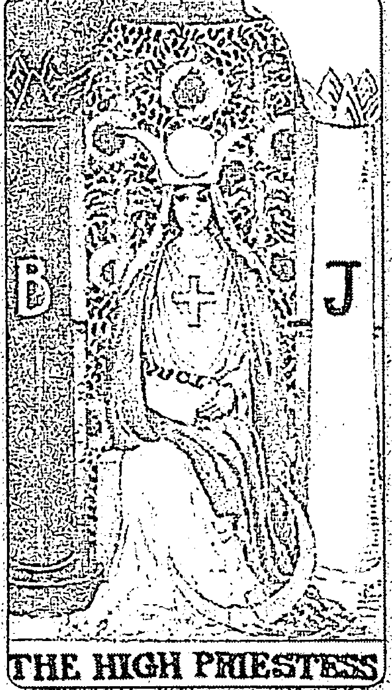

关键词 静止 消极 直觉 智慧

## 牌面故事

女祭司这张牌，也有人称之为女教皇，若依伟特牌来看，女祭司才是较适当的翻译。因为，教宗是天主教领袖的专称，而天主教的领袖教宗是宗教领袖而非宗教皇帝，天主教的朋友也大多喜欢称教宗而反对称教皇。再者，教宗限定为男性，用女教皇称呼此牌不甚恰当（除非是专指中古欧洲那位女扮男装的丑闻教宗）。

## 牌义解释

女祭司一牌的牌义，作者伟特自己的解释是：“奥秘，神秘学，未揭露的未来；求问者为男性时，代表关注他的女性；求问者为女性时，则代表求问者本身；此外，它也代表静默，坚持，智慧和科学。”逆位牌义则是：“热情，精神上或肉体上的狂热，自大，肤浅的知识。”简而言之，这张牌可以代表各式各样的神秘学、东西方术数，也代表尚未完全显现的命运或智慧。在人物上此牌代表某位女性。

而静默会带来觉察和智慧，女祭司牌中的月亮、犹太人之书和水，都是智慧和直觉力的象征。所以，这张牌有很强烈听从直觉的意义，而各种神秘学、超心理学和第六感也都与它有关，也代表了当事者有这方面的潜力。除此之外，这样一个人物是注重心灵成长、宗教玄思的，而它也往往是逃避情感的。因此，这张牌对于感情的进展往往是不利的；对于命理玄学的学习则有极大之好处。但千万别忘了，这张牌也在提醒我们运用直觉、听从直觉，建议是宜静不宜动。

女祭司的静，就像是两仪之中的阴，相对于魔术师的阳，代表着事物寂静、沉潜的一面。而女祭司这张牌的能力和智慧是潜藏而不外露的。

> 逆位
逆位置时，意义则是相反的热情、激情和狂热，同时也因此失去深沉的智慧，变成肤浅的知识和半桶水般的自大。此外，这张牌的关键词是静。

## 3. 女皇 THE EMPRESS

关键词 丰收 生产 自然 母爱

## 牌面故事

女皇牌相对于接下来要介绍的皇帝牌。这两者刚好是母性与父性的象征，女皇牌除了带有强烈的母亲形象之外，也代表着孕育万物的大地，是生命的成长之所。

## 牌义解释

女皇牌的牌义根据伟特的解释是：“丰收，行动，主动，一段时间；未知的事物，暗中潜藏的；而有时也代表困难，怀疑和无知。”当女皇牌在逆位置的时候，伟特对其诠释则变成：“光明，真相，难题之解除，群众的欢乐；除此之外，也可能有犹豫之意。”

而现在对于女皇牌的主流诠释中，与伟特诠释相同的是关于丰收和欢乐的部分。一般而言，当女皇牌是正位置时，则往往都是被朝着充满光明与正面意义的方向来诠释，很少出现伟特所说的困难、怀疑和无知的牌义。

原则上，女皇牌代表丰收、喜悦、爱情、生产、充满母爱和贴近自然的意义。

> 逆位
但在逆位置时，则可能代表欢乐的消失、收获的折损和爱情的小挫折。且当遇到有关生产的问题时，逆位女皇牌常表示难产、流产或堕胎等义。因此，当大家在运用这张牌的时候，可以先区分正逆位，再决定要朝哪个方向来做解释。

## 4. 皇帝 THE EMPEROR

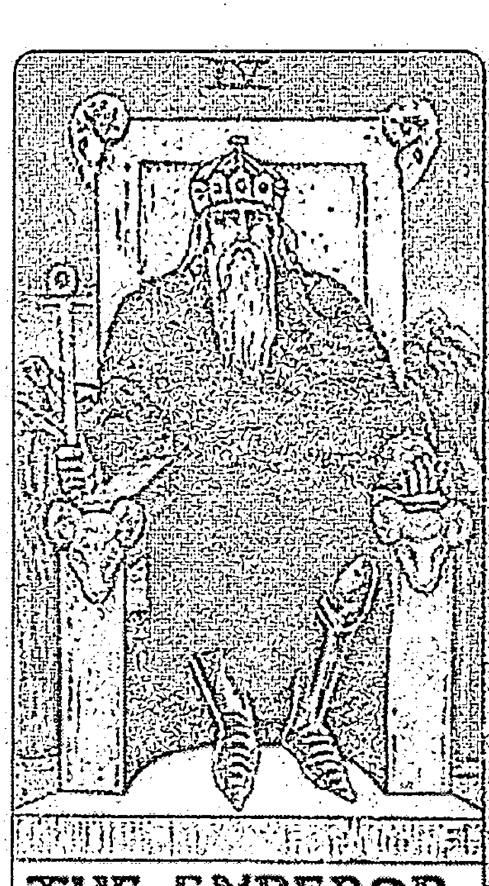

关键词 父亲 权力 秩序 统治

## 牌面故事

一国之尊的皇帝头戴皇冠，身着红袍，脚穿象征严格纪律的战靴，左手拿着一颗球，右手持的是象征生命的古埃及十字架，自信满满地坐在王位上。王位上有四个牡羊头作为装饰，如图所示，皇帝牌正是代表牡羊座（火星）的牌。牡羊座是十二星座的头一个，具有勇敢、积极、有野心、有自信的特质。红袍加上橙色的背景，呈现红色的主色调，与牡羊座的特性不谋而合。背景严峻的山象征前方险峻的路途。我们可以比较皇帝与女皇的背景，一个是严峻山川，一个是丰饶大地，形成互补的局面。

## 牌义解释

编号3的女皇象征母亲，编号4的皇帝则象征父亲，母亲父亲一阴一阳，互补相成。在这里皇帝是传统的严父，与现代新好爸爸迥异。他是教导孩子社会规范与服从精神的人，如果孩子不听话，他会拿着藤条追打。平常他也是个理性角色，不擅长表达情感，皇帝牌实际上包含广义的世间父亲形象。它可以代表任何有权力、克己严谨、但缺乏情感交流的领导人物或权威人士，例如：法官、医生、警察、总统、老板、地主、皇室、校长、政府官员、或是一位可敬的敌手。皇帝牌也可以代表丈夫或情人，但这位丈夫或情人虽有责任感，却不会甜言蜜语，反而取代父亲角色，让人有点敬畏。

荣格说：“父亲代表道德戒律与禁令”。皇帝是不折不扣的权威角色，他偏好秩序、规范与稳定，拥有至高无上的权力。为了统治国家，他必须将个人情感收起，运用铁腕控制社会秩序，国家才不会分崩离析。皇帝可以是位慎思明辨的明君，也可能是位茶害人民的暴君，如同法令有好有坏，皇帝亦可好可坏。

在推算上，皇帝代表某位具有权威父亲形象的人，或是对当事人有极大影响力的人。如果情况好，皇帝能给予帮助；如果情况不好，皇帝可能会对当事人施加控制，使当事人失去自由，苦不堪言。另外，皇帝也可代表一段稳定自律的时期，当事人能够严以律己，一丝不苟，达成自己的目标。这段时期当事人多采取理性分析的方式，而非听从情感与直觉，他可以像皇帝一样开疆辟土，稳健守成。情感占卜方面，皇帝牌也可能暗示缺乏情感交流。

> 逆位
皇帝正位，多显现正面特质。逆位可能表示缺乏皇帝特质（自我放纵、不成熟、欠缺领导能力、欠缺行动力、软弱、懒惰、缺乏责任感、没自信、依赖心强、犹豫不决等），或是皇帝特质运用过度（武断、权力滥用、冷酷无情、占有欲或控制欲过强）。皇帝逆位若代表人，那人通常呈现皇帝的负面特质。

## 5. 教宗 THE HIEROPHANT

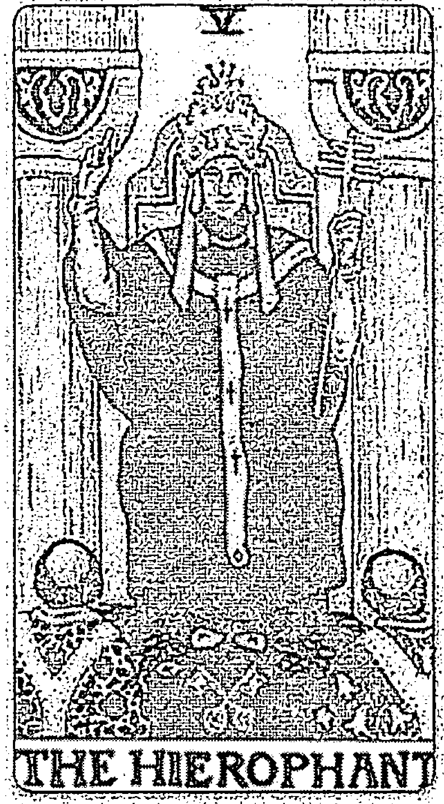

关键词 宗教 传统 援助 仪式

## 牌面故事

教宗身穿大红袍子，端坐在信众前。他头戴象征权力的三层皇冠，分别代表身、心、灵三种层次的世界。他的右手食、中指指向天，象征祝福，左手持着主字形的令牌，象征神圣与权力。他耳朵旁边垂挂的白色小物，代表内心的声音。教宗前方放着两把交叉的钥匙，在很多版本的塔罗牌里，钥匙是金色银色各一把，象征阳与阴，日与月，外在与内在，我们的课题就是要学会如何结合两者，而钥匙本身可用以开启智慧与神秘之门。教宗前方的两位信众，左边的身穿象征热情的红玫瑰花纹衣裳，右边的则穿象征性灵成长的白百合衣裳（红玫瑰与白百合在魔术师中也曾出现过）。教宗后方则是两根柱子，它们是灰色的，灰色象征由经验而来的智慧。另一说则是教宗后方虽无女祭司的帷幕将潜意识隔离，但暗沉的灰色代表通往潜意识之路仍未开启。柱子上的图案象征肉体结合。

## 牌义解释

教宗，如同他的名称，与宗教有强烈的关联。不过教宗所属的宗教是有组织的教会或教派，他是入世且走入人群的，这与女祭司和隐士的离群索居大有不同。

教宗与皇帝都是父亲形象的代表，但是皇帝是提供物质的父亲，而教宗则是提供心灵成长与道德教育的父亲。皇帝重视外在的法律与约束，教宗则代表内心的服从性。教宗教导我们的是传统价值与伦理道德，教宗代表的就是这种社会规范与社会责任：不遵守不犯法，但还是遵守为妙。

教宗也代表学校教育，以及任何所谓正统的教育。就像教宗所属的教会是庞大的组织，教宗所代表的教育形式也是社会大众认同的，在学校中学生学到社会大众希望他们学的价值观，虽然会阻碍个人部分的心灵发展，却是群体生活中不可或缺的一环。

## 爱上塔罗牌

教宗并非独自在深山中修行，而是在宗教组织下服务。教会拥有固定的体系，延伸出去，教宗也可以代表各级机关团体或学校，或任何与群体有关的事物。

所以教宗牌也象征仪式：毕业典礼、结婚典礼、成年礼、丧礼等。这些仪式同样属于社会规范的一种。

在预测上，教宗可能表示心灵上的追求（重心往往是道德），也可能代表有长辈帮助或贵人伸出援手。他们可能会给当事人专业的建议或实质上的援助。教宗也可能显示当事人参加某个仪式或典礼。在感情预测上，教宗通常表示一段非常传统或柏拉图式的恋情。教宗若代表人物，他可能是神职人员、教师、长者、贵人、专业人士、典礼主持者、长官、保守分子、卫道人士等。

> 逆位
教宗逆位通常代表打破传统规范。此时不宜遵照常规，应该要有创新的想法，敢于与众不同。另外，也可能代表当事人太保守、太武断、太固执，或是太过标新立异（过与不及都是逆位的可能意义）。此时，贵人相助恐怕不成，因此不宜贸然采取他人的建议，更应小心查证你所得到信息之真实性。感情方面可能表示此时不宜结婚。另外，仪式或典礼取消或延期也是教宗逆位的可能意义之一。

## 6. 恋人 THE LOVERS

关键词 选择 爱情 性 结合

## 牌面故事

恋人牌是十二星座中的双子座，属风，背景在伊甸园，亚当与夏娃分站两边，他们所踩的土地相当肥沃，生机盎然。夏娃的背后是知识之树，生有五颗苹果，象征五种感官，有条蛇缠绕树上，蛇经常都是欲望的象征，但此处代表潜在的智慧。亚当背后是生命之树，树上有十二团火焰，象征十二星座，也象征欲望之火。伟特说：亚当与夏娃年轻诱人的躯体，象征未受有形物质污染之前的青春、童贞、纯真和爱。两人背后的人物是风之天使拉斐尔，风代表沟通，他身着的紫袍则是忠贞的象征，显示这个沟通的重要性。亚当看着夏娃，夏娃则望着天使，象征意识、潜意识、超意识与身、心、灵或是理性、感性之间的传导。天使之下，亚当夏娃中间有一座山，象征我们必须把阴与阳、理性与感性的能量调和。另有一说是山代表阳性，水代表阴性，代表阴阳平衡。

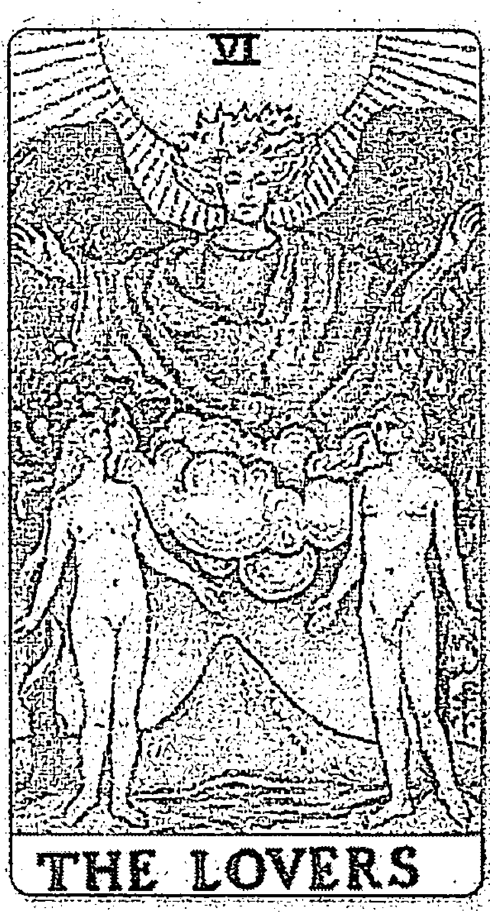

## 牌义解释

看到恋人牌，第一个反应通常都是与爱情有关，但这张牌更常见的意义是选择。在伟特之前版本的塔罗牌，恋人牌通常绘有一个男人在两个女人之间作抉择。虽然伟特改变了恋人牌的构图，但是基本牌义仍然不变。恋人牌出现经常代表当事人面临重大抉择。此时当事人必须格外谨慎，他做出的抉择可能对他产生重大影响，此时不要短视近利，更不可执迷于表面的利益或面子，而应该要仔细思考自己究竟要什么，才能作出好的决策。恋人牌代表的选择与权杖二可不同，恋人毕竟是大牌，牵涉的是人生的转折点。注意，虽然亚当与夏娃受天使祝福，但夏娃身后的蛇仍暗示人类堕落的故事，如果意志不坚而选择不当，伊甸园的恨事恐怕将重新上演。

恋人牌所呈现的选择有可能挑战当事人的道德与信仰，当事人像是站在一个十字路口，必须在道德与快乐之间做抉择。因此恋人牌也代表个人信仰与价值观，因为当事人的抉择通常奠基在他的价值观之上，虽然此时它可能受到挑战。

在感情的预测中，恋人正位通常是个大好消息，表示两人之间吸引力很强。虽不一定有性关系，但是很有可能，且必然是因爱而性。相对来说魔鬼牌的性关系就是无爱之性。恋人的爱情会是影响重大且维持长久的，我们可以拿来与圣杯二做对照。圣杯二可能只是短期的爱恋，甚至不会有任何承诺，但恋人就相对强烈而长期。如果恋人逆位，那么通常代表失恋或是恋爱不顺，不宜抱持太大希望。若是恋人出现在过去的位置，而现在情况不佳的话，很可能是当事人盲目沉浸在逝去的恋爱中，无法自拔。

爱情是狭义的结合，但恋人牌还包含广义的结合。任何结盟关系、合伙关系、人际关系，若恋人正位通常表示成功和谐，沟通顺畅，当然还得参照其它位置的牌而定。在最好的情况下，恋人牌代表完美、和谐、互信的人际关系。

> 逆位
恋人逆位除了表示婚姻或恋爱上的挫败之外，还可能代表三角关系、分离、对立、善变、错误的决策、不信任、不恰当的合伙。

## 7. 战车 THE CHARIOT

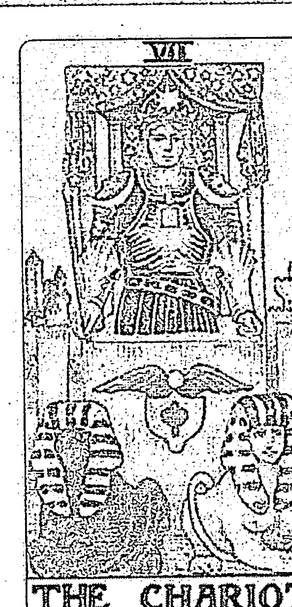

**关键词** 意志 自律 胜利 旅程

## 牌面故事

一位英勇的战士驾着一座由两只人面狮身兽拉着的战车。人面狮身兽一只黑的，代表严厉，另一只是白的，代表慈悲。两兽同时来看，也是阴阳平衡的象征。战车上有四根柱子（四个代表上帝的希伯来字母YHWH或火水风地四要素）支撑着蓝色车篷，车篷上饰以六角星花纹，象征天体对战士成功的影响。英勇的战士手持象征意志与力量的矛形令牌，头戴象征统治的八角星头冠和象征胜利的桂冠，身穿铠甲。铠甲上的肩章呈现弦月形，显示战车牌与属月亮的巨蟹座之关联。斜挂的腰带上有神秘学符号，裙上有各种炼金术的符号。胸前的四方形图案代表土要素，象征意志的力量。战车前方的翅膀图案是古埃及的图腾，代表灵感。翅膀下面是一个小盾牌，其上的红色的图案是一种印度图腾，为男性与女性生殖器结合的象征，也是二元性与一元性，类似中国的阴与阳，可能暗示编号7的战车牌走过愚人之旅的三分之一，已达性成熟的阶段。战士身后的河流就是《圣经·创世纪》中四条伊甸园之河其中的一条，与皇后、皇帝和死神牌中的河是同一条。再后面就是一座高墙耸立的城市。战士背对城市，暗示他把物质置于身后，向前开展心灵上的旅程。他手上没有缰绳，表示他不是用肉体来控制那两头朝不同方向行进的人面狮身兽，而完全凭借他旺盛过人的意志力。值得注意的一点是他站在城墙外守御，而非进攻，所以这位战士是位守护者、防御者，而不是侵略者。他是尽他的本分，并努力做到最好。

## 牌义解释

战车牌的首要意义就是坚强的意志力。还记得战士手上没有任何缰绳吗？他完全凭借意志力来控制战车，也控制两头人面狮身兽不至于分道扬镳，以致战车解体。战士具有坚定不移的信心与决心，他有能力控制整个局势。6号的恋人牌有关选择，7号的战车则对他的选择采取实际行动，克服路途中的恐惧。

战车另一个重要意义是胜利。战士十分重视输赢，而他通常是赢的那一方。透过与别人竞争而得胜，他总要成为第一名，纵使付出比别人加倍的努力也在所不惜。对于竞争，他怀有强烈的野心与专注力。对于设定的目标，他会全心全意去达成。

自律、自我要求与情感控制也是战士具有的过人特质。惟有严格地自律，才能使他在竞争中得胜。松散、无纪律、浑浑噩噩的生活是他绝对不会接受的。他更不可能放纵自己的情感。他要征服。

战车，顾名思义，表示交通工具，也与旅程相关，通常（但不一定）是陆路的旅行。战车也代表移动或改变，不过不一定是肉体方面的，因为刚在恋人牌中做出某种决定，此时生活必然因这个决定而经历某种改变。

实际预测中，战车出现通常意味某种程度的挑战，而且此时放弃是不明智的。拿出决心，贯彻始终，别忘了战车也代表胜利。感情预测方面，战车通常欠缺软性对话与情感交流。有可能出现竞争者，或者你就是那个竞争者。战车如果代表一个人，可能是旅客、司机、骑士、赢家，或是任何具有战士精神的人。

> 逆位
战车逆位，可能惨遭失败。也可能当事人野心过度旺盛、太过鲁莽或事情太多，而导致不好的下场。此时冲突与阻碍难免。感情方面可能有口角或三角关系。旅行也可能延期或取消，甚至在旅途中遇到无法预期的意外状况或交通事故。如果战车逆位代表人，可能是指酒醉驾驶、危险驾驶、身陷冲突的人、或鲁莽的人。此时应该放松身心，冷静下来想一想，自己是不是犯了上述的错误，以免浪费时间，徒劳无功。

## 8. 力量 STRENGTH

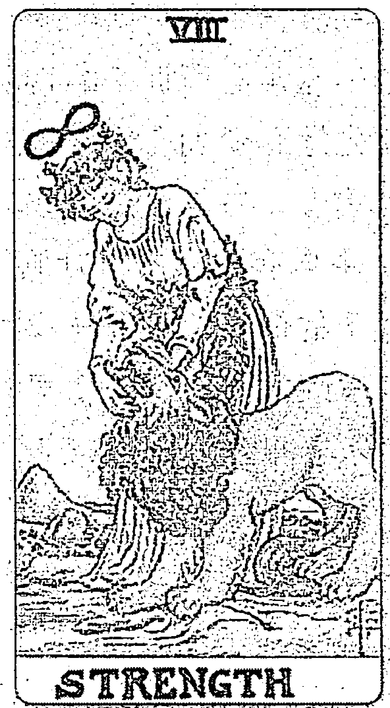

## 爱上塔罗牌

**关键词** 力量 勇气 信心 耐心

## 牌面故事

代表力量的女人轻柔地合上狮子的嘴。女人头上有魔术师牌中出现的倒8符号，象征她的力量是无穷尽的。她头上戴着花环，腰间也系着花环，而且腰间花环还连系在狮子颈间，形成第二个倒8符号。狮子身体微倾，尾巴轻垂，表现出彻底的顺服，还伸出舌头来舔着女人的手。

力量延续上一张战车的课题，但她用更高层次的方式来应对，即老子所说的以柔克刚。狮子象征人内在的兽性，战车用阳刚的铁腕作风来控制，力量则用她内心的勇气、信心和耐心来驯服。结果战车前的两头人面狮身兽虽受控制，头却仍朝着不同方向（在某些版本的牌中，他们甚至是背对的），而狮子则彻底顺服，也许暗示柔弱真能战胜刚强。

## 牌义解释

力量，顾名思义，首要牌义就是力量，但这里指的并非壮汉的蛮力，而是内心的坚韧。一个女子要驯服一头狮子，用武力绝对是自讨苦吃，所以她必须运用她所拥有的特质，用柔性的力量来驯化狮子。要这么做，首先她必须拥有超人的勇气，否则她怎敢接近狮子呢？再来她得拿出信心，深信自己会成功，这样的信心让她散发出自信的光芒，温和中自有一股威严让狮子降服。最后则是耐心，她必须慢慢来赢得狮子的信任，就像马戏团里的驯兽师一样，必得经过许多次的练习及失败才能成功。相同的道理也可应用在克服内心的兽性与恐惧、愤怒与冲动，也就是克服我们内在的那头狮子。

在预测上，力量显示出面对人生的信心，以外柔内刚之姿，面对人生的难题。她内心坚强，信心深切，勇气百倍。她外表平静安详，行事坚定果决，同时又不急不躁有耐心。力量代表克服内心野兽本能的那一部分，要使所有的焦躁、愤怒、冲动、不安都平息下来。如果当事人现在表现得太急切，力量牌出现提醒他要放慢脚步，要有耐心，要以柔性力量来行动，同时别忘了自信最重要。在健康方面，女人降服狮子就好像病人降服病魔，是重拾健康活力的好征兆。

> 逆位
力量逆位的首要意义则是软弱无能。内在的信心和勇气已然消失，恐惧和怀疑接着浮现。此时不宜贸然行动，不管现在面对的是什么样的问题，力量逆位提醒你要先处理自己的负面想法和情绪，不要让狮子控制你，你才是自己的主人。有时逆位的软弱会呈现在肉体上，健康宜多加注意。力量逆位也有可能指的是力量的滥用，无论是有形的蛮力还是无形的权力。

## 9. 隐士 THE HERMIT

关键词 谨慎 孤独 内省 指引

## 牌面故事

身穿灰色斗篷头戴帽子的老人站在冰天雪地的山巅上，低头沉思，四周渺无人烟。他右手高高举着一盏灯，这是真理之灯，灯里是颗发亮的六角星，名称是所罗门的封印，散发出潜意识之光。老人左手拄着一根族长之杖，这根杖在愚人、魔术师、战车都曾经出现过。愚人太过天真，不知杖的魔力，拿它来系包袱；魔术师用代表意识的右手运用杖的法力；战车把杖化为矛，也用右手紧握着；隐士则杖交左手，用以在启蒙之路上做前导。

隐士和愚人同样都站在悬崖顶，愚人大踏步地向前走，隐士却十分谨慎。隐士是成长之后的愚人，他花白的胡子似乎在告诉我们：“我年纪大了，不再是从前那个浑小子了。”的确，在累积足够经验与智慧之后，隐士自然行事谨慎。与隐士相关的星座是处女座，是注重细节的完美主义者，做事总是小心翼翼，这正是隐士的写照。

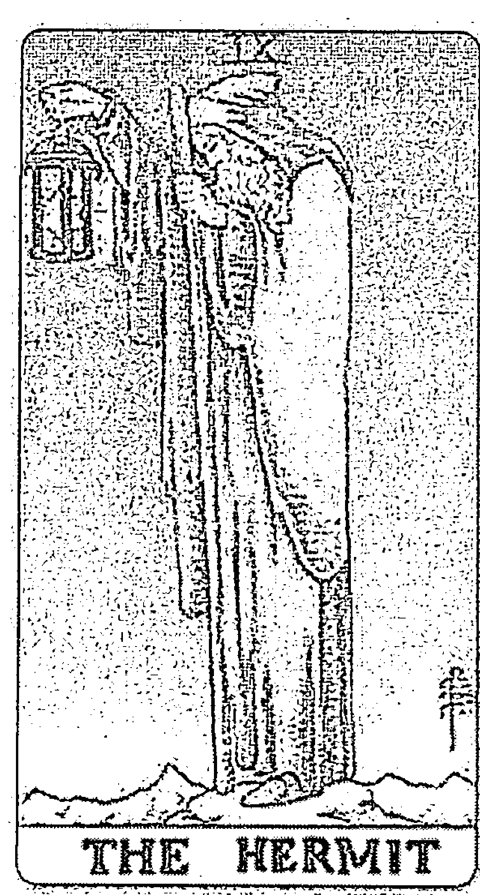

## 牌义解释

隐士孤身一人在山巅，在追寻智慧与性灵成长的过程中，爬得越高就越孤独。隐士脚踩的山头都结冰了，或许真是高处不胜寒。追寻的过程中，他不与群众接触，只与自己的内心接触。智慧的追寻和性灵的成长，都必须一个人单独完成。离群索居是必要的过程。因此，在预测上，隐士代表孤独。他远离人群，退出交际活动，让内心静下来，一个人独处。此时应暂时放下社交活动，向内探求，留一些时间给自己。冥想、沉思、静坐、倾听内心的声音、留意梦境带来的讯息，都会带来好处。问题的答案其实已经在我们心中，孤独是为了内省，内省就是为了找出答案。

经过一段时间的内省之后，隐士已然到达智慧的顶峰，这时他准备返回人群，为山下的人指引方向。他高举着真理之灯，犹如一座灯塔。他亲身经历过追寻的过程，现在可以为大众启蒙、引路了。隐士不是经师，他不真的教授书本上的知识，他要当的是人师，是每个人的心灵导师。他深知灵性与智慧的探求无法靠口头传授，必须由学生自己经历体会，方能真正获得。他站在山顶指引还在山下的学生，帮助他们，扮演领路人的角色。

隐士是智慧老人的原型，他代表心灵导师、教师、有智慧的人、长者、谘商师、顾问、前辈、当然也代表隐士。预测上，隐士除了表示孤独和内省的需要之外，也建议当事人向有智能的前辈请益。感情方面可能表示单身，或是暂时退出感情关系，需要深思。如果已经处在稳定关系中，也暗示他需要自己的时间和空间，或是对此关系作进一步的思索。毕竟，隐士对于恋爱并不热衷。

> 逆位
隐士逆位首先失去的是谨慎，变得粗心大意。再者孤独过度，甚至出现愤世嫉俗的反社会倾向。也可能暗示当事人我行我素，无法接受他人的忠告。此时建议当事人，一个人的世界固然有其好处，但若过度反而容易导致失和。隐士虽暂时离开人群，但他并没有否定人际关系的价值，在完成探求之后他不是马上举起灯笼，为山下人引路了吗？

## 10. 命运之轮 WHEEL of FORTUNE

关键词 命运 转变 契机 进展

## 牌面故事

所有的大牌都有人物，命运之轮是惟一的例外，可见这张牌独树一格。深蓝色的天空悬着一个轮子，轮盘由三个圆圈构成（教宗的头冠也是），最里面的小圈代表创造力，中间是形成力，最外层是物质世界。小圈里头没有任何符号，因为创造力潜能无限；中间圆圈里有四个符号，从上方顺时针依序是炼金术中的汞、风、硫、水，分别与风火水地四要素相关联，是形成物质世界的基本要素。

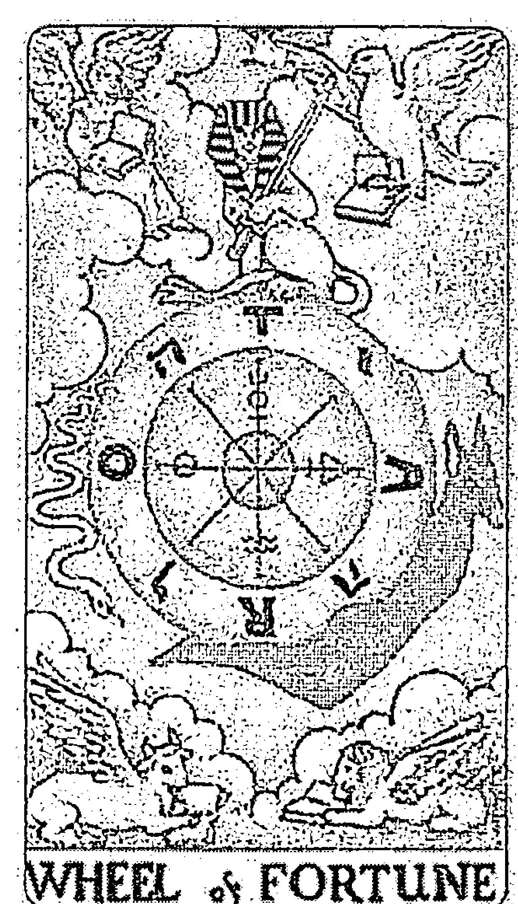

在轮盘左方有一条往下行进的蛇，是埃及神话中的邪恶之神Typhon，它的向下沉沦带着轮子进入分崩离析的黑暗世界。相反的，背负轮盘的胡狼头动物渴求上升，它是埃及神话中的阿努比神(Anubis)。而上方的人面狮身兽是智慧的象征，均衡持中，在变动中保持不变。它拿着的宝剑代表风要素，表示心智能力、思考力和智慧。

四个角落的四只动物，从右上方顺时针看分别是老鹰、狮子、牛、人，而且他们都有翅膀。这四个动物出自《圣经·启示录》第四章：“宝座周围有四个活物，前后遍体都满了眼睛。第一个活物像狮子，第二个像牛犊，第三个脸面像人，第四个像飞鹰。”耶路撒冷《圣经》提到四活物象征四位福音书的作者（马太、马可、路加和约翰）。在预测上这四个动物与星座学产生关联，分别代表四个固定星座和四要素，老鹰是天蝎座（水），狮子是狮子座（火），牛是金牛座（土），人是水瓶座（风）。它们都在看书，汲取智慧，而翅膀赋予它们在变动中保持稳定的能力。

## 牌义解释

充满了这么丰富的象征，总而言之，命运之轮要表现的就是个人命运的不可预测。当命运之轮转动时，原本在上面的幸福人们就转到下面的悲惨世界，下面的人也转上来了，俗语说风水轮流转，正是命运之轮的写照。人生犹如潮起潮落，日复一日，没人能够逃脱自然的循环。通常命运之轮象征的命运不是人力可以控制的。就像车子抛锚害你错过班机的懊恼，或是中了头奖乐透的狂喜，但得意时莫忘失意苦，失意时也莫一蹶不振。其实虽然个人命运看似难以预料，整个宇宙运行的法则事实上却非常有秩序，如同赌客到拉斯韦加斯赌博，每个人输赢看手气，最终的庄家（赌场）却总是赚钱。也好比幕后控制阿瑟王轮子的那双手，接下来到底要往哪里转，那双手总是知道。

命运之轮转动不停，出现的时候，主要表示转变。正位的时候，这个转变似乎是幸运的，如同它的星座对应木星也代表幸运；逆位的时候，似乎是不幸的。所以在预测上，命运之轮正位时，犹如轮子往上转，在感情方面，给双方一种姻缘天注定的感觉，也许一见钟情，也是新的开始。工作财运方面也常有意外的惊喜。逆位时，犹如轮子往下转，此时就没那种好运道了，而且当事人有可能拒绝转变，拒绝接受这亘古不变的运行犹如逆天而行，绝对赢不了。所以建议当事人，别忘了轮子总是不停地转，此时幸不幸在长远来看也许会出乎意料，因此请接受这个改变，找出最适当的对策。

转变无论幸或不幸，总是一个契机。此时面临人生的转折点，最好把握改造命运的良机。正位的时候，显示当事人能够把握难得的机会，逆位时，可能暗示当事人无法把握良机。此时建议当事人，人生无常，忧患无益，只有把握当下，抓住机会，才是最重要的。如果有事情很久没有解决，命运之轮出现带来转变，带来机会，带来好运道，很有可能获得极大的进展，而且这进展通常不是努力得到的，反而像是莫名其妙从天上掉下来的。

命运之轮是10号牌，是二位数字的头一个，因此命运之轮是大阿卡娜的一个新的循环，也是1号魔术师（新开始）的再现，同时更隐含了0号愚人（10=1+0=1）的无限潜力。无论时局如何变迁，所有的现象都只是暂时的，新的循环随时会再开始。

> 逆位
逆位的命运之轮除了前面提过的不幸、犹豫不决而无法把握机会、不能接受改变的意义之外，也可能代表失败、报应、没有进展，尤其不宜做投机之事，例如赌博。

## 11. 正义 JUSTICE

关键词 决定 正义 平衡 法律

## 牌面故事

一个女人端坐在石凳上，右手持剑举起，左手在下拿着天秤。身穿红袍，头戴金冠，绿色披肩用一个方形扣子扣起。她的右脚微微往外踏出，似乎想站起来，而左脚仍隐藏在袍子里面。她举着宝剑，象征她的决心。宝剑不偏不倚，象征公正，且智慧可以戳破任何虚伪与幻象。宝剑两面都有刃，可行善可行恶，端看个人选择。左手的金色天秤和披肩的绿色都是天秤座的象征。手持天秤表示她正在评估，正要下某个决定，同时追求平衡。胸前的方形扣子中间是个圆形，象征四要素的调和。头上的金冠中心有个四方形宝石，加上金冠的三个方顶，加起来得到数字7，代表金星，也就是天秤座的守护星。后方是个紫色帷幕，象征隐藏的智慧。两边柱子象征正面和负面的力量。

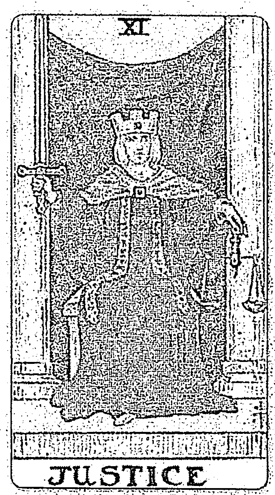

## 牌义解释

在正义牌中，我们可以找到很多对称，两个柱子、两面刃和天秤，就连牌中的主角都长得很中性，它的代表星座也是追求平衡的天秤。因此正义牌出现时，通常与某个决定相关。求问者必须用心中的天秤来衡量各种因素，以做出最好的决定。通常在决定的过程中，正义牌会用理性思考的方式，仔细分析利弊，因此她的决定必然是最公正不偏的。此时必须绝对地诚实。这样追求平衡和公正的特质，也会反映在待人处世上，正义待人公正诚实而不失厚道。如果之前被误会，正义牌出现代表你将讨回公道，获得道歉或赔偿。若是逆位置，可能显示你仍然受到不公的对待，或是某人对你欺骗或隐瞒，或者待你极端严酷不公又偏心。

下决定的过程并不容易，心中的天秤会摇摆不定，好像正义坐在两个柱子中间，善与恶的力量互相拔河，也如同电影中常出现的情节：心中的天使叫你往东，魔鬼要你往西。一旦下了决定，它就会变成你生命中的一部分，再也不能擦掉重写，因此心中这番天人交战，恐怕不好受。值得庆幸的是，正义会在一番仔细衡量下，做出最“好”的决定来，她所作的决定不见得是最轻松的，但她一定会负起责任。

> 逆位
如果逆位，则可能决定错误、犹豫不决、甚至拒绝下决定。这样无异于逃避人生的责任。

正义牌也常与法律事务有关，包括诉讼和各种契约的签订。如果正位，通常可以得到公平的待遇。

> 逆位
若是逆位，则可能裁决不公或是败诉，契约也可能有诈。必须特别小心。

正义也可能表示追求生活和心灵的平衡。正义是一张相当理性的牌，她会接受自己的过去，并负起该负的责任。正义就是为所当为。

正义举起右手，像是魔术师高举法杖。她后面的帷幕和柱子，与女祭司身后的背景非常类似。她和女祭司一样坐着，却踏出一只脚似乎要和魔术师一同站起。她虽是女性，却拥有中性的面貌和装扮。

正义如果代表人物，会是任何与法律事务有关的人员、正在下决定的某人、还你公道的人。

> 逆位
如果逆位，代表任何怀有偏见与私心的人、骗子、逃避责任的人、优柔寡断的人。

正义牌出现，提醒你要用理性来解决问题，要审慎思考，要负起责任。正位时，能够得到公平对待。

> 逆位
如果逆位，可能显示当事人逃避决定，逃避责任，或是受到不公的对待。

如果正面临法律问题，情势可能对己不利，此时绝对不能擅自主张，最好听从专家意见。如果正要面临考试，考试是另一种形态的裁决，事前必须比别人更努力，才能改造命运。

## 12. 倒吊者 THE HANGED MAN

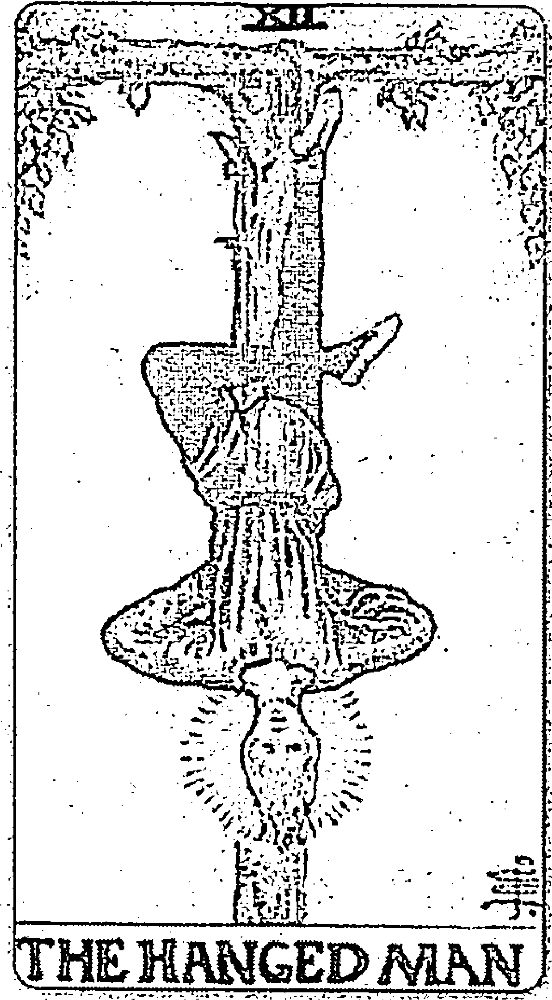

**关键词** 牺牲 等待 换个角度 以退为进

## 牌面故事

倒吊者图案简单，含义却深远。我们看到一个男人在一棵T字形树上倒吊着。他两手背在背后，形成一个三角形。两腿交叉形成十字。十字和三角形结合在一起，就是一个炼金符号，象征伟大事业的完成，也象征低层次的欲望转化到高层次的灵魂（炼成黄金）。红裤子象征身心灵中的身，也就是人类的欲望和肉体。蓝上衣即身心灵中的心，象征知识。他的金发和光环象征智慧和心灵的进化，也就是灵。金色的鞋子则象征倒吊者崇高的理想。

## 牌义解释

把倒吊者颠倒来看，倒吊者就不再是倒吊的了，而他的姿态看起来相当类似世界牌中的舞者。这暗示倒吊者最终仍能转正，看到事物真实的模样。倒吊者和命运之轮及正义三张牌，都可以看做大阿卡娜的中点。命运之轮是转折点，正义是中心，而倒吊者的编号12正是世界21的相反，他是倒吊的世界。倒吊者和愚人也有共同点，他们都敢于与众不同，做自己真正想做的事。愚人主要出于本能，而倒吊者出于深沉的理解，因此他不畏惧世人的眼光，把自己吊在树上。

倒吊者的对应星座是海王星，是颗代表牺牲与理想的星。在预测上，倒吊者主要有牺牲的意义。他并不是被强迫的，而是出于自愿。仔细看他的表情，如此宁静安详，还有他头上的智慧光环，显示他在精神上的理解已经超越常人。他不挣扎，也不想挣扎，因为他明白随牺牲而来的将是更有价值的收获。以不变应万变，不采取任何行动，才是倒吊者的作风。

倒吊者悬吊着，一动也不动，因此倒吊者也代表等待、拖延、悬置、遇到瓶颈、无法下决定。此时莫急躁，倒吊者的主要课题就是以退为进，借此放手我们可以赢得更多，借此退让我们可以取得控制权。激进行动或任何大刀阔斧的举动，在这个时候不会有帮助。

倒吊者脚上头下，用不同的角度看世界。所以倒吊者也建议我们换个角度思考，换个角度看世界。很多事情都是一体两面，换个角度看，你将看到不同的景观。倒吊者出现，提醒我们要保持弹性，不要使用从前僵化的思考模式。

> 逆位
逆位置的时候，倒吊者就是头上脚下，不再有能力换个角度看世界了。

倒吊者出现，也许当事人正在受苦或处于瓶颈阶段，但是他能够保持平静，做自己想做的事。感情预测上，倒吊者可能代表暂时没有进展，或是一位需要默默等待的人。

> 逆位
倒吊者逆位，表示牺牲可能无法获得回报，或是受苦和瓶颈时期的结束，也可能表示当事人没有倒吊者的智慧，无法放手，却苦苦挣扎，钻牛角尖，企图与命运搏斗。逆位倒吊者提醒我们挣扎无益，应该相信经过牺牲之后的回报将更丰硕，应该换个角度，静静等待生命即将带给我们的礼物。最后，倒吊者逆位可能表示当事人受到社会眼光制约，不敢做自己真正想做的事。

## 13. 死神 DEATH

关键词 结束 转变 新生

## 牌面故事

传统的死神牌，通常是由骷髅人拿着镰刀来代表，而伟特将死神的意象提升到更深一层的境界。最显眼的就是那个骑着白马的骷髅骑士。他身边有四个人，国王、主教、女人、小孩，象征无论是世俗或出世、男或女、老或少，都逃不过死亡这个自然现象。国王抗拒死亡，被骷髅骑士践踏过去。主教的令牌掉在地上，双手合十崇敬死亡。女人跪下，别过脸不忍看。小孩不懂死亡，好奇地望着骷髅骑士。跪着的女人可能是力量牌中的那位女性，她们的衣着与头冠都极为相似。再回到骷髅骑士，他头上那根红羽毛和愚人所戴的是同一根，他的旗帜是黑色背景，象征光芒的不存，上面五瓣蔷薇的图案是蔷薇十字会的图腾，关于此图腾的说法众多，可能是代表随着死亡而来的新生，另一说是象征火星与生命力，还有一说是象征美丽纯洁与不朽。远方的河流就是流经伊甸园的四条河流之一，称为Styx，象征川流不息的生命循环，似乎在告诉我们死亡并不是一切的终点。

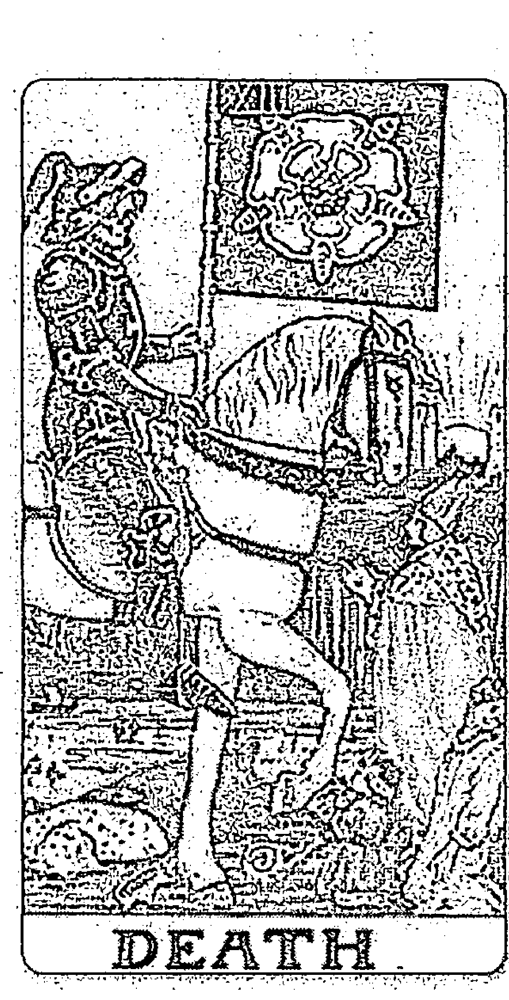

## 牌义解释

伟特牌的死神充满各种象征，无论如何，最主要的牌义就是结束。结束可以有很多种形式，可以是某种生涯的结束，例如毕业、搬家、转职、结婚、同居，可以是关系的结束，例如分手、离婚、拆伙，可以是习惯的结束，例如戒烟、戒酒、戒赌、戒色，但肉体死亡的含义在预测上则非常罕见。

从另一方面来看，结束其实也只是一种转变。世界上惟一不变的就是改变，所不同的只是改变的快或慢而已。慢慢的改变，人不会有什么感觉，但突然间的改变，却会让人难以接受。结束就是最突然的改变，突然之间，必须迫使你立刻放弃某种事物，无论你愿不愿意。如此转变令人难以承受，对未知的恐惧在所难免，但这个课题每个人都必须要学。

死神骑着一匹白马，白色是最纯净的颜色。的确，死亡就像一个橡皮擦，把过往的所有事物都擦掉了，使一切都重生，一切都如白纸般重新来过。所谓“上帝在你眼前关上一扇门，必定为你打开另一扇窗”，死神就是这么一种新生，古谚云：置之死地而后生，又云：不经一番寒彻骨，焉得梅花扑鼻香。可见古人早已深明此理。死神对于戒绝过去的恶习，是张非常完美的牌。如果过去曾经有不堪回首的往事，死神能让你重新来过。

尽管难受，世间万物没有恒久不变的道理。死神指出过往某种事物的结束，而我们的课题就是要承认、接受、在新生涯中找到新的快乐，也许你会发觉结束的事物原来没有自己想象得那么好，进而庆幸自己的崭新生活。

> 逆位
死神逆位通常表示当事人不愿接受结束的事实、不肯放手、顽固、恐惧改变、沉溺在过去而不愿展望未来。也可能表示原本应该进行的改变停滞了，形成僵局。另一方面，激进的人为了抗拒改变，可能会采取激烈的举动。死神逆位提醒我们，不愿往未来前进，不仅无法成长，更会阻滞新生活的开展。此时应该要停下来思考，自己害怕的究竟是什么？迟迟不肯放手，只会让最终的结束过程更加痛苦。既然无法避免，不如早点迎向新生活。将来回过头，你会惊讶当初的自己为何这么想不开。

## 14. 节制 TEMPERANCE

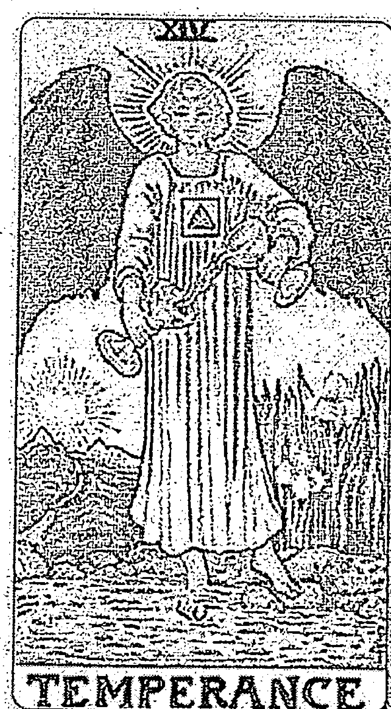

**关键词** 欲望 协调 配合

## 牌面故事

一位长着美丽翅膀的天使，额头上刻了太阳的记号，并且前胸有着正方形和三角形的图案，正在将代表灵魂的水从一个圣杯倒到另一个圣杯。他站在湖边，一只脚踩在地上，一只脚在水里，说明自然的本质。他身后是一条通往山林的小路，还有冉冉升起的太阳，水池边长满了黄色的鸢尾花，这里有永生的一部分秘密。土地代表意识，水代表无意识。右边杯子的水代表意识，左边杯子的水代表无意识。鸢尾花代表希望与承诺。

还有一种看法认为，牌上这位天使，正缓缓地将水倒入圣杯中。这两个圣杯，分别代表着物质与精神，借此表达对现实与内心的渴求。天使在湖边，白色的脚趾浸于水中，表示在完全无沉淀的河流中，有水永远的本质。水从一杯倒到另一杯，代表有限的生命只是注满水杯的水而已，如果不流动的话便是死水，不停地流动才能使灵魂净化。正如人类借着爱人和被爱，加深彼此的联系，以得到永恒。若是两边的杯子都注满，那么便可取得平衡。引导人走向成功之路。因此，如何调节水量，使它不至于溢出来就成了首要课题，我们称之为节制力。这张牌教导着我们，人生在面临心中各式各样的欲望之时，最重要的就是如何将它控制得宜，要获得精神上的能量就需要改变生活中不和谐、有失平衡的方面。

## 牌义解释

另外，这张牌也包含了基督将水变酒的奇迹。这个图形包含着神秘的力量，置身于这样的力量之中，你会感到时间在隐退，形体意识逐渐被精神中的潜意识取代。这意味着精神正照亮黑暗与烦恼的人生。

伟特牌的节制往往代表自我控制力将帮助我们与他人和睦相处，共同完成某种任务。我们此时可以获得一种精神上的平衡，也可能获得过去一直未曾得到的东西。要使我们的欲望处于一种平衡而节制的状态，就能够得到成功。

正位置的节制一般预示着这是要保持着杯中圣水的活跃力。虽然只是一个小小的动作，但是天使也是经过一段时间的非常辛苦训练出来的，一只脚踩在象征内在的水中，另一只脚踩在象征外在的陆地。天使成功地把自我内心世界与外在的现实表现做个联系，这代表了天使能轻松地与内心世界做沟通。头上的光环代表着天使有着无穷无尽的生命能量。而这生命能量天使能很轻松地使用着它，也不会感到不足。心轮上的三角标志代表着天使的精神能量已经强到将满溢出来。一切都是这么的单纯安和。也因为彼此间的沟通让这段感情之路走得更为顺畅。丝毫没有任何的不适。懂得利用自身的精神力量来解决一些外在的问题与疑虑。小心地把自己的事业与工作经营好。

> 逆位
如果是逆位的话，杯中的圣水因此而倾倒了出来，对自我的要求渐渐地降低了，头上的生命能量光环慢慢地失去了光芒，开始寻求外在的帮助，不断地尝试修正自己的脚步，但是却无法很正确地找到自己的真正目标与目的地。连接外在与内在世界的两脚有些微微地失去了他们本来的目的，快要忘记该如何地使用自己的精神力量来调整自己，也因为站得太累了，天使慢慢地坐了下来，他真的太累了，因为快把自身的力量用尽了。与对方之间的沟通产生了一些裂痕，虽然彼此还是不断地尝试沟通，但是在每次的沟通之后总感觉没什么结果，也因为如此而让彼此间的距离越拉越开。对自我的想法产生了很大的怀疑。总在新的安排后马上就予以否决，不断修正自己的脚步，但是也不断地让自己重头来过。也许在事业的路程上你需要的是不顾一切地往前冲。

## 15. 恶魔 THE DEVIL

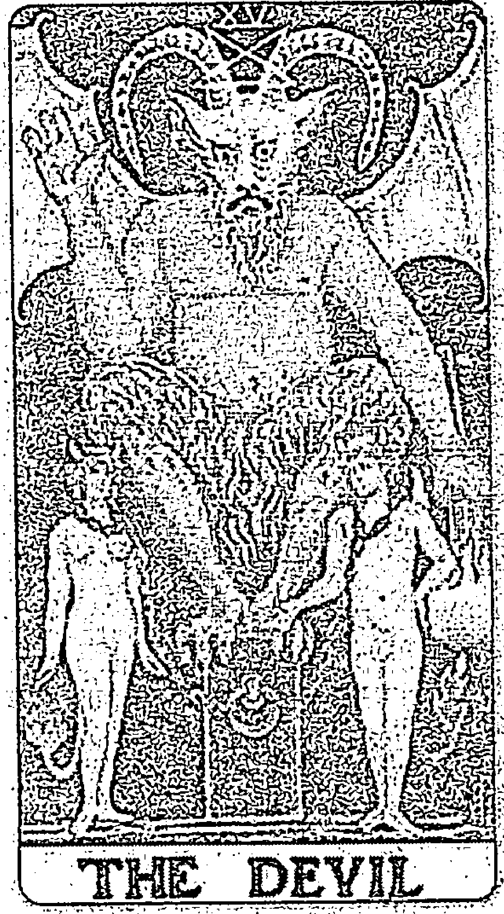

**关键词** 欲望 束缚 沉迷 物质主义

## 牌面故事

在恶魔牌上，我们看到和恋人相似的构图，只是恋人牌的天使在这里换成了恶魔，而亚当夏娃已然沉沦，上天的祝福变成了诅咒。牌中的恶魔有蝙蝠翅膀、羊角、羊腿和鸟足，象征动物的本能与天性。它的驴耳则代表固执。恶魔头上的倒立五角星，顶端指向地面，代表物质世界。注意恶魔蹲坐的地方并不是三度空间的立方体，而是二度空间的长方形，象征人们只看见感官所见的现实，却非全部的真实，好比瞎子摸象。前方的亚当夏娃同样长出角和尾巴，显露出野兽本能。亚当的尾巴尖端是朵火焰，夏娃则是葡萄，都是恋人牌树上结的果实，表示他们误用了天赋。两个人被铁链锁住，乍看无处可逃，但仔细一看，其实系在他们脖子上的链子非常的松，只要愿意，随时可以挣脱，但他们却没有，表示这个枷锁是他们自己套在身上的。恶魔牌背景全黑，光芒不存，代表精神上的黑暗。

## 牌义解释

恶魔代表对外在物质的欲望，无论是功名利禄，还是酒色财气。此时心灵上的追求完全被忽略，对物质的追求才是重点，人变得盲目了。不过，这并不表示恶魔是完全的恶，在现今功名挂帅的社会，恶魔经常表示名利权位的求取成功，而这会是许多人的心之所向。爱情方面，恶魔代表的可能是一种束缚性的关系，也许是当事人明知不好，却拒绝结束一段早该结束的感情关系；或是一方经常限制另一方。也可能代表有性无爱，或是用钱买来的关系。

也许追求物质的人不会意识到，在追求的过程中，他反而被束缚住了，变成物质的奴隶。可能为了讨好上司而卑躬屈膝，为了赚更多钱而日夜疲累。所以恶魔可以代表小气鬼、势利鬼、利欲熏心的人、贪心人、奴隶或工作狂。这些人不知道的是，财富原本能够让人生活得更自由、更快乐，人们却经常本末倒置，以为财富代表一切。有了这种观念，就会变成恶魔牌上的亚当夏娃，自己给自己加了铁链，自己限制自己。殊不知惟有放下执迷，才是大自由。

在这里我们也可以看到无知和无助。无知来自无法看见真相，只看到恶魔蹲坐的二度空间方形，而非真正的立方体，好比利欲熏心之人总是盲目，他只看得见物质。另一方面，被他人强迫锁住是一回事，不愿离开自己加诸自身的束缚，才是完全的无药可救，才是真正的无助，因为即使有人想救，也救不得。

对物质的过度追求也会演变成瘾，或是各种形式的沉迷，也都是限制与枷锁。恶魔存在于每个人的心中，每个人都或多或少会有某些欲望想满足，轻微的时候不会造成具体的恶果，但当恶魔的势力掌控人心，也就是无法控制之时。因此我们需时时注意控制自己心中的欲望。

恶魔是一张物质的牌，此时灵性堕落，物质挂帅，人变得现实而势利，好像除了这些，其它都不重要。前面提过，对外在物质的追求在现今社会被视为一件正当的事，甚至是件好事。问事业学业或金钱，恶魔出现常是好征兆，表示当事人真的很渴望、很认真、很努力地去求取。但是恶魔出现同样提醒当事人，请反省自己是否过度执迷某件事、某个人、某个东西或某种模式。请思考自己是否变成那些事物的奴隶。别让自己变成物质成功却心灵贫乏的盲目之人。惟有放下执迷，才能拥有大自由。

## 逆位

恶魔逆位，火炬和五角星顶端都朝上，套在脖子上的铁链也会脱落。因此代表脱离物质的束缚，思想开放，得到自由（但较不利于求取功名利禄）。另外一方面，恶魔逆位也可能比正位更加的邪恶，如果说正位恶魔会透过努力来满足欲望，逆位置可能就会使用不正当的方式，甚至犯罪来得到所求之物。

## 16. 塔 THE TOWER

关键词 遽变 灾难 破坏 天启

## 牌面故事

一座位于山巅上的高塔，被雷击中而毁坏，塔中两人头下脚上地坠落。塔顶有个王冠受雷击而即将坠落。塔象征物质，王冠象征统治和成就，也代表物质与财富，受雷一击，便荡然无存。天上的落雷是直接来自上帝的语言，两旁的火花有22个，象征塔罗22张大牌。灰色的云降下灾难之雨，不分性别阶级，平等地落向每一个人。背景全黑，这是一段黑暗的时期。

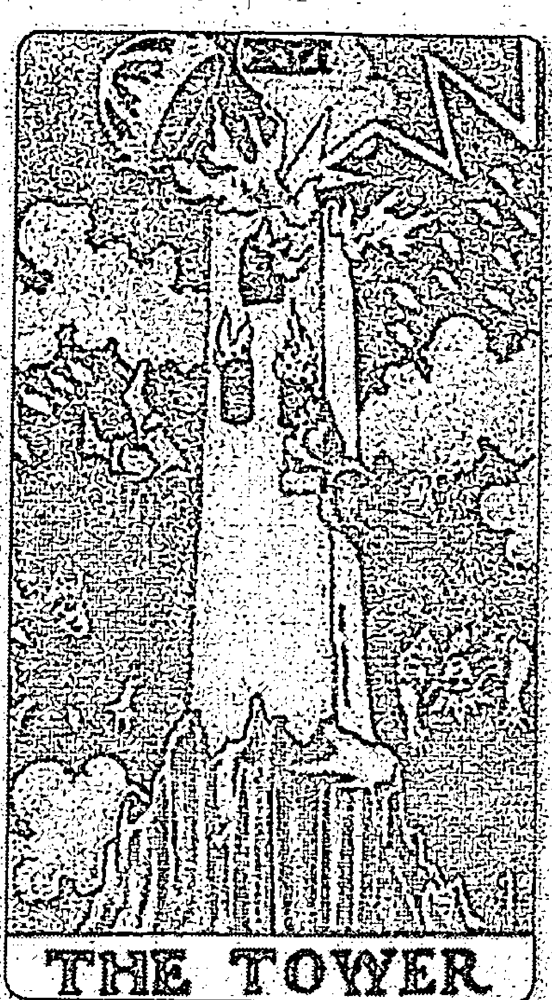

## 牌义解释

塔的首要意义是遽变，通常是外在突如其来的改变，经常是当事人无法控制的，而且冲击可能深入内心，影响当事人的整个价值观与信仰，而失去安全感。天灾人祸、失业、意外、变故，在宏观的角度来看，这些改变都是有意义的，但是极少人能乐于接受这些灾难式的变化。此时请细听上帝的讯息，事件背后的深层意义将会浮现。

没有非常的破坏，就没有非常的建设。破坏的过程很痛苦，但为了光明的前景，短暂的痛苦也值得。好比政府如果开始大力整顿交通，人民得先度过一段交通黑暗期，才能享受交通顺畅的快感。

幻灭是成长的开始，塔则提供成长之前的幻灭。

塔的课题不容易，毕竟人受限于习惯，一旦日常生活模式受到预料之外的破坏，一定非常难以接受。但是塔也带来天启，这可能是极为难得的机缘。

## 逆位

塔逆位的意义与正位类似，但是改变不如正位的剧烈。可能是当事人深自压抑，控制事态的发展，然而这不一定是好现象。盲目压制会让自己失去宝贵的经验，最终可能演变成伟特所说的，当事人把自己囚禁在塔里。

## 17. 星星 THE STAR

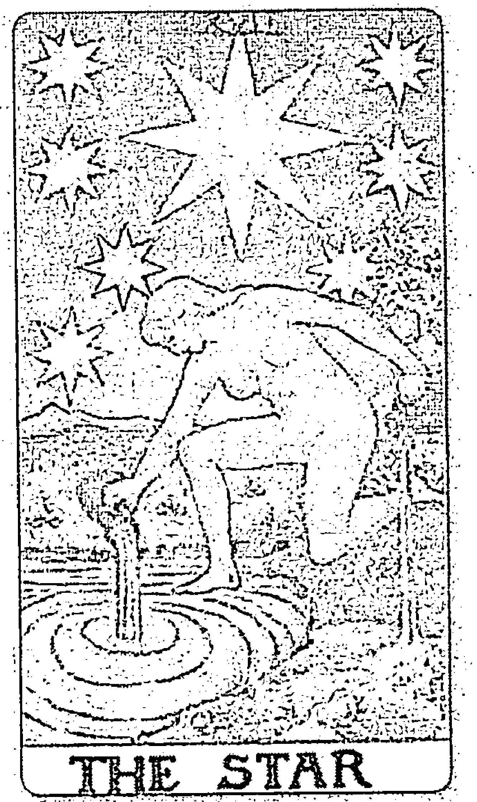

关键词 希望 祝福 将难过流尽

牌面故事

天空中有天狼星，或是东方三贤者之星，旁边有七颗小星星围绕着。下面是一个全裸的女性，左膝在地上，右脚在水面上。她把两壶生命之水倒出，灌入地面和池中。不远的枝头上有一只鸟。代表永恒的青春和美丽。星星代表信心和希望。土地代表意识，水池代表无意识。鸟代表心灵的升华，裸女代表真实的面目。分散成五条支流的水代表人的五种感觉。白色裸体下跪的少女，披着长发在肩上，背后有明亮的天狼星。少女将手中两壶水倒入池中，一往海洋，一往大地之母，汇流成河，滋润我们。少女的一只脚即将浸入水中，代表进入潜在的领域。停在枝头上的是不死鸟，代表永生不朽。天空有一颗大星和其它七颗星，代表信念和爱的女神及她的女仆。沉浸在星光下的少女象征永恒的美与希望。

## 牌义解释

这张牌意味着前卫的思想，新的知识，希望与理想，预示着诺言的兑现，灵感与精神之爱。我们应当运用内心的平和与澄明创造新的生活方式，在这个过程中你要倾听内心的声音，相信自我，无须再自我欺骗，自我抗争，而是要创造维护自我的尊严与信心。星光通向宇宙的智慧，显示神灵的神秘与深邃。

这张牌所要传达的，就是希望我们能够毫不吝惜地尽心付出我们的真爱，借此来培育希望，迈向光明的未来。只要能够相信未来，就一定能够达到目标。因此，星星会不停地闪耀光辉，前途必将是一片光明。

星星的正位置一般预示着理想的对象，理想的工作，年轻的身体，到期待已久的地方旅行，理想，创造力，总体而言，心想事成。

## 逆位

如果是逆位的话，希望女神手中的两个圣水壶都快要干涸了，她没有足够的希望圣水灌注给潜意识之水池，她只能着急，无法做出任何的补救。她也只能希望人们能自己发现这个问题，能自己透过潜意识之池来找寻她，因为目前只有自己才能救自己了。她虽然这样希望，但是却没有多大的效果。因为愚昧的人们只一味地希望女神能帮助他们，却不想自己动手求取希望圣水。仁慈的希望女神也流下了伤心的泪水，她为了自己无法给予她所爱的人而流泪，也为了自己能力的不足而流泪，她也空虚了。

你们的感情进入了一段无法对彼此信任与寄托的时期，也许彼此退一步，好好地冷静一下找出其中的问题来改善，也许这个问题存在你们俩的心里，你放弃了原本的希望与目标，不断地在旧的世界与想法中打转。也许你认为这样会对你的前途有益处，但是你却花了很多时间让自己活得很辛苦，尝试一下让自己的外在与内在做个联系吧。

## 18. 月亮 THE MOON

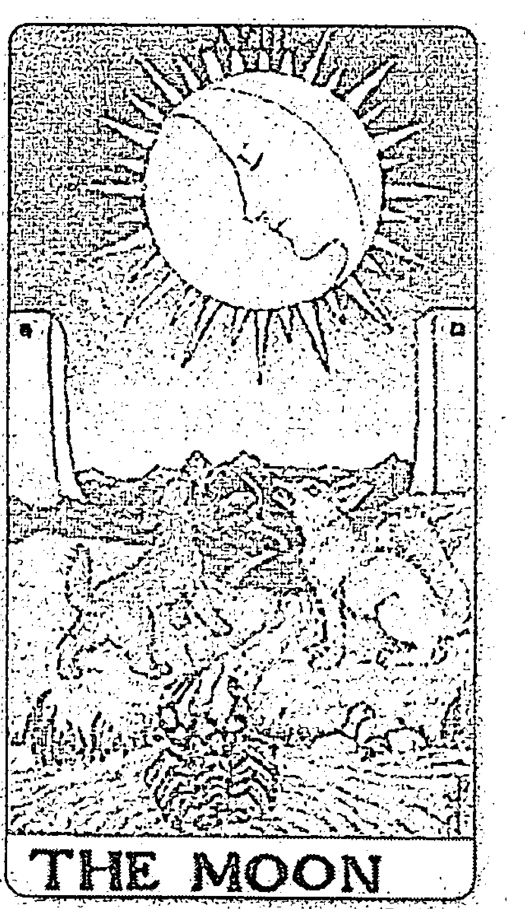

## 爱上塔罗牌

**关键词** 不安 多变 刻板印象

## 牌面故事

一只狼和一只狗对着月亮吠，水中有蝎子冒出来。月亮有十六道主光芒和十六道副光芒。两个塔之间的小径通往不知名的地方。这张牌代表生命的理想面和精神面是分开的。塔代表意识和潜意识。月亮代表女性面孔。月亮代表阴森，有时以狗和蝎子增加其效果。月亮画有迷惘、内心不安的烦恼人类的脸，多半是老女人的脸。像滴落般留下的水流充满虚伪和背叛的气氛。这张牌是警告危险的牌。

## 牌义解释

月亮连接着想象、联想的精神世界，因为它有阴晴圆缺，所以又代表着“变化”。在夜空中这一轮巨大的满月，隐隐地象征出对“变化”所产生的不安感。在月光下的狼，对这种不安与危险，有着本能性的感应。这张牌所透露的消息，是要我们注意潜意识的活动，事物的暧昧性以及能及早发现不安定的信息。所以即使身处在稳定的状态之下，也绝对不可松懈倦怠。一件出乎意料的事情将要发生。来自心灵的信息能导致意识的变化。如果你具有执着的精神，超自然的能力将会显露。你的直觉能够发现危险或隐匿的敌人。梦境能引导你作出正确的决定。要冷眼看世界，否则你会遭受欺骗。

月亮的正位置一般预示着月亮的世界末日之后并不是永恒的天堂或地狱的静止状态。那不是真正的尽头。死亡之后都会有新生。就如同塔罗牌月亮之后是太阳相随。表面上你们似乎对彼此都没有什么太大的怨言。但是私底下你们却常找自己的好友哭诉。其实这都是因为你们不愿意去面对将到的挑战，你们只愿意活在过去的想法中，也许只是一些逃避的心态吧。开始对自己的工作感到一些些的不满足。想要把自己内在的力量全抓出来使用。这时的你会有想要使用晚上的时间的想法。

## 逆位

如果是逆位置的话，潜意识水池中的蝎子依然想要爬到月之女神那儿，但是它在面对路程中的阻碍时却害怕了，胆怯了。这狼与狗只是在反映出它心中的心魔，但是这对它却造成很大的影响，使得蝎子开始犹豫不决了，也让它的信心都失去，无法做出很正确的行动与决定。

这张牌告诉求问者：存在于你们之间的问题已经慢慢地浮现了。现在你们也开始愿意去面对这些问题了。虽然有点痛，但是当你们面对了，问题就已经解决了一半了。逆位置时还表示你开始在目前的职场领域退缩了，只因为自己的一些精神压力，让你无法挥洒自如，甚至对自己的未来走向也感到异常地怀疑了。

## 19. 太阳 THE SUN

关键词 成功 自由 快乐 团体

牌面故事

可爱的裸体孩童骑在马背上，跨越灰色的围墙，脸上带着微笑。孩童头上戴着雏菊花环，以及一根红色的羽毛。这根羽毛就是在愚人与死神出现的同一根，象征太阳牌已经跨越了死亡的界限，而重获新生。围墙后面种满向日葵，里头是一座人造的花园，而孩童跃离了花园，代表他不需要这些人工的产物，他是最纯真、自然、不需隐藏的，如同他一丝不挂的身体。向日葵共有四朵，象征四要素与小阿卡娜的四个牌组。有趣的是，四朵向日葵是向着孩童，而不是太阳，表示这位快乐的孩童已经拥有足够的能量。马背上没有马鞍，孩童不用缰绳控制它，甚至连双手也不用，显示马匹象征的能量已经受到充分控制。孩童左手持着红色旗帜，左手象征潜意识，红色旗帜象征行动，表示他已经不用像战车那样用意识(右手)来掌控，他可以轻而易举、自然地控制一切。背景的太阳是生命的源头，万物赖以维生之源，总共有21道光芒，代表21张大阿卡娜(不包含愚人)，仔细一看在上方罗马数字的旁边有一道黑色的曲线光芒，代表愚人(另有一说是太阳中心圆形的部分是愚人)。值得一提的是，在比较古老的塔罗牌版本中，太阳牌中有两位小孩，与占星学的双子座相关，但伟特改成仅有一位，在此太阳牌就不与双子座产生关联，而属于太阳。这样的更改是为了避免原本的暧昧。

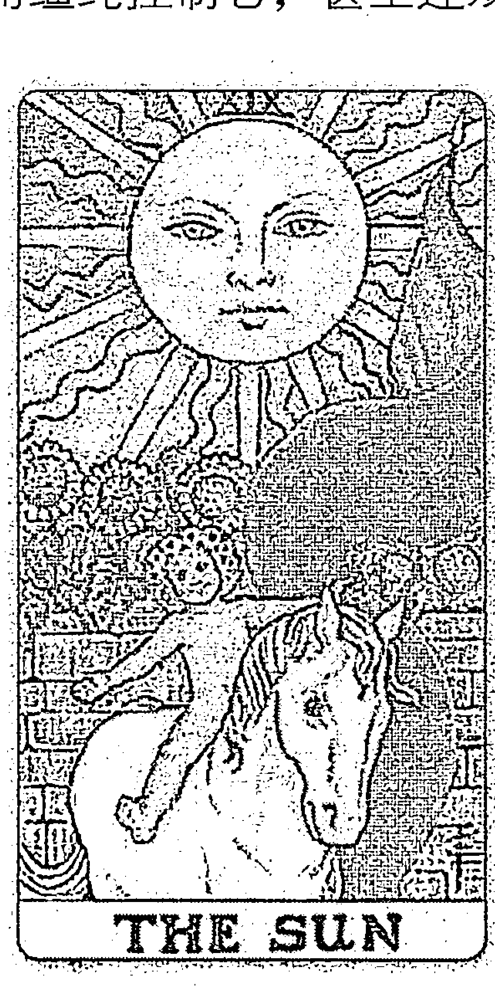

## 牌义解释

太阳充满所有积极正面的力量，温暖而光明。太阳出现，就充满希望欢欣的气氛，所有的事情都一帆风顺，而且是全方位的成功。问健康无虑，问爱情可成，问婚姻百年好合，问学业金榜题名，事业更是飞黄腾达。如果是旅行方面的预测，可能会去做日光浴，或是去炎热的国家。如果你曾经做过天气的预测，太阳当然表示万里无云的晴朗天气。如果代表人的话，太阳可能代表婴儿、儿童、快乐的人、发明家、科学家、重要人士等。

当一切都如此美好，心情就会自由自在，快乐无比。此时，任何简单的幸福都会带来极大的快乐。有人问78张塔罗牌中最好的牌是哪一张?其实每张牌都有它的光明面与黑暗面，不过太阳牌大概是光明面最多的一张了。

虽然说太阳如此光明，但过犹不及，任何事情都有隐藏的危险处。太阳虽然带给我们温暖与能量，但它也能将人灼伤，将大地烤成沙漠。

## 逆位

逆位的时候，伟特认为太阳仍然具有正位的意义，只是程度比较弱一点。目前常用的意义有：小成功、迟来的成功、成功但仍不满足、得到了才发现不是自己想要的。这时候当事人可能无法像牌中的孩童那样容易感到快乐，即使他得到了原本企求的，他的大胃口也不满足。或者是遇到一些小问题，就像乌云暂时遮住了阳光。你可以像伟特一样，把逆位的太阳当成一张比正位稍弱的好牌，或者是附加一点负面意义给它，只要是你觉得对，那就是适合你的牌义。

## 20. 审判 JUDGEMENT

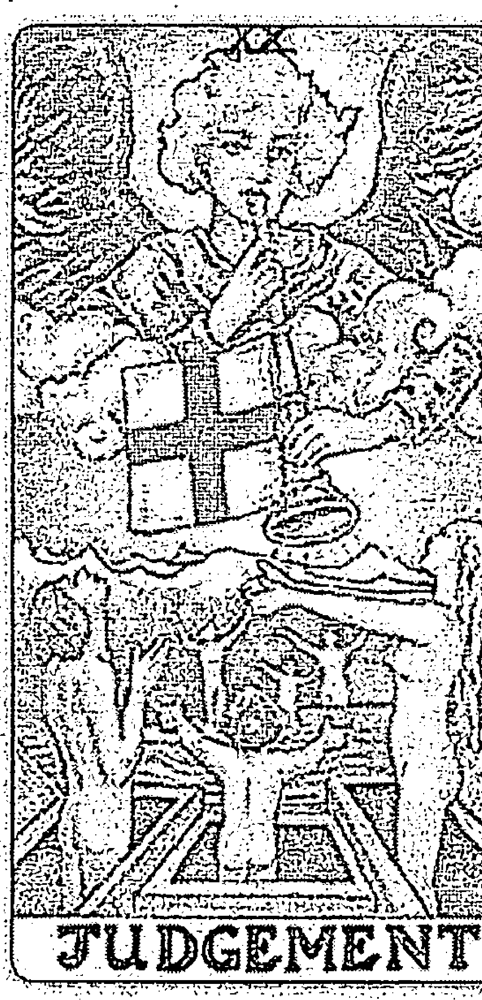

**关键词** 复活 觉醒 知道结果

## 牌面故事

天使吹着有旗子的喇叭传播福音，唤醒沉睡在地中的灵魂。告诫人们远离迷惑，怀抱感恩的心，倾听福音。这张牌在78张塔罗牌中是本质最恒定的，至少，牌的特征和本性不会改变。死者从他们的坟墓中爬了出来，右边是女人，左边是男人，中间是他们的孩子，背对着我们。但这张牌面上的复活者不止三个。需要注意的是，他们全都对大天使表现出一种惊喜、崇拜和敬畏的情绪。

## 牌义解释

这张牌告诉我们，要发现真相，接受新的价值观，如此一来才能拥有新的人生。

牌的正位置一般预示着在这个新世界的起头路程上，你将开始学习了解自己并不是孤独的，有很多优秀的朋友跟你在一起学习。虽然你们彼此并不认识，但是圣堂天使让你们彼此互相帮助。这样的方式让你们在新世界里活得更愉快。在你们目前的关系中，包含了过去所播下的种子与努力过的一切。这一段时间是你们从错误中找到正确的彼此相爱的方式。过去的努力造就了你现在的成就。你已经在品尝着这甜美的果实了。但是还是会有一些果实是不好的，苦的，你要从中挑选出来丢弃，并且找到问题。

## 逆位

如果是逆位置的话，圣堂天使依旧吹着苏醒的号角。优美的音乐回荡在整个山谷。但是这音乐却是孤寂的，因为人们只愿意躲在旧世界的怀抱里，他们不愿意跳离旧世界的习惯与安逸。在他们的心中有一股声音要他们留在旧世界里，因为他们害怕新世界的不确定与对自己的没信心。在你们之间存在着对过去的依赖，不愿意去正视目前的问题，不断地回忆着过去的美好种种，对目前与未来的走向却不重视，不理会，也不愿意下工夫去营造与建设。尝试着把自己的时间压缩再压缩，但是还是不断地想要放弃这一切。对你来说新世界是危险的，是让人惧怕的。但是你可曾注意到在那新世界的人们，他们正以愉快的心情与和善的态度来迎接你的到来。

## 21. 世界 THE WORLD

关键词 达成 完美 完成命运 另一个开始

牌面故事

一位女性在跳舞，身上披着一条围巾，双手有魔杖（生命树）。这张牌代表宇宙的终点。月桂的花环中，裸体女性表情泰然，让人感觉有高贵的气质。画在四个角落的是四元素：火—狮子、水—鹫、风—天使、地—母牛。代表星座为水瓶、金牛、狮子、天蝎。四要素的结合才能形成世界。

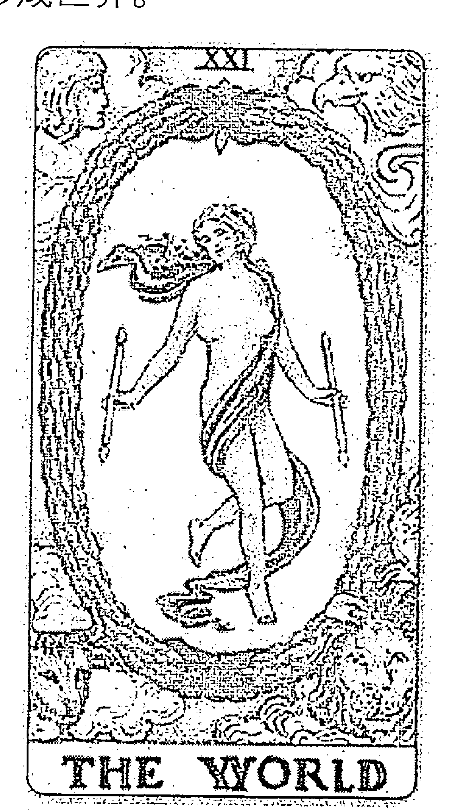

## 牌义解释

这张牌代表的是世界的灵魂与终极的存在，它是每个真实的灵魂所追寻的目标。不同年龄的人通过各种变形形式来展示他们精神的发展、成熟。惟一的束缚是我们对自己的限制。那些努力超越自我并为他人着想使世界变得更美好的人，会获得永恒的宇宙精神。

一个循环终结，你很快就会取得成功，获得回报。你在精神的成长中将达到一个新的层次。这张牌指示着，只要你拥有一颗感激的心，就必定能在自己创造的美丽世界中，寻求幸福与快乐。所有的事情都能达成，梦想在不久的将来都会实现。

世界如果在正位置，守在最后一道成功之门的成功女神正在那等待着你。手中轻握着两支胜利之钥，当你到她的面前时，你要把你的过去、现在与未来对她交待得清清楚楚，让她来审核，看是早点让你进入那成功的殿堂还是晚一点。也许是严厉的，也许是温和的，这都看你的表现而定。她会让你通过的，只是时间早晚的问题。她也尝试告诉你，你已经成功了。你已经将步入成功之门了，要你不用担心，放松心情地留在花园内等待着音讯。东方经文证明了智者对她的尊崇，她就是力量，以时间空间及其内涵的形式存在。她是万物的光明。你们进入了对彼此互相承诺之路，持续地彼此成长、学习与生活。这是一段象征着一份有力的承诺与形式的生活路程开始，将是一段充满创意的开始。之前的努力造就现在的成功，虽然如此，你并不感到满足，你要努力地再次突破，努力地在成功的殿堂留下你的足迹。

## 逆位

如果是逆位置的话，成功女神依旧把守在成功之门前，手中的胜利之钥却掉了。你已经准备好过去、现在与未来要送给她审核了，但是她无法做出很正确的判断，因为她正为了搞掉的钥匙烦恼着。不管你的一切有多好，这对她来说都不是重要的，因为没了钥匙你也进不了成功的殿堂。你现在需要的是在花园里耐心等待。让自己的心平静一下，也许你也可以帮女神一起找到钥匙。逆位置还表示求问者与对手之间的关系将进入一段属于重承诺的、有契约的路程，但是却有些不一样了。可能有一方是非自愿的，是被动的，也许将使你们在将来的路程中很辛苦。试着彼此好好地沟通一下，不要让彼此痛苦。终于你已经得到了一切，你之前的努力得到了回报，但是你却忘了该如何去维持他（她），让他（她）永远留在你身边。你甚至也开始回忆过去的奋斗，这让你丧失了对未来挑战的原动力。

## 2. 小阿卡娜

小阿卡娜牌是用来补足大阿卡娜牌的不足之处的。若是我们想更进一步知道命运的真相或是对方的事情，或者是更想了解事情发生的地点与时间，就必须借由小阿卡娜牌才能得知了。

小阿卡娜牌分成权杖、圣杯、宝剑、钱币四个种类，它们分别由侍从、骑士、皇后、国王以及A到十的牌面所构成。如果要得心应手地运用这些牌，就必须对这些宫廷人物有详尽的认识。总之，小阿卡娜牌与大阿卡娜牌是息息相关的，请将它们互相对照再下判断。

## 权杖

“Wands”代表着权杖，象征着创造事物的意志与欲望。要是少了它，那么人类的生活便会无法运行。相对的，也就会缺少爱的滋润了。因此，这张牌正象征着力量的来源，它与精神上的活力来源着有密不可分的关系，具体地解释起来，它与生活的所有状况，人生基础的分野等，皆有着密切的关联。就火、地、风、水四大元素来讲，它与火相对应，代表着精神性。权杖原本指的是年轻的嫩枝，后来则是以树枝或是以棍棒来象征。在后来的扑克牌当中，权杖便是梅花。

## 权杖Ace Ace of Wands

**关键词** 行动的开始

**牌义解释**

象征一个计划强而有力的开始。不是任何计划，而是具体行动。从云里探出一只手，握住了生命树。它是一种成长的东西，背景的城堡代表目的地。代表旅行和移动，事物的开端、坚强地成长。代表创造与挑战的精神。

**正位解释** 创造、发明，重大事件的开始，幸运的出发，冒险。

**逆位解释** 错误的开始，不见曙光，取消，心痛，失败。

## 权杖二 Two of Wands

**关键词** 分析 掌握

**牌义解释**

梦想一步步实现。人生一切理想都将达成，但是别忘了冷静下来，分析情势。

**正位解释** 目的达成，勇气，支配力富裕，与名誉随成功而来的烦恼。

**逆位解释** 意外麻烦，悲叹，穷困，生病，拘束。

## 权杖三 Three of Wands

**关键词** 远见 旅行 再出发

**牌义解释**

载满货物的商船，正要扬帆出发，一副神气活现，迎风出港远航了。事物的安定、成功。

**正位解释** 事业成功，实际知识，贸易，协调大吉，有援助。

## 权杖四 Four of Wands

关键词 到达 完成 回家

牌义解释

拥有美丽自然而平和的心，从朴素纯洁的心灵中，散发出罗曼蒂克的享受，享受着悠闲舒适的生活。小小的幸福与喜悦，表示和平的状态。

正位解释 罗曼蒂克，深入交往，和平繁荣，悠闲的生活，休息。

逆位解释 失去平静，没结果的恋情，容颜渐衰，不确实，懒惰。

## 权杖五 Five of Wands

关键词 冲突 没有领导

牌义解释

恋爱到最后会反目。有工作上的敌人，如果你想逃脱就会失败。想办法赚钱、纷争。

正位解释 将有激战，有强敌，克服障碍的斗志，劳苦，争吵。

逆位解释 诈欺，策略，受牵连，诉讼，问题复杂化的状况。

## 权杖六 Six of Wands

关键词 胜利 英雄

牌义解释

努力改变状况，时日一长就能改变。因努力而获得成功。

正位解释 希望实现，胜利捷报到来，努力有了成果，幸运之旅。

逆位解释 恐惧，不诚实交易，进帐较晚，内部有敌人，只是配角。

## 权杖七 Seven of Wands

关键词 勇气 挑战 暗敌

牌义解释

不论敌人是谁，胜负的女神依然对你微笑。不要退缩，请拿出勇气。有利的状态，请拿出勇气前进。

正位解释 战斗的勇气，战胜挑战者，有利的立场，胜利，成功，反对。

逆位解释 怀疑自己的勇气，优柔寡断，踟蹰不前而失败，困惑，顺水推舟。

## 权杖八 Eight of Wands

关键词 迅速 急遽变化

牌义解释

对于停滞不前的问题，惟有快刀斩乱麻，才能突破困境。代表着情况急遽的变化与速度。

正位解释 行动，快速旅行，转移方向，决断，决行，一鼓作气，活泼。

逆位解释 争论，家庭不和，嫉妒，一蹶不振，延迟沉滞。

## 权杖九 Nine of Wands

关键词 审慎 小心

牌义解释

要养精蓄锐才能有充分的胜算。提醒我们面对困难时要有万全的准备。

正位解释 等待，接受试验，隐藏实力，看不见的敌人，因气势强而胜利，不知为何而做。

逆位解释 有妨碍，逆境，厄运不断，不愉快的经验，气势衰弱，不健康。

## 权杖十 Ten of Wands

关键词 压迫 责任过重

牌义解释

肩上承受重大的压力，连吐露心声都很难。过重的负担，代表吃苦的状态。

正位解释 过重的负担，压迫感，过度劳累，不安，为达目的而承受苦难。

逆位解释 不诚实，逃避各种责任，反叛者，阴谋，损失，密告，搬弄是非。

## 权杖侍从 Page of Wands

关键词 认真 开始动手做

牌义解释

惟有真实的人，才能获得值得信赖的信息。代表认真又令人有好感的少年。

正位解释 诚实的人，优秀的辅佐，使者，可供参考的信息，好消息。

逆位解释 不安定，缺乏决断力，祸从口出，流言中伤，坏消息。

## 权杖骑士 Knight of Wands

关键词 积极 强烈

牌义解释

今天或许迟了，但骑士的心，如箭在弦上一般向前飞奔，寻求新的天地。有了变化，立刻行动。

正位解释 出发，变化，幸运，旅行和变迁，晋升，荣升，向未知的领域前进。

逆位解释 突发的状况，中断，喧哗，决裂，分居，分离，不一致。

## 权杖皇后 Queen of Wands

关键词 开朗 热心

牌义解释

十分纯朴的女性，可感受温柔及广阔的心思。代表可信赖的女性。

正位解释 优雅的女性，家庭的，自然宽大，收获。

逆位解释 情绪不稳定、游移不定，妨碍、有阻力，嫉妒，没义气，傲慢。

## 权杖国王 King of Wands

关键词 稳重 坚强

牌义解释

国王拿着开花的生命树。过着稳定而充实生活的国王，心领神会人世间各种相处之道。象征稳重、宽宏大量的男性。

正位解释 有教养的人，诚实的绅士，有良知，极贤明的态度，优秀的父亲。

逆位解释 太过严格，独断，傲慢，太在平面子而失败。

## 圣杯

“Cups”就如同它的名称一般，代表着圣杯。它掌管着创造事物的意志与意念，是一只神圣的杯子。一旦意志力装满这个杯子的话，它就会转变成创造力。因此，我们可以将圣杯牌解释成与艺术和感性相连，它可用来解答与感觉及情绪相关的问题。当然，恋爱和结婚问题也是由圣杯所掌管的。在火、地、风、水这四元素当中，它与水相对应，支配着情绪与爱情。此外，为了要把水给装满，容易会有浪费的情形发生。由于圣杯代表着爱与感情，所以我们将它视为心脏，现今扑克牌中的红心，就是由它转变而来的。

## 圣杯Ace Ace of Cups

关键词 情感的付出

牌义解释

丰盈的泉水将满溢而出，代表爱的果实与丰富的收成正接近中。代表爱的喜悦、心灵的满足。

正位解释 结果收成，滋生爱苗，结婚，丰富，一切顺利，幸福感。

逆位解释 不安定，虚伪的心，无爱意，单相思，喜悦中暗藏阴影。

## 圣杯二 Two of Cups

关键词 真爱 平等

牌义解释

两颗炽热的心，彼此相融而发光，因默契而使彼此结合，获得重生。

正位解释 狂热的爱，热情，结婚，美好的友情，关系和谐，相互了解。

逆位解释 虚伪的恋情，离婚，互相猜忌的友情，对立，无法满足的爱。

## 圣杯三 Three of Cups

关键词 喜悦 一同庆祝 丰收

牌义解释

带来祝福的圣杯。杯中注满着各式各样的想法，然后带着喜悦的心，齐说干杯。问题解决、结论出现。

正位解释 事情获得解决，决定，幸福的婚姻，诞生，痊愈，和解。

逆位解释 过度了，快乐过头，快乐中带痛苦，暴饮暴食，延迟。

## 圣杯四 Four of Cups

关键词 选择 观望 不满足

牌义解释

每天总觉得有什么不满足的，如同躲在象牙塔中，无法好好思考。不满现状、憧憬新世界。

正位解释 寂寞，疲劳、倦怠期，停滞，失望，厌恶感。

逆位解释 新的人际关系，发现新方法和机会，脱离低潮期，错过，做出决定。

## 圣杯五 Five of Cups

关键词 失望 悲观 原地踏步

牌义解释

不上钩的鱼才是大鱼，所想象的伤害并不会发生。请多开阔自己的视野。期待和结果相反，表示失望。

正位解释 后悔，部分损害、损失，无意义的交际，缺陷，幻灭。

逆位解释 希望，老朋友回来了，重拾情缘，重新再起，新同盟。

## 圣杯六 Six of Cups

关键词 依靠 安全 稳定

牌义解释

过去的人事，苦思无益，随着时光的流逝，让一切成为回忆。怀念往日快乐时光，乡愁。

正位解释 乡愁，伤感的，再会，过去的影响，幼时的体验，回忆。

逆位解释 新的展望，好机运即将到来，比过去更关心未来，阴影，没有安全感。

## 圣杯七 Seven of Cups

关键词 梦想 欲望 白日梦

牌义解释

什么都想得到，这种贪欲本是人类的本性。但放肆你的欲望，将尝到海市蜃楼般永不可能实现的滋味。难以理解人生复杂的欲望。

正位解释 幻想、白日梦，非现实的态度，欺诈，反复无常，幻想成功。

逆位解释 愿望，下决心，坚强的意志，近期将达成目标，明智的选择。

## 圣杯八 Eight of Cups

关键词 追寻 安宁

牌义解释

你的情绪每况愈下，情况愈来愈不好。到目前为止，你有必要改变一下你的价值观。对物质满足的失望，代表着虚幻。

正位解释 放弃计划，疑心病，冷却的爱，停止努力，失去力气、衰弱。

逆位解释 幸福，喜事，舞会，努力达成目标，新恋情。

## 圣杯九 Nine of Cups

关键词 满足 愿望达成

牌义解释

充满强劲的生命力，现状十分满足，是一张可以招来美好福气的幸运牌。可以得到希望拥有的东西。

正位解释 丰富的，物质丰富，幸福，有利的，有能量的，成功。

逆位解释 破财，错误，不完全，尽是不满，不节制而使体力减弱。

## 圣杯十 Ten of Cups

关键词 幸福 家人

牌义解释

虽有财富和地位，但精神上无法获得爱。日渐贫乏的人生你觉得如何？精神充实才是幸福之道。事情平静地进行、生活平静地度过。

正位解释 内心平静、平和，美德，真实的幸福，幸福的家庭，爱的喜悦。

逆位解释 不安感，失去友情，家庭暴力，不和，对立。

## 圣杯侍从 Page of Cups

关键词 柔弱 情窦初开

牌义解释

川流之中，一个冥想的年轻人。他的深思熟虑和细腻的心思，让人们对他寄予无限的信赖。柔弱纤细的少年。

正位解释 深思熟虑型，爱好冥想，新闻，辛劳努力者，热心。

逆位解释 脱线，阿谀奉承的人，疑惑，手工细致，散心。

## 圣杯骑士 Knight of Cups

关键词 体贴 美男子

牌义解释

追梦的骑士。带来幸福的美男子。

正位解释 机会接近了，预约，有诱惑，做计划，招待。

逆位解释 行为不正，乖巧的人，诈欺，阴险的手段，不检点的生活。

## 圣杯皇后 Queen of Cups

关键词 温柔 倾听

牌义解释

优秀的洞察力。显示出一位兼具知性和感性的女性，是完美女性的代言人。拥有爱与美的女性。

正位解释 感受性丰富的女性，献身的爱，善良公平的人，幸福，成功。

逆位解释 品行不良，性情乖戾，不名誉，干涉太多，无法信赖的。

## 圣杯国王 King of Cups

关键词 慈祥 亲切

牌义解释

深思熟虑头脑清晰的国王。端起圣杯，祈求能在独创性与社会性中达成平衡。温和的中年男子。

正位解释 公正的支配者，亲切而值得信赖的人，创造性，博识，专家。

逆位解释 表里不一的人，欠缺道德感，不端正，不正当的行为，损失。

## 宝剑

“Swords”就是宝剑。宝剑与圣杯代表着对事物的创造力，它们象征着对欲望与野心的觉醒，也就是对美丽、舒适及爱等事物引发独占的情绪。宝剑代表了实现野心及欲望的手段，同时对正义者而言，它也代表了伸张正义除暴安良。因此，宝剑牌便是主宰了对立、纷争、麻烦等事件。除此之外，它也警示着战争的悲惨与心智的颓废。在火、地、风、水这四元素中，它与风相呼应，代表着知识与技术。这是因为战争有促进知识与技术的功能，在王牌之中，宝剑往往是最大的一张。

## 宝剑Ace Ace of Swords

关键词 思想 理智 我是惟一

牌义解释

这是一把双刃剑，可以保护人获得胜利，但如果使用方法错误，也会招致毁灭。

正位解释 征服，力量的胜利，超越困难而成功，主导权，具攻击性。

逆位解释 失败而逃走，破坏，引起麻烦争端，障碍很多，因逞强而招来灾难。

## 宝剑二 Two of Swords

关键词 执着 真实与自我的想法之中选择其一

牌义解释

什么是谎言?什么是实话?此时需要一双睿智的眼睛，快刀斩乱麻。

正位解释 保持均衡，协调力，坚决的意志，彼此相残，理智与真相，行至尽头。

逆位解释 虚伪，双重人格，注意损友，就此结束，不名誉，不诚实。

## 宝剑三 Three of Swords

关键词 悲伤 不好的回忆

牌义解释

纵使不断地等待，失去的东西也无法再回来了。所以下定决心，早些愈合受伤的心。代表众多的苦难与不幸。

正位解释 不在了，失去的爱，口角，离散、分居，失意的眼泪，对立。

逆位解释 过失，不安感越来越重，不和，致命的损失，混乱，无法放开。

## 宝剑四 Four of Swords

关键词 休息 放下心中的烦恼

牌义解释

太过贪心，已拥有太多事物，问题逐渐浮出台面上，是该放手休息的时候了。代表暂时的休息。

正位解释 必须休息，静养、补给，延期，暂时让步，引退。

逆位解释 重新再行动，用心慢慢地前进，拾回以前失去的东西，不顾病痛，看不见终点。

## 宝剑五 Five of Swords

关键词 纷争 暂时的胜利 恶化

牌义解释

怎么会这样呢?纷争使事态越来越恶化。受到伤害的人将会对你失去信心。

正位解释 破坏，免职，不名誉，堕落，对人产生迷惑。

逆位解释 很大的损失，无法预测，暗示熟人将发生不幸，吊唁，被打败，不甘心。

## 宝剑六 Six of Swords

关键词 平静 带着问题前行 海运

牌义解释

乘风渡舟，目光朝向远方。风也好，雨也好，到此为止，一切的不安已经结束。突破困难，获得平静及安慰。

正位解释 旅行，历尽艰辛后万事太平，渡过难关，需要中介者，平静。

逆位解释 无路可走，现在没有好对策，爱的告白，无望的提案，问题显现。

## 宝剑七 Seven of Swords

关键词 突发奇想 与众不同

牌义解释

模糊不清，总觉得好像被奇怪的云笼罩着。似乎被当成攻击目标，但不知道是什么。暗地的敌人。

正位解释 计划失败，疏忽大意，有隐藏的敌人，泄露秘密，失窃。

逆位解释 意想不到的好运，参考意见，好的忠告和指导，过于固执，局势有利。

## 宝剑八 Eight of Swords

关键词 限制 停止

牌义解释

四面楚歌，敌人正向你接近，让你有压迫感，动弹不得。导致危险的行动。

正位解释 危机，孤立，责难，中伤，争执，坏消息，被束缚。

逆位解释 危机解除，挣脱束缚，全新开始，刷新一切，离开，放慢速度。

## 宝剑九 Nine of Swords

关键词 担心 梦魇

牌义解释

所依赖的钢绳突然绷断，陷入悲伤的状况。但严禁自寻苦恼，时间可以解决一切。代表事情的失败、悲伤和深深的叹息。

正位解释 绝望，苦难，因恋人引起的不幸，流产，绝交，生病。

逆位解释 疑惑，耻辱，拥有许多秘密的人，犹豫不决，恐怖，谣言，中伤。

## 宝剑十 Ten of Swords

关键词 失败 结束 极端 苛责 危险 死亡

牌义解释

不断受到践踏，而倍感生命辛酸。伤口越来越深，正等待救援之手。

正位解释 破灭，惨败，苦恼，希望绝灭，孤寂的、悲惨的命运。

逆位解释 一时的利益，瞬间成功的机会，东山再起的希望，改善的可能性，隐藏的危机。

## 宝剑侍从 Page of Swords

关键词 机警 小心 学习沟通

牌义解释

可预知危险的年轻人，有如一只嗅及血腥味的猎犬，不得不做机敏的处置。

正位解释 警戒信号，事情有变异前已察觉，调查，间谍，学习沟通的方式。

逆位解释 没预期到事态的变化，没有准备，生病，无力对付强劲的对手，有漏洞。

## 宝剑骑士 Knight of Swords

关键词 强势 急躁 言行合一

牌义解释

因为太喜欢冒险，而不顾危险。全心全意想成为一个英雄人物，但有可能反叛。代表粗暴的青年。

正位解释 勇敢奋战，强力压制反弹，行动力，具手腕，挑战的勇气。

逆位解释 无能，自负，轻率，英雄气短而失败，不和，没神经的人。

## 宝剑皇后 Queen of Swords

关键词 道德 裁判 言词锋利

牌义解释

如利剑般给人犀利的感觉。人居高位，似乎一切都就绪了，但其身影似乎显现出孤独和哀愁。代表知性、自尊心强的女性。

正位解释 看似有恶意，气势强盛却很孤单，有洁癖的倾向，离别，失落感。

逆位解释 心中有恶意，相当困扰，顽固的敌人，不公平，气势过于强盛。

## 宝剑国王 King of Swords

关键词 严肃 公正

牌义解释

因为有丰富的经验和智慧，而充满自信。浑身充满活力的表情，似乎赋予那把剑一股正义之气。代表大权在握的男性。

正位解释 发挥实力，权威，有统率力，专业领域，很冷静且思想丰富。

逆位解释 破灭的，冲突，恶劣的手段，很残酷且自私的男人，起骚动。

## 钱币

“Pentacles”代表着钱币。在希腊神秘的毕达哥拉斯宗教团体里，钱币象征着完全的恩宠。它综合了宝剑、圣杯、权杖等财富，暗示着恩宠与享乐。富裕的生活、物质的享受与精神的满足，这些世间上最大的幸福，都是钱币所象征的。此外，它还有集结众力、同心合作与维持社会秩序的含义。在火、地、风、水四大元素当中，它主管物质，与地相对应。因为钱币能为人们带来幸福，所以在现代，它也被视同钻石，而扑克牌中方块就是由它转变而来的。

## 钱币Ace Ace of Pentacles

关键词 物质 地位 财富

牌义解释

带来富裕与地位的牌，可使经济基础越稳固，生活越稳定。代表幸福洋溢的乐园，过着富裕的日子。

正位解释 繁荣，充足，富裕，物质丰富，获得利益，安泰。

逆位解释 欲望太深，浪费，因金钱导致身败名裂，物质富裕却精神空虚。

## 钱币二 Two of Pentacles

关键词 流通 投资 交通

牌义解释

在空转情况下，是最容易一下子丧失自我。但切勿自暴自弃，朝安逸堕落的方向而去。

正位解释 金钱流通，投资，借贷，利息，交流，掌控金钱流向。

逆位解释 表面爽朗内心阴霾，玩疯了，用钱过度，浪费成癖。

## 钱币三 Three of Pentacles

关键词 讨论 计划 一步一步来

牌义解释

沉迷在用灵魂所作成的美好艺术作品当中，燃起心中新欲望，誓言将更精益求精。

正位解释 十分熟练，一流水准，名声，艺术家，有才能，完成。

逆位解释 水准不高，平凡的想法，技术不足，不成熟，损失钱财，不听他人劝告。

## 钱币四 Four of Pentacles

关键词 固守 固执 吝啬

牌义解释

甘于清贫的生活。一点也不在乎金钱方面的问题，视其如过眼烟云，过个清闲的人生。

正位解释 物质欲望，对财富很执着，累积财富，遗产问题。

逆位解释 因物质欲望招致失败，入不敷出，金钱运差，奢侈无度的人。

## 钱币五 Five of Pentacles

关键词 贫困 伤残 饥饿

牌义解释

没什么目标，无法脱离困难，请注意避免无谓的消耗，静待时机的来临。物质上发生困难。

正位解释 身处于困境，心情低落，连续失败，失业，有金钱方面的烦恼，放浪。

逆位解释 无秩序，不和，崩坏，荒唐的心，混乱，担心居住问题。

## 钱币六 Six of Pentacles

**关键词** 布施 给与 满足

**牌义解释**
总是无法忘记对周遭事物的顾虑，非常敏感。会以送礼物来表达感谢之心。分享幸福，劝人向善。

**正位解释** 宽大的，送礼，满足，利益，繁荣，亲切、慈善。

**逆位解释** 贪欲，自私自利，嫉妒心很强，羡慕，负债，使用来路不明的钱。

## 钱币七 Seven of Pentacles

**关键词** 待机 勿急

**牌义解释**
虽然已经是如此的努力，但人们还是给予过度的期望。绝不可与虎谋皮。

**正位解释** 等待时机成熟，勿太着急，老做不划算的事，达不成目的，无法得到预期成果。

**逆位解释** 担心，生产过剩，无知，轻率，金钱损失，愚笨的投资。

## 钱币八 Eight of Pentacles

**关键词** 专业 学习 工艺

**牌义解释**
越早学习、做准备，将来才会更轻松愉快。现在千万不要慌张，为你的未来打基础，请多精打细算。因技术或策略的运用而成功。

**正位解释** 向下扎根期，上进心，见贤思齐，研究学习、磨研技术，有条有理。

**逆位解释** 野心受挫，胡乱使用技术，虚荣心作祟无真本事，放高利贷，不够专业。

## 钱币九 Nine of Pentacles

**关键词** 魅力 贵气 收获

**牌义解释**
面对到手的收获和幸福的鸟，你将如何是好？先冷静、理性地分析判断后，再明智地下判断。受幸运之神的眷顾而成功。

**正位解释** 获得财富和地位，蓄财，成就，有眼光，安全策略，持续不断的有利条件。

**逆位解释** 背信，失窃，计划中止，没有管理能力，失去信用和财产。

## 钱币十 Ten of Pentacles

**关键词** 家产 组成家庭 三代同堂

**牌义解释**
教导训诫孩子的家训和家风。这是一张祭祀祖先来求家族繁荣的牌。生来便可继承财产。

**正位解释** 一家繁荣，旧家，继承家业，祖先或继承事宜，家风良好。

**逆位解释** 损失，失窃，失去遗产，与亲戚对立，偏袒自己的家人。

## 钱币侍从 Page of Pentacles

**关键词** 运用 上进 吸引

**牌义解释**
年轻人一心一意求上进，任谁对他都有好感，并觉得他将来一定有希望。头脑优秀且老成的少年。

**正位解释** 认真的学习态度，集中力，热心研究，求知欲，好消息。

**逆位解释** 精力和金钱浪费，反抗，认识不足，视野狭窄，恶报。

## 钱币骑士 Knight of Pentacles

**关键词** 努力 累积 安定

**牌义解释**
骑着独角兽的骑士。胸前有闪闪发光的钱币。这是要累积无数的努力，才能赢得的宝物。代表前途光明的有为青年。

**正位解释** 现实的考量，具业绩，有能力的人，保守派，有责任感。

**逆位解释** 不振作，很倦怠，因惰性而使热情冷却，思想过于保守，停滞。

## 钱币皇后 Queen of Pentacles

**关键词** 母爱 繁荣 安定

**牌义解释**
居住在富裕、安泰如皇后般的生活。颇有心机的她，似乎总是知道他人和自己获致富裕的手段。代表着知性、自立与成熟的女性。

**正位解释** 富裕，繁荣，丰富，母爱，温柔善解人意，气派，安定性。

**逆位解释** 表面的繁荣，虚荣心，下流的态度，盘算，浪费的，怠慢。

## 钱币国王 King of Pentacles

**关键词** 踏实 富有 保守

**牌义解释**
手握着代表收获的象征物，拥有广博的知识和人缘，这全是受惠于其经营管理的技巧。代表知性、有身份地位的中年男性。

**正位解释** 兼顾商业手段与学识，踏实，经营手腕，信赖关系，投资。

**逆位解释** 危险关系，对人感到迷惑，厚颜无耻的行为，没有经济观念，花费大。

## 第四章 台分力测定仪

牌阵的使用是一个较复杂的问题，为了让读者对塔罗牌有更直观的感觉，我们先列举6个预测范例，供大家参考。

## 1 初级篇

### “天狼星的使者”预测法

这是一个会对你最想知道的问题做出非常简洁明了回答的预测方法。在此呈现出答案的就仅有一张牌，是古埃及的法老王们祈祷之后，“天狼星”再将它的回答表达在这张牌之上。倾听天狼星给予你的预言吧！

### 牌阵展开方法

首先将塔罗牌中的22张大阿卡娜牌充分地洗过，牌面朝下，由上往下数到第13张牌，将此牌取出，把这张牌保持着牌面朝下的方式神圣地放在你的面前，朝着该牌问出你想要问的问题，然后再将此牌静静地翻过来，这时天狼星的使者将会一针见血地道出你要的答案。

### 实例

例如，你目前正好有单恋的对象，我们就来看看这个恋爱是否能成功。

首先依照上述步骤，选择一张牌，并且将这张牌放在你的前面，再将你的右手食指轻轻碰触该牌的背面。这时心中默念着：“天狼星的使者啊，请你现在告诉我，我的希望是否能够实现呢？”之后请将这张牌翻过来。这张牌所开出的是“月亮”的正位置。天狼星使者的回答是：“这个恋情，有躲在暗处的敌人在干扰着，而你所仰慕的对象，对于你的诚意也抱着不诚实的心来回应你。即使你与他的交往成功，这段恋情，也会如同月亮的阴晴圆缺一般，呈现不安定的情况。”

虽然仅是一张牌，但是所给的启示却是相当全面的。因此，塔罗牌的专家们常常使用这种方法来预测事物。

### “贤者之镜”预测法

这种预测方法也被称为“水晶预测法”或“小金字塔预测法”，这是自古以来就有的预测方法。

首先，在1牌上想着你要预测问题的“肯定的答案”，再在2牌上想着“否定的答案”，然后再选一张能够聪明地使得1与2相互配合的第3张牌，知道肯定和否定的意见之后，第3张牌就是问题的正解。这解答就是“贤者的智慧”，同时也是“能够发现真实的镜子”。牌虽然只有3张，但能发现真实，也有其严肃的一面。

### 牌阵展开方法

这种预测法只使用大阿卡娜牌。

照既定的程序洗过塔罗牌，牌面朝下，将整叠的牌放在手掌上，然后由上而下数到第7张，将该牌放在1的位置。此时，把整叠牌翻面，再从刚刚取出的第7张牌的位置开始数到第7张牌，再将此牌放到2的位置。完成这些动作之后，依照相同要领，再数到第7张牌拿出，放到3的位置。

这时已经完成了小金字塔了。此时便可手按着1牌心里默念着你想预测事物的“肯定的答案”来开启1牌。了解1牌的意思之后，在2牌的位置默念着“否定的答案”来开启2牌。之后开启调和的3牌。好好地考虑1与2不同的意见之后，如果你能够知道3牌所告诉你的“取得协调言语”的深沉含义，你的问题便会有如被朝阳照到的晨雾一般，迅速消失不见。

### 实例

例如，你目前正被“应该换工作吗”这个问题困扰着，现在就用这个方法来为你的前途预测一下。首先照着预测方法，将1、2、3牌配置完成。

1牌开出了“恋人逆位”，此处原本应该是要配置肯定意见的地方却出现了“逆位”，实在是有点累人。其实真正应该解释为“虽然可以换工作，不过你应该清楚地认识到，其实是对于目前工作实力不足，这才想换工作”。

1牌的位置，虽然常对所提示的问题给予肯定的答复，不过当开出逆位，在肯定的意见上，会给予你“必须注意的重点”忠告。

继续打开2牌，开出了“星星正位”。2牌传达给你的意思是“你要引燃希望的做法是可以理解的，但是如果不考虑清楚就行动的话，将会招致无法预期的不良结果”。虽然是张“肯定的牌”，不过遗憾的是没有很清楚地支持我们的想法。再开出第3张牌。开出的是“力量正位”，这是张代表力量全开的牌。根据现实状况所给予你的解答是：“询问过1与2的意见，进而将之调和后所得到的考量是，你应该还是一位能力尚未开发的人，相对地还隐藏着许多的可能性，比起你轻率地决定转换工作，还是留在目前的职场上更加努力会比较好，毕竟到社会上去也必须具备一定的实力才行。”要听从贤者的智慧，或者是照着自己的心情去做，那就是你的自由了。

## 2 中级篇

### “五星”预测法

这个预测法被称为“五星预测法”或是“希望之星预测法”，芒星五角形在神秘学里被称为“保留的力量”，是一种具有相当强力量的魔法阵。

这种预测法用于“人际关系”、“交际的进行方式”等，应用在对手的应对、攻略等，特别有效。

### 牌阵展开方法

使用大阿卡娜牌。首先照着程序先将牌洗过，牌面向下，将整叠牌放在手中。上面第1张牌就放在1的位置上，然后依序放在2、3、4、5。注意在你配置牌的时候，请将牌面朝下，排好之后再将牌翻过来。

- ☆ 1-自己的运气
- ☆ 2-对方的运气
- ☆ 3-应该排除的事情
- ☆ 4-战略方法
- ☆ 5-成功的可能性

### 实例

例如，你有喜欢的人时，这会是单相思吗?会有结果吗?
将你的牌一一摆好之后，1的位置是“正义的正位”；2的位置是“教宗的逆位”；3的位置是“月亮的正位”；4的位置是“力量的逆位”；5的位置是“倒吊者的正位”。我们就照着牌的顺序来解释。

- ☆ 1-你的运气是：沉稳及平顺的状态，对事物能做仔细的判断。因为对于事情的想法太过于钻牛角尖，所以很难与人沟通，这一点是有点令人担忧的。
- ☆ 2-对方的运气：你想念的人，并没有将你放在心上。也就是说，目前并没有马上要进入恋爱层次的打算。
- ☆ 3-应该排除的事情：对方根本就不太知道你这个人，更不用说要把你当成恋爱的对象了。对你的警戒心相当强。因此为了要使这个单恋能有结果，首先必须要排除的是对方的“警戒心”以及“不关心”。
- ☆ 4-战略方法：比起用强迫的手段，还是沉着地花点时间让他能够感受到你的存在比较好。除了恋爱以外的问题，你的人际关系方面看起来需要再加强。
- ☆ 5-成功的可能性：这个单相思成功的可能性就目前的情势看来是很小的。但只要发挥你的耐性，好好研究对方的生活方式，抱着一步一步接近的心态，虽然会花点时间，但是应该能打动对方敞开心胸接纳你。你的奉献态度以及诚意是必要的。这是个焦急就没有结果的恋情。

以上就是此预测法所呈现的答案。将重点放在常有可能成功的方式之上，就是该预测的重点。

### “六芒星”预测法

所谓的“六芒星预测法”就是“芒星六角形”的意思，也称为“所罗门王的玉玺”或者是“大卫之星”。芒星六角形象征着天界和地界的调和。

想获得清楚、明白的结果时，“六芒星预测法”是很有效的。正中央的那张牌就是结论，不过如果你不需要结论，只要状况分析的话，那就不要放置中央的那张牌，仅使用六张牌来推算也没关系。

### 牌阵展开方法

将大阿卡娜牌，照着既定的程序充分地洗过，牌面朝下放在手中。从第1张牌开始，往下数的第7张牌放在1的位置。照着顺序，将下一张牌按图所示，依序放到2、3、4、5、6的位置。最后，将第7张牌，牌面朝下放在中央7的位置。整个牌局就仅有此牌是以牌面朝下的方式配置的。

- ☆ 1-代表过去的因缘
- ☆ 2-代表目前的状况
- ☆ 3-代表不久将来的预测
- ☆ 4-代表问题的对应方法
- ☆ 5-代表自己和他人影响力 (相互关系的密切程度)
- ☆ 6-代表隐藏的问题
- ☆ 7-代表结论或者是解答

当做完各式各样的分析之后，该问题的结论刚好是在7的位置，所以说这是个清楚明白的预测法。

### 实例

我们现在以“是否应该和交往3年的情人分手”来作为假设问题，使用“六芒星预测法”来预测看看。
将开出的牌如图放在它的位置上。

- ☆ 1-开出的是“魔术师的正位”
- ☆ 2-开出的是“恋人的逆位”
- ☆ 3-开出的是“隐士的正位”
- ☆ 4-开出的是“世界的逆位”
- ☆ 5-开出的是“战车的正位”
- ☆ 6-开出的是“命运之轮的正位”
- ☆ 7-开出的是“女皇的逆位”

- ☆ 1-解读：当你们两人刚在一起的时候，因为你的好奇心与热情，又加上他的反应也很好，所以交往非常顺利。但是，现在回想起当初的情形，或许开始时，只是一时的好奇心才交往的，根本就没有爱意或欣赏就开始这段恋情。
- ☆ 2-清楚地说明对彬彬有礼的人已经厌倦了。相互表达出最大诚意的心已经变淡了。那是因为在他的心中，已经有了另外一个人的缘故。
- ☆ 3-热情变淡了，合理的结局就是让这段恋情结束。
- ☆ 4-不管如何，这段恋情已经渐渐地走向终点，如何能够使双方不受伤害，完美结束这段恋情才是正确的抉择。
- ☆ 5-虽然当初热情还在的时候，你们曾相互吸引、相互爱慕，不过目前在你们的心中，已经慢慢产生对对方的不满了。
- ☆ 6-命运之轮已经开始朝着新的未来转动了，目前表面上虽然还很平静，但是想要分手的这股力量已经开始运作了。
- ☆ 7-目前的状况是，虽然告诉你分手会比较好，不过分手之后可能会有一段日子，因为暂时内心无处寄托，所以会有点后悔。分手虽简单，但是再给自己一次考虑的机会才是重要的。这个结果依然是要你将分手的想法摆在优先的位置上，综观每一张牌的忠告，看来还是分手比较好。

注：当你不使用中央牌7时，就分析到6牌为止，结果由你自己去判断。

### “法兰克期”预测法

此种预测法只需要使用56张小阿卡娜牌。

所谓“法兰克斯”就是“密集枪兵阵”的意思。许多士兵拿着枪向着前方行进，形成一整个区域朝着敌阵前进的一种集体作战方式。当你将牌阵摆好之后的图形，有点类似于“法兰克斯”阵式，所以才被称之为“法兰克斯”。这个阵式由9张牌构成。

此预测法用来作“胜或负”的预测。预测现在或不久的将来（6个月至1年后）、未来（3至10年后）胜负的运气。在前卫、中卫、后卫三组牌中各有一张关键牌。从牌面朝下的牌中，选出一张你喜欢的牌，每一组牌剩下的两张则作为辅助牌。当你选择喜欢的牌来开启却得到不好的答案时，再从其余的两张牌中选择一张开启也可以。

### 牌阵展开方法

先将塔罗牌照着既定的顺序充分洗过，整理成一叠，牌面朝下放在手上，然后再依图所示，按照顺序一一放在位置上。摆好之后，再从“前卫”中选一张，从“中卫”中选一张，从“后卫”中选一张，将你选的牌翻面过来。这就是“决定你遇到事情时的运气”。不过，如果选到不好的牌，觉得在这场输赢中你能获胜的机会很少时，也可以在同一组牌中另选一张看看。因为“法兰克斯”是一种相互援助的阵形。所以如果当你选的第2张牌还是不满意的时候，也可以去开启剩下的那一张牌。

### 实例

例如你目前正想与朋友合资开一家小型精品店，这时正担心着是否能成功，我们就用这个预测法，来算算“开业是否有利可图”。

在此你选取的牌是“前卫”的2号牌、“中卫”的4号牌以及“后卫”的9号牌。牌依序开出之后，2开出的是“圣杯十逆位”、4开出的是“权杖八的正位”、9开出的是“钱币国王的正位”。

以目前的状况看：“基础尚未稳固，你想要开店的愿望虽然强烈，但是如果马上进行的话会有问题产生。”因为这是个不好的答案，所以我们就开启该牌左边的1号牌来寻求援助，而1号牌开出的是“宝剑三的正位”，意思是说：“在工作的进行上，会和你的伙伴发生口角”。不过由于你开店的意愿极强，所以我们再开启右方的第3号牌试试。开出的是“钱币二的正位”，这张的意思是“暗示会有金钱方面的问题发生”。

如果现在不做的话，在不久的将来再从事可以吗？在“中卫”之上选取的牌是4号，该牌的意思是：“如果你能听听长辈的意见后再去做的话，会有成功的可能。”这也正是说明，再过一阵子，经过再次研究后，再和有经验的长辈商讨后会比较好。

然后是关于未来的“后卫”9号牌，此牌的意思为“经过了二三年艰苦奋斗之后，好不容易会有资助者出现”，这是个好的答复。现在就只剩下你对于将来的决心是否能够保持不变。

## 3 高级篇

### “凯尔特十字”预测法

“凯尔特十字”是塔罗牌预测法中最普遍的一种预测方法。虽然一般大都只使用大阿卡娜牌，不过我们在此将大阿卡娜牌和小阿卡娜牌混在一起使用。该预测法能针对问题给予各种角度的分析和推理，所以也可以当成头脑体操。对于特定问题此预测方法特别有效。

### 牌阵展开方法

将78张牌按照既定的程序洗过，牌面向下放在左手上。然后从上往下数到第7张牌，翻面过来放在桌子的中心位置。这张牌为1。然后再从该牌的位置往下数到第7张牌拿出，把这张牌放置在1的上方，将牌面设计成十字的模样。这张牌定为2号。再根据相同要领，数到第7张牌拿出，如图所示放置于3至10的位置之上。

将牌以凯尔特十字的方式摆好后，每张牌的位置代表的意思，如以下所示：

- ☆ 1-表示你的现状 (你所要问的问题)
- ☆ 2-表示阻碍你的事物
- ☆ 3-表示你的意志方向
- ☆ 4-表示你害怕的事物
- ☆ 5-表示发生此问题的过去缘由
- ☆ 6-表示因为这个问题而产生的一些事情
- ☆ 7-表示解决该问题的方法
- ☆ 8-表示在你周围的一些人际关系
- ☆ 9-表示你的愿望
- ☆ 10-暗示可能的结果，总结全部
- ☆ 1至6的牌表示问题起因的现状分析。
- ☆ 7至10的牌表示对未来所做的暗示。

### 实例

例如你目前正想挑战有点困难的国家考试，我们就用这个预测方法看看情况如何。

- ☆ 1-开出的是“女皇的正位”
- ☆ 2-开出的是“圣杯五的逆位”
- ☆ 3-开出的是“权杖骑士的正位”
- ☆ 4-开出的是“愚人的逆位”
- ☆ 5-开出的是“宝剑九的正位”
- ☆ 6-开出的是“恶魔的逆位”
- ☆ 7-开出的是“星星的正位”
- ☆ 8-开出的是“钱币皇后的正位”
- ☆ 9-开出的是“宝剑三的逆位”
- ☆ 10-开出的是“皇帝的正位”

现在一一来做推理与分析。

- ☆ 1-表示目前的你有个很大的愿望，而且你也很有冲劲。虽然现今的状况很艰巨，但是你想要有一番作为的意愿非常强烈。
- ☆ 2-阻碍你的事物就是“时间的浪费”。你该好好地分配利用时间。
- ☆ 3-不管如何，你想达成目的的意志必须要坚持下去。
- ☆ 4-如果你会感到些许不安的话，那是因为读书的方式以及重点太过于粗糙，没有条理的缘故。
- ☆ 5-也许是因为你没有“信心”。
- ☆ 6-与其说你没有时间，还不如说是因为你对你应该做的事，抱着得过且过的心，越来越不认真。可能会很想玩吧。
- ☆ 7-但是目前的你，不能就这样过下去，应该重新调整步伐，以“胜利”当作你奋斗的目标。应该要打败其它诱惑以及精神疲劳。
- ☆ 8-因为你周围的朋友诱惑你玩乐，所以这些诱惑就成了你的阻碍。努力认真念书是不可以输给诱惑的。
- ☆ 9-你的愿望当然是“成功”，但是由于没有自信，所以常会受到外在环境的影响。简单地说就是不够认真。
- ☆ 10-就结论来说，抱着坚定的意志，以不屈不挠的心态朝着目标前进的话，胜利一定可以手到擒来。不过克己之心看起来是有锻炼的必要。

以上就是这个预测的结果。

## 第五章 合同的完全式格

牌阵是问题呈现的一个形式。在预测时，选对牌阵，可得事半功倍之效。因此，如何为问题选择一个适当的牌阵是相当重要的一个步骤。牌阵少则使用一张牌，多则数十张不等。简单的牌阵应付简单的问题，复杂的牌阵则处理重大的问题，依据不同的问题而选择不同的切入点。没有绝对的优劣之分，合适、恰如其分即可。

在使用牌阵时，有一点需要特别注意：选择牌阵的重点是有效呈现问题、解决问题，而不应被不适用的牌阵所牵制。有时候，甚至可以不使用牌阵。举例来说，我们时常要面对一些鸡毛蒜皮的问题，像是：“明天要去吃大餐，还是郊游？”此时使用大型牌阵只是大而无当。我们可以利用小巧的二择一牌阵。或者是更简单的，抽一张牌代表吃大餐，再抽一张代表郊游。不使用牌阵的“与牌对话”有时反而更加直接明了。

讨论牌阵有多少种是毫无意义的，因为牌阵有无数多种，其中变化万千，任何人都可以自创牌阵。以下列举的是我们为初学者准备的最简单的基础牌阵和一些方便的实用牌阵，以及一些经过时代考验的经典牌阵。下列牌阵中，标明22张的，只使用22张大阿卡娜牌；标明56张的，只使用56张小阿卡娜牌；标明78张的，则要使用整副牌；同时标明22张、56张、78张的，则可任选其一。

### 基础牌阵

#### 1 把握未来

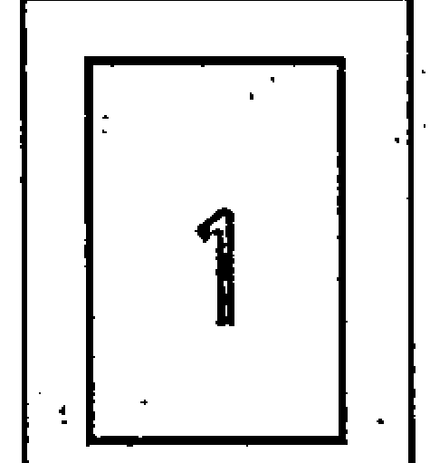

**适用于**
『22张 大阿卡娜』、『56张 小阿卡娜』、『78张 塔罗牌』

**取牌方式**
『22张 大阿卡娜』、『56张 小阿卡娜』、『78张 塔罗牌』
随意抽1张牌，放在1处。

**如何解释**
你现在应该将焦点、力量集中在此。

#### 2 Yes or No

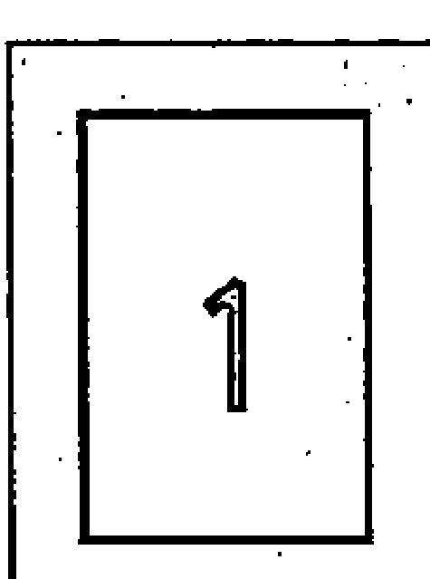

**适用于**
『78张 塔罗牌』
使用大阿卡娜22张，以及小阿卡娜的圣杯九、4张Ace牌，共27张牌。

**取牌方式**
随意抽出1张牌，不考虑正逆位，以出现的牌面来解释。

**如何解释**
- ☆ 1-若是出现小阿卡娜Ace的任何一张，代表你必需调整自己的动作，或等待时间的安排。
- ☆ 2-若是出现圣杯九，则代表明确的“是”。
- ☆ 3-若出现大阿卡娜牌请查阅下面所列。

是：
愚人、魔术师、女皇、皇帝、战车、正义、星星、太阳、世界。

是或否都可以（您可以自己随需要选择）：
女祭司、命运之轮、恋人、教宗、月亮、审判。

否：
力量、塔、节制、隐士、倒吊者、死神、恶魔。

#### 3 得 失

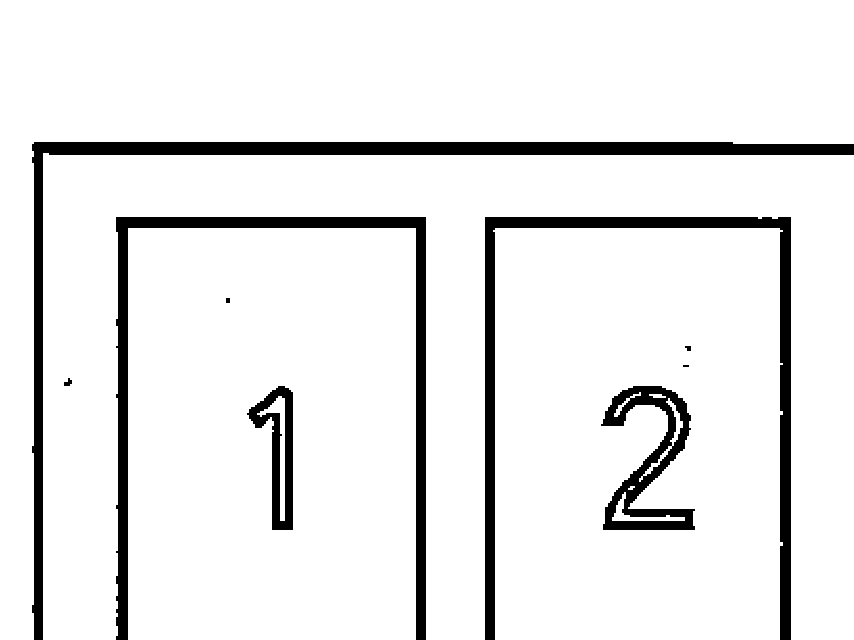

**适用于**
『22张 大阿卡娜』、『56张 小阿卡娜』、『78张 塔罗牌』

**取牌方式**
『22张 大阿卡娜』、『56张 小阿卡娜』、『78张 塔罗牌』
随意抽2张牌，依序放在1、2。

**如何解释**
- ☆ 1-我将失去什么。
- ☆ 2-我将获得什么。

#### 4 活力

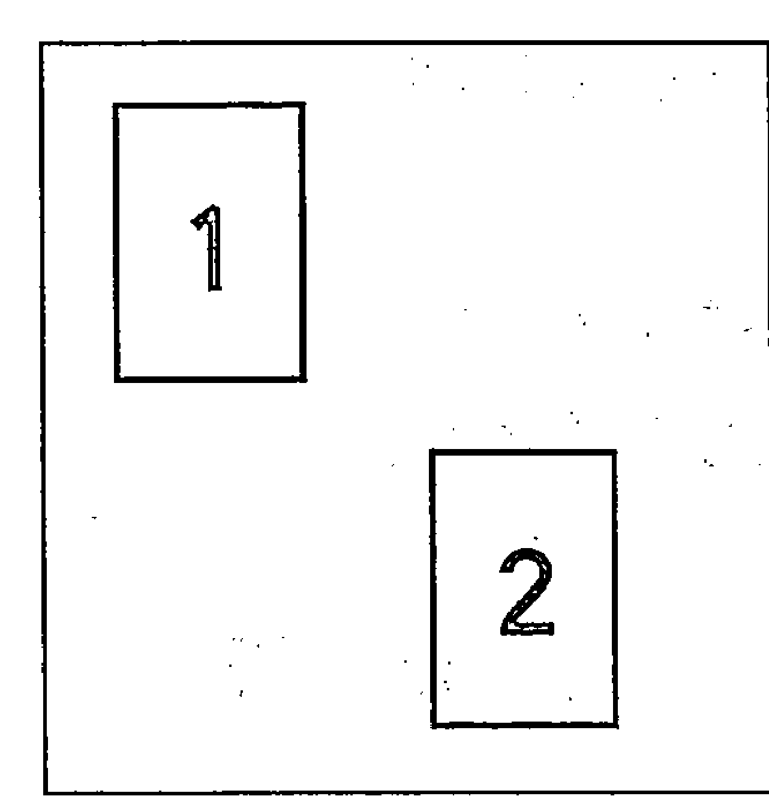

**适用于**
『22张 大阿卡娜』、『56张 小阿卡娜』、『78张 塔罗牌』

**取牌方式**
『22张 大阿卡娜』、『56张 小阿卡娜』、『78张 塔罗牌』
随意抽2张牌，依序放在1、2。

**如何解释**
- ☆ 1-今天会影响你的能量 (也有可能是明天或下星期发生效力)。
- ☆ 2-你如何将此能量提升，进而成为帮助你的力量。

#### 5 星期

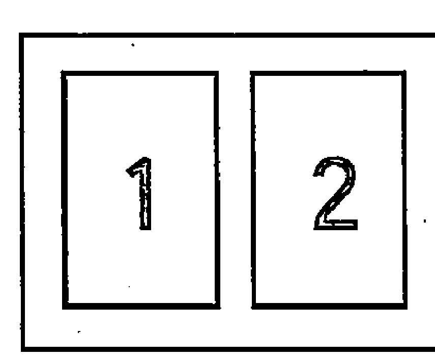

**适用于**
『22张 大阿卡娜』、『56张 小阿卡娜』、『78张 塔罗牌』

**取牌方式**
『22张 大阿卡娜』、『56张 小阿卡娜』、『78张 塔罗牌』
随意抽2张牌，依序放在1、2。

**如何解释**
- ☆ 1-这星期中的潜在影响力。
- ☆ 2-这星期呈现的主要情势。

#### ⑥ 每 天

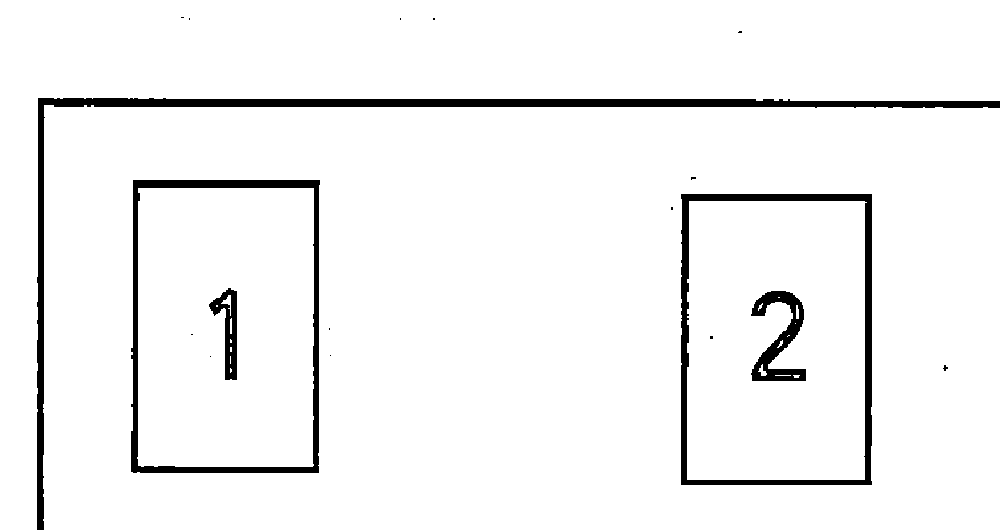

**适用于**
『22张 大阿卡娜』、『56张 小阿卡娜』、『78张 塔罗牌』

**取牌方式**
『22张 大阿卡娜』、『56张 小阿卡娜』、『78张 塔罗牌』
随意抽2张牌，依序放在1、2。

**如何解释**
- ☆ 1-事件：今天可能发生的一些事。
- ☆ 2-感受：你的感受或是对所发生事情的反应。

#### 7 过去，现在，未来

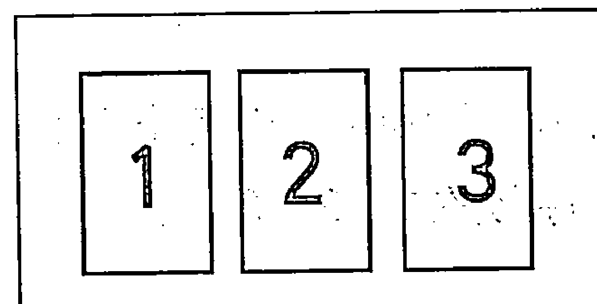

**适用于**
『22张 大阿卡娜』、『56张 小阿卡娜』、『78张 塔罗牌』

**取牌方式**
『22张 大阿卡娜』、『56张 小阿卡娜』、『78张 塔罗牌』
随意抽3张牌，依序放在1、2、3。

**如何解释**
- ☆ 1-过去发生过的事情。
- ☆ 2-现在正发生的事情。
- ☆ 3-未来可能发生的事情。

#### 8 关 键

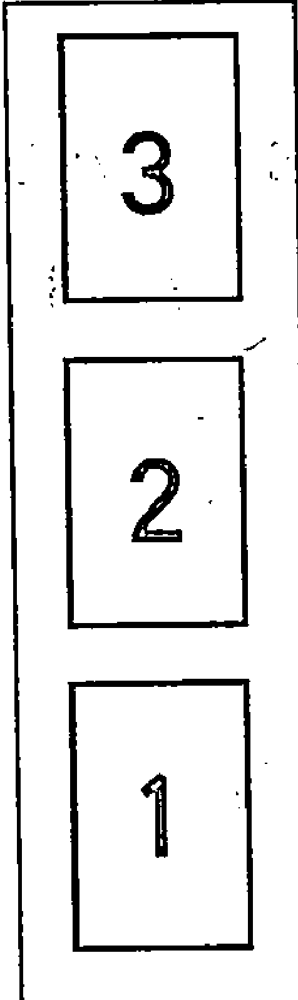

**适用于**
『22张 大阿卡娜』、『56张 小阿卡娜』、『78张 塔罗牌』

**取牌方式**
『22张 大阿卡娜』、『56张 小阿卡娜』、『78张 塔罗牌』
随意抽3张牌，依序放在1、2、3。

**如何解释**
- ☆ 1-问题的关键。
- ☆ 2-关键的重点。
- ☆ 3-在你前方的、你将面对的。

#### 了解自己

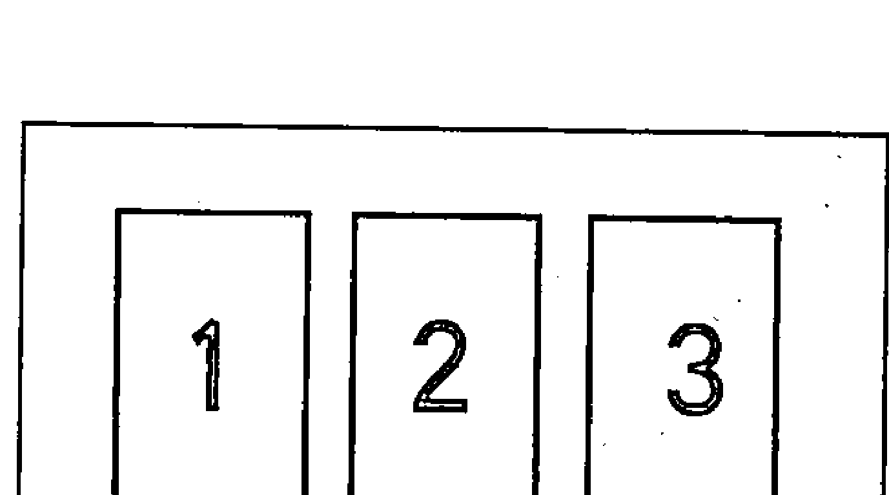

**适用于**
『22张 大阿卡娜』、『56张 小阿卡娜』、『78张 塔罗牌』

**取牌方式**
『22张 大阿卡娜』、『56张 小阿卡娜』、『78张 塔罗牌』
随意抽3张牌，依序放在1、2、3。

**如何解释**
- ☆ 1-我是谁。
- ☆ 2-我的需求。
- ☆ 3-我如何达成我的需求。

#### 10 命运三角

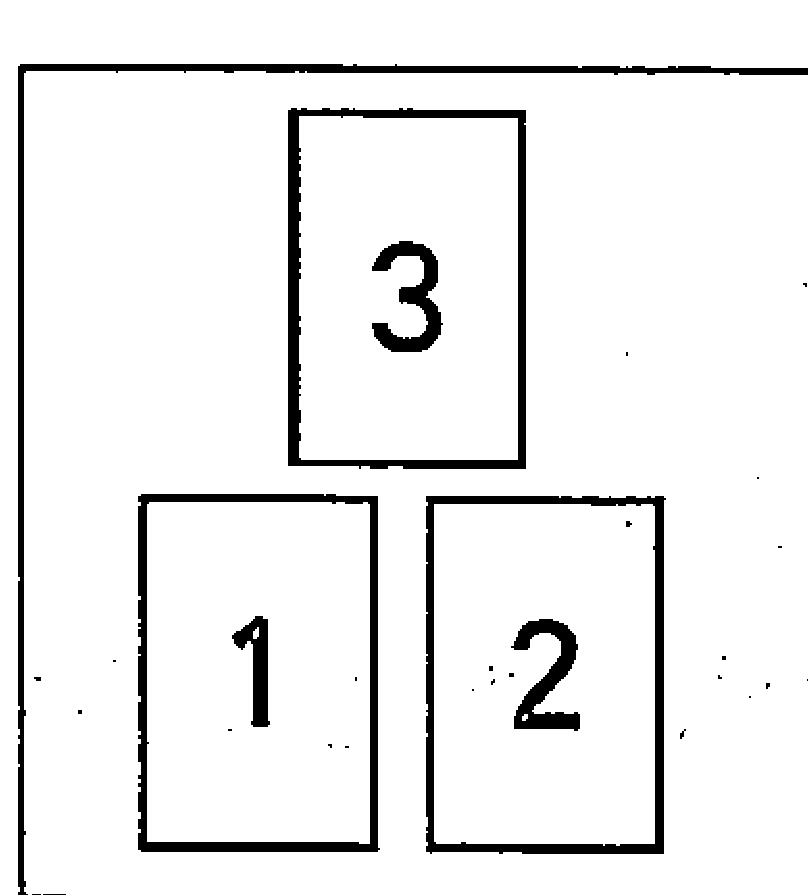

**适用于**
『22张 大阿卡娜』、『56张 小阿卡娜』、『78张 塔罗牌』

**取牌方式**
『22张 大阿卡娜』、『56张 小阿卡娜』、『78张 塔罗牌』
随意抽3张牌，依序放在1、2、3。

**如何解释**
此预测法须先决定要算哪年哪月哪日。

- ☆ 1-某年某月某日将发生什么事。
- ☆ 2-为何发生此事。
- ☆ 3-此事将如何发生。

#### 11 今日事件

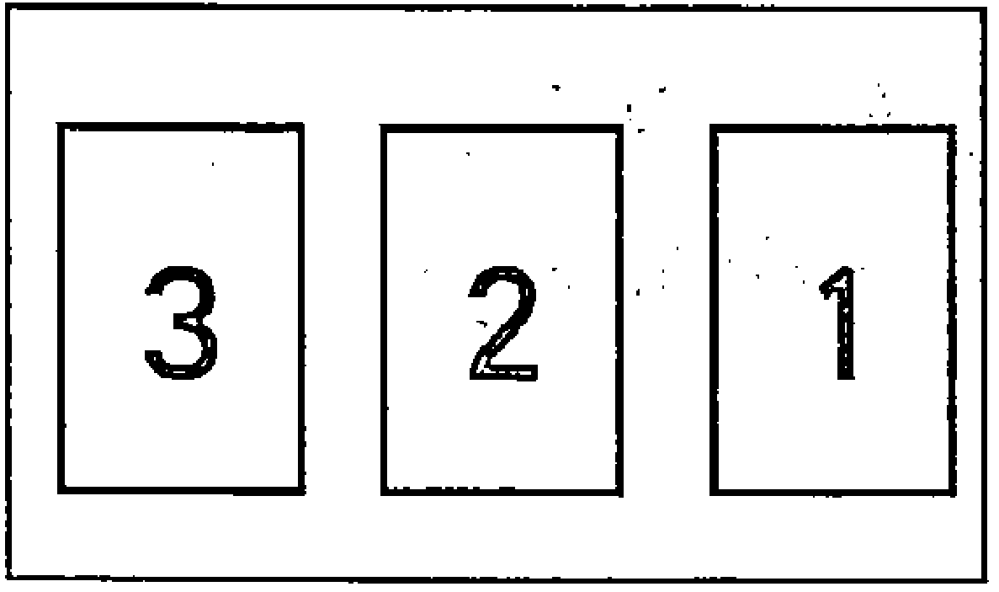

**适用于**
『22张 大阿卡娜』、『56张 小阿卡娜』、『78张 塔罗牌』

**取牌方式**
『22张 大阿卡娜』、『56张 小阿卡娜』、『78张 塔罗牌』
随意抽3张牌，依序放在1、2、3。

**如何解释**
- ☆ 1-今天的重点事件。
- ☆ 2-这事件会如何发展。
- ☆ 3-你如何开始或你该为这事件做些什么。

#### 12 今天的工作

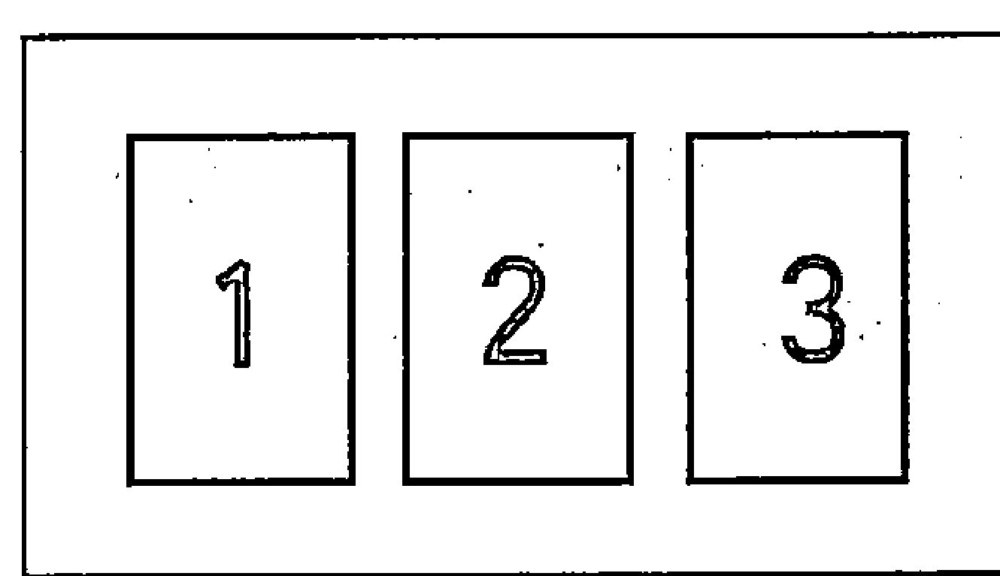

**适用于**
『22张 大阿卡娜』、『56张 小阿卡娜』、『78张 塔罗牌』

**取牌方式**
『22张 大阿卡娜』、『56张 小阿卡娜』、『78张 塔罗牌』
随意抽3张牌，依序放在1、2、3。

**如何解释**
- ☆ 1-今天的状况。
- ☆ 2-今天特别的工作、目标。
- ☆ 3-今天中惟一、独特的机会。

#### 13 今天金字塔

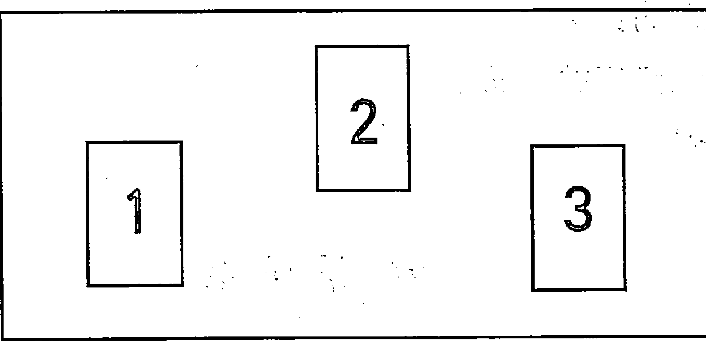

**适用于**
『22张 大阿卡娜』、『56张 小阿卡娜』、『78张 塔罗牌』

**取牌方式**
『22张 大阿卡娜』、『56张 小阿卡娜』、『78张 塔罗牌』
随意抽3张牌，依序放在1、2、3。

**如何解释**
- ☆ 1-一天的开始 (白天必须专注什么)。
- ☆ 2-一天的最高潮 (今天最主要的事)。
- ☆ 3-一天的结束 (结束)。

#### 14 目标

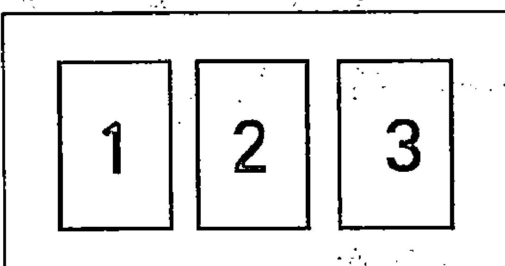

**适用于**
『22张 大阿卡娜』、『56张 小阿卡娜』、『78张 塔罗牌』

**取牌方式**
『22张 大阿卡娜』、『56张 小阿卡娜』、『78张 塔罗牌』
随意抽3张牌，依序放在1、2、3。

**如何解释**
- ☆ 1-今天的目标。
- ☆ 2-达成目标的力量。
- ☆ 3-阻碍。

#### 15 新机会

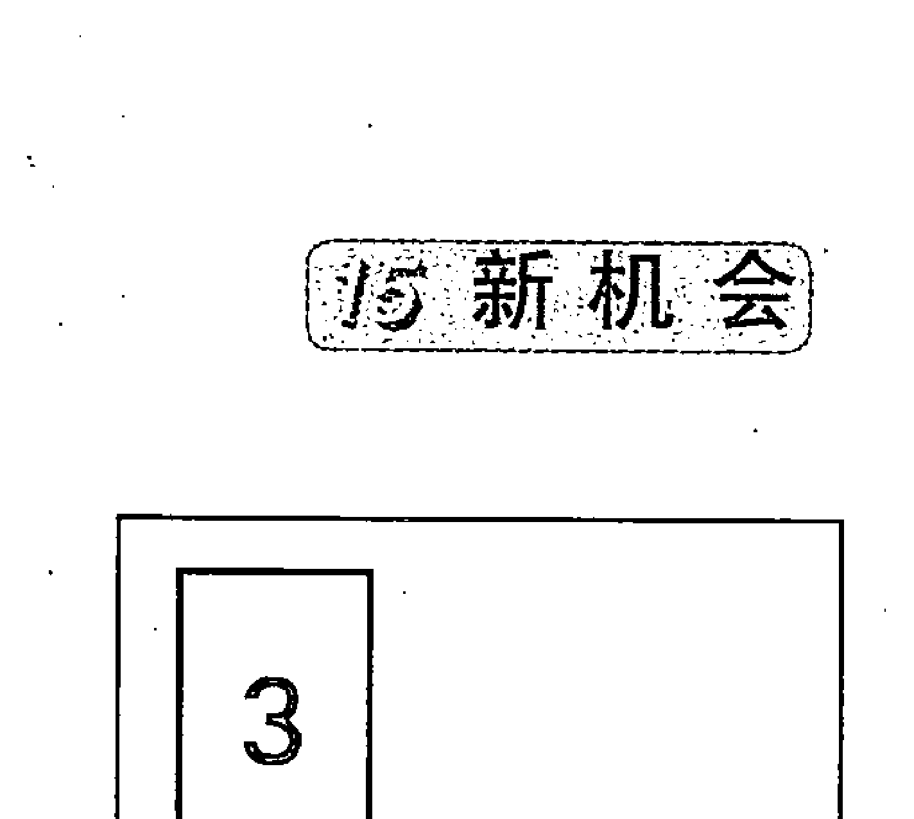

**适用于**
『22张 大阿卡娜』、『56张 小阿卡娜』、『78张 塔罗牌』

**取牌方式**
『22张 大阿卡娜』、『56张 小阿卡娜』、『78张 塔罗牌』
随意抽3张牌，依序放在1、2、3。

**如何解释**
- ☆ 1-这些将变成不重要的。
- ☆ 2-这些将变成较重要的。
- ☆ 3-这些是现在必要的。

#### 16 工作

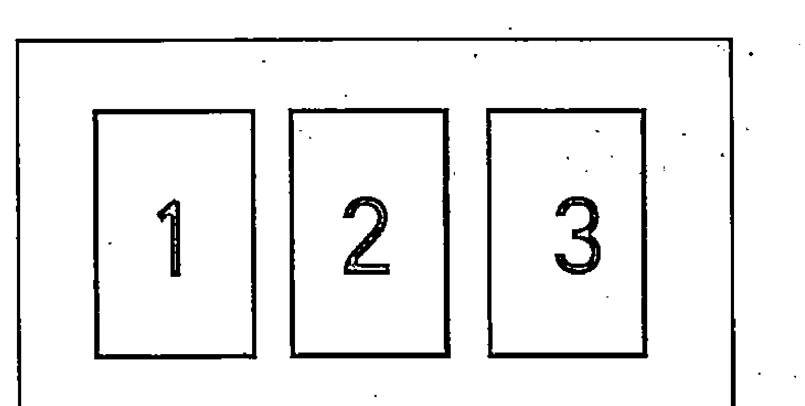

**适用于**
『22张 大阿卡娜』、『56张 小阿卡娜』、『78张 塔罗牌』

**取牌方式**
『22张 大阿卡娜』、『56张 小阿卡娜』、『78张 塔罗牌』
随意抽3张牌，依序放在1、2、3。

**如何解释**
- ☆ 1-我选对工作了吗？(必须深思熟虑)
- ☆ 2-这工作稳定吗？(可以做多久)
- ☆ 3-应该做些改变吗？(我应该继续做，还是稍做调整，甚至离职)

#### 17 合伙

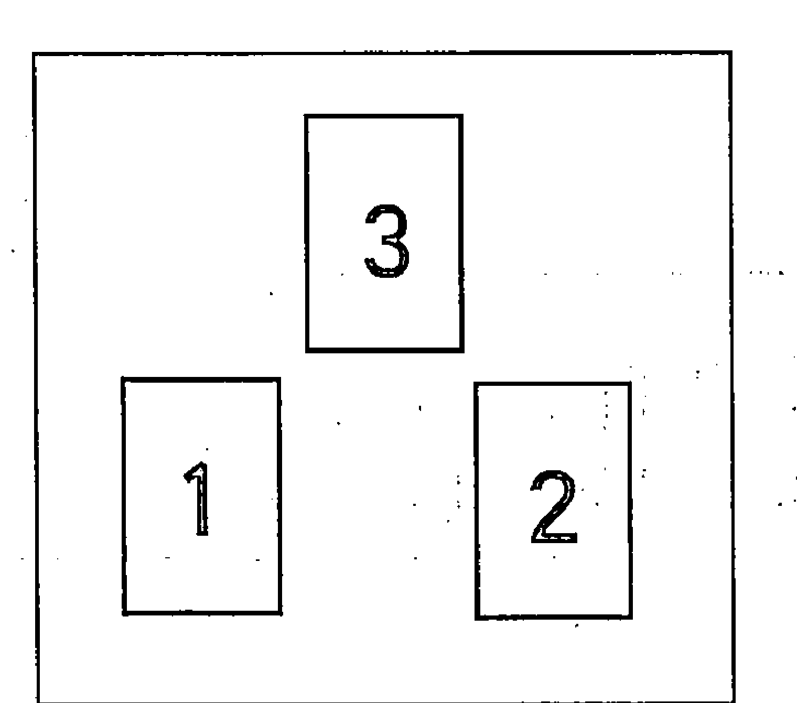

**适用于**
『22张 大阿卡娜』、『56张 小阿卡娜』、『78张 塔罗牌』

**取牌方式**
『22张 大阿卡娜』、『56张 小阿卡娜』、『78张 塔罗牌』
随意抽3张牌，依序放在1、2、3。

**如何解释**
- ☆ 1-我的伙伴。
- ☆ 2-我自己。
- ☆ 3-合伙工作的状况或是风险。

### 实用牌阵

#### 一、爱情牌阵

##### 18 分 手

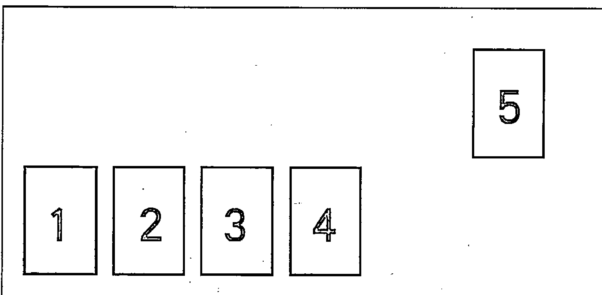

**适用于**
『22张 大阿卡娜』、『56张 小阿卡娜』、『78张 塔罗牌』

**取牌方式**
『22张 大阿卡娜』、『56张 小阿卡娜』、『78张 塔罗牌』
随意抽5张牌，依序放在1、2、3、4、5。

**如何解释**
分手预测法主要是告诉你一些你必须取舍的事。
第5张牌主要告诉你如何去调整自己对爱的感觉。

- ☆ 1、2、3-我为什么要放手?为何要放弃的隐藏原因。
- ☆ 4-为何要放弃的最主要或惟一的原因。
- ☆ 5-最终结果：如果你放手了，会造成怎样的结果。

##### 19 恋爱的前景

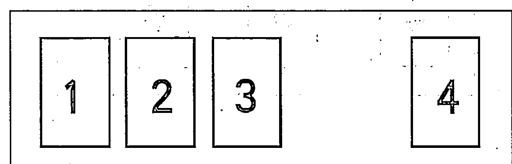

**适用于**
『22张 大阿卡娜』、『56张 小阿卡娜』、『78张 塔罗牌』

**取牌方式**
『22张 大阿卡娜』、『56张 小阿卡娜』、『78张 塔罗牌』
随意抽4张牌，依序放在1、2、3、4。

**如何解释**
- ☆ 1、2、3-你对于你爱人的感觉。
- ☆ 4-路的前方 (未来)。

##### 20 一生的爱

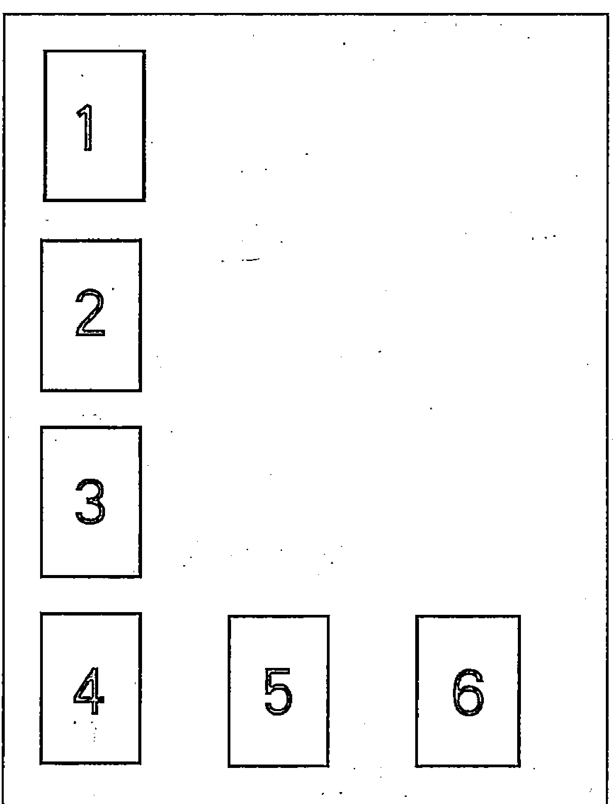

**适用于**
『22张 大阿卡娜』、『56张 小阿卡娜』、『78张 塔罗牌』

**取牌方式**
『22张 大阿卡娜』、『56张 小阿卡娜』、『78张 塔罗牌』
随意抽6张牌，依序放在1、2、3、4、5、6。

**如何解释**
- ☆ 1-你过去对爱的经验。
- ☆ 2-你目前对爱的经验。
- ☆ 3-在爱情关系中你想得到什么。
- ☆ 4-在爱情关系中你需要什么。
- ☆ 5-你对你的爱人付出了什么。
- ☆ 6-未来有可能得到的爱的经验。

##### 21 真命天子

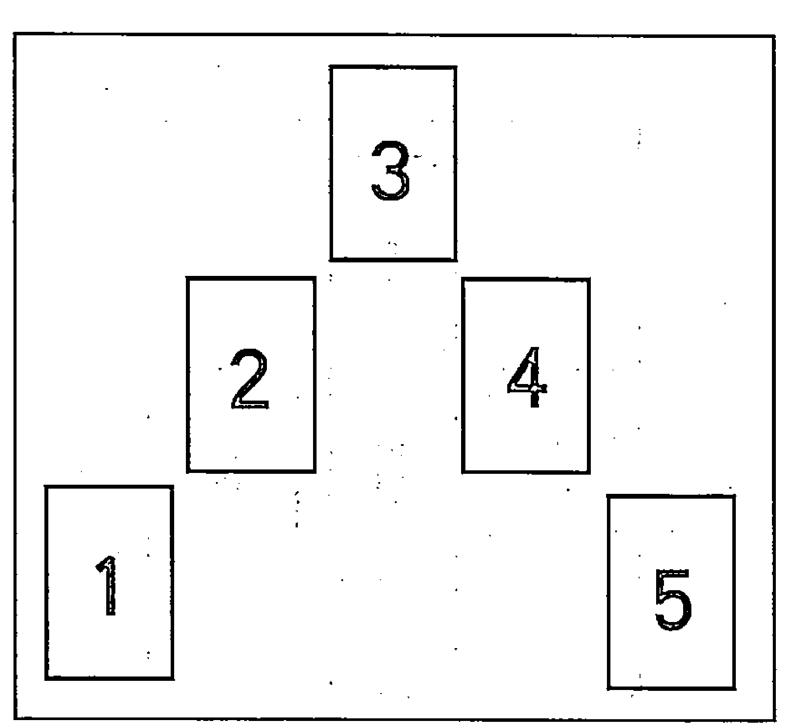

**适用于**
『22张 大阿卡娜』、『56张 小阿卡娜』、『78张 塔罗牌』

**取牌方式**
『22张 大阿卡娜』、『56张 小阿卡娜』、『78张 塔罗牌』
随意抽5张牌，依序放在1、2、3、4、5。

**如何解释**
- ☆ 1-我真正的伴侣的类型。
- ☆ 2-我真正的伴侣已经走入我的生命之中了吗？
- ☆ 3-将会有困难产生吗？
- ☆ 4-什么样的改变是需要的？
- ☆ 5-我将相信什么？

##### 22 检验爱情

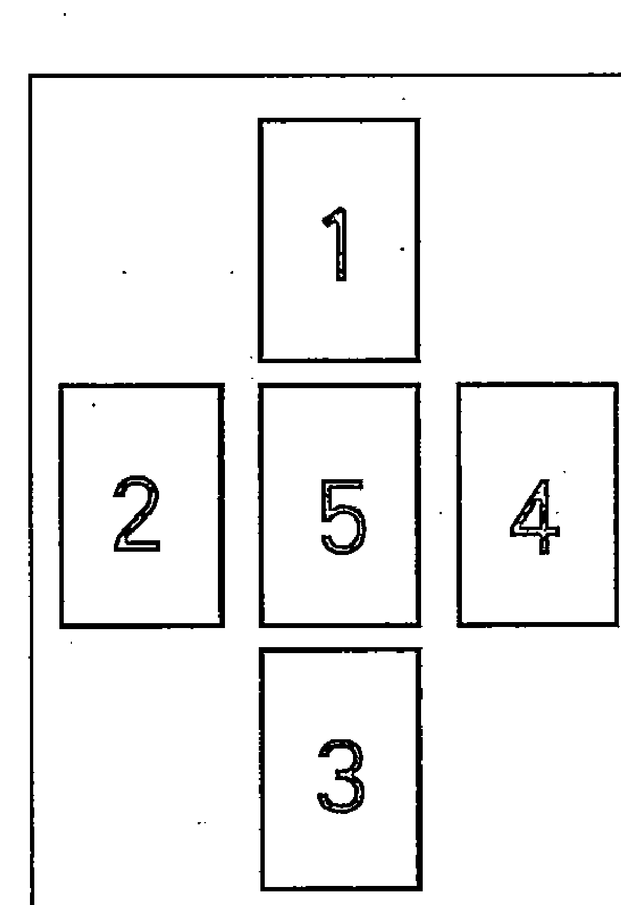

**适用于**
『22张 大阿卡娜』、『56张 小阿卡娜』、『78张 塔罗牌』

**取牌方式**
『22张 大阿卡娜』、『56张 小阿卡娜』、『78张 塔罗牌』
随意抽5张牌，依序放在1、2、3、4、5。

**如何解释**
- ☆ 1-这段时间，我的爱情关系传达了什么东西给我。
- ☆ 2-在爱情关系中我真正要什么。
- ☆ 3-在爱情关系中我不喜欢什么。
- ☆ 4-什么可以赋予爱情新的能量。
- ☆ 5-对于爱，我仍不了解的，或是我应该学习的。

##### 23 关系

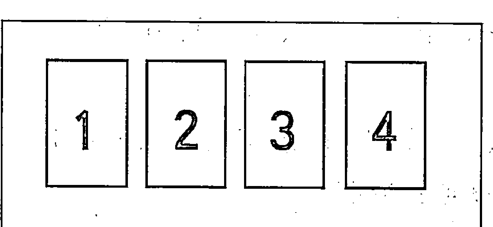

**适用于**
『22张 大阿卡娜』、『56张 小阿卡娜』、『78张 塔罗牌』

**取牌方式**
『22张 大阿卡娜』、『56张 小阿卡娜』、『78张 塔罗牌』
随意抽4张牌，依序放在1、2、3、4。

**如何解释**
- ☆ 1-在这关系中你付出的。
- ☆ 2-在这关系中你得到的。
- ☆ 3-在这关系中你的爱人付出的。
- ☆ 4-在这关系中你的爱人得到的。

##### 24 爱已消失

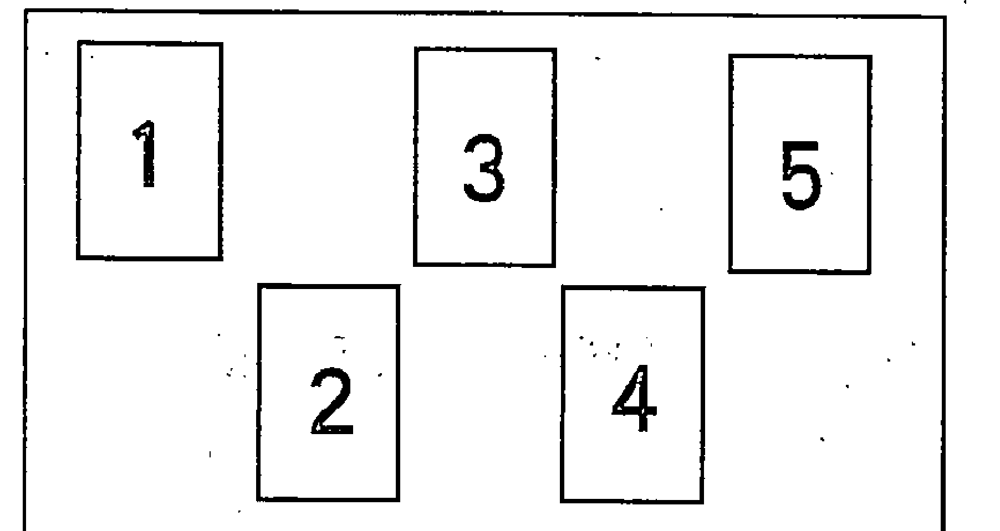

**适用于**
『22张 大阿卡娜』、『56张 小阿卡娜』、『78张 塔罗牌』

**取牌方式**
『22张 大阿卡娜』、『56张 小阿卡娜』、『78张 塔罗牌』
随意抽5张牌，依序放在1、2、3、4、5。

**如何解释**
前3张牌（1、2、3）可以解读成，因为长时间的误解，而造成现在爱情伤心与痛苦的原因。

- ☆ 1-因为某事、某原因你伤害我很深。
- ☆ 2-在一起时，我们曾拥有什么。
- ☆ 3-因为某事、某原因，你却破坏了它（第2张牌所指）。
- ☆ 4-这状况可以获得解决吗？
- ☆ 5-我们将仍会在一起吗？

##### 25 新的恋情

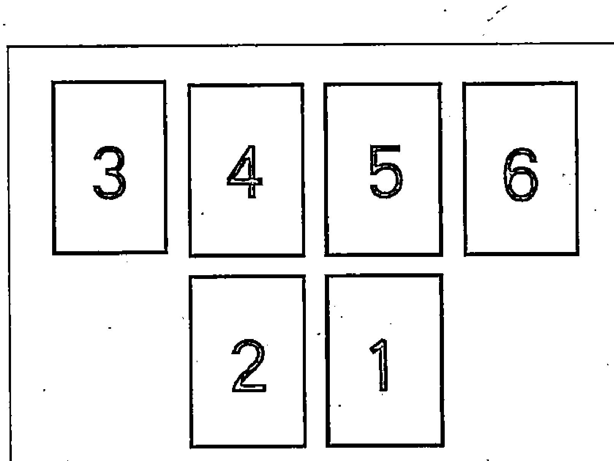

**适用于**
『22张 大阿卡娜』、『56张 小阿卡娜』、『78张 塔罗牌』

**取牌方式**
『22张 大阿卡娜』、『56张 小阿卡娜』、『78张 塔罗牌』
随意抽6张牌，依序放在1、2、3、4、5、6。

**如何解释**
- ☆ 1-我马上会有一段新恋情、新关系吗？
- ☆ 2-那个人是什么星座？
- ☆ 3-我们会相处融洽吗？
- ☆ 4-这将会是一段持续的关系吗？
- ☆ 5-那个人将会是我的灵魂伴侣吗？
- ☆ 6-我愿望的结果。

##### 26 再 见

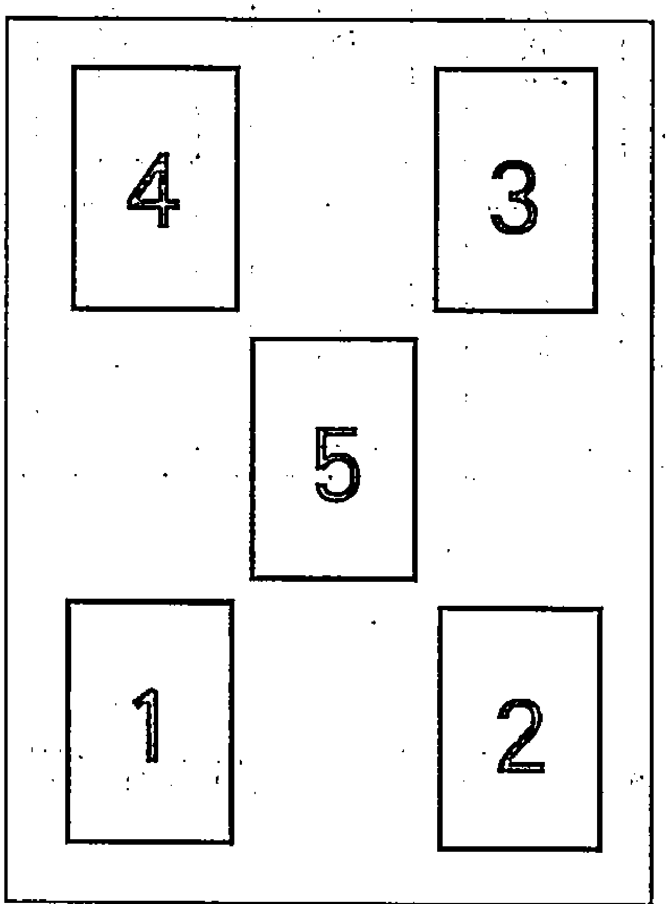

**适用于**
『22张 大阿卡娜』、『56张 小阿卡娜』、『78张 塔罗牌』

**取牌方式**
『22张 大阿卡娜』、『56张 小阿卡娜』、『78张 塔罗牌』
随意抽5张牌，依序放在1、2、3、4、5。

**如何解释**
- ☆ 1-我最初想要什么。
- ☆ 2-目前的情况（第1张牌延续）。
- ☆ 3-我正跟什么道别（正失去什么）。
- ☆ 4-我一直得不到的。
- ☆ 5-我如何得到它（第4张牌所指的）。

##### 27 爱的新起点

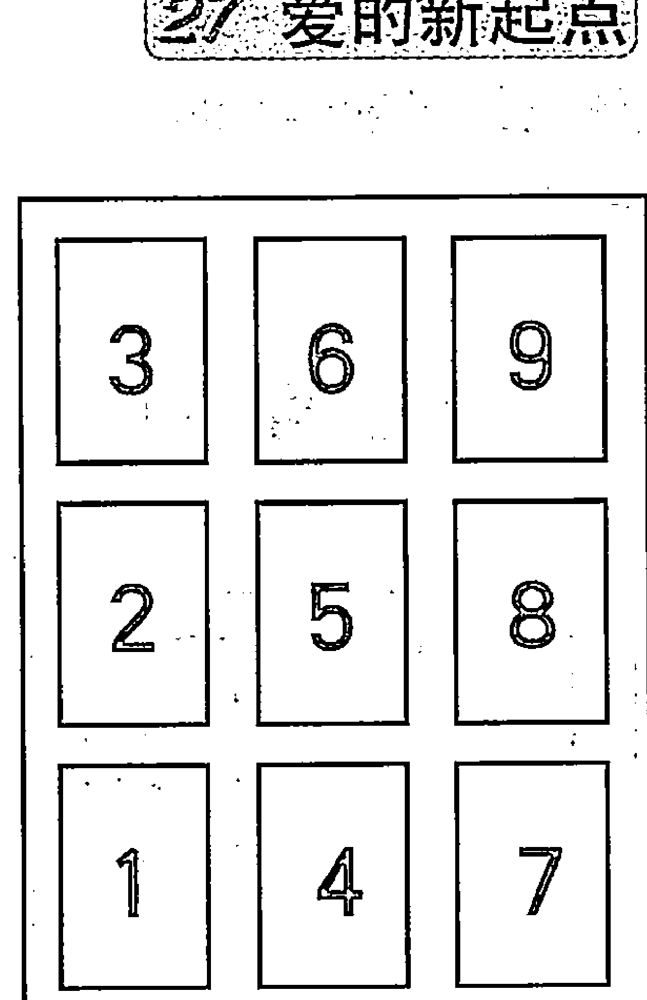

**适用于**
『22张 大阿卡娜』、『56张 小阿卡娜』、『78张 塔罗牌』

**取牌方式**
『22张 大阿卡娜』、『56张 小阿卡娜』、『78张 塔罗牌』
随意抽9张牌，依序放在1、2、3、4、5、6、7、8、9。

**如何解释**
- ☆ 1-这是一个新起点吗？
- ☆ 2-将会有新的爱人吗？
- ☆ 3-会有什么惊喜产生？
- ☆ 4-这将令人安心吗？
- ☆ 5-过程将会如何？
- ☆ 6-相处融洽吗？
- ☆ 7-内心所想的是真的吗？
- ☆ 8-将设定怎样的目标？
- ☆ 9-一切都会好吗？

##### 28 秘密情人

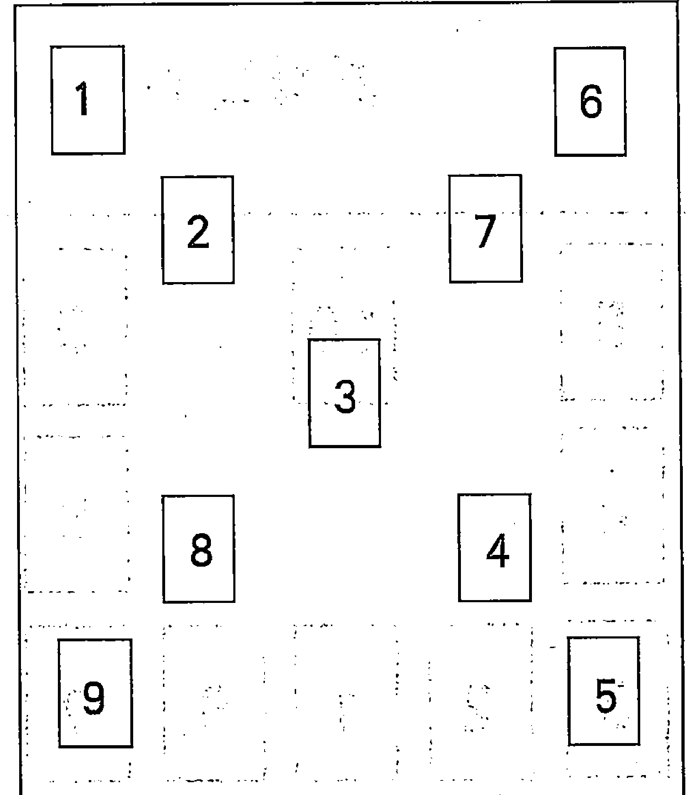

**适用于**
『22张 大阿卡娜』、『56张 小阿卡娜』、『78张 塔罗牌』

**取牌方式**
『22张 大阿卡娜』、『56张 小阿卡娜』、『78张 塔罗牌』
随意抽9张牌，依序放在1、2、3、4、5、6、7、8、9。

**如何解释**
- ☆ 1-你的爱情过去的状况。
- ☆ 2-你现在的处境。
- ☆ 3-你前任伴侣现在的处境。
- ☆ 4-你对于与前任伴侣复合的真正感觉。
- ☆ 5-你的前任伴侣对于与你复合的真正感觉。
- ☆ 6-阻碍你的。
- ☆ 7-帮助你的。
- ☆ 8-一些你可能不知道的事。
- ☆ 9-结果或决定。

##### 29 爱情三角

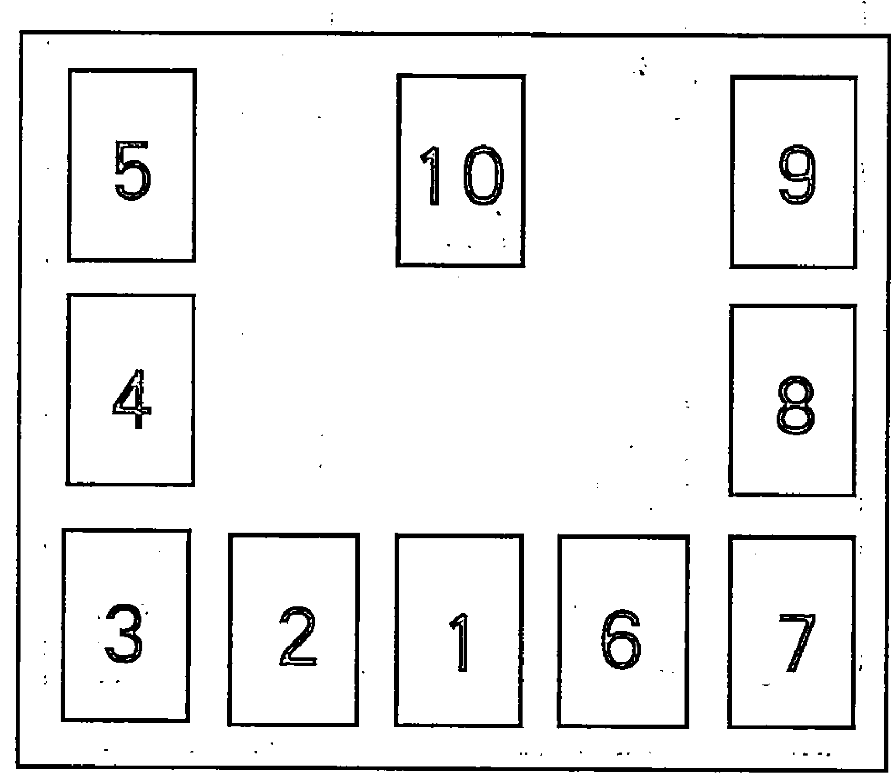

**适用于**
『22张 大阿卡娜』、『56张 小阿卡娜』、『78张 塔罗牌』

**取牌方式**
『22张 大阿卡娜』、『56张 小阿卡娜』、『78张 塔罗牌』
随意抽10张牌，依序放在1、2、3、4、5、6、7、8、9、10。

**如何解释**
本牌阵应在陷入三角恋时使用（同时有两人爱上你），必须先设定爱人A与爱人B是谁。

- ☆ 1-我现在的处境。
- ☆ 2-我期望爱人A吗？
- ☆ 3-我相信爱人A吗？
- ☆ 4-我已经爱上了爱人A吗？
- ☆ 5-我与A的情况。
- ☆ 6-我期望爱人B吗？
- ☆ 7-我相信爱人B吗？
- ☆ 8-我已经爱上了爱人B吗？
- ☆ 9-我与B的情况。
- ☆ 10-我的未来。

##### 30 爱的进行

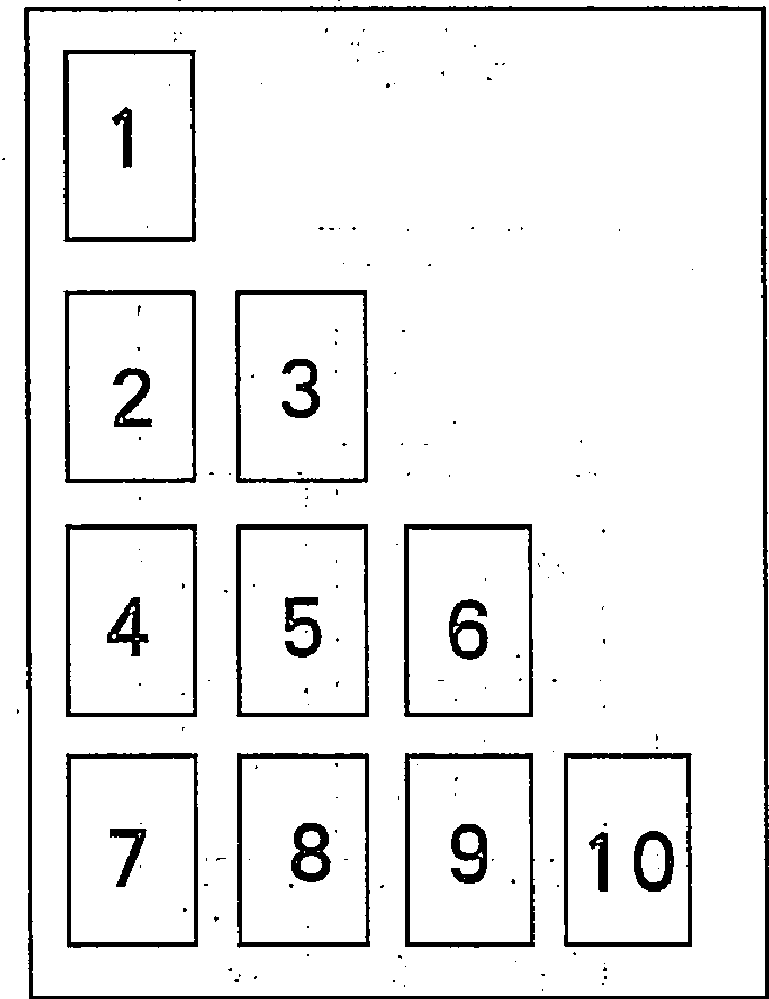

**适用于**
『22张 大阿卡娜』、『56张 小阿卡娜』、『78张 塔罗牌』

**取牌方式**
『22张 大阿卡娜』、『56张 小阿卡娜』、『78张 塔罗牌』
随意抽10张牌，依序放在1、2、3、4、5、6、7、8、9、10。

## 爱上塔罗牌

## 如何解释

- ☆ 1-爱情关系的历史。
- ☆ 2-在这关系中你过去的经验、体验。
- ☆ 3-在这关系中你的爱人过去的经验、体验。
- ☆ 4-在这关系中你现在的经验、体验。
- ☆ 5-在这关系中你的爱人现在的经验、体验。
- ☆ 6-这关系目前的情况。
- ☆ 7-在这关系中你未来可能的经验、体验。
- ☆ 8-在这关系中你的爱人未来可能的经验、体验。
- ☆ 9-这关系当前的处境。
- ☆ 10-结果：未来在这关系中可能发生的事。

## 引爱人

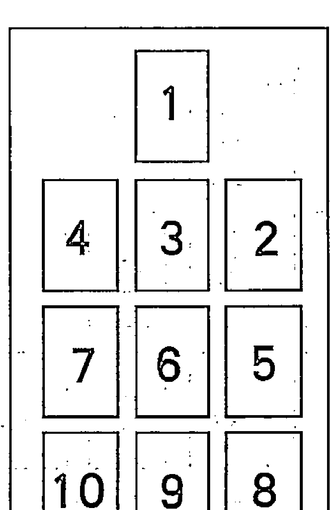

## 适用于

『22张 大阿卡娜』、『56张 小阿卡娜』、『78张 塔罗牌』

## 取牌方式

『22张 大阿卡娜』、『56张 小阿卡娜』、『78张 塔罗牌』
随意抽10张牌，依序放在1、2、3、4、5、6、7、8、9、10。

## 如何解释

- ☆ 1-我的爱人关心我吗？
- ☆ 2-我们稳定吗？
- ☆ 3-我们有相似的梦想与目标吗？
- ☆ 4-我的爱人是忠诚、可靠的吗？
- ☆ 5-我们互相吸引对方只是因为性感的因素吗？
- ☆ 6-我的爱人考虑过结婚吗？
- ☆ 7-我的爱人是高水平与高评价的人吗？
- ☆ 8-我们能分享彼此的金钱与个人财富吗？
- ☆ 9-我的爱人将为我停留，还是离开我？
- ☆ 10-最终结果。

## 32 爱情凯尔特十字

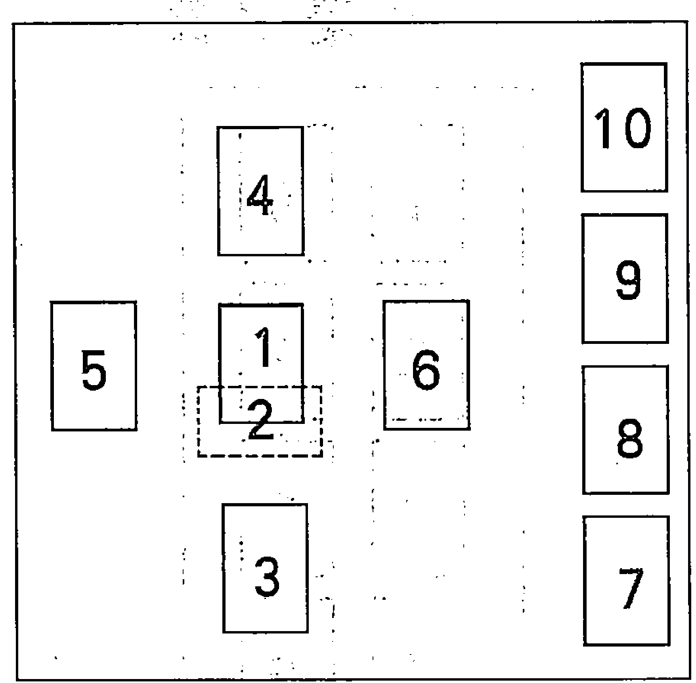

## 适用于

『22张 大阿卡娜』、『56张 小阿卡娜』、『78张 塔罗牌』

## 取牌方式

『22张 大阿卡娜』、『56张 小阿卡娜』、『78张 塔罗牌』
随意抽10张牌，依序放在1、2、3、4、5、6、7、8、9、10。

## 爱上塔罗牌

## 如何解释

- ☆ 1-你现在的情况：你感受到的信任或伤害。
- ☆ 2-与你幸福有关的，你应该开始改变的。（此牌在第1张牌底下不显示）
- ☆ 3-这恋爱如何发展：你已经在进行的部分。
- ☆ 4-你的愿望或需求：你如何面对目前已经明朗的状况。
- ☆ 5-问题的中心：你必会碰触到的。
- ☆ 6-你必须的步骤：必走的一条路。
- ☆ 7-下一步该做的：你必须去改变的。
- ☆ 8-有用的影响：你越来越了解的、察觉的。
- ☆ 9-怀疑与恐惧：此牌是要告诉你任何可能发生的失败、挫折。
- ☆ 10-你目前的状况所会产生的结果：你未来的梦想。

## 爱之路

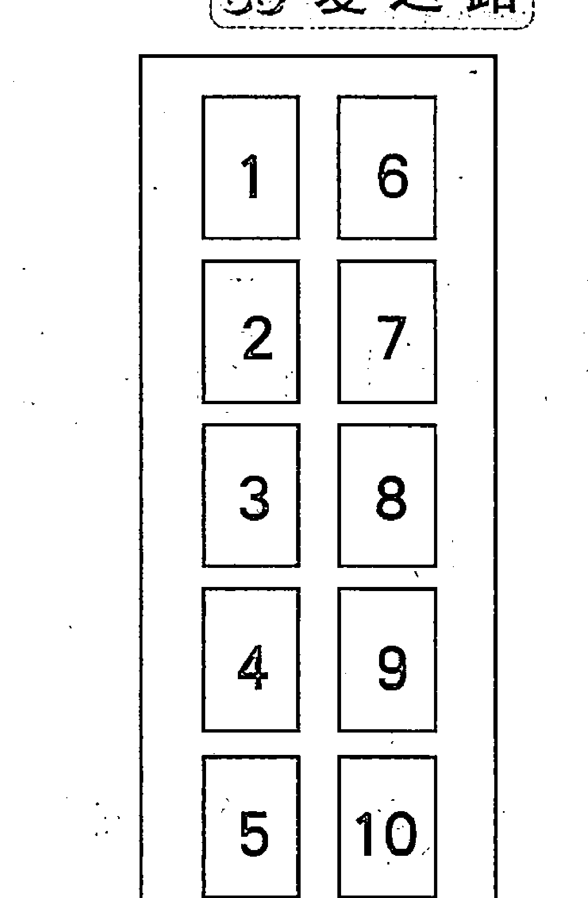

## 适用于

『22张 大阿卡娜』、『56张 小阿卡娜』、『78张 塔罗牌』

## 取牌方式

『22张 大阿卡娜』、『56张 小阿卡娜』、『78张 塔罗牌』
随意抽10张牌，依序放在1、2、3、4、5、6、7、8、9、10。

## 如何解释

分析自己与两位朋友的关系状况（合伙、恋爱），请先设定对象A与对象B是谁。

- ☆ 1-关于对象A。
- ☆ 2-这将会是一个新开始吗？
- ☆ 3-我们将会相处融洽吗？
- ☆ 4-我可以相信我心里的声音吗？（对于A的想法）
- ☆ 5-应该选择A吗？
- ☆ 6-关于对象B。
- ☆ 7-这将会是一个新开始吗？
- ☆ 8-我们将会相处融洽吗？
- ☆ 9-我可以相信我心里的声音吗？（对于B的想法）
- ☆ 10-应该选择B吗？

## 34 浪漫诱惑

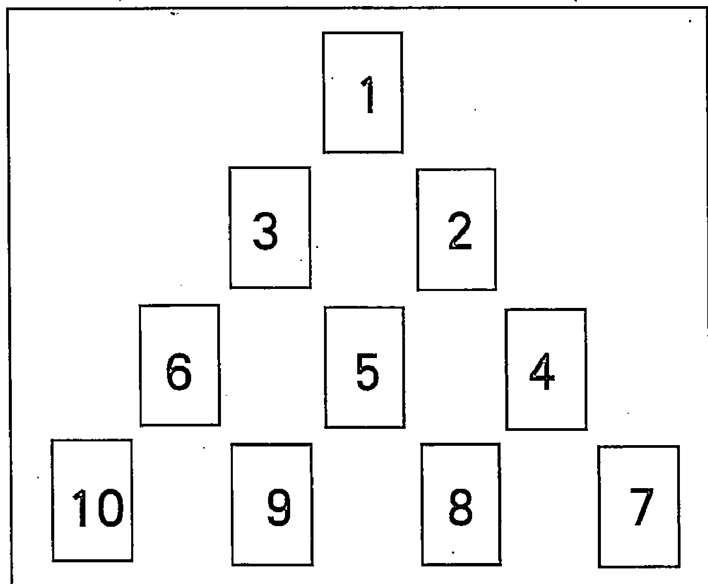

## 爱上塔罗牌

## 适用于

『22张 大阿卡娜』、『56张 小阿卡娜』、『78张 塔罗牌』

## 取牌方式

『22张 大阿卡娜』、『56张 小阿卡娜』、『78张 塔罗牌』
随意抽10张牌，依序放在1、2、3、4、5、6、7、8、9、10。

## 如何解释

- ☆ 1-有吸引力的、诱人的。
- ☆ 2-那个人正在恋爱吗？
- ☆ 3-我们能相处愉快吗？
- ☆ 4-我们可以一起工作以及相互支持对方吗？
- ☆ 5-我们的性生活能配合吗？
- ☆ 6-我们的家族能相处融洽吗？
- ☆ 7-我们宗教信仰是否不同、有冲突吗？
- ☆ 8-我们将会有权力与金钱方面的问题吗？
- ☆ 9-这将是一段长时间的关系吗？
- ☆ 10-结果。

## 35 破镜重圆

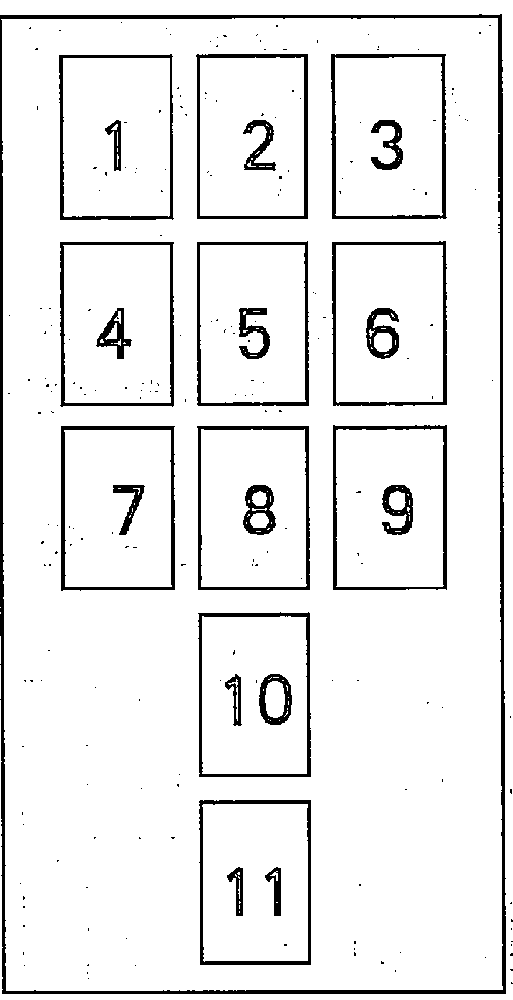

## 适用于

『22张 大阿卡娜』、『56张 小阿卡娜』、『78张 塔罗牌』

## 取牌方式

『22张 大阿卡娜』、『56张 小阿卡娜』、『78张 塔罗牌』
随意抽11张牌，依序放在1、2、3、4、5、6、7、8、9、10、11。

## 如何解释

- ☆ 1-你最近的及过去的情况。
- ☆ 2-你的现况或关键。
- ☆ 3-你若与之前爱人复合所产生的结果。
- ☆ 4-与你分手的爱人，过去的情况。
- ☆ 5-与你分手的爱人，现在的情况。
- ☆ 6-与你分手的爱人，未来的情况；或是指与你复合的可能性。
- ☆ 7-与你分手的爱人，他（她）新的恋人过去的情况。（你的情敌）
- ☆ 8-与你分手的爱人，他（她）新的恋人现在的情况。（你的情敌）
- ☆ 9-与你分手的爱人，他（她）新的恋人与你互动的未来的情况。（你的情敌与你的互动）
- ☆ 10-可能的结果一：会因为第3张牌而减弱或加强。（一同解释）
- ☆ 11-可能的结果二：会因为第9张牌而减弱或加强。（一同解释）

## 36 别人的爱

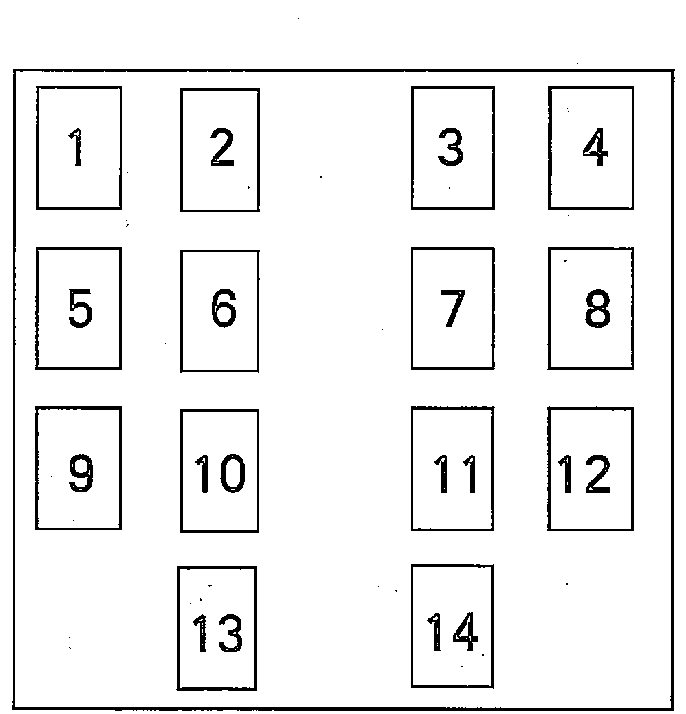

## 适用于

『22张 大阿卡娜』、『56张 小阿卡娜』、『78张 塔罗牌』
（超过12张的牌阵不建议只用大阿卡娜）

## 取牌方式

『22张 大阿卡娜』、『56张 小阿卡娜』、『78张 塔罗牌』
随意抽14张牌，依序放在1、2、3、4、5、6、7、8、9、10、11、12、13、14。

## 如何解释

- ☆ 1、2-在这关系中，他所喜欢的部分。
- ☆ 3、4-在这关系中，她所喜欢的部分。
- ☆ 5、6-在这关系中，他不喜欢的部分。
- ☆ 7、8-在这关系中，她不喜欢的部分。
- ☆ 9、10-在这关系中，他想要看见什么样的事情发生。
- ☆ 11、12-在这关系中，她想要看见什么样的事情发生。
- ☆ 13、14-结果：这关系当前的处境。

## 二、财富牌阵

## 37 金钱

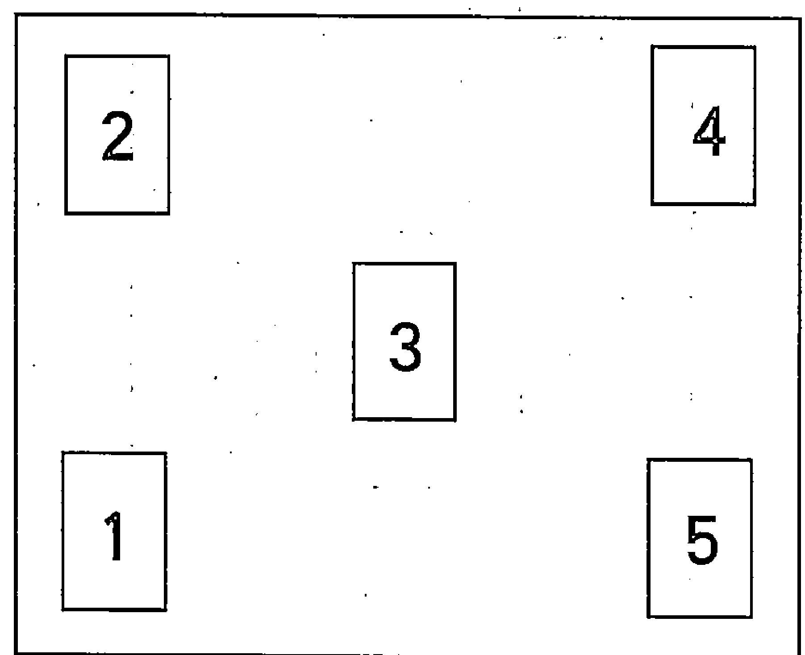

## 适用于

『22张 大阿卡娜』、『56张 小阿卡娜』、『78张 塔罗牌』

## 取牌方式

『22张 大阿卡娜』、『56张 小阿卡娜』、『78张 塔罗牌』
随意抽5张牌，依序放在1、2、3、4、5。

## 如何解释

- ☆ 1-财富的根基。
- ☆ 2-财富如何快速地来到你的生活当中。
- ☆ 3-有助增加财富的有利条件——你应该好好考量的。
- ☆ 4-暗示某些人或某些计划会带来新的财富。
- ☆ 5-结果。

## 38 收获

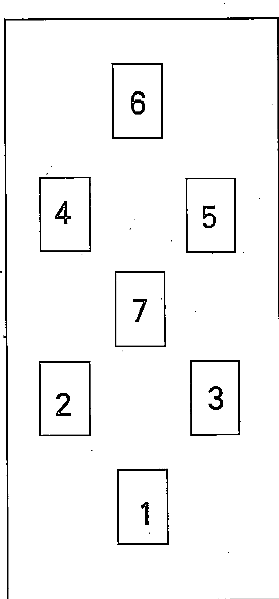

## 适用于

『22张 大阿卡娜』、『56张 小阿卡娜』、『78张 塔罗牌』

## 取牌方式

『22张 大阿卡娜』、『56张 小阿卡娜』、『78张 塔罗牌』
随意抽7张牌，依序放在1、2、3、4、5、6、7。

## 如何解释

- ☆ 1-你的愿望。
- ☆ 2-如何播种你的愿望种子，并且得到成果。（该如何行动——种瓜得瓜，种豆得豆）
- ☆ 3-在实现愿望的过程中，所需要的新想法。
- ☆ 4-某人或某些事物会帮助你。
- ☆ 5-你面前的挑战。
- ☆ 6-你将得到什么。
- ☆ 7-实现未来远景的关键。

## 39 财宝金库

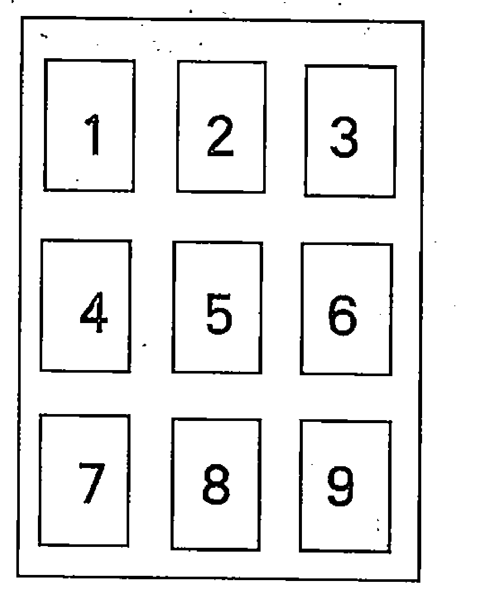

## 适用于

『22张 大阿卡娜』、『56张 小阿卡娜』、『78张 塔罗牌』

## 取牌方式

『22张 大阿卡娜』、『56张 小阿卡娜』、『78张 塔罗牌』
随意抽9张牌，依序放在1、2、3、4、5、6、7、8、9。

## 如何解释

- ☆ 1-钻石：你出众的地方，主要的天赋、能力，你拥有的财富。
- ☆ 2-珍珠：你的知识，你将其融入生活中的知识与信息。
- ☆ 3-金币：你拥有的，金钱与目前你可以使用的物质。
- ☆ 4-翡翠：你认识的人，在你生命中新发生的关系。
- ☆ 5-白金链：阻碍你的，在你生命中你必须去解决、处理的人事物。
- ☆ 6-蓝宝石：你能够与众不同的地方，目前正脱颖而出的才能、财产、能力。
- ☆ 7-水晶：你正在学习的，你可以将其融入生活中的知识与信息。
- ☆ 8-红宝石：你可能马上要认识的人，那人正走入你的生命中。
- ☆ 9-未经琢磨的钻石：你尚未发挥的地方，你可以开发的财产、能力。

## 40 阿拉伯的财富

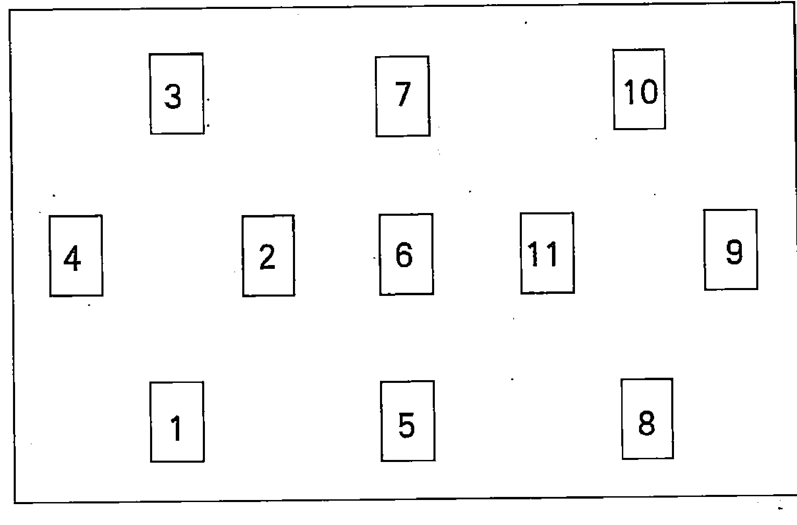

## 适用于

『22张 大阿卡娜』、『56张 小阿卡娜』、『78张 塔罗牌』

## 取牌方式

『22张 大阿卡娜』、『56张 小阿卡娜』、『78张 塔罗牌』
随意抽11张牌，依序放在1、2、3、4、5、6、7、8、9、10、11。

## 如何解释

- ☆ 1-家庭、伙伴、环境。
- ☆ 2-教育、事业、工作。
- ☆ 3-关系、自尊。
- ☆ 4-以前的强力的影响，但现在仍有影响力。
- ☆ 5-求问者本身：求问者的现在状况，目前的心态，个性。
- ☆ 6-神殿：先前影响求问者的，例如：阻碍他们的。
- ☆ 7-祭坛：求问者目前的目标；也代表求问者的恐惧与不安。
- ☆ 8-工作领域与创造力。
- ☆ 9-社交领域与关系。
- ☆ 10-健康与家庭方面的领域。
- ☆ 11-未来的强力的影响。

## 41 财务

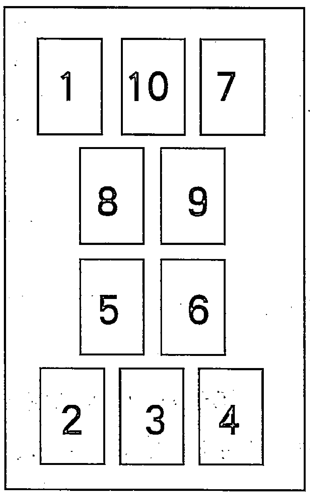

## 爱上塔罗牌

## 适用于

『22张 大阿卡娜』、『56张 小阿卡娜』、『78张 塔罗牌』

## 取牌方式

『22张 大阿卡娜』、『56张 小阿卡娜』、『78张 塔罗牌』
随意抽10张牌，依序放在1、2、3、4、5、6、7、8、9、10。

## 如何解释

- ☆ 1、2、3、4--与我金钱方面有关的，并且需小心注意的。
- ☆ 5、6、7--我如何让我的财务方面稳定安全？
- ☆ 8、9--谁能提供我所需要的帮助？
- ☆ 10--我财政方面的未来规划。

## 42 财富之路

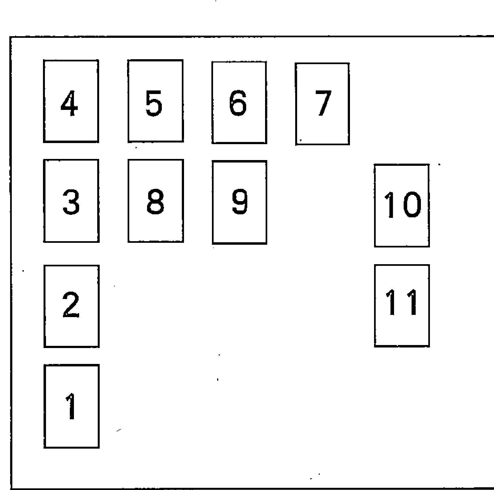

## 适用于

『22张 大阿卡娜』、『56张 小阿卡娜』、『78张 塔罗牌』

## 取牌方式

『22张 大阿卡娜』、『56张 小阿卡娜』、『78张 塔罗牌』
随意抽11张牌，依序放在1、2、3、4、5、6、7、8、9、10、11。

## 如何解释

- ☆ 1、2-现在的情况。
- ☆ 3、4-隐藏的、你不知道的。
- ☆ 5、6、7-在目前的情况下最有可能产生的结果。（维持现状不做改变）
- ☆ 8、9-另一种可能发生的结果。
- ☆ 10、11-你可以做的努力，以便创造出最好的结果。

## 三 家庭牌阵

## 43 搬家

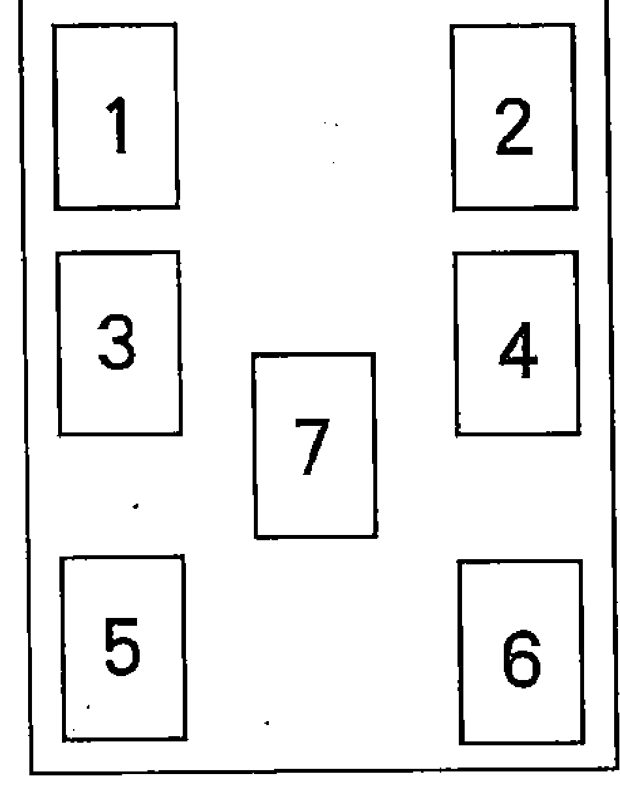

## 适用于

『22张 大阿卡娜』、『56张 小阿卡娜』、『78张 塔罗牌』

## 取牌方式

『22张 大阿卡娜』、『56张 小阿卡娜』、『78张 塔罗牌』
随意抽7张牌，依序放在1、2、3、4、5、6、7。

## 如何解释

- ☆ 1-什么样的地方对你福利、健康是有帮助的。
- ☆ 2-下次搬家的机会。
- ☆ 3-你如何找到属于你的特殊地方。
- ☆ 4-关于这地方你必须知道的事。
- ☆ 5-你搬家前必需做的。
- ☆ 6-关于这地方你必须考量的事。
- ☆ 7-结果。

## 宠物

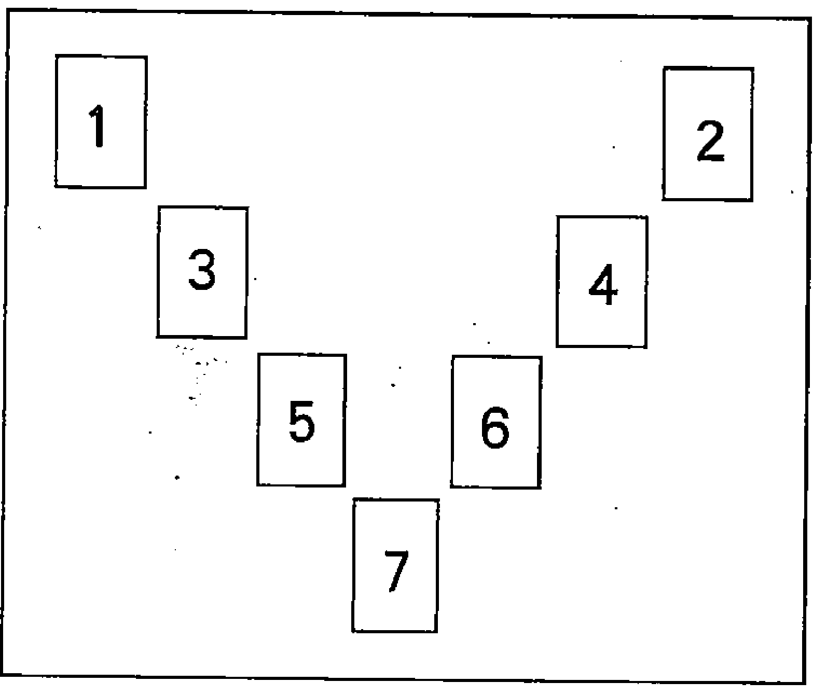

## 适用于

『22张 大阿卡娜』、『56张 小阿卡娜』、『78张 塔罗牌』

## 取牌方式

『22张 大阿卡娜』、『56张 小阿卡娜』、『78张 塔罗牌』
随意抽7张牌，依序放在1、2、3、4、5、6、7。

## 如何解释

- ☆ 1-你的宠物试着要告诉你的。
- ☆ 2-你的宠物现在的感觉，它的需求。
- ☆ 3-你如何帮助你的宠物。
- ☆ 4-此时你的宠物需要更多的是什么。
- ☆ 5-你的宠物整体的健康。
- ☆ 6-在最近的未来中你的宠物将所需要的。
- ☆ 7-你的宠物的整体分析。

## 45 小孩特征

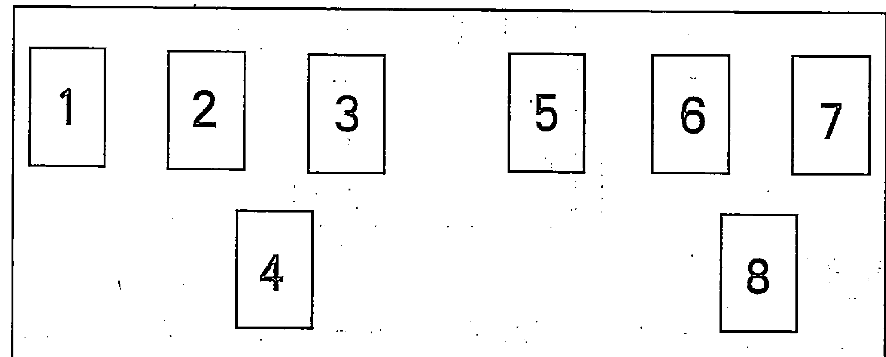

## 适用于

『22张 大阿卡娜』、『56张 小阿卡娜』、『78张 塔罗牌』

## 取牌方式

『22张 大阿卡娜』、『56张 小阿卡娜』、『78张 塔罗牌』
随意抽8张牌，依序放在1、2、3、4、5、6、7、8。

## 如何解释

这牌阵专为有两个小孩的家庭所创，且此牌阵可以很容易增加其它牌与解释到牌阵里面。
你可以沿用这个牌阵的格式或是增加一些牌来符合你的需求。

- ☆ 1、2、3-你最大的小孩的个性、人格与性向的特征。
- ☆ 4-你能做些什么事来帮助你最大的小孩。
- ☆ 5、6、7-你最小的小孩的个性、人格与性向的特征。
- ☆ 8-你能做些什么事来帮助你最小的小孩。

## 46 家庭问题

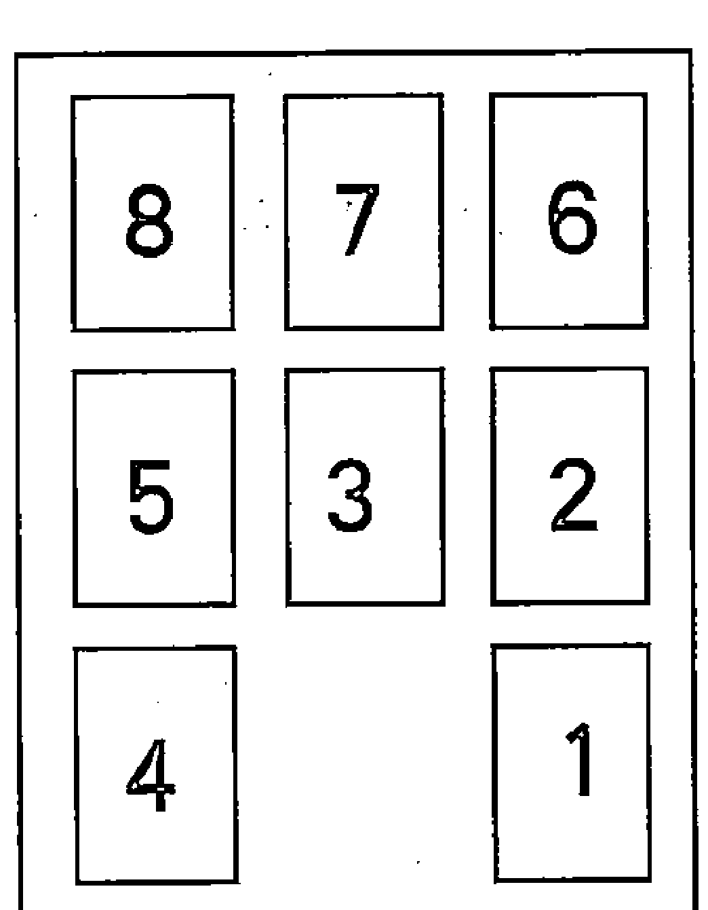

## 适用于

『22张 大阿卡娜』、『56张 小阿卡娜』、『78张 塔罗牌』

## 取牌方式

『22张 大阿卡娜』、『56张 小阿卡娜』、『78张 塔罗牌』
随意抽8张牌，依序放在1、2、3、4、5、6、7、8。

## 如何解释

- ☆ 1-谁是造成问题的主要人物。
- ☆ 2-危及你的安全与保障之事。
- ☆ 3-在这问题中，（第1张牌所指之人）一些越轨的行为是如何造成危机的。
- ☆ 4-在过去，这个人（第1张牌所指之人）是否发生过同样问题。
- ☆ 5-如何解决这问题。
- ☆ 6-需要避免哪些突发状况。
- ☆ 7-这问题对你健康的影响。
- ☆ 8-最后结果。

## 四 事业牌阵

## 47 跳槽

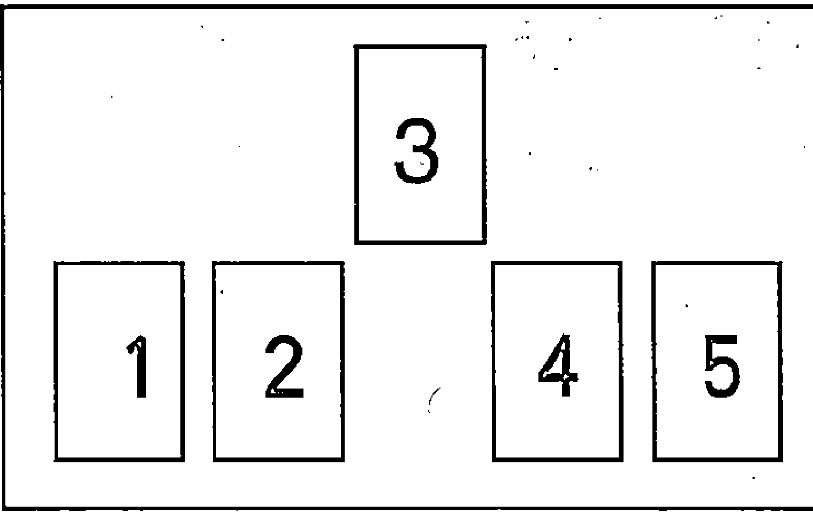

## 适用于

『22张 大阿卡娜』、『56张 小阿卡娜』、『78张 塔罗牌』

## 取牌方式

『22张 大阿卡娜』、『56张 小阿卡娜』、『78张 塔罗牌』
随意抽5张牌，依序放在1、2、3、4、5。

## 如何解释

- ☆ 1-我将有一个更好的工作吗？
- ☆ 2-我拥有什么或是我该做些什么。
- ☆ 3-我将经历什么问题。
- ☆ 4-我可以期盼一个新环境的到来吗？
- ☆ 5-结果。

## 48 决策因素

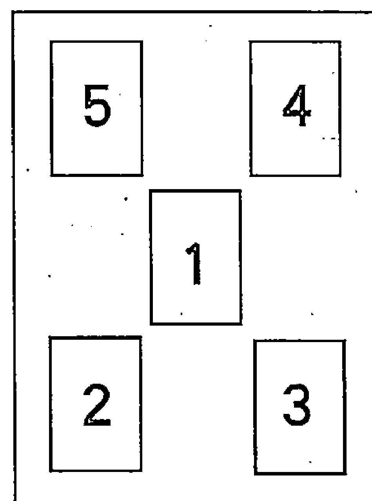

## 爱上塔罗牌

## 适用于

『22张 大阿卡娜』、『56张 小阿卡娜』、『78张 塔罗牌』

## 取牌方式

『22张 大阿卡娜』、『56张 小阿卡娜』、『78张 塔罗牌』
随意抽5张牌，依序放在1、2、3、4、5。

## 如何解释

- ☆ 1-关键或主要的观点。
- ☆ 2-会驱使你的。
- ☆ 3-外界的影响。
- ☆ 4-危机、风险。
- ☆ 5-要如何解决、完成。

## 49 工作

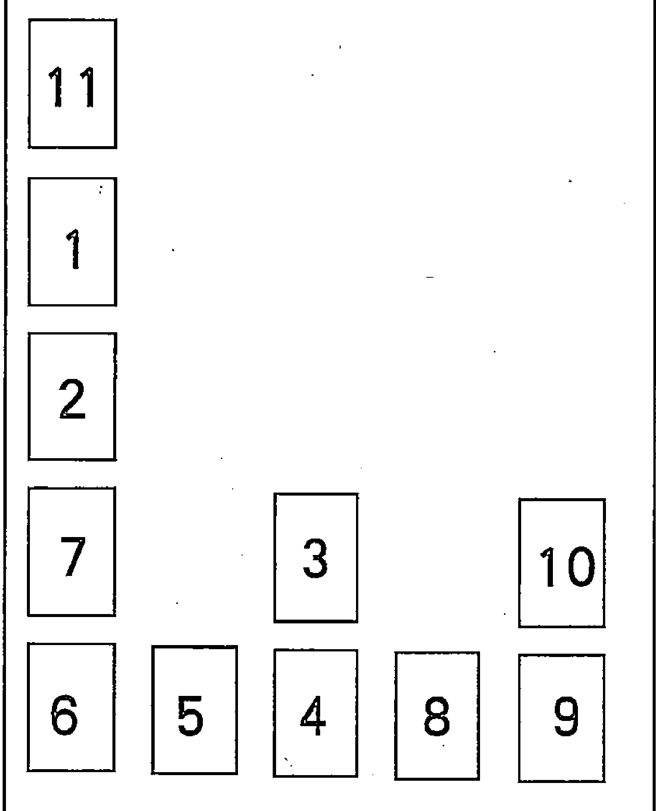

## 适用于

『22张 大阿卡娜』、『56张 小阿卡娜』、『78张 塔罗牌』

## 取牌方式

『22张 大阿卡娜』、『56张 小阿卡娜』、『78张 塔罗牌』
随意抽11张牌，依序放在1、2、3、4、5、6、7、8、9、10、11。

## 如何解释

- ☆ 1-你自己想要什么。
- ☆ 2-某些人或某些事物将帮助你。
- ☆ 3-你应该把焦点放在哪边。
- ☆ 4-转折点：改变情况的事件。
- ☆ 5-在工作上一个可能的新发展。
- ☆ 6-同时信号：在5这张牌所指的发展中一个重要的事件，当它发生时，你将会察觉到。
- ☆ 7-在5这张牌所指的情形下最后的成就。
- ☆ 8-在工作上另一个可能的新发展。
- ☆ 9-同时信号：在8这张牌所指的发展中一个重要的事件，当它发生时，你将会察觉到。
- ☆ 10-在8这张牌所指的情形下最后的成就。
- ☆ 11-为了满足自己的需求，在选择时你所需要知道的事。

## 50 事业

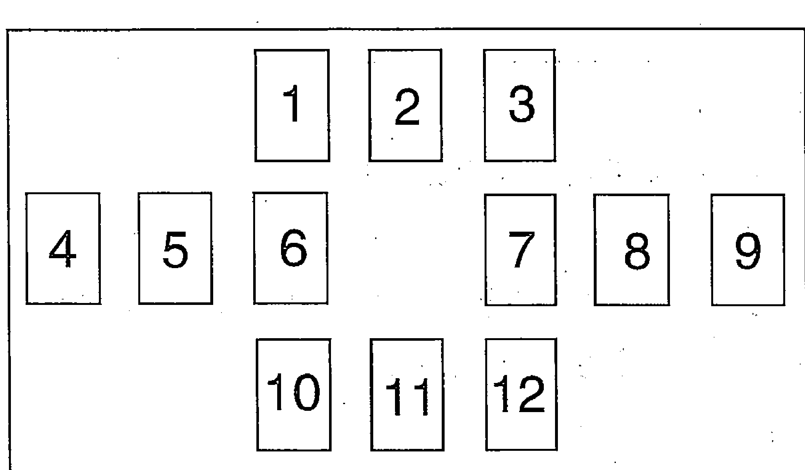

## 爱上塔罗牌

## 适用于

『22张 大阿卡娜』、『56张 小阿卡娜』、『78张 塔罗牌』

## 取牌方式

『22张 大阿卡娜』、『56张 小阿卡娜』、『78张 塔罗牌』
随意抽12张牌，依序放在1、2、3、4、5、6、7、8、9、10、11、12。

## 如何解释

- ☆ 1、2、3-对于你目前的工作或失业情况的现况仔细分析。
- ☆ 4、5、6-过去造成目前情形的影响因素。
- ☆ 7、8、9-会帮助你改变目前现状的人和事物。
- ☆ 10、11、12-未来会为你带来什么情况。

## 51 事业发展

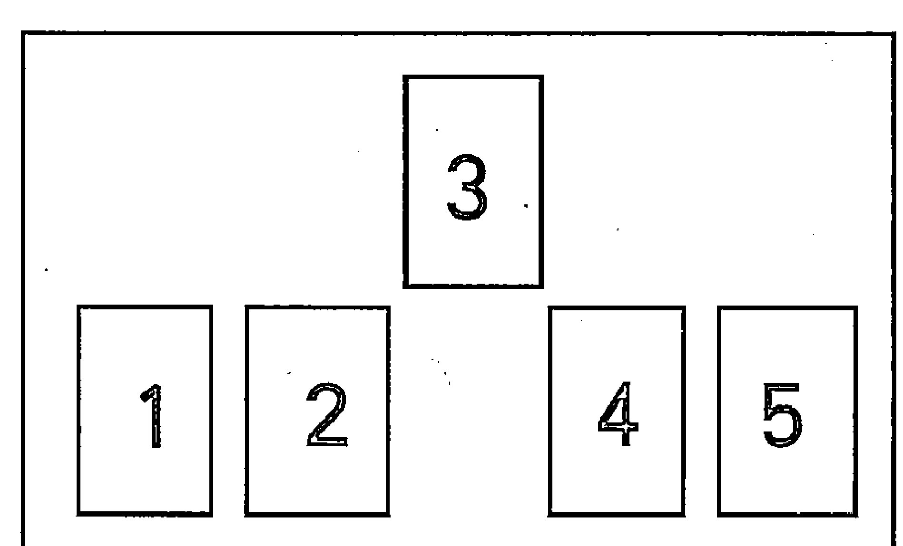

## 适用于

『22张 大阿卡娜』、『56张 小阿卡娜』、『78张 塔罗牌』

## 取牌方式

『22张 大阿卡娜』、『56张 小阿卡娜』、『78张 塔罗牌』
随意抽5张牌，依序放在1、2、3、4、5。

## 如何解释

- ☆ 1-我为何选择这份工作、事业。
- ☆ 2-我选的路是对的吗？
- ☆ 3-我面前主要的障碍。
- ☆ 4-什么对我有益。
- ☆ 5-如何让进展持续不断。

## 52 此岸彼岸

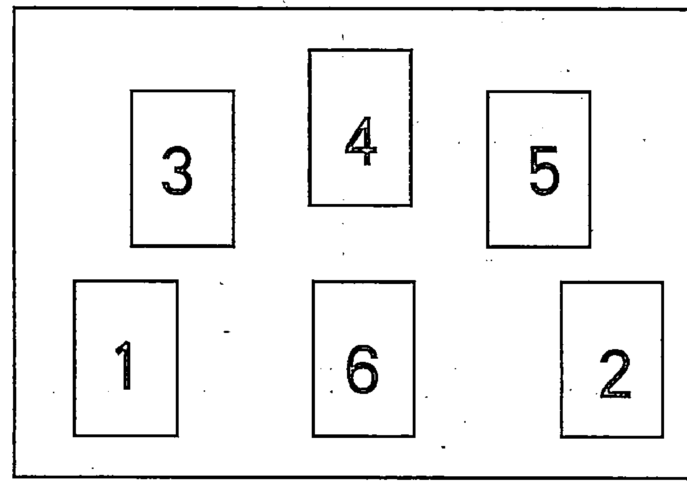

## 适用于

『22张 大阿卡娜』、『56张 小阿卡娜』、『78张 塔罗牌』

## 取牌方式

『22张 大阿卡娜』、『56张 小阿卡娜』、『78张 塔罗牌』
随意抽6张牌，依序放在1、2、3、4、5、6。

## 如何解释

- ☆ 1-你目前在哪里（目前处境）。
- ☆ 2-你现在正前往哪里（你想得到的）。
- ☆ 3、4、5-你将如何到达那里（你将如何得到）。
- ☆ 6-将帮助、支持你的。

## 53 工作二择一

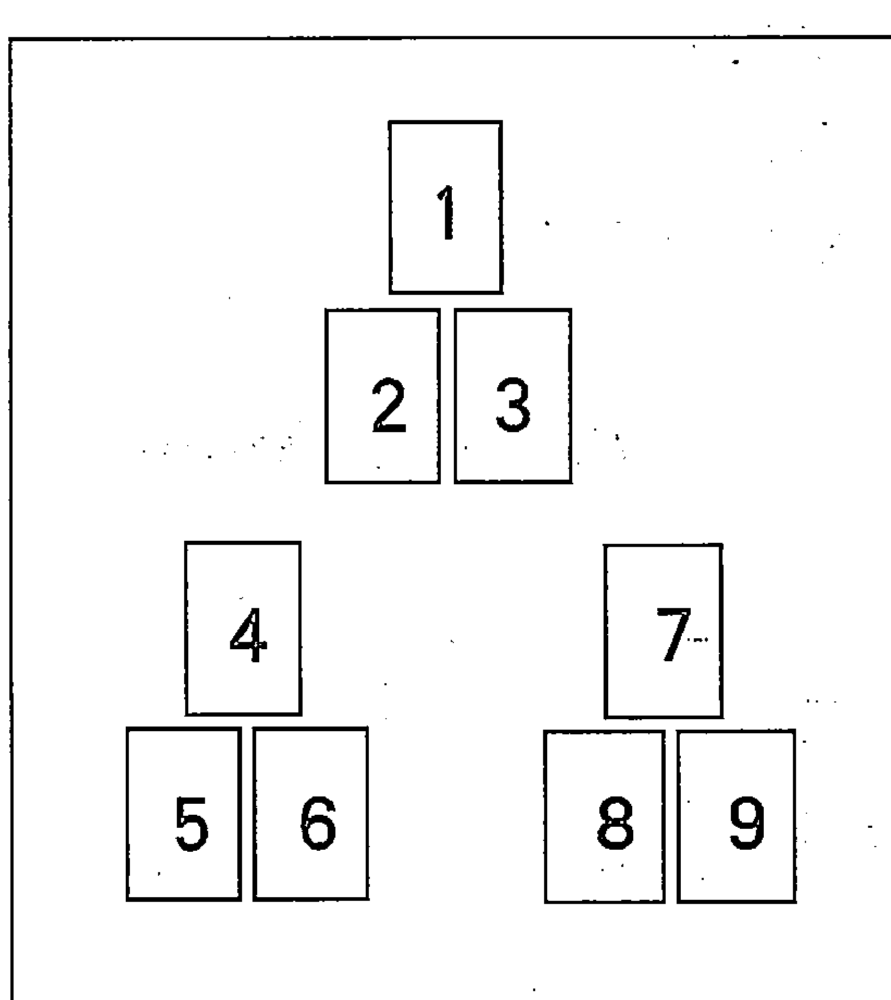

## 适用于

『22张 大阿卡娜』、『56张 小阿卡娜』、『78张 塔罗牌』

## 取牌方式

『22张 大阿卡娜』、『56张 小阿卡娜』、『78张 塔罗牌』
随意抽9张牌，依序放在1、2、3、4、5、6、7、8、9。

## 如何解释

请先设定工作A、工作B是指哪一份工作。

- ☆ 1-我自己：就个人而言，我在找寻什么类型的工作？
- ☆ 2-若要选择工作A，所给的指示。
- ☆ 3-若要选择工作B，所给的指示。
- ☆ 4-工作A：这工作对我有何吸引力？
- ☆ 5、6-工作A有什么优点与缺点。
- ☆ 7-工作B：这工作对我有何吸引力？
- ☆ 8、9-工作B有什么优点与缺点。

## 54 合作关系的反映

适用于『22张 大阿卡娜』、『56张 小阿卡娜』、『78张 塔罗牌』

取牌方式
『22张 大阿卡娜』、『56张 小阿卡娜』、『78张 塔罗牌』
随意抽10张牌，依序放在1、2、3、4、5、6、7、8、9、10。

如何解释
- ☆ 1-我自己。
- ☆ 2-我怎么看待我的伙伴。
- ☆ 3-我怎么看待这合作关系。
- ☆ 4-这将强化我们之间的合作关系。
- ☆ 5-这将减弱我们之间的合作关系。
- ☆ 6-我希望的。
- ☆ 7-我惧怕的。
- ☆ 8-在这合作关系中，我必须负担的责任。
- ☆ 9-在这合作关系中，我的伙伴必须负担的责任。
- ☆ 10-即将发生的事。

## 55 转折点

适用于『56张 小阿卡娜』、『78张 塔罗牌』

取牌方式
『56张 小阿卡娜』、『78张 塔罗牌』
随意抽11张牌，依序放在1、2、3、4、5、6、7、8、9、10、11。

如何解释
第5张牌“转折点”是最特别的牌，它可能因为一件事、特定的人物、或是自我中心思想的突然改变而触发。
假如圣杯九出现在位置9或10，它的效力会比其它位置出现的牌义不好的牌要为优先与重要。

- ☆ 1-周围的情况。
- ☆ 2-有关现在情况的一些你必须知道的事。
- ☆ 3-从现在到转折点时一直有的想法。
- ☆ 4-领导你到转折点的事件。
- ☆ 5-转折点。
- ☆ 6-身处转折点时意外的好处。
- ☆ 7-历经转折点后你所学习到的。
- ☆ 8-转折点所带来的发展。
- ☆ 9-意外的收获。
- ☆ 10-第一种可能的结果。
- ☆ 11-第二种可能的结果。

## 56 生意前景

适用于『22张 大阿卡娜』、『56张 小阿卡娜』、『78张 塔罗牌』

取牌方式
『22张 大阿卡娜』、『56张 小阿卡娜』、『78张 塔罗牌』
随意抽10张牌，依序放在1、2、3、4、5、6、7、8、9、10。

如何解释
- ☆ 1-我可以开始属于自己的事业、自己做生意吗？
- ☆ 2-这生意需要别人合伙吗？
- ☆ 3-大家会接受我的产品吗？
- ☆ 4-这工作会很艰难吗？
- ☆ 5-现在的我该做哪些改变？
- ☆ 6-我忽略了哪些该做的事、应尽的责任？
- ☆ 7-我将会成功吗？
- ☆ 8-我将会因为这生意而赚钱吗？
- ☆ 9-我该做哪一类型的广告、宣传？
- ☆ 10-最后的结果。

## 57 事业发展

适用于『22张 大阿卡娜』、『56张 小阿卡娜』、『78张 塔罗牌』

取牌方式
『22张 大阿卡娜』、『56张 小阿卡娜』、『78张 塔罗牌』
随意抽7张牌，依序放在1、2、3、4、5、6、7。

如何解释
- ☆ 1-对于我所选的事业，我真正想要从中得到什么。
- ☆ 2-什么行动可以改善我的事业。
- ☆ 3-事业中的哪些方面是我无法改变、改善的。
- ☆ 4-对于事业，我是否感觉到已经作出最棒的结果。
- ☆ 5-我可以去创造哪些属于自己的机会用来帮助我的事业。
- ☆ 6-虽是过去形成的阻碍，但现在仍影响我的事业。
- ☆ 7-最终的结果。

## 五、生活牌阵

## 58 旅行

适用于『22张 大阿卡娜』、『56张 小阿卡娜』、『78张 塔罗牌』

取牌方式
『22张 大阿卡娜』、『56张 小阿卡娜』、『78张 塔罗牌』
随意抽4张牌，依序放在1、2、3、4。

如何解释
- ☆ 1-周围环境对于你即将开始的旅行的影响。
- ☆ 2-关于这次的旅行你所必须知道的一些事，而这些事有可能会被隐藏或忽略。
- ☆ 3-因为此次旅行，你将学到或领悟什么。
- ☆ 4-结果。

## 59 窗户

适用于『22张 大阿卡娜』、『56张 小阿卡娜』、『78张 塔罗牌』

取牌方式
『22张 大阿卡娜』、『56张 小阿卡娜』、『78张 塔罗牌』
随意抽4张牌，依序放在1、2、3、4。

如何解释
- ☆ 1-现在的身体的状态。
- ☆ 2-现在的心智的状态。
- ☆ 3-现在的情绪的状态。
- ☆ 4-现在的精神的状态。

## 60 希望

适用于『22张 大阿卡娜』、『56张 小阿卡娜』、『78张 塔罗牌』

取牌方式
『22张 大阿卡娜』、『56张 小阿卡娜』、『78张 塔罗牌』
随意抽4张牌，依序放在1、2、3、4。

如何解释
- ☆ 1-你拥有什么。
- ☆ 2-你的愿望。
- ☆ 3-你需要什么。
- ☆ 4-你得到什么。

## 61 生日

适用于『22张 大阿卡娜』、『56张 小阿卡娜』、『78张 塔罗牌』

取牌方式
『22张 大阿卡娜』、『56张 小阿卡娜』、『78张 塔罗牌』
随意抽9张牌，依序放在1、2、3、4、5、6、7、8、9。

如何解释
- ☆ 1-你目前的处境。
- ☆ 2-下次生日的时候你希望能达成什么。
- ☆ 3-可以帮助你的。
- ☆ 4-完成你的目标前必需去做的。
- ☆ 5-你目前身体的状况。
- ☆ 6-你目前感情的状况。
- ☆ 7-你目前精神的状况。
- ☆ 8-对你的阻碍。
- ☆ 9-为了让梦想实现今年所必须去做的事。

## 62 四个星期的开始

适用于『22张 大阿卡娜』、『56张 小阿卡娜』、『78张 塔罗牌』

取牌方式
『22张 大阿卡娜』、『56张 小阿卡娜』、『78张 塔罗牌』
随意抽7张牌，依序放在1、2、3、4、5、6、7。

如何解释
- ☆ 1-现在的情况。
- ☆ 2-第一个星期。
- ☆ 3-第二个星期。
- ☆ 4-第三个星期。
- ☆ 5-第四个星期。
- ☆ 6-我将会如何。
- ☆ 7-新发展的指示。

## 63 四季

适用于『22张 大阿卡娜』、『56张 小阿卡娜』、『78张 塔罗牌』

取牌方式
『22张 大阿卡娜』、『56张 小阿卡娜』、『78张 塔罗牌』
随意抽8张牌，依序放在1、2、3、4、5、6、7、8。

如何解释
- ☆ 1、8-春季：象征开始或行动开始、立定志向，可以说像是种下种子一样。
- ☆ 2、3-夏季：象征计划的持续进展，想法开花结果（企划完成）。
- ☆ 4、5-秋季：象征计划的决议，结果将会如何。
- ☆ 6、7-冬季：象征计划或行动完成后那一段的收获期，或是代表求问者想从这计划行动过程学到的东西。

## 64 新年

适用于『56张 小阿卡娜』、『78张 塔罗牌』

取牌方式
『56张 小阿卡娜』、『78张 塔罗牌』
随意抽20张牌，依序放在1、2、3、4、5、6、7、8、9、10、11、12、13、14、15、16、17、18、19、20。

如何解释
- ☆ 1、2-你从去年带到今年的期望。
- ☆ 3-冬季概观。
- ☆ 4-一月展望。
- ☆ 5-二月展望。
- ☆ 6-三月展望。
- ☆ 7-春季概观。
- ☆ 8-四月展望。
- ☆ 9-五月展望。
- ☆ 10-六月展望。
- ☆ 11-夏季概观。
- ☆ 12-七月展望。
- ☆ 13-八月展望。
- ☆ 14-九月展望。
- ☆ 15-秋季概观。
- ☆ 16-十月展望。
- ☆ 17-十一月展望。
- ☆ 18-十二月展望。
- ☆ 19、20-你将从今年带到明年的期望。

## 65 棒球场

适用于『22张 大阿卡娜』、『56张 小阿卡娜』、『78张 塔罗牌』

取牌方式
『22张 大阿卡娜』、『56张 小阿卡娜』、『78张 塔罗牌』
随意抽6张牌，依序放在1、2、3、4、5、6。

如何解释
- ☆ 1-本垒板：你目前的处境，一个计划或情况正要开始。
- ☆ 2-投手丘：即将发生在你身上的事，可能是一个事件或是一个人发生的事情与你生活有所牵连。
- ☆ 3-一垒：第一步，新计划开始的状况。
- ☆ 4-二垒：第二步，新计划再来的状况。
- ☆ 5-三垒：第三步，新计划最终的状况。
- ☆ 6-本垒板：最后的结果，新计划最后呈现的结果。

## 66 彩虹

适用于『22张 大阿卡娜』、『56张 小阿卡娜』、『78张 塔罗牌』

取牌方式
『22张 大阿卡娜』、『56张 小阿卡娜』、『78张 塔罗牌』
随意抽6张牌，依序放在1、2、3、4、5、6。

如何解释
- ☆ 1-雨：阻碍你完成心中愿望的。
- ☆ 2-细雨：首先要做的，可以帮助你更进一步达到你想要的。
- ☆ 3-雨停：某些人事物将会帮助你。
- ☆ 4-阳光：你所能指望的最好状况。
- ☆ 5-彩虹：短期的指引。
- ☆ 6-金色苍穹：长期的结果。

## 67 长柄勺子

适用于『22张 大阿卡娜』、『56张 小阿卡娜』、『78张 塔罗牌』

取牌方式
『22张 大阿卡娜』、『56张 小阿卡娜』、『78张 塔罗牌』
随意抽6张牌，依序放在1、2、3、4、5、6。

如何解释
- ☆ 1-问题的根本、忧虑、争议。
- ☆ 2-隐藏了些什么。
- ☆ 3-浮现了些什么。
- ☆ 4-目前明显可见的。
- ☆ 5-你舀出了什么、你发现的事实。
- ☆ 6-解决、决定；并且它将如何影响你。

## 68 成功

适用于『22张 大阿卡娜』、『56张 小阿卡娜』、『78张 塔罗牌』

取牌方式
『22张 大阿卡娜』、『56张 小阿卡娜』、『78张 塔罗牌』
随意抽6张牌，依序放在1、2、3、4、5、6。

如何解释
- ☆ 1-你现在生命中最兴盛的领域。
- ☆ 2-你希望未来生命中也能兴盛的领域。
- ☆ 3-为了达到第2张牌的结果，你必须去做的、去培养的。
- ☆ 4-某些人、事物将会帮助或是阻碍你。
- ☆ 5-有些事你必须察觉到的。
- ☆ 6-你最终的成就。

## 69 调节压力

适用于『22张 大阿卡娜』、『56张 小阿卡娜』、『78张 塔罗牌』

取牌方式
『22张 大阿卡娜』、『56张 小阿卡娜』、『78张 塔罗牌』
随意抽6张牌，依序放在1、2、3、4、5、6。

如何解释
- ☆ 1-问题的根本。
- ☆ 2-现在的情况、处境。
- ☆ 3-在某个阶段、某段时间、或某个步骤的情况、处境。
- ☆ 4-你在明白某些事情以前，对于所在处境的感觉。
- ☆ 5-相关的人。
- ☆ 6-结果。

## 70 飞鸟

适用于『22张 大阿卡娜』、『56张 小阿卡娜』、『78张 塔罗牌』

取牌方式
『22张 大阿卡娜』、『56张 小阿卡娜』、『78张 塔罗牌』
随意抽8张牌，依序放在1、2、3、4、5、6、7、8。

如何解释
- ☆ 1、2-你目前的处境。
- ☆ 3-你如何前往你想要到达的地方。
- ☆ 4-你从何处出发。
- ☆ 5-你得到什么、发现什么 (沿路上你会发现什么)。
- ☆ 6、7-你学习到什么、你会得到的经验。
- ☆ 8-结果 (旅程的终点是如何的)。

## 71 人生

适用于『22张 大阿卡娜』、『56张 小阿卡娜』、『78张 塔罗牌』

取牌方式
『22张 大阿卡娜』、『56张 小阿卡娜』、『78张 塔罗牌』
随意抽8张牌，依序放在1、2、3、4、5、6、7、8。

如何解释
- ☆ 1-家庭。
- ☆ 2-工作事业。
- ☆ 3-人际关系。
- ☆ 4-声誉与成就。
- ☆ 5-苦难、烦恼。
- ☆ 6-获得、取得。
- ☆ 7-限制。
- ☆ 8-整体分析。

## 72 人际关系

适用于『22张 大阿卡娜』、『56张 小阿卡娜』、『78张 塔罗牌』

取牌方式
『22张 大阿卡娜』、『56张 小阿卡娜』、『78张 塔罗牌』
随意抽9张牌，依序放在1、2、3、4、5、6、7、8、9。

如何解释
- ☆ 1-你如何看其他人。
- ☆ 2-其他人如何看你。
- ☆ 3-你需要的。
- ☆ 4-其他人需要的。
- ☆ 5-目前的关系。
- ☆ 6-你希望这关系如何发展。
- ☆ 7-其他人希望这关系如何发展。
- ☆ 8-必须仔细考虑的因素。
- ☆ 9-最终结果。

## 73 何人、何事、何地

适用于『22张 大阿卡娜』、『56张 小阿卡娜』、『78张 塔罗牌』

取牌方式
『22张 大阿卡娜』、『56张 小阿卡娜』、『78张 塔罗牌』
随意抽9张牌，依序放在1、2、3、4、5、6、7、8、9。

如何解释
- ☆ 1-目前你需要前往的地方。
- ☆ 2、3-你到达那个地方的时候，你需要去考量的某些人、事物。
- ☆ 4、5-某些人、事物将帮助、引导你。
- ☆ 6、7-你必需知道的：在未来四个礼拜内将发生的事。
- ☆ 8-（第6、7张牌所显示的事）它将如何影响你。
- ☆ 9-关于你问的问题，你可以完成怎样的结果。

## 74 健康与幸福

适用于『22张 大阿卡娜』、『56张 小阿卡娜』、『78张 塔罗牌』

取牌方式
『22张 大阿卡娜』、『56张 小阿卡娜』、『78张 塔罗牌』
随意抽8张牌，依序放在1、2、3、4、5、6、7、8。

如何解释
- ☆ 1-你过去的健康状况。
- ☆ 2-你现在的健康状况。
- ☆ 3-你未来可能的健康状况。
- ☆ 4-某人或某些事物可以帮助你改善或维护你的健康。
- ☆ 5-过去什么事情让你快乐。
- ☆ 6-现在什么事情让你快乐。
- ☆ 7-未来什么事情可能会让你快乐。
- ☆ 8-某人或某些事物可以帮助你或加强你的幸福与健康。

## 75 理想

适用于『56张 小阿卡娜』、『78张 塔罗牌』

取牌方式
『56张 小阿卡娜』、『78张 塔罗牌』
随意抽21张牌，依序放在1、2、3、4、5、6、7、8、9、10、11、12、13、14、15、16、17、18、19、20、21。

如何解释
- ☆ 1、2、3、4-现况、争论、关键。
- ☆ 5、6、7、8-你心中真正的愿望。
- ☆ 9、10、11、12-你的真正想法与你的愿望是如何密合或冲突。
- ☆ 13、14、15、16-当你准备好了以后，你应当去做的。这步骤是必需的。
- ☆ 17、18、19、20-如何让你感到满足。
- ☆ 21-当你觉得满足后，会发生的事情。

## 76 梦想

适用于『22张 大阿卡娜』、『56张 小阿卡娜』、『78张 塔罗牌』

取牌方式
『22张 大阿卡娜』、『56张 小阿卡娜』、『78张 塔罗牌』
随意抽12张牌，依序放在1、2、3、4、5、6、7、8、9、10、11、12。

如何解释
- ☆ 1、2、3-你的梦想的轮廓、想象。
- ☆ 4、5、6-这梦想的意义或计划。
- ☆ 7、8、9-这梦想如何影响你。
- ☆ 10、11、12-你如何将这信息（此次的预测所得知的）做最好的运用。

## 77 是或否

适用于『22张 大阿卡娜』、『56张 小阿卡娜』、『78张 塔罗牌』

取牌方式
『22张 大阿卡娜』、『56张 小阿卡娜』、『78张 塔罗牌』
随意抽5张牌，依序放在1、2、3、4、5。

如何解释
此种牌阵可变化成使用5张、7张或9张来分析。
排在中间的牌代表两点，其它牌代表一点。
(5张牌→第3张，7张牌→第4张，9张牌→第5张)
打开所有的牌，正位的牌代表“是”，逆位的牌代表“否”。
把正逆位的牌所代表的点数相加，一般是一张牌一点，但中间的牌代表两点。
比较两者的点数，若是“是”的点数较高，则代表答案是“是”。
若是“否”的点数较高，则代表答案是“否”。
若两者点数相同，则代表牌不愿意告诉你一个明确的答案。

## 78 西方的风

适用于『22张 大阿卡娜』、『56张 小阿卡娜』、『78张 塔罗牌』

取牌方式
『22张 大阿卡娜』、『56张 小阿卡娜』、『78张 塔罗牌』
随意抽4张牌，依序放在1、2、3、4。

如何解释
- ☆ 1-你必须舍弃过去的什么，让自己解放。
- ☆ 2-你必需面对的。
- ☆ 3-你必需知道的。
- ☆ 4-你会获得的、达成的。

## 79 心的方向

适用于『22张 大阿卡娜』、『56张 小阿卡娜』、『78张 塔罗牌』

取牌方式
『22张 大阿卡娜』、『56张 小阿卡娜』、『78张 塔罗牌』
随意抽8张牌，依序放在1、2、3、4、5、6、7、8。

如何解释
- ☆ 1-与你潜意识的欲望有关的最主要关键。
- ☆ 2-在第1张牌所指的关键中最重要的因素（通常是指一种过去的情绪反应）。
- ☆ 3-对于阻挠你的因素，你可以如何改变它；对于帮助你的因素，你可以如何加强它。
- ☆ 4-你的行动将可能产生怎样的结果。
- ☆ 5-在最近的未来，你可能忽略、没考虑到的事情。
- ☆ 6-在最近的未来你可能面对的挑战。
- ☆ 7-它（第6张牌的挑战）可能会如何影响你。
- ☆ 8-你最后获得的。

## 30 信念

适用于
『22张 大阿卡娜』、『56张 小阿卡娜』、『78张 塔罗牌』

取牌方式
『22张 大阿卡娜』、『56张 小阿卡娜』、『78张 塔罗牌』
随意抽5张牌，依序放在1、2、3、4、5。

如何解释
- ☆ 1-你的愿望。
- ☆ 2-一直阻碍你有所成就的根本想法。（阻碍、负面）
- ☆ 3-连接第2张牌与第4张牌的想法。（应该是4出现前的想法）
- ☆ 4-即将出现在你生命中的新想法。
- ☆ 5-新想法所带来的结果。

## 31 幸运

适用于
『56张 小阿卡娜』、『78张 塔罗牌』

取牌方式
『56张 小阿卡娜』、『78张 塔罗牌』
先取出小阿卡娜的4张Ace，然后随意抽5张牌，依序放在1、2、3、4、5。
然后从4张小阿卡娜Ace抽出1张放在6。

如何解释
- ☆ 1-你的幸运状况大概的分析。
- ☆ 2-你的幸运状况是如何影响你的生活。
- ☆ 3-可能产生幸运的地方。
- ☆ 4-某人或什么事物将走入你的生命之中并带来幸运的效果。
- ☆ 5-第4张牌带来的幸运将如何帮助你达成你的愿望。
- ☆ 6-较幸运的季节——只使用小阿卡娜的4张Ace之一。
  - 权杖Ace——春天。
  - 圣杯Ace——夏天。
  - 钱币Ace——秋天。
  - 宝剑Ace——冬天。

## 82 遗失与找寻

适用于
『22张 大阿卡娜』、『56张 小阿卡娜』、『78张 塔罗牌』

取牌方式
『22张 大阿卡娜』、『56张 小阿卡娜』、『78张 塔罗牌』
随意抽10张牌，依序放在1、2、3、4、5、6、7、8、9、10。

如何解释
- ☆ 1-遗失的东西。
- ☆ 2-关于遗失的东西，你必须知道的一些事。
- ☆ 3、4-从哪个地方开始找寻。
- ☆ 5-某人或某些事物将会帮助你。
- ☆ 6、7-在找寻时，你必须仔细考虑、审视的因素。
- ☆ 8、9、10-结果。

## 33 应该或不应该

适用于
『22张 大阿卡娜』、『56张 小阿卡娜』、『78张 塔罗牌』

取牌方式
『22张 大阿卡娜』、『56张 小阿卡娜』、『78张 塔罗牌』
随意抽9张牌，依序放在1、2、3、4、5、6、7、8、9。

如何解释
- ☆ 1、2、3-你依心中想法去做的话，可能会发生的事。
- ☆ 4、5、6-你维持目前状况的话，可能会发生的事。
- ☆ 7-假如你做了任何改变所可能产生的结果 (1、2、3张牌的结果)。
- ☆ 8-假如你不做任何改变所可能产生的结果 (4、5、6张牌的结果)。
- ☆ 9-下决心前，你所必须知道的一些事。

## 24 愿望

适用于
『22张 大阿卡娜』、『56张 小阿卡娜』、『78张 塔罗牌』
15张以上的牌阵建议用『56张 小阿卡娜』、『78张 塔罗牌』

取牌方式
『22张 大阿卡娜』、『56张 小阿卡娜』、『78张 塔罗牌』
随意抽15张牌，依序放在1、2、3、4、5、6、7、8、9、10、11、12、13、14、15。

如何解释
假如代表愿望的卡片，也就是圣杯九出现在任何一个位置（除了7、8、9三个位置，因为这三个位置是负面的），会至少让你的梦想实现一部分。
若圣杯九出现在第1个位置，代表你的梦想会完全实现。

- ☆ 1、2、3-围绕你的。
- ☆ 4、5、6-有关你梦想的描述。
- ☆ 7、8、9-阻碍你完成梦想的因素。
- ☆ 10、11、12-你的家庭即将发生的事。
- ☆ 13、14、15-你将获得、实现的。

## 35 生活重心

适用于
『56张 小阿卡娜』、『78张 塔罗牌』

取牌方式
『56张 小阿卡娜』、『78张 塔罗牌』
随意抽22张牌，依序放在1、2、3、4、5、6、7、8、9、10、11、12、13、14、15、16、17、18、19、20、21、22。

如何解释
- ☆ 1、2-你目前的情况。
- ☆ 3、4-你最想要改变的。
- ☆ 5、6-某些人、事物将帮助你。
- ☆ 7、8-为了达成你的愿望所必需培养的信念。
- ☆ 9、10-从那些新的信念所衍生的第一种可能的事件。
- ☆ 11、12-你对那些第一种可能发生事件的感觉。
- ☆ 13、14-从那些新的信念所衍生的第二种可能发生的事件。
- ☆ 15、16-你对那些第二种可能发生事件的感觉。
- ☆ 17、18-从那些新的信念所衍生的第三种可能发生的事件。
- ☆ 19、20-你对那些第三种可能发生事件的感觉。
- ☆ 21-为了开创你想要的未来，你现在必须培养的力量。
- ☆ 22-你最终的成就。

## 36 九宫命运

适用于
『22张 大阿卡娜』、『56张 小阿卡娜』、『78张 塔罗牌』

取牌方式
『22张 大阿卡娜』、『56张 小阿卡娜』、『78张 塔罗牌』
随意抽9张牌，依序放在1、2、3、4、5、6、7、8、9。

如何解释
- ☆ 1-我的生活将有何改变。
- ☆ 2-会有新关系或婚姻的产生吗？
- ☆ 3-我可以创造出成功的机会吗？
- ☆ 4-我将有金钱方面的保障吗？
- ☆ 5-我将有一个自由的旅程、旅行吗？
- ☆ 6-将会有什么问题发生？
- ☆ 7-我将会变得更聪明、更有智慧吗？
- ☆ 8-我将变得崇拜物欲吗？
- ☆ 9-我将变得更有价值吗？

## 37 关系之圣杯

适用于
『22张 大阿卡娜』、『56张 小阿卡娜』、『78张 塔罗牌』

取牌方式
『22张 大阿卡娜』、『56张 小阿卡娜』、『78张 塔罗牌』
随意抽11张牌，依序放在1、2、3、4、5、6、7、8、9、10、11。
(6压在5的底下)

如何解释
- ☆ 1-你自己。
- ☆ 2-你的伙伴。
- ☆ 3-你们关系的基础。
- ☆ 4-最近的过去。
- ☆ 5-这关系现在的情况。
- ☆ 6-你们共同的阻碍。（隐藏的）
- ☆ 7-你如何看待这关系。
- ☆ 8-你的伙伴如何看待这关系。
- ☆ 9-你希望如何看待这关系。（希望怎么发展）
- ☆ 10-你的伙伴希望如何看待这关系。（希望怎么发展）
- ☆ 11-最佳的结果。

## 38 黄金曙光

适用于
『22张 大阿卡娜』、『56张 小阿卡娜』、『78张 塔罗牌』

取牌方式
『22张 大阿卡娜』、『56张 小阿卡娜』、『78张 塔罗牌』
随意抽15张牌，依序放在1、2、3、4、5、6、7、8、9、10、11、12、13、14、15。

如何解释
- ☆ 1-你自己。
- ☆ 1、2、3-你的个性、特质，以及针对这情况或问题，本身所拥有的相关知识。
- ☆ 4、8、12-若没有采取任何行动，这情况或问题会如何自然发展。
- ☆ 5、9、13-若采取任何行动，这情况或问题会产生怎样不同的发展。
- ☆ 6、10、14-一些对你下定决心、做出决定可能有帮助的信息。
- ☆ 7、11、15-超过求问者所能控制的一些力量（无法控制的）。

## 精神目标

适用于
『22张 大阿卡娜』、『56张 小阿卡娜』、『78张 塔罗牌』

取牌方式
『22张 大阿卡娜』、『56张 小阿卡娜』、『78张 塔罗牌』
随意抽9张牌，依序放在1、2、3、4、5、6、7、8、9。

如何解释
- ☆ 1-我应该对我的生活设定什么样的精神目标：我的精神目标或工作。
- ☆ 2、3、4-这精神目标将如何显示在我的生活中：它将如何影响我的生活。
- ☆ 5、6-可以帮助我的：哪些天赋与潜力可以帮我完成这目标。
- ☆ 7、8-阻碍我的：冲突与问题。
- ☆ 9-上帝的指示。

## 90 你的一切

适用于
『22张 大阿卡娜』、『56张 小阿卡娜』、『78张 塔罗牌』

取牌方式
『22张 大阿卡娜』、『56张 小阿卡娜』、『78张 塔罗牌』
随意抽9张牌，依序放在1、2、3、4、5、6、7、8、9。

如何解释
- ☆ 1-你或你目前的处境。
- ☆ 2-你的心理问题的因素。
- ☆ 3-你的人际关系。
- ☆ 4-你创作的灵感。
- ☆ 5-你的行动（你应该做的事）。
- ☆ 6-你潜意识问题的因素。
- ☆ 7-你情绪问题的因素。
- ☆ 8-在目前实际影响你的主要因素。
- ☆ 9-你内心的力量。

## 91 炼金术

适用于
『22张 大阿卡娜』、『56张 小阿卡娜』、『78张 塔罗牌』

取牌方式
『22张 大阿卡娜』、『56张 小阿卡娜』、『78张 塔罗牌』
随意抽13张牌，依序放在1、2、3、4、5、6、7、8、9、10、11、12、13。

如何解释
- ☆ 1-自己、自我意识。
- ☆ 2-愿望。
- ☆ 3-梦想：我们想要实现的。
- ☆ 4-追求：我们积极试着去实现的。
- ☆ 5-依恋：追求梦想时，让我们放不开的、抓着我们不放的。
- ☆ 6-特质：求问者的优点。
- ☆ 7-懊悔：求问者需要改进的缺点。
- ☆ 8-自我印象：求问者对自己的印象、想法。
- ☆ 9-精神动力：自己真正的目标与愿望。
- ☆ 10-地元素：黑暗面、神秘的、未知的。
- ☆ 11-风元素：精神启发、启蒙、悟性。
- ☆ 12-火元素：智力、理性、思考、愿望。
- ☆ 13-水元素：创造力、情感。

## 92 灵魂循环

适用于
『22张 大阿卡娜』、『56张 小阿卡娜』、『78张 塔罗牌』

取牌方式
『22张 大阿卡娜』、『56张 小阿卡娜』、『78张 塔罗牌』
随意抽7张牌，依序放在1、2、3、4、5、6、7。

如何解释
- ☆ 1-求问者本身。
- ☆ 2-祖先的灵魂：家庭中长辈的影响。
- ☆ 3-种族的灵魂：文化的影响。
- ☆ 4-时间的灵魂。
- ☆ 5-地方的灵魂：故乡与住所的影响。
- ☆ 6-旅程的灵魂：先前生活的影响。
- ☆ 7-上天或大自然给与的天赋、祝福、恩典。

## 93 灵感之门

适用于
『22张 大阿卡娜』、『56张 小阿卡娜』、『78张 塔罗牌』

取牌方式
『22张 大阿卡娜』、『56张 小阿卡娜』、『78张 塔罗牌』
随意抽9张牌，依序放在1、2、3、4、5、6、7、8、9。

如何解释
这牌阵基本的进行方式是先把1到8张牌排好，象征一道门，然后再将第9张牌放在中间，第9张牌象征新的刺激、力量，或是正要走进求问者生命的人。

在这启发之门牌阵中，借由不同元素的比较，如冲突、和谐、矛盾、不安定来解读问题。

此牌阵不但可以找出事件成功的原因（假如条件都符合），也可以显示事件的过程与结果。

- ☆ 9-在门口正在走进来的人。新的事件。
- ☆ 8-入口。进入的条件，一种现实生活中寻求突破现状的机会。
- ☆ 5、6、7-波阿斯 (Boaz)，力量的支柱，为维持力量所需的长时间条件。（让力量持续）
- ☆ 2、3、4-贾曲 (Jachin)，秩序的支柱，为了让新事物变得持久之长时间条件。（让瞬间变永恒）
- ☆ 1-顶点：事情结构中的关键。当事情发展到最高潮时，可能产生的现象。

注：Boaz, Jachin, 就是伟特牌中女祭司身后的两根柱子 (B & J)。

## 94 三择一

适用于
『22张 大阿卡娜』、『56张 小阿卡娜』、『78张 塔罗牌』

取牌方式
『22张 大阿卡娜』、『56张 小阿卡娜』、『78张 塔罗牌』
随意抽11张牌，依序放在1、2、3、4、5、6、7、8、9、10、11。

如何解释
请先设定A、B、C三件事是哪三件事。

- ☆ 1、2-对策、心中所考虑的事情。
- ☆ 3-对于事件A，肯定的因素 (现在)。
- ☆ 4-对于事件A，否定的因素 (对策、障碍)。
- ☆ 5-事件A的未来。
- ☆ 6-对于事件B，肯定的因素 (现在)。
- ☆ 7-对于事件B，否定的因素 (对策、障碍)。
- ☆ 8-事件B的未来。
- ☆ 9-对于事件C，肯定的因素 (现在)。
- ☆ 10-对于事件C，否定的因素 (对策、障碍)。
- ☆ 11-事件C的未来。

## 95 我的生活故事

适用于
『22张 大阿卡娜』、『56张 小阿卡娜』、『78张 塔罗牌』

取牌方式
『22张 大阿卡娜』、『56张 小阿卡娜』、『78张 塔罗牌』
随意抽13张牌，依序放在1、2、3、4、5、6、7、8、9、10、11、12、13。

如何解释
- ☆ 1、4、7-遥远的过去。
- ☆ 2、5、8-最近的过去。
- ☆ 3、6、9-现在：我目前的处境。
- ☆ 10-未来6个月的发展：我的直觉直接感受到我将面临的阻碍、挑战。
- ☆ 11-未来12个月的发展：明年将会发生在我生活中的主要事件。
- ☆ 12-我的生活即将面临的、未来的处境。
- ☆ 13-最终的结果：假如我维持目前的情况且不加以改变，就会发生的结果。

## 96 五芒星

适用于
『22张 大阿卡娜』、『56张 小阿卡娜』、『78张 塔罗牌』

取牌方式
『22张 大阿卡娜』、『56张 小阿卡娜』、『78张 塔罗牌』
随意抽11张牌，依序放在1、2、3、4、5、6、7、8、9、10、11。

如何解释
- ☆ 1-身体的观察。
- ☆ 2-情感的观察。
- ☆ 3-心智的观察。
- ☆ 4-问题、关键。
- ☆ 5-问题的根本原因。
- ☆ 6-需要去解决的问题。
- ☆ 7-你压抑了什么。
- ☆ 8-阴（女性）的特征方面。
- ☆ 9-阳（男性）的特征方面。
- ☆ 10-需要努力的方面。
- ☆ 11-解决问题的方法或指天赋、祝福。

## 97 心灵梦想家

适用于
『22张 大阿卡娜』、『56张 小阿卡娜』、『78张 塔罗牌』

取牌方式
『22张 大阿卡娜』、『56张 小阿卡娜』、『78张 塔罗牌』
随意抽7张牌，依序放在1、2、3、4、5、6、7。

如何解释
- ☆ 1-关键：象征此梦想的状况或你对于此梦想的感觉。
- ☆ 2-梦想状况：一些与梦想有关的事件，例如：何时、何地、如何、为何。
- ☆ 3-内部的能量：此一梦想的主要能量。
- ☆ 4-表意识的想法：此梦想对你当前生命的意义。
- ☆ 5-潜意识的想法：此梦想在你心中的意义。
- ☆ 6-不易掌握的能量：假如你盼望梦想实现或想解决目前的窘境，你所需要的力量。
- ☆ 7-结果：此梦想将会如何呈现与它的影响效果。

## 98 突破现状

适用于
『56张 小阿卡娜』、『78张 塔罗牌』

取牌方式
『56张 小阿卡娜』、『78张 塔罗牌』
随意抽23张牌，依序放在1、2、3、4、5、6、7、8、9、10、11、12、13、14、15、16、17、18、19、20、21、22、23。

如何解释
- ☆ 1、2、3-你想要突破什么状况。
- ☆ 4、5、6、7-你想要突破的原因。
- ☆ 8-你需要去创造出的力量，一种可以让你在未来更加有利与坚持的力量。
- ☆ 9、10、11-突破这状况后你可以得到的。
- ☆ 12、13、14-突破这状况后你将损失的。
- ☆ 15、16、17-依你现在的个性、情况，最有可能发生在你私人生活中的事。
- ☆ 18、19、20-依你现在的个性、情况，最有可能发生在你专业领域的事。
- ☆ 21、22、23-你如何感受它们（15 — 20张牌所指）与你如何改变它们。

## 3 经典牌阵

这里介绍的牌阵，是一些经过漫长时间考验的牌阵，有一些曾流传了数百年之久，所以牌阵的摆放相对复杂一些，使用的牌数也相对多一些，建议初学者要熟悉了简单牌阵和牌义后再来了解这些经典牌阵。

## 99 凯尔特十字

据说塔罗牌刚刚出现的时候，凯尔特十字预测法就已成为塔罗预测的主要方法，它由流浪的吉卜赛人从埃及传到爱尔兰，在凯尔特人中广泛流行，由于其形状与当时欧洲流行的中世纪武器十字剑相似，更添了几分神圣与庄严，成为战争或结婚前必用的预测仪式。

它流传至今，已有了多种分支牌阵，但十张牌的凯尔特十字仍是现今塔罗牌预测的主流牌阵，亦是很多预测师最偏爱的牌阵。

适用于
『22张 大阿卡娜』、『56张 小阿卡娜』、『78张 塔罗牌』

取牌方式
『22张 大阿卡娜』、『56张 小阿卡娜』、『78张 塔罗牌』
随意抽10张牌，依序放在1、2、3、4、5、6、7、8、9、10。

如何解释
传统上对“古代凯尔特”牌形的诠释是这样的：
- ☆ 1-第1张牌放在十字形的中央，代表预测者及其目前状况或是他现在的问题。

- ☆ 2-第2张牌与第1张牌呈十字形交叉，代表阻碍或影响现在状况的困难。
- ☆ 3-第3张牌放在头两张牌之上（十字形之首），代表短期的目标，即现在状况所能达到的目标。
- ☆ 4-第4张牌放在头两张牌之下（十字形之脚），代表较远的过去影响了现在的情况。
- ☆ 5-第5张牌在十字形的右臂，代表较近的过去对现在的影响。
- ☆ 6-第6张牌在十字形的左臂，反映了最近的将来。

如果其它因素不变的话，这个顺序可追溯至十字的赫尔墨斯牌或说是反向牌，形似数字4。

最后四张牌放在十字的右边，直线排列，由下而上。

- ☆ 7-第7张牌代表内在的自我秘密愿望与欲望，及影响目前情况的基本人格。
- ☆ 8-第8张牌代表环境或家庭的影响，包括现实或精神上的住所。
- ☆ 9-第9张牌代表预期之外的好运或噩运。
- ☆ 10-第10张牌像小阿卡娜的10号牌一样总结全部，暗示可能的结果。

> “古代凯尔特”牌形有一首方便记忆的韵文，牌洗好之后可以念：
> “1找到你，2横过你，3加冕你，4在你下面，5在你后面，6在你前面，7是你的希望与恐惧，8是你的房子与家庭，9是你没有预期的，10是一定会发生的。”

请注意，当事人是指问题的主角，并不一定是求问者，例如求问者问：我男朋友考得上大学吗?我爸爸的病会好吗?这时候，问题的主角就不是求问者，请注意问题解释的角度不同，结果会差很多。

## 100 黄道十二宫

这也是一个流传已久的预测法，因为塔罗牌大阿卡娜22张牌都有其象征的星座（见图表），所以十二宫预测也是塔罗预测中很重要的一个分支。

| 编号 | 牌名 | 塔罗牌的星座意义 |
|---|---|---|
| 00 | 愚人 | 天王星/风 |
| 01 | 魔术师 | 水星 |
| 02 | 女祭司 | 月亮 |
| 03 | 女皇 | 金星 |
| 04 | 皇帝 | 白羊座 |
| 05 | 教皇 | 金牛座 |
| 06 | 恋人 | 双子座 |
| 07 | 战车 | 巨蟹座 |
| 08 | 力量 | 狮子座 |
| 09 | 隐士 | 处女座 |
| 10 | 命运之轮 | 木星 |
| 11 | 正义 | 天秤座 |
| 12 | 倒吊者 | 海王星/水 |
| 13 | 死神 | 天蝎座 |
| 14 | 节制 | 射手座 |
| 15 | 恶魔 | 摩羯座 |
| 16 | 塔 | 火星 |
| 17 | 星星 | 水瓶座 |
| 18 | 月亮 | 双鱼座 |
| 19 | 太阳 | 太阳 |
| 20 | 审判 | 冥王星/火 |
| 21 | 世界 | 土星 |

适用于
『78张 塔罗牌』

取牌方式
『78张 塔罗牌』
随意抽12张牌，依序放在1、2、3、4、5、6、7、8、9、10、11、12。

如何解释

## 爱上塔罗牌

第1、5、9三张牌，象征火，并且说明与此人有关的事情。
(就是火相星座→白羊、狮子、射手)

- ☆ 1-他（求问者）是什么样的人，他的个性又是如何。虽然此牌所指不能说是他性格的全貌，但他是以这样貌、个性见人的。也代表求问者个性的状况。
  - 若出现：
    - 钱币：具有社交手腕、领袖魅力，以赚钱为目标。
    - 宝剑：个性消沉、沮丧、易想不开的。
    - 权杖：让强烈的企图心驾驭自己，并且达到目标。
    - 圣杯：流露爱意，让人想要围绕在他身旁。

- ☆ 5-创造力与解决问题的能力，也代表有关小孩方面的事(可从第11宫去查出形成他们性格的因素)，此宫也可以看出当事人想不想要小孩。
  - 若出现：
    - 钱币：你是一个开心果，也容易交到有钱的朋友。
    - 宝剑：自己不想做的事，却强迫自己去做。也代表自己拥有非常少的艺术家潜力。
    - 权杖：享受工作。
    - 圣杯：让事情变得有价值的人。

- ☆ 9-精神状态；高层次的知识。到国外的远距离旅行。象征行动的牌，担起责任、学习新技术、上课。你所相信的事物，例如：哲学、宗教。
  此牌也象征一个真理追寻者。
  此牌也可看出将来必须做的事。
  - 若出现：
    - 钱币：重回学校读书或旅行的好时机。
    - 宝剑：不要开始任何事情，不要进行任何长距离的旅行。
    - 权杖：为你自己做些事，多读一些书。
    - 圣杯：你学习的事情，或是能帮助你发展计划的能力。

仔细看1、5、9三张牌：你将知道或遇见一个对你有极大影响力的人（通常是一位老师或精神领袖）。

注：分析这三张牌，看是哪种类型的人最容易影响求问者。

第2、6、10三张牌，象征地告知工作与金钱方面的情况。
(就是土相星座→金牛、处女、摩羯)

- ☆ 2-讲述有关金钱的状况，以及你所拥有的物品。你如何赚钱花钱。
  若是出现小阿卡娜并且数字为A至五之间，则代表你金钱方面会有很大的问题，并且你拥有的钱不够付账，尤其是出现宝剑牌A到五，这情况非常可能发生。同样此宫也象征种植物与食物的收成好坏。
  - 若出现（A至五除外）：
    - 钱币：关于钱的方面，没有太多的问题。
    - 宝剑：没有足够的钱。
    - 权杖：为了钱而辛苦工作，也代表你拥有什么。
    - 圣杯：通常关于钱的方面，没有什么问题，但也代表你不会存一毛钱。
  食物方面：出现权杖与宝剑的人，通常是喜欢减肥的一群人，他们喜欢蔬菜。
  而出现圣杯与钱币的人，通常吃得太多，尤其是垃圾食物、油炸的肉类。

- ☆ 6-此宫象征的是工作与劳动。但并非指事业（第10张牌才是）。
  对其他人的责任与义务。宠物与健康。
  - 若出现：
    - 钱币：你热爱自己的职业，而且觉得这份职业对自己非常重要。
    - 宝剑：象征工作上出现太多的问题，可能失业或职位过低，有时也代表这份工作不稳定（正找另一份）。
    - 权杖：太多沉重的责任与困难的工作，让你在工作时承受太大的压力。
    - 圣杯：一份令人愉快的工作；若出现圣杯六，代表你这个人自愿为他人服务。
    - 宫廷牌：感到自己是有义务的（也代表武力），并且总是去帮助他人。
  健康方面的指示。
  若出现：
    - 钱币：你是健康的人，而且是健康的热爱者，你通常意识到为了保持外表与健康，必需保持经常性的运动。
    - 宝剑：依照出现的牌之点数多寡，而有或大或小的病痛（数字越大，身体越糟）。
    - 权杖：几乎都需要去做个身体检查，而且必须注意自己的健康。
    - 圣杯：健康的。

- ☆ 10-对管理经营的看法或事业。也代表一个人如何安排、管理自己的工作。
  这边也可以看出当事人想在哪一方面用他的技术能力赚钱。
  若出现：
    - 钱币：差不多代表一个发起人或是让工作水准提高的人。
    - 宝剑：对于工作没有现实方面的观点。
    - 权杖：对于技术、专业技能精益求精（有些人会回到学校学习，或是进行特别的训练）。
    - 圣杯：热爱工作而且非常快乐。

第3、7、11三张牌，象征风，有关人际关系的情况。
(就是风相星座→双子、天秤、水瓶)

- ☆ 3-血缘关系，即指兄弟姊妹、叔叔阿姨。也代表当事人对这些关系的看法。短距离的旅行、沟通、人际关系、教学、写作。
  人际关系方面可由第3宫看出你试着想要与谁沟通。
  - 若出现：
    - 钱币：可以通过教授与写作去赚更多的钱。
    - 宝剑：没有人服从你。
    - 权杖：你需要采取不同的策略。
    - 圣杯：你可以用你的方式如说、教、写，去有效地指使他人。

- ☆ 7-因你选择而产生的关系，例如：丈夫、妻子。此宫也代表商务上伙伴的状况。
  人际关系的问题。
  - 若出现：
    - 钱币：与所爱的人共同经营一大生意。
    - 宝剑：这段时间，在你的人际关系上有许多的问题。
    - 权杖：这段时间，你的人际关系产生了一些短暂的分离、破裂，所以你必须了解在你的人际关系中哪些因素、事物是必要的，然后你必须好好对这些事物下工夫。有些事物必须去修复、改善。
    - 圣杯：一切都还不错，例如夫妻俩充满着罗曼蒂克的感觉等等。
  宫廷牌通常形容那人看起来的长相。
    - 钱币宫廷牌：浅色头发，浅黑色眼睛。
    - 宝剑宫廷牌：黑头发，黑眼睛。
    - 权杖宫廷牌：有深褐色头发，褐色或浅褐色的眼睛。
    - 圣杯宫廷牌：白皮肤，金色头发，蓝色或绿色眼睛。

第7张牌代表我们爱谁，以及如何去爱。

- ☆ 11-朋友的房子，新的技术（如：计算机、因特网）。
  此宫也象征出版与出书（出现小阿卡娜）。最主要的是，本宫指出你所吸引的朋友是什么类型，假如出现宫廷牌的话（除了四张骑士牌），你需要去了解这个人是指谁（你可以通过第10宫与第12宫去了解）。
  若出现：
    - 钱币：你将与朋友合伙或一起工作。
    - 宝剑：你的朋友正陷入麻烦之中，也许你想为他做些什么事，但是你必须小心翼翼，好好控制你的行动，否则你将显得过于冲动，并且做出一些无意义的事。
    - 权杖：开始去做你已经定好的计划，并且求教你想要请求教的朋友。
    - 圣杯：跟随自己的想法去做，假如出现圣杯三，则代表你将会与你最好的朋友有一个聚会。
  假如骑士牌出现在第11宫，而且是正位，代表你的朋友们将帮助你；
  假如出现骑士牌逆位，代表曾经帮助过你的朋友，正因为你而生气，并且有可能正想办法对付你。

第4、8、12三张牌，象征水，你无法用肉眼看见的事物。
(就是水相星座→巨蟹、天蝎、双鱼)

- ☆ 4-房子、你的家中（或指你住的地方）各项事物的状况，家中的突发事件，重建。
  若出现：
    - 钱币：你可以在家中工作赚钱。
    - 宝剑：家中发生不幸，家中发生变故或是冲突、伤害，你的家庭生活是不快乐的。
    - 权杖：重建，正在做某些屋子的工作，建筑房屋，有打算增建房屋。
    - 圣杯：幸福的家庭，若是出现圣杯逆位，则要小心水灾或是房屋某个地方的水管渗漏。
    - 钱币六逆位：你可能因为要修理家中的某种事物，而花费了额外的金钱。

- ☆ 8-其他人的钱（继承来的房子），也代表一些意想不到的突发事件，性、律师、税金、合法合约、死亡。这一宫是具有性感方面的象征，若针对性方面，代表着自身与他人一种紧紧相系的力量，你可以在此宫中找寻有关爱人的事，一个吸引你或被你吸引的人。
  若出现：
    - 钱币：你可能正跟一个提供你难以抗拒的钱财与帮助的人交往，尤其是有关遗产方面的人，依你所翻出的牌数字大小，数字越大你可能获得的金钱与不动产就越多。
    - 宝剑：难与人相处的人，也包含查税的人员。不要在这段时间进行有风险的事情。
    - 权杖：小心阅读你所要签署的法定文件，尤其是你要继承遗产的文件请多读几次。
    - 圣杯：性。

- ☆ 12-问题与垮台（也代表这情况将如何结束）。这一宫代表意外的事与潜意识，同样，本宫也象征幻想、对于酒与药物（毒品）过度沉迷的人。
  若出现：
    - 钱币：事情进行得很顺利，而且你对自己与你整体的生活抱有非常乐观的想法。
    - 宝剑：沮丧，需要休息，需要从冲突中解脱。
    - 权杖：你必需由内往外，为自己做些付出。
    - 圣杯：极端的想法。
    - 宫廷牌：在你心中，你一直无法忘记的人，可能是你的恋人或是敌人。

当你解读完第12宫，请回头到第1宫，以顺时针的方向再次解读一遍。

另外补充：

- ☆ 1-我、自己（求问者）。
- ☆ 7-你（求问者的伙伴）。
- ☆ 2-我的（求问者的财产、所拥有的）。
- ☆ 8-你的（其他特定的伙伴所拥有的东西）。
- ☆ 3-这边（求问者的环境）。
- ☆ 9-那边（旅途中暂住的房子、远方）。
- ☆ 4-私人（求问者的私人生活）。
- ☆ 10-大众（求问者的公众生活，也代表他/她的事业）。
- ☆ 5-给与的爱（求问者的爱）。
- ☆ 11-拥有的爱（求问者由爱情或朋友中得到的爱）。
- ☆ 6-生理健康（求问者的身体健康状况）。
- ☆ 12-心理健康（求问者的心理健康状况）。

第1张到第6张代表此时此刻、现状。

第7张到第12张代表未来，也代表你无法用肉眼看到的事物。

牌阵的设计上很像正方形，但是解读时要用三角形顺序来解。

## 101 星宫之书

适用于
『22张 大阿卡娜』、『56张 小阿卡娜』、『78张 塔罗牌』

取牌方式
『22张 大阿卡娜』、『56张 小阿卡娜』、『78张 塔罗牌』
随意抽14张牌，依序放在1、2、3、4、5、6、7、8、9、10、11、12、13、14。

如何解释
类似十二宫预测法，解释也是用十二星座的象征解释。

- ☆ 1-第1宫：你的外貌与外显的个性,最容易被其他人了解的方式，例如：你如何打扮、着装。
- ☆ 2-第2宫：金钱、拥有物、价值观，你对于获得的东西要如何运用的想法，也代表自我的层次,你的价值与你如何设定你的目标。
- ☆ 3-第3宫：人际关系、短程旅行、兄弟姊妹,为了受人欢迎，与其他人沟通的最佳方式。依照你所问的问题而定，短程旅行或兄弟姊妹等因素可能要加以考虑。
- ☆ 4-第4宫：家庭、根基、双亲之一,你的家庭状况，以及那些你需要去加强的 (你在家中无法感受到的，并且是你一直想要的感觉却很难去获得的)。也代表你的双亲之一（父或母）能如何帮助你。
- ☆ 5-第5宫：罗曼史、小孩、创造力,通常是指将你的创造力用在外在的欲望上。依据你的情况，恋情或小孩等因素可能要加以考虑。
- ☆ 6-第6宫：工作与健康,你因为什么样的目标而工作，你的工作节奏如何，如何借你的工作扩展你的人际关系。也代表在这段时间中，你如何照顾好你的身体。
- ☆ 7-第7宫：婚姻与其它的人际关系，你的配偶、家庭、朋友、生意上的伙伴可以如何帮你实现你的目标。
- ☆ 8-第8宫：性、死亡、改革、其他人的金钱，你能如何激励自己，你需要放弃哪些东西，哪些部分需要革新，在金钱方面其他人能如何帮助你。
- ☆ 9-第9宫：高等教育、远距离的旅行、信仰、人生观，你需要学习的，你需要前往的地方，你能如何与你的灵性相结合并让你的人生观使你更加坚强。
- ☆ 10-第10宫：事业、身份地位、声望、双亲中的另一位，你的整体概观与生活经验，你应该要强化的部分，让某部分的能力、优点更加突出，你的另一位双亲（父或母）能如何帮助你。（与第4宫指的另外一位）
- ☆ 11-第11宫：朋友、团体、抱负，你的个人接触、交往，对你的目标最美好的憧憬。
- ☆ 12-第12宫：隐居、隔离、内在、秘密、下意识，当你单独一人时该做些什么，隐蔽而没有显示的事物，克服你的恐惧的最好方式、获得直觉的最好方式。
- ☆ 13、14-神秘知识之书的指示：最后两张牌包含来自神秘知识之书的特殊星体资料，虽然这两张牌没有对应任何的星体位置或是相关联的星座意义，但是在广泛的解读中，这两张正说明着每件事的光明面。解释上，这两张牌将告诉你最后必需知道而且非常重要的事。

## 102 生命之树

适用于
『78张 塔罗牌』

取牌方式
『78张 塔罗牌』
随意抽10张牌，依序放在1、2、3、4、5、6、7、8、9、10。

如何解释

## 爱上塔罗牌

这个生命之树牌阵是将塔罗、哲学和冥想连接在一起的多种复合系统，此牌阵必须由底部解释到最上方（由第10张解释到第1张），通常使用这牌阵是用来分析生命的整个情况，并且它使用所有牌（通常为78张）来展开牌阵。

在完成解读之后，把没用到的牌展开成扇形，并再选出一张牌，这张牌称为Daat Card——达卡。这张牌的位置在第1张与第6张牌所连成的直线中间，它象征一种隐藏的智慧，一种能帮你完成你最大愿望的智慧。

一个完整的生命之树牌阵解说，通常要花费数小时之久，并且包罗万象，所以通常建议预测之后一年内不要重复预测（因为这是长效型牌阵，而且算一次真的很累）。

- ☆ 10-Malkut (王国)：结果、家、物质界、肉体、日常生活、实际的情况。
- ☆ 9-Yesod (根基)：灵魂的中心、想像力、幻想、习惯、过去的生活、潜意识的根基。
- ☆ 8-Hod (光辉、荣耀)：思想、判断真实与虚伪的知识、口语的表达与沟通、技能、技巧、科学与应用科学。
- ☆ 7-Netzach (胜利、持续)：爱、性爱、本能、艺术、灵感、感受、美、欢乐。
- ☆ 6-Tiferet (美)：个性、自我、特质、健康、对其他人的付出、目标、主要的目的或意图。
- ☆ 5-Gievurah (严厉、力量)：力、征服、挑战、冲突、重新调整、障碍、不和谐、挑衅、力量的表现、领导能力。
- ☆ 4-Chesed (慈悲、恩典)：善良、有利的机会、赋予、机智、救助者、援助、褒奖、力量。
- ☆ 3-Bina (理解)：心灵的意识与理解力、母亲、心灵、阴、接近结束、企划能力。
- ☆ 2-Chochma (智慧)：创造力、外在价值与思想、父亲、意图、阳、智能与知识、本质。
- ☆ 1-Keter (王冠)：高层次的思想、目标与意图的正确判断力、和谐的状态、问题的根本或起因。

## 103 “行星”

适用于
『22张 大阿卡娜』、『56张 小阿卡娜』、『78张 塔罗牌』
(15张以上的牌阵建议用『56张 小阿卡娜』、『78张 塔罗牌』)

取牌方式
『22张 大阿卡娜』、『56张 小阿卡娜』、『78张 塔罗牌』
随意抽15张牌，依序放在1、2、3、4、5、6、7、8、9、10、11、12、13、14、15。

如何解释
- ☆ 1-太阳：生命力、愿望、男性本能。
- ☆ 2-月亮：感受性、感觉、女性本能。
- ☆ 3-水星：智力、人际关系、灵巧。
- ☆ 4-金星：爱、和平、美丽、和谐。
- ☆ 5-火星：性、战争、能量、勇气。
- ☆ 6-木星：成功、幸运、扩张、成长。
- ☆ 7-土星：责任、义务、限制、安全。
- ☆ 8-天王星：创造力、自由、独立自主、天赋。
- ☆ 9-海王星：理想主义、幻想、灵性、神秘。
- ☆ 10-冥王星：改革、转变、力量、研究。
- ☆ 11-北交点：合作、同盟、联结。
- ☆ 12-南交点：过去生命的联结。
- ☆ 13-上升点：个人的嗜好。
- ☆ 14-中天：事业、状态、工作。
- ☆ 15-天顶：上天赋予的角色、天命。

## 104 波希米亚

适用于
『22张 大阿卡娜』、『56张 小阿卡娜』、『78张 塔罗牌』

取牌方式
『22张 大阿卡娜』、『56张 小阿卡娜』、『78张 塔罗牌』
随意抽7张牌，依序放在1、2、3、4、5、6、7。

如何解释
- ☆ 1-家庭环境。
- ☆ 2-希望与担心。
- ☆ 3-所有的关系。
- ☆ 4-愿望。
- ☆ 5-意外的援助（或是虽是阻碍却意外帮助了你，或是阻挡了企图影响你的）。
- ☆ 6-近期未来。
- ☆ 7-结果。

## 105 鼓风炉

适用于
『22张 大阿卡娜』、『56张 小阿卡娜』、『78张 塔罗牌』

## 爱上塔罗牌

## 取牌方式

『22张 大阿卡娜』、『56张 小阿卡娜』、『78张 塔罗牌』
随意抽8张牌，依序放在1、2、3、4、5、6、7、8。

## 如何解释

- ☆ 1、2-东——感觉到的：求问者感觉到的争议、关键。
- ☆ 3、4-南——观察到的：其他人观察到的争议、关键。
- ☆ 5、6-西——渴望的：求问者希望的事情发展。
- ☆ 7、8-北——潜在的：这事件可能的发展。

## 106 吉卜赛人传统

| 1 | 4 | 7 | 10 | 13 | 16 | 19 |
|---|---|---|---|---|---|---|
| 2 | 5 | 8 | 11 | 14 | 17 | 20 |
| 3 | 6 | 9 | 12 | 15 | 18 | 21 |

## 适用于

『56张 小阿卡娜』、『78张 塔罗牌』

## 取牌方式

『56张 小阿卡娜』、『78张 塔罗牌』
随意抽21张牌，依序放在1至21的位置上。

## 如何解释

- ☆ 1、2、3-自己的情况。
- ☆ 4、5、6-正接近你的、即将发生的。
- ☆ 7、8、9-你的希望与恐惧。
- ☆ 10、11、12-你预料到的、你盼望的。
- ☆ 13、14、15-出乎你预料之外、意外的。
- ☆ 16、17、18-近期未来。
- ☆ 19、20、21-长远的未来。

## 107 金字塔

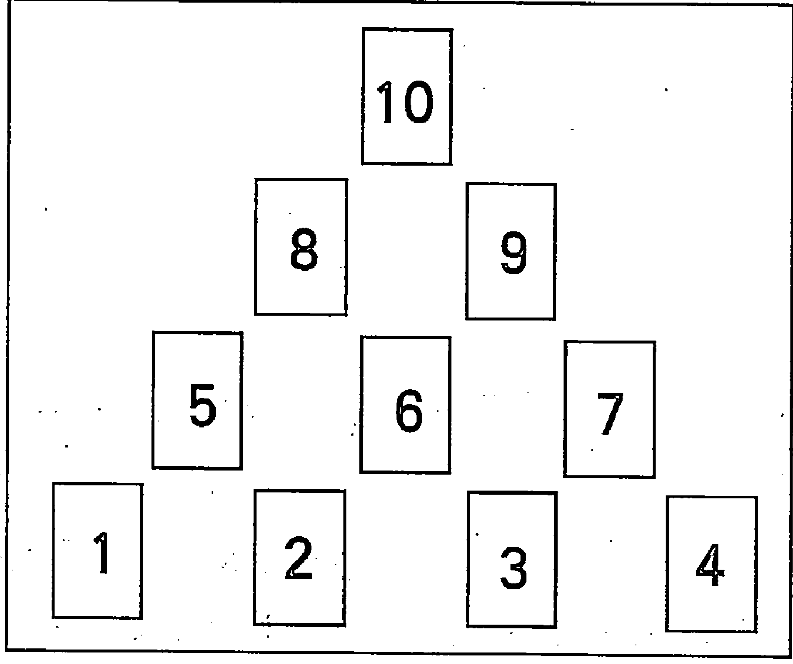

适用于
『22张 大阿卡娜』、『56张 小阿卡娜』、『78张 塔罗牌』

取牌方式
『22张 大阿卡娜』、『56张 小阿卡娜』、『78张 塔罗牌』
随意抽10张牌，依序放在1、2、3、4、5、6、7、8、9、10。

如何解释
- ☆ 1、2、3、4-过去。
- ☆ 5、6、7-现在。
- ☆ 8、9-未来。
- ☆ 10-结果。

## 108 螺旋

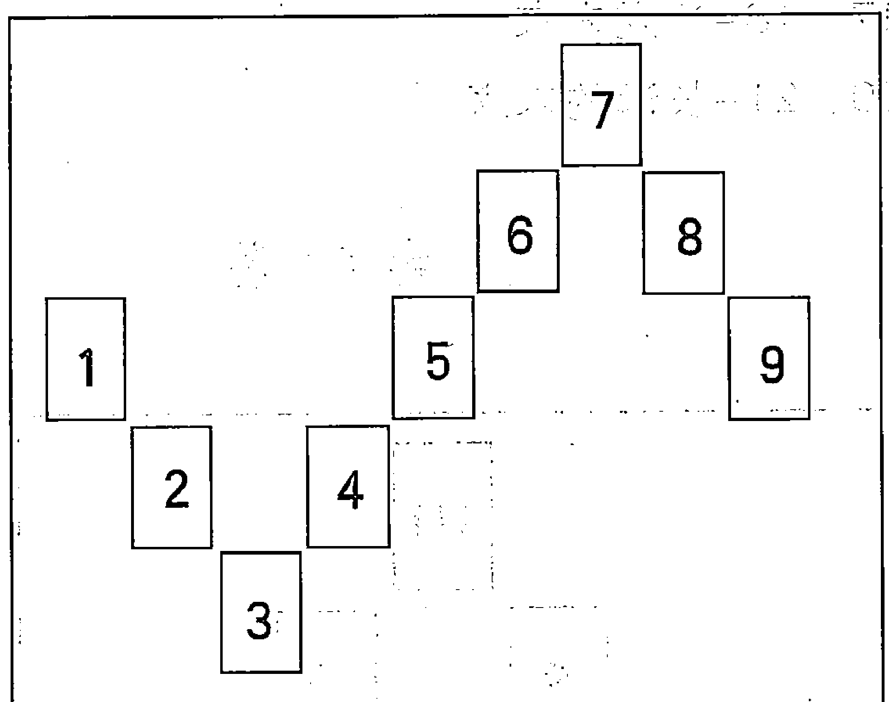

适用于
『22张 大阿卡娜』、『56张 小阿卡娜』、『78张 塔罗牌』

取牌方式
『22张 大阿卡娜』、『56张 小阿卡娜』、『78张 塔罗牌』
随意抽9张牌，依序放在1、2、3、4、5、6、7、8、9。

如何解释
- ☆ 1-根基：求问者现在的情况建立在此牌所指的意义之上。
- ☆ 2-过去的行动：求问者过去的一些行动，并且促成目前情况的发生。
- ☆ 3-过去的情感：求问者过去的情绪状况。
- ☆ 4-过去外在的影响：已经影响求问者的其他人的一些行动或情绪。
- ☆ 5-现在的处境：求问者在这关系中目前的处境。
- ☆ 6-未来外在的影响：将会影响求问者的其他人的一些行动或情绪。
- ☆ 7-未来的情感：求问者未来要小心的情绪反应。
- ☆ 8-未来的行动：求问者未来可能会做的行动。
- ☆ 9-结果：在这情况下预见的结果。

## 109 陀螺

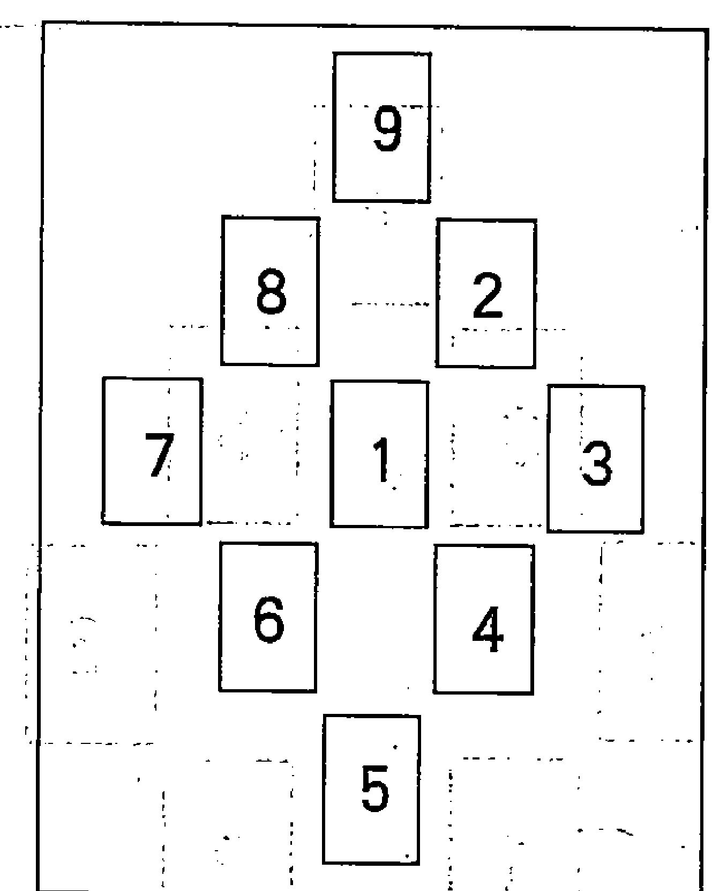

适用于
『22张 大阿卡娜』、『56张 小阿卡娜』、『78张 塔罗牌』

取牌方式
『22张 大阿卡娜』、『56张 小阿卡娜』、『78张 塔罗牌』
随意抽9张牌，依序放在1、2、3、4、5、6、7、8、9。

如何解释
- ☆ 1-自己、自我意识。
- ☆ 2-愿望。
- ☆ 3-梦想：我们想要实现的。
- ☆ 4-追求：我们积极试着去实现的。
- ☆ 5-依恋：追求梦想时，让我们放不开的、抓着我们不放的。
- ☆ 6-特质：求问者的优点。
- ☆ 7-懊悔：求问者需要改进的缺点。
- ☆ 8-自我印象：求问者对自己的印象、想法。
- ☆ 9-精神动力：自己真正的目标与愿望。

## 110 七“行星”

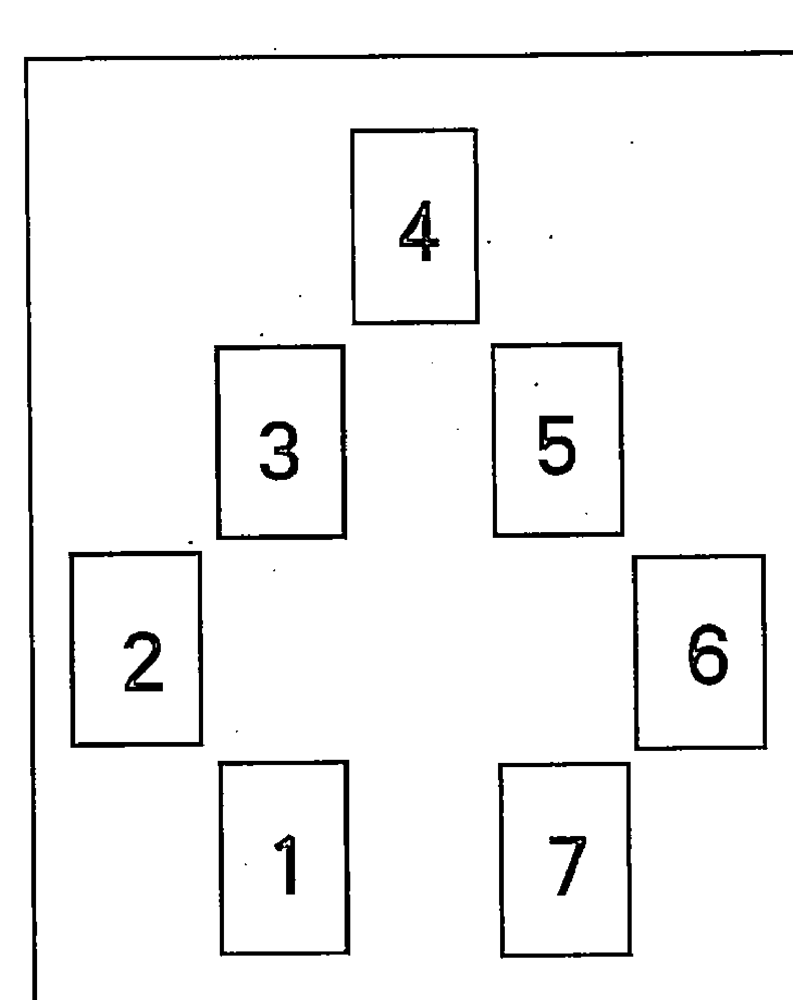

适用于
『22张 大阿卡娜』、『56张 小阿卡娜』、『78张 塔罗牌』

取牌方式
『22张 大阿卡娜』、『56张 小阿卡娜』、『78张 塔罗牌』
随意抽7张牌，依序放在1、2、3、4、5、6、7。

如何解释
- ☆ 1-代表月亮，指的是求问者的家人状况与家庭环境。
- ☆ 2-代表土星，表示求问者的智能及精神状况。
- ☆ 3-代表金星，意味情感方面。
- ☆ 4-代表太阳，象征求问者的人际关系及社交魅力。
- ☆ 5-代表火星，指的是求问者及其对手的竞争状况。
- ☆ 6-代表木星，意味物质的获得，或是任何人际关系、精神性物质的取得。
- ☆ 7-代表水星，表示在贸易、商业、工作或学习等方面的状况。

## 111 切割六芒星

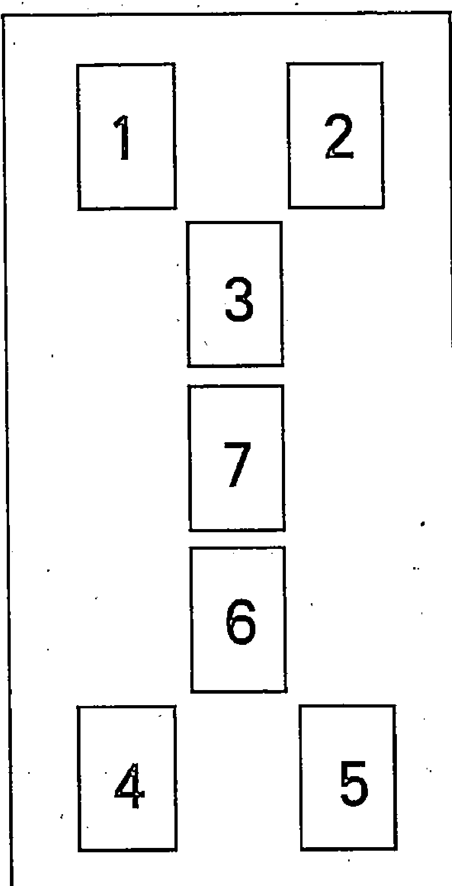

适用于
『22张 大阿卡娜』、『56张 小阿卡娜』、『78张 塔罗牌』

取牌方式
『22张 大阿卡娜』、『56张 小阿卡娜』、『78张 塔罗牌』
随意抽7张牌，依序放在1、2、3、4、5、6、7。

如何解释
- ☆ 1-未知的精神方面强烈的影响。
- ☆ 2-未知的精神方面微弱的影响。
- ☆ 3-对于当事人的心灵指引。
- ☆ 4-无意识的渴望。
- ☆ 5-意识的渴望。
- ☆ 6-实际的指示。
- ☆ 7-最终结果，你这段时间内不做任何改变的话就会发生的结果。

## 112 沙迪若之星

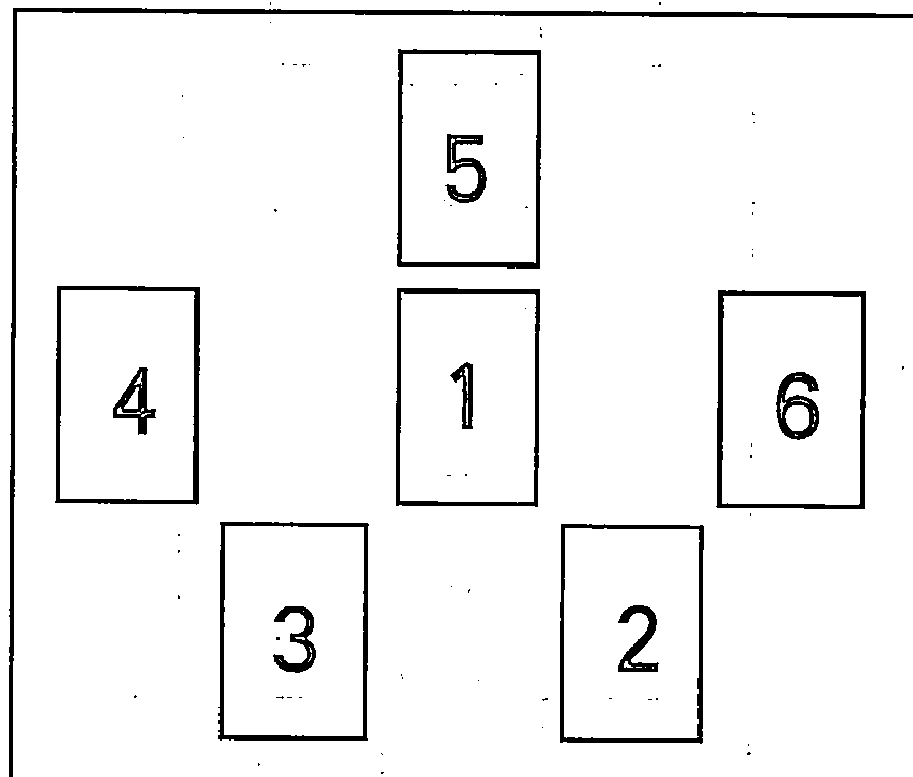

适用于
『22张 大阿卡娜』、『56张 小阿卡娜』、『78张 塔罗牌』

取牌方式
『22张 大阿卡娜』、『56张 小阿卡娜』、『78张 塔罗牌』
随意抽6张牌，依序放在1、2、3、4、5、6。

如何解释
这牌阵适合当求问者不清楚状况，或正在深思熟虑目前情况时，给予当事人相关的忠告与消息。此牌阵虽然没有告知一个肯定的结果，但是在最后结论的地方，仍是告诉你一个相当可靠的事情发展情况。

- ☆ 1-代表求问者与他们的感觉。
- ☆ 2-疑问、问题、状况。
- ☆ 3-隐藏在问题底下的影响因素。
- ☆ 4-将求问者与问题纠缠在一起的过去的事件。
- ☆ 5-要注意的、指示你的，必须深思熟虑的。
- ☆ 6-可能的结果。

## 113 二张六芒星

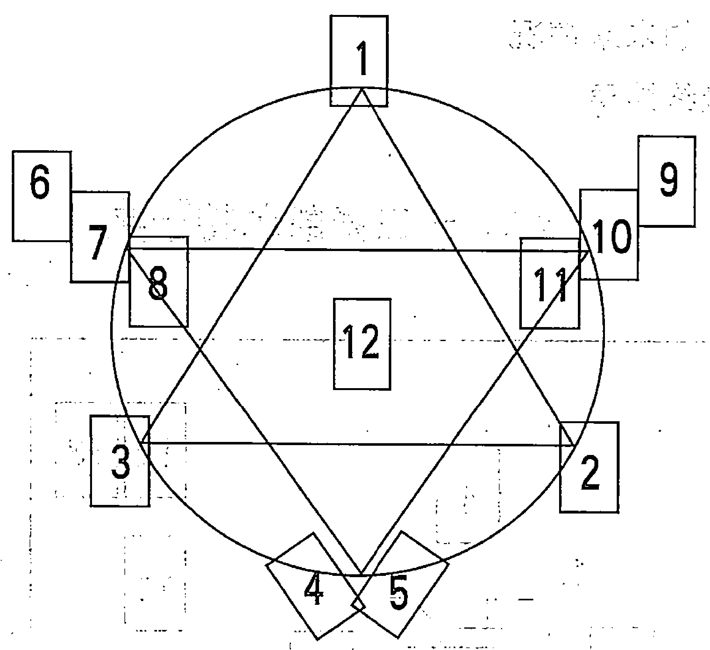

适用于
『22张 大阿卡娜』、『56张 小阿卡娜』、『78张 塔罗牌』

取牌方式
『22张 大阿卡娜』、『56张 小阿卡娜』、『78张 塔罗牌』
随意抽12张牌，依序放在1、2、3、4、5、6、7、8、9、10、11、12。

如何解释
- ☆ 1-问题的过去情况。
- ☆ 2-问题的现在情况。
- ☆ 3-问题的未来情况。
- ☆ 4、5-问题的对策、障碍。
- ☆ 6-对方的过去情况。
- ☆ 7-对方的现在情况。
- ☆ 8-对方的未来情况。
- ☆ 9-你的过去情况。
- ☆ 10-你的现在情况。
- ☆ 11-你的未来情况。
- ☆ 12-最终结果。

## 114 十三张凯尔特十字

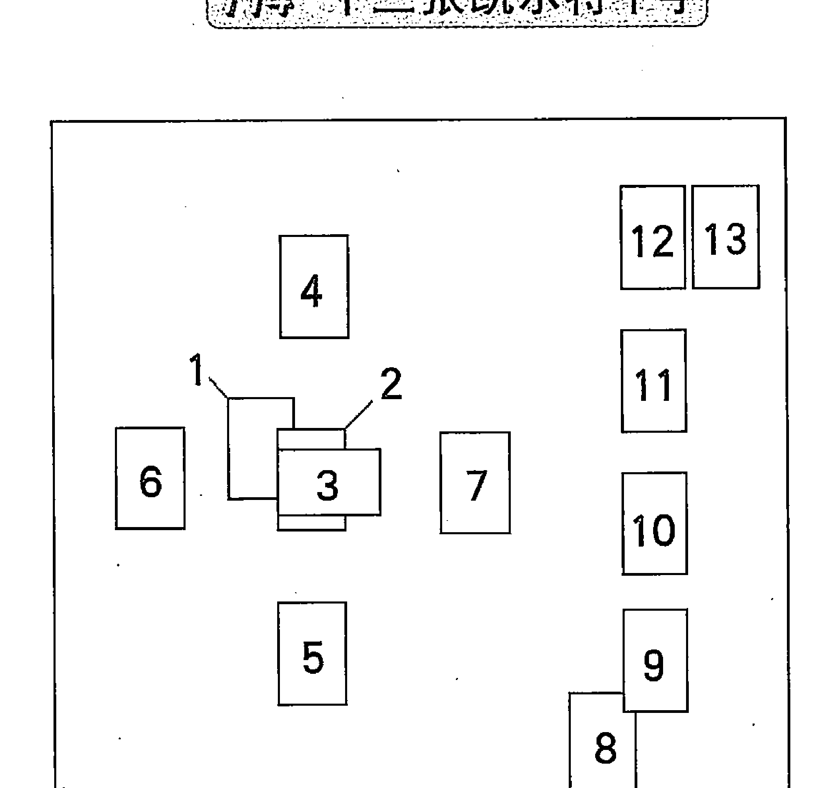

适用于
『22张 大阿卡娜』、『56张 小阿卡娜』、『78张 塔罗牌』

取牌方式
『22张 大阿卡娜』、『56张 小阿卡娜』、『78张 塔罗牌』
随意抽13张牌，依序放在1、2、3、4、5、6、7、8、9、10、11、12、13。

## 如何解释

- ☆ 1、2-问题现在的情况。
- ☆ 3-问题的对策、障碍。
- ☆ 4、5-你心中所想的、考虑的。
- ☆ 6-问题过去的情况。
- ☆ 7-问题未来的情况。
- ☆ 8、9-你目前的情况。
- ☆ 10-周围的情况。
- ☆ 11-期待与恐惧。
- ☆ 12-最终结果。
- ☆ 13-神的劝告（对策）。

## 115 意识动力

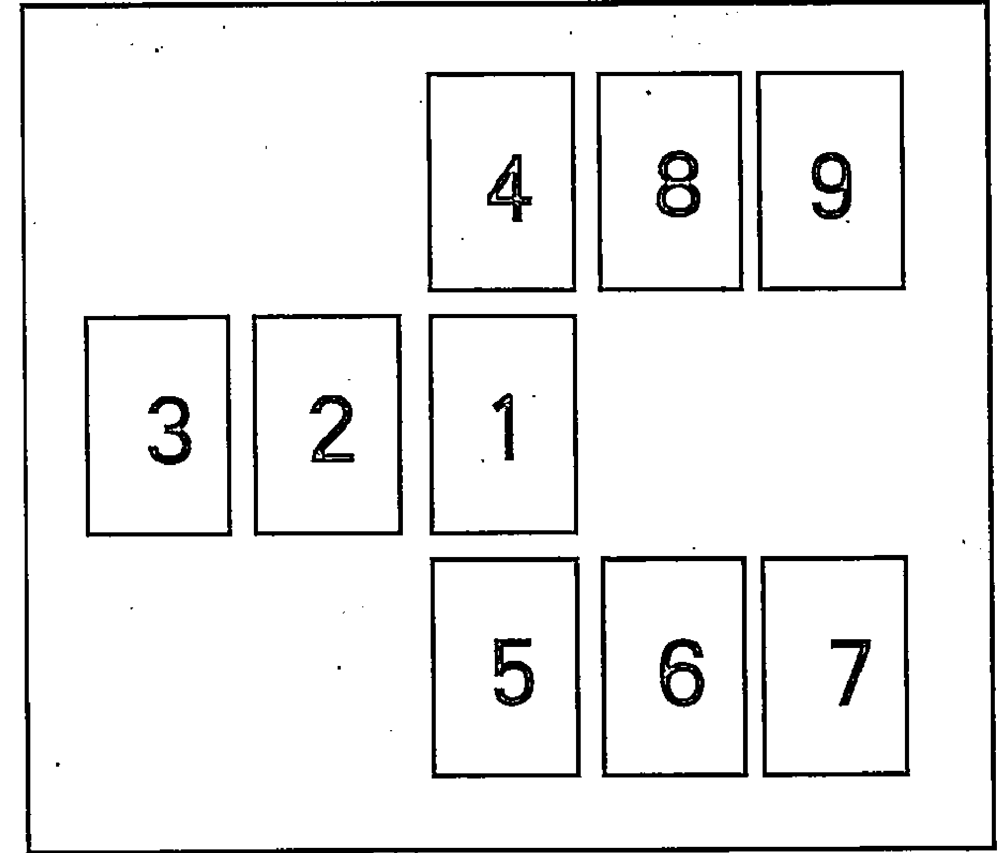

适用于
『22张 大阿卡娜』、『56张 小阿卡娜』、『78张 塔罗牌』

取牌方式
『22张 大阿卡娜』、『56张 小阿卡娜』、『78张 塔罗牌』
随意抽9张牌，依序放在1、2、3、4、5、6、7、8、9。

如何解释
此牌阵一般的目的在于测量意识、时间、结果的相互作用。尤其适合与决定、计划、自我评估相关的问题。

- ☆ 1-指示：自我，求问者的观察、感觉，求问者所知道的问题现况。
- ☆ 2-过去的影响：事件，所分析的问题在过去时有什么力量与关键影响它。
- ☆ 3-过去的强化：强化第2张牌的相关人物，另一种可能是延迟求问者的进展，以便客观公平地认清当前状况的人。
- ☆ 4-道德观对于事件的影响，或内心超我的想法。
- ☆ 5-潜意识的影响：累积的习惯、情绪、事件，这些都会影响求问者现实方面的判断力。
- ☆ 6-假如求问者不做任何改变，不对现况做任何努力，情况会如何发展。
- ☆ 7-有可能的未来结果，假如求问者正如第6张牌的指示一样就有可能发生。
- ☆ 8-求问者可以做的改变，或是援助与原因，也有可能是一种让你偏离目标的诱惑。
- ☆ 9-更多可能的结果，假如求问者听从第8张牌的指示时就有可能发生。

## 116 阴阳

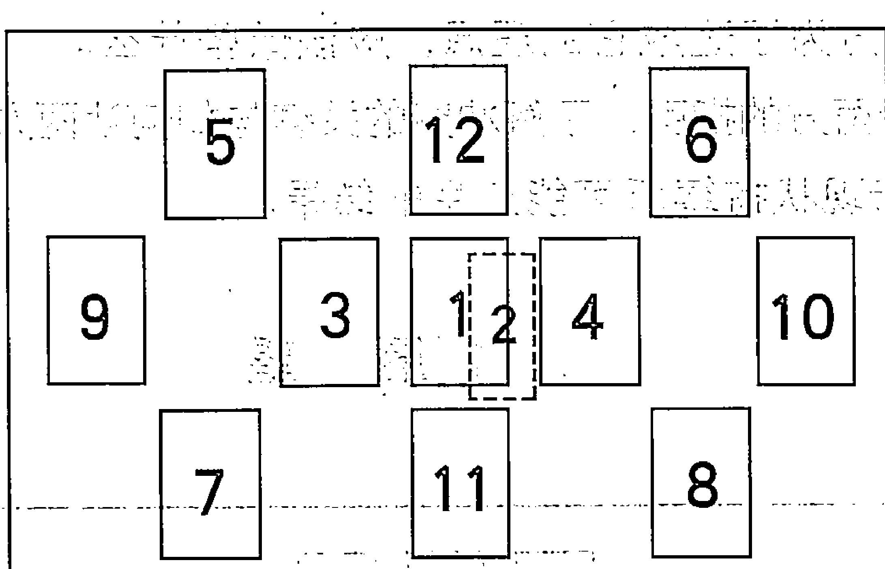

适用于
『22张 大阿卡娜』、『56张 小阿卡娜』、『78张 塔罗牌』

取牌方式
『22张 大阿卡娜』、『56张 小阿卡娜』、『78张 塔罗牌』
随意抽12张牌，依序放在1、2、3、4、5、6、7、8、9、10、11、12。

如何解释
此牌阵针对心中冲突的方面做个衡量，如创造力与逻辑观念的冲突。

请先定义A方与B方是指你的哪种力量。

- ☆ 1-问题相关因素、形成的原因。
- ☆ 2-不显示的、隐藏的。
- ☆ 3-A方的优势：B方如何察觉到A。
- ☆ 4-B方的优势：A方如何察觉到B。
- ☆ 5-A方意识的想法与感觉：A方理想中的结果。
- ☆ 6-B方意识的想法与感觉：B方理想中的结果。
- ☆ 7-A方潜意识的想法与感觉：深层的心理动机。
- ☆ 8-B方潜意识的想法与感觉：深层的心理动机。
- ☆ 9-A方为了达成它的理想，应该做些什么。
- ☆ 10-B方为了达成它的理想，应该做些什么。
- ☆ 11-给两方的指引：了解冲突的关键与如何让两方妥协。
- ☆ 12-若现状持续所可能产生的结果。

## 117 愿望

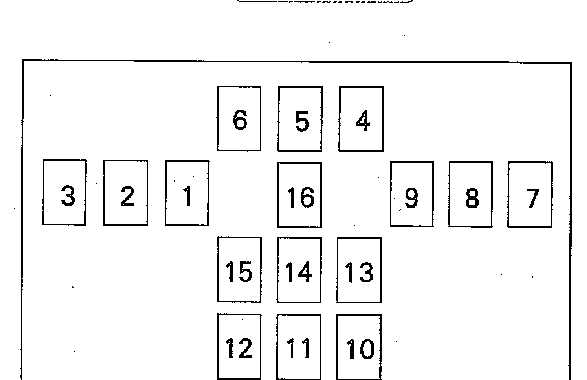

适用于
『22张 大阿卡娜』、『56张 小阿卡娜』、『78张 塔罗牌』

取牌方式
『22张 大阿卡娜』、『56张 小阿卡娜』、『78张 塔罗牌』
随意抽16张牌，依序放在1、2、3、4、5、6、7、8、9、10、11、12、13、14、15、16。

如何解释
圣杯九时常被称为愿望牌，假如它出现在7、8、9这三个位置以外的任何一个位置，这表示求问者的愿望将实现一部分，或是完整实现。
若圣杯九出现在越后面的位置如13、14、15，愿望将实现得越快。

假如圣杯九出现在7、8、9这三个位置上（这三个位置是阻碍），这表示求问者的愿望十之八九不会实现，而另外两张阻碍牌（除了圣杯九的另外两张牌）的影响力将比圣杯九的影响小（以圣杯九为主）。

假如圣杯九没有出现，将不会直接告诉你愿望会或不会实现，此时请你分析牌阵中所有出现的牌，借以了解此一愿望是否有可能实现。

- ☆ 16-你自己。
- ☆ 1、2、3-环境。
- ☆ 4、5、6-求问者的愿望。
- ☆ 7、8、9-阻碍。
- ☆ 10、11、12-将对现今情况产生影响的一些相关因素。
- ☆ 13、14、15-求问者所实现的、获得的（通常是指未来情况）。

## 118 马蹄铁

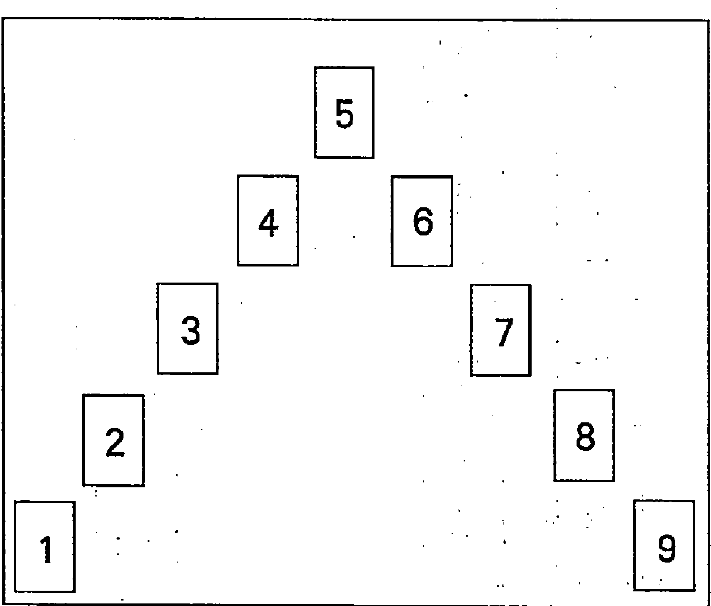

适用于
『22张 大阿卡娜』、『56张 小阿卡娜』、『78张 塔罗牌』

取牌方式
『22张 大阿卡娜』、『56张 小阿卡娜』、『78张 塔罗牌』
随意抽9张牌，依序放在1、2、3、4、5、6、7、8、9。

如何解释
- ☆ 1-你目前的状况。
- ☆ 2-其他人如何影响你。
- ☆ 3-你周围事物如何影响你。
- ☆ 4-你内心对于外界的响应。
- ☆ 5-你正思考什么。
- ☆ 6-你目前的感受。
- ☆ 7-你一直确信的想法。
- ☆ 8-近期的未来。
- ☆ 9-遥远的未来。

## 119 期望

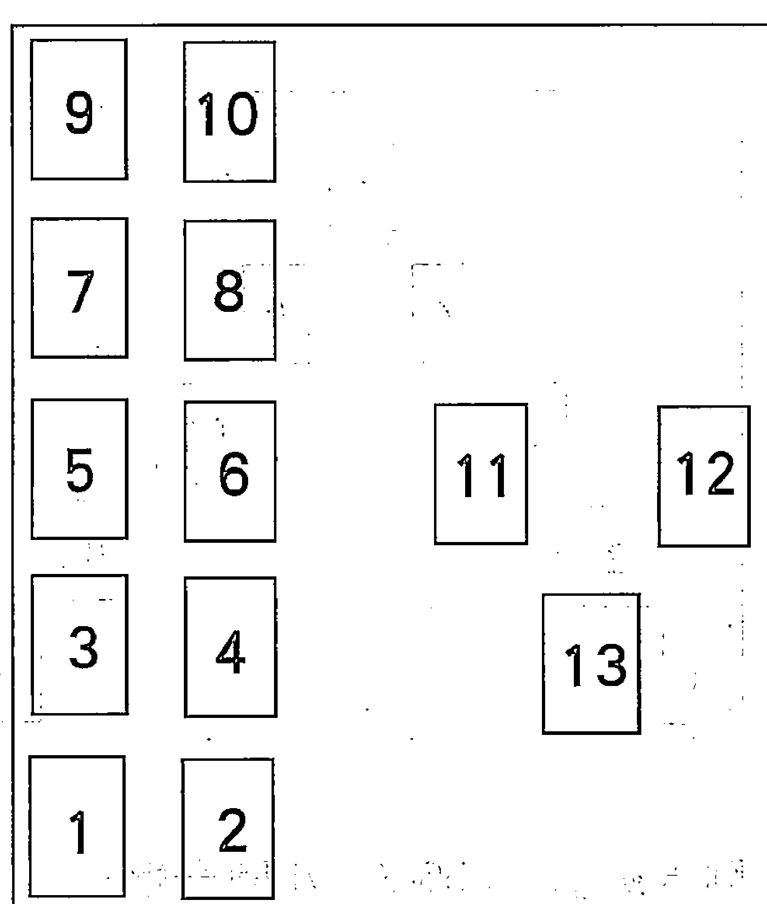

适用于
『22张 大阿卡娜』、『56张 小阿卡娜』、『78张 塔罗牌』
(超过12张的牌阵建议不要只用大阿卡娜)

取牌方式
『22张 大阿卡娜』、『56张 小阿卡娜』、『78张 塔罗牌』
随意抽13张牌，依序放在1、2、3、4、5、6、7、8、9、10、11、12、13。

如何解释
- ☆ 1、2-关于某方面 (牌所指的)，你过去的期望的情形。
- ☆ 3、4-关于某方面 (牌所指的)，你现在的期望的情形。
- ☆ 5、6-关于某方面 (牌所指的)，你未来的期望的情形。
- ☆ 7、8-那些期望会怎样表现、展现出来。
- ☆ 9、10-这些表现、展现出来的期望，会怎么样改变你的生活。
- ☆ 11、12-最终的结果或成就。
- ☆ 13-在最终的结果下，一条新的发展道路。

## 120 桥墩

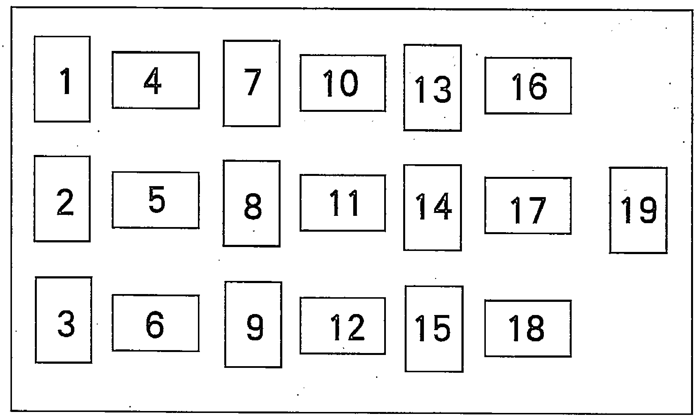

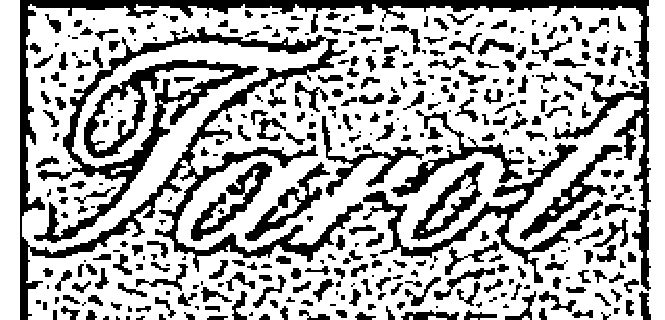

适用于
『56张 小阿卡娜』、『78张 塔罗牌』

取牌方式
『56张 小阿卡娜』、『78张 塔罗牌』
随意抽19张牌，依序放在1、2、3、4、5、6、7、8、9、10、11、12、13、14、15、16、17、18、19。

如何解释
注意：4、5、6，10、11、12，16、17、18等九张牌是横放的。

- ☆ 1、2、3-过去。
- ☆ 4、5、6-连接过去与现在的：可能是事件、信念、或者你根本就没察觉的某些事物。
- ☆ 7、8、9-现在。
- ☆ 10、11、12-连接现在与未来的：可能是事件、信念、或者你根本就没察觉的某些事物。
- ☆ 13、14、15-近期未来。
- ☆ 16、17、18-连接到结果的：一些介于隐藏与显状况的事情，它会帮助或阻挠你。
- ☆ 19-最后的结果。

注：因为16、17、18是连接到最后结果的三张牌，所以这些事不一定已经发生（隐藏的未来事件）。

## 121 房子

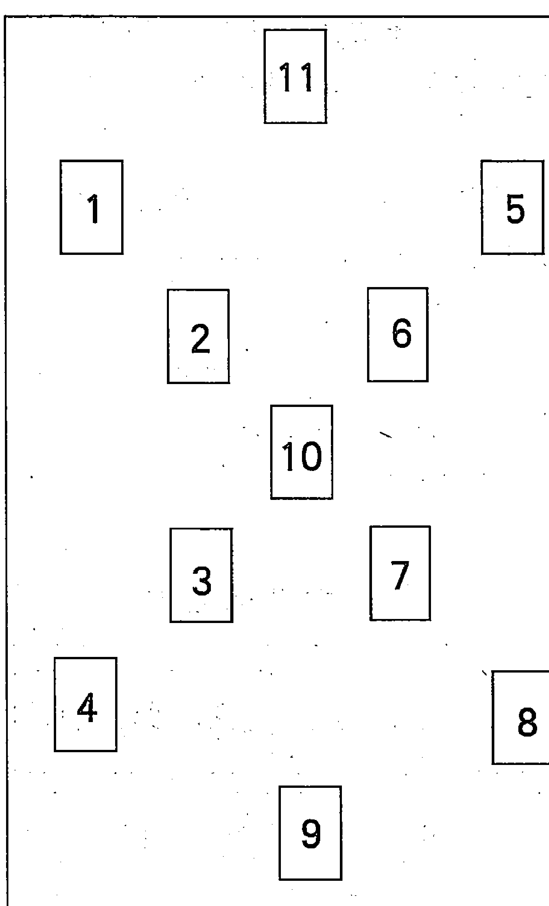

适用于
『22张 大阿卡娜』、『56张 小阿卡娜』、『78张 塔罗牌』

取牌方式
『22张 大阿卡娜』、『56张 小阿卡娜』、『78张 塔罗牌』
随意抽11张牌，依序放在1、2、3、4、5、6、7、8、9、10、11。

如何解释
- ☆ 1-客厅：朋友、社交关系、团体活动。
- ☆ 2-家人休息室：最亲近的双亲、兄弟姊妹、配偶、小孩、宠物。
- ☆ 3-厨房：健康、肉体。
- ☆ 4-私人房间：工作、资金。
- ☆ 5-洗衣间：你要留意的、必须小心的。
- ☆ 6-地下室：被隐藏的或是在你生命中不断累积的，但是你却没有意识到。
- ☆ 7-车库：停靠在你生命中且需要留意的。
- ☆ 8-卧室：连接第9、10两张牌的想法。（对于进入、离开你生命的人、事物的想法）
- ☆ 9-后门：正离开你生命的某些事物或某些人。
- ☆ 10-前门：正进入你生命的某些事物或某些人。
- ☆ 11-阁楼：你最后的成就。

## 122 四十九张七大“行星”

| 49 | 48 | 47 | 46 | 45 | 44 | 43 |
|---|---|---|---|---|---|---|
| 42 | 41 | 40 | 39 | 38 | 37 | 36 |
| 35 | 34 | 33 | 32 | 31 | 30 | 29 |
| 28 | 27 | 26 | 25 | 24 | 23 | 22 |
| 21 | 20 | 19 | 18 | 17 | 16 | 15 |
| 14 | 13 | 12 | 11 | 10 | 9 | 8 |
| 7 | 6 | 5 | 4 | 3 | 2 | 1 |

适用于
『78张 塔罗牌』

取牌方式
『78张 塔罗牌』
随意抽49张牌，依序放在1至49的位置上。

如何解释
- ☆ 1至7，代表月亮，指的是求问者的家人状况与家庭环境。
  - ☆ 1、2、3-求问者过去的家人状况与家庭环境。
  - ☆ 4-求问者现在的家人状况与家庭环境。
  - ☆ 5、6、7-求问者未来的家人状况与家庭环境。
- ☆ 8至14，代表水星，表示在贸易、商业、工作或学习等方面的状况。
  - ☆ 8、9、10-过去在贸易、商业、工作或学习等方面的状况。
  - ☆ 11-现在贸易、商业、工作或学习等方面的状况。
  - ☆ 12、13、14-未来贸易、商业、工作或学习等方面的状况。
- ☆ 15至21，代表金星，意味情感方面。
  - ☆ 15、16、17-过去情感方面。
  - ☆ 18-现在情感方面。
  - ☆ 19、20、21-未来情感方面。
- ☆ 22至28，代表太阳，象征求问者的人际关系及社交魅力。
  - ☆ 22、23、24-求问者过去的人际关系及社交魅力。
  - ☆ 25-求问者现在的人际关系及社交魅力。
  - ☆ 26、27、28-求问者未来的人际关系及社交魅力。
- ☆ 29至35，代表火星，指的是求问者及其对手的竞争状况。
  - ☆ 29、30、31-过去求问者及其对手的竞争状况。
  - ☆ 32-现在求问者及其对手的竞争状况。
  - ☆ 33、34、35-未来求问者及其对手的竞争状况。
- ☆ 36至42，代表木星，意味物质的获得，或是任何人际关系、精神性物质的取得。
  - ☆ 36、37、38-过去物质的获得，或是任何人际关系、精神性物质的取得。
  - ☆ 39-现在物质的获得，或是任何人际关系、精神性物质的取得。
  - ☆ 40、41、42-未来物质的获得，或是任何人际关系、精神性物质的取得。
- ☆ 43至49，代表土星，表示求问者的智能及精神状况。
  - ☆ 43、44、45-求问者过去的智能及精神状况。
  - ☆ 46-求问者现在的智能及精神状况。
  - ☆ 47、48、49-求问者未来的智能及精神状况。