# 现代塔罗牌：结合人生的塔罗牌

## 前言

很多客戶接觸塔羅的時間久了之後，發現他們也開始想學塔羅。在我的經驗中發現，學塔羅在一開始基礎的正確性非常重要—正統的偉特塔羅，每個圖案、每張牌的順序與顏色，這些背後都有很深的涵義；當你懂了這些涵義之後才會明白占卜抽牌之後要怎麼解，才能貼上客戶的內心，而不是單純的背誦標準答案然後客戶還是一頭霧水。

「正統偉特牌的涵義」又是什麼意思呢？舉例來說，女祭司、教皇、正義這三張牌背後都有兩根柱子，但只有女祭司的柱子是清楚的黑白兩色，而教皇牌與正義牌裡面的柱子都是灰色。這代表的意思是說，因為女祭司手上拿著真理之書、明白真正的真理，了解二元世界陰陽與黑白，所以柱子是黑白兩色。

女祭司是神選出來的代言人，擁有神的智慧這是無庸置疑的；可是教皇、正義規範……這些是我們人類自己決定出來的，我們人類的智慧本來就有限，所以背後的柱子才會是灰色，代表我們對這個二元世界仍不夠熟悉、對於真理還有一段距離。

當你清楚了解這樣的涵義，等你為客戶解牌的時候就有更寬闊的靈感，直接切入牌的深層意義而不再被表面的字句束縛，這時候你的解牌能力自然就更上層樓了。

記得當初我一層一層掀開塔羅背後的精神意義、看到越來越多的智慧一個個閃閃發光，突然從內心升出一股喜悅，同時一股種神聖的崇拜讓我對塔羅有一份深深的敬意。我想，塔羅牌最厲害的地方，在於祂不只是給你 yes or no 之類的占卜結果，更重要的是祂帶著你去探索生命，幫你慢慢了解人生瓶頸背後的價值和意義；更希望你可以超越占卜，能無畏無懼的面對生命每一次起伏，最後成為真正的生命主人。這也是我寫這本書、想傳達出來的真正用意，希望能讓每一位對塔羅有興趣的人，都可以從中擷取到生命的靈性與光芒。

小嵐家 FB

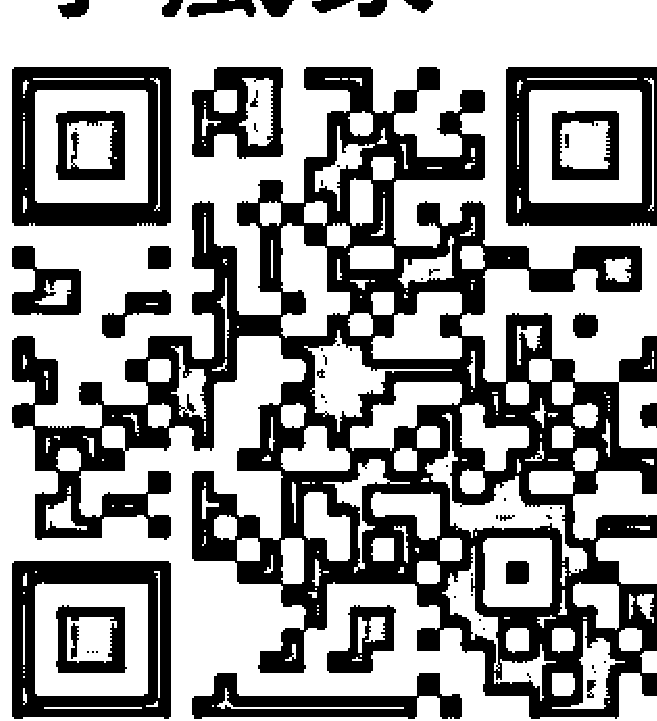

官方 LINE

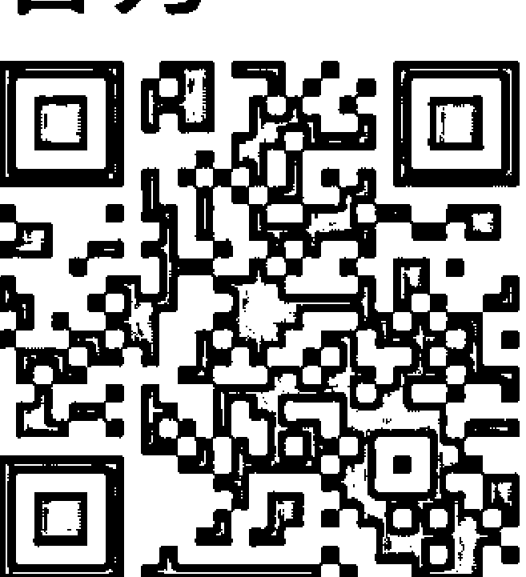

連絡電話：0955-213-003

## 編輯推薦

此書除了學術的研究外，在實際的案例及資料上更是用心及慎重；塔羅牌有特殊的磁場和自我意識呈現上也充滿著獨特的魅力，相信讀者在看完此書後會對塔羅牌有更身的領悟，同時在實際操作上更能夠感應到塔羅牌的能量，解牌上更加得心應手。

無論是初學者還是進階者，真心推薦給您，改變自我人生甚至能夠幫助到更多需要幫助的人。

敬祝 平安順心

雪原雪

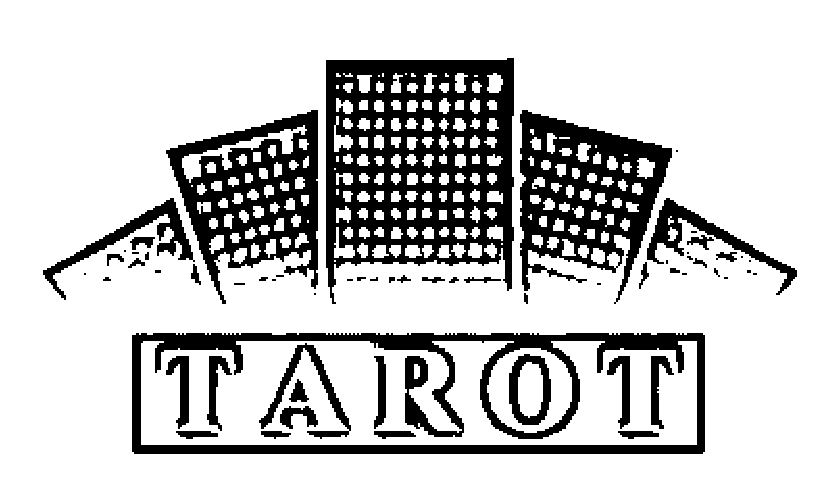

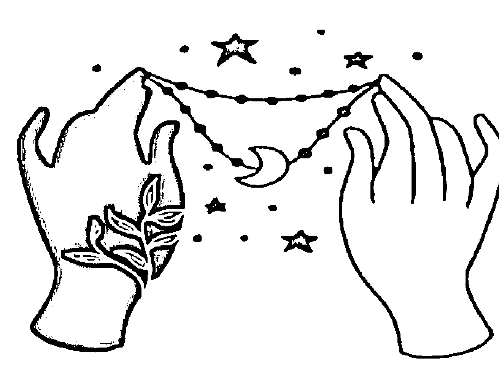

# Part

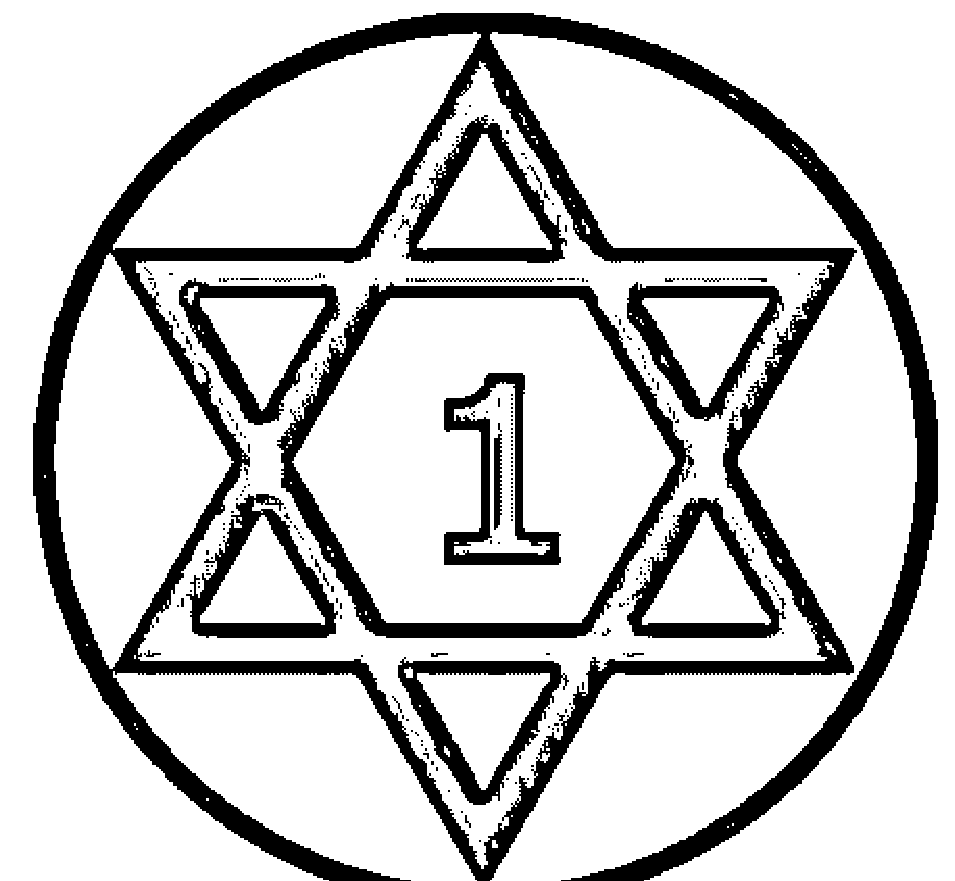

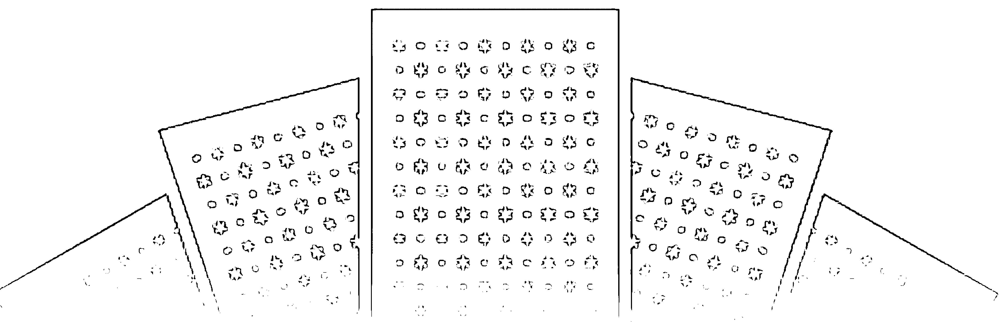

# 塔羅小知識

## 塔羅牌的起源與歷史

目前普遍認為，現代塔羅牌 (即22張大秘儀+16張宮廷牌+40張小秘儀的架構) 可追溯到義大利文藝復興時期。大約在15世紀，義大利某位貴族委託工匠製作幾套塔羅牌，後來輾轉被考古學家與古董家們挖掘、發現一套的塔羅大約有78張，這78張就成為現代塔羅牌的基礎。不過完整的塔羅牌到底有幾張？就是這78張嗎？還是有其他塔羅牌被散落埋葬、只是我們還沒發現？到目前不得而知。這些充滿藝術美感、且歷史悠久的塔羅牌現在保存在博物館內，有些則歸屬私人收藏。

至於塔羅牌根源來自何處也無法確定，不同學派各自有不同說法，目前大至可分四種主要假設，分別認為啟源於埃及、中國、印度與波斯，但各自也有些許漏洞與矛盾。看到這裡或許你會發現，這四個起源地都沒有歐洲—沒錯，其實塔羅牌是後來吉普賽人帶到歐洲的。

## 我該怎麼選牌？

我們可以選擇各種類型的塔羅牌，每個都有自己的歷史和背後設計的意涵。不過即使每副牌都有自己獨特的風格，但每張卡的基本內容與含意是一致的。因此選牌的時候，重點是要選一副能激發你想像力與直覺、並且你要真正喜歡其設計風格。

如果你是剛開始接觸塔羅牌，或是覺得自己對每副牌的感覺都差不多，那建議可以先從「萊德.偉特塔羅牌」入手，因為這副牌圖案鮮豔含意清晰，較容易刺激你激發出直覺與聯想。

## 塔羅小法寶

除了塔羅牌之外，還有一些幫助我們營造氛圍、提升磁場與靈氣的小寶物，這些都可以考慮一起收藏喔！

### 一、水晶或各種礦石：

基本上是用來淨化牌卡及守護靈性。不同礦物有不同特質，在此介紹幾個占卜常用的礦石。

- ★ **雞血石**：這個被認為是古老的千里眼，幫助我們預視未來。
- ★ **青金石**：這在以前認為可以強化心靈感應能力。
- ★ **瑪瑙**：瑪瑙裡面層層疊疊，可以整合思緒平息情緒。
- ★ **虎眼石**：在以前會用它強化我們的意志力，藉此建立強大的磁場。
- ★ **鹽**：最直接的天然淨化物，除了用來淨化占卜時的結界之外，也可以淨化各種礦石。也可拿鹽礦石放房間裡鎮守整個環境。

### 二、絲綢或絨布：

可用來包住塔羅牌，保持乾淨不被汙染；也可以鋪在桌上形成結界。此外，基本上選擇綢絨都沒有顏色的限制，你可以選自己喜歡的顏色與圖案。

現在市面上常看到結合曼陀羅、宇宙生命之花，或是魔法陣等各種圖案的絨布，也有些占卜師會特別去訂做專屬自己的絨布，這些都沒有限制，最主要是占卜者要了解這些圖案背後的含意，這樣才能真正幫助你與塔羅牌互相連結，達到事半功倍的效果。

### 三、薰香與蠟燭：

蠟燭的火光象徵聖潔與能量，這是電燈無法取代的特殊功能，因此很多正統占卜師會堅持占卜時要點蠟燭，甚至進行正式的點光儀式。至於薰香，不同的薰香有不同的效用，但基本上都是藉由嗅覺來刺激人們，達到腦部與精神兩者平衡的效果。

這裡來介紹幾個適合占卜使用的薰香：

- ★ 安定靜心、保持客觀冷靜：迷迭香、鼠尾草、檸檬、薄荷
- ★ 放鬆、讓情緒轉向正面：佛手柑、甜橙、天竺葵、依蘭
- ★ 內心療癒、面對問題：薰衣草、香茅、甜菊、茶樹

### 四、音樂

因為音樂也是種頻率，會很直接地影響我們的內心感受，所以占卜時通常較適合緩和、寧靜的音樂，讓我們很快定下心來回到穩定；因此各種大自然音樂、純音樂或水晶音樂等都可考慮成為我們的背景音樂。

音樂聲音不要太大，以免造成占卜師與客戶之間對話不便；另外，建議音樂盡量不要有歌詞或是太明顯的宗教特質，因為歌詞會吸引我們忍不住跟著去聽，或是讓客戶聯想到他的經歷而影響思緒與情緒；至於太宗教的音樂則通常有很明顯的文化特色，這樣可能影響其他不同文化的客戶無法適應。

## 完整的自我探索：星座＋塔羅＋生命靈數

還記得小時候我們常常問朋友「你是什麼星座」、然後每天我們會看星座運勢，看今天是不是又要「水逆」了，對吧！

星座像是我們的生命藍圖，安排我們每天的起承轉合，告訴我們自己天生特質與優缺點，而這背後是希望我們勇敢面對專屬自己的生命課題。

生命靈數則像是迅速幫我們找到位置，引導我們看清楚自己的屬性與專長，讓我們更快適應這個世界與人生。當我們看清自己的能力與缺陷，那麼在這條生命旅途中就會明白什麼方式比較適合自己；再根據自己屬性來選擇適合用飛翔、步行還是走海線的方式達到目的。簡單來說，如果說星座是我們人生的地圖，那生命靈數就像是一只指南針，幫助我們在地圖上找到最佳途徑。

至於塔羅，是當我們旅程中遇到瓶頸與疑惑時，幫我們心靈得到療癒與分析，這不但能使我們慢慢把傷口癒合，同時也在過程中學到靈性與智慧成長，最後對生命有更深切更闊達的見解與領悟。因此一個完整的自我分析，是要整合星座、生命靈數與塔羅，從現實與心靈共同解析，這才能看到最深層的靈魂。

在這過程中，塔羅象徵靈性的轉變、同時也改變我們的人生觀，這也就是塔羅牌為何如此引人著迷的魅力了。

下面的表格是將星座、生命靈數與塔羅結合與整理，希望可以幫助大家更清楚看出三者之間的牽連：

| 星座 (靈魂的人生之旅，藍圖) | | | | | | | | | | | |
| :---: | :---: | :---: | :---: | :---: | :---: | :---: | :---: | :---: | :---: | :---: | :---: |
| ♅ | ☿ | ☽ | ♀ | ♈ | ♉ | ♊ | ♋ | ♌ | ♍ | ♃ |
| 天王星 | 水星 | 月亮 | 金星 | 牡羊座 | 金牛座 | 雙子座 | 巨蟹座 | 獅子座 | 處女座 | 木星 |
| 塔羅 | 0 | 1 | 2 | 3 | 4 | 5 | 6 | 7 | 8 | 9 | 10 |
| | 愚者 | 魔術師 | 女祭司 | 皇后 | 國王 | 教皇 | 戀人 | 戰車 | 毅力 | 隱者 | 生命之輪 |

| 星座 (靈魂的人生之旅，藍圖) | | | | | | | | | | | |
| :---: | :---: | :---: | :---: | :---: | :---: | :---: | :---: | :---: | :---: | :---: | :---: |
| ♎ | ♆ | ♏ | ♐ | ♑ | ♂ | ♒ | ♓ | ☉ | ♇ | ♄ |
| 天秤座 | 海王星 | 天蠍座 | 射手座 | 摩羯座 | 火星 | 水瓶座 | 雙魚座 | 太陽 | 冥王星 | 土星 |
| 塔羅 | 11 | 12 | 13 | 14 | 15 | 16 | 17 | 18 | 19 | 20 | 21 |
| | 正義 | 吊者 | 死神 | 節制 | 魔鬼 | 塔 | 星星 | 月亮 | 太陽 | 審判 | 世界 |

| | 生命靈數 (靈魂的特質專長，指南針) | | | | | | | | | |
|---|---|---|---|---|---|---|---|---|---|---|
| | 自我 | 相對 | 和解 | 固定 | 延伸 | 運行 | 啟發 | 強壯 | 靈性 | 無限 |
| | 1 | 2 | 3 | 4 | 5 | 6 | 7 | 8 | 9 | 0/10 |
| 塔羅 | 火 | 生長 | 取決 | 離開 | 維持 | 爭執 | 成功 | 抵抗 | 積極 | 受傷 | 責任 |
| | 水 | 豐盈 | 承諾 | 共享 | 停滯 | 失去 | 協助 | 虛幻 | 不足 | 展現 | 和樂 |
| | 土 | 期待 | 波動 | 合作 | 控制 | 缺乏 | 供給 | 收穫 | 專注 | 悠然 | 完成 |
| | 風 | 挑戰 | 逃避 | 破裂 | 休息 | 奪取 | 過渡 | 欺騙 | 限制 | 噩夢 | 停止 |

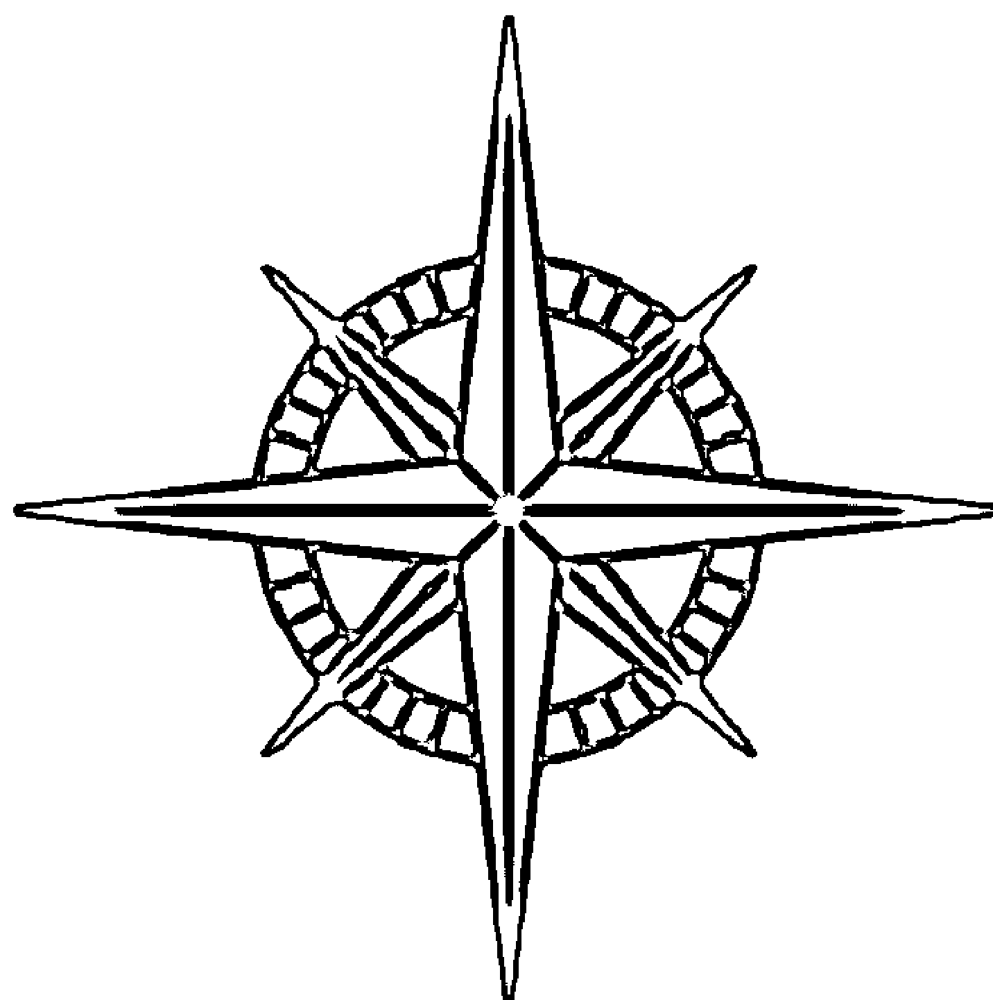

# Part

# 塔羅小占卜

## 我是哪一種屬性的占卜師？

據說，神的世界即將來臨，最終審判將要到來。雙魚世代就要結束，世界將要毀滅後再度重生。而天神到來的前一晚，你看到月亮似乎發散著奇怪的光芒……
請問：你看到的月亮，是下面哪一種形狀？

每個人的感應能力、磁場不同，所以各有自己的強項和專長；並且成為你的占卜特質。快來看看你是屬於哪一屬性的占卜師？

- 1. 新月：療癒
你的占卜會給人很好的安撫、創傷的心在你的手中將得到療癒。受傷的時候也是最需要別人協的時候，請用你的智慧幫助他們走過低潮。
- 2. 上弦月：希望
人們常常被自己的思想束縛，這些偏見或悲觀讓自己不斷痛苦下去、或是走到死胡同裡繞不出來。你可以幫人找到適合自己的方法與希望，讓他們得到全新的角度與觀點。
- 3. 滿月：行動
有許多人想得很多卻沒有動力，或是因害怕失敗而猶豫不決；最後讓自己失去許多難得的機會。你可以開導他人腳踏實地、將內心的願望付諸實現。
- 4. 下弦月：運轉
生命需要出與入不斷流動、這樣才能生生不息。你能看到整個局面、懂得如何拿捏收放，讓每件事情都能順暢運作下去；因此在這「旁觀者清、當局者迷」的時代，你的宏觀將幫助人們看到更完整的全局。
- 5. 殘月：清點
每個人都有不同的想法與價值觀，然後造成許多爭執與誤會。而你的特質就是能幫人理性且公平的分析、重新找到平衡、減少許多傷害和災難。
- 6. 無月：休息
靈魂的休息不只是放鬆，同時也反省檢視自己、重新調整自己的思想與能力，然後用更高的智慧與能力、繼續走下去。你的特質是可以幫人省思自己的過錯、進而成長茁壯。
- 7. (各種)月蝕：變動
人世間充滿各種變動與意外，你可以觀察到人們很細微的思想變動，找到核心問題，甚至幫他們找到「危機就是轉機」的機會，最後讓人們跨過恐懼走向成功。

## 我擁有哪一種天使特質？

今天是世界末日，整個世界昏天暗地、風雨交加，就在這一刻突然天上出現三位天使，原來是上帝派這三名天使來拯救人類；並且會把人們帶到另一個星球上好好安頓。
三位天使現在就出現在你面前，請問你想跟哪一位天使走向新的星球呢？

### 解答

1. 塔羅牌 6 號，拉斐爾大天使
在天使學中，拉斐爾代表「神之生命」，因此拉斐爾在戀人牌中出現，這是因為戀人男女結合後才會創造出新的生命。此外，由於「醫療」、「治癒」也是我們挽回生命的主要方法，所以這位天使也守護著與醫療相關的事情。
選這張牌的你，擁有治癒他人心靈、重新找回生命熱忱的能力；在你引領之下可以使人感受到天使拉斐爾的溫暖與祝福喔！
2. 塔羅牌 14 號，米迦勒大天使
在天使學中，米迦勒代表「神之義子」，所以在節制牌出現、象徵人類心靈自我淨化之後重新成為神的兒女。另外，也因為米迦勒如同神的分身，所以他是帶領整個天使軍團的總司令，是一位非常有氣勢的大天使。
選了這一張牌的你，天生是大家的守護者，看到有人被欺負而恐懼害怕時你會毫不畏懼的站出來，此時周圍的人都能感受到你勇敢堅強的天使火焰！
3. 塔羅牌 20 號，加百列大天使
在天使學中，加百列代表「神之左側」，在審判牌裡面出現是因為加百列代表神來到人間、給人類靈性上的啟示。就像在人體中，我們身體的左邊連結著右腦，主管直覺、藝術、冥想等領域，並也啟發出我們的靈性與智慧。
如果你選的是這一張牌，你將是一位靈性領悟力很高的人，並且可以在大家迷惘的時候提供智慧與方向，如同是海洋中的燈塔、黑暗裡的明燈呢！

## 我這輩子的生命課題？

承上題，由於地球的世界末日，你很幸運受到上天的眷顧、將你送到某個新星球而躲過一劫。你對這個新星球一無所知，不曉得這裡的水與植物是否適合人類食用？為了幫助人類，上帝派天使提供食物給你與其他人類。
你伸出手來領取天使提供的食物，下列哪一隻是你的手呢？

### 解答

1. 是錢幣侍者的手
你這一生的功課是要學習「獨立」與「自由」。宇宙中有很多事情並沒有絕對的步驟或標準，但你比較習慣依循一定的規則，這樣的優點是邏輯與架構十分清楚完整，但要注意容易在不知不覺中限制了自己與他人。
2. 是寶劍侍者的手
你這一生的功課是要學習「合作」與「忍耐」。人與人之間本來就有很多矛盾與衝突，有時若我們能多點包容、試著用對方的角度來看整件事情，你會發現自己與他人原來是環環相扣、互相影響並共同承擔後果。
3. 是權杖侍者的手
你這一生的功課是要學習「退讓」與「轉移」。世界是你的舞台，但也是別人的舞台；舞台上有各式各樣不同的戲碼，有些劇本很適合由你當主角，但也有的時候需要換其他人來主演。若能用心觀賞他人的故事，享受身為觀眾的單純快樂，將能使你的生命更豐富圓滿！
4. 這是聖杯侍者的手
你這一生的功課是要學習「深入」與「完整」。有時候人生真的很矛盾，太投入就被說是執著，太冷靜理性又被說是不懂人情世故。因此這一世我們學習用「陪伴者」的立場，去體驗、理解不同立場的人；等到對方轉身離開後，我們的靈魂重新回到自己身上。這樣不斷的離合聚散，最後提煉出靈魂的智慧與成熟。

你到一個新星球過全新的生活，慢慢適應了下來，如今要滿一年了。今天大家為了慶祝這一年的新生活，要辦一場連續三天三夜的盛大宴會、大家都很積極布置自己的住家。你將房子佈置得美輪美奐，最後只要在這面牆掛上裝飾品就大功告成了！
現在，請從下面選一個你最後要掛的裝飾品？

## 塔羅小占卜 TAROT

- 1. 吊飾寶珠
- 2. 花蔓
- 3. 花環

### 解答

1. 權杖 2
你很有遠見、通常能從完整而具體的全方位角度去觀察人事物，所以你的建議與計畫通常很有遠瞻性。這樣的你適合當軍師、幕僚、或是編寫企劃。然而因為你看得很遠，很多人跟不上你的腳步，導致常有許多人聽不懂你的想法。另外，你需要用實際的成果來證明你的計畫與能力，所以可能會比一般人辛苦一些。不過請放心，因為你得到的報酬通常也會比別人高喔！
2. 權杖 4
你重視每個人的感受、是個願意為大家付出的人，當人們遇到困難通常第一個就是向你求助，而且也覺得你是個可以信任寄託的人。只是這樣久了、難免你會有些落寞，覺得好像大家都是有麻煩才找你幫忙，但快樂卻沒有跟你分享，進而內心覺得人們都很現實並且不容易找到親密的朋友。幸好你常常擁有很多正向磁場，大家都會不知不覺被你吸引呢！
3. 權杖 6
你很有將領風範，不但能帶大家走向成功，而且交給你的事情通常你都會做得有聲有色。說不定你常常成為大家的模範與目標喔！但是你要注意自己的言行舉止，可能有時候會讓人覺得你高不可攀、又或者你較不容易換成別人的立場來思考，導致跟別人互動時引起對方的誤會與不滿。

## 我如何面對挑戰與危機？

經過三年的努力，你終於完全融入新星球的生活。這天你研發出一種新的皮革，這個皮革可以幫助人們更快適應這個星球的氣候；因此你將這個皮革做成三種不同造型的靴子，想將這個革命性的皮革展示給大家。在展覽的前一晚，你的皮靴竟然被偷了！
皮靴造型共三種，你認為被偷走的靴子是下列哪一個造型呢？

### 解答

1. 寶劍 5
當你遇到挑戰、打擊或挫折的時候，會很積極面對這些困境，並勇敢地為你心中的目標戰鬥。你的人生會有明顯的起伏，雖然大風大浪危險辛苦，卻也因此豐富燦爛、回味無窮。
2. 寶劍 6
你的內心世界希望大家和平相處、甚至會為了整體的利益、顧全大局而願意放手退讓。只是你不斷發現有些人會忘記當初對你的承諾、為了自我利益做出傷害你的事情，所以時間久了你寧願選擇忘記、寧願單純一些先顧好自己比較快樂。你本性溫柔善良，是個值得被好好珍惜呵護的人。
3. 寶劍 7
你很機敏、想法很快，在成長過程中慢慢發現其實很多事情不需要正面衝突，一樣可以得到你想要的結果。傳統的世界是紅海、要靠互相廝殺來奪取勝利，但現在這個新世界是藍海、是追求雙贏的時代。你的適應力很快、能在眾多衝突中找到兩全其美的方法，穿針引線之後讓自己跟著一起享受甜美的成果。

你生活在這個新星球很多年了，這幾年大家開始慢慢有各種聚會，尤其是這一年一度的糧食交換聚會最是隆重，每個人從四面八方帶著各式各樣的新奇食物，在這裡互相交換分享。
你很興奮地帶著自己的食物趕去會場。突然旁邊有個人很急忙的經過你身邊，看他似乎也朝著會場的方向前進。但因為他的步伐太快，害他頭上的帽子掉下來了……
請問他的帽子是什麼樣子呢？

### 解答

1. 錢幣 2
當實現願望的機會來了，難免要把手上的事情放掉。可是你是否猶豫不決、瞻前顧後呢？其實想要兩全其美真的很難，常常是我們要捨棄某些東西之後才能達到你的最後目標。太多的擔憂反而讓你失去機會，最後讓你扼腕長嘆，後悔莫及啊！
2. 錢幣 5
你需要更多的自信，提起勇氣好好抓住機會。不要懷疑自己的能力，別認為自己做不到，更重要的是：就算最後沒有達到最理想的樣子，那又如何？至少讓自己努力過、認真投入過，盡自己的力量把一切機會做到最好！這樣慢慢你會看到自己不斷的實現各種願望喔！
3. 錢幣 9
你擁有豐富的資源、優秀的才華、只要你活用一切幾乎想要的都可以實現！然而你卻也要面對最難的考題：到底我想要什麼？我希望實現什麼樣的願望？到底要怎麼樣才能找到我的目標？因此，努力尋找生活目標與意義，反而是你現在最棘手的一件事情！

## 我要如何得到快樂？

你很想找個地方安定住下來，可是因為新的星球跟地球很不一樣，包括岩石的硬度，樹木的彈性與韌度，以及這個星球的土地濕度等等，讓你一直無法蓋一間正常的房子。終於，經過幾年的努力不斷改善，你總算在這新星球蓋一間真正適合居住的房子了！新屋落成的這一天，親友們都帶著各種美麗的植物來慶祝，同時點綴你的房子更加美麗。
下面是他們送來的植栽，你比較喜歡哪一個呢？

1. 聖杯 3
你的快樂來自身邊的親戚朋友、大眾與社會。基本上你是屬於「獨樂樂不如眾樂樂」的人，喜歡跟大家分享你的喜悅，並且從大家的笑容中看到自己的價值。長大之後你也很願意為社會服務、希望讓整個社會更美好，幫助每個人一起建立美麗的世界。
2. 聖杯 6
你的快樂來自特定的對象，通常是愛情、孩子，或是你非常重視的某個人。你很願意為這些人營造氣氛，好好經營你們的小世界，很珍惜每次相聚的時光。你希望在自己的世界彼此真心相待、甚至有點排斥外面的複雜世界。長大之後你會認真處理事情，把自己的責任做好，讓別人不必為你擔心。
3. 聖杯 7
你的快樂來自成就，被肯定與被需要，以及實際具體的收穫。你會替自己設立明確的目標，努力實現自己的目標，並且享受中間的過程。克服道路上的阻礙最後得到成功，這樣的成就感與自我肯定才是意義的；人生本來就是要在過程中尋找自己的意義與價值，而你就是少數有勇氣創造自己價值的光榮者！

# Part

# 塔羅牌78張牌意解析

## 塔羅牌牌意解析——大阿爾克納

### 0 愚者 The Fool

人生旅途充滿變化
單純的你
能在過程中學到哪些？

本意：開始、出發
代表星象：天王星

### 塔羅牌義

編號0的愚者代表著純真的無限可能性，冒險和旅行中就算充滿危險和困難仍然努力向前進，就算受到他人責難也不在乎；天真浪漫是這張牌的特性，無畏無懼充滿各種可能的特點成為塔羅牌的大阿爾克牌組起始牌。

在沒有空白牌解牌的情況下，也有代表空白牌的涵義存在。

表情充滿無懼的青年正前往斷崖，旁邊的小白狗正對著他警告嘶吼，在風和日麗的平靜環境下，拿著花的浪漫青年會如何呢？會停頓下來欣賞美景、安撫小白狗？還是落到山崖下，是暗藏危機的危險，又或者是山崖下又是不一樣的世外桃源呢？充滿冒險以及各種可能性的塔羅牌之旅就此展開！

### 元素分析

- 左手白花：白玫瑰，白色象徵純潔，玫瑰象徵熱情。
- 包袱：裝著四大元素。
- 肩上扛包袱的棍子：是用生命之樹做成的，之後成為9號牌「隱者」的手杖。
- 小白狗：白色代表靈魂、守護你的天使。一邊提醒，又像隨同起舞。
- 懸崖：危險。
- 陽光：喜悅、祝福。這個太陽在背後，代表上帝永遠跟在你後面守護著你。
- 桂冠：象徵生命成功的可能、冒險本身是值得讚許的。
- 地上的花與荊棘：前進道路上的阻礙與美善。
- 白色的山：暗示人世間充滿未知與殘酷的未來旅途。
- 右手：象徵左腦、理性，拿著四大元素來運用。
- 左手：象徵右腦、感性，拿著白花保持純真。
- 紅羽毛：生命力。
- 衣服上的無花果：善惡樹上的智慧之果，吃了之後有罪惡與羞恥，並因此離開伊甸園。
- 衣服：
  1. 綠色：永生、希望、愛（心輪）。
  2. 紅色：生命、血與熱情（海底輪）
  3. 白色：是內觀，代表純潔的靈魂

### 牌義簡易分析

☆ 關於建議
正位：勇者無懼，毫不考慮他人眼光，充滿新奇創造力的旅途就此展開。
逆位：不安定，浮誇、不切實際，建議先累積實力等待時機。

☆ 關於環境或目前的處境
正位：他人的眼光和評論都不佳，但是卻充滿各種可能性。
逆位：容易產生目標不確定的負評，讓人無法安心。

☆ 關於財運
正位：財運佳，但是需要積極拓展財源，才不致於陷入危機。
逆位：同樣財運佳，但是需謹慎理財。

☆ 關於家庭
正位：人際關係上雖然不錯，但是有些自我。
逆位：欠缺為他人著想的同理心，需要多替他人著想。

※ 關於愛情
正位：天真浪漫的愛情正是迷人的優點。
逆位：有點欠缺考慮不負責任的態度會引來不必要的麻煩。

※ 關於婚姻
正位：經營婚姻上仍需要慎重一點，請多聽另一伴的建議。
逆位：易導致婚姻危機，請和另一伴建立良好的溝通。

※ 關於事業
正位：挑戰和創新的工作可能會有良好的結果。
逆位：請多再慎重考慮切勿橫衝直撞。

※ 關於學業
正位：正常的準備理論上來說會有好的效果，但是一定要專心。
逆位：盲目死背會遭遇挫折，應該要融會貫通。

※ 關於健康
正位：健康狀況良好、新的藥物或醫療方式、心理影響生理。
逆位：沒有注意自己的健康、忽視病情、避免來路不明的藥物、神經衰弱。

### 關鍵字速記

- 從零開始
- 未知的可能性
- 勇氣十足
- 自由自在
- 直覺能力
- 旅行
- 直來直往
- 新的冒險

### 01 魔術師 THE MAGICIAN

每一次重回這個世界
我們都抱著對自己的期許
努力實現內心的使命

本意：創造
代表星象：水星

### 塔羅牌義

編號1的魔術師代表著掌控一切的創造力和能力，為大阿爾克納的一號起始牌；探索宇宙真理的同時，也是所有眾人的目光和追求目標；擁有強大能力的同時，也擁有與神對談的不可思議力量。
頭上無限大的符號代表無限的能力。高舉的右手代表著自信和掌控一切的能量，向下指的左手正是接引能量的創造力象徵；桌上有塔羅牌四個元素：權杖（火屬性）、錢幣（土屬性）、寶劍（風屬性）、聖杯（水屬性），也正代表著魔術師已經準備好了一切，將會充滿自信和能力迎接任何挑戰。

### 元素分析

- 無限符號：生命有無限的可能、求知慾。
- 魔杖：連結上天的神秘力量、能量的來源。
- 手指天地：傳遞著「精神」（天）與「物質」（地），代表天時與地利同時間都能控制。
- 白色頭帶：純淨的思想。
- 桌上的權杖：代表行動力、火元素。
- 桌上的錢幣：代表物質、土元素。
- 桌上的聖杯：代表情感、水元素。
- 桌上的寶劍：代表知識、風元素。桌上四元素放在一起，象徵一切資源完整、一切任憑魔術師發揮。
- 環蛇腰帶：自吞蛇。蛇=智慧，自吞象徵開始與結束、輪迴循環。
- 白袍：純潔的內心。
- 紅斗篷：活力、生命力。
- 在上方的鈴蘭花：上天的祝福。
- 下面的紅玫瑰：生命力。
- 下面的白百合：死亡。

### 牌義簡易分析 👁

-   ✳ 關於建議
    正位：隨時能夠運用以往學習到的經驗完成各種挑戰，創造出自己的人生目標。
    逆位：需要再一次審視自己的條件，切勿輕忽躁動。

-   ✳ 關於環境或目前的處境
    正位：擁有極佳的貴人運勢，需要好好專注自己的人際關係。
    逆位：有許多時候要避免自身的傲慢與無理，才能更加順利。

-   ✳ 關於財運
    正位：財運好的同時，可以考慮更深一層的理財方式。
    逆位：雖有財運但是容易財庫不足，需要量力而為。

-   ✳ 關於家庭
    正位：人際關係極佳，但是需要自己創造機會並把握住。
    逆位：自以為能夠掌控住對方，容易造成紛爭。

-   ✳ 關於愛情
    正位：有對象可以好好珍惜彼此；無對象需要自己主動出擊，機會稍縱即逝。
    逆位：溝通與同理心缺一不可，請多聽聽並瞭解對方的內心想法。

-   ✳ 關於婚姻
    正位：自己主動領導另一半將會獲得更多收穫及對方的關愛。
    逆位：自己對於婚姻的生活相處是否太過強勢？請好好的反省

## 結合人生的塔羅牌
現代塔羅牌

### ☆ 關於事業

正位：現在正是拓展事業的時候，可以好好整合手邊的資源。
逆位：是否太過消極導致優勢逐漸降低？請努力審視自己目前的狀況

### ☆ 關於學業

正位：好好準備將會為自己的考試提升大大的可能性。
逆位：切勿粗心大意讓自己的機會流失。考運需要再提升。

### ☆ 關於健康

正位：自身免疫力強、大自然療法、適當的運動。
逆位：小心腸胃、新陳代謝不佳、不要自己加減藥物、請持續定期回診。

### ✂ 關鍵字速記

-   機會
-   交流
-   創造
-   理解能力
-   啟發
-   優勢
-   才華
-   學習及成長
-   心思細膩

### 02 女祭司 THE HIGH PRIESTESS

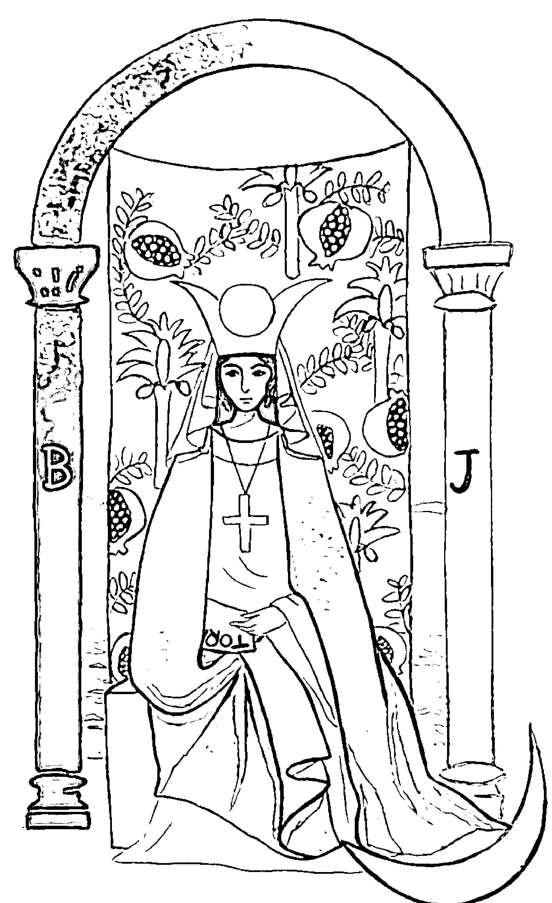

在這二元世界裡
生命是場神祕的謎
我們抱著未知的真理
在生死間 尋找宇宙的意義

本意：智慧
代表星象：月亮

### 塔羅牌義

編號2充滿智慧的女教皇，利用智慧來控制情感的波動以及情緒，更擁有正直的形象，善惡分明又充滿著女性特有的直覺，不單只有宗教也帶有母性的溫柔和與慈愛；數字二也代表著聖女與純潔的涵義，也代表著世間二元論，同時也有著精神層面更重於肉身的象徵。個人信念與宗教信仰也表示著不會受到誘惑。也被稱為女祭司，是個充滿魅力的一張塔羅牌。

### 元素分析

-   4個月亮：上弦、下弦、滿月、新月；象徵月亮陰曆的每一天。
-   等邊十字架：陰陽平衡、與神合一（另一個等邊十字、出現在審判牌）。
-   手上卷軸：叫做Torah（妥拉）是猶太教神諭；一半在袖子裡一半在外，象徵真理需要領悟、用字面或語言都無法完全表達。
-   黑白柱：二元論、上面的字母B：Boas，代表陰、內在、完成；J：Jachin，代表陽、外在、完成。
-   屏風：隱蓋、忽視、壓抑。
-   石榴：陰，暗指女性生命力。
-   棕梠樹：陽，暗指男性生命力。
-   平靜海水：潛意識、情感；壓抑。
-   柱上喇叭造型：審判時天使吹的號角。
-   柱上百合花紋：象徵純潔與和平。
-   白袍：聖潔心靈、靈性。
-   藍袍：精神層面、理性。

### 牌義簡易分析

-   ※ 關於建議
    正位：智慧理性與感性的象徵，擁有對人事物很好的判斷力。
    逆位：太過主觀容易忽視他人感受，試著多瞭解多傾聽他人的想法與建議。

-   ※ 關於環境或目前的處境
    正位：擁有絕佳的信念又能以智慧來面對，理性與感性都能夠兼顧到。
    逆位：易招人批判與忌妒，建議審視自我的態度與人際關係。

-   ※ 關於財運
    正位：謹慎理財會有不錯的財運，可以規劃自己的財務為未來做準備。
    逆位：避免因為衝動而導致金錢大量流出，對於金錢務必謹慎計畫。

-   ※ 關於家庭
    正位：友情與親情同樣要用智慧來帶應，會有很好的回應與收穫。
    逆位：切勿固執導致與家人或朋友的關係鬧僵，需要多多與對方溝通為佳。

-   ※ 關於愛情
    正位：以精神層面的愛情開始經營會更加順利，感情更要用智慧來面對。
    逆位：容易因為想太多而導致錯失良機，不妨讓自己在感情對應上放輕鬆。

### ☆ 關於婚姻

正位：在婚姻上屬於主導的一方，用理性來應對生活雖然是好的，但是有時也需要用感性來平衡。
逆位：須避免因生活中需要忍耐而引起情緒反應，不妨讓自己壓力舒緩為佳。

### ☆ 關於事業

正位：整體事業是會順利的，記得要充分展現智慧來讓軌道越來越順利喔！
逆位：需要重新審視在事業運作上是否不夠平衡，並找出問題所在。

### ☆ 關於學業

正位：依照自己的步調前進，考試運氣會更好。
逆位：需要把讓自己分心的事情做一個取捨。

### ☆ 關於健康

正位：油脂平衡、皮膚狀況良好、外表看起來很年輕、蔬食或較少吃肉可以降低身體負擔。
逆位：貧血、腸胃炎、歇斯底里或妄想症、精神情緒不穩定、體質虛弱畏寒。

### ✂ 關鍵字速記

-   智慧
-   神聖
-   非黑即白
-   純潔
-   平衡
-   隱藏的神聖
-   信仰
-   過於潔癖

### 03 皇后 THE EMPRESS

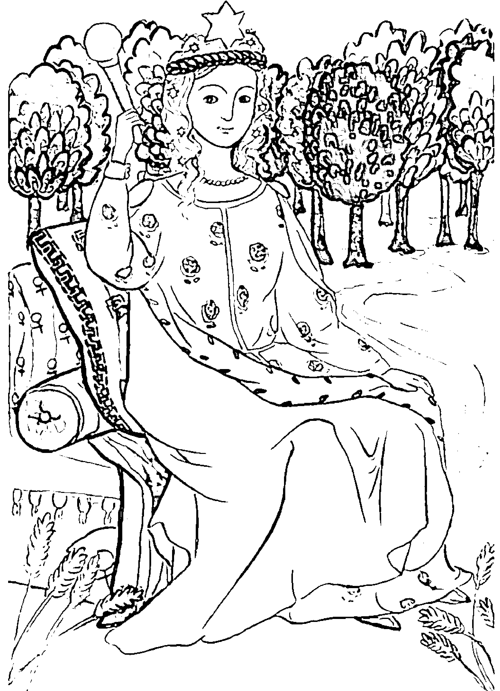

> 神聖的生命
根源竟是我的骨與血
我就是神聖的起始、
神聖的根源
我，就是神聖！

本意：豐收
代表星象：金星

### 塔羅牌義

編號3的女帝為豐收與繁榮的象徵。為女性最高地位的女帝，擁有美貌氣質以及可以讓任何人都能喜歡上的魅力，是最棒的女性象徵。除了愛情之外，也顯現著母愛的光輝，能夠溫柔的包容周圍的人事物，並擁有主宰世間的女帝權力。

### 元素分析

皇冠上12顆星星：12星座、12月份；代表大自然韻律、生生不息。

麥穗（或是玉米穗）：象徵營養肥沃、生活豐富滿足。

樹林：豐富的資源。

水流瀑布：生命力的注入。

紅色坐墊：處於生命能源（子宮）之中；椅墊的形狀也像是子宮（半個子宮，另一半被皇后坐著蓋住了）。

白袍紅玫瑰：1.白色：純潔，死亡。2.紅色：熱情，生命力。

寬鬆衣服：孕婦裝。

圓形手杖：圓形寶珠象徵地球。

珍珠項鍊：九顆，象徵太陽系（地球之外）九顆主要星球。

### 牌義簡易分析

### 關於建議

正位：豐收又受人景仰照顧，各方面的運勢都非常不錯。

逆位：過度的依賴或是自我意見太強勢將導致反效果。

### 關於環境或目前的處境

正位：各方面的人際關係和貴人運勢都能讓自己的方向更加明確。

逆位：無法注意到周圍的狀況環境將導致阻礙不前。

### 關於財運

正位：財運不錯有機會獲得安定的投資機會。

逆位：切勿鋪張浪費導致財富留不住。

### 塔羅牌 78 張牌意解析 TAROT

### ☆ 關於家庭
正位：家人朋友都願意支持的情況下，凡事都會非常順利。
逆位：過度依賴容易被自己的親朋好友指責。

### ☆ 關於愛情
正位：愛情運勢極佳，有很高的機會能夠順利維持。
逆位：切勿情緒化和要求對方太多導致彼此間的不合。

### ☆ 關於婚姻
正位：有很高的機會能夠擁有子女；若子女已出生也能彼此影響擁有好的運勢。
逆位：容易因為過度依賴而導致家庭氣氛不合。

### ☆ 關於事業
正位：豐收圓滿是可以預見的，謹慎進行是最重要的。
逆位：切勿鋪張浪費，也不要過度沉溺於玩樂中。

### ☆ 關於學業
正位：按部就班順著讀書計畫進行將可以獲得不錯的回報。
逆位：不可心煩氣躁或是三心二意，須修正自己的讀書態度。

### ☆ 關於健康
正位：月事正常、懷孕、變好看了、精力充沛。
逆位：注意生理變化、泌尿科、營養過剩、不孕症。

### 關鍵字速記

-   豐收
-   繁榮
-   孕育及生產
-   女性方面
-   美麗
-   結婚
-   依賴
-   生命

### 04 國王 THE EMPEROR

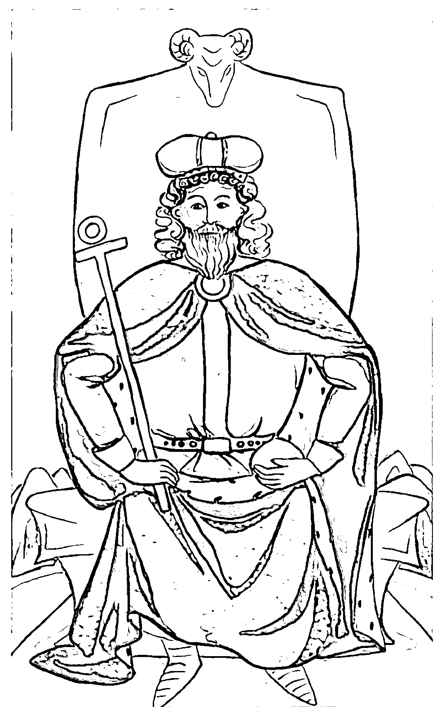

成功與責任 兩者相扣
無法分割
強大的戰鬥力與耐力
不過是匱乏下的生存本能
困境，唯一的結果
就是被我征服！

本意：主宰、責任
代表星象：牡羊座

### 塔羅牌義

編號4的皇帝塔羅牌代表著權威，以及強硬又不通人情的嚴厲方式；編號4也象徵著塔羅牌四元素『風火水地』，也代表國家的最高權力者，威嚴又不可抗拒的命令；另一方面也呈現出高位統治者的孤獨以及內心不安。大男人又不通情理的處事下，也表現出責任感和強大的信念。

### 元素分析

-   羊頭雕像：牡羊座。
-   右手安卡：古埃及的生命之符，可給亡者重生。
-   左手寶球：王權、尊貴、物質世界的絕對權力。
-   紅色甲胄：強大的力量。
-   戰袍、腳尖朝外：隨時準備出戰；防衛戒備。
-   坐位在懸崖前：國王的位置是危險的。
-   嚴峻並乾裂的山：險峻的路途、自我中心；危險。
-   河流：伊甸園的四條河流之一。這四條河分別是：
    1.  皇后：代表生&養育
    2.  國王：代表老&能力
    3.  戰車：代表疾病&抵抗
    4.  死神：代表死&重生。

此外另有一說，這四條河的起源於「女祭司」、分流出四條河後，最後匯集在「審判」這張牌。

### 牌義簡易分析

### 關於建議

正位：擁有領導特質適合帶領群眾前進，你的責任感也讓你更有群眾魅力。
逆位：切勿自滿過於自信，凡事都要學習成長。

### 關於環境或目前的處境

正位：雖然能力被大家認同，但是態度上過於自滿傲慢，要試著修正自己的內心。
逆位：無法正確判斷事情的方向與對策，需要冷靜思考下一階段該如何進行。

### 關於財運

正位：財運佳又能夠自我掌控，朝更高的目標前進吧！
逆位：過度自信可能導致金錢損失，建議多準備一些備用的金額。

### 關於家庭

正位：太過權威容易導致家人朋友的困擾，責任感雖然很重要，如何感情和睦也要好好的思考。
逆位：強硬的態度令周圍的人有些受不了，請好好修正自己的言行舉止。

### 關於愛情

正位：愛情是兩個人的配合與磨合，主導是好事，但是建議不要將氣氛弄得太緊張。
逆位：是不是容易因為自己的想法而讓對方困擾？建議好好聽聽對方的想法。

### 關於婚姻

正位：適當領導對方，讓他知道你希望的相處方式，這是很好的方式，但是過與不及都不好，請好好取得平衡。
逆位：因為武斷和權威容易讓對方無法開口而又引起誤會和爭執。

### ※ 關於事業

正位：好好發揮領導能力，讓自己的團隊或是事業更上一層樓吧！
逆位：過度追求完美，將導致團隊或是事業上的停滯與挫敗。

### ※ 關於學業

正位：之前的努力和充實自己更能發揮更大的實力，好好迎接挑戰吧！
逆位：錯誤而又沒有效率的讀書方式容易引起反效果，建議好好審視自己的讀書方針。

### ※ 關於健康

正位：強壯的體魄、體力充足，健身型的運動。
逆位：各種成人病或現代病、職業病、過於逞強、運動傷害。

### ※ 關鍵字速記

-   權威
-   責任
-   支配
-   領導
-   獨立
-   父性
-   勇氣
-   孤獨
-   隱藏感情

### 05 教皇 THE HIEROPHANT

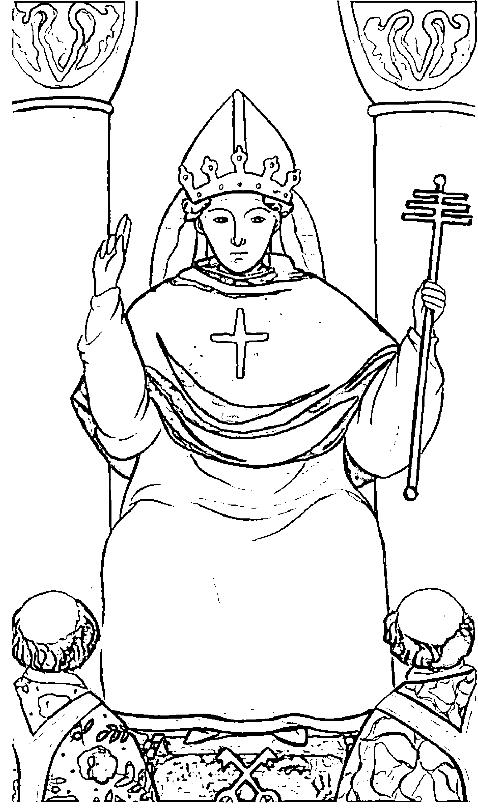

遵守經書上的字字句句
變成各種儀式與規矩
卻在不知不覺中 失去了靈魂
給我方向的同時
我卻迷失了自己……

本意：指導、協助
代表星象：金牛座

### 塔羅牌義

編號5的教皇，將神的旨意傳給人們，幫助人類度過生命中的重重考驗。教皇帶領人們用神的方式來看待世間一切人事物，用愛來對待身邊的每一個人、每一個生命。教皇擁有最強大的精神感召，努力想喚醒人們內心最深的神性；他從不濫用自己的號召力，而是真心指引每一隻迷惘的羔羊。

### 元素分析

-   三重十字架：釘著耶穌的十字架。
-   右手指天：傳達上天旨意、祝福。
-   下面2人：玫瑰（生）+百合（死）+跪拜，意指生命、原罪、懺悔。
-   灰色柱子：智慧未啟（灰色代表混沌，女祭司的黑白才是清楚的真理；再次暗示「人間的宗教」是不完全的真理）。
-   兩支鑰匙：生命陰陽之鑰、開啟智慧之門。
-   紅袍：鮮血、象徵能為天主捨棄自己的生命。
-   柱上圖案：類似子宮，象徵宗教與人間肉體結合。

### 牌義簡易分析

-   關於建議
    -   正位：良好的商談對象、接受他人的勸告
    -   逆位：不適當的建議、固執己見。
-   關於環境或目前的處境
    -   正位：得到援助、心靈上的滿足。
    -   逆位：小心上當被利用。
-   關於財運
    -   正位：得到他人的資助，獲利記得要分享或回饋！
    -   逆位：收入可能突然被刪減，要靠自己努力。

### 關於家庭

正位：長輩的關愛、天倫之樂。
逆位：為家人感到擔心、觀念有隔閡。

### 關於愛情

正位：用心得到回應、穿越限制、內心互相信賴。
逆位：有人不看好你們的愛情，建議再多了解對方，避免被愛情充昏頭。

### 關於婚姻

正位：有人介紹婚姻對象、夫妻間感情加深。
逆位：缺乏體貼、需要更多調整找到平衡；有時候會覺得對方很煩。

### 關於事業

正位：有地位的人會幫助你，就算有失誤也能順利解決。
逆位：因指導者的疏忽或逃避，可能無法達到原本的計畫。

### 關於學業

正位：會遇到很好的導師、可以找人討論改變讀書方法。
逆位：因為某種情緒低落使你上課無精打采。

### 關於健康

正位：自我管理、遵從醫生的指示、健康的心靈、用積極的態度面對。
逆位：固執、尋找偏方、注意肝臟、精神疲勞。

### 關鍵字速記

-   援助
-   志願、願意付出
-   心情保持穩定
-   同情
-   接受他人建議
-   祝福
-   精神指導

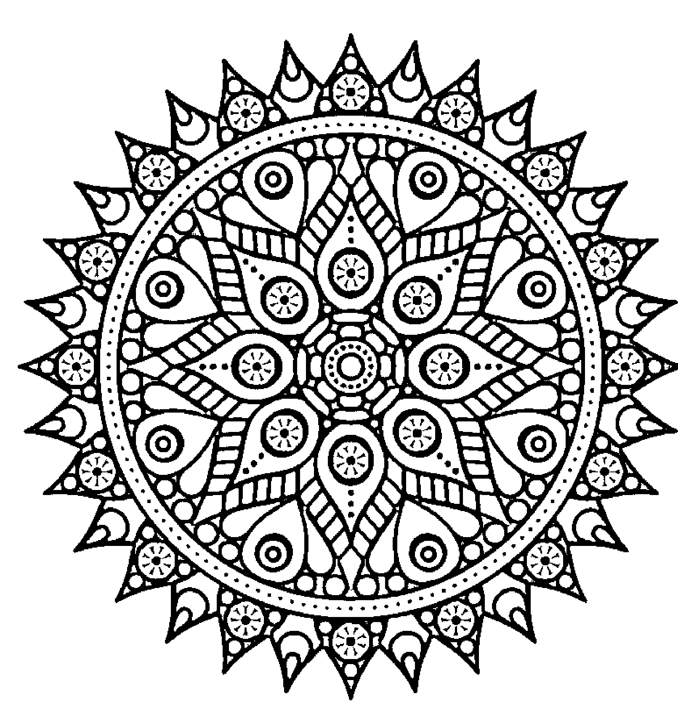

### 06 戀人 THE LOVERS

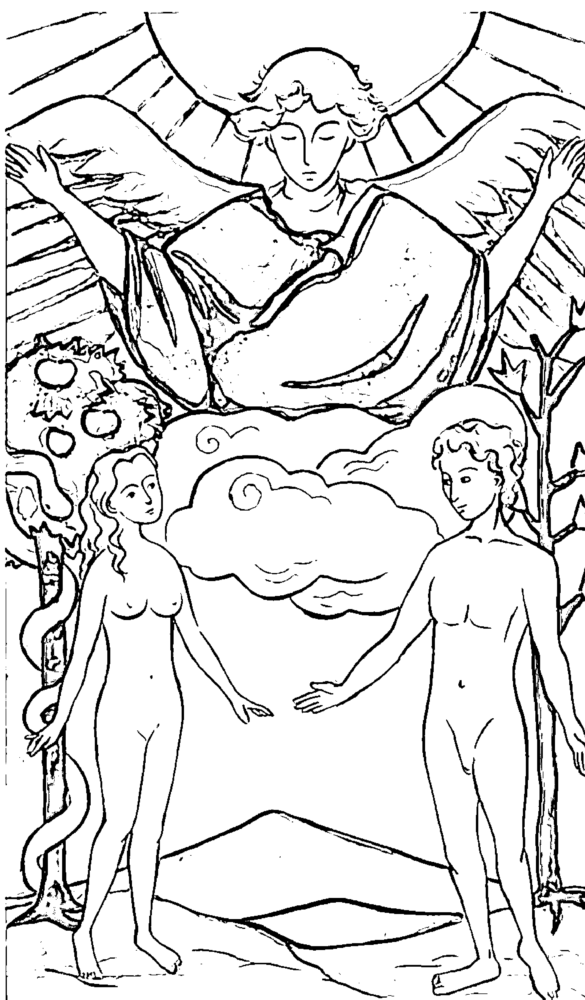

溝通是生命很大的課題
你有你的觀點 我有我的原則
我與你 身體在同一個空間
靈魂卻是兩個不同的世界~

本意：結合、溝通
代表星象：雙子座

### 塔羅牌義

編號6的戀人牌，不只是代表愛情，更代表每個不同背景、不同觀念的人，相處時充滿了挑戰與難題。要解開這個難題，最好的方法是「愛與包容」，用愛去了解對方、然後包容彼此不同的經歷與立場、尋找彼此的平衡與協調。背後天使給人們真誠的祝福，希望人類能學會這個重要的能力。

### 元素分析

-   生命之樹：12個果實（代表星空的12宮）、站在前面的亞當代表人世間的物質層面。
-   善惡之樹：4個果實（四大元素）、站在前面的夏娃代表人世間的道德層面。
-   蛇：智慧、慾望與誘惑。
-   背景環境：伊甸園。
-   大天使：拉斐爾，代表創造、療癒、勇氣。是風之天使，象徵溝通。
-   三人視線角度：亞當看著夏娃，夏娃望著天使，象徵「潛意識—意識—超意識」與「身—心—靈」或是「理性—感性—超理性」之間的傳導。
-   中間的山：溝通、生存與道德之間的距離與阻礙。
-   赤裸的兩人：純真。

### 牌義簡易分析

-   關於建議
    -   正位：充滿趣味的互動，可以增加你的魅力。
    -   逆位：自以為是、或刻意去營造出來的假象，反而會讓自己被扣分。

✿ 關於環境或目前的處境
正位：美好的地方、大家相處都很喜悅。
逆位：很多誘惑與謊言，使你不知不覺陷入其中無法負荷。

✿ 關於財運
正位：休閒費用或為了人際互動、又或是要買禮物給情人，導致消費增加。
逆位：沒有節制過度消費，或是因情緒而亂花錢。

✿ 關於家庭
正位：跟家人相聚氣氛良好，大家有說有笑、甚至有點感人溫馨。
逆位：各自用自己的方式表達關心，卻成為對方的壓力。

✿ 關於愛情
正位：快樂的相處、戀愛順利、或是有機會脫離單身。
逆位：感到厭倦、三分鐘熱度、感情似乎要變淡了。

✿ 關於婚姻
正位：了解對方個性、知道要怎麼跟對方相處，需要的時候會互相扶持。
逆位：鬆懈不想用心溝通，這樣久了小心會變成貌合神離的櫥窗夫妻。

✿ 關於事業
正位：可以決定將來的出路、工作十分熱衷並且會努力協調。
逆位：沒有衝勁只求溫飽、自我滿足、缺乏活力與毅力。

✿ 關於學業
正位：喜歡的科目變多了、跟同學一起努力念書。
逆位：偷懶不認真，遇到挫折就放棄或逃避，甚至會找一些理由搪塞。

### ※ 關於健康

正位：適當的休閒活動對身心有益、整理穿著打扮讓身心煥然一新。
逆位：注意喉嚨與肺部、四肢多動一些、性病、選擇適合自己的化妝保養品。

### ※ 關鍵字速記

-   休閒娛樂
-   喜悅
-   快樂的經歷
-   魅力
-   享受
-   合作
-   相處
-   協調

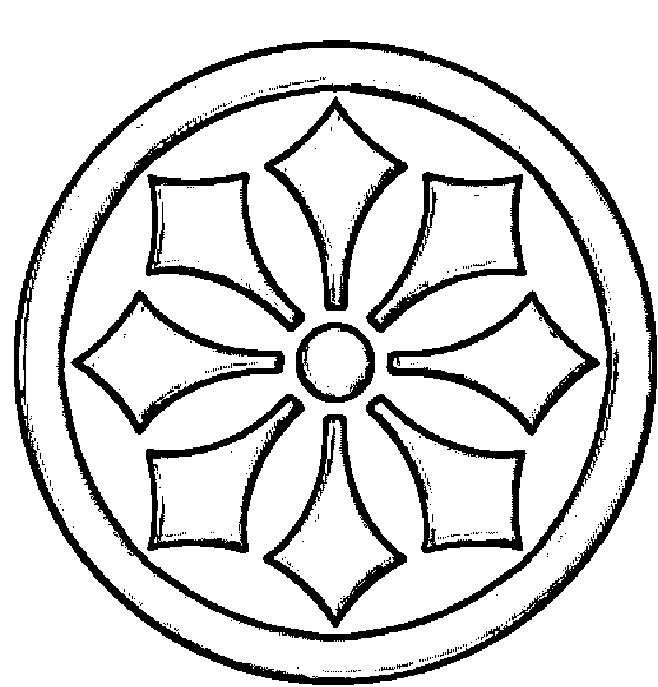

### 07 戰車 THE CHARIOT

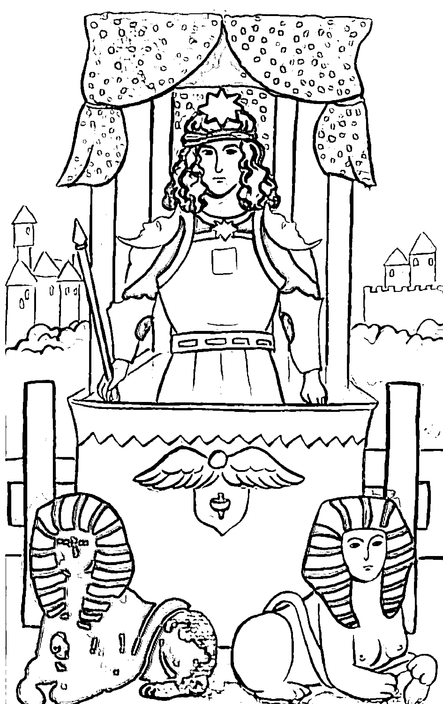

風火水土 依次排列
意志掌控 帷幄二元
這個世界
從一開始的煉金術和神話傳說
到現在的科學與天文
我管控一切 在我的小宇宙裡面

本意：捍衛、守護
代表星象：巨蟹座

### 塔羅牌義

編號7的戰車，從兩隻獅子的姿勢是蹲臥著，戰車背後的護城河，以及河流後面的城市，可以了解這個戰士本身的狀態不是出門打仗、而是守衛城鎮的守護者角色。就像我們用心守護好自己的家園，珍惜每個小幸福小確幸，然後才能掌握並創造自己人生小宇宙的各種驚喜與美好。

### 元素分析

-   肩章：URIM（烏陵） & THUMMIM（土明）；是古代以色列祭司的占卜工具。
-   胸前四方形：土要素，象徵穩固的力量。
-   星星帳篷：天堂、超越地球的物質世界。
-   四柱：四元素。
-   白人獅：意識、慈悲、陽性。
-   黑人獅：無意識、嚴峻、陰性。
-   兩隻人獅方向不同：思考與行為間的衝突、二元。
-   無馬轡：必須用意志來駕馭思考與行為。
-   指揮杖：意志之杖。
-   桂冠：象徵勝利。
-   翅膀圖案：古埃及的圖騰，代表靈感。
-   紅色小盾牌：是印度圖騰，為男性與女性生殖器結合。

### 牌義簡易分析

### 關於建議

-   正位：努力朝目標邁進，你會看到自己的成長。
-   逆位：真正的問題在自己內心，慾望與理智無法得到平衡。

### ☆ 關於環境或目前的處境
正位：積極進取、記得克制自己並顧全大局，才能得到最後的勝利。
逆位：衝突強烈讓你倍感壓力，對方跟你可能會發生巨大的爭執。

### ☆ 關於財運
正位：有付出就會得到很好的獎賞。
逆位：投機、沒有計畫的理財方式對你不利，任意花費或賭博將讓你輸錢。

### ☆ 關於家庭
正位：將有機會讓你證明自己的成熟獨立。
逆位：過高的期望成為壓力，甚至讓你想要逃避。

### ☆ 關於愛情
正位：打敗情敵獲得成功、主動出擊對你有利。
逆位：突然的失誤讓你大扣分，感情接下來將遇到阻礙。

### ☆ 關於婚姻
正位：堅持的愛情使你們不顧周圍的反對而結婚；或是夫妻之間同心協力一起度過難關。
逆位：太強勢缺乏溝通，不斷發生爭執或冷戰。

### ☆ 關於事業
正位：完成目標得到成果、不斷成長擴展。
逆位：太逞強會影響你之後的信用，請根據你的能力給予承諾。

### ☆ 關於學業
正位：很有衝勁、使得你的課業與人氣都得到提升。

### 關於健康

正位：積極加強體力、反應迅速、反射神經敏銳、充滿衝勁。

逆位：注意交通事故、坐骨神經、站太久或姿勢不良、脫腸、運動反應變慢、飲食衛生要加強。

### ✂ 關鍵字速記

- 勝利
- 勇於嘗試
- 有野心
- 克服障礙
- 表現自我
- 守護捍衛
- 行動力
- 努力得到收穫

### 力量 JUSTICE

> 獸性本能 是我原始的樣貌
> 靈性超脫 是我內心的期許
> 經過千千萬萬次的自我糾葛
> 終於 我馴服了我自己！

本意：堅強、以柔克剛、克服
代表星象：獅子座

### 塔羅牌義

編號8的力量牌，可以看到女神溫柔的馴服了兇猛的溫柔的馴服了兇猛的獅子。獅子代表蠻力、本能、自我，象徵人類最原始的求生本能。為了求生我們會屈服在利益、誘惑或暴力之下，但愛與溫暖卻能得到人類出自內心的臣服。同理，這張牌也很明確地在告訴我們，真正的力量是——溫柔。

### 元素分析

女神：是守護月亮的女神阿提米斯，充滿力量、溫柔、母性、純潔。

獅子：天生的本能、無意識的；象徵人的本性。

無限符號：代表無窮盡的一切可能與力量。

順伏：獅子身體微傾，尾巴內縮，還伸出舌頭來舔著女神的手。

### 牌義簡易分析

### 關於建議
正位：透過愛與信任、高超的智慧以柔克剛，得到完全的征服。
逆位：人性是自私的，想要改變卻能力有限。

### 關於環境或目前的處境
正位：洋溢著動力與自信，開放與包容的態度。
逆位：各種矛盾使你猶豫，左右為難無法下決定。

### 關於財運
正位：有人援助你(可能是女性)、花錢學技術或專業。
逆位：來來回回導致浪費時間與金錢。

### 關於家庭
正位：堅強的母性、賢內助、精神支持與後盾。
逆位：太過權威、或是不想再爭執於是你不得不配合。

### 關於愛情
正位：勇敢告白、看到彼此的優點而心動；情侶之間找到更好的相處方式。
逆位：努力包容忍耐想持續下去，但對方的態度讓你很沒有安全感；若太多付出可能會讓你得不償失。

### 關於婚姻

正位：兩人之間培養出很好的默契、獨立出來建立自己的小家庭。
逆位：有新的誘惑而內心糾葛，或是遇到問題時沒有努力就直接放棄。

### 關於事業

正位：會有人幫你周旋協調、同時也請多練習各種能力來提升自己！
逆位：虛有其表、小心輸給有實力的強者。

### 關於學業

正位：能考取想要的證書或成績，得到資格。
逆位：沒有抓到要領、最後的成果讓你失望。

### 關於健康

正位：逐漸累積體力、達到理想體態、對體能有自信。
逆位：容易疲累、注意足部與腰部、鍛鍊未得要領、刻意勉強容易受傷。

### 關鍵字速記

- 大膽的改變
- 內心的力量
- 培養實力
- 勇氣與智慧結合
- 換位思考
- 自信
- 意志力戰勝困難
- 同理心

### 09 隱者 THE HERMIT

> 我們都在黑暗中
> 迷失了自己手上的燈光
> 燃燒的是生命
> 不要被未知的恐懼所佇足
> 試著閉上眼 好好聽
> 你內心的聲音

本意：尋找真理
代表星象：處女座

### 塔羅牌義

編號9的隱者，手上提著燈籠，代表他用自己的智慧來指引別人、給迷惘的旅客一個正確的方向；但他的眼睛是半閉著、冥思著、往自己的心中探索，代表隱者自己也在尋找更深的真理，而要找到這個真理的唯一解答，就是自己的內心。

### 元素分析

- 提燈：智慧之燈。
- 星星：希望的光芒，這顆星星特指六芒大衛星。
- 手杖：是用生命之樹做成的。
- 老人：時間老人 FATHER TIME。
- 山巔：代表超越、孤獨。

### 牌義簡易分析

### 關於建議
正位：自我內心的探索，才是智慧的來源。
逆位：孤掌難鳴的深度落寞，或是發現自己的知識有限。

### 關於環境或目前的處境
正位：內心需要沉澱一下釐清自己的想法；若能遇到好的引導與指點，會使你豁然開朗找到新方向。
逆位：無法確定自己的立場、或是你的想法得不到共鳴。

### 關於財運
正位：存錢的好時機，記得節約做些小規畫、持續開源節流。
逆位：似乎有點入不敷出，而且最近如果貪便宜反而更加虧損。

### 關於家庭
正位：可以跟家人小聚一下幫你把平時的壓力放一邊；有些年長者的關懷會讓你意外得到收穫。
逆位：有點遙遠無法傳達思念，或是相處時不知道要聊些什麼。

### 關於愛情
正位：想法成熟又知性，兩個人默契很好心有靈犀。
逆位：秘密戀情、或是遠距離的戀愛；要很用心才能理解對方的想法。

### 關於婚姻

正位：銀髮之愛、雖然不是熱情奔放但很平穩的柏拉圖式相處。
逆位：很想念另一半、懷念過去，或是相處到現在不知道要不要再持續下去。

### 關於事業

正位：經驗讓你累積出良好的判斷力、甚至可以成為很好的指導者。
逆位：選擇的方向錯誤，或是太過理論需要實務融合。

### 關於學業

正位：心態調整很好，讀書目標或研究方向很清楚。
逆位：因大意粗心而出錯、或是無法適應目前的上課內容，不太懂老師的教書方式。

### 關於健康

正位：冥想靜坐、保持定期吃素或清淡口味、養生與運動。
逆位：營養不足、記得要做暖身運動、低血壓、注意手部與脖子、疾病可能會有後遺症。

### ✂ 關鍵字速記

- 冷靜
- 獨立思考
- 理性分析
- 尋找真正的答案
- 獨處
- 深度思考
- 自我反省

### 10 命運之輪 THE WHEEL OF FORTUNE

> 無限的生命力量
> 活用四元素創造這了
> 這個世界
> 不斷練習 不斷修改
> 都是為了與神性的天堂連結

本意：還在學習中、不停進步與提升
代表星象：木星

### 塔羅牌義

編號10的生命之輪，中間是生命之輪，由胡狼與蛇帶著靈魂不斷輪迴；四周的動物代表四大元素、都在看書學習著。這個牌意思是說，靈魂在這人世間不斷輪迴，過程中我們一直不斷學習、尋求更深的智慧，在世世代代的輪迴中練習各種生命課題，尋找生命的意義與真理。

### 元素分析

人面獅身：是智慧的象徵，均衡持中、在變動中保持不變。
寶劍：代表風要素，表示心智慧力、思考力和智慧。
輪盤：由三個圓圈構成。
內圈——代表自我
中圈——代表世界
外圈——代表上帝與天堂
蛇：埃及邪惡之神Typhon，牠向下沉淪帶著輪子進入分崩離析的黑暗世界
胡狼：背負輪盤渴求上升，牠是埃及神話中的阿努比神（Anubis）
四隻動物：結合星座、代表四大元素：老鷹是天蠍座，代表水元素；獅子是獅子座，代表火元素；牛頭是金牛座，代表土元素；人像是水瓶座，代表風元素。
看書：汲取智慧，而翅膀賦予他們在變動中保持穩定的能力。

### 牌義簡易分析

### 關於建議
正位：只要努力把時間、場地與相關對象都討論好、這樣之後幾乎都能照你的計畫進行。
逆位：有些事情超過我們的能力範圍，但仍然要盡力參與、在過程中不斷學習提高自己的能力。

### 關於環境或目前的處境

正位：這是很重要的關鍵事情，對你有很大的影響，請一定要好好面對。

逆位：雖然沒有依照原本的計畫或想法，但仍要尋找解決方法、以免之後惡性循環。

### 關於財運

正位：零用錢或收入增加、或是能用低價買到想要的東西。

逆位：錯過原本的計畫導致消費增加。

### 關於家庭

正位：找到好的相處模式，家人之間培養出默契，生活模式逐漸成形。

逆位：如果大家都只想照自己的意思、這樣整個家庭的生活可能會一團混亂。

### 關於愛情

正位：一見鍾情、奇妙的邂逅；情侶間找到新的相處模式。

逆位：迷失自我的愛情、是否要真的放棄？堅持卻又可能無法回到當初，讓你心裡十分茫然。

### 關於婚姻

正位：婚後生活適應得很好，雖然跟之前不太一樣，可是新的生活作息對彼此都有幫助。

逆位：真正生活在一起才發現很多問題，可能雙方都需要很大的調整。

### 關於事業

正位：長年的努力讓自己穩定成長，工作方式雖然需要調整、但你適應很快。
逆位：發展方向跟預估的不同，需要加強相關能力來彌補自己的缺失；又或是你可能會考慮換工作或部門。

### 關於學業

正位：向上心很強、學習後會反思成自己的認知，徹底吸收。
逆位：原本很期待，但可能結果因為跟預期分數差太多，讓你心情低落。

### 關於健康

正位：體質改善與好轉、健身美容、外表與身材有很大的轉變。
逆位：慢性病、避免激烈運動、需早期治療、注意循環系統。

### ✂ 關鍵字速記

- 掌握中
- 更新
- 接受
- 好的轉變
- 新方法
- 自我提升
- 好的契機
- 幸福

### 11 正義 STRNGTH

> 二元的世界
> 法律是最低標準
> 必須經過內心的抉擇
> 才是真正的正義

本意：平衡、標準、評估
代表星象：天秤座

### 塔羅牌義

編號11的正義牌，一手拿寶劍、代表世間的明文法律規範；另一手拿著天秤、代表內心的道德標準。這個世界上有很多事情處在複雜的灰色地帶、無法明確分出黑白是非，因此真正的正義不只要依靠世間法律，還有我們內心的自我批判與道德。

### 元素分析

灰色柱子：是非不明、要靠手上的寶劍與秤來明辨是非。
衣冠：紅色代表戰爭、綠色代表愛 - 這個世界在愛與戰爭之間不斷來回、需要正義協助我們找到平衡。
布幔：紫色代表智慧，以智慧為背景包容一切。
正義之神：古埃及歐西里斯、用羽毛評斷靈魂的重量。
寶劍：兩面都有刃，代表規範不只對著別人、同樣的標準也對著自己。
胸前方形四元素：中間圓形象徵四要素的調和；象徵平衡、正義。

### 牌義簡易分析

### 關於建議
正位：真正的公平，不只有外在的法律規範，還有內心的取捨；不論是對別人或對自己都能符合同樣的要求。
逆位：需要與想要是不一樣的，這兩者的拿捏使你遇到瓶頸，需要好好釐清。

### 關於環境或目前的處境
正位：客觀、乾淨、有第三者從旁觀察或給予適當的建議。
逆位：過於嚴厲或鬆散、缺乏統一標準。

### 關於財運
正位：收支平衡，若需要借貸金錢或物品也有機會通過。只要認真做就會有報酬。
逆位：分配不均或是不義之財，小心被揭開。如果有身兼數職，注意可能超出你的體力負荷。

### 關於家庭

正位：互相包容與體諒，共同遵守基本要求，但也尊重彼此的差異。
逆位：每個人都有自己的觀點與感受，這不是單純的對與錯，試著在灰色地帶中找到彈性。

### 關於愛情

正位：單純的互動，但還不夠深入了解、正在建立更深的感情。
逆位：感情氾濫曖昧不明，太早投入反而可能會讓自己失望。

### 關於婚姻

正位：雙方理性溝通、大致上已經有彼此的默契。
逆位：太過武斷堅持自己的方式，彼此之間容易有裂痕。

### 關於事業

正位：全力以赴會有好成就，把工作關係拿捏得很好。
逆位：判斷有些偏頗、容易造成糾紛與誤會。

### 關於學業

正位：讀書與玩樂很平均、身心都有良好發展。
逆位：堅持用自己的念書方式，可是效果不明顯；或是過度偏向某科目。

### 關於健康

正位：適度的運動與休息、親近自然、身體處於理想狀態、作息很好、營養攝取十分均衡。
逆位：過度疲勞、注意關節與風濕、姿勢不良、運動反而讓自己受傷、盡量不要偏食。

### 關鍵字速記

- 公平
- 找到平衡點
- 適當
- 明理
- 和平
- 臨界點
- 幫助弱者
- 原則

### 12 倒吊者 THE HANGED MAN

> 我在酷刑裡等待著
> 等待世界給我真理的解答
> 現在的我還在過程中 靜靜守候
> 等我從心裡、解開這道繩索
> 蛻變成狂喜的舞者
> 旋舞在湛藍的空中

本意：犧牲、等待
代表星象：海王星

### 塔羅牌義

編號12的倒吊者；是來自北歐神話中，眾神之王奧汀為了求得智慧、把自己倒吊在生命之樹上，經過痛苦的九天九夜後終於獲得真正的真理。因此在倒吊這張牌最重要的含意是：為了更高的理想、在前面辛苦的努力著；另外還有一個更深含義是：人生經歷過各種痛苦的過程、每一段打擊都讓我們磨練出更深的智慧。

### 元素分析

樹：暗示雖然吊者本身是靜止的，但生命仍在運轉。這棵樹的含意如下：

1. 猶太教的生命之樹。
2. 象徵北歐神話的「世界之樹」。
3. 樹的造型類似十字架，暗示基督奉獻犧牲。

單腳倒吊：是以前古羅馬對絞刑者的懲罰。

雙腿呈4的樣子：代表無限的擴展。除了這一張之外，另一張牌「世界」雙腳也是4的樣子。結合這兩張牌的意思是說，世界是無限向外的擴展、倒吊者則是無限向內的自我內心。

平靜表情、雙手放在背後：自願、平靜、等待。

紅褲子：「身」，人類的慾望和肉體；行動力。

藍上衣：「心」，象徵知識；思緒、平靜。

金髮光環：「靈」，象徵智慧和心靈的進化；領悟、靈性。

金鞋子：崇高的理想付諸實行。

### 牌義簡易分析

### 關於建議

正位：走向目標之前、過程一定辛苦充滿挫折。但只要方向是對的，最後一定要有豐碩的果實。
逆位：得不到其他人的協助與認同、甚至連自己都在懷疑自己。你需要更多肯定。

### 關於環境或目前的處境

正位：忍耐與付出，想避開不好的結果。
逆位：盡力卻看不到效果，會讓人猶豫是否還要繼續下去？

### 關於財運

正位：不貪心不盲目消費，該花的就花、該存的就存，養成良好的儲金態度。
逆位：辛苦卻拿不到應有的報酬，或是太隨性無法克制購買欲。

### 關於家庭

正位：不斷滿足家人的各種要求，想要培養家庭向心力。
逆位：每個人在家裡都有自己的責任，如果想逃避或是把責任背得太緊，這樣其他人也會動搖。

### 關於愛情

正位：寵愛戀人，很用心經營這段感情；希望對方可以給你更多肯定。
逆位：自私自我中心的戀愛、這樣不滿情緒累積久了會爆發。

### 關於婚姻

正位：不斷幫助對方、希望能成為理想的伴侶。
逆位：雙方都覺得自己有付出有犧牲，卻找不到對方的珍惜、一直被責備。

### 關於事業

正位：遇到困難與阻礙、很努力想撐過難關、為公司做很多付出。

逆位：看著辛苦卻徒勞無功，自己有時候想要放棄、不想再做了。

### 關於學業

正位：從基礎開始建立能力，需要花一段時間持續學習、慢慢看到效果。

逆位：學習態度不太好、逃避自己的缺失不想彌補、覺得努力也沒用。

### 關於健康

正位：病情可能延長、配合醫院治療保持健康、慢性病、心裡準備好長期抗戰。

逆位：逃避住院或吃藥對自己很不利、注意腳踝與足部、胃食道逆流、醫師能力有限、過度勞動或僵硬。

### ✂ 關鍵字速記

- 自我犧牲
- 付出
- 耐性
- 試煉
- 堅持
- 忍耐
- 自我反省

### 13 死神 DEATH

> 當開始的同時
> 就是一步步前往死亡與結束
> 人類是屬於五芒星的物質世界
> 要脫離輪迴，
> 死亡、才是唯一的機會

本意：結束
代表星象：天蠍座

### 塔羅牌義

編號13死神，騎在馬背高高在上，每個人都無法逃離死亡的到來。但死亡不是懲罰也不是結束—死神手上的白色薔薇，代表純潔的靈魂；而死神後面的道路、及道路盡頭的太陽，暗示我們死亡也是尋找真理的一部分；就像許多人常常因為害怕死亡才開始重視生命的意義。

### 元素分析

四個人：在圖中，出現了4個重要的角色：小孩、皇后、國王、教皇；意指無論是男或女、老或少，都要面對死亡這個自然現象。

國王：抗拒死亡，被死神殘酷踐踏過去 - 抵抗死亡卻只是加速死亡。

教皇：權杖掉在地上，雙手合十崇敬死亡；或許期待死亡背後走向神的世界；因此勇敢迎接死亡。

女人：皇后，象徵不論有多麼燦爛美麗豐富，仍有結束的一天。

小孩：好奇的望著死神，雖然年幼不懂死亡，也無法避免死亡的降臨。

紅羽毛：和愚人、太陽所戴的是同一根；象徵靈魂中最純粹的生命力。

五瓣薔薇：在神秘學中一朵完整而正式的薔薇花瓣有22瓣，對應塔羅牌22張。白薔薇聖潔、純真；同時死亡也代表一切能量結束歸零，所以用白色來表示。

兩座塔：一條小徑通往兩座塔中（另一張月亮牌，也出現這兩座塔），代表通往新世界的神秘旅程。

朝陽：雙塔中的朝陽，這來自埃及神話裡的符號（Akhet），象徵永生。

### 牌義簡易分析

### 關於建議
正位：每件事情都有結束的一天，暫時的別離或許是為了開啟新的未來。
逆位：揮別舊的回憶，開始找到新的道路、新的自己。

### 關於環境或目前的處境
正位：到處碰壁似乎到了死胡同，無法跨越只能接受。
逆位：找到新的方法脫離之前的窘境，重新找到動力與勇氣。

### 關於財運
正位：對損失視而不見、或是因災難必須花費一些金額。
逆位：獲得意外收入、幫自己找到新的財路。

### 關於家庭
正位：發生劇烈變化、或是必須面對完全不同的生活。
逆位：找到方法從低潮走出來，有機會就跟家人說出自己的想法。

### 關於愛情
正位：隔閡、走向結束或分離，彼此內心距離漸漸疏離。
逆位：有機會復合，或是從上一個痛苦走出來。

### 關於婚姻
正位：貌合神離、各自有各自的生活，這樣下去甚至你可能會考慮要不要解除婚約。
逆位：二度蜜月或二度婚姻；從當初最糟的狀況中培養出新的默契。

### 關於事業

正位：辭職、某些專案或投資必須結束，最後結果似乎不太樂觀。

逆位：轉行或是新工作機會，變更原本的計畫是值得的，因為這代表你的視野更寬廣、適應力更強更機敏了。

### 關於學業

正位：考試失敗，讀書有些挫折、可能無法通過檢定；短期內可能心裡失去目標。

逆位：越挫越勇、再給自己一個機會努力看看，會有新的機會讓你展現自己。

### 關於健康

正位：重病、惡化、事故、體力嚴重消耗、危險尚未解除、可能會有惡耗。

逆位：九死一生、大病初癒、走出危險期。

### ✂ 關鍵字速記

- 結束
- 離開
- 放棄
- 阻礙
- 黑暗
- 無法轉圜
- 不幸
- 毫無進展
- 失敗

## 結合人生的塔羅牌
現代塔羅牌

### 14
節制 TEMPERANCE

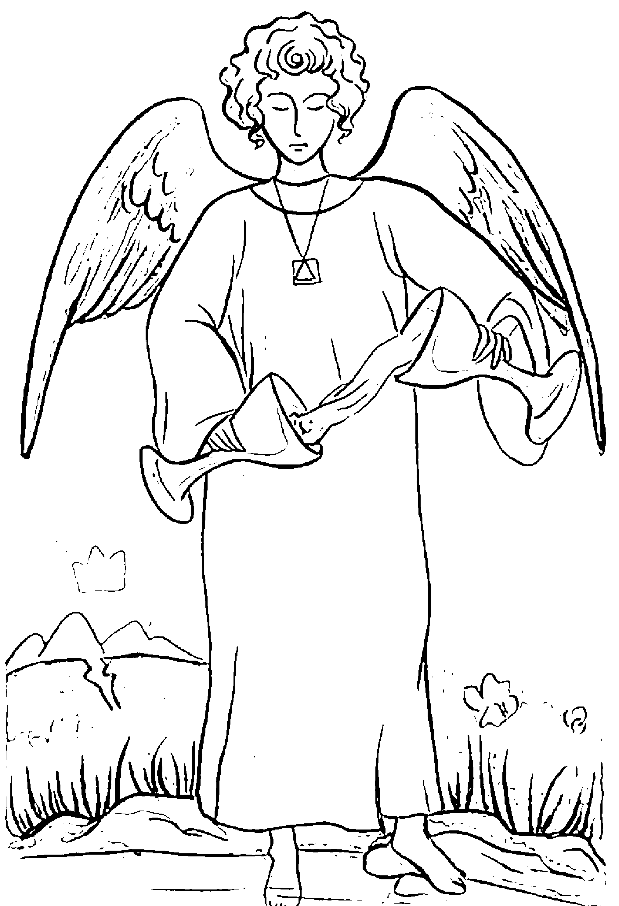

我的思想 我的世界
你的思想 你的世界
不斷的交流傳遞與融合
最後變成我們的思想
我們的世界
這才是最美的世界

本意：淨化、發展
代表星象：射手座

### 塔羅牌義

編號14的節制，手中的水不斷在意識與潛意識之間流動，腳踏的地方則代表個人與集體之間的交流。這張牌要講的主要含義，個體意識與集體意識之間不斷交融，各自做適當的調整、拿捏與節制，最後讓整體社會能順暢發展。

### 元素分析

- 聖杯的水：兩杯水互相傾倒代表自己的內與外，互相交融來回。
- 頭上圓形+中間小點：在煉金術這個符號代表黃金；在天文學代表太陽。
- 一腳土地：個人的、個體思想。
- 一腳踩水：團體的、集體意識。
- 鳶尾花：希望與承諾。
- 天使：大天使米迦勒。
- 胸前：方形代表「四大元素與小牌」，三角形「代表身心靈與大牌」。
- 皇冠光芒：神聖與超越的智慧。
- 道路：前往智慧與天堂的人生之路。

### 牌義簡易分析

- 關於建議
  - 正位：物質與精神之間得到良好的平衡，身心靈一同展開來。
  - 逆位：捨去偏見、找到彼此間更適合的關係位置，讓自己的內心回到平靜。
- 關於環境或目前的處境
  - 正位：調節得宜、環境運作十分順暢；找到很好的溝通方式。
  - 逆位：私人利益與理想互相衝突、產生許多矛盾；各方的想法或做法不同，讓人十分煩躁。

### ☆ 關於財運

正位：收入支出拿捏得很好籌措得宜，做到適當的節約。
逆位：能源過度消耗，消費沒有規劃讓許多資源或金錢都被浪費掉了。

### ☆ 關於家庭

正位：家人之間彼此的責任都分配得很好，同時掌握了向心力與個人彈性。
逆位：每個人都想做自己、需要靜下心來好好溝通與調整。

### ☆ 關於愛情

正位：從朋友變戀人，兩人找到很好的相處方式、可以有時間甜蜜相處也各自有自己的時間。
逆位：任性的戀情、利用對方的感情自己卻不願付出，或是一直不了解對方在想什麼。

### ☆ 關於婚姻

正位：熟悉的默契，讓兩人相處十分舒暢不用壓抑或掩飾。
逆位：彼此許多觀念和立場不同，需要更大的包容與成熟尊重。

### ☆ 關於事業

正位：可以從同事或客戶這邊得到良好的經驗，讓自己的能力更完整。
逆位：提出的建議或報告一直偏離主軸，或是計畫不夠成熟、導致成效不彰。

### ☆ 關於學業

正位：跟著大家的步驟一起學習，可以讓成績持續進步；有機會成為學校幹部。
逆位：念書方法不得要領、對自己的考試成績不滿意；想要把一切都做好，但範圍太多太廣超過你的負荷。

### ※ 關於健康

正位：可以增加體力讓自己更健美、膚質變得更好；精神與身體都很舒服。
逆位：過度美食或節食、注意自己的血液循環與荷爾蒙平衡；生活作息不穩定影響神經系統。

### ✂ 關鍵字速記

- 身心靈平衡
- 理性與感性
- 平衡
- 共時性
- 物質與精神
- 協調
- 運作流暢
- 個人與社會
- 融合
- 相對性

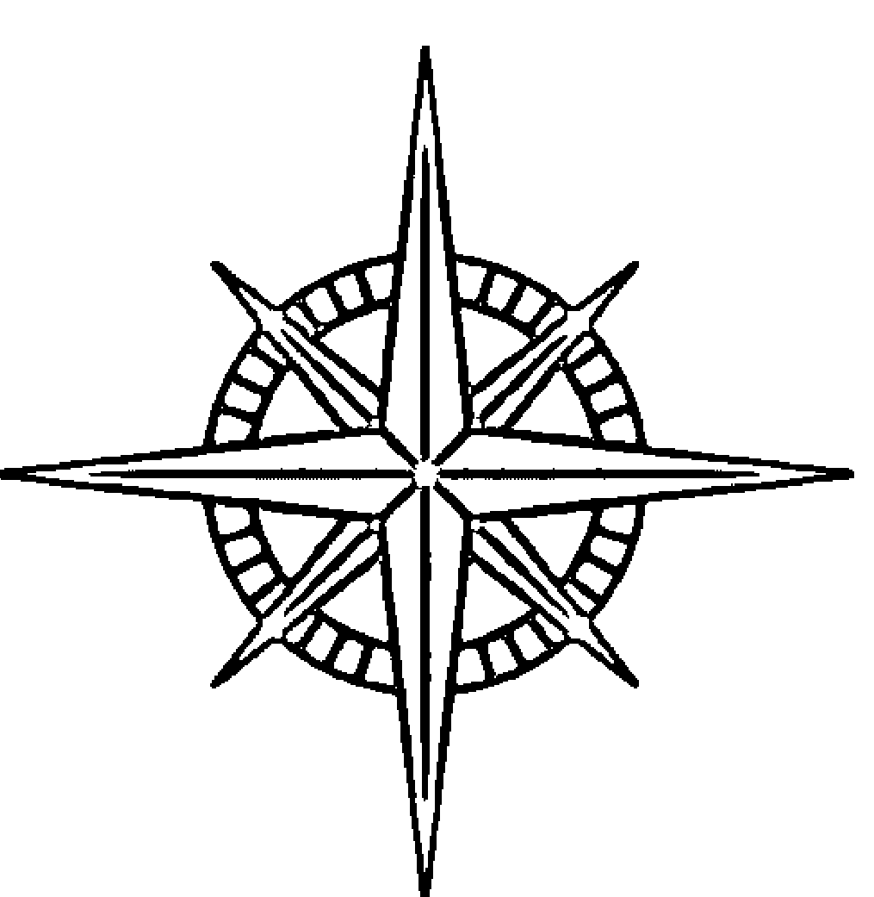

## 結合人生的塔羅牌
現代塔羅牌

### 15
惡魔 THE DEVIL

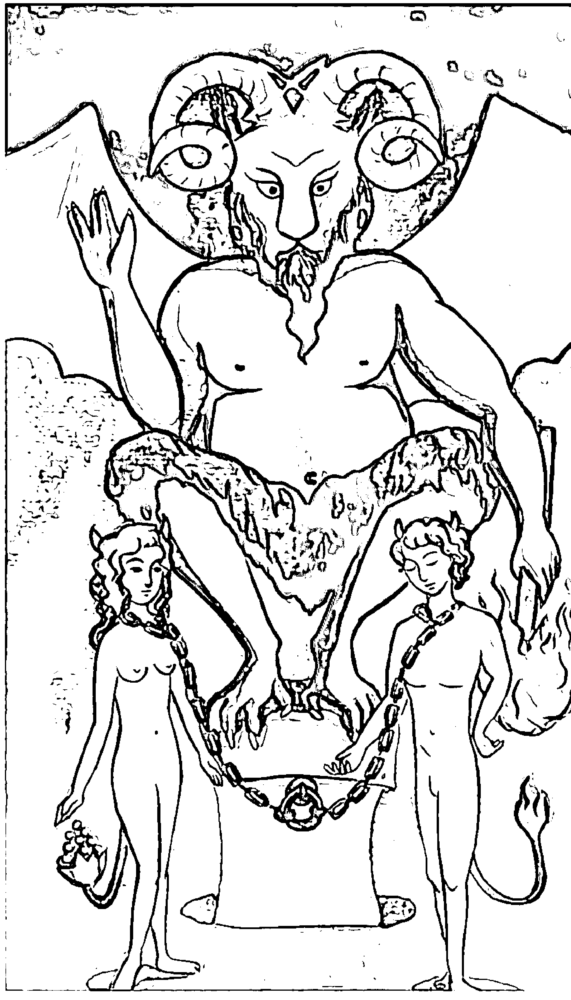

本性的解放、物質的滿足
身體的享受、欲望的充補
明明一切需求都已被填滿
為什麼卻讓人感到空虛
與痛苦？

本意：束縛、限制、慾望
代表星象：摩羯座

### 塔羅牌義

編號15的魔鬼，魔鬼手上是慾望之火、不斷引誘人世間的男女。下面的兩個人被誘惑的同時也被這些慾望給束縛住了，但仔細看會發現人們脖子上的鐵鍊是鬆垮的，這背後的意思是在暗示我們，人們只要放下慾望，就可以脫離這些束縛。

### 元素分析

- 背景全黑：光芒不存，代表精神上的黑暗。
- 右男尾巴：生命之樹的果實。
- 左女尾巴：善惡之樹的果實。
- 鬆鬆鎖鏈：象徵可以掙脫，其實一切都是「自己對自己」造成束縛。
- 惡魔造型：
  - 蝙蝠翅膀：墮入黑暗。
  - 羊角和羊腿：慾望、享受。
  - 鷹足：殘酷、暴烈。
  - 驢耳：代表執迷不悟、不肯悔改。
  - 滿佈著長毛：強烈的慾望、野獸般的原始本性。
- 倒五角星：指向地面，代表物質世界；慾望。
- 右手：黑魔法的手勢，代表「降災」與「誘惑」。
- 左手：持著慾望之火，向下指向物質世界，引誘著人們的慾望。
- 惡魔座位：長形的黑色立方石，就是魔鬼的祭壇。

### 牌義簡易分析

### 關於建議

正位：當初的想法已逐漸發生轉變，記得不要放棄自己的信念而誤入歧途。
逆位：提起勇氣做些改變吧！一開始或許辛苦一些，但終將脫離束縛與困境。

### ☆ 關於環境或目前的處境

正位：危險與誘惑常是一體兩面的、請多注意。或是各種壓力逼得你喘不過氣。
逆位：離開痛苦的地方、放下不想要的回憶，拿著這段時間磨練出來的智慧勇敢走出去。

### ☆ 關於財運

正位：欺詐、不正當的收入或支出，把錢花在不值得的地方。
逆位：嘗試用正確的理財方式，改變原本的收支方式。

### ☆ 關於家庭

正位：錯誤的持家方式，讓大家都覺得疲憊。
逆位：適當表達出自己真正的想法與心意，跨越家人間的成見與陰霾。

### ☆ 關於愛情

正位：三角戀愛、感情詐騙、輕率的愛情而忽略了深層的了解與認識。
逆位：發現是一段不適合的愛情、試著用更好的方式相處。也請避免外面的誘惑影響到現在的愛情。

### ☆ 關於婚姻

正位：外遇、一夜情；或是夫妻互相給彼此壓力而貌合神離。
逆位：如果真的無法繼續下去，那就放手互相祝福吧！也可能是爭執剛過、這時難免雙方心裡都還有些疙瘩，試著放下情緒好好復合。

### 塔羅牌 78 張牌意解析

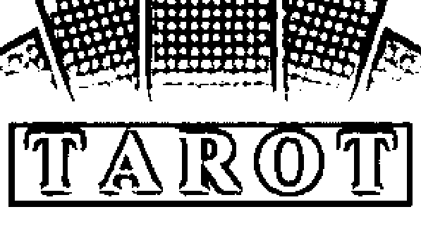

### 關於事業

正位：不得不配合要求，不可告人的秘密或交易。
逆位：加強自己的能力，之後可能會想去找更適合自己的地方或企劃。

### 關於學業

正位：念書要更用點心，需要調整娛樂時間的安排。可能對某些科目太執著卻忽略其他科目。
逆位：開始認真了起來，建議去找適合自己的讀書方式、建立良好的讀書習慣。

### 關於健康

正位：與喉嚨、皮膚、關節等有關的疾病要注意。注意生活作息以免影響身體健康。
逆位：戒菸酒或改善生活方式將逐漸看到效果，疾病將脫離危險期慢慢痊癒。

### 關鍵字速記

- 束縛
- 被欺負
- 沉迷
- 逃避與妄想
- 陰暗面
- 誤入歧途
- 意志薄弱
- 負面想法

## 結合人生的塔羅牌
現代塔羅牌

### 16
塔 THE TOWER

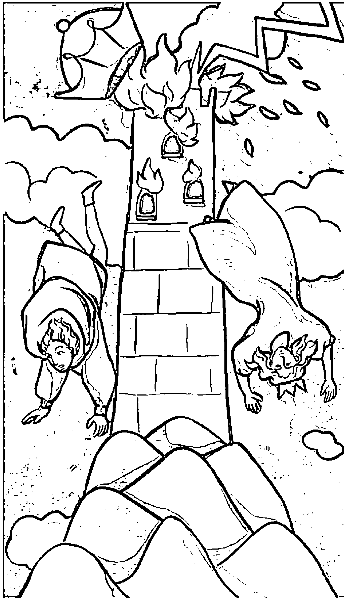

我以為我完美無瑕
我以為我的一切都是對的
我以為就算我有錯
也不是我的錯
最後
我把自己推向高塔頂端
深深墜落

本意：毀滅
代表星象：火星

### 塔羅牌義

編號16的塔羅牌是塔，代表成就、地位的皇冠被狠狠摔了出來，國王和皇后也從塔上墜落。在物質世界的最高榮耀，卻可能會害我們從靈界墜落到最深的淵源中。塔代表失敗、毀滅，但或許我們也該想想，是不是自己當初做了什麼事情、造成現在的結果？

### 元素分析

- 塔被毀滅：採自聖經的故事，敘述巴比倫塔的倒塌。
- 三個窗戶：身心靈。
- 皇冠：象徵統治、成就、物質與財富，這一切在瞬間就蕩然無存。
- 灰雲：智慧被掩蓋。
- 下墜的人：代表人類不正確的價值觀和信念。
- 雷：代表上帝的懲罰。

### 牌義簡易分析

- **關於建議**
  - 正位：每個人的能力終究是有限的，保持謙虛與包容、接受各種可能。
  - 逆位：通常我們都是從挫折與打擊中、一步步學著成長與重生。
- **關於環境或目前的處境**
  - 正位：破滅與危機似乎正在降臨，必須努力補救、想辦法幫自己避開危險。
  - 逆位：努力補救之前的缺失，但有些傷害、有些問題似乎要用更多時間與智慧才能化解。
- **關於財運**
  - 正位：赤字、損失大筆財富，或某個意外決定導致經濟缺口變得更大。
  - 逆位：經濟消費逐漸止血，慢慢彌補之前的缺失；建議可趁機建立新的財務規劃。

### ☆ 關於家庭

正位：衝突意外爆發、大家心裡都有些難受，甚至做了些衝動的決定。
逆位：冷卻後試著重新建立信任，尋找更適合的相處方式。

### ☆ 關於愛情

正位：可能做了一些傷害對方的行為，感情中有很多破碎與謊言；另外也可能要小心危險情人。
逆位：當初的選擇需要重新評估、用新的態度去面對愛情，但之前內心受傷會留下一些後遺症。

### ☆ 關於婚姻

正位：婚後不斷發生衝突、彼此觀念不同又堅持不肯調整。互相傷害。結束婚姻關係、分居。
逆位：自尊受創、開始深思接下來要如何相處、試著接受彼此的不完美。

### ☆ 關於事業

正位：一直出現麻煩、當初錯估造成很大的缺口，騎虎難下卻互相推卸責任，繼續這樣下去會越來越嚴重。
逆位：必須結束專案或賠償了結；離開原本的職位或轉行、思考新的組織架構。

### ☆ 關於學業

正位：成績不盡人意、意外的打擊讓你發現自己的實力需要再加強。退學或請假。
逆位：轉學、轉換讀書的環境與方式、受到刺激失去堅持的勇氣。

### ※ 關於健康

正位：小心火傷、跌倒、急性疾病；嚴重的話可能要住院或動手術。不要喝酒或勉強自己過度運動。
逆位：精神官能症、注意誤診，預防重於治療、把握機會好好休養一下。

### ✂ 關鍵字速記

- 破壞
- 打擊
- 傷害
- 刺激
- 意外
- 毀滅
- 衝動
- 自以為是
- 懲罰

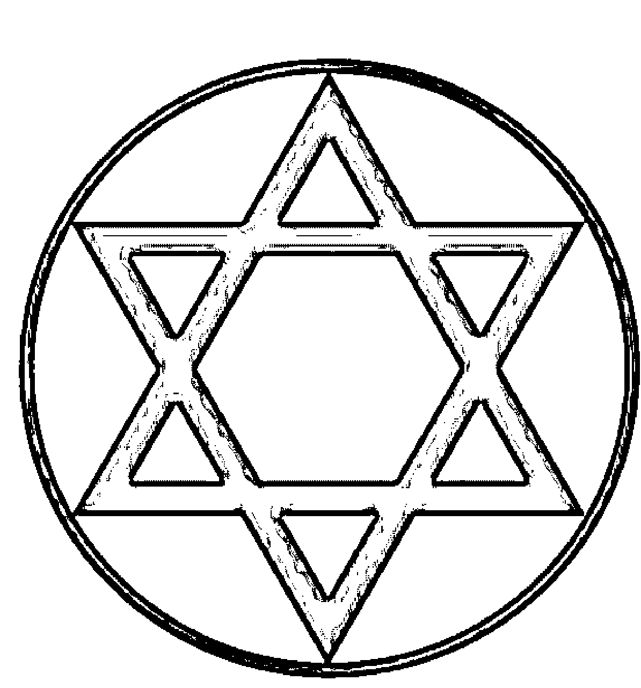

### 星星 THE STAR

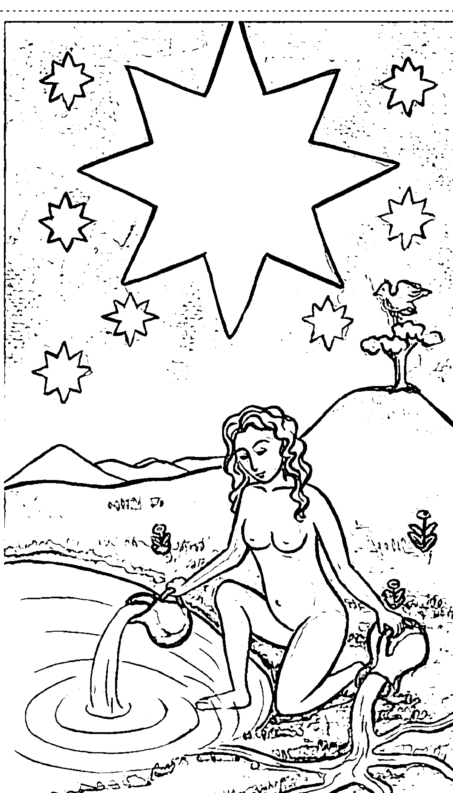

一次次的重生與死亡
一次次的機會與希望
從你自己的心裡、融合在
整個社會裡
或許我們每個人 到最後都是
同一個夢想

本意：希望
代表星象：水瓶座

### 塔羅牌義

編號17的星星牌，大地之母手握著兩壺水，代表不論是集體或個人的思想，都來自大地生命的滋養。兩壺水的融合，象徵個人與團體之間的聯結，這樣思想不斷交流生生不息，結合後面的不死鳥、以及象徵永恆力量的天狼星，都暗示我們：永續永恆的生命是「小我與大我的結合」、同時也得到永恆的希望。

### 元素分析

- 中間主星：天狼星；代表永生不息的力量，同時掌握重生與死亡。
- 裸女：大地之母蓋亞。
- 右手生命水：代表集體意識，融入池塘中。
- 池塘：意指整個社會。
- 左手生命水：代表個人意識，融入地上分支五道支流，象徵人的五感；其中一道又流回池塘，意指個人意識又流到集體意識裡互相融合。
- 右腳踏入水中：象徵直覺。意指一切生命抽象的「意識層面」。
- 左腳跪在地上：象徵穩定。意指一切生命實質的「物質層面」。
- 小鳥：不死鳥，象徵心靈昇華。

### 牌義簡易分析

### 關於建議

正位：星光將治癒了你的身心，給你再生的希望。或許你的星光就藏在某個角落的稀微之處，你正慢慢走向他。
逆位：創傷與害怕使你猶豫、之前的陰影籠罩著你。到底繼續走下去會是希望還是更深的泥沼？內心的恐懼讓你裹足不前。

### 關於環境或目前的處境

正位：雖然每個人的立場與想法不同，可是在一個大共識的前提下，大家都試著互相了解好好合作。
逆位：原本的夢想或目標受到打擊、彼此臉上出現失望的表情。或許可以先休息調整一下再繼續加油。

### 關於財運

正位：意外之財、新的獲利或投資機會、即將收取報酬。
逆位：金錢觀有些偏差、小心遇到金錢糾紛；收穫不如預期讓你有些失望。

### 關於家庭

正位：付出彼此的愛與想法，試著幫助身邊親密的人，同時也是在幫助自己。
逆位：家人之間互相分歧，付出卻被嫌棄或被誤會，彼此間互相猜忌無法信任。

### 關於愛情

正位：自然而然發生的愛情、似乎是很理想的對象；互相支持鼓勵。
逆位：開始讓你失望，單相思或自作多情，或是發現對方沒有這麼好。交往一段時間後開始在意缺點然後起爭執；感情開始變淡，相處似乎只是一種習慣。

### 關於婚姻

正位：婚後互相磨合，終於慢慢有種幸福的感覺，認為當初的決定與調整是對的。
逆位：一直在適應不同的互動方式，才剛剛好一點、卻很快又發現新的問題。心裡覺得有些疲累。

### ※ 關於事業

正位：靈光乍現、獨創性、很完美的計畫。可能會有個不錯的意外機會讓你表現自己；兼差讓自己有許多收入來源。
逆位：工作疲乏、莫名感到失落或厭倦感、缺乏動力。試過許多方法但效果不佳、沒有達到預期的目標。

### ※ 關於學業

正位：獨特的讀書方法、藝術或美術的學習能力很強；之前努力看到成果、通過考試測驗。
逆位：對自己期待太高但能力有限，跟師長或同學的相處變差；過度限制可能會使你少了許多發展自我潛能的機會，或許可以勇敢去試試不同的領域或比賽。

### ※ 關於健康

正位：改變生活方式讓自己變得更健康、體力恢復、有新的藥品或治療方式、身心放鬆對你會有益處。
逆位：營養失調、心理影響生理、太過挑食或偏食影響你的健康、過度疲勞又或是運動不足。

### ※ 關鍵字速記

- 希望
- 祝福
- 遠見
- 試探
- 未來
- 融合與交流
- 靈感
- 理想
- 純真

## 結合人生的塔羅牌
現代塔羅牌

### 18
月亮 THE MOON

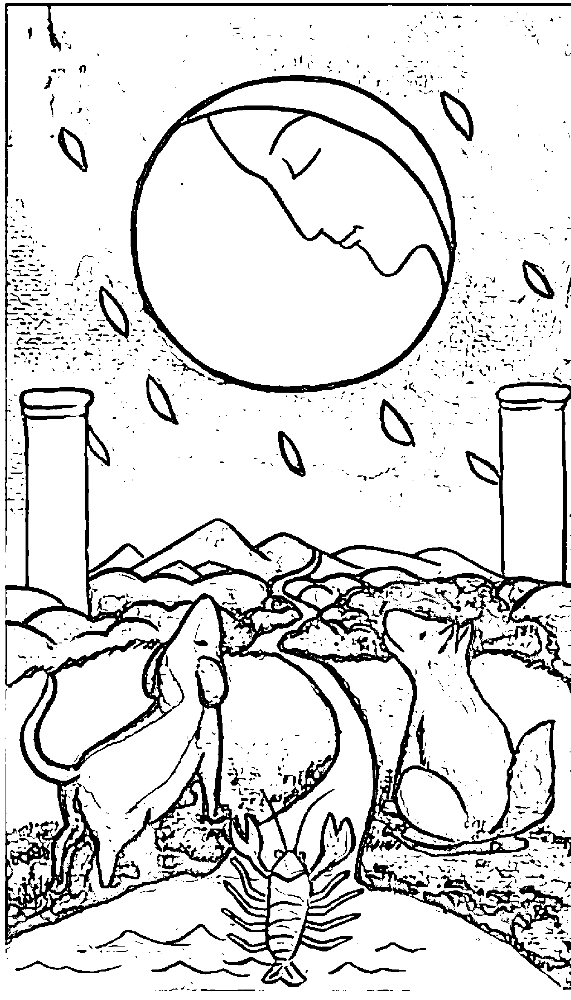

走向真理的路上
充滿未知與迷惘
小心翼翼、亦步亦趨卻
更加更加徬徨
神性與魔性 同時交織在我心中
逼得我瘋狂掙扎！

本意：不安、迷惘
代表星象：雙魚座

### 塔羅牌義

編號18的月亮，旁邊的雙塔在暗示我們，靈魂經過生生世世的輪迴鍛鍊，對生命的意義越來越清楚，即將要解脫出關囉！但記得有句話說「黎明前的夜晚是最黑暗的」，就像我們的靈魂即將走向光明，卻在這一刻是最徬徨不安的，恐怖的黑暗籠罩著我們的內心。不要害怕，等我們熬過最深刻的昏暗，後面就是一片明朗了！

### 元素分析

- 蝴蝶：從潛意識爬出來、成為生命中的行為或習慣。
- 狗和狼：分位於左右兩邊，象徵人類內心的獸性，一部分已被馴化，但還有一部分未馴化。
- 小徑：通往兩塔，延伸向遠處山脈的小徑，通往未知的未來。
- 雙塔：代表靈魂即將通過人生考驗、就要出關的關卡。
- 空中的露珠：思想片斷而零碎灑落在生命中。
- 月亮不滿的表情：代表精神探索者在精神啟蒙之路上遇到荒涼與困難。

### 牌義簡易分析

- 關於建議
  - 正位：未知的一切充滿變化、讓人也感到不安與恐懼。或許真正要面對的是自己的內心。
  - 逆位：迷惘終於撥雲見日，解開了心結的同時也解開了自己的枷鎖。
- 關於環境或目前的處境
  - 正位：大家都不確定接下來的方向、邊走邊看，期待一個明確的指導。
  - 逆位：為了確定自己的定位而十分努力，想證明自己。了解當初的問題原因之後開始修改尋求進步。

### ☆ 關於財運

正位：當心被騙、不穩定的收入、對一些開銷流向不太清楚。
逆位：得到援助或資金，有機會拿到臨時小收入；越來越懂得怎麼支配金額。

### ☆ 關於家庭

正位：各自過自己的生活、一團混亂的互動，家中長輩沒有做好自己的角色；讓家庭無法正常運作。
逆位：更用心經營家庭、慈悲與包容、被社會無情傷害後才知道家庭對自己有多重要；想脫離以前的陰影、建立一個屬於自己的家庭。

### ☆ 關於愛情

正位：不安定的關係、三角戀或地下戀情、周圍親友的反對、情人對你的態度充滿謊言與冷漠忽視。
逆位：冷戰結束；你終於認清對方的真面目、從虛偽的戀情中清醒過來、想要離開傷心的地方；或是彼此都用心調整情緒，想要解開誤會釋盡前嫌。

### ☆ 關於婚姻

正位：婚後壓力變大了、彼此有種疏離感，有時會懷念還沒結婚的自己。
逆位：生活中難免會有一些挑戰與困境，記得要彼此扶持一起走下去。

### ☆ 關於事業

正位：需要確定目標、期待一位好的領導者、知識或技能有偏差缺漏。
逆位：認真付出期待之後的成果、改善自己的缺失、保持謹慎小心行事。

### ※ 關於學業

正位：抓不到重點、猜題錯誤；讀書態度敷衍或無法專心、不知道自己適合什麼樣的讀書方式。
逆位：成績漸漸提升、犯點小錯但整體成績還不錯、考前重點溫習似乎成效不錯；越來越確定自己的學習方向。

### ※ 關鍵字速記

- 茫然
- 恐懼
- 逃避
- 搖擺不定
- 迷惘
- 擔憂
- 隱藏
- 情緒
- 不安
- 猶豫
- 變化多端

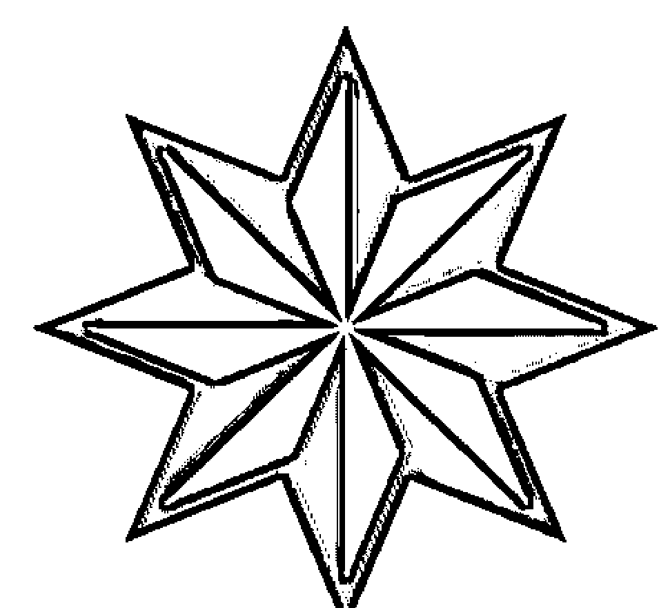

### 太陽 THE SUN

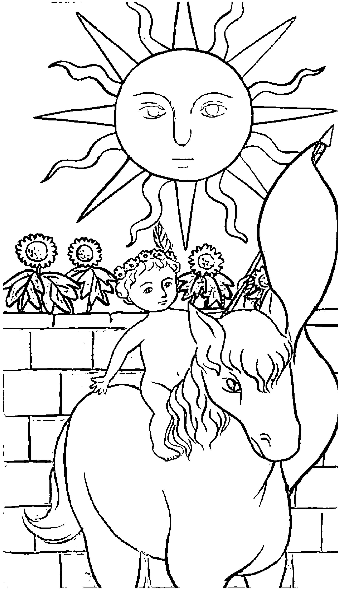

終於跨越藩籬、重回自由！
原來真正的自由，
是回到真正的自我
回到當初無憂慮無罣礙的孩童
用最真的本性、掌握生命
的主軸！

本意：生命力、回到自我、單純的喜悅
代表恆星：太陽

### 塔羅牌義

編號19的太陽牌，圖案中快樂的孩童就像我們的純潔靈魂，或許我們的內心都希望能回到純潔的自己吧！這時我們的靈魂才能真正掌握生命、讓四大元素都綻放美麗的花朵，讓地球的一切生命欣欣向榮。生命本身應該是單純無邪的喜悅，我們心裡不再恐懼、與上天的光芒再次融合成一體。

### 元素分析

- 雛菊花環：單純。
- 紅羽毛：紅羽毛本身代表生命力；這裡象徵已經跨越了死亡的界限，而重獲新生。
- 向日葵：共4朵，象徵四要素。四朵向日葵是向著孩童，而不是太陽，表示這孩童擁有足夠的能力主導四大元素。
- 騎馬：沒有馬鞍，不用韁繩，甚至連雙手也不用，顯示馬匹象徵的能量已經受到完全的控制。
- 持著紅色旗幟：表示他輕而易舉、自然的控制一切生命。
- 太陽：生命源頭；其中直線光代表光能；曲線光象徵熱能。

### 牌義簡易分析

- 關於建議
  - 正位：生命本身是喜悅的，試著回到最單純最真實的自己。
  - 逆位：任性會讓自己失去成長的機會；人生經歷的旅途通常痛苦、但也讓我們越來越成熟。
- 關於環境或目前的處境
  - 正位：充滿期待與喜悅、可以自在的相處，健康開放的氣氛。
  - 逆位：在有限的世界裡自我滿足、忽略了外面的世界與變化、需要與他人多接觸。

## 結合人生的塔羅牌
現代塔羅牌

### 關於財運

正位：能力上升而使自己增加收入、因為需求降低使得經濟壓力減少許多。

逆位：對自己的經濟狀況不清楚、不知不覺的浪費、雖然知道要節制但不想壓抑自己。

### 關於家庭

正位：很快樂的家庭、一起去玩有趣的娛樂、可以真正的放鬆；期待新生命的到來。

逆位：生活作息瑣碎凌亂、家人間的交流時間十分有限，親子相處不佳。

### 關於愛情

正位：受到祝福的愛情、願意了解彼此的想法。

逆位：無法做到當初的約定、短暫的快樂；因為不知怎麼表達而喪失進一步交往的機會；愛的痛苦試煉。

### 關於婚姻

正位：婚後愛情更加深、幸福的氣氛，互相了解彼此的個性與想法，因此可以快樂的相處。

逆位：婚姻危機、缺乏信任、感覺無法互相扶持只能靠自己。

### 關於事業

正位：找到好工作、有機會升遷、很投入並且努力做到目標成效、很投入在工作中、在工作中找到自己的定位與興趣。

逆位：工作態度不佳、敷衍使得效率或品質降低；找工作遇到困難。

### ☆ 關於學業

正位：考試合格、順利進步發展、團體一起學習可以幫助自己。
逆位：外在的誘惑讓你無法專心下來、成績退步、念書意願降低、不及格。

### ☆ 關於健康

正位：活力旺盛、很好的運動才能、健康運很強、大自然或自我治癒能力；可以走出戶外讓身體更舒適。
逆位：健康狀況不太好、體力不如預期、放縱自己造成疾病惡化、注意呼吸系統、生理不順、補充維生素。

### ✂ 關鍵字速記

- 喜悅
- 活躍
- 積極熱情
- 快樂的氣氛
- 祝福
- 充滿活力
- 生命
- 成長
- 繁榮

### 審判 JUDGEMENT

聽！號角響起，
快起來回到我懷裡！
思想意識不斷更新、
靈魂再次甦醒
審判不是上帝的批罪、
而是要你審視你自己的人生

本意：復活、決定
代表星象：冥王星

### 塔羅牌義

編號20的審判，人們從海上的棺材甦醒，暗示我們這個審判不是肉體的審判、而是精神層面的自我省思。每次的反省都讓我們得到更多智慧、不斷換舊更新，一步步走向神的懷抱。

### 元素分析

- 天使：加百列。
- 號角：呼應啟示錄裡的七支號角、逐一響起。
- 旗幟：四邊等長的紅十字架，象徵業力的平衡。
- 人們復活在海上：真正的復活不是身體，而是靈魂、潛意識的全面更新。
- 海洋：潛意識。
- 棺材：象徵物質世界的舊模式。
- 男性：象徵意識層面、身體與物質，含蓄地仰望天使。
- 女性：象徵潛意識、內心與感情，伸出雙手大方擁抱天使的呼喚。
- 小孩：象徵單純的天性與靈性，完全迎接天使的到來。
- 高山：白雪靄靄，是抽象思考的頂峰。

### 牌義簡易分析

- 關於建議
  - 正位：當我們學會用不同角度看事情，過去的傷痕蛻變成美麗的翅膀彩紋。
  - 逆位：有時候我們猶豫不決、等著別人給我們決定；試著面對現實然後多一些勇氣、自己決定下一步的方向。
- 關於環境或目前的處境
  - 正位：重視自我要求、反思後改善、找到新的觀點。
  - 逆位：領導者善變或優柔寡斷，缺點正逐漸浮上檯面，感到失望而失去信心。

### 關於財運

正位：找回失去的財物或投資機會、得到新的賺錢機會、繼承遺產。
逆位：付債無法償還、惡性循環、失去原有的財物。

### 關於家庭

正位：建立新的家庭、家人團聚、親友之間交流變多了、家人互相鼓勵協助。
逆位：不得不離開家園、家人間無法互相幫忙、對家庭失望不再有期待。

### 關於愛情

正位：言歸於好、遇見之前的戀人、一起往下一個人生階段邁進。
逆位：有緣無分的愛情、不好的回憶成為內心陰影、失去見面機會。

### 關於婚姻

正位：兩人開始新的生活、互相影響形成新的價值觀、一起努力好好過生活。
逆位：當初的問題漸漸浮現，成為爭執的原因；婚後的生活讓人反感、心裡有些後悔。

### 關於事業

正位：投標或競爭得勝、可以採納前輩們的建議；有機會東山再起、或可以繼承家業。
逆位：失去發表的機會、遭上司壓制或利用、發現問題想要調整但為時已晚。

### ※ 關於學業

正位：果斷地改變自己的念書態度、看到努力的成果、考運不錯、得到理想的成績或證書。

逆位：一直留在過去的成績導致失敗、頭痛的科目越來越多、覺得自己資質不好缺乏自信。

### ※ 關於健康

正位：體力恢復、團體性或互動性的運動、有機會遇到名醫、手術成功。

逆位：健康狀況不穩定、小心舊疾復發、保持距離、注意腸胃疾病。

### ※ 關鍵字速記

- 反思
- 復活
- 和好
- 覺醒
- 結果
- 堅強意志力
- 全新出發
- 重逢
- 信仰

### 21 世界 THE WORLD

經過千百回的試煉與提升
終於，我重新回到我自己
喜悅的舞動著、一切都已完成
等休息後，我將再次出發、
重新踏上新的旅程！

本意：完成、圓滿
代表星象：土星

### 塔羅牌義

編號21的世界，代表我們重新回到天堂、一個真正完美的神的世界。神性包圍著我們、同時我也掌握著生與死的權杖，原來我就是生命、生命就是我。當一切圓滿後，我們的靈魂將迎接下一個主題，再次回到人世間來尋找下一個生命主題的答案，從天堂的世界再次踏入愚者的旅程，如此生生不息，生命由此不斷茁壯成長下去。

### 元素分析

- 月桂花環：光榮、勝利。(之前在愚者、皇后、戰車、力量都出現過。)
- 四隻動物：四元素、星座四個基本固定宮。他們在命運之輪中還拿著書汲取知識，最後在世界牌中完成學習。
- 舞者：雌雄同體，象徵愚人終於成功將陰陽兩股力量融合。
- 紫色絲巾：象徵高貴與神聖，纏繞在身上代表神性就在每個人身上。
- 兩根魔杖：象徵陰陽、生死的力量，在這裡同時具備。
- 外圈的橢圓桂冠：橢圓形就像愚人0的形狀，暗示生命回到0、休息後將再次成為愚者、重新進入地球生命中。
- 紅巾：無限大符號，象徵生命的無限與永恆。

### 牌義簡易分析

- ☆ 關於建議
  - 正位：事情即將完成、成功的同時也請抱持感恩的心、回饋給身邊的人。
  - 逆位：功虧一簣、需要再堅持一段時間；有時候成果不如預期，可是過程中的付出都讓你不斷地成長。
- ☆ 關於環境或目前的處境
  - 正位：慶功宴、希望與美好的氛圍、欣賞自己的成果與適當休息、準備尋找新的目標。
  - 逆位：努力沒有回報讓人感到氣餒、過程中產生滯礙無法進行下去、準備不足或安排不佳。

### 關於財運

正位：高收入、終於將債務還清、獲得足夠的財物。
逆位：經濟不景氣、破產、拆東牆補西牆。

### 關於家庭

正位：全家出遊、有人出國或遠行、從小建立很好的觀念與人格。
逆位：家人分住在不同地方、有人堅持自己的決定讓家人覺得困擾。

### 關於愛情

正位：單戀得到回應、互相投緣、曖昧之後得到快樂的結局。
逆位：沒有結果的戀愛、只差臨門一腳不要衝動放棄；遲到的愛情、膠著猶豫不定。

### 關於婚姻

正位：讓人羨慕的婚姻、神仙伴侶、洋溢著幸福的氣氛、真命天子/天女。
逆位：分居或分房、解除婚約、暮年之愛。

### 關於事業

正位：找到工作、成果很好刷新紀錄、升職、獨立創業、公司正不斷成長擴大中。
逆位：計畫終止或暫停、離開職位、發生錯誤而須追究責任、技術不夠成熟。

### ☆ 關於學業

正位：得到資格或取得證書、留學、自己的學術或觀點十分成熟。

逆位：努力用功但成績起色仍不明顯、雖然對成績有些失望，但千萬不要敷衍或半途而廢、如果馬虎會讓分數一落千丈。

### ☆ 關於健康

正位：克服疾病、手術成功、長壽、可以維持目前的健康狀態、情緒穩定。

逆位：身體衰弱、頭部或心臟要注意、手術的效果不佳、疲勞轟炸、建議多去大自然走走。

### ✂ 關鍵字速記

- 完成
- 充滿希望
- 迎接新的來臨
- 光明
- 期待
- 大環境
- 未來
- 慶祝

## 塔羅牌牌意解析 —— 小阿爾克納

### 一、數字牌

數字 1

### 權杖 1：

### 元素分析

- 生命之樹發芽：生命力
- 綠芽：生命的各個面向與發展
- 後面的城堡：有目標
- 手勢：象徵 Yod（上帝之指，代表生命的方向與使命）

### 牌義簡易分析

※ 正位含意：
誕生、新開始、創造、冒險、活力、開始、出發、充滿活力、期待未來更進步、努力實現願望不斷前進

※ 反位含意：
喪失力量、能力不足、開發遇到障礙、需要更大的魄力與勇氣、失望與失敗、慢慢枯萎脆弱、氣力衰退

### 聖杯 1：

### 元素分析

- 水從杯中溢出：給予、豐沛
- 白鴿叼聖餅、放入聖杯中：聖餅=耶穌身體，象徵物質，聖杯=心靈，象徵心靈。代表心靈與物質的結合
- 5道水流：五感
- W：Water，水元素
- 睡蓮：向上伸展至水面，象徵人類靈魂的覺醒

### 牌義簡易分析

☆ 正位含意：
滿足、幸福、豐足、真正的愛、戀愛或婚姻的開始、真誠與真我、來自內心的願望、互相付出真心、充滿能量

☆ 反位含意：
不安定、變化、毫無進展、單戀、背叛、誤解、沒有感受到誠意、不安或誤會、單戀、著急的忍耐與等待

### 金幣 1：

### 元素分析

- 金幣：代表具體的、實質的、以及收穫
- 道路前往拱門：往預期的方向發展
- 後方高山：挑戰與各種可能
- 樹籬拱門：未來與希望的入口
- 五角星：火土水風+靈性、代表大自然的一切魔力

### 牌義簡易分析

☆ 正位含意：
豐收、準備完整、將進一步到新關係或新環境、良好的成果、愜意休閒、合格、豐富的感受、金錢運強、能將事情順利完成、嚮往美好的事物

☆ 反位含意：
好的開始但後面仍不穩定、表裡不一、被利用、落差很大、覺得後悔想要放棄、太著重在物質或表面、徒勞無功、固著停滯

### 寶劍 1：

### 元素分析

- 寶劍穿過皇冠：強勢、突破與尖銳；象徵心靈或意識甦醒
- 棕梠葉：男性生殖力、領導
- 橄欖葉：活力、能量
- 光點：思想、靈性啟發

### 牌義簡易分析

☆ 正位含意：
領導、標竿、楷模、光榮、說服、專業能力、勇氣、突破框架、冒險向前邁進、印象鮮明、勇於抵抗不合理的一切

☆ 反位含意：
無人情味、反覆無常、破壞、猜疑、謊言、道人是非、鬱悶、突然遭到打擊或災難、請堅持原本的目標、過度勞累、付出太多、孤單、沒有人了解你

### 數字 2

### 權杖 2：

### 元素分析

- 遙望遠方：遠見
- 地球：資源、目標
- 拴住權杖：限制約束、裹足不前
- 白百合：死亡、智慧
- 紅玫瑰：生命、熱情
- 外面美麗風景：理想、未來

### 牌義簡易分析

正位含意：
管理者、長輩、地位、權威、財產、主導權、勇氣、實踐、勤勉、物質運上升、擁有主導權

反位含意：
突發事件、小心意外、猶豫、煩惱、遙遙無期、卻步不前、可能被否定或責罵、失手、錯誤規劃

### 聖杯 2：

### 元素分析

- 獅子頭+翅膀與雙頭蛇杖：獅子頭是指希臘天神漢密斯，穿著帶有翅膀的鞋子，與蛇一起代表知識、療癒與智慧
- 杯子同高：平等
- 伸手向對方：交流溝通
- 左邊的人：代表學者、知識、學術層面
- 右邊的人：代表獵人、活力、務實層面

### 牌義簡易分析

☆ 正位含意：
有承諾、成熟的愛、結婚或以結婚為前提、契約、意見一致、建立共識、互助合作或共事、表達善意、保持聯絡互動、交朋友、學習力上升、願意進展到下一步

☆ 反位含意：
失去信任、朋友做不成、承諾變成負擔、原本的關係被破壞、對立、二擇一、合約破局、無法好好相處、輕蔑或欺騙、努力方向錯誤、狀態停滯不前、結局不了了之

### 金幣 2：

### 元素分析

- 雙腳高低&海波起伏：不穩定、搖晃
- 無限符號：象徵各種變化與可能
- 大小船：賺與賠、多與寡；意指一切對立的比較與二元
- 帽子：滿滿各種想法，想創造一切
- 表情：不安、不確定、能力有限

### 牌義簡易分析

☆ 正位含意：
虛幻無常、左右為難、找不到平衡、內心焦慮、時髦、只求短暫的快樂、想逃離、金錢財物出現麻煩、猶豫無法下決定、現在還不適合定下結論、無法赴約或履行承諾

☆ 反位含意：
反覆不定、輕浮逃避、混亂、欺騙、爛攤子、無法下決心、觀念落差或誤解、不安定的感覺、意見不合

### 寶劍 2：

### 元素分析

- 兩支劍不同方向：矛盾、對立、交戰
- 蒙眼：不安、看不清楚、逃避
- 雙手交叉：拒絕、封閉、僵持
- 背後海洋：逃避情感、潛意識

### 牌義簡易分析

☆ 正位含意：
調和、性格一致、平衡交流、卡住了走不出來、雙重標準、矛盾不安、尋找自己要的是什麼、要踏出自我的第一步很不容易、自命不凡或過於自信、性格太強烈而失去進步的機會、防禦心、恐懼膽怯

☆ 反位含意：
找不到共識、沒有標準答案、優柔寡斷、雙重標準、朝令夕改、感情混淆、不知道該是友情還是愛情、定位不清、不相信彼此、想要破壞毀滅一切、一分為二、毀約、覺得想放掉一切不想再管了

### 數字 3：

### 權杖 3：

### 元素分析

- 遙望：等待
- 海岸高處：居高臨下、遠見
- 手拿頂端的權杖：決定權
- 海洋：未來、宇宙
- 船隻：探索、尋找

### 牌義簡易分析

🌟 正位含意：
期待成功、得到協助、勇氣、期待、好的開始是成功的一半、努力希望能實現心裡的願望、他人的稱讚或肯定、得到可以幫助你的好友、外出旅遊、異國戀、意外的機會讓感情升溫

🌟 反位含意：
勉強執行、焦躁、不負責、錯誤的行為、徒勞無功、閒言閒語或是不可信的八卦謠言、任務突然結束、感情出現變動

### 聖杯 3：

### 元素分析

- 大家同樂：分享、慶祝、平等互惠
- 蔬果：豐收
- 一人一個杯子：平等互惠
- 三名女性：象徵這次的成功不是競爭戰鬥的成功，而是來自情感精神方面的喜悅

### 牌義簡易分析

☆ 正位含意：
小慶祝、分享喜悅、收穫、該放鬆休息一下、單純的快樂、團體交際、單戀、曖昧、友達以上戀人未滿、靈光乍現、互相激盪出新想法、夥伴聚會

☆ 反位含意：
踰矩、過度放鬆、早熟、朋友不諒解或忌妒、有苦說不出、遲鈍沒發現問題、辜負了別人的心意、忽略他人的用心、不想自尋煩惱、逢場作戲沒有想認真

### 金幣 3：

### 元素分析

- 工匠、傳教士、設計師：分工合作、各為其職、協商討論
- 教堂：心中共同的理想、精神
- 工匠在椅子上：行動最重要
- 傳教士：理念
- 設計師：計畫
- 工匠：實行
- 灰色的金幣：象徵雛形、還沒完成
- 金幣鑲嵌在支柱：穩固的基礎

### 牌義簡易分析

☆ 正位含意：
優秀、才能、合作、技術、溝通、受到認可、一起努力實現願望、共同的目標、互相適應幫助、進步與提升、得到身邊人們的肯定與信任

☆ 反位含意：
俗氣的想法、經驗不足、各持主見、每個人要的不同、需要好好交流、無法了解彼此的想法、執行力下降、效果不如預期、沒有特色與吸引力、有東西遺失或被弄壞了

### 寶劍 3：

### 元素分析

- 烏雲暴雨：沮喪、低落
- 插入心臟：悲痛、哀傷、打擊
- 寶劍：事實、真相、觀點與想法
- 紅色心臟：生命本身、根源

### 牌義簡易分析

☆ 正位含意：
悲傷、打擊、別離、傷害、與期待的有落差、三角關係、遇到麻煩傷心的事情、激烈的相處模式、衝突互相傷害、必須面對結果

☆ 反位含意：
混亂、錯亂、離不開痛苦的回憶、正努力著走出陰影、混亂煩躁、事情無法順利進行、接受真相是很不容易的事、干擾與各種批評

### 數字 4：

### 權杖 4：

### 元素分析

- 緞帶、果實：豐收
- 涼棚裡慶祝、歡愉：涼棚意指短暫的、簡單暫時的；所以這時的慶祝並非最後成功，比較像是「一切準備就緒」、「終於上軌道了」的意思
- 城堡：真正的目標

### 牌義簡易分析

☆ 正位含意：
休息放鬆、休閒旅遊、慶祝、幸福、小成功、慰勞自己、鼓勵、想回到平靜、休養生息、讓你喘一口氣的小確幸、和家人或室友一起生活、提親

☆ 反位含意：
過度玩樂、注意飲食、夜郎自大、自滿、井底之蛙、太樂觀或是想太多、被相信的人欺騙、一直犯錯、疲倦乏味、感覺有點膩了、得到不諒解

### 聖杯 4：

### 元素分析

- 雙手環抱：防禦、退縮、拒絕、遲疑
- 盤腿：停滯、休息
- 雲中的第四杯：想像、虛幻、新機會
- 地上三杯：目前擁有的、喜悅

### 牌義簡易分析

☆ 正位含意：
不滿現狀、憧憬、欲罷不能、想著各種可能性、束縛或拘束、三分鐘熱度、還要多一點動力、規畫中、心情慢慢變沉重、領悟現實與夢想的差距

☆ 反位含意：
改變方向、新目標、做而言不如起而行、新的可能、入學或開工、新視野、變得踏實不再空想、努力實現希望、轉變環境或想法、在不擅長的領域冒險

### 金幣 4：

### 元素分析

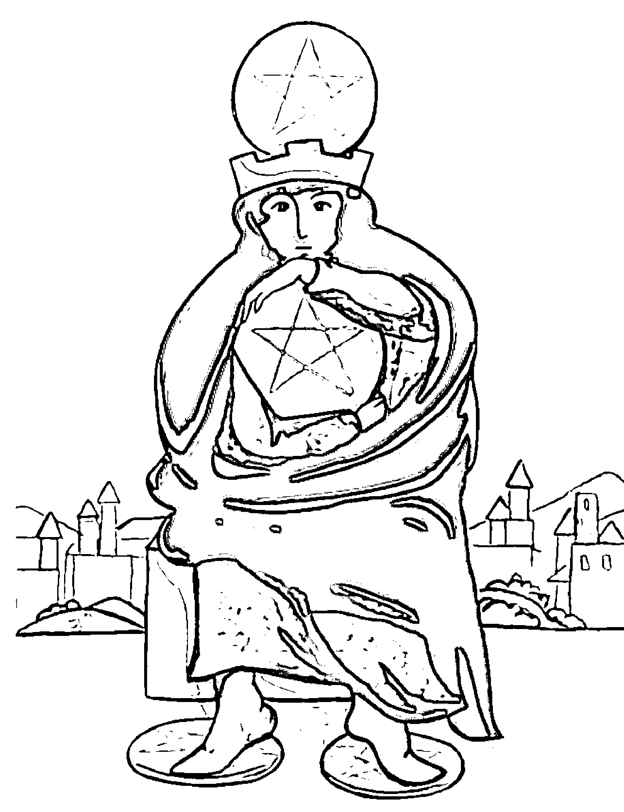

- 國王：代表本身有一定的資源或能力
- 孤獨坐在城市外面：疏離
- 很多美麗房子：財務的累積與增值
- 緊抓金幣不放：執著、佔有慾很強
- 手型：象徵現實與心靈之間混濁不明
- 腳下金幣（接觸世界）：身體的固執
- 胸前的金幣（心輪）：情感的固執
- 頭頂的金幣（頂輪）：思想的固執
- 黑色裹著全身：不安、焦慮、恐懼

## 結合人生的塔羅牌
現代塔羅牌

### 牌義簡易分析

☆ 正位含意：
大企業、一流學校、富裕、管控、佔有慾、存款增加、能管理好現有的資源、很積極經營彼此的關係、存款增加、獲得金錢、找到很好的省錢方法

☆ 反位含意：
空有其表、貪婪、損失、逐漸退步或被淘汰、解決問題的時間一直往後延、不知不覺變成對立的狀態、不願意改變或退讓、自己的想法無法傳遞給對方、堅持某項原則、不願離開

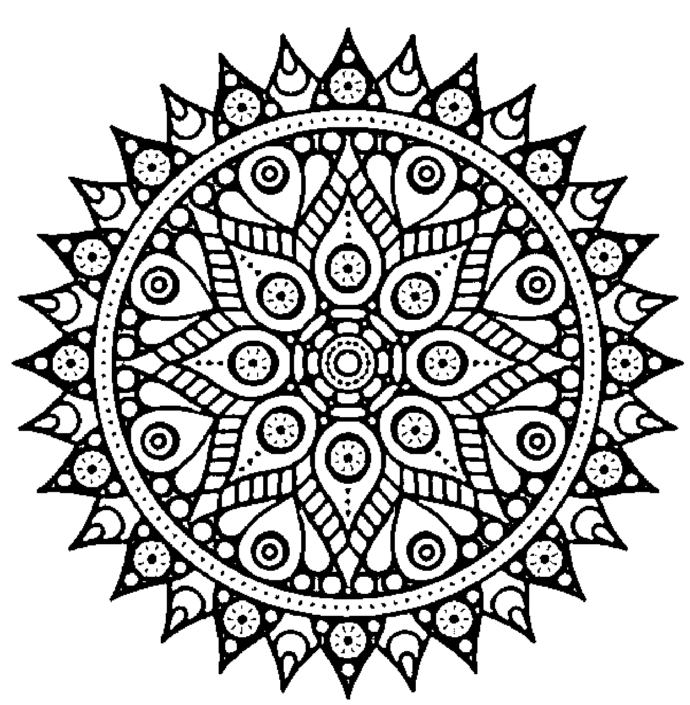

### 寶劍 4：

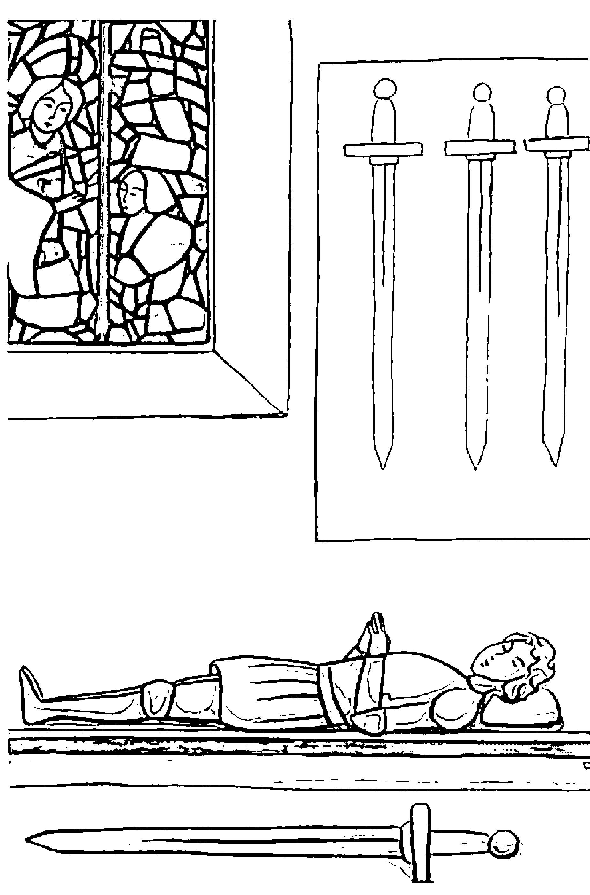

### 元素分析

- 躺下：冷靜、放鬆、充電
- 閉目、雙手胸前合十：靜思、內省
- 身邊寶劍：備戰、回到戰場
- 彩色玻璃：在教堂裡休息，暗指心靈休憩、唯一的安全處、神的眷顧
- 玻璃的圖案：耶穌賜福給懇求者
- 3把劍：身心靈的危機

### 牌義簡易分析

☆ 正位含意：
保持低調沉默、退到幕後、休息、返鄉、靜止、孤單、等待傷口癒合、自省、暫時停滯一下、能力逐漸衰竭、過度緊張需要放鬆、隔離一段時間、內疚、覺得自己不夠好

☆ 反位含意：
復活、甦醒、重新踏入社會、回到自己、過度疲勞、需要更多時間、新的活動即將開始、修補、能力提升、休息告一段落、保持慎重就有轉機的機會

## 結合人生的塔羅牌
現代塔羅牌

### 數字 5：

### 權杖 5：

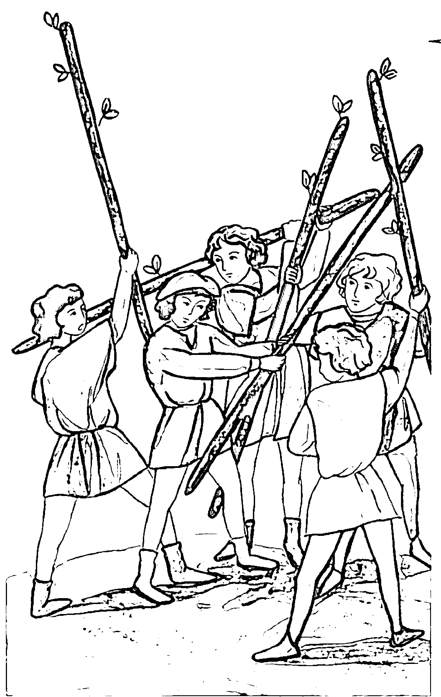

### 元素分析

- 各種動作：像是衝突、競爭、摩擦；但又像是互相打鬧遊戲
- 5種穿著：各種角色、見解、地位
- 5種方向相異：混亂、每個人的目標想法不同

### 牌義簡易分析

☆ 正位含意：
對抗、爭執、競賽獲勝、得到利益、各種朋友、情敵、模仿偽裝、不合群、抵抗、內心交戰、遇到麻煩、矛盾與衝突

☆ 反位含意：
退出、接受審判或結果、退休、無欲無求、放棄、失敗、挫折、尋求協助、爭執不斷、小的錯誤影響整件大事、避風頭

### 聖杯 5：

### 元素分析

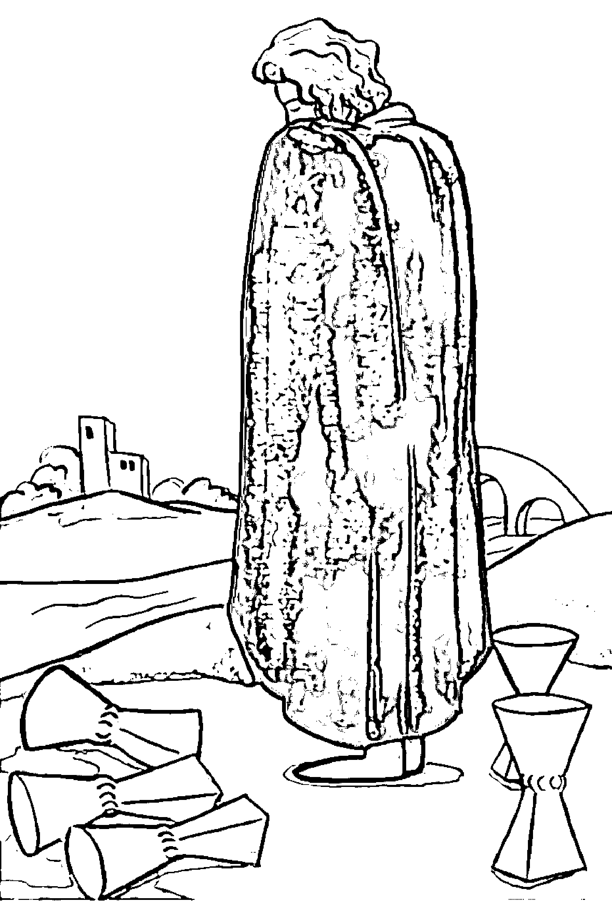

- 傾倒的三杯：在眼前、實際失去、讓你失落的事情
- 直立兩杯：目前仍擁有的財產或感情
- 遮住臉：隔離
- 河水：瓶頸、間隔、界線
- 橋：跨越
- 城堡：目標與希望

### 牌義簡易分析

☆ 正位含意：
期望落空、思念、對方無法了解你、後悔、分開、解除、失望、幻滅、需要自我空間、回憶與陰影無法自拔、失去勇氣、挫折與現實的打擊、需要寬恕彈性一些

☆ 反位含意：
重新開始、新的希望、擁有現有的一切、珍惜現在、重新再來、不再拘泥、尋找新的未來、做自己、覺得之前在浪費時間、不想深陷在回憶或謊言中、可以找人商量討論

### 金幣 5：

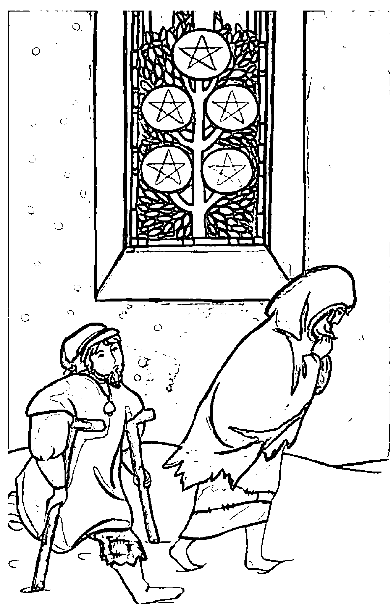

### 元素分析

- 彩色玻璃窗：代表教堂
- 窮人經過教堂卻低著頭：面對協助卻視而不見、忽略了契機
- 紗布、拐杖：缺乏謀生能力
- 下雪：危險、艱苦、困境中

### 牌義簡易分析

☆ 正位含意：
失業、貧困、低潮期、失敗與煎熬、失去依靠、想靠自己撐過去、遇到問題或缺口、感情出現裂痕、現實考量、資金不足、對於他人的善意沒放在心上、不聞不問

☆ 反位含意：
混亂、依賴、需要他人協助、遇到瓶頸、某項問題很難解決使你進退兩難、可能會發生讓人擔心的事情、幫助別人卻得到反效果、給自己找麻煩、引起紛爭

### 寶劍 5：

### 元素分析

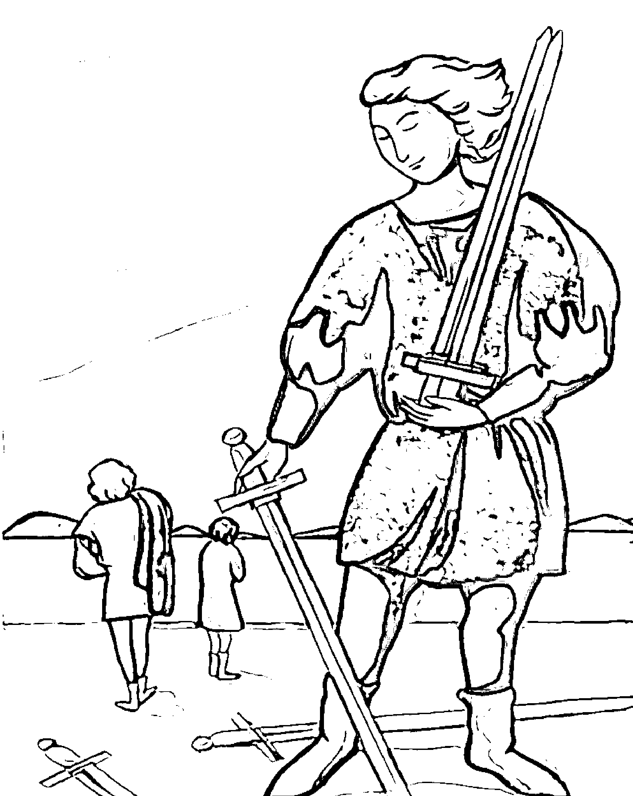

- 鄙視的表情：自私、搶奪獲利
- 狂風吹雲：緊張、憤怒、不安
- 散落的寶劍：自己也無法承擔、能拿到的收穫是有限的

### 牌義簡易分析

☆ 正位含意：
走捷徑、發生衝突、粗心、擔心的事情但最後成功了、最後的勝利、不斷想辦法讓事情往你想要的方向發展、積極得到成果、關係破裂、無法再信任下去、謊言與中傷、問題被壓制卻沒有解決

☆ 反位含意：
結束、失敗、飲恨、過度干涉、放棄、離開、先保護自己再說、盲目的堅持、受到很大的打擊、空虛無法找到自己、衝動下的行為、兩敗俱傷

## 結合人生的塔羅牌
現代塔羅牌

### 數字 6：

### 權杖 6：

### 元素分析

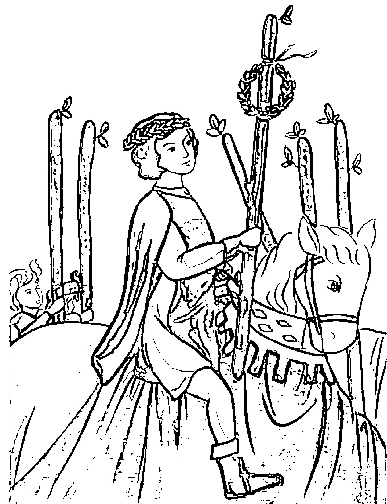

- 桂冠、花環：勝利、成功
- 白馬上的成功者：自信、崇拜
- 後面人被遮住：忽略戰友、忘了感謝

### 牌義簡易分析

☆ 正位含意：
勝利、得到肯定與認同、好消息、資格通過、禮物、發揮所長、讓大家看到你的成果、公開結果

☆ 反位含意：
假消息、打腫臉充胖子、自以為是、失去最好的時機、得不到好的回應、太慢開始、要再等一段時間有機會好轉、避免高興得太早，之後可能還有變數

### 聖杯 6：

### 元素分析

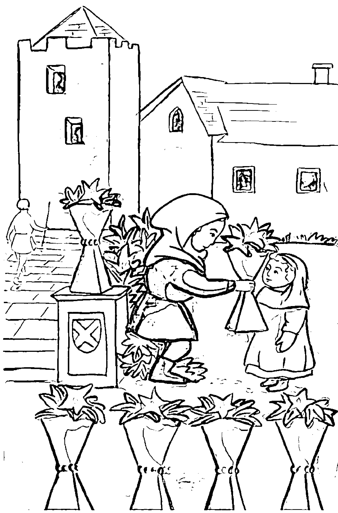

- 童話畫風：兒時回憶、脫離現實
- 哥哥照顧妹妹：管理、佔有、能力差異
- 房屋：安定、保護

### 牌義簡易分析

☆ 正位含意：
回憶、初戀、學習、純情的、照顧、年輕的時候、脫離現實、自我隱私的空間、得到幫助、經驗不夠、理論與實務、理想與現實、單純的快樂、牽絆在過去的人事物中、有些討厭的事情讓你想逃避、有機會和喜歡的人短暫相聚

## 結合人生的塔羅牌
現代塔羅牌

☆ 反位含意：
過於幼稚、太任性、特殊想法或要求、無法自立、情緒化、不堪回首、壞朋友或不好的戀人、無法長大、不付責任、能力有限、沉溺在自己的世界裡、對於周圍的事情心不在焉、效率不彰

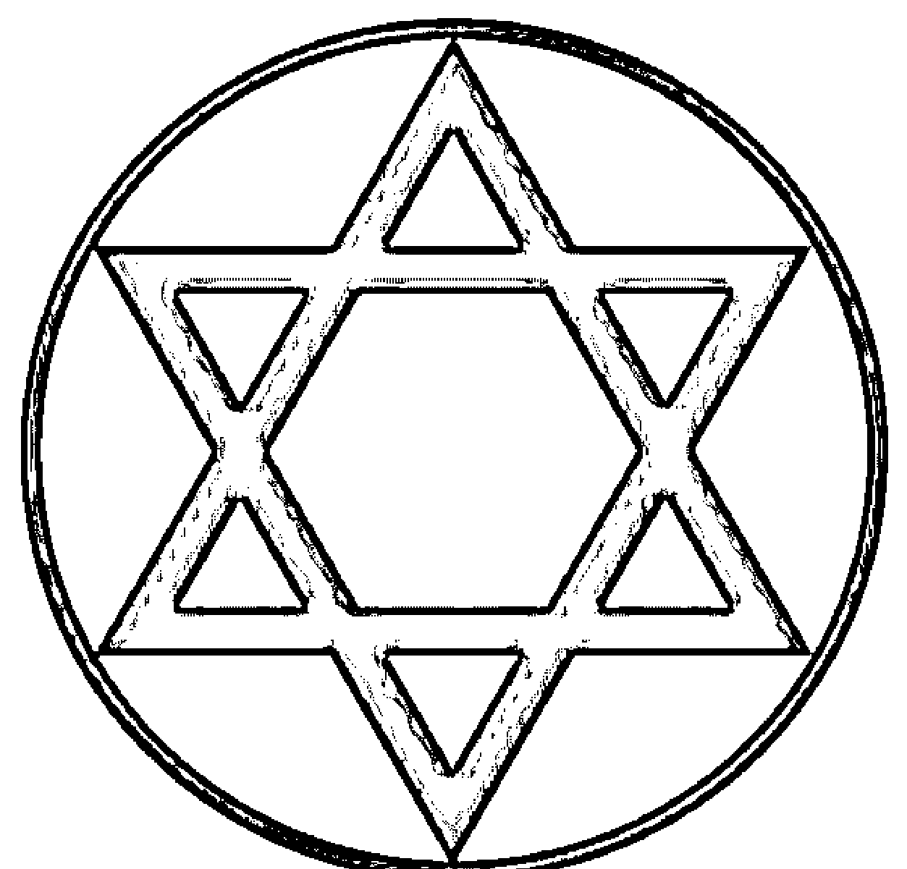

### 金幣 6：

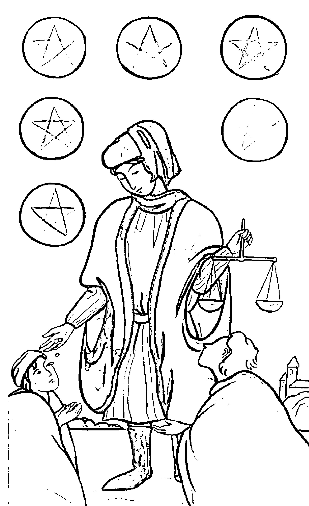

### 元素分析

- 富人：施捨、配給
- 窮人：接受、順從
- 天秤：公平、適當、合理的分配

### 牌義簡易分析

☆ 正位含意：
分配、照顧他人、分享、合理的判決、寬大的心胸、人性化管理、人情味、直率的相處讓人覺得舒服、物質運上升、收入提高、協助與陪伴

☆ 反位含意：
表面工夫、不公平、左右為難、偏心、貪得無厭、偷吃、想要更多、爭風吃醋、利己主義、無法讓他人信服、能夠提供的資源有限

### 寶劍 6：

### 元素分析

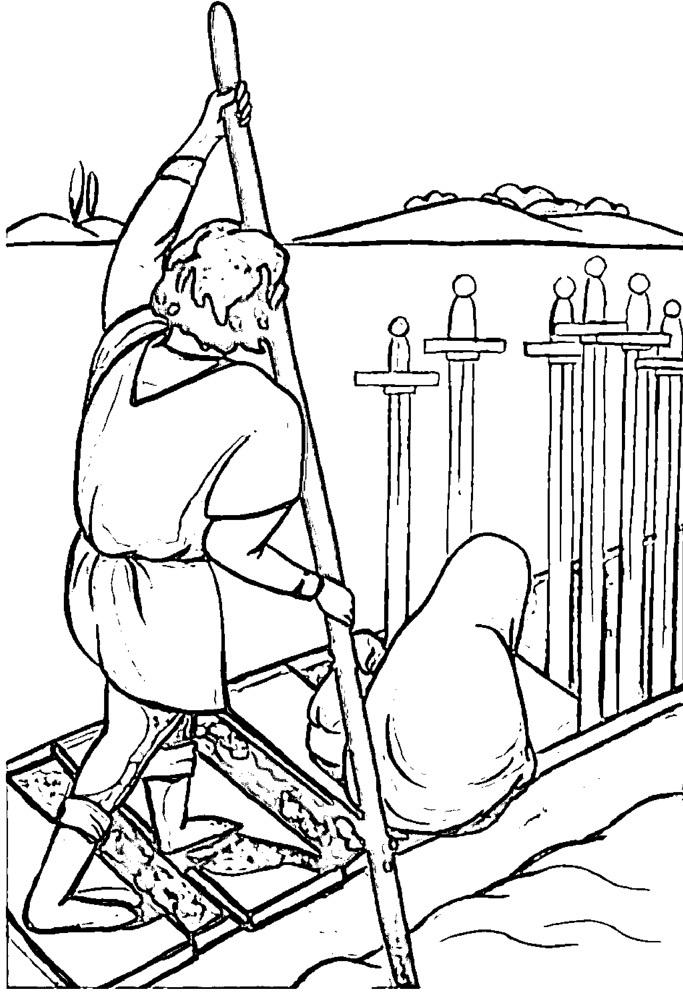

- 寶劍插在船上：若拔起將灌水使船沉落；代表無法癒合的傷口
- 船上載滿寶劍+人：負擔、壓力
- 水面一邊波湧、一邊平靜：慢慢平復
- 船正駛往對岸：過程；渡河象徵時間
- 披風裹著：低調、隱藏傷痛、傷在心
- 冥河擺渡人：卡隆 Charon，是希臘神話中承載死者靈魂的擺渡人。

### 牌義簡易分析

☆ 正位含意：
找到機會、度過低潮、換另一個方向發展、過渡期、幫助你的人會出現、遇到良師或好幫手、會有人陪伴或支持、外出旅行、脫離與避難

☆ 反位含意：
干涉太多、茫然不安、找不到確定的關係或目標、偶然的緣分、努力想讓關係更穩定、還在尋找好的策略方法、每個人的方向不一樣、爭執糾紛、意外波折

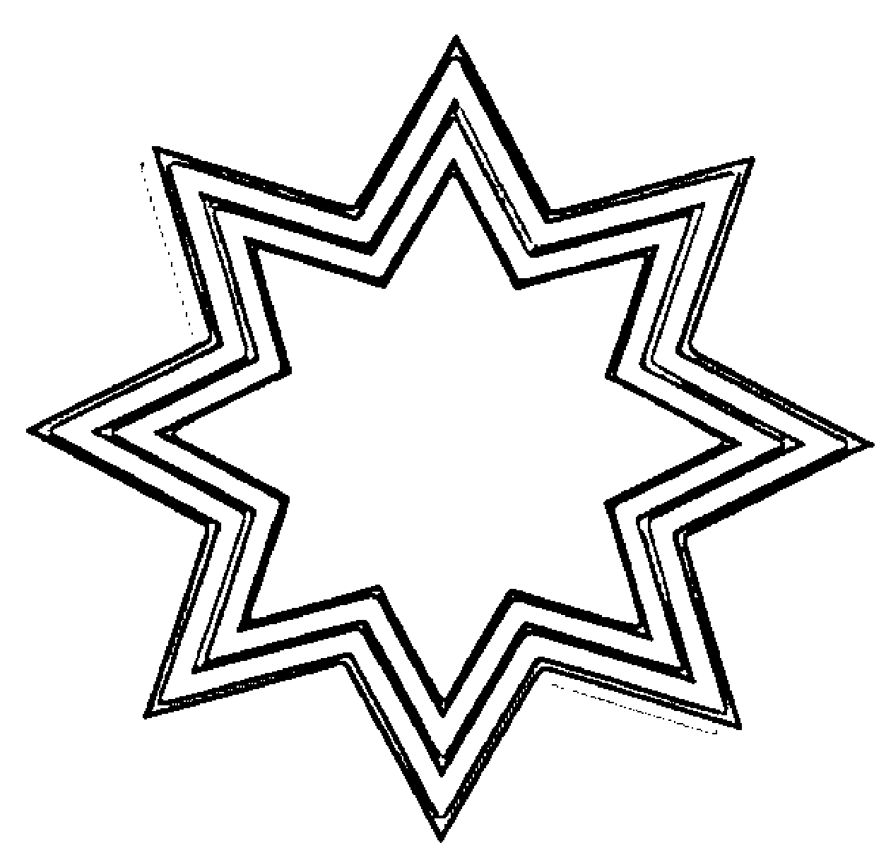

## 結合人生的塔羅牌
現代塔羅牌

### 數字 7：

### 權杖 7：

### 元素分析

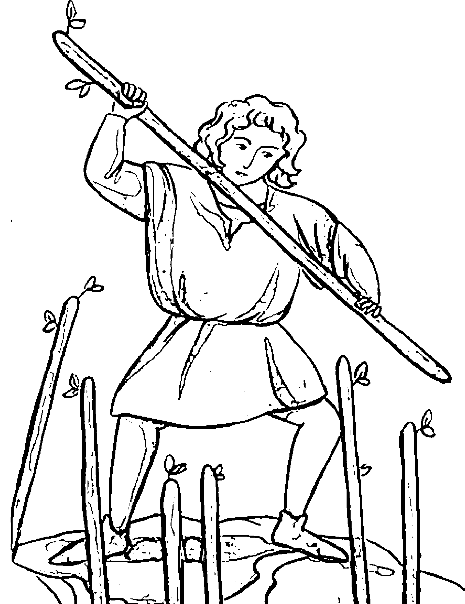

- ▷ 高舉：面對挑戰、堅持奮鬥
- ▷ 小丘、權杖：阻礙
- ▷ 人在高處：優勢
- ▷ 跨過河道：跨越阻礙界線、到目的地

### 牌義簡易分析

☆ 正位含意：
突破、衝出逆境、勇氣、脫離不好的環境、努力掙脫、過渡期、積極證明自己的能力、挑戰、保持清晰穩定、強硬些不要示弱、得到機會發揮能力

☆ 反位含意：
猶豫不決、優柔寡斷、錯失機會、失去最好的時機、波折不斷、方向錯誤或時機不對、不要輕敵、輕浮的態度會讓你扣分、迷失忙亂導致失敗

### 聖杯 7：

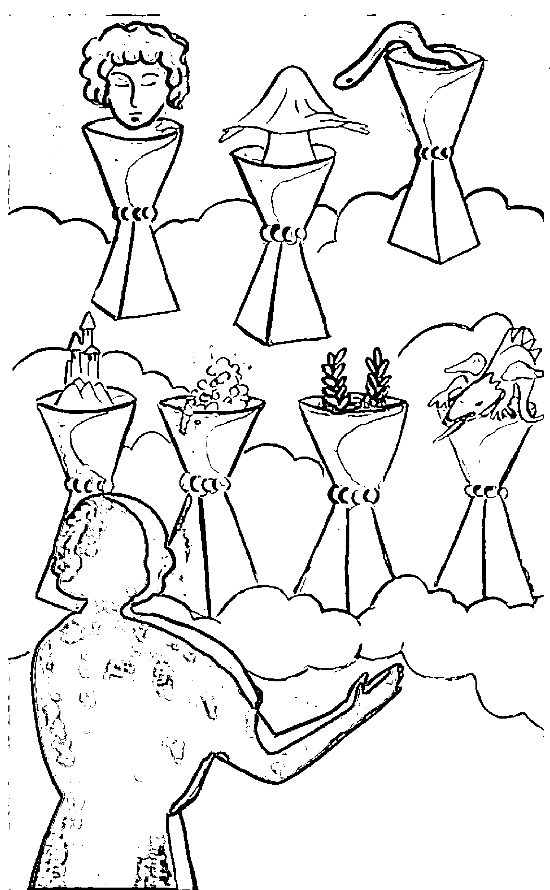

### 元素分析

- 杯中布幔遮住人體：真實自我、虛構的神；誘惑、不敢面對內心
- 杯中的人臉：容貌
- 杯中的蛇：性
- 杯中的城堡：安全
- 杯中的蛇：財富
- 杯中的桂冠：成就
- 杯中的飛龍：慾望或恐懼
- 雲霧：虛幻、混沌、迷惑
- 背對的人：內心複雜、想要的太多、心神不定

## 結合人生的塔羅牌
現代塔羅牌

### 牌義簡易分析

☆ 正位含意：
憧懞、光說不練、沒有實際能力、自以為是、慾望、不了解自己、不道德、七情六慾、眼高手低、妄想美麗的結果卻不努力、對事情的了解只在表層、好奇讓你看到意外的事情、美好到不可思議、不符合常理

☆ 反位含意：
下定決心、決定目標、覺悟、努力保持客觀、意志堅強、無欲則剛、不斷自我反省並改變、無法信任、模糊不清的回憶、自信心搖擺不定、意外發現秘密、各種八卦話題沒意義

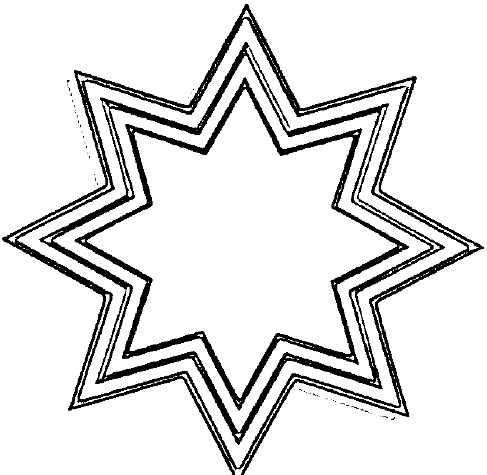

### 金幣 7：

### 元素分析

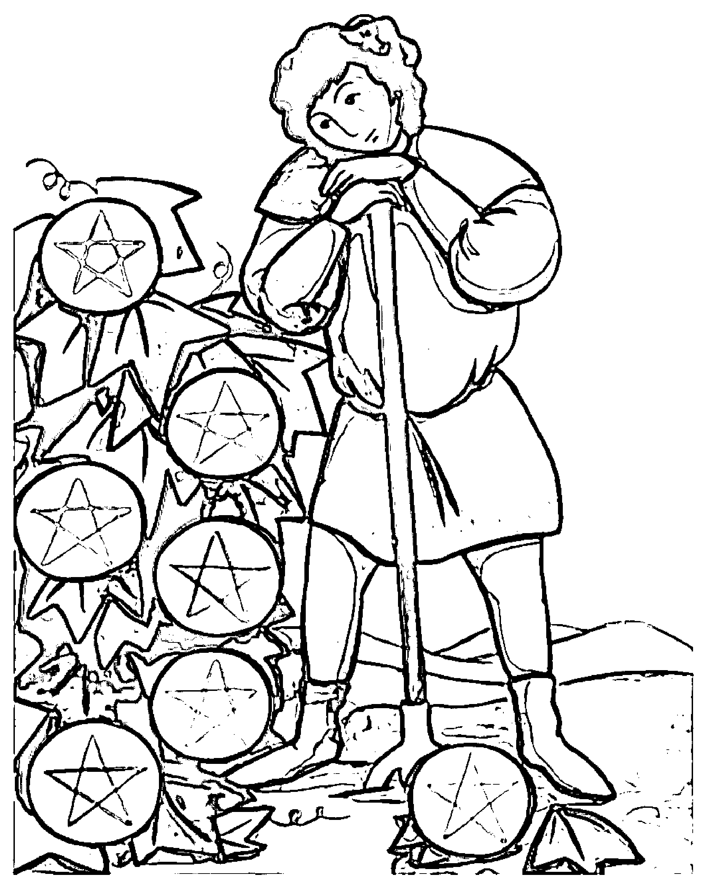

- 腳邊錢幣：拿取到資源、隨時準備運用
- 思索：考慮如何運用資源、籌劃評估；象徵仍有某種不確定
- 樹上充滿錢幣果實：豐收
- 手上還拿著鋤頭：努力付出

### 牌義簡易分析

✿ 正位含意：
腳踏實地、努力、期待被肯定、事情有進展、意外得到好評、結果提前出爐、發現相處的樂趣、工作或課業找到動力、投資將有收穫

✿ 反位含意：
忙碌、不負責、需要調整做法、變得沒耐性、需要更多時間與經營、事情發展不樂觀、成果令人擔心、投資可能有紛爭、不符合預期

### 寶劍 7：

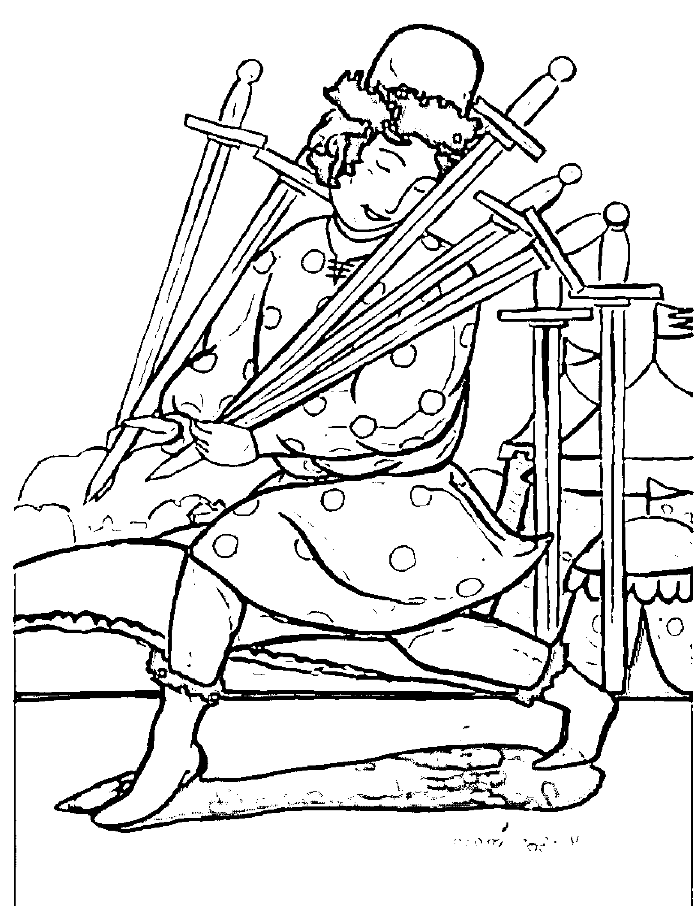

### 元素分析

- 偷竊：不可信、背叛欺騙；獨自領取
- 留下2支寶劍：遺留的潛在危機、資料不完全、超過自己能力
- 拿著5支寶劍：暗指這個勝利原本不屬於自己

### 牌義簡易分析

☆ 正位含意：
內姦、婚外情、第三者、間諜或欺騙、謠言、忌妒、搬弄是非、從中得利、欺騙、心裡有其他目的、挑戰後說不定有意外的成績、得到突然的機會與希望、可以自己決定目標

☆ 反位含意：
看穿內心、良好的商量對象、重新返回身邊、露出馬腳、重新建立關係、關係逐現明朗化、隱藏的事情曝光、願意正視一些問題、忍無可忍、決定表明自己的立場或想法

### 數字 8：

### 權杖 8：

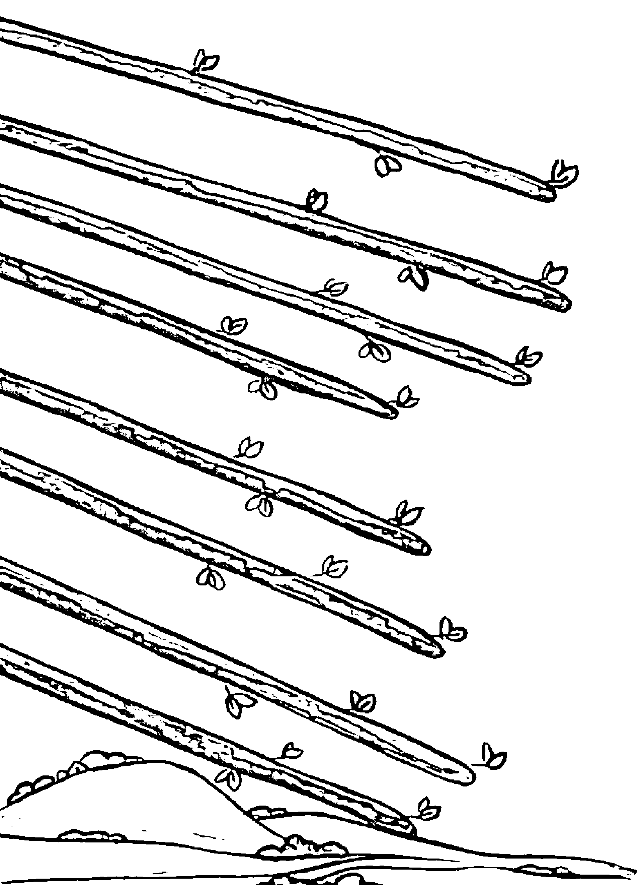

### 元素分析

- 直線飛行：迅速、積極
- 飛越山河：跨越領域
- 權杖排列有先後：速度有先後、快慢
- 從空而降：突然的決定、快刀斬亂麻

### 牌義簡易分析

☆ 正位含意：
迅速俐落、當機立斷、立竿見影、一見鍾情、遠距離、抱著很大的希望、不斷持續努力、別人的建議可以考慮一下、推波助瀾、保持積極

☆ 反位含意：
焦躁不安、倉促下的決定、浪費資源、衝動、欲速則不達、不要偷工減料或偷懶、不合群、自作主張、事情發展方向跟你想要的不一樣、焦慮急躁、遇到強進的對手

### 聖杯 8：

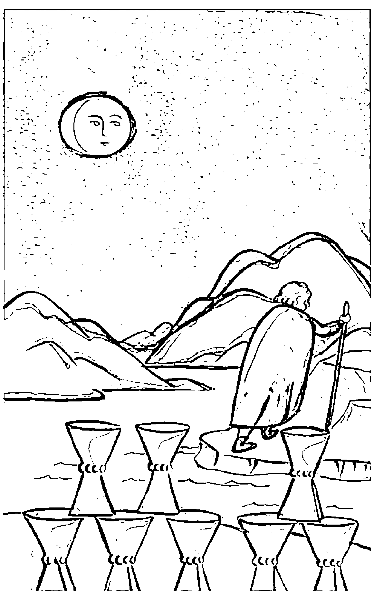

### 元素分析

- 往高山去：更高的理念
- 杯子的缺口：不滿足、目標、靈性尚未成熟
- 拿著手杖走向高山：暗指得到智慧後，成為隱者
- 月蝕太陽：用內在接管外在

### 牌義簡易分析

☆ 正位含意：
感覺到不足、尋找真相、現在的一切無法滿足自己、想要提升自己、離開或放棄、死心或冷卻、無法實現的願望、吸引人的話題或活動、新目標、忠實於自己的想法將有吉兆、給自己一個新機會

☆ 反位含意：
舊情復燃、繼續下去、觀望、等待新的可能、回到過去、珍惜現有的一切、試著保持平靜去面對各種變化、獨來獨往、勇敢去面對缺陷的地方、不想有遺憾

### 金幣 8：

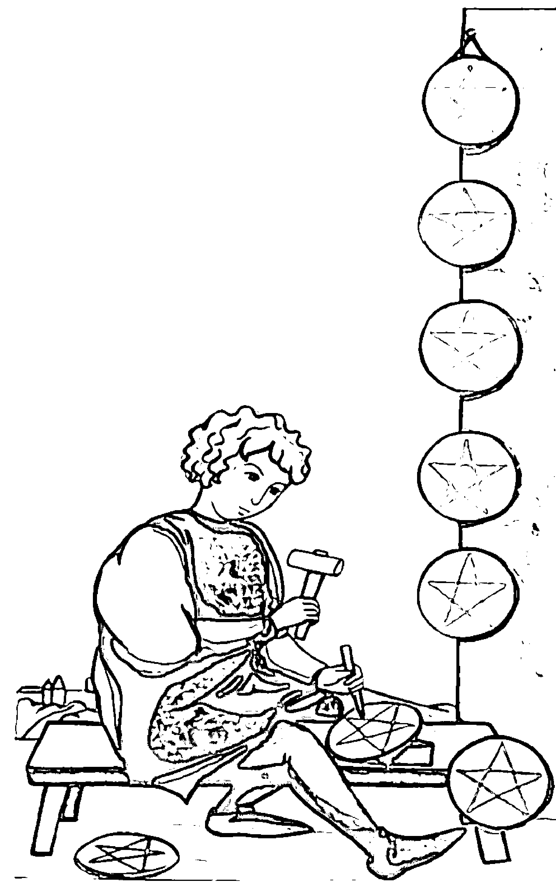

### 元素分析

- 掛著展示的錢幣：過去的成果與基礎、精益求精
- 腳邊的錢幣：等著被開發
- 遠方的城堡：目標、生活穩定
- 筆直的黃色道路：很有信心得到目標

### 牌義簡易分析

☆ 正位含意：
專業能力、技術、努力踏實、依照規矩步驟、做好事前準備是很重要的、有機會增加知識或能力、精益求精、很用心經營感情、希望感情更穩固、內心深處覺得不安與不確定、需要更多肯定與確認

☆ 反位含意：
失敗品、偽裝、缺乏心靈感受、專業不足、短視近利、缺乏遠見與智慧、心中有種孤獨感、力不從心、硬撐、對未來覺得茫然、不確定自己是否有能力、自我懷疑或否定

### 寶劍 8：

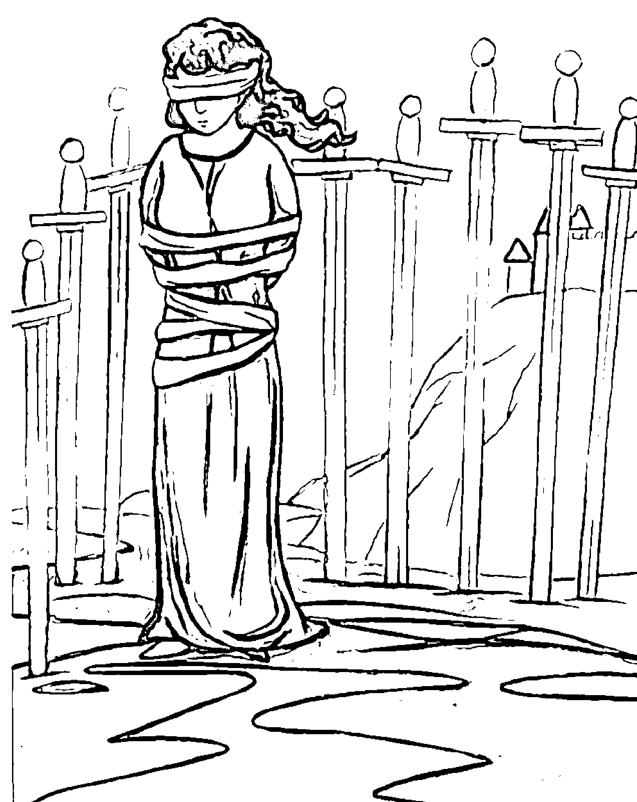

### 元素分析

- 蒙眼：無法看清外在環境或自我
- 雙足自由+面前無寶劍：可以靠自己力量離開、主因雙眼朦著感到恐懼，產生內心的阻礙
- 一腳在水、一腳在陸：理性與感性互相影響著你
- 寶劍擋住房屋：與目標隔離
- 面朝左邊：通常是過去經驗禁錮自己

### 牌義簡易分析

☆ 正位含意：
束縛、愛的俘虜、過不了自己內心的糾葛、無法採取行動、精神上受到壓迫或恐懼、後悔、不知不覺變成目前的樣子

☆ 反位含意：
出乎意料的發展、靠自己達到目標、主動決定自己的方向、勇敢去做會有機會成功、自己的能力更上一層、遇到貴人、新想法新觀點

### 數字 9：

### 權杖 9：

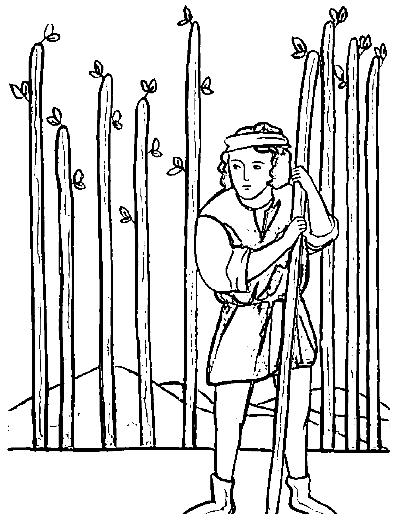

### 元素分析

- 繃帶：傷痕、經歷
- 背後權杖：防衛、包袱、壓力
- 守衛者表情：自我保護、不安、謹慎
- 受傷：能力有限、遇到打擊或敵人

### 牌義簡易分析

☆ 正位含意：
守護保衛、等待時機、堅持、警衛或保鑣、保守秘密、看不見的危機、預防、不聽他人的意見、計畫被延誤或發現錯誤、注意潛伏的問題、關係被破壞

☆ 反位含意：
內心陰影、疲倦讓人失去毅力、放棄、沒有機會、各自堅持、阻撓或挫折、可能有人背叛、努力卻看不到進步或效果、漫長的付出讓人疲倦了、想收手或離開

### 聖杯 9：

### 元素分析

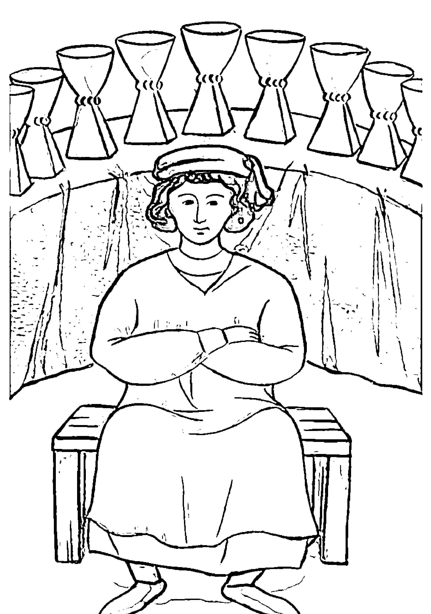

- 聖杯在高處：非常榮耀的成功
- 聖杯在商人背後：地位差距、獨享、距離
- 雙手交叉：自滿、驕傲、防衛
- 商人坐在椅上：期待被崇拜、守護著成就

### 牌義簡易分析

☆ 正位含意：
擁有、充裕、滿足、展現自我、有貴人幫助、成就、穩定發展、得到回報、苦盡甘來、展現自己的吸引力

☆ 反位含意：
過度操控、不肯認錯、假象被戳破、不滿、失誤與損失、缺陷、單相思卻假裝不在乎、任性自大讓人反感

### 金幣 9：

### 元素分析

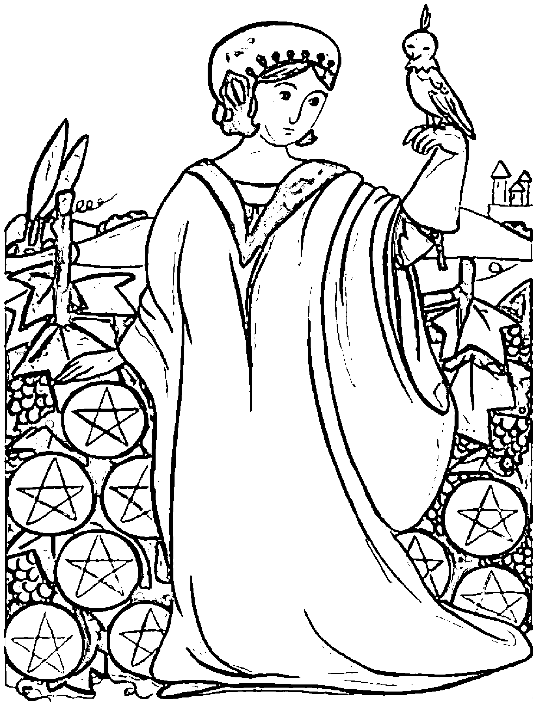

- 小鳥：理想
- 守護者謹慎盯著小鳥：怕失去理想
- 小鳥頭套：是因為被寵愛習慣、還是被恐懼套住頭而扼殺理想的飛翔？

### 牌義簡易分析

☆ 正位含意：
努力將有回報、成功、安全、收穫、富裕、管理得當、經營成果很好、一個人的自由、安定感、有助理或幫手出現、謹慎小心的行動、很努力讓事情能穩定運作

☆ 反位含意：
效果有限、唯利是圖、邪惡或自私、利己主義、開始鬆懈了、出現不好的評價或流言、不知不覺封閉了自己、無法交流、行動缺乏計畫、開銷需要調整、策劃有缺失或遇到意外

## 結合人生的塔羅牌
現代塔羅牌

### 寶劍 9：

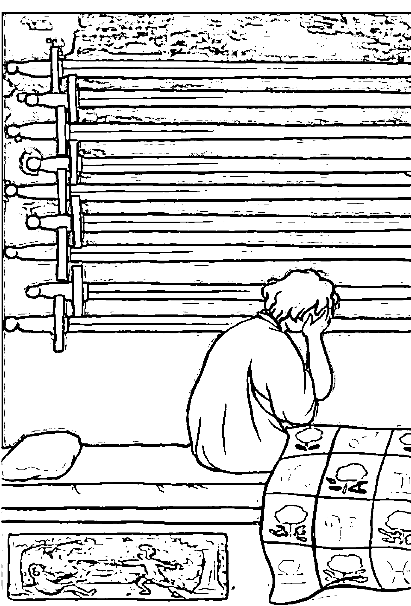

### 元素分析

- 寶劍穿過頭頸胸：身心靈
- 被子的12星座與行星：整個物質世界、大環境背景
- 搖著臉：人無法脫離痛苦
- 床側兩人爭鬥的圖案：內心矛盾掙扎

### 牌義簡易分析

☆ 正位含意：
內心陰影、回憶讓人難受、無法面對自己、過度疲勞、壓力與困難、被壓抑或操縱、讓人失望的消息、失落、氣餒、不幸、爭論不休、懦弱、惡性循環、不安感或直覺不太對勁

☆ 反位含意：
計畫中止、欺瞞與背叛、操縱不當產生過失、精神轟炸或衰弱、放棄與將就、失去判斷力、恐懼逃避、短暫的喜悅、羞恥、想躲起來、想法越來越偏激怪異、自卑或受創、捲入糾紛中、不斷爭執、焦慮、妄想

### 數字 10：

### 權杖 10：

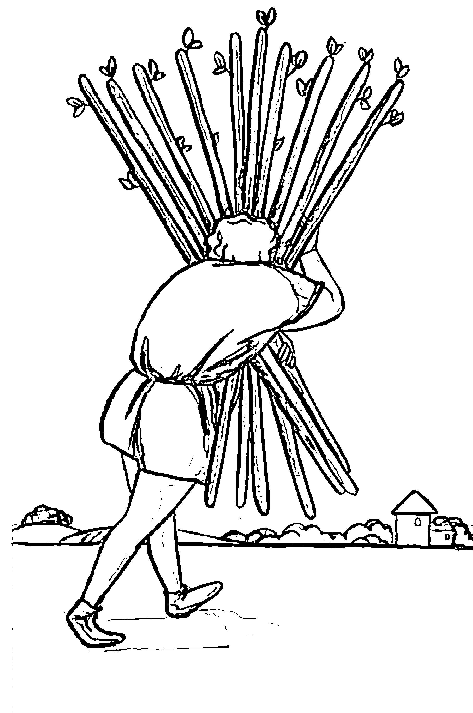

### 元素分析

- 遮住視線：盲點、視野、換角度
- 房舍：目標
- 彎腰駝背低頭：難以承擔、壓力、責任沉重
- 抱著全部的權杖努力行走：努力將走向成功、緊抓不放、捨不得

### 牌義簡易分析

☆ 正位含意：
無法自由、過度疲勞、壓力、責任感、很在意的事情、需要協助、辛苦的經營、努力堅持想扭轉現況

☆ 反位含意：
計畫中止、將就、不積極、覺得夠了、想放手不想繼續下去、精神疲倦、找不到信任的人、見異思遷、遇到困難就想逃避、敷衍了事、需要培養實力

## 結合人生的塔羅牌
現代塔羅牌

### 聖杯 10：

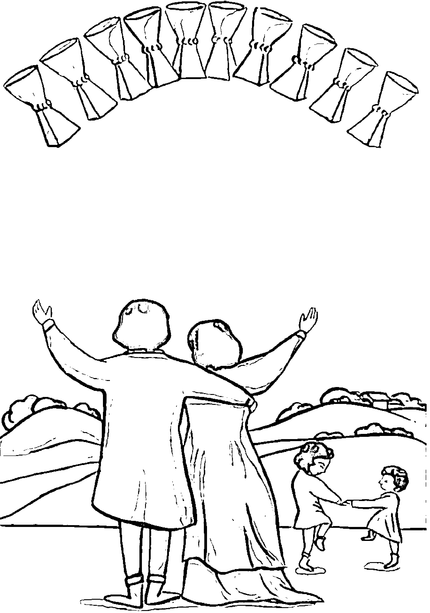

### 元素分析

- 家人：團隊合作，互相扶持、實現
- 住宅、綠地、溪水：圓滿而豐富的生活
- 彩虹：幸福，上帝的承諾與給予
- 兩個大人朝向彩虹：感謝
- 兩個孩子跳躍：喜悅

### 牌義簡易分析

正位含意：
圓滿、和諧相處、平靜、良好的關係、順利進行、被某人一直關懷著、正確的判斷、找到和諧共處的方法、穩健發展、得到肯定與稱讚

反位含意：
背叛、破裂、必須靠自己、獨裁、不協調的關係、失去機會、避重就輕、貌合神離、明褒暗貶或陽奉陰違

### 金幣 10：

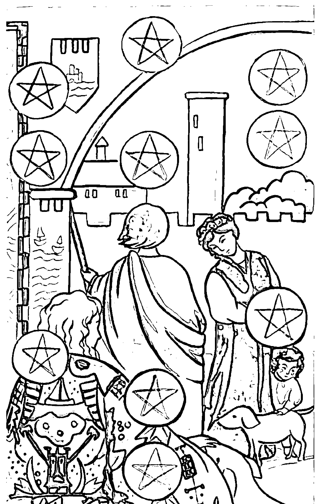

### 元素分析

- 男人手上拿著生命魔杖：生命力
- 門外老人（衣著斑斕、綴滿占星與魔法符號）：造訪凡間的天神，所以人們都視而不見；只有內心單純的小孩與狗看到

### 牌義簡易分析

☆ 正位含意：
家世良好、土地或不動產、家業、良好的溝通、會有人帶來好運、找到平衡點、和平相處、金錢運上升、將與重要的長輩見面、家庭關係圓滿、幸運

☆ 反位含意：
貌合神離、浪費時間、退縮、不好的消息、內心陰影無法脫離、可能會遺失小東西、旅遊途中有點小遺憾、可能會犯錯、心裡仍有掛念的事情、原本以為會順遂卻遇到波折

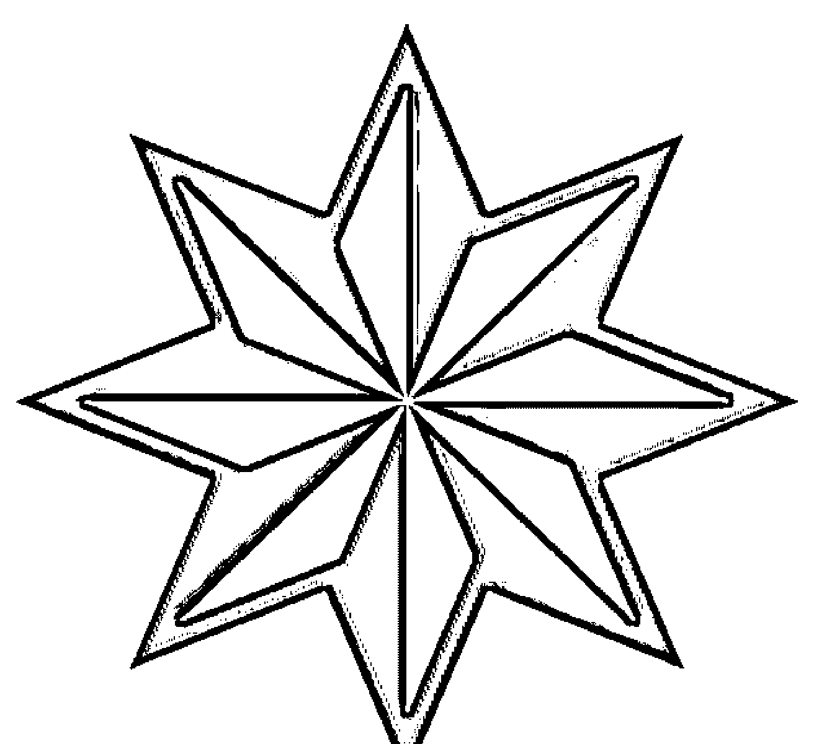

### 寶劍 10：

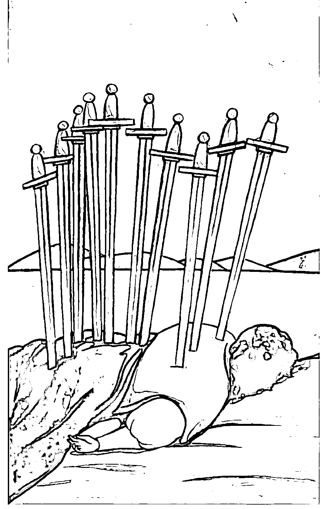

### 元素分析

- 黑暗盡頭是光明：重生
- 頭朝著光明：等待未來的轉機
- 身上的10支箭：動彈不得、只能接受結局

### 牌義簡易分析

✳ 正位含意：
破滅、只能接受結果、放手、失敗、得到的結果讓人失望、處境對自己很不利、負面的想法、見不到想見的人

✳ 反位含意：
短暫的快樂、找新目標、等待下一個機會、遠水救不了近火、問題累積太久、一切放掉重來、或許有新機會正在醞釀、看開了、放手不執著

### 二、宮廷牌

### 侍者

### 權杖侍者：

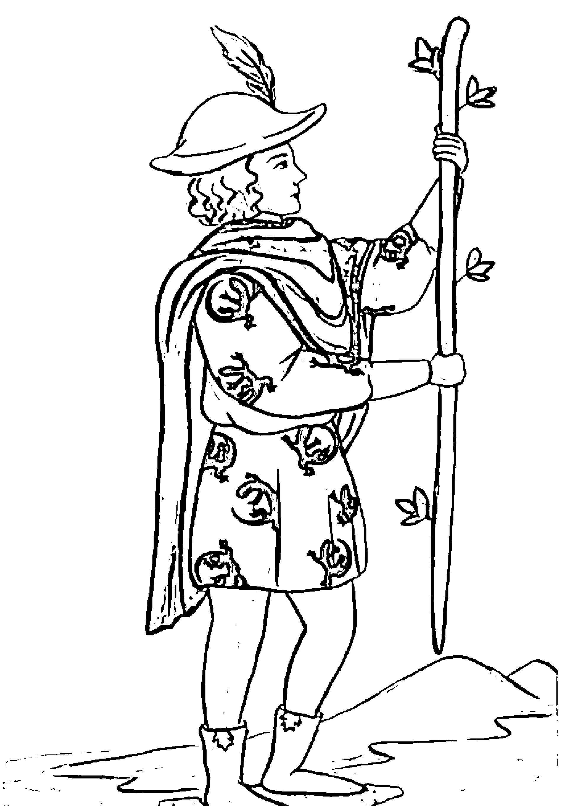

### 元素分析

- ▷ 沙丘：挑戰、阻礙
- ▷ 衣服花紋：火蜥蜴、是火元素的代表神獸，代表生命力
- ▷ 紅羽毛：生命力
- ▷ 喜悅的表情：對生命充滿期待

### 牌義簡易分析

☆ 正位含意：
熱情積極、有衝勁、陽光與期待、自立與自信、如果努力會有好運、可以收集各種資訊或能力、親切主動、先試著了解自己的想法

☆ 反位含意：
依靠他人、被利用、逃避與脆弱、拒絕面對事實、守不住秘密、聯絡或訊息出現失誤、悶在心裡找不到抒發的方法、實力不足

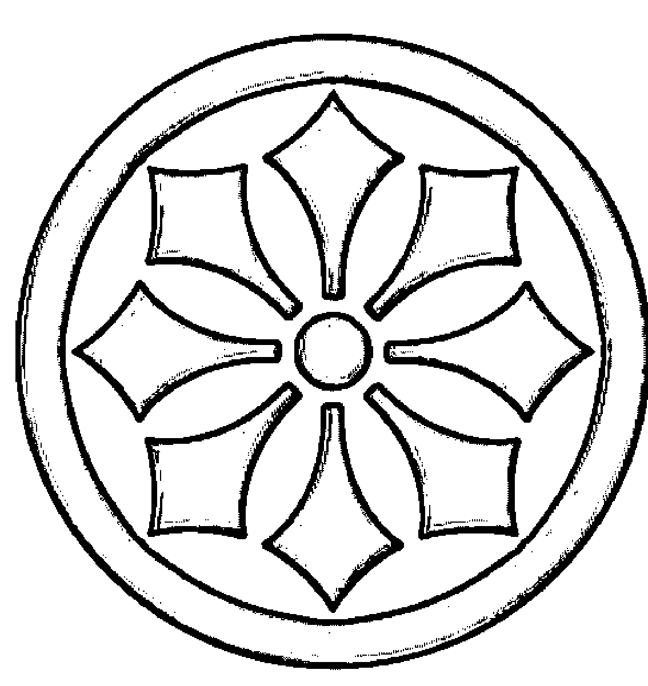

### 聖杯侍者：

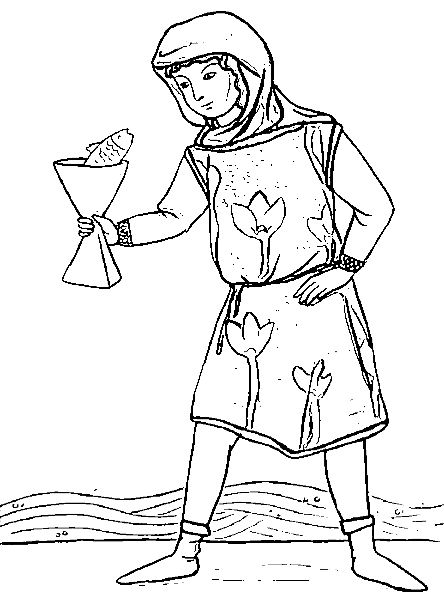

### 元素分析

- 魚從聖杯出來：從內心流露出活力
- 與魚對話：想像力、感受力、靈修冥想
- 蓮花：水元素的代表植物，象徵出淤泥而不染的靈性
- 天真好奇的表情：一切新想法來自單純的探索

### 牌義簡易分析

正位含意：
反省、自我整合、朋友互相交流、在乎他人的想法、重要消息、自發性的奉獻或行為、願意配合讓人對你有好感、默默付出、真誠的關懷

反位含意：
委屈自己配合他人、奉承、失去自我、找不到依靠、失去原則、玩物喪志、沉溺、孩子氣、拒絕面對現實、自我催眠、找藉口、無聊的爭執

### 金幣侍者：

### 元素分析

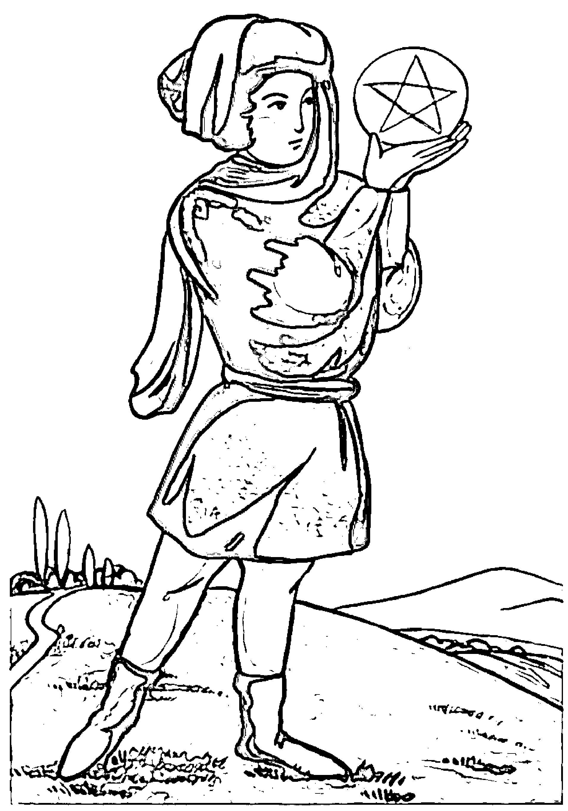

- 緊盯錢幣：嚮往某具體目標
- 認真的表情：學習與適應
- 樹木、綠地、花草：豐富的資源

### 牌義簡易分析

☆ 正位含意：
優秀、成熟、願意負責、單純而踏實、開始努力認真、想增加自己的實力、好奇心、反省、自我要求、認真去思考某件事情、實習、真實的體驗

☆ 反位含意：
早熟、依老賣老、愛慕虛榮、在乎自尊、沒耐心、視野狹隘、揮霍浪費、無法將知識活用在生活中、太古板、一板一眼、單戀、想要強迫別人照自己的方法去做、不懂得人情世故、不成熟、裝大人

### 寶劍侍者：

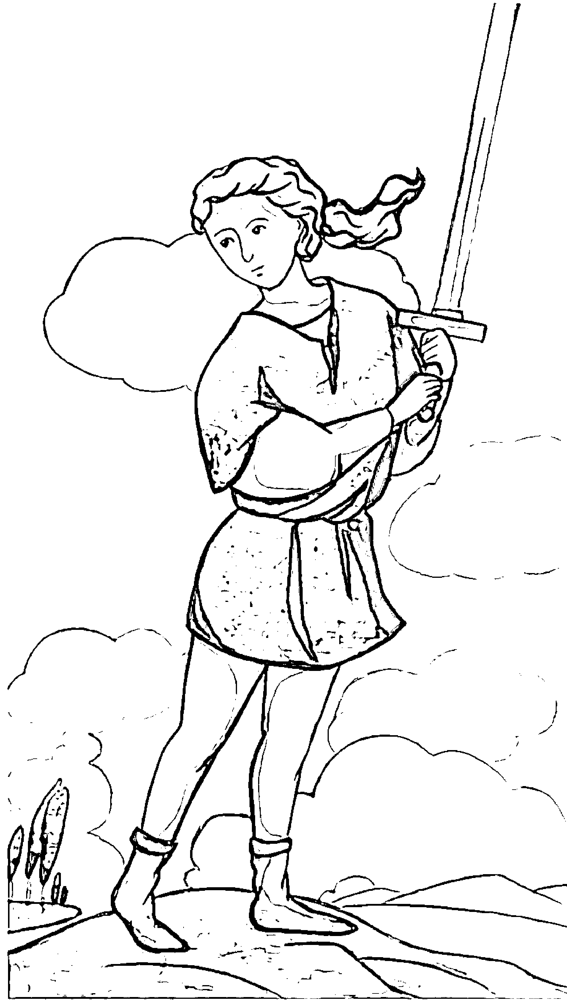

### 元素分析

- 站姿輕浮：對知識真理仍不了解
- 不安定的雲、樹木：變動不安
- 拿著寶劍卻看另一邊：觀念尚不穩定
- 寶劍未見頂端：傳遞不正確、不完整訊息

### 牌義簡易分析

☆ 正位含意：
小心謹慎、不斷尋找真相、太沉溺對自己不好、靈感萌芽、不停吸收各方面的訊息、用自己的角度去解釋、第一次的經驗、初試身手

☆ 反位含意：
找不到明確具體的答案、突發事件、意外的答案、準備不足或思考方向有偏頗、聰明反被聰明誤、對於權力或不公平的事情感到無奈

### 騎士

### 權杖騎士：

### 元素分析

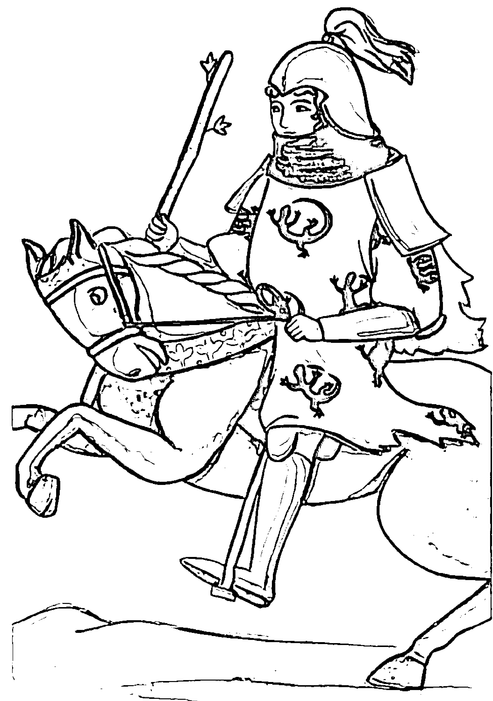

- 赤紅色的馬：動力與熱情、強烈茂盛的生命力
- 馬蹄舉起、作勢跨越沙丘：不懼挑戰
- 衣服：火蜥蜴

### 牌義簡易分析

☆ 正位含意：
運動員、自主權、勇敢做自己、突破與創造、直覺與改變、敏銳行動、得到禮物或收穫、旅行運不錯、成為某方面的專家、堅持而得到最後勝利

☆ 反位含意：
爭執、目標或做法不同、想要自由、叛逆、突然的變化、發生讓人失望的事情、有人在跟你競爭、專業知識派不上用場、大材小用

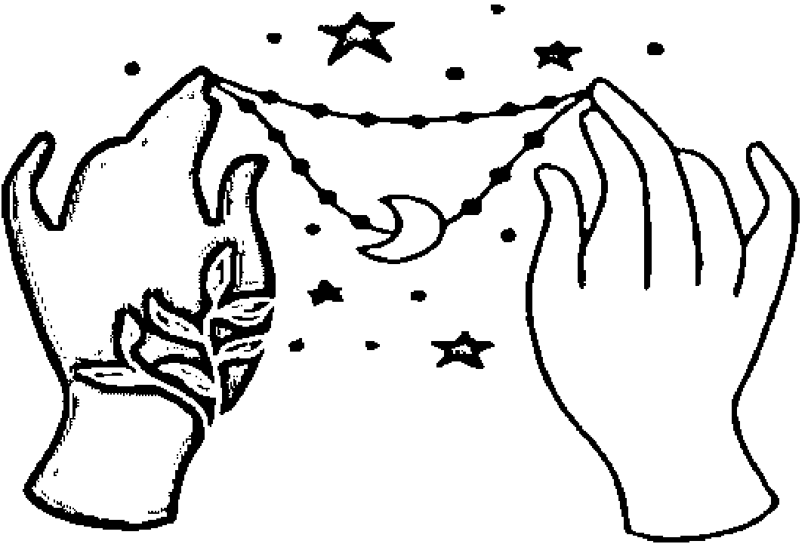

### 聖杯騎士：

### 元素分析

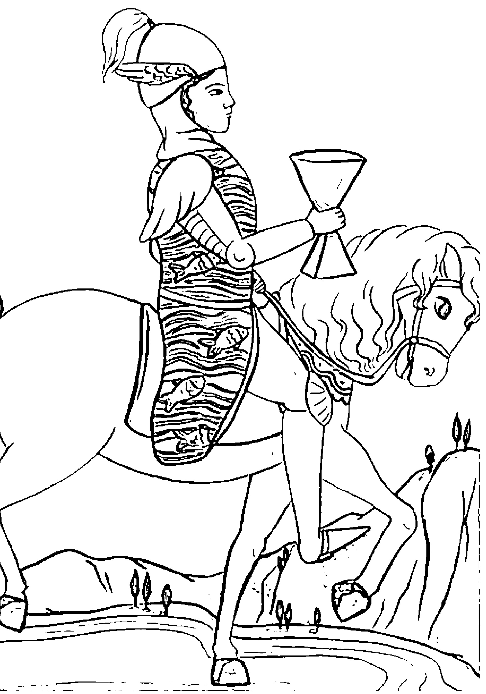

- 臉上自然的自信：因直覺或情感、美感而成功
- 優雅的坐姿：氣質出眾
- 平舉的聖杯：奉獻、分享
- 馬一腳提起：自然的緩緩前進

### 牌義簡易分析

正位含意：
參加邀約、優秀的訪客、羅曼蒂克、心靈交流、營造良好的氣氛、成熟貼心、得到機會、規劃、願望正逐漸實現中、有人來訪、重點逐漸明顯開來

反位含意：
虛偽的、假裝、小心欺騙、幻想、懶惰逃避、假訊息、出現討厭的人、虛與委蛇、壞點子發生效果、過程充滿荊棘

### 金幣騎士：

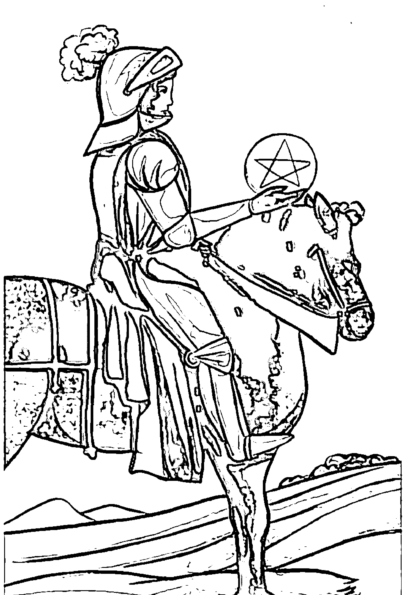

### 元素分析

- 手捧金幣目向遠方：堅定決心、務實
- 停下腳步的黑馬：站穩、步步踏實、謀定而後動
- 頭盔與黑馬頭上的綠葉：生機、活力、希望
- 黑馬身上畫格子的紅線：規劃、步驟

### 牌義簡易分析

☆ 正位含意：
為前途而努力、海外留學、認真工作、希望有更好的發展、自己創造未來、磨練出耐性、開始穩定下心來、遵守規定、物質運勢提漲、說到做到、看著自己漸漸進步

☆ 反位含意：
重考、懈怠或放棄、欠缺自信、猶豫徘徊、內心憤恨不平、失去熱忱與動力、太堅持自己的方法、停滯不前、內心也覺得茫然、不想被別人看輕或冷淡

### 寶劍騎士：

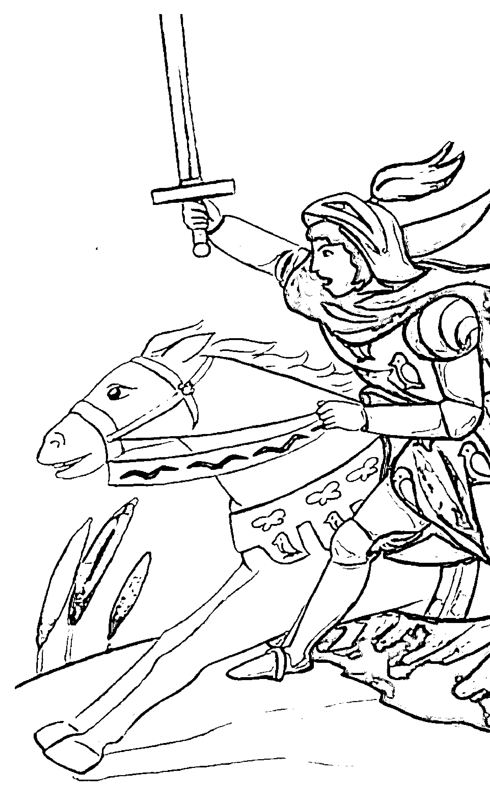

### 元素分析

- 疾奔的馬：迅速快捷
- 高舉利劍、眼神殺氣：對立與毀滅、傷害性
- 紅色披風與頭飾：以生命為動力
- 寶劍高度超出畫面：有限、局部的知識

### 牌義簡易分析

☆ 正位含意：
很有幹勁活力、衝鋒陷陣、勇敢的表現自我、整體狀態十分良好、保持正向積極的態度、勇敢出發去爭取自己要的幸福、突破障礙、學習領導能力

☆ 反位含意：
太過自我、不斷發生各種麻煩的事情、失去自我原則、跟社會道德相衝突、厚顏無恥、犯錯卻不願改善、衝動的決定造成損失、做出後悔的事情

### 皇后

### 權杖皇后：

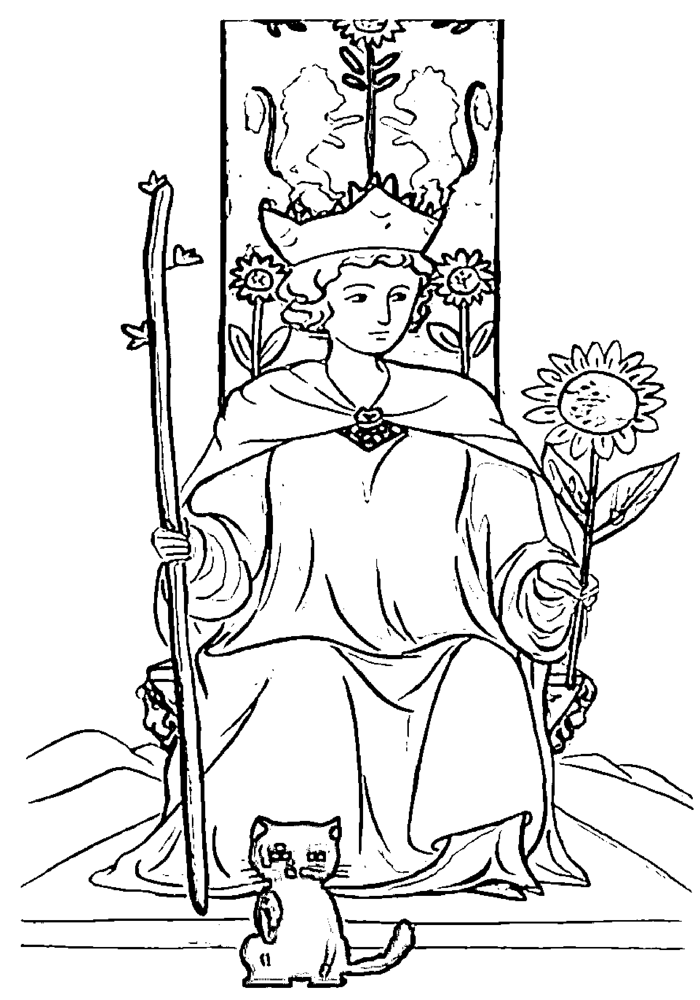

### 元素分析

- 向日葵：熱情陽光
- 座椅獅子座：積極大方
- 黑貓：生命的守護者
- 皇冠頂上像綠芽的裝飾：新生命

### 塔羅牌義

正位含意：
職業婦女、創業、守成、靠自己、成熟而穩重、付出、營造氣氛、可以依靠的對象、金錢運上升、情誼越來越穩定

反位含意：
沒有姿色、太守舊、怕改變、拘謹小心、想要被崇拜或被稱讚、小氣、固執、誠意得不到認同、協助你的人無法給予實際的幫助、吃醋忌妒

### 聖杯皇后：

### 元素分析

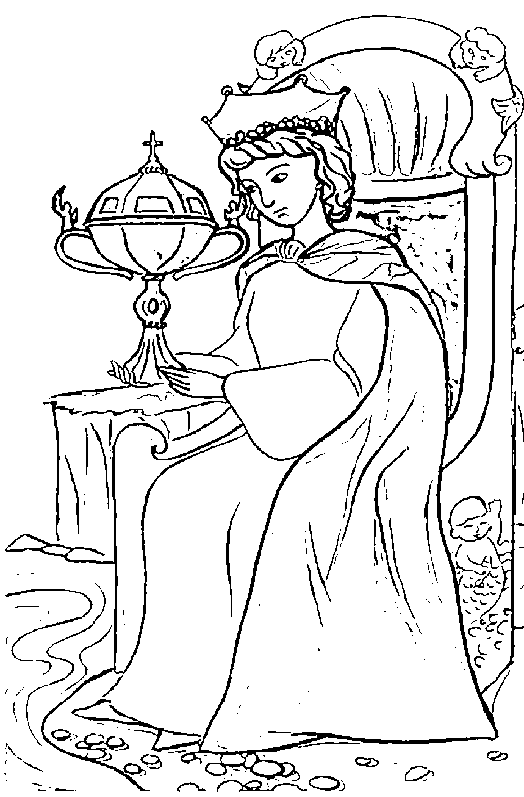

- 全神貫注看著聖杯：用心傾聽、心靈感受、靈性
- 座椅：人魚、水象星座的代表神獸；上半身是小天使造型、象徵天然與神性
- 海水流過腳尖：自我與情感、想像的整合；無意識與意識結合
- 華麗的聖杯：造型像教堂，因為以前教堂是藝術的結晶所在，延伸代表靈性

### 牌義簡易分析

☆ 正位含意：
善良、深思、有魅力、包容、藝術與美感、直覺、安定的氛圍、平穩的心讓你慢慢實現願望、得到援助與體諒、無私、義工或捐贈

☆ 反位含意：
愛慕虛榮、愛的方式成為他人的負擔、輕浮、天真幼稚、需要被呵護、無法面對現實、壞心眼、假情假意、喪失衝勁、感情變淡

### 金幣皇后：

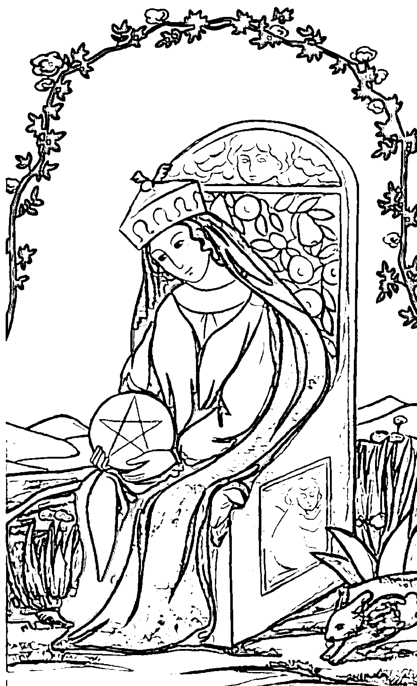

### 元素分析

- 椅背的洋梨：富裕的含意
- 座位旁野兔：和諧喜悅、生育的能力
- 專心看著金幣：母愛、精準眼光

### 牌義簡易分析

正位含意：
職業婦女、穩定的愛情、富裕的生活、靠自己的能力往上爬、開始對很多事情有興趣、懂得過生活、彼此關係有進展、要求高品質

反位含意：
沒見過世面、經驗不足、井底之蛙、責任太重、得不到感情的滋潤、過度打扮或裝飾、逃避責任、遇到問題卻假裝視而不見、不願付出、找不到正確的方法或答案

### 寶劍皇后：

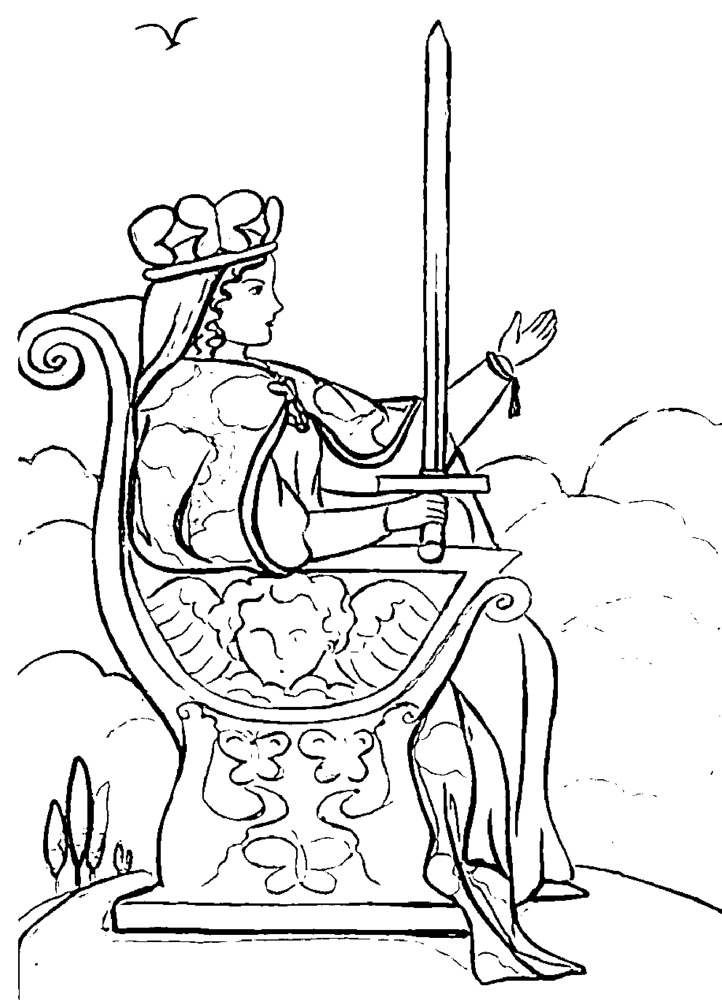

### 元素分析

- 沉著的表情：悲傷分離、失落、冷漠
- 座椅：蝴蝶，是風象的代表神獸。
- 左手流蘇：左手代表「經驗」、流蘇代表「剪斷了束縛」，因此整體的含意，代表用經驗培養智慧脫離束縛
- 單鳥飛翔+豎直寶劍：絕對真理、唯一標準

### 牌義簡易分析

☆ 正位含意：
有智慧、有品味、懂得生活、找到自我平衡的方式、守護、很有構思能力、能給人具體的建議、保持中立、能保持冷靜

☆ 反位含意：
別有用心、不像表面那麼單純、背叛、假裝、自私、心虛狹窄、裝腔作勢、任性批評他人、雙重標準、知識不足、復仇心強、不懂人情世故

### 國王

### 權杖國王：

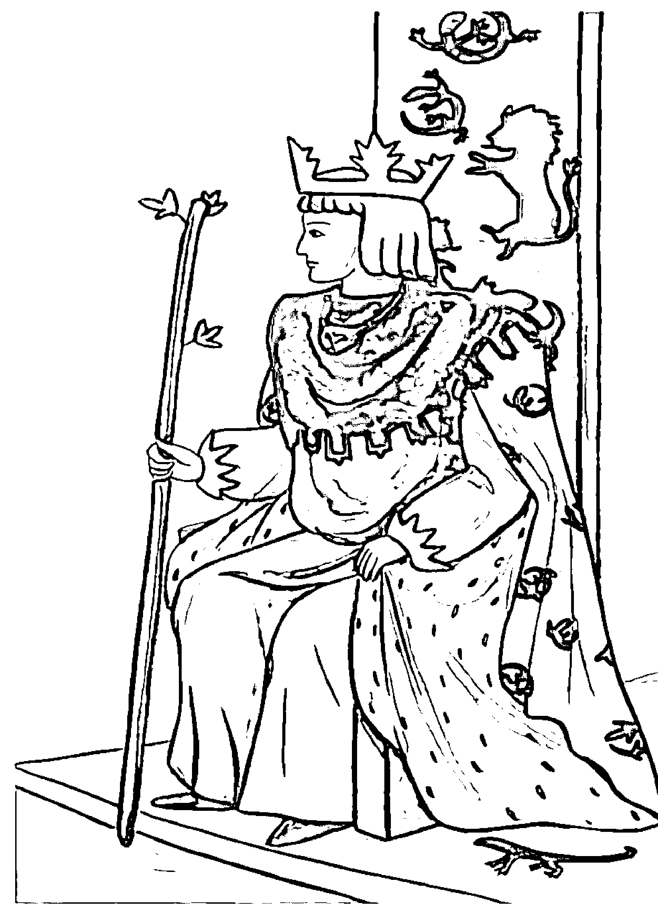

### 元素分析

- 看著遠方：深謀遠慮
- 一手輕舉、身體微向前傾：隨時出動
- 火蠑螈、火蜥蜴：火元素的代表神獸
- 披風、座椅：火蜥蜴、獅子座

### 牌義簡易分析

☆ 正位含意：
偉大成熟、有能力有主見、深思熟慮、指導者、深藏不露、可以信賴的人、熱心工作、投資得到很多收穫、得意忘形會招來失敗、全面掌握

☆ 反位含意：
不夠寬容、一意孤行導致失敗或錯誤、偏執任性、心胸狹窄自我中心、馬馬虎虎或是考慮到的只是片面、個人能力有限、太自我或逞強

### 聖杯國王：

### 元素分析

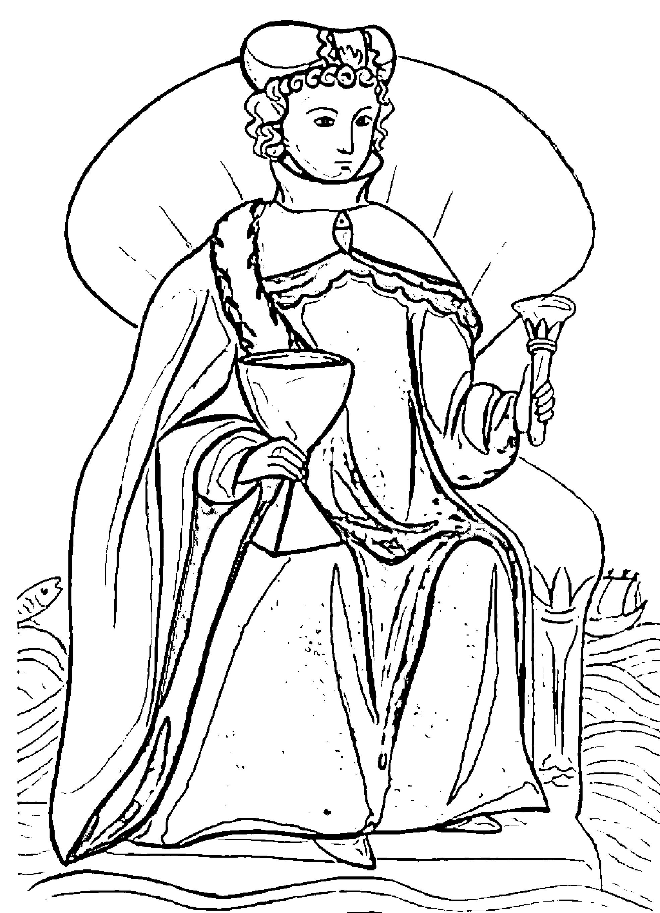

- 海中魚：情感啟發的創造力
- 帆船：各種想法與意識
- 海洋澎湃：潛意識深大的影響
- 在澎湃的海洋中穩坐不動：高EQ

### 牌義簡易分析

☆ 正位含意：
愛家、安定人心、社會遠見、責任感、有品味、自我約束、多方面思考、信賴度提高、充實的發展下去、有主軸有原則

☆ 反位含意：
內心傍徨、小心遺失某個物品、缺乏道德、婚外情、無法理解他人、不公平的手段、先天性優勢、花言巧語、這段關係經不起打擊

### 金幣國王：

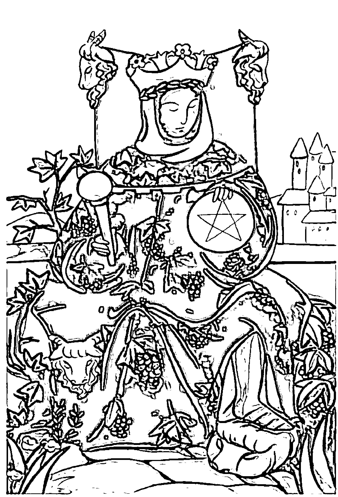

### 元素分析

- 左手輕搭金幣上：一切皆已掌握、隨心所欲
- 座椅：金牛座
- 葡萄：生命中的甜美與收穫
- 腳踏在牛像上面：征服了物質世界

### 牌義簡易分析

☆ 正位含意：
管理者、崇高地位或身分、掌握實權、援助者、信賴感、穩定發展、可以依靠的人、強而有力的貴人、小心情敵出現、莫名的壓力與責任

☆ 反位含意：
經濟能力有限、憂鬱、不信任、自私、拒絕溝通、外強中乾、虛有其表、斤斤計較讓人覺得反感、以自我為中心、無法逃開的孽緣、內心煎熬、不甘心

### 寶劍國王：

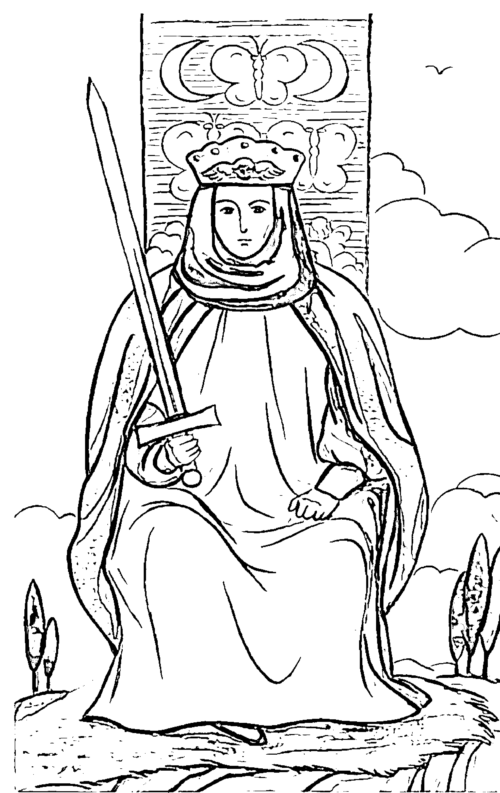

### 元素分析

- 國王是知識的領導者：象徵專家、教授、顧問
- 寶劍稍斜：正義的偏頗
- 兩隻飛鳥：象徵心智、飛向智慧的高空；兩隻鳥，象徵陰陽、二元
- 座椅蝴蝶：生命蛻變而成智慧

### 牌義簡易分析

正位含意：
支配者、有能力指導他人、有威信的人、能清楚說出自己的想法、有自己的觀點、很會運用心理技巧

反位含意：
危險人物、小心暴力衝動、無法守信、粗暴、不夠細心、獨斷獨行、無法接受別人的想法、失去之後才知道珍惜

# Part

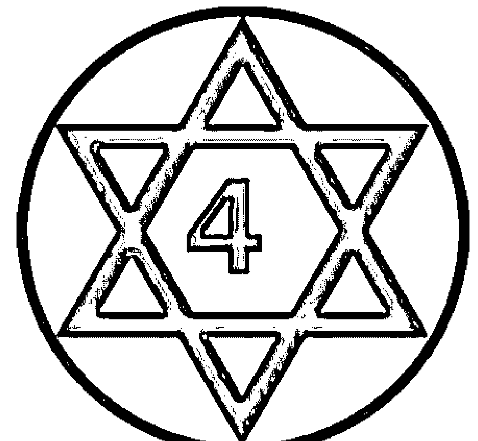

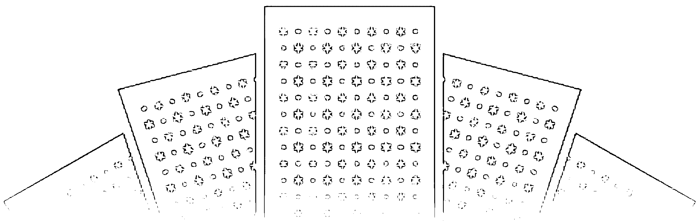

## 塔羅牌陣說明（雪原型）

## 占卜陣法前言

塔羅牌占卜解牌時，最重要的是是一個平靜的心。
有了平靜的心，才能接受到宇宙萬物的能量，也能在解牌時有宏觀的視角；無論是占卜解牌者或是詢問者，都要專注精神在塔羅牌上，若是無法靜下心或是帶著雜亂的想法，對於各方面來說都是不好的：例如過於主觀而無法專心一意、接受錯誤的訊息；甚至是曲解了需要注意的重點，都會有可能造成無法挽回的局面；無論牌面的意思好或是壞，也都只能當作是參考，絕對不要受制於塔羅牌上的牌意而不努力乃至於自暴自棄，那麼就失去了解牌的意義了。好的固然要保持，壞的也可以扭轉未來。

陣法或是牌意只能當作當下的參考，真正掌握命運的還是在自己手中；有了好的牌意固然可喜，但是要更加的努力達成目標；出現不好的牌意也不要灰心，只要審視自己的內心和冷靜的對應接下來的挑戰，未來仍然會出現無限的可能性。

雖然有時候人們會覺得『一切都是命運使然』，但是筆者遇過一位研究非常透徹的命理老師和筆者說過：「影響命運的有三種東西『健康』、『信仰』和『愛』。」

宗教解析也好、命理風水解析也好，塔羅牌反映出來的未來，只是建言、只是預告，沒有一定、更沒有絕對。

切記，命運還是掌握在自己手中，有了希望信仰和愛，都能夠創造自己的道路。

## 占卜的關連性解說

占卜時要注意的是，牌與牌之間的互相關聯性之外，還有各種牌屬性的影響，特別是大阿爾克納牌在各種牌陣中出現時，所代表的通常是全面性的影響，利用出現的大爾克納牌為中心來解牌，通常會受到更詳細的啟示；過去現在未來等關聯性也是彼此有影響和變化，切記不要太過片面而忽視了整體的訊息。

逆位牌的出現在各個學派中有不同的解釋，筆者這邊也是比較傾向『能量解釋』：一張牌逆位的呈現是由於能量不足所導致，例如：『魔術師』這張牌有著四大元素的呈現，同時也有暗示著學習的意味，通常是給予占卜者正面的評價；假如逆位呈現時，同樣暗示著占卜者在學習上稍微的欠缺，或許是環境影響、也或者是學習態度所影響，在逆位呈現上就顯得有些差強人意；也因為能量不足被隱蔽的結果，逆位呈現的情況就出現了。

筆者這邊建議：在逆位牌出現時，好好觀察、體會能量不足的原因和現實狀況，才能充分的解釋每次解牌的涵義，同時注意是否有應該準備而忽視的地方出現呢？準備充分自然萬無一失。

除了各種牌之中的聯結和正逆位的觀察，更重要的是能夠依照解牌占卜師的感性、對於占卜者間的對談內容、內心想法去作充分的理解和傾聽，才能夠完成每一次的解牌任務。

塔羅牌本身也是會有能量與意識的，好好用心交流。

## 陣法說明

## 縱列聖三角：三張牌

### 一、牌陣說明

縱列聖三角是占卜師最基本的陣法，可以說是基本中的基本。根據各個學派有著各種不同的說法和名稱，這邊依照最基礎也最常用由左至右三張牌的縱列聖三角來解釋。

### 二、牌陣效用

縱列聖三角的實用性非常的高，幾乎所有問題都可以從這最基本的牌組從中獲得啟發；由左至右放上三張牌的牌組，可以充分的知道各種狀況。

### 三、牌陣用法

縱列聖三角有兩種基本的解釋。

1. 時間之流
從左至右分別為『過去』『現在』『未來』。
因為時間流動的關係，因為過去的『行動』出現了現在的『現況』，未來則有可能出現的『結果』。

時間之流牌陣可以用在各種問題占卜上，也可以從中瞭解到因果之間的關係。

2. 現況占卜

從左至右分別為『現況』『行動』『結果』。
從現況開始分析，之後的行動後所預期的結果；和時間之流不同的方式來解釋，針對現況感到困惑的占卜者所使用會有更好的預期效果。

### 四、注意事項

聖三角有各種各樣的陣法和變化，筆者認為從一開始的縱列聖三角開始學起會比較容易入門，對於占卜初學者來說也是容易解釋的牌陣。
這邊要特別提醒的是：根據筆者解牌多年的狀況來看，許多占卜者容易陷入看到未來牌出現不好的牌意時會感到不安，在這邊提醒各位占卜師，能夠開導或是讓占卜者感到安心是很重要的。

### 五、牌陣圖

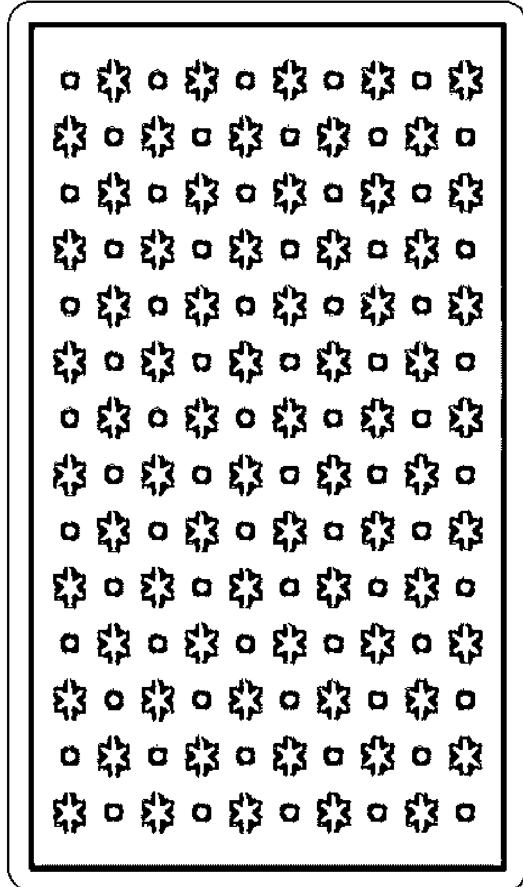

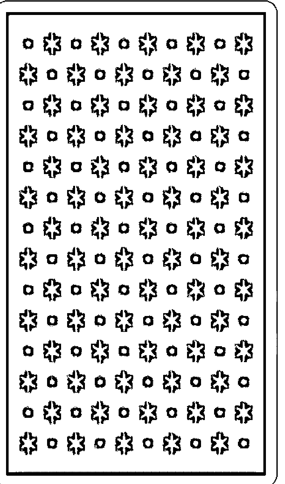

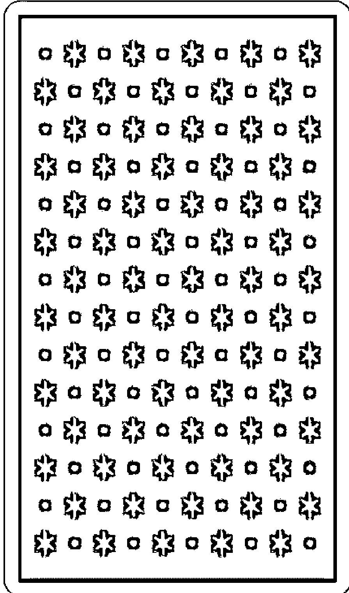

1
現在

2
行動

3
結果

《縱列聖三角》現在狀況占卜

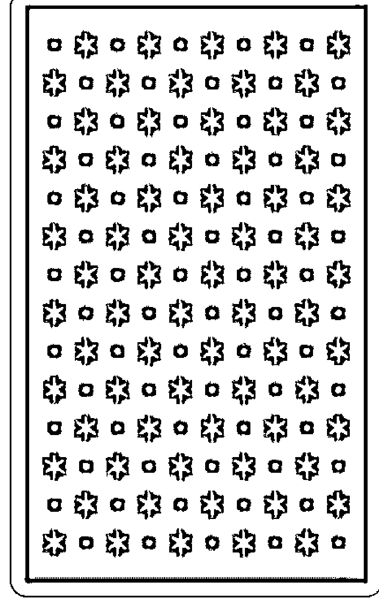

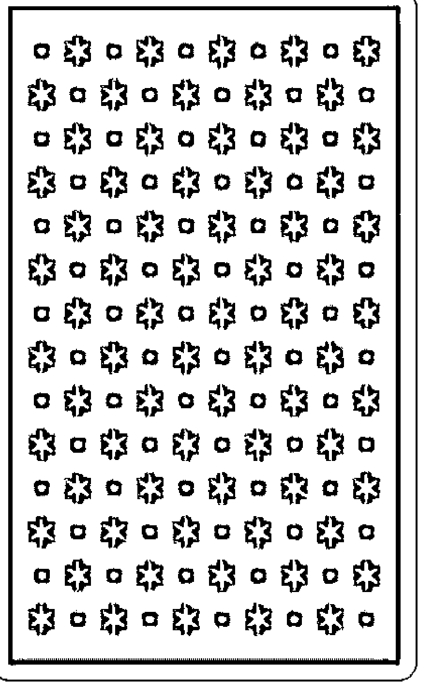

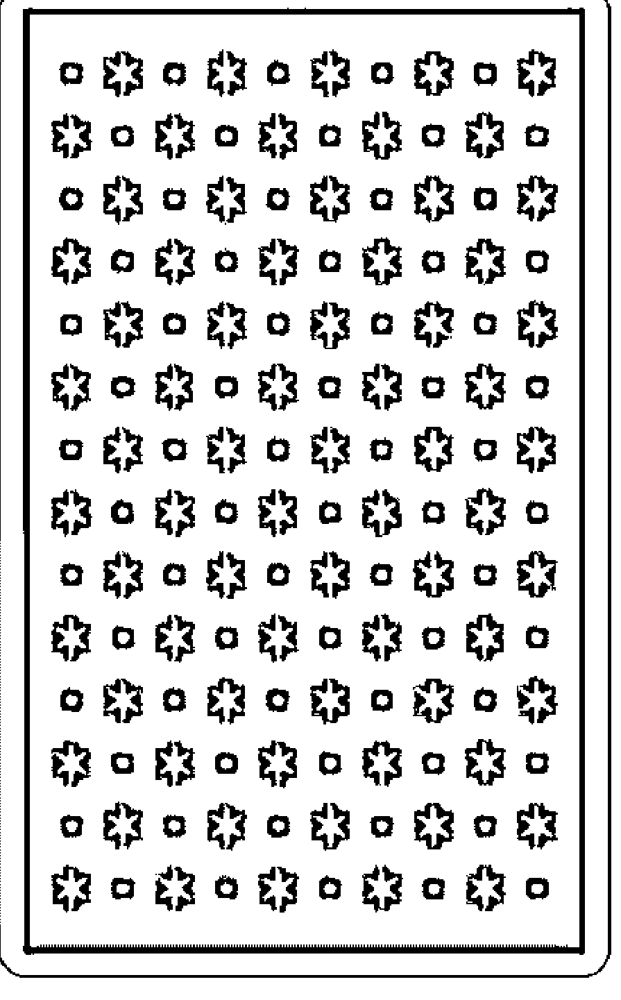

1
過去

2
現在

3
未來

《縱列聖三角》時間之流

## 結合人生的塔羅牌
現代塔羅牌

## 瓊哈里窗：四張牌

### 一、牌陣說明

筆者結合了心理學中的『Johari window』所研究出的牌陣，適合用於心理測驗與心理分析上。

Johari window 為美國心理學家 Joseph Luft 和 Harry Ingham 兩位於 1955 年發表的潛意識和公眾間的交流所提出的心理學理論；『Johari window』由四個區塊所組成，分別為左上『開放之窗』、右上『盲點之窗』、左下『隱蔽之窗』、右下『未知之窗』。

中文翻譯有『周哈里窗』或是『瓊哈里窗』等音譯，在健康心理學和交流分析領域中時常會用來舉例和解說。

### Johari window 說明

- 開放之窗：open self，開放給公眾並且不隱藏的部分。
- 盲點之窗：blind self，自己並不知道而其他人知道的盲點部分。
- 隱蔽之窗：hidden self，只有自己知道並且不開放的秘密部分。
- 未知之窗：unknown self，自己不知道而公眾也不知道的未知部分。

### 二、牌陣效用

對於占卜者的心理測驗和分析上有很大的幫助，對於茫然無助或是對於自己內心想法有所疑問時推薦使用。

### 三、牌陣用法

由一左上、二右上、三左下、四右下排成『田』字型，並依照順序進行解牌：『開放之窗』、『盲點之窗』、『隱蔽之窗』、『未知之窗』的順序進行占卜者的心理分析。

### 四、注意事項

筆者在進行這項 Johari window 解牌時，曾經多次因為沒有顧及到對方的心情，而導致占卜者當場哭出來的情況，這讓筆者的指導老師多次嚴厲的指正我的解牌過於直接而被迫停止這個陣法的使用。

這邊會提出這個陣法，是希望各個占卜者可以用在更好的方面，若是可以用在開導對方和讓對方進而獲得心靈上的啟示，那也算是好事一件。

需要注意的地方是，根據筆者以往在進行『未知』這一張牌的解釋案例上，許多占卜者都會出現非常迷惑的表情，之所以如此也是因為這張牌背後的涵義或許並不是當下占卜者可以理解的，強行解釋也有可能出現反效果，因此各位占卜師可以選擇是否要婉轉的解釋這張牌，依照情況不進行解釋也是可行的。

### 五、牌陣圖

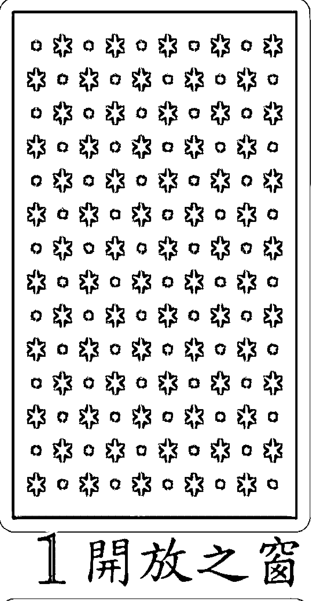

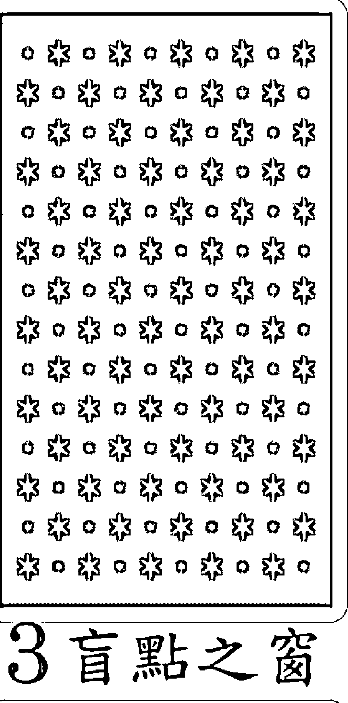

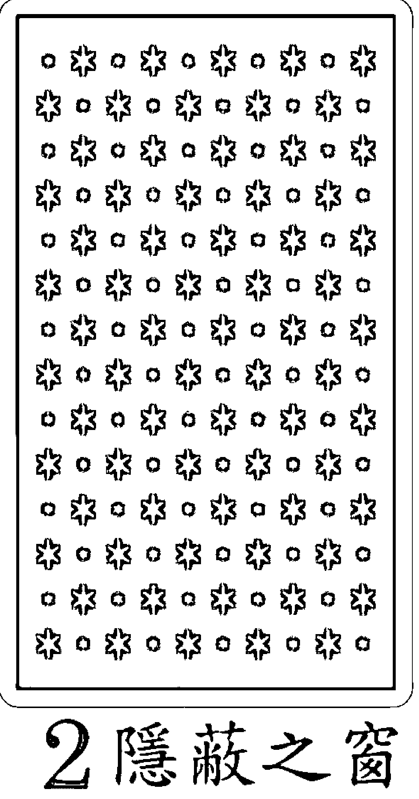

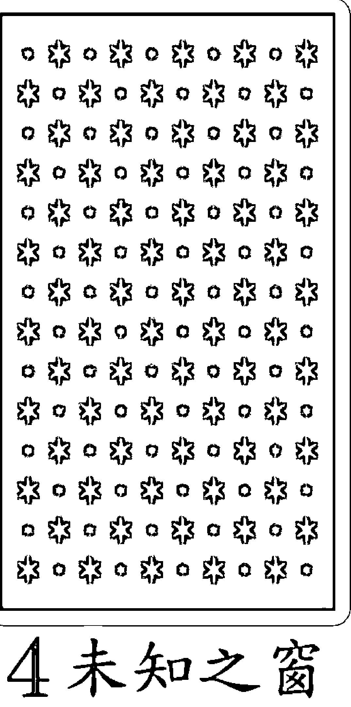

《瓊哈里窗》心靈探索的強力陣法

## 十字聖三角：六張牌

### 一、牌陣說明

由縱列聖三角的基礎發展出的強化版本組合牌陣，結合時間之流和現況占卜的方式進行更詳細的占卜解牌，從這個牌陣開始可以瞭解到時間和因果循環之間的關聯性，更可以經由牌陣達到更加詳細的解牌以及啟示。

### 二、牌陣效用

針對某一事件或是某一個狀況想要更加的深入瞭解時，可以使用十字聖三角來獲得更多的訊息。適合給想要知道現況而又陷入膠著的占卜者對象來進行占卜。

### 三、牌陣用法

與縱列聖三角相同，由左至右放置三張牌後，再從由左至右的牌放上橫擺的三張牌，讓縱列聖三角出現三個十字的形狀。

根據六張牌的涵義如下：

- 一、遙遠的過去，無法改變的事實，同時也能略知現況的原因。
- 二、現在的狀況。
- 三、下一步的行動和計畫。
- 四、最近會發生的事情。
- 五、問題點核心。
- 六、最終的可能性結果。

### 四、注意事項

整體宏觀的觀看整體牌組將會獲得更多的訊息，同時因為時間性和現況的交叉比對分析，會更加的體會到塔羅牌的精準度；六張牌都有著關聯性和清楚的表達牌陣位置，很適合初學者占卜師在解牌時更拿準確地抓到問題的中心點。

工作、計畫或者是需要更加詳細的解牌情況下，很適合推薦這個牌組進行解牌。

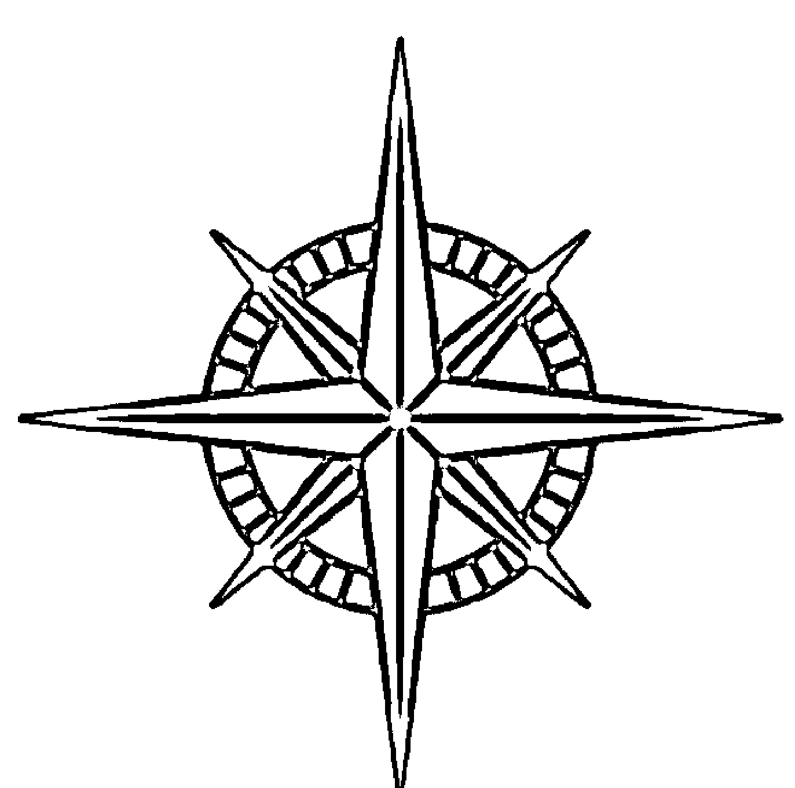

### 五、牌陣圖

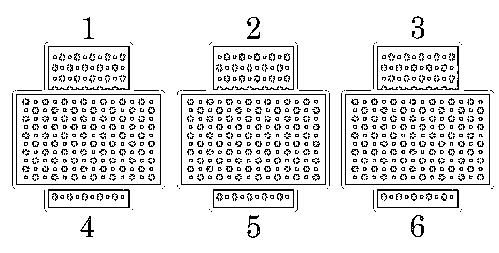

《十字聖三角》

## 初階戀情牌陣：四張牌

### 一、牌陣說明

愛情的占卜一直是人們最喜愛的話題之一，透過塔羅牌的精準以及神秘感，有的學派甚至單獨研究愛情塔羅牌自成一格，發展出多樣化又極具魅力的愛情占卜牌陣；這邊筆者提供最為基本的愛情占卜牌陣，對於初學者塔羅牌占卜師而言，這也是基本的人際關係牌陣。

### 二、牌陣效用

愛情、人際關係一直都是塔羅牌占卜者名列前茅的熱門問題之一，無關年齡和性別，戀情的發展總是來的令人陶醉卻又迷人、無法自拔的；所以將基本的戀愛牌陣學起來後，未來學習更高階或是在面對有戀情煩惱的占卜者時，也可以從容以對。

### 三、牌陣用法

這邊開始活用縱列聖三角的牌陣，有左邊放置一張牌、右邊放置第二張牌後，兩張牌的中間稍微上方放置第三張牌，第三張牌上方放置第四張牌。

四張牌的意義分別代表著：

- 一、占卜者本人。占卜者的自身對於這段感情中的定位。
- 二、感情的對象。占卜者的對象對於這段感情中的定位。
- 三、兩人間的現況，彼此間的想法和看法。
- 四、兩人感情間的可能性、未來、發展結果。

雖然用於戀情上，也可以用來探討特定對象的人際關係，是個人際關係相關陣法中的基礎牌陣。

### 四、注意事項

筆者曾經遇過，若是戀情中的第三者產生、阻礙這段戀情的第三者或是兩人間的家人或是朋友的話該如何占卜？是否加入第三張牌來代表呢？

以理論上來說並不建議也不推薦，以初學理論上來說好像說得通，但是實際瞭解將會發現大錯特錯。

戀情陣法是利用占卜者與感情對象為主的牌陣，感情對象離占卜者越不親近、這個陣法就會越不具有意義，例如拿來測試名人或是不存在的對象（包含現階段尚未出現的感情對象等等），其結果通常是沒有意義或是不具有任何幫助的。

另外，給各個塔羅牌占卜師的忠告：面對感情問題時多一點細心與同理心，同時告知對方無論占卜的結果多麼美好，都比不過自己親自去嘗試溝通來的有效果。

### 五、牌陣圖

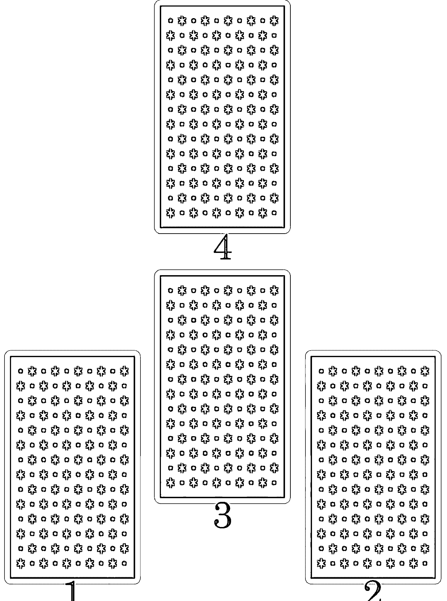

《初階戀情牌陣》

## 高階戀情牌陣：九張牌

### 一、牌陣說明

在愛情上擁有許許多多的客觀條件以及現實環境的影響，並非只是兩人互相喜歡這麼簡單而已；高階戀情牌陣利用塔羅牌解牌判斷兩人之間的『身』『心』『靈』狀態之外，兩人之間的契合層度也可以透過利用高階戀情牌陣來進行解讀，在身心靈之上兩人是否互補或是欠缺，也可以探討彼此間的相處模式是否可以一直的進行下去。

### 二、牌陣效用

與其說是塔羅牌戀愛占卜，稱呼為彼此間的身心靈是否契合更加來的洽當。有著明確對象並且確實已經在交往的占卜對象而言，在觀看這副解讀牌義時更可以深入的去好好思考和交往對象的關係和相處，是否可以用各種方法來補強或是更正？利用這牌陣深刻的自我檢討和反省，同時讓彼此關係更加融洽才是最好的本意。

### 三、牌陣用法

左邊由上往下個別為占卜者的『理性』『心靈』『環境』，右邊為占卜者對象的『理性』『心靈』『環境』，正中間則是占卜者和占卜者對象間的交流關係，合計共為九張。

以下為『理性』『心靈』『環境』的牌意解釋：

上方『理性』的牌義：彼此間的關係或是印象等意識到的部分，能夠理解的部分。

中間『心靈』的牌義：靈魂的本質，更確切的說是否喜歡的緣故也在這部分居多，是整組牌陣的核心。

下方『環境』的牌義：從自身的肉體到周圍的生活環境影響，偏向五感的層面。

### 四、注意事項

這牌陣乍看之下九張非常的複雜，但是只要掌握到牌與牌之間的關係就可以從中清楚理解到占卜者和占卜者的對象之間到底是存在於什麼樣的感情關係？是單純的理性喜歡？又或者只是喜歡對方的外表又或者只是喜歡對方的優勢？這些都可以從牌陣中獲得不少的訊息。

在中間交流的牌義解釋上要特別的注意，感情的解讀上通常不太推薦以常理和看到的部份去進行推斷，很容易會讓占卜者受到強烈的影響，發生了反效果反而得不償失；出現牌義好的牌時可以適當的多誇獎對方，牌義不好的牌出現時可以多加詢問是否最近有什麼樣意見分歧的部分？特別位於『心靈』橫列中間的三張牌，要多加留意是否有更多的啟示在內。

### 五、牌陣圖

占卜者

交流關係

對象

理性

理性

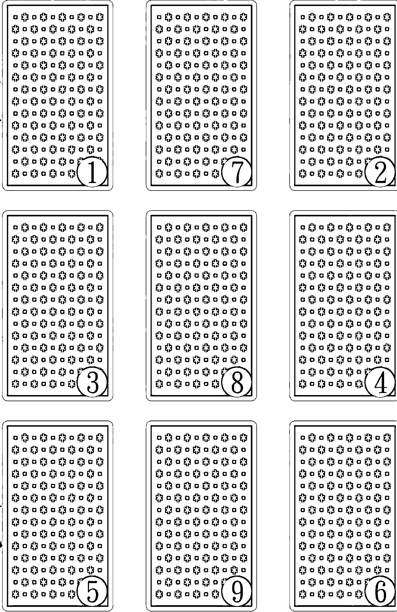

心靈

心靈

環境

環境

《高階戀情牌陣》深層心靈探索

## 大衛之星牌陣：六張牌

### 一、牌陣說明

大衛之星最早源自於三世紀，是古時候護身符上的圖案；在許多教堂的裝飾以及儀式上都可以見到；現在以色列的代表符號也是以大衛之星六芒星當作其代表。

大衛之星同時也代表著索羅門王的智慧象徵，通過這個大衛之星牌陣，可以更加深入問題的核心點，並有著智慧去解答出問題的癥結點。

### 二、牌陣效用

無法釐清複雜又具有時間性的問題時，推薦使用這個大衛之星牌陣。

通過大衛之星牌陣可以瞭解到時間的前因後果，並在解牌上有著更容易解決問題和瞭解問題核心點的牌義。

### 三、牌陣用法

由最下方的第一張牌『過去』、第二張牌左上『現在』、第三張牌右上『未來』；第四張牌正上方『原因』、第五張牌右下『環境』、第六張牌左下『對策』。

前三張牌等同於縱列聖三角時間之流牌陣；後三張牌則像是對映前三張牌，第四張牌可以看出事情的原因，第五張牌出現的則是代表著所有問題的環境，有可能是阻力也可能是助力，第六張牌則會顯示出對策或是結果的啟示。

### 四、注意事項

劃分成兩組來進行解牌就會簡單許多，並利用交叉比對來看出占卜者對於問題現況的前因後果，並指出問題核心點以及未來出現的可能性。

利用智慧去解決問題，會比毫無目標的橫衝直撞來的有方法。

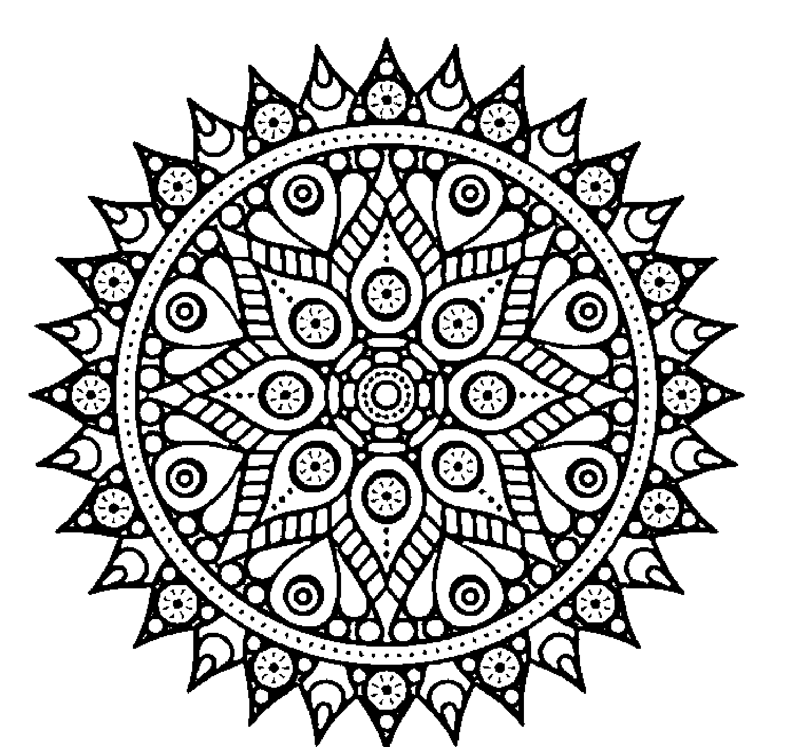

### 五、牌陣圖

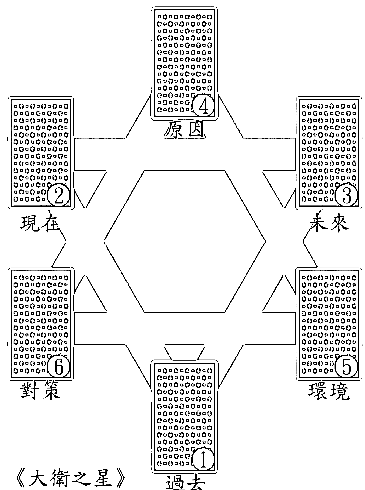

## 下弦月牌陣：六張牌

### 一、牌陣說明

因為牌陣的牌法像是下弦月的形狀，因此以下弦月牌陣來稱呼，英文是稱呼為『The Crescent Moon Spread』。

此牌陣為縱列聖三角的強化進階版，以下弦月的象徵來進行解牌。

### 二、牌陣效用

針對某個問題或是未來感到迷惘時，可以使用這個下弦月牌陣；可以看出遙遠的過去和最近的狀況外，也可以看到更加遙遠的未來。

占卜者本身若是相信占卜的神秘力量時，借助月亮的形狀更有可能獲得比起其他牌陣更多的啟示和訊息也說不定。

### 三、牌陣用法

由左下開始排出下弦月的形狀，往右上牌完六張下弦月牌陣。

下弦月六張牌陣的牌義如下：

- 1. 遙遠的過去
- 2. 近年的事項
- 3. 這一星期至昨日的過去
- 4. 今日的狀況
- 5. 明日至一星期後的未來
- 6. 最近的未來與結果

這副牌組的時間可以由占卜師或是和占卜者商量，將時間點或是詢問事項進行調整。例如以下範例：

- 1. 一年前的過去（無法改變的過去）
- 2. 半年來的過去（或許還可進行補救或是更改的狀況）
- 3. 上個月的近況（可以進行補救或是可以進行的狀況）
- 4. 這個月的近況（現在進行的狀況）
- 5. 下個月的未來（有可能出現的近未來）
- 6. 最終結果、年末

### 四、注意事項

月亮屬陰，有些占卜者會擔心是否不適合在夜間占卜、反之也有些占卜者問我是否夜間占卜更恰當？

這副牌陣並沒有特別限制晚上占卜好與壞，下弦月牌陣只是一種印象象徵，並不會因為月亮出不出現而有顯著的改變；若是硬要說，下弦月只是代表時間的過去象徵以及神秘學對於星象的崇拜心情，下弦月牌陣因此誕生。

### 五、牌陣圖

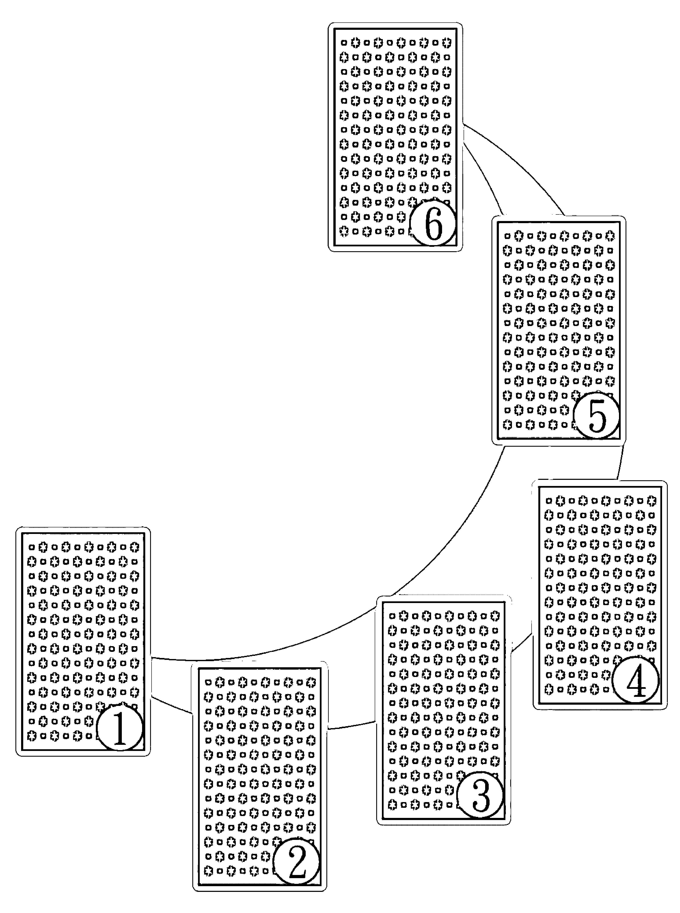

《下弦月牌陣》

## 多擇一牌陣：四張牌以上

### 一、牌陣說明

當占卜者有多個選擇方式想要知道各個選擇的利弊時，可以選擇多擇一的牌陣來進行解牌。

### 二、牌陣效用

依照縱列聖三角的方式來進行解牌，只要原理不變，牌陣就算加到了四張以上也不用擔心；這邊依照最基礎的牌陣來說明。

### 三、牌陣用法

先在中間放上第一張牌，代表現階段的狀態；接著分成左右兩邊慢慢延伸，代表著不同的選擇有著不同的結果，各別以時間之流的牌陣來說明會最為恰當。

### 四、注意事項

多擇一牌陣也有不使用第一張牌，而直接以兩組時間之流牌陣代表不同選擇的結果，這邊筆者只解釋有代表現況的牌陣作說明，是否未來占卜師想要三個選擇三個牌陣，甚至多個選擇多個牌陣，都以占卜師自行依照狀況作決定。

只是選擇性越多，牌組越多的情況下，容易造成解牌的負擔，也容易讓占卜者感到困惑，這一點必須要注意。

### 五、牌陣圖

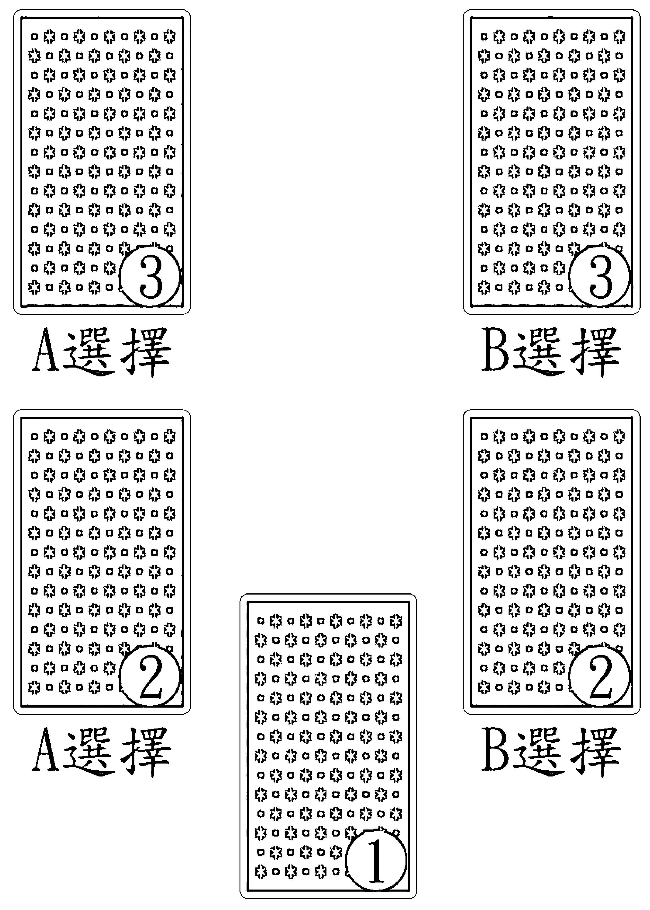

現在

《多擇一牌陣》

## 塞爾特十字：十張牌

### 一、牌陣說明

賽爾特十字又名凱爾特十字，是基督教重要的十字架象徵；相傳五世紀時，由主保聖人聖派屈克向愛爾蘭人傳教時所採用而發揚光大的。

在1850年代歐洲對於凱爾特十字又開始重視，將設計的凱爾特十字用在墓碑或是流行飾品上，而開始了凱爾特十字的風潮；在德國又因為被禁止的新納粹黨所採用，再加上宗教和政治上的敏感性，也曾經被批評為惡魔死亡的象徵。

無論原始的凱爾特十字如何被議論，在塔羅牌的陣法中，賽爾特十字是廣泛被使用並且和任何宗教以及政治無關，就是個歷史悠久又好用的牌陣。

### 二、牌陣效用

賽爾特十字牌陣主要用於無法多重選擇的情形下，以單一核心點來進行解牌的牌陣；無論是戀愛或是工作上的問題，都可以仔細觀察其結果牌和其他牌之間的相互關聯性來進行占卜。

以下為十張圖的陣法解說：

- 第一張牌：現實的狀況。問題核心點，占卜者本身。
- 第二張牌：困境。需要解決的問題；目前遭遇的問題。
- 第三張牌：眼前的環境。感覺到的狀況、能夠發現的問題；也可能是預測會出現的狀況。
- 第四張牌：看不見的事物。無法發覺的人事物、潛意識；遙遠的過去、因果，甚至是前世。
- 第五張牌：過去的狀況。最近發生的事情；引起問題的原因外，也可能是另一種選擇。
- 第六張牌：未來。預言，預測會發生的事情，之後的行動。
- 第七張牌：占卜者的立場和想法。
- 第八張牌：周圍環境。其他人給予占卜者的影響：情敵、親朋好友、競爭者、情侶等等。
- 第九張牌：變化。願望或是底線；恐懼以及不安的原因。
- 第十張牌：最終結果。給予占卜者的回答，依據狀況不一定會和未來有關係。

### 三、牌陣用法

十張牌的陣法會覺得暈頭轉向嗎？首先將牌陣分成兩邊看：左邊的十字架為前半部，右邊的四張牌則最後在打開解牌會比較恰當。

先在桌上中央放上第一張牌，第二張牌疊放在第一張牌上方後橫放；以第一張牌為基準：直列上方放上第三張牌，最下方放第四張牌，中央右邊放第五張，中央左邊放第六張牌，這裡為十字架的牌陣就出現了。

接著在十字架右方從底到上放上第七、八、九、十的牌。

### 四、注意事項

賽爾特十字有分成一開始就將十張牌翻開一次綜觀解牌，以及先解左邊十字的部分後再解右邊七八九十的部分。

雖然兩者方法都可行，但是筆者會建議先將十字的部分先看清楚解釋完後，再進行右邊的部分，這樣的好處可以避免占卜者和占卜師因為過多的訊息而感到困惑，也可以在十字部分解牌時多和占卜者溝通，避免因為訊息不足而有錯誤的解牌。

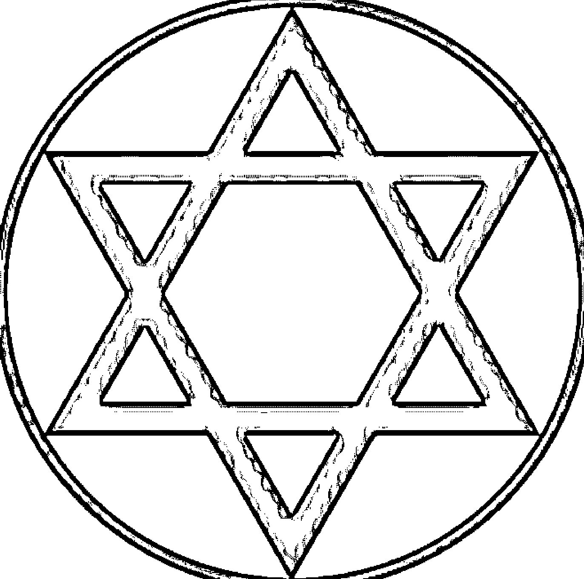

### 五、牌陣圖

《塞爾特十字》

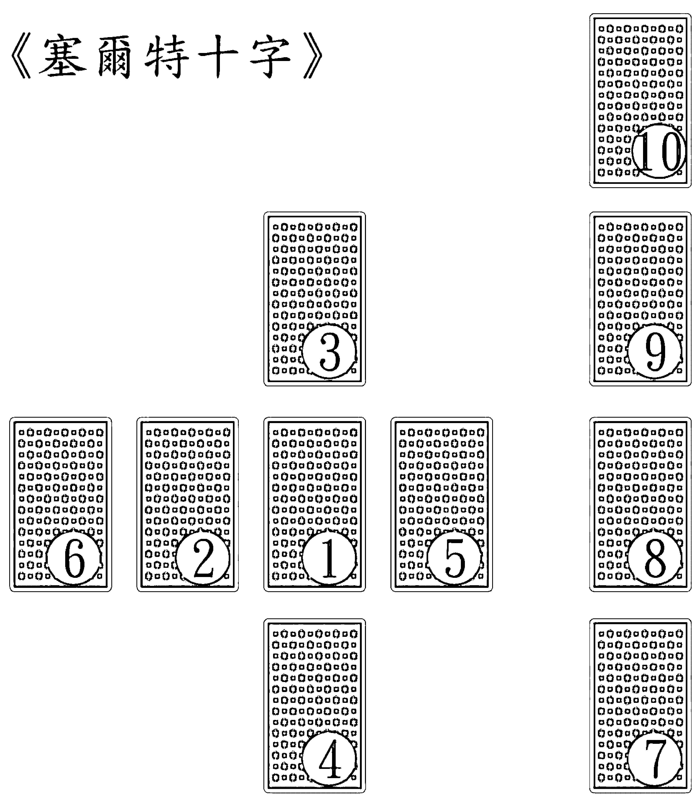

## 十二星座牌陣：十二張牌—十三張牌

### 一、牌陣說明

結合占星術的基礎所創造出的牌陣，也是歷史悠久的熱門牌陣。

雖然說和占星術有關，但是對於初學者占卜師來說那又算是另一門的專業學問，這邊提出陣法位置和效用給讀者參考，記住陣法的基本說明後將可以利用這個十二星座牌陣詳細的看出占卜者的星象關係。

### 二、牌陣效用

針對個人的性格、環境、狀況的詳細分析，在時間充裕以及安靜的環境下，很適合做這個十二星座牌陣；從各個星座對應的位置來分析占卜者，對應的陣法和位置請務必將基本的訊息先記起來。

### 三、牌陣用法

以時間『九點的位置』放下第一張牌，接著逆時鐘方向連續擺出十二張牌，第十二張牌的位置會座落於『十點鐘的位置』。

以下為十二星座牌陣說明：

- 第一星座白羊宮：性格。行動和本人的思考模式，星座學上為火象星座，代表嬰兒時期。
- 第二星座金牛宮：財運。財運、慾望、物質的代表。星座學上為土象星座，代表幼童時期。
- 第三星座雙子宮：環境。成績、智慧、手足等關係。星座學上為風象星座，代表童年時期。
- 第四星座巨蟹宮：家庭。不動產、異性、住處等關係，也有晚年生活的暗示。星座學上為水象星座，代表少年時期。
- 第五星座獅子宮：戀愛。興趣、競賽、賭博運、孩子等關係。星座學上為火象星座，代表青年時期。
- 第六星座處女宮：健康。職場、人際關係、寵物。星座學上為土象星座，代表青年後期。
- 第七星座天秤宮：婚姻。共同經營者、法律等關係。星座學上為風象星座，代表成年時期。
- 第八星座天蠍宮：財產。婚姻關係、關係人遺產、性。星座學上為水象星座，代表成年穩定時期。
- 第九星座射手宮：信仰。人生觀、宗教、行為動向。星座學上為火象星座，代表壯年時期。
- 第十星座摩羯宮：職業。工作運、社會地位。星座學上為土象星座，代表老年時期。
- 第十一星座水瓶宮：友情。交友、社團活動、願望與目的。星座學上為風象星座，代表重生。
- 第十二星座雙魚宮：潛在意識。問題點、秘密。星座學上為水象星座，代表靈性。

### 四、注意事項

有的占卜師會在正中間放置第十三張牌，代表十二星座的綜合評價；是否要放置第十三張牌由讀者自行決定，有無放置都不影響牌陣的完整性。

第十二張塔羅牌陣的雙魚宮，因為也有代表災害、障礙的涵義，有部分學派不推薦解釋第十二張牌，認為解釋過多過少都沒有益處；這邊筆者也和其餘學派的占卜師持相同意見，是否要解釋第十二張牌應該由占卜師依據解牌時的狀況自行選擇是否要多解釋雙魚宮的牌義，經由現場判斷解釋與否對占卜者是否有幫助會比事先預設立場來的妥當。

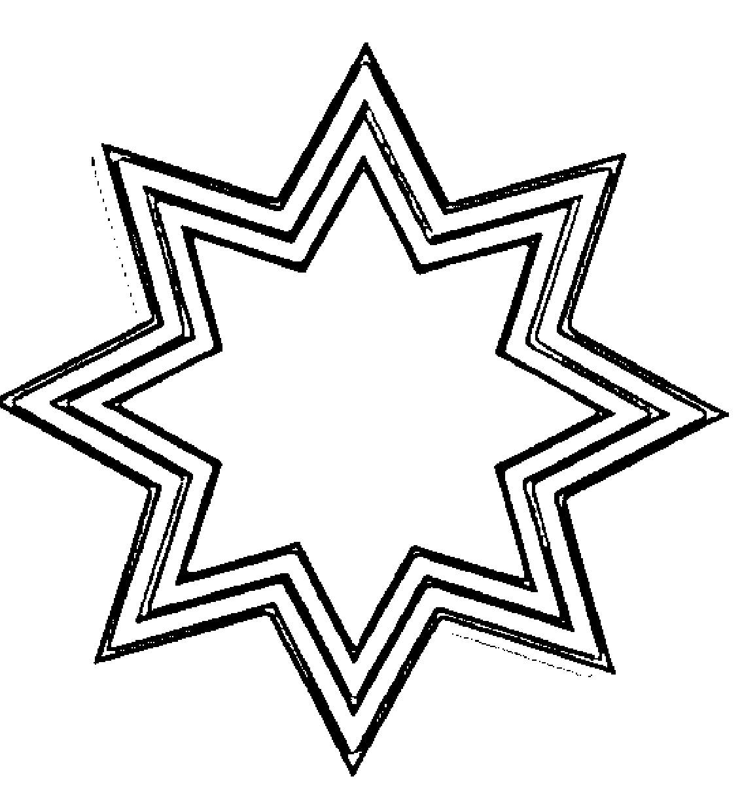

### 五、牌陣圖

### 《十二星宮牌陣》

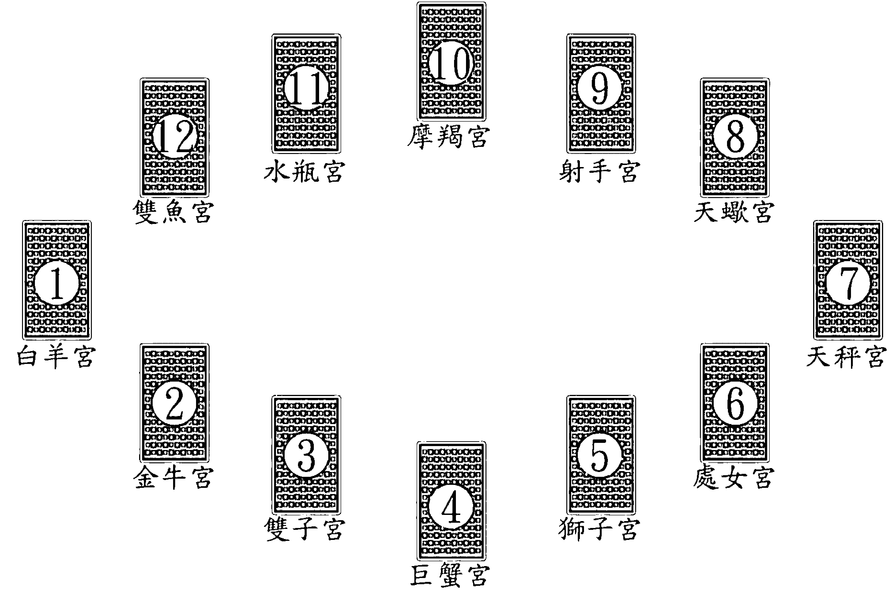

## 結合人生的塔羅牌
現代塔羅牌

## 綜合年運牌陣：十三張牌

### 一、牌陣說明

與十二星座占卜的放置位置相同，不一樣的是這次是以一個月一張牌的方式來進行占卜；十二星座陣法偏向個人的分析，綜合年運牌陣則是偏向一整年的運勢占卜，本質上是有所不同的。

### 二、牌陣效用

對於綜合運勢的占卜非常有效果，特別像是時間性的例如『一年的運勢』、『明年一整年的運勢』等時間性的目的會很容易理解，推薦給想要瞭解綜合運勢的時候使用這個牌陣；同時也可以在占卜前訂下主題：例如一整年的戀愛運或是工作運等等，都可以自由決定。

但是太過於遙遠的時間不太適合，例如二年、三年以上的占卜多半因為時間的不確定性而變得毫無意義。

不一定要從一月一日開始，從占卜的當下開始算起一年的時間也可以；占卜過去的年運也是可行，也可當作參考。

### 三、牌陣用法

與十二星座占卜一樣，以時間『九點的位置』放下第一張牌，接著逆時鐘方向連續擺出十二張牌，第十二張牌的位置會座落於『十點鐘的位置』。

正中間放置『象徵』的第十三張牌。

這張牌可以使用靈魂數字來對應，也可以不採用靈魂數字的計算。

靈魂數字的計算方式如下：
出生年+月+日，再將數字相加等於0-22的大阿爾克牌。
例如1982/01/23的生日，將1982+1+23=2006
2+0+0+6=8

對應大阿爾克牌第八張牌『力量』。
和牌義好壞並無特別的影響，就算是牌義不好的牌也有可能因為本身的行為和模式而成為助力。

特別說明，19雖然是1+9=10，但是10還是要用1+0=1來計算，這時就會由19和10以及1來對應，這些牌也都會所影響；若是出現22，除了2+2=4對應大阿爾克四號牌『皇帝』之外，也會對應零號牌『愚者』。

利用靈魂數字牌對應，或是直接抽象徵牌對應，兩個方法都可以，由占卜師自行決定。

### 四、注意事項

時間週期可以擴大也可以縮小，例如十二年的運勢占卜或是一天二十四小時的占卜，理論上來說都是可行的；但是實際去審視會發現沒有太大的意義，因為十二年週期時間變化太大，而一整天的變化影響也不明顯，只能說理論上雖然可行，實際意義卻並不是那麼理想。

占卜師若是想要練習，一整天的運勢占卜也算是很好的練習牌陣。

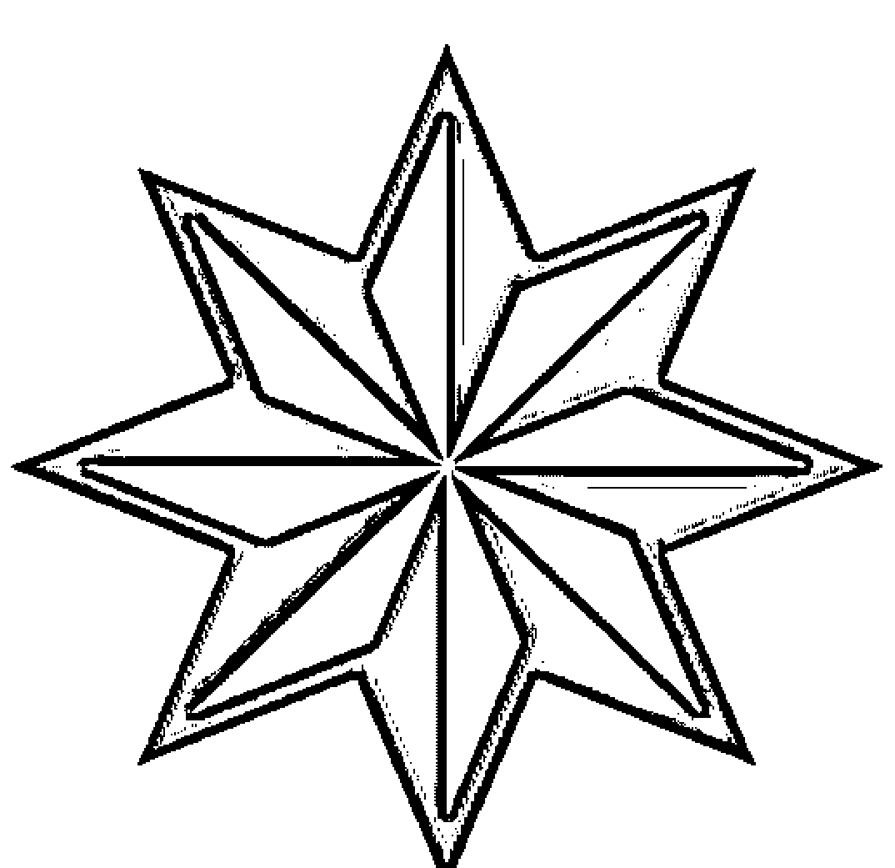

### 五、牌陣圖

### 《綜合觀測未來年運牌陣》

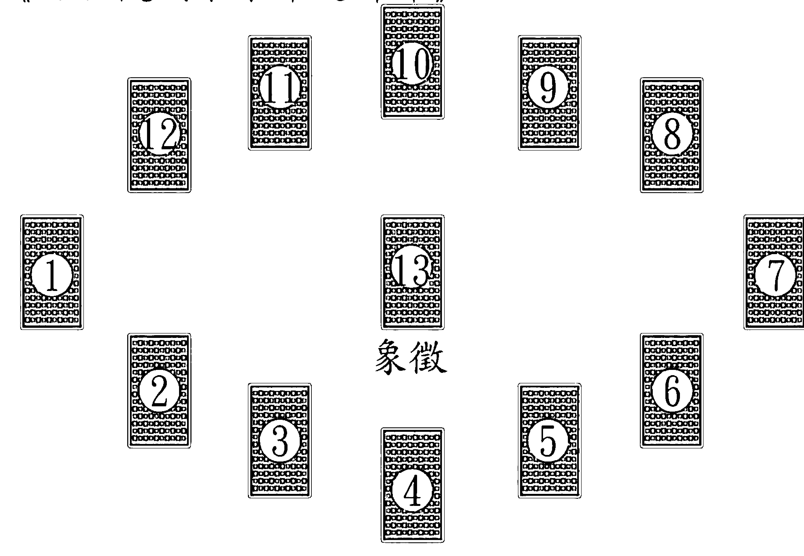

## 生命之樹：十張牌

### 一、牌陣說明

> 『耶和華 上帝在東方的伊甸栽了一個園子，把他所造的人安置在那裏。耶和華 上帝使各樣的樹木從地上長起來，既悅人眼目，又好作食物。園子中間還有一顆生命樹，和一顆辨識善惡樹。』《舊約聖經・創世記》第二章第8-9節

生命之樹在聖經中創世紀篇就記載著為通往神之國的路徑，卡巴拉學者也將創世的符號用生命之樹來代表。

生命之樹分為十個直點，也就成為了塔羅牌中經典的生命之樹牌陣。

### 二、牌陣效用

這個生命之樹牌陣可以解讀出一個人的個性構成，同時通過牌陣瞭解占卜者更多內心的訊息。

以下為生命之樹對應的牌陣意義：

- 第一張牌：Kether，王冠，Crown。理想與目標。
- 第二張牌：Chochmah，智慧，Wisdom。智慧與自發性。
- 第三張牌：Binah，理解，Understanding。理解及應變。
- 第四張牌：Chesed，慈悲，Mercy。善良與援助。
- 第五張牌：Geburah，力量，Fortitude。力量與領導、障礙與困難。
- 第六張牌：Tiphareth，平衡，Balance。特質與健康、調和與機會。
- 第七張牌：Netzach，勝利，Victory。愛與靈感、熱情與慾望。
- 第八張牌：Hod，威嚴，Splendour。榮耀與技能、評價與成績。
- 第九張牌：IX Yesod，基礎，the Foundation。靈魂中心、潛在能力。
- 第十張牌：X Malkuth，王國，the Kingdom。實際生活、最終結果。

生命之樹的第二種用法，是用來占卜第三方的人事物，這和戀愛占卜十分類似，但是可以用生命之樹牌陣占卜出和占卜者有親密關係的戀人，就算被占卜的第三方不在現場也可以獲得一定的訊息。

- 第一張牌：心理狀態。對方的性格和心情，外在顯示出的氣質。
- 第二張牌：智慧。對方的想法和行動原則。
- 第三張牌：寬容。對方的包容力和理解能力，對於人事物的寬容度表現。
- 第四張牌：相性。和占卜者之間的相性層度。
- 第五張牌：不合。和占卜者之間的不合層度。
- 第六張牌：平衡。領導能力與協調性、調整能力等影響。
- 第七張牌：積極性。對方的積極性表現。
- 第八張牌：消極性。對方的消極性表現。
- 第九張牌：本質。對方的本能、本質的顯示。
- 第十張牌：綜合結果。最終顯示出來的評價結果。

### 三、牌陣用法

依照生命之樹的構成，由上至下的排出順序：在各個學派間略有不同，但是本質的涵義是不改變的。

有的學派很注重取牌的順序，由第一張到第十張都有順序要遵守，有的學排還會在最後解牌完後會再取一張牌當作達卡牌；這邊筆者的建議是可以依照占卜師自行判斷是否要遵守取牌的順序，以及最後的達卡牌當作結論，這些都可以由現場狀況自行決定，無論要不要遵守取牌順序或是抽達卡牌，都不影響生命之樹的牌陣。

### 四、注意事項

生命之樹的牌陣雖然有趣，但是本身的涵義非常的深遠，建議在占卜時可以反覆推敲以及研究牌義和各個牌的關聯性，以及對應的牌陣位置。

在使用生命之樹牌陣占卜現場不在的第三方時，要注意是否會因為關聯性不足而有誤差，一般而言若是第三方和占卜者並不親近的情況下，是不建議使用生命之樹去研究解牌的；除了誤差會大之外，通常而言也不會具有什麼意義。

### 五、牌陣圖

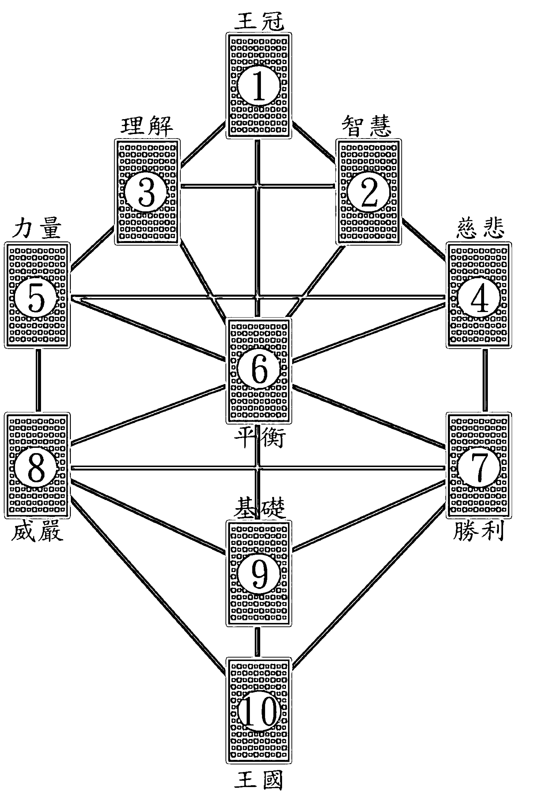

## 結合人生的塔羅牌
現代塔羅牌

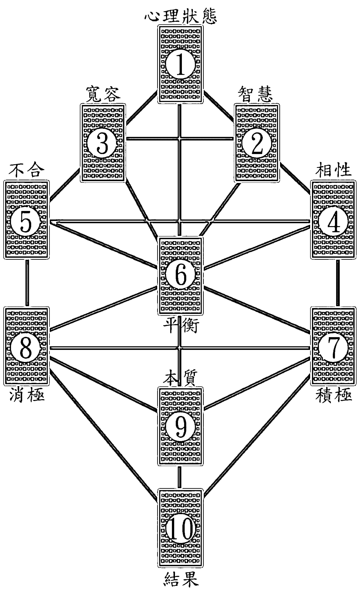

### 《生命之樹》第三方占卜

## 解牌實際範例

## 解牌實例一：

初級牌陣：過去、現在、未來
事件類型：感情

佩佩已經單身一段時間了，雖然說真的很自由、而且生活完全由自己掌握，可是偶爾內心也會有孤單落寞的感覺。想想，平常下班後同事各有活動安排，佩佩自然找不到人聊天；假日朋友們相約踏青吃飯看電影都成雙成對，佩佩自己一個人有時候真的挺尷尬的，所以現在的佩佩變得不太喜歡參加聚會、乾脆回家追劇比較實在。

可是想也知道，再怎麼好看的戲劇畢竟也會演完，就算再怎麼拼命追劇，也會偶爾想出去找人走走啊！每次到這個時候佩佩就覺得心裡有點失落。

對，沒錯，單身的自己想幹嘛就幹嘛，想到PUB或夜店甚至徹夜不歸都沒人管，也可以跟每個網友玩曖昧搞小夫妻，可是這些都只是短暫的寄託不是真正的愛情，所以時間久了心裡當然也就越來越空虛。更讓佩佩不懂的是明明自己也不難看，跟大家互動也不錯啊！可是怎麼到現在都沒有人追呢？

這天，佩佩意外看到我這間塔羅占卜店，忍不住走了進來：「可以幫我看看什麼時候才會有新的戀情嗎？」

## 結合人生的塔羅牌
現代塔羅牌

牌陣示意圖：

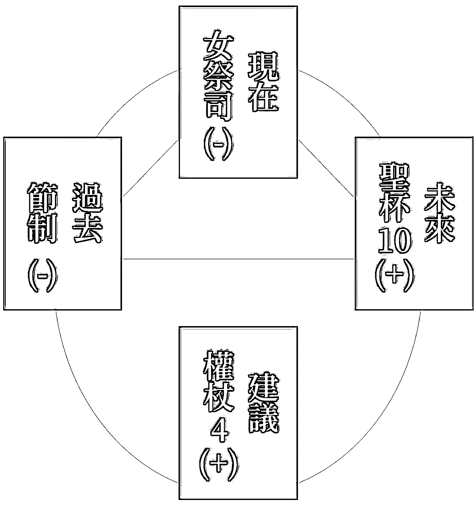

「喔喔，感覺你未來談愛情的時候，可能就以『終身伴侶』為前提在發展喔！不過這挺讓我訝異的，因為妳跟我說妳想談戀愛，可是牌面卻說到目前妳似乎還沒有把『想戀愛』的這個想法跟家人朋友說，甚至妳身邊的人說不定還以為妳很喜歡單身咧……」

「恩，對，我不想主動跟別人說我想談戀愛。」佩佩嘆了口氣：「其實離我上次戀愛已經快兩年了，這段期間也有很多次朋友幫我介紹新朋友、我也都可以大方認識他們並保持互動，但最後總是不了了之。我朋友覺得很奇怪，但其實我知道這是怎麼一回事。

在認識對方的時候，我心裡已經把這些人分成兩類，第一類是『我沒感覺』的人，這一類的發展很簡單，就是跟他聊天見面、雖然互動卻保持距離；這時候如果對方對我沒意思，大概就會這樣慢慢淡掉沒聯絡了；可是如果他對我有意思心裡一定會癢癢的，沒多久就會跟我告白。

等到對方跟我告白的時候，我就說『當初見面不是說好互相當朋友也可以嗎？所以我雖然對你沒感覺，可是我真的覺得你人很不錯、很值得當朋友，所以一直跟你保持互動。謝謝你今天的坦白，我也覺得先把話說清楚也好，這樣我們就可以當真正的朋友了……我很確定你不是我喜歡的類型，所以你接下來會想怎麼做呢？』妳看，這樣既不傷友誼，又可以全身而退，剩下就是他的問題了，整個乾淨俐落無瑕疵。」

聽了她這段話、一時之間我有些失笑；不知道是該稱讚她公開公平有原則、還是要說她殘忍無情夠坦白？可是…她也沒說什麼傷人的話，所以我也講不出來她殘忍的地方在哪裡…。

「那如果是妳有感覺的人呢？」不知道該怎麼接佩佩剛才的話，

## 結合人生的塔羅牌
現代塔羅牌

我乾脆直接跳下一段，正好也來聽聽她對「有感覺的人」又會怎麼做。

「恩，妳問得很好，這的確就比較難了。」佩佩很認真的對我點點頭，感覺好像她是上課講師、而我是在台下問問題的好聽眾。

「如果是『有感覺』這一類的人，那我就會先從小組互動開始，先把他介紹給我朋友一起拉成一個line小組。如果他不願意加進來，那八成代表他對我真的沒意思、那我就明白了也就算了；不過這樣的機率很小，因為大部分的人會礙於人情而加進來。而只要加進來，就有互動的機會了。」

……天啊，我現在是在上戀愛教戰手冊嗎？？看著眼前這位客戶，心裡真的覺得她像是身經百戰的戀愛教主，正在傳授她多年精華之獵物心法給我……

「互動的時候就看他的表現、看是什麼樣的話題可以炒熱互動，同時在裡面多展現自己的優勢並搞點小曖昧囉……再來我跟妳說，這時候朋友在旁邊絕對會幫妳敲鑼打鼓附和加分，同時還可以請朋友再找機會把大家約出來、看是要踏青桌遊唱歌或什麼都可以，反正就是找各種活動見面培養感情就對了！妳看，這種朋友互牽的方式真的很好用，既不用怕自己太主動讓別人以為妳很隨便、也不用怕自己太被動就沒機會跟他聯絡了，這種兩全其美、可進可退的方式真的很不錯吧！」佩佩一臉驕傲又自信的樣子，感覺得出來她對自己的獵男技巧相當自豪呢！

「恩恩，真的挺完美的，」我不得不承認這一整套真是個不錯的計畫：「可是妳為什麼但現在還是單身？」

「……」看到佩佩原本閃亮的眼神突然黯淡了下來，我想我應該

是問到他的痛處了：「唉，所以我才說，是我自己的問題。其實之前有幾次我應該有抓到幾個男生，只要我願意的話真的可以在一起。可是每到這時候我的心裡就開始莫名其妙的想放手，覺得如果真的在一起這樣真的好嗎？」

「？」我有點不懂：「為什麼不好？妳不是也有好感嗎？」

「對，可其實我內心很清楚，我要的只是一個看得順眼、固定可以帶我去玩、陪我消磨時間、並且讓我可以隨性耍賴撒嬌的對象。」

「？」我還是一頭霧水：「一般人找情侶，不也是為了這個用途嗎？」

「不不不，這不一樣，」佩佩很用力的搖著頭：「如果我今天跟A交往，可是之後如果遇到更有吸引力的B，我可能就會變心了。簡單的說，我現在的心態是『找人陪』，而不是『愛情』啊！」

「呃……那妳認為愛情應該是怎樣呢？」

「當然是要完全投入、完全付出、想要定下來跟對方長長久久在一起；這才是愛情嘛！可是現在我只是『想找伴』的心態，這樣不是很自私嗎？就是因為這樣，所以我才會到現在都沒有跟朋友說自己想談戀愛，因為如果朋友真的幫我找了一個不錯的男生，但我卻變心了，這樣朋友不就兩面不是人了嗎？」

「噢，原來是這樣……」看著佩佩，我不知道是該說她太自私、利用各種互動技巧讓自己可以在感情世界隨心所欲進退自如；還是要說她太善良、因為怕朋友與喜歡她的人受到傷害而寧願自己放棄退出。

「恩，既然妳決定要退出，那今天為什麼又來這裡呢？是不是心裡有什麼地方悶著過不去？」

## 結合人生的塔羅牌
現代塔羅牌

「過不去…也沒這麼慘啦！就是一個人還是會孤單寂寞冷，還是希望有人陪嘛！」佩佩苦笑著：「可是找個伴的時候卻又有罪惡感，這樣進退兩難真的不知道該怎麼辦？」

我看了看建議牌，然後抬起頭對佩佩笑了笑：「那我問妳，如果以妳的標準，那妳覺得那些對妳有好感的男生，他們是真的『愛妳』嗎？」

「嗄？」這次換佩佩愣住了：「呃……這……應該也還好吧？？才見面幾次，哪有可能一下子就完全愛下去？」

聽了佩佩這句話，我肯定的看著她，同時很用力的點頭：「對啊！妳知道感情一開始很難立刻就愛上彼此，妳也知道那些男生對妳也尚未達到愛的標準，所以妳又何必逼自己一開始就要『愛上對方』呢？」

佩佩好像被電震了一下，整個人睜大眼睛看著我、完全沒想過竟然會是這樣的回答。

「妳想想，愛情是感情一步步累積出來的，一開始兩人互有好感、然後開始互動，最後才變成愛情啊！但妳現在才剛開始認識對方，跟對方的好感程度也沒有太大、明明沒互動幾次卻要直接跳到愛情，這當然不可能嘛！我跟妳說，妳心裡想的這種愛情其實是『一見鍾情』、是言情小說或偶像劇才有的模式啦！可是現實社會中又有多少一見鍾情？妳現在是拿一見鍾情當標準，然後只要沒有小鹿亂撞就對不起朋友、對不起男生，最後莫名其妙轉身退出、同時又喊著自己孤單寂寞冷啊！」

「欸……那我這樣該怎麼辦？」

「沒什麼怎麼辦，就直接去談戀愛啊！你就是把愛情看得太高

尚，才會把自己陷住。試探彼此又怎樣？以後變心又怎樣？朋友牽線不過是給彼此機會互動看看，又不是叫你們立刻互訂終身不准反悔！所以現在你要換回正常的感情模式：認真珍惜朋友給你的緣分，若是發現彼此不適合就不要勉強，這樣的正常心態又怎麼會對不起朋友？可是如果你們都覺得對方不錯，那就讓感情漸漸穩固下來，自然就變成愛情了啊！」

「……好像也對。」佩佩終於笑了出來：「不過就是簡單的認識彼此，怎麼被我弄得好像很複雜？真是作繭自縛！」

我看著鬆了一口氣的佩佩，又低頭看了看「未來」的這張牌，忍不住輕輕笑著低頭不語——親愛的，我等妳感情穩定之後的粉紅炸彈！

# 解牌分析：

### 一 整體架構方面

過去 節制(-)：
原意：無法融合、無法轉換想法
延伸到這次占卜，塔羅想表達的涵義：
※ 對愛情太過高標準

現在 女祭司(-)：
原意：冷漠、堅持理想、單身
延伸到這次占卜，塔羅想表達的涵義：
❖ 過度理性處理男女關係
❖ 獨守空閨

**未來 聖杯10(+)：**
原意：和諧、家庭、完整的感情
延伸到這次占卜，塔羅想表達的涵義：
❖ 美麗的家庭關係

### 二 塔羅的建議

**建議牌 權杖4 (+)：**
原意：慶祝、聚會、維持良好關係
延伸到這次占卜，塔羅想表達的涵義：
❖ 單純享受與人互動的喜悅
❖ 主動與分享
❖ 共同建立關係

整體看來，就是因過去對愛情的高規格理想、讓佩佩現在處理感情的時候太過理性，導致最後束縛了自己；而這次的塔羅互動讓佩佩有新的愛情觀，進而幫助她在未來找到幸福的家庭；所以最後塔羅的建議，是希望佩佩先讓愛情回到單純，等互相信任後一起建立感情，讓佩佩能從簡單互動中，將感情慢慢進化成愛情。

## 解牌實例二：

初級牌陣：了解彼此內心想法
事件類型：感情

逸峰嘆了口氣半虛脫的關閉line、癱在椅子上：最近Alva的個性越來越敏感越來越難哄，逸峰覺得快招架不住了。

他跟Alva剛交往約三個月，當初覺得她又可愛又活潑，而且常常關心身邊周圍的朋友、幫大家想辦法，覺得這女生還不錯。可是交往後慢慢發現真正的她其實情緒超敏感、老是哭著說沒安全感、說男生交往後就變得不認真，並常懷疑他也是用玩玩的心態來交往。

就像今天下班後他陪Alva逛夜市，想前幾次逛夜市發現Alve好像挺喜歡吃烤串燒，這次特別找了串燒很有名的夜市、希望讓Alva喜歡。逛夜市的過程中Alva看起來好像沒有不高興的樣子，問她串燒好不好吃她也說感覺不錯，但沒想到逛完夜市、各自回家後她就傳line過來：

> Alva：「你為什麼不珍惜這段感情？」
逸峰：「蛤？沒有不珍惜啊！」
Alva：「你真的珍惜嗎？如果你珍惜，為什麼我們已經交往三個多月了，每次晚上你只帶我去逛夜市隨便吃吃？」
逸峰：「嗄？沒有隨便吃阿！你不是喜歡吃烤串燒嗎？」
Alva：「這不是串燒的問題，是你有沒有心的問題！如果你在乎這段感情覺得很珍貴，你會天天帶我去吃路邊攤？吃串燒也有不錯的

## 結合人生的塔羅牌
現代塔羅牌

高檔店去啊！明明我們都是上班族又不是學生，既然已經有收入了為什麼連基本的戀愛品質你都沒有想到？」

逸峰：「那妳可以直接說，我知道了就會帶妳去啊！」

Alva：「如果你有心根本不用我說！再說，要是我說了感覺好像是我勉強你逼你帶我吃高檔，我又不是這種人！」

「……」逸峰開始有點混亂--想要吃高檔貨、卻又不希望別人覺得她是這種人？天阿，女人到底在想什麼！？

「好……」逸峰深吸一口氣，根據他以往的戀愛經驗、加上朋友兄弟間互相傳授的(女人相處)溝通技巧，他知道現在最好的方法就是先認錯再說：「原來是這樣啊！寶貝對不起，我太粗心疏忽了，下次我們去高檔店吃串燒好嗎？」說實在的逸峰一邊說一邊心裡超不爽，到底是為什麼要把自己拉得這麼卑微？可是為了避免接下來半小時以上的精神轟炸，算了，就卑微一下吧！

「現在才想到有什麼用？我都說出來了、你根本一點都不用心！你對這段感情這麼粗心、那我在你心裡到底算什麼？」

「怎麼會不重視呢？我沒有玩感情，妳不要多想嘛！」

「要是有重視我、為什麼沒有問我想去哪裡吃、想吃什麼店？如果熱戀就這麼不用心，那以後這段感情怎麼辦？還是你根本就沒有想好好珍惜這段感情？你這樣會讓我很不安心你知道嗎？要是你沒有想認真談戀愛就不要來找我！」

又是「不安心」！逸峰聽到這個詞就覺得反感、怎麼每個女人老是在喊這句話？

「寶貝不要多想好嗎？我是很認真的！」反感歸反感，逸峰還是趕快用一些安撫的句子來回應，免得等一下惹出新的麻煩。唉，幸好

現在是用 line 打字留言；要是視訊 Alva 一定會看到逸峰的白眼快翻到後面去了！

就這樣盧了十多分鐘，Alva 總算慢慢心情平穩了、然後逸峰也快虛脫了。

其實這樣的爭執已經很多次了，這次逸峰終於受不了忍不住來找我：

> 「小嵐你們女生到底是怎麼想的？為什麼我怎麼做 Alva 都不滿意？我現在完全不知道該怎麼跟她相處才好了啊！這樣我們之後還走得下去嗎？」

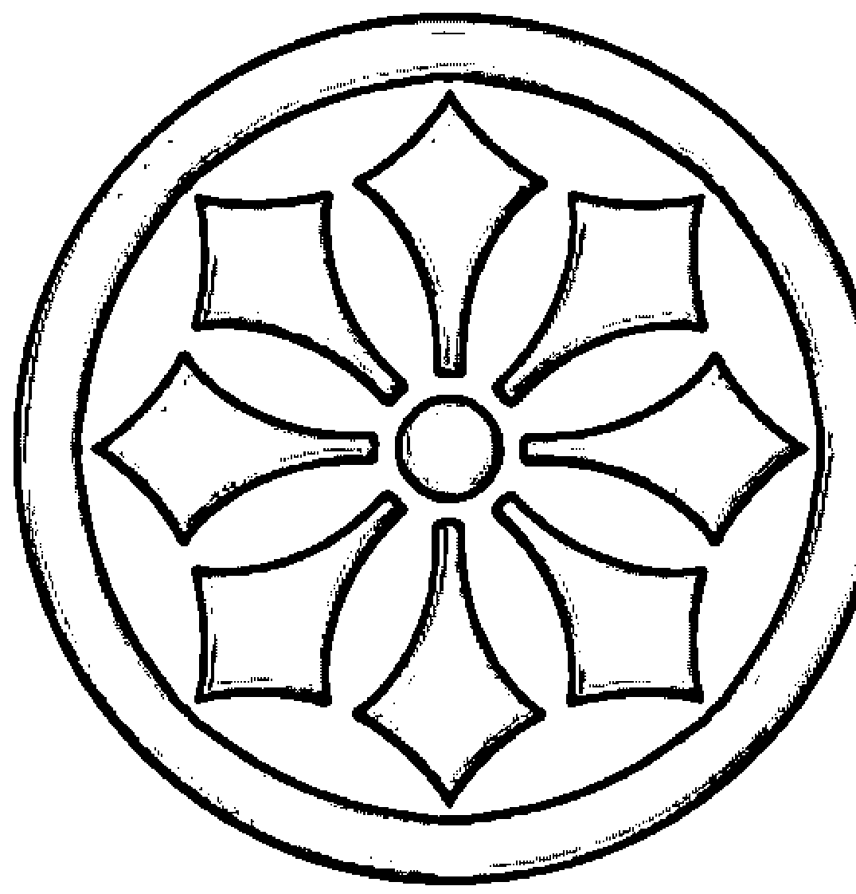

## 結合人生的塔羅牌
現代塔羅牌

牌陣示意圖：

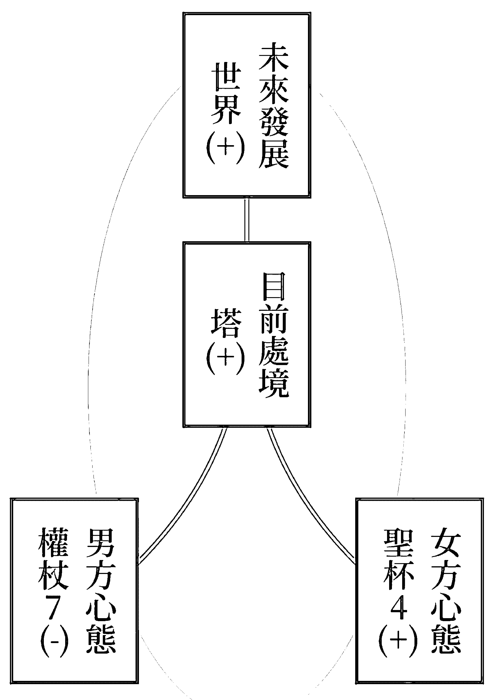

「依照牌面的含意，好像女生常想到以前不好的經驗、讓她會不知不覺用過去的經歷來評判你做的每一件事；於是你要解決的不只有事情、還要解決女生的心情，結果不但累到焦頭爛額還要被女生嫌，感覺怎麼做都做不好啊！」

「厚，我現在的感覺就是這樣！」逸峰看起來挺生氣也挺無力的：「她老是說以前男友怎樣怎樣，但我又不是她的前男友，幹嘛老是拿我跟他們比？一下子說前任男友沒錢收入不高、讓她明白愛情跟麵包應該要結合在一起才是真正的幸福，所以希望我給她的愛情要有一定的水準品質；一下子說她的初戀男友有多貼心多認真，好多事情初戀男友都幫她想到、她根本不用費心，然後覺得我一點也不用心…拜託，小嵐妳不知道，我那時候一邊聽她這樣講、一邊心裡在想：這麼貼心的男友最後會跟妳分手、那妳是不是應該好好反省一下自己有什麼問題？」

「哈哈哈，你好犀利耶！幸好你沒講，要是女生聽到這種話一定會受不了、說不定當場就翻臉了呢！」

「我當然不敢講啊，可是我現在真的累了，覺得要是她真的覺得我這麼不好、怎麼做都不滿意，那我們也不適合在一起吧？有時候我真的在想是不是就先這樣告一段落、早點分手比較好？」

「那跟她交往的這段期間有沒有比較快樂的事情呢？畢竟她能吸引你、一定是有她的優點吧！」我微笑的看著逸峰。

「嗯…」逸峰側著頭想了一下：「當然也有好的，像是我上班很耗腦力，她常想一些笑話或抓有趣圖案給我，希望我心情好一點，這挺讓我感動的。然後其實她心地很善良，在外面跟陌生人講話都帶笑容、有時候我公司加班沒空陪她她也體諒我、不太跟我鬧脾氣…」

「這真的很貼心耶！看來你選她沒有選錯喔！」

「對啦，這樣想一想其實她也沒那麼壞…那小嵐怎麼辦、能給我個建議嗎？我實在不知道要怎麼做才能克服她『不安』的問題啊！」

「當然好啊！」我很認真朝逸峰點了點頭，然後看著寶劍2那張建議牌：「你和她現在都不了解彼此，不知道對方整體是什麼樣子的人，所以現在都根據每個單一事件、或是自己的經歷來推測、無限延伸對方的心態與個性。可是就像你說的，她還不了解你就以為你不認真不用心、這對你不公平；而同樣的你也還不夠了解她，所以她的一些反應才讓你很頭痛不知道她到底在想什麼。」

「喔喔，這樣講好像也有道理耶！是不是我們都太早下結論了？」

「你很聰明喔，一聽就懂！」我給逸峰一個讚許的眼神：「我知道有時候女生的抱怨讓你很煩很累，這時候解決的方法就是先平心下來(當然如果能先哄哄她、讓她的心情也靜下來這樣效果更快)，然後接下來有兩大主題：1.先搞清楚她氣的是什麼，讓自己明白目前是哪裡有問題；而且這樣你之後也能慢慢清楚她的地雷是什麼。2.去了解她背後為什麼會有這些不好的感覺，摸清楚她內心的思考方式，然後再跟她解釋你的想法和原因，當她了解你的用心之後就不會誤會你、未來自然就不會再亂想然後到處覺得不安了。」

「這樣真的可以嗎？不過感覺好像也不輕鬆耶！」

「呵呵，的確一開始要耐下心來、要摸索了解她的脈絡，這真的不容易。可是一但抓到跟她互動的技巧，這樣以後就可以一輩子好好相處，現在辛苦一下換來輕鬆一輩子，這種CP值很值得啦！」

我看得出來逸峰覺得很麻煩，可是他答應我先這樣持續兩個月、看看效果如何。結果才一個多月、有一天逸峰很興奮的帶 Alva 一起來找我：

> 「小嵐妳的建議超有效，Alva 看到我的改變一開始覺得莫名其妙，後來越來越了解我，我們的相處也越來越好了！我今天特別帶她來，讓她來看看妳的廬山真面目！」Alva 很甜很氣質的對我笑著，然後我也教她一些方法，讓她可以更了解逸峰、並且知道怎麼跟逸峰良好的相處。

然後再過了一年左右，逸峰跟 Alva 要準備結婚了。看著他們美美的婚紗照，除了佩服攝影師的專業技術之外，更美麗的是他們眼中完全信任對方的眼神，讓我我相信用心經營的愛情永遠值得我們期待。

# 解牌分析：

### 整體架構方面：

**男方心態 權杖7(-)：**

原意：

- 懷疑自己是否能克服困難。
- 失敗感

延伸到這次占卜，塔羅想表達的涵義：

- 自己的用心都被否定
- 好像自己沒有能力、不是個好男人
- 覺得這段感情無法經營下去

**女方心態 聖杯4(+)：**

原意：

- 退縮、不斷思考著。
- 有想要的東西，但沒有積極去實現

延伸到這次占卜，塔羅想表達的涵義：

- 陷在過去的回憶中
- 對新的愛情有期許、卻忘了要求自己也該改變

**目前處境 塔(+)：**

原意：

- 毀滅、打擊
- 紛爭與糾紛
- 意外的轉折

延伸到這次占卜，塔羅想表達的涵義：

- 搖搖欲墜、感情開始有變動
- 兩人的爭執引發危機
- 可能造成男女雙方都不想要的結果

**未來發展 世界(+)：**

原意：

- 完成、達到目標
- 持續運作

延伸到這次占卜，塔羅想表達的涵義：

- 兩人的世界結合在一起
- 實現理想的結果

### 塔羅的建議：

建議牌 寶劍2(+)：

原意：

- ※ 矛盾、不安的堅持著
- ※ 自我保護

延伸到這次占卜，塔羅想表達的涵義：

- ※ 兩人都不小心讓對方受傷，才會越來越有隔閡
- ※ 堅持一段時間，把不安的原因找出來
- ※ 提起勇氣去看清事實真相

占卜一開始，可以看到女方根據以前的愛情經驗，希望這次的愛情可以更完美更幸福，但卻用錯方法、不知不覺讓男方有很大地壓力和挫折感，甚至讓男生對感情產生懷疑，擔心彼此之間是否不太適合。於是女生對男生總是不滿、男生則覺得女生有點亂發脾氣，然後兩人常吵架並誤會對方的意思；導致男生開始想放棄這段感情。

到了未來發展方面，塔羅牌看到男女雙方仍然有發展的空間，只要彼此努力創造出適合彼此的溝通方式、讓兩個人的心靈距離越來越能互相契合，最後會有機會建立一起的新的完美世界喔！其實一開始因為不了解彼此心中的真正想法所以才造成許多誤會；因此塔羅建議先堅持這段感情、途中試著避免語言的衝突、了解對方真正的想法是什麼；當妳放下寶劍、揭開眼罩，你會發現其實對方並沒有想像中那麼可怕。

## 解牌實例三：

中級牌陣：二擇一牌陣
事件類型：工作

恪明是某公司企劃部的組長，最近不知為什麼一直有辭職的念頭，而且這個想法越來越強烈，譬如平時只是開個會、或是跟組員討論進度、又或是接到新的企劃案，這些都只是例行公事也都駕輕就熟，可就是一股莫名的倦怠感。

> 「小嵐，怎麼辦？我知道自己其實在這公司很適應，寫企劃對我來說不是太大的問題；我也知道現在經濟不景氣，莫名其妙辭職真的不太好，一但被取代就很容易被淘汰。」

恪明的語氣依舊低迷：「可是我就是想走啊！每天只要一想到要穿正式襯衫、帶上手錶然後穿皮鞋就覺得好痛苦，簡直跟穿囚犯衣與手銬腳鍊沒兩樣！」

> 「耶？？」我有點不懂：「那不能穿輕便一點嗎？手錶就不要帶了，反正現在有手機了啊！」

「妳不懂，那不是用來看時間的，」恪明右手舉起、手掌很用力的揮動著，好像想把討厭的壓力撥開似的：「而是身分形象的問題。怎麼說呢？總之，想穿輕便隨性前提是你要當副總以上，那時候你身分地位都有了、別人只要看你的長相就知道你是誰，不需要外面的穿著打扮幫自己加分，那當然你愛怎麼穿都行。可是在這之前你必須有專業形象、要讓別人覺得你跟得上時代趨勢、覺得找你合作是值得並可以託付的。所以簡單來說，就是那些是我們的制服，用這些行為舉止穿著造型來證明我們是品德優良的好學生啦！」

「噢……」這下我懂了：「那感覺真的很壓抑，好像把每個人都變得模型一樣，當初自己的特色都沒了！」

「對！就是把我們都變成模型！同樣穿著、同樣話術、同樣動作跟反應，我都快瘋了！」

「那…就走啊！換個跑道，這樣比較適合你、你也比較快樂啊！」

「唉唷，要是能換我早換了！」恪明又搖了搖頭：「全新的行業我又不懂，而且現在30歲了誰會想要我？如果自己創業，一是我不知道自己能開什麼店、二是我也沒資金，再加上現在大環境這麼差，完全不適合啊！也有人跟我說，不然我去換公司 - 拜託，那還不是一樣要穿襯衫打領帶，只是換湯不換藥好嗎？」

恪明重重的嘆了口氣：「我就是全部都想過了都想不通才來找妳 - 其實我之前是根本不算命的！」

「噢！」我笑了出來：「哈哈哈，那我真的謝謝你把第一次給我呢！希望不要給你不好的印象啊！」笑完後我收心回來、表現該有的認真與專業：「好啦，不跟你開玩笑了；那你今天來想知道什麼？」

「我想知道…」恪明：「我想知道我接下來要怎麼辦？要不要乾脆辭職算了？」

牌陣示意圖：

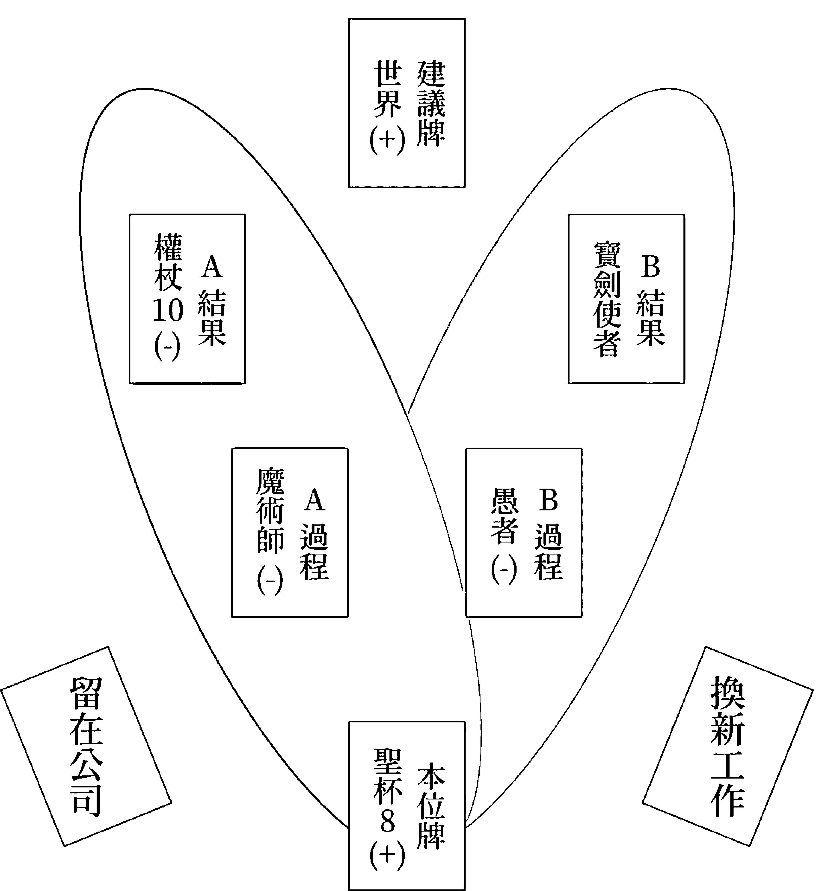

「嗯，牌面說，其實你很想辭職，但身邊的人都不太支持你，所以如果你要辭職要有很大的勇氣喔！」

「真的！我爸媽、我女友全部都說我有病！」恪明突然變得有點激動：「他們說我在大公司企劃部做組長，只要好好做以後一定前途無量，真不知道我腦子裡在想什麼！我爸媽又勸又罵的叫我快點清醒，我女友甚至威脅我說如果我辭職她就立刻分手！然後我跟我朋友說的時候，他們也覺得是我不知足不懂人間疾苦，說外面現在經濟這麼差、我就是因為生活穩定才會說這些有的沒的；要是跟他們一樣每天被錢追著跑的話根本連賺錢都來不及了，哪有時間去探討什麼穿制服戴手錶的背後意義！對他們來說，我就是時間太閒，無病呻吟啦。」

「可是牌面說，你不是不想工作，只是你的想法跟大家不太一樣，對你來說這種一成不變的生活模式你不喜歡。這樣的生活只是安穩卻一點樂趣也沒有，最後自己像是機器人一樣完全沒有特色。你如果留下來，其實以你的能力是沒有問題的，最後也可以建立出自己的成就，只是成功的過程你會覺得像是一場戲，自己則是舞台上的小丑，為了滿足其他人的各種要求而不斷犧牲自己；所以最後就算成功你也只覺得身心俱疲，因為這些成就都是為了別人而不是為了自己。」

「拜託，不用等到我成功，我現在就是這種感覺啊！其實從以前我就知道什麼場合該穿什麼講什麼，我真的可以猜出來對方想要我怎麼說怎麼反應，甚至百發百中到連我自己都覺得不可思議！或許這就是所謂的天賦吧？可是這個天賦卻讓我好累好痛苦，因為從此以後我再也不能當我自己了。」

「不能當自己，為什麼？」我有點不懂：「你知道最適合最安全的樣子，可是你可以選擇不理會這些規矩啊！」

「哈，我舉個例吧！」恪明一臉苦笑的看著我：「去年我女友生日，她舉辦一場輕鬆的小Party，不用想也知道我一定是全場陪同囉！那天我穿了 Champion 半休閒式的衣服，雖然我知道如果穿 CLUB MONACO的紳士造型最符合我女友的期望，可是我覺得這次主角又不是我，而且這只是她的朋友聚會也不是什麼正式場合，所以我當然想要休閒一點啊！

結果那天結束後她果然跟我抱怨，怪我為什麼亂穿讓她沒面子。於是我直接問她『不然妳希望我穿什麼？』她也說不出具體的樣子，只是說她穿這小禮服卻配上我半休閒的衣服真的很不搭，然後就連續一個禮拜冷戰。」

恪明歎了口氣、喝了口水：「這樣妳知道我的痛苦了吧？因為我心中知道該怎麼穿最安全，所以必須放棄自己，不然就要面對後來的責備或麻煩。我從年紀很小的時候就有這個能力，去鄉下婆婆家該怎麼應對怎麼說話；去跟爸媽同事見面時要擺出什麼表情；到同學家的時候遇到伯伯阿姨該怎麼回應……以前很自豪，覺得可以很快得到大家的認同與喜愛，可是越大卻越痛苦，因為慢慢的我都在演別人想要的樣子，卻忘記原初的自己是什麼樣子了。所以我才說這個天賦其實是種詛咒，必須為了保持和平而去滿足每個人，等到最後你卻失去了自己。所以我為什麼會這麼討厭每天穿西裝戴手錶？或許一般人覺得這根本沒什麼，可是對我來說這卻是從小到大的煎熬啊！」

「原來對你來說這不是天賦而是詛咒……難怪你這麼痛苦。」我聽了也忍不住有些心疼；接著我轉頭、很認真看向另一邊的牌：「辭職當然是另一個選擇。離開之後別人會覺得你很傻是不是瘋了，甚至你自己也會這樣覺得喔！但其實這是你靈魂成長的過程，慢慢你會看清楚這個世界其實很多很膚淺的人、他們自以為是卻想主導一切；當你明白了這一點，你就開始學會活用自己的天賦，什麼場合應該套上制服、又是什麼場合可以脫下面具自由做自己。然後你慢慢會抓到拿捏這個力道的技巧，最後成為你真正的利器，就像是專屬自己的魔杖喔！」

「喔喔喔，真的嗎？」恪明的雙眼立刻亮了起來：「妳是說如果我辭職，反而可以練習我的天賦、最後變成我的魔杖，而不是被它控制？我跟妳說，妳的譬喻實在太好了，真的就是因為這個魔杖我到現在還不會用，才會把自己弄得這樣綁手綁腳啊！如果真的可以駕馭它，那才是我想要的結果啊！」但沒多久恪明又擔心了起來：「這樣辭職真的沒問題嗎？會不會沒錢吃飯啊？」

我看了一下最後一張牌：「呵呵，放心啦！你的能力夠強，而且人脈似乎也不錯，絕對不會讓自己餓肚子的啦！」

看著恪明離開時喜孜孜的背影，我一半為他高興、一半又有點擔心：你即將為自己啟程去探索自我，這真的是很棒的決定；但這條路很辛苦有很多磨難，甚至會有很多條岔路讓你不知道該怎麼選擇喔！因此，請你一定要記得今天的初心，努力與天賦互相融合，成為你在未來最強大的能力！

# 解牌分析：

# 一 整體架構方面：

**本位牌 聖杯8 (+)**
原意：缺乏、尋找與改變、行動
延伸到這次占卜，塔羅想表達的涵義：

- ❖ 雖然已經擁有很多，卻仍有缺口沒有補滿
- ❖ 在未知中、尋找不同的方向
- ❖ 孤獨前行

**A 過程 魔術師 (-)**
原意：不斷變花樣、混亂、無法溝通
延伸到這次占卜，塔羅想表達的涵義：

- ❖ 不斷滿足外界要求
- ❖ 覺得自己好像在演戲、不像自己

**A 結果 權杖10 (-)**
原意：壓力、勞累、責任
延伸到這次占卜，塔羅想表達的涵義：

- ❖ 很辛苦的背負每個人的期許
- ❖ 努力扛著、累到想放棄一切
- ❖ 這些成功是被逼的，不是我自己想要的

**B 過程 愚者 (-)**
原意：危險、放縱、愚昧無知
延伸到這次占卜，塔羅想表達的涵義：

- 混亂的方向、找不到自我
- 盲目幼稚的決定
- 自我否定、無法得到肯定

**B 結果 寶劍使者 (+)**
原意：新的觀念、靈活運用
延伸到這次占卜，塔羅想表達的涵義：

- 開始適應並活用特殊的能力
- 更多的開心與驕傲
- 得到技巧後，或許會想探索更深的智慧

### 二 塔羅牌的建議：

**建議牌 世界 (+)**
原意：生命源頭、完美宇宙、統合
延伸到這次占卜，塔羅想表達的涵義：

- 世界包羅萬象、多彩的生命
- 更寬廣的未來與發展
- 完整的靈魂

一開始，從本身狀態來看，可以發現恪明對工作的意義產生疑惑，現在擁有的一切無法填補空虛，因此想要探求未知的世界。因此塔羅牌這時候幫他從兩個方向來分析：

☆ 如果留在公司：
會有不錯的發展，可以讓很多人滿意。你會很認真演好每個角色，努力堅持正常工作運行，讓自己保持不錯的評價；但精神方面卻覺得沒有人懂你，認為這些成就都是為了配合別人、不是你真正想要的；導致自己像個魁儡。

☆ 如果離開公司：
別人覺得你莫名其妙，再加上你離開之後不知道該去何處，因此過程中一但遇到挫折就會開始自我懷疑、覺得當初放棄工作是一個荒唐的決定。但在精神層面開始提升成長，會慢慢了解自己的能力該怎麼運用，未來越來越上手並活用這樣的能力來幫助自己。

恪明看著這兩個方向各有優缺點，於是他有點卡住了；如果選擇留在這裡，似乎物質生活不錯，但精神會很痛苦；可是如果選擇離開，或許精神找到鼓勵，可是現實生活不穩定。到底該怎麼辦呢？

因此塔羅牌在最後給了一些建議：其實人生應該是充滿寬廣多元，你原本的天賦卻束縛著你，如果一直這會放著、未來將會讓你對生命感後缺憾與可惜。努力去找到掌握自己天賦的方式，然後用更豐富的能力幫自己創造更完整的世界，這才是靈魂最想要的結果。

## 解牌實例四：

高級牌陣：塞爾特牌陣
事件類型：人際

今天這位客戶一進門就塞給我一封紅色的信封；我半疑惑的把信打開。
「妳要結婚了？」
「哈哈哈，沒錯！」亞亞臉上洋溢著喜悅與嬌羞，融合成一股甜蜜燦爛的光芒。
「太好了，恭喜妳耶！」亞亞跟我認識很久了，一開始是在她大學生的時候與我相遇，一直保持聯絡到現在也快30歲囉！
「他是去年跟我求婚，然後我們光為了準備婚禮就花了快一年，超繁瑣的！然後我今天過來，其實是因為在準備的過程中，我跟他家人接觸互動多了，越來越發現他們家人的觀念與習慣跟我很不一樣耶！」
「不一樣？怎麼不一樣啊？」
「就譬如吃飯吧，我們家覺得大家吃飯是很快樂的事情，而且既然是一家人本來就沒必要計較得太清楚，所以我們家吃飯較不在乎長幼順序之類的事情。可是我去他家吃飯的時候就完全不一樣，他們家很重視倫理。長輩未上桌我們晚輩就要站著等，長輩開動了我們才可以開動，甚至每一道菜都要長輩先吃過我們才可以吃……說真的，我每次去他家吃飯壓力都好大，接著聯想到結婚以後大家吃飯的畫面，突然覺得這樣過一輩子好可怕！」
「唉唷，怎麼吃個飯弄得好像皇宮貴族似的？就跟宮廷劇皇帝吃飯一樣，又像是偶像劇那些總裁母親家人吃飯也是這樣，感覺好不真實喔！」我聽了忍不住笑了出來，但也可以想像亞亞每次跟他們吃飯的莫明壓力。
「就是嘛！」聽到我的譬喻亞亞也忍不住失笑：「拜託，我還真希望他是皇上咧！哈哈哈，如果他們真的是皇室或有錢人家，那這點規矩算什麼？叫我天天鞠躬敬禮吃飯我都願意！可是現實中大家都只是普通的一般人，每天光是上班賺錢養家的壓力都已經這麼大了，如果連吃飯都不能放鬆，這樣生活怎麼過啊？」
亞亞忍不住嘆了口氣：「這也是我今天來找妳的原因。妳可不可以幫我看看，這樣的家人要怎麼相處？我好怕嫁過去之後過得不快樂，而且現在我完全不知道要怎麼樣才能讓他們喜歡我？」

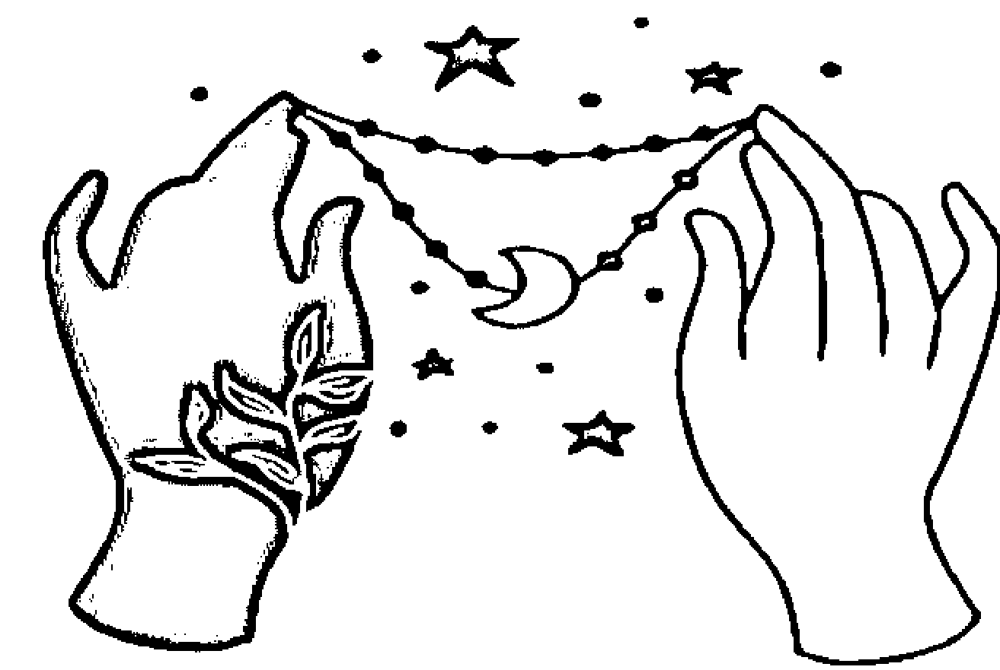

牌陣示意圖：

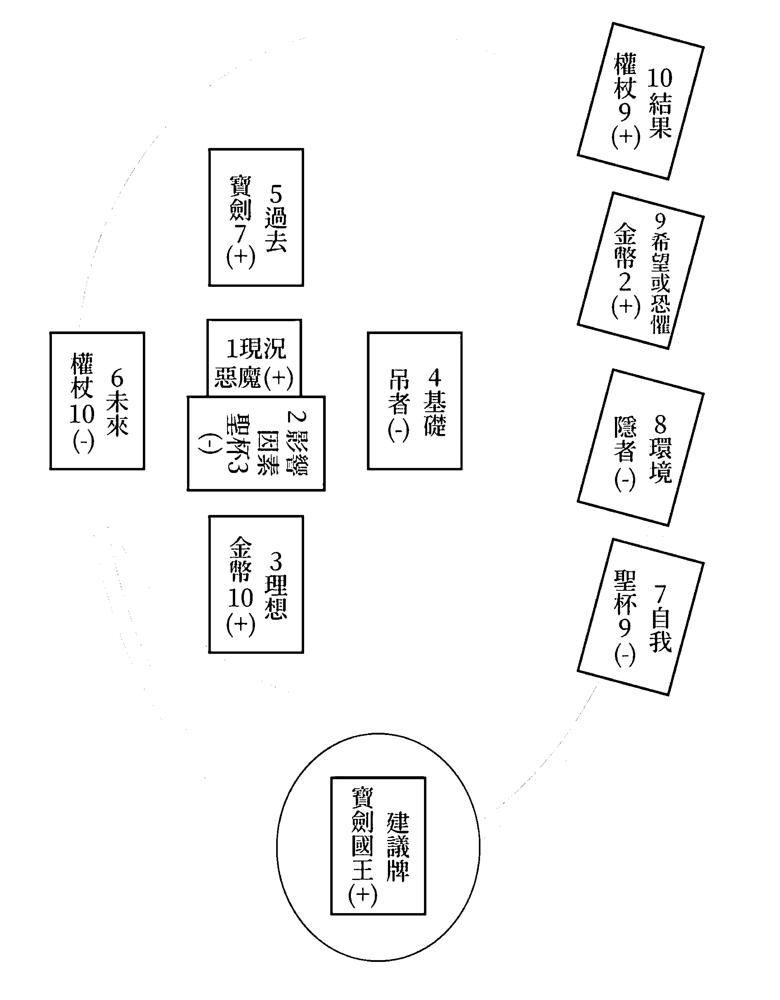

看著牌，我有點皺眉：「妳要他們喜歡妳，可是妳似乎根本就不喜歡他們的生活習慣，現在對妳來說像是硬逼自己套上他們的步調，然後還假裝笑得很快樂很滿足，希望能藉此得到他們的認同。妳表面上看起來跟大家和樂融融，但心裡其實希望聚會快點結束、甚至牌面表示妳似乎希望能跟公婆分開住喔！」

「沒錯！我一直在跟我男友洗腦，希望他可以婚後搬出來，建立我們自己的小天地！」

亞亞很用力不停點頭，感覺得出來她非常想實現這個願望：「至少我們兩個人吃飯的時候不用相敬如賓，不用等對方入坐才能用餐啊！天啊，你能想像自己已經工作一整天，肚子一直在呼喊著食物，卻要忍著保持笑容等大家入坐才能開飯，而且還要細嚼慢嚥文質彬彬的樣子嗎？我好怕自己一餐飯還沒吃完就已經先餓死了！不止是吃飯，還有很多習慣都把我壓到喘不過氣來；譬如像是長輩拿東西給你，你一定要站起來雙手接；分東西的時候必須照長幼順序去領取，像我們家那樣爭先恐後一邊搶一邊互相開玩笑的情境他們根本無法想像！嗯，總之就是去他們家感覺要超氣質像演戲一樣，這根本不是真正的生活好嗎……」

我很認真的也跟著點頭，十分了解她的痛苦：「我知道我知道，如果連回家後都要繃緊神經不能放鬆，這樣的婚姻真的是虐待啊！完全不一樣的生活模式只能靠自己去適應去克服，尤其在對方家長眼中的妳只有倒扣分與零分，好像大家都在等著看妳笑話沒有人體諒妳，這樣的妳嫁過去會很辛苦的！」

「咦，妳怎麼知道他們都在等著看我笑話？」

亞亞一臉吃驚的看著我：「我跟你說，上個月我去參加男友的家族聚會，買了鼠尾草精油當禮物，其實也沒多想什麼，就覺得這味道挺好聞的，就當禮物送過去。沒想到因為男友他妹妹剛好生肖屬老鼠，我送過去的時候大家就笑說我是要燒他妹妹的尾巴、來個大嫂下馬威！他妹妹當場臉色變得好看，他爸媽跟我男友也是半尷尬半搞笑帶過，而我則是呆在那邊完全不知道怎麼辦才好……妳知道嗎，那時候我真的可以感覺到他那些叔叔嬸嬸、舅舅阿姨全都一臉看好戲的樣子，整個氣氛變得好奇怪好可怕！事後我在車上哭到不行，雖然我男友他們都說沒事，但我真的覺得自己應該已經被黑掉了，回想到吃飯時那些人的嘴臉我一輩子都記得！」亞亞一邊說一邊聲音越來越哽咽，最後忍不住哭了出來。

「噢……」我聽了也替亞亞抱屈：「他們好歹也是長輩，怎麼可以這樣說話？這樣看來他們彼此之間一定很有心結，這樣妳嫁過去夾在中間兩面討好，最後把自己累死不說，搞不好還裡外不是人呢！

「我媽也是這樣說！甚至我外婆還勸我，她說我們兩家的生活差太多，之後相處如果沒處理好一定會有很多摩擦，與其到時候鬧到離婚，還不如現在就分開算了。可是我……」

亞亞抬起頭來看著我：「我捨不得啊！我真的很愛我男友，難道真的沒有辦法嗎？」

「牌上的建議是，妳如果真的嫁過去，那在跟他們家人相處的時候妳可以先確定自己的原則，然後相信自己的決定。」

其實我自己心裡挺認同亞亞外婆的觀點，「門當戶對」背後包含的不只是經濟與地位，更是因為相同領域的人彼此觀念相近，生活在一起時較不會有衝突。可是我也明白，亞亞現在重視感情勝過一切，很想積極守住未來的幸福；再說他們的喜帖都印了，此時的我又怎麼能叫她放棄？

> 「妳不用討好每一個人。妳想想，連他們自己家人之間都做不到家和萬事興，連妳男友他們也必須硬掛著笑臉的面具、撐著假面的和平不敢拿下，那妳這個嫁過來的外人又能做什麼？所以牌面希望妳先把他們家的基本規矩學會、讓他們沒有閒話講妳；甚至到後面妳可以用這些規矩來保護自己，對抗他們的輕蔑！妳不需要成為大家族的家人，而是只要成為男友這一家的家人就可以了，妳懂這兩者的差異嗎？」

> 「妳是說……」亞亞有點不太確定的看著我：「我只是讓男友的爸媽他們喜歡就好，至於其他家人就不用管了？」

> 「嗯嗯嗯，沒錯！」我很直接給亞亞一個稱讚的眼神：「妳想想，真的會跟妳一起生活的人只有妳男友跟男友的爸媽，這才是妳真正要用心培養感情的人啊！而其他那些叔叔伯伯一年才見幾次面，就算見了也只是吃個飯連絡一下感情，這個如果他們自己家人都不積極，妳又何必在旁邊替他們著急操心？我知道妳的家庭結合力很強，整個大家庭互相一起吃吃喝喝、打打鬧鬧，所以自然妳會以為要把每個人都顧得好好的，氣氛要快快樂樂的才叫合格；但其實這個世界上每個家庭各有自己的運作模式，妳既然嫁了過去，就好好去學他們家的規矩，然後跟他們應對時心中清楚自己在做什麼、問心無愧並讓妳男友家人覺得舒服就好了，其他就是他們家的事，妳完全不必隨波逐流委曲求全。」

> 「這真的可以嗎？這樣我就簡單多了！」亞亞臉上露出曙光，嘴角不自覺在上揚著。

> 「當然可以啊！而且如果妳能適當表示出自己的原則，反而比較客觀、評價事情的時候更公平更整體，說不定之後他們還會找你來主持公道呢！這才是最完美最理想的結果不是嗎？」

「嗯，我懂了！」亞亞滿滿的笑容，看看我然後看看自己手上的喜帖，紅色的光輝不只是婚帖上的喜悅，更交映著亞亞對未來滿滿的期待！

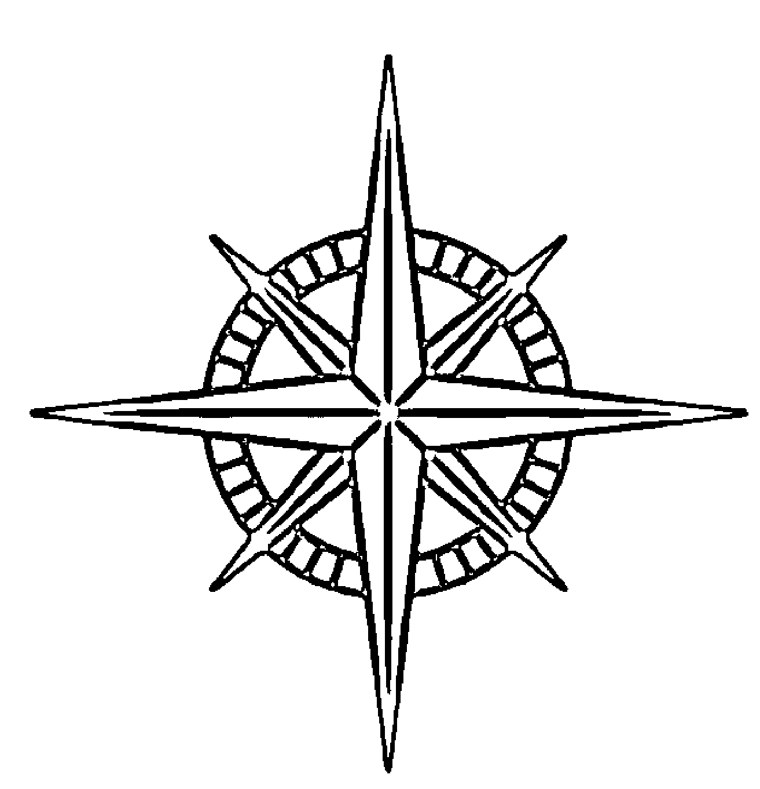

## 結合人生的塔羅牌
現代塔羅牌

# 解牌分析：

# 一 整體架構方面：

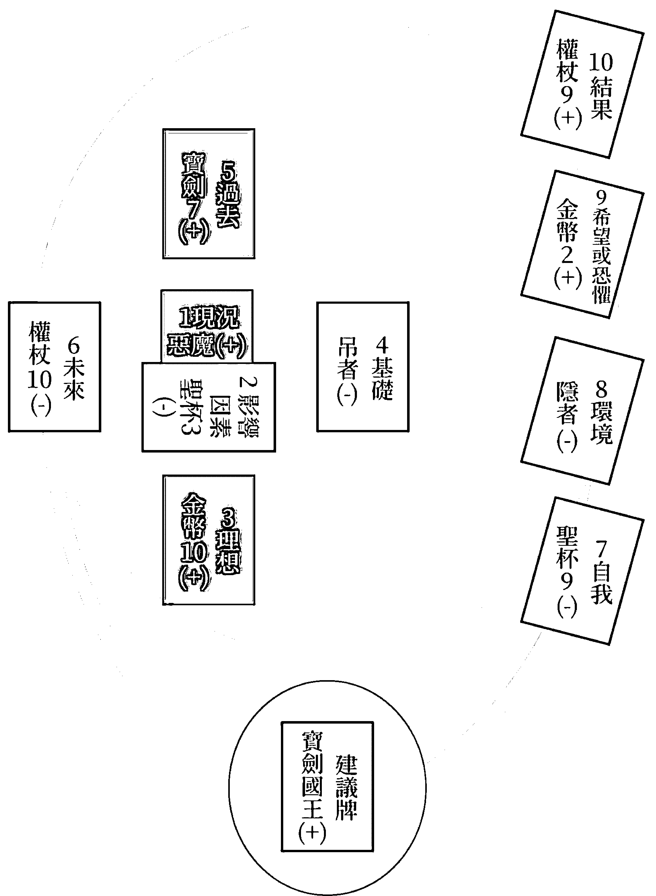

# 基礎 吊者 (-)

原意：忍耐、等待、煎熬
延伸到這次占卜，塔羅想表達的涵義：

- 個性比較忍耐、有苦自己吞
- 等待自己適應與成熟
- 對方家庭的生活方式很痛苦

# 現況 惡魔 (+)

原意：虛假、束縛、被控制
延伸到這次占卜，塔羅想表達的涵義：

- 假裝很快樂，但內心其實很難受
- 不得不配合，這種環境像是地獄
- 男友家庭的和樂是虛華空洞的

# 理想 金幣10 (+)

原意：穩定、生活上軌道、
適當距離與互動
延伸到這次占卜，塔羅想表達的涵義：

- 互相尊重，但有各自的空間
- 能適應並融入新家庭的生活模式
- 平穩單純的家庭生活

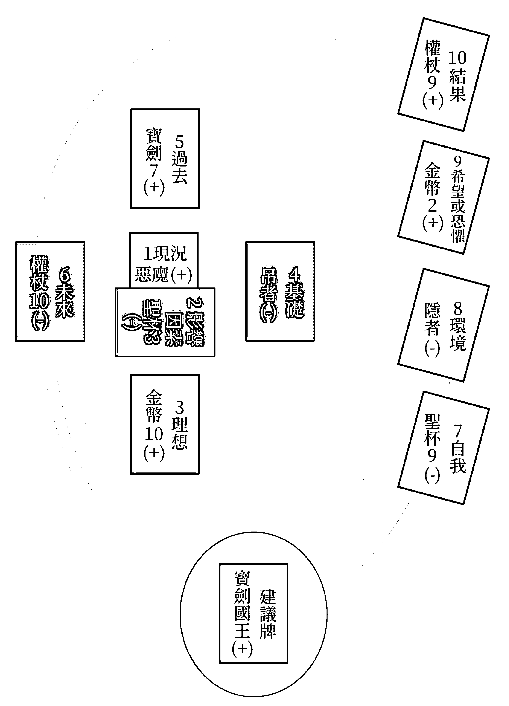

# ⑤ 解牌實際範例 TAROT

# 過去 寶劍7 (+)

原意：欺騙、險境、小心翼翼
延伸到這次占卜，塔羅想表達的涵義：

- 帶著面具，欺騙別人也騙自己
- 擔心隨時都可能犯錯而步步為營
- 壓力很大、充滿危機與恐懼

# 影響因素 聖杯3(-)

原意：無法和諧、過度或強求
延伸到這次占卜，塔羅想表達的涵義：

- 應該要歡樂的聚會卻不歡而散
- 情緒太多不理智，強逼自己壓抑
- 無法成為真正一家人、貌合神離

# 未來 權杖 10 (-)

原意：硬撐、太疲累而想放棄、失去動力
延伸到這次占卜，塔羅想表達的涵義：

- 勉強自己、把全部的責任都自己扛
- 沒力氣再走，家庭變成遙遠的路
- 原來自己能力沒這麼強，身心俱疲

# 自我 聖杯9 (-)

原意：成就、展現自己、守護
延伸到這次占卜，塔羅想表達的涵義：

- 很在乎他人的眼光與評價
- 希望自己展現出完美的一面
- 想保衛自己的成果、卻力不從心

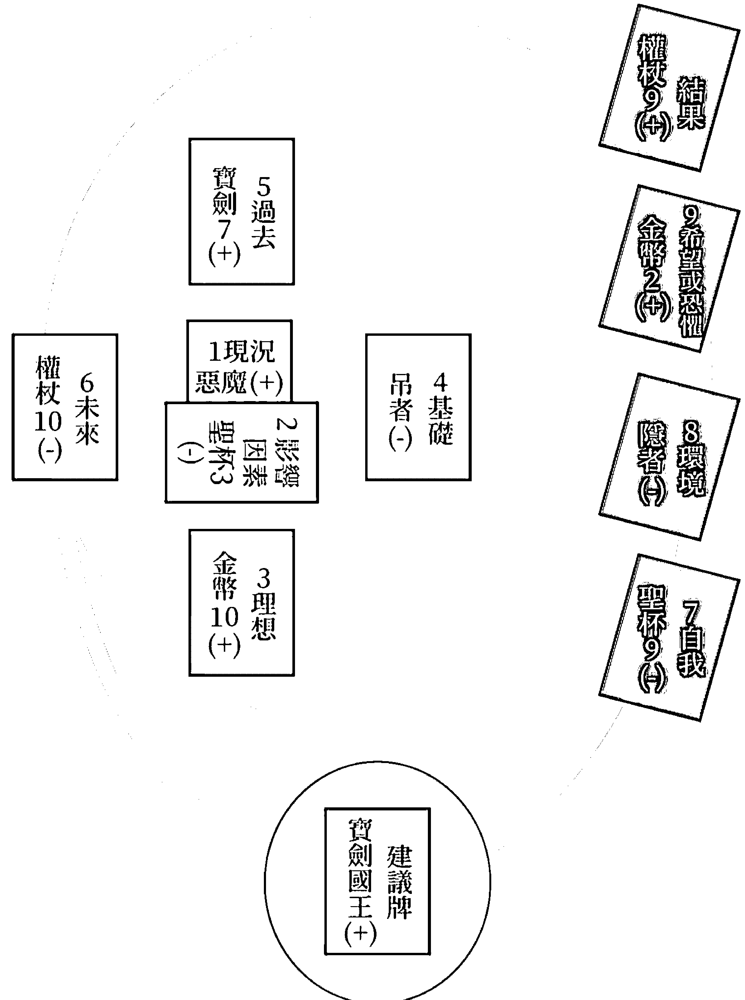

# 環境 隱者 (-)

原意：孤單、智慧或經驗不夠、心寒失望
延伸到這次占卜，塔羅想表達的涵義：

- 處於孤立無援的狀態
- 個性單純，所以人際手腕還不夠
- 還不適應對方的家庭模式
- 感受不到溫馨而失望

# 希望或恐懼 金幣2 (+)

原意：衡量拿捏、不穩定、難以平衡
延伸到這次占卜，塔羅想表達的涵義：

- 想要掌握平衡、能夠適當應對進退
- 不知該用什麼方式讓每個人都滿意
- 人心隨時在變化而感到壓力

# 結果 權杖9 (+)

原意：傷痕累累、努力守護、防衛與包袱
延伸到這次占卜，塔羅想表達的涵義：

- 很努力撐著、但是心裡很受傷
- 對「家人」產生距離感、感覺痛苦
- 明明不像家人卻還是必須包容

# 二 塔羅牌的建議

**建議牌：寶劍國王 (+)**
原意：判斷與決定、理性處事、成為主導者
延伸到這次占卜，塔羅想表達的涵義：

- 以清明理性的方式看待人事物
- 相信自己的觀點
- 適當的感情付出、不用刻意討好反而能明確表達自己的立場

首先，從「現況、理想、基礎」這三個位置來看，會發現亞亞由於本身個性比較忍耐壓抑，以為這是自己的問題，因此勉強自己，希望自己趕快適應對方的家庭模式。然而真正的問題是男友家庭本身互動就不友善，假面的和平。由於彼此態度都不真誠，這跟亞亞原生家庭的互動模式有很大的差異；亞亞處在這樣的環境下自然會覺得痛苦難受。再加上亞亞會勉強自己配合對方，這當然更是種煎熬。

由於現實狀況與亞亞夢想的家庭模式差異太大，導致亞亞希望婚後對方家人不要有太多互動，甚至希望可以搬出來自己成立一個小家庭，過著簡單平穩生活；同時也希望自己能趕快當上稱職的女主人，這樣未來跟男友的家人就可以和平共處了。

然後我們再看看「過去、影響、未來」這三個位置來看亞亞的發展趨勢，看到因為男友家人會互相猜忌、虛偽的口吻，讓亞亞覺得跟男友家人相處要好小心觀察四周氣氛，不像自己家那樣簡單直率。這樣在亞亞心中有很大的壓力，很怕自己不小心就犯錯，卻還假裝快樂、欺騙自己以後可以適應這樣的生活方式。

明明家人之間無法真正快樂相聚，再加上長輩們沒有足夠的包容與智慧的情況下，造成貌合神離、假面的情誼與親情。而亞亞本身是很重視家庭關係的，卻要活在這種假象家人的環境裡，這會讓她痛苦萬分；再加上亞亞習慣把責任往自己身上攬，最後不但身心俱疲，同時因為結果無法讓每個人都滿意，所以大家都忘了要體諒並感謝亞亞的辛勞。這樣的結果將使亞亞整個人內心受創，再也無法撐住這個家。甚至覺得這根本不是她真正的家，最後乾脆放棄。

於是，這時候我們可以從「自我、環境、希望」和「結果」來分析亞亞接下來的趨勢。在牌裡，看到其實真正影響亞亞的，是因為她本人很重視別人的眼光，不希望自己顯出不完美的一面，所以不知不覺把這些問題都放在心上，怕以後別人說她嫁過去之後不能適應、也不想要有人說她的家庭有缺點或陰影。

然而亞亞個性單純，不會玩心機耍手段，所以就變成自己默默吞下壓力，不知道怎麼跟他人求助；此外，男友家人也沒注意到亞亞的不適應，沒有主動伸出援手，使得亞亞更加孤立無助，覺得沒有人關懷自己像個孤兒。

亞亞希望自己可以趕快抓到相處的技巧，只要找到這個家庭相處模式的核心原則，就可以讓大家都滿意高興，這樣就不用擔心自己犯錯。但卻發現男友家人的心情很難捉摸，讓亞亞覺得很累，很沒有安全感，導致當初自己對自己的期許變成壓力與惡夢。

因為大家都是家人，使得亞亞逼自己要包容他們的語言和行為，最後亞亞要靠很強大的毅力來撐著，不但內心有很多傷口，而且也會對這個家庭感覺不信任，覺得他們不是真正的家人、卻又無法丟開。

經過上面完整的內容、了解亞亞各方面的處境後，最後塔羅牌給亞亞適當的建議——其實在人世間，本來就不可能滿足每個人。因此並非我冷酷無情，而是我清楚自己該把誰放在心上，至於其他人只是我的過客不需特意配合。甚至過度配合與謙虛反而得不到他們的尊重，那不如很真實說出自己的想法與決定，這樣說不定還能獲得他人的重視。

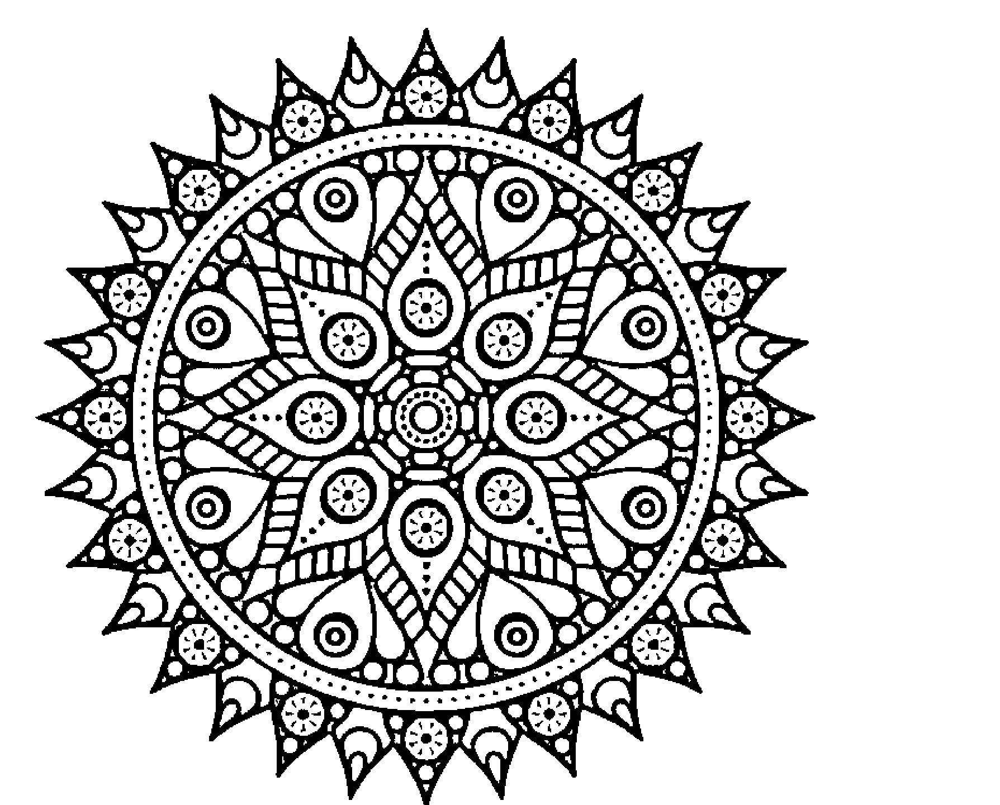

# Part

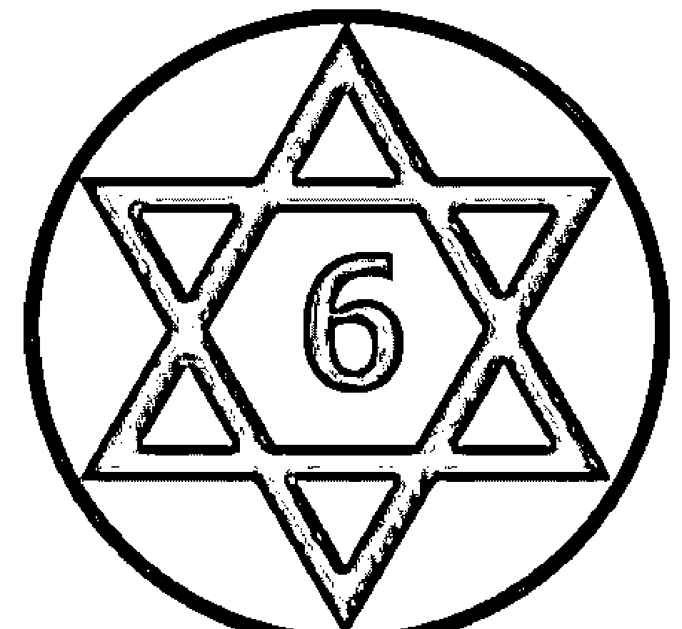

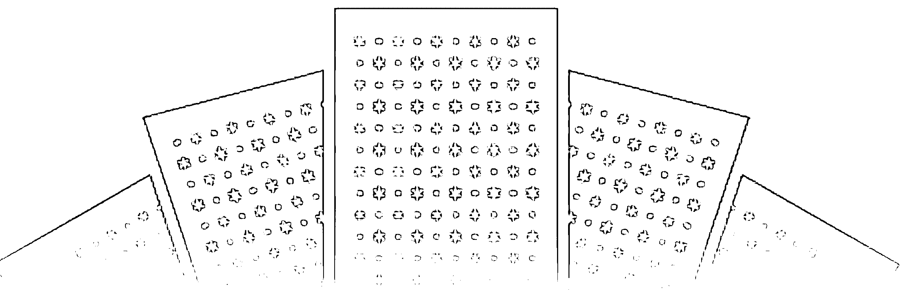

# 塔羅內法秘技

# 秘技一：22 張的二元架構

我們的世界充滿了「二元」的概念，並且以這個概念建立我們對世界的認知與理解。這個概念也融入在塔羅牌的22張大秘儀中，兩兩相對呈現出塔羅最基本的結構：

| | | | | | 0 愚者 | | | | | |
|---|---|---|---|---|---|---|---|---|---|---|
| 1 魔術師 | 2 女祭 | 3 皇后 | 4 國王 | 5 教皇 | 6 戀人 | 7 戰車 | 8 力量 | 9 隱者 | 10 生命之鑰 | |
| 11 正義 | 12 吊者 | 13 死神 | 14 節制 | 15 魔鬼 | 16 塔 | 17 星星 | 18 月亮 | 19 太陽 | 20 審判 | |
| | | | | | 21 世界 | | | | | |

下面是圖中每一對牌的含意：

- ✴ 愚者 VS 21 世界：
  開始 vs 最後；從無走向完成、然後又重回到歸零
- ✴ 魔術師 VS 11 正義：
  變易 vs 不變；有所為有所不為，結合完整的人格
- ✴ 女祭司 VS 12 吊者：
  超越 vs 忍耐；抵抗慾望的兩種方式
- ※ 皇后 VS 13 死神：
  生育 vs 死亡；生命的一體兩面
- ※ 國王 VS 14 節制：
  (被)管理 vs 自制；經營生命的兩種方式
- ※ 教皇 VS 15 魔鬼：
  大我 vs 自我；人性的兩種面貌
- ※ 戀人 VS 16 塔：
  結合 vs 分裂；人與人之間關係的兩種狀態
- ※ 戰車 VS 17 星星：
  躁進的進取 vs 緩和的期盼；追求理念的兩種方式
- ※ 力量 VS 18 月亮：
  勇敢面對 vs 不安躲避；面對恐懼的兩種反應
- ※ 隱者 VS 19 太陽：
  收斂(陰) vs 綻放(陽)；生命力的兩種型態
- ※ 生命之輪 VS 20 審判：
  輪迴 vs 脫離輪迴；生命的兩大蛻變

在我們學習塔羅的時候，應該要先從整體大格局開始，先明確了解各張牌背後象徵的生命狀態，然後在這大架構之下，再慢慢往細緻專一的每張牌義去解釋，這樣才不會混亂、而且更能幫助我們在解牌的時候抓住主要方向

# 秘技二：22 張牌 隱藏著「生命七階段」

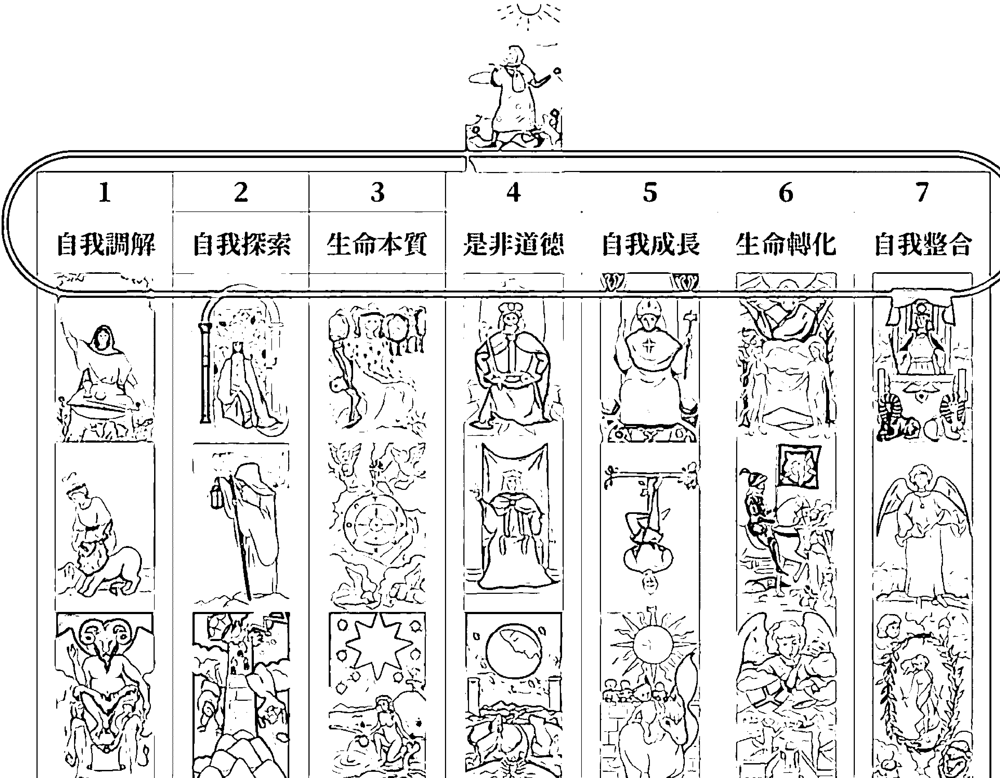

我們先從橫向來看：

| 1 | 2 | 3 | 4 | 5 | 6 | 7 |
|---|---|---|---|---|---|---|
| 自我調解 | 自我探索 | 生命本質 | 是非道德 | 自我成長 | 生命轉化 | 自我整合 |

從小到大，我們自己心裡有好多衝突、迷惘、要靠自己不斷調整適應 (1.自我調解)。在這一次次矛盾，我們也不斷從中試著了解自己、知道自己的想法 (2.自我探索)；當我們先能「知己」才能「知彼」，慢慢讓我們從不同的人事物中，了解人與人之間更寬廣的生命含意 (3.生命本質)。

然而，每個人都有不同想法或目的、這讓我們開始尋找適當的相處模式、讓這個「大我」可以持續運轉下去 (4.是非道德)，也因為我們從一開始以自我為主的「小我」、走向重視共生共存的「大我」關係，這是很特別的成長過程 (5.自我成長)。這樣的成長過程 (像愛情、友情、各種相聚別離、還有人間的愛恨情仇…)使我們對生命有更深層的了解與體悟、並且讓我們變得更成熟、夠有智慧，變得完全不一樣的人 (6.生命轉化)；最後，你知道原來「小我」與「大我」並不衝突、是一體的；以前的我不是不好，因為現在我已經了解到，每一段過程都有他的意義與價值，因此，你能夠用自己的體悟來解釋自己的人生、成為生命真正的主人 (7.自我整合)。

這七大面向各自有各自的特色 (圖中，每個面向各有3張塔羅牌，代表這個面向的特質與主題)；而這七大面向彼此之間也是互相連貫影響的，下面我們再繼續分享每個面向的特質與主題喔！

# 秘技三：生命七階層牌意的解釋是什麼？

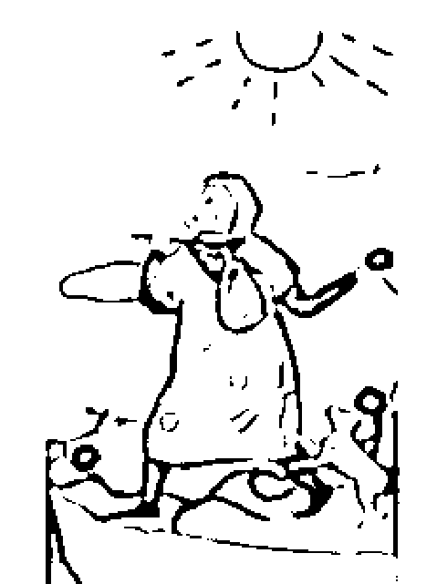

| 1 | 2 | 3 | 4 | 5 | 6 | 7 |
|---|---|---|---|---|---|---|
| 自我調解 | 自我探索 | 生命本質 | 是非道德 | 自我成長 | 生命轉化 | 自我整合 |
|  |  |  |  |  |  |  |
|  |  |  |  |  |  |  |
|  |  |  |  |  |  |  |

# 1.調解：魔術師 - 力量 - 惡魔

從小到大，我們自己心裡有好多衝突、迷惘、要靠自己不斷調整適應。首先「魔術師」代表擁有力量，並且擁有地球上各種工具(四大元素)任憑你運用發揮。中間的「力量」則要開始展現你的權力，恩威並施地控制精神與物質兩大層面。然後是「惡魔」代表若是被自己內心的慾望控恐懼影響，我們可能會把原有的力量誤用到不好的地方，傷害別人也傷害了自己。

# 2.自我探索：女祭司 - 隱者 - 塔

在這一次次矛盾，我們也不斷從中試著了解自己、知道自己的想法；「女祭司」保有遠古的智慧，存在懷裡象徵深遠內層。到了「隱者」，這時散發著智慧之光，在山頂上引導人們走向正確的方向。「塔」則代表若把智慧放在錯誤的地方、將指自己毀敗滅亡。

# 3.生命本質：皇后 - 命運之輪 - 星星

當我們先能「知己」才能「知彼」，慢慢讓我們從不同的人事物中，了解人與人之間更寬廣的生命含意。「皇后」代表生命的開始、也同時在享受生命；「命運之輪」代表生命開始運轉、在生命轉動中我們不斷學習；「星星」則表現生命的目標與理念，同時也跟其他人共享生命。

# 4.是非道德：皇帝 - 正義 - 月亮

然而，只要是不同人就有不同想法或目的、這讓我們開始尋找適當的相處模式、讓這個「大我」可以持續運轉下去。「皇帝」擁有強大的意志力，是掌握生死的統治者；「正義」表示在統制的過程中，需要有標準與公平為原則，並且確時執行這樣才能真正統治起來。「月亮」則代表統制行為的困難之處，可能連自己都不知道最好的是什麼，又或是活在自我中、不了解真實的狀況。

# 5.自我成長：教皇 - 吊者 - 太陽

也因為我們從一開始以自我為主的「小我」、走向重視共生共存的「大我」關係，這是很特別的成長過程。「教皇」表示宗教與靈性是個人成長的基石、是經書中理想的烏托邦模式，但「吊者」象徵我們真正活在人世間、會發現宗教靈性的理念真的很難直行，自己的內心總是在跟現實與慾望間熬著。但也因此讓我們體悟出真正的道理，於是到了「太陽」是真正的解放與喜悅，回到最真正的自我之中，大我與小我成為一體。

# 6.生命轉化：戀人 - 死神 - 審判

這樣的成長過程 (像愛情、友情、各種相聚別離、還有人間的愛恨情仇…)使我們對生命有更深層的了解與體悟、並且讓我們變得更成熟、夠有智慧，變得完全不一樣的人。「戀人」代表生命與創造，是生命的再生與進化；「死神」的出現代表每段生命都有結束的一刻 (不論是真實的生命、或是每段相聚與別離，都註定會有結束的時候)。

## 結合人生的塔羅牌
現代塔羅牌

「審判」代表在死亡或結束後，才會開始結算這段時間你的一切行為，對錯賞罰、一切先等蓋棺方才定論。

## 7.自我整合：戰車 - 節制 - 世界

最後，你知道原來「小我」與「大我」並不衝突、是一體的；以前的我不是不好，因為現在的我已經了解到每一段過程都有他的意義與價值，因此你能夠用自己的體悟來解釋自己的人生、成為生命真正的主人。「戰車」象徵豐富的知識與能力，開始建立自己的世界；「節制」表示知識的運用得當、互相交流，結合眾人的共識讓你的世界更順利的運轉。「世界」則是融合自己與他人成一體，無所不包的寬廣體系，終於達成完善的世界。

在裡面可以發現，七大主題裡面各自有三個小主題，每一個都讓我們人生更加多元、不論是幸福或痛苦，似乎都是生命蛻變中不可或缺的必要過程。(只是每個磨練都好痛好難受啊！這讓我想到，據說天使的翅膀是從身體中，一時時抽長拔挺出來的—— 每一片羽翼都這樣一點一點從肉體裡刺戳出來，然後痛到讓你動彈不得、就這樣慢慢等羽毛變堅強定型下來……雖然沒有血、但每一片羽毛都讓你撕心裂肺、痛不欲生。所以或許我們的生命也是如此吧？在變成完美天使之前，我們都要經過這段蛻變展翼的過程啊！)

除了七大階層裡面三個小主題之外，上面還可以用橫向分成人生三種主要關係：

- 01魔術師 ~ 07戰車 —— 象徵人與自己的關係
- 08 勇氣 ~ 14 節制 —— 象徵人與他人的關係
- 15 惡魔 ~ 21 世界 —— 象徵人與世界的關係

那接下來繼續跟大家介紹這三大關係的涵義。

## 秘技四：生命七階層 - 人生的三大階段

| 1 | 2 | 3 | 4 | 5 | 6 | 7 |
|---|---|---|---|---|---|---|
| 自我調解 | 自我探索 | 生命本質 | 是非道德 | 自我成長 | 生命轉化 | 自我整合 |

## 結合人生的塔羅牌
現代塔羅牌

## 我與自己

- 魔術師：本能 - 創造力、啟發性
- 女祭司：理性 - 理念、無我、純潔
- 皇 后：享受 - 生命的富裕、舒適、性情
- 國 王：限制 - 自我控制、標準、管控
- 教 皇：歸屬 - 順伏、崇拜、服從
- 戀 人：平等 - 合作、尊重、互助
- 戰 車：開始出發探索外界、為下一個階段做準備

## 我與他人

- 力 量：人我間的相處、共存
- 隱 者：人我間的距離、間隔
- 命 運：人我間的關係、順序 (人在命運中，因天生的輩分限制而必須順從)
- 正 義：人我間的公平、評判 (超越關係的限制、用正義保護我們、維持是非對錯)
- 吊 者：人我間，每個人都需犧牲自己的一部
- 死 神：不論你當初有沒有犧牲、犧牲多少，每個人都是互相牽連的、都要承受最後的共業
- 節 制：尋找最適合人與我之間的相處模式、自然運作下去；並為下一個階段做準備。

## 我與世界

- 惡 魔：建造自己的世界
- 塔 ：自己的世界被崩裂
- 星 星：世界給我的光明、希望、方向
- 月 亮：世界給我的恐懼、不安、茫然
- 太 陽：世界給你的喜悅、生命的伸展
- 審 判：世界給你的責任、生命的收縮
- 世 界：人、我、世界完全結合成一體，生命課題完成。
- 愚 者：生命新的課題，你準備進入下一個主題、靈性持續成長。

因此整體而言，第一列代表原始的我們天生擁有的各種能力，第二列是我們把這些能力運用出來時，因為會影響的他人，所以開始讓我們學習拿捏、進退、調整。到了第三列，我們把當初對立的他與我，進一步看到更大的整合、互融，最後對自己的一生加以注解，由你自己對生命給出定義。

22大牌的架構有很多種，這次我分享的是「三列七階層」這個牌陣架構，但其實塔羅還有很多靈性牌陣、各自用不同的模式來教我們生命的意義，裡面還有很多秘密與傳說喔！希望之後還有機會與各位繼續分享！

## 永續圖書
線上購物網

www.foreverbooks.com.tw

- ◇ 加入會員即享活動及會員折扣。
- ◇ 每月均有優惠活動，期期不同。
- ◇ 新加入會員三天內訂購書籍不限本數金額，即贈送精選書籍一本。（依網站標示為主）

專業圖書發行、書局經銷、圖書出版

永續圖書總代理：
五觀藝術出版社、培育文化、棋茵出版社、大拓文化、讀品文化、雅典文化、知音人文化、手藝家出版社、璞申文化、智學堂文化、語言鳥文化

活動期內，永續圖書將保留變更或終止該活動之權利及最終決定權。

解牌的時候感到迷惘，能不能直接給我答案？我能學塔羅嗎？
職場、考運、財運、戀愛、人際關係……
到底牌的意思是什麼？

塔羅全方位解析，你要的答案都在這本書裡！
每日讓你難過的問題，將不復存在！