# 用塔罗开启创意写作之路

# 前言

本书缘起是一篇专为「全美小说创作月」（National Novel Writing Month）的写作活动而准备的文章。「全美小说创作月」是美国每年十一月在网络上举行的年度盛事，这个活动聚集各地的写好手，在网络上一起享受创作小说的乐趣。主办单位请我思考一个题目：如何以塔罗牌引导成员在短时间内成功写出一篇小说？当时我以四百字的篇幅作了回应。不久，我的「塔罗写作引导法」引起与会者的广大回响，让我决定将这些提供给NaNoWriMo网站上八万名写作者的想法和建议加以发展。我整理了多年来的塔罗咨询心得，而为了经营活动专属的作家群组，我再度将这些想法组织成架构严谨的系统化讲义——也就是本书的纲要。

许多在本书中提及的技巧和想法并非我个人的创见，我只是运用新的方式来结合既有的写作概念，将塔罗牌的解读规则套用在文学原理上，呈现两者之间的紧密关联。事实上，「解读塔罗牌」与「说故事的技巧」不管在理论或实务上都像同一件事。举例来说，一副标准的塔罗牌结构与亚里斯多德所提出的古典故事结构，就存在惊人的相似性。此外，塔罗牌的「愚者之旅」和文学原型中「英雄之旅」的概念也相当地同；后者在乔瑟夫·坎伯（Joseph Campbell）的阐释下被广泛应用，至今仍是许多故事创作者遵循的基本套路。我建议读者，除了可以善用塔罗牌在创作过程中脑力激荡，甚至当作品完成之后，也能利用塔罗牌寻觅合适的出版商，甚至发想极具创意的行销活动。我将在书中详细说明小说创作的完整流程，也尽可能为初次接触塔罗牌的写作者，提供多方位的参考资料。

如果你是本书的核心读者，那么你可能已经热衷写作，或一定程度上对小说和文学有所涉猎，更可能你已经创作过几个故事，但手上的笔仍不时蠢蠢欲动，非得将脑袋中不成片段的那些东西写出来不可。在这样的基础上，本书将为你带来莫大助益。当然，如果你喜欢创作散文、诗或是日记一类的非文学作品，也同样能从这本书中汲取灵感。我想即使是以写作为生的职业作家或剧作家，也能利用塔罗写作引导法替作品增加许多亮点。

我建议读者只需从书中汲取刚好够用的点子来刺激写作，而非被书中的诸多细节淹没，因为这本书的目的是要启动创造力，而非将你局限在僵硬死板的练习，或令人窒息的写作公式。

这本丰富的指南拥有各式各样的资源，包括基础牌阵、牌义描述、标准塔罗牌的象征、神话传说、人物原型，以及与占星相关的延伸。最重要的是，你能找到在写作过程中所需的提示和点子来激发灵感，并学到将它们融入创作的诀窍。

这是一本写作游戏工具书，只管抱著好玩和实验的心情尽情探索吧！充分享受创作的美妙过程。记得让我知道这本指南对你管不管用——特别当你利用它在三十天内产出一篇小说之后。

——本书作者　柯琳·肯纳

# 如何使用

多数人将塔罗牌视为占卜算命的工具，其实塔罗牌更是一种能帮助写作、构思创意的绝佳利器。从约翰·史坦贝克 (John Steinbeck) 到史蒂芬·金 (Stephen King)，史上不乏鼎鼎大名的作家，都曾利用塔罗牌寻求写作的灵光。这方面最为人熟知的意大利小说家伊塔罗·卡尔维诺 (Italo Calvino)，甚至直接将塔罗牌描述为一种「写故事的机器」。的确，光靠一副塔罗牌就能让你突破写作障碍、找到灵感，洞察故事角色的过去、现在和未来。塔罗牌还能开发新的写作题材，或为已经展开的写作计划注入新生命。

## 幕后

解读塔罗和说故事这两件事的共同历史可谓源远流长。塔罗牌最早出现于西元十五世纪，当时意大利贵族喜欢玩一种名为「塔罗克」(tarocchi) 的纸牌游戏，他们习用一套富有文艺复兴风格的手绘纸牌，牌面描绘着意涵丰富的各种象征图案，以及大量文学典故和神话人物。

事实上，部分塔罗牌的绘制可能是以诗人佩脱拉克 (Francesco Petrarca) 的作品为蓝本。佩脱拉克在十四世纪的杰作《胜利》(Triomfi) 是一首阐释人类存在的寓言诗，诗中所描述的爱、贞洁、死亡、名望、时间和神性等概念，都与早期塔罗牌的图像不谋而合。塔罗牌的游戏规则也能激发作品的「诗意」，这类例子最早可回溯到十六世纪，一些塔罗克玩家已经懂得利用塔罗牌来即兴创作十四行诗，当时这类文字游戏称为 tarocchi appropriati。现代作家叶慈（W. B. Yeats）的某些诗作似乎就以塔罗意象为本，有些评论家则认为，叶慈的诗启发了现代塔罗牌中某些意象，这无疑展现了写作活动和塔罗牌之间的「双向」链接。巧合的是，叶慈与伟特（Arthur Edward Waite）和史密斯（Pamela Colman Smith）素有深交，后两人于一九〇九年创造出畅销全球的「莱德伟特（Rider-Waite-Smith）塔罗牌」，因此非常有可能当两人在设计塔罗牌时，叶慈就曾参与相关的讨论。

## 生产故事的机器

塔罗牌对小说创作的影响力远超出诗的范畴。查尔斯·威廉斯（Charles Williams）在一九二二年出版奇幻小说《更大的王牌》（The Greater Trumps），故事描述一副神奇塔罗牌和一群跳着永恒生命之舞的人物。一九六九年，卡尔维诺利用塔罗牌阵创作《命运交织的城堡》（The Castle of Crossed Destinies），故事中的旅人被困在森林里，离奇地被剥夺了语言能力，他们只得藉由排列塔罗牌来叙事和沟通。七〇年代后期，作家皮尔斯·安东尼（Piers Anthony）创作《塔罗之神》（God of Tarot）、《塔罗愿景》（Vision of Tarot）和《塔罗信念》（Faith of Tarot）等系列小说，将故事场景设定在遥远的塔罗星，而塔罗牌中的各种角色在故事中显得活灵活现。

此外，有些短篇也以塔罗牌为主题，例如一九九六年和一九九七年出版的《塔罗故事集》（Tarot Tales）和《塔罗奇想》（Vision Fantastic），这两本书各收录十六个故事，由不同作家执笔，展现利用塔罗共同创作的神奇魅力。塔罗除了是绝佳的题材，有些作家更利用每一张塔罗牌的内涵来架构故事。法蘭西斯卡・布洛克 (Francesca Lia Block) 于一九九九年的知名作品《吊人》 (The Hanged Man) 中，每个篇章都用一张塔罗牌作为故事的起点，而作家琳恩・米勒 (Lynn C. Miller) 如法炮制，于二〇〇一年完成《愚者之旅》 (The Fool’s Journey)。

由上所述可知，塔罗牌是脑力激荡的最佳工具，以下你将学习将这项利器运用在写作的每个阶段，从构思到下笔，甚至完成作品之后的编辑。但首先，你需要一副塔罗牌。

## 一副完整的塔罗牌

你几乎可以选择任何版本的塔罗牌与本书搭配使用，只要它具备完整的七十八张牌。一副标准塔罗牌包含两部分：大阿尔卡纳 (Major Arcana，拉丁文意指“大奥秘”) 与小阿尔卡纳 (Minor Arcana，拉丁文意指“小奥秘”)。小阿尔卡纳分为四种花色——“权杖”、“圣杯”、“宝剑”和“五角星”，每种花色有十张数字牌和四张宫廷牌。如果你是刚接触塔罗牌的生手，尽量选择小阿尔卡纳牌面是描绘写实图像，而非抽象图案的版本。本书使用的图例是圣甲虫 (Lo Scarabeo) 公司发行的“通用塔罗” (Universal Tarot)，由意大利漫画艺术家罗贝托・德安吉利斯 (Roberto De Angelis) 所设计。这是广为流通的“伟特塔罗牌”的现代版本。

## 秘诀与建议

本书在阅读上有特色。你当然可以一头栽进书中，从头到尾浏览一遍，这可以让你对“塔罗写作”有个概括的认识。然而，我更建议你轻松选读有兴趣的章节，毕竟玩塔罗牌需要洗牌，没有人会期待一副牌永远保持在固定的顺序。当你随机翻开，没多久，就会有某个打动你的图像或想法冒出来，吸引你的目光驻留。我也建议将本书的写作建议排列组合，就像各种牌阵那样的变化套路，“不按牌理出牌”才是最有趣的地方。塔罗牌原本就是一种游戏，就算当成工具使用，仍然应该充满乐趣。尝试塔罗写作时，请留意以下技巧。

- 使用部分的牌。如果你是塔罗新手，最好一开始只用大牌来练习，让小牌“靠边站”。等到能掌握洗牌、牌阵和解牌等基础原则，再让小牌加入牌局来练习。
- 找人练习。探索塔罗牌需要有对象来辅助，不妨找朋友和家人练习解读，请他们回馈意见。
- 不畏冒险。塔罗牌会不时为作品加入冒险成分，你应该对此保持开放心态，允许牌组畅所欲言，让“弄人的造化”帮助你在写作之路学习和成长。
- 同时性。创作过程留意“同时性”，这些有意义的巧合将为作品带来意想不到的亮点。同时，也记得要多培养“察觉好点子”的敏感度。
- 不要照单全收。本书中多数的牌义和写作范例都是以传统诠释为基础，然而写作时务必跳脱这些技术性分析，也就是说，你可以用你喜欢的任何方式来诠释塔罗牌——没有人会检查你的诠释是否正确。多数读者甚至不会知道、或不会在乎你是从哪里获得写作的灵感。
- 团队合作。你必须实际演练塔罗牌，这副牌才会真正“活起来”。试着邀请同好一起进行脑力激荡的实验。
- 震撼教育。塔罗牌会泄露秘密，即使你只是不经意借它来说话。毋须惊讶，随机抽取的牌往往能准确道出某人的生命故事。你可以将它融入小说，或用来厘清某个问题。
- 记录。这是一本谈写作的书，所以你必须确实记录所有的想法和观察。虽然我们总忍不住从一张牌迅速切换到下一张，但切记，将看到牌时所产生的第一印象写下来。
- 练习。从“写作练习”和“写作提示”单元搜寻创意和题材。大致来说，前者提供详细的建议，后者则是鼓励动笔的起点。
- 迅速反应。所有建议和提示都不该花费你太多的时间来练习——尤其在初稿阶段。如果你的写作像用慢动作在进行，就表示你想得“太用力了！”放轻松，让直觉与想像力来主导。
- 设计专属的牌。如果你打算好好编织一个长篇故事，不妨为这个写作计划设计一副专属塔罗牌，图案可以自己绘制，或从书报杂志中搜集素材来拼贴。

## 本书结构

# 第一单元
塔罗基础知识。开始运用塔罗牌时必须知道的每件事，例如一副标准塔罗牌的结构如何帮助诠释牌义、经典牌阵在写作中的应用，以及如何在实际或虚拟情境中依序解读。

### 第二单元
故事创作。介绍“塔罗写作”技巧，利用一副塔罗牌发展故事、创造人物、铺陈情节、设定背景和细部描写，甚至是编辑、修订或行销等后续工作。

### 第三单元
给作家的塔罗指南。完整罗列七十八张牌义说明，利用关键词和写作提示来启动力。

# 用塔罗许一个未来

长久以来，塔罗牌是神秘主义者和占卜家专擅的领域，不过这本书会让你发现，塔罗牌在作家手中同样能运用自如——毕竟作家也算得上是某种预言家。作家能看见从所谓『另类的真实』中所投射出来的阴影，然后运用文字力量将之揭露，化为真实的存在。正如德尔菲（Delphi）的古老神谕：『作家能看穿人类的灵魂，并将真理传达给读者。』

现在就来见识令人充满惊喜又神奇有效的塔罗写作，翻开塔罗牌，迎向源源不绝的创意！

# 第一单元

## 塔罗一〇一
介绍运用塔罗牌所需的基础知识与技巧。
利用牌组固有的结构帮助写作者诠释牌义，激发写作灵感。
认识经典牌阵，创造故事情节和发展。

## 1 塔罗基础知识

身为写作者，你一定知道什么是“创造力”。你可以单靠寥寥数笔打造一个全新的宇宙，或让银河开始旋转。你能孕生一个山脉绵延、平原辽阔与深邃海洋的美丽新世界，也可以建造国家和城市，赋予它们丰富的文化和历史。你就像活生生的上帝，用一枝笔决定某种另类又真实的未来。

手中握有一副塔罗牌就像多了一个好用的工具，让创造工作更有效率，因为塔罗牌既是一种宇宙模型，更是一张诉说人类经验的蓝图，如实反映了物质世界和精神生活的风貌。换言之，塔罗牌彻底观照人类整体存在的处境，而且与中西方的神秘学传统——占星、命理、炼金术及古老犹太神秘学卡巴拉——完美的契合。当然，塔罗牌与现代心理学、社会学和人类学所涉及的议题，更有许多相似之处。不过，别把塔罗想得太深奥了，它并非复杂到难以掌握。只要认识基础概念，就能用它变化多端的玩法，随心所欲说个精彩的故事。

> ——星星牌的写作范例
>
> “无数英里外，有一颗恒星瞬间爆炸了，发出超新星的光与热。正在湖边整理思绪的莎莉丝特，仿佛得到预感般抬头凝望了片刻。她不由自主地一阵战栗，喃喃抱怨起那该死的刺骨寒风。”

### 大议题
打开一盒塔罗牌，有两件事让人印象深刻：首先，一副牌有很多张——共七十八张牌。再者，塔罗牌的尺寸比扑克牌还大上一些。塔罗牌的数量和尺寸之所以庞大的原因有二：牌面大可以尽情描绘图像细节和各种象征，而数量众多的牌才能完整容纳一套严谨的生命哲学，打造宇宙的模型。

一副标准的塔罗牌可分两个部分：大阿尔卡纳（俗称大牌）与小阿尔卡纳（俗称小牌）。大牌描述戏剧化的大局势，它的人物充满传奇色彩，我们可以在电影或文学作品中辨识出这些原型。例如恐怖电影和谋杀故事常常会出现“持镰刀的狰狞收割者”（Grim Reaper）的死神形象，我们对在司法机关前见到的“正义女神”铜像也不陌生，当然，每个人高低起伏的人生际遇，无疑是一种“命运之轮”的循环。

大阿尔卡纳牌的原型人物是一种普遍流传、超越时空的典型，几个世纪以来，艺术家、作家和音乐家不断利用这些原型让作品更动人。古代神话中的原型英雄奥德修斯（Odysseus）对抗独眼巨人这种反派，到了现代就变身科学怪人或“星际大战”（Star Wars）中的天行者路克（Luke Skywalker）出现在影剧小说里，显见这些原型人物是如此历久不衰，受到欢迎。

严格来说，原型是一种与生俱来的原始思惟，像本能一样印记在人类的潜意识心灵。与弗洛伊德同为精神分析医师的荣格（Carl Jung）是第一个宣扬原型理论的学者，他研究梦境、神话和传说，归纳出人类生来就有理解原型的能力。事实上，荣格认为人类先天的集体心理发展出在日常生活找寻原型的倾向，因为原型是人类藉以理解世界的一种结构。在荣格的研究中，最普遍的原型包括英雄、少女和睿智老者，其他还包括阴性基质（anima，阿尼玛）——男子性格中的女性特质；阳性基质（animus，阿尼玛斯）——女子性格中的男性特质；母亲——提供情感滋养的家长；父亲——提供物质保护的家长；骗徒或叛逆者，以及阴影——人性中隐藏的反社会黑暗面。

每张大阿尔卡纳牌都体现了一个原型人物。以下大略介绍：

#### 0 愚者
快乐的漫游者，透过孩童的眼睛看世界。愚者代表我们每个人——我们都是天真的旅人，投入生命的冒险旅程，学习塔罗牌所教导的各种经验。

#### 1 魔术师
技巧娴熟、性格狡猾的大师级人物，精通他所归属领域的一切事物。他善于掌控生存的工具（例如桌子上的道具）和技巧，这些工具通常是一只杯子、一柄剑、一根棍棒，这些物件是构成小阿尔卡纳牌的必要元素。

#### 2 女祭师
谜一般的人物，负责守护心灵深处的秘密。敏感谨慎、讳莫如深，她知悉生命隐含的意涵，但只愿与智者分享。

## 3 女皇
母亲的原型，滋养并守护着她所创生的万物，包括人类。

## 4 皇帝
统管已知的世界，威势凛然的保护者和供养者。以父亲般的形象在混乱中创造秩序，确保文明昌盛不衰。

## 5 教皇
象征传统权威和影响力。他是僧侣集团的领袖，致力于维系宗教信仰与文化传统。

#### 6 恋人
体现异性相吸的道理。恋人牌的出现固然能鼓舞已经死心的失恋者，不过也可能代表必须在两个同等强烈的欲望之间做选择。

#### 7 战车
代表往前进和积极改变的勇气。年轻的战车御者谨慎驾驭肉体与情感、理性与感性等互相冲突的两股力量。

## 8 力量
拥有狮子般野心的可爱女子。她扳住一头猛狮的下颔，以耐心和勇气控制这股能将她生吞下肚的强大力量。

#### 9 隐士
遁世隐居，远离日常生活的喧扰，永远在沉思灵性问题，带着智慧之灯指引虚心求道的追随者。

## 10 命运之轮
命运的纺轮。世事多变化，“变化”是我们唯一可以确认的事，命运之轮提醒我们，凡事都有兴衰起落的历程。

## 11 正义
法律的制定与执行者。正义女神是所有事物最终的仲裁者，她手握双刃剑，表示“公平”是赋予两造同一种标准。

## 12 吊人
暂且牺牲舒适和欲望，甘愿处于倒立状态，以求在未来得到更好的报酬。深谋远虑的吊人，是以一个生命换取另一个生命所作出的牺牲。

## 13 死神
代表转化。手持镰刀的狰狞收割者清除所有无法存续的事物。死神牌的出现好比一页书的翻动、一个生命篇章的结束，以及一段新故事的展开。

### 小議題

除了二十二張大牌，還有五十六張小牌被用來描繪平民百姓的日常生活。就像撲克牌有黑桃、紅心、方塊和梅花等花色，小牌也分權杖、聖杯、寶劍和五角星，每種花色包含一到十的數字牌，所以也有人將小阿爾卡納稱作「點數」牌。某些版本的小牌像撲克牌一樣，在牌面畫有代表數值的花色圖案，但多數現代版本的小牌都寫實而具體地描繪從事各種日常活動的人們，從事工作、鬥毆，飲宴、跳舞或者睡覺。花色代表不同生命領域，整體來看就是一套思索生命各種面

### 四元素

古代煉金術士和哲學家認為，火、水、風、土四種元素就能構成整個世界，甚至人體也同樣由這四種元素構成。例如有些人經常被認為是『火質的』，而有些人被描述成『土質的』。即使在現代科學昌明的二十一世紀，古代四元素的概念仍被用作有效的心理學工具，更是理解塔羅牌的方便法門——因為每一種塔羅牌的花色分別對應一種元素。

只要記住每一種塔羅花色代表的意思，解讀塔羅牌就會更輕鬆。

- 權杖象徵精神和心靈經驗，類似撲克牌的『梅花』，三葉苜蓿草的圖案代表了神聖的三位一體。
- 聖杯代表情感活動，類似撲克牌的『紅心』。心型圖案用來象徵情感可說再合適不過。
- 寶劍說明思想和溝通之類的事件，撲克牌中的『黑桃』和『劍』也是同一個字。黑桃的英文是spade，源自義大利文spada，意指「劍」。
- 五角星體現肉體、物質和財務的現實狀態，呼應了價值不斐的『方塊』（鑽石）。

### 如火燃燒的權杖

權杖是代表精神和開創性的火象牌，包括工作或事業上的衝勁，以及能激發熱情的特殊興趣。權杖看起來像剛砍下來、還帶著幾片葉子的樹枝，暗示它會著火燃燒。的確，每根權杖都是可以燃燒的火炬，用來發光發熱，提供啟蒙和靈感。

有煙的地方就有火，所以權杖牌可能說明火星即將飛濺、熱情眼看就要燃燒，或是某事正在逐漸升溫中。它也可能意指某個手持火炬或懷有強烈慾望的人，甚至揭示某個重新被點燃的古老議題，或是指玩火的人。

### 如水流动的圣杯

聖杯盛裝著如水一般流動的感情生活，特別適合用來解讀情愛或關係的議題。杯子除了裝水這種生命要素，也能盛裝任何具有情感意義的液體，如葡萄酒或香檳。聖杯牌與情感有強烈的關聯性，人們在開心慶祝時舉杯、在宗教儀式中互敬，當然，傷心難過時也用杯子飲酒澆愁。聖杯牌對應水元素，提醒我們情感的水井深不可測。人體有75％由水構成，人類的行為總是被需求和慾望所匯集成的情感洪流所驅使，沛然莫之能禦。

別讓水的暗喻從你的指間溜走。聖杯牌可能代表蘊藏在表面之下的澎湃情感正待宣洩，或者靜水流深的道理，外表看似平靜無波，卻隱含了洶湧的伏流。想像你筆下的某個人物，她的血液凝結成冰，心也似乎被凍結了。但是當聖杯出現，情勢就可能開始鬆動，或即將瀕臨崩潰。

### 迅猛如风的宝剑

颯颯揮動的寶劍能劃開長空，這張牌代表如風一般飄忽敏捷的思維、智識領域，說明我們思考及溝通的方式。認真嚴肅的寫作者對寶劍牌應不陌生，畢竟，劍能切割一團混亂，直指要害，也能刺穿朦朧的迷障，明確定義含糊不清的概念。

寶劍的意象暗示某個目光凌厲、機智過人、說話刻薄或言辭犀利的人。廣義來說，寶劍牌讓我們聯想到白日夢、空洞的想法、不切實際的理想，或者需要回歸現實這種情況。寶劍牌說明語言應該被當作一種精準的工具，它的意象經常透露了言語如何成為戰爭的武器，而且似乎也說明了當我們的想法與他人意見相左時，所可能遇到的狀況，以及負面思考所惹來的麻煩。

### 物質現實的五角星

五角星體現了在肉體、物質生活中可觸摸、感知到的有形現實，這是塵世生命的基礎特質。

五角星牌往往代表金錢或財富，以及我們在情感和精神層面所珍視的資產。在多數塔羅牌中，五角星看起來像一個畫有星形標記的錢幣，這個標記象徵人類的肉體結構：我們可以從一個張開雙臂和雙腿站立的人身上連結出五角星形狀，五個頂點分別是頭頂及伸展的雙手和雙腳。

五角星牌代表嚴肅、具體的真實議題，例如不動產。它經常指涉講求實際和腳踏實地的人，或暗示某個相當嚴肅或莊重的人物，或是值得我們在物質面關切的議題——別忘了還有物理學。

五角星牌也體現時間和空間的維度，強烈暗示時間就是金錢，提醒我們惜時如金。

※※※※※

塔羅牌與四元素的連結不只在於小牌的花色，宮廷牌和四元素之間，甚至是大牌與占星學的

### 皇室家族

傳統撲克牌的每種花色都具備「騎士」、「皇后」和「國王」三張宮廷牌，塔羅牌延續這個傳統，但增加了一張「侍從」宮廷牌。這些皇族成員組成一個理想的家庭結構——分別代表父親、母親、兒子和女兒。宮廷牌有男性、女性、主動或被動，十六張宮廷牌彰顯了精神、情感、智能和物質四個領域的作為，而且很適合描述構成某些性格特質的獨特組合。

#### 侍從

年輕天真、熱情洋溢，他們是學徒和傳信人，必須遵守基本家規。文藝復興時期，侍從是宮廷中年紀最輕的成員，任務是學習和幫人跑腿或替人傳送口信。這個概念在我們現在的日常生活中仍然廣泛被運用，如現代國會議員雇用「青年聽差」來當傳信人，將重要訊息「廣播」出去。解讀侍從牌可以從年輕人、學生或訊息來下手。

#### 騎士

已成年的年輕人不再擔任侍從，而是得想辦法出人頭地。傳統上，侍從成長到騎士的年紀時必須接受試煉，踏上追尋的旅程，克服許多挑戰，以證明自己聰明強壯、足堪大任，不負家族的傳統。騎士在本質上是拯救者和冒險家，這張牌表示一場新的追尋或冒險活動即將展開，或者救援行動已在進行。

#### 皇后

代表擁有獨立自我的成年女子，成熟且幹練。皇后象徵理想的女人——完美的妻子、稱職的母親或模範女性，同時體現女性獨有的特質：慈悲、充滿創造力、善接納、富同理心和直覺力。她們知道如何發揮技巧去說服（或誘導）別人接受她們的觀點。她們善用女性特質來防衛、滋養和守護她的領域。

> 2 譯注：侍從、青年聽差和播送的英文都是 page。

#### 宮廷牌元素

小阿尔卡纳的四皇族也对应四元素。

#### 國王

保護者、供養者，也是見多識廣、世情練達的領袖，他們成功完成擔任騎士時的任務和追尋。這位經驗老到、極具自信的指揮官在人生戰場上收穫了成熟的知識與智慧。國王是成熟男性的典型，他的性格專斷機警，甚至帶有一點侵略性。他們用熱情和武力保衛王國，以明快的風格管理和決策。這張牌暗示有人願挺身而出為保衛家園而奮鬥，甚至不惜發動戰爭。

#### 權杖

對應「火」，所以權杖牌由熱烈如火的人物組成，掌管代表精神和開創性的火領域。權杖侍從捎來心靈的訊息，提出靈性思考的課題。權杖騎士代表精神上的冒險與救援。權杖皇后補充心靈的動能，而權杖國王則提供心靈上的領導和保衛。

#### 聖杯

對應「水」，所以宮廷牌由柔情似水的人物組成，關注情感生活的暗流。聖杯侍從負責探究情感的本質，也可能帶著理解與控制情緒的功課。聖杯騎士暗示情感上的冒險或救贖。聖杯皇后滋潤枯竭的情感，而聖杯國王則堅定地捍衛感情。

#### 寶劍

對應「風」，寶劍宮廷牌由機敏通達的人物組成，代表智能、思維和溝通。寶劍侍從傳播與知識相關的訊息，關注學習邏輯或溝通議題。寶劍騎士暗示思想的探險與突破。寶劍皇后維繫概念的世界，而寶劍國王則領導智識的領域。

#### 五角星

對應「土」，五角星牌由腳踏實地的人物組成，掌管物質界。五角星侍從捎來與物質有關的消息，也肩負理解物質現實的功課。五角星騎士暗示物質面的獲取和成就。五角星皇后讓物質世界更豐富，而五角星國王保衛有形的資源。

### 數字代表起點、中繼和終點

塔羅牌中的數字蘊含重要的意義。大牌的數字代表生命旅程的驛站。旅程初始，立足於懸崖邊的愚者是如此信心滿滿、意氣風發，直到歷盡世間的滄桑，抵達旅程的終點，才算完成了世界賦予他的人生經驗。

小牌的數字象徵事件的演變過程，一代代表開始，十代表結束。四種花色表示經驗或事件的範疇：權杖是靈性經驗、聖杯是情感事件、寶劍是智識議題，而五角星是物質現實。我們可以這樣理解：權杖一象徵追尋某種靈性經驗的起點，聖杯五代表某情感經驗的中途點，而寶劍十表示某種與知識追求有關的旅程已經抵達終點。

只要理解花色意義及數字代表的生命階段，毋須死記七十八張牌義，也能順利作出詮釋。

* 
* 
* 
*

有了牌組的基礎概念，下個章節即將進入實際運用。請將全部的牌攤在桌面上。

## 2 解讀塔羅牌

就像作家一樣，塔羅牌表達象徵化的語言，只是這種語言多半不經由文字傳達，而是呈現內心深處迅速而直接的反應，深層的意義以閃電的速度在潛意識進行溝通。事實上，對許多塔羅新手來說，解讀塔羅牌最困難之處，莫過於將圖像的象徵意涵轉化為清晰有條理的文字。

「魔術師單手高舉過頭，一道閃電應運而生。桌上擺設的法寶似乎發出閃光，卻在一瞬間憑空消失了！電光火石間，只見四隻小精靈：地精、小妖精、美人魚和火精已經各就各位——火精的臉看起來就像一個睿智的老頭。他們被召喚現身，各自主宰土、風、水、火四大元素。

> > —— 魔術師牌的寫作範例

### 象徵語言

說到解讀塔羅牌，身為創作者的你佔了很大的優勢。首先，你知道如何將想法形諸文字。再者，你可能嗜讀小說，因此塔羅世界無所不在的象徵、暗喻或寓言對你來說並不陌生。塔羅牌源自義大利和法國，牌面上的多數象徵根植於古代的西洋典故、哲學和歷史，甚至可追溯到希臘與羅馬哲學、聖經教條及大眾價值觀和信仰，但是你仍然有很多自主詮釋的空間，畢竟「象徵」只是一種我們熟悉的物件、姿態或符號，它的暗示效果超過實質意義。例如，一顆蘋果可能代表健康——或是誘人的禁果；野獸或許象徵未被馴服的動物本性；戴在頭上的帽子能微妙影射一個人的智能和思想。

### 自己的房間

> 知名作家伍爾芙（Virginia Woolf）建議我們：每個寫作的人都應該有一個「自己的房間」。

塔羅師通常都能實踐這個建議，為解讀塔羅牌建立一個神聖空間。本書第三單元提供詮釋塔羅象徵的基本詞彙，你可以將它當作寫作的起點，建構出「你自己」對塔羅意象的詮釋系統——這是最有趣的部分。塔羅牌的詮釋沒有對錯，利用牌面圖像的各種元素衍生出無窮創意，才能達到驚人的成效。

選擇一個讓你自在的地方解讀塔羅牌。安靜的房間固然理想，但也可以在廚房餐桌、臥室或後院等任何你喜歡的地方，只要那是個容易集中注意力、解讀時不受拘束的場所。動工前，先清理工作區的垃圾，以及與寫作無關、讓人分心的雜物。許多塔羅師會淨化「神聖空間」的氣場，用蠟燭、香或鼠尾草驅散污濁或負面能量。接下來鋪上一塊布，界定你的解牌空間。傳統上使用黑色綢布，但也可選用與你的塔羅牌相稱的布料。最好是單色的布面，因為讓人眼花繚亂的印花布容易使人分心，無法專注。點上一根蠟燭來集中注意力，感受你的神聖空間此刻正充滿著煥發的能量。

### 解牌及寫作前的準備

每個塔羅師都有一套可以迅速完成的程序，幫助他們在解牌時集中注意力。準備動筆前，你可以利用相同的技巧清除雜念。

1.  淨化。淨化是消除外界能量和污染的程序——不僅是身體上的，還包括精神和心理層面。淨化程序可以滌除妨礙解牌工作的外界影響。第一個步驟是用肥皂和水洗淨雙手，洗手時想像宇宙和心理的「塵埃」被沖進排水管。如果附近沒有洗手槽，那就想像自己沐浴在純淨的白色光波中。
2.  集中。我們每天得處理各式各樣的事務，總是一堆責任、差事和雜務要完成，難免讓人分心。集中注意力可以幫助你重新掌控思路和情緒，深呼吸是最快的捷徑。將背打直、端坐，雙腳穩穩踩在地板。做幾個深呼吸，有意識地將身體從頭到腳逐漸放鬆。用鼻子吸氣，從嘴巴吐氣，隨著氣息釋放緊張感。想像那些擔心和憂慮都是一顆顆灌飽氮氣的汽球，然後一顆接著一顆釋放，飄上天空。
3.  接地。接地可以讓有形世界和身體之間建立穩固的連結。在物質世界中，電流會沿著任何可接觸的導體向地面流動，萬一你恰巧擋住電流的通路，電流就會以你的身體作為導體。解讀塔羅牌時，你也冒著類似的風險，因為你正擋在情感與精神能量流通的路上。然而，良好的接地有助於讓能量順利從身上通過，這麼一來，你就不會受到他人的問題、困擾和憂慮的不良影響。這裡介紹一個簡單的接地法：坐在椅子上，雙腳穩穩踩在地板上。或直接坐在地板上，雙手置於大腿上方，閉上眼睛想像自己是一棵樹。將你的根扎入地板中，向下穿透層層岩床，直達地心。接著將你的枝椏舉向天空，花幾分鐘待在這個另類現實中，牢牢深植在這個空間裡，手腳隨著微風放鬆擺動。
4.  屏護。在現代世界的認知中，空氣中充滿了電能。有些電能是自然產生的，有些則藉由電氣設備發散，有些像無線電波那樣被傳送。物質世界的每種能量在精神界都有對應者，如果你和別人待在同個房間或同一棟建築，你會發現自己處於他們的能量場。有些人會不自覺投射煩惱和憂慮，有些人則有意識地將他們的困擾傳遞給在場的人——例如透過大吼大叫或用力甩門的方式。設下屏護能幫你劃清界限，確保旁人混亂的能量不會干擾你的工作。想像你自己被包裹在純粹的白光中，是設下屏護的方法之一。這團白光像力場一樣運作，保護你不會因旁人的念頭或情緒而分心。

經過淨化、集中、接地和屏護程序後，就可以開始下筆了。想像自己是一個已經淨空的通訊管道，隨時等待接收從塔羅牌傳遞而來的想法或影像。

### 提問的技巧

> 猶太哲學家伊本·加比羅（Solomon Ibn Gabirol）曾說：「在一個聰明的提問中，已經包含了一半的答案。」

不管你是為真人或虛構人物占卜塔羅牌，只要問對問題，多半能得到好的答案。以下是提問的訣竅：

- 保持開放性。避免提出「是」或「否」的問題，這可能很難用塔羅牌回答。儘量選擇開放式的問題，例如「為何我的主角如此偏執？」，或是「艾蜜莉該如何穿著打扮？」
- 集中目標。一次只問一件事。
- 精準提問。問題要有明確的範圍，例如何人、發生何事、何時、何處、為何，以及如何發生。
- 清楚陳述。將問題寫下來，確保問題清楚地被陳述。如果你問得很模糊，得到的答案也可能是模糊不清的。
- 記錄。記錄你的提問、塔羅牌的回應，以及你對答案的詮釋。

### 解牌Step by Step

以下介绍流传已久的塔罗解牌仪式。

1.  洗牌。用互相交叠扑克牌的方式洗牌，或是将牌彻底摊开后混在一起，直到所有的牌充分混合。
2.  发牌。抽出整叠牌最上方的一张，或是在挑好的牌裡面（面朝下摊开）抽出几张牌。也可以将整副牌面朝下展开成扇形，随机抽牌。
3.  大声宣读。像翻书一样由左向右顺时钟将牌面翻开。翻开时大声读出牌名，并描述牌面的图像。留意任何看起来有意义的象徵。如果你解读大牌，记得联想起它的文学原型、相关故事和神话，或概述它所代表的生命课题。如果解读小牌，就概述你所知有关花色的一切。（如权杖是灵性议题，圣杯谈论情感，宝剑说明思维与沟通，五角星则代表物质资源。）
4.  留意数字。数字暗示整个事件的进程，说明某件事是刚开始、发展到一半，或已进入结束阶段。
5.  尽可能描述。描述牌面人物和他们的穿著、表情和姿态。想像如果这些人物开口说话，他们会说些什么？观察牌面的景物，如地面、天空、背景和前景。
6.  感官全开。别只顾著作视觉描述，让五感派上用场，联想延伸而来的声音和气味，想像你置身於这张牌之中。
7.  顏色。留意色彩所營造的氣氛，或這些顏色為牌義增添了哪些額外的訊息？
8.  重要象徵。讀牌時，你可能會被個別的意象或象徵吸引，也許想起某個形容詞或某句話，甚至在心中浮現相關的景象。也許這張牌讓你感到炎熱或寒冷，引發了某些情緒反應。塔羅牌能活化觀者的視覺、聽覺、觸覺、嗅覺或味覺等官能，記得將這些反應化為具體的文字。別拘泥於邏輯，盡情描述這張牌給你的印象。
9.  暢所欲言。一旦開始描述就順其自然，不要自我設限。就算腦中只浮現毫無章法或意義的零碎語詞，都值得善加利用，因為塔羅牌有時是透過雙關語和文字遊戲來溝通。例如「太陽」的英文發音和「兒子」相同，當你聽見或看見這類訊息，其中必有文章。總之，將印象用語言表達出來，有助於發展你的詮釋。
10. 釐清問題。如果有哪一張牌的含義令你困惑，可以在牌面上放一張「釐清牌」。利用塔羅牌創造人物和故事時，想用多少張牌都可以。

### 翻轉命運

洗牌時，你大可讓所有的牌都朝向同一個方向，不過有些牌似乎不可避免地會上下顛倒，這些「逆位牌」在解讀上也有特殊含意。有時候逆位牌代表與正位牌相反的意思，例如正位的太陽代表能量、溫暖、更新和樂觀，而逆位的太陽可能代表失去能量。然而，大多數逆位牌只代表這張牌的含義已經轉了個彎——變得更好或更壞。當你看見逆位牌，考慮以下可能：

- 逆位牌代表在有意識或無意識下被封鎖的訊息。
- 逆位牌象征发展中的局势被延迟、拖沓或取消。
- 有时逆位牌代表一个已结束或完成的过去事件，但尚未被接受或理解。
- 就心理层面来说，逆位牌代表不进步或不成熟的态度；若非不足，就是过度发展，例如被浪费或滥用的思虑、时间和能量。
- 逆位牌可能代表某件事的阴暗面——未曾明说的、未被承认的想法或意见。
- 逆位牌可能代表被误解、误用或误导的优势、弱点、天赋或才能。
- 逆位牌可能暗示一种心理投射或无意识的防卫机制，使我们将负面思想和感觉归咎于他人。
- 逆位牌有时代表对某事漫不经心的态度——或一个极为私密的行动。
- 逆位牌可能如字面所示——「逆转」，指意料之外改变的方向、位置，或毫无根据冒出的观点或假设，以及无名的恐惧。

熟悉了完整的解牌流程，下個章節介紹幾個受歡迎的經典牌陣，讓故事創作更有效率。

## 3 經典牌陣

大多數的塔羅『牌陣』——以特定位置擺放用來解讀意義的圖陣——在設計時都有明確的目的。有些牌陣可以回答特定的問題，有些則籠統地就事態發展提供概略的解釋。最少的牌陣只有一張牌，最多則包含十至十五張，你可以視需求應用簡單或繁複的牌陣，也可以自己發明一些牌陣，作為塔羅寫作的基礎。

※
※
※
※
※

> > 『這名雜耍藝人的動作得再快一些。他沒有表演執照，而城裡警察對他這種居無定所的人一向不留情面。不過還是有觀眾逐漸聚攏過來，他有預感他們會願意打賞一些銅板給他。他只需要玩好他的紙牌把戲……讓雙手動個不停。他能表演的時間有限。』 —— 五角星二的写作范例

# 一張牌的解讀

所謂行遠必自邇，你的故事可以單用一張塔羅牌作為起點。這張牌可以用來：

- 提供故事靈感
- 描繪場景或地點
- 提示人物背景和過往發生的事
- 提示人物身體外觀和性格特質的描述
- 設定事件發生的目的和動機
- 想像角色之間或作者和讀者之間的對話
- 帶出錯綜複雜的情節、轉折或驚奇的元素

有時僅僅盯著一張塔羅牌看上一會兒，就會莫名地文思泉湧，有時則得稍微辛苦一點沉澱思緒，才會有所收穫。作家傑克・倫敦（Jack London）這麼說：「你不能坐等靈感上門。你必須抄根棒子去追捕靈感。」用塔羅牌祈求靈感的過程很簡單，你只需準備好紙筆、抽一張牌，就可以開始動筆了。

> 「你不能坐等靈感上門。你必須抄根棒子去追捕靈感。」

寫作練習

盡量從隨機抽取的牌中汲取最多的訊息。你可以完整描述這張牌，或只簡單列出

擺渡人駕著沒有篷頂的小船穿越一片水域，從此岸到彼岸。年輕力壯的船夫身著色彩鮮明的服裝——夏日的黃色和天藍色——站在船頭，與裹在土褐色罩袍和兜帽下的乘客形成強烈對比。這位乘客沉默地坐在甲板上，挺著略微臃腫的身軀，看起來老邁而疲憊。天色和水色同樣陰沉，一場遠處的暴風雨正醞釀著逼近。這個詭異的水域看似浪濤洶湧，但是船頭前方顯然平靜無波。船底直挺挺插著六柄長劍，彷彿宣示還有某些幽靈乘客正一道渡河。

即使才到寫到這個程度，你會發現一張牌已經觸發了許多說故事的好點子，再次證明用塔羅牌「看圖說故事」的妙用。同樣這張寶劍六，也可以開展另一個短篇故事。

不管去到多遠，大衛總是無法擺脫父親。已故的父親堅持與他同行。父親的靈魂一路從墨西哥村莊飄到秘魯的群山間，尾隨著狩獵的大衛穿越整個非洲。不久後又突然出現在中國的萬里長城，在愛爾蘭的荒廢古堡裡陰魂不散。當他再次在威尼斯的一艘貢多拉船上現身時，大衛知道是時候了，他得勇敢面對這個老幽靈。

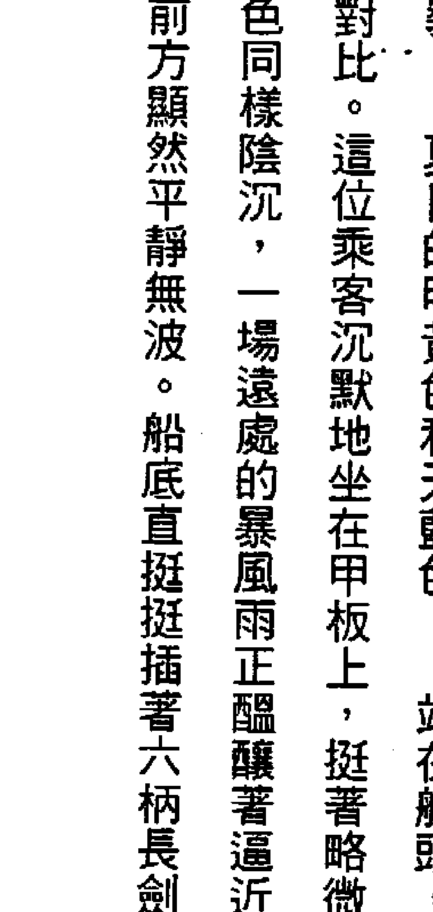

# 雙張牌陣

單張牌已經提供了足夠的啟發和訊息，不過塔羅師——及寫作者——發現，解讀成對或成組的塔羅牌更有意思。「雙張牌陣」在寫作中有平衡和對照的效果。當你想要比較兩個人、兩個地方或兩件事，不妨抽兩張牌來實驗。你可以用善與惡、利與弊、應該與不應該、光明與黑暗、起落、正面與負面或任何類型的衝突，甚至是正邪之間的大對決，來說明這兩張牌的立場。

# 寫作練習

洗牌之後抽出兩張塔羅牌，用來描述某個人物最好與最壞的特質。我們就叫他「克雷格」，對這個人的性格作「最好與最壞」的解讀。

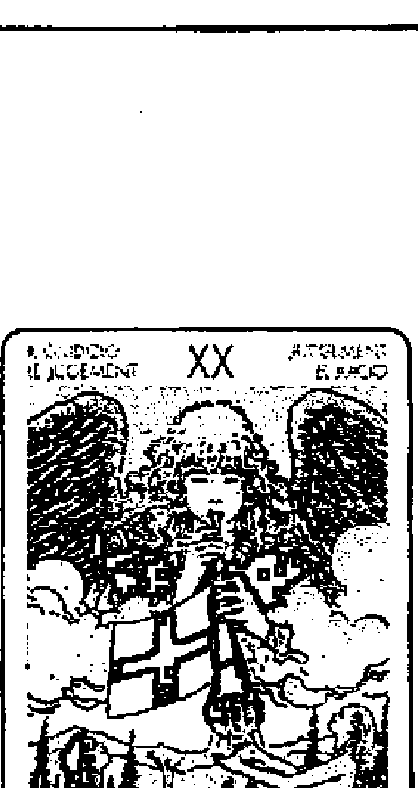

最好的特質 (審判)

最好的特質——審判牌意味著寬恕和全新的開始。克雷格或許能輕易地寬恕別人。他會原諒別人對他的惡劣行徑，而且願意給周遭朋友和夥伴第一次、第三次，甚至第四次彌補的機會。

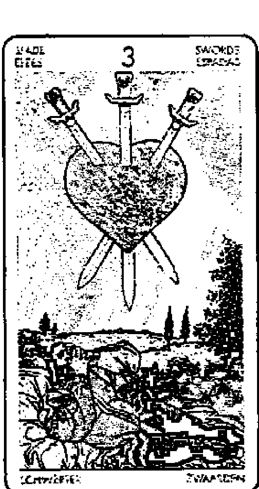

最壞的特質 (寶劍三)

最壞的特質——審判牌意味著寬恕和全新的開始。克雷格或許能輕易地寬恕別人。他會原諒別人對他的惡劣行徑，而且願意給周遭朋友和夥伴第一次、第三次，甚至第四次彌補的機會。

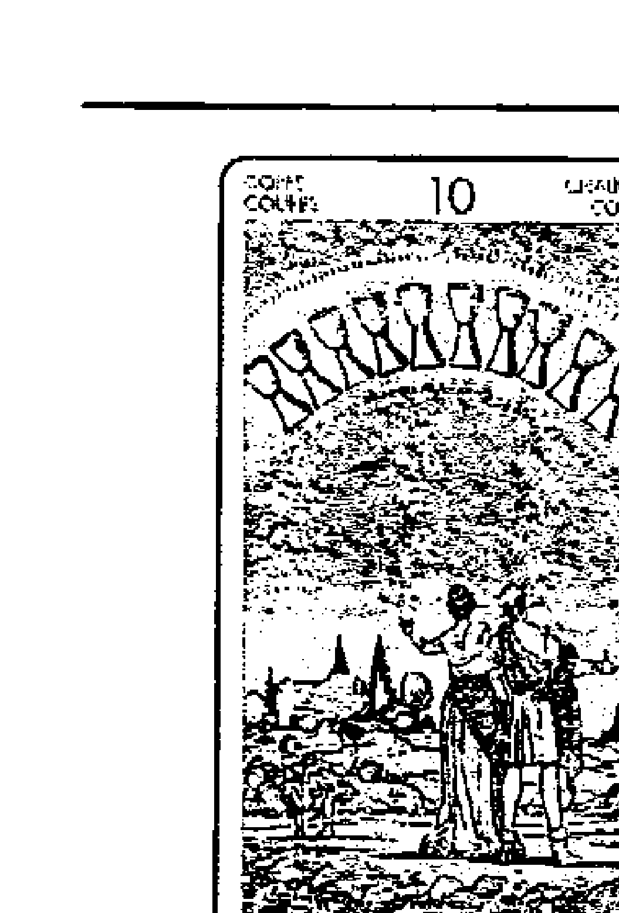

过去（圣杯十）

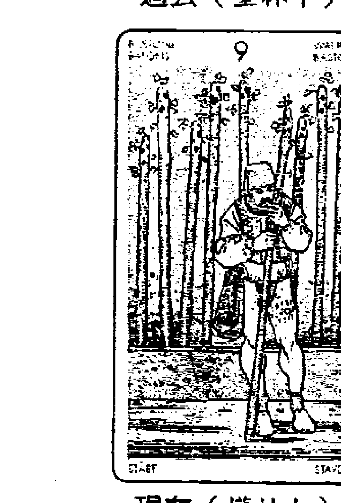

现在（权杖九）

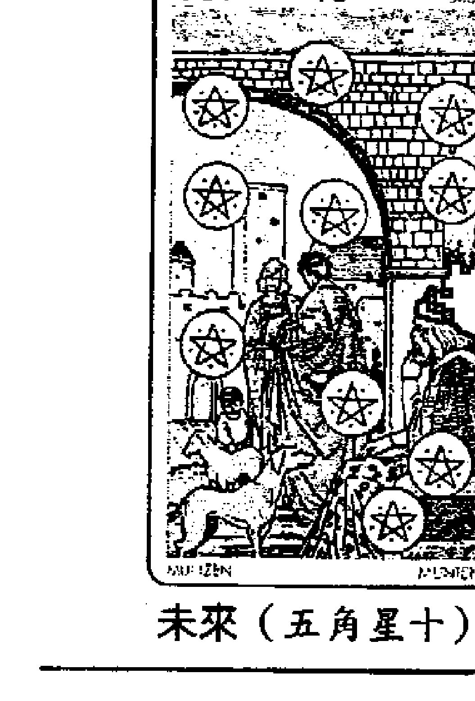

未来（五角星十）

### 三的力量

> 「三張牌陣」是許多塔羅牌的解讀基礎。三張牌通常代表事件的過去、現在和未來發展，也可以解讀成「身、心、靈」或是、不是、或許」等意思。「過去、現在、未來」牌陣很適合用來迅速回答問題，或粗略地理解狀況。洗牌後分成三堆翻開，或者抽出頭三張牌，由左到右或由上到下依序解讀，第一張牌代表過去、第二張牌描述現在，第三張牌說明未來可能的結果。

摆出「过去、现在和未来」牌阵，像叙述故事一样来诠释。设法找出一个统一的主题或模式，以单一叙事线贯穿这三张牌。现在用三张牌来叙述一个简单的故事：

最坏的特质——宝剑三则说明克雷格不是很愿意原谅自己。他深陷罪恶感的折磨之中，而且对以前犯下的过错耿耿于怀。

# 馬蹄鐵牌陣

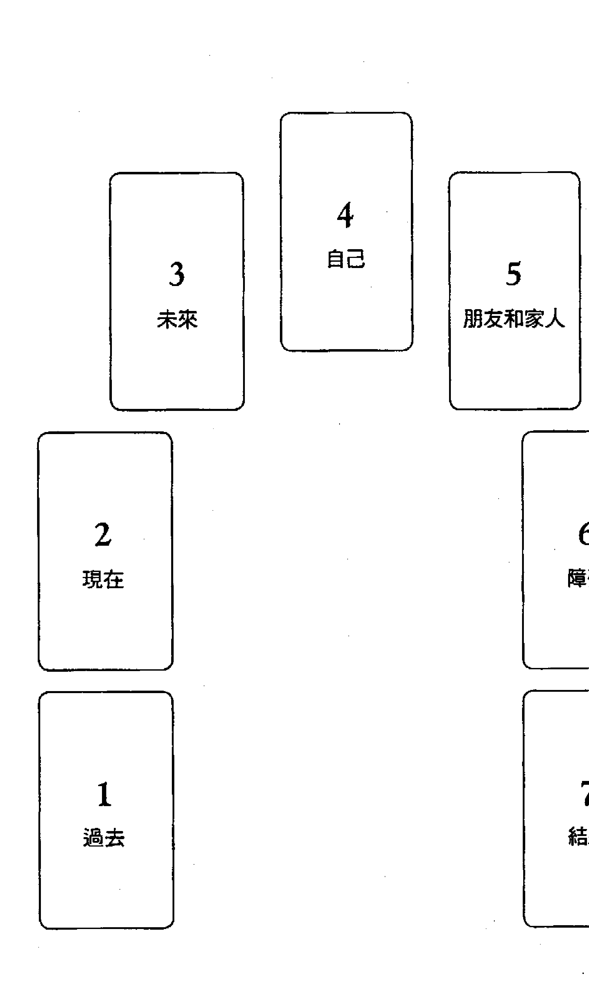

- 過去——聖杯十。很久以前，有一對貧窮夫妻和兩個子女住在一間舒適的小屋。
- 現在——權杖九。有一天，一位神秘旅人來到他們的小屋門口。
- 未來——五角星十。他承諾給他們大筆財富，條件是他們得離開家園，跟他一起踏上旅程，前往某個遙遠的國度。

# 「馬蹄鐵牌陣」能以戲劇化方式探索問題或情勢，讓答案顯示在神秘的七張牌之中。

剛開始學習解讀塔羅牌，你可以從新聞報導中蒐集題目和事件來練習。以下用某個真實新聞案件來虛構一個故事，這是關於某男子在他的太太出獄五個小時之後身亡的新聞事件。啟人疑竇的是，這名女子之所以入獄，正是因為幾個月前她曾意圖謀殺親夫，然而先前案件在審理時，男子宣稱他已經原諒了太太，於是法官判處她緩刑。

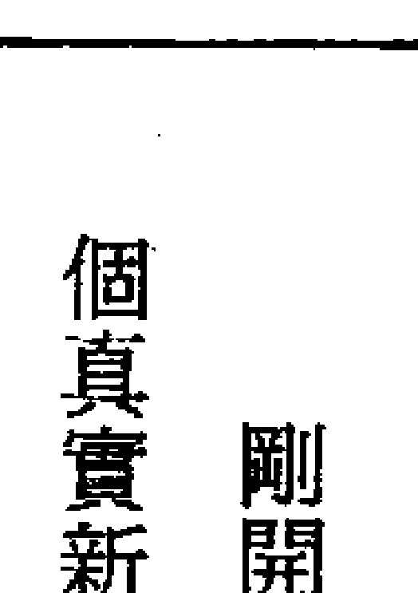

- 1. 過去——五角星一。
- 2. 現在——事情的現狀。
- 3. 未來——不遠的未來會發生的事。
- 4. 自己——案主對現狀的態度、想法或感覺。
- 5. 朋友和家人——他人如何看待這個事件，或旁人的觀感會對此事件產生什麼影響。
- 6. 障礙——必須克服的障礙。
- 7. 結果——目前的態勢最可能產生的結果。

1 過去——五角星一。我們姑且稱故事中的女子為約瑟芬，她曾將丈夫的處方藥掉包成安慰劑，意圖謀殺親夫。這對夫婦一直以來日子過得很拮据，而且丈夫的健康狀況不佳。

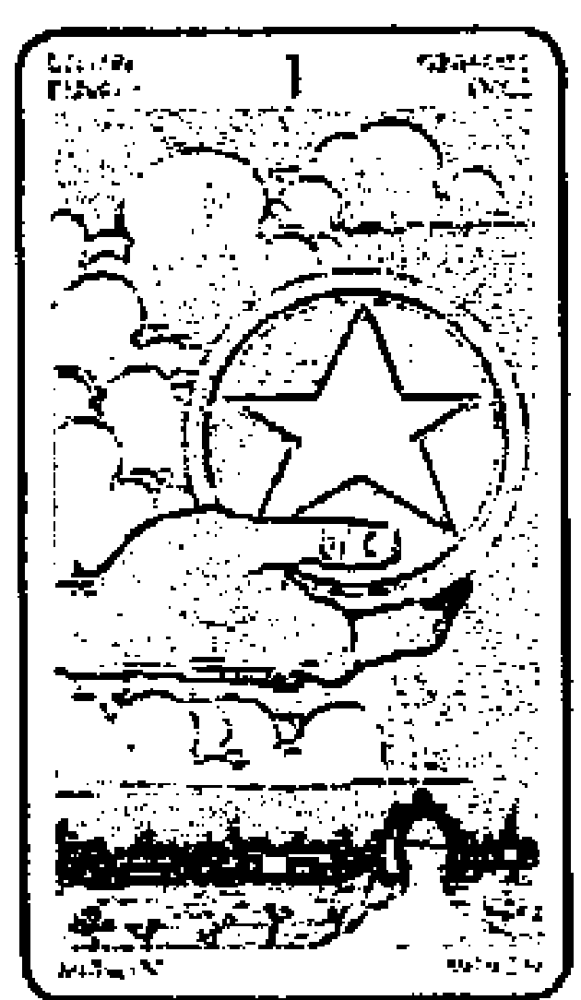

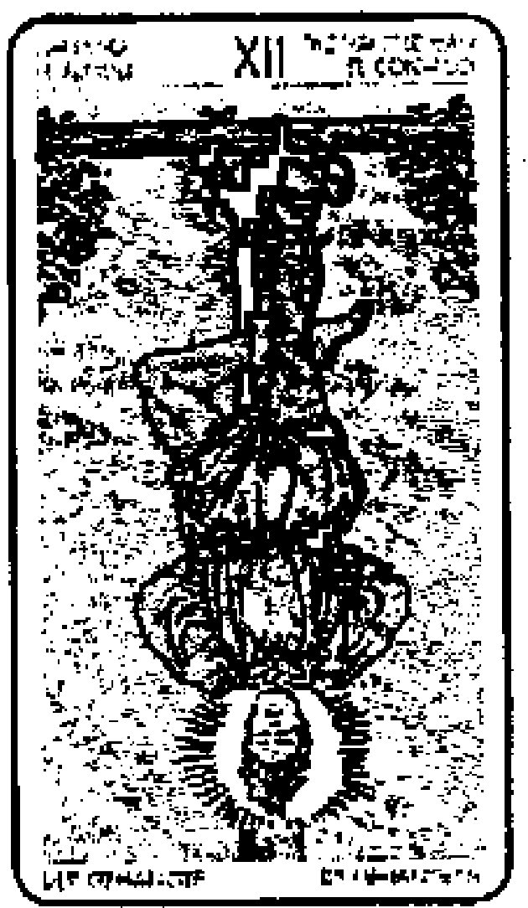

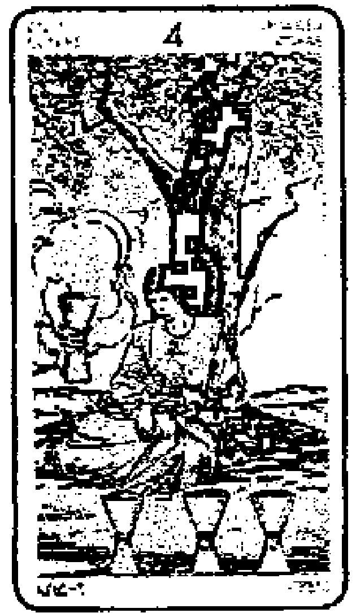

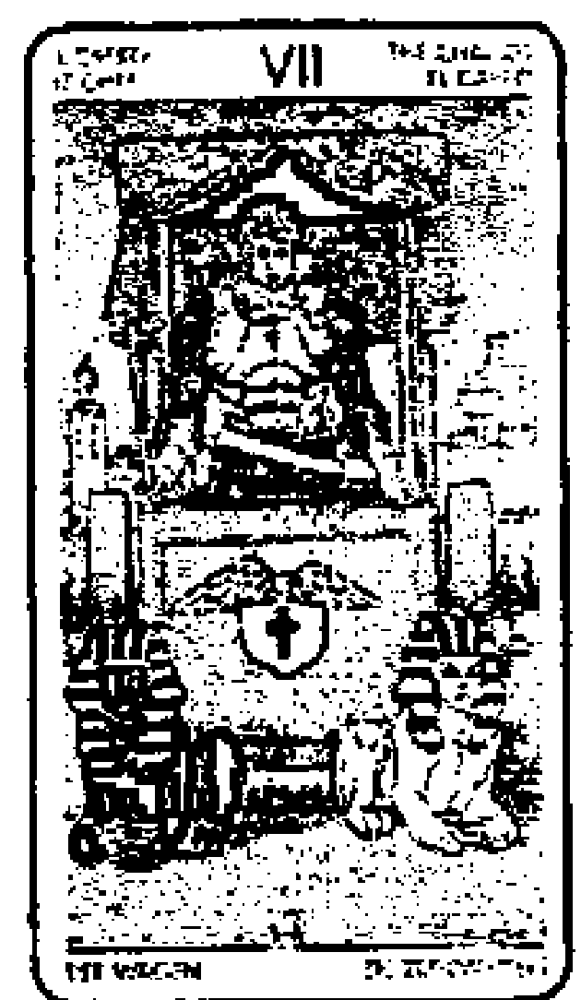

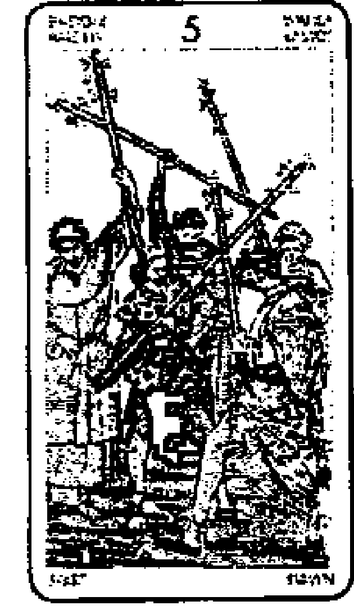

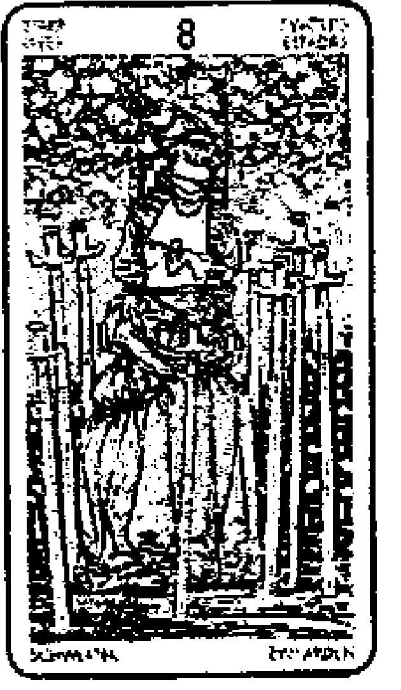

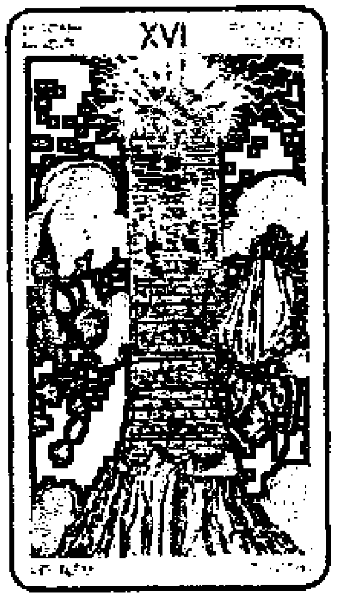

五角星一代表财务和身体方面的新开始，或许她认为她在帮丈夫的忙。（巧的是，五角星

2 现在——吊人。消息见报时，约瑟芬的缓刑判定因为等待验尸的结果悬而未决。如果她的丈夫是自然死亡，她就能安然脱身。

3 未来——圣杯四。当约瑟芬为蓄意杀人罪进行答辩时，她解释她的行为是因为患有抑郁症。最后法官给予她缓刑出狱的判决，条件是她必须继续接受治疗。如今她的丈夫死了，她真的需要治疗了。

4 自己——战车。战车可以对应到与滋养有关的巨蟹座。的确，约瑟芬自认是个有爱心、愿意照顾家庭的好女人。

5 朋友和家人——权杖五。代表纷歧的力量。不管验尸结果如何，约瑟芬的朋友和家人对她是否害死丈夫仍莫衷一是。

6 障碍——宝剑八。其实约瑟芬性格封闭，长年住在自己打造的牢笼里，就像牌面上被蒙住双眼、困在宝剑之间的女子。

7 结果——塔。这可以看成一张「出狱许可证」（大富翁游戏中的出狱卡）。约瑟芬最后无罪开释，看样子这张象征释放或瓦解的牌又说中了某些事。

这则新闻事件的后续发展是，几个星期后，验尸官断定约瑟芬的丈夫死于自然因素，因此她毋须背上任何罪行，也没有违反缓刑规定。

# 凱爾特十字陣

一百多年前，偉特參與「經典偉特塔羅牌」的設計工作，他引介了一種名為「凱爾特十字」（Celtic Cross）的牌陣，至今仍然廣受歡迎，使用率極高。

- 1. 案主
- 2. 情勢
- 3. 當下的影響力
- 4. 基礎
- 5. 近期的過往
- 6. 最高理想
- 7. 近期的未來
- 8. 自我形象
- 9. 公共形象
- 10. 希望與恐懼
- 11. 最有可能的結果

# 凱爾特十字牌陣

為小說人物「史丹」擺一個凱爾特十字牌陣，用看圖說故事的方式來解讀塔羅牌，盡量發揮想像力，把解牌過程記錄下來。

- 1. 指示牌 提問的案主或問題指涉的對象。
- 2. 覆蓋牌 問題或事件的周遭情勢。
- 3. 橫交牌 現在這個時間點可以發揮影響力的能量。
- 4. 基礎牌 問題或事件背後的基礎。
- 5. 近期的過往 過去半年或一年內發生的事。
- 6. 頂點牌 情勢發展到目前最理想的結果。
- 7. 近期的未來 往後半年到一年間會發生的事。
- 8. 自我形象 案主自己對問題的看法或認知。
- 9. 公共形象 周遭他人對問題的看法，或產生的影響。
- 10. 希望與恐懼 由問題或情勢所衍生的希望或恐懼。
- 11. 最有可能的結果 目前問題或情勢最有可能的發展趨勢。

- 1. 指示牌／案主——五角星二。史丹身兼多職。
- 2. 覆蓋牌／情勢——寶劍一。他最近剛從某名校的法學院畢業。
- 3. 橫交牌／當下的影響力——權杖八。史丹最近接收到詭異的靈異訊息，讓他學究式的理

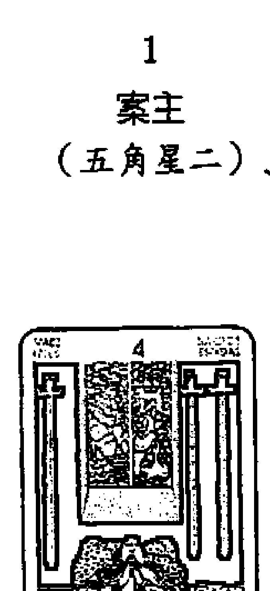

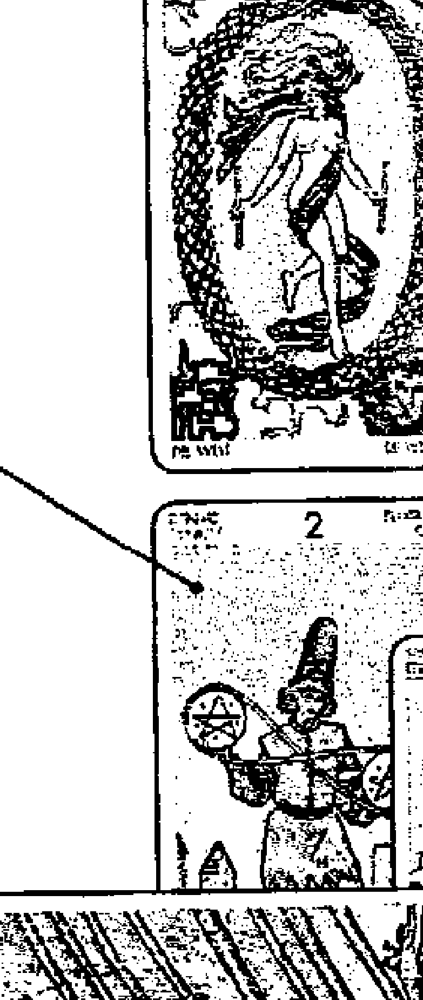

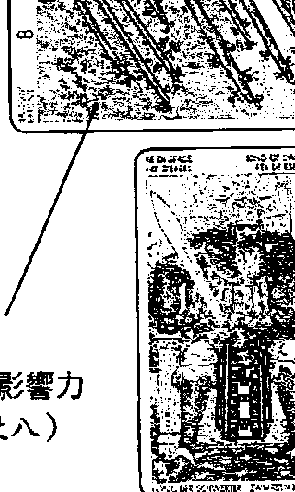

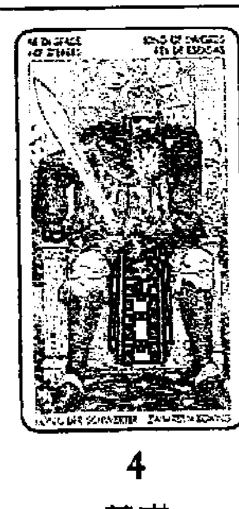

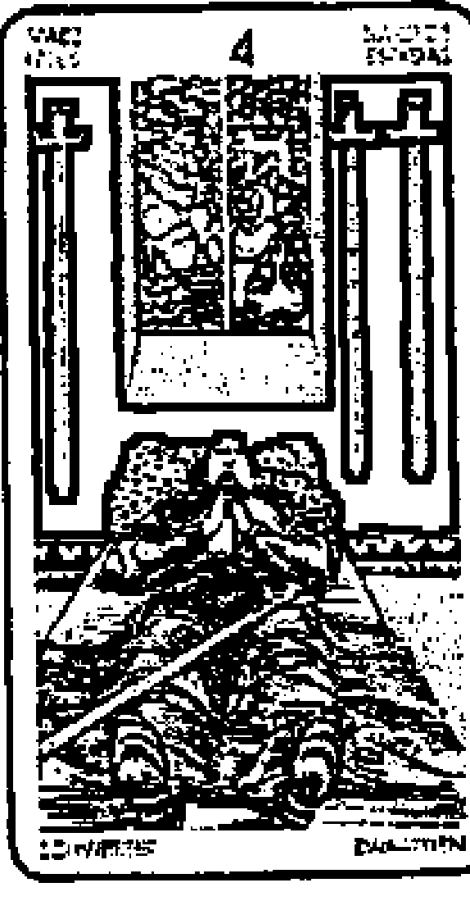

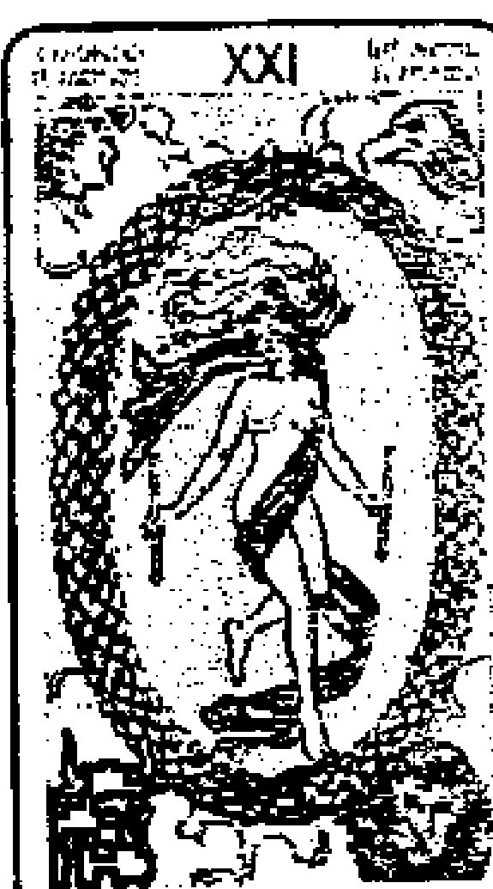

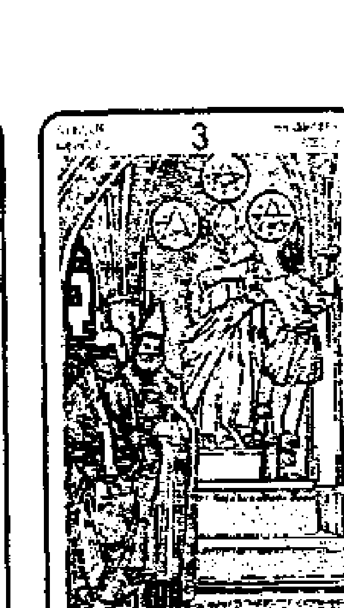

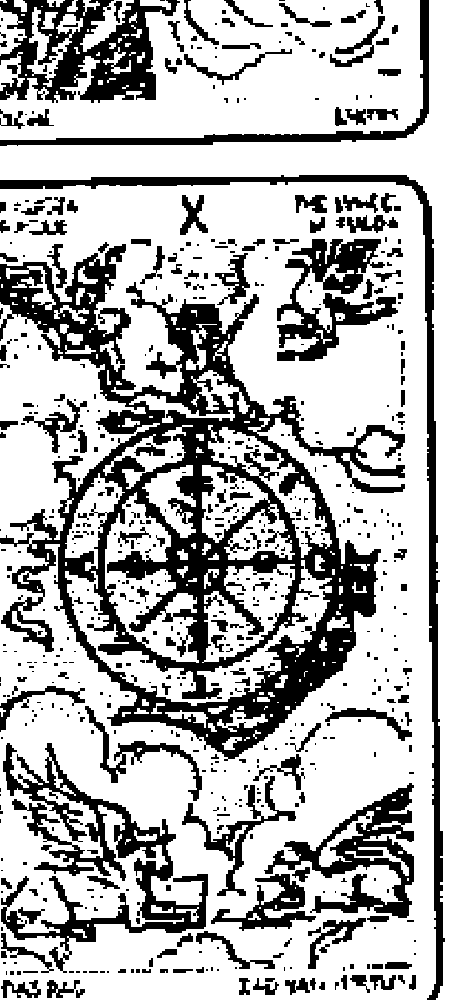

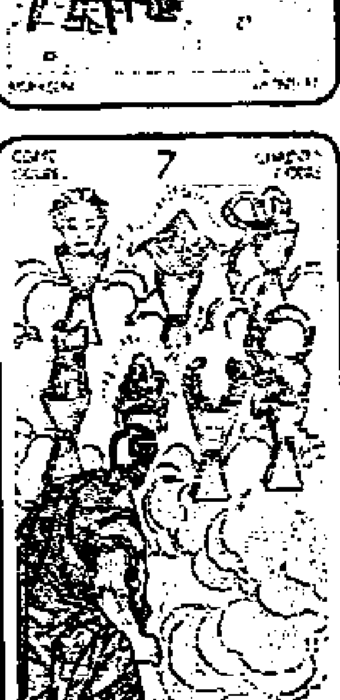

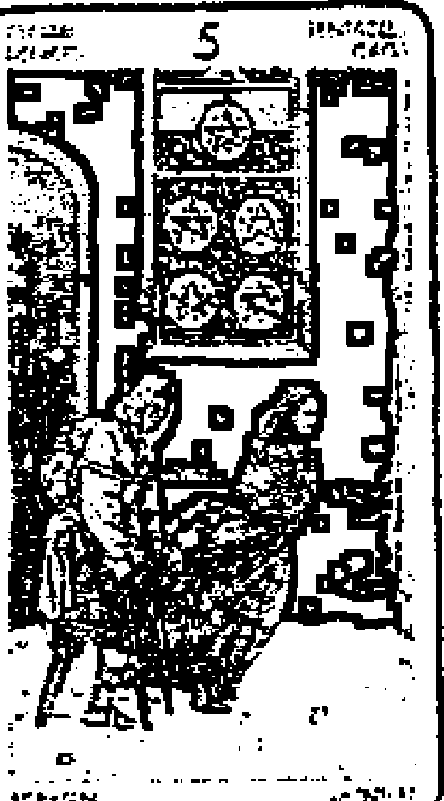

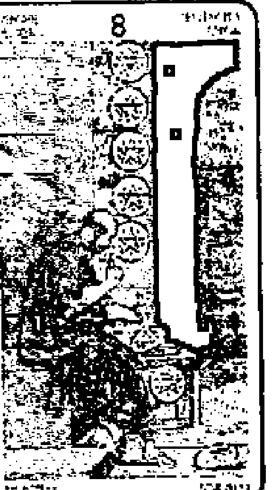

性腦袋困惑不已，這些訊息不停催促他去尋求生命中的創造力，史丹覺得自己可能瘋了。

- 4. 基礎牌 — 寶劍國王。史丹的父親是個律師，他希望退休後，寶貝兒子能繼承他辛苦了一輩子的事業。
- 5. 近期的過往 — 寶劍四。這些三年來，史丹生了一場重病，他被診斷出罹患骨癌。他與病魔整整纏鬥了一年，才好不容易在苦讀下拿到法律學位。
- 6. 頂點牌／最高理想 — 世界。史丹最大的心願是身體健康、長命百歲，他渴望好好享受豐富的人生。走法律這一行可以確保他荷包滿滿，而且受人敬重。
- 7. 近期的未來 — 五角星三。即便穩當的走在律師之路，史丹越來越無法否認藝術家的天命不斷召喚著他。
- 8. 自我形象 — 命運之輪。儘管身體尚未康復，但史丹覺得老天爺是眷顧他的，因為他幸運地活了下來。
- 9. 公共形象 — 聖杯七。當史丹提到美術學校修業的念頭時，他的朋友和家人都嘲笑他不切實際。大家認為他應該去考律師，以他的程度完全可以順利繼承父親的衣缽。
- 10. 希望與恐懼 — 五角星五。史丹終究無法放棄夢想，雖然他常常懷疑自己的決定是否正確。他不時擔心成為藝術家之後，生活會變得悲慘落魄，也害怕癌症突然復發，會讓他失去一條腿。
- 11. 最有可能的結果 — 五角星八。史丹將來會成為藝術家經紀人專門領域的法律顧問，他不但身兼多職，而且顧全了現實和理想，更利用職務之便，跟隨著雕刻大師學習技藝。

# 萬能牌

如果除了桌面的牌，你還希望得到更多訊息，那麼在解牌的任一階段，都可以視需求在標準牌陣中加入一張或數張額外的牌。

萬能牌 在牌陣中加入「萬能牌」可以補充提示點，加強解讀牌陣中意義不明的地方。

釐清牌 如果某張牌意涵紛歧，需要更多解釋，那麼可以在這張牌上方覆蓋另一張牌，來釐清正確的意思。

建議牌 如果想知道如何處理某張牌或某個訊息，可以抽另一張牌來尋求建議。

未來牌 不必單靠一張「結果牌」來下結論，必要時多加入幾張牌，按時間順序，觀察情勢的發展或變化。

另一種未來 抽出兩、三張牌，比對牌陣中的某個改變點會如何影響未來的結果。

隱藏牌 又稱「秘密」牌——位置在整疊牌的最下方，這是正常情況下絕對不會曝光的牌，隱藏著被壓抑的訊息。

# 保持創造力

即興發明牌陣非常有意思，你只需提出問題，然後設計相對應的排列方式，來推敲可能的答案。擺陣時，記得善加利用能反映出問題本質的圖形，如直線、方形、圓圈、三角形或星形等幾何圖形。

# 第二單元

# 故事創作

塔羅牌可以在故事發展的各個階段助你一臂之力，從一開始的人物創造、情節鋪陳、背景設定、對話安排……到最終寫出令人滿意的結局。甚至能在編輯、修訂和宣傳作品等環節，激發出創意的點子。

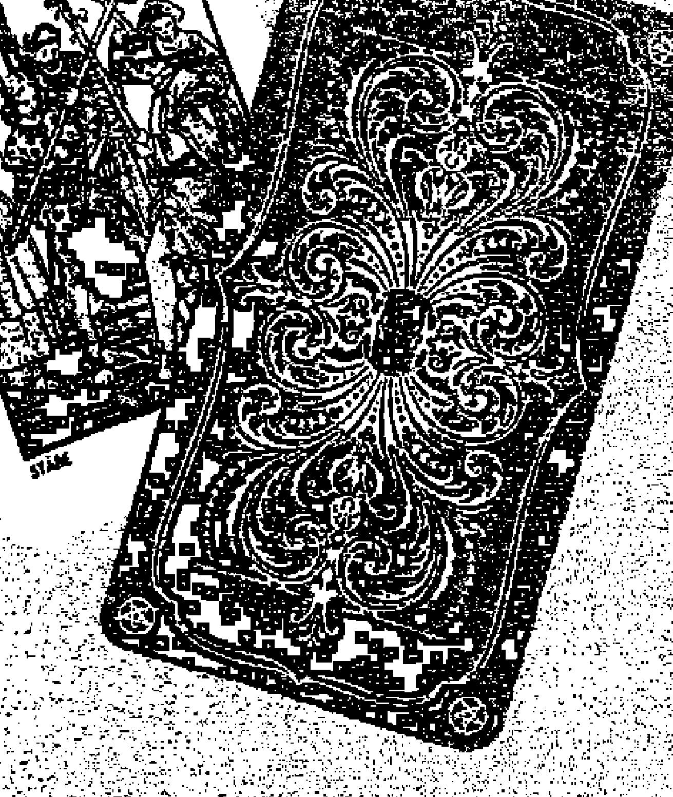

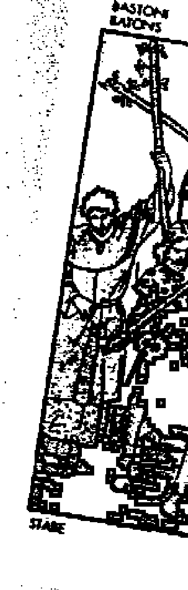

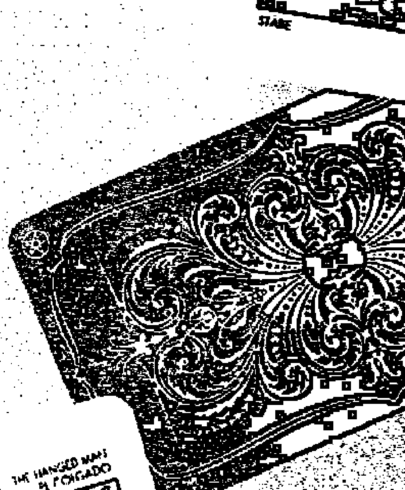

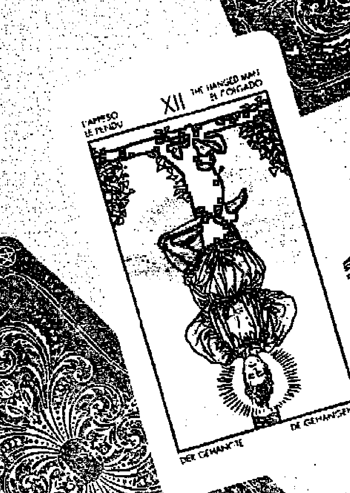

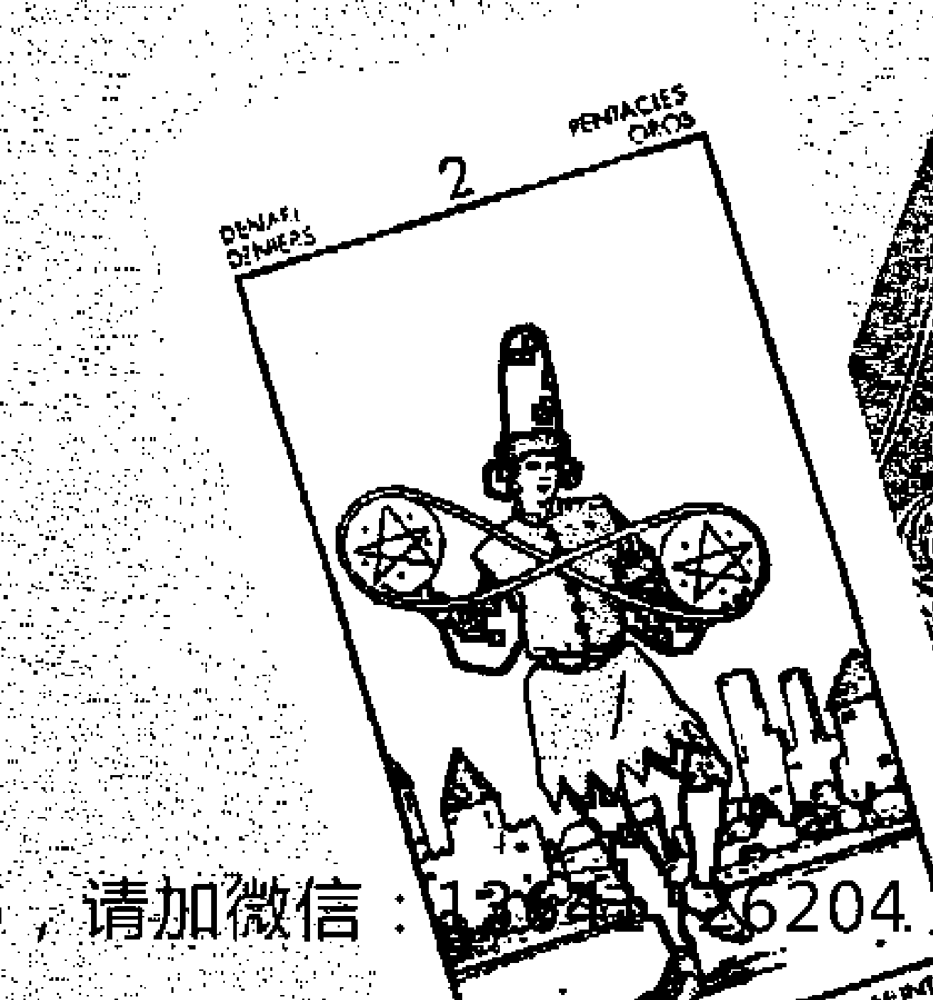

### 4 人物創造

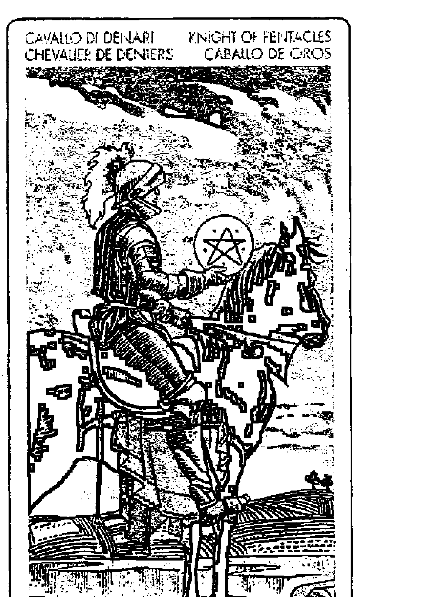

有些作家認為最棒的故事是由人物來驅動，有些作家則認為，情節才是一個故事中最重要的元素，結構紮實的故事會讓讀者沉醉其中，欲罷不能。這些說法都有道理。然而事實是，我們幾乎無法將精采的人物與他們的冒險活動區分開來，所以我們先從人物談起，因為人物是塔羅牌裡最顯眼的部分。雖然塔羅牌是印製在紙卡上，不過你會發現牌面的人物並非毫無生氣的紙偶，他們具備各種原型和強烈性格，而且在你手中，他們會變得栩栩如生。

> > 五角星骑士的写作范例
> 「尼克慢條斯理的挪動步伐，集中所有感官來蒐集情報。他伸出雙手去感覺、觸摸整個房間，還不時停下腳步，專注記錄下每個畫面、每種聲音和每一絲氣味。沒有任何東西能逃過他老鷹般銳利的雙眼。索列觀察尼克工作的樣子，知道他找對了偵探。」

### 人物陣容

召喚故事人物登場時，先抽一張『起手牌』，為重要的人物分配牌卡。這些人物通常包括：

主角。故事中的英雄人物，展現最多的行動力——以及最多的衝突。主角（protagonist）這個詞源自希臘文，最初用來表示在舞台上第一位開口說話的演員。由於主角是劇中的大明星，所以你的故事中得為他發展出詳細的輪廓。

反主角。每個英雄都需要對手，也就是所謂的『反英雄』或『反主角』。即使反主角並非主要賣點，但也必須像主角一樣引起觀眾的興趣。

陪襯者。每個人都需要朋友，許多文學作品的主角身邊也有陪襯的角色——用來突顯主角長處或弱點的夥伴。唐吉訶德的陪襯者是桑丘·潘薩（Sancho Panza）；福爾摩斯的搭檔是華生醫生；《摩登原始人》裡的弗萊德（Fred）有巴尼（Barney），而《我愛露西》裡的主角露西（Lucy）有愛瑟爾（Ethel）作伴。即便是壞蛋，也有忠心耿耿的追隨者、走狗或跟班：例如虎克船長和史密斯先生（Mr. Smee），或是邪惡博士和他的分身（Dr. Evil）迷你我（Mini-Me）。

配角。故事中不斷出現，但並非要角的人物。他們通常有名字，而且至少有些背景說明——你也需要為他們做人物素描。

成規人物。幾乎每個故事都有一些成規人物，如酒保、計程車司機或郵差。他們通常是無名小卒，必要時突然出現以支援過場，好讓故事繼續進行。

你也許有一股想發展龐大陣容的衝動，特別當你手邊有一副塔羅牌時，整件事情將變得相當

容易——但是請你先按耐這股衝動。暫時將你的「次要人物」限制在「次要的任務」中，如果可能，將他們的角色做一點合併，確保他們的存在是讓故事增色，而非硬生生搶了主角的風采。

# 寫作練習

快速洗牌後，抽五張牌來代表五個人物——主角、反主角、兩個陪襯者和一個配角，記錄下你對這些人物的印象。

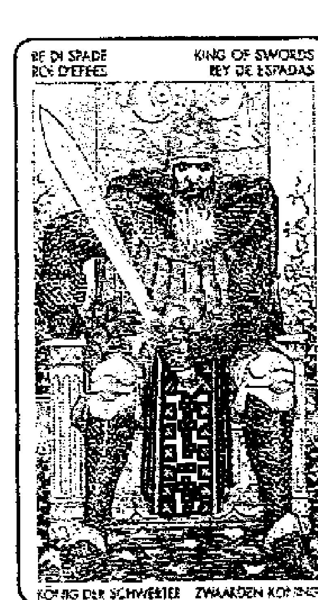

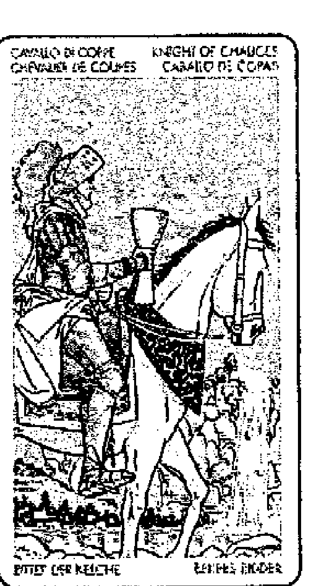

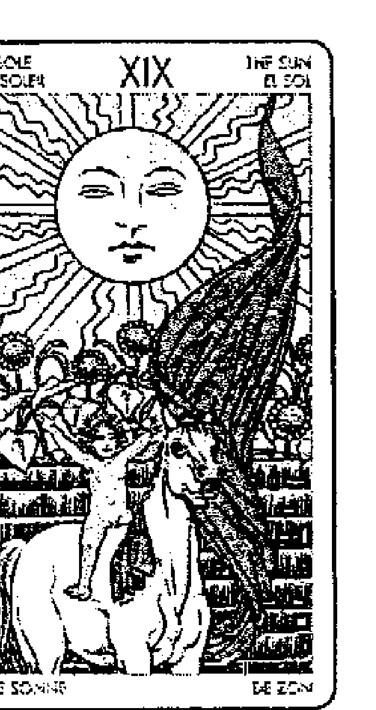

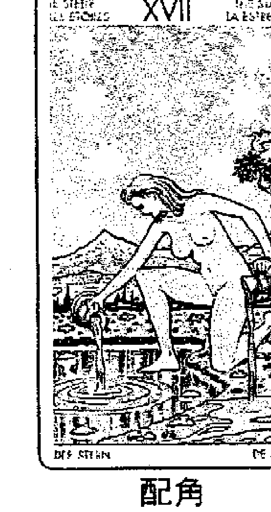

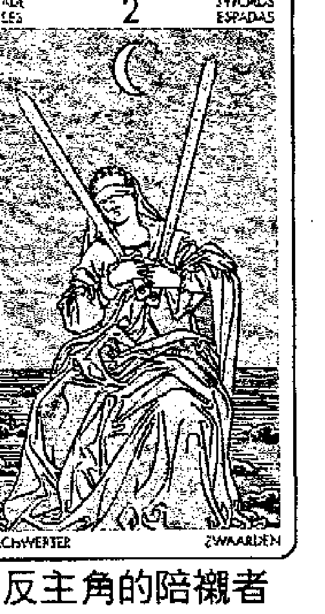

### 豐富的性格

一個故事的配角很可能流於性格平板，或顯然只具備單一特質，而小說中讓人印象深刻的角色，通常是擁有多層次複雜性格的立體人物。其次，平板人物的個性往往是靜態而被動的，變化不多，但是一個人物的性格卻是動態的，會隨著故事開展，經歷戲劇化的轉變。顯然，你必須努力塑造一個完整的動態人物——趕快抽一張牌，將牌面的人物拉出平面的紙牌世界，進入與你的世界同等真實的虛構現實。你可以用這張牌來設定關於角色的一切，包括身體外觀、動機、希望、恐懼、夥伴、家人、朋友、教育程度、工作經驗和嗜好等。

### 實踐練習

隨機抽牌，用一張牌回答故事中關於人物的設定。

- 主角——太陽。英雄騎著一匹充滿象徵意義的白馬。
- 反主角——聖杯騎士。外表看起來盛氣凌人，內心深處卻極度缺乏自信的年輕人，希望藉由擊敗英雄，來證明自己的能力。
- 主角的陪襯——寶劍國王。英雄年邁的父親不願退位，不過只要時機一到，英雄就必須即位，建立自己的王國。
- 反主角的陪襯——寶劍二。因為深愛聖杯騎士而被蒙蔽雙眼、陷入瘋狂的年輕女孩。
- 配角——星星。饒舌的女侍者，專門為風塵僕僕的旅人供應熱咖啡——以及熱門的八卦。

靠什麼維生？如何打發空閒的時間？有無配偶、子女或養寵物？懷抱什麼希望和夢想？最害怕的東西是什麼？……隨機抽牌來描述虛構的角色「凱薩琳」。

- 男性或女性？五角星皇后——女性。
- 多大年紀？寶劍四——現年四十四歲。
- 長相和性格如何？世界——身材高挑、體格健康，而且不拘小節，有寬廣的胸懷。
- 靠什麼謀生？死神——職業是驗屍官。
- 如何打發空閒時間？權杖騎士——閒暇時熱衷騎馬。
- 有沒有配偶、子女或是養寵物？權杖二——她的丈夫因工作需要，經常得到海外出差。
- 懷抱什麼樣的希望和夢想？太陽——她是為受虐兒童爭取正義的鬥士，遺憾的是，身為驗屍官，她也目睹很多被虐至死的兒童。最害怕什麼？寶劍——司法制度的缺陷讓她耿耿於懷。

## 人物的設定

小說家通常會為故事人物編織詳盡的生命史和個人資料，要將扁平的概念轉換為立體的現實，需要盡可能為主要人物做一個全面性的側寫。

- 身體外觀
- 年紀
- 種族
- 身高
- 體重
- 頭髮
- 眼睛
- 膚色
- 戴眼鏡或隱形眼鏡
- 胎記、疤痕、刺青
- 衣著風格
- 健康方面
- 整體外觀
- 最顯著的特徵

- 性格
- 太陽星座
- 短期目標
- 長期目標
- 強項
- 弱點
- 害怕的事物
- 忌諱
- 天賦與才能
- 壞習慣
- 癖好
- 致命的缺陷
- 可取之處

- 個人生活
- 配偶
- 子女
- 寵物
- 前夫/前妻或情人
- 職業
- 年收入
- 住家
- 汽車
- 朋友、鄰居和夥伴
- 日常慣例

## 個人史

- 生日
- 出生地／故鄉
- 母親
- 父親
- 兄弟姊妹
- 其他家庭成員
- 童年生活
- 青少年生活
- 教育程度
- 工作經驗
- 宗教
- 最早的記憶
- 最快樂的時刻
- 最尷尬的時刻

## 特別喜好的東西

- 衣服
- 鞋子
- 餐廳、食物和飲料
- 書籍
- 電影
- 電視節目
- 歌曲
- 運動
- 消遣和嗜好
- 口頭禪和表情

用上述問題的提示來發展一個人物，例如以「聖杯九」的男子來設定「湯尼」這個角色給人的第一印象：年齡——三十好幾，種族——希臘人。

- 身高——五呎十一吋
- 体重——约两百六十磅
- 髮——长度及肩的棕色捲髮
- 眼睛——棕色
- 膚色——橄榄色
- 戴眼镜或隐形眼镜——無
- 胎記、疤痕、刺青——身上沒有明顯標記，不過有一雙毛茸茸的臂膀。
- 衣著風格——喜歡隨意和舒適的打扮。湯尼常常戴著一頂漂亮的帽子，讓他顯得有那麼一點兒與眾不同。
- 健康狀況——體重恐怕是個問題，他習慣久坐，也可能飲酒過量。
- 整體外觀——外表看起來愉快爽朗、心寬體胖。
- 最顯著的特徵——體型。湯尼是個溫和的大個子。

## 塔罗牌的角色召唤

如果你打算写一部大规模的小说或电影剧本，不妨将二十二张大阿尔卡纳牌全都用来发展庞大人物班底。以莎士比亚名作《罗密欧与茱丽叶》（Romeo and Juliet）为例，剧中人物恰好可以对应大阿尔卡纳中的所有角色。

0 愚者。小丑，凯普莱特（Capulet）家的仆人。虽非剧中的英雄，但他确实表现出英雄的行径。故事开始时，荣丽叶的父亲让小丑去邀约名单上的人赴宴。然而小丑不识字，所以在街上拦下一名陌生人求助，这名陌生人碰巧就是罗密欧——蒙太古（Montague）家族的年轻男子。当罗密欧得知漂亮的罗莎莱（Rosaline）会出席宴会，便决定乔装赴宴，因为罗密欧对罗莎莱倾慕已久，而蒙太古家族和凯普莱特家族素有世仇。

1 魔术师。茂丘西奥（Mercutio），罗密欧的至交好友，以与“魔术师牌”有关的墨丘利（Mercury）命名。一如塔罗牌的魔术师，茂丘西奥诡计多端，习惯在长篇大论中夹杂许多双关语。

2 女祭司。奶妈，荣丽叶的代理母亲，也是荣丽叶最亲密的知己。尽管她相信爱情，但也足够务实，她不认为荣丽叶会为了一个男人牺牲自我。

3 女皇。凯普莱特夫人，荣丽叶的母亲，年纪轻轻就嫁为人妇，十四岁时生下荣丽叶。

4 皇帝。凯普莱特，荣丽叶慈爱的父亲，不过他习惯命令和控制别人。他要求荣丽叶嫁给帕里斯伯爵（Count Paris），然而荣丽叶坚决不从，惹得他勃然大怒。

5 教皇。劳伦斯修士（Friar Lawrence），方济会修士，安排罗密欧和荣丽叶秘密结婚，希望他们的结合终能为维洛那（Verona）带来和平。

6 恋人。罗密欧和荣丽叶当然是一对不幸的恋人，他们的故事扣人心弦，感动了数百年来的读者和观众。凯普莱特家举行舞会的当晚，两个人一见钟情，坠入爱河。

7 战车。合唱队驱动着故事前进，引导观众注意沿途发生的重要事件。

8 力量。荣丽叶鲁莽的表亲提伯尔特（Tybalt），因为罗密欧竟然出现在凯普莱特家的晚宴中而向他提出决斗的要求；后来提伯尔特一剑刺死了茂丘西奥。

9 隐士。故事开头罗密欧想追求的美女罗莎莱，但这个人物始终未曾正式出现在舞台上，只是通过其他的角色说明她发誓守贞。

10 命运之轮。劳伦斯修士的朋友约翰（John）本应让罗密欧知道茱丽叶的计谋（假死），不料却在送信途中被耽搁了，导致罗密欧无法得知茱丽叶并非真正死去。

11 正义。维洛那亲王爱斯卡勒斯（Escalus）命令蒙太古家族和凯普莱特家族停止斗殴，他以坚定客观的立场，维护维洛那的秩序。

12 吊人。卖药人，穷苦的药铺老板违背良心，卖给罗密欧一种致命的毒药。后来他因这项罪行而被绞死。

13 死神。隐形的死神笼罩整个故事，夺走多达七条性命。提伯尔特杀死茂丘西奥，罗密欧杀死提伯尔特，而蒙太古夫人悲恸以终。罗密欧杀死帕里斯后自杀。最后是茱丽叶自杀殉情，卖药人则被处决。

14 节制。罗密欧的表亲班伏里奥（Benvolio）想转移罗密欧对罗莎莱的执迷，并设法阻止剧中的年轻人斗殴。他的名字代表“善意”或“调解者”。

15 恶魔。葛列格里（Gregory）和山普孙（Sampson）是凯普莱特家的仆人，他们散播仇恨和报复心，用不堪入耳的辱骂和粗俗的手势挑起争端。

16 塔。罗密欧的仆人鲍尔萨泽（Balthasar）捎来茱丽叶已死的噩耗。他也陪同罗密欧去探望茱丽叶长眠、如地牢般的墓穴。

17 星星。英俊而自私的皇族成员帕里斯伯爵。他追求茱丽叶是为了贪图财富和社会地位，但在茱丽叶的父亲同意这桩婚事后，便显露出傲慢专横的本性。

18 月亮。羅密歐的母親蒙太古夫人在劇中是個黯淡遙遠的角色，當她獲知羅密歐被逐出維洛那的消息，竟傷心而絕。

19 太陽。蒙太古，如同他的妻子，對劇中主角來說也是遙遠的發光體。他與月亮配成對，只在劇終時出現，發揮啟蒙的作用。

20 審判。愛斯卡勒斯親王的輓歌成為這齣戲的結語，他同時也扮演主持正義的角色。「古往今來，多少離合悲歡，」他吟誦道：「誰曾見這樣的哀怨心酸！」

21 世界。任何故事的背景都可視為故事本身的人物。《羅密歐與茱麗葉》的故事背景是義大利維洛那的文藝復興世界。

## 原型

另一個發展人物的方法是將大阿爾卡納牌視為「原型」。原型是一種不受時空限制的標準典範，可以體現為不斷出現在夢境、神話和文化中的意象，也是寓言和傳說中所謂的英雄。事實上，古往今來的中西歷史中，一向不乏由令人熟悉的象徵所組成的類似故事。以下是廣為人知的各種原型：

- 英雄或女英雄——神話人物的現成替身，承擔重任大任，踏上追尋之旅。他們是道德高尚、雄心萬丈且備受敬重的拯救者和勇士。
- 陰性基質（阿尼瑪）——男性所展現的女／陰性特質。
- 陽性基質（阿尼瑪斯）——女性所展現的男／陽性特質。
- 煉金術士——將銅、鐵等卑金屬轉化成黃金，致力尋找長生不老藥。
- 藝術家——藉創作表達自我的人。
- 創造者——新世界、新生命、新計畫與新概念的產生者。
- 破壞者——清除不適用的事物和體制者。
- 獨裁者——專橫且有強烈控制欲的統治者。
- 報信者——為使節或皇室成員傳送消息的傳信人。
- 愚者——經驗不足、無憂無慮，容易受騙或誤入歧途的人。
- 上帝——統管全宇宙的力量。
- 父親——集體權威的領袖，或是嚴厲的供養者及保護者。
- 母親——充滿愛心、無條件關愛子女的滋養者。
- 大地之母——自然之母、萬物之源。
- 女神——生命之源。
- 亞馬遜人——獨立自主、自力更生的強壯女性。
- 聖童——拯救情勢，讓世界迎向新開始的新生兒。
- 天真之子——純潔直率，生性樂觀且未受世俗污染。
- 國王——人間的最高統治者。
- 皇后——滋養並保護所屬領土的女君主。
- 法官——執行法律規定的人。
- 弄臣——嬉笑怒罵、尋歡作樂的小丑，帶有些微的暗陰色彩。
- 看門人或守護者——守護區域的出入口，管控通行的角色。
- 守護天使——神的代理者，被指派前往英雄的世界，提供保護。
- 妖婦——施法術魅惑他人的婦女。
- 隱士——離群隱居的修道者，但是他的孤獨反而引來追隨者。
- 嚮導——協助旅行者在陌生地區旅行的助手。
- 騎士——保護弱勢和無辜的百姓，肩負任務的拯救者。
- 愛情女神——妻子或母親角色之外的親密伴侶。
- 情人——熱情煥發的人。
- 神奇幫手——賜予神奇能力和力量的超自然存在。
- 魔術師——操弄自然律法為己所用的人。
- 殉道者——為理想犧牲自我的人。
- 家長——領導大家庭的男人。
- 女家長——領導大家庭的女人。
- 兒子——想當家作主的年輕叛逆者。
- 少女——天真無邪且缺乏經驗者。
- 靈媒——將亡者的訊息傳達給生者的通靈人。
- 良師——年長而經驗老到的指導者，願意與人分享知識並提出忠告。
- 傳信人——往返兩地傳遞消息的人。
- 彌賽亞——降生於世以拯救子民的救星。
- 大富翁——成功的生意人。
- 守财奴——寧可寒酸度日，也不願掏出半毛錢的吝嗇鬼。
- 黑暗母親——有計畫摧毀自己子女的母親。
- 神秘主義者——窺探宇宙神秘視野的人。
- 反叛者——叛逆、不服從公眾信念的人。
- 詩人、作家或抄寫員——善用文字力量來轉化現實的人。
- 祭司——受命主持宗教儀式，同時有資格獻祭的人，有權代表上帝發言。
- 女祭司——具直覺力的導師、治療者及守護秘密智慧的人。
- 王子或公主——財富與權力的繼承者。
- 娼妓——為金錢出賣貞操、自我墮落的婦人。
- 通靈者——有能力探索超自然力量的人。
- 陰間引渡者——引導亡靈前往來世的神靈。
- 永恆少年——榮格所謂「永遠長不大的男孩」、彼得潘型的人物。
- 離經叛道者——質疑自身所處社會和文化的人。
- 拯救者——冒險解救他人的人。
- 統治者——創造出某種結構的權威者——這個結構成為大眾遵循的依據。
- 求道者——追尋生命答案的人。
- 自我——與宇宙及高層力量連結的個體。
- 陰影——投射在他人身上的黑暗面。
- 薩滿師 —— 遊走於物質和精神世界的人。
- 巫師 —— 有目的性控制精靈和惡魔的人。
- 男巫 —— 能轉化現實的老智者。
- 女巫 —— 洞悉太多真相的危險女人。
- 融合體 —— 榮格所謂的「神聖夫妻」，象徵陰與陽的完美結合。
- 教師 —— 傳授後代知識者。
- 學生 —— 以學習為業的人。
- 小偷 —— 竊取物品者。
- 騙徒 —— 操縱或行騙他人者。
- 超人 —— 能力超凡的英雄。
- 處子 —— 純潔無瑕、未被玷污且冷靜沉著的人。
- 遠見卓識者 —— 洞見人類美好未來的人。
- 漫遊者 —— 告別已知的舊世界，出發探索新領域的人。
- 戰士 —— 接受訓練，為戰鬥而活的人。
- 蕩婦 —— 放棄自我原則的婦人。
- 聰明的愚者 —— 與弄臣相反的典型，少數享有直諫特權者（但往往將忠言包裝成玩笑話）。
- 智慧老人 —— 學者、教師、賢人和哲學家，願意與人分享知識並提供指引。
- 受傷的治療者 —— 利用自身疾苦累積的智慧來治療並協助他人者。

哪些大阿爾卡納牌讓你聯想到上述常見的原型？例如，愚者牌與「愚者原型」就十分吻合，此外你也可以觀察，哪些牌與「聖童」、「受傷的治療者」、「神秘主義者」或「離經叛道者」的原型似乎也能相提並論。挑一張你最喜歡的牌，仔細檢視牌面上的人物，為他挖掘更多可能性。

## 次要人物

小牌也藏有許多人物的線索，特別是透過「元素」這個關鍵來聯想。再次說明：權杖是精神生活的火象牌、聖杯是情感生活的水象牌、寶劍是智能溝通的風象牌，而五角星是有形現實的土象牌。

你可以利用四張牌的牌陣來概括某個人物的性格，用花色對應精神、情感、智能和物質生活的層面。以下用隨機產生的牌陣來解讀一個擁有妻子和母親雙重身分的女性角色——「瑞娜」。

### 性角色——「瑞娜」

精神生活——權杖八。瑞娜能迅速消化各種訊息，就像牌面上飛快移動的飛行權杖。這張牌象徵溝通，說明瑞娜能敞開心胸接收來自心靈的訊息。

情感生活——五角星六：瑞娜樂意在情感上付出，就像牌中慷慨解囊的善心人士。她或許從慈善工作中得到充分的满足，也可能在教堂、医院、收容所或學校當志工。

智能生活——聖杯侍從：如同畫面上的孩童，瑞娜思想尚未成熟。為了結婚生子，她可能放棄了學業。

物質生活——惡魔：這張牌的出現是個衝擊，因為它與先前幾張溫和的牌形成強烈對比。出人意料地，瑞娜沉迷於感官享受，她喜愛生活中所有「罪惡的享受」，包括美食、美酒和性。她很容易受到誘惑，甚至有濫用藥物和酒精的習慣。

记住，人物的動機和目標應該與故事的脈絡一致。當故事展開，人物的衝突會變成危機，接著危機導致高潮，並在結局時獲得解決。

## 私人生活與公開性格

每個性格鮮明的人物背後都有著驅使他們行動的心理慾望與需求。

## 目的與動機

故事中的角色就像現實中的真人一樣懷抱夢想、有欲有求，不會漫無目的地過活。他們也有追求的理想，做出對他們來說有意義的決定。故事創作者應該探索這些人物行為背後的動機，並瞭解他們想獲得的目標和報酬。

風險。每個人都有理想，不過即使未能如願，多數人並不需要面對徹底毀滅的命運。不過，虛構人物可就沒這麼幸運了，這些人物情節若要引人入勝，就必須孤注一擲，不成功便成仁。想一想，你的人物想達成目標，得冒什麼樣的風險？

## 內心衝突

角色們在追求目標的過程中勢必面臨難以克服的障礙——他們所經歷的衝突就是故事的重要元素。衝突可以用很多形式呈現，包括扣人心弦的內心戲。內心的衝突可能來自人物背景、性格、動機和目標，以兩種對立的需求或欲望為發展基礎。例如，在許多職場都能發現的內心衝突就是：現代職業婦女想要兼顧事業和家庭的欲望。

替你最喜歡的人物抽出三張牌：第一張牌決定他在故事中的重要目的與動機，第二張牌代表未達目標將會面臨的損失，第三張牌探討他一路必須克服的內心衝突。

## 希望與恐懼

在每一個故事中，外來的影響力都會對劇情產生某些衝擊或效果。然而，最精彩的衝擊莫過於「自己正好是自己最大的敵人」。而且，好故事永遠少不了一個由內而外、徹底改變自己的人。他必須重新思考自我形象，才能擺脫過去的陰影。

以下是「喬治」這個角色抽到的三張牌：

### 目的與動機（魔術師）

目的與動機——魔術師。喬治是個天生害羞的人——這讓他長期以來過著寂寞而絕望的生活。他住在租來的破敗房間中，每天在小隔間裡埋首工作，然後獨自到固定的餐館用餐。他非常渴望跟人說話、交朋友，還有找個人來愛。

### 風險（寶劍十）

可能的風險——寶劍十。如果喬治不改變現狀，很可能繼續飽受孤獨煎熬，因為他不自覺地躲避周遭的人群。

### 內心衝突（寶劍八）

內心衝突——寶劍八。喬治陷在自己打造的牢籠之中。他多少有點殉道情結，不願與人來往不只因為想保護自己，也多少有點自私，帶著一絲優越感，不願意和別人分享感覺。他必須重新思考自我形象，才能擺脫過去的陰影。

# 寫作練習

塔羅師能在解牌過程看出一種平行並進的劇情，事實上，他們常用一張牌代表兩件緊密相關的事——希望與恐懼，因為這兩者幾乎密不可分，就像銅板的兩面。我們每個人多半都有一些未完成的目標，問題不在於這個目標困難到無法達成，而是因為我們害怕改變。你可以藉由「希望與恐懼」的設定來為人物添加戲劇元素。例如用某張牌來決定你的人物一生中最渴望的東西——以及因這個慾望而衍生的恐懼。為了加強說服力，這個人物的恐懼應該呼應你賦予他們的性格特質和背景。抽一張牌——隨機或刻意皆可——來代表人物內心深處的希望與恐懼。設定好人物最害怕的事之後，你必須殘忍地將他推入深淵，強迫他進入恐懼的世界，而且你得足夠冷血無情。例如，一個普通的家庭主婦正在超市進行每週例行採買，這樣的故事平凡而乏味。然而，如果是一個完全足不出戶、患有空曠恐懼症的女人，被迫在偌大的「美國購物中心」尋找她失蹤的孩子，這個故事可就有看頭多了。

## 第四章 | 人物創造

福爾曼參議員設法在進入公職之前累積了一大筆財富，現在他最害怕的是失去權力和威望。在被誤判性侵罪之後，他失去了國會議員的席位、財富和自由。他能不能在出獄後重建生活和名聲？

## 取名的技巧

你可以利用塔羅牌的象徵來替人物取個有意義的名字。例如上述的故事人物：參議員「福爾曼」的名字，靈感就來自「五角星四」中的「男人」（“four”,“man”）。

## 塔羅訪談

「對話」能透露人物的許多細節，例如說話方式和遣詞用字，都可以看出一個人的教養程度、思維方式和溝通技巧。用塔羅牌發展人物，你會發現讓他們開口「自報家門」是一件非常容易的事。選一張牌代表某個人物，他可能是你心中第一時間冒出來的鮮明形象，或指涉某種性格面向。想像牌面上的人像真人一樣坐在你面前，而你是採訪記者，正進行一個簡單的訪談。

塔羅牌可以創造出與任何人、地點或事物的對話——藉由想像與塔羅牌圖像之間的對話。你能安慰「寶劍五」落敗的戰士，逗弄「五角星皇后」腳邊的黑貓，或和「戰車牌」的斯芬克斯吵架，甚至進一步想像和兩個人、兩張牌或同一張牌的兩個版本交流。你必須展開這些對話，並鉅細靡遺記錄雙方的對談，讓這些隻字片語隨意識之流前往它所抵達之處。提出問題、得到解答，開啟詮釋和專注的新途徑，這個過程就像想像力一樣，全然不受限制，自由發揮。

# 寫作練習

挑一張牌代表某個故事的角色，用筆談的方式與這個人物對話。「塔羅訪談」有幾項要點：

- 提出問題。不要預設立場，針對你挑出的牌提問，然後等待答案。
- 以開放式問題來開場，例如「談談你自己？」或者「請描述一下你的個性？」然後記下你想到的任何答案。
- 後續的問題要以先前得到的答案為基礎。
- 如果答案的意義不明，進一步釐清它。

在與「塔羅訪談」的過程中，人物往往會說出驚人的內幕，而且很可能輕易地就打破談話禮儀——或社會規範。以下是我與「寶劍九」女子的對話：

> Q：這麼晚了，你在做什麼？
> A：我睡不著……老是被可怕的惡夢糾纏。
> Q：談談這些夢？
> A：夢境其實很簡單。我夢到自己一個人在家，突然之間鈴聲大作。當我去應門時，發現門竟然打不開。我被困住了！
> Q：你是說，門上鎖了？
>
> A：對，門被鎖上了，從外面栓住或被堵住了，也許被磚塊封死……我不知道。每個晚上都是這樣……我好像被困在自己家裡的囚犯。
>
> Q：這些惡夢是怎麼結束的？
>
> A：我總是被自己的尖叫聲驚醒。

## 人物填空

模擬你的故事人物會如何回答以下問題。

- 我是（牌名或人物名），我有一個秘密，那就是________。
- 我是，光看我的外表，你可能永遠猜不到我真實身份是________。
- 我是，現在我最關心的是________。
- 我是，我很納悶________。
- 我是，我想要________。
- 我是，我覺得________。
- 我是，我擔心________。
- 我是，我瞭解________。
- 我是，我總是說________。
- 我是，我夢想著________。
- 我是，我害怕________。

## 意見交流

採訪塔羅牌的工作，不限於以『第一人稱』對單獨一張牌進行訪談。你可以一次採訪好幾張牌，藉此深入探索你的人物。隨機抽幾張牌，讓牌中人物描述彼此，畢竟他們是鄰居，對彼此都很熟悉。試著問問寶劍皇后，她對你的反主角有什麼看法；把女皇或聖杯皇后拉到一旁，聽聽媽媽們的真知灼見。請教皇喝杯酒，想辦法套出你的主角在告解時到底說了些什麼。

- 我是希望，我經常幻想。
- 我是我總覺得最珍貴的財產是我的感到後悔。
- 我是當我回顧人生，我對感到很罪惡。
- 我是有時我對於感到驕傲。
- 我是當我回顧過往，我對。
- 是我生命中最快樂的一天。
- 是我人生最大的不幸來自。
- 我是如果我能夠戒掉一個壞習慣，那會是。
- 是我相信我的天命是。
- 我是有一天我將會。

# 寫作練習

抽出兩張牌，讓一個人物描述另一個人物。權杖七的「戰士」對聖杯八的「漫遊者」可能會有以下看法：

權杖七……

描述聖杯八

> 「他是個懦夫，一旦情況變得危險，他根本沒種留下來迎戰。他沒有勇氣接受挑戰，寧可逃跑也不願面對自己的心魔。他老是嚷嚷著要『找回自己』或是『跟著心的方向』之類的，但總有一天他會知道，當他轉身離去，那才叫『放棄天命』。像我這樣的人只能收爛攤子，不過比起他來，我可強得多了。」

※※※※※

要成功塑造人物，千萬不要拘泥於對眼前圖像的如實描述。下個章節將結合塔羅藝術和占星科學，讓滿天星斗引領寫作的靈光，遠航高飛。

## 5 占星學與塔羅牌

有些作家會利用占星學作為發展故事角色的工具，這簡直就是個公開的秘密。有些教授寫作的老師甚至建議學生參考占星手冊，來研究小說中的人物性格和特質。在這本書中，你可以利用塔羅和占星的關聯性，設計出性格多元的人物。許多塔羅牌都繪有占星符號或黃道生物，你可以將這些意象、元素與黃道天文圖結合起來，互相對應。

> > 「我很少走出我的殼，並不是因為我不喜歡融入外界……而是我完全沒辦法忍受『衝突』。
> > 這個年頭，無論你上哪兒去，到處都有人等著對你破口大罵。每個人都煩躁易怒，每個人都很焦慮。我不如待在水裡，順著水流漂浮，遠離一切麻煩——即使這表示我得暫時憋住氣。」
> >
> > ——月亮牌的寫作範例

## 發光體的性格

大阿爾卡納的對應。每張大牌都與某個星座或某顆行星有強烈的關聯。這些發光體所展現的特質，能強化塔羅牌的傳統意涵。

- 0. 愚者 不在乎世俗觀點，對應叛逆的天王星。
- 1. 魔術師 舌頭從不打結的戲謔大師，對應擅長溝通的水星。
- 2. 女祭師 「通靈者」的原型，對應擁有直覺力的月亮。
- 3. 女皇 妻子和母親的雙重身分，對應充滿愛與吸引力的金星。
- 4. 皇帝 一國之君，對應天生有領導氣質的牡羊座。
- 5. 教皇 傳統的維護者，對應穩重而且重視感官享樂的金牛座。
- 6. 戀人 想法一致的佳偶，對應擅長思考的雙子座。戀人是雙子座（雙胞胎）的版本之一。
- 7. 戰車 受到保護、裝有輪子的家，對應一把家扛著走的巨蟹座。
- 8. 力量 精彩的馴獅秀，對應象徵創造力的獅子座。
- 9. 隱士 沉默低調的領袖，對應為人服務的處女座。
- 10. 命運之輪 命運的關鍵，對應擴張的幸運木星。
- 11. 正義 均衡的模範，對應保持平衡的天秤座。
- 12. 吊人 懸吊在另類現實中，對應體現幻覺的海王星。
- 13. 死神 陰間統治者，對應象徵死亡的天蠍座。
- 14. 節制 橫跨兩個世界的牌，對應遠距旅行的射手座。半人半馬的射手同樣結合了兩種迥異的經驗。
- 15. 惡魔 誘惑的化身，對應代表名利地位的摩羯座。
- 16. 塔 遭受攻擊的高聳建築，對應到象徵戰爭和侵略的火星。
- 17. 星星 閃耀希望之光的星辰，對應具有前瞻性的寶瓶座。
- 18. 月亮 主宰夜晚的發光體，對應代表潛意識的雙魚座。
- 19. 太陽 所有生命的供養者，對應能量與啟蒙的源頭——太陽。
- 20. 審判 最後的召喚，對應象徵復活及轉化的冥王星。
- 21. 世界 我們在塵世的居所，對應代表界限和規則的土星。

## 小阿爾卡納的元素

小牌的四種花色也呼應占星學的火象、水象、風象和土象星座。火象的權杖就像牡羊、獅子和射手座，所以權杖牌有火一般的色彩，加上明亮晴朗的景色。水象的聖杯就像巨蟹、天蠍和雙魚座，所以聖杯牌呈現深深淺淺的藍綠色，以及湖、河、溪流和海洋。風象的寶劍就像雙子、天秤和寶瓶座，所以寶劍牌納入大量黃色來代表「風」元素，往往出現雲朵、飛鳥或被風拂掠的景象。土象的五角星就像金牛、處女和摩羯座，所以五角星牌經常繪有富庶的園林，表現出土地的慷慨大方。

## 黃道輪

塔羅牌和占星學可以共用黃道之輪的概念，所有星座和行星（及相關的塔羅牌）在黃道輪上都占有特殊地位。將圓形劃分成十二等分，來表示黃道圈和宮位分佈的狀況。

## 元素的關聯

這張表格概述每個星座的元素，以及在塔羅牌中出現的占星意象。

| 星座 | 星座 | 星座 | 元素 |
|------|------|------|------|
| 射手座 (木星主宰) | 獅子座 (太陽主宰) | 牡羊座 (火星主宰) | 火象星座 |
| 摩羯座 (土星主宰) | 處女座 (水星主宰) | 金牛座 (金星主宰) | 土象星座 |
| 寶瓶座 (天王星主宰) | 天秤座 (金星主宰) | 雙子座 (水星主宰) | 風象星座 |
| 雙魚座 (海王星主宰) | 天蠍座 (冥王星主宰) | 巨蟹座 (月亮主宰) | 水象星座 |

## 黃道十二宮

| 宮位 | 支配領域 | 主宰星座 | 主宰行星 |
|------|----------|----------|----------|
| 第一宮 | 身體外觀、第一印象 | 領導力—牡羊座 | 能量和侵略—火星 |
| 第二宮 | 金錢、物質、價值觀 | 財產、物質—金牛座 | 愛和吸引力—金星 |
| 第三宮 | 溝通、兄弟姊妹、鄰近地區 | 溝通—雙子座 | 速度和溝通—水星 |
| 第四宮 | 母性、居所、家庭 | 保護、滋養 — 巨蟹座 | 反省和陰性循環 — 月亮 |
| 第五宮 | 父性、創造力、娛樂 | 勇氣、表演欲 — 獅子座 | 能量和啟蒙 — 太陽 |
| 第六宮 | 工作、責任、義務、服務 | 健康、清潔 — 處女座 | 速度和溝通 — 水星 |
| 第七宮 | 婚姻、夥伴、親密關係 | 正義、平衡 — 天秤座 | 愛和吸引力 — 金星 |
| 第八宮 | 性、死亡、他人財產 | 生命黑暗面 — 天蠍座 | 死亡、復活和轉化 — 冥王星 |
| 第九宮 | 哲學、遠距旅行、高等教育 | 正直、探索 — 射手座 | 幸運和擴張 — 木星 |
| 第十宮 | 野心、地位、事業、公共形象 | 工作、報酬 — 摩羯座 | 界限和限制 — 土星 |
| 第十一宮 | 社群、理想、遠見 | 美好願景 — 寶瓶座 | 獨立和反叛 — 天王星 |
| 第十二宮 | 通靈能力、神祕學、隱祕場所 | 直覺、潛意識 — 雙魚立 | 玄秘和幻覺 — 海王星 |

## 黃道牌陣

以天宮圖為基楚的「黃道牌陣」，讓我們可以從占星的角度來輕鬆地分析塔羅人物。先在1的位置擺上第一張牌，其餘的牌按逆時鐘方向擺放。

- 第一宮（牡羊／火星）：領導力、自我意識、衝勁、進取心、身體外觀和第一印象。
- 第二宮（金牛／金星）：物質、財產、價值觀、安全感、感官享受、資源。
- 第三宮（雙子／水星）：溝通技巧、思維、邏輯、兄弟姊妹、鄰居。
- 第四宮（巨蟹／月亮）：母親型人物、居所、家庭、敏感性、情感、滋養、直覺。
- 第五宮（獅子／太陽）：創造力、自尊、娛樂、兒童、父親般的人物。
- 第六宮（處女／水星）：工作、責任、義務、服務、健康、潔癖、重細節。
- 第七宮（天秤／金星）：婚姻、夥伴、親密關係、平衡、社交魅力。
- 第八宮（天蠍／冥王星）：性、死亡、共享資源、繼承。
- 第九宮（射手／木星）：哲學、遠距旅行、高等教育。
- 第十宮（摩羯／土星）：事業野心、社會地位、公共形象。
- 第十一宮（寶瓶／天王星）：社群、理想、發明、前瞻思考。
- 第十二宮（雙魚／海王星）：通靈、玄秘、潛意識、心理健康、隱祕場所。

為故事人物擺一個「黃道牌陣」，比對個別位置的占星特質來詮釋這個角色。例如，位置1的牌落在黃道第一宮，這個位置代表牡羊座專屬的領導力特質，象徵能量和侵略的火星。

- 1 牡羊座 (權杖侍從)
- 2 金牛座 (世界)
- 3 雙子座 (權杖六)
- 4 巨蟹座 (聖杯四)
- 5 獅子座 (星星)
- 6 處女座 (五角星騎士)
- 7 天秤座 (權杖一)
- 8 天蠍座 (命運之輪)
- 9 射手座 (寶劍一)
- 10 摩羯座 (寶劍四)
- 11 寶瓶座 (權杖皇后)
- 12 雙魚座 (五角星八)
- (寶劍騎士)

## 範例

以下為「卡巴羅」這個角色設計的黃道牌陣，約略以「寶劍騎士」的特質作為性格的發展基礎。

- 1 牡羊座／火星特質——權杖侍從。年輕的卡巴羅社會經驗不多，但是他正培養火一般熱情的領導風格，他很擅長用正面能量和熱忱打動別人。
- 2 金牛座／金星特質——世界。對卡巴羅來說，擁有財富和活得舒服，是人生中最重要的事。
- 3 雙子座／水星特質——權杖六。卡巴羅反應敏捷，善於溝通，這項優點讓他得到周遭朋友的讚美和肯定。
- 4 巨蟹座／月亮特質——聖杯四。卡巴羅或許對母親感到失望。他想不起來她的好，卻牢記在他成長過程中，母親所犯的每個過錯。
- 5 獅子座／太陽特質——星星。卡巴羅很享受成為眾人目光的焦點，他的確相信自己就是宇宙的中心——這是遺傳自父親的特質。
- 6 處女座／水星特質——五角星騎士。卡巴羅常常扮演冒險家和拯救者的角色，工作起來也十分認真。
- 7 天秤座／金星特質——權杖一。談到親密關係，卡巴羅雖然會用溫柔的甜言蜜語對待愛人，卻偶爾會不自覺地使用暴力。
- 8 天蠍座／冥王星特質——命運之輪。卡巴羅幸運地繼承了一大筆財富，這讓他變得頗受異性的青睞。
- 9 射手座／木星特質——寶劍一。卡巴羅頭腦靈光，更懂得透過閱讀和旅行拓視野；他尤其喜歡與人長篇大論地進行哲學思辨。
- 10 摩羯座／土星特質——寶劍四。卡巴羅自恃不必辛苦工作就能名利雙收。
- 11 寶瓶座／天王星特質——權杖皇后。卡巴羅可謂社交動物，他的迷人性格讓每個人都想親近他。
- 12 雙魚座／海王星特質——五角星八。卡巴羅必須努力開發直覺力，這是老天爺給他的珍貴禮物。

下個章節，你的人物終於有機會說說自己的故事了，趕快準備筆紙記錄下來。

## 6 故事線與情節

善用塔羅牌圖像之間開放性的關聯和意涵，就能輕而易舉地構思出一條清晰的故事線，這和塔羅師每次為不同的案例占卜時，從眾多塔羅牌中蒐羅解讀，是一樣的道理。

> > 「布麗妲汗如雨下，不停研究著配方，一連幾天都不曾踏出實驗室半步。每天太陽依舊升起又落下，但對她來說，時間彷彿停滯一般。她看過英代爾的報告，知道有一派分裂團體已經拿到她的配方，而且準備釋出。現在唯一要緊的事就是想出辦法……解決她在同樣這個地方所創造出來的災難！」
> >
> > ——節制牌的寫作範例

## 情節進展：開始、中點與結束

古希臘哲學家亞里斯多德在說明文學理論時，為敘事作品設定了三個基本要素——開始、中點與結束，簡單的「三段式結構」就能發展出一個不受時空環境限制的套路。

- 開始——聖杯一。一名年輕女子發現自己未婚懷孕了！雖然她遭男友拋棄，卻堅決不願墮胎。她的父母在她很小的時候就過世了，這個孩子顯然是她自組家庭的唯一機會。
- 中點——五角星九。走投無路的情況下，女子決定下鄉投靠姨婆。年紀已經八十好幾的姨婆是她唯一的親人，在北加州經營葡萄園。新的務農生涯讓她得以一面撫養小孩，一面在姨婆的高標準和嚴格要求下，努力學習經營葡萄園。一晃好幾個年頭過去，她倒也摸熟了所有釀酒相關的知識——雖然過程相當辛苦。
- 結束——聖杯二。釀酒這一行看似愜意，其實競爭激烈，有時也需要耍些手段，才能順利生存。姨婆去世後，女子變得無依無靠，她從未注意到身邊這個意志堅定的導師身體日益虛弱，也沒發現自己越來越敬愛姨婆。不久，她繼承了葡萄園，繁複的手續中，葡萄園差點就沒良心的房地產律師給侵吞了；此外，她還必須維護葡萄園不被鄰近的地主併購。就在與葡萄園主鬥智鬥勇的過程中，她發現竟愛上了葡萄園主。事情的態勢峰迴路轉，他們倆最後結為夫妻，將兩座葡萄園合併經營，共度美好的人生。

## 三幕劇線性結構

亞里斯多德對戲劇的概分方式對寫作來說是個方便的起點，你可以將它進一步發展成三幕劇——這也是現今廣受編劇和小說家歡迎的公式。三幕劇結構著重描寫「轉捩點」、「情節轉折點」和「不可回歸點」的重要時刻。

### 第一幕

故事拉開序幕，介紹主角、背景和情節。第一幕敘述人物日常生活，定義整個故事的動機。

### 情節點一

標示第二幕的起點。藉由改變生命的明確事件，讓故事得以開展。「情節點一」是促發主角行動的催化劑，驅動主角前進——無論是心理或實質面。因為主角已經了解了自己的責任，或發現自身的處境已經改變。

### 第二幕

開始發展劇情，主角會歷經一連串的挑戰，並加以克服。不過，這些障礙將某程度反映出他的心理情節，所以他也可能暫時無法完成任務。

### 情節點二

主角面臨最大的挑戰，這是全面勝利或徹底失敗的關鍵點。「情節點二」直接導向

### 第三幕

高潮。這裡可以預測故事的結局。

解套。交代所有未處理的零星問題，總結故事。

## 三幕牌陣

三幕劇結構本身就是一個塔羅牌陣。洗牌後抽三張牌，將它們並列來代表三幕。接著加入代表「情節點」和故事「高潮」的牌。為了增加戲劇效果，我以大牌舉例：## 第一幕——节制

对自愿以人类样貌度过千年生活的天使马拉沁·法兰奇来说，这是个再寻常不过的星期二。他是南加州一所重点医院的专业护士，每天极有效率地在河滨社区医院完成晨间的例行工作。

## 情节点一——塔

然而，今天早上10点15分，他放下手边的工作，匆匆赶往医院顶楼。因为他的天使朋友透露，不久后即将发生全国性大地震，他想亲眼见证这个灾难。他站在医院顶楼的停机坪，冷眼望着周遭大楼接二连三地倒塌，险象环生。

## 第二幕——皇帝

直到震动平息，马拉沁冲往急诊室——那里需要他。不出所料，院长已经率领医护人员迫不及待展开全面的医疗救难计划。

## 情节点二——死神和恶魔

事情有了出乎意料的发展。一群来自阴间的恶魔趁机穿越地表裂隙抵达人间，他们化身人形方便行动——利用占据地震受难者已死或垂死的尸体。事实上，其中一具被占用的尸体正是院长的尸体——他在地震期间受了重创。被恶魔附身的院长趁乱谋杀受伤的病人，以便制造更多尸体供同类使用。只有马拉沁看出事情的蹊跷，但如果他向任何人透露自己的真实身分，将无限期被流放到地狱边缘。

## 第三幕——审判

几经挣扎，马拉沁决定打破沉默。他向院区牧师和盘托出真相，两人联手对抗邪恶的力量。成功的机会是如此渺茫，但他们仍击退了所有恶魔——只除了一个。原来，院区牧师的真实身分竟然是个堕落天使，他暗藏更大的计划，召集一群低阶恶魔对他来说只是个开始。当马拉沁醒悟到这个骇人秘密时，牧师已经趁乱逃离，对未来的世界留下一个可怕的警告。马拉沁受命追捕牧师，因此暂时免于被流放。在本系列的二部曲……

## 将情节复杂化——故事线的结构

许多冒险、奇幻、悬疑、科幻等类型小说主要由情节来驱动，故事的进展往往多于人物的描写，有时这些人物完全是被动的，只需一路搭着剧情的顺风车往前走。不过，一个好故事应该结合人物的发展与紧凑的剧情，当两者互动平衡时，读者会与人物产生情感上的连结，同时享受故事进展的刺激感。无论故事是由人物或情节来驱动，你会发现多数情节都遵循着一套标准公式。

序幕（exposition）引介故事、确定氛围、铺陈背景和人物的相关细节。别将序幕和背景故事混为一谈，背景故事是你要在整部作品中一点一滴慢慢透露的东西。当然你也可以将一些预兆之类的细节放进序幕，暗示即将发生的事。

激动力（inciting force）作为「导火线」触发行动，让故事开展，同时导入冲突，扣紧观众的情绪。

渐升行动（rising action）让人物——及读者——陷入冲突的转折点，并藉此形成错综复杂的纠葛。铺陈的过程中，人物会面临迫使他们前进的转折点。

高潮（climax）故事情势的最高点，危机全面展开。理论上，主角会使尽浑身解数，发挥勇气与坚毅的精神来解除危机。高潮通常是读者用来预测结局的环节，千万别用「神仙解围」之类的手段来耍弄读者，以这种不自然的安排作为结局或许很方便，但形同考试作弊[1]。

渐降行动（falling action）高潮结束后，大部分的行动趋于静止，人物踏上归乡之路。

解决（resolution）用来结束故事的安排。有些故事结局是封闭的，明确而不留悬念，而有些结局则是开放式的，保留让读者推敲、想像的空间。有些故事结束在扣人心弦的桥段，以便为同系列作品铺路。收场（denouement）法文原意是「把结解开」。这个阶段要解开所有剪不断、理还乱的剧情纠葛，将故事带往结局。

## 佛莱塔克金字塔

一八六三年，德国小说家佛莱塔克（Gustav Freytag）在许多成功的故事线中发现了一个固定的模式。他以金字塔形状来图解这些关键点彼此之间的关系——这个图形也很适合作为一种塔罗牌阵。

从「佛莱塔克金字塔」可以轻易看出一个故事中「渐升」和「渐降」的行动，试着用这个结构来发展故事线。以下随机抽出七张牌：

- 序幕——月亮。一支从事秘密反抗行动的游击部队正准备扎营过夜。
- 激动力——宝剑七。暗夜中，有个奸细悄悄潜入营地，破坏了整个部队的通信设备。

> [1] 译註：Deus ex machina，拉丁文意为「机器送来的神」。在古希腊戏剧中会有一个桥段，在剧情危急时，舞台会降下神仙来解救陷入困境的英雄。

渐升行动—— 宝剑骑士。反抗军队长在盛怒下，暗杀了一名政府高官作为报复。

高潮—— 女祭师。东窗事发后，反抗军队长展开逃逸，意外闯进一处乡下老农妇的家。不过这个老农妇显然一点都不惊讶，原来她是个萨满师，早在梦境中预见这一天终会到来。历经了一连串的冒险，老农妇引领反抗军队长探索心灵领导力的古老奥秘。

渐降行动—— 圣杯一。老农妇告诉队长，有一只古老的酒杯被埋藏在遥远的丛林里，这只圣杯蕴含伟大的魔力，能重建没落已久的乌托邦。

解决—— 圣杯八。反抗军队长踏上寻杯之旅，最终在漫长艰辛的旅途中猛然醒悟，所谓「圣杯」并非实际存在的酒杯，而是一种暗喻。

收场—— 隐士。多年后，这名反抗军队长成为一名当之无愧、受人景仰的萨满大师。

## 冲突点

故事线固然可以引导情节往前推进，但每个情节本身都是建立在「冲突」上——由两股对立的力量进行戏剧化争斗。故事中的冲突可以单纯如人物性格本身的不协调，也可以复杂到当各角色对抗不相容目标、行动或和欲望时的互动。冲突作为阻挡人物达成目标的障碍，通常分为五种类型——

- 人 VS. 人：反主角与主角的对立。
- 人 VS. 自然：探讨生命、勇气或力量的主题。
- 人vs.环境：人被迫对抗环境或命运。
- 人vs.社会：个人挑战既有社会规范、习俗和价值观。
- 人vs.自我：牵涉到人如何看待自己，以及由此产生的矛盾和挣扎。

什么样的对立会阻止人物达成目标？他们面对的是来自他人的反抗力量，或者他们正陷入转动的命运之轮？甚者，他们有可能正是自己最大的敌人吗？试着利用塔罗牌来定义「冲突」。抽两张牌：一张代表主角，一张代表即将面对的冲突，并让这个冲突在故事中展现。

冲突——命运之轮。他的事业发生财务危机，因缘际会下，他透过一名埃及赌场老板的「协助」，试着用赌博度过难关。不料，兰斯的赌局失控了！

主角——圣杯骑士。理想主义者兰斯·奈特是一名年轻商人，他想藉着自己生产的通勤单车和可回收利用的环保运动水壶，来推广爱护地球的信念。

## 给作家的凯尔特十字阵

练习用同样这两张牌来营造五种类型的冲突，让牌中的意象说明全然不同的情势。

一百多来，塔罗迷多半仰赖「凯尔特十字阵」让解读工作更顺利，你也可以将这个牌阵用在写作上，让这个「给作家的凯尔特十字阵」帮你铺陈一个完整的故事结构。

## 写作练习

用「给作家的凯尔特十字阵」编写大纲时，在每个位置摆放一张以上的牌，用来描述一连串事件，或为故事增添各种细节或分支，记得也将「厘清牌」、「万能牌」和「建议牌」用上。依照时间顺序随时补牌，看看某问题在未来会如何开展，或出现不同的结果。你还可以发展相关的树状牌阵，从牌阵延伸数个分支，聚焦在判读个别人物、局势或事件。以下随机抽十张牌来铺展故事线。

- 1. **背景——权杖三**：故事可能发生在某座要塞、城垛或受保护的领土。用另一张牌进一步厘清——这个故事的背景设定在伊甸园。
- 2. **主角——恋人**：亚当、夏娃和天使拉斐尔是牌中最显眼的人物，但是我们让蛇来当主角。我称这只蛇为「沙梅尔」（Samael）——这是他的古希伯来名。
- 3. **反主角——宝剑皇后**：有时暗示离婚的妇女，因此在这个故事中，她代表亚当的第一任妻子莉莉斯（Lilith）。
- 4. **预示——五角星七**：牌中的人就是亚当，他正开心地望着欣欣向荣的园子，压根儿没想到即将收获苦果。
- 5. **序幕——皇帝**：看起来就像个上帝。当然，这个故事由他首先发话，就像《圣经·创世纪》中的情形一样。
- 6. **激动力——五角星二**：亚当想同时玩弄两个女人的感情。
- 7. **渐升行动／复杂化——塔。** 众所皆知，亚当和夏娃最后被逐出伊甸园。但沙梅尔的下场如何？在这个故事中，他留下来霸占了伊甸园，以及被抛弃的莉莉斯。
- 8. **危机——教皇。** 在「新伊甸园」中，沙梅尔假扮成心灵导师，宣扬充满私心的偏颇教条。
- 9. **高潮——吊人。** 沙梅尔的假面目被揭穿，他因为背叛人类而被处以头下脚上的吊刑。
- 10. **渐降行动——女祭师。** 最后莉莉斯取代沙梅尔成为精神领袖。
- 11. **解决／收场——正义。** 莉莉斯倡导公平正义的神学，结合了女性的直觉与男性的理性。

## 写作练习

要设计「狂想式」的次情节，可以尝试作家梅拉尼・韦伯（Melani Weber）发展出来的技巧。首先，选一张「结束牌」。你可以抽整副牌最上面的一张，或挑选任何你喜欢的牌。将这张牌放回所有牌中充分洗牌，然后重新抽牌来叙述故事，故事的发展要持续到抽中早先选的那张牌为止——也就是你预定的「结束牌」，用它来做结尾。

## 次情节

「次情节」可以让长篇故事和小说更显趣味，适合用来表现与配角有关的一切、在主情节中加入复杂的元素，或替严肃的故事线穿插喜剧抒缓的效果。次情节也可以让整体故事氛围和调性更加明确。次情节运用的元素与主情节相同，只不过规模比较小，同样具备开始、中点和结束阶段，也包含危机、高潮、渐升和渐降行动。

## 多重故事线

真实生活中，我们每个人的背后都有故事。小说人物也有自己的叙事线，这条叙事线会和其他角色的经验平行进展。你可以为几个主要人物拉出一条故事线，让这些人的行动从头到尾紧密交织。同理，每个人的经验也应与整体叙事平行推演，人物内心冲突应尽可能反映出情节的外在冲突，让风险节节升高，而且人物的目标应该随着情节转折实现或落空。人物若要成功克服内心和外在冲突，就必须将故事过程中学到的功课通通派上用场。在规划故事线和次情节时，留意人物的发展轨迹，也就是他们的成长历程。设想时间和历史如何改变他们、驱动他们抉择，最后走向结局。

## 故事场景

每部电影或戏剧故事都包含一系列的场景，每个场景都与事件产生连结。场景始于人物进入一个新地点，结束于人物离开这个地点，在场景内发生的事，都会推动故事的进行。这些事可能是一种行动（飞机从天上坠落）；可能是一种揭示（惊人消息曝光——阁楼里持续的声响原来并非老鼠作怪！）也可能是个难关（眼看火车就快驶近，抛锚的汽车还困在铁轨上。）每个场景都应该导入意外的情节，逼人物作回应，诱使读者迫不及待地读下去。

「三段式辩证法」（dialectic）可以用来发展事件。首先提出某种立场，称为「正题」（thesis）。例如故事一开始，鲍伯向贝蒂示爱。接着，鲍伯的正题会得到贝蒂的回应，称为「反题」（antithesis）。我们假设贝蒂回以爱意，鲍伯如愿以偿，因此两个人在一起了。鲍伯的正题和贝蒂的反题产生一个「合题」（synthesis），然而这个合题并非稳定不变的，而是继续产生另一个正题。贝蒂前男友巴迪嫉妒心旺盛，他发现贝蒂和鲍伯在交往而出面闹事。事实上，巴迪正发展自己的「反题」来回应鲍伯和贝蒂的共同正题。巴狄与鲍伯打了一架，因此辩证重新开始：正题、反题、合题。你可以用更简单的概念来想像三段式辩证，例如将这三个步骤视为动作、反应和移动。

## 动作、反应和移动牌阵

用三张牌建立三段式场景，代表正题、反题和合题。就一个故事来说，这三张牌可以视为动作、反应、往前移动或改变结果。以下设计一个科幻故事的情节：

正题／动作——星星。变节的太空探险家布兰奇·瑞斯柯孤身一人在星际运输船上已经度过七个年头，最后降落在 Ssen Ibis 17 号行星。他听说这个新世界住着一群裸体的亚马逊美女，心中大喜。

反题／反应——宝剑五。布兰奇并未大声嚷嚷他的到访，而是暗中观察这些女人。他的太空装能折射光线使他隐形，大喇叭走在人群中也不会被发现。

合题／移动——隐士。在熟悉当地的社会文化后，布兰奇以一种能被接受的方式接近这个女人国——他乔装成来自附近山区的纯朴旅人。

## 记事板

编剧和电影制作人在影片开拍前，会用「记事板」（storyboard）来安排拍摄的程序，并将片中场景作视觉化的呈现。这个技巧也能运用于任何形式的文字创作。持续重新摆放不限张数的塔罗牌，直到完整呈现一个故事。将牌的位置以图解表示，留意其中重要的意义。

制作记事板时，用便条纸为使用过的塔罗牌做记号，然后描述已完成的记事板图解，将想法记录下来。

## 主题变奏

当别人知道你是个故事创作者，他们多半会问：「这个故事在说些什么？」即使他们可能想听听三分钟故事梗概，但他们对你的故事「主题」一定更有兴趣。主题是故事的基础，童话故事中就有许多明确的主题，例如「不要喊狼来了」、「不可独自进入森林」、「别和陌生人分享野餐篮」等。寓言则将主题融入道德教训，例如「持之以恒才能获得最后胜利」或「物以类聚、人以群分」……

然而，不落俗套的作者会透过象征、用典、隐喻的技巧来建立主题，而许多阐述世间真理的主题如「爱」、「失落」、「良知」等，都是构成塔罗故事的材料。一个好的主题就像贯穿叙述的金丝线，将人物、情节和背景连成一气，除了作为故事架构，也能表现作品的深度。主题会随着故事推演，依据人物成长而变化，从简单事件延伸出深远的概念。玩塔罗与说故事的原理是如此契合，因此塔罗牌中充斥着各种主题。常见的文学主题包括：

- 英雄冒险未必都有快乐的结局。
- 爱过才失去，总比从没爱过要来得好。
- 家是最幸福的所在。
- 战争是地狱。
- 血浓于水。
- 权力使人腐化。

## 写作练习

用一张塔罗牌决定故事的「主题」。例如「愚者牌」的主题也许是「纯真的价值」，或是「探索的意义」；「女皇牌」可能聚焦于母性主题，探讨其光明面和阴暗面。「教皇牌」也许让你思考一个组织严谨的教会在现在、过去或未来的可能发展。「五角星十一」能催生一个关于父母遗产的故事……。运用塔罗牌时，随时留意能支撑与强化主题的象征和隐喻。

下个章节将带你深入故事结构和情节桥段的设定。

## 7 塔罗之旅

## 愚者的旅程

故事创作与塔罗解读，这两种技艺之间存在着惊人的一致性。作家在创作时，经常运用「英雄之旅」的文学模型，而塔罗师在解牌时，则不时探索着「愚者之旅」的轨迹。

曾参与经典「伟特塔罗牌」设计工作的神秘学作家伟特曾说：「愚者是寻求经验的灵魂。」

愚者是如何获得各种经验？他得藉由亲身经历每一张塔罗牌，来完成寓意深远的「愚者之旅」。

> 「小白狗不停推挤着我往上坡走，一路上在我脚边磨磨蹭蹭，又吠又咬。我们爬得愈高，光线彷佛愈明亮。当我们终于到达山巅时，几乎有种行走在空中的感觉。可惜我并不知道前方有巨大的危险正等着我们。」
> 
> —— 愚者牌的写作范例将大阿尔卡纳牌按照顺序分成三排，每排有七张。这三排可以描述人生的三个阶段——年轻、成熟与掌控，每张牌则代表沿途的里程碑。第一排：幼童时期，我们学习物质生活的基本知识，就像个魔术师一样，用行动和意志力试图改变周遭的世界。除了学习和父母（皇帝和女皇）和睦相处，也合宜地应对师长（女祭师）和其他如教皇般的权威人物。进入青少年时期，我们像恋人一样思考自身存在的问题，驾着冲撞的战车行驶在成长的道路。第二排：青少年时期，我们开始面对不同的人生课题，包括发挥勇气和力量，来克服内心的恐惧与不安，像隐士那样站稳脚跟。这段期间，我们经历命运之轮的高低起落和循环往复，奋力追求世间公平正义的真理。我们得像吊人那样勇于牺牲、挑战多种面貌的死神，以节制精神求取中庸之道，才能建立美好的未来。

第三排：年纪渐长，人生课题变得更加复杂。我们必须直面自己的心魔，也就是阴暗的恶魔世界，甚至无预警经历如高塔崩毁般的激烈震撼。不过我们已经懂得相信每件事都有光明面，借着星星、月亮和太阳等发光体找到指引。透过审判，我们将宽恕过错并发现新生命，体悟生命循环的永恒真理——人生的课题一再重现，而每次结束都通往崭新的世界。

在构思人物时，先决定他们位于愚者之旅的哪个阶段。洗牌后抽牌，直到抽中一张大牌为止，或者也可以刻意让人与塔罗牌事件产生关联。例如设想某个即将领到驾照的角色，他的确如实地——也充满寓意地——步入战车御者的人生阶段。

## 英雄之旅

愚者之旅非常类似乔瑟夫·坎伯所谓的「英雄之旅」，这是在《千面英雄》（*The Hero with a Thousand Faces*）一书中首度提出的文学模型，这样的类比并非巧合，因为愚者之旅和英雄之旅都是源自原型经验。英雄的历险旅程包含几个「通过仪式」，以分离、启蒙、转化和回归为基本主轴。这个文学模型与许多史诗般的作品十分吻合，例如《星际大战》和《哈利波特》等系列故事。英雄故事最早可回溯到《伊里亚德》（*Iliad*）和《奥德赛》（*Odyssey*），但这类故事线显然历久不衰，至今仍为观众所熟知。我们很轻易的就能在塔罗牌中发现英雄历险的轨迹，以下是以塔罗牌表现的英雄之旅。（参下页）

- 1. 平凡世界。当英雄之旅还未展开时，主角过着平凡无奇的日常生活。在塔罗世界里，所谓「英雄」就是整副牌中唯一的凡夫俗子——愚者。
- 2. 召唤历险。报信者毫无预警的出现，告知英雄在家外有一个迥异的辽阔世界。审判牌的天使吹响号角，唤醒人们迎接新生命。
- 3. 拒绝召唤。英雄通常无视这类召唤，甚至悍然拒绝，他宁愿停留原地，就像圣杯四的人物。
- 4. 盟友、良师和帮手。在命运的安排下，将有各式各样的人帮助英雄克服不愿动身的顾虑。例如，睿智的老隐士可能成为辅佐他的最佳顾问或超自然助力，或者是魔术师会带来神奇的赠礼。
- 5. 跨越门槛。英雄在别无选择的情况下被迫启程，就像圣杯八的男人踏上追寻之旅。
- 6. 守护者与看门人。女祭师测试英雄对于实践天命的承诺。不管英雄是在旅途上，或是中途想放弃返家，都会遇见来来去去的守护者与看门人。
- 7. 试炼之路。随着故事加速进展，英雄经历一连串的挑战——每个挑战似乎都是不可能的任务，但这些设计都是为了帮助他发挥潜能。最终英雄会找到克服恐惧的力量，勇敢面对心魔、屠杀恶龙并智取恶魔。
- 8. 严峻考验。在故事的最高潮，英雄落入「鲸鱼腹中」——这是最后一道关卡，将过往的旧生活和前方的新世界彻底隔绝。不管是真实情境或以暗喻形式表现，他将面对高塔的囚禁，直到闪电摧毁所有老旧、偏废的结构，让他重获自由。严峻的考验可能有以下几种呈现方式：
- 9. 遇上女神。在英雄的冒险道路上会遇见「世界之后」，如象征大地之母的女皇。
- 10. 魅惑女子。英雄也可能遇见让他难以抗拒的女人，例如星星牌透出的微光，诱使他放弃自我的追寻。
- 11. 向父亲赎罪。英雄得应付父亲般的强大人物，例如皇帝。他必须先与父亲和解，才能完成往后的任务。
- 12. 无底深渊。英雄也可能和死神面对面，最后这个得来不易的胜利让他彷若重生，带着新的觉知与对生命的新体悟继续前行。
- 13. 终极恩赐。通过考验的英雄赢得丰盛的报酬，如长生不老灵药、圣杯或属于他的圣杯一。此时他几乎稳操胜券，追寻到终极的真理，并发现生命的意义。
- 14. 逃脱。情节发展至此看似圆满，不过英雄可能仍处于危险中，他得善用计谋，才能带着奖赏顺利脱身，例如驾驭战车远走高飞。
- 15. 外来救援。情势危急时，英雄获得外力的救援，包括盟友、良师或沿途结识的伙伴（如魔术师），都可能出手搭救或介入。
- 16. 两个世界的主人。当故事结束，这段旅程让英雄更理解他所经历过的两个世界。如同节制牌所揭示的，他跨越平凡与神奇世界的鸿沟、体验物质与精神的存有、辩证内在与外在的真实，以及平衡人性与神性之间的冲突。最后，英雄得到的最大奖赏就是——智慧。

## 英雄之旅牌阵

英雄之旅与塔罗牌的某些对应关系相当明显。举例来说，魔术师牌自然而然对应到魔术师的原型，而其他关联也充满不同诠释的空间。你可以决定要将哪些塔罗牌连结到英雄之旅中的各个阶段。

这个牌阵可以铺陈一段简化过的「英雄之旅」，让我们看出整个历程的完整循环。

随机抽取塔罗牌，以「英雄之旅牌阵」来发展故事。我以「正义」为起始牌，这是一个以法律精神与正义女神的神话为主题的故事。

- 1. **平凡世界——正义。** 我们的女英雄「法律与正义女神」西弥斯（Themis）有一半时间待在自己的神庙里，另一半时间则待在奥林匹斯山的家园。
- 2. **召唤历险——死神。** 身为天神，许多世纪以来，西弥斯不停为主持世界正义而奔劳，但她从未体验过那些引人为恶的诱惑，以及凡人必死的绝望感。有一天，路过的死神在收...
- 3. **拒绝召唤——宝剑七。** 西弥斯很心动，但基于责任感，她无法擅离职守。繁重的司法工...
- 4. **盟友、良师和帮手——五角星六。** 在偶然的机会下，西弥斯向两名助手提起这个想法。
- 5. **跨越门槛——宝剑六。** 在听完死神解说阴间戒律后，好奇的西弥斯渡过冥河直达阴间。
- 6. **守护者与看门人——权杖骑士。** 地狱门的守卫拦下西弥斯。他的职责是确认来者是否真的死亡，而长生不死的西弥斯甚至无法证明她拥有灵魂。不过她好说歹说，终于说服守...
- 7. **试炼之路——权杖五。** 迎接西弥斯的是迷宫般的通道，放眼望去，四周尽是迷惘且不知何去何从的哀怨亡灵，互相推挤着走向不同地狱。
- 8. **最严峻的考验——月亮。** 西弥斯好不容易从亡灵中脱身，径自转入一条不起眼的石子路。当她置身一处月光照耀的原野时，她发出的声响惊动了狼群，倏忽引发一场惊心动...
- 9. **无底深渊——五角星三。** 她一脚踏入石阵，眼前马上浮现一个烟雾弥漫的阴暗法庭。庭上挤满贪赃枉法的律师、法官和陪审员的亡灵，此刻正模拟一场地狱审判。他们控诉西弥斯对人类处境冷血无情的罪名，最后的判决将她处以死刑。
- 10. **终极恩赐——恶魔。** 西弥斯被交付给恶魔，她的脖子被铁链牢牢绑在地牢的墙上。眼看刽子手手提铁链就要绞杀她，千钧一发之际，西弥斯惊惧地大喊：「我只是来拜访死神，并非想亲自体验死亡！！」只可惜，恶魔对她的抗辩充耳不闻，黑暗笼罩住她，在痛楚袭来之前，只听见恶魔的狂笑声一阵一阵不断回响。
- 11. **回归——圣杯侍从。** 当黑暗消散，西弥斯惊觉她已化身为一个平凡人类的婴儿。
- 12. **两个世界的主人——圣杯二。** 她终于如愿以偿，体验人类漫长的一生，当她寿终正寝，将带着新的经验重登正义女神的神圣宝座。

* * * * *

每个故事中，人物与情节的安排都需要一个时空来妥善安置——也就是背景。下个章节将探索故事的背景世界。

## 8 背景与细节描写

每个故事都会设定时间和地点作为发展的背景。背景可以营造气氛——例如山顶这种地点营造的情境，就与置身珊瑚礁之间的感觉截然不同。挑选适当的背景有助于读者深入体会故事中的人物、冲突和主题。

※※※※※

> 「已经接连下了六天的暴雨，杰夫和克罗婷无法走出阴霾的情绪。他们彼此谩骂，各自待在黑暗的角落闷闷不乐，不时为着屋内挥之不去的潮湿狗臊味相互指责。然而到了第七天，云层终于分开，一道若隐若现的彩虹出现在天空。孩子们开心地跑到屋外手舞足蹈，杰夫和克罗婷也被兴奋的情绪感染，跟着跳起舞来，所有烦恼似乎一扫而空。」——圣杯十的写作范例

### 地点是最重要的

塔罗牌有各式各样的场景：都市和乡村、富裕园林和贫穷街头、人群熙来攘往的闹市或无人居住的荒地……，这些写实的场景为故事描述了细节。你可以用一张牌来设定故事背景，再靠其他牌的意象补充细节，也可以随意组合、混搭，为人物创造出另一个新世界，甚至打造一个全新的宇宙。

决定整体故事的背景后，抽取另外的牌来描绘个别的场景。例如将故事发生在滨海地带，人物可以在建筑物内进进出出，附近矗立一座森林，或者离城市不远。如果是英雄之旅的故事，则可以用塔罗牌来区分人物的平凡世界——事物一如往常的样子，以及容纳大部分戏剧化事件的非常世界。

抽一张牌说明故事的背景，再抽两张牌，增添这个背景的细节。每张牌至少挑选一个图像融入故事。以下用三张牌描绘一桩谋杀案发生的背景：

### 背景——力量。

这起悬案的发生地点位于山顶的一座城堡。

- 细节一——宝剑二。城堡外有一条护城河，或许是发现尸体的地方。
- 细节二——五角星十。城堡内充满拱形通道，是嫌疑犯在暗处徘徊和消失的好所在。

### 进入塔罗牌的场景

如果想实地勘察场景，可以用冥想的方式让自己进入牌中，与牌里的人物互动。首先，找个不受干扰的安静场所，选出一张牌。舒适的坐在椅子上，双脚稳稳踩在地上，然后深呼吸。放松并凝视眼前这张牌，想象它变得越来越大，直到看起来像是通往另一个世界的入口，然后跨越入口，走进『牌的世界』。现在四下张望，描述你所看见的东西。你看见什么？有哪些事物在牌的外面是看不见的？你听见什么？闻到什么？里面天气如何？置身其中的感觉如何？体验『牌的世界』是种令人惊喜的练习，想像力让你听见风声、鸟鸣和波涛等各种声音，或感受到太阳的热力、习习凉风吹拂或脚下草地的触感，甚至闻到花香或咸咸的海水味。

> 实作练习
> 把一张牌想像成故事的入口。当你踏进牌中的场景时，尽可能描述你遇见的人物，以及体验到的声音、气息、味道或任何感觉。以下是对『死神牌』场景的想像。

### 发挥五感

你可以用很多张牌触发各种感官作用。例如用五张牌，每张牌各自描述一种感官印象。

> 我走进“死神”这张牌，顿时间闻到一股混合了烟硝、火药和血的气味。死神的座骑流着汗，嘶嘶地不断喘气。牠不耐烦地踩蹄，地面甚至因此微微震动着。现在是黎明时分，草原上还沾有露水。一切异常安静，没有哭泣声或呻吟声，也没有鸟鸣——就像我想的那样。唯一的声响来自主教含糊的喃喃低语，我想他正在祈祷，但我无法确认。他的声音听起来苍老而疲倦。远处似乎有小孩子的笑声。

### 描述

一个好的描述不只是死板地记述所看到的景观或陈设，而是要结合感觉上的细节与情感上的冲击，设法呈现周遭事物对人物情绪所造成的影响。你的故事背景应该让主角回想起他的童年，或让反主角充满绝望的情绪，而这种绝望感也许肇因于某次他遭遇暴风雨或恐怖攻击的经验。

当你用塔罗牌的图像来描述时，要找寻能够增添人物生理与心理层面有效讯息的象征和主题。尽量使用强而有力的名词来描述，而非疲软的形容词和副词。记住，要将直白的解说到最少，并审慎运用鲜明生动的细节，让读者自行连结某些情节的设定。

视觉 — 宝剑骑士。云朵快速飞掠天空，树被强风吹弯了腰。
听觉 — 权杖皇后。黑猫发出喵喵的呜咽声。
嗅觉 — 太阳。空气闻起来是温热的味道，微风中夹杂了一些干燥土壤的气息。
味觉 — 五角星七。新鲜番茄的酸甜滋味。
触觉 — 权杖侍从。脚下坚硬踏实的土地。

## 故事风格

当然，要说一个好故事，光凭人物生动和情节精彩是不够的，塔罗牌还处理步调、观点、风格和口吻的问题。

节奏。故事进行的节奏和速度。无论是五百字小品文或史诗长度的小说，通篇故事最好维持在一种舒适、流畅的步调。就像跑步的原理，一般人在短距离内多半可以用很快的速度冲刺，但多数人没有耐力从头到尾快速读完一个马拉松式的故事。调整步调才能让读者偶尔喘口气。如果你能将大牌和小牌，以及大量动作与从容反应事件的牌交替着使用，故事自然会以舒适的步调循序推进。

观点。以主述观点来说故事称为「第一人称」叙事，此时主述者必须具备卓越的观察力，因为他是读者唯一的讯息来源。如果你的主述者无法看明白、听清楚或了解事件，那么读者就很难进入这个故事。我们可以藉由塔罗牌来了解这个「第一人称」主述者的感觉、想法和经验。如果你想传达全体人物的想法和感觉而采用「第三人称」观点，塔罗牌也帮得上忙。这时有两种选择：「有限的第三人称」观点能深入探究某人物的观感，而且外部叙述者可以详细披露主角的经验，并客观叙述故事中的其他事件。「全知的第三人称」观点则将叙述者置于天神般的地位，每个人物最私密的想法昭然若揭，完全坦露在读者面前。不管用哪一种类型的第三人称，你都可以自由透露从塔罗解读中探知的讯息。

风格。题材往往决定写作风格，例如这个故事是采用新闻报道式写作，或是论文研究的写法，风格可分为叙事式、对话式、幽默诙谐或含蓄等类型。不同塔罗人物的观点可以用來实验不同的...說話方式，例如皇帝和愚者的說話風格勢必大相逕庭。

口吻。你的寫作口吻應該像平常說話一樣，明確流暢，並能清楚地被辨識。你當然可以在字詞、語法、標點符號或句式的表現上著力，但培養作家口吻最簡單的方法，就是將作品大聲朗讀出來——就像你替朋友或家人解讀塔羅牌那樣。萬一你讀某些句子時結結巴巴，就表示得加以調整。如果所有字句都能從你的嘴裡和筆端自然流瀉，那麼你已經找到自己的口吻了。

## 語象

> 「對我而言，」楚門·柯波帝，曾說：「寫作最大的樂趣不在於寫些什麼，而在於文字所創造出來的藝術感。」塔羅牌能開發你的藝術天賦，並幫助你探索象徵、意象、原型和寓言的世界。

象徵。象徵可以多種形式表述，包括視覺圖像、物體、情勢、事件、背景、對話和人物。不同象徵之間有個共通點，那就是所有象徵都代表「大於本身」的某個事物。與塔羅牌相關的一切幾乎都是象徵，包括圖像、數字、文字、顏色，甚至塔羅牌的結構本身也具有象徵意義。單張牌——和單一象徵——實際上可能代表幾個層次或多重意義。舉例來說，愚者通常象徵年輕、缺乏經驗和純真，但也可以代表誕生、重生、從精神落實為物質，以及開始和結束。

## 原型

塔羅牌裡最引人注目的往往是原型人物。他們是不受時空限制的普世典型。

1 註解：Truman Capote ，美國作家兼編劇，名作為《第凡內早餐》。

寓言。象徵和原型經過重組安排，就成為闡述人類經驗的寓言，例如愚者之旅就是一則普遍流傳的寓言。

擬人化的技法也可以為死寂的圖像注入鮮活的生命力。

此為月亮女神。有時也可以將雲霧比擬為一閃而過的想法，或將情感比喻為流水等。

主題。某些特定的象徵會在塔羅牌中不斷出現，例如樹、鳥或是河流、湖泊、小溪等地景，此外，如柱子、牆壁和城堡等人造建築也是常見的元素；至於權杖、聖杯、寶劍和五角星等花色，更是一再出現的重點。將重複出現的象徵、意象或概念運用在寫作上，可以強化故事的主題。

明喻和暗喻。某些塔羅象徵可能在你的故事中成為一種語象，例如明喻。舉例來說，你的反主角對兒童的憎恨，可能就像「寶劍三」牌面上穿心而過的利刃；也可能你的主角正過著牌中所暗喻的生活——「權杖二」牌面上的商場大亨，確實將整個世界掌握在手中。

***

該是腦力激盪的時候了。我們已經探討過人物、故事線、背景和描述。現在你腦中應該有許多點子和未完成的故事正滋滋作響、呼之欲出。但是，如果你還在找尋寫作題材，下個章節會給你很棒的靈感。

## 9 突破寫作障礙

寫作時面對一大本空白紙頁，難免讓人心生畏懼，然而只要一副塔羅牌在手，靈感便近在呎尺，點子將如施展魔法般迅速湧現，包你驚喜連連。塔羅寫作的特點就在於，寫作時彷彿有來自某種神秘泉源的靈感直接灌注到你身上，從桌上的塔羅牌傳遞到筆記本的空白頁，或是透過鍵盤顯化成螢幕上的文字。但是，別被愚弄了，真正的魔法發生在你的腦海中，塔羅牌只不過幫助你探索潛意識的心靈——那裡才是原型意象和象徵的源頭。

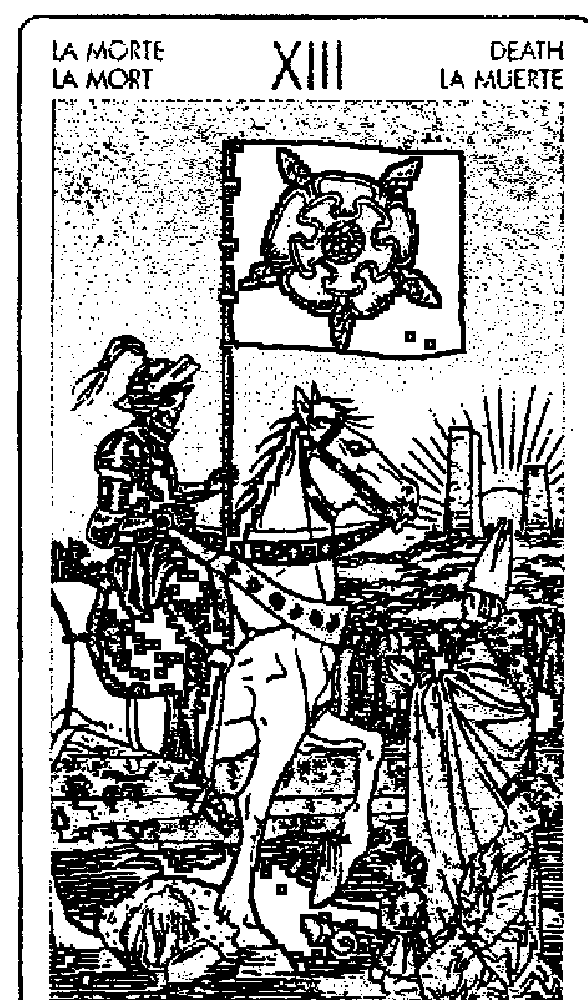

> 「一匹白馬在原野上奔馳，馬背上面目猙獰的騎士不斷向我逼近。他平靜無波的眼神反映我的走投無路。我腦中迅速閃過幾個可能的選項：我可以逃跑、裝死，也可以閃避……最後，我決定反擊！」

—— 死神牌的寫作範例

## 靈光乍現

以下是利用塔羅牌讓文字自動流入空白頁的方法：

- 完整描述。盡可能用最多的細節來描述一張牌。從牌頂描述到牌底，接著從背景描述到前景。留意這張牌中最醒目的顏色、氣氛和情緒，敘述風景、人物和動作——也許一個完整的故事就在你眼前逐漸成形。
- 象徵語言。挑選一張牌，列出你所能想到的每個象徵，然後寫下它們對你、故事人物或故事本身的意義。如果你不確定這些圖像代表的意義，可以參考書末的「塔羅術語與象徵小辭典」。
- 縮放鏡頭。聚焦在牌面上的某個細節，將它放大加以描述，然後再縮小，讓這段描述融入故事的架構中。
- 混合搭配。擷取兩到三張牌中人物的特性來參差組合，創造出立體的人物性格。
- 限時寫作。這是寫作最厲害招數之一：將計時器設定五或十分鐘，然後開始動筆。寫什麼並不重要，唯一的目標就是不停的書寫，直到時間結束。「限時寫作」迫使你在寫作時不會過度分析，或者懷疑自己的寫作功力，同時有助於解放溝通技巧，為往後的作品挹注行動力。對了，限時寫作的練習，只要時間一到就必須停筆，但是如果你只是借這個方法破除寫作障礙，那麼想寫多久都沒關係。你不妨這麼開始：「這張牌令我想起……」「這個圖案讓我覺得……」「這張牌給我的感覺是……」「這張牌讓我想要……」
- 快照。用約莫一頁的篇幅來說明或描述一張牌中正在發生的事，發揮想像力為它增添戲劇化的成分。
- 迷你小說。以單張塔羅牌為藍本，寫一個極短篇，字數約莫二百五十到五百個字。設法在故事中收納傳統故事的各種要素，包括序幕、預示、激動力、漸升行動、危機、高潮、漸降行動、解決、收場和結局。
- 另類觀點。從牌中人物的觀點（或動植物的觀點）來寫一則故事或一首詩，再從其他人事物（甚至無生命物）的觀點，重寫相同的材料。
- 角色翻轉。描寫一張正位的牌，然後逆轉劇情，從相反的方向描寫。
- 性格側寫。在公共場合觀察陌生人，將他們與合乎其性格側寫的塔羅牌互相配對。或者，反過來從牌中聯想在你生活周遭擁有類似性格的人，最後記錄觀察的結果。
- 詞性。抽幾張牌來代表某個名詞、形容詞和動詞，寫一則將這三個詞彙都包含在內的故事。
- 關聯。抽出三張、五張或七張牌隨機擺放，說明這些牌之間的關聯，將它們交編在故事中，使排列變得有意義。
- 七十八句。逐一翻看每一張牌。每翻開一張牌，就寫出故事中的一個句子。
- 塔羅公寓。疊放若干張牌，想像它們住在同一棟公寓，然後描寫住在每一層樓的塔羅人物，說明他們的身分、他們如何佈置房間，以及如何與鄰居相處。
- 換房間。在一張牌中挑出某個人物，將他丟入另一張牌中，取代原本的住戶。或者挑選任意牌中的人物，將他安置在高中舞會、汽車經銷店或雜貨店……等不同地點，或將他送進藥局、健身俱樂部、飯店酒吧或計程車內……用你最喜歡的地點做實驗。
- 倒敘。抽一張牌，描寫某個人物還是小孩子的時候。
- 未來式。抽一張牌，描寫某個人物年老時的景況。
- 說故事的人。從一張牌中挑選一個人物來敘述故事。
- 關鍵字。大多數塔羅牌都印有標題，有些還包含關鍵字。牌面出現的任何文字都能釋放你的想像力。依據這些標題即興創作一個故事。不必拘泥於字面上的意義，例如當你看見「停滯」（Stagnation）時，正是該將這個人物送進「雄鹿國」（Stag Nation）酒吧的時候。你可以替每張牌構思關鍵字，藉此尋求靈感。
- 名稱。將牌名當作一個故事、一個篇章或一首詩作的標題。
- 小手冊。每副塔羅牌都會附上通稱為「LWB」（Little White Book）的小手冊來說明牌義。閉上眼睛翻開手冊，將手指放在隨機選中的頁面上，以手指點中的詞句作為一個短篇故事的開場白。
- 頭條新聞。從每天的新聞挑選真實的故事，用塔羅牌製作圖解，再擺上額外的牌，將這個故事發展成一部小說。你可以試著用「凱爾特十字陣」描述故事的過去、現在和未來的發展。
- 記憶力遊戲。抽一張牌，想像它是你童年記憶的某個片段，然後加油添醋各種細節，讓它成為一個完整的故事。
- 伊索寓言。將牌中的動物擬人化，寫一則寓言。
- 第六感。描述一系列超自然人物，每一個都要比先前的更怪異，描述時充分運用五感給你的刺激。

## 分組創作

集眾人之力時，最能發揮塔羅寫作的神奇魅力，如果能和好朋友一起用塔羅牌玩創作，書中介紹的每一個點子都會有截然不同的效果。以下是專為寫作群組設計的遊戲。

- 利與弊。發展兩個人物之間的辯論，用來支持或反對某個想法。
- 觀點。從不同人物的觀點描述相同的場景。
- 登記報到。集合所有夥伴，每個人挑一張牌描述自己近來的作品。每個人可以在整副塔羅牌中挑一張最有感覺的牌，或隨機抽牌。這個實驗挑戰我們對象徵的覺察力和說故事的技巧。
- 專長才能。為自己抽一張牌。每個人互相解說這張牌如何呼應當事者的專長和才能，其他人可以不時加入評論。
- 寫作提示。擷取本書「寫作提示」單元的材料，隨機分配給每個成員來演練。
- 指定練習。每人抽一張牌，用這張牌指派寫作任務給另一個人。這麼一來，一張牌能讓兩個人去思考如何應用牌面的元素。例如某人抽到「聖杯侍從」這張牌，他也許可以要求他的搭檔描寫從杯中跳出的魚。
- 三十秒接龍。準備一個計時器，洗牌後，每個人抽一張牌。從第一個人開始依據手中的牌說故事，三十秒後，由另一個人接續故事——即使句子只說到一半，也必須換人接續下去。想辦法將自己的牌融入故事線，持續玩接力，直到每個人都輪過兩三次。
- 角色分配。挑一部大家都看過的電影，從塔羅人物中重新選角。討論能夠代表電影中背景、情節、關鍵場景和重要地點的塔羅牌。
- 小報記者。以5W1H（何人、何事、何時、何地、為什麼，以及如何發生）的新聞報導模式，鋪陳一個線性故事。
- 團隊創作。每人各執一張牌，共同創作一個故事。先分配好故事中所需的元素，如主角、反主角、背景和故事線等。共同創作時，可以抽額外的牌來添加細節，包括對外觀的描述、性格怪癖、次要人物、出乎意料的危機和次情節。用一張代表解套的牌來收尾。
- 真人版十字陣。如果參與遊戲的成員多達十一人，那就來玩個『真人版十字陣』遊戲。抽一張牌作為故事的基礎，然後發給十一位成員每人一張牌。成員要站在凱爾特十字陣的特定位置，扮演手中塔羅牌的角色和人物。每位參與者應就其性格及在牌陣中的位置來提供自己的故事。其他人可以要求進一步描述，或挑選更多參與者來擔任『釐清牌』。
- 命運交織的城堡。作家卡爾維諾用塔羅牌寫出《命運交織的城堡》。故事中的旅人進入一座被施了魔法的城堡，並且被剝奪說話的能力，所以只能藉著在桌上擺放塔羅牌，來分享彼此的生平故事。這個遊戲就以卡爾維諾故事中的牌陣為基礎：
  - 第一位玩家洗牌後，放上一張代表故事主題的牌，然後排出兩排的『故事牌』，每排八張。
  - 第二位玩家也放一張新牌來代表故事的主題，然後加上兩排牌來展演故事的內容。
  - 你可以從上往下、從前往後或其他方向（甚至斜向）解讀，盡可能將這些牌編織到故事中。
  - 這個遊戲玩起來就像縱橫字謎。玩家可以根據桌上已經出現的牌來說故事，或建立全新的牌列。最終，每個玩家都會運用到兩行各八張的塔羅牌。
  - 如果玩家眾多就不必用掉這麼多張牌。塔羅寫作沒有硬性規定，你可以改變遊戲規則來符合需求。

## 創作需求

建議。群組遊戲結束後，回到真實的世界前，每個人記得抽一張「建議牌」，作為日後創作的參考。

## 「命運交織的城堡」牌陣

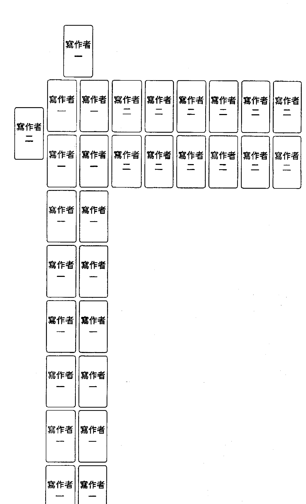

## 詩意的靈光

塔羅牌也能激發寫詩的靈感，或為你的詩作增加深度。牌面的象徵、暗喻或主題都可以成為靈感枯竭時的神來一筆，在創作敘事詩、散體詩、N行詩，甚至是胡言亂語的打油詩，都可以嘗試以下技巧。

- 單身貴族。以個別的象徵、圖案或概念作為一首詩的主題。
- 身體才懂。表達出某張牌所引發的身體感知或情感經驗。
- 再唸一次。複述一張牌的象徵或牌名，作為一首詩中重複出現的句子。
- 混搭暗喻。將各種暗喻排列組合，以詩的方式表現出來。
- 抽象藝術。用牌中的具體意象來描述抽象的概念。
- 未曾遺忘。寫一首「呼喚詩」（apostrophe）——呼喚那些已然從你生命中逝去的人事物——也許它們還留在塔羅牌中。
- 愈短愈好。以一張牌為基礎主題，創作分行、分句的短詩。
- 二十二行詩。寫一首描述所有大阿爾卡納牌的二十二行詩。
- 神秘約會。寫一首與某張牌有關的詩，但是請描述得盡量模糊抽象，讓讀者費心猜想其中的意義。
- 描寫你所認識的某個人，抽一張牌來代表他，然後以牌中的意象為基礎，寫一首關於他的詩。
- 「寫你認識的人」。這句作家常用格言的意思是，我們應該寫自己知道、熟悉的事。所以，
- 詞性。用四張牌寫出一首詩：第一張代表主詞，第二張是描述主詞的形容詞，第三張代表動詞，而第四張是主詞所在的地點。
- 微不足道。在某張牌中找出你認為最不重要的一個象徵，用詩作加以描述它的意涵。

## 10 塔羅寫作教練

許多人會求助塔羅牌來洞悉人生的道理，或尋求正確的指引，所以當作家將塔羅牌作為靈感的泉源，的確是理所當然的事。

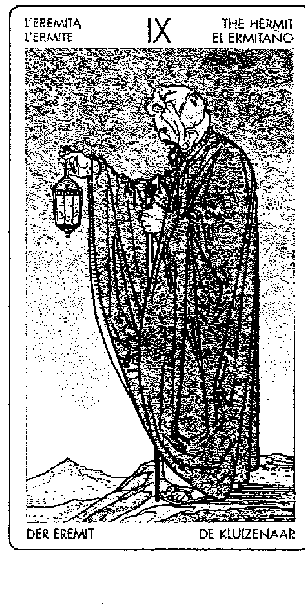

+   ＊ ＊ ＊ ＊ ＊

> > 想當年，我既年輕又愚蠢，總以為自己無所不知。不管遇到誰都要和他爭辯到底——特別是我的老師們。他們就像可憎的老山羊一樣妨礙我的發展，咩咩地鬼叫個不停。隨著年紀漸長，事情有了變化……如今我也變成一頭老山羊。現在的我可不願意擋住任何人的路，只想指點他們一條捷徑。
> > ——隱士牌的寫作範例

## 寫作教練

有人稱塔羅牌為「窮人的精神諮商師」，同樣地，作家也可以在編輯、修訂故事的過程中諮詢塔羅牌，尋求啟發和建議。當你完成一個故事後，抽牌回答以下問題：

- 你的故事和其他人的故事有什麼關聯？
- 你是否在重述一個古老的神話或傳說？
- 什麼樣的故事元素應該被拋棄？
- 哪些原始的想法可以重新被發揮？
- 你應刪除哪些故事段落？
- 你應擴充哪些段落或篇幅？
- 你是否忽略了重要的情節點？
- 你可以增添哪些細節？
- 今日的寫作目標？
- 哪裡可以獲得特別的觀點、靈感或訊息？
- 這個故事有別的陳述方式嗎？
- 有什麼東西被低估，或是被過度強調？
- 寫作時如何讓自己更自在？
- 如何增進寫作生產力？

## 塔羅顧問團

將大阿爾卡納牌與其他的牌分開。按照 0 到 21 的順序擺放——第一張是「愚者」，最後一張是「世界」。用最快的速度將這些牌掃視一遍，從每張牌的訊息中捕捉一項建議就好。不要想得太用力，也不要在任何牌上停留太久。寫下此刻心中浮現的第一件事——即使它毫無道理。此外，十六張宮廷牌也可以充當你的寫作諮詢小組。

## 塔羅助理

塔羅牌能幫助你在例行寫作工作時保持最佳的狀態，給你友善的提醒。例如：今天該做什麼？該打電話或寄電子郵件給誰？如何聯絡到那個關鍵窗口？該討論些什麼？該保留什麼？該拜訪誰？該記住誰？是否忘了什麼？

## 提案

試著用塔羅牌解讀以下問題：分析出版計劃、與出版商接洽的情況、掌握出版商有興趣的題材、作品被接受的可能性、得到回應時的感想。

## 推銷

利用塔羅牌製作一個長度約三十秒的故事概要，來吸引讀者和出版商，將它寫成像電視節目表上常出現的那種劇情大綱。

## 批評

如果你是個創作者，那麼你多少見識過存在你內心深處的批評家——那個一直發出噓聲的小惡魔。每當你埋首寫作，他就在背後張望。他發出惱人的聲音阻止你創作、改變你想寫的內容，甚至讓你懷疑自己的才能……塔羅牌會幫你避開這個內心批評家，甚至打敗他。

選一張牌來代表你的「內心批評家」，他可能看起來像「惡魔」？奸詐的「寶劍五」？或是陰沉的「五角星四」？或者你也可以隨機抽牌。別忘了考慮以下可能：萬一是賜與祝福的「女皇」呢？她是否隱藏了黑暗的一面？她會怎麼說你？

現在，回信給你的「內心批評家」，回應他的批評，說明他哪裡錯了，或他真的說對了某些事——畢竟批評家只想要別人贊同他們的意見。你也可以和他對話，質疑、詢問或挑戰他。如果願意，不妨在塔羅牌裡找個幫腔：選一張塔羅牌來代表你的擁護者，讓這個人物與你的內心批評者一決高下。好比選擇「寶劍國王」作為擁護者，將兩張牌並列，看他們如何爭辯。

最後，你得全力以赴，挑一張牌來代表你的「內心作家」，努力達成目標。另外挑一張牌來代表直言不諱的批評聲音，以及為你說話的粉絲和支持者。你甚至可以找張牌來代表編輯，提供你專業的修潤建議。扮演每個角色的塔羅牌可以常常更換，留意他們的互動，並記錄所有的互動結果。

上架。現在開始策劃你的作品在書店上架時的安排。抽幾張牌思考理想的封面設計，利用發展故事的原理，寫出讓人印象深刻的動人文案。也許你還可以要求塔羅牌人物為你的作品推薦和背書。

## 自己作主

或許你可以將故事本身視為一個活生生的人，有自己的欲望、需求和目標。抽幾張牌解讀下列問題：

- 你的人物對於他們的創造者（你）有何看法？
- 你的人物希望他們的故事如何結束？
- 你的人物最害怕哪一種結局？
- 你的人物為何想要由「你」來說他們的故事？
- 為什麼這個故事值得寫？
- 故事中的人物帶給你什麼樣的建議？

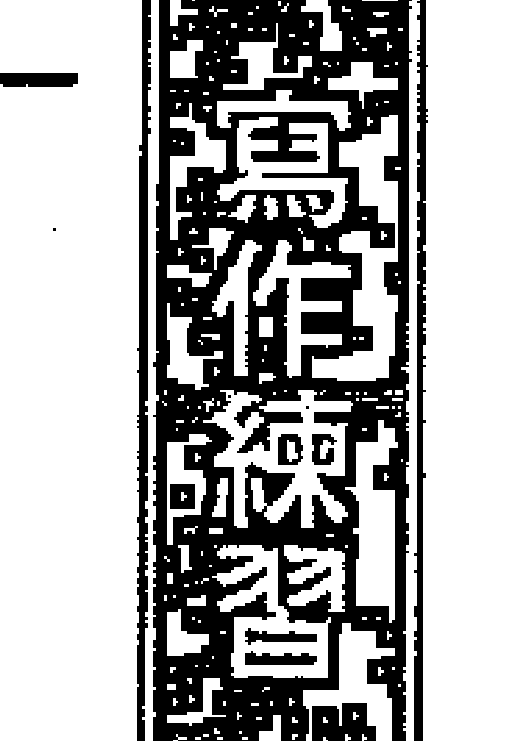

人的一生中往往花上許多時間在思索與上帝有關的事，希望瞭解這個所謂的「創造者」。眾人試著想像一個男神或女神的形貌，揣測這個偉大的高層力量在創造天地時的想法。創作故事的過程讓你順理成章成為宇宙的上帝，現在，讓塔羅牌告訴你，你筆下的人物是如何看待你的創作。或許你會發現，你的描述存在著某些漏洞、你的邏輯讓人難以信服，或者你的思路似乎不夠清晰。

問題（向聖杯七提問）：你對我的作品有何看法？

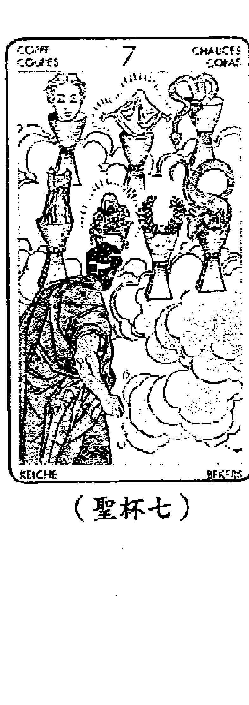

回答：我認為你的作品中藏有大量的精巧設計，裡面確實有些好東西，不過要怎麼組織它們似乎是個問題。你有想過合併某些章節嗎？我認為你可以將它們篩減成七大要點。

+   ****

本書的第二單元逐一帶領你認識每張塔羅牌，我期待它們將為你的創作開啟無限可能。

## 第三單元 給作家的塔羅指南

本單元帶你遊歷以七十八張塔羅牌所組成的『愚者之旅』。
逐一說明每張牌的人物、場景、情節和象徵，以及神話傳說和古星故事。
說明每一張牌義與文學創作的關聯，提供寫作者豐富的題材和靈感。

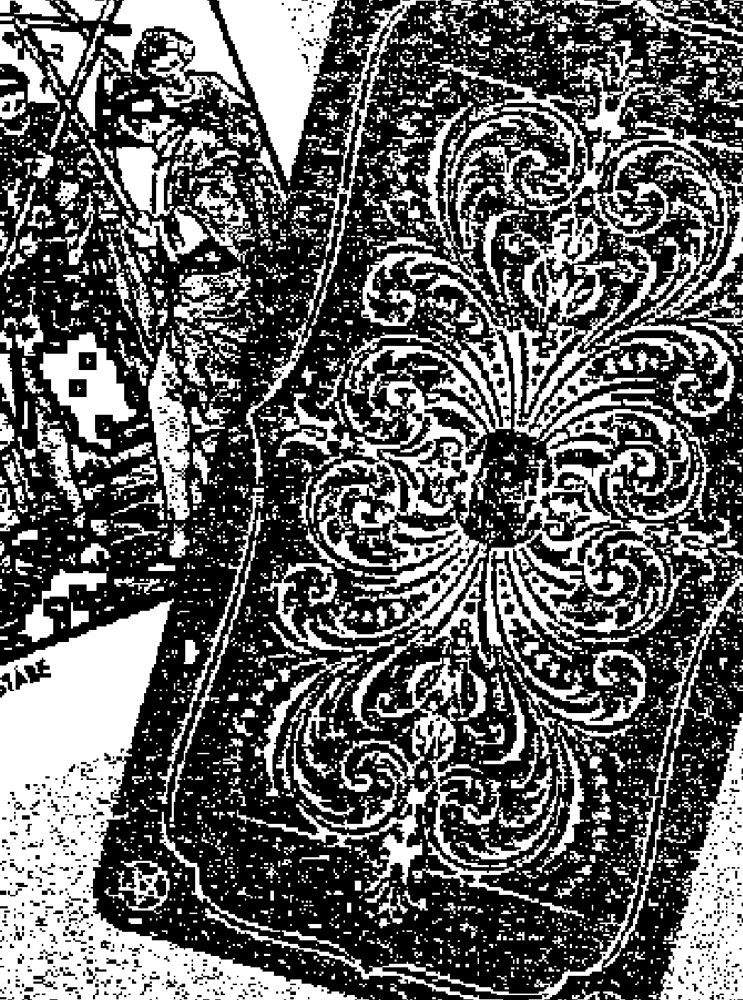

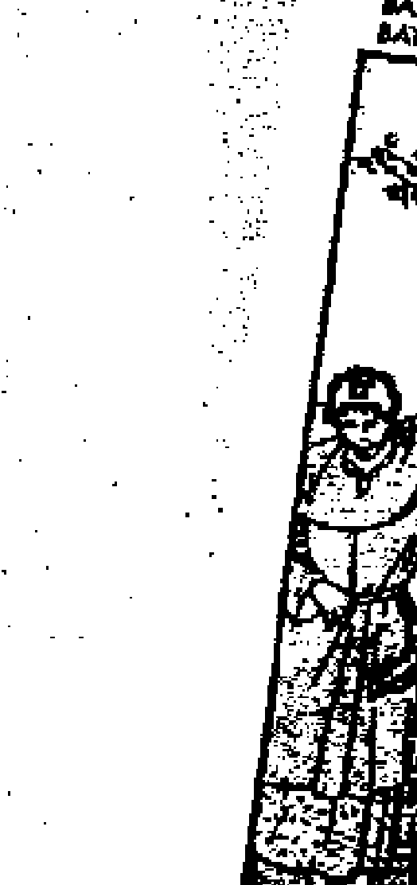

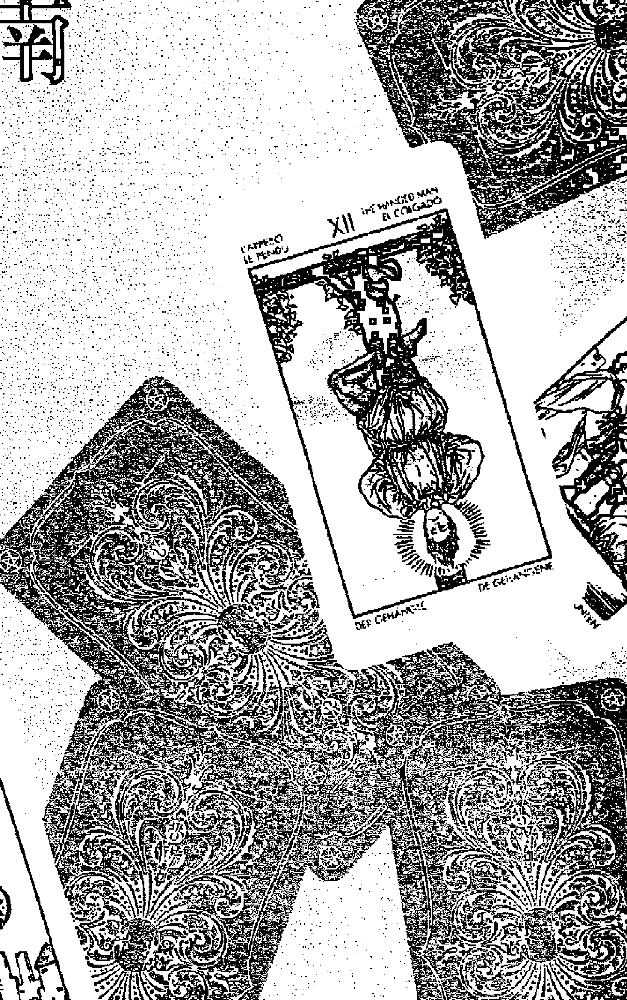

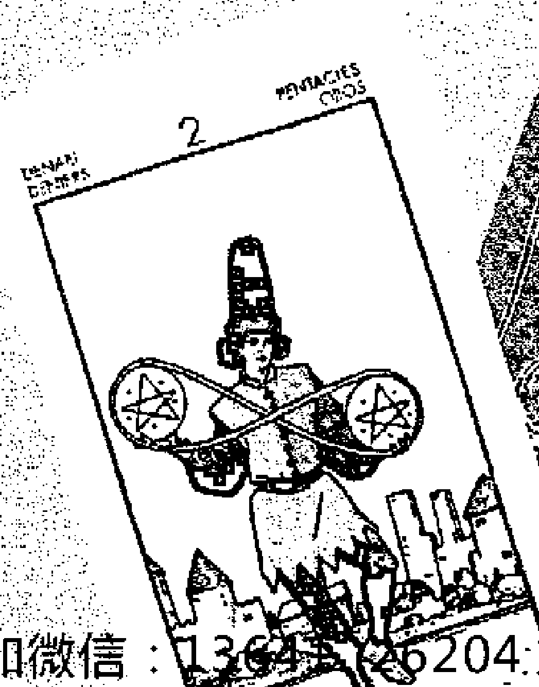

### 重要象徵

- 縱身一躍。愚者象徵從精神的狀態降臨到塵世，寓居於肉體中的靈魂。塔羅牌的原始設計者

愚者是塔羅劇本裡第一位登場的演員，他代表每一個能幸運地在塔羅世界中追尋自我的「一凡夫俗子」。愚者是踏上生命旅程的快樂漫遊者，他深知「過程比目的地更有意義」的道理。有說法認為愚者是大阿爾卡納的第一張牌，也是最後一張牌，如同希臘字母 α 與 ω，代表開始與結束。無論經歷過多少次旅程，他依舊保有一顆天真純潔的心，不會因旅途中的創傷或失望，而變得世故或留下陰影；他從不在意哪裡才是最後的終點。

愚者就這麼立於懸崖邊——就像即將迎接一場災難或毀滅。然而，別忘了愚者體現「風」的元素，當他跨出岩壁後並不會下墜，反而會飄浮起來，乘著想像力的翅膀在空中翱翔。當然，他總是可能幹些傻事，例如徒勞無功的白忙一場，或奮勇投身「不可能的任務」。為了安全起見，往下跳前應該三思而後行。愚者在故事中代表探索者、冒險家、英雄或旅人等角色。

偉特認為愚者是一個「尋求經驗的靈魂」。這奮勇的縱身一躍，代表將理論化為實際行動，勇往直前迎向新生命。
- 懸崖。眼前的無底深淵和杳無人跡的空白地帶，截然分隔出兩個不同的世界。
- 守衛犬。小白狗是忠心耿耿的夥伴、守護者和嚮導，可能代表人的本能、原始直覺、殷殷勸誡的良心，或是約束每個人的社會道德觀與公眾期待。
- 羽毛帽。帽子上的羽毛象徵榮譽和成就。
- 生命領域。束腰外衣上的圓圈代表「卡巴拉生命樹」的十個領域。
- 腰帶。由古代占星學七大行星的圖案構成，也對應一週的七天。
- 紅玫瑰。愚者左手的紅玫瑰象徵熱情。
- 手杖。愚者右手的手杖代表保持平衡。
- 業。綁在手杖上的包袱或許裝有回憶、人生功課或是前世的紀念品——也就是「業」。有些人認為包袱中滿載生命的氣息，因此愚者能使周遭的事物充滿生氣。也有說法認為包袱內裝著棍棒、杯、劍和五角星，這些是愚者在旅途中會派上用場的好工具。
- 「上帝之眼」。太陽象徵來自高層的光明和能量，以及宇宙意識的導引。
- 無限可能。積雪的山巒代表必須克服的障礙、等待攀登的挑戰，以及對未來成就的展望。
- 數字。愚者是「零號牌」。零是往上累加或往下變成負數的起點，但是它並非自然數，所以一般來說不會用於數學運算；簡言之——零沒有意義，它暗示某種「不存在」或平行宇宙之間的模糊疆界。數字零孤單地落在一般數列之外，不受現有秩序的規範，因此得以在時空之外流動、越界，展現諸多可能，不像被迫固定在數列中的其他數字。這種概念與愚者完全吻

## 147 給作家的塔羅指南

### 神話傳說與占星聯想

- 關鍵詞
正位——新起點、純真、自由、古怪行徑、冒險、理想主義、熱忱、勇氣、進取心、發明
逆位——愚行、狂熱、粗心大意、疏忽、漫無目標、輕浮、失焦、動機不明

在國王與城堡當道的年代，愚者是國王的反面典型。國王所說的每句話都成為金科玉律，而愚者的一言一行則全屬笑話。愚者沒有地位，得不到尊重，在上流社會毫無容身之處，常被當作笨蛋、乞丐，以及被嘲弄虐待的對象。然而，有時他們是唯一能對當權者說真話的人，他們懂得將智慧包裝在玩笑中，當顧問大臣不敢暢所欲言時，愚者反能直言諫上。

寓言和神話中的各種人物身上都有愚者的影子，包括潘奇（出自英國「潘奇與茱蒂」木偶劇）、狐狸雷諾（Renaud the Fox，中古歐洲的大騙子）、土狼和渡鴉（Coyote and Raven，美洲印第安騙子）、春天的線人（Green Man of spring，與植物有關的神），以及帕西發爾（Parsifal或Percival，亞瑟王麾下圓桌武士之一）。愚者就像宮廷弄臣、狂歡節出現的小丑、撲克牌中的鬼牌／丑角，或是踏上英雄之旅的神話人物。

愚者是充滿原創性的思想家和叛逆者，與象徵創新和革命的天王星息息相關。天王星對應黃道第十一宮，涉及社會事業與社群等公眾的議題。天王星也主宰代表前瞻性思考的寶瓶座。

### 文學原型與寫作實踐

愚者體現的文學原型包括聖童、英雄、天真孩童、弄臣、離經叛道者、榮格所謂的「永恆少年」（puer aeternus）、求道者、兒子、漫遊者和聰明的傻子。
身為寫作者的你，就像一個徹頭徹尾的愚者，隨時願意縱身投入空白未知的紙頁，渴望探索心靈和想像的世界。創作的行為總是散發叛逆的天王星能量，所以你很少滿足於現狀。事實上，你比其他人看得更深、想得更遠，因而常常被認為是個不切實際的怪咖。別擔心，這世界終會循著你的筆跡，趕上你的腳步。

### 寫作提示

你可以寫關於……

#### 左列
- 錢包或背包裡的物品
- 會說話的狗
- 縱身一躍
- 失寵
- 懼高症

#### 右列
- 懸崖下的世界
- 原創的發明
- 如願以償的叛逆者
- 大權在握的笨蛋
- 未出世嬰兒的靈魂

作家與魔術師牌有特殊的因緣，因為魔術師的原型是諸神使者墨丘利。墨丘利是溝通大師，代表所有從事說故事、傳達與演說等語言技藝的人。魔術師經常口若懸河，舌頭從不打結，擺弄道具也不會笨手笨腳，否則魔術就顯得不靈光了。他流暢的動作是經過縝密的排練，為了完美演出，得花費無數的時間練習——當然旁人並不知情。魔術師喜歡誤導觀眾，他的袖子裡總是藏著幾套把戲。

這張牌象徵意志力和溝通，在故事中常體現為表演主持人、表演者、傳信人或銷售員等角色。某些版本的魔術師被稱作「雜耍藝人」（Juggler），呼應長久以來街頭賣藝的傳統。

### 重要象徵

- 玫瑰與百合花。魔術師置身種滿玫瑰與百合的花園，就如舊約聖經《雅歌》所言：「我是沙崙的玫瑰，谷中的百合。」紅玫瑰象徵熱情，白百合花象徵純潔。
- 無限大。魔術師頭頂的雙紐線（lemniscate）象徵「無限」的概念。
- 服裝。白色束衣代表純潔天真的靈魂，紅袍則象徵人類肉體的熱情本質。
- 蛇皮腰帶。有些版本的塔羅牌會將魔術師的腰帶，描繪成一隻吞食自己尾巴的銜尾蛇（Ouroboros），象徵「永恆」。
- 魔杖。魔術師手持兩頭尖的棍棒來引導並淨化能量。棍棒作為身體的延伸，受個人意志驅使，所以比例上應該與持有者相稱。魔術師的棍棒長度與手腕到手肘，或手肘到指尖的距離等長。
- 身體語言。右手的魔杖可以聚集宇宙的能量，當能量流遍周身，左手便將能量導回世界。也就是說，魔術師是運用意志力在重塑整個物質世界。他的手勢闡述「天上如是，人間亦然」的哲理，說明有形物質的存在體現著更高層次的意識。
- 魔術師的法寶。桌上的道具是權杖、聖杯、寶劍和五角星，代表精神、情感、智能和物質四種領域，以及火、水、風、土四元素。
- 數字的重要意義。魔術師是大阿爾卡納第一張牌，「數字一」象徵領導、一致和唯一，或是思想、信仰和觀念的原始理論——尚未受到不同觀點的挑戰。也代表萬物起源、潛力和可能性。阿拉伯數字一和羅馬數字一的符號強調出生育力的本質——它們的形狀都像陽具。

### 關鍵詞

- 正位——技巧、外交、自信、才能、意志、權力、熟練、狡猾、表演能力
- 逆位——濫用天賦才能、詭計、耍花招

### 神話傳說與占星聯想

魔術師牌與羅馬神話中專司速度和溝通的墨丘利有關。墨丘利替諸神傳遞訊息、帶給凡人夢境，也負責護送亡靈進入陰間。他辯才無礙，是演說家、商人、騙子和銷售員的守護神，有時也被比作大法師梅林（Merlin）、歐洲嘉年華的江湖郎中和美洲印第安人的惡作劇精靈。魔術師在舞台上串場的台詞幾乎和他的戲法一樣有看頭，就像流動商販用來招徠顧客的話術那樣地具有娛樂效果；其實就連業務員的推銷電話，也常令人捧腹大笑，究其源由，他們都是舌燦蓮花的墨丘利。

水星是太陽系中距離太陽最近的行星，它繞行太陽的軌道最小，運行一周只需八十八天。水星的快速敏捷使它成為掌管短程旅行、日常通勤和鄰近地區差事的行星——「腳程快」同樣是墨丘利能擔任諸神使者的原因。水星主宰與「戀人牌」有關的雙子座，以及與「隱士牌」有關的處女座。

### 文學原型與寫作實踐

魔術師的文學原型包括煉金術士、神奇幫手、魔法師、神秘主義者、通靈者、陰間引渡者、巫師、騙徒和男巫。
- 巫師、騙徒和男巫。

在絕大多數人都是文盲的時代，有能力在紙上寫下自己的想法和見解，將無形思想轉變為有形文字，就像擁有魔力一樣偉大，這種甚至能改變現實的本領非常驚人。即使到了現代，作家還是擅長透過文字力量來吸引大眾的目光，運用才華和巧思引發讀者的讚嘆。

寫作時如果出現魔術師，表示你該利用真正的「魔杖」——一隻順手好寫的筆，將魔法導引到你的寫作中，讓文字「透過你」完全湧現。

### 寫作提示

- 舞台或街頭的魔術師
- 活在舞台上的表演者
- 一場魔術秀意外成真
- 魔術師助手、徒弟、妻子或家人
- 巫師或術士
- 觀看魔術表演的觀眾
- 出差的業務員
- 推銷萬靈丹的江湖郎中
- 神話中的惡作劇精靈

女祭師是宇宙秘密的守護者，嚴密把關今生與來世的入口。如果她願意，她會拉開帷幕向你透露所有關於生命的秘密，但首先，你得證明有資格見識她的知識與智慧。多數塔羅師都高度認同女祭師這張牌，她擁有天生的直覺力，加上細心和敏銳的觀察力，能一眼看過去、現在和未來，引領人們進入靈性啟蒙的世界。女祭師是一張象徵直覺與理解力的牌，每個故事中，睿智的女子、通靈者、諮商師、治療師、心理學家或精神醫師等都有女祭司的影子。有些版本的女祭師被稱作「女教皇」（Papess）。

### 重要象徵

- 模棱兩可。蒙娜麗莎式的微笑讓人著迷，卻也令人費解。她此刻是高興還是惱怒？她會開口說話或是保持緘默？女祭司的形象似乎就像弦月般不斷變幻。
- 智慧之柱。兩根圓柱是「卡巴拉生命樹」的雙柱，一黑一白象徵慈悲與嚴厲、光明與黑暗、精神與物質、毀滅與創造等對立的概念。柱子上刻有字母B與J，代表舊約聖經中的人物——大衛王的曾祖父波阿斯（Boaz）與所羅門王神殿裡的大祭司約阿希姆（Joachim）。
- 帷幕。懸掛於所羅門王神殿的帷幕，分隔此生與來世兩個世界。
- 棕榈和石榴。帷幕上布滿棕榈和石榴，象徵男性和女性生殖力；石榴正是按照卡巴拉生命樹（「創造」的模型）的序列擺放。
- 月相。冠冕象徵月亮盈虧，女祭師腳邊的弦月能反射光線，將陽光投射到源頭處，因此與直覺或通靈能力有關。
- 生命階段。月亮是陰性能量，二十八天的盈虧週期代表萬物不斷循環變化的本質。月相變化正如女性生命的幾個階段：少女（日漸豐盈）——母親（成熟盛開）——老嫗（日漸凋零卻散發智慧之光）。
- 週期。月亮是懷孕和分娩的象徵，就像女性歷經懷孕、分娩和產後所呈現的身形變化。月亮最初迸放一道細縫似的狹光，接著愈顯渾圓，最後恢復成原先的模樣——女性即使沒有懷孕，也會經歷每個月的生理週期。
- 十字。女祭師胸前的十字記號是一個比例完美的「太陽十字」，象徵平衡和均等。
- 秘典。畫面上的經卷是《希伯來律法書》（Torah），從牌面上我們只看得清一些字母，其餘部分掩蓋在斗篷的褶襞裡，就像被嚴加保守的秘密。"tora"是"rota"的迴文，意為「輪子」。這四個字母也可以調換位置，拼寫出不同的意思，例如"tota"意指「全部」，以及"tarot"，意為「塔羅」。
- 數字。女祭師是大阿爾卡納的第二張牌。「數字二」代表二元性、成雙成對的夥伴關係、吸引和排斥，以及對話與辯證——主題包括天國與塵世、男與女、主動與被動、意識與無意識。

## 文档标题

这是一个示例段落，用于演示文档结构提取。
- 项目一
- 项目二
- 项目三

另一个段落，包含更多内容。

在早期的塔羅牌中，女祭師被描繪成朱諾，身邊有一隻孔雀，表明所繪者確為羅馬神話中的女神，有避諱的作用，以免觸怒天主教會。有些版本中，她是古埃及生育女神伊希斯（Isis）的女祭師。女祭司牌也與古希臘的護火貞女、西比爾（Sibyl）神諭及月亮女神有關。

女祭師這張牌理所當然連接到月亮這個「夜的主宰」、夢境的園丁，以及潛意識心靈的守護者，統治無意識心靈、直覺和想像的夢幻世界。月亮主宰黃道第四宮——涉及母親和滋養的議題，以及代表家和家庭的巨蟹座。

### 文學原型與寫作實踐

女祭師體現的文學原型包括守護者、靈媒、神秘主義者、詩人、作家或抄寫員、通靈者、薩滿師、遠見卓識者，以及女巫。
女祭師翻閱的經卷是由文字寫成的律法書。文字這個偉大的工具能展現形塑真實的神聖力量，讓人類能探索邏輯、哲學和科學等知識，進而建立文明。事實上，女祭師就是一個作家，在神秘的生命之書中記錄各種智慧和觀察，謹慎地字斟句酌，體現「智女箴言」的教示——「學習不倦、無所畏懼、堅定意志、守口如瓶。」
保持靜默能幫助你的寫作順利進展。寫作過程中出現女祭司，可能代表你的寫作計畫和想法就像石榴籽一樣，你得等它們成熟才能讓它們曝光，然後種植到肥沃的土壤中生根茁壯。切記，不要太早將未成熟的作品公開示人，以免遭受不必要的批評。

## 作家提示

你可以寫關於……

- 藏身於幕後的某件事
- 或 某個人
- 吃石榴的感覺
- 與世隔絕的修女、護火貞女、女巫、廟妓
- 宇宙的阿克夏紀錄
- 館員
- 秘密行事的智女
- 占卜師
- 夢日記

> 1 譯注：Juno，羅馬神話中朱彼特之妻，專司婚姻和生育的女神。
> 2 譯注：在神智學領域的研究中，阿克夏紀錄（Akashic Records）是以「非物質形式」編碼記錄下來的思想、事件和情感等訊息。

## 3 女皇

女皇是母親的原型，她永遠處於懷孕狀態，體現了旺盛的生育力和成長力。容光煥發的女皇總是盡可能滿足所有的物質需求，熱烈迎接新生命到來。不過，有時她的關愛也會扼殺她自己的創生物，如同所有母親都危險的一面，「黑暗母親」是破壞者的化身，拒絕讓子女降生於世，或者在子女出生後奪走他們的生命。一般而言，女皇牌代表創造、滋養和生長。

### 重要象徵

- 喜樂之園。女皇掌管繁花盛開的塵世樂園，清澈的溪流讓草木欣欣向榮、結實累累。這裡是至善之地，「自然之母」細心的呵護子民，直到他們成長茁壯。
- 金星。心形盾牌刻著金星符號，女皇端坐在鋪設軟墊的王座，享受金星帶來的愛、美與舒適感。
- 智慧之冠。鑲有珠寶的皇冠代表才智和權威。
- 管理者。女皇握著鑲有球狀物的權杖，掌管人間王國。權杖有陰莖的意涵，代表她能與男性伴侶合作，甚至能駕馭他。
- 美女偶像。年輕貌美的女皇擁有一頭金髮，就像瑪麗蓮夢露或黛安娜公主那般動人。這些已逝的偶像永遠不曾流露病容或歲月的痕跡，是青春活力的永恆代表。
- 水流。背景的瀑布和藍色溪流象徵生機盎然、感情幸福。
- 常青樹。柏樹代表永生，而結了果實的樹則代表旺盛的生育力。
- 母性。女皇呼應愛、婚姻和母性的概念，也指涉母親與子女的關係。
- 合作。女皇嫁給「皇帝」，兩人的結合象徵婚姻、夥伴和共同願景。
- 數字。女皇是大阿爾卡納的第三張牌。「數字三」象徵創造——由兩股力量結合而產生第二個實體，例如母親與父親一起生育子女。數字三也代表身心靈或過去、現在和未來。

### 關鍵詞

- 正位——創造力、生產力、懷孕、舒適、美、幸福、藝術能力、滋養、感官享受
- 逆位——頑固、怠惰、貧瘠、混亂、無秩序、令人窒息的情感、過度保護

### 神話傳說與占星聯想

女皇通常被視為希臘神話中冥后波賽芬尼（Persephone）的母親，也就是「收穫女神」德密忒（Demeter）。傳說中，波賽芬尼有一次離開母親獨自在草地玩耍，冥王黑帝斯突然現身將她拖入陰間，強迫她當新娘。德密忒悲痛欲絕，導致她所管理的四方大地頓失生機。宙斯得知後介入協商，沒料到黑帝斯逼迫波賽芬尼吃下四棵石榴籽，讓她必須永留陰間。後來眾神商討出折衷之道，波賽芬尼每年有四個月必須待在黑帝斯身邊（一棵石榴籽代表一個月），而其餘八個月則可以回到母親身邊。因此，每年冬天當波賽芬尼離開，德密忒便陷入悲傷，寒冷的大地一片死寂，直到波賽芬尼回來，大地又恢復生機。
女皇置身美輪美奐的環境，用溫暖和熱情養兒育女，她的家居生活反映出浪漫的理想主義，就像金星一樣散發著愛與吸引力，以及一種對物質的強烈依存感。金星主宰黃道第二宮，涉及家和物質財富的議題。金星也主宰代表感官、穩定和舒適的金牛座。

### 文學原型與寫作實踐

女皇體現的文學原型包括孕婦、母親、藝術家、園丁、大地之母、創造者和皇后。
女皇是闡釋「創造力」的牌，就像每一個欣然接納靈感，願意充當創造容器，努力孕育新世界的作家。她無懼於一次次陣痛和分娩，包括因寫作計畫而衍生的繁瑣事務，也願意不計投資報酬率，屈就生產過程中原始粗糙的現實——就像創作的過程。
當女皇出現在寫作過程中，代表你正構思一個概念或想法，而好的作品需要時間醞釀。女皇鼓勵你，別懷疑，繼續堅持下去，你擁有使藝術作品成形發光的能力！

- 創造力、生育力
- 計畫中或非預期中的懷孕、分娩
- 奇蹟兒的誕生
- 德密忒和波賽芬尼
- 出生和死亡的對照
- 採訪來世
- 仿如印度教神話中的毀滅女神卡莉 (Kali) 的「黑暗母親」
- 老嫗，以及她曾是少女和母親的時光

## 大阿爾卡納

## 4 皇帝

### 重要象徵

- 立體王座。王座體現權力，畫面中用堅硬岩石雕鑿而成、堅不可摧的立體王座，更強調了巨大的權力結構和穩定性。
- 沙漠。女皇的皇宮位於蒼翠肥沃的園林，而皇帝卻在荒涼的沙漠中發號施令。背景的山巒強...

每一天，皇帝小心翼翼走進女皇的園林巡視，從妻子創造力十足的混亂中整理出一種秩序——這可不是件容易的事。威風凜凜的皇帝是極具遠見的統治者、大無畏的征服者，也是勤奮的管理者，體現了領導力的最佳典範。他的性格頑固任性、自信而強勢，用理性和意志力來統治國家——他的話就是法律。皇帝龐大的工作量遠超過多數人想像，他統治所有的王國（而非一個王國），儼然是世界的共主，因此他必須懂得授權、結盟，並嚴格測試下屬的忠誠度。
皇帝牌象徵秩序和控制。在故事中，皇帝可能體現為父親、行政官員、嚴格的人或是權威人物等角色。

### 關鍵詞

- 正位——穩定性、控制、權威、領導力、理性邏輯、野心、文明、秩序
- 逆位——暴政、權力濫用、戰爭、征服、缺乏領導力

堅如磐石的統治，而女皇的影響力則有如蜿蜒匯入沙岸的河流。
公羊頭。王座扶手和椅背雕刻著公羊頭，暗指純然牡羊座的領導風格。
皇冠。鑲有珠寶的皇冠象徵神授君權，蓄著白色鬍鬚的皇帝像極了兒童畫中描繪的上帝。
權杖。代表統治地位和權威，權杖的形狀是象徵生命的古埃及十字架。
戰甲。皇帝的紅色絲絨長袍下穿著全副盔甲，隨時準備為捍衛帝國而奮戰。
性吸引力。皇帝的男子氣概與女皇的生育力相得益彰，皇帝也是極具開創性的思想家。
數字。皇帝是大阿爾卡納的第四張牌。「數字四」象徵結構、穩定性和安全感。四個點就能構成一個穩固的形狀，如四面牆和四個角落；時空的四維度、四方位、四季、四月相等，當然還有四元素。

### 神話傳說與占星聯想

皇帝好比希臘神話中的宙斯，是奧林巴斯山的眾神之王——這些神之中有不少是宙斯的後代，在許多塔羅牌都可見到他們的蹤跡。宙斯的風流惡名昭彰，染指不計其數的女神和凡人女子。他與希拉生下戰神阿瑞斯（Ares）和青春女神希比（Hebe），誘姦泰坦族之女麗妲（Leto），使她生下太陽神阿波羅和狩獵女神阿提密絲（Artemis），再加上正義女神西彌斯的外遇，因而促成了「命運三女神」的誕生。當智慧女神雅典娜從他額頭迸出來的時候已經成年了……光憑這張牌，你就可以選派一系列完整的角色。皇帝讓人聯想到歷史上的偉大皇帝，如查理曼大帝、亞歷山大大帝、拿破崙和凱撒。
如同戰神阿瑞斯（牡羊座名稱的由來）的積極果敢，皇帝一旦接獲警報，就會迅速發號施令、採取保家衛國的行動。牡羊座是黃道第一個星座，這只「領頭羊」是天生的領袖，永遠給人威風凜凜、強勢無畏、勇敢自信的印象。牡羊座對應黃道第一宮，牽涉到自我形象、公共形象、身體外觀和第一印象的議題。牡羊座由代表能量和侵略的火星所主宰，屬於火象星座。

### 文學原型與寫作實踐

皇帝體現的文學原型包括獨裁者、父親、國王、大富翁、家長、統治者，以及遠見卓識者。
女皇的創造能量固然是激發優秀作品的前提，不過你得像皇帝一樣掌控好條理和細節，才能完全發揮創造力。自信和自律是寫作者不可或缺的要件，兩者都得充分具備，才能產生邏輯清晰、結構嚴謹的作品。
寫作時出現皇帝牌，是提醒你不妨大膽一些，明確而專注選定你的戰場和想征服的目標。你就是那個發號施令的人，趕快拿回自己的主導權，一切操之在你！

你可以写关于……

- 父亲或祖父
- 独裁者、暴君或仁君
- 缺席的父亲或单亲父亲
- 王座
- 广场
- 沙漠
- 责任的重量
- 保护色与自卫能力

## 5 教皇

教皇是精神领袖和导师，他的智慧根植于有组织宗教的正统教诲。女祭司鼓励求道者找寻直觉感知的源头，教皇则期许信徒追求传统诫律与精进之道。我们可以理解教皇的强硬态度，因为他就是靠着长期的努力，才得以精通已发展了数个世纪的宗教传统。他深知宗教是一种有效运作的系统，更愿意倾尽全力维护这个体系，使之能传诸未来的每个世代。

教皇（hierophant）这个字与僧侣集团（hierarchy）有相同的字源，后者是权威分级的组织，而教皇则是信仰上的终极权威。他能代表上帝发言，解释神的智慧，并担任此生与来世的桥梁。在故事中，教皇可能体现为合格教师、教授、精神病医师或祭司等角色。

### 重要象征

- 宝座。王座椅背的圆拱形像个入口，教皇就坐在两根圆柱（类似教堂的柱子）的前方，是坐镇第一阶的守门人。
- 权威。像教皇这样被授以圣职的神父和祭司，才能主持各种正式的圣典，如洗礼、圣餐仪式、婚礼和葬礼。教皇代表着加入某一传统的过程，借此你就能接触到一个有组织的信仰体系。在故事中，教皇可能以一个具权威的人物出现，他了解体制规则，可以为主角指引方向。
- 式、宽恕和解仪式、坚信礼、婚礼、任命式和临终圣礼。
- 赐福。教皇举起右手赐福——这个简单有力的手势代表慈悲与怜悯。
- 三位一体。教皇左手拿着三横十字架，象征过去、现在和未来，或是圣父、圣子和圣灵的三位一体。
- 钥匙。教皇前方的两把钥匙是“智慧之钥”及“天国之钥”。钥匙暗示我们可以透过研究有组织的宗教教义，来理解西方的文明基础、思想哲学，并领略古典艺术与文学之美——许多塔罗师也将塔罗牌称作“钥匙”。
- 导师。两名侍祭跪在教皇眼前。他们是剃度的僧侣，秃顶有立誓之意。左侧侍祭的袍服装饰着热情的红玫瑰，而右侧侍祭的袍服上则配戴纯洁的白百合，这两人恭敬地鞠躬，让人联想到教育的传承及价值。
- 土元素。圆柱上的雕刻图案是类似金牛座的符号。
- 数字。教皇是大阿尔卡纳的第五张牌。“数字五”象征五感、星星的五个顶点，以及英语的五个母音，或是“第五元素”——精神。

## 关键词

| 正位 | 教育、知识、神学、有组织的宗教、纪律、文化、价值观、社会规范、传统、服从、正统、祝福、慈悲、美德 |
| :--- | :--- |
| 逆位 | 教条、压抑、好批判、刻薄、奴役、批评、恐惧、内疚 |

## 神话传说与占星联想

在古希腊，地位有如教皇般崇高的大祭司，会负责带领信徒举行“伊洛西斯秘仪”（Eleusinian Mysteries），这是一种庆祝死亡与再生的神圣仪式，每年重演一次波赛芬尼被冥王黑帝斯绑架及重回人间的剧码。有些信徒相信，参与这项仪式能保证死后在伊洛西斯乐园重生。基督教兴起后，教会领袖便禁绝伊洛西斯秘仪的展演，不过这些仪式仍偷偷流传了数百年，深深影响早期基督教的教义和习俗。如今，大祭司的角色传承给每位精神导师，继续带领信徒体验古老的仪式和传统的奥秘。

教皇与金牛座有关，就像许多经常上教堂的人，典型的金牛人往往是重视忠诚，崇尚一夫一妻制和生育的传统保守份子。金牛座对应黄道第二宫，涉及家和物质财富的议题。金牛座由代表爱和恋情的金星主宰，属于土象星座。

## 文学原型与写作实践

教皇体现的文学原型包括父亲、看门人、男神、守护者、向导、报信者、大祭司、法官、神秘主义者、神职人员、统治者、求道者和教师。有些作家喜欢教皇，有些则对他敬而远之。你对教皇的看法多半取决于你对“文法警察”的感受。教皇会坚持要你放对动词的位置、用清晰逻辑的方式分析句式，彻底掌握写作规则。然而，一旦你熟悉这些基本要领后，他也会允许你打破规则，原谅你的不守文法。如果你是细心谨慎的写作者，教皇绝对能帮助你跻身品德高尚的诗人和优秀故事作家的行列。

### 写作提示

你可以写关于……

- 一大串钥匙
- 神圣的经典
- 私下体验秘密生活的神父
- 过程中发生意外的宗教仪式
- 不作为的罪行
- 祝福或诅咒
- 神圣的承诺、义务或誓言
- 宗教纪念品
- 隐藏在祭坛下的事物
- 一套礼袍

每个人都能够认出牌面上这对快乐的情侣——他们是人类的始祖亚当和夏娃。这张牌通常代表缺乏经验者的爱情与婚姻，也说明“关系”的复杂难解，特别是当两个人的世界观对立时。恋人的形象暗示吸引力与排斥力之间持续不断的妥协，同时体现冲突与和解的循环。身为写作者，你在创作中一定感受过这种困境。

恋人牌也象征抉择，毕竟亚当夏娃的故事线取决于一个重大决定，这个决定影响了他们所有的后代。一般而言，恋人牌有建立关系和互相沟通的意涵。在故事中，恋人可能代表刚订婚的情侣、已婚夫妻、亲密的手足、双胞胎或关系稳固的友谊。

### 重要象征

- 异性相吸。恋人牌象征爱、恋情和婚姻及和平、友谊与合作。这张牌阐述吸引与排斥并存的原则，甚至是各种层次的对照，例如男／女、阴／阳、黑暗／光明、正题／反题等概念。
- 裸体。亚当和夏娃坦然地赤身裸体，丝毫不觉羞愧，因为他们尚未被现实世界污染，天真而
- 塔罗天使长。拉斐尔是七位天使长之一，也是圣经中有具名的三位天使长之一。拉斐尔的名字意指“上帝已疗愈”，专司婚姻、治疗、欢乐、快乐聚会和旅行。另两位天使长是米迦勒和加百利，米迦勒是“节制牌”的天使，而加百利在“审判牌”中吹响号角。有一个没被提名的天使长乌列（Uriel），则出现在恶魔牌。
- 翅膀。拉斐尔用翅膀保护恋人不受烈日的伤害——太阳象征上帝及自觉意识所散发的灼热光芒。
- 高层意识。云层代表高层意识及天国与尘世之间的帷幕。
- 伊甸园。围墙代表安全和保护，园林象征混乱中的秩序和庇护所。
- 哲学分支。画面右侧是生命树，左侧是善恶知识树。
- 秘密。象征女性智慧和诡计的蛇盘据在知识树上，在夏娃耳边甜言蜜语，企图煽动夏娃的纯洁心智。
- 禁果。知识树上的苹果是禁果，代表随着经验而累积的智慧。
- 峰与谷。远处山峦代表有待克服的障碍、等着被攀登的挑战，以及对成就的展望。
- 数字。恋人牌是大阿尔卡纳的第六张牌。“数字六”象征人类，因为人类是在第六天被上帝创造出来。六也象征如第六感等通灵能力，以及空间的六个向度（上、下、前、后、左、右）。

## 关键词

| 正位 | 爱、恋情、吸引力、调情、沟通、抉择、关系、平衡、二元性 |
| :--- | :--- |
| 逆位 | 不贞、怀疑、嫉妒、执迷、滥用 |

## 神话传说与占星联想

亚当和夏娃的故事是世界上最古老的剧码。有人将这个故事看作悲剧：一对佳偶住在完美的世界，却屈服于短暂的诱惑，结果失去原本拥有的珍贵事物。然而就许多方面来说，这是一个关于“成长”的故事。在冒险尝试禁果之前，亚当和夏娃就像孩童一样无知，离开伊甸园才让他们学会担负责任，也只有在面对现实世界，他们才可能当家做主。最终，他们跨越到另一个层次的真实，获得不同的生活经验。

占星学上，恋人牌与双子座有关，除了手足关系，也描述两人在精神或灵魂层面的紧密相连。双子座主宰黄道第三宫，涉及沟通、邻近地区、手足关系的议题。双子座由代表速度和沟通的水星主宰，属于风象星座。

## 文学原型与写作实践

恋人可能体现的文学原型包括女爱神、情人，以及荣格所谓的“神圣夫妻”。演员、歌手、演说家和广播主持人这类工作，往往得和成千上万的人沟通，然而，这些行业中的佼佼者在进行交流时，通常不会将全部的观众列入考量，他们反倒是想像着只跟一个人沟通，这个人可能是某位朋友、亲密的人，或人群中的某张笑脸。这个技巧对作家来说同样管用。当你坐下来开始写作，请将你的能量集中投注在一个人身上——你在对你的理想读者说话。这么一来，你就像牌中的恋人，彼此正进行着一对一的沟通。当你的作品逐渐成形，自然会与许多读者产生个别的联系，也因此，他们会更期待看见你的作品。

### 写作提示

你可以写关于……

- 命中注定的一段关系
- 神木
- 花园
- 会说话的蛇
- 天使般的传信人
- 治疗者
- 外表一模一样、异卵双生、连体婴，或出生后马上被拆散的双胞胎
- 通奸
- 天体营
- 知道太多事情的女人

## 戰車

戰車御者駕駛戰車四處奔波，他完全靠自己掌控方向，毋須問路。戰車是代表前進和改變的牌，描繪永無止境的探索和征服。這張牌呈現某種矛盾：雖然御者坐定位，卻能自如移動，他只要舒適地待在附有輪子的『自家』中，就能見識外面的花花世界。一般而言，戰車牌象徵旅行和冒險，代表一連串已經啟動、無法停止的事件，以及不可避免的命運。在故事中，戰車牌可能代表旅人、士兵、戰士、駕駛員、探險家或肩負任務的人。

### 重要象徵

- 交流。戰車雖然被發展成一種軍用武器，但也可作為從事探索、貿易和國際交流的交通工具，並象徵旅行及交流的正負面結果。傳統上，戰場上勝利的戰士返鄉時都會舉辦遊行，順便展示戰利品。
- 盔甲。純鋼打造的盔甲代表戰士已經做好戰鬥的準備。
- 斯芬克斯的謎語。戰車由神秘的『斯芬克斯』拉轡。斯芬克斯是四種動物的混合體——人類頭、公牛身軀、獅子腳掌和老鷹翅膀，旅人必須答對斯芬克斯的謎語，才准放行進入新領域。不過，即使牠們朝不同的方向前進，戰車御者仍能妥善地駕馭牠們。
- 操控。請留意，斯芬克斯沒有挽具連接到戰車，也沒有繮繩連接到御者手上。也就是說，御者用言語和聲音來操控戰車。
- 車頂。布滿星星的藍色頂篷由四根柱子支撐，象徵來自上天的保護和宇宙的引導。
- 符號。戰車前擋板描繪印度的象徵符號靈伽（lingam）和約尼（yoni），代表男女的結合。
- 護衛。圍牆內的城市象徵文明，為了護衛身後的事物，戰車御者勇於離開安全的堡壘。
- 數字。戰車是大阿爾卡納的第七張牌。七是神奇的數字，代表開天闢地的七天，聖靈的七贈禮（智慧、理解、忠告、堅毅、知識、虔誠和恐懼）；七宗罪（妒忌、懶散、暴食、憤怒、驕傲、淫慾和貪婪）；七美德（信仰、希望、慈善、堅毅、正義、節制和審慎——其中有不少出現在大阿爾卡納中）；古代煉金術的七種金屬（金、銀、鐵、水銀、錫、銅和鉛）；肉眼可見的七大行星（太陽、月亮、火星、水星、木星、金星和土星）；一週七天；七聲音階；彩虹的七色，以及人體七個脈輪（chakra）。此外，第七天是安息日，所以七也是象徵自省和哲學的數字。

### 關鍵詞

| 正位 | 前進、旅行、速度、戰爭、征服、遊行、意志力、控制、方向 |
| :--- | :--- |
| 逆位 | 延遲、對立、停滯、活動停止、停車、交通違規 |

### 神話傳說與占星聯想

戰車御者有時被比作希臘神話中駕駛太陽戰車的阿波羅，或被火戰車載送到天國的先知以利亞（Elijah）。許多版本的戰車御者會配戴羅馬雙面神傑納斯（Janus）的紋飾——傑納斯是掌管『過渡』的神。戰車御者與古典希臘悲劇英雄伊迪帕斯（Oedipus Rex）有關。當伊迪帕斯出生時，他的父王拉伊俄斯（Laius）前往『德爾菲神諭所』求問嬰兒的命運。神諭表示，伊迪帕斯長大後註定會弒父娶母，因此拉伊俄斯將伊迪帕斯遺棄在荒野中等死。幸有一名牧羊人經過，將棄嬰交給膝下無子的國王波利巴斯（Polybus）撫養。伊迪帕斯長大後得知他被領養的事實，決定駕著戰車尋找生父。他在途中偶遇拉伊俄斯——當然兩人互不認識，經過一番激烈的較量，伊迪帕斯殺死週遊在外的拉伊俄斯。伊迪帕斯繼續上路，渾然不知他已經殺死正苦苦找尋的生父。不久他遇見擋路的斯芬克斯，必須回答一個謎語才能通行：什麼動物早上用四隻腳走路，下午用兩隻腳，晚上用三隻腳？答案是人類。人在嬰兒時期用四隻腳爬行、成年時用兩隻腳走路，而老年時用手杖輔助行動。聰明的伊迪帕斯說出正確答案，讓斯芬克斯氣到變成石頭。

戰車牌就是描述當時的伊迪帕斯——年輕氣盛而且聰明絕頂，正在追尋他與生俱來的繼承權。那時他還不知道已經踏上讓他名留千古的命運旅途。

戰車牌對應代表家和家庭生活的巨蟹座。乍看之下，這是個古怪的組合，因為好戰的戰車御者顯然不是個家庭至上的男人，然而他確實帶著家當在旅行，就像把家掮在背上的巨蟹座螃蟹。當然，戰車御者也像螃蟹一樣，在堅韌的硬殼下隱藏著柔軟的心靈。巨蟹座主宰黃道第四宮，涉及家和家庭生活及物質影響力的議題。巨蟹座由代表反省、直覺和靈感的月亮主宰，屬於水象星座。

### 文學原型與寫作實踐

戰車牌可能體現的文學原型包括陽性基質、報信者、英雄、離經叛道者、王子、拯救者、超人及戰士。

從外人眼中看來，正在工作的作家好像沒能成就些什麼，他們只不過隨意地坐在椅子上，嘴上銜著一枝筆，動也不動地凝視窗外。其實，作家腦中的車輪正飛快運轉，他們正是靠著古怪的念頭和想像的動力，在寫作的旅途上奔馳遨翔。戰車御者挾著強大的企圖心追尋夢想，他一身的盔甲行頭代表隨時準備上場的勇氣和出發冒險的決心，他能幫助你在空白頁上開拓出新的路徑，讓你自由無礙地馳騁在寫作的康莊大道。

3 評註：armchair tourist，指透過書籍、媒體等報章雜誌來瞭解各地風俗文化和美景的旅行者。

### 寫作提示

你可以寫關於：

- 旅人
- 公路旅行
- 活動房屋
- 放在汽車儀表板凹槽上的雜物
- 交通事故
- 座椅遊客3
- 異國旅行
- 士兵
- 征服者
- 返鄉或勝利遊行

## 8 力量

牌中的年輕女子展現出馴服獅子不可或缺的沉著和耐心。在早期的塔羅牌中，這張牌被稱作「堅毅」，描述長時間忍受逆境所需要的精神力量，以及我們渴望擁有的自我信念和勇氣。堅毅是四大美德之一，另兩種美德「正義」和「節制」也出現在塔羅牌中。這張牌代表勇氣、自律、決心和意志力。在故事中，力量牌可能化身為寵物的主人、喜愛動物的人、動物訓練師、獸醫或中學老師等角色。

### 重要象徵

- 工作服。年輕女子穿著僕役的服裝，說明她並非出身皇室或上流社會的成員，而是身懷勇氣和自制力的「平凡人」。她的信心不是與生俱來，而是在恐懼中磨練、催生出來的。
- 控制。對女子手勢的解讀，會隨著觀者的心態而改變：她是要闔起獅子的嘴，或是強迫獅子張開嘴巴？
- 動物本能。獅子象徵未經馴化的本能和慾望，諸如人類對食物、睡眠、生育和生存的原始需求。當然，女子和獅子也可能喻指我們每個人所擁有的兩種面向——文明和原始。
- 雙紐線。雙紐符號象徵人性中永遠潛藏的動物性衝動，這個符號飄浮在女子的頭頂，存在於她的意識之中。
- 城堡圍牆。城堡圍牆象徵庇護和指引，然而年輕女子走出舒適圈，勇敢地站在城堡的安全護衛之外。
- 數字。力量是大阿爾卡納的第八張牌。「數字八」代表無限，橫放的 8 就像無限大的符號。年之輪有八個分界點，而對基督徒來說，八象徵洗禮和心靈的重生，許多浸禮池和洗禮盤也有 8 字形的裝飾紋路。八也代表永恆的生命螺旋。

### 關鍵詞

| 正位 | 力量、堅毅、慾望、意志力、自制、自保、動物本能、英雄氣概、支配、勇氣 |
| :--- | :--- |
| 逆位 | 懦弱、恐懼、難堪、自我批評、羞怯、不情願 |

### 神話傳說與占星聯想

這張牌可以聯想到若干關於獅子的傳說。例如逃亡的羅馬奴隸安卓克利茲 (Androcles) 替獅子拔出掌中刺的寓言。數年後，他被逮捕並判刑，必須在競技場上與獅子決鬥。結果，他遇上曾被他拯救的獅子，因此逃過一劫。大英雄海克力斯 (Hercules) 制服尼米亞之獅，他在絞殺獅子之後，還披上獅皮作為護身的斗篷。此外，《新約聖經》中也出現基督徒被餵食給獅子的故事，最後別忘了《美女與野獸》(Beauty and the Beast) 的童話，或法蘭克·史塔頓 (Frank Stockton）的短篇故事「淑女，還是老虎？」（“The Lady or the Tiger？”）。力量牌是象徵勇氣和表演能力的獅子座，獅子人一向著迷於鎂光燈，他們是勇敢無畏的表演者。獅子座支配黃道第五宮，涉及父親、創造力、生育和娛樂的議題。獅子座由太陽主宰，屬於火象星座。

### 文學原型與寫作實踐

力量牌的文學原型包括亞馬遜人、陰性基質、女英雄、天真兒童、少女、殉道者與處女。寫作的確需要勇氣，它是一種邀請讀者進入內心世界的自我暴露行為，這個過程可能讓人覺得赤裸或不安。寫作與馴獅基本上異曲同工，首先你必須克制粗野不得體的文字，以免它們從筆尖跳進你的嘴裡，讓你無法表達真正的意思。再者，你得馴服語法和文法，設法讓句子變得優雅，同時駕馭好各個段落章節，令它們乖乖躺在紙頁上——這簡直是高度自律的過程。不過，寫作得到的報酬也相當豐厚，運氣好的話，你會馴服一首詩、一個故事，或是一部電影劇本，讓它們像小貓一樣伏貼在你腿上，滿足地嗚嗚叫。

### 寫作靈感

你可以寫關於……

- 馴獅人
- 寵物
- 自我克制
- 處女
- 野生動物
- 都市叢林
- 對動物的熱愛
- 牢籠
- 勇氣與恐懼

## 9 隱士

你在第一時間或許認不出他——隱士正是第一張塔羅牌中的「愚者」。如今，曾經天真的愚者變得老成而有智慧，他已經攀越時間和經驗的山巔，準備當個嚮導，指引任何願意步他後塵的人。隱士雖非世俗中人，但仍不忘從他所立足的山頂觀察整個世界，可謂「遁世而不排外」，他的信徒永遠知道上哪兒可以找到他——他甚至手持智慧之燈作為標記。隱士通常具備智慧、審慎、啟發，以及哲學、內省或沉思等意涵。這張牌闡述孤獨和靜默的力量。在故事中，隱士可能體現為圖書館員、哲學家、研究人員或科學家等角色。

### 重要象徵

- 智慧明燈。隱士的右手高舉象徵光明和領導的智慧之燈。
- 時間之光。這張牌早期稱為「時間」，描繪手持沙漏的「時間之父」薩杜恩（Saturn，羅馬神話中與土星同名的農業之神）。
- 所羅門封印。燈籠裡的火光是一顆六角星，就像大衛之星或所羅門封印。六角星符號歷來象徵兩種對立事物的結合，例如男與女、天國與塵世，以及火與水。
- 穩定性。隱士左手握有手杖，這根手杖就像他的第三隻腳，讓他站立得更穩固。手杖同時讓人想起愚者的手杖和魔術師的魔杖。
- 有利位置。隱士佇立在山頂，背景的遠山是我們最初遇見愚者的地方。
- 儉樸長袍。隱士的裝束看起來像一名嘉布遣會修士（Capuchin）——這個宗教團體的成員誓言守貧。長袍象徵簡樸和禁慾，他以身作則過著清簡的生活，一心追求靈性的成長。
- 斗篷。斗篷保護隱士不受大自然的侵害，並隔絕窺探的目光。
- 數字。隱士是大阿爾卡納的第九張牌。九是懷孕的月份数，象徵無私、憐憫、普遍性、人道主義和靈性。

### 關鍵詞

| 正位 | 孤獨、內省、沉思、退縮、智慧、神秘主義、深思熟慮、偽裝、經驗、引導 |
| :--- | :--- |
| 逆位 | 偏執狂、內向、空曠恐懼症 |

### 神話傳說與占星聯想

有些塔羅師將隱士比作實踐犬儒主義的古希臘哲學家戴奧真尼斯（Diogenes）。他是一個特立獨行的基進派，鎮日在街道和庭院四處遊蕩，柏拉圖稱他為「瘋狂的蘇格拉底」。戴奧真尼斯是禁慾自制的大師，他總是刻意指出人們的自大、惡習，以及傳統思想的謬誤。不管天氣如何，他永遠只穿著一件粗陋的斗篷遮風蔽雨，隨身帶根手杖——他曾白日手持燈籠在市集徒勞無功地尋找正人君子。

## 文学原型与写作实践

找寻诚实正直的人。有时隐士似乎也体现了大法师梅林，或受伤的治疗者“凯龙”的传说。

指贞洁。处士守贞是出于自愿而非迫于义务，他们正直诚实，忠于自我。处女座主宰黄道第六宫，涉及工作与为人服务的议题。处女座由代表速度和沟通的水星主宰，属于土象星座。

隐士与重视身心健康意识的处女座有关。拉丁文的Virgo意指“独身”或“沉着”，而非专指贞洁。处士守贞是出于自愿而非迫于义务，他们正直诚实，忠于自我。处女座主宰黄道第六宫，涉及工作与为人服务的议题。处女座由代表速度和沟通的水星主宰，属于土象星座。

隐士体现的文学原型包括懵懂、传信人、神秘主义者、诗人、作家、教师和睿智老者。在许多方面，隐士都与作家有共通之处——作家经常是适世简居的人，他们在创作时难免封闭自我、与世隔绝，藉此专心致志地完成作品。隐士也选择孤独的生活，以免受到外界的诱惑而分心。然而隐士会告诉你，远离人群的生活并不代表与世隔绝，事实上，这种弃绝文明的举动往往吸引来意欲仿效的追随者，就如同你的文字，也会引来那些想进入你的孤寂处境的读者一探究竟。

你可以写关于：
- 神奇的灯篷
- 拐杖或手杖
- 一双凉鞋
- 隐形的斗篷
- 戴兜帽的僧侣
- 哲学家
- 退隐
- 洞穴

## 10 命运之轮

命运之轮在时空中不停的旋转、循环、回收能量和物质，它是测量“存在”的量器，暗示我们每个人的生命都带有“运气”的成分。命运之轮说明万事万物皆在运转之中，提醒我们世事多变，因果循环，凡事有起必有落。古罗马诗人尤维纳利斯（Juvenal）曾这么描述命运：“命运女神喜欢作弄人，她会先让笨蛋发达，然后再将他们扔到称为‘机运’的转轮上。”一般而言，命运之轮象征好运。在故事中，命运之轮可能代表赌徒、投资者、房地产投机商人或冒险家的角色。

- 圆盘。橘色的轮子是整个画面的焦点，火一样的颜色代表能量和热力。
- 字母。圆盘外缘的字母T、A、R和O也出现在女祭司的经卷上。顺时针方向的拼法是“塔罗”，逆时针拼法是希伯来律法书；由下往上读是rot（意指轮子）。另外四个希伯来字母构成上帝名号耶和华，暗示上帝居于世界万物的中心。
- 炼金术。轮中的图案是代表炼金术的符号：硫磺以三角形表示、盐是圆圈、水银是有角的圆圈，而溶解作用以波浪线表示，这三种炼金元素一度被认为是构成物质的基础三态。
- 神兽。斯芬克斯蹲踞在轮顶，左侧的巨蛇泰丰（Typhon）是意欲推翻宙斯称王的古代怪物，它被扔入地底后仍继续作乱，结果引发火山爆发和暴风雨等灾难。右侧是代表埃及祭司的胡狼头神阿努比斯（Anubis）。
- 现代启示录。构成斯芬克斯的动物——天使、鹰、狮子和公牛——出现在角落，他们是先知以西结（Ezekiel）在“以西结之轮”异象中所见到的“启示录四兽”。
- 八等分。命运之轮分成八个等分，代表东、西、南、北四方及东北、东南、西南和西北；八也有“一年之轮”的意涵，包括春分、夏至、秋分、冬至及跨季节的中点。
- 数字。命运之轮是大阿尔卡纳的第十张牌。“数字十一”对所有人来说都具有重要的意义。婴儿出生时，母亲会数算婴儿的手指和脚趾数量；孩童用十个手指当作算数的工具；数字十也代表顶点、完成和完美，以及卡巴拉生命树的各个领域。

## 关键词

- 正位——好运、善业、命运、机会、永恒运动、生命循环、年之轮。
- 逆位——命运逆转、噩运、业报、停顿和延迟。

## 神话传说与占星联想

根据神话传说，“命运三女神”负责转动生命纺轮以编织生命，吟咏过去、现在及未来的生命之歌。她们是希腊神话中的要角，曾与奥林匹斯山诸神并肩作战，对抗泰坦族巨人。当泰丰挑战宙斯时，她们削弱他的力量来协助宙斯。她们也曾预言新生儿梅利埃格（Meleager，参与阿戈号远征寻找金羊毛的英雄）的早夭，宣告他的生命只能持续到炉里最后一根木柴燃尽。所幸梅利埃格的母亲非常聪明，她从火中抽出这根木柴并藏匿起来，直到儿子长大成人。

占星上认为会带来好运的木星又称为“大吉星”，它与命运之轮是完美的对应。身为太阳系中最大的行星，木星象征了成长——特别是在哲学层面。木星代表藉由远途旅行、异国友谊和高等教育来拓展世界观，它对应黄道第九宫，涉及高等教育和长途旅行的议题，并主宰代表哲学和冒险的射手座。

## 文学原型与写作实践

命运之轮体现的文学原型包括创造者、破坏者、命运三女神、教师、小偷和骗徒。传说中，命运三女神转动世人的命运之轮，就像作家致力于编造故事，决定笔下角色的生命际遇——能支配你自创的宇宙或者操生杀之大权，可是件非同小可的事，即使你的力量只限于作品中。站上命运之轮的动物之一——胡狼头阿努比斯很值得留意，它是古埃及“语言与书写之神”托特（Thoth）的化身。写作过程中出现命运之轮，是要提醒你身为作家的独特地位：动手吧，你只需要轻轻转动命运之轮，就能发挥伟大神奇的创造能量。

### 写作提示

你可以写关于……：
- 意想不到的好运
- 突然逆转的命运
- 中奖的彩券
- 摩天轮
- 占卜师
- 先知
- 会说话的动物
- 炼金术的象征
- 季节变化

## 11 正义

### 重要象征

- 因果正义。许多人对法庭和律师事务所矗立的正义女神像都不陌生，不过塔罗版的正义女神似乎没有印象中的“遮眼布”。她透彻雪亮的双眼看见全部的真相，毋需仰赖技术细节来裁决，因此，她主持的是心灵与因果的正义，比法律所界定的正义更加公平可靠。
- 双刃。正义女神手持双刃剑，提醒人们公平的原则适用于两造。她以惯用的右手持正义之剑，斩断分心和延迟的恶习，直指要害。

乍看之下，正义牌的意涵再明确不过，代表公正与和平——当纷争威胁到文明秩序时，诉诸正义就能恢复和平。然而在现实生活中，正义是复杂且恼人的课题，尽管我们自认通情达理，也尽可能秉持公正原则行事，但是关于何谓“真正的正义”，或“如何彰显正义”，却从来没有定论。一般而言，正义牌代表平衡和理性，多半牵涉到契约、执照、诉讼及仲裁等法律问题。在故事中，正义牌可能体现为律师、法官、诉讼当事人、罪犯、警察或法庭职员等角色。

## 关键词

- 天平。任何争执都有正反两造的说法，正义女神用永远保持稳定的天平来量秤真相。她的双臂平举，这个姿势也是“均衡”的写照。
- 主持正义。正义女神坐在两柱之间，就像“女祭司”和“教皇”所处的位置。塔罗牌的设计者伟特认为，正义女神居住在另一个神圣领域：“正义双柱通往一个世界，而女祭司的双柱通往另一个世界。”这两根柱子象征卡巴拉的慈悲与严厉双柱，正义女神就位于双柱之间的平衡点。
- 智慧之冠。皇冠象征敏锐的思维、缜密的逻辑和当之无愧的权威地位。
- 长袍。传统上，法官身着长袍代表中立、公平和正义的尊严。
- 数字。正义是大阿尔卡纳的第十一张牌，神秘学家认为十一是个“卓越数”，因为十一放大了两个“一”的力量。

## 神话传说与占星联想

正义牌与希腊神话的正义女神西弥斯有关。西弥斯曾帮助婴儿时期的宙斯，使他免遭他的父亲克罗诺斯（Chronos）——亦即时间之神——的毒手，也曾在德尔菲神谕所担任先知。西弥斯虽有预言的天赋，不过仍辞去在德尔菲神庙的职务，而成为主持人间正义的女神。正义牌也牵连到埃及的玛特女神，她量秤死者的心，掂量他们是否诚实良善。在她的天平上，一颗纯洁的心与一根羽毛是相同的重量。玛特是埃及的真理女神，她体现宇宙的秩序，确保世界始终遵循着一套严谨的法则运行。噢，对了！她还是埃及语言之神托特之妻呢。

天秤代表天秤座，象征平衡、镇定与优雅的概念。天秤座对应黄道第七宫，涉及婚姻和伙伴的议题。天秤座由代表爱与美的金星主宰，属于风象星座。

- 正位——正义、业、均衡、公正、法律行动、契约、诉讼、审问与裁决纠纷。
- 逆位——迟来的正义、偏见不公、不当的司法处置、滥用权力、贿赂、报应、繁文缛节。

## 文学原型与写作实践

正义可能体现的文学原型包括亚马逊人、女神、守护者、法官、统治者和教师。

身为写作者，你一定明白“笔比刀剑更有力量”的道理。写作过程中出现正义牌，代表你有责任挺身而出，运用文字的力量为真理和正义而奋战，保卫没有话语权的人。在实际的层面上，正义牌可能暗示你需要挥舞双刃剑，剖开脑袋里的一团混乱，刨除不需要的冗言赘语或无谓的枝节，一针见血地阐述观念、回归主要的故事线。

### 写作提示

你可以写关于……
- 平衡或均衡
- 法庭
- 法律案件、诉讼或审判
- 律师、法官或陪审团
- 司法体系中较不显眼者，如档案管理员或书记官
- 告密者
- 保释担保人
- 业报
- 从法院大楼楼顶看到的景象

## 12 吊人

吊人可能是世界上第一个作家。根据这张牌的诠释之一，吊人是北欧神话中的主神奥丁（Odin），曾被悬吊在“世界树”（Yggdrasil）上长达九个昼夜。北欧的“命运三女神”用书写的文字酬赏他的牺牲——这就是古老的字母系统卢恩文的由来，它的历史可以追溯到三千多年前。神秘的卢恩文被雕刻在石头、蚀刻在金属或烧灼在木头上，这些形制朴拙的文字除了指涉具体的意义，还拥有重要的象征。据说通晓卢恩文的人甚至能召唤北欧诸神的力量，某些卢恩文大师所刻写的故事和诗篇流传千古，成为多数作家钦羡的永恒之作。一般而言，吊人牌象征冥想和自我牺牲。在故事中，吊人可能体现为学生、作家、政治犯、哲学家或神秘主义者等角色。

### 重要象征

- 新视野。吊人提供了新的世界观，他从非正统的角度颠覆常规，提出解决老问题的新方法。
- 时间中止。吊人悬挂在半空中，暂时放下平时的烦恼和日常的忧虑。他得等到双脚再度着地，才能重新恢复正常生活。
- 另类真实。虽然头下脚上的倒吊着，但是吊人的表情不像在受苦。他似乎显得很平静，甚至有些……愉快？他的头部散发出神性的光辉，整个人处于一种恍惚状态。他仿佛进入另一种存在境界，也可能是一种启蒙现象。
- 死亡与复活。吊人是个神秘主义者，他正在经历象征性的死亡和复活，并藉此获得精神上的启发。
- 降入阴间。倒立的姿势代表降入阴间，据说黑暗天使撒旦就是以头朝下的姿势被驱逐出天国，直接打入地狱；这种姿势也让人联想到倒悬在子宫里的胎儿。吊人牌也象征再生和转世——在某些神秘团体的入会仪式中，新进成员会被倒吊起来受戒。
- 永恒。长满叶子的树枝形成T字形，希腊字母T有“永生”的古老意涵。
- 交叉姿势。吊人的双腿交叉成阿拉伯数字四的形状——如同某些版本的皇帝——这个姿势代表稳定性。
- 数字。吊人是大阿尔卡纳的第十二张牌。数字十二让人联想到许多重要的“十二系列”，如以色列的十二个部族、十二使徒、一年十二个月，以及黄道十二星座。

## 关键词

- 正位——牺牲、退缩、先见之明、沉思、过渡、耐力、启蒙、另类观点、逆转。
- 逆位——非自愿牺牲、殉道、处罚、监禁、背叛。

## 神话传说与占星联想

历史上最著名的吊人是耶稣基督，然而耶稣被钉死于十字架的故事已经过古怪的变形。有说法将吊人比作背信的犹大，为了三十块银元出卖耶稣（某些版本的塔罗牌确实描绘被倒吊起来的犹大，他的口袋或钱袋中还掉出钱币）。有时吊人被比作圣彼得，他坚持被倒挂钉死在十字架，以示不敢僭越。有些版本的吊人牌称作“叛徒”，因为像犹大这样的背叛者会被倒吊起来接受惩罚——这种作法遗留至今，例如二次世界大战期间的意大利独裁领袖墨索里尼，就因为满盈的罪行而被人倒吊曝尸。

被倒吊的吊人连续数小时、甚至数天都陷入不省人事的恍惚状态，他与代表精神和灵性启蒙的海王星完美的吻合。他的意识超越了物理限制，就像海王星超脱于一般有形疆界之外——海王星大半由飘渺的云雾和气体构成，这个星球的存在简直就是像梦一般的幻觉，不在科学知识的理解之中。海王星主宰黄道第十二宫，涉及不可思议的秘密。海王星也主宰代表通灵能力的双鱼座。

## 文学原型与写作实践

吊人可能体现的文学原型包括圣童、殉道者、弥赛亚、作家或抄写员、通灵者、求道者和怀抱愿景的人。

文字确实是文化传承和文明演进的一大馈赠。一个作家要精通文字的运用，需要经历耐心的磨练、维持创作习惯的毅力，甚至是勇于牺牲世俗快乐的决心。此外，就像奥丁所揭示的，写作时往往必须从不同以往的新观点看待世界，作品才会有新意。古代卢恩文大师知道文字能使抽象的概念具体成形，而时至今日，写作本身也像一种形式最纯粹的魔法，一个单纯的书写动作就能将想法变成真实，赋予万事万物有形的存在。当然，各种文字魔法一向有其实用性，最简单的例子就是，当你写完“购物清单”后不久，便赫然发现冰箱里已经装满食物！

### 写作提示

你可以写关于……
- 叛徒
- 绞刑的套索
- 冻结在时光中的男子
- 处于恍惚状态的女子
- 灵魂出窍的经验
- 一百八十度转变的观点
- 地标树
- 另类的真实
- 神秘字母

## 13 死神

信不信由你，抽到死神牌不是个坏预兆。这张牌并非预告死亡或即将发生的毁灭，而是代表一种“转化”的过程，宣告一个生命篇章的完成，以及另一个新篇章的开始。死神牌绝少指涉真正的肉体死亡，而是代表形式的解放或改变，或者是类似性交和睡眠之类的“小死”。当死神在塔罗牌中探出头来，可能也代表业已发生的死亡事件，特别是未被注意到或未被公开的死亡。死神牌要求我们抛弃早该被扫入历史的老旧模式和关系。在故事中，死神可能体现为死亡的人、悲伤的幸存者、医疗工作者、安宁疗护人员、殓葬业者或精神导师等角色。

- 持镰刀的收割者。骑着白马的苍白骑士在生命战场上巡行，沿途扫灭生灵。无论国王、主教、少女或儿童，所有人在他面前终归平等，没有高下之分。
- 能量守恒。热力学证明能量不生不灭的定理，能量只是从一种形式转变为另一种形式。死神牌的确暗示结束，但同时承诺新的开始。
- 干净利落。死神一贯维持果决的作风，地面上零散的尸体都等着送入资源回收筒。
- 枯骨。骸骨代表各种事物的本质。
- 农具。死神的镰刀是用来收获／收割灵魂的工具。
- 战斗盔甲。死神身着黑色钢甲，这是国王麾下骑士常见的战斗装束，只是这位骑士志得意满——因为他只赢不输。
- 神秘玫瑰。死神手持黑色旗帜，旗面装饰着一朵象征生命和复活的神秘白玫瑰。
- 渡河。背景的小船在冥河航行，冥河是神话故事中分隔活人与死人国度的界标。
- 日落大道。自古埃及时代以来，日落和日出就象征着死亡和复活。太阳停驻在两根柱子之间，双柱俨然成为前往另一个世界的通道。
- 数字。死神是塔罗的第十三张牌，“十三”常常被视为不祥之数，每个历年有十三个太阴月或十三个满月；耶稣最后的晚餐也有十三个人同桌用餐。不过，十三也有正面意义，例如面包师傅称一打为十三个。

## 关键词

- 正位——过渡、转化、复活、再现、重生、改变、凡人的寿限。
- 逆位——毁灭、堕落、丧失、睡眠、失败、失去希望。

## 神话传说与占星联想

死神这张牌富含各种象征和暗喻，或许是根据十四世纪类似的景象绘制而成，当时黑死病横扫欧洲，尸横遍野，满地的骸骨有如演绎着一场死亡之舞。时至今日，黑衣人仍让人联想到病床旁主持临终仪式的神职人员，而“持镰刀的狰狞收割者”也是阴间引渡者的一种变形。死神牌也暗示着“不死鸟”的神话，不死鸟会引火自焚，然后从灰烬中重生，藉着火毁灭、净化并再生。死亡无疑令人畏惧，不过天蝎人不怕黑暗，反而着迷于死亡最深沉的秘密。天蝎座对应黄道第八宫，涉及性、死亡和他人钱财的议题。天蝎座由代表转化的冥王星所主宰，属于水象星座。

## 文学原型与写作实践

死神可能体现为破坏者、命运三女神、法官、阴间引渡者、阴影、萨满师、小偷或骗徒等文学原型。

虽然大多数人都害怕死神，不过作家往往庆幸它的出现，因为它预示故事即将来个戏剧化的大转折。这张牌能为你的故事导入充满张力的危险因子，让人物的生命大幅改观。身为写作者，你也扮演着“阴间引渡者”的角色，带领读者前往幽冥世界，采访黑暗恐怖的他方。事实上，死神牌提醒你应该删除与文章叙事不相称的措辞、语句、场景和章节。爱尔兰作家艾瑞斯·梅铎（Iris Murdoch）曾说：“想当个好作家，你得杀死自己的小孩。”当死神牌出现在写作过程中，意味着是时候仔细检视作品、去芜存菁了。

### 写作提示

你可以写关于……
- 临终或已故的人
- 死而复活的人
- 杀手
- 阴间引渡者
- 死后的生活
- 与死者沟通
- 鬼魂
- 为你的人物设定死亡的方式

## 14 节制

节制牌描绘专司治疗的天使长米迦勒，他跨立于水、土元素的分野，展现平衡与恰当的治疗能量。“节制”是古希腊和天主教的美德之一，temperance 这个字原本描述搅水使酒变淡的步骤，不过现代的解释多半意指完全禁酒或戒断酒精。这个字也代表“回火”这种冶铁技术的工序。就像钢需要藉由火和冰回火淬炼，才能无坚不摧，人也需要经历时间和经验的锤炼，才能强而有力。一般而言，节制牌象征和谐与优雅。在故事中，节制可能体现为酿酒师、药剂师、营养师、厨师、医师、护士或整合治疗师等角色。

### 重要象征

- 混合调配。牌面描绘戒酒的过程：米迦勒在酒里兑入水，这是古人将酒精浓度减低以防喝醉的方法。有的说法是，米迦勒将生命要素从一个杯子倒进另一个杯子，过程中混入火、水、土、风四元素。
- 统合。有些塔罗牌会描述极端的事物——黑与白、昼与夜、冷与热，而节制则代表融合两股冲突力量、统合二元对立的重要价值。
- 炼金魔法。这张牌说明炼金术将卑金属转变为黄金的原理。米迦勒手中的杯子可能象征太阳与月亮，或是男人与女人；杯子间流动的水，代表共同的连结和能量交换。有些解读甚至认为杯中的水违反重力法则，从较低的杯子流入较高的杯子。
- 两个世界。米迦勒左脚站在代表理性的干燥陆地，右脚踏入象征情感的水世界，象征调和了精神与物质两个领域。
- 小径。远处蜿蜒的小径直达山边，通往心灵与精神世界。
- 饰物。某些版本中，米迦勒除了额头佩戴着太阳符号，胸前还有个由正方形和三角形构成的图案，代表人类的七项神智学原理：高我、精神、心智、动物本性、生命力、乙太体和肉体。
- 鸢尾花。两朵黄色鸢尾花在水畔绽放。鸢尾花就像彩虹女神艾丽丝（Iris，与鸢尾花是同一个字），是此生与来世的桥梁。
- 永生。山顶的太阳正待升起，天使沐浴在永生的希望之光。

## 关键词

- **正位** — 节制、节约、适度、俭朴、管理、结合、统一、平衡。
- **逆位** — 无节制、失衡、管理不当、无法调和、滞凶。

## 神话传说与占星联想

鸢尾花象征希腊神话中的彩虹女神艾丽丝，彩虹是天国与尘世的桥梁，这或许解释了艾丽丝担任「诸神传声筒」这个角色的原因。每当诸神发生争执，众神之王宙斯就会派艾丽丝前往阴间盛取满满一金罐的冥河水，请每个天神都喝上一口。如果有人说谎，就会中断呼吸长达一年时间，而且往后九年也不准参与诸神会议和饮宴。

半人半马的射手是一种狡猾的生物、好动的冒险家和伪哲学家，他巧妙结合了人与兽的形态，与节制牌一样体现出对立事物的巧妙调和。此外，射手的弓与箭也象征动与静的结合——运动中的箭由静止的弓射出。射手座对应黄道第九宫，涉及高等教育、哲学和远距离旅行的议题，由代表幸运和扩张的木星所主宰，属于火象星座。

## 文学原型与写作实践

节制可能体现的文学原型包括炼金术士、艺术家、创造者、妖妇、守护天使、神奇帮手与魔术师。

写作的艺术与「保持平衡感」有绝对的关系。一个优秀的作家会尽可能全盘考量故事中的行动、对话、情节等各种要素，设法保持故事线发展的平衡，审慎分配人物的正负特质，斟酌主角和反主角之间的互动。此外，作家的生活也需要发挥节制的精神，例如他们往往需要兼差谋生，以支持长期的创作活动；或者他们必须平衡扮演各种人际角色，维持与现实社会的关系。当节制牌出现在写作过程，就是提醒你应该思考如何在生活中找到平衡点。

### 写作提示

你可以写关于......

- 酒精——酒精的利用、误用或滥用
- 禁酒运动
- 醉醺醺的计程车司机
- 辅导戒除酒瘾或毒瘾的咨询师
- 意识与无意识的界限
- 思考与直觉之间的界线
- 守护天使
- 手语翻译员
- 沼泽边的踏脚石

### 重要象征

- 天使与魔鬼。恶魔是塔罗四大天使长之一乌列，这个名字意为「神之火」。多数人称恶魔为撒旦，意思是「持光者」。这两个富趣味的名字点出一个道理：是黑暗定义了光明，而有了黑暗作为对照，我们才能分辨善恶。如果你正在找寻完美的反主角，那么你是来对地方了！恶魔是不折不扣的「反英雄」。他既粗野又任性，为达目标在所不惜，即使是地狱之火与永世诅咒，也丝毫威胁不了这个阴间之王。

恶魔是如此懂得善用第一印象来威吓对手，事实上，恶魔的形象夸张到近乎谄媚的程度。他头上有多节的双角，让我们知道与他对抗可不是好玩的。尖耳朵、蝙蝠翅加上利爪，说明了在黑暗中应付自如的行动力。他的山羊腿上覆盖一层纠结的毛皮，可见他更像个野兽而非人类。

恶魔固然是万恶的化身，但是他让我们得以窥探每个人的黑暗面——他显然与罪恶和诱惑及所有人类容易犯的错误有关，如淫欲、暴食、贪婪、懒散、愤怒、嫉妒和骄傲等……。在故事中，恶魔可能是代表吸毒者、酒鬼、赌徒、帮凶、施虐者或受害者的角色；或是代表某人故意唱反调，甚至表现出着魔般的行为。

- 摩羯座。恶魔头上的双角让人联想到摩羯座。摩羯人通常亟欲在事业或社会上证明自己的成就。就这点来说，它说明了执迷于外在表象，很可能导致心灵被囚禁在物质世界的结果。
- 本末倒置。恶魔额头上的倒五角星形象征违背神圣良善的事物。正位的五角星是平衡健康的人体，逆位则代表鄙弃、蔑视人类。恶魔的英文 devil 是倒过来拼写的 lived (意指「未曾活过」)。
- 蝙蝠翅膀。恶魔的蝙蝠革翅说明他是黑暗中的可怖幽灵，专门散播惊慌、疾病和恐惧。
- 自我夸耀。恶魔得意的栖息在台座上，像只专啖死尸的食腐鸟，伸出可怕的利爪攫取猎物。
- 扭曲镜像。许多版本的恶魔牌其实是恋人牌的翻版。牌中的男女被自己的欲望所奴役，也体现不正常或变态关系的阴暗面。恶魔模仿教皇举起右手，给予这对被囚的恋人魔鬼的祝福。
- 诅咒。这对男女像亚当夏娃一样赤身裸体——但是他们可不是在伊甸园。事实上，他们受了恶魔的诅咒长出双角和尾巴，所以会越来越像他们邪恶的主人。他们的尾巴在燃烧，火焰让人诡异的联想到恋人牌中的树。
- 锁链。锁链代表原罪，以及被困在邪恶或幻觉的罗网中。锁链也象征奴役、圈套、暴力、欺骗、诡计与各种害人的阴谋。请注意，在这张牌中，锁链并没有紧紧捆绑住情侣，所以只要他们愿意，就能自我解脱。
- 魔鬼住在你心里。恶魔牌也象征如内疚、羞愧、否认和压抑等罪恶感，或刻意压抑情绪、热情和野心的人。

## 关键词

| 正位 | 逆位 |
| :--- | :--- |
| 物质性、诱惑、执迷、事物的阴暗面、成瘾、暴力、邪恶、性欲、感官享受、唱反调 | 罪、诱惑、执迷、成瘾、唯物主义、顶罪、软弱、滥用 |

## 神话传说与占星联想

恶魔虽然是基督教的产物，不过他的许多特征都源自牧羊神潘（Pan）——希腊神话中掌管音乐、大自然、羊群和牧羊人的神祇。潘的头部和身躯是人，下半身是山羊，有毛茸茸的双腿和动物蹄子，这位生性狂野的牧羊神总是纵情于感官享受，因此恶魔代表耽溺情色、荒唐行为和放纵欲望，也常和滥用毒品或酒精扯上关系。恶魔牌也和长角的凯尔特「自然与生育之神」瑟努诺斯（Cernunnos）及贝非梅特（Baphomet）有关，后者被描绘成置于倒金字塔上的山羊头。有时恶魔会链接到冥王普鲁托（Pluto，或名黑帝斯）。

## 文学原型与写作实践

恶魔可能体现的文学原型包括破坏者、独裁者、国王、反叛者、离经叛道者、阴影、巫师、小偷和骗子。

写作时如果出现恶魔牌，不妨学学牧羊神潘的享乐本性，从写作中找点乐子，或锁定描写极致的感官经验。如果你情绪欠佳，恶魔牌可能暗示你的故事该加码了——或许将故事人物发配到地狱走一回，是个不错的主意。恶魔牌与摩羯座的关联，也意味着你该关注写作工作的务实面，留意一下账本上的数字。

恶魔牌让人联想到追求事业成功和社会地位的摩羯座，多数摩羯人一辈子都像山羊般，不断地攀向高峰。摩羯座对应黄道第十宫，涉及商业和事业成就的议题。摩羯座由代表界限和限制的土星主宰，属于土象星座。

### 写作提示

你可以写关于……

- 罪恶
- 诱惑
- 性
- 酒醉
- 成瘾
- 圈套
- 锁链
- 亵渎神圣
- 地狱
- 夜行生物

## 16 塔

每条故事线都会扣住某个危机时刻，而最能清楚描绘这个时刻的牌莫过于塔。这是多么戏剧化的场景：漆黑的暴风雨夜，闪电轰然而下。飞溅的火星中，一座高塔颓然崩毁，有两个人被迫跳出塔外，头朝下坠入新的现实。在传统的塔罗解读中，塔象征戏剧性的改变，代表转移到一个新位置、解体或解放。塔也象征老旧想法和信仰的毁灭或者外力干预，最终历经净化的过程并开展革新。某些时候，塔象征原本稳固的结构（如关系、家庭或事业）突然解体或崩溃，但也经常代表启蒙、灵感和解脱，因此对于受困其中的人来说，这是一张「出狱许可证」。有些版本中，塔被称作La Maison Dieu，意指「上帝之屋」，以往用于指称医院。在故事中，塔可能指涉囚犯、守卫、革命者、叛逆者、解放者或移民。

### 重要象征

- 愿景建筑。塔象征成就，具体展现通往天空的企图。一般而言，塔的建造代表达成崇高理想和目标，所需要建立的愿景和纪律。塔也常被当作瞭望台来使用——一座用以高瞻远瞩的平台。
- 阴茎。塔的阳具造形象征着潜力和性能量。
- 晴天霹雳。塔顶——喻指头部——被闪电击中，雷击代表释放被压抑的能量，以及破除过度堆叠的观念。
- 火的途径。闪电穿越天空的锯齿状大略遵循卡巴拉生命树能量下行的途径，以「之字形」的方式，从一个领域流到另一个领域。
- 出狱许可。高塔着火燃烧象征毁灭，高处有两个人往下坠。右侧的女子是皇后，她身旁的男子可能是仆从、儿子、兄弟、顾问、配偶或囚犯。
- 雨滴状。背景中的雨滴状像希伯来字母中最小的字母Yod（类似逗点的形状），其余的每个希伯来字母都包含了Yod的形状，象征万事万物皆寓含「神性」。

## 关键词

| 正位 | 逆位 |
| :--- | :--- |
| 洞察力、启蒙、灵感、顿悟、觉醒、自由、逃脱、解放 | 灾难、毁灭、遽变、陷落、恐慌、逆境、压迫、监禁 |

## 神话传说与占星联想

塔可以联想到圣经中的「巴别塔」、童话故事中长发公主被拘禁的塔，以及学术界的象牙塔，还有人将这张牌解释为圣保罗神奇逃狱成功的写照。极少数的情况下，塔象征了圣经尺度的惩戒，例如上帝施予巴别塔建造者的处罚。身为写作者的你，对于上帝利用混乱的语言作为诅咒这件事，应该感到趣味十足。塔与代表能量、侵略和自卫的红色火星有关，两者都是强烈的阳性象征。火星主宰黄道第一宫，涉及领导力的议题。火星也主掌象征领导力的牡羊座。

## 文学原型与写作实践

塔可能体现的文学原型包括破坏者、殉道者、守财奴、反叛者、离经叛道者、阴影和巫师。

对作家来说，塔阐述一个常见的创作现象——夜半时分的灵光乍现。它代表突如其来的洞察力、看清真相之后的震惊感，以及非写下来不可的故事。它代表让你运笔如飞的充沛能量，以及说完一个故事后所得到的解脱感。准备好让灵感来袭了吗？请做足准备，一旦你开始动脑思考，你的脑袋就会成为吸引故事点子的避雷针，而且绝对无法将这些灵感囚禁太久！

### 写作提示

你可以写关于：

- 暴风雨
- 停电
- 天然灾害
- 监狱或地牢
- 攻击
- 灵感
- 学术界的封闭象牙塔
- 巴别塔

## 17 星星

从古至今，星星不知激发了多少神话传说的灵感。说故事的人围在营火旁，凝望着一缕炊烟升上夜空，缓缓诉说高潮迭起的英雄历险——这些故事中，有许多都是以星座为发想的基础。如今我们仍然偶尔围着营火说故事，在同样的一片夜空中找寻灵感。夜深时你会看见绕行地球的人造卫星像星星般闪烁，将讯息和想法传送到世界各地。在故事中，星星可能代表天文学家、占星师、自然资源保护者、生态学家、环保人士、侍者等角色。

### 重要象征

- 指引之光。星星象征灵感、希望和引导。孩童对着暮星祈祷，恋人透过流星许愿，而漂流在海上的船员则靠着星星导航。牌面中央的金色星星是一聚焦点，因为夜空中的每颗星本身都是一颗太阳，是自身太阳系的中心，位居中央的这颗星可能象征新星或超新星、新太阳系的形成，以及远超出我们理解范畴的星系。
- 一週七天。牌面上七颗较小的白色星星象征一週的七天。
- 天国。星星有时代表永生，某些文化认为夜空中的每一颗星星，都是未诞生或往昔的灵魂。
- 时间旅行。观赏星星时，你其实在回望过去。每一道星光都是旅行千年，穿越几生几世，才能在黑暗中与我们相遇。星星牌可能代表过去世和以往的经验，或意味着灵魂旅行、灵魂出窍的经验或梦境。
- 大明星。位于牌面中央的是天狼星，也有说法认为是伯利恒之星、东方三博士之星、金星、晨星和暮星，或者在黑夜中指引水手的北极星。
- 神话。牌中的主角无疑是青春永驻的女神，《塔罗牌图解要点》（The Pictorial Key to the Tarot）中说明她负责揭示真理。
- 光之桥。星星女神左膝跪在代表逻辑理性的坚实地面，右脚没入情感的水世界中，这个姿态宛如一座光之虹桥。
- 长生不老药。她手持两个盛满生命之水的陶罐，将其中一个倾注到湖中。她的身后有另一个水罐倾倒在岸上，里面的水得以回归湖泊的本源。
- 说话的鸟。一只在树上筑巢的银色朱鹭在背景中展翼，朱鹭是埃及语言之神托特的代表。

## 关键词

| 正位 | 逆位 |
| :--- | :--- |
| 希望、梦想、承诺、引导、灵感、愿望实现 | 梦想幻灭、希望破碎、失望、黑暗、朦胧 |

## 神话传说与占星联想

星星牌中的女神可能是埃及夜空女神努特（Nut或Nuit）。她的名字意指夜晚：她弯下腰保护地球，身上披满群星作为隔绝混乱的屏障，维护井然有序的宇宙运作。每天晚上她吞下太阳，翌日再生出白昼。古埃及人常说「每个女人都是小努特女神」。

星星链接到为诸神斟酒的美少年嘉尼米德（Ganymede）。嘉尼米德与诸神同住在奥林匹斯山，他负责在众神酒杯里盛满生命的琼浆。星星牌也可能描述斯费洛斯（Phospheros）和哈斯佩洛斯（Hesperos）——上升的晨星与下沉的暮星。

有什么比星星牌更具占星学上的意义？星群和黄道星座帮助我们建构对人类心理的了解。星牌代表极具社会意识和前瞻性思考的宝瓶座。宝瓶座对应黄道第十一宫，涉及社群、社会事业和科技的议题，由代表自由和叛逆的天王星主宰，属于风象星座。

## 文学原型与写作实践

星星体现的文学原型包括亚马逊人、妖妇、女神、天真儿童、神奇帮手、少女、诗人和作家、女祭司、处女，以及远见卓识者。

自古以来，说故事的人常将星辰视为描述秘密、启发希望和梦想的起点。夜空中的每个星座都有与之相应的神话，而古希腊人更将观星的冥想写成传说，流传无数个世纪。这些故事有如穿越时空的星光，照耀各个世代，提醒我们全人类共有的历史。现在，轮到你来延续这项传统。

### 写作提示

你可以写关于……

- 流星
- 稍纵即逝的一丝希望
- 时空旅行
- 裸女
- 山丘上的树
- 圣鸟
- 现代人改写的古老神话
- 女仆——或男仆
- 圣水
- 酒

## 18 月亮

月亮是地球在宇宙时空中的伴侣。月亮在象征层面是女性，她一点一滴地显露自己，同时隐藏住本质中的黑暗面。月亮牌给人一种深刻的熟悉感：一枚巨大的月亮低垂在地平线上，照耀着古老的石头小径。两只狗（野狗和家犬）在附近守卫。一只螯虾爬出大海，匍匐前往演化的道路。一般而言，月亮象征如梦似幻的直觉世界和神秘事物。在故事中，月亮可能代表通灵者、梦想家、间谍、妖姬、隐藏的敌人或叛徒等角色。

### 重要象征

- 舞伴。亘古以来，金色太阳就不停绕着地球追求银色的月亮。太阳和月亮是一对原始伴侣，他们的关系象征光明与黑暗、行动与反应、阳性与阴性、发光与反射，以及有意识与潜意识心灵间持续的施与受。
- 反射。如同月亮能反射太阳光，月亮也能反映我们的无意识需求和深沉欲望——多数人在月亮出来时入睡。
- 秘密。月亮总是被阴影和黑暗所掩盖，代表无法看透的秘密或无法辨识的神秘事物。
- 月相。月亮象征生育力和创造力，除了月经周期，月相与怀孕女性的体形变化如出一辙（苗条、圆润丰满，然后回复苗条），同时也呼应女性生命的三个阶段：少女、母亲和老妪。
- 重力。潮汐在月亮重力牵引下涨退起落，这股力量几乎无法抗拒。
- 进行中的演化。月亮是一张代表演化的牌。画面上一只螃蟹爬出原始的海洋，进入文明的干燥陆地。这个议题藉由被驯化的家犬以及它的野生表亲——狼——而得到强化，这两种动物都暗示我们对未经驯养事物的恐惧。
- 对月嚎叫。狗使人想起梦魇中的怪物——狼人和野兽，象征我们对文明的薄弱掌控力，暗示其实我们离疯狂只有「一咬之遥」。
- 见不得光。满月向来与狂野古怪的行为扯上关系。传统认为月亮与欺瞒有关，因为真相可能就隐藏在阴影中，就像荣格所谓的「阴影原型」。

## 关键词

| 正位 | 逆位 |
| :--- | :--- |
| 反省、梦、恋情、女人味、直觉、无意识、潜意识、循环 | 欺骗、黑暗、危险、阴影、秘密、隐蔽的敌人 |

## 神话传说与占星联想

在古今中外的神话中，被视为阴性象征的月亮一直是太阳的配偶或同伴。月亮牌与希腊狩猎女神阿堤密丝（罗马人称之为黛安娜）有关，由猎犬陪伴她和她的双胞胎兄弟太阳神阿波罗，在天空快乐的追捕猎物。身为猎人的阿提密丝虽然不惜猎取动物的生命，然而她其实是一位「分娩女神」，致力于守护新生命进入这个世界——阿提密丝出生后，随即帮忙接生她的双胞胎兄弟。在古希腊，分娩中的妇女会向阿提密丝呼求减轻她们的痛苦，她们相信阿提密丝能帮忙杀死疼痛，或者杀死她们以结束苦难。

月亮牌与象征直觉和通灵能力的双鱼座有关。双鱼座对应黄道第十二宫，涉及我们最深沉、最黑暗的秘密和欲望；双鱼座由代表神秘和幻觉的海王星主宰，属于水象星座。

## 文学原型与写作实践

月亮可能体现的文学原型包括阴性基质、女神、守护者、向导、少女、母亲或老妪、女祭司、通灵者、皇后及阴影。

有些人会依据月相来安排工作，在新月时展开新的计划，随着月亮渐盈渐满，逐步完成进度，并在月亮亏没入夜色时圆满结束计划。然后在下个循环开始之前，趁月相仍然全黑时，着手安排接下来的计划。

当写作时出现月亮牌，提醒你可以抬头看看月亮，根据月相的变化，重新展开、或果断结束一个已经拖沓或延迟许久的写作计划。

### 写作提示

你可以写关于……

- 以二十八天为期
- 午夜后的月光下或阴影处所发生的事
- 月相变化
- 涨潮
- 自然循环
- 蚀的天象
- 螃蟹
- 狗群
- 狼人
- 猎人

## 19 太阳

太阳是代表喜悦和乐观的牌，画面上的金发男孩无疑是太阳的化身。太阳赋予地球上的生命光与热，象征能量、健康、启蒙和光明。太阳是代表自我意识的牌，每个人生活中的焦点都是自己，无论我们多麽具有理解力和同理心，也不可能完全从别人的观点去看待世界。在故事中，太阳可能代表儿童、农夫、骑马者、音乐家或诗人等角色。

### 重要象征

- 行动至上！不同于被动反射的月亮，太阳主动散发能量和热力，体现了行动的阳性法则，与接纳的阴性法则形成对比。
- 可见光。在白昼明朗的光线下，几乎没有任何事物能够隐藏，不过太阳自己倒是藏了一些秘密——部分阳光是可见光，部分则落入紫外线光谱中。
- 特殊事件。太阳是年度盛事的指标，如生日和周年庆。与太阳有关的节日如夏至、冬至和跨季节日（cross-quarter day），对人类文化来说也具有重要意义。
- 孩童。裸体的孩童代表天真热忱、不受拘束的纯洁心灵。赤裸的状态，也暗示宇宙的守护能帮助他摒除邪恶堕落的影响。
- 白马。白马是英雄的坐骑，牠让英雄显得高人一等、给予英雄力量，并驱策英雄迈向胜利之路。马也代表流动性、伙伴关系和社会地位。
- 掌旗员。孩童在马上挥舞着一条代表欢乐和青春洋溢的红色横幅，号召众人的目光，并突显胜利的荣耀。
- 花园。围墙外是一大片向日葵田——向日葵会随着太阳在天空移动的路径转动身躯，象征希望和抱负。

## 关键词

| 正位 | 逆位 |
| :--- | :--- |
| 意识、乐观、满足、热忱、欢乐、光、启蒙、热力、行动、自我 | 晒伤、过度曝露、盲目、干旱、全球暖化 |

## 神话传说与占星联想

太阳在黎明时重生，人类崇拜太阳的历史维持了数千年。太阳象征世界的光，而在宗教神话中，则代表死而复活的「再生之神」。太阳神阿波罗每天驾驶金色战车，拉着太阳在天空运行，罗马的战车御者则仿效阿波罗的旅程，在模拟太阳周期的跑道上竞速比赛。

在占星学上，太阳牌理所当然对应太阳，主宰代表父亲、游戏、生育和娱乐的狮子座。狮子座对应黄道第五宫，涉及创造力的议题，属于火象星座。

### 文學原型與寫作實踐

太陽可能體現的文學原型包括陽性基質、創造者、聖童、父親、彌賽亞、統治者、自我、超人，以及遠見卓識者。 寫作時出現太陽牌，意味著該是讓作品「見光」的時刻了——你可能會像太陽一樣成為眾人注目的焦點，用耀眼的文字啟發你的讀者。

### 寫作提示

你可以寫關於：
- 生日
- 旗幟
- 向日葵花園
- 有圍牆的園林
- 白馬
- 紅旗
- 金髮孩童
- 熱力四射
- 曬傷
- 隱藏在清晰景象背後的事物

## 大阿爾卡納

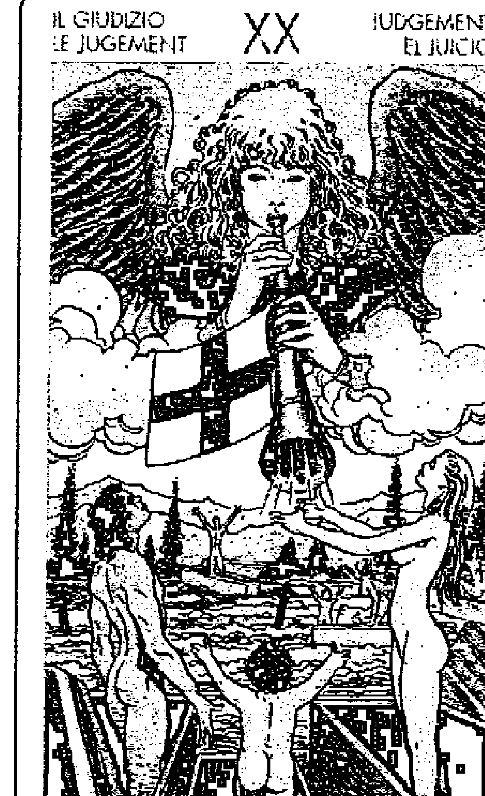

## 20 審判

審判是代表寬恕和解放的牌，也包含了慶祝的意思，因為天使長加百利預報了新生命與新世界的到來。牌面上每個人都面露驚喜，他們聽見了更高層次的召喚並做出回應。現在，他們從墳墓裡復活，正在經歷一場生命的轉化。一般而言，審判牌象徵個人願意就其功過接受評判。在故事中，審判可能代表報信者、傳信人或某個家族等角色。

### 重要象徵

- 起床號。天使加百利吹響號角，埋葬在墓地的死者一一被喚醒，紛紛起身回應。
- 外面的世界。棺材砰地一聲像易開罐一樣彈開，一直以來封閉在棺材裡的人終於重見天日、接觸到外面廣闊的世界。
- 核心家庭。除了組成一個小家庭的男人、女人和孩童等主角，背景中的其他人也站了起來，同樣因為號角聲而感到振奮。
- 坦露無遺。所有人都是赤身裸體的——他們沒有秘密、裸裎相見。
- 第二次機會。他們展開雙臂，擁抱第二個生命機會，期待恢復青春健康和活力。
- 生命旗幟。飄揚的旗幟上線段等長的「太陽十字」是陰陽合一的象徵，紅色十字也具有拯救、健康和治療的普世意涵。
- 藍天白雲。雲朵象徵高層次的思維，以及天國與塵世之間的帷幕。
- 自然力量。天使的顯像巨大無比，他展開雙翼覆罩天空，象徵自然力量對塵世的庇護。柏樹象徵永恆的生命，而光禿禿的棕色土地代表新墾土地的希望。
- 消息。天使是報信者和傳信人。

### 關鍵詞

正位——更新、再生、復活、覺醒、憐憫、寬恕、業、命運、責任
逆位——停滯、軟弱、優柔寡斷、延遲、不願寬恕和前進

### 神話傳說與占星聯想

偉特塔羅牌的設計者亞瑟·愛德華·偉特是基督教神秘主義者，他將教示和觀點融入所設計的塔羅牌中。熟悉基督教信仰的人應該能輕易地從畫面上聯想到審判牌背後的故事，它描述《啟示錄》中允諾的時刻，此時死者將復活，天堂之門也將開啟。然而，審判牌不僅體現末日審判和復活這個簡單的意涵，它也象徵了新生，以及足以喚醒死者的大聲召喚。天使長加百利率先揭示伊莉莎白和她的表親聖母瑪利亞會受孕，伊莉莎白將產下施洗約翰，而施洗約翰往後則預報耶穌基督的到來。根據聖經的說法，加百利也將是吹響號角宣佈最後審判日降臨的天使。

審判牌代表着預告轉化、死亡、重生和不可避免改變的冥王星。冥王星主宰神秘的天蠍座。

### 文學原型與寫作實踐

審判牌可能體現的文學原型包括看門人、守護天使、報信者、法官、傳信人、彌賽亞、拯救者，以及遠見卓識者。

每個恐怖故事作家都知道，死者不會一直乖乖的躺著。即便在日常生活中，某些我們以為早已『入土為安』的想法，總會找到辦法還魂回來糾纏我們——有些故事和人物就是拒絕在墓穴裡安份地待著。寫作時出現審判牌，表示你該為某個早就被拋棄的老點子注入新生命。走訪你的故事墳場，讓那些被你親手埋葬的人物和情節復活吧。原諒自己的錯誤，給他們和自己第二次機會。

### 寫作提示

你可以寫關於：

- 被認為已經死亡的人
- 復活
- 召喚
- 家人團聚
- 寬恕
- 結束的時刻
- 新生命
- 號角
- 箱盒製作者
- 先知

## 21 世界

這張牌描繪宇宙舞者在不斷擴張的宇宙中心旋身起舞，當她跳完一個回合，新的循環將再度展開——她在一個永不終止的故事中擔綱主角。世界是大阿爾卡納的最後一張牌，但這並非事物的結局，因為每個結束都導向新的開始。縱然此時「愚者之旅」已進入尾聲，但頃刻之間，迴旋之舞會讓整副塔羅重新洗牌，緊接著，一系列的嶄新事件又立即在宇宙舞台上開始搬演。一般而言，世界牌象徵完滿和成功，在故事中，世界牌可能代表舞者、勝利者、裸體主義者、嬰兒或轉世靈魂等角色。

### 重要象徵

- 生命循環。大阿爾卡納在世界牌出現之後，歷經一個完整的循環。圓圈象徵無始無終的永恆意涵。
- 無限。舞者的花環由狀似雙紐線的飾帶固定住。花環與死亡、復活和永生的概念一向密不可分——人們在聖誕節懸掛常青樹花環，藉以象徵生命的永恆，同時，人們也在葬禮中獻上花環，甚至也用桂冠替英雄加冕，慶賀他們在戰鬥或運動比賽中擊敗對手，成功克服挑戰。
- 舞衣。舞者的披巾是另一個代表開始與結束的象徵，就像新生兒被包裹在襆褓中，而死者則被包裹在裹屍布內。
- 棍棒。舞者和魔術師一樣，手中也持有棍棒。
- 跟動物說話。位於角落的「啟示錄四獸」（天使、鷹、獅子和公牛）是黃道上固定星座的代表生物，暗示一年四季和宇宙生成的四元素。

### 關鍵詞

正位——完成、結束、成功、報酬、同一性、完整、回歸原點、中央舞台、結束與開始

逆位——延遲、猶豫、失敗的開端

重新開始。世界是大阿爾卡納的最後一張牌，也是代表日常生活的小阿爾卡納牌中，全新冒險與經驗循環的起始點。

### 神話傳說與占星聯想

世界牌中的舞者往往被解釋成雌雄同體的「陰陽人」。在希臘神話中，使神赫密士與愛神阿芙羅黛忒之子赫馬佛洛狄忒斯（Hermaphroditos）是個英俊的天神，年輕的水泉仙女莎爾瑪西斯（Salmacis）愛上了他，卻不受青睞，於是她向諸神祈求能與他永遠結合。最後，她的祈禱應驗了，當赫馬佛洛狄忒斯在沐浴時，便與莎爾瑪西斯合為一體。從這個背景出發，我們可以將世界牌的舞者想像成榮格所謂「融合原型」的化身——真正融為一體的神聖夫妻。

世界牌讓人聯想到擁有明顯界限（土星環）的土星。界限雖然有限制、障礙或困境的意思，但同時也「定義」了這個世界。土星主宰黃道第十宮，涉及事業和社會地位的議題。土星也主宰了工作、成就和責任相關的摩羯座。

### 文學原型與寫作實踐

世界牌可能體現的文學原型包括亞馬遜人、藝術家、創造者、破壞者、聖童和命運三女神。世界牌是愚者旅程的終點，或許也是寫作旅程的終點。這是一張代表成就和成功的牌，描繪一個完滿結束的世界，每個事件都歷經一場完整的循環，危機和衝突也獲得妥善的解決。多數情況下，世界牌總結了一個篇章，為下一輪全新的冒險和經驗奠定基礎，你也可以將它作為總結一個故事的契機，同時為接下來的續集鋪路。寫作時出現世界牌，代表應該好好評估一下目前的作品進度，並訂定參加書展的計畫，確保作品加速完成。

### 寫作提示

你可以寫關於……

- 慶祝活動或畢業典禮
- 嬰兒毯
- 洗禮袍
- 新娘的頭紗
- 裹屍布
- 路口的圓環
- 最後一支舞
- 最後一搏的機會
- 前往世界四個角落的旅程

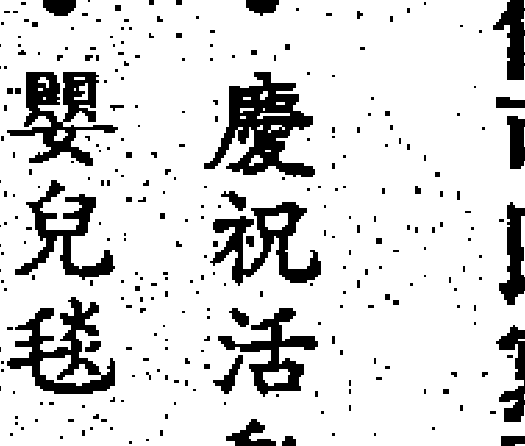

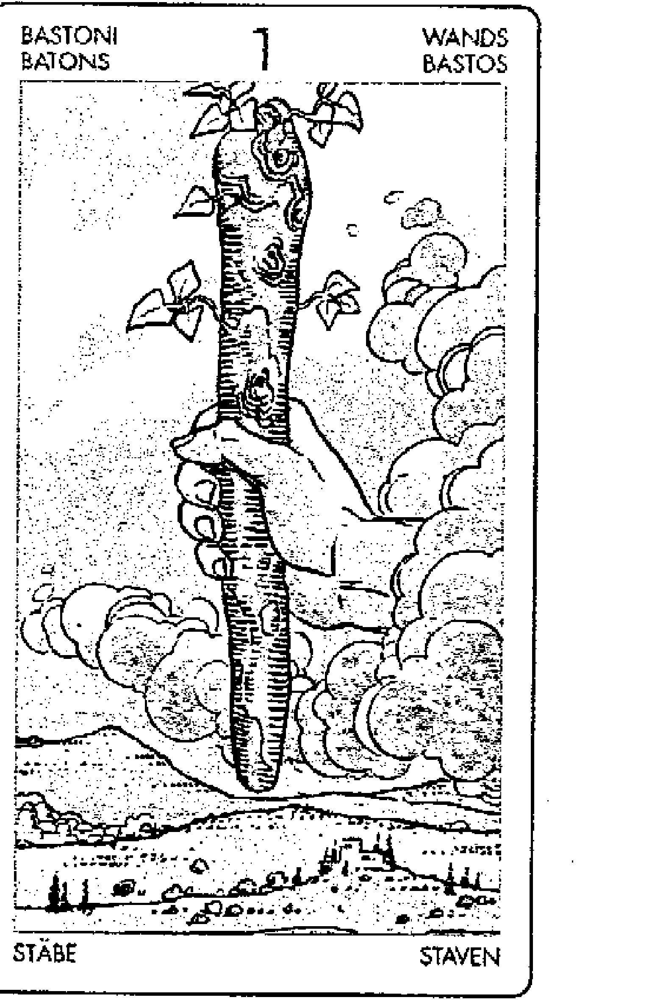

### 重要象徵

權杖牌對應「火」元素，權杖一點燃生命之火，與創作的靈感密切相關。

- 新開始。「數字一」代表新的開始，權杖一象徵在精神／心靈領域進入一個新起點。數字一有「贈禮」的意思，這張牌代表心靈成長的禮物正等待著你。
- 生命。一根巨大的樹枝剛被砍下來，還帶著幾片萌發中的樹葉，象徵希望無窮的生命力。
- 創造欲。權杖一在本質上是陰莖並非巧合，因為它反映人類與生俱來的創造欲（以及隨之而來的再創造），體現繁衍後代的力量。它是形式最純粹的潛能，隨時準備釋放那些處於自然狀態中不受拘束的「可能性」。
- 高層次思維。權杖從銀色卷雲中冒出來，「雲」象徵高層次思維和不同世界之間的隔幕。
- 「上帝之手」。畫面上的手代表掌控的力量，也可能是使喚桌上法寶的魔術師之手。
- 魔杖。權杖一看起來像一根原始的魔杖。
- 恩威並施。棍棒可以作為防禦或是攻擊的武器，提醒我們說話要溫柔，但是也別忘了握住手中的棒子。
- 安全庇護。遠處的城堡象徵庇護所、警覺性、君權和神明的指引。
- 占星。對應「火」元素的能量，包括火象的牡羊、獅子和射手座。
- 傳統意涵。這張牌代表獲得財富和繼承權。

### 關鍵詞

正位——「太初之火」、能量、創造力、欲望、發明、刺激、熱忱、引燃、意志力
逆位——無能、延遲、挫折、暴力、殘忍、衰敗、毀滅

### 寫作提示

你可以寫關於……

- 一截無意間被點燃的樹枝
- 在命案現場發現的一根木棍
- 火炬或火柴
- 具有法力的魔杖

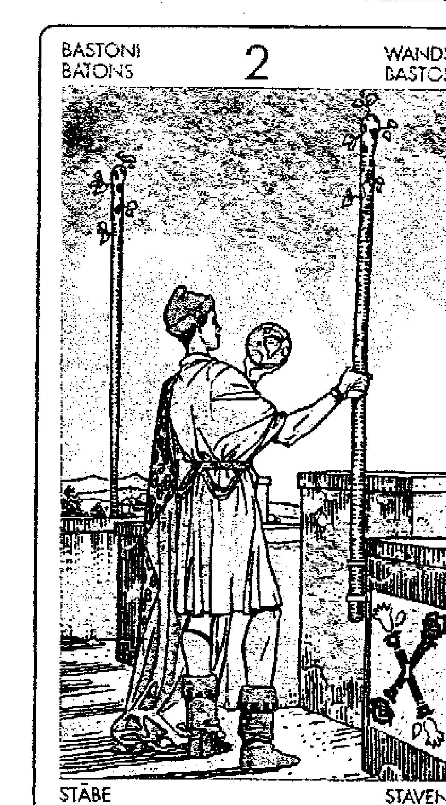

## 權杖二

權杖二是代表影響力、權威、控制和統治的牌，描繪一名意志堅定，已經成功跨越創業維艱階段的男子。

### 重要象徵

- **統治**。穿著體面的男子胸有成竹地環視周遭的景象，就像一切盡在掌握之中。在這張牌中，他的手確實握住了全世界。
- **界限**。器宇不凡的男子——很可能是貴族或富商——從容地站在城垛後方。矮牆代表提供安全感的屏障。
- **聖安德魯十字**。城垛上刻有一面由熱情的紅玫瑰與純潔的百合花所構成的旗幟。聖安德魯十字象徵和諧、統治與正義。
- **地理特徵**。男子立足點的下方是受到保護的海口，遠處是峭壁和山巒環抱的港灣。這種地理位置易守難攻，而且交通便利，是從事貿易的好基地。

亞歷山大的惆悵。這個男子顯然相當富有，塔羅牌的設計者偉特認為，這張牌暗示了「坐擁天下財富的亞歷山大的惆悵」——亞歷山大大帝曾因為已經沒有世界可以征服而感到失落。

### 關鍵詞

- 正位——統治與支配、要塞、雄心、勇氣、自豪、願景
- 逆位——暴政、軟弱、心神不寧、固執、傲慢、壓抑、猶豫

你可以寫關於：
- 一般蓄勢待發的商船上的船員
- 球狀物體
- 長久的等待
- 矮牆
- 未來的願景

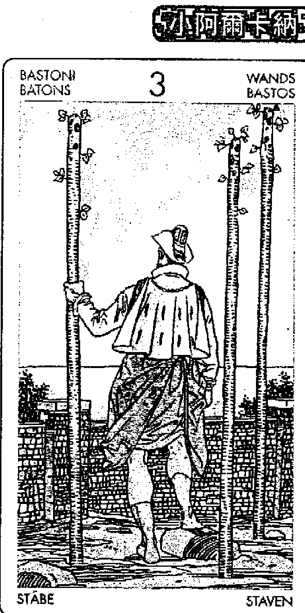

## 權杖三

權杖三代表領導力、財富和權力，描繪一個正在遠眺船隊入港的貴族。這張牌代表資金充裕、妥善經營的商業組織，正致力於開創新事業，展現出強大的力量。

### 重要象徵

- 既有的優勢。這個男子顯然已經建立了屬於自己的據點。
- 城牆之內。男子從象徵保護和界限的矮石牆上向外眺望。
- 隱藏的情緒。這是塔羅牌中少數幾張沒有露出人物臉部的牌——所以我們無法得知他的想法和感覺。
- 沙岸岩石。男子立於沙岸上，用一隻腳踩住一顆鵝卵石，這是個有利的位置。
- 大船。海灣有三艘船，暗示有人正熱絡地從事貿易活動。這些商業活動帶有冒險和開發的性質，不僅要找尋市場和客戶，也負責探勘新國度、新商品的來源，以及開發合夥結盟的新契機。
- 結盟。三棵樹苗代表夥伴關係的種子已經生根發芽。
- 投資。這名商人冒著風險投資，為了致富，不惜險中求勝，放手一搏。
- 顏色。商人服裝的顏色是黃、紅、藍三原色，代表風、火和水的能量匯聚於一身，活力充沛。

### 關鍵詞

- 正位——既有優勢、企業領導力、敏銳的眼光、商業貿易、合作、發現新大陸
- 逆位——逆境、勞苦、失望

### 寫作提示
你可以寫關於：
- 大膽的投資
- 意想不到的合夥關係
- 運送奇特貨物的船隊
- 海面上的一場暴風雨
- 身體語言

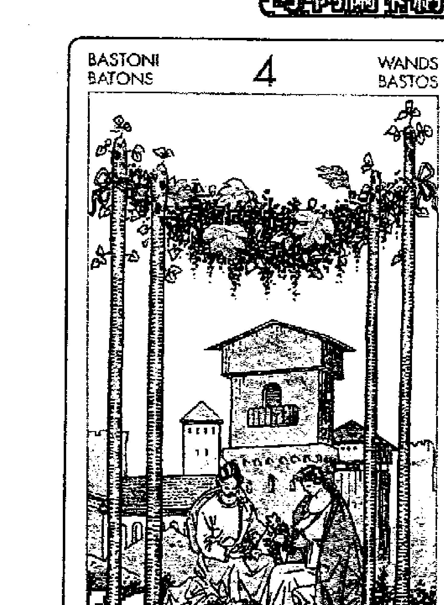

## 權杖四

權杖四代表平靜美滿的家庭生活。年輕夫婦準備在中世紀城堡的庭園中，慶祝兩人的結合。

### 重要象徵

- 婚禮。描繪一對正舉行婚禮的夫婦。戶外庭園的儀式象徵大自然與生育力的關聯。
- 城堡。這對夫婦背後矗立著中世紀城堡的圍牆和塔樓，這類建築物都有文明的象徵。城牆代表阻隔和保護，塔樓則象徵高遠的視野。
- 神聖的家。這對夫婦正在編織花環，準備裝飾猶太式婚帳。簡單的帳棚是新婚夫婦第一個共同的家，撐開帳棚的四根權杖，象徵有四個角落的房屋結構和穩定性。帳棚代表免於遭受自然危害的屏障，以及來自上天的祝福。
- 顏色。兩人穿著顏色互補的藍（水元素）紅（火元素）服裝，說明他們的婚姻是一種合夥關係。
- 好運。預示意想不到的好運氣（無論正位或逆位）即將降臨，以及鄉間生活的安逸。

### 關鍵詞

- 正位——完美、完成、穩定性、和平、好運、幸福、婚姻
- 逆位——不穩定、騷動、衝突

### 寫作提示

你可以寫關於：……
- 別出心裁的結婚典禮
- 各種慶祝的活動
- 婚姻
- 打造第一個家
- 你的父母親

> 水到渠成。《塔羅牌圖解要點》稱這張牌為歷經各種考驗之後所達到的「完美境界」。

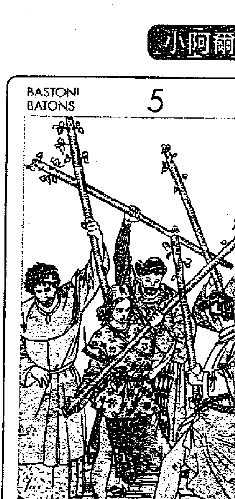

### 重要象徵

權杖五代表奮鬥、競爭和混亂。五名年輕人試圖運用彼此的力量，合力完成任務。他們可能即將創造出神聖的五星角圖案，或者功虧一簣，成為一盤散沙。

- 感官能力。五個人代表視覺、聽覺、觸覺、味覺和嗅覺等五種感官的力量，我們的五感必須合作無間，才能正確理解外在世界。
- 組織的混亂。團隊的每個人都在努力摸索自己與他人的相對位置。他們只差幾步，就能用手裡的權杖排列出象徵完美無缺的五角星圖形。
- 合作精神。這張牌暗藏齟齬不合的本質，也許是因為參與者的「數量」。四個人能輕易搭建一個正方形，而第五元素的加入，往往對建造工程形成挑戰。
- 隱形黏著劑。這個額外的元素暗示古代哲學家所謂的「第五元素」。許多人認為「乙太」（aether）或「精神」能連結風火水土四元素。
- 顏色。這些人身上分別穿著紅、藍、黃、綠、紫色的衣服，呼應了火、水、風、土和精神元素的交互作用和合作。
- 高層引導。這五個人顯然應該聽從外界的引導和指示，讓有能力關照大局的旁觀者，幫助他們合力完成完美對稱的圖案。
- 當日沖銷。這張牌對於從事投機事業的人來說是個好兆頭。

### 關鍵詞

- 正位——集體努力、團隊合作、對話、競爭、運動競賽、參與
- 逆位——爭吵、鬥毆、權力鬥爭、法律訴訟、拖延審查的議題

你可以寫關於：
- 爭執或誤解
- 一場造成混亂的騷動事件
- 委員會紛雜的事務
- 建築計畫
- 政治集會

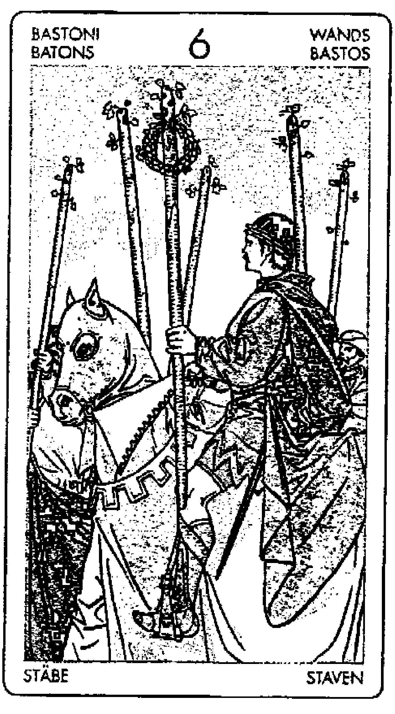

權杖六是代表勝利的牌。凱旋而歸的英雄騎馬穿越歡呼的群眾。他也可能走在勝利遊行隊伍的前方，帶回豐碩的戰利品。

### 重要象徵

- 肩負重任。英雄使情勢轉危為安，這場勝仗讓他的同胞能暫時過上一段和平繁榮的日子。
- 桂冠。英雄的報酬之一是勝利的桂冠。花環代表他贏得群眾的支持、尊敬和讚譽。他會滿足於現有的成就嗎？有待觀察。
- 簇擁的人群。群眾為英雄的成功及自己的好運而歡欣鼓舞，這種場面就像今日我們也會舉辦盛大的遊行，來祝賀獲勝的超級盃和世界大賽隊伍。
- 高頭大馬。高大偉岸的座騎讓英雄鶴立雞群，有別於街上的一般民眾。
- 馬。馬象徵自由、權力、獨立和移動，也是榮譽和高貴的表徵。牠們增加了騎乘者的高度，也提升了他們的社會地位。
- 衣錦還鄉。英雄和座騎同樣披戴華麗貴氣的皇家袍服，展現高高在上的權力、身分和威望。

### 關鍵詞

正位——勝利、喝采、確認、證明無罪、訊息和傳信、遊行
逆位——戰敗、不忠貞、背叛、輕蔑、憂慮、恐懼、兵臨城下

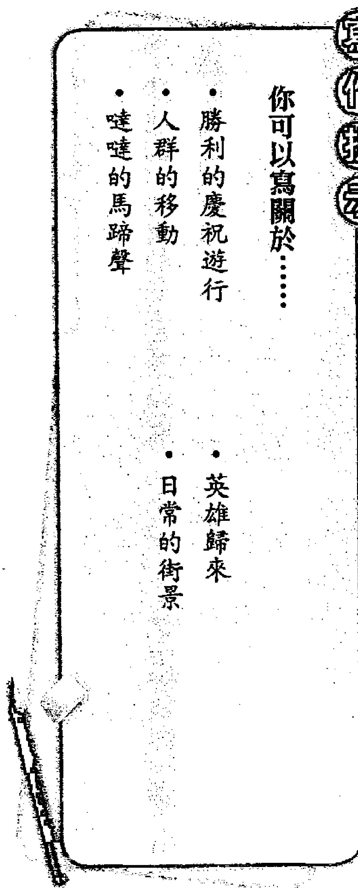

### 寫作提示

你可以寫關於：

- 勝利的慶祝遊行
- 人群的移動
- 哇哇的馬蹄聲
- 英雄歸來
- 日常的街景

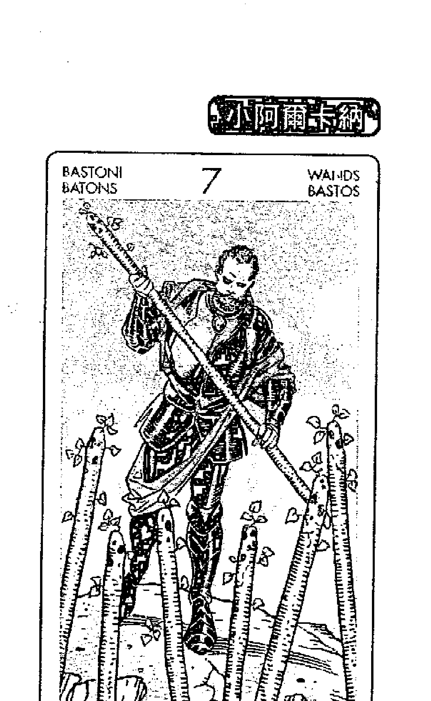

## 權杖七

### 重要象徵

權杖七代表勇氣和力量，即使面對強大的對手也不屈服。乍看之下，這張牌單純描繪了戰爭的場景，但其實畫中的每個細節都暗藏衝突。

- 山丘之王。陡峭危險的懸崖邊，一名年輕人堅守陣地，當家作主。
- 防禦。備戰的戰士正警戒地守衛陣地。
- 戰略優勢。縱然寡不敵眾，但是他佔據了有利的戰鬥位置。
- 立足點。雖然立於斜坡，但是他的雙腳牢固地踩在地上，象徵決心。
- 仰攻。他身處制高點，迫使敵人必須仰攻。我們看不見敵人，只能想像他們可能的身份或攻擊的目的。
- 原始武器。這個年輕戰士的武器是最原始的棍棒，而非銳利的寶劍。表示這不是一場高科技戰爭，而是為了爭奪土地、統治權和地位的原始鬥爭。同時，也有可能代表一場精神上的角力（如果是寶劍，則暗示思維方面的搏鬥。）

### 關鍵詞

正位——勇氣、堅持、優勢、討價還價、競爭、獲利、勝利
逆位——脆弱、混亂、難堪、焦慮、優柔寡斷、躊躇

### 寫作提示

你可以寫關於……

- 某種形式的「入侵」
- 自衛機制
- 滑溜溜的斜坡
- 權力販子
- 短兵相接的戰鬥

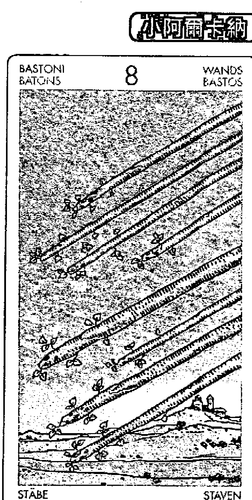

## 權杖八

權杖八代表速度和溝通。傳統上，這張牌與遠距旅行和來自遠方的訊息有關，如今這張牌也跟上時代，代表透過快遞或電子設備等遠距傳播的消息和通訊。

### 重要象徵

- 訊息匯入。八根帶葉的樹枝像箭一般飛越天空，以 45 度角彼此平行。這些權杖從遠端捎來各種不同的訊息，或以相異的溝通方式傳達訊號，例如電話、傳真、電子郵件、文字、電話會議、視訊、廣播和電視等傳媒。
- 命運的矢石。有時這張牌與厄運有關，或讓人聯想到愛神邱比特的箭。
- 唇槍舌劍。預示夫妻之間的家庭紛爭。
- 流動。背景的河流象徵訊息或情感的流動——在古代，河流是旅行和遞送消息的主要管道。
- 安全感。遠處城堡代表庇護的力量。
- 飛航跑道。《塔羅牌圖解要點》認為這些權杖正要降落，而非起飛。也就是說，這些訊息很快就會抵達、著陸，無論它們預示或傳遞些什麼，真相即將大白。

### 關鍵詞

正位——遠距溝通、即時通訊、電子學、速度、敏捷、行動
逆位——溝通不良、誤解、延遲、崩潰瓦解

### 寫作提示

你可以寫關於……
- 利用 E-mail 維繫的戀情
- 傳真文件封面頁的一首詩
- 視訊會議中的互動
- 尚未發明的新科技

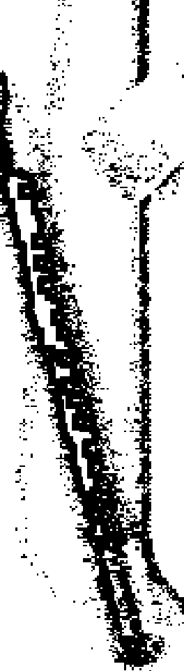## 小阿爾卡納

## 權杖九

權杖九描繪負傷的戰士——戰敗的英雄努力求生，是為了迎接明日的戰鬥。身經百戰的戰士即使暫時落敗，也絲毫不敢鬆懈或沮喪。他弓著背採取監看的姿態，睜大雙眼保持警戒，以防敵人的突襲。

### 重要象徵

- 最後一搏。疲憊的男子站在一排權杖之前，就像背後抵著一道牆。
- 站衛兵。他採取防禦的姿態，為下一波攻擊做準備。
- 行動暫停。儘管面臨威脅，他已經找到撤退的據點。他重整旗鼓、養精蓄銳，隨時準備應付新的狀況。
- 死期未至。這是一張代表些許希望的牌。傷痕累累的戰士雖然倖存下來，但仍然必須迎接明日的戰鬥。
- 背景幕。這張牌的背景是沒有景深的平面圖，這可能是一種障眼法，就像舞台上用來隱藏後台真實行動的厚重帷幕。

### 關鍵詞

- 正位——抵抗、勇氣、自衛、紀律、意志力
- 逆位——障礙、逆境、災難、軟弱、人格缺陷、憂慮

### 寫作提示

- 你可以寫關於……
- 行動中止或取消
- 戰鬥中搖旗吶喊的聲音
- 守夜者
- 逃脫的路線
- 保全人員

## 權杖十

權杖十代表壓迫。過度負荷的工人奮力抱起一大捆散亂木材——十根權杖——蹣跚前行。

### 重要象徵

- 負重。工人懷中數量眾多的權杖明顯成為一大重擔。
- 組織崩解。排列混亂的權杖給人缺乏效率的印象，象徵組織龐大的夢魘。
- 不關我的事。糾結的權杖意味著散漫組織中的繁文縟節和官僚習氣。
- 不當的安排。駝背的工人舉步維艱，他的手臂、背部和肩膀的肌肉都處於緊繃狀態，十分吃力，眼看下一步就要絆倒了。
- 接近終點。幸好，這張牌說明目的地已經不遠。

### 關鍵詞

- 正位——壓迫、重擔、報復、不正義、作威作福、詐謗、自我犧牲、財富、背叛、欺騙
- 逆位——堅忍、奉獻

### 寫作提示

你可以寫關於……

- 社會底層勞工被剝削的生活
- 因責任感而產生的重擔
- 使命必達的任務
- 送貨工人的詭詐伎倆
- 絆了一跤或跌倒

## 權杖侍從

### 重要象徵

權杖侍從是火的化身，他整個人就像一顆如假包換的火球。他充滿旺盛的能量和行動力，常在很短的時間內，就對刺激或挑釁作出反應，或是下結論。他可以輕易地墜入愛河，但是火爆的脾氣同樣來得快也去得快。他像火一樣溫暖熱情，但是如果沒有安全的燃燒，也可能失控變得暴烈而不穩定，而且具有毀滅性。

- 年輕的展望，權杖侍從有孩子般的熱忱和無窮的學習力。
- 小信僮，專門負責跑腿，傳遞心靈方面的訊息。
- 靈性課題。侍從在學徒階段，必須學習執行將來的任務。權杖侍從專注於靈性啟蒙的課題。
- 自信。權杖侍從的雙手緊緊握住權杖，雙腳穩穩站立，一步一腳印地累積成長的經驗。
- 炎熱乾燥。乾旱的炎地、酷熱的環境都令他感到舒適，他的臉甚至朝向太陽，整個人沐浴在熾熱的陽光下。

### 關鍵詞

- 正位——熱情如火、生氣蓬勃、坦率的青年、帶來事業方面訊息的傳信人
- 逆位——輕率魯莽、不成熟的年輕男孩；膚淺、浮誇、殘忍、性情不穩定的年輕女孩

### 寫作提示

你可以寫關於……

- 天真熱烈的年輕人
- 足以點燃內心熱情的事物
- 強烈湧現的慾念
- 來自心靈的訊息
- 靈性的課題

## 權杖騎士

### 重要象徵

權杖騎士精力充沛，他是塔羅世界中高大黝黑、名聞遐邇的「外邦人」——機智、浪漫、愛調情，不過也有衝動莽撞的一面。他就像徜徉於心靈領域的漫遊者、旅人和冒險家。

- 金字塔。如同歷史上的十字軍，風塵僕僕的男子熟練地駕馭步伐輕快的馬匹。他來到炎熱乾燥的沙漠，途經幾座金字塔——這是火象人會喜歡的地方。
- 傳統意涵。這張牌與出發、缺席、長途旅程、移民有關，有時預示女子的婚姻失敗。
- 占星和元素。權杖騎士就像火象的變動星座——射手座，性情直率、熱衷冒險。就元素來說，體現了火力全開的雙重威力（「火元素」+「火元素」）。
- 追尋。中古時代，騎士是冒險家和拯救者，踏上宿命的「追尋之旅」，並誓言濟弱扶傾。他們的傳奇多半是這樣的故事：為了找尋某件神奇寶物（如聖杯），一路遭遇諸多考驗和障礙，最後克服萬難完成任務，才驚覺真正的收穫是自我的轉化。

### 關鍵詞

- 正位——精神上的冒險；出發、缺席、飛行、搬遷
- 逆位——分裂、干擾、疏離、關係破裂

### 寫作提示

你可以寫關於……

- 情緒智商低、不諳世事的青年
- 連續縱火狂
- 刻寫著象形文字的神秘石板
- 心靈的冒險和救贖

## 權杖皇后

### 重要象徵

- 火象皇后。成熟洗練、深諳世故的女子，以陰性特質滋養她的子民，掌管精神和心靈世界。
- 向日葵。熱力高漲的向日葵生長在周圍，也是皇后椅背上的圖騰。權杖皇后左手握著一朵向日葵，右手舉著象徵地位的權杖。
- 皇家母獅王。王座上的獅子圖案呼應由太陽主宰的獅子座。嚴格來說，權杖皇后是一頭母獅——比雄獅體型更嬌小、輕盈且敏捷。獅群本來就是母獅當家，負責打獵的工作。

熱情如火、一頭紅髮的權杖皇后是塔羅牌中最有魅力的人物。她是每個女人都想結交的朋友，更是每個男人的夢中情人……至少是夢寐以求的舞伴。這位直率的風雲人物習慣成為眾人的焦點，她是出了名的喜歡賣弄風情，偶爾，調情還會演成一夜情或偷情的橋段——即使她已身為人妻。她神采奕奕，總能輕鬆自如地應付精神、情感和體力上的馬拉松。她也熱衷追逐金錢與成功的事業。

- 黑貓。皇后座前的黑貓就像聽憑女巫使喚的妖精，服服貼貼地蹲坐在皇后腳邊。
- 占星和元素。權杖皇后就像火象的創始星座——牡羊座，是一個天生的領袖。就元素來說，她體現了「水元素」與「火元素」融合時的蒸騰樣貌。

### 關鍵詞

- 正位——火熱、激情、強大能量、生機、寬厚大度、任性、自信、仁慈、率直、戲劇化、樂觀
- 逆位——狂熱、專橫、妒忌、虛假、潛藏的不忠、雜亂無章

### 寫作提示

你可以寫關於：

- 熱情如火的紅髮女子
- 暧昧的調情細節
- 供女巫使喚的妖精
- 黑貓
- 蒸汽

## 權杖國王

權杖國王是高瞻遠矚的創業家，也是富商巨賈和熱情洋溢的企業首腦。他從不休息——連在牌中都無法安份地坐著。他有高尚的情操，一心保護受壓迫的弱勢，有時他的慷慨幾乎過了頭。權杖國王性格機警，有時反而顯得優柔寡斷。他是那種喜歡為爭論而爭論的人，然而一旦有了定見，就不會輕易變卦。權杖國王處事公正卻不乏幽默感，能欣賞恰到好處的惡作劇。

### 重要象徵

- 精神領袖。積極主動的統治者和保護者，將火一般的能量投注於精神世界。
- 行動派。他的身體往前傾，雙腿分開，似乎隨時準備一躍而起。
- 高智商。他在王冠下戴著一頂儀式用的帽子，整個覆蓋住頭部的帽子象徵智力和思維。
- 火蜥蜴。王座背上刻著獅形皇室紋章。一隻小蜥蜴（火元素的代表生物）在他腳邊一晃而過。
- 名草有主。權杖國王是快樂的已婚男子，有意思的是，他的妻子權杖皇后卻是出了名的風騷多情。

占星和元素。權杖國王就像火象的固定星座——獅子座，是一個自信勇敢的君主。就元素來說，體現了「風」與「火」一拍即合、勢不可擋的延燒之勢。

### 關鍵詞

- 正位——堅毅的男子、商場領袖、良師、雄心壯志、領導力、熱忱、創業精神、白手起家
- 逆位——自私、嚴厲、嚴酷、權力欲、缺乏耐心

### 寫作提示

你可以寫關於……

- 企業家
- 極富個人魅力的領袖
- 鼓吹復古主義者
- 權力販子
- 令人威攝的一方之霸

## 聖杯一

聖杯牌對應「水」元素，聖杯一代表無窮的情感。這張牌描繪一只幸福滿溢的杯子——也可能意味著一定程度的流淚。

### 重要象徵

- 新開始。「數字一」代表新的開始，聖杯一象徵一段感情的起點。「數字一」有「贈禮」的意涵，這張牌似乎在說：愛和友誼正等著你去爭取。
- 上帝之手。空中一隻張開的巨手，托住一只平放在掌中的金色高腳杯——像個禮物或獻祭品。
- 滿溢。杯中盛滿豐富的情感，裡面的液體幾乎滿溢而出。
- 希望泉源。愛和友誼之水溢出杯緣，分成幾道清楚可見的水流，匯入長滿睡蓮（象徵生育力）的平靜水塘。
- 聖靈。白鴿象徵自由的精神，白鴿嘴喙中的「聖體」代表物質。這幅景象就像基督教的聖餐儀式，也意味著未出世的靈魂即將進入肉體之中。
- 新生命。暗示懷孕。杯是代表子宮的陰性象徵，鴿子和聖體代表靈肉的結合。聖杯一可能暗指新生兒的誕生，或者從事創作活動。
- 占星。屬水的聖杯讓人聯想到巨蟹、天蠍和雙魚等水象星座。

### 關鍵詞

- 正位——新的關係、情感氾濫、生育、創造、滿足、懷孕、女嬰
- 逆位——倒放的杯無法盛裝任何東西，暗示關係的結束、不貞、自私、貧瘠、計畫失敗

### 寫作提示

你可以寫關於……

- 已經忘記如何去感覺的人
- 懷孕
- 長生不老藥
- 喝了會有神奇力量的飲料
- 謝罪的禮物

1 譯注：施行聖餐禮時用的無酵餅，是基督徒祈禱、謝恩用的祭品。

## 聖杯二

聖杯二代表愛與夥伴關係，描述一段戀愛關係或柏拉圖式的純潔友誼。這張牌說明志同道合的兩個人，為了共同目標、夢想而合作產生的強大力量，遠大於各自努力的總合。

### 重要象徵

- 與螢共飲秋波。戀人凝望著彼此渾然忘我，無視於外界的喧囂擾攘，舉杯互敬。
- 墨丘利的節杖。畫面上方有一顆帶翼的獅頭落在墨丘利的節杖上。傳說中，墨丘利有一次看見兩條蛇交纏，你死我活地展開激戰，於是用手杖將牠們分開，此後這個姿勢就被認為是和平的象徵。
- 隨時做好準備。獅子象徵娛樂和生育，代表要進入賦形容器中出生的靈魂，喝上幾杯葡萄酒無疑能催化靈魂的誕生。

### 關鍵詞

- 正位——愛、吸引力、戀情、慾望、結合、友誼、相容性、忠誠、和諧
- 逆位——不貞、嫉妒、孤立、誤解、單戀、寂寞

### 寫作提示

你可以寫關於……

- 第一次約會
- 初吻的滋味
- 一段新的戀情
- 充滿性暗示的情歌
- 開香檳時軟木塞「啵地」一聲彈出，或玻璃杯叮噹作響的聲響

2 譯注：'Drink to Me Only with Thine Eyes' 語出英國詩人班·強生 (Ben Johnson, 1572~1637) 詩作「致西莉亞」(“To Celia”)。

## 聖杯三

聖杯三是描繪友誼與慶祝的牌。三名女子在枝繁葉茂、結實累累的葡萄園裡翩然起舞，她們將酒杯高舉過頭，雀躍地慶祝即將到來的豐收，而藤蔓上的葡萄已轉化為慶典上的美酒。這張牌偶爾也描述女人之間經常產生的妒忌、陷害、怨懟和流言蜚語。

### 重要象徵

- 美惠三女神。古典藝術家描繪的「美惠三女神」(The Graces)。她們是希臘神話的三姊妹：阿格拉伊亞 (Aglaia)、歐佛洛緒涅 (Euphrosyne) 和塔里亞 (Thalia)，這三個名字意為燦爛、歡樂和花朵，或是美、溫和及友誼。
- 北歐神話「命運三女神」。斯堪的納維亞的命運三女神住在「世界樹」下，編織命運的織者，負責紡製生命線；拉基西斯 (Lachesis) — 分配者，負責量測生命線；以及阿特洛波斯 (Atropos) — 命定的結果，負責切斷生命線。
- 三合女神。有些塔羅師認為這三名女子是擁有少女、母親和老嫗三種面貌的女神，體現女性生命歷程的不同階段。
- 三大美德。三名女子或許代表神學的三大美德：信仰、希望和慈善。
- 三元素。三名女子象徵火、水、風三種元素，而她們在地上跳舞（土元素），則完整體現了四元素的結合。
- 豐收之舞。豐饒的收成暗示日後將有更大的慶典。

### 關鍵詞

- 正位——宴會、慶典、跳舞、飲酒、女士狂歡夜、愉悅的感官享受、幸福、好客、慷慨
- 逆位——過度、精疲力竭、宿醉、意外懷孕

### 寫作提示

你可以寫關於：

- 三代家庭的女人
- 一家三姊妹的宿命
- 命運三女神
- 未婚女子的派對
- 女性讀書會

## 聖杯四

聖杯四是一張代表失望的牌。牌中的人無精打采地坐在一棵老樹下，凝望著三隻酒杯，似乎沒有注意到右側出現了一朵雲。鬼魅般的怪手從雲霧中探出，第四隻高腳杯在他的眼前成形。他仿佛看見聖杯一的特寫鏡頭，但他的表情只透露出幻滅，而非驚奇。

### 重要象徵

- 神秘經驗。他可能是尚未爬上「世界樹」之前的奧丁——或者剛剛下樹。奧丁在世界樹下失去一隻眼睛，這也許解釋了牌中人物對真理的視而不見。
- 重力定律。牛頓正是在蘋果樹下發現影響後世極為深遠的牛頓定律。
- 菩提樹下的冥想。這個畫面讓人聯想到菩提樹下證道的佛陀。
- 空虛。這是高潮之後的低潮，或者狂熱之後的沮喪。
- 怅然若失。這是一張「悲喜輪替」的牌，形容在興奮或刺激之後，隨之而來的無聊、苦悶和失望。
- 視而不見。這個人不明白生命的目，不只在獲得世上的有形物質。他啜飲了物質世界的聖杯，卻無視於精神上的贈禮。

### 關鍵詞

- 正位——疲憊、憎惡、怏怏不樂、不滿足、無聊、洩氣
- 逆位——新朋友、冒險、重生、恢復精力

### 寫作提示

你可以寫關於……

- 在意想不到的地方出現異象
- 用來謝罪的禮物
- 失望
- 親筆文件
- 理想幻滅

## 聖杯五

聖杯五是一張描述失落與孤寂的牌。灰暗陰霾的天空下，一個年輕人低著頭，站在滿布塵土的河岸。他的身旁是三隻傾倒的杯子，裡面的液體早已經流光，他的身後還有兩隻站立的杯子。遠處的拱橋通往河對岸的堡壘。

### 重要象徵

- 河岸。黑袍男子站在岸邊，那是一條不停流淌的生命之河。
- 惡水大橋。橋樑象徵兩個世界的連結通道。
- 安全保護。背景建築物是一座要塞——也許是城堡或監獄用來加強防護的壁壘。
- 潑灑的液體。杯裡是裝了水、酒或是血？這些液體為什麼會潑灑出來？是發生意外，還是故意為之？
- 隱形斗篷。駝背的人似乎陷入悲痛和懊悔之中。悲傷的情緒像斗篷一樣緊緊包裹住他，而這件斗篷幾乎是隱形的，因為旁人看不穿它。
- 失落感。這張牌可能代表痛失所愛、失去友誼或一段關係，或許是背叛或欺瞞的結果。
- 悲傷的五個階段。這張牌令人想起生死學大師伊莉莎白（Elisabeth Kübler-Ross）定義的「悲傷五階段」：否認、憤怒、討價還價、沮喪和接受。
- 傳統意涵。這張牌預示將有久違的親屬歸來。

### 關鍵詞

- 正位——失望、理想幻滅、悲傷、失落、痛苦、挫折
- 逆位——短暫的哀悼、迅速遺忘、接受現實、復元、希望

## 聖杯六

聖杯六是代表懷舊和往日幸福時光的牌，描繪在天氣晴好的春末或初夏時節，小男孩為心愛的小女孩獻上一束花。

### 重要象徵

- 童年純真。可愛的小情侶代表童年的純真情懷。
- 有圍籬的後院。孩子們待在花園裡——花園象徵休息和反省、混亂中的秩序和庇護所。
- 家庭紐帶。意指與兄弟姊妹或童年玩伴度過的美好時光。
- 青梅竹馬。預示與過去的朋友，甚至是青梅竹馬即將重聚。
- 傳統意涵。這張牌預示即將繼承財產。

### 關鍵詞

- 正位——回憶、懷舊、多愁善感、純真、童年、愛慕之情、重聚
- 逆位——思鄉病、過度依戀過往的經驗、虛假的記憶、單戀

### 寫作提示

你可以寫關於：

- 回到過去的時光旅行
- 喪失記憶的人
- 彷彿有著老靈魂的孩童
- 返老還童——看起來像小孩，其實已經八十多歲了
- 活在過去的時光

## 聖杯七

聖杯七是描繪驚奇、詫異和欲望的牌。畫面上的人背對著我們站立，驚訝地注視著不停旋轉湧動的雲團。七隻金色的杯子飄浮在半空中，每只杯子都盛裝著意義特殊的物品。

### 重要象徵

- 無窮可能性。七隻杯子代表忽隱忽現的各種可能，也許是誘惑、白日夢、我們每個人的惡習或美德。
- 似曾相識。事實上，你已經見過這些杯裡盛裝的東西——就在大阿爾卡納牌中，它們對應肉眼可見的七大行星：女人是「女皇」，對應金星。蒙著面紗的「女祭師」對應月亮。傳統上，蛇與「魔術師」有關（因為魔術師身上總是繫著蛇形腰帶），對應水星。山丘城堡是類似「塔」的建築，對應火星。閃亮的珠寶是「命運之輪」所承諾的好運，對應木星。「世界」牌中舞者的卵形花環對應土星。噴火龍是「太陽」牌中白馬的另一個化身。

### 關鍵詞

- 正位——靈視、幻覺、想像力、沉思、冥想、記憶、夢想
- 逆位——優柔寡斷、失誤、矛盾心理

### 寫作提示

你可以寫關於……

- 白日夢
- 突然在倏忽變化的雲朵中看到特殊的意象
- 獎品和獎狀
- 「閃閃發亮的東西未必都是黃金。」
- 開放的結局聖杯八代表放棄眼前的成功機會，去追尋更遠大的夢想。這個人似乎什麼都不缺，但是心中不斷湧現的空虛感使他毅然放棄一切，踏上追尋圓滿的旅程。

### 重要象徵

- 失落的片段。整齊堆疊的八只杯子代表井然有序的繁榮生活。然而，杯子擺放的方式產生了一個缺口，象徵未盡滿足的慾望或需求。
- 心靈追尋。這個形單影隻的求道者和漫遊者，執意追尋有意義的圓滿人生。這張牌提出關於物質財富或精神寶藏、世俗成就或情感關係的難題。
- 山隘口。這個人似乎朝著附近山脈的裂隙前進，山繆向來代表旅行的路程、必須克服的障礙，以及攀升到新的高度。
- 迷途羔羊。暗示《聖經》故事中，那個為找尋一隻羔羊而丟下整個羊群的牧羊人。
- 傳統意涵。這張牌預示將與金髮女子結婚。

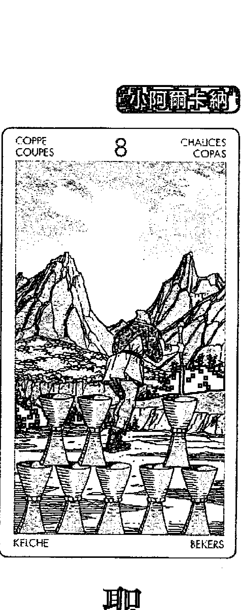

### 關鍵詞

- 正位——暫時性的成功、消減的興致、不穩定的關係、放棄、害怕承諾
- 逆位——延遲、不願前進、始料未及的紛爭

### 寫作提示

你可以寫關於……

- 一趟印度聖山的朝聖之旅
- 狩獵歸來
- 牧羊人
- 尋寶遊戲
- 暫時放下紙筆，出去散步走走

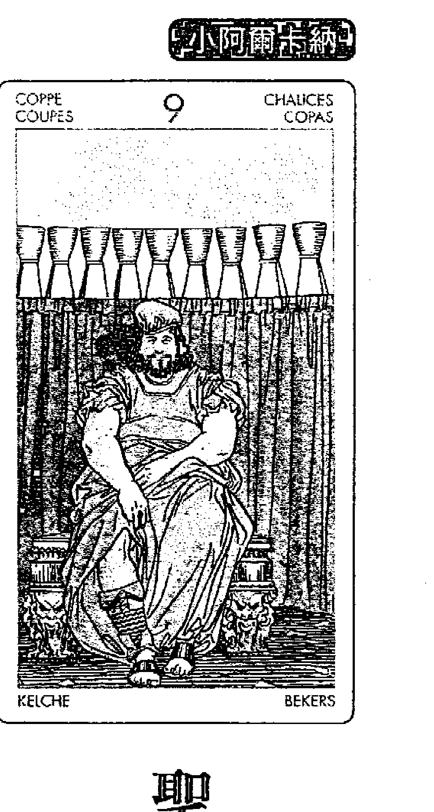

## 聖杯九

酒吧，看起來頗有幾分懶洋洋的醉態，也樂於和別人分享好運。

### 重要象徵

- 經典角色。酒保可能是最古老的成規人物之一，當舞台上出現這個角色時，從來不需要多作說明。
- 「客倌，喝點什麼？」酒保多半有饒舌的本事，能跟每位上門的客人聊天說笑。他們擁有各式各樣的談資——運動、政治、書本、電影和每日新聞——以及社交技巧，確保客人不會被冷落。每個作家都知道，為作品加入「酒保」的角色，是讓主要人物開口暢談的好辦法。
- 窮人的精神醫師。酒保的本質類似諮商師或顧問，他們聽聞許多告解，提供液體般軟綿綿的建議和安慰，他們就像窮人的精神醫師。塔羅師的角色也有異曲同工之妙。你甚至可以將酒保想像成收費低廉的女祭師，站立在分隔清醒世界與酩酊世界的酒品帷幕前，在這個醺然國度裡，精神（酒精）的力量能戰勝物質的憂慮。
- 時空感。酒吧是極好用的場景。週末夜晚走進燈光昏暗的小酒館，你不必太花力氣就能想像自己身處世界的某個角落，或是歷史上的某個時間點。
- 「這輪我請！」酒保將所有的酒杯排成一排，大方地與眾人分享吧台上的佳釀。歡樂的場景，讓人想到那首「牆上擺了九十九支啤酒瓶」的饒舌童謠。

### 關鍵詞

- 正位——社交聚會、派對、寓工作於玩樂的場所
- 逆位——放縱、宿醉、言行失檢、坦率、失誤、不完美、剝奪

### 寫作提示

- 你可以寫關於……
- 酒吧的場景。（或帶著筆記本去觀察你最喜歡的酒吧或咖啡館）
- 酒保與故事人物的對話
- 宿醉
- 結交其貌不揚的幫手或盟友
- 雞尾酒會

> 3 譯注：spirit這個字意指精神，也有酒精的意思。
> 4 譯注：「牆上擺了九十九支啤酒瓶」（ninety-nine bottles of beer on the wall）是美國一首小孩大人都耳熟能詳的民謠，內容帶著調侃和捉弄語氣，讓孩童朗朗上口地數算啤酒瓶的數量。

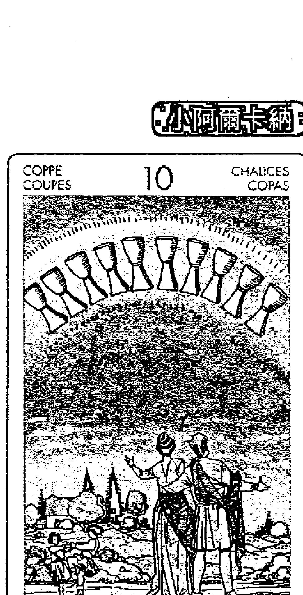

## 聖杯十

### 重要象徵

- 創造力。孩童象徵成功的合夥關係所產生的創造力。不管他們是這對夫婦的子女，還是象徵兩人關係產生的具體結果，都代表在理想的婚姻關係中，夫妻能強化彼此的創造力。
- 四口之家。家庭象徵四位一體——由四個個體結合而成，就像宮廷牌的結構。他們彼此互補、成就對方。數字「四」也指涉四元素和四花色。
- 甜蜜家庭。背景的小屋意指幸福的家庭，一個與外界隔離、溫暖舒適的庇護所。
- 溪流。從一張牌流淌到另一張牌的生命之河，連結起整副塔羅牌，象徵每個人互通的能量和情感紐帶。

聖杯十描繪幸福的家和家庭生活。丈夫摟著妻子的腰並肩而立，兩人舉起雙臂歡呼禮讚，孩子們在旁手牽手高興地起舞。全家人愜意地站在湖岸或溪流旁享受這份寧靜，不遠處是他們溫暖舒適的小屋。頭頂上方的十只金杯在色彩繽紛的彩虹裡閃閃發光。

彩虹。代表誓約和神聖義務。傳統意涵。這張牌代表美滿的婚姻——甚至比原先所預期的更美好。

### 關鍵詞

- 正位——和平、歡樂、幸福、愛、家庭生活、榮譽、美德
- 逆位——不快樂、悲傷、爭執、背棄、分手、焦慮、憤怒

### 寫作提示

你可以寫關於：
- 一個孩子數量眾多的大家庭
- 一棟位於山坡上，正冒出裊裊炊煙的小屋
- 暴風雨後的寧靜和彩虹的出現
- 長遠的承諾

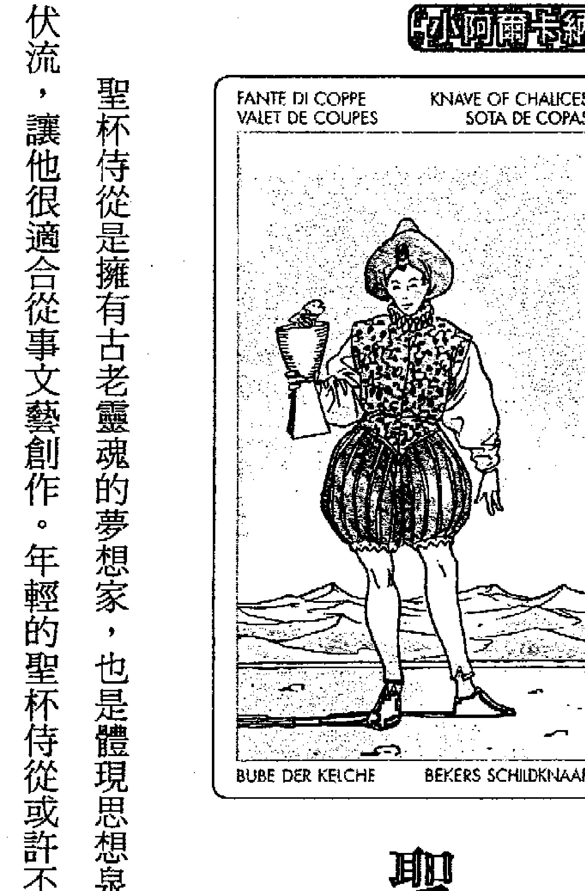

### 重要象徵

- 熱切的青春。擁有孩子般的天真熱忱和旺盛的學習力。
- 情書。負責傳遞可能會對情感、情緒產生衝擊的一切訊息。
- 情緒智商。學習控制情緒的課題。
- 如魚得水。聖杯侍從站在波濤洶湧的海岸，手持一只裝著魚的杯子，這條魚似乎在和他對話。聖杯侍從是水的化身，訴說大海的語言。

聖杯侍從是擁有古老靈魂的夢想家，也是體現思想泉源的藝術家。他內心充沛又隱微的情感伏流，讓他很適合從事文藝創作。年輕的聖杯侍從或許不夠成熟穩重，他的情緒如潮汐般時起時落，偶爾波濤洶湧。

### 關鍵詞

- 正位——親切，同情心、浪漫、討人喜愛、愛做夢、富想像力——有時也代表情場失意。
- 逆位——藉由奉承來獲取好感的虛偽之徒；嫉妒、過度敏感、憂鬱

### 寫作提示

你可以寫關於……
- 破解隱藏情感的訊息
- 情緒課題
- 海的語言
- 水底世界
- 氾濫的洪水

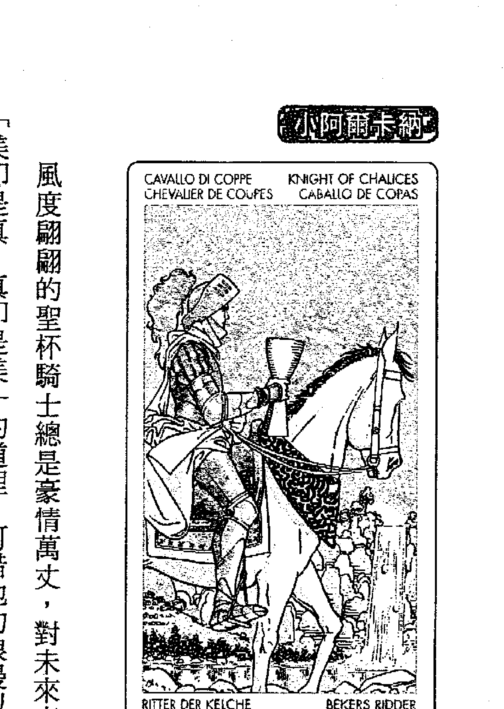

## 聖杯騎士

風度翩翩的聖杯騎士總是豪情萬丈，對未來充滿憧憬。他是不折不扣的理想主義者，相信「美即是真，真即是美」的道理。可惜他的浪漫似無邊際，與每個萍水相逢的女子都有一段情。道別時，他會在門階上留下令人回味再三的吻，也答應會打電話——當他這麼說時的確是真心的。只是當他轉身遇見另一個美女，馬上就把這事兒忘得一乾二淨。

### 重要象徵

- 水汪汪一片。披掛閃亮盔甲的英俊騎士舉杯飲酒，他和白馬立足於寬闊清澈的河邊，河水來自一座沖瀉而下的瀑布。
- 沉默的英雄。聖杯騎士不熱衷冒險，反倒像個夢想家，永遠不疾不徐地策馬緩行。他戴著有翼的頭盔，象徵腦袋中雲霧般繚繞的想像力。
- 占星和元素。聖杯騎士就像水象的變動星座——雙魚座，敏感而且有反省能力。就元素來說，體現了「火」與「水」蒸騰的組合。
- 傳統意涵：這張牌預示某個帶來意外之財的朋友來訪。

### 關鍵詞

- 正位——浪漫的冒險、詩人、藝術家、創造力、夢想家、遠見
- 逆位——無情男子；惡作劇、詭計、騙局、詐騙行為

### 寫作提示

你可以寫關於：
- 充滿浪漫情懷的英雄
- 懷抱偉大願景的夢想家
- 吟遊詩人
- 情感上的冒險和救贖

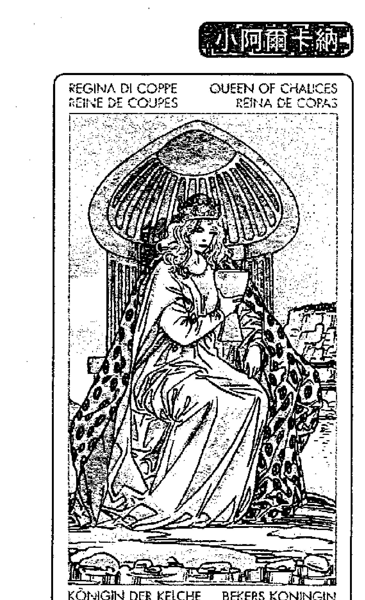

## 小阿卡納

## 聖杯皇后

### 重要象徵

- 情感滋養。負責守護流水般的情感世界。
- 水。這張牌與「水」元素有深刻連結：皇后的王座由珍珠貝殼雕製而成，她若有所思地望著手中的金色高腳杯。一頭波浪狀的金色長髮配上線條如水的銀色綢袍，周遭所見是一座清澈見底的湖泊。

聖杯皇后絲毫不費吹灰之力，就能妥善打理婚姻與家庭生活。她是愛與奉獻的泉源，樂於滋養周遭的弱小族群，既仁慈又敏感。聖杯皇后擁有天賦的直覺和通靈能力，她超高度的同理心簡直就像「讀心術」一般，不但能解讀神諭和夢境，也很適合擔任專業諮商師或治療師。她很有藝術天分，是個匠心獨具的好廚師，不管是烹煮濃湯、燉菜，或是烘焙餅乾蛋糕，都難不倒她。

傳統意涵 這張牌預示男子娶到富有的妻子，或是女子嫁入名門望族。

### 關鍵詞

- 正位 金髮女子；虔誠、溫暖、滋養、療癒、敏感、直覺
- 逆位 愛管閒事、令人窒息或專橫霸道的女人

### 寫作提示

你可以寫關於：

- 表面完美、私底下暗藏秘密的妻子
- 妻子和母親
- 能敏銳感受他人情緒者
- 傳神諭者
- 以愛之名使人透不過氣的女人
- 一個位於海邊的居所

### 重要象徵

聖杯國王親切和善，為人正直，很適合從事與商業、法律、科學、牧師職務或藝術有關的職業。他一坐上王座就陷入沉思，沉著的風度掩飾了內心的熱情。然而，傳統上，聖杯國王被認為是位高權重、行事詭詐的人，所以這是一張警示牌，提醒我們留意身居要職、心懷鬼胎的人。

- 水世界。漂浮的王座刻有貝殼和海馬的圖案。國王戴著魚形垂飾，身著藍色束腰外衣和長披風，左手握有權杖，右手端著酒杯。背景是一艘乘風破浪的商船和一隻躍出水面的海豚。
- 占星和元素。聖杯國王就像水象的固定星座——天蠍座——熱情澎湃。就元素來說，體現了「風元素」與「水元素」幻化而出的氤氳霧氣。
- 傳統意涵。聖杯國王可能是個空有權力的偽君子，但現代的詮釋則認為，他與聖杯皇后是天地造化的一對，聖杯國王是忠貞體貼的丈夫和父親，致力於保護家人的情感不受傷害。

## 小阿爾卡納

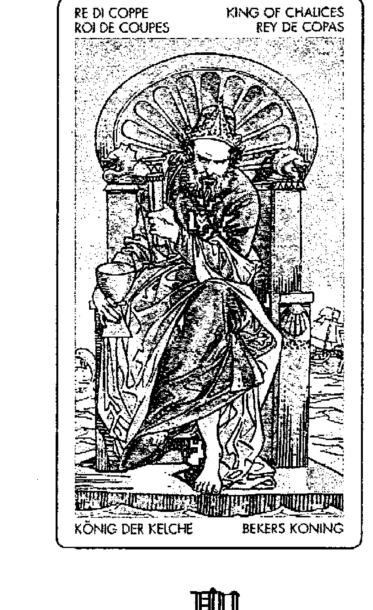

## 聖杯國王

### 關鍵詞

- 正位——善良正直的男人；仁慈、寬宏大量、明智、有教養、同理心
- 逆位——懶惰、不誠實、詭詐、口是心非、偷情、酗酒

### 寫作提示

你可以寫關於：

- 狂熱信仰「進化論」的基本教義派牧師
- 利用祈禱等信仰的力量替人治病的人
- 海洋生物的獸醫
- 偽君子
- 羅馬神話中的海神涅普頓

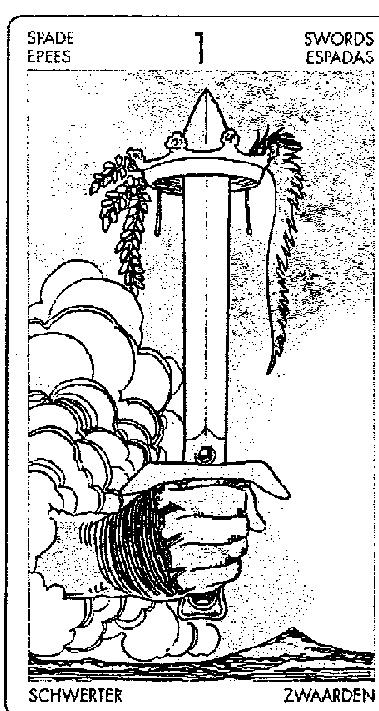

## 小阿爾卡納

寶劍牌對應「風」元素，寶劍一代表智能與思維的具體顯化。「數字一」多半有著這樣的畫面：一隻巨手從湧動的雲層中伸出，握住這張牌的代表物。畫面上高舉的銀色寶劍如同傳說中的「亞瑟王神劍」，鋼質打造的劍身在陽光下閃閃發亮，刺穿一頂裝飾著橄欖和棕櫚枝的皇冠。如同權杖一，寶劍一持於象徵行動力的右手。（聖杯一和五角星一則持於象徵感受能力的左手），不過這柄劍似乎飄浮在對應寶劍的氣流（風元素）中。

## 寶劍一

### 重要象徵

- 嶄新的開始。預示智能／思維領域的境界。「數字一」代表饋贈，這張牌意味著思維邏輯和溝通的才能，就等著你來發揮。
- 虛無縹緲的真相。寶劍切入問題的核心，凸顯思考、理解和語言的本質。它能穿透混亂的迷霧，揭開誤解或神秘面紗。
- 主動防禦。劍有正義、解放和真理的意涵。正義女神和中世紀騎士身上都有配劍，矢志保護無力奮戰的弱者。
- 豐厚報酬。意指征服、克敵，以及戰場上的勝利。這裡的「戰場」可以指涉工作、家庭、愛情、金錢或健康等各種領域。橄欖和棕櫚枝代表透過力量所取得的勝利與和平。
- 國王的皇冠。象徵領導力和權威，甚至是創生宇宙的力量。
- 思考力。創造的潛能。劍尖刺穿皇冠的底部，有「受孕」的意思，所以這張牌也暗示懷孕或新的想法即將誕生。
- 占星。屬「風」的寶劍讓人聯想到雙子、天秤和寶瓶座等風象星座。
- 傳統意涵。代表繁榮興盛或是極大的不幸。逆位則代表女子因不夠審慎，而導致婚約破裂。

### 關鍵詞

- 正位——果決、思維能力、判斷力、勝利、潛力
- 逆位——遲鈍、優柔寡斷、不合邏輯、無能

### 寫作提示

你可以寫關於……
- 打造一具神奇的武器
- 亞瑟王神劍
- 爭執
- 法網恢恢，疏而不漏
- 椎心之痛

### 重要象徵

寶劍二是塔羅世界中最詭異的景象：身穿長袍的女子姿態莊嚴地坐在石凳上，彷彿端坐尊貴的王座。她雙臂橫胸，有如入殮的屍體。她正努力讓肩上兩柄沉重的寶劍維持平衡。多雲陰沉的晦暗天空，只有一彎弦月發出微微的亮光。

- 兩難。這張牌代表一個困難的抉擇，必須在兩種衝突的想法、邏輯或情感中做決定。
- 和解。必須調和兩種不同的觀點。
- 受限的視界。女子的眼睛被蒙蔽，所以「看不見」真相，不過她可以用其他感官去覺察，何況還有第六感直覺的指引——月亮所代表的意涵。
- 沉默的思維。用來遮住眼睛的布，象徵無意識或潛意識心靈。
- 休戰。暗示片刻的和平或暫時停火；有時也代表勇氣。
- 傳統意涵。這張牌代表友誼與和諧。預示女子會收到禮物，或是需要幫助的男子將獲得重要人士的保護。有時也意味著與流氓有所往來。

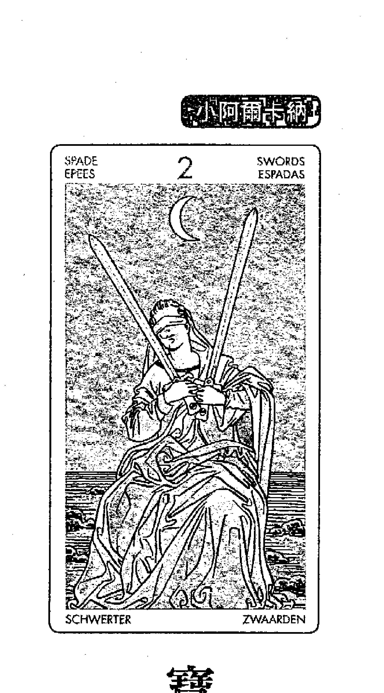

### 關鍵詞

- 正位——決定、抉擇、均衡、平衡、啟蒙
- 逆位——盲目、優柔寡斷、不貞、背叛、謊言

### 寫作提示

你可以寫關於：
- 抉擇
- 休戰協議
- 被蒙蔽的事物
- 晦暗夜空中的一彎弦月
- 獨自在海邊沉思的女子

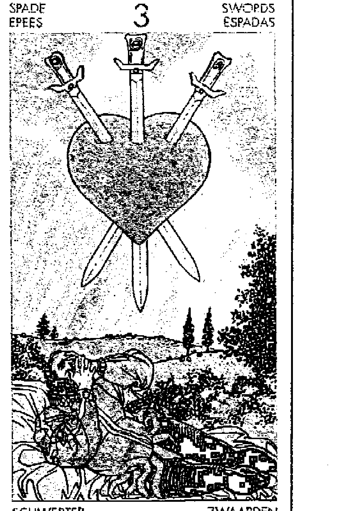

## 寶劍三

寶劍三的畫面幾乎不用多作解釋，它描繪一個心碎和極端悲傷的景象。一顆淌出鮮血、活跳跳的心臟仍然能供養生命，但是這顆心的主人此刻懷疑活著是否還有意義。

### 重要象徵

- 傾盆大雨。一顆脫離軀體的心懸在陰鬱的天空，雨像淚水般簌簌落下。
- 椎心之痛。三柄鋒利的劍以固定的間隔刺穿一顆鮮紅的心臟。
- 離婚。這張牌指涉分居或離婚。三把劍暗示蒙受背叛或不貞，或遭到第三者破壞的關係。
- 懷孕未果。象徵因流產或死產所引起的悲傷。「三」代表母親、父親和子女三者之間的創造力和結合力。
- 胸痛。少數情況下，暗示焦慮症、恐慌發作、心臟病或外科手術。
- 淌血的心。對傷心故事感同身受的人。
- 聖心。讓人聯想到耶穌基督被棘冠刺傷而流血的心，這也許是早期將寶劍三詮釋為修女的原因之一。

### 關鍵詞

- 正位——悲痛、失落、離婚、不貞、意志消沉
- 逆位——治療、復元、因禍得福

### 寫作提示

你可以寫關於：
- 心碎
- 通姦
- 流產或死產
- 暴風雨

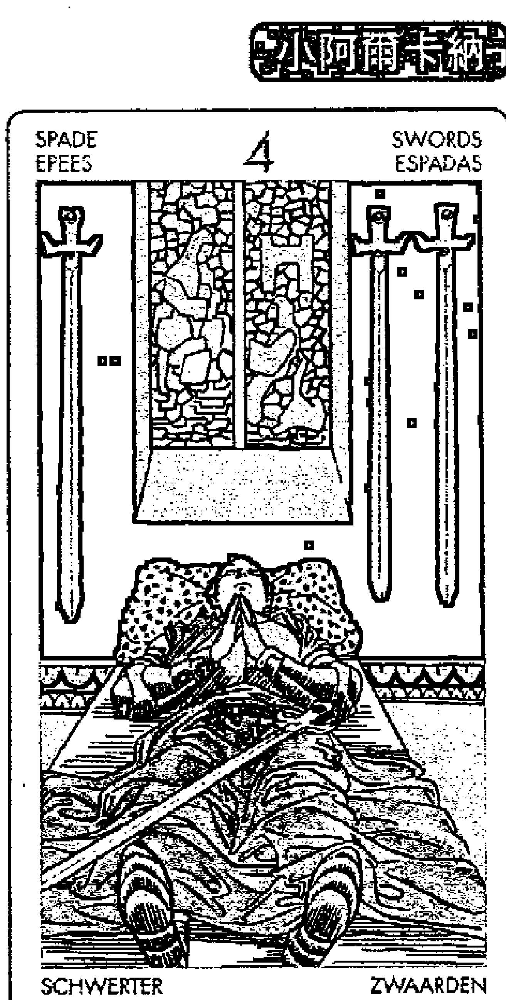

## 寶劍四

### 重要象徵

寶劍四通常象徵短暫但愜意的休息、退隱，或一段沉澱和反省的時期；也或許代表病癒之後的短暫復元期。

- 供人瞻仰。年輕騎士沉睡在彩繪玻璃的柔和光暈中，他的姿勢就像正在禱告般，雙手合十放置胸前。有些版本將騎士描繪成雕刻在棺蓋上的肖像，同樣呈身體平躺、雙手緊握成永恆的祈禱姿勢。
- 世俗憂慮。三柄劍飄浮在半空中，或被固定在教堂的牆上，代表世間的煩惱和憂慮暫時止息，凝結在靜止狀態。
- 準備戰鬥。第四把劍安置在騎士身旁，隨時準備上陣。
- 休息與復元。騎士並未死亡——他只是在睡覺。塵世的戰爭已然獲勝，士兵平靜地休息等待復元。
- 幫手。從背景的彩繪玻璃窗的圖案中，可以看出有人正在幫助另一個人。
- 通宵旅程。代表夢境、神秘旅程或靈魂出竅的經驗。

### 關鍵詞

- 正位——休息、退隱、恢復、復元、放鬆
- 逆位——疲勞、疾病、發燒

### 寫作提示

你可以寫關於：
- 死後的事
- 墓地
- 地窖
- 聖徒的遺物
- 入會儀式

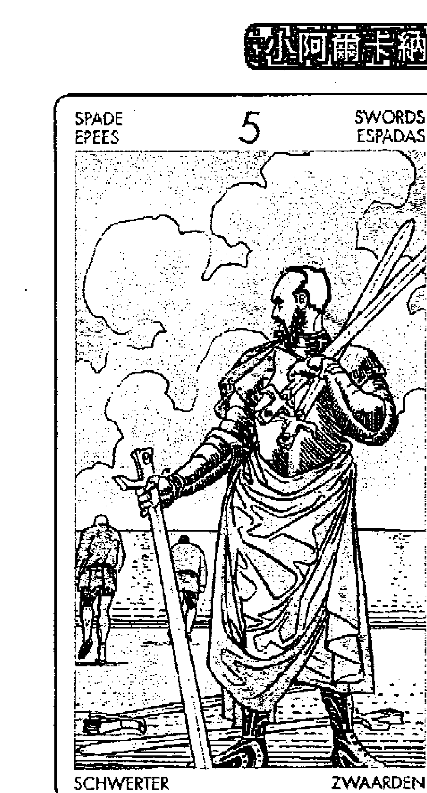

## 寶劍五

寶劍五是描繪挫敗和屈辱的牌，牌中打勝仗的戰士正在囤積戰利品，而兩個敗北的對手則低頭走向遠端的地平線。戰士得意地望著他們離去，臉上露出沾沾自喜的表情。

### 重要象徵

- 心智的對決。寶劍牌中的戰鬥場景通常代表思想方面的衝突或言語爭執。
- 不公平的戰爭。象徵缺乏運動家精神。
- 煙消雲散。天空中快速翻騰的雲朵，暗示勝利為時短暫。
- 數字。塔羅牌的「數字五」幾乎總是意味著麻煩，「五」指出某種危機，並提醒我們，當數字從一進展到十的中間階段時，必須有堅持到底的決心，才有成功的可能。因為此刻是整個事件的轉捩點，態勢可能朝更好或更壞的方向發展。
- 傳統意涵。這張牌暗示財務方面的損失。

### 關鍵詞

- 正位——戰敗、屈辱、墮落、缺乏運動家精神、惡意、誹謗
- 逆位——短暫的勝利

### 寫作提示

你可以寫關於……
- 失敗的苦惱
- 輸不起的人
- 洋洋得意的贏家
- 公開的短暫爭執
- 戰利品

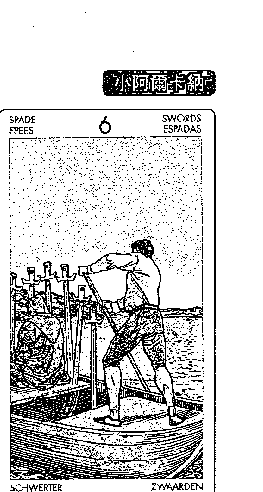

### 重要象徵

寶劍六是整副塔羅牌中最引人注目的牌，牌中的元素涵括了多層次的象徵。這張牌代表從今生過渡到來生，或是從混亂不安的生活，過渡到和平的真實之中。

- 渡河。擺渡人駕著小舟橫越一條小河，從此岸到彼岸。從頭到腳裹在有兜帽的罩袍中的乘客正安靜地坐著。小舟代表漂流於生命之河的每個人，擺渡人是精神導師，而乘客是寓居於肉身的靈魂。
- 靈魂的傷痕。六把劍刺穿船底，像幽靈乘客般矗立著。這說明過往的傷害、傷痕和攻擊已經成為船上永久的裝備，一旦將它們拔出來，必定在船底留下許多破洞。
- 闇導。凱龍（Charon）是古希臘神話中的陰間引渡者，負責載送新的亡靈渡過冥河——如果他們付得起渡船的費用。以往埋葬死者時，往往在死者的眼皮或舌頭下放上一枚金幣，以便支付他們的船資。

### 關鍵詞

- 正位——過渡、旅程、航行、水路旅行
- 逆位——停滯、延遲、永恆

### 重要象徵（續）

- 時間之流。渡船後方洶湧的水流象徵過去，船頭前方的水域則代表未來——水象看起來平靜無波。
- 實際意義。寶劍六經常象徵精神層面的旅程，但也可以代表現實中真實發生的旅程，特別是愉快的短程水路。
- 最新消息。暗示使者或傳信人的抵達。
- 小死亡。這張牌散發強烈的鬼魅氣息，有時暗示某種形式的死亡。正如死神牌極少會真的代表肉體的死亡，寶劍六可能意味著規模較小且較不致命的攻擊，例如肆無忌憚的羞辱或惡毒言語的傷害。
- 傳統意涵。這張牌代表公開示愛或求婚，或是不利的訴訟結果。

### 寫作提示

你可以寫關於...
- 迢迢冥河
- 遙遠或未知的旅行
- 陰間冒險
- 水路行舟見聞## 寶劍七

顯然沒注意到有人入侵。

寶劍七描繪夜裡偷偷行竊的小賊。他鬼鬼祟祟地潛入敵營，盜走無人看管的武器。這時敵人

### 重要象徵

- 警報系統。這張牌意指必須嚴加提防某些正在進行中的偷竊或欺騙行為。
- 雙面諜。牌中的小偷可能是個叛徒或雙面間諜。
- 謹言慎行。寶劍牌與溝通有關，所以小偷可能代表背後中傷人的流言蜚語。
- 宿營。帳棚代表不受自然環境危害的保護傘，以及用來擬定作戰計畫的地方。
- 國旗日。飛揚的旗幟象徵部隊的集結點。
- 傳統意涵。傳統上認為這是一張好牌，有時指涉膚色黝黑的女孩，或是享受平靜的鄉間生活。逆位則預示某項消息即將發布或公開。

### 關鍵詞

- 正位——偷竊、破壞、偷襲、間諜、敵人、不可靠的朋友、剽竊
- 逆位——勇氣、自尊

### 寫作提示

你可以寫關於……
- 小偷、間諜或叛徒
- 流言攻勢
- 被偷的財物
- 百忙中的餘暇
- 營地

## 寶劍八

寶劍八代表陷入苦惱的少女，就像《寶琳歷險記》(The Perils of Pauline) 的女主角。這部於一九六七年發行的美國經典無聲電影中，年輕的女繼承人寶琳一再被見錢眼開的壞蛋綁架和欺騙，又幾度被英俊瀟灑的英雄所拯救。

### 重要象徵

- 苦惱的少女。年輕女子沒有被綁在鐵軌上，而是被蒙住雙眼，綁在一棵大樹旁。
- 囚禁。她被圍成監獄欄杆般的劍陣給困住。
- 立足點。地面泥濘而潮濕，她似乎站在濕地或沼澤裡。
- 受害者心態。女子可能是自願的受害者或斯德哥爾摩症候群，也可能是為某種理想獻身的殉道者。
- 被動的抵抗。女子沒有掙扎，只是低著頭安靜地站著。如果她想要獲得自由，必須先解放自己。因為被蒙住雙眼，所以她得小心翼翼地摸索，穿過整排長劍，才能離開禁錮地。或者，她可以用一柄劍切斷捆綁她的繩索——這是一種暗喻。
- 傳統意涵。這張牌暗示醜聞隨著流言到處散播。逆位則象徵某位親屬的離去。

### 關鍵詞

正位——限制、監禁、圈套、危機、指責、羞辱
逆位——自由、解放、自給自足

## 寶劍九

寶劍九描述絕望。一名女子直挺挺地坐在床上，周圍一片漆黑。她雙手掩面，陷入極度的痛苦。她的棉被皺巴巴地揉成一團，看來已經好幾個小時輾轉反側，無法成眠。她的頭頂赫然浮現九把不祥的利劍。

### 重要象徵

- 起床鈴。象徵夢魘、恐慌、失眠和憂慮，特別是在凌晨三點來襲的那種憂慮，整夜掛念可能降臨在自己或所愛的人身上的厄運。
- 靈魂暗夜。精神上的孤寂——聖十字若望（St. John of the Cross）所描述的「靈魂的暗夜」。
- 黎明前的黑暗。黎明來臨前總是最黑暗的時刻。凌晨三點，當我們被惡夢驚醒或努力對抗失眠時，最害怕的事總是無限地擴大。
- 小型屏風。成排的劍把看起來像是由恐懼和壓力所構成的帷幕。然而仔細看，這些劍沒有形體。劍的表面不曾反光，也沒有暗示景深的陰影。換句話說，這些劍並非真實的劍，只是女人的恐懼投射。

### 關鍵詞

- 正位：夢魘、執迷、失眠、殘忍、悲痛、罪惡感、憂慮
- 逆位：意識、鎮靜、理性

子幻想出來的景象。

寂寞難耐。無比痛苦的女子顯然孑然一身，她不願、或者無法打電話給朋友或家人，以尋求慰藉或陪伴。

守護。許多版本的寶劍九中，女子身上覆蓋著一床繪有天體圖的棉被，象徵在天體的保護下獲得安慰。星體循環說明沒有任何情勢是靜止不動的，不管發生什麼事，地球還是會不停地轉動，我們也會從中得到宇宙力量的守護。

傳統意涵。這張牌代表牧師、祭司或其他神職人員，以及寺廟、教堂或修道院。這張牌也暗示對某個人或某件事的懷疑或疑慮，並非空穴來風。

### 寫作提示

你可以寫關於……
- 揮之不去的夢魘
- 半夜出現的預警或聲響
- 床、毯子或被褥上的圖案
- 夢中出現的故事

## 寶劍十

寶劍十是塔羅牌中最陰森的牌，描繪重度傷害和毀滅。在寶劍的最後一張牌，所有劍都集合在最終的休息處。男子運氣不佳，這些劍全都往他身上招呼，插成恐怖的一長排。厚重的雲層低垂，遠處的天邊只餘下一絲絲銀色光芒，透露嶄新的一天即將到來。

### 重要象徵

- 「他死了，吉姆。」 5 遭到謀殺的受害者四肢攤平，躺在自己的血泊中。這顯然是一起重傷害案件，受害者被刺了十刀，犯案的凶器還插在他身上。
- 情殺案。這無疑是一樁情殺案，可以推測，如果兇手與受害者沒有深厚的關係，應該不致於下手這麼重。
- 線索。死者的手似乎凍結成某種道別的手勢。
- 刀光劍影。多數情況下，寶劍牌代表文字、想法和言語的爭鬥，因此牌中的死者可能陷入惡意的人身攻擊，或是遭受卑鄙的謠言陷害。
- 負面意象。牌面上令人觸目驚心的畫面，充滿受苦、痛苦、幻滅和悲傷的氣氛。
- 邊緣的銀光。事情仍有樂觀的一面，至少還有一絲光明的希望。遠處的太陽正要落下或升上地平線，雲層邊緣閃耀著光芒，新的一天就要開始。
- 最終結局。「數字十一」通常代表結束，牌中的死者無法復活，但他的靈魂最終會得到解脫，可以離開犯罪現場，前往更高的境界。
- 傳統意涵。寶劍十並非代表暴斃的牌，但確實暗示監禁或背叛——特別是後面跟著「數字一一」和國王牌。這張牌讓人聯想到被謀殺的凱撒大帝。

### 關鍵詞

正位——毀滅、挫敗、崩潰、悲傷、謊言、怨恨、謊言
逆位——有利條件、權力、權威

> 5 譯註：「他死了，吉姆。」（"He's Dead, Jim."）是電影《星艦迷航記》中參考伊醫生慣用的台詞。

### 寫作提示

你可以寫關於……
- 一樁震驚社會的情殺案
- 殘忍的謀殺手法
- 肉體的極度疼痛
- 流言蜚語
- 遭到枕邊人陷害

### 重要象徵

寶劍侍從充滿想像力，他是早熟的天才兒童，喜歡閱讀、寫作和說話，天生是當教師、科學家和哲學家的料。他隨時保持警覺，永遠在觀察周遭事物，不錯過任何一點蛛絲馬跡。他的思緒有如夏日的天空透明而清澈，就像風的化身，體現了思考與溝通時那種迅速移動的能量。

- 天空為限。寶劍侍從的腦袋天馬行空，想法靈活多變。
- 航空郵件。傳遞思想方面的訊息，就像穿透大氣（空氣）運送的航空郵件。
- 榮譽學生。當學生的寶劍侍從既聰明又喜歡學習，堪稱模範生。
- 沉思。活潑機靈的年輕人雙手持劍穿越崎嶇的地形，天空布滿洶湧的雲層。他的頭髮在風中飄揚，他彷彿聽見了風中傳來的聲音，暫時停下腳步沉思。不過他的身體微向前傾，重心放在前腳，伺機而動。
- 傳統意涵。這張牌與間諜、監視、秘密任務及秘密僱員有關。

## 寶劍侍従

### 關鍵詞

| 位置 | 描述 |
| :--- | :--- |
| 正位 | 聰明才智、敏銳的觀察力、警戒 |
| 逆位 | 間諜、洩密 |

### 寫作提示

你可以寫關於……
- 思想方面的障礙或突破
- 腦袋空空如也的笨蛋
- 隱隱約約在風裡的聲音
- 歌曲的片斷

## 寶劍騎士

寶劍騎士或許是最符合多數人心目中的騎士形象。他是戰鬥技巧高超的豪俠，性格上更像個戰士，而非情聖。他的盔甲擦得閃亮，隨時準備上陣殺敵。他的行動疾如旋風，伴隨著陣陣風火雷電，仿佛身旁的氣息也激昂不已。然而，暴風雨隨時會結束，當天空再度放晴，他也會找個地方將自己弄乾爽。寶劍騎士精力充沛，但有時不免淪為「匹夫之勇」，以為自己有不死之身。他讓人對「騎士精神」印象深刻，也的確能創造成功的典範，是騎士中的騎士。

### 重要象徵

- 空中攻擊。寶劍騎士體現了風吹火撩、激動易燃的組合，他像風一樣在馬上馳騁，熱氣騰騰的發動攻擊！
- 全速前進。寶劍騎士一馬當先，揮舞著重劍衝向目的地，剎那間人馬迅速移動——馬蹄濺起石頭和塵沙，身後的披風隨之飄揚。
- 協調。有經驗的騎師都知道，騎馬是一種身心協調的活動，人與馬必須完美配合，才能發揮力量。寶劍騎士與跨下的馬匹融為一體，他的心智活動跟座騎一樣迅捷無比。
- 占星。寶劍騎士就像風象的變動星座——雙子座，多才多藝、思考敏捷。
- 傳統意涵。這張牌暗示與對手的爭鬥，或是戰士即將投身英勇的行動。亞瑟王麾下的騎士加拉哈德（Galahad）就是寶劍騎士的典型。

### 關鍵詞

正位——技巧、勇氣、戰鬥、爭鬥、防禦、對立、抵抗
逆位——無聊、諷刺、無能、笨拙、愚行、蠢話、毫無節制、惡作劇、狡猾

### 寫作提示

你可以寫關於：
- 靠鬥智取勝的競賽
- 政治不正確的英雄
- 調查人員或間諜
- 知識的挖掘和探險

## 寶劍皇后

寶劍皇后是塔羅牌中最聰明的女人，她的思緒清晰，能說善道，與生俱來敏銳的感知力和觀察力。其實，如果寶劍皇后不長舌，她就不是寶劍皇后了，不過你大可信任她對世間事物的觀察和看法。有時，長時間的歷練也讓她變得無情。傳統上，寶劍皇后代表寡婦，也指情感有嚴重失落感的人，例如痛失愛人或小孩的女子，有時和流產或不孕有關。

### 重要象徵

- 風象皇后。寶劍皇后掌管智能思維的世界。
- 風象星座。寶劍皇后與「風」有深刻的連結。她的周圍是開闊的天空，以及被風吹彎的樹。王座上刻畫著飛鳥和長著翅膀的天使。她伸出左手，彷彿在測試風向；右手高舉一把劍，象徵行動力。
- 占星和元素。寶劍皇后就像風象的創始星座——天秤座，是親切而有魅力的領袖。就元素來說，體現了「水」與「風」霧氣迷濛的狀態。

傳統意涵。這張牌代表寡婦。雖然這類女子嚐過心碎的滋味，但不代表她們無法享受生命中的美好事物——有時她們也喜歡在聚會中跳舞。

### 關鍵詞

- 正位——雄辯滔滔、優雅的魅力、邏輯思維、洞察力、科學、客觀性、自力更生、政治本能
- 逆位——怒氣、漠然、任性、言辭刻薄、盲從、虛偽

### 寫作提示

你可以寫關於……
- 寡婦或失婚女子
- 婆婆或岳母
- 毒舌、刻薄的女人
- 熱衷社交聚會的女子

## 小阿爾卡納

## 寶劍國王

寶劍國王是忠實的盟友，也是令人頭痛的勁敵。他有讓人信賴的領袖特質，靠嚴謹的邏輯作出明智的判斷。氣勢逼人的寶劍國王面露怒容，身披全副鎖子甲和紅色披風，比劃著手中的長劍，鏗鏘有力地陳述論點。寶劍國王機敏好鬥，時而有跋扈的傾向。他往往過度重視枝微末節，有時顯得虛情假意、專制和狡猾。

### 重要象徵

- 天空國度。牌中的象徵物強化了寶劍國王與『風』的關聯。他的王座上刻了蝴蝶和翅膀的圖案，腳底下散落著被風吹動的落葉。
- 元素與占星。寶劍國王代表風象的固定星座——寶瓶座，是具前瞻性和社會意識的君主。
- 傳統意涵。這張牌代表結束不利訴訟的時刻，也牽涉到律師、醫師、外科醫生和參議員等身份的人。

### 關鍵詞

- 正位——判斷、命令、權威、法律
- 逆位——殘忍、倔強、野蠻、邪惡

### 寫作提示

你可以寫關於……
- 律師
- 國會議員
- 政客或暴君
- 外科醫生

## 小阿爾卡納

## 五角星一

五角星牌對應「土」元素，五角星一代表有形物質的存在，承諾一個充滿可能性的世界。它以豐富的物質界為起點，一路積累出精神面的財富。

### 重要象徵

- 新鑄的銅板。五角星一象徵物質領域的新階段，它像一個贈禮，代表你可以期待獲得財富和健康。
- 不動產。沒有任何一張牌像五角星這樣的務實和腳踏實地，因為它本身就是土元素。這張牌預示新生命的到來——可能是嬰兒的出生，或邁向健康的生活。五角星代表金錢、事業、加薪、晉升或投資獲利，甚至暗示獲得土地或新家。最具體的東西莫過於不動產了，這是根植於實質財產的投資，有別於本身沒有價值的紙鈔、股票或債券。此外，五角星一也描述珍貴的理想和精神層面的價值觀。
- 塵世樂園。牌面下方的園林象徵休息和反省、混亂中的秩序。圍牆代表安全和保護。
- 圓圈。五角星的圖案是一個畢達哥拉斯學派的象徵，星星代表五種感官，圓圈則代表所有官能的結合。牌中的五角星是以往帝王們用來象徵統治權的寶球。
- 空靈的事物。「雲」象徵更高層次的思維，隔開不同的界域。
- 傳統意涵。《塔羅牌圖解要點》認為，這張牌是塔羅牌中最討人喜歡的牌，象徵多層面的財富，暗示擁有資源追求夢想，肉體上也充滿享受和舒適感。
- 占星。屬「土」的五角星讓人聯想到金牛、處女和摩羯座等土象星座。

### 關鍵詞

- 正位——幸福、舒適、狂喜、報酬、金錢、繁榮、收入
- 逆位——貪財是萬惡之源、濫用資源、揮霍財富

### 寫作提示

你可以寫關於……
- 一枚用以實現夢想的神奇硬幣
- 隨身攜帶的幸運錢幣
- 創業基金
- 水晶球
- 受精卵

## 五角星二

五角星二是代表平衡和改變的牌，牌中的雜耍動作，就像我們同時要應付多種事務，或是付帳單時，必須努力保持收支平衡的寫照。

### 重要象徵

- 要特技。雜耍藝人集小丑、弄臣和表演家的角色於一身。他熟練的戲法讓兩顆球在雙紐形空間中進進出出，變化萬千。（象徵「無限大」的雙紐線標記也出現在魔術師和力量牌）雜耍動作也暗示得與失、強與弱之間的消長和流轉，亦即處於穩定流動狀態下的生命。
- 自然平衡。五角星代表金錢和物質，暗指在兩者之中力求平衡，或是生活在兩個世界（如工作和家庭）的人。
- 腳踏兩條船。暗示用情不專、玩弄感情的人。
- 舞伴。「雙紐標記」使人想起太陽與月亮的宇宙舞碼，就像是在天空中繞著彼此起舞的男女。
- 人微言輕。這張牌喻指一個人只有『兩分錢的價值』，不受重視。

### 關鍵詞

- 正位 和諧、平衡、靈巧、耍花招
- 逆位 激動、混亂、難堪、尷尬的處境、憂慮、困難

### 寫作提示

你可以寫關於：
- 同時處理許多事務
- 踢踏舞
- 巡迴劇團或演唱會
- 兩個相互交融的場景
- 一個故事，兩個觀點

## 五角星三

五角星三是闡述藝術本質的牌，描繪一名技藝精湛的石匠，他所創造的藝術品能到達比現有世界更美麗、更有秩序的境界。他聽任神明的引導，也跟隨手持創作藍圖的主教和僧侶的指示作業。

### 重要象徵

- 雕刻品。年輕的雕刻家在聖殿中為真人大小的雕像做最後的修飾，身旁的主教和僧侶正討論工作進度。這張牌暗示將精神面的理想和信仰轉變成有形物質的過程。藝術作品讓上帝的恩典及其存在被具體的感知。
- 藝術創造。錘和鑿是具毀滅性的武器，但在藝術家手中卻變成創造性工具，用來打造一個新的真實。創作者可以靠藝術提升自己的身分地位——他站在比主教更高的位階。不過，許多創作者卻認為所謂「創作」，是在傳達某種願景，以及遠比自身更偉大的意識，創作者或藝術品本身，充其量只是一種媒介。
- 天堂之光。形狀像五角星的三面彩繪玻璃窗，似乎將雕像包圍在神聖的靈光之中。
- 教堂。背景中的教堂代表上帝的居所，同時提醒我們，人的「肉身」也是一座聖殿，我們全都是寓居於有形肉體中的靈魂。
- 三位一體。拱門下方的三顆五角星呼應身心靈合一的狀態。
- 傳統意涵。五角星三若出現在男性案主的牌陣中，顯示他的長子將名聲鵲起。逆位的五角星三則暗示孩童或童年時期幼稚的衝動。

### 關鍵詞

正位——技巧、創造力、才能、崇高的名聲、尊嚴、貴族、財富
逆位——平凡、幼稚、瑣碎、軟弱、謙遜

### 寫作提示

你可以寫關於：
- 讓你文思泉湧的某件事或某段時期
- 藝術與技術的差別
- 聽命行事
- 接受批評
- 寫作障礙

## 五角星四

五角星四是一張「守財奴牌」──面露慍色的國王吝於和別人分享任何東西。他坐在與外界相隔遙遠之處，懷中緊抱著一枚金色錢幣。另兩枚錢幣被他牢牢地踩在腳下，還有一枚錢幣置於頭頂。

### 重要象徵

- 點石成金。貪婪、吝嗇的國王就像麥得斯（Midas）──他的故事告誡人們過猶不及的道理。被麥得斯觸碰到的任何東西都會變成黃金，然而，這顯然是個詛咒而非福氣。事實上，財迷心竅讓他失去了唯一的寶貝女兒。
- 四元素。四枚錢幣代表物質財富、理智、情感和心靈。
- 財庫。守財奴坐在一個藏寶箱上，裡面裝滿更多珍寶。
- 優先順序。守財奴只關注有形的物質，執拗地確保錢財萬無一失；他可能也相當關切身體的健康。

傳統意涵。這張牌暗示一定程度的金錢保障和穩定性，或是單身漢將得到女子的善意回應。

身體語言。守財奴將五角星擱在腿上嚴加看管，他的身體語言是：「退後！離我的寶貝遠一點！」

### 關鍵詞

- 物質佔有欲、資產管理、自我保護、限制、孤立
- 延遲、對立、阻礙、損失、修道院

### 寫作提示

你可以寫關於……
- 自私
- 隱瞞
- 貪婪
- 抑制
- 孤立

## 五角星五

五角星五描繪貧困飢餓的處境，以及因為貧窮而引發的恐懼。兩名乞丐冒著大風雪奔波趕路，途經一扇透出溫暖燈光的教堂彩繪窗。

### 重要象徵

- 苦行僧。《塔羅牌圖解要點》認為牌中的乞丐是過著貧窮生活的「托缽僧」。不同於當時有組織的僧侶團體，托缽僧甘於貧窮，連所屬特定的修道院都沒有。他們在街頭傳教，生活所需完全仰賴善心人士的供養。
- 希望。又餓又髒的托缽僧在風雪中蹣跚前行。燈火通明的教堂就在不遠處，或許可以提供一點庇護和溫暖。
- 赤貧。其中一人拄著拐杖跛行——除了一無所有，他還缺了一條腿。這樣的赤貧狀態也暗示精神上的貧困。
- 為德不足。這兩人顯然陷入極大的困境，或許因為不見容於有組織宗教的信條，也或許是因### 關鍵詞

- 貧窮
- 物質匱乏
- 窮困
- 破產
- 毀滅
- 無秩序

- 愛情困擾
- 縱情酒色
- 失和
- 衝突

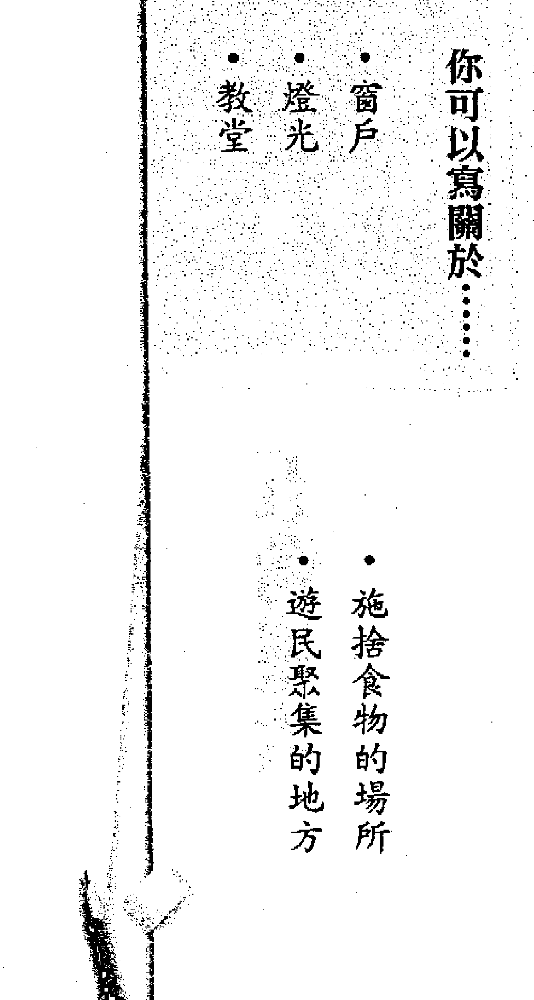

### 寫作提示

你可以寫關於：

- 教堂
- 燈光
- 窗戶

- 遊民聚集的地方
- 施捨食物的場所

五角星六是代表慈善、爱心和善意的牌，描绘事业有成的商人慷慨地与人分享所赚得的财富。他拿着天平让人想起「正义牌」中的景象，象征社会公理的均富理想。

### 重要象徵

- 货币。五角星六与工商业密切相关。就像人们常说的，钱不是长在树上，而是透过买卖和投资赚来的。有些人在投资获利之余，会藉由行善来回馈社会。
- 公平交易。牌面上的商人做生意童叟无欺，他的天平从不偷斤减两。
- 权利和义务。牌中的善心商人比多数人富有，也知道权利和义务是一体两面，他实践了「有能力就该分享而非囤积」的信念。
- 智能不足。两名乞丐类似「五角星五」中的托钵僧，裹着又脏又破的毛毯。其中一人用布包裹着头部，象徵心智上有所缺损（就像许多无家可归的游民，可能患有心理疾病或者精神不稳定）。

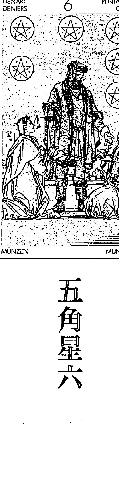

## 五角星六

能量交换。这张牌提醒我们金钱并非万恶之源——而贪婪却是。有些人在接受别人的恩惠或礼物时会感到不自在，其实当任何有价的东西易手时，金钱只不过是一种量测双方资源的工具。

有钱难买真情爱。暗示某人想用钱买通爱情、关怀，或众人钦羡的目光。

### 關鍵詞

**正位**
- 生意
- 商业
- 贸易
- 慈善
- 恩惠

**逆位**
- 羡慕
- 嫉妒
- 未满足的野心
- 阶级斗争
- 重新分配财富

### 写作提示

- 乞丐
- 一项善行
- 商人
- 伸长的手
- 慈善商店

## 小阿爾卡納

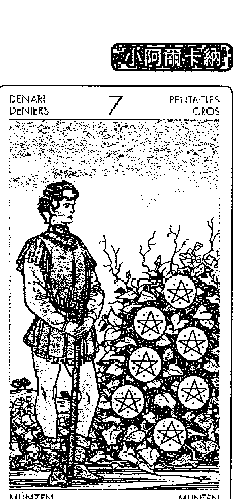

## 五角星七

五角星七是一張關於耐力、堅忍和期待的牌。年輕農夫凝視著已經長出七顆成熟五角星的作物，雖然收割的季節指日可待，但最後的收成卻還是個未知數。

### 重要象徵

- 種子基金。錢當然不會長在樹上，但是這張牌說明細心栽種農作物，財富或物質成就還是有成長的可能。
- 遲緩。暗示新計畫開展後，會歷經短暫的停滯與怠惰期。
- 耐心。萬物之母可催不得，耐心是一種美德。
- 別急著數小雞。雖然成功在望，但這張牌警告我們，就算夢想著大豐收，也不可過於篤定，因為難保未來一場暴風雨，就會掃平所有辛苦照料的作物。這張牌呼應一句古老的格言：「在小雞還沒孵化前，別急著數小雞。」

傳統意涵。這張牌代表爭執和鬥毆、足智多謀，或是加薪和升官。

### 關鍵詞

正位——財務、交易、討價還價、獲利、大發利市

逆位——金錢的煩惱、借貸的焦慮、缺乏耐心、一無所獲

### 當作提示

你可以寫關於……

- 埋入土壤的種子
- 成熟的果實
- 剛萌芽的想法
- 監視
- 稻草人

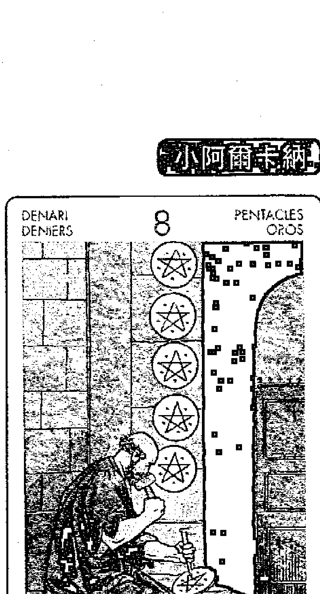

## 五角星八

### 重要象徵

五角星八代表謹慎做好準備。一名木工在工作台前，仔細雕刻著許多枚五角星工藝品。這名技術純熟的匠人不斷磨練技巧，設法製作出可以賣錢的東西。他把商品放在顯眼的地方展示，隻身在人來人往的街頭埋首工作。

- 勞動所得。還記得『五角星三』的藝術家嗎？這張牌中是與他對照的『匠人』，從勞動中獲得報酬。工匠的作品或許不像藝術家的作品那樣精雕細琢，但是他以數量的優勢彌補了品質上的不足。
- 藝術與工藝。工匠縱然不是那麼講究藝術精神，卻顯得更加實際。他比常挨餓的藝術家能創造更多收入，也有固定的棲身之所。當然，他也可能提升追求的層次，因為他更能勝任身體與心靈合一的工作。
- 製造錢幣。有些版本描繪石匠在一連串的金色圓盤上雕刻五角星圖案，幾乎是很實際的在『製造』／賺（make）錢。
- 自我保護。匠人身上厚重的罩衫，保護他在工作中不受木屑或石屑的傷害。
- 傳統意涵。這張牌象徵某人擁有物質面的才能，例如農業和工程方面的專業。

### 關鍵詞

正位——手工藝、學徒、研習、實用技巧、賺錢的良機、可買賣的藝術品、受雇

逆位——缺乏企圖心、虛榮、貪婪、因小失大

### 寫作提示

你可以寫關於：

- 雕刻品
- 木工
- 手工藝品市集
- 商展
- 藝術品與工藝品之間的差別

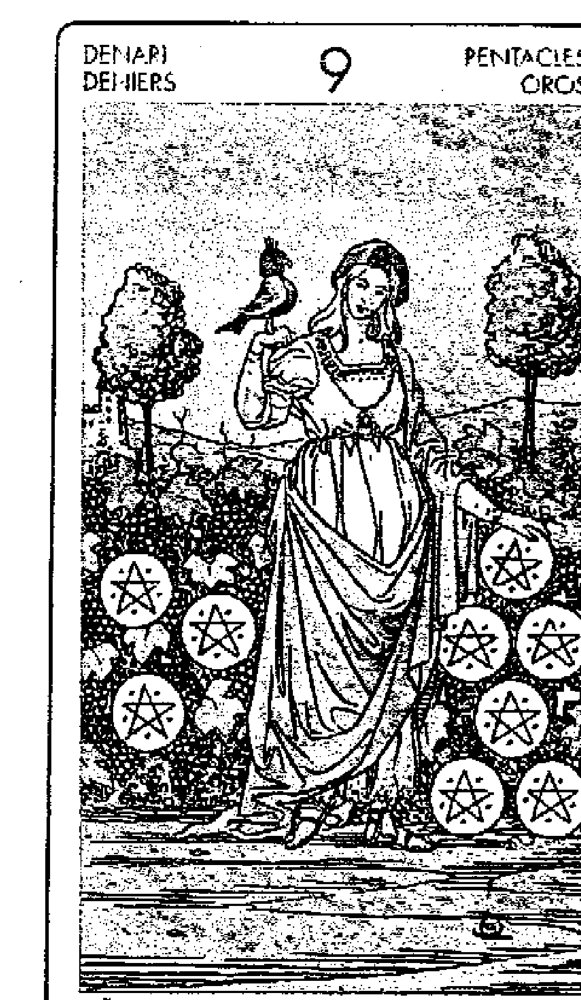

## 五角星九

五角星九描繪富庶與繁榮的景象。妥善修剪照料的園林中，出現一名舉止優雅的女子。她的手上托著一隻隼，雖然看似孤單，卻很能自得其樂。

### 重要象徵

- 金錢安全感。象徵透過繼承或投資行為而獲得的財富保障。這張牌代表好運，以及對資源的妥善管理。
- 妥善管理。
- 世襲的莊園。遠處勉強可見的莊園是一大片地產中的主要建築，代表財富和特權。
- 當機會來敲門。女子在對的時機點做了對的事情，她有為自己創造機會的本領。
- 舒適生活。九顆五角星在葡萄藤中慢慢成長，即將到來的收成確保日後享有富足的生活。
- 圍籬。蔓生的葡萄藤強化了安全感，就像一道牆般形成有力的支撐。這也象徵女子設下標準，挑選有意保全的事物，剔除掉不要的部分。
- 馴服自然。花園象徵在混亂中修整出來的秩序，女子已經成功馴服大自然，打造出舒適的環境。她帶著皮套的手托著一隻受過訓練的隼，這種猛禽是出了名的難以馴服，但是她能夠輕鬆自若地操控這隻鳥。

### 關鍵詞

- 正位——物質的富足、繼承財產、審慎、安全、成就、孤獨、平靜
- 逆位——偷竊、欺騙、寂寞、坐立不安

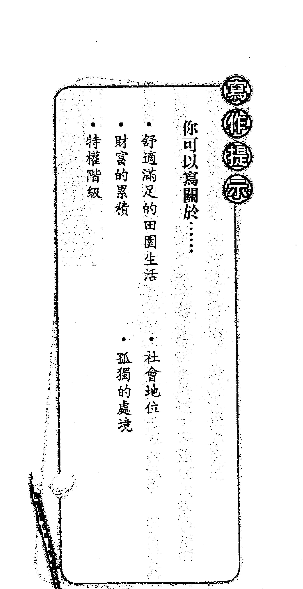

### 寫作提示

你可以寫關於……

- 舒適滿足的田園生活
- 財富的累積
- 特權階級
- 社會地位
- 孤獨的處境

## 五角星十

五角星十描繪三代同堂的景況。一個延綿三代的家庭同住在一棟中世紀古建築，成員包括一對年輕夫婦、幼兒，以及白髮蒼蒼的祖父。代表興盛和滿足感的五角星十著眼於大量的細節，符合我們對於這樣一張牌的期待。這種豐足感不僅是物質層面的，也包含情感層面。

### 重要象徵

- 家庭生活。五角星十多半暗示富裕的家庭生活，以及資源、智慧、經驗、信仰……等價值觀代代相傳。
- 生命樹。人物被安排在十顆五角星的後方，全部的五角星構成一棵「卡巴拉生命樹」的圖形。
- 社會福利。老人披著象徵財富和地位的精緻斗篷。
- 灰狗。狗群暗示這個家族的高貴地位。灰狗在歷史上是專屬貴族階級的名貴犬種。
- 穩定結構。年輕夫妻站在拱門下，這種古代建築至今仍是最堅固的結構，象徵永久持續和彼此扶持的家庭關係。

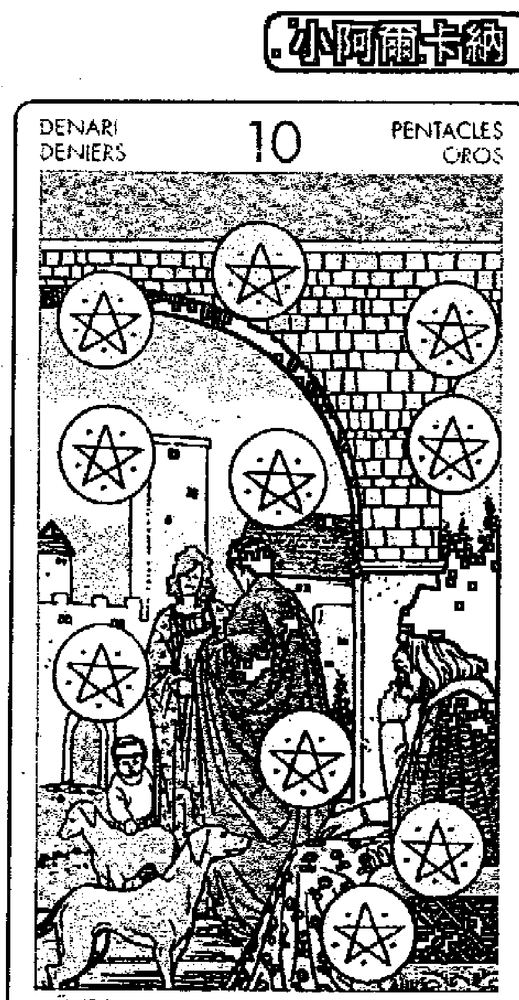

### 關鍵詞

正位——家庭生活、住居、繼承、補助金、遺產

逆位——不和諧的關係、家庭成員之間的爭執

- 井然有序。在經典牌陣「凱爾特十字陣」中，有個位置保留給一張稱作「家」的牌。這個位置的牌是描述與你最親近的人，也就是每天都會見面、對你非常瞭解的人。五角星十在許多方面完美地闡釋了「家」的概念，也代表住在同一個屋簷下的好幾個世代。
- 尊重。年輕夫妻與長輩之間隔了一道牆，暗示兩代相處合宜的界線。
- 傳統意涵。這張牌象徵賭博、博弈遊戲和損失。

### 寫作提示

- 老人與狗
- 牆
- 嬉戲的小男孩
- 家族傳統
- 兩代間的糾葛

## 五角星侍從

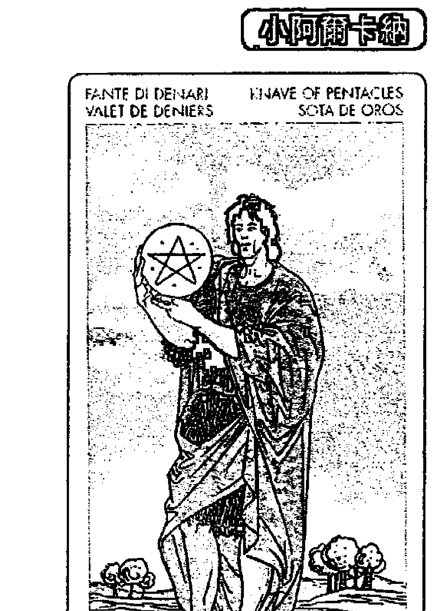

五角星侍從是腳踏實地的年輕人，勤奮好學，喜歡照顧人，而且有些固執。儘管他擁有高超的技能，但是生性謹慎，不尚冒險。他是「土」的化身，體現了有形物質世界的能量。

### 重要象徵

- 世上之鹽。五角星侍從手持一個超大號的五角星，彷彿正展示一件藝術品。他身披綠色的斗篷在綠色山谷中緩步前行，聚精會神於手中的珍寶。
- 包裹快遞。專門傳遞物質面的訊息。
- 學跑步。五角星侍從雖然年輕力壯，但是運動神經還沒發展健全。他對日常事務的處理總是顯得笨手笨腳，但是一到了戶外，身手馬上靈活起來，能穿山越嶺，長途跋涉。健走和露營是他熱愛的休閒活動。
- 傳統意涵。這張牌代表膚色黝黑的年輕人、年輕軍官或士兵，以及孩童。

6 譯注：《新約·馬太福音》中，耶穌對門徒說：「你們是世上的鹽，鹽若失了味，如何才能再鹹呢？」這個詞喻指珍貴的品德、社會中堅份子，或是腳踏實地、沒有壞心眼的意思。

### 關鍵詞

正位——求學、體能發展、有形物質

逆位——發展遲緩、晚熟

你可以寫關於……

- 露營
- 徒步環島旅行
- 物質上的追求
- 土裡土氣的樣貌

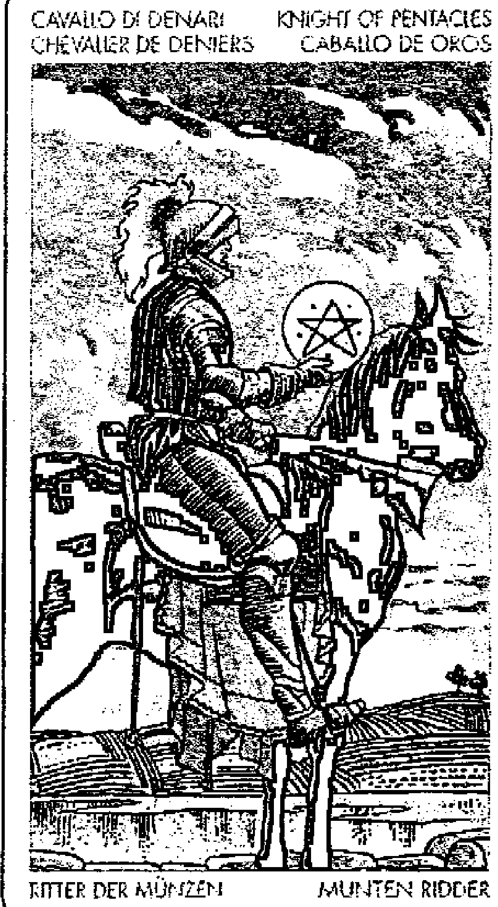

## 小阿爾卡納

## 五角星騎士

### 重要象徵

五角星騎士顛覆了一般人對騎士的印象。他的動作算不上敏捷，也不太懂得生活情調，當其他騎士們出門歷險時，他就留下來負責例行的邊界巡邏勤務——他的任務似乎是處理其他騎士所忽略的日常瑣事。五角星騎士確實有些遲鈍，不過他的個性務實而有毅力，對細節有一種不可自拔的挑剔。他總是慢條斯理，得花較多的時間才能完成一件事。

- 元素。五角星騎士體現「火」與「土」兩種元素平和溫順的結合狀態。
- 慢動作。五角星騎士把他的駿馬換成一匹粗壯的黑色勞役馬。他佇立在河岸邊，仔細端詳手上的一枚五角星——他和座騎幾乎都處於靜止狀態。
- 緩慢的生長。河對岸有幾片耕地，田裡的農作物冒出新芽，生命正用緩慢的速度成長。
- 占星。五角星騎士代表土象的變動星座——處女座，具有勤懇、保守的性格。
- 傳統意涵。逆位的五角星騎士暗示暫時性的失業。

獲取更多好書，請加微信：13641926204 或 QQ:715104687

### 關鍵詞

- 正位——剛強、效益、責任、實用性
- 逆位——懶惰、停滯

### 寫作提示

你可以寫關於：
- 身材壯碩的年輕人
- 長期的計畫
- 成天坐在電視機前的人
- 汲汲營營於物質目標的追求

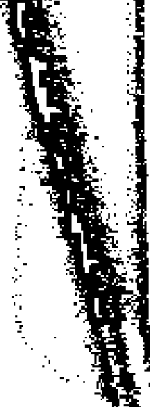

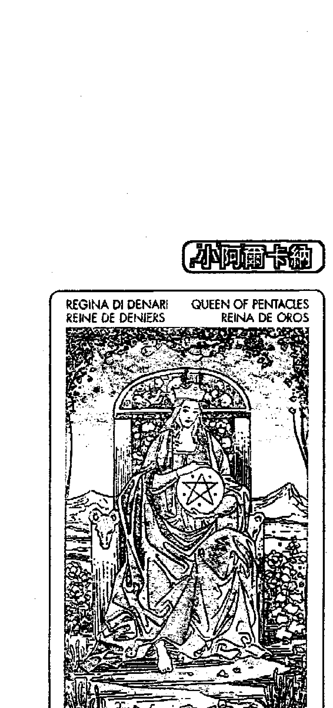

## 五角星皇后

五角星皇后喜欢追求感官享受，拥有圆润丰满的身材。她精明又干练，投入的时间和能量往往都能获得丰盛的报酬。五角星皇后是天生的治疗者，适合担任医生或护士，尤其喜欢陪伴儿童。此外，她精于园艺，总是在窗台边或花圃里种满植物，也很适合从事室内装潢或设计工作。

### 重要象徵

- 土象皇后。五角星皇后是和蔼沉静、不爱出风头的女人，她愿意大方地释出金钱、时间和情感给身边的人。她坐镇「喜悦之园」，就像「女皇牌」的场景。她的王座装饰着公羊头——这是摩羯座的符号。结实施累累的果树交织成凉亭，为她遮荫猛烈的阳光。她从手中的五星角看见了许多个世界。
- 占星与元素。五角星皇后代表土象的创始星座——摩羯座，就像个精明的企业家，为公司累积了许多资源。就元素来说，她体现了「水元素」与「土元素」的丰饶结合。
- 传统意涵。这张牌预言将收到某位富有亲戚的赠礼，或是年轻人获得快乐富裕的婚姻。

### 關鍵詞

- 正位：財富、安全感、慷慨、富麗堂皇、自信、坦率
- 逆位：邪惡、懷疑、掛慮、恐懼、不信任

### 寫作提示

你可以寫關於：

- 園丁
- 花店老闆
- 偷偷懷孕
- 富婆
- 肤色黝黑的神秘女子

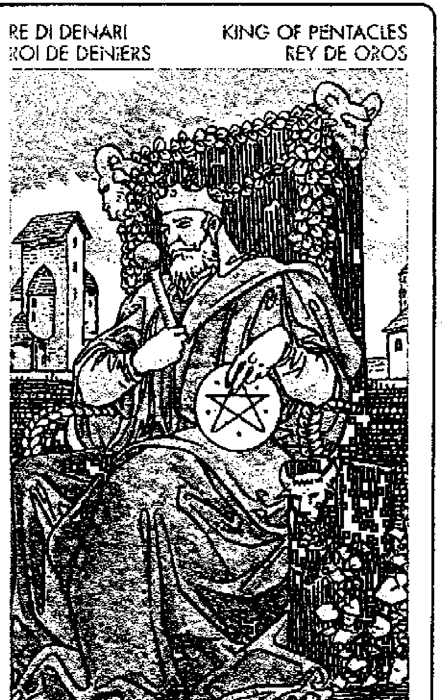

## 五角星國王

五角星國王就像一個穩健的商人，以數學般的精密頭腦統理整個王國的事務。他勤懇務實，對複雜的問題自有一套巧妙的解決方式。他的性格沉著理性，似乎毫不敏感，也很少生氣，然而他一旦動怒，往往一發不可收拾。五角星國王喜歡幫助他人從工作和關係中獲得財物和報酬，也善於經營深刻持久的盟友與夥伴關係。

### 重要象徵

- 土的王國。五角星國王的王座是劈鑿而成的巨大結構，像大地一樣厚重而穩固，上面裝飾著「土」元素和金牛座的符號——公牛頭。他的身旁還環繞著葡萄藤蔓，象徵著財富和豐饒的物資。
- 占星和元素。五角星國王代表土象的固定星座——金牛座，是一位穩定可靠的君主。就元素來說，體現了「風」與「土」乾燥多塵的組合。
- 傳統意涵。這張牌與數學天賦、成就和成功密不可分。逆位則象徵邪惡的老頭或危險的男性（原文未完整顯示）。傳統上，這張牌代表膚色黝黑的男人、商人、雇主，以及數學、科學或物理學教授。

### 關鍵詞

- 精明的商人
- 財富
- 投資
- 生意眼光
- 數學能力
- 成功

- 惡習
- 軟弱
- 醜陋
- 倔強
- 墮落
- 危險

### 寫作提示

- 國王
- 自然科學家
- 白手起家的人
- 政治掮客
- 原本堅定的目標，突然遭遇不可抗力的阻撓

## 結語

我希望本書能幫助你在融合塔羅牌的寫作上，奠定堅實的基礎。你或許已經發現了幾個能改善目前寫作計畫的點子，以及發掘出能創造更多故事、詩句和散文的靈感。雖然這是本書的結尾，但親愛的塔羅作家，你才正要開始踏上愚者的「追尋之旅」。祝你好運，寫作愉快！

柯琳·肯納

## 【塔羅術語與象徵小辭典】

IHVH——上帝神聖名號的希伯來語首字母縮寫；象徵小阿爾卡納的四種花色。

Yod——希伯來字母；上帝之手；神性；天賦；光的降臨；生命力從精神落實為物質。

α與ω——希臘字母的頭、尾兩個字母；開始與結束。

## 二劃

七弦琴——智慧；中庸之道；預言；七根弦具備數字七的神祕特性。

二元性——平衡；均衡；對立；抉擇；異性相吸。

八角星——宇宙秩序與生命煥發的能量。

八角形——介物體；精神的重生；介於正方形與圓形之間的中

力量牌——女子輕輕扳住獅子下顎，耐心控制著可能將她生吞活剝的強大力量。

匕首——陰莖；男子氣概。

十字路口——抉擇。

十字形記號——保護。

## 三劃

三合——少女、母親和老

三合一女神（Triple Goddess）——少女、母親和老媽；對應聖父、聖子、聖靈等三位一體的神。

三葉草——三位一體。

三角形——形而上學的符號。

上帝之名（Tetragrammaton）——不可直呼的上帝名諱，由四個希伯來字母 Yod、Heh、Vau 和 Heh 組成。

上／下——高我；神性自我。

土——有形物質的顯化。

土星——代表界限、限制和時間的行星。

土象星座——黃道帶上的「維持者」，包括金牛座、處女座、摩羯座。

大阿爾卡納——塔羅牌的二十二張「大奧秘」；通常代表不受我們控制的宇宙力量。

女皇牌——母親的原型。女皇善於滋養、保護萬物——包括人類。

女祭師——神秘謹慎的女祭師知曉生命的奧秘，但只願意和智者分享。

小阿爾卡納——塔羅牌的五十六張「小奧秘」，代表世俗事件，以及在我們控制之中的力量。

小舟——搖籃；子宮；身體。

小麥——豐裕富足；生長；收穫。

山——天國與塵世的交會處；上升；奮鬥；障礙。

山羊——摩羯座的象徵。

山谷——生育力；栽培；水。

弓和箭——陽光；愛的苦痛。

弓箭手——提供方向；射手座的象徵。

## 四劃

不死鳥——埃及神話中的長生鳥，每隔五百年便引火自焚，然後從自己的灰燼中重生；毀滅與再造；與太陽和月亮有關。

井——大地之母子宮中的水，可令人恢復精力；願望實現的源頭。

五角星——唯物主義；價值觀；貴重物品。

五角星形——完美和完整的象徵。每個頂點象徵人體五個附肢：頭、雙手雙腳之一。也象徵古代四元素再加上第五元素——精神。

六角星——男與女的結合；物質與精神的交集；所羅門封印。

公牛——金牛座的象徵。

公羊——牡羊座的象徵。

天王星——象徵反叛和意外事物的行星。

天平——正義；平衡；天秤座的象徵。

天使——無形的力量；出現在塔羅牌的四位天使長為「風天使」拉斐爾（戀人）、「火天使」米迦勒（節制）、「水天使」加百利（審判），以及「土天使」烏列（惡魔）。

天空——半球形的天國。

天鵝——愛；孤獨；音樂；詩；自我轉化。

太陽——啟發；生命之源；在占星學上代表自我與自我意識。

太陽十字——等長的十字雙臂代表男女或陰陽的結合。

太陽牌——白晝明亮的光線讓萬物無所遁形，即使是陰暗的人也會現身歌頌生命。

孔雀——永生。

手——手張開代表施予，合起來代表克制；舉起的手代表祝福或誓約。

手套——傳統上，在較高位者面前，我們會脫下右手手套以示尊敬。

手提箱——旅行；情感的包袱；業；必需品。

斗篷——遮蔽物；分隔；隱藏的事物。

方向：

- 東——風；寶劍的能量。
- 南——火；權杖的能量。
- 西——水；聖杯的能量。
- 北——土；五角星的能量。

日出——起始；啟蒙。

月亮——反射光線；激發靈感；量測時間；生命循環；占星學上與情緒和直覺、潛意識有關。

月亮相——深植於無意識，象徵無法理解或辨識的神祕事物。

月相——包括新月、盈月、滿月、虧月等變化。

木星——代表幸運和擴張的行星。

水平線——平衡與穩定性。

水精——水元素生物。

水道——通道；分娩。

火象星座——黃道帶上的「感覺者」，包括巨蟹座、天蠍座和雙魚座。

水——古代四元素之一；精神、意志、靈感、慾望；淨化的力量。

火花——創造。

火星——代表能量、侵略和戰鬥的行星。

火焰——精神；意志。

火象星座——黃道帶上的「創始者」，包括牡羊座、獅子座和射手座。

## 五劃

世界牌——代表完成和成功，是愚者旅程的最後一站。

世界樹——又稱「宇宙樹」或「乾坤樹」，在斯堪地那維亞古神話中，此巨木的枝幹構成了整個世界。

主教冠——教皇、主教、修道院長與古猶太祭司的正式頭飾。

卡巴拉（Kabbala，亦可拼寫為cabala, cabbala, kaba-la, kabbalah, qabala）——用以解釋宇宙秩序與運作的古猶太思想體系。

## 占星對應：

- 牡羊座：皇帝
- 金牛座：教皇
- 巨蟹座：戰車
- 獅子座：力量
- 處女座：隱士

王牌——泛指塔羅牌的大阿爾卡納牌。

王座——君主政體；智慧；神性。

火精——火元素生物（火蜥蜴）。

## 六劃

交叉的鑰匙——認識知識和真理的工具。金鑰匙代表太陽的能量，銀鑰匙代表月亮的能量；教皇聖彼得擁有這二鑰匙，而成為基督教在世間的創始人。

光暈——活人的光暈是正方形或六邊形；已死聖徒的光暈是圓形；上帝的光暈是三角形。

地震——更好或更壞方向的發展和遽變。

托特——長著胡狼頭的古埃及「智慧之神」；諸神的抄寫員。

有翼的球——事物進化後的昇華狀態。

朱鷺——古埃及鳥類，象徵思想和靈感。

死亡——一個時代的結束；犧牲；毀滅；再生的動力。

死神牌——代表轉化，預示生命階段的完成，以及展開令人期待的新階段。

灰燼——心靈的淨化。

百合花——轉化；來世。

羽毛——風；飛行；文字。

羽冠——思想。

艾麗絲——希臘神話中連接天與地的彩虹女神。

血——犧牲；熱情。

## 行星

- 太陽——啟發、自我、自我意識。
- 新月——（第一個1/4週期）靈感、開始。
- 盈月——（第二個1/4週期）生長、發展。
- 滿月——（第三個1/4週期）成熟、完成。
- 虧月——（第四個1/4週期）反省、規劃。
- 水星——速度、溝通。
- 金星——愛、吸引力、精神寶藏、生育力。
- 火星——能量、侵略、自衛、行動。
- 木星——幸運、成長、擴張、熱忱。
- 土星——紀律、限制、界限、傳統。
- 天王星——獨立、反叛、自由。
- 海王星——魅力、幻覺、敏感性。
- 冥王星——死亡、重生、無可避免的改變。

## 七劃

卵形——女性生殖器。

床——性慾；親密關係；休息；疾病；滋養。

弄臣——小丑；對應國王的反面人物。

沙漠——禁慾主義；剝奪；超越；抽象思考。

沙漏——凡人的壽限；時間推移；宇宙循環的本質；降臨世間的上帝恩典。

## 八劃

乳房——愛；滋養；養育子女。

亞當與夏娃——遠古太初的夫妻。

兔子——生育力；春天。

兒童——純真；未來。

卓越數——11、22、33、44代表數字的最高品質。

命运之轮牌——万事万物永恒处于变化之中，命运之轮提醒我们凡事有起便有落。

夜晚——神秘的；无意识；被动的；阴性；预期会发生的。

## 季节

- 春季——对应权杖
- 夏季——对应圣杯
- 秋季——对应宝剑
- 冬季——对应五角星

岩石——永恒；稳定性；坚硬。

弦月——古埃及天后伊希斯；守贞女神；新生儿；渡送灵魂穿过黑夜抵达黎明的光舟。

房屋——人体；楼层象征意识层次；房间象征私人的想法；窗户象征瞭解与沟通。

所罗门封印——由两个三角形构成的六角星，象征精神潜能，以及意识与无意识的连结。

拙火（Kundalini）——能量在脉轮间流动的途径。

果实——生育力；完成；诱惑。

杯——塔罗牌花色之一；情感生活。

松树——坚强的人。

河流——时间；改变。

波阿斯与约阿希姆——代表光明／黑暗、慈悲／严厉、力量／稳定的双柱，或是在耶路撒冷第一座神殿所罗门神殿裡撑开帷幔的精神／物质双柱。波阿斯是大卫王的曾祖父；约阿希姆曾担任大祭司。

波浪——高涨浮动的情感能量。

狗——忠实伙伴；忠诚；保护者、守护者；良心；被驯服的野兽。

狐狸——狡猾。

玫瑰——爱；赏识。

玫瑰色十字——生育力；耶稣基督洒落的宝血；入会仪式的七个阶段。

芽——崭新的开始。

花色牌——小阿尔卡纳的组成部份：权杖、圣杯、宝剑和五角星。

花环——胜利。

花园——控制大自然；教化人类的灵魂。

花环——普遍的关连；连结；伙伴关系；完成。

金字塔——物质层面的土；结合思想、行动和成就的表徵。

金色黎明（Golden Dawn）——推广塔罗牌和神秘学研究的组织，包括「莱德伟特塔罗牌」的创造者亚瑟·爱德华·伟特和潘蜜拉·柯曼·史密斯，以及托特塔罗的设计者阿利斯特·克劳利（Alister Crowley）都是该组织的成员。

金星——爱的行星；晨星与暮星。

门——进入；机会；新的情势；只有具备资格者才能通过的障碍；过渡。

阿努比斯——古埃及智慧之神；意识的进化。
阿爾卡納（Arcana）——拉丁文Arcanum的複數形。

## 九劃

垂直線——生長；陰莖形狀；陽性；主動；天國與塵世的連結；棍杖。

城堡——肉體或精神的庇護所；善或惡的堡壘，珍藏寶藏的場所；保持警戒；為戰鬥作準備；來世。

持水罐者——寶瓶座的象徵。

指示牌——代表某個問事者、問題或情勢的牌。

星星——希望，理想主義；靈感。

星星牌——黑暗中的光芒代表信仰和希望。

洞穴——陰性；無意識；陰間入口；啟蒙。

洗牌——將整副牌在手上抽換順序，或牌面朝下，將牌攤在桌面上搓洗，使所有的牌充分混合。

皇帝牌——父親的原型。威風凜凜的皇帝在混亂的世界中建立起秩序和文明。

紅色十字——健康；治療；醫藥。

紅色羽毛——勝利。

紅玫瑰——象徵著易於接納的陰性能量。

約尼——理想化而且有些難以捉摸的女性之美；虛榮；善變。

美人魚——理想化而且有些難以捉摸的女性之美；虛榮；善變。

美德——古希臘的基本美德包括達觀、正義、審慎、堅毅和節制。正義、力量（早期稱作「堅毅」）和節制都出現在大阿爾卡納中。

背包——工具；業；因果報應。

面紗——隱藏的情感、行動、思想和概念。

風——四元素之一；主動；陽性；代表智能和思維領域。

風象星座——黃道帶的「思考者」，包括雙子座、天秤座和寶瓶座。

## 十劃

倒十字——謙遜的意涵；生命樹。

修道院——庇護所；聖地；內在的神性自我。

冥河——希臘神話中，環繞著冥王黑帝斯的陰間河流，凱龍在這條河上擺渡亡靈。

冥王星——結束；死亡；重生；改變。

原型——與生俱來的心理概念或典型，可以體現為各種意象。榮格提出的原型包括：代表男子性格中的陰性基質的「阿尼姆斯」、提供情感滋養的「母親」、或叛逆者，代表人性黑暗面的「陰影」，以及「英雄」、「少女」和「睿智老者」。

夏娃——太初的女性；全人類之母。

宮廷牌——小阿爾卡納中的侍從（或僕從）、騎士、皇后和國王。

峽谷——巨大廣闊的無意識。

時鐘——時間的法律；未來可能發生，但尚未確定的事物。

書——教育；知識；生命；宇宙。

桂冠——勝利；永生。

氣精——風元素生物。

泰豐（Typhon）——巨蛇；五種官能。

海王星——代表幻覺的水象行星。

海豚——拯救。

烏鴉——傳信人。

狼——未被馴服的；野生的；未開化的；潛在的暴力和恐懼。

真知——精神層面的知識。

破布——受傷的心靈；靈魂的傷痕。

神人亞當——太初的神人。

神殿或教堂——庇護所；聖地；個人內在的神性自我。

神諭／傳神諭者——占卜工具；從事占卜工作者。

秘義——秘密；只想給少數中選者瞭解的奧秘。

紡紗——賦予生命。

紙牌占卜——用牌卡預測事物的技藝。

## 十一劃

動物——神聖力量；人類性格。

曼陀羅（Mandala）——代表神性的圓形幾何圖案。

問事者（querent）——詢問塔羅牌以求解決之道的人。" querent " 一詞源自 " query " ，意指「問」或「問題」。

帳篷——短暫性；移動；旅行；戰場；與大自然的交流。

帷幕——不同世界之間的分隔物。

兜帽——精神層面的秘密。

高腳酒杯（有蓋的）——天國與塵世。

馬上的騎士——精神統御物質。

閃電——突如其來的光亮；晴天霹靂；神聖力量；靈感；直覺。

逆位牌——指牌陣中上下顛倒的牌，在解讀時需特別留意。

脈輪（Chakra）——身體的七個能量中心。

草地——庇護所；休息；返老還童。

羔羊——殉道；犧牲；耶穌。

彩虹——代表上帝保護人類的承諾。

掃帚——淨化的力量；男與女的結合。

教皇——大祭司。

教皇牌——代表傳統權威和影響力，也是與高層力量連結的精神管道。

深淵——深處；世界的起源與終結；陰間；無意識。

犁——肥沃；教化。

球狀物——統治；世界；世俗權力；頂部裝上十字架則象徵心靈上的權威。

球體——統治。

盔甲——防禦；保護。

盒子——女性；母性；無意識。

票券——唯一的入口。

祭壇——崇拜、犧牲、靈性；聖殿。

符號——記號或象徵。

船——財富；橫渡；舵象徵駕馭能力和安全通行；帆象徵使生命甦活的氣息；漿代表創造性思想、文字，以及行動力。

莉莉絲（Lilith）——亞當的第一任妻子，因拒絕順從亞當而遭驅逐。

荷瑞斯之眼（Eye of Horus）——隨時保持警戒的古埃及天空之神。

處女——處女座的象徵。

蛇——能量；智慧；知識；誘惑；分叉的舌頭（意指欺騙）；銜吞自己尾巴的蛇代表無限和無窮的轉變。

## 十一劃

凱爾特十字——生育力；天國與塵世的結合。

凱爾特十字牌陣——流傳已久、呈十字形的經典牌陣。

堡壘——庇護所、保護、安全。

寒冷——孤獨。

寓言——用以傳達概念或信條，富含象徵或隱喻的故事。

鹿角——神聖男性；父神。

鳥——靈魂；好消息；昂揚的精神力。

魚——創作靈感；想法；耶穌；雙魚座的象徵。

雪——不育；寒冷；僵固。

陰影——代我；原始本能。

陰陽——調合；主動和被動。

陰莖——生命不朽、權力和繁殖。

釦子——自衛；保護。

野豬——魔法與預言。

野兔——愛；生育力；月經週期；月亮。

被褥——綜合；舒適；保護。

蛋——潛能；世界。

欺騙——銜吞自己尾巴的蛇代表無限和無窮的轉變。

帽子——思想、思维能力。
恶魔——潜意识欲望；唯物主义。
恶魔牌——提醒我们若一味投身物质财富的追求，就会让生命陷入束缚，无法得到真正的幸福。
斯芬克斯（Sphinx）——由四种生物（人类的头、公牛身体、狮子脚、鹰翅）所组成的怪物，象征人类存在之谜。
棕榈——阳性、主动的能量。
森林——无意识。
棍杖——权力；权威；支撑；惩戒的刑具。
湖——神秘学；神秘事物；冥想；意识；揭示。
牌阵——以固定图形摆设塔罗牌，作为解读的逻辑。
结——无限；束缚；运气。
结果——我们称所有牌阵中的最后一张牌为「可能的结果」。然而我们也藉由解读而得到改变未来的机会，因此这个「结果」并非绝对的定论。
善恶知识树（Tree of Knowledge of Good and Evil）——此树可以结出五种果实，代表五种官能。
蛛网——撒旦的陷阱。
裂隙——不同世界的分界线。
象——体力。
阶梯——攀爬；上升。
雄鹿——智慧。

集体无意识——将全人类连结起来的心灵能量与共有原型的潜流。
云——神秘且神圣的事物；高层思维。
项鍊——统一；连续性；色情的联想。
黄色水仙花——春天。
黄色十字——哲学家或哲学。
黄金——太阳的能量；物质财富。
黄道——意指「动物环圈」。
黄道星座：
  - 牡羊座：（3月21日~4月20日）创始者；由火星主宰。
  - 金牛座：（4月21日~5月20日）维持者；由金星主宰。
  - 双子座：（5月21日~6月20日）质问者；由水星主宰。
  - 巨蟹座：（6月21日~7月20日）滋养者；由月亮主宰。
  - 狮子座：（7月21日~8月20日）忠诚者；由太阳主宰。
  - 处女座：（8月21日~9月20日）修正者；由水星主宰。
  - 天秤座：（9月21日~10月20日）裁决者；由金星主宰。
  - 天蝎座：（10月21日~11月20日）催化者；由冥王星主宰。
  - 射手座：（11月21日 - 12月20日）冒险家；由木星主宰。
  - 摩羯座：（12月21日 - 1月20日）实用主义者；由土星主宰。
  - 宝瓶座：（1月21日 - 2月20日）改革者；由天王星主宰。
  - 双鱼座：（2月21日 - 3月20日）梦想家；由海王星主宰。

## 十二划

圆柱——二元性；抉择；文明。
圆圈——完成；无限；封闭；阴性；天国；太阳；无；第五元素精神。
圆盘——特别指涉地球的球体，但有时也包括太阳和月亮；天空；五角星。
塔——人类的创造物。
塔牌——塔代表一种警示：突如其来的晴天霹雳足以撼动稳固的根基。
塔罗克纸牌戏——意大利、奥地利等某些欧洲国家的传统纸牌游戏，以七十八张塔罗牌为工具。
愚者之旅——愚者体验由大阿尔卡纳牌的象征所铺陈的人生旅程。
愚者牌——大阿尔卡纳中唯一的非数字牌。每个人都是生命中的天真旅人，踏上伟大的冒险旅程，学习塔罗牌所教导的经验。

因果报应（Karma）——过去的行动对现在和未来所造成的影响。
溪流——流入宇宙意识之海的分支。
烟——风与火的结合，象征承蒙上天救赎的火途径。
炼金术——象征救赎。希腊人和阿拉伯人提炼黄金的四个阶段为：“原始物质”象征起源和原罪；“第一质变”象征为求转化而做的努力；“净化”象征热；“黄金”象征精神方面的成就。
狮子——狮子座的象征；太阳；自我；勇气；未经驯服的意志；圣马可。
狮鹫兽（Griffin）——生命树的守护者；警戒；代表弥赛亚和反基督者。
猿头神（Ape）——指古埃及智慧之神托特。
瑟努诺斯（Cernunnos）——头上长角的凯尔特神。
万字形——一种太阳十字，臂端的“脚”代表和谐和移动。
节制牌——体现“中庸之道”是通往圆满完整的桥梁。
经卷——隐藏的秘密；神的律法。
圣甲虫——更新；重生；持久力。
圣杯——亚瑟王麾下骑士追寻的神话宝物；基督在最后晚餐中使用的酒杯；盛装基督的宝血。
腰带——力量；连结。

## 十四劃

叶子——生长、生命和活力。
葡萄——丰裕富足；庆祝。
葡萄酒——庆祝；收获；血液。
葡萄藤——生长；即将收成。
号角——敌人进逼的讯号；世界末日。
解读者——解读塔罗牌的人。
鼓——心；口头语言。
宁芙（Nymphs）——栖居于流水、喷泉和瀑布等水泽边的仙女；不成熟的女性；诱惑、多样性。
旗帜——胜利。
滴水嘴——受到控制的宇宙力量。
熊——月兽；原始物质；无意识；大母神（Great Mother）。
玛特——埃及的正义女神。
睡莲——水元素；永生。
绿色——物质；治疗。
舞蹈——时间与空间的结合；创造；变形。
蜜蜂——具创造力的活动；君王政体；社会组织。
蜘蛛——创造力；侵略；蛛网象征宇宙的螺旋形结构；正在狼吞虎咽的大母神。
赫密士・特利斯墨吉斯忒斯 (Hermes Trismegistus) —— ‘三倍伟大的赫密士’，古埃及智慧之神托特的希腊名。
赫密士学说——与托特有关的传说，有关魔法和炼金术的学问。
银——月亮能量。
衔尾蛇——吞食自己尾部的蛇，象征完整、永生和无限。
雌雄同体——整合。
领域——卡巴拉生命树的十个领域。每个领域代表上帝的一个面向。
  - 冠冕 (Kether) —— 神性；起源。
  - 智慧 (Chokmah) —— 如父的上帝。
  - 理解 (Binah) —— 如母的上帝。
  - 慈悲 (Chesed) —— 慈悲宽厚的上帝。
  - 严厉 (Geburah) —— 全能、强大的上帝。
  - 美 (Tiphareth) —— 平衡与治疗的上帝。
  - 胜利 (Netzach) —— 鼓舞人心的上帝。
  - 光荣 (Hod) —— 尚智的上帝。
  - 根基 (Yesod) —— 难以捉摸的上帝；尘世的天国。
  - 王国 (Malkuth) —— 有形的物质世界。
鸢尾花——启发；皇族；上帝的三重威严，身心灵三位一体。

## 十五劃

剑——智能；冲突；正义和权威。
喷泉——生命力；得知隐藏的秘密。
坟墓——来世的入口。
审判牌——当最终审判的时刻来临，我们都应该学会宽恕和接受宽恕。
数字零——虚无；宇宙蛋；年之轮；生命循环；完成。
数字一——二元性；伙伴关系；抉择；结合；创造力；共鸣；反省；冲突；有时是女性的象征符号。
数字二——身、心、灵；出生、生活、死亡；过去、现在、未来；神圣三位一体。
数字三——完整；稳定性；四元素；四方；四季；人生四阶段（学习、持家、退隐、出家苦行）；启示录的四骑士。
数字四——五种官能；人体的头部、双手和双脚；五个母音。
数字五——六重天；七大行星；七音阶；七脉轮；圣灵七赠礼；启蒙七阶段；创造世界的七日；七宗罪。
数字六——人类灵魂。
数字七——无限（双纽线）；节杖；永恒螺旋；重生。
数字八——怀孕的月数。
数字九——无限（双纽线）；节杖；永恒螺旋；重生。
数字十——完成；完美；十隻手指和脚趾。
数字十三——恶运；女巫集会人数；耶稣最后晚餐的人数；一个日历年或阴历年的满月数。
潮汐——生命的起落；情绪。
热——性欲；成熟。
缎带——象征永生；胜利；实现。
莲花——灵性觉醒；在印度，莲花是梵天的居所及其神迹的显化。
蝴蝶——转化。
蝙蝠——盲目；黑暗；混乱；蝙蝠的革翅与天使的纯洁羽翼形成强烈对比。
冲突——问事者生命中的困扰或对立的力量。
竖琴——前往来世的通道。
轮子——拉丁文为“Rota”，是塔罗“taro”的回文拼写。宇宙展现的循环；年；时间。
遮眼布——缺乏讯息；与正义牌相关。
鞋子——每个人基本的天性。
黎明——新开始。
墨丘利的节杖（Caduceus，两条蛇交缠在一根有翼的棍棒上）——诸神使者墨丘利的象征物；棍棒代表力量，蛇代表智慧，而翅膀代表迅速；也有说法为棍棒代表土，翅膀代表风，而蛇代表火和水。

## 十六劃

战车——人体。
战车御者——象征自我。
战车牌——年轻的战车御者控制住肉体与情感的冲动，妥善驾驭两股冲突的力量。
横笛——色情；丧葬的悲痛；男体女声；与牧羊人有关的联想。
树——心智。
树枝——参见「花环」一词。
橡实——潜能。
桥梁——不同世界之间的连通管线；从生到死及从俗世到神界的过渡期。
灯／灯笼——智能；智慧；个人的光明与精神。
独角兽——贞洁；纯洁；与月亮有关；阴性的。
蕈菇——腐朽与重生；小妖精的住所。
螃蟹——巨蟹座的象征。
猫——家庭生活；自由；虚荣；供女巫使唤的妖物。
猫头鹰——灵性智慧。
头骨——死者的头部；凡人的寿限。
骸骨——死亡；腐烂朽败。
龙——敌手。

## 十七劃

瞪羚——灵魂。
绷带——新生儿的襁褓及尸体的裹尸布，伤口。
螺旋——能量穿越宇宙的流动方式。
锅——基督教中代表救赎和希望的象征物。
锅釜——提供神奇变化的容器；子宫。
隐士牌——远离日常生活的扰攘，潜心思索心灵课题，并手持智慧之灯为追随者指引光明。
鸽子——和平；和谐；纯真；奉献；精神；灵魂；圣灵。
点——种子；开始；起源；数字一。
点数牌——小阿尔卡纳的数字牌。

## 十八劃

蓝色十字——精神领袖。
丰饶角（Cornucopia）——男与女的结合。
厘清牌——用来进一步说明或解释主牌的牌卡。
锁链——束缚；限制；沟通。
锤子——权力、力量、威力。
双柱——二元性；抉择；文明。
双胞胎——双子座的象征。
双纽线（形状像横躺的8）——象征无限。

顏色：黑色，夜的顏色，與黑暗和睡眠有關。在黑暗中我們的意識褪去，由無意識心靈接管夢境。黑色神祕、優美，甚至帶有權威性。黑色也是服喪、沮喪、黑暗和焦慮的顏色，有時代表邪惡的自然力，如劇變和毀滅。黑色有陰性的、被動的、善接納的特質。

藍色，海和天空的顏色，象徵深度與平靜，提供沉思和反省的安寧環境；與靈性有關的意涵。

棕色，裸土的顏色，象徵休耕土壤的巨大潛能。棕色代表基礎、穩定性和實用性，有時象徵貧窮和污穢。

灰色，黑色與白色的混合，是陰暗和陰影及霧的顏色。灰色象徵蕭條和混亂，或是下個不停的毛毛雨。

綠色，大自然、生長、治療和生育力的顏色。綠色象徵創造力和繁榮。在某些文化中，綠色代表金錢和財務的成就。綠色有時象徵羨慕、嫉妒和貪婪。

靛藍，午夜天空的顏色，體現宇宙的神祕感。墨水般的濃度令人沉溺其中。靛藍代表冥想、智慧、獲得精神上的領悟，以及發掘宇宙的智慧。

橘色，讓人聯想到燃燒的火焰或熱帶島嶼的落日，象徵慾望之火和火熱的感情。橘色通常代表活力、精力、身體健康、熱忱和歡樂、平衡、追尋。

粉紅色，色調較淡的紅色代表已經冷卻的熱情，或持久的興趣。粉紅和玫瑰色令人感覺到寬慰平靜，象徵接納、友誼、寬恕、愛、戀情、和平與和諧。

紅色，葡萄酒或血的顏色，象徵熱情、愛和性。紅色也代表能量與侵略的火星。有時代表危險、憤怒和警報。

銀色，月亮的顏色，象徵反省。

紫羅蘭色，傳統的皇家色彩，象徵領導力和神性，以及奢華、財富和世故。

白色，例如雲朵，象徵純真、純粹的靈性、直覺和通靈能力。白色也與貧瘠、冰冷、臨床有關，而且是容易被玷污的顏色。

黃色，例如太陽，象徵能量、清晰思緒、意識。黃色是代表速度和溝通的水星的顏色，也代表樂觀和光輝燦爛。有時象徵怯懦和軟弱。

紫色，代表靈性的顏色。

-   十九劃
懷孕——創造力。
簽名——有約束力的協議；契約。
繩索——命脈；附著；組織。
騎士——復仇；本能。
鵜鶘——自我犧牲。

-   蝎子——天蝎座的象征。

-   二十劃
騙徒——精明世故的愚者的變形。
鬍鬚——男子氣概；力量；智慧；權力。
寶石——精神層次的真理；地位；權力；財富。
懸崖——不同界域的象徵。
爐床——家；收納火（陽性）的陰性容器；愛；安全感。
籃子——子宮。
蘋果——健康；治療。
鐘——歡樂；勝利。
麵包——生育力；與人交融；主食；金錢。

-   二十一劃
櫻草——秋季。
蠟燭——對靈性事物的信仰；啟蒙；個人化的光與精神。
護身符——用來祛除邪惡的飾物。
鐮刀——收穫；切割；死亡。
鐵砧——塵世事務。
露水——心靈啟發；黎明將至。

-   二十二劃
權杖——精神與創造能量的管道；創造力。
疆繩——智能；意志力。
錫——正義；長壽。
魔術師牌——魔術師代表能掌控生存工具和技巧的人。

-   二十三劃
戀人牌——這張牌固然能鼓舞已死心的失戀者，但也可能代表必須在兩種強烈的慾望之間做抉擇。
顯義——公開的意涵；適合初學者理解的層次。

-   二十四劃
靈伽——東方世界的陰莖符號，象徵陽性的能量。
鷹——敏銳的視力和理解力；天蠍座的象徵；施洗約翰。

-   二十五劃
鑰匙——新的開始；改變。
鑰匙串——編號的大阿爾卡納牌；經常指涉開啟高層知識的鑰匙。
驢子——謙遜，耐心，勇氣。
鱷魚——二元性；兼具水陸兩棲的能力。

# 附录

# 「塔罗教你說故事」寫作範例 第一單元 配合牌陣架構 一個小故事

# 序 幕 —— 權杖四

約二千字之內的短篇故事。我們來看看跟隨著塔羅牌的神奇靈光，會產生怎樣的故事。典雅的中古世紀庭園中，一對小夫妻正舉行一輩子的人生大事。新郎深情地吻了新娘：「我一定會好好兒待妳，不管生病或貧苦，都不會嫌棄妳。我們一起共創美好的家庭，好嗎？」他在新娘耳邊悄悄地承諾。不遠處，純白色的偉岸教堂矗立在草地上，透著一股說不出的莊嚴，他們在上帝的見證下拉起對方的手。好友和賓客穿梭在偌大的庭園盛宴，紛紛獻上祝福。

# 激 動 力 —— 聖杯三

婚宴上重要的貴客之一，是這對夫妻多年來最好的摯友，也是他倆的愛神邱比特。想當初倆人因性格和家庭背景的巨大差異，幾度鬧得風風雨雨，都多虧了這位好友的費心撮合，終於牽成這段姻緣，將兩人水到渠成送上了紅毯的那端。

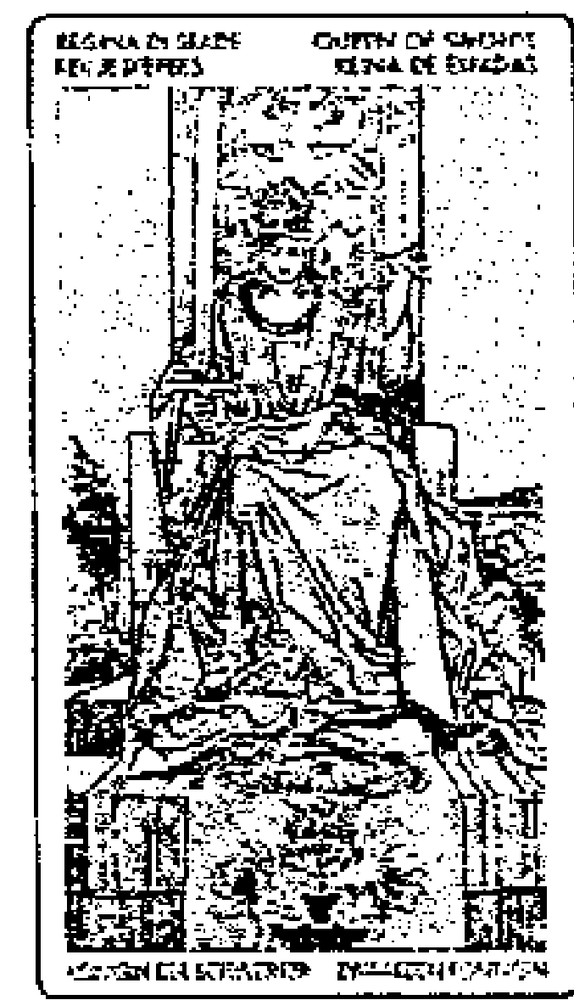

高潮（寶劍皇后）

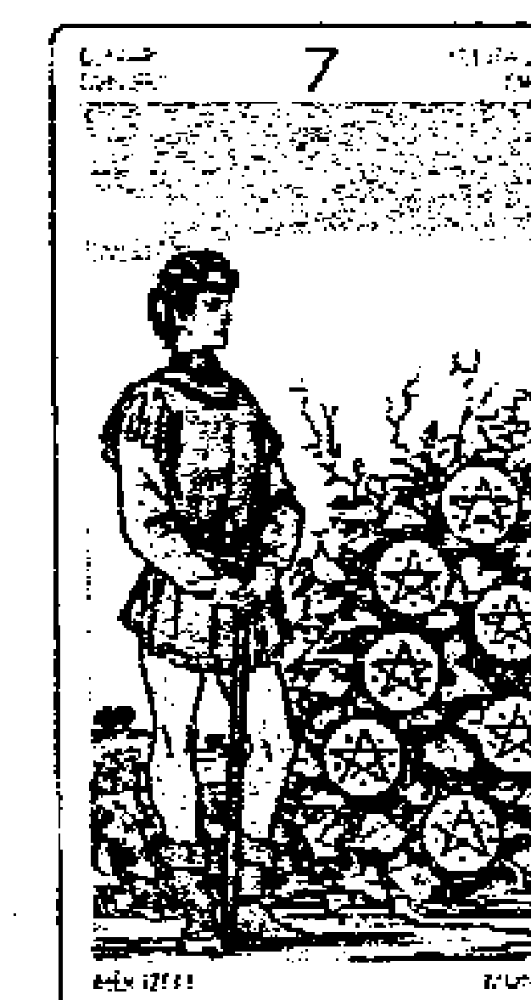

漸升行動（五角星七）

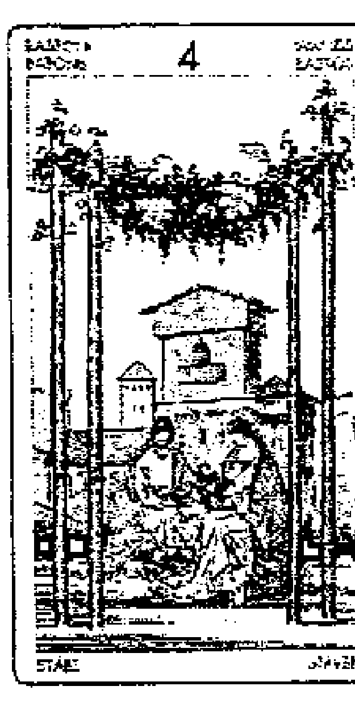

序幕（權杖四）

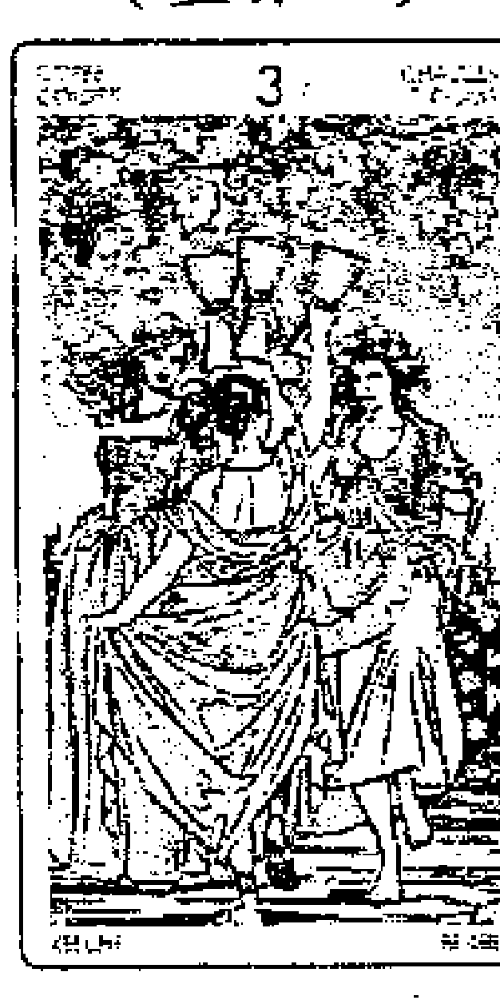

激动力（聖杯三）

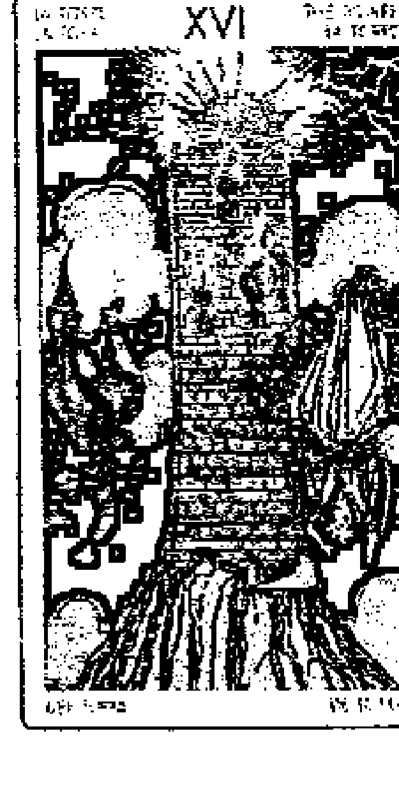

漸降行動（箭）

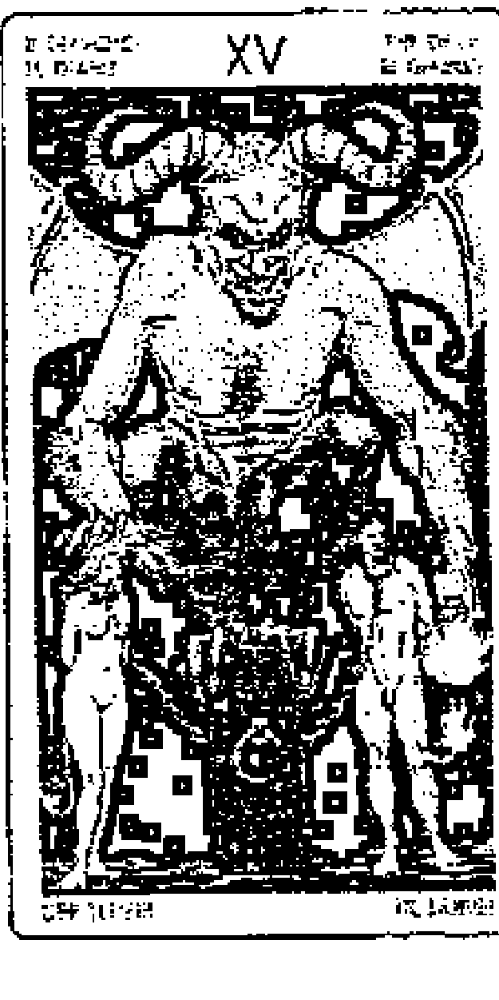

解决（惡魔）

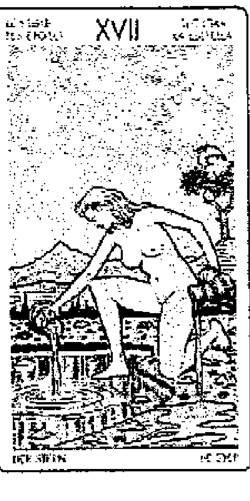

收场（星星）

這麼重要的日子他怎能缺席？席間，他敲響晃眼的水晶杯，贈上一瓶年份久遠的珍藏紅酒，祝福新人婚姻美滿、天長地久。小夫妻緊握著美酒熱淚盈眶。他們彼此默許，一定要在某個特別的日子開瓶慶祝，不負這番心意。也許是結婚紀念日，也許是七夕情人節，也許每一天對他們來說，都是特別的日子，誰知道呢？

# 漸升行動——五角星七

不管婚禮蜜月多麼浪漫難忘，不管新婚生活多麼新奇有趣，沒有身家的兩人為了組織家庭，日子在辛苦卻充實的柴米油鹽中飛逝而過。不久，他們有了第一個寶寶，為了換個大一點的房子，隨之而來沉重貸款，漸漸讓原本安閒的小日子變了調。
說起來，兩人的性格截然不同。男人隨遇而安，凡事處之淡然，而女人卻活潑熱情，好勝心強。為了事業，她花費巨大心力在鍾愛的廣告工作，有時難免無法兼顧家庭，但是男人的體貼，讓這個小家庭還算維繫得不錯。

# 高潮——寶劍皇后

幾個月後，女人花了半年一手打造的廣告企劃案，終於皇天不負苦心人。不但受到全國第二大企業的青睞，還因為成功的操作手法屢屢獲得世界創意大獎。這間原本規模不大的廣告公司，突然間成了業界的當紅炸子雞，吸引來源源不絕的大客戶。
女人為公司立下了汗馬功勞，隨即躍升夢寐以求的創意總監一職，不但薪資不可同日而語，身價也

# 漸降行動——塔

命運就是這麼公平。就在女人事業攀上高峰之際，在食品業樂當個小業務員的男人，卻在一場與同事的嚴重衝突中，被公司以縮編為由，在黑箱作業中被裁員了！這個突如其來的打擊對男人來說無疑晴天霹靂，畢竟他是這麼勤勤懇懇地為公司賣命。

他遊魂般返回家中，默默聽著興奮到滿臉通紅的女人熱切訴說升遷的喜悅、調漲的身價、被主管重用的成就感，以及……「該是把那瓶珍藏美酒拿出來慶祝的時候了！」一聽到這裡，男人再也忍不住惡劣至極的情緒，脫口而出「我看不出這有什麼好慶祝的！」此刻的他就像身處在地獄般沮喪，對著事業飛黃騰達的妻，除了滿腹無奈，更有一股說不出口的妒羨。他完全無法感染妻子的好心情，悍然拒絕了共飲的邀約。

# 解決——惡魔

漸漸地，男人不願和妻子一同進出，因為他無法忍受自己變成鄰居口中某某人的丈夫，妻子的陰影變得越來越巨大，掩蓋他越來越渺小的自我。旁人對妻子的每句讚美對他來說都像一種嘲諷，彷彿提醒他現在住的豪宅、開的名車和一身光鮮亮麗的行頭，都不是憑自己雙手賺來的。以往他所不敢想像的一切奢華享受都成真了，還有什麼不滿足的，是鬼迷心竅了嗎？……

然而，即使萬分眷戀過著有錢人的生活，但富裕的物質始終無法彌補情感上巨大的黑洞。他們的關係每下愈況，終於走上協議離婚的道路。

# 收場——星星

她帶著這瓶意義特殊的葡萄酒和一只高腳杯，慢慢踱向樓頂的天台，倚在女兒牆邊望著漆黑寂寥的夜空。今晚恰逢新月，只見一顆特別明亮的星星，伴隨著幾顆閃爍不定的黯淡小星。她旋開瓶塞，給自己倒了半杯酒，接著拿起酒杯湊向唇邊。突然間，一股酸味衝上鼻關，這時她才愕然地發現：「好好的一瓶酒，竟然已經酸掉了！」一想當初與丈夫許下承諾，要用這瓶酒慶祝每個重要的日子，而如今……一陣酸楚跟著湧上心頭。

十年婚姻就像一場夢，夢中她從天真少女變為世故成熟的女人。現在的她更理解金錢物質的價值，卻也真心感謝曾經擁有過的珍貴愛情。

> 「C’est la vie」

，她在心裡輕嘆，於是捏著鼻子，一口氣吞飲下這杯酸酒：明天的日子還是要過下去，敬——嶄新的一天！

## 第二單元 單張塔羅牌的故事提示

腦袋一片空白時，單張塔羅牌的圖像也可以啟發直覺式思考，簡單描述一下對畫面的印象，就很適合作為一個故事的開場。趕快動筆來體驗「塔羅寫作」的神奇魅力！

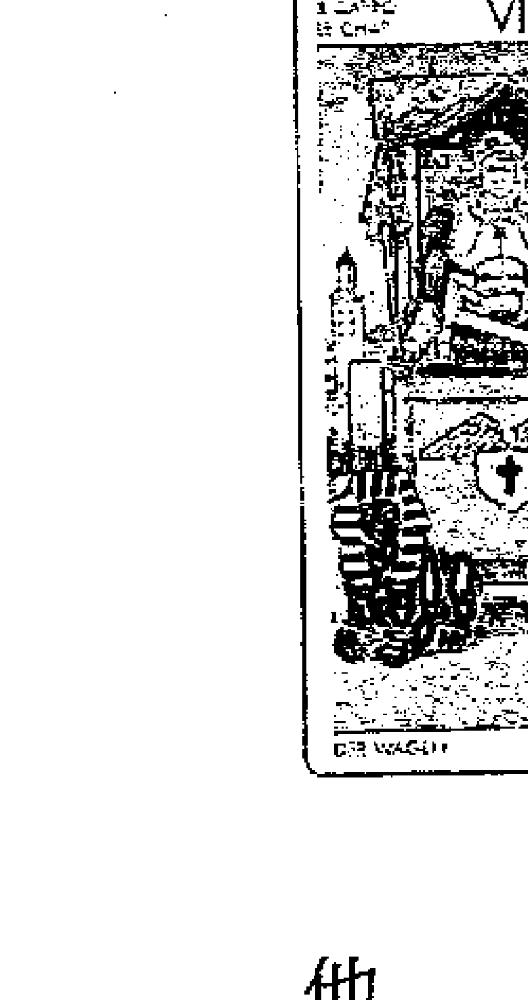

「戰車」的故事可以這麼開始……他手握著方向盤，有點兒心不在焉，沒發現早已錯過應該轉彎的路口。他腦中不斷思忖著一個兩難的決定……

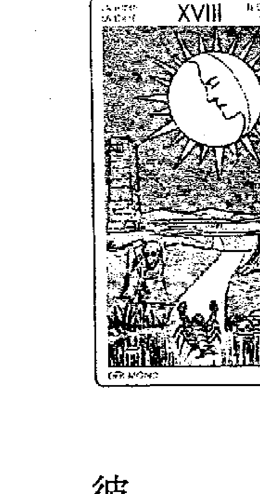

「月亮」的故事可以這麼開始……潔白的月光灑在林間的空地上，帳棚外亮晃晃地一片鵝黃，蟲鳴聲此起彼落的草叢中，隱約夾雜著窸窣的聲響……

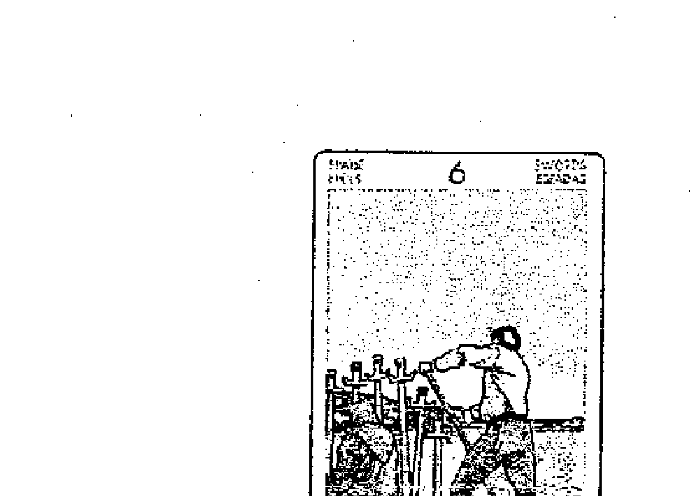

「寶劍六」的故事可以這麼開始……「客倌，您真是問對人了。這湖裡的一一大堆傳說，沒有人比我更清楚了……」

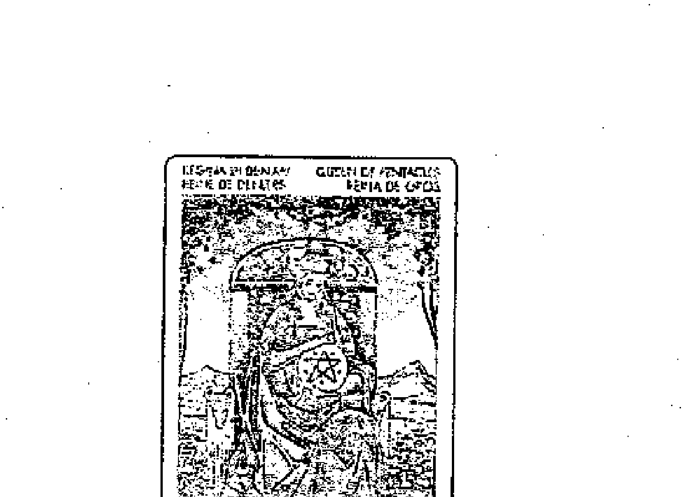

「五角星皇后」的故事可以這麼開始……她怔怔地望著手中這個傳了好幾代的海藍寶石墜子，想起奶奶囑咐她的話……

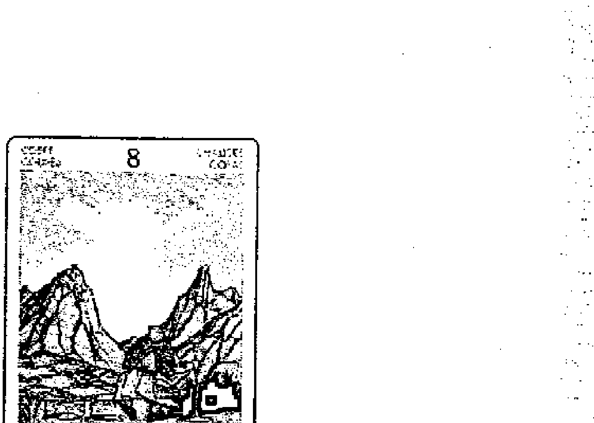

「聖杯八」的故事可以這麼開始……帶著照相機在世界各地漂泊了十多年之後，從不知鄉愁為何物的他，突然間想家了……

# 365「塔羅教你說故事」寫作範例

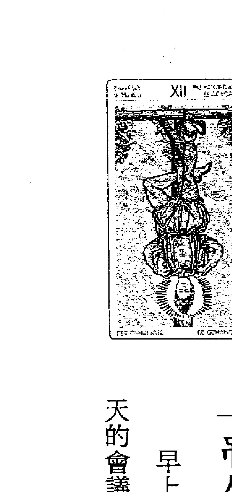

# 「吊人」的故事可以這麼開始……

早上醒來還是覺得有点头重脚轻，唉，多半是宿醉未消。今天還有一整天的會議呢！都是昨天那個該死的小趙……

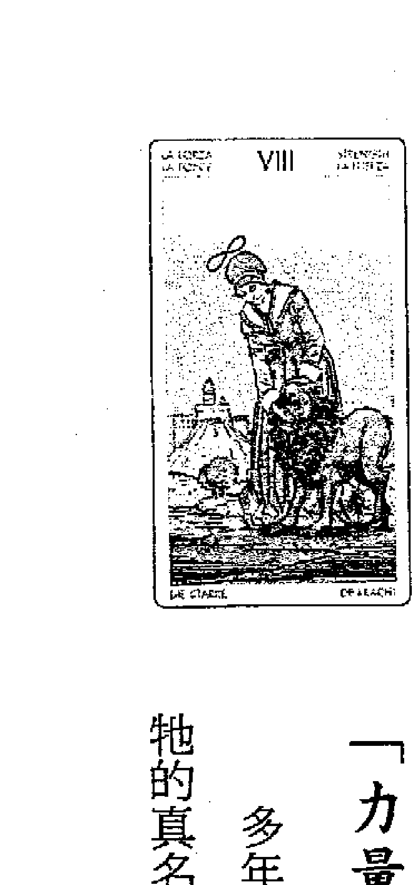

# 「力量」的故事可以這麼開始……

多年來，她不斷變身進入靈視中，搜尋夢中這隻神獸的蹤跡，嘗試找出牠的真名，呼喚牠現身……

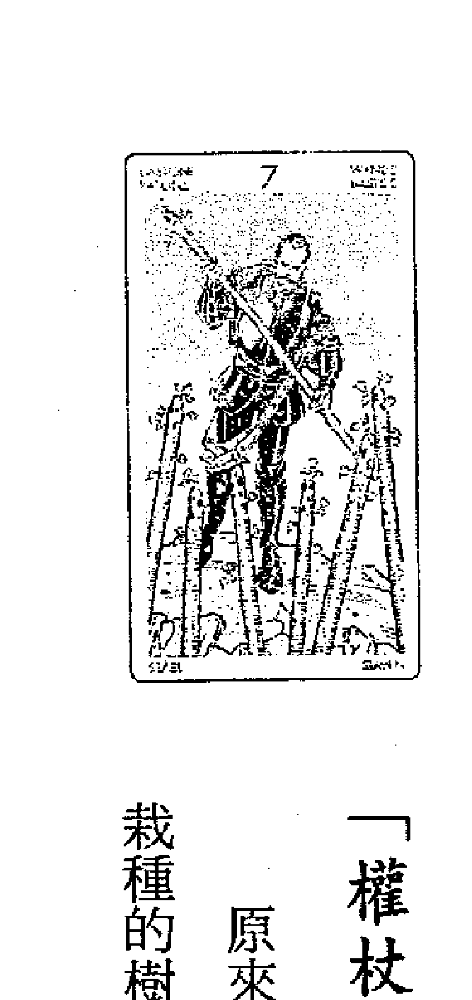

# 「權杖七」的故事可以這麼開始……

原來要經營無毒有機的果園，並沒有想像中的容易。這已經是第三批新栽種的樹苗，如果這次再失敗……

# 塔羅密作

| 列1 | 列2 | 列3 | 列4 | 列5 | 列6 | 列7 | 列8 | 列9 | 列10 |
|-----|-----|-----|-----|-----|-----|-----|-----|-----|------|
| ... | ... | ... | ... | ... | ... | ... | ... | ... | ... |

# 367 「塔羅教你說故事」寫作範例

| • | • | • | • | • | • | • | • | • | • | • | • | • | • | • | • | • | • |
| --- | --- | --- | --- | --- | --- | --- | --- | --- | --- | --- | --- | --- | --- | --- | --- | --- | --- |
| • | • | • | • | • | • | • | • | • | • | • | • | • | • | • | • | • | • |
