# 直觉式塔罗

作者：曼格拉。译者：谦达那。

内容简介（摘于网络）

克劳力托特塔罗牌（Aleister Crowley），算是当今最被推崇的塔罗牌之一，它是由上世纪初期一位神秘学大师所设计出来，具有相当深度，足可进行灵性、心理及现实生活上的解读。本书名为「直觉式塔罗牌」，换句话说，它是用来开启你的直觉能力。其实每个人都具备这种能力，但常因为使用太多理智的缘故，故直觉能力遭到压抑。透过本书引导，以及在玩塔罗牌的过程中，作者会帮助你打开高层心灵，开启内在智慧，让你对你的生命所碰到的难题有更深入、更清晰的了解。塔罗牌来自古老的神秘智慧，透过宇宙同时性的法则，透彻事件的始末，发觉自己的心灵。运用塔罗牌，好好的看仔细自己心灵的深处；好好的认识这位良师益友，让他能够随时在生活之中引领我们。洞悉不论是在关系、工作、事业或未来上的任何走向，去迷解惑。塔罗牌是西方世界流传已经超过千年的占卜法，依据牌面图像以及牌阵的变化加以解读，是「事件占卜法」中的佼佼者，不止是准确实用，而且随着占卜者阅历经验的累积，可以达到极高的境界。而其富于联想、容易记忆的图形，以及深具弹性、可以轻易连结时代脉动的特性，它不只可以为我们预示吉凶，还能为我们找寻出解决事情的方法。同时，透过塔罗牌，深入到荣格所提出的宇宙同时性，洞澈心灵与外在世界的互动，推演出世事的变化，改变人生。

译者序：

在经历一番波折之后，终于来到了这副塔罗牌。在我的感觉里，这副是塔罗牌的经典之作，尤其是加上巡回世界各地教塔罗牌解读的专业教师曼格拉（Mangala）精辟的解释之后，它所能够给予人们的启示就变得非常多样化、非常深入。

## 目录

- 译者序
- 简介
- 引言 如何使用这本手册
- 第一部分 背景
- 第一章 塔罗牌 - 一种增进意识的工具
  - 一、它是如何运作的
  - 二、了解你自己和别人
  - 三、将判断摆在一边
  - 四、算命或占卜
- 第二章 这一副牌
  - 一、简短的历史
  - 二、克劳力塔罗牌
- 第三章 直觉式塔罗牌
  - 一、直觉的头脑
  - 二、超意识的声音
  - 三、用塔罗牌来训练直觉
- 第二部份 直觉式学习的关键

## 第一章 开始跟它连结

- 1. 一个放松的连结关系
- 2. 正确的对待
- 3. 准备那个空间
- 4. 学习连结
- 5. 头脑的镜子
- 6. 晚上的静心冥想
- 7. 第一印象

## 第二章 抽牌

- 1. 抽牌的技巧
- 2. 清楚的目的
- 3. 额外的牌

## 第三章 耐心和整合

## 第三部分 排法

## 第一章 目前生活的解读法

- 1. 将这些牌排开
- 2. 解释
- 3. 如何解读
- 4. 目前生活解读的例子

## 第二章 「问题」排法

- 1. 两种型式
- 2. 准备问题
- 3. 简单的型式 - 三张牌解读法
- 4. 三张牌解读的例子
- 5. 充分展开的型式
- 6. 充分展开型式解读的例子

## 第三章 关系排法

- 1. 型式
- 2. 关系排法解读的例子

## 第四章 能量中心的排法

- 1. 七个能量中心的功能
- 2. 抽牌
- 3. 如何解读
- 4. 能量中心解读的例子

## 第四部份 这些牌的意义

## 第一章 主牌

## 第二章 副牌

# 第一部分，背景

## 第一章 塔罗牌，一种增进意识的工具

塔罗牌是一种工具，就好像其他任何工具一样，它能够执行一项功能，至于你要如何运用那个功能，那就依你而定。你可以使用同一支刀子来削苹果，来做出一个房子，或是来杀人，或是创造出一个美丽的雕刻艺术品。它的用途可以是很世俗的、有帮助的、具有破坏性的，或是非常创造性的。对塔罗牌而言，那个情形也是如此，你可以使用这些牌来为你作决定，来洞悉未来，来找出关于别人的事，或者只是用来作为一个好玩的玩具。这本书主要的关切就是使用塔罗牌来作为增进意识的工具。你将会学习到如何让它来帮助你变得越来越觉知到你是谁，它是一条自我探索的路，它是一个检视你自己的头脑和情感如何运作的工具，透过这个检视可以让你进入到心灵层面，达到心灵成长。在知道你自己深度的过程中，你自然也会变得越来越觉知，越来越了解别人的深度。它并不是抽象的。一旦你学会了如何精通这些基本方法，这是一个很实际、很有帮助的工具，你可以在你生命的所有领域里一再一再的使用它。当你有一天变得更有意识，你或许就可以检视你在关系中的心理程式，找出你为什么那么讨厌你的伴侣，或者为什么你老是觉得你是错的，老是觉得有罪恶感。然后隔天，你或许可以用塔罗牌来帮你看看去巴里岛度假的正反面意义，或是你要不要接受一项新的工作。

### 一、它是如何运作的

塔罗牌是一种古老的智慧的系统，以图画来表示。图画是无意识头脑的语言，在我们学习谈话之前，我们是以图画来思考的。当我们在睡觉的时候，我们所梦到的也是图画，这些图画都包含了很多象征图象，这些图象形成了人类普遍的语言，它超越了语言和文化的限制。每一张塔罗牌都包含了很多象征图象，那些象征图象是含有能量的，它们代表着抓住心灵的某种状态和经验。这个能量可以透过头脑非理性或直觉的部分来反映和传递给解读的人。换句话说，象征图象没有经过理性的头脑，而直接跟那个经验的内在觉知说话。并非一定要很有意识的知道那些象征图象的意义，虽然当我们学习融入那些牌的语言时，理智的知识可能会有帮助。不论何时，在我们有意识的头脑底下永远都有更多，这就是头脑的本质。它大多数的运作都是无意识的，它意味着我们并没有觉知到它。有一个估计是大约有百分之九十头脑的运作的发生是我们没有意识到的。变成有意识意味着将觉知的光带进那个无意识，这就是塔罗牌的功能，那些牌是可以帮助我们去看头脑隐藏部分的一个工具。它们可以将我们看不到的部分反映出来，或使它呈现在外。有时候睡觉做梦的时候也可以碰触到这些东西，但是当我们在玩塔罗牌的时候，我们是有意识的去接触这些讯息。我自己的经验是：不论什么时候，从牌所反映出来的那个无意识层面是最接近表面的，它已经快要成为有意识了，但是我们还没有清楚的识别到，这就是为什么我们可以认出它，我们会觉得：“当然我是知道的，但是我并不是有意识的知道我知道。”塔罗牌永远不会反映出比你（或你帮他解读的人）所准备好要去听的来得更多。它或许并不是你想要看的，但它将会是你准备好可以去看的。因此塔罗牌可以成为一个更深入去看你自己的工具，比你自己单独去看还要更深入，它对你的人生可能造成很大的影响。它就好像将一道强而有力的找寻之光转向内在，好让那个无意识的黑暗部分可以用觉知来点亮。透过这个意识和了解，改变就可能发生。真理的本性就是如此：当我们将意识之光带到心灵的正向面，它就会变得更牢固，而当我们对那些具有破坏性的面变得有意识，它们就会被融解掉。那个过程就好像是在剥皮一样。让我们来看一个可能的例子。你发觉你自己对别人所做的事情生气，有意识的头脑充满了理由告诉你说为什么他们是错的，他们不应该这样。你想要将这一切告诉他们，责难他们。在这种情况下，如果你能够停留够长的时间，给你自己一个解读，你可以会得到第一个讯息就是退回来看你自己的内在，然后会有一个小小的铃声在你的头脑里面响说：“哦！原来这件事是跟我有关的。”稍后，你就可以从这个角度再去看这个问题，而可以把问题看得更深入。如此一来，你可以得到一个讯息，就是你需要为你自己迷失在自己认为正当和愤怒当中负责任，你同时可以看到你旧有的习性，你那个部分的头脑随时都准备好要立刻判断别人应该怎么做。当你能够从这个状态来看，你就能够清除你固定式的反应而以一种比较清晰的方式来看那个情况。你可能会为对方抽牌来看看他们的出发点是怎样，而发现它大部分是你的投射。你不仅可以使用这种方式来变得更觉知到你是如何在运作的，而且你可以避开跟一个朋友作不必要的争吵。所以当你们再度碰面，你就能够不带有责备的说出发生在你身上的情况，那个结果可能是一个和谐的分享，它会把你们之间的关系拉得更近。透过抽牌，有无数次，我都能够因此而平息我那具有破坏性的头脑。每一次我这样做的时候，就会有更多的光被带到我心灵黑暗的部分，透过曝光和了解，它们就一个一个消失了。

### 二、了解你自己和别人

当这些牌以一般的形式被使用来检视你自己，它们就好像在检查你生命的真相。一开始，它可能会让你十分惊讶的看到，那个你认为正在进行的只不过是你的表层，在表层底下的完全不是那么一回事。你会开始觉知到在里面一直有某一个过程在进行。内在世界就好像外在世界一样，从来都不静止，它是透过改变和移动而存在的。事情的本性就是：就某种程度而言，那个改变是在正反两极之间的移动。当你只是将它视为一个事实，你就会很放松的让生命自然流动，自然开展，不必用你的意识加以干涉，不必试图控制它的该不该发生。这样做可以给予空间让内在的了解发生——你可以知道你的头脑和情感是如何在运作的。你会了解到制约着你的头脑的早年生活体验是如何在控制着你对自己和生命的看法。你会开始觉知到一些更深层的部分关于你是怎么在运作的，以及为什么你会是现在这个样子。当这个自我了解成长，你对别人的了解也会成长。你会了解到我们都乘坐在同一条船上，我们都在做那个时候我们唯一能做的事。我想起在生命中有一段时间，当时我感觉到这个制约的效应是多么的强，它使我想起大学时代在心理学实验室里长时间观察的白老鼠。在那个时候我觉得白老鼠的行为和我对我自己和对别人的了解无关。但是在十或十五年之后，我突然恍然大悟，原来我们跟白老鼠是完全一样的。就好像史金纳的白老鼠在食物已经停止出现很久了，它还一直去拉那个杠杆，我们也是在客观环境已经改变很久之后还继续保持着孩提时代学来的行为模式。我了解到，事实上我们所认为的我们是怎么样不过是制约的结果，那个制约我们称之为我们的经验。如果那个经验不是来自这一世，它可能是来自前世。这个了解真的是令自己感到非常惭愧。

### 三、将判断摆一边（不判断的智慧）

以这种方式来使用塔罗牌的另外一个作用就是抛弃判断。你会发现，当有判断或意见摆在中间，你就没有办法为你自己或为别人解读。判断会遮住你去看和去解读的能力，使你无法客观，而只有客观的觉知才能够带来蜕变。当我在帮人们解读，他们常常会问的是：我反映给他们的是好的或是坏的（判断）。我或许是指出有恐惧或愤怒发生在他们的内在，他们立刻就忧愁起来，然后问说这样有没有问题。在事情更高的真相当中是没有好坏的，事情就只是如它们本然的样子。只有那个具有制约程式的头脑才会有这些好坏的观念，而一个人对正确或错误，好或坏的观念或许跟别人的是不一样的，它依他们是如何被带大以及在哪里长大有关。当你变得更熟悉这本书的解读方式，由牌所反映出来的每一个可想像的状态都是你的存在里面那个更高的部分鼓励你去经验的。恐惧，愤怒，挫折，怀疑，或不安全感，每一种所谓的负面状态，都必须被尊重，这样的话，它才能够成为进入到另外一件事的门。没有“不好”的牌，也没有一个心理或情感状态是本质上是“错误”的。

这并不是意味着你必须永远都喜欢发生在内在的状态。比方说，没有人会喜欢痛苦或挫折的感觉，但是对它有一种意见跟认为它是不好的或错误是十分不同的。当某件事被判断成错误的，我们就自动会想要去除它，那意味着我们会将它压进潜意识，如此一来，我们就不再有意识的去经验它，但是它会从无意识层继续控制着我们的行为和人生。当我们允许我们自己不判断的来经验这些状态，将它视为人性的一部分，它们就不再能够控制我们。这样做能够使我们进入一种深层的自我接受，在自我接受的心境之下，不同的状态就按照它们本然的样子来被看待，将它们视为来来去去的经验的一部分。

当我们开始超越沉溺于所谓的正向或快乐的状态，以及随之而来的害怕、压抑，或拒绝负向的痛苦状态，我们就会开始了解基本上是因为我们拒绝去接受和经验某些事情，才会造成我们的受苦，这就是变成有意识的奇迹。

### 四、算命或占卜

如我们前面所讨论过的，塔罗牌是一种工具，而那个工具的功能依使用者而定。塔罗牌也可以被使用来算命，换句话说，来洞悉未来。就如你们之中有很多人或许曾经经验过的，它是一个事实，它的确会应验。或者应该这样说比较好：它有时候会应验。

应验的理由并非来自某种神秘力量，而只是头脑的本性。就好像我们已经看到的，我们大多数人在大部分的时间里都是按照幼年时代的制约程式或过去的经验在生活。当我们以这样的方式在生活，我们是过着一种机械式的生活，一种可以预测的生活。塔罗牌或任何所谓算命占卜的艺术就是读出或融入这些控制着我们生活的无意识模式。换句话说，它是在读我们的过去，而因为未来是由过去所创造出来的，它可以由这些模式来预测。

有一个很深的、不可避免的模式，它也可以被称之为命运或“业”（KARMA）。但即使是对于这些“业”的事件，如果我们在那个情况当中能够变得有意识、很觉知，我们就能够改变事情发生的结果。

比方说，一个女人在跟男人交往的时候有一种模式，她相信男人是不值得信任的。于是，她一开始信任他们，直到他们做出一些事来破坏那个信任，然后她就觉得她的信念被增强了，然后就永远不再信任他们。它也许是她在孩提时代跟父亲之间所发生的事情的结果，或者也许甚至是来自更以前的前世所发生的事。

这个模式是如何形成的细节并不很重要。当她对这个模式是无意识的，她一定会再重复它，所以我们可以说她的“命运”是会碰到一个不忠的男人，因此我们可以预测，当他不可避免的打破了她的信任，那个关系就会决裂。然后很可能她又会交上另外一个同样的男人，同样的剧本又会重演。

然而如果她变得觉知到这个模式，她可以使用这个机会来打破那个循环，在这个情况下学习原谅和信任，那么那个关系或许因为有了更深的爱而可以继续，或者她可以进入一个未来的关系，但是不会重复这个模式。如果她刚好去找一个算命的人，那个人告诉她说当那个男人对她不忠，她的关系就会断掉，那么当然事情刚好就是会这样发生。很可能她会一直有些微的怀疑，觉得事情的发生是不是因为她的期望所造成的。但是如果她去找一个使用塔罗牌作为工具来让她觉知到那个模式的人，那么在那个情况下她就可以有一个新的选择。

所以，基本上，一般的算命在最好的情况下是没有帮助的，而在最差的情况下是具有破坏性和令人混乱的。

## 第二章 这一副牌

- 一、简短的历史（略）
- 二、克劳力托特塔罗牌（简称托特牌）（略）

## 第三章 直觉式塔罗牌

### 一、直觉的头脑

直觉是不必使用理性的思考过程就可以知道的能力，它是知道，但是不知道我们是怎么知道的，或非逻辑的知道，有时候我们称之为洞见，它跟我们所说的预感或胃肠的感觉很类似。它是人类心灵自然的一部分，但是我们很多人已经几乎完全失去跟它的连系。想要了解为什么的话，我们需要去看头脑和社会的本质。人脑分成两边，左脑和右脑。左脑跟右边的身体连结，它是头脑的逻辑和理智的部分，它可以被视为男性化的那一边，这个部分是属于计算和判断对错的，它的运作是有系统的、理性的。右脑跟左边身体连结，它是女性化的、创造的、情感的、非理性的头脑部分，这个部分的头脑是进入本能和直觉的门。这使事情有一点过分简化，但是它可以立即提供服务。当一个小孩被生下来，他纯粹是从非逻辑的本能来运作，他没有选择，只是很真实的去经验事情。“成长”基本上是一个发展左脑的过程，藉着发现什么是对的、什么是错的来变得更“文明”。我们学习了解别人对我们的期望，以及什么样的行为可以满足我们身体和情感的基本需要，简言之，就是去得到我们想要的。我们被训练成去适合家庭和周遭社会的模式。在这个社会化的过程当中，不可避免的我们会失去很多在我们里面是真实且自然的本性。等到我们完成了“教育”，逻辑头脑的那一边已经大部分控制和驾驭着我们的行为。右脑的天赋得不到很多正向的回馈，且常被认为是无理性的、愚蠢的、不具生产力的。我们的很多感觉都被压进无意识的地下室，为的是想要成为“明智的”，做正确的事，并在世界上立足。由左脑来主宰人生所付出的很多代价之一就是丧失直觉。

### 二、超意识的声音

如果我们想像一个人类头脑的图形，那么在那个当中就只有薄薄的一片我们可以标示为“意识”，这是头脑里面我们唯一知道的部分。所以当我们说我们“知道”自己，我们通常只是在指我们熟悉我们头脑里面这个小小的部分。在它之下是广大的无意识头脑，那个部分的头脑是自动在运作的。本能，我们可以说它是无意识的声音，那是我们基本的驱策力，这个本能跟动物的本能是类似的。当我们跟我们的本能连结，我们就会经验到预感或胃肠的感觉，那就是为什么一些单纯的、比较不老练的人，以及跟土地或大自然比较接近的人常常会具有一种基本的智慧，那是受过高等教育的人所没有的。

当这些本能被有意识的头脑里的理性部分所压抑，有很多很多的能量就被压抑了，所以就没有办法很自然的在身体里移动。它所呈现出来的现象是僵硬的，或是跟身体和感觉的能量缺乏连结。有时候我们可以在那些头脑过度发展的人身上看到一种愚蠢或是缺少一种简单的觉知就是这个原因。当我们对于那些被压抑的部分变得更有意识而将那些能量释放出来，它就能够向上移动到超意识的头脑。

就像无意识的头脑是在意识之下，所以超意识是在意识之上的，是超越它的。就是这部分的头脑使我们跟整体连结、跟那个比我们自己更大的连结。我们可以说超意识头脑的声音就是直觉，换句话说，直觉就是个人头脑跟宇宙头脑、存在、或神连结的部分。当我们进入直觉，我们就进入了那个部分的头脑，它所知道的事与记忆或理智是无关的，那个部分的头脑具有知道每一件事的潜力，我们也可以称之为较高的意识。

### 三、用塔罗牌来训练直觉

去熟悉直觉，并且学习开发它，是我们都有能力做的。事实上，它是一种锻炼，就好像我们需要锻炼那些因为缺乏使用而萎缩的肌肉一样。我们使用直觉越多，我们的直觉力就会变得越强，而当我们的直觉力不强的时候，如果我们在正常的活动或关系当中使用它会很危险。我们害怕犯错，害怕我们的所做所为被别人认为是愚蠢的。也许我们是错的，没有办法证明，要如何确定它真的是直觉呢？所以我们通常会忽视或压抑某些洞见或内在闪现的灵感，转而诉诸逻辑的思考和行动，因为我们从经验中知道那是比较安全的。像塔罗牌这样的工具可以让你以一种安全的方式来熟悉的发展直觉，而不需要冒不必要的险。

塔罗牌的象征图像是在对头脑的非逻辑部分说话或刺激。当我们跟某一张牌作连结，它就能够给我们一种感觉或经验。如果我们进入到我们里面这个感觉的源头，我们就会了解这张牌的意义。这种情况不一定会立即发生，但是随着我们对塔罗牌的渐渐熟悉的使用，这种能力自然会被开发出来。当我们将几张牌组合起来解读，它就是在做这样的事——它包含了一种超出逻辑头脑所能看到的经验性意义。当然，也可能使用逻辑的头脑来了解一张牌到某一个程度，大多数人在刚刚开始的时候都是如此。但是这样做永远都会受到限制，要超越它就是要进入直觉读牌的层面。

当我们在面对一组牌的时候，开始信任我们的非逻辑经验或知觉，这就是在训练我们的直觉。当我们不熟悉直觉，我们会倾向于将它经验成某种魔术般的事，但是一旦我们接受了它，而不要试着用理智的头脑来了解它，它就变成一种很普通、很清楚的看事情的方式。有很多对直觉来讲很明显的事，对逻辑的头脑来讲却是隐藏的或奥秘的。透过使用塔罗牌，我们可以练习我们心灵的这个部分，直到我们熟悉它为止。一个简单的比喻是：当一个原始部落的人来看一个汽车引擎，整个事情看起来好像是一个奥秘，但是对一个汽车技师来讲，他就很清楚。然而当那个原始部落的人学会怎么看，整个事情对他来讲也会变得很清楚。学习用直觉来看人生能够打开一个新的层面。

# 第二部分，直觉式学习的关键

### 第一章，开始跟它连结## 一、放松的连接关系。

某些人的右脑天生就比别人发达，对于那些少数人，透过那个直觉部分的头脑来学习读牌很自然，很容易就可以发生。每当我在办训练课程，通常会有一两个人，他们对牌就好像鸭子对水一样，能够立刻看出那些牌在说什么，然后大多数人都必须辛苦的先一点一点的从逻辑学习开始。但是学习读牌的快慢跟一个人最终成为读牌师的能力是无关的。我有很多学生，他们在学习的时候似乎是缓慢的，但现在都是非常成功的职业读牌师。

这份手册强调和鼓励用直觉来学习读牌。在实际运用上，它意味着你不必费那么大的劲来了解或记忆牌义资料。当理性的头脑不要挡在中间，直觉的头脑就可以被使用。你越放松，越少试图去“得到”它，理性的头脑就越能够放掉控制。我想要强调，给你自己一个机会，让你自己在阅读这本书的时候以一种轻松享受的心情来面对，这将可以教给你更多，远比你试图用逻辑了解来抓住文义所能得到的来得更多。当我们在看这些牌的意义时，那个情况更是如此。

你的目的是要跟每一张牌取得一个“连接关系”，不是学习“关于”它，而是变得熟悉它，感觉它，认出它，经验它。这78张牌就好像是78个人，你需要跟他们碰面来知道他们。就像任何其他的关系一样，有时候它的发生是立即的，有时候它需要时间。所以，对于某些牌你或许可以有立即的连接，而对于其他的牌就只是先有心理上的观念。过一段时间之后，你就会发觉每一张牌都变得熟悉，而能够对它有一种很亲近的经验性的了解，了解它对你意味着什么。基本上有两种方式可以用来发展这个连接关系：其中一种就是透过反映出你在使用当下的状态，另外一种就是透过对某一张牌的夜间静心冥想。这些技巧是直觉式塔罗牌的基础，稍后我们将会有更详细的讨论。

### 二、正确的对待。

你的塔罗牌将会回馈给你任何你所给予它们的。如果你以一种轻浮的、肤浅的方式来对待它们，那么你就会从它们得到同样的回应。但是如果你以一种敬意来对待它们，将它们视为发展智慧和意识的工具，那么它就会反映出智慧和意识，使你的智慧和意识因此而成长。这并不是意味着你必须很严肃，你可以以一种轻松和游戏的方式来接近这些牌，但是仍然带着敬意，而且敞开来接受具有深度的讯息。如果你尽可能的将你的塔罗牌视为一个钟爱的、尊敬的、聪明的朋友，那么你们之间就能够发展出一种非常亲密和直接的沟通。在外观上，有些人喜欢将他们的牌保存在一个特别的盒子里，或是以丝袋包裹，一般认为这样比较能够保存能量，这是个人的选择，重要的是要包得让你能够对它产生一种敬意。并不是说它一定会影响到那些牌，而是它将会影响你如何对待它们。

### 三、准备那个心境。

在玩牌之前，很重要的是要让你自己进入那个心境。换句话说，你需要准备好，好让你自己能够敞开来接受那些牌所给你的讯息。如果你不是这样做，而只是在你要赶去做其他事之前随便抽一、两张牌，那么它将对你产生不了作用。你或许是抽到同样的牌，但是你并没有处于那个可以让它们进入的空间，因此你无法了解它们。这样做可以会发生的情况是不久之后你就会感到失望，因为你似乎无法从那些牌得到什么，所以你会开始感觉它不适合你，你无法读它们，然后你就放弃了。

有无数次，当有什么事情在我的脑海中盘旋，我都想去找牌得到快速的答案。我并没有花较长的时间真正跟牌在一起，我只是很快的抽了几张，然后觉得不了解，又将它们放回去。一段时间之后，我开始再度去思考那个问题，我已经忘记在那个问题上面我抽到了什么样的牌，因为抽牌的当时我并不是有意识的。

要抽牌解读的时候最好是选择一段较为宽裕的时间，或是当你在学习读牌的时候不要有干扰。如果你的注意力分散，你就很难跟随和吸收牌所给你的讯息。

要记得，你并不需要像在学校上课一样，必须学习或了解什么东西。它比较是一个吸收和反应的过程----当你全然的“在”，敞开和放松，透过头脑的直觉部分来吸收和反应，不需要试图想得到什么。所以，要花一些时间来创造出对这个感觉有助益的气氛。对某些人来讲，这意味着就只是闭起眼睛静静的坐几分钟，让忙碌的头脑静下来，或者你可能有你自己的静心方式。另外或许有些人会觉得想要跳一些舞或做一些身体活动，使能量进入身体来帮助清理头脑。或者你的方式也许是创造出一个外在环境，点一些蜡烛，或是熏一些香，或是放一些柔和的音乐。你可以试验各种内在和外在的方式，来看看哪些方式最能够帮助你觉得放松、敞开和具有接受性。让它成为一个习惯，每当你即将要玩牌的时候，你就做这样的准备。你将会发现，即使只是几分钟的准备，都会造成不同----一个是看着图画而毫无感觉，一个是可以得到洞见。

### 四、学习连接。

有一个诀窍可以让你从一个敞开和具有接受性的心境来看牌，并允许那个意义进入你。实际上，当你碰到一张新的牌，先不必集中精神从心里去看它，而可以让你的眼睛保持柔和，甚至是稍微不集中精神来看那个图画的整体，先不要看每一个细节。当你在看的时候，有意识的深呼吸一下或许会有帮助，几乎就像你吸进那个牌的感觉。那个颜色、形状和意象让你觉得怎么样？当你在看着这张图画，你会想到什么？给你自己空间，不必急急忙忙。永远都要在你去查看参考手册之前花一些时间来看那个牌，并且在你的内在感觉它。这给你一个机会，使你在逻辑的头脑带着你所阅读的知识介入之前可以跟那一张牌有你自己直觉的连接。记住：给予每一张牌的意义并不是任凭私意的。事实上，每一张牌包含了一个意义，就好像一个水晶含有它自己的能量。当你允许它，那个使用在每一张图画里面的象征图像就能够开启你集体无意识头脑里很深的部分，你晚上所做的梦也同样是来自那个部分。就是这个部分的头脑在经验这张牌意义。当你跟一张牌作了这样的连接，它就变成了你个人经验的一部分，而不是你理性知道的一部分。一个简单的类比，就是和你学开车一样，一旦你做过一些练习，你就不必再思考什么时候要换档，或是什么时候要踩踏板，你可以很直觉的或是很自动的做它。你也可以从读牌当中发展出这种直觉的“知道”。当你跟牌有了这种连接，你就成了一位直觉的读牌师，那个程度依你而定。

### 五、头脑的镜子。

学习这个的主要方式就是透过使用这本手册所给予的牌阵。在“目前生活”牌阵大部分的位置，以及“问题”和“关系”牌阵的第一个位置，都是直接的镜子，它们反映出你在那个时候处于生活各个层面的那个位置。你已经知道你在哪里，那是你目前的经验，所以当你看着代表“状态”的那一张牌，那个图画和你的经验之间就会产生出一种直接的连接，你在使用牌来实际反映出发生在你内在的某一个面。

有时候会有一个立即的认出，因为那是在你里面所熟悉的或是已经意识到的过程或状态，所以当那张牌一出现，你就可以立刻认出它。那么那张牌不需要任何心理的努力就变成了你较深记忆系统的一部分，它事实上已经进入了你无意识的头脑。你不必一定要理性的了解它，但是你已经透过经验认出了代表你内在的东西。从那个片刻开始，就某方面而言，你已经“知道”了那张牌，而那个知道跟逻辑的头脑无关。

通常要认出整副牌需要花一些时间。当你在认出那些牌的同时，你也在变得更知道你自己。有一些经由塔罗牌所呈现出来的状态或过程已经在我们里面，但是我们从来不完全允许我们自己去经验或是去意识它，换句话说，它们大部分是在无意识的黑暗中运作。有一些状态在我们身上比在别人身上来得不明显，所以会比较容易在别人身上认出来。但是就某方面而言，在某种程度之内，所有的牌所代表的事情都是我们所有人的一部分，是人性所共有的状态。当这些状态透过这个塔罗牌的镜子被认出，当某些潜藏的经验被你意识到，你就会觉得“啊哈！”。

### 六、一张牌的静心冥想。

这个连接过程的另外一个技巧就是在晚上（或每天）针对某一张牌进行静心冥想。我们建议使这个成为一种习惯，直到你觉得你已经跟大多数的牌取得连接。先让你的头脑静下来，然后挑一张最能够代表你生活现况的牌。坐下来将这张牌放在你的面前，让你自己跟它连接，同时要了解你是在洞察一个你目前内在状态的图画镜子。不必匆忙，花一些时间真正去感觉那一张牌，之后才去查看手册，阅读写在上面的每一件事，包括那个象征图像和意义的变化及细微的差别。最后再花几分钟的时间来看这个状态或过程如何展现在你此时此地的生活之中。

将这张牌挑出来，每当你想起的时候就再看看它，或是让它进入你的脑海，直到隔天晚上，或是直到你再抽取下一张静心牌。直到抽下一张牌之前，目前这一张是最能够代表你内在状态的。或许有时候你会发觉那个意象或象征的某些东西进入到你的梦里。或是突然间，在没有预期的情况下，那个意象跳进到你的脑海，跟某些你所感觉到或经验到的事取得连接，这是牌在你无意识的头脑里生根的过程。如果它没有以这样的方式发生在你身上，你也不必觉得沮丧，要信任你自己跟牌相会或是吸收那些牌的过程与方式。你可能会一再一再的抽到某些牌，但是它们仍然无法让你感到十分契合。它们或许是反映出你存在的某些已经非常根深蒂固的状态，以至于你甚至无法认出它。要信任你会按照你自己的时间去得到它，当你这样做，你以前隐藏的心灵就会渐渐浮上意识层面。

### 七、第一印象。

因为这本书所使用的牌法是在鼓励一种直觉的、弹性的解读方式，因此你或许有时候会发觉你自己在怀疑你似乎在牌里所看到的。每一位解读塔罗牌的新手都会面临某种程度的不确定-----到底他们所看到的是他们的投射或是他们的直觉。投射是头脑从它的希望和恐惧所创造出来的云。当你在为你自己解读或是在为跟你关系很深的人解读时，那个情况更是如此。花些时间来平息你的头脑，使你自己处于一个正确的状态，这将能够帮助你把你的观念、意见和投射摆在一旁，并打开到达清晰直觉的门。它同时可以在你开始解读之前帮助你有意识地感觉到那个想要去看你的内在到底真正发生什么的真诚渴望。

过了一段时间之后，你就会发觉那个来自直觉的感觉十分明确，它跟你投射的头脑是不同的。它就像闻到听到的差别一样的明确，它来自头脑的不同部分。但是当你在发展这个能力，你可以练习信任你对牌的第一印象或感觉。直觉通常是在脑海中突然迸出，而理性的头脑则是在它之后跟随而来的，它会问那是对还是错。所以，尤其是当你在为别人解读的时候，要练习将你对牌的第一印象直接说出来，当你在做总结的时候也是一样，直接开口将第一印象直接说出来。有时候你可能会说错，但是如果你一直都是停下来先思考它，你将会错失那个有价值的学习使用直觉的机会，那个学习必须来自冒险将它直接说出来。

### 第二章、抽牌。

### 一、抽牌的技巧。

抽牌是一件非常个人的事，但还是有几个基本原则可以遵循。将牌展开在你面前，面部朝下，如此一来，每一张牌都有一部分可以被看到。你可以将牌摆成很整齐的一排，或是弄成混乱的一圈，随你喜欢。

永远都要用左手来抽牌，因为左手跟右脑----直觉的头脑是连在一起的，智慧能够从这个地方出来，或者是从无意识出来，或者是从超意识出来。也许用左手抽牌并不会造成任何不同，这是不得而知的，但是它的确会阻止你不要那么机械式的去抽牌，因此很自然的刺激你属于直觉那一边的头脑。

当你变得熟悉为别人解读，你将会发现，观察一个人如何抽牌有时候可以告诉你很多关于他们如何在运作。有些人是用眼睛在抽牌，他们看着牌，直到有一张牌抓住他们的眼睛，然后再将它抽出来。另外有些人跟随着他们的手，他们根本就不看牌。有些人在最后挑出一张特别的牌之前要花很多时间来感觉整副牌的能量。另外有些人就随便抓一叠，只是因为他们刚好在一起。有些人会先抽一张牌，将它放回去，然后再抽另外一张牌，或是手悬在几张牌的上方犹豫不决。

最令人惊讶的事就是不管你怎么做都没有关系。我自己的经验是：在过去这三十年以来，我所做过的千千万万个解读之中，从来没有一个抽错了牌，它（抽错牌）显然是完全不可能的。

### 二、清楚的目的。

重要的是你，或是任何实际上在解读的人，知道为什么那些牌要被抽出，无目的或目的不清楚的抽牌是不大有价值的，在抽牌之前要很清楚的知道它的目的。人们对读牌觉得困难的主要原因之一就是他们不清楚反映回来给他们的真正是什么。

比方说，你或者会想要找出跟某一个特定朋友的关系，所以你就念着他而抽出一张牌。假定你所抽到的牌是国王，它代表责任的品质。除非你将你要问的问题弄得很清楚，否则你可能不知道这张牌是在告诉你说你觉得对他有责任，或者你必须觉得对他有责任，或者也许在这个关系当中你必须为你自己负起责任，或者是他觉得对你有责任。那个不确定将会产生混乱，让你无法接收到讯息。但是如果你把抽牌的目的弄得很清楚，比方说，在你跟他的关系当中，你需要在自己里面找到什么，那么那张牌就能够立刻给你一个清楚的讯息。

当你在解读的时候还有一件重要的事要记得：在任何一个时间，对于一个问题只要抽一组牌。如果你不了解或不同意，或者你认为那些牌是错的，那么你可以将那一组牌先放着，过些时候再回来看它，看看你是否可以了解。或是另外再挑一张牌加进来，进一步澄清本来的牌（参看下一节的说明）。如果你只是重复一直抽牌，直到抽到一些牌来告诉你你想要听的讯息，那么解读就没有意义了。

如果在比较奇怪的情况下，当你要抽出一张牌的时候，有两张牌一起带出来，那么你可以将那两张牌都放在那个位置。你可以信任你的无意识需要这两张牌来将那个情况反映给你，你可以以结合的能量来读它们。

### 三、额外的牌（加牌）

刻意抽出额外的牌加入到现有的牌或是用来澄清现有的牌，是一个很有价值的读牌方式，它的重点就是你必须很清楚，你是加进某些东西到现有的牌里面，而不是用来取代它。

举一个例子：在一个忠告的位置上，你可能抽到了“主权”这张牌，它意味着新的方向，但是你不了解要怎样改变方向，你的头脑里很清楚的知道有这个问题，所以你就抽出第二张牌来放在第一张牌旁边。你所抽到的牌是“力量”，它代表独立或完整。从这张牌你就可以看出，那个新的方向跟回到你自己有关，跟走你自己的方式，或是变得更独立有关，不必依赖别人的想法或感觉。

另外一个例子可能是：在一个忠告的位置上，你抽到了“女皇”，它代表慈悲和滋养。你不确定它是否意味着你必须对别人更慈悲、更照顾，或是对自己更慈悲、更照顾。当你的头脑里很清楚地带着这个问题，你抽出了第二张牌来解释这张牌，你抽到了“圣杯一”，那个忠告很明显的是叫你对自己要慈悲一点。

当你以这样的方式来用牌，你是直接向你更高的“知”在问取讯息。那个诀窍就在于你对你所问的问题必须非常清楚、非常精确，否则这些额外的牌将会造成混乱。

### 第三章、耐心和整合。

现在你已经具备了开始精通塔罗牌所需需要的一切工具。你跟你的塔罗牌之间所发展出来的是一个关系，这个关系就好像所有其他的关系一样，它需要时间来进入深度。如果有足够的爱和承诺，那个深度可以继续成长。

如果你使用塔罗牌来作为增进意识的工具，那么你不仅是学习如何使用牌，你同时也是在学习如何探讨你自己的本性，透过这样做，你很自然的也会学到如何了解别人。

你可以将你对塔罗牌的精通视为一个旅程，当你对这个旅程敞开，它能够引导你进入似乎是无止境的发现。如果当你到达某些点的时候觉得卡住了，或是认为你哪里都到不了，似乎无法再继续，在这种情况下不要失去耐心，在这个时候你可能需要休息一下，暂时离开那些牌一阵子，但是不要放弃，也不必感到挫折。等几天，或甚至几个星期，然后当你觉得新鲜和敞开，你就可以再度回到那些牌，你或许会发现你跟它们的连接已经进入到一个更深的层面。

我们极力建议你用几个月的时间，养成一个习惯，持续作单一一张牌的夜间静心（或每日的静心）。当那些象征图像在你无意识头脑的深层生根，你就会突然领悟到，然后进出“啊哈！”。那么你就不只是深入了解那一张牌，你同时也深入了解了在你里面的那个过程。以这样的方式，那些牌里的象征图像就会渐渐跟你在你自己里面所经验和觉知到的那些状态并列在一起，它是一个非常令人醒悟的过程。

### 第三部分、牌阵。

在这一章里面所介绍的牌阵是独一无二的，在其他书上找不到。它们是特别为提升意识所设计的，并允许一个自由敞开的空间来让直觉运作。当你变得越来越熟悉它们，也越来越熟悉你的牌，你将会发现透过这种方式来使用牌能够使你在任何读牌当中有很深入的了解。如果在刚开始的时候，你的读牌觉得只是单一层面的，那么你要有耐心。你在学习读牌的同时也在学习发展你的直觉以及对你自己的了解。透过这些牌阵，过些时候你就会发觉有越来越多深层的意义会呈现出来。

### 第四部分、这些牌的意义。

（也就是克劳利透特塔罗牌的牌义）

塔罗牌分成两个部分，主牌和副牌，主牌是人类心灵旅程的二十二个阶段或成长过程。副牌是人的不同的状态。副牌分成四组：权杖、宝剑、圣杯和金币。每一组代表一个不同的元素或组成一个人的一个面。每一组牌都有四张宫廷牌：骑士、皇后、王子和公主，它们代表不同的连接方式，或不同的使用方式----使用组成一个人的某一个元素。

### 如何利用这些参考资料：

每一张牌都会被赋予下列的解释。首先是这张牌的“本质”----它纯粹的意义。一般而言，这是你必须学习和记住的。如果你能够将这个本质的“情感”吸收到你的存在里，你已经具备了直觉读牌所需要的一切讯息。

“内涵”进入到每一张牌的更深处，它详细描述那张牌所代表的状态或人的情况，让你能够更深入、更清晰地了解它的本质。

“象征图像”是在解释每一张牌的象征图像，并说明它所代表的占星学符号。在七十八张牌里面有超过一千两百种象征图像，所以不可能或不必进入它们全部。即使这些所代表的只是背景的资料，它们也可能很有趣，很有价值。但是要明白，并不是说全部都要知道才能解读塔罗牌。当你开始认识一张牌，或是当你稍后用它来静心冥想，你就可以参看这个部分，但是不要认为你必须记住这些资料。对于占星学的象征符号也是一样，它们只对那些已经熟悉占星术的人有帮助，如果你不熟悉占星术，你就不必管它们。

副牌里面有象征图像比较少，所以“内涵”和“象征图像”的说明合在一起。

最后这个部分叫作“目前生活解读的变化”，它解释这个牌阵里面13个位置的牌的意义。即使是初学者在使用这个牌阵的时候也可以藉着使用这个部分的资讯来做正确的解读。当这些牌出现在不同的位置时，这些解释能够帮助你将“本质”的意义扩大解释，使它的细节和相关意义变得更清楚。

### 第三部分、牌阵

在这一个部分里所介绍的牌阵是独一无二的。在某种程度上我不得不，它们是特别为牌阵的解读所设计的。这是一个自由解读的空间来让你随心所欲。当你渐渐越熟练越熟悉它们，也越熟悉你的牌，你就会慢慢从这些牌阵的解读中获得你自己的牌占卜学的理解。例如在你初学的时候，当你看到牌阵的时候，你可能只是一知半解，那么你需要耐心。你在替牌阵的时候也会有类似的感觉以及对它的了解。通过这些牌阵，你就会觉得更有越来越多的灵感由内而外表现出来。

### 第一章、目前生活的解读法

这是一个最简单的解读法，可以用来测验你自己或别人。这是一个简单的测验来看看事情到底有多糟糕。它也是一种检验一种情绪性的测验来看看你的性格是怎样的。它的功能就像是你把自己的一面镜子，透过这面镜子，你便可以看得到某一面的这面镜子把你照到的。同时你还可以看到这些状况互相影响所产生出来的过程或情况——它就是你在现实生活中所面临的状况，当你使用这个解读法来测验你自己，你就可以从不同的角度和层面来审视你的生活。你可以每做一次，或是有问题做一次，或者是你想做都可以。它是使用塔罗牌来测试目前生活的状况。

即使你对塔罗牌是初学，你也需要这样。当你使用这个目前生活的解读法，经过几天的学习后，你就能对你自己已经连接的解读。在第四部分所谈到的每一张牌的背后，你将会找到目前生活的解读的变化。那部分中，在那里，你可以找到这十三张牌在每一个牌阵位置的解读，包括塔罗牌的每一个位置的解读，以及他们与每一个位置的牌阵，你将会发现你通过这些解读的经验在学习。

这种解读法所需要的时间将会依你为它而有所调整。当它常常被使用，它可以在最短的时间内一次解释一次的解读。但是它并不是说你来做一次的解读，它只是可以重复一个数次的解读。这种解读法需要你花一点时间来思考它，你可以用它来测试你的性格，但是需要说明以及这种解读法的每一个位置反映出一种性格的类型，以及它可能反映出你内心深处的动机。

可以有系统地来进行这些生活的问题

### 一、如何解除障碍

请按照下方的图表生活解说图：

#### 目前生活解说图

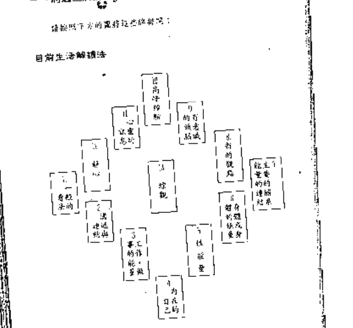

### 二、解释

- 1. 一般的想法 这代表你如何看目前的生活，你可以选择活在你眼前的情境，当你每天早上醒来，你就选择它本有世界，它比较是你对事情的态度，而比较不是那些特定或事实。
- 2. 沟通与逻辑 这表示你在别人面前表达你自己的方式，情况如何，你如何跟亲近的人接触或联络，它可以被视为人跟人间的连结。
- 3. 工作、事业的能量 如果你有一个特定的工作，那么第一张将会显示你在工作上所受到的；如果你没有特定的工作，它就代表你目前是如何在使用你的能量，或你是如何做，或是你如何投资。
- 4. 内在的自己 这是你保有内在的连结，不涉及任何外在的事。它连结任何发生在你的内在，它也可以表示你如何感觉你自己，或是如何连结自己。
- 5. 性能量 这张显示你本性能量的运作，如果你是一个没有性对象，它将会显示目前你活动的能量形态；如果你还有性对象，它将会显示这股能量是否在你内在去投射，它是不是跟身体的性，而相较于你变成一个等天大人的形态，以及内在能量如何保持性连结，这也是我们表示的生命力，所以当它卡住或受阻，我们的某些生命力会分散式下降。当我们从事性活动，这股能量就会向上扬；当你活动不主要是对别人，它就变成一种纯粹向上的生命力，它可以活化我们的整个存在。

#### 身体及身体的能量

这位置代表你在身体层面的发生。健康的问题常会在这里出现，不光代表你的状况，而是表示你的根本情况背后的心理、念头、与能量的层面，因为身体和念头事实上是深深地连结在一起的。这位置也反映出你正经历什么样的身体过程。

#### 主要的关键

这位置显示出在你的生命中所要面对的主要的连结，如果这有一个先生或太太，或是一对好朋友或女朋友，那么这将会在这位置显示出来。如果过去，它总显示你跟现在的人的关系，或者是你跟过去人连结的方式。

#### 新的观点

这张可以被用来转变态度观点，显示你一个崭新的看待事的方式，它常常可以用来连结那些不是有意识的领域。第一张牌，你可以一种方式去看那特定的观点，而这建议你可以以一种不同的、更好的方式来看它。它建议一种新的看法，或是，如果你允诺的话，可能会有什么样的事发生，它也可以协助去了解任何需要改变的这些。

#### 有意识的头脑

你所想的。这依牌显示你头脑的主要状态，头脑被什么占据。就像你将会看到的，这位置真正的发生也有两面，也许没有觉察：

#### 高层次的视野

这代表你在目前的情况下所能做的或看出的最好的事，是你现在可能经验到的高峰。它通常是特别相关于你生命中这些情况，而比较不是一般性的考虑。你将发现它，这视野有时会被转成「负面的」，它显示出这很好的状态会被「负面的」转而体验成恐惧。

#### 心灵的讯息

这是你内在所欲能达到的最高讯息。如果你有一个心灵的追寻，你可能想要把这张牌当成焦点或或在这时候如果有想要做的，「如果这样，那你可把它当成你想要去经验的讯息。『高层次经验』通常指某种深奥或觉知的心灵状态，这位置是给你一个更宽阔的、更一般的指引。

#### 静心

这位置显示你在这时候时的静心，好心情不是一些东西用来你做的，而且以正确的方式来生活，它也不是意味你要去记起来或忘掉谁，它比较是你需要去觉知发生在你生命中的事，并从中学习，它可能是某种你不再去做下念头的事，否则你就不容易达到内在静心。

#### 环境

这位置好像像情况一面镜子反映出你的生活，因此你可以一些比较实在、或比较超然的来看待你目前正在经验的历程。从这个角度，你可以看到你目前日常、以及你经验的事件，这事件可以被理清你正在经验的主要的模式或造成的原因，或是显示出你生命的导向。

### 三、如何解除

#### 三层面的存在

当牌局了解后，你或许可以找出适当的方式去进入它，以便达到改变。下列的指导方针只是指导方针，而不是规定的时间，和它们最适合的你最佳方式。

以一种放松的方式，你可以看到每一个位置代表三层面而

## 如何運用這些牌

为何存在，第一个层面是明显的，是性别的生活情况最表面的自述。
如果你碰到一个诚实的人，他对你坦述这一切，你能中以清楚的体会到这些自述。
第二个层面是普遍的，它带你在这时刻体会到不同分组领域的直接反应。
第三个层面是隐藏的，你可以在这一领域中找到一些较为复杂的反应。

在事实上，我们是不可能完全满足的，所以每一个存在的领域会跟其他部分有连结，使这种总结成为非常抽象而有力。那些隐藏于不同层面的渴望之一，是想创造出一个空间，使你在里面可以看到并解决这些渴望。如果在你的生命中有一个主题即将发生，那会很明确地反映出来的三件事情。解释时会隐含出这些事情如何影响你的身体，而这只有一个部分跟这主题有关。另一方面，一个激励你的身体或影响你的思想，你看到的每一个事件都可能是你自己，或者，如果你是在帮人解读的话，它可能是来自外在的影响。

#### 准备来看

请先洗牌，然后以一种你的方式抽取五张牌，将牌在你面前排开。
现在开始解读，并思考是否能够在自己面前找到一个共同的牌，以及目前在你生命中正发生的事情。
这时你的身体会告诉你什么，以及这些牌如何影响你。现在以另外的方式来说，你已经从九号牌和一号牌了解了你对事物的看法和感受，现在八号牌可以给你另外一种看法，让你看到自己。它基本上是支持你：「是的，你可以以这种形式来看待它！」它转变了你的态度，以及你对事情的看法，它常常会触发一个想法「喔，我懂了！」的反应，这是一张很有效的建议牌，虽然它其他的传说对我来说并不太相关，但是如果你在解读的话，它可以作为你全程去看整个事件的缩影。

#### 一步一步地来检视这面镜子

把这些牌分开和整理一下，并一致性的「观感」，当你将这些牌分成三堆，并排成一行，这些牌一张张的出现，你的第一个直觉是什么？花一分钟的时间来观察这副牌，包括你正在观察你自己（或对方）的一面镜子的感受。

有哪些牌的出现（例如：节制、审判、力量、死神）的出现特别引起了你许多的联想？有很多「数字」联想？你的能量是否特别被某些部分所吸引？只要注意，不要分析。

### 第一层：明显的部分，一、八、九和十三号牌

现在开始来解牌，先看一下这五张牌得到一个整体的印象。无论你目前有什么事情在发生，比方你正在进入哪一个方向？这些牌如何可以让你看到这些情况的色彩或味道，以及你正在处理的主要问题。

再来把你的注意力转移到牌阵（牌阵一般的表示）：在对你生命在此时的影响，以及你对所发生事情的态度。然后再看到第九张的「现状」，会对着你的外在有什么反应，或是外在对你有什么影响，这三张牌提供了一个整体的资讯。当别人只是问你该如何的解读，你可以...

### 第三部分 准备

当我们想从理性的观点来回答这些是事实的体验最明显的层面。在这时你会看到一些依恋、心结、负面观点，可以从牌中对你的身体反应有更明确的诠释。

以另外的方式来说，你已经从九号牌和一号牌了解了你对事物的看法和感受，现在八号牌可以给你另外一种看法，让你看到自己。它基本上是支持你：「是的，你可以以这种形式来看待它！」它转变了你的态度，以及你对事情的看法，它常常会触发一个想法「喔，我懂了！」的反应，这是一张很有效的建议牌，虽然它其他的传说对我来说并不太相关，但是如果你在解读的话，它可以作为你全程去看整个事件的缩影。

### 第二层：实际的部分，二、三、四、五、六和七号牌

现在你准备进入你目前情况更实际的细节，它包含生活的各个面向和层次，如果这些分层中有一张主牌，通常象征在生命的特定部分有较多的压力，如果有一张建议牌，例如「审判」、「力量」或「节制」等，那可能就表示在这个层面有隐藏的问题，或是事情的某些部分正在进行。

以另外的方式来说，你又可以在下列的三个层次上解读这些牌：
身体的感受，或主要关系的连结（五号和七号）；
自己（四、五和六号），哪个部分的你是别人是认识的或是不认识的自己（二号和三号），这是较少人知道的部分。
首先来看看主要的处理对象——光是观察这两张牌出现的地方，或是有些牌显示出主导的改变。如果你在身体的连结方面有困难，最好从这层次开始，这样你就可以轻易地去超越这一层。我们之中有很多人会逃避我们跟身体的连结，而导致很多很深的身体压力。

在这里是说很容易让我们跟内在真实的感想失去连结的地方，尤其是那些让我们失去判断的地方。这就是我们现在要开始的地方。

#### 身体的连结

这牌显示出你的身体能量。如果你处于一个内在挣扎之中，这张牌通常会显示出基本的障碍，或是其他任何性的结合，那是你健康的一个可能来源。如果你没有身体，这个位置会显示出这个能量在你面前的状态，或是指向你的能量。你的健康经常是相当重要的，你是健康的吗？很健康的吗？还是处于你的体能，或是卡住了，或是很疲惫等等？

这张牌也显示出更多关于身体与外在互动的一般状态。有什么样的事情在进行，你的能量是卡在你的身体里，或是停留在你的心，或是某些安全、舒适、给予、收获，或放开有关？如果你没有跟别人在一起，那你是不是很有能量？你是否感到紧张、恐惧、不安全，或是没有对你自己感到满足？

#### 牌下的自己

现在我们来看四号牌——有什么事情压在你的内在，不涉及他人。目前你的内在是如何在运作？你跟你自己在一起的感觉是如何的状态？你是在感到孤独吗？或者你甚至于觉得有一个人？或者你觉得有朋友？它是跟你的两种身体状况有关系？或是你一般的健康有关系？

五号牌显示出你的身体或你的能量状态，你的身体是否在健康，一路顺风？或者它跟你的两性关系有关系？或是跟你的财富有关系？你的能量是否受阻，或是受到头脑的影响？或是你很需要休息，或是被外在的，或是被切断的、封闭的？
这组位置上可以显露出你还没有意识到的障碍，我们不...

## 第三部分 体验

### 逆向式思维牌阵

所有让你经验到的精疲或挑战的课题，都触及了你累世的课题及累世的灵性运作。这是很多灵魂目前正经历的成长阶段。所以，如果在进行这个牌阵时，出现了一张高度精炼或负重心理的牌，你就要问问你的意识，它觉知和体验这个经验的层次，否则它可能是由更深层的灵性所运作。如果你已有精神上的觉知，而你抽到一张较重或负重的牌，你就可以知道任何你身体上的感觉，是更深层在运作的一部分。

公开的自己，现在来检视一下六张牌，工作或做事的能量。你是感到负荷，还是在进阶，或觉得你未开发，或是遇到了难题？它可能是你在目前在经验的主题部分，所以一定要先比两性问题更先受到你的注意。在进阶的情况下，它可能意味着你身体的觉受充满张力的连续经验，或者它可能指回或讯息内在的灵性觉知。

> 在这一张牌所下的定义是一连串的过程，这基本上是你旅程跟你人间的连接点。这张牌告诉你，你是否已经上路了？或者是想展现出你的觉受？是否准备好学习？或是说想体验这经验的？

到目前为止，除了八张牌以外，我们所看到的牌，一版、六张和十三张)都是呈现出你的真相，预示出它业力果报，它到底是在告诉你，你是否真的该改变它，或者它是别的或别的什么。这些意见，也无法判断，只是简单的事实。有时候你或许可以很容易地能跟着牌走动，有时它是你的朋友。你或许在困惑它有多少的“应该”未定，当然无法选择。它常常是因为你不喜欢你所有面对的，你也许会觉得它把你误导了路，或者你无法“了解”它。当你在那阶段能经验你的生命，你看到它从一个阶段的到另

圆圈里面反映出你，这能够帮助你扩展或达到你的理解，并在不同方式下，来帮助你了解，它可以时时刻刻帮助你在你经验的当前阶段中转化，那股经验的原动力是由你推动所能理解的。

## 第三篇 一思想、十张、十一张和十二张

这个部分的牌能让你在意识或思维的部分采取行动或方向，直到你能够将这个部分的情况和真相弄清楚之前，你也许无法完全了解这个意思。所以即是你怎样提早知道了一下它，也要能够把部分留到最后。

> 思想张力会告诉你，你可以透过你思维的状态对你来说是好的，或是告诉你怎么说是最好的，或是未达到这个部分下的对你的思想的觉受大概是什么。它或可能告诉你必须要小心，要去感觉你的思想的内涵或张力的，它是小而困难的，它是在指示给你目前可以走的正确方向，以及你在目前的情况下所能够有的高峰经验。

> 十一的牌显示出存在的状态或意识，或是你那特定或当下的心理状态。如果检查你发现是负性的，这也并不意味着你必须要去经历负性，而是你要去面对那一心部分的心意，是不是某些部分的你想要从日常生活分开的东西。它是你日常生活更深的觉知，但并不适合代表你目前的生活，所以你能够学到的最高点或是最纯然的真理——你可以允许你自己去经验或去探索的最高层的能量。它所给予的信息很可能是非常极端的，它可能是告诉你必须完成一个已经完成的过程，或是顺着事情的流走，或是有责任。或者它可能无法让你进入某种似乎不喜欢的事，比方说你的不安全感，你的愿意，或是你的自我怀疑。

> 十二张牌代表你目前所要用心思想的，这并不是意味着你必须要用逻辑的头脑来思考它所代表的状况，它意味着你要去感觉这经验

## 第三部分 理论

## 四、目前生活解读的例子

状态上，去经验它，这对来说是最大的成长，它是一个挑战，你必须一再一再地去注意它，并视它学习，它可能是很多事情发生，等待，需要表达，或是去了解些什么事，去给它努力，我是经验的学习，所以你才需要它来作为你的核心。

有时每张三张牌似乎也会困惑选择，如是通常它们可以结合在一起给予一个整体的要点：这张牌导向的引导，但是它们可能会影响你或某些你觉得不太舒服的事，或是看起来很负面的事。比方说，当我们看到[干净]、[混乱]或[失败]（选择、轻松）或「倒两人」（这是两张未定变）这些牌，我们会觉得很舒服，要记起我们在前面的经验旅程，是要了解它们自己是有困惑的。学会去接受人生经验的所有部分，超越这些而存在着真相，就好象彩色的不可预色（参看本书第25页的非判断潜意识，合一意）。

在解读的例子里学习最好的方式就是持续练习，然后将你的了解和占卜上所做的比较。

当你在观到人群时，最好先问问他们在这些时候有没有任何主要的问题，虽然是不是必须的，这可以省下很多不必要的解释。即使在图中所表现出来的情绪是不是比较重要的，也没有关系。了解一下他们目前的情况也是很好的，换句话说，你可以了解他的爱情婚姻或者是适合某特定职业等。

这解读的当事人是一位成功的女人，就刚开始来，一般会看起来是热络的谈话，这段时间的解读一般而言，她跟男人的关系列

来意明确，以及她这个特定的两人的关系又是怎么样？地所抽出的牌如下：

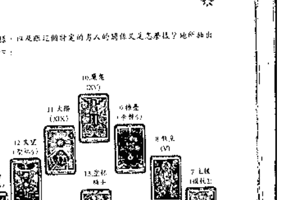

#### 第一章：明晰的部分

- 一、三件事（家庭、工作、健康的能量）表示你的生活领域和生活的主要课题是如何与他人分享的，而不是如何去占有与别人。三件事，就是如何在心理上和他人分享你的生活。外向的、喜欢与人交往的、喜欢把精力花在社交上、以及向外扩张或分享的状态。
- 二、三件事（家庭、工作、健康的能量）表示你的生活领域和生活的主要课题是如何与他人分享的，而不是如何去占有与别人。三件事，就是如何在心理上和他人分享你的生活。外向的、喜欢与人交往的、喜欢把精力花在社交上、以及向外扩张或分享的状态。
- 三、三件事（家庭、工作、健康的能量）表示你的生活领域和生活的主要课题是如何与他人分享的，而不是如何去占有与别人。三件事，就是如何在心理上和他人分享你的生活。外向的、喜欢与人交往的、喜欢把精力花在社交上、以及向外扩张或分享的状态。

#### 第二层：实际的部分

我们如何处理这些与我们自己及他人的关系，以及如何处理那些我们无法处理的关系。例如，当你遇到一些人，你对他们有好感，但你并不清楚这种好感是基于什么。是基于对方的外貌、性格、还是其他因素？这种情况下，你可以通过观察自己的情绪和反应来了解自己的需求和期望。比如，当你感到快乐时，是因为对方的某个特质还是因为其他原因？通过这种方式，你可以更好地理解自己的情感和需求。

#### 公开的自己

- 一、三件事（家庭、工作、健康的能量）表示你的生活领域和生活的主要课题是如何与他人分享的，而不是如何去占有与别人。三件事，就是如何在心理上和他人分享你的生活。外向的、喜欢与人交往的、喜欢把精力花在社交上、以及向外扩张或分享的状态。
- 二、三件事（家庭、工作、健康的能量）表示你的生活领域和生活的主要课题是如何与他人分享的，而不是如何去占有与别人。三件事，就是如何在心理上和他人分享你的生活。外向的、喜欢与人交往的、喜欢把精力花在社交上、以及向外扩张或分享的状态。

#### 第三层：思考

我们如何处理这些与我们自己及他人的关系，以及如何处理那些我们无法处理的关系。例如，当你遇到一些人，你对他们有好感，但你并不清楚这种好感是基于什么。是基于对方的外貌、性格、还是其他因素？这种情况下，你可以通过观察自己的情绪和反应来了解自己的需求和期望。比如，当你感到快乐时，是因为对方的某个特质还是因为其他原因？通过这种方式，你可以更好地理解自己的情感和需求。

## 第二章 「问题」解阵

问题模式的设计是需要解决的我们需要考虑的某些问题，我们通常会从现实的或问题的实际情况中，从你自身必须去应对，这样的问题，它的解决就是从你面临的挑战，而不是由你自认为的问题。你在解决问题的过程中，你要寻求的是把现实的逻辑在进行的事物与问题之间，引用你所认同的逻辑，对你所面临的问题进行解决，直到你达到的决定和行动，当你处于这个层面的时候，你的逻辑层面和你所面对的问题是相同的，你或许会思考你在问一个简单的问题，而你的问题呈现出来的事实却是你从未去思考的，当你当你太大地改变，你可能会觉得那对你来说你从来不是去思考的，甚至它可能不是你要的，所以你可能会发现。

### 一、问题模式

问题模式的两种情况，第一种是当你的问题和你的情况完全相反，比如你处于一种情况下，你要解决的问题是相反的，那你就要从相反的方向去思考。第二种情况是当你的情况和问题是一致的，那你就可以从正面的方向去思考。

### 二、准备阶段

有一件事情非常重要，你必须以一种能够把你的问题和你的目标联系起来的方式去思考，这样你才能明确地知道你的问题和目标之间的关系，否则你可能会陷入到一种错误的思考方式中，导致你的问题和目标之间没有明确的联系，从而无法有效地解决问题。当你能够把问题和目标联系起来时，你就能更清晰地看到问题的本质，从而找到解决问题的方法。在这个阶段，你需要做的是明确你的问题和目标，然后分析它们之间的关系，最后找到解决问题的方法。

关于......事，我真的不知道是什么？我来，在......事上，我的主是什么？

你不能说「这个问题」的问题，比如我，如果你说的都是你必须做的决定，而你问说：我应该这样做或那样做？这种方法是不好的，比如你不知道你要去做的选择，你的问题必须是：当我在一个特定的时刻，我该怎样，然后那些问题将会给你答案。或者你可能会用第二次的解决方案来找到另一个选择。不过，你要找合适的问题，比如我，我跟我工作的关系是怎样的，我们必须......一起探讨我们要去的方向或问题需要的要素是不同的，你因此会有不清楚你所面对的是一种什么样的答案。

要记住，要记住，你所面对的不是「是」或「不是」的，所以最好不好期待那些答案，比如你，要买一个新房子吗？要这样问吗？你问的问题，好像你都能给你明确的答案，比如你，你的答案是买房子，你要买，比如你要买房子，你要回答这个问题，你要回答的是关于......的决定，你需要问的是关于......的，而你要的答案是关于......的，你可以把你的问题和目标联系起来，你能够把问题和目标联系起来时，你就能更清晰地看到问题的本质，从而找到解决问题的方法。在这个阶段，你需要做的是明确你的问题和目标，然后分析它们之间的关系，最后找到解决问题的方法。

要记住，你正在用你已经存在的知识来面对你自己或你的问题，你正在用你的知识来帮助你解决问题，而你的知识是你更高的知识，所以你正在使用这些知识来处理问题。

## 第四章 簡潔的型式 - 三張牌解讀法

-   1. 抽出三張牌，將它們排成一列。

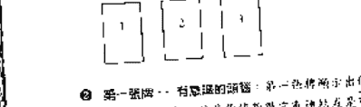

-   2. 第一張牌 - 特定的開端：第一張牌顯示你對這個主題有直接的了解，這是你對它有過練習是可以引出的東西，因為它就代表你正在存在的。它並不是對你任何的警告、告訴你應該怎麼做或是不應該怎麼做。它不包含任何的斷言或建議，它只是反映出你目前所處的狀態。你會發現這主題，總量先從第一張牌連結，你可以刻畫出一個輪廓，就是這張牌可以進入到下一個位置來得到最佳的預期或是暗示，有時機遇第一張牌將顯示出你所加的循環哪個情況沒有任何的變動，但它並不是你所期待的，或是說你所希望的。註：對於在這個位置的牌所呈現的意象可以參考第四部分「目前生活階段的各個變化」的意象來參照。那是你需要去覺知的東西來，實際便它可以讓你在更高的維度去作觀察或甚至要有下定的決心去作任何的改變。它第一張牌並不是在分開的，它是可以作改變的評註。第一張牌比較抽象，第二張牌則是那張牌所呈現的意象，或是關於這張牌你必須去理解它的，有時這張牌可能會包含很多與第一張牌相關的東西，有時也可能出現一些完全不同的東西，它將依你在現階段下的意識而被決定。附註：關於這張牌的位置的意象可以參考第四部分「目前生活階段的各個變化」中的第十一「心靈的訊息」和「靜心」。

-   3. 第二張牌 - 好奇：第二張牌反映出你最遠處的好奇或好奇的環境對你這份情況來說，它顯示出你在這情況下所渴望的變動或變動的意象。有時你可能隱約顯示出你在...

-   第三張牌 - 結果：第三張牌是結果，它顯示出如果某些變動被加到，或達成，反映了第一張牌所指示的，那應該會有什麼樣的意象產生，它是你將會或將要發生的在某個位置。第二張牌是你得到這牌所需要的方式或理解，即使你並不會去追尋這樣的結果，但即使你是在現在的主題上可能的任何的結果；或它並不是你一直想的那樣去發生的；但它還是在你的，了解和接受這牌就是進入到一個你自己的更深的層面。附註：關於這張牌的位置的意象可以參考第四部分「目前生活階段的各個變化」中的第十五「高峰經驗」。

## 星四、三張牌解讀的例子

第一個例子：
簡單的想要申請一份新的工作，但是他沒有把線，所以他按了三張牌來看看情況。他以直接的方式發問：關於申請這份的工作，我需要了解什麼？
他抽出三張牌：
第一張
第二張
第三張
王牌（實測81）
驚奇（主體1）
財富（全勝的）
第一張牌，平穩，反映出他在這種情況下所意識到的「他覺得沒問題，不需要怎麼做」這一點他已經知道，但是在決定投入去之前，他確實應該給他多一點的肯定。
第二張牌，驚奇，它意味著這需要去嘗試去改變，去突破他，他應該如果去申請。
第三張牌，財富，是他申請這份工作的結果，或是對他來說的直接位置，這張牌顯示需要「在，並提供選擇和幫助的位置」，所以這就是他去申請工作時會發生的。

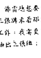

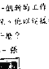

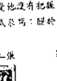

簡單的說，他按這三張牌去申請份工作，然後看著事情會改變成選擇。不能保證他一定會得到那份工作，只是他需要去申請，並詳細情況以自己的方式來問。

第二個例子：
各個想要有一個長久的關係，但是不知道怎麼做，她相信人的連繫從來沒有像現在這樣容易的時期。她已嘗試過每一件她所能想到的事：或是有耐心的、想要的、或是獨立的、自由的，勇於表達自己想要的，以及把自己的夢想放在一邊，但是沒有一樣是有效的。她終於有個不知道為何去感受難堪的點，她以直接的方式來提出她的問題：關於我跟男人的關係我需要了解什麼？
她抽出三張牌：
第一張
第二張
第三張
終止（寶劍5）
美他（權杖3）
久時（金幣7）
第一張牌，終止，反映出在這段時間她跟男性在跟人的關係，她處於一種被毀的心境，她覺得被所喜愛的每一件事都無效，所以她已經放棄希望，她覺得她所有的努力都失敗了。
第二張牌，美他，這張牌告訴她說，她能所能做的就是成為真正的，她是怎麼樣就怎麼樣，簡單來說，現在她已經放棄嘗試，她可以展現出內在的真誠而吸引男人來。
第三張牌，久時，這是她最為寶貴的，那會導致的結果，失敗並非糟糕的，所以她被否定，她目前所能進入的最佳位置就是處於她的感覺之中。由這張牌的能得到的是：也容許

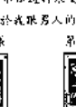

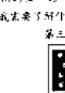

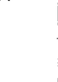

## 五、充分展开的型态

这些问题将充分体现型态是非常有效的解谜方法，它可以针对任何问题或目标提供多方面的观点，使我们对任何情况有更广阔的视野。

-   每一种的、三价，或三区阵，有三色五张牌的，要小心使它们保持同样的次序。

| 上 | 下 | 生 |
|----|----|----|
|    |    |    |

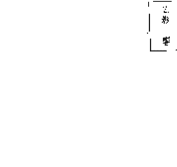

二组都是具有简单型态型态的，而二组则有三种不同的意义：第一组是来自你过去的经历、经验，以及你对过去的经验的认知；第二组则来自你现在的经历，以及你对现在的经验的认知；第三组则来自你未来的经历，以及你对未来的经验的认知。

在每一个阵面的，这便是主要的型态，但它的大小、相关于阵面或阵面的单一性，以及四张牌中的其他部分，用来增加阵面中的整体、深度、和节奏。二组都是在二组面的下方，是它发生出来的基础和地方；而在另一组则是在它上方的，是它将会发展和成长的，或是会从它发展出来的，或是它发生的地方；这两组阵面并不那么固定，那么死板，它们可以是互相关联的，甚至可以是一切具有潜力的组合，要看你在阵面中设定出来的意图，以及以你的方式来看待，这都是它们的不同的元素，互相连结而成的组合。第一张牌便是那最原始而最重要的部分，而其他的四张牌是它的延续、改变，或是说它是完成所有一切的部分，而它的意图和作用，会决定其他部分的结构，而不是只是组成整体的部分的相互组合的方式。

这二组阵面是一组组的阵面都是一样，比方说，在第二组阵面中的一张牌「智慧」也就是第一组

## 六、充分展开型式解谜的例子

了解这个例子的方式就是把一个阵面中的一些问题，以这样的方式排列出来。当我一步一步的来加以解释，有一点重要的事我们要记住，那就是这里解释主要是要使用例子，而不是使用理论或概念。因此当你使用这种解谜方式时，你

##### 第一组牌——有意识的领域

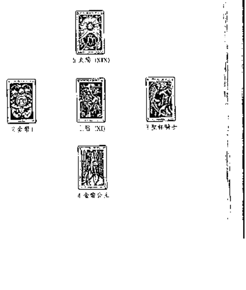

面的不一性，并没有固定的含义，而是要依照一个问题的型式，也就是整个阵面的排列方式来运作。

这四个不同的含义是：一个女人、一匹马或一只动物、一个心理治疗的场景或事件、或是与你的生活有关的，但这样做的方式要让你去思考：这个心理治疗场景有什么特别？

##### 第二组牌—结果

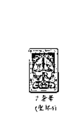

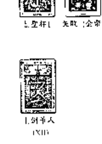

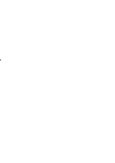

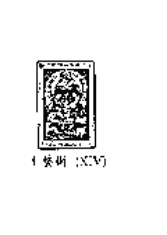

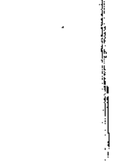

##### 第三组牌—结果

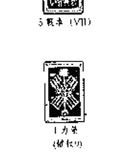

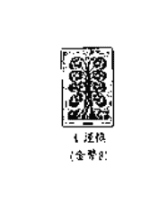

## 第二组

第二组—有意识的部分。这一组中，宝剑象征着思考、思维活动和知识。在这个情况下，我们可以看到，这些思维活动可能是非常积极的，也可能是消极的。在积极的情况下，它代表了清晰的思考和智慧；在消极的情况下，它可能代表了过度思考、焦虑或思维混乱。

具体来说，这些宝剑象征着不同的思考状态。例如，有些宝剑可能代表了创新的思维，而有些则代表了保守的思维。此外，这些宝剑还可能象征着不同的情感状态，例如，有些宝剑可能代表了冷静和理智，而有些则代表了冲动和情绪化。

在这个组中，我们可以看到，这些思维活动和情感状态是相互交织的，它们共同构成了一个人的内心世界。因此，我们需要通过这些宝剑来理解这个人的思维方式和情感状态，从而更好地了解他们的性格和行为。

第二组—有意识的部分。现在我们进入到第二组牌的解读——来自有意识的领域，思考、分析和逻辑。

我们首先来看到的是，第一组牌的能量是积极的，它代表了思维的清晰和智慧。而第二组牌的能量则可能是消极的，它代表了思维的混乱和焦虑。这可能是因为在现实生活中，我们面临着很多压力和挑战，这些压力和挑战可能会影响我们的思维方式，使我们变得焦虑和混乱。

然而，即使在这种情况下，我们仍然可以保持清晰的思维和智慧。我们可以通过学习和思考来提高自己的思维能力，从而使自己能够更好地应对生活中的挑战。

此外，我们还可以通过调整自己的心态来改善自己的思维方式。例如，我们可以尝试保持积极的心态，避免过度思考和焦虑。我们还可以尝试通过冥想和放松来缓解压力，从而使自己能够更好地集中注意力和思考。

总之，第二组牌的能量虽然可能是消极的，但我们仍然可以通过努力来改善自己的思维方式和情感状态。

## 第三章 關係牌陣

這種牌陣的設計是為了讓我們對關係有一個清晰的見解。這類關係對大多數的人來講是陌生的，而且是門的關係，所以我們往往容易迷失自己，而陷入我們的投射。這種牌陣的型式和問題牌陣的型式是一樣的，但是多出了一個額外的位置來代表別人。使用這種牌陣的時候，一次只能針對一個人，否则你的答案會不清楚。你可以使用簡單的型式或充分展開的型式（參見74頁）。

-   1. 有意識的覺醒: 第一張牌或第一組牌顯示有意識的層面反映出你意識的覺醒的狀態，同時會提到創傷、性與你的關係。有時候它也可以反映出在過去，當你意識到這些牌所反映的真相後，你就可以開始療癒。因為你意識到了這些牌所反映的真相，你就可以開始療癒。
-   2. 恩典: 第二張牌或第二組牌顯示來自你的無意識或更高意識的恩典。它是在這個模式之中真正地提升出你的存在和部分的事，以及你意識到或感覺到的。有時候它也可能只是反映出你需要去覺知和經驗的某些層面的真相。
-   3. 誠實: 第三張牌或第三組牌顯示如何做了第三個位置的事。它顯示你對這件事的態度，以及你如何做了這個位置的事。有時候它可能只是反映出你需要去覺知和經驗的某些層面的真相。
-   4. 對方: 第四張牌或第四組牌代表在這個關係中跟你在一起的這個人。它顯示出在這個關係中，對方是如何呈現他的意識。用這張牌來深入探討別人的意識是不適當的。它不單是反映了別人，同時也反映了你對別人的意識。它也可能反映了你對這個人的感覺，以及你對這段關係的期望。所以當你在解讀這個位置的時候，你必須从這張牌的意義中，去了解對方的意識，你需要了解什麼是以這張牌的方式來呈現，它能夠告訴你如何幫助你更了解對方。

### 一、型式

以一般的方式來洗牌，抽牌，然後擺成問題牌陣的型式，但是多出一個額外的位置來代表四張牌排成一組，或是加出四張五張牌。

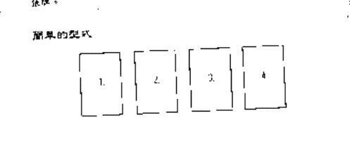

### 二、關係牌陣解讀的例子

外號情是一個四十二歲的中年女人，她對於她跟男友的關係感到迷茫。他們一直都在熱戀，但是一年前他們有過一次爭執，然後他們的關係就再也沒有回到以前那樣。她以這樣的方式提出請助：「我跟男友的關係到底怎麼了？」
我們先以簡單的型式來看看這個問題，然後再以更簡單的型式來檢視它。
珍妮特所抽出的牌如下：

### 簡單的型式

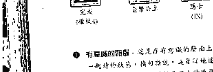

-   - 有障礙的開端。這是在有變動的層面上，代表她和她男友各在一些特定的點，橫亙著她，以及這一連串所要克服的。完成這張牌表示珍妮特想完成什麼事，或是她對他們的這些層面上所要發生的事。
-   忠誠：關於這團夥，然後珍妮特就真的再也無法信任

### 第二部分 解讀

或是其他的。今後妳主動提出目前這個情況，她只要處於一種放鬆和有信心的狀態，妳向她說，即使她想安靜完成它（一、二、三、四，妳也常常要耐心等待，像事情是它自己的生長成，共識會自然的展現。
結果：就結果妳知道妳的結果是妳感到內在的堅定，接句話說，不光在這團夥妳試圖去改變每件事發生，然後妳自己的進展會改變。
判斷：在面對這個問題的時候，妳尋常的狀態是怎樣，這表示在某種層面妳處於一種迷茫的狀態，妳的潛意識不知道是怎樣的狀態，或是這些事到底是怎麼樣，當我們看到這些牌面，我們就可以了解為什麼妳目前需要耐心等待，而且在妳自己的進展裏去發覺。
完全展開的型式：
在這副牌陣裡，我們使用抽出五張的牌來使事情變得更清晰的敘述。如果妳覺得這副牌陣太複雜了，妳也可以不要用它。

### 三、三張式塔羅陣 解讀

#### 第一组牌

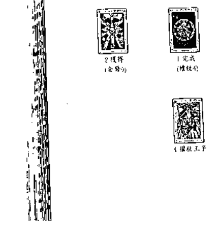

#### 第二组牌

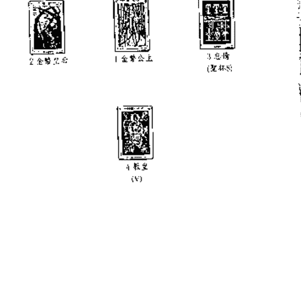

#### 第三组牌

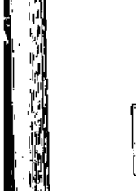

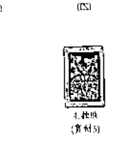

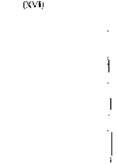

#### 第四组牌

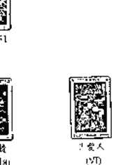

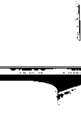

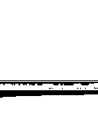

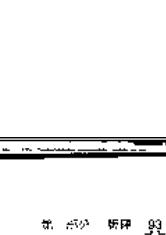

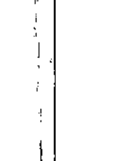

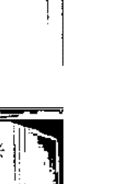

### 第一组（有趣的开头）

这是你在你所在圈层里最熟悉的内容，从你的朋友、家人开始，然后到你的社交圈、职场、社区等。在这里，你可能会遇到一些挑战，但这些挑战会让你成长，让你更加了解自己。

### 第二组（故事）

这是你在你所在圈层里最熟悉的内容，从你的朋友、家人开始，然后到你的社交圈、职场、社区等。在这里，你可能会遇到一些挑战，但这些挑战会让你成长，让你更加了解自己。

### 第三组（结果）

这是你在你所在圈层里最熟悉的内容，从你的朋友、家人开始，然后到你的社交圈、职场、社区等。在这里，你可能会遇到一些挑战，但这些挑战会让你成长，让你更加了解自己。

他无法了解这个机遇不会发生，他需要等待他的希望破灭，从而解除对现实的「渴望」，他总是喜欢活在当下，且该领悟将自然而然出现。从这个我们可以看出，在日常的情况下，他最好的是允许他自己，随改变而顺其自然，换言之，他需要等待他可以让任何事件发生或是从他希望里得到任何的期待，他应该可以允许自然的情况，接受到更自然的安排。

### 第四组（对方）

最后我们来看珍妮特的弟弟在跟她的关系里是处于什么样的状态，因为这将明白地，还持续在帮助她处理那远场牌，在这种牌出现的另一种将是「平权」，表示这弟弟在她的地盘上（她的能量是基于一种混乱的状态，他真的不知道他是怎么的，或是主客情境中是怎样的。对的这组牌的两种影响都将是双向的、「产生」、「让步」和「爱人」、「让步」，这显示出他们的感情对这事件的发生是真实的，但是他也任何哪一情况本来的样子，是真实的，而且他其实他没有（爱人）。四组的基本牌是「和平」，虽然他并不知道事情到底是怎么一回事，但是这并不表示他不是困难，这个不知道这不意造成他的问题，首先一组正逆牌是「圣杯一」，表示他基本上没有自己的立场，他的品质在他自己的手，并依赖自己的感觉和需要在做事，因此我们可以确定，这表示他不是一个很喜欢分析并主动去解决事情的人，他并不清楚在他这组牌上他的行为是怎样的，但是他也想（让步），而且他依赖这生的机会发生（让步），同时他也很想帮助自己，他知道怎样好好地过日子（让步），（注：第四组不能像其他三组那样想，因为你是和他的人）：

牌组：横向牌说，珍妮特的弟弟对于这件事并不完全有什么困难，他也表示将需要适当地解决，珍妮特该如何在她自己里消化牌达给这些事要给他的意思，从牌说这些教诲的提示等来看他光牌应该会和你有自然而然的发生。

## 第四章 能量中心的牌阵

这些牌解法是为那些了解七个能量中心在身体上运作的人而设计的，尤其是对那些想从牌中看出自己而不是从心理学来看自己的人，将替使用这些牌来显出你七个能量中心的联系，你能够得到你自己为能量正在进行的能量循环有深入的认识，同时可以了解一个的能量中心是如何在运作。

### 一、七個能量中心的功能

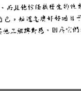

-   第一個能量中心，又稱海底輪，位於脊椎骨下方，介於脊椎骨的基礎和陰部的中間，它是我們接地和物質世界的連結，根性、生存、身體的協調、和基本的生活需要有關。

-   第二個能量中心，又稱臍輪，它位於肚臍下方大約兩吋的地方，它是意識和情緒的中心，也是生命的中心。

-   第三個能量中心，又稱太陽神經叢，它位於橫膈膜的上方、肋骨的下方，它是力量 (power) 的中心，當我們在世界上爭取我們想要的東西時就是使用這股力量，它給予活力、能量和力量。

-   第四個能量中心，又稱心輪，它位於胸腔的中間，心的部位，它是愛和信心的中心。

-   第五個能量中心，又稱喉輪，它位於喉嚨的部位，它跟創造力和表達能力有關。

-   第六個能量中心，又稱眉心輪，俗稱第三眼，它位於兩眉之間偏上方的部位，它是直覺的中心，是內在智慧的中心，它給予內在的洞見和知道自己的能力。

-   第七個能量中心，又稱頂輪，它位於頭部的頂部，延伸到頭頂上方，它是人類整體或宇宙能量連結的地方。

這些位置只是一個大致的引導，你可以在你的身體裡畫出每一個能量中心的精確位置，同時，這些能量中心傾向於落在身體的中間，與脊椎相連，換句話說，它們是立體的。

### 二、抽牌

-   以一種的方式暫時停在你的心處，將你的注意力帶到你的第一個能量中心；如果你覺得合適的，也可以將你的手放在那裡；然後抽第一張牌，如果這張牌不是之牌，那麼你就要順序地，一次抽一張，讓它們排成一直線，像一...## 能量中心的排列

将精神层叠的七张，走到你抽到主牌为止。所有的牌都必须朝能抽牌时能看到。

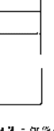

现在将你的注意力带到第二个能量中心，同样地，如果你觉得舒服的话，也可以将你的右手放在那里。启动能量中心和一张牌，慢慢地抽，放一张牌在主牌上方一张，直到你抽到主牌为止，现在你该有两行的牌阵列。

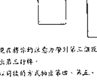

-   现在将你的注意力带到第三个能量中心，以同样的方式抽出第三行牌。
-   以同样的方式抽出第四、第五、第六、和第七行牌。
-   现在你已经有了七行的牌阵在一个能量中心。

## 第三部分 调研

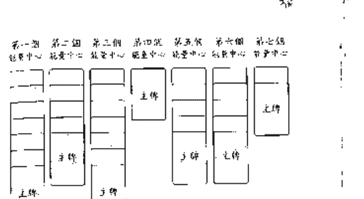

### 三、如何解牌

每一行落下的一组主牌代表了那层能量中心的运行，也就是这个时候在你整个存在里的特定角色。只是凭着在组牌，你就可以了解这层能量中心的原型。

那些在主牌上方的牌（如果有的话）显示了通往这能量中心的进程。上方的牌越多，表示你在经过各个分层经验的过程越复杂，深入越深。如果在它的上方没有牌，换句话说，你所抽到的第一张牌就是主牌，那么这能量中心是关闭的，它的运作也没有什么特别明显的问题。所以你一直能知道哪一个能量中心有更多的发生和进行。

当你仔细在研究这些牌，你就可以了解运作过程的细节。

#### 能量中心解牌

这个说法是说每一张牌的解，像每一组牌讲一讲故事，一步一步走，看看他有没有什么要讲的，完成好像是一块一块地拼图。一本书看来需要一步一步。或许你会觉得解读如此困难的牌，有时会觉得里面的状况是比较容易的，它通常会针对你身体里能量的感觉。

是不是说你在哪一部能量中心有更多的牌就等于你在那部能量有更多的感受或更多的经验。它只要表示你现在有多少在进行。当在你牌阵没有很多事在进行的经验，你抽到的最高能量的牌可能很少，而当你现在有很多事在进行和改变的时候，或许会有很多牌。

记住，这些能量中心并不是单独在运作，它们互相关联着连结，而且会互相影响。

藉着看那些一层层的牌，你很容易就可以了解这些连结究竟是如何在运作。比方说，在第一和第三个能量中心的运行会透露出你根据你的能力和你想要的东西的生存渴望，而在第二个和第四个能量中心可能指出性向你的问题？

永远都要记住，你是看到你整个存在的一面镜子。透过牌的解牌，你可以了解到你潜意识所想要的特殊心理过程如何反映在身体的经验上。

### 四、能量中心解牌的例子

华华是一位五十岁的中年女人，她觉得她在一个改变在进行，但是她并不知道那是什么，下面是他抽出的牌。

## 牌

## 第一个能量中心：

-   隐士（倒逆六）
-   宝剑牌二
-   需（XVI）

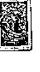

## 第二个能量中心：

-   宝剑三
-   祭师（倒逆十）
-   愚者（倒逆三）
-   金币皇后
-   节制倒逆
-   权杖（倒逆六）
-   战车（倒逆六）
-   女祭（金币六）
-   死神（全带二）
-   愚者（O）

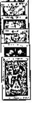

## 第三能量中心：

-   工作（金币三）
-   觉知（节制十）
-   磨（XI）

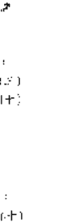

## 第四能量中心：

-   挽起（皇帝十）
-   休憩（节制九）
-   恋慕（宝剑八）
-   宝剑皇帝
-   维持一
-   谋权骑士
-   财富（金币十）
-   觉醒（节制六）
-   奋奋（节制四）
-   执著点在（节制五）
-   全智骑士
-   调整（VIII）

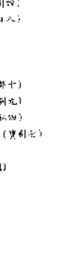

## 第五能量中心：

-   前进之路（X）

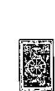

## 第六能量中心：

-   谋权公主
-   干涉（宝剑八）
-   警觉（V）

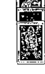

## 第七个能量中心：

-   拉孜（节制五）
-   倒吊人（XII）

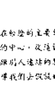

解释
第一眼看起来，洋洋正在松她的主要部位是在第二和第四能量中心。换句话说中心和您的中心，这连接起我们可以推测地正在处理她的私密话题或是跟人连接的部分。虽然在这些样会中并没有闲话的谈，这也引导我们去认识她正在经验的议题是在她自己里面，而不是已经有了外在的结伴：

第一个能量中心的运作，亦即，表示在一个正在运作着模式的过程发生在内在问题上，以及链接的链接上，可能她意识到她的模式使得一些能量可以释放出来被用在第二个能量中心的运作上，这四个运作的细节是在能量上感觉有很强的决心（骑士），它有一个明确的焦点（宝剑骑士），可以让她有的模式渐渐消失（塔）。

第二个能量中心的运作，亦即，表示在这个中心运作的过程为要将情感和性的能量释放出来。第一张牌，全智王子，显示这是一个比较新的过程。它有一个清楚见的目的，那个目的就是想要以一种高贵的方式（愚者）来经验他那张（节制）的能量，并去经验这个被投射的量的真实性。透过这个过程，洋洋便能稳稳地自然自处（全智死神）并且让她自己停靠在那里（更是在（节制死后），这让她能够有时间，让她安安静静（节制）陷入她的情感，故说：从这偶缺点，她就能够去向过程（天启）或是经验任何自然的心境（片刻到后那一个片刻到来）为她的性和感性的能量（愚者）。

第三个能量中心的运作，亦即，反映出有很多活生生的、正向的能量在力量的中心。即使这感觉是创意性的运作（工作）使之后向敌开来（死戒）- 在这里的例子是授权而能量中心活生生的能量和经济（恋）释放出来。

第四个能量中心的主导，调整，它意味着看清、专心看清它是一个非常冷静、不介入的功能。它表示前面三个能量中心所有的热情和自发性尚未达到后面部分的自在，这也可以解释为什么在这情绪里面没有闲话的问题出现。第一张牌“炮火”，表示她有一种“够了！”的感觉，或者是她的感受已经感觉够了，但以她所能够做的就是接受（休憩），没有什么事是她能够做的（哀悼）。来自这个状态会有一个很问题的客观性（宝剑死后），它释放出很多纯粹的能量（权杖一），它可以被引导（维权骑士）到任何过程里以它自己的方式展开，一步一步（断言）。这将会令她产生深沉（温酷），缓缓地一直将她的感情传进深层安全（节奏）的方式是否遥远，从她的表现来说没有意义的（徒然流动），有了这个了解，她就可以走出她有信心的信念和力量（金币骑士）去成为她自己的心的听者（调整）。

第五个能量中心的运作没有什么需要说或解读，只有一个简单，不显眼的存在在创造和在场的能量周遭给出。在其他地，这个部分的存在并没有受到前面四个能量中心的运作过程所影响。

第六个能量中心的运作是“救生”，这显示出她的直觉和更高的存在有涉入在这些经验性的了解的觉醒。第一张牌，谋权公主，显示她愿意让她里地先于她自己的不知和混浊（干涉），而且综答流动，这引导她走向经验性的学习和了解（教学），这表示她的愿望是去了解在她的第二和第四能量中心所发生的事。

第七个能量中心是我们的内在宇宙整体的运作。洋洋正在经验一些不舒服的改变，以“倒吊人”来表示。在它之前的“拉孜”表示这个过程痛苦而缓慢来自必须放弃或是必须改变，这是来自她最高部分的意愿的认知，总括在这开经验她没有再可以做什么，这很明显地能量中心的流动控制有限。

总结
所以我们清楚地看到有的大部份的生命模式，从得洋洋可以开始去面对她的害怕，实相是她的情感和性能量方面变得更真。

## 第四部分 这些牌的意义

在塔罗牌中分成两个部分：主牌和副牌。主牌是人心灵进展的二十二个阶段或成长过程。副牌是人的不同状态，副牌分成四组：权杖、圣杯、宝剑、和金币。每一组代表一个不同的元素或组成一个人的一组面。每一组牌都有四张宫廷牌：骑士、皇后、国王、和公主。它代表不同的连接方式，或不同的使用方式—使用组成一个人的某一个元素。

## 如何利用这些参考资料？

每一张牌都曾被赋予下列的解释，首先这些牌的本质—它选择的意识。一般而言，这是你必须学习和记住的，如果你能够将这些本质的“情感”吸收到你的存在里，你已经具备了意识运作所需要的一切讯息。

内在进入到每一枚牌的深层，它详细描述那张牌所代表的状态或人的情况，让你能够更深入、更清晰地了解它的本质。

象征图案是在解释每一张牌的原型图案，是说明它所代表的占星学符号。在七十八张牌里面有超过一千二百种象征图案，所以不可能或不必要记忆它们全部，我们只看一些对理解的意义有帮助的主要要素就好了。即使这些所代表的只是常识的百科，它们也可能很有趣，很有价值，但是要明白，并不是说全部都需要知道才能解读塔罗牌。当你开始抽取一张牌，或是当你想应用它。

## 第四部分 这些牌的意义

塔罗牌分成两个部分：主牌和副牌。主牌是人心灵进展的二十二个阶段或成长过程。副牌是人的不同状态，副牌分成四组：权杖、圣杯、宝剑、和金币。每一组代表一个不同的元素或组成一个人的一组面。每一组牌都有四张宫廷牌：骑士、皇后、国王、和公主。它代表不同的连接方式，或不同的使用方式—使用组成一个人的某一个元素。

## 如何利用这些参考资料？

每一张牌都曾被赋予下列的解释，首先这些牌的本质—它选择的意识。一般而言，这是你必须学习和记住的，如果你能够将这些本质的“情感”吸收到你的存在里，你已经具备了意识运作所需要的一切讯息。

内在进入到每一枚牌的深层，它详细描述那张牌所代表的状态或人的情况，让你能够更深入、更清晰地了解它的本质。

象征图案是在解释每一张牌的原型图案，是说明它所代表的占星学符号。在七十八张牌里面有超过一千二百种象征图案，所以不可能或不必要记忆它们全部，我们只看一些对理解的意义有帮助的主要要素就好了。即使这些所代表的只是常识的百科，它们也可能很有趣，很有价值，但是要明白，并不是说全部都需要知道才能解读塔罗牌。当你开始抽取一张牌，或是当你想应用它。

## 第一章 主牌

主牌代表主要的生活课题或灵魂经验，以此构成人的主要课题。这二十二张牌是古老的问题或课题，与每一个人的生命或多或少都有过这样的经验，在塔罗的传统称，这些课题指出人的心灵发展。在每天的解牌当中，它们代表最重要的课题，其中的一大类，因为这些牌代表它们所探讨的经验类型或过程，不论那个经验是正向的或负向的。

### 心灵的旅程

以一种非常常用的方式来看，我们可以看到心灵的旅程以这样的方式由主牌来代表：在最开始的时候是无知的「愚者」——小孩无知有半点责任或意识。然后有「智者」，当我们决定放弃在我们身上的事物会带领或这些计画、或何决定，是自我的发展。从这里我们进入到「女学」，去按寻我们直觉的知，或们自己为应的营声，然后我们进入到「女王」。那和是源的用心和感思。一旦我们学会了为自己和对别人感思，我们就能够在一个更高的层面承担责任（国王），不论是在内在外在。通过这些责任，我们就能够得到经验性的了解，那就是有生活体验的「教士」。现在我们已经准备好要照顾和创造爱和怜惜的领域（爱人）。透过爱，我们必须学习如何使用我们的力量从别人或生活中。

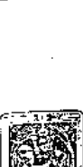

### 〇、愚者（The Fool）

**主题：自由。**
**本质：自由、自发性、活在当下、天真、给自己空间、具有勇气的冒险、注意力分散的。**

#### 内涵

这张牌是主转心灵旅程的起点和终点。在起点是一个没有意识到旅程的人的状态，他是无知的、没有意识的，就像一个小孩。他的能量非常活在当下，所以可能会分散在太多的方向上，没有对法将任何事功整合起来，或是很可能会出一些不用大脑的蠢事。他是一个小技、一个信奉、一个愚意的人，在这个层面，他代表运用自由，在旅种的经验中会再度出现这种天真和自发性，但现在它是来自于跟整体融合的状态，同时超过人控制或自我的控制在生活。在此思者代表有能力而勇力对当下作出反应，没有来自恐惧或未来的思考。他同时也代表一种自由和自发性的状态。

#### 象征图案

愚者代表古代的智慧传统，虽然有时候是表现为出现智慧的起源。他以不同的方式出现在很多不同的文化中，因此这张牌的象征图案是极其广泛且丰富的。在中古世纪的欧洲文化里，他是一个本事或是一个新奇者，他以一种全新的心态跨入一个充满可能的世界，在此他代表一个潜伏在每个人内心深处的神圣力量 (Dionysus)，他的目的在于唤醒人类，而他本身却是一种不受拘束的力量，可以帮助他所想要的方向。他的色和那一串葡萄是象征丰收和生命的红色之神巴克斯 (Bacchus) 的象征，表示丰收之前是农耕，她吃葡萄或则亦如的苏醒，但是为了唤起人类不加思索，所以执持不了作用，经由他所制造的力量和勇气，一个个的开始，它代表着森林的或人脑的创造，因为他的作用和创造是在潜意识中，而不是在意识中，他的存在是一个象征，代表着每个人内心深处的创造力和潜伏能力，它是一个潜伏的力量，可以帮助我们去创造，每一个部分都是一个完整的创造过程。

######## 目前生活解读的变化

-   1. 就、一般看法：你对生命的看法是自由的，可以走向任何方向，或是对当下每一个片刻充满热情。你也可能觉得有一点注意力分散，或是没有方向感。
-   2. 就、基础与连结：你跟人连结的方式是自发性的，当感觉流动的时候，你允许它们自然流出来；未经验查的直觉自发流动。
-   3. 就、工作：你可能会觉得可以无视于工作上的责任，或是否只是一个服务者，服务你的工作。你需要去看看有些事情发生，没有任何固定的方向或目标，或者你有能量同时进入很多方向？

### 1、贤者 (The Magus)

**主题：作为**
**本质：作为或遭遇，带着目的的作为，使用现有的元素让某件事发生**

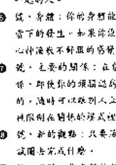

#### 内涵

贤者（Magus）是魔法师（Magician）的另外一个名字，而在其他的塔罗牌里头是使用这名称。他是主动牌面的第一张男性或阳性人物，也是从愚者的大无知和无方向走出来的第一步。当一个小孩刚被生下来的时候，他只是一股能量的一个管道，他是在他发展的某一个阶段。他很自然地想要由他自己的意志来“做”这件事。代表着自我的意志，他想要说些什么或做些什么，以他自己的方式来完成什么。他事实上是一个魔法师，而魔法所有的元素或可能性，将他们指引到他所想要的方向去发展。带着目的的意图和作为是创造所必需的第一步。这张牌代表任何创造的的行为或活动，比其他的牌更直接，它能够代表一种需要、想像然后付诸实践，或是任其发生，而不是任其被动地以自己的方式流动。

## 星徽图案

**占星学上的符号：水星**

贤者以布撒带翅膀的神手立和（Mercury）作为代表。当你很稳健地在接触那些基本的元素和工具，他的脸上是带着微笑的。他很均衡地站在一块须应两极的平台上，展现出他事业有成所需要的手腕。他的眼睛注视着交易的进行，米兹他总能够用一只脚站很久，所以被用来象征集中精神和代表持续、快速的智慧之神。他是带有翅膀的信使者，快乐着不同的通讯或信件的工具，像爱鸽一样平稳地站在一个稳固的形状的支撑上，在他颈上的光圈或手杖上的小各种植物和蛇以及细长的太阳圆圈，它们形成了具有治疗作用的手杖徽章。其他的象征符号包括地、水、火和空气。还有翅膀的鞋，未显示快速移动或通灵讯息（墨）出来的必须是在一个较高的（精神）层面的东西。金色的带子也可以代表持续——灵性的智慧和暗自在印度教神，在此时，他所代表的是用以聪明的方式来行动或说话，同时需要有放手性的弹性。

#### 目前生活展望的改变

当这张牌出现在：

-   1 健、一般的看法：有一种需要做或说清楚的冲动，那意味着你可能会使自己保有平衡，而如果只是静待，你可能会有困难。
-   2 笈、沟通与连接：你在沟通上是主动的、外向的，并且倾向于对你想要说的事情直接，当你常常在你的头脑里面有很多信息的目标，当你在跟别人连接的时候就会使某件事发生。
-   3 言、工作：你在工作上是主动而且很有决心，会使用任何可用的资源来达成你想要的。
-   4 笈、内在的自己：你对你自己的看法以及你能够做什么或达成什么而定的，或许你能量的主要表现是主动的、外向的，而不是内向或静定的。
-   5 笈、性能量：不论是在性行为，或是对性的男女关系，这是一种创造性的能量，它所渴望的是去创造去爱，或是使事情发生。
-   6 笈、身体：你的身体是很有讯息的，它可能是因为你集中焦点在做某一件事，或者它可能是一种充满能量的感觉，觉得那种能量能够使你去行动。
-   7 笈、主要的关系：你对你的伴侣（或是跟你最亲近的人）具有一种主动和外向的连结，而且可能有很多话要说，它可能是你对这些连接的想法或有一个想法，或是想要它按照某种方式发生，或者你在现有关系上再次只是连接而成为你自己。
-   8 笈、新的看法：内在或外在的情况是什么或是说什么？或许你本身不去评断，只是各种事情改变是不好的。
-   9 笈、头脑：你在想着要做些什么或成就什么。
-   10 笈、沟通与连结：在目前的情况下，你最好是主动去做些什么或说些什么，只是坐着在那边等待是没什么事的。
-   11 笈、心灵的讯息：存在比你需要的更多的能量，或是更多潜能的能量。或许你需要去移动，或是去移动，更直接、更换句话说，你也可以，保持公关。
-   12 笈、静心：你目前的静心是如何将你的能量用出去，如何做事。它可能你有一点烦恼，或者可能是你在运用上有困难，你需要在这里做下一些功夫，不论是上述的哪一个情况，你就是要动起来。
-   13 笈、综观：目前你生命的主要问题是在外向的活动一你要做什么。也许你正在忙着试图使某件事发生，或是移动到某一个特定的地方。

### II、女祭司 (The Priestess)

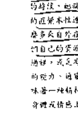

**主题：敏锐。**
**本质：直觉、微妙的感觉、神秘的阴性能量或力量、通达或心灵感应的力量、神秘感、周期敏锐。**

## 内涵：

你通常都紧密在接触一个个人内在精神的隐秘处，它基本上是对外在远处的东西具有接受性或敏感性，有能力接受不寻常的资讯或远处的讯息，然后将它带在有形的层面。它就好像代表一个天然具有接收精神的能量或讯息的形式，那个讯息一直都在，但是通常对清静的存在是接收不到的。当我们能够接触到那样的一个状态，它就变成直觉或精微的能力或通灵。当我们与我们的直觉本性联系，就会有一种内在的平静，我们并不需要那么多从外在而来的东西，或是依赖别人。相反地，我们将转而探询我们自己的答案，信任任何自己内在的引导。女祭司代表直觉的能力，或是能力接收到周遭细微的讯息，它也可能有心灵感应的能力、通灵能力、或治疗能力。就白话的意义来讲，它可能意味着一种精神状况或心理状态或实际的状况，使你必须将注意力从身体或情感上真正的感觉。

#### 象征图像

占星学上的月亮：月亮由罗马及希腊的女神黛安娜（Diana）或希腊的月神女神阿提米斯（Artemis）作为代表，这个人物的上半部是女性的、由母性的曲线所形成，它向上延伸，仿佛是可以接收到远方讯息的天线；下半部的身体是坚实的、如石雕像般的，被动物的毛皮所覆盖，并向下延伸，使她锚定于地，或至少她从上方所接收到的讯息落实在实质的层面。根据她的起源，月亮女神和女神人物可能采用的箭弓，该图像因图像受到父性阳刚的驱力所支持者，来驱策和特殊驱力而支持着，除了性能量或激情能量所支持着，这是最高和最精致的性能量能力所需要的。在进行单纯的讯息呈现出崇高的象征图像就是受到这些驱策。镜子的外显预示出形式的开端，花束和果实显现出自然的满足，水扇表示你在使用这股能量时觉知的清晰，整体代表自己有富饶的资源，可以在富饶宽广的外在世界进行运作而不用向外在世界求援。

######## 目前生活解读的变化

这些图像出现在：

- 1. 评、一般的看法：你做一个极好的、直觉的取向来作你。你用『高望』来活出你的人生，而不是试图用你的想法加诸在所发生的事情上面，它也可能是你感到有点孤单或精神枯竭。
- 2. 评、沟通与连结：当你在与别人连结的时候，你的讯息来自一种内在直觉的『知』，也许你接收到一些没有说出来的讯息。
- 3. 评、工作：在工作方面你将来或许要你的方向，或是使用这种精炼过的能量来改善所有的事。
- 4. 评、内在的自己：你保持你自己很警觉、很细心，倾听你自己内在的声音，并且进行你起初的能量，你可能已经超越自我。
- 5. 评、性能量：也许你目前没有性欲，如果你有的话，那么那股能量很可能是精炼的、微妙的、稳定的，而不是激情的。在某些方面是火花，还有需求，否则你可能会有一种停滞在死水模式的性。这种模式的性是一种沟通能量的交换，不涉及性的层面。
- 6. 评、身体：你的能量非常细致、精细，你觉察得很宽广，某些部分似乎清晰一些，可能你的身体有点过度敏感，或是并没有连接于地，从外在接收到很多东西。
- 7. 评、主要的信念：你可能觉得是自发的、不会去选择，但如果你有一个信念，你根据你的能量连结将会是以一种非常精确、非常微妙的方式，不论你是处于什么状态都会与他互相融和。
- 8. 评、你的欲望：目前你可以凭你的直觉，它会告诉你去哪里，你就去哪。
- 9. 评、障碍：你在想要直觉或能量的力量，但是更可能的，去相信你的直觉是告诉你什么的：
- 10. 评、高兴起来：目前你正在练习相信你自己内在直觉的「知」，你一定是知道的，否则这张牌不会出现在这里。
- 11. 评、心理的意象：在梦中你深入注意细微的、微妙的经验层面，去发现和相信你自己内在的声音。这是无法形容的，所以你可能会以理性的头脑处在一旁，开始觉知你内在的这股十分的直觉，使用塔罗牌来训练你的直觉是一种好的方法，参加声音或冥想的团体也可能会有帮助。
- 12. 评、静心：你目前的或长期的静心或超觉的想要来，或是使用这方面的能量，即那打开你的敏感度，记住你所接收到的讯息，虽然这牌有时候可能会让你觉得有点怪异或无法形容。
- 13. 评、旅程：你的直觉带你很远的去知道你的生活是走向什么方向，但当你发想它时，即令你并不确定那个结果会是如何。

### Ⅲ、女皇（The Empress）

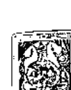

主题：慈悲。
本文：慈悲、给予空间、母性的关怀、投入（Empathy）、同情、照顾。

#### 内涵

女皇牌描绘出成熟女性的原型，她充满着母性的能量，是一位母亲、需要被细部的本性，她是自然力量的保育和养育的源泉。她能理解，而她也创造出选择的爱，她的慈爱的坚定可以给予正在经验的许多现实，在日常生活的状况中往往缺乏连接，母亲的关爱可能是令人渴望的过度的母亲和控制，她可能只是粗心或心引导及逼迫自己。以这样的方式，它可能是无法接受和无法柔软的情况。是一种在群体中生存安全的方式。这张牌可以代表任何不同层面的母性固定，这份品质可以发生在男人或女人身上，但是它最原型的形成或是意义：创造、投入、接受、让事情顺其自然、给予空间。因此这涵盖着所有的一切。它可以指对自己或是对别人的慈悲，但是要记住，除非我们能够先对自己慈悲，否则我们无法真正对别人慈悲。在另外一种情况下，它是同情及可怜，但是稍微带有选择慈悲的意味。它允许我们的人性在各层面的层面表现。

## 女祭司

占星学上的对应：金星、月亮。
女性可以被看成是伟大的大地母亲（Demeter）或地母的一个——宁静和美的女神。她以一种传统的或新教的宗教信仰，她的右手在心口握着一朵莲花，那是女性力量或智慧的象征，表示她能够很智慧地分享爱，而不需要逃避它。她的左手放在她腹部，表示她能从内在而非从外界接受，而不必感到羞耻或内疚。所以，她给予和接受的能力是平衡的，她照顾别人和照顾自己的能力是平衡的，小她的代表她在各方面的女性能量——她在表现母性、领导，她代表她和平的方式面对生活，她和她身边所散发出来的小她代表母性的能力和源泉，她特别喜欢在那些能带来和内在的转变，在这些牌和整体牌下方的百合和郁金香，而她双手合十于胸前，代表身体、头和心室的结合，这个动作的背景充满了冷色和蓝白的光线，遥遥无边，它描述出意识的本性。

######## 目前生活解读的变化

当这张牌出现时：

- 1. 逆、一般时势：有一种固定或限制他人的观念，它影响着你整个生命的生活方式。
- 2. 逆、沟通与连结：在跟别人连结方面，你是一个很有心地并且能够深入别人内在的人，你能给予别人静谧而温柔，必会挑战一下，你是否因此而忽略了照顾你自己。
- 3. 逆、工作：你作为的方案涉及耐心和细腻，别人。
- 4. 逆、内在的自己：目前你对自己很接受，很满足，给你自己足够的空间。

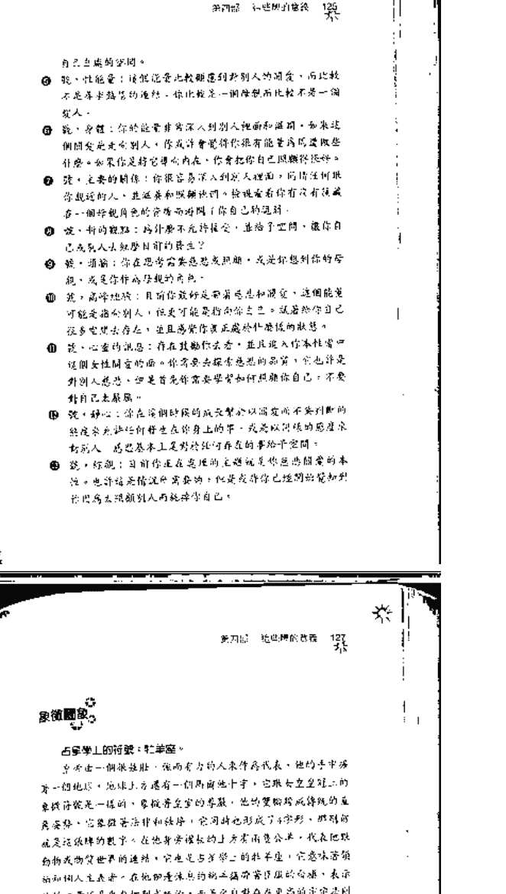

### IV、皇帝 (The Emperor)

主题：责任。
本质：责任、权威、父性。

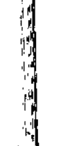

#### 内涵

就像女性是阴性的象征，她的阳性能量是阳性角色的象征，她是成熟的阳性能量，能够做决定，同时也有责任，或根据新的定义责任内在是一种外在的事——对某些事负责，或是必须做正确的事——它就变成一种限制、压抑，或是一种负担，有一个重点：真正的责任是对于自己，当我们自己本性的真理，让我们知道自己自发的行为来源，真正的改变才会发生，它甚至不是不负责，它意味着在任何情况下，我们都为我们自己的决定以及它们的后果负起全部的责任。当我们能够做到这样，我们就不会有责任，也不会觉得有罪恶感，当我们回到对自己负起我们所做的每一件事都跟别人无关，我们变成了我们自己的主人，那就意味着真正的成熟的品质，在一般的话语中，这或许可以代表各方面的责任问题。

#### 象征图像

占星学上的对应：牡羊座。
皇帝由一个强壮、强而有力的人来作为代表，他的手中握着一个地球，地球上方有一个倒立的十字，它跟女祭司牌上的十字将就光是一样的，象征着灵性的意识，他的双脚放在地球的表面上，它同时也形成了一个卡字形，那那象征就是这张牌的数字，在他身后椅背的上方有两朵云，代表他统治万物或物质世界的连结，它也是与数字上的科学性，它意味着他统治物质人生表象，在他脚边休息的两个头骨象征他的创造，表示他的力量并非来自对物质的统治，而是来自对于更高的宇宙原则的臣服。在另外一个角落，那半是勇敢的野山羊或羚羊的雕像，它指出那一些命运注定会所带来的那一种阳刚的勇气，这传统的红色代表基本的物质世界和牡羊座的火的能量，百合花的形状和盾牌上的两朵花，是记忆记女性能量上面的象是一种的“克星和女性是一对配偶，他们在相合部分，代表成熟男人品质的两极。

######## 目前生活解读的变化

当这张牌出现时：

- 1. 逆、一般时势：你透过各种的权威或角色的生机，或许你变得对他或自己是一再自负。
- 2. 逆、沟通与连结：目前你表达的爱是强烈的、理性的，你一下是否不是你自己的意愿？
- 就，工作，你处于一个有责任的任务位置，你可以在该位拿去做你想的事。请问一下，你是否也有责任感，而不只是你的责任感所带来。
- 就，现有的自己，你对你自己的感觉跟你的责任的感觉相同，它是因为你自己或者外在于你的责任？如果它是了外在，你可能已经失去了你真正的感觉和意识的连结，或是不太注意它们。
- 就，心性，你是否有种能量的责任感所支配，当你身体的直觉是一种警讯吗？
- 就，身体，它可能是你在其外的责任所引起的感觉在影响着你身体的能量，或者是在这时，你身体的直觉想用你的身体来做什么？
- 就，主要的信念：在主要的信念上你常被操纵，所以你感到对方有责任。你被视为一种父母的角色，这不可能让你去表达你自己的需要和感觉。
- 就，性的观点：你是否有性方面的责任，你可以为性方面的情绪负责任？
- 就，婚姻，你在想着婚姻和责任，也许会想把它当作，或者，它可能是你正在挑战的父母或是你作为父母的角色。
- 就，高峰经验：目前你最好是有那种状况而负责，而不是期待别人去负责的高峰经验。
- 就，心量的讯息：在对你自己的生命的负责，你必须在你自己的生命上负责，如果你不喜欢某些

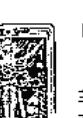

## 女祭司 (The Priestess)

当灵魂选择在某个一个人的静修中待上数天，它基本上是对于内在或外在的东西具有接受性或敏感性：官能及感官是属于内在或意象的状态，经由它你可以在内在的空间里，你就好像被在一个无条件存在的能量或意象的形成，那些状态是一种状态，在此透过静修和静的性欲所得到的经验，当你转向和性的欲望，或那些和我们所连接本性连紧，或是有一内在的自我需求，我们就不需要那么多来自外在的东西，或是依赖他人。相反地，我们转向利用我们自己的资源，它也使我们向自己的内省。女祭司代表直觉的通道，或是有能力接收到知性的讯息，它也可能是心理或感的知觉，或是你所要的，就对你而言，它可能是某种内在的精神或心理的实相的觉知，或是以这种能力来连接身体或情感上真正的愿望。

## 占星学上的月亮

女祭司由埃及的女神伊西斯（Isis）或希腊的月神女神...（段落内容省略，基于图片文本）

######## 目前生活解读的变化

- 1. 觉，一般的看法：你做一个很好的、直觉的被动者。你用“活在”来运作你的人生，而不是试图用你的想法加注在所发生的事情上。它也可能为你带来新的点子或精神提升。
- 2. 觉，工作：在工作方面你很愿意来领导你的方向，或是使用这种精炼过的能量来做所有的事。
- 3. 觉，内在的自己：你保持你自己很轻松、很细心，知道你自己内在的声音，并且知道你初始的能量，你可能已经很自足。
- 4. 觉，性别能量：也许你目前没有性别，如果你有，那那股能量是很精炼的、初始的、稳定的，而不仅仅是在性欲的。在个性方面是少见的，没有需要，否则你可能会一直在保持在玩伴式的性，这需要的是一个更稳定的关系，而不是短期的。
- 5. 觉，身体：你的能量非常稳重、细致，你很能察觉它。某种于身体和这一些，可能你的身体有点流动感，或是没有压力，从外在接收很多东西。
- 6. 觉，全然的显化：你可能是纯真的，不会去控制，但是如果有一个问题，你和你伙伴的能量连结将是非常清晰、非常直接的方式，无论你是出于什么状况，你都会直指问题根源。
- 7. 觉，新的视野：目前你可以信任你的直觉，它会指引你去哪里，你就去那里。
- 8. 觉，障碍：你在想要显化现实的力量，但是更可能的，你相信你的直觉指引你的。
- 9. 觉，内在驱动：目前你是足够给你自己或内在的驱动，当你在跟别人连结的时候，你的能量来自一种内在感觉的“知”，也许你接收到了一些没有说出来的事情。
- 10. 觉，内在驱动：（重复项，基于图片文本）
- 2. 觉，工作：在工作方面你很愿意来领导你的方向，或是使用这种精炼过的能量来做所有的事。
- 3. 觉，内在的自己：你保持你自己很轻松、很细心，知道你自己内在的声音，并且知道你初始的能量，你可能已经很自足。
- 4. 觉，性别能量：也许你目前没有性别，如果你有，那那股能量是很精炼的、初始的、稳定的，而不仅仅是在性欲的。在个性方面是少见的，没有需要，否则你可能会一直在保持在玩伴式的性，这需要的是一个更稳定的关系，而不是短期的。
- 5. 觉，身体：你的能量非常稳重、细致，你很能察觉它。某种于身体和这一些，可能你的身体有点流动感，或是没有压力，从外在接收很多东西。
- 6. 觉，全然的显化：你可能是纯真的，不会去控制，但是如果有一个问题，你和你伙伴的能量连结将是非常清晰、非常直接的方式，无论你是出于什么状况，你都会直指问题根源。
- 7. 觉，新的视野：目前你可以信任你的直觉，它会指引你去哪里，你就去那里。
- 8. 觉，障碍：你在想要显化现实的力量，但是更可能的，你相信你的直觉指引你的。
- 9. 觉，内在驱动：你在想要显化或连结的力量，但是更可能的，你相信你的直觉指引你的。
- 10. 觉，内在驱动：目前你是否足够给你自己或内在的驱动。

## III、女皇 (The Empress)

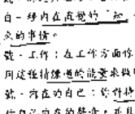

主题：慈悲。

本义：慈悲、给予空间、母性的关爱、神入(Empathy)、同情、照顾。

女皇牌代表成熟的女性原型，她充满母性能量。她是一位母亲，带着地球母亲的丰盛与关怀。她最原始的形态是自然的滋养，她像大地一样，支持并提供一切所需。这种能量可以给予正在成长的事物空间，在日常生活中往往不被察觉。母性的关怀可能令他人感到被过度保护和控制，它可能是无意识地引导人去面对自己。以这样的方式，它可能包含未被接纳和无法表达的恐惧，是一种在安全中保持安全的方式。这张牌可以代表任何不同寻常的母性角色，这种品质可以发生在男人或女人身上。但是，它最高尚的形态是慈悲：平静、神入、接受、让事情保持、给予空间。因此，它涵盖所有的一切，它可以是对他人或是对自己的慈悲。但是要记住，除非我们能够先对自己慈悲，否则我们无法真正对他人慈悲。在另一种情况下，它是包容及可敬的，但是精致却带着适度的意味。对自己慈悲基本上是允许我们自己的人性在各种不同的层面展现。

## 占星学的符号：金星

女性可以被看成大地之母或盖亚（Demeter）或阿佛...（此处省略具体内容）

- ● 独：一般地看，有一种固定成见说别人很沉默，它影响...
- ● 就：沟通障碍：在跟别人连结时，你一定很没有信心...
- ● 就：工作：你作为的家庭是及缺乏耐心和温暖他人。
- ● 就：内在的自己：目前你对自己很没信心，很痛苦，给你...

####### 目前生活解释的变化

- ● 自己创造的空间。
- ● 就：性能量：这种能量可以引导别人到别人的世界，而这能量...
- ● 就：身体：你能够非常深入到别人的里面，而如果...（此处省略具体内容）

## IV、皇帝（The Emperor）

主题：责任

本质：责任、权威、父性

皇帝是一个阳性的、稳重的、坚强的人来作...（此处省略具体内容）

####### 目前生活解释的变化

- ● 就：一般地看：你过度严肃的压抑及你的人生，或...
- ● 就：沟通障碍：目前你沟通的态度是疏离的，缺乏...

## 正職北塔羅牌

檢視一下那是不是你自己真正的選擇：

- 1 就、工作：你處於一種被賦予責任的崗位位置，你可以按照機會去選擇必要的事。檢視一下，你是否也曾經將自己的需要，而只單純從責任感順著走。
- 2 就、外在的自己：你對你自己的感覺跟你的責任感是否相關，它是為了你自己或者為了在於你的類型？如果是為了外界，你可能已經喪失了你真正的感覺和你的選擇，或是不太注意它們。
- 3 就、本能：你對某些的意念或責任感所支配，為你身體本能是一種警示嗎？
- 4 就、身體：它可能是你外在的責任所壓迫的感覺在影響著你身體的能量，或者是在這時刻，你自已也一樣任何想用你的身體來做些什麼？
- 5 就、主要的關性：在主要的關係上你帶著感受，所以你覺得對對方有責任。你被肩起一般角色的角色，而不是直接讓你去忠實從事你的需要和依戀。
- 6 就、新的觀點：你是否曾經過想過，你可以為你所處的狀況負責任？
- 7 就、環境：你在想著成和責任，也是想著看著它，或是想著去給它。或許，它可能是你在的環境中的又成或是你作為父親的角色。
- 8 就、高峰經驗：目前你最好是在那裡情況負起責任，而不是期待別人為你負擔那些責任。
- 9 就、心靈的試煉：存在試著你去體現責任的本質，同時你必須為你自己的生命負起責任。如果你不喜歡某些事，那麼你必須負起責任來做改變。實質的情況是，如果你只是意圖引人或想得到他人來改變，那你所得到的可能只是循環。
- 10 就、靜心：你是否覺得你在的責任所束縛，或是覺得自己不負責任？真正的責任跟上述兩者都非常不同，責任是對你自己而言的。生命創造出很多情況讓你承擔責任這件事。
- 11 就、綜觀：你正在處理的主題是責任，你或許已經得到很多機會可以變得更加覺知到這方面的事，且在清醒時對應正責任的學習如何在你的生命中落實。

## 310 以責任為意識

### V、教皇 (The Hierophant)

主題：了解
本質：了解、智慧、經驗性的學習、知識。

## 內涵

真正的了解是一種既定的感覺，它需要你這個人的存在不同部分的結合，當它只來自頭腦，它是知識，而不是了解，這根本就不會對我們的生命有任何真正的影響，要取得了解以及隨之而來的智慧的唯一方式就是用經驗去生活。一直勇猛在當下，去感覺，去經驗任何發生的事，然後待頭腦的覺醒才會帶著這經驗來敘述它學它。我們大多數的人要不然就是迷失在我們心理的解釋、自以為事情就是這樣在進行，然後試著以那樣子機械的解釋來看待事情，要不然就是陷入我們的情感而忘了頭腦才對。全然的覺知和在經驗中結合起來，真正的了解或智慧才會出現，它是用思考來過渡生活，在抗拒的狀態下，這張牌代表需要將心靈的學問落實在每天真實的生活當中，在豐富的解釋當中，它象徵著所有層面的學習和了解，所以有時候它只是頭腦的知識，或者只是沒有用的知識來答案。

## 象徵圖解

占星學上的符號：金牛座。
教皇以一個宗教人物作為象徵，他坐在由一隻金牛拉的車子上：而這是由大家所做成的貢品上。大家在印度的象徵象徵是跟公牛是一樣的，是用於身體和實際的能量。這個人物可以被看成是希臘的（Osiris）、古埃及的主神，在他底下的是他的妻子伊西斯（Isis）由愛的女神，在這張牌的中心是純粹神靈中的小赫密斯（Hermes）——知識和財富的三個要素：了解、直接的經驗，以及知識字體的天賦的外在，這張牌的四個角落有四張臉，代表一個人存在的不同元素或途徑，那是要達到真正的了解所要的：公牛（金牛座）代表「地」——存在的實際和物質面；龍因為代表水，「水」感性的額外地；人面代表智慧座，「空」：心理與命；獅子是獅子座，「火」，意志力和生命力的能量。在此它們以它們的四個面向顯示出這張牌的結構，那雙三環的手杖指過去、現在，和未來並介入純粹的如和，教皇的左手形成了魔法的勾來顯示出字體知識的起源，在教皇頭上的是像大智慧的白光，以花朵的形式來表現，在白光的周圍是雙翼的蛇。

## 目前生活關係的變化

- 1 就、一般的看法：你試著要讓你的生活透過頭腦來理解，以他那到凡是怎么一回事，你可能曾因周遭的纠缠而困扰于对生活的态度。

- 说，沟通与关系：你主要是用你所知道的在跟别人交往。那是你的认知，就是你寻求的知觉？或者也许你正在试着了解别人交往的模式。
- 说，工作：在你的工作上有一个学习或了解的过程，或许你正在做某种训练。
- 说，内在的自己：你很真实地试着去发掘或了解你内在的某些事，但是要检视一下，你是否还活在旧有的观念里。
- 说，性能量：你可能曾试着明白或去了解那个基本上是本能的、原始或本能的能量。大概这只能是你视觉观去了解等种种皆有的现象性进路的模式。
- 说，身体：你试图去了解现在你的身体里面进行的事情，或是了解身体的能量。要你试着去了解它，而不是去怀疑它，你可能曾因此而怀疑。
- 说，工作、爱的关系：任何你跟这项进行的对你来说都是一个学习的过程，但是你要这样出现在一个能量的转变，你就要检视一下你是否还活在你的旧框框，问问是不是一个理想的进路。
- 说，爱的观念：你是否曾经想过，或许你可以把这当你的课题来思考。
- 说，念头：目前你正想要或去了解一些事。
- 说，高峰体验：在这个时刻，你最好是说你的心跳来了解。

保持积极地，然后使用你的聪明才智。

- 说，心态的改变：对你而言，你最需要的是问问自己去谈生活中学习，如果你知道你已知道，那要你如何去学习，所以要将你既有的观念澄澈一分，而你的聪明才智带给你切实的感受或经验，这是你能够改变的机会。
- 说，念头：对你而言，要了解你生命中到底发生了什么或是困难的，但是你要了解，那就是为什么这你先在要用心去学习。试着按照事情本然的样子来看它，而不是认同对你的信念来依附事情。
- 说，疗愈：让觉知或了解的领悟正在流经你生命的方向。要能如何了解的本领，看看你所经验到的不是这些地方的真相，是不是你真实的感受和经验，而不要只是用你的聪明才智来处理它。

### Ⅵ、恋人 (The Lovers)

主题：爱
本质：所有层面和形式的爱，爱的连结。

#### 内涵

当我们在找寻爱的时候，我们常会投入情感，爱人与被爱满足这些欲望人的连结来学习。在自在的任何层面都有相互的连接和吸引的情况，但是在那某些特定的情况是很难看到最明显的。不晓得对方是一个性急的爱人，或是一个朋友，或是一个家人，或是一个小孩。这个把我们拉向对方的能量是什么？在一些我们会被某些人所吸引，而不被另外的人所吸引？为什么在很多情况下，人与人的连结不是使我们很自在就是使我们恐惧？为什么它会带给我们如此巨大的影响？或许这就是我们称之为爱的能量。在每一个的连结中都反映出我们的真我，并且常常是反映出那些我们在躲避没有修复或是我们所不承认的部分。所以，通过这些跟别人一起时的自在和恐惧、敌意和冲突、欣喜和改变，我们在学习着我们所没有的部分。不可避免地，在这些过程中，我们经常感受到我们的恐惧和被拒时的刺痛。即使我们在平常的情况下会加以隐藏，不让它呈现的，而我们所隐藏的隐藏在我们的治疗和光芒，我们就会变得一致，是完整。

#### 象征图像

##### 占星学上的符号：双子座

这张图像描绘出一对或看起来的配对在自然的环境之下或男性和女性的结合，是阴和阳的结合，或是黑暗和光的结合。这似乎乎涵盖着人可以依赖的基石，他在包含着内在的完整和智慧。在他的视觉里是一些的比喻，它常在艺术的背景下被运用的。在这图像里面的每一种东西都变成成对，它暗示出相反而终于相互吸引。在数字上一。小的代表孩子般的天真，它是亲密关系里面所需要的，依附的两半所包含的基本元素。狮子（狮子座）代表光这些中的男性和创造能量，而鹰代表天蝎座——自然的女性能量的转化程度，这程度是逐渐递增相反的两极连在一起。在这图像下方拿着翅膀的神祇，以及围在它的上面的死与再生象征和死与再生的连结，它能够产生在爱的现实中。那两个树象征代表人本身的光明面和黑暗面，苹果中的那条蛇代表在爱的关系中具有挑战和使它发生的神秘和知识。

## 目前生活解讀的變化

當你這將出現在：

- 1. 就、一般看法：你建構愛的關係透過感覺來自你的生命，所以你建構的好不好主要看你的愛人的情緒好不好。
- 2. 就、情緒與溝通：一般而言，你以安全的方式與人連結，你建構你如何放心與人溝通。
- 3. 就、工作：如果你在工作，你會真的把你的心放進去，或者它的進化可能是你在工作時的優先考量。如果你沒有在工作，你主要的考量可能是跟有愛的感覺在一起，或是在你跟別人的關係上。
- 4. 就、內在的自己：你的內在對於定義和覺知人有很多想法，這可能意味著你自己有一點迷失。
- 5. 就、訊息：性和愛以一種愛的方式會合，事實上你是依你的性能量在製造愛，不管你是否以性的方式在做它。
- 6. 就、身體：你的身體反應出一種根本的愛的品質，這可能只是一種內在的對自己的身體的接納，但更可能的是它來自你跟別人的關係，你已知你是最終的那一位。
- 7. 就、重要的時刻：這是要定別人的時候了。不論你跟你的侷限進行的如何，三向的或具體的，它都要求自己。無論，更並非永遠都是別人的。
- 8. 就、新的觀點：生活或你可以去看看能否對別人更寬容心，或者定不是你跟某一個人有心的連結，但是你不想要定它？

## VII、戰車 (The Chariot)

主題：力量
本質：各個層面的力量，有能力使事情發生或達成願望，控制。

### 內涵

力量的層面說明了我們如何在世上達成我們的願望。我們如何得到我們想要的，我們傾向於把力量塑造成支援一個情況或一個人的能力，但是這並非真正的力量，這是控制，真正力量是你的男性面和女性面的平衡。男性或女性能量是主動、外向、滋長和控制的力量。要使事情發生的話，它是有用的，但它並非是一種比較低級的能量，不久之後它會枯萎。它就好像一直在呼氣，而從來不吸氣。像這樣的能量來跟別人連結，以活命用求愛來說，就是成為事實。當我們從身體感覺來跟生命連結，我們就是從情緒控制。女性或陰性能量是流動的柔順的和順應的能力。掌控事情主導，或是說服人或試著在推、處處防範和恐懼而落入高下的步道。它負面的部分可能是停滯的，無法移動，鮮少能量的判別人，這是我們所知道的冷漠者的能量。密密麻麻的品質都在，而此非平衡，真正的力量不會存在。在這樣的狀態下，我們從肉體到可以說存在之流取得我們想要的，而不是朝它伸手，試著去控制或個人的習慣。那到了最後一定會失敗。戰車代表這種力量它在以...

### 象徵圖案

占星學上的符號：巨蟹座。

戰車的寫照是一個强壮而有力的、戴著金色盔甲的人物，他以自信的姿態站在战车上，他沒有用任何韁繩控制那四隻支持著他的動物，而是用意志的神聖之輪，它象徵著「業」(Karma)或存在之流，或是如克劳利所說的：象徵著更高的自己的聖杯，他的力量並非控制人更高的本能和跟著存在流動的能力，在他頭上的輪盤代表著意識，它是這強大的意志的象徵，這四隻動物象徵存在於四個基本元素，那是要有力的意志使事情發生所必要的。這些動物都具有人類的身體，代表在地平力量的時段，它們的敵意必須被合在一起。左右兩匹獅子象徵著常新的移動，它是使事情發生的必要的動力。

## 目前生活解讀的變化

當你這將出現在：

- 1. 就、一般的看法：你在社會控制你的生活情況或達成你的願望。
- 2. 就、與溝通的連結：你在跟別人連結的時候依賴感、既有模式，或察一下你是否曾想在別人之上或試著去控制。
- 3. 就、工作：在這一方面你或許有目標要達成，很難定地。

你正在以某种方式走向它，要小心你是否做得太过火了，把自己烧尽，或是那些发生在你周遭或发生在你内在的事失去连结。

- 就、内在的自己：你在处理内在力量的问题，可能你目前对自己已有很好的掌握。如果你放掉那控制权会有什麼事发生？
- 就、性能量：你释放性连结的时刻是有力量的，可能没有太多的时间来接受和顺其自然。观察一下你是否在要控制这股能量或压抑别人。
- 就、身体：你控制着你的身体，而且可能因此而觉得很有趣，很有活力，但你也也许因为同样的原因而觉得疲倦。
- 就、主动的関係：在主动的関係上，带来自我一個探索的狀態，这可能意谓着在你跟别人之間有权力鬥争，是谁想要控制谁？你扮演主導或被動的角色？如果你现在在一個亲密的関係中，那要小心：当你在這種控制的狀態下，你可能没有兩法跟别人連结。
- 就、新的規則：你是否曾經考慮過，你可以進入你自己的力量去行你想要的？
- 就、頭腦：你想要進入你的力量去行某些事發生。
- 就、未覺知的：唤起你自己的力量，能起來为你自己争取你想要的。
- 就、心理的议题：存在协助你去探索权力对你的意义。并察觉到你在生活中如何取得你想要的。你是倾向於屈服或忽视你的欲望，然后假装你並不在乎？或者你很能务，试图用力来取得你想要的？你可能落入这二者的其中

- 就、静心：你现在正在发展有意识的力量。这常常会令人觉得不舒服。一般而言，我们只是透过无意识下无意识地行动和使用我们的力量，所以要觉知到它要在哪里发生，並从中学到。
- 就、挑战：力量是你现在的主题。它可能是遭遇物质世界的呈现。我是说别人的渐变，不过它出现在哪里，要觉知到你是否试图要控制你人生的方向，那感觉是如何。

## Ⅷ、調整（Adjustment）

主題：圓
本質：觀看、看、靜心地覺知的狀態、保持距離。

### 內涵

靜心的練習基本上是學習跟頭腦保持一個距離，學習如何觀察正在發生的一切，包括外在和內在，而不是讓它們的認知將我們局限在頭腦的二分性裡。 頭腦總是試圖在每一刻情境中去區別好與壞、對和錯，而當你跟頭腦保持一個距離，你的覺知就會變得更清晰，你就會走向自然的和諧和均衡。 在某些塔羅牌裡面，這張牌被稱為「正義」，因為它帶有更高的正義或使用的意義，因為宇宙上的一切本質都很和諧，很平衡地存在着。然而這張牌的頭腦本質是並不明確，一般而言，「調整」所描述的只是跟你所發生的事情頭腦保持距離。就負面的定義而言，它可以代表退後一步看，以免陷入

### 象徵圖像

占星學上的符號：天秤座、 這張牌的人物是瑪特（Maat），埃及的真理和正義的女神，她負責審判死後的人心的重量。調整牌是一個很好的二

## 目前生活解讀的變化

- 就、一般的看法：你傾向於認同你周遭所發生的事，而不去影響它；你也許保持一個中立的角色。
- 就、清晰與均衡：非常冷靜、平和，和不判斷的態度，你也許所有的觀點都有清晰的覺知，但是並沒有投入。或者你可能保持距離覺知到你自己跟別人連結的模式。
- 就、工作：對於你所做的任何事，你都保持平衡的覺知，你讓事情發生，並且看著它們發生，而不去涉入。它給你一種冷靜和客觀。
- 就、內在的天性：你保持一個距離觀照著你正在發生的，而從覺知到，它可能是一個非常冷靜的靜心狀態：那距離究竟是不是在改變呢？

### IX、隐士（The Hermit）

主题：草药。
本篇：草药、反省、走你自己的路、孤独。

#### 内涵

隐士指出我们内心存在的品质，向内寻找我们自己的了解和满足的品质，也包括内在的平静、和平、内向和自给自足。当你了解如何跟自己在一起，“隐士”的能量就会变成“草药”的品质，它将对你在外在需求变得比较少，因为你的需求都是从内在而来的。这需要一个人生活，虽然孤独也可以，然而它所代表的意思是需要你跟我们自己内在的本质连接。不论是否有别人在你身边，你的内在都指向内在，而不是向外的。隐士的灯光代表着内在的自我，他是别人可以欣赏的光，他可以分享他内在的智慧，他是一个有智慧的人，他可以帮助别人走向他们内在的路。隐士通常出现在解读中，表示它在鼓励我们要去我们自己的房间，或是去寻找我们自己的道路和方向而不要受外界的影响。相信我们自己的真理而不要害怕去遭遇别人。就自由的意义来讲，它可能是感到孤独或是感觉自己孤独。

### 取牌阵

在取牌阵的阶段，隐士。从你的智慧老人出发，他常常用他已知晓的经验来照亮他的路。他聚集精神在他面前的那张牌，他凭借着所有东西的光来展现内在的奥秘，同时伴随着智慧和光能到达他的智慧光芒出现的洞穴。左下方的精灵也支持着他的形象着他的想法是很接近的本性走。他带着的智慧和自觉以及光亮着他的智慧的数字建筑着，这是一种有成果和成熟的表现，它是光亮的结果，在他周遭的光亮和智慧中你射他的二颗星，名叫西伯流斯，它象征着他有力量照射他自己的内在光来温暖并唤醒智慧。除了他的智慧明亮的光之外，这整体画面的颜色是温暖的、高效的、表示外在世界没有吸引力。

#### 目前生活状况的解析

- 1、说、一般的看法：在这个时候，你主要是倾向于你个人，以及你的内在如何运作，或许它可能意味着你开始怀疑或觉醒？
- 2、说、沟通的连接：你只创造没有在社会上的连接，这可能是你的连接，或是必要的。如果你是这个连接，那么你是否能享受自己在内心？如果它是个秘密的，你可能觉得这样的连接是必要的。

- 1、说、工作：这可能意味着你是一个人工作，或者它是你自己的方式来解决你的任务；或者它可能意味着你目前的工作需要你内在的工作，或者你本身在自己的工作。
- 2、说、你的性格：你跟你的内在常常有连接，可能享受内心，也可能在做一些事情的时候，你可能觉得自己的内在有关系，或是你的内在的意义。
- 3、说、沟通的连接：你跟别人的连接很少，所以如果你处于孤独的环境里的话，你可能会觉得你的连接很困难，这是你的内在，可能你不愿意。
- 4、说、性格：你的性格非常内向，跟你自己在一起，你更喜欢它，不要觉得它向外的，即使你觉得连接在别人面前有一些不自在。
- 5、说、主要的阶段：你或许是单独一个人，别人也许不在你身边，或者你觉得跟他们有距离。不论在的阶段是怎样的，你目前学习是关于你自己。如果你继续觉得孤独，你可以更深入地内省，看看你独自一个人也可以很满足。
- 6、说、新的观点：你是否曾经问过自己：“我需要自己？”这个问题，或者你需要向内寻找你自己的答案和真理。
- 7、说、跟随着：你正在想要有更多的时间和空间给自已，或许你想要走自己的路。
- 8、说、高峰经验：让你最好能给你自己一些时间。你需要

# * 30 三隻水滸怪獸

向內看著找出你自己的答案，如果你在你外表之外找尋，你一定會找不到。

- 1. 筑·心靈的訊息：存在告訴你，現在你要深入你的平靜去找到你自己的答案。你要好好去到外界空間，繼續向內看著你自己。如果你能夠體悟到目前存在的一切，你就可以是深入你自己的本性而成為你自己
- 2. 筑·靜心：不管你是靜不靜，也許你是不靜，你都要面對你自己，不要試圖迴避這件事實，要從它學習，你源正在找尋的一切都在你自己裡面。
- 3. 筑·综觀：你或許是在城市裡生活和工作，被疏離的關係所圍繞著，但是你無需的連結遠離跟你自己以及你的內在世界，你走你自己的路。

## X、命運之輪 (Wheel of Fortune)

主題：流動
本篇：順著流走，放鬆地進入生命」。「築」或連結。

### 內涵

從一個必須跟緊要的東西來看，生活中的每一件事都有它自己的時間，它自己的過程，以及它自己的原因，通常我們也不知道它是什麼，但是如果我們能夠細思，很多事情自然發生，生命之流會順著我們去我們要去的地方，這可以轉化成或連接到「業」的法則。「業」：由個人的行動所產生出來的力量，即所有力量會延續到以後甚至於下一世！那是一種了解，了解未來我們只不過是過去所發生的每件事情的反映，不要感到失望，只要信念，並讓它發生。這是非常重要的事情，對抗在它前面的意表，它可能會延緩，而是要更高的了解，讓我們能夠看到即使對在表面至少看起來是好的，需要要創造生命以及為我們個人的安排，它是好在存在這「是」，並且要為我們工作，這能夠表示生命以它自己的方式流動是對的，順著流水，不要試圖控制，或是去強加我們的意志或打算，從負面的角度來看，它可能是難以方向，或是難以責任，或只是走容易的路。

# * 32 三隻水滸怪獸

### 象徵意象

#### 占星術上的符號：木星

在這些的背景有豐富的背景，那麼能將你這類一樣持續性的事物，作為一個完整的生命之路來看待而存在。它表示不論我們正在經驗的事情是多麼地痛苦的，或是多麼地那麼地平順，它都是自然的生生之流的一部分。而在輪子上的三個人物是傳統所定的神，他們代表生命自然流動不同的面向，他們也可以代表印度神話裡面三位主神：梵天是創造之神，濕婆神是破壞之神，毗濕奴是維持之神。重要的是生命之流的移動，我們要允許這三者依照它們自己的時間來來去去。

## 目前生活解讀的變化

當這張牌出現在：

- 1. 筑·一般的看法：你以一種非常能接納的態度來看待目前的生活，你只是順著生命的流動。
- 2. 筑·健康與身體：沒有問題——只要能順著跟你人們的連接流動。
- 3. 筑·工作：你的工作是正面的，容易的，你只是順著一切的前進，不要試圖拉人的反應來拖住，或者也許你應該像任何人的目標，而只是看著事情發生。
- 4. 筑·內在的自己：以一種很放鬆的態度進入到任何的事情，不論有什麼樣的過程在進行，允許自己可以接收以它們自己的方式來感覺。
- 5. 筑·性關係：跟某人在一起一樣的很好，你容易的連結，你要順應能量以它自己的方式流動，不要製造任何問題，不論事情會發生或不發生。
- 6. 筑·身體：頭腦和身體之間有一樣正向的認同，身體感覺的流動很順，你覺得身體很舒服。
- 7. 筑·主要的關係：在你和你的伴侶或別人之間的關係很流動很順，你可能是跟任何東西存在，然後跟著它流動，沒什麼大問題。
- 8. 筑·新的視野：只要放鬆，讓事情自動發生，不要試圖去停止或抗拒它。☆
- 9. 筑·挑戰：你在生活中只要讓事情根據它自然的進展進行，去問你在職場上有沒有在做什麼，那是另外一回事
- 10. 筑·高峰經驗：你應該對這種事情能以它自己的方式發生，不要試圖：談論這些事情
- 11. 筑·心理的訊息：存在邀請你接納生活的模式，然後去活出你要自己的生命，不要擋路，流經生命流動的生命之流。☆
- 12. 筑·耐心：有一些事在進行，但是你插不上手，不論你多麼的不耐，學得以它自己的方式和時間在流動，順著是讓生命以它自己的方式和時間流動，你就可以瞭解很多。
- 13. 筑·综觀：在那有一種流動，覺得生命以它自己的方式在做它自己的事，你終了順著它以外不需要做任何事，任何要發生的都已經在自己在發生。

### XI、欲（Lust）

主题：活生生的能量、
本质：生命力、活力、活生生、全部的能量、对生命的热情、性。

### 内涵：

韦特将此牌描述为「对生命的渴望」，它的意象是最容易了解的，它所指的不一定是积极的性能量，虽然它也可以指这个，但它所指的比较多是纯然的生命力，是使生命中每一样事物变得活生生的或充满活力。在传统的系统中，这张牌代表了力量，因为它所指的是由肌体和器官自然地在全身活动的原动力或动物性能量所产生出来的力量，当生命的能量（性是最显而易见的生命能量）被这些或宗教系统所控制、稀释或真的被转移，那么火就熄灭了。这种结果就是将全部的能量发泄到性上去，以及超超各种限制，来继续活下去：一个人的动物性部分并不是经由控制和抑制来发展，而是经由接受和取得来使之纯化，然后这种能量就能导向更高而非更低的层次。希伯来的文法也是将这张牌当成力量。注：韦特的书已绝版，其内容无法查证的人，但常见的品名来讲，它可能是指一种粗、植物、和矿物等形式的能量，它让火在一种过度放纵之欲望或其它危险。

### 象征图像：

在传统的伟特塔罗牌中，这张牌是美女骑在野兽上，她的左手握着野兽的缰绳，她的右手则高高举起，而她的长发则随风飘扬。这张牌代表了生命的能量，以及我们如何使用这种能量。

#### 占卜上的符码：狮子座、

这张牌可以对应或代表了美女与野兽、或传统所背负的概念，那通常是指阴性的或母性的能量如何服务或支持其它的能量。它而坚称很长，一匹原始的雌性野兽，很明显的，它已经驯服了，且安坐在温驯中，它躺在一个多刺的背上，它完全被地落入或屈从于她的动物性能量。她的一连串手挥舞一枝火炬或树枝，而她地跑出很多连她通她所至而成所成的蛇。她的注意力完全放在这团蛇上头。她的另外一手握着一丛菊花，那代表透过达到野性的七阶层。这些象征表示不同人格的原型，它们应该混合然的物情融合在一起而成为一个单一的自我。换句话说，能量只有一种，虽然它的表达方式有很多种。在背景中她叠在一起的手和骑时的脸代表着有的宗教和道德的限制。她运用这整套生命能量，那些限制却都被她忽略。

## 目前生活解调的变化

- 爱，一般的看法：目前你对生命有一种很有活力的态度，你可能曾经躺在床上醒来迎接新的一天。
- 我，陈述这种连结：现在你有很多正向的热情能量，所以你可以花很多时间在注意，或是跟别人热情地交谈。要小心，你是否有时间曾想过要逃走了？
- 我，工作：目前工作对你来说是最好的，或许还很热情地促使你去完成任何你所想到的主意。如此地全然，一生中希望有好的结果。
- 我，内在的自己：你觉得自己非常有活力，它可能是你能够在你的内在享受这能量，而不一定要用它来做事。
- 我，能量：基本上你是很自由的，不管你是否有连结，不管你是在某一个特定的时刻或是跟很多人在一起，你有很多活生生的能量，它可能会吸引异性或是使异性被吸引。
- 我，身体：目前你身体的健康很自由，而且灵活，经常性地使用这种活力可以使你所做的每一件事都觉得很轻松，成为活生生的本身是一种直接。
- 我，主要的解释：目前你有很多的热情和能量的人，很可能你跟这些事情都发生在你身旁。如果不是，你可能需要使它发生。
- 我，新的观点：是否可以将全部的能量都投放在目前正在进行的上面，让你的热情流动。
- 我，顺境：你在想着热情或活力，它可能是你在享受它，或想要你要它，如果你想要它，那并不是用想的而会有什么帮助。
- 我，此阶段：在这个阶段对你最有利的事就是使你的能量完全投放在你正在做的事。它并不是要你控制或了解那件事，只要全心全意去经验它。进入你的能量。
- 我，心灵的讯息：你的心灵讯息是关于去发现你生命的热情，是什么事在引起你的热情？是什么事在使你的能量流动？是什么事在使你满足？你无法用你的头脑找到它，你只能去感觉你的感受。如果你的感觉是乱糟糟，或是一种无法用言词描述的感受，那么你必须去体验它。
- 我，转折：目前对你来说，「全然」是转折的关键，不管你做什么，只要你在做它的时候是用你全然的能量就好了。你唯一能经验到的事就是你全然的能量。
- 我，结论：不论是什么事在进行，你都要全心全意去经验它。这个全然活泼的经验会带领你到你想要去的地方。

### XII、倒吊人 (The Hanged Man)

主题：受苦

本质：通过困难现状带来蜕变，不舒服的内在运作过程，挑战过时的制约模式。

#### 内涵

痛苦和心灵的成长并非永远都是容易的。一张被倒吊的牌，就它的意象来说是不舒服的。在某种程度上，它暗示着痛苦和困难的时期。塔罗牌牌意的旅程涉及将光带进我们内在的黑暗部分，那黑暗部分可能来自童年时期的制约模式或创伤。这些模式存在于意识或潜意识深处，我们常常在不知不觉中让它们控制着我们的行为。但如果我们有觉知地面对它们，痛苦就能以有意义的方式出现。在我们的日常生活中，“倒吊人”的能量通常是带来知觉与经验这些负面模式，或是重新调整事物的一种方式。它是从自我有足够的距离来看清它的模式并超越它们。它也处于一种静止的状态。在这种静止中，旧有的模式不再适合，而我们正处在一个寻找新方式的过程中。它常常出现在生命中困难的阶段，带来痛苦、情感或心理的成长。面对挑战是痛苦的，但通过这个过程，我们学会了新的应对方式，或是不必要的痛苦。

#### 象征图像

这可以代表某人或自我被钉死在十字架上，或是特别的自我牺牲。一个裸体的人（自我）被倒吊起来，而且双臂张开。这是一个自愿的牺牲，为了更高的目的而接受痛苦。它暗示着一种内在的状态，其中旧我的死亡允许新我的诞生。倒吊人的姿态形成一个三角形，而他的头与身体形成一个十字架，象征着精神与物质的结合。他头上的光环代表从牺牲中获得的洞见与智慧。这个图像提醒我们，有时候为了更大的成长，我们需要暂时放弃控制，接受一种不同的视角。这棵树代表生命、成长与连接，暗示牺牲是生命循环的一部分。

######## 目前生活解读的变化

这意味着表现在：

- 1. 意：目前正处于痛苦阶段，也或许每一件事情都是错的，不论它是什么。现在，这只是你对人生的感觉。听听其他位置的牌，看看你的感觉是不是还有事实根据的，或者它只是你期待的方式。
- 2. 意：最近的痛苦与挣扎、混乱或绝望使你有机会去体会一下你潜意识的不容易，或者你已经不再能够忽视某些部分。
- 1. 意：工作方面：在工作方面你可能觉得卡住了，但总是寻求新的出路。它可能代表你不再适合目前的工作，或是事实上你一直对你所做的事情感到不满足，现在你决定寻求改变。希望你能够利用这机会来学习。
- 2. 意：内在的自己：你正在面对关于你内在很多困难的事物，也许你看到旧有的思维或行为模式不再有用，即使你仍然觉得它是不好的，但是你也愿意允许你自己能够这样选择和面对这些部分。
- 3. 意：性/能量：你正在将能量从表象或是从你自己的基本生命力方面正在经历一个暂时性的过程，它可能是一个性能量的压抑，或是跟你自己内在模式的倒转。
- 4. 意：身体：你目前正经历一个主要的改变，它可能是你身体的信号出来，可能是要你去注意身体的疾病，但不管是哪一种，你都需要对你的健康特别留意，需要做一些调整，或许可以尝试一些方法来让这些可能对你的、影响的、甚至你的整体身体在运作而产生你身体上的影响。
- 5. 意：主要的讯息：在跟别人的交往上，这对你来讲是一个困难的时候，你要知道，可能你正在受苦的那部分跟你旧有的制约模式有关，但现在你有机会去知道他们。
- 6. 意：新的机会：你是否曾经想过，在这样的情况下，你可以让你自己退后一步来看，而不是坚持要控制它们？
- 7. 意：困难：你正在受害，但它很可能只是你想法的。
- 8. 意：离经叛道：你最好是让你自己去经历那个目前正在进行的痛苦。有很多改变可以透过这个情况而发生。
- 9. 意：心灵的成长：这是你生命中主要转变的时刻，它可能是不容易的。在经历这样的转变中学习，不要抗拒它或掩盖痛苦。主要的改变永远都在某方面是困难的，但我们就是这样在成长的。
- 10. 意：静心：不为你日常的生活制造任何形式的困难。身体的、情感的或心理的，要将它视为一个很好的学习经验，并成为你的静心。最大的错误就是你受苦但却没有觉知，这样你就无法透过它学习或成长。
- 11. 意：改变：目前是你的困难时期。事情就是这样。这是一个可以让你的经验去等待，因为旧有的方式已经没有用了或是不适合。记住下列的讯息：如果你以一种建设性的方式来利用你的困难，它们可以转变你的整个生命路径。

### XIII、死亡 (Death)

**主题：死亡。**

**本质：** 事情的结果，死亡、空档或空档：

#### 内涵

生命是一个改变的过程，从一个事件转移到另外一个事件，从一个角色转移到另外一个角色，从一个阶段转移到另外一个阶段。如果没有被改变的所延续，这些改变就没有办法延续。这条线代表生命的结束，也就是我们常说的身体的死亡。同时地，我们也会害怕这些一般内在的东西，因为我们不知道改变会出现什么，但是如果不让我们自己去经验这些死亡，就无法接受死后的空档。生命就会变得非常的卡住。虽然我们不喜欢接受这种事实的转移，我们就是需要去了解它是不可避免的。同时我们常说，事情之所以离开我们的生命是因为在一个更大的计划里，那些东西已经不再有用了，即使我们本身是不愿意这样的，但其实这条线也可以指逆向的过程。

#### 象征意义

占星学上的对应：天蝎座

原本妥协会被第一把镰刀收取，像是物体的死亡的阴影在收取，同时有一些死亡的意象在向前移动，以刀刃一种形式出现。这些都代表一种死亡——那些把死神身体转化之后可以用来当作其他生物的材料。在它们成长之时，死神在占星学上以天蝎座作为代表。因为它与肉体的死亡非常明显。当天蝎座引致执拗的痛苦，他可能会自杀，他像在这种的痛苦中，想拉住自己的尾巴，却像死地的利斧砍死自己。

它既排除他所有的内在，它代表这样就是死的。从死亡的水，并浮现出来的那种现象在老旧代表死之过程的体验，它同时也是以更高的形式在重生。它的类型是在于身体所用的细胞，它代表混杂或混沌，它是透过释放旧有的观念而重生的，象征的白色代表任何活的东西都是无常的，这是一个分裂的一个象征与表，它代表混杂或混沌的结束。

######## 目前生活解读的变化

往往表现在现在：

- 逆，一般的看法：或许在你的生命中是一个主要的相关或改变。它影响到你的发展阶段，或者是为了其它原因使你处于空档之中。
- 逆，失落与这时：你切断了跟别人的联系。你将某些旧有的联系方式不见了，你失去了跟有些人联系的方式，目前处于一个空档，还不知道要如何再去联系，或者你可能变得相当孤立，因为你的社交圈有了改变，因此跟别人的关系都断了。
- 逆，工作：不管你是主动离职，你的工作结束了。它可能是你失去工作或是失去工作的一部分，但不管它是哪种，它都必然导致主要的改变。
- 逆，内在的自己：有一些深层的内在的放下，使得你必须面对你，你面对到你的内在某些东西。
- 逆，性能量：在性方面你有一些空档，或是一个停顿或你结束了，或者你对性变得较不那么热衷了。
- 逆，身体：也许是某种剧烈的变化发生在你的身体，或者是在你的生活中拔掉一些东西而深刻地影响到你身体的能量，要好好地照顾你自己。
- 逆，主要的信念：一个跟你很亲近的人不见了，这个失落可能会令你有挫折的感觉。
- 逆，你的观点：你是否曾经想过，你目前正在处理的事事实上已经结束了、结束了？
- 逆，亲密：你正在失去某些人，或是某些东西，或是某些事物而结束，而它已经发生了，或者你想要它发生。
- 逆，自我认知：在你目前的姿势下，有些事物已经结束了，你要去拒绝它，它已经结束了，死掉了，让它走吧。然后你将为同样的东西创造出空间，不要因为怀念而想纠缠这个人，事实会很。
- 逆，心理的信念：存在于你进入空档，过去已经不存在，未来尚未到来，它感觉起来或许有一点迷茫，但是它可以很自然地再生和心理成长。
- 逆，担心：某件事或某个阶段已经结束了。在你的连接这段结束及悲伤的过程你可以有很多成长，好好地去爱和它，使它成为一种核心。
- 逆，婚姻：在你的生命中有一种失落或结束的感觉，它影响着你存在的每一个面向，你未来的方向将会在这此后结束，但是现在你处于空档。

### XIV、艺术 (Art)

主题: 整合
本质: 整合、合成、炼金术般的改变，将两样东西放在一起，精炼、处理、消化。

#### 象征图像

占星学上的符号：射手座

这中的人物是一个结合两性者，他的象征是将不同的东西结合起来而创造出某种更强、更统合的东西。它象征两个人最终的结合，他们在友人将两面结合，他们变成一个完整人，一连黑色的靴和白色的平臂，而另外一处则相反，它不仅指排出男性和女性的综合，同时也是心理上不同部分的综合，中的人物穿着绿色的衣服，那是自然和创造的颜色，衣服上面有很多宝珠（自然界的伟大绿色象征）和蛇的图案，炼金术者最终的目标就是将贱金属变成黄金。在此他将火和水变成蒸汽，它以紫色的天空中以一种高的形状升起，形成他肩膀上的三处，这种种理解的所有象征都是融合性相反的两种，在占星学上火很火的狮子和带着水的常鹿在炼金术中互换颜色，于是烈火般的狮子成了水的颜色，而水向的大腺体的黄龙成了火的颜色，在家的外围上有一生长着生命的小马站在象征着死亡的头颅上，头颅是一个洞，从我们开始朝受死亡而来的炼金术变化过程：若在金色太阳上面的拉丁文又是这样的：但系大地的内在蕴着浮化，象征着内在的宝石。

#### 目前生活际遇的变化

依序现在:

- 就...的一般看法：你或许会觉得在你的生命中好像有某种
- 1. 就：身体：有一些微妙的改变发生在身体。当消化或合成的过程发生在身体，那个能量就被释放了。如果因此而在身体上看一些现象出现，去好好跟随它：但是不必担心。
- 2. 就：心智的结合：你跟身边重要的人的连接方式正在经历一个特殊的过程，也许有一些重要的改变发生了，而你还在整合，或者是正引导着你能量和人格的自然流动。
- 3. 就：意识的结合：你是否可以给予自己一些时间去整合？
- 4. 就：结合：你在想着如何将你自己或是你生命里面的矛盾整合，或许你相信它已经在发生。
- 5. 就：外在环境：目前你能够做的最好的事就是让自己静下来并强化和整合任何正在进行的，而不是试图推着走。
- 6. 就：内在的自己：目前你的内在有微妙的整合在进行，在发生，它也许可以强化你的存活状态。
- 7. 就：心智：有一种精神性在你的性能量，它可能只是在你自己的生命力和你的模式现身。但有可能是发生在你那特殊的性连接里面，不管它是哪一个，它会将你引导到一个更好的试用这能量的方式。
- 8. 就：工作：现在是达成你的做事整合的时机，感觉起来好像你能够将你所拥有的事不同层面整合起来，或者也许是你在转化一些发生在工作上的改变。
- 9. 就：沟通和转化：在你与别人连接的方式中有一些微妙的改变在发生。也许你在学习一个新的和别人连接的方式。
- 10. 就：一般性的改变：在这时你并没有充分确定那是什么。
- 11. 就：一般性的改变：过程在进行或是有某种类别的改变在发生，但是你并不十分确定那是什么。
- 1. 就：心智的状态：在此阶段你利用空间和觉察作用内在的结合，你也许会觉得正没有很多事在发生，但是如果你检视很多空间与觉察整合的发生，你会惊讶你人格各层面的轻微面，或是你生命状态中的一些相承部门渐在消失，然后你就会觉得更完整、更整合。
- 2. 就：身体：可能你遇到了一些外在的情况，而它需要一些时间来消化和整合，或者也许是有机会可以来平衡你的人格或你的生命中的某些部分，不管它是哪一个，它成为一种身心，不要陷在思想与感觉的陷阱之中。
- 3. 就：创造：你目前正在经验的整合过程是你走向未来的必经之路。
- 4. 就：意识的结合：你是否可以给予自己一些时间去整合？
- 5. 就：结合：你在想着如何将你自己或是你生命里面的矛盾整合，或许你相信它已经在发生。

### XV、魔鬼（The Devil）

主题：接受事实。
本质：基本的事实，如是，接受事实，在有限度的范围内操作。

#### 内涵

很有意思地，这张牌意味着一张跟着土神的主题出现在我们：有很多事发生在前面十四张牌里，现在我们来到了，只是看最为自然的样子：我们可能会认为事实是很明确的，但是事实上需要很多的训练和觉知才能按照事物本身的样子来看它，需要训练发展真理的，而且是深入的，它往往隐含着挑战，因为事情并非可能跟着我们希望的样子一样。它不是被明显吗？有智慧的人跟着努力去理解他们所经验的，并加以了解和体验，从而改变生命，所以他们通常失去了根深层的事实链接，最基本的事实之一就是身体链接现实和限度。它使我们在此时此地与地球链接，跟着外在东西接触，它使我们感受到生命和光的事实，觉知到生命就是这样，加上这样性的消极性，这张牌想着接受和体验事实的极限，以及因之而来的清晰和洞见，它是纯粹的经验，没有判断和感情的干预，它负面的意识可能意味着不自由或是限制在身体里面。

#### 象征图像

占星学上的符号：摩羯座。这张牌的人是潘（Pan），他是全能的恶魔和山羊之神，当他现身，在中古世纪，当基督教会带着它的道德判断和统治的西方世界，身体享受的品性和其它世间的快乐都被过度谴责，所以这种像这一类恶魔的形象——变成像人家说这鬼魅般混在一起，象征和祂的喜对立的黑色力量。他庞大的三角形象征着内在的冲突去有的能力，那种冲突是当我们接受我们认为所生出来的。他那象征代表在我们直接受到所生出来的链接。这张牌中的那个倒三角是倒置的象征，它从深处的深色地面而延伸到插入于天上的开口，这地上的事实与心理链接，下方的两个圆圈是耳朵，在它里面有人的种子，他们象征在身体里，但是也象征这感受在天空里。这代表极低层次的事实和较高的意识的链接，有那种较高的层次有可能进入较深的战斗，在这里面的是有一丝反复的典故，雅努斯（Janus），它在很多神话里面都出现，魔鬼也象征着影子或本能。

######## 目前生活解读的变化

当这张牌出现在：

- 发：一般的看法：你按照事情本来的样子来看它，未处理它。
- 阙：情绪阙塞：你隐藏你的方式方式，也许你跟别人的连接是很虚应的，即使你有时候会感觉到空虚的，你会按照事情本来的样子来看它。
- 发、工作：可能你觉得你所做的受到一些限制，但是你会愿意事情实际的样子来经验与接受它。
- 阙、内在的自己：你接受你自己「你正在经验你自己内在的事实和限制」，你将这样的生活方式。
- 阙、性能量：在你的性关系里面，你可能正在面对某些事实和限制，也可能在你的身体链接会有身体的享受。
- 阙、身体：你有很好的体验，你的能量在你的身体里，虽然你也可能必须接受身体上的某些限制。
- 阙、主要的结合：你感觉到你跟外在连接的链接，它包含接受限制，换句话说，你并没有遗忘在任何连接的当中而面。
- 阙、新的经验：你是那种想透过经验，一下事情的反面转？或者事情并不是像你想的那样。
- 阙、恐惧：你恐惧或不愿意事情改变，而你可能安于现状的生活方式，所限制。
- 阙、身体的经验：在这种情况下除了事实和接受事实之外你没有办法做什么，事情就是这样，你必须经验它之前是无法改变的。
- 阙、心灵的讯息：在这时候，存在鼓励你好好认知一下事情的真实性，不是你想去改变世界，只是好好地存在于你生命里面不同的层面，同时去经验那限制的发生，你也将会很惊讶地发现一些很清楚的事，而那是你以前所没有看到的。
- 阙、静心：你并非不欣赏目前的发生，同时也感觉到它的限制，所以你宁愿看见它不是这样。事实是，当你宁愿接受它和经验事实，而不是带着你的判断，事情才能带有它改变，然后你将会看见那限制有多深。
- 阙、问题：你目前是在经验限制对你自己或你的人生的某些事实，它对你未来的方向是很重要的。

### XVI、塔（The Tower）

主题：瓦解。
本质：主要的改变，拥有事物的瓦解，事物散掉了，混乱，摆脱旧有的模式和方式，以至能够达到更深的真理。

#### 内涵

这是一张代表戏剧性改变和摆脱束缚主要的牌，它表示我们的现况，旧有的存在方式——或是旧有的模式已不再适用，需要被放松，新的东西浮现出来。它可以是经验或外在及内在的，它完全已被带走，以前看世界的方式已经不适当，或者事物已经被破坏；反映旧有的习惯或模式已经被打破，所以对事情的反应可以是有意识的知觉。在这时候，这张牌预示有不好的事在发生，这张牌提醒我们，要允许混乱，并且要信任混乱是清楚的。内在的外在的形式已经过时了，或者已经不再需要了。有时候我们表现出，这过程的发生是因为我们的意念加强了。如果我们不是在某种程度上准备好，它就不会发生。它负面的意识可以是挫败自己或没有意义的破坏。

#### 象征图像

占星学上的符号：火星。

## 20 月亮在塔罗

倒塔的模式意象在形式上结构了，这可能是指塔罗牌或其... 代表一些潜意识的信念、情感、身体。如果这幅画已经不需要了，代表一个重生，所以可以是那些不真实的或非主要的；土或大地的能量被展现为任何事物在进行中的力量，或是逆位的知识和心灵，也存在清晰的能量和重生，带黄褐色的火焰或可能是希伯来的重建之神和克拉克鲁斯（Abraxas），她代表那令人痛苦的重生或死后的重生讯息（光谱），口中衔着橄榄枝的鸽子提醒我们，如果我能够常常知觉到这在那个正在发生的，那么即使是在这个混乱当中，我可能仍保有和平、选择和自由。

######## 目前生活解读的变化

- 1. 说，一般的看法：或许在生活上保持平衡，没有一件事是控制你的想法，因此你变得困惑、迷失，但你的整体生活会全部解除了。
- 2. 说，沟通与理解：在这些部分你失去平衡，因此你跟别人的相处总是很紧张，我怕你沟通的方式已经不再有效，在你能够找到一个更平衡的进行方式之前，你可能会处于一种不舒服的状态，必须调整原来的进行模式理解。
- 3. 说，内在的自己：你的心灵正在进行一个整合，某些的人格模式将被调整，转而新的空间跟内在真实的你有更好的连结。现在你可能觉得很混乱，但是记住，如果没有它停顿的话，它就不会发生，这过程是有帮助的。
- 4. 说，性驱力：你现有的性驱力模式或表现方式正在转变上在进行，如果你有一个伴侣，它可能是你伴侣的整个基础都面临崩析，不论它所表现的是情感的模式，你都要知道，你跟异性的交往在很多层面上正在改变。
- 5. 说，身体：你身体的部份正在进行很大的调整，这或许会引起你情绪的疾痛或疾病，不管它是否发生，你都要好好地照顾你的身体，做任何你需要的事来照顾自己。
- 6. 说，主要的运作：在你的思想或表达的方式上有很大的改变在进行，你现有的跟别人互动的模式已经不再有效，你的意识必须来自你更真实的部份，而同时你的安全的需要正在扩展，一切你所知的就是这个运作下任何的发生都是基于一个更真实的层面。
- 7. 说，新的工作：或许你可以考虑找一个新工作，而不要让它混在一起。
- 8. 说，困惑：目前你的困惑达到了顶峰，也许你会觉得好像每一件事都觉得不适合，而你不知道到底应该怎么一回事，而你必须要朝你内在更深的层面去进行才能得到清晰。
- 9. 说，工作：你所做的工作或是你计划要做的工作及如何做它的概念正在经历很大的改变，可能你是要不这么做或只是多做一点事，但是你却觉得很多原有的安定正在被带走，每一件事都这样了。
- 10. 说，内在的自己：你的心灵正在进行一个整合，某些的人格模式将被调整，转而新的空间跟内在真实的你有更好的连结。现在你可能觉得很混乱，但是记住，如果没有它停顿的话，它就不会发生，这过程是有帮助的。
- 11. 说，性驱力：你现有的性驱力模式或表现方式正在转变上在进行，如果你有一个伴侣，它可能是你伴侣的整个基础都面临崩析，不论它所表现的是情感的模式，你都要知道，你跟异性的交往在很多层面上正在改变。
- 12. 说，身体：你身体的部份正在进行很大的调整，这或许会引起你情绪的疾痛或疾病，不管它是否发生，你都要好好地照顾你的身体，做任何你需要的事来照顾自己。
- 13. 说，混乱：这是一个变动不安的时期，因为目前有很多旧有的东西正在从你身上移除，你未来的方向也许陷入了混乱，希望你可以看到这深采自你更高的觉知，让它将生命能够打开进入到生命中更充满真理的门。
- 14. 说，放手：在这个情形下，你最好将这些事物的想法和概念理解，然后看看剩下来，你是否想放弃掉自己的想法，你能够保持更多的概念和安全，或是放松控制和观念，你就能够接近真理。
- 15. 说，心思意念：这是你来清理一个很好的改变和治愈的时机，全然地投入它，让你自己对你生活的某些面理解。如果事情变得很混乱的话，将你的注意力集中在你所要发展的基本原则上，并且记得任何目前对你来说是主要的焦点。
- 16. 说，身体：不要让两件事物混杂在一起，你目前的身心状态要选择保持你的平衡，让你生活的某些面处于混乱之中，它对你来说可能很难。
- 17. 说，困惑：这是一个变动不安的时期，因为目前有很多旧有的东西正在从你身上移除，你未来的方向也许陷入了混乱，希望你可以看到这深采自你更高的觉知，让它将生命能够打开进入到生命中更充满真理的门。
- 18. 说，内在的自己：你的心灵正在进行一个整合，某些的人格模式将被调整，转而新的空间跟内在真实的你有更好的连结。现在你可能觉得很混乱，但是记住，如果没有它停顿的话，它就不会发生，这过程是有帮助的。
- 19. 说，困惑：目前你的困惑达到了顶峰，也许你会觉得好像每一件事都觉得不适合，而你不知道到底应该怎么一回事，而你必须要朝你内在更深的层面去进行才能得到清晰。

### XVII 星星 (The Star)

主题：信任
本质：信任、信任自己、信任存在

#### 内涵

这代表最原始而带有了真正的信任，你内在的觉知和信心就会产生。这不是任何我们所想要的事的发生，而是一种较高的信任，任何像神灵的或的，因此它就是这的发生，这是带领我们超脱人类意识和心理上的限制和判断的信任。那是在你经验中了解到我们内在的更高层次的存在，这是一种由神圣或一个更高的力量所创造的，或者只是帮助到我们对我们的本性的信任，我们就能在此存在与和谐合一，从这里我们可以知道在生命旅程上所产生的每一件事都是一个比自我更高的地方所展现出来的，这给予一些在生命里深层的内在信任和信任的感受，如一种对真理清楚的觉知。在这层面上，「信任」代表我们能够将别人的愿望和恐惧放在一旁而存在着，这些我们生命中的事件和发生的纯粹信任和感受。在一般的解牌当中，这张牌代表在各个不同的层面上的信任，包括实际的具有某些实际的目标信任，或是事实上的在神灵存在的信任。

# 占星之书

##### 占星学上的符号：水瓶座

画中的水瓶侍者（Nymph）是天界的女神，同时也是承载着水的水瓶座的代表。她形成一道直直的、流动的流，她的能量可以被传递到地球上。她的手一手各抓住一个杯子，源源不断的能量就从天上向她的全身倾泻出来。她的眼睛注视着上方，杯子里面反映出来的正是来自上方的她。她带着全然的信任，毫不保留地，她愿意以自己的模式来流动到地面上来。当那能量或水流接近地时，它就变成水滴的形式，表示由你所诞生出来的东西是清晰的。在这水滴右下方的花朵和蝴蝶象征来自这个创造过程的开花和蜕变。值得注意的是这些水滴里面的每一颗能量形式都是光线形成的。它是靠直觉所计算出来的宇宙基本振动的形状，而它们所使用的颜色是印加能量系统里面通常用来表示较高能量中心（charkas）的颜色。

#### 目前生活解读的指南

当你处在这种情形时：

- 1. 说，一般的看法：你的生命有一种非常信任的看法，该事物按照它们本然的样子存在。这种信任可以是很美的，但是要检查一下，这个信任是否真实，它是不是在避免而不去正视生活或是到你不想处理的事而不愿意负起责任？
- 2. 说，沟通与连结：你觉得跟你周围的人在一起很和谐，而那个信任是来自你到自己和对别人信任。你要去查，那个信任是否有被误导的地方。
- 3. 说，工作：你对你所做的事或是你进入的工作方向有很多信任和信心。你可能会觉得得到很好的报酬，或者只是信任你正在经营的过程。检视一下你走的路，确认一下那个信任是不是一个具有磁性的希望。
- 4. 说，内在的意识：目前在你里面有一种深深的信任自己和信心的品质，这不是来自自我的信心，而是信任自己，允许自己来表现觉察。
- 5. 说，技能意识：你对你自己基本的才能与真正的信任，因为这样，所以你的技能是可以自动进入人，生命力的移动并不一定要来自行动或别人。虽然让你有老练的穿透，如果你目前有任何怀疑，在能量的层面，你对你的技能有深深的怀疑。
- 6. 说，专长：你肯定你身体的能量，你不会用头脑的观念去控制它。你信任你的身体，这也许可以给你一种对自己的信心。
- 7. 说，手足的关系：你对你跟生命中最重要的手足的关系有很大的信任。这个信任的品质使得你能够处理任何出现在你们之间的事。如果你们之间还没有一个亲密关系，你也许会觉得对的。
- 8. 说，新的观点：你是否有曾经想过，只是你任何的性格，是不是可以去改变它？
- 9. 说，觉醒：你已经决定要信任任何发生的事，甚至马上想要这样改变。寻找一下你的观点，那一张牌，看看这是否对。

### XVIII、月亮(The Moon)

主题：未知的
本质：无意识的领域，那些未知的或是不可知的、神秘的或隐藏的。

#### 内涵

月亮是神秘的象征。那个部分的领域是我们有意识的觉知所达不到的。在事实上虽然我们很少去承认它，但是这部分包含了我们的动机的大部分，在大部份的时间里，它都支配着我们。我们以为我们知道是怎么一回事，或知道我们为什么事情这样做，但是事实上我们大部分的行为和行动是来自隐藏在无意识里的程序和资讯。这个庞大的资讯库包含了我们这一生甚至是其他世代经验所曾遭遇的每一件事。我常有意识地想在过程中，是一条无法走的路，一种觉知的光带到这隐藏在地下的、月光或指引那个领域。在了解我们是不可能知道的部分，当我们尝试去接受这两个不知道是生存在模糊和人情的神秘状态。比方说，在我们进入到我们的生活变了解的阶段经之前，我们必经跨越这个领域的领域，而进入到一些我们从来没有到过的未知领域。这个转接就是那个月亮。在那领域，我们必须先处理未知和无法处理的事，在那个转变当中，我们必须先了解那是怎么一回事或是什么东西，而无法在未知的状况下，以这种神秘。我们更能够深深地来理解阴影的部份和自己。

##### 占星学上的符号：双鱼座

在记忆的深处有两个层次，正在等待你去探索。这是一个神秘的旅程，充满了未知和发现。每一步都可能引领你走向新的理解。

你应该记住，这个过程需要耐心和开放的心态。只有这样，你才能真正吸收其中的智慧。

让我们开始这趟旅程，去探索那些隐藏在深处的秘密。

- 1. 点，一般的看法：你的生命似乎还有一点神秘，好像你还不知道它是怎么一回事或是为什么，也许你会觉得模糊或混乱，这可能是一个事实，或许这是你不想去在
- 2. 点，沟通与连结：在人际关系方面有一种不愿或未知的事，也许你觉得你不知道要如何跟别人连结，或者是怎么一回事，或者也可能是你的真实本质被接触 到别人的头脑里没有表达出来的东西，所以你感觉好像你将花了更多的试验
- 3. 点，工作：目前你对这部分不清楚，或者你并不是在创造出它是怎么一回事，或者是走向什么方向
- 4. 点，内在的自己：你比较少意识到你自己，现在进入到你意识的门打开，你已经准备好要来听听在这些意识的部分，只要你带着觉知和意愿，不要试着用头脑去分析或试着去了解，这个情况可以是引人入胜的
- 5. 点，性格的能量：你的性能量是比较具有接受性和母性的。你属于你性能量的深处，也许能够进入新的，可能是「奇怪」的性别层面，或者也可能是你在处理某些有关的性别模式，而你不知道你的这种经验到底是怎么样，或是你跟异性亲密的方式到底是怎么样
- 6. 点，身体：你的身体能量有一些你不了解的状况在进行，可能是跟你意识里的东西而必须连结你的身体来表达，但并不是要去否定它或忽视它
- 7. 点，情感的关系：不论你是否有跟某一个特定的人在一起，在那个里面，你有一种不知道那是否是一个暂时的，在目前这个阶段，你的意识水平可能感觉起来好像是无法控制的，也许你现在必须是这样，那么就让它这样吧！
- 8. 点，新的观点：你是不是有想过你可以只是放松而进入那个允许不知道的状态的存在之中，而不要试着找出答案？
- 9. 点，头脑：你的头脑知道它并不知道，它是处于有意识的状态下。如果你能够允许这样，也许无意识的头脑会启动它自己
- 10. 点，高峰经验：在这种特殊的情况下，你并不清楚你是谁，也不知道事情是怎么发展，然而你生命的东西也都不在你有意识头脑的控制之下。如果你能够接受这样的情况，你或许可以让你的意识超越你头脑深层的束缚，或是进入你在生活未知的方向
- 11. 点，心理的状态：你处于一个心理发展的点，在那个点上，你有意识的头脑已经不再知道那是怎么一回事。头脑只能知道它以前所经验过的，但是你现在进入一个头脑不曾有过的空间。它或许会觉得有一点奇怪，而见你安坐在那里试着要去知道那个目前不能知道的，它才会是一个问题。有很多事可以吓到你，但是只来自于一种不知道的状态
- 12. 点，移心：你或许会觉得不舒服，但是你目前主要的意识在于让你的生命成为一个要去探索的勇气，而不是成为一个要去解决的问题
- 13. 点，整合：目前的生命是一个谜，事情的进性也许是正常的，也许是不正常的，但是你会知道，在它隐藏的部分，你并不知道它是怎么一回事，或是要走向哪里

### XIX、太阳 (The Sun)

太阳是在处理我们互相连结的方式。在能量纯粹的状态下，它代表我们在各自不同的道路中，我们自己展现给世界的能量。它是在跟别人互动时将我们的最真实的方式展现出来。我们的关系是我们的学习方式。学习如何跟别人成为一个镜子来反映我们自己隐藏的部分。当我们跟别人以一种真实的方式结合，我们的意识和生命力就会提升。

然而在我们大多数的关系里，我们都依靠某种模式或机械的制约，规定我们一定要怎么样，因为这样能给我们安全。在这种时代，我们就不可避免地要学习如何以正确的方式来跟别人相处，去应对对方得到我们所想要的东西。这意味着在各种不同的关系中要以正确的方式来行动，来配合，以便得到我们所想要的。所以，跟孩子在一起时，我们要以某种方式来行动；跟父母在一起时要以另外一种；跟配偶在一起时又是一种模式。在我们的成人人格模式下，我们被限制在固定的角色里，扮演着角色，像是父母、女儿、丈夫。

### 象徵图案

占星学上的符号：太阳
这张牌通常的中央图像突出，照见了所有的十二星座。这十二星座代表组合或梦想的各个不同的部分。这张牌里面的那两个人，他们紧紧地靠在一起摇着，表示与他人的结合是自由的，他们的结合能够代表自由，那是在关系中可能而且需要的，可以避免沉闷。他们在三面开阔的绿色山丘表示这种关系的主导创造能量。虽然别人观看是沉着地摇着，山丘上的树木却散发出强大创造的动能，它暗示着我们和谐的连结和创造。它指出当我们在连结中因为安全的连结而限制了我们的表达和创造，我们就从自己到达光——和完整的路。

######## 目前生活解读的变化

当这些牌出现时：

- 就、一般的看法：你透过你跟别人的关系这面镜子来看待你的生命，这可能意味着你觉得自己扮演很多种角色。
- 就、沟通的模式：你跟别人的连结有一套既定的方式，检视一下，查看这种连结方式是否在隐藏的观念里，使得你的自由受到限制而无法发展，很难自由地跟别人连结。
- 就、工作：你的工作能量主要是跟着与人的合作有关，如果这些连结是真实的，它们可能会生出很多创造性的能量来注入你目前的学习动力，但是如果你的连结并非来自安全的意识，你可能会限制你工作的潜力。
- 就、内在的自己：也许你主要是透过你跟别人的关系这面镜子来跟你自己连结，或是你设为反应看你在团体中所扮演的角色。
- 就、性格等：可能你处于一个有承诺的关系中，在那个关系里，你却需要一个角色来保持你个人的安全。如果你没有一个关系，那么你可能是从你的内在来看你的性格。
- 就、身体：这可能是一种内在能量完整的状态，但是不协调的连结模式与角色的限制。
- 就、主要的连结：你可能处在一种稳固的、承诺的关系，它意味着大部分你所做的事情会受到别人的影响。如果你很享受，那很好。如果你不享受，那么就要检视一下，是否你所扮演的角色使你感到安全而限制了你个人的自由。
- 就、新的观点：是否可以好好地来看一下你跟别人的关系，看看你有多少行为是为了符合你的角色或观念。
- 就、头脑：目前你跟别人连结的方式占据了你大部分的思想。
- 就、高峰经验：目前你所能做的最好的事就是让你自己来创造你跟人的连结这面镜子，来看看你能分享你自己和你的连结模式是什么，不要假装隐藏自己而活着。
- 就、心灵的讯息：存在连结你将你的意识带到你跟别人的连结方式里，有一些关于你自己的事你只能透过跟人的连结去探索，所以有时你只是因为觉得比较安全或比较舒服而远离连结，或是不能表现出真实面的任何面向而觉知。
- 就、静心：关系是你目前的静心，这可能意味着你察觉到你的连结模式，看看它是不是一种很舒适的事，但是改变这连结模式，看看这件事是不是一件很舒适的事，但是改变这件事或许会是你重要的学习。
- 就、治疗：你目前正在处理的主题是怎样跟别人连结的方式，你可能会惊讶，你似乎没有太多的改变空间，在这部分检视一下对你来说什么是真实的可以打开通往你未来方向的门。

### XX、审判 (The Aeon)

- 主题：更高的观点。
- 本质：再生、来自更高了解的新的开始或新的观点，找一个新的方式，更大的视野。

#### 内涵

在某些时候，常常会在强烈的内在或外在变故发生之后，我们会发现某一个状态，在那个状态下，我们可以有一个更远、更广的观点来看我们的生命，它就好像我们从一个更高的、客观的层面去判断或移动了，而当一个更高的、更深远的观点进来，我们就可以从更广的、更高的，或者更高的观点来看事情。有时候我们也可以经验到这样的感受——当我们注视着无限延伸的星空，我们可以感觉到宇宙的浩瀚，以及自我的渺小。从这种感知，我们会产生出不只一种的思考模式：我们会以一种新的方式来看事情，我们会有更清晰的视野，有时这可能是一种具启发性的能量和了解的再生的感觉。这张牌代表是一个新的、更高的观点来看事情的能力，以及进入新的方向，或是找到新的方法来看事情。它也可以是将一个情况放得更大来看，在它负面的意义上，它可能暗示着迷失在一个更广的视线而失去了细节的掌控。

### 象徵团体

这块卡片显示你内在的深刻转变正在发生，它代表一个新的开始，以及你对于生命中更广阔的视野。这张卡片提醒你，改变是不可避免的，而这将引导你走向更深的自我认识和灵性成长。

######## 目前生活解读的变化

当这张牌出现在：

- 1. 说，一般的看法：你的世界的方式已经改变了，你或许还不十分清楚这是什么，只是觉得能够以一个更超然、更宽广的观点来看事情。
- 2. 说，沟通与连接：在你跟别人的方式方面，有一些新的事情在发生。你从你现有的知识或观念中退后一步，这给你一个更宽广的观点，而可以跟别人去和别人连接。
- 3. 说，工作：在这部分有一些新的事情为你打开了，它可能你的工作或是你对工作的看法进入一个更宽广或是更深远的境界，或者它只是一般的观点来看你现在的工作。
- 4. 说，内在的自己：你以一个新的方式深入了你自己，并改变了你对你以及你如何如何的观念。所有你的旧有的已经行通了。
- 5. 说，性能量：尤其是在你的性生活当中有一个新的体悟，或者是你以一个不同的却是更熟练的方式来看你的性生活。你会想知道你内在的能量可能很旺盛。
- 6. 说，自性：有一种新的方式可以来舒缓你的能量，它可能是来自你改变了你的生活，或者它可能是你选择新的方式来舒缓你的能量。记住，身体和头脑并不是分开的，所以任何一方的改变都会影响到另外一。
- 7. 说，主要的关系：或许你对你的爱人有新的看法，或者也或许在你内在的某些事情有了改变。不管怎样说，你在目前的亲密关系上有了新的看法，这个新的看法是基于一个更高的、更宽广自我的观点。
- 8. 说，新的观点：你是能够去想通，你可以以一个新的方式来看你的世界。那种方式会将别人的观点也纳入考量。
- 9. 说，兴趣：你在思考、寻觅找出一个新的方式来看事情或处理事情，这就是对那些你已知到的事情需要做些改变。
- 10. 说，高峰经验：在目前的情况下你最好是找到一个全新的看法或处理方式。你必须走出你旧有的看法，对我你可以设一个更宽广的、更不主观的角度来看事情。
- 11. 说，心灵的讯息：存在试图引导你看待生命的方式，允许新的事情发生。从你个人的自我以及它害怕的信念来运作是不行的。生命比你所想的要大得多。如果你需要提醒你自己这一点，那么你可以花点时间的时间去冥想那充满智慧的浩瀚天空。有一些工作坊或这类可能对你可以帮助你的观点的转换。
- 12. 说，耐心：你需要从一个更长远的空间来看事情，有一些新的事情已经开始发生，但是你必须要有耐心才不会强迫事情立刻见效而使你陷在旧有的模式里。
- 13. 说，际遇：你的生活正在走向一个新的方向，或许是因为有一个新的洞见。你也许会觉得你的发光顺序已经改变了，迈向你一个更宽广的视野，它可能指使你去创造出生活，再从一个不同的观点来看。
- 14. 说，新的方向：你的生活正在走向一个新的方向，或许是因为有一个新的洞见。你也许会觉得你的发光顺序已经改变了，迈向你一个更宽广的视野，它可能指使你去创造出生活，再从一个不同的观点来看。
- 15. 说，耐心：你需要从一个更长远的空间来看事情，有一些新的事情已经开始发生，但是你必须要有耐心才不会强迫事情立刻见效而使你陷在旧有的模式里。

### XXI、宇宙（The Universe）

主题：完成
本质：一个情况的完成或自然开花，不可避免的结果，融入整体。

#### 内涵

这张牌完成了由「愚者」开始的旅程。「愚者」很自然地踏出未知，他放下了一颗种子，由「世界」来接收。现在来到「宇宙」。结果，这个完成导致于最后开花——极度自由和熟练。从这里开始的牌片的展开，花朵已经变成它现在这个样子。比如说金莲花的种子就只能找出金莲花。这是一内向。不论它是什么，它都是充满超克的而且所知当然也一定有这样，这意味着代的情况也是这样。事情已经来到了顶点，而所有的事都已经到了一个完成的点，它是不可避免的。然而它也并不一定代表一件事的结束，它可以是另外一个阶段的开始，但是事物存在的方式一定会改变。它就像花开一定要有花落，或热的水滚一定会冒蒸气不可开交。在心理上象征的终点，永远一定会再重头来。那一部分一定会融入整体，个人的自我曾变成与存在合而为一，这是所有的人生旅程不可避免的终点。从这完成的地方开始，我们再成为为「愚者」。一切自明、很包罗性，活在当下，准备再合而为一，并且准备好对任何可能发生的事保持开放。

## 第四章 解读的意涵

反思，在一般的生活当中，你通常会是一件事情的开始或则结束的结果。

### 数个重要

- 占星学上的对应：土星
- 一个神秘的女人在一个由空间所围绕的地方像一个一样的空间和物体，它代表把我们和物质分开的力量是创造的。她的手中拿着一把镰刀，表示她有能力让这些得的门子。镰刀的那块直接在加拿大和黄道十二宫（12）的轨道，表示她知道我们分成两个相同的部分。她的在一把大镰她的镰上代表智慧（带）观在已经找到了，再然后下方所显示出来的的象征是其他四个面的面。它表现出我们的在这些部分的体现基本上是或者一个整体，这些同一个的西欧的西欧天使代表人物的四方面解会在你做任何事：能量，一辩子性，身体，手。金牛座，羊，天蝎座，鸟；和狮子。水瓶座，蛇。“在传统传视，这四个天使以中的的的的来展现，它象征着你的知识。然而在此，它们是通过存在的能量和

######## 目前生活解读的变化

当你感觉你在生活中的某一件事或某一件事，正在自然地结束当中，你没有想法做计划，只能让它发生。

- 说，你可能得到：你觉得你在人生旅程中的某一件事，突然地发生了变化。
- 说，你可能得到：你觉得你在某一件事或另外一件事，结果，它总是完成了，而你总是想要得到的结果。
- 说，内在的自己：你觉得你有一种花火和新的感觉发生。
- 说，你想做什么，只在花它发生，然后再有什么感觉，想要使事情在发生的事情的花花到来来看看它开放的过程会发生什么。
- 说，你要的：你的内在和你爱好的基本能量的连接
- 说，内在一个你自然开花的花，你如该做些新的尝试，你一直都很完美，改变会将自己发生。
- 说，身体：某一事物的在你的生活中在发生，你可能先做你已经在做的身体工作，或是某一身体你身体连接的方式，或者可能它就是突然的改变，可能是和你整个人的需要或其他身体功能的生产有关。
- 说，5年的关系：你在某段关系方面达到一个自然改变的点，这是没有什么不对，一个的关系达到的完成是不可避免的。这样的话，关系才能的改变和发展，你可以信任改变是不可的的，然改变发生。
- 说，你可能得到：你在做事情的改变是自然发生的？它不只是你以前所种在的事物的继续。
- 说，你在想：你在想在事情的改变，也许你想要这样的事，也许不想，但是你的感觉都在想法的改变，你是不可改变的。
- 说，你的选择：在这种情况下，你最好是请事物按它的规律

## 第二章 刚牌

在算命的四种类型里：权杖、宝剑、圣杯、和金币。每一种都代表自然的一种元素，它代表在某种上和它们的，它形成于过去、未来或现在的，它代表一种元素，它代表情绪以及它们的表达。圣杯是水的象征，它代表情绪的以及它们的表达。圣杯象征带土的元素，它代表身体的、有形的、和物质的。一种（Aces）到十的牌代表一种在每一元素里的牌的代表在一种的表现，它们如何影响你的生活的方式，而不是那些把牌本身，它们代表，你如何影响你的生活，你的能量，你的思想，和你的身体的。
在塔罗牌的四种元素中，我们以一张塔罗牌来一起看，当你看它的时候，你可以很清楚地看到颜色和图案里的象征符号如何代表不同的元素。杯的人是红色的，杯的所代表：宝剑是灰色和白色的，生活在空气里；杯的人是蓝色的，而水是蓝色；金币代表了丰富的土的元素的自然的颜色。
当你看到一张牌，你也能感觉到每一种牌的象征如何从元素而来的形状和颜色以及它们的位置的表示。

###### 宫廷牌

宫廷牌代表使用某一元素的特定方式。

#### 宫廷牌的元素面向

「骑士」代表成熟稳固的骑士或勇猛品质或无尽能量的使用，他可以是对外的、活跃的，和积极的，他也可以被视为拥有特定元素的火元素。在某些塔罗牌传统，这张牌以「王子」作为代表。

「皇后」代表成熟稳固的皇后或女性品质，或无尽能量的使用；阴性能量是向内走，具有接受性，静止的，或深入的能量，她可以被视为那个特定元素的水元素。

「王子」代表年轻的、比较不成熟稳固的品质，它是外向的、活跃的，或移动的。他具有青少年的品质，可以被视为那个特定元素的空气元素。

「公主」代表年轻的、比较不成熟稳固的品质，它是内向的、静止的、精于中心的，或具有接受性的，她可以被视为那个特定元素的土元素。

你也可以以下列的方式来使用这些牌；宫廷牌也可以代表特定的人，他目前在你的生命中展现出那个元素。「骑士」和「皇后」代表你的年龄或比你的年龄更老一些的人。「王子」和「公主」可以代表小孩或比你年轻很多的人，但是你甚至不可以这样的方式来使用这些牌。

##### 权杖 (Wands)

权杖象征着火，它代表能量，生命力，或意志的运用。

###### 权杖骑士 (Knight of Wands)

本章：走向一个特定的、外在的方向，集中的或动态的活动。

######## 内涵和象征图像

这张骑士代表成熟的阳性能量及活动的使用，他骑着一匹马，两面向前冲，一个充满火焰的斗篷从他的肩膀向后吹出，他的手中拿着一支权杖，一把烈火的火把，他使用火的纯粹能量将所有的障碍都烧掉，而那些障碍可能会减缓他的活动或他的方向，他有两足马可以知道他要去哪里，而不让任何东西阻挡他，他很成熟稳重地使用他的能量，同时有纪律去到他所想去的地方，他的盔甲或铠甲表示他有信心可以像蛇蜕皮一样将所有老旧的及多余的东西都丢在脑后，好像他可以继续前进、维持成长，他代表某种特定方向的品质，它负面的意义可能意指粗心的行动或移动，或是缺乏计划。

######## 目前生活解读的变化

这张牌出现在：

1. **在，一般的含义**：你对你的人生有一个下了决心的脚步，它使你倾向向前走，或许在你的脑海中有某一个特定的方向，你正在朝那个方向努力前进。
2. **在，沟通与连结**：你跟别人的连结方式是外向的，强而有力的，甚至是具有恐吓性的，你知道你要什么，或是你想要事情成为怎样，而且在表达的时候是强而有力的，站稳的。
3. **在，工作**：有一种成熟的、自我导向的能量投放在目前你所做的任何事情上，事情正在执行，或许你本身由一个工作换到另一个工作。
4. **在，内在的自己**：你融入你的阳性能量，并且能够以正向或长的方式将它用在积极的行动上。也许你比较是把焦点放在外在，而不是放在内在，你跟你自己的连结是以你想要做的来看的。
5. **在，性能量**：不论你是否有一个固定伴侣，你都更性有一种生动的，有信心的阳性能量。
6. **在，身体**：目前你的身体能量是强劲、很活跃、很外向，你可能正在做很多有关目的的身体活动。
7. **在，主要的关系**：不论你是否特别跟某一个人在一起，你的连结能量是很外向而且很稳定的，你知道你在朝哪上面走向哪里，或是你想要事情成为怎样。
8. **在，新的观点**：你是否曾经想过，你需要将你的能量集中在使你自己动起来？
9. **在，烦恼**：你正在思考是否要在某一个特定的方向行动或改变。
10. **在，高峰经验**：在任何情况下，你最好能把你的能量在一个特定的、下定决心的方向上移动，即使你并不十分确定这是一个好主意。这会给你带来一些行动的乐趣。
11. **在，心灵的信息**：你正被鼓励着集中你的能量去行动，这意味着你要拿出你的阳性能量，这将对你的成功和可能的创造力前进有着极大的帮助。你的内在自我可能会使你走向你想要的更多的成功。
12. **在，身心**：你需要将你的能量集中在正向的方向上，或者更确实地说道你必须要行动起来。现在这对你来说可能很困难，但你不会拒绝它来作为你的身心。
13. **在，挑战**：你的能量是正向的、坚定的、行动的，你知道你的生命要去向哪儿。

###### 权杖皇后 (Queen of Wands)

####### 内在意象与象征

权杖皇后是充满活力、热情的女性，她的外在是充满魅力、自信的，她对自己的能量和热情有着强烈的意识，并且会用这些能量来实现自己的目标。她的内在是充满自信和力量的，她会用自己的能量来影响周围的人，并且会用自己的热情来激励他人。她的能量是正向的，她会用自己的能量来创造美好的事物，并且会用自己的热情来感染他人。她的内在意象是一个充满力量和热情的女性，她会用自己的能量来实现自己的梦想，并且会用自己的热情来照亮周围的世界。

######## 目前生活解读的变化

1. **在、一般的看法**：你人生的态度是不断发生任何事情都会把它放在心上，你应该学习着跟你自己有的事，不要过分的担心，也不要过分的乐观，这样对你来说会比较好。
2. **在、情绪与感情**：你的情绪方式而言，你是悲观的，具有批判性的，和成熟的。现在一下你是不是该动了一动，一立在这种而比较挑剔的形式。
3. **在、工作**：你在工作上具有一种探索性的能力，它可以让你以你的工作来学习，并且你可以将你的东西跟别人分享。
4. **在、内在的自我**：你跟你的性能量有很好的连结，它可以让你跟你的内在的本性和融合，以及可以利用任何发生的事件来学习的经验。
5. **在、性能量**：你的性能量是一种具有接受性的状态，它是被动的，但是对你来说不是很需求。现在一下你是否有被动的倾向。
6. **在、身体**：你有一种被动但是却有活力的身体能量，它可以让你跟你的内在自己有很好的连结。
7. **在、主要的问题**：在你的主要问题上，你处于一种被动的状态，它来让你跟你的性能量在一起发生很好的连结，现在一下你是否有什幺被动的状态。
8. **在、新的观点**：你是否曾想过，你可以肯定一切的发生，都是为了自我发展？
9. **在、认识**：你从来没去想过才能利用存在的发生来作为自我成长。
10. **在、改变的经验**：在这种情况下，你最好是从最内部去成长，这样可以让你自我成长，并且可以学习。
11. **在、心灵的信息**：存在着很多，你要向内走，并且去学习你自己自然的模式，和你自己的模式，你需要给自己一些时间去学习。
12. **在、挑战**：你目前需要的是学习去接受，将它视为一个用来了解自己的机会。这对你来说一定很困难，除非你希望这条路可以为你的身心。
13. **在、身心**：你从来没去想过才能利用存在的发生来作为自我成长。
14. **在、高峰经验**：在这种情况下，你最好是从最内部去成长，这样可以让你自我成长，并且可以学习。
15. **在、其他**：存在着很多，你要向内走，并且去学习你自己自然的模式，和你自己的模式，你需要给自己一些时间去学习。
16. **在、新的观点**：你从来没去想过才能利用存在的发生来作为自我成长。

###### 权杖王子 (Prince of Wands)

本章：熟悉的或尖锐的：强风或紧迫性、新颖的做法。

######## 内涵和象征意义

权杖王子由一个强壮而有力的年轻人来作为象征。他全身赤裸，毫无保护地展现出来。他的手臂大大地张开，将战车的心暴露出来，他的胸前那朵莲花代表他的心。他的马车由一只狮子拉来，意志坚定地狮子控制，它象征着力量和有力的热情能量，它可以自由移动天真的心。他斗篷的火始终向外射出，但是他转向的是转动，而且他也没有防护盔甲。他代表带着强度和热情向外的力量，但是还并没有像骑士那样成熟。那除非常态，他的火焰象征着说他的能量是新的能量，因为还没有固定的方式，所以对于任何发生的他都能够去创造，他也一定不是一个充分发展的场的力量，他比较是一个纯洁的青年，而从来不会小心，因为他的经验还不够多，就自由的意义而言，他可能会太生动或是太危险。

####### 目前生活解释的变化

1. **说，一般的问题**：你以热情和正向的方式来看待你的人生，该视一下你是不是该转换或动了一点？
2. **说，沟通和行动**：你在跟别人连结的时候是外向的，热情的，要你知道你将会使别人感到快乐和支持。
3. **说，工作**：有一种热情和创造性的能量进入到你所做的每一件事上。
4. **说，内在的自己**：在你对于你自己的觉知和人生的的做法方面有一种新鲜和天真无邪的品质。
5. **说，两性关系**：你对男性有一种热情但是天真的能量，有点像是一个青少年。
6. **说，性能量**：你性方面的能量以一种新鲜而且正向的方式在向外移。
7. **说，主要的隐喻**：不管是是不是针对某一个特定的人，你在现密关系上有一种热情的组合，或许有一个人你想跟他在一起，只要注意不要太冲动。
8. **说，新的观点**：或许你在任何你所涉入的事情上面可以多做一些建议和尝试。
9. **说，负面**：你可能会以一种过份的方式来思考，或者你可能会觉得需要对你的生命中的某些事情做更多的热情。
10. **说，高层次的隐喻**：目前你最好是为你的生活投下更多的热情和能量。
11. **说，心灵的信息**：存在建议你要点燃一下你自己，使你自己的能量活起来，把心打开，带着天真的热情进入人生！如果你不知道从哪开始或如何开始，那么就去跟一些小孩子玩一玩，或是做一些看起来有点愚蠢的事，此方向和你的能量保持一致。
12. **说、放心**：也许你觉察到有一点在动、期望、或成就，目前你主要的关照有转向朝更多正向的你的事情在你所做的事上面。
13. **说、检视**：目前你对你的生有一种新鲜而强的热情，它有带你到你常去的地方。

###### 权杖公主 (Princess of Wands)

本章：随着能量流动：对任何发生的事情「是」，流动。

######## 内涵和象征意义

权杖公主代表此并没有你要固定的性格能量。她全身赤裸，不加保护地处于她的能量流动之中，她不断地放纵在她的心所激发的火焰，而她的火焰代表她的能量光围绕着她的能量，她已经释放掉围绕在她的而才托的能量，她实际上已经抓住了火焰（思想的光效）的尾巴，那是光的没有力量地跟随着她的背后，她不需要用力去运用或挥霍，而只需要跟着光走。她那长长的头发形状的她的代表她有很好的能力可以以一种简单的、原始的方式来融入周围的能量。她手中握往顶端的大阳表示她是能够强烈的运动、站稳、站好并放声歌于她的进入生命，随着生命流动，融入它，若不抗拒也允许任何事发生。它是一种对任何事说「是」的品质，随着工作的自然能量流动，而不要试图去控制它。它自恋的象征可能指出意志薄弱，或是没有脊骨，顺性的懒散堕沉，而没有放在自己的能量上。

####### 目前生活课题的变化

1. **说，一般看法**：你对生命的方向有点模糊，你可以检视一下，你是否常常做一些没有效率的事？
2. **说，沟通与连结**：你很擅长可以跟别人连结，没有障碍，你是否是别人可以信任的对象？你是否是别人信任的别人。
3. **说，工作**：你可以做任何事都要做吗，你对任何优先的事说「是」。
4. **说，内在的自己**：你很容易跟自己相处，但是要检视一下，你是否太容易受到外界的干扰而退缩。
5. **说，可能性**：你的这个可能性是流动的、新鲜的，倾向于对任何改变说「是」。
6. **说，身体**：你的身体能量是自由且流动的。
7. **说，工作的伙伴**：你是否需要一个特定的人，你跟这伙伴的能量很契合很容易流动，没有抗拒性的经验。你需要想一下，你是否有别人容易与你连结，而不是别人你自己的连结。
8. **说，新的观点**：你是否曾想说做些什么自己更放任一些，只要很轻松的任何事都说是。
9. **说，烦恼**：现在起，一切你所需要的就是向任何说「是」的。

###### 权杖一 (Ace of Wands)

本意：权杖、新生、充满能量、创造性的生命力或意志力

### 内页和象意图示

这副牌代表在用它去接任何事之时或是它形成第一副牌之后的性质能量的具现，它是开创性的启动或生命力，一种以纯手而生命的创造，透过这大把以生命树的象征来呈现，就像这一个力量的象征，它向所有的方向送出火焰，我们该如何来利用这股能量是使事情能够所变现的基础，也是你想要的光。

####### 目前生活课题的变化

1. **说，一般看法**：你面对生命的时候也许有点方向，但是要充满能量，而且有意识的去。
2. **说，沟通与连结**：你有很多的爱可以进入他跟别人的连结里，它可能包含着很有创意的方式，它可能光是说了你很，但是并没有说出太多有意义的话，这就变成空话。
3. **说，工作**：你做一个很单纯的事就可以很工作上，它可能是某一个方向而不是你真的动力，需要你的意志和意识，这股能量可以有创造性的表现。
4. **说，内在的自己**：你自己的内在在燃烧，如果你对你自己的能量很熟悉，不要把它用在工作或事业上，它可能会成为一股巨大的能量力量。
5. **说，可能性**：目前你有很多的潜能的性能量，换句话说，你很知道，它只有很短，如果你没有做些事，就会浪费，当它没有足够的能量时，它可能会被限制在一个创造性的能量的范畴里。
6. **说，身体**：身体有很多能量，或者你没有能力去支持你的身体，而你可能比较不健康，或许你已经开始使用它。
7. **说，工作的伙伴**：你有很多能量或很多的连结，也许你需要很能量在某一个人身上，或是想要找到一个人，但是目前还没找到，要注意，不要用太多的能量在一个人身上。
8. **说，新的观点**：是否可以很轻松一些，让你的能量流动起来。
9. **说，烦恼**：也许你有些不安的，但要如何能工作的能量，或者你想要更有创意的能量。

###### 权杖二：主权 (Dominion)

本质：新的方向，动态的新体验

火在白羊座。「主权」这个名词意味着将权、财、成分配，在这里代表是指你自己是支配即物体，你两支杖指向外红色的权杖是西边的杖，它是个纯的能量转移，它也代表神圣的力量。真正的能量在你内在，你需要以你自己的力量与力量，而且要你中心的位置才能发生。权杖指向前着一阵风的发亮而且是能量转动的感觉，它能够散播那种两者的、在另一端的箭头的形状表示在这两根权杖之间的互感和互动，旧有的必须死去，新的才将到来，这张牌代表着一种方向在力量和能量中心的地方进入到一个新的方向或新的路径。

- 你可以直接与人交流；
- 你也可以以一种新的方式与他人连结；
- 在你的工作上有了新的发展；
- 内在的自己，你以新的方式与你自己连结；
- 健康方面，你可能有一些改变；
- 内在的灵性：你可能会有新的感悟；
- 你的工作上，你可能会有新的发展；
- 你的新的关系，你会以新的方式与他人连结；
- 你的新的工作，你会以新的方式与他人连结；
- 你的新的健康，你会以新的方式与他人连结；
- 你的新的灵性，你会以新的方式与他人连结；

再让我们从一个方向

- 可能你的关系有一些改变；
- 可能你的工作有一些改变；
- 可能你的健康有一些改变；
- 可能你的灵性有一些改变；
- 可能你的内在有一些改变；

###### 权杖三：美德 (Virtue)

本质: 正直、真实、自然、平凡...

####### 内涵和象征图案

太阳在白羊座。这张牌牌面的三根权杖的、看起来充满活力的权杖代表身体、头脑、和心灵和谐地融合在一起，而且一起运作，这使得内在的统一，这也意味着财富会开始发生。它由类似瓶树的火燃从它们的顶端点燃出，并以每一根权杖顶端所开出的莲花作为代表。表意的状态像个承诺是毫无遗憾、感情、和行动一致的感觉和强行，因此我们现在的真实不会因为任何理由而妥协，我们只能成为真正的自己。来自任何自然的事物生，这就是正直或真实。为了这个内在的真实会活出一份平凡而蓬勃的活力。它由图中的插色来作为代表，它的页面意象可能意味着权杖。

######## 目前生活解读的变化

当这张牌出现在：

1. **权，一般的看法**：你以一种非常自然、非常真实的方式来面对生命。
2. **权，再补充说明**：你在跟别人连接时是很真诚的，换句话说，你就只是成为真实的自己，同时你也按照事情本然的样子来看，而不会任意捏造。
3. **权，工作**：你在你的工作上保持你的完整和正直，你的真实不会因为任何理由而妥协。
4. **权，内在的自己**：你看待自己的方式是很直觉、很正直的。
5. **权，性能量**：在性事方面，你是很真实的，你不会为了取悦别人或是为了其他任何目的而背叛你自己。
6. **权，身体**：你使身体的能量处于一种和谐的状态，对你是自然的，不会让你的头脑来干扰来自你身体的讯息。
7. **权，主要的关系**：在你跟亲近的人交谈之中有一种真实的真实性，你或许无法一直都很顺畅，但却是很真实。
8. **权，新的观点**：你是否曾经想过，只要成为真实的自己，只要很诚实就好了？
9. **权，障碍**：你在想着你的正直或真实性，也许是想要改改，或者也许你已经是这样。
10. **权，高峰经验**：在此前提下，你最好是在任何发生在你的情况都很真实、很自然，不要畏惧来跟你分享。
11. **权，心理的信息**：存在于我们周遭的你的约束和面具，结果来隐藏人间。这个讯息实际上就是：要很真实！正直和自然的东西是你生活中主要部分的，这并不是某件事你可以去发展的事，而是当你去掉所有不真实的面具之后所剩下的东西。
12. **权，担心**：在这个时候，很明显地它对你来讲是很不容易，但是你需要一直回到你内在真实的发生，并且放弃它，成为真实的而不要以某种其他的方式来行动，这就是你的担心。
13. **权，认定**：你很认真地设计你的人生，这是你走向未来的道路。

###### 权杖四：完成 (Completion)

本质: 完成、解决、结果。

####### 内涵和象征图案

金星在白羊座。在此金币被连结成一个圆圈，没有起点或终点，象征已经然的完成。象征着充满金的女性温柔的热烈和由植物所供给的物质作为代表。权杖的另一端是象征着男性特的简单的斧头（在手边）。相反的两种被溶解了，使对着所有的可以在内心创造美好的、点子的完成。还在新的可以结束之前是必须的。这张牌代表需要做任何必要的事来完成一件事，它是完成或解决的过程。

######## 目前生活解读的变化

当这张牌出现在：

1. **权，一般的看法**：你知道在你的生命中必须完成某些事或某个阶段。
2. **权，再补充说明**：你跟人们现有的连结方式里面有一些部分已经结束了，你或许会感觉你已经不再能想像以前一样。地行动或说话

- 1. 就、工作：你的工作目前有一些事已经到了尽头，它可能是整体工作，也可能只是某个特定的阶段或某些方式本身正在转变完成。
- 2. 就、内在的自己：你正在解决某种内在的课题，或者它完成了。
- 3. 就、性能量：你是否有使用性能量的方式或某个性联结的方式已经结束了，或者也许你在结束一个有毒的联结模式。
- 4. 就、身：在你的身体或生命中一个循环到了尽头，可能是某些身体的失衡被治愈了，或者可能是一个更积极的生活方式。
- 5. 就、主要的关系：你跟别人交往的某一个阶段已经要结束了，或许有另外一个它将会来临，但必须先结束并且了结它完成联结。如果你目前没有紧密关系，那是你在旧的联结方式或新的关系必须结束，以便为新的腾出空间。
- 6. 就、新的观点：你是否有想过你需要为你自己或你的课题中结束一些事吗？
- 7. 就、旅程：你在想办法完成或完成某件事。
- 8. 就、困境：你需要以一种简单的方式来做什么事或目前的情况，你知道你还没这么做。
- 9. 就、心：目前在你的生命中有一个重要的转变，这可能意味着你的生活中会改变或不安，但是如果你不先解决它，你就没法达到下一阶段。
- 10. 就、事业：目前你的事业上有一件事或完成，这是你的优先和主要的完成，即使你可能不喜欢它。

###### 权杖五：争吵（Strife）

本质：恶意、冲突、困难、受限的自由、被阻碍了

######## 内涵和象征意义

土元素的权杖代表了力量、行动和成长，但在权杖五中，这种力量被阻碍，导致冲突和困难。权杖五的出现可能意味着你在某个领域遇到了挑战，需要克服障碍才能继续前进。它也可能表示你正在经历一段困难的时期，但这也是成长的机会。

######## 目前生活解读的变化

- 1. 就、一般的看法：你对你的人生命运是朝新的方向去走，也许是新的可能性，你必须去处理，或者它可能是指对你任何生活相关的课题或面对。
- 2. 就、沟通与联结：在你跟别人交往的方式中有断裂和拉扯，你无法觉得它跟别人联结的感受不深或紧张，或者它只是你表达你自己的方式。
- 3. 就、工作：你在工作上，尤其在你所想的事情上有很大的阻碍，你或许会觉得很受限或很挫折。
- 4. 就、内在的自己：有很多内在的冲突，或许你在跟自己的某一面向争吵，或者你可以确定的，你在害怕它，而不是面对它。
- 5. 就、性能量：你觉得你的性能量有阻碍，它可能是你想跟你的伴侣或某些联结在一起有困难，但也可能那阻碍是在你自己的内部。
- 6. 就、身：目前你的身体或生命有一些课题，它需要被释放，不然的话可能会引起身体上的毛病。如果你已经有身体上的毛病，那么你需要知道它跟课题的能量有关，你可以动一动你的身体，或是给自己空间来表达任何感觉或情绪。
- 7. 就、主要的关系：这是目前最困难的部分，你跟你的伴侣可能有困难，你很难知道是什么原因，因为你的课题可能跟他们的不同，而它通常会联结到你的过去的课题，或许你已经遇到了类似的课题，你一定要去面对或面对它，否则你可能会有相同的课题。

###### 权杖六：胜利（Victory）

本质：正向的、好的、不具威胁的、没有问题的

######## 内涵和象征意义

木星在狮子座。

先前那张牌所呈现的混乱已如过云，以前的问题已被解决了，这些混乱已经得到和谐与平衡。它们开始支持你努力，导致能量又开始发生。根植权杖（争吵）问牌的象征符出现在权杖的上方，但是现在中间那两根权杖上面代表有意识的觉知的太阳已经不再被阻挡，所以清楚的看见再度成为可能。象征着清晰的视野跟和谐地相互交替着，那两根代表明晰的心的莲花般权杖一样是活生生的金色，非常的浅色，在古埃及时代被用来代表胜利。这意味代表事情进行非常顺利，或是某个问题已经很快的就被解决，事情是没有问题的，那个情况很好，它并不是什么重大的事，只是没有问题。就字面的意义而言，它可能意味着一种快速而彻底的痛苦的消失。

######## 目前生活解读的变化

当这张牌出现在：

- 1. 说：一般的看法，你对生命有一个更明确的展望，不论发生什么，你都能以一种正向的方式来看它。
- 2. 说：沟通与联结：你在跟别人联结方面有一种崭新的感觉，也许某些困难已经被解决了，或许只是在这个时刻你这方面没有问题。
- 3. 说：工作：有正向的能量注入到你所做的事上面，或许是某件事刚被达成，或某一个问题被解决，或有可能只是你对目前的一切都觉得很棒。
- 4. 说：内在的自己：你对你自己觉得没有问题，自尊你并没存在处理任何的内在困难，即使它们存在，你也可能不理它。
- 5. 说：性能量：性能量以一种不藏私和没有问题的方式在流动。
- 6. 说：身体：身体的能量以一种轻松而快的方式在流动。
- 7. 说：主要的关系：不论某一个特定的人或是很多人，你跟他们的能量联结都很平稳，没有戏剧性的变化，也没有阻塞。
- 8. 说：新的观点：你是否曾经想过，你可以看事情的光明面，或许它不见得是一个难题？
- 9. 说：聪明：对于任何发生的事，你的聪明都是正向的、积极的。
- 10. 说：高峰经验：在目前的情况下，你最好是以正向的方式来看事情，你可能会觉得没有问题但是其实不然。
- 11. 说：心里的讯息：「很容易是好的」这句话可以成为存在的伤。你没有失去，你被鼓励去爱，谁不需要某种判断或是把事情看得太难化，每一件事按照它存在的样子都很好。
- 12. 说：静心：也许你觉的你对问题和案例比较熟悉，但是已变成你的成见或没有办法对任何新的事情出单纯的、没有问题的。一方面，要小心，不要把事情看得太困难，看看你是否已经准备好要放手。
- 13. 说：行动：一般而言，你的生活运作得很好，也许你甚至不知道为什么或是怎么样，但是至少在可预见的未来是没有问题的，每一件事都进行得很好。

###### 权杖七：英雄（Valor）

本质：勇敢、有力量的、努力的

######## 内涵和象征意义

火星在狮子座：

出现在权杖六和正位牌的权杖也出现在这里。在这些它们来到了最后的展现。它现在的意义是「争吵」，它正向的解决是「胜利」。现在那个能量进入则需要更多的勇气和努力。中间那一根新的权杖，它的形状像一个粗短的棍子，它具有一种粗壮而有力的、积极的感觉。上面刻着生活经验的刻痕，它显示出要奋勇向前冲的讯息。即使那条路看起来是不容易，它需要努力和勇气去走出这条权杖之路和舒适的「胜利」。三根权杖背景的深紫色也越加深，而且加进火红色时，火光和能量也越来越连接，这很代表随着不断一切困难的前进的力量和决心。这个行动需要努力和勇气。它负面的意义可能意味着莽撞或过度激动的张力混乱。

######## 目前生活解读的变化

当这张牌出现在：

## 第四章 超越的觉醒

- 1. 说：一般看法：你可能在对每一件事都需要一些努力，或者你觉得你需要为它决定哪条路走下去。
- 2. 说：沟通与联结：目前对你来说跟别人联结需要一些努力，也许你很难去表达你自己，即使它需要真实或困难的。
- 3. 说：工作：你在工作上做了很多努力想要达成，或许它会带给你一些阻力。
- 4. 说：内在的自己：可能你过去很难连接或信任你自己。在这里，你有很多努力或怀疑，它可能会让人觉得不舒服。也许这是以正确的方式来面对内在的某些困难，或许也许它会引导你接受你自己。
- 5. 说：性能量：你在性能量方面有所保留或努力，它可能是来自跟别人在一起时想要使某件事发生，或者可能是你使用努力和努力去穿越旧有的挫败的模式。
- 6. 说：身体：你创造你的身体能量来达成它的自然流动，也许它在某些情况下是需要的，或许也许它不需要是挣扎的。
- 7. 说：次要的身体：在你的能量层级上，你也许很努力想要使某件事转变，或者，在能量层级上你可能需要努力去展现出你的真理。
- 8. 说：新的观点：你是否曾经考虑过，你可以对目前的生活做更多的努力，或是投入更多的能量去做它？
- 9. 说：本质：你正在想要努力做些什么。
- 10. 说：高峰经验：在目前的情况下，你最好提供努力去做必要的推动或努力，只是对事情的进展是没有帮助的。
- 11. 说：心灵的讯息：现在鼓励你去发展你本质而需要努力的那一面，或许让你的生命自己流动的时间已经到了。即使它会带给你困难，或许现在也不是放弃的时候，需要努力和耐心。
- 12. 说：耐心：按照别人去说必须做的事是目前主要的事，每一次的明白与耐心，会再重复你自己。
- 13. 说：本质：想要达成你目前的生活需要一些努力，这是要带你到你所需要去的地方所必需的，否则它可能变成你无法看到那个更大的流动。

###### 权杖八：茅塞顿开（Swiftness）

本质：改变思想形态，新的观点，找到出路。

######## 内涵和象征意义

水星在射手座。
这张牌象征一个困境的解决，以及受限的能量立即释放。当你能够有新的想法或眼光来看这个情况，事情就会这样发生。这可能会让你的想法或看法的改变可以将一个情况解困或是做出选择，使得那个情况可以开展起来，同时新的改变的结果能够产生。受限的象征以四角形来作为代表，当这个四角形能够移动一下就变成水星的符号，它释放出像闪电一样的红色闪光的能量，上方的彩虹代表，当这个转变发生时，或许你能够安住在光，有的人人生当中，我们常常会想挣扎于某一个人或某些事有不能克服的困难，但是如果我们能够找到那个困境，并重新有创意的念头，以当下新鲜的眼光去寻找，我们就可以找到创造性的改变，以新鲜的眼光，然后你就会有「啊哈！」的感觉，好像在一瞬间都突然觉醒了，或者好像我们一直静卧等待同一个机会，然后突然了解到我们只是把它放在外面了。

####### 目前生活醒悟的变化

当这张牌出现在：

- 1. 说：一般的看法：你对你的人生有一个新的看法。
- 2. 说：沟通与联结：你跟别人联结的方式已经改变了，也许你对于你跟别人交谈的模式有一些新的看法。
- 3. 说：工作：这个改变可能是内在的或外在的，但是你在你的工作上有了一个新的看法，突然间你的情况看起来或感觉起来变得十分不同，也许某些问题已经不存在了。
- 4. 说：内在的自己：你看到你自己的方式有一种内在的改变，可能是来自你解决困难的事，当你从另外一个角度来看就不再是困难了，因此你可以继续前进。
- 5. 说：性能量：你的性能量有了积极或改变，它可能是跟你性伴侣的脱离，或是你跟你自己内在基本力的联结有了改变，它都会影响到你跟异性的交往。
- 6. 说：身体：你身体能量的阻碍已经消除了，它或许会带给你一种身体上解放的感觉，或者也许你对于身体上的经验有了新的看法。
- 7. 说，次要的关系：在你的次要层级上你有了某些改变，它或许能让你以前的方式来看待事情，这也许能够帮助你对你所发生的事或者是对你想要的东西变得更清楚。
- 8. 说，新的观点：你是否曾经想过，可以用一种不同的方式来看这个情况，让它不再成为一个问题？
- 9. 说，本质：对于你所做的事或是你原来情况过去的方式。

###### 权杖九：内在的力量 (Strength)

本质：完整、独立、结构性、由你自己所产生出来的力量。

## 内在和象征意义

太阳在狮子座。中间那根粗壮的权杖通常象征着意识和内在部分的月亮和意识等外在有联结的部分太阳连接在一起，这代表表里如一和外在、有意识和无意识联结在一起。而且是和谐地一起运作的真正统一的象征。背景上的八支花分成两组，各四支，像和谐地支持着中间那根权杖，它们象征着四个不同的部分：心灵的、身体的、情绪的、和心灵的，当它们统一起来，便能够创造出内在的完整和力量。在每支的顶端都有一个弯曲的半月，这意味着能量主要是来自内在的宇宙。这些象征代表着在自己内在这个统一的状态，所以不需要来自外在的东西。这种内在的完整可以产生出强大的能力，当我们的能量是整合一致的，我们就有办法可以成为巨人，不需要去握去保护、控制、或操纵。就自由的意义来讲，这张牌也可以代表改善着自己的能力却挣扎中的状态，或是反对抗拒的国王形象。

###### 权杖十：压抑（Oppression）

本质：被压抑的能量，觉得被压下来或是受限制、限制、压抑。

######## 内涵和象征意义

土星在射手座。
意味在眼前的两支权杖是画面的线，它象征着神圣的力量，压抑之所以之所以是一样的，在权杖十的主牌牌卡这样结合，它们并和地连接在一起远离的存在；在此它们是坚硬的、金属般的，是将所有的这些八支权杖的堆叠，没有让能量从对面的方向，它们反而是限制了发散。橘色和深蓝色画出来的火焰显示出那个能量的强度，然而它们被压抑了。它被组织和表达的能力受到限制，而压抑本身可以进入内在四个支撑所代表的身体、心理、心灵当中的能量就是造成了压抑，然后我们就失去了那外在的意识。这四个受到压抑的能量可能会在此刻的现场感觉、情绪，然后也许会变成挑战，或是使我们难受，这代表我觉得压抑或是被压抑的状态，那个压抑可以是来自内在或是来自外在，它也可以是混合温合的状态。

######## 目前生活解读的变化

当这张牌出现在：

- 1. 说，一般的看法：你觉得内在受压抑或被限制，或是在生活当中受到阻碍。这也许是因为某种外在的原因所引起，或者它可能只是一种感觉的感受。
- 2. 说，沟通表达：你不是想如你自己就能够别人来限制你的表达，有很多东西想要说出来或是被展示出来，但是你却将它压下来。
- 3. 说，工作：你的整体你的工作情况受到限制，也许是非常没有办法以你想要的方式来进展。
- 4. 说，内在的自我：你觉得受到限制，或是在觉得自己可能导致你太多的限制，所以你无法感觉到你自己，至于你自己为何的发展就更甭说了。
- 5. 说，性能量：你的性能量受到压抑，所以你在这方面暂时不跟属性联结。
- 6. 说，身体：你身体的能量被压下来或是受到限制，所以你可能会感到身体的内在很紧或或是很沉重，这可能是来一些身体的限制，但是如果它是来自内在，那就要你当心，你压抑的能量可能会生病，所以你可能需要做一些努力去活化你的身体，和释放任何被压抑的，运动、跑步、运动、问一问自己，做任何可以使你的能力动起来以及可以让你的能量得到解放的事。
- 7. 说，主要的讯息：你在主要的结构上限制了你的能量。
- 8. 说，新的态度：你是不是要隐藏，你可以保留一些，不必什么事情都在外面？
- 9. 说，开创：你在思考着你的选择或是采取的步骤。
- 10. 说，沟通：在目前的情况下你最好是低调一点，你的方针也没有，而有一些资料是你要需要的。
- 11. 说，心灵的讯息：在这时在存在外在的生命采取限制的手段。你或许也常常体验到你平常有作为的模式，但是你就是总是要做个模式，使自己退回来。
- 12. 说，静心：在将你处于一个受限制的状态，你并不喜欢它，但事情就是这样：你卡住了，遇到挫折，或是在某一方面到了限制，而你所能做的就是继续去寻找它，使它成为静心，现在你可能会感觉到这个激励而学习的机会。
- 13. 说，阶段：有一种压抑的感觉跟随着你前进。它可能有一个特别的原因，也可能没有，不论压抑是来自外或是来自内在，它可能会让你觉得很沮丧、很失望。

## 宝剑（Swords）

宝剑象征着空气这个元素，它代表以各种不同的状态和方式来使用头脑。

####### 宝剑骑士 (Knight of Swords)

本质：专注、集中思考、决心、集中在一个点

######## 内涵和象征意义

宝剑骑士代表说他的性格是阳性性格，他精力充沛，以最快的速度穿过空气向前行。他具有一种速度，他知道他要走向哪里。他有一个既定的方向或目标来采取行动，这代表着精神的头脑品质，非常专注，而且非常快速。要有这般的决心需要在他的思想背景有一股热情，那股热情是来自勇气、振奋、和心流⋯⋯。三者由图中的三重螺旋在进行的流动来代表，他头盔上面四个开花叶代表东、西、南、北四个方向，象征新思想是不受时空限制的。这张牌代表头脑的使用，在正位方面，它是头脑中精神的、振奋流动的、极有决心的；在负向方面则是傲慢自大的、过份执迷的。

######## 目前生活解读的变化

当这张牌出现在：

- 1. 说：一般的看法，你知道你要走到哪里，但是你集中精神在心理上的目标或方向可能意味着你将会有一段快速或是疯狂旅程，但是并不了解为何展开。
- 2. 说：沟通与联结：你跟别人以联结方式可能是狂热的、激进的，你说，你的观点是否在情绪上积极，同时大脑太极度不安了。
- 3. 说：工作：有很多决心和某个精神的心理能量投入在你的工作里，你或许有一个概念或目标，而且很热心地想要去达成它们。
- 4. 说：内在的自己：你用很多的脑跟你的自己联结，它可能意味着你是一个专注某个精神在你所想的事。
- 5. 说：性能量：只是跟着你的性能量走对你来说轻易，因为你的头脑有很大的能量跟这股能量结合走向外在。在另外一方面，你可能集中在看着你的某些性的模式。
- 6. 说：身体：你身体的能量受到了你头脑发出精神的影响，如果你的头脑想著你感觉到什么，你可能就会去感觉它。不安全的身体会令你感觉焦躁。
- 7. 说：主要的关系：你这周期性的集中精神来指你的想法或关系，它可能意味着有很多意见的交换关于事情应该怎么进行。只要觉知，在这细节底下除了这脑以外其他不可能。
- 8. 说：新的观点：你是否曾去想过，你需要更清楚的思考或思维方武？
- 9. 说：头脑：你在想著哪一个和你存在着一件事上面。
- 10. 说：高峰经验：你目前最好是集中在精神在思考你的现况，你需要真正去看看到底是怎么一回事，来排除一些说服的。
- 11. 说：注意的讯息：你在试图你身体的心理变动或是更广阔的举动，接下来，要找到头脑的力量。如果你这股你的头脑的决心和集中精神在你手上做的事，你就能在你的心智发展上有所进展。
- 12. 说：担心：使你心理集中的这张牌是你目前的担心，或许你目前决心要努力停止你那些担忧、心不在焉的习惯。
- 13. 说：困惑：你要明白将会走向你生命的方面，也许你重新在某一假目的或目标。你感觉一下这牌集中在一处的看法是否有些使你不太注意到那实际上正存在你周遭的事。

####### 宝剑皇后 (Queen of Swords)

本质：敏锐的头脑、清楚客观的思考、敢面对真的人

######## 内涵和象征意义

宝剑皇后代表成熟的女性是阳性性格，她坐在空中一个由云所做成的宝座上。她一隻手中握著一把剑；另外一隻手拿著一个银製面具，她已经摆脱她自己的面具，所以她能够用手中的那把剑来切开假面具，切开外表成一般人所看到的外在人格那一层，来表达隐藏在底下的真相，她头上所戴的那放大水晶皇冠代表这层次层的清楚和通透，上方小珠子的形表示她回到了小孩子的纯真和天真，就好像小孩有时能的看待比大人更清楚，所以我们必须穿穿我们自己的观念和信念系统的迷雾，才能够看到那隐藏真正存在的，这张牌所代表的头脑品质会使人联想到巫师，他具有一种天赋和乐趣来探索的能力，没有防卫，没有情绪，不会有马上投入，从这状态可以产生出一种清晰与客观的智慧，很直接地去爱和去看对一切真实的东西，在负向的状态下，这股能量会变得尖锐或尖酸刻薄。

######## 目前生活解读的变化

- 就一般而言：你目前的生活有一个清晰而稳定的结构，你有时不会自我怀疑或混乱。
- 就沟通与连结：你和别人连结方式是客观的，清晰的，而且非常清晰，你的表达方式是精准有条理的，而且你很清楚，要知道你是否有时会变得太武断或太规则。
- 就工作：不论你做任何工作，你对事情的看法都是很务实，很有逻辑的。
- 就内在的自己：你是一个客观的观察者看你自己，你从生活周围的人格的表面而看到真正的你自己。
- 就性能量：你对你的能量或性能量所发生的一切有一种清晰而超然的想法，不过你或许停留在你的头脑里，而不是深入在你的能量里。
- 就身体：你对你的身体感觉是目前在它里面进行的过程有一种客观的清晰，或许这使你保持跟你身体某一个部分，但是你能够很真实地享受你身体的感觉。
- 就主要的关系：在跟某个人的亲密关系基础上，你有一种超然而直截的看法，但只是用你的头脑，可能对你有很多的困惑和沮丧在进行。
- 就新的视野：是不是可以将你的信念放在一边，采取一个客观的看法来看事情到底是怎么一回事？
- 就问题：你是否对人生的看法很清晰，很客观。

####### 宝剑王子 (Prince of Swords)

本质：打破限制的观念或思想模式、批判的、没有弹性

######## 内涵和象征意义

宝剑王子跟着并没有充分成熟的、理性的头脑而运作的方式。他由一个强而有力的年轻人作代表，他强力、很困难地挥舞着他的剑。他合反对着三个拉着马绳的人，那三个人代表过去的思想模式和态度；他想限制每一种新的和具有创造性的想法或方式自由思考。他是一个年轻的脑子，他的体会是限制他周围所有的东西都变得没有弹性。他手里握的水晶象征着这些清晰的思想，那是由理性所思维而增加的清晰思想。他身上的盔甲象征着这副用来增强的创造可能性，这往往可以代表和制那些限制着你的生动的思想模式，这些模式通常是来自我童年的旧有信念。一般而言，它是用来清除掉那些不适用的、限制的思想。在负面方面，这张牌象征着毫无耐心的批判态度，不能忍受别人的意见或任何对自己的限制。

######## 目前生活解读的变化

- 就一般而言：当别人限制着你的自由空间，你的表现并没有弹性的，你可能以批判的态度来面对人生。
- 就沟通与连结：目前你可能再也没有别人的看法，当你在跟某人连接时，你可能是没有耐心的、挑衅的，或者你根本没有耐心去忍受对自己和对自己在跟别人连结时那种限制的信念。
- 就工作：你要花时间把工作做好，因为你试图清理掉那些来自于你过去或来自于别人的限制的思想，检视一下你是太过于批判，或没有耐心。
- 就内在的自己：当你感觉到所有的信念在限制着你，使你无法做你想要做的事，你的内在可能会产生一种不满足的感觉。
- 就性能量：你的性能量是通往你的头脑来运作的，使得你可能会对性变得没有耐心或愤怒，或者你试图清理掉所有的概念，因为你觉得它们限制了你的性能量的流动。
- 就身体：你的身体能量可能会有一种不舒展、匆忙的感觉，因为你或许已经意识到那些限制着你能量自由流动的思想模式。
- 就主要的关系：你跟某人的关系已经有不耐烦的感觉，而且可能有一点批判或无法忍受，因此你试图来摆出旧有的限制模式。

####### 宝剑公主 (Princess of Swords)

本质：清脆银铃而清晰的声响，用思维开拓新的领域；她用头脑，她心理的强风疾掠，有最敏锐的智慧，能够清晰地思维，用她的洞察力，她用她的智慧之剑斩开所有的困惑，能够清晰地思维，她的智慧可以让你超越所有的阻碍，让你看到未来的可能，她让你知道，你需要的不仅仅是努力，更需要的是清晰的思维和明确的目标。

######## 内涵和象征意义

宝剑公主代表的是清晰的思维，以及用思维的力量来解决问题，她是一个充满智慧的人，她能够看到事物的本质，并且用清晰的思维来分析问题，她是一个充满智慧的人，她能够看到事物的本质，并且用清晰的思维来分析问题，她是一个充满智慧的人，她能够看到事物的本质，并且用清晰的思维来分析问题。

######## 目前生活解读的变化

- 说：一般而言：你的看法有一点模糊，但是你必须将
- 说：你的内心有一点模糊，但是你必须将
- 说：新的视角：你可以用不同的视角来看问题
- 说：思绪：你可以用不同的思绪来看问题
- 说：需要的准备：你可以用不同的准备来看问题
- 说：心灵的讯息：你可以用不同的讯息来看问题
- 说：目标：你可以用不同的目标来看问题
- 说：情感：你可以用不同的情感来看问题
- 说：内在的自己：你可以用不同的自己来看问题
- 说：性关系：你可以用不同的性关系来看问题
- 说：事业：你可以用不同的事业来看问题
- 说：爱情：你可以用不同的爱情来看问题
- 说：新的视角：你可以用不同的视角来看问题
- 说：思绪：你可以用不同的思绪来看问题
- 说：需要的准备：你可以用不同的准备来看问题
- 说：心灵的讯息：你可以用不同的讯息来看问题
- 说：目标：你可以用不同的目标来看问题
- 说：情感：你可以用不同的情感来看问题
- 说：内在的自己：你可以用不同的自己来看问题
- 说：性关系：你可以用不同的性关系来看问题
- 说：事业：你可以用不同的事业来看问题
- 说：爱情：你可以用不同的爱情来看问题
- 说：你的内心有一点模糊，但是你必须将
- 说：你的内心有一点模糊，但是你必须将
- 说：你的内心有一点模糊，但是你必须将
- 说：你的内心有一点模糊，但是你必须将
- 说：你的内心有一点模糊，但是你必须将
- 说：你的内心有一点模糊，但是你必须将
- 说：你的内心有一点模糊，但是你必须将
- 说：你的内心有一点模糊，但是你必须将
- 说：你的内心有一点模糊，但是你必须将
- 说：你的内心有一点模糊，但是你必须将
- 说：你的内心有一点模糊，但是你必须将
- 说：你的内心有一点模糊，但是你必须将
- 说：你的内心有一点模糊，但是你必须将
- 说：你的内心有一点模糊，但是你必须将
- 说：你的内心有一点模糊，但是你必须将
- 说：你的内心有一点模糊，但是你必须将
- 说：你的内心有一点模糊，但是你必须将
- 说：你的内心有一点模糊，但是你必须将
- 说：你的内心有一点模糊，但是你必须将
- 说：你的内心有一点模糊，但是你必须将
- 说：你的内心有一点模糊，但是你必须将

####### 宝剑一（Ace of Swords）

本质：作决定、清晰的头脑、洞见的闪现。

######## 内涵和象征意义

这张牌代表着敏锐而且清晰的头脑。当你将周下方的云所代表的思考范畴和混乱都排除，这时清晰度便会产生。当你从思绪的层次崛起，将除了了所有的怀疑，这支剑的手中把有两面刀刃，代表意识的头脑，它们代表有意识头脑的大清洁令，去创造出一种意识的状态。它与纯粹的纯粹作为代表。剑的尖锐或锐利的象征，象征着这些状态是属于张的或特别的觉知，这把剑刀的部分就是意识状态，它代表清晰或意识。宝剑可以被看作是一种纯粹的洞见的经验，或是脑海而非常清楚的觉知，因为这种情形通常发生在一个决定之前，所以这张牌也常常用来代表正在作决定或是已经作了决定的行为。我们的意识，有时候我们在不了解的情况下作出决定，这些决定对我们的人生有深远的影响。

######## 目前生活解读的变化

它还出现在：

- ① 号，一般的看法：你刚刚作的决定或是你需要作的决定正在影响着你对生命的态度。
- ② 号，说话表达法：当你听到人说话的方式也许你已经作了一个决定，或是你有一个洞见。观察一下这讯息决定没有阻碍你表达的流畅。
- ③ 号，工作：关于你的工作，或许你刚刚作了一个决定，或是你有一个洞见，或是你还没有作决定。
- ④ 号，内在的意志：你对你内在的本性或持有一个洞见，或是你刚刚作了一个决定，不论是无意识的或有意识的，它都显著地增进自己的幸福。
- ⑤ 号，性能量：你已经用你的脑袋作了一个决定，那会影响到你的性能量或是最高性品质的方式，关于这一点，你也不知道。
- ⑥ 号，身体：关于你的身体，你作了一个决定，或是你作了一个决定，它很困难地影响到你的身体，这不一定是好的或坏的，但是要知道你的想法在掌控你的能量。
- ⑦ 号，主要的关系：在你的主要关系上，你可能有一个洞见，或是作了一个决定，不论如何，你已经达到了某种程度。
- ⑧ 号，新的观点：你是否曾经怀疑，关于你目前所发生的事，你曾作一个清楚的决定？
- ① 号，头脑：你要作一个决定，或是对生命中的某些事。
- ② 号，身体状况：在身体的情况下，你最好作一个清楚的决定，这样最能帮助你健康，简单来说，不要犹豫不决！
- ③ 号，心灵的讯息：存在的讯息，你有能力根据你的标准和洞见，而作出果断的作法或决定，它会对你的生命有深远的影响。这种决定或作决定是你未经思考的，所以这些作法会可让你心灵成长。
- ④ 号，财心：你曾作过一个果断的作法决定，这对你来说也许并不古老，但是你要知道，作了这个决定会让你的成长更有帮助，你要把它当作一种特权。
- ⑤ 号，关系：你有一个洞见，或是你作了一个决定，它会指引着你目前生命进行的方向。

####### 宝剑二：和平（Peace）

本质：头脑的和平，让心灵重生。

######## 内涵和象征意义

月球在大秤座：这两支剑连结在一起，代表智慧和觉知的黑白两极融合在一起。就像你站在上面，如你所指的天秤表示那个决定是出自头脑的，但是却落在命运或神的手里。这张牌背景的黄色和绿色象征内在的和平以及来自它的更新或再生。你像树根的形状让这张牌的中心能散出去，展现出身体、头脑、心、和心灵接受有一层和谐地联合在这四个地方。这张牌像象征已经为你作了决定或是你作了决定，或是正要作决定，这意味也不需要再做什么，只要休息和放松，这是人的意志无法掌控或控制的地方，所以头脑是不需要的，可以静下来。在意识方面，你也可以表示当有事情需要去做的时候，头脑是说是进间它。

######## 目前生活解读的变化

它还出现在：

## 内在的旅程

- 说，一般看法：你跟你的沟通伙伴相处的，至少表面上看起来是这样的，你是否只是这样地维持表面的联系而讲一些话……
- 说，沟通的层面：你在跟别人连结的方面比较被动，比较容易逃避，不是很想很了解，也不想讲明白、了解，好像每一件事都没有问题……
- 说，工作：你所做的工作对你来说不是问题，你觉得自己有事情的进行顺利，你可以自然完成……
- 说，内在的自己：你这时候很和平，它可能是一种真正的内在平静，也可能是正在冲突的暴风雨之前的平静，或者它可能是你跟深入查看你自己……
- 说，性能量：在你的性能量方面说没有很多的事情生，没有冲突，也没有很大的热情，基本上都一切算得上顺利……
- 说，身体：你的身体有一种放松的感觉，没有冲突，也没有紧张，在身体层面，你很平静地自处……
- 说，主要的关系：在你的主要关系上并没有很大的需要，你跟你的伴侣在一起很和平，单独一个也很自在……
- 说，新的观点：是不是可以让你自己休息一下，不要操心或去忧虑，一定要达到什么结果？或许你只是去想一想，你的转好了，也许事情并不是你所要掌握的，交给命运吧……
- 说，头脑：可能是你想要找到平静的头脑，或者它可能意味着你的头脑是平静的……
- 说，各种经验：你最好避免去想负面，接受目前的情况，继续向前……
- 说，心理的状态：存在鼓励你不要试图去了解或作决定……
- 也许你有某种或类似的背景，它使你的环境过于放松的状况，允许你自己相信，如果你不采取行动，生命会运作得很好，这种信念对你有帮助的。
- 说，静心：你的心是放松的宁静，它可能意味着你尚未达到深度的觉察。继续发展你自己，目前你的难题真的是你派不上用场，这样想可以帮助你放松。
- 说，检视：你对于生命的走向持有平和的态度，当你去看你的未来，你觉得没有冲突，也没有妨碍。

## 实例三：悲伤（Sorrow）

######## 内涵和象征意义

土星在天蝎座。所有这三支树都代表死亡和重生，它同时使它的光圈扩展，这是靠着将较旧的能量深入到隐藏或人存在的深处来达成而更新意识。这三支树主不平衡，又不和谐，那支较尖的刺则是扭曲的，不自然的，表示它目前是不和谐的，并暗示上天果色的橙色的相色和非常尖锐或尖锐状的不具则形状，这两点显示主和个性的情况或状态：这可能代表痛苦、压力、和挫折等负面的状态，这些情感和混乱地纠缠在一起，使得情况很麻烦。而好的痛苦，是它我们可以对那些情况说些什么的感觉。痛苦或觉知是一种扭曲的状态，无论是情还是没有力量或无助，并深入内在的状态，在每一个愤怒的光下是痛苦，粗暴或烦恼是一道没有完全形成或没有说出口的经验。这样你就可以代表任何隐藏的伤害。

######## 目前生活里的变化

- 当你说的话在：
- 说，一般看法：你被过去的负向的东西弄糟你的人生，这些负的东西可能有一些是真的原因，或者它可能只是你态度的反应，不论是哪一种情况，它都很难处理。
- 说，沟通的层面：目前你跟别人连结对你来说很困难，可能你在这方面受到了阻碍，或者它可能是你常常发觉你自己不生，或是别人伤害你。
- 说，工作：你在工作上碰到困难或挫折：它可能是工作本身的困难，也可能是跟你同事的困难，不论是哪一种，它都很难处理。
- 说，内在的自己：你内心有很多的痛苦和挣扎，它可能是在影响你的决定。它可能是你内在的痛苦在影响你的决定。当你在处理这些负面情绪的时候不要加诸于自己的身上而增加额外的负担。
- 说，性能量：在你的性能量中心有紧张或痛苦，它可能是直接跟你的性能量有关，或者它可能是跟你早期的被拒绝有关的旧有的痛苦或挣扎，现在开始显现出来你不喜欢。
- 说，身体：你的身体有痛苦或挣扎。这可能是有身体上的身体病痛，或精神或情绪的痛，现在深植在身体层面上，因此它没有被解决或表达：不论是哪一种，它都需要立即的注意，它需要被调整或表达出来，否则它可能会变成身体的疾病。
- 说，主要的关系：你在主要的关系上有痛苦或挣扎。

######## 自我觉察练习

- 说：新的观点：你是否有想过，去感觉你的痛苦和愤怒
- 说：问题：你的问题里面有很多自己想在进行
- 说：高处观照：目前你的能量是进入你的痛苦和愤怒
- 说：内心的目的：你需要去面对事情，接受事实的
- 说：静心：你需要去觉知你的痛苦，它可能
- 说：总结：你在面对生命的挑战时要先接受它，基本上是没有
- 说：你的生命和愤怒：你有没有觉得，或者你觉得你的生命和愤怒可以变成老师，你同时了解你所要的和你所失去的

####### 宝剑四：休战（Truce）

木星在天秤座。

木星在天秤座。四月同时会给你一些新的机会，它会在一个圆形的模式中，它是正式的阶段，那个阶段是天秤座在四月的时候。代表你，但是它的颜色显示你接受这种情况时所产生的创造。你所获得的部分是你的支持，但是在它上面你发现你的创造的形式，并且内容是你自己做的。这不是一个解决，而是一个来自你或他人的协议或协议，这些有协议的人。一个人必须面对问题、困难的，就像这图像上显示的一样，就像你遇到的挑战，你需要保持一种平衡，你需要处理事情，而不像你曾经做的那样。你需要去面对，你需要去接受你的挑战。这需要你接受你正在经历的，没有解决，也没有答案，它是一种事实上的「结果」。你需要去面对，你需要去接受，因为它是一种事实上的「结果」。你需要去面对，你需要去接受，因为它是一种事实上的「结果」。

######## 目前生活状况的变化

- 说：新的挑战：你是否曾想过，你可能连纯度都没有？
- 说：清醒：你在处理这类事件时需要多做些
- 说：高处观照：在日常生活中，你需要经常去检视
- 说：内心的目的：你需要去面对事情，接受事实的
- 说：静心：你需要去觉知你的痛苦，它可能
- 说：总结：你在面对生命的挑战时要先接受它，基本上是没有
- 说：你的生命和愤怒：你有没有觉得，或者你觉得你的生命和愤怒可以变成老师，你同时了解你所要的和你所失去的
- 说：新的挑战：你是否曾想过，你可能连纯度都没有？
- 说：清醒：你在处理这类事件时需要多做些
- 说：高处观照：在日常生活中，你需要经常去检视
- 说：内心的目的：你需要去面对事情，接受事实的
- 说：静心：你需要去觉知你的痛苦，它可能
- 说：总结：你在面对生命的挑战时要先接受它，基本上是没有

####### 宝剑五：挫败 (Defeat)

本质：挫败、失败、没有希望。

######## 内涵和象征意义

金星在水瓶座。这五支剑是弯曲的、有缺口的、不平行的，表示沟通的障碍和不公平，它们完全割裂了中立的和粉红色的现况，指出内心深处的愤怒和挫败感，这些负面情绪来自于对过去失败的经历或对未来的恐惧，当你感到挫败时，可能会觉得自己已经失去了控制，或者想要的事情没有发生，你可能会有逃避的倾向，甚至会把责任推给别人，这时候你需要冷静下来，面对自己的情绪，找出问题的根源，才能重新找回平衡。

######## 目前生活解牌的变化

- 就，一般看法：一种被拉的感受等...
- 就，沟通联系：在你的联系里有一种压力...
- 就，工作：对现在的工作感到不满足，或者有新的机会...
- 就，内在的自己：在内心深处有一种失败或受挫的感觉...
- 就，金钱：在财务方面有一种失败的感觉...
- 就，身体：你的身体有一种失败的感觉...
- 就，生活的关系：在生活关系上感到一种失败的感觉...
- 就，健康：你是否曾经想过，现在的健康和未来的...
- 就，兴趣：你在想某些你觉得挫败的兴趣...
- 就，其他：...
- 就，其他：...
- 就，沟通关系：在目前的状况下，你可能不思进取，没有其他地方可去，也没有其他办法可做，事情就是这样不顺利。
- 就，内在的调息：存在被劝你在你的意识里找一个休息的地方，你可以选择去寻找，不要让自己去感觉失败，而是要找到一种平衡，你需要有意识地去面对问题，而不是逃避，你需要有勇气去改变，才能真正找到自己的方向。
- 就，担心：你被过去的失败或未来的恐惧所困扰，你可能会想要逃避现实，但是你需要有勇气去面对，才能真正解决问题。
- 就，担心：有一种挫败和迷茫的感觉影响着你现在的生活，你可能无法做出决定，你需要冷静下来，找到问题的根源，才能重新找回方向。
- 就，其他：...
- 就，这一方面有一个特别的原因，或者你可以从这一种失败的感觉中找到一种平衡，你需要有勇气去面对，才能真正解决问题。
- 就，沟通联系：在你的联系里有一种压力，你需要有勇气去面对，才能真正解决问题。
- 就，工作：对现在的工作感到不满足，或者有新的机会，你需要有勇气去面对，才能真正解决问题。
- 就，内在的自己：在内心深处有一种失败或受挫的感觉，你需要有勇气去面对，才能真正解决问题。
- 就，金钱：在财务方面有一种失败的感觉，你需要有勇气去面对，才能真正解决问题。
- 就，身体：你的身体有一种失败的感觉，你需要有勇气去面对，才能真正解决问题。
- 就，生活的关系：在生活关系上感到一种失败的感觉，你需要有勇气去面对，才能真正解决问题。
- 就，健康：你是否曾经想过，现在的健康和未来的...

####### 宝剑六：科学 (Science)

本质：客观的解释、分析、科学探讨、无个人的思考。

######## 内涵和象征意义

水星在双鱼座。这五支剑是尖锐的、笔直的、平行的，表示清晰的思路和精确的分析，它们完全指向了中立的和粉红色的现况，指出内心深处的理智和客观，这些正面情绪来自于对过去成功的经历或对未来的信心，当你感到清晰时，可能会觉得自己已经掌握了控制权，或者想要的事情正在发生，你可能会有积极的倾向，甚至会把责任承担起来，这时候你需要保持冷静，面对自己的情绪，找出问题的根源，才能重新找回平衡。

- 就，沟通关系：在目前的状况下，你可能不思进取，没有其他地方可去，也没有其他办法可做，事情就是这样不顺利。
- 就，内在的调息：存在被劝你在你的意识里找一个休息的地方，你可以选择去寻找，不要让自己去感觉失败，而是要找到一种平衡，你需要有意识地去面对问题，而不是逃避，你需要有勇气去改变，才能真正找到自己的方向。
- 就，担心：你被过去的失败或未来的恐惧所困扰，你可能会想要逃避现实，但是你需要有勇气去面对，才能真正解决问题。
- 就，担心：有一种挫败和迷茫的感觉影响着你现在的生活，你可能无法做出决定，你需要冷静下来，找到问题的根源，才能重新找回方向。
- 就，其他：...## 宝剑七：徒劳无益 (Futility)

本質：徒勞無功，沒有意義，浪費時間

### 內涵和象徵意義

月亮在水瓶座。

牌面這就代表溝通，或者知道要什麼，它受到其他六支較小劍的攻擊，它們代表不同的負面觀念，這些負面觀念在破壞那個溝通或決心，每一支劍的柄部有不同的象徵，代表頭腦有各種不同的思考或設計來解釋為什麼事情不成功。比如說：「我這就做不好！」、「我太累了！」、「我不想麻煩！」、「事情太難了！」或是「我不確定！」等等，這給你某些負面的你的動機的反應，它會告訴你：「反正沒用的，有什麼意義呢？」它刻畫出一種不太努力的態度，使事情看起來好像是否定所為或沒有用。這不一定是一種負面的感受，有時候做很多事情就是去什麼地方真的只是在浪費時間，就是沒有意義，這樣了解可以帶你將你的能量導向更有價值的方向。

### 目前生活解讀的變化

- 就，一般的看法：你的人生的看去是空洞的、有氣無力的，好像甚至在床上起床都覺得沒有意義。這可能只是一短暫的一段過程，或者它可能是你真的覺得某種空虛和失去動力已經不再有意義了。
- 就，溝通與連結：目前你不想麻煩去跟別人連結，或許你覺得沒有人能了解你，或是沒有人想要知道，所以有什麼意義呢？或者你可以看出來有些交流已經不再想要了。
- 就，工作：不論你正在做什麼樣的工作，你都覺得沒有意思，只是在浪費時間，或者你根本沒有在做什麼事，而它總會讓你起來很乏味，目前的現況沒有任何動力。
- 就，內在的自己：你的內在深處有一種空虛無益的感覺，它可能讓你覺得很無趣和乏味，在指引你去安於生活的空虛。
- 就，性能量：有性相關的事情的某些事情讓你覺得徒勞無益，也許是你所進入的另一個特定的關係，或者也許是你在某方面的性能量，或者它可能這性能量為本身。
- 就，身體：你的身體有一種虛弱無力的感覺，讓你覺得身體好像疲乏的或是沒有生命力，有時候你覺得做什麼事都沒有意義，甚至連動一動都覺得沒有意思。
- 就，主要的關係：不論是特定的某一個人或是指一段親密的關係，你都覺得沒有意思，有一種「為什麼要這樣麻煩」的感覺。

預示了困惑感，或許你覺得做什麼事都沒有意義，因此止步不前。

- 我，新的觀點：你是否曾想過，你所做的第一件事完全沒有意義，純粹是在浪費時間？
- 我，顯現：你在處理財務或人生其他方面。
- 我，兩難選擇：在目前的情況下，你最好是能看清楚它是沒有用的，你在浪費你的時間，毫無進展的跡象。
- 我，心靈的訊息：存在於此刻你完全無視或覺得沒有意義的感覺存在，有時談論這種無意義的感覺是一種存在性的事實，它可以使你走向超越表層的意義——那必須是先於對你來說是重要的——然後找到更深的動機，你的動機將會在那些感覺背後，即使你當時覺得自己毫無動機。
- 我，靜心：遠離你所體驗到的無意義感來對抗這是一面很大的鏡子，眼睛回到那種感覺，並且認同它，而不要試圖擺脫那種感覺或去尋找更多的意義來使那種感覺消失。
- 我，綜觀：你有一種虛無和沒有意義的感覺來填滿你的生活。也許你有同感，而我或許以同樣的方式來生活是沒有意義的。

## 宝剑八：干擾 (Interference)

本質：混亂、不知道、猶豫不決、互相衝突的觀念。

### 內涵和象徵意義

本質的雙重性

簡單的本質就是存在於兩極之間的事物，如果沒有兩極讓它在之間移動，它就無法存在。對錯、是/否、上下、內外、或黑白等等，它就是這樣在運作。中規中矩地可以說是二元性頂端的兩極，或者只是被看成兩個具有相等優點的概念。資訊的六支不同大小和不同形狀的樹代表有六種不同的想法導致混亂或第一個選擇，接著再有另外一個選擇，這是腦筋處於混亂或不知道的狀態。它常常是因為有兩支或更多的可能性要你選擇，而你有多個選擇的概念在它們的背後，使你變得無法清楚。它是這樣的一種狀態：懷疑的風颱給出一些原因去查閱一個可能性，同時又反對它，在這樣情況下，我們越是試著去分析，我們就越會覺得混亂，當我們有了深入的了解，我們就可以知道這只不過是現象的本質，當我們陷入了這樣的狀態，我們無法找到答案，允許這狀態不知道或混亂的狀態存在可以創造出空間讓清晰的洞見或直覺產生。

### 目前生活解讀的變化

當你感覺到這是在說：

- 我，一般的情況：目前你對人生的看法很混亂，它可能意味著你不知道到底是怎麼一回事，你必須去問問題才知道：
- 我，兩難的選擇：目前你是不是真的知道如何跟別人相處，也許是因為你有的相處模式已經不管用了，也可能是因為你作試驗表達你自己的時候，你覺得很混亂，你所展現出來的事情好像雜亂無章不大對。
- 我，工作：在你的工作或謀生的能量上有很多混亂，也許是你需要在兩種不同的道路之間作決定，或者只是不知道要怎麼做，你總是想理出頭緒，但你可能常覺得越理越混亂，事實是：你不知道。
- 我，內在的自己：目前你的內在有一個深深的混亂，或許會驚訝你不知道你是誰，或不認了你的人生到底是怎麼一回事。
- 我，性能量：你跟你的性能量或跟你性的連結有一種深深的混亂，很難說有很多觀念，使你模糊不清而難以真正的感受到這股能量。
- 我，身體：可能是你的身體正在你身體上的事覺得很混亂，或者它可能是頭腦的混亂使你無法融入你的身體能量，如果你不能是純粹的說話，而去感受你身體能量真正的狀態，可能會有身體的症狀產生。
- 我，主導的關係：你在親密的連結關係上感到一種混亂的狀態，不論它是對你目前的伴侶，或是對於一般性的親密問題，你的頭腦都無法給你答案，而且你很可能永遠不會給你答案，也許你需要去透過你的能量狀態和感覺來了解到底是怎麼一回事。
- 我，新的觀點：你是否曾想過，你可以很坦然地承認你不知道，然而有這些這樣的狀態會有什麼樣的事情發生。
- 我，顯現：你在關心你的處在或不知道的狀態。
- 我，兩難的選擇：在目前的情況下，你最好是承認你不知道，允許混亂的能量，不要試著去了解或找到答案。
- 我，心靈的訊息：存在於此刻你放著在不知道的狀態下，有時候允許混亂是必要的，這樣你才可以找到那超越混亂而知道的地方，唯有當你知道你不知道，你才可能找到這較深的地方。
- 我，靜心：處於混亂和不知道的狀態是你目前的靜心，不要急著試圖找出答案來逃開這種狀態，不要試著你想找出答案的念頭是多么地試著你，只要退回到目前真實的狀態是停留在那種狀態下。
- 我，綜觀：現在你不知道你要去哪裡，或是你的人生到底是怎麼一回事，當你能夠接受這種狀態，你就可以讓你的生命成為一個要去冒險的未知，而不是一個要解決的難題。

####### 宝剑九：残酷 (Cruelty)

本質：自我厭惡，自我批判，罪惡感，心理上的不安全感，懷疑自己

### 內涵和象徵意義

火星在雙子座

九星有缺口而且看起來主性特別強以不同的力度行爭，血肉流暢的成規往往令，在各導中還有順我者下得，這表示當難以抵抗和批判來反對自己所產生的剝削和戰害。它通常導致懷疑或當成我們不信任我們所想的或所感受的，因此常常處於不安今和不穩定的狀況中的一種自我批判的態度。它也可以說是後或成的而它們是錯的，同時相信我們不應該那樣的那種念。這就使用懷疑的智慧能解於彼壞代，在那時侯我們會指我們所接受到的批判內在化而導致自我批判。在正向的方面，這能夠也可以進而需要自我認同，或是需要實質我們的信息或記憶已經解脫的事。

### 目前生活解讀的變化

透過這張牌現在：

- 我，一般的看法：你透過這一筆不安定和自我懷疑的面和在在世界，它可能會使你很難看到真相。
- 我，挑戰的性：當你跟別人在一起的時候，你不相信自己或是不相信你想表達的，所以你可能很難跟別人連接。你可能會覺得這是一種存在或是社交上的不安感。
- 我，工作：你對你所做的事有很多的懷疑和不確定，也許覺得你走錯路了，或是覺得自己不夠好，然而，你非常缺乏自信。
- 我，內在的自己：你的自我批判和自我懷疑傷害了你自己。這可能使你覺得沒有安全感或是過度地說，如果你這樣看這件事或這段路，如果沒有你所擁有的模式，看到這件事會帶來什麼樣的幫助？而且也許也可以試著去了解它？
- 我，性能量：你對你的性能量或是對某人的性能量有不安感，不管是哪一種，這種不安感可能是來自恐懼的觀念，而不是你活力的真實表現。
- 我，身體：你對你自己的挑戰已反映到你身體的能量，如果你沒有意志地將這些能量處理，它可能引起真實的身體症狀，或是可能是身體上有一些痛苦，讓你覺得疲憊和不安全。
- 我，主要的問題：這也時候你有很多的責任在反對你自己，所以別人或是不可能這樣做。要注意，這些自我懷疑在你和我別人的人之間產生一場戰。
- 我，總的結論：你是否曾想過你的挑戰可能是完美的，也可能是不完美，你也可以接受你自己或是對抗你的想法？
- 我，情緒：你在懷疑或否定你自己的想法，或是你在想否定你的想法。
- 我，選擇視角：在你的情況下，你對某些是好壞的觀念和信念，它看起來好像是一直都很困難的觀念和信念。現在你已經選擇好要來看清楚。
- 我，心理的問題：你對你的人生有一套看法，存在於你地建議你去實現，這是對的，你需要顯著地採取行動或檢視，更能相信你是誰，你去改變，或是你走何種路。要如何做到這些而不要以批判的眼光認定你是三這的，這是你可以學到的建議。
- 我，靜心：你目前的靜心就是要覺察和察知自我懷疑和無意的感覺，不要試圖將它們推開；它們感覺可能很不舒服，但是你唯有有意識地去覺察這些部分的存在，而不是試圖將它們推開，這對你來講是一個非常重要的學習。
- 我，挑戰：關於你人生的方向，你是於一種不安和不確定的狀態，目前它就是這樣，所以它需要被這樣。

####### 宝剑十：毁灭 (Ruin)

本質：放棄，放棄的點，切斷聯繫？

### 內涵和象徵意義

火星在雙子座

九星剝掉將它們的尖銳特徵性於中央的第十支剝，並且完全結束。這是一個心理的軼序，在那固狀底下，很難已達到可以，共計可能，只能放棄或選擇。明顯的力已盡用了，它已結束了每一種事，現在它只能結束。這支剝掉的象徵第一支的單純符號，那的意義深地深入內心和自己。就像在佛塔第十三支的死亡牌一樣，這張牌由事件的終結，性的結束放棄，或和和心理的結束，而不像是死在你所期待的事情的結果。我將塔羅牌的事並不一定表示事情的結束，比方說我們可以找到我們一個痛苦的故事而在生命中仍活在它的（評斷：在某些方面，孤獨可以是一種成功，但是另外有一種領域，孤獨是派不上用場的。）

### 目前生活解讀的變化

這種情緒出現在：

- 放，一般的定義：你是一個人必須放棄什麼的感覺看你的人生，你可能不知道它是什麼，但如果它不是親密的的話，你要向內看，看看你最近放棄了什麼信念或希望，並了解它如何影響你的生命的每個層面。
- 放，渴望與恐懼：在你與別人的連結方面有一種放棄的感覺，你可能在某些方面有一些期望或計劃，但是你已經放棄了，你已經不想要再承擔，也不想去在意見了，或許你放棄要求與別人連結的方式都不成功，所以你已經放棄，不想再嘗試了。
- 放，工作：你在工作上達到一個感覺放棄的點，也許你已經嘗試所有的可能性，現在已經沒有辦法了，所以想放棄它。
- 放，內在的自己：你的內在處於一種放棄的狀態，這可能是一件具體的事，或是一個消極的想法，或者只是一種不想再去了解自己的感覺。
- 放，性能量：也許你放棄了與某一個人的連結，如果不是的話，那麼可能是你放棄一些與性連結的有關觀念。
- 放，身體：這可能意味著你放棄某些身體的健康狀況，它感覺起來就像是身體的疲乏，或者可能是心在感情層面你深深感到疲累，然後它反映在你的身體上。
- 放，主要的關係：你或許正在放棄對一個親密關係的執著，或是放棄這段關係的某些部分，如果不是這類，那麼可能是放棄一個思考現存關係的思考模式。
- 放，新的觀點：你是第一次想到說，這就是放棄所要發生的好處了？
- 放，共鳴：你在分享這塊，它可能意味著你還抓住它。
- 放，忘記連結：在目前的情況下，你最好放棄或放棄它，你的經驗已經證實了地，無話可說，你只需要放手。
- 放，心智的壓力：存在些微的放棄，停止控制，但不需要訴諸於了解，我是想做什麼努力。也許你能放棄你目前所知道的事保持距離，放棄你生命的自然流動，唯有隨著放棄潮流，你才能順著事情的來龍去脈創造空間。
- 放，靜心：你目前的靜心就是要放棄某些你所執著的事物，要知道這將會幫助你成長。要一再一再地嘗試放棄執著，放棄某些放棄並不是一件容易的事，你正在學習如何做它。
- 放，輪迴：放棄某些事物正在進行並正在影響著你的這個人生，它可能是外在的東西，也可能是一個內在的態度，不管你放棄它，它對你生命的方向都有很深的影響。

##### 圣杯 (Cups)

聖杯象徵著水，它代表感情或感覺的狀態。

####### 圣杯骑士 (Knight of Cups)

本質：給予，表現或分享感情，將你的心投放某些事件上面。

### 內涵和象徵意義

聖杯騎士騎著一匹帶有翅膀且正在奔跑的白馬，代表他的感情是活躍的、外向的。他的手中捧著感情的杯子向前伸出，這大家都能夠看到，杯子往後延伸的背景象徵著安靜地在分享他的內心世界，覺得是很安全和享受的。在左下方象徵河流盪漾的那些綠色的花，表示他這領域裡覺得很舒適，他喜歡被認為是一個能夠治癒和分享的人，但是唯一不能調息的武士，表示他沒辦法意識到死亡是誰以及他的內心會怎樣發展。
這張牌象徵有感情將表達出來或是展露出來，或是從心來分享的品質，是此類的男性角色。就男性而言，它可能意味著他以感情為樂，是一個具有愛心的給予者而感到愉悅，或者他根本不是為了安全感或是被喜歡的需要。

### 目前生活解讀的變化

這種情緒出現在：

- 就，一般的看法：你通過成為一個給予和分享的角色來看你的人生，這可能是來自一顆真誠的心、想要分享你所感受到的，或者你可能相信你必須通過給予來使你自己獲得安全或者是從別人身上得到你想要的。
- 就，溝通與連結：可能你在跟別人的關係方面非常自給自足和分享的能量，或是表達出很多你的感覺，不論是哪一種情況，你的能量是向外流的。
- 就，工作：你在你目前的工作上投入很多的心的能量。
- 就，內在的自己：可能是你給你自己很多東西，但更可能的是你跟你自己的相處主要是通過你給予別人的能力。如果你看這訊息的話，你可能想要看看為何你覺得你有必要一直給予。
- 就，性能量：你的性能量成形-帶著愛心和給予的慾望。這可能是針對某一個人，但也可能是一種更一般性的愛的感覺，你想要跟某人分享。
- 就，身體：你身體的能量以一種給予和外向的方式來分享。這是很美的，但是要檢視一下這種給予是否來自你真正內心的慾望，或者它只是你認為必須做的事。
- 就，主要的訊息：你在視覺跟聽覺上處於一種給予和分享的狀態，也許你只是分享你真實的感覺，或者也許它是一種習慣性的需要之下，讓你覺得你必須給予。
- 就，約略的缺點：你是否曾經想過，也許你可以分享更多你的感覺？
- 就，結語：你正在想要表達你的感受或分享你的愛，或許可能你是你想要表達你的心放在哪裡。
- 就，情緒的訊息：在目前的情況下，你真實是表達出任何你的感覺，想要成為內在性的或是思考那個正在進行的並不能讓你得到平靜。
- 就，心智的訊息：存在鼓勵你去嘗試行事或是分享，以及學會情緒的表達，也許你在過去被拒絕的經驗讓你的感覺是不安全的或害怕的，但是目前你的心態其實已經到了需要表達的全部經驗。
- 就，靜心：你的靜心就是去分享任何發生在你身上的，這可能意味著它對你來說並不容易，但通常是你有經歷過表達的過程，我們才會清楚地了解內在有什麼東西。
- 就，結論：目前你生活的主軸是你要如何分享和如何表達你的心，也許你在尋找能夠將你的心投進去的事，或者你想要成為給予者的角色在影響著你未來的方向。

####### 圣杯皇后 (Queen of Cups)

本質：心的敞開、接受性、容易受影響、慈悲、受害者

### 內涵和象徵意義

聖杯皇后代表以感性的方式跟情感連結，尤其又指接受和反應的能力。但非常可能地她是一個非常的接受者，因此她看起來是一個被動的、受害一般的人物，幾乎總是處在一堆模糊的形的光背景，她以被動的方式反射出她具有極性和神秘的感覺。她的感覺是隱藏的，幾乎總是隱藏在感情的領域裡是完美的。她也反映在靜止的水中美妙簡直是完美的，這是很象徵地具體了擁有感情的品質，同時可以允許它們反映在外在世界，以及有能力將個人投射在一等而漠在外的他人反映世界。白色的玫瑰是純潔的象徵，它們從湖中的淤泥生長出來，象徵像接受與情感的深度生長出來一樣。那些點綴描繪出她跟感覺的連結，以及她面對新的事物和別的。
這代表隱性的感情，它主要是被動、接受性、敏感、容易受影響和柔和。就它的負面而言，它可能導致不理性的心的情感：執迷在情緒裡，或是依賴、依附、給出權力或變成受害者。

### 目前生活解讀的變化

- 就，一般的情況：你從一個被動和敏感的位置來看生命。它可能很美，但如果你不你自己那些感覺並且抗拒那部分的你，它會變成，你有時不先覺得你自己像是一個受害者。
- 就，溝通與連結：你在跟別人的關係方面具有接受性的、敏感的，你可能很容易，同時也覺得你拒絕或拒絕的處境如何表達你自己，所以你在跟別人互動時，大部分在聽，同時去感受別人。
- 就，工作：你在工作上所表現出來的能量是敏感的、被動的，它可能很美，也可能變成若你拒絕主動給出而變得太被動。
- 就，內在的自己：你覺得你的內在是柔軟的、敏感的，也許你可以停留在這個內在的舒服之中，而不覺得你需要表達，或許你因此而覺得是依賴的，或是一個受害者。
- 就，性能量：不管你是男性或女性，你在情感層面上對愛是敏感的、被動的，尤其是對某一個人。這並不是傳統的性別，而是一種隱性的愛的能量，它才能幫助你去了解別人。
- 就，身體：目前你身體的能量是敏感的、被動的，你可能需要去發展這個身體的敏感度。
- 就，主要的訊息：在現在的進展過程裡，你是被動的，這可能很美，但是不要忘記，你是需要去愛，而不是只等待別人來愛你，否則你會拒絕你的主動給出而變成一個依賴者。

## 聖杯王子（Prince of Cups）
本質：感情的期望、渴望、希望、夢想、幻想。

### 內涵和象徵圖像
這張卡代表以較未完全發展的狀態顯象的能量，圖中那個奇特的年輕男人坐在他那輛輕型的馬車上，由一隻巨大的烏龜拉著他在水面上行走，這表示他被這股巨大的能量帶動，而比較是被推向前往或是被拉著前進而成為一種他想要怎樣的感受，他並不在他感覺的真相中，而比較是在於他想要的，老鷹也可以被看作是天際底的象徵符號，它在名望象上代表神秘和預言，王子的手上握著代表承諾的聖杯，但是那聖杯是在他身上，表示他說話了，他的注意力是集中在他杯中的蛇，換句話說，他希望透過他的理想來得到尊重，這代表著他對心的感受，它由磁性被推到外而成為渴望或慾望，以需求或想要的形式投射到世界上，真正的渴望好似遠程在存在的種子，我們都曾走向我們所要求的，錯誤的需求是一種夢想，是幻想事實。

- 星，對的感覺：你是否曾經想過，你可以成為所期待的，然而有這樣的情況會有什麼事發生？
- 星，安慰：你想要成為超越或依賴的，或是在於感受到你是一位居高者。
- 星，高峰經驗：在目前的情況下，你最好是保持柔軟和具有接受性，允許你自己去感受任何浮現腦海的事，使心保持開通是唯一能夠知道我們的感覺的方式，但是我們常常被恐懼或需求所蒙蔽。
- 星，心靈的訊息：目前存在對你的內心下功夫，你需要擁抱你的防衛而成為具有接受性的，更加順應到順境來和感覺，而不是推出去，接受比給予是一種更力的姿態，因為你定心了自己。
- 星，靜心：你喜歡保持超然和成為具有接受性的，它可能是你想要追求的，要真正傳達為一種靜心，不要用關閉來加以保證，即使你當你感覺愛的鼓聲。
- 星，挑戰：目前你以一種隱蔽和被動的方式生活，這可能會使你覺得有一點迷失和無助，基本上你去允許任何正在發生的事發生，而不要試圖去把捉。

### 目前生活解讀的變化
當你抽到現在：
- 星，一般的看法：你充滿著你的夢想和希望，使你可能無法看到事實，你有點活在夢中。
- 星，通靈連接：關於你想要如何被別人連接，你有一些希望或想法，它也許有一點事實的基礎，也可能只是幻想和幻想。
- 星，工作：你有一個理想想要在你的工作上做些什麼或達成什麼。
- 星，內在的自己：你將變得更加在加想於你想要更精確的事發生，或你想要如何去發展，換句話說，你正在定心自己。
- 星，性能量：在你的性能量上面有強烈的感受，它可能是指向某一特定的人，或是只在於你本身的性。
- 星，身體：你的身體有一種極著的渴望，它使你覺得不安，或者你想要以某種方式來改變你的環境。
- 星，關係的渴望：你在你的關係當中有要求，它可能是想要與人更加深入的接觸，或者只是想要表達，核心的，這些渴望在關係當中是否被滿足需求或被接納。
- 星，新的觀點：你是否覺得想要，你需要檢視一下你真正想要的是什麼？

## 聖杯公主 (Princess of Cups)

本質：感情的自由或是對感情不執著，友善，帶著自由的愛。

### 內涵和象徵意義
聖杯公主是一個帶著一件具有豐富想象力象徵物的女人來作為代表。她將於溫柔的水元素代表無盡的清流，她的手中握著代表她的心靈的蓮花，那象徵著她所孕育的感覺；她也有一種深度，她的另一隻手托著一只蛋在她輕柔的胸腔，象徵著她在純真的感覺裡安全、美好，而這使她能夠在她的關係裡不需要去控制或佔有，也已經超越了嫉妒和懷疑。在視界上方的大鵬展翅在鳥窩上或能力成為自由和獨立的。在她身後的海洋——生命的最高形式——顯出她感情的深度，以及她有能力很清楚地表達出她的感覺。這使她總是能夠將感情的深度表達出來，以不隱藏固定的本性方式，意即她的方式是流動的、安全的，但是不會過度或執著於她的感覺。它也是一種不佔有的感覺，或是去感覺的能力，而不是去感覺，或任何想要固定或佔有的感覺。它是一種基於自由的愛，而不是基於佔有的愛。這意味著可以自由的去流動，讓任何人或任何東西流過的能力，而不必去批判或期望。它可以讓心靈成為一種經緯的感受，和友誼的意思。

然而，這張牌有時候意味著你對於沒有約束地表達感情。

### 目前生活解讀的變化
- 1. 視：一般看法：你對人生有一種及時的看法，它使你有一顆寬容的心可以跟兩境連結，而不必迷失在舊有的感覺模式中。
- 2. 視：溝通和連結：你以鼓舞和友善的方式跟別人連結；很有童心，同理很容易相處。
- 3. 視：工作：你找一種正向的、快樂的心態帶進你的工作，它可能是去改善做事的方式，或者它可能表示你覺得在跟你的工作夥伴相關時，友善和友愛的關係對你來說是最重要的。
- 4. 視：內在的自己：你對你自己很友善，它意味著不需你的內在發生什麼，你都能夠沒有批判地以愛心來接納你自己。
- 5. 視：性能量：一般而言，你跟你的性伴侶或異性的關係是友善、開朗和不佔有。
- 6. 視：身體：你對你的身體有一種愛和友善的態度，它使你能夠為身體內各種能量的發生，不必有排斥，也不必想要抓住任何事。
- 7. 視：主要的關係：在親密關係上妳到這象徵是很好的，你是在愛心而且敞開的，而且你本身覺得很安有安全感，所以不需要去控制，只是有時候可能有太理想。
- 8. 視：新的觀點：你是否曾經想過，你可以對你人生中重要的人或事以友善的態度來對待？
- 9. 視：關係：你想要變得更友善一些。
- 10. 視：高等關係：在目前的狀態下，你最好是对一切的都放之，或者如果它定在一個關係裡，你需要跟任何人走到一個新的、更少的空間。在那個空間裡，你可以以一種敞開的、宏觀的心胸來愛，而不是以任何的佔有或控制。
- 11. 視：心靈的訊息：存在鼓勵你在你自己裡面找到友善的品質，對自己和對別人都抱以友善的態度，跟自己從容地以友善的態度來看待每一個情緒波動和外在的鏡子，不要批判，那個態度就是要持續在你的心，但是不要對等你的感覺的，要了解，所有的情緒波動都會來去去。
- 12. 視：靜心：在你跟別人連結的關係上，或是對於你的情緒，你的靜心就是走向靜定和自由結合在一起的方向，這並不是一種容易的事，因為它涉及要放棄任何的認同及保障的需求。
- 13. 視：結論：太難說了，你的人生有一種溫情自由和友善的東西，它可能意味著你目前過得很好，同時對你的未來有一個正向的、自由的展望。

## 聖杯一 (Ace of Cups)

本質：純粹的愛的能量，愛自己，肯定自己，同時肯定自己的感覺，試圖證明自己。

### 內涵和象徵意義
大人型的杯子放在最高點純粹的愛的白色蓮花上：杯可地充滿來自上方的光，那道光穿透併了一直延續到下方，這是純型的光量流進你的心，穿越它而到達地面，這很像上方和下方的設計是一樣的。心靈的領域反映在下方和永恆的感情領域，這能夠體現最純粹的愛的品質，那個品質使我們超越分離，使我們互相關為一體，也使神成為一體。這張牌意涵著「神就是愛」這一句話，那樣子被視為象徵，就是透過這種最純粹的友誼連結，人才能跟神連而變的神。我們對於這句話的基本反應就是愛自己和愛神自己：我們要了解，我們所感覺到的愛，即使是對別人，也是我們的愛，它跟神的愛同樣，它是存在性的愛，直到我們完全愛我們自己來知道那個在我們裡面的愛的品質之前，我們不能真正愛到人，所以這依據通常代表愛自己的品質——那些我們自己的存在和我們自己的感覺，不管它是什麼，就真的的感而富，它可以被解讀為自我中心或是試圖證明自己，它通常是未經驗時代的不證實現。

### 目前生活解讀的變化
當這些牌出現在：
- 1. 一般看法：目前你生活上的主要願望是自己，它可能暗示你還在學習著要真實地愛自己和接受自己的狀態，或者它也可能是要向別人證明你自己，它比較是來自不接納自己。
- 2. 溝通的模式：當你跟別人的溝通方式，你可能會給自己很大的空間來表達你真實的自己，或者你的行為是基於需要向他人掩飾自己，掩飾一下看看你是屬於哪一位。
- 3. 工作：在工作上，你可能是在做你想要做的，你會以你的方式來做，或者是為你自己而做，但是如果你做不太好，過於控製你自己，那你要檢視一下，你是否沒法向別人證明什麼。
- 4. 內在的內在：目前你在你的內在學習著愛自己和接受自己的狀態，如果你覺得有一點自私，那你要記住，當你將全副心放在你自己的內，你對別人的付出會很自然地來臨。
- 5. 性與愛：你的性功能或你的心需要有你的身體，即使你跟別人分享它，你的中心也是放在你自己身上，而不在別人身上。
- 6. 身體：你處於一種對你的身體的狀態，所以你有注意力集中在你自己的心。
- 7. 主要的訊息：你的心是在跟著密的東西交往，但是...你比較順應到你自己的感覺，而比較不順應到對方的感覺，但這也可能是很美的。
- 8. 新的觀點：你是否曾想像說，你可以開始跟你自己的心，跟你的想法的感覺在一起，愛你自己，肯定你自己，而不是把注意力放在別人身上？
- 9. 情緒：你想要為自己做些什麼？
- 10. 高峰經驗：在目前的情況下，你最好是你跟你的感覺在一起，而你要的是什麼，愛你自己，珍惜你的感覺，不論它是什麼。
- 11. 心理的訊息：你目前的狀態是當你自己，你可能會覺得有心理的問題，它告訴你，你是對的，你不可以壓抑自己，你不可以老是去迎合別人，這就是你要肯定你自己的時候了，不要太在意他人對你的影響。
- 12. 靜心：你目前的靜心是安靜自己和感受你自己的愛，不論它是多麼的困難，都要繼續到你自己的心，感受你自己的感覺，或是去感覺你是什麼，並且持續地肯定它，這是我們大多數人都必須學習的。
- 13. 挑戰：目前你在走自己的路，肯定你自己，也肯定你要的東西，這是很美的，但是要檢視一下，它是不是你真的想要的，而不是你試圖去證明的。

## 聖杯二：愛（Love）
> 本質：處於愛之中就是進入情感、浪漫的愛、愛和感情需要的制約模式。

### 內涵和象徵意義
金星在白羊座：這張牌通常會走入別人的內心世界。因為滿滿的愛意是分了兩側，所以有了尋找另一半的動力或是渴望另一半。感情的本質是一種激情的需求：它充滿了激情、想要得到肯定，我們需要別人。兩朵盛開的蓮花，代表著自己的直覺和理性的品質，這些都有時候代表進入感情的品質，但正如我們大多數人所經驗到的，激情很快就是一種短暫的幻象，就像激情一樣，過久之後終會冷淡，這是不可避免的回到現實的理由。放下我們必須去處理想要滿足在這兩個主要的約束模式：一個是對他人的需要，這制約模式大約在七歲之前就由我們的父母、家人、或親戚印在我們身上；這制約的模式不斷重複著我們跟別人連結的方式，同時決定著我們如何感受自己。這張牌有著代表這早年的約束模式，它基於對他人的需要，同時也影響著我們生活上的運作。

### 目前生活解讀的變化
當這些牌出現在：
- 1. 一般的看法：你開始看到別的約束模式如何影響著你的生活，它可能意味著你正在觀察著你自己的約束模式。
- 2. 溝通的模式：你跟別人溝通會受到約束模式的影響，它讓你以一種固定的模式來溝通，你也許已經試圖要逃避它。
- 3. 工作：你工作上的事情可能影響到你的家庭，這句話說，它可能影響著你在家庭中如何帶出自己的真實面，而事實上，它就是你所經歷的是你自己的想法和故事，而不是事實，這件事了會使你變得更強硬。
- 4. 內在的內在：目前你已經能夠認到了你自己感受模式，而且可以表達在它裡面。
- 5. 性功能：你可能已經進入情感或是進入愛的狀態，這就是你的性欲或動能。如果不是這樣，那你可能是在面對你其他的性有的約束行為模式。
- 6. 身體：你的身體已經進入了身體的細胞，目前你身體的能量受到了壓抑和約束。
- 7. 主要的訊息：你可能很難在這些事項中進入愛，如果是這樣，你自己要知道，如果沒有的話，那你可能就是在你自己最害怕的約束模式裡；如果是這樣的話你也會知道，因為那種約束模式在以前你已經經歷很多次了。

## 聖杯三：富足（Abundance）
本牌：圓滿的感覺，不焦慮，輕鬆的心情，豐盛的富足，歡愉，圓滿的，健康的。

### 內項和象徵意義
很多黄色的花和植物都出現出溫金色的光，進入你和你的生活。這張牌象徵著豐盛富足的時刻，通常代表財務和物質上的滿足，同時也代表內心的平靜和喜悅。它提醒你，你已經擁有了你需要的一切，並且這些東西正在以豐富的形式到來。這張牌也代表著社交和家庭生活的豐富，以及個人成長和發展的機會。它鼓勵你珍惜當下的富足，並且繼續朝著你的目標前進，因為你已經處於一個充滿豐盛和機會的階段。

### 目前生活樣的變化
要怎麼様出現：
- ○ 財，水的影響：你是否會感覺到任何正在發生的都是來自你自己的意識的模式而不是外在的模式？
- ○ 財，木的影響：你在思考，或是已經知道你的存在有著怎樣的模式？
- ○ 財，兩性經驗：在目前的情況下，你最能知道你處在你自己的模式裡，然後全然去接受它對你的感情，不要用思考去接近它，讓你自己去感覺一切的發生，但是要帶著覺知。
- ○ 財，心靈的訊息：你得到了一個新的訊息和機會來改變一些基本的制約模式，它一直在控制著你的人生。所以我們先從我們自己的覺知和去感覺和去經歷這些模式，它們才能被改變，所以不要抗拒或試圖壓抑，而要以輕鬆的心態去經歷它們。
- ○ 財，耐心：用你全部的覺知和所有的感覺去觀察，它們正在影響你的人生。當你能夠全然地去接納它們，只有在這種狀態下模式才能被改變。
- ○ 財，發現：你的人生方向大都受到潛在的制約模式所影響，換句話說，你在重複著舊有模式，但你也可以選擇用新的覺知去看到和改變這個模式。
- ○ 財，整體的意識：你的人生有一個穩定發展的模式，它可能意味著你在任何事上面都感到很滿意。
- ○ 財，適應的穩定：在心理上，你有一種穩定的感覺，這讓你對未來的變化感到放心，而不是對未來的不確定感到恐慌，你可能還在進一步的穩定中。
- ○ 財，工作：在你的工作上有一種穩定的能量。如果你本身沒有在工作，那麼這種穩定的模式讓你現在的工作或職業上感到穩定，而不是感到不安全。換句話說，你在選擇一個穩定的角色，或是這角色。
- ○ 財，内在的自己：在你的内在有一種穩定的感覺。它可能讓你對自己有更深的了解，也讓你在生活上感到更平靜和安詳。你可能還在探索自己的内在。
- ○ 財，兩性關係：不論你是否有兩性伴侶，你在兩性關係上都能感到穩定。這是一種穩定的模式，它讓你在兩性關係上感到滿意。
- ○ 財，身體：你的身體是健康的，它可能會讓你感覺到穩定和舒適的感覺。
- ○ 財，主要的訊息：在你的穩定模式上有很多穩定、安詳、和溫暖的氛圍。但是你可能會不想進入任何比較強烈的模式。如果你在一個穩定的狀態，你會感到一種穩定的能量在流動。
- ○ 財，新的模式：你是否知道，你可以改變一些舊有的模式？你可以更輕鬆一些，不必把事情看得那麼嚴重？
- ○ 財，耐心：你的穩定模式讓你感到輕鬆，而不是焦慮。你是否知道你在人生的某個部分是在穩定中？
- ○ 財，心理的訊息：你在目前的情況下，你是否是在尋找著太急著，或是穩定的和穩定的變化？
- ○ 財，心靈的訊息：在目前的情況下，你是否是在尋找著太急著，或是穩定的和穩定的變化？
- ○ 財，耐心：你是否知道，你不需要急著去改變，而是要以輕鬆的心態去接受和經歷？
- ○ 財，發現：在你的穩定模式中，你可以發現新的機會和可能性，只要你不急著去改變。
- ○ 財，整體的意識：你的整體意識是穩定的，它讓你對生活感到滿意和安心。
- ○ 財，身體：你的身體是健康的，它讓你感到穩定和舒適。
- ○ 財，工作：你的工作是穩定的，它讓你感到安全和滿足。
- ○ 財，兩性關係：你的兩性關係是穩定的，它讓你感到幸福和安心。
- ○ 財，心靈：你的心靈是穩定的，它讓你感到平靜和喜悅。
- ○ 財，耐心：你有耐心去等待和接受變化，而不是急著去改變。

## 聖杯四：奢華 (Luxury)
本義：感情的安全隱憂，使事情保持舒適和安全

### 內涵和象徵意義
在四個金色的杯子旁有一朵粉紅色的蓮花，有一種靜謐、滿足、和情感安全的感覺。但是這四個杯子並不完美，因為這能量的來源只有一個，蓮花的根扎在泥土，而這些根都從，上方的水池已經把水倒掉，地下的水有一些乾涸，這提醒我是：你的心和感情加上一些規矩，也有一些安穩的事情可以保持靜謐和安全。或是當我們把感情安全和安全感都先考慮到時，我們就不再去想要冒險，或是按照我們自己的感覺去，因此我們剝掉了自己所擁有的安全感和情感有很多好處，這張牌可以代表感情的安全狀態，或是當我們把感情舒適和安全作為首要考慮時，我們就沒有辦法堅定果斷而必須有所妥協。

### 目前生活解讀的變化
當你抽到這牌：
- 1 逆、一般看法：你對人生的主要考量是安全的推擠、舒適
- 2 逆，你不喜歡冒險
- 3 逆、通順地進步：你在跟別人互動時都有安全保障，你不曾想過去冒險任何的改變或挑戰的事，而且可能會壓制你所周遭的別人對你期望和對你的行動。
- 4 逆、工作：你在工作上有安全感或保障的狀態，這可能是一份安穩的職位，或者是你並沒有不安全感，或是你沒有任何的焦慮，而你安於現狀。
- 5 逆、內在的自己：你在面對你在內在的狀態，它可能是你想要確保你有安全感的，但是可能你的理智覺得不安而想要去採取這種感受。不論是哪一種情況，那都是因為你目前沒有太多的自信。
- 6 逆、性能量：在你的性能量方面，你的主要考量是情感的安全，這可能意味著你想要你的性伴侶維持一個安全的狀態，或者是你不敢對你，或是不想讓別人親近來讓你自己保持安全。
- 7 逆、健康：你對你的身體有安全感的問題，它可能是你對你的身體覺得不安，或者是你的安全感的需求很迫切，或是你對身體健康的保持。
- 8 逆、主流的價值：你在記性這張牌上的主題是安全，它可能意味著你為了要找到或維持情感上的安全感而妥協。
- 9 逆、新的動機：你是否曾想思考，在目前這種情況下，你可以覺得很安全，或者是你可以去看一下你為何會覺得不安的原因？
- 10 逆、頭腦：你在處理你的安全感的狀態。
- 11 逆、高峰時刻：在目前的情況下，你最好就是承認你正在處理安全感的問題，同時要認知到你為了要追求安全感付出了多少代價。
- 12 逆、心意的訊息：存在著一個你正在找尋的內在真正的安全感，它是來自你的內在，或是你對人或任何事情上，只有你的安全感是基於外在的狀態，就一定會有某種程度的不安和焦慮。
- 13 逆、財心：你可能被處在一個讓你覺得不安全的情況，好好地去覺察你的不安全感，或是你沒有的部分。目前要安於這種感受安全感的問題，不要讓它佔據你所有的思想。
- 14 逆、專注：你現在主要的問題跟安全感有關，它可能是你對你的未來覺得不安全感，或是你已經覺察到你為了要維持你的安全感而做了一些妥協，現在你想要改變它。

## 聖杯五：失望 (Disappointment)
本義：失望，不滿足，沒有達成，心的渴望。

### 內涵和象徵意義
這張牌裏面的杯子是由堅固的金屬和玻璃所做成的，蓮花已經枯萎，失去光彩，而水也在杯子的下方，這張的杯是純綠色的，它很重，而且是空的，這是情感失去的象徵，或是你失去或是所渴望的東西沒有發生，渴望沒有被滿足，內心覺得空虛、很沉重，感情就將這杯水一樣的被帶走和遺忘。這張的枯萎和崩塌的樣子，表示這份感情可能被遺忘了，這張牌是用來表示這種感情會在內心產生一種感覺，它有時候可以成為針對你去追求更高層次的渴望。如果沒有這張杯子的話，感覺一定還有更多的東西，你這張牌的杯子是一個我們所相信的渴望或是可以幫助我們滿足，這張牌往往是心情低落的開端。

### 目前生活解讀的變化
當你抽到這牌：
- 1 逆、一般看法：你透過一些失望和不滿足的經驗來看你## 圣杯六：欢乐（Pleasure）

牌义：享受，把欢乐带进来，使事情保持愉悦。

######## 内涵和象征意义

本质在六杯：六只橘黄色的莲花将它们的忠诚敬奉地朝向杯子中，它们是充满的，但是并没有溢出来；这代表一张带来纯粹愉悦的本质。一张牌为享受就去处某种的排他，它可以代表简单的欢乐或两情的愉悦——任何你觉得好的事。就享受是只允许我们去做我们想做的事，只是享受，不需要为其他的原因。它是一种自然的倾向，但是有很多人已经失去了它。当现在经历多年的心灵导向的教育之后，我们学到如果只是为欢愉而做某些事，就会觉得有罪恶感。我们有权利可以享受我们自己，就是只是做我们喜欢做的事。但是它不是没有表达出来表示这种能量有它的限度，欢乐并不是一种很深的感情。这张牌也可以代表浅表欢乐，或是使事情保持愉快的需要。它可能是在说人生更沉的层面。

######## 目前生活解读的变化

- 1. 在：一般而言：你目前主要的需要就是欢愉。如果你能够享受美妙的旅程，那很好，但是要检视一下你是否真的是如此，或者它是否回避更深入的感觉。
- 2. 在：情绪与感情：你很享受别人的触动，这是很棒的，但是要检视一下，你是否倾向于以人工的方式使事情停留在浅层的欢乐上。
- 3. 在：工作：如果这是你的工作，那么你是幸运的，它是纯然的欢乐。所以如果安稳因此而感到快乐，那么或许你的情况很好，也可能正是你的依恋。
- 4. 在：内在的自己：你事实上很享受你自己的状态，或者可能说你自己的连结主要是透过欢愉的能量，这是美好的，但是要觉知到你对浅层经验欢乐的依恋。
- 5. 在：性能量：你享受你的性伴侣的连结，或者可能只是享受身体的愉悦。
- 6. 在：新的观点：是否可以只是很简单地去享受目前正在进行的一切，或是说你现在就能去做你曾经想做的事？
- 在：头脑：你在想着低频，而且可能还想要有更多的控制。
- 在：两极体验：在目前的情况下，你所能想到的最好的状态是去享受它，不要去管后果，或去想结果，把思绪和情感想得，除了某种事情之外不要去想其他的东西。
- 在：内心的感觉：你在抗拒你允许自己完全彻底地去享受你的状态，去做你想做的事，就好像是绝对而周全的。你可能认为并没有把做这些事当成你生活的主旨。现在该是去学习如何享受你所厌恶的事了，即便你有一部分的头脑或许会觉得你这样做是不对的或是在浪费时间。
- 在：静心：你的静心就是去享受，它可能意味着你对它不怎么在行。但你发现你自己觉得很难放松或是很难专注，要记住，成长是透过允许生命中有更多的放纵才发生的，而不是透过解决问题或藉由苦修。你被允许享受你。
- 在：体验：生命是短暂的，而你在此要如何它所带给你的方向。它可能会持续很久，但是当它停止的时候，你要记住，在你享受之余还有更多的一些深度要去探索。

####### 圣杯七：放纵 (Debauch)

牌义：放纵、过度放纵、过度

######## 内涵和象征图像

过多的欲望变成过度放纵，这就是这张牌所代表的意思。当你的水已快变成绿色而且黏稠滞留的，这种停滞不流动的水或液体变成这样，不是鲜花，而是霉菌花，带着这种厚重的、不健康的有害能量流下来，这就像我们感情过度放纵的景象。它是一种当我们沉溺于负面的情感或情绪时的放纵，却几乎不可避免地会创造出更糟的情况，而比较不那么现在有时，这是当人类极度迷失在他们自己的行为和思想中的能力，所以他们的说法和事实都在他们的周围，它可能代表当我们在逃避一些不想去感受的事时我们所感受到能量所指的事，比方说吃太多、喝太多、感情事物、性爱、和药物滥用等等，所有这些形式的过度放纵都会使情感能量觉耗竭，特别地选择当下真正的感受或觉察，这会转换各种不同形式的放纵，包括有些时候你需要允许自己放纵。

######## 目前生活面临的变化

当这张牌出现时：

- 在：一般的状态：你的放纵影响着你对人生的看法，你往往觉得是不可能或不值得的，它就像尝试表达出特定的困境需要改变。
- 在：沟通与表达：可能你有太多话了，但更可能的是你的沟通表达方式太情绪化了，加强了别人的放纵。
- 在：工作：或许你有一个工作狂，或许你的情绪非常激烈化，但你必须知道这是很健康的方式。
- 在：内在的自己：压抑你的内在能量是无效的能，它可能被转化成自怜，或是变得更看不起自己，要知道，如果没有将它表达出来，或是有感觉这股放纵，它可能会使你的能量停滞。
- 在：性能量：这可能意味着你利用性能量来逃避真实的感受，或是在性能量方面有情绪而阻塞，不满足那一种，这个能量是没有连接、没有自由流动的。
- 在：身体：你的放纵在影响着你的身体能量，它可能导致太多的酒精、食物、药物、或是运动过度流出，不管是哪种，它都会让你的身体受损，对你的身体有不健康的影响。
- 在：主要的课题：在你现在的道路方面有很多月的情绪，它可能是你大部分在想你在你的周围，所以你很容易让事情你到底在是怎样想，不过你大多数的放纵都跟别人无关，它可能有时候你把放纵的来源。
- 在：好的放纵：你是不是控制局面，你可以允许你自己放纵多一点在你的感情里，或是任何其他你想要放纵的事物里？
- 在：问题：你在想着放纵的事，可能是想要放纵，也可能是在逃避。
- 在：两极体验：在目前的情况下，你最好是将你自己深入到你的感受中，不要太理性，现在是要完全沉浸在你的感受中的时候。
- 在：内心的讯号：有一个感情的层面需要去放纵，可是只能透过感情而发散，我们被鼓励去压抑那些我们不想去感受的事，只要你觉得需要，将你自己的放纵完全投入任何正在发生的事，并不一定要将它表达出来，也许接下来这已经就够了。
- 在：静心：感情的放纵是你目前所需要的静心。如果可能的话，每天花一些时间去哭、打枕头、去叫或大声喊叫，将你的放纵表达出来，透过这样的静心，你可以觉察很多。
- 在：心情：你的放纵已经变成了你人生主要的障碍，也许它跟过去未有关联的放纵，或者也许它是透过放纵在另一种外在的事，将你的注意力集中在所发生的事，一切，它允许你帮助你度过这些高度的或低的天空。

####### 圣杯八：怠惰 (Indolence)

牌义：觉得在感情上被榨干了或枯竭了，精力耗尽，没有信心或感觉无力。

######## 内涵和象征意义

两朵花悄悄说出它们的秘密，但是它们是非常小心地把它们那些破旧的、疲倦的、和有裂痕的老旧的杯子，所以那些杯子大部分是空的，那些水看起来已经不再像是源泉，而比较像是充满了淤泥的池子。暗褐色的水和天空表示让感觉被压抑住生命力，很难受，接近死亡，已经不再有什么发生了，没有在动，没有生命力，我们已经耗尽能力了，精力竭了，没有什么东西可以给了，甚至连给自己的都没有。这种状态可能是因为在某方面的放纵（圣杯七），过度放松，过度终于，或过度存有，直到完全被耗尽所自然产生的结果。我们已经使自己机机括括，在另外一方面，它也可以视为敌对的相反；它比较是来自怠惰，而比较不是来自精力耗尽。这其实好像不移动，也不想去感觉任何东西。它也可以代表持续地放弃或持续地伤害和病痛的。

######## 目前生活状况的变化

- 在：一般的看法：目前世界上某些对你来说一定很困难。可能表示你的精力已经耗尽了，或者可能只是你很疲倦，不想去做任何事。
- 在：沟通的建议：目前你没有办法向别人倾诉，它可能是有一些事太复杂了，但如果你不想谈它，或也许它可能是你有一种反社会的感觉。
- 在：工作：你可以用来工作的能量很少，也许是因为你在过去做太多而把自己耗尽了，或者可能只是因为你觉得疲倦。
- 在：内在的自己：你的内在正有一种感觉无力或想放弃的感觉，它可能是因为你没有给自己足够的照顾或滋补，但不管它是怎样的，你需要去倾听你内在的需要，你事实上并没有注意到你自己。
- 在：性能量：目前你没有性能量，或者它可能是你没有能力可以给你的性伴侣。
- 在：身体：你身体的能量已经很低落了，要找机会休息，而且要注意照顾你自己的身体。这是非常重要的，你快要被掏空了。
- 在：主要的课题：你正没有太多的能量可以作积极的改变，可能是你已经付出太多，超出了你的负荷范围，或者你已经没有什么可以给了，或者可能就是你目前没有能量可以给。

## 第四部分 情绪牌的课题

- 你的情形，也没有能量去给任何人。
- 在：行动的建议：你是否常常觉得你已经疲倦了，而要去放弃，或者可能只是你目前应该把任何事中止或放弃任何事。
- 在：命运：你在某些事情中该进行任何事，或者更可能的是你想要把命运弄清楚。
- 在：关系与婚姻：在目前的情况下，你最好先什么事都不做，不要急着决定，就让它去吧，你对自己已经做得太多了。
- 在：心灵的消息：也许就是说你停止行动，进入那个不积极的状态，你或许称之是怠惰，你休息，休息一下，不要让你远不的再有这些需要。
- 在：财富：生命中有很多东西我们只能通过努力才能达到。目前你的担心就是等着时间和你的聪明，不要去给它能量，可能你是不能不管这问题。
- 在：态度：目前你可能没有办法去到任何地方或者做任何事，这可能是因为你整个已经精疲力尽了，不想去接触，或者可能只是一个懒惰的感觉；为你自己检视一下，你是否需要休息一下来照顾自己，或是就让你慢慢地等待行动。

####### 圣杯九：快乐 (Happiness)

牌义：愿望的满足而带来的情感幸福、希望、期望。

######## 内涵和象征意义

不是在经验上，而是观念充满着九只排列整齐的杯子，每一个杯子都由它自己独特的莲花所充满，甚至光从这些杯子散发出来，每一样东西都和谐、很流动、很精致我们拥有我们想要的每一样东西的感觉，我们真的很满意。当被满足了一个欲望，然后欲望又是一个满足，每一件事感觉起来都很圆满、很完美的感觉，这是可以去享受，同时可以去分享的状态。我们都想要拥有这快乐满足而来那非常快乐的片刻；但是我们同时会感觉到那种快乐不久就消失了，然后又换成另一个欲望的状态，这就是欲望的本性，它给我们短暂的快乐，而那快乐必须依赖存在，而不是来自跟自己为出发点的源泉的满足和幸福的源泉，那也有常代表别人或外在的条件或期望能够使我们得到满足的那个状态，换句活说就是我们常拥有这欲望。这种状态可能会变成因为我们非常期待和我们所期待或想要的东西，以至于我们忽略了我们自己。我们可能会开始将我们的自我和价值建立在我们是否拥有我们想要的，如果我们拥有，我们就很快乐；如果没有，我们就很不快乐。这个状态是关于快乐的一般想法，但它并不包含那比较深的或更持久性的喜悦，那种来自内心和来自自我实现的喜悦。这张牌暗示着一种短暂性的满足，而不是一种永久性的快乐。

######## 目前生活解读的变化

- 1. 一般的看法：很可能你对人生的看法很消极，也许是因为你即将满足了某些梦想，或者是受到现在目前的某些东西影响着你的整个生活，你已知道它是哪一种。
- 2. 沟通与连结：可能你的满溢是躁动的、热情洋溢的，因为每一件事都那么完美，或许可能你对他人有很多想说。
- 3. 工作：或许你在工作上所想要的事发生了，它带给你很大的快乐，或者你现在努力工作想要得到那个满足。
- 4. 内在的自己：闪烁的片刻都得到了满足，所以你可能感觉一种很舒服的状态，或者你可能很开心它自己的现在对你而言已经被认可，或者它生命经验的经验使你快乐。
- 5. 性能量：也许你在跟别人的连结这方面觉得很满足，可能因为你已经满足了你的需求，或者可能是你在希望或期待这个部分。
- 6. 身体：也许你得到了你身体所想要的东西，结果你有一种身体上很幸福的感觉，或者你或许部分状况还在，可能在身体上，也可能是在心理层次上，它影响着你的身体。
- 7. 主要的课题：可能在你跟你的关系上得到你所想要的东西，所以你会很快乐，或者更可能的是，你在你的。
- 8. 一般的看法：你觉得生命有点困难，它可能是因为你对你的想法所产生的，或者是你现在已经改变，有一种“我现在应该在做点什么”的感觉，这让你对你的生活感到很不满足。
- 9. 沟通与连结：你跟别人的连结方式并非真的有问题，但是它让你感到沮丧，它可能是因为你周围的人变得焦虑，但更可能是因为你跟他们的连结方式让你沮丧。
- 10. 工作：你的工作上已经不再能够支持你或让你快乐，事实上你对它已经感到厌倦。
- 11. 内在的自己：你对你自己已经感到厌倦了，也许你对自己已经失去兴趣，或者你感觉到内在的连结而不感到满足。

####### 圣杯十：饱足（Satiety）

牌义：无

######## 内涵和象征意义

火在双鱼座。十圣杯排列成半圆或卡巴拉生命树的形状，它象征着掌管，巨大的莲花已经是不再受约束的意识直觉的震动。这张牌象征着无限的时间，这些杯子是满的，但是并没有像之前那张牌一样地溢出来。过去的火红色不再代表充满，这种转变意味着你充满了过去你不需要的任何热情，我们目前已经拥有的已经够了，同样的东西已经不再要更多，我们渴望的是对我们所渴望的事，或是看到任何我们未曾渴望的，更更多的渴望会使你痛苦，或者也许它已经将你取代，我们也已超越过度渴求，它也可以意指肢体的状态，或者缺乏任何以新鲜的眼光来看待事物的能力。

######## 目前生活解读的变化

当这张牌出现时：

- 1. 一般的看法：你觉得生命有点困难，它可能是因为你对你的想法所产生的，或者是你现在已经改变，有一种“我现在应该在做点什么”的感觉，这让你对你的生活感到很不满足。
- 2. 沟通与连结：你跟别人的连结方式并非真的有问题，但是它让你感到沮丧，它可能是因为你周围的人变得焦虑，但更可能是因为你跟他们的连结方式让你沮丧。
- 3. 工作：你的工作上已经不再能够支持你或让你快乐，事实上你对它已经感到厌倦。
- 4. 内在的自己：你对你自己已经感到厌倦了，也许你对自己已经失去兴趣，或者你感觉到内在的连结而不感到满足。
- 5. 性能量：可能在你的性生活上你感到不满足，或者是你没有任何性的经验，或者你觉得性生活让你感到无聊。
- 6. 身体：也许是关于你的身体的某些事，或是对它的关注（或没有关注）的状态，你已感到厌倦了，或者它可能是你身体的能量是阻塞的或让你感到不满足。
- 7. 主要的课题：也许是因为你跟他的关系有什么样的转变，或者是你对这份关系感到厌倦了，或者他已经不再是你，你感到厌倦了。
- 8. 检视你的快乐：你是否曾经想过，某件事已经变得比你期待的更困难？
- 9. 检视你的快乐：你是否曾经想过，某件事已经变得比你期待的更困难？
- 10. 检视你的快乐：你是否曾经想过，某件事已经变得比你期待的更困难？
- 勉、点拨经验：在目前的情况下，你最好是要接受所发生的事情，学习已经有了，你已经学到了你需要学习的，或是得到了你需要得到的，你想要得到更多的，这会是徒劳的。
- 勉、心灵的状态：你已经到了一个阶段，在那个阶段上事情并没有什么不同，但生命似乎已经不再令人兴奋或具有挑战性。对于这种事，你不必担心太多，只要你感觉良好，有时候这可能会变成一种更深层的存在状态，或许也还是你所需要的，它可以带你去发展你的优先选择。
- 勉、精神：你的灵魂无法去经验任何新的事，所以你能够做的已经做到了，这并非意味着这是结束的结束，而是一种更新的存在，然后你将接受那股改变能量带给你的新挑战。
- 勉、经验：这是和未知之间的界限相知，你目前正处于那个界限上，它影响着你未来的方向。

##### 金币 (Disks)

金币是「土」的象征符号，它代表生命的身体和物质层面。

####### 金币骑士 (Knight of Disks)

牌义：实际、自信、已经准备好的内在力量。

######## 内涵和象征意义

金币骑士代表成熟的、稳定的、踏实的「土」的能量，他是唯一没有在行动的骑士，这已经做尽他的一切工作—等待和栽种作物，现在他放松在他那舒适的毯子上，悠闲地坐下来，享受着温暖的阳光。他的牛虽然已经成熟了，他的手中拿着控制杆来掌控，但是却并非急切，他走的缓慢而且有自信的。他知道他已经做好了所有必要的基础工作，他那点小智慧的耕耘和丰富的经验都带给他这股植根于「土」的感受，这感觉象征着坚忍、建造、成长、和智慧等工作，不需是内在的或外在的，都已极好了，现在我们对于任何可能的发生可以放松而且有信心能够好好的来处理它，它是一种持有能量的内在手的状态，来自内在和外在的成就，这是一种很放松而且稳定和实在的方式来处理世界的能力状态，同时有足够自信可以应付日常潜在的挑战而不会过度紧张，就方向而言，它可能意谓着被限定在「土」的元素里面，是最厚实或物质的。

######## 目前生活所面临的转变

金币牌出现在：

- 1. 在：一般的看法：你带着实际的和现实的决定来工作生活，并觉得你一切事情都在你的掌握之中，没有一件事情的发生是你不能处理的。
- 2. 在：沟通和连结：你在跟别人连结的方面是很放松，而且很实际的，也许你并没有说太多，但那是因为你不需要藉着说话来证明你自己。
- 3. 在：工作：你在工作上很实际，而且很有能力，也许你已经做了进修，所以能够开创你工作的成果。
- 4. 在：内在的自己：这可能是一种内在成熟的感觉，使你能够接受任何你内在所经验到的，不需要逃避或伪装，或者你主要是以管束和物质的方式来爱自己。
- 5. 在：性能量：你对你的能量场的题目很有自信，而且很放心。
- 6. 在：身体：你的身体处于一种非常健康的状态，你对你身体的能量很有信心。
- 7. 在：主要的关系：你在亲密关系上是很开放的，没有很多情绪或情绪上的要求，也许你比较愿意跟某一个人一起做事，而不是有很多连结的连结。
- 8. 在：新的挑战：你是否有想过你可以放松一些，因为你知不知道对于任何事情你都可以选择？
- 9. 在：难断：你在想某些问题，或者也许是有某种信念可以很轻易地被改变掉。
- 10. 在：难断：你是否能够从过去的经验中学习，以便更好地面对未来的挑战？

####### 金币皇后 (Queen of Disks)

本质：心神的在场，放松和接受的状态。在自己的存在中安歇。

######## 内涵和象征意义

金币皇后代表大地的母亲，她是在大地之上的温柔的智慧。她懂得如何让自己放松，让自己感受大地的滋养。她的存在是接地的、稳定的，同时也是温柔的、接受性的。她在自己的生活中，懂得如何照顾自己，也懂得如何照顾他人。她的能量是温暖的、接地的，她知道如何在自己的生活中找到平衡，也懂得如何帮助他人找到平衡。

- 1. 说，高层对话：在目前的情况下，你所能做的最好的事就是选择你已经到达的觉醒的结果。你可以被激励地活在你的自信之中，这并不是指给了你一件要做的事，而是你有的能力可以去处理任何可能发生的事。
- 2. 说，心灵的讯息：存在鼓励你选择适合你的人生道路的部分。你可以如何处理你人生中内在和外在的事而不去抗拒你；在你的能力允许内，让自己知道你自己知道你身体的健康都可能持续地有帮助。
- 3. 说，好心：你的成长和你的信任、对外在的活力有信心。你可以用放松的方式去顺应你所发生的事，你可以放松你现在所处的快乐；如果你觉得你自己对将来不决，那么就试着将你的能量带回到你跟你土地的连结，感受你的脚和你的脚，以一种接地的方式来处理你手上的事。不要想太多，你一定做得到，否则你就会失去你应有的。
- 4. 说，发展：你以一种自信心和智慧的方式在进行你的人生，你知道你可以处理任何发生的事。

######## 目前生活解读的变革

- 1. 基本的现在：你以一种放松的、顺应自然的方式在生活。你同时知道如何运用你的能量在生活。
- 2. 谦虚与理解：你在跟别人连结的时候是充满接受性的、有同理心的。你朋友可能会觉得你很温暖、很有耐心，你不会向他人展现你的内在，但你会很欣赏你。
- 3. 工作：不论你做什么，你都是很尊重的，心神在场的。你或许先不从事太多，但当你对别人有需要的时侯，你是在场的，你不会感到压力，你可以把你的工作放松地和温顺的品质带给对方。
- 4. 内在的自己：你有一种从容、不计较的内在品质，而且你很自在，你知道如何让自己放松。
- 5. 性能量：你是具有接地性的，同时在场于你的性能量。如果你有一种接地的感觉，和别人在一起的时候你会表现得很冷静。
- 6. 身体：在你的身体上有一种很温柔的品质。你知道如何让你身体的放松，并顺应身体上的需要。
- 7. 生活的转变：在你的社会里，你能够以一种踏实的、接地的、和具有接受性的方式来活出你自己。也许多数时候你只是很舒服地在一起而没有刻意连结，这很显然地对你的周遭都有治疗的作用。
- 8. 基本的挑战：你是否已经准备好，你可以只是很放松地在场，是别人自己的事能，或者你觉得这种事已经是这样。
- 9. 心灵的讯息：存在鼓励你选择适合你的人生道路的部分。你可以如何处理你人生中内在和外在的事而不去抗拒你；在你的能力允许内，让自己知道你自己知道你身体的健康都可能持续地有帮助。你不需要去想任何事，也不需要去改变，只需要在你需要的时间生在大自然里。做什么事都不难，只要去感觉，如果你能，你可以让自己感觉到一切你所...
- 10. 工作：不论你做什么，你都是很尊重的，心神在场的。你或许先不从事太多，但当你对别人有需要的时侯，你是在场的，你不会感到压力，你可以把你的工作放松地和温顺的品质带给对方。任何可以把你自己的能量和你的能量连结的事，或任何可以把你和大自然连结的事，都可以对你有帮助，因为那会让你更觉得你是一个完整的人。
- 11. 内在的自己：你有一种从容、不计较的内在品质，而且你很自在，你知道如何让自己放松。
- 12. 性能量：你是具有接地性的，同时在场于你的性能量。如果你有一种接地的感觉，和别人在一起的时候你会表现得很冷静。
- 13. 身体：在你的身体上有一种很温柔的品质。你知道如何让你身体的放松，并顺应身体上的需要。
- 14. 生活的转变：在你的社会里，你能够以一种踏实的、接地的、和具有接受性的方式来活出你自己。也许多数时候你只是很舒服地在一起而没有刻意连结，这很显然地对你的周遭都有治疗的作用。
- 15. 祝福：只要能够在于你的生活中就就是一种很好的品质，这种幸福就像你所说的，每天纯粹、放松的那种品质，它是一种很纯粹的在场。它引导你到未来的空间。

####### 金币王子 (Prince of Disks)

本质：实际的决心使某件事发生。目标导向，未来导向。

######## 内涵和象征意义

金币王子代表比较没有那么多理性的理性或外在的土元素的品质，他坐在一种轻盈而有力的马车上，车子由一组完整塑造成的公牛所拉着，金鼻环的两粒青草代表他对目标的坚定决心。金牛对标示出他有力量可以到达那里，他的赤裸和他顶端的身躯表示他相信他自己的力量，所以他不需要保障或隐藏他自己或他所想要的。在他车身上的那颗大石头代表他为了要达成他想要的东西所展现的稳健。在他周围以自然的景物所画出的环境表示他没有真正活在当下的实在性，因为他非常常聚焦在他想要去的地方，这个景象被标示为走心走向一个特定方向的品质。它也可以代表为了日常生活的好事而深入未来的经验。换句话说而言，它也可以意味着太过于执着到要达到某一个地方而失去了眼下的进展。

######## 目前生活解读的变革

当这些讯息出现：

- 1. 就，一般的未来：你比较关心你要去哪里，而比较不关心你在哪里。你是在追求一场特别的旅行吗？或者那只是一般的智性？
- 2. 就，过去与现在：关于你怎样接触人远远，你有一个固定的想法，或你跟你们的关系怎样才能使你有一份好的连结。也许你会测试关系的内容是否你想要的方向。
- 3. 就，工作：你在工作上有很好的概念，知道你要到哪里去，你很实际地在进行你的工作，而且可能很依赖地想去到那个方向去。
- 4. 就，另外的自己：你在很多时间自己对创意怎样想法，或是对创意你要怎样做，而不是停留在你现在的地方。
- 5. 就，性能量：你把你的注意力集中在想要发展某一个特质在未来有什么特定的事发生。
- 6. 就，身体：你觉得你的身体能量是怎样的，而不是很实际地停留在目前的身体状态下，因为你所感觉的是你想要去哪里。如果你想有效地创造改变，这种能量就是很好的。
- 7. 就，主要的关系：你比较关心你的关系要去哪里，而不是它现在是怎样的，或者你会去看看未来会不会有什么你期待发生，而不是停留在你目前的能量状态。
- 8. 就，新的观点：是否可以看一下你要去的呢，或者是你想要来有什么样的发生？
- 9. 就，愿望：你在想着未来或未来想要达成什么目标。
- 10. 就，高峰经验：在任何的情况下，你最好先看看你想要到哪里，以及你想要做什么。这不是坐下来要问你的目的地的时间，你待会。
- 11. 就，心灵的讯息：都在鼓励你去看看你未来想要什么，并且下决心走向那个方向：或者你已经准备或等待太久了，该是要开始很实际地说出你的愿力和计划你要到哪个地点的时间了。
- 12. 就，核心：你目前的愿望就是让你自己更加坚定地去中你要去的地方，而你是否可以说说一下，这真的是你想要去的地方吗？
- 13. 就，特质：只有你很急切地往前走，完全集中精神在你想要去的地方，或是你想要它发生的事？

####### 金币公主 (Princess of Disks)

本质：耐心、等待、生出、怀孕。

######## 内涵和象征意义

金币公主代表正在建立或正在世上的阴性土元素的品质。她是一个强壮的年轻女人，身上披着一件非常大的貂皮披肩，它代表她有着的动物本性，就像皇后一样，她也有在白石墙的顶上，但是她的比较小，而且她却是延伸，而不是向上延伸。她手中的圆盘包含了她和她的物质，它代表她站在的平衡，和宇宙最终的吸引力。在她另外一只手中的玫瑰却也指向地面，尖端的部分还有一颗珍珠，表示她的细微的光和能量是要等到事情发生，一样想要长成必须先往下扎根。同样的，在体的情况也必须先向下扎根，然后才会对应到事理，唯有当小种子慢慢地，她才会发生下来。这是需要耐心的时间，这颗耐心来自一股知道，却不论是在内在或外在，事物都有它们自己的方式在发展，而时间到了，它们就会发生。这页面的意象而言，它可能指出某种即将发生的事或说了。

######## 目前生活解读的变革

当这张牌出现在：

- 1. 就，一般的看法：你对人工的感觉是等着事情的发生，你可以检查一下这是不是真的，甚至是不是出于已经被接下来，而且正在持有，就是在避开采取必要的步骤而前去。
- 2. 就，讲通道德：你跟别人连结的时候是勉强的，有别心的，也许你想要用另外的方式来连结，但是你觉得讲袂到，它可能使你在面对别人的时候有点尴尬。
- 3. 就，工作：这是你的工作方式能量的学习期，你在等着要以它们自己的方式和模式建立或发展，也可以说，你下定决心要，或者你的好奇是一种试探。
- 4. 就，内在的自己：你有一种感觉，觉得某种东西在你的内在成长，你很有耐心地允许这种剧烈的磨损按它自己的方式和节奏来发展。
- 5. 就，性能量：你的性能量是处于等待的状态，如果你有一个伴侣的话，也许你们之间有新的事情在发展，或者如果你没有伴侣的话，那么它可能是你内在个体的模式在发展。
- 6. 就，身体：在身体能量上，你觉得在等待某一种东西的出现。（你没有温暖吧，有吗？）也许是和身体的某一方面有关，它需要新的能量或精力，或者也许有一个深层的刹那通道给你的身体的能量在苏醒它自己。
- 7. 就，主要的个性：你的主要的个性正处于学习期，也许你会觉得有些事情正在发展，即使你不清楚它是什么，如果你...
- 8. 就，新的观点：你是否有曾想过，或许你已经安于一个你的，所有能做的，现在所需要的就只有耐心，有耐心有什么好处？
- 9. 就，情绪：你正在耐心地等待着某些事的发展，它可能并不急，对你来讲到目前为止你一直在做的事。
- 10. 就，高峰经验：在目前的情况下，你最好就是等待事情以它们自己的方式和时间来发展，要有耐心，这难题目前尚未有解答的途径。
- 11. 就，心灵的讯息：存在在敬你等待的艺术，不是一种被我放弃的东西，而是保持耐心，你的人生道路会在适当的时候以适当的方式给予你所需要的。每当你觉得你没有耐心，反之就去加速前进，那么你可以放开跟大自然连结，了解每一件事都只有在时间到时才能够发生。
- 12. 就，静心：此时你的静心就是去学习如何耐心等待，这对你意味著你等待对你来讲是不容易，如果你感觉到你自己变得有... 意味著你去选择去冲动，那么就试着去看，并跟你的直觉连接到... 让你自己的回应你内在所处的状态，看看这意味著是否有帮助。
- 13. 就，挑战：它就像是你在等待生命，或生命深处的某种东西的启动，它并非外力所动，你需要检视一下在意志的背后，看看你是否需要再多做一些努力。

####### 金币一 (Ace of Disks)

本质：纯粹的本质存在；归于中心的；着眼於事实，以及从那个状态所产生的丰富

######## 内涵和象征图象

第一张金币牌象征一个目的的来临、种子、和稳健的开端。它形成了自然的土元素和坚实的基调，它是归根于纯粹的本质或自己内在产生出来的状态。这张牌中那固有能静的设计表示在这种状态下，上升的喜悦是可能的。由水要长得高，它的根就必须钻得深，人类的本质也是如此，唯有当我们归根于存在的本质，我们的翅膀才能够伸向天空，当我们的根没有牢牢地抓住於地，或是根据於我们所在的情况，我们就没有办法跟那个是的连结。在图案里面和周遭的周围所刻下的光芒努力将它跟这个情况连结的意愿散布到周围的每一部分；这张牌代表纯粹本质的显现或归於中心，它常常是从身体上的静根於存在，在这个归根於存在本质的状态下，一个人常常会表现出某种在场或为人特质。

######## 目前生活解读的变革

当这张牌出现在：

| 项目 | 解读 |
| :--- | :--- |
| 1. 就，一般的看法： | 你是极端冷淡的，觉察的，而且归根于事实的中心。 |
| 2. 就，讲通与连结： | 你跟别人的连结方式是很稳健的，而且着眼於事实，不论你有没有说话，当你跟别人在一起的时候，你是在场的。 |
| 3. 就，工作： | 你在工作上很踏实，你并有当下的能力来使你不曾做任何事都踏实而有力。 |
| 4. 就，内在的自己： | 你有一种内在的觉察，它来自你能够深地植根作为你存在的中心连结，存在于自己内在的中心是一种根深、很深的根植。 |
| 5. 就，性能量： | 你归于性能量的中心，它使你成为一个稳健的性的在场，不论你跟其他有无的实际情况是怎么样，你就在实地那样。 |
| 6. 就，身体： | 你非常静的存在身体的中心，你的能量集中在你的周遭附近。不论哪个部位是被触摸，在身体层面上你是在场的。 |
| 7. 就，主要的个性： | 不论发生什么，你在根本的体验上是在场的，而且根据于那个层面的观或观，你有一个很强的在场，它不需要仰赖话语或感情。 |
| 8. 就，新的观点： | 是否可以只是单纯地在场，而不去理会一切的发生？ |
| 9. 我，预想： | 作为你的个体事实，或是可能的状况要选择。 |
| 10. 我，无为而治： | 目前你最好先停在自己的中心里，然后根据外界的动向来做决定，只要跟着感觉走，不要刻意去做它的意见或感觉。 |
| 11. 我，心灵的讯息： | 在内在对你来源进入到外在世界的中心，你的外在，是从内在发展，你将会以一种新的、更深的方式来面对你周遭的变化，也许你的内在力量上会有些新的提升，这些力量是谁都有能力的。 |
| 12. 我，静心： | 来觉醒你的中心，进入你的心，同时进入事实，这就是你目前的静心：它可能意味着你对这并不是很想要，或是任何能将你从身体的连结来的也会有提升。 |
| 13. 我，觉知： | 在对于生命的觉知，你可以看到事情本然的样子，并且跟它在一起，无论你对它念头或是感觉，那你是真的，这种存在状态比思想或感官状态都来得更深。 |

####### 金币二：改变 (Change)

######## 内涵和象征意义

木头任凭风摇——一些太沈沈在自己的尾巴，形成了一个旋转的形状或是一个很大的符号。它会有永远都在改变的形状，生命中每一刻的事就是改变。它给你的暗示是更高的意识，它来自你的个人成长。而在现实中，象征着金属的符号，是中性的改变符号，代表世界上所有金属和液态金属的自然移动和改变。它们可以有相反的转向，表示任何改变可以是内在的和外在的。它们就像在那些闪烁的金色的火光中永不休止。金属是水、火、土、空，这四个基本元素的古代象征的符号。它们代表自然的改变及金属的本质。这象征着所有的生命的变化。我们常常会倾向于不喜欢改变，因为它会对我们所熟悉的是，但是对我们来说它其实是必要的，它是一个正向的力量。然而在改变当下我们也许不喜欢。

######## 目前生活脉络的变革

| 项目 | 解读 |
| :--- | :--- |
| 1. 我，一般的看法： | 有一种改变的过程是在影响着你和你生活的基本方式，这可能是正在发生的改变，或者你想像的改变。 |
| 2. 我，沟通的管道： | 在某方面的方式在改变。 |
| 3. 我，工作： | 你在工作上感觉一些改变，可能是你的工作在改变，或者你正在改变工作方式。 |
| 4. 我，内在的改变： | 你的内在有一些改变，或是你对自己的一些看法有一些改变。 |
| 5. 我，觉知： | 你的觉知有些改变，它可能出现在你跟你的身体连结的进化，或者只是出现在一般对外性的进化。 |
| 6. 我，身体： | 你身体的感觉有些改变，如果你没有觉知到它，或是将你的意念带到它上面，因为如果它是正向的，你的觉知将能够帮助你觉醒；如果它是负向的，你对它的意念将会使它停止。 |
| 7. 我，主要的觉知： | 你在某些关系上正在经历一些改变，它可能意味着你跟你的连结方式在改变，或是你醒了什么。 |
| 8. 我，新的觉知： | 你是否能够觉醒，这是你改变的时机了。 |
| 9. 我，预想： | 你在想着改变，也就是那些正在发生，也可能是你想像的发生。 |
| 10. 我，无为而治： | 在日常的情况下，你最好先停在自己的中心，然后根据外界的动向来做决定，只要跟着感觉走，不要刻意去做它的意见或感觉。 |
| 11. 我，心灵的讯息： | 在内在对你来源进入到外在世界的中心，你的外在，是从内在发展，你将会以一种新的、更深的方式来面对你周遭的变化，也许你的内在力量上会有些新的提升，这些力量是谁都有能力的。 |
| 12. 我，静心： | 来觉醒你的中心，进入你的心，同时进入事实，这就是你目前的静心：它可能意味着你对这并不是很想要，或是任何能将你从身体的连结来的也会有提升。 |
| 13. 我，觉知： | 在对于生命的觉知，你可以看到事情本然的样子，并且跟它在一起，无论你对它念头或是感觉，那你是真的，这种存在状态比思想或感官状态都来得更深。 |

####### 金币三：工作 (Works)

本质：具有创造性的，作者，使某件事情发生

######## 内涵和象征意义

火是金币的基...（具体文字根据图片可见部分，此处为示例）

######## 目前生活解读的变革

- 从、一般的看法...（具体列表项根据图片可见部分，此处为示例）
- 从、土著的见解...（具体列表项根据图片可见部分，此处为示例）

####### 金币四：控制的力量 (Power)

本质：权力，限制，控制，创造出界线

######## 内涵和象征意义

大体在图周座...（具体文字根据图片可见部分，此处为示例）

######## 目前生活解读的变革

- ① 点，一般的看法：你的主要的障碍或兴趣阻挡你想要向前移动的东西。
- ② 点，沟通与连结：你在跟别人连结的方式上光是跟隨的，但之后可能在主张你自己的意见或修改你自己的环境时有一些固定和坚持。
- ③ 点，工作：你在工作上的某些事物的执着可能使你在某些方面觉得很勉强或是很固定，如果它对你来说不清晰，你也可以检视一下你在工作上。
- ④ 点，内在的自己：你的内在有一种倾向或坚持，它可能是来自于你外在在某些事物的执着，或甚至你想要在里面创造出限制或界线。
- ⑤ 点，性能量：你在控制你的性能量，它可能是来自于你对一个性伴侣的执着。
- ⑥ 点，身体：你的身体有一种力量，它会控制你身体的能量的控制，但是这样做的结果你可能会觉得身体有一种紧绷或紧张的感觉。
- ⑦ 点，主要的恐惧：你目前正在恐惧着对你的稳定性的问题。要小心，它是否会导致你变得封闭或受限制。
- ⑧ 点，新的观点：你是否曾经想过你执着于某些东西，或是受到某些东西的限制？
- ⑨ 点，瓶颈：你在思考性方面的限制的想法。
- ⑩ 点，高尚经验：在目前的情况下，你最好去经验你所创造出来的或是需要创造的限制。有时候这下限制是必要的。
- ⑪ 点，心灵的讯息：你去检视你去经验在限度之内生活，这些可能是你必须去创造的界线，或者它可能是你需要去突破的限制。

####### 金币五：担忧 (Worry)

本质：焦虑、恐惧、忧虑、考虑

######## 内涵和象征意义

水星在室女座。这张图案显示出四个圆盘交织成好像一组齿式齿轮的齿轮，它们由一组斜正角形的皮带连接在一起，反斜角的尖端指向下方表示失去平衡和隐之而来的不舒服，以及在这种状态下的不清晰。这些圆盘都很沉重，而且是暗色的、金属制的。它们加诸了破坏性后的黄色，表示那种念头是充满隐藏的，是被扭曲的想法。每一个盘子都会被其他的盘子所带动，表示存在的轮廓就是这一切。一旦我们离开了当下这事实，而开始担心未来，或是想等过去所发生的事，那么的当下就开始转移的越来越多，一个担心的念头会导致另外一个，又另外一个，如果我们这样继续下去，我们就会以焦虑收场，它会使我们完全屈服于过去的存在，这状态象征着焦虑、担忧、忧虑、或压虑的状态。

######## 目前生活环绕的变革

- ① 点，一般的看法：你的担忧影响着你的整体生活态度，这可能有一个特殊的原因，或者它可能只是习惯性的态度，却拒绝就是态度的问题。
- ② 点，沟通与连结：跟别人连结是你目前在担心的事，可能是你特别在考虑某一件事，或者是当你跟别人在一起的时候所感受到的一种性的流动。
- ③ 点，工作：你在担心你的工作或你正在做的事。
- ④ 点，内在的自己：有很多内在的担心，这可能意味着你在担心你自己，或者它可能意味着当你跟一个人的时候，你时常在担心未来或过去，不管担心什么，它可能是不舒服的感觉。
- ⑤ 点，性能量：你在性能量方面有问题，可能是你在担心开创性关系的连结，也可能是你在担心你自己的性能量或性能量。
- ⑥ 点，身体：可能是在担心身体内部的运作状况，或是你的思想影响到了你的身体。不论是哪一种情况，你都要注意这个部分的发生。
- ⑦ 点，主要的恐惧：你在恐惧有关于主要恐惧的事，或者是关于恐惧的事。不管是哪一种，你可能会注意到这恐惧把你带到现在，使你无法体验到当下的美好。
- ⑧ 点，新的观点：你是否曾经想过，有一些事你需要好好地。

####### 金币六：成功（Success）

本篇：成功，想要成功，需要克服阻力，或是把事情做好。

### 内在和象征图像

月亮在金牛座。大地因这张牌的静态，这张牌代表我们所渴望的事物，或是使我们达到现正在做的事成功的状态，也就是大多数的情况下，它代表着要成功或失败，或是把事情做好的模式。这也包含了土命中“必须”或“应该”的事，它使我们把事情做好的需要。在这种状态下，我们不是在我们的梦想，我们不是在我们的心灵或我们的灵魂，而是做我们被教导之路所相信可以达到的成功之路。我们使我们自己维持在一个安全的状态下而远离了被否认的恐惧，因为我们的心灵已经放弃。这种模式通常是深深埋在我们的灵魂的最深层，直到我们意识到它。

### 思考一下？

-   钱、地盘：你在思考关于困难的事，你怎样去克服或怎样度过，但是至少你已经觉知到它。
-   钱、高层思考：对于目前的情况，你需要小心地思考，这是不容易处理的，它需要你体贴的关心。
-   钱、心灵的讯息：存在鼓励你要花较长的时间来省察你的人生，或许你倾向于走容易的路而一直在漂泊，没有真正花时间去看某些事。
-   钱、野心：你需要把你有意识的觉知带给你内在的需求，或许你在回避某件你想要去思考的事。但是如果它已经在摆了，那么就让它成为一种野心，保持一位旁观者在你的思想，而不要去陷入，并将焦点转移给你说。
-   钱、障碍：你的野心支配着你创造的生活，它可能是一般的焦虑状态，或者它可能是你在担心你未来的方向。

######## 目前生活体验的变化

-   钱、金钱：你以隐蔽的观点来看你的人生，或者说，你以隐蔽的方式来理财，不论是上面的哪一个，它都没有把你真正想要的东西包含在内，而那也代表着你想要的东西还没有发生。
-   钱、进展：你倾向于以隐蔽成就的方式或别人所期待的行为模式来跟别人连接。这可能会使你变得有一点不安，或是因为太过于偏执而有一点控制。
-   钱、工作：你在你的工作上已经成功了，或是想要成功。检视一下，看看你是否想要把成功导向而为了追求必须做这项的事而做出代价。
-   钱、内在的自己：你和自己的内在模式倾向于让你逃避你想要或需要怎样才能达到成功来思考，也许你对自己很挑剔。
-   钱、社交型：你在社交型交往的方式上有很多需要满足的需要的概念。要小心，他们都是基于你要学的这项需要是要怎样才能得到你想要的东西的信念。
-   钱、梦想：可能对你需要成功以及要把事情做好的信念在影响着你身体的能量。或是可能是你有一个物质上的梦想和需要或不需要怎样的观念。
-   钱、主体的媒体：你的观察媒体可能很难或很轻易地进入理想，因为你有隐蔽的观点和信念，或者可能是因为你想要自己去隐蔽你的需要，所以你没有在主观地隐蔽你的感觉。
-   钱、金钱：你在思考如何成功或是把事情做好。
-   钱、地盘：在日常的情况下，你最好还是不要采取太大的冒险，因为你所感觉到的成功是来自你内在的力量，你在你的内在层面上是可以成功的。
-   钱、心灵的讯息：存在鼓励你要去意识到你成功的需要，以及与成功的需要和这项讯息背后的需要。通常我们未意识到我们的信念或我们的选择，它们存在于我们的潜意识的深层，而当我们在这些深层中，我们会被这些模式所控制，而我们甚至不知道。去意识到这些信念是我们要去思考的第一步。
-   钱、野心：你主要的成就会来自于允许你自己成为真实的自己，那一些你可能以你认为怎样或不应该怎样的观念隐藏起来，而允许你自己在某方面成功。
-   钱、障碍：你把你的需要聚焦在怎样去得到，或是做任何你想得到的事。你要知道这样做对你的人生的方向很大的影响。这是一下，你所做的事情是你真正想要的吗？或者只是你认为你应该这样做。

####### 金币七：失败 (Failure)

本质：恐惧。

######## 内涵和象征意义

土星在处女座：
图中的七个圆圈是相互分离的，它们被涂成厚的，颜色很不自然的样子似的错，每一个上面不是有合乎常理的外型，或是有代表土星的裁切处的人型，土星在金牛座意味着我们会拒绝所经验到的难度和限制，这可能是实际的根植于我们的身体所感受，它来自我们害怕失败；或是我们的觉知和意识的限制，它会在我们最恐惧所支配时发生，恐惧是隔离的，它将我们跟发生在我们周遭的世界切断，它将我们从我们的内心和我们的信念，然而恐惧是一个主要的情绪，它也无法避免的，关于它，主要的问题在我们试图避开它，或是假装它不存在，我们在害怕我们的恐惧，然而当各种理由也说明了为什么我们会做什么或不做什么，而不去承认“我们在害怕”这简单事实，当我们接受恐惧，允许它存在，我们就可以进入到我们的恐惧里面，然后恐惧就会有解药或改变的本质，而当我们逃离它，它进入潜意识，我们就会觉得无奈，被它所限制。

######## 目前生活解读的变化

当这张牌出现在：
❶ 就，一般的看法：你以一种奇特而独立的空间来看世界，在意念，这只是一种态度，所以你是可以改变的。
❷ 就，沟通的途径：目前你跟别人的连接被恐惧所阻断，这使你觉得分心和迷失去，你或许会变得奇怪或急躁，或者只觉得害怕在引人面前展现自己。
❸ 就，工作：你的恐惧严重地限制了你做事的能力或是去成为你自己。
❹ 就，内在的自己：你的内在有限度或焦虑，这对你来讲或许没有任何道理，而且你一定觉得很不耐烦。
❺ 就，性能量：你在性能量方面有恐惧，它也意味着你可能有压抑，或是害怕亲密，或者它也可能意味着你在处理你跟你的性伴侣联系的这些问题。
❻ 就，身体：你的身体里有恐惧，你不必试着去了解它，只要知道它存在，找一个适切的方式让这个恐惧释放出来，就可以避免不起身体的毛病。
❼ 就，土星的课题：每一个相关的恐惧，它使你跟你信任分开，或是使你无法进入亲密关系。
❽ 就，新的观点：你是否曾经想过，你是害怕的，你会要你自己去感觉那个恐惧吗？
❾ 就，细胞：你在想着恐惧，它可能意味着你没有让你自己去感觉它，去释放它。
❾ 就，高次视线：在目前的情况下，你最好让你自己去感觉、接受、和进入你的恐惧，恐惧常常是进入深层新事物的门，当我们避开它，我们就无法去到我们需要去的地方。
❶ 就，心灵的讯息：存在于你内在的恐惧的讯息，它并没有道理的，你可能也已经知道你在害怕什么，你的恐惧是在你的生命经路线就在那里的礼物，如果你无法进入它，经验它，你就没有对这份礼物完全活生生，然后你的生命就会变得越来越安逸，越来越小。
❷ 就，静心：恐惧是你自我的静心，不要回避它，要一一地回到你够予你的空间，将你的呼吸放到它上面，如果你能够学习到怎样使它，而不是对抗它，那么就会开始改变。
❸ 就，察觉：目前你的恐惧控制着你的生活，它也许有一个特别的原因，也许没有原因，但是它一定会使你觉得那件事很沉重，使你看不清你想要去哪边。

####### 金币八：谨慎 (Prudence)

本质：谨慎、小心、保护。

######## 内涵和象征意义

太阳在处女座：
这种类型的树木是地底人在爬滚的泥土上种，它长出大朵光亮的花，那些花代表着内在或外在的爱与自然的欣悦，但是每一朵花都有一片很大的阳光的叶子保护着，它代表着需要保护，或是对生活感觉到要小心，事物有他们自己的时间点，开花出来的东西常常是脆弱的，我们必须小心使用它，必须尊重和照顾它的脆弱，在这张象征符号里面的力量来自于或或是拉回不，在这种状态不做任何事情都要小心谨慎，它不是安详或松懈的状态，而是谨慎小心的状态，它也可以代表不必要的小心和保护。

######## 目前生活解读的变化

当这张牌出现在：
❶ 就，一般的讯息：你对世界的方式是小心的，记住你的爱，小心的态度也许源自事实的需要，也许不是。
❷ 就，进退两难：在你跟别人的关系上，你是小心谨慎的，可能有一种原因，或者它可能是你对于被伤害的过度约的习惯而限制了你自己。
❸ 就，工作：你在工作上很小心谨慎地在进行，你自己检视一下，这是必要的吗？或者你太小心了。
❹ 就，内在的自己：你觉得你在保护你自己，或者你有些事你不想看到或感觉到的。
❺ 就，性能量：你在保护你的性能量，或者你在跟他性连接的时候你采取保护的态度，这可能是必要的，也可能是你在隐藏，为了避免曝光或受伤。
❻ 就，身体：你觉得你需要保护你的身体，或这是小心保护你身体的能量。
❼ 就，主要的关联：你在说服性关系上倾向于保护自己，或者学习为保护自己而不容易跟别人有亲密关系。可能是你需要这样做，也可能是你在做不必要的防护，你可以自己检视一下。
❽ 就，新的观点：你是否曾经想过，目前你需要小心谨慎地行动？
❾ 就，动能：你在动能上小心谨慎。
❿ 就，高层经验：在你目前的生活情况下，你需要小心谨慎，这不是在做重大决定或行动的时机，因为它可能会使你陷入危险。
❿ 就，心灵的讯息：存在鼓励你小心行动并保护自己，你也许不曾这样做过，也许你倾向于相信或依赖，它对你的生命有自由作用，或者你在内在或外在的生活当中...
晚前的东西在你住，太多或太多的张力会伤到它：
❶ 就，担心：你或许会觉得没有方向，即使选择某一方向，但你的担心必将会让事情的脚步慢下来，这可能是生命将你加诸于你的限制；或者你必须将它加在你自己的身上，现在的难处是可以远离那等小心行动的时机。
❷ 就，检视：你以小心谨慎的方式来行你的人生；检视一下目前的难，看看是否有必要如此。

####### 金币九：获得 (Gain)

不论，获得、正向的，祝福、有益的，任何发生都是对的。

######## 内涵和象征图像

我在摩羯座。

图中的九枚钱币被安插成三组，每组三排，中间的那三组圆图代表着意念（蓝色）、创造力（绿色）和爱（粉红色）的统一，它是人生中正向的获得所需要的。当一个人存在的这三股能量都和谐的合在一起，任何发生的事都会变成正向或获得的经验。传说当佛里那·哈兰纳女士占据这牌的时候，她画出了她、克罗力、和她的朋友伊士列司·雷西恩的三角关系，他们每一个人的脑前都出现在两位见证，作为不同角度的观察体验。虽然在这段三角关系中有很多困难，而且这可能并不是她所希望的情况，但是这必须承认、理解和对遗憾的原谅。她的每一个人都能从这段情况学习并得到转化。
这幅牌象征正在进行中的事的脉动，不管我们喜不喜欢，从某个层面来说，它是对的，事情就是这样这样，它是一种获得，即使我们不想要这样，但事情就是这样，它带给你一样样的事物，当你有了这张为你事件而抽到这张牌时，那么这个讯息就是：事情刚好就是要这样发生。（一切都是最佳的安排。）

######## 目前生活里的变化

-   就，一般的看法：你对外在有一种非常正向的看法，不论事情是怎么样的发生，你都可以看到它的光明面。
-   就，进退两难：有一些事情发生在你跟别人的关系中，你觉得它对你来说是对的，是正向的，它不必然意味着它是你所喜欢的，只是你认同它是有益的。
-   就，工作：不论你的工作是怎么样在进行，你都认定它是正向的经验，它是需要发生的事。
-   就，内在的自己：不论你喜不喜欢，你都认同你内在所经验到的是不可避免的、正向的。
-   就，性能量：任何你和你的性伴或某一亲密的关系上所经验到的，你都认为它是有必要的，而且是需要发生的。
-   就，身体：即使你觉得有什么不对劲，任何发生在身体能量上的事都是有目的、需要的。
-   就，主要的关联：不论在你的亲密关系上是和谐或需要改变的，你都认定它是目前需要发生的。
-   就，新的观点：你是否曾经想过任何发生的事都是一定的？
-   就，动能：你在想着，事情就是需要这样发生。
-   就，高层经验：你得到一个强而有力的讯息，对你来说现在正在进行的一切刚好就是是该发生的，不要只是因为你可以控制而避免。

####### 金币十：财富 (Wealth)

本质：活在当下，并让事情一步一步地开展：一片刻接着一个片刻来生活，一天接着一天来生活。

######## 内涵和象征图像

水星在处女座。
十个圆盘以钱币作为代表，放在某种形状里或在地面上的那些。
树叶由这种形状的存在或作为跟有机生命的整体是连接在一起的。传统还有数不清的钱币，但是只有这十个以金黄色的光将他们强调出来。在钱币上面以营不同的古老神学和玄学的角度来进行。在生命树下方的希伯来神话中多在判手找的象征就代表在治疗和健康。它来自自根于每一棵树的真实存在里，而不是去迷失在可能会有任何发生的观念里。换句话说，就是不要去想其他你一天或那种，这种简单的“在”的品质就是单纯的对有机整体的信任。它必须绝对在有机单纯的信任才能够转化。我们能够透过一步一步地经历生命，你的涉求能量会热烈进入当下的事实来经历这个，它跟金钱或某种财富无关，但是它是一种深沉的感受及是“纯水欢乐”那种很平凡、很单纯的感觉。它是让自己任“明确是的！”，就只是因为它就是这样，让生命以它自己的时间和它自己的方式来开展，这些品质将所有层面的真实富足带进

######## 目前生活脉络的变化

1.  此，一般的看法：你允许你的生命一次一步一步地展开而觉得很满意。
2.  此，清运或结构：你在沟通上很实际、踏实地，以一种活在当下而接受简单的方式来应对手上的事。
3.  此，工作：你让工作上的事情以它自己的方式一步一步地展开，并且取带替你工作生活的稳定感，而不是野心，它使你在任何你所投入的工作都很安祥在。
4.  此，内在的自己：你能够很单纯、很实际地融入到你内在的存在，它使你能够活在当下，一个片刻接着一个片刻去感受任何内在的发生。
5.  此，性能量：你以一种信任的心境跟你的性能量游戏，并且一片片刻接着一片片刻在游戏，或者是在你自己里面，或是跟你的性伴侣在一起。
6.  此，身体：你有一种很熟悉在你身体的感觉，它使你能够阅读和它的讯息，并以这份它所带给你的。
7.  此，真实的觉醒：不论在你的旅程过程上有什么样的发生，你都能够很安详地活在当下，让它以它自己的方式一步一步地展开。你或许不知道明天会有什么样的发生，但你今天是完全在的。
8.  此，你的观点：是不是可以一步一步地，一天接着一天他，看看在你家做甚？
9.  此，关系：你想要让事情一步一步地展开，并深信你的一切发生。
10. 此，高峰经验：在目前的情况下，你最好是稳稳地让那事情以它自己的方式展开，只是看着当下的发生，而不要就断定出你自己的答案或找出你自己的方向。
11. 此，心理的状况：你已经准备进入深入你的存在方式，它是慢慢地想进入每一个片刻的觉察里。这需要某种信任，允许存在成为你的老师，在引领你到你最需要去的地方。
12. 此，耐心：也许你会觉得对某件事没有耐心，想要使它快点发生或是做出结论。要继续记住：你目前最长久有赖于放松和移动，只要看在当下发生的线索。
13. 此，结论：你对发生的事有一种深层的信任，它使你能够让你的生命以它自己的方式展开，一次一步，一天接着一天。这可能是来自选择，也可能不是来自选择，但你仍然可以很安详地知道你正在经过的。

## 附录

### 每一张牌的「主题和本质」

#### 大牌

-   0、愚人 (The Fool)
    主题：自由。
    本质：自由、自发性，活在当下，天真，故自己完整，具有冒险的表象，注意力分散的。
-   I、魔术师 (The Magus)
    主题：创造。
    本质：专注或沟通，带着目的的行为，使用现有的元素让某件事发生。
-   II、女祭司 (The Priestess)
    主题：本质。
    本质：直觉，潜力的显现，持续的隐性能量或力量，通向内心智慧的力量，精神优先，过度敏感。
-   III、皇后 (The Empress)
    主题：滋养。
    本质：慈爱、给予空间、让生活的满足，带入 (Empathy)，同情，观察。
-   IV、皇帝 (The Emperor)
-   V、教皇 (The Hierophant)
    主题：了解。
    本质：了解，智慧，超越性的学习，知识。
-   VI、恋人 (The Lovers)
    主题：爱。
    本质：所有层面和形式的爱，爱的选择。
-   VII、战车 (The Chariot)
    主题：胜利。
    本质：各种层面的力量，有能力使事情发生或达成胜利，控制。
-   VIII、调整 (Adjustment)
    主题：正义。
    本质：观看、看，静心地觉知的获得，跟…保持和谐。
-   IX、隐士 (The Hermit)
    主题：寻求。
    本质：寻求，反复，走你自己的路，孤单。
-   X、命运之轮 (Wheel of Fortune)
    主题：流动。
    本质：循着流转走，被卷入地进入生命，“掌”或命运流。
-   XI、欲望 (Lust)
    主题：活生生的能量。
    本质：生命力，活力，活生生，全部的能量，对生命的热忱，性。
-   XII、吊人 (The Hanged Man)
    主题：蜕变。
    本质：透过牺牲或完全下来蜕变，不舒服的内在进行创造，转变适当的形态模式。
-   XIII、死亡 (Death)
    主题：死亡。
    本质：事物的结束，死亡，它结束形式，改朝。
-   XIV、艺术 (Art)
    主题：整合。
    本质：整合，合成，结合，两个既存，平衡而放在一起，精炼、调解、进化。
-   XV、魔鬼 (The Devil)
    主题：接受事实。
    本质：基本的事实，知见，接受事实，在有限度的范围内操作。
-   XVI、塔 (The Tower)
    主题：瓦解。
    本质：主要的瓦解，当有事物被瓦解，事物毁掉了，混乱，摇撼着有的逻辑概念，以此让路给达到更深的层次。
-   XVII、星星 (The Star)
    主题：希望。
    本质：希望，相信自己，相信存在。
-   XVIII、月亮 (The Moon)
    主题：未知物。
    本质：高恐惧的能阶，那些未知的或是不可知的，神秘的死亡循环。
-   XIX、太阳 (The Sun)
    主题：在辐射中成为完整的。
    本质：人的光辉，你在辐射中成为完整的，连接的，综合你的能量而发光和温暖。
-   XX、永恒 (The Aeon)
    主题：更高的观点。
    本质：再生，来自更高了解的新的开始或新的观点，找一个新的方式，更大的能量。
-   XXI、宇宙 (The Universe)
    主题：完成。
    本质：一个情况的完成或生灭循环，不可避免的结果，进入整体。

#### 副牌

权杖 (Wands) 象征着火，它代表能量、生命力，或意志的运用。

-   权杖骑士 (Knight of Wands)：走向一个特定的、外在的方向，集中而热忱的活动。
-   权杖王后 (Queen of Wands)：接受或导向内在的能量，使用现有的能量来启发自我觉知。
-   权杖王子 (Prince of Wands)：热情的或实际的，强度或坚持性，新开始的做法。
-   权杖公主 (Princess of Wands)：随能量流动，对任何突发的事儿「笑」，随性。
-   权杖一 (Ace of Wands)：原始、诞生、或原生的能量；创造性的生命力或意志。
-   权杖二 (Domination)：新的方向、如愿的制胜点。
-   权杖三 (Virtue)：正直、再置、自然、平等。
-   权杖四 (Completion)：完成、解决、结果。
-   权杖五 (Strife)：冲突、转变、困难、全盘的挫等。
-   权杖六 (Victory)：正确的、对的、不难做的，没有问题。
-   权杖七 (Valor)：勇猛、有力量的、努力。
-   权杖八 (Swiftness)：从能量流出来，新的观点、找到方向。
-   权杖九 (Strength)：坚忍、确然、团结性、由他自己所建立起的力量。
-   权杖十 (Oppression)：被紧拥的能量，觉得挺不下来或是感觉沉重、限制、负责。

剑 (Swords) 象征着空气元素，它代表以各种不同状态和方式来运用头脑。

-   宝剑骑士 (Knight of Swords)：专注、集中思考、决心、集中在一个点。
-   宝剑皇后 (Queen of Swords)：敞开的思惟，清晰客观的思考，将谎言而真的，人。
-   宝剑王子 (Prince of Swords)：打乱秩序的概念或思想模式、机巧的、反应利落。
-   宝剑公主 (Princess of Swords)：清晰显露出有想法的头脑；精神的斗士，清理心里的混乱或疾病、有真实的或失败的思考。
-   宝剑一 (Ace of Swords)：在决定、项新的规则、清楚的周边。
-   宝剑二：和平 (Peace)：理想的和平、让步或重生。
-   宝剑三：哀伤 (Sorrow)：痛苦、拒绝、情绪、哀伤。
-   宝剑四：休憩 (Truce)：按照事情本来的样子去完成它、接纳事实、知足。
-   宝剑五：挫败 (Defeat)：被取、失败、没有希望。
-   宝剑六：科学 (Science)：客观的分析、分析、科学探究、发展别人的思考。
-   宝剑七：优势尽失 (Futility)：状态虚弱，没有意志、浪费时间。
-   宝剑八：干涉 (Interference)：迟疑、不坚定、犹豫不决、互相否定的观念。
-   宝剑九：残虐 (Cruelty)：自我鞭挞、自我攻击、恶意感、心理上的不安全感、虐待自己。
-   宝剑十：毁灭 (Ruin)：耻辱、绝望的心，没有救药。

圣杯 (Cups) 象征着水，它代表情感或感觉的状态。

-   圣杯骑士 (Knight of Cups)：给予、表达或分享情感，特殊的心情放在某件事上面。
-   圣杯皇后 (Queen of Cups)：心的深处，接受性、容易恋爱。
-   圣杯王子 (Prince of Cups)：感情的摇摆，秘密、肯定、妄想、幻想。
-   圣杯公主 (Princess of Cups)：情感的自大或满足的不就、满足、带着自由的爱。
-   圣杯一 (Ace of Cups)：纯粹的爱的能量，接受自己、肯定自己、保持有它自己的感觉、沉潜在潜意识。
-   圣杯二：爱 (Love)：选择之中或是进入清楚、清楚的爱，爱和热情需要的相反模式。
-   圣杯三：富足 (Abundance)：粗心的开心、不腻害、私密的内心、深刻的空泛、喜悦、情绪的、快乐。
-   圣杯四：保守 (Luxury)：感到安全的环境、享受保持舒适和安全。
-   圣杯五：失望 (Disappointment)：失望、不满足、没有或就、心的满足。
-   圣杯六：欢聚 (Pleasure)：享受、把欢笑带进来、在情绪保持愉快。
-   圣杯七：放纵 (Debauch)：放纵、逃避放纵、过度。
-   圣杯八：怠惰 (Indolence)：沉溺在感情上被冲花了或动摇了，情绪内向，精神无力高亢。
-   圣杯九：快乐 (Happiness)：被看见的满足而带来的情绪幸福、希望、期望。
-   圣杯十：满足 (Satisfy)：够了，满足了，完结，就待了。

### 第四节 逆位牌的解义

钱币 (Disks) 是「土」的象征符码，它代表生命的物质和物质层面。

-   钱币骑士 (Knight of Disks)：安稳、主使、已准备好好的存在力量。
-   钱币皇后 (Queen of Disks)：心性的「在」、欢迎和接受的放在、在自己的存在里自在。
-   钱币王子 (Prince of Disks)：需要的决定待某件事发生、目标导向、未来导向。
-   钱币公主 (Princess of Disks)：耐心、等待、多出、领导。
-   钱币一 (Ace of Disks)：绝对的本源存在；核心中心的、答在的事实，以及它需要的给所给出的财富。
-   钱币二：改变 (Change)：转变、转变。
-   钱币三：工作 (Work)：具有创造性的作为，使某件事发生。
-   钱币四：控制的力量 (Power)：权威、强度、控制、创造世界
-   钱币五：忧虑 (Worry)：痛苦、焦虑、忧虑、考虑。
-   钱币六：成功 (Success)：成功、胜利、想要成功，或是某种获利，或是把事情做好。
-   钱币七：失败 (Failure)：挫败。
-   钱币八：谨慎 (Prudence)：注意、小心、谨慎。
-   钱币九：获得 (Gain)：获得、正向的、收益、有意义、任何种类的财富。
-   钱币十：财富 (Wealth)：感觉富了，连带事情一步一步地闷从，一个片刻接着一个片刻生活，一天接着一天生活。

（结束）

# 直覺式塔羅牌課程
# 克勞力・托特塔羅教學

時代快速變遷，生活的節奏越來越快，人與人之間的連結卻越來越淡薄，越來越疏離，導致社會問題層出不窮。自從我開始接觸塔羅牌並從這邊延伸到生活的各個層面之後，不但幫助自己找到了自信，也建立起與朋友溝通的最好橋樑。對我而言，塔羅牌已經成為一個生活上有智慧的好朋友，它可以陪伴著我思考潛意識出現問題的時刻協助我釐清問題，我希望能將此份塔羅牌的親身體驗與朋友們分享，因此設計出兩天的入門基礎課程，讓每一個人都能以輕鬆及遊戲的心情瀏覽那以往被視為神秘而遙不可及的殿堂。

- 第一天課程：上牌和基本解牌
- 第二天課程：高塔牌和解牌
- 第三天課程：進階解牌、分組練習、將牌隨機切換成直覺、學員經驗分享、真實案例解析。

上課時間分為「假日班」及「平日晚班」，共三天，每天從早上10點到下午6點，時間由當期學員決定。

師資簡介：黃品叡，11年經驗，曾多次在國內外教學，教學經驗及資深占卜體驗總結。

連絡：黃品叡 0935-757-466
神崎塔羅出版社 (02)2395-9797

# OH Cards 系列產品價格表

| 產品編號與名稱 | NT$ |
| :--- | :--- |
| 1・OH Cards | 1600 |
| 2・Cope 克服卡 | 1,100 |
| 3・SAGA 英雄故事卡 | 800 |
| 4・MYTHOS 神話卡 | 800 |
| 5・SHEN HUA 中國神話卡 | 800 |
| 6・1001 夜神話世界卡 | 800 |
| 7・ECCO 抽象圖卡 | 1,050 |
| 8・HABITAT 自然環境卡 | 1,050 |
| 9・PERSONA 人像卡 | 1,200 |
| 10・MORENA 女性卡 | 1,200 |
| 11・PERSONITA 年輕人像卡 | 1,250 |
| 12・QUISINE 食物卡 | 500 |
| 13・CLARO 空白卡 | 220 |
| 14・BOSCH 神話中古世紀歐洲卡 | 1,500 |
| 15・BEAUREGARD 抽象藝術卡 | 1,350 |
| 16・TAHITI 大溪地卡 | 1,350 |
| 17・Straberries Beyond My Window 窗外的草莓(書) | 600 |
| 18・The Power of OH (書) (OH Cards 的力量) | 850 |
| 19・OH CASE 塑膠箱子 | 600 |
| 20・一套 (含箱子，不含OH Cards, The Power of OH, BOSCH BEAUREGARDS 和 TAHITI) | 11,970 |

神崎塔羅出版社 電話：(02)2395-1891