# 奧修禪卡占卜書

以塔羅元素為鑑，貫穿靈性與現實兩層面的終極占卜。

塔羅牌的土元素，以錢將象徵世間的物質和財富，重視的是結果。
奧修禪卡的土元素變成了彩虹，象徵所有物質和財富皆如彩虹般虛幻無常，只有不執取，才可展現美麗動人的演出，強調過程比結果更重要。

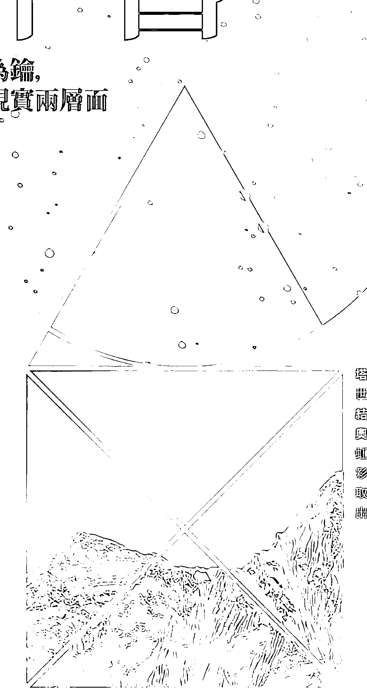

奧修禪卡的全名是《奧修禪宗塔羅牌》。從解牌系統來說，奧修禪卡是建構在塔羅牌結構的基礎上，卻又超越了塔羅牌！它涵蓋了物質的責際面與靈性的精神面，帶給你更貼近的生活占卜，更貼近生命實相的真誠建議。

因此，本書特別繪製了奧修禪卡與塔羅牌的結構對照圖解，讓讀者清楚整副牌的邏輯結構，並與塔羅牌互相參照，對於初學者甚有幫助。只要跟著書中的解釋，弄清楚象徵符號背後指向的意義，就可以很清楚看到奧修禪卡與塔羅牌之間的同質性，並進一步看見奧修禪卡擁有一般塔羅牌所沒有的特質。

很多人認為，奧修禪卡是一副靈性的牌，不能用來解釋物質層面的現象。這是一直以來大家對禪卡的偏執見解，但本書作者指出，靈性層面的奧修禪卡，必須能同時看到人心與物質的層面，才能顯示出它真正的靈性高度，而這正是奧修禪卡可以兼顧身心靈三個層面的卓越之處，也是本書將奧修禪卡落實在日常生活層面來解讀的用意。

# 禪卡資訊

本書使用的禪卡圖像是參照原始奧修禪卡而繪製的簡筆示意圖，僅供參考。慎重建議讀者應用時，務必使用原始禪卡，以求正確。有意購買奧修禪卡的讀者，可上博客來網站或各大書店洽詢，一般都是卡加書成套販售，不單獨賣卡。

# 遇見奧修禪卡

# [作者序]

我認識奧修，甚至先於占星和塔羅牌，導因是我的第二隻貓咪Armani，不到一歲就因先天體質而病逝了，那時我瘋狂地閱讀各種有關生死的書，真正打動我的，就是奧修的書。然後我開始大量吸收奧修系統的思想，也開始能夠接受靈性界的概念（在這之前，我覺得這種虛無縹縹的東西跟我是不相干的）；後來再經由朋友的示範接觸到占星學，才終於踏入神秘學之門。

◇奧修，難道只能待在形而上的世界？

研究占星、塔羅牌的初期，我在網路上成立了神秘學論壇，當時算是很熱鬧的一個網站，分享的網友很多，當中也有許多各式牌卡的研究高手，讓那個時候還是神秘學界菜鳥的我眼界大開。那時我研究塔羅牌，還是停留在看書認識牌義的階段，尚未發展出自己的建構系統；而不管是中文書
或是號稱經典的翻譯書，甚至是網友好心翻譯給我看的外文資料，也都是著墨在牌義及牌圖象徵上（其實現在情形也一樣），所以對我來說，牌義感覺上好像沒有什麼太大的差別。因此，在選擇
自己想鑽研的塔羅牌時，我仍然很淺地以牌圖漂亮與否為主。那時，我最喜歡的就是托特塔羅牌
及奧修禪卡。 對我來說，奧修禪卡的牌圖真是美到不可思議，但是可以參考的資料卻非常少，因此雖然喜
歡（也買回來供著了），但對我這種一向沒什麼靈性的人，禪卡書中那些意境深遠的文字，看著還 是覺得深奧得摸不著頭緒；而關於禪卡結構分析或牌義探討，全世界唯一的參考資料，就是創作奧 修禪卡的作者那本原作專書——《生命的遊戲》（The Game of Life），當中記錄著奧修大師對每張牌 的講評。另有一本更厚的奧修禪卡書（也是同一位作者），還是不脫專書中原有的內容，只加了一 些奧修大師的話語，基本算是同一本書。這些都不能幫助我深入認識奧修禪卡，而這樣模稜兩可、 不上不下的情形，讓我在解牌上很沒有安全感。

嚴格說來，當時網路上並不是沒有人分享奧修禪卡的解讀心得，也同樣有人網路或現實生 活中，用奧修禪卡為大家解牌，偶爾也會有一些奧修禪卡的研討會、講座或交流會之類的活動，也 就是說，使用奧修禪卡的人並不少。然而聽他們的解牌或說明往往讓我更覺困惑，通常就只兜著牌 名打轉或加上一些靈性、能量的術語，往往無法切入重點，或是深奧得根本讓我們這種普通人無法 聽明白。所以我慢慢就放棄了奧修禪卡，無奈地把禪卡收進櫃子裡，幾乎沒再拿出來看過。

後來我對托特牌的研究，也從占星符號擴展到牌面上的色彩（托特牌的色彩豐富且精準，與牌 義的對應不但完整，還可延伸出更豐富的思維，傳達出人格及情緒面），並透過四大元素的分類及 具備心理面及實際面的詮釋，這讓我一看到牌，就能建構出這組牌結合起來的狀況，落實到物質層 生剋，把抽象的牌義還原成具體而真實的事件原貌。幸運的是，占星符號和色彩學的含意，同時都 經由托特牌上的精細結構，已經開始抓到我要的塔羅牌邏輯了，只是當時因為經驗中的挫敗，沒能
讓我與起研究奧修禪卡的念頭。二〇〇七年，我生命中的第一隻貓咪咕姬，在六歲多的時候病逝，那一段時間，我整個人陷入無邊的沉痛中，開始讀起一些與靈性哲學相關的書，也漸漸看懂裡面的某些狀態是什麼樣的感覺了。直到有一天，我感覺悲痛的情緒又襲上心頭，卻看不下書，只好胡亂翻出久未接觸的奧修禪卡，想看看它有沒有什麼話是要勸我的？卡，想看著它有沒有什麼話是要勸我的？在占卜之前，我還是很想仔細地看著它美麗的牌圖，所以先一張一張拿在手上看，越看我自己越驚奇。或許是因為過去這段時間，塔羅牌的結構已經在我腦子裡生根了，所以我能認出所有相關的細節；或許是因為失去心愛的貓咪，心房開了一個缺口，讓我能更直接地被觸動到，或許……，總之我發現我知道奧修禪卡在說什麼了，每一張禪卡，我都可以認出跟它對應的塔羅牌，而且從一艘牌義中，看到禪卡的同一張牌做了什麼詮釋、改變了哪些角度、要表達的地方有哪些異同，我真是不敢相信！一直到今天，我還是認為，這是那次痛失所愛的經驗帶給我的禮物。

識每張牌的過程，我就可以讀牌了；碰到沒印象的牌圖，看著它的元素對應以及與塔羅牌的相關性，還有我個人以前對奧修思想的認知，這張禪卡的含意竟然就能在我腦中鲜活而清楚地顯現，並且可以經由牌面看到實際狀況發生的事件。在教授、使用奧修禪卡這些年後，我心中的奧修禪卡邏輯結構越來越成熟，但是看到別人討論奧修禪卡時，還是在牌名及表面牌義上打轉，不免嘆惜大家對奧修禪卡只能用於心靈成長，不能
拿來占卜一這樣的誤解。因此，我想把我眼中所看到的奧修禪卡，做一次整體性的描述，也許不是很完備，只希望能提供另一個角度讓喜愛奧修禪卡的朋友重新認識這副牌。 或許站在奧修思想的立場來看，有人會覺得我這樣的詮釋方式太過一頭腦（指語言、文字等知識性的東西）了。但我說過，奧修大師書中的內容通常針對的對象是他的門徒，或是那些已經到了某種境界的人，攀登到這種層次，頭腦是必須被丟棄的。然而，認識真理之初，還是需要頭腦來當作階梯的，沒有頭腦，連入門都辦不到。我認為，奧修大師是要我們超越頭腦，而不是叫我們沒有大腦。藉由一頭腦一這個梯子我們可以往上爬，爬上去了自然要把梯子丟掉；但是如果没有梯子，我們永遠只能停留在下層，主動拋棄梯子和從來得不到梯子，這兩者是截然不同的。

# ◇禪卡 vs 塔羅

力（Aleister Crowley）創作，他的兩個牌號分別是「全世界最邪惡的人」及「二十世紀最偉大的巫師」（有人介紹說托特牌是世界上最古老的牌，這也是誤傳，這副牌才推出幾十年而已），融合了魔法、色彩學、占星學、象徵學及少許易經；而「奧修禪卡」當然就是融合了奧修師父獨特的觀點及思想所創作出來的，所以這副牌也是「混合系統塔羅牌」的一員。

就結構而言，塔羅牌的既定結構是七十八張牌，當中包括二十二張大秘儀（又稱大阿爾克納），以及五十六張小秘儀（又稱小阿爾克納）。其中五十六張小秘儀又分為四組，按塔羅牌的傳統分類法，分為「權杖、寶劍、聖杯、錢幣」四組，這四樣圖騰，其實都只是一種「象徵」——權杖象徵的是權力和衝勁，寶劍象徵世俗智慧演變而成的傷害，聖杯象徵包容和情感，錢幣象徵具體的事物與財富。

奧修禪卡一奧修禪卡一的結構與所有塔羅牌一樣，都是由二十二張大秘儀（在禪卡中稱為「主牌」），以及五十六張小秘儀（在禪卡中稱為「副牌」，包括四組花色，每組花色有四張人物牌，加上十張數字牌）所組成。不同的是，這裡加進了一張由奧修大師的照片所代表的「師父牌」，因此總共有七十九張。

在禪卡系統中，塔羅牌的本質用火來當象徵，情感用水來象徵，頭腦（世俗智慧）造成的傷害則用雲來象徵，而我們仰賴的物質世界用彩虹來象徵。四組花色——權力和能力的本質用火來當象徵，情感用水來象徵，頭腦（世俗智慧）造成的傷害則換句話說，這四種本質，奧修禪卡和塔羅牌都一樣具備，只是使用的象徵符號不一樣而已（至於禪卡為什麼用火、水、雲、彩虹來代表這四種本質，在本書中會有詳細說明）；只要跟著書中的解析，弄清楚符號背後指向的意義，就可以很清楚地看到奧修禪卡與塔羅牌之間的同質性。

原文書，可以當作奧修禪卡參考書的都只有一本，就是中譯為《生命的遊戲》（The Game of Life）這本書（另，中文版《奧修禪卡》隨牌附贈的書，內容就是從《生命的遊戲》中摘錄出來的，所以Padma）所創，據說她本人對傳統塔羅牌的構成原理認知並不深，奧修禪卡的奧修門徒帕德瑪（Deva給她看的（著名的偉特塔羅牌及托特塔羅牌，同樣也是繪者根據指導靈傳來的訊息畫面而繪製），所以在《生命的遊戲》一書中，並沒有說明奧修禪卡的組成邏輯及基礎的學術依據，書中講的是奧修說過的話，以及她對這張牌的理解，每一張牌的牌義說明都是較為抽象的。由於《奧修禪卡》是照著《生命的遊戲》書中的解釋，由此領略到每一張牌深層的含意和能
量，用來與自己對話，會是非常美好的經驗；但因為語義晦澀深奧，要具體從牌上講出一些物質層面的狀況，就會很不容易。◇聽說「奧修禪卡」只能拿來觀照自己，不適合拿來占卜用？很多人一講到靈性就會把它捧入雲端，因此往往認為奧修禪卡是一副靈性的、靜心的牌，所以
不能用來解釋物質層面的現象。但我認為，「靈性」距離我們並沒有那麼遠，物質也是「靈性整體中的一個層次。靈性既然是「身心靈」三個層次中最高的層，當然應該能涵蓋及解釋所有的
層面，如果說「物質」的高度是十樓，那一靈性的高度就有一百層樓，一幢一百層樓的建築物一定包括了底下的十層樓。換句話說，指向靈性層面的奧修禪卡，必須能同時看到人心與物質的層面，才能顯示出真正的
靈性高度。所以一般塔羅牌可以做的，奧修禪卡當然也能游刃有餘；相反的，透過物質面或具體化 的一般塔羅牌，要來看出靈性層面的能量運作模式，就很難辦到了（話說回來，如果占卜師本身的 素養夠，不管用什麼牌卡，都可以看到身、心、靈三個層面，重點在人而不在牌卡）。

在《奧修禪卡手冊》中，有許多為奧修禪卡專門設計的牌陣，聲稱是心靈牌陣，很多人認為奧 修禪卡只適用這些牌陣。這種觀念顯然狹隘了點，「牌陣」這東西只是為了占卜師方便使用，必要 時你自己也可以弄個新牌陣，所以當然一般塔羅牌也可以用《奧修禪卡手冊》中的牌陣，而奧修禪 卡也可以套用一般牌陣，只要你知道怎麼使用。甚至連撲克牌占卜、盧恩符文（Runes）占卜，也 都可以沿用塔羅牌的牌陣，或禪卡書中的牌陣。 我見過許多只使用奧修禪卡的占卜師，與其說他們認為這副牌比較靈性，不如說是因為使用奧 修禪卡這種公認靈性的牌，可以讓他們「利用語焉不詳的靈性言辭來打迷糊仗」。畢竟如果奧修禪 卡真的如一般大眾所認定的「無法看到事實物質面的狀況」，那麼占卜師在搞不清楚狀況時就給人 建議，不是很危險的一件事嗎？ 另外，在我所教授的「托特塔羅牌」也常發生跟奧修禪卡一樣的問題，太多人聲稱它們是副 一靈性的牌一，所以認為使用這副牌就可以虛無縹緲，說話說不到重點，凡事以一這是你的人生功 課一或一傾聽自己內心的聲音一一語帶過，不然就是拿一活在當下一這種舉世通用的話語來應付客 人；但事實上，奧修禪卡和托特牌都有非常精密的結構，其中都蘊含著大量的神秘學符號與事件細 節，不懂禪宗思想就妄想靠直覺或牌名來解讀禪卡，結果往往是離真相越來越遠。 讀牌師必須讀懂牌上的細節，才能引導對方一如何活在當下一；也不能只叫人一傾聽內心的聲
音一，你必須能掌握牌卡的內涵，才能幫人把他內心的聲音呈現並翻譯出來。這才叫建設性，也才叫指引。占卜師、解牌師不能只叫人「活在當下」，因為你隨便攔個路人都可 以告訴你要活在當下，還用得著花錢花時間抽牌解牌嗎？所以這本書，就是要告訴你，奧修禪卡不是供在案上的靈性指導，除了靈性層面之外，身心兩個層面所展現的豐富性與實用性也不能忽略，身心靈「三位一體」才能讓我們更貼近奧修禪卡深遠豐富、尚未揭露的原貌。

# 【導讀】—奧修禪卡與塔羅牌的關係

——火（比塔羅「權杖」少了許多目的性導向，更強化「自我中心」的部分，將自己的才能及意念發揮到極致）
——雲（「雲」等同於頭腦，是遮蔽視線和真理的障礙物，我們的頭腦會對我們形成制約）
——水（禪卡的「水」是流動的活水，既洗凈了許多東西，自己也不會卡住任何負面能量，除了情感、愛、慈悲之外，更象徵了一種自由的心靈）
——彩虹（禪卡用「彩虹」來代表土元素，意味著物質界的所有一切，都只是一種短暫的「示現」）
——火（代表把自身的光與熱完全散發出去，超脫到全新領域）
——雲（代表「知障」——頭腦和知識會設下局限，遮住了我們的視野）
——水（代表生命的變化性及無限的可能性，把各種情緒都轉化為愛）
——彩虹（代表一場盡興又美麗的演出，就像生命在於過程不在於長短）

+   王
+   后
+   騎士
+   小兵

# 宮廷牌（16張牌）

+   1
+   2
+   3
+   4
+   5
+   6
+   7
+   8
+   9
+   10

# 數字牌（40張牌）

——權杖（具有積極向上、唯我獨尊、追求自我的特質，有爆發力無持續力）
——寶劍（具有多元化、溝通、彈性、變化性等特質，主動但不積極）
——聖杯（具有多愁善感、情緒化、決斷力弱等特質，被動且易感情用事）
——錢幣（具有意志力強、重紀律、腳踏實地等特質，耐久但頑固）

+   國王
+   皇后
+   騎士
+   侍者

# 宮廷牌（16張牌）

+   1
+   2
+   3
+   4
+   5
+   6
+   7
+   8
+   9
+   10

# 數字牌（40張牌）

——權杖（代表自我意識及勇於冒險的精神）
——寶劍（代表文字、語言、訊息等溝通介質）
——聖杯（代表人跟人之間的情感互動及互助）
——錢幣（代表具體的、與切身利益相關的領域）

+   1
+   2
+   3
+   4
+   5
+   6
+   7
+   8
+   9
+   10

# 數字牌（40張牌）

# 主牌（23張牌）

→從0號「傻瓜牌」～21號「完成牌」+師父牌

1.代表一趟自我發現、自我超越的心靈旅程

2.比塔羅牌多了一張奧修的「師父牌」

# 副牌（56張牌）

幫助你看清自己每一刻的起心动念，以及當下的氛圍

以四大元素為核心，結合人物、數字分別形成兩組牌

# 奧修禪卡與塔羅牌的結構比較

# 塔羅牌

# 大秘儀（22張牌）

→從0號「愚人牌」到21號「世界牌」

1.又稱大阿爾克納

2.偏重精神與靈魂層次的解讀

# 小秘儀（56張牌）

1.又稱小阿爾克納

2.偏重實際發生的狀況

以四大元素為核心，結合人物、數字分別形成兩組牌

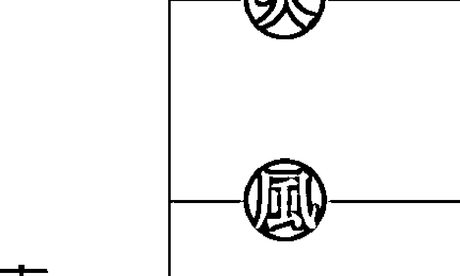
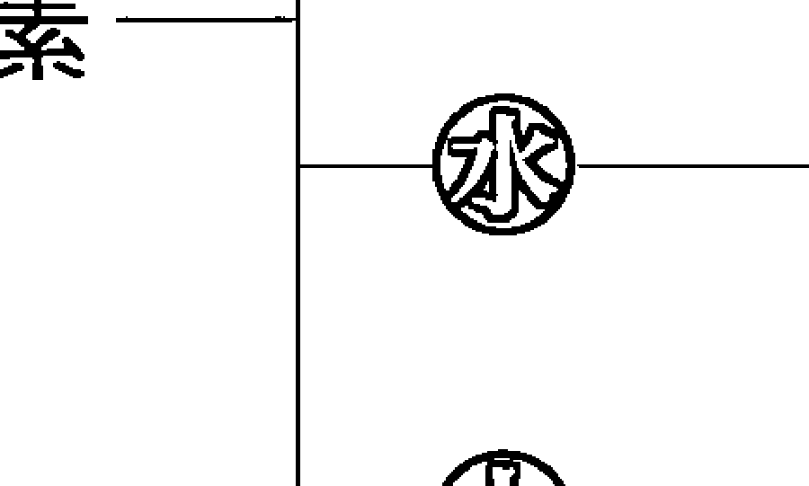
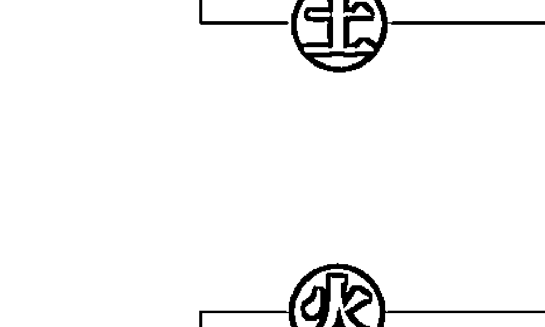
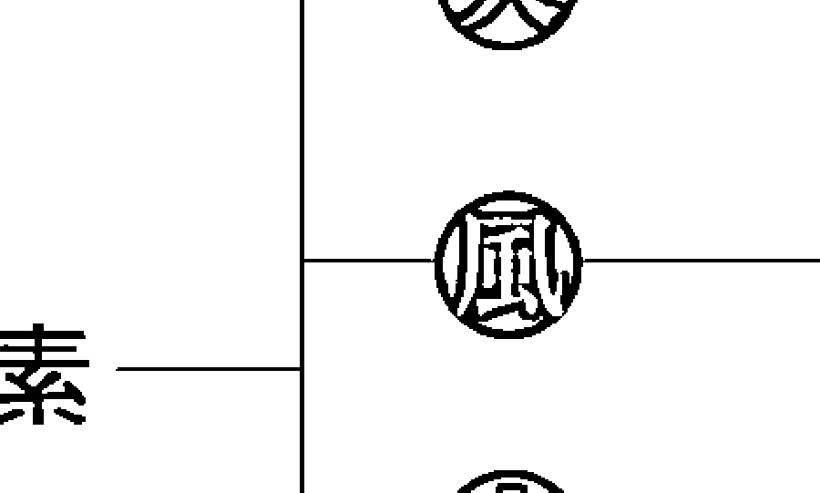

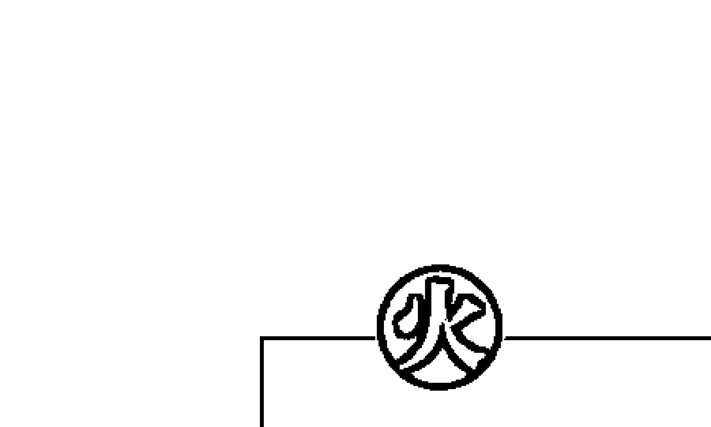
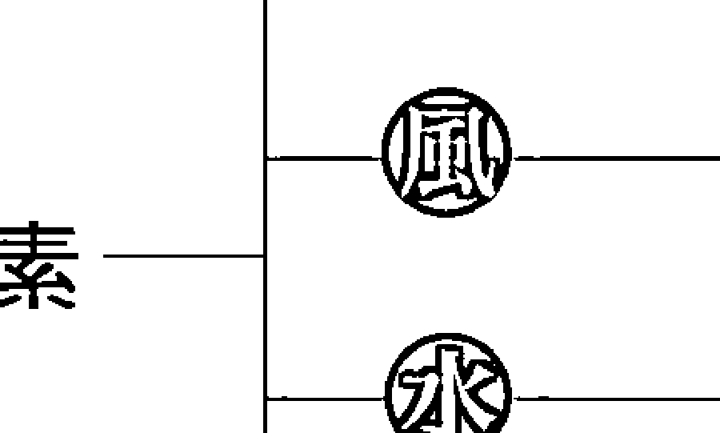
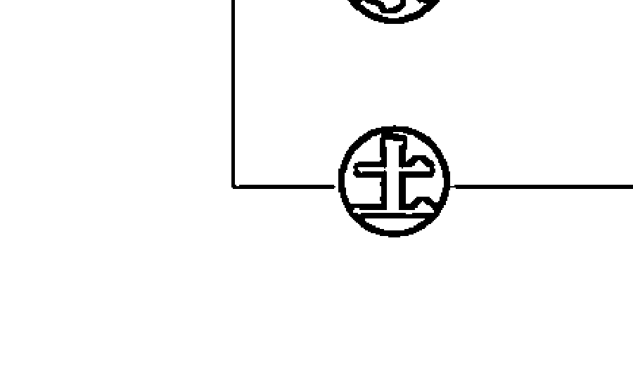
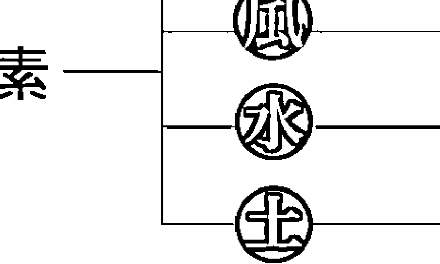

# 透過奧修禪卡看事業

# 【解牌】

# ◇牌陣與解牌

禪卡問的問題往往比較隱私，所以這個案例是我替自己解的牌。就像一般塔羅牌一樣，牌面意思
只是一種引導，它其實會觸動當事人很多的感覺，並幫助你看清楚整件事情中背後隱藏的原因，以及
你現在正面臨的狀況。我們對於自己的處境常常有許多誤解，才會有身在福中不知福的人，也才有把
吃苦當成吃補的人，透過牌卡，我們就能「鳥瞰」自己的生命藍圖，得到更完整清晰的脈絡。

# 問題 在事業上，我要怎樣才能發揮最大的能力，得到最大的成就呢？

我這個問題非常世俗：「在我目前的事業上，我總覺得沒能得到真正的發揮空間，雖然已經獲得一些肯定，但我認為比自己預期的還有一段差距。我要怎樣樣才能發揮最大的能力，得到最大的成就呢？」

以不會有形象破滅的問題，誤傷了一堆玻璃心（哈哈）。

我的占算方式，不拘使用奧修禪卡專屬牌陣或用一般的塔羅牌陣。針對這個問題，我用的是—

# 抽牌順序與擺放位置

# 實際抽到的牌

水之3—慶祝
水之小兵—了解
水之4—轉入內在
火之8—旅行
火之2—可能性
過去
結果
現在
預期
實際狀況

般塔羅牌的「大十字牌陣」。我抽好牌後，幾個學過奧修禪卡的朋友馬上搖了搖頭，我問他們怎麼了？他們神情嚴肅地說：「有很多飛翔的牌，表示妳要解放自己的束縛和靈性。所以我想妳是某些地方卡住了，成大事的能量才會出不來。我問他們那要怎麼做？他們說：「這就要看妳自己的體會了。唉（這就是我們喜歡所謂直覺式解牌法的原因。很多人非常強調直覺，對於每張牌擺放位置的意義都放到最後才考慮，甚至不考慮。我不反對這樣的解讀方式，因為每種方式都有它可以讀到的意義，

# ◇牌陣與解牌

一冰凍三尺非一日之寒，他們兩人之間有太多微小的問題了。她沉思了一會兒，問我說：一如果還是想問怎麼做才能復合，妳會不會覺得我太傻？還是你不願意算這種鬼打牆的問題？一我說：一不會，因為妳不是無止盡的重複，一時想不開是非常正常的，如果我是妳，也會很想知道什麼不好，也許再過一陣子，妳就會後悔花錢買時間問這個問題了（哈～）。

針對她的問題，我用的是一時間之流一的牌陣，三個位置分別是一過去一、一現在一、一未來一。一來一。一未來一這個位置會顯示出復合方面的困難點，但同時也可以從中看出要突破的方向；而一過去一和一現在一則顯示，現在分手對案主來說有何意義。

如果用一般字面解釋，可能會說：一你們過去會在一起是因為雙方的妥協，現在認清的事實是彼此不太適合，但未來可能還有緣分，只是不會太愉快。基本上，這樣解牌也没錯。但我們都知道，我們對自己的狀況不見得是清醒的，奧修禪卡的「妥協」、「圓熟」也不見得是一般我們常用的解釋，案主聽了之後，可能會認為你在否定她的愛情或悲傷。有時太過堅持我們的解牌，認為問題都出在案主身上，可能會變成一種高高在上的優越感：「我沒耐心用妳的語言告訴妳我看到的事，妳最好自己長點智慧，都是因為妳自己程度太低不理解，不是我的錯。」即便是滿口講愛與光、柔聲細語的占卜師，没有任何態度不佳的問卜師不夠專業。
最好的方法是透過這三張牌更深入解釋，讓案主認清並接受自己目前的情境，良好的改變才會發生。這樣做，這比我們說一百次「妳要改變想法」，甚至跟她起爭執來得有用。
出現在「過去」位置的一彩虹之6—妥協—，是土元素的彩虹卻沒有一般土元素—占有一的特質，因為不要忘了，禪宗觀和諧與共存，這樣的組合在塔羅牌—錢幣6—是代表互助的、供給與需求的互動，定義上是互相給
予的。但在奧修禪卡中，土元素的彩虹卻沒有一般土元素—占有一的特質，因為不要忘了，禪宗觀
點下的物質世界是無法被擁有的，不管是錢財、房子、肉體，都是宇宙中最短暫的存在，擁有這些
東西根本沒意義，我們只能去經驗它。所以數字6的互相依存，在奧修禪卡系統中會被視為是一種
依賴。而我們的肉體是要拿來經驗這個世間的一切，如果我們為了一些環境或物質的需要而選擇安
全感，卻限制了自己去經驗新東西的可能性，這就不符合彩虹的土元素訴求，因此土元素加上數字
6，人與人之間的連結一定會削弱個人的獨特性，不然是無法還就對方的，這就是一磨合一。不磨
掉自己的一些特質，兩個人就合不起來，所以這張牌叫做一妥協一。雖然安全、雖然看起來完整，
但是卻發展出不完整的兩個人。
我說：一其實你們的問題不但存在已久，而且可以說是一開始就存在的，你們之間看起來問題
好像不大，但我認為本質上就是不對盤。可能你們過去在交往中刻意忽略了這一點，或是想試試
看。就這張牌來說，這段感情本身就帶有一種妥協或刻意營造的特質。尤其是，感情牌陣的「過去一和現在」，卻沒有火也沒有水，可見純感情的因素不強，很有可能兩人交往是為了一對方是情，但經過選擇與考量，這種愛情就不是這麼純粹了。退一步來說，如果連事先選擇過的結果都無法走下去，其實就代表雖然條件上看來適合，但本質上還是不對盤的。後自然會懂，現在的她還在愛與思念的沮喪情緒下，這些觀點會讓她消化不良。數字6在一般數字學中，代表社會性，也代表一種互相依存。但第二張牌卻是數字1，兩張牌的元素相同，我們可以很單純的視為從6轉變成1，也就是從一段連結的關係回復到一個人自我的本質一。所以一現在一位置出現一彩虹之么一心智圓熟一，代表她只是擺脫了一段會限制她個人發展的關係而已，根本不是壞事。而土元素1號牌，不管是在一般塔羅牌或奧修輯卡中，都代表一本質一，只是奧修輯卡的本質，比一般塔羅牌認為的個人本質，層面更廣更深而已。我跟她說：一其實你們兩個人從一開始交往，就不是自然而然的，是因為你們都覺得交往這事需要經營，所以互相都犧牲或退讓了一些。你們可能覺得這是為對方付出，不過很明顯的，這種互相邊就反而會造成兩個人都沒辦法做自己，對雙方都沒有好處，現在只是回到你們各自該走的常軌上而已，你們會各自有更好的對象。一她沉思不語，我又換一種更白話的講法：一如果你要跟這個男人繼續交往下去，有很多妳必須放棄的，那妳就當不成妳自己了。當然這是妳個人的選擇，不過既然現在交往不下去了，表示命運對妳的安排不是要妳去配合這個男人的。一她只淡淡地說：一嗯，我們是因為覺得適合才在一起，也就是雙方都對彼此的條件滿意，我們沒有經過朋友的階段。一嗯，那就符合先前一彩虹之6一妥協一的含意了。但重點在第三張牌，第三張是他們要一如何才能復合一的關鍵牌，我對前兩張牌的設定只是讓
我了解狀況，這樣我才知道搭配第三張能給出什麼建議。這張是主牌「前世」，對應的是塔羅牌的
一月亮一牌，相同點是兩張牌都帶有一些隱憂，並有情緒上的混亂及狀況不明等意思。
不同點是，「前世」還代表著：以往的記憶或經驗會干擾案主當下的感受，也就是她會記住這
段感情美好的那個部分，但那種美好雖然的確存在過，卻早已變質了。所以她追求的只是一種幻
覺，就算兩人再交往，「前世」牌「無法抹去過往」的特質，顯示出導致他們分手的問題仍然存
在，一旦復合，還是會因為同樣的問題而分手。那要怎麼解決呢？
「前世」是水元素牌，這張牌代表和記憶中的人事物無法切割，因為無法擺脫舊有的影響，因
此新的模式和力量無法發展出來。要改變「前世」的最好做法，就是「切斷過去的影響力」。所以
我跟她說：「如果你一直想回到過去，你們復合會失敗。現在最好的方法是，承認這段感情終結
了，去過你自己的生活，這時你才能繼續前進、繼續成長；等你成長到某個階段，他或許也改變
了，你們都變成跟以前不一樣的人，復合才有可能長久。」接著我強調：「你們需要的不是回到過去，因為過去的模式已經證明失敗了，你們需要的是，真正的重新開始。而這必須要你們兩個人都
更新過自己了，才辦得到。」她尋思了好一陣子，到最後看起來像是開始明白我講的話了。
雖然她在占卜過程中話一直不多，但旁邊的友人倒是頻頻點頭，我笑著對她朋友說：「那就交
給妳了，你要記得提醒我今天說過的話。至少到這個時候，有感受到她身上開始轉向正能量，
言語間也輕鬆起來了。剩下的事，就只能靠她自己去面對了。

# 抽牌順序與擺放位置

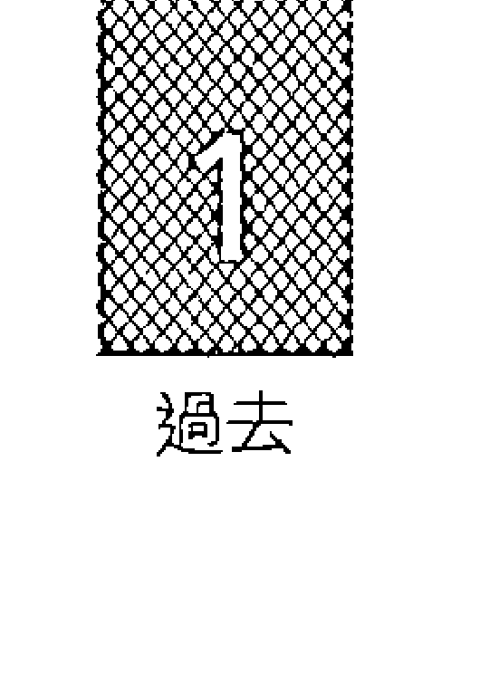

過去

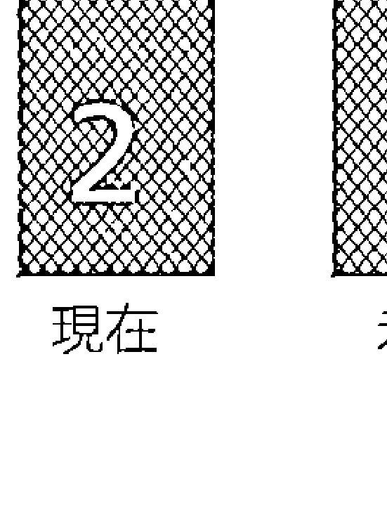

現在

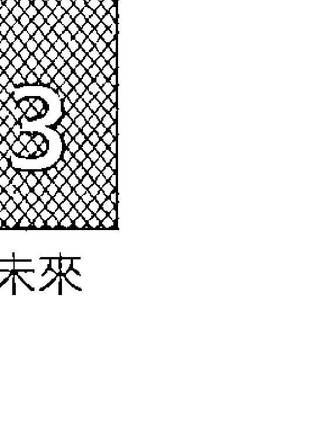

未來

# 實際抽到的牌

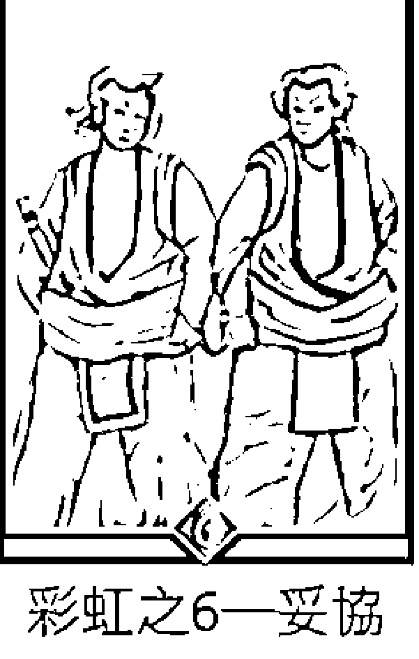

彩虹之6—妥協

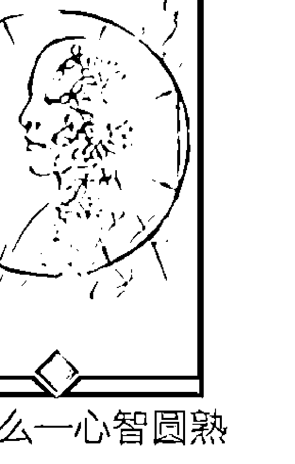

彩虹之么—心智圓熟

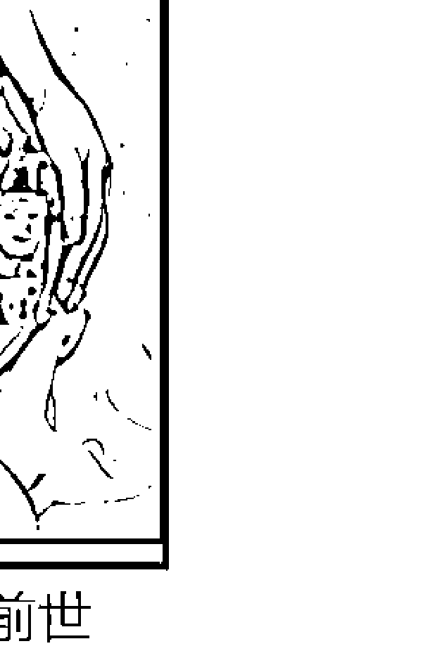

主牌：前世

# 【解牌】

# 透過奧修禪卡看工作

這個案例比較特別，在某一班奧修禪卡課中，有個學員本身是特教班的老師，她為了能讓自己

和特殊學生的溝通更有效，所以才來參加奧修禪卡課。在課程進行中，就已經看得出她的工作壓力頗大，一特殊教育一原本就不是容易的工作，每個需要特別溝通的學生，身上都有不一樣的故事，要跟他們溝通都是一種全新的挑戰，加上資源稀少，我可以想像她的心力一定都有極大的損耗。

# 問題 我是否該讓學生轉校？

最後一堂課我開放同學發問，讓全班一起開牌幫當事人解答。這位特教老師告訴大家，她最近有件事非常苦惱：一我的班上有個十歲的小男孩，因為經歷過很大的創傷，身心受到長期虐待……現在他的症狀是完全不說話，偶爾一開口就是尖叫、摔東西、哭鬧，沒辦法好好講話，對外界有很強烈的敵意。一其他同學從來沒接觸過這種需要幫助的兒童，他們很難想像到底是什麼樣的經歷，會讓一個才十歲的小男生無法承受到如此地步？畢竟兒童身心都是很有彈性的，能夠把小孩逼到崩潰，想必是非常巨大的痛苦。

她接著說：一我們學校裡的資源不多，已經在這個孩子身上花了很多資源和力氣，但進展真的不大，現在其他人都在把重心轉移到其他個案，只有我跟一位醫生、一位助教，還是希望能再試試

看。但是政府單位前幾天來函，說這個小小孩的程度已經太嚴重了，不是我們學校可以處理的，公文內的指示是，要我們讓他轉到另外一所學校。我問：那樣有什麼不好呢？也許新學校的資源比你們多啊！她搖著頭說：我實在放不下心，處理這樣的孩子最困難的地方就是取得他的信任，我們已經跟他培養這麼久的感情了，如果換到陌生的地……也不是一定不好，但我就是怕他們得從頭再來，先前累積的一點點成效都前功盡棄了。

我請她抽一副「大十字牌陣」，但將最後一張「結果」位置的牌，改換為代表「建議」的牌。

因為她現在最需要的，就是下這個重大的決定：是讓學生去資源更多的學校比較好呢，還是留在她單位繼續努力比較好？哪一個選擇會讓這個小男孩進步最多？雖然乍看之下，這副牌沒有顯現出很明顯的吉凶，不過至少四大元素都到齊了。看來應該不至於是無法解決的狀況，只是可能需要花點時間。

第一張牌是「過去」位置的「彩虹之6」妥協一，從這張牌幾乎可看出來，這個小男孩的療癒及教育資訊並不是很充裕，因為數字6有靠各方支持的意味，而彩虹對應的土元素，代表外來的支援就是在教育的部分。幸好土元素和數字6都沒有匮乏的含意，因此雖然有時資源不太充足，但該做的一切輔導和教育，都還能夠維持進度。只不過，牌圖上一妥協一的象徵，代表的是兩個人都没有得到自己想要，只是互相遷就地把表面關係維持在一尚可接受的程度而已。這一點讓我覺得，這個孩子所需要花費的心力可能需要額外補充，這樣不會壓縮到其他小孩的受教權呢？那個特教老師說：有時候難免，但是資源分配通常我們是挖東牆補西牆，以調度方式來處理，因此必
要時，我們會額外補課或治療，讓大家都能跟上進度。這樣一聽也很合理，因為數字6雖然不算非常充足，但也是一個可以保持平衡與和諧的數字。一現在一位置抽到的是「彩虹之3—引導」，直接點出該學員心理的想法。「引導」的牌圖中，是一位穿著羽衣的仙女騰空而去，代表前往更高的境界，現在這位老師確實無法判斷究竟是個決定，才能對這名小男孩幫助更大。而土元素代表所有經歷都是踏實的，數字3代表正在前進多助力。於是我問她：「妳似乎鐵了心一定要確定學生的狀況有突破，一般這麼堅持的話，表示妳認為只要時間足夠，他一定能夠復原囉？—她很確定地點了點頭。第三張在一預期狀況—的位置，出現了11號主牌—突破—。這張牌很有意思，雖然牌圖充滿了爆發力和新氣象，看來很像火元素牌，但實際上它的屬性卻是風元素，而風元素代表—信念上一的原理及行為模式。在本書中，我對這張牌定義是一長期遵循既有的模式之後，可以從中發現不足之處，並加以革新突破—，看來這張牌代表了這位老師的信心來源。我說：「妳覺得你們已經跟他相處很久了，快要抓到可以突破他的方法，這些都是不熟悉他的人無法做到的？—她說：「沒錯！雖然他很不穩定，但只要有症狀，就有其規律性，這讓我們知道怎麼跟他相處，也才有機會讓他卸下武裝。—在一實際狀況—的位置抽到的牌是「水之10—和諧—，看到這張牌大家都鬆了一口氣。雖然這張牌沒有一水之王—療癒—那麼強烈的治癒性，但也代表小男生的狀況至少可以保持在一個穩定的程度。在牌圖中出現的海豚，也讓我們想到曾經應用在自閉症兒童身上的—海豚療法—，海豚的特性有撫慰及平靜的作用，所以療癒能力已經比其他禪卡還要高了；而水元素的被動性，以及10這個數字，則代表要治療這個孩子，不管是留在現有的學校或去新單位，都必須耗費比她想像中還要長的時間，才能有所成效。她雖然有點失望，但還是表示，事情只要有進展就好，多花時間總比放棄
孩子來得好。重頭戲是最後一

# ◇ 存在 Existence

到中心，看到一切事物本然的樣子，讓自我完全開展。傻瓜跟上文所述的聰明人是相反的，他没有經驗法則，所以被人認為學不乖；沒有抓住任何東西不放，所以像是沒有企圖心。然而，他也不會在心裡形成任何制約，永遠都可以從新的地方開始，不會自設邊界，不受自己的經驗限制，當然更不會受外來的既定觀念所綁綁。傻瓜不是聰明人，不能循前例趨吉避凶，但傻瓜不會留下創傷，因此能夠保持純粹的信任，而這種因信任而產生的強大內在及樂觀，使他能禁得起任何打擊，能量也可以保持在最充沛的狀態。人之所以會失敗，往往不是能力不足，而是先被自己的沮喪及絕望打敗。傻瓜不畏懼失敗，因為得或失並不重要，失敗跟成功的經驗都必須經歷過，人生才會完整。

這張牌是○號牌，代表一切的起始，也代表我們必須回歸到這樣的狀態。○不是什麼都没有，而是一切萬物處在一種平衡共存、沒有界線的狀態，就如同傻瓜身上的衣服具備了副牌中四個元素的颜色一樣。如果能夠去除掉種種由貪戀癡各種妄念所形成的偏執人格，等於是整合自己的各層面，這是開悟的狀態，就像傻瓜手上拿的白玫瑰：白色是所有色光綜合在一起、無分彼此時會有的顏色。一開悟並不是一種一成為，而是一種一恢復一，也就是所有的頭腦訓練尚未在我們的心裡形成既定觀念的時候，而最根本的樣子，就是尚未受過任何訓練的一傻瓜一。這種天真是不社會化的，而通常越不符合社會規格化要求的人，越不會受到利用，也越能保持自己原本的特質。一傻瓜一這張牌代表分別心還未出現時，雖然有了主體意識，但是就像嬰兒一樣潔白，尚未被輸入任何紀錄，也代表不會陷入外來的一知識一與一認定一當中，保持自己的自由及流動性，才不會很快就僵化。金庸小說《俠客行》中有一門眾人爭相研究的神功，功法暗藏在一首詩當中，各門派的高手都用自己的所學去詮釋、推敲詩中文字的含意，再解讀延伸出各種修煉方式，多年下來卻始終沒有人詮釋得夠完美，也沒人能夠學成。最後是由從小就是孤兒、不識字的男主角，因為根本看不懂，就把所有文字視為普通線條（其實是內功的運氣脈絡），練就了詩中暗藏的武功；而理所當然認定「詩中藏有武功」一味推敲文字含意的人，就看不到如此顯而易見的地方。只要對奧修體系稍有了解的人，就會知道奧修一向認為「頭腦」是知障，應該要打破它、捨棄它。但是我們不贊同很多人因為要打破頭腦，就無限上網「感覺」的重要性，因為奧修也經說過，頭腦與邏輯是貧乏的，成不了任何事，頭腦不會是真理；但心（情緒）也不會是真理，情緒同樣是片面的、殘缺的，跟頭腦一樣不完整。唯有意識能夠整合頭腦與情緒。所以「傻瓜」牌雖然没有任何邏輯性，但也不存在，是觀照者，因此能夠在背後整合頭腦與情緒。所以「傻瓜」牌雖然没有任何邏輯性，但也不盲目地跟著感覺走，而是帶有一種超越頭腦與情緒這兩者的宏觀，比兩者都更接近真理。「傻瓜」牌是一張風元素牌，而「意識」就是由風元素所代表的。回到現實點來說，「傻瓜」牌代表要去除偏見及個人主觀認定，打破既定的概念，保持新鮮的心，不該變得機械化且渺小。接受自己認知範圍以外的事物，才能不斷成長擴大，成為像整個宇宙一樣浩瀚。

宇宙一樣浩瀚。

# 元素屬性—風

變幻莫測、超然客觀、自由、不受限、沒有過多的情緒和思慮。

# 主牌

# ◇ 存在 Existence

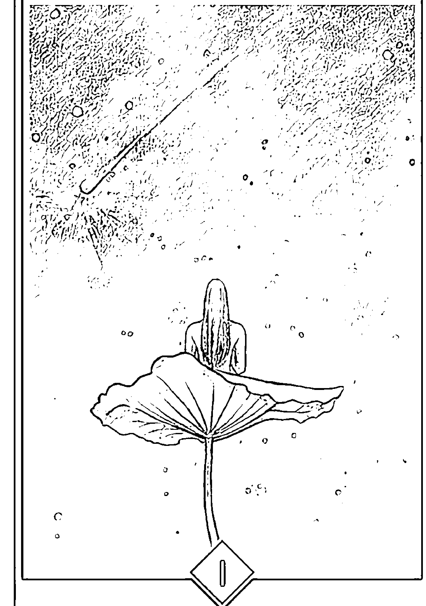

牌名：存在

+   · 元素：風。
+   · 數字1：從空無中出一切。
+   · 星空：代表宇宙整體。
+   · 裸身的人：代表純淨的管道。
+   · 盤坐：接收訊息的姿勢。

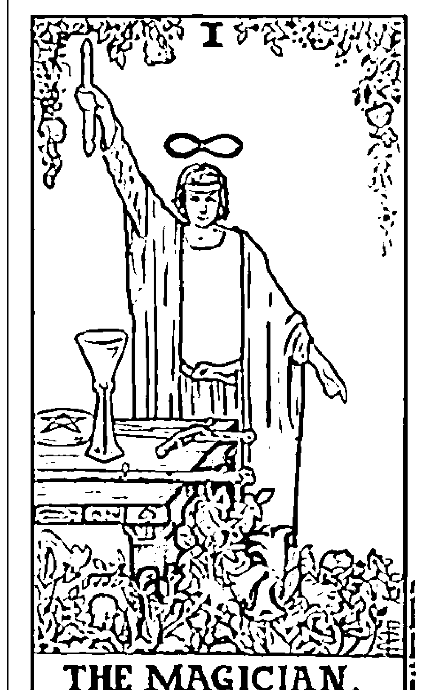

牌名：魔術師

+   · 元素：風。
+   · 數字1：代表開始、創新以及新生的事物。
+   · 牌義：聰明、智商高、啓英份子、凡事都有辦法解套、開啟新的可能性。

對應塔羅牌的「魔術師」

# 以塔羅元素為論
魔術師

# 存在—代表—一切萬有

這張—魔術師—牌，我認為是一愚人—進入社會化之後的版本；少了那種離經叛道跟疏離，多
了社會性常識、工作能力以及社交技巧，並懂得用邏輯化的方式，讓別人接受自己的觀點，理
解能力也強。這兩張牌相同的地方，是那種不受既定規則限制的性格，以及不平凡的特質。但
是一魔術師—更能讓人接受，也更擅於在群體化社會中安身立命。在眾人眼裡，「魔術師—是
個聰明絕頂又受人歡迎的人，可以說服群眾、融入整體，跟大家共存，甚至帶領群眾，而不會
像—愚人—一樣必須脫離軌道之外。

奧修禪卡中的同一張牌，名稱是—存在—，我覺得這張牌跟—魔術師—是相同概念的不同角
度。這張是1號牌，從0到1是一種釋放過程，0並不是虛無，而是所有未定型的可能性；1等於
從0的一片渾沌大海中，提取、淬煉、蒸餾出各種可能性。就像我們必須利用—文字—，將腦海中
一大團的思維，整理出脈絡與邏輯；我們利用—語言—，把心裡面的想法傳遞出來讓別人知道；
我們利用—技巧—，將原料轉變為成品。因此塔羅牌中的一魔術師—，重點在於萃取跟溝通的過
程、一方式—，因此這張牌帶有容易讓人接受、也很有辦法處理各種事情的含意。

然而，為什麼在奧修禪卡中，1號牌要叫作—存在—呢？因為—魔術師—這張牌看起來就像是
從空無中出一切，他桌上的權杖是火元素、寶劍是風元素、聖杯是水元素、錢幣是土元素，而他用
一股力量將四大元素賦予意義及形式，也就像是把麵粉變成麵包、餅乾、饅頭等等各種不同成品的
能力、技巧、過程，所以1號牌更可以說是人類的思考創意，像前面說的，就是—把原料變為成
品一的能力。世界上任何工具性的東西，在製造出來之前，腦袋中都必須先有個—想法—，讓你預
見它的樣子、它的功能，然後你才會知道要怎麼去製造流程、找尋原料，催生你腦子裡面的東西。 但是創意是無中生有的嗎？表面上看起來是，我們可能在作夢、在看書，甚至在發呆或翻查舊資料，一個新的想法就從中成形了。所有具備創造能力的人，都需要「靈感」，不管這個靈感是磨出來的或是從天而降的。所以在「魔術師」的定義中，一切成品都是他「創造」出來的；但是我說過「是一個管道」，連結0跟其他從2之後的數字，0代表的就是你認為是無中生有的那個「無」，在奧修禪卡系統中，也代表我們的靈性層面與無意識層面，也就是所謂「靈感」的真正來源，那個來源就是奧修禪卡1號牌「存在」，也就是「一切萬有」。

○不管好與壞，都是「存在」的組成片段，缺一不可 也就是說，「存在」是一切真實的本來如是，不定義、不分别，而「魔術師」是從整個「存在」當中，提取出我們人類可以理解的概念，分門別類、組合成形，但是人的智慧有限，因此可以理解的东西就比較片面，就像是瞎子摸象一樣，每個人摸到的部分都不一樣。比如說，同樣是觀察世界，西方人觀察到的是四大元素的存在形態，東方人觀察到的是五行的作用形態，兩者都對，只是切入的角度不同。這就像A跟B看了同一場電影，A回家後因為這部電影的配樂而感動，觸發他寫下了一首詩；B則受到劇情感動，因此跑去看海。這部電影就是「存在」本身，它是一個來源，而「寫詩」、「看海」的行為，就是A跟B表達這部電影的方式，而其他人或許看了這部電影後寫了影評（有幾個人寫，就有幾種不同的評論角度）、跟舊情人復合、買了某樣紀念品……，這些都是存在（電影），透過我們這些不同的魔術師（管道），來表現出它的某一面。 「魔術師」這個名稱的重點，在於他是個傳達者，能從「存在」中提取出靈感，接收到創造力，成就各種可能性，表達出形形色色的創造物。「魔術師」的功能，就是把高層次的東西簡化、

力，成就各種可能性，表達出形形色色的創造物。「魔術師」的功能，就是把高層次的東西簡化、

# 元素屬性—風

知性、聰明、靈活、適應力強、社會菁英、思考分析、理解力、溝通，既有開創性也有改良的能 力，熟知一切理性邏輯，能掌握重點。

# 對應塔羅牌的「魔術師」

# 主牌

# 內在的聲音 Inner Voice

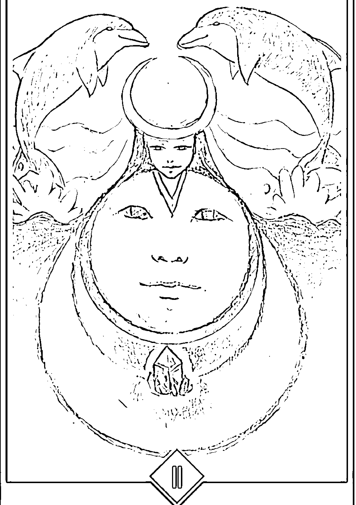

牌名：內在的聲音

+   · 元素：水。
+   · 中間的臉：代表內在的聲音，黑白分明的容智雙眼代表洞察一切。
+   · 水晶柱：代表洞察一切，以及吸收資訊的強大能力及敏感度。
+   · 水：代表潛意識。
+   · 海豚：一左一右一上一下的兩隻海豚代表協調，取代了女教皇牌中的黑白柱子。
+   · 牌義：代表潛意識的力量，不是出自於頭腦，而是出自真正的本能反應。簡單來說，它是一種「內化」的智慧經驗。

牌名：女教皇（女祭司）

+   · 元素：水。
+   · 柱子：黑白柱子代表二元對立。
+   · 月亮：凸顯女性特質。
+   · 數字2：象徵進入一個整合與消化的階段。
+   · 牌義：內在的本質、追求心靈的成長、平靜、跟外界疏離、靈性、低調、專業、有智慧。

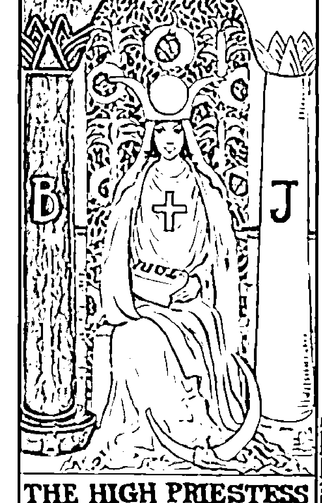

# 對應塔羅牌的「女教皇」

# 以塔羅元素為論

# 女教皇

塔羅牌中的「女教皇」，屬於水元素，保守冷靜、追求智慧，是一張很內心世界的牌。如果說「魔術師」是代表意識（風），那麼「女教皇」就是潛意識（水）。魔術師的聰明才智是用來表現及傳達某些訊息，必須要跟他人交流，但是女教皇的內心就是一個接收器，所有的訊息都是透過傾聽方式收集進來，並且內化成自己的答案。「女教皇」背後的一黑一白兩根柱子，就是張牌的號碼「2」一樣，代表一種二元對立的性質，但是「女教皇」的水元素不會有太多情緒波動，反而會用水元素消融界線的特質來消弭這種二元對立性，並能夠同時包容兩者，形成更高一層的共識。

# 內在的聲音——先吸收再內化，建構潛意識的力量

奧修禪卡中同一張牌的名稱是一內在的聲音——，我認為這個名稱是指向「女教皇」牌實際上的運作模式。常有人問我，為什麼女教皇既是知識又是情緒，這兩者的感覺應該是不一樣的屬性？我說，因為一魔術師一是對外溝通的，必須用言語及文字發表意見，同時也吸收別人的意見。「女教皇」也可能不是透過語言、也未必透過閱讀，水元素的學習方式是用整個人去體會、去感受，而不是只有接受文字及語言的訊息。當我們上了夠多的課或念了夠多的書，等於我們對外收集了夠多的資料，在累積了大量的知識後，往往會發現我們的資料庫變大了，看起來好像懂的事情更多，但實際上只是腦袋裡面塞的資料更多而已，智慧並沒有進一步提升。

這時我們就應該察覺到，我們向外的觸角已經到盡頭了，再累積更多的知識也無法再進步。如果我們持續照現在的方式學習——不斷看書、吸收資訊，往腦袋裡塞更多資料，那麼也許我們可以從一個普通人變成科學家或學者，但本質卻沒有改變，只是多跟少的差別——你的學識多，你就
是專家，學識少就是一般人，但本質不變。如果我們想要變成另外一個人，想讓自己提升到完全不 同的層次，那麼應該改造的，是我們的本質，應該傾聽我們自己「內在的聲音」，往內走，從根源 去改變，而不是往外去收集更多的資料。 一內在的聲音」不是你的頭腦，而是出自於真正的本能反應。簡單來說，它是一種「內化」的 智慧，不像一魔術師」是靠說話或行為來表現，已經內化的智慧會透過言行舉止靜靜流露，不需要 再靠言語來傳達。這就像如果你信仰一門宗教，經過多年的修行及體驗後，自然會內化到你的心裡，那麼那麼宗教就跟你合而為一，不管吃飯、走路，甚至呼吸，你都很清楚自己在做什麼，不用時時 拿一些經文戒律來管制自己，就像孔子所說的「隨心所欲而不踰矩」，你不用再擔心自己會不會開 悟，會不會入涅槃，因為宗教已經是你的本質了。 相反的，如果你不具備宗教性，或者你的師父並沒有徹底地影響你，那麼你會永遠把經文

# 元素属性—土（主）风（主）

土：感官享受、真实、生活化、承载力、韧性。

风：友善、社交、交流、易相处、愿意沟通、接纳与付出。

都是一种模仿（想进一步了解，可参阅《脉轮能量书》）。因此用这张带有女性含意的3号牌来代表一创造力一，是很合理的。

随着环境的影响而改变自己展现出来的样貌，它是跟外界共存的，能够自然融入每一个时空当中。真正能够创造的人，就不會拘泥在某些特定的原料上。这些特質，恰好呼應了能够跟他人发自内心的交流、友善受欢迎的塔罗一女皇一牌。牌图中女人的下方有火焰和流水，上方有神圣的光及彩虹进入，两者在中间汇聚交融，火水混合在一起，形成一种更高的品质（很像是禅卡一内在的声音一消化所有外来资讯，融合成潜意识的力量一樣，火跟水上升的过程代表一创造力一的表達过程），下方的螺旋状也代表生命涌出的能量。这张禅卡综合了一切美好的事物，并且加以升华；因此一创造力一的创作不是强硬有侵略性的，而是带有一種将原有事物一改良、精致化一的能力。如果要问创作的秘诀，不管是绘画、音乐、舞蹈或文学，每个创作者都会告诉你，要打开感官有的敏锐度，才能体会到所有美好事物的特質，并让这些特质深入你的每一个细胞。你没有办法在旧有的限制下，改良或创造出更新更美好的事物，想要让生活变得更美好，必须先改造自己的品质。最重要的永远都是创造的能力，而不是创造的工具。

# 主牌

# 叛逆者 The Rebel.

# 对应塔罗牌的「皇帝」

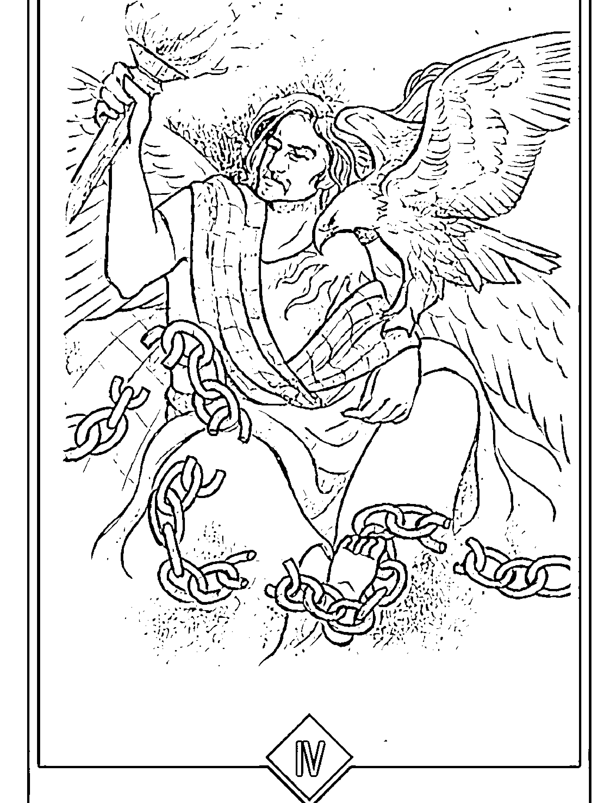

牌名：叛逆者

+   - 元素：火。
- 太阳：肩上的太阳象征对自己全然的自主权。
- 老鹰：翱翔天际，突破限制。
- 锁链：代表苞有的思想和体制。
- 火把：明灯也是权杖，象征一种大无畏的勇气。

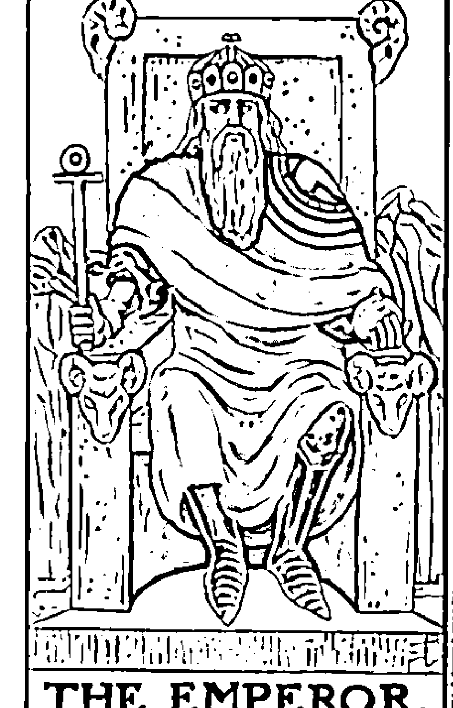

牌名：皇帝

+   - 元素：火。
- 数字4：这是一个基础稳固、内在能力很强的数字，代表想要奠定稳固的基础，或是划好自己的势力范围。
- 牌义：强势、有开创性、领袖魅力强、专制独断、有大男人主义倾向、企图心强、有野心、具有行动力、掌握局面、有主导权。

# 以塔罗元素为论

# 皇帝

# 叛逆者——牌名强调他不愿被束缚及被规范的特质

一皇帝一牌是一张掌握权势、霸气十足的塔罗牌。一般塔罗书常常强调皇帝牌是有钱的，不过就这张牌的元素属性一火一来看，我认为它真正拥有的，比较接近一权力一而非财富，加上这张牌的序号是一4一，表示在一个特定的范围内（例如家、公司、国家、民族）拥有极大的话张权。就像一个男人在家庭中是父亲、丈夫、户长的角色，但是他并不能独占所有资源，反而应该得到的资源分配给家中其他成员（也就是妻小及父母），但在遇到需要做决策时，这位的人，就是牌名一皇帝一的意思。

在奥修禅卡中，相对应的一张牌是叛逆者一。我当初在比较禅卡和塔罗牌时，看到从皇帝转变为叛逆者的名称时不禁笑了出來，这真的是太贴切了。奥修禅卡中的火元素，其实比一般常见的火元素定义，更强化了自我一及一突破、超越一的性質。塔罗牌的一皇帝一比较容易让人联想到统治者，但在我上一本塔罗牌书中，对一皇帝一的定義是：一他不會是世袭的皇帝，反而比较像开国元君，或是推翻前朝的篡位者。一因为火元素代表要冲破某些难关。一皇帝一牌本身的能量非常强大，一定是個领头的人，不可能是乖乖等待着上一代把地位、权力安安穩穩地送到手上，还附帶一大堆规定及责任，更不可能要他去管每一件小事。奥修禅卡以一叛逆者一的名稱，凸显了这种不愿意被束缚和规范的性格，一叛逆者一不但想开创出全新的局面，更想推翻舊有的包袱及枷鎖；而数字4在一叛逆者一中，我認为代表的是那條鎖住叛逆者双脚的铁链，代表舊有的思想和体制，而叛逆者必须扯断它，才能开启自己的新局面。叛逆者不只要扯断拉住他的锁链，摆在他眼前的东西

# 元素属性—火

自我、新生、突破、不受限、急躁、激进、企业心强烈、目标明确、火力全开、上进、勇敢、想 挣脱束缚、无法与群体同步。

某些特質的時候，或者是会形成一种惯性的价值观（不管对不对，生活在群体中的人都會形成一些 共同的观点），越安逸的环境，就越是會让人不敢突破这些价值观，也就越沒辦法發展自我。—叛逆者—是接受过这种社会化的薰陶，並曾經是群体中的一份子，現在他茁壯成長了，所以要衝破舊有的信念，開創一番自己的世界。就像小孩子，他們接受大人的教養而逐漸成長，但到了青少年時 期，就會迫切渴望自己是與眾不同的，而開始產生對大人和世界的懷疑，會開始有了挑戰既定觀念 的想法。这个年纪會變得易怒、容易对世界不滿，並開始跟家人產生衝突、疏離，甚至與同年齡 的人也合不來，这个時期就是我们所謂的「叛逆期」。而「叛逆者」擁有同樣的性質，只是與局大很

# 主牌

# 空 No-Thingness……

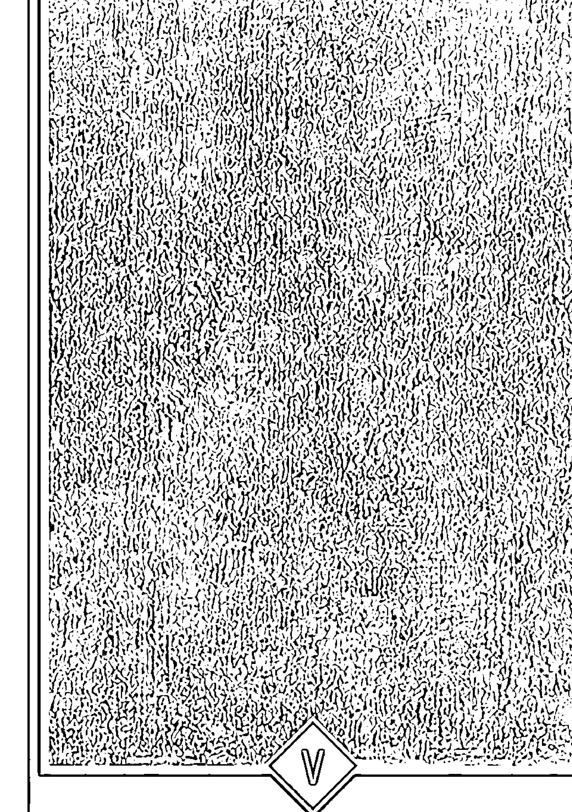

# 牌名：空

+   * 元素：土。
* 一片纯黑：以色料來說，黑色代表所有颜色的总和，因此这张牌虽是无色的「空」，却也代表什么都有。
* 数字5：2＋3的和，代表把二元化（数字2）的界线，经由交流融合（数字3）来消除，即去除一切分别心、回到源头的意思。

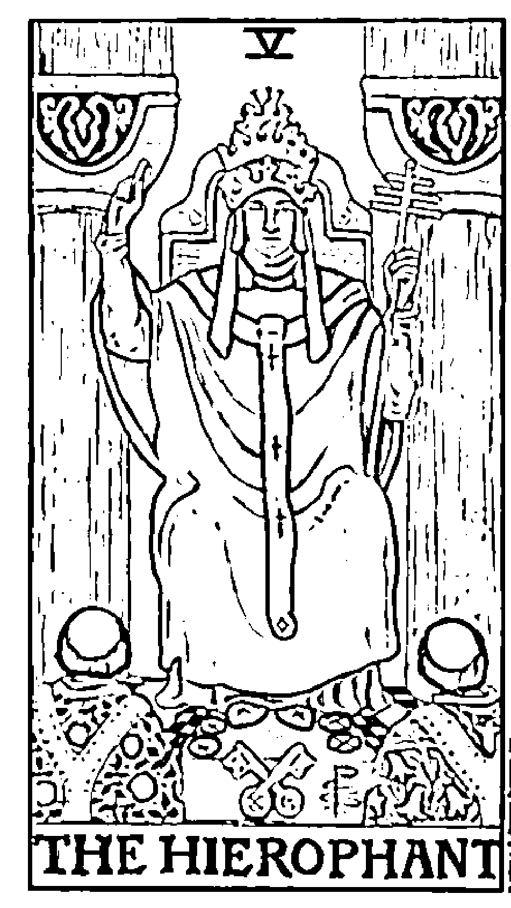

# 牌名：教皇

+   * 元素：土。
* 数字5：代表跟外界的人有互动，以及领导众人往对的方向走长久的路。
* 牌义：传统、重视基本原則、观念保守、固执、慈祥、宗教性、可以当重大事件的推手、尊貴却低调、貿人。

# 对应塔罗牌的「教皇」

# 以塔罗元素为论

# 教皇

# ○教皇牌代表的仪式、守则、戒律：只是转化心灵的初階過程

教皇—常常被認為是一张具有灵性、可成为心灵导师的牌，也因此很多人对這張牌居然屬於土元素感到很意外。但如果深入探尋—女教皇、女皇、皇帝、教皇—這四個人物是一組的，在元素屬性方面，正好是四大元素各對應一張牌。如果要說靈性、心靈的轉化，這些有關—個人內心轉化—的部分，其實應該歸屬到—女教皇—牌，當然—教皇—也不是代表全然世俗的，它跟—女教皇—的共同點，就在於它們都是社會中比較—軟性—的部分。要說教皇是—靈性導師—，只說對了一半，—靈性—不見得完全是，但—導師—就很適合由教皇來扮演了。

我們想想，一個社會除了世俗部分外，還有精神的層面，精神層面則分為兩個部分：其一是非常個人化、私密的，是每個人要單獨去面對的，沒有辦法複製，也沒有兩個人的心靈是同理可證的，這種內在的轉化完全是一種私人經驗，無法以言語敘述，更無法變成公開的標準流程，只能存在個人的感受中。這種私密的心靈轉化，應該歸類到—女教皇—牌（也就是禪卡—內在的聲音———象徵敏感、看得清真理，却是沉默的）。但是，像—內在的聲音—這種程度的心靈旅途因為無法被傳授，所以走在這條道路上的人非常稀少；而如果我們希望大家都能走上追寻真理的道路，一開始就必須要有一种—眾人都可容易認易認識、接受的固定模式—，我認為这就是—宗教組織—，也就是屬於—教皇—牌代表的那個部分。

# 「空」——最充沛的存在，不受任何既定形式的拘束

要解釋「空」這張牌，必須先從空的概念著手。很多人無法理解為什麼在奧修禪卡系統中，教皇牌會用「空」這個形態來代表？教皇牌靠近現實世界，擁有豐富的資源，比「皇帝」還要有錢，「空」卻代表虛無，不是嗎？

尋求真理之初，都會對「覺察」這種事感到陌生，希望有人能告訴我們：—該怎麼做？標準流程為何？怎樣才能開悟？怎樣才能證得涅槃？—而且會以世俗的角度去思考，認為凡事一定都有了一套流程及考核制度，比如念多少遍佛經就應該累積多少功德；行善就能趨吉避凶……這些都是超個人心理學者肯恩．威爾伯（Ken Wilber）稱之為—次級的轉化—的部分，也就是—在尚未有能力認知到真正的轉化之前，先用一些方式將自己慢慢帶離世俗層面—的階段。但是，真正的靈性不是用這種方式來規範的，沒有人可以保證你打坐念經幾次就可轉化到什麼程度。這些教條及道德觀卻是非常重要的方式，不經由這種世俗、大眾熟悉的方式，只是暖身操、只是過程而已；根本無法推廣開來，儀式、教條及戒律是可以複製、可以背誦及可以遵守的，對大眾來說比較簡單，大部分人不上這個階梯，就無法往上爬。我很喜歡美國女禪師佩瑪．丘卓（Pema Chodron）在書中提過的一件事，她的弟子問她：「師父，我們整天打坐念佛，對開悟這件事的幫助在哪裡？—她回答：「對開悟一點幫助都沒有。—弟子驚訝地問：「那我們為什麼要打坐念經經呢？—佩瑪．丘卓說：「這是為了幫助你們了解，你們早就已經開悟了。—打坐、念經的過語傳達、只在我們內心轉化過程中所得見的境界。

「空」——最充沛的存在，不受任何既定形式的拘束

「空」卻代表虛無，不是嗎？

# 元素属性—土

擁有資源、追求真實、文化、禮教、價值觀、組織、儀式、傳統性、經驗、資產、原料。

以前我也覺得一空一代表一切都沒有了、什麼都消失了，一不存在一的感覺會讓人抗拒一空一。後來我才發現，一空一其實是一個相對字，因為世人太執著於一有形一—頭腦建構出來的種種概念，還有我們自以為真實的一切；但是真實的境界卻不受世俗的法則、形態所限制，一空一等於是一切事物的「原料」，它不受存在形態的限制，所以既什麼都不是，又同時可以是任何東西。這個境界，以我們物質世界的角度來看是一空一，從虛無的角度來看卻是一有—。一空一的意思就是：它是最充沛的存在，是一切萬有，不受任何既定形式的拘束。回過頭來看，為什麼禪卡要用一空一來對應塔羅的「教皇」？一教皇一代表宗教組織、宗教文化、宗教歷史，以及所有的教條和儀式。這些有教義、有組織的宗教團體，往往被人們視為通往真理的道路，想要接近神，多數人的第一個反應就是：先進入某個宗教體系。但事實不然，佛說有八萬四千種法門，歷史上每個開悟者都是經由不同的途徑達到的，開悟是無法複製及量產的一件事，每個人必須走上自己內心唯一的道路。台灣作家吳九箴有本書叫《你可以成佛，卻不能成為惡達多》，每個人成道（或追尋自我）的路都不會一樣。我們也常開玩笑說：一佛陀不是佛教徒，耶穌也不是基督教徒。一旦你開始模仿某一個成道者，就注定會失敗，因為每位開悟者都是前無古人的開創者，没有任何一個是遵循既定規則而開悟的。奧修更說過開悟不只宗教一種法門，所以他跟佛陀一樣不立文字，意味著法門不需要被定型、被綁死。有人經由藝術成道，有人經由行善成道，甚至透過性高潮也可以瞥見真理的境界。一教皇一代表接近真理（神）的唯一途徑，一空一卻代表這種途徑可以是任何路，完全不需要有固定形態。

# 主牌

# 愛人 The Lovers.

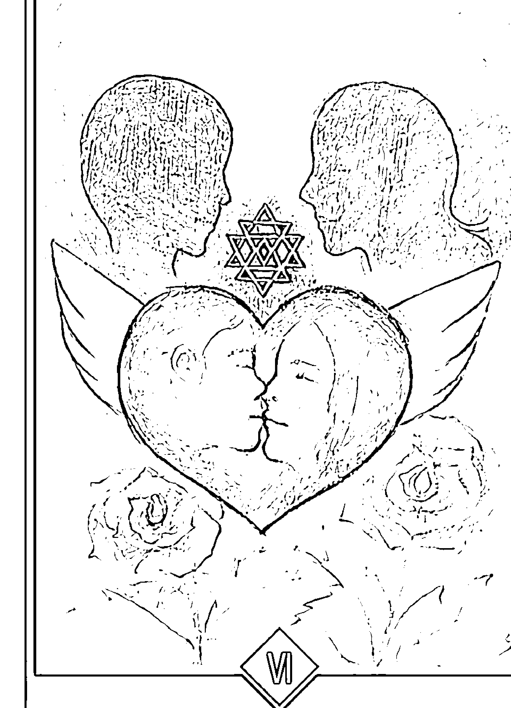

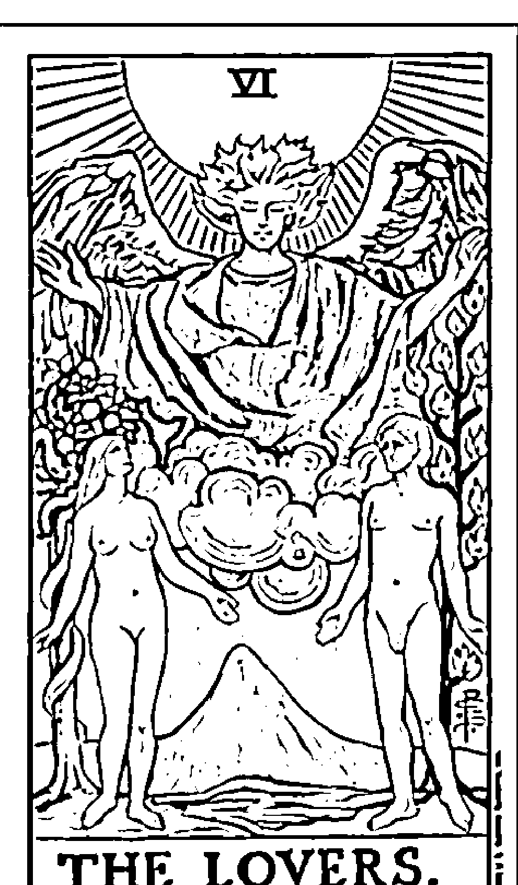

+   牌名：愛人
    · 元素：風。
    · 三角形：上三角形代表陽性，下三角形代表陰性，多個上下三角形組合在一起，則代表陰陽交融及調和。
+   牌名：戀人
    · 元素：風。
    · 樹上的火：男人背後樹上的火是陽性的象徵。
    · 樹上的果實：女人背後樹上的果實是陰性的象徵。
    · 數字6：6這個數字有一種凡事取得平衡和諧，還有互相配合的意思。
    · 牌義：良好的關係、人緣好、選擇、社交運強、讓你喜愛的事物、感情上的抉擇、溝通能力。

# 以塔罗元素为論
戀人

# 愛人——讓我們看見愛、體驗愛，證明我們有愛的能力

這張「戀人」牌的圖像表達的是男女互受吸引的狀況，男人背後樹上的火是陽性的象徵，女人與女人是人類的兩極，正因為相反，才會強烈受到彼此吸引。男人背後樹上的火是陽性的象徵，女人背後樹上的果實則是陰性的象徵，這張牌有很明顯的「戀愛」意味，因此很多人在詮釋這張牌時，會把自己對愛情的認知，例如濃情蜜意、山盟海誓、長相廢守等的想像投射到「戀人」牌上；但我們要注意的是，牌圖上的男女雖然互受吸引，卻還是各據一方，表示兩人還是保有相當程度的自我特質，以及某些不確定的性。有人會奇怪：「愛情不是應該對應到水元素嗎？」但我認為「戀人」對應風元素是非常合理的。因為這張牌的爱情還在探索、嘗試及彼此好奇的階段，正因為不熟悉，才會產生最強大的吸引力，也才會引動戀愛中的悸動、興奮、患得患失……，稱得上是陶醉的心情。此外，數字6也有和諧平衡的意思，會相處在一起，但不是將兩边緊緊地纏繞，「6」沒有數字4那種將兩方關係定型的意思，會相處在一起，但不是將兩边緊緊地纏繞，讓我們看見愛、體驗愛，證明我們有愛的能力。一旦探索期過完，就會產生兩個可能的結果：一是繼續交往，但是已經轉變成另外一種更成熟的感情；二是因为已經弄清楚而覺得索然無味，各自分開去尋找其他可能性。相互吸引這個狀態只是過程，讓兩個人有機會互相了解而已。很多人說「戀人」也有選擇的意味，所以可能有第三者或花## 主牌

# 覺知 Awareness……

牌名：覺知
· 元素：水。
· 薄紗：代表業力、幻象，讓你看不到事情的原貌，往往就是指負面的經驗及過往創傷。
· 火焰：淺藍色的火焰是「清涼之火」，可以除去幻象。

牌名：戰車
· 元素：水。
· 坐騎：人面獅身像代表智慧，黑色座騎代表厲格，白色坐騎代表柔軟溫和，兩者往不同方向，隱含「心態尚未整合」的意思。
· 車上的四根柱子：柱子上的希伯來文字母是四大元素的意思。
· 戰士胸口的四方形圖案：代表堅定與意志力，四方形通常也等同於土元素。
· 數字7：這是一個晉級數字，代表透過學習、挑戰及磨練往上提升。
· 牌義：瓶頸、意志力強、決心、最後的勝利、陷入兩難、出征、守護某些事物、防禦力。

對應塔羅牌的「戰車」

# 以塔羅元素為論

# 戰車

# ○ 無人能及的意志力和耐力，才是「戰車」牌最大的戰力

這張牌是我在對塔羅牌的定義中，與其他塔羅書差異性最大的一張牌了。就跟「戰人」牌一樣，對於一戰車—對應的是水元素也深感不解，因為他們上課之前所蒐集的資料，大都顯示戰車是一張衝動強、力量大、勇往直前的牌，這跟水元素完全不相關。但我記得，也有少部分資料提到「戰車」較贊成後者的說法；而我對「戰車」的定義，也跟這個說法比較接近。其實我在這本書裡，還不打算寫到占星學對塔羅牌的部分，不過「戰車」牌對應的是水元素，但也不是柔情似水或是毫無作為的意思，它對應的占星元素是「巨蟹座」，這個星座是「水象、基本宮」，而基本宮有一種開始、起跑、創新、萌芽、想操控現況的特質，與火元素的特質很接近，所以巨蟹座雖然外表看來陰柔，但是內心的意志力跟堅忍不拔的那一面，卻不會輸給其他人。雖然「戰車」牌對應的是水元素，但也不打算寫到占星學對塔羅牌的部分，不過「戰車」牌有點特別，就不得及觀察狀況。就像巨蟹座的人—很愛擔心、很難下決定，但只要一決定就很難叫他放棄—人面獅身像就可證明這一點。人面獅身像代表智慧，並不是衝動的勇氣，趴著就表示尚在思考—戰車—牌既然跟巨蟹座對應，就表示這張牌的戰門力並不是勇猛的那一種，牌面兩匹趴著的樣子，一戰車—牌在出征前，會先全盤考慮所有的變數及可能性，不到覺得必勝、有把握的那一刻不會出手。這就是爲什麼我會比較認同—尚未整合—這部分的牌義，戰車—黑—白的兩匹人面獅身面對的方向不同，就表示一戰車一本身兩股不同方向的力量還在拉扯，尚未達成共識，當然也就無法出發。但是戰車一旦出動，就不可能再撤退，頂多是遇到瓶頸僵在那裡，打長期消耗戰。這種性質的戰鬥力，乍看之下不足為懼，因為會給人一種殺傷力不太大的錯覺，但是一戰車一牌的致勝點是耐心及執拗不移的難纏性格，最後往往不是它自己攻取勝利，而是對手輸給它了！這兩者有很大的不同，不妨想想，你是害怕短時間的生死搏鬥呢？還是害怕沒日沒夜地乾耗下去？一戰車一牌老實說魄力並不夠，但是其意志力和耐力是無人能及的，這才是它最大的戰力。而數字7也代表一種要達到某個點絕不放棄的意志力，呼應了一戰車一牌的性質。覺知——設想太多只會讓你裹足不前，要做你當下該做的

在釐清一戰車一牌的牌義之後，現在拿來跟一覺知一禪卡對照，看起來就合理多了。從上面一戰車一牌的解讀，我們可以知道，戰車之所以還沒出征，就是被種種的思慮限制住，拿不定主意該往哪個方向前進；而在一覺知一的牌圖上，我們可以看到，前面並沒有什麼實質的阻礙，垂下來的只是一層薄紗，那根本不算是障礙，卻會造成幻象。薄紗上映照出巨大的影子，帶有恐懼與掙脫的意味，我覺得這個部分，其實就點出來塔羅牌中一戰車一的问题癥結。我們都知道：一入恐懼的往往不是事件本身，而是未知。一在你想要用頭腦分析一切，也就是想要掌控一切時，往往就會害怕所有不受你控制的事物，但是這世界上，不受我們控制的比我們可以控制的事物要多太多了，如果必須緊緊抓牢的東西你才能信任它，那麼你將永遠活在恐懼之中，哪裡也去不了。就像之前我在做活動企劃工作時，通常會先簡單決定一個大方向，然後一邊做，一邊視野也去不了。頭修改案子。有同事就對這樣的做法不以為然，她認為：一我們應該把以前發生過的突發狀況都考

尋求安全感。思慮多、優柔寡斷、無法在第一時間下決定、有耐心、容易擔憂、常看到別人發現不到的問題、

應進去，先擬出應對的解決方案，一切都打點好了再開始進行，否則現場會很難控制。—我的回答是：每一次活動都不一樣，去預防突發狀況是白費力氣，因為就算你設想了一〇〇種可能會發生的狀況，到時候發生的狀況就是第一〇一種！—我們不可能等到確定安全了再出發，想要安全，唯一的方式就是待在安全範圍內，而不是往前進。—一旦出發就沒有時間考慮了，因為問題就在你眼前，你可以有效率地直接處理它，不用多花時間及頭腦去恐懼擔憂。薄紗在這個牌圖上雖然不構成障礙，卻會讓前方蒙上一股模糊的色彩，讓你看不到事情原本的樣子，能造成這種效果的，往往就是負面的經驗及過往創傷，讓你看到眼前的事物，馬上聯想到過去的傷害，就像一朝被蛇咬，十年怕草繩一樣。因此這面薄紗意指業力、幻象，你看到的並不是蛇，但是你對蛇的恐懼，會經由這面薄紗投射到草繩上，但這都是假的。—覺知一牌上的恐懼影子，在淺藍色的火燄（書上說是「清涼之火」）燒開了薄紗後，你會清楚了，你的意識讓你睜開眼睛，看到其實並沒有什麼值得害怕的事情。藍色系通常是一清明的意識一，這把清涼的意識之火穿透了幻象後，顯示出一张臉（書上說這是佛的臉），帶有一股新生的細嫩感，這表示只要你穿越幻象，就不用再迫切地想要控制一切，也不会再像一戰車一那樣想把所有未來可能的事都先想過一遍，試圖預測及控制事情的走向；相反的，你只要做你該做的，並且確定它是對的，結果不管是成功或失敗，都只是在提醒你一些當下的狀況，一點都不可怕。不用想，去經驗就是了，不要活在頭腦裡，要活在現在。

# VII 覺知 Awareness

對應塔羅牌的「戰車」

# 主牌

# 勇氣 Courage

牌名：勇氣
·元素：火。
·小白花：代表順勢而生的勇氣。
·石頭：代表嚴峻的環境或考驗。

牌名：力量
·元素：火。
·女子：代表理性、平和、耐心。
·獅子：代表本能及不受控制的野性。
·倒8字符號：代表「無限大」，也是源源不絕的力量。
·數字8：這是一個大數字，代表在世俗層面所累積的數量已經到達最高點，可以任你運用及處置了。
·牌義：以柔克剛、內在的力量、能夠克服困難、剝服負面的性格、受到肯定、往極面發展、事業成功、誠信、歷久彌新。

對應塔羅牌的「力量」

# 以塔羅元素為論

# 力量

# 勇氣——無聲無息地發揮出生命力強韌的特質

塔羅牌中的「力量」，最常见的解釋就是「以柔克剛」的力量，圖上是一名看來柔弱的女子剝服了頭本來應該是猛獸的獅子，因此可以了解這張牌要表達的意思就是：理性、平和、耐心（由女子代表）可以戰勝「人的衝動本能」（由獅子代表）。由此可見，這張牌的力量是一種更平穩更長久的持續性力量。雖然大家都知道「力量」牌是以柔克剛，還是免不了把這張牌往猛烈的方向解讀，因為「強大才是力量」啊！不過，我還是不能同意讓「力量」牌的性質跟「皇帝」這麼接近，雖然兩張牌同是火元素，但是這張牌配上數字8，會有一種更深遠、更需要長久累積的意味，當然得到的成果也會比「皇帝」牌更為持續。「力量」牌的能量是外柔內剛的，除了有力之外，同時也帶有包容意味。就像在《北風與太陽的故事》中，北風用刺骨的寒風猛烈吹著旅人想剝下他的大衣，反倒讓旅人把大衣裏得更緊了；而太陽卻持續用溫暖的陽光照耀旅人，不強迫也不威脅，旅人舒服地曬著溫暖的陽光，自然而然就把大衣脫下來了。「力量」牌的強大，有時候從外表看不岀來，你甚至不知道力量正在發揮當中，但是影響力卻非常明確。

奧修禪卡中的同一張牌，名稱叫「勇敢」。其實對於「勇敢」這張牌，到底要對應的是「力量」牌或「正義」牌，我也曾舉棋不定。因為一般傳統的塔羅牌序號，「力量」是第11號，而「正義」才是8號牌，但在目前世界上流通性最高的偉特塔羅牌中，「力量」是8號牌，「正義」則被移到11號，至於調換的原因，創始人偉特並沒有解釋太多。雖然奧修禪卡核心的觀念系統與偉特塔羅牌不同，但奧修禪卡中的「勇敢」這張牌，到目前為止並沒有明確的對應。

特牌差很多，但禪卡中的每一張牌都跟相對應的偉特牌有所連結，或是切入點相近，或是牌圖有關聯，或是禪卡是在解釋同一張偉特牌背後的含意或是下一步的方向。而且，在我看起來，一勇氣一的本質確實跟一力量一比較有呼應，因此我決定就採用偉特塔羅牌的順序。一勇氣一與一力量一這兩張牌最相同的點，在於兩者都不適合在短時間內爆發出大量力氣，一力量一要經由理性與平和來化內心衝動的本能，這需要時間也需要耐性；一勇氣一中的小白花是由石頭縫裡長出來的，如果小花急著要冒出石縫，必定會被石塊攔截，甚至破壞。但是，由於生長緩慢，小白花每天悄悄的生長，不帶任何威脅性，也不挑戰周圍環境，正因為沒有侵略性，所以石塊也漸漸讓出空間給它。要這樣無聲無息地發揮出生命力強韌的特質，不但需要時間、耐性，也需要極大的信心及勇氣。這樣的力量既真實又持久。凡是急著要改變一切的人，不管用意再好，那股突發性的力量必然會演變成破壞及侵略，真正有能耐的人是具有渗透性的，可以秉持著巨大的耐心及善意，漸漸融入環境中，讓大家自然地接受他，這是最有智慧的，不會有過多的個人英雄主義，也不會去對他人挑戰或批判。由此可見，一勇氣一的力量是建立在品格及智慧之上的，而非勢力。一勇氣一牌中的小白花不帶有任何目的及企圖心，只是順應環境生長。這兩張牌同時也有冒險的含意。就一力量一牌來說，一名柔弱的女子能依靠的只有她的智慧耐心，她手上沒有任何武器，也没有援手，要面對一頭猛獸，當然有一定的風險。但是她的愛及勇氣產生了自信，讓她可以去面對這個看似艱困的任務。而一勇氣一牌中的小白花，要從石縫當中冒出來，必然也會遇到重重難關及考驗。一勇氣一中的小白花與一力量一稍微相異的地方是，它不帶有任何目的與企圖心，只是順應它所遇到的環境，調整自身來配合這個世界，因此可以找到存活的空間。在這樣的情況下，不只是小白花接受了這個世界爲它準備的環境，這個世界也讓出空間給小白花，這個石縫，就是小白花展現自己生命力的舞台，它通過考驗之後，開出的花朵顯得如此美麗又自由。

廢他找尋自我舞台的方式，除了看看自己想要表現什麼之外，也同時會看這個社會有哪裡需要他。他既充滿尊嚴，又有很强的服務性。如果代換成我們人類社會來看，我們都知道怨天尤人很需要他。你可以責怪社會、責怪父母，甚至責怪前世，看似悲傷，卻是一個把所有責任都往外推的投機單，法。這樣的受害者心態，讓一心想逃避的人可以找到一個不用成長的藉口，但這不是最適當的做法，因爲那會讓你永遠停留在同一個地方。口口聲聲抱怨不幸，其實那就是你的避風港；而如果我們想要改變和突破，就得離開這種虚假的避風港。一勇氣一在我的眼裡，還帶有一股天真的力量，好像不管環境再嚴峻，小白花都能與高采烈又漂漂亮亮的，它原本可以種子的形式躲在安全的保護殼之內，卻選擇面對這個世界，選擇挑戰自己的能力，並用不驕傲的姿態展現出美麗與自信。這種過程看似自然，其實是一種寧靜革命，這比許多噼噼烈烈的成功能，需要更大的力量與生命力。

# 元素屬性—火

能量充沛、信心、勇敢、榮響感、有毅力、有足夠的能源、受人肯定、能力強、握有主導權、目標明確、挑戰、冒險。

# 主牌

# 單獨 Aloneness……

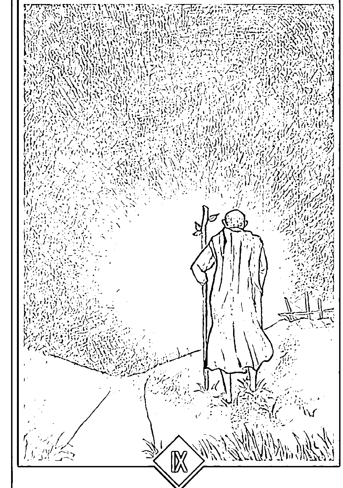

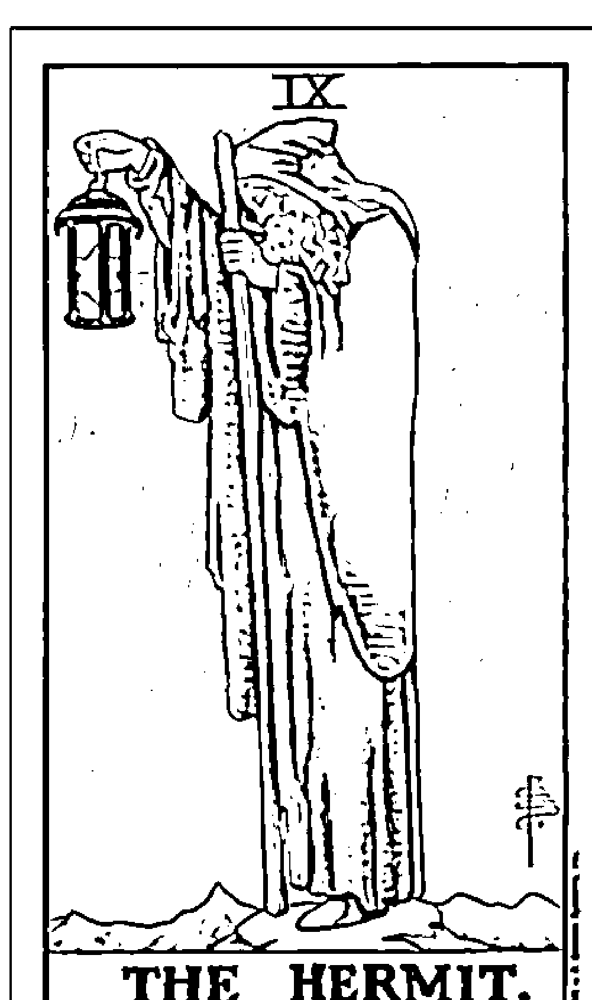

牌名：單獨

· 元素：土。
· 灰暗的周圍：代表與外界隔

# 以塔羅元素為論 命運之輪

一命運之輪是一張想拓宽眼界、求知欲很強的牌，跟上一張一隱者一樣，都想要不斷提升自己的程度。如果一隱者一所用的方式是讀萬卷書，那麼一命運之輪一隱者一採用的方式就是行萬里路。

同樣是追求真理，「命運之輪」是起而而行的人，它想要經驗、想親身去體驗每一樣新的東西，而非紙上談兵。所以這張牌就是既有知識份子求知的風範，同時又是一個活潑外向、不會為自己設限的開放型人士，代表的是一種實證型的求知態度。

火元素一向是莽莽撞撞的，但是這種橫衝直撞的個性，如果搭配上求知欲，就是一種很好的組合。因為許多事情如果思慮過多，就會看不見最顯而易見的事實，想追尋一個目標，親身投入會比開門研究資料來得有用多了。就像一個整天坐在辦公室裡吹冷氣的政府官員，不管他的工作是

擬定農業、交通、教育等任何相關政策，一旦經驗不足，就絕對制定不出真正可行的方案。

一命運之輪一雖然勇往直前，卻充滿了碰運氣的成分，這張牌的計畫性不強，因此往往靠廣結善緣來補強自己的缺失。幸運的是，「命運之輪」一旦出現，就表示現在是你的好日子，這是一張永遠充滿驚喜和變數的牌，會帶來無窮的機會，任何事情都正在往對你最有利的前進，不管

你計畫追求什麼，抽到「命運之輪」都代表一個最佳的時機點正在眼前。但相對來說，這張牌的弱點就是，在這段時間它可以讓你不管走在哪條路都能一路順風，但是一旦運氣用完，若還存在著賭一把的心態，就不定會摔到比「命運之輪」出現前還要低的點。

# 改變——不要怕改變，一味避開危機，也會錯過轉機

在奧修禪卡中，相對應的一張牌叫「改變」，從這個名稱就可看出它更樂觀的地方。大部分的

人都希望生活安穩而不要變動（這一點在前面好幾張牌也都提過），可是一變好也是一種變動，我們必須允許事情按照它本來應該要有的走向來發展，而不是為了保住既得利益就拒絕改變。要知道，好運的降臨也會改變原有的生活，避開所有危機的同時，也錯過了轉機。一改變一跟一命運之輪一最大的不同處，就是一命運之輪一所帶來的幸運都是很快出現，也許你一開始會認為為這個改變是壞事、是顛覆你人生的禍首，但是重點在下一步：你要怎麼利用這個改變轉成對自己有利的狀況。我看過很多例子，比如被愛人拋棄、又被公司裁員，自認是天底下最不幸的人，但抽到的「改變一牌圖上卻是一種很有力的現象，原因何在？果不其然，過了一陣子後，拋棄他的愛人原來負債累累，開除他的公司內門嚴重，不但關門大吉，還拖欠了員工數個月的薪水，而早先他被裁員時還領到了遣散費，算是所有同事當中損失最少的一個了。然而，千萬不要因為逃過一劫就滿意了。因為這張牌要達到的目的，可不只是一比起別人算好了一，一改變一要你做的事情不只如此。這張牌代表整個人生命都要更新，要找到更遠闊的出路，它要你變得耳目一新。所以，它或許讓你離開差勁的伴侶，為的是要你改變原來的愛情觀；讓你被公司裁員領到遣散費，是要你拿這筆錢去進修自己真正想走的路，甚至發展個人的事業而不是領死薪水。只要一改變一牌一出現，最好不要再企圖回到原來的生活模式，因為那已經快要行不通了。

○「改變一牌卡預言了一個成功率高的未來，只要背改變就會有收穫

○「改變一牌卡預言了一個成功率高的未來，只要背改變就會有收穫
在看得懂神秘學符號的人眼裡，「改變一的牌圖是相當振奮人心的。圖的正中央就是一個一太極一，太極代表陰陽互相作用，這樣才能讓萬物開始滋生，就像一男一女才可能製造出新生命一樣。太極外圍的上三角形是火元素符號，火元素代表生命力及新生，也代表某些事情要一發生、展

極一，太極代表陰陽互相作用，這樣才能讓萬物開始滋生，就像一男一女才可能製造出新生命一樣。太極外圍的上三角形是火元素符號，火元素代表生命力及新生，也代表某些事情要一發生、展

# 元素屬性—火

新生、突破、移動、改變現況、企圖心、魄力、執行力、冒險、決策、前進、渴望轉變、開拓。

開一了；太極旁邊的紫光和白光都是靈性，推到最外圍卻是代表物質世界的彩虹，所以代表「改一這張牌的影響力並不是把原來的事物推翻掉，而是製造出新的可能性，自然而然取代舊有的東西。就像上文說的，你不只應該離開原有的工作，還應該去創造出一個更好更適合你的事業。任何改變通常都伴隨著風險，奧修禪卡的「改變」牌卻預言了一個成功率非常高的未來。牌圖中的四個顏色，代表了四大元素都到齊了，另外八卦的圖像也都到了（八卦生萬物），十二星座（另一個完整性的象徵）也環繞在周邊，這些構圖有一種「因緣俱足」，一切都會自然示現的感覺，表示你的冒險不是在冒險，反而是一種順應天命的行動。狀一，在象徵學上都代表一有新的事物要產生。有趣的事，這張牌圖上看起來像是驚天動地的改變，但實際上只是生命必然的、唯一的行進方式而已。「改變」是自然的、應該的，抗拒改變才會招來毀滅，沒有人應該永遠停留在同一個地方。如果你閉上眼睛祈禱生命不用成長蛻變就可以一切安穩，那麼只要一個浪頭過來，就可以把你捲入海中不得翻身。這跟《易經》的「易」不謀而合，唯有不斷變易才能生生不息。越膽怯越不想改變，就必須在改變一開始時，就把主導權握在手上，讓世界跟著你轉。「困難」只是要引誘你突破現況的一個引子，只要永遠把危機當成轉機，不要永遠只想停留在舊有的虛假安全感中，你就不再害怕任何形式的改變了。

# 主牌

# 突破 Breakthrough

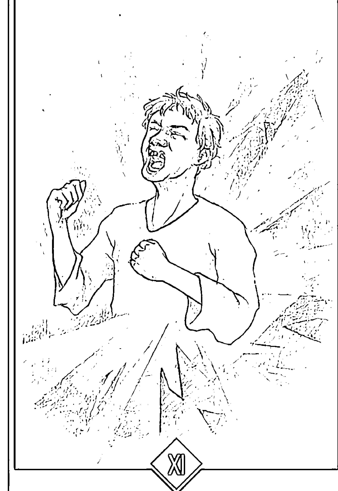

牌名：突破

+   · 元素：風。

+   · 紅色碎片：爆發力。

+   · 人：代表自我意志。

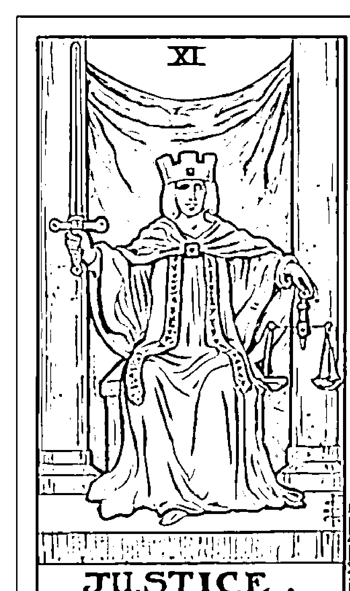

牌名：正義

+   · 元素：風。

+   · 真理女神：右手高舉寶劍，象徵決心，寶劍不偏不倚，象徵公正。左手拿天秤，代表追求平衡。

+   · 背後的紫色布簾：象徵著尚未顯露的智慧。

+   · 兩根柱子：善惡兩邊的衡量。

+   · 數字11：代表新的周期展開了。

+   · 牌義：公正、真理、黑白分明、司法、判斷力、平等、誠實、平衡、理性、公認的價值觀。

對應塔羅牌的「正義」

# 以塔羅元素為論

# 正義

這是一張我認為很重視表面形式的牌，很多人聽到正義兩個字，都會聯想到新釘截鐵、正氣凜然 的態度。但是我們都知道，這種英雄式的正義是非常主觀的，對甲方來說是正義，對乙方來說可 能就是迫害；而「正義」牌是風元素，風元素主客觀、協調、溝通、分析，比較接近尊重群體或 科學式的思維法則，基本上不會走這種個人英雄主義路線，它代表的是在客觀情況下能 尊找出來的 最佳平衡點。對甲乙雙方來說，「正義」牌的判斷不可能完全合甲方或乙方的意，而是找出雙方 都不見得很滿意、但還可接受的結論。有時候，這樣反而要犧牲一點真相，但是對「正義」牌來 說，達到雙方都能平衡、不要旁生枝節，盡快「平息紛爭、回到常軌」才是最重要的事。 順道一提，在托特塔羅牌中，這張牌的名稱是「調整」，我覺得更能傳神地表達出這張牌的含 意。在世俗及觀念角度不同的限制下，很難有一套評斷的準則是完全符合正義的，因此我們透過 法律、透過協調、透過條件交換能得到的結果，都只是「盡量」接近正義而已，需要大家彼此配合，修改自己的一些堅持，「調整」等於是達到「正義」的過程中所使用的方式。

○「正義」是一張形式化的牌。努力維持平衡，不要求絕對公平 「法律」就是這種形式正義的代表，而法律也很少能夠達到真正的正義。比如說，如果我殺了一 個人，法律通常不會讓我一命換一命，這對被害人來說，一定是不對等的懲罰，失去一條命跟坐 牢相比，就事實上講當然是不公平的。但法律還要考慮到教化人性的層面、社會的善意價值 體的做法，只要犯人服完刑期，就可以再得到融入社會、貢獻群體的機會。就法律來講，這已經 是給受害者一個「正義」了。因此，我才說「正義」是一張形式化的牌。

認的道德觀，也都在「正義」牌的範圍之內，並形成社會的基本價值觀，是我們要去配合這個價

值觀，而不是價值觀來配合我們，所以常常必須犧牲許多個人化的觀點和特質，好讓群體之間不

會摩擦衝突。因此「正義」牌用在需要標準化流程的事件上，就會很有利；相反的，在必須強烈不

突破某個關卡的狀況下，「正義」牌就會顯得軟弱無力。因為它就是我們常常在說的「依法行

事一、「程序上沒有瑕疵」，並不代表這個做法是正確的。所以「正義」牌是一種大數法則下的

產物，因為有很多人很多事要和平共處，就必須制定一個公認的標準及步驟，才能順利推廣並執

行。相反的，如果要要求絕對的公平，對群體社會而言，會耗費太多時間和成本，反而有害。

突破——當安穩變成限制時，就表示該邁向下一個階段，有所突破了

奧修禪卡中相對應的一張牌叫「突破」，這一點就有趣了。在課堂上，當我介紹對應的這兩張

牌時，曾跟我學過偉特塔羅牌的同學，腦子裡馬上產生衝突，他們覺得：「正義牌最弱的，不就是

突破某件事嗎？為什麼這兩張牌是同一組呢？他們也覺得這兩張牌之間好像找不到共同點。但

我覺得這兩張牌之間，有一種前後因果關係的連結。

「正義」牌，其實是一張「在安全範圍內，用一套可靠的標準步驟，來預防錯誤發生」的塔羅

牌。假設我們要做一件事情，不可能一開始就非常熟練，所以我們必須先找到一個標準化的進行方

式，不斷反覆練習，直到熟練為止。以學畫畫來說，就算你很有天分，也必須先了解如何配色、如

何精準抓出比例、如何表現出空間感……如果這些基本功都沒有的話，就算你內心世界再怎麼纏紛獨特，都無法透過畫筆把內心的感受呈現出來。學鋼琴也一樣，我們必須一次又一次重複無聊的練

習

習曲，必須一訓練—自己一看到譜，手指馬上就知道如何歸位，在所有技巧都熟練了以後，才能表達出你的「風格」。沒有基本功，就沒有基礎來支撐你發展出自己的特色，就像很多漫畫家的畫風簡易樸拙，看起來似乎不需要用到什麼繪畫技巧，但實際上如果你沒辦法精密素描、不能掌握比例，就完全不可能用這麼簡單的筆觸把整個畫面表達出來。有趣的是，如果你一切技巧都已經成熟，卻沒能淬煉出更高的自我風格時，也不會就一直安穩地待在現況，反而會陷入瓶頸期，或者我們們稱之為混亂的「撞牆期」，而「突破」牌正是撞牆期的出口。「正義」牌代表的是一標準步驟、「照既定模式訓練」的過程，但是這個過程，最後目的就是為了要一突破」，才能開始發展出自己的風格和想法。正如同「突破」牌面所顯示的——一名男子終於打破那個看起來堅固的屏障。這也像「11」這個數字，在完整並帶有限制的「10」之後，又凝聚出新的「1」，也就是一個新開始。「正義」牌是一種標準化的原則，它的標準和規格是泛用型的，就像是成衣一樣，不是量身訂做，而是固定幾個尺寸套用在所有人身上。換句話說，「正義」牌代表的是一種重複且力求面面俱到，而非精確性的狀況。但是，如果我們重複同樣的模式太久，這個模式就會開始老舊、過時，並且不符合需求，就像衣服過時會退流行、不合身一樣，一旦自己認同的一切開始被淘汰時，都會感到驚惶不安，這是人性。事實上，這種崩潰就是要讓你覺知到，舊有的原則該更新了；這並不表示你過去認定的一切是錯的，而是它已經把它的效益發揮到盡頭，讓我們在安全的流程中穩定成長，等到一安全一變成一種一限制一的時候，就表示我們已經要開始邁向下一個階段，也就是一突破一的时候到了。沒有之前的重複和機械化，就不會有後來的突破。

# 元素屬性—風

+   理性、邏輯、形式、觀念、注重合理性、斷旋、價值觀、程序、評論、判斷、分析、法則。

習曲，必須一訓練—自己一看到譜，手指馬上就知道如何歸位，在所有技巧都熟練了以後，才能表達出你的「風格」。沒有基本功，就沒有基礎來支撐你發展出自己的特色，就像很多漫畫家的畫風簡易

的分解而升华，水元素让我们不再局限於有限的物质生命中。 如果你接受死亡，你就会害怕死亡，如果你忙着担心害怕，就没办法看到你接下来面对的可能性。逃避，只会让你重新落入轮回，拒绝死亡，我们就会一遍又一遍地重复同一个阶段。所以 「死神」是一个恩赐，让你有机会升级，进入更高境界。在伟特牌的「死神」牌图上，皇帝代表理，所以尊敬死神；只有天真无邪的小孩，因为没有批判，也不会对未来抱持想象出来的恐惧， 所以欢迎死神。小孩也代表最能适应改变，并真正享受生命的人。 蜕变——这是一种彻底改变的状态，要坦然而勇敢地汰旧迎新 所以奥修禅卡相對应的一张牌称为「蚀变」，就是很合理的事了。「蚀变」是一种彻底改变的状态，比如一株花要从未知到开花，必须经历好几次死亡——种子的形态必须死亡，以便蚀变成幼苗↓幼苗形态必须死亡，才能蚀变为花苞↓花苞的形态必须死亡，花瓣才能全部绽放。每一次的死亡都会跟一次重生连结在一起，表面看起來像是死亡的事情，却把一小段一小段别的生命串连了起来，反而得到永久的生命。 有趣的是，在塔罗牌中，「死神」只代表了结束的那一刻，之后的「重生」意境则是到了20号的一审判一牌才出现，而在托特牌中，20号牌的名字就叫「永恒」。不管是伟特牌或托特牌，20号牌都带有从前世过渡转化到今生的意思，更贴近这张「蚀变」的含意。 不過在奥修禅卡中，20号牌所要呈现的又是另外一個面向，所以「重生」的部分在对应13号 「死神」的这张「蚀变」禅卡就可见到了。「蚀变」牌图的象征物，原文已经说得很白话，不需再多加解释：一个人坐在一朵象征著空的大花上面，手里拿著蚀变的象征，那把可以切開幻象的剑、那條可以藉着脱掉他的皮来重新恢復新鲜的蛇、那條已经已经被打破限制的链子，以及那个超越二的嘴，象征著当你在休息时所產生的寧靜。如同前面所说的，一蝉变一过程要面对程度不同的小小死亡。如果你非常爱一颗种子，认定它的，种子、幼苗、花苞、花朵，全部串连起来才會是一个完整的生命，如果是动态的，就是在扼杀生命。有关人的死亡不只限於指涉生命消逝，如果一个人妈妈拒绝接受孩子长大的事 實，迟迟不肯放手，即便她的孩子还在呼吸，他也失去了蝉变的機会，等同於失去生命了。每个孩子都必須告別他的童年时期，迎向独立的人生，生命才算是延续下去。我们一般认知中的死亡，其实反而是生命的串绳，就像一格一格独立的软片，串连起来才會变成流動的影像畫面一樣。 此外，一蝉变一不只代表一个阶段的结束，同时也延续上一张禅卡一新的洞见一的含意，要迎接一蝉变一，你必須先徹底放掉自我，你要把这一生的限制及保护全部撤離，推翻既定的观念和習性，而且不怕让自己徹底消失。一蝉变一不是简单的从一样东西变成另一样东西而已，而是你旧有的东西要被新的东西占有、取代，你必須打開自己，迎接一种全新的可能性来到你的身上，并让原来的你死去，你才有可能蝉变。这就像奥修所說的，一个真正的师父不会用一些灵性言語让你覺得 好过一點，因为這樣一来，就會抚慰强化你的小我，让你更難转化成全新的你。相反的，真正的师父会讓舊有的你死去，把你推向你原來恐懼的未知，這樣才會讓你真正蝉变，而不是停留在原来的层次，经历一次又一次的轮回却无法真正重生。

# 元素属性—水
转变、内在、深淵、升华、不抗拒、敞開、順應自然、不思考、感覺、道、涵蓋一切。

# 主牌
### 整合 Integration
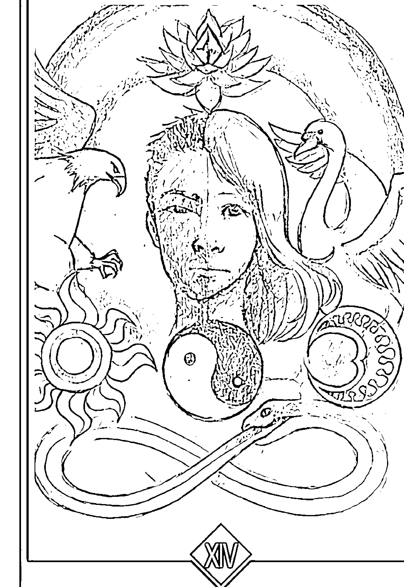

牌名：整合
+   · 元素：火。
+   · 彩虹：汇集所有颜色，代表已经超越二元性。
+   · 莲花：象征心轮，心轮为风元素，是阳中之阴。
+   · 贤石：花中的贤石是土元素，为阴中之阳。
+   · 人：半男半女，红色代表阳性、蓝色代表阴性。
+   · 二元化图形：老鹰是阳、天鵝是阴；日为阳、月为阴。
+   · 太极：阴阳交会，代表阴阳和平共存又能互相作用。
+   · 燎金术之蛇：会吞下自己的尾巴、全身，然后又把自己再生出來，象征循环不息。

牌名：节制
+   · 元素：火。
+   · 红色三角形：红色上三角形是火元素的颜色和符号。
+   · 双脚：一脚踩在地上、一脚踩在水裡，代表同时横跨两个境界，并超越两者。
+   · 数字14：1跟4的结合，代表在4的稳定中站穩脚步，然后1还可以开創出全新的局面，也代表一个更高的自我意识。
+   · 牌义：教育、旅游、学识、升学、心灵成长、沟通、協商、双贏、潜移默化。

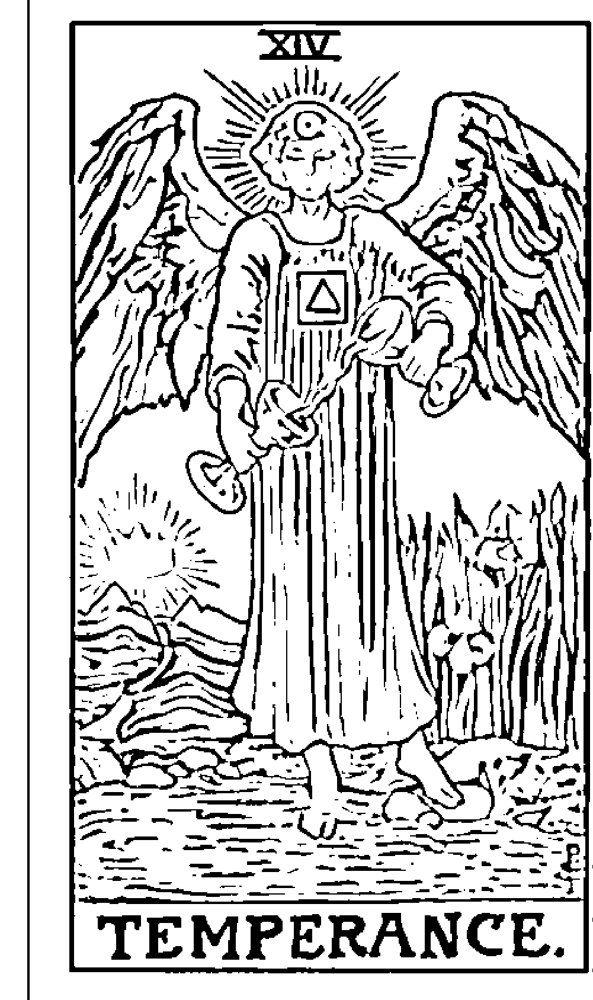

### 以塔罗元素为论 節制
○「节制」是达到更高境界之前的一个准备过程

一节制是一张很美好的牌，带有一种从平靜中自然而然往上升高的感觉，它不是漂浮在雲端，也不是經由一些空無的思想来逃避眼前的問題，而是透過经验和知识，让自己的眼界、心灵不断提升及擴大，到达更高的境界。所以不管我们是经由旅行来体验各國风情，或是透過看書、教育有人覺得这样把外來的東西融合進入自己的內在，不是比較像水元素嗎？但是水元素只是很自然的就會卸連結时，并沒有带着让自己更好的目的，也不是为了新鮮感和求知欲，水元素只是很自然的就會卸下跟外界之間的种种界線，融合在一起。但「节制」牌是火元素，火元素不会去迁就外界，也无法切的真理，才能说服他。所以节制牌也代表哲学、藝術、靈修等這类比较脫離世俗层面的东西。一折衷。如果要讓火元素跟別人達成共識，必须是追求或創造出一個超越兩方意見、可以涵蓋一
制（temperance）」呢？首先，是因為temperance这个字的拉丁文字根就带有一「混合」的意思；其次是這张牌在追求更高层次的牌，又是火元素，為什麼會稱為一節境界，並超越雨者。很多人会奇怪，这样一张追求更高层次的牌，又一腳踩在地上、一腳踩在水裡，代表同时橫跨两個现在更好，会一点一点去測试、觀察，然后得到的結論納入自己的系統，最後的「提升」是透過一種追尋的過程自然形成的，带有客觀的觀察性質。只是这个過程雖然平靜，却也带有強烈的企圖心（但不会有主觀性），还需要高度集中精神，这是火元素才適合代表的一種特質。

97 XIV 整合 Integration 对应塔罗牌的「节制」

# 元素属性—火
超越、提升、转变、拓寬、更高的境界、高深廣博、專注、求知欲、追尋、脫俗、更上一層樓。

# 主牌
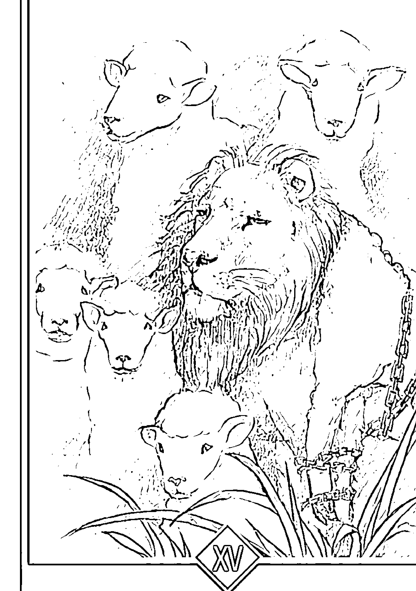

+   牌名：制約
· 元素：土。
· 羊群：芸芸眾生，制式化的群體。
· 狮子：個人力量的代表。
· 披上羊皮的獅子：抹滅了自己的本性，受制於群體。

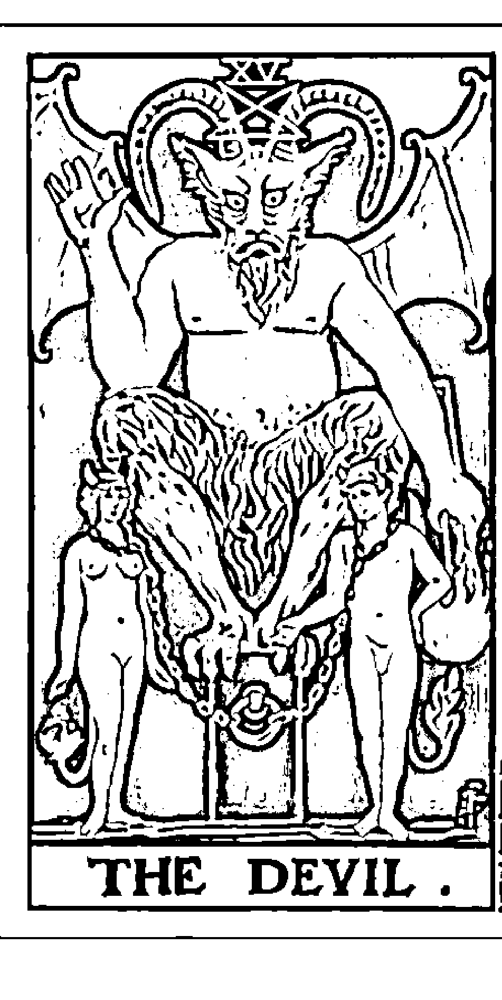

+   牌名：惡魔
· 元素：土。
· 逆五芒星：代表物質欲望的淪陷。
· 一男一女：兩個人像是被鐵鍊鎖住，但鐵鍊並沒有上鎖，隨時都可拿下來，所以被困在這裡，是出自他們自己的選擇。
· 手心的土星符號：代表緊縮、關卡、困難考驗、制約。
· 火把：往下照亮，代表指引的道路是往下沉淪的。
· 数字15：15是1和5的结合，1是自我，5是領导欲。
· 牌义：無法自拔、肉欲、現質利益、錢財、物質面、自私、政治考量、墮落、受困、煎熬和搶扎、不明朗。

### 制約 Conditioning
对应塔罗牌的「恶魔」

### 以塔罗元素為論 惡魔
「恶魔」牌的启示：你以為你擁有了許多錢。其實你是被錢所擁有

對於初學者來說，會覺得很難掌握這张「恶魔」牌。眾所皆知，恶魔代表了種種的邪惡與誘惑，是一张大家都應該敬而遠之的牌，但是也幾乎所有的塔羅書都會指出，「恶魔」雖然是一张負面的牌，但世俗性很強，一般我們認為帶有銅臭味的東西，「恶魔」牌都可以輕易得到，例如金錢、權勢、社會地位等等。所以，如果提問的問題是有關財利利益的，「恶魔」牌反而會是一张好牌。「恶魔」牌是土元素，土元素本來就是這個社會的既得利益者，因為土元素既代表財，又代表資源，就很像是老一輩的資產擁有人、企業主，或是主掌大權的政治人物。雖然土元素比火元素要低調，卻能占有龐大的實質利益。

土元素雖然可以獲得一切具體的、有形的东西，但是不見得可以從中體會到同等的快樂，因為快樂和幸福是無形的。就像很多人，拚命工作賺錢，認為有了錢就可讓家人幸福，卻因為要賺錢，已經先犧牲了跟親人相處的幸福，這就是你以為擁有了許多錢，其實你是被你的錢所擁有。

我常常對學生說：「如果月薪只有兩萬二，要你拋下工作去追尋新未來和夢想，會比較容易，因為你放下的一切就只是每個月兩萬二而已。但是，如果你月薪是二十萬，你就很難丟下這大得多為你放下的一切，去做你真正想做的事。一擁有越多，牽絆就越多，貪念也會讓我們無視於生活的最終目的是要幸福，反而拿了快樂去換錢。

常有來占星或算塔羅牌的客人，跟我說他們有更大的理想要完成，但因為沒有存款或多餘的薪水，所以什麼事都做不成。但是回過頭想想，如果你有很多存款，你反而更會怕失自己辛苦累積的一切而不敢冒險，所以要不要追求理想，跟有沒有存款不見得有直接關係。我都告訴他們：—如果你覺得自己一無所有，那麼恭喜你，你很自由，可以去做任何自己想做的事，去追求任何東西，去賭上一把！因為反正你沒有什麼可失去的，這是最大的資產。—這就是為什麼—資產—常常會變成—惡魔—的原因，起因就來自於人性的恐懼。由牌圖很明顯可以看出，戴著逆五芒星（代表物質欲望淪陷）的惡魔，控制著下方的一男一女，這兩個人看起來像是被鐵鍊鎖住。但仔細一看，這條鐵鍊並沒有細緊上鎖，隨時是可以拿下來的，所以被困在這裡，是出自他們自己的選擇。當然—惡魔—牌象徵的不只是錢，任何對感官具有誘惑性的東西，例如酒、肉欲、虛名、控制欲等，都屬於—惡魔—牌的管轄範圍，一旦—沉迷—，就會受到制約。以生活上的小事為例，婆婆愛看連續劇，本來是生活調劑和情緒的宣洩口，自己應該握有看或不看的主導權，卻任由自己太過入戰而導致一天不看就浑身不對勁，或是打電話到電視台痛罵其中的某個角色，有句話正好可以形容這種受到制約的現象：—你們不是看電視，而是被電視看了。—同樣的，沉迷於線上游戲的人，也是陷在一「惡魔」牌的情境中無法自拔。制約—笨蛋，重點不是外在的「惡魔」，而是你的心被制約了在奧修禪卡中，相對應的同一張牌就叫—制約—，其實幾乎是—惡魔—的同義詞了。惡魔對人的影響，就是經由感官物欲來制約人性。兩張牌不同的地方是：—制約—這個字眼—語道破：笨蛋，重點是人心，而不是外在的「惡魔」—也就是種種誘惑。一惡魔一牌把人的沉淪都歸咎於外在的影響，就像很多父母，自己的孩子犯了錯，總会認為原因是一交了壞朋友一，試圖把錯誤往外推，讓自己的小孩看起來像是無辜的受害者。但如果是一制約一牌，我們就會想，這个犯錯的孩子，他到底想透過這樣的行為得到什麼？他為什麼覺得不去恐嚇威脅別人，就無法感覺到自己的重要性？為什麼制約了跟大家一樣而披了羊皮在身上來偽裝，而這張羊皮還是用鐵鏈綁在身上，看來要拿掉並不容易。不妨自問，我們對金錢和物質的貪欲究竟來自何處？答案是：這是社會集體的價值觀。我們不相信以自己的特質，可以得到他人的尊敬和認同，於是會用最快的方式—金錢、名利—來肯定自己，無需費勁地去實現自己根本還沒找到的自我。在愛情的路上也一樣，許多人（大多數是女人）困在一段不斷的孽緣中，不為了錢、也沒有任何利益可圖，許多人都說她們是為情所困，但是深究下去，這些女人要的是愛情嗎？其實這種關係通常沒有愛情可言，她們為的恐懼是另一種現實利益：不想一個人生活，至少身邊還有個人陪，或者不甘心為對方付出了這麼多……有這類心態的人，會比單純為了錢或名的人更脫不了身。被自己的偏執心態所制約的人，怪不得其他人事物。惡魔往往不會自己找上你，而是被你身上同質性召喚來的。

# 主牌
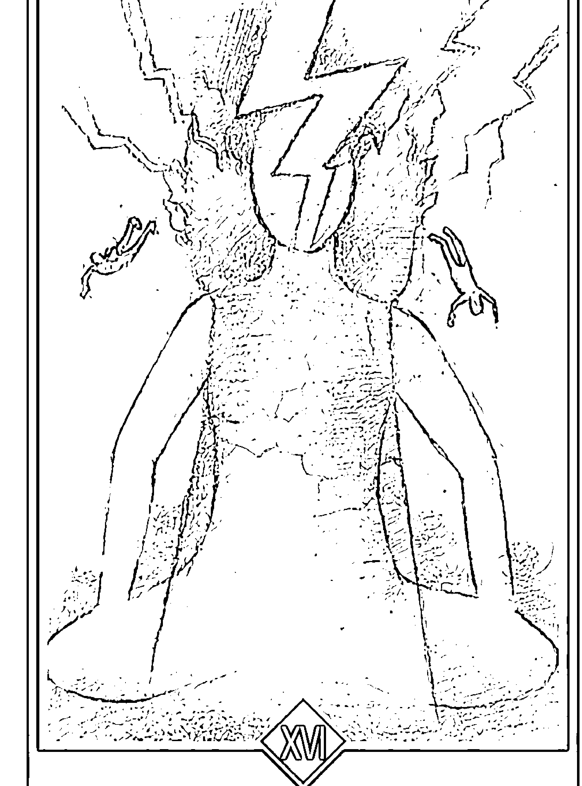

+   牌名：雷電
· 元素：火。
+   · 塔：代表既定的思維與模式。
+   · 佛陀（覺知者）剪影：代表既有的信念被推翻後，才能看到真實的核心。
+   · 雷：代表突然、快速的變化。

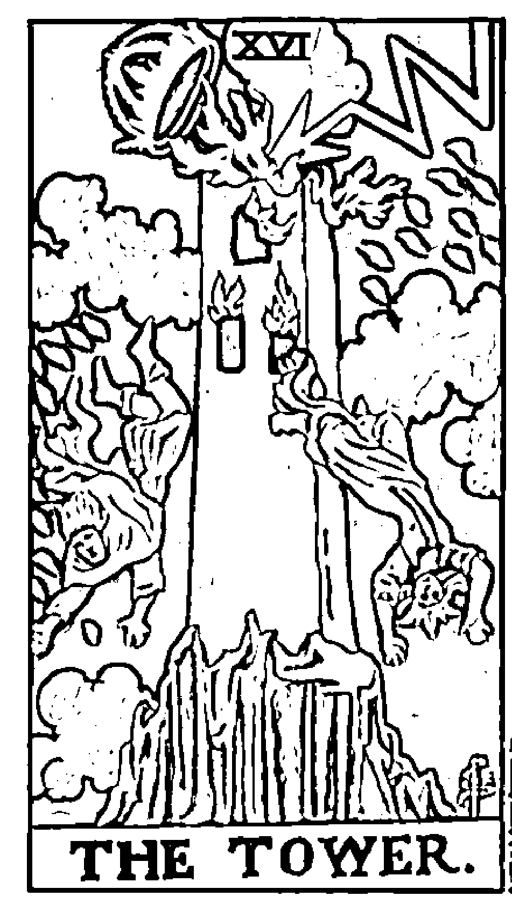

牌名：塔牌
+   · 元素：火。
+   · 高塔：象徵物質及人為的世界。
+   · 壬落的兩個人：一位是皇帝一位是教皇，象徵原本擁有最高

# 元素属性—火

破坏、侵略、摧毁、结束与新生、惊吓、决裂、暴力、争执、颠覆、战争、彻底改变结构。

知道所有的问题在哪裡后，兩個人決定再試試看，至少在不是欺骗的狀況下嘗试修補婚姻，就算最後失敗，雙方也沒有怨言了。如果要他自动坦承，他是一輩子都鼓不起這個勇氣的，所以這次外遇曝光，就像是一道「雷电」，戳破他一直以來虛构的安全假象，把問題直接放到眼前，逼得他不得不去處理。如果不是這樣的狀況，就算他跟外遇分手回到太太身邊，問題還是沒有解決，同樣的困境還是會不斷發生。我妹妹是鋼琴老師，說在教學生彈琴時，要矯正已經養成不良彈奏姿勢的學生，比起教沒學過鋼琴的新生要難多了。累積出來的不良習慣，就是對身體的一種「制約」，跟舊習慣對抗，還不如重新建立新習慣來得快。這也像一棟不宜居住的老房子，水電、結構、裝潢……處處都是問題，要一處一處修繕，恐怕花下大筆金錢也未必能讓房子恢復到完善的狀態，最好的方式就是整個推掉重建，雖然可能必須犧牲很多東西，但至少可以換到一棟全新的房子。至於值不值得，要看每個人立的立場；但如果是一「雷电」這張牌的狀態，當事情就是得這樣發生時，也根本沒有我們選擇的餘地了。我們只能堅守的信念就是：「如果我們走著走著撞到牆，就表示該換個方向了。」就像一電一牌圖中，佛陀（也就是覺知者）超然地看著一切災難，不去挽回，他要覺知的是這件事傳達出什麼訊息。因此，這不是毀滅，而是一條通往新生活的道路，我們要有意識的去經歷，別再留戀有的一切，你的新生才能真正展開。

# 主牌

# 寧靜 Silence

牌名：寧靜

+   • 元素：風。
月亮：代表感受、敏感、接收訊息。當月亮落在眉心輪上，表示這個人的意識已經摒除一切雜念，看到事物最真實的那一面。

映照星空的湖泊：代表純淨的心思反映外界的一切。

牌名：星星

+   • 元素：風。
水與湖：水代表智慧、湖代表潛意識，從湖中汲水並倒到地面上，暗示解開潛意識的封印。

地面上的五道水流：象徵肉體的五感，其中一道流往代表潛意識的湖。

星星：大星星代表10，10+7顆小星星，是這張牌的數字17。

數字17：1加7是8，表示這張牌即將要成就的計畫，是非常實際且攸關許多人的一個大行動。

牌義：美好、希望、憧憬、計畫、藍圖、寧靜、崇高、智慧、心靈交流、柏拉圖、精神性。

對應塔羅牌的「星星」

# 以塔羅元素為論

# 星星

這張「星星」牌的牌義眾說紛紛，解釋往往落差很大。我想這是因為這張牌比較超脫，牌義較難理解，每個人解讀時都像是瞎子摸象只鎖定一個片面，當然落差就很大了。在各種牌義中，比較被公認的是「美好」及「憧憬」，所以很多人認定這是一張「好牌」，解讀時就會一味樂觀，而導致方向很有可能偏差了。

依我看到的所有相關牌義，我會覺得「星星」的牌義雖然是美好的，但可能不像很多人想的，不管問的是工作、愛情、事情、財運等，抽到這張牌就等於一帆風順。事實上，每張牌都是中性的，是好是壞，完全看它對應的是什麼問題，放在什麼位置。

○ 因為對未來的這大期許，我們才會努力讓自己變得更好

星星一牌雖然讓人充滿希望，但是就「實質利益」而言，恐怕沒有什麼建設性。這是一張比較不食人間煙火的牌，不管代表的是人或事或物，都有一種可遠觀不可亵玩的感覺。所以雖然一星星一牌代表美好，但那些東西卻不是你可以獨占或享用的，它就像保存在博物館裡的某件珍玩，很美好，卻不是你可以接近的；一旦我們接近，它就會開始變質損壞。這也像我們對童年或初戀的回憶一樣，擁有這些回憶可以鼓勵並支持我們，我們可以常常緩懷，卻無法拿出使用。

簡單來說，「星星」牌是一張比「女教皇」還要形而上的牌。如果「星星」牌代表你可以得到的

一樣獎品，大概就是「跟總統握手」或是「將你的名字刻在碑上做紀念」這類看似崇高卻無實際用處的東西。

# 寧靜——就像是一場無夢的睡眠，讓你獲得真正的休息與充電

奧修禪卡中相對應的一張牌叫一寧靜一，經過上文對一星星一牌的解釋，大家可以很容易發現兩張牌的相同之處了。

這張一寧靜一牌所表達的境界也很高，原文中說一它跟佛陀所經驗到的寧靜是一樣的……那個寧靜的味道是一樣的。一寧靜一代表子、菩提達摩或南泉禪師所經驗到的寧靜是一樣的……那個寧靜的味道是一樣的。一寧靜一代表一種非比尋常的意識狀態，跟一星星一牌一樣處在非常高的頻率中。只要是在日常生活中，我們周團一定是擺擺的，我們很難發現自己真正要追求或想要的是什麼，因為忙碌的壓力，早就讓我們腦

但我們還是需要一星星一牌，它代表一種崇高、遠遠、美好卻又陌生的感覺，就是因為這種美好不存在於日常生活中，才需要不時出現，把你引領到另一個更高的境界。如果我們不曾為了想接近遙不可及的偶像，就不會努力讓自己變得更好、更接近他們一點；如果我們不曾為了另一個陌生的文化或風景念念不忘，我們就無法藉由行動去打開自己的視野。所以一星星一牌的存在，是你會發現近看時，這個更高層的世界，好激勵我們不停成長。等你到達了原來夢想的星星上，也許空中的另一顆星星又開始吸引你了……因此一星星一也是一張代表理想主義、先知以及先驅者的牌，只是每一個先行動的人，都不是先享受，而是先把所有路上的莠棘都去除掉，好方便後來的人通行。所以一星星一牌美好不美好，就端看你想要的是什麼：如果你想要夢想和勇氣，它可以給你，你想要真命天子和尚官發財，那你就有得等了。講好聽一點，一星星一牌是你對自己未來的遠大期許，講難聽一點，它就是吊在驢子前方的那條胡蘿蔔。

# 元素屬性—風

率高的空間、空靈。 超然、平靜、理想主義、崇高、懺悔、著眼於未來、另一層境界、清靜、非世俗、意識清明、頻 休眠，自身能量也會更為集中，不會再讓自己的認知狀態被外界的混雜給削弱了。 最接近我們存在的真相核心，如果我們能夠允許自己的意識常常進入這樣的狀態，就可獲得充電和 一寧靜一牌就像是一場無夢的睡眠，或是一個成功的打坐、冥想，没有任何干擾，平靜真實， 何事物最根本最真實的一面，也很有可能正處在預知或是與天地合而為一的狀態中。 覺察、穿透、清醒一的眉心輪上，就代表一寧靜一牌中這個人的意識已經擺除了一切雜念，看到任 性，而是表現出我們本身所處的狀態：代表一感受、敏感、接收訊息一的月亮，落在代表一洞悉、 圖，隱含著一種心中雪亮、視野突然廣大清楚的意味，不會再被任何眼前的东西所迷惑。 一寧靜一禪卡牌圖要表達的，也是完全相同的意思，只是牌圖所描繪的不像星星牌具有故事 熊下，再多的思考也只能得出草率的答案。這個將湖中的水（潛意識）倒在地面上（表意識）的牌 護覺察力浮現出來，我們不管決定要追求什麼、要捨棄什麼，就算考慮再三，但是在一片混亂的狀 意識，從而對眼前發生的一切事情了解得更透徹。當我們庸庸碌碌過著日常生活時，幾乎不太可能 慧、湖代表潛意識，我認為這個牌面是在暗示解開潛意識的封印，讓我們真正的感覺及清明浮上表 一星星一牌的牌圖是一名女子在汲取湖中的水，並將水倒到地面上。在某些象徵中，水代表智 靈光乍現的狀態，很難長時間維持就是了。 個片刻很難得，所以在它出現時，我們會受到很大的啟發，並且覺得心中一片澄澈清明。不過這種 子裡塞了許多不必要的东西，所以我們往往無從正視自己真正的感覺和渴望。 這張一寧靜一禪卡是一種穿透，是內心真正平息下來時，你清楚覺察到自己感受時的狀態。這

111 XVII 寧靜 Silence 對應塔羅牌的「星星」

# 主牌

# 前世 Past Lives.

+   牌名：前世
· 元素：水。
· 前世的影像：代表老毛病、心理障礙，或是天生的性格缺陷。
· 漏斗狀的通道：代表前世到今生的過程，也暗喻子宫。

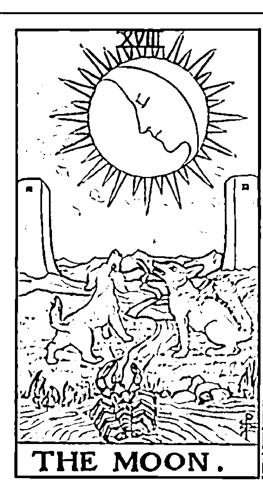

+   牌名：月亮
· 元素：水。
· 湖泊：代表潛意識。
· 龍蝦：很多種說法，最常見的是龍蝦或蝸子代表恐懼與內心的黑暗面。
· 月亮中的女人：代表慈悲及陰性特質。
· 數字18：由1和8組成，1有單獨的意味，8帶有現實含意；1加8是9，這是一個轉化的數字。
· 牌義：恐懼、無明、陰性的力量、神秘、隱藏、情緒起伏、潛意識、不安、迷惘、沒有把握。

對應塔羅牌的「月亮」

# 以塔羅元素為論

# 月亮

# ○ 負面經驗。讓你隨時都可能引發恐懼和猜疑

一月亮一是一張陰性能量強大的牌，看起來好像是優點，但陰性能量帶有許多的不明朗及費解之處，這股力量可以很強大，卻比陽性能量更難控制，有些時候不但控制不了，我們本身反而也有可能被這股陰性能量所干擾。以藝術家來說，他們具有強大的想像力和感受力，但是很多人不安及過度起伏的情緒中。

月亮總在夜間出現，那時天地萬物都已躲在無邊的黑暗之內，處在这种情境下的人，很難不杯弓蛇影，放大所有可能的危險。一月亮一牌的水元素讓這張牌更敏感，許多可以忽略或不需去追究的事情，都可能引發內心的恐懼和猜疑。就像很多容易接收別人情绪或暗示的人，許多時候這種能力對他們非但没有幫忙，反而會讓他們疑神疑鬼，一點點小波動就足以讓他們情绪起伏劇烈，而把自己搞垮了。所以，這是一張在自己的認知及情绪上要非常小心的牌。畢竟善感並不代表一定要過度反應，太過敏感往往會把小事弄成大事，製造出更多不必要的負面情绪。

一月亮一牌由於敏感，會讓情绪承载過多。想像一下，如果情人要跟你分手，他面對著你了解分字一句說出理由，最後提出分手的要求，我們雖然傷心，但是他在說明的过程中會讓你了解分手原因。但如果是一個敏感、第六感強烈的人，可能情人還沒開口，她就已經知道會發生什麼事，開始哭泣、情绪沮丧，對方說什麼她都聽不進去了。這樣一來，除了讓自己沉浸在自己製造出來的悲傷中，一點建设性都没有。所以一月亮一牌也代表了隱憂、恐懼、負面的幻覺，並

可能因為強烈的情绪而使負面想法成真。追本溯源，我們可以回頭探討，為什麼「月亮」牌會這麼情緒化又負面思考呢？如果未曾在黑

暗中聽聞過鬼故事、犯罪新聞，我們根本不知道黑夜有什麼可怕的；換句話說，這種恐懼不是來自於黑暗本身，而是一個人本身的經驗法則：在黑暗中跌倒過、撞過鬼、因視線不清而誤判過……所以一旦類似的狀況出現，潛意識中不好的經驗就會被我們的大腦拿來詮釋眼前的狀況，什麼事都還沒發生，恐懼就出現了。最能引發我們恐懼感的，就是不好的經驗法則了。

前世——既已成為過去，現在的你不必也不會受到影響

奧修禪卡中相對應的一張牌稱為「前世」，很多人會往靈魂方向解讀，但是其實這張牌跟「月

亮」牌的源頭一樣，所謂的「前世」指的是來自「過去經驗」產生的負面影響。比如說，這股恐影及十年怕草繩的人，必定都吃過蛇的虧，只要有一點點跡象出現，就會激發他們的恐懼，會杯弓蛇懼會讓人產生一打或跑一的反應，也才會擴大事端。

在這張「前世」禪卡中，這種「過去事件的經驗檔案夾」比「月亮」牌的範圍更大，除了自己

的生活經驗，還要加上許多已經遺忘的陰影（例如來自童年或過去累世的恐懼）。這會讓你對目前生命中的許多狀況起一些不理性的反應，無法做出正確的行為。

我常常跟學生說，前世的一劇情一點都不重要，不管你是大將軍、皇帝、才子，或乞丐、罪犯、奸臣，這些都没有意義，假如要催眠或通靈，真正需要得知的，是你的前世如何塑造出今生的你？造成了什麼樣的阻礙及恐懼？或是認知到自己有哪些過不去的關卡，原因是什麼？你前世是個偉人，並不表示你今生也很尊貴；你前世境遇淒慘，也不代表今生有很多人是欠你的，或者你活該命苦。說實話，每個人的前世都有悲歡離合，你的偉大或悲慘的經驗，不見得有什麼特別，也不代

表你前世是個偉人，並不表示你今生也很尊貴；你前世境遇淒慘，也不代表今生有很多人是欠你的，或者你活該命苦。說實話，每個人的前世都有悲歡離合，你的偉大或悲慘的經驗，不見得有什麼特別，也不代

表你前世是個偉人，並不表示你今生也很尊貴；你前世境遇淒慘，也不代表今生有很多人是欠你的，或者你活該命苦。說實話，每個人的前世都有悲

# 主牌

# 超越幻象 Beyond Illusion……

# 對應塔羅牌的「審判」

![img/9d46488bb626fa712c5dd91d0c579436_123_0.png]

+   牌名：超越幻象
    ·   元素：水+火。
    ·   蝴蝶：用這種「完全變態」的生物來代表蜕變。
    ·   第三雙眼：象徵可以看到世俗面看不到的東西，並有著看穿一切的觀察力。

![img/9d46488bb626fa712c5dd91d0c579436_123_1.png]

+   牌名：審判
    ·   元素：水+火。
    ·   紅色十字旗子：代表人世間的業力獲得平衡，即一切都得到最終的公平審判。
    ·   棺材：代表薩時代與薩模式，重生的人可以捨脫棺材，迎向新的開始。
    ·   大天使加百列：他吹起號角讓所有人重新復活，接受最後的審判。
    ·   數字20：這個數字相加還是2，代表一種二元性的激盪。
    ·   牌義：轉振點、內在的變化、下決定、關鍵性的一刻、重生、轉換、進入截然不同的領域、新的世界。

# 以塔羅元素為論 窒判

# ○ 大天使加百列吹起號角。末日審判登場

這是一張很強烈的牌，代表了某個關鍵時刻，可能是一個轉捩點或是巨大轉換的狀況，而這個轉變通常是從最深的底層開始發生變化，就像青蛙從蝌蚪變身、蝴蝶由毛毛蟲蛹化一樣，是一種「完全變態」。這種改變已經脫離了以往我們習慣的種種舊有模式，把我們丟到一種完全陌生的狀態中；這算是一種全新的開始，但也代表許多我們舊有的東西要被連根拔除，過程是不會太舒服的。

這張牌很特別的是，它跟「女皇」牌一樣都是雙元素：水元素為主，火元素為輔。水元素是由於「審判」牌有很重的業力特質，所有作用都來自於正面或負面的情感，也代表各個層次的潛意識。我們都認為自己是理性的，會經由思考來下判斷，但其實我們在決定某件事情時，靠的往往是內心長期以來累積的各種情感上的反應，這會左右我們對某件事的「感覺」，進而決定要如何面對及處理，理性思考所占的部分其實很少。這種情感的來源，小至我們看電視、跟朋友互動所累積下來的生活經驗，大至被遺忘的童年記憶、創傷，或者遠溯到前世經驗。凡是能操控我們的東西，往往是最深不可見、也無法意識到的那個部分。副元素的火，我認為代表「審判」這張牌可以發揮出來的作用力，「審判」牌一旦做出決定，往往會非常徹底，因此我常叫這張牌是「結恨牌」。一審判」要不就是按兵不動，要不就是新仇舊恨一起徹底清算，就像毛毛蟲變成蝴蝶前必須有一段躲在蘿裡的醞釀時間，然後再一鼓作氣地徹底改變。一審判」牌擅於運用長期累積的力量，在短時間之內釋放出來，造成極大的扭轉力（有些狀況下也可以說是破壞力）。

# 元素屬性—火(輔) 水(主)

+   火：極端、劇烈、力量強大、徹底轉換結構、毀滅性。
水：深沉、隱晦、深度意識、愛恨情仇、情緒、內心、業力。

但說到底，甚至連最後顯現出來的結果也是幻象。—幻象—這個詞並不表示它是虛假不存在 的，而是指它存在的時間非常短暫，永遠不能有固定的形態：這一刻你看著它是這樣，下一刻它就 改變了。所以，如果我們執著於看到的一切，就會捲入無休無止的誤判當中，因為看得到的東西是 時時刻刻都在改變的。所以很多時候，閉上感官的眼睛，才能開啟第三眼，領悟在無盡變化的洪流 當中，什麼才是最真實的。就像你的媽媽早上才怒罵過你，下午又對你嗑寒問暖，我們不需要跟著 媽媽的情緒改變對她的看法，情緒是假的，無法長久停留，用心去看，你會看到不管は怒氣或擔 憂，背後都是源自於愛。要超越情緒及言語這些幻象，你才能看到真實面。

所以在輪迴的法則中，物質世界的一切種種都是幻象，看透輪迴法則，就可以不受限在人生的 短暫事件中了。如果以更高法則來看，連輪迴本身都是幻象，你扮演過男人女人、好人壞人，這些 輪迴角色也是幻象，靈魂才是真的。等我們能看清輪迴這個現象是怎麼造成的，我們的欲求及投射 到底是什麼，就可以不用再輪迴了。

這麼一來，—超越幻象—又可以回到「審判—的原點，也就是「終結一切幻象」。只不過， —審判—牌要求的是因為業力上的平衡，而—超越幻象—則要我們看清，這些生生世世的糾纏都是 來自於我們的渴求，如果不終結它，就永遠沒有真正算得清的一天。我們有權力可以決定是繼續玩 下去，或是「不要執著於誰對誰錯，放開這些情緒糾葛—，看見真實，離開幻象這個牢籠。

—超越幻象—禪卡與「審判—牌最大的不同，就是「審判—牌要等待一個最後時機讓所有事情 明朗化後，才能做出最後的結論；而—超越幻象—是在當下這一刻，就可看清所有事件真正要告訴 你的含意是什麼，進而超越眼前的一切，邁向下一階段。

# 主牌

# 完成 Completion

# 對應塔羅牌的「世界」

![img/9d46488bb626fa712c5dd91d0c579436_127_0.png]

牌名：完成

+   · 元素：土。

拼圖：意味著我們的整個人生都是由獨立的小事件串連起來的。

![img/9d46488bb626fa712c5dd91d0c579436_127_1.png]

牌名：世界

+   · 元素：土。

+   · 四個角落的動物：分別代表四元素。獅子是火元素，牛是土元素，鷹是風元素，天使是水元素。

+   · 女神手中的權杖：分別代表進化和退化的力亮，即自然之道的力量。

+   · 桂冠形成的大圈圈：綠色代表生生不息的植物生命力，圓形代表完整穩定。

+   · 經繞的红巾：象徵循環，紅色是動物性的生命力。

+   · 數字21：2是二元性代表，加上1的完整性，兩個數字相加是象徵「衍生」的3，意味著本身若已成熟，就有創造新事物的能力。

+   · 牌義：完整、穩重、成功、完成、句點、結果、傳統性的產業、歷史悠久的事物、定局。

# 以塔羅元素為論

# 世界

一世界一是張穩定性極高的牌，許多塔羅占卜者都認為七十八張塔羅牌中最一好一是太陽牌，但我認為那要看你對一好一的定義是什麼。前面說過太陽牌是單點、單次性的成功，未必能延續下去，也不保證其他方面的成敗。以我個人的喜好，我就覺得世界牌是二十二張大祕儀中，在世俗物質裡成就最高的一張牌。畢竟世界牌的格局要比太陽牌大，時效也比太陽牌持久多了。世界牌以一整個世界做為牌圖基礎，代表它是一張象徵完全、整體性的牌。這張牌如果象徵成功，必定是由許多單次性的成功累積而成的大一成就，而非一次性的勝利。如果說太陽牌是一家成功企業，那麼世界牌就可以說是一整個財團。個體性的企業還有許多可能性，可以變得更大，也還保有彈性；相反的，由多家企業組合起來的財團，雖然彈性有限，卻更加穩固、更不易崩潰。在「世界」牌圖的四角，有四元素的象徵動物守護著，從這一點就可看出這是一張全面性、安全、穩固，而且沒有什麼破綻和弱點的牌。○ 世界牌已定局的意味濃厚，適合出現在牌陣的「未來」位置

這張牌是土元素，更可以加強上文的說法。土元素是大地，也就是所有事物的基礎；從另一個 層面來說，土元素又是所有事物的總和。舉個例子來說，土元素可以代表國家、社會、民族等一整體一的象徵，國家孕育出個人，我們的教育、交通、工作，都得靠一社會一這個整體存 在，才會有依靠；而我們同時又都是一社會一的一份子，參與整個社會的運作，如果没有大量 的個人，社會也無法存在，而許多個社會集結起來才會成為更大的整體——世界。所以，土元素既是開始也是結果。

# 完成——探索没有終點，永遠有新事物等你發掘

在一世界一牌當中，個體性是不存在或被弱化的，也就是像保守傳統的學校或公司，通常都有一定的模式及規矩可遵循，而且一般都不允許太過個人主義及標新立異，最好大家的思維可以統一，動作可以一致，才能集中力量去除變數。這張世界牌不允許太大的變數，數量越大越能變成整體，機率就越可被預測。對於喜歡安全感的人來說，抽到世界牌可以安心，就像社會制度的制度、規定與習慣都會變成束縛，讓團體可以名正言順地打壓個人的不同之處。所以一世界一這張牌，在牌陣中如果放在一未來一的位置，會變成一個漸漸達到的大成就；但如果放在一過去一或一問題一的位置，就變成一種牢不可破的限制，去除了破壞性，卻同時減了獨特性。這也是世界牌適合放在一未來一或一結果一的原因，不管我們是守舊或是開創性強的人，只要我們是務實的，大都会期待一個圓滿且能夠持續不變的好結局。但如果世界牌出現在過去一位置，很少有事情可以完美到不需要再發生變化，因此等同於被這張牌框住，很難再更好了。

圖上是一幅人的拼圖，一塊一塊拼凑，意味著我們的整個人生命都是由獨立的小事件串連起來的。我們人生的每個階段，雖然相連卻又可以獨立存在，比起一世界一牌，多了那麼點和諧和契合的感覺。不同的地方是，這張禪卡的牌名雖然叫一完成一，但牌圖上位於眉心輪（也就是第三雙眼）位置的最後一塊拼圖，卻沒有真的放上去，表示這張牌其實還是處於一未完成一的狀態。

# 元素屬性—土

被破壞。 終點、結論、定局、完整、狀況穩定、萬事俱備、豐富、眾多、整體性、長久累積、可靠、不易

就我的看法，這張禪卡其實跟上張牌——超越幻象——有前後呼應的關係。在20號牌中，塔羅的一審判一牌代表一種蓋棺論定的意味，審判結束，結局也就確定了；到了一世界一牌則象徵一 而是表示看清了從以前到現在所發生的所有事情背後的真相，很多人會覺得這就是答案了，但事實

因爲這個世界的奧妙是沒有終止點的，永遠都會有新的面紗等著我們去揭開。 正因如此，這張「完成一牌的最後一塊拼圖始終一直停留在眉心輪上方，沒有擺進去做個真正 的結束。眉心輪的第三雙眼，看到的是超越現在極限的未來，代表一種廣大超然的視野，在我們以 会覺得自己什麼都不懂，就像古希臘智者蘇格拉底所說的：「我只知道一件事，那就是我什麼都不 知道。」 我們以爲只要張開眼睛就能看到一切答案，沒想到看到的， 卻是更多有待追尋答案的問題。所 以這張「完成一牌，不但是象徵結束，反而意味著我們會越來越廣闊，求知欲越來越強。走完這 個階段，我們就會拿到下一個新階段的鑰匙，再打開另一扇門。在我們看到整個宇宙的豐富性，而 非用我們的認知去限制它時，我們會因爲發現自己的渺小而拓展了整個世界，而不是再像從前一 樣，用井底之蛙的視野，把世界定義得這麼狹窄了。 塔羅牌的「世界一是一個總結，而奧修禪卡的「完成一卻是又看到另一個新世界的開端了！

# 主牌

# 師父 The Master

![img/9d46488bb626fa712c5dd91d0c579436_131_0.png]

師父一牌是較為特別的一張禪卡，牌圖上的這位長者就是奧修。這張禪卡無法和塔羅牌的任何一張牌對應，等於是在整個架構之外獨立存在的一張牌。我們可以視之為整副禪卡的總結、核心意義。這張「師父」牌無法從對應的塔羅牌中定位它的元素，但我們個人對奧修所提倡的思想，以及他對門徒所造成的影響力，揣度奧修極可能會將這張牌定位為第五元素：乙太。乙太元素的特質是：一你甚至感覺不到它的存在，它比風更精細微妙，你只能夠信任它確實在那裡，它是純粹的空間，是極樂。（摘自《脈輪能量書》）但是為了占卜方便，在牌陣中出現一「師父」牌時，我會將這張牌定位為一高層次的 水元素，因為我認為這張牌本身具有一火、土、風、水一四大元素集結的特性，但只有水元素可以把所有的東西融結成一體，因此一師父一牌是包含了四大元素的水元素牌，對外也會呈現出水元素擁有的特性。

# ○無分別心的水元素，才能消弭界線的隔閡，突破二元對立

奧修師父並不屬於任何宗教派別，他自己也主張不立宗教，這就是水元素—無界線、不具體、沒有結構組織一的特質。但只要廣泛閱讀過奧修相關著作的人就會知道，奧修雖然不屬於任何一支派別，但他抓住了更高層的含意，世界上不同的宗教和修行門派，他都可以分析得非常透徹，書中曾有這樣的描述：「當奧修講起耶穌，人們認為他一定是個基督徒；當他講起佛陀，人們認為他不可能是個佛教徒；當他講起薩菲教派，人們認為他毫無疑問的是個薩菲。」奧修之所以沒有認同任何一個途徑，是因為他

# 四大元素概述

# 火元素——把自身的光與熱散發出去，燃燒到最後一刻

# 代表符號

+   *偉特牌：權杖
+   *奧修禪卡：火
+   *撲克牌：梅花

奧修的概念，禪卡中的「火」比起「權杖」少了許多目的性導向，「火」比較在乎能否全然的、完

在奧修禪卡中，火元素直接以「火」來代表。火的本體比權杖來得更為猛烈且鮮活，並因應了

太多，也含有新生能量的意味，正符合火元素的特質。

柄的象徵物；又因為塔羅牌中所描繪的權杖，木棍狀態仍然是半原生的狀態，外型並沒有加工改變

一權杖」是儀式用物品，比較少拿來當武器用，大都是裝飾寶石，用在慶典或拿來當身分、權

物，因此大部分的取向都是將權杖定位為火元素。

幾乎這種圓形物品就是陰性元素），但是木頭屬於天然材質，寶劍則是人工鑄造，屬於用腦的產

素」。一權杖一的圖案是原木材質的棍棒，和一寶劍一樣都屬於陽性元素（而一聖杯一和一錢

# ◇水元素——流动的活水，能將各種情緒都轉化為愛

# 代表符號

+   ·偉特牌：聖杯
+   ·奧修禪卡：水
+   ·撲克牌：紅心

全的把自身的光與熱散發出去，燃燒到最後一刻。不會像「權杖」所代表的火元素一樣，非要達到某種目標不可，也沒有對世俗錢財地位的野心。—火—會強化火元素定義中—自我中心—的部分，也就是要將自己的才能跟意念發揮到極致，不斷地超越再升高！至於為什麼目標性沒有那麼明確，我想是因為人一旦跨越了原有的層次，就迎向了新的階段，到了那時也需要重新再探索，倘若太早定好目標，反而會把自我的發展限制在—已知—的領域，無法能有多高就爬多高。—旦到達所謂的最高點，應該是進入一種原本自己意想不到的嶄新領域才對，也因此—火—才有「超脫到全新領域—的含意。

耶穌曾喝過聖杯所盛裝的、象徵寶血的葡萄酒，因此聖杯具有慈悲、救贖及生命泉源等意義；而聖杯裝著的水也代表人心的情感，以及神奇的魔力。—聖杯—多年來一直是冒險者及騎士所追尋的目標，存在於傳說中，沒有人可以見到它的真面目，這就是水元素的—朦朧—和—不明确—。而大家所以在苦苦追尋聖杯，是把它當成最終的目標，也就是人性的崇高頂點及精神上的永存。在相關的

# ◇風元素——頭腦和知識為我們設下屏障，遮住了我們的視野

# 代表符號

+   ·塔羅牌：寶劍
+   ·奧修禪卡：雲
+   ·撲克牌：黑桃

種種傳說中，一聖杯一超脫於世俗財富和地位，代表的是一種療癒能力及連結天使的管道，因此眾人所追尋的，無非是想讓自己的心性進入另一個神聖境界或進入靈魂永生的國度中，這也是為什麼一聖杯一用以代表靈性、異華的水元素。

在奧修禪卡中，水元素同樣直接以一水一來代表，跟一火一都是一種原生狀態，也都是與靈性相關的元素。不同的是，火元素是靜止的、被保存起來的，但水元素較為靜態。但塔羅牌與禪卡的 water 元素有區別：一聖杯一中的水是靜止的、被保存起來的，但禪卡的「水」卻是流動的活水。裝在容器中的水有可能吸納各種雜質，雖然洗淨了別的東西，但也可能讓自己蓄積很多負面性質；但是流動的水不同，它既洗淨了許多東西，因為是活水，自己也不會卡住任何負面能量，所以奧修禪卡系統中的「水」，除了情感、愛、慈悲之外，更象徵了一種自由的心靈，就像奧修倡導的一認情緒通過自己，不要留在身上。一水一是情緒，情緒不應該累積，而是可以流動到任何地方卻不會沾染太多沉重的負荷。也因此，流動的「水」擺脫了「聖杯」那種犧性的宿命，不再只能活在自己的世界中。奧修禪卡中的「水」，象徵生命的變化性及無限寬廣的可能性，同時也把愛帶向眾人，而非藏在自己的心中。奧修禪卡中的「水」不再像傳統的水元素那麼悲情，而是可以將各種情緒都轉化為愛，並且讓「愛」以各種形式出現在我們的生命中。

# ◇土元素——物質界的所有一切，都只是一種短暫的「示現」

# 代表符號

+   ·偉特牌：錢幣
+   ·奧修禪卡：彩虹
+   ·撲克牌：方塊

塔羅牌用「錢幣」來象徵土元素算是最好理解的了，因為「錢幣」就是財富，象徵一切有形的資產，舉凡財產、地位、健康、家庭結構等，都可用土元素來代表。但是有形的东西太多，有時也會造成限制，因此土元素本身也有規範和約束的意思，所以錢幣牌組的某幾張牌會顯示出受困、受阻的意味；而如果是正面的錢幣牌，就會有種堅持到底、腳踏實地、目標遠大的感覺。土元素和火元素，都是很實際、重視結果及目標的牌，我們可以把土元素簡化為「物質」，象徵長久留存、可靠、值得信賴、不會輕易改變的東西。以四大元素來論，塔羅牌與禪卡差異最強烈的卻是土元素，禪卡用「彩虹」來代表土元素，引一物質界及世俗界一這一點來看，就能理解為什兩副牌卡分別用了錢幣和彩虹這兩種截然不同的是代表物了。對我們這種處於現實環境中的人來說，物質、錢財、肉體，都是堅固的、實在的、可以長久使用的，這些東西在我們眼中具有一種「長久性」和「實在性」。但在更高的層次（也就是用「禪」的觀點）來看，卻不然。我們的肉體很真實、很有保障嗎？人體最多維持百年，死去後軟組織和骨終有灰飛煙滅的一天；房屋構造看來堅實，但也有使用年限。所以說，「物質」其實是最虛幻

可靠的，無論如何保存也不能長久如新，一天天都在變舊，時時都處於「變」當中，終至毀滅，是最不物質界的所有一切，都只是一種一示現，既短暫又繚繞，只是汪洋中一個轉瞬即逝的泡沫，時時刻刻處於無常之中，因緣足夠，你就現形了，形成你的條件一旦失去，你就看不到了。就跟彩虹一樣，只要水分、光線等條件一符合，光線折射就形成了彩虹，等濕度、光線一偏就消失了，但它並沒有到別的地方去，它還在原地，只是你看不見了。「物質」的一切既然這麼虛幻，就不值得重視嗎？不是的，奧修禪卡中的土元素和火元素，都被去除掉「目標性」這個部分，因為奧修的觀點更偏重「過程」；土元素一旦不執著於具體成果（成果也是假的），彩虹象徵的土元素就可以把「固執」拿掉，而變成一場「演出」，美麗又精彩。就像戀愛不是為了結婚、工作不是為了求得保障，就能全心投入且歡喜。但身為凡人，我們常常為了以後的生命在打算，所以不敢冒險、不敢享受，但是肉體畢竟不能長久留存，我們花了這麼多力氣，只為了維持一個隨時都可能消滅的身體，並幻想身體可以永遠保存下來，這是很不智且終究會招致失望的。我們永遠要記住，身體的使用期有限，應該在可以使用的期效之內用它來經歷所有可以經歷的事情，而不是試圖維持它的完整和永久性，因為沒有徹底活過的人，才會懼怕死亡，等你用盡了你身體，獲得了生命的快樂，就可以坦然接受身體的老化和腐朽。生命的內容遠比身體來得重要，彩虹比錢幣短暫，但也遠比錢幣來得美麗。

# 宮廷牌導言

務教學時，我調整了奧修禪卡的宮廷牌人物元素，因為在奧修禪卡系統中的四大元素，某些部分的定義會跟一般的四大元素不同。例如在一般的塔羅牌中，風元素的性質是變化、聰明、靈活，但是在奧修禪卡系統中，風元素卻是非常僵化及制式化的。但是，這並非風元素的本質改變了，而是以禪宗角度，對於每個元素影響的層面，都有跟一般情況不同的定義。

如果對象是對偉特牌概念非常熟悉的學員，為了不讓他們產生混淆，我會把在偉特牌中人格元素是土元素的「王牌組」四張禪卡改成風元素。這是因為奧修禪卡系統中，土元素的性質是時時在變動又多元化，若是已對一般定義的土元素印象太根深柢固，就很難轉變過來，因此先將「王牌組」的人格元素改成風元素，可以讓學員更快掌握住這張牌的性質。等到學員能掌握塔羅牌與奧修禪卡之間的元素性質變化後，我就会再把「王牌組」的人格元素還原成土元素，這樣就可讓奧修禪卡的宮廷牌能更徹底地跟一般塔羅牌做對應，也更能凸顯奧修禪卡的本質。

在本書中，為了不引起干擾及對應困難，我會完全採用跟一般塔羅牌相同的元素來定義奧修禪卡的宮廷牌，如下表所示。

| 四大元素 | 火元素 | 水元素 | 風元素 | 土元素 |
| 塔羅牌符號 | 權杖 | 聖杯 | 寶劍 | 銀幣 |
| 禪卡符號 | 火 | 水 | 雲 | 彩虹 |
| 塔羅牌人物 | 騎士 | 皇后 | 侍者 | 國王 |
| 禪卡人物 | 騎士 | 后牌 | 小兵 | 王牌 |

# 宮廷牌組

# 王牌

我們可以看到，四張「王」牌都是以坐臥的姿態呈現，「王」就是塔羅牌中的「國王」，象徵元素是土，這是年紀最大、掌握資源最多的一組牌。

「王」組在表情上，比一般塔羅牌中的國王來得輕鬆、年輕、有活力，因為在奧修禪卡小祕儀中，代表土元素的彩虹是極度柔軟的元素，並允許任何可能性發生，因此奧修禪卡系統中的「王」，會更有創造性並包容他人，而一般塔羅牌中的「國王」，會較為守成、不喜變動並堅持己見。

火之王——創造者
水之王——治療
雲之王——控制
彩虹之王——豐富

# 宮廷牌

# 火之王 創造者 The Creator

牌名：創造者
+   · 元素：火中之土。
牌圖解說：在代表創造力的太陽神經輪處，有一顆對應決策力的黃色光球，代表強烈的信念及原創力。

牌名：權杖國王
+   · 元素：火中之土。
對應塔羅牌的「權杖國王」

# 以塔羅元素為論

# 權杖國王

# 火之王—創造者

在一般通用的四大元素中，火和土都是較為固執的元素，所以兩者相加，會讓權杖國王不只是固執，而是到了有點偏執的地步。權杖代表的火元素是野心勃勃、企圖心旺盛的，已經很讓人不能忽視了，而在人格方面（也就是所採取的手段和做法）則是深謀遠慮、布局完整的土元素，更讓全盤局面都無法逃出權杖國王的掌握，所以「權杖國王」牌擁有極高的控制力。但是，因為火元素有強烈的創造能力，所以權杖國王並不只是把事情控制住而已，而是能夠掌握住每個行動（火）會產生什麼樣的結果（土），因此我們會發現抽到這張牌時，幾乎做什麼事都會抱著一種志在必得、不惜代價的決心！權杖國王牌的個性，雖然在一般的相處及互動上，會讓身邊的人吃不消，感受到太強的侵略性與控制欲，但如果遇到重大事件或混亂的場面，權杖國王強大的操控力卻有辦法擺平一切事情，並讓身邊的人將他視為領袖及偶像，是一張在亂世中更能彰顯其價值的牌。

一般來說，不管在一般塔羈牌或奧修禪卡體系，火元素都是象徵衝勁、生命力、創造力的元素，但是其缺點是不好控制，並且雖然會很快創造出一些新東西，卻也不持久，這些東西沒多久又不見蹤影了。但是「王」的元素是土，不管是偉特牌或奧修禪卡，土元素都有一具體化、固定化一的能力，使創造出來的事物能夠穩定並持續，因此一火之王—創造者一不但可以白手起家、心想事成，更可以給予他創造出來的事物極大的能量感染他人。就像一權杖國王一樣，一火之王一也是一張能讓別人心甘情願崇拜並跟隨的領袖牌！

這兩張牌不一樣的地方是，一權杖國王一是對外攻擊，不免要打打殺殺血流成河，當他坐上國

宮廷牌•火之王 創造者 The Creator 對應塔羅牌的「權杖國王」

# 宮廷牌

# 水之王 治療 Healing

牌名：治療
+   · 元素：水中之土。
· 牌圖解說：圖中有兩隻手分別覆蓋住上三輪及下三輪，代表整體的療癒與和諧。

牌名：聖杯國王
· 元素：水中之土。
# 對應塔羅牌的「聖杯國王」

# 以塔羅元素為論

# 聖杯國王

# 水之王—治療

這張「水之王」禪卡，跟「聖杯國王」的共同點不少，都是人格溫厚、以蒼生為念的牌；以
一治療」為名，就可以看出它的本質。在水元素方面，一般元素定義與奧修禪卡系統的水元素定
義，並沒有太大的不同，水元素和土元素這兩者的「母性」都很強。一般定義的土元素會是規範、

教養，但在奧修禪卡系統中，

# 宮廷牌

# 雲之王 控制 Control

![img/9d46488bb626fa712c5dd91d0c579436_151_0.png]

牌名：控制

+   ·元素：風中之土。

牌圖解說：銳角構成的線條代表精確，但也代表僵化，意味著如果太想控制一切，就會阻礙自然能勢的流動。

![img/9d46488bb626fa712c5dd91d0c579436_151_1.png]

牌名：寶劍國王

+   ·元素：風中之土。

對應塔羅牌的「寶劍國王」

# 以塔羅元素為論 寶劍國王

# 雲之王——控制

這是一張極冷硬、沒有彈性的牌。也許很多人會好奇，在一般元素定義中，風元素不是非常有彈性又善變的嗎？如果風元素單獨存在，確實是如此沒錯，但是「寶劍國王」是風元素和土元素一起出現，兩者都是「理性」元素，缺乏人性化的情緒，所以就會加重風元素冷靜不帶情感的部分，加上重規律、沒有彈性的土元素人格，兩者結合起來，就會給人一種缺乏溫度、令人望而生畏的感覺。

望而生畏的感覺。 大部分人怕的，往往不是那種會大吼大叫的人，因為情緒的展現是很有人性的，這是我們大家都熟悉的反應，所以就算害怕，只要閃遠一點就沒事了。我們真正會不寒而慄的，是那種冷血的感覺，試想一下，如果是你的親人，一個是對你大吼大叫大哭大鬧，一個是面無表情地看著你，完全不反應，哪一個人更讓你害怕？我想大部分是後者會更讓人畏懼吧，因為我們完全無法猜到他心理到底在想什麼，下一步會怎樣？「寶劍國王」雖然有風元素和土元素兼具的聰明、邏輯分析能力強，但有时太聰明的人更無法具有同理心，在很多狀況下，容易太過自為算是「寶劍國王」類型的人。

奧修禪卡系統中，風元素的「雲」代表封閉僵化的思維，以及認定一件事後，看似理性，但其實是被知障控制住的元素，這跟一般定義的風元素差距較大，反而傾向一般元素定義中的土元素，雖然奧修禪卡系統中，風元素的「雲」代表封閉僵化的思維，以及認定一件事後，看似理性，但其實是被知障控制住的元素，這跟一般定義的風元素差距較大，反而傾向一般元素定義中的土元素，雖然奧修禪卡中的土元素沒有這麼強硬的性質，但兩者元素；而「王」的人格元素本來就是土元素，雖然奧修禪卡系統中，風元素的「雲」代表封閉僵化的思維，以及認定一件事後，看似理性，但其實是被知障控制住的元素，這跟一般定義的風元素差距較大，反而傾向一般元素定義中的土元素，雖然奧修禪卡中的土元素沒有這麼強硬的性質，但兩者

加在一起，光是從牌圖中人物的表情就可看出「寶劍國王」和「雲之王」控制非常相像，兩個人都是不苟言笑，並固守自己認定的一切，無法理解任何超出自己想像範圍以外的事物。抱住僵化的路線不放，看不見車窗外的美麗風景就像每個家長都希望自己的孩子能「出類拔萃」，但是如果他設定好的出類拔萃代表從小到考分析能力強、成績中上、有特殊天分、受人喜愛；高等教育府的教授在他眼裡都還嫌太笨，最後大成績都是第一名、聽話乖巧、長大後沒有叛逆期、最後考上醫學院」，那麼萬一他的孩子是一「思後靠自己學，在專業領域取得重大成就」，這個家長還是會覺得孩子既沒出息又不孝，因為一跟他設定的標準完全不同一。樣的人，對於一好孩子一、一表現良好一有著固定的模式與標準，一旦超出這個模式，他們就會想盡辦法打壓，試圖把孩子趕回家長自己設定好的軌道，不然就會覺得這個孩子一生都會毀掉。所以這張一雲之王一所顯現出來的問題，其實是很普遍的。比如說，學校裡只愛標準答案、不允許學生發問的老師；被社會大眾唾棄的「恐龍法官」，抱住冷硬的法條不放，自以為公正廉明，其實是食古不化……同樣都是符合這張一雲之王一性質的產物。這種人往社會地位高，卻陷入了一種狹隘的思考觀點。說穿了，只是體積大一點的井底之蛙而已。在這張牌圖中，所有構圖線條都是銳角，像是每一筆都用尺畫出來的一樣，分毫不差、結構嚴謹，卻很不自然；畫中人物表情也冷硬森嚴。在一些需要高度專業性，以及高度標準化管理的工作，這種個性占有很大優勢，例如我們要開刀時，一定希望自己遇上的是這種對工作偏執、要求完美的外科醫生；但如果是一般社交圈中的友人，這種一雲之王一式的處事態度，就會令人吃不消了。

# 宮廷牌

# 彩虹之王 豐富 Abundance……

# 對應塔羅牌的「錢幣國王」

![img/9d46488bb626fa712c5dd91d0c579436_154_0.png]

牌名：豐富

+   - 元素：土中之土。

牌圖解說：豐富多彩的色調，代表擁有的不只是物質，還有許多美好的經驗。整張牌象徵完整的圓滿人生。

![img/9d46488bb626fa712c5dd91d0c579436_154_1.png]

牌名：錢幣國王

元素：土中之土。

151 宮廷牌•彩虹之王 豐富 Abundance 對應塔羅牌的「錢幣國王」

# 以塔羅元素為論

# 錢幣國王

# 彩虹之王——豐富

一錢幣國王的元素非常一致，全都是土元素，固執程度理應是四位國王之首才對。但是從實除占卜經驗看來，一權杖國王和一寶劍國王一其實都比一錢幣國王一更獨裁，這是因為土元素雖然固執不易溝通，但他只是堅守自己的立場和觀念，無意去干涉及別人的做法，除了家人之外，他也並不試圖要讓別人認同及服從他，算是雖然固執卻很講道理的一號人物。兩個土元素會形成問題，在於這張牌一旦對某件事形成一種觀念，就很難改變。聽起來很像一雲之王一，但是一錢幣國王一雖然觀念傳統，但只是凡事有自己的一套規矩和做法，比較不會去否定別人，通常只管自己以及跟自己相關的人，因此當他的家人壓力會比較大。但是土元素資源豐富，當他的家人能得到的助益也不是其他國王給得起的。所以一錢幣國王一算是一張很難溝通，但危害卻不大的牌，用耐心慢慢跟他相處，還能得到他很大的支持。

系統中，物質不是一種長久且具體的東西，從禪宗的角度看，物質短暫且容易毀滅，沒有一樣物體能永恆保持相同的形式，所以物質才是最虛幻的東西。因此有些潛心宗教的人會排拒物質世界，忽略錢財與健康，但那也是錯誤的。因為物質世界雖不能讓我們長久一擁有一，卻是要讓我們徹底去經歷一的，你否定物質，就否定了我們恆久的生命中非常重要的一段路程。

一彩虹之王一豐富一是雙重土元素，以奧修禪卡中土元素的定義，這是一張代表極度精彩的

守舊的一面。土元素常常被忽略的一點是，它也是個感官元素，很注重身體的享樂跟舒適，並不是只有頑固歡的音樂。土元素有錢，但有錢對它來說並不只是數字上的意義，而是這些錢可以換到什麼？我們不能直接享受錢本身，但我們可以享受錢為我們買到的事物。這就是「彩虹之王」豐富一看起來那麼快樂那麼享受的原因，因為他尊重自己的身體，並且給予它最好的待遇。《奧修禪卡》書上說：「有一半的人類藉著拒絕外在世界來接受內在世界，而另外一半的人類接受了物質世界，但是拒絕了內在的世界，這兩者都只有一半。」我想，他指的是許多人自認為是修行人，所以必須禁除一切欲念、必須保持貧窮、必須刻苦。但是我們都知道，越有意識地去拒絕某樣東西，反而會加深你對它的渴望，如果你試著去閃躲一樣障礙，那個障礙是不可能自己消失的，它會一而再而三的出現，我們必須親自去跨越障礙。那麼跨越之後，障礙會消失嗎？事實上不會，但是重點是你具備了跨越障礙的能力。我們無法要求事事順遂，但我們必須要求自己，有面對不順遂時的智慧和勇氣。你越是禁止欲求，你越會對美食、錢財、性無法抗拒，因為你讓自己處在對它們飢渴的狀態；如果你讓自己徹底享受，久了你會發現它們沒什麼了。就像佛陀悉達多王子享盡了一切榮華富貴，最後才能徹底拋棄它們，如果你沒有徹底經歷過一樣東西，那麼你也不可能放下它。

在對它們飢渴的狀態；如果你讓自己徹底享受，久了你會發現它們沒什麼了。就像佛陀悉達多王子享盡了一切榮華富貴，最後才能徹底拋棄它們，如果你沒有徹底經歷過一樣東西，那麼你也不可能放下它。

「彩虹之王」的牌圖上，這位國王看起來舒服且愉悅，不同於其他國王的野心勃勃，他純然地

享受自己當下擁有的一切，並且願意分享出去，不帶任何戒心。他的穿著隨意而鬆垮，打扮也不嚴謹，但他身邊的一切都有著流動的自然線條，並且瑰麗多彩，代表二元化的太陽和月亮也合併在一起，結合後中間出現的彩虹色就代表一整體，表示他擁有了完整的人生體驗。在這種狀況下，我們才會覺得沒有遺憾，可以放下這一切經由享受徹底了解的事物。外在的豐富助長了內在的豐富，這個階段完整後，我們才能邁向下一階段。

# 宮廷牌組

# 后牌

四張「后」牌的人格元素是水元素，象徵無私、包容、愛以及慈悲。

身為四組人格牌中唯一的女性牌，王后當然會賦予每個元素一種柔軟的流動性，既敞開自己，也能卸下他人的心防。

極度女性的水元素同時也有一種變形能力，可以跟隨外人或外界，自行做出最大程度的調整，是配合度最高的一位人物。

在一般塔羅牌定義中，這種配合度高的人格被稱之為「被動」、「未掌握主權」；但在奧修禪卡系統定義中，這反而代表最大的彈性，

能夠接受一切可能性，同樣的，外界的阻礙也就會跟著減少，是一組彈性與韌性都很大的人物牌。

![img/9d46488bb626fa712c5dd91d0c579436_158_0.png]

火之后——分享

![img/9d46488bb626fa712c5dd91d0c579436_158_1.png]

水之后——接受性

![img/9d46488bb626fa712c5dd91d0c579436_158_2.png]

雲之后——道德律

![img/9d46488bb626fa712c5dd91d0c579436_158_3.png]

彩虹之后——開花

# 宮廷牌

# 分享 Sharing

![img/9d46488bb626fa712c5dd91d0c579436_159_0.png]

牌名：分享

+   · 元素：火中之水。

牌圖解說：光彩出眾的皇后，散發出大家都能照到的光與熱，並端出可以讓大家分享的食物，表示擁有充裕的能力。

![img/9d46488bb626fa712c5dd91d0c579436_159_1.png]

牌名：權杖皇后

+   · 元素：火中之水。

對應塔羅牌的「權杖皇后」

# 以塔羅元素為論

# 權杖皇后

# 火之后——分享

四位皇后中，這位權杖皇后一向被公認為是最不讓鬚眉的。權杖代表的火元素是純陽極剛的，而皇后人格的水元素卻是極陰至柔的，代表了火元素的本質以水元素表現，也就是在女人身上看到很多男性的陽剛特質。一般塔羅牌的定義中，「權杖皇后」常常是女強人的代表，因為大多，一權杖皇后一的元素組合，當然會成為在事業上有所表現的女性。但是很多人會從一事業性、企圖心強一去延伸，把一權杖皇后一解讀為比較鬧氣和男性化，這就有稍稍需要調整的地方了。我覺得陽性外向的特質當然有，但還不到鬧氣的地步，反而是爽陽剛味會有很大的效果，使得火元素把自我意識轉為群體意識。因此，我覺得一權杖皇后一會比一權杖國王一更有實質的領導能力（國王是一種象徵上的精神領袖）。

陽剛味會有很大的效果，使得火元素把自我意識轉為群體意識。因此，我覺得一權杖皇后一會比一權杖國王一更有實質的領導能力（國王是一種象徵上的精神領袖）。

火元素本身就具有強大的創造能量，而且火元素沒有一保存一的性質，一定是有多少就發揮掉多少。所以我最喜歡拿財運來比喻火元素，火元素表示會賺很多錢，但不見得一擁有一很多錢，因為雖然它很擅於獲得，卻也擅於消耗，就像火會把助燃物全部燒光一樣。因此，這張一火之后一分享一，象徵的就是火元素這種不會把得到的东西全留在自己身上的意思，對她來說，錢是賺來花來說，獲得是用來付出的，又因為人格的皇后是水元素，她付出是抱著愉悅、給予的心態，所以相對來說，付出越多，就越有動力去獲得更大的財富。

來說，付出越多，就越有動力去獲得更大的財富。

# 宮廷牌

# 水之后

# 接受性 Receptivity

![img/9d46488bb626fa712c5dd91d0c579436_162_0.png]

牌名：接受性

+   · 元素：水中之水。

牌圖解說：蓮花的莖貫穿了人體的七脈輪，代表通暢、不執著於己身，可以接受任何事物原本的樣子，也就是隨順因緣。

![img/9d46488bb626fa712c5dd91d0c5794

# 解讀，都是不必要的。一雲之後一向致力於一做對的事一，只是這個一對一的標準太過狹隘，要擠進這個標準當中，就要闢割自己的腦袋和情緒來削足適履，迎合規範的同時，她也變成一個不健全的人；而那些殘缺的部分就像癒合不了的傷口，會讓生命的能量從缺口流出去。全的人；而那些殘缺的部分就像癒合不了的傷口，會讓生命的能量從缺口流出去。

成見就像雲霧，遮蔽你的眼也蒙蔽了你的心一雲之後一被既有的框架限制得太多，她不被允許思考，不被允許享受，不被允許變化，這樣的生命就像慢慢僵化，並失去所有快樂的可能性。就像終其一生接受填鴨式教育的人，一旦習慣這樣的模式，就像一隻被關太久翅膀退化的鳥兒，即使打開籠子再也無法飛出去了。你可能会想像這是一個被關在溫室中養大，對於外界刺激不知如何反應的人；但是一雲之後一的困境離我們並不遠，每個人心中或多或少都有一套僵化的標準，從性別觀念到國家認同意識，從派到宗教信仰，爲了保護那些從小到大就被灌輸的教條，而跟別人起衝突。這張牌美其名爲一道德律一，其實只是一些衛道者想緊抱不合時宜的觀念不放，並用這些觀念來責備及控制他人罷了。真理是時時刻刻都在變化的，沒有一體適用的不變真理。我們應該要冒險，要允許自己去嘗試各種陌生的，甚至被認爲是錯的事，才能經由這些真實體認，去認清真正的對錯及人生概念，而不是只被動地接收別人告訴我們的事。

一雲之後一的臉就像老人一樣縮，表示她的生命活力已經被抽乾了，沒有再生的可能；代表拓展性、多元化的彩色背景，被框在制定的格子裡；符合禮教的袖子和領巾，代表她爲了迎合社會觀念而任由自己陷在老舊的框架中。四周圍的一雲一就是各種理教、知識以及一正確觀念一，扼殺一雲之後一的成長。像一雲之後一這樣抱著教條不放的人，就永遠無法領略真正的學問。如果不把這些惱人、混濁人的雲霧擺開，即使你的肉體生命還存在，也跟死去的人沒有兩樣了。

# 宮廷牌

# 彩虹之后 開花 Flowering……

牌名：開花
元素：土中之水。
牌圖解說：活色生香的皇后代表在物質方面充足，得到足夠的滋養。這張牌表示可以全然投入自己的人生，不帶批判的享受一切。

牌名：錢幣皇后
元素：土中之水。
對應塔羅牌的「錢幣皇后」

# 以塔羅元素為論

# 錢幣皇后

# 彩虹之後—開花

一錢幣皇后一是土中之水，在大部分的塔羅牌解釋中，都被形容成大家閨秀或貴婦型的人：富有卻低調、貞靜賢淑、個性端莊。我對這張牌的解釋也差不多，土元素象徵在物質方面不慮虧乏，但不像火元素那麼招搖及揮霍；而皇后人格的水元素則讓錢幣象徵的土元素不再那麼枯燥僵化，讓一錢幣皇后雖然謹守規律，卻也懂得去跟他人配合（但土元素讓她不會做到一迎合的地步）。就像一聖杯皇后一樣，一錢幣皇后一的包容性也極強，這兩張牌都是陰性元素的王后，但是一錢幣皇后一會有許多的最低限度要求和規矩，不像一聖杯皇后一那麼來者不拒，所以她的溫柔也是屬於一態度溫和、立場強硬一的那一種。不管是在家庭或職場上，一錢幣皇后一都是一個不可或缺的存在，她代表一種柔和與理性的理性，也是頭腦清楚的感性。

錢幣皇后一雖然與一靈性一屬於不同層面，但是如果身體不安適，所帶來的痛苦就會變成一種阻礙，阻止你往靈性的層次邁進；而讓身體處在一個完美而平衡的狀態，你就可以不受它的干擾而忘掉它，這時就超越了肉體的層次，上升到了靈性的層次。一彩虹之後一就代表這顛峰的一刻，也因為希望成道開悟而刻苦自己，也不會去否定生命中任何美好的事物，她承認自己包括靈性及身體的每一個層面，也因此一彩虹之後一不會有偏頗的狀況發生，她是完整且活生生的。

# 宮廷牌組

# 騎士牌

「騎士」牌組的人格元素是火元素，
象徵著年輕人的血氣方剛，以及初生之犢不畏虎的心態。

「火」是一個目標導向極強、永遠知道自己的方向在哪，
也會傾盡全力去達到目的的元素，所以這四張「騎士」牌都有一種朝著目標衝過去的感覺，不過不同元素的騎士，在衝刺時所用的心態和行進方式都不一樣。

我們可以明顯看到火、水、彩虹三位騎士是往左邊方向前進，
雖然進度不同，卻是穩定的前進；「雲之騎士」的前進方向則跟大家相反，
暗示他要走的是錯誤的或不符合自己內心指引的方向，
所以停滯不前，也耗損了自己的時間和力氣。

火之騎士——強烈
水之騎士——信任
雲之騎士——抗爭
彩虹騎士——慢下來

# 宮廷牌

# 火之騎士

# 強烈 Intensity……

牌名：強烈
元素：火中之火。
牌圖解說：「火」有集中的意味，這張牌的火力到最後集中在箭頭上的一點，代表爆發力的奮注性。

牌名：權杖騎士
元素：火中之火。
對應塔羅牌的「權杖騎士」

# 以塔羅元素為論

# 權杖騎士

# 火之騎士——強烈

這張牌是十六張宮廷牌中，往好處說是衝勁最強、體力最旺盛的一張牌，但往壞處說也是最衝動、最不愛用大腦的一張牌。—權杖騎士—是雙重火元素，本質是火元素已經很欠周詳計畫了，騎士的人格元素一樣是火，會讓這張牌顯得更為莽撞。不過我一直覺得這是一張很人性化了的塔羅牌，因為雖然大家一聽到—火中之火—，第一個反應就是擔憂：—哇！這張牌也太衝動了吧？—但是標準的年輕人就是要這樣，被單純的天真所驅動，義無反顧地相信自己世界，就算跌倒了也不把傷口當回事。所以這張—權杖騎士—雖然容易幹出一些蠢事，或把自己和旁過，反而欣賞他直白不隱晦、也没辦法說謊的個性。—權杖騎士—的雙重火元素，讓他的企圖心比一般人強烈，但也讓他做事能勇往直前，成功率比別人高出很多。優點是效率好、工作能力強，缺點是單純又有能力的人很容易被有心人利用，需要身邊的人多提點。

一般定義的火元素，會帶有許多象徵世俗目標的性質，禪卡中的火元素反而是被一種更高的使命感理理想性所驅動。—權杖騎士—是熱情洋溢，—火之騎士—則是為夢想而燃燒！所以—權杖騎士—會是不斷達到目標，再換下一個目標，而—火之騎士—強烈則是不断突破自我、更新自我、升高層次，然後再打破下一個紀錄。

# 宮廷牌

# 水之騎士 信任 Trust……

牌名：信任
元素：水中之火。
牌圖解說：以優美無憂的姿態縱身跳下懸崖，輕鬆墜落，意味著對未知的一切充滿信心，如此一來，事情也能有最好的結果。

牌名：聖杯騎士
元素：水中之火。
對應塔羅牌的「聖杯騎士」

# 以塔羅元素為論 聖杯騎士

# 水之騎士—信任

這張牌被暱稱為白馬王子牌，雖然騎士牌組的人格元素是火，但是聖杯的水元素卻讓這位騎士比其
笑容親切的類型，這種男人少了雄性的野蠻粗魯和威脅感，反而多了一種陰性的溫柔及細膩的特質，不過—聖杯騎士—有時太希望每個人都高興興，就比较無法堅持原則，常常讓自己及身邊的人陷
入進退兩難的狀況，這算是美中不足的一點。但整體而言，聖杯牌組水元素的本質讓這張牌溫柔有禮又討人喜愛，騎士的火元素人格讓他可以很坦白地表達出自己的關心和殷勤，是一個有誠意、別意。所以—聖杯騎士—算是一張非常成功的社會化人格牌，也象徵良好的人緣和教養風度。

比起—火之騎士—，「水之騎士—要來得隨遇而安多了。雖然騎士人格的火元素也象徵著企圖心及會鎖定目標，但是水元素的本質比火元素來得沉穩、有耐心。—水之騎士—和—火之騎士—樣，水元素和火元素都帶有純真的特質，所以他們一旦確定目標，就會義無反顧地前進，但—火之
騎士—個性急躁，像是怕沒有明天似地匆匆追著目標；而水元素象徵的是靈性、依靠及隨緣，所以—水之騎士—很清楚他要去的地方是哪裡，也很相信生命會把他帶到該去的地方，因此他不用緊
時間不夠，也不用害怕自己會達不到目標。

他只是一心一意全然投入，去做自己想做並認為應該做的事，在達到目的之前，—水之騎士—早就已經感受到最終的成功與快樂了。對他來說—成功達到目標—是必然的結果，不需要懷疑也不
（可能还有后续内容，图片中未完全显示）

# 宮廷牌

# 雲之騎士 抗爭 Fighting

牌名：抗争
元素：風中之火。
牌圖解說：圖中的騎士看起來充滿了不信任，並跟自己及外界的一切都採對抗的態度，與「信任」牌相反，這將會阻礙成果的顯現。

牌名：寶劍騎士
元素：風中之火。

# 以塔羅元素為論

# 寶劍騎士

# 雲之騎士——抗爭

火元素和風元素的騎士，兩者的速度都很快，風元素的速度甚至略勝一籌。但「權杖騎士」因為
清楚自己的目標和方向，會專心一致地往目標前進，不會繞路也不會有其他想法，所以往往能夠
與騎士的火元素人格加在一起，就會變成一種「無明」和「莽撞」，害怕喪失先機，卻還不確定
自己的方向就往前衝了，所以半途而廢的機會居多。這就像飄免賽跑的兔子，聰明、跑得快但輕
敵又浪費時間，最終還是失敗。因此這張「寶劍騎士」不應虛擲自己的資源，要好好確定什麼東
西才是真正的目標，一旦開始，就別中途放棄，不然會一事無成。

真，老抱著一些他自己認為很重要的資訊不放——他認為那是一知識，其實只是道聽塗說的一成
見一和一謬誤一。腦子不停算計，覺得只有自己最聰明，只要自己一個不小心，別人就會從後面捅
他一刀或占他的便宜。

不同於「水之騎士」，「雲之騎士」沒辦法信任生命，更糟糕的是，他也没辦法相信自己。這
樣的人，在面臨選擇時，往往會正確無誤地做出最荒謬的決定。人與人之間應該是雙向流動的，一
直怕付出，就不可能讓別人對你付出。有些人以為別人吃虧就代表自己獲利，占盡便表示聰明
會打算，殊不知根本就是兩回事。「抗爭」代表你不願意讓事情按照常理來走，只想緊抱著所有
的好處，這樣的心態當然會讓你做每件事都要小心翼翼去控制，沒辦法讓事情自然進行，對外界充

# 宮廷牌

# 彩虹骑士 慢下來 Slowing Down……

牌名：慢下來
元素：土中之火。
牌圖解說：烏鴉動作慢但壽命長，代表懇重緩速地前進，能夠得到最豐碩的成果。耐心，可讓事情變得更完整圓滿。

牌名：錢幣騎士
元素：土中之火。

# 以塔羅元素為論 錢幣騎士

這張算是騎士牌組中較成熟的一張牌，本質是錢幣代表的土元素，表示雖然騎士的火元素會熱情直接，但土元素的本質讓錢幣騎士比較務實、穩重，並且對凡事都有長期的規畫，也比較注意細節，同時也沒有其他騎士那麼天真及容易被煽動。

一錢幣騎士一是個少年老成的年輕人，在大家都還莽撞衝動的年紀，他做事情已是胸有成竹、細心謹慎了。所以雖然在同年齡的人當中，他看起來顯得有點無趣，但是路遙知馬力，當大家慢慢向現實妥協，沒辦法再強調自我中心時，他卻已經建立起穩固的基礎，可以照自己的意思做任何布局和規畫了。在人際方面，一錢幣騎士一看起來也是稍稍吃虧了一點，因為他不是八面玲瓏的那一型，也不是三教九流都能來往的人，他的朋友類型非常有限，社交圈也稍嫌狹隘了點。雖然看起來朋友不多，但是只要來往得下去，絕對都是可以跟他互惠的夥伴，就朋友的交情深度來說，一錢幣騎士一並不會輸給其他人。

# 彩虹騎士—慢下來

一彩虹一所代表的土元素，不是我們擁有的財錢和物質，而是我們生命中美好的風景和經驗，它包含著生命的每個片段和細節，每件小小的事都有值得玩味之處。騎士牌組的火元素仍然有前進的意思，但是前面三位騎士都是目標導向，因此往往錯過了沿路的風景；而對一彩虹騎士一來說，目標固然重要，但是到達目標的過程也很重要。就像我們去旅行，很多人覺得與其坐火車、搭遊輪，甚至騎腳踏車，因為一定點一定點的旅行缺乏了一種連貫性，跟閱讀旅遊書其實沒什麼兩樣，只有親身踏上旅途，才能享受一種連續性的經驗。如果我們前往目標的過程，速度快到連沿途的風景長什麼樣子都忘了，那麼這趟旅程還有什麼意思呢？ 一步一腳印，成功來得晚才能維持得久 大家都知道燈泡的導電體是鈍絲，愛迪生是在試驗了一千六百多次的錯誤，浪費了那麼多時間。一愛迪生回答：一不，這樣我就知道，那一千六百多種材料都不適合拿來做燈泡。一這些看起來像是失敗的過程，其實可以替未來的實驗之路節省許多時間，甚至可以界定出每一種不同的材料 在燈泡實驗中產生的反應，而更了解它的本質。古代有狂熱的煉金術研究者，為了想要把賤金屬提煉成貴金屬，花了無數的心血力氣做實驗，記錄了不同金屬的熔點、化學反應以及金屬特性。雖然就資料上看來，沒有人成功煉成黃金，但煉金術在傳承過程中所累積的資料和知識，後來卻演變成了今日的「化學」。盤尼西林的發明也一樣，如果不是英國細菌學家弗萊明（Alexander Fleming）在培養細菌時疏忽，讓雨水中的細菌污染了培養皿中的腳痺細菌樣本，也不會經由這個失敗，意外讓他發現細菌中可以提煉出盤尼西林，進而發展出了抗生素，最後還因為這個在醫學上的重大突破而獲得了諾貝爾獎。 在人類漫長的歷史中，多的是以為失敗了，卻衍生出其他發明的實驗，有時我們眼睛盯著的那個目標，並不是老天爺要我們去注意的事，我們必須留心身邊的每個細節和徵兆，才能把生命的風景看得徹底。我常跟朋友說：一成功如果來得晚，就會維持得久，因為如果我們行進的速度緩慢，那每一個經驗在我們身上的影響力，就會比對其他匆匆經過的人來得深遠。一而彩虹騎士看起來像是正向終點邁進，其實他的終點，是在過程中由他自己一步一步親手建立出來的，而不是在某個方等待他。

# 宮廷牌組

# 小兵牌

四張小兵都是一種「變動」或「迎向變動」的姿態，除了「雲之小兵」因為有雙重風元素的限制，所以變動都充塞在腦中，反而造成外在行動的停滯。「小兵」等於塔羅牌中的「侍者」，象徵元素是風元素，在一般塔羅牌定義中，風元素代表學習和探索，而在奧修禪卡小祕儀系統中，風元素稍微僵硬了點，代表的是既定的概念和邏輯。所以「小兵」牌或多或少帶著一些既有的限制，不如一般塔羅牌中的「侍者」可塑性那麼大。「小兵」和「侍者」都是年紀最小的人物，因此會帶有初生及好奇的心態。

火之小兵——遊戲的心情
水之小兵——了解
雲之小兵——頭腦
彩虹小兵——冒險

# 宮廷牌

# 火之小兵 遊戲的心情 Playfulness……

牌名：遊戲的心情
元素：火中之風。
牌圖解說：「火之小兵，戴著小丑的面具，全身舞動著，看似在玩耍，卻仍有前進的方向，意味著他以興奮及熱情的心去面對每一件事。」

牌名：櫸杖侍者
元素：火中之風。
對應塔羅牌的「權杖侍者」

# 以塔羅元素為論

# 權杖侍者

# 火之小兵—遊戲的心情

這是一張一羅欲試一的牌，我們可以看到牌圖中的權杖侍者，帶著好奇、研究的表情，但他不是把力氣花在思考上，而是打算直接動手去拆解，弄清楚所有東西的內部結構了。這張牌有著風元素好奇心強及善於發問的頭腦，又有火元素的行動力和企圖心，所以一旦權杖侍者對什麼東西產生了興趣，就沒有人可以阻止他去追根究柢。雖然感覺好象會太過投入，但因為侍者的人格是屬於風元素，會稀釋掉火元素的強烈欲望，變成一個活潑、熱情，但不會給人壓迫感的人格，反而會讓人覺得他單純又勇於嘗試，是一張很有人緣，做任何事不管有沒有成果，也都可自得其樂的牌。我常跟學生說，這張一權杖侍者一給我的感覺和蠟筆小新很像，只要引起他的興趣，什麼東西都可以應用到生活中，強大的學習力和破壞力不可小覬。但幸好他只是個五歲幼童，所以造成的傷害不會太大，而他自己本人會永遠在觀察新的事物，也不會對偶爾的失敗耿耿於懷，是個樂觀開朗又有發展潛力的人物。不同的是，一權杖侍者一代表一個剛剛開始用他的雙手去探索全新世界的小孩，他所學習、所嘗試去理解的，是一個大人们已經建構好的世界，有一定的規律和邏輯。雖然這個世界在一權杖侍者一眼中充滿了新鮮感，但其實世界還是陳舊且被設定好的。一權杖侍者一會這麼興奮，只是因為他還陌生，還沒有搞清楚狀況而已。等他熟悉了，就會發現某種制式的規律，弄清楚就無聊了，所以他必須再找一個能讓他好奇與奮的新目標，不然就會失去活力。

# 宮廷牌•火之小兵 遊戲的心情 Playfulness —— 對應塔羅牌的「權杖侍者」

# 水之小兵 了解 Understanding……

# 對應塔羅牌的「聖杯侍者」

牌名：了解
· 元素：水中之風。
· 牌圖解說：鳥代表靈魂，有飛翔的本能。籠子代表他自認為被困住，但籠子沒有門則表示，除了自己以外，沒有任何東西能真正框住牠。

牌名：聖杯侍者
· 元素：水中之風。

# 以塔羅元素為論 聖杯侍者

# 水之小兵——了解

生命，同樣對有趣的事物充滿探索心，並且不會以太嚴肅的態度看待所有的事。但這張牌是由火和水都是情緒元素，注重自己的感覺，因此「聖杯侍者」和「權杖侍者」一樣，都喜愛享受

輕人不像我們以前那麼叛逆，自尊心也没那麼強，對於各種不同事物的接受度非常大，所以個性普遍比較溫和、體貼，也比較好溝通；由於自我特色沒那麼強烈，所以也算好相處。負面的類型，則是大家通稱的「草莓族」，實力不夠又懶惰，教不得也逼不得，抗壓力極低，對人生缺乏確切的目标，因此成不了大器，只能做一些沒有專業性、也很容易被取代的工作。

兵一無形的枷鎖。但這些外在的困難和限制，所有告訴自己「不可能」的種種理由，常常都是由於自己的恐懼，以及沒有自信的情緒而想像出來的，得等到「水之小兵」有一天了解到，除了他自己以外，沒有人可以否定他，他才能看清那座牢籠是出自於自己的內心。

水元素一向是柔軟而被動的，風元素也缺乏主體性，在一聖杯侍者一中，這兩個元素會組合出一種軟趴趴的性格，有時候會變成毫無原則的爛好人，有時候則是搞不清楚自己要什麼，爲難自己

# ○你關住的是自己形體，還是你的心？

也給身邊的人帶來麻煩。此外，因為一聖杯侍者一缺乏魄力，要他改變不是那麼容易的事，最壞的時候會有種煩泥糊不上牆的感覺。但不管別人怎麼看，至少一聖杯侍者一是自得其樂地活在自己的世界裡，也不太容易感受到壓力，就某種角度而言，這是很讓人羨慕的個性。但是這張一水之小兵一了解一，對於這種個性會帶來的後果就沒有那麼寬容了。水元素和風元素都是涣散且消極的，在奧修禪卡的詮釋中，這會造成轉變的動力不足，很容易就縮在原來的小格局中，無法走出去。雖然牌圖中的鳥，原先看起來像是被一座牢籠拴住，但是那座牢籠其實沒有門，也就是並非外在的力量把這張一水之小兵一框住，而是由於它自己對外界的恐懼及對自己信心不足，讓它不敢嘗試很多事，也不敢跨出自己的舒適地帶。想想看，有多少事是我們行動之前，甚至是嘗試了解之前，就已經告訴自己一不可能一，因此打了退堂鼓的？我們的保守和偏安，那種胸無大志及自我保護的心態，就像這張禪卡中那座其實沒有拴上門，卻真的關住了小鳥的籠子。牌圖中的小鳥，最終還是因為一了解一而飛出去了。小鳥是靈魂的象徵，一旦轉化，牠就會看到這座牢籠的缺口。這就像是我們不符合社會上對一成功人士一的定義，例如身世背景良好、學歷傲人、外表光鮮亮麗，可能就會先告訴自己：一我是不可能成功的，因為我沒有這個那個。一這是來自於風元素和水元素的容易放棄。但是，如果學會善用這兩種元素有彈性、寬容的眼光來看待自己，就會發現，氣勢不像火元素和土元素那麼強的人，可以好好運用自己的親和力及好相處的性格；不擅言談的人，老實的形象反而會讓別人容易對他撒下心防；學歷低的人，提早出社會可以摸清楚更多做人的潛規則……有時我們眼中的弱勢，只要相信、了解自己，並加以運用，就會被我們轉化為一項優勢。因此優點和缺點本來沒有絕對的定義，我們必須要開發自己，而不是輕易否定自己。

# 宮廷牌

# 雲之小兵 頭腦 Mind

牌名：頭腦
*   元素：風中之風。
*   牌圖解說：一堆看起來像是工具的東西，本來應該是有用的，但因雜亂地交疊在腦中，讓它們實際上變成一堆障礙。這意味著過多的思慮只會形成干擾。

牌名：寶劍侍者
元素：風中之風。
對應塔羅牌的「寶劍侍者」

# 以塔羅元素為論 寶劍侍者

# 雲之小兵——頭腦

這張牌雖然是變重風元素，但是「侍者」的位階很低、年紀也很輕，所以這兩個風元素加在一起雖然很不穩定，但還沒到可以造成混亂或破壞的程度。基本上，「寶劍侍者」和「權杖侍者」一樣好奇、求知欲強，但是風元素的性質比火元素冷靜，所以「寶劍侍者」的好奇，是一種像科學家般的研究心態，沒有那種不顧一切的熱情及衝動，而是用一種多方比較、反覆觀察的方式來表現。所以，如果說「權杖侍者」是用行動來探索這個世界，那麼「寶劍侍者」就是大量閱讀資料，用頭腦理解的方式來分析這個世界。往好處想，是從小就愛讀書、智力高、思考能力靈活，知道怎麼慫千斤；壞處就是可能容易流於紙上談兵，是那種擅於寫論文卻不懂實務操作的人。—寶劍侍者—也跟—錢幣侍者—一樣，學習力很強，但同樣的，「錢幣侍者—很
有重點又重規律，已經知道現在自己學的東西將來會派上哪些用場。—寶劍侍者—就不同了，陽性元素讓他一切以自己的喜好為出發點，學的東西可能純粹是為了滿足興趣，不見得有實用的空間。牌圖中，「雲之小兵」的腦子裡裝了一堆本質上應該是工具，但因其堆擠在一起，看起來像是垃圾，還有很多煙囪散熱，代表這些東西雖然沒用，卻已經占據了整個頭腦的運作空間了。很多知
識對你而言，沒有一戰發你—的功能，但因为你害怕自己是錯的，就緊抱著這些東西不放，讓知
識變成了你的阻礙而非養分。這張禪卡看起來令人懼目驚心，但實際上卻是非常普遍的人性陷阱。
奧修很多論點都是反對—頭腦—的，頭腦就像左腦思維或另一種叫—小我—的東西，換成大家
比較知道的說法，就是知障、僵化的理性思維，或已經形成的概念（也就是他人的牙慧）。

# 宮廷牌•雲之小兵 頭腦 Mind —— 對應塔羅牌的「寶劍侍者」

# ○不要成為四閣書痴，也不要當別人的參考書

如果有人告訴你相關的想法或知識，你的眼界就不可能像未知時那麼自由了，你會不知不覺地用已經知道的想法去看待你眼前的东西。就像你看了第一部電影，如果有個專業影評說了一些意見，你的觀影感想就很容易受到左右。這是因為人們總是喜歡替自己找一個安全的位置，與其自己分析，不如先讓別人代替自己思考就好。

如果是在一寶劍侍者一的狀態，可能還會有種一站在巨人肩膀看世界一的優點，以前人的觀察和理論為基礎，然後自己可以做更細部的研究。但是在一雲之小兵一中，風元素的僵化特性比塔羅牌定義的風元素更嚴重，所以如果先吸收太多前人的知識理論，反而會妨礙自己的思考而無法突破。

就像對塔羅牌有興趣的人，會發現相關書籍都是大同小異，越研究就會越擺脫不了書上寫的資料或牌圖情境的限制，我看過很多人轉而研究卡巴拉、占星學、希伯來文……希望加強塔羅牌的相關知識。但是更多的人越研究越解不了牌，這是因為他們沒有用自己的眼光去探究塔羅牌的本質，只是不斷地在別人說、專家說、前輩說一裡面打轉。所以就我的看法，很多人是越研究越鑽進死胡同，因為他們忙著把一堆資料塞進自己的腦子裡，而資料塞越多，你就越失去獨立思考的勇氣。

我記得學生時代，學長教我打鼓之前，刻意先不告訴我所有爵士鼓的構造和方法，而是要我拿著鼓棒去敲每一面不同的鼓，然後要我感覺心裡有什麼節奏，再用這些鼓去敲出來，這讓我體會到節奏和鼓之間的關聯。假如一開始就被知識淹沒，很有可能最重要的東西，例如打鼓的快樂、鼓跟人的關係，就這樣被忘掉了。這就是一頭腦一的陷阱。

# 宮廷牌

# 彩虹小兵 冒險 Adventure

牌名：冒險
*   元素：土中之風。
*

# 數字牌導言

數字的應用上，奧修禪卡其實跟一般塔羅牌沒有什麼不同。因為數字代表的是一個「階段」，因此客觀性很強，不會隨著套用的是世俗元素或有禪宗精神的元素而改變。

在我的上一本塔羅書《藏在塔羅裡的占卜符碼》中，數字牌是以單一元素做為主體，分成十種不同階段的表現，也就是數字1到數字10的變化。許多讀者寫信來問，是否有更多數字學的資料可供參考？因此在這本探討奧修禪卡的書中，我會將同樣數字、不同元素的四張牌放在一起做比對，希望能讓讀者對同一個數字激發不同元素所產生的不同狀況，有更深的概念。使用久了，熟悉了之後，對於抽出來的一整副牌陣，某個數字的出現率特別高，或出現了某幾個性質相近的數字或有連貫性的數字，甚至是兩極化的數字，占卜者都可從數字的邏輯中，找到它們要告訴你的含意。

雖然這本書討論的是奧修禪卡，但是以牌圖來說，奧修禪卡是以偉特塔羅牌為基礎，再發展出來的綜合性塔羅牌；所以這些數字的資料及應用邏輯，讀者不妨拿偉特塔羅牌來對應，一定會帶給你另一種視野。

# 數字牌組

# 1號牌

1是個創始的數字，性質與火元素滿接近，代表一種開創性、新生的、活力的含意，就像一個人在剛出生的階段，沒有受過污染，當然也沒有經過磨練，所以好跟壞都是最純粹、原始的，可能性也最大。

數字1保有很大的創造空間，雖然在這個時候，它還沒有真正的成形。

正由於數字1是這樣純然、不含雜質，所以四個類別的1號牌，

分别代表該元素最純粹也最原始的特質，例如火之么（權杖Ace）是全然的火元素、

雲之么（寶劍Ace）是全然的風元素……不同的是，

風跟火都是陽性元素，陽性元素的1號牌往往代表一種將開發或將往前的意味，

而水和土這兩個陰性元素的1號牌，代表的則是要開始定下來、有待生長茁壯的意思。

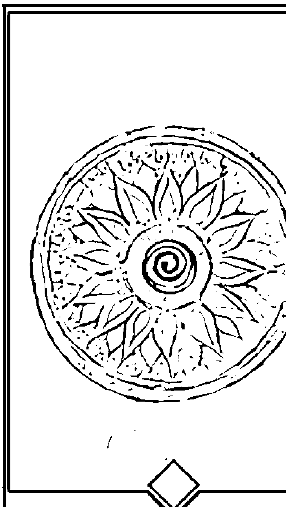

火之么——源頭

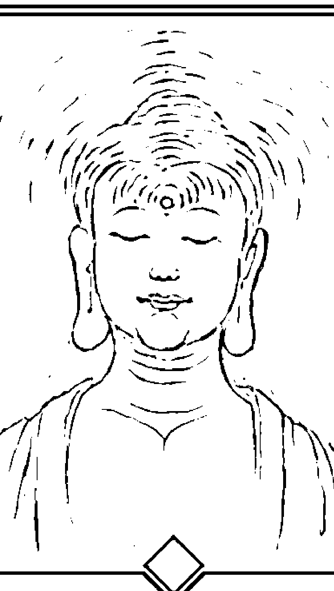

雲之么——意識

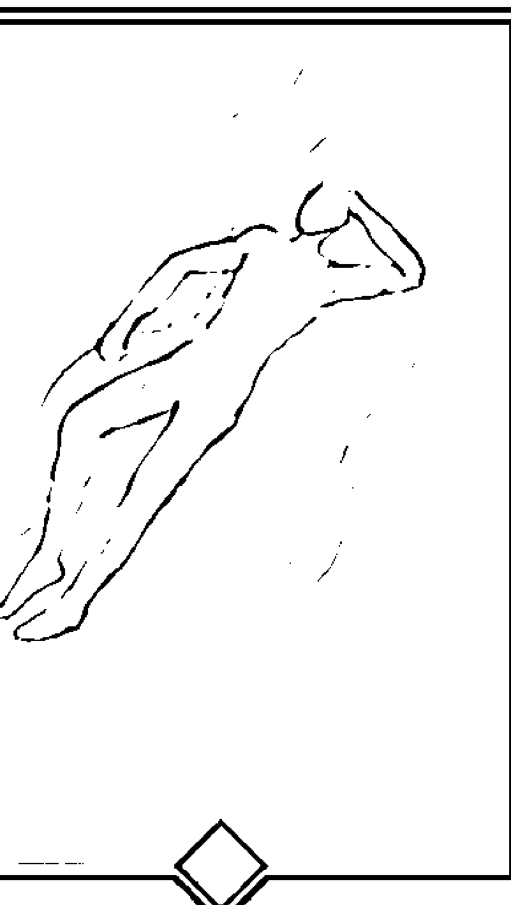

水之么——順著流走

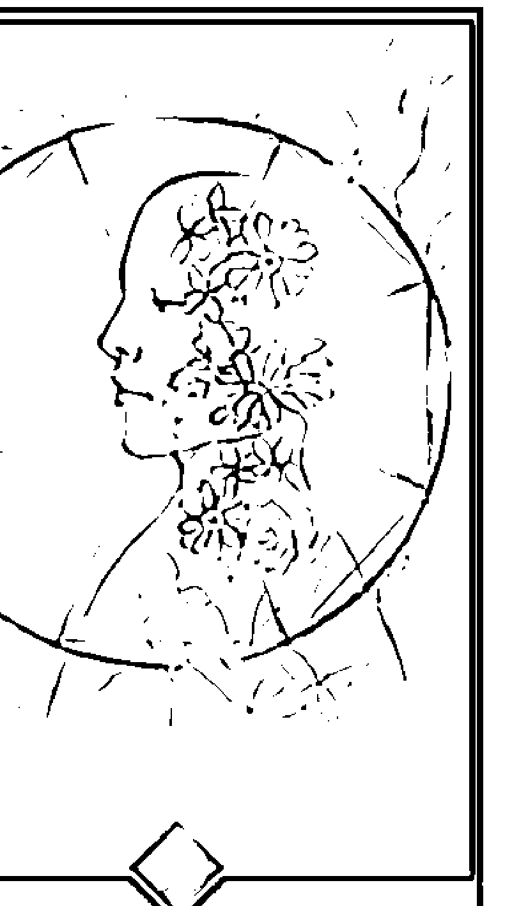

彩虹之么——心智圓熟

# 數字牌

# 火之么
源頭 The Source……

# 對應塔羅牌的「權杖Ace」

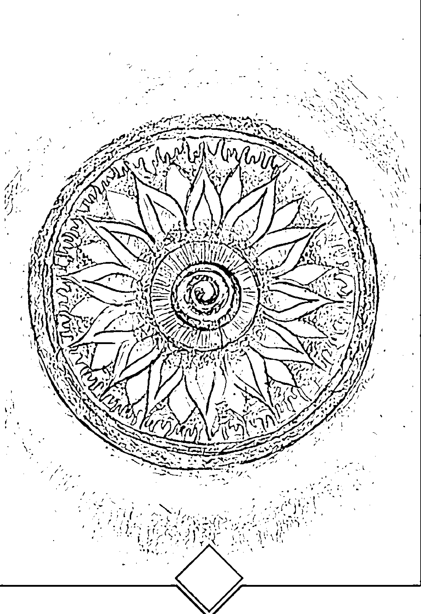

牌名：源頭

+   - 元素：火。

牌圖解說：圖中融合了多種生命之源的象徵意味，比如\n代表地球生命源頭的太陽，太陽外圍的火爍形成花瓣，\n就像是跟太陽有相同象徵意義的向日葵。此外，圖像看起來也像「卵」，代表一個單細胞的所有結構，而單細胞是所有有機體的最原始狀態。

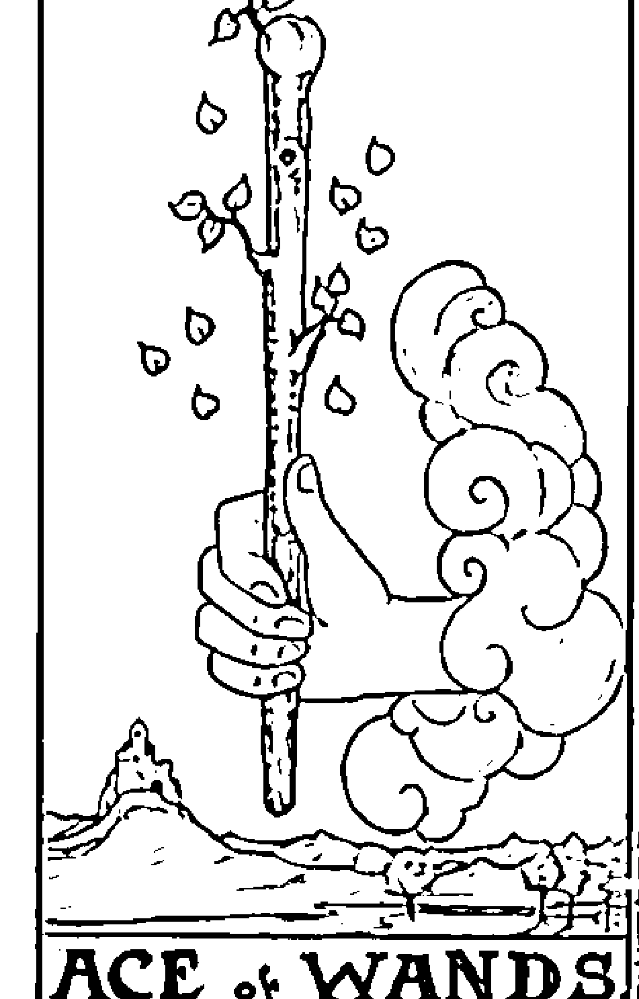

牌名：權杖Ace

+   - 元素：火。

# 火之么—源頭

# 以塔羅元素為論 權杖Ace

火元素跟1這個數字是相似度最高的，所以不管是哪副牌的火元素1號牌，都帶有極度的火元素性質：天真、熱情、不假思索、衝動、爆發力，以及奔向一個全新而未知的未來的力量。

我們人在生命能量、身體的健壯度最強最完美時，通常是小時候，沒有經過損耗，也沒有加入其他雜質，更沒有形成許多的不良習慣，一切都是最充沛的。這時我們想到未來，會充滿光明經過修磨的木棒，上面還有野生的枝桠和樹葉，一切沒有經過太多的加工，所以在這張權杖Ace的觀點中，任何事都是有可能的。

一般權杖Ace的通用牌義，代表的是一種新的行動、新的企圖，因為1這個數字代表全新，而火就是我們往前行動的驅動力和能量。這張牌就是初出茅廬的年輕人，充滿非制式化的想法及戰門力，有時會顯得太沒有常識也太不懂人情世故，但如果是在一個急需新血帶來突破及變動的環境，這種未經琢磨的璞玉是很受歡迎的，沒有經驗也就等於沒有包袱。因此這張牌雖然令人無法放心，卻也值得期待它更大的可能性。

紅的太陽，這是最明顯的地方。大家都知道陽光是生命的源頭，支持著我們生命活動所需的能量和活力，也支持一切生物的存活。再仔細看，又覺得像個雞蛋的內部，雞蛋是最大型的細胞，本身就代表有一個最完整而新生的生命藏在其中有待展開，中間有供應養分的蛋黃，所有的希望和生命都可從這

火之么這張「源頭」，牌圖一入眼就非常的振奮人心，它是多種圖形的綜合體，乍看下像個火

裡吸取。如果注意它外圍那團火爍，也像花瓣一樣展著，又像是充滿希望和活力的向日葵。

○創意發想過程的熱情，才是推動新產品問世的動力

電燈、電話、飛機……，乃至現在蘋果公司新產品ipad、iphone，要把成品製造出來，需要經過無數次的製造→實驗→失敗→改良的過程，才能夠讓一開始的想法呈現出來。但是在實踐過程中，一開始在你腦子中形成的那種想法，還有你被這個想法震撼時所產生的興奮和非做不可的感覺，才是整件事當中最基礎的部分。

因為這種熱情帶有執著的成分，使你不會偏離方向；一旦你失去熱情，整件事投注過的心力也就跟著報銷，但如果這種感覺強烈到足以讓熱情支撐你通過無數困難，甚至無視挫折和阻礙，那麼這個東西也必定能擺動他人。因為，你賦予它的能量越大，它就能延燒越多人。

我很多企業單位合作過，得到了很重要的啟發。很多人常常在說：一個成功的事業，最重要的是眼光（或金援或市場經驗或運氣），但通常我看到坐在最上位的人，都不是最聰明的，也不是最善於分析的，很多人甚至連溝通能力都不太好。但他們對自己在做的事卻有著無比的信念及熱情，也許他們沒辦法用口才說服你，但是那種堅持與樂觀卻能感染很多人，讓人喜歡他、跟隨他，也吸引到更多有才華、有分析頭腦、有經驗、有專業的人，來為他貢獻一己之力；而這種人通常還具備一定程度的單純與純真，在應該已是老江湖的年齡和年資下，還是對自己正在做的或正要開始做的事，懷抱著一種期待與興奮，會讓人不由自主地為他感動。

這張「火之么」顯現出來的人格，讓我覺得：只要一開始引爆的核心對了，後面一切自然水到渠成，也會跟著都對了。而「源頭」這張牌，就是那個引爆點。

# 數字牌

# 雲之么 意識 Consciousness……

# 對應塔羅牌的「寶劍Ace」

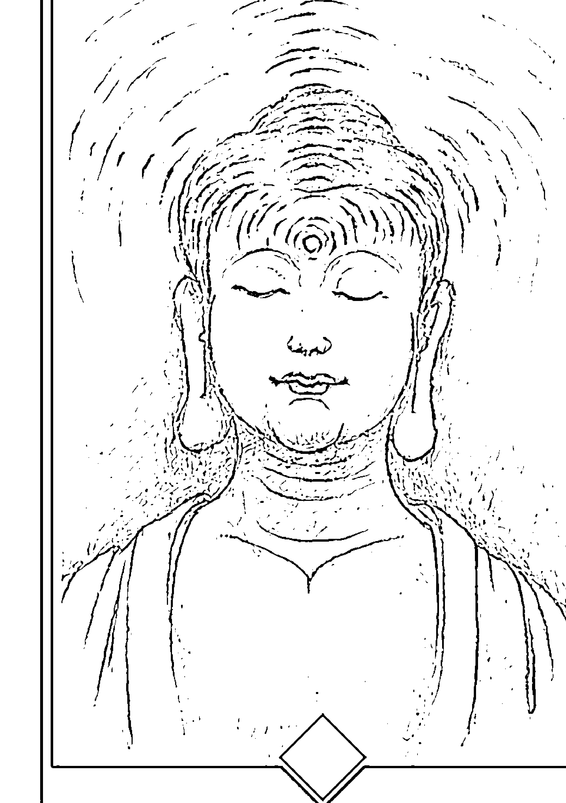

# 牌名：意識

+   · 元素：風。

牌圖解說：圖中的佛陀形象是透明的，透過祂，我們可以看到星空，也就是整個宇宙。這張牌代表一個清明的意識，就是人的頭腦尚未開始分裂之前的狀態，無明還沒有占據我們。就像嬰兒第一次睜開眼睛，看到的东西全都會是它們原本的樣子，不會被迷惑。

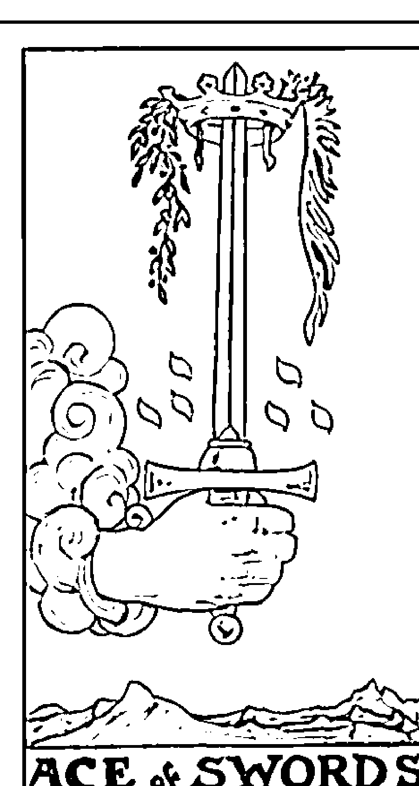

# 牌名：寶劍Ace

+   · 元素：風。

# 以塔羅元素為論

# 寶劍Ace

# 雲之么——意識

寶劍不同於權杖，雖然兩者都是工具，但寶劍完全是人工智慧的產物，左右對稱、一絲不苟，帶貌，能夠把所有的狀況考量進來，所以「寶劍Ace」有著超凡的判斷力和邏輯性。雖然在我的分類中，「直覺」應該由火元素來代表，但是1這個數字其實已經隱含了火元素的性質內在，而寶劍組的風元素，比火元素更有客觀性的觀點，也富有判斷力及推理能力，所以比起「權杖Ace」，我認為「寶劍Ace」的直覺更強烈。「權杖Ace」的直覺，比較接近一種生物性的衝動、本能，在達到目的之前，可能自己都不知道為什麼要做這件事，也不知道會有什麼樣的結果。但是「寶劍Ace」因為有風元素的心智，因此它的直覺更接近「預知」，在行動之前，往往已經看到整件事的來龍去脈，也知道將會演變成什麼局面了，「寶劍Ace」是一張先知牌。我們很難看到「寶劍Ace」熱情如火的樣子，因為在很多事你都已经提前知道會如何發展的情況下，很難激起你的戰鬥力。由於「寶劍Ace」不會輕易被驅動，所以這張牌適合當輔助及指點迷津的角色，不會有旺盛的企圖心與浪漫的感情。

禪卡的雲牌組就是風元素的象徵，代表頭腦的干渉，因此這張修禪卡的雲牌組，大都代表我們的負面情緒和負面知覺，也就是小我創造出來的焦慮和不滿。但是這張雲之么「意識」牌，看起來卻非常清明和寧靜，還具有一種超越力量，讓世界的一切都無法戴上傷害的面具，佛陀的形象超越了宇宙，俯瞰著人間的種種微小事物。為什麼只有「雲之么」這張禪卡，有別於其他雲牌組象徵的痛苦和焦躁呢？因為雲是心智、左腦思維的代表性元素，而所有的思維在一開始都是最清明的，就像我們在嬰兒

期第一次瞬開眼睛看到這個世界時是不帶任何主觀和批判性的，看到什麼就是什麼，如此而已。數字1純粹、不含任何雜質，所以「思維」一開始也是清明的，不帶任何偏頗。慢慢長大以後，我們接觸了許多資訊，被灌輸了善惡、是非等二元化觀念，批判性與人我之分就開始出來了。這時的我們開始越來越無法用原本的視野看待眼前的事物，凡事都會加上我們的評論、分析、猜想，以及我們價值觀的篩選。這時，事物進入我們的眼中時，就不再是它原本的樣子，而是經過我們自己詮釋後被扭曲的版本，那時不管我們看到什麼，都己經不是真相了。但這一切混亂和謊言，要等到數字2之後才會出現，在數字1的階段，一切都是透明、沒有任何疑慮的。

# ○用觀察者的角色，不帶主觀意見地累積意識與知識

雲之么「意識」象徵著我們的頭腦剛剛萌芽的那一刻，人類的意識剛剛出現，是一項強而有力的工具，能幫我們塑造經驗，創造出一個「觀察者」的角色，讓我們能除了自身之外，還可用另一個角度來看待自己所有的經驗和感受，並且有系統地處理。在這時，意識是可貴的。到了後來，意識會開始分裂，與自己打架，給每一樣人事物都賦予一概念，然後我們會只看到表面的意思，看不到事物的真相。雲牌組接下來的數字，就會顯示出這樣的狀況。但是我並不覺得雲之2到雲之10的狀況有多麼可怕，雖然每一張牌看起來都會擺亂人的心神。事實上，一開始的平靜不是真的，很多超然的態度，其實是出自於無知或缺乏經驗。如果我們勇敢走上旅程，從雲之2走到雲之10，經過種種的痛苦與煎熬之後，再回復到雲之么這張一意識一牌，其實我們就會更無懼。誰都不想遭遇讓人煩惱的事，但是一旦我們把所有的壞事都經歷過一次，到最後往往會發現，真正快樂與否的權力，以及詮釋命運的能力，都在我們自己身上，不是任何好事壞事可以影響的。既然一切都會過去，也就沒有真正好壞的差別。

# 順著流走 Going With The Flow……

# 數字牌

# 水之么

牌名：順著流走

+   * 元素：水。

牌圖解說：圖中這個人不懂隨著水流漂，整個人幾乎跟水合為一體了。這代表融入周圍的一切，輕鬆這個世界而不影響它，甚至不被人發現。這樣一來，就可讓一切事情不貿易地往它該有的方向發展。「無為而治」能達到的結果，常常會比強求的結果來得好。

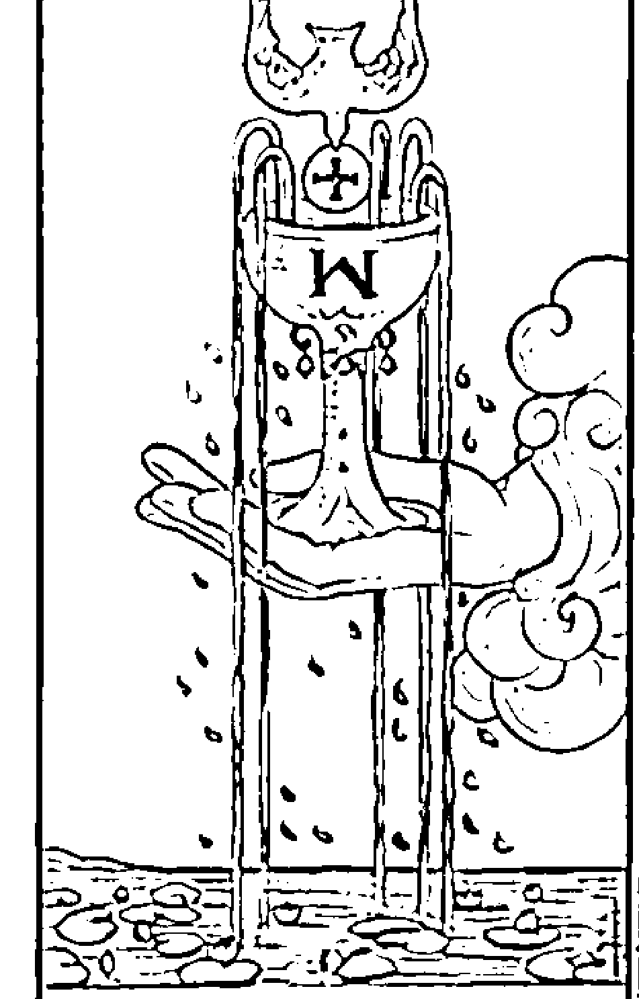

牌名：聖杯Ace

+   * 元素：水。

對應塔羅牌的「聖杯Ace」

# 以塔羅元素為論 聖杯Ace

# 水之么——順著流走

水元素不管在哪一副牌，都代表宇宙的和諧基礎——愛。愛不只是我們認知的情愛，其實是整個宇宙的本質。由於偉特牌比較「入世」，更能對應到我們生活的世俗層面，因此這張「聖杯Ace」包含的情感也比較是我們可以了解的，並充滿在我們的周圍。「聖杯Ace」公認的牌義就是「純潔、毫無雜質的愛」，在感情問題上抽到這張牌是非常好的狀況。不過「聖杯Ace」的愛太完美太無私了，我常覺得親子間比較容易有這樣的狀況，若是情侶或夫妻抽到這張牌，通常表示兩人的感情已經昇華到像家人的層次，但也不失心有靈犀的感應，以及親密無間的兩性情感交流。

在一般牌義中，「聖杯Ace」被認為是給予的、奉獻的，但我認為因為有了數字1的勇氣及自我性，使得「

# 數字牌組

# 2號牌

在數字1的階段，自己就是全世界，在數字2的階段當中，出現除了自己之外的另外一端。很多人覺得數字2是合作、和諧，其實在另外一個極端出現時，我們最先感受到的會是「對立」，就像家中添了第二個寶寶，原本是家中獨享父母注意力的孩子，就會對新出生的弟弟妹妹帶有或輕或重的敵意。雖然「對立」的另一面，其實也是「互補」，但在數字2的含意中，雙方的對談或交流尚未開始，另外一方才剛剛「出現」而已，沒有經歷過適應期和取捨，兩邊還不會這麼快交融在一起，一定還是保持各自為政的狀態。以男女兩性為例，過了青春期後，男女兩性會因對方和自己不同而好奇，進而產生吸引力。然而在童年時期，我們還必須發展出自己的性別意識，強化、培養自己性別的完整性。因為你要先當個完整的女人（或男人），然後才會跟異性產生相互的吸引力。所以數字2雖然有分化、對立、選擇的意味，但其實也是為了更久之後的結合在鋪路。

火之2——可能性

雲之2——精神分裂

水之2——友誼

彩虹之2——一個片刻接著一個片刻

# 數字牌

# 火之2

# 可能性 Possibilities

牌名：可能性

+   · 元素：火。

牌圖解說：老鷹是所有鳥類中可以飛到最高程度的種類，視力也最好，可以發現地面上的獸物並清楚觀察。這張圖代表我們走得越高越遠，眼界就越寬大，內在及眼界一旦寬廣，就會發現自己的選擇性也變多，不再受困於多數人所處的範圍之內。

牌名：權杖2

+   · 元素：火。

對應塔羅牌的「權杖2」

# 以塔羅元素為論

# 權杖2

# 火之2 ─ 可能性

數字2是代表你眼前出現了多於一種的可能性（也就是選擇的目標），有很多人常會把「實劍”“2─和「權杖2」混為一談，認為兩者都是「代表選擇」，應該是很接近的。但實際上，權杖的豫，「權杖2」的選擇更積極，思考的過程也較為樂觀、有建設性。這代表他眼前出現的兩個選擇，雖然性質截然不同，看起來都頗有好處、令人期待的，只是優點和方向大不相同而已。這就像你在找工作時，有兩份工作性質差異很大的職位同時錄取你。雖然性質不同，但都是薪水高、發展性強，換句話說，雖然性質不同，但格局和高度是相同的，所以在面臨這張「權杖2」時，最重要的不是「得到」，而是「取捨」。由於火元素帶有專注的性質，沒辦法一心二用，所以如果想成功，一定得要把能量聚焦在一個特定的點上，才能產生爆發力，多餘的選項就必須拋棄。就像果農要拋得疏花疏果，才能減少養分消耗一樣。凌駕一切事物，因為應的特色，就是他的飛行高度高於其他鳥類，所以能看到的一切也就更廣大、選擇性更多。老應的特點不只飛得高，視力平均有五・○，在飛得比所有生物都高的同時，他仍然能清楚看到地面上每樣東西的細部，並且快速判斷，什麼才是他的獵物。在這張「火之2─可能性」當中，數字2的選擇性質仍然存在，但被擴大了，在塔羅牌「權杖2」中，天下的一切都供你選擇，你的可能性是無限寬廣的。但這並不代表「權杖2」的選擇就有限，記得「權杖2」中，那名男子手上捧著的地球嗎？這代表他仍然保有更多的選擇項目，只是目前放在他面前的選擇是兩個大的方向而已。○擁有無限自由的选择權，要成功同樣也要懂得取舍

遠擁有更大的前進空間，以及擺脫束縛的能力。因為我們如果在自己熟悉的環境內，面臨的選擇不管有多少好，總是無法超越我們既定的層次，而擁有高度飛行能力的老鷹，一旦衝上天際，就代表我們可以脫離原有範圍的限制。

但是火元素的專注性和執行力，並沒有被忽略掉；我們要知道，不管老鷹的飛行能力再強、視力再銳利，總不能永遠在空中飛。牠飛得這麼高，只是一種過程和手段而已，最後真正的是挑準他要的獵物，然後俯衝下來捕捉。這個部分就跟「權杖2」一樣，帶有取捨的意味在內，一隻老斷，並且一旦決定就不能再三心二意，要在最快時間內執行完畢。這種魄力、企圖心及進攻能力，都是火元素的特質。

這張牌中的老鷹還飛在半空中，代表這張「火之2」可能性一，還沒有進展到真正出發的程

度，它還在擴大自己的視野，替自己收集更多選擇的權利。所以抽到這張牌，代表當事人正在蓄積實力，要看準時機才出手。如果是在我們人生的道路上，就代表正處於收集資料、評估利弊得失，最後看準時機做出最後決定的中間階段。也就是說，一切都尚未成定局，就像我們在初出茅

虛的年齡層，擁有的都是前進的空間，而沒有太多的包袱。

# 數字牌

# 雲之2 精神分裂 Schizophrenia

牌名：精神分裂

元素：風。

牌圖解說：這張牌出現代表「對立」的意念了，也就是人開始有了「分別心」，開始與整個世界為敵。一旦我們開始覺得自己和群體是完全分開的，我們就會想要保護自己，覺得整個世界都很危險，那就哪裡也去不了，什麼事也做不成。就像牌圖中的人想去左邊，也想去右邊，最後只能懸吊在中間。

牌名：寶劍2

元素：風。

對應塔羅牌的「寶劍2」

# 以塔羅元素為論

# 寶劍2

# 雲之2—精神分裂

常常有人把「寶劍2」和「權杖2」混為一談，因為這兩張牌都是數字2，都跟「選擇」有關。

但是這兩張牌的選擇完全是不同性質的，「寶劍2」的風元素因為沒有火元素的專注性，顯得涼。

散而沒有焦點，所以會是停止前進的狀態。看看圖中人，兩把劍平衡地橫又在身前，交叉點剛好

位於心輪部位，表示他的知覺及判斷依據是呈現封閉狀態的，他並沒有抱著積極的態度做出正確的選擇，加上他的眼睛是瞞起來的——與其說他面臨選擇，不如說他是在逃避選擇，或是不想正視選擇後要面對的結果。

上文說過，「權杖2」是勇敢做出「取捨」，但是「寶劍2」是風元素牌，面臨取捨時通常會猶豫不決。火元素為了追求目標，會放掉目標以外的东西；但風元素因為企圖心沒那麼強，比起得到的快樂，更害怕失去的痛苦，因此它認為只要不下決定，就可以都不失去。但是它不懂，即使都不失去，兩個目標它也同樣沒辦法完全擁有。

我們都看得出來，這張禪卡比起偉特牌的「寶劍2」，多了許多情緒上的焦慮，以及左右為難的煎熬。「寶劍2」的平靜是一種假象，因為它的平靜來自於逃避現實，但是真相卻在「雲之2」精神分裂一中顯露無遺，在逃避選擇後的責任時，他也同時無法實現任何一個目標，更不能到達任何地方。

在奧修禪卡的系統中，雲牌組是代表頭腦的（也就是風元素的象徵物），奧修口中的頭腦，比較像是我們常講的「左腦思維」、「計算」、「小我」，也就是用有限的眼光來看所有的事物。因為頭腦有著很重的分別心，所以會覺得自己在這個世界上是不安全的。因此，「頭腦」最大的致命傷，就

是它與整體失去了連結，容易陷入痛苦之中，數字2在風元素面前等於是在提醒它，它是一個小小的個體，是獨立於世界而存在的。如果我們記得一雲之2一的上一張牌——雲之么意識——，就會懷起在意識的萌芽階段，全世界就是一個整體，所以安祥、和諧、清明，凡事都沒有太多的危險，更沒有善惡是非之分，也就容易自然而然的平靜。但是頭腦如果創造出另一個人，也就是自我分裂，就代表他有需要打敗、競爭及比較的對手，雖然雙方敵對的狀況很可能只是頭腦投射出來的，但是人一旦感覺與整體失去連結，就會陷入無休無止的算計，沒有辦法依天性過自然的生活。所以說，風元素遇到2這個數字，就是分裂的開始，也就是小我、頭腦、分別心出現的那一刻。

有可能往下掉。這時他唯一能有的、也是最好的選擇，就是「挑一邊」，「做出選擇」的模式也是火元素2號牌最擅長的「取捨」。但風元素一向拖泥帶水、不乾不脆，頭腦總是左飄右蕩在算計各種可能性，捨不得放掉任何一個在眼前的機會，然後犯上一「貪多嚼不爛」的毛病，每一個機會都無法被妥善掌握。簡單舉個例，這就像是一個人有两個可以選擇的對象，但是要做出取捨時，風元素（也就是「雲」），代表思考和算計的能力）會害怕：「如果我選了A，就代表我必須放棄B」，因此遲遲不肯選擇，希望自己可以坐擁齊人之福，一直這樣下去。但是他忘了，人與人的交往需要誠心和對等的交流，他的時間和資源不足以對兩個人同時付出。所以不做出取捨的後果，就是會讓他跟雙方都維持一定的關係，但跟兩邊的關係都不夠深入也不見得能長久，會維持得非常辛苦，最後還可能什麼都沒得到。在禪卡「雲之2」中，雖然跟「寶劍2」同樣不能兩邊都要，但抽到這張禪卡或許是兩邊都不要最好。因為凡是頭腦的選擇都是錯的，當兩邊都放掉時，你才能看清你的心會被帶到哪裡去。

# 數字牌

# 水之2

# 友誼 Friendliness

牌名：友誼

+   · 元素：水。

牌圖解說：兩棵各別生長的樹，樹幹與樹根都是分開的，樹葉的颜色也不相同，但枝葉部分卻交織在一起。這代表你在面對和自己來自不同背景、不同族群的人時，心胸仍然是開闊的，可以接受別人不同於自己的部分。這張牌代表的是和諧的人際關係，以及對他人信任的態度。

牌名：聖杯2

+   · 元素：水。

對應塔羅牌的「聖杯2」

# 以塔羅元素為論

# 聖杯2

# 水之2—友誼

塔羅牌的—聖杯2—，常被稱為—小戀人牌—，很多人把這張牌詮釋為真愛、深情，但我倒覺得水元素十數字2的特質，並沒有這麼濃烈。數字2代表一種相反的兩極，一開始會是互斥或競爭的，但是水元素本身帶有融合、交流、和平及情感等特質，可以成功地弭平數字2的兩極化。我卻是很高的。這表示雖然這張牌是數字2，但兩者間的差異卻沒有那麼明顯，也不像前兩張陽性元素的2號牌，帶有那麼重的「選擇」意味，「聖杯2」這張牌，較大的含意是融合、協調。我常說—聖杯2—就算代表愛情，也只代表—二十歲以下的純純之戀—，水元素的情感自然而地交流，是一種舒適溫和的情感，不會引起衝突和占有欲，更不會有太多的利益評估。就像我們在學生時談的戀愛，雖然不成熟卻很真誠，不會考慮到對方的職業、年收入、家庭計畫、門當戶對等等條件，喜歡就是喜歡了，—好感—是這段關係中最大的成分。這張禪卡命名為—友誼—，我覺得很有趣。如果用偉特牌對照，—聖杯2—看來像是很相愛的牌，為什麼—水之2—會被輕描淡寫為友誼呢？我認為這單純是定義上的不同，兩張牌的本質還是非常相近的。—聖杯2—的愛情著重的是雙方心靈的感受，以及對彼此的感情，重點在於兩個人—內心的情感—，而非形式上的名分。水元素加上數字2，代表兩者之間的感受是沒有隔閡的，可以互通心意，有一種非常美好的相處品質。我們再來看看—水之2—的牌圖，兩棵樹並沒有做任何努力或加工，自然而然地就長在一起了，就跟貼身的舊衣服一樣舒適且理所當然。這張牌代表的是一段感情最初、最純真的樣貌。因此奧修禪

卡之所以把「水之2」定为「友誼」，不表示它只能停留在交交朋友的階段，而是代表兩人間對彼此的感覺、相處時的舒適愉悅，才是最重要的部分。 ○缺乏責任和承諾，沒有經過轉化的感情，都不足以成為愛情

我們都知道，感覺是一回事，而真正成為戀人（或夫妻）所需要的形式和承諾，又是另一回事。所謂「相愛容易相處難」，水元素的2號牌代表的是那種心意互相流動的感覺，但不能把這種感覺弄進粗糙的現實，例如婚姻、責任、誤會等等在一段關係中避免不了的東西。 說過戀愛的人都知道，一般只要外型對了、感覺對了，甚至磁場對了，很輕易就可以萌生愛意；但要成就一段「社會定義下的伴侶關係」，事情就沒有那麼簡單。你必須要考慮雙方五年、十年後的計畫，還有兩個家庭之間的互動、兩人的收支分配、權利及義務的承擔等等，這些東西，都不是靠「好感」就可解決的。不只如此，一旦碰上這些現實，美好的感受還通常是第一個被折損掉的。 「水之2」友誼」因為沒有經過淬煉，很難成為堅實的關係，這份感情也不像一般夫妻比較偏向人生伴侶的型態，「水之2」沒有那麼功能性，它代表的感情比較不食人間煙火，需要好好呵護，而不是拿來考驗。奧

# 正在經驗 Experiencing……

# 數字牌

### 火之3

對應塔羅牌的「權杖3」

牌名：正在經驗

元素：火。

牌圖解說：所謂的「經驗」不在於一連串的事件本身，而是在於我們感受到的心得與意義。圖中的女子用手觸摸看似靜態的樹，靜下心來接收這棵樹的脈動及生命力，體驗一棵樹生存的方式與感覺。這意味著你所在的地方不是重點，你是否能享受與自己日常生活不同的事件才是重點。

牌名：櫸杖3

元素：火。

# 以塔羅元素為論

### 權杖3

### 火之3 ─ 正在經驗

火元素是獨立性很高、自我意識很強的元素，一般來說跟數字3有很大的不同，數字3是要組成小團體，且彼此之間互通有無的數字，說起來應該要比較不堅持的。但是火元素和數字3的組合卻出乎意料的好，我想這是出於互補，火元素提供了數字3沒有的向心力，而數字3則具備了靈活度，讓火元素可以有更好的發展空間。

火元素代表每一個發光發熱、專業又積極的人，那為什麼這張牌中三個火元素聚集在一起沒有互相抵制和衝突呢？這是因為火元素再怎麼有能力，畢竟只能掌握局部的專業（火元素範圍很集中，是專才而非通才），而成就一件真正的大事，則需要把各種專長的人結合在一起，才不會互相拖累對方，因此這些火元素碰在一起，反而會有一種風雲際會、英雄惜英雄的心態。數字3在這裡將溝通和協調能力發揮得很好，就像讓幾個身懷不同絕技的高手，彼此互相配合，集結起來然是一個不可小覷的國體，也是一張蓄勢待發、前途不可限量的牌。

這張火之3號牌，呈現出的感覺很靜態，似乎與一權杖3一的感覺有點落差，但是就跟每對牌一樣，我認為它們的本質還是相通的。在一權杖3一中，火元素代表的是有自主性、具備獨立才能的個體，而數字3是負起串連和協調的工作，把他們融合起來，組成了個小組之後，等著創造出更大的可能性並發展起來。而奧修禪卡的「正在經驗」，火元素代表的不只是個人的價值和獨立性，也代表了一種生命的熱度和力量；數字3則是負責起一種交流與共振的工作，它代表生命中的經驗以及我們感官所接收到的一切，都正在反映我們自身的狀況。就跟前文提到的一樣，禪卡系統中的數字3，跟

### ○全身心的投入，要怎麼收穫先怎麼栽

不管是哪個元素的3號牌，我認為都有一個共通特質，那就是「3等於是在一個過程當中，尚2都還在準備階段而已）；而火元素代表了行動及企圖心，所以「火之3」正在經驗」代表一種體驗和作為的過程，這張牌的重點不在目的性，而在達到目的之前的過程（之後的火之8也有類似的含意），更代表當下投入的程度越多，越能得到圓滿的結果。

塔羅牌的「權杖3」偏向在過程中我們與外界的一切互動，還有周遭發生的種種經驗；但是禪卡「火之3」正在經驗」，代表的是我們內心對外在發生一切事物的「感受」與「解讀」，重點不在你經歷了什麼事，重點在於你的心路歷程感受到了什麼，而這些情緒經驗形塑了未來的你。

塔羅牌的「權杖3」可能代表了你一擁有什麼樣的資源，做出了什麼樣的行動，當成未來的開端」，而「火之3」則是你一咀嚼自己行動過程所帶來的體驗、嘗到事件表象之下的真正滋味，然后用這些經驗去創造未來」，也就是說，「權杖3」等於事件本身，而禪卡「火之3」則代表你經歷事件之後所產生的心得與收穫，也就是「這件事情對你來說，到底真正的意義在哪裡」。

結果，你只要完全投入現這一刻，未來就會現這一刻產生一。就像在考試前夕，去想考試的結果、去恐懼失敗的可能，都沒辦法達到你要的目標，唯有拋開一切念頭去做該做的事（念書），自然會達到你滿意的未來。每件事情都一樣，當你投入得越深，達到目標的時間就越會縮短，等於是爆發力就越強，這張牌就是要我們深入去感受經歷過的每一刻。

# 數字牌

### 雲之3 封閉 /Ice-olation……

### 封閉 /Ice-olation……

對應塔羅牌的「寶劍3」

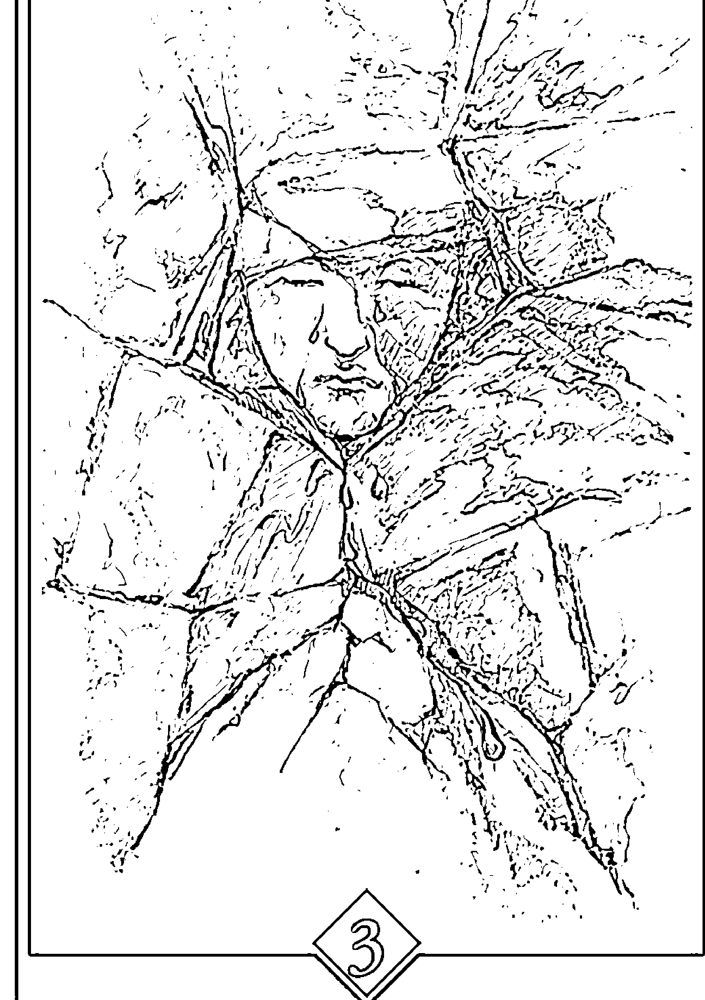

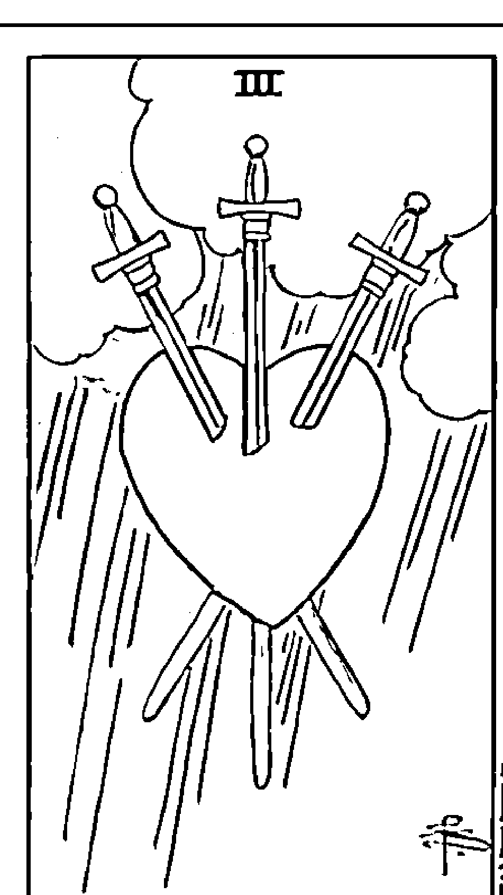

牌名：封閉

+   · 元素：風。

牌圖解說：如果我們覺得自己是自己、別人是別人，看不到我們本身與「整體」的關聯性，就會變成一種孤立的狀態，並且因為能見無法流動，自己的心和感情就會日渐萎縮。自我保護的同時，也等於隔離了自己，在牌圖中，彩色的眼淚化解了寒冰，因為即使是痛苦的經驗也是感受自己心跳的一種方式。

牌名：寶劍3

+   · 元素：風。

# 以塔羅元素為論

### 寶劍3

### 雲之3 ─ 封閉

這張牌淺顯易懂，即使沒學過塔羅牌的人都可一眼看出三把劍插在一顆心上會有多麼痛苦及折磨，常讓我還沒講牌義，被占卜者一看到牌圖也會哀嘆個幾聲。這張牌，的確代表非常傷心和受苦的狀況。

在教學過程中，學生常常很好奇，他們說風元素是人際交流，而數字3是和諧溝通，基本上風元素和數字3的性質很像啊！為什麼這張牌不管在哪一副牌的定義都很哀傷？其實，風元素通常代表的是人心之間的傾訴，有一種沒有特定目標的意味，數字3雖然擅於溝通協調、互動多，卻缺乏乏原則，沒有一定的核心價值。這兩個性質合在一起，就變成了人與人之間關係的混亂和背叛，也帶來了痛苦及傷害。

風元素和數字3同樣都代表人際關係和社交，形成的傷害也通常是「感覺」上的，比較少指向真的正的痛苦或財物損失（但也不代表一定沒有，只是這張牌呈現的心理性質比較重），所以「寶劍3」的痛苦是有辦法可以快速脫離的，並且在拋掉痛苦後，不會有太多後遺症。只是人心很容易被自己困住，抱住傷害，對某些人來說總比失去重心來得好。

這一組牌同樣有情緒上的痛苦及精神折磨的含意，只是因為這是風元素牌，所以我比較少解釋成實際上發生的壞事，通常都是一些溝通上的誤會，以及關係中出現的信任危機等問題。

相對於「寶劍3」，我覺得這張禪卡更像是前後關係，「寶劍3」是因為「他人」的背叛或否定，帶來一種感受上的痛苦；而這樣的痛苦會讓一個人把伸出去的觸角縮回去，為了避免受傷害而躲在自己的安全範圍內，這種逃避行為，就會形成禪卡的「雲之3─封閉」這樣的心態。

在這張牌圖中的人是把自己冰封起來的，所謂「冰凍三尺非一日之寒」，這代表牌圖中的自閉與退縮是經年累月的打擊所造成的。比如說我們有某部分或許不擅長、或許不符合主流，常常受到外界否定，自然而然就會不願再觸碰。就像你每次穿紅色衣服，得到的評價都不好，久而久之，逛街時你本能上就不會再購買紅色衣服了。禪卡中的數字3比較是跟自己的內在相處，而風元素的「雲」則是頭腦製造出的混亂，在這裡指的是不用和外界接觸，自己就會鑽牛角尖，既痛苦又無法解決問題。○縮在保護殼裡永遠長不大，放開自己才能體驗人生千百種滋味通常要我們承認自己的脆弱和缺點並不簡單，與其承認，還不如直接把這種脆弱藏起來。但是我們也知道，保護過度會更容易受到傷害，就像溫室花朵，小風小雨就撐不住了。我們可以看到這張禪卡上，冰封的唯一縫縫是這個人流出的眼淚溶化而成的縫隙。眼淚是彩色的，是我覺得很有意思的地方——通常眼淚代表的是痛苦和挫折，但這張禪卡卻用了彩虹的颜色，這代表人當中經歷的磨難，在這裡的定義反而沒有那麼糟糕。我們以為是磨難的東西，其實就只是人生各種滋味中的一种而已，沒有痛苦就視托不出愉悦，沒有平淡就視托不出高峰。如果我們都不敢放開自己去感受，雖然可以保護自己不至於受傷，卻也失去了發掘更多快樂的機會。畢竟很多驚喜都是藏在未知裡，或者是用挫折來包裝，當你願意把這些痛苦和失敗噴下去時，你才能得到包覆在其中的另一種收穫。所謂的悲傷、挫敗，只是眾多人生經驗中的一种而已，接受之後才能放下它，也才能將它對你的傷害力減少。這塊冰的內部，代表的是我們為自己樂出的安全範圍，可能在短時間內，會有一種讓你受到保護的錯覺，但長期下來，卻阻隔了更多的東西，而且把「過去的痛苦」也同時封存在內，失去了解放的機會。比如說你有藝術天分，卻為了能在社會上生存，跑去念不擅長的科系，這樣一來，當然你不會經歷到可能的失敗，但你得到的安至也和個人成就扯不上關係。這張「雲之3」告訴我們，要允許自己摔跤和承受打擊，感受了這些痛苦後就放掉它，你才能打破封閉的世界，看清楚自己人生的模樣。

# 數字牌

### 水之3 慶祝 Celebration.

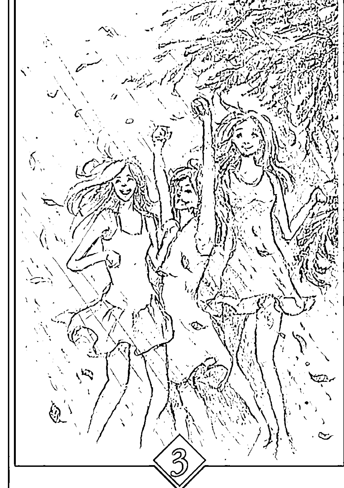

牌名：慶祝

+   · 元素：水。

牌圖解說：三個興高采烈的女人聚在一起，什麼正事都没做，就是全然沉醉在歡樂中，就連風雨也不能減少她們的快樂。這張牌的構圖跟塔羅牌「聖杯3」是類似的，但是塔羅牌中的三個女人是優雅內斂的，相對應的禪卡牌圖卻是情緒高昂、歡欣鼓舞的。表示這張禪卡更加不顧外界的一切，更能享受自己的生活。

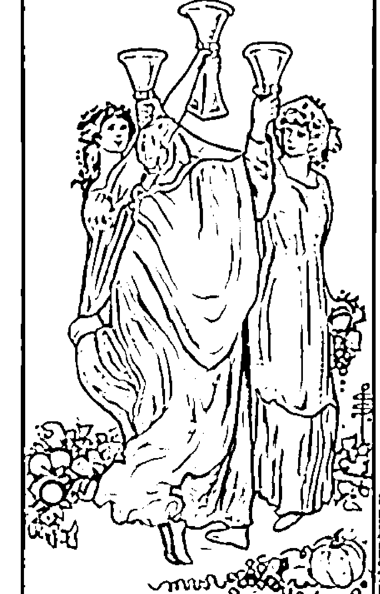

牌名：聖杯3

+   · 元素：水。

對應塔羅牌的「聖杯3」

# 以塔羅元素為論

### 聖杯3

### 水之3 ──慶祝

水元素本身的性質和數字3是很合得來的，水元素和風元素一樣，在人際關係方面都很擅長，但傷害。水是交流，數字3是群眾交集的意思，兩者都可以指向人情和社交的性質，也因為水元素沒有太強的自主意識或利益觀念，因此跟數字3結合得很好，這是一張很純粹的情感牌（不限於戀愛）。

這張牌有一個很重要的特點，就是「沒有目的性」，「寶劍3」是缺乏目標，而「聖杯3」卻是根本沒有想要設目標，所以不會陷入像「寶劍3」那樣的混亂和痛苦，可以很喜悅地隨遇而安。

水元素通常是很單純的，心性喜樂平和，加上數字3本來就是一個很友善的數字，所以「聖杯3」的友誼是在何時何地都可以對人開放，對誰都不會設下防線或隔閡，非常好相處。但難免的，這樣的兼容並蓄最後也會演變成缺乏篩選機制，交情完全就只能靠緣分，沒有共同理念，很難培養出革命情感。就朋友而言，這種交情會顯得膚淺單薄了些，可以共安樂但不能共患難。

在偉特牌系統中，即使「聖杯3」是一張愉快的牌，但是如果碰到事業或金錢時，我仍然把這張牌定義為：「沒什麼建設性」的牌。水元素本來就對財富、事業這種需要積極性的事不是很很有幫助，加上數字3一向追求眼前的輕鬆，所以「聖杯3」雖然氣氛好、交情佳，但我仍然覺得這張牌的裝飾性大於實用性。

但是到了禪卡「水之3─慶祝」，就不一樣了。奧修對「愛」的評價更高，賦予的力量更大；

### ○快樂由我自己創造，有顆快樂的心就能無處不快樂

水元素代表的不只是我們日常生活中的感覺，還代表一種喜悅的本質，可以對抗任何外在的醜陋。因此禪卡水之3號牌圖中的三名女子，並不像偉特一聖杯3一的女子是處在祥和的順境中，而是沐浴在風雨飄搖之中，但卻沒有澆熄她們的快樂。這張禪卡很鮮明地顯示了一句新時代主義者常說的話：一一切發生都是最好的。一水之3號牌同意一切，能夠從任何微小或負面的事物中，發現其美好之處，並且為之歡呼喝采！她們的快樂來自內心、來自自我的本質，而非依靠外人或環境給予。

○快樂由我自己創造，有顆快樂的心就能無處不快樂這張一水之3一慶祝一是水元素牌，除了沉浸在自己的喜悅中，她們也可以把這份快樂散布出去，因為水元素和數字3最擅長的，就是一交流一。所以這張牌一旦出現，不管我們占卜的是哪方面的問題，都可以被當成一種潤滑劑或調和的能量來看待。禪卡採用的是奧修的觀念，所以價值觀和一般世故的觀念比較不同。我們在很多事情上，一般會認為努力、有計畫是好事，是一切成功的基石。但是這張禪卡正符合奧修要的，也就是一不依靠一聖杯一。水之3號牌的快樂沒有原因，也沒有條件，它可以發現一切事物中值得喜悅的地方，這在一水之3一其實也是，但重點在於，這樣又有什麼不好呢？如果你沒有能力發現當下的美好，那麼就算未來到了你眼前，你夢想的美好已經成真，你還是缺乏更快樂的能力。所以水之3一慶祝一牌所強調的，是一不要去追求護你感到快樂的東西，而是要## 以塔羅元素為論

# 權杖4

# 火之4 ─ 參與

這張牌是七十八張塔羅牌中，我最喜歡的牌之一。數字4的性質接近土元素，而這張牌有火元素又有4，等於是既有爆發力也有持續力、既穩定又有發展性，加上火元素本身的熱力，使得這張牌顯得積極又容易成功。不管是占算什麼問題，抽到「權杖4」，都會往不錯的方向發展，而且這張牌即使是處在負面的狀況（比如出現在「問題」位置，或是被其他元素沖剋，或是抽到逆位牌），不好的程度也有限。這張牌的意境，是我們大家都最希望處在其中的狀況。

我常用的比喻是，數字4很穩固，就像是一輛車的車殼，板金和封閉式結構讓我們坐在車內的人有了一層屏障，但有了保護通常就等於失去拓展的機會，不過這張「權杖4」因為是火元素牌，行動力和企圖心都很旺盛，所以數字4就轉而有「基礎」的意思，而火元素就變成車子裡的引擎，發動力量推著車殼前進。這時我們既可高速前進，又在車殼保護下不會受風雨侵襲。不管事業或愛情，遇到這種「既有保障又有發展力」的牌，都會是不錯的狀況！

按照書上的說法，「火之4」這張牌本身就是一張曼陀羅，這張圖帶有均衡結構的美感，確實是曼陀羅那種「自成一格，圓滿俱足，是個一切都在其中的小宇宙」。一個小小的圓代表著圓滿和完整，藉由繪畫曼陀羅，可以變成反映我們內心的鏡子，看出我們心中小宇宙的混亂和失序，然後經由自我觀照，讓圓內的圖達到一種平衡的程度。

我們可以從火之4號牌的牌圖就是曼陀羅（自我圓滿的小宇宙）這一點，看出數字4的完整性，還有火元素的創造和新生。至於「參與」這個牌名，更點出了火之4號牌均衡圓滿。再看看牌

[PAGE 241]

圖中俯視的四個人形，是由四種不同顏色組合而成的，代表他們各自擁有不同的特質。一個完美的整體，的確是不能由相同的人重複組合起來，必須每個人都有自己的優缺點，彼此截長補短，形成一個契合的全體。就算只是兩個人的戀愛，互補性也比相似性要來得合理，我們本來就需要一個可以彌補我們短處，同時也有長處讓我們崇拜珍視的「另一方」。我常跟抱怨無法溝通、性格不合的情侶們說：「如果有兩個人完全一樣，那麼其中一個人就是多餘的。」我們可以將禪卡「水之2—友誼」和「火之4—參與」做個比較。水之2號牌同樣是一個和諧的組合，但就僅止於和諧而已，可以舒舒服服相處，就是激發不出什麼上進心或建設性。相反的，一火之4—參與—具有火元素更新和提升的特質，看看牌圖上這四個人到齊後，彼此互相給予和接受（看他們的手，每個人都是一隻手往上、一隻手往下打開），創造出了中間的旋轉太極。太極是陰、陽交互作用的意思，一黑一白（也就是一陰一陽）可以生出萬物（而水之2號牌可能就是一黑一白已經融合成兩個灰色的意思）。禪卡書上說，這個太極圖也是西藏雷電的符號，不管什麼牌，只要一出現閃電，就代表改變的時機到了，一切都更新而不同以往。如果我們不把太極圖看成雷電符號，其實它所呈現的漩渦狀，在象徵學當中也代表凡事要從內而外發生轉變了！這些都代表四個人的力量和特質結合起來，會激發出一股超越他們自己本身的力量，到了最外圍的花瓣，可以解讀成奧修常說的「開花」，也就是讓一件事達到最顛峰的狀態。這樣的狀態，是牌面上這四個人處於個別狀態時無法達到的境界。這張牌「團體大過於個人」的性質，讓我想到音樂老師常說的：如果兩個人唱歌分別有六十分，那麼二重唱截長補短，一起唱可以達到九十分程度。「火之4」的團結，可以大幅提升原來的自己。

○你是群體的一份子，要無私地給予和接受，帶動全體一起提升

瓣，可以解讀成奧修常說的「開花」，也就是讓一件事達到最顛峰的狀態。這樣的狀態，是牌面上這四個人處於個別狀態時無法達到的境界。這張牌「團體大過於個人」的性質，讓我想到音樂老師常說的：如果兩個人唱歌分別有六十分，那麼二重唱截長補短，一起唱可以達到九十分程度。「火之4」的團結，可以大幅提升原來的自己。

[PAGE 242]

# 數字牌

# 雲之4

# 延緩 Postponement……

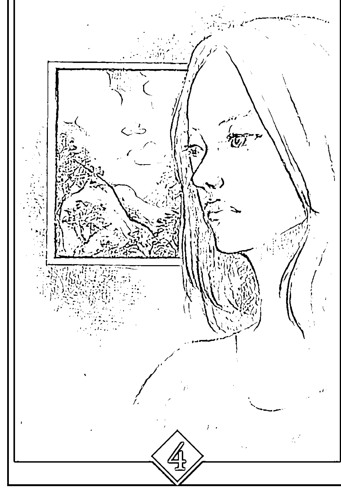

牌名：延緩

+   - 元素：風。

牌圖解說：明明是一大片美好的景色，但是圖中的人卻把自己的期待和眼光限制在一塊小小的範圍之內。這除了一種怠惰的表現，我覺得更是一種缺乏自信的意味。把自己的注意力放在很小的安全範圍內，代表一個人覺得自己不值得擁有更好的，太美好的生活反而會讓他不安，這種人的格局永遠打不開。

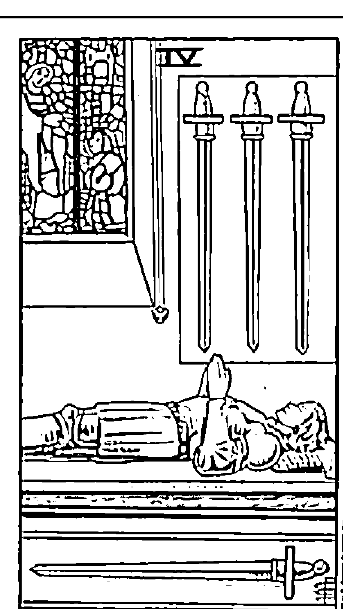

牌名：寶劍4

+   - 元素：風。

對應塔羅牌的「寶劍4」

[PAGE 243]

# 以塔羅元素為論

# 寶劍4

# 雲之4——延緩

牌中的人物平躺在板床上，這個姿勢很明顯的讓人聯想到他正在休息。不過仔細想想，在休息的說、不想——逃避的最徹底境界，莫過於對外界的事物完全不起反應。就像鸵鳥把頭埋進沙子裡，就以為人家看不到他一樣。上一張的「寶劍3」，痛楚很深刻，或許一下子無法承受；到了「寶劍4」則有一種暫時逃到安全範圍、把煩惱摒除在外的意味，但摒除不代表是把煩惱解決了。風元素的寶劍一向代表傷害和混亂，但是由代表穩定和框架的數字4來框住風元素，可以暫時收到一點平息效果。圖中的一支寶劍壓在他的身下，表示隱憂仍然存在，另外三支寶劍仍然指著他的上三輪，表示讓他煩惱的事情還是不斷蠢動，直到他醒來就不得不面對。綜合以上的結果，可以知道「寶劍4」最主要的是有一暫停和「逃避困難狀況」的意思。比起「寶劍4」，這張禪卡比較強調「要及早行動」，如果你只是一直躲在舒適地帶，那麼開始行動的那一天永遠都不會來到。雲（風元素）在禪卡系統中代表一種「頭腦的障礙」，象徵顏色是灰色；我們可以看到牌圖中除了中間一方小小的格子是彩色的，其他更大部分都被灰色遮住了。這個被遮蔽的動作，就像是數字4代表的含意，頭腦（雲）會恐懼未知，害怕自己無法掌握的狀況，所以寧可讓自己停留在很窄的領域內，以免事情超出自己的控制範圍。

[PAGE 244]

## ○畫地自限，只會讓你成為平庸的人，過平凡的日子

緩一，則是在「雲之3」的封閉找到出路後，又因為種種理由以及對未知的恐懼，重新替自己設下了藩籬，沒辦法徹底跨出去。這已不像「寶劍4」只是暫停狀態，「雲之4」是因為在小地方缺乏勇氣而變得苟且偷安、只坐而言卻不能起而行，這樣的心態會影響未來的長久性，以及身為一個人的格局和氣度。

雖然平心而論，走安全牌、謹慎地活著看起來並沒有太不好，但是這樣的人生難免會留下些許遺憾。舉個嚴重點的例子。我在當企畫部上班族時，年輕又不怕挫折，除了公司要我寫的案子，我自己也會主動想其他可能的開發方向，寫個草案邁出去，當然多數是被打槍，無功而返。不過，偶爾還是會激發出一些新火花，或是開發出可以讓業務部嘗試的新方向，當時對我來說，案子是否會過已不是重點，重要的是在多次徒勞無功之中，可以有幾次漂亮的突破，就很足夠了。就像淘金的

人，必須篩掉多少泥沙才能有一些小小的金礦，但這麼一點點成功就足以抵過大部分時間的失敗。有一天，同為企畫人員的同事對我說：「我覺得妳做事情太沒有效率了，都在亂槍打鳥，成功率那麼低，一點都不值得。妳有沒有發現妳過案的比侶很低？而我提的案子幾乎有九成都會過。妳不能再這樣浪費時間下去。」我說：「我的過案率只有三成，但我一個月提十個案子，就會過兩、三個。妳提案率有九成，但三個月提不了一個案子。依絕對值來說，妳才是浪費時間。」

她的狀況就非常像「雲之4」延緩，永遠在觀望，永遠在看「不能做」的理由。就是因為她怕失敗、怕案子過不了沒面子，怕給自己額外的負擔，這種種的念頭就像是雲所代表的障礙，而數字4也有種過度想自保的性質，這兩個部分加起來，讓她沒有辦法努力把自己的工作範圍拓寬，也讓她的工作成績就像那塊小小的彩色方格一樣，雖然看起來工作品質不錯，但永遠只停留在同一個程度。

至於輕微一點的例子，就是永遠都在念著：「我明天就要開始減肥了。」

[PAGE 245]

# 數字牌

## 水之4

## 轉入內在 Turning in……

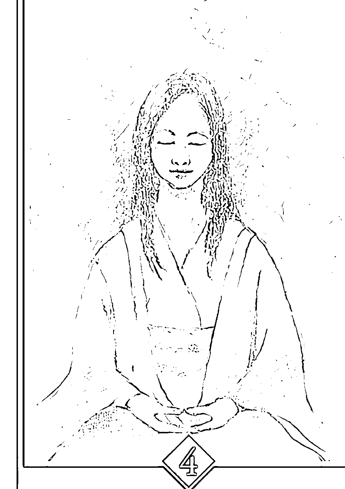

牌名：轉入內在

·元素：水。

·牌圖解說：外界的干擾，只有在你自己願意去看時，才有辦法影響你。牌圖中的女人閉著眼睛，把注意力放在自己的內心，旁邊的牛鬼蛇神對她來說，就像是不存在一樣。這張牌要說的是，應該適時放下尋求外在的認同與證明，回頭去注意自己真正的感覺。

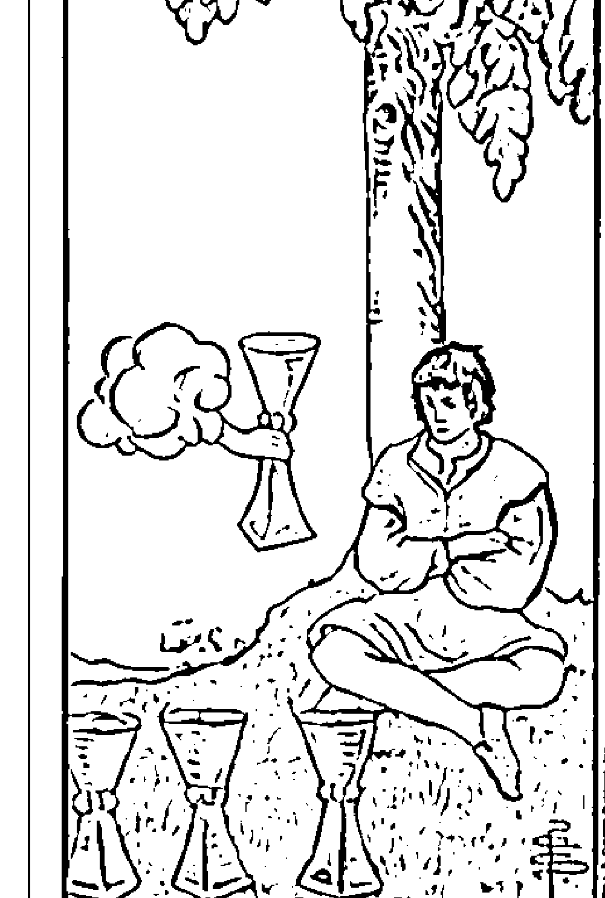

牌名：聖杯4

·元素：水。

對應塔羅牌的「聖杯4」

[PAGE 246]

## 以塔羅元素為論 聖杯4

## 水之4 ─ 轉入內在

牌圖中的人坐在綠樹陰下，代表的是休憩以及不往外行動的意思，在塔羅牌中，聖杯通常代表一種夢想和喜愛的動力，但是面對到他眼前的聖杯，圖中人採取的姿勢卻是雙手交叉於胸前，雖然像在思考，但在肢體語言中，這也代表一種防衛及不信任。因此可以知道，他對自己下一步該

做的事以及外界的環境，都是沒有什麼信心的。

數字4本身就是一個容易畫地自限的數字，而水元素被動、消極、容易缺乏信心，或以為別人都比自己正確，所以在數字4的範圍內，水元素不會有太多束縛感，反而會覺得在這個框框內是安

全的，走出去才會碰上不好的遭遇。對這張牌來說，已知的缺點比未知的傷點來得可接受多了。

牌圖中的人盯著遠處的三个杯子看，並且很認真地在考慮要怎麼去做，卻對已經拿到面前的那個

杯子視而不見，因此「聖杯4」有點空想的味道，計畫很多，真要開始執行時又不由自主地放棄

或逃避。這張牌的性質，就是想很多卻沒有勇氣跨出第一步，所以消極、眼高手低、容易倦怠，

也是一聖杯4」會出現的狀況。

相較於「聖杯4」，這張禪卡對於要邁入自己的世界，採取的並不是逃避或不想面對，相反的，

她的神情愉悅、態度平和。但這張牌真正的重點不在於一往內一的態度，而是可以成功不受外界的

擠壓，將心思凝聚起來，去感受自己真正的需求及想法。至於「聖杯4」就是因為容易受到他人干

擠，所以對於外界沒有什麼抵抗力，也才必須用一種不面對的方式來保護自己。

在禪卡一水之4─轉入內在一中，數字4就真的代表一種安穩和定力，比較沒有那麼重的限制意

義。而奧修觀念對於水元素的解釋，比較偏向愛、潛意識、內在的指引這一類層面，因此水元素加上

[PAGE 247]

數字4，就會更為內化、能跟自己平靜相處，也最能夠看到真相。在這張牌中，數字4就真的有一保護一意味，也能代表寧靜和專注，不讓心思過於分散。○能安住在當下就不虞匱乏。你需要的是內省而不是外求這張禪卡有很强的「安住在當下」、「不受干擾」的意味，看牌圖中女子的頭部四周有許多獲獲面孔，這些面孔代表欲望及企圖；點出了我們每個人往往都不滿意現在的自己，一直希望自己有更高薪水、更好的身材、更高的職位……即使設定的目的達到了，我們也還是永遠會想要再上一層樓。因此不管我們的成就有多大，永遠都沒有辦法安下心來，好好休息以及享受已經擁有的一切。數字4本來就是一個只代表基礎的數字，在塔羅牌代表的是：在基礎之上還要建築更高的東西；但在禪卡系統中，數字4雖然是基礎，但這個基礎就是自己的內心，只要你把自己的心穩下來，或把身邊的事情處理好，那其他額外的东西就會自然衍生，根本不需要自己汲汲營營去追求。容易被外界干擾的人都有一個特點，除了「不滿足」以外，還有一不知道自己要什麼。旁邊那麼多的臉代表你看到的東西：別人的享受、別人的擁有物、別人的財富。於是你會投射到自己身上，以為那也是自己所需要的，或是不能缺少的東西。但事實上，每個人需要的東西都不同，何況得到某些東西，或許你必須付出另一些相對的東西作為代價。我們為了一個理想中的情境不惜付出任何代價，到了最

## 強，不如直接聚集群體的力量，一起做些個人力量無法達到的事情～想想看，空中飛人是高難度的表演項目，表演中不能存有任何私心，因為大家都是命運共同體，就是因為三個人一樣優秀，才能完美合作，有最佳水準的演出。其中只要有一個人稍微弱點或遜色點，那麼不管其他兩個人有多強，這場表演注定會失敗。因此你不能嫉妒其他人，也不能存有競爭心態，你唯一的选择就是「合作」。○人生無處不競爭，你是選擇合作連橫？還是獨霸天下？這張禪卡的牌圖，幾乎和「權杖5」是完全相反的兩個極端。「權杖5」牌面全是男人，彰顯火元素的強勢和競爭特質；而「火之5」全然」中的三名空中飛人，照奧修禪卡書上所言都是女性；「權杖5」強調的是互相爭奪比高下，而「火之5」則是合作無間，三人幾乎可以算是一個整體了。許多人會堅持奧修禪卡和塔羅牌是兩種完全不同的牌卡，沒有任何連帶關係，就是因為很多組牌就像這樣，乍看之下會覺得完全相反或沒有任何對照關係，也找不到相似之處的解释。但我覺得兩張牌的構成本質還是相同的，只是奧修禪卡安排了「火之5」往另一個方向發展。在「權杖5」的牌義中，由於火元素獨立又自我，跟數字5的群眾處在一起時，一定會相互排斥又明爭暗鬥。再來看看數字5，這是一面對群眾時的自我意識，也就是才剛剛開始脫離自我感覺良好的階段，希望受到大家的承認和欣賞，但因為還沒有足夠的把握，所以別人的認同還得要靠自己表現來爭取。然而，麻煩在於：這個群體中大家的優缺點都很接近，所以還沒有辦法讓任何一個人凸顯自己 的特質，每個人都是旗鼓相當的。「權杖5」要表達的，就是證明自己有本事超越別人的辛苦過程。此外，由於「火之5」的火元素比「權杖5」的火元素多了可以互相連結的特質，所以力量不會凌亂而分散。也就是說，「火之5」全然的專注性、投入程度，都遠比「權杖5」的程度來得高，一獲得他人肯定的目的，也可以比「權杖5」在更短時間內達到。

# 數字牌

# 雲之5

# 比較 Comparison

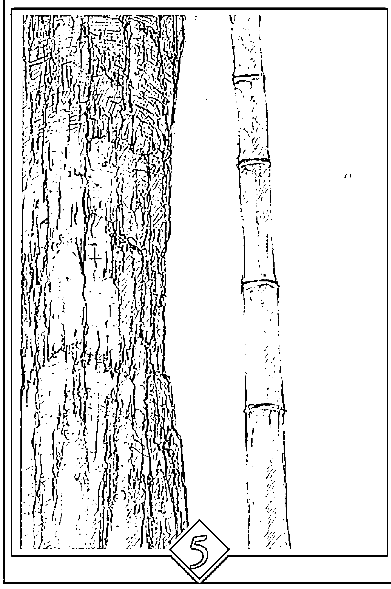

牌名：比較

+   · 元素：風。

牌圖解說：竹子跟樹相比，是一個很明顯的荒謬，兩者的性質和立場完全不同，要怎麼比較呢？但我們卻常常在做類似的事，拿自己的短處去跟別人的長處比，證自己徒生沮喪；或是拿自己的長處去比別人的短處，而覺得自己很優秀，當個洋洋得意的井底之蛙。這兩者，都是不需要的。

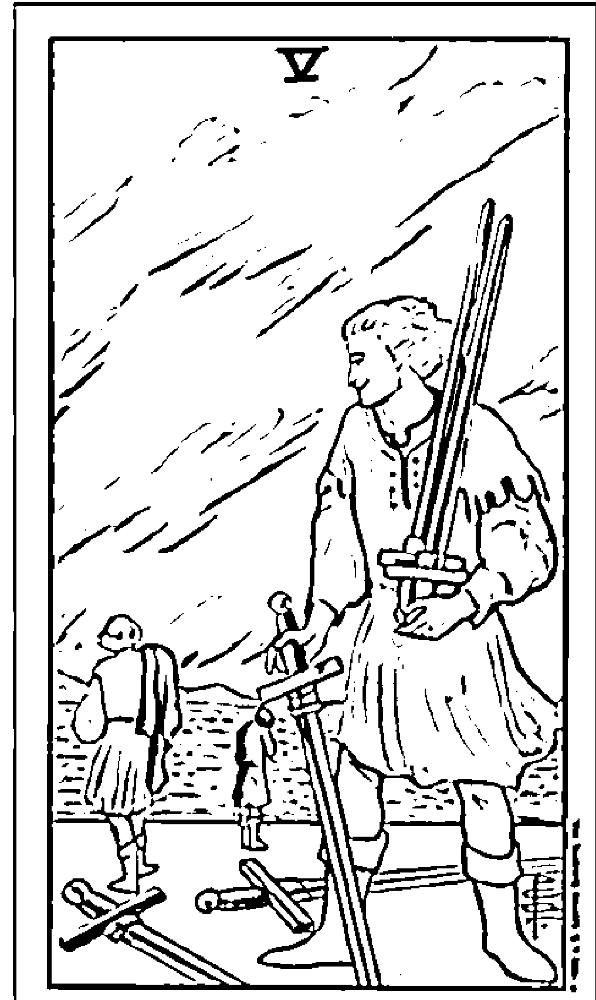

牌名：寶劍5

+   · 元素：風。

對應塔羅牌的「寶劍5」

257

數字牌•雲之5 比較 Comparison

對應塔羅牌的「寶劍5」

# 以塔羅元素為論

# 寶劍5

# 雲之5—比較

這張牌和一權杖5一樣，都是陽性元素的5號牌。陽性元素本身的競爭意識就比較強，加上數字5渴望他人認同，所以這兩張牌都表現出互爭輸贏的味道。—寶劍5—牌圖中可以明顯看出，

一個人看起來得意洋洋，把大部分的武器（寶劍）都抱在手 上，其他轉身離開的人則是一副垂頭喪氣的樣子；因此—寶劍5—的勝負性質強過—權杖5—，畢竟—權杖5—還在競爭過程，而不過仔細看，我們還會發現，勝利者似乎除了別人的武器外，沒有得到什麼實質利益，而輸掉的

人似乎也沒有失去什麼。由此可知，這裡的勝負，爭的不是一個確切的目标，而是風元素代表的一種—競爭意識—，只是不想輸給別人而已，並沒有真正的競爭目標。這是因為風元素不像火元素那麼有目標，寶劍牌組一向是較為凌亂分散的牌，它們代表的只是一種念頭，而非真正想達成什麼結
果。所以，我對—寶劍5—的定義比較偏向—意氣之爭—，不像—權杖5—那種貨真價實的競爭。如果—權杖5—代表的是良性競爭，那麼—寶劍5—就比較像是惡性競爭，有種損人不利己的意味。

這張禪卡的牌圖看起來平和多了，橡樹和竹子這兩者在外型、功能、生態上完全不同，卻非常平
衡地處於同一個環境中。風元素的競爭意識，在這張禪卡中化為一種本質上的不同，各有各的方向和天
地，不需要到真正對立的地步。牌名—比較—，其實是在說比較這個心態的不必要性，我們都知道風元
素代表—頭腦—，也就是小我心智，不管是覺得自己比別人卑下、會被人看不起，或覺得自己優於其他
人，別人都應該奉承自己，這些都是頭腦在作祟，因為那都是一種評價、想法，而非基於事實。

[PAGE 257]

火元素的5號牌如果要比較、要競爭，會是基於實際上的成績和需要，風元素的5號牌如果起了競爭心，通常是基於嫉妒、不安、煩躁等負面情緒。火元素在5的階段，通常是真的有競爭敵手；而風元素的5號牌，常常只是把別人當假想敵，或是為了消除自己的不安而否定別人。一旦你認定某件事情，就會形成一種牢不可破的你死我活的心態，風元素的「寶劍5」很容易把攻擊別人誤當成保護自己的數字5，就會但是更進一步來看，這些負面情緒都是虛幻的，實際上的狀況，對我們並沒有構成什麼威脅。○比較心、分別心，都是頭腦在作祟，讓你看不清發生的事實先前說過，「雲」在禪卡系統中，出現是一種認知上的障礙，它會產生比較的意識。在這張「雲」之5比較一的牌圖中，出現的橡樹與竹子就只是橡樹與竹子而已。但是如果你用家具商人的角度來看，可能會開始分析：一橡樹製成的家具堅實但沉重，會增加運送成本；竹子製成的家具輕巧舒適，但是市場上的賣價較低，會降低利潤……。如果你用的是園藝者的角度，就會去分析兩者的種植難易度，以及所在地區比較有利於哪種植物生存。從不同角度出發，我們會得出「橡樹好或竹子好？」的不同結論，但是我們的結論只存在於我們自己的立場，跟橡樹或竹子本身一點關係都沒有；我們的論點，也不可能讓它們變得更好或是更壞。這張「雲之5比較」等於在闡明「寶劍5」背後的真正本質，也就是：我們的比較心都是來自於頭腦，而非來自於事實。有句話：「沒有真正的笨蛋，只有放錯地方的天才。」這就說明了，不顧一切地想要證明自己比別人好，是無意義的。我們可以永遠贏過一部分的人，也可以暫時地贏過所有人，但是我們不可能永遠贏過所有的人！與其不斷比較，還不如去選定自己適合的位置，發揮自己最大的能力，才能避免比較帶來的自我膨脹或自我貶低，因為兩者都是幻覺。

259 數字牌・雲之5 比較 Comparison 對應塔羅牌的「寶劍5」

# 數字牌

# 水之5 執著於過去 Clinging to the Past……

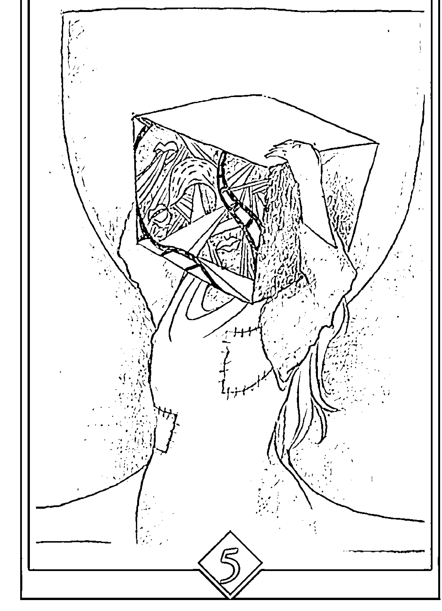

牌名：執著於過去

+   · 元素：水。

牌圖解說：圖中的人用一個充滿八卦和批判圖案的箱子蓋住自己的頭，等於封閉了自己的五感知覺，也等於認不清楚當下的狀況。無法活在當下，就沒有辦法解決任何問題，乞丐般的衣服代表這個人的無力，背後的香檳杯是喜悅的歡慶，但遮住五官的人卻永遠無法發現杯子。這張牌意味著很少投入當下真實的生活，只活在自己的成見當中。

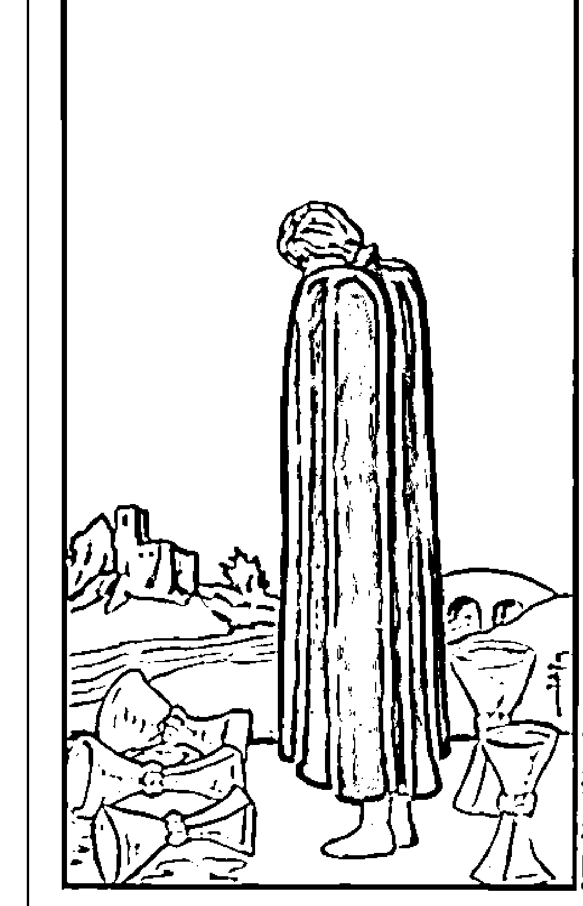

牌名：聖杯5

+   · 元素：水。

對應塔羅牌的「聖杯5」

# 以塔羅元素為論

# 聖杯5

# 水之5 ─ 執著於過去

這張牌最大的特點，就是那件黑色的披風。披風整個裹住了身體，黑色代表遮蔽和沉重，這個部
分顯示出他的情緒低落，以及不肯放開的心態。圖中的五個杯子，有三個杯子是倒下且水已經流
失，這代表曾經有過很多的情感到希望（由水來象徵），但現在已經落空了。因此，這個人沒
有辦法面對自己失去的東西，帶有自暴自棄和自怨自艾的成分。

數字5帶有比較和競爭的含意，但是水元素並不擅長爭奪，一般來說，水元素都傾向以退讓和包
容的方式來解決眼前的狀況。然而，數字5帶來的競爭性，不是光靠退讓就可以了事的，那是一種不得不如此的环境狀況，就算你的本意不是要比較，但就是會有很多不斷追趕你、超越你的人
事物，逼得你不得不再三地檢視自己的不足之處。這種狀況久了，難免會形成對自己的不滿意，

更沒有辦法從悲觀的情緒中跳脫出來了。通常陽性元素遇到數字5，則會轉向自我壓抑，不但求不到認同，對自己的懷疑也會更深。

爭的陰性元素遇到數字5，則會轉向自我壓抑，不但求不到認同，對自己的懷疑也會更深。

圖中女人身上那襲如乞丐般的襤褸衣衫，就等同於塔羅牌「聖杯5」倒掉的那三個聖杯，也就是

她所失去或缺乏的東西。套在頭上的那只盒子框住了她的視野，使她停留在某個狀況中走不出來，這
樣的含意等同於黑披風。女人身後那只發亮的香檳杯，等同於「聖杯5」中没有倒下、裝滿水的兩個

聖杯，代表她仍然擁有、可以享用、卻沒有注意到的東西。

就如同牌名「執著於過去」，這個女人無視於她身後那個代表慶祝的閃亮杯子，卻穿著一身破衣
服，並用一個象徵各種繁雜事物的盒子把自己的頭套住，讓自己看不到其他的可能性。看起來她很愚
昧，但她做的事卻是我們每個人都可能會犯的錯誤。

261 數字牌•水之5 執著於過去 Clinging to the Past ─ 對應塔羅牌的「聖杯5」

# 數字牌 彩虹之5 局外人 The Outsider……

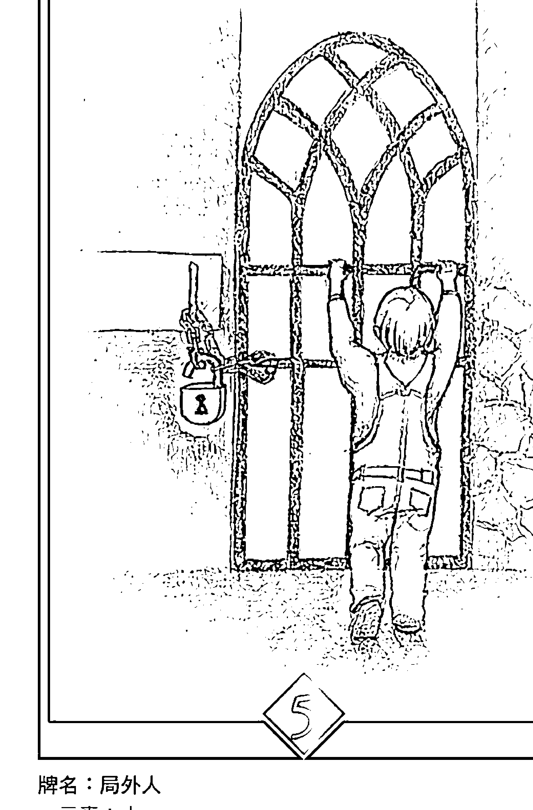

牌名：局外人

+   · 元素：土。

牌圖解說：門上的鐵鍊並沒有真正上鎖，所以這個小孩進不去 的原因不在門被鎖住了，而是他還太小，找不到進門的方式，或者甚至不知道自己進門要做什麼。這意味著我們沒有自信或不夠強壯時，即使眼前沒有任何阻礙，我們也不敢前進。但總有一天小孩會長大、看清事實，堂而皇之地走進屋裡。

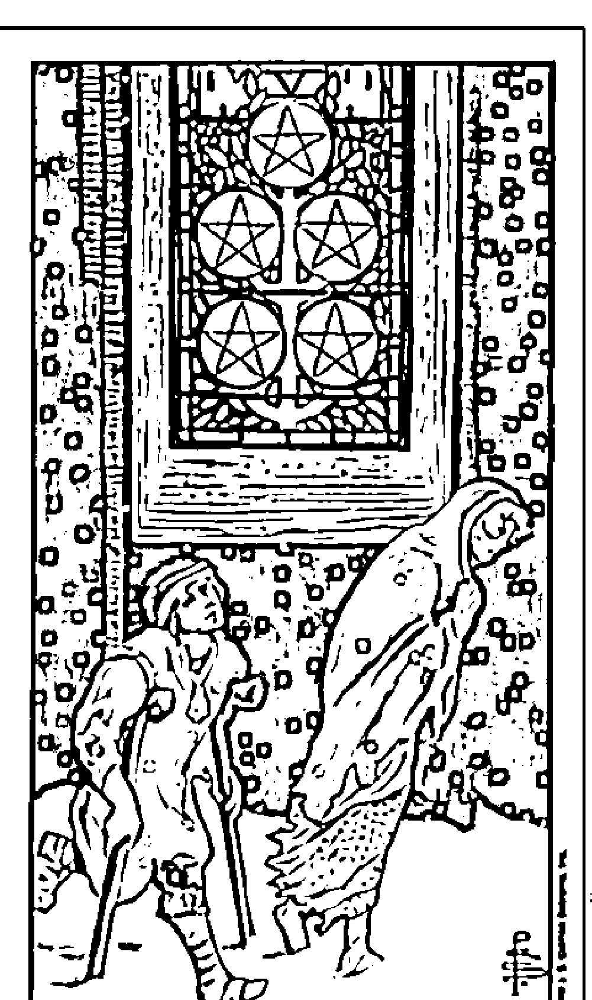

牌名：錢幣5

+   · 元素：土。

對應塔羅牌的「錢幣5」

# 以塔羅元素為論

# 錢幣5

# 彩虹之5——局外人

這張牌一般都解釋得很簡單——就是「貧窮」。因為牌圖中就是兩個窮人，什麼資源都沒有，就算旁邊有個漂亮的大教堂窗子，看起來他們也是不得其門而入。但是我們要深入來看，「貧窮」本身身不見得是重點，重點是貧窮帶給我們的是一種「受困」的感覺。圖中的人不只窮，他們的衣物單薄，其中一人肢體不便，又置身在不良於行的冰天雪地中，不管他們要去哪裡，都比其他人要艱難好幾倍。因此，我覺得一進度遲緩—和—重重障礙—，是「錢幣5」更為核心的含意。

土元素已經像顆大石頭般，形成過不去的路障了，數字5又加強互不相讓的感覺，兩者加在一起就會像是一卡住、—被困在某個處境中—的感覺。我們可以從數字5發現，你遇到的困難（那股阻礙你的力量），跟你本身的力量是不相上下的，所以它可以對你形成困擾，讓你沒有辦法不花大力氣去處理它。除了障礙本身會擋路之外，它還會消耗你的心力，所以不管你面對任何事情，抽到一錢幣5—，代表過程都是艱辛的，大部分的人都會在中途放棄，以免受到更大的挫折。

這張禪卡看起來像是一個被拒於門外的小孩子。我猜之所以會畫小孩，應該是代表在某方面的不成熟，例如：時機還沒到，或者還沒做好準備，或者往後還有更好的選擇等等。所以，圖中的小孩子雖然失落，但是其實等到他再長大長高一點，一切事情可能就會水到渠成，現在的困頓和無法行動，對他來說只是一個培養、等待長大的過程。

彩虹雖然和錢幣一樣都是代表土元素，但錢幣代表的是物質世界中堅實的一面，而彩虹代表的是物質世界中無常的那一面。所以彩虹代表的土元素，一遇到數字5，意味著事情停滯，無法前進也看不到了轉機。但是，雖然它跟「錢幣5」一樣都面臨困頓，但是彩虹的僵局比錢幣來得短暫且容易被打破，

[PAGE 263]

# ○讓你自己變大，問題就會變小

就算是停滯期間，彩虹還是會有很多細微的變化。所以，兩張牌雖然都會讓人心煩意亂，但是「錢幣

5－必須要努力想辦法去打破現況，

## ○至少給自己一次機會，當一次百敗不斷的傻瓜

換句話說，一大家一給你的忠告和經驗談，都是讓你當踏腳板用的，不是要你陷在別人的判斷中，失去自我的決定權。

老虎象徵的是自我價值，對一自己一擁有絕對的意志和主導權，可以不用在乎他人的看法和評斷，發掘出自我真正的優勢及獨特之處，並經由地球（群眾）的支持，脫穎而出，走上自己的道路。

雖然不是跟眾人一起走，卻可以超越並領導眾人。

相較於一權杖6一，禪卡一火之6一並不完全像上文提到的曾雅妮等人（當然有部分特質是一樣的），我覺得更像是《這一生，至少要當一次傻瓜》的作者一種蘋果的木村阿公。他種有機蘋果的方式違反了所有農夫的常識和經驗法則，在找出自己的蘋果園最適合的耕種方式前，他不断反覆實驗，淡然看待身邊人的勸阻、嘲笑或攻擊。這些痛苦的經驗，最後物極必反，讓木村阿公看到了人類是怎樣和蘋果的本質對抗，所以最後讓他可以放下控制的心態，種出最有價值的蘋果。

在這個例子中，眾人的反對及失敗的過程，都化身為牌面上老虎腳下的那個地球，為木村阿公的成功打下深厚的基礎，最後木村阿公找到了和蘋果樹共同努力的方式，他變成了那隻老虎一屬於自

我的主導權，最後他的蘋果供不應求，也就是騎在虎背上的人享受著屬於自己的榮耀。雖然眾人已經認同他，但到了這個時候，其他人的認同與否，早就不重要了。

# 數字牌

## 雲之6 重擔 The Burden……

對應塔羅牌的「寶劍6」

牌名：重擔

+   ·元素：風。

牌圖解說：這是一張代表「社會化」負面意味的牌。牌圖中可憐的男人擠著一個顧指氣使的歐巴桑，這讓我們聯想到自己身邊的三姑六婆，她們可能對你一點都不了解，卻想逼你照著她們的價值觀過日子。而她頭上的公雞，更有一種搞不清楚自己身分的感覺。但可悲的不是這種人的存在，而是你把他們的意見當一回事。

牌名：寶劍6

+   ·元素：風。

# 以塔羅元素為論

## 寶劍6

## 雲之6—重擔

船中插著的六把劍，在一般公認的塔羅牌義中，代表過往的傷害。劍仍插在船上，代表傷害並未完全去除，但至少這艘船正在「離開」；船上的婦人雖然駝著背、披著圍巾，看起來有點消沉，但圍巾是樂觀進取的黃色，代表她即將從過去的傷害中慢慢恢復。

這張牌中最能代表數字6的，就是撐船的船夫。他的角色是幫助船上的婦幼，離開過去會對他們造成傷害的人事物，他是一個「協助者」，數字6的含意就是公眾社會的群體連結，表示大家都

在同一條船上，好或壞都會互相影響，因此幫助別人也等於幫助自己。寶劍代表的是風元素類型 的傷害，也就是經由言語和觀念的衝突造成的情況，就算是沒什麼好牌的寶劍系列，在遇到有療 愈效果的數字6，傷害和不好的記憶還是可以被慢慢撫平。所以在這張牌中，表示經由其他人的 協助和接納，可讓當事人遠離對他不好的情境，重新展開另一段生活。

是站上高位；但是很容易混亂的風元素，遇到6這個會有太多人給予關心和建議的數字，就會變得更 無所適從，往往會演變成父子駿騏的現象，被別人的意見牽著走，弄得自己身心俱疲。

在上一組牌中，禪卡「火之6」把「權杖6」的支持者（或稱為粉絲團）變成了老虎（自我的意 識）腳下的地球，把數字6從支持分享變成了支援穩定。而在這一組牌中，禪卡「雲之6」卻把「寶劍 6」的一「熱心協助者」，變成了他背上的那個老太婆和公難。

牌名「重擔」，背負的是「眾人的評判」，是一種在大家的指指點點下失去自我意識的情形。我們可 用鄉下的一人情味一來類比，有些人會覺得有人關心、注意，在自己需要時自動幫忙，讓人備感溫暖；

有些人會覺得這樣造成了很多無形的壓力、失去隱私權，寧可自己解決。這就是數字6的一體兩面。

在「雲之6」牌圖上這個形容憔悴的男人背上，有一個頭指氣使的老太婆，告訴他該怎麼做。這讓我想到很多三姑六婆（不限女人），從來不管別人的人生規畫，也完全不了解你的個性，就自以為是的建議你：你都三十了，該結婚了……是時候了，你該生小孩了，再拖下去，會變老姑婆、變高齡產婦。如果這些話真的聽進去就慘了，他又不會幫你養小孩，也不會為了你的婚姻負責。還有些人會說，你應該放棄你的夢想安份當個公務員、你現在應該以賺錢為優先、你應該要務實工作、你應該……。你問他為什麼？他會說，因為大家都是這樣啊，我們當年也是任勞任怨走過來的，所以你一定要這樣做才對。但他絕對不會為你設想到今昔不同，環境改變了，價值觀也不同了。這些人講話前從來不會思考，只為了表現自己是對的、是睿智的，他們的人生是值得參考的，就隨口給你一千種建議，但腦子裡從來沒有替你好好設想過。如果你想要讓每個人滿意，把每句廢話都聽進去，那麼你的下場就跟這張牌上的男人一樣，沮喪又失去方向。至於那隻喔喔叫的公雞，象徵的是一種主流價值觀人士，那種自以為正確和優越的心態是你不需要放在眼裡的。雖然數字6還是有它的好處，我們活著也不應完全脫離群體，但是如果你無法不在意他人的評價（像小說《飄》中說的，那個時代的神士，最關心的事情永遠就是一鄰人們會怎麼說呢？），永遠都生活在人言可畏的恐懼中，就會完全失去自我的力量。這時的你，至少應該脫離眾人的影響一陣子。

在「雲之6」重擔這張牌中，當事人還是必須抽離現況的，只不過在塔羅牌中，婦女和小孩是經由他人的協助，而「雲之6」則要靠自己勇氣和決心，才能逃離他人的眼光和評價，真正做回自己。可見他人的幫助，仍然比不上自我覺醒來得重要。

# 數字牌

## 水之6

## 愛情夢 The Dream……

對應塔羅牌的「聖杯6」

牌名：愛情夢

+   · 元素：水。

· 牌圖解說：圖中的女人把視線放在一幅男女情愛的幻影中，她相信這是她想要的，也相信如果愛情順利可以讓她的生活快樂起來。這種情形不限於愛情層面，我們會在不同面向上犯下類似的錯誤，比如我們在事業上的成就要靠老闆、我們的幸福是由配偶決定的、我們的缺陷是父母造成的……如果相信這些，就等於把自身的決定權交出去了。

牌名：聖杯6

+   · 元素：水。

## 以塔羅元素為論 聖杯6

## 水之6 ─ 爱情梦

水元素與數字6是非常相配的組合。水元素代表的是感情、溫暖、善意和關懷，而數字6是群體共生，家庭、社會乃至國家都跟6的社會組織性有連結，兩者搭配在一起，就是一種深深的人情味，沒有絲毫自私成分。偉特牌的「聖杯6」，把不同的人聯合起來變成一個群體，彼此休戚與共，因此從老朋友、熟悉的人、舊情人、親人，到故鄉、懷舊、美好的記憶，都可以由這張牌來代表。牌圖畫了兩個小朋友，更強調了人與人之間在感情上的真誠交流，以及美好溫暖的特質。這種感情是熟悉的、令人安心的，可以回味一輩子，就像穿上舊衣服一樣輕鬆自在。人與人之間既沒有防衛和猜疑，沒有彼此驚嘆或競爭的意味，這是一張代表理想國度的牌。家人關係通常會出現這樣的牌，如果是情侶或工作夥伴抽到這張牌，表示已經與對方變成生命共同體了。塔羅牌「聖杯6」歌頌「人人愛我、我愛人人」的觀念，但是禪卡「水之6」告訴我們，不應該再帶著偷懶的心態，幻想情人或至交或家人有義務要解決我們的一切問題。因為在互相依賴的關係中（不管哪種關係），成長會停止，而你渴求的人有可能離開、變質或死亡，你如果藉著依賴構築出幸福景象，也終究會在分開時而幻滅。在靈性的境界中，水元素是一切愛的起源，它非常圓滿、強大和完整，幾乎沒有事情不能透過愛來取得平衡。比起一般我們認知中的情感，靈性定義中的愛——也就是水元素代表之物，格局太大、境界太高，這是代表一般人類社會結構的數字6所容納不下的。奧修說過：「有一件非常複雜難懂的事需要被了解：如果没有愛，你會覺得寂寞，但如果有愛，你真的在愛之中，你就會是單獨的。」

## ○你要在愛中成長，成為一個完整的個體

孤單寂寞是哀傷的，但單獨不哀傷。孤單是一種不完整的感覺，你需要某個人，而這個人沒空。但，單獨不一樣。單獨意味著你是完整的，你不需要任何人來使你完整，愛讓你觸及到內在，我們一般凡夫俗女是很難做到的，反而比較常落入互相需索的狀況。你有沒有回頭想過，在尋求愛情伴侶時，你往往希望他能懂你的心思，知道你的需求，給你所祈求的，並且幫你趕走寂寞、孤單和恐懼。這樣的心態往往是個能照顧你的人，而不是愛人，更像是父母或朋友的代替品。這種愛情縱容你沉溺在幻想中，但沒有辦法幫你看清自己。所以世間上大部分的愛情，往往是互相需求、互相期待的成分大過於彼此相愛。數字6帶來的連結性質，以及水元素的被動和幻想性，會讓我們無法挣脫這種渴望，渴望處在安全中，渴望一個什麼都不用煩惱的境界，並且理所當然地認為有些人應該為了我們的喜怒哀樂和幸福負責。我們服務的企業應該保障我們的晚年、我們養的孩子應該孝敬我們、我們投注心血的事物應該要按照我們的期望發展……，這些都跟我們對愛情的幻想沒有兩樣。但是沒有人能夠為你的幸福負責，因為真正的幸福和安全感，永遠來自我們自己看待這個世界的態度，而不是來自外界或他人。

很多人都有一種普遍的誤解，就是：(1)我一定得找到我的靈魂伴侶，不然就會不完整；(2)靈魂伴侶一定是以情人、配偶的身分出現，也就是所謂的真命天子（女）；(3)靈魂伴侶能帶來完美的愛，我從此不用再經歷愛情的磨難。可惜的是，靈魂伴侶不等於量身打造的情人，家人、朋友甚至是龜物，都有可能是你的靈魂伴侶。如果靈魂伴侶以情人的身分出現，他更有可能磨練你、揭穿你，逼著你褪去虛假的外殼。因為如果不能幫你改變，你們的相遇就失去意義了。

# 數字牌

## 彩虹之6 妥協 Compromise……

牌名：妥協

元素：土。

牌圖解說：圖中這兩個人看起來相處得並不融洽，雖然沒有發生衝突，但他們的表情緊繃，並排站在一起卻沒有真正的交集，僅僅是小指頭相觸，代表維持著一點點連繫而已。這是一種「雖不滿意但可勉強接受」的狀態，一旦說服自己接受不夠好的狀態，就會失去進步的原動力。

牌名：錢幣6

元素：土。

對應塔羅牌的「錢幣6」

## 以塔羅元素為論 銀骼6

## 彩虹之6——妥協

數字6和土元素的組合，比起跟水元素搭配更適合。因為6本身就有「社會性、組織化」的性質，表示一個社會要大家都願意付出，才能維持運轉，在某個人失去能力時，也能得到其他同族群的幫助；而這一點，跟土元素的「組織、社會、群體道德」的性質非常契合。所以牌圖上是富團中的富人把錢施捨給窮人，這是一種錢財平衡，如果没有一般社會大眾的付出和消費，富人的生意或產業就無以為繼，所以富人有一「取之於社會，用之於社會」的義務，這就是所謂的「企業責任」。不同於一般生意人只需顧及賺取利潤就好，企業和社會大眾是唇齒相依的，就像有人說過：「神明是了不起，但如果沒有信徒，神明也無處容身。」我認為這很現實，但也很傳神。因為適當維持兩者平衡是必要的，把財富分配給他人也是一種利己的表現。

得長久維持的狀況，太過依賴別人生存，必定會捨棄自己的自尊及生存目標，是妥協而非真正的和平共處。所以，每個人應該徹底去面對自己所遭遇的問題，靠著自己的力量去解決。如果長期、過度的接受別人幫助，久而久之之會失去獨立解決問題的能力。大家都聽過「削足適履」這句成語，為了擠進別人認同的模子裡，寧可硬生生地切斷自己的某些部分，或許因為這個部分跟其他多數人不一樣，為了迎合所有人，讓自己被團體接受，你必須把自己的獨特的一面隱藏起來或否認它、撲滅它，這是一種捨本逐末的行為。你希望大家接受你，但你卻否認了自我的特質，這時被大家接受的早就不是本來的你，你只能委曲求全地活在這個團體中，不好不壞，這就是「妥協」。「彩虹6」的牌圖很有意思，圖上兩個男人是日本的宮廷侍者，都是被去勢的

# 數字牌

## 雲之7 政治手腕 Politics……

看到這張牌，很多人應該會感覺到不太舒服。牌圖很明顯就可看出一個人表裡不一、口蜜腹劍，和善的面具配上猶猶的眞面目，狡詐的蛇取代了象徵禮儀的領帶。事實上，我們每個人多少會有這個表裡不一的成分，當粉飾太平變成一種普遍的生存方式時，我們就難全然的真誠。

牌名：寶劍7

元素：風。

對應塔羅牌的「寶劍7」

## 以塔羅元素為論 寶劍7

## 雲之7——政治手腕

這張牌很像我們小時候沒見過世面，卻老覺得自己很聰明，調皮搗蛋時就盡做些掩耳盜鈴的事，以為只要瞞過自己，就可以瞞過大家。往好處看，我們也幹不了什麼太嚴重的壞事；往壞處看就戰爭，就把對方的劍（武器）全都偷走，還自鳴得意。問題在於，這樣並不是釜底抽薪之計，躲得了一時躲不了一世。這張「寶劍7」的故事，象徵捨本逐末，永遠在做一些損人卻也不利己的事情。風元素雖要把水龍頭關起來，乍看之下像是個聰明人，但永遠在做一些損人卻也不利己的事情。風元素雖聰明，卻是涼散、沒有意志力的，數字7會鎖定一個確切的目标，想要更上一層樓，但是配上風元素容易傾向用取巧、作弊的方式，讓自己和別人都以為目標已經達成了，實則不然。不過，這種特質也不是全然沒有好處，在需要努力踏實的時候，「寶劍7」就可以發揮臨場反應，因為這不需要考慮到後續的長期效應，只要當下應付過去就可以了。

這張禪卡雖然與「寶劍7」構圖不同，還是看得出相似之處：同樣都帶有虛偽、欺騙以及不真誠的含意。「寶劍7」比較是鑽旁門左道，雖然品性不佳但也没有很嚴重，倒也不是它更壞，而是一雲之7」欺騙別人的同時）。不過「雲之7」的政治手腕，狀況就比較嚴重，倒也不是它更壞，而是「雲之7」欺騙別人的同時，也朦蔽了自己，並會忘記自己本來的面貌。

這張禪卡的圖面，一眼就可看出牌名「政治手腕」是什麼意思。塔羅牌的「寶劍7」雖然好巧、愛鑽漏洞，但是傷害力不太大，只是最後徒勞無功而已。但這張「雲之7」的牌圖卻顯示出天真的面具後面竟然藏著一張居心叵測的臉，這不僅是欺騙他人，也代表他的欺騙沒有給自己帶來好處，反而讓自己的處境越來越不利。這張禪卡，除了包含「寶劍7」那種便宜行事、愛走旁門左道的毛病之外，另外還帶有一種性質：想利用意識形態和花言巧語來控制他人，並將沒有價值的事物加上美好的包裝，以騙騙手段來讓大家接受他的說法。這種政治手腕不限於政壇，在宗教、學校、商場、職場全都可以見到。奧修說過：「一個宗教團體，不會有宗教性的存在，凡事一旦變成了組織，就只會是政治，不會是別的。因此所謂的政治手腕，不只是一種狡猾的心態，政治手腕一旦獲得優勢，會對你產生極大的影響。我們對政客的謊言都很有警覺性，但對廣告、愛情、學校的偏差思想卻沒有任何抵抗力，政治手腕各種意識形態變成了我們的常識，從不起疑，也失去改變的能力。可，數字7是想更上一層樓，但是晉級需要強韌的意志力和企圖心，風代表形式，也就是一種官方或大眾的認外，雲象徵一切騙蔽人心的表面形象，所以「雲之7」的含意即：想達到某種程度，但不想增強實力來顯現（風元素的投機取巧），就賦予某樣東西一種證明或認可，一旦貼上標籤，大家就容易被洗腦或欺騙。所以有沒有念完醫學院；只要打著「理財專員」的名號，自然有人會送錢給你……。你有没有念完醫學院；只要打著「理財專員」的名號，自然有人會送錢給你……。這種形式還包括各種口號：拯救異教徒、保護國家主義、維護世界和平、依法行政等等。喊著口號，一切巧取豪奪、私相授受都可以變成正確的。還有一廣告詞：結婚一定要買鑽戒、情人節一定要送玫瑰花、表現自我一定要喝某種飲料……。當然也包括了「傳統社會觀」：一定要結婚、一定要生孩子、找份好工作才是為人生負責的表現等等。我們就像被催眠一樣，照著已設定好的路線走。因此「雲之7」政治手腕這張牌一旦出現，你要注意的不只是謊言，更要仔細檢視每一個本來覺得理所當然的念頭，看看這些舊有的觀念是否防礙或限制了你。因為不管政治手腕再怎麼高明，決定要不要被它控制的，只有你自己。

# 數字牌

## 水之7 投射 Projections……

對應塔羅牌的「聖杯7」

牌名：投射

元素：水。

牌圖解說：這兩個人雖然面對面，但竟然看不到彼此；他們眼中看到的，是自己幫對方描繪出來的樣子，或者說，是對方一向以來的言行形成的殘像。我們生存在社會上，很難不給每個人貼標籤，但是一旦下了評判，就很容易錯過對方的每個改變，也無法做出正確的回應。

牌名：聖杯7

元素：水。

## 以塔羅元素為論 聖杯7

## 水之7 ─ 投射

錢財、名聲、美貌、智慧等顯而易見的實物都裝在夢想的杯子裡，還飄浮在半空中，看起來很不踏實。因此，懂塔羅牌的人都會為了一聖杯7～的不切實際而笑。其實，牌圖中的狀況卻是我們常常在做的事：畫大餅、發白日夢，雖然說有夢最美，但如果不能配合實際行動，空想完再對照現實，只會讓自己覺得更無力。牌圖上層中間的杯子裝的是未知的事物，我覺得這代表：如果我們沒有真正去行動，就會渴望別人擁有的東西，卻不知道那些只是表面的，最珍貴的東西或許是努力過後的滿足感，或許是發現自己真正的渴望，或許是了解自己現有的一切比不切實際的欲望還珍貴，這些一定要自己親身投入才會明白。

風元素和水元素都是涣散元素，數字7則有著不放棄和堅毅等認真的特質，因此這兩種意志不堅的元素若碰到數字7，壓力就會很大了。風元素的「實劍7」面對壓力，是以閃躲、作弊、耍伎倆、顧往承受不了壓力，但夢想性的本質又讓水元素比較柔弱又容易躲進自己的世界裡，遇到數字7往安慰或自欺欺人，想像著一個因為沒有行動而永遠不會到來的「未來」。

雖然這張禪卡的牌圖與「聖杯7」差異較大，但共通之處是都帶有「虛幻」的成分。「聖杯7」代表的空想，是我們每個人常常會發生的狀況，同樣的，這張禪卡也是我們每天不自覺會陷入的狀況。牌面上一對互視的男女，卻是用一層虛幻的外圍來對看，感覺看到的並非真相。其實，不只是對感情上的伴侶，我們看我們身邊的事物，也或多或少帶了我們自己的某種投射。上一篇提到的「雲之7—政治手腕」是一種有意識的欺騙，帶有極強的控制欲，並善於催眠他人，這種帶有謀略的特質是很明顯的人格缺陷，但正因為明顯，所以只要背面對，當事人自然會知道如何調整。但是一水之7—投射—不同，這張牌是不自覺地—扭曲自己看到的一切事實—，原因很簡單，就是一人往往無法看到超出自己認知範圍以外的事物—，所以無法接受某件事情中自己不了解的部分，就把看到和感覺到的一切裁剪成自己可以接受的樣貌。這雖然是一種自我保護的方式，但數字7要的是成長和突破，水元素的逃避方式只會扼殺成長的可能性。○穿越虛幻的迷霧，你才能看清頭腦設下的假象。為什麼我們每個人都會看不清楚別人的真面目呢？答案是—頭腦—在作祟，一旦我們認定某件事，就會自我設想，把這個一定義—套用在每件事情上面，因此沒有辦法看到它真正的樣子。舉例來說，如果你曾經被人用甜言蜜語欺騙過，很有可能會因為恐懼而讓你只信任對你惡形惡狀的人，因為你會自動把好聽的話解讀成欺騙的前兆。事實上，有人讚美你或許真的是為了要放鬆你的戒心，但也有人是真心地讚賞你的優點。但是一個充滿限制的頭腦，會認為自己的經驗法則才是真相，因此你看到的只是你對他人的一種既定觀念，換言之，你看到的是你內心的成見。內在的恐懼往往會扭曲外的事物，而水元素的脆弱情感成分，總是會讓數字7無法成長、超越現況。

在感情中，這種—投射—現象往往最容易發生。我認識一個女孩，男友對她既冷漠又自私，但女孩覺得她爸爸對媽媽也不會主動嗑寒問暖（但爸爸沉默的態度，其實是不善表達），所以女孩將男友的態度解釋為—因為他當我是自己人，所以我們這是平淡卻長久的愛，當然不需要太多熱情和討好—。在這個例子中，—水之7—投射—的作用，變成了一種被自己的期待扭曲，一味的相信自己想要相信的人，因此看不見顯而易見的真相。如果要達到數字7的成長，唯有認知到自己的逃避和狹隘後，才有可能突破。

# 數字牌

## 彩虹之7 耐心 Patience

耐心 Patience

牌名：耐心

+   · 元素：土。

牌圖解說：這是一個幸福洋溢的準媽媽，安然等待著寶寶出生。雖然上方陰晴圓缺的月亮，暗示要等到生產的那一刻還需要一段時間，但這些時間並不是白白度過的，寶寶需要這些時間讓身體和頭腦都發育成熟，以便健康的面對人世。這張禪卡意味著如果没有耐心，最好的結果就不會顯現。

牌名：錢幣7

+   · 元素：土。

對應塔羅牌的「錢幣7」

# 以塔羅元素為論

## 錢幣7

## 彩虹之7—耐心

圖中的人若有所思地看著從樹上結出來的七個錢幣，雖然農作物看起來生長得很好，收穫也會很穩定，但是這個人顯然認為一直維持目前的收穫量是不夠的，他很想知道有什麼方式可讓農作物收成再提高。但是之前的耕作方式已經很穩定了，想要再進步不能急躁地改變原有的模式，以免失去原來的優勢。反而是要長期觀察，找出問題所在或是可以再改善的地方，讓收成更上一層樓。我們都知道沒辦法揠苗助長，要突破原有的限制得要從各方面觀察，也許是土質要改良，也許是肥料要換，也許是耕作方式要改進……一個小小的地方就有可能影響全局。這張牌代表的是要以謹慎的耐性，一步一步照著自己想要的目标前進。

錢幣代表的是土元素的扎實性和穩定性，一直緩慢又踏實的持續前進；而數字7是往前突破和升級，由此可知，錢幣7是用一種很謹慎又不張揚的方式，慢慢往前邁進。這張牌的進步可以說是「不求贏過所有人，只求今天的自己贏過昨天的自己」；因為有這樣的耐性，很多事情一旦成形就會非常可靠，而且幾乎可以確保永遠都在前進中（雖然速度不快）。所以這張牌象徵的是：實事求是，以及充滿實踐力（土元素）的求知（數字7）精神。

這是一個非常需要時間的過程，如果太快達成或太早看到成果，反而是不好的。每件事情都有它的自然節律，就像不同季節有不同的水果和蔬菜，即便科技進步到可以用各種方式催熟農作物，但只要不
己的節奏醞釀成形，不急躁也不強求。從這張牌的牌圖（懷孕的女人）配上牌名「耐心」，就可以知道這張牌的「耐心」與「錢幣7」略有不同，並非一步一步小心地前進，而是放手，讓事情隨著
是當今的作物往往容易腐爛，不僅栽種過程容易生病，收成的作物在口味上也会略遜一籟。

○強摘的果子不甜。時候到了，一切自然就會順理成章造一出想要的成果，過程會比較艱辛，細節也很繁瑣。但彩虹代表的土元素不一樣，彩虹象徵過程中的活動，充滿了自然的性質，包含天時、地利、人和等要素，所以不像錢幣代表的土元素那麼具有「控制」性質。數字7則是代表了想要從原有的層次再提升，而彩虹代表了會用一種一讓出空間，讓一切該發生的自然發生一 的狀態。如果是用彩虹的方式來達到數字7的進步，那麼應該抱持著一種一做好所有該做的事，成果自然會顯現一的心態，與「錢幣7」細心規畫每個步驟是有很大不同的。牌圖中懷孕的過程，同樣是不能催促的，要有足夠的時間讓一切步驟逐漸成型，就像圖中上方的月亮有陰晴圓缺一樣，誰都無法在不恰當的時候，表現出最完美的形態。如同食物的烹調也需要火候，智慧累積也一樣需要人生的歷練。很多事情如果是速成的，表面上看起來目的達到了，但內不在夠成熟就會不穩定，往往不堪一擊；很多我們覺得是浪費時間的過程，或覺得在原地踏步，其實都是一種「打磨」，人生中的每個經驗都不會是白費的。我曾聽一個靈修的人說過，心靈的成長需要作為，也需要等待，努力有努力可以培養出來的特質，而沉澱也有沉澱所培養出來的特質，這兩種過程都是我們需要的，沒有一方可以取代另一方。如支援度不夠，最後還是要回頭把缺徵的功課給補齊。所以，不如就讓該發生的一切都發生，不要去區分有用或沒有用，很多事情都要到最後一刻，你才會知道為什麼會發生，而最終的

# 以塔羅元素為論

## 寶劍8

## 雲之8 ─ 罪惡感

在塔羅牌系統中，寶劍常常代表傷害和煩惱，在這張牌圖裡，女子被八支寶劍困住，意味著她是被許多新仇舊恨、不好的記憶或對未來的擔憂給困住了。如果我們做事永遠是瞻前顧後，凡事都無法迅速下決定，那麼就會變成像「寶劍8」一樣的狀況了。外在的阻礙，比不上自己內心的恐懼。風元素通常象徵我們的意識，意識的具體部分就是我們的想法。我們都知道風元素缺乏一個確切的目的和方向，如果没有核心的價值觀，腦子裡又想東想西的，很容易就會走岔了路，也因為內心不夠堅定，無法堅持理念而變成畏首畏尾。最怕的是，在渾渾噩噩中做出莫名其妙的決定，然後因為結果不理想，下一次就更加保守，如此惡性循環下去。當腦袋裡充斥著負面或沒用的念頭時，生命就等於停在原地了，因為在你不知道下一步該做什麼或不知道自己想要什麼時，不管結果是好是壞，對你來說都有可能造成負面的影響。因此，「寶劍8」需要的，不是衝出難關，而是站在原地，讓心把混亂的狀況整清，等內心一雪亮，眼睛自然會睜開，手腳也會恢復自由了。塔羅牌「寶劍8」受困的是眼睛與身體；而這張奧修禪卡，則是被一些痛苦的念頭糾纏著，從牌圖上這個人的表情，就可看出她受盡煎熬的心情了。她看起來很痛苦，但牌名的「罪惡感」讓我們知道，她並不是身處在一個很糟糕的狀況中，她周圍的環境沒有問題，但是頭腦裡製造出來的情緒卻她無法享受當下的生命。換言之，這是一個愛演內心戲的人：明明生活上沒有具體困擾，卻對自己有很多的苛責和擔憂。奧修禪卡顯示的狀況常常比塔羅牌前一步，這種無法活在當下，永遠擔憂自己處理不了問題的狀況，通常要到了風元素9號牌——「寶劍9」才會顯示出來。數字8和9同樣都是很嚴重的程度，而風元素本來就是頭腦裡的想法，頭腦中的念頭如果越來越多，你會漸漸以為自己腦袋中想的
事情已經成真了，這種錯覺會讓你看不清楚真相，忘記自己目前並沒有一些實質上的困擾。從牌圖
上，我們可以看到明明上方有美麗的花朵，一切都很美好，但是頭腦（雲霧）中各種負面思想卻把這
些花擋住了，意味著這種人看不到生活中到處都是轉機和美好的一面。

○無謂的擔心是一種謬誤，錯誤的責任會讓你背负著罪惡感

因為這些情緒，都跟罪惡感一樣會占據我們的頭腦，使我們無法認清真相，把自己困在一重又一重的
煩惱裡面。我們應該都看過這樣的人：永遠沒有辦法享受眼前的事物，永遠都覺得事情一定有什
麼不對勁，或是不管什麼事情，他都可以找出不滿意和擔憂的地方。有個中國民間故事的老婆婆就是這種
人，老婆婆有兩個已出嫁的女兒，大女婿是種田的，二女婿是賣雨傘的，下雨天她就擔心大女婿無法下
田耕作，晴天她就擔心二女婿的雨傘賣不出去，就這樣轉轉反側，每天晚上都睡不著。我們都知道，其
實事情只要反過來想就好了，但這張「雲之8」沒有辦法放過自己，總是覺得自己不夠好或不夠盡心盡力
；盡力；但其實他擔憂的，常常是可能根本不存在的問題。

現代的人也大都有這樣的毛病，所做的事不是求發展自我，只求消除不安。尤其是很多為人父母
的，恐懼孩子未來的生計，因此逼孩子去培養技能和考熱門科系，恐懼讓他們可以無視孩子真正的天
分和興趣，而過度的努力和太重的責任感往往又會把人帶到錯誤的路上。如果為了做一正確的事，而
要否認自己的渴望、否認自己的天分、剝奪自己的快樂，那麼又何苦來哉？

這張禪卡告訴你，必須停止風元素那種想算計一切以消除自己不安的心態，「擔心」本身就是一種
謂咒。適度放手，讓事情本身有成長的空間，不然扼殺的不只是自己，還有你重視的所有人事物。

# 數字牌

## 水之8
放手 Letting Go...

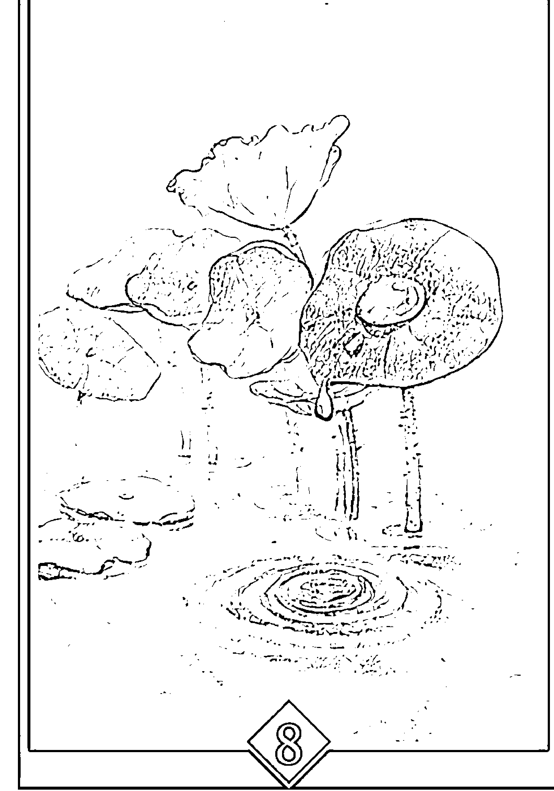

牌名：放手

+   · 元素：水。

牌圖解說：一顆小水珠即將掉入湖中，一旦它掉進去了，小水珠的形態就不復存在，而這會是一種死亡。但這樣的結果不見得是壞事，因為唯有小水珠死去，才能融入大湖中，用一個更高的形式存在。唯有放掉舊的，才能迎接新的，緊抓住現有的一切不想改變，就没有新的可能性。

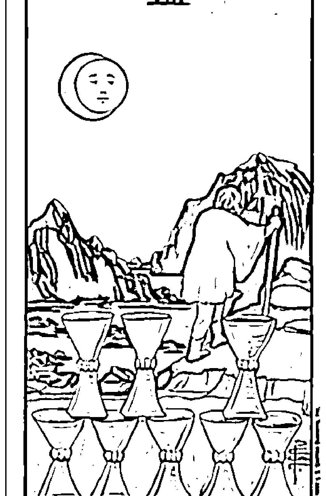

牌名：聖杯8

+   · 元素：水。

對應塔羅牌的「聖杯8」

302

## 以塔羅元素為論 聖杯8

## 水之8 ─ 放手

塔羅牌的「聖杯8」有背離現有的一切，想再去找更美好的其他可能性的意思，抽到這張牌，明顯可知，當事人對他目前的狀況是不滿的。下一張的「聖杯9」，象徵心想事成、美夢成真，而「聖杯8」少了一個杯子，表示最後或最重要的那個部分還在缺乏狀態。所以牌圖中的人轉身離去，想去找最後的那個杯子，找到後就變成「聖杯9」，也就是達到願望，可以讓自己滿意了。

8「中，這種懶散的感覺加強成為一種不耐煩，所以終於起身想去找有什麼改變現況的可能性。所以抽到「聖杯8」，表示你想離開目前的環境，而且是为了更高的可能性，不只是為了逃避而已，算是在消極中還是帶有一點建設性。尤其在我的經驗中，凡是抽到這張牌的，幾乎都是想分手、想離職的人，我們就可以知道「聖杯8」急欲改變的心態。畢竟水元素是需要流動的，數字8是雙重的4，封閉及控制性太強，數字4象徵躲在自己既有的空間內不願改變，而數字8就代表在這樣的空間中待了很久的時間，這一點會讓喜歡舒適及情感交流的水元素（也就是情緒）覺得窒息。不同於「聖杯8」的厭煩，這張禪卡顯示出來的，是一種全然的放鬆和釋然。雖然同樣是要離開現有的狀況，但「水之8」的心態不同，它要投入到新的方向時，情緒不是倦怠的，而是帶有很大的信任。牌圖的畫面很美，荷葉上閃閃發亮的那滴水珠，即將掉落到下面的一汪湖水中，然後水珠也是水，湖泊也是
水，兩者的本質是相同的，只是大小不同而已。所以水珠滴入湖泊後，它的形體消失了，但本質卻還存在，而且是以一種更寬闊的方式存在著。就另一個角度來說，我們可以說水珠昇華了，因為湖泊是無數水滴結合起來的，本質就是水滴，卻浩瀚得多。

## ○放手，寬的不去新的不來，因為你值得更好的

廣義來說，水珠等於是一小我」的存在，我們都會希望自己漂亮、有錢、出名、被肯定。所追求的這一切全都是在加強這個「我」的存在，當一個人習慣擁有一切，並認為自己在這個世界上是特別的、獨立的，他就必須跟萬物競爭，才能保持自己的獨特存在。這時要他答應改變就會非常困難，即使是要讓他變得更廣更好，因為那必須瓦解他原本狹隘的自我，才能容納更大的「我」，而瓦解自我是令人恐懼的。奧修說過：「如果你拒絕死亡，你也就是在拒絕生命。」因為生命必須不斷改變和成長，如果停止改變，也就與死亡無異了。以牌圖中的水珠來說，如果它堅持維持小水珠的形態，還是會以另一種方式耗損而後死亡，同時也失去往上發展的機會。數字8是豐盛，但也代表停留在同一個狀況很久了，必須開始改變；而水元素是一種心靈上的感受。兩者加起來，就是我們在生命的認知上需要提升，並且包容更大的可能性。舉例來說，有個月薪二十萬的工作在等你，但你必須先辭掉現在月薪兩萬元的工作；你命運中有個更好的伴侶，但你必須先離開現在不適合的伴侶，身邊的位置才能空出來。所以，你必須要先「放手」，才會有新的可能。如果抽到這張「水之8—放手」，表示這個人對於改變可能會更不情願，更想抓住舊有的東西不放手。這時我會告訴他們，「水之8」雖然要你捨棄你現在覺得很有價值的東西（其實可能是一份爛工作或是會打她們的丈夫，但人就是願意接受已知的壞，不願相信未知的好），那是因为你值得更好的。唯有放掉原有狹隘的思考模式和形態，我們才能擴充內在空間，提升到更高的境界。

# 數字牌

## 彩虹之8 平凡 Ordinariness……

# 對應塔羅牌的「錢幣8」

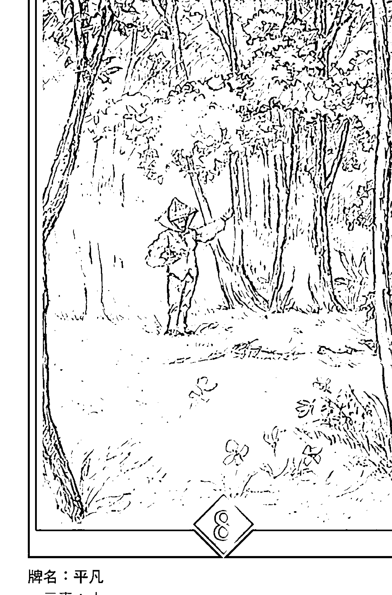

牌名：平凡

元素：土。

牌圖解說：戰人漫步在山間，這片美景看起來渾然天成，但仔細一看，就可看出處處都有精心照顧及維護的跡象。這張牌代表的是，美好的成果不是短時間的拚命可以達到的，必須要全身心投入，把努力的過程變成生活常態，才能在不知不覺中達到全方位的富足。

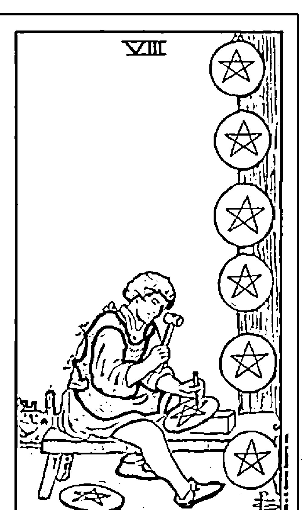

牌名：錢幣8

元素：土。

# 以塔羅元素為論

## 錢幣8

## 彩虹之8——平凡

圖面上的錢幣看起來不像是「賺」來的，而是由圖中這名工匠一點一滴地精雕細琢出來的。如果用瑞士鐘錶工匠的精神來形容，可以很傳神地表達出這張牌的含意：「工匠對產品和服務的研發和製造會採取嚴格標準，他們不會把品質當成上天的恩賜，而是看成競爭的必要條件。工匠會竭盡全力做出最優質的產品，即使其他獲利導向的對手投機取巧，一樣可以勝出。我們都知道，商品的品質並非決定銷售勝敗的唯一要素，只要擅於行銷和包裝，一樣可以勝出。但對於企業永續經營的理念和價值來說，品質卻是不可或缺的，因為它是最禁得起檢驗，不會受時代淘汰的。土元素本來就是一個講究整體性的元素，加上數字8有兩倍於數字4的努力和專注，當然就組成一張重視每個細節、甚至吹毛求疵的「錢幣8」。我最常用「經營」兩個字來當這張牌的總結，因為經營是一種根本性、長期性的行為，不是贏得一兩次佳績就夠了，而是要長期維持恆定的水準，並時時調整，才能保持在最佳狀態。土元素加上數字8，成功雖然不會來得太快，但成果一定是豐碩且可以長期保有的。

這一組牌都是在「工作」。錢幣8」專注認真，兢兢業業；而禪卡的「彩虹之8——平凡」，看起來也跟工作融為一體，但態度卻是比較自在，有一種寧靜的感受。因為錢幣的土元素較為嚴肅認真，而彩虹代表的土元素則較為自然樸實。如果要說兩者的差別在哪裡，那應該就是「錢幣8」是把自己投入工作中，而「彩虹之8」則是把工作變成自己的一部分，多了一些自信和胸有成竹，他的努力已經深入生活，不用在特定的時間地點或事件中才表現出來。彩虹本來就比錢幣來得隨順因緣，彩虹的土元素有耐心，會允許一切該發生的事發生，然後凝結
成最後的成果。因為已經沒有一要努力才行一的心態，反而是已經讓自己變成一個本質上會照顧每個環節的人，所以不用刻意努力，他的一努力一是自然而然的了。只要養成習慣，就不必刻意去一做一，像「彩虹之8」這樣的態度，最能夠長期保持穩定的動力，雖然看似不經意，卻可得到最大的收穫。

## ○平凡才能恒久，因為那已成了你真實且自然的一部分

數字8本身有巨大的意思，但在這張彈卡顯示出來的，是它一巨細靡遺一的含意。8不只巨大，也很完整，而且會涵蓋到每一個面，就像是一台機器的每個零件都要照顧好，才能順利運作一樣。牌圖中有個像是農婦的人走在山林中，周邊的花草樹木欣欣向榮，她看起來雖然是來工作的，卻像是在跟這片山林一打交道一，跟每株植物對話一樣。就像我們常常不覺得自己在做家事，只是一順手一收個東西或擦個桌子，這是用一種完全不勉強的心態去做的，不是一努力一，卻蘊含了更多的細膩心思，以及一種真正的關懷；而一關懷一往往比督促和期待更有效果。

我見過一個很成功的房屋仲介，他一點都不覺得自己很努力，他只是熱愛房子，所以帶客户參觀時，他自己也都與致勃勃，絲毫沒有奔波的疲累。介紹每間房子的優點時，都是他真正認同的而非話術，在完全不違背自我也不勉強的情形下，他的能量可以得到最大的發揮，所以同樣的工作他可以做得比別人好。再舉個例子，一般人買了名牌包都會雀躍不已，覺得意義重大，但是對真正的有錢人來說，再高級的品牌也不過是一家賣東西的商店罷了，他們用慣了好東西，名牌包也就是一個包包而已，沒有太特別的意義。不要刻意去做一件事，而是要讓自己不做這件事就會變得不對勁，因為那已成為你日常生活的一部分了。這樣一來，就可以完全放掉失心，擺脫限制## 了。所以你的煩惱只是在告訴你，你的心哪裡出了問題，好讓你趕快去找答案。就像我們大家都不喜歡一痛一，但痛覺是為了告訴你，你的肉體哪裡出現傷口或病變了，你才知道要趕快去治療。沒有煩惱和痛覺，你就永遠不可能知道你身心的缺口在哪裡。風元素象徵的煩惱，在數字9的階段不只達到最高點，數字9也有一轉化、臨界點一的含意，就像越接近開悟的修行者，魔考最多。［雲之9］象徵的就是這黎明到來之前，最黑暗的那個時刻。

## ○逆轉勝：考驗不到最後一刻，都還有絕地大反攻的機會

《奧修禪卡》原著中，說明這張禪卡中的人物就是阿難。阿難在佛陀的弟子中是「博學強記第因為博學強記是頭腦屬性（也就是風元素）的才能，卻不是真正的智慧。為什麼佛陀不立文字？就是因為語言和文字只是傳達的工具，如果太執著於文字，反而會忘掉尋找真理。阿難最擅長的就是語言和文字，記憶力又超強，這種聰明才智反而讓他無法擺脫語言文字的限制（語言和文字都是在風元素練屬的範圍之內），在文字中浸泡太久，面臨需要放棄念頭的轉型時刻（就是風元素9的意思），就會成為內心衝突！阿難跟隨在佛陀身邊長達四十二年，卻一直没能開悟，卻在佛陀過世、一夜痛哭後就成道了。因為徹夜哭泣變得無法思考，只能用心去感受；換句話說，他拋掉頭腦的同時，等於也拋掉了障礙。

反過來說，假如他心性樂天，乖乖用老方法修行，不去煩惱的話，這個解脫也就不會發生了。因此在這裡，煩惱就是幫他開悟的起點。要表現這種「因為頭腦太好反而形成知障，在後關頭撞牆」——［風元素＋數字9］的狀況，風元性質超強的阿難真是唯一也是最佳的代表人物了。這張「雲之9」9—懮傷—，把塔羅牌風元素10號牌「萬念俱灰」但「置之死地而後生」的含意，提前做了一個預告。

# 數字牌

## 水之9
懶惰 Laziness……

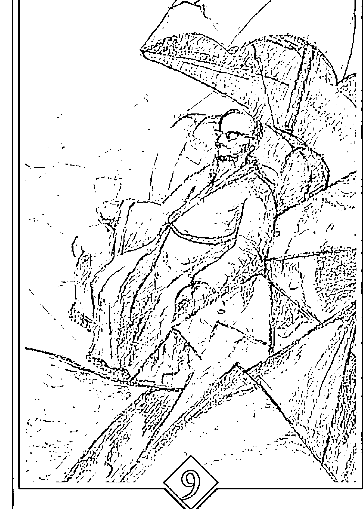

牌名：懶惰

+   · 元素：水。

牌圖解說：牌圖中的男人所做的一切，我們應該都不陌生，在我們的生命經驗中，每次覺得一切都沒問題時，就是問題開始要出現了。他看起來完全放鬆了，不再保持警覺、也不再往前進，這讓他缺乏了應變能力，在事情有了狀況時，他會無法力挽狂瀾，很容易就被瓦解。

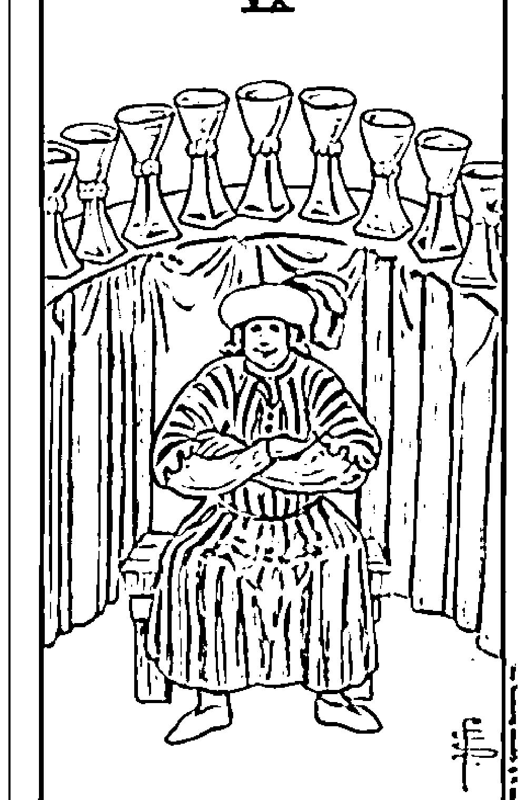

牌名：聖杯9

+   · 元素：水。

# 對應塔羅牌的「聖杯9」

## 對應塔羅牌的「錢幣9」

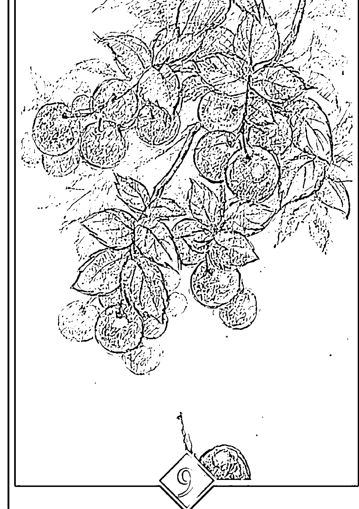

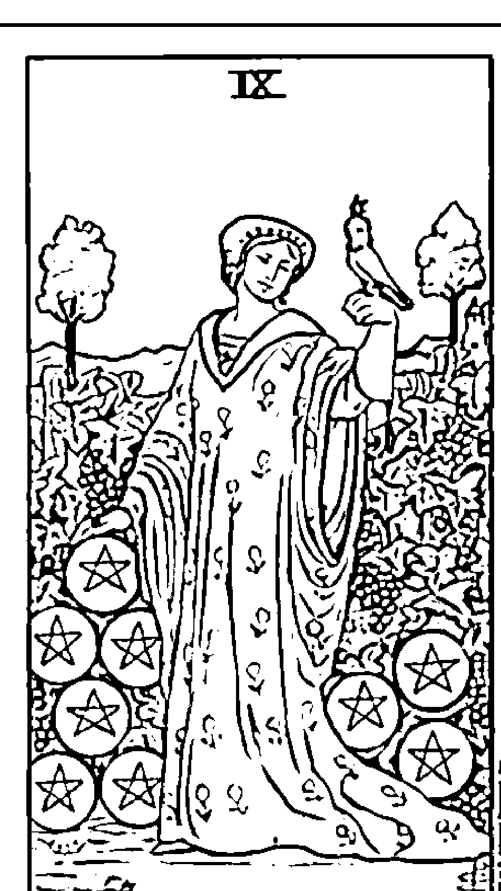

牌名：時機成熟

元素：土。

牌圖解說：這些果實看起來熟透了，再不摘取就要掉落到地面；但是就算任它掉落也沒什麼不好，果實埋入土中，果核就會開始長根發芽，變成一株新果樹。不管這些果子是被吃掉或掉到地上，總之它們無法繼續留在樹上了，這個階段已經完成，要進入下一關。

牌名：錢幣9

元素：土。

# 以塔羅元素為論

## 錢幣 9

## 彩虹之9 — 時機成熟

這張牌可能是很多女人都寫往的生活方式，圖中的女人看起來優雅而安適，身邊的一切都恰如人，雖然看起來不夠圓滿完整，但是對她本身來說，這已經是一個最佳的狀態了。—錢幣9—又叫「小貴婦牌」，圖中女子身上的衣服布滿金星符號，金星代表維納斯，也就是愛、美、和平，這代表她是一個不愁金錢、品味高雅、外型美麗的人；換言之，一般女人最重視的條件她都擁有了，在這個狀況下，她雖然並不排斥其他人進入她的生活，但因為她對自己目前的生活非常滿意，所以要她改變狀態來配合別人是不太可能的。不管是婚姻對象或朋友，都要能融入她的生活圈，因為她遇到理想對象的機會比較少。這張牌對金錢、工作、健康運都很好，獨獨是愛情運差了一點，但通常都是當事人本身不想改變現況，並非沒有追求者出現。土元素是財富象徵，而且是需要長時間經營的，數字9就代表時間已經過很久，一個階段「快要一完成了。所以土元素的錢幣加上數字9，代表之前的努力及踏實，已經把資產（土元素）累積得夠多，一切已經成形，努力有了部分的成果，是可以開始享受並繼續往下累積的時刻了。

我們可以把這張禪卡想成是彩虹系列上一張奇數牌 —「彩虹之7—耐心」的下一步；在「彩虹之7—中，一切都還在醞釀、尚未成形，需要時間來讓每個部分都成熟，才能結出一個最恰到好處的成果；而到了「彩虹之9」，代表所需要的步驟及程序都已經歷完成了，時機已成熟。以想做生意的人來說，第一桶金已經儲備好了，可以藉著這些資源再去成就更大的可能性。

# 數字牌組

## 10號牌

進入到10這個兩位數，等於所有的事情全部完成，有了一個成果，可以知道結局是什麼了。數字10是一個句點、一個最後形成的圓圈，這有兩個解釋的方向：往好的方面說，10等於是到達目的，從此不用再費力忙碌；往負面點的方面來說，10也等於是劃下休止符，而另一個階段尚未開始，原來的情況卻已定型，沒有變化的空間了，所以會有一種僵化的感覺。

數字10出現時，通常代表一個已成定數的局面，如果出現在「未來」位置，恭喜你，這表示事情漸趨圓滿；但如果出現在「過去」位置，代表穩定的局面已是過去式了，現在可能必須要開創另一個可能性，或者要突破某種限制。

10等於事情形成了一個固定形態，而且如果沒有意外，將會持續好一陣子。

水、土等陰性元素遇到數字10，會是一個舒適又滿足的狀態，因為陰性元素一直在過程中累積，為的就是享受這最後的成果；

但如果是火、風等陽性元素，遇到數字10就會有麻煩。

因為陽性元素需要不斷前進和改變才能維持存在的形態，一旦已成定局，動態的能量就會失去出口，其中激烈的火元素會讓衝突封在圓圈內，形成內傷；

而風元素的速度一旦被10困住，風的形態將不復存在。

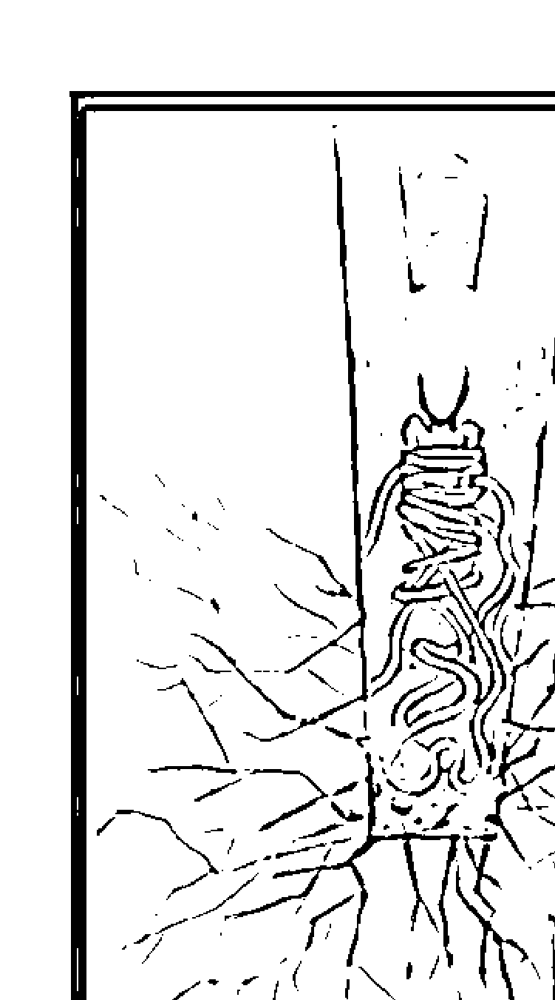

## 火之10—壓抑

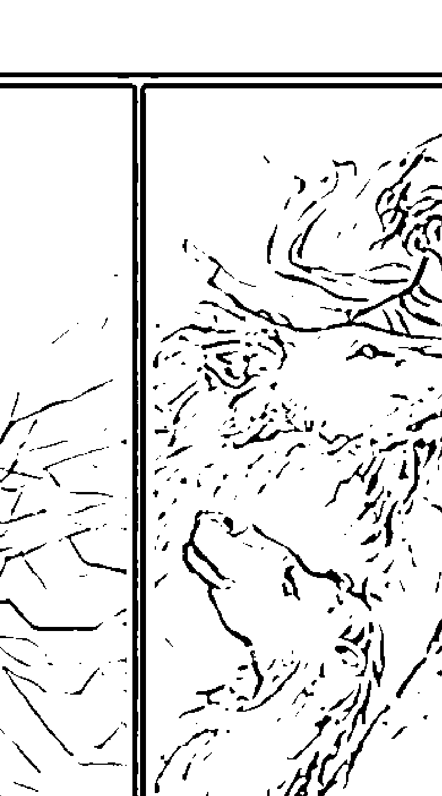

## 雲之10—再生

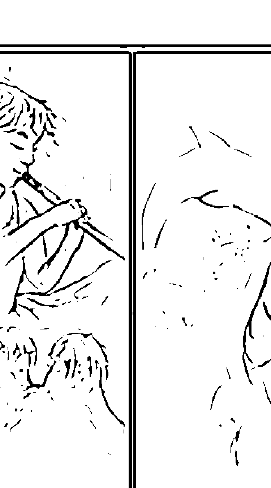

## 水之10—和諧

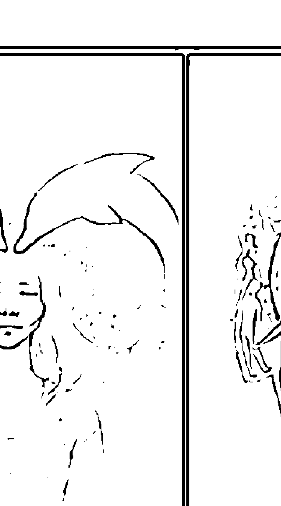

## 彩虹之10—四海一家

# 數字牌

## 火之10 壓抑 Suppression……

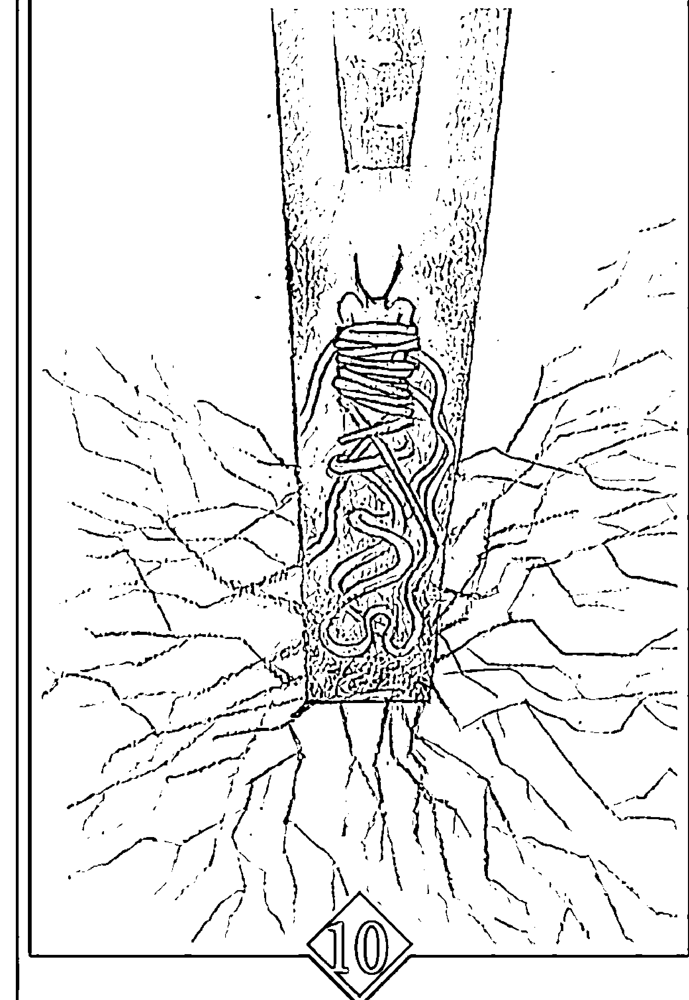

牌名：壓抑

+   · 元素：火。

+   · 牌圖解說：不管是水或能量，都只能疏通不能圍堵，否則只會造成反效果。牌圖中的人姿態緊繃，還被困在一個小小的密閉空間中，但他的情緒不但沒有因為封閉而消失，反而讓股能量延伸出去，即將粉碎整個世界，就像傷口不清理乾淨就結痂，最後會化膿腐爛一樣。

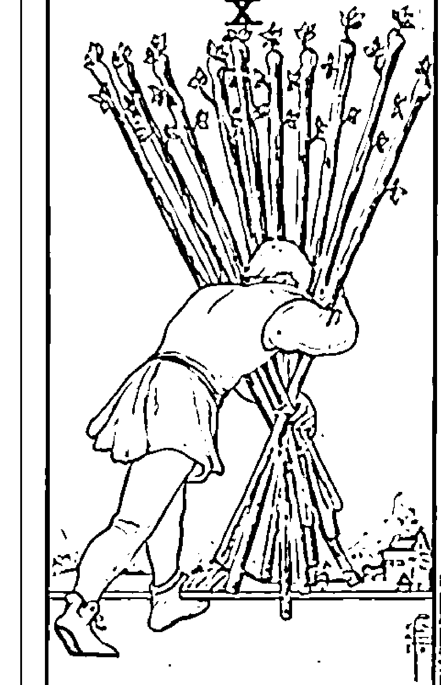

牌名：棟杖10

+   · 元素：火。

對應塔羅牌的「權杖10」

# 以塔羅元素為論

## 權杖10

## 火之10 ─ 壓抑

上一張「權杖9」時，火元素牌的能量已經僅剩最後一道防線了，數字9代表正要往更高一個層次羅進，但又還沒轉化完畢，加上火元素牌的能量到了後期會比較耗弱，擁有的能量不足以在短時間內轉型成功，所以到了數字10，不但沒有進展到脫離疲軟的狀態，反而承受了更大的壓力。

團團一，就是說數字10的範圍已經劃定了，火元素不能把自己的腳步跨出去。火元素代表熱情、理想、活力和企圖心，一個充滿抱負和野心的年輕人，如果進入一個制式化、僵硬的環境（數字10），想必會受到很大的煎熬，最後不是充滿挫折地離開，就是任由自己的活力一天天削弱，而且一天比一天找不到出路。看看牌圖中的人被十根棍子壓制住，一邊被壓還要一邊抱著這堆棍子走路，這代表體力上的負荷，但又不能放下，因為只要一放手，權杖就會散落一地。這代表一種無法照自己的理想把事情完成，但又不甘心放棄的心態！正是火元素這種不願認輸的心態，才會讓整件事情陷入僵局，如果可以放手，也許事情還簡單一點。這張牌象徵的是壓力不僅來自於外在環境，也來自當事人自己本身某些不知變通的執念。

想像一個正被高溫加熱的密封鍋，底下的火不斷加熱，內部熱氣不斷往上竄，卻沒有任何出口可以疏散這股熱能，最後很有可能導致整個鍋子從內部炸開來。奧修禪卡的「火之10─壓抑」描述的就是這樣的景況，承受的是體力與心理的雙重壓力，除了體力上的疲累外，還有心理上的煎熬，給人更耗損能量的感覺。

# 數字牌

## 雲之10 再生Rebirth……

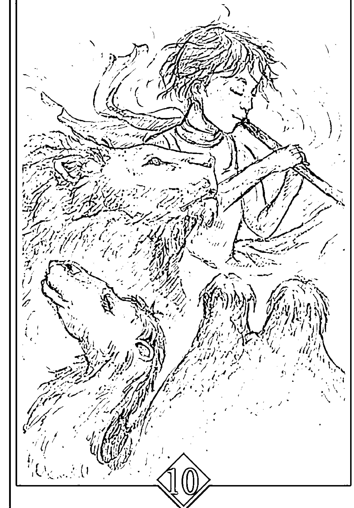

牌名：再生

+   * 元素：風。

牌圖解說：駱駝代表沒有睜開雙眼的愚昧的人，會跟著大眾腳步行走，也會人云亦云。獅子代表自我的意志，以及掌控一切的能力；但是掌控到了最後，會發現一切萬物自有它的規律，不需要花力氣去維護。最後新生的小孩，就用最純淨的心去經驗這個世界，不再受困也不再試圖操控。

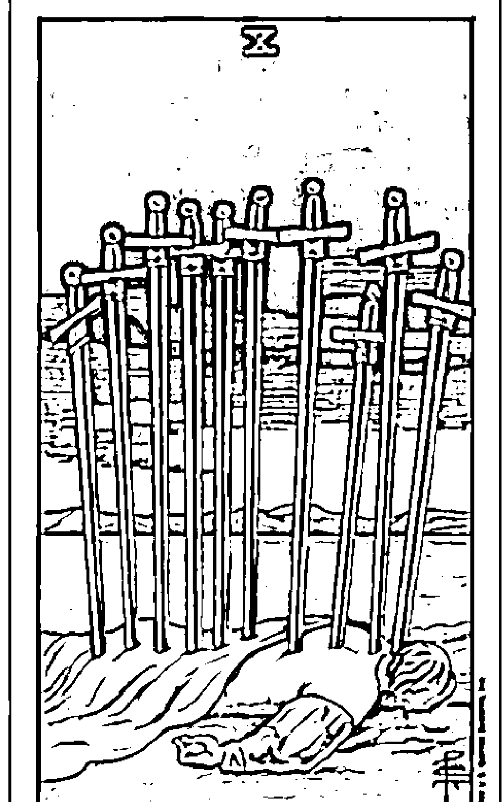

牌名：寶劍10

+   * 元素：風。

對應塔羅牌的「寶劍10」

## 以塔羅元素為論 寶劍10

## 雲之10 ─ 再生

一般來說，一寶劍10都不是什麼好牌，光是畫面上被十把劍釘死在沙灘上的景象就夠可怕的了，這不是垂死，而是死透了。但我不得不說，上一張「寶劍9」的焦慮和煩躁已到了幾乎要發瘋的狀況，相較之下，「寶劍10」至少有一種平靜的感覺；而且他的死亡並不是血淋淋的，只是没有任何掙扎的機會，一切都已蓋棺論定了。就某種意義來說，圖中這方有曙光展現，新的一天又要開始，至少最痛苦的时刻在这张牌中没有看到，那個時刻已经在「寶劍9」中出现，也就是已经过去了。所有事物的極點，其實是在數字9而非數字10，因为10是定局，既然没有什麼好掙扎的，風元素的煩惱就不存在了。这就像我们去法庭旁聽，最焦慮的時候一定是等待宣判前，宣判一完，不管結果如何，焦慮已經不再了。有一段话说得好：「如果事情往好的方向发展，你不用煩惱；如果事情往壞的那個不用煩惱或煩惱也没用的時刻了。這很符合風元素加上數字10的含意，因為動態的風元素缺乏目標又過於善變，一旦被數字10框住，不會像火元素那樣努力衝撞，而是會直接被消滅。

風元素10的豁然開朗（或說是萬念俱灰）的性質，在奧修禪卡中已經表現在「雲之9」的階段了，所以在「雲之10─再生」中，主要的含意就是進入一個新時刻新階段。這張禪卡的牌圖也感覺有意境且愉快多了，象徵我們一層一層地蜕變和成長，每一次的死亡就是下一次的重生，只是這個過程並不輕鬆，仍舊要經歷過不少教訓才能達成。《奧修禪卡》一書對「雲之10」的解說是：「這張卡描繪的意識進化，可在尼采的《查拉圖斯特如

[PAGE 322]

是說》（Also sprach Zarathustra）一書找到。他說到三個層面：駱駝、獅子和小孩，駱駝是昏睡的、無趣的、自我滿足的。他生活在妄想裡，以為他是山峰，但是事實上他非常介意別人的意見，幾乎沒有任何屬於他自己的能量。從駱駝裡面脫穎而出的是獅子，當我們了解到我們一直在錯失生命，就會開始對別人的要求說「不」。我們脫離群眾，單獨而驕傲，吼出我們的真理，但這還不是終點。到了最後有小孩出現，既不是順從的，也不是叛逆的，而是天真和自發性的，並對他自己的本性很真實。（這一段比喻，被稱為尼采的「精神三變」論述）。

## ○每一個階段的結束，就是下一個階段的開始

「雲之10」是風元素牌，象徵的是心智方面的進化，所以尼采的「精神三變」說法最適合用於風元素素牌。從塔羅牌的「寶劍10」可以看出，風元素10號牌被認為是徹底的毀滅，所以這張牌常有一哀莫大於心死一的牌義關鍵

# 數字牌
## 水之10
## 和諧 Harmony
## 對應塔羅牌的「聖杯10」

牌名：和諧

+   ·元素：水。

牌圖解說：海豚的頻率對人類有療癒作用，會使人放鬆及愉悅。這張牌中的海豚從心輪遊到眉心輪，代表心情的平靜帶來頭腦的寧靜，是真的代表了可以放鬆、到達一個安全地帶的牌。人跟海豚是不同種族的生物，但在這個時刻，一切的差異性都不存在，「分別心」也在這種關係中消溶掉了。

牌名：聖杯10

+   ·元素：水。

# 以塔羅元素為論
## 聖杯10
## 水之10——和諧

通常不管什麼問題，抽到「聖杯10」總會讓人鬆了一口氣。這張牌不只是快樂幸福，還是一種整體性的圓滿，而且這種狀態應該是可以長期保持下去的。上一張的「聖杯9」代表的是衝到某個頂點——是「高原期」，爬到某個頂點後可以持續用同樣高度往前進，平穩且不易改變。因此，「聖杯10」的快樂雖然不如「聖杯9」的強烈，也沒有「聖杯9」那樣戲劇化，卻多了一份安定及滿足。

在一「聖杯9」的階段，我們重視的是個人的感覺，在我們自己達到某個顛峰或實現某個夢想時，欣賞雀羅是可想而知的。但是這種快樂只屬於我們自己獨享，我們的成就、夢想可以感染他人，卻終究是我們自己的成績單，無法轉讓給他人。這就很像修行的人，內在靈性如果突破只能是自己的，別人不能遵循你的方式來修行，也無法體會你看到的境界。但「聖杯10」的喜悅和圓滿是整體的，沒有大起大落，它代表的不只是你個人的幸福快樂，你的朋友家人也都跟你處在同樣的幸福狀態下，雖然缺乏亢奮的情緒，但是平靜的幸福比激昂的情感更能持久也更真實。

這張牌卡呈現出來的不是人與人之間的和諧圓滿，而是人跟海豚之間的，代表這張牌所關心的「整體」，不再只限於身邊看到的人，還擴展到其他物種身上，是一種真的跟整個世界都能和平共存的感覺。這樣的好處是，「聖杯10」常有的那種無趣感，不會在「水之10」中出現，反而是「聖杯9」的顛峰狀態會在「水之10」中變成一種長期的延續性質，因為我們的精神層次一旦提出，就會有更穩定的狀態，能夠持續地保持這種和諧的感覺，並且能夠將這種狀態傳遞給周圍的人。

對應塔羅牌的「聖杯10」

高，體驗過後就不太可能再走回頭路了。 海豚可以說是這張禪卡的重心，海豚對身心靈領域的人來說是很特別的動物，在海洋生物中，智商最高的就是章魚和海豚，智力約是七到九歲的人類。但重點不在於智商，因為海豚對於一數據類資料一的容載量比靈長類低，但腦部神經元及迴路卻比靈長類多，所以海豚的聰明不是在理性的界，海豚常常被視為一療癒一的典型象徵，甚至在國外一與海豚共泳一還是一種常見的治療方式。據說海豚的頻率可以為人類帶來一和諧一的波長，一海豚療法一尤其在自閉症孩童身上更顯成效。 ○調整好自己的頻率。可以跟自己相處良好，自然也能跟外界融洽共處 牌圖中的海豚從人的一心輪一出發，蜿蜒游到一眉心輪一位置，心輪代表與他人的互動及對外界的慈悲；而眉心輪代表一個人的洞察力和直覺。海豚把心輪溫柔的喜悅，帶進了聰明但孤僻的眉心輪位置，就等於把整體的意識帶入個人的意識之中，讓個人的思考及眼界，能以一心一為出發點，那就是一種慈悲了。牌圖中的這個人透過海豚的幫助，將可擴大自己的意識範圍，並跟整個世界的意識起共鳴。 在奧修禪卡中，水元素不僅僅是感情，還代表了人類的大愛和善念；而數字10的整體，也不僅局限在人類社會的層次，10代表的是整個地球的一體性，所以我們如果能夠突破人與人、甚至物種與物種之間的限制，就可接收到他（牠）們的感受，也就不會做出傷害他人的事。因為只要我們的意識夠清明，就可以察覺到，如果我們傷害他人，也就等於在傷害自己。因此一水之10一和諧一代表著：如果你可以跟自己和平共處，就可以跟整個世界和平共存，如果你帶著善念對待他人，也可以回過頭來影響自己內心的狀態。因為我們和外界的關係，都是從自己的內心投射出去的，人跟宇宙是一體的，如何對待他人就等同如何對待自己。

# 數字牌
## 彩虹之10
## 四海一家 We Are The World

牌名：四海一家

+   · 元素：土。

牌圖解說：不同顏色的人群剪影團成一個完整的圓圈，代表不同族群的兼容並蓄。這些人的姿態愉快且活躍，表示對自己身為群體的一份子都很滿意。這張牌代表你的存在不只是一個人的事，有許多的人編織出一個社會系統，才能讓你安穩地身處其中。我們個人的好壞，就代表了群體的好壞，這是無私的一張牌。

牌名：錢幣10

+   · 元素：土。

333 數字牌・彩虹之10 四海一家 We Are The World —— 對應塔羅牌的「錢幣10」

對應塔羅牌的「錢幣10」

# 以塔羅元素為論
## 錢幣10
## 彩虹之10 ─ 四海一家

一錢幣10 明顯的就是一張豪宅牌，一家三代加上寵物都同堂，在「家庭的硬體構造」（房子）及「家庭的功能性」（成員齊全）這兩方面都很完整。土元素和水元素都是陰性元素，都有包容和承載的特質。但是水元素比較偏向情感上的支持，所以「聖杯10」強調的是親情上的融洽；土的「資源」。以這種角度來看，「錢幣10」代表的就不只是家庭，而是整個家族了。係（先不管相處模式如何）。此外，如果家庭功能健全，還可以成為個人的靠山，或是背後支持元素則比較偏向實質上的支持，所以「錢幣10」強調的是家庭的良好經濟狀況、家人間的緊密關係（先不管相處模式如何）。此外，如果家庭功能健全，還可以成為個人的靠山，或是背後支持。牌圖中左邊的白髮長者，身上穿的衣服和「錢幣國王」一樣都畫滿了葡萄（畫面出現葡萄或果實，都代表「富裕」），葡萄可以釀成葡萄酒，是經濟價值非常高的農作物，所以可以被當成「經濟實力」來看待。另外，這張牌也有一種「終於到達目的地」及「身處其中」的感覺，前面九個數字的錢幣牌，雖然都是土元素，但都還在路上，一直到10號牌抵達終點，這份收穫才算司變身為財團了。對照上一張「錢幣9」的小貴婦牌，「錢幣10」的基礎更雄厚了，就像是一家公

一群人手牽著手圍繞地球之外，值得注意的地方還有：人群的色調也分成四個部分，就像「火之4」的色彩一樣，這代表所有的人雖然合作無間，但每個人的性質各有不同，就是因為有各種不一樣的才華、性格、行為模式，才能組合出一個多元化的整體（四個顏色的接觸面，混合色也出現了，這代表不同顏色一樣，這代表所有的人雖然合作無間，但每個人的性質各有不同，就是因為有各種不一樣的才華、性格、行為模式，才能組合出一個多元化的整體（四個顏色的接觸面，混合色也出現了，這代表不同顏

「四海一家」這個名稱，明顯的就是土元素10「由個人推展到社會整體結構」的性質，除了構圖是

○無數個不完美的人，才能組成一個完美的整體
一個單位。我們的食衣住行都得靠各方面不同的專業人士來提供，整個社會才能良好運作。
回到上一張牌「彩虹之9」，對照起來就可感受到這兩張禪卡的因果關聯，在「彩虹之9」中，成熟的果實是靠整棵樹來供養，但果實的形態不能一直生存下去，因為這個形態只是個過程，就像我們常聽到的一取之於社會，用之於社會，最後不管果實是被吃掉或被土壤吸收，它都是滋養了其他的生命，並跟所有存在這片土地上的植物有了連結。
彩虹的土元素是一種三次元生命的演出，數字10等於這種生命的全體。就像我們認為自己是一個人，我們就是標準的獨立單位，但實際上我們的器官也都是獨立個體，甚至縮小到每個細胞也一樣。由此可知，每個微小個體都是更大個體的一份子，而且都是組成世界或宇宙的其中一個小小分子。這張「彩虹之10—四海一家」的歡欣鼓舞，其實給了我們很大的啟示：我們之所以會想跟整個世界對抗，之所以會有不安和焦慮、自私自利，都是因為我們以為自己跟整個宇宙是分離的，跟其他人沒有關係的，所以必須你爭我奪。但如果我們可以意識到，自己和其他人都是在一個整體之內，當你可以放下分別心時，你就會發現整個世界都是互相依存、無分彼此的。既然沒有人可以孤立或傷害你，這時你會更明白不需要為了自己的生存，而把所有外界的人事物都當成是威脅。相反的，整個世界都是你的支持者，你不只是你自己，你是偉大整體中的一份子。這種歸屬感和真正的平和寧靜，比起一錢幣10一的物質資源，更像是真正可靠的財富。

## 奧修禪卡占卜書 —以塔羅元素為論，貫穿靈性與現實兩層面的終極占卜

作者 天空為限（翁子初）

她的犀利，經常一語道破別人刻意操弄的玄機；
她的敏銳，讓她放膽自修占星、塔羅、神卡。她的
自信，讓她敢破敢立，勇於走出自己的風格。
她的家學淵源，更讓她能西學中用，游刃有餘，
在塔羅與神卡中展現驚人的解牌能力，獨到的眼
光似乎能看透暗藏在牌圖裡的玄機，以及意在言
外的深刻內涵。

出身知名的傳統命理世家——型圖風聲盛名的「蔡
遼時擇日命相館」，命相館創立於清光緒年間，如
今則第四代接掌。外祖父、父親、舅舅都是深研傳
統命理的傑傑者，她從小接觸的不是八字就是卦
卜，浸淫日久，對於人間事的體會自是不同尋常
人；但她卻另闢蹊徑，在西洋占星及塔羅占卜上學
有所成並闢出名號，散發出個人獨特的解牌魅力。

長期經營人氣部落格「天空為限的神祕學札記」、
「女巫神算館」神祕學論壇網站，累積了一群死忠
粉絲，對於所學，既專精又博引，從愛情、工作、
心靈談到生活點滴，處處可見令人會心一笑、頻頻
頷首的慧言妙語，從2006年開始，橫掃各大學
院校的演講與座談會，並在多所大學的哲學講學單
位及學生神祕學社團授課；2007年開始在文化大
學推廣教育部授課，教學項目有：偉特牌、托特
牌、奧修神卡等牌占課程，以及本命占星、流年占
星、占星合盤、卜卦占星等占星學課程，目前也是
自辦靈氣、圖諸治療師、卡魯那靈氣二階治療師。
已出版著作包括《藏在塔羅牌裡的占卜符碼》（橡
實文化）、《十二星座都是騙人的》、《算命，
99%的人都想知道的命運超好玩）。

個人部落格「天空為限的神祕學札記」
http://blog.sina.com.tw/tarot/
作者臉書：天空為限(翁子初)
https://www.facebook.com/tarotisis
演講及活動邀約可洽：tarotisis@gmail.com

## 沒有人這樣解奧修禪卡！

你看奧修禪卡，還在牌名及表面牌義上打轉？

你認奧修禪卡，還困在「只能用於心靈成長，不能拿來占卜」這樣的見解中？

其實，奧修禪卡能穿越心靈及現實，一路看進底層！

當你能認懂牌面裡的占卜符號，掌握了象徵意涵，便能精確地給出建設性引導。

例如「新的洞見」這張牌的象徵符號：

+   ◇ 圓形：象徵靈性層面

+   ◇ 三角形：象徵往上突破進入更高的境界

+   ◇ 四方形：象徵物質層面

+   ◇ 羽翼：象徵脫離前一個階段進入新的境界

+   ◇ 匍匐爬行的人：代表蛻變後脫下來的舊軀殼

新的洞見
這是一張象徵破壞而出，即將轉化、昇華的牌。這張牌屬於水元素，表示並不是用剛猛的覺羅方式往上突破，而是用接納、團服的方式適應所有情緒，然後慢慢轉化、昇華。圖中那個帶著羽翼的裸身人，有如浴火鳳凰，代表告別舊階段，進入新階段新境界。

## 讓奧修智慧給我們更多的日常提醒！

善用奧修禪卡，描繪出你人生各層面的起伏線，

識出暗藏在工作、感情、行為、情緒背後的真實意涵與提示，

不再徬徨、迷惘、盲求，跟著奧修智慧，過更本真的人生。