# 经典塔罗

## 前言

塔罗对于我们大多数读者来说也许是陌生的。然而，在西方世界和港澳台地区，塔罗正像中国易经星象等古老学说一样，是人们日常生活中十分熟悉的东西，它在王公贵族与平民百姓中已流传上千年，已成为西方传统文化的一部分。塔罗中蕴含着深邃的哲学奥义、神秘的精神世界、丰富的人生智慧和优美的艺术内涵，使它成为一种拥有众多分支的学术研究。随着时代的发展，今天，塔罗的大众性与娱乐性也日益加强，逐渐成为世界各国人们喜闻乐见的牌类预测游戏及艺术藏品。

近年来，塔罗被介绍到我国内地，特别是正版第一款的《变形塔罗》的热销，迅速在全国年轻一族中掀起了一股“塔罗热”。但纵观各种塔罗书或塔罗牌，或由于译介粗糙、内容错误、缺乏体系，或由于牌面图案不清、画法幼稚可笑或阴暗可怖，介绍方式与中国读者阅读习惯疏离，使得在实际操作、游戏中都存在很大距离。而且，尽管国内出现的塔罗书林林总总，但大多是卡通漫画类的，只适合于青少年观赏玩耍，而不适于成年解牌师作正式预测之用，使得塔罗牌的真正价值大打折扣。更重要的是，由于塔罗发展历史漫长、世界各地种类繁多，其实很多牌型都不适宜初学者。尤其是目前中国还很少有准确、系统、全面地介绍国际上最流行、最经典的伟特塔罗的图书，市面上更没有一款印刷精美，与原版相同质量的标准伟特塔罗牌，因此，出版一套具有典藏价值的、高档次的经典塔罗牌对广大塔罗爱好者就显得尤为重要和急需。

为了让读者更深入地领会到塔罗牌的灵异与神秘，特别是伟特塔罗的玄奥与奇妙，我们收集国内外大量资料，精心编译了这本《经典塔罗》。在编译时，本书把塔罗置放于整个西方文化体系中，并将与其相关的希腊神话传说、西方人文精神相贯穿；同时，也融会了东方古老的星象等学说，使本书更具有厚重而不凡的文化品位。另外，本书对塔罗牌发展过程中流传下来的经典牌阵，以及许多爱好者和专家创作的实用牌阵，做了很多的搜集、整理与分类工作，使本书成为目前市面上牌阵最多、最全面，解牌方法最详细、最深入的一本。

另外，本书配有大量的彩色插图，图文互读，版式典雅活泼，更使其具有亲和易懂的阅读和收藏品质。特别是，随书赠送的塔罗牌更是专业印制，完全达到了与国际原版牌的同等质量；加之，它的整体包装方式新颖别致、典雅而高档，无疑使本书成为国内唯一最具有藏品和赠品双重价值的一款经典塔罗。

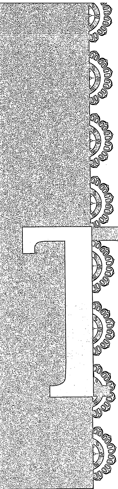

TAROT

塔罗的魔法世界

## 第一章 塔罗的演变

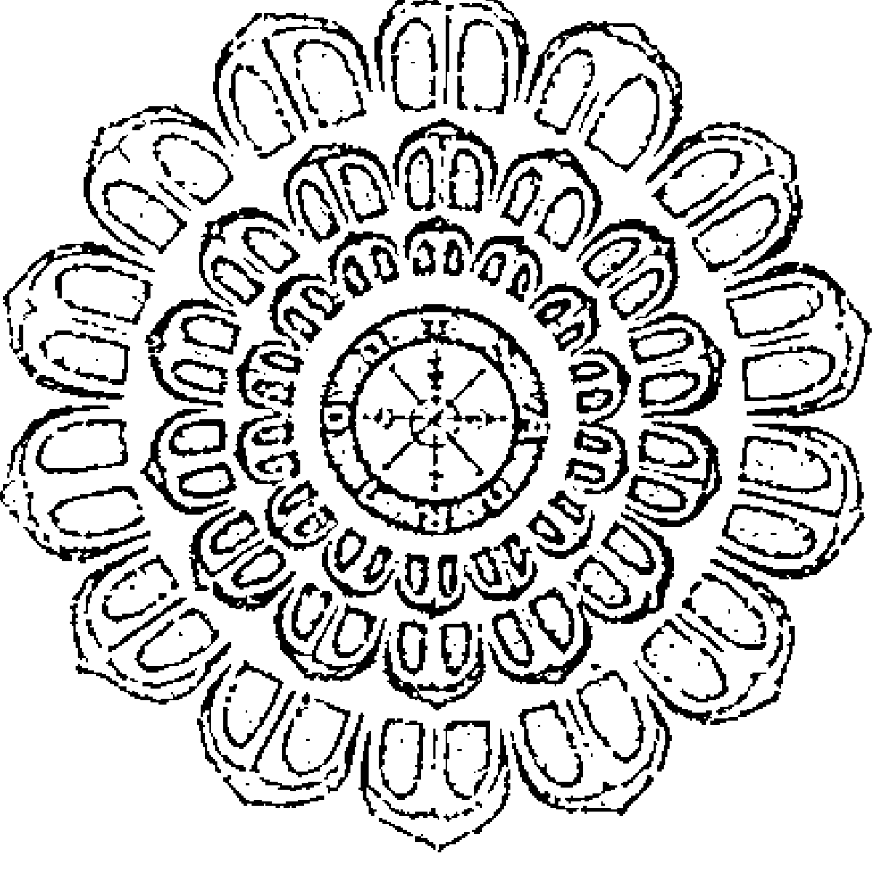

### 第一节 什么是塔罗

在久远以前的古埃及，法老们根据“透特之书”进行各种决断。透特，埃及月神，乃文化教育之神，“透特之书”，为专门用来传达天神旨意的神秘之书。后来埃及灭亡，为了不让异族得到此书，于是将其绘成卡片，交于神官手中。卡片被流传了下来，后来传到欧洲，在中世纪形成了如今我们所熟知的——塔罗。

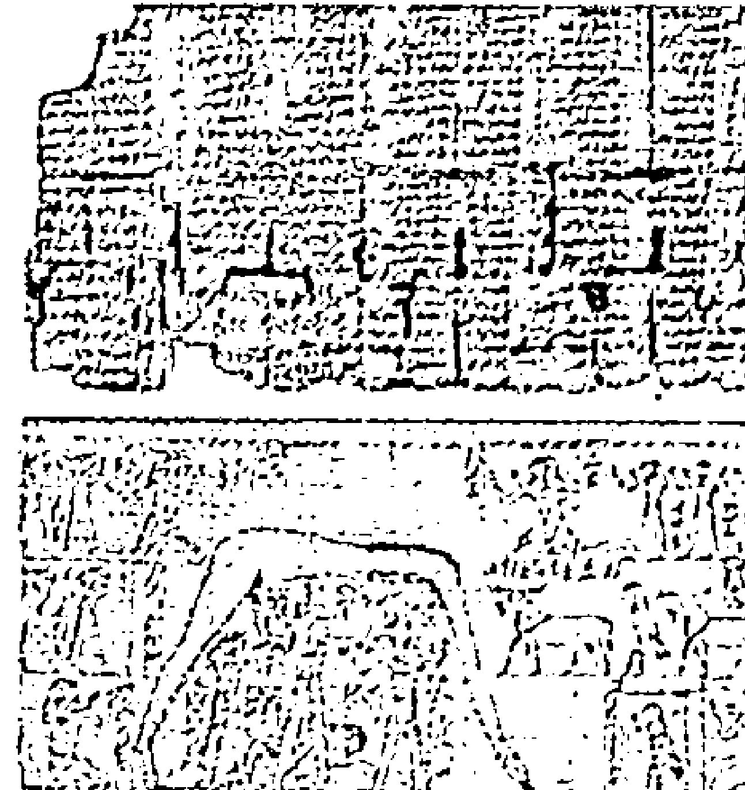

塔罗，Tarot。取自埃及语的 Tar(道)和 Ro(王)两词。因此，它本身即喻指身为王者应该具备的超越常人的决断力。作为塔罗预测的起源，这是如今最被人认可的一种说法。

当然人们对和神秘的塔罗预测一样神秘的塔罗起源依然众说纷纭。

有说来自古罗马。在拉丁语中，Rotr代表“生命之轮”。

有说来自希伯来。在犹太语中，Tarah代表“法则”。

有说来自波斯。吉卜赛语Tar即代表扑克牌，将Tar一词传入欧洲的便是吉卜赛人。

也有许多研究塔罗牌的人相信，我们今天所用的纸牌源自中国推测仪式的竹签和唐朝的“叶子戏”纸牌。

纷繁的研究，莫衷一是的说法，足以说明人们对塔罗的关注和喜爱。然而塔罗牌目前的形式的确来源于14世纪意大利塔罗奇(Tarocci)的游戏，法文把这个字拼成塔罗(Tarot)。现代流传最广的意大利扑克牌便是由塔罗牌中的一部分(56张小阿卡那副牌)发展而来，扑克牌仍然使用了塔罗牌中的权杖、圣杯、宝剑和星币的符号，即梅花代表权杖，红心代表圣杯，黑桃代表宝剑，方块代表星币；另外，K是国王，Q是王后，J是侍从，A是首牌。鬼牌(Joker)是小丑牌，即塔罗大阿卡那中的第一张牌“愚人”。其他二至十数字牌是一样的。

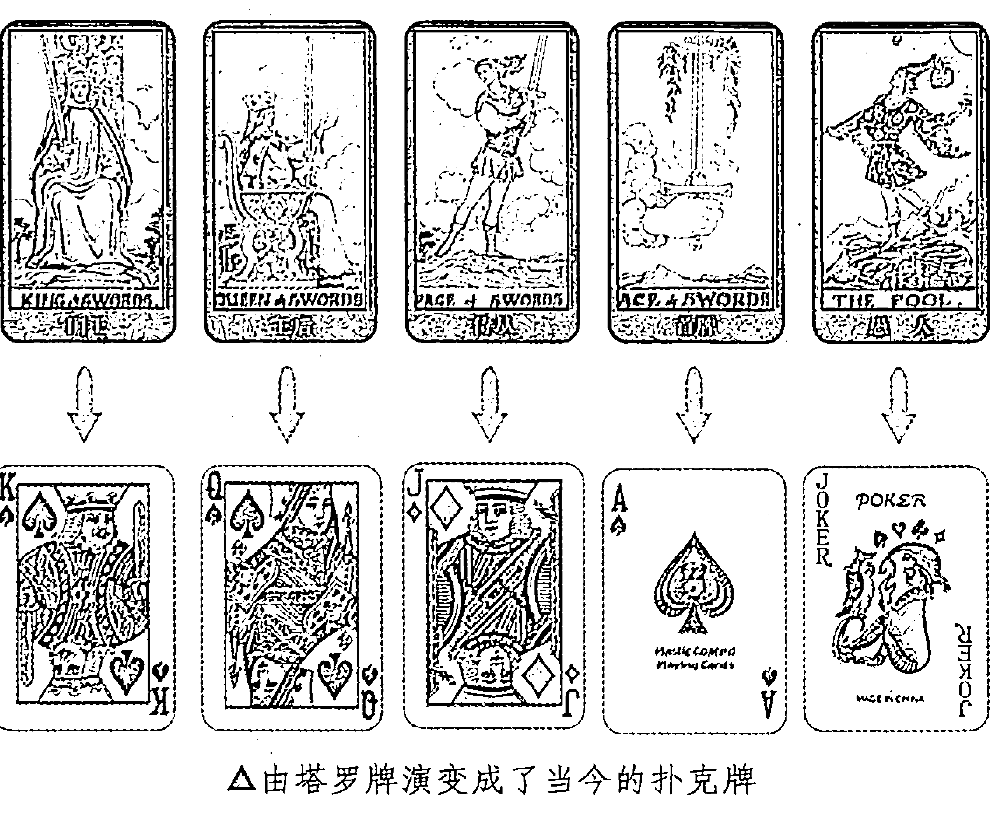

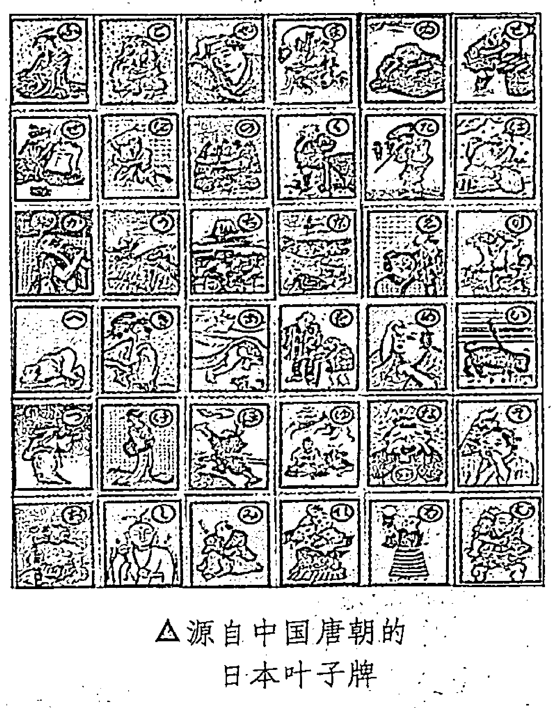

然而无论说法如何变化，塔罗的古老和魅力是无可置疑的。

过去罗马教会曾企图压制这些不断壮大而直接对抗教会的哲学与理论，塔罗牌便成为一种非法活动。主教们害怕塔罗牌会将神的力量交到人们手中。

然而塔罗牌和所有以普遍真理为基础的信仰一样，还是存活了下来；并且逐渐成为了西洋魔法和宗教的一个精髓代表，它通往神秘之路。塔罗让我们探索生命的奥义从而启示未来。

在预测中，以当事人的出生时间来推算其性格及一生的运势，属于长期的。短期的，是在遭遇到特定问题时寻求明确的分析与建议。

在有明确的问题或目的时，想得到人生方向的指引，这时，使用塔罗牌，是再好也没有的了。它能指点迷津，使人获得智慧，学会从不同的角度来看世界。塔罗牌更是冥想、魔法和灵修的工具，它是映照人内心的一面明镜，折射出灵魂强大而神秘的力量。

所以，如亲密的伙伴一般，塔罗可一直伴随着你经历人生世事。

作为推测的工具，塔罗牌主要运用象征图像，辅以占星学、卡巴拉数字学、色彩学等等来解答问题。传统的一副塔罗牌由 78 张牌组成，其中 22 张主牌，称大阿卡那（或称大秘义），56张副牌，称小阿卡那（或称小秘义）。每一张牌都有图案和对应的名称，这些名称，揭示了生命的奥义。塔罗预测，便是用这 78 张牌摆成各种不同的牌阵，从牌阵中，解读塔罗给予的预示。

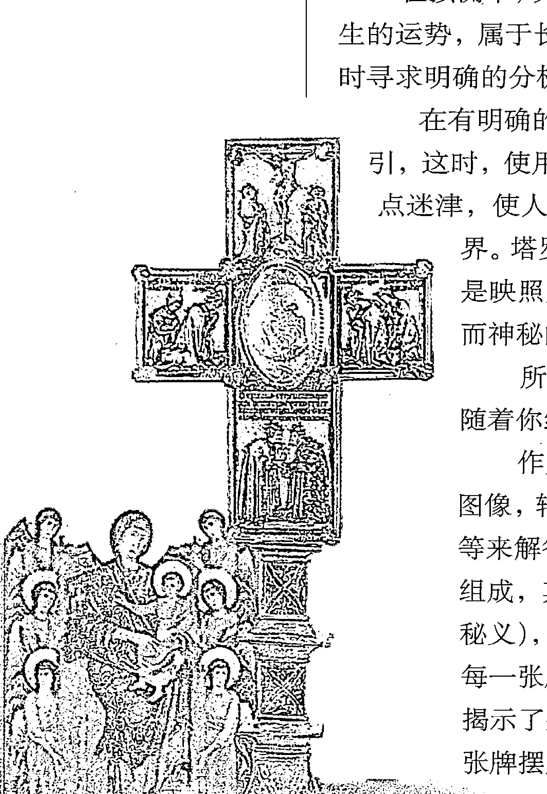

而塔罗牌七彩缤纷的图案，又成为了它另一个充满了魅惑的吸引所在。每一张牌名称的含义其实都基本相同，然而诠释的图案却随着各个国家各个时期的流传而变换着。这些图案，充满想象，含义深刻，色彩绚丽，大多出自名家手笔。人们除了被塔罗的神秘力量所吸引外，塔罗牌的收藏家们把它作为艺术品收藏，亦不在少数。

在欧美，在港台，塔罗牌早已如扑克牌一般，成为了人们日常生活中最常见的游戏和收藏品之一。今天，塔罗开始在中国大陆流行。

### 第二节 伟特塔罗的诞生

在所有的塔罗牌中，伟特塔罗堪称最经典的一款。塔罗牌有各种各样的主题：中世纪和文艺复兴时代的人物、想象的人物、神话中的人物、民间传说、不同的文化和社会背景、女权主义、传统塔罗牌的象征记号、从简单的线条图画演变到充满丰富细致的色彩，从古典的写实画法到当代时髦的卡通漫画。种种设计五花八门，然而，只有伟特塔罗长久地受到人们的喜爱，流传最广，经久不衰。
1909 年，英国人亚瑟·爱德华·伟特(Arthur Edward Waite)编创出版了名为伟特骑士的塔罗牌(Rider Waite Tarot)，由画家帕米拉·柯尔曼·史密斯(Pamela Colman Smith)作画。这一套塔罗牌一经问世，立刻风行全球。
因为在这以前的塔罗牌是用花色的排列来分辨的，类似现今扑克牌的黑桃、梅花、红心、方块。但伟特牌加上了使人容易明白的辅助图案，让接触该牌的人们意识上、潜意识里自然地了解。由于每张小阿卡那牌都有人物图案示意，使初学者能轻松学习，加上图案明确易懂，充满亲和力，立即成为全球最风行的牌型之一，也是初学者最常选用的入门牌。最初的伟特牌是黑色的，后来由于太过风行，画家帕米拉·柯尔曼·史密斯为其上色后，成为了流传最广的版本。后来陆续又有许多画家为伟特牌重新上色，包括Aquatic Tarot, Albano Waite Tarot, Universal Tarot, Golden Waite等。

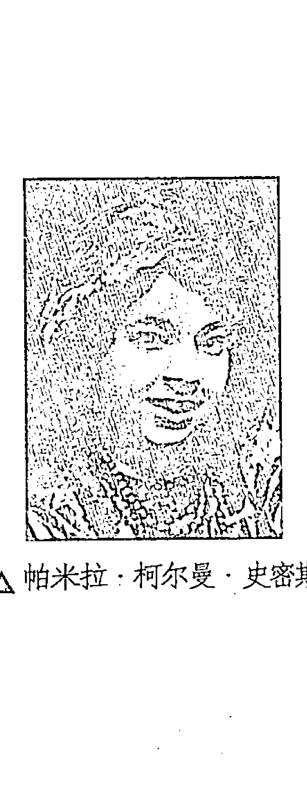

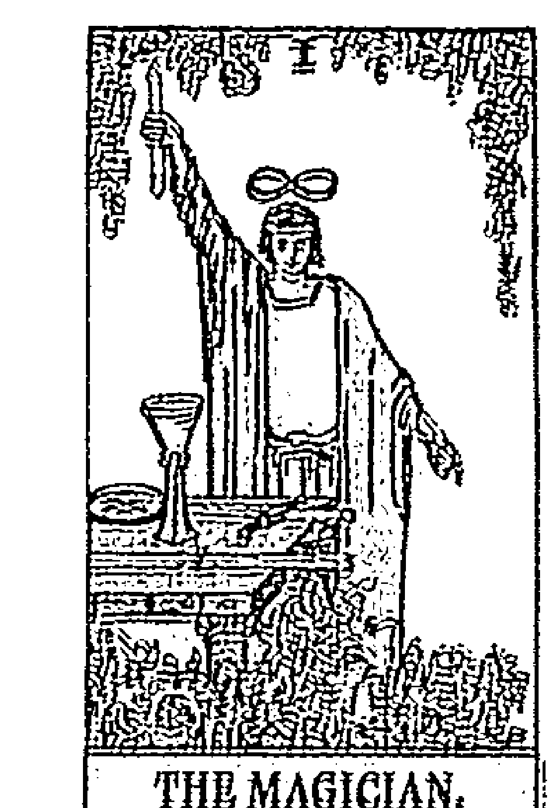

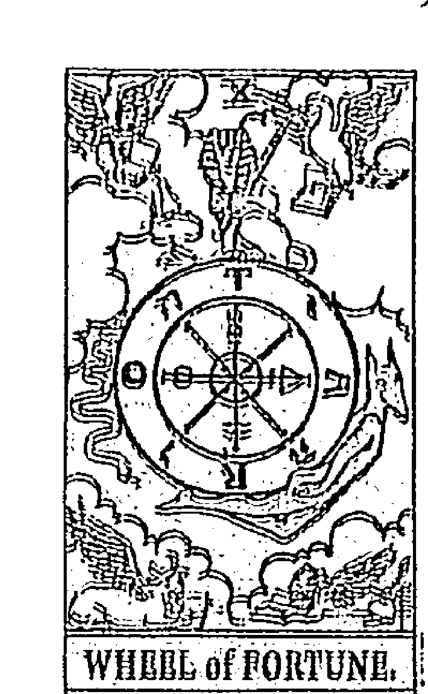

Δ 木刻版的伟特塔罗 Δ 着色后的伟特塔罗

伟特牌普及版本是其中最受欢迎的版本，由美国画家玛丽·汉森·罗伯特(Mary Hanson Roberts)在原木刻版的基础上上色，与原版的伟特牌在构图上可说是一模一样，基本色调亦无变异，但色彩更加鲜艳细致，细节表现更加突出，给人欢乐光明的感觉。本书附赠读者的一幅伟特塔罗，就是这个最经典最美丽的版本。

本书隆重地将这款最受欢迎的普及版经典塔罗推荐给广大读者，牌义解释与原版完全相同，丝毫不影响伟特塔罗的学习。在有关塔罗知识的讲解中，也以伟特塔罗举例。

与传统的塔罗一样，伟特塔罗有 22 张大阿卡那，由 0 至 21 号，有 “0愚人”、“3皇后”等名字。小阿卡那包括四组同花色的纸牌，每组各 14 张，由 1 到 10 和 4 张宫廷牌(国王、王后、骑士、侍从)组成。四组花色为：权杖，圣杯，宝剑，星币(或译金币、钱币、五芒星)。

请您慢慢往后翻看吧，开始《经典塔罗》的神奇之旅，做一个探知生命奥秘的小小解牌师。

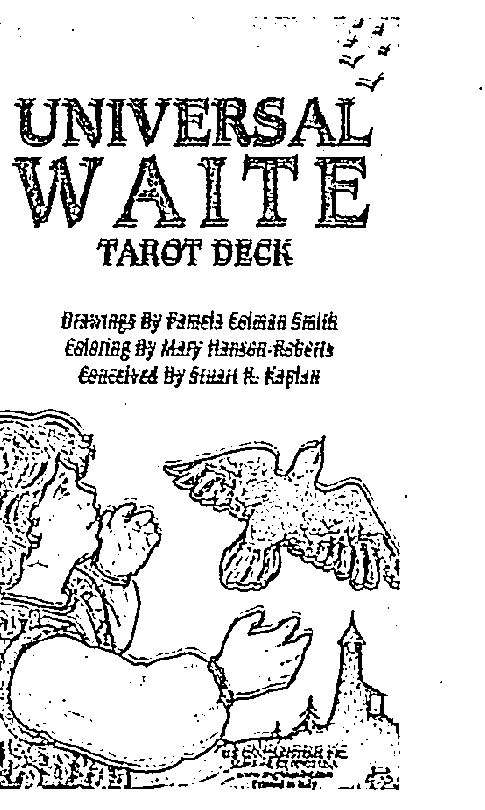

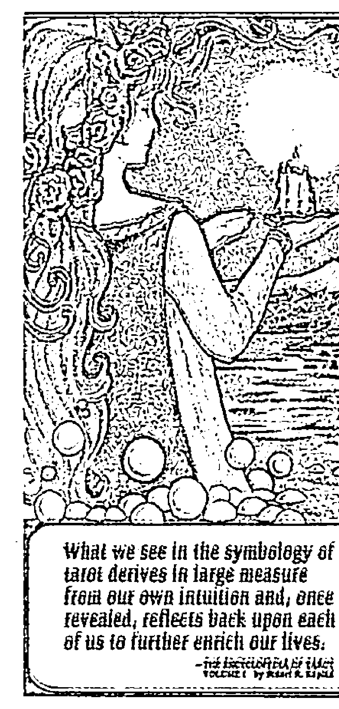

△全球最流行的普及版伟特牌

## 第二章 揭开大小阿卡那的面纱

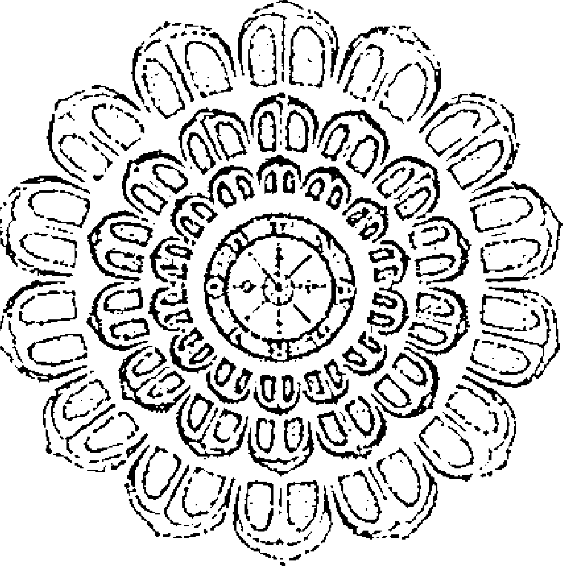

正如前一章中所述，标准的塔罗套牌由78张牌组成，分为两部分：22张主牌(大阿卡那)和56张副牌(小阿卡那)。“阿卡那”(arcana)是arcanum的复数形式，arcanum意为“深奥的秘密”。对于中世纪的炼金术士们来说，arcanum 是大自然的秘密。因此，塔罗牌汇集了构筑并解释宇宙万物的秘密。下面让我们走近大小阿卡那，撩开它们神秘的面纱。

### 第一节 大阿卡那

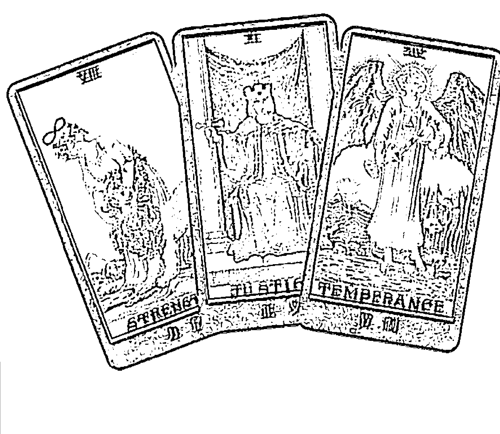

大阿卡那包括22张主牌，是塔罗牌的核心。每张主牌都象征着某种共通性的人类经验。它们代表着原型——直接而连贯地描绘出人类精神世界的影响。主牌中每一张都有自己的名字和序号。有些牌的名字直接表达牌义，例如“力量”、“正义”和“节制”。另一些牌上的人物是过着某种特定生活的人，例如“魔术师”或是“隐士”牌以为名。还有一些牌采用天体的名字，例如“星辰”、“太阳”和“月亮”，它们高悬在天，代表着难以捉摸的力量。

主牌很特殊，因为它们描绘出复杂的、深层的内心反应。塔罗牌上的图像能唤起很多东西，因为它们把深奥的象征与可识别的人物、境况结合起来。这种象征很微妙，但是很有效。

在推测中，主牌一直备受关注。当一张主牌出现时，那个牌位上的含义绝非是平俗的、暂时的。它们代表了你最基本的、最关心的事——你的主要感觉和动机。在后面篇章中，我们将更详细地讲述，在推测中你该如何认识和解释主牌的意义。

主牌通常被视为一组。为了研究塔罗牌如何映射出人的心理状况，许多不同的体系已经发展出来。这些体系中经常用到数学、天文学以及其他一些深奥的学问。

许多解牌者把这些主牌看成个人内心成长的不同阶段——有人称之为“愚人之旅”(参见中篇附录)。在这些理论中，每张牌都代表某种品德或经验，我们必须结合这些品德或经验才能完全认识自身。

我们都会沿着这条路走向自我实现的目标，尽管旅程绝非平顺，而是经常走弯路、重复甚至重新开始。每个人的路途是独一无二的，但我们的里程碑却是相同的。22张主牌就是心灵成长道路上的路标，从最初的意识(第0号牌)开始，直达到睿智与充实(第21号牌)。

“愚人之旅”从上一种经验到下一种经验，看起来是顺利有序地前进，但我们的学习之路却并非如此。我们犯下错误，逃避困难，未能认识到自己的潜能。有时我们缺乏勇气与见识，没有探索心灵深处。有些人从未听到过“隐士”在呼唤他们反省内心；有些人则不曾体会过“高塔”所代表的危机，而这种危机体验或许能让他们从自我防卫中解脱出来。

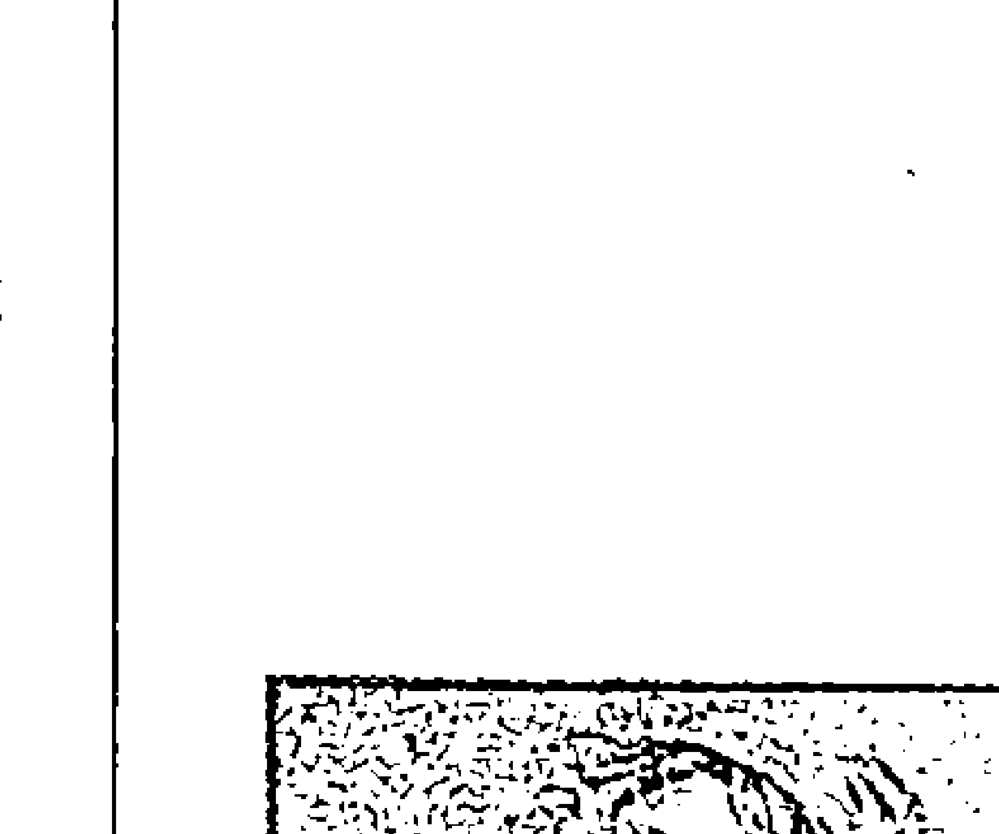

许多时候我们试图战胜困难，却一次次遭到失败。“吊人”的教训——放弃并承受失败的感觉——是非常不易学到的，在完全理解之前，我们或许要一遍又一遍地去面对。

我们学到的经验常常不按顺序来。一个童年生活艰难的人，可能会提前学会“力量”这种品质，但以后必须学习“战车”的统御力与控制力。一个过着隐居生活的人，或许能够克服“魔鬼”的诱惑，不去追名逐利，可是早晚要补上“情侣”这一课。

主牌包含了人生经验的许多层次和模式。这些牌描述了成长的全部过程，不管这些过程是发生在人生的某一段还是整个一生。可以说，人的一生只是我们灵魂发展史中的一段插曲。

无论我们自我探索的过程如何，主牌告诉我们，生命应该是完整而充实的。如果用这句话来指引人生，那么我们终将认识到真正的自我，并最终获得“世界”。

## 第二节 小阿卡那

主牌表达了共通的主题，而副牌则把这些主题扩展到现实中，展示出它们如何在日常事件中发生作用。副牌代表你关心的事情、你的行动、你的情绪，这些东西构筑出生活的剧本。

副牌共56张，分为四组：权杖(Wands)、圣杯(Cups)、宝剑(Swords)和星币(Pentacles)。每一组又分首牌、中间牌、十、宫廷牌。例如权杖牌组，有权杖首牌、中间牌(权杖二到权杖九)、十(权杖十)、宫廷牌(权杖侍从、权杖骑士、权杖王后、权杖国王)。在接下来的篇章中，我们将详细介绍每一组牌的意义。

作为分析牌义的基础，我们先来看一下有关四大元素的知识。

在许多古老的神秘学中，人们相信是土、水、火、风四大元素创造了世界。佛教中常说的“四大皆空”的“四大”就是这四大元素。此说源于印度古代哲学。水、火、土与风(空气)是与人类生活息息相关的元素，缺一不可。元素又分阳性与阴性，火、风为阳性，土、水为阴性，阳性为攻击元素，阴性为保护元素。文化学者将各国古文明以其崇拜元素分类，例如波斯人拜火而埃及人拜水。了解四大元素蕴藏的意义，能使我们更加敏锐地从塔罗牌中读到更深刻更准确的信息。

小阿卡那的四个牌组，分别与四大元素相对应：权杖代表火，圣杯代表水，宝剑代表风，星币代表土。同时宫廷牌也与四大元素相对应：侍从代表水，骑士代表火，王后代表土，国王代表风。在解读牌义的时候，小阿卡那宫廷牌的元素解释比牌组的元素解释重要。比如：圣杯骑士，圣杯是水，而骑士是火，那么圣杯骑士火的意义比水的意义更为重要。小阿卡那宫廷牌处于倒放位置时，其宫廷牌的元素解释是不变的，但牌组的解释却会有所逆转。比如倒放的圣杯骑士，骑士的意义不变，圣杯的意义却已逆转了。

每一牌组和每一组宫廷牌，都有意义相对应的大阿卡那牌，所以每一张宫廷牌可视为两张大阿卡那意义之和，可由下表速查：

| 侍从(水) | 骑士(火) | 王后(土) | 国王(风) | 与权杖对应 | 与圣杯对应 | 与宝剑对应 | 与星币对应 |
| :--- | :--- | :--- | :--- | :--- | :--- | :--- | :--- |
| 星辰 | 愚人 | 皇后 | 皇帝 | 战车 | 情侣 | 正义 | 魔鬼 |
| | | | | 星辰+战车 | 星辰+情侣 | 星辰+正义 | 星辰+魔鬼 |
| | | | | 愚人+战车 | 愚人+情侣 | 愚人+正义 | 愚人+魔鬼 |
| | | | | 皇后+战车 | 皇后+情侣 | 皇后+正义 | 皇后+魔鬼 |
| | | | | 皇帝+战车 | 皇帝+情侣 | 皇帝+正义 | 皇帝+魔鬼 |

下面，我们来详细看一下每一组牌的主题和特定含义：

## 权杖(Wands)

权杖这一组，代表创造、行动和运动。它们与热情、探求、冒险和自信等品性相关。这一组相当于中国哲学里的“阳”或是男性特征，关联元素为火。一堆跳动的火焰是权杖之力量的完美象征。这种能量向外发散，使人热情地参与事务。

△非洲木雕人头权杖

## 圣杯(Cups)

圣杯这一组，代表情绪和心灵体验。它们描述了内心状态、感觉和彼此的关系。这种能量是向内聚集的。这相当于中国哲学里的“阴”或是女性特征，关联元素为水。水可以流动，可以填满空隙，能够忍受，却又喜怒无常，这些都使它成为杯的典型象征。

△饰有钻石黄金的圣杯

## 宝剑 (Swords)

宝剑这一组，代表才智、思考和原因。它们与公正、真诚、道德等相关。剑的关联元素是风。晴空开敞，万里无云，处处明亮，象征着清澈明晰的内心精神，这是剑的最好写照。这一组也会引向不协调与不幸。我们的头脑是一项宝贵的财产，但是它代表自我，如果没有心灵向导注入智慧，它便会把我们带入歧途。

## 星币 (Pentacle)

星币这一组，代表实践、安全和物质。它们与处理问题时的具体需求相关。星币的关联元素是土。星币的精神是赞颂大自然之美、与植物和动物互动，以及身体的生理感觉。星币也代表各种各样的繁荣、成功和财富。有时这一组也被称为“币”。在这个物质世界上，当换取货物、享受服务时，“币”当然是最明显的象征了。

每组牌都有自己所代表的独特性质。我们的日常体验中，混合了这四类特性。塔罗推测会告诉我们，在任何给定的时刻，这四种不同的能量如何影响我们的生活。

再仔细分析每一组牌的组成：这四组牌都是由10张数字牌（从首牌到十）以及4张宫廷牌（王、后、骑士和侍从）组成，很像我们经常玩的扑克牌。在塔罗牌的能量运行中，每张牌都扮演着自己的角色。

## 首牌(Ace)

首牌说明了本组的主题。例如，“圣杯首牌”代表爱、情绪、直觉，以及亲密关系——这些内容呈现在杯组的其他牌中。首牌始终代表正面的力量。它承载着本组所能提供的最好的东西。

每张首牌都以最纯净的方式代表每组的特质。在解牌时，一张首牌总能提供一些特殊的东西。把它从其他牌里抽出来，似乎处于亮点。首牌上的图案大同小异。一只有力的手，焕发着能量，从云层中伸出来，紧握每组牌的象征记号。一张首牌“给予”你一种魅力，这种魅力来自于隐藏在云层中的某种未知的力量源。魅力的本质由每组象征记号表示。

首牌有的又译作“王牌”，在扑克牌中是A。

### 权杖首牌

权杖是强有力的，是充满男性力量的物体，有强制力。树叶的生长象征新生命的诞生。权杖提醒我们，有魔力的权杖是用来创造奇迹和成就非凡的。权杖首牌的魅力在于创造力、积极性、勇气和自信。

### 圣杯首牌

圣杯是开放的，是充满女性魅力的物体——被设计出来能够容纳营养液的容器。水从圣杯里流出来，意味着有永不枯竭的营养供应流向世界。圣杯首牌的魅力在于情感、直觉、亲切和爱。

### 宝剑首牌

宝剑是一种武器——制作精良的工具，用来清除任何障碍物或斩断犹豫不决。宝剑提升了使用者战斗和获胜的力量。它能够产生残酷的武力，但同时也可以是干净锋利的力量。宝剑首牌的魅力在于精神的透亮、真理、公正和坚韧。

### 星币首牌

对神秘的自然和世界的每时每刻来说，星币是一种不可思议的征兆。它被铸在一枚硬币上，是物质交换的体现。有了钱和自然资源，我们就有实现梦想的必要资金。星币首牌的魅力在于繁荣、实用、安全以及其表现出来的能力。

首牌是大阿卡那和小阿卡那之间的连接物。它们在你的生活中给予你强大但并非个人的力量。在解牌时，首牌表示，它的特质正在使你具备某种能力。如果你能好好利用，你将会得到更大的快乐和成功。首牌总是被解释为有益的、积极的以及提高生活质量。

首牌也暗示着，一种新的冒险经历即将开始。

首牌同时也表示，一扇机会之窗正在徐徐开启。首牌提醒你注意，不要错过。把首牌看做一颗将要发芽的种子，需要你的注意和关心。

当遇到首牌时，时刻注意寻找潜力。想想应该怎样利用迎面而来的因素，因为你可能会获得改变你生活的重要机会。

### 中间牌

编有序号的中间牌(二至九号牌)，每张都代表本组的一个不同侧面。例如，权杖组所揭示的主题中，有个人力量(权杖二)、领导能力(权杖三)、兴奋(权杖四)和竞争(权杖五)。一张牌可能会从几个角度探讨一个问题，例如“星币五”显示出需求的许多方面——困难时期(物质需求)、健康不佳(生理需求)，以及拒绝(感情需求)。

### 第十号牌

第十号牌把首牌的主题推导到一个逻辑结果上。例如，“圣杯首牌”代表爱、亲密关系以及情绪等等，如果你让它们发展下去，最后就会变成乐趣、平和以及家庭之爱，这正是“圣杯十”的内容。

### 宫廷牌

宫廷牌是一些个性化的人物，反映出各自的特质与身份。宫廷牌向我们展示一些特定的生存方式，因此在适当的时候我们可以应用(或是避免)这种处世原则。

也许你已经注意到了，人可以分为几种。物以类聚，人以群分。有时候，我们给这些聚群冠上名字，例如“孤独者”、“梦想家”，或者“党派”。心理学家已经设计出精确的体系以区分不同种类的人。

塔罗有自己的人格系统，分别由16张宫廷牌表示——国王、王后、骑士和侍从。我们现在要掌握宫廷牌的精髓，因为每个人的个性是其组别和身份等级的结合体。

### 国 王

“王”是成熟而男性化的。他是个实干家，在生活中的事务上，他关注着外在。在本组中，他代表权威、控制与统御的方面。王的方式是强壮、果断、直接。他关心结果与实践，以及如何应对事务。

如权杖国王是创造性的、鼓舞的、有力的、有超凡魅力的。这些都是权杖组积极方面的特点。它们是动态的有火焰般能量的最好例子，同时也影响了国王的性格。国王是积极而外向的。他们希望通过个人力量对世界施加影响。

### 王 后

“后”是成熟而女性化的。她包容本组的特性，却不把它们发挥出去。她关注着内在，她的方式是放松与自然。王后更关心生存的乐趣，而不太看重结果。她与感觉、关系和自我表现相关。

如权杖王后是有吸引力的、全心全意的、精力充沛的、心情愉悦的、有自信的。这些也都是权杖的特点。王后是乐观活泼的，但是她不会利用个人特质直接向外施加影响。王后从内部体现该组的特点，不会采用强力。

### 骑 士

“骑士”是个未成熟的青年。在表现自己时，他无法保持平衡。他想要成功地适应世界，却在两个极端中大幅度摇摆。骑士的行为有时很过分，但他仍然是热切而忠诚的，这使我们能够原谅他。我们佩服并且羡慕他的精神与精力。

骑士是极端主义者，它们最大限度地表现该组的特点。如此极端的情感和行为是积极的，还是消极的，均取决于环境。

例如，星币骑士非常小心谨慎——是追求稳定、保守的星币的典型特征。骑士愿意一遍又一遍地检查任何事情。他在表态之前，总是行动非常迟缓——对于这种人，你最好让他少引导你穿过雷区。

另一方面，你还可以发现星币骑士不愿意冒险。他永远也不会在两个月内通过奉献投资的方式使其资产翻番，或出于一时的兴致实施一次惊险的旅行。诸如此类冒险的行动都不符合他的性格。

骑士的关键词是积极的和消极的配对词(小心谨慎的或不愿冒险的)。在解牌时，你必须注意骑士的两面性。他代表了有益的或有害的方法吗？其他因素(和你自己的诚实)会帮助你做出决定。

### 侍从

“侍从”是个顽皮的孩子。他用快乐和无拘无束的方式来发挥本组的特性。他的方式或许不够深刻，但却是简单、轻松、出于本能的。他象征着探求与可能性。

每个侍从都是一个快乐的儿童，手里拿着每组的象征符号。他对他所从事的事情深深迷恋。侍从鼓舞我们分享他们的乐趣。如宝剑侍从代表智力发现或其他精神鼓励。

侍从也鼓励你“为之努力”。儿童想得到什么东西时，他们是不会犹豫不决的。他们会果断行动并试图得到。如果你希望侍从贡献力量，不要害怕说出口，抓紧时间！

如果圣杯侍从算的是你的日子，并且一个学生向你伸出友好之手，抓住机会和他做朋友。聊天、交谈或提议下课后一起喝咖啡。侍从鼓励你享受爱情，享受生活。

在许多塔罗牌系统里，宫廷牌表示某个年纪和某种类型的人。例如，宝剑王后经常是离了婚的女人。这种看宫廷牌的方式太局限，特点并不是限制在某个组里的。国王的方式可能更男性化一点，但是这种特性同时也适用于女人。儿童通常更爱玩一些，但是并不意味着侍从总是代表儿童。

宫廷牌显示出来的是，某种特定的生活方式如何(能够)影响你的处境。通常有几种可能性。

首先，宫廷牌能显示出你性格的一面，它们已经被体现出来或正在体现，你或许看到了它的价值，或许忽略了它。它也可能是你认同的方式，或被你否定了。你怎么看待它取决于你的问题，其他牌，和当时的局势。

举个例子，你想决定是否参与一个商业合作组织。如果你抽出的是宝剑国王，你可以解释为你想在这种情况下扮演什么角色——公正的、民主的？仔细回顾以前的事情，明晰你的需要。如果你已经采用了这样的方法，宝剑国王会确定你的位置，但是，如果你撒谎或隐瞒了什么，这张牌会让你重新考虑。

宫廷牌同时还代表另一个人。如果你看着这张牌，对自己说，“我知道那是谁”，那么它就可能是那个人。它同样也可以代表你没有意识到某个人。

例如，你碰到了一个非常浪漫的人。你们长时间呆在一起，并且交往很深。在解牌时，圣杯骑士可以代表这个新情侣，但是，因为他是骑士，你应该仔细看这种关系。

你希望和你的情侣有怎样的经历？你们也许享受浪漫，但是你们同时也在寻找依靠和共同的承诺吗？圣杯骑士是一个信号，表示这种关系是不平衡的：亲密爱情的分享占大多数，但是在其他方面却很少分享。

最后，宫廷牌能影响氛围。有时，环境似乎具有个人特征——与宫廷牌的类型相契合。

举个例子，你向塔罗牌求助，想找到有关你将要搬进的一套房子的信息，抽出的是星币王后。你犹豫着是否能与未来的室友友好相处。这张牌告诉你，氛围是良好的。你的室友温和、慷慨，能理智地解决问题。

另一方面，你可能在新居里遇到一位类似于星币王后的人，或者你在这个环境里像星币王后的性格。诸如此类就是塔罗牌比较精细的玩法。

宫廷牌有人性的尺度，这是其他牌所不具备的，所以，对于你是谁，你想要什么，它们能为你提供清晰明了的信息。它的诀窍是懂得自己及自己所处的局面，这样你就能够接受宫廷牌所表达的含义。

## 第二章 塔罗——灵魂的镜子

很多人会说，“一副纸牌怎么可能告诉我那么多事情呢？”但是当我们深入学习之后，我们就会发现，在体察和面对生活中的竞争时，塔罗牌可以使我们的行为方式产生很大变化。

在前面，我们已经介绍过，塔罗牌的起源很神秘。我们可以肯定的是，在15世纪的意大利，塔罗牌是种流行的牌戏。富人们出钱制作了精美的纸牌，其中一些至今仍留存下来。问世于1450年或稍早时期的威斯康提·斯弗扎(Visconti Sforza)，就是最早的塔罗牌之一，而且非常完整。

后来，在18和19世纪，一些知名的神秘学(研究占星术、炼金术等知识的)学者发现了塔罗牌。这些人被塔罗牌迷住，发现牌面上的图画拥有强大的力量，绝不仅仅是牌戏那么简单。他们揭示了(或者是设想了)塔罗牌的“真正”历史，把塔罗牌联系到古埃及的秘密宗教仪式、神秘哲学、魔法、炼金术，以及其他神秘的东西上。他们一直追查到12世纪早期，那时塔罗牌被结合在几个秘密团体的习俗中，包括黎明祈祷(Order of the Golden Dawn)(注：参见西蒙、斯库斯特的《塔罗：历史、神秘与传说》——Simon & Schuster, The Tarot: History, Mystery and Lore, 1992)。

尽管塔罗牌的根基是古老的神秘学，近几十年来，人们对塔罗牌的兴趣仍然不断发展，其中包括许多不同的方向。许多新的塔罗牌被创造出来，以反映这些新视角。例如，美国土著塔罗牌、爱尔兰的变形塔罗牌、草药塔罗牌、龙之塔罗牌，以及日本塔罗牌等。

如今市面上有许多制作精美的塔罗牌，还包括14和15世纪所流传的版本。

但我们推荐使用伟特牌，并且本书着重介绍了伟特牌，这是因为一方面它的图案相对而言没有包括太多的神秘学符号(至少一般人都能很清楚地了解图案的基本意义)，另一方面伟特牌是比较流通的版本，解释、研究和范例也较多，所以对初中阶段的塔罗学习者来说是很不错的选择！

## 第一节 心理映射

塔罗牌是一种推测工具。传统的塔罗推测，解牌时需要两个人共同完成：一个称为“问者”——遇到个人问题，想要寻求答案的人，另一个称为“解牌者”——懂得如何解释牌义的人。问者洗牌并切牌之后，解牌者把选出的牌按某种图形(即所谓牌阵)摆开。牌阵中每个位置都有特定的意义，每张牌也都有自己特定的含义。解牌者把这两种意义加以结合，以此揭示问者的问题。这过程很简单，但却很少用简单的方式来展示。有些宗教回避它，而科学界则宣称它是荒唐的符号，是愚昧落后的文化的残余产物。现在让我们抛开这些虚幻的东西，只考虑它的本身——这是一套有图片的牌。问题来了：我们能用它干什么？答案牵涉到潜意识——它存在于我们每个人的记忆和意识深处，却又表现在日常体验中。尽管大多数时候我们都会忽略潜意识的活动，但它却深刻地影响着我们的行为。西格蒙德·弗洛伊德心理学大师荣格

弗洛伊德(Sigmund Freud)在其著作中着重描述了潜意识的非理性和原始性。他认为，潜意识是我们最不愿承认的欲望和要求的源头。

与他同时代的卡尔·荣格(Carl Jung)则强调潜意识的正面性与创造性。他试图说明，潜意识是人性中那些共通的优良品德的集合。

或许我们永远无法了解潜意识的全部内涵与能力，但却有办法揭示它的面貌。为此发展出许多方法——心理学、解梦、想象与冥思。塔罗牌也是这类工具中的一种。

不妨试着花点时间来考虑塔罗牌中很典型的一张：“宝剑五”。这张牌画着一个男人手拿三柄剑，看着远处另外两个人，地上还有两柄剑。当你看着这张牌时，你是如何围绕这张图创建故事的呢？比如说：看到一个男人在战斗中获胜，心满意足，他沾沾自喜，很高兴能夺得所有的剑，另外两个人被打败，沮丧而失落。

宝剑三

也许你认为这是这张图惟一可能的解释。但实际上，其他人没准会设想出一个完全不同的故事来。或许这个男人正在捡剑。他叫别人来帮他，可他们拒绝了。或者，另外两个人正在打斗，而他想迫使他们停下来。

关键在于，有许多可能的故事，而我们只选择了其中一个。为什么？因为人会本能地把潜意识映射到事物上。我们始终透过内心的镜头来看待事实。治疗师们早就注意到了这种特性，并发明了工具来辅助治疗。著名的若斯查墨迹测验(Rorschach inkblot test)，就是基于心理映射的。

心理映射是塔罗牌有价值的原因之一。这些令人迷惑的图画和符号对于释放潜意识非常有效。这是塔罗牌的个人性，但它还有共通性。作为人类，我们都有些普遍的需求和体验。塔罗牌的图画抓住了这些共通的东西，并且描绘出来。人们很容易对塔罗牌有反应，因为它代表了某些心理模型。许多世纪以来，塔罗牌已经演变成人类思想和情绪的最基本的集合。

权杖七

以大阿卡那中“皇后”一牌为例。她代表母亲的原则——生命处于富饶之地。注意牌的图画如何唤起我们丰饶的感觉。她坐在软软的豪华靠椅上，长袍飘垂折叠，围绕着她。在皇后身上，我们感受到大自然的慷慨与丰富。

塔罗牌的力量源于个人性与共通性的结合。你可以用自己的方式看待每一张牌，但与此同时，你也能感受到别人所体会到的东西。塔罗牌是一面镜子，反映出你个人意识中隐藏的一面。

## 第二节 随机与心灵向导

在推测时，我们洗牌，切牌，选出一些牌并摆开。尽管这个过程看来是随机的，但我们仍然认为自己取出了特定的牌。说到底，这就是塔罗推测的关键——选择我们想要的牌。那么，通常认为随便抽出的牌无法代表任何特殊含义，这种看法对不对呢？

要回答这个问题，让我们先研究一下“随机”。一般来说，当一个事件是机械作用的结果时，我们说它是随机的。从一组可能性中——所有可能性结果的机率是相同的——选出一个，但没有任何特殊因素。随机事件的这一定义包含两个关键性的假设：它是机械作用的结果，并且没有任何特殊意义。

首先，塔罗推测并非机械作用的孤立产物。它是一长串意识活动的结果。我们决定学习塔罗牌，我们买了牌，开始研究如何使用它。我们在特定的地方用特定的方式洗牌、切牌。最后，我们用自己的直觉和理解力来解释牌义。

在每一步中，我们都活跃地投入。那么我们为何说推测是“机械作用的随机结果”呢？因为我们无法解释心理意识如何投入。我们知道自己抽牌时并没有特意去选择，因此就说是随机的。而实际上，这一过程中是否有种深层的力量，一种涉及潜意识的力量？我们的内心状态是否以一种尚未了解的方式影响外部事物？我们坚持有这种可能性。

随机事件的另一特性是没有任何内在意义。摇骰子摇出六点，但这并没有任何特殊目的。我们同样可以摇出一点，意义是相同的——或者并不相同？我们真的知道这两种结果是均等的吗？

或许每件事都有它的意义和目的，其可能性有大有小，但我们从未认识到这一点。

“意义”是一种真正神秘的特性，源于内心与外部现实的交界。每件事物都含有信息——树、歌曲，甚至垃圾桶……但只有当我们敞开心扉去体验它时才能感受到。塔罗牌的图画内涵丰富，互相联系，因此包含许多信息。更重要的是，塔罗推测把各种含义联系起来，因为我们投入愿望，忠于内心，来发现我们生命中更深层的真实。沿着这种寻求含义的方式，我们承认内心愿望的真实性，并有机会揭示它的实质。

如果推测中有某种含义存在，那么它从哪儿来？它来自我们自身的一部分，来自意识的神奇源头。这是潜意识的一方面，但还不止这些。它就像一个深深了解我们的智者。它理解我们的需求，并引导我们走向我们想要的方向。有人把它叫做灵魂、超意识，或是超我。我们则称它为“心灵向导”，因为这正是它在塔罗推测中扮演的角色。

我们每个人都有心灵向导，它是意义之泉。你的心灵向导始终伴随着你，因为它是你的一部分。你无法切断这种联系，但你确实可以忽略它。当面对塔罗牌时，你向心灵向导发出信号，准备接收它的智慧。这一简单而真诚的行为，使你意识到内心的存在。

我们天生就懂得依赖心灵向导的智慧，但却时常忘了这一点。我们相信头脑，却忘了观察内心。我们的脑子很聪明，但不幸的是它并没有足够的意识力，好让我们每天做出恰当的选择。

当我们使用头脑时，我们经常感到各种事情随机出现，带给我们压力。生活没什么目标，我们总是忍受，因为我们并未真正明白自己是谁，要去向何方。当懂得如何运用心灵向导后，我们对生活的体验就完全不同了。用内心目标把意识愿望列出来之后，我们获得了自信与平和。我们的路程更加有趣，并且更清楚地看到，如何把分散的要素聚在一起，来充实我们的命运。

我们使用塔罗牌，因为它是最佳工具，可以使心灵向导的私语进入意识。解牌时浮现出的想法、影像和感觉，是心灵向导的讯号。我们怎能知道那是个讯号，而不是我们的臆想呢？也许我们自己也无法详细地解释，但，我们要相信自己的经验，并观察所发生的事情。

我们不一定非要用塔罗牌来接触心灵向导。塔罗牌的作用和“丹波的魔羽”一样。在迪斯尼电影《小飞象丹波》(Dumbo, Walt Disney Productions, 1941)中，小象丹波真的会飞，但他自己不相信。他在身上系了羽毛，把全部信任都放在羽毛上。他认为羽毛能带给他飞行的本领，但当发现羽毛飘走时，他被迫求助于自身的能力。

塔罗牌正是这样，它可以帮助我们，启发我们对生命的再认识，让我们求助于自身就能实现飞行，使我们能自由运用心灵向导。

## 第四章 塔罗推测入门

当了解了塔罗的科学体系,我们手中或许已经握有一副自己喜欢的塔罗牌,这个时候,我们可以开始具体地学习,把我们的塔罗牌知识投入到正式的推测中了。在这之前,还要对一些知识做必要的了解。

### 第一节 牌阵

正如前所说,塔罗牌的游戏是一项推测活动。我们该如何利用牌面的奥义来揭示未来呢?这就需要牌阵的帮助。牌阵是某种固定的结构,用于放置塔罗牌。它指定了要用多少张牌、每张牌放在哪里,以及每个位置的意义。牌阵是一个模板,塔罗牌按这种模板放置,由此揭示某个给定的主题。模板让塔罗牌优美地聚集在一起,并使它们有了意义。比如圣三角推测法,按规定方式抽出三张牌摆成倒三角的形状,下面那张牌代表过去的经验,左上角的牌代表现状,右上角那张代表将来。那么,在这三个位置的都分别是什么牌呢?牌面的含义就是牌阵解读的结果了。所以，对于塔罗推测来说，关键还是牌面的含义和所测问的问题。牌阵，其实是听从使用者指挥的，只要因循规则，完全可以自创。当我们拆开一副新的牌，用左手(左撇子用右手)轻轻依次抚摩每一张牌，让每一张牌与自己心灵相通。当我们推测的时候，在心中默默地集中意念，这一切，都让神奇的力量发挥作用。牌阵，只是借助用于外化的语言，内在的推测意念，才是最重要的。

塔罗牌的推测活动流传几个世纪，各种实用推测牌阵也流传了下来。在本书的下篇中，我们将对牌阵进行详细的解说，并且罗列出最为灵验和受人们喜爱的牌阵，以供大家参照学习和推测。此外，附录中我们也提供了大量应用牌阵，供大家习用。

### 第二节 倒放与正放的牌

讲到牌阵，有一个知识不得不加以说明，那就是，当我们洗塔罗牌的时候，它们通常按不同的方向立着。摆放牌阵的时候，必然有一些牌是倒放的，倒放的牌与正放的牌含义是有所区别的(倒放是指翻开后的牌，其牌面的图案与玩牌人正视相反，即图案是倒的)。

所有的生活都是能量——混合着力量流，形成了我们生活的模式。每张塔罗牌都象征着一种特殊的能量，用塔罗牌进行推测，显示的是能量的集合，形成一种局势。解牌时，你的行动和意图与牌带来的瞬间的能量相一致，并形成一张图画。当你洗牌、切牌时，这些牌就抓住了你心里和周身的能量流。

在某个特定的时刻，这些能量处于不同的水平。有的能量强大有力，其他的则弱一些。有些能量要进入你的生活，其他的则远离。你如何应用这些能量取决于你所处局面的各种因素。

当一张牌是正面放置，它的能量是显然的。它的质量是可以利用且积极的。牌面倒放，它的能量就不能完全发挥出来。它可能处于早期的阶段，或者正在失去力量。它也许是不完全或不可利用的。这张牌的质量是存在的，至少是潜在的，但是没有被完全释放出来。

太阳的能量正如你想象中的——豪华而耀眼。一张正放太阳牌表示，生命力的能量是可利用的。你会感到有信心和成功感。现在你充满了机会。一张倒放的太阳牌则表示，同样的能量是存在的，但是处于较低的水平。生命力被降低或在某些方面被局限。你会感到士气低下或热情减退。你也许还有想成功的渴望，但是有什么在阻止你前进。

比如：有个男人想知道他和他太太是否有孩子，推测时，出现了一张倒放的皇后牌。可看出他们想要孩子有一段时间了。这张牌显示出来，做妈妈和生育的能力是现存的，但是能力受到了压制。似乎有什么在阻碍怀孕。推测结果告诉那个男人，一旦阻碍被解除，拥有孩子的可能性就很大。后来不知道发生了什么事，能量得到了释放，他们有了一个美丽的女婴。

大家似乎都倾向于把倒放牌看做是不受欢迎的。这个人想要个孩子，所以一张倒放的皇后牌使他感到很沮丧。其他人也许对同一张牌有不同的看法。这个例子证明并非如此。倒放牌并不是不否定他们。所有的事情都取决于你希望达到什么目的。

又比如：“宝剑三”代表令人心碎的能量和背叛。如果这张牌是正放的，伤感情就是这种局面的特征。若倒放，这种局面同样存在，但是程度上就减轻了。也许令人痛苦的强度在消退，或者你感到孤单，但只是一点点而已。一张倒放的“宝剑三”比正放的更让人愉快，但是还是一个警戒的信号。让人讨厌的牌出现的事实意味着它的能量以某种方式存在着。

有时候，牌是倒放的，但是你还是能感觉到高水平的能量。在这种情况下，倒放意味着你做出有意识的努力，降低能量，从而能够改善你的处境。

当推测你被迫做你不想做的事情时，抽出了倒放的“权杖七”。这张牌代表挑战。因为你被迫与自己的意愿相违背，也许你感觉到了这种局面下的挑衅。倒的“权杖七”暗示着你试图征服你强烈的情绪。试图减轻你挑衅的感觉，寻找另一种方式来处理这个问题(当然，能量低是可能的，因为你的挑衅被压制了。只有你自己才能说清楚哪种解释是最好的)。

在通常的解释中，倒放牌的意义有时候会被扭曲。从这个意义上，倒放的皇后牌显示出由皇位带来的强大权力。反向的“权杖十”也许提醒你从繁重的责任负担中解脱出来。很奇怪，为什么经常采用这样的意义，但是你不能强迫它们。必要的时候，它们就会这样解释。

还有一种能形成包含倒放牌的配对牌，请参看下列例子：

如从清晰度来看，太阳和月亮是对立的——太阳光耀眼明亮，而月亮则模糊不明。解牌时，一张倒放的太阳或正放的月亮都表明确定性是很低的(太阳)，不确定性很高(月亮)，或者你现在不知所措(月亮)，但是更明了局面的出现是可能的(太阳)。

解牌时，观察倒放牌和倒放牌的均衡是有帮助的。当许多牌是正的，你的能量就能自由、强烈地表达出来。整个局面发展势头良好，你的目的也是明确的。当许多牌是倒放的，你的能量就低，局面也不明朗。你也许会缺乏方向或感觉受到了阻碍、沮丧、受限制。你处于乱七八糟的状态，改变是可能发生的。因为能量没有得到很好的发挥，它们就在新的方向四处游走了。

生活是能量不断流动的过程——由灵魂引导的华美舞蹈。当我们懂得它的流动，并有创造性地使其运动，没有什么事情是做不到的。我们能有意识地引导能量，或者让能量带领我们去它想去的地方。在任何一种情况下，倒放牌为解牌增加了一个特别的维度，帮助你理解自己生活中能量的作用。

### 第三节 进阶

学习塔罗，无论是受人指导还是自己买书研习，与个人的资质与悟性也颇有关联。虽然本书十分详尽地列出了实用的推测方法和解读含义，但对于整个牌阵的融会贯通，依然要靠个人的理解能力。有些人学得很快，有些人学得很慢。但无论你是什么状况，都要相信自己，相信自己的直觉，极大地发挥意念的作用，就可以了。

在用塔罗推测时，一般有三个阶段。

第一个阶段是非常着重牌义，一直死背这个牌是什么含义，例如“死神”是结束，“正义”是冷静等等；一旦真的要帮人或自己推测时，就手忙脚乱，找到说明书赶快看看牌的真的含义是什么才会安心。这是学塔罗的第一个阶段，几乎是自学者必经的阶段。

第二个阶段是因练习久了，对每张牌有特殊的感觉，帮别人算时就依感觉解牌，这就进展到了第二个阶段了，也就是有了看图说事的能力了。

最后一个阶段，就是自己的敏感度变得很强，往往牌不用完全翻完就可以知道结果，而在不用牌推测时，观察和分析周遭的事物能力也变强，这是最高的境界，就如武侠小说一般的无剑胜有剑，无招胜有招一般，达到了无牌胜有牌之境也。

很多人希望跟塔罗牌通灵，把牌当作一个人看待，会为牌取名字，有事没事和牌聊天，其实是没有必要这么做的，因为如此久了就会太依靠塔罗牌。塔罗牌是现在事件的反映，主要是要让当事者承认自己不肯面对现实而已。保持塔罗牌的纯净的公正直言，是很重要的。

塔罗牌并不是直接对未来的预言，所谓的未来不过是现在的延伸，塔罗牌算出的是以目前情况若不改变方针将会有何结果，或者说是在剖析事情的真相。它让我们在面对一个问题的时候，不要老想着未来会怎么样，而是认真地思考问题究竟出在哪里？着眼于现实的问题点，才是解决问题最好的方式。每个人都有能力扭转未来，一旦自己的心意转变，行动改变，未来同样的牌就不会再现了，所以塔罗并非是宿命的，即使有些事是难以改变的。

对于爱好塔罗牌推测的读者来说，如果能够多涉猎一些心理学或哲学的知识，对于推悟能力，将是一个极大的提升。

### 第四节 环境

玩塔罗牌的环境，包括推测者的身体和心灵的状态，以下五种内心状态是最佳的。它们是：

- 大度——大度指的是拿得起放得下。这是一种允许的态度——乐意接受不会排斥所得到的结果。只有大度你才拥有机会获得你想要知道的内容。
- 冷静——当你处于混乱状态时是很难感受到自己的内心活动的。塔罗牌的信息常是一种细微的暗示和发现，这很容易被你不安的思绪所盖过。当你很冷静时，你就像平静的海洋，任何小小的波澜都会觉察得到。
- 专注——集中精神在玩牌中是很重要的。比如当求问者强烈地感受到某一问题时，就会收到直接而有利的信息。当精力分散时，牌趋于模糊。所以当你的愿望很强烈时你会获得真正有价值的内容。
- 警觉——当你保持警觉时，你所有的潜力都会被激发，有如猫在看到老鼠或虫子时它会变得很警觉。正如你会发现如果你很累或很烦时牌很难解出。
- 尊重——尊重指的是尽可能地把牌作为有价值的工具,你得承认它的作用,承认它会帮助你更好地了解你自己,你要以决定学习塔罗牌并运用它为荣。

即使这五个品质是很重要的,它们也不是必要的。没有它们你可能也会获得有意义的结果,但这可能会比较困难。决定是否是解牌的最佳时机的最好方法是了解你内心的想法,如果感到不对劲,推迟一下再做,如果你的内心要你继续,那就顺从内心想法。

除了内心环境之外,还要考虑解牌时周围的环境。最理想的地点是让人有安静、平和甚至庄严感的地方。你可以在喧闹的飞机场解牌,但是噪音等会让你分心。当然你最好是在家里解牌,让我们看一下你应该如何创造一个满意的环境。

你应该在家里腾出一个专门地方让你解牌,通过反复使用同一个地点,你会建立起一种能量感应来加强你的实践。如果你做冥想或祷告,也可以在这个地方进行,因为它们在内在的精神上与塔罗牌是和谐一致的。

试着感觉与真实的环境相分离。在你玩牌时,你要设想已经远离现实生活进入一个时空之外的世界。一间隔开的屋子是最理想的,由屏障、帘子、枕头或其他分隔物隔开的角落也可以。还要试着创造一种美丽、含蓄的氛围,在周围放一些对你有特殊意义的物件,那些来自大自然的东西,如贝壳、石头、水晶石,植物也很不错。吉祥物、图形或宗教图标可以帮你将注意力从世俗世界转移到精神空间。也可以考虑用绘画和艺术作品，特别是你自己创作的，并可用花儿、薰香、蜡烛、织物和神秘的音乐来唤起你的感觉。

这些格调都很美，但你真正需要的是一个足够大的空间能摆开这些牌，你可以用桌子或地板。地板会使人有种接触地面的感觉，如果感到不舒服的话，桌子是比较好的。选一张用自然材料制成的桌子，如木头或石头的。

如果你喜欢，你可以在桌子或地板上盖上一块布来创造一个统一的环境，布的质地应该是天然的，如丝的、棉的、羊毛的或亚麻的。小心选择布的颜色，因为颜色有它们自己的能量，黑色、深蓝和紫色是很好的选择。应该没有或较少的图案，这样牌上的图案会比较明显。

把你的牌放在一个容器里好好保护以维持它们的能量，任何天然材料制成的都很好；如木头、石头、贝壳或天然材料织的布。我们知道有一个女子自己缝了一个丝制、拉带的包，里面装了饰有星星、月亮和其他图案的工艺品。可以考虑把你的牌用丝布包起来放到容器里，丝给人一种贵重的感觉，它会提醒你牌的价值。

塔罗牌能吸取使用者的能量和特性，鉴于此，应拥有一副专属于你的牌，这些牌将会成为你与内心世界交流的私人工具，你要和它们形影不离。

当你在你自己的地方玩塔罗牌时，会有非常强大的感受，但不必做多余的准备。你所有要做的就是玩牌，这是最重要的一部分。

### 第五节 仪式

有些人为了使塔罗推测更准确，会对仪式有所讲究，一般的塔罗仪式有如下这些。

#### 开牌仪式：

刚买到牌时，给牌消磁。首先要准备代表四大元素的物件，如下表所示：

| 元素 | 举例 |
| :--- | :--- |
| 火 | 蜡烛、薰香 |
| 石头 | 石头，有些人为了达到更好效果会选择矿石或者水晶 |
| 风 | 刀、剑之类，小刀就可以了，不必开过锋的刀剑，以免危险 |
| 水 | 漂亮的杯子 |

然后对牌进行冥想、祈祷，再把牌在薰香上顺时针过香，以手指沾水在空中画五芒星（第一划由下往上）。随后再进行冥想，一张一张地读牌，问与自己或牌关系密切的问题，作为牌的初推测，最后依顺序收牌。这些形式有点类似东方佛教的开光仪式。

## 推测仪式：

有些人每一次进行推测都很讲究仪式。首先要清洁双手、桌子，然后清净的环境也是必须的，对环境要以冥想净化。事实上，冥想的确很能影响推测的结果，掌握好冥想法，是成为一个好的解牌师很重要的一方面。那么如何冥想呢？其实冥想也没有特定的规则，所谓冥想，就是个人的感悟能力，所以冥想也是个人的发挥。一般说来，我们可以按照下面的顺序冥想：

- 1. 推测前: 想象以自我为中心，四周是一个完整的圆，一切都很安静而空灵，毫无杂质。这个圆的周围有风、火、水、土四元素，然后请求他们给予力量，于是力量慢慢在圆内积聚，渐渐汇入体内。
- 2. 推测时: 听到求问者的问题后，也要冥想，最好能和求问者一起冥想，可以拉着对方的手，或者将对方的手放在自己手中的牌上，持续地冥想。
- 3. 推测后: 完成问题之后，慢慢收牌，一边想象着刚才那个完整的圆，力量正渐渐回到圆中，然后渐渐消散到圆的周围，圆越来越小，越来越小，直至消失，然后自己回到了原来的世界。

## 封牌仪式：

通常，自己用过的塔罗牌是不可以扔掉的，如果以前的那副牌不适合自己，或者自己换了新的牌，对于以前的牌，很多人都会采用封牌仪式。仪式本身其实非常简单，将牌用黑色的布包好，然后放在屋中的北方，同时配合冥想，就可以了。

世界上许多塔罗爱好者会结成一定的协会或社团、沙龙，他们都有自己的规定，在开牌、封牌、推测仪式方面会有不同，不过大体上的形式都是差不多的。有些人需要仪式来加强对牌的信任，另外比较正式的活动中，仪式也是必不可少的。

当然，也可以不用这般拘泥于形式，仪式只是代表一种尊重。塔罗是依靠内心世界的力量，彼此感应，指引方向，仪式并无明确的定则，即使没有任何仪式，也可以使用塔罗牌。不过，冥想始终是对的，精神的集中，对塔罗的推测至关重要。仪式也许可以加强冥想的力量。

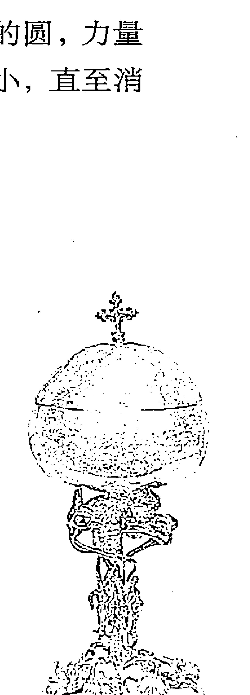

## 第六节 禁忌

有些人也许会提起有关禁忌与折寿之类的说法。其实这是不用担心的，推测与折寿无关，正如我们前面所讲的，塔罗推测与其说是预言未来，不如说是测知真实的现在，给人正确的指引。有些人会恶意地使用黑魔法等等，自然是算作心术不正之流了。真正的塔罗体系，是不允许这些旁门左道的。

推测中有一些注意事项是必须遵守的。

- 第一，不可以在同一天内推测同一个问题。塔罗牌是我们的伙伴，我们必须给予信任。
- 第二，不可以有“不算到好结果决不罢休”的心态，要尊重塔罗告诉我们的结果，不可以一意孤行，塔罗要做的正是告诉我们真相，而不是按照我们自己的意愿说话，要善于接受。
- 第三，不要遗失任何一张牌，如果实在不小心遗失的话，最好是重新换一副新牌。

另外，虔诚的宗教信徒最好不要使用塔罗牌。因为塔罗揭示神谕，这一禁忌，或许与宗教信仰不相融洽。

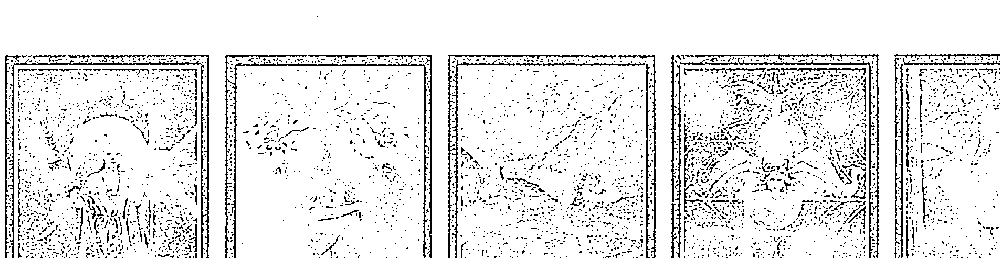

△ 每一种塔罗牌都有不同的画法与解释，但内在的精神与规则却是一致的。这是掀起中国大陆“塔罗热”的《变形塔罗》牌。例如上图中的“2女巫”、“12变形者”在伟特塔罗牌中是“女教主”、“吊人”

▼ 这是中国大陆第一套原创绘制的《爱情塔罗·财富塔罗》牌，它是贝塔斯曼书友会选中的第一套塔罗牌，它具有传统的中国文化内涵与浓郁的中国艺术风格

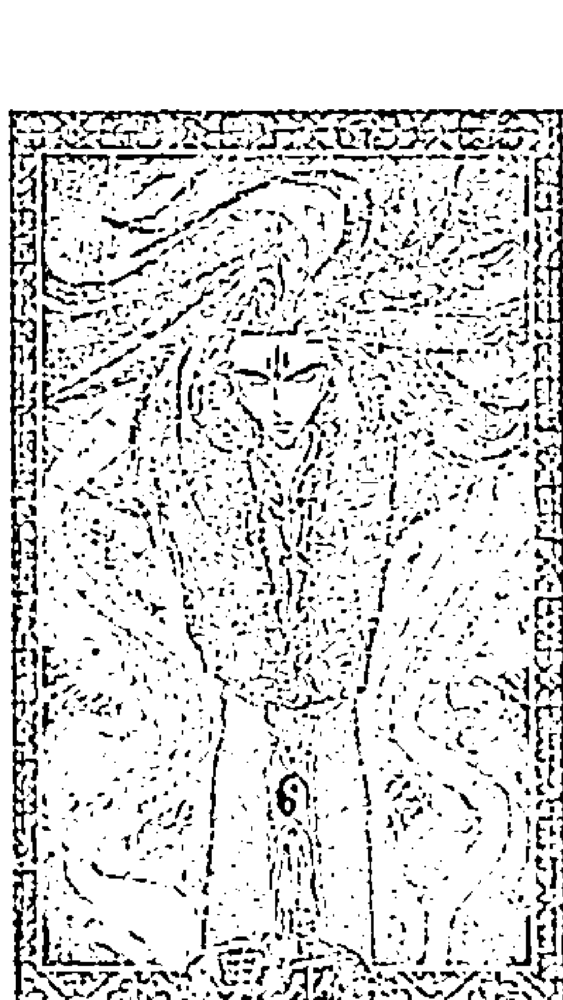

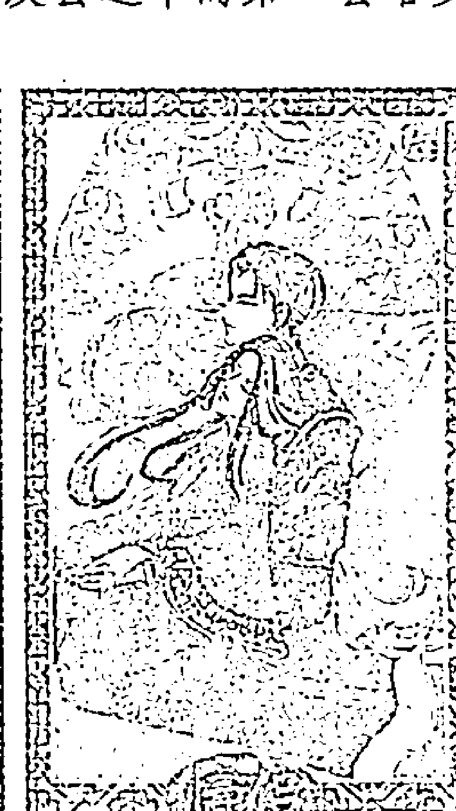

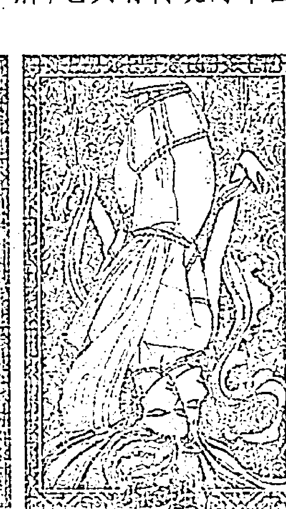

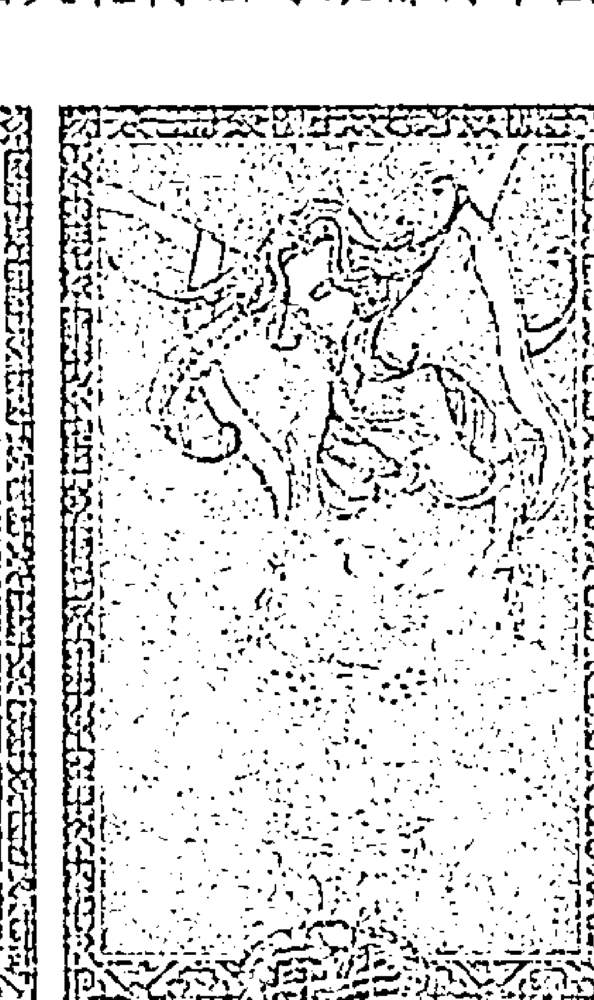

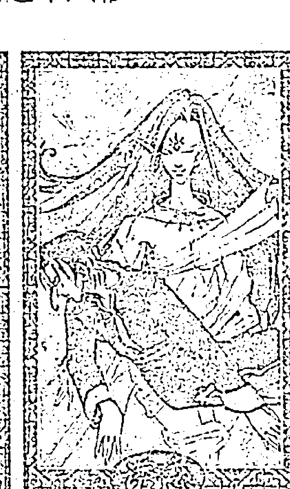

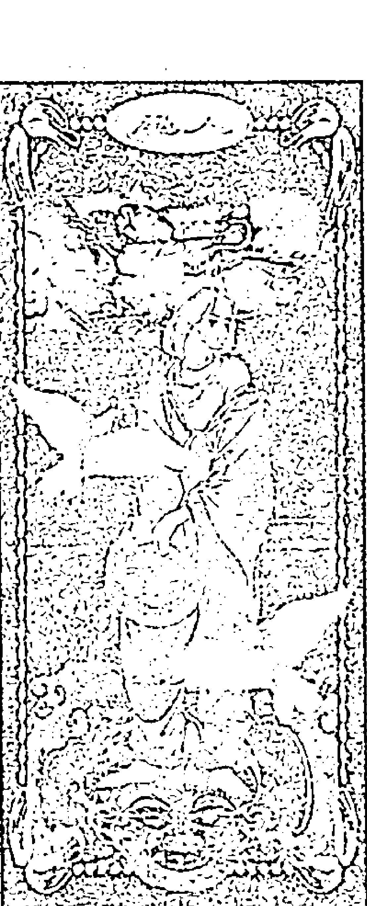

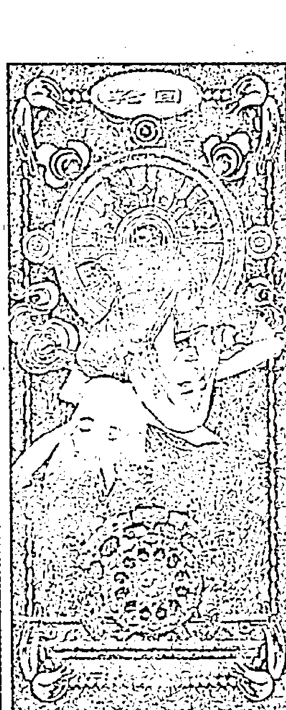

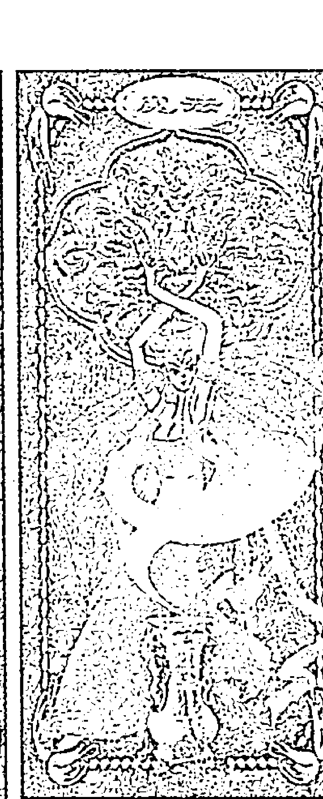

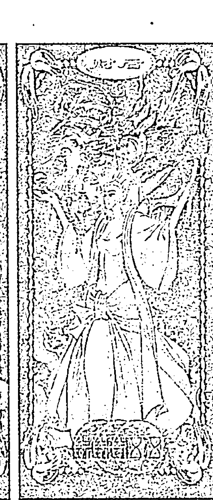

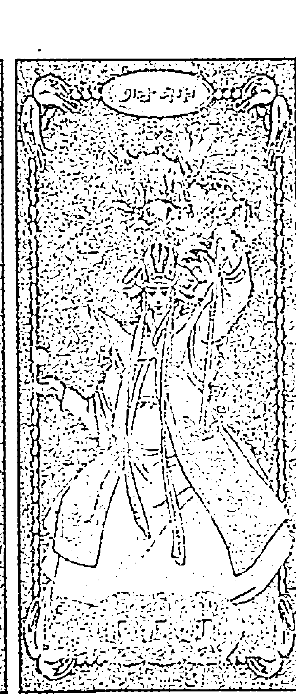

## 第五章 你可以开始塔罗了

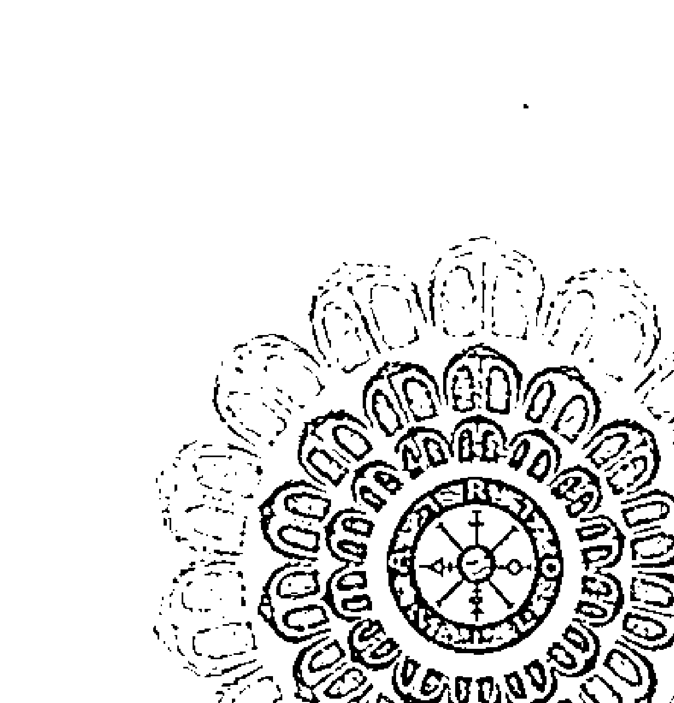

现在我们可以开始塔罗的预测了。根据自己的感觉和喜好，选择一副适合自己的牌，我们推荐的是随书赠送的这副伟特塔罗牌，它除了图案简明易懂十分适合初学者外，图案美丽绝伦，给人以美好的感觉，也是堪称经典的。选择好牌，然后就可以使用牌来进行推测了。推测的一般流程如下：问问题——决定牌阵——洗牌——切牌——摆牌——解牌——完成。每一个步骤，我们都会给以详细的讲解。

### 第一节 问问题

我们更多的时候是自己使用塔罗牌。当我们正在面临某种问题或挑战，或者生活中出现了一些麻烦事，我们会向塔罗牌询问，我们想要知道为什么会发生，我们该怎么办。面对这些情况最好的塔罗牌解读就是问题解读(question reading)。写下我们的问题，然后通过解牌获得答案，问题会帮助我们把我们收到的指示与目前的情况以一种有意义的方式联系起来。

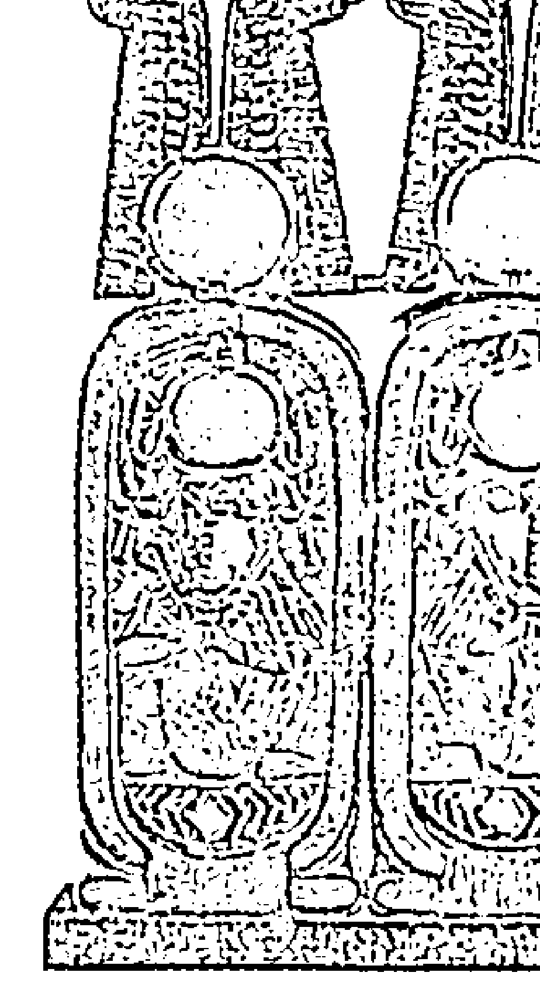

第一步是彻底回顾目前的情况，想一下所有直接或间接参与其中的人，想象一下我们未来的选择，让我们的思绪自由地漫游。要不加判断或检验地看待问题，简要写下脑中出现的想法，但尽量不要太系统，要使用直觉而不是理性分析。

完成回顾以后，就可以写下我们的问题了。为了达到良好的推测结果，提问也需要一定的技巧，这里有一些建议：

### (一) 接受责任

写下我们的塔罗牌问题以表明我们接受责任，试比较这两个问题：

- 1. 我应该把父亲送到医院还是在家里照顾他？
- 2. 要使父亲得到最好的生活安排，我需要知道些什么？

第一个问题，写的人放弃了他做决定的权力，他想让牌来告诉他该做什么。

第二个问题，他仅是向塔罗牌询问更多的信息，他知道决定权在他自身。

第一种问题是很有诱惑性的，我们想做出最佳决定，但塔罗牌不能替我们做决定。要避免问这些放弃责任的问题，如：

- 1. 要回答“是”或“不是”的问题。
  我能得到那份工作吗？
  这个月我能坚持每天都锻炼吗？
- 2. 以“应不应该”开头的问题。
  我应不应该和父母一起住？
  我应不应该报考这个志愿？
- 3. 仅仅询问时间的问题。
  我什么时候会结婚？
  我什么时候会升职？

这些问题都是不适宜的，取而代之，应该以这样的句子提问，如：

- 你能让我了解你的童年生活是怎样的？
- 做好这份工作，我需要知道什么？
- ×××的意思是什么？
- ×××的教训或目的是什么？
- 我要如何提高我在公司的机会？
- 我怎么才能达到这个目的？

### (二) 让选择多元化

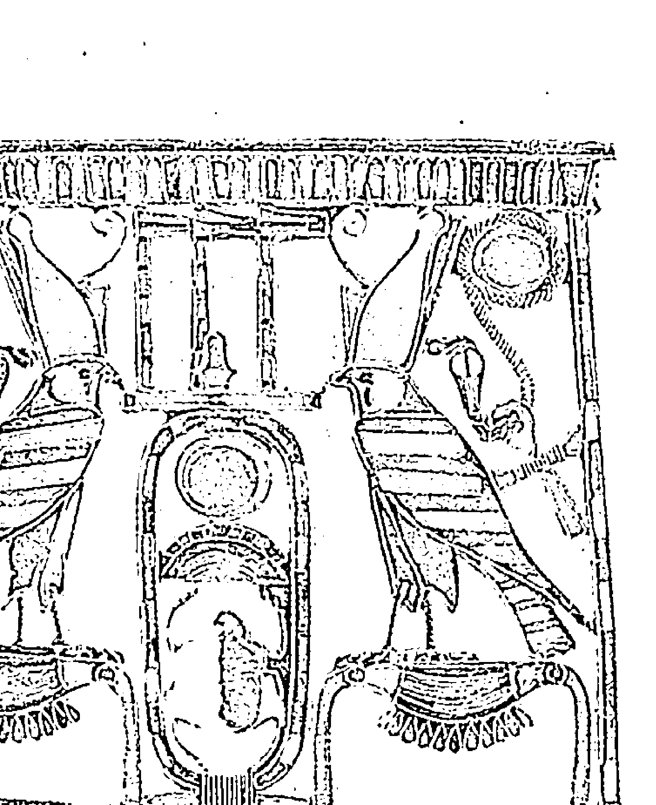

写下我们的问题以表明我们让自己的选择多元化。试比较这两个问题：

- 1. 我如何能让男友给我送礼物并道歉？
- 2. 我如何能更好地和男友相处？

第一个问题，写的人没有使自己的选择多元化，她已经决定了结果——让她的男友给她送礼物。第二个问题就多元化了。可以缩小问题的范围，但不要提前下结论就可以。下面两个都是多元化的问题，但第二个更具体一些：

- 1. 申请调往别的分公司对我的事业会有什么影响？
- 2. 申请调往另一个城市的新分公司会如何影响我的事业？

### （三）找到最佳的细节程度

找到介于用语太模糊和太具体的最佳界限。试比较关于同一主题的三个问法：

- 1. 我怎样能改善自己工作环境？
- 2. 我要怎样收拾自己的桌子以便让助手能找到我的文件？
- 3. 我要怎样改善我和助手之间的工作流程？

第一个问题是不具体的，它没有表明哪种工作环境是他感兴趣的。第二个问题太具体了，它只看到了桌子的一面。第三个问题是最好的，因为它找到了两者的平衡点，仅包括弄清我们想知道的结果所必需的细节。

### （四）集中于自身

当我们为自己解牌时，自己就一直是主角，我们的问题应该集中到我们自己身上。也有一些问到关于别人的问题的情况。

有时候我们可能意识不到我们在围绕着别人问问题。试比较以下的问题：

- 1. 弟弟的醉酒是什么原因造成的？
- 2. 我怎样帮助弟弟戒酒？
- 3. 我在弟弟喝酒的问题上起什么作用？

第一个问题完全集中在弟弟和他的问题上；第二个问题把询问的人本身也包括在内，但他的注意力还是放在弟弟身上；第三个问题是最好的，因为它是牢固地建立在询问的人本身的基础上。

### （五）保持中立

在写所问的问题时尽可能地保持中立，人们往往会不自觉地认为自己的立场是对的，但如果真的想获得指示的话，我们需要少站在个人的立场，试比较这些问题：

- 1. 为什么老是我在做家务？
- 2. 我如何能培养出做家务的合作精神？

- 1. 我怎样能让人们听我讲话？
- 2. 当我试着与人交流时为什么觉得别人没有在听？

- 1. 我怎样使老板不让我加班？
- 2. 为什么我最近要加这么多班？

1号的问题，都是问者认为他的立场是正确的——其他人没有和他一样；而2号问题就比较中立和多元化了。

### (六) 积极的态度

写问题时要有积极的生活态度，试比较这些问题：

- 1. 我的论文为什么总是发表不了？
- 2. 我怎样才能把我的论文发表在理想的杂志上？

- 1. 我为什么克服不了在公开场合讲话的恐惧心理？
- 2. 我怎样才能有效提高自己面对大众讲话的能力？

- 1. 你能帮我弄清楚我总在比赛的最后一轮败下来的原因吗？
- 2. 你能帮我找到取得比赛最后成功的方法吗？

1号的问题有种挫败感，2号的问题就比较有自信些，问者很乐观，他知道自己会成功只要获得有用的建议，这是一种比较适宜而有利的心态。

### (七) 为别人推测

为别人推测时就比较简单了，求问者会问出自己想知道的问题。但是作为解牌者，除了忠实地为别人解牌外，也需要以负责任的态度来对待别人的求问，因为求问者大抵内心急切，这个时候解牌者就必须考虑一下求问者问出的问题是否适宜，假如不适宜，就应该根据求问者的意图，加以适当地引导和调整。

关于如何写问题方面的内容我们介绍得比较详细些，那是因为写问题是整个推测过程很重要的一部分。好的问题，才会有更好的推测解读结果。比

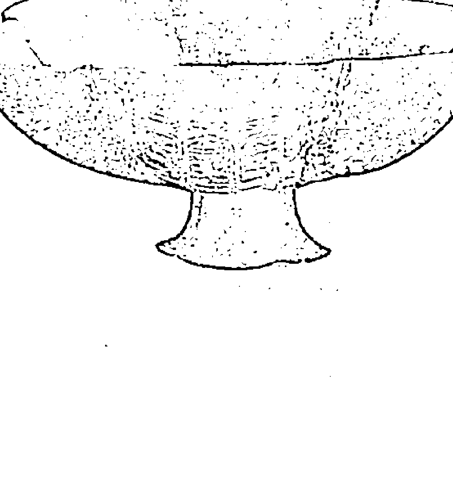

如，一般塔罗推测是难以推测时间的，但假如问题问得好的话，就可以知道有关时间的一些内容。如，可以问，我和她的感情一个月内会有结果吗？如果得到的牌是光明的令人鼓舞的，那么至少知道了一个月内会有喜讯传来。写问题一般要花大约三四分钟，但是这短短几分钟的投资会让我们获得丰厚的回报，我们能更好地理解自己的处境，可以更深刻地理解牌的含义。如果是为别人推测的话，倾听以及修正求问者的问题，也将会让自己的表现得到提升。我们可以如此做：

在一种愉快而安静的环境下，调整好自己的情绪，放松身心，静下心来，把烦恼和忧虑放到一边，充分地融入目前的情境，做几个深呼吸，放松所有的肌肉，感受这份宁静就像我们已经远离外部世界似的。这个时间根据我们自身的表现可长可短，达到冷静下来就可以。当你觉得精神集中了，就把牌从容器中取出来，在一只手中握成杯状，同时另一只手放在杯的上方，闭上眼睛将牌带入我们的能量圈中。祈祷，宣言，描述自己的感受，写下问题，接下来就要进行下一个重要的步骤洗牌。

### 第二节 洗牌

洗牌之前闭目进行冥想，心静如禅后启目开始洗牌，洗牌很重要，因为这关系到如何将牌分类和如何精确地安排所抽出的牌。洗牌时将注意力集中到问题上，要重视总体意图而不是细节上的东西，不要太紧张，但一定要尽量记着所问的问题。注意，此时要先根据问题选择好适合的牌阵，这样可以使接下来整个推测流程一气呵成、融会贯通。有关具体牌阵的解说会在下篇中进行详述。

洗牌一共分前后两种不同的动作。每推测一次，都要重复这两种洗牌动作。我们先来进行第一种洗牌。把牌面朝下，叠齐放在自己的手中。集中精神，不要想任何事物。然后，开始顺从自己的意志，从牌叠中间抽出一摞，放在牌叠的最上方。重复进行同样的动作几次，次数的多寡依自己的意志而定。

接下来，把牌放在平面上，准备第二种洗牌(见图1)。同样的，必须集中精神。把牌以圆圈的方式摊开，并且以两手依顺时针的方向开始洗牌。洗牌时，要一边在心中默述即将推测的问题，以及思考即将采用的牌型。倾听自己内心的声音，让何时可以停止的感觉自然地发生；这时，把牌慢慢地聚拢(不要忘了还是要以顺时针的方式进行)，最后把它恢复成一叠牌，以横的方向放好。这样，就完成了一次洗牌。

另外，有一些推测法则需要求问的人本身意志集中，默念自己的问题。这时，推测者只需保持心无杂念就可以。

何时停止洗牌，由求问者来决定，如果是为自己推测的话，那自己决定就可以了。

同时也有一些其他的洗牌方法，求问者可以根据自己的喜好来选择。只要记住，适合自己的，就是最好的。以下是一些可供参考的洗牌方法：

### **（一）玩牌者的方法**

玩牌者的方法常被用于洗那种每天都玩的牌，每只手握半副牌，牌面向下，放到桌面上后把牌混起来，这种方法可以把牌充分地混合起来，动作可能会很笨拙，因为大部分塔罗牌都比普通的牌大些。这种方法可能对牌有损伤，牌会形成中间弯曲。玩牌者的方法是有效的，但有点呆板。

### **（二）插入法**

每只手握半副牌，分散地把半副牌插入另一半中，你可以握住牌的长边或短边，这种方法很快、很有效，而且有更大的手部面积与牌接触，小心牌的边缘，因为它们时间长了会受到磨损。

### **（三）推放法**

这种方法可以很充分地混牌，伴有最大程度的手与牌的接触面和牌最小程度的损伤，把牌面朝下放在一只手中，从上方用拇指把一些牌推到另一只手中，然后再推一次，不过这次是推到新的一摞牌的底部。然后继续把牌推到这摞牌的上部，然后推到底部，直到所有的牌都被转移完毕。这时，把整副牌放回原先那只手再来一次。这种方法起初会有点困难，你可能会一次推得过多或者掉了几张牌，但做的次数多了你的技术就会有提高了。

### 第三节 切牌

切牌是让求问者大显身手的时刻。当推测者洗完牌、牌面朝下叠成一叠放好之后，就要请求问的人来切牌。当然喽，如果求问的人就是推测者本人的话，就要自己来切牌了。

首先，要集中精神，从牌叠的上方，依照自己的意志拿起一摞牌(绝对不可以不拿),把这一摞牌放在原先牌叠的下方(也就是靠近推测者的这个方向),变成两摞(见图2)。

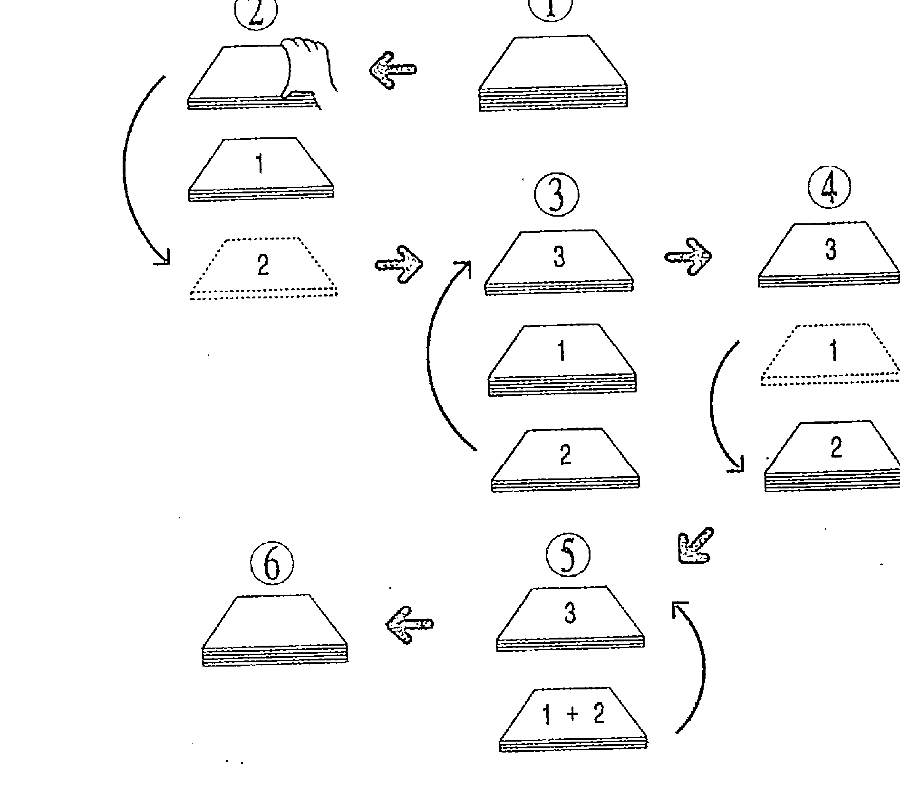

然后，从第二摞的上面再拿一摞牌; 这摞要放到第一摞的上方。现在，面前已经有三摞牌了。

接下来，由推测者把牌叠回去。先把第一摞拿起来，放到第二摞的上方；再把这个第一摞和第二摞的合体拿起来，放到第三摞的上方。如此，便恢复为一叠牌了。

我们还剩下最后一个切牌动作。在刚完成的过程里，牌面都是横向朝下的。我们现在要把牌转为直向朝下(见图 3)。这个动作千万不可以搞错了：如果是为对方推测，旋转方向是逆时针的；也就是说，我们要把塔罗牌的左端朝下旋转 90 度，变为直向。

如果我们是为自己推测，则是顺时针把牌旋转 90 度。一旦搞错，整个牌面的意义会完全颠倒，所以这一步骤务必要谨慎！

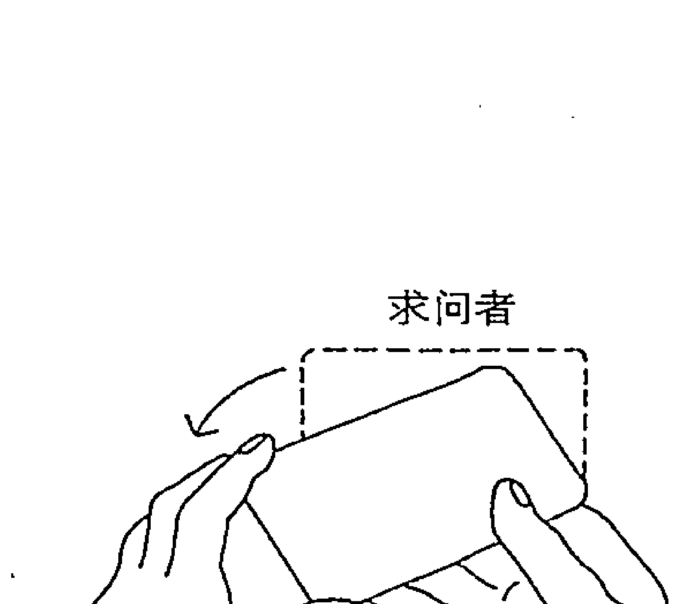

也要注意，最好在同一情绪下快速叠好牌，不要试着弄清哪一摞应该放在哪里，让手自由进行就可以了。切牌是很重要的一步，它标志着排牌阶段的结束，一旦重新组牌，解牌的方式已经定下来了，剩下的就是摆牌，以及解读牌义了。

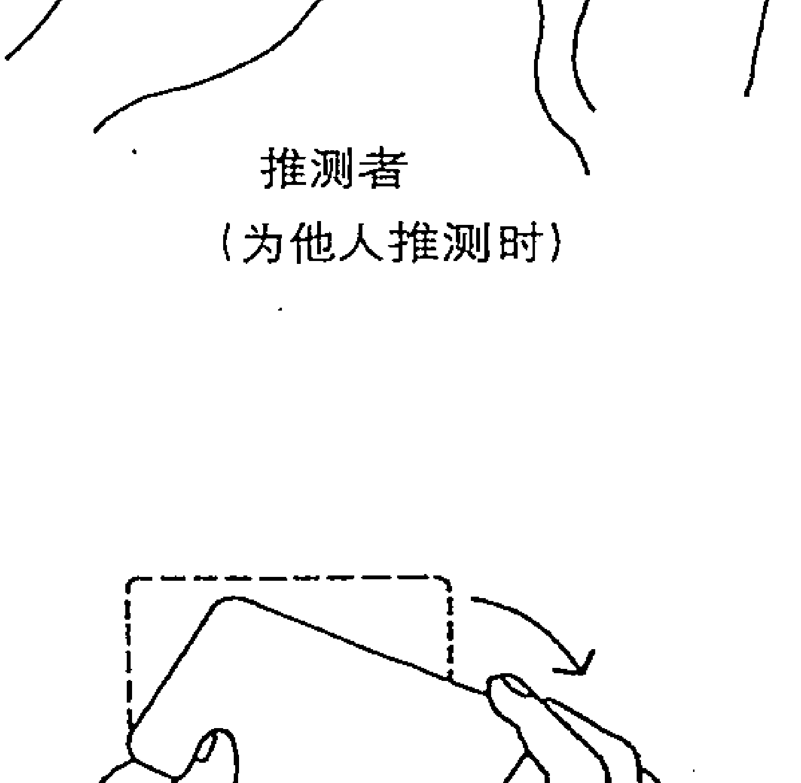

### 第四节 摆牌

根据所选牌阵的指示，依次从切好的牌中选出牌摆放在指定的位置。这一过程比较简单，但也需要谨慎，要保持牌面朝下，等全部牌摆放好之后再翻开，取牌的顺序也不要搞错，万一出现错漏，或者过程中有牌掉落的话，要把牌依次收好，重新洗牌。如果会连续不断地出错，掉落同一张牌的话，那么，就该注意一下这张牌的牌义了，也许，恰是一个指示。

摆牌的时候要注意对每张牌的反应，刚开始学习的时候，我们或许会不明白或记不住每张牌的含义，我们的想法和感觉会主要建立在形象的基础上，接触久了，就会更多地了解其中的含义了，也会变得更加有预见性。要尽可能地保持一些最原始的东西，要注意任何看起来不正常或不合适的反应。

所有的牌都摆好后，花一点时间将它们作为一个整体来感应一下，得到一个整个的印象，得到一些新的感应，然后我们可以简要地记下自己的想法，但不要纠缠于所记下的东西，那会破坏以后的解牌，我们需要的仅仅是尽快抓住一些思想罢了。

### 第五节 解牌

解牌是整个过程最中心的一个环节了，开始时，我们借助书中对每一张牌的解释那部分内容，可以边查边解释。等以后熟练了，就可以自己独立解牌了，但我们还是建议即使很熟悉了也不妨参照书中的解释解牌，这一部分会很有用，很能启发我们的思维。

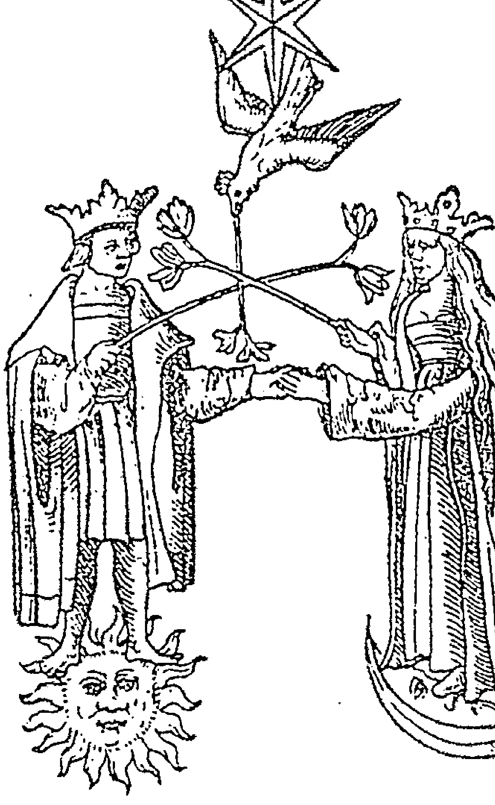

具体解牌时，可以从位置“1”开始看起，按位置的顺序依次进行，下面是建议的步骤：

- 1. 从书中查找到需要的牌。
- 2. 通读所有的释义、关键词和推测含义。
- 3. 找到一个让自己觉得“是的，这是最符合的”含义。不要回避那些看起来不愉快的结果，相信自己的直觉，保留这种直觉直到看完所有的牌。

看完所有的牌后，找一下它们之间的联系，努力启动自己的思维，给予牌面最好的解释。

这个过程可能会花上一段时间，因为需要认真仔细地思考，当然如果已经比较熟练的话，是能够很快就读懂整个牌阵的含义的，这个需要不断地练习或者天生感悟力强。

根据牌阵每个位置的含义，读出相应的结果。

### (一) 编故事

我们可以用编故事的方式将整个牌阵的含义串起来。故事会帮助我们理解整体的情况并给我们未来的指示。

最好是编故事与看牌同步进行，看完牌之后再编是不合适的，如果编的故事是从牌中自然产生的话会更加可信一些。当你准备好后，可以开始编故事了，可以说任何我们想到的事情，可以使用帮助性的提示条，但不要过于集中在它们身上。

我们可以大声地把故事讲出来，写太慢了，仅仅在脑中想一想又太过于模糊，故事会在我们的讲述中聚集力量和能量，如果突然思维中断了，不要介意，停下来，重新组织，重新开始。次数多了，我们就能够说得很流利了。如果这时我们将自己讲故事的过程录下来，重放录音的时候，我们会为自己的声音感到吃惊的，那真的会让我们感觉到自己就是最好的塔罗牌解者。以下，是我们的一些建议：

描述并不是一个简单的过程，因为讲故事是一门艺术。尽管有一些技巧，但是最终，我们要像个塔罗艺术家一样，培养自己的方式。这就是解牌的挑战，也是乐趣所在。

首先，我们可以把迄今为止所学的一切东西都抛开。这是正确的，就是要忽视所有那些表面的神秘原则。我们必须找到一种方法通过牌释放自己内心的知识。

迄今为止我们所学的技巧都是建立在一个思想的基础上，即：我们必须领会到牌义是什么。但是这并不是真正的情形。如果我们把解塔罗牌作为要仔细研究的物体，你就难以抓住它所有的含义。塔罗故事不是来自外部，而是内部。我们的故事要来自我们想要表达的和寻求实现的那部分。

当然，我们并不是真正地抛弃塔罗原则，这些原则是有价值的，但它们自身不是解牌的关键。它们仅仅只能帮助我们识别我们已经知道的信息。它们吸引我们，引起我们的思维，能够编出故事。

编塔罗故事的秘密在于从智力上的理解变成领悟，从碎片变成一个完整的画面。要做到这一点，我们必须承认并相信自己的感觉。在这个意义上，感觉并不是情绪或情感。它们是内心引导者的代言人，是领悟的外在表达，比想法处于更深的层次。领悟的主要特征是一种公正的感觉。当我们能完全感觉并对它们满意时，就知道自己的观点是正确的了。

这个时候，我们表达内心感觉的最好办法是意识流的说话方式——当感觉出现时，毫无保留、不加控制地大声说出自己的想法，不要试图组织或整理言语。只要吐出词组就行。

技巧是有效的，因为它能回避评论自我。它能让我们内心引导着的智慧自发涌现。我们会感到内心什么东西似乎得到了释放。随着实践的增多，我们的故事会慢慢地完善，引导词组流的能力会加强，但不会把意愿强加于上。有时候，洞察力会浮出表面，会让我们自己都为自己的表现大吃一惊。

有时候，不断地重复念牌名也会有帮助。圣杯王后……圣杯王后……圣杯王后。每次重复后，等一等，看看是否有什么以想法的方式冲进头脑。

有时候，我们的故事很流利，与所有的一切都很契合。而有时候，可能会出现停顿和空白。某些牌成为我们编故事的障碍，那么就说明这时候不是完全理解这些牌的最佳时间，或者说故事的片段还不合适。

如果发觉自己不能总编出完美的故事，不要介意。有时候，感觉只提供了故事的框架，只要努力是值得的，就继续解牌，有时候，对局部理解的方式也是可以的。如果你最想知道的是某个牌阵某个位置的结果，那么如果有其他位置的牌义不能编成完美的故事，那么能知道这个位置的解释，就足够了。

其实每个人都有各自的习惯，我们玩塔罗牌的方式也不会完全相同，关于塔罗故事，我们只要完全相信自己和自己的直觉，要抛开想知道所谓正确解牌方法的想法，要相信是不会真正犯什么错误的，在某个时间和地点，我们自己的塔罗牌想法就是正确的，这些想法都是有意义的，因为它们来自我们的内心。

慢慢地，说，自然地停顿，故事就完成了，下一步就是提取故事的主题，可以问问自己以下的问题：

- 1. 问题或冲突在哪里？
- 2. 我的作用是什么？
- 3. 我的内心向导要我知道什么？
- 4. 反映的结果是什么？
- 5. 你对那件事有什么感受？

我们在做的是组织问题的答案，关注牌上的信息。

塔罗牌本身并没有好坏之分。它们只是描绘了某种能量或影响。一切都取决于我们如何运用这些信息，如何做出对生活有意识的选择。比如我们推测到高塔这张牌，高塔虽然显示破碎或某种衰败，但我们完全没有必要消极地看待它。

时刻记住，推测中描绘的结果是从现在的所有影响中反映出来的潜在结果之一。如果我们能区分这些力量，我们就能按自己所希望的改变或鼓励它们。未来永远不会是固定的。我们所编的故事的结果不是确定的，而是一种可能性。如果我们想并有勇气采取必要的措施，我们就能令方向改变。从最深层次来说，其实我们知道自己的局面是怎样的。塔罗故事仅仅是让我们认可我们所知道的，这样才能更有意识地采取行动。

塔罗的活动是建立在来自某个源泉的智慧会通过塔罗牌注入我们的头脑。开始，我们可能只是单纯地按照书中的指示去寻求问题的答案，但是过一段时间，我们就会通过我们的经历，对塔罗有更深层次的感悟和理解。如果我们带着信任接近塔罗，我们的塔罗实践就会有质的飞跃。

## 第六节 完成

结束一次塔罗实践后，我们要把所有与此次解牌有关的能量收起来，可以通过把牌轻轻地混合起来来清理牌，这就好像用手把写在沙滩上的字擦掉。其实每种洗牌的方法都可以把牌重新洗过。花几分钟来清理自己的牌，务必使牌面向下或者远离自己，当自己觉得已经清理得差不多时就停下来，把牌放在一起，用于下一次解牌。

从整个推测行为一开始，我们就启动了一个磁场，我们以解牌的形式创造了某种意义，现在，再通过把牌放回原处来结束这个磁场。

有时我们不是总需遵守这些规则，其实依据我们自己的兴趣与需要就可以了。我们要一直记住一句话：细节不是最重要的，重要的是意念。

### ▲ 生命的四大境界(元素)符号

希伯来卡巴拉(Cabala)信徒认为手拇指管其他四根手指，从而猜测造物者的“手”一定经历四个阶段。所以就有四个境界的说法。其阶段属性与小阿卡那的宫廷牌有相通之处。四个境界分别以四个希伯来字母表示。

原型的境界：火元素，代表国王、生命力；位阶最高，也是最完美的境界；存在着纯净的灵魂和思想；代表神的境界、神的意志。

创造的境界：水元素，代表皇后、神圣的灵魂直觉；思想和观念开始被赋予形态；这是大天使的境界。

形成的境界：风元素，代表骑士、智力；赋予的形态开始表现；这是小天使的境界。

物质的境界：土元素，代表侍从、动物的灵魂；原始的光分崩离析，开始结晶形成物质(包括人的存在)；抽象的观念变成具体事物；这是人的境界。

# PART 蓝色的天空……

# 中篇 导读

在本篇中，我们将看到对每一张伟特塔罗牌的详细诠释。首先是对每一张美丽而神秘的图案的解读，我们将推开神秘之门，触摸到那些古老的法则，读懂神之语言，推测我们的内心世界不可知的领域。

每一张牌的牌义都有关键之词，一个关键词就像一把钥匙，穿透灵感之锁，让我们懂得每一张牌蕴涵的寓意；能辅助我们推测时更好地理解牌阵含义，可以对照相寻，是详细的推测解读。当然，一万个人眼中，有一万个哈姆雷特。所以，每一个解牌师，都会有自己对人生独特的理解。当懂得牌义和关键意义之后，如何诠释人生，就完全依照解牌师们自己的内心世界了！只要适合自己的，相信自己吧。你，一定是对的！

每一张牌的每一种解释中，总有一些牌和另一些牌的某些意义相对或相近，我们列出了那些可能相对立或相近似的牌之牌义。既可以可以帮助我们记忆，当它们同时出现在牌阵中时，又可以帮助我们更好地理解整个牌阵的含义！宫廷牌没有普通意义上的对立牌或加强牌，它们可以和任何别的宫廷牌搭配成配对牌，可以对比这两张牌的级别及装饰来别其意义所指。

每一个牌义之后，我们都有附录，懂得星象学的推测者就可以进一步了解每一张大阿卡那牌对应的星象！这对更深层次地理解每一张牌的牌义是极有帮助的。相关的希腊神话故事除了有很强的阅读趣味和知识性之外，对于加深对牌义的理解，作用更是不言而喻的。

## 第一章 大阿卡那

牌义对立或相近的牌

| 类型 | 牌名与解释 |
| :--- | :--- |
| ◇对立牌 | - 教主：根据惯例，例行公事<br>- 死神：结束，关闭<br>- 魔鬼：感到愤世嫉俗，缺乏信仰<br>- 宝剑二：阻挡经验，感到紧张，踌躇<br>- 星币四：规则和规律性 |
| ◇加强牌 | - 吊人：对做什么都有信心，随波逐流<br>- 星辰：清白，信仰，信任<br>- 审判：重生，新的开始<br>- 权杖三：扩大视野，进入一个未开发的领域 |

### 0 愚人 THE FOOL

**关键词：** 新开始、有信仰、自发性、貌似愚蠢

- **新开始**：进入一个新阶段；产生一条新路径；范围的扩大；开始一件新事情；开始旅行；进入一些未知领域
- **有信仰**：相信潮流；持有开放的心态；困惑和恐惧；感觉自己受到保护、被人爱；生活在快乐中；夺回清白
- **自发性**：生活的瞬间；让期待放任自流；按设想行事；凭冲动做事；感觉放荡不羁；不对某人感到惊讶；无忧无虑
- **貌似愚蠢**：接受你的选择；选择一条“愚蠢”的途径；追求白日梦；对你自己真实；做一个“疯狂”的选择；相信你内心的期望

### 图案解读：

愚人，穿着色彩斑斓的衣服，戴着像小丑一样的帽子，手舞足蹈，昂首阔步，站立在悬崖边。他是卤莽而无知的：他的右手拿着象征权力的权杖，挂的包袱里装着经验，而他只是漫不经心地扛着，却不懂得运用。但他头上的桂冠代表着成功的可能。他拥有着一颗相信梦想的纯真之心，他左手持着白玫瑰，白色象征纯洁，玫瑰象征热情。脚边的小白狗象征着愚人和动物一样，凭本能行事。他无畏于脚边的悬崖，眼望长空，神色欢欣。远方的山脉象征他未来的旅程。他永远沐浴在白色的阳光之下。伟特说，愚人是追寻经验的灵魂。

### 推测解读：

愚人牌是愚人处于混沌时期的牌，所以好坏糅杂，解读牌义时须谨慎思考。逆位的愚人牌不一定是正位的反义，而有它特殊的含义。将愚人牌作为空白牌时，则正逆位没有区别。

### 正放含义：

1. 愚蠢而无知，毫无经验，盲目行动。
2. 狂乱的精神状态，极度兴奋，毫无知觉。
3. 象征旅程的开始，有追求新奇的冒险之心。
4. 从零开始，走成完满的圆，包含无限可能，潜力无穷。
5. 搬家、转学等等，进入一个全新的环境。
6. 不拘形式的自由恋爱。
7. 异于常人，有艺术家气息。

**对应星象：** 天王星

### 相关的希腊神话：

酒神狄俄尼索斯(Dionysus)，他是众神之父宙斯(Zeus)和忒拜国王卡德摩斯的女儿塞墨勒(Semele)的私生子，塞墨勒受宙斯的妻子赫拉(Hera)妒害，狄俄尼索斯被迫到各地流浪，历尽考验。他与愚人牌牌义相对应。

### 倒放含义：

1. 比正位的愚人更加漂泊，卤莽，疯狂。
2. 代表缺席，或由于过度小心而错失良机。
3. 缺乏感情，或感情轻浮。
4. 缺乏责任心，没计划，走错路。
5. 灵魂堕落，失去纯真，内心空虚。

牌义对立或相近的牌

| 类型 | 牌名与解释 |
| :--- | :--- |
| ◇对立牌 | - 女教主：没有行动力，直觉，达到无意识<br>- 吊人：犹豫不决的行动，不做事情<br>- 圣杯七：缺乏关注的事情和承诺<br>- 宝剑四：安静地休息，储存能量<br>- 宝剑八：困惑，不确定性，无能力 |
| ◇加强牌 | - 战车：有目标，专心致志，有说服力<br>- 权杖二：个人能量，发出强大的力量<br>- 权杖八：快速地行动，实施你的改变<br>- 星币八：集中注意力，专心致志 |

### 1 魔术师 THE MAGICIAN

**关键词**：行动、专心、有意识的行为、控制力

- **行动**：做需要做的事情；了解你的潜力；使一些可能的事情变成现实；做你鼓吹的事情；实施计划；产生不可思议的后果；运用你的聪明才智
- **专心**：有单一的目标；完全忠心；应用你意愿的力量；感觉处于中心位置；不理会分心的事物；集中于一个目标
- **有意识的行为**：知道你正在做什么和为什么这样做；了解你的动机；明白你的意图；检验已知的局面
- **控制力**：实施强有力的影响；有活力；创造奇迹；开始精力充沛；感觉精力旺盛；有创造性

### 图案解读：

魔术师正在施行法术，他右手高举权杖指向天，召唤神奇的法力，左手食指指向地，象征了他正是联结天与地的桥梁，主宰着地上的一切。他身前的桌上放着权杖、圣杯、宝剑和星币，既代表四个牌组，也正是四要素的象征。他身穿的红袍代表热情与主动，白色内衣代表内在的纯洁和智慧。他具有无限的创造能力和潜力，但需要有坚强意志和纯洁内心的保证。他的腰带是一条蛇，在这里的蛇并不代表邪恶，而是象征智慧与启发。他的头上有着躺着的8字，代表无限。他的周围被鲜花环绕，红色的玫瑰象征热情，白色的百合象征智慧。鲜黄的背景，预示着未来的成功。

### 推测解读：

“1”是所有数字的开始，代表沟通。在占星学中，对应的水星也代表沟通。这一张牌蕴涵力量强大，正逆位不同，起落大，大悲大喜，结果明确。

### 对应星象：水星

### 相关的希腊神话：

水星，希腊神话十二主神之一的信差之神汉密斯（Hermes），他的罗马名就是水星（Mercury）。他是宙斯和神女迈亚（Maia）之子，是众神的居所奥林匹斯山的信差，是诸神的使者，所以他也是使节和传令官的庇护神，他也是魔法护神，和各种比赛竞技的庇护神。

### 正放含义：

1. 代表与沟通或外交有关的事物。
2. 思路清晰，口齿伶俐，表述明白透彻。
3. 思维缜密，有把握，有自信。
4. 有良好的开端，将发展顺利，计划成功。
5. 能梦想成真，或将有恋情发生。
6. 有良师益友出现，或有能给予正确引导和帮助的人出现。

### 倒放含义：

1. 因权杖的方向改变，预示着发生了错误的引导，或者精力用错了方向。
2. 导致无法收拾的失控局面，或直接预示着失败。
3. 牌倒逆，桌上要素掉落，代表二流角色，如巫师等。
4. 花无法生长，缺乏热忱和行动力。
5. 优柔寡断，才能平庸，缺乏创造力。
6. 爱情没有进展。

牌义对立或相近的牌

| 类型 | 牌名与解释 |
| :--- | :--- |
| ◆ 对立牌 | - 魔术师：有意识的行动，有意识的思考，已知的和显而易见的<br>- 权杖二：勇敢的行动<br>- 权杖七：主动的<br>- 权杖八：将计划付诸行动 |
| ◆ 加强牌 | - 隐士：看到内心世界，退缩，寻求引导<br>- 吊人：对行动犹豫不决，等待<br>- 宝剑四：安静地休息，沉思 |

### 2 女教主 THE HIGH PRIESTESS

**关键词**：无行动力、潜力、无意识、神秘

- **无行动力**：不参与；让事情自然进行，不加干涉；乐于接受对其的影响；平静的心态；被动的；耐心地等待
- **潜力**：明白可能性；对能出现的情况持开放的态度；能看到你潜在的才能；允许发展；让那里的事物欣欣向荣
- **无意识**：运用你的直觉；找到来自内心的指导；相信你的心声；天马行空的梦想和想象；注意更广阔的现实
- **神秘**：看得不真切，趋近一个封闭的领域；对未知的事物持开放的态度；记住有些事很重要；感觉到秘密和隐藏的事物；寻找隐蔽的东西；承认阴影

### 图案解读：

女教主表面静默，端坐于石凳之上，她手上的卷宗上书着 Tora，乃律法之意，代表她内心的知性和洞察力，她明辨是非、善恶和明暗，也代表神秘的魔法，静静等待适合行动的时机，以及给予明确的指示。身侧的柱子一黑一白，也暗示了她强烈的是非观念，理性的思考和判断。白色的头冠和白色的长裙，象征了她内心的纯洁和对洁净的要求。背后的绿叶和果实，既象征她的女性形象，慈爱和娴静，同时也暗示了她具有强大的直觉力和判断力。石榴暗示着希腊神话中的冥后珀耳塞福涅 (Persephone) 吞下的象征姻缘不断的石榴子。她裙角的月亮，也是智慧和直觉力的象征。

### 对应星象：月亮

### 相关的希腊神话：

希腊神话中的地狱统治女神冥后珀耳塞福涅(Persephone)，她是宙斯和他的姐姐德墨特耳 (Demeter) 的女儿，后来被冥王哈德斯(Hades)掳去当冥后，德墨特耳无心工作，致使大地荒芜，于是宙斯仲裁，让珀耳塞福涅一年回来一次。她回来之前，哈德斯强迫她吞下冥界的石榴子，吃了四颗，结果她必须每年在冥界住4个月。这4个月，就形成了冬季。回到母亲的身边，大地便重新结出果实。于是造成了一年四季，一年的荣枯。珀耳塞福涅不仅掌管土地丰收，而且统治回归土地的死者。石榴子同时也是姻缘不断的象征。

### 推测解读：

女教主的职位本身，已经能给推测者很多讯息。这是一张意义明确的牌。同时，若求问者为男性，则此牌代表关注他的女性；若求问者为女性，则此牌代表求问者自己。

### 正放含义：

1. 女教主代表了奥秘，神秘的事物，和尚未揭露的未来。
2. 代表着静默和坚持，冷静的思考，强大的战斗意志。
3. 充满知性魅力，具有优秀的判断力和洞察力。
4. 有学问，有智慧，或与科学相关。
5. 独立自主的女性。
6. 冷淡的恋情，或柏拉图式的恋爱。

### 倒放含义：

1. 无知，缺乏理解力和判断力。
2. 理性的态度，或有点神经质，行为不被人理解和接受。
3. 挑剔，有洁癖。
4. 没有结果的单相思或者单身主义者。
5. 盲目自大，锋芒外露，行为乖张，缺乏深沉的智慧。
6. 身体不好，或者不孕。

牌义对立或相近的牌

◇对立牌：
- 皇帝：父性，规则和纪律，规律性
- 死神：死亡原则
- 星币四：对财物很吝啬
- 星币九：精致，强词夺理

◇加强牌：
- 情侣：性的实现，愉悦
- 星辰：慷慨，让爱自由流淌
- 圣杯九：享受感觉
- 星币七：物质回报
- 星币十：富足，奢侈，物质上的舒适

# 3 皇后
# THE EMPRESS

关键词：母性、体验感觉、丰富的、自然

母性：给予生命；为生命提供营养；照顾和关心其他人；珍爱世界；传达亲切慈爱；和孩子一起玩

体验感觉：给予和接受愉快；关注个体；欣赏美丽；感到勃勃生机，健康；朴实的；做运动

丰富的：享受奢侈的乐趣；接受慷慨的回报；生活奢侈，物质极大丰富；不计其数；感觉很富有

自然：涉及植物和动物；拥抱自然；感觉与自然的联系；

户外活动：与自然节奏相协调

# 图案解读：

皇后牌的牌面象征意义明了而强烈。她的坐榻的旁边放着一颗洁白的心，里面有醒目的绿色女性符号，坐榻后方的靠垫上也绘满了象征女性的符号。所以皇后牌所代表的是洋溢着母性温柔的女性特质。长裙上的果实，象征着生育，身后的森林和流水，代表大地的复苏和生机盎然。母亲，就是大地，孕育万物。金黄的谷物，代表丰收。豪华的靠椅，还有美丽的红丝绒坐垫，象征着皇后的高贵和繁荣的物质景象。她戴着缀满繁星的桂冠，右手举着权杖，显示了她至高无上的母亲形象。

对应星象：金星

相关的希腊神话：

宙斯的姐姐德墨特耳（Demeter），她与皇后牌牌义相对应，她是丰产和农业女神，司谷物的成熟。也就是冥后珀耳塞福涅（Persephone）的母亲。珀耳塞福涅被冥王掳去当冥后后，德墨特耳无心工作，使得万物枯萎。后来宙斯仲裁让珀耳塞福涅一年回来一次，这时德墨特耳重新工作，大地复苏。于是形成了一年四季的轮回。

# 推测解读：

相对于女教主牌的知性，皇后牌更感性，更贴合女性之事。如果求问者是男性，则可能暗示与女性有纠缠，或女性气质强。

# 正放含义：

- 1. 皇后牌最首先代表了丰收和繁荣。
- 2. 强烈的母爱气息，女性魅力。
- 3. 有艺术才能，或从事以女性为对象的工作。
- 4. 代表结婚或者生产或者会有结果的恋情。
- 5. 优雅的生活，或者充满了喜悦的生活。

# 倒放含义：

- 1. 欢乐消失了。
- 2. 收获有所折损或爱情遇到一些挫折。
- 3. 若求问有关生产，则可能代表难产、流产或堕胎。
- 4. 没有成就感，内心迷惑。
- 5. 虚荣、任性、自负令人无法接近。
- 6. 浪费和损失。

▷珀耳塞福涅被冥王哈德斯掳去当冥后

# 4 皇帝
# THE EMPEROR

关键词：父性、权威、强调结构、规则

父性：建立和维护一个家庭；设立方向和基调；保护和防御；引导成长；带来安全和舒适；提供解释

权威：起领导作用；指挥的；实行控制；拥有声誉；处于有强大力量的位置；与官员接触；设定方向

强调结构：从混乱的状态中解脱出来；设立规则；分类；系统化；提供形状和形式；被组织化；申明原因；协调；坚持计划

# 牌义对立或相近的牌

◇对立牌：
- 皇后：母性，财富自由流动
- 圣杯七：分散，缺乏规则
- 宝剑五：违反规则，触犯法律

◇加强牌：
- 教主：遵守规则
- 正义：关注公正和法律
- 权杖二：有权威
- 权杖三：假设的领导权
- 星币四：控制，结构，规则

规则：建立法律和秩序；实施良好的原则；应用规则或引导原则；在法律体系内活动；设立行为标准；服从于政权

# 图案解读：

皇帝是皇后的丈夫，是男性象征的代表。他拥有主宰物质世界的支配力。一国之尊的皇帝充满了自信，他头戴皇冠，身着红袍，上覆铠甲。铠甲象征严格的纪律。右手持的古埃及十字架象征生命。王位上装饰着四颗牧羊头。牧羊座是十二星座的头一个，代表勇敢、积极、有野心、有自信。与牧羊座的性格相互呼应的是整张牌红色的主色调。作为背景的是严峻蜿蜒的山脉，象征了前方险峻的路途。皇帝牌代表道德戒律与禁令。此牌偏向秩序、规范和稳定的局面，拥有至高无上的权力。同时正因为这些理性和权威，他必须收藏起个人的感情，并且有高处不胜寒的隐喻。

# 推测解读：

皇帝既可以是明君，也可能是暴君，所以皇帝牌是可好可坏的。著名心理学家荣格认为“父亲代表道德戒律与禁令”，皇帝也是父权至高的象征。

# 正放含义：

- 1. 代表对当事人极具影响力的人。情况好时，能给予当事人帮助；情况不好时，会对当事人进行控制。
- 2. 以坚强的意志力及手腕获得成功。
- 3. 有责任感，具领导能力和良好的处理能力。
- 4. 虽有点专制但值得信赖。
- 5. 缺乏感情的交流而导致情感问题。
- 6. 与年长者恋爱。

# 倒放含义：

- 1. 欠缺理智的分析，自我放纵，不成熟。
- 2. 意志薄弱，软弱而犹豫不决，没有自信。
- 3. 因傲慢而招人反感。
- 4. 工作过度投入，或为人固执。
- 5. 缺少好的对象，或感情比较勉强。
- 6. 行事武断，滥用权力，冷酷无情。
- 7. 占有欲、控制欲过分强烈。

对应星象：牧羊座

相关的希腊神话：

众神之首宙斯（Zeus），希腊人崇奉的最高天神，众神和万民之父，白银时代的最高统治者。他与皇帝牌牌义相对应。他是黄金时代的统治者天神克洛诺斯（Cronos）的儿子。克洛诺斯预知他的子女会推翻他的统治，于是吞食自己的孩子。宙斯的母亲瑞亚（Rhea）把宙斯偷偷救出藏好，他喝克里特岛上的山羊阿卡迪亚的奶水长大成人，果然推翻了父亲的统治，逼父亲吐出了被吞下的哥哥姐姐。他跟哥哥波塞冬和哈德斯分治宇宙。

### 5 教主 THE HIEROPHANT

**关键词**：教育、一致、信仰体系、群体认同

教育：追求知识；见多识广的；增强理解力；学习和研究；寻求更深层次的含义；找出更多的东西

一致：遵循规则；按传统的方法办事；在传统习惯循规蹈矩；适应系统；装配好；按规划一步一步进行；做预料中的事情；是已建立好的组织中的一部分

信仰体系：分享文化传统；学习宗教传统；崇尚宗教礼节和宗教仪式；鉴别世界观；知道应将信仰置于何处

# 牌义对立或相近的牌

◇对立牌：
- 愚人：“疯狂的”且反传统
- 情侣：个人信仰
- 权杖二：脱离群众，成为先锋
- 宝剑七：是一只孤独的狼
- 星币二：灵活的，不断改变主意

◇加强牌：
- 皇帝：遵循规则
- 圣杯三：关注群体
- 星币三：在团队或群体中工作
- 星币八：学习，研究
- 星币十：一致的，遵守规则，保守的

中篇·经典的伟特塔罗

群体认同：忠于某个原因；将能量投入一个群体中；加入一个组织；作为团队的一部分积极工作；对其他人有诚心；处于一个有组织的环境中

# 图案解读：

教主身穿大红袍，端坐于信众前。他头戴三层皇冠，三层代表了身心灵三层次的世界，皇冠代表权力。他的右手食指与中指指向天，象征祝福；左手十字形权杖象征神圣和权力。他耳朵旁垂挂的白色物，代表内心的声音。前方摆放的两把钥匙，可用以开启智慧与神秘之门。教主面前站立的两位信徒，左边身穿红玫瑰花纹的衣裳，象征热情；右边身穿白色百合的衣裳，象征性灵成长。教主与宗教有密切的关联，是有组织的教会或教派，是入世的，走入人群的。

教主是精神之父，提供心灵成长与道德教育。是社会规范和社会责任的化身。他用言论指引人们走向正途。

# 推测解读：

推测时，教主往往代表心灵上的追求，尤其是道德方面的。

对应星象：金牛座

相关的希腊神话：

海神波塞冬（Poseidon），宙斯的兄弟。他与教主牌牌义相对应。在各种传说中，他最初是一个图腾神，以马的形状受到膜拜。他名字的意思是“大地的丈夫”，他既是海神，也是大地神。

# 正放含义：

- 1. 有贵人相助或长辈的引领。
- 2. 代表各级机关团体和学校，或任何与群体有关的事物。
- 3. 暗指仪式，毕业典礼，结婚典礼，成年礼，丧礼等等。
- 4. 柏拉图式的爱情。
- 5. 深情的爱，有结良缘的机会。
- 6. 代表神职人员、教师、长者、贵人、专业人士、典礼主持者、保守分子、卫道士等等人物。

# 倒放含义：

- 1. 打破传统规范，不依常规，与众不同，大胆创新。
- 2. 没有贵人相助，孤立无援。
- 3. 缘分浅薄的恋情。
- 4. 过度的依赖心。
- 5. 没信用或者太啰嗦而令人讨厌。
- 6. 过度保守武断和固执，或者过度地标新立异。
- 7. 不宜贸然采纳别人的建议。
- 8. 不宜举行仪式或参加典礼等。

### 6 情侣 THE LOVERS

关键词：关系、个人信仰、性欲、价值

关系：设立隔阂；感觉到爱；形成联合或婚姻；承认血缘关系；同意另一个人；更接近；联结；亲密的

个人信仰：对已经接受的意见表示质疑；指出你所代表的立场；设立你的哲学体系；按照你自己的标准进行；自己下决心

性欲：寻找结合；体验欲望；性交；对另一人开放；带着激情的回应；感觉到身体上的吸引；释放

# 牌义对立或相近的牌

◇对立牌：
- 教主：已经建立好的信仰
- 隐士：孤独的，和别人没有联系，禁欲的
- 圣杯五：关系上的缺失
- 宝剑三：拒绝，分离

◇加强牌：
- 皇后：性欲的实现，愉悦
- 圣杯二：结合，结婚，联系
- 圣杯九：性交的快感
- 圣杯十：家庭关系，禁锢
- 星币十：永久的联合，家庭的联结

内心的能量

价值：与诱惑的斗争；在正确与错误中进行选择；面对伦理或道德的选择；拒绝用结果证明方式是正当的；找到你所关心的

# 图案解读：

情侣牌以伊甸园为背景，亚当与夏娃分站两边。他们脚下是肥沃的土地，生机盎然。夏娃的背景是知识之树，树上有五颗苹果，象征五种感官，有蛇缠绕其上，蛇在此处代表潜在的智慧。亚当背后是生命之树，树上十二团火焰，象征十二星座，也象征欲望之火。伟特的释义是：亚当与夏娃年轻诱人的躯体，象征着未受有形物质污染之前的青春、童贞、纯真和爱。两人背后的人物是风之天使拉斐尔。风代表沟通，他身上的紫袍象征忠贞。亚当看着夏娃，夏娃则望着天使，这象征着“意识——潜意识——超意识”与“身——心——灵”之间的传导。亚当和夏娃中间有一座山，象征我们必须把阴与阳、理性和感性的能量调和。也可以把山看做阳性的代表，把水看做阴性的代表，象征着阴阳平衡。

# 推测解读：

情侣牌不仅仅与爱情有关，它也暗示着“选择”或广义的“结合”。

对应星象：双子座

相关希腊神话：

情侣牌也包含着选择和三角恋情或情侣之间的争斗的意思。
在特萨利亚的英雄珀琉斯（Peleus）的婚礼上，宙斯忘了邀请司纷争的女神厄里斯（Eris）。厄里斯于是丢出了一个写有“送给最美丽的女神”的金苹果，引起了宙斯的妻子赫拉、智慧和战争女神雅典娜（Athene）、美和爱神阿佛洛狄特（Aphrodite）三女神之间的争吵。她们诉诸宙斯，宙斯便让特洛伊的二王子帕里斯（Paris）评判她们谁是最美丽的女神。于是她们极力设法使帕里斯偏袒自己。赫拉许诺给他统治权和财富，雅典娜许诺给他智慧和战胜的光荣，阿佛洛狄特许诺帮助他得到人间最美丽的女子。于是帕里斯把苹果判给了阿佛洛狄特。阿佛洛狄特帮助帕里斯拐走了斯巴达国王墨涅拉俄斯的妻子海伦。高傲的雅典娜和善妒的赫拉联手发动了著名的特洛伊战争。

# 正放含义：

- 1. 面临着重大抉择，须谨慎而深思熟虑。选择不当，则会后果严重。
- 2. 价值观面临挑战，确定什么是自己最重要的。
- 3. 预感到罗曼蒂克的爱情会来到。
- 4. 两人感情融洽而甜蜜，长期稳定。
- 5. 结盟、合伙等幸运的合作关系。
- 6. 有好的机会出现在眼前。

# 倒放含义：

- 1. 婚姻或爱情遭受挫折或失败。
- 2. 不恰当的合伙或联盟关系。
- 3. 冷漠的爱或者逃避的爱。
- 4. 背信，或者不信任。
- 5. 不稳定、无法持续。
- 6. 错误的决定。

### 7 战车 THE CHARIOT

关键词：胜利、自我声明、意愿、强劲的控制

胜利：达到你的目标；胜利；成功的；占统治地位的；独占鳌头；打败竞争对手

自我声明：注重自我；建立身份；知道你是谁；感到自信；对你自己充满信心；出去寻找自己的利益

意愿：下决心要成功；集中于你的目标；不受诱惑；不让任何东西转移你的注意力；不断努力；集中你的能量；锁定目标

# 牌义对立或相近的牌

◇ 对立牌：
- 力量：软控制
- 吊人：接受上帝的意愿，把别人的意愿置于第一位
- 高塔：打败，受挫的经历
- 宝剑八：迷惑，自我困惑
- 宝剑十：软弱无力，陷入陷阱中，把别人的意愿置于第一位

◇ 加强牌：
- 魔术师：运用你自己的意愿，集中精神
- 权杖二：有权威的，主导地位的
- 权杖六：胜利的、自信的
- 星币四：控制
- 星币九：自我控制，有纪律性的

强劲的控制：控制情绪；控制冲动；维持纪律；控制怒气；保持自己的方向；假设力量的支配；显示权威

# 图案解读：

图中英勇的战士驾着一辆由两只狮身人面兽拉着的战车。狮身人面兽一只黑色，一只白色，黑色代表严厉，白色代表慈悲。黑白也象征阴阳平衡。战车上战士身后有四根柱子支撑蓝色车篷，四根柱子象征火水风土四要素，蓝色车篷上六角星花纹象征天体对战士的影响。战士手持的矛形权杖象征意志与力量。八角星头冠象征统治，桂冠象征胜利。斜挂的腰带上有占星学符号，裙上有炼金术符号。胸前的四方形代表土元素，象征意志的力量。战车前方的翅膀图案是古埃及的一种图腾，代表灵感。翅膀下的盾牌上的红色图案是印度的一种图腾，是男性与女性结合的象征；也暗示了编号为7的战车牌已走过了愚人之旅的三分之一，已达到了性的成熟阶段。战士的身后是城市，表示他把物质置于身后，而向前展开心灵历程。他手上没有缰绳，狮身人面兽身上也没有缰绳，代表了战士凭借强大的意志力驾驭战车和控制狮身人面兽。同时也暗喻着人类意志与本能若无法好好控制它们，就会使它们互相拉扯，失去胜利。他站在城门外守望，是一个守护者、防御者。

# 推测解读：

6号的情侣牌代表选择，此张的战车牌则代表了选择之后采取的实际行动，以及生活的转变。

# 正放含义：

- 1. 具有坚强的意志力，坚定不移的信心和决心，控制整个局势。
- 2. 获得胜利。
- 3. 有野心，或先下手为强。
- 4. 出现挑战，须勇往直前。
- 5. 感情过度自控，缺乏温和的交流和沟通。
- 6. 活泼而又独立的人格。
- 7. 代表一个人，可能是旅客、司机、骑士、赢家或者任何一个具有战士精神的人。

# 倒放含义：

- 1. 惨遭失败。
- 2. 当事人野心过度膨胀，太过卤莽而导致冲突与阻碍。
- 3. 感情方面，可能有口角或发生三角关系。
- 4. 旅行计划被延期或取消，或者在旅途中遇到无法预期的状况或事故。
- 5. 代表酒后驾驶、危险驾驶或身陷冲突的人、鲁莽的人等。
- 6. 丧失战斗意志，状态不佳。
- 7. 遇到强劲的敌手。

对应星象：巨蟹座

相关希腊神话：

阿瑞斯（Ares），十二主神中的战神。宙斯和赫拉的儿子。曾帮助特洛伊人参加特洛伊战争。他与战车牌牌义相对应。

### 8 力量 STRENGTH

关键词：显示力量、有同情心、有耐心、软控制

显示力量：知道你能忍受什么；英勇的精神；感觉到不可动摇的决心；尽管遇到挫折，不气馁；有毅力；像岩石一样坚定不移

有同情心：给其他人许多空间；容忍；体谅别人的感受；接受；原谅不完美的地方；好心的

有耐心：平静地处理挫折；接受其他人；从容进行；保持沉着冷静；拒绝生气；显示自制力

# 牌义对立或相近的牌

◇对立牌：
- 战车：强劲的控制
- 圣杯八：疲倦，缺乏力量
- 宝剑六：情绪低落的，缺乏感情
- 星币五：健康状态不好，虚弱的

◇加强牌：
- 吊人：从容进行，有耐心
- 权杖九：有毅力，忍受的力量

软控制：劝说；和别人一起工作；间接地引导；有影响力；用爱心控制武力；展示爱的力量。

# 图案解读：

力量牌的画面上，一位美丽的女子正驯服一头勇猛的狮子。
力量的含意，并非指壮汉的蛮力，而是指内心的坚韧。狮子代表人类的本能，美女运用的是她所拥有的特质，以柔克刚，用坚韧的意志制服狮子。同时整幅图也体现了“刚柔并济”和整体平衡的寓意。女子的头上的倒8字符号，象征着智慧与无穷的潜能。她头上的花环和腰间的花带，象征着她的高贵圣洁和温柔但坚韧的力量。她无所畏惧，有着不可战胜的勇气、信心和耐心。她散发出自信的光芒，温和中自有一股威仪。这象征着我们要凭借这些优秀的特质克服内心的兽性和恐惧、愤怒与冲动。

# 推测解读：

# 正放含义：

- 1. 外柔内刚的特质。
- 2. 有勇气，有信心，内心坚强。
- 3. 不屈不挠，全力以赴，突破难关。
- 4. 具有神秘的力量或旺盛的斗志。
- 5. 轰轰烈烈的爱情。
- 6. 平息内心的不安烦躁和愤怒。
- 7. 降伏病魔，重拾健康。

# 倒放含义：

- 1. 软弱无能，内在的勇气和信心消失了。
- 2. 恐惧和怀疑，犹豫不决。
- 3. 勉强行事，滥用力量，而适得其反。
- 4. 自大、自负，故弄玄虚。
- 5. 爱情无法持久。
- 6. 需多加注意健康问题。

对应星象：狮子座

相关希腊神话：

赫拉克勒斯（Heracles），著名的英雄人物。他是宙斯和阿尔克墨涅（Alcmene）的儿子。宙斯善妒的妻子赫拉迫害阿尔克墨涅，推迟了她的产期，使赫拉克勒斯原本该他所得的英雄地位和各族人民的统治者地位，被安排提前出生的欧律斯透斯（Eurystheus）得去。他长大后赫拉又使他神经错乱犯下了杀孽。他为了赎罪必须为欧律斯透斯（Eurystheus）完成十二项功绩。其中第一件就是杀死猛狮涅墨亚（Nemean）。赫拉克勒斯与力量牌牌义相对应。

力神赫拉克勒斯踏在被战胜的狮子身上

# 牌义对立或相近的牌

◇对立牌：
- 情侣：有某种关系，性欲
- 世界：参与世界
- 圣杯二：联系，成为一员
- 圣杯三：在集体中，和其他人在一起
- 圣杯九：肉体上的快乐

◇加强牌：
- 女教主：关注内心世界，撤退
- 圣杯四：撤退，内向的
- 宝剑四：沉思的，安静的
- 宝剑七：单独的，远离其他人

### 9 隐士 THE HERMIT

关键词：反省、引导、寻求、寻找孤独

反省：仔细思考事情；关注内心世界；使自己心境平和；从内心寻找答案；需要理解

引导：希望成为或已成为一个贤明的指导者；接受或提供明智的忠告；向宗教领袖学习或已成为宗教领袖；变成或已成为一个可信赖的老师；受到帮助或帮助别人

寻求：寻找更深的理解；寻找什么东西；不惜一切代价寻求真理；不断地自我批评；需要更多；渴望一个新的方向
寻找孤独：需要孤独；渴望安宁；从世间隐退；经历隔离；放弃娱乐；建立一个私人世界

## 图案解读：

隐士是一位老人，年老代表他充满人生的智慧。他穿着一件斗篷，伫立在冰天雪地的山巅上，颔首沉思，右手高举的灯，象征真理，灯里是一颗发亮的六角星，是所罗门的封印，光芒代表潜意识。灯没有照亮眼前的事物，象征不要只一味追求遥远的梦想，而忽略了身边的真理。老人的左手拄着族长之杖，象征着在启蒙之路上做前导。隐士举步谨慎，他已积累了人生的经验，充满智慧并且行事谨慎。同时，正因为在悬崖之巅，高处不胜寒，隐士是孤独的，离群索居的，他追寻的是性灵的成长，远离人群和交际，内心平静，冥想和沉思。他在寻求着答案，希望寻到真理之光。

对应星象：处女座
相关的希腊神话：
克洛诺斯（Cronos），黄金时代的开创者，天神乌拉诺斯（Uranus）和地母该亚（Gaea）之子，宙斯、赫拉、哈德斯、波塞冬等人的父亲。乌拉诺斯把他的孩子关在地下。后来克洛诺斯推翻了父亲的统治。随后他也如预言说：克洛诺斯将如其父，为一子所推翻，而把自己的子女吞入腹中。后来宙斯被母亲所救，最后推翻了克洛诺斯的统治。

## 推测解读：

如果隐士牌出现在牌阵的中间，则可以比较简单地解释出来。但如果出现在结果部分则含义比较难解，此时不妨重整牌局，或者注意从一些细微之处，寻找出答案来。

## 正放含义：

- 1. 拥有智慧和卓越的见解。
- 2. 思虑周密，冷静沉着。
- 3. 需要独处和内省，自我思考的空间。
- 4. 可以向有智慧的前辈或长者请教。
- 5. 单身，或暂时退出感情关系。
- 6. 极有帮助的建议。

## 倒放含义：

- 1. 失去谨慎而导致了失误。
- 2. 过于固执，我行我素，而不愿听从别人的意见。
- 3. 孤独。
- 4. 过分远离人群，缺乏沟通与交流。
- 5. 过分的警戒，影响事物的顺利发展和进行。
- 6. 轻浮的爱情或对爱情产生怀疑。

# 10 命运之轮

# WHEEL OF FORTUNE

关键词：命运、运动、转折点、个人视角

命运：利用机会提供的一切；看到编织生活；在意外事故中寻找机会；对好运持开放态度；感觉到命运的行为；见证奇迹的发生

运动：经历变化；感到生活节奏加快；在新发展机会中积极卖力；重新加入到活动中；参与

转折点：反向的；向不同的方向运动；使事情转向；命运的转折；改变现状；在事情出现转折时感到奇怪

## 牌义对立或相近的牌

- ◇对立牌：
  - 宝剑二：坚持，陷入僵局
  - 宝剑四：休息，安静，缓慢的步伐
  - 星币四：受阻碍的变化，没有行动
  - 星币七：方向改变之前进行评估
- ◇加强牌：
  - 权杖八：快速地行动，快速地发展

个人视角：看到所有的事情是相互联系的；变得更有意识；揭露群体和周期；扩大你的视野；得到更好的前途；发现你的作用和目的

## 图案解读：

命运之轮是唯一一张没有人物的大牌。然而它牌面丰富，寓意深刻。中间的命运之轮由三个圆圈组成，从里到外分别代表了创造力、形成力和物质世界。空白的创造力圆圈代表潜能无限。中间圈中所画的是炼金术中的符号，与风、火、水、土四元素相关联，代表了形成物质世界的基本要素。最外层代表物质世界的圆圈中，上右下左四个正方位分别是 TARO 四个字母，这四个字母可以组合成Rota（轮）、Orat（说）、Tora（律法）、Ator（哈托尔女神）四个词，这四个词形成一个完整的句子：塔罗之轮诉说哈托尔女神的律法。哈托尔女神是埃及的女神，掌管音乐、爱和美，相当于希腊神话中的维纳斯。物质世界之圈中的另外四个方位的符号是希伯来字母 YHVH，这是上帝最古老的名字。
在轮盘的左方有一条往下游行的蛇，它是堤丰（Typhon）（注释一）的象征，在另一方，阿努比斯神（Anubis）（注释二）背负着轮盘向上飞升。两个力量，一个带轮盘进入黑暗的地下，一个带轮盘升入天堂。两种力量使轮盘不停运转的同时保持平衡。
轮子上方的狮身人面兽是智慧的象征，画面的四个角落有四只动物（注释三），这四个动物分别代表四个固定星座和四要素，老鹰代表天蝎座，属水；狮子代表狮子座，属火；牛代表金牛座，属土；人代表水瓶座，属风。他们都在看书，汲取智慧，而翅膀赋予了他们变动中依然保持稳定的能力。

对应星象：木星
相关希腊神话：
掌管人的命运的女神摩伊赖（Moirae），是宙斯和忒弥斯的女儿。起初，每个人都有自己的命运女神，后来，命运女神减到三个：克罗托（Clotho），她负责纺织生命之线；拉克西斯（Lachesis），她使生命之线通过各种命运的波折，决定生命之线的长短，阿特洛波斯（Atropos），她负责剪断人的生命之线。

注释一：
堤丰（Typhon），该亚的儿子，是一个有一百个蛇头喷火的怪物。他和宙斯争夺宇宙统治权，遭到失败后被打入地狱。他是地狱的象征，也是大地的地下力量和火山现象的象征。

## 推测解读：

命运之轮牌表现了命运不可预测和变幻莫测。当命运之轮转动时，犹如人生潮起潮落，祸福变换。命运是变化的。同时每次是新的循环，新的开始，是轮回的。所以当命运之轮牌预示不好的结果时，同时也暗含着否极泰来的意义。

## 正放含义：

- 1. 代表好的转变。
- 2. 工作或财运上会有意外惊喜。
- 3. 会有一见钟情的恋情发生。
- 4. 好运，好的机会到来，把握到了好的人生机遇。
- 5. 美好而幸运的婚姻，注定的姻缘。

## 倒放含义：

- 1. 代表不幸的转变。
- 2. 不要试图拒绝命运之轮必然的转变，要坦然接受。
- 3. 犹豫不决，未能抓住机遇。
- 4. 失败。
- 5. 时机未到，或居于劣势。不宜做投机之事。
- 6. 失恋或者短暂的恋情。

△ 炼金符号及其演变

▷ 炼金术各阶段示意图

△哈德斯的冥府大门，死者带来的有甜点，也有利剑

# 注释二：

阿努比斯（Anubis），古代埃及的死神。远古时代他以胡狼的形象受到膜拜。后来就以胡狼头人身的形象出现。他成为最重要神塞拉庇斯（Serapis，希腊化时代埃及最重要神之一，哈德斯、阿波罗、植物死而复生之神等神的综合形象）和伊西斯（Isis，丰产和母性之神）的仆人和随从。

# 注释三：

《圣经·启示录》第四章：“宝座周围有四个活物，前后遍体都长满了眼睛。第一个活物像狮子，第二个活物像牛犊，第三个脸面像人，第四个像飞鹰。”耶路撒冷《圣经》提到四活物象征四位福音书的作者：马太、马可、路加和约翰。

△《变形塔罗》中的‘命运之轮’为‘循环’

# 11 正义

# JUSTICE

关键词：公正、决定、责任、因果

公 正：坚持正义；按伦理的原则行动；受到法律约束；诚实；寻求平等；不偏不倚；试图想做正确的事情

决 定：权衡事情的各个方面；为未来做计划；平衡所有的因素；决定正确的行动；全神贯注地选择

责 任：解决原来的债权；有责任的；承认事实；允许参与；处理局势；做必须做的事

因 果：接受你创造的结果；看看你如何选择你的局面；辨认因果报应的行为；知道哪些事是有意义的；把事情联系起来看

- 牌义对立或相近的牌
- ◇对立牌：
  - 宝剑二：避免触及真相，否认你的作用
  - 宝剑五：缺乏整体性，不做正确的事
  - 宝剑七：逃避责任
- ◇加强牌：
  - 皇帝：公正，规则，依法办事
  - 审判：决定的，接受过去的行为，包括错误
  - 权杖十：接受责任，有责任的
  - 宝剑九：对过去有内疚感，承认错误
  - 星币七：评估你在何处，决定未来的方向

## 图案解读：

正义女神左手拿天秤，右手持剑直举，她身披红袍，头戴金冠，绿色的披肩用方形扣子扣起，端坐于石凳之上。高举的宝剑，象征她的决心，宝剑不偏不倚，象征公正。天秤代表她正在评估，一旦作出决断，她就会利用手中的宝剑进行裁决。披肩的绿色和天秤都是公平和正义的象征。披肩的方形纽扣中间有红色的圆形，象征着四要素的调和，大地、物质、自然的力量。她身后紫色的帷幕，象征智慧，两旁的柱子象征正负两面的力量。他维护正义、力求公平，透露出冷静而凌厉的气质。
正义牌整体呈对称模式，正义女神长相中性，这暗示着天平追求平衡的特性。正义女神，也是法律的化身。

对应星象：天秤座
相关希腊神话：
在宙斯的第一个妻子大洋神女墨提斯怀孕的时候，预言说她将生下一个比父亲更强的孩子。为防患未然，宙斯就把墨提斯吞了下去。然而，胎儿却在宙斯的头颅中继续生长了。宙斯和赫拉的儿子火神和锻冶之神赫淮斯托斯（Hephaestus）用斧子把宙斯的头颅劈开，于是雅典娜（Athene）全身披挂着出世了。她是智慧和科学的女神，是战斗和力量的女神，是正义女神，是雅典人的保护神。

## 推测解读：

正义牌的出现，通常代表与某个决定有关，需要用心中的天平来衡量各种因素而做出决定。它暗示着我们，不论何时何地，都要坚持道德与正义，要有宽容的心胸，不可受利益影响而偏私。

## 正放含义：

- 1. 公正，受到公平的待遇。
- 2. 分析利弊，合理地处理事务。
- 3. 彼此获得协调，或中立的立场。
- 4. 作为一个协调者、裁判者，应站在公正的立场。
- 5. 暗示将会讨回公道。
- 6. 代表还你公道的某个人。
- 7. 诚实之心，光明正大。

## 倒放含义：

- 1. 不公平，不公正的待遇。
- 2. 契约等存在问题，不够公允，或有诈。
- 3. 做出了错误的决断。
- 4. 会发生纷争或诉讼。
- 5. 无法两全，无法取得平衡。
- 6. 发生了逃避责任，偏颇、偏见或独断专行的行为，总之心中有愧。

# 牌义对立或相近的牌

- ◇对立牌：
  - 教主：行动力，去做事
  - 战车：自我肯定
  - 权杖七：挑战，斗争
  - 权杖十：斗争
  - 星币四：坚持，控制
- ◇加强牌：
  - 愚人：对事物的本质有信心，随波逐流
  - 女教主：犹豫的行动，等待
  - 力量：耐心，从容不迫
  - 宝剑四：休息，悬而未决的活动
  - 宝剑十：奉献，牺牲

对应星象：海王星

相关希腊神话：
提坦神之一普罗米修斯（Prometheus）为了帮助人类减少供神的祭品，他把一头牛的身体分成两堆，一堆全是可吃的牛肉，上面盖着牛皮和牛肚；另一堆是骨头，上面盖着成块的牛油。宙斯看中牛油，挑了后一堆。宙斯上了当，大发雷霆，从人间取走了火种。普罗米修斯从奥林匹斯山上盗来了火带到人间，并教会人类用火。为了惩治普罗米修斯反抗众神的行为，宙斯把他锁在高加索（Caucasus）山上，派一只老鹰啄他的肝，但他的肝每天都会长出新的来。后来被宙斯的儿子著名的英雄赫拉克勒斯（Heracles）所救。普罗米修斯具有着光辉的形象，他仇视暴虐、争取正义、为理想而饱受苦难，为了人类而甘愿牺牲。

# 12 吊人

# THE HANGED MAN

关键词：顺其自然、悬吊、反向的、牺牲

顺其自然：情绪上的释放；接受事物本来的样子；向经验妥协；结束斗争；易受攻击的和开放的；放弃控制；接受上帝的意愿

悬 吊：停止影响；不在意时间；从容进行；放弃紧迫感；生活的瞬间；等待最好的机会

反向的：使世界转向；改变你的想法；摧毁过去的优先权；从一个新的角度看；颠倒旧秩序；做表面的工作

牺牲：成为殉教者；断绝要求；把个人利益抛开；后退一步，前进两步；为了更高尚的原因而放弃；把其他人置于首位

## 图案解读：

这是一位被倒吊在一棵T字形树上的年轻人。他两只手背于身后，一只脚屈起，整体形象像一个完成炼金术符号，象征伟大事业的完成，低层次的欲望转化到了高层次的灵魂。红色的裤子象征“身”，即人类的欲望和肉体；蓝色的上衣象征“心”，即知识；金发和光环象征“灵”，即智慧和心灵。金色的鞋子象征吊人崇高的理想。吊人的表情是平静的，他甘愿做自我牺牲，即使肉体毁灭了，灵魂会永远存在，他深悟其中的道理。再糟的情况，只要耐心等待，厄运终究会过去。
把吊人颠倒来看，就不再倒吊了，且很像世界牌中的舞者，这暗示了吊人最终仍能转正，看到事物真实的模样。吊人的编号12正好是世界牌21的相反，他是倒吊的世界，他敢于与众不同，做自己想做的事情，且不是像愚人一样出于自己的本性，而是出于对世界的深沉的理解。
吊人头下脚上，也暗示着换一个角度看世界，换一种思考模式。
吊人与海王星相对应，代表牺牲与理想。他安宁而祥和，是自愿的牺牲，有着智慧上的深沉理解，他不挣扎，因为他明白牺牲会换来更有价值的收获。有舍才有得，他是崇高的殉道者。

## 推测解读：

吊人牌的出现，正位是有偿的牺牲，逆位则可能是无偿的牺牲，或者是不付出的意思。关键是弄清楚正面临抉择时，这一次牺牲是否有价值。

## 正放含义：

- 1. 接受考验，不贪图眼前利益。
- 2. 有牺牲，但有失必有得，有偿的牺牲。
- 3. 面临抉择时内心平静，做自己想做的事，听从了自己内心的选择。
- 4. 等待，不急躁，换一个角度思考。
- 5. 充满奉献的爱，或明知辛苦不一定有回报仍然全心付出全力以赴。
- 6. 感情方面可能需要静静等待一段时间。
- 7. 换一个角度看世界。

## 倒放含义：

- 1. 苦苦挣扎，钻牛角尖，想不透人生的真谛。无法换一个角度看世界。
- 2. 利己主义者，不愿付出和牺牲。
- 3. 没有耐性，不努力。
- 4. 受社会眼光的制约，不敢做自己想做的事情。
- 5. 得不到回报的爱情。或者泛指无谓的毫无结果的牺牲。
- 6. 可能出现身体上的损害，重则折断骨头之类。
- 7. 也可能暗示瓶颈时期或者承受牺牲时期的结束。

# 13 死神

# DEATH

关键词：结束、消除、改变、内部的力量

结束：关闭一扇门，打开另一扇；使某事结束；一个阶段结束；结束未完成的生意；把过去抛到脑后；对道理的选择有分歧

消除：摆脱不可能的事情；抛开旧的态度；开始考虑本质问题；集中于重要事情上；回到最基本的问题上

改变：改变的局面；从已知的地方运动到未知的地方；被抛掷而流动；等待处于中间状态；在中间

对应星象：天蝎座

牌义对立或相近的牌
◇对立牌：
- 愚人：新开始
- 皇后：生育
- 审判：重生，新开始
◇加强牌：
- 高塔：扫除影响，强大的力量
- 权杖八：结论，结果
- 圣杯五：失去，结束
- 圣杯八：移动，结束

内部的力量：处于大规模改变的路途上；不可避免地被抓住；通过不可避免的地方；成为强大运动的一部分；控制你的命运；接受这种必然

## 图案解读：

骷髅骑士身披铠甲，头戴红色羽毛，手擎旗帜，骑于白色的战马之上，发出摄人气魄。旗帜以黑色为背景，象征光芒的不存在。白马的周围有四个人，他们分别是国王、主教、女人和小孩。国王拒绝死亡，所以被白马踏过。主教无望地死去，他的权杖掉在地上，象征着世俗的权利遇到死亡时一样无能为力。女人跪在地上，转过脸去，似乎不忍目睹这一切。她可能就是力量牌中的女人，花冠和衣着都很相似。而小孩对死亡懵懂无知，好奇地看着这一切。这一幅景象象征：无论是谁，都逃不过死亡。远方的河流是流经伊甸园的四条河流之一，上面有一艘船，骷髅骑士的脚边，有个箭头指向船上方的洞穴一样的地方，那个洞穴也许就是《神曲》中但丁通往阴间的通道。
凡人皆难逃一死，但生命走到尽头的同时，也是新生命的诞生。死神手中的旗帜上五瓣蔷薇的图案是蔷薇十字会的图腾，这个图腾代表纯洁与不朽。不仅仅生命如此，任何事情的结束，同时也是新的旅程新的目标的开始。牌的右方那条小径通往两高塔之间，象征永生的朝阳冉冉升起，这代表了通往耶路撒冷的神秘之旅，象征着死亡决不是一切的终点。骷髅骑士骑着白马，白色是最纯洁的颜色，它象征着把过往的一切全部擦掉，一切重新开始。死神牌预示着忘记过去，获得新生。

## 推测解读：

虽然名为死神牌，但肉体死亡的含意在推测中是很罕见的，死神牌更大意义上代表着各种形式的结束。

## 正放含义：

- 1. 失败。
- 2. 失业，或交易终止、停滞。
- 3. 恋爱关系的结束，离婚或分手等。
- 4. 生病或发生意外。
- 5. 长久习惯的戒除，包括戒烟戒酒等。
- 6. 生活味如嚼蜡毫无生气。

## 倒放含义：

- 1. 起死回生、柳暗花明的机会。
- 2. 奇迹般康复病情。
- 3. 斩断情丝，开始新生活。
- 4. 改变印象或者挽回了名誉。
- 5. 低迷期的结束，新的良好的开端。
- 6. 顽固不肯放手，恐惧，沉溺在过去之中无法自拔。

# 14 节制

# TEMPERANCE

关键词：节制、健康、平衡、结合

节制：寻找中间基础；表现适度；避免过剩；减轻粗糙的局面；寻找黄金道路；达成妥协；弥补极限
健康：重新获得力量，精力旺盛；康复的；享受良好的状态；恢复；繁荣昌盛
平衡：体验协调；达到平衡；共同带来对立；承认各个方面；鼓励合作；感觉处于中心位置和安全可靠
结合：所需要的集合在一起；加入其他人；巩固；找到

- 牌义对立或相近的牌
- ◇对立牌：
  - 高塔：极端，爆发
  - 权杖五：不同意，竞争，失衡
  - 圣杯七：过剩的，过分放纵
  - 宝剑五：不协调，缺乏协调
  - 星币五：不健康的
- ◇加强牌：
  - 世界：统一的，合成的，结合
  - 圣杯二：联结，一起工作
  - 圣杯三：加入的力量，一起工作
  - 星币二：平衡，发现正确的融合点
  - 星币三：团队，综合的## 图案解读：

牌中金发的可爱天使，正缓缓将水倒入圣杯中。这两个圣杯，分别代表着“物质”和“精神”，象征着在物质与精神方面的渴求。两只圣杯都注满时，便可取得平衡，走向成功。调节圣杯之水不致溢出来的，便是暗含的“节制之力”了。天使飞扬的双翼，代表他获得平衡的能力。头上的金色光芒，代表智慧，与远方山巅的闪耀金光的太阳遥相辉映。身旁的水和花草，象征着诱惑。节制体现出来的是适度和自我克制。在充满诱惑自由放任的世界里，找到自我的平衡是多么必要。这样是明智的，但是也许有点乏味，不是吗？节制的能量从表面看起来，也许没有激情，但是它是飓风中的宁静。四处都是旋转的风，但是中心是一个安静的点，使所有的东西都保持平衡。这是一种令人鼓舞的团结的力量。这样的人，散发着沉静的力量。平静和从容中，不知不觉已获得成功。

对应星象：射手座
相关希腊神话：
伊里斯(Iris)，彩虹女神，按古代人的观念，彩虹连接天和地。伊里斯专为宙斯和赫拉传信。她是个带翅膀的姑娘，手捧一只杯子，常与赫拉并肩出现。她用手中的杯子，给云运水。
她与节制牌图上的可爱天使十分相近，与其牌义也对应。

## 推测解读：

节制牌代表了适度的需要和平衡的必要。妥协和合作是非常重要的，应寻找一切机会使对立的双方结合为一体。如果加入一个新元素，节制便意味着改变。通过结合和重新结合，我们能找到一个理想的混合体或解决方案。

## 正放含义：

- 1. 交往顺利，两者相融和畅。
- 2. 调整，彼此交换有利条件。
- 3. 平凡中也见真正的幸福。
- 4. 心境平和，生活单纯而顺利。
- 5. 从好感转变为爱意。
- 6. 深深的爱恋。

## 倒放含义：

- 1. 消耗，浪费，没有节制的损耗。
- 2. 缺乏调整的能力，难以保持平衡状态。
- 3. 爱情彼此没有默契。
- 4. 不稳定的工作。
- 5. 双方合作不融洽，不宜与人合作。

## 15 魔鬼
THE DEVIL

**关键词：**束缚、无知、物质主义、绝望的

**束缚：**接受一个不希望的局面；被困扰；感觉违背意愿被束缚住了；失去独立性；让自己被控制了；沉溺及被奴役；屈服于另一个人

**无知：**无意识的；在一个狭小的范围内运行；体验局限；选择呆在黑暗中；害怕未知的事物；凭表面接受

**物质主义：**被表面吸引；只相信物质；忘记精神的；得到和花费；过分纵容感觉

- 牌义对立或相近的牌
  - ◆对立牌：
    - 愚人：有信心，相信
    - 星辰：希望，信心，乐观
    - 权杖四：自由，解放
    - 圣杯六：良好的意愿，清白，简单的快乐
    - 圣杯十：快乐，和平，祈祷
  - ◆加强牌：
    - 圣杯七：过分纵容的，分散的
    - 宝剑八：混乱的，约束
    - 宝剑九：绝望，缺乏快乐

**绝望的：**相信最坏的；绝望的；缺乏信心；寻找一个寒冷的世界；负面的思考；预见一个黯淡的未来；怀疑的

## 图案解读：

魔鬼面目狰狞，生着蝙蝠一样的翅膀，另外生着羊角、羊腿和鸟足，象征动物的本能与天性。他的驴耳，象征着固执。头顶倒立的五角星，指向地面，代表物质世界。他右手向上摆出魔鬼法的姿势，与教主的祝福手势形成对比。手心的符号代表土星，是限制与堕落之星。魔鬼左手拿着火炬，同样向下指着物质世界，似乎在煽动着亚当的欲望，这与亚当尾巴上的火焰相呼应着。同时夏娃的尾巴上是葡萄，这些都是情侣牌中树上结的果实。他们都长出了角和尾巴，显露出动物的本能，暗含着堕落的引诱。他们的脖子上都锁着铁链，似乎无处可逃，但仔细看来，这些铁链非常松，很容易就可以取下来。但是他们没有，表示他们是自愿承受枷锁所缚的。他们已经沉沦，上天的祝福变成了诅咒。魔鬼牌的背景一片墨黑，象征着精神上的黑暗。魔鬼的力量是强大的，一旦屈服于魔鬼的轻声细语之下，便跌入万劫不复的深渊。

对应星象：摩羯座
相关希腊神话：
潘(Pan)，野生动物与森林之神。他出生时，浑身毛发，头上长角，有山羊的蹄子和弯鼻子，有胡须和尾巴。他母亲看到婴儿的长相，惊恐中把他抛弃。但是众神都喜欢他，允许他加入神的行列。他向水泽神女绪任克斯(Syrinx)求爱，她为了回避他而躲入阿耳卡狄亚的拉冬河里变成了一棵芦苇。潘用这棵芦苇削成了一支芦笛。

## 推测解读：

诱惑，是魔鬼牌的重要含义。诱惑在于心灵，魔鬼牌提醒着保持内心自省的状态。

## 正放含义：

- 1. 因为欲望而堕落被束缚。或不可抗拒的诱惑。
- 2. 忽略了心灵，盲目追求外在的物质。或沉迷于某种刺激中深陷成瘾。
- 3. 卑躬屈膝，荒诞的生活。
- 4. 有恶意。
- 5. 病魔入侵。
- 6. 私密的恋情。明知不该，却无法自拔的恋情。
- 7. 代表小气、势利、贪心的人，工作狂等。

## 倒放含义：

- 1. 脱离了物质的束缚，思想恢复开放，得到自由。
- 2. 拒绝诱惑，舍弃私欲。
- 3. 长期的病痛得到治愈。
- 4. 斩断情缘，从长期痛苦的恋情中得到解脱。
- 5. 面临别离。
- 6. 爱恨交加的恋情，愈加深陷泥沼。
- 7. 一片混乱，更强烈地追求物质，甚至使用不正当的手段或罪恶。

## 16 高塔
THE TOWER

**关键词：**突然的改变、下落的的、释放的、有启示

**突然的改变：**经历剧变；计划被打破；惊奇的；正在经历一场危机；路线的摇摆改变；处于混乱的状况中

**下落的：**受挫的；经历撞击；从高处掉下来；运气的转变；遭受对自信的打击

**释放的：**爆发的；情绪上的爆发；怒气的爆发；自我防御体系的破裂；打破主张；让所有的事情顺其自然

## 牌义对立或相近的牌

- ◇对立牌：
  - 战车：胜利，控制
  - 节制：中间点，在一起，包含的
  - 星辰：平静，宁静
  - 权杖六：欢呼，感到自豪
  - 圣杯十：和平，安全

- ◇加强牌：
  - 死神：施加影响，强大的力量
  - 太阳：发光发亮，启示
  - 星币五：艰难的日子

对应星象：火星

相关希腊神话：克里特(Crete)国王弥诺斯(Minos)要讨好海神波塞冬，要把从海上浮起来的东西当祭品，于是海上浮起来一只白色美丽的公牛。弥诺斯反悔了不想奉献。于是波塞冬让牛发疯，与弥诺斯的妻子帕西淮(Pasiphae)生下了弥诺陶洛斯(Minotaurus)。弥诺斯于是要求建筑师和艺术家代达罗斯(Daedalus)建造了一座迷宫，他把俘虏和当做贡品献来的童男女关在迷宫里喂给弥诺陶洛斯吃。波塞冬的儿子忒修斯(Theseus)杀死了弥诺陶洛斯，波塞冬震碎了迷宫，救出了俘虏。忒修斯后来成为了新克里特王。

**有启示：**突然意识到真理；发现隐藏的东西；洞察力的突破；通过幻想看见；得到结论；瞬间看到所有的一切

## 图案解读：

一座屹立于山巅的高塔正受雷击，即将毁灭。高塔象征物质，高塔顶跌落的王冠代表统治和成就。天上的雷，是来自上帝的语言，人从高塔上摔下，象征着人类即使有再大的本事，依然敌不过自然的力量，违逆不过上帝的旨意。高耸的高塔和王冠，也象征着人类的高傲和自满，这是遭受毁灭的本因。让人联想起《圣经》中的巴别高塔（另注）。图中雷溅起的火花有22个，象征塔罗牌22张大牌。云是灰色的，呈现突兀的形状，象征灾难。在自然规律和上帝面前，人是平等的。整张牌黑色的背景，预示了一段黑暗的时期。

> 另注：
《圣经·创世纪》中记载，起初天下的语言都是一样的。人们基于私欲，认为自己和神有同样的力量，于是商议建造一座通天高塔。耶和华于是令人们语言不通，建高塔的工程便因此而停顿了。

## 推测解读：

在大阿卡那牌中，高塔牌是最没有好意的一张，也是宗教意义很重的一张牌，提醒自省的意义便相应地强烈了。但同时也须明白，没有非常的破坏，就没有非常的建设。解脱高塔的牢笼，未尝不是置之死地而后生。逆位的高塔牌与正位类似，但改变不如正位剧烈。而其实有时候压抑控制事态的发展不一定是好事，更有可能把自己囚禁在高塔中。

## 正放含义：

- 1. 致命的打击，遭遇剧变，或意想不到的事情。
- 2. 纷争，纠纷不断。
- 3. 身患急症。
- 4. 玩火自焚。
- 5. 与周遭的事物对立，情况十分糟糕。
- 6. 信念崩溃，内心世界变得黑暗而彷徨。
- 7. 突然的分离，或者幻灭的爱情。

## 倒放含义：

- 1. 因骄傲自大将付出惨痛代价。
- 2. 状况不佳，陷入困境，气氛险恶，有问题急需解决。
- 3. 事态紧迫，有背水一战的意味。
- 4. 注意可能会出现刑事问题。
- 5. 爱情出现了危机。或许有分离的预感。
- 6. 内讧，关系即将破裂。

### 17 星辰 THE STAR

**关键词：**希望、慷慨、灵感、平静

**希望：**对未来充满信心；思想积极；有信仰；相信祈祷的作用；看到希望；强烈期待；期望成功

**慷慨：**愿意给予或分享；施舍财物；敞开心扉；归还所获；博爱；无保留地给予；毫无隐瞒

**灵感：**重获灵感；发现内在力量；洞察一切；达到更高境界；创新；获得解答

**平静：**心境平和；放松；保持内心平和；没有烦恼；保持冷静；在困境中泰然自若；享受和谐

- 牌义对立或相近的牌
  - ◇对立牌：
    - 魔鬼:无望、缺乏信心、消极
    - 高塔:剧变、混乱
    - 月亮:有麻烦、烦乱、焦虑
    - 宝剑二:感情封闭
    - 宝剑九:内疚、苦闷
  - ◇加强牌：
    - 愚人:单纯、信任、相信
    - 皇后:慷慨、博爱
    - 圣杯六:美好愿望、分享
    - 圣杯十:愉快、积极、祝福

## 图案解读：

希望之星在天空灼灼生辉。天穹下面，有美丽女子自壶中倾倒出源源不绝的水源来滋润大地，而这些水蕴孕了地球上所有的生命，是生命力的象征。我们要不吝惜地尽心付出我们的爱，借此培育希望，迈向光明的未来。只要能够相信未来，就一定能达成目标。因此，星辰会不停地闪耀着光辉，前途必将是一片光明。星辰是灵感和希望的源泉。星辰的光芒给我们的心灵指引方向。日常生活中所有的粗糙和密度都被精炼了，只剩下最纯净的本质。暴露于星辰下，我们感到振奋，受到了祝福。星辰是魔鬼的对立，魔鬼剥夺了我们对未来的信心。星辰牌给予我们承诺，即我们最终能找到心灵的平静。星辰也提醒我们要放开心胸，释放恐惧和怀疑。如果你在任何方面踌躇不前，现在就慷慨地给予吧。

对应星象：水瓶座

相关希腊神话：
因为普罗米修斯窃取了天火送给人类，宙斯为了惩罚世人，让工匠之神赫淮斯托斯(Hephaestus)用泥和水捏成了第一个女人潘多拉(Pandora)，她有着和女神一样的容貌，阿佛洛狄特赐给她美；赫耳墨斯(Hermes)赐给她机智、说谎、奸诈和辩才；雅典娜给她做了漂亮的衣裳。宙斯将潘多拉嫁给了普罗米修斯的兄弟厄庇墨透斯(Epimetheus)，并送给他一个大匣子。普罗米修斯警告他们不要打开，但潘多拉克制不住好奇之心打开了匣子，于是宙斯装在匣子中的生、老、病、死等等一切灾祸和罪恶都飞了出来。只有在匣子的底部，留下了一个“希望”。

## 推测解读：

经过死神和魔鬼，来到了星辰的一派欣欣向荣之中。星辰虽然不能提供具体实践解决方案或最终结论，但星辰令人鼓舞，给予希望。当看到17号的星辰牌时，我们知道，我们正处于正确的轨道上。我们的目标和热情得到了祈祷，同时我们也必须采取积极的行动。运用星辰的光芒指导努力的方向。

## 正放含义：

- 1. 愿望达成了。
- 2. 前途光明，未来充满希望。
- 3. 有新的创造力和想像力。
- 4. 生活美好，水准提高了。
- 5. 美好的恋情，理想的对象，爱苗正得到滋润。
- 6. 代表怀孕。

## 倒放含义：

- 1. 遭遇挫折和失败。
- 2. 事与愿违，情况不容乐观。
- 3. 缺乏想像力。
- 4. 异想天开、好高骛远。
- 5. 缺少爱的生活或追求不可期待的对象。
- 6. 秘密的恋情，未来希望渺茫。

## 18 月亮
**THE MOON**

**关键词**：恐惧、想象、幻想、困惑

- **恐惧**：释放你内心的魔鬼；感到莫名的忧郁；遭受恐惧症；陷入自我阴影中；缺乏勇气；为焦虑所控制
- **想象**：有具体的梦境或景象；天马行空的幻想；陷入无意识；接受不寻常的想法；古怪的，奇异的
- **幻想**：接受虚假的图像；欺骗你自己；有不现实的想法；误解真相；体验扭曲；追求白日梦
- **困惑**：失去方向和目标；不能清晰地思考；糊涂的；容易心烦意乱的；感到失去方向感；没有目标地游荡

- 牌义对立或相近的牌
  - ◇对立牌:
    - 星辰: 安全的,没有烦恼的, 平和的
    - 太阳: 肯定的,清晰的,闪亮的
  - ◇加强牌:
    - 圣杯七: 幻想,不现实的想法,白日梦
    - 宝剑二: 自我欺骗,看不到真相
    - 宝剑八: 迷惑的,缺乏清晰感

## 图案解读：
夜空中悬着一轮巨大的满月。月中有一张沉思的脸的剪影，仿佛隐隐透露着不安。月亮象征着想象、联想的精神世界。月亮的阴晴圆缺，代表着“变化”。狗儿在月下吠叫，似乎本能感应到了不安与危险。月亮牌的意象，象征着潜意识的活动，事物的暖昧性以及发现不安定的讯息。也代表着迷惑，越幸福的时候，越担心不幸会到来。如果能破除迷惑，就能得到好的结果。很多时候，我们熟悉的环境环绕着自己，觉得很安全。我们背向神秘的宇宙，那里有广阔的空间。有时，我们也许会用想象对神秘事物进行偷看，或者在白日梦中体验冒险的感觉，将意识的空间扩大。月亮就是这个领域的光线——黑暗和夜晚的世界。尽管这个地方可怕，但是没必要惊恐。在正确的环境下，月亮触及灵感并施展魔法。它承诺，所有你想象的东西都是你自己的。月亮引导我们到未知的领域，这样就使我们的生活变得不平常。

## 对应星象：双鱼座

## 相关希腊神话：
阿耳忒弥斯(Artemis)，阿波罗的孪生姐姐，月之女神。她有很多别名，也常常被人和其他女神合为一体，她既是月神，又是狩猎女神、道路之神、亡灵之神。她爱上了美少年恩戴米恩(Endymion)，于是让他在月下长眠，得以永葆青春。而自己便可以经常去吻这个熟睡的青年。

## 推测解读：
我们通常都害怕月亮。解牌时，月亮牌通常代表恐惧和焦虑——它们是来自夜晚最黑暗的地方。月亮也代表幻想。月光下，我们很容易迷失方向，有时会被诡计和错误的想法引入歧途。所以，18号的月亮牌也是在提醒我们，必须找到回归之路，弄清楚自己真正的目标。

## 正放含义：

- 1. 内心失去平静，不安而动摇。
- 2. 谎言，欺骗。
- 3. 暗藏动乱，危险的讯息。
- 4. 仿佛鬼迷心窍，受着某种诱惑而难以自拔。
- 5. 三角恋情或令人内心不安的爱。
- 6. 内心迷惑，难以抉择。

## 倒放含义：

- 1. 从危险的骗局中逃脱，或摆脱了对虚情假意的恋情的依赖。
- 2. 误会冰释，或消除了迷惘。
- 3. 状况有所好转。
- 4. 事前察知了危险，幸免于难。
- 5. 长远的眼光。
- 6. 静静地等待，时间能解决一切。

### 19 太阳 THE SUN

**关键词：**启迪、有生命力、伟大、保证

**启迪：**理解；找到混乱背后的感觉；达到一个新的洞察力水平；有智力上的突破；抓住事情的核心；意识到真相

**有生命力：**充满能量；热情的爆发；体验快乐；感到得到了滋补；被充电了；享受健康的快乐

**伟大：**获得显著；被孤立出来，引人注目；得到个人荣誉的瞬间；举了一个杰出的例子；耀眼的光芒；显著

## 牌义对立或相近的牌

- ◇对立牌：
  - 月亮:困惑,失去方向感,幻想
  - 圣杯八:虚弱的
  - 宝剑六:沮丧的, 倦怠的
  - 星币五:被裁减的, 疲惫的

- ◇加强牌：
  - 高塔:启迪, 新发现
  - 世界:成就, 实现
  - 权杖二:个人力量, 有生命力的, 显赫的
  - 权杖六:喝彩, 显著的

**保证：**感到自由和扩张的；为真实的自我感到骄傲；知道你能取得成功；有自信；相信你自己的价值；相信你的能力；原谅自己

## 图案解读：
太阳牌表达的是生命的喜悦。金色的太阳是生命的源头，万物赖它为生。太阳散发出21道光芒，象征着除愚人牌外的21张大阿卡那牌。顶端数字旁边一条黑色的光线，代表起初尚在蒙昧期的愚人。太阳的下方是四朵向日葵，代表四元素，也代表四个牌组。向日葵没有朝向太阳，而是朝向了前方的孩童。孩童象征新生，他头戴花冠，插着红色的羽毛。他左手中的旗帜是力量的象征。没有马鞍，没有缰绳，孩童已获得了完全的能量，他可以自然地控制一切。他是纯自然的，超脱的。光明而灿烂的景象教导我们，所有生命的喜悦，来自健康的养育和繁荣的生活。

对应星象：太阳
相关希腊神话：
太阳神阿波罗(Apollo)，宙斯和女神勒托(Leto)的儿子。十二主神之一。

## 推测解读：
虽然过度的阳光意味灼伤，意味炙烤，但太阳牌是所有大阿卡那牌中光明意义最多的一张牌。比星辰牌更加充满希望。逆位的太阳牌可当做比正位稍弱一些的牌义，有时也会多少有一点的负面意义。

## 正放含义：

- 1. 丰富的生命力，精力充沛。生活自由自在，快乐无比。
- 2. 工作顺利，飞黄腾达。
- 3. 学业得成，甚或金榜题名。
- 4. 爱情愉悦。
- 5. 婚姻幸福。
- 6. 暗示或建议去热带或亚热带旅行。
- 7. 万里无云的晴朗天气。
- 8. 代表一个人，婴儿、儿童等快乐的人。

## 倒放含义：

- 1. 活动力变弱，意气消沉。
- 2. 生活不安，人际关系不好。
- 3. 可能会失业。
- 4. 失恋。或结果不明的恋情。
- 5. 离婚。
- 6. 事态的发展不很乐观。

## 20 审 判
JUDGEMENT

**关键词：**审判、心声、重生、赦免

- 牌义对立或相近的牌
  - ◇对立牌:
    - 死神:死亡，结束
    - 圣杯五:后悔，错误
    - 宝剑九:罪恶的，谴责，罪孽的感觉
  - ◇加强牌:
    - 愚人:重生，新开始
    - 正义:决定，接受过去的错误
    - 星币七:决策点

**审 判：**有算帐的一天；把谷壳从麦子中分离出来；做一个诚实的估价；严格使用权力；确定一个立场；做出艰难的选择

**心 声：**承认你真实的职业；感觉到内心的冲突；感觉到有冲动去做；做一个紧要的决定；感觉被拖入一个新的方向；知道你必须做什么；必然性的回答

**重 生：**醒悟的可能性；形式的改变；享受收获的希望；

**赦免：**感觉到干净且充满活力的；释放罪恶感和悲伤；原谅你自己和其他人；为过去的错误进行弥补；不要让自己背上负担；感觉罪孽被清洗干净了

## 图案解读：
拥有翅膀的天使在云端吹奏着金色的喇叭。象征着发现真理，接受神的审判。人们在天使的召唤下，抬起头来。这是审判日，哪一天信徒要被带入天堂，但是那些没有获得拯救的人怎么办？被认为不够格吗？对于他们的罪孽，将会被上帝否定吗？审判的这个方面让人感到不安。审判怎么样才能和宽恕协调和解呢？神的审判，有着"精神觉醒"的含意。天使的喇叭，代表唤醒人们的觉悟，神的爱是无穷的，不论什么罪孽，只要有悔改之心，就会拥有希望。审判牌伴随着拯救的感觉。当天使召唤的时候，你就获得了重生——所有的罪孽被清洗干净了，包袱被卸掉了。过去和过去的错误都在你的身后，你正准备开始新生活。你也许感觉到一种召唤——那是对你想做的事情的个人确信。如果你处于低潮阶段，需要希望和赦免，审判表示，重生触手可及。

▲著名油画《审判》

对应星象：冥王星
相关希腊神话：汉密斯(Hermes)，他不仅是1号魔术师中所提到的信差之神，他也是亡灵的指引者。

## 推测解读：
最终审判，在基督教的观念中，神会站在历史的终结处，所有人都走向最终审判。审判之时，善必得报，恶必被惩。而这张牌正显示了这个终结之处。而审判之后，便是复生的美丽世界。

## 正放含义：

- 1. 危机解除，或代表身体上恢复健康。
- 2. 事业上崭露头角或获得荣升。
- 3. 有好的消息，事态明朗，或带来重见光明的喜讯。
- 4. 复苏的爱，重新获得的爱。
- 5. 爱的奇迹。
- 6. 必要的审慎，判决，作出决断。

## 倒放含义：

- 1. 坏消息，失败，从此一蹶不振。
- 2. 无法作出决定，或者被延期。
- 3. 离复苏或者事态好转还有很长的时间。
- 4. 计划、建议、应聘或者爱情不被接受。
- 5. 恋恋不舍的爱。
- 6. 虽然重新开始，却再度翻覆为原状。

## 21 世界
THE WORLD

关键词：融合、开始参与、成就、履行

融合：体验整体；把各个部分合在一起；达到动态的平衡；结合的；创造性地综合；一起加入；协调一致

开始参与：起作用的，贡献的；有治疗作用的；提供服务；运用天赋或能力；分享你有的一切；你自己的给予；感觉到参与其中；积极的

成就：实现你的目标；繁荣昌盛；达到你内心的期望；看到梦想成真；繁荣的；找到一个好的解决方案

- 牌义对立或相近的牌
  - ◇对立牌：
    - 隐士：孤独的
    - 圣杯四：缺乏参与，缺乏兴趣，撤退的
    - 权杖五：为不一致的目的工作，缺乏综合
  - ◇加强牌：
    - 节制：综合，合成，结合
    - 太阳：成就，成功
    - 圣杯九：达到你心中的愿望
    - 圣杯十：快乐的，情感上的满足
    - 星币十：富裕，物质满足

履行：享受现在；抓住生活中的快乐；享受心境的平和；满意；找到知己，感到满意；珍惜你的祈祷

### 图案解读：
象征名誉和光荣的月桂树的叶子，代表宇宙四大元素火、地、风、水的动物，包围着爱和美的女神阿佛洛狄特。她是调解纷争、教导慈爱、孕育生命的女神，世界在她手中完成。只要我们拥有感恩的心，就必定能为自己打造美丽的世界，找到幸福与快乐。快乐的一个主要元素是整体——就是所有一切都在一起协调工作的感觉。它不是一种静态的方式，而是动态的平衡。参与同样很重要。要快乐，你就必须感觉到是被联结的——与我们周围的一切有机结合。这里同样有成就感——知道我们是有目标的，而且能够成功地向目标前进。当所有的元素共同作用，我们就会感到充实，得到祝福。

### 推测解读：
世界，就是最终极的幸福之处了。推测时，世界牌是一个非常积极的信号，代表我们认识到了内心的渴望。21号的世界牌是积极贡献和服务的象征。要把握世界，我们必须把自己投身其中。这就是真正快乐的源泉。

> 对应星象：土星
> 相关希腊神话：
> 赫耳马佛洛狄忒斯(Hermaphroditus)，赫尔墨斯(Hermes)和阿佛洛狄特的孩子。由水泽女神养育长大成俊美绝伦的少年。因为仙女萨耳玛喀斯(Salmacis)爱他入迷，把他抱住，说：“神啊！我不想再离开他了！”于是众神让他们变成了合体。

### 正放含义：
1. 完成，成功，达成目标。
2. 拥有毕生的追求。
3. 达到标准。完美的状态。
4. 快乐的结束，美好的结果。
5. 理想的恋情，受人称羡的情侣。

### 倒放含义：
1. 没有完成，没有获得计划中的成就。
2. 因准备不足而失败。
3. 事情进行得不顺利。
4. 精神松弛，状态不佳。
5. 态度不够圆融，不能发挥整体优势。
6. 因不够成熟而使情感受挫。

▽爱智三美神与众风神、水神、花神，在林间起舞。他们姿态婀娜，华贵而美丽

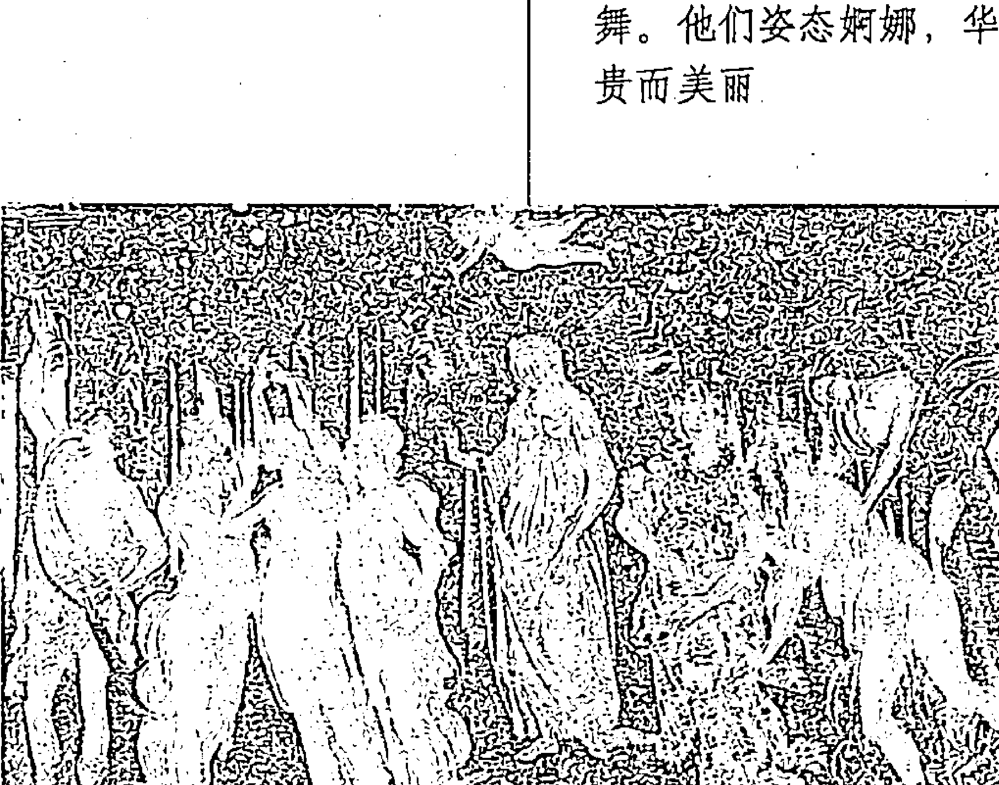

## 第二章 小阿卡那

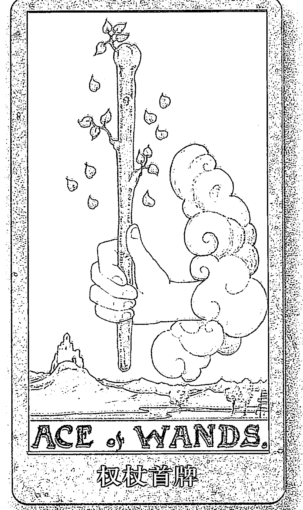

## 权杖首牌
ACE OF WANDS

关键词：创造力、自信、激情、勇气

- **创造力:** 更好的创新方法；挖掘你的潜能；增加可能性；相信梦想，展现自我；激发自己的思维能力；展现自己的天赋；提出解决问题的方法
- **自信:** 相信自己；充分肯定自己的才能；有必胜的信心；自重；确信自己所从事的事情会成功；相信事情会解决
- **激情:** 热情高涨的，渴望的；创造令人激动的氛围；随时准备应付一切可能发生的事情；激励别人；保持乐观

- ◇首一首搭配:
  首一首搭配显示将有新的血液注入你的生命。它不但吸取了权杖首牌的能量(创造力, 爱情, 勇气以及个人自身的能力), 而且加上了以下的某一种能量:
  - 圣杯首牌: 深厚的感情,亲密,协调,同情,爱
  - 宝剑首牌: 智力,理智,公正,真理,坚定
  - 星币首牌: 繁荣,富裕,信任,安宁

的；百倍努力的

勇气：处理挑战性的事务；超越你的极限；忠实你的信仰；敢于坚定你的立场；直面恐惧；努力去争取

### 图案解读：
山峦、草原、树木、流水还有远方的城堡；在广袤的大地上空，云端里伸出一只强劲有力的大手，紧握着一根象征力量的权杖。权杖很粗，上面长着绿色的叶子，在空中飞舞。那只大手的周围，有白色的光芒，象征着这只手是至高无上的，传达着神的旨意。首牌代表新的开始，权杖象征能量，权杖首牌代表着无限的潜能，它像火花一般，隐隐可见燎原之势。

### 推测解读：
权杖首牌代表新的机会，无论结果如何，放弃都是不可取的。

### 正放含义：
1. 蕴涵创造力。
2. 重大事件的开端。
3. 新的发明诞生了。
4. 开始一段冒险旅程。
5. 新的机会出现，实现梦想的好时机。

### 倒放含义：
1. 采取的新行动的失败可能性比较大。
2. 事件的开端情势不佳。
3. 遭到失败。
4. 前途不太明朗，事情发展不见曙光。
5. 为感情而心痛。
6. 流产或堕胎。

### 相关希腊神话：
伊阿宋(Jason)，是伊俄尔科斯(Iolkos)国王埃宋(Aeson)的儿子，在埃宋的兄弟珀利阿斯(Pelias)篡夺了王位后，亲人们担心伊阿宋受害，把他交给了马人喀戎(Chiron)，躲在教皇的洞穴中长大。

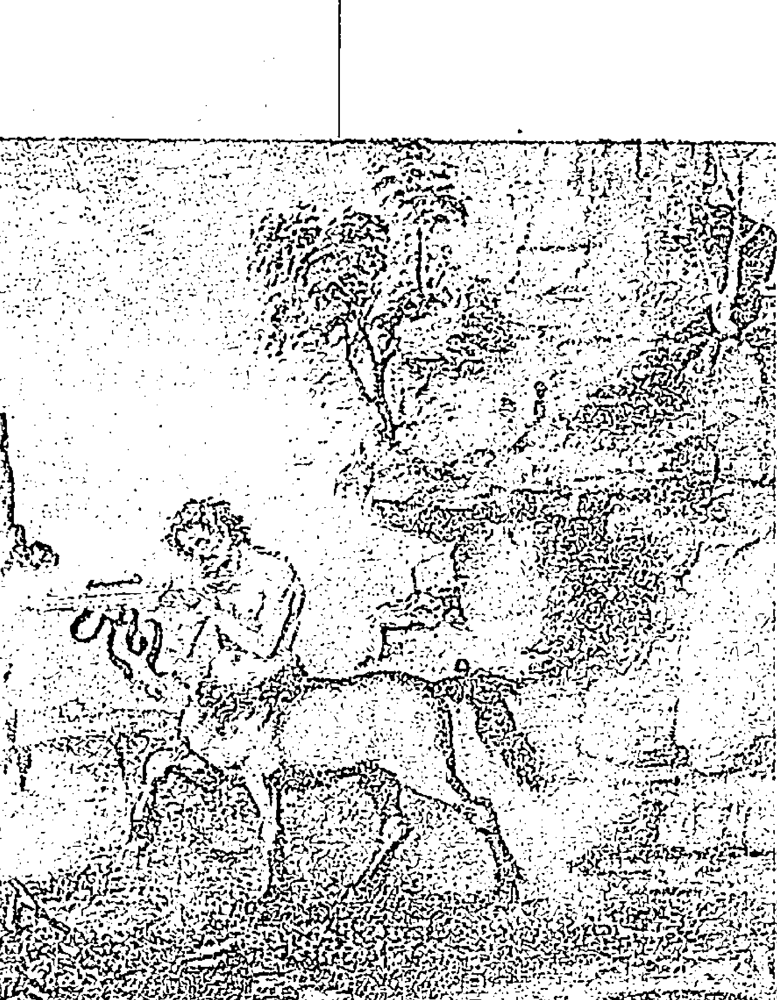

▶半人半马的肯陶洛斯人喀戎是个聪明博学之士，包括阿喀琉斯在内许多英雄都曾拜他为师，受他教育与抚养。伊阿宋也是由他抚养长大的

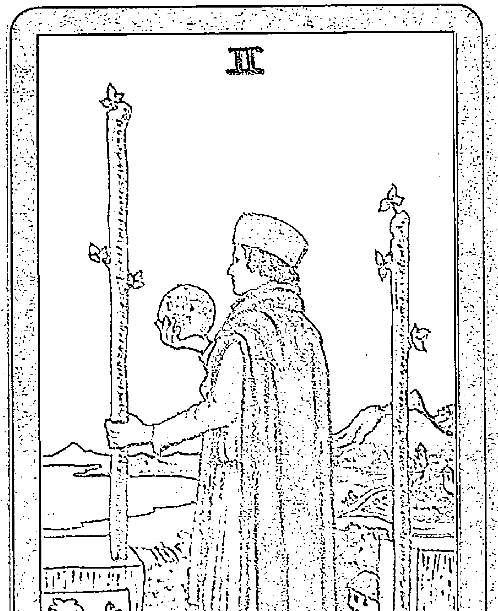

## 权杖二
TWO OF WANDS

**关键词：个人魅力、创新、勇气**

**个人魅力：** 获得关注和尊重；支配你周围的人；将世界掌握在你的手中；富有感染力的；有反响的；拥有权威的；摧毁你的敌对面；能达到你的目标

**创新：** 做前人所没有做的；创造自己的方式；成为先锋人物；进行不同前人的尝试；发明新事物；不同于一般人的

**勇气：** 敢于做你想做的；探险；前进道路中出现未定因素；

### 牌义对立或相近的牌
- ◇对立牌：
  - 女教主：被动的，幕后的
  - 教主：顺从的，和群体保持一致行动的
  - 宝剑八：没有能力，不敢采取行动
  - 宝剑十：牺牲精神，没有能力的
  - 星币十：循规蹈矩，习惯的
- ◇加强牌：
  - 魔术师：个人魅力，极有能力的
  - 皇帝：权威
  - 战车：个人魅力，命令
  - 太阳：生机，光辉，伟大

面临困难；新的开始；畅所欲言的；直面恐惧；捋虎须的；把握每一天

### 图案解读：
权杖二赞扬的是个人的勇气和伟大。它和魔术师牌一样显示的是能量。但魔术师代表的是天赋的能力，权杖二代表的是个人的创造力和能力。图中的人物面对着大海、山峦和人类居住的大地驰目远眺。他左手握着权杖，拄在刻着花纹的石墩上，象征着以智慧和力量为基础。他右手所持既像地球状貌的缩影，又像神秘的水晶球，象征着支配的力量和能源。能量来自于上苍，它经过我们然后还归世界。他似乎在告诉我们，要在正确的引导下运用手中的权力，去创造新的生活环境。

### 推测解读：
权杖二所代表的是一种来自实践或者依靠自身修养而来的权力。个人魅力是一种生生不息的力量，令人积极向上，当它和勇气相搭配的时候，就能成就辉煌。它给人新的精神状态。

### 正放含义：
1. 拥有权力和威力，或拥有权力和威力的人。
2. 正确运用手中的权力。
3. 富有个人魅力。
4. 摒弃以往的陈腐，要开创新的生活。
5. 额外地具有勇气和创造力。

### 倒放含义：
1. 出现了意外事故。
2. 事情的进展遇到了麻烦。
3. 生活穷困潦倒，或生病。
4. 行动受到拘束。
5. 不要陶醉于权力的感觉而失去理智。

### 相关希腊神话：
伊阿宋长大后，珀利阿斯派他到埃厄忒斯(Aeetes)统治的王国去取金羊毛，那样他就会归还王位。前途凶险，但伊阿宋不得不去完成这件事。

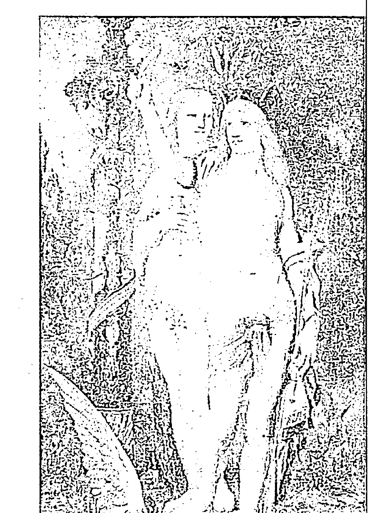

- ◇对立牌：
  - 宝剑二：完事的，坚持
  - 星币十：拘泥守旧的，安全第一的
- ◇加强牌：
  - 愚人：扩张空间，进入未曾开发的地段
  - 皇帝：领导，指示
  - 圣杯八：准备新的旅程
  - 星币三：规划，为未来做准备

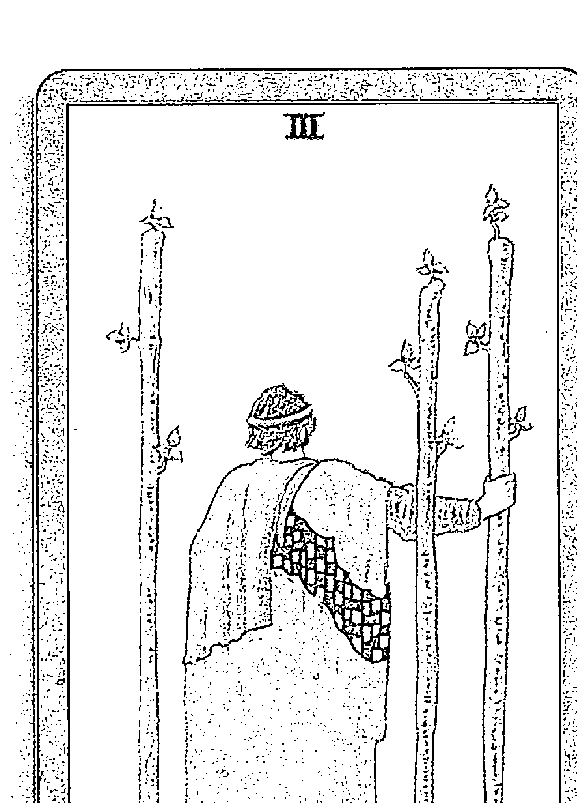

## 权杖三
THREE OF WANDS

**关键词：探险、领导、远见**

- 探险：搜寻未知领域；猎奇；开创新局面；不顾安危的；处理某些不同的事情
- 领导：给别人指示；成为主角；提供急需的指示；集结你下面的力量；敢于担当你能胜任的职位；树立榜样；替代
- 远见：善于想象的；寻求更大的可能性；预先规划的；能预见某些可预测的；觉察到征兆；预测到阻碍；有长远眼光的

### 图案解读：
站在山巅远眺海面的那个人，像一个成功的商人般模样。他用右手撑着权杖，似乎在寻求权杖的支持。他一副期待者的形态，假如权杖代表神灵的旨意，那么不可知的未来便有点依赖天意的意味。未来是需要探索的，有时候人力有无法达到之处。但整幅图是给人希望的。金黄的背景象征光明，海面辽阔而平静，正是出航的大好机会，预示着成功。以统领之姿站立在山巅，象征着领导地位，登高远望象征着高瞻远瞩、目光长远。

### 推测解读：
权杖三既代表这是一个探索新领域的好时机，也代表着已经踏上了探索的旅程。

### 正放含义：
1. 事业已经或者将会获得成功。
2. 与贸易有关的事务。
3. 彼此合作，协调性比较好，有助于事物发展。
4. 能够获得援助。
5. 具有领导地位，或具有领导地位的人。
6. 探索新的方向，有新的情侣或开始新的旅行出国出差等。
7. 成功的异地恋爱。

### 倒放含义：
1. 事业发展倒退，财运下降。
2. 整体局势不佳，或者事情被终止。
3. 合作不良好。
4. 缺乏远见，计划不周。
5. 欠缺领导力，或当事人刚愎自用，过度的野心。
6. 项目、旅程等等计划被延迟。

### 相关希腊神话：
伊阿宋回到了伊俄尔科斯，珀利阿斯假意很有诚意归还王位，诱使伊阿宋去拿金羊毛。因为他知道金羊毛有巨龙看守。珀利阿斯想借此杀死伊阿宋。

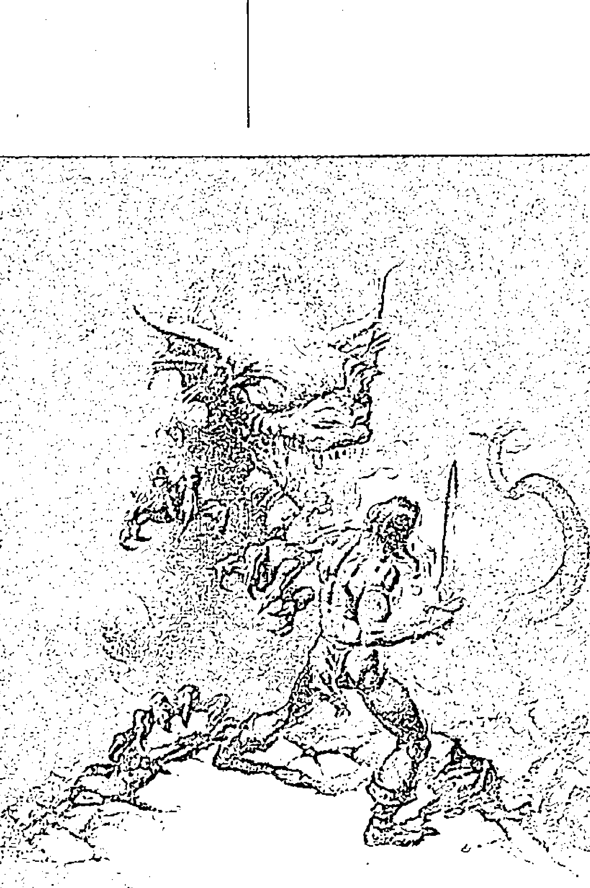

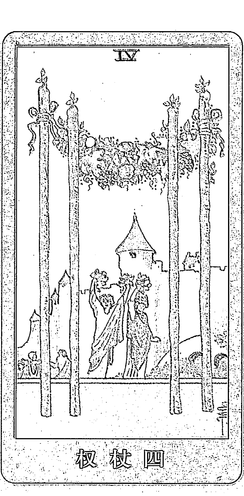

## 权杖四
FOUR OF WANDS

关键词：欢庆、激情、自由

欢庆：庆祝愉快的事，庆祝成功；见证新纪元；里程碑或者某一很特殊的时间，为某事划上圆满句号而庆幸；欣喜于获得的某种荣誉；参加庆典

激情：极为兴奋的；心神俱醉的；满怀期待的；及时的；感到高兴的；短时间的放松；惊奇的

自由：从受压抑的环境中挣脱出来；冲破樊篱；解开束缚；有了新的可能性；逃脱不愉快的环境；要求自由

### 牌义对立或相近的牌
- ◇对立牌：
  - 魔鬼：束缚，缺乏自由
  - 权杖十：压抑，处于受压制的形势下
  - 圣杯四：平静的，缺乏激情的，冷漠的
  - 宝剑六：轻微的不快或者不怎么值得庆贺的
  - 宝剑八：限制，缺乏自由
- ◇加强牌：
  - 圣杯三：激情，热情高涨的，欢庆
  - 星币二：欢乐，激情，喜庆集会

尊的；自由自在

### 图案解读：
四根高大的权杖对称而中正地耸立在大地之上，象征着稳固和坚定。权杖上缠绕着果实累累的长藤，象征着繁荣和富裕，权杖下两名盛装的女子举着花束挥舞，她们身后的人群更是欢呼着，似乎在庆贺丰收的喜悦，在欢庆安定富足的美满生活。权杖后高高的城堡更是固若金汤的表示，人们在这个安乐的避风港湾里，其乐融融。

### 推测解读：
权杖四给人的意向是正面的，积极向上的，一种安全感油然而生。因为四具有四位方正的含义，逆位的权杖四既有与正位相反的含义，也有不变的含义，应当视具体推测问题与整体牌阵局势而定。

### 正放含义：
1. 和平繁荣的景象。
2. 悠闲的生活，稍作小憩。
3. 罗曼蒂克的感情，或美满的家居生活。
4. 关系稳固，彼此交往越来越深。
5. 学业事业等基础牢靠而扎实。
6. 代表庆功宴、婚礼、晚会等等喜庆的事件。

### 倒放含义：
1. 失去了平静的状态。
2. 没有结果，不够稳定的恋情。
3. 不够确定，有点模糊。
4. 基础薄弱。
5. 人际关系差。

### 相关希腊神话：
伊阿宋建造了大船阿耳戈船(Argo)，并带领了一群英雄出发前往科尔喀斯(Colchis)寻取金羊毛。

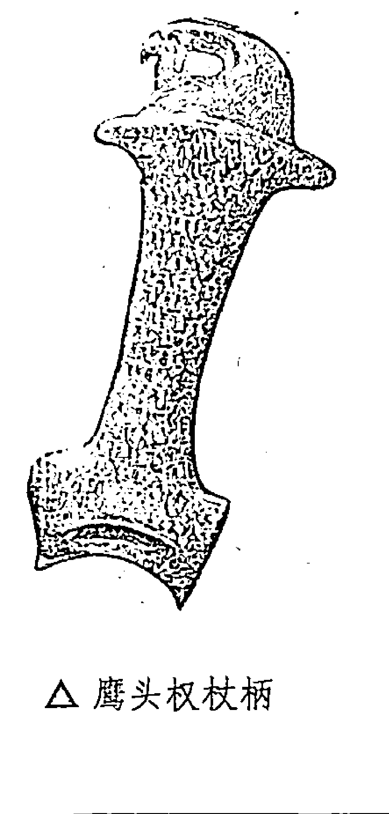

### 牌义对立或相近的牌
- ◇对立牌：
  - 节制：均衡，协调，一道工作
  - 世界：团结，协调工作
  - 圣杯二：休战，和约，走到一块来
  - 星币二：工作顺利的，集结人群，团结一致的
  - 星币三：合作，团队
- ◇加强牌：
  - 权杖七：敌对，战争
  - 权杖十：战斗，激战，集会抗议
  - 宝剑五：不和谐的，互相对立的

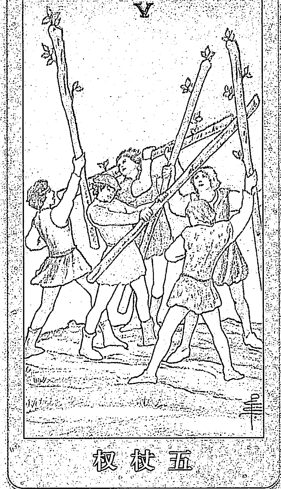

## 权杖五
FIVE OF WANDS

**关键词**：争执、激战、竞争

争执：感觉每个人都持相反的意见；因意见不同而争吵；辩论；争论；卷入一场辩论；跟别人的意见相左；在琐事上互相讥讽

激战：被某种渴求所烦恼；不愿退步的；渴求细节的；愤怒的；被琐事所困扰的

竞争：全身心地投入比赛或者争论；抵制敌对者；接受挑战；被卷入某运动或者比赛；想胜出的；为金牌而努力的；挑衅；面临竞争；被挑战

### 图案解读：
伟特说：权杖五是一场模仿的战役。的确如此，权杖代表的是火元素，你看权杖五的整个画面就似一场混战。每个人都举着权杖为武器，彼此争斗。他们的神色中露出迷茫，可见他们的争斗，是有模仿性质的。他们装束类似，形貌类似，象征着这是一场公平的争斗。他们虽然在争斗，但是并无血腥和残酷的景象出现，所以权杖五表现的，更多的是暗指一种竞争的状态，不仅是外在的，也代表内心的矛盾与冲突。

### 推测解读：

### 正放含义：
1. 将会发生激战或冲突。
2. 对方是强敌，或将会出现强敌。
3. 充满斗志。
4. 面临抉择和挑战，内心难以抉择。
5. 竞争的良机。

### 倒放含义：
1. 非公平的竞争，欺诈。
2. 状况混乱而复杂。
3. 受到纷争的牵连。
4. 可能会有诉讼发生。

### 相关希腊神话：
伊阿宋历尽千辛万苦来到了科尔喀斯，国王埃厄忒斯的女儿美狄亚(Medea)爱上了伊阿宋，她帮助伊阿宋打败了巨龙，取得了金羊毛。

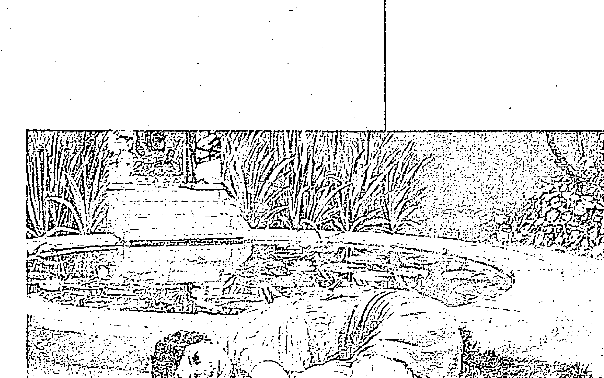

▷美狄亚爱上了伊阿宋，为了他备受煎熬，苦苦等待他的到来

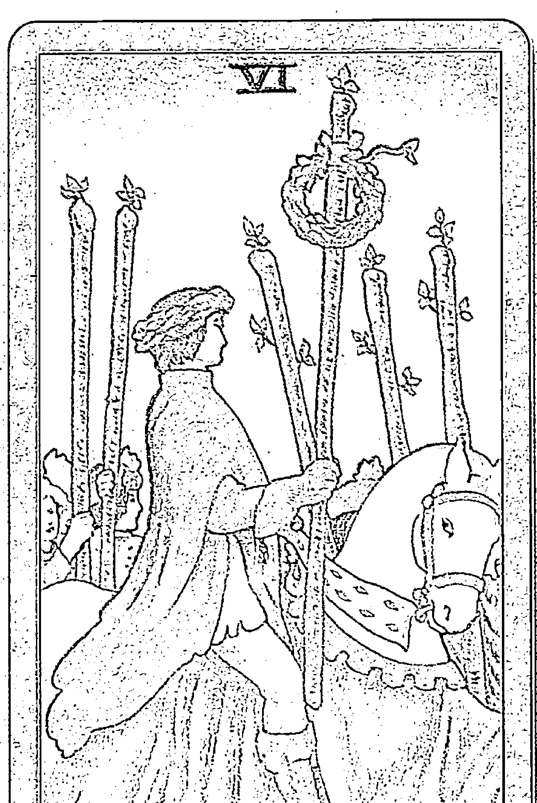

## 权杖六
SIX OF WANDS

关键词：胜利、自豪、称赞

**胜利：** 生活处于顺境；被拥护的；取得荣誉；领先所有人；到达顶点；获得成功

**自豪：** 自尊而不自负的；昂首阔步；抬头挺胸的；对自己有较高的评价；置自己于别人之上；傲慢的；故意屈尊的；觉得自己很重要

**称赞：** 被认可；接受奖励或被提及引用；接受表扬或者恭维；赢得喝彩；获得尊敬

### 牌义对立或相近的牌
**◇对立牌：**
- 高塔：谦卑的，极少被称赞的
- 圣杯五：失败
- 宝剑十：孤芳自赏的，受冷遇
- 星币五：拒绝，缺乏认同
**◇加强牌：**
- 战车：胜利，自信
- 太阳：称赞，突出
- 圣杯九：怡然自得的，志得意满的

### 图案解读：
戴着桂冠的勇士胜利归来，骑着白马，受到众人的欢迎和拥戴。他手持的权杖上也挂着象征胜利的花环。权杖六代表着有荣耀的胜利，是外在的，众人可见的。白色的马和身披的绿色绒衣代表力量，勇士红色的外衣象征他的热忱和斗志。勇士昂首挺胸，充满自信，他是通过自己的努力取得成就的。

### 推测解读：
权杖六好似战车牌的小阿卡那版本，胜利的象征意味明显，不过这一种胜利更世俗些、具体些、生活化一些。

### 正放含义：
1. 获得胜利：凯旋而归、金榜题名、衣锦还乡等等。
2. 努力有了成果得到回报。
3. 有吉报、喜讯传来。
4. 进展顺利，取得进步。
5. 感情有望水到渠成。
6. 能力出色，充满自信。

### 相关希腊神话：
伊阿宋终于拿到了金羊毛，他和同伴们高声欢呼着。

### 倒放含义：
1. 失败。
2. 不诚实的交易。
3. 内部有敌人。
4. 骄傲自满，导致恶果。
5. 传来坏消息。
6. 迟迟到来的成功。

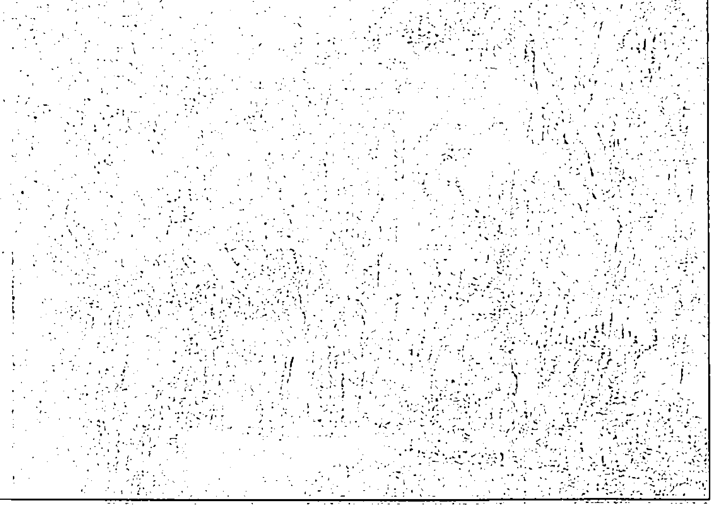

▷在美狄亚的倾力相助下，伊阿宋终于取走了金羊毛

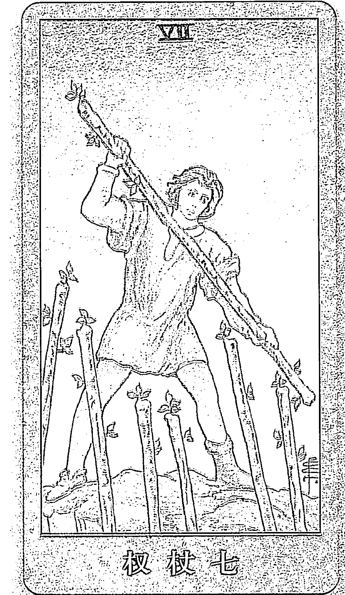

### 牌义对立或相近的牌
- ◇对立牌：
  - 女教主：被动的，抑制
  - 吊人：等待，放手
  - 星币三：团队
- ◇加强牌：
  - 权杖五：对立，战斗
  - 权杖九：保护，防御，拒绝屈服
  - 宝剑五：冲突，寡不敌众的精神状态

## 权杖七
SEVEN OF WANDS

关键词：进取、坚信、挑战

进取：追求理想；肯定自我；反击；打响第一枪；射击；表明立场；展现自己的优势

坚信：确定；坚定立场；展示很强的个性；坚定你的信仰；知道自己是对的；行动或者表现坚决的

挑战：反对压制；保护阵地或位置等自己所有的；回击挑衅；回击批评或者诽谤；拒绝屈服；说“不”；抵制权贵

### 图案解读：
权杖七的画面出现在战斗中。一个身穿绿色服装的人举着手中的权杖应对着面前向自己进攻的权杖。他既像在进攻也像在防御，也许两者都是。权杖七代表进攻或者防御，这如同一枚硬币的两面一样，你进攻，你的对方防御，而当他反攻的时候，你则需要防御。衣服的绿色，象征力量。战斗中的勇士面色坚毅，象征了立场的坚定。既像进攻又像防守的姿态，代表内心的权衡和决断，不是盲目往前的，当确信战争是正义的时候，便会勇往直前。所以权杖七也代表了一种信仰，要相信自己的观点和能力，要拥有正义鉴别的洞察力。

### 推测解读：

### 正放含义：
1. 战胜对手，获得成功。
2. 有利的立场；正义的立场。
3. 充满斗志。

### 倒放含义：
1. 对自己的能力产生怀疑。
2. 被打败了。
3. 感到困惑，无法对事物进行决断。

### 相关希腊神话：
为了把金羊毛带回伊俄尔科斯，伊阿宋和伙伴与埃厄忒斯在海上对战。

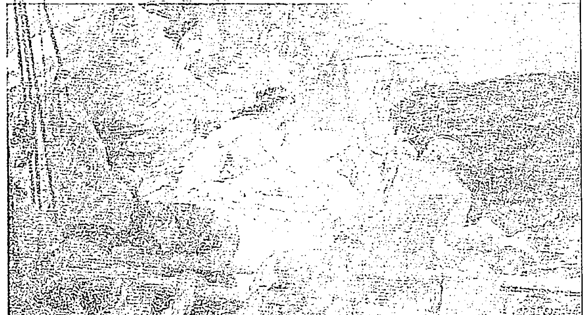

▷美狄亚跟随伊阿宋而去，帮助阿耳戈英雄们与他的父亲作战

### 权杖八 EIGHT OF WANDS

**关键词：快速行动、消息、结局**

**快速行动：** 采取行动；趁热打铁；公开声明；将计划付诸实施；突进新区域；进入紧急状态；抓住机会

**消息：** 得到重要的信息；获得急需的信息；发现揭秘性质的消息片段；发现真相；知道得更多

**结局：** 努力后的状态；将一切因素归结到一起；行动或者计划的终结；发现一个完美的解决方案；结束努力的事务

### 牌义对立或相近的牌

- ◇对立牌：
  - 女教主：等待，拖延
  - 宝剑四：不急，准备
  - 星币七：估计形势，行动前的积蓄力量(物质)
- ◇加强牌：
  - 魔术师：采取行动，实施计划
  - 命运之轮：快速，很快地进展
  - 死神：结局，结尾
  - 圣杯八：结束，告一段落

### 图案解读：

权杖八是少数没有人物与故事场景的小牌之一，看似难解，其实含义同样明确。广袤的绿草原上一条河流横贯而过，河流的上空平行排列着八根权杖，权杖是倾斜的，仿佛有点击河流之势，这让人联想起摩西的拐杖(另注)，它是一切行动开始及结束的象征。在行动前，我们思考、想象、推测、游说并充满幻想，然后我们决定我们的行动，一切脚踏实地，将我们的想法付诸实际。权杖八意味着现在——是展现自我的时候了。不要犹豫，一切因素都已经准备就绪为你效劳。趁热打铁！一旦行动开始，它会进展神速。仿佛一股飓风将人卷起，而且很快就会尘埃落定，看到计划中的进展程度。

相关希腊神话：在美狄亚的帮助下，伊阿宋逃过了埃厄忒斯的追赶，他们平静地在海上航行。

### 推测解读：

#### 正放含义：

1. 快速地行动。
2. 不妨做一个旅行计划。
3. 果断地下决定，马上开始行动。
4. 一鼓作气，勇往直前。
5. 看到或听到某些很重要的信息，需仔细辨认。
6. 结束手中的任务，为下一个做准备。

#### 倒放含义：

1. 有争论发生。
2. 家庭不很和睦。
3. 行动不够迅速，令进展迟滞。
4. 一蹶不振。

另注：在《圣经·旧约》中，摩西是以色列人的英雄。他是主的使者，拯救了以色列人民脱离埃及法老残酷的统治。主赐予摩西的手杖以神奇的力量，他护佑以色列人逃至红海，用手杖点开了海面，他们顺利通过，埃及的追兵却没入了大海之中。他们来到西奈大沙漠，摩西用手杖点击石头，涌出了清泉。

### 权杖九 NINE OF WANDS

关键词：防御、毅力、坚定

防御：做最坏的打算；往最坏处想；做额外防护；妄想；机警的；保护别人，铭记前车之鉴

毅力：不顾辛劳地继续；坚持住；发挥潜能；展现体能；跟上

坚定：百折不挠；拒绝说“不”；倒下了再爬起来；矢志不移的；一次又一次的

### 牌义对立或相近的牌

- ◇对立牌：
  - 圣杯三：友谊，信任别人
  - 圣杯六：清白，相信是最好的
  - 圣杯八：疲劳，心智衰弱
- ◇加强牌：
  - 坚强：耐力，决心，精神
  - 权杖七：保护自己的地位，维持
  - 宝剑二：防御的，隔离自己
  - 星币八：坚持，持续

### 图案解读：

权杖九中的人物显然经历了一段艰苦的岁月：缠满了绷带，靠一根权杖支撑身体。这个战士已经受了不少战争的洗礼。图案在告诉我们，当我们经过一段艰难历程的时候，我们疲惫，受伤害，或者即使我们没有身体上的伤痕，可我们的灵魂已经受尽折磨，我们原有的童真，心胸的宽广坦荡，对人的信任都一去不复返了，取而代之的只是一种自我防御。它提醒着我们，要更加细心地处理事物，保持警醒，因为随时都有可能出现伤害。同时我们也应该看到，那个士兵虽然已经伤痕累累，但是依然没有倒下，他顽强地站立着，永不放弃。这就是权杖九的内涵所在。这张牌告诉我们的是，不管面对的是什么，永不放弃！即使所有人，一切事物看起来都像要反对我们的样子，也不要屈服，要坚信在我们的体内，有一种能量足以让我们赢得胜利！

### 相关希腊神话：

伊阿宋带领着他的伙伴即将到达目的地，但是船却触礁了。长久的战斗令大家筋疲力尽。

### 推测解读：

#### 正放含义：

1. 要做好准备，以应付困难来临。
2. 在气势上压倒了敌人而获胜。
3. 隐藏实力，蓄势待发。
4. 看不见的敌人。

#### 倒放含义：

1. 遭遇逆境。
2. 气势低落，斗志衰弱。
3. 身体不健康。
4. 运气不太好。

### 牌义对立或相近的牌

- ◆对立牌：
  - 愚人:无忧无虑的
  - 吊人:放手
  - 权杖四:解除负担,逃脱压制状态
  - 宝剑四:放松,休息
  - 宝剑七:推脱责任
- ◆加强牌：
  - 正义:承担责任,应负责任的
  - 权杖五:抗争,激战,争论,抵制
  - 宝剑六:通过,混过,挣扎
  - 宝剑九:焦虑
  - 星币五:抗争,艰难时刻

### 权杖十 TEN OF WANDS

关键词：过分展现、抗争、忍耐

- 过分展现：试图做很多的事；拒绝说“不”；承担所有的责任；承揽别人的债务；想当名流；承担一切事情；超负荷工作
- 抗争：奋争；以很艰难的方式做事；遭遇抵抗；逆潮流而动；不劳则无获
- 忍耐：从无放松的时间；感觉受束于一件单调的事情；承受数不胜数的任务；肩负重担；执行不乐意做的任务：清除杂乱场面；承担不属于自己的全部责任

### 图案解读：

身穿红衣的男子抱着十根权杖，正费力地往前走去。前方有绿树、房屋，代表目的地，代表胜利。然而男子已经十分疲累了，他的腰弯了，举步维艰，象征他承受了巨大的压力。这个压力是超过他的负荷能力的。他为什么要背起如此沉重的负荷呢？是因为强烈的责任感，还是因为不够深思熟虑而鲁莽行事呢？也许他完全可以不必如此辛苦，但无论如何，他已经背负了这一切，已经行进了很长一段路，而且尽管如此艰难，男子毫不放弃，他身上衣服的红色象征了内心的热忱和努力，你看目的地就在不远处，即将到达，希望就在前方。

相关希腊神话：伊阿宋回到伊俄尔科斯后，才知道珀利阿斯杀死了自己的父亲和兄弟，逼得母亲自杀，他伤心而痛苦，于是在美狄亚的帮助下，设计杀死了珀利阿斯。他和美狄亚也被赶出了伊俄尔科斯。

### 推测解读：

#### 正放含义：

1. 信念强烈，非常具有责任感。付出许多努力和辛劳。
2. 因为不懂得拒绝而承受了过重的负担。
3. 感到有压力，情绪不安。
4. 过度的疲惫和劳累。
5. 因获得成功而承受的压力。

#### 倒放含义：

1. 难以承受的压力，快要崩溃。
2. 无法继续负荷而放下负担。
3. 受到损失。
4. 逃避责任，逃避别人的言论。
5. 不诚实，搬弄是非。

### 权杖侍从 PAGE OF WANDS

### 关键词：创造性、自信的、热情的、勇敢的

- 创造性：独辟蹊径；原创；发明；发现一个自我表现的新领域；提出解决方法；从新的角度出发
- 自信的：应付挑战；说“是的，我行”；相信自己；还清债务；专注于成功；相信有志者事竟成
- 热情的：全身心地投入；激动的；热血沸腾的
- 勇敢的：冒险；敢于面对的；探险；猎奇的；独断专行；领导者；克服恐惧感

#### 相关希腊神话：

佛里克索斯(Phrixus), 是弥倪埃人的国王阿塔玛斯(Athamas) 和云之女神涅斐勒(Nephele) 的儿子。后来他为了逃避后母伊诺(Ino)的迫害, 和姐姐赫勒 (Helle) 一起骑着金毛公羊出走。赫勒从羊背下跌落海峡而死(从此那个海峡被人称为赫勒海峡)。最后佛里克索斯来到了科尔喀斯, 他杀死了金毛羊作为祭品献给宙斯。

### 图案解读：

图中的少年双手握着权杖，白色的帽子象征他的纯洁，上面插着红色的羽毛让人联想起愚人头上的羽毛，所以可以想象权杖侍从的天真、不稳定和不够成熟。虽然他有愚昧的一部分，但是他的神态是认真的，他穿着金色的衣服，象征他的地位不俗，和拥有天赋的力量，衣服的里面是红色的，象征他内心的热忱和勇敢。他有点古怪，他是活泼的。

### 推测解读：

#### 正放含义：

1. 代表一个诚实的人。
2. 有好消息传来。
3. 优秀的助手或辅佐人员。
4. 值得参考的资讯。

#### 倒放含义：

1. 传来坏消息。
2. 祸从口出。
3. 不安定的状态，令人担忧和困惑。
4. 缺乏成熟的思考和决断的能力。

> 在星座的希腊神话起源中，宙斯派黄金牧羊去载佛里克索斯和赫勒至天空的彼方，因牧羊前行速度太快，赫勒不幸跌落海峡，金牧羊一边驮着佛里克索斯飞奔，一边扭头看赫勒，于是形成了如今的牧羊座。

▷悲喜交加中的伊阿宋与美狄亚

### 权杖骑士 KNIGHT OF WANDS

关键词：富有魅力 / 浅薄的、爱冒险的 / 不安宁的、自信的 / 自大的、热情的 / 急躁的、敢作敢当的 / 有勇无谋的

富有魅力 / 浅薄的：迷人的，有吸引力的，只注重外表的；用笑容瓦解对方，无思想的，肤浅的；诱人的，性感的，妄图以色相来俘获某人；有感染力，有激情的，回避严肃和深刻的事情；能言善道的，甜言蜜语、巧言令色的

### 相关希腊神话：

柏勒洛丰 (Bellerophon), 科林斯国王格劳科斯(Glaucus)的儿子。他骑着天马珀伽索斯(Pegasus)战胜了喷火的三头怪物喀迈拉(Chimaera)。

爱冒险的／不安宁的：喜欢旅行和增加新阅历的，不喜欢平静的；猎奇不愿意长时间呆的；发起挑战不倦的

自信的／自大的：基本上不怀疑自己的，高估自己的；相信自己天赋，夸大成就的；觉得自己能行、自夸的；任何时候都很自信，傲慢的；不自满的，专横的

热情的／急躁的：易振奋的、易怒的；忠心耿耿的／好斗的；觉得一切事物有生气的，愤怒时候猛击

敢作敢当的／有勇无谋的：敢于冒险的、莽撞的；敢于挑战别人所回避的，危害自己或者别人；危险面前第一个站出来的，一点都不考虑危险；爱做英雄的，冲动的；敢去人未去过的地方，蛮勇，铤而走险的

### 图案解读：

权杖骑士是极富生命力的一张牌。骑士戴着头盔，穿着铠甲，全副武装，代表他随时作战的状态。铠甲外面黄色的外衣象征他的地位和胜利的可能。衣角翻飞成火焰的形状，头盔上的红缨也似一团火，身后更像有一团火焰正在燃烧，象征着强烈的勇气和热情。骑士的马是红色的，跃蹄前奔的姿势，象征着勇往直前。正如整个画面暗示的那样，骑士带着火一般的气息前行，既是自信的、勇敢的，同时也无可避免地带来负面意义。比如过犹不及，有勇无谋，爱冒险的，莽撞，傲慢，暴躁。

### 推测解读：

当看到权杖骑士时，我们要抱着权衡的态度，是不是骄傲自大？是暴躁易怒抑或总是很有耐心？有人伤害自己的时候是不是暴跳如雷？是不是未做任何准备就仓促行动？也许是时候去做些改变了呢。

#### 正放含义：

1. 事业顺利，获得晋升。
2. 开始新的旅程。或者人生有一段新的开始。对新事物进行挑战。
3. 充满自信，有令人难以抗拒的魅力。
4. 脾气很坏，缺少谋略。

#### 倒放含义：

1. 令人措手不及的突发事件。
2. 事情的进展被中断。
3. 喧哗、吵闹的场面。
4. 意见产生分歧。
5. 感情破裂，分居或分离。

### 权杖王后 QUEEN OF WANDS

- 有魅力的
- 愉悦的
- 一心一意
- 自信的
- 精力充沛的

有魅力的：吸引人的，受欢迎的；能给人很强的第一印象，易成为朋友的；性感的；和善，对人友好的

愉悦的：乐观向上的；激励每个人的；能很快摆脱不快的；任何地方都很快乐的

一心一意：很积极的，全身心地投入去完成某事；任何时候都尽力的；敞开心扉，衷心的，无隐瞒的

相关希腊神话：珀涅罗珀(Penelope)，奥德赛的妻子。她是品行高尚、忠于爱情的美好女子。奥德赛远征特洛伊，并被波塞冬百般迫害而无法回国的20年中，珀涅罗珀千方百计拒绝了112个求婚者。因为她坚信丈夫没有死。

自信的：沉着冷静地处理事情，不轻易动怒的；相信自己的能力

精力充沛的：过忙碌而积极的生活，有活力的；有生命力的；活跃的；天生的运动健将

### 图案解读：

权杖王后的牌面内容也很丰富。王后穿着金黄色的衣服，右手握着粗壮的权杖，象征她的尊贵和权力。外面披着白色的大氅，象征他公正无私可信赖。左手持着金黄的向日葵，象征旺盛的生命力和智慧。向日葵中间的红色代表热情。面前的台阶上蹲着一只黑猫，象征她拥有的法力，和沉稳的决断力。她戴着镶有月桂树叶子的王冠，容光焕发，让人感受到光明而积极的气息。石座的两旁雕刻着狮子的头像，带着叛逆的意味。微微左仰的头，是毫不屈服，坚定果敢的象征。这是一个可敬可爱的女性形象，刚柔并济，英姿勃发，并且拥有各种不可思议的力量，无论是世俗的权力，还是神奇的法力。但是她的宝座矗立在荒漠之上，隐隐有孤独之意，高处不胜寒，王后是曲高和寡的，但她永远那么高贵而坚定。

### 推测解读：

#### 正放含义：

1. 值得信赖的女性或女性工作者。
2. 精力充沛，热情而温暖。
3. 内心或者地位很独立。
4. 有决心，有能力。
5. 叛逆，比如从事变革的工作，革命者之类。
6. 精神世界丰富的人，有时感性强于理性。

#### 倒放含义：

1. 情绪化，波动不稳定。
2. 傲慢。
3. 有阻力存在妨碍发展。

相关希腊神话：忒修斯（Theseus），是雅典国王埃勾斯(Aegeus)和特洛曾公主埃特拉(Aethra)的儿子。埃勾斯在一次漫游中来到了特洛曾，同埃特拉结了婚。在离开特洛曾回雅典的时候，埃勾斯把自己的宝剑和绊鞋藏在一块巨石下面，对妻子说，生下儿子，等他成长到力大若父，能搬动巨石取出宝剑和绊鞋时，就让他到雅典去。忒修斯长大了，他轻而易举就搬开了巨石。于是他前往雅典。忒修斯建立了许多功绩。就是他打倒了弥诺斯的怪物弥诺陶洛斯。后来，忒修斯当了雅典的国王。

### 权杖国王 KING OF WANDS

关键词：创造性、超凡魅力、鼓舞人的、勇敢的、有能力的

创造性：提出新颖的计划或者想法；开启新局面；天赋的艺术细胞；策划新的战略；发明的；原创的

超凡魅力：有戏剧性的；极有光彩的；天赋的魅力让其成为关注的焦点；吸引人的；引人注目的；被模仿的；挂人嘴上的

鼓舞人的：热情洋溢的交流；沟通；创造令人激动的氛围；树立榜样；慢慢地灌输自信心；一个强有力的天生的领导者

勇敢的：无畏的；大胆的；直接交锋的；坚定不动摇的；不在乎别人想法的；受信仰所激励

有能力的：能支配环境的；果断的；受人尊重让人服从的；能自然而然地利用其权力的

### 图案解读：

权杖国王是一个开国者与建国者，他的坐姿仿佛随时准备着站立起来，代表他有极强的行动力。金黄色大氅象征他的统治力量。绿色的披肩代表智慧，以及调和了四元素而拥有的潜能。红色的衣服也象征了权杖国王的热情与行动力。金色火焰形的王冠象征了权杖的火元素特质。虽然过度的热情会导致冲动，但他成熟的决断力和拥有的智慧足够加以控制。权杖国王是稳重而宽宏大量的。

### 推测解读：

#### 正放含义：

1. 有教养，有学识的人。
2. 优秀的父亲。
3. 态度圣明。
4. 诚实而有良知。

#### 倒放含义：

1. 太过严格、苛求。
2. 独断专行。
3. 态度傲慢。
4. 爱面子，导致失败。

### 圣杯首牌 ACE OF CUPS

**关键词：** 情感作用、亲密、直觉、爱

**情感作用：** 和内心想法联系紧密的；潜意识的；表白深厚感情；共鸣

**亲密：** 感觉越来越离不开的，陷入爱河；与另一人结合；发展关系；与某人走得很近；进入一个更深的层次

**直觉：** 相信自己灵魂深处的声音；对来自内心的信息作出反应；增强心理预警；和自我保持一致；相信感官

**爱：** 示爱，向某人敞开心扉；友善回应；救助；不再拒绝；原谅

### ◇首一首搭配：

- **权杖首牌：** 创造力，激情，勇气，冒险，个人魅力
- **宝剑首牌：** 智力，理智，公正，真理，坚定
- **星币首牌：** 繁荣，富裕，信任，安宁

首一首搭配显示将有新的血液注入你的生命。它不但吸取了圣杯首牌的能量（深厚的情感，协调，亲密，怜悯，爱），而且加上了以下的某一种能量：

### 图案解读：

图中的圣杯是耶稣在最后的晚餐中使用过的。耶稣死后，他的鲜血也是由这只杯子盛装着。白鸽是天主教中圣灵的象征，它衔着象征耶稣身体的圣饼，自上而下似要进入圣杯，象征着灵魂进入物质世界。杯中涌出的五道水象征人的五种器官。下边水面上盛开着朵朵睡莲，象征着人类灵魂的觉醒。云中伸出的手轻轻托住圣杯，充满着无限爱意。圣杯首牌经常代表新感情的开始。

### 推测解读：

圣杯预示着一场新恋情或新友谊的开始。在情感刚开始时，爱与关怀常满溢，要懂得慷慨回报对方，珍惜这份福气。若求问者这份感情已维持很久了，出现圣杯首牌，要好好看看四周的牌，小心外遇迹象。若是在无关感情的推测中，出现圣杯首牌，表示这个局势需用爱来耐心化解。

### 相关希腊神话：

普绪刻 (Psyche) 有着出众的容貌，堪与美与爱之神阿佛洛狄特媲美。阿佛洛狄特感到委屈，决定惩罚她，给予她悲惨的命运。阿佛洛狄特派自己的儿子厄洛斯 (Eros) (拉丁语即丘比特 Cupido) 去执行惩罚。阿佛洛狄在罗马神话中即是维纳斯。

### 正放含义：

1. 爱苗已经萌芽动土，大胆追求美好生活。
2. 有婚庆之喜，或身边朋友、亲戚的。
3. 心中充满幸福感。
4. 一切顺利。

### 倒放含义：

1. 应改掉虚伪的毛病。
2. 对求爱者无爱意。
3. 一场单相思，需尽量摆脱。
4. 喜悦中带着隐忧。

## 圣杯二
TWO OF CUPS

关键词：发生关系、意识到吸引力、寻求信任

发生关系：和别人产生联系；庆祝婚礼或者联合；友谊；合作关系；一起工作；分享；帮助人；被帮助

意识到吸引力：承认正发展的关系；接受你的好感；感觉到友善回应；朝某方向移动

寻求信任：恢复关系；从对立面走到一块来；忘记过去不快的；呼唤和平；达成友好协议；原谅

牌义对立或相近的牌
◇对立牌：
- 隐士：要求独处的，孤独
- 权杖五：不同意，保持隔离状态，非和平的
- 圣杯四：热衷于自己的想法，独处
- 圣杯五：关系破裂
◇加强牌：
- 情侣：团结，婚姻，联合
- 节制：联合，一起工作
- 圣杯十：血统，家族，联合

## 图案解读：

头上戴着花环的一对男女面对彼此，持圣杯向对方致意。男人身体前倾，象征着一种积极外向的阳性力量；女人站姿端凝如山，象征着一种含蓄内向的阴性力量。他们中间悬着两条蛇缠绕的杖，是治疗的象征。杖上的狮子头象征沟通，张开的翅膀象征圣灵。整个画面透着一种结合或合作的神秘力量。

## 推测解读：

圣杯二经常与爱情产生强烈关联，在这方面，此牌比较近似初恋状态。如图中一样，男女相敬如宾，平等相待对方，不做强求。圣杯二不只局限于男女情感，也可以涉及友谊，以及任何人际关系，而这种关系往往是和谐对等，愉快的。因此，问友谊，问婚恋，问合作，圣杯二都会给你一个答案。

## 正放含义：

1. 有火一样的热情。
2. 有美好的友谊。
3. 你或周围有人结婚。
4. 方方面面的关系很和谐。
5. 情侣或朋友间相互了解。

## 倒放含义：

1. 情侣或朋友间互相猜忌。
2. 你或周围有人离婚。
3. 方方面面的关系较对立。
4. 你的爱无法得到满足。

## 相关希腊神话：

先知告诉厄洛斯，普绪刻将被安排与一个怪兽结婚。她会被绑在岩石上举行婚礼，然后等待死亡。厄洛斯去执行此项任务。可是厄洛斯却被普绪刻的美丽所倾倒，他爱上了她。

▷ 阿佛洛狄特和她的追随者们。她的飞舞的宝带能唤起人们无限的爱恋之心

## 圣杯三
THREE OF CUPS

**关键词：** 感受繁荣、团体、友谊

◇对立牌：
- 隐士：孤独的，脱离团体
- 权杖九：不信任的，戒备的
- 宝剑三：孤独，隔离，受伤害的
- 宝剑六：悲伤，沉痛
- 宝剑九：痛苦，苦恼的
◇加强牌：
- 教主：集中团体成员
- 节制：参加团队，一起工作
- 权杖四：激动，热情高涨，庆祝
- 星币三：在团体中一块工作

**感受繁荣：** 欣欣向荣的，生机勃勃的；处于流动中的；庆典的；热情高涨；感觉处于顶峰的；歌舞升平

**团体：** 参加认同你的团队；发扬集体主义精神；一起工作；联合别人，组织团队；互相帮助；求同；做邻居

**友谊：** 跟你喜欢的人在一块；同志；好客；分享；信任别人；依靠外来帮助

## 图案解读：

三个衣着艳丽的女子，头戴象征丰收的花环，彼此围成圆圈，高举圣杯互相庆贺。她们脸上洋溢着幸福，四周有南瓜及葫芦，一女子手提一串葡萄，一派丰收景象。三位女子有不同颜色的头发与眼珠，衣着也很不同，代表她们都是独立的个体，有自己的个性，但她们又能融洽相处，围成圆圈的形状，表示她们之间无尊卑之分。在这个象征欢庆和团体合作的画面中，洋溢着一种庆祝成功的气氛。圣杯三也是友谊的象征，在欢庆之外，圣杯三也有鼎力的象征，各方势力均等，相持不下，蕴含多种可能。

## 推测解读：

圣杯三通常表示以感情作为关联的团体，另外，也代表一种欢庆的场合，包括宴会、婚礼等。其丰收的含义通常代表事情有了好的结果。当然，有时也相反。

## 正放含义：

1. 事情难以得到解决。
2. 需要做一项决定。
3. 幸福的婚姻。
4. 生活重新开始。
5. 矛盾的关系和解了。
6. 伤已经痊愈。

## 倒放含义：

1. 事情做过头了。
2. 乐极生悲。
3. 快乐也伴随着痛苦。
4. 不好的饮食习惯。
5. 做事拖拉。

## 相关希腊神话：

厄洛斯决定带走普绪刻并与她举行婚礼。人鱼在岛边为他们庆贺。但是他们在一起的条件必须是普绪刻不得见到他的容颜。

## 圣杯四
FOUR OF CUPS

**关键词：** 沉浸自我、沉思、冷漠

**沉浸自我：** 只关心自己感觉的；只顾自己的，不关心别人的；吝啬；少同情心的；只以自己的观点看问题；对礼物和祝福不屑一顾的

**沉思：** 反省；考虑；梦想；沉浸在幻想中；入神；无警惕性的

**冷漠：** 被动接受的；无兴趣的；自由；闲散的；少主观努力的；无积极性的；无追求的

牌义对立或相近的牌
◇对立牌：
- 世界：牵连，关注，参与
- 权杖四：激动，热情，乐观
- 圣杯二：联合，分享
- 星币八：勤奋，努力的
◇加强牌：
- 隐士：收敛，内向
- 宝剑四：沉思，独处
- 宝剑六：情绪低落，郁闷

## 图案解读：

图中的男子背靠着树，一副百无聊赖的样子。他紧闭着双眼，双臂交于胸前，做出一副防卫的姿态。前方并列着的三个杯子，象征着他过去的经验，他默默地盯着，代表他陷于往事不可自拔。云中伸出的一只杯子，象征着一个新的机会。然而，这位消极退缩的男子轻易地拒绝了。生活对他而言，好像半点兴趣都没有了。他对任何事都表现出彻底的冷淡和漠不关心。

## 推测解读：

圣杯四表示一段消极、无聊、疲惫、退缩的时光。当事人缺乏动力，对一切事物漠不关心，不想参加社交。圣杯四有时也代表外遇和新机会的降临。

## 正放含义：

1. 总感到寂寞无聊，需找一件自认为有意义的事做。
2. 身心俱疲，需要调节或休息。
3. 深深地失望，对生活没有信心。
4. 对什么都不感兴趣，或感到活着无意思。

## 倒放含义：

1. 有新的人际关系，生活出现另一种境界。
2. 发现新方法，觅得新机会。
3. 脱离低潮期。

## 相关希腊神话：

厄洛斯把普绪刻带到了自己的宫殿。为了不让她看到自己的容貌，他只是每天夜里与她相会。心怀嫉妒的姐妹怂恿普绪刻打破限制。

## 圣杯五
FIVE OF CUPS

关键词：亏损、遗憾、丧亡

亏损：理想破灭；失败；遭受挫折；所有权的剥夺；分手

遗憾：失望；为打翻的牛奶哭泣；悔恨；意识到自己错误的选择；认识到缺点

丧亡：关系的破灭；悲伤；失去亲人的痛苦

牌义对立或相近的牌
◇对立牌：
- 情人：确立关系
- 审判：解脱，摆脱愧疚或者遗憾
- 权杖六：成功，胜利
- 圣杯二：关系
- 圣杯九：愉悦，满足
◇加强牌：
- 死神：亏损，道别
- 宝剑三：分离，失恋，心伤
- 宝剑六：悲伤
- 星币五：拒绝，缺少支持，缺少认同

## 图案解读：

灰暗的天空下，一个身披黑色斗篷的男人，垂头哀悼面前三个倾倒的杯子。他面前河上有一座通往远处村落的桥，预示着他有选择另一种生活状态的机会。面前的三个杯子倒了，身后还有两个杯子立着。他不转过身，永远发现不了，会一直以为自己孤立无援。而希望就在失望的背后，他拾起两只立着的杯子，跨过桥去，生活会重新开始；否则，生活会永远这么痛苦下去。

## 推测解读：

圣杯五代表的是一种悲伤痛苦的处境，同时，也预示着另类生活的可能开始。

## 正放含义：

1. 被后悔的情绪淹没，生活在一种无望的痛苦当中。
2. 局部受到损害，导致怀疑自己整体的正确性。
3. 有一种缺陷。
4. 无意义的交际。
5. 有深深的幻灭感，开始或已经怀疑生活和人生。

## 倒放含义：

1. 老朋友回来了，往日的美好会重新回到生活中。
2. 旧缘分得到重续，或指夫妻破镜重圆。
3. 东山再起，重拾生活的信心。
4. 结成新的同盟。

## 相关希腊神话：

普绪刻终于控制不住爱恋之情和好奇，她点了灯试图看清丈夫的脸。丈夫便立刻消失得无影无踪了。幸福立刻化为乌有。

▷ 带弓箭的丘比特

牌义对立或相近的牌
◇对立牌：
- 魔鬼：消极，腐化，觊觎
- 权杖九：不清白的，最坏的
- 宝剑五：愤世嫉俗的，敌视的，自私的
- 宝剑七：欺骗，模仿，假冒
- 宝剑九：犯罪
◇加强牌：
- 星辰：善意，分享
- 圣杯十：被祝福的，高兴，快乐

## 圣杯六
SIX OF CUPS

关键词：善意、孩提、清白

善意：好心；慷慨的；慈善的；分享你的拥有；感觉被祝福的；出于善意的

孩提：和年轻人或小孩在一块；无忧无虑的；被照顾的；怀旧的；贪玩的；喜欢年轻人的活动；生小孩

清白：易满足的；仁慈善良；幸福的；喜悦的；无戒心的；无贪污腐化堕落行为的；欣喜于单纯的快乐

## 图案解读：

在色彩绚烂的花园里，一个小男孩捧嗅着圣杯里的鲜花，他好像要把它献给面前的小女孩。整个画面充满浓烈的童话般的色彩，让人重新拾起童年的回忆。圣杯六代表的是与过去相关的人与物。此外，也代表着思乡情绪，就像图中的庄园，绽满鲜花，充满欢笑，无忧无虑，像家一样温暖。如男孩将花献给女孩的慈爱模样，圣杯六也可以表示照顾以及馈赠。

## 推测解读：

圣杯六除代表对往事的温馨回忆和思乡、照顾之外，有时也提醒当事者，要像男孩一样慷慨大方，乐于付出，放下一切仇恨和不悦情绪。

## 正放含义：

1. 陷入回忆之中，难以自拔。
2. 幼时的体验刻骨铭心，影响到现在的情绪及行为。
3. 虽分别了，但还能再见。
4. 总多愁善感，情绪不稳定。
5. 雾一样消散不了的乡愁。

## 倒放含义：

1. 好运马上到来，需要在奋斗中等待。
2. 比过去更关心未来。
3. 开始有长远打算，能够高瞻远瞩地过日子或为事业奋斗了。

## 相关希腊神话：

丈夫消失了，普绪刻十分悲伤，她坐在岩石上叹息着，手中握着白色的百合花。

## 入睡的维纳斯

## 圣杯七
SEVEN OF CUPS

关键词：幻想、浪费、选择

幻想：往好的方向想的；做白日梦的；沉迷于幻想的；放纵自己的思维的；自己骗自己；空中楼阁；经不住考验的想法；缺乏认同；不切实际的

浪费：溺爱；放纵；对每样东西都不爱惜的；无组织的；挥霍；倾向于好吃懒做的；懒惰；延迟；耽搁

选择：有多种选择机会的，面临一系列的选择的；相信无穷的可能性；开辟更宽广的领域；做选择

牌义对立或相近的牌
◇对立牌：
- 魔术师：聚焦，认同
- 皇帝：纪律，机构
- 节制：平衡，中庸
- 星币四：秩序，控制
- 星币八：努力工作，志愿
- 星币九：纪律，限制，节制
◇加强牌：
- 魔鬼：溺爱，浪费
- 月亮：幻想，不切实际的想法，妄想
- 圣杯九：纵情声色

## 图案解读：

图中的男人看着面前浮于云端上的七只圣杯，一副贪婪和无奈的样子。他在为失去的叹息，他在为打翻的牛奶哭泣。另外，云层上摆放的这些东西也象征着一种空中楼阁的存在，那只是男人白日梦的幻想。此外，男人面对着七只圣杯，也意味着一种选择。

## 推测解读：

圣杯七代表的是不切实际的和污浊东西的存在。另外，当看到圣杯七的时候，也意味着一种严格有序的体系被打破，会释放出巨大能量，会有众多的选择机会。

如果生活在无序混乱中，看到此牌后，要马上调整生活状态，要知道系统的生命是由规则给的。如走了极端，会像图中描述的那样，演变为有害的放纵、沉溺和颓废。

## 正放含义：

1. 对生活不现实的态度。
2. 反复无常，出尔反尔。
3. 不切实际，幻想成功。
4. 白日梦患者。
5. 采取欺诈的手段。

## 倒放含义：

1. 下定了决心，有决断力。
2. 有坚强的意志，经得起艰难困苦的考验。
3. 近期要达到目标。
4. 明智的选择。

## 相关希腊神话：

厄洛斯不得不与妻子分离，也十分悲伤。他的母亲阿佛洛狄特告诉他，普绪刻会重新回到他身边，但她必须完成艰巨的任务。这时，普绪刻决定到各处寻找自己的情人。

## 圣杯八
EIGHT OF CUPS

关键词：内涵、厌倦、继续

内涵：专注于隐私；搜寻答案；要点所在；开始探险之旅；发现真相；花更多的时间于思想上

厌倦：感觉疲惫的；冷漠的；缺乏精力；筋疲力尽的

继续：意识到当前的事情已告一段落；从没希望的状态中摆脱出来；解脱自己；开始一次不知终点的旅行；放手

牌义对立或相近的牌
◇对立牌：
- 力量：忍耐，坚强
- 太阳：活力，高能量
- 权杖九：坚持，保持
◇加强牌：
- 隐士：寻求深层次的意义，探询真谛
- 死神：继续，离开
- 权杖三：旅行，进入新领域
- 权杖八：结束，告一段落
- 宝剑六：继续，旅行

## 图案解读：

在一个月明之夜，一个红衣男子拄杖离开他辛苦搭建起来的八个圣杯而去。周围密布的沼泽，象征着淤塞的情感。他离开是因为发现搭建的杯子上还有一个缺口。于是，他为了寻找一个杯子，抛弃了身后搭建已好的八个杯子。他本来可以带着八个杯子去寻找那个杯子的，但他没有这样做。他穿着的红色衣鞋，象征着他的行动力。由画面中可看出本牌的中心题旨“抛弃”。

八个杯子中缺少一个，象征着万事万物总有美中不足。不满足于此的人，就继续追求。由此可看出，圣杯八也代表着一定的牺牲精神。

## 推测解读：

当身处于沼泽般的僵化局势中，圣杯八表现的是突破常规，大胆地追寻自己的希求之物。

## 正放含义：

1. 放弃计划，半途而废，指一切无毅力耐心之举。
2. 有很重的疑心病。
3. 衰弱，失去了力气。
4. 爱已经变得理智。
5. 停止努力。

## 倒放含义：

1. 新的恋情将降临，或者生活出现转机。
2. 喜庆之事不断。
3. 有舞会或者宴会之类的邀请。
4. 在努力奋斗过程中。

相关希腊神话：
普绪刻历经了千辛万苦，有时还必须给阿佛洛狄特当女奴。阿佛洛狄特命令她去到冥界，她于冥后珀耳塞福涅之处取回一瓶美容霜。普绪刻很沮丧，因为很可能她会一去难返。

▷ 冥后珀耳塞福涅(左)和冥王哈德斯(中)

## 圣杯九
NINE OF CUPS

关键词：实现理想、感官愉悦、满足

实现理想：达到目的，获得自己想要的，美梦成真

感官愉悦：奢侈的；品尝美味；欣赏艺术；做爱；放松；物质享受

满足：安于现状，获得自己想要的；愉快的

牌义对立或相近的牌
◇对立牌：
- 隐士：不太注意感官享受的
- 圣杯五：悔恨，遗憾
◇加强牌：
- 皇后：享受感官快乐的
- 情侣：性快乐
- 世界：获得内心渴望的
- 权杖六：自豪，获得自己想要的
- 圣杯七：纵欲

## 图案解读：

图中的男人志得意满地坐在摆放整齐的一排圣杯之前，他得到了任何想要的，整个画面充溢着一种满足愉悦的气氛。不难看出，圣杯九代表的是一切感官的愉悦，包括视觉、味觉、触觉上的享受。从个人角度看，圣杯九暗示当前的一种生活状态。

## 推测解读：

圣杯九以“愿望”牌闻名，它预示你的梦想在现实中的去向。但要领悟图形的寓意，你必须知道自己的内心意图，勇于承担寻梦过程中的相应责任，这样你才能最终享受你的好运气。

## 正放含义：

1. 物质生活很富足。
2. 内心充盈着一种幸福感。
3. 形势对你是有利的。
4. 有潜力，有希望。
5. 获得成功。

## 倒放含义：

1. 物质上将有一定损失。
2. 生活中易犯错误。
3. 内心中尽是不满。
4. 不懂得节制，体力减弱得厉害。
5. 做事虎头蛇尾。

相关希腊神话：
普绪刻来到冥界，她顺利地完成了任务，取回了冥后珀耳塞福涅的美容霜。

## 圣杯十
TEN OF CUPS

**关键词：欢乐、家庭、和平**

**欢乐：** 被快乐所拥抱；浑身舒坦；喜形于色

**家庭：** 为家庭的安宁工作；从事家务活；维持必要的关系；团结家庭成员；原谅家人的过失

**和平：** 平静；清除敌对因素；和谐；消除紧张与压抑感；感到高兴安逸的；要求信任；放松

牌义对立或相近的牌
**◇对立牌：**
- 魔鬼：缺少快乐安宁的
- 高塔：剧变，嘈杂
- 宝剑三：心碎，孤独
- 宝剑九：痛苦，悲伤，失望
- 宝剑十：牺牲
**◇加强牌：**
- 情侣：家庭关系，团结
- 星辰：快乐，积极的，祝福
- 世界：欢乐，情绪的满足
- 圣杯六：感觉被祝福的，快乐，高兴

## 图案解读：

这是其乐融融的一家人，夫妻相拥各扬一只手，迎向象征美好生活的圣杯与彩虹。两个孩子在一旁快乐地嬉戏。远处是他们的家。这是一幅温馨感人的画面。这张牌主要代表以感情相关联的团体，如家庭、社团、公司、几个知交好友等。

圣杯十指的是个人的成熟与满足，此牌表现的是人际关系中的快乐和满足。

## 推测解读：

如果经历一段时间的人际冲突，此牌出现，代表和解指日可待。

在感情方面的推测上，圣杯十代表两人已经越过圣杯二的初恋阶段，寻求更长久更稳定的关系，极可能步入婚姻的圣殿。

相关希腊神话：
普绪刻得到了永生，成为了众神的一员。他与厄洛斯终于重聚，两人不再分离，过着幸福快乐的日子。

## 正放含义：

1. 内心平和，情绪良好。
2. 认为目前的幸福是实实在在的，感到很知足。
3. 有一个美满的家庭，或者一个人际关系融洽的工作环境。
4. 爱使你身心愉悦。

## 倒放含义：

1. 内心感到不安，整天生活在忐忑不安的情绪中。
2. 失去友情，或事业中失去一个得力的合作伙伴。
3. 家庭暴力在你身边。
4. 人际关系不和，对立。

## 圣杯侍从
### 关键词：情绪、亲密、直觉、爱

- 情绪：被感动的；表现自己的情感；浪漫的；信马由缰
- 亲密：开始或者重新一次恋情；与人约会；与某人关系密切；不拘泥于礼节；分享；巩固友谊
- 直觉：潜意识的；重温旧梦；相信自己的潜在反应；精神意识方面的经验
- 爱：做亲昵体贴的动作；表示同情或者理解；宽恕自己；拥抱某人；向你伤害过的某人道歉；改善破裂过的关系；不批判；不谴责

### 相关希腊神话：
那耳喀索斯(Narcissus)，河神刻菲索斯和水泽神女利里俄珀的儿子。他是一个非常俊美的少年。他看到水中自己的倒影，陶醉而相思，终于恋恋不舍而亡。于是众神把他变做了水仙花，这也是水仙花的由来。

### 图案解读：
一个年轻男子，叉腰站在蔚蓝色大海前，高兴地看着圣杯中喂养的鱼。他的天真让人想起一个善良无邪的孩子。他感情丰富，富有爱心，他是爱和温暖、亲密的象征。

### 推测解读：
#### 正放含义：
1. 爱好冥想，在冥想中体验现实中缺少的幸福。
2. 有新的消息传来，消息往往是正面的。
3. 在辛苦努力着。
4. 身边有不少热心人，有很好的人缘。
5. 做事深思熟虑。

#### 倒放含义：
1. 身边不少阿谀奉承的人，需小心。
2. 心灵手巧。
3. 学会一个人排遣不悦。
4. 脱离了某方面的控制。

> 人们用盛大欢快的场面表达了他们的喜庆之情和对神祇的崇敬之意

## 圣杯骑士
### 关键词：浪漫 / 超情绪化、优雅 / 做作、想象 / 空想、反省 / 内向、敏感 / 喜怒无常

- 浪漫 / 超情绪化：理想化爱情；缺乏自控；注重情感；嫉妒，猜疑；追求诗意人生、易动感情的；回忆特殊的一些场合或者片断、爱情或者友情上犯冷热病的；非常完美；非常漂亮地表白自己的感情；疏漏
- 优雅 / 做作：从各个方面去增加美感；让别人做脏活；追求完美，不能面对失意的；创造令人心旷神怡的氛围；体弱；温和，亲切的；被压力、困难所击倒
- 想象／空想：透过现象看本质，超越表象；不可能有结果的想法；采取不同一般的办法，走不同路子，不切实际的尝试；非凡的天赋；夸张的想法或者想象；梦想的，幻想的；隐瞒真相
- 反省／内向：试图弄清楚为什么；不积极参与；追求自我完善和提高；过分看重自己的失败；透过表面的；不与人交流
- 敏感／喜怒无常：对心情和想法很警觉的、情感波动幅度大的；助人为善；爱生气，脾气坏的；体谅人的；变化快的；圆滑老练的；轻率的

### 相关希腊神话：
阿耳戈斯国王阿克里西俄斯从神示中得知，女儿达那厄所生的一个男孩会推翻他的统治并把他杀死，于是阿克里西俄斯便把女儿关进了地窖。但是宙斯化作黄金雨进入了地窖。后来达那厄生下了珀修斯 (Perseus)。阿克里西俄斯又把女儿和外孙装进箱子扔进了大海，他们被岛上的国王波吕得克忒斯所救。波吕得克忒斯为了追求达那厄，支使珀修斯去取墨杜萨的头——任何人见到她的头都会变成石头。珀修斯从神女那里得到了宝物，杀死了墨杜萨。归途中解救了锁在岩石上即将被海怪吃掉的安德洛墨达。他用墨杜萨的头杀死了波吕得克忒斯，救出了母亲。因为想念外祖父，珀修斯前往阿耳戈斯，在竞技会上无意中砸死了外祖父。

### 图案解读：
骑士挺胸端坐于马背之上，手举着象征执著的圣杯，双目深情地注视着，马儿顽皮地低头盘旋。整个画面充盈着执著和浪漫的气氛。在这儿，骑士代表着情感丰富、重直觉且有创意的一类人。

### 推测解读：
#### 正放含义：
1. 新的机会在慢慢靠近，生活正在慢慢起变化。
2. 做计划，提交提案。
3. 身边布满诱惑，当事人意识不到。
4. 热心款待客人。

#### 倒放含义：
1. 小心身边乖巧之人；处境表面很好，实际上很危险。
2. 小心欺诈。
3. 行为不正，需改正。
4. 在过着不检点的生活。

### 相关希腊神话：
海伦(Helen)，她是宙斯的女儿，是古希腊史诗中最为驰名的女主人翁，以美丽非凡著称于世。她在少女时代曾经被忒修斯抢走，为两个哥哥所救。许多英雄都向她求婚，她的母亲采纳了奥德赛(Odysseus)的意见，让所有求婚的英雄立誓决不向海伦的配偶动武，而且给予一切帮助，然后把海伦嫁给了墨涅拉俄斯。后来因为金苹果之争，特洛伊王子帕里斯在阿佛洛狄特的帮助下，赢得了海伦的芳心，把她带到了特洛伊。墨涅拉俄斯向希腊各地英雄求助，于是发动了著名的特洛伊战争。

## 圣杯王后
### 关键词：爱意的、感应的、善良的、仁慈的、直觉的

- 爱意的：出于人道、同情心而不动怒的；无条件接受；能察觉别人想法的；不生气，不憎恨的；特有耐心的
- 感应的：第六感觉敏锐的；和某人有心灵感应；配合，搭配完美协调的
- 善良的：容易被别人苦痛所感动的；同情，怜悯；对人、动物有爱心的；乐于助人；想人之所想
- 仁慈的：与神的旨意保持一致，对一切生灵持爱心的；乐于融合；欣喜于生命的真谛；把世界看成圣地
- 直觉的：和潜意识相协调，能感觉到环境的氛围；下意识的，相信内心中真实的感觉；心领神会

### 图案解读：
坐于宝座上的王后，目光温柔地注视着手上的圣杯，一副多情而专一的神态。另外，王后也代表着仁慈、善良和直觉。她是那种会让年轻小伙子爱上的成熟而有韵味的女人，不只因美貌，还因为她的同情心。此牌往往代表了一种对情感的需要。

### 推测解读：
#### 正放含义：
1. 感受性丰富而细腻，但要节制情绪，容易多愁善感。
2. 有种愿为爱献身的冲动，彻底陷身爱河。
3. 你是善良而公平的人。
4. 成功在即，坚持奋斗。
5. 幸福生活在眼前。

#### 倒放含义：
1. 无法信赖身边的人，为一种尴尬的环境所困。
2. 注意别人身心的独立性，是一个好朋友（或好领导、好父亲、好同事等）。
3. 要注重口碑和声誉。
4. 性情需要改变，你面临的困难，往往是坏性情造成的。
5. 品行不良，要注意。

## 圣杯国王
### 关键词：明智、人道、平静、宽恕、圆滑老练

- **明智**：给出好的建议；对人性有好的把握；知道别人成长中所需要的；在关照和爱护中教导；明了事物本质；经验丰富
- **人道**：安慰；治疗；帮助；同情；慈善
- **平静**：安抚，让别人有镇定感；灵魂的安宁；从不紧张的
- **宽恕**：心胸宽广的，容忍的，能跟各式各样的人和睦相处；给别人自由；能忍耐逆境的
- **圆滑老练**：能平衡很多人需要的；能团结人一起工作，缓解紧张局面；有技巧地实现目的；能在恰当的时候说中肯的话

### 相关希腊神话：
俄耳浦斯(Orpheus)，河神俄阿格洛斯和卡利俄珀的儿子。他发明了音乐和做诗法。他的歌声能使树木弯枝，顽石移步，野兽俯首。他的妻子神女欧律狄克被蛇咬死了，他为了使妻子还阳，下到冥界。他的歌声驯服了地府的守门犬，使复仇女神流出了眼泪，使冥后珀耳塞福涅深受感动。于是珀耳塞福涅准许他把妻子带回人间，但在走出冥界前不得回头看妻子，不得同她说话。在即将走出冥界的时候，俄耳浦斯终于忍不住，不放心而回头看了一眼，于是功亏一篑，永远失去了妻子。

### 图案解读：
国王坐于宝座之上，手执圣杯，目光炯炯注视前方，象征着他开阔的视野，有前瞻性的眼光。他披着的宽大衣氅象征着宽广的胸怀。同时，圣杯国王也代表着冷静、明智和圆滑。

### 推测解读：
无论对于家庭、爱情和财产，都愿付出爱和关怀。有一切“为了明天”的前瞻性和责任心。

#### 正放含义：
1. 见多识广，让人尊敬。
2. 某方面的专家，在某方面有突出的作为。
3. 有创造性，常想人所未想。
4. 是个公正而值得信赖的人。

#### 倒放含义：
1. 表里不一，让人厌恶。
2. 行为不端，欠缺道德感，在追逐名利上不择手段。
3. 面临损失。

## 宝剑首牌
### 关键词：智力、公正、坚忍、真相

- 首一首搭配：
  - 权杖首牌：创造力，激情，勇气 以及个人自身的能力
  - 圣杯首牌：深厚的情感，亲密，协调，同情，爱
  - 星币首牌：繁荣，富裕，信任，安宁
- 智力：客观的；思考；查明真相；分析形势；运用智慧；理智行事
- 公正：改正错误；做正义的事情；承担责任；要求公平
- 坚忍：克服困难；直视困难；解析形势；寻求克服力量；战胜困难；百折不挠
- 真相：还债；弄清楚；透过假相；有清楚的认识；诚实；找到真相

### 图案解读：
在群峦之上，一只手破空伸出，紧紧抓住宝剑，剑尖刺穿顶部的王冠。整个画面象征着挑战欲望的威力无边。宝剑代表着一种伤害，正像它的双刃一样，可伤人，亦可伤己；可救人，亦可杀人。宝剑在这里作为一种象征物，警示着使用它的人们，稍有不慎，就可造成不良后果，就像图中剑尖刺穿王冠一样，极容易成为一种极端的力量。如同爱与恨，可以建设也可以毁灭。

在图中，不偏不倚的宝剑象征着理智的中立力量。尽管其牌组的中心思想是伤害，但后来不少人在其中加入了风的含义（宝剑通常与风要素关联），于是我们经常看到宝剑首牌有“理智”、“正义”、“知识”、“心智力量”、“决心”、“公平”等相关牌义，往往代表了某种权威，或是寻求权威的必要性。

### 相关希腊神话：
阿特柔斯(Atreus)和弟弟堤厄斯忒斯(Thyestes)逃往迈锡尼。阿特柔斯继承了迈锡尼的王位，弟弟堤厄斯忒斯诱通了阿特柔斯的妻子埃洛珀(Aerope)阴谋篡位，被宙斯揭发，驱逐出国。后来堤厄斯忒斯唆使由他养育长大的阿特柔斯的儿子反对阿特柔斯。阴谋败露后，阿特柔斯处死了罪犯，他不知道其中有自已的儿子。阿特柔斯知情后，为了报复堤厄斯特斯，在弟弟回迈锡尼求和时，将他的儿子们煮成食物请他吃。众神为了惩罚阿特柔斯的罪行，对他进行了诅咒。

### 推测解读：
当宝剑首牌出现，可反思自己是否有过激的表现。但宝剑首牌只是一个开端，一种可能，未来究竟要如何发展，掌握在持剑者之中。

#### 正放含义：
1. 表示具有强烈的进取心与攻击性。
2. 挑战时，胜利的可能性更大，结果可能更富正面性。
3. 在健康的推测上，宝剑首牌代表着手术或打针，预示着可以治疗。
4. 做事顺利，能逢凶化吉。
5. 有超人的力量，做出使自己惊讶的成果。

#### 倒放含义：
1. 意味着做事容易引起麻烦、争端。
2. 预示着奋斗路上障碍很多。
3. 意味着因逞强而招来灾难。
4. 挑战时，失败的可能性更大，结果可能更趋负面性。
5. 在健康的推测上，宝剑首牌表示外伤。

## 宝剑二
### 关键词：压抑、僵局、避免

- 压抑：否认真实想法；戒备的；坚持冷漠；装聋作哑；埋藏痛苦的；抑制应该有的反应
- 僵局：不敢动的；成僵持状态；不动；拒绝下决定或者结论；不愿靠岸的
- 避免：拒绝面对事实；不顾警示；睁只眼闭只眼；回避煞风景的事；不想知道

### 牌义对立或相近的牌
- 对立牌：
  - 愚人：揭露，放荡，不受禁止，不受限制的
  - 命运之轮：进展，运行
  - 正义：明白真相，担当责任
  - 星辰：自由发挥积极性
  - 权杖三：前进，直面事实
- 加强牌：
  - 月亮：自己骗自己的，没看到真相的
  - 权杖九：戒备的，隔离自己的
  - 宝剑七：逃避现实的
  - 星币四：僵局，封锁，障碍

### 图案解读：
画面上，身穿灰色长袍的女人背对身后汹涌澎湃、代表着感情的海洋。她坐在石凳上，眼蒙着象征逃避现实的白布，双手持剑，在胸前交叉着，做出一副自卫的姿态。

女人背对着代表感情的海洋，且双眼蒙布，表现出一副掩耳盗铃的自欺之态。她双剑交于脸前，等于交叉在“心”前，表示她有颗封闭的心灵。

女人默坐不动，两把宝剑斜叉交立，像两股僵持的努力，相持不下，代表着一种尴尬的人际关系或窘困的处境。另外，也表示当事人做不出决定，甚或拒绝下决定。

### 推测解读：
宝剑二提示推测者有一颗较封闭的心灵，对待万事万物消极悲观，在采取一种抗拒和逃避的态度。此牌提醒我们，要诚实面对内心情感。无论事情怎样，要接受，莫逃避；要接纳，勿抗拒。把蒙眼布取下，将双剑放下，事情其实没有那么严重。

#### 正放含义：
1. 做事有一定协调力，能集中全部身心去完成一件事。
2. 有钢铁般的意志，不轻易改变。
3. 与同事或竞争对手互相残杀。
4. 一直不认输的一件事已经走到尽头。

#### 倒放含义：
1. 代表当事人能做出决定，打破僵局，结束紧张，停止抗拒，但因海面与礁石移到牌面上方，隐藏的流言与欺诈会浮出水面。
2. 两面人，有双重人格。
3. 注意做事不要损害朋友利益。
4. 见好就收，适可而止，或激流勇退。
5. 口是心非，表里不一。

### 相关希腊神话：
阿特柔斯的儿子阿伽门农（Agamemnon），是阿耳戈斯的国王，特洛伊（Troja）战争中希腊军的统帅。他出战特洛伊时，射中了月神阿耳忒弥斯（Artemis）的赤牝鹿。女神大怒，刮起阵阵逆风，使希腊舰队滞留海港。于是阿伽门农许愿将自己的女儿伊菲革涅亚（Iphigenia）作为祭品献给女神。阿伽门农借口要女儿跟阿喀琉斯订婚，把她送上了祭坛。阿耳忒弥斯用一只赤牝鹿做牺牲替换了姑娘，带她到陶里斯让她当了自己的祭司。陶里斯的习俗是要把外乡人刺死在阿耳忒弥斯的祭坛上。于是阿耳忒弥斯赐给了伊菲革涅亚永生，并让她以俄耳西罗喀亚的名字与阿喀琉斯结婚。

## 宝剑三
### 关键词：伤心、辜负、寂寞

- 伤心：心碎，遭受心灵伤害的，心伤，失望；听到令人不安的消息；伤害了自己或者别人的感情；没人安慰的
- 辜负：揭开了令人心伤的真相；发现自己不该信任某人的；失望；丧失信心；倒戈一击；食言爽约；反对
- 寂寞：被隔离；在异地流浪徘徊；被拒绝；被所爱的人疏远；若有所失；在急需帮助的时候被丢下不管

### 牌义对立或相近的牌
- 对立牌：
  - 情侣：感受到爱，亲昵
  - 圣杯三：友谊，信任
  - 圣杯十：快乐，爱，安宁，协同
- 加强牌：
  - 圣杯五：隔离，心痛，失恋
  - 宝剑九：痛苦，心碎
  - 星币五：拒绝，隔离，缺少支持

### 图案解读：
三把宝剑合力刺穿一颗心，背景是灰暗的雨天。这是一幅令人触目惊心的画面，它直观地道出了这张牌的含义——伤心。然而，画面在混乱中仍保持着某种和谐，三把剑似在无意中形成一种对称的形态。它意在告诉世人，悲伤是凄美的和必然的，悲伤使人成长。只要坦然接受悲伤，它就会转化成你成长的力量。

画面只是如实地描述心碎的模样，却没有描述伤心的来由和愈合过程。它意在告诉世人，不要因为在情感上受了伤，就看不开，导致伤口迟迟无法愈合。

### 推测解读：
宝剑三告诉推测者，正确认识悲伤情绪，它会成为有益于你生命的东西。

#### 正放含义：
1. 最近一直有口角。
2. 失去了生活中所一直享有的一种爱。
3. 离散了，开始分手，或朋友分手。
4. 生活中发生了严重的对立。
5. 伤心，失意的眼泪。

#### 倒放含义：
1. 心理上一直处于封闭状态，不愿接纳任何事物。
2. 伤该愈合了，但当事人仍沉浸在悲伤中，不愿接受别人帮助。
3. 一直让周围的人伤心。
4. 小心，你有致命的损失。
5. 不安感越来越重。

### 相关希腊神话：
阿伽门农为了将女儿伊菲革涅亚送上女神阿耳忒弥斯的祭坛，欺骗了妻子克吕泰涅斯特拉(Clytemnestra)。等克吕泰涅斯特拉发现时，阿伽门农已经带着女儿出发了。克吕泰涅斯特拉决心报复，她和埃癸斯托斯（Aegisthus）私通，并在阿伽门农回国时合力将他杀死。

## 宝剑四
### 关键词：休息、预备、沉思

- 休息：给自己身体一个恢复时间，避免体能的耗尽；寻求安宁；放松身心；过一段轻松的日子
- 预备：巩固和加强自身内在的能量，确定自己基础的稳定可靠性；为将来做准备；稳定
- 沉思：获得更好的观点及看法；看看自己内心的真实想法；一个人静下来想想；审视自己的动机；回顾自己所处阶段、位置等

### 牌义对立或相近的牌
- 对立牌：
  - 魔术师：积极进取的，注意外在因素
  - 命运之轮：高速的，快节奏的，运动的
  - 权杖八：采取行动，猛冲，急奔
  - 权杖十：用力过度，用力过猛的，盛气凌人
  - 星币二：娱乐，均衡行动
- 加强牌：
  - 女教主：安静地休息，沉思，凝想
  - 隐士：沉思，凝想，安静
  - 吊人：休息，延缓行动
  - 圣杯四：沉思，独处
  - 宝剑六：休息，复原
  - 星币七：停止反应，估计，评价

### 图案解读：
一个男人正在悬挂的三把宝剑的下方安静地休息，男人的身边还备有一把宝剑，他随时可以起身行动。此牌较其他宝剑牌的画面安宁祥和，它通常是代表消极不动的状态。但并非全然无为，而是在休息的过程中积蓄精力，暂停手头事务，计划下一步动向。等他准备完毕，随时会一跃而起，继续他的未完事业。“休息是为了更好地工作”是这副牌的主要牌义。

### 推测解读：
宝剑四出现的时候，通常代表当事人正处于一种休息状态，或是他需要放慢步履，好好休息一番，然后重新出发。这是张“充电”的牌。提示你在休息当中，要好好反思，注意总结教训。

#### 正放含义：
1. 需静养一段时间再说。
2. 凡事要学会做暂时性的让步。
3. 要学会“以退为进”之法。

#### 倒放含义：
1. 要提醒自己切勿急躁，凡事细细想，慢慢来。
2. 通常能在较短时间内休息妥当，然后投入生活。
3. 注意检讨自己，拾回以前失去的东西。

### 相关希腊神话：
阿伽门农的妻子克吕泰涅斯特拉为了报复丈夫把女儿当做祭品而与人私通杀死了丈夫。她把儿子俄瑞斯忒斯(Orestes)送去了别处，所以他什么都不知道。

# 宝剑五
FIVE OF SWORDS

关键词：自私、声名狼藉、不和

自私：不关心别人的，只考虑自己所得的；明白必须照顾自己；热衷权力角逐；心满意足；关心赌局或者比赛结果。

声名狼藉：无道德准则的，不择手段，牺牲正义；不诚实的；无是非观念；取得让人争议的胜利。

不和：处于敌对环境中；感觉人们互相作对的；选择战争；同仇敌忾；冲突。

- 牌义对立或相近的牌
  - ◇对立牌：
    - 皇帝：循规蹈矩，遵纪守法
    - 正义：诚实，正直，从事正义事业
    - 节制：共同工作，协调，合作
    - 圣杯六：清白，善意的，好心的
  - ◇加强牌：
    - 权杖五：不和，相互反对
    - 权杖七：敌视，冲突
    - 宝剑七：不名誉，与别人不往来，隔离

# 图案解读：

战胜者收获了失败者的几把宝剑，看着手下败将离去的身影，嘴角露出了微笑。可以说，看到失败者越沮丧，胜利者就越高兴。从画面上可以看出，一场暴力斗争刚结束，胜者在洋洋自得中还没有清醒过来。他的这场胜利没有给他带来任何好处，只损人并不利己，只会培养他的野心，使他变得更自私。宝剑五代表着一个人取得了一场毫无意义的胜利，警示着某些人不择手段伤害对方，为得胜而得胜的行为。另外，此牌也代表着敌意、争执、屈辱等。

# 推测解读：

宝剑五在提示当事人不要一味追求胜利而忽略了其意义，要在奋斗过程中，既利人又利己。

# 正放含义：

1. 不要短视，不要忘掉比赛的最终目的。
2. 要环视周围有没有对你怀有敌意的人。
3. 你有被辞职或免职的危险。
4. 正在堕落。
5. 对人际关系产生迷惑。

# 倒放含义：

1. 从自私的行为中解脱出来，停止无谓的争执。
2. 无法预测。
3. 你的熟人中将有一位发生不幸。
4. 将有关于丧事发生（祭奠、吊唁等）。

# 相关希腊神话：

阿波罗命令俄瑞斯忒斯杀死自己的母亲为自己的父亲报仇，不然就要让他发疯。

俄瑞斯忒斯杀母

# 宝剑六
SIX OF SWORDS

关键词：忧郁、旅行、恢复

忧郁：经受轻微的伤痛；混日子，无聊地打发时间；一定程度地受压抑；持低调态度；情绪低落的；运行但不是很活跃的。

旅行：改变位置，从一个地方到另一个地方；进行一次旅行；场地的变化；连根拔起的；根除；思想的一次变迁。

恢复：处理外伤；熬过一段艰难的时间；捡起碎片；着手处理，开始对付；身体开始复原；向另一个更好的地方或者状态进发；重新扬起希望风帆。

# 牌义对立或相近的牌

- ◇对立牌：
  - 力量：不动摇的，有决心的
  - 太阳：活力，激情
  - 权杖四：激动，庆祝
  - 圣杯三：热情高涨，丰富
  - 星币二：欢乐
- ◇加强牌：
  - 权杖十：经过，通过，挣扎
  - 圣杯四：情绪低落，压抑，不予关注的
  - 圣杯五：悲伤
  - 圣杯八：移动，开始一次旅行
  - 宝剑四：休息，恢复
  - 宝剑九：沮丧，消沉，悲伤

# 图案解读：

插着六把宝剑的小船，与上面撑篙的船夫和一对母女，向着远方向着光明未来的平静水域驶去（而船下的水汹涌起伏）。象征伤害的六把宝剑不能拔起，否则船会沉没。他们只能带着危险前行，与伤害结为旅伴。事情不很糟，但也不很好。

船夫手中的黑色竹篙，其黑色象征潜力，意味将来什么都有可能发生，不要将自己困死了，驶过汹涌，就是水域的无边平静。

# 推测解读：

处于一种困境中，何去何从，都决定着人的命运。前进，或许还有希望；不前进，只能困死原地。

# 正放含义：

1. 汹涌的水溢到岸上来了，表示未来有更多艰难。
2. 伤口迟迟无法痊愈，不肯接受帮助。
3. 现在没有很好的对策。
4. 需要向误解你的人倾吐心声。

# 倒放含义：

1. 历尽艰险后万事太平。
2. 把自己隐藏起来与世隔绝。
3. 需要中介者帮忙。
4. 已渡过难关。

# 相关希腊神话：

俄瑞斯忒斯不得不遵照阿波罗的命令，他乘着小船回往故乡阿耳戈斯(Argos)前去报仇。

▷雕刻精美的俄瑞斯忒斯石棺

# 宝剑七
SEVEN OF SWORDS

关键词：逃避、不光彩、独来独往

逃避：逃避责任；偷偷逃走的；不争气；卑鄙的；逃避义务的；隐瞒真相；延迟；耽搁。

不光彩：欺骗或者被欺骗；销毁证据；幕后操纵；两面三刀；躲在旁边看别人中套；消除可耻的秘密；说谎；小偷小摸。

独来独往：感觉自己不需要人的，要求独立；不要人帮助的；好独处的；冷漠；孤零零的；拒人千里之外的。

# 牌义对立或相近的牌

- ◇对立牌：
  - 教主：与群体一块工作
  - 正义：承担责任
  - 权杖十：尽义务，负责的
  - 圣杯六：清白，好心，高贵的，公开的
- ◇加强牌：
  - 隐士：孤独，不爱与人相处的
  - 宝剑二：不真实的
  - 宝剑五：不名誉的，不跟人接触
  - 星币九：依靠自己，以自己方式行事

# 图案解读：

这是一个男人溜进军营偷剑的画面。不过，这个男人只偷了五把，另两把还留在原地。一个人力量毕竟有限，所以他无法光明正大地与敌人交锋，只能采取这种狡猾的手段，减弱敌人的战力。留在他身后的两把剑代表着这种行为的危险性，稍有不慎，他就会有惨烈的下场。不过，他不因困难退缩，反而展示出十足的自信，值得称道。单从这个男人的表情来看，似乎已经成功了，但事实不然，只要留一把剑给敌人，伤害就不免发生。宝剑七告诉人们，做一件困难的事情，想要成功，就要付出极大的心力。另外，宝剑七也告诉人们，这种鼠窃狗偷的行为，也许一两次成功，但并非永远行得通。

# 推测解读：

宝剑七经常代表欺骗、狡猾、背叛或诡计。当事人可能是说谎的一方，也可能是受骗的一方。

# 正放含义：

1. 生活中总是疏忽大意。
2. 有隐藏得很深的敌人。
3. 泄露了秘密（包括私生活方面的）。
4. 将要或已经失窃。
5. 计划已经或面临失败。

# 倒放含义：

1. 有意想不到的好运。
2. 要参考别人的建议。
3. 好的忠告或指导。

# 相关希腊神话：

俄瑞斯忒斯为了报仇，他拿着七把宝剑，走进了阿耳戈斯的宫殿，周围非常阴森。

# 宝剑八
EIGHT OF SWORDS

关键词：约束、无能、混乱

约束：被障碍所围住，呆在一个受限制的环境；感觉被环境所约束；少选择的，不自由的；感觉受压迫的。

无能：等待外来援助；怀疑你做不了任何事；逃避责任；寻求帮助；感觉是做牺牲品的；怠惰；不采取行动。

混乱：不确定该怎么办；觉得亏了；方向不明确的；感觉被淹没；被打击、被压倒；挣扎；发慌的；需要保证和慈善援助；不知道会发生什么。

# 牌义对立或相近的牌

- ◇对立牌：
  - 魔术师：有力的，知道下一步该发生或者该做的
  - 战车：自信，集中
  - 权杖二：大胆的，有力的
  - 权杖四：自由，少节制的
  - 星币三：能力，知道该怎么做，计划
- ◇加强牌：
  - 魔鬼：混乱，限制
  - 月亮：混乱，不清楚
  - 宝剑十：牺牲精神，无力的

# 图案解读：

图中的女人被蒙眼缚手，困在剑阵之中。她伸不出手，看不见东西，不能自由地移动。她的家，在背后遥远的山上。宝剑八象征的是一种孤苦无援的处境。但希望还是有的，背后温暖的家在召唤鼓舞着女人冲破险阻，奔向自由。宝剑八表明的是人的一种状态。

# 推测解读：

这张牌预兆着当事者将陷入或已陷入艰难的处境。同时预示着当事人新的奋争开始了。

# 正放含义：

1. 处于孤立境地，一种全新的奋斗生活开始了；或就此沦落下去。
2. 有坏消息传来。
3. 周围有对你的责难、中伤。
4. 被束缚，失去自由。
5. 生活中总是起争执。

# 倒放含义：

1. 挣脱束缚，获得自由。
2. 危机解除了，终于可以松一口气了。
3. 生活已经重新开始。

# 相关希腊神话：

阿波罗命令俄瑞斯忒斯杀死自己的母亲为父亲报仇，不然就要把他弄疯。但是复仇女神（The Furies）不许他杀自己的母亲，不然也要把他弄疯。

# 宝剑九
NINE OF SWORDS

关键词：焦虑、苦恼、内疚

焦虑：不相信一切会变好；冥思苦想；犯愁于你的困难；老想着你的问题；感到焦急；紧张的；想把所有事情都一下子整理好的。

苦恼：失望；感觉自己已经到了极限；失眠；觉得沮丧；灵魂仿佛走在黑夜；忘记还有快乐；想哭。

内疚：后悔所做的，不肯宽恕自己的；想要时间倒流；追悔莫及的；纠缠于自己的过失中不能自拔；不承认自己已经尽力了；被懊悔所击倒的。

# 牌义对立或相近的牌

- ◇对立牌：
  - 星辰：平静，想法的安宁
  - 审判：无罪，赦免
  - 圣杯三：在世界的巅峰的
  - 圣杯六：清白
  - 圣杯十：快乐，和平，欢乐
- ◇加强牌：
  - 魔鬼：失意，闷闷不乐的
  - 权杖十：焦虑
  - 宝剑三：苦恼，心碎的
  - 宝剑六：沮丧，悲伤

# 图案解读：

图中捂脸坐在床上的男人痛苦不堪，被子已拖到地上，九把像窗棂和肋骨一样的剑挂于身边的墙上。这幅画面是很有象征意义的。人们在晚上的时候，悲伤和悔恨总是来得特别强烈，当白天让人分心的一些琐碎杂务结束后，人们总是沉浸在自己的想法中，被折磨得彻夜难眠。宝剑九代表的就是这种随时向我们袭来的不快。不同于宝剑三所代表的痛楚，在那里是指来自外界的烦恼，而这里代表的是来自内心的煎熬。

# 推测解读：

宝剑九不是令人高兴的一张牌，但是它也不仅仅预兆悲痛。通常它只是某些不快因素或者麻烦将出现的信号。它常表明你所走的道路将不是很平坦。

# 正放含义：

1. 正处在苦难之中或苦难将来临。
2. 因情侣将引起不幸事件。
3. 半途夭折，好事多磨。
4. 与友人或情侣绝交。
5. 生病，指一切身体不适。

# 倒放含义：

1. 认为耻辱的事不断发生，一时难以应对生活，沮丧万端。
2. 拥有很多知心的朋友。
3. 做事优柔寡断。
4. 有一种恐惧感。
5. 周围充满谣言、中伤。

# 相关希腊神话：

最终俄瑞斯忒斯还是听从了阿波罗的命令，杀死了自己的母亲。于是复仇三女神各拿着三把剑指向俄瑞斯忒斯，一起指责俄瑞斯忒斯。

# 宝剑十
TEN OF SWORDS

关键词：最低点、殉难、牺牲精神

最低点：无处可去唯有向上；黎明前的黑暗；在最低点；觉得事情不可能再坏了；准备转折；达到一个最低点。

殉难：感觉像门前的擦鞋垫子；牺牲；把自己的利益排在最后的；让别人走前头；坐最后的位置。

牺牲精神：哀叹你的命运；觉得无助的；轻视生命的；不畏死的；遭受进攻；怜悯自己。

# 牌义对立或相近的牌

- 对立牌：
  - 战车：自作主张，力量，胜利
  - 权杖二：力量，自信
  - 权杖六：自满，在世界的顶峰
  - 圣杯九：满足，满意
- 加强牌：
  - 吊人：牺牲，殉难
  - 宝剑八：牺牲精神，无力的

# 图案解读：

在灰色天空和朵朵乌云的笼罩之下，一个俯卧的男人，惨死在背上插的十把剑之下，其中一把洞穿头部，整个画面令人触目惊心。无疑，宝剑十是张“坏牌”，它的含义非常负面，包括惨痛、难过、痛苦等一切令人不适的情绪。同时，宝剑十代表着一切比较“过度”的状况：一把剑足可致人于死地，怎可需要十把呢？它象征的是一切事物任其泛滥和发展所造成的后果。

但是，这张牌也有一定的亮点。男人披着的红袍象征着他对生命的热爱，而远方露出的鱼肚白，则在告诉人们，黑暗马上要过去。尸旁的水平静无波，和该组牌中其他水面汹涌的画面不同，预示着：也许事情没有想象中那么糟，黑暗中的已经死去，黎明中的正在新生。

# 推测解读：

每一个事件，不论其坏或者好，都有意义。宝剑十出现，在于告诉当事者如何从失败中学习，在痛苦中成长。

# 正放含义：

1. 一直十分苦恼，找不到出路。
2. 希望一切结束，很消极。
3. 面临或已经惨败。
4. 悲惨而孤寂的命运。

# 倒放含义：

1. 有瞬间可成功的机会。
2. 有东山再起的希望。
3. 有改善的可能性。

# 相关希腊神话：

俄瑞斯忒斯非常绝望；此时雅典娜出现了。雅典娜派了陪审团来决定哪一方才是对的。有六票支持阿波罗，六票支持复仇女神。雅典娜投了关键性的一票，支持阿波罗，并给予了复仇女神她们自己的祭坛。俄瑞斯忒斯得到了解救。

△ 战神雅典娜

相关希腊神话：
仄费洛斯(Zephyrus)，西风之神，是吹来雨水的暖风的化身。他小时候很喜欢制造风暴搞恶作剧，后来他和彩虹之神伊里斯(Iris)结了婚。

# 宝剑侍从
PAGE OF SWORDS

关键词：思维、公正、诚实、毅力

思维：分析问题；运用逻辑和理智；重新检查自己的信念；改善自己的计划；提高认识；教和学；反复想问题。

公正：纠正错误；依照伦理行事；公平待人；努力做到公正；做你知道是对的事；承担责任；承认另一种观点。

诚实：敢于面对事实的；清楚任何疑惑，暴露隐藏的；直说；不再隐瞒说谎。

毅力：直面困难的；不气馁的；百折不挠，坚定的决心；昂首挺胸的；保持努力。

# 图案解读：

画面上的男人双手举剑，表情坚毅，背后晴空万里，整个画面洋溢着昂扬的气氛。持剑者举剑凝望，象征着一种既干练又沉稳的做事方式。这种做事方式含着一定的分析与考量。同时，宝剑侍从双手举剑，含有一定的防御意味。

# 推测解读：

# 正放含义：

1. 在事情有变异前已察觉。
2. 适合做调查类的“间谍”事务。
3. 经历过挫折，已柳暗花明。

# 倒放含义：

1. 没有预见到事情变化，无准备。
2. 一时无力对付强劲的对手。
3. 做事有漏洞。
4. 生病。

▷彩虹和时光女神伊里斯，有着轻灵的双翼和彩虹般绚烂的美丽

# 宝剑骑士
KNIGHT OF SWORDS

关键词：直接的/生硬的、知识渊博的/武断的、权威的/傲慢的、逻辑的/无情的

直接的/生硬的：坦率直言的；粗鲁的；不老练的；直奔主题的；采取粗暴的方式；快言快语；不顾忌别人想法；诚实作答的；少判断力的。

知识渊博的/武断的：知道她或他所说的；认为自己总是对的；在任何主题上都可以展开的；对别的观点少宽容的；理智；傲慢自大的；高智商的；教条的；独断的。

权威的/傲慢的：说话毋庸置疑的；极权倾向的；作威作福的；要求或者命令予以关注的；强迫别人；非常确定地行事；要求绝对地服从；自然而然，理所当然地发布命令，不许不同意的；有很大影响力的；以高压方式行事的。

逻辑的/无情的：条理清晰的；不重视情绪的作用；低估直觉的；充分地分析信息和形势，把别人看成数字一样的；专注于正确的东西；不因为怜悯而改变判决的；不受情绪影响的，没有感情的；混乱中保持理智的；冷漠，冷淡的。

# 图案解读：

风驰电掣的骑士手挥宝剑勇往直前，风吹得衣氅飘扬，整个画面洋溢着一股昂扬向上的力量。骑士虽因性急而易失去理智的力量，但进取的精神可佳。他代表着事业心强的人，他们可能缺乏情感，但不是冷漠，只是心不在焉。他们对异性有强烈的吸引力，却无法建立长期的关系。

# 推测解读：

# 正放含义：

1. 具有挑战的勇气，具有一往无前的行动力。
2. 强力压制反弹，对待突发事件不乏手段。
3. 有行动力，不乏手腕。

# 倒放含义：

1. 做决定较轻率，不经分析与考量。
2. 因英雄气短而失败，易受情绪支配。
3. 自负，轻狂。
4. 朋友间或夫妻间关系不和。

相关希腊神话：
卡斯托耳(Castor)和波吕丢刻斯(Polydeuces)是一对勇士双胞胎。他们为了救出被抢走的妹妹海伦(Helen)，格斗中卡斯托耳被杀死了。波吕丢刻斯不愿独活，他希望和自己的兄弟在一起。于是宙斯把他们一起变成了神。

# 宝剑王后
QUEEN OF SWORDS

关键词：诚实、机智、机敏、经验丰富、坦白

诚实：直面（即使不愉快的）现实和事实；把任何事都放到台面上来；按规则办事；不撒谎，不欺骗的。

机智：很有幽默感的，用搞笑评论来缓解紧张局势；任何事都不严肃的；嘲弄每个人，自嘲。

机敏：迅速把握，认清形势；理解隐含动机的，难以糊弄的，不好耍的；表述出不好说的规章日程；反应很快的。

经验丰富：见识或者经历过一切的；对生活中的一切打击都能承受的。

相关希腊神话：
雅典娜，一个美丽的英雄，但是由于她十分要强，因此她提出向她求婚的人必须跑得比她快，否则就得死。密拉尼恩(Melanion)得到阿佛洛狄特的帮忙拿到三个金苹果，赢了亚特兰大。但是密拉尼恩忘了给祭品。于是他们双双被变成了狮子。

有认识的；不做自以为是的判断；合理预期的坦白：公开，直接的，接触到问题的中心；不使诡计；不用借口的行事；直截了当；实际的；严肃的；必要时能坦白直接的

## 图案解读：

王后端坐于宝座之上，一手举剑，一手轻举（做布道状），目视前方，神情镇定，气质悠闲，一副洞明世事和胸有成竹的样子。她是战神雅典娜，会随时排除阻碍她计划成功的事物。她具有水的直觉和风的智力，有非凡的沟通力，是智者和所有胸怀宽广者的象征。她通常单身（一般被认为是国王的配偶），有独立的事业及价值观。这张牌同时代表智慧与经验，悲伤与孤独。

## 推测解读：

### 正放含义：

- 1. 事业如意却倍感孤独；或者事业失意，其他方面还可以。
- 2. 有洁癖的倾向，泛指生活习惯上的过火行为。
- 3. 离别，分手。
- 4. 强烈的失落感。

### 倒放含义：

- 1. 相当固执，不撞南墙不回头。
- 2. 敌人很顽固。
- 3. 过于盛气凌人。

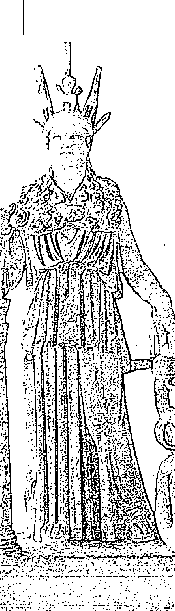

## 相关希腊神话：

奥德赛（Odysseus），伊塔克（Ithacus）岛的国王。他参加了希腊人对特洛伊的远征。特洛伊木马就是在他的指挥下建造起来的。在他回国的途中，为了自保，弄瞎了海神波塞冬的儿子巨人波吕斐摩斯（Polyphemus）的眼睛。从此受到了海神波塞冬的百般迫害。他历尽艰辛，20年后终于在众神的帮助下回到了自己的国家。

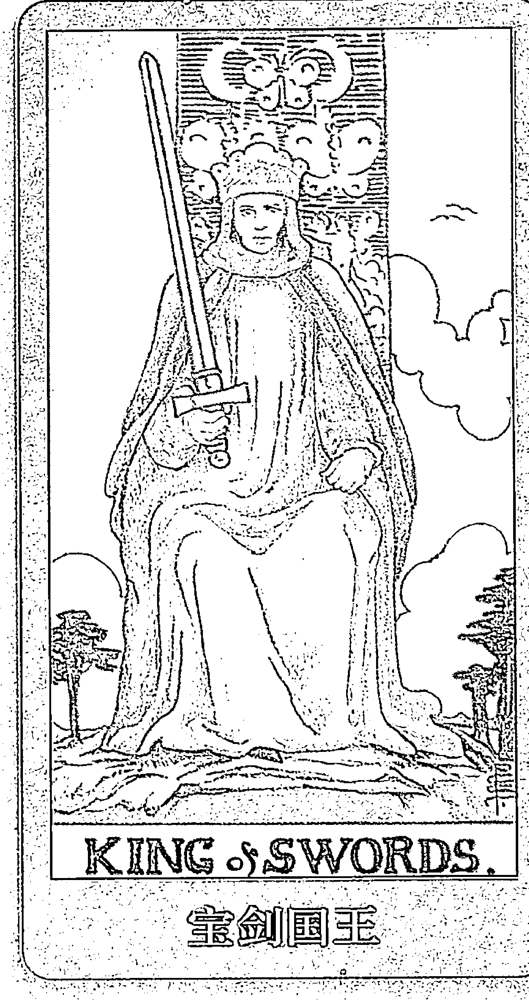

## 宝剑国王

**KING OF SWORDS**

**关键词**：聪明的、公正的、分析、伦理、清晰表明

**聪明的**：内心舒坦的；创造性地应用；迅速完整地把握信息；能干的；巧妙的；知识渊博的

**公正的**：做事诚实；富有洞察力的判断；理解并考虑事情的各个方面；不带任何感情色彩地看待问题；客观的

**分析**：看透迷雾，透过混乱；应用理智和逻辑的；在游戏和其他智力挑战方面有天赋的；善于分解复杂问题；善于辩论；迅速理解问题

**伦理**：道德精神上的领袖；激励高标准与高层次；与腐败和不诚实做斗争的；很有准则；原则地生活

**清晰表明**：擅长语言和有表达技巧的，能成功表达思想的；健谈者；常充当某一团体的代言人；条理清晰的作者和演讲家

## 图案解读：

国王内着白衣，外着红氅，手擎宝剑，剑锋斜指苍天，一副惟我独尊的气势。他的雷打不动的岿然之态，体现着他的老练与统治手腕的高明。另外，宝剑国王代表着一种专业的力量。

## 推测解读：

### 正放含义：

- 1. 有权威性，是某方面“帝皇”式的人物。
- 2. 有统率力，领导能力出众。
- 3. 很冷静且想像力丰富。
- 4. 在专业领域内如鱼得水。

### 倒放含义：

- 1. 生活中时常发生冲突，且常为自己意想不到。
- 2. 常遭不正常手段的打击。
- 3. 身边始终有群很残酷自私的男人。
- 4. 不专一，朝三暮四。

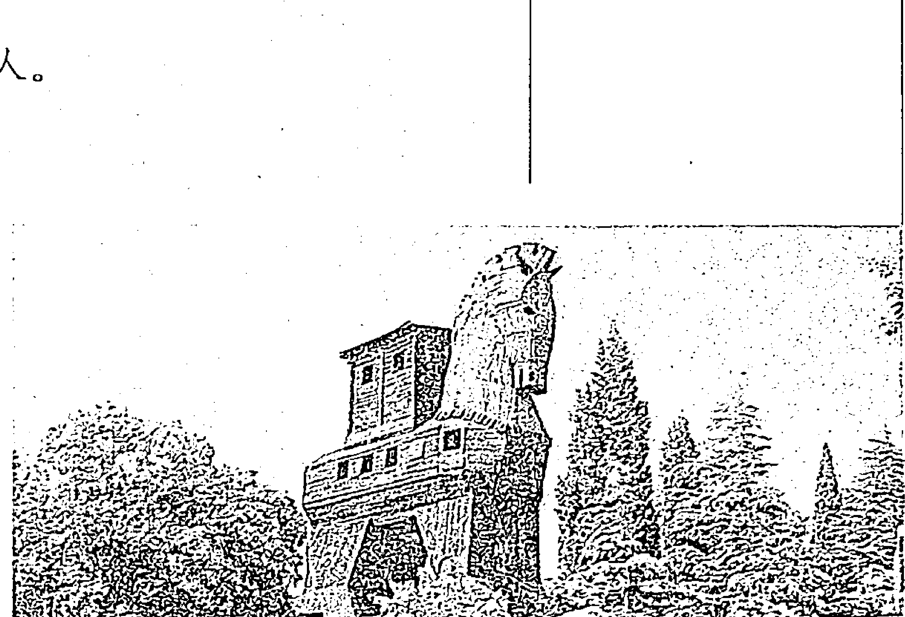

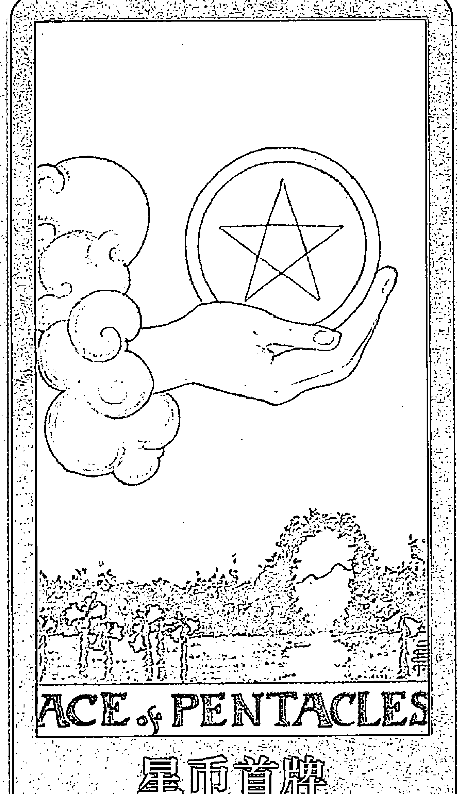

## 星币首牌

### ACE OF PENTACLES

**关键词**：物质力量、实用性、繁荣、信任

**物质力量**：看重具体结果；有现实作用；取得切实的成果；提高体质；变得和自然相关

**实用性**：运用常识；脚踏实地，实际的；立根于实际，着眼于现实；运用在手的工具

**繁荣**：有达到目的的工具和方法；欣喜于丰盛繁华；被吸引；使接近到所需要的东西；兴旺；看到努力有了回报；资产的增值，增长

### ◇首一首搭配：

首一首搭配表示你身体将有新的血液注入，它不但吸取了星币首牌的能量（繁荣，丰盛，信任，安全，脚踏实地），还加了以下能量中的一种：

- 权杖首牌：创造力，激动，冒险，勇气，个人魅力
- 圣杯首牌：深厚感情，亲昵，协调，怜悯，爱
- 宝剑首牌：智力，理智，公正，信任，仁慈，坚定

**信任**：相信别人的忠诚、信仰、承诺等；感到安全有保障的；有支持保障体系；知道形势稳定可靠；基地巩固

## 图案解读：

云端中伸出一只捧着金币的手，金币在这里代表人间最实际的东西，包括金钱、财富与身体等。下面是花草繁盛的庭园，园门外有逶迤的白色山峦，暗示着星币首牌不只有关物质，也可以延伸到精神层面。星币首牌既象征富足与安全，也象征着享乐与颓废。

## 推测解读：

当星币首牌出现时，通常代表一个有关金钱与物质的新计划，且前景光明。但这并不代表以后就衣食无虞，它只是提示你：想要的东西就在伸手可及之处。另外，星币首牌可以表示加薪、获利，以及肉体与精神上的满足和娱乐。

在感情推测上，星币首牌代表一段稳定且充满感官享受的关系，也可以表示感情的物化，如给对方送上一枚钻戒等。

### 正放含义：

- 1. 物质丰富的生活，同时，往往代表着精神生活欠乏。
- 2. 想得到的都得到了。
- 3. 获得利益，事事顺利，运气较佳。
- 4. 安泰的生活状态。

### 倒放含义：

- 1. 被强烈的欲望冲昏头脑，干一些自己冷静下来都认为不可理喻的事。
- 2. 奢侈的生活。
- 3. 因金钱导致声名狼藉。
- 4. 精神空虚，物质丰富。

## 相关希腊神话：

代达罗斯（Daedalus）出生在雅典的皇室，是一个优秀的工匠。

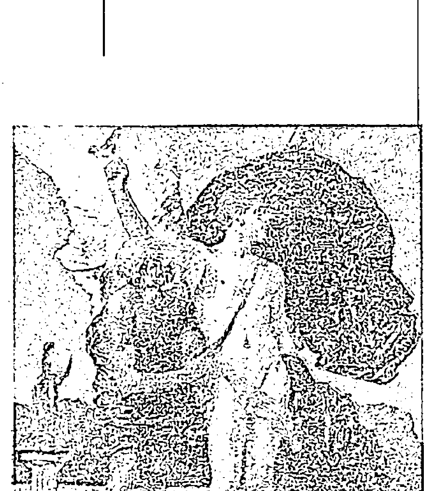

▷ 代达罗斯被困弥诺斯王宫时，为他的儿子伊卡洛斯做了一双翅膀使他飞出了宫殿

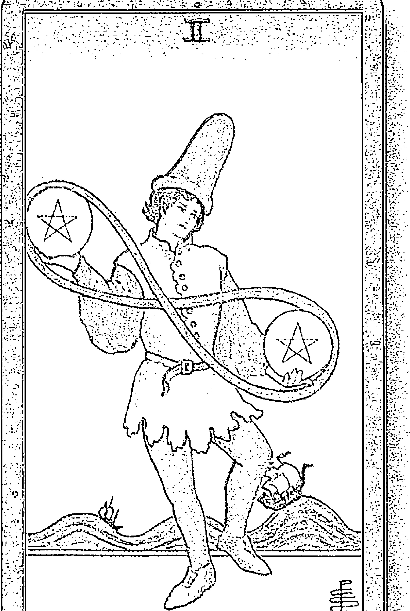

## 星币二

### TWO OF PENTACLES

### 关键词：协调、娱乐、机动

**协调**：保持平衡；应付各种需求；团结一致行动；确保顾及到方方面面；注重各方面的平等性

**娱乐**：做你爱做的；玩耍；觉得情绪很高的，愉快工作；看到形势中的诙谐幽默；反冲；交付

**机动**：快速适应；习惯于新方法或者新尝试；随波逐流；善于变通；看到可能性；对付挑战；易改变方向的

### 牌义对立或相近的牌

**◇对立牌：**

- 教 主：按程序办事的，习惯
- 权杖五：左右为难，处于十字路口，不能解决的
- 宝剑四：休息，安静，变化不大的
- 宝剑六：忧郁，情绪低落

**◇加强牌：**

- 节 制：平衡，发现最佳的混合搭配比例
- 权杖四：娱乐，激动，派对

## 图案解读：

一个颇似马戏团小丑般的男人，正在耍弄着两枚金币，金币外面环绕着“8”字形的带子。他后面的海面起伏剧烈，船只正在浪尖上行驶。单从男人杂耍的星币和起伏的海面来看，星币二表现的是一种动荡的生活状态。小处言之，是财务状况的波动；大处言之，是整个人生的潮起潮落。人的一生要应付许多状况，从画面上看，男人正在掂量两枚金币的重量，似在寻求一种应对方法。保持弹性，是星币二给人们的一个启示；面对人生的风浪，要像图中的男人那样从容应付。

## 推测解读：

星币二要求推测者面对各种事务，要八面玲珑，长袖善舞，不要死守某个思维定势。在财运的推测中，星币二预示收支平衡。如果你近来情绪低落，星币二则提示你应想得开，投入地娱乐一番。

### 正放含义：

- 1. 生活中总麻烦迭出，运气差到极点。
- 2. 旧的烦恼未了，新的烦恼又来，逼着你学会在逆境中生活。
- 3. 新的计划无法实现。
- 4. 生活混乱如麻，没头绪。

### 倒放含义：

- 1. 能投入地娱乐，能正确处理工作和生活的关系。
- 2. 用钱过度，越出计划。
- 3. 表面快乐，内心痛苦。

## 相关希腊神话：

代达罗斯是木工技艺、刨子、吊线和胶水等等的发明者。他不断地练习自己的技术，用新技术来制造东西。

▷ 代达罗斯将神的食物带给了人间，因此他也成了美食神。图中的酒瓶架被命名为“代达罗斯酒架”

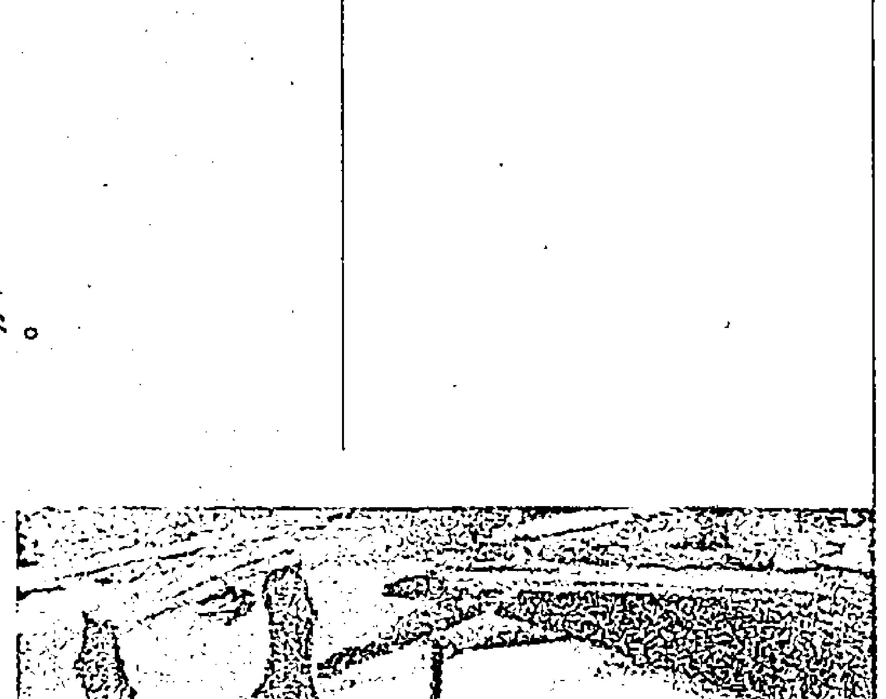

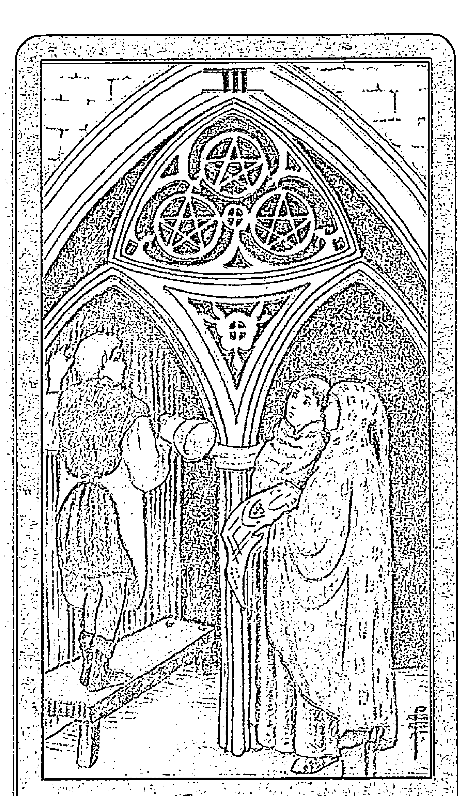

## 星币三

**THREE OF PENTACLES**

**关键词**：协力、能力、计划

- **协力**：协调；寻找所有需要因素；统一行动；一起做事；为集体做贡献；联合
- **能力**：完成任务；将某件计划执行得很好；实现你的目标；证实你的能力；做的比期望的要好；知道该做什么和怎么去做，胜任工作
- **计划**：按日程表行事；着手前深思熟虑的；考虑一切可能发生的问题；准备

### 牌义对立或相近的牌

**◇对立牌：**

- 权杖五：缺乏合作，无协调力的
- 权杖七：对立，纠纷
- 宝剑八：觉得难以胜任的，缺少指导
- 星币九：单独做的，不注重统一行动的

**◇加强牌：**

- 教 主：在某集体中工作
- 节 制：团结力量
- 权杖三：计划，为将来做准备
- 圣杯三：在团体中工作

## 图案解读：

一位雕刻师正在教堂里面辛勤工作，他的身旁站着一个修士和一个修女，正在给他出谋划策。从他们聚精会神的讨论，看来合作得很愉快。星币三经常代指团队工作。团队中每个人目标必须共同一致，不能谁想干什么就干什么，一定要先经过计划，并在实施过程中，要经过多次讨论。所以，星币三也经常代表沟通、协调。

从图中可看出，雕刻师已经雕刻出了一部分花纹，他的技艺已得到了修士和修女的赞赏，所以，星币三也代表因专业能力得到的赞扬与荣誉。

## 推测解读：

在感情推测上，星币三可能表示工作团队中培养起来的恋情；也可能暗示双双把重心都放在了金钱与地位上，而缺乏情感交流。

### 正放含义：

- 1. 业务熟练，有一流水准。
- 2. 有才能，超出一般人。
- 3. 完成了一件奋斗已久的大事。
- 4. 注重名声，有荣誉感。

### 倒放含义：

- 1. 水准不高，难让人满意。
- 2. 想法不成熟，难实施。
- 3. 有一定的物质损失。

## 相关希腊神话：

代达罗斯也是一个很有名声的建筑师和艺术家。

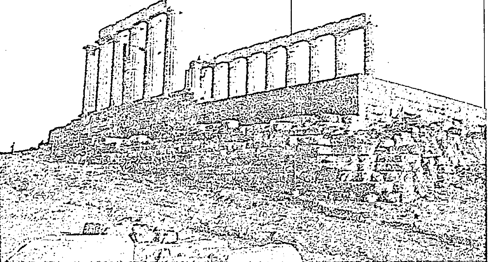

### 牌义对立或相近的牌

**◇对立牌：**

- 愚人：自发的，冲动的
- 皇后：不隐瞒的，开诚布公的，不客气的，大方的，浪费的
- 命运之轮：运动，快速改变
- 吊人：放手，不再努力去控制了

**◇加强牌：**

- 皇帝：控制，结构制度，秩序，命令
- 战车：控制
- 宝剑二：僵局，封锁，妨碍
- 星币十：喜欢当前地位或者形势，保存，保藏

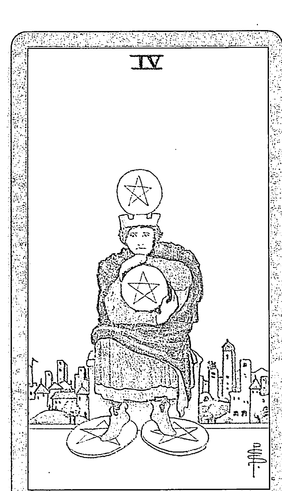

## 星币四

### FOUR OF PENTACLES

**关键词**：占有、封闭、控制

**占有**：保持你的拥有；得到你的那一份；获得某物；紧紧握住某人；贪婪；声明所有；节约储蓄，小气

**封闭**：保持当前地位或者形势不变；要求任何东西呆在原地；拒绝新的尝试；停滞；变萧条；阻止新的变化；安于现状；逆潮流的

**控制**：要求一切尽在掌握中；拒绝变衰弱；指令，指示；坚持自己的方式；指定规章限制；确立秩序

## 图案解读：

图中的男人，从衣着上看，地位显赫。他头顶一枚金币，脚踩两枚金币，怀抱一枚金币，他屁股下坐的箱子里，说不定还有多少枚金币。从表情上看，他很紧张，很明显，他怕失去任何一丁点财产。从物质上而言他是富有的，但他孤零零地远离于城堡里的人们之外，可以看出，在精神层面上，他是一贫如洗的。星币四经常代表物质生活上的充足与稳定，以及精神层面上的空虚。

## 推测解读：

星币四在实际推测中，往往代指“控制”，代表那些紧紧抓住物质资产不放的人（也包括精神层面上的东西）。若是情侣，会嫉妒心很重，爱吃醋；若是老板，肯定是处处克扣工资的小气鬼。

### 正放含义：

- 1. 吝啬鬼，多指有钱人一些可笑的节约措施。
- 2. 生活中精打细算，多指贫穷者。
- 3. 有遗产方面的问题，或预示某位亲属要亡故，而财产继承不会太顺利。
- 4. 追求物质财富很执著。

### 倒放含义：

- 1. 入不敷出，或坐吃山空。
- 2. 奢侈无度的人，生活开支没有计划性，缺自控能力。
- 3. 金钱运势很差。
- 4. 因物质欲望过度膨胀而导致失败。

## 相关希腊神话：

代达罗斯把手艺教给了塔罗斯（Talos），但是学生的手艺却超过了老师。于是代达罗斯很不高兴。

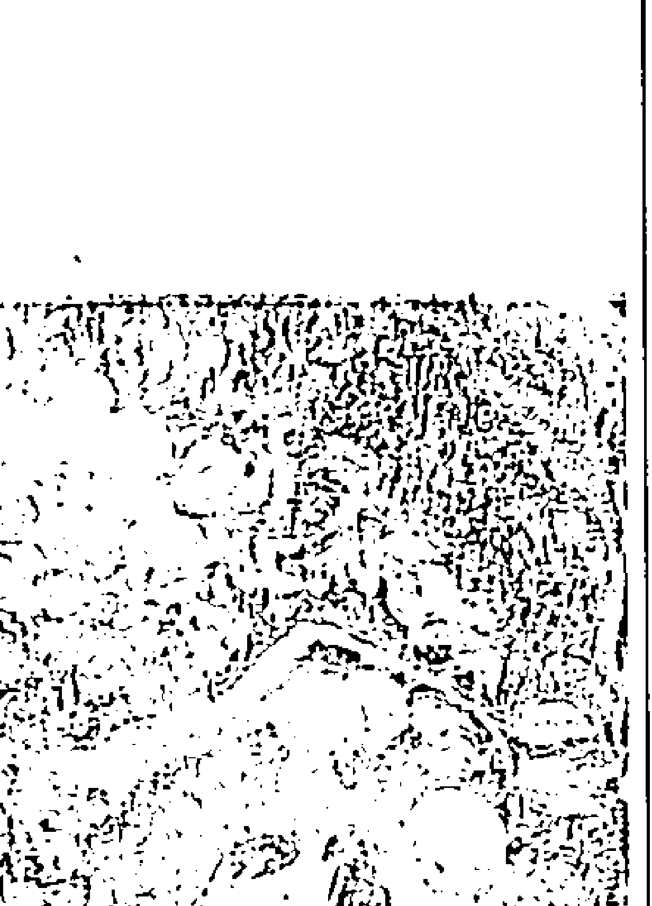

### 牌义对立或相近的牌

**◇对立牌：**

- 力 量：精力，毅力，持久力
- 节 制：好的体魄
- 太 阳：活力，强健的体格
- 宝剑六：喝彩，欢呼，认可
- 星币七：物质奖励，报酬

**◇加强牌：**

- 高 塔：艰苦岁月
- 权杖十：艰难时刻
- 圣杯五：拒绝，少支持，少赞同
- 宝剑三：拒绝，孤立，少支持

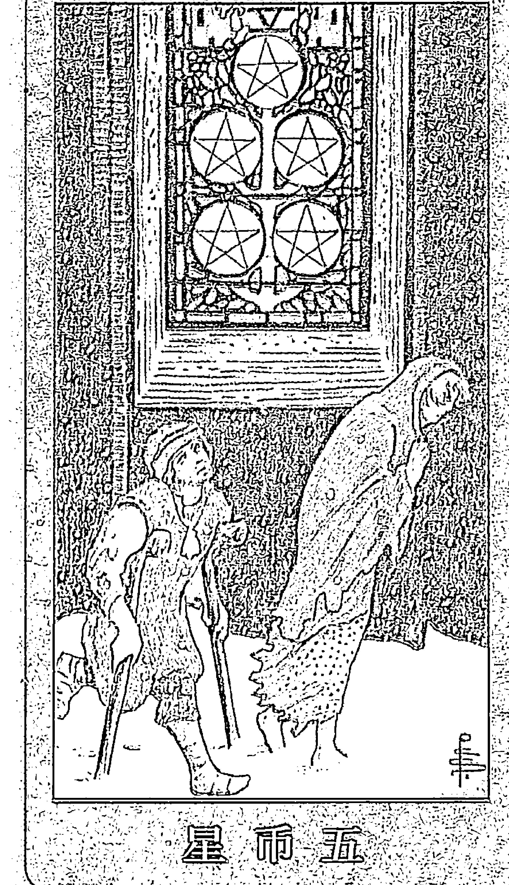

## 星币五

### FIVE OF PENTACLES

**关键词**：艰难时刻、拒绝、亚健康

**艰难时刻**：碰到实际困难，失业或者没有收入，觉得不安全的；通过一段艰苦岁月；缺少想要的

**拒绝**：缺少支持；持否定态度的；排斥；放逐；受冷遇的

**亚健康**：感觉疲惫，筋疲力尽的；不注意保养自己；忽视自己身体需要；需医护的；虐待自己

## 图案解读：

风雪交加中，一对衣衫褴褛的乞丐夫妻蹒跚而行，从象征物质与精神庇护的教堂前路过，却视而不见，径自远去。图中，拄着双拐的乞丐象征着疾病与困厄。此牌也象征着不渝的爱情，像图中处于贫困中依心心相印的爱侣，在冰天雪地中，给人以一丝温暖。

另外，教堂只有窗户没有门给人以无限深思。可由推测者根据自己的境况自由发挥联想。

## 相关希腊神话：

因为嫉妒学生的才能，代达罗斯杀死了塔罗斯。但他在雅典也无法生存下去了，他只得逃亡他处。

## 推测解读：

星币五出现，显示某方面有欠缺，可能是财务上需援助，可能是缺乏精神支持。同时，此牌也提醒你，珍惜你已经拥有的。

### 正放含义：

- 1. 有金钱方面的烦恼（物质上困乏，但精神上往往很充实）。
- 2. 放浪，玩世不恭，生活态度不端正。
- 3. 连续失败。
- 4. 失业。
- 5. 心灰意冷。

### 倒放含义：

- 1. 担心居住问题，或近来房产方面有麻烦。
- 2. 生活混乱无序，各种物质上的烦恼使你心神不宁。
- 3. 方方面面的关系较对立。
- 4. 想法荒唐，但耽于其中。

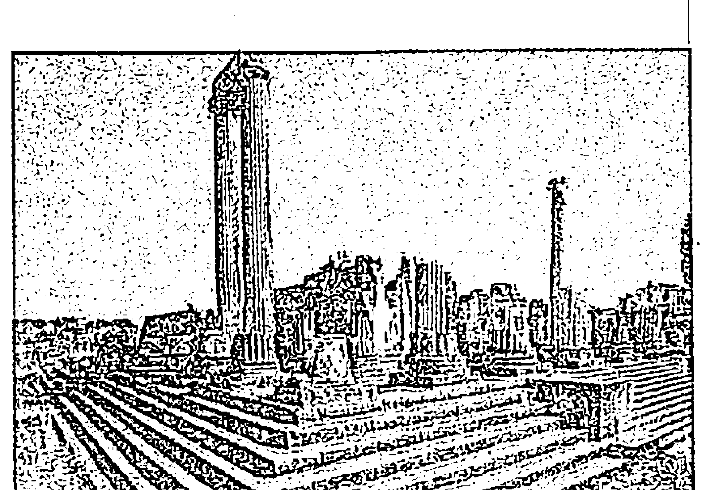

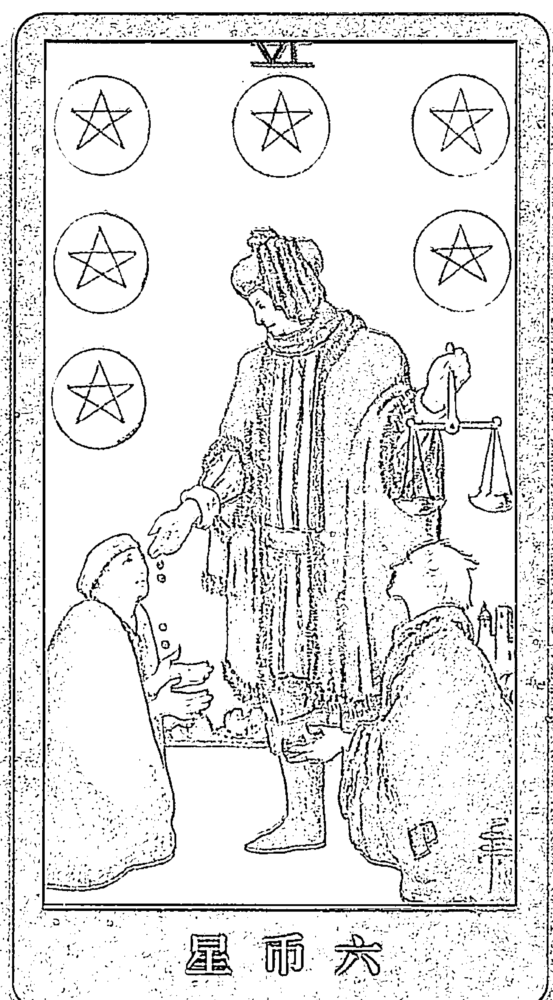

## 星币六

### SIX OF PENTACLES

**关键词**：有或没有能源、有或没有知识、有或没有力量

**有或没有能源**：给予或接受；照顾或被照顾；配备或被配备；支持或被支持；提供或收到酬劳；获得或没有获得所需

**有或没有知识**：教导、学习；传授、接收信息；成为、找寻顾问；提供、建议；展示、被套牢；获悉、不知秘密

**有或没有力量**：引领或跟随；控制或服从；权威或顺从；坚定或否定；强迫或被迫；滔滔不绝或倾听

### 牌义对立或相近的牌

星币六没有通常意义上的对立牌和加强牌，因为星币六既可以是正面的意思，也可以是反面的意思——有，或者没有。从整个牌阵的其他牌的阅读中，我们可以知道哪一面的意思是适合这一次推测的。以下是意义可能相近的牌：

- 皇后：丰富，安乐
- 世界：富裕，物质充足
- 权杖十：战争相持不下，艰难的时刻
- 星币五：贫乏，缺少
- 星币七：物质酬劳，获得
- 星币十：丰富，拥有

## 图案解读：

两个乞丐跪伏在商人模样的男子面前，在乞讨。男子右手在施舍，左手提着一柄象征平衡的天平。画面在辛酸中透出“幽默”，施舍需要讲究公平。——该给哪位多少，给太多，给太少，都不是恰当的援助。星币六除代表慈善外，也代表一种理财能力。

## 推测解读：

在推测中，星币六经常代表你将要得到需要的东西。如朋友久欠不还的债款，一件意义非凡的赠礼，甚至是遗产。当然，有时也代表着你将要捐献、馈赠，为别人付出。

有时，星币六也代表一方控制另一方。毕竟，施舍本身就是不平等的，往往意味着讲条件。理财方面的推测上，往往意味着收支平衡。同时星币六是一张正反意思皆可的牌，需要仔细辨认和考虑。

### 正放含义：

- 1. 懂得礼尚往来，人际关系圆通。
- 2. 与人为善，人缘极好。
- 3. 生活状况良好。
- 4. 胸怀宽广，坦荡。

### 倒放含义：

- 1. 自私自利，令人生厌。
- 2. 嫉妒心很强，心情时常处在恶劣状态。
- 3. 拥有很多不干净的钱。
- 4. 负债，或者在情义上欠别人的，不知报答。
- 5. 贪欲很重，为其操纵。

## 相关希腊神话：

代达罗斯逃到了克里特岛（Crete），投奔国王弥诺斯。弥诺斯收留了他。

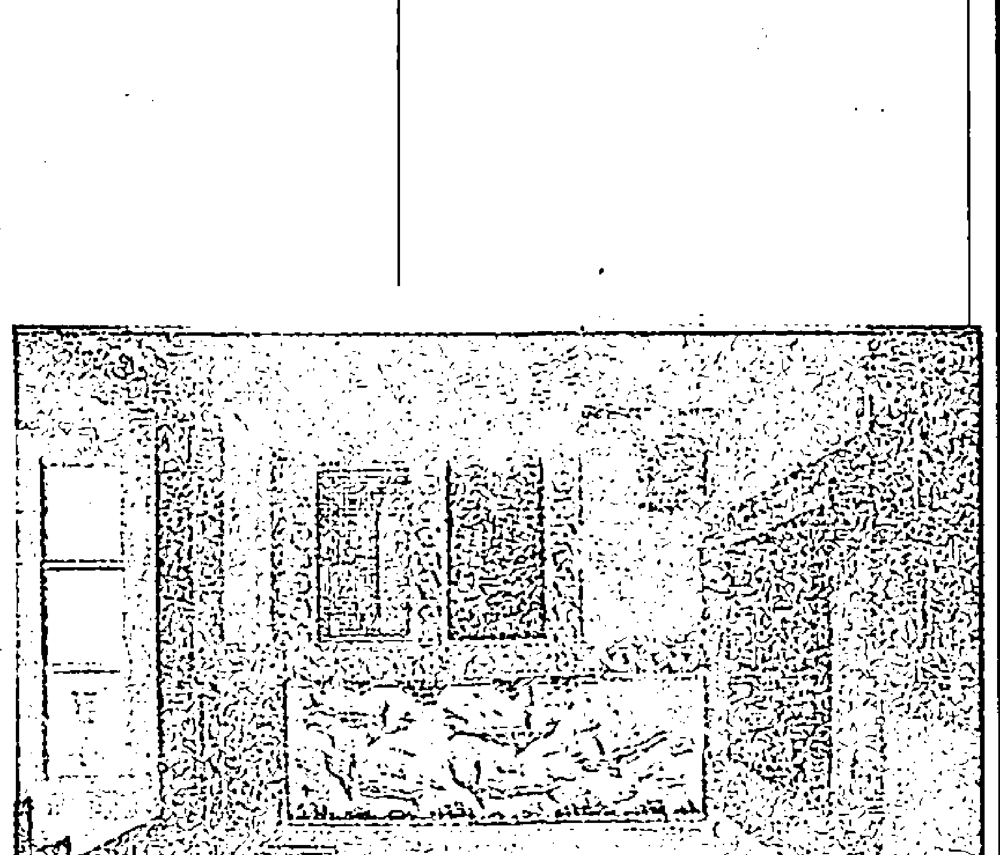

### 牌义对立或相近的牌

**◇对立牌：**

- 命运之轮：运动，行动，转折
- 权杖八：快速反应
- 星币五：无结果，无回报，艰难

**◇加强牌：**

- 皇 后：物质奖励，回报
- 正 义：确定自己所处位置，决定将来进程
- 审 判：关键点
- 宝剑四：休息，反复考虑

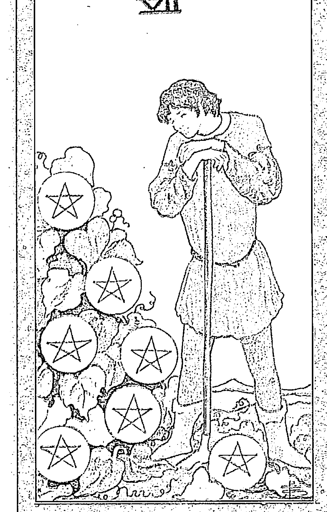

## 星币七

### SEVEN OF PENTACLES

**关键词**：评估、转变、回报

**评估**：衡量当前形势，对当前的进展做考虑；反省已做过的事，确定自己是否上路；确定自己所处位置或者阶段；清查存货

**转变**：考虑新的变化；考虑一种选择；开始新的战略；站在十字路口

**回报**：最终的结局；享受最初成果；得到投资的回报；获得报酬；抵达里程碑

## 图案解读：

星币七中的人物是一个劳动者的形象。他身边繁茂的藤叶象征他曾经付出了辛勤的劳动。藤叶上挂着七颗星币，象征着丰硕的劳动果实。他有些疲惫，但终于劳有所得，一切付出都是值得欣慰的。无论是这个劳动者，还是他脚下的土地，都是朴素的。但象征果实的那七颗星币却无比辉煌，这象征着，一份耕耘一份收获，只要付出努力，任何人，都有机会获得成功。从另一个角度看，劳动者站立在藤叶旁边，这些藤叶并不是耕作所得，而是妨碍耕作的杂草，需要去清理，劳动者仿佛在思考，我有能力把他清理干净吗？这些值得我去做吗？收获能抵偿付出的辛劳吗？清理掉杂草能得到星币吗？清理掉杂草会损失了星币吗？这一系列疑问引发人们对自己的生活进行思考。

## 推测解读：

星币七出现，显示某方面有欠缺，可能是财务上需援助，可能是缺乏精神支持。同时，此牌也提醒你，珍惜你已经拥有的。

### 正放含义：

- 1. 目的无法实现，需衡量问题的严重性。
- 2. 对事物进行仔细的评估。
- 3. 做了无用功。
- 4. 因辛勤劳作而获得成功。

### 倒放含义：

- 1. 付出了多余的努力或生产过剩了。
- 2. 无知，轻率地作出决定。
- 3. 毫无见识，愚蠢的投资。
- 4. 努力得不到回报。

## 相关希腊神话：

代达罗斯生活在克里特岛。当时弥诺斯因为触怒了海神波塞冬，波塞冬就让弥诺斯的妻子帕西淮（Pasiphae）和公牛在一起。帕西淮乞求代达罗斯能发明一种方法使她能和公牛交配。如果代达罗斯答应了帕西淮，那么他就背叛了弥诺斯，但因此会得到波塞冬的好处。于是他还是帮助了帕西淮。后来帕西淮生下了怪物弥诺陶洛斯。弥诺斯乞求代达罗斯建造一座迷宫，让弥诺陶洛斯住进了迷宫。

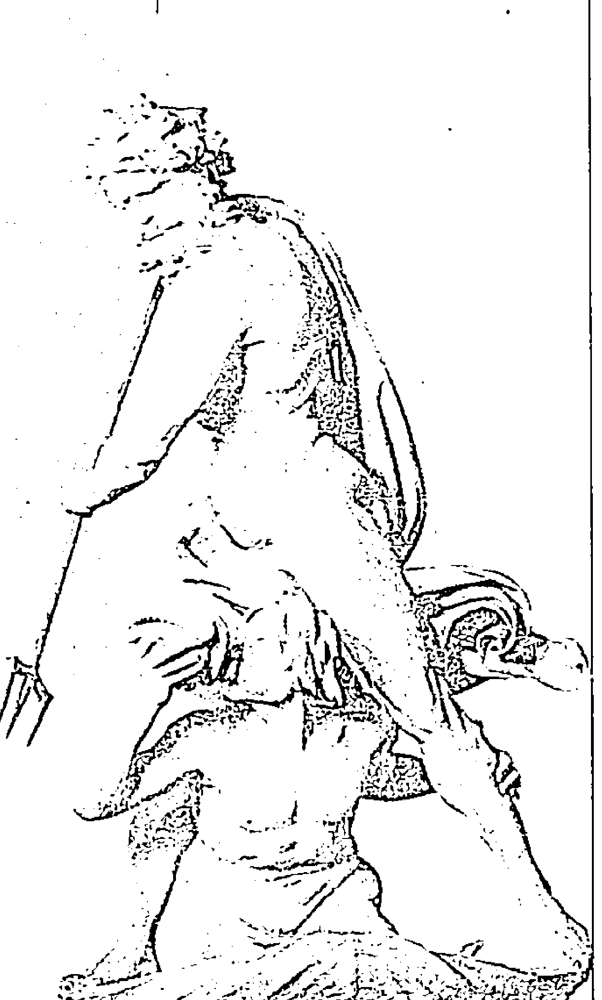

## 星币八
EIGHT OF PENTACLES

关键词：勤奋、细节、知识

勤奋：努力，全身心投入，全神贯注于某事。

细节：辛苦，辛勤；特别小心；有系统有规划地去完成某任务，检查再检查，核对再核对。

知识：选课，学习新方法新技能；接受培训；追求更深的理解，探索，研究；发现真相；增加专门技术。

## 图案解读：
图中的年轻人正专注地执锤雕刻星币，显然，他已经干了很长时间了，已经完成了7枚，第8枚眼看也要完成。年轻人为了能更专注于工作，搬离了背后远处的城镇，以便能更好地集中注意力。不难看出，星币八的要义是勤奋工作，注重细节。

## 推测解读：
星币八通常暗示推测者要集中精力去处理眼前的急切的事务。同时，此牌也鼓舞推测者付出百分之二百的汗水去从事感兴趣的事情。

## 正放含义：
- 进取心强，不甘于人后。
- 做事有条理。
- 在技术上精益求精。
- 在研究学习过程中。
- 会自我激励，经常用名人故事鞭策自己。

## 倒放含义：
- 无真本事，且虚荣得很。
- 放高利贷，泛指为谋取利益不择手段。
- 本事用不到正经地方。
- 野心遭受挫折。

## 相关希腊神话：
代达罗斯赠送给弥诺斯的女儿阿里阿德涅（Ariadne）一个线团。后来阿里阿德涅爱上了被当做祭品送来的忒修斯。她把线团送给了忒修斯。忒修斯杀死了弥诺陶洛斯，走出了迷宫。于是弥诺斯把代达罗斯关进了迷宫。代达罗斯就制作了一对翅膀，飞了出去，飞到了西西里（Sicily）的宫殿中。

## 星币九
NINE OF PENTACLES

### 关键词：纪律、精美、自立

纪律：自我控制，显示约束力；支配；控制自己的冲动；坚持计划；按部就班。

精美：令人舒适的生活方式；不粗鄙；不难吃的；不令人讨厌的；圆滑的；老道的；享受生活中的美好事物；休闲。

自立：独自应付当前形势；依靠自有资源；一个人做的，不求助于人的；确信自己的方法是最佳的。

### 牌义对立或相近的牌

◇对立牌：
- 皇后：粗俗，淫荡，好色，感觉性。
- 圣杯七：无纪律的，放任自流的。
- 星币三：与团队一起工作的。

◇加强牌：
- 战车：自我控制，纪律约束。
- 宝剑七：依靠自己。

### 图案解读：
一位悠闲的妇人在自己的花园里散步，气质贤淑，温文尔雅，垂着的右手下是几枚叠放着的金币，象征着一切物质层面的东西。稍显突兀的是，她左手背上立着一只听命于她的猎鹰。猎鹰是生活中一切黑暗粗鲁东西的象征。表明妇人已经成功地控制住了生活，不再为冲动和欲望所动。

### 推测解读：
星币九在推测中含义丰富。有时是纪律和自控的象征，有时暗示推测者放弃一切尘世中低俗下流不文明的东西，有所节制。此牌正放和倒放差别较大。

### 正放含义：
- 有一定眼光，懂得选择，为人激赏。
- 知蓄财的必要，生活中精打细算，但不吝啬。
- 能持续不断地为自己创造有利条件，是个实践家，讨厌一切“口头主义”者。
- 取得一定的成就。
- 知道最安全的行事方式。

### 倒放含义：
- 不守信用，为人厌恶，一时改不掉，习惯成自然。
- 计划中止，前功尽弃。
- 没有管理能力。
- 因失去信用而失去财产。
- 失窃。

### 相关希腊神话：
西西里国王科卡罗斯（Cocalus）收留了代达罗斯在他那里工作。代达罗斯的工作表现很出色，受到信任，他也感到很满足。

### 牌义对立或相近的牌

◇对立牌：
- 权杖二：原创，不因循守旧。
- 权杖三：探险，进入未知区域。
- 星币五：艰难时刻，物质匮乏。

◇加强牌：
- 皇后：奢侈，物质上的舒适，富裕。
- 教主：遵守，保守。
- 情侣：持久的联盟，家庭关系。
- 世界：富足，物质上的满足。
- 星币四：安于现状，保守的。

## 星币十
TEN OF PENTACLES

关键词：富裕、惯例、持久

富裕：物质上的丰富，金钱不成问题的；享受商业上的成功；财政上的安全感；有大笔钱。

惯例：固守陈规；按规章制度办事；遵守传统的；成为制度协议的一部分；保守的；相信经验；继续以前模式。

持久：寻求能持久的策略，建立可以持久的基础；安于现状；有序的家庭生活；不再持权宜之计；明确计划的。

### 图案解读：
画面上是一个温馨祥和的家庭。老人舒适地坐于屋中，两只象征家庭和睦的狗围绕在他身前；门外站着儿子和儿媳，小孙子调皮地抚着一只狗的尾巴。金币在画面上错列成形，组成生命之树的符号。星币十描述的是一个财务基础稳固的家庭，其中世代传承的意味很浓，老人经过一生奋斗，创造了可观的财富，使儿孙们衣食无忧。星币十也可代表企业（家族性）等以金钱与成功为目标的团体，甚或政府机构，或指一些成功的事业伙伴。

### 推测解读：
情爱方面的推测，星币十可能显示双方在事业上是契合的伙伴，但同时暗示缺乏情感交流，或不重视这方面的沟通。另外，也可代表掺杂了其他物质因素的婚姻。

### 正放含义：
- 亲人渐入暮年，意味着遗产在一步一步向你靠近。
- 传统家庭，子承父业，维持一定用度。
- 家境很好，物质丰富，儿孙满堂，妻贤子孝。
- 团体事业运作态势良好。

### 倒放含义：
- 团体中某种程度的不和即将出现，而症结所在经常是金钱。
- 投资合伙宜暂缓，理财财务必谨慎。
- 失去遗产。
- 与亲人对立，家庭陷入不和。
- 失窃，或其他方面有一定损失。
- 偏护自己的家人，有失公平。

### 相关希腊神话：
代达罗斯在西西里过着快乐而富裕的生活。

▶ 黄金时代是神创造的第一代人

## 星币侍从
PAGE OF PENTACLES

**关键词：起作用、繁荣、实践 / 实际、信任**

**起作用：** 实践计划，实现你的梦想，取得实际成果。

**繁荣：** 获得想要的；增长；膨胀；去获取成功；变得安全；寻求丰盛富足；致富。

**实践/实际：** 做现实的尝试；找到可行方法；不再做白日梦；运用常识；利用现成的；关注有效的东西。

**信任：** 相信某人；证明自己值得依靠；适应（相信）不确定性；重塑信用；跟你的队友站在一起；守信的。

**相关希腊神话：**
农业之神特里普托勒摩斯（Triptolemus），是厄琉西斯（Eleusis）的国王刻勒俄斯（Celeus）的儿子。冥王哈德斯（Hades）抢走大地之母得摩忒耳（Demeter）的女儿珀耳塞福涅（Persephone）去做冥后的时候，特里普托勒摩斯给得摩忒耳指示了方向，于是得摩忒耳给了他玉米籽、农具及农业技术。特里普托勒摩斯乘坐着得摩忒耳赐给的有巨蟒曳引的飞车走遍天下，到处传播农业技术。

### 图案解读：
星币侍从绿色的衣衫象征着自然科学及其旺盛的生命力。他的头上没有戴桂冠，而是戴着厚重的红色的帽子，这象征着他可能不是一个战胜者，不是一个领导者，但他是一个学者，有智慧，有热情，有创意，并且成熟稳健。他脚下繁茂的草原象征丰富的知识和充实的未来。

### 推测解读：

### 正放含义：
- 学习态度端正。
- 热心积极地投身于研究工作。
- 求知欲旺盛，头脑优秀。
- 与知识或者研究工作有关的好消息。

### 倒放含义：
- 挥霍、浪费金钱。
- 知识贫乏，认识不够全面深刻。
- 视野狭窄。
- 精力充沛。
- 自食恶果。

## 星币骑士
KNIGHT OF PENTACLES

关键词：坚定／顽固、现实的／悲观的、谨慎的／不冒险的、工作努力的／折磨人的、彻底／强迫

坚定／顽固：顽强地追求目标；死脑筋的，固执的；绝不放弃的；钻进死胡同不肯出来的，钻牛角尖；坚定立场，认死理的；坚持原来选择，拒绝听道理的。

现实的／悲观的：愿意面对现实的；对自己的错误耿耿于怀；面对真相的；认为别人是在做梦的；不为虚假的希望所诱的；只看到漏洞没有看到成果；正确估计形势；持消极的、令人沮丧的观点；预测困难在增加；刚开始就对计划持悲观态度。

谨慎的 / 不冒险的：核对再核对；太保守；预先检查每个角落；坐失良机；小心而缓慢地进行；不愿意尝试新方法；偏好安全和熟悉的路子；从安全考虑出发，宁愿少点收获。

工作努力的 / 折磨人的：献身，致力于某任务，过分专注；刻苦，勤勉，严酷，无幽默感的；做两个人那么多的，看待休息为浪费的；精力旺盛地处理任何事情，弄得筋疲力尽的；不倦的，不松弛的，忘记生活还得有娱乐。

彻底 / 强迫：关注每一个细节，不知道什么时候得放弃的；小心翼翼的，吹毛求疵的，过分挑剔的；不让工作只干一半就不管的；不许打折扣的，强制的；辛苦的，要求完美的。

### 相关希腊神话：
畜牧之神阿里斯泰俄斯（Aristaeus），他是阿波罗和神女库瑞涅的儿子，是使庄稼免遭干旱和冰雹的保护者，是迷路行人的救星，他是牧人的庇护者。他还教人们种植葡萄、油橄榄的方法，传授养蜂技术等等。

### 图案解读：
星币骑士身姿稳健地骑坐于一匹黑马之上，左手紧握缰绳，右手平稳地托起一颗星币，神色坚定，是那么可值得信赖。他是一位前途光明的有为青年。他戴着头盔，披挂着铠甲，外表冷静，卓尔不凡，甚至严肃得有些古板。但那身红色的铠甲说明了他坚硬的外表下火热的另一面，必要的时候，可也是会爆发的呢！

### 推测解读：

### 正放含义：
- 讲究效率，有能力的组织者。
- 了解现实状况，稳扎稳打的实干家。
- 有责任感，值得信任和依靠的人。
- 家庭的保护者。
- 观念有点保守的人，一个保守派。

### 倒放含义：
- 懈怠，不振作的态度面对工作或人生。
- 思想过分保守，顽固分子。
- 处事随性，对事物产生的热情很快冷却。
- 发展停滞不前。

## 星币王后
QUEEN OF PENTACLES

关键词：养育、机智、慷慨宽大的、可信赖的、实际的

养育：给予爱和支持，创造一个温暖安全的环境；让人觉得更好；有特殊园艺才能；很有方法和小孩及动物呆在一起的。

机智：对任何手中的东西能找到用途；敏捷的，多才多艺的；总能给出别人想要的。

慷慨宽大的：愿意提供任何帮助；容易上当的人；好客的；无条件地大量地给予；有雅量地，温和的，不自私的。

可信赖的：保持信任和秘密的；坚定的；忠实的；守信的。

实际的：处理实际问题，不带感情色彩的。

### 相关希腊神话：
翁法勒（Omphale），吕狄亚（Lydia）的女王，吕狄亚的特摩罗斯河河神特摩罗斯（Tmolus）的遗孀。宙斯之子，英雄人物赫拉克勒斯（Heracles）因突然地丧失理智误杀了俄卡利亚国王欧律托斯的儿子伊菲托斯，于是被罚给翁法勒当奴隶三年。他们相互钟情，结为夫妇。赫拉克勒斯为了翁法勒放弃了男性的尊严，男扮女装操持家务。而翁法勒则手持狼牙棒，身披英雄的狮皮。翁法勒是庇护妇女的女神。

### 图案解读：
星币王后是非常热烈丰富而生机盎然的牌，她几乎集结了星币组牌所有的积极因素。星币王后被鲜花围绕着，草地上枝叶茂盛，布满红色的果实，有小兔子在旁边奔跑，油然似乎闻到春暖花开的香气，一派宁静祥和。星币王后以温柔的姿势坐在自己的宝座上，慈祥地看着手中的星币以及周围的一草一木。白色的内衣代表她的纯洁，红色的长袍代表热情、好客、慈爱和母性。凤冠下长长的绿色披巾代表她蕴涵的能力。端详星币王后的容颜，仿佛感到她在引领我们和她一样地在思考，一样地在感触，“你能感受到温暖吗？你对别人有同情心吗？你是不是很明智？你守信了吗？你有雅量吗？当处境艰难时你值得依靠吗？”在这样的自省中，我们的恐惧被抚平，困难变得轻微。

### 推测解读：
正如前所说，星币王后是无限温暖的一张牌，当我们看到这张牌的时候，王后的能量已经辐射到我们身上，不管她是以何种身份出现在我们生活中，我们都将被激励，被帮助！

### 正放含义：
- 自立而成熟的女性。
- 母爱般温暖包容，值得依靠和信赖的人。
- 温柔而善解人意的人。
- 坚定而有气度的人或行为。
- 温暖，信任，安宁的氛围。
- 好客、乐于助人。
- 富裕而繁荣的生活。

### 倒放含义：
- 爱慕虚荣，生活浮华。
- 对人态度恶劣不够友善。
- 铺张浪费的行为。
- 内心冷淡不可信任的人。

## 星币国王
KING OF PENTACLES

关键词：事业 / 进取、支持、熟练、坚定、可靠

事业 / 进取：冒险成功的；任何地方都能找到机会；敛财；有想法并付诸实际；天生的经纪人，商人；有Midas（希腊神话中爱财并能点石成金的国王）那样的触觉。

支 持：鼓励别人去完成；随时准备帮助的；慈善家；慷慨地给出时间和关照；项目活动的赞助者。

熟 练：对实际问题很有经验的，见多识广的；有多种天赋的才能；反应很快的；手巧的；能应对任何情况的。

坚 定：坚定决心去解决某既定问题的；心态和行动都不动摇的；有规律地习惯活动；始终平静一致地尝试；稳定作用。

可 靠：兑现所有的承诺；承担责任；独立的；可靠的；在危难中可以指望的。

### 相关希腊神话：
佛律葵亚的国王弥达斯（Midas），以财富著称。因为他释放了精灵西勒诺斯（Silenus），西勒诺斯是一个经常喝醉酒的心地善良的老人，但他不能自己走动。他是狄俄尼索斯的养育者和教师。弥达斯把西勒诺斯交还给了狄俄尼索斯（Dionysos）。狄俄尼索斯许诺有求必应。于是弥达斯如愿以偿得到了点金术。但是他接触的食物都变成了金子，他即将饿死，只好再度求助于狄俄尼索斯。狄俄尼索斯要他在帕克托罗斯（Pactolus）泉水中洗澡。所以后来帕克托罗斯泉水中便含有许多金沙。

### 图案解读：
星币国王是一个成功的统治者。他充满自信地坐在自己的宝座上，一切都在他掌控之中，他很放心。绿色的藤蔓铺满他的周围还有身上，结满了象征智慧的果实，代表在他的统治之下，人们过着幸福而富裕的生活。他头上戴的，既有象征胜利的月桂树叶子的花环，又有象征权力的金色王冠，上面镶嵌着的红色花朵代表智慧和潜能。

### 推测解读：

### 正放含义：
- 有身份有地位的成功人士。
- 有营销手腕的商业人才。
- 学识丰富的人。
- 适宜投资。
- 值得信赖的人，或彼此相互信赖。
- 预示着能够达成理想，或代表一个能够达成理想的人。

### 倒放含义：
- 缺乏经济头脑的人或做法。
- 行为卑鄙。
- 两个人关系危险，也许会导致不良后果。
- 对别人不信赖的态度。

## 中篇附录愚人之旅

愚人之旅暗喻着人生的旅程。每一张大阿卡那牌代表人生的一个阶段，它也是一种经验，将其规整，便能认识到全部。这22种描述是建立在每一张大阿卡那牌的关键词基础之上的。

### 愚人（The Fool）
我们从愚人（0）开始，“开始者”牌。愚人表示开始人生之旅的我们每个人。之所以被称为愚人，是因为他有一颗单纯的心，对充满灾难痛苦的人生旅程抱有天真单纯的态度。

在旅程的起点，愚人是个新生儿——没有经验、开放而且是自发的。0牌上的图形中，他的手臂大张着，头昂得高高的。他时刻准备迎接朝他涌来的任何东西，但是他也忘了他是在要跨越的悬崖边。愚人没有意识到在他开始人生之旅、学习经验的过程中要遇到的困难。

愚人多少和大阿卡那的其他牌不同，0是一个不寻常的数字。它处于整个数字体系的正中央——是阴阳的平衡点。从一出生开始，愚人就被置于他自身世界的中心。很奇怪，他是中空的（正如数字0），但是充满对前进和学习的渴望。

### 魔术师、女教主（The Magician, The High Priestess）
刚出发，愚人就遇到了魔术师（1）和女教主（2）——他们是组成感知世界中最重要的平衡力量。它是物质世界的表现，只要我们定义了一些经验方面的特征，就能自动激活它的对立面。

魔术师处于积极面，他表示积极的、有创造性的男性魄力。同时，他也有自我意识。魔术师表示一种力量，这种力量通过个人意志的控制力和力量，使我们能影响世界。女教主处于消极面，她表示一种神秘的智慧，并提供了滋生事端的土壤。女教主是我们没有意识到的潜在力量，等待获得某种机会得到某种提示。

积极的和消极的并不是指“好”和“坏”。人为的这些区分在塔罗牌中并不适用。魔术师和女教主在价值和重要性方面绝对是平等的。任何一个都是为了平衡的需要。我们也许会认为消极的是阴影，但是没有阴影，我们就看不到阳光，正如没有潜在的土壤，就不能创造。

### 皇后（The Empress）
愚人在成长过程中，开始越来越能感知他的环境。像许多婴儿一样，他首先认识的就是他的母亲——一个温暖、充满爱心的女人，哺育和照顾着他。他同时也慢慢知道地球母亲，在很大程度上，是地球母亲养育了他。

皇后（3）代表自然和感情。婴儿在他探索世界的过程中，对他所接触的、品尝的和闻到的东西都很有兴趣。他得不到足够的视觉和听觉来迷惑他的感知。地球母亲丰富的物产供养着我们，心情愉悦是很自然的事。

### 皇帝（The Emperor）
愚人碰到的后面一个人是父亲，也就是皇帝（4）。他代表自我控制和领导权。当婴儿离开母亲的怀抱，他就要学习他的世界里的样品。可以预测到，目标是可以被探索的。儿童在发现规则的过程中能得到一种新的乐趣。

愚人同时也会遇到规则。他认识到，他的意愿并不总是最重要的，还有一些行为对于他的安康来说也是必须的。一些掌权的人执行这样的规则。这些限制令人灰心失望，但是通过父亲的循循善诱，愚人开始懂得他们的意图。

### 教主 (The Hierophant)

愚人最终走出家门，来到更广阔的世界。他能轻易接受文化中的信仰和规则，并开始他的正规教育。教主(5)代表整合的信仰系统，它环绕并影响着成长中的孩童。
教主是解释阿卡那知识和神秘教义的人。在此牌图画上，我们能看到两个虔诚祈祷的侍僧的宗教图案，也许他正在引导他们成为圣徒。而且，这幅图是有宗教含义的，它实际上是各种先知的象征。
孩童在他所身处的社会中接受训练，并逐渐形成某种特定的文化观和世界观。他学会区别群体，寻找归属感。他乐于学习他所处社会的规则，并表现出他能很好地遵守这些规则。

### 情侣 (The Lovers)

接着，愚人面临两个新的挑战。他感受到来自另一种性别的强烈吸引力。以前，他基本上是以自我为中心的，但现在他开始感觉到平衡的趋势了，正如情侣牌(6)中所绘，他逐渐成为情侣中的一方。他也渴望这样的关系。
愚人的决定同样也受他自身信仰的影响。在他学习成长过程中，他总能很好地遵循信仰，但是在某些时候，如果他认为自己是正确的，他会按自身的价值观做出决定。此时，他开始对自己所接受的意见产生置疑。

### 战车 (The Chariot)

到此时为止，愚人已经是成年人了，他有强劲的鉴别力和自我控制能力。通过纪律和意志力，他的自我约束能力大大提高了，这也使其在现实世界里极易取得成功。
战车牌(7)代表愚人事业上的成功以及自信、野心。在牌7中，我们看到一个自傲的、居高临下的战车图案胜利地驰骋而行。他能有形地控制他和他所拥有的一切。愚人对他希望得到的成功太过自信，并有一些自我满足。通常战车牌代表有自信的青年。

### 力量 (Strength)

一直以来，愚人要面临生活中各种新的挑战，有些挑战会带来痛苦和梦想的破灭。所以很多时候，他要有力量(8)面对挑战。在这个过程中，他要有勇气解决困难，即使遇到挫折也能不断前行。
愚人同时也会逐渐发展耐心和忍耐的良好品质。他意识到，像战车一样强迫命令的方式应该与更文雅友善的方式相协调。有时，激烈的感情不能浮现在表面上，尤其是，当愚人认为他拥有一切时，他更应该学会控制自己。

### 隐士 (The Hermit)

迟早有一天，愚人会自问那个古老的问题“为什么”。他开始自己寻求答案，并不是仅仅因为好奇心使然，而是他发自内心地想知道，如果人们只是为了受苦受难，最终死亡，那为什么还要活下去。隐士(9)代表寻求更深层真理的必要性。
愚人开始沉思，力图明白他的感情和动机。世俗的世界对他吸引力不大，他开始远离社会丰富多彩的活动，寻找片刻的孤独。某时，他也许能遇到一位老师或者引路人，并给他一些建议，指点方向。

### 命运之轮 (Wheel of Fortune)

经过许多次精神探索后，愚人开始意识到所有的事物是如何联系的。他对世界上丰富的设计、错综复杂的东西以及轮回都有自己的看法。命运之轮(10)是神秘世界的象征，它的每一部分都在协调地运转。当愚人瞥见世界的美丽和井然有序，也许只是冰山一角，但如此执著下去他就会找到一直苦苦追索的答案。
有时候，愚人的经历似乎是命运的安排。一个机会或者不可思议的事情都会导致命运的转变。愚人也许会认为他的命运是一系列事情的结果，每一件事都将他推向转折点。他感到孤独的时候，会准备改变，并且重新行动。他的视野更宽广，并且他把自己置身于一个更伟大的计划中。他的目的性又得到了恢复。

### 正义 (Justice)

愚人现在必须决定这些看到的东西对他个人来说，意味着什么。他回首过去的人生路，追溯使其达到某一点的因果关系。他对自己过去的行为负责任，修正错误，从而使未来能沿着更好的方向前进。正义(11)是必需的，也为未来扫清了道路。
对于愚人来说，是做决定的时候了。他正在做重要的选择。他是愿意保持正确的观点，还是回到一个更简单，与未来发展联系也不够紧密的道路上去呢？

### 吊人 (The Hanged Man)

事实上，愚人勇敢地前行了。他决心实现自己的梦想，但是他也意识到生活并不是那么简单，风平浪静。迟早有一天，他要面临十字路口——这似乎是让人难以忍受的一种经验。这个过大的挑战挫伤了他的信心，直到他别无选择，只能放弃，任其发展。
首先，愚人感觉到的是挫败感和失落感。他认为自己牺牲了一切，但是到头来学到的只是一个令人惊异的事实。他发现当他放弃了试图控制其的努力时，所有的事情会按照它本来的面目照常运行。因为心态开放，易于受到攻击，愚人发现来自自身内部不可思议的支撑力量。他开始学会向一些经验妥协，而不是和它们抗争到底。他感觉到一种奇怪的愉悦，于是开始随波逐流。
愚人在很长时间里感到浮躁，缺乏紧迫感和压力。事实上，他的世界已经开始变得上下波动，不稳定。愚人就像吊人(12)，表面上受着折磨，但实际上内心是平静安详的。

### 死神 (Death)

愚人现在开始消除一些旧习惯和易于疲劳的方式。他省去了不重要的东西，因为他要享受基本生活。当他把生活中那些年久丧失的生活习惯抛诸脑后的时候，他就在慢慢走向结束。这个过程看起来似乎是奄奄一息的，他的家庭的死亡也促使了一个新生命的成长。有时候，这个无情的改变对愚人来说，似乎是致命的，但是最终他会进一步认识到死亡(13)并不是永恒的状态。它只是生活一种新的、更具可行性的转变方式。

### 节制 (The Temperance)

自从信奉了隐士的话，愚人在情绪世界里大幅度地来回摆动。现在，他意识到节制(14)的重要性，带来平衡、协调，加强稳定性。他发现了真正的平衡和平等。在经历了一些极端状态后，他更欣赏理智。愚人把自身的方方面面都结合为一个中心，更好地保持健康的精神状态。牌14上的天使与战车(牌7)上强大严格的统治者相比，哪个更优雅柔和呢？愚人经历了一个漫长的过程，才意识到了协调和睦的生活。

### 魔鬼 (The Devil)

愚人现在拥有健康的体魄、平静的心态、优雅冷静的性格。他还需要什么呢？愚人应该勇敢，继续不断追求人格方面更高的层次。他很快就要与魔鬼(15)短兵相接了。
魔鬼不是某一种邪恶的东西，离我们也并不遥远。他是无知和绝望的综合体，我们每个人某种程度上都存在。物质世界的诱惑对我们的吸引力如此之大，以至于我们经常甚至没有意识到自己是它的奴隶。
我们的经验是有限的，没有意识到显赫的世界才是我们真正的传统。牌15中的一对被锁在一起，但是双方都默认了。他们易于使自己获得自由，但是并不明白他们是相互束缚着的。他们看起来像情侣，但都没有认识到，他们的爱情被局限在一个很狭小的范围内。这种无知的代价是绝望的本质所在。

### 高塔 (The Tower)

愚人怎样才能让自己从魔鬼利爪中解脱出来？他能运用自身的影响力吗？愚人也许在某个偶然的机会中能获得解放，这就是高塔(16)所代表的含义。高塔是我们每个人内心深处的自我城堡。城堡灰暗、寒冷而且坚固，似乎能保护我们，但实际上是禁锢自我的监狱。
有时候，仅仅是一次非常事件就能产生巨大的能量，摧毁高塔。在牌16上，我们能够看到有一束强光照在高塔上，它直射到塔中的居住者，他摇摇欲坠，似乎马上就要死了。王冠暗示他们曾为自己是统治者感到骄傲，现在在一种更强大的力量面前，他们很卑微。
愚人如果要解放自己，就需要类似于这样的一次剧烈的变动，但是结果证明此次痛苦的经历是值得的。绝望中的黑暗瞬间消失，真理之光照耀着人们。

### 星辰(The Star)

愚人内心充满了平静。星辰(17)上的美丽景象证明了这种宁静。牌17上的女人是裸体的，她的灵魂不再有任何掩饰。星辰在万里无云的天空闪耀，就像希望和灵感的灯塔。
愚人虔诚地祈祷着，信任完全取代了魔鬼消极的力量。他自信，对未来充满信心。他的内心充满了感激，惟一的愿望就是希望能和世界其他人分享他的慷慨。他敞开胸怀，无私地奉献爱心。对于愚人来说，暴风雨后的平静是一个不可思议的时刻。

### 月亮(The Moon)

什么事情会扰乱这样的宁静呢？愚人还要面对另外一种挑战吗？事实上，是他自己的祈祷使其易受到月亮(18)幻想的冲击。愚人的快乐只是一种情绪上的状态。他积极的情感并不清晰。在他的梦想中，愚人倾向于幻想，对真理的描绘容易失真变形。
月亮刺激创造性的想象。它促使人们无意中产生奇怪而美丽的幻想，但也会产生深层的恐惧和焦虑。这些现象也许会导致愚人感到失落而迷惑。

### 太阳(The Sun)

太阳(19)的明亮耀眼会引导愚人的想象。太阳的光亮照耀着每一处被遮蔽的地方。它驱逐了恐惧与疑惑的阴云。它发光发热，愚人不仅能感觉到而且也明白了世界的美好。
现在，他对自己勃发的能量和热情感到满意。牌19中的愚人是一个赤裸的婴儿，高兴地面对新的每一天，没有什么挑战使他畏缩。愚人感觉到旺盛的生命力，他开始参与一些高尚的事业，并全心全意投入进去。他能认识到自己的伟大之处。

### 审判(Judgement)

愚人获得了重生。他抛弃了错误的自负，容光焕发，展示着真实的自己。他认识到快乐，而不是恐惧，才是生活的中心。
愚人感觉自己得到了赦免。他原谅了自己和其他人，他认为真实的自己才是珍贵的。他可能会为过去的错误感到后悔，但是他也知道，那些错误都是来自人本性中的无知。他感觉到灵魂得到了洗涤，重新焕发生机，并准备着一个新的开始。
现在是愚人对自己生活进行更深层次的审判(20)的时刻了。他自已计算的日期也要到了。因为现在他能真正看清楚自己，因此也能对未来做出必要的决定。他能明智地选择哪些价值需要珍惜，哪些要抛弃。
牌20上的天使是愚人更深层次的自我，呼吁他提升自我，实现诺言。他找到了他真正的职业——就是他为什么要进入这种生活状态的原因。疑惑和彷徨消失了，他准备为实现梦想而努力。

### 世界(The World)

愚人再次进入世界(21)，但是这次他对人生有了更全面的理解。他把自身各异的东西进行了整合，达到统一的状态。他进入了愉悦和履行的新层次。
愚人体验生活的过程是完整而有意义的。未来充满了无穷多的诺言。他遵循着个人原则，积极融入世界。通过发挥个人独有的智慧和才能，他贡献自己的力量，并且在他努力从事的领域争取成功。因为他所做的发自内心，整个世界都见证着他的努力得到回报。他取得了许多成就(首牌)。
所以，愚人之旅并不是那么愚蠢。他坚定而诚实，重新建立了第一次推动他进行自我探索的勇气，现在他完全能确定自己在世界上的位置。尽管这个周期结束了，但是愚人将永远也不会停止成长的脚步。他很快会准备一个新的人生之旅，带领他进入更高水平的境界。

△ 凯尔特神话中的亚瑟王和他的圆桌骑士围绕着千辛万苦找到的圣
▽ 亚瑟王完美骑士加拉哈德爵士成功地得到了圣杯，图中是他正虔诚地跪在圣杯前

## TAROT

## 塔罗的灵界语言。。。

## 第一章 牌阵

牌阵是用于摆放塔罗牌的一种固定的结构，相当于一个模板，是问题呈现的一个形式。在预测时，不同的牌阵可以解读不同的问题。选对牌阵，可获事半功倍之效。如何为问题选一个适当的牌阵是相当重要的一个步骤。牌阵不拘牌的张数多少，少则一张，多则数十张。复杂的牌阵应付重大问题，反之，简单牌阵应付简单问题，在实际操作中，应依据不同问题选择不同切入点。牌阵没有绝对的优劣之别，适合就可以了。在上篇中，我们已介绍了牌阵的基础知识。本章，则详细列出了各个牌阵的结构和牌位含义。
牌阵自古至今有数千种，其中千变万化，形成了一种经典的传统牌阵；当然，不同时代不同国家不同文化的人们又会创制一些适合不同问题的牌阵。因此说任何人也都可以自创牌阵。本书既有为刚入门者列举准备的最简单的基础牌阵和一些方便的实用牌阵（具体见后面附录篇之一），又有一些经过时代考验的经典牌阵。总体上，我们把其分成三部分：大阿卡那牌阵、大小阿卡那牌阵及生活中各种运用牌型。也可分为基础牌阵、经典牌阵和实用牌阵。
大阿卡那牌阵顾名思义，是用 22 张大阿卡那演绎的，机深莫测，变化不一，不再赘言。
大小阿卡那牌阵，用大小阿卡那 78 张牌一起演绎。相对而言，大小阿卡那牌阵更趋复杂化，蕴含信息更为详尽，比较适合针对明确的问题，较多地用来应对人生中一些重大问题。
生活中各种运用牌型，包括好多种，如专测爱情的牌型（三角形），专测友宜的牌型（长方形），专测婚姻的牌型（风车形），等等。这种推测针对性强，能上你对问题本身的状况，及遭遇的阻碍和出现的帮助等有更具体的了解。
需要再次强调的是，伟特牌位含义正放倒放各有不同。切牌时，以求问者方位为准（参看上篇第五章），翻牌时要从左向右翻，或从右向左翻，勿向上翻，否则，便改变了牌位的正反了。

### 第一节 基础牌阵

这是塔罗牌中最简单明了的牌阵，是所有初学塔罗牌者的入门牌阵。它一般用 22 张大阿卡那牌，根据一到三张牌推测一些比较简单的问题。这是所有牌阵中最易学易懂的基础部分，熟悉之后就可以学习其他更复杂更深奥的经典牌阵和运用牌阵了，这时一般就要用 78 张或 81 张（一般塔罗为 78 张，《变形塔罗》为 81 张）全副牌来解答问题了。

#### (一)一张牌的玩法

用一张牌就能玩塔罗牌。很简单，根据不同的问题随机抽取一张，放置桌面上或就在手上对着自己，然后根据牌面的正反方向，或忽略正反，再对照比张牌的解释，进行推测。
通常有四种一张牌玩法：

##### 1. 心理自测

洗牌、切牌完成后抽出一张牌，看牌面图案（不要太注意牌面文字意义），是否自己喜欢或冥想问题，随机生好感，若否，放置一边，从余下中再抽出一张，依次抽完全部牌，直到抽出自己最喜爱的一张为止。此张即是自我心灵映衬出的塔罗牌，查看牌义，即能测出自我精神的状态以及当下的情绪好恶。

##### 2.吉凶判断

洗牌、切牌后，冥想问题，随机抽取一张，放置桌面或拿在手上，翻开若牌面图案正对自己，则正放，若反，则倒放。根据牌义解读需推测事物的好坏，即可判断结果。

##### 3.每日动向

这是运用牌阵中最简单的一款。每日若有什么事难以确定，又事关重要即可求助塔罗指点，如今日出门是否顺利？今日搬家是否吉利？等等。这些都可以从22张牌中任意抽取一张，放在1的位置上，打开，对照解释，得出结果。

##### 4.“是”“否”判断

如果你正面对一个问题进行“是”还是“否”的判断。很多人会抛硬币寄希望于不可预测的概率。假如使用塔罗牌预测，则将更好揭示你的心灵语言。
这一种预测只使用27张牌，其中包括22张大阿卡那，小阿卡那中的张首牌，和圣杯九。洗牌切牌完成后，随意抽取一张放在位置1，正逆位没有影响，只考虑牌面的名字。
牌位含义：
若出现以下牌则代表答案为“是”：
圣杯九（“是”的意义最强烈）、愚人、魔术师、皇后、皇帝、战车、正义、星辰、太阳、世界。
若出现以下牌则代表答案为“否”：
力量、高塔、节制、隐士、吊人、死神、魔鬼。
若出现以下牌则代表“是”“否”都可以：
女教主、命运之轮、情侣、教主、月亮、审判。
若出现以下牌则代表时机未到，须继续等待才能知道结果：
权杖首牌、圣杯首牌、宝剑首牌、星币首牌。

#### (二)两张牌的玩法

两张牌通常可以用做非此即彼的判断和选择，此类牌阵非常简洁，单刀直入，立即呈现问题结果。但初学者或心理素质较差的求问者，对重大问题不宜采用此类牌阵，以免武断或片面。
- 1. 取舍判断
洗牌切牌完成后，随意抽取两张牌，依次放在1、2位置上。
牌位含义：
(1)代表将获得的东西。
(2)代表将失去的东西。
- 2. 今日运程
洗牌切牌完成后，随意抽取两张牌，依次放在1、2位置上。
牌位含义：
(1)代表事件，今天可能会发生什么事。
(2)代表影响，你对所发生事件的感受或作出的反应。
- 3. 一周大势
洗牌切牌完成后，随意抽取两张牌，依次放在1、2位置上。
牌位含义：
(1)代表这个星期中潜在的会对你产生影响的力量。
(2)代表这个星期占主导地位的状态。
- 4. 能量指针
洗牌切牌完成后，随意抽取两张牌，依次放在1、2位置上。
牌位含义：
(1)代表今天或者短时间会发生的影响你的能量。
(2)代表怎么才能将能量转化，成为有助的力量。

#### (三)三张牌的玩法

三张牌是塔罗牌阵中应用最广泛的基础牌型。如圣三角、二择一等等，都是很普及的牌型。
##### 1. 圣三角
它最适合是非两难选择问题，它不拖泥带水，给出的答案清晰明确。
洗牌切牌之后，抽出三张牌，按次序放在1、2、3的位置上。
牌位含义：
- (1)代表过去的经验。
- (2)代表问题的现状。
- (3)代表对问题将来的预测结果。
##### 2. 金字塔
与圣三角法相似，只是牌型倒了过来，牌位意义也有变化。
牌位含义：
- (1)代表将来的状况。
- (2)代表为何发生此事。
- (3)代表认识自己的过去。
##### 3. 认识自我
这个简单的牌阵，可以帮助我们更加深刻地了解自己。洗牌切牌完成后，随意抽取三张牌，依次放在1、2、3位置上。
牌位含义：
- (1)代表我到底是一个怎样的人。
- (2)代表我真正的需求到底是什么。
- (3)代表我如何才能达到我的需求。

### 第二节 经典牌阵

指历史上流传下来的，经过数代人运用并广泛流行于各国的，长盛不衰，特别灵异的一些传统牌阵。比如著名“凯尔特十字”、“大十字法”、“V字型法”等，一般都比较复杂，从4－22张牌不等，本书介绍的牌阵最多可至49张，需要很高的智慧和灵性的感悟力以及熟练的解牌技巧。经典牌阵使用78张塔罗牌进行预测。对于较富经验的解牌师，牌数不多的牌阵他们也会只使用22张大阿卡那牌，若想获知比较细致的信息，或对解牌还未有十分把握的初学者，建议使用78张塔罗牌进行预测。下面精选38款经典牌阵以飨读者。
##### **1. 钻石**
这种牌型和圣三角推测法的概念差不多，都是针对问题的过去、现在和未来的发展状况来作解释。和圣三角不同的地方是，它的现在情形以两张牌来综合解释。所以，它具有圣三角简洁明快的优点，又能更充分反映求问者的现状。
摆法如下：
- a. 先按一般的洗牌、切牌程序。之后，将牌以扇形摊开用左手拿着。注意：手持的那端，必须是刚切完牌后朝下的那一端！
b. 求问者任意抽出一张。将这张牌放到图示中1的位置。
c. 重复上一个步骤三次。将抽出的三张牌，按顺序放在2到4的位置。牌面统统都先朝下，不要翻开。
d. 全部放好后，再按顺序翻开，开始解读。
牌位含义：
- (1) 代表的是问题过去的状况。
(2)和(3)代表的都是问题目前的情形，需要把这两张牌综合解释。

#### 2. 要素展开

所谓的“要素”，指的就是气、火、水、土西方占星术里的四大元素，也是塔罗牌副牌里的四大元素组。

这种推测法是利用四种元素的基本特性，专门为想了解如何解决问题的求问者提供解释的摆法。求问者要先描述清楚自己目前面临的困难（愈仔细愈好），以及想得到的结局。接下来就可以根据求问者的问题，用这个方法好好发挥一下了！

摆法如下：

- a. 按一般的洗牌、切牌程序进行。接下来，取出从上面数来的第四张牌，放在图示中1的位置。
- b. 数过的牌放在一旁。剩下未数过的牌重新计数，数到第四张时再取出来，放在2的位置。
- c. 再重复上面的步骤两次，分别会得到两张牌，按顺序放到3和4的位置。如此牌型便完成了。
- d. 翻开牌来，进行解读。

牌位含义：

- (1)代表火。火象征行动。这张牌主要告诉你行动上的建议。
- (2)代表气。气象征语言、沟通。因此，这个位置在告诉你言语上应该采取的对策。
- (3)代表水。水象征情绪、感情。这里建议你在感情层面应取何种态度。
- (4)代表土。土象征实际物质、金钱。这张牌在告诉你物质方面该如何处理，才能解决问题。

#### 3. 大十字

适用于——爱情、友谊、学业、事业。

大十字推测法，便是这一系列摆法里最简单又有趣的一种方法。它有传统摆牌的进行方式，又能让你玩一玩数字累加的游戏。大十字推测法总共有五张牌（有时候也可以只有四张），它简明地呈现出问题的阻碍、帮助及结果。

摆法如下：

- a. 洗完牌后，把全部的牌背面朝上，以扇形摊开用左手拿着。注意：手持的那端，必须是刚切完牌后朝下的那一端！
- b. 接下来，请求问者从这些牌中，任选出一张牌，放到图示1的位置（仍要注意上下不要颠倒）。
- c. 再重复同样的步骤三次，按顺序将牌放到2、3、4的位置上。剩下的牌收拢好（不要弄乱原来的顺序），由左向右翻过来，正面朝上放到一旁，我们待会儿还要用到。
- d. 掀开这四张牌。先别急着解读，我们还要决定第5位置的牌。把四张已掀开牌面的数字全部加起来，你会得到一个数字。如果这个数字小于或等于22，就从剩下的牌堆中，找出对应应该数字的牌，然后不改变它原来的正逆位置，直接放到5的位置。
- e. 如果数字超过了22，就把个位数和十位数相加，得到另一个新的数字。根据这个数字挑出相对应的牌。
- f. 以上两种方式都可能出现这样的情况：数字刚好是已出现四张牌中的任何一张。这时，就不挑第五张牌，保持原来四张牌的状况，再开始解读。

牌位含义：

- (1)和(2)都象征着能影响问题发展的外界的人或事。有可能是阻碍，也有可能是帮助，要看牌的意义来决定。
- (3)象征问题发生的原因。
- (4)是对问题的最主要解决方式。
- (5)代表问题的最终结果。如果求问者的第五张牌和前四张中的一张相同，其最终结果就是该张牌的意义（而且，正逆位置也与该张牌相同）。

#### 4. 未来之星

洗牌切牌完成后，依次抽出四张牌放在1到6位置上。

牌位含义：

#### 5. V 字型（或二择一）

求问——爱情、学业、事业。

正如这个名字所显示的，“二择一推测法”专门用来解决两难的选择。比如：有两个人同时在追你，你却无法作出决定。你很想换一个新的公司，却不知道会不会比原来的公司差。像这样的问题，二择一会把两条你所选择路径的未来排给你看，你就可以将两者做比较，看看哪一条路更好。

- a. 在洗牌之前，先由求问者决定选择的路径。如图所示，这个排法的牌型是一个V字形，左右两边分别代表不同的选择。求问者要做的，便是决定哪边代表哪一个选择，并将之铭记在心，可以不用告诉推测者。等求问者确定之后，再进行一般的洗牌、切牌程序。
- b. 将牌叠背面朝上，由上面数来的第六张，放在图示中1的位置。
- c. 把已数过的前五张牌放在一旁。剩下的牌重新计数，数到第六和第七张时，把这两张牌按顺序放在2、3的位置。
- d. 同样，数过的牌就放一边。对剩下的牌重新计数第三次，也把第六、第七张取出，放在4、5的位置。
- e. 到此牌型完成。掀牌，进行解读。

牌位含义：

- (1)代表的是求问者本身。象征目前求问者的状况。
- (2)选择甲的现况。
- (3)选择乙的现况。
- (4)当求问者选择了甲以后，未来的发展。
- (5)当求问者选择了乙以后，未来的发展。

基本上，这是一个两相比较的摆法，所以在解读时要侧重对两个选择的比较。当然，有时也会出现两者都不错、或是两者都没什么前途可言的状况。

#### 6. 萨蒂诺之星

当你正对某件事情做深思熟虑，或者还不太清楚状况，希望能得到略为指点的时候，则是本牌阵最好的用武之地了。它能给予求问者忠告与信息，它也许不会直接告知事情的结果，但是会对事情发展的方向作出准确的推算，这是一个相当值得信赖的借鉴方式。

洗牌切牌完成后，随意抽取六张牌，依次放在1、2、3、4、5、6位置上。

牌位含义：

- (1)代表你的感觉。
- (2)代表你对问题产生的迷惑之处。
- (3)代表你可能未曾察觉的隐藏在表象之下的一些因素。
- (4)代表你过去和当前问题所发生的一些关联。
- (5)代表对你的指示，哪些是值得深思熟虑并且着重考虑的。
- (6)代表对可能结果的预示。

#### 7. 七行星

求问——运势。

接下来为各位介绍这种跟“缘分推测法”有点像的“七行星推测法”。它们一样都用七张牌，但是解决问题的类型不同：缘分推测法专门算爱情，而七行星是看一个人目前在各方面的状态，属于“运势”型的算法。

摆法如下：

- a. 洗完牌后，把全部的牌背面朝上，以扇形摊开用左手拿着。注意：手持的那端，必须是刚切完牌后朝下的那一端！
- b. 请求问者任选出七张牌。将这七张牌按顺序依图示放到1至7的位置。
- c. 掀开牌面，开始解读。

牌位含义：

所谓的七行星法，指的是中古世纪占星学里的七大行星：太阳、水星、金星、月、火星、土星和木星。这七个行星分别掌管着不同面向，而这里的七张牌就代表着不同的行星。

- (1)代表月。月亮掌管的是求问者的家人状况与家庭环境。
- (2)代表土星。土星掌管的是人的智能、精神状况。
- (3)代表金星。金星掌管的是人的情感。
- (4)代表太阳。太阳掌管的是人际交往情况。
- (5)代表火星。火星指示求问者和其对手的竞争情况，或是潜在的意见分裂。
- (6)代表木星。木星象征着物质的获取，或是任何人际关系、精神性物质的获得。
- (7)代表水星。水星掌管贸易、商业工作和学习的状况。

#### 8. 六芒星域

洗牌切牌完成后，随意抽取七张牌，依次放在1到7位置上。

牌位含义：

- (1)代表可能你未察觉的精神方面的强烈的影响。
- (2)代表精神方面的一些潜藏的微弱的影响。
- (3)代表对你的心灵指引。
- (4)代表你潜意识下的渴望。
- (5)代表你明确的渴望。
- (6)代表对你的现实的具体指示。
- (7)代表按照目前的状况发展下去会发生的结果。

#### 9. 前世今生

洗牌切牌完成后，随意抽取九张牌，依次放在1到9位置上。

牌位含义：

- (1)代表“前世的自己是谁”，包括个性、感情倾向。
- (2)代表“在前世所学习到的事”，特别是情感上的事。
- (3)代表“在前世所学当中曾经失败的事”。
- (4)代表“今生的自己是谁”，包括个性、感情倾向。
- (5)代表“什么事对自己而言是简单的”。
- (6)代表“什么事对自己而言是困难的”。
- (7)代表“经常出现的问题”。
- (8)代表“解决问题的最佳方法”。
- (9)代表“今生要学习的目标”，特别是情感方面，记起前世的经验，今生的考验，好好去爱别人与爱自己。

#### 10. 波希米亚

洗牌切牌完成后，随意抽取七张牌，依次摆放在1到7位置上。

牌位含义：

- (1)代表你的家庭环境。
- (2)代表令你渴望又担心的事物。
- (3)代表你的人际关系。
- (4)代表你的愿望。
- (5)代表你将会获得的意外的帮助，或者是本欲阻挡你却反而帮助了你的人或事。
- (6)代表接下来一段时间你会发生的事情。
- (7)代表结果。

#### 11. 四面来风

洗牌切牌完成后，随意抽取八张牌，依次放在1到8位置上。

牌位含义：

- (1)(2)东，代表你感觉到的事物。
- (3)(4)南，代表你所观察到的事物。
- (5)(6)西，代表你所渴望的事物。
- (7)(8)北，代表事情潜在的发展趋势。

#### 12. 时间轮回

- a. 从上面依次往下数到第三张牌，放在1位。
- b. 又从剩下的牌往下数到第三张牌，放在2位。
- c. 依次往下数三张抽一张放在3、4、5、6位置上。
- d. 最后第七张牌从最后一张牌倒数第三张，抽出放在7位。

牌位含义：

- (1)代表求问者的现状。
- (2)代表求问者与对方的关系现状。
- (3)代表求问者未来的状况。
- (4)代表给求问者建议和指导。
- (5)代表求问者对象的状况。
- (6)代表求问者遇到的障碍。
- (7)代表求问者与对方两人的未来或结局。

#### 13. 螺旋上升

洗牌切牌完成后，随意抽取九张牌，依次放在1到9的位置上。

牌位含义：

#### 14. 意识动力

本牌阵适合推测有关决定、计划、自我评估之类的问题。

洗牌切牌完成后，随意抽取九张牌，依次放在1到9位置上。

牌位含义：

- (1) 代表指示你所观察和感觉到的问题的现状。
- (2) 代表你所推测的事件在过去所受的影响。
- (3) 代表对第2位牌的强化认识，延迟求问者的进展，以便更加客观公平地认清当前状况。
- (4) 代表道德观对于事件的影响，或内心超我的想法。
- (5) 代表潜意识对你的影响。
- (6) 代表按照目前的状态将会发生的结果。
- (7) 代表对第6位牌的结果的进一步说明。
- (8) 代表你可能做的一种改变，或者是会令你偏离目标的一种诱惑。
- (9) 代表假如按照第8位牌的改变将会发生的结果。

#### 15. 现在未来

洗牌切牌完成后，随意抽取九张牌，依次放在1到9位置上。

牌位含义：

- (1) 代表你的现状。
- (2) 代表你受到的其他人的影响。
- (3) 代表你受到的环境的影响。
- (4) 代表你对于外界影响的反应。
- (5) 代表你所思考的问题。
- (6) 代表你目前的感受。
- (7) 代表你心中一直确信的想法。
- (8) 代表接下来一段时间将会发生的情况。
- (9) 代表较远的未来的状况。

#### 16. 镜像展开

求问——爱情、友谊、学业、事业。

镜像展开法是针对某一个特定的问题来做推测。它特别适用于当你决定采取某种行动，而想知道这种行动的后果时。

摆法如下：

- a. 洗完牌后，把全部的牌背面朝上，以扇形摊开用左手拿着。注意：手持的那端，必须是刚切完牌后朝下的那一端！
- b. 请求问者任意抽取一张牌交给你。将这张牌放在桌上的正中心，由左向右翻开，放到0的位置。
- c. 接着继续请求问者抽出九张牌。依照图示位置，将选出的牌按顺序放在1到9的位置。但是，这九张牌都不能先翻开。1位置的牌要盖过刚刚先掀开在0的位置的第一张牌。
- d. 现在再掀开另外九张牌。判断之后开始解读。

牌位含义：

- (0)是问题解决的关键。
- (1)指你目前的状况。
- (2)代表精神状况或思考的特征。
- (3)代表感性、情感方面的状况。
- (4)是可能出现的意外事件。
- (5)是近未来（两三个月内）的状况。
- (6)代表其他人的想法、举动。
- (7)是尚未考虑到的层面。
- (8)代表采取行动的结果。
- (9)是指最终的结局。

#### 17. 凯尔特十字

求问——爱情、友谊、学业、事业。

这是一种广泛流传的推测方式，几乎在任何塔罗牌的推测书上，都会提及。它解说的模式和“镜像展开法”有些相似，都是针对某一个问题的各个层面去做判断，并且解读过去、现在和未来事情发展的预测。基本上它也适合爱情、友谊和学业或事业的问题，不过在推测学业或事业的问题上，特别有威力。

摆法如下：

- a. 依一般方式洗牌、切牌。将由上面数来的第七张牌放在如图示1的位置。
- b. 将跟在第七张之后的五张牌，按顺序放在2到6的位置。特别要注意2的位置是一张横放的牌。原本你手中的牌都是直放的；当你要横放这张牌时，请把牌顺时针方向旋转90度后再放上去。
- c. 接着对剩下的牌由上往下重新计数。数到第七张时，把这张牌放在7的位置。这个位置要稍稍地把牌往右倾倒放置，如图所示。
- d. 若使用22张大阿卡那牌进行推测，手中应该还剩下三张牌。把这三张牌按顺序向右斜放在8到10的位置。
- e. 牌型已经完成。把所有牌掀开，综合判断之后做解读。

牌位含义：

- (1)代表问题的现状。
- (2)代表对问题的阻碍或者帮助。横放牌判别正位或逆位的方法是这样的：如果牌的正向朝左边，就是正位置；牌的正向朝右则是逆位置。
- (3)显示的是求问者对问题的理想、未来目标。
- (4)说明问题过去的成因、状况。
- (5)问题的最近过去状况（通常在过去两三个月内）。
- (6)问题的最近未来发展（未来两三个月内）。
- (7)象征着求问者本身的现状。
- (8)代表周围环境对问题的影响，以及周围的人对这个问题的看法。
- (9)显示求问者的能力。
- (10)问题的最终结果。

从7到10的牌虽然是微微倾斜的，但是正位置或逆位置仍然有效。

#### 18. 大金字塔

洗牌切牌完成后，随意抽取10张牌，依次放在1到10位置上。

牌位含义：

- (1)(2)(3)(4)代表过去。
- (5)(6)(7)代表现在。
- (8)(9)代表未来。
- (10)代表结果。

#### 19. 两极力量

本牌阵适用于两种力量相互冲突时所进行的衡量和比较。首先要确定A和B两个对立面。

洗牌切牌完成后，随意抽取12张牌，依次放在1到12位置上。

牌位含义：

- (1)代表冲突产生的原因和相关因素。
- (2)代表隐藏的一些因素。
- (3)代表A方的优势。
- (4)代表B方的优势。
- (5)代表按照A的方向理想中的结果。
- (6)代表按照 B 的方向理想中的结果。
- (7)代表你与A有关的深层的一些心理动机。
- (8)代表你与B有关的深层的一些心理动机。
- (9)代表如果要实现A的结果需要做些什么努力。
- (10)代表如果要实现B 的结果需要做些什么努力。
- (11)代表两方冲突的关键所在，以及如何将之调和。
- (12)代表按照目前的状况进展将会发生的结果。

#### 20. 诗意栖居

洗牌切牌完成后，随意抽取 11 张牌，依次放在 1 到 11 位置上。

牌位含义：

- (1)代表客厅，代表朋友、人际关系、团体活动。
- (2)代表家人休息室，代表双亲、兄弟姐妹、配偶、小孩、宠物。
- (3)代表厨房，代表健康和生理方面。
- (4)代表私人房间，代表工作、资金。
- (5)代表洗衣间，代表必须小心留意的事情。
- (6)代表地下室，代表你生命中隐藏的未曾意识到的一些事物。
- (7)代表车库，代表停靠在你生命中的事物。
- (8)代表卧室，代表对于进入、离开你的生命的人和事物的想法。
- (9)代表后门，代表正离开你的生命的某些人和事。
- (10)代表前门，代表正进入你的生命的某些人和事。
- (11)代表阁楼，代表你的成就。

#### 21. 神谕凯尔特十字

洗牌切牌完成后，随意抽取13张牌，依次放在1到13位置上。

牌位含义：

- (1)(2)代表你所求问问题现在的情况。
- (3) 代表你所求问问题的障碍。
- (4)(5)代表你心中所考虑和顾虑的方面。
- (6)代表问题过去的状况。
- (7)代表问题未来的结果。
- (8)(9)代表你目前的情况。
- (10)代表你周围的情况。
- (11)代表你期待发生的事或担心发生的事。
- (12)代表发展的结果。
- (13)代表神示的劝告。

#### 22. 许下期望

洗牌切牌完成后，随意抽取13张牌，摆放在1到13位置上。

牌位含义：

- (1)(2)代表你所求问的有关期望过去的情形。
- (3)(4)代表你所求问的有关期望的现在的情形。
- (5)(6)代表你所求问的有关期望的未来的发展。
- (7)(8)代表你的期望表现为如何。
- (9)(10)代表你的期望将如何改变你的生活。
- (11)(12)代表有关你的期望最后的发展结果。
- (13)代表如此发展到最后，会有什么新的进展。

#### 23. 圣杯之愿

建议本牌阵使用78张塔罗牌一起推测。

洗牌切牌完成后，随意抽取十五张牌，依次放在1到15位置上。

## 牌位含义：

- (1)(2)(3)代表围绕在你周围的事物。
- (4)(5)(6)代表你的梦想。
- (7)(8)(9)代表阻碍你的梦想实现的因素。
- (10)(11)(12)代表你的家庭会发生的事情。
- (13)(14)(15)代表你将获得的东西。

需要说明的是：圣杯九是代表愿望的牌，本牌阵又是测知愿望的，所以假如出现圣杯九则意义十分明显和强烈。若圣杯九出现在除7、8、9以外的位置，则证明你的梦想会实现一部分。若圣杯九出现在1位置，则代表你的梦想能完全实现。

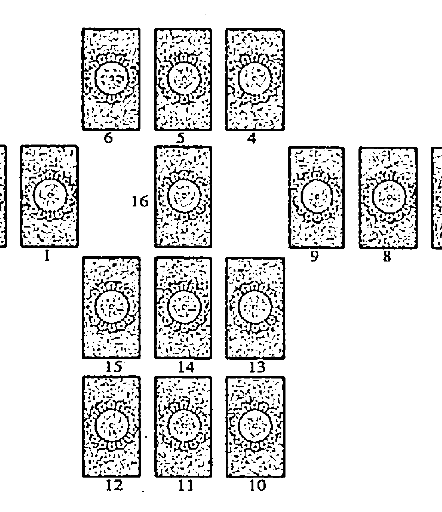

#### 24. 新凯尔特十字

- a. 将牌充分洗牌、切牌、整理完毕后，从最上面往下数到第七张，将此牌放在1的位置。
- b. 再从剩余的牌从上往下数六张，依顺序放在2、3、4、5、6、7的位置。
- c. 再从剩余的牌由上往下数到第七张，将此牌放在8的位置，然后将下两张放在9、10的位置。

## 牌位含义：

- (1)代表“现况”，求问者所提出问题的现况。
- (2)代表“阻力或助力”，若是好牌，表示会有外力帮助，若是坏牌，表示潜在的危机与外力的干涉。
- (3)代表“本人的意志与理想”，指求问者抱持的目标、希望等心理状态。
- (4)代表“本人的心情与真意”，指长久以来影响求问者的往事，这张牌暗示你私底下的潜在意识。

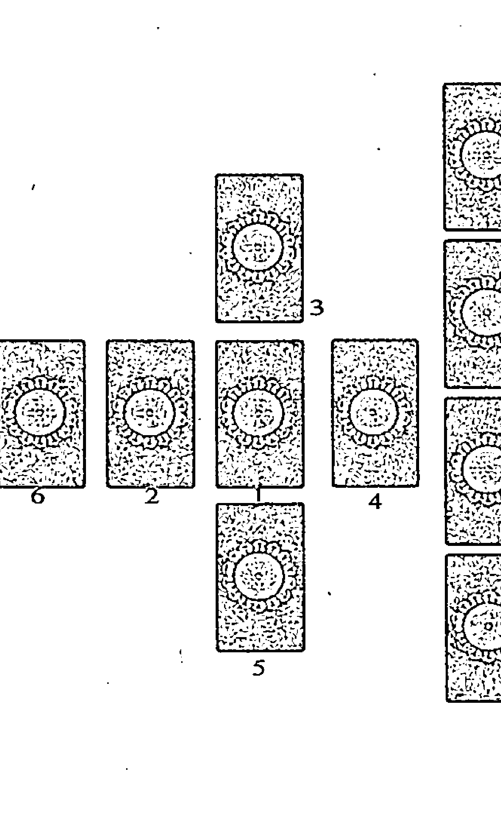

- (5)代表“最近的过往”，指最近发生的事。
- (6)代表“最近的将来”，指未来将会发生的事。
- (7)代表“求问者的想法和行动”，指求问者的心情、想法、行动。
- (8)代表“环境状况及他人影响”，表示有无反对者或协助，在恋爱问题或人际关系上指的是对方的立场、心情、想法与行动。
- (9)代表“求问者的能力”，可看出求问者处理这个问题的态度、想法或恐惧，同时可以看出现实中这个事件将如何发展。
- (10)代表“最后的预测”，暗示问题未来的发展及因果之道。

#### 25. 时间之桥

有关现在与未来，桥墩牌阵就是这样暗示着一种联结的意味。运用78张塔罗牌进行推测，注意有些牌是横放的。因为牌阵比较庞大，解读的时候需要花费较大的精力，但它的实用价值也是相当值得信任的。

洗牌切牌完成后，随意抽取19张牌，依次放在1到19位置上。

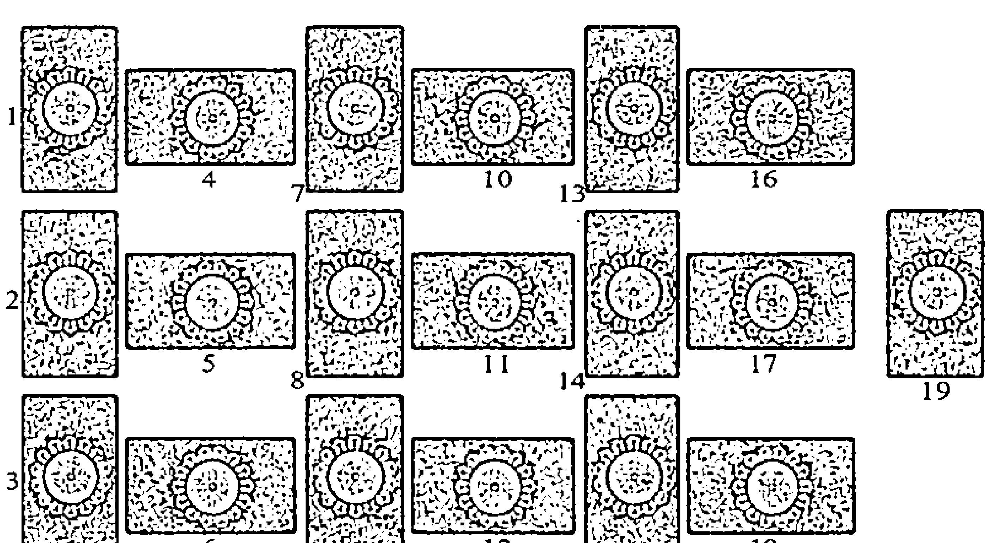

- (1)(2)(3)代表对过去的说明。
- (4)(5)(6)代表连接过去与现在的：可能的事件、信念或者一些不易察觉的事物。
- (7)(8)(9)代表对现在的描述。
- (10)(11)(12)代表连接现在与未来的：可能的事件、信念或者一些不易察觉的事物。
- (13)(14)(15)代表接下来一段时间会发生的状况。
- (16)(17)(18)连接到结果的：一些介于隐藏与显现状况的事情，这些事或者会帮助你或者会对你产生阻碍。这些有些已经发生，有些不一定已经发生，但很有可能发生。
- (19)代表未来的结果。

#### 26. 生命之树

生命之树牌阵虽然只有 10 个牌位，但需要 78 张塔罗牌一起参加推测。它是一个将塔罗、哲学、冥想结合在一起的复合的系统，分析整个生命的情况。它从底部解释到上方，也就是从第 10 位的牌解释到第 1 位的牌。

洗牌切牌完成后，随意抽取 10 张牌，依次放在 1 到 10 位置上。

在完成解读之后，把没有用到的牌摆成扇形，从中再选出一张来，放在“Daat Card”的位置，再对它进行解读，它象征一种隐藏的智慧，一种能帮助你完成最大愿望的智慧。

一个完整的生命之树牌阵是非常庞大的，解说通常要花费数小时之久，它几乎包罗万象，需要认真思考。并且这是一个长效型的牌阵，通常算过这个牌阵之后一年内不要再重复使用它来推测。

## 牌位含义：

- 1. (10)代表王国(Malkuth):结果、家、物质界、肉体、日常生活、实际的情况。
- 2. (9)代表根基(Yesod):灵魂的中心、想像力、幻想、习惯、过去的生活、潜意识的根基。
- 3. (8)代表光辉和荣耀(Hod):思想、判断真实与虚伪的知识、口语的表达和沟通、技巧、科学与应用科学。
- 4. (7)胜利与持续(Netsah):爱、性爱、本能、艺术、灵感、感受、美、欢乐。
- 5. (6)代表美(Tiphareth):个性、自我、特质、健康、对其他人的付出、目标、主要的目的或意图。
- 6. (5)代表严厉和力量(Geburah):力、征服、挑战、冲突、重新调整、障碍、不和谐、挑衅、力量的表现、领导能力。
- 7. (4)代表慈悲和恩典(Chesed):善良、有利的机会、赋予、机智、救助者、援助、褒奖、力量。
- 8. (3)代表理解(Bina):心灵的意识与理解力、母亲、心灵、阴、接近结束、企划能力。

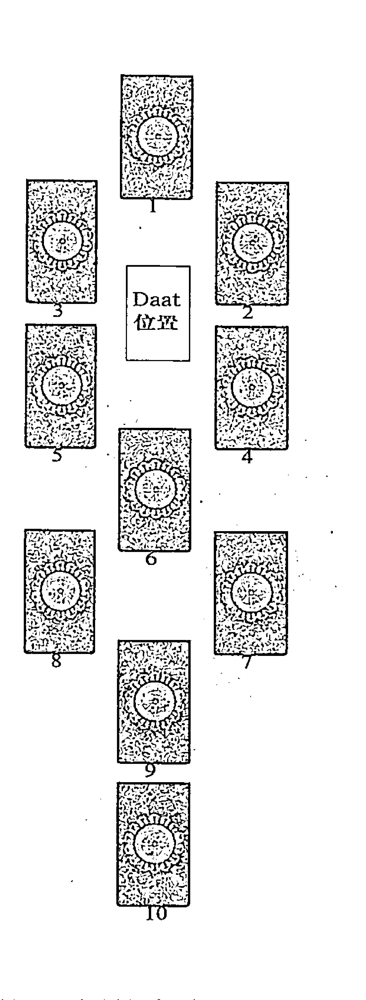

- (2)代表智慧(Chhokmah)：创造力、外在价值与思想、父亲、意图、阳、智能与知识、本能。
- (1)代表王冠(Kether)：高层次的思想、目标与意图的正确判断力、和谐的状态、问题的根本或起因。

#### 27.双重六芒星

洗牌切牌完成后，随意抽取 12 张牌，依次放在 1 到 12 的位置上。

### 牌位含义：

- (1)代表你所求问问题的过去的情况。
- (2)代表你所求问问题的现在的情况。
- (3)代表你所求问问题的未来的情况。
- (4)(5)代表解决问题的对策。
- (6)代表对方的过去的状况。
- (7)代表对方的现在的情况。
- (8)代表对方未来的情况。
- (9)代表你过去的情况。
- (10)代表你现在的情况。
- (11)代表你未来的情况。
- (12)代表如此发展下去的结果。

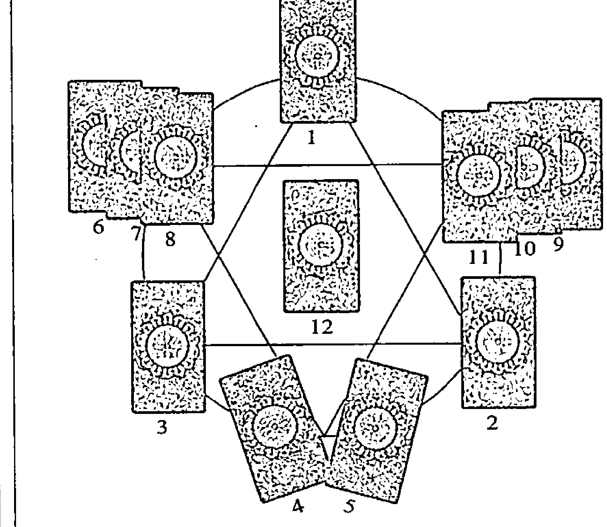

#### 28.统治女神

透过这个牌阵，可以了解自己的潜力，了解自己的感情倾向与潜意识。

洗牌与切牌完成后，随意抽取九张牌，依次放在 1 到 9 的位置上。

### 牌位含义：

- (1)代表“思考能力”。
- (2)代表“直觉力”，即你的直觉、第六感能力。
- (3)代表“感情倾向”。
- (4)代表“本能”，你本身潜在的原动力。
- (5)代表“恐惧”，你们害怕的事物。
- (6)代表“无法预期的事”，此事勿急躁下决定。
- (7)代表“希望”，即你内心的愿望。
- (8)代表“可以预期的事”，经审慎思考可以下决定去做。
- (9)代表“统治者”，也就是你自己，是综合性提出结论。
- (6)(7)乃针对你眼前遭遇的困难所提出供建议的牌；如果没有遭遇什么困难，则仅供你参考。

#### 29. 法老王之门

洗牌与切牌完成之后，随意抽取11张牌，依次放在1到11的位置上。

### 牌位含义：

- * (1)代表“希望达成的事”。
- * (2)代表“阻碍”，什么原因阻碍你达到目的。
- * (3)代表“压抑”，潜意识中压抑自己的事情、原因。
- * (4)代表“已经达成的事”，暗示你的过去和现在的成就。
- * (5)代表“协助”，暗示来自周遭的助力。
- * (6)代表“如何协助”，告诉你周遭的助力如何协助你。
- * (7)代表“如何让别人接受自己的想法”。
- * (8)代表“有谁能在自己的想法中受惠”。
- * (9)代表“自己的想法如何执行”。
- * (10)代表“下一步”，必须和(9)合起来解读。
- * (11)代表“关键”，达成愿望的关键牌，也是结论牌。

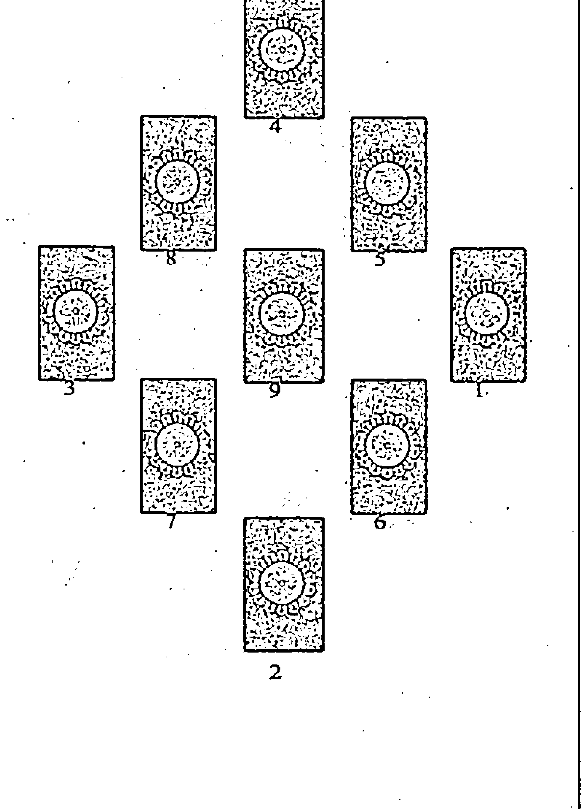

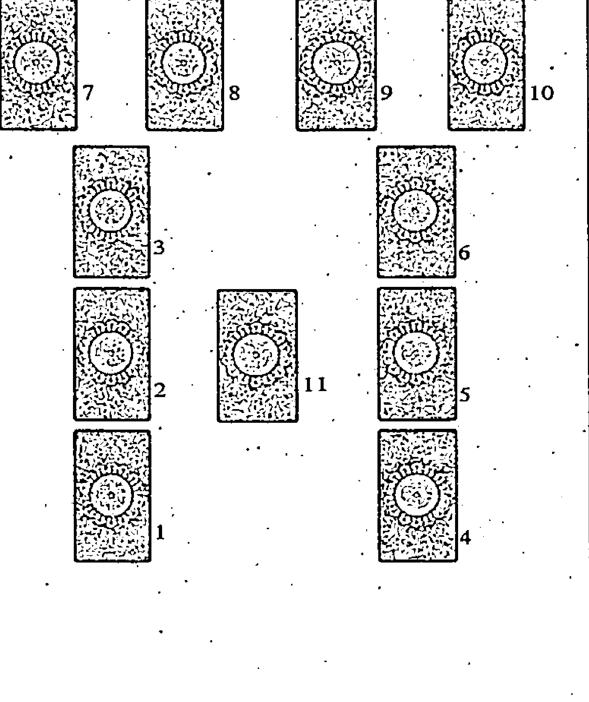

#### 30. 出生宫位

在长期实践中，这种牌型仅次于“缘分推测法”，是第二受欢迎的牌型。

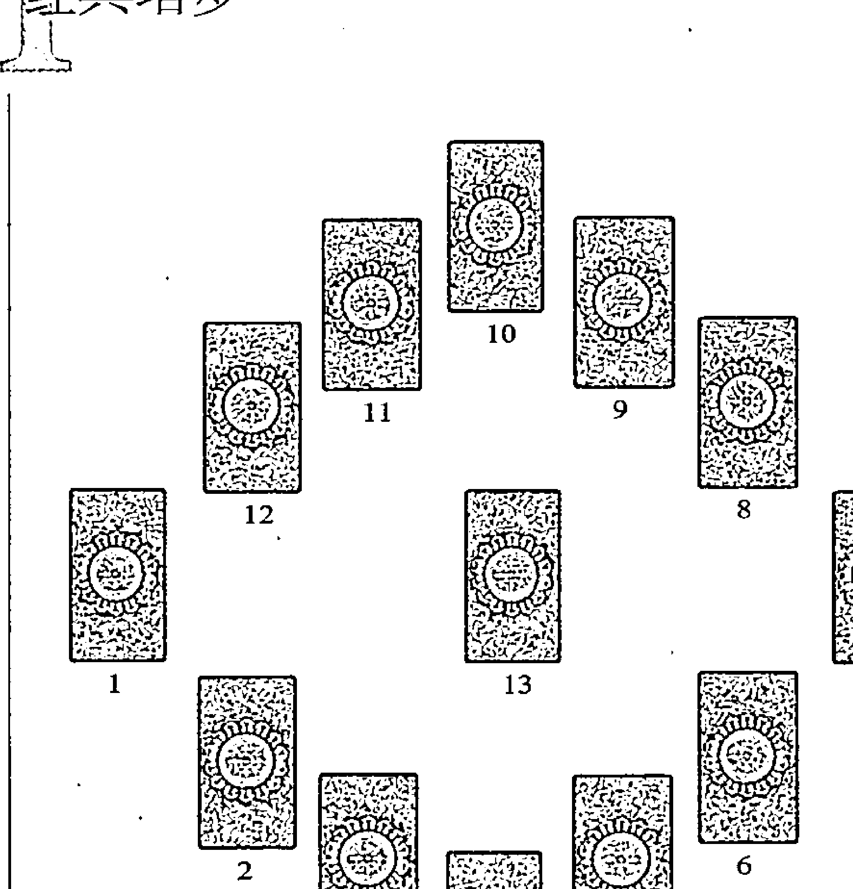

出生宫位图法最适用于解读一个人在某一段时间内各方面的运势。如果你没有什么特定的问题，这种牌型对你而言就再适合也不过了！

喔，还有要对这种牌型做的说明：适用的时间。原则上，塔罗牌是属于短期型的推测工具。因此，它比较适合推测短期间（例如一两年内）的事情。不过，出生宫位图法也可以做比较长时间的解读。

- 摆法如下：
    - a. 先照一般程序洗牌、切牌，把牌背面朝上放好。把从上面数来的第七张放在图示中1的位置。
    - b. 再依序取出刚才所拿之牌后面的第一张到第十二张牌，放在图示中2到13的位置。
    - c. 排好以后，从位在中间的第十三张牌先掀开，然后按照1到12的顺序掀牌。
- 牌位含义：
    - (1)个人特性、行事的风格。
    - (2)金钱运。
    - (3)和兄弟姊妹的关系。
    - (4)家庭状况／和母亲的关系。
    - (5)恋爱运／和子女的关系。
    - (6)身体健康状况。
    - (7)人际关系／婚姻运。
    - (8)性生活状况。
    - (9)学业运／海外旅行机运。
    - (10)工作运／和父亲的关系。
    - (11)朋友的状态。
    - (12)意外的事件。
    - (13)整体运势的走向。

#### 31. 一周运势

如果你对一年、两年的长期运势不感兴趣，而是想了解短期间的状况，这个牌型最适合你了。它能解读你未来一周会出现的状况;尤其当你安排好未来一周的计划，想知道该天的运势如何时，这种方法会非常地有趣而实际。你可以在每一周的开始(其实任何一天都可以)，拿出牌来，为自己推测一番。

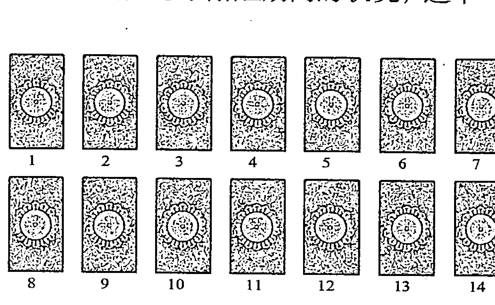

摆法如下：

- a. 先按一般洗牌、切牌程序进行。完成后，将牌叠背面朝上，取出第一张到第七张，背面朝上放在如图示1到7的位置，排成一排。
- b. 接下来取第八张到第十四张(相当于第二排)，一样按顺序放在第一排的下方。
- c. 如此牌型便完成了，接下来便是把牌掀开。掀开时依纵列的顺序进行。也就是说：先掀开1和8这一组，再掀开2和9这一组，依此类推。全部掀完后解读。

### 牌位含义：

这个牌型是在为人推测未来一周的运势状况，属于短期时效的牌型。牌型总共有十四张牌，同一纵行的两张牌都代表同一天会出现的运势状况。也就是说，1和8代表同一天的运势，2和9代表另一天的运势等等。因此，七组牌便构成了未来一周的运势。

这个牌型最需要注意的是解读的顺序。举例来讲，你若是在星期四帮求问者推测，那么就应该从代表明天(星期五)的第五组牌(也就是5和12这一组)开始解。星期六是第六组牌6和13，星期天是第七组牌7和14，星期一才回到第一组牌1和8来解释，依此类推。也就是说：1到7的位置是绝对性的星期编号。千万不要以为每次都从第一组牌解读，那就搞错了！

如果在这种牌型里出现以下的牌，有比较独特的意义：正放的“吊人”或“命运之轮”代表未来一周的运气绝佳，有好事出现；如果出现倒放的“吊人”或“高塔”(不论正、倒放)，则这一周比较不顺，会有希望落空的情形出现。

#### 32. 黄道十二宫

黄道十二宫也是一个流传久远的预测法，塔罗牌22张大阿卡那都分别有对应的星座，于是与星座有关的十二宫预测一直都占据着重要的地位。

洗牌切牌完成后，随意抽取十二张牌，依次放在1到12位置上。

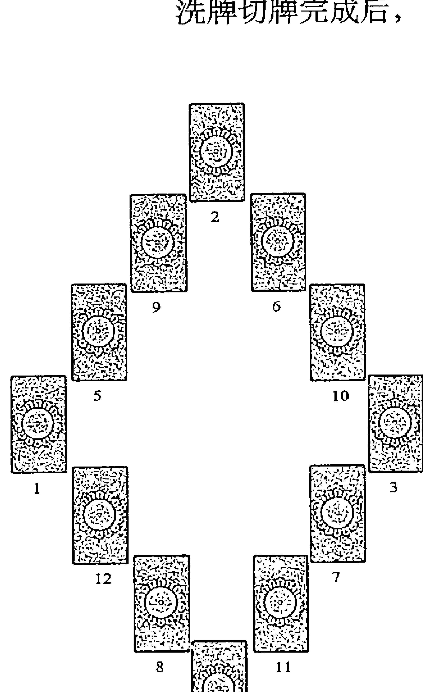

### 牌位含义：

(1)(5)(9)位牌象征火，代表了火相星座：白羊座、狮子座、射手座。分析这三张牌，将会知道或遇见一个对你有极大影响力的人，或者哪一类型的人对你的影响最大。

(1)说明你是一个怎样的人，你的个性如何，你是以何面貌展现在众人面前的。
若出现：
- 星币：代表你具有社交手腕，有领袖魅力，以赚钱为目标。
- 宝剑：代表你个性消沉，心情沮丧，容易想不开。
- 权杖：代表你让强烈的企图心驾驭自己，并且达到目的。
- 圣杯：代表你常常会流露爱意，想要让人围绕在你身边。

(5)揭示了你创造力与解决问题的能力，也可以看出你与小孩有关的事，也可以看出你想不想要小孩。
若出现：
- 星币：代表你是一个开心果，也容易交到有钱的朋友。
- 宝剑：代表你常常强迫自己做自己不想做的事情，你不太具有艺术家潜力。
- 权杖：说明你享受工作的态度。
- 圣杯：代表你是一个能令事情变得有价值的人。

(9)说明了你的精神状态和高层次的知识状况。也说明你与旅行、责任、学习、宗教、哲学、真理、未来等方面有关的事情。
若出现：
- 星币：代表这是一个重新回到学校读书或者开始一次旅行的好机会。
- 宝剑：代表忠告你不要开始任何事情，不要开始旅行。
- 权杖：代表建议你为自己做些事，多读一些书。
- 圣杯：有关你学习的事情，或是能帮助你发展计划的能力。

2、6、10位牌象征工作与金钱的情况。代表土相星座：金牛座、处女座、摩羯座。

(2)讲述有关金钱的状况，以及你所拥有的物品，你如何赚钱花钱。
若是出现小阿卡那并且数字为首牌至五之间，则代表你金钱方面会有很大问题，并且你常常入不敷出，尤其是出现宝剑牌的首牌到五之间，这情况非常可能发生。同时此宫也象征种植植物与食物的收成好坏。
若出现：(首牌到五除外)
- 星币：代表关于钱的方面，没有太多问题。
- 宝剑：代表没有足够的钱。
- 权杖：代表为了钱而辛苦工作，也代表了你所拥有的。
- 圣杯：代表关于钱的方面，没有什么问题，但你也不会存钱。

食物方面：出现权杖与宝剑的人，通常是喜欢减肥的一群人，他们喜欢蔬菜。
出现圣杯与星币的人，通常吃得太多，尤其是垃圾食物，油炸的肉类等。

(6)象征工作与劳动，但并非指事业。也代表了对其他人的责任与义务，也与你的宠物和健康有关。
若出现：
- 星币：说明你热爱自己的职业，而且很重视它。
- 宝剑：代表工作上出了问题，可能失业或者职位过低，可能正在寻找另一份职业。
- 权杖：说明你工作上承受了过大的压力，有沉重的责任和巨大的困难。
- 圣杯：代表一份令人愉快的工作，若出现圣杯六，说明你是一个乐于为他人服务的人。
- 宫廷牌：感到自己是有义务的(也代表武力)，并且总是去帮助他人。

### 健康方面：
若出现：
- 星币：说明你是健康的人，并且有健康意识。
- 宝剑：代表病痛，依照牌的点数，数字越大，身体越糟。
- 权杖：说明你需要去做个健康检查。
- 圣杯：代表你是健康的。

(10)代表对管理经营的看法或事业。也代表一个人如何安排、管理自己的工作。也代表当事人想在哪一方面用他的技术能力赚钱。
- 星币：差不多代表一个发起人或是让工作水准提高的人。
- 宝剑：代表对于工作的观点不够现实。
- 权杖：代表对于技术、专业技能精益求精或者继续深造。
- 圣杯：代表热爱工作并且非常快乐。

(3)(7)(11)位牌象征风，有关人际关系，代表风相星座：双子座、天秤座、水瓶座。

(3)代表你对有血缘关系的人的看法。有关短距离旅行、沟通、人际关系等方面事宜。
- 星币：说明可以通过教授或写作去赚更多的钱。
- 宝剑：说明没有人服从你。
- 权杖：说明你需要采取不同的策略。
- 圣杯：代表你可以用你的方式有效地指使别人。

(7)代表因你的选择而产生的关系，如妻子或丈夫，或商务上的合作伙伴。
- 星币：代表与爱的人共同经营一大生意。
- 宝剑：说明这段时间你的人际关系上有些问题。
- 权杖：说明这段时间你的人际关系上出现了短暂的分离或破裂，你需要仔细修复和改善。
- 圣杯：代表一切都还不错，夫妻和睦，罗曼蒂克的感觉。

(11)代表朋友的房子或新的技术。
- 星币：说明你将与朋友合伙或一起工作。
- 宝剑：说明你的朋友遇到了麻烦，你想帮助他。但你必须小心翼翼，注意控制自己的举止，不要显得过于冲动或做出一些无意义的事来。
- 权杖：代表你开始进行计划中的事情，并且求教你想要需求教的朋友。
- 圣杯：代表跟随你自己的想法去做。若出现圣杯三，则代表你的朋友们将会帮助你。

(4)(8)(12)位牌象征水，代表水相星座：巨蟹座、天蝎座、双鱼座。
(4)代表与你的居所有关的一些事项，以及发生在家中的事情等。
若出现：
- 星币：说明你可以在家中工作赚钱。不过如果出现星币六的话则代表你可能因为修理家中的某物而花费了额外的金钱。
- 宝剑：代表你的家庭生活不太快乐，家中发生了冲突等。
- 权杖：说明你正在进行某些屋子的工作，建筑房屋等。
- 圣杯：说明你家庭幸福。但如果出现逆位的圣杯的话，则要小心水灾。

(8)代表获得的他人的金钱，比如继承来的房子。也代表一些意想不到的事件。也与性感方面有关。
若出现：
- 星币：你正跟一个能提供你金钱及帮助的人交往。所翻出的牌点数越大，获得的不动产就越多。
- 宝剑：代表这段时间不适宜做有风险的事情。
- 权杖：提醒你必须小心阅读你所需要签署的法律文件。
- 圣杯：代表与性有关的事物。

(12)代表问题该如何结束。
若出现：
- 星币：代表事情进行顺利，而且你对整体的生活很乐观。
- 宝剑：代表你很沮丧，需要休息。
- 权杖：代表你该为自己付出一些了。
- 圣杯：代表极端的想法。
- 宫廷牌：在你心中，有一个你一直无法忘怀的人，可能是你的情侣或者是你的敌人。

当解读完成后，不妨从第 1 宫开始，顺时针再解读一次。
除了采用以上的详细解读外，也可以对整个牌阵进行另一种整体的观望。

### 牌位含义：
(1)代表你自己。
(7) 代表你的伙伴。
(2) 代表你所拥有的财产和物质。
(8) 代表你的伙伴所拥有的。
(3) 代表你的环境。
(9) 代表你旅途中暂时居住的房子。
(4) 代表你的私人生活。
(10) 代表你的公众生活，即事业方面等等。
(5) 代表你付出的爱。
(11) 代表你所获得的爱。
(6) 代表你的身体健康状况。
(12) 代表你的心理健康状况。

#### 33. 一生大事

将牌充分洗切，整理完善之后，将纸牌从第一张开始，依序由一日排到七日，共七张。

将这七张牌记录在纸上，它分别代表这一周内你每天的恋爱指标。如果你想一口气算一整个月份，只要重复前述步骤，就可以算出下一周或下下周的运气。

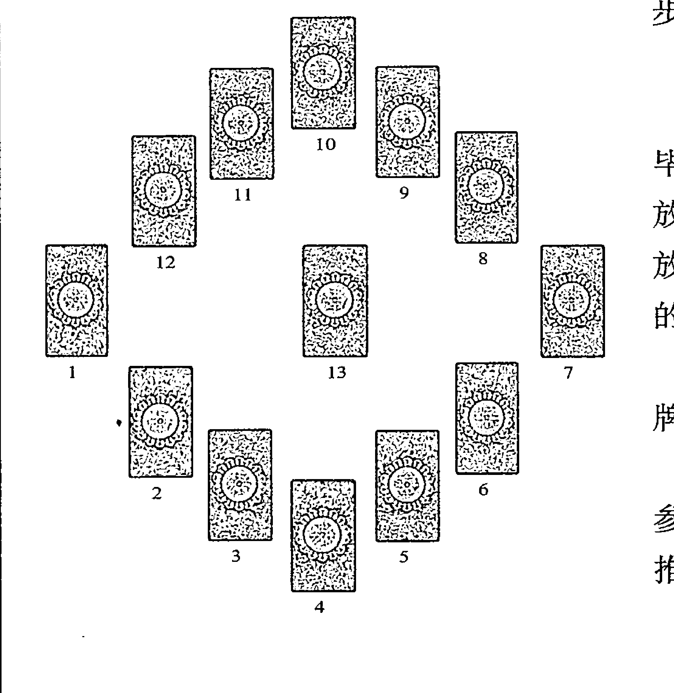

- 摆法如下：
    - a. 将牌充分洗切，整理动作到定牌完毕后，将牌由上往下数到第七张，将此牌放在1的位置，然后再将下十一张牌，依序放在2、3、4、5、6、7、8、9、10、11、12的位置。
    - b. 再将所剩余的牌中，最底下的一张牌，放在13的地方。
    - c. 排牌动作完毕后，即可进行翻牌，再参照纸牌的位置与代表意义，进行解读与推算。

## 牌位含义：

- (1) 代表“性格、主张、行动的特征”。
- (2) 代表“财运”。
- (3) 代表“旅行、沟通、兄弟、学校（小学、初中、高中）”。
- (4) 代表“家庭、住宅、母亲”。
- (5) 代表“恋爱、休闲、赌博”。
- (6) 代表“疾病与健康状况”。
- (7) 代表“伴侣、人际关系、婚姻”。
- (8) 代表“遗产与继承、死亡”。
- (9) 代表“远行、外国、学问、宗教、学校（大学）”。
- (10) 代表“社会的评价、职业、父亲”。
- (11) 代表“朋友、社交、愿望”。
- (12) 代表“灾难、隐形的敌人、静养”。
- (13) 代表“整体运”。

#### 34. 星宫之书

洗牌切牌完成后，随意抽取14张牌，依次摆放到1到14的位置。

## 牌位含义：

- (1) 代表第1宫：你的外貌和外显的个性，他人对你的第一印象，比如着装打扮等。
- (2) 代表第2宫：你的价值观，你将如何运用你所拥有的物质，你的自我意识自我设定目标。
- (3) 代表第3宫：你的人际关系、兄弟姐妹、短程旅行等方面的情况。
- (4) 代表第4宫：你的家庭状况，你的双亲之一将会如何地帮助你，或者你一直想要但很难获得的感觉。
- (5) 代表第5宫：通常指你的创造力用在外在的欲望上，以及关于你的罗曼史、小孩方面的情况。
- (6) 代表第6宫：你工作和健康方面的情况。
- (7) 代表第7宫：你的婚姻和其他的人际关系，你的配偶、家庭、朋友、生意上的伙伴可以如何地帮助你实现目标。
- (8) 代表第8宫：性、死亡、改革、其他人的金钱，你能如何激励自己，你需要放弃哪些东西，哪些部分需要革新，在金钱方面其他人能如何帮助你。
- (9) 代表第9宫：高等教育、远距离的旅行、信仰、人生观，你需要学习的，你需要前往的地方，你能如何与你的灵性相结合并让你的人生观使你更加坚强。
- (10) 代表第10宫：事业、身份、名望、双亲中的另一位以及他（她）将如何帮助你，你的整体概观与生活经验，你应该要强化的部分，让某部分的能力、优点更加突出。
- (11) 代表第11宫：朋友、团体、抱负，你的个人接触、交往，对你的目标的最美好的憧憬。
- (12) 代表第12宫：隐居、隔离、内在、秘密、下意识，当你单独一人时该做些什么，隐蔽而没有显示的事物，克服你的恐惧的最好方式、获得知觉的最好方式。
- (13)(14) 代表神秘的指示：这两张牌说明着每件事情的光明面，它将告知你最后必须知道的而且非常重要的事。

#### 35. 行星运转

洗牌切牌完成后，随意抽取15张牌，依次放在1到15的位置上。

## 牌位含义：

- (1) 代表太阳：生命力、愿望、男性本能。
- (2) 代表月亮：感受性、感觉、女性本能。
- (3) 代表水星：智力、人际关系、灵巧。
- (4) 代表金星：爱、和平、美丽、和谐。
- (5) 代表火星：性、战争、能量、勇气。
- (6) 代表木星：成功、幸运、扩张、成长。
- (7) 代表土星：责任、义务、限制、安全。
- (8) 代表天王星：创造力、自由、独立自主、天赋。
- (9) 代表海王星：理想主义、幻想、灵性、神秘。
- (10) 代表冥王星：改革、转变、力量、研究。
- (11) 代表北交点：合作、同盟、联结。
- (12) 代表南交点：过去生命的联结。
- (13) 代表上升点：个人的嗜好。
- (14) 代表中天：事业、状态、工作。
- (15) 代表天顶：上天赋予的角色、天命。

#### 36. 吉卜赛人

洗牌切牌完成后，在78张塔罗牌中随意抽取21张，依次放在1到21位置上。

## 牌位含义：

- (1)(2)(3) 代表你自己的情况。
- (4)(5)(6) 代表即将在你身上发生的。
- (7)(8)(9) 代表你所希望发生的事情，或你担心发生的事情。
- (10)(11)(12) 代表你预见将要发生的或你希望能够发生的事情。
- (13)(14)(15) 代表你意料之外发生的事情。
- (16)(17)(18) 代表接下来一段时间的状况。
- (19)(20)(21) 代表长远未来的状况。

#### 37. 所罗门之星

求问——爱情、友谊、学业、事业。

如果你已经学会了前面所有的牌型，那么恭喜你！你已经准备学习大塔罗里最复杂的方法——“所罗门之星展开法”。这种方法解读上未必很难，但它会用掉全部的大阿卡那22张主牌，而且步骤有些繁琐，因此相当耗时。要有耐心且小心地推测喔！

这种方法最适合没有特定问题的推测。比方说现在没对象，纯粹想知道最近爱情的运势如何，或者了解最近工作运势的状况等等，所罗门之星会有比较详细的解释。

## 摆法如下：

- a. 先按一般洗牌、切牌程序进行后，得到一叠牌面朝下的牌。将整叠牌翻过来，让牌面朝上。
- b. 接下来则是要找出“世界”这张牌。如果牌面上的第一张不是世界，就把它翻过来，牌面向下放在右手边。一张一张地找，直到世界出现为止。请注意：检查过的牌仍然要按顺序牌面朝下，放成一叠。
- c. 找到世界之后，把世界也牌面朝下，放在检查过的牌叠上。接着，把紧跟在世界之后的七张牌，依照图示按顺序放在1到7的位置。也许你会出现跟在世界之后的牌不够七张的情形，这时候就要把刚刚检查过的牌叠翻过来，让牌面朝上，然后从最上面的第一张开始拿起，补足七张。
- d. 前七张都就位以后，从第八张开始，把八到十四张叠在刚刚那七张牌的右下角（如图所示）。和刚刚一样，如果你手中已经没有牌了，就要把检查过的牌叠拿起来，牌面朝上，从第一张开始补足。当然了，如果你刚刚已经拿起牌叠在补的话，现在就继续补下去。
- e. 通常到了第十四张以后，你应该都已经拿起牌叠在补了。所以第三轮的十五到二十一张牌，就继续补下去，叠在刚刚第二轮牌的右下角。
- f. 等到全部的牌都放上去了，你应该会看到的是一共有三层的星形图案，全部都已经是牌面朝上的状况。你的手中应该只剩下一张牌“世界”，这张牌就代表求问者本人。把这张牌放到求问者面前，正面朝向她/他（若你是为自己推测，便将牌的正面朝向自己）。

## 牌位含义：

所罗门之星一共有七个位置。每个位置有三张牌。每个位置的意义是：

- (1) 代表问题目前的实际状况。
- (2) 是即将发生的事件。
- (3) 代表求问者对问题的期望、欲念。
- (4) 则是这个问题的运势如何。
- (5) 代表可能出现的意外。
- (6) 代表求问者没有注意到的敌人。
- (7) 代表个人内心深处对问题的真正动机。

解读牌型时，每个位置的意义，必须综合该位置上三张牌的含义解释。

#### 38. 七大行星

前面我们已经学过了七行星法，此处为七大行星牌阵，行星的意义相同，但本牌阵非常庞大，需要用到49张牌，揭示的内容更加丰富，给予求问者的信息量也极其庞大，内容涉及到生活中方方面面的情况，所以解读此牌阵需要付出的精力是可想而知的，这对解牌师可是一个不小的挑战！

洗牌切牌完成后，随意抽取49张牌，依次摆放在1到49的位置上。

## 牌位含义：

- (1)(2)(3)(4)(5)(6)(7) 代表月亮，指你的家庭环境以及家人的状况。其中：
  - (1)(2)(3) 代表家庭和家人过去的状况。
  - (4) 代表家庭和家人现在的状况。
  - (5)(6)(7) 代表家庭和家人未来的状况。
- (8)(9)(10)(11)(12)(13)(14) 代表水星，指贸易、商业、工作或学习等方面。其中：
  - (8)(9)(10) 代表贸易、商业、工作等方面过去的状况。
  - (11) 代表贸易、商业、工作等方面现在的状况。
  - (12)(13)(14) 代表贸易、商业、工作等方面未来的状况。
- (15)(16)(17)(18)(19)(20)(21) 代表金星，情感方面。其中：
  - (15)(16)(17) 代表过去的情感状况。
  - (18) 代表现在的情感状况。
  - (19)(20)(21) 代表未来的情感状况。
- (22)(23)(24)(25)(26)(27)(28) 代表太阳，代表人际关系。其中：
  - (22)(23)(24) 代表过去社交情况。
  - (25) 代表现在的社交情况。
  - (26)(27)(28) 代表现在的社交情况。
- (29)(30)(31)(32)(33)(34)(35) 代表火星，指你和对手的竞争状况。其中：
  - (29)(30)(31) 代表过去的竞争状况。
  - (32) 代表现在的竞争状况。
  - (33)(34)(35) 代表未来的竞争状况。
- (36)(37)(38)(39)(40)(41)(42) 代表木星，指物质的获得。其中：
  - (36)(37)(38) 代表过去的物质获得。
  - (39) 代表现在的物质获得。
  - (40)(41)(42) 代表未来的物质获得。
- (43)(44)(45)(46)(47)(48)(49) 代表土星，指你的智能及精神状况。其中：
  - (43)(44)(45) 代表你过去的智能和精神状态。
  - (46) 指你现在的智能和精神状态。
  - (47)(48)(49) 指你未来的智能发展和精神状况。

### 第三节 实用牌阵

实用牌阵是在现实生活中由不同的现实问题而设置的有针对意义的牌阵。它一般只能运用某个问题，对其他问题则不太灵验。而且，这类牌阵多是当代人自己创编的，还未经过时间检验。实用牌阵很多，五花八门，本书不重点介绍，只作为附录给感兴趣的读者参考。本书提请大家注意，学习塔罗牌阵应以经典牌阵为主，实际上经典牌阵的深刻内涵已经能包罗万象。

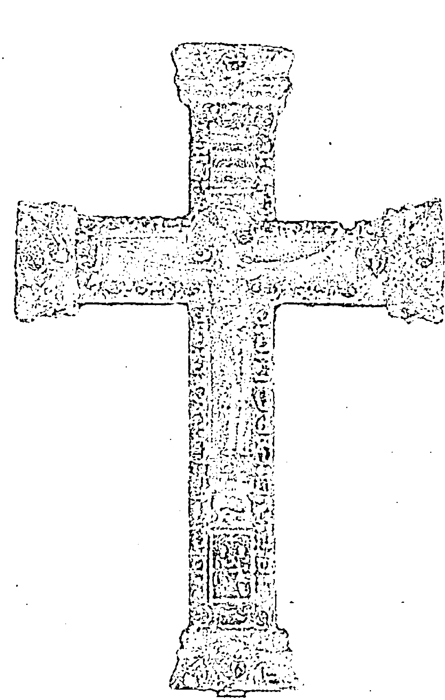

△ 欧洲基督文化传统，对塔罗牌的产生和发展起到了很大的影响作用，如基督神学文化中的“死亡”、“复活”、“审判”等概念，形成了相应的塔罗牌型，最著名的牌阵凯尔特十字也无疑是来源于十字架上的基督。

## 第一章 解牌攻略

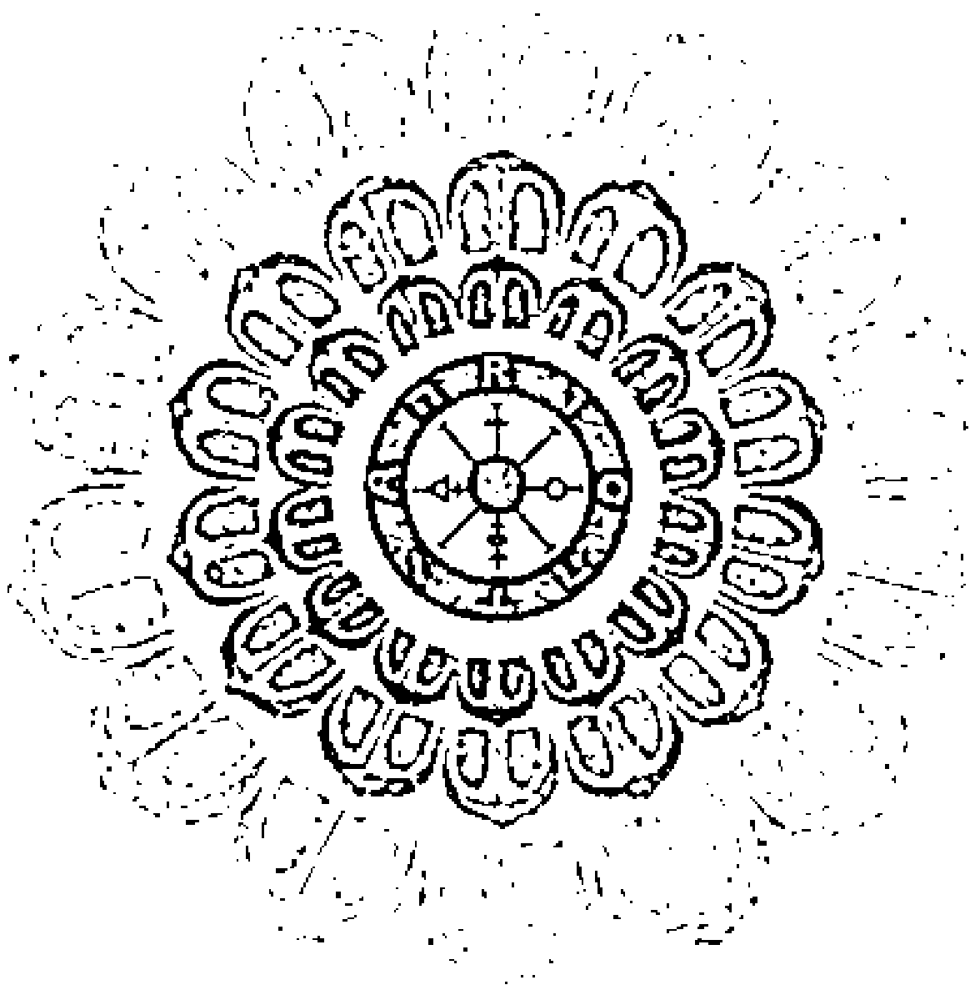

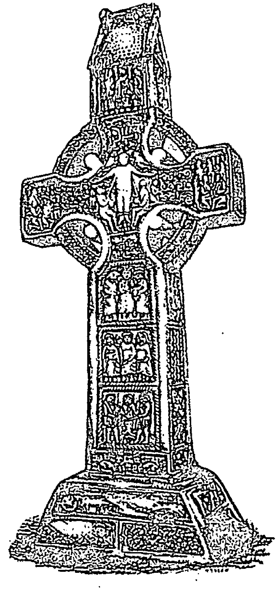

当我们了解了整个塔罗的预测流程，也记熟了每张塔罗牌的牌义，经过了提问、冥想、洗牌、切牌、摆牌的程序之后，面对一副翻开的牌阵，初学预测的人，或许仍然会有一丝不确定，“我知道每一张牌的牌义，也知道了每个牌位的含义，那么这副牌，到底代表了什么呢？”我们都知道，每一张牌，每一个牌位，都有丰富的含义，我们解牌的过程，同时也是一个发挥个人感应和悟性的选择过程。怎样才能读懂牌阵真正告诉我们的预示呢？正如前文所说是一个意会的过程，我们所要做的是：感应，和相信自己。在这里，我们将以凯尔特十字牌阵为例，将一个富有经验的解牌师的解牌过程详细地剖析在大家面前，发挥你的超人智慧吧！不须过多言传，你一定能读懂！因为每一个解牌师，都会成为一个心灵专家！

### 第一节 介绍

凯尔特十字阵法可能是解读塔罗牌最古老和最流行的方式，它能流传这么久因为摆牌的方法很简单实用，所以这种牌型对人们能产生强大的吸引力。

凯尔特十字阵法分为两部分：左边是圈／十字型（六张牌），右边是棍型（四张牌）。圈／十字型是模仿在爱尔兰发现的凯尔特十字架，这种十字型由四张垂直的牌围成一个圈，圈和十字象征了物质和精神的结合，也象征了事物的发展历程。

圈部分的阴性能能量与棍部分的阳性能能量很好地融合到一起，凯尔特十字架的这两部分反映了表面世界的双重本质——人类灵魂的两极。

圈／十字型部分由两个十字组成——中心小十字（两张牌），套在大十字（六张牌）的里面，小十字代表了事物的核心——在解牌时对你是最重要的，它是你生命运行的核心。

大十字由两条线组成，两条线相交叉盖住了小十字，水平的那条表示时间从左边的“过去”进入右边的“未来”，垂直的那条表示你的意识从下面的“无知”到上面的“有知”，解牌时六张牌放在一起你便大概了解你的内心和外部世界。

棍型部分跳出现在环境对你的生活进行评价，这里，你的内心向导帮你了解圈／十字部分的含义，你获得关于你自身和他人、你的生活教训和你的未来方向的指导。

凯尔特十字阵法有很多版本，不同之处常出现在3、4、5、6的位置。我们用了圈的摆法是要强调“无知”和“过去”如何走向（牌3和牌4）“有知”和“未来”（牌5和牌6）。我们还对牌9附加了一些意义，这个位置传统上代表了“希望和恐惧”，但我们还将它作为一张代表教训和向导的牌。通常只要你在解牌之前决定要变换，你就可以按你自己的需要换用一种摆法。

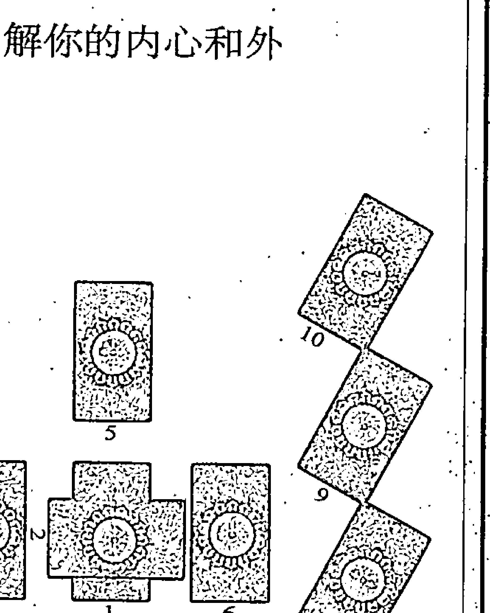

### 第二节 解释凯尔特十字牌阵

首先，我们必须详细地了解凯尔特十字牌阵每一个牌位的特殊含义，这种了解越详细，就越能推测准确整个牌阵揭示的意义。

有一种解释凯尔特十字牌阵的方法：

- 1. 观察凯尔特十字牌阵的圆形／交叉阵中的六张牌。它们表现的是，解牌这个时刻你生活中出现的状况。
- 2. 检查配对牌，它们也许按照下面的规则排列：
  - a. 看着牌1和牌2，找出动力中心。
  - b. 看着牌3和牌5，找出你内心不同水平上会发生的事情。
  - c. 看着牌4和牌6，观察一下你生活中出现的人和事是怎样的状况。
  通过这六张牌，对你瞬间的状态做一下描述。
- 3. 观察牌阵中的杆状部分，它们也许是按照下面的规则排列：
  - a. 看着牌7和牌8，就能知道更多你和你周围环境的关系。
  - b. 看着牌10——预期中的结果。你的感觉怎么样？这张牌告诉了你什么？
- 4. 回顾一下导出结论的各种因素牌。看看哪张牌是关键牌。同时：
  - a. 将预期中的结果（牌10）和可能的选择性结果（牌5）进行比较。
  - b. 考虑一下最近（牌6）怎样导出预期中的结果（牌10）。
  - c. 看看牌9是否告诉了你必须知道的事情。你对此是抱有希望还是恐惧？

## 凯尔特十字牌阵中的关键词

| 位置1 | 位置2 | 位置3 |
|-------|-------|-------|
| 事情的核心<br>目前的环境（外部的）<br>目前的环境（内部的）<br>首要因素 | 对立的因素<br>变化的因素<br>次要的因素<br>加强的因素 | 根源<br>无意识的影响<br>深层的含义<br>不为人知的因素 |
| 位置4 | 位置5 | 位置6 |
| 过去的<br>渐渐消除的影响<br>可解决的因素<br>放任自流的特质 | 态度和信念<br>有意识的影响<br>目标或目的<br>交替的未来 | 未来<br>渐渐逼进的影响<br>不可解决的因素<br>包容的特质 |
| 位置7 | 位置8 | 位置9 |
| 作为自己而存在<br>能成为什么样的人<br>你表现出来的自己<br>你看到的自己 | 外部环境<br>另一个观点<br>另一个期待<br>别人看到的你 | 指导<br>关键因素<br>希望和恐惧<br>被忽略的因素 |
| 位置10 |  |  |
| 结果（总体上的）<br>结果（内部的）<br>结果（行动上的）<br>结果（影响上的） |  |  |

## 凯尔特十字牌阵位置 1

- ◆ 事情的核心：事情的核心，中心事件；引起重点关注的；基本的烦恼或混乱；首要关注的问题；焦点问题；基础的问题。
- ◆ 现在的环境（外部的）：“覆盖着的”——传统的含义；周围的环境；目前急需解决的问题；你周围发生的事情；你正在处理的事情；外部因素。
- ◆ 现在的环境（内部的）：内部的因素；对这个局面，你的感觉如何；关键的个人特质；基本的思维状况；情感状况；你内心出现的波动。
- ◆ 首要因素：主要影响；占主导地位的特质；明显的特征；最重要的因素；最有影响力的特征。

## 凯尔特十字牌阵位置 2

- ◆ 对立的因素：“反对你的”——传统的含义；对立的因子；反对的源泉；平衡的趋势；渐渐缓和的影响；敌对的或者颠覆的。
- ◆ 改变的因素：处于领域之外；没有预料到的因素；新的考虑；不平衡的力量；让人奇怪的。
- ◆ 次要的因素：顺带的关注；另一个信息源头；边缘地带的问题；附属的问题；次要因素。
- ◆ 加强的因素：支持的现象；额外的强调；合作的人；额外的吸引；放大的力量；相关的问题；摇动船只的力量。

◆ 放置
正确地放置牌2，按顺时针方向将牌旋转90度，并把它放在牌1上方。如果放置后，牌上的图像在左边，那么牌2是反牌。

## 凯尔特十字牌阵位置 3

| 左侧条目 | 右侧条目 |
| :--- | :--- |
| ◆ 根源 | ◆ 深层次的含义 |
| ◆ 没有意识到的影响 | ◆ 不为人知的因素 |
| 根源 | 深层次的含义 |
| 问题的根源； | 更大的图片； |
| 基本局面； | 基础部分； |
| 为什么事情呈现出本来的样子； | 包容一切的观点； |
| 孩童时代或者过去生活的影响； | 精神上的目标； |
| 事情背后的原因； | 隐藏的前因后果； |
| 开始点。 | 实际上发生的事情。 |
| 没有意识到的影响 | 不为人知的因素 |
| “在……下面” ——传统的含义； | 隐藏的影响； |
| 没有公认的动机； | 没有公认的贡献； |
| 没有承认的目标； | 没有被发现的参与者； |
| 基本的冲动； | 隐藏的议程； |
| 驱动的需求或愿望； | 幕后诡计。 |
| 自我否认或抗拒的方面。 | |

## 凯尔特十字牌阵位置 4

| 左侧条目 | 右侧条目 |
| :--- | :--- |
| ◆ 与过去相关的事情 | ◆ 可解决的因素 |
| ◆ 渐渐消除的影响 | ◆ 放任自流的特质 |
| 与过去相关的事情 | 可解决的因素 |
| 品质； | 完全意识到的特质； |
| 个人； | 已经完成的任务； |
| 信仰； | 被包好的东西； |
| 事件； | 能被抛开的东西； |
| 机会； | 已经得到照顾的东西。 |
| 有导向性的； | 放任自流的特质 |
| 关注的； | 过时的方法； |
| 希望； | 不再有用的东西； |
| 恐惧。 | 没有必要再保留的包裹； |## 凯尔特十字牌阵位置5

- ◆ 态度和信仰：认为所接受的都是真的；假设；深信，确信无疑；你怎样看待所发生的一切；错觉或者幻想；将你的信任置于何处。
- ◆ 有意识的影响：你头脑中所存在的；你正在集中精神关注的东西；正困扰你的事情；正使你感到迷惑的事情；你所承认的东西；你所知的。

- ◆ 目标或目的：渴望；你所致力于要达到的；对未来的期望幻想；全心全意去做的事情；偏爱；期望的后果。
- ◆ 交替的未来：“将要到来的”——传统的含义；潜在的发展；不同的可能性；另一种选择；你所想的将要发生；你正在积极计划的未来。

## 凯尔特十字牌阵位置6

- ◆ 与未来相关的一些事情：特征；个人；信仰；事件；机会；导向性；关注；
- ◆ 渐渐逼近的影响

- ◆ 没有解决的因素：没有意识到的特征；没有完成的任务；仍然悬而未决的问题；必须得到确认的问题；需要关心关注的问题。
- ◆ 包容的特质：有用的方法；希望；恐惧。
  渐渐逼近的影响
  越来越重要的表现；
  得到加强的关注；
  越来越集中的；
  越来越靠近的某人/某物；
  渐渐升起的星星。
  有用的一切；
  期望达成的目标或成就；
  必须的某人/某物；
  受欢迎的因素。

## 凯尔特十字牌阵位置 7

- ◆ 作为自己而存在
- ◆ 你能成为什么样的人
  作为自己而存在
  个人类型；
  你的个人气质或内涵；
  你解决问题的方法；
  你独特的导向性；
  你的观点；
  你为人处世的方式；
  你的位置或姿态。
  你能成为什么样的人
  可触及的内部源泉；
  你能运用的聪明才智或能力；
  你能做的事情；
  你坚持的理念；
  一个可能的方法；
  你想成为什么样的人；
  你对自己的目标。

- ◆ 你表现出来的自己
- ◆ 你看到的自己(传统的含义)
  你表现出来的自己
  你的公众面貌；
  你怎样认为你应该成为什么样的人；
  向世界展示自己时掩饰自己；
  为了面子你所做的一切；
  你接受的原则；
  自愿接受的任务；
  你虚伪的一面。
  你看到的自己(传统的含义)
  你的自我形象；
  你对自我的信念；
  你对身处何处的感觉；
  你对自己的恐惧；
  你对自己的假设；
  你如何限制自己；
  你怎样赞美自己。

## 凯尔特十字牌阵位置 8

- ◆ 外部环境
- ◆ 另一个观点
  外部环境
  “环绕你的一切”——传统的含义；
  氛围；
  情感气氛；

- ◆ 另一个期待
- ◆ 别人看到的你
  另一个期待
  其他人希望从你这里得到的东西；
  你的需求；
  其他人认为你应该是什么样的或者你应该如何做；
  其他人对你的忠告；
  强加于你的外部限制；
  你的分配原则。
  该物质和社会环境；
  某个局面的环境；
  游戏领域；
  你必须处理的环境。

## 另一个观点

- 另一个人如何看待环境；
- 其他人的一方；
- 对问题的另一种倾向；
- 不同的观点；
- 相反的观点。

## 别人看到的你

- “别人怎么看你”——传统的观点；
- 你如何让人对你印象深刻；
- 你如何被人评估的；
- 公众对你的意见；
- 你所造成的影响；
- 你对其他人的影响。

## 凯尔特十字牌阵位置 9

- ◇ 指导
  - 你应该做的事情；
  - 如何最好继续下去；
  - 你如何进行改变；
  - 警告的言语；
  - 事情的真相；
  - 不同的方法；
  - 有帮助的建议；
  - 诚实的评估。
- ◇ 关键因素
  - 基础方面；
  - 应该吸取的教训；
  - 解释任何事情的东西；
  - 对将要发生事情的暗示；
  - 你需要知道的事情；
  - 联结点。

- ◇ 希望和恐惧(传统的观点)
  - 你所害怕的事情；
  - 你所怀疑的是真实的；
  - 你正在避免的；
  - 个人心中的魔鬼；
  - 你所渴望的东西；
  - 你的梦想；
  - 你的信仰；
  - 你的秘密欲望。
- ◇ 被忽略的因素
  - 你还没有意识到的一些事情；
  - 迷失的一些难题；
  - 其他人的处理原则；
  - 其他一些需要注意的事情；
  - 令人惊奇的因素；
  - 被估计的影响。

## 凯尔特十字牌阵位置 10

- ◇ 结果(总体上的)
- ◇ 结果(内部的状态)
  结果(总体上的)
  最可能出现的结果；
  也许会通过的事情；
  局面如何得到解决的；
  所有事情都有指导的地方；
  可能的解决方法。
  结果(内部的状态)
  你如何结束感觉；
  你的状态如何；
  明白你将要得到的东西；
  你将要吸取的教训；
  你假设的态度；
  你认识到的特质或能力；
  出现的进展；
  社会地位上的改变。

- ◇ 结果(行动上的)
- ◇ 结果(影响上的)
  结果(行动上的)
  你也许不得不做的事情；
  你怎样成功或失败；
  采取你不得不采用的方式；
  必须的行为；
  你也许会实现的事情；
  你不得不采取的方法。
  结果(影响上的)
  其他人是如何被你影响的；
  环境是如何变化的；
  其他人将要做的事情；
  可能的对策或反措施；
  可能的利益或回报。

### 第三节 琳达的解牌

现在，琳达该出场了。

琳达的故事是由解牌师在一年里为她做的三次推测展开的。这些推测暗示着，塔罗牌是如何随着时间的推移，影响着人们的生活进展的。每次推测都是在一个设定的时刻匆忙进行的。随着事情慢慢展开，每次匆忙中都有变化，但是都有一根主线联结着彼此。这一系列的故事是关于琳达的人生经历，她从小由养父母抚养，后来又与养父母分开，她想寻找自己的亲生父母，却必须在法庭上争取权利。你能从中看出一些新的元素是如何与那些持久的因素相互作用的（在这里，没有应用反牌）。

在解释过程中，大写字母注释的词组表示的是牌面折射出来的含义。蓝色字体的词组表示牌所在位置的含义。大家不妨依照这些牌将它们抽出，依次摆开，这样就可以更近距离地体验这一次的推测之旅了。

## （一）琳达的第一次推测

为琳达（这不是她的真名）进行的第一次推测是在1990年1月份，是一次开放式的推测。琳达在她11个月大小的时候就被收养了。她想知道她出生第一年的所有情况。几个月以来，她一直在试图获取有关她亲生母亲的一些信息，顺带的还有她亲生父亲的消息。

琳达试图通过收养她的监护人打听，但是发现大多数的信息都被隐瞒了。推测的时候，她决定采取法律途径来获取消息。她抽取的牌如右图：

## 琳达第一次推测的凯尔特十字牌阵：

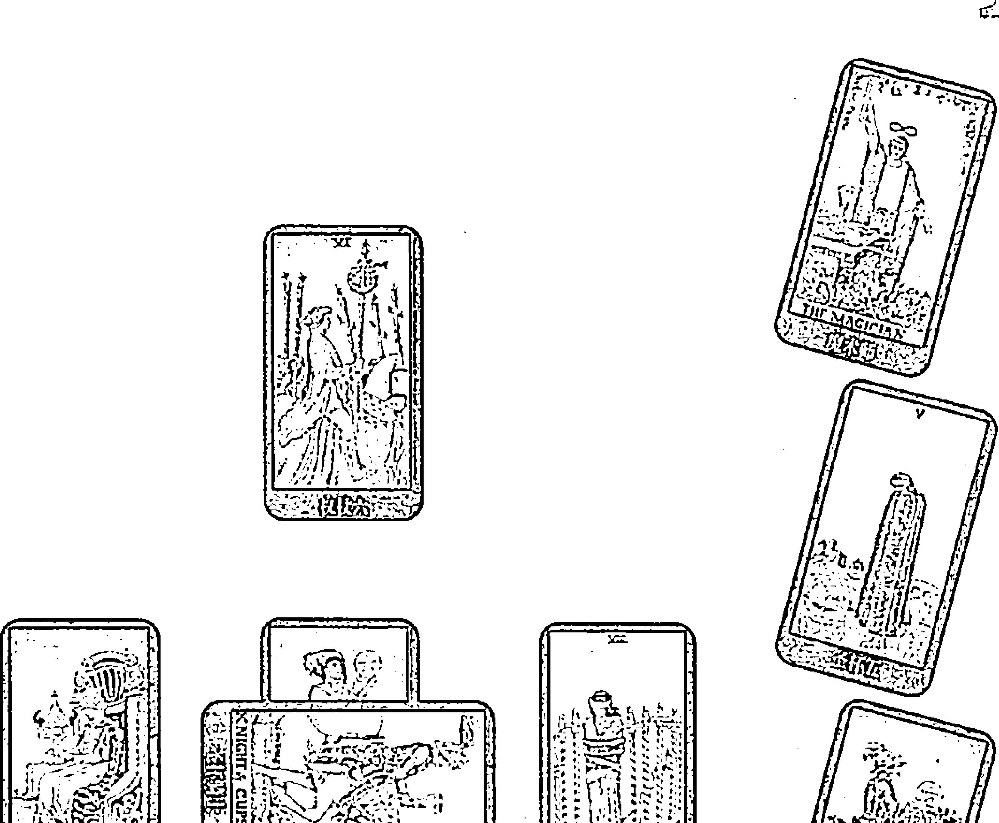

当这些牌摆开时，解牌师和琳达都立刻被宝剑三吸引住了——这是当时局面的根源。这张牌表示的正是心碎和孤独。琳达还是个婴儿的时候就被迫与亲生父母和收养家庭分开，感到孤独。注意三根宝剑——琳达和她的父母——刺穿了他们的心脏。

背叛的含义也很重要。在一定程度上，琳达感到被许多人背叛了：收养她的父母，并且他们阻止琳达的寻找，还有阻碍她的监护人，以及她的亲生父母，琳达也许在无意识中也会对他们抛弃她的行为感到怨恨。

宫廷牌暗示着平衡的需要。首先，中央有一对配对牌星币/圣杯(牌1和牌2)。它们象征琳达对未来梦想的期望(圣杯)和必须面对现实(星币)的矛盾。对琳达未来的月份里，这是她最关注的一点。

星币牌显示出琳达需要集中精神关注现实的事情，以便能在官司上获胜，也知道更多她身世的事情。圣杯骑士则显示出她不切实际的梦想——找到的亲生父母是什么样的，这与星币牌呈现相反倾向。它暗示琳达的情感世界中缺乏协调。作为骑士牌，它也表明琳达的希望太过于浪漫了。

圣杯王后为牌4，更加强了上面的暗示。与这张牌相关的‘母亲’一词迅速显现出来。在这个情况下，圣杯王后有特殊的含义。她是琳达希望找到的梦想中的母亲；是一个充满爱心和温情的人。过去一直存在的愿望促使琳达陷入现在的局面。

另一个重要的配对牌是宝剑国王为牌7和星币骑士为牌8。宝剑国王暗示着琳达在这个局面中，把自己看做是诚实和公正的代表。她认为自己想知道早年的生活的这个愿望是正确的。同时，在推测的前个星期，琳达还准备了法庭上的陈词。她运用了宝剑国王的聪明才智——他敏锐的分析能力、智力和写作技巧。

星币骑士暗示着，其他人认为琳达把事情看得太严重了，而且受到了驱使。因为他们不喜欢她强烈的反应，所以他们认为她受到了迷惑以至于不懂得妥协。不管这种观点是否公正，它都是一个有价值的信息。如果琳达疏远了监护人和司法系统，她就降低了成功的可能性。星币骑士暗示着琳达应该控制她不可妥协的表现，而采用一种更协调、理智的方法。

圣杯五为牌9是整个局面的关键。它代表失去，从她失去亲生父母就已经开始了。现在，琳达必须愿意放开她梦想中的母亲，这样她能和她现实中的亲生母亲形成一种真实的关系，不管现实中的母亲是谁。琳达同样也害怕她会输掉官司。

宝剑八暗示着一些让人困惑的时刻依然在前方。这种时刻指的是，当她试图平衡她那相互冲突的感情时，她就会感到无助的瞬间。同时，外部的力量也许会临时地限制她的寻找。

另一方面，权杖六为牌5和魔术师为牌10并不表示更积极的因素。权杖六表示的是琳达在她能力范围内有意识的信仰的力量，这使她能克服司法上的障碍，获得最终的胜利。她知道她能成功，这是魔术师牌所暗示的。魔术师作为推测时惟一的一张大阿卡那牌，表示当琳达意识到自己的目标时展示出来的超强的力量。如果她能巩固自身内部的力量，有意识地接受已经失去的，她就能获得更大的成功。

## （二）琳达的第二次推测

1990年6月，解牌师为琳达和她的处境进行了另一次推测。因为发生的事情很有戏剧性。

3月份，琳达得到了判决，她的寻找行为被认为是有效的，有关她的收养文件都应该公开。通过辛勤的努力，琳达在三个星期内确定了她的亲生父母的位置。开始，她的父亲不愿意和她对话，但是通过在一个遥远的城市的一次奇怪的会面后，她的母亲热情地欢迎了她。

琳达意识到了第一次推测暗示的是积极的后果。她相信自己的能力，并在很短的时间内圆满地达到了所有的目标，但是，事情出现了没有意料到的转折。

琳达和她的亲生母亲很快形成了很亲密的关系。当琳达在母亲那里的时候，她的亲生父亲重新联系上了。在经历了30年后，她的父母第一次开始了谈话，而且很快又恢复了从前浪漫的关系。这就是解牌师决定开始推测的时刻。琳达想了解这种局势下释放出来的高能量。解牌师为琳达写的问题是：“琳达、她的亲生母亲和她的亲生父亲所处的戏剧性局面的本质和原因是什么？”抽出来的牌如右图：

琳达第二次推测的凯尔特十字牌阵：

我们又看到了一张侍从牌作为牌1。琳达的局面依然是一个行动的机会问题，但是这次她面对的是一个挑战。琳达必须为自己诚实，并且坚韧不拔，头脑清醒(宝剑)地采取措施。

宝剑四为牌2告诉她怎样支撑自己度过这段时期。她必须小心谨慎地检验自己的行动和动机。她同样还必须培育平静、安宁的内心，这样才能控制情感的波动。

牌3和牌5，我们能在推测中看出它们的联系。牌5中，我们又一次看到了“梦想的母亲”——圣杯王后。看起来似乎是琳达还没有放弃幻想，而在她的意识世界里更坚定了。大多数的时间里，她都在想念和感觉她的亲生母亲。

1月份时，圣杯五显示出，改变着的情感失去是琳达局面的一个关键教训。现在，这张牌移到了牌3。这表明，琳达对关于她身世的感觉在无意识中被更坚定地存放起来了。从更深层次上说，她在哀悼自己失去了深爱的人和梦想。这种关于她身世三角的再确定同样引发了恐惧——即她将会再次失去她的父母。

星币三为牌4暗示着，琳达希望的和她亲生父母的协同努力将要成为过去的事情。牌上图案的位置揭示了这一点。两个人站在一起，而另一个人则孤零零地站在一旁。那个孤单的身影被排斥了，似乎她不能决定她能否成为两人中的一部分。在研究这张牌时，应注意到孤单的人右手里拿的颠倒的杯子。圣杯五中颠倒的杯子非常明显，清晰地表达了失去的含义。

权杖四为牌6是庆祝的原因。不管琳达的局面带来的是什么，似乎表明着不远的将来是令人兴奋的。

牌7和牌8起的作用很大，因为它们都是大阿卡那牌。它们显示出了琳达和她的环境中的一个重要的冲突。琳达的观点是爱人。她想铸造爱和关系的结合，这些原来都抛弃了她。她同时也开始对现实妥协，即她的父母从字面意义上来说是一对情侣。

不幸的是，琳达的环境是充满恐惧和幻想的。月亮表示不确定性，当事情不是他们看起来那样，人们不想要他们所说的那样时，这些都是不确定的。在这个情况下，这里没有故意的欺骗，只是缺乏清晰。没有人想做坏事，但是每个人都不确定他们真正需要什么。

正如星币五(牌10)图案上显示的拒绝，似乎琳达也面临这样的情况。整个推测过程中都缺乏统一，琳达能感觉自己被遗漏，形只影单地避开了。

琳达的力量存在于真相中。宝剑侍从(牌1)使她想起了清晰和诚实是最重要的。同时，琳达应该做最坏的打算。权杖九为牌9，告诉她必须有防御的，并准备拿出她保留的东西。不远的将来也许都会清晰，但是在琳达寻找新的关系的道路上，同样还有许多艰难的时刻。

## （三）琳达的第三次推测

琳达的第三次推测是1990年10月，是她在场的情况下进行的。琳达的亲生父亲拜访了她的母亲，两人之间的爱意重新萌动。8月时，琳达和她的母亲进行了一次长途旅行，到了她父亲居住的城市。旅途中有积极的方面，但是拜访在结尾时出现了令人烦恼的转折。夜晚时，当她父亲的房门在她面前砰的一声关上时，琳达感到了在第二次推测时预期的阻碍。当她的父母的感情升温到了高潮时，琳达一个人独自在大街上游荡。

琳达的母亲自从这次旅行就没有再回来。她离开了她的丈夫和所有的一切，和琳达的父亲住在一起。从这一点看，琳达与两人的交火经常是猛烈的。有几次戏剧性的，甚至是恐怖的事情的发生，让琳达感到很沮丧。推测时，她很想找出事情的头绪。她写下的问题是：

> “我和我亲生父母的关系在将来如何得到发展？”

这是她抽出来的牌(如右下图):

## 琳达第三次推测的凯尔特十字牌阵：

我们能看出琳达目前局面中的能量依然是很明显的。这里有四张重复的牌。宝剑八从牌6(第一次推测)移到了牌3。未来的阻力现在是这个局面的基础。过去年份的情感事件已经如此狂暴，以至于琳达在基本水平上都感觉到无助。权杖九从牌9(第二次推测)移到了牌5。这张牌是一个警示，告诉琳达要照顾好自己，并做好最坏的打算。现在她已经开始考虑这些因素了。感觉受到了伤害，她知道要坚强，保持情感上的防御性。权杖四从牌6(第二次推测)移到了牌4。对重新团圆的庆祝慢慢消退了。美好时光的兴奋从琳达的生活中消失了。

牌7和牌8显示出，琳达的期望仍然和她父母不契合。琳达渴望安全，有规律的家庭生活(星币十)。她想找到一个持久的解决办法——不过是想有机会经历普通家庭有规律的生活。

然而，她的父母陷入了令人迷惑的关系中，这一点魔鬼体现出来了。第二次推测中情侣体现的实际上是对两个灵魂的束缚，他们还没有足够的自我了解来产生爱，包括他们的女儿。

琳达需要一个解决方案，有两张牌暗示着这样的趋势。首先是权杖八为牌1。这张牌显示出结论是可能的。琳达如果采取快速、决定性的行动，她就能够完成没有结束的事情。

死神意味着在不远的将来，一个主要的结论的到来。也许三个人要经历分离。也许琳达会做出改变，从而和她父母形成一种新型的关系。

作为结果或解决方案的皇后是一个积极的标志，因为它表示，在这个局面中，母亲的理念是等待着琳达。皇后是母性的原型——不顾所有的诱惑，有慈爱、珍爱、养育的能力。琳达认为，这张牌也意味着重新重视自己作为一个母亲的角色。

△金苹果是青春、诱惑与犯禁的象征，在圣园中，金苹果树由夜神的女儿们守护着

如果琳达想采取这些积极的解决方案，她该怎么做？答案就在两张星币宫廷牌。侍从为牌9，是第四次重复出现的牌，它最先作为牌1(第一次推测)出现。它加强了琳达的想法，即经验是关于信任和为自己的梦想而努力的能力。

尽管存在许多巨大的困难，琳达还是找到了她的亲生父母，但是她也意识到现实与自己的梦想并不相符。她开始学会信任自己，而不再依赖别人。星币国王为牌2告诉琳达，不要通过其他人寻求救助。她必须发展内心中成熟的星币所拥有的特质——坚定和可靠性。

侍从鼓励她唤醒自己的能量，找到起作用的解决方案。她必须断然地放弃拥有一个理想家庭的梦想，这样她才能容忍现实生活中的父母的所有缺点和错误。

尽管这个推测是关于与生俱来的人们之间的爱和联系，但推测中没有一个单独的圣杯牌。爱情和情感的那些牌都没有出现。爱的教训并不是总是这么简单。对琳达来说，他们都经历了一种形式的挑战，释放了内心的心结，也使她会成为一个更坚强、更明智的人。

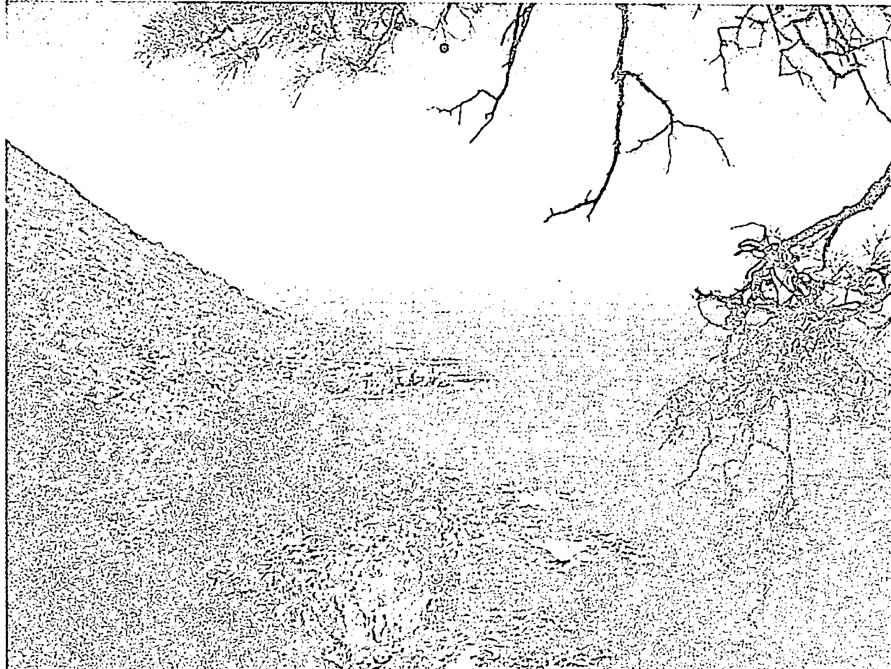

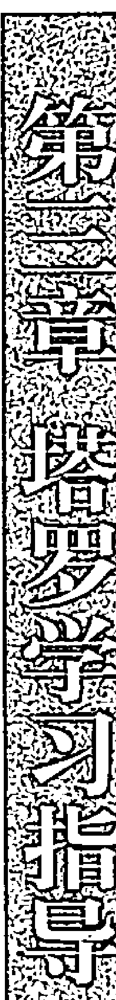

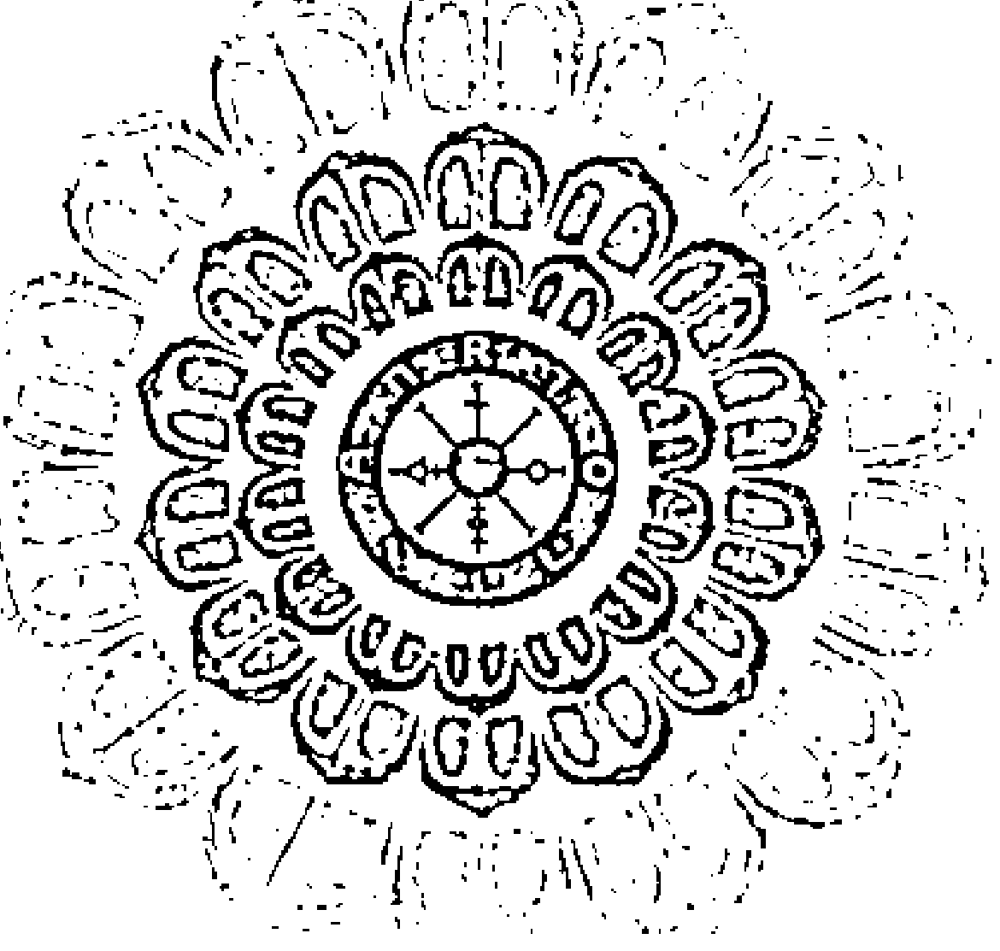

参照以上篇章中讲的内容，我们已经可以进行完整的塔罗推测游戏了，但是一些已经有塔罗基础想进一步了解塔罗奥义的朋友，仍会感到不满足。于是我们特意安排了塔罗学习课程。

- ○ 课程如何进行？

在学习中，我们的主要目标是：教你如何更合理地使用塔罗牌。塔罗牌可以帮助你更好地了解自己，并教导你如何更自信地释放内心的力量。你无需拥有“通灵能力”，就能很好地使用塔罗牌。你只需尊重并发展你与生俱来的直觉能力。

塔罗牌神秘莫测，包罗万象，它简单得令人怀疑，却又丰富得令人惊讶。

- ○ 学习塔罗牌需要什么条件？

你惟一真正需要的，就是一套塔罗牌。如今有许多种塔罗牌可供选择。网络版的“学习塔罗”课程用的是最常见的“伟特塔罗牌”(Rider-Waite)。这是一种很好的入门牌，因为每张牌上都有图画（而不仅仅是符号），可以帮助你学习。如果你已经有了另一种78张的塔罗牌，也可以用你自己的牌。塔罗牌的使用方法基本上是相同的，用哪一种都无所谓。现在很多地方都能买到塔罗牌，比如书店和某些网站。如果你从周边买不到塔罗牌，可以订购一套。

## 如何学习？

有人担心，使用塔罗牌会使他们卷入神秘事件中，或者与他们的宗教信仰产生冲突。我们对塔罗牌的态度是简单而自然的。塔罗牌并不是黑暗而神秘莫测的，它只是一种自我探索的奇妙工具。实际上，塔罗牌可以用许多积极的方式拓展你的精神和意识。
也有人认为塔罗牌是反科学的，其实，它只不过是一种游戏，有见识的人不会把它当回事。我们只想请你沉浸在好奇心里，敞开心扉，去研究塔罗牌。毕竟，这样才是真正的科学研究精神！以下是我们所建议的一组练习课程：

### 第一节 塔罗牌练习

## （一）解牌

这是每日解牌练习。在这种练习中，你选择某一张牌，它将成为你这一天的主题。这一练习的目标是提高你的知识，懂得如何在简单的24小时时段内探求你的生活。它也帮助你以不太累也不沉闷的方式学习塔罗牌。

假设你在每日解牌练习中抓到“圣杯二”。当你度过这一天时，你将看到这张牌标示出的特殊能量。“圣杯二”的关键意义是“联系”、“休止”或“停战”，以及“吸引”。上午，你的一个同事，平时跟你关系不太好的，这回跑到你的办公室来谈话。你感受到“停战”，并从中得到了利益。下午，当遇到一个难题时，你寻求“联系”，与人共同找出解决之道。然后，在聚会上，你和一个“吸引”你的人聊天。在每一个场合，你运用到“圣杯二”的能量，并让它引导你做出决定。

一开始，或许你每天会故意选出不同的牌，以便避免重复，并更快地学习塔罗。如果你愿意，在选牌的时候，你抛开意识的干涉。步骤如下：

1. 洗牌（参见上篇“洗牌”）一至两次。

## (二)摆牌

### 1. 凯尔特十字架摆法

花几分钟时间看一下关于凯尔特十字架的部分的内容（下篇第二章），理解一下它是怎么建起来的，不要为记不住发愁，目的只是为了更好地获取信息。现在用这种摆法摆开你所选的十张牌，一个接一个地读每个位置上的牌，思索每张牌的含义，因为它位于一个特定的位置上，以后你会学到更多，但现在只需想一想就行了。

### 2. 设计一种摆法

你可以自己设计符合你需要的摆牌方法，现在创造一种三张牌的塔罗牌摆法，按以下步骤：

- 1. 画一张摆放图——牌该往哪放；
- 2. 在位置上标上数字表明摆放的顺序；
- 3. 写一两句话来描述每个位置的意义。

这里是一个基本的三张牌的摆法，涵盖了先后的时间：过去、现在、未来。

当你处在一个三人团队时，想要知道队员的未来（包括你自己），这里是一种摆法：

牌呈“Y”形，头部朝里，这种形状表示思想的汇集。自行设计你的摆法，这样它就能反映出这些位置的意义。为了扩展练习，可以用四张、五张或更多的牌来练习。

## (三)写问题

- 1.写下问题

解牌前要写下你的问题，想一下你的生活，选一个你遇到麻烦的情况（我们每个人都会遇到的），要避免考虑类似于寻找一个生活伴侣这样的问题，选那种具体的在家中或工作中遇到的日常问题，选那种与你直接有关且个人很关心的问题。

- 2.在实践中练习写问题

生活会给你提供很多机会来练习写问题，无论何时当你遇到了问题，花一点时间就此提出一个问题，在日常生活中反复练习，如开车时或做家务时。写下实际问题能帮你学会快速分析个人问题，并认清你在复杂的环境中真正想要的是什么。而且，如果你决定解读你的问题，你必须先准备好你的问题。

## (四)编故事

- 1.与意识交谈

你可以在任何想要大声说出内心想法的时候进行与意识的交谈（对大部分人来说，指的是你在独自一人时候），脑中出现什么就说什么。主要目的是让你聆听自己内心的声音并表达出来。说完一个想法后，再听下一个。在以后的几周里，随时随地进行这个练习，一直练到你可以自然而然地说出来，不需强求，要试着达到这种程度——关于一件事的想法不是强加给自己的，这不太容易办到，但值得去努力。

- 2.塔罗牌即席表演

在舞台的即席表演中，众多的观众喊着某些事物的名字，演员必须具备建立在那些要素上的即席表演的能力。在这个练习中，牌就是要素，你就是演员，你必须将这些要素组合到一起。正常的洗牌和切牌，将牌反向放在手中，翻开前三张牌，将它们排成一排，现在围绕这些牌编一个故事，不要刻意地去想，让故事自然地展开。在Italo Calvino所写的“Castle of Crossed Destinies”中，剧中人物都拿塔罗牌中的人物互相讲故事。

做完之后，把前三张牌放到一边，再对下三张牌同样这么做，或者，你也可以保留这三张，再摆出第四张牌，把这张牌也编入最初的故事里，通过一次展开一张新牌来继续扩大这个故事，这个练习的意义也在同时体现出来，当你感到压力或压迫时就停止。

### 3. 凯尔特十字阵法的结构

以凯尔特十字阵法的形状摆出任意10张牌，在凯尔特十字阵法部分阅读对这种摆法的解释，按这些步骤编一个故事，这种方法对你的作用有多大？你会做出什么样的改变？

下一步，新摆出10张牌，编一个不同的故事，试着由最后一张即第10张开始，由后往前进行，或者围绕一对显著的牌编一个故事。不同组牌用不同的方法来编。针对你的解牌，你可能会采取一个最喜欢的方法，不过这还是有助于你了解其他的可能，在需要时可以用到。

接下来我们可以更系统地了解一下塔罗牌组的特点。

### 第二节 塔罗牌组特点

塔罗牌分四组，每一组都有自己的特点或能量。观察本节中下面列出的词组，你就会对这些能量有所感觉。每个列出来的词组都表明了每一组特点的不同方面。如果你的直觉与本书中的不一样，请先相信你自己的感觉。

对每一组来说，都有积极的和消极的词组。这种划分并不理想，因为它暗示了好和坏。在塔罗牌中，特点没有好坏之分，它们表示的只是它们自己。我们人类判断这些特点只是建立在它们对我们的影响上。我们的语言影响了这些判断，所以对于每个特点，我们都有积极的或消极的看法。同时，区分一些显著的特点也主要有赖于我们的环境。它是显著积极或是显著消极？都取决于环境。

## 权杖——积极的

- 敢作敢为的
- 有闯劲的
- 热情洋溢的
- 有吸引力的
- 大胆创新的
- 渴望的
- 大胆的
- 勇敢的
- 轻快的
- 超凡魅力的
- 迷人的
- 愉悦的
- 有信心的
- 有创造力的
- 活力充沛的
- 丰富的，非凡的
- 外向性的
- 有说服力的
- 鼓舞的
- 无畏的，勇猛的
- 乐观的
- 对人友好的
- 充满热情的
- 全心全意的
- 敢于冒险
- 有自信的
- 独创的

## 权杖——消极的

- 好斗的，侵略性的
- 骄傲自大的
- 鲁莽大胆的
- 漫不经心的
- 有勇无谋的
- 刚愎自用的
- 粗心大意
- 急躁的
- 暴躁易怒的
- 不耐烦的
- 冲动的
- 猛烈的
- 轻率的
- 不负责任的
- 肌肉发达的
- 自负的
- 过分热心的
- 专横的
- 不计后果的
- 不安宁的
- 肤浅浅薄的
- 欠考虑的
- 毫无准备的
- 不谨慎的
- 急躁的
- 鲁莽的
- 热衷于自己想法的

## 圣杯——积极的

- 有审美感的
- 挚爱的
- 惬意的，使人愉快的
- 和蔼可亲的
- 慈善的
- 平静的
- 人道的，有同情心的
- 关心的
- 考虑周到的
- 老练的
- 有梦想的
- 情感的
- 有感情的
- 宽容的
- 温文尔雅的
- 心地善良的
- 高尚的
- 康复的
- 仁慈的
- 想像力丰富的
- 内心的
- 亲密的
- 自己反省的
- 直觉的
- 兴高采烈的
- 好心的
- 亲爱的
- 柔美的
- 温和的，温柔的
- 美好的
- 和平的，平静的
- 耐心的
- 心境平和的
- 可理解的
- 精神的
- 安静的
- 优雅的，精确的
- 作出响应的
- 浪漫的
- 敏感的
- 柔软的
- 主观的
- 甜美的
- 心地温和的
- 宽厚的
- 谅解的
- 明智的

## 圣杯——消极的

- 多虑的
- 脆弱的
- 悲哀的，阴沉的，寂寞的
- 逃避现实的
- 爱空想的
- 发怒的

## 宝剑——积极的

- 分析的
- 清晰明白的
- 机敏的
- 有权威的
- 头脑清晰的
- 聪明的
- 有威严的
- 直率的
- 有辨识能力的
- 冷静的，平心静气的
- 民族的
- 公平无私的
- 坦白的，豪爽的
- 坦白的
- 诚实的
- 可敬的，光荣的
- 深刻的
- 有智力的
- 正义的
- 热情的
- 知识渊博的，有见识的
- 有学问的
- 有文化的
- 合乎逻辑的
- 明晰的
- 精神的，智力的
- 道德上的
- 客观的
- 遵纪守法的
- 坦率直言的
- 明察秋毫的
- 有悟性的
- 富有机械的，机敏的
- 理性的
- 通情达理的
- 锋利的
- 诚实的，说实话的
- 没有偏见的
- 没有成见的
- 消息灵通的，见闻广博的
- 机智的，诙谐的

## 宝剑——消极的

- 深奥的
- 孤僻冷漠的
- 自大傲慢的
- 独裁专制的
- 尖锐刺痛的
- 生硬的
- 冷淡的
- 故意屈尊的
- 控制的
- 淡漠的
- 批评的
- 切断的
- 分开的，分离的
- 疏远的，冷淡的
- 独断的
- 作威作福的
- 不由分说的
- 专横的
- 感觉迟钝的
- 不宽容的，狭隘的
- 审判的
- 固执己见的，武断的
- 傲慢专横的
- 过分理智的，呆板的
- 俨然以恩人自居的，要人领情的
- 偏僻的，遥远的
- 欠考虑的
- 没有感情的
- 无情的
- 反应迟钝的，没有同情心的
- 不宽恕的，不留情的

## 星币——积极的

- 有才能的
- 熟练的
- 机捷的
- 勤勉的，刻苦的
- 宽大的，慷慨的
- 能干的
- 仔细的
- 谨慎的，小心的
- 有能力的，胜任的
- 具体的，有形的
- 尽责的
- 持续的，坚决的
- 顽强的
- 有效率的，能干的
- 有进取心的，有魄力的
- 可靠的
- 实际的
- 事实的，实际的
- 坚固的，稳固的
- 慷慨的，大方的
- 便利的，敏捷的
- 不辞辛劳的
- 忠诚的，忠心的
- 宽宏大量，有雅量的
- 小心翼翼的
- 有教养的
- 井井有条的
- 组织合理的
- 艰苦的
- 坚忍的，不屈不挠的
- 有实践经验的
- 多产的
- 精通的
- 现实主义的
- 可靠的，可信赖的
- 坚决的
- 足智多谋的
- 有责任的，可靠的
- 明智的，有判断力的
- 灵巧的，熟练的
- 结实的，坚固的
- 稳定的
- 坚定的
- 坚持的
- 毫不含糊的，坚定的
- 支持的，支撑的
- 十分的，彻底的
- 信任的，信赖的
- 值得信任的

## 星币——消极的

- 顽固的
- 无色的，无趣味的
- 强制的，强迫的
- 常规的，传统的
- 单调的
- 令人沮丧的，阴暗的
- 严酷的
- 磨擦的
- 顽固的，无懈可击的
- 缺乏幽默感的，一本正经
- 不屈的，顽固的
- 难于处理的
- 不妥协的
- 唯物主义的
- 执拗的，顽固的
- 冷酷无情的
- 强迫性的
- 普通的，平凡的
- 过于谨慎的
- 难应付的
- 组织过于严密的
- 胆小的，羞怯的
- 呆板的
- 不冒险的
- 完美主义者
- 冷漠的，随意的
- 固执的
- 不妥协，不让步的
- 悲观厌世的
- 不令人兴奋的
- 愚蠢的
- 缺乏想像力的
- 整洁的
- 不问是非的
- 平凡的
- 平淡无奇的，平庸的
- 刚硬的，严格的
- 不光明正大的
- 沉静的
- 坚硬的，不能弯曲的
- 呆板的，僵硬的
- 庸俗的，笨重的

### 第三节 配对牌

塔罗牌的解读是似在查看一张地图，所有相互对立平衡的趋势在某一时刻会在你的生活中运行。解读这张地图，你必须明白对立法则——任何品质，只要被确认，就表示有对立面。这是物质世界的一条基本原则。愚人在他的旅行之初遇到了魔术师和女教主，发现了这条原则。这两个人告诉他，除了平衡点，没有什么是孤立的。

在最深层水平上，对立并不存在。只有惟一，但是，在物质生活中，我们认为惟一被打破，分成无数不同的能量。它们是我们寻找平衡的力量。

发现平衡的一种方式是解牌练习时，寻找相互对立的两张牌。宝剑八的一个含义是限制——被迫处于受压迫或受限制的局面。如果你仔细考虑它的含义，你会认识到，仅仅承认限制的看法，你暗示的是限制是自由的对立面——自由是摆脱束缚和限制。这正是权杖四的特点。

在解牌中，这两张牌显示的是你生活中限制或自由的重要性。它们定义了一系列经验的两极，从中你能选择最佳平衡点。下面有四类配对牌。

### (1) 永久配对牌

某些牌是清晰而明显的永久对立牌。宝剑八和权杖四就是这种类型。魔术师和女教主是另一对。魔术师表示行动和意识；女教主表示非行动力和无意识。

### (2) 宫廷牌和首牌配对牌

你能在任何两个宫廷牌或两个首牌中产生配对。当你比较两组或等级时，这些配对牌会影响平衡。比较星币国王和圣杯王后，这里有这些牌的关键词：

| 星币国王 | 圣杯王后 |
| :--- | :--- |
| 有事业进取心的 | 情绪的，情感的 |
| 熟练的 | 心地温和的 |
| 可信赖的 | 直觉的 |
| 支持的 | 精神的 |
| 稳定的 | 精神上的 |

星币国王是外向的（国王），在物质世界里对自己感兴趣的事情有进取心，且操作熟练（星币）。圣杯王后关注内心（王后），关心情感，重视直觉（圣杯）。

解牌中，这对牌代表两个人之间的冲突——一个实干型的人想干好工作，而一个梦想家首先考虑的是个人的感觉。这对牌也代表你内心深处的双重性——关注现实事务和集中于精神世界。这里存在许多可能性，都建立在这两者类型的动态变化上。

### (3) 偶然配对牌

你可以解释配对牌中的任何两个牌，即使它们的含义并不是完全对立也可以。每张牌有很多含义，总是能进行有效的比较。偶然配对牌也是偶然产生的，它们之间的关系仅仅存在于很短的一瞬间。

圣杯四描绘了一个孤独的人坐在树底下，圣杯十显示的是一个快乐的家庭在一起庆祝什么。如果这些图案对你有所意义，你可以把它们定义为“单独的”和“和别人在一起”，二者是对立的。突然出现的理解是可能的。

### (4) 加强型配对牌

两张牌不是一定要相互对立才形成配对。它们可以相互加强。皇后和圣杯九都暗示着快乐、好色和享受肉欲。加强型配对牌表示某种能量或有强大的影响力。有时，我们为了达到目标，被迫以不平衡的方式面对环境。

平衡在任何地方都存在。解塔罗牌时，通过配对牌的形式，能帮助你鉴别它们。

### (一) 各组间的配对牌义

| 权杖 / 圣杯 | 乐观的 / 悲观的 |
| 火 / 水 | 权杖 / 宝剑 |
| 外部 / 内部 | 火 / 空气 |
| 主动的 / 被动的 | 火热 / 凉爽 |
| 外向的 / 内向的 | 充满热情的 / 有所保留的 |
| 充满热情的 / 软弱的 | 忙碌的、参与的 / 分离的 |
| 爱神、愿望 / 目瞪口呆 | 超凡魅力，感召力 / 权威 |
| 强烈的 / 温和的 | 果断 / 没有偏见的 |
| 精力充沛的 / 宁静的 | 灵感 / 分析 |
| 好战的 / 爱好和平的 | 艺术家 / 评论家 |
| 个人的 / 团体的 | 直觉的 / 原因 |
| 竞争的 / 合作的 | 心灵的 / 头脑的 |
| 行动力 / 感觉 | 联系 / 分离 |
| 权杖 / 星币 | 仁慈 / 公正 |
| 火 / 土地 | 主观 / 客观 |
| 炫耀的 / 稳重的 | 亲密 / 有距离 |
| 新的 / 旧的 | 圣杯 / 宝剑 |
| 冒风险的 / 安全的 | 水 / 空气 |
| 冲动的 / 深思熟虑的 | 感觉 / 深思熟虑 |
| 灵感 / 排除 | 右脑 / 左脑 |
| 喜欢冒险的 / 小心谨慎的 | 爱慕 / 真理 |
| 自由的，不拘泥的 / 保守的 | 情感的 / 逻辑的 |
| 原创的 / 传统的 | 明显的，公开的 / 隐藏的 |
| 大而化之 / 细节 | 直接的 / 间接的 |
| 匆匆忙忙 / 完全的，彻底的 | |
| 快 / 慢 | |
| 圣杯 / 星币 | |
| 水 / 土地 | |
| 精神的 / 事实 | |
| 宗教的 / 科学的 | |
| 梦想的 / 脚踏实地的 | |
| 幻想 / 现实 | |
| 脆弱的 / 坚强的 | |
| 灵活的 / 坚定的 | |
| 柔软的 / 坚硬的 | |
| 浪漫的 / 实际的 | |
| 感情脆弱的 / 尊重事实的 | |
| 玩 / 工作 | |
| 宝剑 / 星币 | |
| 空气 / 土地 | |
| 理论 / 现实 | |
| 吸引 / 排斥 | |
| 精神上的 / 物理上的 | |
| 通过书本学习 / 惯例 | |
| 想 / 做 | |
| 主意 / 执行 | |
| 尽善尽美 / 妥协 | |
| 什么是正确的 / 什么起作用 | |
| 理想 / 现实 | |

### (二) 宫廷牌配对牌义

- 国王 / 国王
成年人 / 成年人
二者是平等的
二者都成熟，发展良好，
但是存在个体的差异
阳性的 / 阳性的
国王关注的是双向的
关心外部事件
在现实世界中是相互联系的

- 王后 / 王后
成年人 / 成年人
二者都是国王的伴侣
二者都成熟、发展良好，
但是存在个体的差异

阴性的 / 阴性的
王后关注的是双向的
关心内部事件

- 国王 / 王后
男人 / 女人
阳性的 / 阴性的
外部的 / 内部的
主动的 / 被动的
外向的 / 内向的
直接的 / 间接的
热切的 / 温和的
个人的 / 相互联系的
行动力 / 凭感觉
实干 / 关注生存的乐趣
逻辑性的 / 直觉的
竞争性的 / 合作的
强壮的 / 柔弱的
进攻型的 / 防御型的

- 国王——王后 / 骑士
成年人 / 青少年
缓和的，适中的 / 不适中的
保守的 / 崇尚自由的
年老的 / 年轻的
传统的 / 时尚的
已建立的 / 挑战者
慢 / 快
小心谨慎 / 敢于冒险的
安全 / 风险
稳定 / 不稳定

- 国王——王后 / 侍从
成年人 / 儿童
严肃的 / 快乐的
要负责任的 / 无忧无虑的
受限制的，拘谨的 / 不受限制的
有威严的 / 放荡不羁的
成熟的 / 天真的
有计划的 / 自发的
褪色的、凋零的 / 新生的、无知的
稳重的 / 爱炫耀的
蚂蚁 / 蚱蜢

- 骑士 / 骑士
成年人 / 成年人
年轻人 / 年轻人
两个极端，自身存在
对立的两个方面
没有共同点，两个人
团队分别处于不同的立场
骑士关注的是双向的

- 骑士 / 侍从
成年人 / 年轻人(或年龄稍大的儿童)
热切的 / 温和的
强迫性的 / 自由自在的
严酷的 / 快乐的
悲观的 / 乐观的
复杂的 / 简单的
易产生质疑的 / 易接受的

- 侍从 / 侍从
儿童 / 儿童
两个天真的人
侍从关注的是双向的
两个不同的方面都很有机会## △卡巴拉生命树

1. 皇冠：超越、神的本性。
2. 智慧：纯粹理性、创造始点。
3. 理解：执行、实质的理性、创造之泉。
4. 仁慈：爱、慈悲、恩宠、伟大。
5. 严厉：法、神的权力、恶的发现。
6. 美丽：慈悲、调停、美。
7. 胜利：永远、膨胀、胜利。
8. 名誉：尊严、收缩、荣光。
9. 根基：万物的基础、神的创造之座。
10. 王国：物质、人。

卡巴拉生命树，作为塔罗推测者来说，几乎是必须知道的内容。“卡巴拉（Qabalah）”源于希伯来语，意思是“口述传统”，是以近似冥想、打坐之类的方法寻求宇宙奥秘的修行方法。现在卡巴拉生命树的概念已将过去古代的知识数字和字母的方式加以结合，犹太教徒更进一步将事物起源区分为经由22种路径环环相扣的10个圣质，每个圣质对应一个希伯来文字母，形成完整的生命之树的形状。22种路径，可以与22张大阿卡那塔罗牌对应。

如果从1连到10，通常被称为“火剑之路”。从1被分为三个阶段：1、2、3组成精神三角。4、5、6组成人本三角。7、8、9组成物质三角。越过第一个环“皇冠”，开始这三个阶段：第一阶段是“虚空”（1、2、3）；第二阶段是“无限”（4、5、6）；第三阶段是“无数的光”（7、8、9）。

要获知生命之树的真谛，需要实际经历21张大阿卡那（0愚者除外）的试炼（见241页牌阵）完成上述的三个层次。进行塔罗预测时，剔除愚者牌，作为开启前的冥想用，以让自己回到最纯真的自我。下面是与古印度密宗人体脉轮图（生命之树的雏形）相对应的三阶段：如能完成第一阶段，则可获得每张塔罗的真义。如三个阶段皆圆满完成，则能掌握一切。

## △古印度密宗人体脉轮图

|      | 第1阶段 | 第2阶段 | 第3阶段 |
| :--- | :------ | :------ | :------ |
| ① 顶轮 | 战车    | 节制    | 世界    |
| ② 眉轮 | 情侣    | 死神    | 审判    |
| ③ 喉轮 | 教主    | 吊人    | 太阳    |
| ④ 心轮 | 皇帝    | 正义    | 月亮    |
| ⑤ 脐轮 | 女教主  | 隐士    | 高塔    |
| ⑥ 生殖轮 | 皇后    | 命运之轮 | 星辰    |
| ⑦ 海底轮 | 魔术师  | 力量    | 魔鬼    |

## △塔罗生命之树牌阵

# 附录第一篇

## 之一 实用牌阵

牌阵是千变万化的，除了我们前面已经介绍的经典牌阵，一些最新流行的牌阵也在悄然兴起。很难真正统计出具体有多少种牌阵，因为只要符合内在的法则，人人都可以自创出牌阵来。只要适合自己的，就是好的牌阵。在本附录中，我们列出了最新的一些实用牌阵，如果未加以特别说明的，则代表既可以用22张大阿卡那推测，也可以使用78张牌一起推测。要记住，洗牌切牌时，冥想所问的问题，牌摆好后，再一起翻开。

我们所列举的牌阵简单易学，具有时代特色，非常适合初学者使用。

### （一）未来运程

1. 未来运程

这是一种简单的推测方法，类似“每日动向”的自我解读。按照洗牌切牌的顺序完成后，随意抽取1张牌放在1的位置。

牌位含义：

- (1)代表你未来应该着重关注的事项。

2. 时间之箭

洗牌切牌完成后，依次抽取3张牌，分别放在1、2、3位置上。

牌位含义：

- (1)代表过去曾经发生过的事情或状态。
- (2)代表现在正在发生着的事情或状态。
- (3)代表未来可能发生的事情或状态。

3. 新的机遇

洗牌切牌完成后，随意抽取3张牌，依次放在1、2、3位置上。

牌位含义：

- (1)代表已经过去的不再重要的因素。
- (2)代表变得比较重要的因素。
- (3)代表最重要的、此刻是必须的因素。

4. 决策未来

洗牌切牌完成后，随意抽取5张牌，依次放在1、2、3、4、5位置上。

牌位含义：

- (1)代表有关未来最主要的观点。
- (2)代表你的动力。
- (3)代表外界会对你产生的影响。
- (4)代表你会遇到的风险和危机。
- (5)代表解决问题的指导。

5. 四季运程

洗牌切牌完成后，随意抽取8张牌，依次放在1到8位置上。

牌位含义：

- (1)(8)代表春季：是行动开始的象征。
- (2)(3)代表夏季：是计划的持续发展，积极争取完成任务。
- (4)(5)代表秋季：是计划的决定性时刻，决定收获的季节。
- (6)(7)代表冬季：是总结收获和学习的季节。

6. 季节运程

这一个牌阵不能只使用大阿卡那牌，需要大小阿卡那一起使用。先将小阿卡那的四张首牌抽出单放。将其余的牌按照洗牌切牌的顺序完成，然后随意抽取5张牌，依次放在1到5位置上。然后从那四张首牌中随意抽取1张放在6的位置，然后再将所有的牌翻开开始解读。

牌位含义：

- (1)代表对你的幸运状况的大概分析。
- (2)代表你的幸运状况是如何影响你的生活的。
- (3)代表能令你获得幸运的地方。
- (4)代表能给你带来幸运的人或事。
- (5)代表那些人或事给你带来的幸运是如何令你梦想成真的。
- (6)代表比较幸运的季节。
  - 权杖首牌——代表春天。
  - 圣杯首牌——代表夏天。
  - 星币首牌——代表秋天。
  - 宝剑首牌——代表冬天。

7. 新年运程

新年运程，一年的观望，自然是一个复杂的牌阵，用78张塔罗牌一起推测，推测结果好，要更加努力进取；若测到不好的结果，则需要对自己的行动稍加调整了。总之，都是一个好的开始。

洗牌切牌完成后，随意抽取20张牌，依次放在1到20位置上。

牌位含义：

- (1)(2)代表你从去年一直延续到今年的愿望。
- (3)代表对这个冬季的整体观望。
- (4)代表对1月的展望。
- (5)代表对2月的展望。
- (6)代表对3月的展望。
- (7)代表对整个春季的概述。
- (8)代表对4月的展望。
- (9)代表对5月的展望。
- (10)代表对6月的展望。
- (11)代表对整个夏季的概述。
- (12)代表对7月的展望。
- (13)代表对8月的展望。
- (14)代表对9月的展望。
- (15)代表对整个秋季的概述。
- (16)代表对10月的展望。
- (17)代表对11月的展望。
- (18)代表对12月的展望。
- (19)(20)代表你将从今年一直带到明年的愿望。

### （二）取舍判断

8. 取舍判断

洗牌切牌完成后，随意抽取两张牌，依次放在1、2位置上。

牌位含义：

- (1)代表将获得的东西。
- (2)代表将失去的东西。

9. 或此或彼

该牌阵可以让你对自己目前的两难处境有一定的明了。完成洗牌切牌后，随意抽取6张牌，依次放在1、2、3、4、5、6的位置上。

牌位含义：

- (1)代表你目前的处境。
- (2)代表你将前往的方向（你想得到的）。
- (3)(4)(5)代表你将用何方法达到目的。
- (6)代表你将得到的支持和帮助。

10. 该或不该

洗牌切牌完成后，随意抽取9张牌，依次放在1到9的位置上。

牌位含义：

- (1)(2)(3)代表假如你只凭心中所想而为将产生的结果。
- (4)(5)(6)代表假如你不做改变维持目前状况将会产生的结果。
- (7)代表假如你有所改变将会产生的结果。
- (8)代表假如你不做任何改变将会产生的结果。
- (9)代表在下决定之前，你必须知道的事项。

11. 职场选择

如果有工作A和工作B放在你的面前供你选择，假如一下子不知选哪个好的话，不妨用该牌阵来解读一下。
洗牌切牌完成后，随意抽取9张牌，依次放在1到9位置上。

牌位含义：

- (1)代表对你内心的探问，你想寻找的是什么样的工作呢？
- (2)代表工作A给予的指示。
- (3)代表工作B给予的指示。
- (4)代表工作A吸引你之处。
- (5)(6)代表工作A的优势。
- (7)代表工作B吸引你之处。
- (8)(9)代表工作B的优势。

12. 丁字路口

先确定好A、B、C三件令你举棋不定的事情，然后冥想，进行洗牌切牌，完成后，随意抽取11张牌，依次放在1到11位置上。

牌位含义：

- (1)(2)代表你心中正在考虑的事项。
- (3)代表事件A获得肯定的地方。
- (4)代表事件A被否定的地方。
- (5)代表事件A的发展趋势。
- (6)代表事件B获得肯定的地方。
- (7)代表事件B被否定的地方。
- (8)代表事件B的发展趋势。
- (9)代表事件C获得肯定的地方。
- (10)代表事件C被否定的地方。
- (11)代表事件C的发展趋势。

13. 恋情三角

当你陷入三角恋情时，尤其是有两个人同时都爱上了你，你或许会一下子不知该如何取舍，不妨借用恋情三角的牌阵帮自己分析一二。这个牌阵需要你先设定好令你难以决断的情侣甲和情侣乙。

洗牌切牌完成后，随意抽取10张牌，依次放在1到10的位置上。

牌位含义：

- (1)代表你目前的处境。
- (2)代表你是否对情侣甲充满期待。
- (3)代表你是否信任情侣甲。
- (4)代表你是否已经爱上了情侣甲。
- (5)代表你与情侣甲目前发展的状况。
- (6)代表你是否对情侣乙充满期待。
- (7)代表你是否信任情侣乙。
- (8)代表你是否已经爱上了情侣乙。
- (9)代表你与情侣乙目前发展的状况。
- (10)代表你未来的境遇。

### （三）心灵探索

14. 认识自我

这个简单的牌阵，可以帮助我们更加深刻地了解自己。洗牌切牌完成后，随意抽取3张牌，依次放在1、2、3位置上。

牌位含义：

- (1)代表我到底是一个怎样的人。
- (2)代表我真正的需求到底是什么。
- (3)代表我如何才能达到我的需求。

15. 珍重再见

洗牌切牌完成后，随意抽取5张牌，依次放在1、2、3、4、5位置上。

牌位含义：

- (1)代表最初你想要的其实是什么。
- (2)代表你目前得到的是什么。
- (3)代表你失去了什么。
- (4)代表你一直无法得到的东西。
- (5)代表你如何才能得到自己想要的东西。

16. 四方季风

洗牌切牌完成后，随意抽取4张牌，依次放在1、2、3、4位置上。

牌位含义：

- (1)代表你必须舍弃一些东西，才能令自己得到解放。
- (2)代表某些东西是你必须勇敢面对的。
- (3)代表某些你必须知道的东西。
- (4)代表你将获得的东西。

17. 灵魂之旅

该牌阵可让求问者明了自己“灵魂”（性格与气质）的形成及对运势影响。洗牌切牌完成后，随意抽取7张牌，依次放在1到7位置上。

牌位含义：

- (1)代表你自己。
- (2)代表你家族中的长辈或祖先。
- (3)代表文化对你的影响。
- (4)代表时间对你的影响。
- (5)代表你的故乡或住所对你的影响。
- (6)代表以前的生活对你的影响。
- (7)代表你天赋所具的特质。

18. 九种自我

洗牌切牌完成后，随意抽取9张牌，依次放在1到9位置上。

牌位含义：

- (1)代表你目前的状况。
- (2)代表你的心理状况。
- (3)代表你人际关系的状况。
- (4)代表你创造性方面的灵感。
- (5)代表你的行动力。
- (6)代表你的潜意识。
- (7)代表你的情绪。
- (8)代表目前对你影响最大的因素。
- (9)代表你内心的力量。

19. 五芒星光

洗牌切牌完成后，随意抽取11张牌，依次放在1到11位置上。

牌位含义：

- (1)代表你的身体。
- (2)代表你的情感。
- (3)代表你的心智。
- (4)代表你当前面临的问题。
- (5)代表问题的根本原因。
- (6)代表你需要去解决的问题。
- (7)代表你未得释放的愿望。
- (8)代表女性特征方面。
- (9)代表男性特征方面。
- (10)代表你需要努力的方面。
- (11)代表解决问题的方法。

20. 星辰之梦

洗牌切牌完成后，随意抽取7张牌，依次放在1到7位置上。

牌位含义：

- (1)代表梦想的关键，你对于你的这个梦想的感受。
- (2)代表一些与这个梦想有关的事情。
- (3)代表这个梦想蕴涵的能量。
- (4)代表这个梦想对你当前生活的意义。
- (5)代表这个梦想在你心中的地位。
- (6)代表你想解决目前的处境所需要的能量。
- (7)代表这个梦想将会如何呈现它的影响效果。

21. 陀螺轴心

洗牌切牌完成后，随意抽取9张牌，依次放在1到9位置上。

牌位含义：

- (1)代表你的自我意识。
- (2)代表你的愿望。
- (3)代表你的梦想。
- (4)代表你生活中所积极追求的事物。
- (5)代表令你依恋的事物。
- (6)代表你的特质。
- (7)代表你的缺点。
- (8)代表你对自己的了解。
- (9)代表你的精神动力。

22. 四大元素

洗牌切牌完成后，随意抽取13张牌，依次放在1到13位置上。

牌位含义：

- (1)代表你自己的自我意识。
- (2)代表你的愿望。
- (3)代表梦想：你想要实现的。
- (4)代表追求：你努力争取实现的。
- (5)代表依恋：那些让你不舍放弃的。
- (6)代表特质：你的优点。
- (7)代表懊悔：你需要改进的缺点。
- (8)代表你心目中自己对自己的看法。
- (9)代表你的精神动力。
- (10)代表土元素：神秘的力量。
- (11)代表风元素：对你有用的启发、启迪。
- (12)代表火元素：你的愿望和理性的思考。
- (13)代表水元素：你的创造力和情感。

23. 理想现实

这一种推测，不建议只用22张大阿卡那牌推测。该牌阵较庞大，预测结果也更明晰。

洗牌切牌完成后，随意抽取21张牌，依次放在1到21的位置上。

牌位含义：

- (1)(2)(3)(4)代表现况、矛盾之处、关键问题。
- (5)(6)(7)(8)代表你心中真正的愿望。
- (9)(10)(11)(12)代表你的真实想法与你的愿望的关系。
- (13)(14)(15)(16)代表为达成理想所必须做的。
- (17)(18)(19)(20)代表你如何才能让自己感到满足。
- (21)代表你觉得满足之后，将发生的事情。

### （四）有关事业

24. 工作运程

洗牌切牌完成后，随意抽取3张牌，依次放在1、2、3位置上。

牌位含义：

- (1)代表你认真选取的这份工作的确适合自己吗？
- (2)代表这份工作会长久做下去吗？
- (3)代表你目前的工作状态还需要做些改变吗？

25. 合作伙伴

洗牌切牌完成后，依次抽取3张牌，摆放在1、2、3位置上。

牌位含义：

- (1)代表你的合作伙伴，他是谁？他是什么状况？等等。
- (2)代表合伙关系中你自己的状况。
- (3)代表合伙的前景会是怎样的。

26. 转换工作

洗牌切牌完成后，随意抽取5张牌，依次放在1、2、3、4、5位置上。

牌位含义：

- (1)代表你将获得一份更好的工作的可能性。
- (2)代表你所拥有的东西。
- (3)代表你将经历或者面临的问题。
- (4)代表你是否需要开创一个新的局面。
- (5)代表你转换工作的结果。

27. 事业前途

洗牌切牌完成后，随意抽取5张牌，依次放在1、2、3、4、5位置上。

## TAROT 经典塔罗

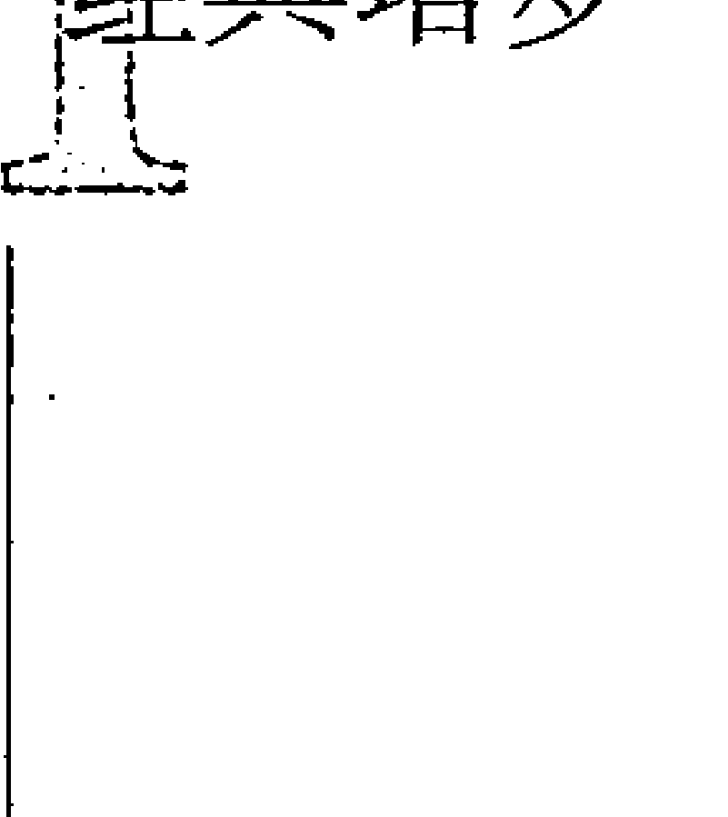

### 牌位含义：

-   (1)代表帮助你分析之所以选择这份工作的原因。
- (2)代表你是否选择正确。
- (3)代表你将面临的障碍是什么。
- (4)代表什么对你有益。
- (5)代表持续良好发展的方法。

## 28. 工作发展

洗牌切牌完成后，随意抽取11张牌，依次放在1到11位置上。

### 牌位含义：

-   (1)代表你自己在工作中的目标。
- (2)代表工作中将对你有帮助的人或事。
- (3)代表你工作中应该关注的重心。
- (4)代表一个转折点：改变状况的契机。
- (5)代表工作中可能的新的机会。
- (6)代表一个重要的事件，当它发生时你会有所觉察。
- (7)代表之前发生的情况的一个结果。
- (8)代表工作中的另一个可能的新的机会。
- (9)代表这过程中的另一个重要的事件，当它发生时你会有所察觉。
- (10)代表你所取得的成就。
- (11)代表为了取得工作的进步，你必须掌握或者知道的事情。

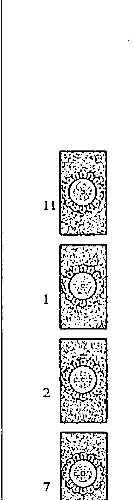

## 29. 事业运程

这又是一个很大的牌阵，推测的也是很庞大的一个体系，内容自然也不容小觑。建议大小阿卡那一起使用。
洗牌切牌完成后，随意抽取12张牌，依次放在1到12位置上。

### 牌位含义：

-   - (1)(2)(3)代表对你的目前事业状况的详细分析。
- (4)(5)(6)代表造成目前结果的过去的因素。
- (7)(8)(9)代表能够帮助你改变目前状况的因素。
- (10)(11)(12)代表未来会发生的情况。

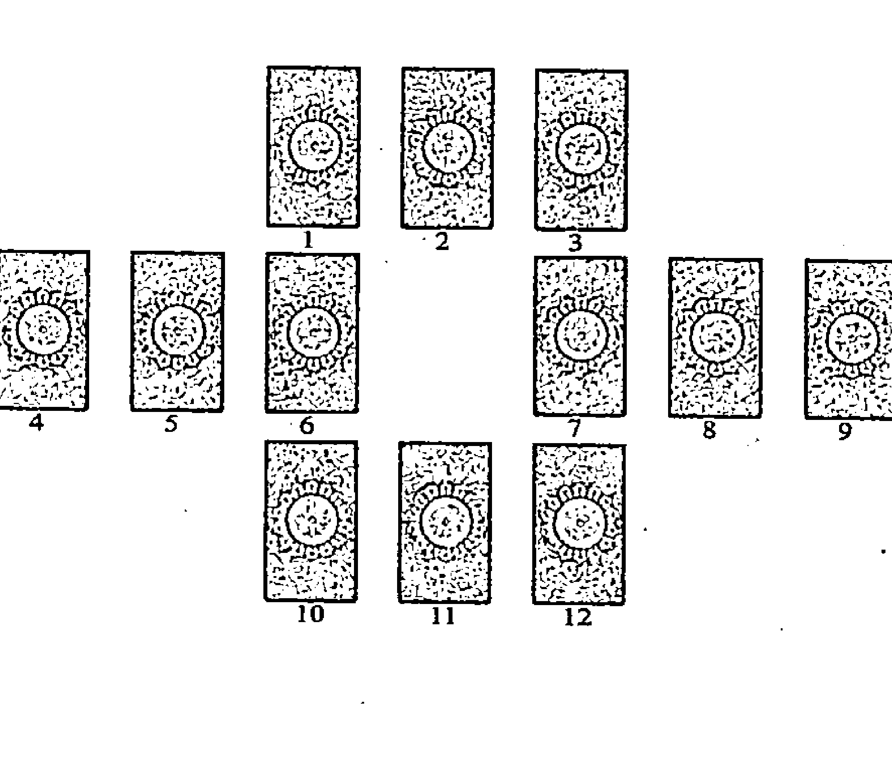

## 30. 合作关系

洗牌切牌完成后，随意抽取10张牌，依次放在1到10位置上。

### 牌位含义：

-   1. (1)代表在一段合作关系中对你的描述。
2. (2)代表你眼中的合作伙伴。
3. (3)代表你对待这段合作关系的态度。
4. (4)代表加强你们的合作关系的因素。
5. (5)代表削弱你们的合作关系的因素。
6. (6)代表你所希望发生的事情。
7. (7)代表你害怕的事情。
8. (8)代表你必须负起的责任。
9. (9)代表这段合作关系中你的合作伙伴必须负担的责任。
10. (10)代表在你们的合作关系中会发生的事情。

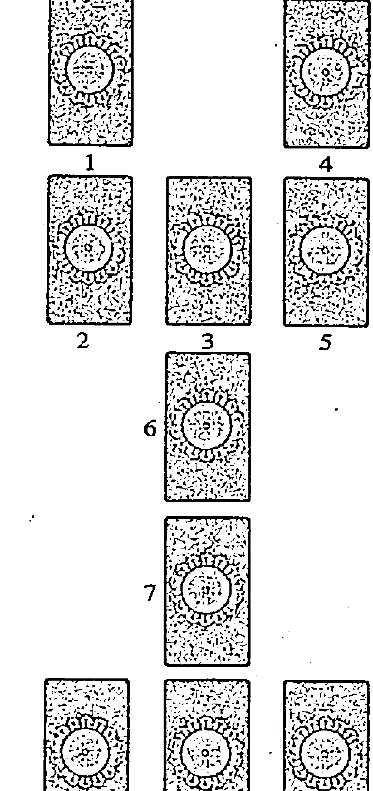

## 31. 事业财富

洗牌切牌完成后，随意抽取10张牌，依次放在1到10位置上。

### 牌位含义：

-   1. (1)代表对你是否可以开展创业之途的建议。
2. (2)代表对你是否需要与人合伙的建议。
3. (3)代表大家是否会接受你的产品。

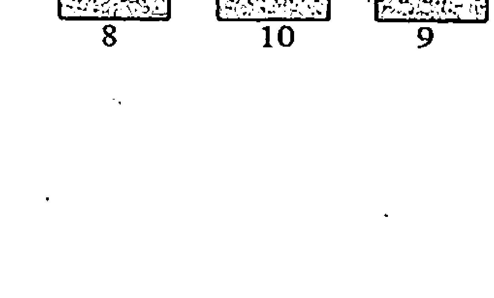

-   - (4)代表你的创业中是否会遇到困难。
- (5)代表你是否该做些改变。
- (6)代表你是否忽略一些事。
- (7)代表你是否会成功。
- (8)代表你是否能够创业获得财富。
- (9)代表你该采取怎样的宣传。
- (10)代表你创业之途的最后结果。

## (五)有关爱情

### 32. 爱情前途

发生一段新的恋情时，很多人都会患得患失，不太确定这段爱情是否可以长久，用我们的塔罗牌推测一下吧，它会令你不再彷徨迷离！
洗牌切牌完成后，依次抽取4张牌，按顺序摆放在1、2、3、4位置上。

### 牌位含义：

-   - (1)(2)(3)三个牌位代表情侣给你的感觉。
- (4)代表你们的爱情的前景。

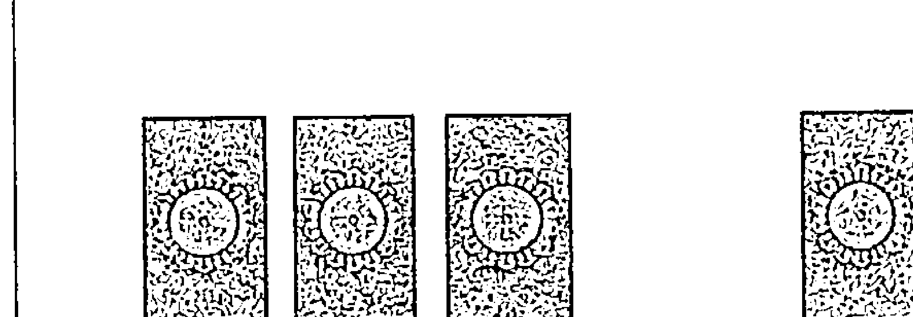

### 33. 一生情运

这个牌阵关乎你一生爱情之路。推测的时候，不妨冥想的时间长一些。
洗牌切牌完成后，依次随意抽取6张牌，按顺序摆放在1、2、3、4、5、6位置。

### 牌位含义：

-   - (1)代表过去的爱情给你的经历和体验。
- (2)代表目前的爱情体验。
- (3)代表你在爱情生活中最注重最想得到的感受。
- (4)代表你在爱情生活中真正需要的其实是什么。
- (5)代表你在爱情生活中所付出的东西。

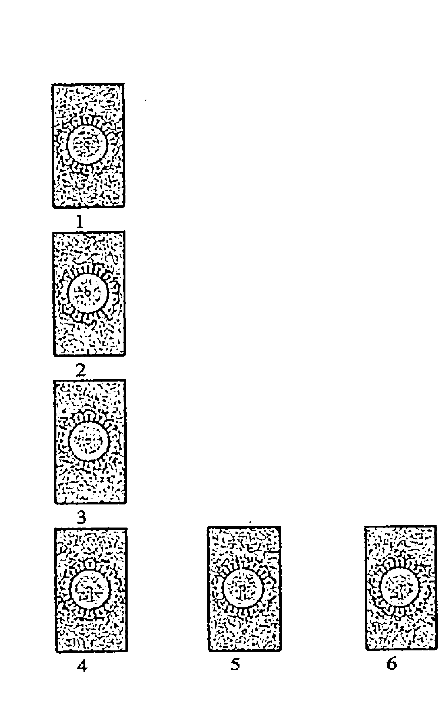

- (6)代表将来你可能获得的爱情体验。

## 34. 终生伴侣

洗牌切牌完成后，随意抽取5张牌，依次放在1、2、3、4、5位置上。

### 牌位含义：

-   (1)代表真正适合你的终生伴侣的类型。
- (2)代表真正适合你的伴侣是否已经走入了你的生活。
- (3)代表你和真正适合你的伴侣之间的发展是否顺利，会遇到哪些困难。
- (4)代表在感情之路上你需要做什么样的调整或改变。
- (5)代表最值得你相信的是什么。

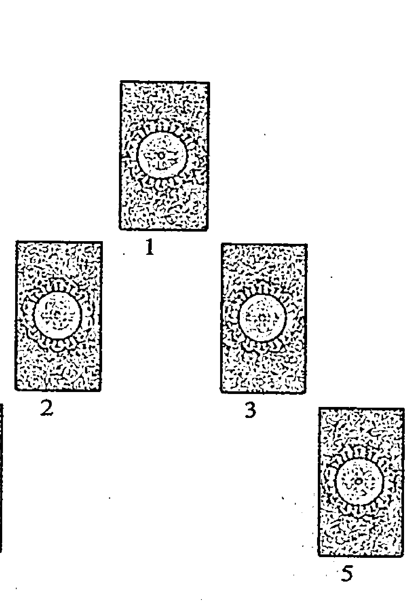

## 35. 爱的考验

洗牌切牌完成后，随意抽取5张牌，依次放在1、2、3、4、5位置上。

### 牌位含义：

-   (1)代表你从目前的爱情生活中获得的启示。
- (2)代表在爱情生活中你应该或者需要得到的东西。
- (3)代表爱情生活中令你不喜欢的因素。
- (4)代表如何能赋予你的爱情新的活力。
- (5)代表你应该从爱情中学习到的东西。

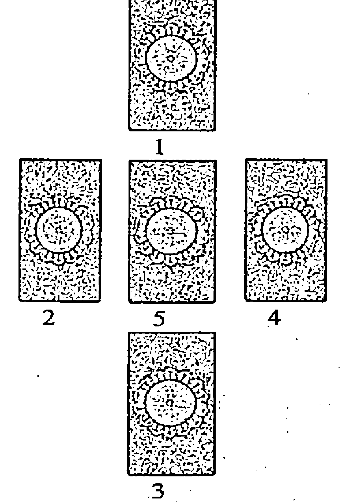

## 36. 爱的关系

所谓当局者迷，假如一段感情令你迷惑，心生徘徊，不妨用本牌阵测一测你内心的声音。洗牌切牌完成后，随意抽取4张牌，依次摆放在1、2、3、4位置。

### 牌位含义：

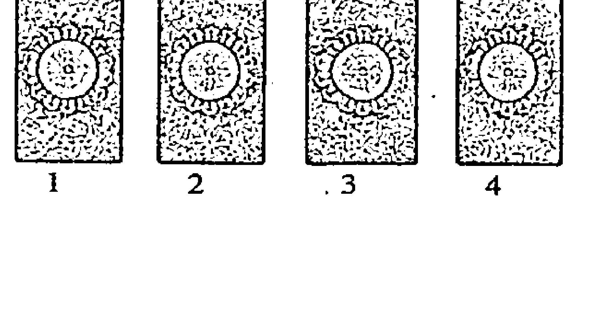

-   (1) 代表你在目前的爱情生活中所付出的种种。
- (2) 代表你在爱情中的收获。
- (3) 代表你的爱人为你所付出的。
- (4) 代表你的爱人在爱情中得到了什么。

## 37. 爱已远逝

洗牌切牌完成后，随意抽取5张牌，按照图示位置依次摆好。

### 牌位含义：
-   (1) 代表那份逝去的爱情中，哪些伤害对方最深。
- (2) 代表曾经在一起的你们，当时所拥有的东西。
- (3) 代表你们曾拥有的那些东西，是什么原因使其遭到了破坏。
- (4) 代表你们的伤害是否可以得到弥补。
- (5) 代表你们之间是否会有将来。

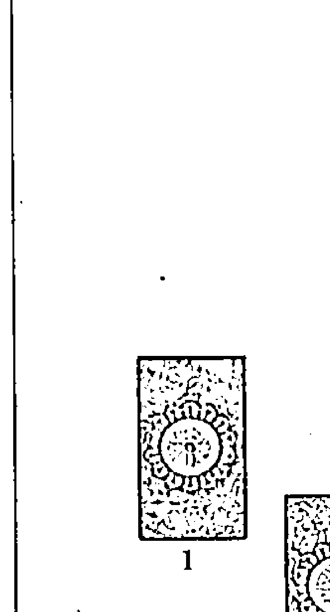

## 38. 爱的萌芽

洗牌切牌完成后，随意抽取6张牌，依次放在1、2、3、4、5、6位置上。

### 牌位含义：
-   (1) 代表你是否会遇到一段新的恋情。
- (2) 代表当发生新的恋情时你喜欢的那个人会是什么星座。
- (3) 代表你们之间的关系发展是否顺利。
- (4) 代表你们的关系是否会长久。
- (5) 代表你们之间是否很默契，是不是心灵相通的情侣。
- (6) 代表你的愿望能否实现。

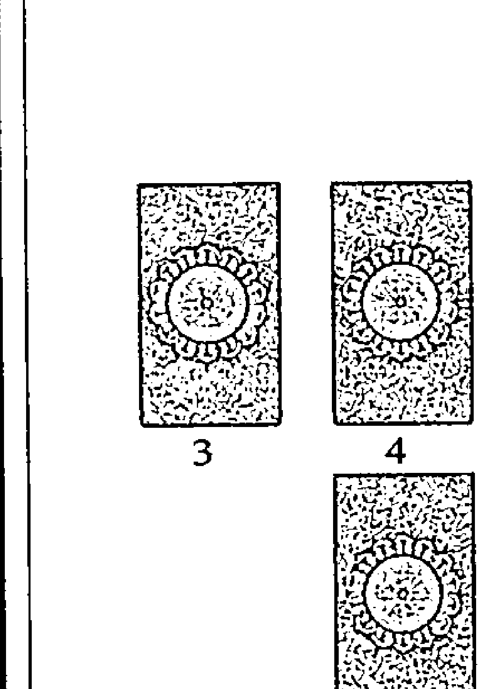

## 39. 分手判断

该牌阵可以帮助困在情网中的人更清晰地明了一些隐藏的真情。完成洗牌切牌的程序后，随意地抽5张牌，依次放在1、2、3、4、5位置上。

### 牌位含义：

-   (1)(2)(3)三个牌位均代表导致分手的隐藏原因可能是什么。
- (4)代表直接导致分手的最主要原因是什么。
- (5)代表分手之后会带来的结果和影响。根据这个影响可以判断是否要分手。

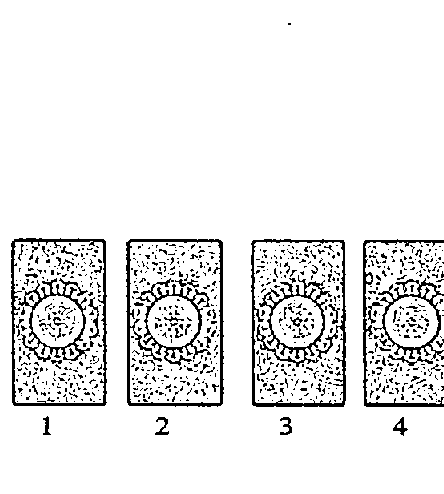

## 40. 维纳斯之爱

洗牌切牌完成后，随意抽取8张牌，依次摆放在1到8牌位上。

### 牌位含义：

-   (1)代表求问者的真心。
- (2)代表对方的真心。
- (3)代表你受到的影响。
- (4)代表对方受到的影响。
- (5)代表你们遇到的麻烦。
- (6)代表你们之间的结果。
- (7)代表求问者未来的处境。
- (8)代表对方未来的处境。

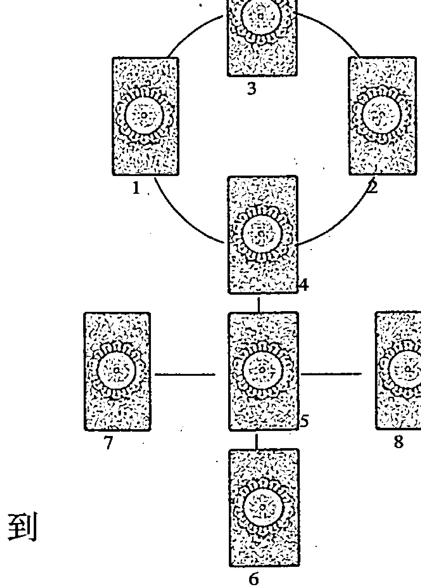

## 41. 爱情阶梯

洗牌切牌完成后，随意抽取10张牌，依次放在1到10的位置上。

### 牌位含义：

-   (1)代表你目前的爱情在过去的状况。
- (2)代表过去的爱情经历给你的经验和体会。
- (3)代表你的爱人曾有的经验和体会。

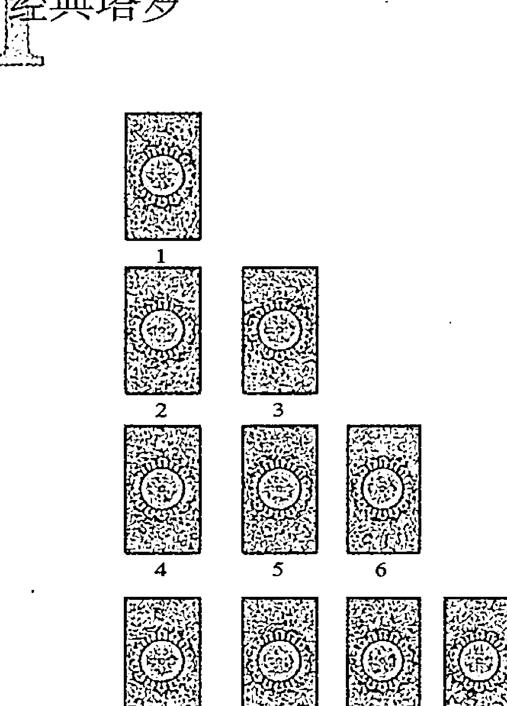

-   (4)代表你目前对爱情的体会。
- (5)代表你的爱人目前对爱情的体会。
- (6)代表你和爱人之间的感情状况。
- (7)代表目前你的这段爱情将来可能带给你的感受。
- (8)代表目前这段爱情将来可能带给你的爱人的感受。
- (9)代表你和爱人之间的关系和进展。
- (10)代表你和爱人未来会遇到的可能状况。

## 42. 情侣追问

洗牌切牌完成后，依次抽取10张牌，放在1到10的位置上。

### 牌位含义：
-   (1)代表你的爱人是否关心你。
- (2)代表你们之间的关系是否稳固。
- (3)代表你们是否志同道合。
- (4)代表你的爱人是否忠贞值得信任。
- (5)代表你们彼此心灵沟通的程度和你们之间的亲密程度。
- (6)代表你的爱人有否跟你结婚的打算。
- (7)代表你的爱人是不是一个优秀的人。
- (8)代表你们之间的感情可以发展到金钱共享不分彼此的程度。
- (9)代表你的爱人对你的爱恋程度，是否不离不弃。
- (10)代表你们感情发展的最终结果。

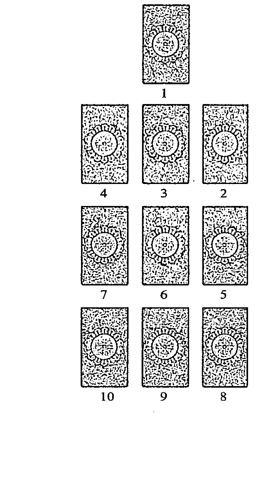

## 43. 爱旅迢迢

人生的境遇常会面临两难的选择，不独选择爱侣，包括朋友、合作伙伴等等，如果面临选择甲和选择乙时，怎么办呢？

洗牌切牌完成后，随意抽取10张牌，依次放在1到10的位置上。

### 牌位含义：
-   (1)代表对选择甲的描述。
- (2)代表选择甲对你而言的意义。
- (3)代表假如选择甲结果可会相处融洽。
- (4)代表你是否可凭自己的感情做事而无须过多考虑外在的东西。
- (5)代表选择甲是否合适。
- (6)代表对选择乙的描述。
- (7)代表选择乙对你而言的意义。
- (8)代表假如选择乙结果可会相处融洽。
- (9)代表你是否可以只根据自己的判断评判选择乙。
- (10)代表选择乙是否合适。

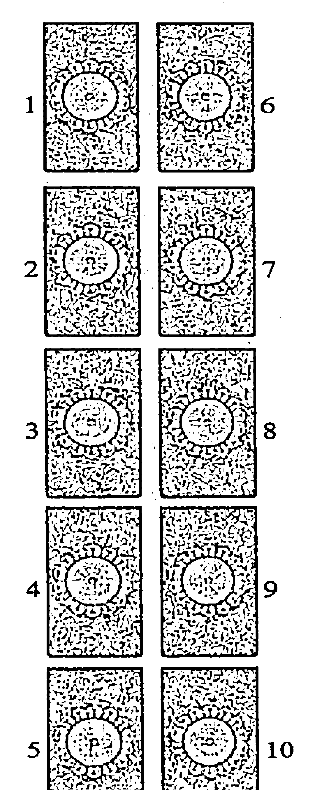

## 44. 如意真心

正在恋爱中的人们，想知道你和另一半的匹配指数吗？依照你们的出生年月，用如意真心牌阵推测一下吧。

将两人的生命数相加，得到一个数字，切该数字次牌，由上而下取13张牌，依次摆放在1到13牌位上。

例：甲 1978年06月18日出生，乙 1978年10月25日出生。
甲生命数为：1+9+7+8+0+6+1+8=40，4+0=4。
乙生命数为：1+9+7+8+1+0+2+5=33，3+3=6。
4+6=10，1+0=1，切一次牌然后摆牌。

### 牌位含义：
-   - (10)代表你的过去。
- (6)代表你的现在。
- (7)(11)代表你的未来。
- (1)(2)代表你的真心。
- (12)代表对方的过去。
- (8)代表对方的现在。
- (9)(13)代表对方的未来。
- (3)(4)代表对方的真心。
- (5)代表最后的结果。

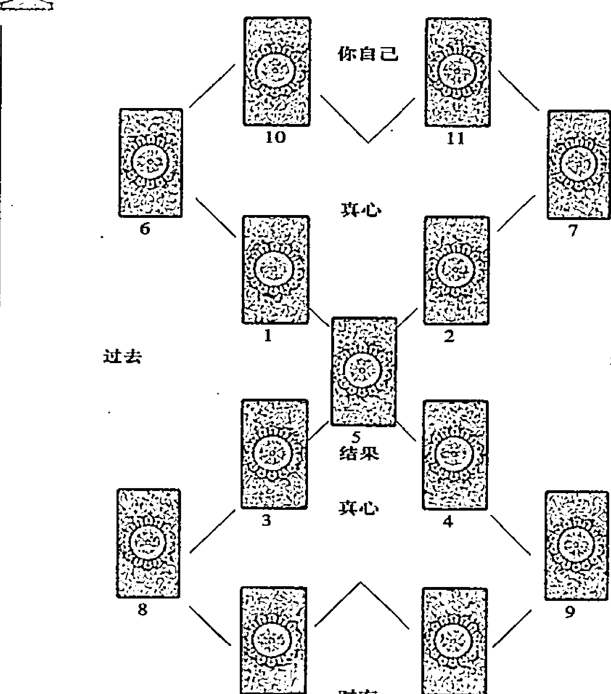

## 45. 考问爱情

或许你发生了一段浪漫的偶遇，你想知道这场偶遇是否通往爱情之路，你想知道你们可有未来。此时必定是心中忐忑的，不妨用本牌阵考问一下你自己的心吧，假如有好的预示，那就勇敢地争取吧！洗牌切牌完成后，随意抽取10张牌，依次放在1到10的位置。

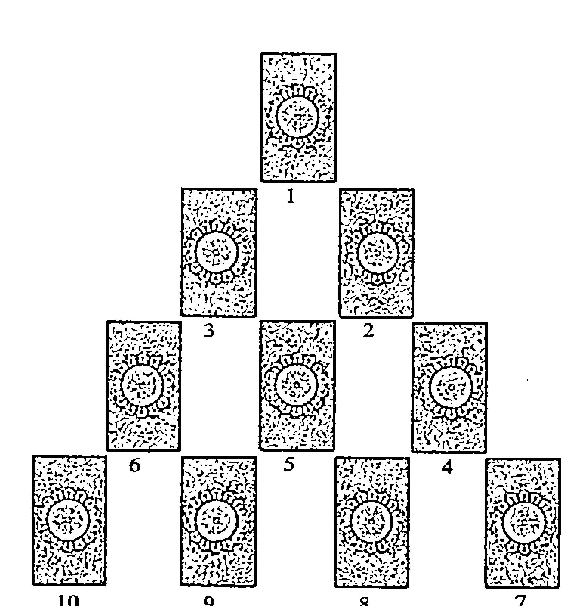

### 牌位含义：
-   - (1)代表你对对方来说是否有诱惑力。
- (2)代表对方对待你的心意。
- (3)代表你们相处是否愉悦。
- (4)代表你们是否能够相互扶持。
- (5)代表你们的性生活是否和谐。
- (6)代表你们俩的家族之间是否会相处融洽。
- (7)代表你们的宗教信仰可会起冲突。
- (8)代表你们之间可会有金钱财富方面的纠纷。
- (9)代表你们之间的关系可会长远。
- (10)代表你们之间恋情的结果。

## 46. 柳暗花明

洗牌切牌完成后，随意抽取11张牌，依次放在1到11的位置上。

### 牌位含义：
-   (1)代表你过去的情况。
- (2)代表你现在的情况。
- (3)代表你假如与从前的情侣复合结果如何。
- (4)代表你从前的情侣过去的情况。
- (5)代表你从前的情侣现在的情况。
- (6)代表你从前的情侣与你复合的可能性。
- (7)代表你从前的情侣的现在的情侣过去的情况。
- (8)代表你从前的情侣的现在的情侣的现在的情况。
- (9)代表你从前的情侣的现在的情侣与你的关系。
- (10)代表你与从前的情侣之间关系的结果可能性一：(3)位的牌会对这个结果产生影响。
- (11)代表你与从前的情侣之间关系的结果可能性二：(9)位的牌会对这个结果产生影响。

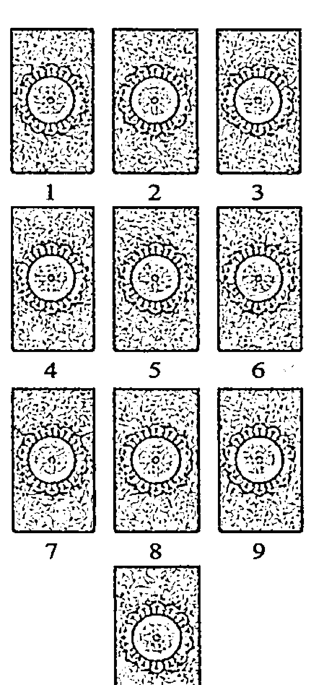

## 47. 阴阳相背

本牌阵比较庞大，理论上也可只使用大阿卡那牌，但建议最好一起使用大小阿卡那78张牌推测，这样，结果比较详尽细致。
洗牌切牌完成后，随意抽取14张牌，如图依次摆放在1到14的位置上。

### 牌位含义：
-   (1)(2)代表在一段感情中，男性所喜欢的部分。
- (3)(4)代表在这段感情中，女性所喜欢的部分。
- (5)(6)代表在这段感情中，男性不喜欢的部分。
- (7)(8)代表在这段感情中，女性不喜欢的部分。
- (9)(10)代表在这段感情中，男性所期待的事情。
- (11)(12)代表在这段感情中，女性所期待的事情。

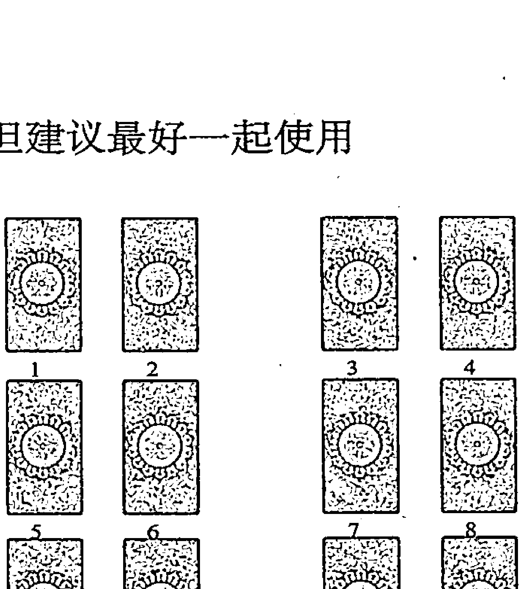

- (13)(14)代表这段感情的现状。

## (六)有关财运

## 48. 金银钱财

洗牌切牌完成后，随意抽取5张牌，依次放在1、2、3、4、5位置上。

### 牌位含义：

-   - (1)代表你获得钱财凭借的基础。
- (2)代表你是如何快速地获得财富的。
- (3)代表有助你得到财富的力量。
- (4)代表有助你得到财富的人或事。
- (5)代表你钱财运上的结果。

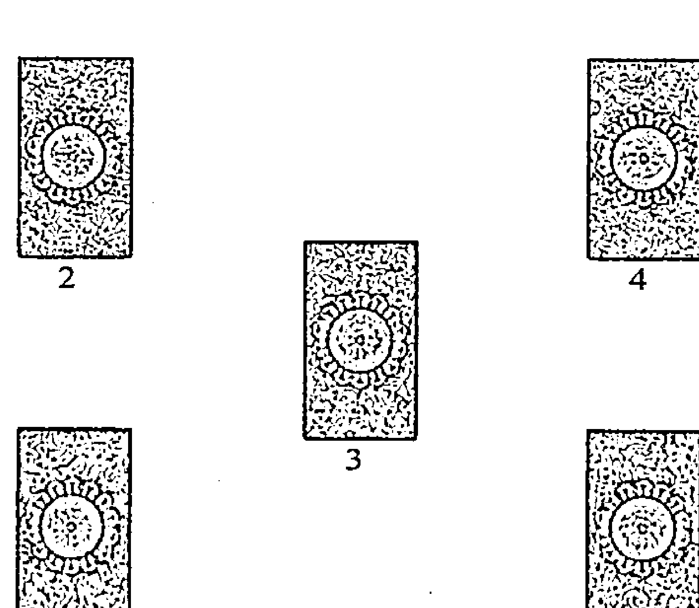

## 49. 财富收获

洗牌切牌完成后，随意抽取7张牌，依次放在1到7位置上。

### 牌位含义：

-   - (1)代表你有关财富的愿望。
- (2)代表你该如何对待你的愿望。
- (3)代表实现愿望的过程中应该采取的新的想法。
- (4)代表对你会有帮助的人或事。
- (5)代表你将面临的挑战。
- (6)代表你有关财富的收获情况。
- (7)代表实现财富愿望的过程中需要着重注意的关键所在。

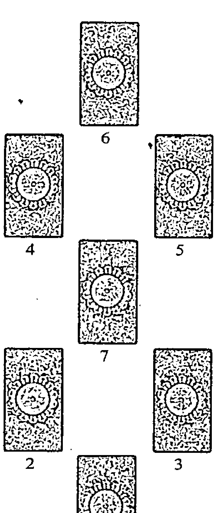

## 50. 财运状况

洗牌切牌完成后，随意抽取 10 张牌，依次放在 1 到 10 位置上。

### 牌位含义：
-   - (1)(2)(3)(4)代表与你的财富有关需小心注意的事项。
- (5)(6)(7)代表有助于你的财富更加稳固的力量。
- (8)(9)代表能提供给你帮助的人或事。
- (10)代表你对财务的未来规划。

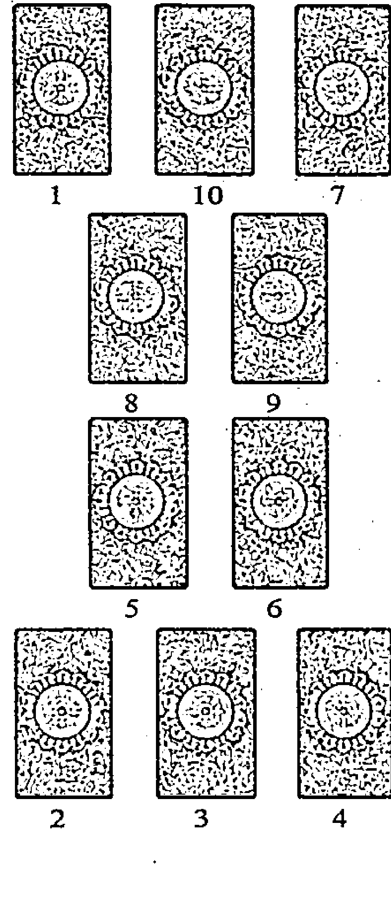

## 51. 财运前程

洗牌切牌完成后，随意抽取 11 张牌，依次放在 1 到 11 位置上。

### 牌位含义：
-   - (1)(2)代表你目前的财富情况。
- (3)(4)代表你可能还未察觉的财富情况。
- (5)(6)(7)代表照目前态势发展下去可能发生的结果。
- (8)(9)代表另外的、可能的结果。
- (10)(11)代表你能够达到的另外的结果，只要你付出努力。

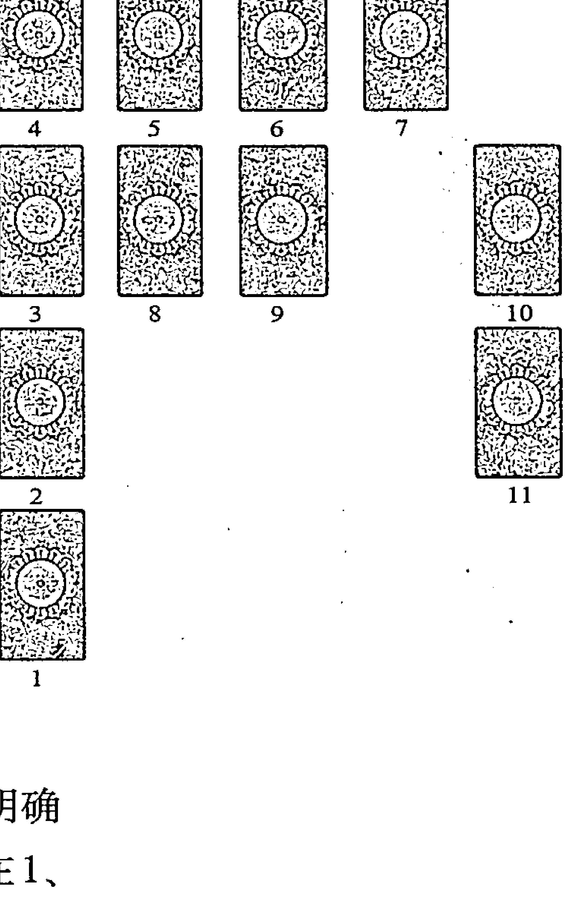

## (七)点滴生活

## 52. 今日出行

今日出行牌阵可以让你对今天的运势有一定的明确和准备。完成洗牌切牌后，随意抽取 3 张牌，依次放在 1、2、3 的位置上。

### 牌位含义：

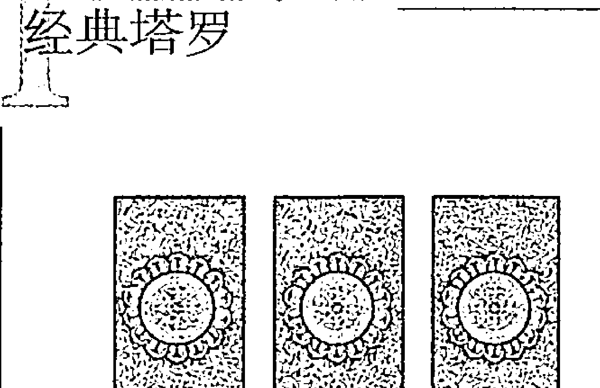

(1)代表今日出行办事的顺逆状态。

(2)代表今日出行影响事情发展的因素。

(3)代表克服不利局面的应对之策。

## 53. 出行旅游

洗牌切牌完成后，随意抽取4张牌，依次放在1、2、3、4位置上。

### 牌位含义：

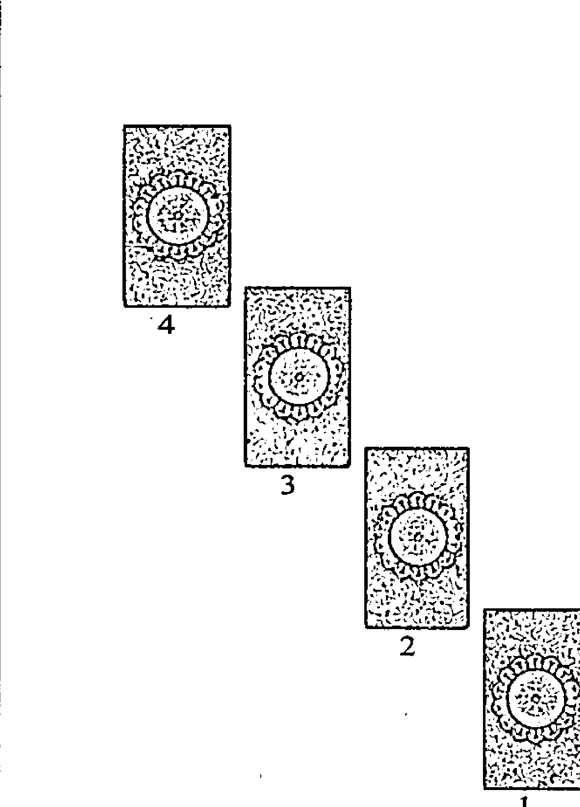

(1)代表周围环境对你的旅程的影响。

(2)代表你可能会忽略的事项，但这些事项对你的旅程非常重要。

(3)代表这次旅程能令你有所学习和领悟的东西。

(4)代表你的旅程结果。

## 54. 乔迁方向

洗牌切牌完成后，随意抽取7张牌，依次放在1到7位置上。可测搬家方向。

### 牌位含义：

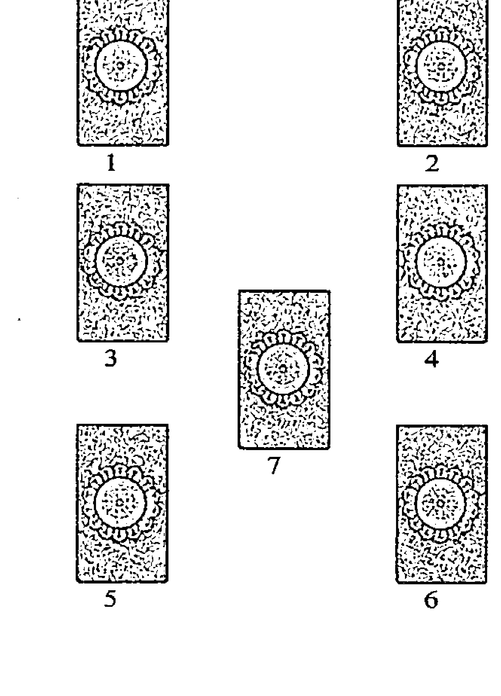

(1)代表什么样的地方有助于你的健康。

(2)代表可能出现的下一次搬家的机会。

(3)代表怎样才能找到适合你的居住地点。

(4)代表这个地方的信息。

(5)代表你乔迁之前必须做的准备工作。

(6)代表你必须额外关注的事项。

(7)代表你乔迁的结果是否顺利。

## 55. 感觉宠物

很多人都会饲养自己喜爱的宠物，不妨为自己亲密的小伙伴推测一下吧，加深你们之间的了解。

洗牌切牌完成后，随意抽取7张牌，依次放在1到7的位置上。

### 牌位含义：

-   (1)代表你的宠物想表达给你的意愿。
- (2)代表你的宠物现在的心理感受。
- (3)代表你对待宠物该有的态度。
- (4)代表你的宠物此刻最需要的东西。
- (5)代表你的宠物的健康情况。
- (6)代表最近一段时间之后你的宠物可能需要的。
- (7)代表对你的宠物的整体的分析。

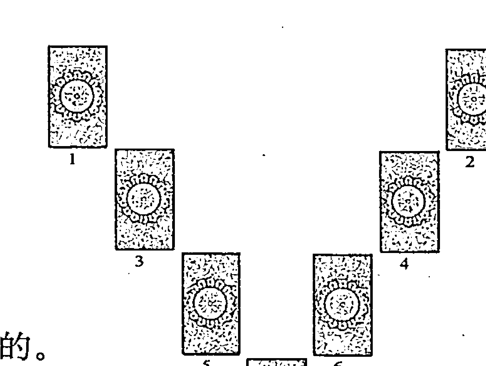

## 56. 家庭问题

该牌阵可以预测家庭中让你一直放心不下的问题，给你提供参考。完成洗牌切牌后，随意抽取8张牌，依次放在1到8的位置上。

### 牌位含义：

-   (1)代表造成问题的主要人物。
- (2)代表与你关联最密切的事(负面的)。
- (3)代表越轨的人物如何造成危机的。
- (4)代表越轨人物在过去的品行。
- (5)代表解决问题的应对之策。
- (6)代表需避免的意外情况。
- (7)代表目前问题对你健康的危害。
- (8)代表最后的结果。

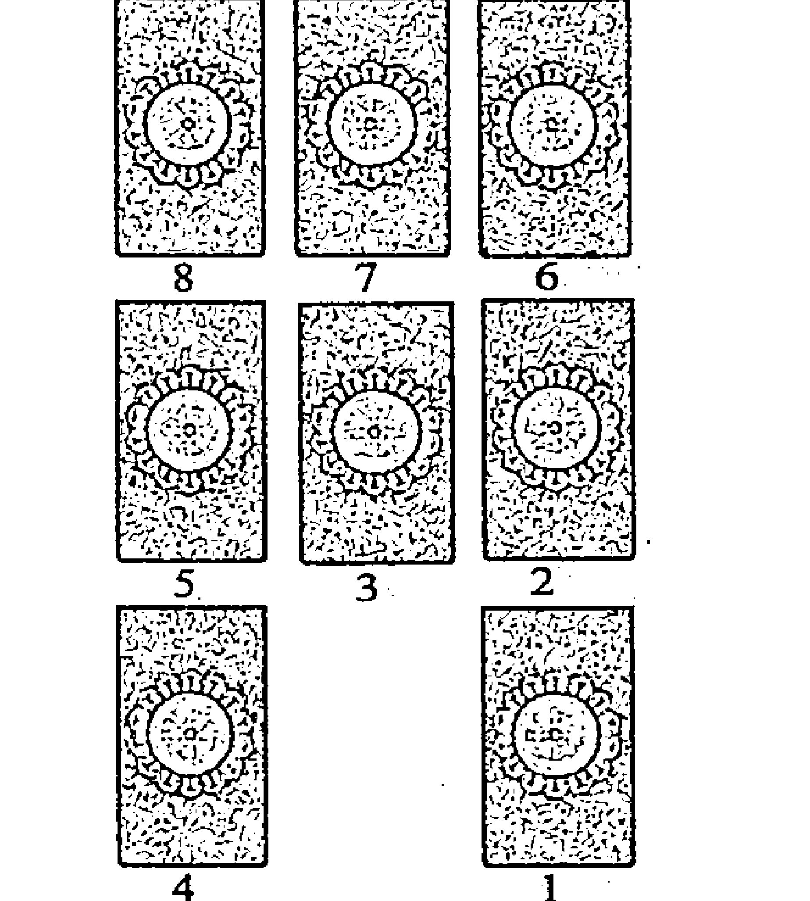

## 57. 生日推测

每当庆祝生日的时候，我们总对未来许下美好的心愿。该牌阵可以对你的将来运程给你一个预示。完成洗牌切牌后，随意抽取9张牌，依次放在1到9的位置上。

### 牌位含义：## 58.康乐之路

该牌阵可预示你未来的健康与幸福。洗牌切牌完毕后，随意抽取8张牌，依次放在1到8的位置上。

牌位含义：

- (1)代表你过去的健康状况。
- (2)代表你现在的健康状况。
- (3)代表你未来可能的健康状况。
- (4)代表能改变你健康状况的人与事。
- (5)代表过去让你快乐的事。
- (6)代表现在让你快乐的事。
- (7)代表未来让你快乐的事。
- (8)代表某人或某些事对你的健康与幸福有益。

## 59.人际圣杯

洗牌切牌完成后，随意抽取11张牌，依次放在1到11位置上。注意6位的牌位于5位的牌下面。

牌位含义：

- (1)代表你自己。
- (2)代表你的伙伴。
- (3)代表你们之间的关系建立的基础。
- (4)代表你们前一段时间的状况。
- (5)代表你们现在的状况。
- (6)代表你们共同遇到的阻碍。
- (7)代表你对待这段关系的态度。
- (8)代表你的伙伴对待这段关系的态度。
- (9)代表你对这段关系进展的希望。
- (10)代表你的伙伴对这段关系进展的希望。
- (11)代表你们这段关系发展的最好的结果。

### (八)知性人生

## 60.调整状态

该牌阵可以为你调整目前的状态提出提示。完成洗牌切牌后，随意抽6张牌，依次放在1、2、3、4、5、6的位置上。

牌位含义：

- (1)代表问题的根本。
- (2)代表你现在的处境。
- (3)代表你某个时间段内的情况。
- (4)代表你曾经对于周边处境的感觉。
- (5)代表与你密切相关的人物。
- (6)代表最后结果。

## 61. 卡尔米克

洗牌切牌完成后，随意抽取7张牌，与大部分牌阵不同，本牌阵是从第7位摆到第1位的，解牌的时候再从1位解到7位。

牌位含义：

- (1)(2)代表宿命和你的自我意识。
- (3)代表对你的一生影响最大的事件。
- (4)代表几次有影响力的事件。
- (5)Involution,代表你生存的目的。
- (6)Evolution,代表你在生活中可以实现的。
- (7)Karmic 平衡，代表你所能学到的。

## 62. 精神状态

洗牌切牌完成后，随意抽取10张牌，依次摆放在1到10牌位上。

牌位含义：

- (1)代表你目前的自我状态。
- (2)代表你比较久远以前的过去。
- (3)代表你前一段时期的近况。
- (4)代表你的左脑。
- (5)代表你的右脑。
- (6)代表你的潜意识。
- (7)代表你所处的社会状态。
- (8)代表你受到的影响。
- (9)代表你的不久后未来。
- (10)代表你的遥远未来。

## 63. 命运迷宫

洗牌切牌完成后，随意抽取9张牌，依次摆放在1到9位置上。

牌位含义：

- (1)代表你生活中将出现的转变。
- (2)代表你感情或婚姻的状况是否有新的机会。
- (3)代表你的事业是否能够成功。
- (4)代表你的财运是否亨通。
- (5)代表你是否将有愉快的旅行。
- (6)代表你将遭遇到的问题。
- (7)代表你的知识方面是否有新的进益。
- (8)代表你是否崇尚物质。
- (9)代表你的人生价值是否充分实现。

## 64.生活目标

洗牌切牌完成后，随意抽取9张牌，依次放在1到9位置上。

牌位含义：

- (1)代表你应该为你的生活确立的目标。
- (2)(3)(4)代表你的追求目标将如何影响你的生活。
- (5)(6)代表那些有助于你达成目标的因素。
- (7)(8)代表那些阻碍你达成目标的问题。
- (9)代表命运给你的指示。

## 65. 寻找失去

洗牌切牌完成后，随意抽取10张牌，依次放在1到10位置上。

牌位含义：

- (1)代表你遗失的东西。
- (2)代表有关你遗失之物的一些陈述。
- (3)(4)代表开始找寻之处。
- (5)代表将会给你带来帮助的人或事。
- (6)(7)代表在找寻时你必须注意的事项。
- (8)(9)(10)代表找寻的结果。

## 66. 芝麻开门

洗牌切牌完成后，随意抽取9张牌，依次放在1到9位置上。

牌位含义：

- (1)代表钻石：你突出的优点和天赋。
- (2)代表珍珠：你所拥有的知识力量。
- (3)代表金币：你所拥有的物质基础。
- (4)代表翡翠：你认识的人，给你的生命带来新的机会。
- (5)代表白金链：对你有所阻碍的，必须去解决的人或事。
- (6)代表蓝宝石：你正脱颖而出的某些特质。
- (7)代表水晶：你正在学习并能够加以使用的知识。
- (8)代表红宝石：你可以会认识的人。
- (9)代表未经琢磨的钻石：你尚未发挥，但实际具有的能力或财富。

## 67. 阿里巴巴

这又是一个大的牌阵，可以测一测你整个生活、工作的状况。

洗牌切牌完成后，随意抽取11张牌，依次放在1到11位置上。

牌位含义：

- (1) 代表有关你家庭、伙伴、环境的信息。
- (2) 代表有关你教育、事业、工作的信息。
- (3) 代表与你的自尊有关。
- (4) 代表以前有的现在依然存在的影响力。
- (5) 代表你目前的心态、状况等。
- (6) 代表神殿：对你的影响力。
- (7) 代表祭坛：你的目标，或你心中感到忐忑不安的一些念头。
- (8) 代表你的工作能力和创造力。
- (9) 代表你社交领域的状况。
- (10) 代表你的健康状况和家庭方面的情况。
- (11) 代表未来会发生的对你的影响力。

## 68. 低谷高潮

建议此牌阵 78 张大小阿卡那牌一起使用。

洗牌切牌完成后，随意抽取 11 张牌，依次放在 1 到 11 位置。

牌位含义：

- (1) 代表你周围的环境。
- (2) 代表现状的一些重要的必知因素。
- (3) 代表从现在到下一个转折点时一直存在的想法。
- (4)代表引导你到转折点的事件。
- (5)代表某个重要的转折点。
- (6)代表你处于转折点时意外的好处。
- (7)代表转折点带给你的启示。
- (8)代表转折点所带来的发展。
- (9)代表突出的意外收获。
- (10)代表某种可能性的结果。
- (11)代表另一种可能性的结果。

需要补充说明的是，假如圣杯九出现在9或者10的位置，它的效力将比其他位置出现的牌义不好的牌要优先和重要。

## 69. 生活处境

洗牌切牌完成后，随意抽取13张牌，依次放在1到13位置上。

牌位含义：

- (1)(4)(7)代表你的从前。
- (2)(5)(8)代表你的前一段时间的近况。
- (3)(6)(9)代表你的现在。
- (10)代表你未来6个月的情况，主要是你将面临的挑战。
- (11)代表你未来12个月的情况，主要是你将遇到的重大事情。
- (12)代表你即将遇到的处境。
- (13)代表如此发展下去的结果。

## 70. 初露光芒

洗牌切牌完成后，随意抽取15张牌，依次摆放在1到15位置上。

牌位含义：

- (1)代表你自己。
- (2)(3)代表你所具备的素质及你已经拥有的相关知识。
- (4)(8)(12)代表你若不采取适当行动的话，这些情况就有可能发生。
- (5)(9)(13)代表你若采取适当的行动，情况则有可能发生如此的转变。
- (6)(10)(14)代表一些可以帮助你作出决断的信息。
- (7)(11)(15)代表一些你无法控制的状况。

## 71. 突破现状

使用78张塔罗牌的大牌阵，仔细解读你的现状。洗牌切牌完成后，随意抽取23张牌，依次摆放到1到23位置上。

牌位含义：

- (1)(2)(3)代表你目前想突破的状况。
- (4)(5)(6)(7)代表你想突破这个现状的原因。
- (8)代表一种你可以借助的有利的力量。
- (9)(10)(11)代表突破目前的状况后你可以得到的。
- (12)(13)(14)代表突破目前的状况后你会损失的。
- (15)(16)(17)代表按照你的个性和情况将会发生在你私人生活中的事情。
- (18)(19)(20)代表按照你的个性和情况将会发生在你专业领域内的事情。
- (21)(22)(23)代表你将如何感受和对待这些发生的事情。

## 之二 出生年月与塔罗

根据你的出生年、月、日，可以找出代表你自己生命对应的塔罗牌。生命的塔罗牌可以分为两种：一种是代表个性象征的塔罗牌，另一种则是代表灵魂象征的塔罗牌。

代表个性象征的塔罗牌，显示你表现于外在世界的智慧、才能、气质、风度、脾气等，也就是别人如何看你的一切。

代表灵魂象征的塔罗牌，显示内心深处的你，你内在的渴望、精力的来源、精神的感受、追求和向往的理想人生，它代表不为人知的真正的你。

当你降生于人间，你的生命就和这个世界开始了接触，你的个性和灵魂也伴随生命而来。

因此，找出属于自己生命的塔罗牌(从 22 张大阿卡那中找)，可以让你更深入地了解自己是谁，别人又如何看待你。

发现你生命中隐藏的个性和力量，可以帮助你认识自己，发挥潜能和特长，更可以看清未来，开拓美好的前途。

推算方式如下：

- 把你出生的公历年、月、日三个数字相加，得到一个总数；再把总数的各个数字相加，会得到一个二位数；然后把二位数的两个数字相加，会得到一个个位数。此二位数代表个性象征的塔罗牌，个位数则代表灵魂象征的塔罗牌。

<例>比如你的生日是 1974 年 10 月 24 日，其计算如下：

```
年       1974
月    +    10
日    +    24
-----------------
2008 =10(2+0+0+8)
     =1(1+0)
```

“10”为“命运之轮”，即为代表你个性象征的塔罗牌。
“1”为“魔术师”，即为代表你灵魂象征的塔罗牌。

- ◎ 如果总数的各个数字相加，和为个数，则此数字同时代表个性和灵魂两种象征。个性和灵魂属于同一个象征的人，通常都是专业人才。

<例>比如生日是 1977 年 10 月 19 日，其计算如下：

```
年       1977
月    +    10
日    +    19
-----------------
2006=8(2+0+0+6)
```

“8”为“力量”，即为同时代表你个性和灵魂象征的塔罗牌。

- ◎ 如果总数的各个数字相加，和为 19；1 和 9 相加等于 10；1 和 0 再相加等于 1，这是惟一有三个数字的组合。

这三个数字，第一个代表个性，第三个代表灵魂，而多出来的第二个则代表创造力。拥有创造力象征的人是绝佳的创意人才。

<例>比如生日是 1964 年 5 月 3 日，其计算如下：

```
年       1964
月    +     5
日    +     3
-----------------
1972 =19(1+9+7+2)
     =10(1+9)
     =1(1+0)
```

“19”为“太阳”，即为代表你个性象征的塔罗牌。
“1”为“魔术师”，即为代表你灵魂象征的塔罗牌。
“10”为“命运之轮”，即为代表创造力象征的塔罗牌。

◎ 如果总数的各个数字相加，和为22，22减去22等于0。因为传统塔罗牌的大阿卡娜为22张，数字由0排至21，因此数字22等于数字0，这数字代表个性；22的2加2等于4，这数字代表灵魂。

<例>比如生日是1964年1月1日，其计算如下：

```
年 1964
月 + 1
日 + 1
-----------------
1966 =22(1+9+6+6)
=4(2+2)
```

“0”为“愚人”，即为代表个性象征的塔罗牌。
“4”为“皇帝”，即为代表你灵魂象征的塔罗牌。

◎ 如果总数的各个数字相加，和大于22，则把和减去22，所得余数代表个性；和的两个数字相加，求得的个数代表灵魂。

<例>比如生日是1982年4月3日，其计算如下：

```
年 1982
月 + 4
日 + 3
-----------------
1989=27(1+9+8+9)
=9(2+7)
```

“5”为“教主”，即为代表你个性象征的塔罗牌。
“9”为“隐士”，即为代表你灵魂象征的塔罗牌。

## 塔罗牌数字对应的人生型态

- 如果你推算出来的个性象征和灵魂数字相同，代表你人生的发展是单一的；如果个性象征和灵魂象征的数字不同，代表你人生的发展是双重的。
- 如果你的数字是0，代表你追求的是多彩多姿、变化多端的人生。
- 如果你的数字是1 – 6，代表你追求的是和谐的人生。
- 如果你的数字是7 – 12，代表你追求的是充满冒险和挑战的人生。
- 如果你的数字是13 – 18，代表你追求的是不断开创和改变的人生。
- 如果你的数字是19 – 21，代表你追求的是自我实现和成就的人生。

## 塔罗牌对应人生型态图

根据你出生的月、日和不同的年份，可以推算出每一年代表你当年运势的塔罗牌。

由于运势的推算是以生日为基准，因此每一年运势的开始，也是以那一天起算。

比如，你是1976年6月1日生，则1997年的运势从1997年6月1日起算，6月1日以前为1996年的运势。

利用这种推算方式，可以找出代表当年或来年运势的塔罗牌。若从出生的年份开始推算，也可以算出一个人的流年。

从推算流年中，你会发现你的数字系按顺序排列，但隔一段时间数字便会中断，跳到另一顺序。这种数字中断的现象，即代表你生命中运势的改变，是人生的转折点和新运势的开始。

同时，你也会发现代表运势的塔罗牌中，没有0(愚人)和1(魔术师)这两张牌，因为每一年的运势中都充满了未知(愚人)和变化(魔术师)。

## 推算方式：

◎ 把你出生的阳历月、日和当年的年份相加，得到总数；再把总数的各个数字相加，若和等于或小于21，则按此数字找出代表运势的相关塔罗牌。

<例>比如生日是2月17日，推算2000年运势，其计算如下：

```
年      2000
月   +    2
日   +   17
----------
2019=12(2+0+1+9)
```

“12”为“吊人”，即为代表你2000年运势象征的塔罗牌。

◎ 如果总数的各个数字相加，和等于或大于22，则再将和的两个数字相加，成为个数，此个数即为代表运势的数字。

<例>比如生日是1月1日，推算1996年运势，其计算如下：

```
年      1996
月   +    1
日   +    1
----------
1998 =27(1+9+9+8)
      =9(2+7)
```

“9”为“隐士”，即为代表你1996年运势象征的塔罗牌。

◎ 如果总数的各个数字相加，和等于28，把2和8相加等于10，10即为代表运势的数字，不再把10的和相加。

<例>比如生日是1月1日，推算1997年运势，其计算如下：

```
年      1997
月   +    1
日   +    1
----------
1999 =28(1+9+9+9)
      =10(2+8)
```

“10”为“命运之轮”，即为代表你1997年运势象征的塔罗牌。

## 流年塔罗运势推算速查表

| 年份 | 数字 | 年份 | 数字 | 年份 | 数字 | 年份 | 数字 | 年份 | 数字 | 年份 | 数字 |
| :--- | :--- | :--- | :--- | :--- | :--- | :--- | :--- | :--- | :--- | :--- | :--- |
| 1910 | 11 | 1936 | 19 | 1962 | 18 | 1988 | 8 | 2014 | 7 | 2040 | 6 |
| 1911 | 12 | 1937 | 20 | 1963 | 19 | 1989 | 9 | 2015 | 8 | 2041 | 7 |
| 1912 | 13 | 1938 | 21 | 1964 | 20 | 1990 | 19 | 2016 | 9 | 2042 | 8 |
| 1913 | 14 | 1939 | 4 | 1965 | 21 | 1991 | 20 | 2017 | 10 | 2043 | 9 |
| 1914 | 15 | 1940 | 14 | 1966 | 4 | 1992 | 21 | 2018 | 11 | 2044 | 10 |
| 1915 | 16 | 1941 | 15 | 1967 | 5 | 1993 | 4 | 2019 | 12 | 2045 | 11 |
| 1916 | 17 | 1942 | 16 | 1968 | 6 | 1994 | 5 | 2020 | 4 | 2046 | 12 |
| 1917 | 18 | 1943 | 17 | 1969 | 7 | 1995 | 6 | 2021 | 5 | 2047 | 13 |
| 1918 | 19 | 1944 | 18 | 1970 | 17 | 1996 | 7 | 2022 | 6 | 2048 | 14 |
| 1919 | 20 | 1945 | 19 | 1971 | 18 | 1997 | 8 | 2023 | 7 | 2049 | 15 |
| 1920 | 12 | 1946 | 20 | 1972 | 19 | 1998 | 9 | 2024 | 8 | 2050 | 7 |
| 1921 | 13 | 1947 | 21 | 1973 | 20 | 1999 | 10 | 2025 | 9 | 2051 | 8 |
| 1922 | 14 | 1948 | 4 | 1974 | 21 | 2000 | 2 | 2026 | 10 | 2052 | 9 |
| 1923 | 15 | 1949 | 5 | 1975 | 4 | 2001 | 3 | 2027 | 11 | 2053 | 10 |
| 1924 | 16 | 1950 | 15 | 1976 | 5 | 2002 | 4 | 2028 | 12 | 2054 | 11 |
| 1925 | 17 | 1951 | 16 | 1977 | 6 | 2003 | 5 | 2029 | 13 | 2055 | 12 |
| 1926 | 18 | 1952 | 17 | 1978 | 7 | 2004 | 6 | 2030 | 5 | 2056 | 13 |
| 1927 | 19 | 1953 | 18 | 1979 | 8 | 2005 | 7 | 2031 | 6 | 2057 | 14 |
| 1928 | 20 | 1954 | 19 | 1980 | 18 | 2006 | 8 | 2032 | 7 | 2058 | 15 |
| 1929 | 21 | 1955 | 20 | 1981 | 19 | 2007 | 9 | 2033 | 8 | 2059 | 16 |
| 1930 | 13 | 1956 | 21 | 1982 | 20 | 2008 | 10 | 2034 | 9 | 2060 | 8 |
| 1931 | 14 | 1957 | 4 | 1983 | 21 | 2009 | 11 | 2035 | 10 | 2061 | 9 |
| 1932 | 15 | 1958 | 5 | 1984 | 4 | 2010 | 3 | 2036 | 11 | 2062 | 10 |
| 1933 | 16 | 1959 | 6 | 1985 | 5 | 2011 | 4 | 2037 | 12 | 2063 | 11 |
| 1934 | 17 | 1960 | 16 | 1986 | 6 | 2012 | 5 | 2038 | 13 | 2064 | 12 |
| 1935 | 18 | 1961 | 17 | 1987 | 7 | 2013 | 6 | 2039 | 14 | 2065 | 13 |

## 之三 预测时间法

时间的预测是种迷思，因为塔罗牌预测的是“运”，一种阶段性的可能情况。所以，发生的状况与时间点，会随当事人的努力程度“因”与环境变化“缘”有所不同，因此不可能是固定的。但是，有时候身为塔罗的分析师、解牌师，又一定会遇到求问者询问结果发生的时间，或者自己预测时也想知道时间。所以，有以下两个可以帮助大家对时间点稍做说明，但必须强调的是此为参考时间，重点在于当事人的掌握与决心。

## 方法一 使用相对考量法

这方法适用于3张牌以上(含)的牌阵，也是比较建议大家使用的方式。首先一定要在提问时(提出问题)将预测加上时效。

(例如：求问者问他与他男朋友会不会复合，像这种没有指定时间的问题，此时，解牌者应主动加上一段时间的限制，将问题改成：三个月内他与他男朋友会不会复合。时效限制建议最好一到六个月，使用太长的时效没有太大意义，对求问者也没有帮助。)

当基本的预测完成后(提问→开牌→洗牌→切牌→摆牌→解读→沟通)，若求问者有问起详细的时间问题，首先，确定预测的结果是否为正面响应。就如上述问题：三个月内他与他男朋友会不会复合。若预测出来，是有复合的可能，做详细的时间的预测才比较有意义；若是预测出来，复合的可能很小，那也就没有预测时间的必要了。

再次强调较详细时间的预测只是参考，对求问者并无显著的帮助，只会让求问者产生过度期望，还不如在提问时(提出问题)把预测加上限制时间的效果好。

先知道今天的日期，假如是4月5号，刚才预测的时效为三个月，预测结果为正向。

那表示4月5号到7月5号都有可能发生，总共天数为90天内(三个月)。

检视自己所使用的牌阵，若为圣三角，牌数为三。

先扣掉解释是未来的那张牌，三减一等于二。

为何要扣掉未来的那张牌呢？因为未来还没有发生，它是一种结果，并非影响因素。

接下来把预测加上限制时间(如上例为90天)，除上扣掉未来牌的牌数(如上例为2张)。

```
90/2=45
```

也就是一张牌的影响为45天。取大约整数为40天。

假如，圣三角牌阵，过去与现在的牌都是对问题有帮助的状况，那详细发生时间就可能是：

```
90-40-40=10
```

也就是10天内可能发生。

若圣三角牌阵，过去与现在的牌只有一张是对问题有帮助的，那详细发生时间就可能是：

```
90-40+40=90
```

也就是90天内可能发生。

了解了吗？是帮助的牌为减(加速发生)是阻挠的牌为加(延迟发生)。

但上面第二次运算，看起来好像没推算一样，那是因为牌数少的牌阵才会这样。

而且，牌阵中有些牌有加乘效果，例如：现在、内心与环境，这几张影响时间很大，所以这三牌在牌阵中的比例会比较高。

如上面例子中，把圣三角的现在牌当成2倍或3倍影响。

推测加上限制时间(如上例为90天)除上扣掉未来牌的牌数(原本是2张，但把现在牌当成3张＋过去1张＝4张)。

```
90/4=22.5
```

取大约整数为20天。

若圣三角牌阵，过去与现在的牌，都是对问题有帮助的，那详细发生时间就可能是：

90-20 × 3-20=10

也就是 10 天内可能发生。

若圣三角牌阵，过去与现在的牌，只有现在是对问题有帮助的，那详细发生时间就可能是：

90-20 × 3+20=50

也就是 50 天内可能发生。

若圣三角牌阵，过去与现在的牌，只有过去是对问题有帮助的，那详细发生时间就可能是：

90+20 × 3-20=130

也就是130天内可能发生，与原限定的时间反倒延后，这是因为加乘牌阻挠的关系。

看到了吗？用上加乘效果，天数的推测就完全不同，至于加乘牌的决定，你可以用现在、内心与环境这几张牌，也可以借由不断预测的经验寻找出来，毕竟每个人的情况不尽相同。

## 最后举例：凯尔特十字阵的推算。

凯尔特十字阵有 10 张牌，扣掉未来与结果两张剩 8 张。
90/8=11.25，取大约整数为 10 天。
全部都是对情况有帮助的牌，90-8 × 10=10 天内发生。
有 3 张好，有 5 张坏 90-3 × 10+5 × 10=110 天内发生。
有 5 张好，有 3 张坏 90-5 × 10+3 × 10=70 天内发生。
利用加乘效果。
凯尔特十字阵有 10 张牌，扣掉未来与结果两张剩 8 张。
设定其中有加乘效果为 3 张，一般牌为 8 张 -3 张 =5 张。
3 × 3=9  9+5=14
90/14=6.42857，取大约整数为 6 天。
一般牌为 6 天。
加乘牌为 6 × 3=18 天
全部都是对情况有帮助的牌，90-3 × 18-5 × 6=6 天内发生。
有 2张加乘牌好，1张好，有5张坏，90-2 × 18-1 × 6+5 × 6=78天内发生。
有 5 张好，有 3 张加乘牌坏，90-5 × 6+3 × 18=114 天内发生。
所以这种推测详细时间的方式，是考量牌阵所有牌的好坏而算出的。

## 方法二 使用表格

### 大阿卡那 22 张

| 编号 | 牌名 | 书上牌义 | 希伯来文字 | 希伯来数值 | 伟特牌的占星意义 |
|------|------|----------|------------|------------|------------------|
| 00 | 愚人 | 流浪 | Aleph | 1 | 天王星 / 风 |
| 01 | 魔术师 | 创造 | Beth | 2 | 水星 |
| 02 | 女教主 | 智能 | Gimel | 3 | 月亮 |
| 03 | 皇后 | 丰收 | Daleth | 4 | 金星 |
| 04 | 皇帝 | 支配 | He | 5 | 牧羊座 |
| 05 | 教主 | 援助 | Vau | 6 | 金牛座 |
| 06 | 情侣 | 结合 | Zain | 7 | 双子座 |
| 07 | 战车 | 胜利 | Cheth | 8 | 巨蟹座 |
| 08 | 力量 | 意志 | Teth | 9 | 狮子座 |
| 09 | 隐士 | 寻求 | Yod | 10 | 处女座 |
| 10 | 命运之轮 | 轮回 | Caph | 20/500 | 木星 |
| 11 | 正义 | 均衡 | Lamed | 30 | 天秤座 |
| 12 | 吊人 | 牺牲 | Mem | 40/600 | 海王星 / 水 |
| 13 | 死神 | 结束 | Nun | 50/700 | 天蝎座 |
| 14 | 节制 | 净化 | Sameck | 60 | 射手座 |
| 15 | 魔鬼 | 诅咒 | Ayin | 70 | 摩羯座 |
| 16 | 高塔 | 毁灭 | Pe | 80/800 | 火星 |
| 17 | 星辰 | 希望 | Tsade | 90/900 | 水瓶座 |
| 18 | 月亮 | 不安 | Coph | 100 | 双鱼座 |
| 19 | 太阳 | 生命 | Resh | 200 | 太阳 |
| 20 | 审判 | 复活 | Shin | 300 | 冥王星 / 火 |
| 21 | 世界 | 达成 | Tau | 400 | 土星 |

### 小阿卡那 56 张

| 牌名 | 意 义 | 象 征 | 伟特牌的占星意义 | 伟特牌指出的时间 |
| :--- | :--- | :--- | :--- | :--- |
| **星币代表冬季，属性土，代表土象星座** | | | | |
| 星币国王 | 态度坚定务实 | 土之风 | 狮子20-处女20/摩羯 | 12月21日到01月19日 |
| 星币王后 | 良好生意眼光 | 土之水 | 射手20-摩羯20/处女 | 08月23日到09月21日 |
| 星币骑士 | 稳健认真 | 土之火 | 白羊20-金牛20/金牛 | 04月20日到05月19日 |
| 星币侍从 | 努力学习 | 土之土 | 春分-夏至 | 03月22日到06月22日 |
| 星币首牌 | 实质性的开始 | 土之源 | — — | — 不使用 — |
| 星币二 | 财务上的决定 | 和谐的改变 | 摩羯00-10,木星 | 12月21日到12月30日 |
| 星币三 | 实务上的成长 | 努 力 | 摩羯10-20,火星 | 12月31日到01月09日 |
| 星币四 | 财务上的巩固 | 权 力 | 摩羯20-30,太阳 | 01月10日到01月19日 |
| 星币五 | 财务上的贫困 | 忧 愁 | 金牛00-10,水星 | 04月20日到04月29日 |
| 星币六 | 财务上的稳定 | 成 功 | 金牛10-20,月亮 | 04月30日到05月09日 |
| 星币七 | 重大财务决定 | 失 败 | 金牛20-30,土星 | 05月10日到05月19日 |
| 星币八 | 良好的后盾 | 节 俭 | 处女00-10,太阳 | 08月23日到09月01日 |
| 星币九 | 物质上的成功 | 获 得 | 处女10-20,金星 | 09月02日到09月11日 |
| 星币十 | 物质常保稳固 | 财 富 | 处女20-30,水星 | 09月12日到09月21日 |
| **权杖代表春季，属性火，代表火象星座** | | | | |
| 权杖国王 | 自 律 | 火之风 | 天蝎20-射手20/白羊 | 03月21日到04月19日 |
| 权杖王后 | 无穷的潜力 | 火之水 | 双鱼20-白羊20/射手 | 11月21日到12月20日 |
| 权杖骑士 | 旅行或改变 | 火之火 | 巨蟹20-狮子20/狮子 | 07月24日到08月22日 |
| 权杖侍从 | 新方案的开始 | 火之土 | 夏至-秋分 | 06月22日到09月22日 |
| 权杖首牌 | 开始行动 | 火之源 | — — | — 不使用 — |
| 权杖二 | 实质上的决定 | 支 配 | 白羊00-10,火星 | 03月21日到03月30日 |
| 权杖三 | 地位上的进展 | 美 德 | 白羊10-20,太阳 | 03月31日到04月09日 |
| 权杖四 | 身体上的巩固 | 完 成 | 白羊20-30,金星 | 04月10日到04月19日 |
| 权杖五 | 分散肉体能量 | 冲 突 | 狮子 00-10,土星 | 07月24日到08月02日 |
| 权杖六 | 稳定的能量 | 胜 利 | 狮子 10-20,木星 | 08月03日到08月12日 |
| 权杖七 | 身体上的挑战 | 勇 气 | 狮子 20-30,火星 | 08月13日到08月22日 |
| 权杖八 | 充沛的体力 | 迅 速 | 射手 00-10,水星 | 11月21日到11月30日 |
| 权杖九 | 评估重要目标 | 力 量 | 射手 10-20,月亮 | 12月01日到12月10日 |
| 权杖十 | 太多的选择 | 压 迫 | 射手 20-30,土星 | 12月11日到12月20日 |
| **圣杯代表夏季，属性水，代表水象星座** | | | | |
| 圣杯国王 | 创造情感训练 | 水之风 | 水瓶20-双鱼20/ 巨蟹 | 06月19日到07月23日 |
| 圣杯王后 | 倾听直觉 | 水之水 | 双子20-巨蟹20/ 双鱼 | 02月19日到03月20日 |
| 圣杯骑士 | 决定情感行动 | 水之火 | 天秤20-天蝎20/ 天蝎 | 10月22日到11月20日 |
| 圣杯侍从 | 情感上的奉献 | 水之土 | 秋分-冬至 | 09月22日到12月22日 |
| 圣杯首牌 | 情绪上的开端 | 水之源 | — — | —不使用 — |
| 圣杯二 | 情绪上的决定 | 爱 情 | 巨蟹00-10,金星 | 06月19日到07月03日 |
| 圣杯三 | 情绪上的进展 | 丰 足 | 巨蟹10-20,水星 | 07月04日到07月13日 |
| 圣杯四 | 情绪上的巩固 | 混杂的愉悦 | 巨蟹20-30,月亮 | 07月14日到07月23日 |
| 圣杯五 | 分离失落 | 失 望 | 天蝎00-10,火星 | 10月22日到10月31日 |
| 圣杯六 | 情绪上的稳定 | 愉 悦 | 天蝎10-20,太阳 | 11月01日到11月10日 |
| 圣杯七 | 情感上的追寻 | 幻觉与堕落 | 天蝎20-30,金星 | 11月11日到11月20日 |
| 圣杯八 | 追寻丰硕人生 | 舍 弃 | 双鱼00-10,土星 | 02月19日到02月28日 |
| 圣杯九 | 满足自我价值 | 快 乐 | 双鱼10-20,木星 | 03月01日到03月10日 |
| 圣杯十 | 和谐的关系 | 满 足 | 双鱼20-30,火星 | 03月11日到03月20日 |
| **宝剑代表秋季，属性风，代表风象星座** | | | | |
| 宝剑国王 | 清晰的思虑 | 风之风 | 金牛20-双子20/ 天秤 | 09月22日到10月01日 |
| 宝剑王后 | 深思熟虑 | 风之水 | 处女20-天秤20/ 双子 | 05月20日到06月18日 |
| 宝剑骑士 | 敏捷的行动 | 风之火 | 摩羯20-水瓶20/ 水瓶 | 01月20日到02月18日 |
| 宝剑侍从 | 行动力的贫乏 | 风之土 | 冬至-春分 | 12月22日到03月22日 |
| 宝剑首牌 | 心态上的开端 | 风之源 | — — | — 不使用 — |
| 宝剑二 | 信仰上的决定 | 和 平 | 天秤00-10,月亮 | 09月22日到10月01日 |
| 宝剑三 | 理解上的痛苦 | 悲 伤 | 天秤10-20,土星 | 10月02日到10月11日 |
| 宝剑四 | 精神上的巩固 | 停 战 | 天秤20-30,木星 | 10月12日到10月21日 |
| 宝剑五 | 争吵与内心纷扰 | 击 败 | 水瓶00-10,金星 | 01月20日到01月29日 |
| 宝剑六 | 心智上的稳定 | 赢得成就 | 水瓶10-20,水星 | 01月30日到02月08日 |
| 宝剑七 | 心智上的适应 | 徒 劳 | 水瓶20-30,月亮 | 02月09日到02月18日 |
| 宝剑八 | 摆脱他人 | 干 扰 | 双子00-10,木星 | 05月20日到05月29日 |
| 宝剑九 | 忧 虑 | 绝望与残酷 | 双子10-20,火星 | 05月30日到06月08日 |
| 宝剑十 | 被人生观击倒 | 毁 灭 | 双子20-30,太阳 | 06月09日到06月18日 |

建议预测前必须准备两副牌，一副为您主要预测使用，一副用来做时间预测。

用来做时间预测那副牌，把大阿卡那与小阿卡那分开。并且一定要在提问时（提出问题），将预测加上时效。这时候才拿起做时间预测那副牌。

一般是使用小阿卡那预测，若预测的时间是要预测星期几或哪一个月份就使用大阿卡那来预测。

在牌阵的未来位置，加上一到三张的小阿卡那，然后看三张小阿卡那的正反位。只要是正位的牌，就列入考虑。只有一张正位就看那一张，但若有两张或三张都正位，就全部都要考虑。若加上一到三张的小阿卡那都为反位，就重加一到三张，直到看到至少一张的正位牌为止。

先知道今天的日期，假如是4月5号，刚才预测的时效为三个月，预测结果为正向。那表示4月5号到7月5号都有可能发生。

加入三张牌若是星币六、圣杯骑士、宝剑八：
星币六    04月30日到05月09日及02月09日到02月18日
+   - 圣杯骑士 10月22日到11月20日及08月23日到09月21日
- 宝剑八 05月20日到05月29日及12月01日到12月10日

那表示04月30日到05月09日与05月20日到05月29日两个时间最有可能，可以告知约为5月15日左右或5月9日到5月20日这段时间。

有可能选到的牌均为正向，但时间与预测限定的发生时间相差很多，比如比4月5号到7月5号早，那就是有可能为4月5日到4月19日两个礼拜内可能发生；若比4月5号到7月5号晚，那有可能是7月5日到7月19日间发生，比原限定的时间更晚，这可能要由分析师、解牌师来考量而告知。

时间预测一直是预测的难题，因为预测是预测运气，而运气是不断变动着。最后又再次强调，较详细时间预测只是参考，对求问者并无显著的帮助，只会让求问者产生过度期盼，还不如在提问时(提出问题)，预测加上限制时间的效果好。

## 之四 大阿卡那暗示的幸运项目

根据日本塔罗专家的研究，我们列出了如下的幸运项目对照表，给大家作为参考，同时也要记住大师的点拨：

- 1. 塞翁失马，焉知非福。物极必反，祸福相倚。
- 2. 幸运来于心中的喜悦，心不喜，好运不至。
- 3. 假如你比较没有信心，若下列做法可以带给你信心，你可以尝试看看，因为信心可以带来力量，但可别将“招来幸运”当成每天“必然”之事哦！

下表以伟特牌为例。

推测幸运项目最好一礼拜一次，按照推测的程序洗牌，然后切一张牌，不要理会牌的正反面，直接看出现哪张牌即可。

| 编号 | 牌名 | 幸运颜色 | 幸运数字 | 幸运日 | 幸运方位 | 幸运石 | 幸运物 | 幸运地 |
| :--- | :--- | :--- | :--- | :--- | :--- | :--- | :--- | :--- |
| 00 | 愚人 | 无、绿 | 0、9 | 星期二、三 | 北、西北 | 红宝石 | 信、红茶 | 情调咖啡屋、水族馆 |
| 01 | 魔术师 | 黄、水色 | 4、5 | 星期三、五 | 东南 | 土耳其石 | 镜子、熏衣草 | 书店、教室、邮局 |
| 02 | 女教主 | 白、银色 | 2、5 | 星期一、三 | 东 | 珍珠、钻石 | 陶器、贝壳 | 旅馆、车站、游泳池、海 |
| 03 | 皇后 | 蓝、白 | 2、6 | 星期五 | 西南 | 祖母绿 | 香水、缎带 | 小商店、美容室、茶馆、画廊、庭园 |
| 04 | 皇帝 | 红、紫 | 0、9 | 星期四 | 南、西南 | 红宝石、石榴石 | 打击乐器、厨房用品 | 礼堂、地下街、警察局 |
| 05 | 教主 | 紫、金色 | 3、6 | 星期日 | 南 | 紫水晶 | 《圣经》、花束 | 果园、公园、花坛 |
| 06 | 情侣 | 粉红、亮蓝 | 5、6 | 星期三、五 | 东、东北 | 祖母绿、土耳其石 | 项链、发饰 | 车站、图书馆、百货公司 |
| 07 | 战车 | 蓝紫、深蓝 | 3 | 星期二、日 | 南、西南 | 蓝宝石 | 帽子、勋章 | 大学、教堂、礼堂、赛马场 |
| 08 | 力量 | 橙、黄 | 1、4 | 星期二 | 西 | 钻石、黄玉 | 项链、酒 | 户外、剧场、运动俱乐部 |
| 09 | 隐士 | 蓝 | 5 | 星期三、六 | 北 | 紫水晶、土耳其石 | 时钟、日记簿 | 庭园、银行、书房、飞机场 |
| 10 | 命运之轮 | 灰、茶 | 4 | 星期六、日 | 南 | 蓝宝石、琥珀 | 电话、收音机 | 飞机场、天文台、博物馆 |
| 11 | 正义 | 蓝、粉红 | 6 | 星期五 | 西 | 祖母绿 | 手提袋、花瓶 | 音乐厅、迪斯科舞厅、音乐室 |
| 12 | 吊人 | 蓝紫、绿 | 7、8 | 星期六、日 | 东、东南 | 紫水晶 | 玻璃、灯 | 海边、农场、电影院 |
| 13 | 死神 | 黑、酒红 | 8、9、10 | 星期六 | 西、西南 | 石榴石 | 烟火、皮制小东西 | 实验室、地下街的冷饮店 |
| 14 | 节制 | 白、绿 | 2 | 星期三 | 西、西北 | 月长石 | 围裙、肥皂、童话 | 水边、别墅、厨房 |
| 15 | 魔鬼 | 黑、茶 | 8 | 星期六、日 | 北 | 硅玛瑙 | 戒指、药 | 地下街、古庙、研究所 |
| 16 | 高塔 | 红 | 4、9 | 星期二 | 东 | 红宝石 | 打火机、磁铁 | 博物馆、高楼大厦、棒球场 |
| 17 | 星辰 | 蓝、灰 | 4 | 星期六 | 南、东南 | 蓝宝石 | 手镯、三色堇 | 天文台、天象仪、广播电台 |
| 18 | 月亮 | 浅紫、白 | 7 | 星期一、日 | 北 | 珍珠、水晶 | 照片、玻璃制品 | 家、工作室、画室、电影院 |
| 19 | 太阳 | 红、橙 | 9 | 星期日 | 北、西北 | 红宝石、石榴石 | 咖啡、蜂蜜 | 街角、剧场、舞会 |
| 20 | 审判 | 红、灰 | 0 | 星期二 | 西、西南 | 蛋白石 | 刀、泳衣 | 湖、海、地下铁 |
| 21 | 世界 | 紫、金色 | 1、3 | 星期四、日 | 东、东南 | 黄玉 | 金锁、水果酒 | 公园、教堂、大学校园 |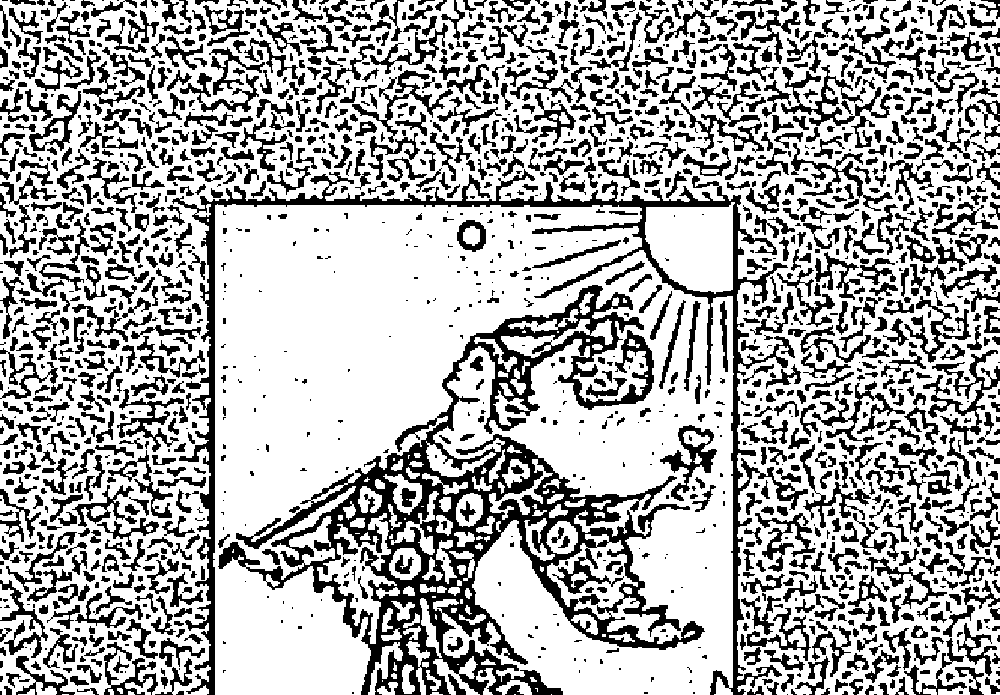

## 经典塔罗

### TAROT

经典塔罗 ©典藏经典

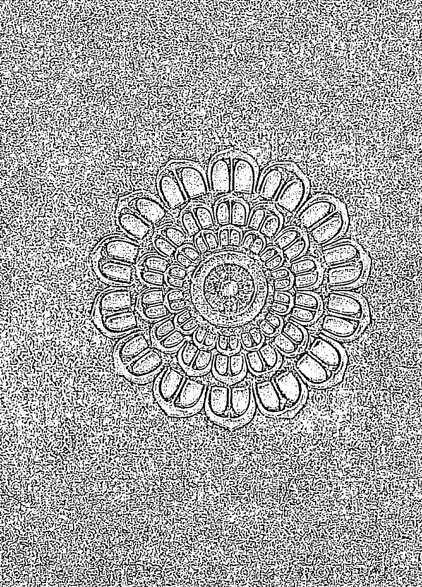