# 经典塔罗入门

万用塔罗全书，实用奥义解析，在美单本销量已过100,000册

> “这是一本极好的塔罗入门书，它不仅详细地介绍了每张牌的含义，还提供了许多实用的建议和技巧，帮助你更好地理解和运用塔罗牌。”
——埃利奥特·亚当 (Elliot Adam)

# 引言：开始之前

如果你像大多数人一样刚开始塔罗（读作Ta-row）牌的学习，你会发现最令人困惑的是它有这么多不同的牌种，有这么多不同的诠释。从哪里开始呢？又应该遵从谁的诠释？

其实并不像看起来那么复杂。每张卡牌的基本意义相当标准。不同的体系之所以差别很大，是因为几乎每个使用塔罗牌的人最终都会发展出自己对卡牌上显示的图像和象征意义的诠释。

你会发现，一旦你选择了自己的牌种和相容的体系，塔罗牌就会向你“诉说”。此外，塔罗牌还会用你的语言向你诉说。塔罗牌图像会转换成你需要的任何哲学或宗教观点，以了解和使用你的牌种。你个人诠释的差异程度取决于你使用牌种的目的。

如果你只想使用塔罗牌来解读命运，你需要做的只是找到一个业已存在的你能理解的（并且给予你明白易懂的答案）体系，遵从即可。但塔罗牌，尤其是大阿卡那，也可以用来作为你个人精神发展的路径。如果你出于这样的目的集中学习塔罗牌，你最终会发展出你对卡牌上视觉图像的独到的解读。

这本书要做的是帮助你迈出第一步。我将描述标准塔罗牌中的每张卡牌，并告诉你其基本含义。我不仅会向你展示如何将你的卡牌用作占卜的工具，而且会告诉你如何使用卡牌作为精神启蒙的路径。

未来发展的方向由你自己选择。你会发现，如果你开始认真研究塔罗牌，塔罗牌不仅可以回答你对占卜者的提问，而且能够回答最终引导你人生的真正问题。

# 塔罗牌

塔罗牌有78张牌，分成大阿卡那和小阿卡那。“阿卡那（Arcana）”这个词源自拉丁语arcanus，意思是封闭的或秘密的。在塔罗牌的语境中，它意味着秘密或神秘，通常用复数形式。

大阿卡那，或主牌组，由22张卡牌组成。每张卡牌画有不同的图像，描绘一个动作、行为和/或事件。每张卡牌还有一个标签，可以是名字、标题，或者对卡牌上图像的描述。

除了一张之外，所有大阿卡那都有一个编号，从一到二十一。愚人是唯一没有编号的卡牌，通常认为是零号牌。

在解牌时，大阿卡那代表的是解牌当时的存在状态——你的心智、情绪和/或精神状况，或当时描述的情形。

其余的56张卡牌被称为小阿卡那。这些牌分为四组：宝剑、圣杯、星币和权杖。每一组有十四张牌：十张编号（或标号）的，从一点到十点，还有四张人物（或花色）牌：侍从、骑士，女皇和国王。

在解牌时，小阿卡那描述事件或情况，每个组侧重于你生活中不同的区域。一般而言，宝剑描述你的精神或智力状态，圣杯则描述你的情绪。星币对应你的身体或肉体状态，而权杖则反映你的事业、能力或潜力。花牌有时代表生活中实际的人，或者也可能与标号卡牌采用同一种解释。

小阿卡那对应今天的现代扑克牌。现代扑克中取消了骑士，侍从变成了J，每组只剩下三种花色牌。塔罗牌中的宝剑变成了黑桃，圣杯变成了红桃，星币成了方块，而权杖成了梅花。从塔罗牌转变为扑克的过程中，唯一出自大阿卡那的卡牌是愚人，变成了大小王。

# 塔罗牌的历史

关于塔罗牌的起源有很多的理论，但是没有人确切知道这种牌是在哪里、首次如何面世的。有些权威人士声称塔罗牌是由中国的《易经》占卜体系所用的蓍草枝演变而来；其他人则认为源自传说中的《月神托特（Thoth）之书》。还有人将其起源定在距今很近的14或15世纪的欧洲，因为已知最早的完整塔罗牌可追溯到那个时期。

最流行的理论是塔罗牌于古埃及发明，大约在14世纪由流浪的吉卜赛部落带到了欧洲。根据这些学者的观点，大阿卡那牌上所示的寓意图画起源于埃及秘密学校的教谕。

帕皮斯（Papus）在《秘学解惑》一书中解释到，由于王朝面临被推翻的危险，所以古埃及的祭司设计了塔罗牌作为保存他们秘密的方式，留待后世子孙发掘。大阿卡那描绘了初探这些秘密的人在向更娴熟的状态修行的过程中的个人发展阶段。通过以象征性的方式记录他们的教义，能让严肃的有志于秘术的学生进行学习，但是塔罗牌本身在门外汉眼中似乎只是消遣的游戏。

其他学派还推论说，大阿卡那是各种地下宗教团体的秘密教义的记录。这样的被认为是塔罗牌起源的宗教团体，其中之一是诺斯底（Gnostics）派，这是一个早期的基督教教派，由于其精神信仰而常常被视为异端，他们的确被迫转入地下，以逃避迫害。

另一种理论认为塔罗牌的基本原则来自卡巴拉（Cabala）犹太秘法。大阿卡那的顺序与希伯来字母和数字系统有所关联。

卡巴拉是一种神秘的犹太信仰，教义说，意识可以通过古代典籍的诠释来提升至高于世俗的水平，让你理解“神圣”并与之融为一体。在其教义中，字母和数字并不只是一种记录想法和事件的方式，而是神力的储存器，包含着大量的信息和神启，内行的人可以获知。（有趣的是，希腊的新毕达哥拉斯学派也认为字母和数字是神圣的，拥有自己的超自然力。）

秘法派的许多教义从未记录下来，只是通过师徒口口相传，不向外人透露。大阿卡那所用的这种象征性的保存秘密的方式，让门外汉无法窥得其中奥妙。于是，按照这种理论，塔罗牌就是获得启示方式的寓言式表现，只有受过这种象征式方法训练的人才能理解。

小阿卡那的起源也是一个问题。一些研究者认为，它们是原埃及卡牌的一部分；也有人说它们在14世纪左右从一种叫作tarocchi的意大利纸牌游戏演化而来。

事实上，“塔罗”这一名称的起源还尚存疑问。一种简单的解释是，这一名称来源于卡牌背面的交叉线，这种设计称为tarotee。其他人则说，这个名称源自tarrochi，这种纸牌贡献了小阿卡那卡牌。

伟大的塔罗阐释家艾特拉（Etteilla）说这一名称源自埃及词tar，意为“途径”，还有ro或ros，意为“上等”，合在一起意为“生活的上等途径”。J. F.维伦特（Vaillent）（在1857年的《吉卜赛人：纯正波西米亚人的真实故事》中）宣称：“伟大的神灵亚斯塔鲁（Ashtaroth）、艾斯塔鲁（As-Taroth）正是因多塔尔特塔恩塔拉（Indo-Tarter Tan-tara），是塔罗，是十二宫。”还有一些权威人士认为塔罗牌和《月神托特之书》的名字都源自埃及语单词taru，意思是“寻求答案”或“问询”。

无论塔罗牌究竟起源于什么，很显然，卡牌上的象征符号能够放诸四海，适用于多种不同的文化和哲学。所有宗教、种族或民族背景的人都用过塔罗牌，并发展出自己的版本。所有权威人士都同意的一点是，塔罗牌（尤其是大阿卡那）是包含着一本完整的关于玄妙学问的书，这本书能让一心一意的学生理解自身和万物的奥秘——如果你能破译其真正的含义。

# 使用塔罗牌进行占卜和冥想

在本书的最后一节，我会教你几种摆放塔罗牌的方法（牌阵），以及如何解读你摆出的牌面。不过，现在重要的是如何运作塔罗牌以找到问题的答案。

虽然你可能不相信，但你确实有找到所需答案的天生能力。但我们大多数人都不能随心所欲地运用这种能力。你可以使用塔罗牌——或任何一种占卜工具——作为集中洞知力的方法：让这种力量在你想要的时候发挥作用，让这种力量随时帮你找出真相。

权且将你的潜意识当作一个爱指手画脚的后座乘客，那种总是无所不知的话痨——即使并不知道自己在说些什么。当然，在这种情况下，你通常得依照这个后座乘客的建议，这样一来，你就更难以忽略其给出的没有用处的指示。

现在你驾车行驶在一条陌生的道路上，去的地方无论是你还是你的后座乘客以前都没有去过。

你知道，如果你只是注意——路上的标志，太阳和星星的位置，以及自己内心的方向感——你可以到达目的地，几乎不会有什么麻烦。

但是你没法集中精神。每次你几乎都知道了要走那条路，而你的后座乘客总是插话，提供一些让你走错路的建议和指示。

有效地让这个后座乘客闭嘴的唯一方式是让他做点别的事，做点让这个自认为无所不知的家伙觉得有用的事（他其实知道这种情况下干什么都没用）——这就是他想要的全部！这样的话，他就不再分散你的注意力，你可以到达你要去的地方。

你不能只是忽略这些毫无必要的指示，因为你的后座乘客需要参与进来；事实上，即使你也想要得到指示，还是会受到干扰。因此，最好的办法是给后座乘客一份交通图，让他给你读出要去的方向。这正是任何一种占卜工具所要做的。工具让你的潜意识有事可做，这样你天生的洞悉万物的潜意识就能专心驾车开往目的地。

在所有通往自我意识和精神发展的交通图中，塔罗牌是最详细，却又最简洁的。

在接下来的章节中，我会向你解释两种阿卡那所有卡牌的基本含义。正如我在本书开头所说，一旦你开始认真地解读牌意，你最终从阐释中得出什么样的结论都取决于你。你运用塔罗牌的时间越长，你对每张卡牌的阐释就越具有个人色彩。

让这一刻到来吧。让卡牌向你诉说。如果某种解读“感觉上好像”含义不同于任何塔罗牌书所说的意思，请坚持你的感觉。塔罗牌旨在触发你自己洞悉万物的潜意识，帮助你明白真理。

## 第一部分 大阿卡那

# 主牌组：大阿卡那简介

大阿卡那，也称为主牌组，是塔罗牌的核心。塔罗牌正是在这二十二张卡片中表达了主要教谕。一名塔罗牌阐释者所遵从的无论是哪种哲学都会影响这些卡牌的设计；此外，这些哲学也会影响他们对小阿卡那的阐释。

大阿卡那的每张插图都是对不同存在状态或精神发展阶段的寓言式表现。作为一组，这套牌用塔罗牌所传授的奥义，展示了从初窥门径到登堂入室再到炉火纯青的进展历程。

这一点毫无疑问，不过这些插图的含义其实是神秘而复杂的。但是，并不需要用艰深的语言描述这些卡牌，致使塔罗牌的初学者们望而生畏。用简单的语言就可以解释卡牌的基本含义。

我在这里要做的是告诉你每张牌所描述的故事，并给你一个“入门指南”，让你自己去探究每张牌的深层哲学意义。这样一来，无论你想只用塔罗牌占卜，还是想再进一步探讨其神秘含义，你都有了一个可通往两者的出发点。

## 如何使用本指南

你可以用两种方法来使用本书。如果你只想用卡牌来占卜，下面每一章你只需跳到标题为“牌意解读”的章节开始阅读。如果你想用本书认真研究大阿卡那，请按照下面列出的程序，阅读每章的全部内容。

在本书的第一部分，大阿卡那的每张卡牌都按照同一个体系进行描述。首先，你会知道卡牌的名称和对应事物，即相关联的数字和希伯来字母。

接下来是说明卡牌上的图画所代表的事物：简要解释存在的状态或精神发展的阶段。

请注意，这只是牌意的极简解释。这些解释只是作为开启你自己探究卡牌奥义之旅的出发点。但是，如果你只是用塔罗牌来占卜，你就可以将这些说明当作指引，以便在牌意所描述的情况下解读问卜者的心态或个人特征。

本书每章后边两部分将帮助你自主揭示大阿卡那更深层次的含义。

首先，每张卡牌上的插图都作了描述。它涵盖了你应该注意的基本要素，与这些元素的基本含义。

请注意，不同牌种的插图略有差异。有的只是表面的差异：服装、人物的性别等等。有的则是插图中加入了新的元素，以补充或强化该牌种设计师的基本理念。

但是，有一部分元素在所有牌种的大阿卡那插图中都是相同的——或者应该相同。这些元素在章节中都有所描述。“描述”部分都基于你只使用一种塔罗牌的假设，因此无法比较不同种的塔罗牌有什么相同之处。所以本节的主要目的仅仅是为了告诉你每张卡牌上的哪些元素对塔罗牌的奥义至关重要，以至这些元素在所有牌种中都存在。

“冥想”一节的第二部分“牌意”解释了卡牌所代表的寓意。再次申明，我已经努力剔除任何宗教或哲学体系特定的阐释，只是给出这些卡牌基本的或标准的解释。

像以前一样，这些说明仅仅是一个起点。你从每张卡牌得出的结果最终都应该是你自己的。

# 如何开始你自己的阐释

在阅读这些章节之前，你就应该仔细查验你的牌种中的每张大阿卡那牌。注意卡牌上的主要人物和姿势（坐着或站着、人物间的关系、他们的手和身体的姿势等等）、是否有人类或其他生物相伴在侧、是否有道具或工具，以及你的头脑中是否浮现出关于背景的想法。

请注意，每张卡牌上的每一个细节都是一个有意义的符号，甚至小到背景中的一丛绿草，而且每张卡牌包含的许多元素是在阐释其整体含义时必须考虑的。虽然卡牌都有相似的非常重要的元素（如上所述，这些元素在所有牌种中都存在），但个别的牌种加入了自身的象征符号，这为卡牌的阐释添加了不同的观点或见解。你要学会注意到每张图所包含的所有事物。

当你研究你的卡牌时，请记住，许多文化都对塔罗牌起过一定的作用。如果你对插图中的某个哲学象征符号感到不舒服，则你使用的是错误的牌种。例如，有的牌种明显使用的是基督教的符号，而其他牌种则明显使用非基督教、女性主义等等的符号。如果你的宗教，甚至是政治理念与你手中牌种的设计师的理念相冲突，你将无法使用该牌种进行冥想。你甚至可能无法使用这一牌种进行简单的占卜。

不幸的是，还有一些牌种在使用混乱的象征体系。（我见过其中一种，其中有一个异教的女祭司戴着新月头饰，后面跟着一名罗马天主教教皇，手持一柄教宗十字）。我建议你不要使用这类牌种。找一种自身符号体系前后一致，并且能补充你自己基本理念的牌种。

在研究了每幅插图之后，写下你自己对卡牌的印象：插图的细节、每个细节对你意味着什么、每张卡牌作为一个独立单位一定表达了什么。大阿卡那是一本隐藏知识之书。尝试去判定每幅插图想告诉你什么。

当你手里有一份初学者指南时，进行这样独自的研究似乎是浪费时间，但是，自主进行这样的初次审视，对你而言非常重要。这是仅此一次的机会：因为一旦你读到了别人对塔罗牌的印象，这将永远影响你对塔罗牌的看法。

你看过每张卡牌并记下自己的印象之后，阅读这些章节中的描述，看看是否找出了每张卡牌中的重要元素（至少部分）。很可能你真的找到了一些。

你也可能会发现，你对这些卡牌含义的第一印象与本书或其他书的解释有所不同。这并不意味着你的阐释是错误的。一千个读者心中就有一千种对大阿卡那牌的阐释。如果你对每张卡牌的第一印象与别人的不同，这意味着插图已经触及你的潜意识或个人经历中的某些东西，这些东西是你才拥有的。你从无人指点的卡牌审视中得到的感悟将会成为你未来塔罗牌学习中极其重要的因素。

不要质疑，甚至不要一开始就尝试去理解它，只要记录下来即可。如果你完成了对塔罗牌深入细致的研究，当你以后回过头来重读的时候，你可能会惊讶地发现，对卡牌的初次直观印象意义如此重大。

如果你对任意一张卡牌——或其中一些卡牌——都没有显著的印象，还是那句话，说明你使用的是错误的牌种。找一个能向你诉说的牌种。它一定在某个地方。

# 用你的牌占卜

书里每章的最后一节称为“牌意解读”。这部分告诉你适用于简单占卜的卡牌的意义。这里强调的是占卜而非冥想，所以在卡牌的阐释上观点稍有不同。

本节列出了许多描述每张卡牌正位或逆位的语句，它们适用于牌意解读。解牌时，你要挑出对你要回答的问题最有意义的那份说明，和/或与周围卡牌联系最紧的那份说明。（见关于占卜的那一章，看看对这一过程的进一步解释。）每张卡牌还包含了在解牌中所显示的问卜者心理或情绪状态的概述。这种概述可能体现为问题或陈述，或两者兼有。解释牌意时，你可以从正位或逆位的特性列表中选择适当的措辞，或者使用此描述作为卡牌含义的指南。

需要注意的是，在普通的解牌中，当一张主牌开出时，它描

## 经典塔罗入门

绘的是所问及的情况下问卜者的感受，或可能做出的反应。实际上，主牌会宣称：“你现在是这样的人”——或者“这种情况把你改变成这样的人。”当然，你现在是什么样的人会影响你如何处理特定的情况。因此，在解牌中，主牌对其他卡牌以及整体情况有着重大影响。

## 卡牌顺序及注意事项

在解牌时，主牌可以一次出一张，顺序随机，此时只用考虑其在布局或牌阵中的位置，但是在冥想中，一张大阿卡那牌不能脱离其他卡牌而单独解读。每张卡牌都承上而启下。这意味着需要知道它们的正确顺序。

不幸的是，对此问题专家们都无法达成统一的意见。有的牌种将愚人作为初始牌，而有的放在最后，还有的将其作为倒数第二张。（你会发现，这不仅改变其对应数值，还会改变这张卡牌可能隐含的意义。）

此外，至少有两名塔罗牌作家（A.E.韦特和保罗·卡斯）调换了大阿卡那中两张其他卡牌的顺序：力量和正义。这两张卡牌的数字分别是8和11，而几乎所有的其他塔罗牌都使用与之完全相反的顺序。

对此我的建议很简单：不要为顺序抓狂。如果你只使用塔罗牌进行占卜，大阿卡那的顺序根本无关紧要。如果你打算使用塔罗牌作为一种精神指引，卡牌的顺序才会显得重要，但如果你开始对塔罗牌进行深入的研究，随着你获得更多的信息，无论是从自己解牌、从别的书上看来，还是使用塔罗牌做冥想，你都会最终得出自己的结论：究竟哪种顺序最有意义。如果在研究大阿卡那时，好像某个步骤应该在另一步之前做，你可以根据这一体系为你的卡牌重新编号。但不要让这样的学术分歧从一开始就阻碍你学习卡牌。

我在本书中采用的是大多数牌种使用的顺序；其他牌种中的例外情况都给出了注解。你只需做剩下的事了。

## 第一部分 大阿卡那

## 塔罗牌作为精神指南

由于大阿卡那上的图片都是寓言式的，我们也用一个寓言来解释如何使用其中的教谕。

塔罗牌是精神自我启蒙的途径之一。它不仅教你如何达到这一目标，也警告你沿途可能会出现什么样的弯路。

如果你将大阿卡那牌当作有二十二级的上升阶梯，要理解这一历程的本质就再容易不过了。每一级阶梯的外形略有不同；有的宽些，有的窄些，有的粗糙些，有的光滑些。每一级阶梯上都有些独特的障碍，你必须克服它们才能够前行。

跨过两级阶梯之间的难度上也是不尽相同的。有的情况下，你可能攀登一个陡峭而曲折的山坡；有的情况下，通行则像进门一样简单。但是，总是有你必须去考虑如何跨越的障碍，这样你才能上升到下一级。

每级阶梯也有一个主梯之外的平台，攀登者可以在此停留休息——或者永远不再向上攀登——这里就没有障碍。你会觉得这些平台有时可怕，有时美丽，有时两者兼有，但始终是诱人的。每个平台都有自己的诱惑物，吸引你前去。不管你在平台上能看到什么，不管平台如何影响你，离开主梯、跳上平台始终比跨越阶梯、向上攀登要容易得多。

作为一名求索者，你从阶梯底部开始攀登，试图找到一个关于人性问题的答案：为什么我在这里？生命究竟是怎样的？在你之前开始攀爬的人，可以大致地告诉你每次阶梯上会有什么，每级平台上可能有怎样的诱惑，以及从一级阶梯迈向另一级有多困难，但没人能确切地告诉你每个阶段会发现什么，以及你将如何应对：每名求索者都是不同的。

你能肯定的只是有二十二级阶梯，你必须一级一级地攀登，才能达到你的目标。如果你在第二十二级之前的任何地方停下了，就可能发现你真正要找的东西。但你永远不会找到问题的真正答案。

每条精神自我启蒙的途径都有其自身的危险，也有失败的可能，塔罗牌之路也不例外。你会有绝望的时候，会有认为自己永远不能理解或成功的时候，会有受到诱惑想要放弃的时候。

但是，如果你坚持下去，你将会得到一个对你有利的非常重要的优势。在每一步你都会发现，你已经拥有了取得成功所需的品质。塔罗牌不会赋予你这些品质：也不需要这样做。这些品质就在你自己身上，而且一直都在。塔罗牌的教谕只是为了帮助你把这些品质激发出来，这样你可以利用这些品质来实现自己最好的命运。

下面是各牌种中绘制每张塔罗牌的例子。

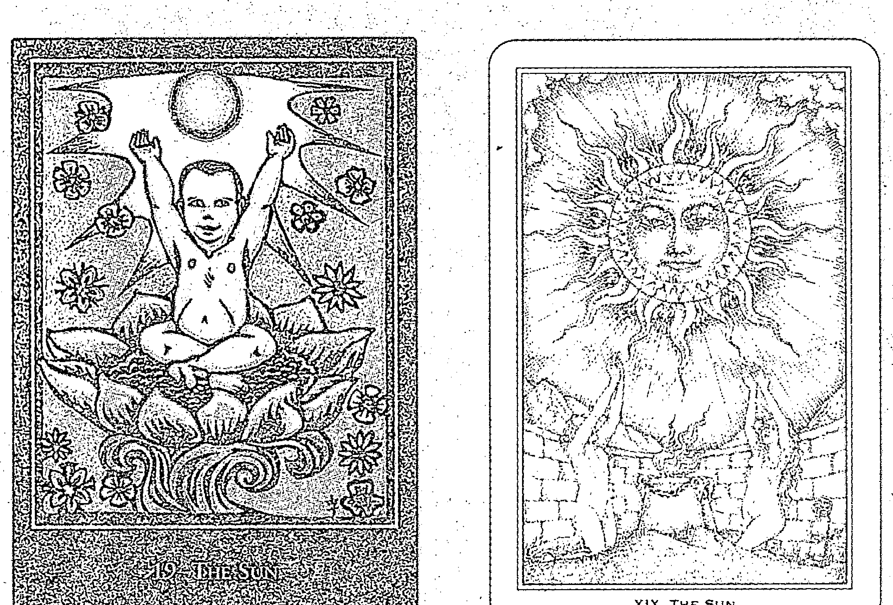

劳伦·奥利尔（Lauren O'Leary）和杰西卡·戈迪诺（Jessica Godino）所著的《世界精神塔罗牌》是一种多元文化的、包含性别的、无阶层的牌种。黑色背景展示了鲜活的色彩和醒目的图像。

尼格尔·杰克逊（Nigel Jackson）所著的《尼格尔·杰克逊塔罗牌》使用的是地道的中世纪/文艺复兴时期的象征符号，绘制雅致、精美绝伦，同时也反映了塔罗牌跟毕达哥拉斯数字命理学有着极深的渊源。

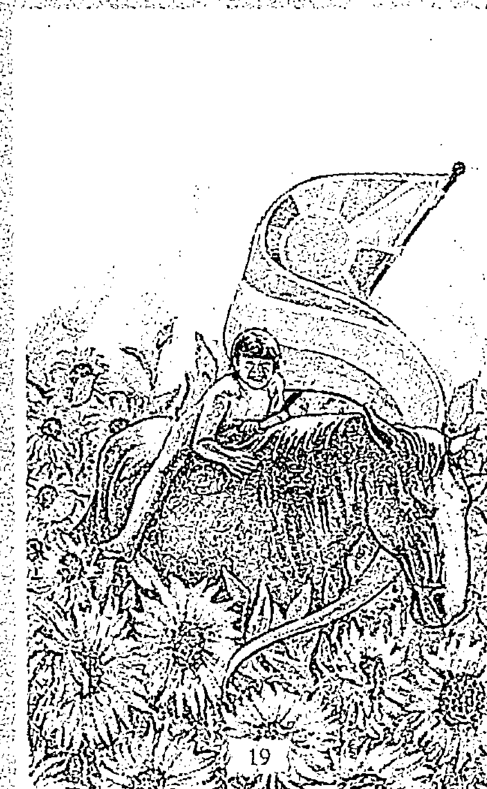

雷·巴克兰（Ray Buckland）和利桑·莱克（Lissanne Lake）所著的《吉卜赛塔罗牌》建立在吉卜赛（罗姆）文化的基础上。图画反映了罗姆人丰富多彩的生活方式，并展现了罗姆人的智慧。

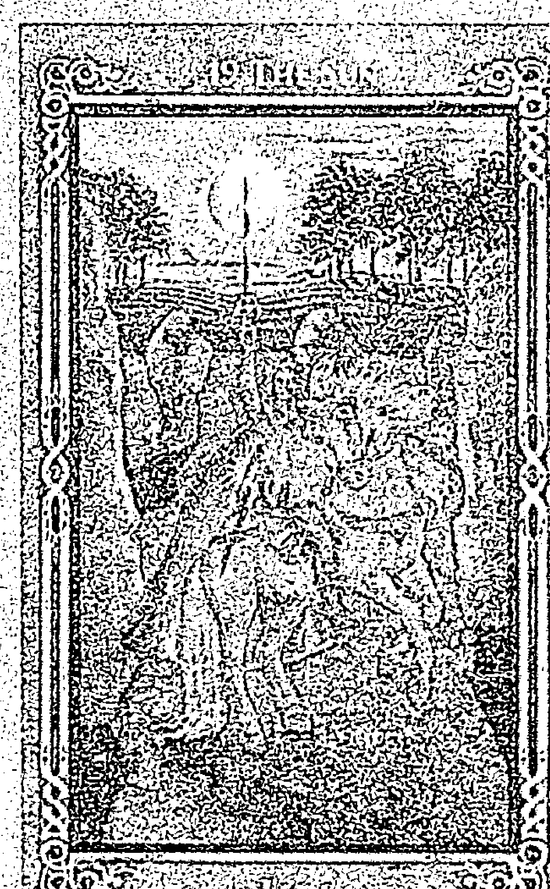

艾伦·坎农·里德（Ellen Cannon Reed）所著的《女巫塔罗牌》运用了异教和神秘主义的图像来探究生命之树。其特点是无边框。

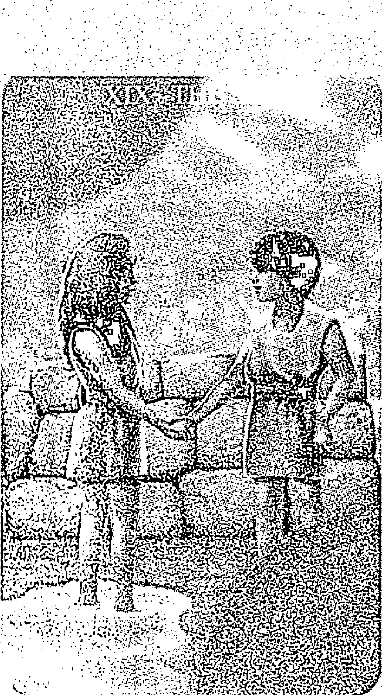

安娜·玛丽·弗格森（Anna Marie Ferguson）所著的《亚瑟王传奇塔罗牌》基于古老的圣杯和亚瑟王传说。其特征是凯尔特风格和华丽的边框。

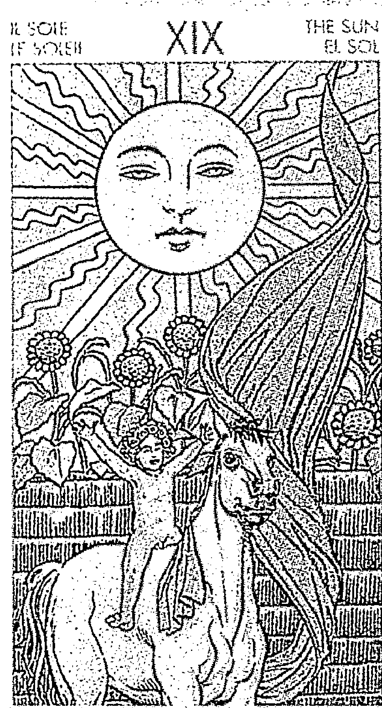

罗伯托·德·安格利斯（De Angelis）所著的《通用塔罗牌》是基于亚瑟·E.韦特（Arthur E. Waite）的指南。其有章有法的改动和成熟的色彩运用使其成为一种颇显现代感而又令人愉悦的传统牌种。

## 第一张牌：魔术师 THE MAGICIAN

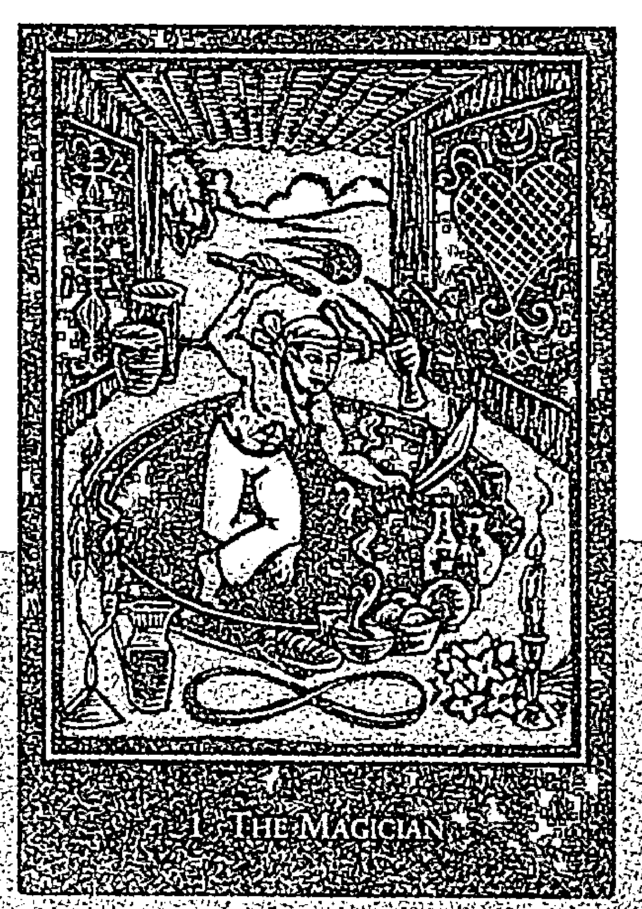

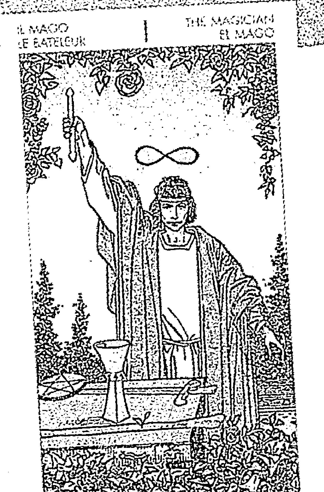

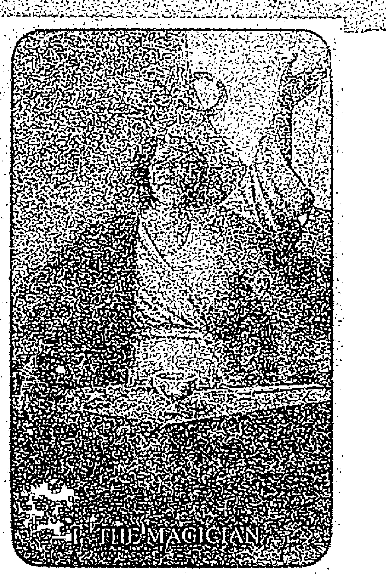

## 代表

人类的智慧；世俗的智慧。控制（或需要控制和操纵）使世界万物运行的力量。

## 说明

在大多数种类的卡牌中，魔术师是男性；该人物在所有卡牌中均独自站立。无论是男是女，魔术师都有一张年轻的脸和一双

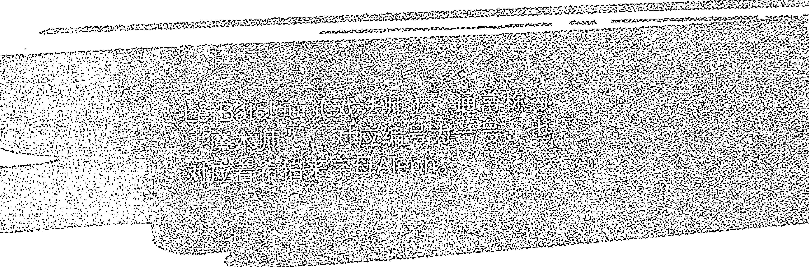

智慧的眼睛；他是长生不老的。
其服饰随着卡牌种类的不同而大不相同，从埃及式的、希腊式的到中世纪式的。不过，魔术师总是系着一条腰带，在有些种类的卡牌中，这条腰带是一条盘绕的大蛇（可能是吞食了自己尾巴的炼金大蛇奥洛玻若斯，也有可能是摩西和埃及魔术师都能使其从他们的魔杖上鲜活起来的大蛇）。
魔术师呈站姿，单手举起——通常握着一根魔杖，而另一只手则指向下方。向下指着的手可能握着一些其他东西，也可能不会。（请注意，这一姿势正好是字母Aleph的形状。）此处的象征是“上下贯通，相辅相成（As Above, So Below）”。这是赫尔墨斯·特利斯墨吉斯忒斯（Hermes Trismegistus）的教谕：每个人所处的小世界都包含了宏大宇宙的所有元素，研究个体——你自

己——就能理解天地万物。
在魔术师前面通常放有一张矮桌（也有可能是祭坛），上面摆放着各种物件。在某些种类的卡牌中，这些只是些杂物。而在某些卡牌中，四种不同的形状分别描绘了小阿卡那牌（Minor Arcana）的四种花色：一个杯子、一把剑、一根魔杖和一只五角星。请注意，由于魔术师控制的世界即塔罗牌的世界，这些物件属于小阿卡那牌也就合情合理了。但是，如果其他物件出现在你

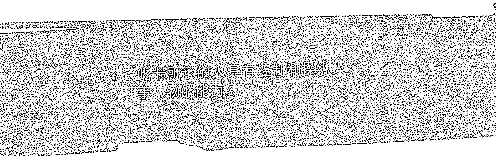

的卡牌中，也不一定就是错误的。
在任何情况下，这些物件代表着内行人能够控制的事物。此卡的本质是：控制你的自我和宇宙的元素。

### 牌意

无论你将此卡当作魔术师还是戏法师，其寓意是一样的。可以认为，宇宙中的万事万物在神面前摊开，如同物件在戏法师的桌子上铺开一样；万物的元素在神的手中翻来覆去，如同戏法师把玩的物件一样。对于戏法师个人而言，物件本身并不重要。重要的是操纵和控制它们的能力。
如果你将此卡认作魔术师，则在玄秘学说中，一个真正的魔法师站在宇宙的中心，万物从他身上发散开来。无论他是创造还是重新创造，在他意念中的宇宙的本质都成为了实际宇宙的本质。无论哪种方式，此卡牌所示人物都具有控制和操纵人、物和

事的能力。

塔罗一号主牌是通往精神启迪和自我发展道路上的第一步。这也是太多人止步不前的地方。因为魔术师，或者戏法师，确实可以控制他的世界以及其他人，将此作为你寻求的目标，这种想法非常诱人。

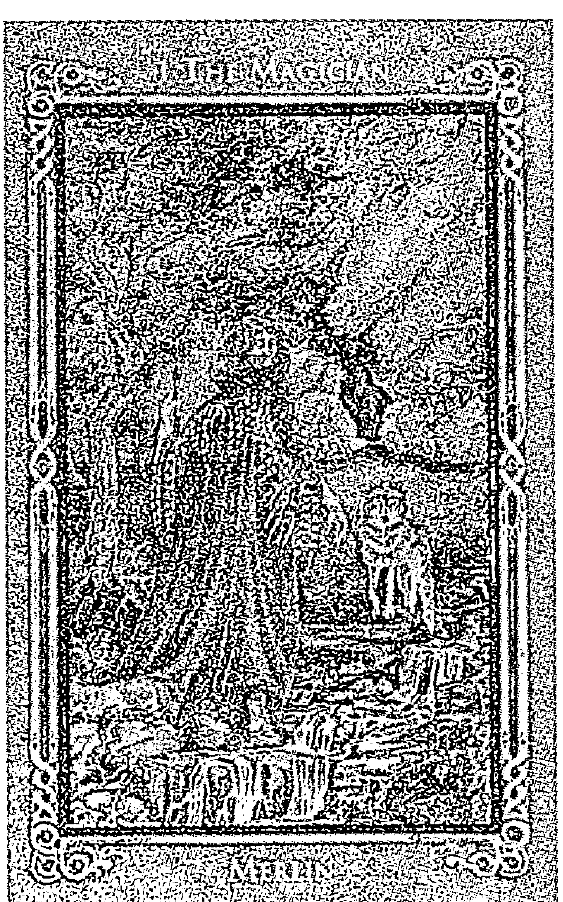

你带着意愿开始前行——成长的决定；成功的希望。对魔术师而言，问题在于：你是停留在对凡尘的控制上，还是继续修行，在灵性上更上一层楼？对戏法师而言，问题在于：你能同时保持多少个物件在流传，保持多长时间？

### 解读

**正位**：意志力、直觉、自我控制、自信、自主、策略。人类的正位特质：技巧性、主动性，智慧、辨别力和理解力；免于被别人控制。都会通往成功，具备控制你环境的能力。

**逆位**：聪明、少有顾忌，诡计、狡诈、精明。密谋者、谎话家、江湖骗子、流氓；擅长利用别人的弱点和信任的人。均由于缺乏真正的自尊和受到外部力量的支配而形成；有时会导致耻辱感或心理失衡。

实际上，魔术师有潜力成为神一样的人物。如果这张牌代表问卜者，那么你就是一个有能力（或者有潜力）控制你眼前世界的人。你正在发展这种潜力，还是正在弃置它以让世俗权力得以彰显？解读其他卡牌时将会告诉你。

## 二号牌 女祭司 THE HIGH PRIESTESS

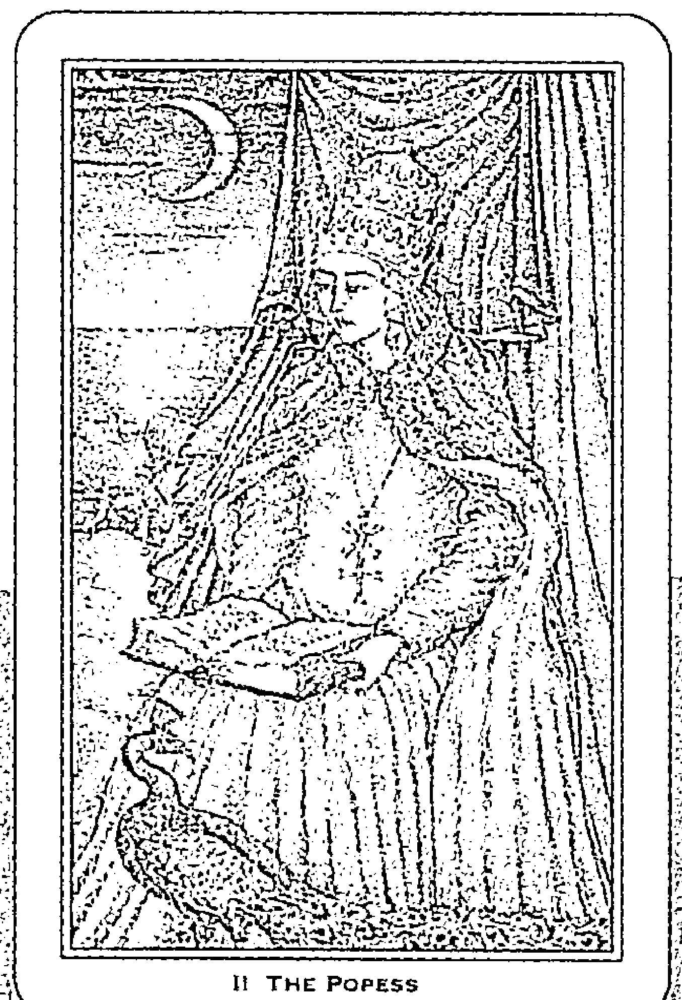

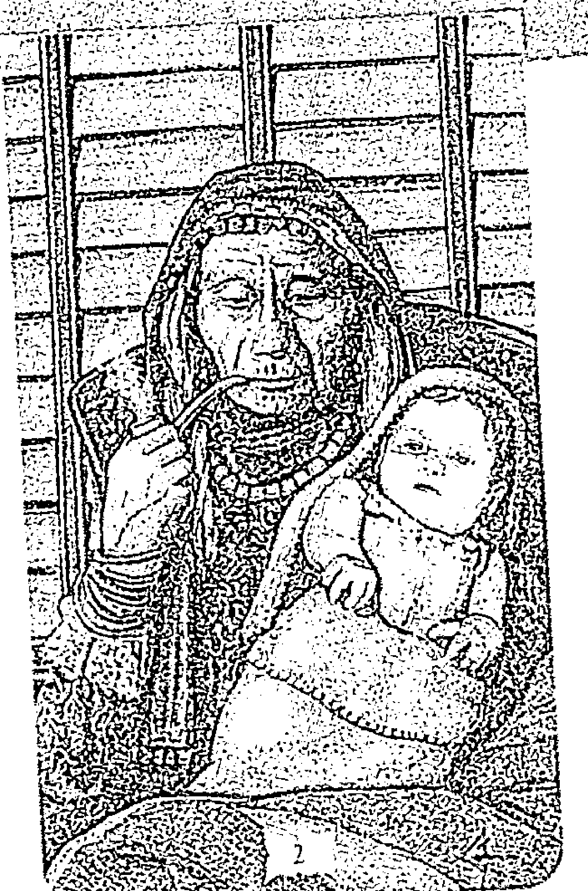

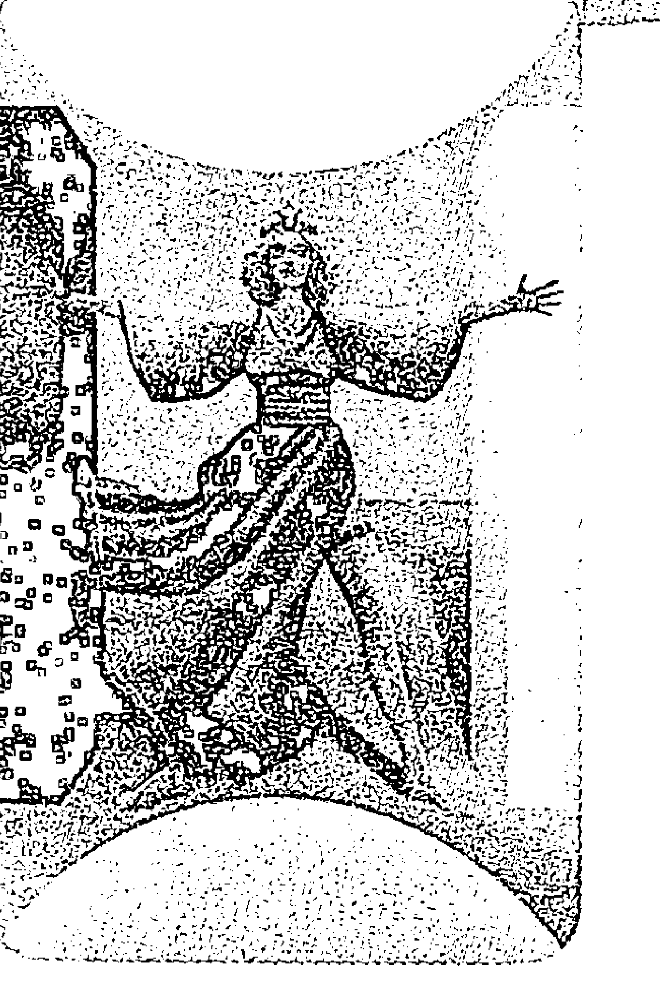

## 代表

神灵的智慧；启迪。理解万物运行的原因（或理解的必要）。

## 说明

女性角色，坐姿或站姿。如果是站姿，她手持一根魔杖，指向远处的某个东西；如果是坐姿，在许多牌种中她拿着一本打开的书，代表着统御宇宙的神的律法。同样，她的服装可能会有所不同，但不管她穿什么，她都会戴着一顶新月冠（或某种变体）。

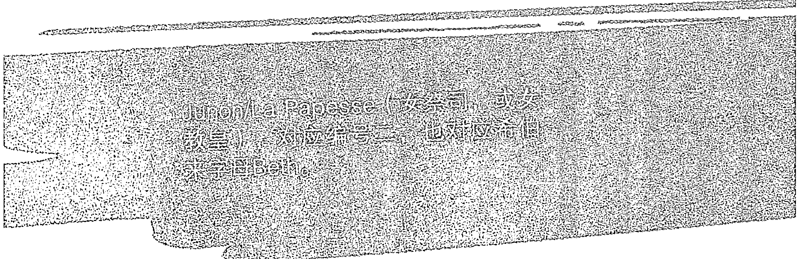

在大多数卡牌中，女祭司站在或坐在两根柱子之间；通常情况下，这两根柱子一根是黑色的，另一根是白色的。这一主题在大阿卡那其他卡牌中重复出现。你可以认为两根柱子代表着善良与邪恶、光明与黑暗、真实与谎言。但是，最好将其看作门户的入口，其间的人物是大门的守卫。要通过大门，你不必击败或巧妙说服守卫。你必须成为守卫的样子。

女祭司牌代表神灵的智慧。她同时是女神、母亲、保护神和教师。魔术师用他的技能来操纵宇宙，而女祭司不同，她存在是为了保护和教导，而不是控制。她明白宇宙如何运作，正是这种理解，她不是简单地控制这些力量，这既是她的目标，也是她存在的本质。

此卡的本质是智慧——理解宇宙运行的深层规律。

### 牌意

如果你选择精神成长的右侧路径，那么女祭司就是你的下一个步骤。她理解宇宙的运作和万物的原因。她理解其不是用于控制和操纵，而是用于培养、教导和保护。
此卡代表理解和解读神的话语的能力；理解规律，它是对我们智力的最高最好的运用。

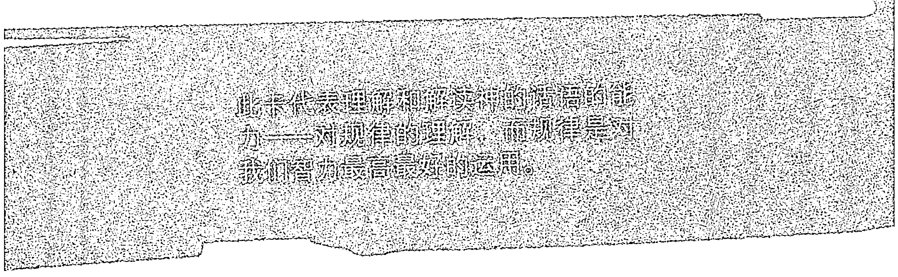

作为神的律法的代表，女祭司是律法的化身，或者是芸芸众生竭力了解的形象。她代表女性的创造力；是所有智慧之母，神灵的女性一面。她教导人们：你所渴求的知识和寻求的理解就在自己身上，在你的潜意识里。要利用它，你必须绕过你的意识，或避免被你的感官和世俗本性所欺骗。
请注意，女祭司的目标比魔术师的更远大更有价值（当然她不那么自私），这也并不是求索者应该停下脚步的地方。女祭司也耗费精力用于培育和教导他人，这也限制了她自身灵性的成长。

### 解读

**正位**：智慧、从容、知识和理解。判定、学习、神秘和科学艺术。学习和教导的能力。还有可能是在适当的时间将被揭示的秘密。

**逆位**：肤浅的知识，甚至是无知；不能清楚地判断事件和问题；思维一片混乱；偏见和片面。不愿或害怕做决定。

女祭司是知道通途的人——如果你愿意去，她也愿意带领你。如果这张卡牌代表问卜者，那么你是能够让人走上正确道路的人，但是要注意：不要太关心他人的福祉，而忽视了自己的机会。

## 女皇 THE EMPRESS

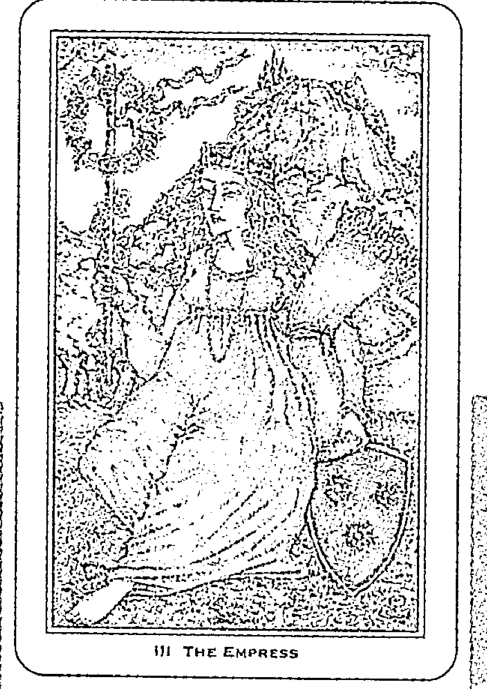

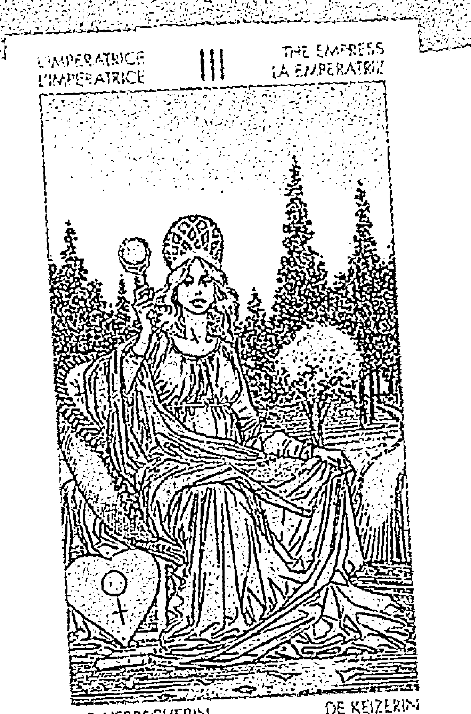

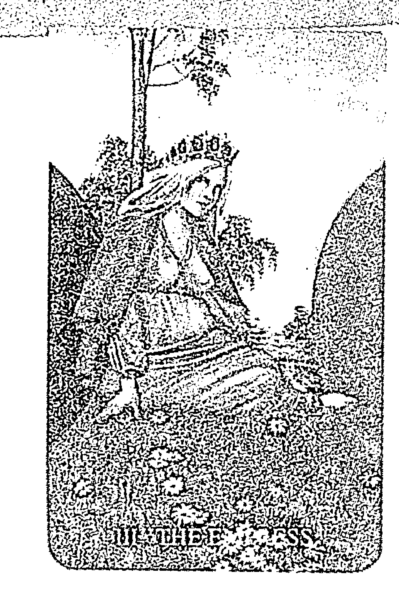

## 代表

母亲、生殖和家庭和谐——不只是单个家庭的，也是整个社会的。

## 说明

坐在宝座上的成熟女性，身着华美的长袍。她手持权杖，头戴皇冠。在有的牌种中，她脚下有一面盾牌或者盾徽，靠在宝座

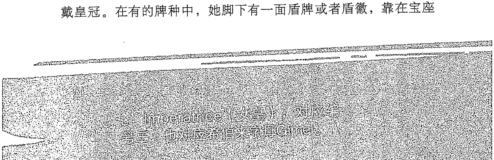

的腿上。而在有的牌种中，她的宝座置于花园中；此外，在大多数牌种中她都在室外。女皇代表母亲的形象，各方面都暗示了这一点：她既是创造性的力量，又确保她带到这个世界的不同元素能够和谐运作，而不是相异相斥。此牌的本质是使互斥的力量和谐合作，为共同的目标而努力——所有的家庭和谐和个人价值实现。女皇也是女家长的化身，代表安全和舒适（身体和心境上双重的），以及理解。

### 牌意

女皇是一家的女性统治者——母亲。她理解世间万物如何运行，以便让她的臣民（她将其当做她的孩子）能够安全、幸福和满足；她有力量让某些事物和谐一致。

她也是女性直觉的象征——就是在没有时间进行下意识思考的时候能让你做出正确决定的闪念。她代表保护和生育能力。她教会人们彼此相爱（灵魂的融合，而不单纯是性引诱）。作为母亲，她也是入口或者大门，通过她我们来到这个世界；作为统治者，她确保人们和谐相处、精诚合作，而不是彼此相斥。女皇是创造环境让每个人自由发展各自潜能的统治力量。

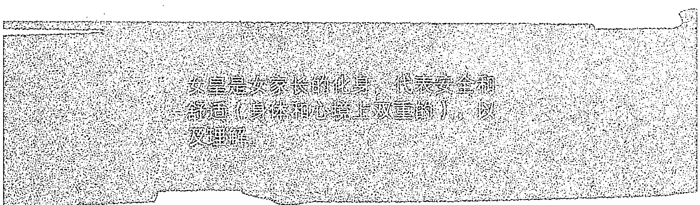

### 解读

**正位**：行动获得成果、美貌、个人发展和进步。家庭和谐。婚姻和生育。长寿。来自个人经验的理解。情绪和身体的双重舒适；她不仅提供生活必需品，也提供奢侈品。

**逆位**：未知。怀疑和困难。优柔寡断。自私自利。丧失力量，无力解决问题或做出有用的计划。动摇、无知。

如果你愿意恭听（女皇的话）并且（与他人）合作，女皇就知道如何让这个世界流畅运行。如果这张卡牌代表问卜者，你就是能够让事物为别人顺利顺心运行的人——只要你能让他们倾听和理解。

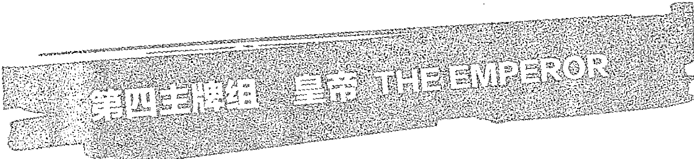

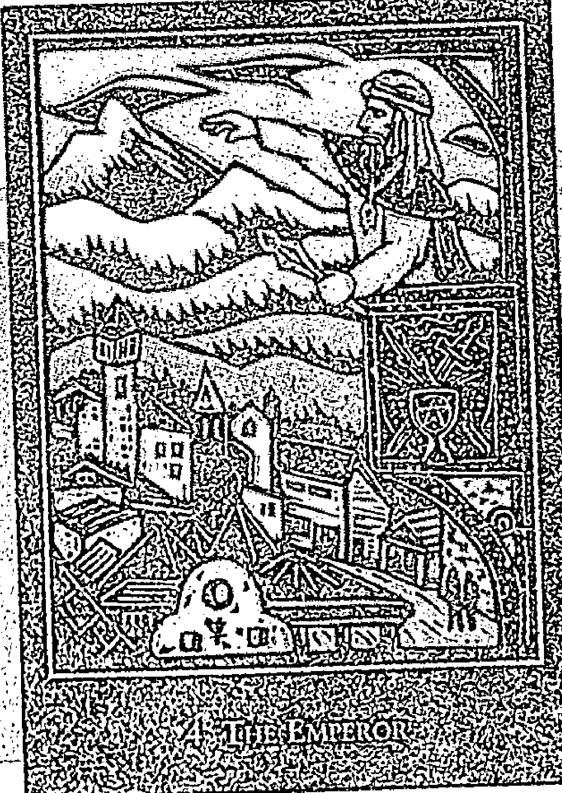

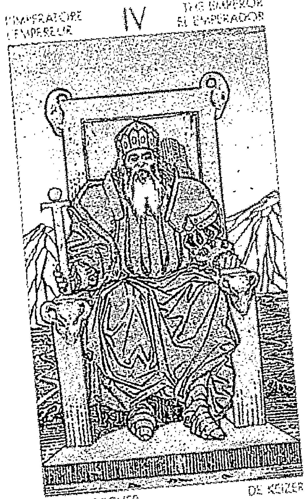

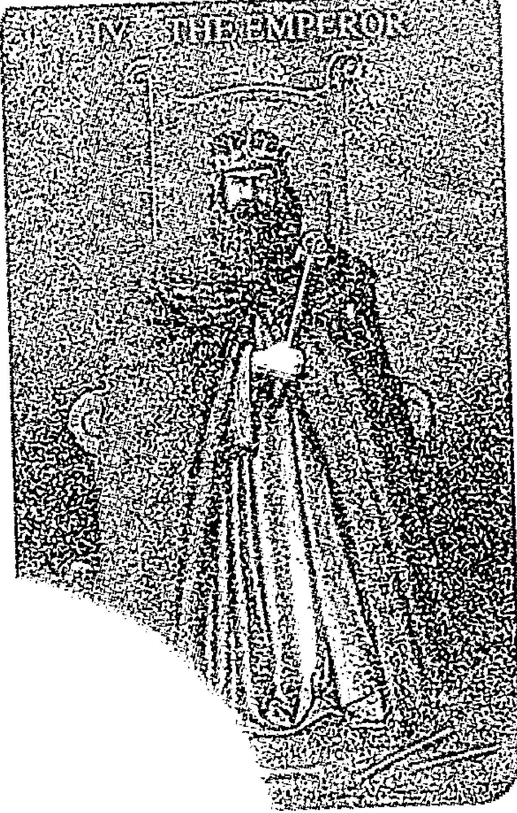

28

## 代表

父亲。世俗的权力，保护他应该负责的人。

## 说明

成熟的男性角色（通常留着大胡子），坐在或靠在宝座上。他穿着长袍，袍子下面是全套的铠甲。他手持权杖，头戴皇冠。在有的牌种中，一面盾牌或盾徽置于宝座一侧或他的脚下。他的

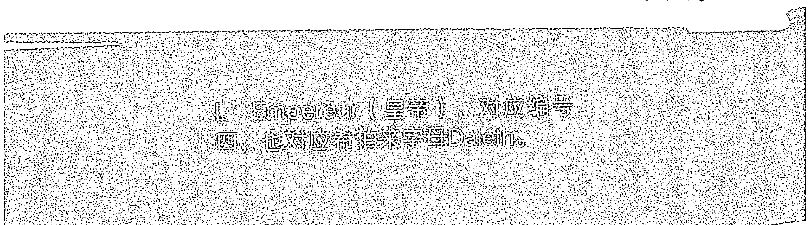

宝座也在室外，有时远处有山。此牌的本质是保护——有意愿争取女皇所教导的家庭和谐。皇帝是一家的男性保护者，保护和引导他所关怀的人。

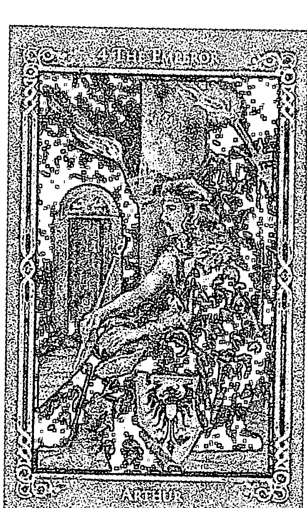

### 牌意

皇帝也是一名聪明的老师。在这里，他教导的是世俗权力的含义和使用。即使再多的良好意愿或适当训练都无法克服的力量：有的时候你必须拿起宝剑。皇帝牌教导你不能向你的道德心妥协；在必要的时候，值得拥有的东西也一定是值得捍卫的。作为家庭的男性保护者，皇帝代表统治者和家长，是世界的护卫者。皇帝牌也代表一种别样的世俗智慧，可以这样理解：仅仅祈望和平与安全是不够的，甚至光训导也是不够的；有时候你必须有意愿——也得有能力——保卫它。

### 解读

**正位**：权力、成就、世俗的力量、稳定性、智慧、雄心、理性的行动。领导力，明智的管理能力。同情心。保护。帮助。实现和到达目标。

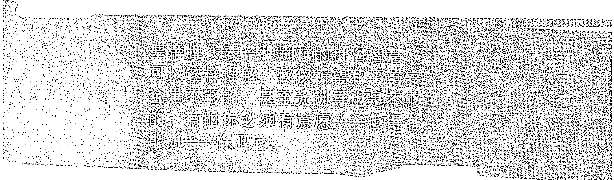

**逆位**：不成熟和混乱，丧失权力。与敌人发生冲突。无法达到目标；能量耗散。
女皇教导人们携手工作，皇帝则保卫这个安全的家免受外来的侵犯。如果这张卡牌代表问卜者，那么你就是能够保护你真爱的人和物——并且愿意为之付出生命——的人。需要肯定的是，不管你保卫的是什么，都值得为之献身。

## 第五张牌：大祭司 THE HIEROPHANT

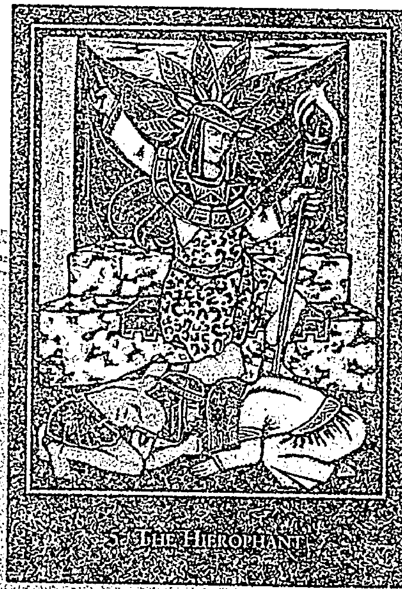

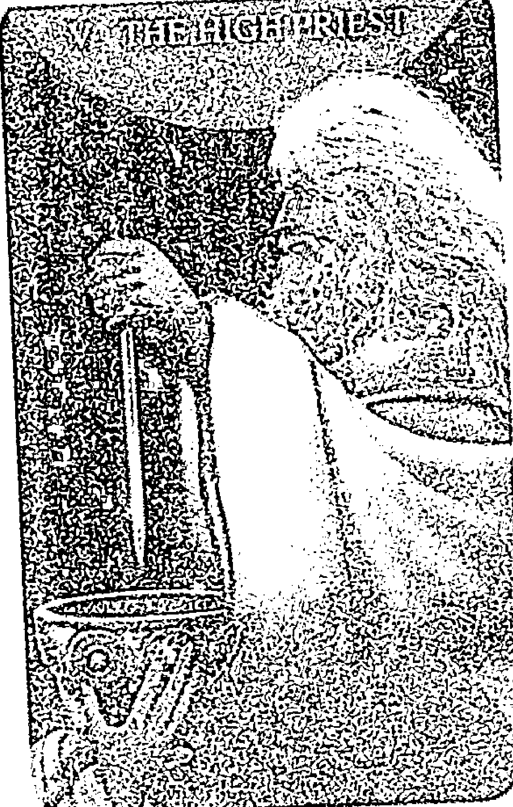

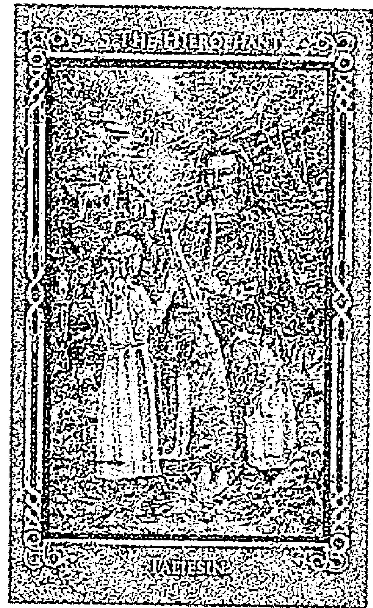

## 经典塔罗入门

## 代表

神的意志；按照个人行为和社会准则来解读神的律法。

## 说明

男性角色，坐在宝座上。他穿着教士法衣，业已加冕，通常在他的左手持有一根权杖。大祭司的服装取决于你所使用的牌种。他的权杖象征着卡牌的设计者所信奉的宗教；他的冠冕和长袍也被认为是特定信仰的修士法衣的一部分。大祭司没握东西的那只手抬起祈福。站在他面前、或者坐在他脚下的是两名（在有的牌种中是三名）级别较低的祭司，在向大祭司致敬或者以某种方式恳求他。在有的牌种中，大祭司长着一张非常年轻的脸，甚至有些阴柔；其他牌种中他又显得苍老而胡子拉碴。

在几乎所有的牌种中，像女祭司一样（第二主牌），这个人物也坐在两根柱子中间。

此卡牌的本质象征宗教权威。他是这样一名显要人士，拥有其追随者或信众给予的权力，并使用这种权力来决定你该怎么做才能得到“拯救”。

## 第一部分 大阿卡那

### 牌意

无论你信奉的至高的神是谁，很显然，他或者她并不会定期从天上下来，与一般民众直接对话。所以，大多数宗教——如果不是全部宗教——都有一些个人，其任务是向追随者们解释神的意志。宗教的组织和结构越严密，大祭司拥有的权威就越大。

需要记住的一点是，并不只是在有组织的宗教中某些人类代表才具有这样的权威。塔罗牌中的大祭司尤其代表了宗教的权威，寻求真理，解释奥妙的人、指出拯救之路的人（或者你的任何最终精神目标）。

但是，这个人物也象征着对追随者施加精神控制的任何哲学或教育体制，不管是宗教的还是世俗的。在所有这些制度化的哲学中，总有一个人或者某个权力集团坚称他们是唯一懂得真理的人，你要么唯他们马首是瞻，要么被打入地狱。

第五主牌逼你做出决定。在这个精神发展的特定阶段，你得到了揭示最终奥秘的机会——发现适用于你的神的旨意。同样，大祭司是大门的卫士：要通过大门，你必须成为他。你是自行决定你的拯救之路，还是让其他的权威——甚至是塔罗牌！——来为你想办法？从这一点开始，你的决定将影响你余下的精神发展历程。

需要注意的是，这并非一张总是对人有利的卡牌。不同于女祭司用她的智慧和理解帮助别人找到自己真正的路径，大祭司使用他的力量来增加对别人的控制和威慑。此卡牌向你提供探索自己灵魂需要的选择，或者让你适应别人的要求。

### 解读

**正位**：宽宥、善良、仁慈、结合（包括可能的联姻）。创造力。寻求真理。理解和灵感。宗教需求和倾向。道德勇气；如果相信路是对的，走自己的路，不顾他人反对。

**逆位**：极端保守主义；过度仁慈或过度拘谨。奴役、囚禁、虚弱无力。需要得到社会的认可和接受。需要遵从。丧失个人权威。（或者，如果出现问题，只在有人担责的时候才接受权威。）

此卡牌代表有实际力量去推动或打败你的人。你必须决定，你想要的进步是否值得屈从这个人。如果这张卡牌代表问卜者，那么你是一个坚持为他人做重要决定的人，通常以提高自己能力的方式持续做出决定。你甘冒这样的风险：放弃真正的权威和个人成长，屈从于自己一贯认定正确的信念。

## XVI THE LOVERS

## 说明

对立面结合；承诺。

## 描述

不计入超自然的任务（如下所述），有的牌种中只显示两个年轻的恋人，可能穿衣，也可能裸体。其他的牌种显示了第三个人，或者在旁观看，或者以某种方式影响两人相爱。在有些中世纪风格的牌种中，第三方是一个老男人；他可能是一个观察者，或者一个家长式的角色，显然这对年轻夫妇在向他解释两人自己的情况。在埃及风格的牌种中，三人的组合为一名年轻男子和两名年轻妇女，显然他要在两名女子之间作出选择。

在有三个人类角色的牌种中，有一个带翅膀的丘比特式的人物从他们头顶的云朵中探出身子，他的箭指向两名年轻妇女中的其中一个。在只有两个年轻恋人的牌种中，对他们产生超自然影响的是一名带翅膀的天使，他张开双手为他们祝福；他们要作出的选择通过其他意象显现出来（比如，韦特塔罗中描绘了亚当和夏娃分别站在知识之树和生命之树前面）。

作出抉择非常必要，是这张卡牌背后寓意的一部分，两名年轻恋人的结合也是如此。

## 第一部分 大阿卡那

### 牌意

恋人的寓意是对立面结合，此处描绘的是，男性和女性以及在精神上相似的人之间的神秘纽带。它可以指浪漫的爱情，或者理想的友谊，或其他两个人之间的亲密联系，特别指两个灵魂为了结合必须或将要克服的障碍和对立面。如果是这样的话，它就是一种相互的承诺，这是为了结合必须共同生活的人而必不可少的因素。

但也有其他方式的“联姻”，以及需要协调的其他方式的对立面。作为你个人精神发展的隐喻，恋人描绘的是你自身存在的对立面的结合。我们每个人身上都有自认为积极或消极的品质，以及表面上冲突的特质。对于每个这样的品质或特质，有些我们能接受，而有些我们想要消除；其实，还有一些品质与特质我们甚至不愿承认它们的存在。

恋人要求你探究和调和这些对立面，而不是试图消除或改变它们。通过了解和利用你自身本性的两面，你成为一个连贯的整体，不再与自己发生冲突。因为这是一项艰巨的任务，这再次成为一个为了达到目标而必须作出的承诺。

我们不能只是接受这些不同路径存在的事实。你必须要明白，即使是你不满意的特质，它对你的持续成长和安康都是必要的。对面并不意味着一个是善的，而另一个是恶的。你自己身上的特质和你想要联合的别人身上的相反特质互为镜像，互相补充和支持。这里要实现的是对立面的结合：一种让两方面共同作用、消除冲突、创建一个比各部分的总和更大的整体。

调和你自身那些不同元素的奖励，增强你的力量和意志。你不再徒劳无益地浪费时间和精力！——竭力剔除你自己或别人身上干扰你的特质。你将它们整合于一身，然后用它们来加强自己对情况和事件的控制。

### 解读

**正位**：魅力、爱情，通过和谐、团结与合作来克服的问题或险阻。明智的决定：做出正确的选择（也许是从两个同样有价值的目标中选择）；可能需要奋力斗争，但会有幸福的结果。

**逆位**：失败、冲突、分裂、不成熟的计划、挫折。不切实际的目标。糟糕的选择。忧愁。

大祭司卡牌表明你最好的成功之道是发展你自己的意志而不是满足别人的要求。恋人卡牌提醒你其他的力量——不管是人还是势力——具有你为生存和发展所必备的特点或元素。如果这张卡牌代表问卜者，那么你将要面临着一个从现在开始就影响你生命历程的重要抉择。你必须——但愿是明智地——决定你要做什么。不管你做出什么选择，如果你希望成功，就必须调动你的敌人，使其能起正面作用。

## 第七张牌 VII THE CHARIOT

## 代表

胜利。通过决策和意志力来掌控敌对力量。

## 说明

驾驶战车的皇家男性角色。在大多数牌种中他头戴冠冕，通常是全副武装。战车通常有一顶华盖，其造型使得驾车的角色也置于两根柱子之间。

战车由两只动物牵引，这些动物可能是真实的，也可能是神奇的——马、狮身人，有时是独角兽或带翅膀的外形像马的动物。在有的牌种中，两匹拉车的动物颜色相反（比如白色和黑色）。在大多数牌种中，它们似乎奔向相反的方向（一只向左，一只向右），但是拉的是同一辆战车。这象征着你本性中互相对立的方面，都在向同一个目标努力，如同你的精神和身体两方面。它们也代表了你在进步的最后阶段（第六主牌）调和和掌控的相反力量，这些力量现在载着你奔向胜利。

这张卡牌的牌意要强于恋人牌。第六主牌描绘了表面上的对立面的结合，而战车牌则描绘了掌握真正的对立面，以及控制和利用本质上冲突的事物。

## 第一部分 大阿卡那

### 牌意

如果你已经调和了自身的对立面以至于在需要时可以随时调用，那么你现在就到了可以战胜你真正敌人的阶段。

正如战车在战斗中撞翻敌人，塔罗中的战车牌象征着战胜所有反对你的人。这些是不能调和与共事的元素（如在第六主牌中）。它们是本质上敌对的力量：善良和邪恶、积极和消极、正确和错误。在某些情况下，它们仍然可能是你自身的对立因素，你必须强制它们在一起发生作用，即使不调和统一。正如通常情况下，这些反对的力量代表着你生活中一直阻止你实现目标的人或事。

因为你已经让对立面共同作用，从自己的对立面中汲取了力量，所以现在可以认识到真正的敌人，并利用它们的弱点——还有你的实力——将其击败。这是战车牌所描绘的胜利。你所有的敌人都已被击败；你所有的目标业已实现；没有什么可以阻碍你的成功之路。

战车牌处在一个求索者很容易停下脚步的地方。毕竟，你不仅实现了内心的平和，而且战胜了成功之路上的一切事物。事实上，你现有的成就已经足够重要，以至于它看上去就像你正在寻求的目标，甚至是唯一值得追求的目标。如果你还要继续求索，就要说服自己还有更多目标可以实现，这一点着实很难。

### 解读

**正位**：征服。战胜敌人或克服障碍。有时可能意味着报复。克服极大的差异化，并且掌控敌对势力。也意味着你在急需的时候会得到帮助或建议（犹如席卷山岗的骑兵部队）。

**逆位**：冲突、战争、麻烦。挫败或不和。争吵、纠纷。被敌人或障碍压倒。

战车牌提供了方法，让你运用目前学习到的手段来战胜阻碍你实现目标的人或事。如果这张卡牌代表问卜者，那么无论你是否意识到，你现在都有能力击败你的敌人，并迫使他们接受你的条件。反观自身，力量就在那里。

## 第11张牌：正义

VIII JUSTICE

> [注：《通用塔罗牌》定为十一号，而将力量牌定为八号。不过，在大多数牌种中，这张卡牌编号为八。]

## 代表

不偏不倚的公正。严格的公平。

## 说明

女性角色，呈站姿或坐姿。在大多数的牌种中，她也位于两根柱子之间。她戴有冠冕，在有的牌种中身穿铠甲，在其他牌种中身披长袍。她一只手握着一柄竖直的宝剑，另一只手持一架绝对平衡的天平。

非常重要的是，塔罗牌中的正义之神跟现代形象的正义女神不同，她并没有蒙上眼睛。她张开了大眼睛，率直地盯着观察者。神圣的正义并不会受到人类思维局限的蒙蔽。

### 牌意

这是神圣的正义，而不是人类的正义——它是绝对公正、完全公平的。她直接否定了人类的正义——这样的正义受到很多因素的影响，使其并不完美。而真正的正义——神圣的正义，不会因为外界影响或个人喜好而动摇，也不会因为人类判明对错的能力上的局限而倾斜。该是什么就是什么，没有人可以改变。

她的天平绝对平衡，而且她能清楚地辨别应该做什么。一手握宝剑、一手持天平象征着正义的双重性质：准确和严厉。

在精神发展的这一阶段，你作为一名初学者需要学习这样的洞察力。要通过这些大门，你就必须学习不带偏见地观察外部世界和自己内心，睁大眼睛，只准确地看到有什么，而不是你想要或希望看到什么，还要学会只通过事物真正的样子来进行准确的评判。

### 解读

**正位**：公平。正确一方的普遍胜利，以及应该胜诉的一方在法律事务中获胜。不因个人因素或偏见而动摇决断的能力。公平、合理、适当的平衡。公正无私。这张卡牌也预示（有时是影响）诉讼和法律事宜。

**逆位**：偏执、不平等、偏见。滥用公正。法律事务中的复杂纠纷。不公正的惩罚，过度的严厉。

这是理想的正义——不管反对、个人偏好还是人类法律的无常，都要做正确的事。如果这张卡牌代表一种情况，你就会得到应得的东西；在这种情况下，结果将完全公平和绝对正确。如果这张卡牌代表问卜者，那么你对自身所处情况或你正在帮助的人的情况会保持准确的看法。你已经作出、或者能够作出正确的决策。别让任何人用别的说法说服你。

## IX THE HERMIT

## 第一部分 大阿卡那

## 代表

自省。探求愿景。

## 说明

一位老男人，通常胡子拉碴，身着长袍。他的长袍很朴实无华，不过也可能透露出牌种的宗教联系：在有的牌种中是埃及式或旧约的服装，或者中世纪的修士长袍；在其他牌种中则套着一个巫术圈。长袍通常连有帽子，腰间可能系有一条打结的绳索。

隐士始终站着；在许多牌种中他还在行走。所有背景都显示出荒漠或其他空旷地带，虽然有的在远处也有山。他一手提着灯，向前探出以便照亮前路；在有的牌种中，他还有可能拄着一根棍子。

此处的意象是独自进行的、需要光照（灯代表理解或知识）的探寻，以便发现目标。隐士身无长物；他也不需要显示派头或地位的服饰（只有简朴的长袍）。他所要的只是完成他的求索，他所有的只有内心中实现这一目标的方式。

### 牌意

几乎所有的宗教都有自己关于愿景求索的传说，这些传说有的讲述了伟大的教师或先知遍寻世界探寻真理——或真神的传奇故事。

隐士牌暗喻你的精神发展到了一个这样的阶段：你必须抵制诱惑，放弃对文明的需求，走进荒漠，反躬自问你自己存在的意义——以及找到你的真神。如果你还在为日常存在的需要而心烦意乱，神就无法向你清楚地讲述。寻求真理必须只身前往。

这是一段寻找真神和自我的历程，但是意象暗示，如果真心探求，你会收到神的启示。灯代表着你的知识储备和理解能力，你必须用它来照亮求索之路。牌中的拐棍可以理解为上帝的象征，这种力量可以让你倚靠，让你在整个求索之旅中保持稳定，也帮助你击退在路上碰到的敌人。隐士抛开了文明的外饰，一心只求真理，他隐喻了自我启蒙的体验。

### 解读

**正位**：自省、节制、智慧、静默。隐藏的真理。谨慎、退隐、精细、慎重、孤独。从经验中学习；求索者。可能也预示着即将到来的旅程。

**逆位**：欺骗、谎言、误报。腐化、隐瞒。误入歧途的理想。文过饰非，甚至弄虚作假。

正如第八主牌描绘了纯粹形式的正义，第九主牌则是寻求纯粹形式的真理，没有受到观念、喜好或需求的玷污。如果这张卡牌代表问卜者，那么你正在经历，或者即将开始一段时间的自我省察。这段时间你会重新评估你的生活和与你有关联的人、事，以及你的目标。你生活中可能发生的变化（和/或你可能得出的结论）会在其他卡牌的解读中有所暗示。

## X THE WHEEL OF FORTUNE

## 第一部分 大阿卡那

## 代表

机遇。命运无常。你无法控制的情况。

## 说明

大多数的牌种只显示一个车轮，轮轴由两根立柱支撑着；在有的牌种中，车轮位于悬崖的边缘。牌中通常有三个角色站在或者绑在车轮上，其中一个在顶部，一个在上升，还有一个在下降。在有的牌种中，下降的角色看起来即将跌下车轮，有要跌出悬崖的危险。车轮上的角色可能是人，也可能是动物；如果是动物，他们就有某种象征性的形式，如狮身人，或穿衣服、外形像猴子的生物。车轮顶部的角色以某种方式描绘得突显重要——比如头戴冠冕，或身佩宝剑，或明显颇有名望。

有的牌种中车轮并无依靠，但是它明显在转动。其他牌种中，一名蒙住双眼的年轻女子在转动轮子。请注意，车轮上的角色都没有注意到她，甚至是即将跌出去的那个角色；事实上，所有人，包括那名蒙住双眼的女人，都没有注意或者真正有意识地控制车轮转动的结果。在有些牌种中，车轮只是一面悬在半空的圆盘，圆盘上有一些字母或符号。在这些牌种中，除了绑在车轮上的三个角色外，卡牌的四个角上还各有一个象征性的角色：顶部是一个人和一只鸟或者兀鹰，底部是一头狮子和一头公牛。这四个角色都有翅膀。

### 牌意

我们都绑定在命运之轮上。有的人奋力向上，有的人则半途而废。有的人雄踞人群的顶端，不受变幻莫测的命运的影响。但是，无论我们是否意识到这一点，每个人的命运之轮都在转动。每个人命运的结局都纯属偶然，与个人价值大小毫无关系。这里的含义与正义牌（第八主牌）截然相反。在这两种卡牌中，每个人都会得到不偏不倚的对待。但在正义牌中，结果是公平的：你会得到应得的东西。在命运牌中，无论你应得什么，你都只能得到碰巧降临的东西。更糟的是，控制生命的力量根本不考虑你或者其他任何人，它们甚至看不到你。实际上，你就像戏法师桌上的道具，被随意摆弄。事实上，你甚至还不如这些道具，至少戏法师还会看着他要用的东西，即使他除了自己不关心任何人。

第十主牌教导你，生活中有些事情只是碰巧发生，对此，不仅是你，就是无常的命运都无法真正地控制自身。你必须意识到，命运之轮在不停转动，你的生命正受到它的影响。如果你想成功，你必须争取掌控无法控制的东西，逼迫命运给予你所选择的东西，不论你是否应该获得。

好运的秘密就是要学会用你的心灵力量或内部力量控制自己的命运，而不是任由自己随风飘摇。盲目的命运之神毫不在意谁

## 第一部分 大阿卡那

赢谁输，她只是随意地转动着命运之轮。如果你想拔得头筹，你就必须要学会好好关注发生在自己身上的事，以便掌控命运之轮。

### 解读

**正位**：好运。命运；财富。成功。意想不到的时来运转。升职或提拔。胜利；凭好运清除了障碍。

**逆位**：所获过多，都拖住了衣角。失败。运气不好、遇到麻烦、意想不到的伤害。

现在就决定你的未来，把握好自己的生活，否则只能接受盲目的命运之神随手丢给你的结果。如果这张卡牌代表问卜者，则即将发生在你身上的事——无论好坏——都与你应不应得毫无关系，只是碰巧而已。如果你喜欢，就继续；如果不喜欢，就抗争，但是在这种情况下，你既不会遭到惩罚，也不会得到奖励。事实上，你根本不被列入命运之神的考虑范围中。

## VIII - THE STRENGTH

54

## 第一部分 大阿卡那

> [注：《通用塔罗牌》将其定为八号，而将正义牌定为十一号。然而，在大多数牌种中，这张卡牌编号为十一。]

## 代表

克服障碍。精神强韧和意志的力量。以压倒性优势获得大胜。

## 说明

许多牌种显示为一名与狮子搏斗的年轻女子；她赤手空拳，而且稳操胜券。在有的牌种中，她看起来是在合上狮子之口；在其他牌种中，她是在掰开它的下颌。
无论哪种方式，她都在强迫狮子按照她的意愿行事，而不是它自己的意愿。在有的牌种中，女子的头上显现出无穷大符号；有时会出现头盔或帽子的形式。
有几种卡牌显示的是赤手空拳与狮子搏斗的年轻男子：他可能代表赫拉克勒斯（Heracles）或参孙（Samson）这样的英雄人物。在这种情况下，男子的棍子平放在他脚下的地上，棍子要么是滑落了，要么是扔掉的，这样他可以赤手空拳地搏斗。他可能以某种方式摆弄狮子之口，也可能没有。
如果卡牌显示的是与狮子搏斗的男性，则进行的必定是不胜即死的争斗。如果卡牌显示的是一名女子，则通常的情况是她并不是要驯服狮子而是与之搏斗，她用的纯粹是意志的力量。
在这两种情况下，卡牌的意象都是单个人赤手空拳，仅仅依靠自己的毅力和决心，就战胜了比自己强大得多的对手。

### 牌意

这张卡牌象征着克服前路的障碍所需的内在的力量。战胜蛮力的并不是蛮力，而是精神的力量战胜身体的力量。在几乎所有人类战胜强大野兽的传说中，无论是狮子、恶龙还是其他猛兽，都是通过正义，而非强力赢得胜利——靠的是个人内心的刚毅和对神的笃信。
在这种情况下，野兽可能代表阻碍你精神进步的外部障碍。然而，也可能代表你内心的野兽，自身的恐惧、热望以及其他似乎比你强大的品性，但是如果你坚持信念，认定自己更为强大，这些品性都能改变和驯服。狮子象征着任何表面上你无法匹敌的对手，而如果你相信自己，并立志取胜，你就可以征服它。
（举个例子：成功戒烟或严格控制住饮食的人就已经战胜了这种野兽。）
如上所述，这里的寓意是肉身和精神之间的战斗。你行走在精神启蒙的道路上。要达到你的目的，你必须克服或驯服你的基本热望，并迫使它们向你更高的自我俯首投降。

### 解读

**正位**：意志的力量。道德的力量。个人的活力。勇气、胜利。坚韧、决心、能量、挑战。忍受艰难困苦的能力。成功。

**逆位**：滥用力量、专制。失败、耻辱。虚弱（无论是身体还是精神上的）、不协调、不和谐。

你正在面临对你耐力的考验。如果你的意志比任何对手都要强大，你就能存活下来并取得成功。如果不是，你就会梦断于此。坚韧是胜利的关键；不要绝望。如果这张卡牌代表问卜者，那么你正面临对自己的决心和意志的考验。战斗将不会轻松，而如果你能下定决心坚持到底，你就能取得胜利。如果你选择屈服，你就会失败。

## XII THE HANGED MAN

58

## 第一部分 大阿卡那

## 代表

自我牺牲，目的是获得智慧、特殊洞察力，或个人成长。

## 说明

一名男性角色，倒吊在绞刑架上。大多数情况下，这个角色的两边各有一根立柱，支撑着吊着他的横梁，这是对两根支柱或门户主题的再现。而在有些牌种中则只显示横梁本身。请注意，如果有两根立柱，它们就是修剪过的树木，根还扎在鲜活的大地上；如果只有横梁的话，横梁上还会有星星点点的绿叶。无论如何，在这两种情况下，吊着他的“绞刑架”都是一棵活着的树。
一根皮带或者丝带缠着倒吊者的一只脚或脚踝，将其悬吊起来。他的另一只脚自由地垂着，屈在吊着他的脚之后。在大多数牌种中，他的双手被绑定或者紧扣在背后。
这里要注意的是，这个角色并没有显出任何疼痛或悲苦的表情。有的卡牌显示他脸上的表情很平静，有的则显示他在沉思甚至很兴奋，但显而易见的是，这场特殊的考验是他自己的选择，他正从苦难中实现他的目标。

### 牌意

如同隐士牌（第九主牌）一样，许多宗教和神话都会描述一个神圣或半神圣的人物，他选择了忍受某种形式的个人牺牲，以获得神的智慧甚至达到神的地位。例如，在北欧神话中，神的统治者奥丁（Odin）在“世界之树Yggdrasil”上倒吊九天九夜，以获得神秘符文的智慧。在隐士牌中，孤独求索是理解你目标的方式；而在倒吊者牌中，传达的信息是为了达到目标你必须承受个人的牺牲。

倒吊者并不是说受人所迫，或为他人作出牺牲。选择是他作出的，回报也归他所有；这就是此处的含义。对于有的目标，你必须要作出个人的牺牲，也就是说，你必须忍受不舒服或不高兴的经历。如果你这样做了，你的个人所得将会值得你付出这样的代价。（如果他人也碰巧受益，就像奥丁的神秘符文的例子，那只是锦上添花而已，而并不是为之牺牲的原因。）

重点是选择是你作出的，牺牲必须是自愿的，因为目标值得你这样做。牺牲和目标可能是任何层面上的，不论身体、智力或精神。但是，无论你的目标是什么，都需要牺牲你的幼稚或自私的幻想来实现你成熟的梦想。正如神以神的形象创造了人，你必须以你选择成为的男女形象重塑自我。

这张卡牌还有另一层意义：有资格牺牲来实现你目标的人只有你自己。

### 解读

**正位：** 自我牺牲，增长智慧和直觉。献身、屈服、放弃。为了更好的东西而放弃某物。先见之明。

**逆位**：自私自利。政治阴谋。微不足道的损失，缺乏联系。可能意味着丧失你想要或需要的东西。

倒吊者要求你愿意承受一些损失，或放弃一些乐趣，才能实现你的目标。目标越宏大高远，所需要的牺牲越大。如果这张卡牌代表问卜者，你将不得不付出代价——而且是高昂的代价——来换取你想要的东西。如果你愿意付出这样的代价，你就可以实现目标。在这段艰难的时间，你要提醒自己，选择是你自己的：付出代价，或者放弃目标。

62

## 第一部分 大阿卡那

## 代表

突然变化；事物现在或过去状态的结束；消亡。

## 说明

在许多牌种中，死神传统上都被描绘成带着镰刀的骨架。在有的牌种中，死神则被描绘成身着黑色盔甲、胯下骑着马的骨架。这一角色有时狰狞阴笑，有时又显得愤怒或者愤恨。
背景也各不相同。在有的牌种中，地面寥落而荒芜，仿佛地球本身就是死的。而其他牌种则显示身体的某些部分：头、手、脚和骨头。还有些牌种表现出不同生命状态的人（国王、少女、孩子、牧师），他们要么已经死亡，要么正面临死亡。这里的意象是，无论贫富贵贱，没有人能避免这种变化。

### 牌意

死神牌象征着与过去彻底断绝，是你过去生命的终点。它可以解读为放弃旧观念和旧的行为方式，也可以解释为完全改变你的生活或生活方式，从一种存在模式跨越到另一种模式。它也代表着亲密联系的结束，或者是因为你继续前行，或者是因为别人。
死神的镰刀象征收获；你播种了种子，它已经生长到这个地步，而现在是收获的时候。你身怀所学，进入到下一个更高的存在阶段。
在任何情况下，伴随着现实的死亡又催生了新的生命。死神牌象征着过去的你已经终结，但是这并没有什么好惧怕的。这是你已经知道的；事实上，这是你要努力的结果。因为这是你到现在为止所付出的代价（第十二主牌）和所学的东西，而过去的你走向了终结。从这里开始，你的生活将同以前所知的截然不同，甚至不能够想象。

虽然我还没有讲到命理阐释，但是对此有所接触也是很重要的。数字十三本身既不幸，也不晦气。它代表着变革——实体层面的，通常是变好或者重生：这是过去和未来的分界线。

### 解读

**正位**：突然改变；过去实物的结束。道德性；必然性。无法避免的情况或事件。可能意味着现实的死亡，死的是你自己或你身边亲近的人，或者你的计划突然全盘崩溃。失败。
**逆位**：毁灭、损失、计划失败。冷漠，丧失希望或信仰。变得更糟糕（虽然不一定是致命的）。
你的生活即将发生重大变化。无论是好是坏，都不可避免。请注意，虽然这张卡牌代表精神启蒙阶段积极的变化，但在解牌中，这是一张非常不利的卡牌。
如果这张卡牌代表问卜者，那么你正面临与过去的生活彻底决裂的情况，并且你几乎没有任何办法阻止其发生。请务必在解牌时仔细解释其他卡牌，以确定变革究竟是什么。它可能意味着实体层面的变化，比如离婚、丢失工作或现实的死亡。如果变化是实体层面或者关系，有所准备可以挽救一些东西，或至少能让你坚持前行。如果这张卡牌预示你自己的死亡，或者身边亲近的人死亡，其他卡牌会告诉你将如何死亡及其原因。你或许能够做点什么来预防（比如避免致命的情况或预见可能的自杀）。或者它只是意味着你必须接受不可避免的情况，那你就只能做好思想准备了。

## 第一部分 大阿卡那

## 代表

耐心、自我控制，愿意学习领悟。

## 说明

一个带翅膀的天使站在小溪旁。在有些牌种中，这个人物一只脚踏在溪流中，另一只留在岸上。天使可能是男的，也可能是有光环或王冠，或某种形式的象征性的圆环。

天使持有两个杯子或水罐，一手一只，正在从一只往另一只中倾倒液体，很可能是水。背景显示的是远处的乡村和山岗。在有的牌种中，小溪（在天使的脚下）从山上流下来。有的牌种还显示山岗之上隐约可见一只王冠。

这张卡牌用天使做主要人物，象征着如果能够学习节制所教导的东西，我们就有能力将自己提升到天使的地步。

### 牌意

这张卡牌教导的是你在学会耐性所需的教训中最重要的——也很可能是最困难的课程之一。生命中有些时候好像什么也没有发生，什么也没有进步；你只能停滞不前，而且对此无能为力。
并不是有人或有事故意阻碍你。这是一个必要的等待期，尽管可能看起来像延迟，但是事物其实正在变化。举一个很普通的例子：你做好了面糊，倒在锅里，并把它放进烤箱，这时你不得不等待，直到它烤好出炉。你走来走去、心烦意乱也没有用。你必须等上一段时间蛋糕才能烤好。事实是在这期间，你已经付诸实施的项目正在开花结果，你只需要耐心等待收获。
节制还教导你，当你只能等待时，你也可以建设性地利用这些时间。你可以利用这些时间来思考你已经做了什么、将要做什么，探寻自己的需求和动机，让学习变成领悟。
不过，最重要的是，你使用这些时间来迫使自己学会忍耐。在生命中，我们总是习惯于做点什么。你要懂得有的时间你没有能力、也没有必要做什么，或者至少没有更多可做——这一点很重要。

### 解读

**正位**：耐心、变通、适度、节俭、节制、反思。策略；公正。良好的管理、节省。协调能力。
**逆位**：分裂，缺乏和谐。利益之争；不幸的组合或联合（如社会不可接受的婚姻或伙伴关系）。挫败、急躁。
即使你停滞不前，事情还是会朝着正确的方向进展，并将在适当的时间实现。不要操之过急。你现在什么也做不了。如果这张卡牌代表问卜者，你急切地想知道结果，此处要传达的信息是一样的。如果你静静地等待结果，你才是在做正确的事。事实上，在这种情况下，这是你唯一能做的事。

## XV THE DEVIL

70

## 第一部分 大阿卡那

## 代表

至善与至恶之间的斗争；秩序与混乱之间的选择或冲突。

## 说明

有些牌种显示为传统的恶魔形象，有角、蹄、尾巴，手持钢叉。在这些牌种中，他凌驾于一个哭泣的人之上，得意洋洋；他的一只手臂抬起，像操纵木偶的人，整个姿态模仿女祭司的站姿。

大多数的牌种显示为更大号的魔鬼，有两个较小的角色，一男一女，站在他的宝座之下。较小的角色可能是恶魔、人类或者长角的人类；在所有这些牌种中，他们都锁在或者绑在恶魔的宝座脚下。请注意，这三个角色的位置照应——或者效仿——第五主牌（大祭司）中的画面。

这些牌种中位于中央的恶魔可能以多种形式出现，从长角的山羊到更为贴近人类的形象；他可能令人着迷，也可能面目可憎。不管是什么形象，在大多数情况下，他都长有翅膀和角；他的眉毛或头顶上有时还有一只倒转的五角星。

在几乎所有的牌种中，恶魔都抬起一只手，或者置于锁在他宝座上的两个角色的头顶。这个主要角色通常是坐着的，但也可能站着；他的表情多种多样，从迷人的微笑到气得紧锁眉头。他的态度直接影响到画面上的其他两个角色。如果恶魔笑脸盈盈，他的奴仆也喜笑颜开；如果他皱着眉头，他的两个奴仆就一脸苦相或者胆寒心惧。

同样，这个强大的人物凭姿势就可以影响或控制进入其影响范围的人，这一形象也可以解读为颠覆或嘲弄第五主牌中祭师给予的祝福。有时很难辨别两个较小的角色是他的囚徒、仆人还是宠物；但是不管哪种情况下，毫无疑问的是他们都受缚于这个强力人物的意志。

需要注意的是，两个较小的角色站在主要角色的两侧，尽管他们比起恶魔来位置更低、尺寸更小，但还是呼应了第五主牌中的两个小祭司，而且位置上也照应了大阿卡那其他卡牌中的两根立柱。

### 牌意

恶魔代表了善的对立面，以及肆意破坏和谐秩序的力量。让这个角色变得邪恶的并不单纯是个人主义或想遵循自己的方式。魔术师（第一主牌）也试图将自己的意志强加于宇宙，而事实上，走完塔罗牌全程的结果之一就是让你真正掌握自己的命运。

这里的寓意不是独立的意志，而是进行毁坏，用以颠覆神圣的平衡。恶魔的目的是打败神的律法，让世界返回混乱的状态。

古人有云，乾坤自有法度，一切众生都能在其中找到自己最好的命运。神的律法旨在建立和维持秩序；恶魔则努力扰乱和破坏秩序。他可能利诱，也可能威逼，但不管用哪种方式，他的目的都是使出令人无法抗拒的诱惑，从而让人偏离真正的道路。
塔罗牌所教导的真正的道路尽可能地接近神性。到了精神发展的这一阶段，你已经相当纯熟，足以成为恶魔眼中有价值的仆从。到了这一阶段，你就可以选择是继续追求你的最终目标，还是选择左边的路径，到此为止。对这一阶段的求索者而言，利诱尤其勾人心魄，因为你刚刚被迫等待目的达成（节制）。恶魔似乎提供了一种方法，让你能够实现这些目的，而不需更多的等待或进一步的工作。
恶魔所提供的力量十分巨大，但要求你付出的代价则更大。永远不要忘记，即使没有恶魔的帮助，你也可以实现自己的目标。实际上，他对你感兴趣的唯一原因是你的潜力超过了任何他希望实现的目标——除非他能够阻止你。
摆在你面前的并不是什么捷径，受束缚的角色的意义是警告人们，要获得恶魔的力量，你必须要交出自己的自由意志。

### 解读

**正位**：仇恨、暴力、毁坏、混乱、灾祸、晦气。甘愿受缚。放弃自己的权威和意志，拱手让给他人。同样，命中注定因而无法避免的事，但并不是因为这样就必定是邪恶的。
**逆位**：琐碎、无力。盲目、嫉妒、生病。厄运。错误的选择；你受苦受难，而他人得利。

## 经典塔罗入门

你面前摆着快速解决问题的办法，如果你耐不住性子，采取了这样的办法，你可能只得眼睁睁地看着所有的梦想和计划毁于一旦。你依靠自己同样可以成功。无论有多么诱人的捷径，都不要受引诱；如果你决定独自前行，不要因为劳心费力而心灰意冷。

如果这张卡牌代表问卜者，你千万要小心。你控制下属的力量过于鲁莽，这种力量足以操纵、控制甚至摧毁他们的生活。但是，即使是真正的恶魔也没有地方可去，只能活在地狱中。

## 经典塔罗入门

## 代表

挫折；所有的计划毁于一旦；因为滥用自己的力量或天赋造成的灾难。

## 说明

石头砌成的堡垒或高塔；其顶部有时显示为王冠的形状。高塔被天雷击中，天雷代表着神的愤怒。塔顶被切掉，塔本身跌成粉碎。碎片和火花从塔上落下。画面上还显示了两个人物，通常均为男性，从塔顶跌下，正在走向死亡。
这里的寓意是代表人的力量和自负的建筑被神的愤怒所摧毁。

### 牌意

跟这张卡牌的象征意义对应的最为耳熟能详的故事就是通天塔 (Tower of Babel) 了。巴别尔 (Babel) 的人们聚到一起，齐心完成一项可能是人类最伟大的目标：完全统一。他们都讲同一种语言；他们都为同样的目标携手并肩。同心协力的结果是他们的成果被摧毁，语言被打乱，人们被分散到大地的四个角落。
理解这一点非常重要：错误的并不是修建高塔；他们齐心协力建塔肯定也不是错误的。错误的地方在于修建高塔的原因。他们不是用团结的力量使自己达到神性，而是用这种力量来挑战神，并试图取代神统治地球。
这张卡牌与第十五主牌（恶魔）一脉相承。你走向精神自我启蒙的目的是变得像神一样。但是塔罗牌教导说，如果你只是具有控制实体层面事物的能力，你并不能成为神。如果你只是沉醉于有机会控制这个世界，而不是追求智慧和精神的成长，你将失去一切所得。这场灾难的原因并不是因为你发展了强大的力量，而是因为你误用了这些力量。这张卡牌代表着因为你缺乏领悟和良好的判断，或滥用了你的自由意志而直接导致了这种毁灭。
高塔可以代表实际的重大损失，比如在财务、关系、声誉或个人影响上。它也可以理解为一个警告，告诫你的力量并没有自己认为的那么强大，你对力量的领悟并没有自己认为的那么彻底。从这个意义上说，它描绘了这样的灾难和毁灭：或者可能确实发生在使用魔力而又没有理解其真正目的的人身上，也可能发生在玩弄超出他们控制或理解能力的人身上。
在精神的意义上说，倾覆的高塔象征着求索者如果选择恶魔提供的道路所得到的结局——在这种情况下即使是你自己开辟的道路。
虽然一直都有暗示，但这是塔罗牌中第一次直接说明你必须如何看待你的最终目标。目标并不是这个你想要征服的世界。
在你求索中的这一刻，以尘世的条件来衡量成功：打动别人、控制这个星球，或者以某种方式获得世俗的地位，仍然令人垂涎不已。更为诱人的是，你现在已经具有了让这个世界根据你的意志而扭转的力量——至少暂时可以。但是你的目标并不止步于此。你必须学会越过表层的东西，达到更高的境界。如果你放弃精神进步来换取物质力量，你将失去你已经获得的一切。

### 解读

**正位**：中断、逆境、巨灾、痛苦、欺骗。不可预见的毁灭、终止。耻辱、痛苦。财务或个人损失，比如家庭破裂、业务搁浅、婚姻或关系破裂，以及个人或财务上的灾难性变化；特别是不可预见的巨大灾难。

**逆位**：预示着灾难和损失，但在你的生活中的重要性低一些；这些会打乱你的生活，但是并不意味着你一手建造的一切都毁于一旦。一场突如其来、意想不到的变化。压迫、逆境、欺骗、暴政。

你正在建造的东西正在灾难中毁灭。在大多数情况下，如果你一开始采取明智的行动，这些灾难是可以避免的。如果你现在采取明智的行动，你至少可以缓解一些即将发生的问题。

如果这张卡牌代表问卜者，你已经逾越了自己的限度，即将付出代价。但即使在这种情况下，这也不是对傲慢的惩罚。这场灾难的原因是你认为你拥有实际上并不具备的力量或权威，或者你不明智地使用这些力量或权威，或用在了错误的地方。简单来说：你把事情搞砸了，失败是你自己的过错。

## 第十七张牌：星星 THE STAR

## 代表

智慧、不朽，完成你的目标，慷慨和理解。

## 说明

一名女子单膝跪在小溪旁。在大多数牌种中，她单膝跪在岸上，而另一只脚伸入溪流中。她两手各持一只水罐，往外倒水。在所有的牌种中，她至少将一只水罐中的水倒回小溪中；在许多牌种中，第二只水罐中的水是倒在小溪旁边的地上的，只有一部分水流回小溪中。请注意，这一意象对应着第十四号主牌（节制）。但这里的寓意并不是简单的耐心（即在等待目标开花结果的期间节制自己），而是返还一些自己的东西。

她的头顶有很多星星，不过数量和布局因牌种而异。有些牌种显示七颗星星，在她头上排成一圈，呈现出光环的效果。其他牌种显示七颗外形较小、排列各异的星星，而另有一颗最大的始终悬在人物的头顶。通常情况下，采用第二种象征的牌种将较小的星星分列于最大一颗的两侧，呼应门户的主题。也有牌种只显示最大的星星，径直位于女性角色的头顶。

背景是开阔的乡村景象。有的牌种显示远处有一两棵树，一只鸟落在树顶的枝条上。如果有两棵树，它们分列于这一人物的两侧，就像阿卡那其他牌中的立柱一样。
这里重要的象征意义是女子将水倒回溪中，她正在将得到或接受的部分东西返还其源头。

### 牌意

想一想星星的意象。从原始社会开始，人们就为这些天上的标志所着迷，并受其引导。占星术教导我们，星星的位置会影响我们的生活，但即使是那些没有占星术知识的人，也会留意这些遥远的信标。旅途之人使用北极星（或在南半球使用南十字星）找到自己的方向。人们可以看到星星排列出的图形，创作出关于这些星星的传说。现在，到了我们的时代，随着我们稳健地一步步理解星星，星星又有了另一项重要的意义。
星星代表了充满神秘，以及成长、学习和力量潜能的宇宙。它们在实体的层面上仍然代表那些东西，但是已经超越了这个世界的局限。在很多方面，星星指导着我们的生活，而不仅仅是在占星术中。在这张主牌中，求索者获得机会控制星星对我们的引导。
就像高塔牌（第十六号主牌）中显示的由于力量使用不善而导致的灾难性后果一样，星星牌展现的是作为真正力量的智慧和理解的潜力。希腊神话中讲到奥林匹亚诸神将人类擢升为与星星同列，让其不朽。第十七号主牌显示你自己不朽的开端。
在你的探求之旅中，你既是教师，也是求索者。星星排列在你前进的方向上，给予你魔术师一心想要动用的力量：站在宇宙的中心，凭借自己的意念改变上天。
但是要获得并保持这种力量，你必须送还一些东西。画面上的年轻女子正在将水所象征的生命力量返还到大地之中，就像她头顶的星星排列成形，将它们的力量注入她一样。这是转变的开始：她头顶的星星做的事跟她一样，因为她正在变得跟它们一样。如果采用与魔术师不同的定义，这是“上下互通，相辅相成”的极好例证。

年轻女子代表永恒的青春和真正的美丽。她头上的星星象征实现你目标的潜力——更重要的是，你要真正理解这些目标应该是什么。小溪中的水代表着平和（大于耐心），源于你将克服一切障碍的识见。她将自己知识和力量的相当大的部分都返还给大地，以便让她的源泉重获生机。星星教导说，在通往更高层面的知识和成就时，记住这一点很重要：你的根基——因此也是你力量的基础——要扎在这一层面上。你必须考虑的不仅是你要去哪里，而且是谁会随你而至。

### 解读

**正位**：智慧、不朽、精神启蒙。希望、幸福、智力的成就。满意、希望、光明的前景、命运、洞察力。向着自己的目标前进；了解这些目标应该是什么。

**逆位**：挫折、无能、偷窃。无法实现的愿望、失望、放弃。傲慢导致损失，而不是收益。

不管你如何定义它，你已经找到了能让你实现不朽的方式。明智地使用你的力量，安享这一识见：你求索之物就在你掌握之中。如果这张卡牌代表问卜者，你现在拥有的或即将完成的事将会让你蜚声世界。你不再需要惧怕任何对手；没有人有能力，甚至可能夺走你的成功。如果你明智而且宽厚，你还会意识到，将你至少一部分所学教给他人，可以增强你的影响力，让人铭记你的名字。

## 第十八号主牌 月 THE MOON

## 代表

神秘、直觉、通灵能力、欺骗和危险。

## 说明

这是一张通常要一分为二的卡牌。上半部分显示月亮位于上顶点。月亮位于一个整圆中，但其实是一个月牙形，扩展到“仁慈一面”（观看者的右方）；实际上，月亮既显出新月形，又显出满月形。月牙的左边有一张脸，俯瞰下面的景象。在一些牌种中，整圆都射出光线；如果月亮四周有光，也总会有一些水滴状的东西从月亮降到下面的地球上，代表着精神到物质的承继。

请注意，月牙、整圆是一种非常古老的月神画面。刻着阿拉姆语（Aramaic）和腓尼基语（Phonecian）的中东古代石碑（镌刻铭文的纪念碑）上反复出现这一形式的象征符号（月牙在整圆之中）；在北非，尤其是迦太基（Punic）文化的中心地区，则是整圆位于月牙之中（或者悬于其下）。不管哪种情况，这都是直接的考古证据，证明至少有一些大阿卡那牌中的象征符号远远早于十四或十五世纪的欧洲文化。

此外，在画面的上半部分，月亮的下面有两座塔，分立于画面的两侧（再次呼应了门户的主题）。两只动物，通常是一条狗和一匹狼，位于两座高塔之间，对月嚎叫。它们代表了我们的动物本性，对月亮的影响既着迷又害怕，不过一直是受影响而不是控制它。

在画面的下半部分有一个水池或湖泊，有一只龙虾、螃蟹或螯虾正在往上爬（很可能是一只螃蟹，巨蟹座的标志）。如同从月亮滴下的水滴，这里的象征也关于水，而水也受到月亮阴晴圆缺的影响。

该图显示了虽然月亮会赋予力量，但是更强于此的是月亮的牵引力，以及对地球和我们的控制力。水虽然代表生命的力量，但是在这里，强调的是其流动性：能够变成其容器形状的能力。

这是你必须避免的危险：你要学会塑造事物，而不是听任摆布。

### 牌意

从此处可以获得极大的力量，但是求索者也必须时刻注意潜藏的危险。月亮牌代表未知的诱惑、潜藏的知识和遮蔽的真理。缺乏完整的信息将引起误解和冲突，你如果不能得出正确的结论，前进过程将会很艰难。在采取下一步行动之前，要确保你明白自己想要什么，知道你正在做什么。另外要注意“lunacy（精神错乱）”这个词也来自月亮（Luna）：此处有疯狂和绝望的危险，甚至有自杀倾向。所有这些东西都可能干扰你探寻潜藏的知识和力量，这也包含在月亮牌的各个方面中。

月亮有吸引和控制的磁性。它向我们的动物性呼唤，诱发潜意识，包括不带清醒意识的意志。避免其危险方面的唯一方法是有准备地采取清醒的控制：你必须抵制月亮的牵引，保持自己的自控力。总之，要避免这张卡牌中潜藏的危险，你必须学会时刻动用你的头脑和清醒的神志。你不能屈从自己的天性；你也不能放任自己的情绪。在塔罗牌之路上，你正在学习的是动用潜意识，发展你的通灵能力。但是，到了这一步，你必须将这些能力置于清醒的控制之下。人之所以区别于兽（它们受到月亮的影响而不知道为什么），或者区别于无意识因素（比如大海，受到月亮的影响而根本不会思考），正在于我们的智慧。现在就动用你的智慧吧，并且从此以后时刻不懈地控制自己的意识，否则你在探求之路上就会失败。总之，你不能再靠自己的天性行动了。

### 解读

**正位**：警示、安全隐患、隐藏的敌人。丑闻、错误、幻灭、欺骗、争斗。直觉，问卜者所拥有的隐藏的精神力量，在你身边运行的玄妙力量。

**逆位**：重要性较低的欺骗和危险。不稳定、无关紧要的错误、沉默。

拥有庞大动力的隐藏力量在你身边运行。你可能无法控制它们，但你能逃过被它们控制。因此，你要处处小心谨慎。

如果这张卡牌代表问卜者，然后你被告知，不管你是否意识到，你都拥有巨大的通灵能力，其中大部分能力是潜在的。到现在为止，你可能极少或根本没有使用这种能力。现在是发展和学习控制这种能力的最佳时刻；在未来的岁月中，你会需要它。但是，行事需明智。不管你是滥用这种能力，还是拒绝使用，都会让你误入歧途。

## 经典塔罗入门

## 代表

幸福、知足、成功。实现。收到的礼物。

## 说明

画面的顶端中部有一个很大的太阳，通常是一张脸面朝着观察者，还有光线散发出来。有些牌种也显示水滴飘落而下。就像月亮卡牌，这也表示精神到物质的承继。

画面下方的场景则富有变化。有些牌种显示两个年幼的孩子，他们搂着对方坐在一起，或一对年轻的情侣，手牵着手围成一圈。其他牌种显示两个孩子一起站在海堤之前——一种双子型的画面。还有一些牌种上只有一个孩子，骑在一匹马上，显示出一副兴高采烈的样子。同样，他（她）身后有一堵石墙或砖墙；这堵墙外面是成片的向日葵。

不管这些人物是什么样子，插画给人总体的感觉是知足、平和与安全，甚至是喜悦。这些插画中的孩童代表着童趣（而不是幼稚！），他们只是简单地享受生命馈赠的能力。

在月亮牌中，你受到警告，为了生存，必须充分运用成人的智力和思维。而在这张卡牌中，你可以简单地沐浴在温暖的夏日阳光中，享受你的成就和免费得到的赠予。

### 牌意

月亮靠反射光来发亮，自身并没有足够的光线来阐明潜藏的知识。但是太阳是光的源泉，带来光明和温暖，能阐明领悟，给予理解和带来幸福。

太阳位于天堂和地球之间的半路上，充当天神和人类的中介物。它既是神性的最低方面，同时也是世俗的最高方面。太阳牌象征着从此世界的可见光向着你所追求的彼世界的精神光明过渡。如果你以孩童的赤子之心——纯真、简约和简单地享受生活——接近这一馈赠，你就朝着神性又前进了一步。

这并不是命令你不许动脑！绝不是这样的。孩子们不断地学习，其寓意是命令你遵循内心的教导。你正得到一份丰厚的馈赠，你到现在为止学到的东西让你可以简单地享受它，而不需要进行细细查验。

这里的教导要付诸实施，可能跟节制（第十四号主牌）的教导一样困难重重。你在目前为止所有的探索阶段中，都不得不朝着一个非常重要的目标努力和成长。太阳牌教导你，有时也有必要停下来闻闻花香。你可以享受你的所学和即将取得的成就！

作为神圣和物质层面之间的中点，太阳牌代表着求索者此时此地对生命的认同和感悟，以及生命进入更高层次的希望和可能性。

### 解读

**正位**：凯旋、成功、幸福、成就，心满意足。成就、成功和荣誉。新的开始、诞生（比如孩子、项目、想法、事业）。物质上的福分，幸福的结合（比如结婚）。
**逆位**：同样的事情，但程度较轻。这绝不是一张负面的牌。
你的前途已经非常清楚，你辛辛苦苦为之努力的事即将实现。你可以得到从未得到过，甚至从未想到过的馈赠。

不要细查，不要质疑，不要将其分成零碎的小块，试图理解牌中真正的含义，只要接受馈赠并享用即可。
如果这张卡牌代表问卜者：你已经非常努力，你应该享用取得或受赠之物。现在就花点时间，享用一下你的劳动成果。为你所取得的成就感到自豪——并从中获得一些乐趣——是天经地义的。如果你现在还不知道这一基本的真理，那么现在就是时候好好学习一下：你活着并不是为了工作，你是为了生活而工作。
品味生活吧。如果你不能品味生活，活着就没什么意义。

## XX THE JUDGEMENT

## 第一部分 大阿卡那

## 代表

最终作出的决定；即将开始的新生活；结果、结局、结论。疑惑得到解开；问题得到解答。

## 说明

画面的顶端有一个神圣的角色，通常显示为一个长翅膀的天使，从云中俯下身来，吹着一只小号。画面下方，裸体的人从棺材中或大地上站起来，他们脸上现出惊奇和敬畏的表情。卡牌上人物的数量可能是三到六个。人物有男有女，有的牌种中还有儿童。有的牌种中，这些人手指紧扣围成一个圆圈；其他牌种中，他们向天使伸出双臂，或者两种情形兼有。除了这些细微的变化，大多数牌种上的画面都比较相似。这张卡牌的象征意义是死者复生、最终的审判。这个时候，所有的灵魂被叫到一起，解释他们一生所为，然后他们会被告知一个期待中的结果。不过，请注意这里使用将来时。他们还没有得到结果，他们只是会被告知这样的结果。这里的寓意是觉醒。醒来后，他们发现将他们带到这里的信念是有事实依据的。他们会明白还有一些生命之外的东西值得为之奋斗。

### 牌意

像死神牌一样，审判牌代表着你过去生命的终结和新生命的开始。但在审判牌中，即将发生的任何变化都会朝着更好的方向。你的疑问会得到解答，疑惑也会得到解决，最终你会知道真理。这些答案可能降临在你生命中的精神或现实层面。比如，在现实层面，你可能开启新的事业，开始新的恋情，或者总体生活方式变得更好。精神层面上的答案可能更为重要。到现在为止，你一直在追求一个目标，你坚信这个目标存在，并且值得为之奋斗，完全靠着这样的信念坚持着。现在，你将会看到，这个目标确实存在，而且是最为值得奋斗的目标。审判牌承诺你将得到信念和努力的奖赏：证明你和你诞生的、实现了这一目标的宇宙的存在是有其原因和目的的。从现在开始，你再也不用迫使自己相信，因为你已经证实了这一点。请注意，不管这里使用哪种类型的插画，这张卡牌并不真正意味着整个世界终结的最终审判。但它确实意味着求索者的旧世界走向终结，同样结束的还有困惑、绝望和怀疑。审判牌是一张积极的卡牌，象征复活、重生和理解。最重要的是，你有权获得这些奖励，这是你应得的，因为即使心存疑问，你还是选择了坚持信念和努力。审判牌的评判是根据我们的行为和性格而定的。

### 解读

**正位**：决心、决定、结果、结局。引入。新的起点，新的开始。有望有新的消息、重要的宣告，这些将会从积极方面影响你的进步。问题得到解决；疑问得到回答。变革、再生、复兴：你的生活或状况会发生剧烈但是积极的变化。

**逆位**：延迟、深思熟虑、结果推迟、软弱、怯懦。可能也会因为这些秉性中的一项或多项而遭到惩罚。

你一直磕磕绊绊地盲目向你的目标前行；现在，你的成功和理解是确定无疑的了。不要害怕。双手握紧这一机会。如果你有所迟疑或犹豫，你生命中最好的机会就可能从你的指间滑落。

如果这张卡牌代表问卜者，放心吧，你一直行进在正确的轨道上。不管你曾经有过——或者仍然有——怎样的疑问，也不管你沿途得到怎样负面的反馈，你确实作出了完全正确的选择，为了自己的生活，也为了这些选择会影响到的其他人的生活。可喜的是，你的选择很快就会有积极的结果，重要的疑问将会得到解答，怀疑也会冰释。你付出的努力将会得到丰盛的回报。

> [注：韦特塔罗将愚人牌置于此处（这张卡牌还是编为第二十一号，而愚人牌还是零号）。从对应希伯来字母的角度讲，在这里插入愚人牌是对的；Tav是字母表上的最后一个字母，而Shin（对应愚人牌的字母）是倒数第二个。但是，大多数牌种并不中断阿卡那的顺序；它们将愚人牌放在开头或者结尾。]

## 代表

完美、功成名就。你的目标已经达到，发展或学习（在这方面的）已经完成。

## 说明

在几乎所有的牌种中，核心人物都是一个年轻的裸体女子，温情地搭着一条飘曳的长围巾。她的四周是一个花环，由树叶或树叶和鲜花做成。在有的牌种中，她双手握着权杖或魔杖。她双手的位置因牌而异；但有几种卡牌显示她与魔术师的姿势相同：一手指上，一手指下。

卡牌的四个角上有四个不同的角色：左上角是一个长翅膀的人或者天使，右上角是一只隼或鹰，左下角是一头公牛，右下角是一只狮子。有些牌种只显示这四个角色的面孔；有的则大幅展现，这样你可以看到所有四个角色都有翅膀。请注意，这四个角色的位置与第十号主牌（命运之轮）中的角色位置相似。

### 牌意

这是大阿卡那中最后一张编号卡牌。在这一卡牌的表述中，你成为了历经羁旅后想要变成的纯熟能手。你的蜕化（显示在上一张审判牌中）十分彻底，而且你已经达到了身体（物质）、头脑（智力）、灵魂（自我意识）和精神（潜意识）的完美统一。

世界牌象征着你完全掌握和理解你内在的本质和周围的力量。你知道宇宙中的善恶正误，明白其预定的秩序。你可以相信自己的判断，究竟在目前的情况下应该采取什么行动。你已经达到了炉火纯青的境界。

这张牌与高塔牌完全相反。在第十六号主牌中，滥用力量导致了毁灭；失败的行家动用了他或她实际上并不具备的能力，想要达成一个他或她并无资格实现的目标。

但在这里，你实现了一个更大的目标，比之前任何级别的希望甚至是能想象到的目标都要宏伟。

没有可能毁灭，因为你不可能做出错误的选择。你所做的一切都是正确的。你所得到的一切都是你有权获得的。你知道自己是谁，自己是什么情况；你知道你为什么处于现在的情况；你知道自己存在的理由。所有的这些答案都有助于证明你的个人价值，这是对你付出努力的奖赏。

### 解读

**正位**：完成、完善、综合、最终的变化。诚实和真理；确定的成功、和谐、成就。毕业；完成一个周期。认可、奖励、好评。

**逆位**：否定，牺牲爱或目标。迁徙。停滞、惰性。为恶行付出代价。

你已经学会了这一形式（或者情况，如果问题涉及尘世东西的话）所需的教导。你处于一种志在必得的状态；你知道了所有需要知道的东西；你已经完成了所有需要完成的成就。你现在可以去做其他事情，因为你知道这个任务已经完成得非常完美。如果这张卡牌代表问卜者，你的努力已经取得了最终的成功，而且没有任何跟成功相伴而来的挫折。你所做的一切、所发生的一切，都会证明你在这方面的价值。但有一点需要注意：达到成就的这一等级，使你在这一领域无法或没有必要进行进一步的发展了。但是有的人达到你所取得的成就后却不能安坐下来安享平静。如果你只是沉迷在过去的成就上，而不是寻求在别的领域继续成长，结果将是停滞不前。如上所述，工作已经完成，是时候继续前行了。

> [注：韦特塔罗将愚人牌置于审判牌（第二十号）和世界牌（第二十一号）之间。保罗·卡斯将愚人牌置于大阿卡那的开端，有许多其他牌种也是这样处理的。麦格雷戈·马瑟斯（MacGregor Mathers）将其放在底部，也有很多牌种如此。这张卡牌可能是大阿卡那中最重要的一张，你必须自行决定究竟应该放在哪里。我将其置于底部，因为要做出这样的决定，还必须确定这张卡牌正确的解读是怎样的。到了这一刻，你对塔罗牌已经很了解，足以做出决定了。]

## 代表

因为你自己（通常是有心的）无知而不可避免的错误。彻头彻尾的愚蠢。

## 说明

一个男性角色站在悬崖的边缘。他走向悬崖的边缘，但是看都不看要去哪里。他要么转头往回看，要么盯着天空，但是即使他迈出的下一步会让他跌落悬崖，他也对自身的危险全然不知。在一些牌种中，愚人身着杂色服装，头戴宫廷小丑的帽子和铃铛；在其他牌种中，他只是穿着平常的服装，或者是流浪汉的破旧衣服。在大多数牌种中，愚人肩挑一根棍子，上面挑着一只流浪汉的粗布袋，可能拄着一根行者拐杖（就像第九号主牌的隐士）。许多牌种也显示一只小狗，后肢踮起，要么对着画面上的人物吠叫，要么用牙咬住他的衣角，想把他拉回来。无论是哪种情况，狗都在试图警告愚人有危险。但是，愚人沉迷于自己的想法，以至于这样的警告也没有放在心上。

在这张卡牌中，注意到这一点很重要，有一个问题并不十分清楚：这个年轻人是真正的傻瓜，即将迈出危险的一步，而不知道自己在做什么，还是他意识到了危险，但却表现得毫不畏惧？在这两种情况下，他即将迈出的一步都影响巨大。

需要注意的一点是，他的愚蠢是有意为之。甚至开始踏上塔罗牌之路时就要求盲信盲从，关于前路上有什么东西，完全没有指明。

### 牌意

不要小看愚人。他可能看上去是个荒诞的人物，但是你需要谨记他所教导的一课。

这张卡牌的明面象征是不折不扣的愚蠢。像隐士（第九号主牌）一样，愚人也是行路者。但是，他不用自己的智力或任何其他辅助之物照亮前路，而是故意不去注意他要走向哪里。

还要注意的是，这里的意象与第十号主牌（命运之轮）有关。就像跌下命运之轮的角色一样，愚人也走向悬崖边缘；但是在前者的情况中，是盲目且无情的命运导致了灾难，而在这里，则是自己的盲目愚昧。

在世俗的意义上，愚人牌描述了这样一种人：无论发生什么，他们都非常笃定地沿着某条道路一直前行，以至于已经偏离道路，忽略了所有的警示标志，甚至看都不看自己走出的每一步。零号主牌说，如果持这种态度，你会不可避免地犯下盲目愚蠢的错误。

从个人发展方面而言，愚人牌告诉你，你错过了重点，事实上，为此你还面临极大的危险——因为你拒绝面对已经摆在你面前的真相。

但是，从你在塔罗牌之路上的进步而言，这张卡牌有两种可能的解释。如果愚人牌实际上位于大阿卡那的开端，那么此处的讯息表明你就是傻瓜，因为你尚未开始向着精神的自我启蒙进发。你还没有理解这样的研究会带来什么，你就盲目地度过一生，错失了所有重要的标志和警告，完全迷失了生命的重点。此外，如果你想要走这条路，而对你的方向不管不顾（即，使用行家的技能，而不理解这些技能会将你引向何方），你可能走向终极灾难。

但是，如果愚人牌置于底部，那么这个人物也许根本不是那个表面上的傻瓜。它可能仅仅是你必须盲信盲从，才能走完启蒙之路的最后一步，尽管这可能令人胆战心惊。虽然对于旁观者而言，你在盲目地走向厄运，但你前往的可能是一次远远超出这个世界限度的转变，以至于即使最精熟的行家也无法想象这一步。

我把这个问题留给你，让你自行判明愚人是愚蠢到都不会看路，因此走向灾难，还是此人信念极强，以至于他愿意迈出一大步，而毫无疑疑这一步将会把他带向何处。不管怎样，他在盲目地走向他的命运。零号主牌问你是否愿意或者能够像卡牌中显示的那样去做。

### 解读

**正位**：愚蠢、轻率、挥霍无度、缺乏纪律、谵妄、狂热。

**逆位**：粗心、疏忽、冷漠。犹豫、不稳定。

如果这张卡牌描述的是情况，那么就是在告诉你，你掺和这种情况，或者费劲解决这种情况都非常愚蠢。如果这张卡牌描述或者暗指某人，那么此人就是个傻瓜，或者此人参与了某件愚蠢的活动。

如果这张卡牌代表问卜者，则你的前方就是对你和你的未来最重要的一次选择。如果你继续遵循以前的方式，最大的可能就是几乎不可避免的毁灭。如果你注意警告标志，就仍然有一个机会可以避免这场灾难。

实际上，如果抽出这张卡牌，它就是在告诉你要小心谨慎，要动动脑子，不要故意当白痴。

> [注：大多数情况下，在解牌中愚人牌所代表的问卜者非常清楚他或她行事愚蠢，但是他们拒绝承认，因为他们不想正视这一点。]

## 注意：更多关于大阿卡那的信息

你从大阿卡那中能学到、能实现的东西比我在本书中讲到的，或者这样一本书能够涉及的还要多。不过，在继续钻研之前，让我们简要地看看其中一种你可以实际利用这些卡牌的方法。

精神的进步十分重要，但你必须生活在这个世界上。可能在这一刻之前你已经能够自己得出结论：大阿卡那可以用于现世的个人进步，也可以用于精神上的进步。但要做到这一点，你需要根据你的目的选择合适的卡牌。然后你根据其意象的指示来改变你自己，以图能够让你在日常生活中更好地应对事物，更有效率地工作。

塔罗牌也可以进行冥想，你甚至可以使用大阿卡那的卡牌帮助自己实现一个具体的目标。例如：力量（第十一号主牌）是一张关于忍耐和战胜阻碍的卡牌，其功能是帮你击败自我之外的敌人以及自身之内的敌人，克服自己的基本欲望和缺陷。

现在，我们假设你有一种习惯或行为模式，不管你如何努力，都无法改变。你的问题可能是性格原因，比如极度害羞，也可能是一种瘾，比如吸烟或暴饮暴食。不管使用哪种对你有用的冥想技巧，将注意力集中到力量牌的意象上，将你自己的形象（即你觉得最能刻画自己的任何形状或图像）放在手搏雄狮——并且取胜的人物的位置。然后创造一个有关你的习惯或特性的视觉形象，将其移入画面中狮子的位置，看着你如自己所愿逐渐扭转了这个难题，并且最终击碎或战胜这一问题。当你知道自己是这一强烈感情的主宰时，你就达到目的了。

如果这张卡牌对你不起作用，就换一张卡牌试试。事事都因人而异，通过大阿卡那牌你有很多方法可以选择。例如，我们假设你没能改掉某种习惯，比如抽烟，其真正原因不是你改不掉，而是你根本就不想改。不过你又承认如果改掉恶习你会变得更好。如果你是这样的情况，就表明你没有可战胜的敌人。但是你必须放弃什么才能获得更大的益处，比如更加健康。倒吊者（第十二号主牌）的象征意义是为了更大的益处而作出牺牲，这张牌可能更契合你的目的。

但是，能否使用某张卡牌也取决于你是否能够将自己移入卡牌中。如果将自己的形象放入某种特定的场景让你觉得不舒服，那么不管这张卡牌多么适用于你，都不要使用。

在这种情况下，绕过一张精准表述了你的问题的卡牌，而选择另一张意象上温和无害或令你个人更满意的卡牌，也是完全合理的。例如，世界（第二十一号主牌）也可以用来帮助你戒除不良习惯或改变性格特征，在这种情况下显示的往往是最终结果——即你的成功以及对大获全胜的感受——而不是为之努力的过程。或者你也可以将自己设想成魔术师（第一号主牌），能够轻松自信地操纵你的特性或习惯，使其遵照你的意愿行事。

因此，根据目的选择合适的卡牌取决于三个因素：在卡牌显示的情形中你最能移情进入的意象是什么；清楚地知道你想要实现的目标；更清楚地认识你究竟从哪里开始，以及原因。

请注意，即使使用功能合适的卡牌，基本自我的改变也不可能在一夜之间发生。你正在做的是调整心态；准确地说就是让你从过去的你变成一个你想要成为的人。你的努力需要多长时间获得成功取决于实际情况的性质，取决于你的冥想技巧和使用情况，以及你学会这些技巧需要多长时间。但是不管怎样，有了塔罗牌的帮助，这些变化会更容易发生，而且持久不变。

你自己心智上的每次变化都会比上一次更容易。随着你加深对塔罗牌的了解，也加深对自己的了解，你最终会本能地选择你需要的卡牌，并使用最佳的方式来实现你的目标。同时，要不断尝试。在实现或者只是确定我们的个人目标和需求上，我们都可能需要一点塔罗的帮助。塔罗牌优于任何其他工具，它能为你提供有效的方法来自行控制、改善、指引、甚至是重塑你的世界中最重要的元素。毫无疑问，你的问题有时要归咎于个人控制之外的力量。但在更多情况下，你自身的变化就可以让你所处的环境发生近乎奇迹般的变化。魔术师站在宇宙的中心，万物从他身上发散开来。你是自己宇宙的中心，是焦点。改变这一焦点，你的一切都将改变。现在，让我们来看看另一堆塔罗牌：小阿卡那。

## 第二部分 小阿卡那牌

## 小阿卡那简介

塔罗牌中的小阿卡那部分由五十六张卡牌组成。这些牌分为四种花色，每种十四张牌：宝剑、圣杯、星币（也被称为钱币或五芒星）和权杖（也称为棍棒或梅花，后者是现在扑克牌中的称谓）。

每种花色又进一步划分为编号（或标号）牌和人头（或花）牌。其中编号牌有十张（一点到十点），花牌有四张（国王、女皇、骑士和侍从）。

正如我们前面讨论过的，小阿卡那的卡牌最终转化成了我们现代的扑克牌。花色的相对“大小”也在今天的一些扑克玩法中沿用下来。比如在桥牌中，花色的大小顺序为黑桃、红桃、方块和梅花。这一顺序与其前身在塔罗牌中的顺序是相同的：分别是宝剑、圣杯、星币和权杖。

许多关于塔罗牌的书籍对小阿卡那几乎鲜有涉及。通常情况下，你只能看到一份简要的列表，列出每张卡牌的意义。在不同的书中，即使对每张牌粗略的定义也是千差万别。

在确立每张牌的解释上是存在困难的，部分原因是在大多数牌种中，小阿卡那牌与大阿卡那牌迥异，完全没有讲述故事的插画。这些标号卡牌只是显示其花色符号的对应编号；排列通常是对称的，但基本上也是随意的，并不能反映对卡牌的解释。更为重要的是，花色符号的内在设计因牌种而各异，即使在同一牌种中都会有差别。

在所描绘的人物性格上，花牌也缺乏真正的线索。这些花牌都不是明明白白的图画；画面上的人物不进行任何鲜明的活动，也没有任何象征性的道具或有特色的背景。他们只是直白的图片，画着国王、女皇、骑士和侍从。虽然在服饰上可能会有一些变化，但一套花色区别于另一套花色的地方仅仅在于每张花牌底部标有牌号，四个人物带有其各自花色的象征符号。

但其中也有例外，比如韦特塔罗。在这种牌中，标号卡牌确实显示了涉及每种花色象征符号的某种活动，不过花牌仍然非常标准化。然而，韦特自己也承认，这些插图多多少少是凭空杜撰的。曾经有一段时间，所有的塔罗卡牌都配有插图，但这显然只是一种使卡牌看起来更引人注目的方式。插图大多是艺术家个人的创作，而且并没有解释卡牌的占卜内涵。

所以，不管卡牌有没有配插图，小阿卡那设计中的传统因素即使有，也十分寥寥。许多代使用小阿卡那牌的塔罗行家在某些阐释上达成了一致意见，但是他们同样也产生了很大的分歧。此外，由于没有标准可供参考（这个问题在大阿卡那牌中已经存在），要确定这些卡牌究竟想要揭示些什么，着实非常困难。

还有一种可能是，小阿卡那牌没有确定图画的原因是其本来就没有确定的含义可供阐发。这些卡牌毕竟不是古代玄迷教谕的记录。事实上，它们不仅演变成了普通的扑克牌，而且很可能一开始就是打算作此用途。如果正确地解读，这些卡牌确实是极为准确的占卜工具，但是互相矛盾的解释太多，甚至需要让每位解牌者自己来定卡牌真正意味着什么。

无论这些难题是出于什么原因，这些卡牌应该如何解释都有很大分歧，甚至其在塔罗牌中的作用也是莫衷一是。

## 理解小阿卡那

大多数的研究证据表明，塔罗牌中的小阿卡那实际上可能是另一套独立的牌种，在十四或十五世纪的时候加进了大阿卡那牌中。这些卡牌的常规解释方式支持这一理论。小阿卡那牌一般都

## 经典塔罗入门

不涉及奥术学习或精神成长，相反，其阐释着重于现实世界，描述的是现世的情况和事情。

几百年来，很多人努力尝试从小阿卡那牌中发现更高层次的哲学意义，这样做的初衷很可能是因为他们觉得大阿卡那牌有很明显的灵性意义。但是，小阿卡那牌根本就不是冥想工具。在塔罗牌中，没有什么理由支持小阿卡那牌曾经被用作算命工具。

但是，这些并不意味着小阿卡那牌没有任何实际意义。如果你了解了添加这些卡牌进入塔罗牌的原因，你就会明白没有必要试图发现或创造它们的神秘含义，其本身的意义已经够用了。

小阿卡那牌的作用就是描述日常的世界。它提供了历史和文化的双重背景，展现个人努力与其内心的真实达成的折中的意见。实际上，大阿卡那牌探索灵魂，而小阿卡那牌则将人置于现实社会中。

在我们与外部世界的互动中，我们需要知道将要发生什么，因此，在塔罗牌中加入一种方法来探知世界为我们准备了什么结果，是很合情合理的。正是这种组合——一幅个人抗争置于真实情况背景中的图景——使得塔罗牌成为如此准确和具体的占卜工具。

大阿卡那的前提是每个人就是一个微缩宇宙；一个包含在自我意识存在中的完整宇宙。但还有一个宏观宇宙——更宏大、往往也冷冰冰的宇宙，而我们每个人都存在和生活于其间。不管你采取什么措施提高自己，或者发掘你的个人潜力，你所做的一切都不可避免地会受到宏观世界的影响，你只是这个世界中的一部分而已。小阿卡那牌恰好能够揭示和描述宏观世界在某个时刻是什么情况，而你会受到怎样的影响。

因此，小阿卡那牌的教益在重要性上不及大阿卡那牌的教益。但它教导我们，没有事会凭空发生，万事皆有起因。作为求索者，你越是诚挚地追求真理，你越是需要这样的教训，因为现实情况是，注重奇幻和神秘事物的人往往忽视甚至忘记了在同一时间还需要与一个真实的世界打交道。通过结合神秘和世俗的双重性质，塔罗牌强化了这一教益：虽然你要为另一世界而努力，但你还得生活在这个世界中。

## 第二部分 小阿卡那

## 如何开始解读小阿卡那

小阿卡那牌的四种花色原本代表了中世纪社会中的四大主要阶层的人。只需非常细微的调整，你就可以理解这些花色也契合现代社会。时间可能会改变，技术可能会进步，但人几乎还是一样的。

宝剑代表贵族，他们拥有绝对的世俗权力、能力（还有意图）去发动战争，还经常随意摆布其他阶层人的生存和死亡。在解牌中，宝剑代表着仇恨和暴力的力量。这些卡牌描述的是你的敌人，无论是个人、有组织的团体，还是非人类的力量，甚至是任何想要伤害你，或是出于自己的目的控制你的人或物。

圣杯代表神职人员，中世纪社会中第二有影响力的阶层。这主要指的是当地的牧师，他们竭尽所能，可以减轻一些折磨他们教民的灾厄。圣杯的花色代表的是爱和信仰的力量。在解牌中出现这种花色牌，表明有人、团体或势力会努力让你受益，其原因不外乎他们关心你。

星币代表商人阶层。商人既不是贵族也不是农奴，他们买进售出、开辟商路、为创业提供资金，自己赚取大量金钱。他们控制了金钱的力量，这一花色代表你生活中物质财富的影响，不论好坏。

社会最低阶层是农民或农奴，由权杖所代表。农奴实际上就是奴隶，他们没有什么能够改善地位的希望，除非加入教会或者成功逃跑，但两种情况都很少发生。解牌中的权杖代表了虽然存在巨大的差距，但仍有成功的能力或潜力。

那么，小阿卡那牌主要将尘世分为四大类：妨碍你的力量、帮助你的力量、物质财富的影响、成功的能力和决心。从表面上看，这似乎过于简单化。毕竟在现实的宇宙中，除了仇恨、喜爱、金钱和雄心，还有诸多事物。

但是，这四个要素是任何社会群体的基础，不管是简单的还是复杂的群体。因此，这些是直接影响你的力量，或者因为它们针对你，或者因为它们受你控制。像大阿卡那牌一样，小阿卡那牌主要关注的也是个人。小阿卡那说，当你追求自己的个人目标时，这些就是你所处的社会环境中或者帮助你或者妨碍你的因素。

小阿卡那的四种花色也对应着这四种要素。这里的历史关联可以追溯到古老的德鲁伊（Druids）仪式：火之剑、水之圣杯、土之盘、空气之长矛或魔杖。可能是因为这种古老的联系，塔罗牌学者们认为小阿卡那要比表面上的形成时间更早出现。

在每种花色中，卡牌之间的联系是相似的。标号卡牌描述的是事件或情况。这些事件按照合乎逻辑和连贯的顺序进展：每件事既有前因，也有后果。

花牌有时也会描述情形。不过，它们也可能描述具体的人，这些人会影响到一系列事件的结果。

当花牌代表情况时，它们为解读填入了“故事情节”：即它们解释了涉及到问卜者——也就是解牌的对象的事态的性质。例如，如果解牌出现圣杯花色的花牌，则问卜者对人或事的情绪反应，或其他人对问卜者的感觉将会对这一情况的结果产生最大的影响。花牌的大小排位越高，事态对问卜者的判断或解决情况的能力就有越大的影响。

当花牌代表人时，这些人拥有其花色的部分或全部特性。但是他们也有操作的智慧，可以故意将这些花色的特点发挥出来。因此，在所有的情况下，代表人的卡牌在解牌上对事件的影响比描述情况或事件的卡牌影响大得多。

这其中的原因很容易理解。如果某件事只是偶然情况，其他的偶然就能否定它。但是，如果一个聪明的人故意策划或造成某种情况，要改变这种情况至少需要相等且对立的智慧。所以，当花牌预示其他的人对你的生活很感兴趣时，不管他们在计划什么，也不管是善意还是恶意，解牌者都必须详加思考。

## 塔罗牌中的王室花牌

花牌分别称为国王、女皇、骑士（或武士）和侍从（或仆从）。这些名称应该理解为这些人物在其各自领域内（或各自花色范围内）权力类别的文字描述。

国王是一个强大的男人，对他统治的领土行使绝对的控制权。即使在他的领土内还有其他有权势的人，国王还是比所有人高出一等。在同一领域内，他比任何其他人的权力都大；他拥有最高的地位；即使竞争对手也必须承认他就是统治者。在小阿卡那牌中，任何花色的国王都是所属花色的统治者：一个不仅拥有这一花色所有牌的知识、能力和特点，而且还拥有优越属性的强大男人。他还拥有让事情按照他所选择的方式发生的绝对权力。

女皇是国王的女性版。她也是所属花色所有牌特点的化身，对她的臣民拥有绝对的君主控制权。同一花色的国王牌出现时，她是他的配偶，她充任妻子的角色，支持和强化国王的行动和决定。给定的领域没有国王时（此处指的是在解牌中），她凭借自身的实力统御王国。

在之前大多数塔罗牌的阐释中，国王身上的优点或强项到了女皇那里就成了缺点或弱点。男人身上令人钦佩的强项到了女人那里就遭人忌恨，这种倾向在我们的时代也存在，但这并不是一种准确的解释。

任何花色的女皇都具有与同一花色的国王完全相同的长处和短处。尽管她拥有和使用的是阴柔之道，补足了国王的阳刚之力，但她的权力和权威应与国王的相等。她应该被理解为一个具备天生统治者天赋的女性。

骑士是这样一名男子，他履职让王权获益，因而被君主擢升到这一位置。一旦被封为骑士，他应该继续履职。在塔罗牌中，骑士不仅是君主的忠实臣民，也是国王和女皇的譬喻之子。因此，这张卡牌描绘了一个拥有和他的王室父母相似品质和特点的年轻男子。

骑士拥有这些特质，但程度较低。他肯定没有国王和女皇的绝对权威，而且在许多方面，他也不够成熟。这是因为骑士的能力和经验欠佳，他有时比起其王室父母来，更为危险或弱小，这取决于花色。

但是，他不应该被低估。他确实有潜力成为国王和女皇现在的样子，而且他有充分的理由相信和争取在家庭中的特权和地位。他毕竟是既定的继承人，任何促进他譬喻父母的目标和目的的事物都会令他获益。

骑士通常被描绘成披挂盔甲、身跨战马的形象，但这张卡牌还有一些其他的阐释，或者与骑士的性格有关，或者（如果此卡牌不代表人）描述当前或即将发生的情况。骑士可以看作是武士（尤其是准备好代表他的家庭作战的人），或者这张卡牌可能暗示将发生某种冲突。骑士也可能是信使或中间人，或者这张卡牌在暗示发出或接到消息。它也可以被解释为跟迁移、场景变化，或者从一地一事转向另一地一事有关。这些解释哪一个最切合实际通常会由解牌中的其他卡牌予以明确。

还要注意的是：在现代解牌中发生过这样的情况，骑士牌有的时候代表年轻女子，而不是年轻男子。如果是这样，她也具有与此处描述完全相同的素质。

侍从是王室家庭的私人仆从。在中世纪的君主国家中，这个年轻仆人在家庭的地位高于雇工。一般来说侍从是小儿子或者小女儿，正在当学徒，在服侍父母或兄长的过程中，他或她也学到什么是正当的行为，以及弄清楚家业的来龙去脉。

在塔罗牌中就是这样的情况。侍从是国王和女皇的年幼孩子，与其他家庭成员具有相同的特性，不过这些特性程度较轻。这张卡牌可能代表男性或女性；他或她比骑士更年轻，经验更不足。侍从还经常带有许多孩子的特点，表现出孩子的行为。他因为是王室的一员而感到非常自豪；这种自豪可能会导致一个被宠坏的孩子惹人喜爱的性格或令人厌恶的行为，这要取决于花色。无论哪种方式，这仍然是一个希望看到其家庭（花色）目标得到实现的角色。

花牌合在一起，就组成了一个王室家庭。他们与问卜者通常是家庭成员的关系，或者是在问卜者的生活中具有家庭成员地位的人。这赋予了他们超出个人能力的控制事物的额外权力，因为在这种情况下，他们对问卜者有很强的个人影响。

例如，国王和女皇是父母的角色。他们可能是你实际的父母，或者是处于家长地位的某个人——如雇主、教师、顾问，甚至警官或者任何你尊敬、惧怕以及可能服从的人，尤其是在解牌涉及的情况下。鉴于国王和女皇的社会地位，这些卡牌所代表的人可能具有比父母更大的，或者比父母通常具有的权力更大的权威，至少在解牌的情况下这点是毋庸置疑的。

不管他们是谁，他们始终是成熟的人。他们必须年纪够大，其权威性和影响力才根深蒂固；他们也必须年纪够大，才可能有成长起来的孩子。如此说来他们起码有四十多岁或五十出头，还可能更老。

骑士也是一个成年人，但比国王或女皇年轻一代；他的年龄范围在二十多到三十四五之间。至于社会地位，这张卡牌表明有充分理由相信，他就是王位的下一继承人。他可能是某个强力人物的儿子，或者他用某种方法成了确定继承人。例如，在有关财务的解牌中，骑士可能是一家公司中步步高升的年轻经理，而问卜者在这种情况下应该毫不犹豫地与这家公司做生意。

不管骑士是否真的与国王或女皇有联系，国王或女皇都会听骑士的话，因为他们相信，他能了解他们的目标，并帮助他们实现自己的目的。这意味着，除了自己的能力或影响，他还能充当问卜者的中间人，以便获得家庭中统治者的注意或青睐。或者，如果解牌显示他反对问卜者，他可能是故意运用影响力跟你作对的人。

侍从也有一定的影响，但一般远小于他或她认为的程度。此人可能有所帮助，也可能卑劣地使坏或心存不良，但其所拥有的能力和权威远比不上骑士。如果骑士是一家公司里步步高升的年轻主管，侍从则可能是同一家公司里的初级职员。他或她的潜力和忠诚度可能会得到认可，也可能担负重要的职责，但是当领导要做出重要决定时，不太可能咨询他们，甚至不会告知他们。

这种情况跟侍从少不更事有关。侍从可能是一个小孩子，或半成熟的少年，极少有二十或二十出头的。因此，即使侍从与国王或女皇有关，也只能是受到他们的溺爱，但是这个人的意见或建议并不能受到其他王室家庭成员的认真对待。

尽管如此，问卜者还是应该认真对待侍从。他或她可能不是高层精英，但是为友会让你受益，为敌则会伤害你。

因此，本人与问卜者的关系取决于问卜者自己的年龄和社会地位。如果问卜者相当年轻（小于三十岁），那么无论是国王或女皇年纪都不够大，不足以成为其父母。如果问卜者年纪大到已有成年子女，那么骑士或侍从可以代表他们的孩子，或者代表年龄上可以充当他们孩子的人。如果问卜者与花牌所代表的某个人年纪相仿，那么此人就是问卜者的同代人；或者这张卡牌直接代表问卜者。

但是，请记住，花牌可能并不代表现实中的家庭成员，就像问卜者的年龄并不总能成为确定确切关系的决定性因素一样。比如，国王是一个父亲的角色，但是如果问卜者已到壮年，那么国王所代表的现实中的人可能在年纪上并不足以成为问卜者的父亲，他将是对问卜者有着父亲般权威或影响的某个人。

有许多塔罗牌资料对四个王室家庭成员也做出了一般性的外形描述，以帮助确立他们的确切身份。但是，虽然告诉他们即将遇到一个高大而黝黑的陌生人可能令他们印象深刻，但人们发现，给出确切的外形描述在决定这些卡牌代表谁的问题上有时误导的作用大于帮助。

例如，宝剑花色的人通常被描述为衣着颜色较深；而圣杯花色的人则通常为皮肤白皙。但在现实生活中，好人并不总是戴着白色的帽子，而坏蛋也不总是留着黑色的小胡子。对花牌人物的外形描述，在指导人们选择代表问卜者的卡牌或者确定能代表问卜者的卡牌上更为有用。因此，更准确的方式是将“颜色”看作性格或个性的描述，而不是实际的外形。在大多数情况下，年龄、社会地位和性格特征就是所有你需要知道的信息，这些信息足以给你提供一个线索来确定这些人的身份。

然后，当解牌中出现这些卡牌时，你的首要任务是确定它们是代表人还是情况，如果代表人，就找出是现实生活中的某个人。任务的难易程度将取决于解牌的情况。如果这张卡牌代表一个问卜者已经见过的人（即如果这张卡牌表现为对问卜者的过去或现在有影响），一旦你描述此人的性格以及在当时具体情况下的影响，问卜者就能够确定他们的身份。不过你已经给出了所有可能的描述，而问卜者的生活中没有人与之相似，那么这张花牌描述的是一种情况。

当卡牌代表的是未来的影响，你就必须等待并看看它代表谁或什么情况。如果是人，当问卜者遇到他们的时候，就能够辨认出来。如果是情况，那么当它开始发生时，问卜者至少会知道将影响到什么。

## 如何使用本指南

由于小阿卡那牌主要是算命的工具，下面章节的重点就是这些卡牌在解牌中有怎样的含义。

本书的这一部分有五章。第一章是理解和解读这些卡牌的一般指南。它包括一个简要说明，解释如何选择每张卡牌的具体阐释，以及在解牌中如何使用。此外也有替代方法的详细说明，你可以用来阐释卡牌。最后是对不同类型牌种优缺点的综述。

下面四章详细解释了四种花色的小阿卡那牌。跟大阿卡那的解释部分一样，所有四种花色的说明都是依据同一体系。首先解释花色代表的文化背景和个人经历，由历史背景开始，然后说明其在现代的应用。

接下来是绘制花色符号的各种方法的简要说明，以及这些设计的象征意义。

最后是每种花色按卡牌逐一列举。首先是说明花牌，从国王开始，接着是标号牌，从一点开始。对于每一个卡牌，都给出两种独立而又对应的解释。第一种（“含义”）给出卡牌的基本阐释，解释其不因任何解牌而改变的独立含义。只有花牌时，这种解释包括对每张卡牌描绘的人物的说明；对于花牌和标号牌，卡牌揭示的一般情况也会简要说明。第二种（“解牌”）列举了每张卡牌在塔罗牌布局中的各种阐释。

由于小阿卡那牌没有标准配图，所以我并没有花很大功夫来试图描述这些卡牌。我只是加入了对每张花牌的一般说明。这是一种帮助你辨别每种花色卡牌，尤其是将其与大阿卡那中有些相似的卡牌区分开来的方式（比如：国王和女皇牌往往与皇帝和女皇牌在某些方面有些类似）。然而，如上所述，塔罗牌中王室花牌的描绘通常没有什么象征意义。

对于标号牌，只有一点得到了描绘，其余卡牌上的象征符号，以及可能包含的任何装饰，都通常是设计卡牌的美术师的创作，没有什么神秘意义。由于缺乏有神秘意味的标准，我在这些章节中没有加入任何对配图卡牌的说明。

你读过这些章节后，查看一下你手中的卡牌，这样只是为了熟悉它们。不要指望或者尝试一下子记住所有的解释。你需要在实践中学习运用卡牌，并假以时日练习。这些章节的编排方式是让你在做首次塔罗牌解读时，将本书用作参考，直到你学成为止。

当你开始研究小阿卡那牌时，你会发现在这些卡牌的含义上，一致和分歧奇特地混在一起。一些专家解牌者有自己独特的诠释；而有的似乎是在重复其他人的说法。有时候，不同解牌者在一张卡牌的含义上有意见不一的两种独立的说法，但却可能在另一张的阐释上达成一致。但是，即使你只相信一种说法，你还是不能得到关于怎样解释卡牌的直接答案，因为在大多数情况下，你得到的只是一份长长的列表，写着关于每张卡牌的互不相关的词句，没有解释如何在某次解牌中运用它们。

时间和经验会教你如何在面对众多的说法时作出正确的解读，以及弄清哪些释义最能说明一张卡牌的含义。随着你运用塔罗牌的深入，你也会学会如何从一堆可用的释义中决定在某次解牌中选用哪种释义，并且在当时的情况下应该如何阐释。但是，如果你以前从来没有解读过塔罗牌，这些都毫无用处。你需要一个起点，开始自行确定卡牌要告诉你什么。

## 入门

由于这是一本面向初学者的书，我如果还是仅仅提供另一套解释，而没有提及你在其他来源能找到的一些参考，那这本也将毫无意义。因此，我对很多源自书籍和专家级解牌者的塔罗牌的说法进行了一次评述，查出哪些地方他们达成一致，哪些地方他们各怀己见。经过一些商议（以及很多的争论），我选取了一些我能接触到的说法大致统一的释义，剔除了所有差别巨大的释义（虽然这些释义在某些情况下也可能是准确的）。

当然，在这次研究中我没有列出所有的塔罗牌的资料来源。但是，每张卡牌的含义列表给了你一份各种释义的总结，这些释义经过许多解牌者和研究者（包括我自己）的查验，基本上是准确可用的。你会在每张卡牌下标题为“解读”的一节中找到这些列举的释义。

但是，这些释义留给你的仍然只是一长串的词句。在某次解牌中适用哪种释义，你将如何选择呢？首先，你如何知道这些释义意味着什么？

对于大阿卡那牌，你对每张卡牌本身的含义至少有一个基本的理解。这已经足以帮助你调整其占卜含义，适应特定的情况。

对于小阿卡那牌，你所了解到的只是对卡牌花色的一般性说明。如果你得知每张卡牌描述的确切事件和情形，就更容易确定哪一部分适用于你正在进行的解读。

所以在释义列举之外，你还会在标题为“牌意”的一节中找到每张卡牌的一般性解释。这些解释说明了解读中出现的卡牌所揭示的情况的性质。对于花牌，这些解释还包括对你要接触的那类人的描述。当你开始解读时，你可以使用释义列表或总体阐释，或两者兼用，作为理解每张卡牌试图传达的讯息的指南。

即使有了这些解释，学习解读小阿卡那牌也绝非易事。因为这些牌提供的直观的视觉提示少之又少，对解牌新手而言记住其含义通常十分困难（甚至对一些有经验的解牌者也是如此！）。

但是，有一种理解和记忆各种解释，并在解读时准确地调整释义的方法，可以让你对卡牌有专家级的理解，而无需积累多年的经验。

正如大阿卡那牌一样，小阿卡那牌和数字的一般训诫具有对应关系。这些点数的释义契合这些卡牌最为普遍接受的解释，在这一点上其吻合程度甚至高于大阿卡那牌。

数字的对应关系可以用来解释同等大小的卡牌，而与其花色无关。因为这些牌在每种花色中是一样的，所以它们就可以作为记忆卡牌基本含义的有效的助记方式。它们还提供了调整解释的方法，这在任何解牌中都是必需的。长久以来，这种解释小阿卡那的方法已被证明为确定卡牌可用含义的准确体系。

## 通过点数

要使用数字命理来作为解释小阿卡那带标号的牌的指南，你并不需要知之甚详。你只需要知道数字的周期含义。针对每张卡牌，这种方法会为你提供一幅图景，展现正在进行的事件或当前出现的情况。它还会告诉你，你处于哪个阶段，这一系列的事件已经进行到哪种程度，以及问卜者因此该涉入多深。

卡牌的花色会告诉你情况的性质：什么样的力量、态度或需求正控制或决定着这一系列事件。两者综合，你就能得到关于这张卡牌的可用的解释。

**一是起始之数、原动之数，或创造之数。** 如果标号为一的牌在解牌中是正位，或解读大体上是有利的，那么所讨论的开端将是吉利的。如果这张卡牌是逆位（或解读为不利），那么现在开始的一系列事件——或者如果采取行动，其结果——将是不幸的。

**二是联合之数、想象之数、构想之数。** 在解牌中，标号二的牌表明一些新的因素即将进入当前的情形——会对事件的发展产生深远影响的另一个人、一件事以及一种情况。如果征兆为有利，新的因素将让你受惠。这将帮助你实现理想，或避免不希望的结果。如果征兆为不利，则新的因素将会妨碍你。它将使预期目标困难重重，或阻碍目标的实现，或增加不希望的结果出现的几率。

**三是表现之数，或自我表达之数。** 这也是标号一和标号二的牌中事件的反应或结果：新的开端，再加上联合或构想。现在，你最近着手或参与的某种情况将开始确定自己的形式和方向。如果解读为不利，那么此时一切都将开始出问题；即使事情最初很顺利，也将从此走下坡路。如果解读为有利，那么你将有一个良好的开端。即使事情开始不顺，现在也很可能取得积极的成果。

## 经典塔罗入门

**四是劳苦繁重之数、仔细规划之数。** 到这个时候，你对身处的情形有了基本的了解。现在这个时候你必须有效地开展工作，让事情如你所想的一样发展下去。如果你喜欢现在的境况，就必须好好工作，仔细规划，让事情继续发展；如果你不喜欢，那么就必须努力改变并计划如何终止或缓解。但四也是破例之数、突然之数、意外之数。因此您还必须注意一些有可能突然闯入的新的因素，不管你如何努力和规划，它们都会将一切变好，也可能变坏。这张卡牌在解牌中的位置，以及周围卡牌的位置，将告诉你预期的情况是变好还是变坏。

**五是运动之数、兴奋之数、冒险之数。** 虽然这看起来是一条有利的预示，但千万不要忘记还有一条古老的诅咒，其说法是：“愿你生活在有趣的时代。” 战争期间应征入伍的人也会遇到刺激和冒险，但是这种类型无疑是他们可以选择避免的！如果标号五的牌为解牌增添了有利的迹象，那么你的计划正朝着特别令人兴奋的结果展开，和/或你可以期待即将到来的值得享受的情况和事件。如果不利的话，预计会有动荡和混乱，甚至你所努力的一切都将毁于一旦。

**六是和谐之数、平衡和调整之数、宁静环境与活动之数。** 这也是爱情和浪漫之数。如果解牌为有利，这意味着你可以在所有活动和激动之后获得一夕安宁。这个时候，人与人之间的、你自己头脑中的误解都将烟消云散。实际上，你有机会停下来，喘口气。你做好了计划，把握住了机会；现在你可以将其连贯地接在一起。但是，如果这张卡牌的解读是不利的，就说明前路还会有一些艰难险阻。幸运的是，六点的预示从来不会像其他卡牌那样不顺。尽管如此，你面临的情况仍然可能非常艰难。

**七是孤独之数、内省之数。** 这不一定是在精神层面上；你可以用精神分析法反躬自问！但是，它预示有一个阶段你会觉得有必要认真考虑特定的事件是如何发生的，及其发生的原因。如果解读为有利，事件的过程就几乎是奇迹般的，你可能想知道为什么事情突然之间就进行得如此顺利。如果不利，则有很大的可能是你在哄骗自己、做出糟糕的决策，并且深陷困境。不管哪种情况，你都处于几乎不假思索冒险的状态。有必要确定你的信任——对他人、事件，甚至是对你自己——是正确的。

**八是能量与效率之数、运用历练所得智慧之数。** 这也是谨慎之数、自律之数、人身安全（财务及其他）之数。如果解读为有利，那么无论你的目标是什么，都放手去做；该到你出人头地的时候了，你应该用双手紧紧抓住机会。如果这张卡牌或解读是不利的，那么责任和挑战都将是一种负担，给你带来不快，甚至绝望。

**九是圆满之数。** 一系列事件已经达到或正在达到其必然结果，好坏皆有可能，而一切都即将明朗。九也是原创和主动之数，但与脆弱和天真是对立的。如果解读为有利，那么即使事情已经收官，若有必要，也仍有时间采取进一步的行动，以便从糟糕的局面中抢救出一些东西。如果解读为不利，那么即使你已经完成了任务，做完了所有你应该或者力所能及的事，你也有可能忽略了一些重要的东西，或者某人、某事在最后一刻掺和进来，将一切搅得一团糟。

**十既是终结之数，也是起始之数。** 不论好坏，这就是结果，因为长久以来有关你的情况现在已经完结。是时候继续前进了。如果你对目前的情况感到特别满意，前进更是一条好建议；人确实有一种躺在过去成就上的倾向。如果到现在为止的这一系列事件对你个人来说是毁灭性的，那这就是你需要知道的东西。至少现在一切都结束了。

这是开始，因为生命本身是循环而永无止境的传奇，我们一路上所经历的一切，都会或多或少地改变我们。开启或参与以后一系列事件的人将不再是完成上一阶段事件的同一批人。

作为一个复合数，十比一更有影响。这是起落之数、善恶之数、爱恨骄惧等极端反应之数。这里没有中间地带。如果解读为有利，你就可以安全而荣耀地继续前行。如果不利，任何收益都将是海市蜃楼，接下来的发生的一系列事件也会受到不利的影响。

当花牌代表人时，则你将根据这些人的特点解读其对解牌的影响。如果它们代表的是情况或事件，则它们也可以根据标号进行解读。你会再次发现数字命理的解释与这些卡牌通常描述的人或事的特点相吻合。如同十一一样，这些都是复合数；因此，它们会在另一个维度上对解牌产生影响。

十一（或侍从）：作为二的复合数，这是冲突和对立之数，甚至是背叛之数。这可能表示两个人的目标相冲突或者位置敌对。如果解读为有利，则表示冲突可以解决，或者依靠你自己主动解决，或者得到朋友或亲戚的帮助。如果解读不利，你就免不了遭受很多的忧虑和混乱——等着坏消息吧。

十二（骑士）：这是牺牲之数。或许你会被要求放弃对你很重要的东西，或许你的朋友或亲戚可能替你做一些不利己的事。这背后可能会有你意识到或意识不到的图谋或密谋，你即将卷入其中——不管你愿意与否。如果解读为有利，你将从所有这一切中学到一些有益的东西，或以其他某种方式获利。如果解读为不利的话，那么参与的人都在为自己的目的效力，你有可能正在被利用。在这两种情况下，都需要对真实情况提高警惕。真正为你尽力的人可能表面上是你的敌人；真正的敌人可能假装站在你这边。要警惕和小心；要提防虚假的恭维，有的人用这一招来达到自己的目的。凡事预则立。

十三（女皇）：和以前一样，这不是本质不吉之数。尽管这是动荡之数，但是只有这种动荡才能开辟新的天地。十三是再生和变化之数。但它也是一个强力之数，你最好小心前行；如果这种力量用于自私的目的，可能带来你自身的毁灭。如果解读为有利，恶被一扫而空，让善得以进入。如果解读为不利，结果就是毁灭，恶意的势力会阻碍你。即使是为了好的结果，动荡也是令人不快的，但是，如果你至少能看到动荡往何处发展，你就能忍受。不过，如果你的世界即将因为恶意而天翻地覆，你必须集中力量予以反击。

十四（国王）：这是挑战和变化之数。这也是一个幸运之数。得失都可能是暂时的，因为不断会有变化；你也将受到最大程度的挑战。跟这些有权有势的人打交道要小心；他们可能支持你，也可能反对你，但是他们有自己的事需要首先处理。这里的挑战是，你应该依靠自己，而不是依靠他们的指点或帮助。十四号的“运气”包括货币交易和投机项目（如赌博），但是由于听信他人的错误意见，或者过度自信，导致你产生损失，其实这样的风险始终是存在的。如果这张卡牌为解牌增加了有利的预示，你将会迎接挑战并取得成功；这个过程中，你会变得更强大、更自力更生。如果不利的话，你只能听任自己被利用，或者几经努力而无果；无论哪种情况，你都面临着几乎注定的失败。

如果你学习通过标号来解读小阿卡那牌，它就会成为你的另外一种占卜工具。即使没有塔罗牌你也能游刃有余，能用任何普通的扑克牌来预言即将发生的事。你的预测不会很详细，因为你既缺少大阿卡那牌的输入信息，也缺少小阿卡那四张牌（四骑士）的信息；但预测将是准确的。

使用普通的扑克牌时，你要做的只是撤掉最后三个复合数：J是十一，Q是十二，K是十三。至于花色的含义，可用黑桃替代宝剑，红心替代圣杯，方块替代星币，梅花替代权杖。

> 个人提示：不要太频繁使用此法。这是很大的乐趣，能用普通的扑克牌准确预测命运会令人印象深刻。但它也有缺点。教会自己自动辨识一副寻常扑克牌中的信息，可能真的会毁了一场友好的游戏！

## 选择牌种

无论你选择标准牌种还是标号牌配有插图的牌种，都仅仅是你的选择而已。两种卡牌在设计上各有利弊。

对于有的塔罗牌解牌者而言，小阿卡那标号牌中的插图阐明卡牌的含义，或者至少作为一个助记符号来帮助你记住它们的含义。但是，它们也可能令人迷惑，因为有时卡牌的解释似乎与画面的图像相矛盾。

另一方面，标准牌种根本不提供任何线索，不管是不是矛盾的。在大多数情况下，甚至只有花牌有正位逆位。尽管标号牌通常都有编号，有的牌种也去掉了这些标签。有时看起来就像塔罗牌脱离正轨了，把小阿卡那牌弄得比大阿卡那牌更加神秘。

但实际上，缺乏视觉线索倒可能是一个优势。如果你使用标准卡牌，标号牌上的静态描绘就能让你唤起自己的意象，每次解牌中的意象跟所描述的情况都有所不同。人对图片的反应的确非常强烈。（你开始解牌时，会发现这一点。大阿卡那牌中的插图会让不理解其象征意义的问卜者分心，甚至扰乱他们。）也有一些解牌者发现标号牌上的插图让人分心。

对于那些喜欢标准卡牌的解牌者，主要缺点是大多数卡牌都缺乏可确定的正位或逆位。但是，如果在解牌中你对正位逆位的感觉更好，还是有些办法来解决这个问题。你可以用一副不是对称设计的标号牌牌种，这样你就能区分出上下。或者你可以就标记一端，随意地确定你手中卡牌的上下位置。

如果你找到一副小阿卡那配图的卡牌，而且对象征符号感觉不错，务必要使用这种牌。不过，请记住，对这些图片不一定要信以为真。要确保你选择的这一套牌中的图画绘出了你对卡牌的理解（或至少不矛盾）。

永远不要忘记，小阿卡那不是冥想工具。在现在已知的范围内，配图卡牌中的插图并不是起源于任何古老的神秘知识；使用的象征符号一般都是每种塔罗牌设计师的创作。不要让这些插图干扰你理解和阐释这些卡牌占卜意义的能力。

## 解读卡牌

不管使用什么样的牌种，或遵从哪种解释体系，你必须学习卡牌的意义，才能进行解牌。但有一件非常重要的事情你不必学习。

小阿卡那说明社会情形和事件。要理解这些情形，你不需要任何形式的专门训练，或任何学术或秘学背景。毕竟描述的就是你所在的文化；你在其间成长，生命中的每一天都离不开文化。所以你知道特定的社会情况是怎样的，你可以很容易地想象解牌中所描述的情况。

解牌中唯一不属于你个人体验的因素是问卜者的性质和反应。如果你需要知道以便理解具体的情况，大阿卡那中的卡牌就会告诉你接触的是哪种人。（事实上，即使你为自己解牌，这是最难做的，你也应该遵从大阿卡那告诉你的关于“问卜者”的情况。）

对于其他的一切，你已经具备所需要的知识，并用它阐释卡牌会给你提供的信息。随着对塔罗牌应用的理解加深，大胆做出自己的调整。要知道，你自己独到的见解是塔罗牌解释中最有价值的工具。

在所有四种花色中，宝剑是最强大——也是最危险的。它代表了真正的世间权力，但这种权力经常被出于自私的目的误用和滥用。在解牌时，宝剑代表对敌人、危险、不幸，甚至暴力和死亡的警示。

宝剑起初是贵族或武士阶层的花色，隐喻这一世袭的上层阶级最坏的方面。中世纪的贵族凭借铁腕（不夸张地说！）统治着世界，只要不是他们阶级的成员，就完全不配被他们列入考虑范围。尤其是较低的阶层是供他们使用和剥削的，或者是要铲除的，他们没有权力、没有依靠（除非他们的领主恩赐），甚至根本不被当作人来看待。武士阶层主要在自己内部进行争斗——但这对夹在中间的农民阶层也毫无益处，因为武士也会摧毁所有挡住去路的东西（包括农民）。

现代社会中也有与之相似的一类人。从阶层的角度来看，宝剑可代表强大的政治人物，比如独裁者、极端团体如恐怖组织（或者支持和利用这些团体的强力利益集团）、有组织犯罪团伙。简而言之，就是觉得目的压倒一切的任何个人或团体——尤其是如果他们拥有权力，或者他们动用武力或其他方法竭力争夺和保持权力。在个人层面上，宝剑代表假朋友、奸诈的业务伙伴，或其他威胁到问卜者的人。在任何情况下，这种花色所描述的人都始终在竭力捞取自己的利益，而不顾及公平公正，极少关怀在这个过程中受到伤害的人。

宝剑所代表的人是那种以自我为中心，或者粗枝大叶甚至残忍的人。他们肯定不值得人信赖，而且可能会动用暴力。这些人一心只想着自己的利益，只要他们得偿所愿，就不会管在你身上发生了什么。他们会伤害你，并以此为乐，除非帮助你能让他们获得更多利益，否则不会伸出援手。

宝剑所代表的事件或情况并不只是你前路上的障碍，有可能非常危险，甚至致命。总体而言，宝剑代表疾病、自然灾害，或其他严重、有时极端的问题，包括死亡。即使问题并不严重，或者在解牌中通过其他卡牌的作用得以避免，宝剑也至少预示了挫折、焦虑、争论或紧张。

如果这种花色代表问卜者，解牌者需要小心。问卜者不是一个很好的人——肯定在这种情况下不是，或许其他方面也不是。但是，请注意，这种花色预示的愤怒和恶毒可能是由这种情况造成的。其他卡牌在解牌时会告诉你，这个问卜者是有正当理由如此愤怒（比如，他或她受到了很大的委屈，只是在还击），还是这个人本性就是危险、不可信赖的。

在一般情况下，宝剑是不祥和不幸的花色，在读牌中出现这种花色的卡牌时，表示将要发生令人厌恶之事。使其更具威胁的是，宝剑牌不仅带来麻烦和不幸的迹象，而且也带来权力和权威的因素。宝剑代表的人和事不仅有意愿，而且擅用手段造成极大的伤害。

## 花色符号说明

除了标号为一的牌，宝剑通常被绘成双面开刃的军刀，这种弯刀一端有护柄，或者装入刀鞘。单剑，比如标号一的牌（或牌堆中其他配图的卡牌），通常显示为出鞘的大砍刀。

宝剑从未被绘成轻剑（一种灵巧的武器！），而是描绘成作战之剑、劈砍和杀戮的武器、强力的军用剑等等。象征有足够的力量，而灵巧性几乎没有必要。

宝剑花色以寓言诠释绝对权力带来绝对腐败。

> 宝剑国王 KING OF SWORDS
宝剑国王代表拥有权力和权威的男人，或者具有潜在危害的情况。

## 说明

大多数的牌种中，显示一个成熟男人警觉地坐在宝座或椅子上。他全副武装、头戴钢盔，上面还有一顶王冠。他的右手擎着一把挺立的宝剑；他的姿势似乎表明他已经准备好随时站起来发起攻击。他的表情严峻而坚定。

### 牌意

宝剑国王是一个自身拥有权威和权力的人，而且肯定出现在问卜者的个人生活或职业生涯中。他习惯于发号施令，并确保命令得到贯彻和服从。在问卜者眼中，并不清楚此人的动机；他有时似乎是一个强有力的盟友，有时又是肆无忌惮的敌人。但是，要特别当心，无论这名男子说什么、做什么，他都首先要争夺自己的利益，而且会欺凌任何挡住他去路的人。这个人所处的地位能够评判一切情况，以及他所掌控的人。但是，与大阿卡那中的正义牌的象征不同，他手中没有持平的天平。正义在他看来就是任何有利于他的东西。

如果这张卡牌并不代表实际的人，那么它表明你现在处于极度危险的情况下，甚至生死攸关。你最好尽全力保护自己；有真正的，现实的危险。

### 解读

**正位**：拥有权力、权威和智慧的人。此人所处地位能够给出判决并执行；可能是拥有法定权力或政治关系的人。如果问卜者是男性，宝剑国王可能代表一个雄心勃勃、会成为危险对手的男子，危及业务联系或者个人关系。如果问卜者是女人，告诫她不要与这个男人有个人往来：至少，他会毫无价值或者格格不入；最坏的情况下，可能造成她身体上的伤害。随附的卡牌将确定危险的性质。

如果这张卡牌并不代表一个人，那么整个局面就有潜在的危险。提防忧虑、悲伤、懊恼，甚至人身危险。

**逆位**：邪恶的人，或者怀有恶意的人。残忍、反常、野蛮。实际上，是相同的权力和权威，但肯定用于伤害他人的目的。

> 宝剑女皇 QUEEN OF SWORDS
宝剑女皇代表一个拥有权力和权威的女人，或者象征着个人的损失、情感上的毁灭性打击。

## 说明

一个成熟的女人，头戴王冠、身披华贵长袍。她可能站着，也可能坐在宝座上。像国王一样，她的右手擎着一把挺立的宝剑。她通常高举左手，做出判决的姿势。她的表情很专注，可以看作严厉和刚强，或者愤怒。

### 牌意

像国王一样，这是一个拥有权力和权威的女人，其意图是动用权力来实现自己的目的。在问卜者眼中，她将是一个恶毒、跋扈，或者自私自利的女人。如果这张卡牌不是代表一个人，那它就预示着守寡、个人损失，以及情感上的毁灭性打击。（需要注意的是，国王牌代表人身上的危险；而女皇牌则代表情感上的危险。）

### 解读

**正位**：恶意、刻毒的女人，能给你带来重大危害的人。她既暴戾，又残酷。如果问卜者是男性，如果他能够克制，最好不要与这个女人有任何个人往来。如果问卜者是女性，她很可能会被自己看作朋友的人背叛。

如果这张卡牌不是代表一个人，则预示着丧亲之痛、悲伤，分离和穷困，以及丧偶和悲恸。

**逆位**：一个邪恶的女人，有能力也有邪恶的意图对别人予以伤害。歹心、偏执、欺骗。这种情形会让你极度不快或至少非常尴尬。

> **宝剑骑士 KNIGHT OF SWORDS**
宝剑骑士代表可能蓄意破坏或者伤害你的人，或者是敌意和敌对的警示。

## 说明

大多数牌种显示一个全副武装的骑士，骑在冲锋或后蹄立起的战马上。他正在冲向攻击者或敌人；他的表情严酷甚至愤怒，表明在这场交锋中他志在必得。他以攻击姿势高擎着宝剑。

### 牌意

宝剑骑士是一个年轻男子，与他象征性的父母具有相同的属性：自私、奸诈、利己和残忍。因为他更年轻，似乎看起来不具备进行伤害的权力和权威。但在他自己的势力范围内，他有这样的力量，而且他可能获得别人的支持，这些人帮助他进行更大的伤害（或逃避他造成的危害的后果）。此人正在测试自己成为国王或女皇那样的人的能力，所以他很可能没有那么狡猾，而更加暴力。间谍、敌人，或顽固派；一个可能进行破坏或伤害问卜者的人。如果这张卡牌不是代表一个人，那就是在警示敌意和敌对。如果邻近的卡牌在读牌中为逆位，则宝剑骑士警示毁灭或死亡。

### 解读

**正位**：背信弃义的年轻男子。虚假的朋友。聪明、勇敢、为自己的利益奔忙的人。他准备好践踏所有他认为挡住去路的人。他具有鲜明的领导素质，并能说服别人跟着他（自愿或以其他方式），这使得他对看作敌人的人而言更加危险。需要注意的是，他变得危险的原因之一是即使是问卜者也可能钦慕这个人。如果可以的话，最好反对他而不是跟从他；他的追随者并不能获益，顶多像敌人一样。如果这张卡牌并不描述实际存在的人，则预示着冲突、对立，还可能是毁灭和死亡。

**逆位**：浪费挥霍。轻率、无能、领导不力。愚昧或自负的人（或警示提防自负或愚蠢）。你再次得到警示小心后方；你有一个颇具影响而又十分危险的敌人，或者你处于一触即发的局势中。

> 宝剑侍从 PAGE OF SWORDS
宝剑侍从代表假装是朋友的人，或者坏消息。

## 说明

大多数牌种显示一名年轻男子自信满满地站着，右手擎着一把挺立的宝剑。有时他双手握住剑柄，持剑而立。他通常不穿盔甲，但精心打扮，服饰颜色常常与骑士的相同。许多牌种试图描绘出这一人物的妄自尊大；侍从也显得有点柔弱。在很多牌种中，他似乎一直在寻找敌人，又似乎期待敌人出现。

### 牌意

一个年轻的男人或女人，不太成熟，但除此之外，与其他花牌的特质相同。侍从不像其他花牌那样富有力量，但也会令人不快：他或她显示的特质是一个窥探狂、恶意、歹毒的人。像他的象征性父母以及骑士一样，侍从可能以自己的方式吸引别人；他可能热切、自信而积极。但这个年轻人是一个中伤、密谋和暗中

## 经典塔罗入门

破坏的高手。侍从是一个“奉迎者”；他或她将自己依附于权力，希望甩开其他人，或者假装与权势有关联。只要符合自己的利益，他或她就会假装成朋友；作为事业伙伴，他们会阻碍问卜者，或是有意为之，或是因疏忽和懒惰。

如果这不表示一个人，则要提防坏消息、恶毒的流言、出卖和背叛。

### 解读

**正位**：恶意、奸诈的年轻男人或女人。出于嫉妒或怨恨而伤害（或试图伤害）问卜者的人。即使你不是他们的敌人，他们也完全有办法让你成为敌人，不管你是否意识到（或者做出任何保证）。如果这张卡牌并不代表一个人，那么要小心窥探性的、恶毒的谣言，提防收到坏消息。也可能预示疾病。

**逆位**：同样的恶意，或者坏消息，愈演愈烈。此外，会在你最没有准备，或者从你最意想不到的地方发起攻击。

以下十张是编号牌，或者标号牌。

> 宝剑一 ACE OF SWORDS

宝剑一代表武力取胜。

## 说明

大多数的牌种显示的是一只手握住挺立宝剑的剑柄。画面的顶部靠近剑尖的地方，有一顶王冠。宝剑、王冠或有其一，或者两者以某种形式的活藤蔓或树枝装饰，有时点缀着树叶，有时点缀有水果或浆果。

### 牌意

胜利之牌，几乎过度。它承载着武力取胜的理念：身体的力量、意志的力量、地位或境况的力量。你作为高山之王开启了这一周期：你已经赢得了巨大的胜利，或到达了一个很高的位置，你正在（或即将）感受征服带来的欢快和力量。这也是繁荣和生育之牌。胜利可以指你生活的任何领域：职业、爱情、金钱，你做的任何事。实际上，在这一花色中，你（似乎！）在别人结束的地方又启程：似乎是，也许你眼下就是已实现的所有目标。

### 解读

**正位**：胜利、繁荣、征服、生育。诞生（孩子、想法，或新的事业）。在你所选择的的任何方面，从爱到恨，所动用和/或能动用的巨大力量。极端的感受，无论是对于这种情况，还是关于你周围的人；相关的一切都过度。你高居潮头，鸿运当道。

**逆位**：相同，但问卜者会有灾难性的后果。你仍然赢得了巨大的胜利，但即使现在还没有觉悟，你也很快就会不得不希望其实你没有赢得过。即将开始与他人甚至你自己关系紧张，并发生情感上的冲突。

## 第二部分 小阿卡那

> 宝剑二 TWO OF SWORDS

宝剑二一般是有利的，表示友谊和联合。

### 牌意

通常被视为一张有利之牌，表示友谊和联合。与战友结盟，实现共同的目标；或者至少意识到有共同的目标并为之努力。但是仍然要时刻小心，因为宝剑在人与人的关系和事务中一般都不是好兆头；这里的友谊也是有限制的。这种联盟更多地建立在问卜者和其他（个人或者团体）互惠互利的基础上。充其量，只有在两方没有互相妨碍的情况下，这种联盟才能维持下去；起码对手一方要尽可能地公正无私，或联合力量解决可能会出现的僵局。如果卡牌是逆位，提防背叛，这种背叛可能出现在现在，也可能出现在将来。

### 解读

**正位**：友谊、联合、联盟。勇气、和谐，甚至亲昵。潜在对手公正无私而不是公开对立，或可能出现的僵局（于对手而言）让你能够抽身。或者，敌对不会持续太久，或其严重程度不足以妨碍你。

**逆位**：欺骗、不忠、虚伪、无序。表面上的盟友冒名顶替和两面三刀。谎言、背叛、耻辱。

**宝剑三 THREE OF SWORDS**

宝剑三表示联盟分崩离析。

### 牌意

这是分离之牌、隔绝之牌。先前建立的联盟将由于争吵、利益相左、冲突而瓦解。其实一开始就不是稳定的联盟，即使是两方参与，也是建立在至少一方私利上的。现在，它即将瓦解。解体时保护好你的利益，因为你的前伙伴也肯定在这样做。你必须牢牢驾驭状况；这将是令人困惑和不安的时候，如果你的头脑不够有条理，这次瓦解将会导致一团乱麻。

### 解读

**正位**：分离、断绝、搬迁、离婚。个人或业务关系迟滞和决裂。财产和权力分散。争吵。不忠。悲哀。也可能出现“三角恋”——另有一方（或另有事件、利益）介入画面，成为解体的原因。解散不会是友好的；要提防争吵、愤怒，甚至仇恨。

**逆位**：混乱、精神错乱。犯错、分心。可能很难弄清要做什么；如果这样，你的损失会更为巨大。这是伙伴关系的解体：保持头脑清醒，否则你的损失可能更大。

**宝剑四 FOUR OF SWORDS**

宝剑四意味着需要沉思和警惕，或一段时间的调养。

### 牌意

你必须要处理自己的问题，做出未来的规划，从此开始独自前行。你需要独处和安静；不要回避。这是一张沉思和警惕之牌，看起来隐士在闭关修行。这也预示着有必要用一段时间来恢复你刚刚渡过难关时损耗的元气。利用这段时间来独自处理问题，更明智地规划未来。不要期望兴奋感，正如你已经看到，它们对你没有什么好处。如果你想要同样的快感，你会发现自己陷入不快的境地。

### 解读

**正位：** 独处和宁静。流亡、撤退，需要规划和思考。细心规划将会让你战胜敌人。疗养。警示和预防；节省和慎重；现在这些都是必要的。

**逆位：** 贪婪。噩梦。也许是短暂的疾病或暂时的财务问题。羡慕和小嫉妒——你自己或者别人的——会对你的计划产生不利影响。结果会导致一定的不幸。

**宝剑五 FIVE OF SWORDS**

宝剑五预示着计划失败、巨大的损失、身败名裂或不幸。

### 牌意

这是毁灭与不幸之牌。它预示着你的计划失败，也预示不快或悲惨的局面和/或巨大的损失。周围的卡牌（例如：其他的事件或人物）可能会减轻这些损失；但你正在踏入非常糟糕的时期，你能做的就是竭尽所能熬过去。

### 解读

**正位**：悲伤、悲痛、悲惨的局面。问卜者的堕落、毁灭、耻辱、储藏备用品发生损失或可能出现隐患，以及可以预见的危险。沮丧和失败。

**逆位**：你的敌人一度被击败，但现在是胜者。

**宝剑六 SIX OF SWORDS**

宝剑六表示要踏上旅程，或者有访客或讯息。

### 牌意

事情开始改变，不过变好还是变坏现在还不得而知。你可能需要踏上旅程，或会见访客，或收到讯息。无论发生什么事，你会慢慢走出最近陷入的糟糕局面。需要注意的是，这张卡牌的一些阐释还包含有“求婚”的意思，或者是浪漫的爱情，又或是有人向你真正地效忠。如果旅行是从现实中的一处到另一处（而不是你心理或情感方向的改变），大多数解牌者一致认为很可能是（也不排除使用现代交通工具的可能性）通过坐船到达。

### 解读

**正位**：旅程的目的地并不确定。效果不明的变动。收到消息。逃脱；暂缓。这一变化可能让你的敌人无法伤害你。有时候，尽管之前有失败，这张卡牌还是会带来好运。

**逆位**：坦白、声明。可能是求婚。在任何情况下都是一个惊喜。

**宝剑七 SEVEN OF SWORDS**

宝剑七意味着希望和重拾信心。

### 牌意

这是希望和重获信心之牌。最坏的时刻似乎已经过去。如果你将自信和计划建立于你对当前情况的理解和经验之上，那么你可能还无法成功。不要过度自信，不要试图虚张声势。你的经历已经告诉你需要知道什么，而你自己的强项能够让你顺利通关。没有必要操之过急。不要过多谈论你需要或打算做什么；喋喋不休反而会帮助你的敌人。

### 解读

**正位**：希望和信心。克服以前失败的因素，新尝试可能会大获成功。可能是很好的建议（可能是你自己想出来的，也可能来自其他来源）；你可以用来理顺思路。

**逆位**：诽谤。这可能是失败的计划。烦恼。过度自信导致事态不稳定。

> 宝剑八 EIGHT OF SWORDS

宝剑八警示有无妄之灾。

### 牌意

一张消极和危险之牌。在这种情况下，你会得到警示，有大面积或意想不到的灾难，比如疾病或受伤。你可能会收到坏消息，或者遭受损失。外部仍有敌人，他们试图打败你。虚情假义的朋友可能会成为你的敌人。这张牌也表示这些问题都是暂时性的，如果采取适当的预防措施，就可以完全避免。这是一个警示，事情可能出错；如果你注意身后，那么可能就只是警示，不会变成现实。请仔细检查你的所有事务，不要拖延。

### 解读

**正位**：疾病、伤害。坏消息；你的事务出现危机；冲突。有可能出现损失。然而，目前的情况是暂时的，而且你也许可以防止或避免。一定要警惕。

**逆位**：背叛和反对，通常是意料之外的，或来自意想不到的方向。事故或死亡。不确定性。

**宝剑九 NINE OF SWORDS**

宝剑九预示着死亡、失败、彻底绝望。

### 牌意

在大多数解释中，宝剑九被认为是牌堆中最糟糕的一张卡牌。它预示着死亡、失败、彻底绝望。即使处于最好的卡牌组当中，它也意味着疾病、损失金钱或财产、不幸。这意味着存在一个冷酷无情的敌人，可能是真正的人，也可能是一种纯粹的厄运。受这张卡牌影响的项目势必会给你带来不幸。你能期待的最好结局就是通过强大的内心渡过难关。

> [注：如果你已经做了（或者正在计划）某件你不应该做的事，这张卡牌意味着你会被捕并受到惩罚：如果问卜者是作恶的人，这里的冷酷无情的敌人就不一定是邪恶的一方。]

### 解读

**正位**：死亡、绝望、彻底失败。拖延和欺骗。不共戴天的仇敌。厄运。

**逆位**：羞辱、恐惧、怀疑、猜忌。一个影响你的不可靠的人。

> **宝剑十 TEN OF SWORDS**

宝剑十预示着悲伤、眼泪和苦难。或许是当前，或许即将到来。

### 牌意

以胜利为开头的一系列事件以苦难结束。宝剑十预示着悲伤、眼泪和苦难，或者是当前，或者即将到来。它不一定是一张死亡之牌（如九点），但它是一张痛苦、失败和凄凉之牌。在最好的情况下，这张卡牌只是冲抵了好运；而在最坏的情况下，它会加剧其他不利卡牌所预测的不幸。即使是友谊或其他密切关系也将是暂时的，或不足以帮助你摆脱你的计划和方案的不幸结局。任何收益都将是短暂的。更糟的是，这种灾难性的结局可能会从现在开始击垮你对自己的信心。你将不得不努力防止这种情况发生在你身上。

### 解读

**正位：** 眼泪、痛苦和悲伤注定要发生在问卜者身上。痛苦、苦难和凄凉。毁灭和不幸。与朋友的关系不牢靠。提防你的计划以失败告终。损失殆尽。

**逆位：** 可能有收益，但只是短暂和临时的。任何获利或成功都不会是长久的。

作为小阿卡那中第二强的花色，圣杯与其姊妹花色宝剑截然相反。圣杯是爱情和幸福的花色，代表一切形式的爱，不只是浪漫的男女之情。在解牌中，这些卡牌也预示着真正的关怀和关心他人、善良和康复（情感和身体上的）、友谊和强烈的吸引。

圣杯的符号最初代表着中世纪的神职人员——盛装圣礼之酒的圣杯。由于大多数宗教仪式上都使用圣杯，所以“神职人员”可以存在于现代任何信仰中。正如宝剑展示武士阶层最坏的一面，圣杯描绘修道阶层最好的方面。这里的寓意是无私的奉献，甚至在某些情况下是神圣的保护。

在中世纪时期，教会内的掌权位置都为贵族预留着，教会的掌权者可能跟他们出身的世俗阶层一样自私和危险。但是，他们并不是这种花色所代表的人。这里指的是地方或教区的牧师，他们通常也来自下层社会。地方牧师对他所帮助人的生活有着切身的感受；他不仅可以充当教民和神之间的中间人，而且也担任无权草民和上层贵族之间的调解人，在很多时候他们确实也做到了。他仍然要服从上层的权威，不管是教会内部还是贵族内部——这就是这种花色是第二强，而不是最强的原因——但是他力所能及地帮助了他看护下的人们。教会尽管也有各种缺点，但还是一个慈善机构，并经常在各个阶层的成员无处可去时，为他们提供避难所。

用现代的话来说，圣杯代表任何关爱他人的行善事的人或者阶层。作为一个阶层，圣杯代表慈善家、慈善组织、人道主义团体，以及类似的机构，前提是他们活动的原因是真正希望他人受益，而不是因为他们自己可以从中得利。在个人层面上，圣杯卡牌描述关系密切的家庭成员、真正的朋友或恋人——任何真诚关心问卜者的人。在一般情况下，圣杯花色揭示了对个人或理想的无私奉献。

如果圣杯卡牌代表了一个人，它描述的就是一个本性上慷慨而挚爱的人。这是一个你在危机中可以依靠的人，他们一定会为你提供情感上的支持，以及力所能及范围内的其他帮助。但是，这并不意味着你接触的是一个非常容易控制的人；有了一定的导火索，即使是友善的人也有可能生气。然而，他们的愤怒常常是为他们所关心的人或事而辩解，和/或保护他们所爱的人或事免受真实或潜在的危险。但是，也请注意，有人真正关心你并不一定意味着他们的意见就对你有好处。周围的卡牌将揭示这种爱是否真挚而明智。

圣杯所描述的情况或事件一般都是幸运的，这一花色代表你生活中的美好东西：爱情、幸福、健康的身体、值得信赖的友谊、充满柔情和愉快的环境或情况。在解牌中，这些卡牌或表明问卜者有喜事，或至少缓和不愉快的气氛。

当圣杯牌代表问卜者，那么他或她基本上是一个不错的人，还可能是一个深情的人（在这种情况下肯定是，一般情况下也可能是）。此花色也预示着问卜者可能对他或她正在接触的人或当前所处境况怀有强烈的好感。周围的卡牌也会揭示问卜者对这种情况所怀的好感是明智之举还是误入歧途。

这种花色令人好奇的地方是其在很大程度上受问卜者态度的影响。虽然圣杯是指你情感生活中的各个方面，但多数解牌者还是希望了解他们的恋爱机遇。然而，许多这些卡牌的解释表明，人们对追求爱情还是小心翼翼。你会发现，圣杯的解释一再重复，要是他或者她能够认可和接受爱情，问卜者将会十分开心。

在一般情况下，这些卡牌的所有解读都是积极的。在最好的情况下，卡牌预示了强大的联合，问卜者周围的人或情况都会有意地进行支持。它们也可能减轻不吉卡牌所示的灾祸。在最坏的情况下，爱意可能误入歧途，或者提供的帮助不足以克服非常糟糕的困难，但是这些牌没有显出恶意，而且往往能缓和非常糟糕的情况，使其更容易熬过去。

## 花色符号说明

在大多数牌种中，圣杯被描绘成巨大的，精心制作的酒杯，装饰华丽，通常由黄金制成。这些都是立着的圣杯，开口很宽，杯柄用一只手很容易握住，立在一个稳定的基座上。它们给人的感觉既丰富又美丽；其象征意义暗示真正的财富与爱同在。

还要注意的是，确定这种花色的正反不难，因为所有卡牌上的圣杯通常是同一个方向。有的花色还包括水的画面（这种花色的对应元素），或是实际的，或是象征性的，至少在花牌中存在，有时标号牌中也有。

圣杯花色隐喻真正的爱情、浪漫或家庭，而且常常象征无私奉献。

> 圣杯国王 KING OF CUPS

圣杯国王代表公正和善良的人，或关乎公正、智慧或荣誉的情况。

## 说明

大多数的牌种显示一个成熟男人坐在宝座上。有时宝座在岸边，或浮在水面上。他可能戴着王冠，也可能没有戴；大多数牌种显示出了某种精致的头饰，与王冠重叠，或者没有王冠。通常国王不穿盔甲；如果穿着，也只是象征性地穿几件，比如只穿护胸甲。在大多数牌种中，他穿着华美的长袍。

他右手抓住杯柄，手持圣杯。在有的牌种中他高举着圣杯，好像要拿给观察者；有的牌种中，他把圣杯搁在膝盖上。在许多牌种中，他左手还握着王杖；不管他左手有没有王杖，他的左臂都搭在宝座上。他的态度轻松而休闲；他显得安闲。国王的表情通常是温和的；总的来讲，即使实际上这个角色并不友好，他也是最不具威胁性的。

### 牌意

圣杯国王让人联想到像家长一样的男性，对问卜者很公正、和善。如果他不是你的父亲，他也充当了公正、慈爱的父亲角色，或许在过去已经这样做了。你在他身上能感觉到真挚的感情，而且他把这份感情用于你。这是一个可以绝对信任的人；他为问卜者着想，而且一般和善而慷慨。很多解牌者还把圣杯国王描述成一个有教养的文雅之士；他对艺术和科学颇感兴趣，并拥有创造性的智慧。如果这张卡牌并不代表一个实际的人，那么事态会非常有利于你所付出的努力。

### 解读

**正位**：一个公正和诚实的人，他对问卜者很好，或一直就很好。他成熟且负责任，给问卜者一种父亲的感觉。他很聪明、有教养，而且受过良好的教育；因此，他具备此时你所需要的技能和人脉。他在解牌中的形态表明他愿意以某种方式帮助你，或者愿意在你求助的时候伸出援手。如果这张卡牌并不代表一个实际的人，则情况就关乎正义、荣誉、学习和认识、智慧和明智的行动；总而言之，它代表公正地使用权力。

**逆位**：诡诈的人，不可信任的人。不诚实、两面派，他会欺骗。

## 经典塔罗入门

骗你，或在你的个人关系和事业上造成损失。不公道、恶习、丑闻即将到来。

> [注意，花牌中的消极解读在其自己的方式中仍然是积极的。表明你愿意信任这个人，或他值得你信任，但也警示你要为自己考虑，最好不要这样做。]

圣杯女皇 QUEEN OF CUPS
圣杯女皇代表母亲的角色，智慧而有教养，也代表你感到环境的安全。

## 说明

大多数的牌种显示一个成熟的女人，她通常都坐在宝座上。她衣着华丽，常着长袍，而且总是戴着一顶王冠。女皇右手持有圣杯；如果她是站着的，则会把圣杯伸向观察者，好像要赠予一样。如果坐着，圣杯可能搁在她的一只膝盖上，或者由她双手握着。有些牌种显示出女皇的圣杯有一个圆形的盖子。如果女皇只用一只手握着圣杯，那么她的另一只手则握着王杖，或拿着其他能显示地位身份的东西。在几乎所有的牌种中，她都把目光看向圣杯，仿佛凝视着它，或从中看到了美景。同国王一样，她的表情温和；她经常被描绘成微笑的模样，也许是友好的，甚至是亲热的表情。

### 牌意

圣杯女皇唤起一种友善而慷慨的女人形象，她对问卜者有着母亲般的感应。即使她不是你自己的母亲，她也准备协助你，并给你建议，并充当你的母亲。你能从这个女人身上体会到亲近感甚至爱意，同她在一起你能感觉到被接受、被保护，在感情上有安全感。圣杯女皇是一个贤淑的妻子、温婉的母亲和忠实的朋友。作为一个人，她聪明而有教养；她知道如何明智地去爱，能够（并且如果你提出，也愿意）在问卜者的爱情问题上给出明智的建议。她的特点是充满爱的智慧、睿智和个人美德。她也可能有几分远见；她的远见经过了成熟判断的磨砺，往往是准确的。

如果问卜者是个男人，这张卡牌就代表了真挚而可信的妻子，或者他现在或潜在的真爱。如果问卜者是一个女人，这张卡牌可能代表了知己或情敌（周围的卡牌会告诉你她代表的究竟是哪一种；但即使是情敌，她也为人不错，而且会公平竞争）。

如果这张卡牌并不代表一个实际的人，则在这一情形中问卜者会感到，或应该感到情感上很安全，甚至受到保护。这张卡牌描述的情况中没有隐藏的陷阱或意外的仇恨；你周围的人都可以信任，而且身处的环境让你轻松自在。

### 解读

**正位**：一个母亲般的女性，唤起亲情或爱意。一个诚实、忠诚的女性朋友或亲人，她会为问卜者带来帮助。一位好母亲；完美的配偶。如果不指代人，那么她就代表你觉得有安全感的事情。成功、幸福、快乐。明智的选择，尤其在个人关系上。

**逆位**：不值得信任或堕落的女人。恶习、耻辱、堕落、乱搞。

## 经典塔罗入门

圣杯骑士 KNIGHT OF CUPS
圣杯骑士通常代表情人，或真爱的使者。

## 说明

大多数牌种显示，一名年轻男子骑在一匹马上。这匹马披着游行用的配饰，一副正在游行的姿态。这个年轻人可能身披盔甲，也可能没有，无论哪种情况，他都是精心装扮的。有时他的肩带上还挂着一只猎号；如果没有挂猎号，就可能戴着一只有翼的帽子。无论是哪种，这都是某种使者的形式。他右手握着圣杯，偏向一侧，或者将圣杯举在身前，放在马的头顶，他还看着甚至是紧盯着圣杯。骑士的背景一般是乡村风光。

### 牌意

一名年轻男子，与他的象征性的父母具有相同的品性。如果卡牌代表了一个现实中的人，那么这个人就对问卜者有兄弟般的兴趣。他诚实、聪明、愿意以力所能及的任何方式帮助你——这是一个真正的可依靠的朋友，甚至是情人。如果解牌预示着他是你的情人，则你可以放心大胆地爱他；即使这种关系将来会在某个时候不幸破裂，他也会尽一切努力让你不受伤害。如果他不是情人，则会告诉你，你的真实本质是有情有义。像女皇一样，他有时也可能是一个梦想家。在这种情况下，他并不是一个有远见的人，而是爱想象的人，这种想象会让他能明白其他人的感受。

如果这不是指现实中的人，则你可以期待消息或邀请；两种情况都是积极的，你可以信赖。作为真爱的使者，圣杯骑士也被解释为任何男女。

### 解读

**正位**：诚实、聪明，对问卜者友好的年轻人。兄弟、朋友或爱人。好建议、好消息、善意的访问或邀请。真爱；互相爱慕。

**逆位**：奸猾狡诈的年轻人。欺诈、蒙骗、舞弊、谎言。背叛信任。心碎；问卜者情感上受到伤害。

## 经典塔罗入门

圣杯侍从 PAGE OF CUPS
圣杯侍从会为你提供重要的帮助，也代表小心或有人到来。

## 说明

一个精心装扮的年轻人，以放松的姿势站着，一只手握着圣杯。有些牌种显示他将圣杯向外伸出，仿佛要拿给某人。其他牌种显示他将这只杯子高举细细观赏。他常常面带微笑，几乎总是看着圣杯。

### 牌意

一个年轻男人或者女人，可能是你的儿子或女儿（或以这种方式在你身边存在的某人）或兄弟姐妹（通常是年轻的手足）。一个敏感的年轻的人，大体上与他或她的长辈具有相同的品性，但是“程度”更小。这张卡牌在解牌中出现，表明有一个正与你联系的人，将为你提供重要的帮助。如果这张牌不是指现实中的人，则可以解读为收到信息、有人到来，或是新生儿降生。

### 解读

**正位**：敏感的年轻男子或女子，与你联系紧密，比如说是儿子或女儿、兄弟姐妹或表兄妹、老朋友、老同学，或青梅竹马的恋人。他或她将提供你所需要的帮助。勤勉、聪明的年轻人。新闻、消息，某人或某事到来。诞生孩子、想法或事业。良好的开端。

**逆位**：蒙骗、诱惑、虚伪的奉承、欺诈。

以下十张是编号牌，或者标号牌。

**圣杯一 ACE OF CUPS**

圣杯一象征着生育、庆典、一个有价值的合作圆满成功。

## 说明

大多数牌种显示一只巨大的杯子。如同女皇的圣杯一样，它通常有一个圆形、装饰华丽的盖子。有些牌种只显示杯子；有的显示出一只手握着杯子，或者是抓住杯柄，或者只是托在手掌中。如果有一只手握着杯子，通常手会从云端伸出来。如果插图的背景中有其他象征性的符号，则肯定会与水有关，比如杯子下方的大海，和/或从杯中飞流直下的喷泉。

### 牌意

圣杯一象征着生育、庆典、欢愉、一个有价值的合作圆满成功。其开端是一段婚姻或其他的合作关系，这种关系开头是非常愉快的，对双方都有利。标号为一的牌在解牌中出现也预示着有可能组成这样的联合；它预示将开始一段真挚持久的爱情。

### 解读

**正位**：生育。一切都很丰足，尤其是爱情。爱情开始；或合作圆满成功，对有关各方既适合，又有利。真爱、快乐、满意。欢乐和庆祝。

**逆位**：不稳定。虚情假意；对关系感到失望。很可能由于这些原因，改变关系。可能意味着不忠和欺骗。

## 经典塔罗入门

圣杯二 TWO OF CUPS
圣杯二象征着合伙、婚姻、联合，都建立在和谐的基础上。

### 牌意

一再加上一：圣杯二象征着合伙、婚姻、联合。不管所说的是哪种关系，也不管是即将出现的新关系还是得到强化的旧关系，都会建立在和谐的基础上。

### 解读

**正位**：爱情、友谊、亲情、亲近。联合、伙伴。相互同情、和睦、和谐。大多数情况下是指男女的结合；有的解读中可能指的是你正在考虑加入或你已经加入的联合或合作团伙。

**逆位**：同样积极的事情。周围的逆位卡牌可能会推迟这种影响，或在涉及到的人的前路上设置障碍。但最终，即使是消极的影响也不能改变它。这一联合是注定的，并且对你和涉及的所有人都有利。

圣杯三 THREE OF CUPS
圣杯三是一张在业务或关系上都成功和胜利的牌。

### 牌意

这是一张代表成功和实现的牌。预示你参与的事务或事业已经或者即将在丰足和欢乐中落下帷幕，有关各方都非常满意。如果之前开始了浪漫的爱情，则到这个时候对方会告诉你，你们两人都坠入爱河了。

### 解读

**正位**：成功、完美、丰富、欢乐。快乐的事、实现。胜利，成就伟大的事情。

**逆位**：成功和成就，但是只在纯粹现实的层面。过量；满足声色犬马的需要。在小事情上取得成果。

## 经典塔罗入门

## 第二部分 小阿卡那

圣杯四 FOUR OF CUPS

圣杯四代表一个友善的警告；自身的消极看法阻碍你实现或觉察一切你所需要或期望的事物。

### 牌意

这张卡牌代表一个友好的警告。你被告知，你需要的一切、你可以期望的所有好事都可以得到，但是你自己的不满或消极的看法让你无法辨别、觉察，或加以利用。你一心沉迷于不满，以至于错失了实现的机会。有一种解释称这张为“老光棍/老姑娘”牌，并指出长期拖着不婚嫁的原因是问卜者“挑剔的性格”。实际上，这一警告是相同的。你不满意原因是你自己选择这样，而不是因为你的生活真的充满憾事。

### 解读

**正位**：不悦、不满。厌倦生活。想象中的苦恼、厌恶。所有都导致你自己不愿意接受所提供的美好东西。不满和无端猜疑。

**逆位**：新的关系、结识新朋友、新的指导、新奇。意料之外的事件。

圣杯五 FIVE OF CUPS
圣杯五告诉你，你只看到了损失，而没有看到收益；你来自行决定是否要看到值得肯定之处。

### 牌意

还是这样，你的态度会影响你对情况的看法。标号五的牌是损失和收益之牌，但是很可能你只看到了损失，没有看到收益。如果你能看到自己所拥有的积极的一面，你就有机会获得幸福。标号五还预示着联合，可能是婚姻，并警告你，这件事开心与否取决于你自己。承继四号牌的意义，五号牌暗示你不快乐的原因是你故意（即使是不自觉地）看到不利的一面，以此证明你的不满或幻灭感是对的。你从两个选择中选取了较差的，或者扔掉了积极的收益；实际上，你是自己害自己。你本应该快乐和满足，你还可以做到的，这完全取决于你。这是一张优柔寡断之牌；无法在重要事件上下定决心。有时五号预示着环境的变化，因为你急于逃避这些问题；实际上，你已经抱头逃跑了，而不是处理情况。

### 解读

**正位**：即将到来的联合；可能的婚姻或合伙。有损失，但也有斩获。损失只是局部的，悲伤只是暂时的。同时还有继承，但没有问卜者想要或期望的那么多。计划改变，环境或个人情况改变。

**逆位**：辛酸、挫折、不幸的婚姻；都因为糟糕的选择或不切实际的期望。惊讶、虚伪的诺言、虚假的项目。

## 经典塔罗入门

圣杯六 SIX OF CUPS

圣杯六是一张回忆之牌，是回顾以前的快乐时光之牌；它表明你可以重新获取幸福。

### 牌意

你之前对现状的不满自然而然地引向了这张卡牌。标号为六的牌描述了对旧爱和过去幸福的思念。这是一张回忆与回顾之牌，是回忆孩提时光的牌。同样，这些记忆将如何影响你还是取决于你。不要因为你“失去”的而闷闷不乐；如果你使用这些回忆重新学习怎样才能快乐，重拾自己的纯真，而且——最重要的一点——提醒自己你曾经幸福过，你就可能重获幸福。在一次特定的命运解牌中，出现这张卡牌意味着某人或某些事件会迫使你从生活中发现美好。

### 解读

**正位**：回忆、回顾（尤其是童年）；怀念过去的爱情。来自过去、来自怀念已经消失之物的幸福。未来的希望；恢复、幸福和爱情有希望到来。

**逆位**：新朋友、新知识、新环境。态度和关系发生变化。即将到来的事物；有重要的事情即将发生。

圣杯七 SEVEN OF CUPS
圣杯七代表想象和愿景，无论是梦幻的还是现实反映出的。

### 牌意

这是一张想象与愿景之牌。有的愿景可能是梦幻般的：童话般的梦想、空中楼阁。有的愿景可能是现实反映出的：接近，但是从未达到实际计划的状态。基本上，你只是在做白日梦，没有什么明确的目标，只是让你的想象力自行其道。大部分解牌者认为，这是一个必要的过程，尤其是现在这个时候：要清除头脑中的旧观念或误解，并研究不同的可能性和潜力，不管它有多么遥远。它可能促使你创造新的、更幸福的目标。

### 解读

**正位**：问卜者脑中充满新鲜但不确定的想法或图景，没有永久或实质性的内容。白日做梦；空中楼阁。不专心的冥想。沉思；想象力。

**逆位**：决心、果断、强烈的欲望和计划、规划和项目。

## 经典塔罗入门

## 第二部分 小阿卡那

圣杯八 EIGHT OF CUPS
圣杯八告诉你，你将得到所期望的事物，但你可能有点缩手缩脚。

### 牌意

这里的含义是矛盾的。圣杯八指的是你已经参与或正在计划的事态、事件或事业。这暗示着事情会变好；事实上，你被告知，你会得到你所希望的东西。但它也表明你表现得过于谨慎，这样做会让你失去你想得到的东西。在这种情况下，不是你看不见你所拥有的好东西，而是因为你太害羞，太不确定自己或你的个人价值，或太胆小，不敢采取行动。如果你不采取行动，你可能会失去你已经为之努力和希望了许久的东西。

还有一种解释（而且这种解释在实际解牌中也起过作用）：手头的事情并不像表面上那么重要，不论好坏，采取行动就会发现它的实际价值，并使其重要性下降，这样你可以继续做其他的事情。还是那样，采取行动，你会发现情况并没有看上去那样吓人。无论哪种方式，成功都正在等待你；你能否得到想要的，取决于你。

### 解读

**正位**：实现心愿，也表明温和、胆小、谦虚。问卜者得到建议，光荣要只争朝夕，而不是避之不及。一旦终于付诸行动，问卜者会发现脑中萦绕的大问题其实没有多大的后果，无论是好是坏。如果问卜者对此事不采取行动，则会抱憾。

**逆位**：巨大的幸福和喜悦。灯红酒绿、快乐。多数情况下是指问卜者知道，并且已预期或计划的事件；周围的卡牌将揭示，其他的事件或人物将会让这件事如愿，还是让这件事受损？

圣杯九 NINE OF CUPS

圣杯九说，你期望的事物马上就会到来，胜利与成功在即。

### 牌意

这张卡牌根本没有消极的解读。这是胜利之牌、圆满之牌，几乎是满足之牌。你希望并计划的一切已经或很快就会到来，至少会跟你想象的一样美好。它有时也被称为“愿望之牌”：它承诺解牌中其他卡牌描述的项目会实现、成功与和谐。如果解牌中有不利的卡牌，他们可能会让最终成功迟滞，但这些障碍只是暂时的烦恼而已。到现在为止，你所做的一切都是正确的，人和/或事都在为你出谋划策。这是属于你的时刻。

### 解读

**正位**：凯旋、胜利。问卜者很满足甚至厌腻。成功、优势，对事件和/或你的计划的完成情况和结果非常满意。通常是指物质上的成功、免于匮乏，但也可能指其他类型的情况。一般是幸福的结果。困难被战胜和克服。

**逆位**：对牌意的解读各有不同。有的表示真理、自由和忠诚。其他的预示由于不完善和错误而引起失望；有的解释则包含了以上两者。实际上，所有的事情都进展顺利，但即使你真的足够努力，也有可能搞得一团糟。

## 经典塔罗入门

圣杯十 TEN OF CUPS

圣杯十描绘了真正的爱情：知足常乐、家庭幸福，为自己的成就感到满意。

### 牌意

这张卡牌描述了什么是真爱，以及会得到什么结果：知足常乐、家庭幸福，对自己的成绩和人际关系感到满意。你身边都是你爱的和爱你的人，对你重要的事情对他们也重要，反之亦然。圣杯十呈现了一幅平和而和谐的图景，这由懂得分享生活以及关爱他人的人一手创造。解牌中的人头牌可能确定这一有福之事中牵涉的另一个人，或揭示是谁为了你而在一旁默默注视。标号为十的牌不仅是一张有利的牌，还是一张有影响力的牌：它强化解牌中的好牌，否定了消极的牌。

### 解读

**正位**：完美的爱情和友谊；真正的友谊、关系达成。爱家顾家，对自己的成就感到满意。也表示成功，这种情况下，成功不一定是物质上的；幸福的家庭生活，荣誉、自尊。

**逆位**：悲伤、冲突、纠纷。愤怒和暴力，可能是情绪上的。虚情假意。

作为小阿卡那中的第三种花色，星币象征着物质财富、企业、商业和商务，以及现世的声望。

星币原来代表中世纪社会的商人阶层。商人在国内外从事制造业、商品交易和贸易。他们也在影响这些活动的变化，其做生意的方式不仅影响他们自己的社会，而且影响着我们今天思考和行为的方式。例如，是商人创立和推动了国际贸易的概念，是商人革新发展了我们的货币经济。在他们的影响出现之前，人们以实物交易商品或服务，而商人用硬币和现金；这是一种更方便、更高效的交易方式。他们还建立起银行和簿记系统，以及商业法。

商人最初是中世纪社会秩序的中间阶层；他们并没有像农奴一样被束缚在土地上，也没有王室血统，也不会受到教会的保护。然而，随着时间的推移，商人建立起了自己的社会地位。他们成群结伴地加入行业公会，公会最初组织起来是为了自我保护和互惠互利，但最终给了他们巨大的权力和影响力。由于行业公会的存在，商人垄断了贸易，除了增加他们的财富，还让他们在政府事务中取得了相当大的发言权。

那么，按照我们现代的定义，星币可以代表大企业、大银行、国内和国际商务。有些强大的商业利益对世界事务的影响有时甚至会超过权威政府。在个人层面上，星币描绘了非常富有的和有影响力的人；在一般情况下，这些人不仅有钱，而且知道钱的力量和影响，并时刻准备好使用钱。

## 第二部分 小阿卡那

如果这种花色的某张牌代表一个人，他或她将成为一名企业家，在商业或经济上非常成功，和/或在金钱和商业方面，他是非常精明的人。星币通常代表很有钱的个人，但在任何情况下，都预示会出现一个掌控有大量金钱的人（银行家、经纪人、金融家）。在解牌中，这可能是可以或将向问卜者提供资金的人。星币代表的人可能是问卜者钦佩和尊重的人，主要是因为其社会地位和财富。

星币所代表的情况涉及物质财富、金钱或者金钱问题。一般而言，星币是指代财富、社会地位（尤其是来自财富或财产）、拥有物质财富、繁荣的花色。这种花色也暗示有可能继承财富或地位。这些卡牌出现在解牌中表明其优势和影响在问卜者的环境中以一定程度存在着。在最好的情况下，它表明很可能有真正的财富归问卜者所有；至少，解牌中的星币预示减免债务，或摆脱其他因为缺钱而引起的问题。一些解牌者还认为这些卡牌也可能预示着目前存在的问题可以用真金白银来解决；情况是好是坏取决于你是否能拿到钱。

如果这种花色代表问卜者，那么他或她要么非常富有，要么注定会很富有；或者如上所述，对一个以某种方式掌管很多钱的人（但并不一定意味着他或她就很富裕，银行柜员也要处理巨款）。如果问卜者在这个时候不处于这样的位置，则他们至少在金钱的利用上很精明。他们懂得如何使用金钱，如何赚钱，以及如何运用金钱的权力。

星币是一种非常现实的花色，几乎不涉及心灵或精神方面的问题。它代表着商业或财务上的智慧，也常常代表短暂的影响。它也表明商业和财务，或至少是这个世界上的事情，比如一个人，或者解牌者所认为需要优先考虑的问题。

## 花色符号说明

大多数的牌种显示一个金色圆盘，在一圈一圈的同心圆中有花瓣式的设计。有些显示实际的五芒星：在圆圈或圆盘的中心有一个直立的五芒星。一些牌种不显示五芒星但在星币中的某个位置会有一个五边形的设计，或是在中心的圆圈中，或是整个设计呈五边形，因此也叫“五星币”。这里象征的不仅是真正的现金——以金币的形式出现，还代表一定程度的魔力和保护。也请记住数字五的解释：惊险、刺激、世俗事务的影响，以及变化。

星币花色譬喻了真正的财富、时间与事务，往往受到现世影响或权力政治等形式的影响。

> 星币国王 KING OF PENTACLES
星币国王代表着权力和影响力，也代表对艺术和科学有赞助兴趣的人，尽管他主要考虑利润。

## 说明

星币国王可能戴着王冠，也可能没有；如果没有，他通常表现为一个衣冠楚楚的富裕商人。他也可能戴着某种珠宝饰品（如金项链）作为一种徽章。他坐在宝座或精美的椅子上；在许多牌种中，他的椅子上饰有某种真实或神奇的形象，如狮子、兀鹰、公牛或老鹰（还是象征王室、现世的魔力）。

他的态度傲慢而随意。他对自己的权力位置感到非常满意，并认为是他应得的。他通常右手握着直立的硬币，好像要向观察者炫耀；在有的牌种中，他的左手也持有一根王杖。另有不少牌种显示这一角色头戴王冠、身披铠甲，而他的一侧几乎都有一个小包，代表着钱袋。

### 牌意

星币国王令人想到一个成熟的男人，既富有又勇敢。像宝剑国王一样，他代表权力，但是意义更为积极。他自身的地位根深蒂固，而且能够控制政权——他也确实是这样做的。他自己有天赋，和／或对有天赋的人颇有兴趣。他将运用他的影响力来赞助艺术和科学，毫无疑问，很多情况下是为了利润，但有时也出于纯粹的目的。这个人的地位已经非常稳固，足以成为艺术的赞助人；在这一点上，他也代表了一种足够稳定的社会现象，艺术和科学可以在其中蓬勃发展。如果这张卡牌代表了一个人，那他将是“开明君主”的化身，既聪明又强大。他将是问卜者钦佩的人，既是因为他的成功，也缘于他的个人情操。如果这张卡牌代表一种情况，那么将预测到财务安全和文化蓬勃发展的稳定状况。

### 解读

**正位**：一个富有、强大、有教养的人，可以提供明智的建议、帮助和灵感。一个精致的男子，懂得货币和金融，对艺术和科学领域有赞助的人。他可能对问卜者充满好意，或是漠不关心，在这两种情况下他都不大可能有敌意。解牌中的其他卡牌会揭示他目前的态度，也可能揭示出如果你需要，你将必须做什么来获取这个人的赞助。如果他不代表一个实际的人，就应是事业和现世荣耀的象征，代表智慧和商业头脑。他也可能代表个人天赋或才能，尤其是数学才能，以及财务或社会地位方面的成功。还有一种解释为通过赌博或继承获得成功。

**逆位：** 一个危险的男人，问卜者应该尽可能避免的人。在商业上，他可能是一个冷酷无情的竞争对手。如果不是指现实中的人，这张卡牌就象征着怀疑、虚弱、恐惧、绝望。对问卜者产生危险。恶习和堕落；腐坏和歹意；自负。

> **星币女皇 QUEEN OF PENTACLES**
星币女皇代表一个尊贵、受人敬重的女人，或者代表安全、智慧、审慎和财富。

## 说明

通常被描绘为一个成熟的女人，穿着考究；她可能戴着王冠，也可能没有。许多牌种显示女皇站着，身体的重量压在一条腿上，或者靠着一把精心装饰的椅子或宝座。与国王一样，她右手高举着硬币，向观察者展示；她一般看着硬币，并被它完全吸引住。如果坐着，就用双手握着硬币，凝视着它，似乎从图像中看到了什么。有时她的左手中握着一根王杖。

画面上的女皇通常面带微笑；她对自己的角色很自信，表现出友善或亲切的态度，但是请注意，在大多数牌种中，她全神贯注地注意着钱。

### 牌意

一个尊贵、受人敬重的女人，因为其慷慨的性格而闻名，但绝不是你可以欺骗或者利用的人。她尊重钱，但是不会被钱所奴役；她是一个明智而审慎的管理者，用示例向别人展示如何最好地使用和分配真正的财富，并保持自己舒适。同国王一样，她很聪明，而且她有一个伟大的灵魂，可以获得她的同辈和臣民的尊重和钦佩。如果这张卡牌并不代表一个实际的人，那么它描述的则是井然有序、舒适安稳的情境，这不仅来自于财务上的稳定，也得力于他知道如何明智地使用金钱。这张卡牌也代表着以能力和知识的形式存在的希望——你能够利用审慎和智慧克服障碍。

### 解读

**正位：** 一个友善而慷慨的女人，一名优秀而细致的管理者，既有智慧也有敏锐的直觉。和国王一样，她可能偏向问卜者，也可能无动于衷。她有吸引力，很能说服别人；她知道如何达到目的，不是通过“女性的诡计”，而是因为她知道她在做什么。如果这张卡牌不是指现实中的人，则表示安全、智慧、审慎、财富，甚至象征极为富裕。

**逆位：** 一个多疑的女人，不信任她身边的所有人，反过来也不受人信任。一个爱管闲事的女人，总想掌控局面，不惜任何代价。如果不是指现实中的人，这张卡牌则代表怀疑、恐惧，甚至是邪恶的局面。令人焦躁的局面，问卜者在其中无法确定该相信谁，或者是否有人可以信任。

> 星币骑士 KNIGHT OF PENTACLES
星币骑士代表了一个潜力巨大的年轻人，或者一个无法完成的期望、争吵。

## 说明

大多数牌种显示一名年轻男子骑在马背上；他通常身着盔甲，但也不总是这样。有些牌种中国王和女皇的穿戴像商人而不是王族，骑士也是一样。在许多牌种中他没有拿着硬币；硬币悬在他身前或身后的空气中。无论哪种方式，他都直直地看着硬币，即使他得调转马鞍才能看到。如果硬币在他手里，他就高举着它，好像要向人展示，但不会认真地凝视着它。马可能在前行，或是稍息；不管哪种情况，它都没有发起冲锋。这不是一个为家庭或理想而战的年轻人；这里的意象是旅行或出发。

### 牌意

星币骑士展现出与其象征性的父母相同的品性，但也包括移动的元素，无论是到达、离开或旅游。相比国王和女皇，这是一个不太成熟的形象；他有自己的潜力，但缺乏像国王和女皇那样的经验。他可能是一个不错的人，但让人觉得不可靠，有时会让自己和接近他的人感到失望。他有时可能不耐烦，而且不太愿意承担责任。这种特质是否会伴随他一生，他是否会长大，都取决于解牌中的其他卡牌。如果这张卡牌并不代表一个人，就意味着你只要能安顿下来，埋头工作，你的成就就能更大。

### 解读

**正位**：一名具有冒险精神的年轻男子。他拥有巨大的潜力，但现在还没有实现自己的目标。他是满脑子物质的人，不大可能越过表面进行审视；冒险家、赌徒。如果分配到一项任务，他有勇气去做而且能够负责任，但是还不能设定自己的目标并为之奋斗。如果卡牌不是指人，则可能指出发或抵达；可能指不和或争吵，其原因通常是关于无法实现的期望。

**逆位**：游手好闲的年轻人，或者粗枝大叶或不负责任的人。粗心、沮丧、停滞、冷漠。如果不是指人，可能意味着失业或气馁。这张卡牌也可能显示问卜者难以抓住重点；无法明智地选择目标或为之努力。

> 星币侍从 PAGE OF PENTACLES
星币侍从是一个有学者风范的年轻男子或女子，风雅而精致，也指好消息和享受。

## 说明

大多数牌种显示为一个年轻男子站在田野里或其他乡村背景中。他穿着考究，从各方面来看都对自己很满意。他的姿势各异，在某些情况下，他一手高举着硬币，仿佛要向人炫耀，而且他也在欣赏硬币。他的左手指着地面或拉住皮带，这一姿态几乎跟魔术师一模一样。在其他牌种中，他双手握着硬币，或者将硬币稳稳地放在指尖。在这两种情况下，他显然对自己的姿态很满意，专心地欣赏着他所拥有的硬币。

### 牌意

一个年轻的男子或女子，或者是一个孩子，这个人可能与他或她象征性的父母拥有相同的品性。这是一个情感细腻的年轻人，像他的父母一样，他很有艺术欣赏力，但性格更为敏感。对硬币全神贯注的人一般是学者，这种人非常专注于自己的学习——及其学习的能力，以至于不大注意现实的情况，有点不切实际。如果这张卡牌并不代表一个人，那表明你将得到一些新闻或消息。如果这张卡牌代表问卜者，那么表示他有雄心，有对成功的渴望。

### 解读

**正位**：学者风范、沉思的年轻男子或女子；梦想家。聪慧，精通艺术、懂得欣赏，优雅而敏感。好消息，或好消息的报信者；享受，现世的快乐和满足，豪华。

**逆位**：一个平庸的或粗俗的人；自私且自恋。挥霍；慷慨；耗散。坏消息的报信者；问卜者的失望、痛苦或苦恼；浪费资源或潜力。

以下十张是编号牌，或者标号牌。

> 星币一 ACE OF PENTACLES
星币一是成就之牌，预示着新的事业注定会成功。

## 说明

大多数的牌种只显示一只巨大的硬币位于卡牌中心，通常有装饰性的图案设计从顶部和底部生出。在一些牌种中，插图重复了神启的主题：一只巨大的手从云中伸出来，手掌稳稳地拿着硬币。

### 牌意

标号为一的牌是成就之牌。你正在开启，或即将开启的新事业注定会获得成功；成功最有可能通过某种物质利益来回报你（比如金钱、地位、名誉，或某种组合形式）。这张卡牌预示着你的创业将获成功，不管周围的卡牌有何暗示，你都需要注意：如果周围的卡牌是消极的，你的成功将带来不快和嫉妒，这是财富和成就坏的方面。不过，无论哪种情况，它都预示着繁荣和物质利益。

### 解读

**正位**：开启一项新的事业，肯定会成功。满足、成就、财富、巨大的幸福、胜利。
**逆位**：同样的成就和成功，但会伴有苦痛，或心神不宁。

> 星币二 TWO OF PENTACLES
星币二象征着好运、欢愉和乐趣，也可能是好消息，或者警告你在财务上会遇到欺诈行为。

### 牌意

星币二象征着好运，以及欢愉和乐趣。它还表明问卜者可以期待某种消息，很可能是书面的消息。如果解牌为消极的，它警示着你必然会在财务上遇到欺诈行为，假装有优势，或暴露不利于他人的情况（例如拆东墙补西墙），事情在解决的过程中会有一定的不确定性。不过，即使在牌面有利的解牌中，这张卡牌也暗示有些困难正在等着问卜者。

### 解读

**正位**：好运。愉快和乐趣。收到或即将收到的新闻、消息（很可能是书面的）。障碍和困难；其性质和严重程度将由解牌中的其他卡牌决定。可能有尴尬。在争取财务稳定或财富的过程中遇到一些问题。

**逆位**：令人不快的经历。强作欢颜、假装快乐。书信往来。在财务和事务上弄虚作假。怀疑、担心、不确定。

**星币三 THREE OF PENTACLES**
星币三描述一门手艺、专业或行业的熟练程度，而且该技能预示着有利可图。

### 牌意

这仍然是一张成功之牌，但是有不同的运用。星币三描述一门手艺、专业或行业的熟练程度，并可以预测通过熟练的技艺所能获得的回报。如果这张卡牌描述问卜者，那么他或她马上就要（或早有准备，这取决于解牌中的位置）过上优裕的生活，解牌中出现这张卡牌意味着职业选择将会获得这样的成功。如果这张卡牌描述的是情况或未来事件，则意味着它在告诉你学得一手好技能将会加速成功。它还表明，问卜者有潜力学会这种技能，这在很多情况下都是一个大大的好消息！

### 解读

**正位**：企业、商务。熟练的技能；能力、手艺。行业或业务的成功。个人高贵；声望上升；名声和荣耀。

**逆位**：在工作和其他方面平庸无能；偏狭；软弱。

> 星币四 FOUR OF PENTACLES
星币四是财产之牌，意在警告有必要保护这些财产。

### 牌意

标号为四的牌是财产之牌，旨在警告你要保住你所拥有的东西。财产是正当属于你的，你通过赚取或继承得到（请注意，“继承”的财产还包括技能或人才）。卡牌也暗示问卜者会觉得有必要看护或保护这些财产。解牌中的其他卡牌会指明这样的感觉是否有根有据。卡牌也告诫说，躺在功劳簿上可能会很舒服，但这不是你前进或为未来做准备的方式。

### 解读

**正位**：财产、礼品。保住你所拥有的东西或继承物。对个人地位感到满意；喜欢目前的状况。另外，也指业务或个人事务上尘埃落定；几乎没有什么烦恼。对未来的感觉很美好。
**逆位**：反对、搁置、延迟、障碍。可能遭受损失。可能发生争吵，特别是与问卜者接近的人（如在财产或遗产上的争吵）。

> **星币五 FIVE OF PENTACLES**
星币五警告可能会有商业上的灾难、物质上的麻烦，损失或贫穷。

### 牌意

这张卡牌是一个警告：你在商业上获得成功的机会不大，遭遇灾祸倒是有很大的可能。即使在比较积极的解读中，标号为五的牌也暗示着麻烦、损失或贫穷。问卜者处于或即将处于资金紧张的境况，也可能是他或她指望的物质收益或财产将要成为泡影。在某些情况下，问题可能是你所不能掌控的环境引起的；在其他情况下，则可能是你一手造成的。无论出现哪种情况，你都必须小心行事，避免毁灭。

### 解读

**正位**：可能有短期的业务收益，但是会导致损失，除非十分谨慎。财务困境；贫困。匮乏和贫困、孤独、突然损失。
**逆位**：紊乱、不和谐、混乱、毁灭。挥霍无度、轻率鲁莽、耻辱。

> 星币六 SIX OF PENTACLES
星币六说，以前的问题都解决了；它将你描述成一个关心他人，并愿意用你的成功帮助别人的人。

### 牌意

在这张卡牌中，问卜者以前的问题都解决了。种种迹象表明，问卜者即将开始规划一项值得称道的事业（比如，进行一次慈善活动）；同时，卡牌也表明他或她将有能力和资金来执行这项值得嘉许的事。标号为六的牌描述或预测了物质价值很丰足，大有余裕。它还描述了问卜者是一个关爱他人的人，能够做到动用自己的财产尽可能地帮助别人。

### 解读

**正位：** 正是采取值得称道的行动的大好时候。希望得以实现。心地善良。礼物、满足、丰富、成功。物质财富有余裕。
**逆位：** 欲望、嫉妒、羡慕、幻想。可能遭受损失。不快、烦躁。

> 星币七 SEVEN OF PENTACLES
星币七是一张利润之牌，你将收获与你付出成正比的回报。

### 牌意

这是一张利润之牌——你将收获你的劳动所得。利润通常是财务上的（要根据卡牌的花色来判断），也可以是问卜者长久耕耘、表现良好的领域。它还预示着个人或业务上持续的成长或增长，结果往往能够使你对工作和成果感到满意。（卡牌的数字序列也表明，你成功至少有一部分原因是因为之前做过好事；结果会以善意的方式回馈问卜者。）

### 解读

**正位**：通常是财务上的成功，或在其他事业中获益。利润、收益、钱。对完成的工作的奖励和满足感。事业逐步发展。好运。问卜者怀着善意，别人也怀着美好意愿。

**逆位**：金钱上的担忧；尤其是问卜者被要求做的不明智的支出或贷款，不确定能否偿还。你的焦虑不是空穴来风，对此应当小心。不良贷款。赌博中损失惨重。运气不好。

## 经典塔罗入门

> 星币八 EIGHT OF PENTACLES
你知道你要去哪里，以及如何到达，不管你是否意识到。

### 牌意

工艺和知识再一次成为最终成功的关键，此时成功更为接近。标号为八的牌知道你要去哪里，以及如何到达；不管你是否意识到，你具备需要的技能，只需使用就好。这里的成功要基于个人训练和经验；你已经公平而明智地赢得了你已有或即将获得的地位。

### 解读

**正位**：通过经验获得的认识；目标踏实稳健。就业、佣金、新业务；熟练的技能初见成效，新技能得到发展。手艺。你的工作将得到很好的回报。

**逆位**：问卜者不确定往什么方向走，甚至没有确定他或她的志向；可能缺乏抱负。此处也说到了技能，但是这个人太聪明了，只顾着自己的利益；头脑变得狡猾和阴险。此外，也指虚荣、贪婪、虚假的奉承、虚伪。

**星币九 NINE OF PENTACLES**

星币九意味着秩序、财产和关系上都安全，也意味着你处理问题所需要的智慧和经验。

### 牌意

星币九意味着秩序、财产和关系上都安全，也意味着成就和成功。星币三暗示停止奋斗的地方尚未到达，而星币九与之不同，描述的是成功会导致什么，以及成功是什么感觉。你有智慧和经验来妥善管理你的事务，以及处理未来任何可能出现的问题。你的目标切切实实地圆满实现，或者即将实现。

### 解读

**正位**：秩序和纪律。一切都很丰足；物质上很幸福。规划能力。平安、安全、慎重、成功、成就、智慧。避免匮乏。有时是指休闲或正当获得的假期。

**逆位**：不守信用、欺诈、弄虚作假，欺骗。计划作废或误入歧途。

**星币十 TEN OF PENTACLES**

星币十意味着你的家庭和事业都十分稳定。也指当之无愧的自信感，可能获得遗产。

### 牌意

这张牌将标号为九的牌中的预测又推进了一步。你在家庭和事业上都十分稳定；你为之努力的事物已经获得。这张牌还描述了问卜者当之无愧的自信心，以及理所应当收到的荣誉。标号十的牌也预示有可能继承遗产。

### 解读

**正位**：家庭和事业稳定。信心和安全、收益、荣誉。重视家庭事务；随着事业走上正轨，有时间处理私事。继承、馈赠、养老金、财富。

**逆位**：机会、不确定性、损失。可能死亡。抢劫、赌博、危险。不要依赖于你的运气；运气也会像天气一样改变的。

作为小阿卡那牌中的第四种，也是最小的一种花色，权杖以自己的方式预示了最大的荣耀。

在解牌中，这花色通常指的是问卜者的商业或财务事务，但不采用与星币相同的方式。权杖描述的是通往成功的潜力、雄心和个人努力。

权杖最初代表中世纪的社会中的农民或农奴阶层；这是社会中最没有影响力、最没有势力的阶层。一个农民的个人自由很有限，但他的生活还是可能被上层阶级的任何人随意打乱，而且绝无上升地位的希望。各个阶层之间有严格的界限，这种分界不仅是上层阶级强制推行的，也是下层阶级接受的。

农奴就是奴隶。他们被束缚在出生的土地上；如果没有庄园主的明确许可，农奴不可以离开庄园。农奴要随叫随到地干活儿，没有任何补偿，而且不管他生产出什么东西，都得上交一部分给庄园主。即使他或她的身体，也是属于庄园主的，供农奴主随意使用和支配。

另一方面，农奴也有一定的权利。农奴在法律上有权获得领主的保护，如果情况需要，也有权获得财务、医疗或其他方面的帮助。在大多数情况下，农奴也有权保留其所持财物（劳作的土地，或者从事的任何工作），不能任意被剥夺。如果因为某些原因不能劳作，比如年龄、疾病，有时甚至是无精打采，农奴也可能得到庄园主的照料。事实上，虽然农奴没有人身自由，但他或她确实有某种程度上的个人安全，这种安全在中世纪社会中的其他阶层中是不可能有的，包括贵族。

所以，逃离自己的庄园有两大危险。一种危险是你可能被抓获并得到惩罚，另一种危险是你单凭自己的力量冒险出逃。对农奴而言，争取自由不仅需要血气之勇，还要具有调动那些天生缺乏主动性的奴隶的能力。

用现代的话来讲，权杖描述那些出身（用我们现在的社会学用语）“弱势群体”的人——可怜，属于某个受歧视、或在某方面有缺陷的群体——但是他们克服了这些不利因素，实现了卓著的成就。在个人层面上，权杖描述了白手起家的男人或女人：那些全凭一己之力奋力上升的人，他们获得的帮助极少甚至根本没有，甚至还可能面临极大的阻力。权杖所代表的人也往往同情其他努力改变命运之人。他们明白你正在排除万难，并愿意提供建议和帮助：不像圣杯所代表的人，如果你身边有一个权杖花色的人，他们的建议永远值得听取；这些建议不是出于盲目的爱，而是基于个人的经验。尤其是涉及到如何获取成功的建议时，这些人往往知道他们该说些什么。

权杖所代表的人拥有个人主动性，尤其是那些出身底层，历经重重困难成功获得财富和荣誉的人。权杖之人头脑聪明、颇具天赋、雄心勃勃而且勤奋刻苦。对这种人可以毫无保留地信任，可以完全按照他们给的意见去做——不论好坏，不论是否反对其他人。

重要的是，要注意到在这种背景下，一个权杖之人不仅要有意志力，而且要有诀窍，才能实现其目的。

另一种普遍接受的对权杖之人的描述是有的（而不是全部！）情况下他们的行为显得像暴发户：服装艳丽夺目，显出对奢华的喜好，倾向于炫耀自己的成就。对这样的解释大多数人还补充道，批评这种行为的声音很可能来自于依靠祖荫而不是凭借自己能力打拼的人。

这些权杖之人沉溺于显摆仅仅是在享受自己的成就；实际上，他们通过辛苦工作实现了成就之后，对自己和别人都很慷慨。

权杖所描述的事件或状况包含了成功的潜力。解牌中出现权杖预示着问卜者有能力或机会获得成功，尽管有些障碍；或者，此牌描述了对问卜者有利的情况。它们也预示一定程度的单纯的好运：情况和事件将对你有利；当你能发现机会并做好准备，机会就会出现。这里请注意，虽然大多数卡牌的解释都是指业务或财务，你的“业务”可以是任何你努力取得的方面，不管是否涉及赚钱。

如果权杖卡牌描述问卜者，那么他或她具有这种花色的品质，在描述的情形中可以依靠他们自己的经验、知识和直觉。这个人或许已经取得成功，或许能够依靠自己主动成功。如果问卜者刚刚启程，则你看到的是孕育中的成功，你可以向他们保证，不管他们为自己制定什么样的目标，最终都会实现。此外，权杖描述的问卜者或许一开始就是一个好人，或许在取得成功之后会变成一个更好的人。

正如宝剑和圣杯是姊妹花色，星币和权杖也如此。星币是财富的花色；权杖是个人成就的花色。这种花色以其自己的方式描绘了事业和现世的荣耀，也常常表示财务上的成功。但权杖蕴含的理念是让你的潜能得到最大程度的释放。成功是否能带来金钱上的奖励要视情况而定，但是这种花色真正预示的奖赏是各种意义上的个人成功。

## 花色符号说明

不同牌种中权杖的描绘相差很大，而且，这种花色在同一牌种中的混杂程度也比其他任何花色要严重。有的情况下，权杖是长条杆，经过了精细的加工，两端有装饰或者配有圆头。其他情况下，权杖是一条木棍，显然是从活着的树木上劈下来的，至少一端上还生长着树叶和/或花朵。还有的情况下，权杖是大棒，沉重、略加修剪，外表呈（棒球）球棒的形状，在击打的一头更粗，逐渐缩到更细的抓柄一端。第三种描绘通常混有其他一种或两种里的元素：比如在一种呈现杆或者棍子的花色中，一点牌可能是一根大棒，或者由骑士拿着的大棒。

在将权杖表现为棍子的牌种中，其象征意义是持续的生长；在显示为加工完的长杆的牌种中，其象征意义是已经实现的成功。沉重的大棒很可能象征着某人的出身很粗鄙，但此人却非常渴望获得地位。这三种解释中的任意一个，或者三者的结合，都给出了花色内在的寓意：自我努力取得的成就。

权杖隐喻财务或商业上的成功、个人的主动性，有时也指单纯的好运气。

**权杖国王 KING OF WANDS**
权杖国王是一个拥有地位和财富的男人，预示着已经到了采取商业行动的时机。

## 说明

在大多数情况下，权杖国王显示为一个高贵而威严的男人，坐在宝座上，他可能头戴王冠、身披铠甲，也可能没有。有的牌种显示他身着国王的服饰；其他牌种中他则像一个富裕的商人。他显然信心满满，而且姿势显得很安闲。他的权杖是一根完整的棍子或杆子（几乎与他站着一样高），他或者将权杖靠在肩膀上，或者置于身前，无论哪种放权杖的方式，观察者都能清楚看见完整的权杖。这个男人既为自己感到自豪，也清楚自己的地位。

### 牌意

当解牌中出现权杖国王时，他应该使人想起一个拥有地位和财富、擅长商业和金融事务的男人。他通常是一个出身微贱的人，其取得成功或者是因为好运当头，或者是因为自己的智慧和决心，原因常常是后者居多。他可能是问卜者钦佩的人，既是因为他的地位，也是由于其成就。他也应该得到敬佩：他的话都是真言，他的建议都可以信任。如果问卜者是男性，国王可能代表其对手，而且是一个慷慨和诚实的对手。如果问卜者是女性，这个人或者是亲人，或者是亲密的家人朋友，但这个人始终是一个好顾问。

如果这张卡牌不是描述一个人，则预示着形势对问卜者有利，或至少公平，而现在很可能是问卜者在商业或财务问题上采取行动的大好时机。

### 解读

**正位**：一个拥有地位和财富的人，对问卜者很友善，愿意在金钱或建议上为问卜者提供帮助。他诚实、有责任心、聪慧。如果他是对手，他将是一个公平和慷慨的人。如果是朋友，你应听取这个人的意见。如果不是指人，则意味着整个局面本身就是真实的：事情的真相跟表面的情况是一样的。此外，你有可能得到意想不到的好消息，涉及继承、事业上升、正在进行或即将进行（通常是商业或金融上）的风险投资获得成功。意想不到的帮助或建议将使你投资事业的风险更小一些。

**逆位**：一个具有权威和财富的男人，严肃却宽容。他不会脱离自己的轨迹来帮助你，但也不会毫无理由地阻止你，他还可能赞许你自己做出的努力。如果不是指人：你将加倍努力才能取得成功，但此时情况对你很有利。你可能无法获得太多的帮助，但也没有什么事情会阻碍你。

**权杖女皇 QUEEN OF WANDS**
权杖女皇代表一个尊贵、聪明、友好的女人，红颜知己或者宝贵的援助。

## 说明

许多牌种显示为女皇站着，右手握着一根权杖，权杖竖直挺立，一端放在地面上。在有的牌种中则显示为她坐在宝座上。在上述两种情形下，棒子都比她高。她可能戴着王冠，也可能没有戴，这取决于卡牌将她描绘成女皇还是只是一个穿着考究的女人。在许多牌种中，女皇在她的左手还拥有其他一些象征符号，有时是短杖或卷轴，有时是一大朵花（常常是向日葵）。像国王一样，她的姿态非常放松和安闲。

### 牌意

权杖女皇令人想到一个拥有金钱和财富的女人。在起初的牌意解读中，她极有可能是通过自己打拼出财富地位的人，而不是仰仗她丈夫。一般而言她是一个喜好奢侈的人，她衣着考究，喜欢拥有物质。

她可以慷慨而有爱心，虽然她的个性比国王的更吸引人，但她也往往对她愿意帮助甚至是喜爱的人小心提防。她在个人关系上与在生意上一样精明而且实际。她付出价值，便期望回报价值；付出爱意，便希望得到爱意：几乎是市场经济的标准。不过，当她付出爱时，却是真心实意的。如果问卜者是一个男人，这个女人可能代表他的妻子，或者他应该娶的女人（特别是如果他有意在财务方面取得成功，需要有人来分担他的负担时）。如果问卜者是女性，女皇则代表闺蜜和老朋友。

如果这张卡牌代表的是事业情况，则预示着现在正是你开启新事业的正确时机，尤其是涉及财务的事业。你一路上都会获得帮助和建议，你会遇到协助你的人，他们的帮助对你来说会非常宝贵。这张卡牌也可能表示你自己身上具有获得成功所需要的素质。

### 解读

**正位**：可敬、友好、智慧的女人。显示出对奢侈的喜好。同情问卜者，愿意在金钱、建议上提供帮助。女实业家或颇有财产的女人；她知道如何管理钱财，让她自己和家人获得最大的利益。俭省、严肃、优秀的顾问。在重要事件上，尤其是涉及商业或金融的事务上采取行动的大好时机。

**逆位**：一个危险的敌人，因为她行动多凭借智慧，而少流于情感。如果她自己的地位、业务或家人受到威胁，她将特别危险。如果不是指人，这时就要谨慎，尤其是在重要的关系（业务或其他关系）上；如果能够避免的话，尽量不要触痛任何人。欺骗、不忠、嫉妒。贪婪和贪欲。

**权杖骑士 KNIGHT OF WANDS**
权杖骑士是一个值得信赖、忠实的年轻人，这张牌也指旅行或移动，工作或关系上的变化。

## 说明

大多数牌种显示为一个年轻人骑在后蹄立起或冲锋的战马上。在一些牌种中，他高举权杖当作武器（许多将权杖表现为加工过的杆子的牌种，此处会将其展现为一根大棒），正在攻击或抵挡敌人。在其他牌种中，他的姿势表明他炫耀多于冲锋；还有的牌种显示他似乎在欣赏手中的权杖或大棒。

### 牌意

如果这张卡牌代表一个人，那将是一个被问卜者视为肯帮忙的亲戚或朋友的年轻人。和之前的情况一样，这个人具有他象征性父母的品性，他值得信赖、无私、忠实，是一个会为你放弃某物的人。如果这张卡牌并不代表一个人，它通常预示某种形式的旅程或移动，住址变化、工作变化、个人关系的变化。

### 解读

**正位**：愿意帮助问卜者的男性朋友或亲戚。他是一个年轻的男子，但是做事成熟稳重，对业务及财务状况拥有近乎本能的认识，他正在利用自己的努力和经验来强化这些能力。他也可能是一个无私的朋友，当你在任何情况下有疑问的时候，他的建议都值得信任，他的帮助你都可以接受。旅程，居住地点或情况的变化。

**逆位**：争论，关系上不和谐。友谊破碎；分离，或迁徙。

**权杖侍从 PAGE OF WANDS**
权杖侍从表明有消息来自于一个年轻朋友，或有影响你当前事业的信息。

## 说明

大多数牌种显示为一个年轻人站在乡村背景中，靠着一根权杖或棍子，而且棍子比他高。他的姿态通常是休闲的：一手握着权杖，姿势很放松。而在有的牌种中，他双手握着权杖，置于胸前。在几乎所有的牌种（除了那些大棒较短的牌种）中，他正望着大棒的顶端。他穿着考究，衣服类似于国王和女皇的服饰。

### 牌意

权杖侍从可能代表一个年轻男子或女子，不过其具有与国王和女皇相同的品性。他或她可能本性上敏感，但忠实可信。这张卡牌在解牌中预示着你可以期待某种形式的新闻或消息。如果这张卡牌代表一个人，这个消息则来自于一个年轻的朋友或亲戚，否则，它只是一个将严重影响你目前事业的信息或事件。也有可能此人是你的一个对手（如果卡牌是逆位，或者位于不利的解牌中）。

### 解读

**正位**：可能是帮助，或道义上的支持，来自一个敏感的年轻朋友或亲戚。另外，如果你需要有人来作出有利于你的证明（或者在业务中，或者在家庭事务中），这个人会为你作证，或者已经这样做了。忠实的朋友、情人。等着消息。可能签署对你有利的合同。

**逆位**：如果卡牌代表一个人，此人就会觊觎你拥有或你想要的东西，因此不能信任。一个危险的对手。坏消息。不稳定和优柔寡断。阿谀奉承，它可能会让你放松警惕。

以下十张是编号牌，或者标号牌。

**权杖一 ACE OF WANDS**
权杖王牌标志着开端，也象征继承，以及满足或胜利的感觉。

## 说明

在几乎所有的牌种中，包括那些其他花色的标号为一的牌，都显示为一只手握着权杖或者棍棒的根基部位。在有的牌种中，这只手会从云端伸出来。在大多数牌种中，包括那些用加工过的杆子作为权杖的牌种，标号为一的牌都是以大棒形图案为主的，或至少在一端有一个更重的球柄。其象征意义是有斗争的决心和意愿。还要注意，几乎所有的牌种都显示树叶和树枝从大棒上生长出来，或者以其他形式表现（比如漂浮在附近）。这里的象征意义是新的生长，虽然它们可能是从根上被切断的。

### 牌意

业务启动，最有可能涉及商业或金融。创造、发明，或创造发明之源。诞生，通常是事业或想法。可能指继承，或者金钱，或者财产，或让事业成功所需的能力。问卜者的精神状态也很适合。在一些牌种中，这张卡牌被解读为满足和胜利的感觉。其解释与宝剑一相似，但是更具积极意义。这里的含义不是征服或击败敌人，而是打破束缚、抛开限制，让你能够启动业务项目，或者是投奔自由。

### 解读

**正位**：新业务或事业取得开门红。而且，好日子就要来了。境况很正常，想法和规划也很正确。满意和胜利的状态。

**逆位**：毁灭和衰退。已经开动的项目或者计划不周，或者你没有足够的信息和能力来推动，或者时机不对。另一种可能性是你的心态不大积极。例如，解牌可能会显示，你可以或应该这样做，但是你对自己或你的事业缺乏足够的信心。在任何情况下，其结果都将是失败，除非你能采取正确的应对方法。

**权杖二 TWO OF WANDS**
权杖二预示着意想不到的事情将要发生或出现，或者你的新事业遭受损失或失败。

### 牌意

权杖二是一张不吉祥的卡牌，预示着意想不到的事情将要发生或出现。这是你在计划中未能或者无法顾及的情况。至少，它会让你措手不及。因此，这可能意味着你在新的事业上遭受亏损或失败。
需要注意的是，一些解释完全扭转了这种意义，并声称权杖二代表财富、拥有、财产和辉煌。但大多数解释还是指出会有不快随之而来。

## 第二部分 小阿卡那

### 解读

**正位**：新的事业中存在不可预见的问题。障碍和反对很可能来自你原本指望能为你提供支持的人。其可能性包括金钱的损失、婚姻或合伙失败、对事情的进展方式或新业务本身的不快或不满。懊恼；明明要成功却出岔子。

**逆位**：吃惊、惊异，诱发了强烈的情感。你必定产生某种形式的惊奇，其造成的结果是好是坏则由周围的卡牌予以揭示。

> 权杖三 THREE OF WANDS
权杖三表示如果能够保持冷静、威严、智慧，问题都能得到解决。

### 解读

**正位**：做生意、发展事业的方法堂堂正正，这种方法可能会带来财务上的收益。你可能会从顾问或业务助手那里获得帮助。该卡牌表明合作是行动成功的关键。成功的商业或贸易；谈判。可以或已经建立了坚实的基础。

**逆位**：你的问题解决了；你在解决问题中遇到的麻烦现在已经结束。你可以期待争论和逆境的结束，或者暂时消停，你会有一段一帆风顺的时光。

## 第二部分 小阿卡那

> 权杖四 FOUR OF WANDS
权杖四象征着摆脱麻烦；你可以放松一段时间，享受生活吧。

### 牌意

你将体验到一种几乎是如释重负的感觉：你有过一段棘手的日子，然后有一天所有的烦恼突然烟消云散。现在，你是时候放松一下，享受一段清闲的生活了。这张卡牌通常预示着商业和个人合作上的愉快与和谐，以及令人愉快的社交活动。

### 解读

**正位**：享受和欢乐。钱可以买到的乐趣；物质的人生观；把你的钱花在想要的东西上。与周围的人和谐相处；整体情况成功和舒适。

**逆位**：与正位解读的意思几乎相同，但可能表现得不怎么张扬（或不怎么费钱）。工作做得很好，个人很有满足感。成功。你的财产或业务锦上添花。

**权杖五 FIVE OF WANDS**

权杖五象征贪婪、经济利益的竞争、困苦。

### 牌意

在一段疯狂花销和不成熟的财务经营之后，你把大部分时间花在如何找出获胜的方法，赚取或获得更多的金钱和物质的东西上。这不单是一个努力使业务增长的问题，而且是贪婪的物质利益的竞争。在这一过程中可能会有一段困难的时间，出现短兵相接的争斗。如果这是你自己挑起的，你可以通过逐渐放松来缓解当前的局面。如果是由其他人造成的，你必须与之斗争才能保住你的所有。

> [注：有些解释称这张卡牌为黄金、收益或财富之卡。也就是说如果其他迹象都有利，你将会得到你所追求的财富。]

### 解读

**正位**：贪婪，为了经济利益或物质好处的竞争。盲目跟风攀比；争夺财产。辛劳。不成熟的决策或目标。

**逆位**：竞争既不公平，也不诚实。你需要提防可能会出现欺诈、纠纷，甚至是法律问题和诉讼。

> 权杖六 SIX OF WANDS
权杖六代表一个非常好的消息、希望或胜利的消息，也可能预示即将收到礼物。

### 牌意

问卜者可以再次期待新的东西到来，但在这张卡牌出现时，肯定是个好消息。问卜者可以期待非常好的消息、希望和胜利的消息的到来，也可期待即将收到的礼物。在这两种情况下，你盼望已久的事物会兑现。

### 解读

**正位**：好消息即将到来。希望将要实现，或者愿望得到满足。收到礼物。你已经取得，或即将取得重大的胜利；你将在一些问题上取胜。你的事务已经进行到了一个成功点，你即将获得你的努力所应得的奖励和认可。

**逆位**：迟滞，最有可能是由背叛造成的。你的担心是有道理的。准备战斗；敌人已经到了家门口。不忠、背信弃义，可能压倒或打败你事业的障碍。

**权杖七 SEVEN OF WANDS**
权杖七预示着通过勇气和决心取得成功，以及利润和收益。

### 牌意

权杖七预示着通过勇气和决心取得成功。其征兆是利润和收益。有的阐释将这张卡牌称为“财富象征”。但在实现这一结果的过程中你会面临竞争，幸运的是你最终会成为胜者。如果这张卡牌的出现回答了一个问题，它可能预示眼下正是孤注一掷的大好时机。这还是一张涉及金钱的卡牌。

### 解读

**正位**：财务收益。成功。你事业中的主要部分得以成功。在成功过程中会有竞争和冲突，但如果你坚持到底，你就能抵挡住敌人。尽管你看起来好像寡不敌众，但你在竞争和冲突中占优势。

**逆位**：把这当成一个警告：不要犹豫，下定决心，并采取行动。你会为应该采取怎样的行动而困扰不已，但现在的情况是即使是错误的行动，只要你能果断实施，结果也会比什么都不做要强。现在不是你该优柔寡断的时间。

> 权杖八 EIGHT OF WANDS
权杖八代表着这是采取行动、寄望未来、规划下一步的好时机。

### 牌意

加快速度向自己的目标进发；这是你的时刻。你处在几乎一定可以成功的情形之中。不要轻率，活跃就行。这也是你规划下一步动作的时机。不要单为即将发生的事做准备，也要考虑到往后的事。因为事情现在即将开始变动。请注意，虽然这种花色通常涉及商业和金融，但这张卡牌也可以表示爱的觉醒。不过，这种情况下的爱可能是人与人之间的，也可能是你对工作的热爱。

### 解读

**正位**：采取行动的时候；开启事业下一阶段的时候。心怀希望、加速进发的时刻。事物都在变化，跟上这种变化。好运、爱的激励。

**逆位**：争吵、嫉妒、内部纠纷（如配偶、业务伙伴等之间）、敌对。事情还在变动，但是不管是情形还是后果，总有一项经历会让你感到不愉快。做好准备；准确知道你正在做什么。时机对任何人来说都是正确的，这意味着有人可能在混战中受伤。

**权杖九 NINE OF WANDS**
权杖九代表工作出色、规划明智、胆略过人。

### 牌意

任务圆满完成；工作已经做完。这张卡牌所指的人已经学会了令行禁止，而且其规划明智、胆略过人。即使有问题（可能由解牌中的其他卡牌揭示），也暗示着你知道如何应对；它们不再能一出现就打乱你的阵脚。如果有反对者，你的技能、力量和勇气会让你成为他的强大对手。

### 解读

**正位**：力量、胆略。处理问题或迟滞的能力。疾恶如仇。自我约束、秩序。努力取得最后的成功。

**逆位**：失败、灾难。你有可能从之前的努力中什么也没学到；由于自己的固执，你的成功受损或停滞。金钱损失；朋友或合作伙伴之间的争端。障碍和迟滞。你需要做好最坏的打算。

> 权杖十 TEN OF WANDS
权杖十代表可以实现一切的感觉，但是也警告你不要想当然。

### 牌意

这张卡牌象征着你可以做任何事以及赢得任何事的感觉。这可能会鼓动你加大赌注孤注一掷，而且你很可能从这一赌中大有斩获。

> [注：如果周围的卡牌是不友善的，这种收获仍然会出现，但是会给你带来不快和麻烦。]

这张卡牌也包含警告，不要想当然地认为你绝对会实现一切；你已经成就了最初的事业，但这使你处于要实现更大目标的位置，而这些目标将难以实现。

### 解读

**正位**：财富、收益、成功，但你也可能由于这些事而不愉快。你的事业中可能存在不确定性，如果你坚决守护自己的权利、荣誉、安全，这种不确定性就会一扫而空。

**逆位**：阴谋和困难。可能是法律上的事（如诉讼），或者是人与人之间的事。遭受损失的可能性很大；如果周围的卡牌是消极的，你可能会失去一切所得。背叛。

> [注：如果这张卡牌是逆位，但其他卡牌是正位，那么消极的影响仍然存在，但你能够抵御这种影响。在这种情况下，此卡牌是一种警示，要提防麻烦或虚情假意的朋友。]

## 第三部分 用塔罗牌进行占卜

解读塔罗牌的不同体系非常多，没有任何理由可以断言某种体系就一定优于其他体系。在不同的情况下，有的解牌者会使用备用布牌方式或牌阵；有的则沿用他们觉得最适合的布牌方式，并一直用这一种。

你最终决定如何布牌完全取决于你。只要你的体系能让你得出答案，那么它就是最适合你的那一种。

本章会教你塔罗解牌的基本步骤，并为问卜者和解牌者讲解如何从卡牌试图传递给你的讯息中获取尽可能多的信息。下一章将为你介绍三种不同的塔罗牌牌阵。每个牌阵都有对样牌的解读，解牌专门为这本书而做，其中还例证了如何阐释和关联卡牌的含义。让我们首先做一些基本的定义。

解读塔罗牌至少涉及两个人，即使是你给自己占卜。第一个人是布置卡牌并解释含义的人（对此有各种称谓：解牌者、占卜者或预言者）。第二个人是解牌的对象（称为问卜者、询问者或者发问者）。

无论是解牌者还是问卜者，其目的都是要了解目前或即将发生的情况。你并不是想要运用普通方式就唾手可得的信息。如果你能正确用牌，这些信息将通过你的占卜工具获得，在这里指的就是塔罗牌。

作为解牌者，你的第一要务是确保问卜者明白即将做什么。如果问卜者熟悉塔罗牌的解读，那你就不用预先解释太多。只有当你之前从来没有为这个人做过解牌时，你才需要告诉他或她你想让他们怎么处理卡牌；另外，根据解牌的类型，你想让他们用什么样的措辞来提出问题。你可以一边解牌，一边解释你的体系是如何运作的（也就是牌阵中单张卡牌的重要性）。

如果问卜者之前从未让人解过牌，那你必须解释的东西有很多。你应该告诉他们，塔罗牌能回答什么样的问题，以及不能回答什么样的问题。最好的方法就是简单地说塔罗牌可以揭示关于你过去、现在和未来的信息，或与你牵涉的人或境况的信息。但它不会预测要中奖的彩票的号码——过去、现在和未来的都不会！然后你要确保问卜者明白这些基本事实，以及塔罗牌解读如何进行：

第一，你可以做一个广义解牌（即没有问问题，只是描述问卜者的生活在这个时候发生了什么）。但是，如果有问题，问题必须采用正确的措辞。问题越具体，你得到的答案就越具体和准确。

第二，无论你是否问了问题，卡牌都会告诉你，你需要知道什么。其结果不一定是你想要或希望听到的。

第三，未来是可以改变的。你找人算命并不是要弄清必然发生的事；如果是这样的话，任何的占卜都将毫无意义，甚至令人沮丧。卡牌会告诉你，在当前和过去的情况下，什么是最有可能发生在你身上的。如果问卜者提问时采取了正确的措辞，卡牌就会告诉你为什么这些事件正在发生或可能发生，并建议你采取必要的行动。卡牌会指引问卜者决定采取什么好的措施，或者确信此事确实会发生，或者进行防范。

第四，你提的问题不管措辞多准，却不能得到回答，这样的情况也时有发生。如果问卜者之前从未找人读过牌，或者距离上次读牌已经为时甚远，那么这一情况就很有可能发生。我把这种情况称之为“我们中断了这个节目，另播一条重要公告”。这种情况是由于卡牌忽视了所提的问题，而解决了另一种完全不同的问题所造成的。在我见过的所有发生这种情况的场合，得到回答的都是对问卜者更为重要的问题。好像某种东西一直在试图与问卜者建立联系，而它抓住了塔罗解牌的机会作为与之沟通的手段。

如果发生这种情况，解牌后还是要继续完成解牌，并给问卜者你能够得出的全部的信息。然后，如果问卜者仍然希望他们最初提出的问题得到解答（有时候问卜者已经大受震撼，说不出话来！），你可以做第二次解牌。在第二次解牌中，你通常会说出他们第一个问题的答案。

第五，有时候，你根本无法得到问题的答案。假设解牌者没有出现状态不佳的情况（没人能够时时刻刻都洞悉万物！），那么卡牌不回答问题通常有三个原因。

第一个原因是这个问题不够具体。那条古老的格言“如果你想找到答案，首先你必须知道问题”当然也适用于塔罗牌。如果你觉得问题可能是出现在这儿的话，只要将语言重新组织，然后再试一次，随着时间的推移，你将学会提问题时采取什么样的措辞，才能引出最佳的信息。

卡牌不回答的另一个原因是问卜者在这个时候不应该知道答案。有的情况下，人们得到塔罗牌的回答后就得信以为真，不加深究。还有的时候，如果有人提前知道了某种情况的后果，将是不明智甚至危险的。你从塔罗牌得到的答案就是问卜者现在能够得到的信息，这意味着塔罗牌允许问卜者知道这些信息。

如果卡牌拒绝回答，你可以稍后再做尝试，比如几天或一个星期之后。到那个时候情况可能已经有所改变，这时塔罗牌可能会愿意给你身上即将发生的事情一点提示。

解答令人费解或者不着边际，还有第三个原因。这种原因通常发生在你为自己解牌时，不过也有可能发生在你为自己非常熟悉的人解牌时。

在这种情况下，你有可能即将得到一个准确的答案，但是你根本就没有“听”。塔罗解牌者也是人，和其他人一样，倾向于匆匆决断或得出并非基于事实或自己直觉能力的结论。当你太过于了解，或自认为极其了解问卜者的情况，往往就会做出假设，或者将卡牌中根本没有的内容加入解牌中。这就是为什么最难的解牌是为自己解牌的主要原因。

但是，这并不意味着你无法学会为自己解牌。毕竟，如果你投入了如此巨大的精力学习塔罗牌，只有学有所用，直接用到个人身上才显得公平。为了给自己或亲密的朋友解牌，你必须学会将解牌者和问卜者分开，或者说是“断开”你的意识和决策官能，让卡牌引领你去答案所在的地方。

你使用卡牌，而不是靠自己做出决定的原因是因为你想要独立判断形势，因此，你只要按你所见的卡牌解读就好，顺其自然地接受卡牌告诉你的，就好像是别人告诉你的一样。

现在，让我们回顾一下做塔罗牌解牌的程序。不管你使用什么样的塔罗牌体系，几乎所有的解牌中，你放在桌子上的第一张卡牌是塔罗解牌者俗称的指示牌。

### 选择指示牌

塔罗牌背后的基本概念是，每个人都是他或她自己微缩宇宙的中心。所以，当你解牌时，你要将问卜者置于牌阵的中心。洗牌之前，要先从整副卡牌中挑出一张来代表问卜者（或者，如果当时的问题需要这张牌，这张牌描述其他某个人，或者与所问问题相关的情形），这张卡牌称为指示牌。

选择一张指示牌的方法有很多。要找代表问卜者的指示牌，有的解牌者会从大阿卡那牌中挑出一到两张：如果问卜者是男性，则用魔术师；如果是女性，则用女祭司。这表示问卜者是所讨论情形的中心或控制因素。

如果你想要一张具体描述问卜者的指示牌（或者如果问题是关于其他某个人），你可以用小阿卡那牌中的某一种花牌。

首先，你要选择一张卡牌来描述问卜者的年龄和性别。此处的选择是标准化的。如果问卜者是一个四十多岁或者年纪更大的男人，用国王牌；如果小于四十岁，用骑士牌。如果问卜者是一个四十多岁或者年纪更大的女人，用女皇牌；如果年纪更轻，用侍从牌。侍从牌也可以用于青少年或儿童。

你在选择牌的花色时有更大的余地，但同时也有更多的决定要做。你要选择最能描述问卜者个人特征的花色。

如果你知道或者预感到你正在打交道的是哪种人，你可以根据自己的判断选择最能代表问卜者特征的花色。你还可以根据他或她在当时情况下的情绪状态或态度来做出选择。或者，你可以挑出最能代表问卜者所关心的头等大事的花色。最后，你也可以只选择描述问卜者外形容貌的花色。

请注意，你选择的牌的花色只需要满足其中一个原则：不要试图匹配所有的标准。例如，一个精力充沛的人应该用宝剑牌代表，即使他或她肤色白皙。一个关心业务或专业事物的人应该用权杖牌代表，即使其头发乌黑、皮肤黝黑。根据外形容貌选牌在任何情况下都是最后一招。如果可以的话，最好能够根据问卜者的性格特征进行选牌。

以下是一些如何选出最有代表性的卡牌的传统指南。因为这一顺序可以让卡牌的描述更容易记住，因此我会将花色的顺序从外观色调最淡的到最暗的来排列：

### 权杖（空气）

**外貌**：外观色调最淡的人。这包括那些金发或浅赤褐色头发、皮肤白皙、蓝眼睛的人。

**性格或情绪状态**：自力更生或雄心勃勃的人。一个慷慨的人，关心或愿意帮助别人的人。一个成功、自信、有把握的人。一个衣着俗丽的人。

**首要关注的问题**：涉及职业选择或能力、个人野心或在一些风险投资上的成功概率。

### 圣杯（水）

**外貌**：外观色调稍深的人。一个蓝色或灰色眼睛、浅褐色或暗黄色头发的人。皮肤可能原本很白皙，却晒黑了，但不是灼伤。

**性格或情绪状态**：一个深情或真挚的人。一个尽可能避免争论、试图言和的人。一个散漫、迟滞，甚至懒惰的人。宽厚、和气、幸福、愉快或友善。

**首要关注的问题**：涉及问卜者的情感生活或情绪状态。问卜者对涉及的人或事的感觉如何。精神上的问题。

### 宝剑（火）

**外貌**：深棕色头发、淡褐色或灰色眼睛、面色或肤色暗沉、较黑的人。

**性格或情绪状态**：一个强势或跋扈的人。一个强壮、健康或精力充沛的人。一个很英勇的人。一个急躁、爱生气、怀恨在心或争讼好辩的人。也可以是一个冷漠或心不在焉的人。

**首要关注问题**：涉及精神或智力状态。涉及要做出的决定，尤其是这些决定需要思维的清晰，以及缺少情感纠葛。

> [注：只有选用指示牌来代表问卜者的敌人而不是问卜者时，才用这种花色来代表敌人。其他情况见大阿卡那一章。]

### 星币（大地）

**外貌**：外观色调最深的人。那些深褐色或黑头发、黑眼睛、肤色蜡黄、黧黑或暗沉的人。

**性格或情绪状态**：一个朴实的人。无精神追求，汲汲于名利的人。一心关注金钱或物质，非常富有，或有金钱方面的烦恼的人。也可以是衣着考究的人。

**首要关注的问题**：涉及人身或物质地位、金钱事务或财产继承方面的问题。

请记住，这些描述只是一些你可以用的指南，到你更熟悉卡牌、解牌更精通时就可以不用这些方法了。你最终可以达到这种境界：知道哪张卡牌代表问卜者，你就能够评估你解牌的对象，然后凭感觉挑出一张指示牌。但是，即使是初学者，如果你感觉

## 经典塔罗入门

哪张卡牌是最好的指示牌，也可以尽情使用，不管是否违背其释义，即便你无法向自己或其他任何人解释你为什么要选这张牌。

对于一些解牌而言，指示牌最好选用一张描述情况或问题的卡牌。在这种情况下，可以从大阿卡那中选择你的卡牌，主牌能最好地描述情况。例如，如果涉及法律事务，或问题的基础是正义是否能够得以伸张（不过不一定是你的问卜者是否能打赢官司！），就选择正义卡牌作为指示牌。如果你的问卜者涉入了某种形式的艰苦挣扎，或者面临着敌人或反对，想要知道自己是否能应对、如何应对，则你应选择力量卡牌。至于卡牌的基本解释如何适应具体情况，动用你最优秀的判断力吧。

最后一点：有时候指示牌会自动选好了等着你。在有的解牌中，你可能会发现，虽然问题得到回答，但是最终或结束卡牌并非决定性的，或者令人困惑。如果是这样的情况，使用该卡牌作为第二次解牌的指示牌，就能够获得明确的答案。

## 处理卡牌

一旦你选好了指示牌，必须洗牌和切牌用于解读。其基本方法相当简单。但是，不同的解牌者加入了其特有的变化，因此不同的人在处理卡牌时就会有所不同。

这些变化可能会导致一篇复杂难解、令人困惑的论文的诞生（我清楚这一点，因为我尝试过）。因此我做的只是告诉你基本方法作为你处理卡牌的出发点。但是，如果你发现，或者发明了任何更适合你的改进方法，请务必运用更适合你自己的方法。如同其他事物一样，准备卡牌的最好方法也很简单：始终如一地使用任何一种能得出准确解牌的方法。也就是说，你应该这样洗牌和切牌：

全部卡牌正面朝下。

从牌堆中抽出指示牌，然后由解牌者洗牌。这样做有两个目的：确保了卡牌彻底混合，并且“清除”了可能从之前的解牌中遗留下来的任何影响。当你洗牌时，不要试图让所有的卡牌面向同一方位。请记住，一张卡牌如果选出来时在布局中是逆位，任何试图改变其方位的做法都可能改变其意义。

接下来，问卜者应该提出自己的问题（如果是一般性的解牌，你可以略过此步骤）。这个问题应该尽可能清楚并准确地予以表达，并大声说出来。

如果问卜者在问题表述上有困难，请问卜者自己解释其问题，直到你获得了足够多的细节来建议这个问题应该如何组织措辞。尽量不要引出太多的信息：问卜者想要从塔罗牌中得到答案，而不是从你先入为主的想法中得到解答。

脑中想着这个问题，开始洗牌并进行解读。至少洗三遍牌；如果你觉得有必要，可以再多洗几遍（直到牌堆“感觉起来不错”）。这可以由问卜者或解牌者来做，全凭自己的喜好。但是请注意，如果你选择自己洗牌，其初衷不应该是因为某个问卜者不知道如何处理一套卡牌。卡牌在解读中出现的顺序绝非偶然。无论谁洗牌或者洗得多么差，你列入牌阵的卡牌就是要进行解读的卡牌。

洗牌之后，必须进行切牌。无论谁洗牌，这一步骤都应该由问卜者来做。常见的程序是切两次牌，分成三堆。请注意，这几堆牌是否厚薄一致并不重要。

细心的你也许会发现，许多塔罗牌方面的书规定切牌必须用左手。原因是右手——也就是主导用手在有意识的活动中用得更多，因此左手更适于潜意识或心灵层面。我没有见过有明确说法提及这是否意味着左撇子的人应该用右手切牌。即使将这个步骤列入他们解牌程序的解牌者也同意这对于得到准确的解读而言并不重要。不过，你还是可以试一试，看看你的解牌结果是否会因此有所不同。

问卜者切牌后，解牌者会将三堆牌合成一堆，可以用当时觉得是最好的重组顺序来操作。接下来，你要从牌堆顶端开始取牌，直到已有足够的牌组成牌阵。剩下的卡牌先放在一边，因为这次解牌将不会再用到它们了。

解牌的时候，你可以每次翻开一张卡牌，正面朝上，或者一次性全部翻开朝上，以便在开始阐释之前对运转中的主要影响有一个大致的印象。当你翻开卡牌时，不要“弹开”：从左向右翻开，而不要上下翻转地弹开，这样卡牌还能保持朝着原来的方向。如果在解牌中使用正位逆位，这一点尤其重要。

> [注：问卜者坐在你对面还是你身边并不要紧；解牌中任何卡牌的相对位置都取决于你坐在哪儿。卡牌始终按照它们面向解牌者的顺序进行解读。]

## 进行解牌

既然你最终摆出了塔罗牌阵用于解牌，以下是一些解牌的基本准则，可以用来确定卡牌将要告诉你什么。

第一，在解牌中，每张卡牌先分开解释，然后再连同周围的卡牌一起进行分析。周围卡牌的性质会改变单张卡牌的含义；或者加强，或者减弱，或有助于阐明其意图。

例如（请注意这些只是一般概括，实际的解释将取决于一次解牌中出现的是什么卡牌，以及卡牌的位置如何）：任何花色的国王都对形势的结果有很强的影响力。然而，如果不同花色的国王出现在同一解牌中，国王牌的影响力会增强或减弱。出现星币国王，尤其是在权杖或星币牌集中出现的解牌中，预示有影响力的人可能会愿意在专业水平上给你提供帮助。如果还出现了圣杯国王，预示则更为强烈，有人会努力让你获益，或者至少对你很友好。但是，如果出现宝剑国王，你将面对一个强大的敌人。这个敌人可能是权杖国王，或者可能是背叛你的其他人。

讨论的是什么情况也会阐明单张卡牌的含义。例如，权杖六预示着收到礼物和实现希望。问题是，是什么性质的礼物？如果周围的卡牌是星币，则可以期待金钱或财产；如果是权杖，则可以期待晋升或职业发展；如果周围的卡牌是圣杯，礼物将是爱情，而不是金钱，可以期待鲜花和糖果，或订婚戒指。

问题的性质也会影响你解释卡牌的方式。例如，如果问题是关于爱情，那么物质上的收益——即使是星币预测的——是指关系更进一步。如果问题涉及某人的健康，那么，同样的卡牌预示着康复。在两种情况下，都可能对金钱有影响，也可能没有，因为答案主要集中在问题所描述的情形上。

不要忘了，影响你解牌的最重要的因素是问卜者。例如，如果解牌预测问卜者会收到钱财，钱财从哪里来将取决于此人的情况。对于找工作的人，它可能意味着他们会找到一份工作；对于已经工作的人，这可能意味着加薪、晋升或奖金。对于经商的人，它可能意味着销售额增长。对于学生，这可能意味着学费上的财政援助或奖学金。解释时，你要及时调整卡牌的常规意义，这样才能与问题相关，与你解牌的对象相关。

第二，如果牌阵中所有的卡牌都是正面朝上，请查看是否有一种花色主导解牌。如果是这样，则你得到一个支配花色。这意味着这种花色所描述的情况类型在问卜者当前的形势中极其重要，以至于会影响到问卜者所做或参与的所有事情。比如，如果十张牌中有四或五张是圣杯，其他花色相对较少（包括大阿卡那），那么圣杯就是支配花色。这意味着，情感问题是解决问卜者当前情况或问题的关键——即使问题是关于事业或金钱。

同样，如果一张牌两侧是同一花色的牌（尤其是这张牌被两张同花色的包围），则不管这张卡牌的解释是什么，其影响将被两侧的花色减弱，因为它会受这种花色支配。你对这张牌的解释，或者整个牌阵的解释，都会因为支配牌的影响而有所不同。

**以下是每种支配花色对解牌所施加的影响：**

如果大阿卡那主导了一次解牌，那么是问卜者自己的心理或精神状况将决定形势的结果。大阿卡那说明问卜者正在经历的个人变化或成长（或缺乏成长），这将是问卜者的前途，或者他们处理这种情形的方式。实际上，问卜者能够控制正在发生或将要发生的一切，如果他们可以控制自己的话。

如果支配花色来自小阿卡那，特别是当主要涉及花牌时，那么主要影响往往来自外部，而且很可能是问卜者个人无法控制的情况。

如果支配花色是宝剑，则敌人、霉运或其他负面的影响将大行其道，而好的影响更加难以起作用。这是一个会使问卜者非常不愉快，并可能有危险的情况；你得到警告，人或眼下的情况在跟你作对。因此你要非常小心。

如果圣杯是支配花色，则情感问题，比如爱情、友谊，或其他强烈并且为积极的情绪会影响解牌的进展和结果。在一般情况下，圣杯数量占优预示着别人对问卜者怀有善意，或者善意能够改变当前的情况，强化好的影响，弱化不利的影响。

星币支配解牌则预示着实际的问题，包括那些涉及金钱和财产的问题，控制了形势的进展。这种花色的卡牌数量占优并不一定意味着问卜者将变得非常富有，而且更有可能预示着只有手里有钱或者能拿到钱，才能获得成功或解决问题。

这些卡牌有时也指在金钱或财产事务上的商业、个人竞争或摩擦。在任何情况下，不论好坏，解牌只关注世俗事务，以及财富的影响或积累。

权杖成为支配花色也可能预示着商业事务控制着形势的进展，尤其是涉及培训、教育或职业发展的事。但在大多数情况下，权杖占优势预示着友谊或影响力将对形势的结局产生最为重大的作用。如果周围是好牌，权杖意味着朋友有助于你获得成功，如果周围是不好的牌，则他们有助于你克服问题。在任何情况下，解牌的结果都建议你不要单打独斗。你可以依靠你的朋友和联系人，并通过取得成功让他们感到开心！

你还应该注意到“姊妹花色”的组合，这可能对解牌有决定性的影响。宝剑和圣杯的组合表明强烈的对立情感是解决所讨论问题的关键：爱与恨、友谊与敌意、朋友与敌人将与所问的事情有关。如果星币和权杖相结合支配解牌，那么就意味着金钱和商业事务是最重要的问题，而且必须解决，只有这样才能继续进行其他事务。

第三，在进行卡牌解释时，相信你自己独到的见解。你在处理卡牌过程中得到的印象，不管是本能的还是洞察的，都一定而且应该影响到你对卡牌的解释。塔罗牌是解放你潜意识能力的一种手段。你获得的任何答案的准确性将更多地取决于你自己的技能和洞察力，而不是卡牌本身。

有些人天生极具洞察力，可以自动将塔罗牌用作一种达到更高层次意识的沟通工具。但是，即使你的直觉能力有限，或者觉得完全没有，卡牌也能够帮助你发展预测未来所需要的洞察力。你需要着手使用智慧的观察：根据解牌中出现的卡牌组合，以及你自己生命中类似的情况下的个人经历进行推演。开始的时候，你可能会觉得你只是在猜测，也许确实是。然而，随着时间的推移和实践，你将接近洞悉一切所需要的本能。有一条经验法则我发现很准：如果你真的没有任何意识能力，你也没有兴趣学习如何解读塔罗牌，如果你已经走到了这一步，这样的事实反倒证明你有预言的天赋，而且正等着得到发展。

第四，如果你实在不明白，很多时候问卜者可以帮助你阐明单张卡牌的含义，或者是整个解牌。毕竟这是在讨论问卜者的生活，所以他或她将能够想到你不知道的事。如果你对卡牌的意义不清楚，可以将解释说给问卜者听，并问这对他或她有什么意义。你的目的并不是让人震惊或故弄玄虚（至少我希望不是），而是帮助问卜者知道真相。

第五，你在解牌中发现了真相，必须如实相告。是的，解牌者在揭示卡牌意义时应该尽可能的亲切和善。你解牌不是为了吓唬或惊扰任何人，所以如果你能强调积极的方面，就强调吧。但是，你还是要帮助问卜者知道事实真相。因此，如果解牌揭示了一系列不愉快的情况正在发生，你必须如实相告。

尤其是当解牌预测的是某种灾难时，你会很容易忽略这些卡牌，而预测一些和风细雨的情况。但是，粉饰太平对你的问卜者没有什么好处。如果一个牌阵中的所见真的令你不安，你可以重新洗牌，然后再试一次，因为在你洗牌的过程中可能某处出现了错误。但如果再次出现相同类型的预测，那么请你一定要将看到的情况原原本本地告诉问卜者。任何愿意付出努力的人都可以改变未来——只有当他们知道事实时。

第六，你应该重复解牌多少次？同一次来访中，你会发现有人会请你一遍又一遍地解读卡牌。这有时是因为他们的问题不止一个，但经常还有这样的情况：他们想要重新解牌，是因为他们不喜欢第一次的答案。

你可以根据问卜者的需要，频繁地咨询卡牌。但在一般情况下，同一名问卜者的一次来访中，卡牌应该只解读两次，或者至多三次。如果你为同样的问题重复解牌，你的目的应该是澄清第一次不太清楚的东西。否则，你只是在浪费时间：因为你无法让塔罗牌“改变主意”。即使问卜者问题不止一个，给一次来访的同一个人解牌的次数也是有限制的（在频繁的解牌中，你作为解牌者可能会发现自己对此人感到不耐烦，这意味着你解释卡牌的能力会出现偏差）。一般而言，同一个问卜者需要至少等上一个星期再进行重复解牌。即使给第一次来访的人重复解牌仍然没有阐明答案，这一原则还是需要遵守的。几天后再进行解牌的时候，要用最近发生的事来解释卡牌，因为时间推后给了当时迹象不明显的情况一些时间来改变或发展得易于察觉。

第七，如果重复解牌中出现相同的卡牌，不管是同一次来访中还是初次解牌后几天之内，这张重复的牌就有了额外的重要性，不管连续解读是否涉及相同的问题，你和问卜者都必须特别注意这张卡牌所描述的任何人或情形。

自己慢慢领悟吧。塔罗牌中有七十八张卡牌，大多数牌阵只会用到其中的一小部分。即使每次解牌使用同一种基本布局，但毫不夸张地说卡牌出现的组合会有数百万种。如果对于不同种类的问题你采用不同的牌阵，可能的组合数量还会增加。假设卡牌洗得非常均匀，同一张卡牌重复出现的概率是非常低的。

那么，如果一张特定的卡牌重复出现，则表明它所代表的情况或人会在不久的将来对事件的发展过程产生重大影响。在连续解牌中重复出现的卡牌，就相当于取得了支配卡牌的地位。

最后，给出的卡牌的占卜含义表述为“正位”或者“逆位”，其意义如下：

摆好牌阵后，面对解牌者的卡牌为正位（即从解牌者的角度看是正面朝上）；背对解牌者的卡牌为逆位。

塔罗牌中的每一张卡牌都有正位和逆位两种解释。在大多数情况下，正位在解读中往往意味着有好的事情将要发生，逆位意味着不好的事情将要发生。但并不是所有的解读都是这样的。例如，像毁灭之塔这样的卡牌，其正位的解释就是绝对的灾难。如果此卡牌是逆位或者是否定的含义，就意味着你还是会有麻烦，但是没有那么严重。因此，一张卡牌正位的解释具有最强的意义；当卡牌的影响被削弱、推迟或逆转时，其意义就需要按照逆位来解释。

每张卡牌都是将肯定的含义分配到正位，而否定的含义分配到逆位，这是因为许多塔罗牌解牌者认为卡牌在牌阵中的出现并非偶然事件，而是预示着其揭示或影响的情况会有变化。对于这些解牌者来说，如果一张卡牌出现为逆位，就意味着其含义也被逆转，或至少在一定程度上被改变，这样的想法一般而言是合乎逻辑的。

但是，你也会发现有一些解牌者在解释时并不考虑卡牌在牌阵中的正位或逆位。这些解牌者觉得，问卜者所面临的状况的性质以及解牌中其他卡牌的影响，才是强化和削弱一张卡牌效果的因素。在这种情况下，解牌者往往根据其与周围卡牌的关系或整体解牌的情况来确定一张卡牌的相对含义（大多数这样解释卡牌的人会在开始分析之前，将牌阵中的所有卡牌移为正位，或面向解牌者）。跟我们所探讨过的其他事情一样，如何确定意义没有最好的方式，适合自己的就是正确的。你可以使用卡牌的正位逆位作为解牌中部分解释的线索，或者你也可以将分析结论仅仅建立在某张卡牌与其他卡牌的关系上。这两种体系各有优点。采取正位逆位的关联的解牌方法能够使人在解牌的时候更快速、更容易地决定适用哪一套意义。假定正逆无所谓，则给你更多的回旋余地去决定你将为卡牌选择哪种解释。还是那句话，两种方法你都可以尝试，你觉得最得心应手的那种体系就是你应该使用的体系！从长远来看，使用哪种方法不会对你正确解释卡牌的能力造成负面的影响。只要你每次解牌使用同一种体系，你的卡牌自然会进入状态。解牌者必须有按照解牌所需要的顺序将卡牌布置妥当的能力。

既然你已经了解了卡牌所有的指示、特例和解释，是时候让你来做一些真正的解牌练习了。让我们来看看排列塔罗牌的三种不同的方式。

## 塔罗牌阵：设置答案的三张牌

塔罗牌阵有简单的，也有非常复杂的。大多数牌阵用不到整副卡牌；但是有的牌阵会用到半副或者半副以上的卡牌，比如有的牌阵只需十张卡牌或者更少。很明显，你牌阵中需要的卡牌越多，牌阵的使用和学习就越复杂而费时。

即使对经验丰富的解牌者，简单的牌阵往往也是最好的。因为卡牌较少能让牌阵易于解牌者阐释，并易于问卜者理解。关联数据较少也意味着解牌上犯错的几率较小，所以较小的牌阵有时会更准确。而且从长远来看，你得到的信息可能跟从更复杂牌阵中得到的一样详细。基于这些原因，本章中介绍的所有三个牌阵都使用最少数量的卡牌。

然而，不管简单还是复杂，如果你之前从未做过解牌，牌阵中每一张卡牌的奥义还是会让人困惑。一次实际的解牌好过任何解释，它可以更好地展示卡牌之间在现实生活中的相互关系，以及如何根据周围的卡牌和结合问卜者提出的问题来理解它们。因此，对于这里描述的每个牌阵，你都会得到其完整解释，并按示例学会如何运作。

本章中的解牌示例选自一系列真实的解牌实例，并根据本书的需要进行了筛选。我选取的示例最能说明塔罗牌是如何回答问题的，也最能展现你对适用的解释方法的选择，以及你如何在解牌的背景下调整这些解释。然而，即使是一个牌阵，很多时候，其结果也可能会很复杂。因此，从那些“最好的例证”中，我选择了这三种最容易解释的。

由于这些解牌示例旨在说明如何在解牌中解释卡牌组合，你得到的信息可能比普通解牌者多一点。这些卡牌组合的解释还包括问卜者的看法和反馈；在适当的情况下，我除了告诉你卡牌说什么外，还会描述牌阵中所暗示的人最终发生了什么。没有给出任何透露问卜者身份的信息。本章中所用的每个示例都获得了解牌对象的许可。现在，让我们开始吧。以下是三种布置卡牌进行解读的方法。

## 十牌牌阵

有一种最常用的塔罗牌牌阵，被大多数解牌者称为上古凯尔特（Celtic）法。这种牌阵使用恰当数量的卡牌来对问卜者目前的情况进行详细的描述。凯尔特牌阵可用于一般性解牌；如果你想得到一个明确的答案，这也是最好的牌阵之一。洗好并切好牌堆之后，指示牌正面朝上，放置在桌面中心。牌堆正面朝下，然后顺次从牌堆顶端取出前十张卡牌，放入如下所述的牌阵（参见图一）。牌阵中每张卡牌的位置都明确指向问卜者生活或当前状况的特定区域。

**第一张牌：覆盖你**。取出第一张或牌堆顶端的卡牌，将其正面朝上置于指示牌之上。这张卡牌描述的状况是目前的影响基础。它会告诉你问卜者目前所处的整体氛围，包括问卜者在这种情况下的心理状态，和/或人或目前在运作的其他影响因素。

**第二张牌：跨越你**。第二张牌与第一张水平交叉。如果你在解牌中使用正位逆位，面向解牌者的一端就应该朝右。这张牌会增强或削弱第一张牌的效果。它显示障碍或改善情况；目前存在的或即将在不久会出现的；或对问题中的情况有直接影响的事件或状况。如果这是一张有利的卡牌，那么第一张牌中任何好的影响都将得到加强，而任何不好的影响都将被削弱。如果这是一张不利的卡牌，它就会削弱或消除第一张牌中任何好的影响，或增加不良影响的机会。

**第三张牌：在你头顶**。第三张牌置于指示牌和第一张牌之上。它表述的是问卜者在这一问题上的目标，以及实现的几率。具体来说，这张卡牌说明了问卜者的理想目标（他或她在这种情况下希望完成的事），和/或现在的情况下可以实现的最好结果——不论是否是问卜者希望的。它也代表着将来，描述尚未发生的情况。

**第四张牌：在你脚下。** 这张卡牌放置在指示牌的下方。它描述了情况的基础；刚刚过去的时间中发生的特定时间、事件或一连串事件，因为它们对问卜者具有影响，所以称为当前情形的原因或直接缘由。

> [注：你读过这四张卡牌之后，就会知道你的牌阵在回答什么问题。卡牌告诉你是什么情况；在这些情况下什么能帮助或伤害问卜者；问卜者希望什么；一开始之前发生了什么让他或她陷入困扰的事情。问卜者现在能够告诉你，卡牌是否在回答提出的问题，或者已经决定要处理另外一系列情况。]

**第五张牌：在你身后。** 将这张牌置于指示牌的右侧。它给出正在完成过程中的影响因素或系列情况；刚刚过去或正在进行的情况。实际上，如前面四张卡牌所示，问卜者过去的事件或情况营造了他或她在其中活动的总体环境。这种环境正在发生变化，或者是因为问卜者已采取措施来改变它，或者因为一些外界的影响强迫它改变。

图一：十牌牌阵或凯尔特十字

## 经典塔罗入门

**第六张牌：在你身前。** 将这张卡牌置于指示牌的左方。它描述了问卜者未来可能遇到的影响或情况；应该（如果问卜者得到该做什么的建议）或者即将（如果问卜者只是顺势而行）发生的个人环境的改变。第五张牌所描述的过去事态此刻让位于这种情况，这是问卜者正在采取的行动所产生的结果，或者他/她渴望的目标，或者之前卡牌描述的任何影响因素，不管是内部的还是外部的。

> [注：第五和第六张牌也可以用来作为“时间校验”；一种确定解牌会覆盖多长时间段的方法。]

这可能非常有帮助，因为对于解牌的结果，你会被问及的问题之一是：这一切会在何时发生。你的线索在第五张牌中：如果你能确定这些情况发生或存在的时间，你就能相当清楚地知道未来的事件会何时发生。

要将这些卡牌用作时间校验，就得解释一下第五张牌所描述的情况的性质，向问卜者询问这种情形多久以前发生或存在过。第六张牌所描述的事件或情形会发生在相同时间后的未来——解牌整体的结果也会在那时出现。

由于第五张牌描述的是问卜者过去的事情，所以不难识别它。然而，你必须肯定的是，你要描述得足够清楚，这样问卜者才能够准确理解你在说哪件事或哪些情况。如果说得模糊，他们就可能挑出错误的情况——因此回答出错误的时间段。只有问卜者可以告诉你多久以前发生的这些变化或事件；如果他们的信息不准确，相对于他们要等多久才能等到解决问题的答案，你的预测也就不准确。

如果你不将这些卡牌用作时间校验，你就可以得出大致的时间范围。开始解牌之前，指定一个你解牌想要覆盖的时间量——从几天到12个月。你不能强迫未来在指定的时间内自行解决！但你可以要求卡牌将其预测限定在那个时间段。

当然，在有些解牌中，你根本不需要任何时间校验。如果问卜者询问他或她希望参与特定的事件，那么你已经知道什么时候会发生，你需要知道的只是它会怎么发生。

桌面上已经摆好了前六张牌，你的牌阵现在呈现出十字形，指示牌位于中心，放在第一张牌下面。最后四张牌将会放在这个十字的右侧，从右下方开始，按顺序叠放。

**第七张牌：这就是你。** 这张卡牌代表问卜者。在一般情况下，它根据解牌的情形将问卜者置于某种前景之中。它显示了问卜者对他或她自己和/或情况的立场和态度。其结果是，它还揭示问卜者在这种情况下可能会出现的行为或反应。

**第八张牌：这是你的房子。** 第八张牌直接放置在第七张牌之上。它代表了问卜者在这种情况下的环境，或周围事物；在这个时候问卜者周围正在发生什么。它显示问卜者对其他人的影响，特别是那些接近他或她，或积极参与当前情况的人，以及问卜者对一般事件的影响。

更重要的是，它也揭示了其他人或事件将对问卜者产生哪种影响；揭示他们做什么，如何反应，和/或他们的意图是什么。

**第九张牌：这是你的希望和恐惧。** 将这张牌置于第八张牌之上。这张卡牌揭示问卜者内心深处的想法。它显示了问卜者对周围的人、事、情况的感觉，以及问卜者对自我的感受和他/她的成功或失败的几率。

这张卡牌上有两件事需要你确保问卜者已经理解。首先，这张卡牌描述问卜者的感觉，而不是发生了什么、正在发生什么，或者会发生什么。不是每个人对情绪的认识都很准确！鉴于当时的情形，问卜者的反应可能合情合理，但是也可能完全不着边际。在这种情况下，你告诉他们，他们不能只见树木不见森林。

第二，无论问卜者的情绪认识准确与否，它都会影响结果。例如，如果问卜者必须采取行动（不过他们很害怕行动），那么即使卡牌预测成功的可能性很高，他或她也可能失败，因为他们没法迈出一步。解牌中的其他卡牌会揭示问卜者对情况的看法是否有根有据。

**第十张牌：这是结果。** 解牌中的最后一张牌直接放在第九张牌之上。它揭示了将要发生什么，以及所有其他卡牌所示的影响将会导致的最终结果。

作为解牌者，你应该着重注意这张卡牌。解牌中的其他卡牌解释问卜者如何走到这一步，为什么——以及结果是否可以促进或避免，以及如何做。但是这第十张牌包含着问卜者所提问题的答案：解牌所示所有影响的最终结果。它断定和解释了你从解牌中获得的所有信息，包括你选为指示牌的卡牌。

> [注意：如果第十张牌是一张小阿卡那花牌，那么它的确代表一个人——这个人掌握着这种情形的结果。]

如果解牌是在回答你的问题，那么第十张牌的含义则怎么看都十分晦涩，它很有理由重复解牌，以便阐明答案。这种情况下，您可以将这张卡牌用作重复解牌的指示牌，而不用你最初使用的卡牌。

> [注：如果你重复解牌，把其他十张卡牌放回牌堆（你原来的指示牌，以及第一至第九张牌），然后向之前一样将整副牌（拿出你新选的指示牌）重新洗牌和切牌。]

## 凯尔特牌阵示例

这次解牌的对象是一名30岁出头的年轻男子。他为自己选定的职业做了大量的准备工作，全心全意地投入到自己业务的创建中，社交生活因此受到影响。

他承认自己一直不善交际（你也一定要学会受欢迎！），而且他花在锻炼专业技能上的时间比联络关系更多。但他现在想知道自己是否有错过了的机会。他提出的问题是：有人曾经爱上我吗？尽管这个问题涉及到爱情和浪漫，但选出的代表问卜者的指示牌是权杖骑士。这一选择是基于这个年轻人的性格特征：一个自我鞭策、有事业心、勤奋工作的人，已经开始看到一些成功的前景。由于他全身心投入到事业中，因此忽视了社交机会和技能，继而导致了他目前所面临的这种情况。

以下是出现的卡牌。

[注：除非另有说明，否则卡牌均为正位。]

**第一张牌（覆盖你）**：圣杯侍从，逆位。一张爱意花色的卡牌，描述诱惑和欺骗。

出现了花牌，你要做的第一件事是确认这张牌是否代表一个人，如果是，代表谁？这个男人的生活中一直不缺女人，有的他也非常喜欢，他与她们也曾建立过一些短暂的关系，后来却没有继续下去。但是，你经过确认发现没有人符合这样的描述，就意味着他故意欺骗他的朋友或爱人。

那么，这张卡牌并不代表别人。但是，这张覆盖卡牌描述了问卜者的大致情况，包括问卜者的态度：他并没有认真地投入感情去发展关系。那么，这张卡牌就代表问卜者以及他所提出的问题的答案！如果他努力让自己相信过去有某个女人拼命地爱上了他，就说明他只是在欺骗自己。如此一来，解牌还要继续。

第一张牌就回答了问题，这时你怎么办？这时你就需要反思，问卜者提出的问题并不是他真正想问的问题，或者不是他真正需要知道的问题。

事实确实如此。这个年轻人感到缺少一个人来分享他的生活。但他在结识新朋友上有点困难，他并不真正愿意把时间投入到寻觅爱人之中。所以，他希望那个梦中的女人在寻找他。这张卡牌则表明，这种妄想不会那么容易实现。然后，卡牌会告诉他必须要做什么。

**第二张牌（跨越你）**：宝剑八，逆位；一张伤病之牌。这张卡牌解释了为什么在他的过去他没有过任何认真的恋爱关系。这张卡牌将“病”翻译成削弱你的东西，部分指向他自己的社交低能，部分指向他之前不愿意为建立持久的关系进行努力。这种伤害是他自己造成的，孤独正是他要付出的代价。

**第三张牌（在你头上）**：星币七，逆位。这张卡牌提供了一个很好的例子，关于花色怎样转变他们的看法。星币花色的牌一般是指金钱方面的事，七点牌逆位表示不确定或不明智的支出。但因为这个问题涉及爱情，这里的支出最有可能是情感上的付出。

当然，出去约会也要花钱，他在这项活动上也花了一些钱。他真正的问题是，他需要找个人来爱，但他却浪费时间和精力空想会有人自动送上门来。正如那首歌唱的：他总在错误的地方寻找爱。而且很明显，约会对他来说已经是他能预期的最好情形，除非他改变自己对待感情的方式，否则这种“不明智的支出”将继续下去。

**第四张牌（在你脚下）**：宝剑骑士；奸诈和歹毒的敌人。没有男性或女性曾经蓄意打算在关系领域伤害他，那么谁是他真正的敌人？请记住，他过去缺情少爱的主要原因是他自己造成的。因此，在这种情况下，宝剑骑士暗示他最大的敌人就是自己。

**第五张牌（在你身后）**：宝剑四，逆位；贪婪。因此，过去的他一直在明显地期待着他无权得到的东西。他希望无须付出太多爱情就会降临。他的想法的确很贪！但从卡牌的位置来看，这种情况正在改变。究竟在向何方改变呢？

因为我们谈论的是一种情绪状态，而不是一个特定的事件，因此很难建立一个确切的时间框架来说明情况会如何变化。在这种情况下，最好是留有一点余地，方法是回溯到这个问题所根据的情况的开端。然后，问卜者应该竭力回忆，大约在解牌之日半年前，他开始意识到业务的成功并不是他想要的生活；也大约是在那个时候，他开始希望有人来分享他的生活。如果我们已经确定了正确的情况，那么下一张牌所示的改变应该在未来半年内发生，解牌所预测的最终结果应该在这段时间之内。

**第六张牌（在你身前）**：权杖国王，逆位；描绘了一个严肃但宽容的人。请注意，这张卡牌与指示牌是同一个花色，它出现在未来结果的位置上。与指示牌相同花色的牌出现在解牌中往往可以归结为巧合。一般情况下，这样的卡牌肯定是指回问卜者；它显示问卜者处于与原来卡牌不同的位置的情况。在这种情况下，因为它描述了他所处的新的个人环境，所以也预示着他身上即将发生的变化。

那么这张卡牌告诉了我们什么？指示牌是权杖骑士，这是一个正在走向成功的年轻男子。在这一位置上的国王牌描述了未来会发生的事，暗示他会实现成功，但也预示在他的整体态度上会有明显的改变，他会从自我毁灭的宝剑行为变得更宽容、更成熟。实际上，他在情感上也正在成长。这应该会对他未来的恋爱关系产生积极的影响。

**第七张牌（这是你）**：圣杯七；问卜者脑中充满新鲜但不确定的想法，预示着他的态度发生变化，但此时没有具体的计划。他知道他的方式一直不对，他必须改变自己的做法，但他不太清楚到底该怎么做。具体来说，他开始认识到，如果他想得到爱情，他必须为之努力，像他在业务上那样。现在他要做的是弄清楚该怎么做。

但这是一个开始，也是从第五张牌所示的到第六张牌所预测的变化，很可能是态度或性格的变化发生的原因。

**第八张牌（这是你的房子）**：战车。这里最适用的占卜含义是掌控对立的力量。由于这是大阿卡那牌，就意味着问卜者既要战胜自己，也要战胜环境，两者必须同等。他必须协调他的商业利益和社交需求，至少愿意在一个他关心的女人身上付出他在业务上同等的时间和精力。但是，这对于这个问卜者来说只是最起码的。

为了取得爱情上的成功，他必须克服自己的羞怯，使自己在社交环境中能够应对自如。由于这张卡牌出现在他目前的环境中，所以很显然，他已经开始在这一方面采取措施——而且最终会获得成功。

**第九张牌（你的希望和恐惧）**：权杖一，逆位；毁灭与衰败之牌。根据指示牌的选择，这是一张与问卜者相同花色的牌——这表明了他对新开端的感觉：他预计要失败。

但是，根据牌阵中的其他卡牌来看，他应该不会失败。因此这些感受来自他自己本性中的不安全感。要明白这里应对的不是一个自私的工作狂，而是一个本质害羞的人。如果到现在为止他只是将自己的所有精力投入到专业上，这是因为他知道这件事他能做好。他根本不确定，如果他付出努力，他是否能够找到爱他的人。

**第十张牌（这是结果）**：正义；正义的胜利。结果在他自己的手中；他会得到他应得的东西。因为解牌中的其他卡牌显示，他愿意作出努力，而且胜利就在他的掌控之中，所以他应得到的就是他想要和希望的：找到爱他的人。

现在，让我们来看看整体的解牌情况。这里出现了什么样的卡牌？

两张大阿卡那牌（自我变革和发展）。不计指示牌的话，有三张花牌，在这次解牌中还是描述问卜者，尽管它们的花色各不相同。过去的宝剑（自我毁灭）；他心中的爱；未来的正义。

数量上占优的花色是宝剑，不过这些破坏性的影响都在过去。但需要注意的是，正义牌也携带一把利剑，在这种情况下，解牌的结果就避免了未来的负面影响。他不再处于自我毁灭的过程；现在他为自己而战，形势不再对他不利。

这次解牌中没有真正的支配花色，但有一个普遍的主题。花牌描述问卜者，再加上大阿卡那牌告诉我们，这种情况的关键是问卜者的个人发展。他一直在经历一些严重的问题和个人的变化，但现在他开始走向另一端。

那么，他的问题的答案是什么？那就是之前从没有人爱过他，他也从来没有真正谈过恋爱。事实上，他一直在期待他过去根本无权获得的东西（贪婪牌）。但这都是他的过去了，因为这个人是不断变化的。

权杖国王在这次解牌中是非常积极的迹象。成熟和经验改变了青年缺乏的能力和态度。他仍然害羞、不大自信（第九张牌），但与他更年轻时相比，方式和程度都已经不同了。随着他日益变得成熟和自己内在的信心的增强，他能够提高发起和参与关系的能力。

所以，对他没说出口的问题，答案是肯定的。在可预见的未来，他能够找到他追寻的爱人。

我知道你想知道接下来发生了什么事。这次解牌发生在这段故事写入书中大约三个月之前，我们现在大概走到了第五张牌所暗示的时限的一半。如果解牌和时间是准确的，问卜者向着他的目标应该取得了一些进展。那么，他现在变得怎么样了？

哦，他没有在这么短的时间内摇身一变成为交际明星！但是他已经做出努力，参与纯粹的社交活动。结果，他遇到了几个觉得很合得来的年轻女性，其中一个在他眼中脱颖而出，但他还没有步入婚礼殿堂的计划。另一方面，他对自己目前的情况非常高兴，以至于觉得没有必要为同样的问题再进行一次解牌。这是最好的迹象！

如你所见，即使只用了十张卡牌的解牌也能告诉你许多关于此人的基本情况和期望的信息。现在，让我们看看从一个用牌更少的牌阵中能得到什么信息。

## 五牌牌阵

这是一个更简单的牌阵，非常适用于较小事情的问询。它只使用二十二张大阿卡那牌，小阿卡那牌在洗牌之前就从牌堆拿出来了。

这一牌阵通常没必要使用指示牌，因为解牌整体都直接指向问卜者。只有当提出的问题是为其他人或关于其他人时，才需要指示牌。在这种情况下，它是唯一要取自小阿卡那的卡牌。

牌堆的洗牌方式也更为简单：从牌堆中移除小阿卡那牌，由解牌者洗牌。这一牌阵不一定要切牌，问卜者也不一定要动牌。问卜者要提供的只是选择牌阵中要用的卡牌。

如果使用指示牌，应将其放置在桌面中央，在所有排列的卡牌之上；牌阵中没有卡牌会盖住这张指示牌。由右至左水平地排好牌阵中的五张卡牌（以解牌者为正位）；最右边的卡牌为第一张（参见图二）。

洗牌完毕后，让问卜者从1到22中随意选取一个数字。比如，如果问卜者选10，解牌者从牌堆往下数，取出第10张卡牌。这放在桌面上，作为第一张牌。

然后重新洗牌，再让问卜者选一个数字（显然，必须为21或更小）。第二张牌的选取过程与第一张一样。继续这个过程，每次都要重新洗牌，每次都要选择一个不同的数字。以后每次选牌你可以洗一次、两次或三次，只要你在后四次选牌时的洗牌次数一样即可。

在这个牌阵中，五张卡牌都有自己的名字，对解牌也有其自己的影响。解牌如下：

**第一张牌**：肯定。这是将要发生的事。

> [注：这不是问题的答案，如同我们第一个解牌中发生的一样。这些卡牌只是告诉你，不管你问什么，或者你希望什么，这是你将要得到的。]

**第二张牌**：否定。这可以或者将防止其发生。

**第三张牌**：讨论或解释。这是你为什么处于这种情况之中的原因。

**第四张牌**：解决方案。这是你可以做的，或者推动或者改变这种情况。

**第五张牌**：决定或综合。这取决于你采取什么样的步骤，这是将会发生的事或你能使之发生的事。

这种牌阵像凯尔特牌阵一样，没有结果或答案牌。五张牌作为一个整体回答你的问题。

## 五牌牌阵示例

下面是一个采用这种方法的解牌示例。对于这种解牌，问卜者不问问题，他只是选择了五个不同的数字，而且不按任何特定的顺序。解牌的结果（和解释）如下：

**第一张牌（肯定）**：高塔。你正在朝着所有计划和梦想的彻底毁灭迈进。

**第二张牌（否定）**：愚人。如果你停止愚蠢的行为，你可以避开这一灾难。

**第三张牌（讨论）**：恶魔。你在做什么愚蠢的事？你正在把自己命运的希望交给根本不关心你的力量手中。

**第四张牌（解决方案）**：大祭司。你应该怎么做？不要再寄希望其他力量会解决你的问题，把命运掌握在你自己的手中吧。

**第五张牌（决定）**：世界。如果你听从卡牌的建议行动，结果将是绝对的成功。

在许多情况下，这一建议已经很好了。现在的问题是，这对问卜者意味着什么？

在你能够理解这次解牌之前，你必须明白发生了什么事。我解牌的对象没有提出明确的问题，但是他也没有想到五个随机的数字。于是，他用了每周会买的州彩票的号码数字，为解牌选取了卡牌。他通常买的号码中有三个数字大于22，所以他加入了另两个数字。此外，他通常买的是六个数字的号码，但是其中两个数字相同，因此他就有了五个数字。

这次特殊的解牌展示了塔罗牌运作方式中的一些有趣的事实。

事实一：正如我们在凯尔特解牌中见过的那样，不管你出声问什么问题，卡牌都将回答你真正思考的那个。在这种情况下，问卜者虽然没有大声说出问题，但是由于问卜者用了自己的彩票号码，所以很显然在他的脑海中的某处想的是他是否能赢的问题。

事实二：如果你问一个愚蠢的问题，你会得到一个高傲的答案。塔罗牌——至少我的那些卡牌是这样的，真的很反感被问到碰运气游戏的获胜几率这样的问题。

所以，对于这个问卜者和他没有说出口或潜意识中的问题，就是本次解牌要回答的真正问题：

如果你继续把钱花在买彩票上，你将失去金钱。不要把发财的希望钉在彩票上，如果你想要有很多钱，停止做梦，好好工作吧。

短小、亲切、切中要点，而且由于牌阵只使用了大阿卡那牌，结果大胆直言，塔罗牌打出不止一记猛拳！

接下来的牌阵虽然使用了七张卡牌，但它实际上是最简单的。

## 七牌牌阵

如你所见，塔罗牌往往只是提供一种解释，而不是一个直截了当的答案。卡牌不仅告诉你可能发生什么，还告诉你发生的原因，以及做什么可以改变这种情况和如何改变，外加对问卜者情况和个人属性的丰富评述和深刻见解。

并不是所有的问题都要求解答中有这样的细节。有时候，你只是想要一个快速而简单的答案。如果你愿意，这种牌阵也可以详加解释，或者只用来回答“是”或“否”。

> [注意：此牌阵不能用于一般的解牌；你必须问一个明确的问题，问题的措辞必须让这个问题可以用“是”或“否”来回答。]

牌堆洗好切好之后，从左至右在牌阵中排好前七张牌（参见图三）。如果你要单独解释每张卡牌，那么头三张卡牌代表过去，或者导致这种情况的事件，最后三张卡牌揭示未来，或者情况会如何完结，中间的一张是焦点牌，它会给你关于这种情况的最多信息。排好之后，焦点牌应该放在指示牌的上面。

> [注：如果你要单个解释卡牌，焦点牌可以作为塔罗牌选出的指示牌。换言之，此牌阵不预先选择指示牌，而是你将中间牌看作牌阵的指示牌。]

下面讲的是它如何工作的。问卜者提出问题，而解牌者洗牌和切牌，用于解读。卡牌顺次从左至右排好（焦点牌是牌阵中的第四张）。牌阵中的所有正位卡牌意味着“是”；逆位卡牌意味着“否”。前三张和后三张卡牌每张占一点；焦点牌值两点。接下来就只有简单的算术了；将是与否的点数各自相加，你就得到答案了。

这种牌阵还提供了一种快速简便的方法来确定卡牌是否会回答问卜者的某个问题。如果出来的结果是平分，那么问卜者在这件事上只能自己做决定，而无法得到塔罗牌的任何帮助。

## 七牌牌阵示例

下面是一个解牌示例。这个问题是由一名母亲问的，关于她的女儿。她的女儿是一个二十多岁的年轻女子，当时离预定的手术日期不到两周；母亲想知道女儿能否平安度过手术。

牌阵中有七张卡牌，四张为逆位，包括焦点牌；三张为正位。也就是五点负分，三点正分——明显为否。

有了这样一个答案，又考虑到事态的严重程度，我们很自然地想知道要发生什么事情。女儿要做的这类手术并不是十分危险，而且健康状况基本良好。那么为什么是这个可怕的警告？以下是塔罗牌必须要告知的。

选取的指示牌是权杖侍从，“活泼和淘气”描述的是这个年轻女人的性格。以下是进入牌阵的卡牌：

**第一张牌（过去的影响）**：宝剑六，正位；漫无目的的旅程。显然，这是指手术本身，因为问卜者不知道手术将如何进行。

## 经典塔罗入门

但是在这种情况下，它可能有另一种含义（接下来看第二张牌）。

**第二张牌**：高塔，逆位：较小的灾难。这可能是指手术本身：手术不会很严重，而且——除了任何手术都是有风险的这一事实——不会危及生命。但如果这张卡牌的意思是女儿的病情没有严重到需要动手术呢？（请看第三张牌）

**第三张牌**：正义，逆位。滥用正义；偏执。这种可能性似乎被这张卡牌确认。这里涉及的是一家移民。他们在这个国家做得很出色，负担得起医疗费，但他们并不完全了解医疗系统是如何运作的。一个自私的花言巧语的医生可能说服他们接受他们并不需要的东西。

**第四张牌（焦点牌）**：权杖二，逆位；某种惊讶；一些意想不到的因素进入当前情况。请注意，在这里，焦点牌也与指示牌花色相同。权杖二通常不是一张幸运牌，它表示的惊讶可能是愉快的，也可能是不快的（或者，如同这种情况下的，两者兼具）。但是很明显，新的东西会影响到这种情况——而且，由于指示牌与她的花色相同，这张牌会与女儿相关。

**第五张牌（未来结果）**：死神，正位。死神，失败。在塔罗牌的所知范围内，如果女儿做手术，她会有性命之忧。她可能不会死在手术台上，但手术势必会引起很多问题，比手术解决的还要多。

**第六张牌**：权杖十，正位。豪赌一把。这里的意思很清楚。女儿赌的是命。这里的问题是：她是否应该接受这一手术。

**第七张牌**：圣杯四，逆位。新的关系；无法预料的事件。确认焦点牌的预测；有事情要发生改变。然而，在这种情况下，鉴于花色的情况，可能会因为新的人出现，或友好的人出现，而发生改变，这个人他们会很快遇到，可能是问卜者，可能是她女儿。

这次解牌展示了塔罗解牌能够确定无疑地改变你的未来。

得到这些结果后，我问的第一个问题是，他们在决定这台手术之前，咨询过多少医生？答案是只问过这一位。不过，接下来的一周中，他们又咨询了另三位医生——根据女儿的病情，没有一位建议动手术。问题是确实存在的，但所有三份“补充意见”都根据她的病情开了一个疗程的药物治疗。用了适当的药物，三周多一点的时间之后，她完全康复，也再没接受那个完全不必要的手术。

我似乎不需要补充说明什么了，这是我很长时间以来做过的最令我满意的解牌之一。能得到这样的结果，也解释了你为什么花费时间、克服困难学习解读塔罗牌。

## 结论

所有这一切在你这里留下了些什么？从一副有七十八张牌的奇形怪状的牌堆，以及一本列出每张卡牌成篇解释的书，你开始了塔罗之旅。你知道这副牌中蕴藏着你想问的重要问题的答案。你怎样才能让卡牌给出答案？

为了做出准确的解牌，你必须知道卡牌的含义，但除非你记忆超群，记住所有的信息简直是不可能完成的任务。即使有过目不忘的本领，这样做也没有什么大的意义。列举出的作为占卜解释的词句本身是没有什么意义的。你必须在解牌中使用这些意义，才能了解它们如何运用于现实生活中。这使其有点像二十二条军规：为了运用意义你必须知道意义，而为了知道意义你必须使用意义。

此外，对大小阿卡那两种牌而言，我告诉过你，任何一张卡牌并不是所有释义都能同时适用。你不仅要知道所有的释义，还必须学会如何挑选出在解牌的背景下言之成理的解释。

在解牌中确定一张卡牌的确切解释只是一个经验问题。随着时间的推移，你会知道所列出的每条解释在运用到实际情况时真正意味着什么。你还会懂得如何确定解牌中最符合逻辑的解释。

然而，这样的说辞看起来对你没有半点好处。毕竟，这是一本面向初学者的书！——如同在这整本书中一直有人跟你念叨的一样，跟你说这样的话：“随着经验的积累，你就可以……”，因此，在本书结束之前，让我们来谈谈你如何获得实际经验。

你会发现，大多数人都对自己的解读卡牌的想法很感兴趣。其中很多人也很愿意耐心对待一个解牌新手。如果你并不打算将自己从一开始就定位成专家级占卜师，那么你可以使用第一批咨询者的意见和反馈来教自己如何理解卡牌。

所以，当你开始解牌时，告诉别人你只是个初学者。你在查找卡牌含义时，他们会静候一旁。他们会告诉你，这些解释如何运用到他们的问题中。如果你愿意开头碰一些壁，如果你愿意承认即使你更为专业了，也不可能不犯错，你就能了解塔罗牌想告诉你什么。与问卜者合作，从他人以及自己的生活和经历中学习，我向你保证，在你懂得之前，你就能单凭自己做出正确的关联。就这么简单。

还有其他两点要记住，这将有助于你领会在牌阵中的所见。

第一点，并不是每一种情况（事实上是极其少见）都会是翻天覆地的。事实确实如此，如同你在第三个解牌示例中看到的那样，有时你发现的信息可能事关生死存亡。但很多时候，如同你在第二例解牌中看到的，甚至对问卜者自己，也不会涉及有关生命改变的经历。对于你在卡牌中的所见，不要竭力“探向”非同一般的解释。你毕竟是在为普通人解牌。他们的问题和提问方式很重要，这一点绝不要怀疑；但是他们需要的、将从卡牌中获得的答案，不大可能是高深含义的神秘启示。所以最好期望答案是普通的，而不是异乎寻常的。正如有句老话说得好：听见蹄声，应该想是马，而不是斑马。

第二点是：很多时候，尤其是当你正在处理一个大阿卡那为主的牌阵时，解读塔罗牌可能像在解释你的梦。你不会用简单的英语讲明这些讯息；你会用图像、象征、暗示，然后必须将其与涉及的人或提出的问题关联起来。简言之，你要想着你得到的讯息，才能明白意味着什么，以及如何将其运用在生活中。

但还是那句话，你练习解牌越多，这些图像将越清晰。最终你会达到这样的程度：只是看一看摆完的牌阵，你就知道答案是什么。你需要解释单张卡牌的唯一原因是获得更多的细节。

困难的部分即将到来。学习解读塔罗牌并不容易，但是至少能学会。只是需要一段时间来培养所需要的技能，因此不要泄气；这并不是因为你没有这个能力，而是因为这种技能本身艰涩而且复杂！

你使用卡牌仅供冥想也好，想对自己的问题找出答案也好，为别人读牌也好，你在其中付出的时间和努力都是值得的。享受这一旅程吧。当你到达终点时，你会发现，塔罗牌可以成为你最佳和最忠实的向导。

尽管从这本书中你已经得到了大量的信息，但这绝不意味着你的塔罗牌研究有了结论。这还只是开始。

所有的塔罗牌的解释都有一个共同的缺陷，就是每套体系必然是自我独立的。即使有的阐释建议你查阅其他资料来源，比如本书，也只能将你送到这里为止了。虽然对卡牌可能有无数的阐释，但毕竟卡牌本身的数量是有限的。而且，一旦某种阐释细化了其理解和使用塔罗牌的体系，就无法再融合其他体系了。

但是，你能走多远并没有限制，因为塔罗牌本身可以带你去任何你选择的地方。

对于用塔罗牌成长，我最佳的建议是这样的：一旦你学会了这里列出的基本知识，只要你能够接触到（或者买得起），就探究一下尽可能多的不同体系。读一读其他这方面的书籍；考查一下多种塔罗牌。你可能沿途要走一些弯路——也就是说，对你而言是错的。但是，直到你已经见过至少数种卡牌阐释，并了解不同牌面设计的塔罗牌之后，你才能决定哪种最适合你。

有很多种选择可以供你探索。从你能在玄学概略中找到的粗略残缺的版本，再到解释卡牌所有可能的方面和运用的极度详细（有时也会神秘到令人十分费解）的版本。塔罗牌的书籍多种多样。塔罗牌的设计从简单、直截了当的描绘（其中有的绘制很专业，有的令人欣喜地很简朴），到极其复杂的艺术品，都充满了神秘的符号，有时凸显、有时也遮蔽了每张卡牌的基本寓意。

在所有你试过的体系中，有的你会觉得不仅仅是回报了你的努力，而有的你会认为完全是在浪费时间。但每个牌种，不论是如何绘制的，以及每本书籍，不论写得好坏与否，都会对严谨的学者提供一些东西。对于其他人对塔罗牌的观点不要感到不耐烦，即使对于那些似乎已经离题甚远的看法，即使你的直觉告诉你，他们的某种解释是错的。（事实上，正是当你感觉到有人是对的或错的时，你才终于开始了解塔罗牌，开始形成自己对卡牌的独特诠释。）

尤其不要对在塔罗牌的整体认识上与你迥然不同的作者感到不耐烦，你最需要的是他们。因为他们的需求、他们的个人目标与你的追求毫无关系，他们为你打开了一扇你凭借自己无法找到的窗口。你能利用这些看法来发掘塔罗牌可能生发多少种不同的见解。这本古老的智慧之书可以适应任何的流行版本；你能看到的流行版本越多，就越有可能在某天发现自己的真理。

的确，有几名塔罗牌作家是十分教条的，有的声称他们有卡牌唯一有效的解释，而有的“修正”卡牌的含义，只为了适应单一、狭隘的见解。在每一代人中，都有一些解释者从政治角度入手，他们解释塔罗牌的方式是支持他们时代的一两种哲学，或反驳这些哲学。

虽然这样的作家一直在我们身边，但他们也只是少数。你会发现大部分的不同解释只是被解释者记录下来，这些解释者在塔罗牌中表达出来，并试图与你分享。你会发现这些解释有的颇具启发性，有的令人困惑，有的引人入胜，有的则荒谬可笑。有些可能会扰乱或激怒你，即使它们没有自称为卓越的洞见。但即使某种塔罗牌的见解你无法接受，它仍然是一种有效的看法。把时间花在探索塔罗牌能将你带去的道路上，这样更为值得。

有一件事是肯定的：不管一种解释与另一种解释有多么大的差异，卡牌没有绝对正确或错误的解释。它们都对——也可能都是错的，这取决于你的直觉和对待问题的侧重点。

每个人对塔罗牌的反应都不同，其原因很简单：每个人都是不同的。你的个人性格、生活经历以及精神需求在如何应对你的所见之物上给你定下了一个独特的视角。尤其在大阿卡那牌中，每张图片包含丰富而多样的象征符号，极少有人能够一下全部注意到。所以，我们每个人都专注于某些方面，而没有进入另外一些方面。有时，这意味着你可能忽略了一些重要的东西，或者过分强调一些次要的东西。

不管作者的观点如何，任何塔罗牌的书籍都只能指出你不知情或可能错过的东西。你可能忽略了什么，因为这些方面与你的个人经历和需要无关。任何塔罗牌作家只能向你展现他或她对卡牌含义的个人理解。但目前塔罗牌还没有完整和明确的指南，因为这些卡牌还没有一种单一、绝对的释义。

能将所有卡牌结合在一起，并将塔罗牌真谛的最终决定力量集合起来的，是你。

塔罗牌是钥匙——而有钥匙的地方，就有门。在这扇特殊的门的另一边，你会发现你想问的所有问题的答案，无论简单的还是复杂的、世俗的还是宗教的、精神的还是现世的。让先行者向你展示塔罗牌为他们打开了怎样的大门。收集尽可能多的信息，尽可能多地研究其他的观点。学会从每种理解中获取你需要的部分，以提高自己对塔罗牌的理解。

然后再继续沿着自己的路前行。让塔罗牌带你去它向往的地方；让塔罗牌帮你建立自己的见解，辨明是非真伪。如果这种见解在你每次拿起卡牌时都会不断改变，就证明你随着成长和学习也在不断变化。不要为此感到困惑。把它当作一个标志：你正在不断接近你需要的答案。

如果你幸运的话，有一天这一切会集中到一起，你会看到你重塑自己、重建自己对宇宙的认识所需要的路径。到了这一步时，你就最终成为塔罗牌高手了。

## 用塔罗牌进行占卜

这本书分为两部分，我们也同样将结论一分为二。

到这个时候，应该强调的是用塔罗牌进行冥想和精神的自我发展。但如果你只是想要一个简单的占卜方法，也无所谓。我当然也用塔罗牌占卜，而且已有多年。毕竟，塔罗牌是一种极好的占卜工具，忽视或贬低这种卡牌的用途都是愚不可及。

假设你会用你的卡牌占卜，我想留给你一条很重要的信息。我在前文提到过，但现在我想强调一下。因为如果你不记得这一点——而且如果你不能确保你读牌的对象意识到这一点——就可能让别人怀疑你的能力，更糟的是，可能让你怀疑自己。

没有绝对的命运，只有前因后果而已。有时其过程是明晰的。如果混合蓝色和黄色，你会得到绿色。如果你用二加二，你会得到四。这就是前因后果。

生活中的大多数情况非常复杂，以至于很难——如果不是不可能的话——确定你的行动会造成什么样的影响。这些情况中你都需要一种预测手段，需要一种方法弄清楚将会发生什么。

需要着重记住的是，如果你改变了原因，你也就改变了后果。这意味着，即使你预测的未来结果发生变化，也并不一定意味着预言是错误的。

如果我告诉你，混合蓝色和黄色会让你得到绿色，而绿色是你无法忍受的，你就可以转而混合蓝色搭配红色，得到紫色。你改变了结果——但你并没有改变我预言的准确性。因为如果你混合蓝色与黄色，就会得到绿色。你决定不制成绿色，于是采取措施替换了结果。我所做的只是告诉你，如果全不知情地按照你的原计划进行，应该会发生什么事情。如果你使用卡牌占卜，你会一次又一次地看到这样的效果。你会预测——非常准确地！——某人身上即将发生什么。然后，因为这个人得到了事先警告，他们将采取措施来改变自己的未来。即使他们确实改变了自己的未来，也并不意味着你预测错了。这意味着你达到了目的。你起到了一个真正先知的作用。

一个能说明这一点的耳熟能详的故事是先知约拿（Jonah）的典故。

根据犹太教义，约拿奉神之命去尼尼微（Nineveh），并警告人们，因为他们的罪孽，这座城市将被摧毁。约拿不想去。（这就是为什么他逃走了，为什么他被扔进了鲸鱼的肚子里。要了解细节，读一读原先的故事，我们这里不需要这些细节。）他不想去，因为他知道会发生什么，因为之前这件事曾经发生在他身上，而他不希望结果再次发生。

发生了什么？被上帝小示惩戒之后，约拿极不情愿地跋涉到了尼尼微，走进城市，宣布所有人和他们拥有的东西都将被上帝摧毁，因为他们是罪人。

因为国王和尼尼微人对这样的预言有一些经验，因此他们对此深信不疑。于是，他们披上麻布、抹上炉灰，并宣布禁食一段时间，在这期间，他们悔改了其罪孽。

而神看到了他们的忏悔是真心实意的，就撤回先前对尼尼微不利的判决，放弃摧毁这座城市。

结合现在，摧毁尼尼微人正是约拿知道会发生的事情，也正是他起初不想去的原因。但这并不是说他想要看到尼尼微人遭到灭顶之灾。故事清楚地表明，约拿知道，当这些真正的预言没有成真，会让他看起来像一个骗子，或者更糟的是，像一个傻瓜。

约拿错过了重点，你不要也错过这一点。重点是：天命并非不可更改。如果采取措施改变你的行动，神也会改变天命。

未来不是预先设定的，你可以控制你的生活走向何方——如果你得到准确的相关信息。

塔罗牌在手，你就有能力收集你需要的信息，无论是对自己还是他人。

进行预言的原因不是为了炫耀预言家有多么准确。这是给预言的对象一个机会，让他们看看自己正在造成什么结果。改变了前因，你就改变了后果。

所以注意这一事实：你告诉了别人他们的未来，就可能改变他们的未来。作为塔罗牌解牌者，不要像约拿一样，因为你的预言将被改变，而担心自己会像傻瓜。最重要的是，你不要因为你预言的对象能利用信息改变天命就开始怀疑自己的天赋和预见力。记住，是你的（准确的！）信息使别人能够摆脱不利情况，如果不是因为你，他们无法做到。

因此，如下是占卜的法则。

第一，看到什么说什么。千万不要将你在卡牌中看到的内容轻描淡写，千万不要在解释中闪烁其词。如果你看到的是灾难，不要预测和风细雨。不管你看到未来会发生什么，说明清楚，并尽你所能解释缘由。问卜者需要知道你预测到的真相，重要或次要的、好的或坏的。他们需要的是事实，以便他们做出可行的决定。

第二，如果你所预测的结果没有发生，不要怀疑自己的能力——当来人再次造访，并告诉你，他们能够改变结果的时候，你更不要垂头丧气。如果你的预测使别人避免了一场灾难，或者只是让事情稍有好转，也没有理由觉得自己失败了！

是的，告诉每一个你的解牌对象，如果愿意，他们可以用这一信息来改变他们的未来。这是他们所需信息的一部分。但如果问卜者确实改变了他或她的未来，这意味着，相比结果完全吻合你在解牌中的预测，你对他们起的作用要更大。你没有犯错。你达到了目的。

忠于你自己，对你解牌的对象诚实相待。你手里有一个工具，可以用来改变你自己的生活，或者用来让别人也能改变他们的生活。

## 结束语

> 塔罗牌向任何愿意以开放的心态对待它的人提供了丰富的体验和洞察力；这不仅在于它向求索者提供了多种路径，还体现在诸多卡牌中呈现的反讽或幽默。塔罗牌的原创者是非常睿智的；他们看到了人类境况的古怪，也看到了其潜力。
> 毫无疑问，塔罗牌是进行冥想和占卜的认真而重要的工具，但是不要忽略这一事实：塔罗牌也可以是单纯的乐趣，就像其展现的人类境况一样。
> 了解你的卡牌，并随之成长，更不要忘记享受卡牌带来的乐趣。希望你能找到你希冀的东西。

## 塔罗牌义快速索引表

| 牌名 | 页数 | 牌名 | 页数 | 牌名 | 页数 |
|---|---|---|---|---|---|
| 魔术师 THE MAGICIAN | 17 | 宝剑1 ACE of SWORDS | 139 | 星币骑士 KNIGHT of PENTACLES | 187 |
| 魔术师（逆） | 20 | 宝剑1（逆） | 140 | 星币骑士（逆） | 188 |
| 女祭司 THE HIGH PRIESTESS | 21 | 宝剑2 2 of SWORDS | 141 | 星币侍从 PAGE of PENTACLES | 189 |
| 女祭司（逆） | 24 | 宝剑2（逆） | 142 | 星币侍从（逆） | 190 |
| 女皇 THE EMPRESS | 25 | 宝剑3 3 of SWORDS | 142 | 星币1 ACE of PENTACLES | 191 |
| 女皇（逆） | 27 | 宝剑3（逆） | 143 | 星币1（逆） | 192 |
| 国王 THE EMPEROR | 28 | 宝剑4 4 of SWORDS | 143 | 星币2 2 of PENTACLES | 193 |
| 国王（逆） | 30 | 宝剑4（逆） | 144 | 星币2（逆） | 194 |
| 大祭司 THE HIEROPHANT | 31 | 宝剑5 5 of SWORDS | 145 | 星币3 3 of PENTACLES | 194 |
| 大祭司（逆） | 34 | 宝剑5（逆） | 145 | 星币3（逆） | 195 |
| 恋人 THE LOVERS | 35 | 宝剑6 6 of SWORDS | 146 | 星币4 4 of PENTACLES | 196 |
| 恋人（逆） | 38 | 宝剑6（逆） | 147 | 星币4（逆） | 197 |
| 战车 THE CHARIOT | 39 | 宝剑7 7 of SWORDS | 147 | 星币5 5 of PENTACLES | 197 |
| 战车（逆） | 42 | 宝剑7（逆） | 148 | 星币5（逆） | 198 |
| 正义 JUSTICE | 43 | 宝剑8 8 of SWORDS | 149 | 星币6 6 of PENTACLES | 199 |
| 正义（逆） | 45 | 宝剑8（逆） | 150 | 星币6（逆） | 200 |
| 隐者 THE HERMIT | 46 | 宝剑9 9 of SWORDS | 150 | 星币7 7 of PENTACLES | 200 |
| 隐者（逆） | 48 | 宝剑9（逆） | 151 | 星币7（逆） | 201 |
| 命运之轮 WHEEL of FORTUNE | 50 | 宝剑10 10 of SWORDS | 152 | 星币8 8 of PENTACLES | 202 |
| 命运之轮（逆） | 53 | 宝剑10（逆） | 152 | 星币8（逆） | 203 |
| 力量 STRENGTH | 54 | 圣杯国王 KING of CUPS | 156 | 星币9 9 of PENTACLES | 203 |
| 力量（逆） | 57 | 圣杯国王（逆） | 157 | 星币9（逆） | 204 |
| 倒吊者 THE HANGED MAN | 59 | 圣杯女皇 QUEEN of CUPS | 158 | 星币10 10 of PENTACLES | 204 |
| 倒吊者（逆） | 61 | 圣杯女皇（逆） | 159 | 星币10（逆） | 205 |
| 死神 DEATH | 62 | 圣杯骑士 KNIGHT of CUPS | 160 | 权杖国王 KING of WANDS | 210 |
| 死神（逆） | 64 | 圣杯骑士（逆） | 161 | 权杖国王（逆） | 212 |
| 节制 TEMPERANCE | 66 | 圣杯侍从 PAGE of CUPS | 162 | 权杖女皇 QUEEN of WANDS | 212 |
| 节制（逆） | 68 | 圣杯侍从（逆） | 163 | 权杖女皇（逆） | 213 |
| 恶魔 THE DEVIL | 70 | 圣杯1 ACE of CUPS | 164 | 权杖骑士 KNIGHT of WANDS | 214 |
| 恶魔（逆） | 73 | 圣杯1（逆） | 165 | 权杖骑士（逆） | 215 |
| 高塔 THE TOWER | 75 | 圣杯2 2 of CUPS | 166 | 权杖侍从 PAGE of WANDS | 216 |
| 高塔（逆） | 78 | 圣杯2（逆） | 167 | 权杖侍从（逆） | 217 |
| 星星 THE STAR | 79 | 圣杯3 3 of CUPS | 167 | 权杖1 ACE of WANDS | 218 |
| 星星（逆） | 82 | 圣杯3（逆） | 168 | 权杖1（逆） | 219 |
| 月亮 THE MOON | 83 | 圣杯4 4 of CUPS | 169 | 权杖2 2 of WANDS | 220 |
| 月亮（逆） | 86 | 圣杯4（逆） | 170 | 权杖2（逆） | 221 |
| 太阳 THE SUN | 88 | 圣杯5 5 of CUPS | 170 | 权杖3 3 of WANDS | 221 |
| 太阳（逆） | 91 | 圣杯5（逆） | 171 | 权杖3（逆） | 222 |
| 审判 JUDGEMENT | 92 | 圣杯6 6 of CUPS | 172 | 权杖4 4 of WANDS | 223 |
| 审判（逆） | 95 | 圣杯6（逆） | 173 | 权杖4（逆） | 224 |
| 世界 THE WORLD | 96 | 圣杯7 7 of CUPS | 173 | 权杖5 5 of WANDS | 224 |
| 世界（逆） | 99 | 圣杯7（逆） | 174 | 权杖5（逆） | 225 |
| 愚者 THE FOOL | 100 | 圣杯8 8 of CUPS | 175 | 权杖6 6 of WANDS | 226 |
| 愚者（逆） | 104 | 圣杯8（逆） | 176 | 权杖6（逆） | 227 |
| 宝剑国王 KING of SWORDS | 132 | 圣杯9 9 of CUPS | 176 | 权杖7 7 of WANDS | 227 |
| 宝剑国王（逆） | 133 | 圣杯9（逆） | 177 | 权杖7（逆） | 228 |
| 宝剑女皇 QUEEN of SWORDS | 134 | 圣杯10 10 of CUPS | 178 | 权杖8 8 of WANDS | 229 |
| 宝剑女皇（逆） | 135 | 圣杯10（逆） | 179 | 权杖8（逆） | 230 |
| 宝剑骑士 KNIGHT of SWORDS | 135 | 星币国王 KING of PENTACLES | 183 | 权杖9 9 of WANDS | 230 |
| 宝剑骑士（逆） | 136 | 星币国王（逆） | 185 | 权杖9（逆） | 231 |
| 宝剑侍从 PAGE of SWORDS | 137 | 星币女皇 QUEEN of PENTACLES | 185 | 权杖10 10 of WANDS | 232 |
| 宝剑侍从（逆） | 138 | 星币女皇（逆） | 186 | 权杖10（逆） | 233 |
