# 经典塔罗攻略

## 前言

### 序I

我相信一些曾有资历的塔罗研习者一听到“神秘塔罗”一词可能会产生诸多不屑之情，觉得“又在搞神秘，又在搞玄幻，又在故弄玄虚了”；这也难怪，塔罗牌是西方文化的产物，引入国内不久，在塔罗刚刚进入国内时，由于一些真材实料的塔罗讯息实在少得可怜，取而代之的，是一些风靡网络、坊间流传的各种歪传，逐渐形成以讹传讹的格局，难以打破。一时间，牌仙、牌神、牌灵、血牌、养牌之类的传闻铺天盖地，也令许多真正了解塔罗的爱好者们倍感无奈，当他们在网上、论坛上看到许多不明所以的初学者一开口便是血牌、牌灵、养牌之说时，也只有纷纷摇头、感叹的份；去一个一个解释吧？太费劲；无视不理吧？心里又过意不去，毕竟为国内的塔罗圈创造一个良好的环境，是每个塔罗研习者、爱好者的共同愿望。

后来，随着国内中文塔罗书籍的逐渐丰富，塔罗资讯也日益普及，一些国外名家著作的中文译书，如保罗·凡顿·史密斯的《其实你已经很塔罗了》、琼安·邦宁的《塔罗全书》、瑞秋·波拉克的《78度的智慧》、哈玖·班哲夫的《人人都能玩塔罗》等等，加上一些港台原创的塔罗华文书籍，如丹尼尔的《学会塔罗的16堂课》、《塔罗解牌字典》、《塔罗逆位精解》，向日葵的《塔罗完全占星》，墨子的《伟特塔罗完全攻略》、鲁道夫的《塔罗占卜全书》、学俐的《透视系统塔罗》、清风的《第一次塔罗占卜就上手》、皮耶的《皮耶塔罗事件簿》、天空为限的《藏在塔罗中的占卜符号》、梵天文化传播中心编译的《经典塔罗》等等，这些书籍在市面上的引入与出版无疑极大地推动了塔罗在国内的发展；同时也加深了国人对塔罗的认知，塔罗牌也逐渐趋于普及化。即使如此，当我们把当前对塔罗的理解与认知跟一些西方国家相比时，这种差距就明显了。无论在塔罗的学术认知上还是预测的实践上，我们都落后很多。西方国家将塔罗牌作为一门学术，这门学术包括了塔罗的历史学、人文学、符号学、占卜学等等。其涉及到的学科研究包括了历史、语言、哲学、各类神秘学、宗教、艺术、符号、预测、心理学等等。这些学科都对应构成了塔罗牌的每一个“神秘的谜团”。正因如此，塔罗牌才更具魅力，成为了对人类来说最神秘的系统之一，引起各大学术界的学者去关注与研究。这也就已经大大超出了多数国内读者对塔罗牌的认知，因为国内读者对于整个塔罗系统的认识程度比较狭窄。就拿国内已经出版的那些中文书籍来说，无论是翻译书籍、还是原创书籍，讲述的内容仅仅只是塔罗的预测与解读实践这一块。究其原委，这与国内的环境不无关系。当国内将塔罗牌作为一种“占卜工具”引进时，国人便也就自然而然先入为主地将其定义为“占卜工具”。随后围绕预测工具所作出的一切行为——如宣传、教材、实践等也就不曾脱离这个范畴。这就是塔罗学在我国的发展现状，也在无形中构成了人们对塔罗牌的了解误区。

> > 但是事实上，“如果塔罗牌只是一种占卜工具、算命工具或是预测的工具，那它的魅力就会削减一大半，它的命运也就会同普通的纸牌算命及骰子预测一样，在供娱乐与消遣之后，就会被人遗忘，更不要说提高到一个学术高度了”。

所以，当我国塔罗学的现状仅仅只在占卜预测学上初露尖角时，我们就应当认识到其中的差距，然后去学习、弥补其他方面的不足，这也是本书的中心主旨。当大家在阅读本书时，也就是一个对塔罗系统的全盘学习过程，也是一次真正揭开塔罗牌神秘面纱的机会，会让读者重新认识一个非同一般的神秘塔罗牌。相信这样一本书一定会给大家增添许多不一样的学习乐趣。

序言
圣易

## TAROT 塔罗攻略秘籍

### 前言

塔罗牌的理论和历史一直是国内塔罗牌学习者头痛的内容，甚至有许多人不愿意学习塔罗牌历史和理论。我一直认为这主要是因为大陆不易找到关于塔罗牌历史和理论的资料，或者是那些资料并没有系统地组织成一本书的形式，容易让人感到难以读懂。但我们也许可以说，从今天起，这个情况会慢慢改善了。在本书中，盛竞为大家详细地总结了塔罗牌的历史发展，也为大家系统地说明关于愚人之旅的结构等一些理论。同网络上的资料不同，本书中是系统地为大家说明这些知识，所以即使是初学者也可以无障碍地从头到尾读懂这些内容。

对于初次学习塔罗牌的人来说，可能会质疑：理论和历史的学习有什么用？为什么要学习理论和历史？答案是：并非是学习它们有什么用，我们才会去学习它们，而是一个认真的塔罗牌学习者，在学习塔罗牌的过程中，自然而然地就会发现去学习这些内容的必要。塔罗牌是一门不断发展的学问，每张牌的牌意、构图、整个牌的结构，并不是神定下来的，而是慢慢由人们发展出来的。因此，当我们问：一张牌为什么要那样设计，一张牌为什么有那一层意思时，我们时常就会发现，这些都是源自前人的思想。比如伟特牌中的战车和命运之轮的设计，就是源于李维的思想。历史上对塔罗牌作出重大贡献的人，他们的思想都延续到了今天，即使一个人并没有刻意地去学习历史，他也不可避免地会了解这些思想。既然如此，一个认真学习塔罗牌的人，当然会去追溯这些思想的本源，研究前人的著作。当然，一个人也可以满足于手中的一两本书，将手中的塔罗牌用于预测，并且拒绝学习别人的预测方法、前人的预测理论，这是他的自由，但这并不是一个认真的塔罗牌学习者所持的态度。

那么，我们又为什么要学习塔罗牌理论，尤其是神秘学理论？这是因为，在历史上，首先严肃对待和研究塔罗牌的人也是神秘学家，他们当然也就会将神秘学理论用到自己对塔罗牌的解读和设计中。比如说，在伟特塔罗牌中，我们就可以找到许多卡巴拉元素的设计。这些神秘学理论，看起来对预测并无太大用处，实际上许多人也是这样认为的。但是不要忘了，会这样认为的人往往也不了解这些理论，没有仔细研究过这些理论，所以，他们仅仅从片面的印象得出了这个结论。一个认真的塔罗牌学习者和研究者，即使要否定神秘学理论对塔罗牌预测的帮助，也应该是在仔细研究这些理论之后，对自己的观点进行系统地说明。当然，历史和理论并不是本书的唯一着眼点，从本书第二篇开始的所有内容都是和塔罗牌预测息息相关的。通过本书，我们希望向读者较为全面地展示塔罗牌的魅力，而不是仅仅局限于塔罗牌作为占卜工具的这一用途。曾经，随着《其实你已经很塔罗了》在台湾出版，清洗了台湾塔罗界流传的养牌、血牌等谬论。今天，我们希望随着本书的出版，不仅能够清洗掉大陆塔罗界关于牌灵、封牌的诸多谬论，更能让大陆的塔罗牌学习者拓宽自己的视野，在学习塔罗牌预测方法的同时，也注重塔罗牌历史和理论的学习。

沙若

## 本书导读

首先，整本书围绕着一个中心点——那就是“塔罗学”。“塔罗学”一词，英语为“Tarotlogy”，即Tarot（塔罗）一词加上后缀—ology（学问）而构成，也是本书围绕的核心。根据这一中心所分成了四大篇章，它们分别是与塔罗学息息相关的《认识塔罗牌》、《牌意的学问》、《预测的艺术》和《塔罗解读的方法与实例解析》。每篇中会依照内容而划分成数个章节。这四大篇章将塔罗牌引发的“神秘”展现得淋漓尽致，同时也将手把手地引领读者渐渐地解开塔罗的神秘面纱。另外，就本书的写作者来说：我们邀请了中国内地著名的资深塔罗研习者盛亮与塔罗界新星沙若两人联合执笔。其中，塔罗学者盛亮负责撰写了本书的《认识塔罗牌》、《牌意的学问》与《塔罗解读的方法与实例解析》。而塔罗新星沙若则负责了本书《预测的艺术》的写作。如此安排不但丰富了本书的内容，也让读者们能够同时接触到两种不一样的塔罗风格。在详阅本书之前，就让我们先一同来了解一下每一篇的大致内容：

- 1. 《认识塔罗牌》：塔罗牌的历史起源之谜

首先说说塔罗的神秘之处与塔罗的历史起源。自塔罗牌出现至今，围绕着它的血统问题，各种传说已经铺天盖地。埃及起源说、希伯来起源说、意大利起源、吉普赛起源、卡巴拉起源、印度起源、中国起源，甚至还听到外太空来源一说，在这些多如牛毛的塔罗起源说法，细究起来似乎都有道理，细说则似乎都不合理，如此成就了塔罗的第一大神秘之处——塔罗牌究竟来自何处？

是由某一个人所创造，那么他的身份又为何？魔法师？神秘主义者？哲学家？艺术家？教徒？亦或平民？

当今存在的各种与塔罗身世起源有关的说法中，有些属于一些人为编织出的“美丽神话”；有些则是某些人“脑门一拍”随口一说但被世人信以为真的说法；还有些则确实经过一番研究，但却不够严谨、不够全面，有如“盲人摸象”那般，发现了一些蛛丝马迹便如获至宝，最终得出以偏概全、与史实证据严重不符的结论。

众说纷纭、说法不一导致了塔罗起源充斥着无限神秘性，也吸引了全世界范围内的历史学家、神秘学家、纸牌学家去探索。现今，在这些学者们对于历史、人文材料的探索与总结下，塔罗的起源已初见端倪。

在本土，由于塔罗牌是西方文化的产物，塔罗在我国的发展尚处初级阶段，加之国际塔罗学术界的研究成果无法即时传到国内这边，造成国内塔罗爱好者们对于塔罗的理解和认知还比较浅薄，这也使得大多数塔罗爱好者在半知半解的情况下盲目接受一些看似美丽、动人的塔罗起源——目前见得最多的自然就是塔罗的埃及起源说，这个说法在民间广泛流传，也误导了大多数塔罗初学者。

所以，本书的开篇第一篇是为了解决塔罗的第一大神秘现象——历史与起源。

- 2. 《牌意的圣经》——塔罗牌意的解码之谜

塔罗的第二大神秘之谜是塔罗牌自身，也就是塔罗究竟表达了什么意思？塔罗牌丰富的图案中隐藏着怎样秘密？

这些我们用一个词来概括，那就是牌意。几百年来，接触塔罗牌的人，无不在探索和追寻塔罗牌的意义。塔罗一张牌的牌意在历史上同样众说纷纭，并且在对塔罗意义的不同解释中，存在着南辕北辙、互相矛盾的情况，相信很多人初次接触塔罗牌都会问相似的问题：这些牌到底表达了什么意思？

不过说到牌意，也许也会有一些稍有资历的读者会产生不屑之情，会产生‘牌意我已经看了很多也很熟悉’的想法。其实，这里所说的牌意是广义上的牌意，而现今相信绝大多数的国内读者所接触牌意仅仅只是塔罗广泛内涵中的一块，专门为塔罗占卜解读服务的那一块意义。而广义上的牌意涵盖两个方面：“本意”与“象征意”。前面说的游戏牌意就属于牌意中“象征意”范畴。先来说下塔罗牌意中的本意，所谓本意，就是塔罗牌的设计者在设计塔罗时想要一张牌表达的意思，这层意思属于塔罗牌的原始意义，故称本意。要学习塔罗的本意，就必须站在塔罗设计者的角度去解释其中的意义。学习塔罗本意，需要有追根溯源的精神，了解塔罗设计者的设计理念的来源，在对这个来源作出分析后，才能对其意义作出判断。这里得出的牌意便是本意。这就要求解释者站在产生这类图像本身的立场和环境的立场去看待，并配合当时相应的历史、政治、哲学、文化背景去理解。所以，塔罗本意的学习属于历史学、人文学等学科范畴，要求做到客观与务实。而塔罗象征意则是属于游戏牌意中的概念。对于塔罗的象征意，虽然是属于牌意的一部分，但与本意完全同属牌意，但却是完全不同的概念。学习塔罗的象征意，并不需要像本意那样客观务实，而是应当站在使用者的角度，通过图像进行发散性联想，将能够联系在一起的意义进行联系。象征意的本质就是“某一事物描绘、象征的正是通过其图案与另一事物描绘、象征的事物相关联而联系在一起。塔罗牌意的象征意，是使用塔罗牌进行占卜时所使用的意义，远远超越其本意的范畴。这种象征意，是我们在塔罗图案的基础上加以发挥而产生的意义。我们根据塔罗图案所联想得出的结论便属于象征意，是我们对所见的图案与意象进行想象时所联想到的另一层意义。因为每当我们占卜时，需要用到塔罗牌来解决生活中遇到的实际问题，将塔罗牌的含义与实际生活中的意义作出联系。这种手法说白了，就相当于是我们运用语文课上所学到的比喻、拟人、双关等修辞方法之后所得出的意思。其实，至今好多塔罗学者、解牌师写的解牌书中的游戏牌意，无非就是将图像采用“比喻、拟人、双关、象征”等手法加以诠释，体现了“个人化”的威力。”

倘若原始塔罗牌的设计者复活站到面前，看到今天人们牌意的解释，估计舌头会伸得老长：“天哪，你说的我压根就没想到。”但是，塔罗牌的魅力也恰恰在于此。如果本意是理解塔罗的核心，那么象征意就是人们使用塔罗的核心。学习塔罗象征意，是在一个非理性的领域，需要带着自由、敞开、接受一切的心态，让自己的身心可以自然地、柔韧地通往任何方向，自由地飞翔于关联“意义”的世界。

本书的第二篇致力于向读者介绍各张牌的意义，以帮助读者了解塔罗牌。

- 3. 《塔罗预测的艺术》与《塔罗解读的方法与实例解析》：塔罗预测与解读技巧之谜

相信最初接触塔罗牌、并喜欢上塔罗牌的人，通常是缘于塔罗的预测功能。究竟什么才是预测？塔罗预测的理念究竟为何？塔罗的预测原理和运作机制是怎样的？塔罗预测的方法有哪些？如何作出一次漂亮而圆满的解读？如何提高自己的解读方法？这些构成了塔罗牌的第三大神秘之处。

要讲述这个问题，首先要理解塔罗符号与图像的特性。伟特塔罗牌的设计者亚瑟·爱德华·伟特（Arthur Edward Waite，1857—1942）在他1909年出版的《Pictorial Key to the Tarot》一书里指出：“塔罗是一套符号象征系统”①。每一张塔罗牌都有不同的图案，每一幅图案则由各种各样的符号组成，这些符号小到一顶皇冠、一副手套；大到一座城堡、一片大海；也可以抽象到一种表情、一个动作、乃至一种颜色……而一张牌的图像就是经由这些符号组合构成。所以，我们在第二点说到的塔罗牌的意义就是经由这些符号与图像来表达的。毕竟有了意义才能被解读，或者反过来说，解读就是去挖掘深藏其中的意义。

这里说的预测解读是一种实践行为，是对符号与图像的作出理解之后，再转换对应到实际问题，然后结合问题做出最终解释。我们必须知道，表达意义的方式和手段有很多种：语言、文字、图案、符号、肢体都可以用作意思的表达。显然，这里符号和图像是塔罗牌的表达方式，说的形象一点可以比喻成一门“语言”，而与之相对应的是文字或语音，它们属于的是另一门语言。预测、解读塔罗牌，说白了，就是将抽象的塔罗符号与图像的“语言”解释、翻译成比较具体、通俗的另一门人们易于理解的“语言”，这个过程就称之为塔罗的解读，也是塔罗预测不可或缺的一个环节。

此外，从塔罗牌的本身来说，大牌与小牌分别在预测中充当应有的角色。如何将大牌与小牌的意义带入预测之中，预测时又需要注意一些什么，如何去理解逆位与牌阵，解牌时如何做到“大局观”与“多角度”等，这些问题都将在本书的第三篇《塔罗游戏的艺术》中得到解答。

而在第四篇的《塔罗解读的方法与实例解析》里，我们将看到一个个实占解读的案例，以及相应的各种解读方法。由于预测解读的方式是多种多样，有简单的、也有复杂的；有西式的、也有中式的；有通俗易懂的、也古怪罕见的；有偏于理性的、也有偏于直觉的；有按部就班的、也有圆融灵活的。这些形形色色古今中外的读牌方法都将在《塔罗解读的方法与实例解析》中集中呈现。在丰富大家的读牌方式之余，也可以根据各种不同的读牌风格找出用的顺手、适合自身的那一套方法。

本书取名《经典塔罗攻略秘籍》，意在以国内最畅销、最普及的《经典塔罗》一书的伟特塔罗为阐释体系，但这并不影响其他版本的塔罗参照或参考此书解读。

# 第一篇：认识塔罗牌

在普通人的印象中，塔罗牌是带着一幅幅神秘美丽的图案，专门用于游戏、算命、预测的纸牌。若再细问，塔罗牌为什么叫塔罗？什么样的牌才能被称作塔罗牌？塔罗牌的起源到底在哪里？今天我们手中的塔罗牌与古时有何不同，它又是怎样一路发展而来的？塔罗牌中每一张牌的排列是胡乱随机安排的吗？如果不是，这些排列到底存在哪些讲究？

本章的设立，就是为了向读者们解析上述问题。在使用塔罗之前，先得认识塔罗。所以读者们可以带着这些问题来阅读全文，在一些有趣的历史知识的学习中，真正做到认识塔罗、了解塔罗。

## 第一章 塔罗牌的概念

### ◆ 塔罗牌的名称

首先我们来看一下“塔罗”这个词是怎么来的。塔罗牌是我们中国人对其的称谓，由于塔罗牌是西方文化的产物，所以塔罗一词是根据英语“Tarot”的音译。虽然塔罗牌在英语中的表述形式为“Tarot”，但Tarot并不是这一名称的语源，也不是塔罗原来的名字。所以这里我们先来了解一下Tarot的语源、以及Tarot一词的发音。

由于截至到目前为止，我们没有真真切切的直接证据来证明Tarot一词的语源，所以我们也就无法回答Tarot一词的准确发音。在西方英语国家里，关于Tarot的读音存在多种：tare—oh’ , tare’ —oh, tare’ ut,  tar- roe等。因此，对于Tarot的发音无法确立所谓的“正确”读音，其读法往往趋向各地各人的发音习惯，或是有意识地选择自己认为正确的读音。

同塔罗牌的起源一样，围绕Tarot一词的起源也涌现过许许多多的说法。纵观这些说法，有些则遵循了史实依据，结合纸牌的历史及纸牌的生产过程而得出的结论，可是还有更多的说法仅仅是一些臆想和假设，这些说法的提出者往往是将塔罗与古老的神秘学传统联系起来而得出的结论，显得十分有趣：

法国神秘学家杰柏林（Court de Geblin）于18世纪提出，Tarot一词起源于埃及短语“Tar和Rho”二词，意为“王道”。但是同世纪的1799年，罗塞塔石碑（Rosetta Stone）的发现使得埃及的象形文字得到破译，随即也就推翻了“王道”的说法②。

19世纪，一些强调塔罗的犹太卡巴拉起源的人则提出，Tarot起源于希伯来语“Torah”。但是我们发现，Torah在希伯来语中意为律法，是他们的律法书。犹太人在解释Torah的经文时，采用的是一种叫做Gematria（希伯来字母代码）的方式，这是一种基于希伯来语及希伯来字母的数术，为每一个希伯来字母分配一个相应数值，从而使得每个希伯来字母能够通过对应的数字产生更多的隐含寓意。如果塔罗与犹太人的律法书真有关联，那么Gematria必定能够解释塔罗的所有奥秘，但事实上，塔罗牌的寓意不是Gematria的解释方式可以涵盖的。

同样在19世纪，法国神秘学家李维（Levi）提出，Tarot起源于“T”“A”“R”“O”四字母排列循环，这四个字母循环排列的灵感来源在于“rota”，在拉丁文中代表“轮子”的意思，当rota被置于一个圆形中，这样就可以从T开始读起，于是rota也可以成为TARO。另外，将TARO四词循环排列，可以构成：TARO—ROTA（轮子）—TORA（律法）—ORAT（口述）—ATOR（哈索尔女神，埃及名为伊西斯）。有些想象力丰富的人就可以将之读成“哈索尔女神口述塔罗之轮的律法”。

另一种观点认为Tarot源于古时爱尔兰国王的宝座的名字——Hill of Tara。事实上，两者除了个别字母相称外，跟其他完全风马牛不相及。

及。还有一种观点是将Tarot一词跟意大利北部的Taro River（塔罗河）联系起来。

从以上那些说法中，我们只看到了双方在部分字形或读音上存在了某些相似之处，但仅仅是如此是无法为Tarot的语源提供切实可靠的解释的。

那么根据历史研究得出的结论是什么呢？

根据塔罗学术界的研究调查所得出的结论，目前已知最早对塔罗牌的称谓是“cartes de trionfi”，最早出现在15世纪，约莫1440年左右。“cartes de trionfi”是一个意大利名字，译成英语便是“cards with triumphs”，这个名字有两重意思，第一重意思是“一副带有大牌牌组的纸牌”；第二重意思便是指出一副牌中，某一张牌要比某一些牌来的“大”③，谁大谁小这当然与塔罗牌的排列有直接的关系，这个话题我们到了后面解释塔罗排列的时候再提。这里，cartes de trionfi的称谓直接将这种牌与普通游戏纸牌作出了区分——因为普通的纸牌是没有大牌牌组的。

到了16世纪的1505年，费拉拉宫廷的6月与12月份的记账簿上出现了“Tarocchi”这个名词，代表这种牌的名称从cartes de trionfi更名为Tarocchi。

Tarocchi中文可音译为“塔罗奇”，为Tarocco（塔罗克）的复数形式。Tarocchi这一名称的出现宣布了这种纸牌名称的诞生！自此以后这种牌就拥有自己的名字了！毕竟原先“cartes de trionfi（带有大牌牌组的纸牌）”只能算一种“描述”，而并非名称。Tarocchi/Tarocco才算这种牌真正的名称。

后来，Tarocchi从意大利传到法国，其名称被法国人称为Tarot，后来也成为英语中对于这种牌的称谓，“塔罗”则是它的中国名称。

所以可以这么说，截止到目前的认知，如果意大利语中的“cartes de trionfi”只算对于早期塔罗牌的描述，而不算称谓的话，那么同为意大利语的“Tarocchi/Tarocco”就是之后所有塔罗牌的称谓之源。然而如果再要往下追究，这个“Tarocchi/Tarocco”是怎么来的，其语源又是什么？答案仍旧是个谜，有待我们历史学家和语源学家的进一步探索。

### ◆ 塔罗牌的定义

在前一节中，我们认识到了塔罗牌中“塔罗”一词的由来。另外我们还知道，塔罗牌是一副纸牌，接下去的问题是，既然塔罗牌是牌，扑克牌也是牌、麻将牌还是牌，桥牌又是牌，那么究竟什么样的牌才算塔罗牌？什么样的牌才能被称作塔罗牌？

首先，塔罗牌是一副纸牌。根据现有历史的实凭实据，塔罗牌起源于15世纪的意大利。在大多数现代人的眼里，塔罗牌的主要用途是进行游戏。但是，在塔罗牌刚诞生的那段时间里，这种牌的主要用途则是纸牌游戏。

其次，正如我们在前一节中提到，在塔罗起源之初，它的正式名称还未被确立时，意大利人对它的描述是“cartes de trionfi”，翻成英语是“cards with triumphs”，用中文理解便是“一副带有大牌牌组的纸牌”。所以，这里就显现了塔罗牌与其他纸牌比起来，拥有一个与众不同、非常独特的特征——它是一副带有大牌牌组的纸牌。所以，无论在当时还是现在，区分塔罗牌与普通游戏纸牌的重要标准之一就是查看它是否带有大牌牌组。

于是，我们就知道，塔罗牌是一副由五个牌组组成的纸牌，其中有四个牌组被称为小牌牌组，每一组小牌是由十张从1（Ace）到10的数字牌（Pips）加上4张宫廷牌（Court Cards）构成。四组小牌一共56张。除了这四组小牌牌组之外，还有第五个牌组，称为大牌牌组（Trumps），被人认为标准的大牌牌组一共21张。还有一张不是真正大牌的大牌，这张牌就是愚人。愚人牌被称为“野牌（wild card）”，在早期的塔罗纸牌游戏中，可以替代任何一张大牌，其角色相当于百搭；而在大牌的故事中，愚人则充当了故事的主角，从头至尾贯穿于所有大牌，这个故事与过程被世人称为“愚人之旅”。关于愚人之旅的寓意我们将在下一章另行解说。

看到这里，也许一些对塔罗牌有过接触的读者会产生一个想法：

> > “塔罗大牌不是应该叫大阿卡那吗？小牌不是应该叫小阿卡那吗？”

其实，阿卡那一词是对英语 “Arcana” 的音译，将塔罗大牌和小牌分为大阿卡那（Major Arcana）和小阿卡那（Minor Arcana），由于阿卡那的意思是奥秘、秘仪，所以也有人称大牌和小牌为“大秘仪和小秘仪”。但是，我们同时还需要知道，大阿卡那和小阿卡那这两个名称，是19世纪才出现的，发明者是法国神秘学家保罗·克里斯蒂安（Paul Christian），并配套了一个自己臆想出来的荒谬故事。所以阿卡那并不是塔罗大牌与小牌的“原配名”。

在塔罗诞生后的一段时期，我们称之为早期，大约是15世纪到16世纪这段时间，塔罗大牌牌组的牌面上是没有数字编号的，大牌的排列也一直没有被统一，加上留存至今的早期塔罗牌都不太完整，直到17世纪，大牌21张加愚人再加56张四牌组的小牌才成为塔罗牌结构和张数的标准形式。

趋于标准化之后的塔罗大牌名称如下：

| 编号 | 中文名称 | 英文名称 | 意大利文名称 | 法文名称 |
| :--- | :--- | :--- | :--- | :--- |
| 0或无编号 | 愚人 | The Fool | Il Mato | Le Fou |
| I | 魔术师 | The Magician | Il Bagatto | Le Bateleur |
| II | 女祭司 | The High Priestess | La Papessa | La Papesse |
| III | 皇后 | The Empress | L'Imperatrice | L'Imperatice |
| IV | 皇帝 | The Emperor | L'Imperatore | L'Empereur |
| V | 教皇 | The Hierophant | Il Papa | Le Pape |
| VI | 恋人 | The Lovers | Gli Innamorati | Les Amants |
| VII | 战车 | The Chariot | Il Carro | Le Char |
| VIII | 正义 | Justice | La Giustizia | La Justice |
| IX | 隐士 | The Hermit | L'Eremita | L'Ermite |
| X | 命运之轮 | The Wheel of Fortune | La Ruota | La Roue |
| XI | 力量 | Strength | La Forza | La Force |
| XII | 吊人 | The Hanged Man | L'Appeso | Le Pendu |
| XIII | 死神 | Death | La Morte | La Mort |
| XIV | 节制 | Temperance | La Temperanza | La Temperance |
| XV | 恶魔 | The Devil | Il Diavolo | Le Diable |
| XVI | 塔 | The Tower | La Torre | La Tour |
| XVII | 星星 | The Star | Le Stella | Les Etoiles |
| XVIII | 月亮 | The Moon | La Luna | La Lune |
| XIX | 太阳 | The Sun | Il Sole | Le Soleil |
| XX | 审判 | Judgment | Il Giudizio | Le Jugement |
| XXI | 世界 | The World | Il Mondo | Le Monde |

这里须注意的是：上表大牌的编号仅仅列出了趋于标准化之后的编排，而早期的塔罗大牌排列并不是如此，关于早期塔罗的排列问题，我们将在下一章节细说。

另外，细心的读者也许会发现，我们手中的塔罗牌编号和上表列出的编号有两处不同，那就是上表中的11号力量在我们手中的牌里为8号，正义则为11。关于这一点，原因是20世纪伟特塔罗牌的设计者亚瑟·爱德华·伟特为了迎合神秘学体系的对应（力量对应狮子座，正义对应天秤座）而将力量和正义的位置作出了互换，而后世以伟特塔罗为蓝本而设计出的塔罗牌纷纷效仿伟特的做法，这才出现与上表的不同。

另外再说塔罗的小牌牌组，小牌牌组共有四组，每组包括了10张数字牌（Ace—10）和4张宫廷牌（Page侍从、Knight骑士、Queen王后、King国王）。四个牌组的符号名称在以前被称为：杖（Staff）、剑（Sword）、币（Coin）、杯（Cup）。而到了伟特牌时，四牌组的符号名称被换成了魔法工具的名称：权杖（Wand）、宝剑（Sword）、星币（Pentacle）、圣杯（Cup）。

上述提到的塔罗牌名称与结构都是已经发展到一定程度、已经趋于标准化之后的塔罗牌。那么塔罗牌自它诞生后，是怎样一路走向标准化形式，又是怎样形成现在我们手中的塔罗牌，在塔罗牌的几百年漫长发展历程中又有哪些里程碑式的发展，这些将在下一章“塔罗上下五百年”中进行详述。

## 第二章 塔罗上下五百年——塔罗牌的起源、发展与演变

塔罗牌的历史中，真实、虚假、推测往往掺杂于一体。一些耳熟能详、看似动听、容易使人信以为真的塔罗历史言论，往往只是虚于其表，有的缺乏证据支持，有的则与历史证据背道而驰。感谢20世纪末及21世纪初的那些专注于研究、探索塔罗牌历史的学者们，在他们严谨、务实地探索与论证下，我们才得以尽可能地还原出塔罗牌的历史原貌。

在开始本章内容之前，我觉得有必要先向对塔罗历史研究具有杰出贡献的纸牌历史学家们致敬，正因为他们的努力，才使得塔罗牌历史的真相展现于世人面前，也正因为他们的努力，才让我们认清，那么所谓的塔罗埃及起源、吉普赛起源等都是一些美丽而荒谬的故事。我觉得这里有必要将这些对塔罗历史具有杰出贡献的学者与教授的名字列在这里，让大家知悉，他们是：斯图尔特·卡普兰（Stuart Kaplan），罗纳德·戴克（Ronald Decker），蒂埃里·德波利（Thierry Depaulis），迈克尔·达米特（Michael Dummett），罗伯特·奥尼尔（Robert V. O‘ Neill），安德里亚·维塔利（Andrea Vitali）。

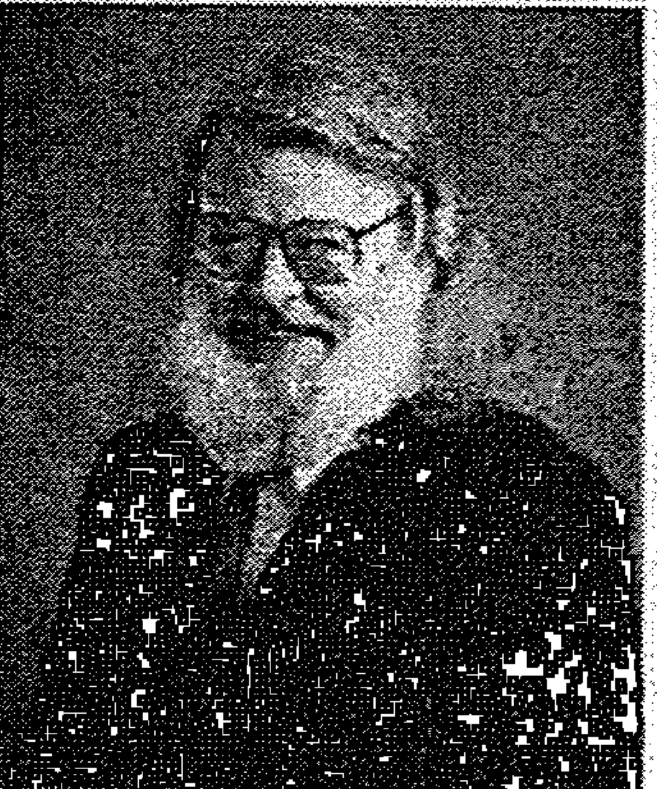

Robert V. O‘ Neill

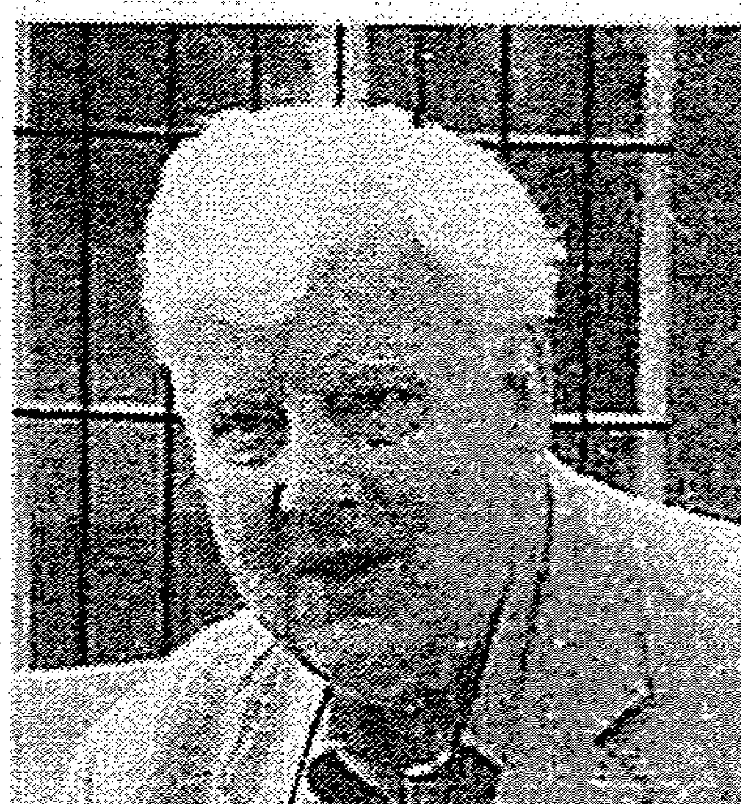

Michael Dummett

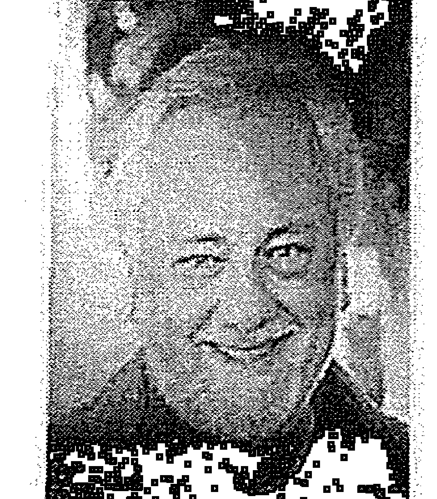

Andrea Vitali

根据以上塔罗历史学者们的研究与推论，塔罗牌起源于15世纪文艺复兴时期的意大利。除了拥有下面即将列出的史实材料以外，还有一些推论。在罗伯特·奥尼尔的《Iconology of the Early Tarot》一书中，作者花了毕生时间对塔罗牌历史与符号进行研究，他最后得出的结论是：除了文艺复兴时期的意大利之外，没有任何其他地方、也没有任何其他时期拥有跟塔罗牌图/符号完全一样的范例，只有在文艺复兴时期的意大利才找得到与全部22张大牌牌图相似或相同的艺术品。此外，奥尼尔还在《Tarot Symbolism》一书中指出，若从塔罗牌图的寓意来看，由于文艺复兴时期正是探求古老智慧的年代，当时的人们致力于将各种古老的智慧融汇合并，然后将这种整合后的思想表达于当时的艺术、诗词，而塔罗牌的图像正是同文艺复兴时期的其他艺术作品一样，表达着这种融合后的艺术。所以，各种证据与推理都将塔罗起源的矛头指向了文艺复兴时期的意大利。

这里，我们将遵循历史的脚步，将这些学者与研究者的成果展现在读者面前，从塔罗牌如何诞生开始，一路而下，看看它最后是如何发展、演变成我们今天手上的塔罗牌。

塔罗牌研习者亮对上述学者的成果作了总结与归纳，并提出塔罗牌的发展与演变过程若按不同阶段来分，大致可以分为四段：

- 阶段一：前塔罗时期（15世纪之前）
- 阶段二：古塔罗时期（15世纪—18世纪中叶）
- 阶段三：神秘学塔罗时期（18世纪中—20世纪中叶）
- 阶段四：现代塔罗时期（20世纪中至今）

塔罗牌的演变主要体现在以下几方面：

- 塔罗牌的结构（包括数量）的演变；
- 塔罗牌图与符号内涵的演变；
- 塔罗牌用途的演变。

### ◆ 阶段一：前塔罗时期（15世纪之前）

从本书第一章“塔罗牌的定义”中我们得知，判断一副牌是不是塔罗牌，有一大显著的标准就是看其在四牌组的情况下是否带有“第五个牌组”以及这第五个牌组是否带有寓意式的图像。根据目前已掌握的史实信息，1375年左右四牌组的普通游戏纸牌传到欧洲，然后到了1420—1440年左右便有了第一副塔罗牌的记载。所以，有一点可以确定，塔罗牌是由普通四牌组的游戏纸牌发展而致，或者可以这么说，塔罗牌就是在普通纸牌的那四牌组的基础上额外添加了第五个牌组而致。所以，“前塔罗时期”这一阶段自然说的就是塔罗牌出现之前的纸牌历史——四牌组的普通纸牌。

首先，纸牌的材料是纸张，虽然古埃及人发明了莎草纸，但由于其极易磨损极不耐用，故并没有被用于纸牌的制作。最早使用纸张的是中国人，因为纸张是我们中国的四大发明之一，而且最早使用纸牌的人也是中国人，虽然那些牌并不是塔罗牌，但这足以让我们所有的中国同胞感到自豪与骄傲了！

公元2世纪，中国人蔡伦发明造纸术。公元3世纪，中国的游戏纸牌陆续生产。之后随着造纸术在亚洲及中东地区的传播，各地也就涌现了许多游戏纸牌。纸牌来到欧洲的时间比较晚，要到公元14世纪，将纸牌引入欧洲的是中东伊斯兰人，而引入的纸牌则是Mamluk Deck（马姆鲁克纸牌）（如图）。这副牌起源于13世纪，是以伊斯兰当时的统治王朝命名。马姆鲁克纸牌有四个牌组，每个牌组有10张数字牌和3张都为男性人物宫廷牌，四个牌组的符号分别为“马球棍、杯、币、弯刀”。

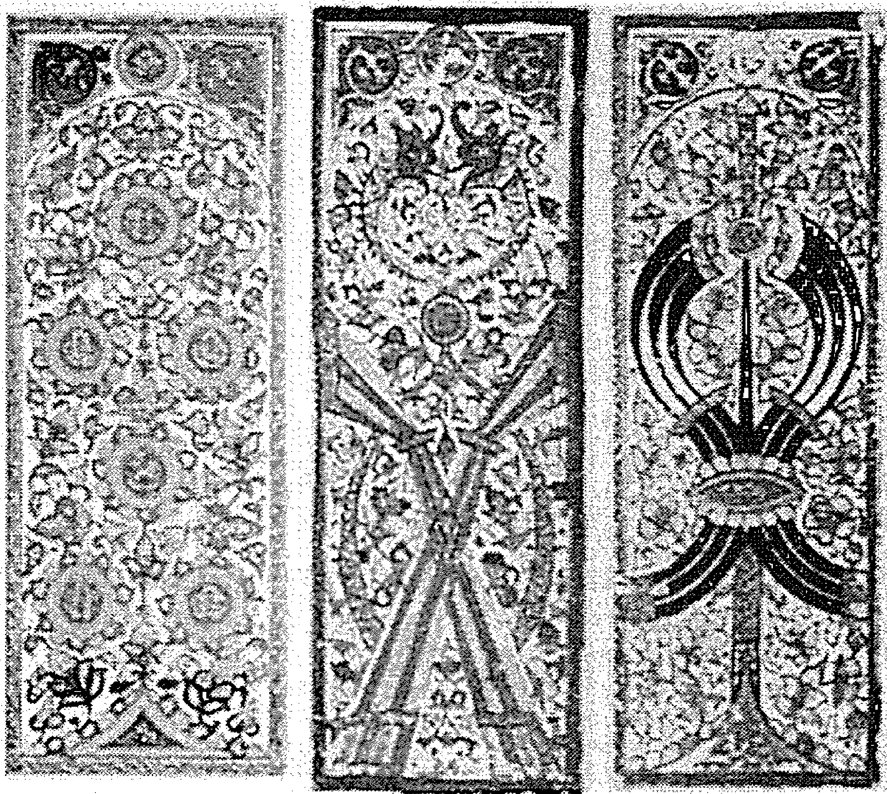

到了1367年，欧洲人开始创造自己的纸牌，欧洲的纸牌也有4个牌组：杖、杯、剑、币。每个牌组都拥有10张数字牌和3张宫廷牌，当时的宫廷牌中只有侍从、骑士和国王，没有王后。后来，随着纸牌在欧洲的逐渐传播，欧洲的每个国家都开始创造符合自己文化的四牌组符号。欧洲四牌组符号可见下表：

| 地区 (时间) | 杯 | 杖 | 币 | 剑 |
| :--- | :---: | :---: | :---: | :---: |
| 意大利 (1367年) | 杖 | 杯 | 币 | 剑 |
| 法国 (1475年) | 红心 | 梅花 | 方块 | 黑桃 |
| 西班牙（1367年） | 杯 | 棍 | 币 | 剑 |
| 德国（1440年） | 心 | 果实 | 铃铛 | 树叶 |
| 瑞士（1440年） | 玫瑰 | 果实 | 铃铛 | 盾 |

公元15世纪，塔罗牌问世。历史证据表明，塔罗牌最初是由游戏纸牌演变而来，所以塔罗牌就四组小牌牌组而言，在结构和符号上与普通纸牌有相似之处。虽说要辨认一副牌是不是塔罗牌，可以看其除了四个牌组外是否还有第五个牌组（大牌牌组）。但要知道，那时候辨认起来是非常困难的。因为当时四组牌组之外的那个第五牌组并不是像我们现在的标准塔罗那般22张，更值得思考的是，那些四牌组之外的牌并不一定就是构成整副牌的第五牌组，加上纸牌易损、难存的特点，历史上遗留下来的塔罗屈指可数，由此要确认第一副塔罗牌的难度可想而知。

### ◆ 阶段二：古塔罗时期（15世纪—18世纪中）

#### 一、第一副塔罗牌

根据史实证据，塔罗牌的浮世大约是在1420到1440年间，因为根据目前已知的情况，欧洲在普通四牌组的纸牌基础上首次加入“大牌”是在1420年，这种牌叫卡涅夫尔（Karnoffel），用于德国的一种纸牌游戏。而已知最早关于塔罗牌的记载则在1440年左右，为严谨起见，史学家们将首副塔罗牌诞生的时段拓宽为1420—1440年间，地点则是北意大利，最有可能的城市则是米兰、费拉拉和博洛尼亚。当时的塔罗牌也是被设计于北意大利皇室宫廷的娱乐纸牌游戏，比如米兰的维斯康提宫廷（Visconti）、费拉拉的德埃斯特宫廷（d'Este）以及北意大利其他的皇室宫廷。而至今保留下来的最早那批残缺不整的塔罗牌就是来源于这些宫廷的手工塔罗牌：维斯康提牌和德埃斯特牌。下图呈现的就是一则源自米兰的壁画，年代应该比1440年更早些。这幅画的名称叫做“The Tarocchi Player（塔罗奇玩家）”。画中有五位年轻人在户外玩塔罗奇游戏，图中可以隐约看到桌上的一张牌疑似“星币二”的牌。

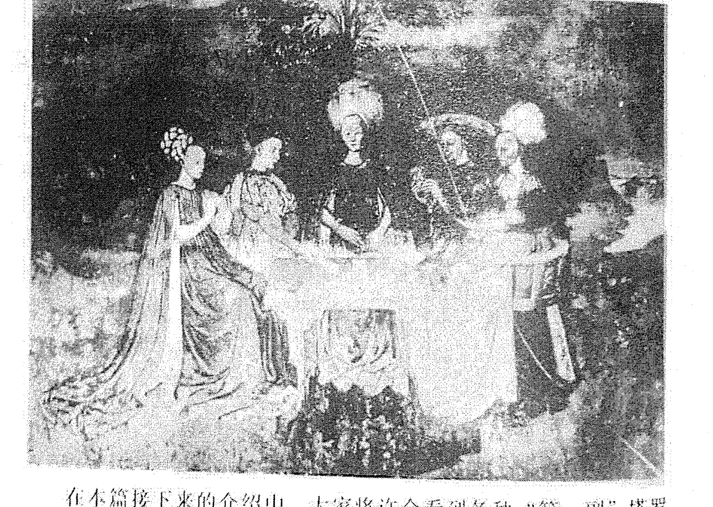

在本篇接下来的介绍中，大家将许会看到各种“第一副”塔罗牌，比如第一副疑似塔罗牌、第一副比较完整的牌等等，但这里的“第一副”称号有个大前提，那就是仅为“目前已知”。也许将来的某日，在史学家的研究与考证下，出现新的相关证据也是有可能的。根据目前塔罗学术界的普遍观点，塔罗牌的起源是15世纪的意大利北部，但是关于第一副塔罗牌的发源地点基本上可以归纳出三个地方：米兰、费拉拉、博洛尼亚。但在大多数学者的观点里，最早塔罗牌浮世的地方应该是米兰或者费拉拉两者之一。

##### 1. 米兰塔罗牌

###### 1) 塔罗牌的前身

在目前所掌握的各种历史资料中，首次提到与塔罗牌有关的纸牌游戏的文字记录是1449年的一封米兰的信函。信中提到了专门为皇后设计的礼物——carte de trionfi——英文为card with trump——也就是带有大牌牌组的纸牌。信中还提到，这副牌由米兰公爵菲利普·玛利亚·维斯康提 (Filippo Maria Visconti) 授意，艺术家贝索佐 (Michelino da Besozzo) 绘制。该实物至今已不存，但信件和维斯康提公爵的大臣马齐亚诺·托托诺 (Marziano da Tortono) 用拉丁文写的纸牌说明书还在。这里我们只能从这本说明书里了解这副牌。

首先，这副牌的出世年代应该在1414年到1418年之间，一共有5大牌组：16个天体神明+4组动物牌组。16位天体神明也被分成了4组，这4组的名称分别为：美德、富裕、纯洁、愉悦：

- 美德：1朱庇特、5阿波罗、9墨丘利、13赫拉克勒斯
- 富裕：2朱诺、6尼普顿、10玛尔斯、14伊洛斯
- 纯洁：3帕拉斯、7黛安娜、11维斯塔、15达芙妮
- 愉悦：4维纳斯、8巴克斯、12色列斯、16丘比特

除了这16张牌之外，4个动物牌组分别是：鹰牌组，凤凰牌组，龟牌组，鸽牌组。

同时，马齐亚诺的说明书中还提到了纸牌的游戏方法及牌面大小规则，如：动物牌组中的牌没有神明牌组的牌来的大；鹰牌组和龟牌组中的牌在游戏中的大小规则是递增的（如5号比3号大），而凤凰牌组与鸽牌组的大小规则是递减的（如5号比3号小）。这至少说明了其“游戏纸牌”的首要功能。

毫无疑问，这副牌与传统标准的塔罗牌存在着明显差异。不过可以视为塔罗牌的前身。其16张画着各个神祇的牌看似塔罗大牌，但明## 2）维斯康提

目前保留下来的最古老的塔罗牌是来自于米兰维斯康提宫廷，其中有3副值得一提，这3副都被认为是出自当时著名艺术家博尼法西奥·班博（Bonifacio Bembo）之手，其中有两副是为维斯康提公爵所设计，另一副则是为弗朗西斯科·斯佛扎（Francesco Sforza）设计。这3副牌创于1440年到1450年间。需要注意的是，这三副牌只能说是“已知现存最古老的塔罗牌”。

第一副牌名叫Visconti di Modrone（Cary—Yale Visconti 卡里—耶鲁·维斯康提）

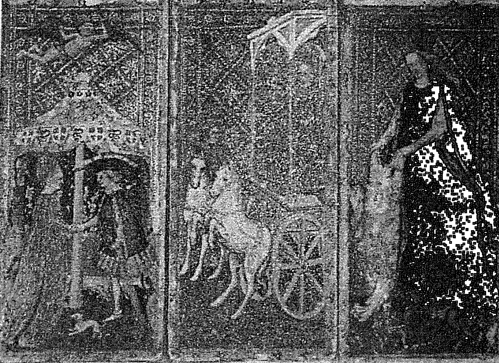

卡里—耶鲁·维斯康提牌是专为米兰公爵维斯康提设计的。其结构与后来标准的塔罗牌有明显不同，可以说明当时塔罗牌的标准形式尚未成型。目前残存有16张大牌，包括皇后、皇帝、恋人、力量、忠诚、仁慈、战车、死亡（死神）、天使（审判）和世界。56张小牌也和标准形式的塔罗牌不同，为每组有6张宫廷牌。这副牌4组小牌牌组有剑、权杖（取代了弓箭）、还有一个牌组符号为画有维斯康提公爵头像的货币，可以认为这是星币牌组。

第二副牌也是为维斯康提公爵设计的牌，名叫布兰比拉 (Brambilla)，其大牌只有皇帝和命运之轮被留了下来。这副牌的小牌牌组中同样用了权杖符号取代了弓箭，其星币符号上同样也印了公爵的头像。

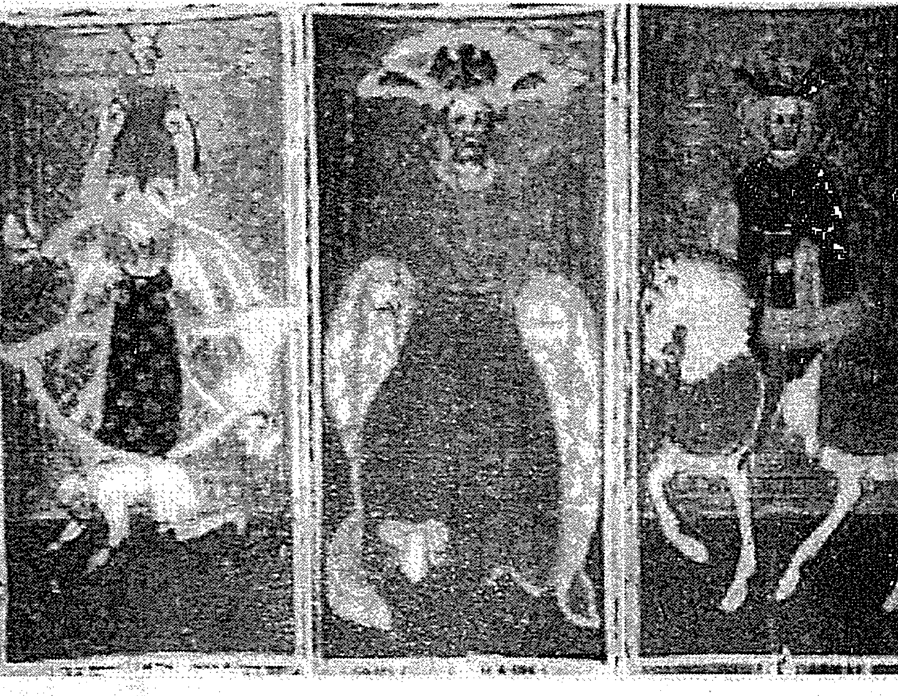

第三副就是Visconti—Sforza（维斯康提—斯佛扎）

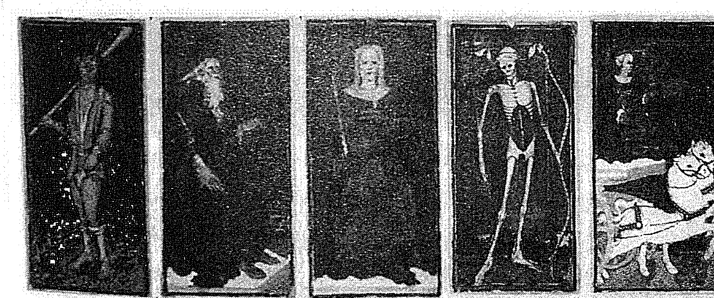

这副牌是为斯佛扎和他的妻子比安卡设计，是三副中保留最为完整的一副，也是目前较为完整留存下来的最早的塔罗牌。维斯康提—斯佛扎塔罗牌一共留存下来的大牌为20张，小牌一共54张。大牌中恶魔和塔是没有的（根据15世纪塔罗大牌的情况可以判断当时所有的大牌里都没有恶魔这张牌）。在4个小牌牌组里，维斯康提的纹章出现在杯和星币中，而Sforza的头像则出现在另外两个牌组符号里。原始的维斯康提—斯佛扎塔罗牌被认为是出自艺术家班博（Bonifacio Bembo）的绘制。

##### 2. 费拉拉塔罗牌

###### 1) 德埃斯特（d’Este）

在15世纪首批塔罗牌出现的那段时期，费拉拉的统治者是德埃斯特家族（d’Este），而留存至今的德埃斯特塔罗牌也是为德埃斯特宫廷所有。下图是15世纪后期的德埃斯特塔罗牌，目前所保留的并不完整，只留了8张大牌和8张宫廷牌。整副牌代价不菲，先用木版印刷，然后手工上色并镶有金箔。

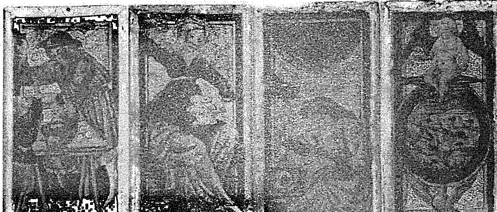

###### 2) 费拉拉木刻印刷塔罗牌

这副牌首次出于1465年到1500年间，有可能是最古老的木刻印刷塔罗牌，同时这副牌也是已知最早在大牌上标有序号的塔罗牌，也是目前已知在大牌中最早出现恶魔牌的塔罗。

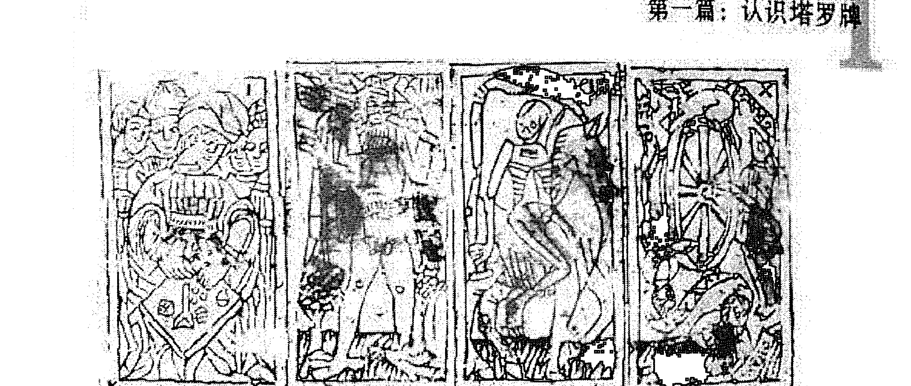

21世纪的美国艺术家罗伯特·普雷斯（Robert M Place）对这副牌重新进行了上色，并补足了一些原先缺失的部分，目前虽然22张大牌已经完成，但尚未正式出版。关于这幅牌的牌图可见下。

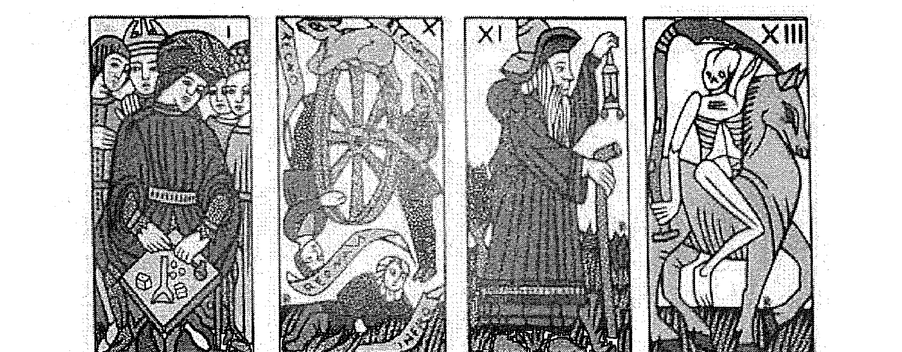

##### 3. 曼提那塔罗奇（Tarocchi of Mantegna）

曼提那塔罗奇是塔罗牌历史上已知最早的塔罗牌之一。曼提那塔罗奇确切出世的时间大约在1465年左右，但也有的学者指出，这副牌可能比维斯康提塔罗牌更早。如果该言论属实，曼提那塔罗奇即有可能成为最早的塔罗牌。另外，现今学术界对于这副牌的设计者也存在着不同意见，部分观点认为曼提那塔罗奇的设计者是意大利帕多瓦学院的画家Andreas Mantegna（安德里亚斯·曼提那），所以这副牌才被命名为“曼提那”。但还有一部分观点则认为，这副牌应该起源于费拉拉，由费拉拉一所学校的艺术家 Parrasio Michele（帕拉索·米歇尔）所设计。由于关于这副牌的发源地至今都没有达成一致，所以本书就没有将其归入费拉拉。

这副牌与我们通常所认知的塔罗牌不同，这里就多花些口舌来介绍。曼提那塔罗奇共有50张，分为五个部分：

第一部分主要描述了当时社会的各大阶级：乞丐、奴仆、工匠、商人、侍从、骑士、公爵、国王、皇帝、教皇。

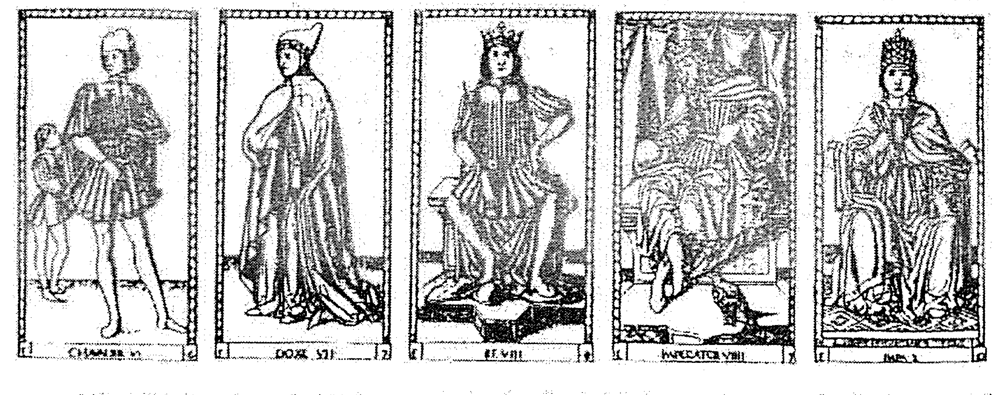

第二部分则是希腊神话中的缪斯九女神与阿波罗：卡利俄珀（司辩论、史诗）、乌拉尼亚（司天文）、忒耳西科瑞（司舞蹈和合唱）、厄拉托（司抒情诗）、波吕许谟尼亚（司颂歌）、塔利亚（司喜剧和牧歌）、墨尔波墨涅（司悲剧）、欧忒耳珀（司音乐和抒情诗）、克利俄（司历史、史诗）、阿波罗（太阳神）。

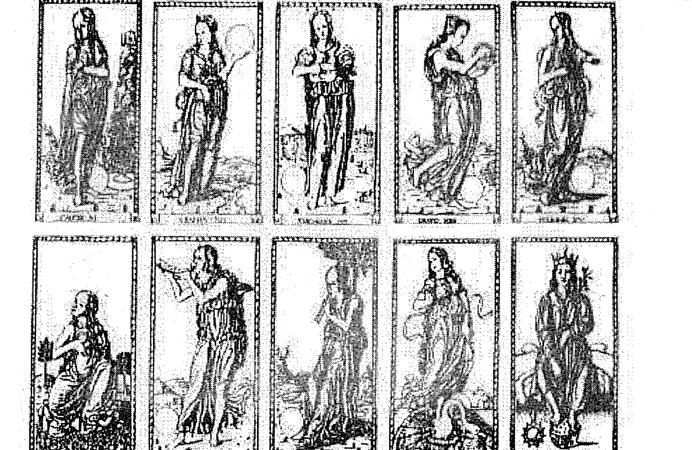

第三部分描绘的是中世纪与文艺复兴时期的文科七艺及额外的三学科：文法、逻辑、修辞、几何、数学、音乐、诗歌、哲学、天文、神学。

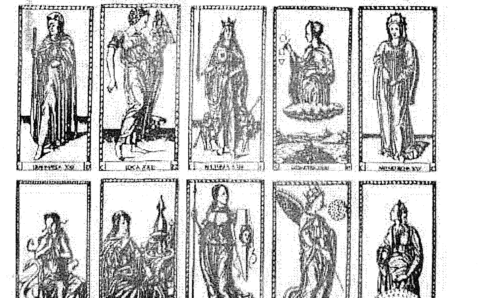

第四部分说的是七大基本美德与三大本质：生命（太阳）、时间、宇宙、节制、审慎（智慧）、力量（坚毅）、正义、慈爱、希望、信仰。

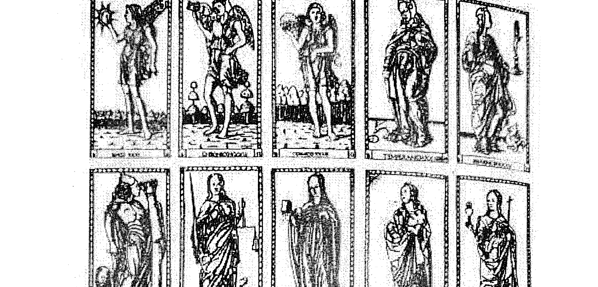

第五部分呈现的是古人宇宙观中的行星天球体：月亮、水星、金星、太阳、火星、木星、土星、第八天体、原始动力、本源（造物主）。

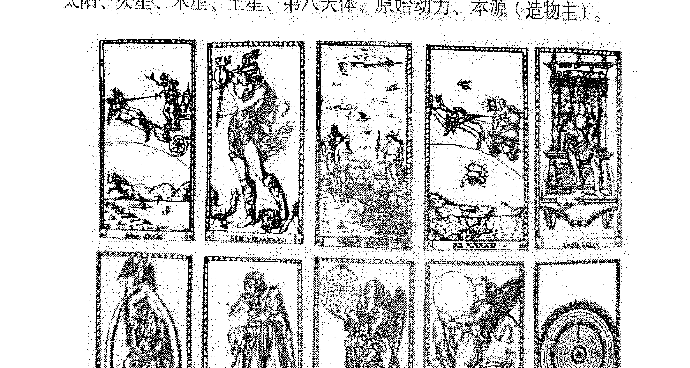

##### 4. 佛罗伦萨的明切维特牌（The Minchiate Fiorentine Deck）

这副牌源于15世纪的佛罗伦萨，是被用来玩一种名叫Minchiate（明切维特）的纸牌游戏。它在结构与数量上与常规塔罗牌相差较大，大牌小牌加在一起一共有97张，其中包括了41张大牌，56张小牌。而与常规的22张大牌相比，明切维特的大牌除了没有常规塔罗中的女祭司牌，另外还加入了代表风水火土四元素的大牌，还加入了除力量、正义、节制之外的另四张美德牌：希望、信仰、慈爱、审慎。

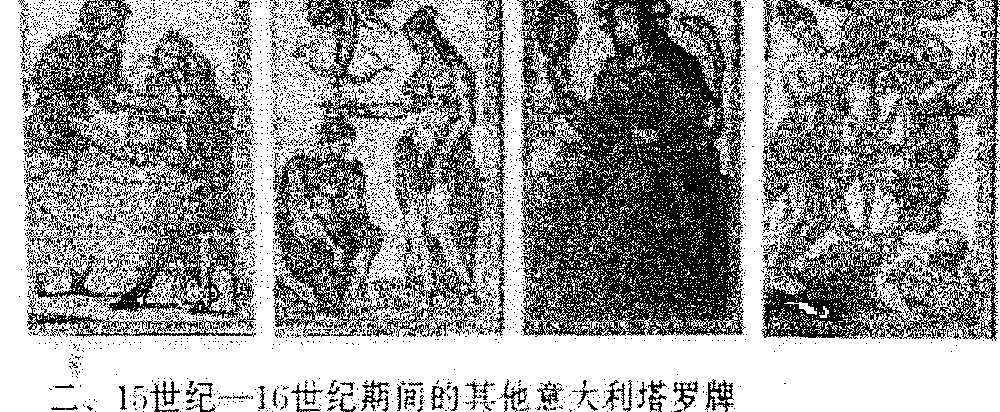

#### 二、15世纪—16世纪期间的其他意大利塔罗牌

15世纪末期以后，以米兰、费拉拉、博洛尼亚为中心，意大利北部地区涌现了许许多多的塔罗牌。后来的意大利塔罗牌基本都以上述提到的塔罗牌为模式，其图像及符号则反映了当时文艺复兴时期人们的精神、思想及文化。不过出现在当时的那些牌中，有的在排列和结构上与先前牌类似的，也有些比较另类和特殊的牌。

##### 1. 被误解的Gringonneur（格兰高尼）塔罗牌（又名Charles VI<查理六世>塔罗牌）

这副牌曾一度闹出了很大的新闻。因为有说这副牌就是世上最早的塔罗牌，源于1392年由画家Jacquemin Gringonneur（贾克曼·格兰高尼）为法国国王查理六世所做。这种说法出现于距今150年前，也就是19世纪中叶，也的确引起了一番争议。事实上，这种说法已经被历史学所驳斥，因为1392年格兰高尼为查理六世所绘的牌只是普通的游戏纸牌，而非塔罗牌。

引起这个话题的是在17世纪，Pere Menestrier（佩雷）在查阅法国查理六世的记录时发现了一份资料（这份资料是查理六世的司库，查尔斯·普帕尔的条目登记表），这份登记表里记载着下面这段话：

> “在1392年，向画家Jacquemin Gringonneur（贾克曼·格兰高尼）支付了三幅纸牌的钱，这三幅纸牌都涂上了金、上了色彩、并用了各种不同的设计图像，总共56张给我王娱乐消遣之用。”③

经过后来纸牌历史学家们的分析，上述提到的牌只是普通纸牌，并不是下图所列出的塔罗牌，所以下图所列出的塔罗牌虽然被称为“Gringonner（格兰高尼）塔罗牌或Charles VI（查理六世）塔罗”，不过并不是上述1392年的牌。因为虽然下图列出的牌没有任何标注或名称，但可以十分肯定它不可能出自1400年周围的年份。这副牌图中的风格和人物的穿着习俗并非属于14世纪，而是属于15世纪后期的意大利。看到这里，我们只要想想便可知，一个后时代的人可以画出古时代的风俗，但一个古时代的人是不可能画出后时代的习俗风貌的。所以，格兰高尼塔罗牌的问世时间决不可能在1400年前，而应在1500年左右。而且出生地也并非法国，而可能是威尼斯或费拉拉。

即使上述这个事实已经知晓了150余年，但现在仍有些塔罗作者仍旧对这种说法念念不忘，错误地认为塔罗牌是疯子国王的娱乐工具，塔罗的创始者是格兰高尼，我觉得有必要在这里再度纠正一下。

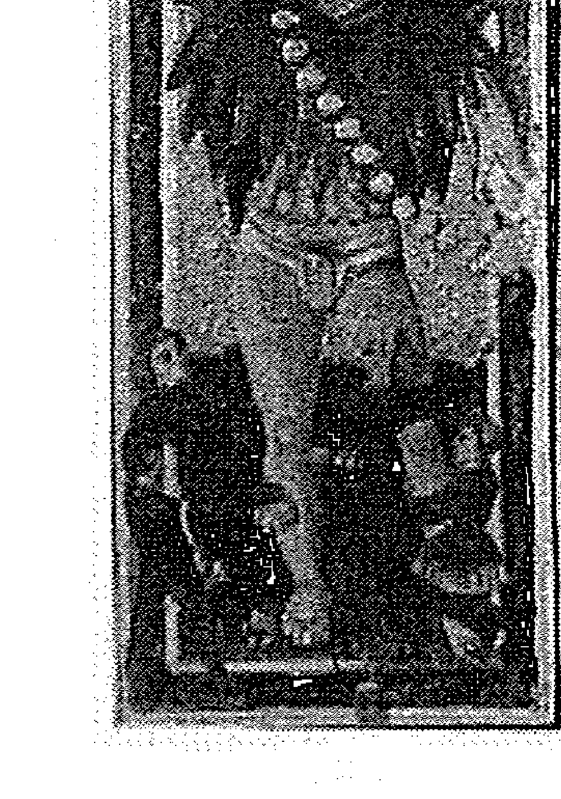

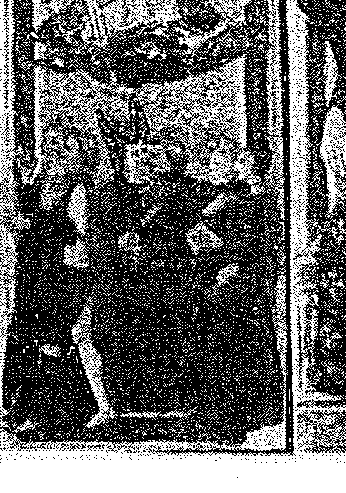

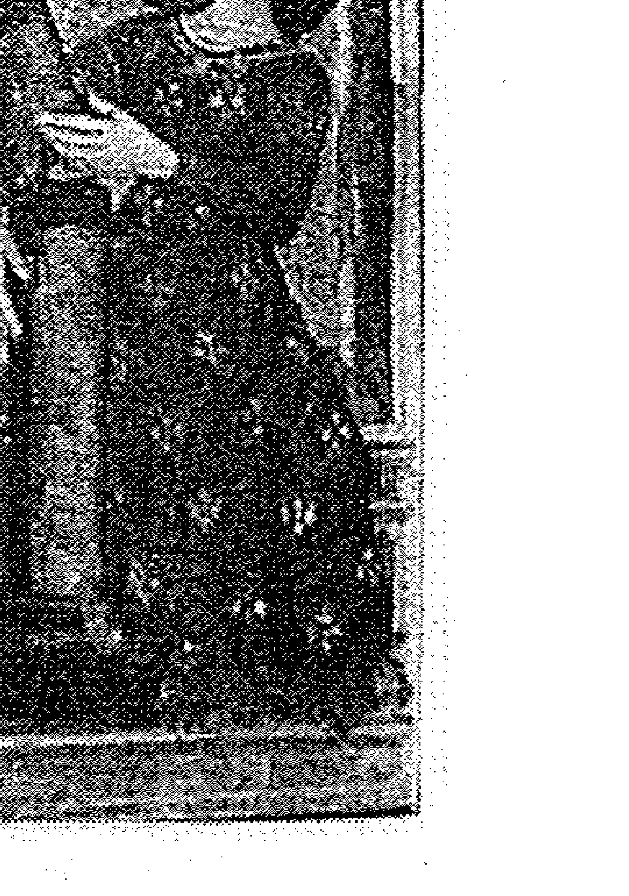

##### 2. 古文明（Sola—Busca）塔罗牌

古文明塔罗牌出世于15世纪晚期，其问世地点可能是费拉拉也可能是威尼斯。虽然这副牌可以算是至今为止完全留存78张牌的塔罗牌，其大牌的图像的风格与内容也与之前提到的塔罗牌有所不同，图像主要反映的是一些神话与历史方面的人物与内容。不过这副牌与当时其他牌相比，最为独具一格的是，它的每一张牌的牌面上都标有罗马数字的编号，包括大牌上也是。这一点也许在当今人的眼里并不为奇，因为现代塔罗牌所有的牌面上标有数字是一种常规，但是在当时就不是了。所以古文明塔罗也可以算是早期为数不多的在大牌上标有数字编号的塔罗牌之一。这副牌还有一点比较另类的是，其56张小牌的牌面上都画有人物、风景的图像，要知道，在20世纪伟特塔罗牌出世之前，小牌的表述方法很简单，比如圣杯四就画上四个杯子，宝剑九就画上九把宝剑，极少有用人物、场景、事件的方式来描绘小牌。而随着伟特塔罗牌的出版与流行，小牌被一些丰富人物场景图画所包裹才趋于常规。所以Sola—Busca也是迄今已知的第一副拥有全图像小牌的塔罗牌。这里我不得不说，现今流行的伟特塔罗牌中的一些牌图，绘制者Colman Smith（柯曼·史密斯）有对Sola—Busca牌图的借鉴和参考。古文明塔罗牌的一些牌图可见下：

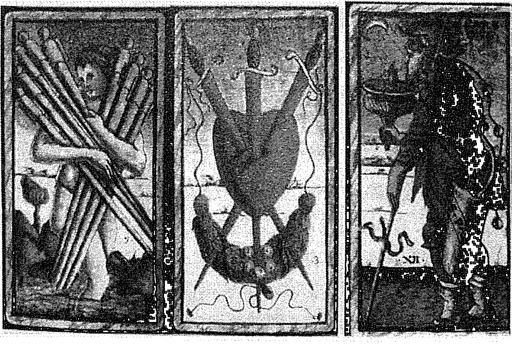

##### 3. 罗森瓦德 (Rosenwald) 塔罗牌

这里还要提到的一副牌便是博洛尼亚的罗森瓦德 (Rosenwald) 塔罗牌。罗森瓦德牌的原貌是一张未经切割过的纸板，源于16世纪的早期，在纸板上，各张牌图皆在其中，目前存放于华盛顿国家艺术画廊，其样貌可见下图：

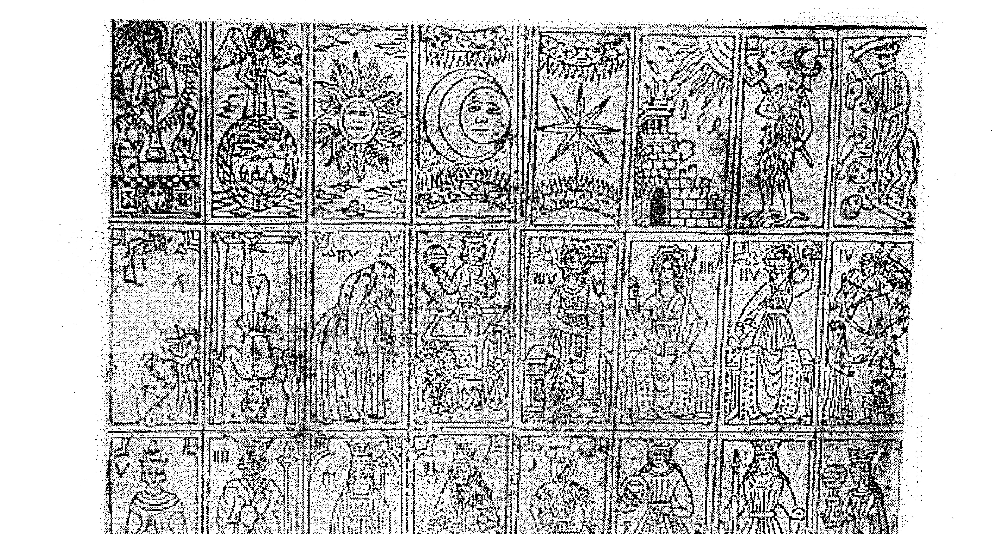

从上面的罗森瓦德纸板上的牌面来看，它并不完整，分为左半部分和右半部分，大牌有21张，愚人牌缺失，命运之轮的牌面毁损严重。我们依次从右下角开始看起，首先是三张小牌的宫廷牌：圣杯女王、宝剑女王、星币女王。然后开始是大牌：魔术师、皇后、女祭司、皇帝、教皇，接着第二排右边开始：恋人、节制、正义、力量、战车，隐士、吊人、命运之轮，第三排从右到左则是：死神、恶魔、塔、星辰、月亮、太阳、世界、审判。由此，我们看到这副牌在排列上与当今我们认为的标准排法存在明显不同。而事实上，在塔罗牌起源的初期，其大牌的排列一直就没统一过，从那些早期标有编号的塔罗牌中，我们就能看出当时塔罗大牌的排序有好几种不同方式，因为那时的塔罗牌的主要用途是一种纸牌游戏，在排序上的设计需要符合纸牌游戏的规则。而大牌排序不同的原因，则是因为各地的游戏规则在地理上是相对独立的，每个地方都有自己的游戏规则。各个地区的塔罗大牌都有自己的一套排列方法。但是在各大历史学家和纸牌学家的努力研究下，他们发现，那些诸多不同的排列其实存在着一定规律。关于塔罗大牌的排列问题，我们将放在下一节中细说。

##### 4. 神秘的Cary Sheet（卡里塔罗纸板）

与上面说到的罗森瓦德塔罗纸板类同，卡里塔罗纸板也是一套未经切割的塔罗牌集合，目前收藏于美国纽黑文市的耶鲁大学的贝尼克珍本与手稿图书馆⁹，该图书馆也是世界上最大的古籍善本图书馆，藏有50余万册珍本书及数百万册手稿。

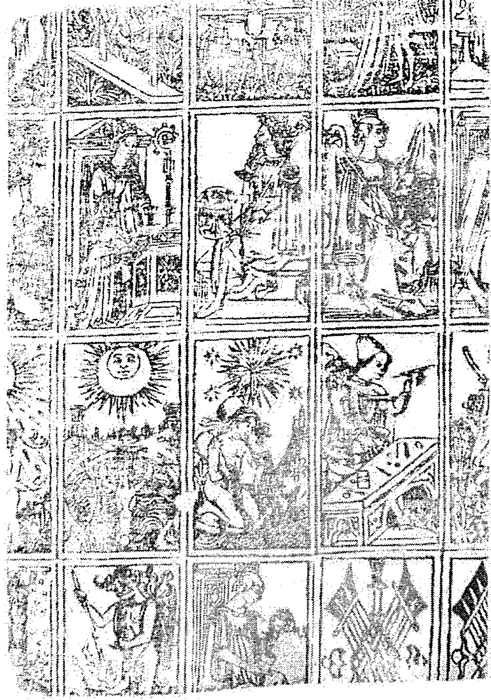

卡里塔罗纸板可能源于1500年左右的意大利的米兰。从上面展示出的全貌来看，其残缺程度可见一斑，但却一点都不影响这张纸板历史地位的重要性。如果我们拿意大利的卡里塔罗纸板与后来17世纪的法国马赛系塔罗牌图放一起比较时，我们就会发现两者之间的关联。由于马赛系塔罗牌的结构与风格成为了之后塔罗牌的模型与典范，也是塔罗牌趋于结构与排列标准化的一个标志。当我们问起，17世纪的法国马赛牌的图貌源自何处？那么我们看一看这张卡里塔罗纸板，也许我们自然就会对两者的关系作出假设和推断，因为两者的图像太相似了。

根据目前所知，法国的马赛系塔罗牌最早始于17世纪，那么从15世纪的意大利塔罗牌，到17世纪的马赛塔罗牌，这之间似乎缺少了一根连结的链条。当我们审视卡里塔罗纸板上的牌图与马赛塔罗牌的牌图就会发现，卡里塔罗纸板多少能够反映出这根链条的存在，因为双方的牌图风格太过相似，虽然缺少直接证据，但至少从视觉上道出了两者之间的关联，卡里塔罗纸板好比是原始的意大利塔罗牌发展进化到马赛系标准化塔罗牌的中间阶段，充当了一个“承上启下”的角色，这一角色决定了卡里塔罗纸板那不凡的历史地位：上承首批意大利古塔罗牌，下启后世塔罗牌的模范典型马赛系塔罗。

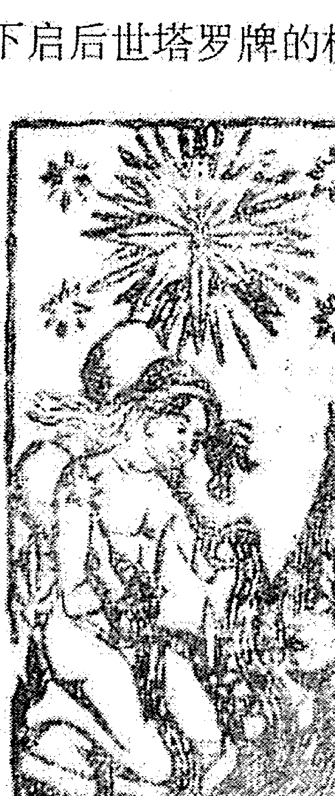

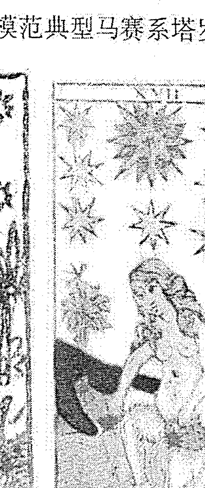

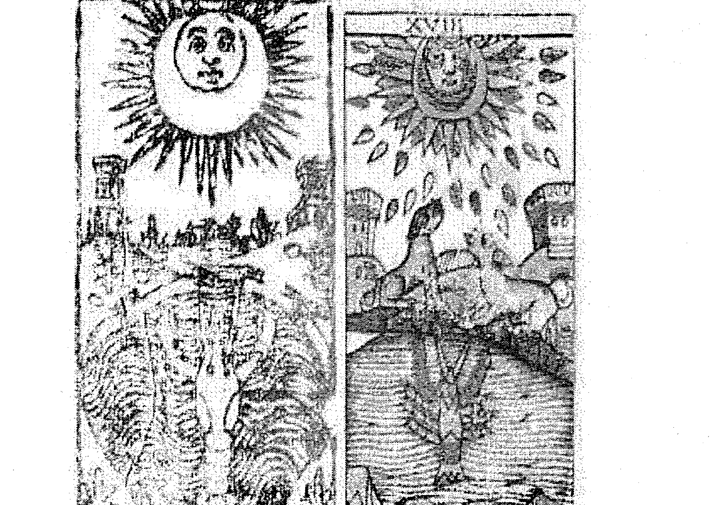

卡里塔罗(左) 马赛塔罗(右)

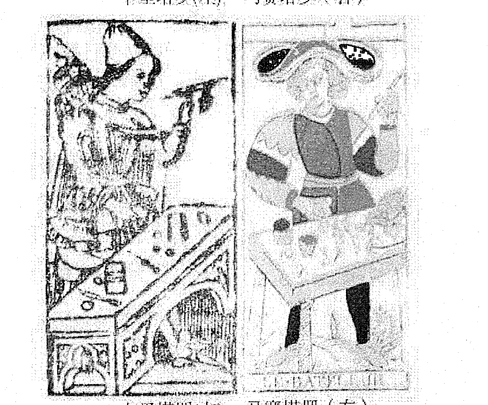

卡里塔罗(左) 马赛塔罗(右)

#### 三、法国的马赛系塔罗牌

根据现有史料，塔罗牌传到法国的年份大约在16世纪。16世纪起，法国开始设计创造自己的塔罗牌，马赛系塔罗牌问世，从前文看出，根据马赛系塔罗牌的图像与风格极有可能传承自意大利米兰的卡里塔罗纸板。

在介绍马赛系的塔罗牌之前，我们先来了解一下什么是马赛系塔罗牌，马赛系塔罗牌主要指的是哪些牌，它们的特点如何，在塔罗发展史上扮演怎样的角色、有着怎么样的意义。

首先，我们这里之所以称其为“马赛系”而非“马赛”也是有原因的。马赛系塔罗牌，法语Tarot de Marseille，简称“Tdm”，英语Tarot de Marseille它并非独指特定的某一副牌，而是对当时围绕这种模式制作的塔罗牌的一个统称，这种模式也就是马赛塔罗的模式。最早叫出TDM这个名称术语最早源于19世纪末与20世纪初的交替时期，由当时欧洲最大的纸牌制造商前任拥有者Paul Marteau（保罗·马特龙）所命名。同时，马特龙也是将17世纪—18世纪的马赛系塔罗牌重新推向市场的一大功臣。而在马特龙提出“马赛系塔罗”这个名称术语之前，法国人对这类牌仅仅只是简单的称呼为“塔罗牌”，法语中为“Jeux de Tarot”①。现代塔罗学术界将马赛系塔罗牌分为I代与II代，于是马赛I代的代表牌便是Jean Noblet（吉恩·诺布雷塔罗牌），而马赛II代的代表牌则为Nicholas Conver（尼古拉斯·康维塔罗牌）。

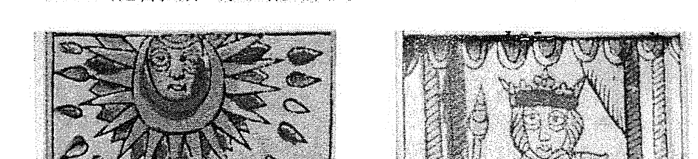

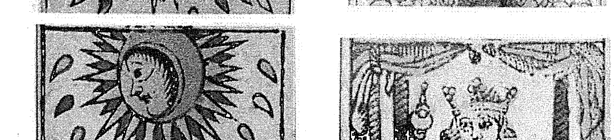

马赛塔罗两代对比（上图为I代）

马赛系塔罗牌的共同特点大致可归纳出以下几点：第一，马赛系塔罗牌的每张大牌都标有牌的名称与数字编号；第二，大牌的数量、名称与排列被固定了下来，其22张大牌从1到21号再加张没有编号的愚人牌加上56张4个牌组的小牌成为了自此以后的塔罗牌结构的标准形式。第三，马赛系塔罗牌的牌图中所融入了流行于新文艺复兴时期前沿的哲学与神秘学的思想框架，如炼金术、魔法及各种新柏拉图主义的融合体系。

目前现存最古老的马赛系列塔罗牌为吉恩·诺布雷塔罗牌（Jean Noblet Tarot），这副牌留存的并不完整，只有73张，印于1650年前后，这副牌并非出自法国的马赛，而是出自巴黎。

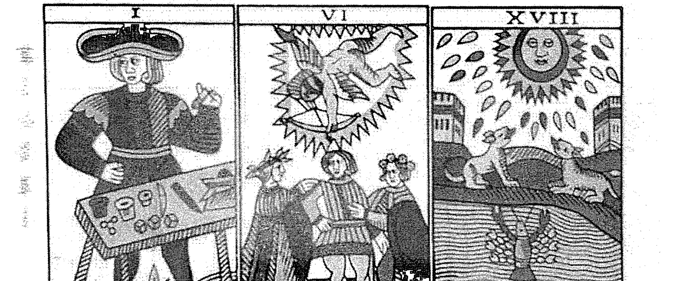

第二副是Nicholas Conver（尼古拉斯·康维塔罗牌）。这副牌出现在诺布雷出版之后的一百年之后，大约在1760年左右。Nicholas Conver塔罗牌与Jean Noblet塔罗牌可以算是马赛系塔罗牌的两大标志牌。现代塔罗学术界将马赛系塔罗牌分为I代与II代，于是马赛I代的代表牌便是Jean Noblet（吉恩·诺布雷塔罗牌），而马赛II代的代表牌则为Nicholas Conver（尼古拉斯·康维塔罗牌）。

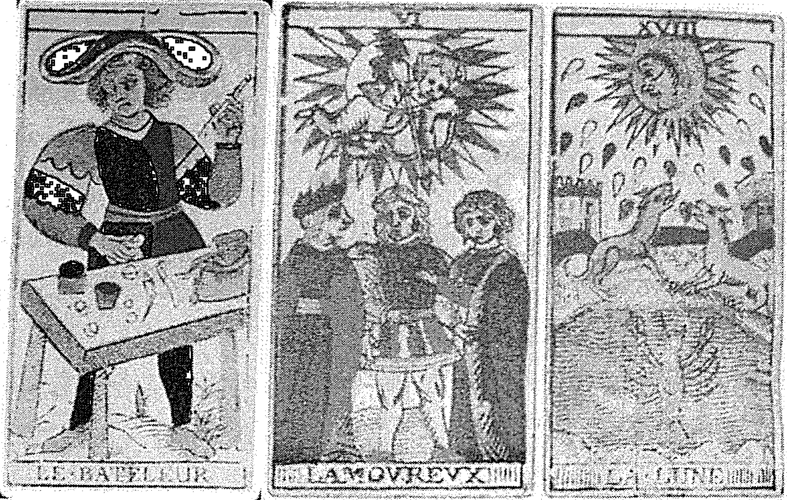

接下去要说的牌是Jean Dodal (吉恩·度道尔塔罗牌)，这副牌作于1701年左右的法国里昂，其牌图的风格介于马赛I代和II代之间。

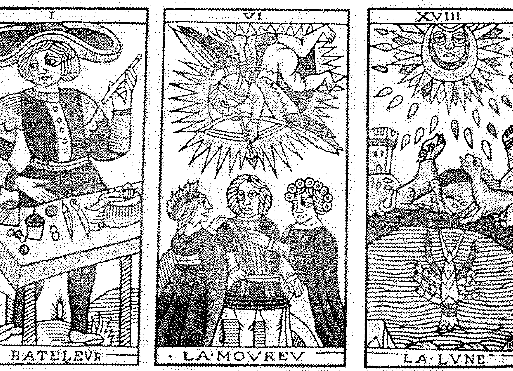

最后再说一下不属于马赛系塔罗成员但却与之有类似之处的另一副法国塔罗牌——Jacques Vieville (雅克·维耶维尔塔罗牌)。Jacques Vieville塔罗牌出于1650年左右的法国巴黎。虽然看似它与马赛系的Jean Noblet塔罗牌出于相同时间、相同地点，但严格来说并不能算马赛系塔罗成员，因为它的一些牌面的图像与风格跟传统的马赛系格调甚为不同。

## TAROT 第一篇：认识塔罗牌

至内容都存在差异，比如，它的月亮牌并不是传统马赛中的“龙虾过狗关”，其星辰牌画的则是一位手执圆规的天文学家，隐士位列11而力量位列第9、吊人为正吊等等，诸多差异将这副牌踢出了马赛系塔罗的家族，相比之下，雅克·维耶维尔塔罗牌的风格与比利时塔罗更为接近。

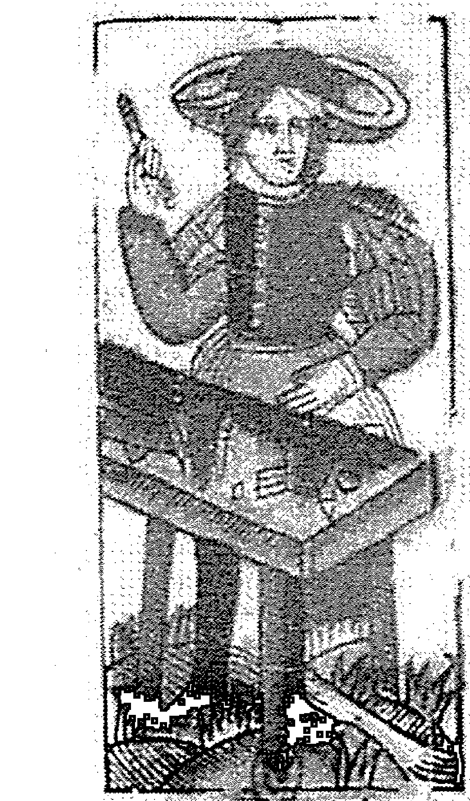

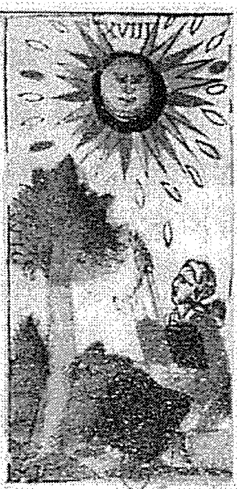

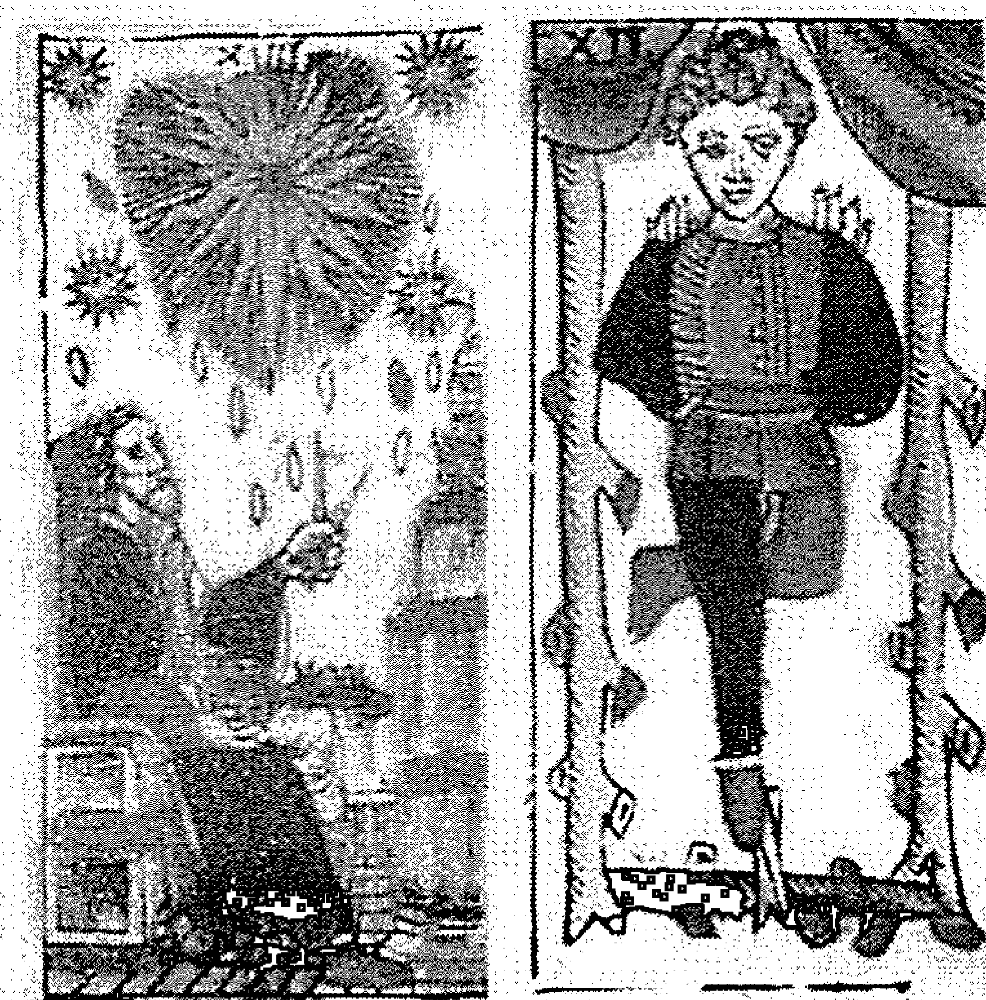

总的来说，Tdm马赛系塔罗牌是塔罗发展过程中的中心环节，在塔罗牌演变史上具有重大的里程碑意义，可以大致概括为两点：

首先，马赛系塔罗牌为塔罗牌整个历史发展阶段的“承上启下”者。它承接了意大利15世纪到16世纪的那些塔罗牌雏形，将那些塔罗雏形发展到一个排列与数量上的标准模式。同时，它启蒙了后世的塔罗牌发展，使得绝大多数的后世塔罗牌皆以马赛系塔罗为设计蓝图，包括现今闻名的伟特塔罗亦是以马赛系塔罗牌为模型延伸设计而来。

再者，马赛塔罗牌也是塔罗牌历史上用途的重大转型——从游戏纸牌为主要用途向神秘学工具与神秘学思想的容器过渡转型。这是由于马赛系塔罗牌的图像与符号中融纳了当时新柏拉图主义的融合哲学，使人能够从中挖掘出各类神秘学思想，因此从18世纪起便吸引各大神秘学家眼球，而且那些神秘学家在使用马赛系塔罗奠基塔罗神秘学理论基础的同时，也使塔罗牌的历史发展迈出了重大一步。

至今，马赛系塔罗牌仍是法国、意大利等一些欧洲国家的流行用。

### 阶段三：神秘学塔罗时期（18世纪中—20世纪中）

18世纪的法国，塔罗牌经历了一次天翻地覆的革命性转型，使得其原来纸牌游戏的主要用途变成了一种表达神秘学思想、游戏、魔法的工具。对塔罗牌作出革命的就是那段时期的神秘学家，在他们的影响下，塔罗牌被赋予了神秘学意义、被加入了有系统的预测理论，另外也被一些神奇、曲折、但荒谬的起源理论所包围。无论如何，塔罗牌的神秘学时代就此来临，塔罗牌的图像与符号也不可避免地变成了一些古老神秘学思想与智慧的载体。当然，最初被这些神秘学家拿来“开刀”的塔罗牌便是马赛系塔罗。

#### 一、18世纪的塔罗神秘学文化——塔罗的埃及源论说

若要对塔罗牌的神秘学时代追根溯源，那么引起这次革命的始作俑者便是法国神秘学家安东尼奥·古德·杰柏林（Antoine Court de Geblin）。另外，塔罗牌进入神秘学时代的标志则是第一副神秘学塔罗牌的诞生，这副牌叫大艾特拉塔罗牌（Grand Etteila Tarot），由吉恩—巴蒂斯特·艾雷特（Jean—Baptiste Alliette后改名为Etteila<艾特拉>）所设计。

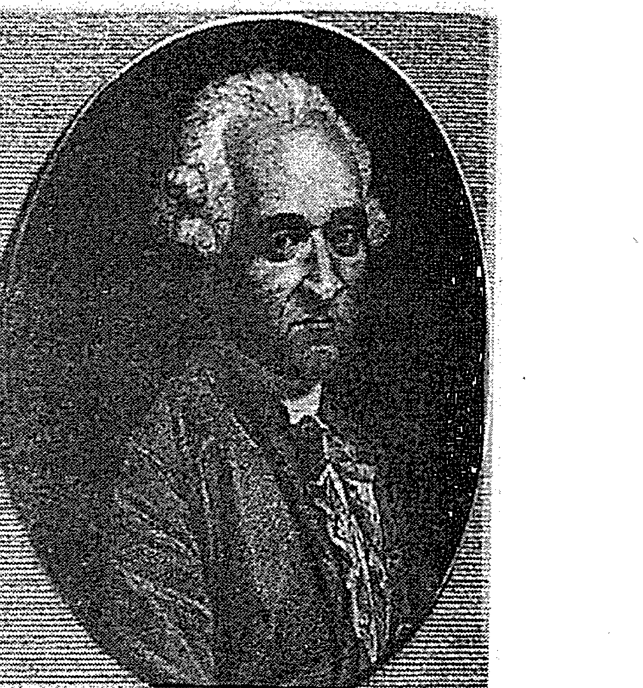

##### 1. 古德·杰柏林的塔罗埃及源论

我们就从杰柏林开始说起。在1772年，杰柏林写了一本总共9卷的神秘学书籍，书名叫做《原型世界》（《Monde Primitif》）。单词Primitif用现代的术语解释，意思就是“原型意象”，因为杰柏林认为，现世所有的智慧与哲学都可以找出一些共同点，而原型意象就是那些共同之处的来源。

在《原型世界》中，杰柏林提出了自己对于塔罗牌的埃及源论。所谓的塔罗埃及源论，即是认为塔罗牌起源于很久很久以前的古埃及，是一本“埃及之书”，塔罗牌的图像包含着一系列的象形符号，这些象征符号是解开神秘学原型思想的钥匙，破解了它的潜在寓意，就能解开世间的万事万理。为了保证那些神秘学思想的隐匿性，就需要对其进行“伪装”，而塔罗牌的图像与符号就是那些神秘智慧经过“伪装”之后的形式，只有一些懂得如何解读的人才能解开其中的秘密。杰柏林还认为，这种神秘的象形符号及其解开方法是由埃及神透特所作（透特<Thoth>又名赫耳墨斯<Hermes>，赫耳墨斯是埃及神透特的希腊名字，在埃及与希腊的文化融合之后，埃及的透特即为希腊的赫耳墨斯），透特神将这些符号转化成塔罗牌图，后来由吉普赛人带到欧洲在欧洲流传。

另外，塔罗牌的名称也没有避过杰柏林一劫，塔罗在法文中为“Tarot”，他指出，Tarot一词起源于埃及的“Tar和Rho”二词，意为“王道”。“塔罗王道”一说的影响力实在太大，迄今为止仍旧迷惑着众多塔罗初学者。其实早在1799年罗塞塔石碑被发现，1822年象形文字的意义被破译解读之后，塔罗“王道”一说就已经站不住脚了。

纵观杰柏林的塔罗埃及源论，不得不说，当时能够提出此类想法很有建设性，比如他的一些理论在表面上听起来跟20世纪的心理学家卡尔·荣格的“原型理论”非常相似，同时他也试图想通过对古老神话和思想模型去找出那个共通的模式，不过可惜的是，杰柏林只顾专注于对于设想的提出，过多地依赖于那不严谨的直觉与猜测，并且在论述过程中没有把神话与历史正确区分，在缺少学术的论证与严谨的情况下，漏洞频现，从而造成其大多数的理论都被推翻。

##### 2. 艾特拉的塔罗牌：大艾特拉塔罗牌

1789年，法国另一位神秘学家Etteilla（艾特拉）根据杰柏林的埃及赫耳墨斯之书的塔罗理论，设计出第一副埃及赫耳墨斯传统文化的塔罗牌：这副牌名叫 “Grand Etteilla Tarot (大艾特拉塔罗牌)” 。

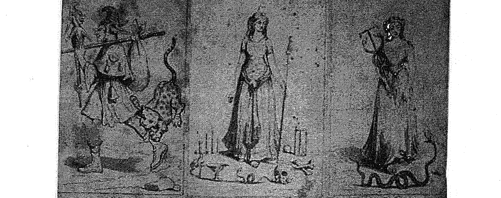

艾特拉原名Jean—Baptiste Alliette（吉恩·巴普蒂斯特·阿雷特），1767年他把自己的名字改成Etteilla（艾特拉），也就是将阿雷特一词倒写的结果。艾特拉可以说是第一位专业的塔罗解牌师①、第一位专业的塔罗老师，也是第一位设计出主要用于占卜的塔罗牌，并且首次整理出系统预测理论的人也是他，出自他于1767年出版的预测书籍——《A Way to Entertain Oneself with a Pack of Cards Called Tarot》（塔罗牌自用指南），书里介绍了塔罗的埃及关联，同时也写出了每张牌的游戏牌意。除了写过塔罗牌方面的书籍之外，艾特拉还出版过占星学、神秘学方面的书籍，有一本出版于1786年的关于炼金术的作品名叫《The Seven Grades of the Philosophic—Hermetic Work: Follow by a Treatise on Metal Perfecting》（赫耳墨斯哲学的七级工作：炼金论文），该书被后来的历史学家们认定为经典之作。

再来看艾特拉根据埃及理论所设计的塔罗牌，关于塔罗牌的起源，他与杰柏林抱持着类似的想法，认为塔罗牌起源于埃及，是埃及神透特在孟菲斯三里开外的神殿中设计而成。由于当时神秘学家们将自己的神秘学理论赋予马赛塔罗的解释之上，但实际上这副牌并不贴合他们的塔罗埃及论，所以艾特拉在自己的塔罗牌中所作出的修改是十分大的。比如他将原来倒吊的吊人这张牌完全改了，改成了一名抵御蛇的诱惑的女子（牌图右一），并将该张牌命名为“Prudence审慎”，审慎又称智慧，是四大基本美德之一，其余三种分别是正义、力量、节制，由于原塔罗牌中只有正义、力量和节制，没有审慎，为了改变这一情况才特意作出了修改。在对愚人牌的设计中，他将原先跟在愚人身后的狗改成了埃及猫，一种身上有斑点的猫（牌图左一）。另外，就小牌四牌组而言，原先的塔罗四牌组符号并没有与四大元素（风水火土）作出对应，而在这副牌中，他明确提出了四牌组与四大元素的对应关系。依照艾特拉自己的话说，大艾特拉塔罗牌的设计目的，就是为了“修正”原先塔罗中的各种“错误”，所以在这副牌里，突然冒出了一些金字塔、石碑、以及埃及神殿之类与埃及起源论有关的各种符号。

由于后来塔罗的埃及起源说被推翻，所以艾特拉的这幅充斥埃及元素的塔罗牌并没有对后世造成很大的影响，而是仍以原先传统的马赛系塔罗牌为模型发展，但是他对塔罗牌的一些预测理论以及对各张牌提出的游戏牌意则深深影响着后世，包括伟特塔罗牌的设计者亚瑟·爱德华·伟特在书写游戏牌意时都有部分照搬了艾特拉的牌意。

#### 二、19世纪的塔罗神秘学文化——塔罗的卡巴拉理论

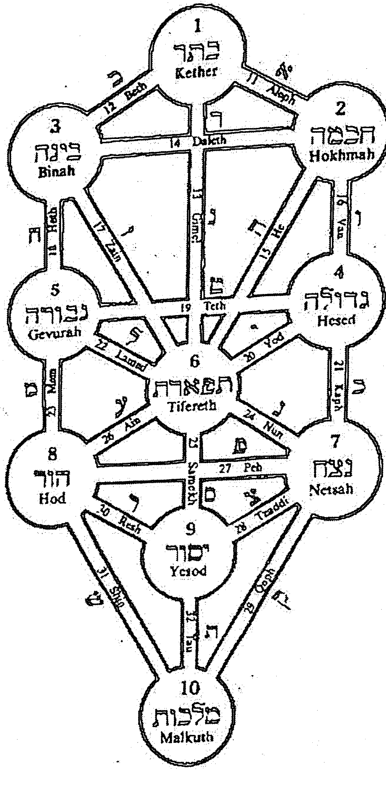

其实，各时代的塔罗牌图与解释塔罗牌图的观念，无不取决于那段时期的思想大环境。到了19世纪，神秘学家Antoine Fabre（安东尼·法布尔）于1816年出版了《La Langue Hebraique Restituee》（希伯来语的解析），这是一本对希伯来语言进行详解的作品。这本书对当时的神秘学思想起到深远影响，为希伯来神秘学传统的思想打开了大门，继而又有好多关于犹太卡巴拉、灵数、字母等书籍的陆续出版，激发了人们对卡巴拉神秘学的关注。

就是在这一大环境下，塔罗牌的发展进入了一条新的道路。

##### 1. 李维的塔罗理论

法国人Alphonse—Louis Constant（阿方斯—路易斯·康斯坦丁）后来改名为Eliphas Levi（伊莱·里维），他在1856年出版了《Le Dogme et Rituel de la Haute Magie》（Transcendental Magic，高等魔法）。在本书中，李维提出塔罗牌起源于犹太人，他还指出塔罗大牌的数量为22张，与22个希伯来字母的数量一致，而22个希伯来字母又与卡巴拉生命之树的22条路径对应，所以22张塔罗牌自然也与之有关。李维对塔罗大牌与希伯来字母构建的对应表如图。李维并不是第一位提出塔罗大牌与希伯来字母有对应联系的人，但却是真正对这种思想发展出理论的第一人。

| 塔罗大牌 | 希伯来字母名称 | 希伯来字母符号 |
|----------|----------------|----------------|
| 1. 魔术师 | Aleph | א |
| 2. 女祭司 | Beth | ב |
| 3. 皇后 | Gimel | ג |
| 4. 皇帝 | Daleth | ד |
| 5. 教皇 | Heh | ה |
| 6. 恋人 | Vau | ו |
| 7. 战车 | Zain | ז |
| 8. 力量 | Cheth | ח |
| 9. 隐士 | Teth | ט |
| 10. 命运之轮 | Yod | י |
| 11. 正义 | Kaph | כ |
| 12. 吊人 | Lamed | ל |
| 13. 死神 | Mem | מ |
| 14. 节制 | Nun | נ |
| 15. 恶魔 | Samekh | ס |
| 16. 高塔 | Ayin | ע |
| 17. 星辰 | Peh | פ |
| 18. 月亮 | Tzaddi | צ |
| 19. 太阳 | Qoph | ק |
| 20. 审判 | Resh | ר |
| 0. 愚人 | Shin | ש |
| 21. 世界 | Tau | ת |

关于小牌，李维也发展出了一套对应体系，将塔罗牌四牌组与占星、卡巴拉和其他神秘学体系建立了对应关系。首先他将希伯来字母中的上帝之名四字母（Yod—Heh—Vau—Heh）与塔罗的四个小牌牌组建立对应，从而创建了塔罗小牌四牌组—YHVH—四福音—四元素—四星座—炼金术三要素之间的对应。

| 塔罗四牌组 | Staff杖 | Cup杯 | Sword剑 | Coin币 |
|------------|----------|-------|---------|--------|
| 四福音 | 狮 | 人 | 鹰 | 牛 |
| 黄道符号 | 狮子座 | 天蝎座 | 水瓶座 | 金牛座 |
| 四元素 | 火 | 水 | 风 | 土 |
| 炼金术要素 | 硫 | 汞（Mercury） | 水银（Azoth*） | 盐 |
| 上帝之名 | Yod | Heh | Vau | Heh |
| 卡巴拉四世界 | Atziluth（原型界） | Briah（创造界） | Yetzirah（形成界） | Assiah（物质界） |

另外，李维还将数字牌的1—10号分别与卡巴拉生命之树的10大源质建立对应。

针对塔罗牌的名称Tarot一词，他将TARO四字母依次置为一个十字形——上下左右各一个，形成神秘之轮，分别对应上帝之名四字母YHVH，构成TARO—ROTA—TORA—ORAT—ATOR的循环。这也是伟特塔罗牌中命运之轮牌图的设计来源。

李维也曾提出了自己关于22张大牌图像的设想，但并没有自己动手设计塔罗牌，只是将他对每张牌的理解写进了他的书籍。

至此，塔罗牌向神秘学转型后的形态已初入体系。

##### 2. 继李维之后的塔罗发展

19世纪中后期，神秘学家Paul Christian（保罗·克里斯蒂安）针对塔罗大小牌提出了Arcana这一名词，这就是“大阿卡那”与“小阿卡那”、“大秘仪”与“小秘仪”这一称呼的由来，也使得后人都习惯于用大阿卡那和小阿卡那来称呼塔罗牌的大小牌组。

1889年，神秘学家Oswald Wirth（奥斯瓦尔德·沃斯）出版了自艾特拉塔罗牌之后的第一副重新设计的神秘学塔罗牌，这副牌以马赛系塔罗牌为模式，加入了李维的卡巴拉塔罗思想，可以看到的是，这副牌中的每一张大牌底下都写有各自所对应的希伯来字母。

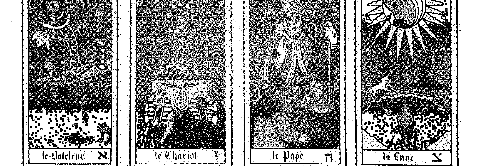

19世纪末20世纪初，法国神秘学家Gerard Encausse（杰拉德·恩格斯）对塔罗牌的神秘学体系论又作了一次重大突破。他以Papus（帕帕斯）为笔名出版一本非常有名的塔罗书：《The Tarot of the Bohemians》（波西米亚塔罗牌），波西米亚是帕帕斯对吉普赛的法语称呼，在这本书中，帕帕斯除了重申塔罗牌是由吉普赛人传至欧洲以外，还将他的前辈李维提到的TARO四字循环体系得到了最大发挥，将之应用到了塔罗牌的结构解析中。帕帕斯所构建的塔罗体系以上帝之名的四字母YHVH与灵数4为理论基础，从而逐步论述了Y—1、H—2、V—3、H/Y—4、H—5、V—6、H/Y—7……的循环对应结构，并最终创建了一个完整的塔罗牌体系：

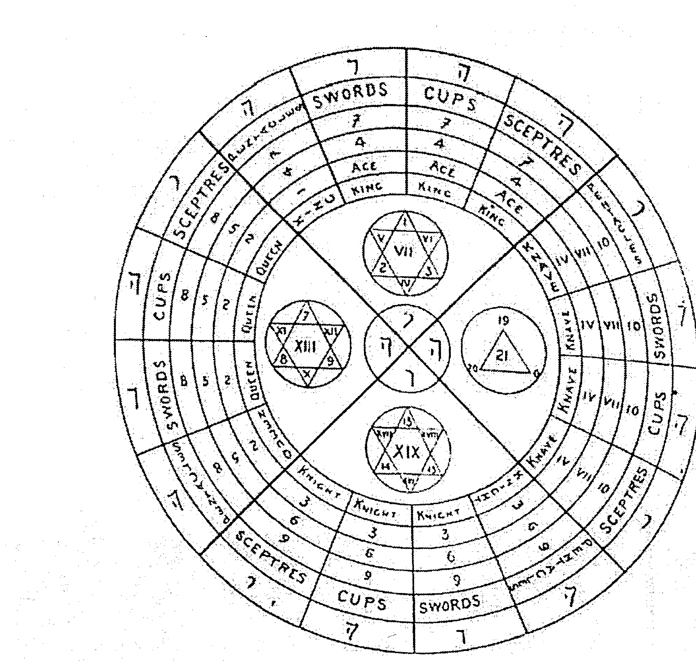

#### 三、19世纪末、20世纪初的塔罗神秘学文化

##### 1. 神秘学组织——金色黎明（The Hermetic Order of Golden Dawn）

英国著名的神秘学组织金色黎明成立于1888年，是英国神秘学振兴的标志之一。塔罗牌在那里又一次得到了发展。

金色黎明的建会方案来源于神秘手稿（Cyphers MS），其中有部分提到了塔罗牌的教学及系统，金色黎明的创始人Mathers（马瑟斯）和Westcott（维斯科特）将这部分内容提取了出来，组成了金色黎明塔罗牌的内部教学资料，名为“Book T”。在Book T中，22张大牌被命名成“Key（钥匙）”，与卡巴拉生命之树的22条路径以及22个希伯来字母对应，但对应顺序与19世纪李维提出的略有不同，最主要的一个改变就是对换了正义和力量的位置，另外，同时被纳入对应体系的还有占星符号。这个对应体系也构成了现代塔罗游戏牌意的依据和来源之一。

| 塔罗Key | 希伯来字母 | 占星符号 |
| :--- | :--- | :--- |
| 0. 愚人 | Aleph א | 空气/风 |
| 1. 魔术师 | Beth ב | 水星 |
| 2. 女祭司 | Gimel ג | 月亮 |
| 3. 皇后 | Daleth ד | 金星 |
| 4. 皇帝 | Heh ה | 白羊座 |
| 5. 教皇 | Vau ו | 金牛座 |
| 6. 恋人 | Zain ז | 双子座 |
| 7. 战车 | Cheth ח | 巨蟹座 |
| 8. 力量 | Teth ט | 狮子座 |
| 9. 隐士 | Yod י | 处女座 |
| 10. 命运之轮 | Kaph כ | 木星 |
| 11. 正义 | Lamed ל | 天秤座 |
| 12. 吊人 | Mem מ | 水 |
| 13. 死神 | Nun נ | 天蝎座 |
| 14. 节制 | Samekh ס | 射手座 |
| 15. 恶魔 | Ayin ע | 山羊座 |
| 16. 高塔 | Peh פ | 火星 |
| 17. 星辰 | Tzaddi צ | 水瓶座 |
| 18. 月亮 | Qoph ק | 双鱼座 |
| 19. 太阳 | Resh ר | 太阳 |
| 20. 审判 | Shin ש | 火 |
| 21. 世界 | Tau ת | 土星 |

另外塔罗小牌四个组的传统名称也被改变，成了魔术师的魔法道具的名字：Wand（权杖），Cup（圣杯），Sword（宝剑），Pentacle（星币）。并分别对应到了火水风土四大元素。

##### 2. 金色黎明组织影响下的塔罗牌

在金色黎明关于塔罗牌的理念下，有三副值得一提的塔罗牌：金色黎明塔罗、克劳利·托特塔罗、莱德·伟特塔罗。

金色黎明塔罗牌由Robert Wang（罗伯特·王）绘制，设计来源则是金色黎明组织内部资料《Book T》。其主要用途为仪式和魔法的道具，也有预测用途。

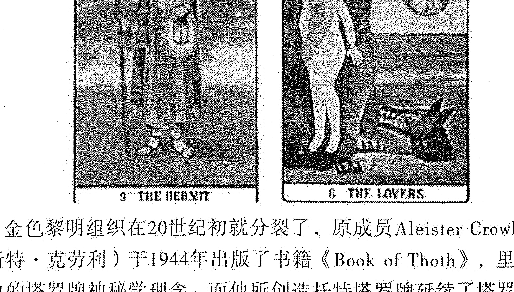

金色黎明组织在20世纪初就分裂了，原成员Aleister Crowley（阿雷斯特·克劳利）于1944年出版了书籍《Book of Thoth》，里面阐述了他的塔罗牌神秘学理念。而他所创造托特塔罗牌延续了塔罗与各种神秘学的联系，牌图中的符号极其繁复，包括了占星、炼金术、卡巴拉、希腊—罗马—埃及神话、赫耳墨斯派和诺斯替等，托特塔罗学者Gerd Zeigler（歌德·齐格勒）曾作出评估，托特塔罗牌中的符号大约有1200余种。克劳利设计这副牌的时间为1938—1943年，但首副出版的年份却在1969年，那时克劳利已经过世。

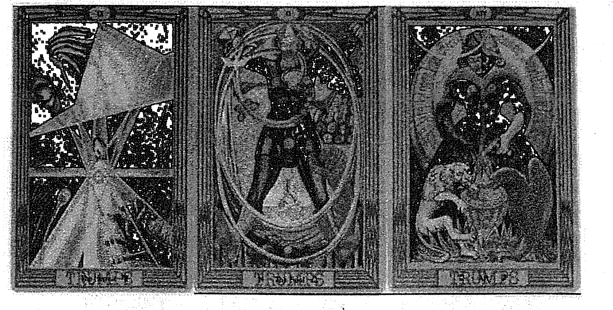

第三位要说的Arthur Edward Waite（亚瑟·爱德华·伟特），伟特同样是金色黎明的成员，他所设计出的塔罗牌所强调的是对于神秘主义思想本质的反映，由于绘制者Pamela Colman Smith（帕梅拉·柯曼·史密斯）在心灵方面和艺术方面有很高的天赋，所以她根据伟特的设计理念所绘出的塔罗牌图非常着重符号与图像的象征，伟特塔罗的小牌数字牌也被加入了人物、场景和事件，使得小牌也更便于占卜。原版的伟特塔罗名为Rider—Waite Tarot（莱德·伟特塔罗），出世于1909年的12月。可以说，伟特塔罗牌是以马赛塔罗为蓝本而设计，但有一个较大的改变就是关于原11号力量与8号正义位置的更换，更换后的使得力量牌为8号，对应狮子座，而正义为11号，对应天秤座。伟特塔罗牌出版之后，由伟特自己写的《Pictorial Key to the Tarot》一书也随即出版。这副牌连同克劳利·托特牌一起成为了现今也是历史上最为流行的塔罗牌之一。国内2004年出版的《经典塔罗》也正是以此牌为基础编译的。2009年，USGAME（美国塔罗牌出版商）出版了伟特塔罗牌100周年纪念套装，套装内除了伟特塔罗牌之外还有配套书《Pictorial Key to the Tarot》以及史密斯生前的一些艺术作品。

### 阶段四：现代塔罗时期（20世纪中—21世纪）

随着新时代的到来，历史学、人文学、心理学的不断发展进步，塔罗再一次地经历了演变。

随着将荣格心理学理论引入预测观念之后，引发了塔罗及塔罗预测一系列的变革。

首先是对预测观念的转变，基于荣格提出的潜意识、共时、原型理论，使得塔罗预测的关注点由以前的预测算命越来越往心理学范畴靠拢，现在的塔罗游戏过程中，“咨询”的方式已经越来越占主导，其最终的目的也由原先的预测未来转变成寻找一个人的内在智慧，并希望通过这种智慧获得启示，找出解决问题之道、强化个人的决定能力。在这一指导方针下，塔罗游戏的趋势则是趋于“自我转化”与“灵性发展”。塔罗游戏也越来越理性化与系统化。

其次，荣格的原型理论促进了人们对于塔罗牌图与符号看法的转变——特别是大牌，这也就使得现在塔罗牌的种类越来越多。各种不同主题的塔罗牌反映的则是许多新时代的思想理念，也使得传统符号与当今思想组合，从而生成新形态的塔罗牌，比如风水塔罗、占星塔罗、佛学塔罗、吸血鬼塔罗等；还有一些塔罗牌则是为反映一些传统文化与神秘学，如炼金术塔罗、赫密斯主义塔罗、神话塔罗、诺斯替塔罗、卡巴拉塔罗、德鲁伊塔罗等；还有一些反映地域、时代的塔罗牌，如波西米亚塔罗、文艺复兴塔罗、维多利亚塔罗等；还有在传统塔罗牌的基础上重新修改或重新上色的，如反伟特、亮彩伟特、普及伟特等；还有些则是利用现代技术，采用电脑绘制的塔罗牌，如镀金塔罗、图解塔罗等。不同塔罗牌在结构和数量上也会因主题不同而产生变化。

而在塔罗历史起源方面，一些18、19、20世纪的塔罗学者和神秘学家所提出的塔罗历史皆非脚踏实地，他们基本上都先入为主地认为塔罗源于古埃及或犹太卡巴拉或吉普赛人，并试图从中挖掘线索，而全然不顾历史事实。现今，随着越来越多人对于塔罗牌的关注，并且在一些历史学者、人文学者、纸牌研究者、符号学家的关注和努力下，使得塔罗历史研究前进了一大步，人们逐渐开始明白塔罗的埃及起源说、吉普赛传播论都只是一个美丽的童话故事，而塔罗真正的发源地应为文艺复兴时期的意大利。而现今，这些塔罗牌的历史学者、文化学者、符号学者们仍致力于探索塔罗牌原始符号的内涵、以及塔罗牌起源的蛛丝马迹。

## 第三章 塔罗大牌的排列

对于一些塔罗新手来说，很容易地碰到这样的问题：“为什么我的塔罗牌顺序和别人的不一样？”“为什么有的塔罗牌的排列和标准的塔罗牌会差那么多？”“不同的塔罗牌，大牌总共会有多少种排列？”“造成那么多不同排列的原因是什么？”“哪一种才是最原始的排列？” 要完全回答上述问题，只言片语是不够的，我们不得不从塔罗的历史着手，从头开始讲述这个问题。

- ◆ 塔罗大牌的排列概况

在第二章里，我们学到了塔罗牌从起源之初发展今天的主要过程。其中提到，塔罗牌在排列、形式上真正趋于标准化与稳定化是在17世纪马赛系塔罗牌的出世。在马赛塔罗牌之后，除了伟特塔罗对正义与力量作出位置互换之外，其他很少有大规模在排序上的改动。所以，塔罗大牌排列问题的不统一与多样化，主要还体现在马赛塔罗牌之前。

在15世纪到16世纪的各种意大利塔罗牌中，大牌排列、数量都存在各种各样的差异。从早期的一些标有编号的塔罗牌中，可以发现那时的塔罗大牌的排列顺序存在很多种。究其原因，是因为塔罗牌在起源之初的主要用途是纸牌游戏，根据当时的游戏规则，排在后面的牌要比前面的牌来的大，编号靠后的牌胜过编号靠前的牌。但是鉴于当时的塔罗牌还处于“初级阶段”，属于一个新生事物，尚未成熟，而且当时意大利的各个城邦各自独立，这些导致了各地生产出的塔罗牌都偏于遵循自己的想法来设定大牌的排列。这便是塔罗起源之初不同地区的塔罗牌在数量上与排列上不同的原因。

那么早期塔罗牌看似凌乱的排列是否有据可循？这点在各大历史学家和纸牌学家的努力下，已经有了初步结论。他们发现，那些诸多不同的塔罗排列中其实存在着一定规律。

塔罗牌历史学家迈克尔·达米特（Michael Dummett）发现，塔罗大牌的排列顺序种类的确很多，但事实上很多区别都是次要的，如果把一些次要的区别忽略，那么就可以总结出三大类，达米特教授对这三类分别定名为A、B、C。在第二章里，我们提到，塔罗牌刚诞生时的原产地可能有三个城市（米兰、费拉拉、博洛尼亚），而塔罗大牌的三大类排列类型ABC则恰好与这三大地区有关。排列A基本上分布于博洛尼亚和佛罗伦萨，排列B分布于费拉拉和威尼斯，排列C则可在米兰。另外，本书为了方便比较，从而加入了排列D与E，分别是代表标准化成型之后的塔罗牌——法国马赛系（D），以及现代最为常用的塔罗伟特系（E）。此外，为了方便对各种类型的排列作出对比，我将一些排列有出入的地方留出了空行，见下表：

### TAROT
经典塔罗攻略秘籍

| 编号 | 博洛尼亚/排列A（如罗森瓦德Rosenwald） | 费拉拉/排列B（如费拉拉木版塔罗Ferrara woodcut） | 米兰/排列C（如维斯康提—斯佛扎Visconti-Sforza） | 法国马赛系/排列D（如马赛系塔罗牌TDM） | 现代伟特系/排列E（如伟特塔罗牌Waite-Smith） |
| :--- | :--- | :--- | :--- | :--- | :--- |
| 1 | 魔术师 | 魔术师 | 魔术师 | 魔术师 | 魔术师 |
| 2 | 女祭司 | 皇后 | 女祭司 | 女祭司 | 女祭司 |
| 3 | 皇后 | 皇帝 | 皇后 | 皇后 | 皇后 |
| 4 | 皇帝 | 女祭司 | 皇帝 | 皇帝 | 皇帝 |
| 5 | 教皇 | 教皇 | 教皇 | 教皇 | 教皇 |
| 6 | 恋人 | 节制 | 恋人 | 恋人 | 恋人 |
| 7 | 战车 | 恋人 | 战车 | 战车 | 战车 |
| 8 | 节制 | 战车 |  |  |  |
| 9 | 正义 |  | 正义 | 正义 | 力量 |
| 10 | 力量 | 力量 | 隐士 | 隐士 | 隐士 |
| 11 | 命运之轮 | 命运之轮 | 命运之轮 | 命运之轮 | 命运之轮 |
| 12 | 隐士 | 隐士 | 力量 | 力量 | 正义 |
| 13 | 吊人 | 吊人 | 吊人 | 吊人 | 吊人 |
| 14 | 死神 | 死神 | 死神 | 死神 | 死神 |
| 15 |  |  | 节制 | 节制 | 节制 |
| 16 | 恶魔 | 恶魔 | 恶魔 | 恶魔 | 恶魔 |
| 17 | 高塔 | 高塔 | 高塔 | 高塔 | 高塔 |
| 18 | 星辰 | 星辰 | 星辰 | 星辰 | 星辰 |
| 19 | 月亮 | 月亮 | 月亮 | 月亮 | 月亮 |
| 20 | 太阳 | 太阳 | 太阳 | 太阳 | 太阳 |
| 21 | 世界 | 审判 | 审判 | 审判 | 审判 |
| 22 |  | 正义 |  |  |  |
| 23 | 审判 | 世界 | 世界 | 世界 | 世界 |

在上表中，我们看到了21张大牌的名称，唯独没有愚人。因为愚人在大牌中的地位是比较特殊的。严格的说，愚人不存在于整个大牌的序列，被称为“野牌”。毕竟其他大牌都以罗马数字（I、II、III、IV、V……）来编号，唯独愚人的编号要么为0，要么空着无编号。但无论是0还是无号都成为了它不在整个大牌序列中的证据，因为0是阿拉伯数字，罗马数字中是没有0的。

我们先来看排列类型ABC，排列类型A主要出自15—16世纪博洛尼亚地区的排列模式。比如当时的罗森瓦德塔罗牌。其最主要的特征有两点，第一是三张美德牌（节制、正义、力量）前后紧挨，几排在天牌的第二区段（8—14））；第二个特征便是审判处于最末一张。

排列类型B出于15—16世纪的费拉拉地区，代表牌为费拉拉的木板塔罗牌。其特征为四位世俗统治者（皇后、皇帝、女祭司、教皇）的排列比较特殊；三张美德牌分别出于三个不同的区段，节制在第一区段（1—7），力量在第二区段（8—14），正义在第三区段（15—21），并且正义的位置在审判之后、世界之前。

排列类型C出自15—16世纪的米兰，代表牌为维斯康提塔罗牌。这种排列法与16世纪后马赛系塔罗的排法相同，也是成为后世塔罗大牌排列的标准排法。

也许一些刚刚接触塔罗牌的初学者会觉得这些排列似乎没有规律，也不知道不同排列的意义在于哪里。那么下一节我们就一起来分析一下这三种排列的规律与意义。

### ◆ 塔罗大牌的排列分析

#### 1. 塔罗大牌的排列意义

在第二章中讲述塔罗的发展历史中，我们了解到，从在15世纪塔罗牌刚刚诞生出来的那段时期，塔罗牌的名称并不是Tarot，而是被称作“carte da trionfi”，意思是card with Triumph，也就是一副带有Trump大牌的牌。

Triumph直译成中文的意思为胜利，这与西方文化中的一种传统有说到这种传统名叫Triumph传统——也就是胜利传统。胜利传统起源于古老时代，当时有一种打仗胜利归来时的队伍排列，在古罗马，当外出打仗的战士们凯旋而归时，会在罗马的亚壁古道这里安排胜利仪式，其队伍的排列是有规则的，排在最前的是最低等级，然后依次往后排到最高等级，所以在古时胜利仪式中一般会由俘虏打头，由将军或指挥官收尾，收尾人物的形象通常是站立在战车里的英雄。由此可见，这种队伍的安排原则是越往后就越大的“前小后大型”。由胜利传统有关的艺术创作最早可追溯到公元5世纪，由西班牙诗人普鲁登修斯创作的一部作品，名叫《灵魂之战（Psychomachia）》。这个诗歌艺术在公元9世纪到13世纪期间以各种艺术插图的形式广为流传。那么到了塔罗牌诞生的文艺复兴时期，这种胜利传统达到了一个巅峰，当时涌现出许许多多基于胜利传统的艺术作品，其中最有影响力的代表作莫过于彼特拉克的《I Trionfi（胜利诗）》和同期文学巨作但丁的《The Divine Comedy（神曲）》了。也正是这两部巨作刺激了后来文艺复兴时期坊间其他基于胜利传统的各类艺术作品④。而15世纪诞生的塔罗牌就是在这种大环境下被创作的，1965年的塔罗学者莫克利就认为，彼特拉克的胜利诗对塔罗牌的设计起到了极大的影响⑤。所以要说塔罗大牌的排列深受到胜利传统的影响也是有理可依的。所以当我们将胜利传统与塔罗大牌的排列作出对比后就会发觉，“前小后大”就是塔罗大牌的排列法则。这在当时塔罗奇纸牌游戏中也有体现，因为在这种纸牌游戏中，排在后面的牌要比前一张来的大。当然，正如我们先前所说，愚人牌是排除在外的，不属于整个序列，也可贯穿整个序列。

#### 2. 塔罗大牌的排列分析

在清楚塔罗大牌的排列“前小后大”原则之后，我们就可以来对各种不同的塔罗牌排列方法作出分析了。我们还是回到先前的那张表格：

### TAROT
经典塔罗攻略秘籍

| 编号 | 博洛尼亚/排列A 如罗森瓦德 (Rosenwald) | 费拉拉/排列B 如费拉拉木版塔罗 (Ferrara woodcut) | 米兰/排列C 如维斯康提—斯佛扎 (Visconti-Sforza) | 法国马赛系/排列D 如马赛系塔罗牌 (TDM) | 现代伟特系/排列E 如伟特塔罗牌 (Waite-Smith) |
|---|---|---|---|---|---|
| 1 | 魔术师 | 魔术师 | 魔术师 | 魔术师 | 魔术师 |
| 2 | 女祭司 | 皇后 | 女祭司 | 女祭司 | 女祭司 |
| 3 | 皇后 | 皇帝 | 皇后 | 皇后 | 皇后 |
| 4 | 皇帝 | 女祭司 | 皇帝 | 皇帝 | 皇帝 |
| 5 | 教皇 | 教皇 | 教皇 | 教皇 | 教皇 |
| 6 | 恋人 | 节制 | 恋人 | 恋人 | 恋人 |
| 7 | 战车 | 恋人 | 战车 | 战车 | 战车 |
| 8 | 节制 | 战车 | 正义 | 力量 | 正义 |
| 9 | 正义 | 力量 | 隐士 | 隐士 | 力量 |
| 10 | 命运之轮 | 命运之轮 | 命运之轮 | 命运之轮 | 命运之轮 |
| 11 | 隐士 | 隐士 | 力量 | 力量 | 隐士 |
| 12 | 吊人 | 吊人 | 吊人 | 吊人 | 吊人 |
| 13 | 死神 | 死神 | 死神 | 死神 | 死神 |
| 14 | 节制 | 节制 | 节制 | 节制 | 节制 |
| 15 | 恶魔 | 恶魔 | 恶魔 | 恶魔 | 恶魔 |
| 16 | 高塔 | 高塔 | 高塔 | 高塔 | 高塔 |
| 17 | 星辰 | 星辰 | 星辰 | 星辰 | 星辰 |
| 18 | 月亮 | 月亮 | 月亮 | 月亮 | 月亮 |
| 19 | 太阳 | 太阳 | 太阳 | 太阳 | 太阳 |
| 20 | 世界 | 审判 | 审判 | 审判 | 审判 |
| 21 | 审判 | 世界 | 世界 | 世界 | 世界 |

由于在上表中，塔罗大牌的排列差异主要体现在ABC三类，D和C是一样的，E与CD的差异仅仅只是力量与正义位置的互换。所以，我们这里的分析重点也着重放在ABC这三类。

在我们用求同存异的方式对ABC的排列捋一捋后就可发现，造成ABC三大排列存在不同的原因也就两大块：第一块是首五张人物牌的排列（特别是四位世俗统治者的顺序），第二是三大美德牌（节制、正义、力量）的位置。

##### 1) 女祭司的纠结

在最初五张牌中，魔术师一直处于1号位，另外四张是世俗统治者：女祭司、皇后、皇帝、教皇，它们的顺序在ABC中排法各异。但经过分析之后就会发现，造成这四张牌排法不一致的根结在于女祭司。因为如果我们将女祭司牌撤除，那么剩余三张牌的顺序“皇后—皇帝—教皇”是一致的，皇后一直最靠前，而教皇一直最靠后。所以实际上只是女祭司的位置纠结引起了整个四张牌的排序差异。从上表中我们看到，女祭司牌在A和C中处在2号位，而在B中处于4号位。由于现在我们已经知道，塔罗大牌的排列法则是越靠后越大。那么女教皇、皇后、皇帝、教皇这四位世俗统治者，也就可以在排列上看出高低之分。一直处在四张世俗统治者之末的教皇牌，它的位置是固定，其在当时人的观念中的地位也就显而易见，体现了教皇至高的地位，另外，从皇帝牌一直排在皇后牌的后面也能知道，皇帝的地位要高于皇后。接下来就是女祭司了。一般情况下，若将皇后/皇帝视作一个配对、女祭司/教皇视作另一个配对，那么这四张的排列规则无外乎就两种：1）皇后一定在皇帝之前，女祭司一定在教皇之前；2）皇后/皇帝的配对在女祭司/教皇的配对之前。所以，比较合乎逻辑的排列似乎应当为：皇后—皇帝—女祭司—教皇，也就是排列类型B中的排列方式。事实上当时的塔罗大牌排法中还存在另外两种情况，一种用的比较少，为：皇后—女祭司—皇帝—教皇，这在达米特教授归纳的排列类型ABC中都没有体现。但另一种就比较多了，也就是：女祭司—皇后—皇帝—教皇。这种排法在排列类型A和C中都有出现，并且随着排列C成为塔罗大牌的标准模式后，女祭司—皇后—皇帝—教皇这种顺序一直延用至今。

所以，对四位世俗人物的排法分析，我们可以归纳出两种方式，一种是最合乎胜利传统排列法则的排法（排列B中的皇后—皇帝—女祭司—教皇）。另一种是沿用至今的标准排法（排列C中的女祭司—皇后—皇帝—教皇）。

##### 2）三张美德牌的变量

第二处对整副大牌排序造成较大影响的是三张美德牌的位置。可以说，节制、力量、正义的位置是整个大牌排列的一个主要的变量。在意大利的南部地区，如博洛尼亚、佛罗伦萨、罗马和西西里，其大牌排列遵循的是排列类型A，三张美德牌的排列往往是连续地依次相连，挤在一起，虽然有时也会产生谁先谁后的不同，但是总归是连在一起的。而在意大利偏东部的地区，如费拉拉和威尼斯，大牌的排列类型为B，三张美德牌总是分散分布在不同的区段，比如节制会在1—7区间，力量在8—14区间，正义在15—21区间，但正义一般都处于审判之后、世界之前，另外，排列B中的排列依据也遵循了“胜利传统”，排在越后面的也就越大，所以这里明显对三美德有一个轻重之分。而米兰的塔罗牌排列与后来法国马赛系塔罗牌的排列类同，属于排列类型中的C，三张美德牌的分布全是集中在第二区间（8—14），正义为8，力量为11，节制为14。那么排列C的排法成为了16世纪之后塔罗大牌的标准排列形式，也就是马赛系的D排法。当然，现代大家所熟悉的伟特塔罗牌把排列C/D中的11号力量和8号正义位置作了互换，这依据的是金色黎明组织的神秘学对应体系，可见排列E。

如果要深究美德牌排列位置不统一的原因，那么就和死神牌有关了。

塔罗牌历史学家迈克尔·达米特教授（Michael Dummet）针对塔罗大牌的排列与编号发现了一个有趣的现象，在所有既存塔罗牌的排列中，死神牌永远是13，13号似乎是死神牌不可侵犯的位置⁽¹⁾。所以，历史上的古塔罗牌，为了保证死神13号的位置，就尝试改变其他牌的位置。

按照塔罗牌的排列，如果三张美德牌（节制、正义、力量）都处于死神牌之前，就会造成使死神牌变成14号的尴尬局面。而在15世纪塔罗牌起源后的一段时期，有些塔罗牌的确将三张美德牌都放在死神之前，但是为了确保死神13号的位置，这类塔罗设计者所采取的方法是“空出编号”法。比如排列A中的范例，早期的博洛尼亚塔罗牌中，魔术师到教皇这五张牌都没有予以编号，而原本编号应为6的恋人则编为了5号，这样也就使得死神编号为13。还有的牌则干脆取消女祭司这张牌，比如早期佛罗伦萨牌。

在达米特教授对早期塔罗牌排列的三大分类中，排列类型A和C都采取的是将节制放于死神之后，位列14，而将正义和力量分别位列8和11。如此，这三种美德的次序构成了一种倒序（正义—力量—节制），因为在西方哲学传统柏拉图和毕达格拉斯理论中，这三种美德的次序应为节制—力量—正义。而在排列B中，正义被放于死神的后面，位列20，而节制和力量被置于死神之前，分别位列6和9。这里三大美德牌的顺序恰好与西方哲学传统关于美德的次序理论一致。

在对三张美德牌的排序分析中我们可以知道，对于节制、正义、力量三张美德牌的安置从历史与文化上看似乎都是为了保证死神13号的不动地位。排列B中，节制—力量—正义也更加顺应西方的传统哲学观念，而且将正义置于审判之后则更体现了当时末日审判之后的善恶评判，与中世纪和文艺复兴时期的思想观念更为相符。所以，综合第一点女祭司的位置分析与第二点美德牌的排列分析来看，似乎排列B比较符合当时世人的思想观念，应为原始塔罗大牌排列最后可能的候选者。

- ①《The Tarot: History, Mystery, and Lore》by Cynthia Giles
- ②《The Tarot: History Symbolism and Divination》by Robert M. Place
- ③《A Cultural History of Tarot》by Helen Farley
- ④《Iconology of the Early Tarot》by Robert O’Neill
- ⑤《塔罗上下五百年：发展与演变》——亮（亮’s 塔罗时空 http://blog.sina.com.cn/jeaora）
- ⑥《The History Art and Symbolism of the Tarot》 by Robert M Place
- ⑦《the Hermetic Journal》 by Adam McLean
- ⑧《Other early Notes about Playing Cards (— ca. 1420)》 http://trionfi.com
- ⑨ TarotPedia: http://www.tarotpedia.com
- ⑩《Reading the Marseille Tarot》 by Jean—Michael David
- ⑪《The Tarot: History Symbolism and Divination》 by Robert M. Place
- ⑫《Tarot Symbolism》 by Robert O’Neill
- ⑬《A Wicked Pack of Cards》 by Michael Dummett
- ⑭《Iconology of the Early Tarot》 by Robert O’Neill
- ⑮《The Tarot Cards》 by Gertrude Moakley
- ⑯《A History of Games Played with the Tarot Pack》 by Michael Dummett, John McLeod, E. Mellen Press

# 第二篇：牌意的学问

因一副牌而形成一门学问，恐怕没有一种牌能比塔罗牌做得更好了。“塔罗学”一词，英语为“Tarotology”，由Tarot（塔罗）一词加上后缀—ology（学问）而构成。塔罗牌之所以能够形成一门学问，其最重要的原因便在于其拥有意义，这便是牌意。

牌意是继塔罗的历史与起源后的第二大神秘之处。相信很多刚开始对塔罗牌产生兴趣的人都会问出相似的问题：这些牌到底表达了什么信息？牌上的图案各种各样，分别是什么意思。那么这些问题都与塔罗的牌意有关。

塔罗牌的牌意可以来自于这张牌的自身，也就是牌图本身自带的图像与符号，也可以来自于塔罗牌与其他神秘学体系对应后得到的意义。但不论如何，牌意都是让人们理解塔罗牌表达意义的基础与来源。我们手中拿着的这一张张富含神秘的图像与符号的塔罗牌，其中究竟隐藏着怎样秘密？正是这个秘密不断地吸引人们去挖掘、去探索。

解开这些意义的过程就是对牌意的解读与释义，解开后所得到的意义就是牌意。由于塔罗牌是一幅幅带有丰富图案的纸牌，所以用最直接的话来说，塔罗的牌意来源于这些牌的图像。有一句话说得好： “你可以用一张图去概括一句话的意思，但却不可能用一句话乃至一段话去把整幅图像的意思囊括其中。” 因为图像是一种艺术，一件艺术作品会因不同人的理解而不同。伟特塔罗牌的设计者亚瑟·爱德华·伟特（Arthur Edward Waite， 1857—1942）在他1909年出版的《Pictorial Key to the Tarot》一书里指出： “塔罗是一套符号象征系统” ①。每一张塔罗牌都有不同样貌的图案，不同样貌的图案诉说着这张牌的各种牌意。另外每一幅图案则由各种各样的符号组成，这些符号小到一顶皇冠、一副手套；大到一座城堡、一片大海；也可以抽象到一种表情、一个动作乃至一种颜色等等，不同细节符号同样也呈现着各种不同意 义。不论是谁，都可以从不同角度、不同层面去理解那个意义，而所得到的意义又往往会远远超越这个图像的本身。这就是本篇即将要说的塔罗牌意。

> “你可以用一张图去概括一句话的意思，但却不可能用一句话乃至一段话去把整幅图像的意思囊括其中。”

> “塔罗是一套符号象征系统”

## 第四章 牌意的知识

牌意，顾名思义，就是一张牌的意义。这句话看似简单，其实复杂。

说简单吧，牌意就是一张牌要表达的意思。由于现今大多数的国内塔罗牌爱好者都是因塔罗的预测功能而着迷，所以在相当一部分人的眼里，牌意也就成了专门服务于预测、能使游戏者和解读者去通过这些意义来完成塔罗预测的一个必要元素。但事实上，牌意的涵盖范围绝非那么狭隘，游戏上用到的牌意仅仅是整个牌意大框架下的一部分。

另外，相信很多塔罗爱好者在学习牌意的过程中都会遇到牌意上的诸多问题，比如针对某一张牌的牌意，这么解释可以、那么解释也行，有些解释简单朴实、源自生活，但有些则玄之又玄、源自一些西方古典神秘学及哲学思想；还有一些意思光从牌图中看不出，需要借助一些神秘学体系经过对应之后才能了解；更有些牌意虽然出自同一张牌，但却彼此矛盾，意思南辕北辙，难道相互矛盾的牌意都属于同一张牌的意思吗？如果所有的这些都属于牌意的范畴，那么这也难怪一些初学者会提出这样的问题：“这些牌到底是什么意思？某一张牌的真正意思到底是什么？”

大多数提出这类问题的人，他们希望能够得到一个简单、明确的答案，他们希望听到的是“某某牌的意思就是什么什么……”可是，问题就恰恰就出在这里。从古至今，就从来没有缺少过牌意解说，各个领域的各大学家们，包括历史学家、符号学家、神秘学家、预测学家、解读学家等等，他们通过各种方式、从各种不同的源头、不同的角度入手解释牌意，也得出了各种各样琳琅满目的牌意。也许他们都认为自己说出的牌意才是塔罗真正的牌意，也许一些赞同他们观点的人觉得这才算塔罗真正的牌意，而另一些不赞同他们观点的人觉得这些牌意都是错的。何况，这些牌意还只是属于先人们的归纳，除此之外，每个人在看了牌图之后也会有自己的理解，这些理解也是催生与得出牌意的又一个源头。所以，所谓的牌意绝不是一句话或几个词就能概括的，而对牌意学习的重点也就需要放在方法、技巧上。掌握正确的方法和技巧才是学习塔罗牌意的关键所在。

> 我国北宋时期的诗人苏东坡曾经讲道：“若言琴上有琴声，放在匣中何不鸣；若言声在指头上，何不与君指上听？” 这句话的意思是，如果说优美的琴声来自于琴，那么把琴放在琴匣中它为什么自己不会发出声音呢？但要说优美的琴声来自于手指，那么你来弹奏一下试试，能弹出那么好听的旋律吗？简而言之，意思是说，即便你有琴有手，也未必弹出优美的音乐。

塔罗牌意的学习也是同样的道理，如果只有牌——没用，即使有人——也没用，若再加上若干牌意小手册还是没用，这里我们需要的是方法和技巧，有了方法和技巧，假以时日，便能自己从牌中体会、总结、感悟出属于自己的牌意，如此所得的牌意其价值要远远高于那些死记硬背的牌意。

因此，本篇“牌意的学问”，从理解牌意的概念、特征与构成开始，再对各种眼花缭乱的牌意作出分门归类，使大家面对众多牌意时能够从容应对，远离三乱——眼花缭乱、手忙脚乱、兵荒马乱，取而代之的则是拥有一种辨别、处理、分析牌意的能力，掌握哪些情况应该运用哪些牌意，头脑中形成一个清晰的牌意层次的框架结构，在对其全盘了解的情况下，开拓一种适合于自身的牌意理解方法。如果牌意小手册是授人以鱼，那么这里便是授人以渔，提供给大家的是一种方法和技巧。

### ◆ 牌意的概念

所谓牌意，就是个人运用一些方式和方法去对牌的意义作出主观上的理解，其理解的方式、方法、角度、切入点可以不限，并将这种理解结合个人的用途与目的得出一个适当的解释。

我们不妨来理解一下这句话的意思。

首先，牌意是个人对于牌的意义的主观理解。这就告诉了我们一个大前提——牌意的存在必须基于一个人的理解。反之如果没有了“人的理解”这个大前提，那么牌意也就不存在，如此情况下，塔罗牌也只不过是一张张画着图案、没有任何意义的普通纸牌罢了。这里至少指出了一个牌意理解上的误区，有些人特别是初学者认为，牌意先于个人的理解而固有的东西。这其实是不对的，任何形式的意义都因人的理解而存在，如果我们将塔罗牌的牌意追根溯源，一直追溯到塔罗牌的设计与诞生，那么也是因为设计者先有一个抽象观念性意义，后将这个意义落实到具体的塔罗牌图上的图案与符号。这种理解印证了鲁迅先生的一句名言：“世上本没有路，走的人多了也便成了路③。”那么牌意也同样：“世上本没有牌意，有了‘理解的人’才形成了塔罗的牌意。”

其次，理解牌意的方式、方法、角度、切入点不是单一的，而是多元的。有的人习惯于采纳一些先人总结出的牌意关键词；有的人喜欢对图像采用直觉式的联想、冥想方式得出意义；有的人则比较注重图案中的细节符号，观察各个符号（如动作、环境、色调、神态）的意境来对牌意作出判断；还有一些较为资深的塔罗爱好者，他们已经洞悉整副塔罗牌的结构，拥有自己认知的塔罗结构体系，对牌意的理解则会通过某张牌在整个塔罗体系中的位置、担当的角色来定义；另有一些人采用无视牌本身的图像，喜欢借助其他神秘学系统（如卡巴拉、占星、元素、数字学等）与塔罗牌之间的对应来得出牌意。更有些喜欢标新立异的人，他们对目前存在的塔罗牌图像都没兴趣，喜欢根据自己理解的意义徒手画出各张牌的图案，新的图案则赋予了原牌更多更广泛的额外牌意。上述提到的这些理解牌意的方式都不能算## TAROT 经典塔罗攻略秘籍

错，可见牌意理解手段的多元化。

第三，每个人理解出的牌意一般就与这个人使用塔罗的目的与用途有关。这句话说明了两点，第一点是对牌意的理解往往因人而异。试想，一位将塔罗牌用于提升自我灵性认知的人与另一位将塔罗用于预测未来的人，他们得出的牌意就不会相同。同样，一位历史学家对牌意的研究目的往往是严谨、务实的考证用途，在他们观念里真正的牌意只有一种。但一位塔罗预测解读师对牌意的理解往往是发散、无约束的放开联想式，对他们来说，意义越多他们的牌意库就越充实。

### ◆ 牌意的特征

如果对上述关于牌意的概念作出一番分析，我们可以得到以下这些特征①。在对这些特征的解析中，我们适当地加入一些实例来分析：

#### 1）基础性

塔罗牌意是学习、研究、运用塔罗的基础，是所有接触塔罗的人都不能避免的一个领域，不管是塔罗的解牌人、历史学家、符号学家、神秘学家、塔罗纸牌游戏玩家、甚至一些“娱”字当头搞运势娱乐的塔罗娱者都脱离不了牌意这个大熔池。解牌人需要通过塔罗的牌意为人推算解惑；历史学家要依靠牌意透露的信息追溯历史的源头；符号学家要透过塔罗符号解析更深一层的意义；神秘学家要通过牌意解析相应的神秘学内涵；塔罗纸牌玩家也需要通过图像来了解这张是什么牌以完成其在游戏中的角色与大小判断；运势娱者也需要牌意来叙写运势的起伏。就算第一次拿起塔罗牌的人，当他在看某一张牌图时，就已经在下意识地猜测、理解其中的意义了。所以说除非你不碰塔罗，只要接触了塔罗，在绝大多数的用途上都需要解意。由此，牌意即成为了塔罗入门最最基础的一道门槛。

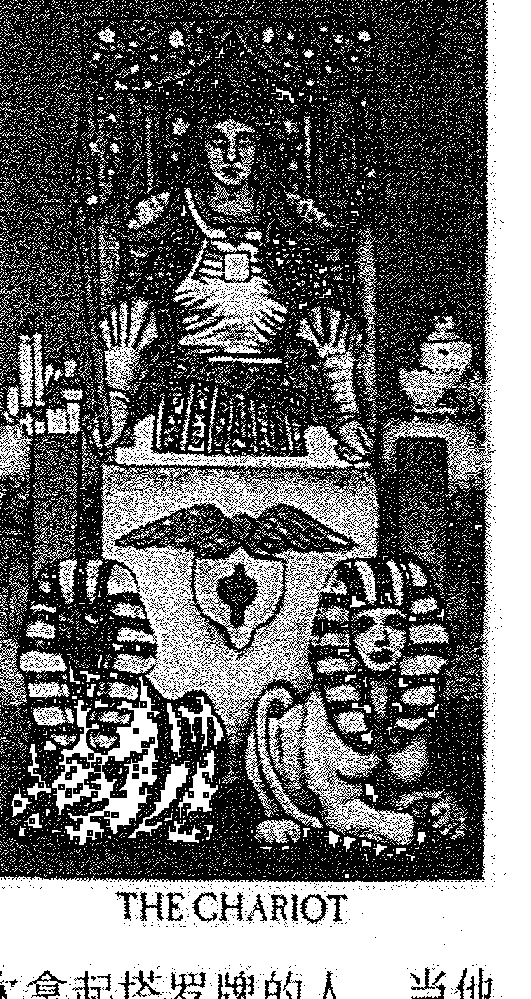

#### 2）多源性

牌意是三言两语就能说清的吗？倘若答案为是，那么塔罗牌的魅力将会削减大半。当一样事物过于简单、过于明朗，那么这件事物对于人的吸引也会极其微弱。牌意的多源性就是指其来源的多元化，这种来源上的多元化使得牌意的复杂性大跨步地提升。

对一张牌的图像与符号作出分析，可以利用各种资源，如历史、文化、哲学、心理学、生活经验来作出相应的解释，不同的资源会得到不一样的解释。有最直观的看图说话方式、有深入冥想的方式、还有通过神秘学体系对应（如占星、卡巴拉、字母等）来得出意义的方式；还有通过历史依据解析某一张牌图的原始意义以及塔罗设计者想要表达的意义；还有将一张牌图关联到一些神话故事后所得出的意义；还有对牌图采用心理学的原型解读方式剖析得出的意义；还可以通过象征、比喻、拟人、关联等修辞手段来将图像与符号的意义无限扩大化的方式；还有可以通过古往今来的那些富含哲理寓意的名言、警句、古训来理解图像的意义。通过以上这些方式所得到的意义都属于牌意，可见牌意容量库之大及其复杂程度足以令人咋舌。

不信的话可以举一个例子。我们一起来看战车牌：

从这张牌的图像来看，可以描述为一名男子驾驭了一辆由黑白狮身人面兽牵引的战车上，正向背离城堡的方面前进，这名战车驾驭者的手上没有缰绳，只是持着一柄权杖。如果从比喻、推衍的方式来解读可以得出自律与意志的含义，战车的驭者以意志替代缰绳，控制坐骑的行径，以不至于让两匹坐骑分道扬镳、使战车崩溃，因为坐骑为一黑一白，对互相对立的二元，这一对立的二元这可以比喻成对生命中互相对抗的力量和矛盾，而战车的驭者就是要以意志和自律的方式对它们进行控制。

如果从心理学层面上解析，战车的驾驭者可视作一个“本来的我”，而他所乘坐的战车则是这一个“本来的我”所塑造出来的一副“人格面具”，人格面具是人类在生活中为了适应不同环境所扮演的不同角色，以得到社会的承认。比如在老师面前是个乖学生；到了小弟面前是位敢做敢当的大哥；在工作中当了领导就要带上威严、果断、敢于发号施令的指挥官的面具；回到家里在爱人面前则戴上了另一副极具亲和力的面具。

如果从历史文化的角度剖析这张牌，战车在意大利语中为Il Carro Triumphale，意为胜利之战车，在古时，战车是被视作一种胜利的象征。在古罗马，当外出打仗的战士们凯旋而归时，就会安排一场胜利的队列仪式，这种仪式以队列为形式，排在最前的是最低等级的角色，然后依次往后的角色等级就越高，通常排列在最后的就是站在战车里的英雄。所以战车就是一种地位与身份的象征，表示在战车上的人的地位显然要高于战车下的人。

从对应体系上来看，战车对应了希伯来字母Cheth（金色黎明对应系统），Cheth意为“领域”，所谓领域就是被占有和受到保护的空间，所以也有守卫、保卫、防卫、庇护之意。结合到塔罗牌的战车，我们发现从牌图中我们不仅仅可以将战车视为出征，也可以将战车视为保卫，他守护的是背后的领土。

从数字角度来分析，战车牌序号为7，7是一个非常有讲究的数字，在古代地球中心说的理论中，古人就认为天上有七大行星，分别是太阳、月亮、金星、土星、火星、木星，而神秘主义者则认为，这七大行星构成了从地球通往天国的阶梯，也就是说经历这七层阶梯，就能够从地球代表的物质世界提升到天国代表的精神世界。那么这就与八度音的特征类似，我们都知道音乐中每个音阶中都有do、re、mi、fa、so、la、xi这七个音，从do一直到xi，当进入下一个do时，音阶就上了一层。这是同样的道理。如此，数字7就是一个代表阶段完成的数字，那么联系到塔罗战车牌，如果把塔罗视为愚人之旅，那么就是以愚人为主体去经历那21张大牌，21张牌可以按7分成三段，1—7为第一段代表物质世界，8—14为第二段代表心理，15—21为第三段代表精神世界。这里7号战车就是第一段物质世界的终结，象征了物质世界之旅的完成、以及在物质界中获得的至高荣誉和成功。

让我们再从哲学层面解析一下战车牌。柏拉图在《斐德罗篇》中说到了灵魂的三重本质，他将灵魂比喻为战车，这个战车是由一名驾驭者和两只有翅膀的飞马组成，飞马一黑一白，再加上战车的驾驭者三者构成了灵魂的三重本质：黑色飞马代表欲望灵魂，为灵魂最低级的部分，对物质的需求。白色飞马代表意志或精神，为英雄的灵魂，也就是意志灵魂，可以使人从物质的沉沦中脱离和提升，寻找属于个人精神上的荣耀。战车的驾驭者为理性灵魂，他驾驭着两匹飞马说明理性灵魂对另外两部分的灵魂的指导和控制作用，为最高级灵魂，理性灵魂拥有能够觉知到超越物质世界的智慧与洞见。如此，塔罗战车牌的构成与柏拉图关于灵魂三分描述实为一致，其意思是每个人都有属于自己的战车，这架战车上装载的每个人的灵魂，这就是每个人的灵魂之旅，柏拉图继而认为，当一个人做出不善的行为时，他的那两匹马就会失去羽毛而不能飞翔，这就是堕落，只有不断实践美德、多行善事，才能保持两匹飞马羽毛的不断换新。

最后，我们说一下和战车牌有关的一些名言佳句，在《变形金刚3·月黑之时》的影片中，汽车人首领擎天柱（Optimus Prime）说了一句经典台词：“You may lose your faith in us, but never in yourself…From here, the fight will be your own。”这句话经过理解之后的意思便是：一个人可以对任何人失去信心，但永远不可以对自己失去信心，因为在一场属于自己的战斗中，如果连一个人对自己都没有信心，那么他是做不成任何事的。这一层意思与战车牌的牌意正好吻合。擎天柱话语中提到的“战斗”又可以做一番引申，可以象征我们生活中的障碍、需要去克服的困难，比如学生所面对的重大考试、上班族所面临的各种工作考验、乃至日常生活中会经历的各种难关。所以呢，在生活中有许多事情、许多哲理都能对应到塔罗的每一张牌，有句话这么说来着：“塔罗反映生活，生活也在映射塔罗。”这话还是很有道理的。

至此，大家应该可以发现一张牌的牌意来源有多么的复杂、多么的多元。事实上，上述以战车为例作出的牌意解释远远的不全，这就应该使我们意识到，要好好地、完全地学习塔罗牌意是一个多么巨大的工程。

#### 3）主观性

前一点的牌意多源性说到了牌意产生与来源管道的多元化，即通过不同方式、不同渠道可得出不同层面的意义，那么随之而来的问题是：是不是使用同一种方式就能得出相同的意义呢？

答案是否定的。我们就拿最最直观的看图说话层面来说吧，倘若把一张图放在不同人面前，他们看过之后得到的意义多多少少都会不同，即便是同一个人在不同的时间、不同的心境下去看同一幅图或同一个符号，也往往会产生不同的反映。因为读图往往联系着人类的情绪，就拿宝剑5来举例，有些人或在某些心情下可能会比较注意图中那个手里拿着许多剑的人，并将他视为残酷竞争下的胜利者，并以此得出“物竞天择”的牌意。有时，人类为了竞争到一定的利益，就会对别人怀抱一种冷漠、贬低、排斥、敌视的心理，这是从这一角度对该牌牌意作出的解释。然而另一些解读者或者在另一种情绪状态下的解读者反而会注意较远处的一些背对着的人物，并认为是他们主动抛弃近处那个手持宝剑的人。有一位刚刚参加完高考并取得大学录取通知书的人看到宝剑5时，他的反应是这张牌正好描写了学业完成后的情况，那些背对着的人物代表完成学业的学生，宝剑代表繁重的学业，整副图说的是考完的学生终于可以抛开学业重担了，而近处那个手持宝剑的人代表原来学校的老师，他正笑着目送毕业的学生离开母校。然后我再换一个角度来说，我也可以说，那位手上拿着许多宝剑的人非常可怜，因为这个世上有一种人是非常可怜的，那就是明明自己很可怜却又以为自己很了不起的人，他把别人赶走了，武器也都归他所有了，他也就没有了对手，那么反过来说，如果没有了对手，这些武器还有什么用呢？只怕就是一些废铜烂铁而已，可偏偏他又不觉得，脸上一副喜笑颜开的样子。正所谓“山上无老虎，猴子称大王”，只不过这个猴王一点意义都没有。说到这里，大家应该可以感觉的出，牌意的理解往往与个人的思想、心情、态度、立场、情绪、乃至一些社会阅历有关，具有很浓厚的主观性。

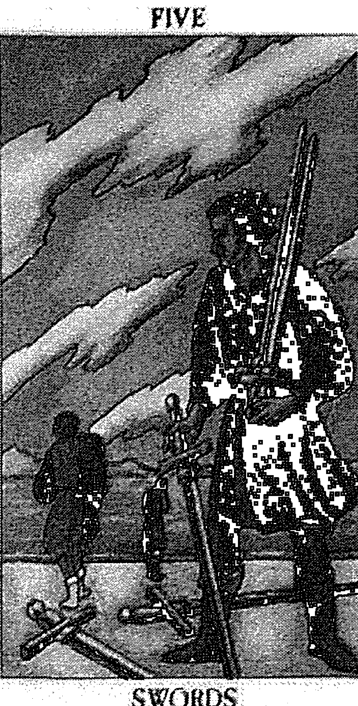

#### 4）不明确性

由于牌意有时非常个人化且非常多样化，因此当一个人看完图之后作出的牌意解说，旁人很难轻易去界定这些意思的对与错。有时我们会遇到不同人针对同一张牌说出一些互相矛盾的牌意，但这些牌意又都不能算错的情况也是存在的。这就是对牌意界定的模糊性。比如上面的那张宝剑5，有的认为代表竞争的失败，有的认为代表竞争的胜利，孰对孰错？答曰：都对，因为立场不同。

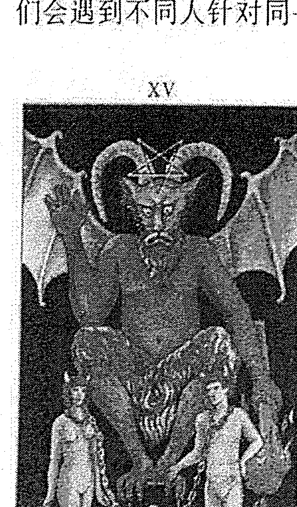

牌意的不明确性还体现在另一个方面，那就是对牌的定性。一个人对于某张牌的牌意认定，会直接影响到他对这张牌的感觉，这种感觉导致他对这张牌作出“好牌”与“坏牌”的定性。事实上，这种情况常见于一些初学者，而进阶者们应该都能明白，任何一张牌都不应该简单地以好牌或坏牌来区分，牌意的复杂性与多样性决定了对牌定性上的模糊性，因为立场不同、解析角度不同，所得到的牌意也就不同。

> 塔罗解读者Gail Fairfield（盖尔·费尔菲德）在她2002年出版的塔罗书籍《Everyday Tarot》一书中就指出：‘如果一定要对每张牌进行定性，那么它们应该都为中性。这就好比‘雨水’对我们日常生活所造成的影响。‘雨水’是一种大自然的资源，从特性上说应该是中性的，没有好坏可言。但作为我们生活中的需要，太多量或太少的雨都会给我们造成不同的影响：太多能导致洪水，而太少则能导致干旱⁽⁵⁾。” 如果我们真的对雨水的好坏作出定性，取决的因素会有很多，如环境、地理位置和一年的雨量……或许最终得出某些干旱的地方多一些才好，而某些沿海城市则不要太多。与此同理，牌意也是如此，例如，恶魔牌的一项牌意为“界限和限制”，这层意思对应到不同的问题就能衍生出不同的意义，在某些情形下，恶魔的这项牌意偏于贬义，代表一个陷阱、一个束缚，或者表示某个人被束缚的观念和思想；但在另一些情形下，恶魔的这项牌意就偏于褒义，能够被解释成执着，意味着某个人拥有一个清晰、明确的目标和方向。

#### 5）层次性

塔罗的牌意具有层次性，每一种被理解的牌意有浅层次的、也有深层次的。如果那些一看便知的牌意属于浅层面的牌意，那么一些深层牌意就需要拐好几个弯，甚至需要在了解一些知识的情况下才能获知。

牌意具有层次性，这一点无论是新手或是老手、历史符号学者或是塔罗解读师，在解析牌意时都必须明白。每张牌、每个符号的意义绝不只有一种层面的解释，而是具有多重分级性⁽⁶⁾。也就是说，在一些比较表面的意义底下，还隐藏着更深的含义。根据符号学的解释原理，这些意义基本上可以按照递进关系被分为四大层级：表层意义、引申意义、精神层面的寓意、哲学与神秘主义层面的意义。为了便于解释这四层牌意的分级，我们就以一张牌的牌意为例进行解说，塔罗大牌中的恋人牌，在其诸多牌意中，有一个主题便是“爱”，爱是一种力量，是使互为对立的二元事物结合起来的力量。接下去我们就以“爱”为范例对其意义进行分级解释：

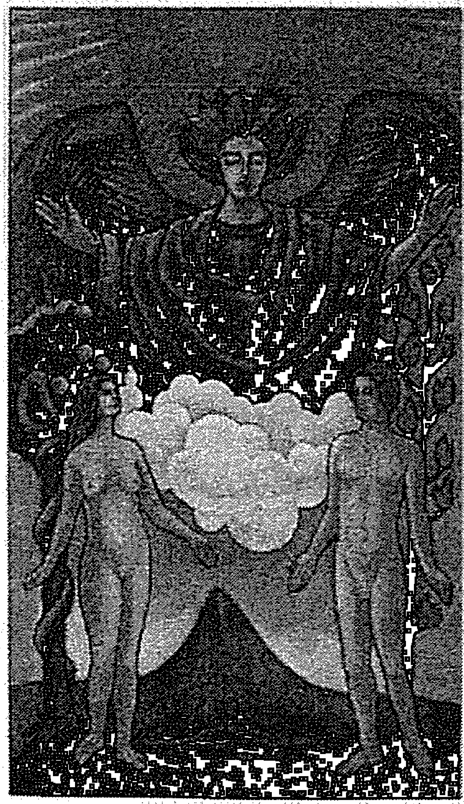

第一层级便是最最直观与表面的表层意义，正所谓眼见为实，这层意思就是事物所见，即老老实实按照牌图显示的内容理解，而不经过大脑或逻辑上的进一步思考。就拿恋人牌所表达的“爱”来说，爱是一种发自内心的情感，从狭义上可以代表人类世界中的男女之间的爱情，广义上则可以指人与人之间的感情。这里，爱的表层意义就到此为止了，无需再去深入挖掘这种现象背后可能衍生或存在的潜在问题。

第二层级为引申意义，也就是象征比喻层面的意义。某样事物象征着另一样事物，这种象征是根据推论、演绎、比喻等方式将事物理解为与其类似的事物b，这是通过对两者进行对比之后，在两者存在某些共同之处的前提下将两者作出的关联，正因为两者之间的某一处或某几处存在着同等性、存在着交集，所以才能被联系起来看。如果用引申意义来解释恋人牌所表达的爱，由于爱是一种将对立二元的事物结合起来的力量，在恋人牌图中，这一个二元事物便是图中的男人和女人，男对应阳、女对应阴，阴阳构成一个互相对立的二元。又因为二元对立广泛存在，除了阴阳互为对立的二元之外，物质/精神、身/心同样也是一对二元对立之物，所以图中的男人和女人就能通过这种方式与其他二元对立之事物产生关联与对应，也就是可以把男人比喻成身、女人比喻成心，再加上牌中天使对应的灵，由此构成一个身—心—灵的格局，于是这张牌的意思也可以解释成，在灵性意识的干预下达成身与心的平衡与和谐。

第三层级的意义为精神与道德层面上的寓意。在对牌意的释义过程中，由个人主观上产生的标准评判与衡量就由此而生，会产生诸如“好和坏、快乐和痛苦，贵重和轻贱，应该和不该”之类的衡量标准，而一些由牌意而得出的所谓的“建议、对策、期望”等结论和判断都是基于该层面而生。那么回到恋人牌的牌意，由于爱的意思或图中的男女所代表的二元可对应到精神与肉体，若以西方二元论的世界观来分析，不但人类是一种精神与肉体的二元结合体，整个世界都是，可分为精神世界与物质世界，人类作为那两个世界的中间角色可以算作两个世界的联系桥梁，那么作为一个人，他的世界观与价值观是偏向于物质/欲望、还是偏向于精神/灵性？这就涉及到恋人的另一项牌意——“选择”。在恋人的牌图中，两名人物符号同样显示出了这层意思：男子目视女子，代表选择物质；女子目视上方的天使，代表选择灵性。这就是恋人牌在精神与道德层面上所寓意，世界观与价值观的选择。台湾塔罗学者向日葵于2004年出版的《塔罗葵花宝典》一书中精辟地指出：“夏娃身后的蛇仍暗示人类堕落的故事，如果意志不坚而选择不当，伊甸园的恨事恐怕重新上演⑦。”

第四层级的意义涉及哲学与神秘主义层面的内涵。从塔罗牌的创造环境与背景来看，它诞生于文艺复兴时期，那是对古老的神秘学、哲学进行复兴和再挖掘的时期，有这样一种说法“塔罗牌是以图像和符号为载体、用文艺复兴时期的艺术语言来去呈现西方古老的神秘学与哲学的思想理念⑧”，这种说法正中要点。恋人牌意中的爱，可以象征与新柏拉图派哲学中与重返太一并与之结合后的极乐，新柏拉图主义者普罗提诺就是使用“爱的结合”作为一种象征来表达个人灵魂与太一的结合⑨。由于这一层含义会涉及一些哲学、神秘学上的内容，诸如对生命、死亡、提升、转变、真理等内容的思考，这些对塔罗初学者会有些晦涩难解。但剥除其外衣，探寻其根本，无非是一种对万物本源与本型的追溯、对完美与求全的追寻和向往，是普天下人类共同的愿望。所以，探索和理解牌意中的这一层意义，就等于在对事物和问题背后的深层原因和动机进行探索，一旦悟得答案，便犹如“醍醐灌顶”，可以提升自我的意识认知，取得突破性的洞彻，唤醒更高的自我意识。但是说句老实话，能够做到这一步的，若非真正意义上的大师，一般很难做到。

总的来说，塔罗牌意的分层特性与我们中国古人“相物”的原理类似：“天地本无为，辅万物之性以成之，指陈万物，看其幽微造化，辨时数吉凶，应如神察⑩。”比如从人眼掉下一滴泪，从肉眼看我们能知道这是液体；尝一下我们能知道里面含有盐分；将眼泪带到实验室我们可以知道其中的化学成分；但是至于是什么原因才导致这滴泪流出、究竟是高兴还是悲伤，这就是一种深层意义，是用物理方式、化学手段都是无法得知的。正所谓观其形、知其性、尽其理、得其道的领悟过程。

### ◆ 牌意的分类：本意与象征意

经过之前对牌意的概念、特征作出分析之后，读者一定觉得非常复杂。所以本节内容就是把那些乱而杂的牌意分档归类，好比一台电脑桌面上放着乱七八糟的文件，需要建立一些文件夹来将这些文件按类别存放，这样不但整洁，而且待到用时方便好找。

在说本书对于塔罗牌意的分类之前，我们先看一下当下大多数塔罗爱好者对于牌意分类的理解吧。

由台湾塔罗牌学者向日葵所撰写的《塔罗葵花宝典》涉及牌意概况的部分也有对牌意作出分类，分成了“主流牌意、共通牌意、个人牌意”。并且她认为，“塔罗牌的牌意不是硬性规定的，更不是设计者认为他的牌意是什么就是什么，而是基于人类的生活经验，而总结出来的”。①

相信以上观点是现今大多数塔罗爱好者们对于牌意的理解和印象。

其实，在本书的观点中，若把牌意分为“本意与象征意”，那么向日葵对于牌意的这种分类只是在“象征意”底下对牌意的再细分。因为她在书中曾提到：“牌意不是设计者认为是什么就是什么，而是基于个人的总结。”所以显然，和日葵注重的是观察者的理解，突出的是象征意的部分。现在我们需要思考的是：一件艺术作品，观者所理解的意义往往与设计者所注入的意义会有差别。那么在塔罗牌意的理解上，塔罗设计者注入的意义属于哪一类意义;观者理解的个人意义以属于哪一类呢？这里的答案自然就是“本意”与“象征意”。不论如何，本意与象征意属于两块不同类别的牌意。

不可否认，现今绝大多数的国内读者所接触到的牌意仅仅只是塔罗那广泛牌意中的一部分，因为大家接触塔罗的主要目的与用途是预测，根据使用目的来说为预测解读，所以学习的牌意也就自然为预测所服务。这也就是《塔罗葵花宝典》所注重的“象征意”这一类。

与此同时，我们同时也不能遗忘或抛弃另一类牌意。至今为止，国际塔罗界内仍有许许多多的历史学家、符号学家们正在孜孜不倦地探索着另一种牌意，也就是被我们忽视的、遗忘的“另一类牌意”——这一类牌意有着极其重要的历史意义和文化意义，我们将之称为“塔罗牌意之本源”，简称“本意”。

因此，本书要说的牌意是一种广义上的牌意，是用一种宏观完全的眼光来看待和理解牌意，它是一个泛称，同时涵盖着上述两大方面：塔罗的“本意”与“象征意”。

#### 1. 本意与象征意的概念

塔罗牌意中，本意与象征意虽然都可称为牌意，但却是完全不同的概念，这些意义有不同的来源与不同的用途。这里就让我们归纳一下塔罗牌意的两大类别——本意与象征意的概念：

- 1. 塔罗牌意之本意：所谓本意，就是塔罗牌的设计者在设计塔罗时想要一张牌表达的意思，这层意思属于塔罗牌的原始意义，故称本意。对塔罗本意的研究属于学术和学问的范畴，其目的在于探究塔罗原始的图意与符号内涵。所以塔罗的本意，更多的偏向于考古、历史和文化。

对塔罗本意的学习，需要有追根溯源的精神，要站在塔罗设计者的角度去揣测、推断、论证并解释其中的意义。这不但要求做到了解塔罗设计者的对一副塔罗牌的设计理念及这种理念来源，而且还要熟悉这副牌诞生时的文化背景与氛围，站在产生这类图像和符号的文化和环境的立场、配合当时相应的历史、文化、思想的大环境来解释每一张牌。经过这样的分析过程得到的牌意便属于塔罗牌意中的本意。所以，就其性质来说，对塔罗本意的学习需要一定的历史学、人文学、符号学的基础，并且要求做到的客观务实。

在我们想要选购一些塔罗原文的牌意书籍时，当书名上带有“Symbolism”的字样时，一般就是对塔罗本意的阐述。Symbolism由Symbol加上后缀ism构成，symbol意为符号、内涵，后缀ism意为主义、学说、理论，Symbolism为符号、内涵的理论及背后所蕴含的理论及思想主义，如果一本讲述塔罗牌意的书籍在它名称或内容中带有Symbolism时，那么这本书中的牌意解释十有八九是涉及本意，比如Robert O' Neill所著的《Tarot Symbolism》、Robert M Place所著的《The Tarot: History, Symbolism and Divination》、乌斯宾斯基所写的《The Symbolism of the Tarot》等等，此类书籍探讨的都是关于塔罗意义的本源，带有符号、历史、文化的气息。

- 2. 塔罗牌意之象征意：篇头提到的《塔罗葵花宝典》一书对牌意的理解就指出：“塔罗牌的牌意不是硬性规定的……是基于人类的生活经验总结出来的”。这其实指的就是象征意。

可以说，塔罗牌的魅力很大程度上来源于象征意，包括大家所关心的游戏牌意也是围绕象征意来进行的。由于塔罗牌是由图像与符号构成的一种象征系统，每一张牌图中有表达各种细节信息的符号，这些符号通过组合构成一整张牌的牌图，它们被人为的采用一些方式，如联系、想象、对比、隐喻等手段衍生出来各式各样的象征意义。这些意义有一种以小看大的感觉，如果把原本的图像与符号比作“水滴”，那么经过那些方式得到的象征意就犹如“大海”。所以说，象征意往往超越于原始图意的本身，远远要比本意的范围来的更大，体现的是“个人化”的威力。

象征意与本意的差别可以通过我国汉字的一个例子来说明：我国的汉字历史非常悠久，比如汉字“兵”，现在提到兵字，我们第一反应可能就是“士兵”，但是要知道“兵”在古时并不意为士兵，而是指“武器、兵器”。只是后来根据用法与习惯的变化，兵字的意义才更多用在了“战士和士兵”这层含义上。这里，如果用本意与象征意的观点套用，战士和士兵就是引申和衍生出的意思，“武器和兵器”就是兵字的原意和本意，尽管现在的人一般提到“兵”的时候很少在第一反应下会被理解成武器，但这个字在其早期却的的确确作为武器和兵器来解。所以，这里的武器、兵器一意为兵字的本意，而士兵和战士则是人们根据所需和习惯而得出的另一层含义。

# 第二篇：牌意的学问

塔罗牌的象征意往下还可再分，可根据使用者目的的不同而得出不同类型的意义，比如可以衍生出专门用于预测未来、解析问题的预测牌意；如果使用者是神秘主义者，那么他也可以将塔罗牌视为一种神秘学仪式用的道具，这里衍生出的意义则偏向于神秘学仪式相关的意义。由于这里大多数的读者使用塔罗牌的目的主要为了预测，所以本书所要讲述的象征意自然也就会往预测牌意这个方向上靠。

对塔罗象征意的学习，绝对不能像本意那般客观务实，而应尽量动用一些主观联动的能力做到发散性联想，将能够联系起来的意义联系到一块。这与象征的概念有关，所谓“象征”就是指“某一事物描绘、暗示了另一个事理”，因为相似、有关而能够联系起来、互相照应。所以，正因为象征庞大的联系力和联动性，象征意才可以做到超越其本身意义的范围。我们根据塔罗图像与符号所得出的预测牌意就属于象征意，是我们对所见的图案与符号经过主观思维的处理后所联系到的另一层意义。每当我们遇到问题，摆牌预测时，就等于去用塔罗牌的内容来诉说自己遇到的实际问题，将塔罗牌意与实际生活中各个层面的各种意义作出联系。这种手法说白了，正是语文课中的比喻、拟人、双关等修辞方法将牌中的意义联系到实际。现今好多塔罗学者、解读师在他们的牌意书中总结出的预测牌意，也无非就是将图像采用“比喻、拟人、双关、象征”等手法加以诠释，不断拓宽象征意的宽度，不断挖掘象征意的深度。我们完全有理由相信，倘若原始塔罗牌的设计者复活，看到今天人们对于牌意的各种解释，他们一定会感到无比惊讶：“天哪，你们说的这些意思我当初压根就没想到。”但是，塔罗牌的魅力也恰恰在于此。如果本意是理解塔罗的核心，那么象征意就是人们使用塔罗（如预测）的核心。学习塔罗象征意，是在一个非理性的领域，需要带着自由、敞开、接受一切的心态，让自己的身心可以自然地、柔韧地通往任何方向，自由地飞于关联“意义”的世界。

在我们想要选购一些塔罗英文的牌意书籍时，一般会用“Meaning”来表示象征意的部分。Meaning代表意义、意图、含义，有“意指……”“意味……”的延伸意境，一般书名或内容中出现Meaning的字样则多数偏向于象征意的解说。比如Mary K Greer的《Tarot Mirrors: Reflections of Personal Meaning》、Rachel Pollack的《Tarot Wisdom: Spiritual Teachings and Deeper Meanings》、Susyn Blair—Hunt《Tarot Prediction & Divination: Unveiling Three Layers of Meaning》等，此类书籍探讨的是如何用个人化的方式去挖掘更深层的牌意，以更好地运用于一些实践行为中（如预测），给自我或他人带来更透彻的洞见。

当然了，Symbolism和Meaning并不是区分本意与象征意的绝对标尺，因为有少部分原文书籍也会将两词混淆使用。这里只是为了帮助大家区分本意与象征意的同时，使大家了解自己希望的发展方向，并给到一些有意在牌意方面学的更深、或希望阅读原文的读者一个参考辨别的依据，避免出现“明明想要的是象征意的解说书，买来后才发现书中讲的是本意”的尴尬情况。

由上述对于塔罗本意与象征意的解释，我们可以发现，虽然本意与象征意同属牌意，但涉及的范围不同、意义指向的性质不同、学习的要求也不同。那么为了便于读者们的理解，我们就通过一些实例加以说明。

#### 2. 本意与象征意的理解

在上一小节对本意与象征意作出理论性的概述之后，相信仍有一些读者疑问重重，疑问的焦点就在于，本意和象征是如何实际地体现在一张牌的解释上。接下来，我们就选取一些牌作为实例，分别对其作出本意与象征意的解释。

例1）：魔术师

本意解释：

由于塔罗本意的解释要求追根溯源，追溯塔罗牌的源头，去研究塔罗牌图意中那最最原始的意义、研究原始塔罗牌的设计者在设计每一张牌时其设计理念的来源，并且需要站在产生这些符号和图像本身的文化立场上看待和解释一切。所以我们自然要从魔术师这张牌的名称说起，因为往往一张牌的名称是对该牌图像的最好概括。

魔术师，在现代塔罗牌中的英文名常见为Magician，意大利名为Bagatto。纵观魔术师牌的历史，古塔罗中的魔术师的意义与现代塔罗里的魔术师是不同的。其意义大体上可以分为两类，一类是Magus，也就是现代塔罗牌中的魔术师，是指掌握着神秘学知识、可以依照自己的意志通过召唤宇宙的能量来影响现实事物的魔法师。但是在古塔罗里，魔术师的名称是Bagatto，也就是Juggler，是指街头或舞台上变戏法、表演的人、赌博的人、骗子或是江湖术士。

在塔罗牌出世之后不久的那段时期，即世纪文艺复兴时期的意大利，当时那些塔罗牌中的魔术师，他们的形象都是基于Juggler而设计的，也就是街头或舞台上变戏法、表演的人、赌博的人、骗子或是江湖术士。当时的一些牌图可见下：（从左到右为：15世纪到16世纪间的费拉拉塔罗、德埃斯特塔罗、维斯康提塔罗、罗森瓦德塔罗纸板、卡里塔罗纸板）

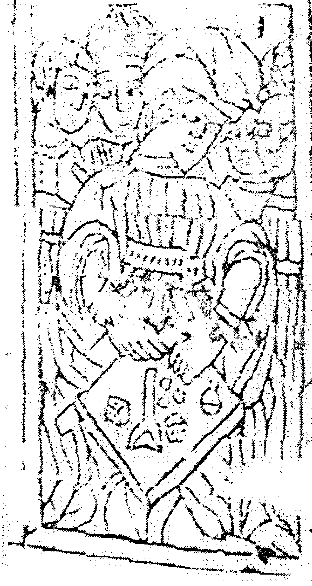

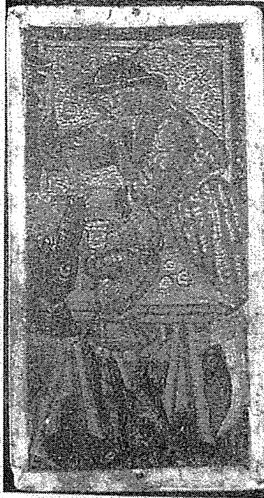

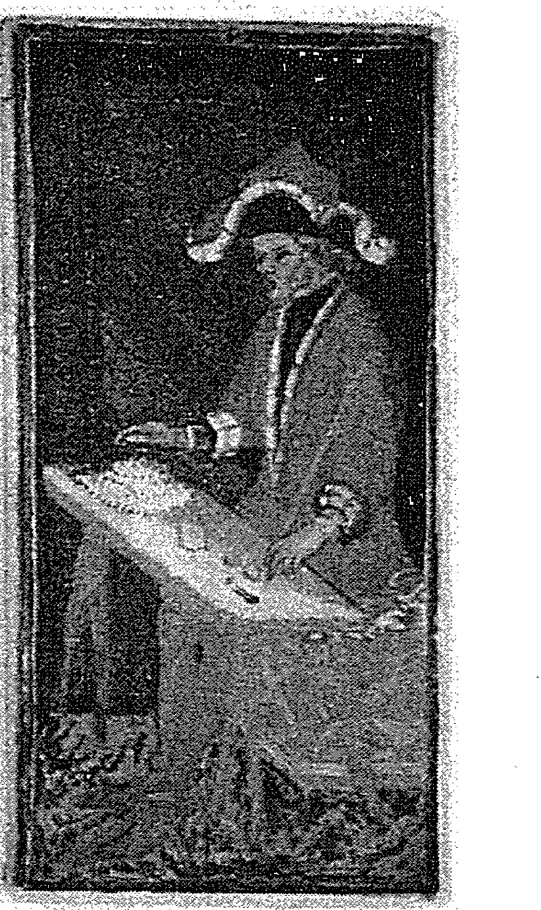

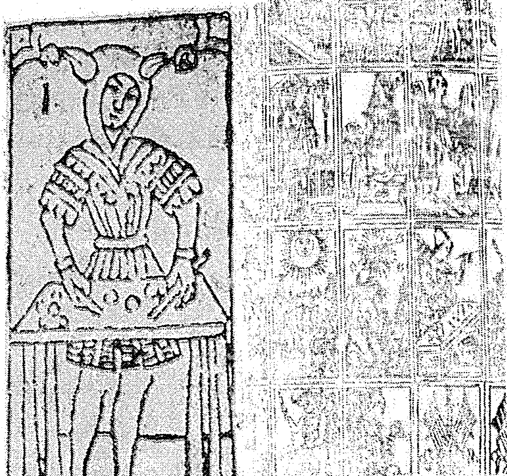

以上所有的魔术师牌都存在一些共同的特征：一个人站在或坐在一张桌子旁；此人头戴各种形状的帽子；桌上摆放着各种小东西：有球、杯子、骰子、还有小刀。

我们之所以对魔术师牌中的人物角色判断为“变戏法的人、杂耍的人、赌博的人、骗子或是江湖术士，其实都是基于当时同期的一些艺术作品与这些牌图所显示出来情形的相似度。

比如下面出自15世纪画家波希之手的一幅画，描绘的是一个在桌子后面搞杂耍的人，通过一些小道具搞些赌博之类的玩意儿，吸引人们参与其中。

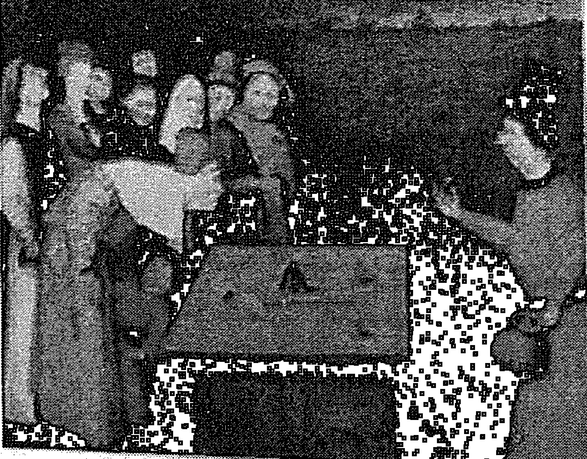

还有一幅出自15世纪、同是描绘街头变戏法、杂耍者的一幅题为“月亮之子”的画：

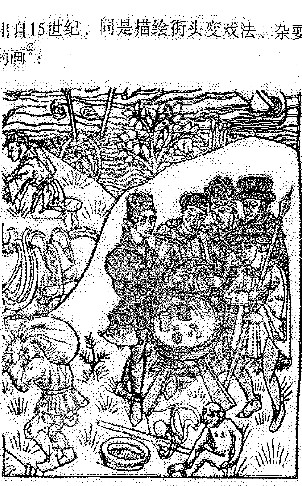

与当时魔术师图像类似的艺术家画，还有一些描绘手艺精湛的工匠、冶金者的画：

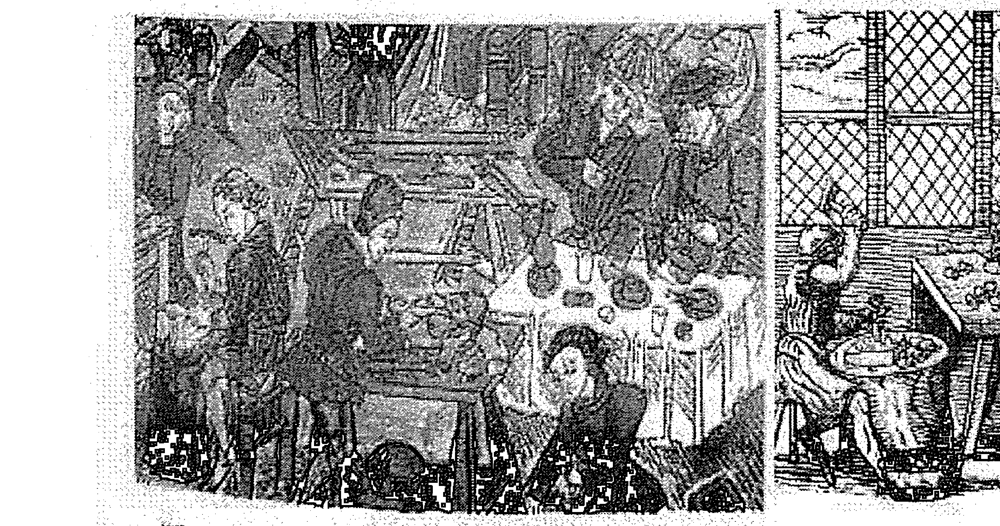

还有一些描绘当时行走江湖、在街头摆摊小商贩（下左图）以及行医者（下右图）的画面亦与魔术师的形象有相似之处：

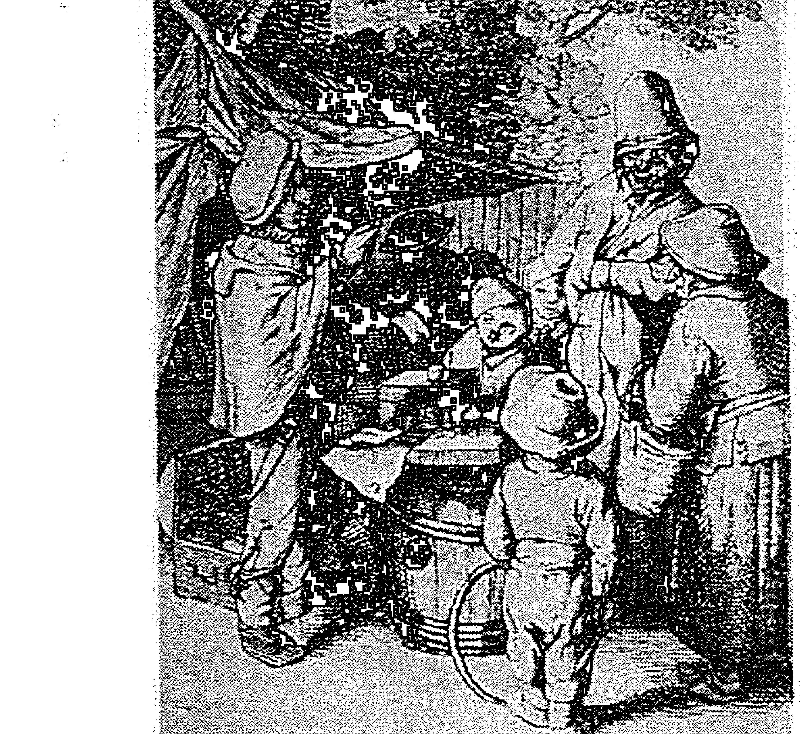

而且，就当时的社会背景来说，街头艺人、杂耍人、工匠、医生、以及用利用桌上的小道具搞赌博的人在中世纪及文艺复兴时期的意大利是一个很常见的角色。他们社会地位较低，符合塔罗大牌“前小后大”的排列规则，因此编号往往都是1。此外，由于他们擅长的技能通常能令人惊奇、赞叹、捉摸不透、印象很深，因此在当时科学并不发达的年代，这些技能很容易被视为“魔法”，或许这就是之所以称他们为“魔术师”的原因。

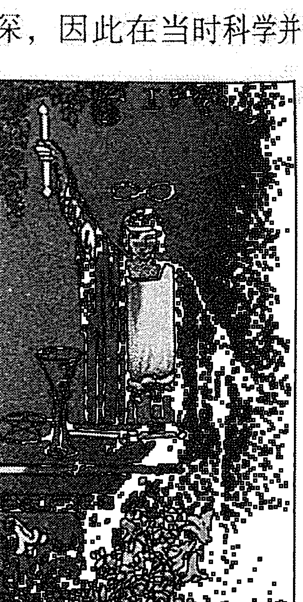

随着塔罗牌的发展，在后来神秘学家的影响下，魔术师才由Juggler演变成了Magus，也就是仪式魔法师。之后的塔罗魔术师的图像则更多地体现了西方神秘学的观念。变戏法、杂耍的人不见了，变成了一名神秘学意义上的魔术师，头上顶着象征无限的符号，与腰间首尾互咬的衔尾蛇呼应，显示着魔术师与永恒相连结。此外，桌上乱七八糟的小道具也被替换成了西方魔法观中象征四大元素的道具，而魔术师本人象征着“第五元素”，又名Anima Mundi, 新柏拉图主义观念中的世界灵魂，连结至高的精神界与物质界的桥梁，这点可由魔术师本人的姿势得到印证，他一手指天、一手指地的姿势为赫耳墨斯学派第一法则的体现：‘As above, so below’（如其在上，如其在下），上下联系，互为对应。桌子边缘还刻有三个符号：第一个是水；第二个是火，第三个是鸽子，在基督教中意为圣灵。周围的花为红色与白色，与魔术师服装上的红白相应，在炼金术中，红与白是互为对立的二元，红为阳性一极、白为阴性一极，而炼金术中有一个过程的工作就是将对立的二元两极进行联合、分开、再联合，使其最终达到超越二元的境界。

至此我们对魔术师的本意进行一下总结，在上面的解析中，我们可以发现，针对古塔罗中魔术师形象的分析，为了研究当时设计者的设计来源与设计理念，我们采用的历史追溯法，追溯到了中世纪与文艺复兴时期，并找出了一些相关艺术作品进行了分析与比对，并最后判断这张牌的人物形象与角色。而对于后面的伟特塔罗牌，由于伟特本身是一位神秘学家，根据他的设计理念，塔罗牌应该是以符号与图像来表达一切意义的方式与手段，故称‘Pictorial Key to the Tarot’，所以一些西方神秘学的符号与理念皆在牌图中体现，我们在解析其本意时只需一一将这些符号挖出，找出相应的神秘学内容，也就了解到了相关的神秘学文化。

由此可见，塔罗牌意中的本意更多涉及的是历史、文化与学术层面的内容。有的初学者误将讲述本意的资料当作预测牌意来参阅，结果难免牛头不对马嘴。还有一些比较极端的进阶者，在看了本意的书籍之后觉得内容太玄、不适合预测，就不分青红皂白地将之胡乱批判一通，最后甚至还得得出结论认为这些牌意都是‘忽悠人’的。事实上，忽悠他们的不是书籍，而是他们自己，造成这种原因完全是因为他们自己对牌意的概念与分类不清而导致的后果。

##### 象征意解释：

其实我觉得对于象征意不作解释也行。因为大家现今手头上绝大多数中文塔罗书籍讲述的牌意都属于象征意，为了预测、解读服务的预测牌意。所以这里就予以简述。

由于象征意是为符号、图像原来意义的扩张，所以有一种很好的方式就是比喻和引申。比如，古塔罗中的魔术师是工匠，工匠是靠手工技艺生存的，所以可引申出灵活、灵巧、创造之意。而一些耍小手段吸引大家围观赌钱的骗子、杂耍者则可以引申到欺骗的意思，并再度衍生出“外表华丽、内在不符”的意思。另外，鉴于街头艺人也好、商贩也好、杂耍者也好，他们都需要与他人作出沟通来完成生意，所以魔术师的象征意中也有沟通、交际之意，并且由于他们必须保证自己的生存、取得生意上的成功，因此他们也就需要保证自己有清晰的头脑、敏捷的思路、说得清楚、讲得明白的沟通技巧等等，这些意思无一不是从原图、原意中发展、联系而至。

再看伟特塔罗中的魔术师。他桌上原本代表四元素的魔法道具，由于和四元素有关，就可以利用四元素的特质产生相关的意义：如动机与感情（圣杯）、计划与挑战（宝剑）、热情与行动（权杖），物质与基础（星币）。另外，如果将以上意义与魔术师本人一手高举象征行动的权杖联系起来，则可视为一个计划开展的良好时期，能在合理整合现有资源的情况下在适当的时间、地点采取适当的行动。

所以，虽然我们之前将本意与象征意作了区分与分类。但是从上面的实例中，我们还是可以发觉，象征意的获得可以无缝不钻，有时，个别本意就能派上用场经过加工后变成了象征意。这一方面体现了象征意的庞大，另一方面则体现了象征意的极大灵活度。

例2）：死神

本意解释：

我们先来看一些15世纪到17世纪关于死神的古塔罗牌。从左到右依次为：格兰高尼塔罗牌（又名查理六世塔罗牌）、费拉拉塔罗牌、罗森瓦德塔罗牌、维斯康提—斯佛扎塔罗牌、卡里—耶鲁—维斯康提塔罗牌。

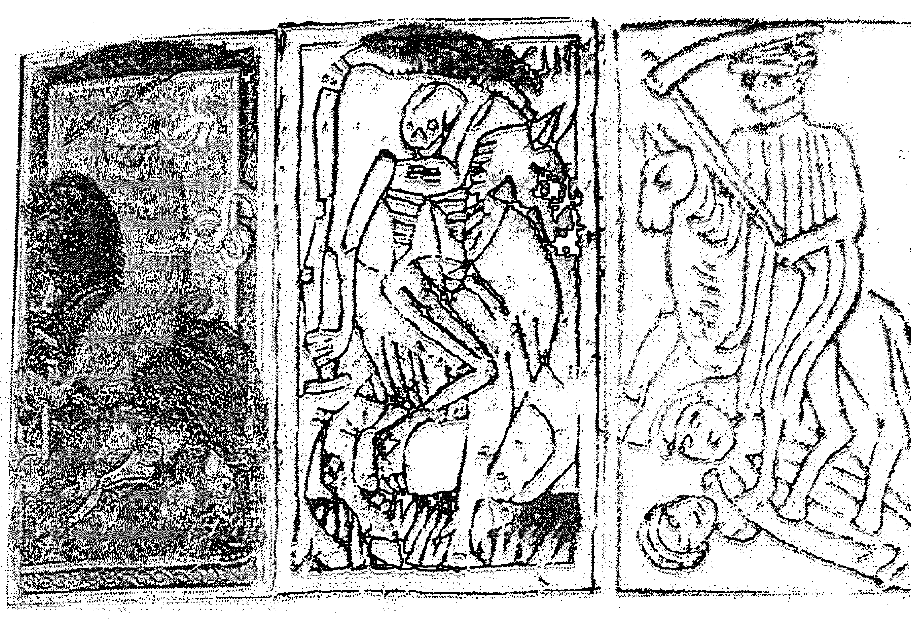

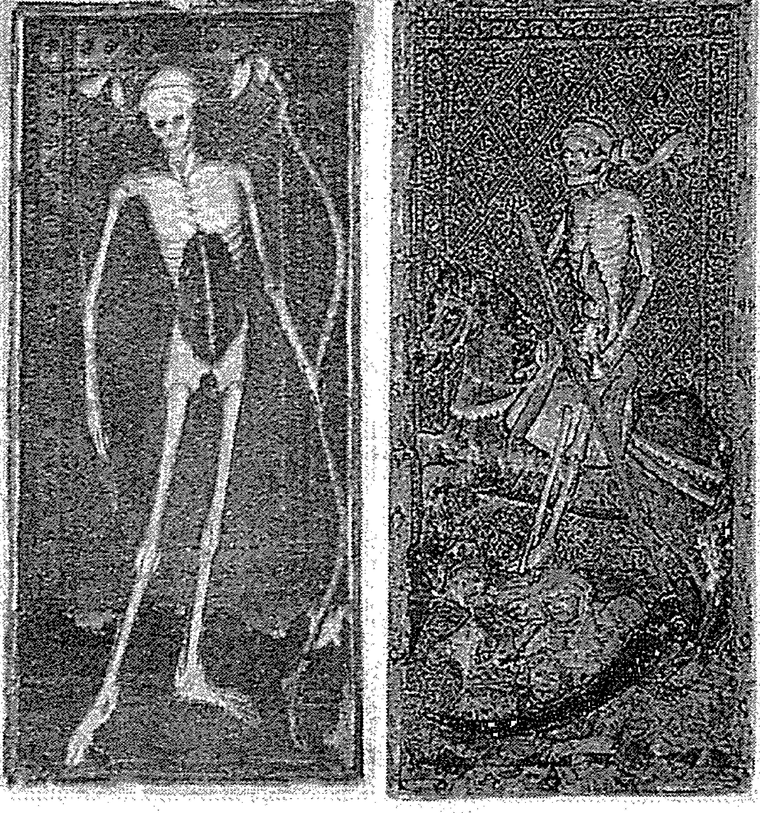

首先还是寻找一下这些死神形象的共性。这些牌图里都画着一个象征死亡之神的骷髅。除了维斯康提—斯佛扎塔罗以外，其他牌的死神都是骑在一匹马上，手中握着一把镰刀，在死神所骑的马下，被践踏着一些亡者。维斯康提—斯佛扎塔罗中的死神则手持一柄弓箭。另外，除了费拉拉塔罗之外，其他牌的死神头上都裹着一条头巾。

死神的这种形象在中世纪及文艺复兴时期的艺术作品中很常见，这一形象的来源基本上可以归纳为以下几种：《启示录》、彼特拉克的《胜利诗》、《死亡之舞》。

我们先说下《启示录》的来源。在《启示录》的来源中，可能对早期塔罗死神影响最大的要数《圣经》最后一卷《约翰启示录》中的一些艺术图像。在《启示录》6:8中，我们可以发现一些描述死神牌文字：“我看见，一批苍白的马，骑在马上的，名字叫死神。”下图就是一幅出于14世纪描绘《启示录》6:8场景的比较典型的插图。我们可以看到与塔罗牌死神类似的形象，骑在马背上的骷髅、手持镰刀、马下践踏着代表当时社会各个阶层的人物，有平民、有教皇、有皇帝等。另外在插图的右方，我们看到一位手持天平的代表正义的人物，由此点出这幅插图的主题：不论你生前地位如何、势力如何、财富如何，死亡面前人人平等，死后都要接受正义的审判，对生前之作为进行裁判，由此决定功过是非。这种观念在中世纪与文艺复兴时期的欧洲人们心中普遍充斥。

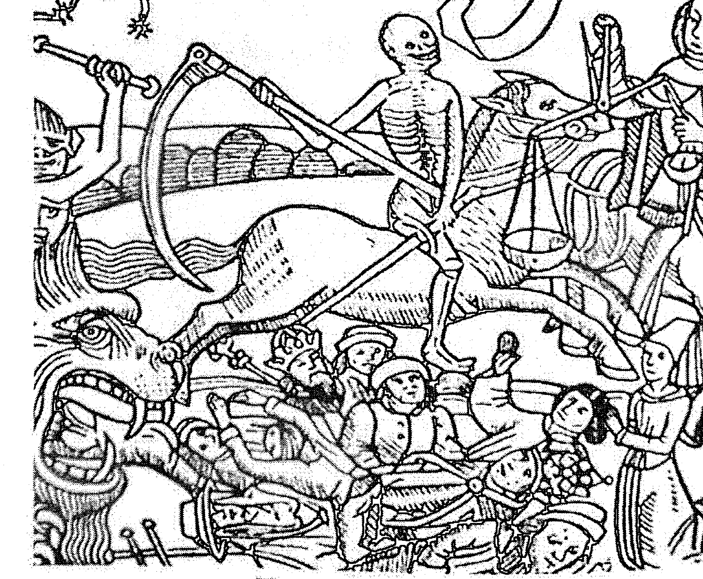

Death Figure 8

另外在一幅16世纪题为“天启四骑士”的艺术画中，我们同样也能看到与塔罗死神类似的身影：

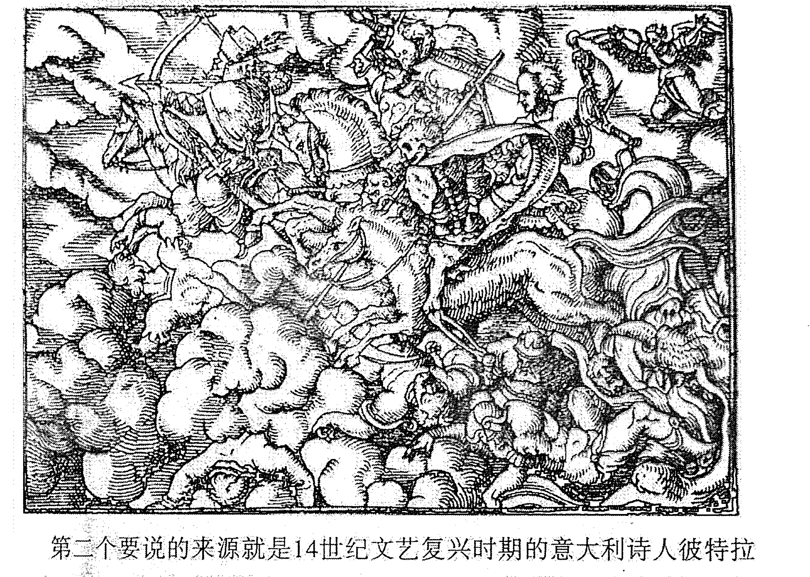

第二个要说的来源就是14世纪文艺复兴时期的意大利诗人彼特拉克（Petrarch）的《胜利诗（I Trionfi）》。在本书第一篇讲述塔罗牌排列的时候提到过西方的一种古老传统叫做胜利传统（Triumph），而14世纪彼特拉克的《胜利诗》就是其影响极大的代表作之一。关于彼特拉克《胜利诗》对于塔罗牌图像的影响，早在1962年就有塔罗学者莫克利提出过^[6]。彼特拉克的《胜利诗》大致描述的是一个人的精神与灵性的发展过程，一共分为六个段，每两段作为一对构成一个部分，所以一共是三大部分，这六段诗分别是：爱之胜利（Triumph of Love）、纯洁之胜利（Triumph of Chastity）、死亡之胜利（Triumph of Death）、名誉之胜利（Triumph of Fame）、时间之胜利（Triumph of Time）、永恒之胜利（Triumph of Enternity）。这里对死神牌的来源与设计有影响的自然要数死亡之胜利以及将其作为主题所作的一些艺术图画。下图展示的是三例出自14到15世纪的以“死亡之胜利”为主题所## TAROT
## 经典塔罗攻略秘籍

的艺术画。这种风格的图像是当时描绘死亡之胜利的艺术典型。从下三图里我们看到，一位手持镰刀的死神站在一辆数头牛所拉的战车上，战车的底座是一具棺材，而战车所过一处则呈现一番横尸遍野的景象。

第三个要说的来源便是《死亡之舞》（The Dance of Death）。《死亡之舞》源于中世纪的人们基于死亡与审判观念而创作的诗歌，诗歌的每一章节都记录了每个人在象征死亡的符号（如死神）之前所说的最后一番话。由《死亡之舞》所衍生的一系列艺术作品的形式通常都为插图，图像表现的是以象征死亡的骷髅作为牵头，领着当时社会阶层中的各级人物走向死亡。一般来说，其都会以社会最底层的人物开始，如贫困的人（愚人）和工匠（魔术师）开始，至皇后、皇帝和教皇为结束。

比如1485年，巴黎画家马尔尚（Guyot Marchant）出版了一篇内含插画的死亡之舞系列，下图就是对该诗篇中的插图进行的提取，画的是死神带着教皇和皇帝走向死亡的景象。

16世纪德国的著名画家霍尔班（Hans Holbein the Younger）也创作了许多以《死亡之舞》为主题的艺术图画。下面四图中，受到死神引领的分别有修士（隐士）、王室（皇帝/皇后）、乞丐（愚人）、战士（战车）。

《死亡之舞》的目的是告诉当时的人们，所有人都难逃一死，死前要做好接受死后的审判的准备。

所以，在比对了古塔罗死神牌与当时同期同类的一些艺术作品后，我们可以发觉，古塔罗的死神牌，其寓意便是告诉人们，世上所有的生命体都难逃一死，并且在当时的世界观与文化大环境的影响下，当时的人就认为死后还会遭受审判，对有生之时的所作所为作出裁决与评判，并最终影响到一个人死后是上天堂还是下地狱的结局。其隐含的意思更是一种教育意义，即“生时多行善、莫造孽、死后将会算总账”的教育。结合当时人们所倡导的美德实践，所以所有的这些图都在教育人们，一生前应多注意美德的实践。那么有三种美德在传统的塔罗牌中就有体现，它们分别就是节制、力量和正义。

我们随后把目光移向现代塔罗牌。

现代塔罗牌的死神有部分脱离了传统的死神形象，但也有部分则仍旧遵循着死神的经典形象，比如伟特塔罗牌中的死神，伟特塔罗中的死神形象也是一位骑在马背上的骷髅，在死神的马下画着已被践踏或即将被践踏的各阶级人士。看到这里，也许大家会觉得，伟特塔罗牌中的死神意思与以往似乎没有差别，不就是“死”吗？但是我们别忽略了牌图中的其他符号所传达的信息，否则便很容易舍本逐末，对本意形成误解。

我们先来注意一下死神的手持物，死神手里的持有物由以往的镰刀被一枚旗帜取代，旗帜上画有白色玫瑰的符号，白玫瑰在金色黎明组织里是象征重生的符号。在牌面中的远处，有一只小船，这只船代表的就是死后的旅程，但小船所驶进的方向是双塔之间旭日东升的太阳，代表新的破晓。另外，这里的双塔也是神秘学符号的一个表达类型，代表着“入口”，其作用犹如一道“关卡”，在关卡的两边分别是两个不同的世界。在死神牌图中，以双塔为界，在双塔之前是代表死亡（结束）的世界，而在双塔的另一端则是散发着光芒万丈代表新生与永恒的太阳。所以综合死神牌图中的一些符号的意义，我们可以发现，伟特塔罗的死神牌并不仅仅只叙述了死亡与结束这么一个意义，反而道出了死亡并不是终结，同时也是一个新生，形成一种结束与重生并存的意境，这在神秘学理念中便为“转化与提升”。

##### 象征意解释：

就伟特塔罗牌的死神来说，如果从本意中扩展出象征意，那么可以解释为：旧的过去；一个阶段的结束；某个情形、状态的终结；但同时亦代表了新生、新的机会。正处于转折、转变时期的任何事物。所以，其象征意的意义原点总结起来也就三种：结束、转变、新生。其他任何解释都可以从这三点中作出或深或浅的引申。也可以着重注意一些牌图符号的意义，比如从各种人物面对死亡（变化）到来之时的态度、情绪；或是以远方那艘小船为对象，如果小船中的人比喻成顺利渡过转折期的人，那么当他看着近处大地上正在经历转折的人们时，他会是什么心情？或许会以冷漠淡定心态注视这一切的发生，或者也会内心产生一系列冲动，并希望赶去身处船上的他协助那些人的助人之心，又或者由于受困于船中，产生干着急而没办法的焦躁之情。其实，无论如何，属于自己的转折期到来时就需要依靠自己去面对，这是自身的一种责任，也是成长的必要课题。如果缺少了这么一个环节，就好比种子缺少破土而出的努力过程，受人拔苗助长的小苗绝对不会是健康、坚强、经得起风吹雨淋的好苗苗。

##### 本章总结：

相信在仔细阅读完本章牌意的解说后，大家对于塔罗的牌意应该已经有了健全的、概念性的认知了。再加上所举的一些范例，应该可以作为今后大家理解牌意、解释牌意的指南针。

由于本书篇幅有限，要一一将每张牌的本意与象征意分别归纳总结不太现实。这里，只能希望大家从有限的案例中抓住问题本质，获得解释意义的方法，做到举一反三，相信经过了自己的思考、实践，大家所悟出的牌意一定会比我说的更好，也相信经过大家锲而不舍的学习整理之后，一定会在自己心中形成一套完整而系统的“牌意谱”。这也是本书与我个人一贯强调塔罗学习宗旨：授人以鱼，更应授之以“渔”。关键还是对技术与技巧的掌握，塔罗牌意的学习重点不在于“意”的本身，而在于“解意”的方法。

## 第五章 塔罗的内涵与塔罗之旅

在第一篇的第一章节中，我们对“什么是塔罗牌”作出了一番定义。但是那时的定义其实仅仅局限于塔罗牌的外部特征，比如：“塔罗牌是一副除四牌组之外，还有一组大牌牌组的纸牌，纸牌上带有神秘美丽的图案及富含各类象征性的符号。”

与此同时，我们还了解到塔罗牌的外部结构与组成。我们讲到，塔罗牌是一副由五个牌组组成的纸牌，这五个牌组分为两大部分，第一部分为大牌牌组，另一部分为小牌牌组。小牌总共56张，共有四组，这四组小牌称为小牌牌组或“小阿卡那（Minor Arcana）”。小阿卡那四牌组的符号通常为：权杖、圣杯、宝剑、星币。每一组小牌都是由十张从1（Ace）到10的数字牌（Pips）加上4张宫廷牌（Court Cards）构成。那么除了这四组小牌牌组外，还有第五个牌组，称为大牌牌组（Trumps），或称“大阿卡那（Major Arcana）”。大阿卡那的存在是塔罗牌与普通纸牌区分的重要标准之一，也是整副塔罗牌的核心部分。一般标准意义上的大阿卡那一共21张，加上一张不是真正大牌的大牌，也就是愚人。愚人牌被称为“野牌（wild card）”，在早期的塔罗纸牌游戏中，可以替代任何一张大牌，其角色相当于百搭；而在大牌的故事中，愚人则充当了故事的主角，从头至尾贯穿于所有大牌，这个故事与过程被世人称为“愚人之旅”。

但是，到了本章节，我们对塔罗牌的理解已经深入到其内在，经过第四章针对牌意的系统学习，我们对牌意的概念、特性、分类都有了一个宏观全面的了解。那么到了这里，我们就要将学过的那些概念结合手中的塔罗牌，去解构塔罗牌的内涵以及所谓“愚人之旅”的结构，弄明白塔罗牌究竟在说些什么。

### ◆ 大阿卡那的内涵

大阿卡那的存在是塔罗牌与普通纸牌区分的重要标准之一，也是整副塔罗牌的核心部分。

针对大阿卡那的内涵，绝大多数介绍塔罗的书籍都会提到：

如《其实你已经很塔罗了》一书中，作者认为，塔罗大阿卡那从0到21号，每一张都有一个名称，例如愚者或世界，它们描绘了事件精神上的缘由，诉说的是你在某些情景中可以学习到的潜在课题。

而在《Learning the Tarot》一书中，作者Joan Bunning认为，大阿卡那的每一张牌都象征了个人经验的宏观意义，也是一种人类的原型——指出人类原始本性所影响的形式。

《塔罗葵花宝典》一书则指出，大阿卡那的内涵是以愚人之旅为形式，将愚人作为一个主体，他所经历每一张牌就是一个人的人生剧本，最后达成完美的一周天的这么一个过程。

在《第一次塔罗占卜就上手》一书中，作者清风指出，大阿卡那呈现的是人类潜意识当中的诸多原型。

我们看了上述针对大阿卡那的内涵阐述之后就会发现，虽然他们用词和修饰上会有不同，但剥除那层外壳，其中心思想是一样的，涉及到原型、精神层面、个人经验、课题、愚人之旅。

但是，经过本书第四章对于牌意概念的讲述，我们应该能够理解到，上述对于大阿卡那的内涵阐述，都是停留在宏观牌意分类中的“象征牌意”那一类，将塔罗视为一种原型式的内涵，为人们提供各种形式上的应用与意义上的扩张。

那么随之而来的问题是，如果从“本意”层面去理解、去分析塔罗大阿卡那的内涵，又将会得出什么呢？

如果从塔罗起源之初看起，用一句话来概括，那么塔罗牌就是以纸牌为载体、用文艺复兴时期的图像与符号这种艺术语言来表达西方的神秘学和哲学。这句话不但道出了塔罗牌的起源（文艺复兴时期）、外观（纸牌）、以及图像特征（图像与符号），更是说出了塔罗牌内涵（西方的神秘学与哲学）。

塔罗牌起源于15世纪文艺复兴时期的意大利。的确，其设计初始的主要用途是纸牌游戏。但在文艺复兴时期，艺术是一种表达“意义”的普遍使用手段，在一系列极具象征意义的符号与图像中，深藏着内在的意义。这里的意义包括了流行在当时思想、文化前沿的哲学思想、神秘学思想、以及一些精神道德层面的意义。那么，塔罗牌就是文艺复兴时期诸多艺术作品的一种，在我们将每张塔罗牌的图像与文艺复兴时期的各种艺术作品进行比对之后（请见第四章“本意的解释”），我们便可发现塔罗牌图像的出处与来源。不过我们也必须了解，塔罗牌的每一幅图像的确可以在文艺复兴时期的艺术作品中找到出处，但这并不意味着塔罗所表达的意思就与那些艺术作品相同，它有着自身独特的意义①。在塔罗牌看似平常普通的符号与图像之下，隐藏的是古老的西方神秘学与哲学的智慧。

“文艺复兴”在英语中为Renaissance，意为重生、复兴。它始于13世纪末期的意大利，后来扩展到欧洲各国，直至16世纪结束，是人类历史上一个百花齐放、硕果累累、群星争艳、人才济济的光辉时代，比如著名的艺术家达芬奇、拉斐尔、米开朗基罗就是文艺复兴时代的代言人。文艺复兴这个时代就如该词所描绘那样名副其实，是一段思想、文化、哲学及宗教氛围相当活跃的时期，也是人们对古典世界艺术、知识和智慧进行重振与复兴的伟大时代②。这也是为什么塔罗牌出于15世纪，但图像与符号的意义可以追溯到古老时代。

在塔罗牌所包含的西方神秘学与哲学的传统中，其哲学根源在于新柏拉图派哲学，宗教根源则在于诺斯替及各种神秘主义教派③。这些西方神秘学传统皆可追溯到古希腊、古埃及以及中东地区。另外，塔罗牌的图像和符号也是一个神秘学与哲学的大杂烩，其融合的元素包括赫耳墨斯学派、基督教神秘主义、卡巴拉、占星学、炼金术、灵数学等。这些西方神秘学的思想在文艺复兴时期经过融汇整合，最后被注入塔罗牌的图意与符号。总的来说，塔罗牌的图像与符号就好比一扇“窗户”，打开这扇窗户，我们见到的是渊源而深刻的西方哲学与神秘思想的传统。

这里，我们没有足够的篇幅来向读者们阐述上面提到的各类哲学、神秘学是如何发展到文艺复兴时期、是如何被文艺复兴时期的人们融汇整合、并最终应用到塔罗牌内涵的设计。这不是使用几百几千字就能解决的问题，我们将在今后出版的同系列书本中另行说明。这里我们还是以塔罗牌的意义与内涵为主进行说明，其他方面的知识就一笔带过了。

在本书的第三章，我们在对塔罗大牌的排列作分析时提到，塔罗大牌的排列与一种叫做“胜利（Triumph）”的传统有关，其排列规则是“前小后大”的方式。那么这种前小后大式的排列规则与塔罗内涵所涉及的西方神秘学与哲学思想有什么关联呢？那么，这里就不得不提到新柏拉图主义中的“流溢”理论。

流溢，英语中为“Emanation”，源于拉丁文“emanare”，意为“从……流出、由……产生、起源而至”。在西方人的传统观念中，整个世界分为精神世界（理念世界/原型界）与物质世界（物质界），物质世界中的万物皆起源于精神世界中的某一个本体，这个本体在新柏拉图主义的理论中被称为“太一”，太一是精神世界的至高点，世间万物就是从太一那里一级一级地流溢衍生而至，由一个阶段衍生或流溢出另一个。那么，所谓流溢，也就是从至高的精神世界一级一级地衍生发展、经历各种阶段直到形成最底下的物质世界的这么一个过程，其中每一个阶段又可被称为“流溢层”。

而在西方神秘主义者的观念里，他们的目标则变成了将这一流溢过程倒转过来，即通过冥想、仪式等神秘主义手段，使自己从最底下的物质界一层一层地经历各个流溢层重返最原初的精神世界。

这里我们就可以发现，在西方哲学观念中，这种一级一级的流溢层联系着较低层的物质世界与较高层的精神世界，是连接两者的桥梁和阶梯。如果说，从精神世界或原型界流溢到物质世界是一个下沉的过程，那么从物质世界到精神世界就是一个提升的过程，其本质便是神秘主义式的提升之路，是一种“灵性之旅”。

在西方神秘主义文化传统的历史上，像此类表达灵魂由低到高的提升过程是非常常见的，其本质就是神秘主义式的提升之路，与这种神秘主义灵性之旅有关的如：柏拉图的《理想国》、荷马的《奥德赛》、维吉尔的《埃涅伊德》、希腊历史学家普鲁塔克所叙述的阿里达奥斯之旅等24。第一位新柏拉图主义者普罗提诺则将这种神秘主义之旅称为“个体灵魂返回太一的旅程”。在塔罗牌诞生的那段时期，即文艺复兴时期，这种神秘主义式的旅程也被当时的艺术家和文学家们运用到自己的作品中，如但丁的《神曲》、彼特拉克的《胜利诗》（I Trionfi）。伟特塔罗的设计者亚瑟·爱德华·伟特将塔罗大阿卡那的过程视为“灵魂的发展”。

那么到了20世纪，随着心理学的发展，人们对这种传统的神秘主义的提升之旅有了一种新的认知。心理学家约瑟夫·坎贝尔（Joseph Campbell）将这种原型式的旅程命名为“英雄之旅”；而心理学家卡尔·荣格则将这一个灵性之旅解释为一个人的“个体化过程”25，即自我与本我的融合为一，并由此产生的极致喜悦，这种喜悦超越于物质上的满足感、超越于情感上的满足感，是一个人在感知自己所有的意识和潜意识之后、感受完整的内心世界后所产生的喜悦（世界牌）。

但无论“个体化过程”也好、“灵魂之旅”也好、还是“神秘主义之旅”也好，其实说的都是同一回事，反应的是一个人由低层次境界逐步上升到高层次境界的旅程。如果我们翻开塔罗牌大阿卡那的篇章，我们也会发现大阿卡那讲述的故事与上述这种旅程并无两样。其21张大阿卡那，就犹如21级阶梯，联系着哲学与神秘学思想中的物质与精神这两个世界，而愚人则作为这一旅程的主角，历经21张牌，攀着21级阶梯。26于是，美国人艾登·格雷（Eden Gray）在他1970年的塔罗著作《A Complete Guide to the Tarot》里，首次提出了“The Fool’s Journey（愚人之旅）”这一名词，一直被我们用到今天，用来描述塔罗大阿卡那之旅的故事。

从上面的内容中，我们得知，塔罗大阿卡那所展示的愚人之旅有一种神秘主义之旅的原型，现今则被心理学所解释。但是归根到底都没有跳出塔罗之旅这一个范围。从塔罗牌出世至今的500多年历史里，出现了各种各样的塔罗牌，而现今所存在的绝大多数塔罗牌，都是以愚人之旅为一个大框架、以特定的哲学思想、神秘学学科、神话元素为主题，从而创造出一副又一副的塔罗牌。能够这么做的原因，就是因为愚人之旅的这块原型，它充当了一种原型式框架与模板，可以作为一个“骨架”，当把里面的“填充物”换成其他主题的时候，塔罗牌表达的就将是其他主题下的愚人之旅，比如炼金术塔罗牌中，设计者将塔罗之旅与炼金术之旅结合，再于牌图中引入一些炼金术符号，这样就构成了炼金术塔罗牌。其他主题的塔罗牌也是同理。

所以，塔罗大阿卡那所描述的旅程——现在被人称作愚人之旅——有其古老的哲学与神秘主义的根源，只是随着时代的进步，人们观念的进步，所用的解释方法和理解方式产生不同，但说的其实是同一回事。

于是，我们就看到了诸如开头本书所引用到的其他塔罗书籍作者对于塔罗之旅的解释。愚人和21张大阿卡那表达了人类精神和灵性发展的一系列过程，其以愚人为角色，1—21张大阿卡那则作为愚人旅程中的各个“站点”，先后遭遇大阿卡那中的各个课题，直到最终到达最后一张牌——世界，它是神秘主义观念中受到净化之后的灵魂，也是荣格心理学中个体化的完成，也是坎贝尔英雄之旅的最终达成。此时，这一旅程的主体——愚人则达到了最高的精神境界，完成了自我的发展与成长。

### ◆ 大阿卡那之旅：翻开愚人之旅的篇章

接下去，我们将从“愚人之旅”这一角度，解释22张大阿卡那中每一张牌的意义。

#### 0.愚人

> ——生命不是一场赛跑，而是一次旅行。比赛在乎终点，而旅行在乎沿途的风景。只是，旅行一旦开始，自己选择的道路，就算跪着也要将它走完。

首先我们来看一下愚人的数字编号。在标有数字编号的塔罗牌种里，愚人往往被注为0或者没有编号，从严格意义上讲，愚人应该是没有编号的，因为塔罗大牌的编号使用的是罗马数字，而罗马数字中没有0这个概念。另外，还因为塔罗牌在最初是被设计用于一种纸牌游戏，在游戏中，愚人牌属于野牌或称万能牌（wild card），它可以替换任何一张你希望的牌，没有规则约束，没有分值（其他牌都有特定分值），好似脱离于整个游戏目的之外。所以说，愚人牌游离于整个大阿卡那牌组之外，但同时他又经历着每一张牌。由此看来，关于塔罗大阿卡那的描述比较确切的说法应为：大阿卡那是由“21张标有罗马数字序号的大牌和一张没有数字序号的愚人牌组成”。

我们再说回愚人牌的数字，数字0是一个重要而极具优先性的数字，不存在范围也不存在限制，是无限的，也是超出人类经验和理解之外的那种不可知。所以我们只能以否定的方式去诠释它，只能从“它不是什么”这个角度来说，而无法说成“它是什么”。0从数字的序列来说应当排于最先位，或者说0根本就应该在所有# 经典塔罗攻略秘籍

数字之前。所以0是一种进入“存在”之前的状态。作为0的特质来解析愚人，就好比一切都还未定的状态，也就是具有潜力的状态，而且不会被任何方式所限制。我们将这张牌放在最前面来说是因为它拥有显著的“起始”意义，象征了天真、单纯、无任何经验、一片空白、并伴随着新鲜出炉的含义。但同时，愚人也是一张贯穿整个塔罗故事的牌，这就是广为塔罗圈人士们所熟知的“愚人之旅”。所谓愚人之旅，就是以愚人为故事主角，对其余21张大牌的经历和学习，每经历一张牌，他便多了一份认知。所以，愚人可以说是极富深厚内涵的一张牌。有句话是这么来形容愚人的：“The Fool is nowhere and everywhere, without beginning and without the end。”翻译过来就是：愚人既无所在，又无处不在；它超越起点，亦超越终点。

从愚人之旅的角度来看，愚人象征着人类意识的初萌，好比一个人才刚刚进入一个境况，并且对这一境况尚没有产生任何反应的时刻。在牌图中，愚人的眼睛注视上方，表明了这是一段精神的旅程，而愚人本身则是探索经验的灵魂，正启程开始一段灵性之旅。从面部表情、姿态来判断，当下的他是欢乐的、愉悦的、乐观的，并没有去想日后旅程的漫长及艰难。

有一些古塔罗牌中，愚人描绘成一名诸如“乞丐、浪人”之类的处在社会最底层的角色，如下图：

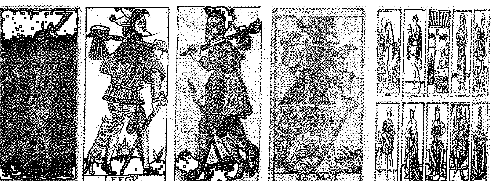

在这些古塔罗牌图中，愚人衣衫褴褛，挂着拐杖，无论到哪里都不受欢迎，比如马赛系塔罗牌中画着愚人正在遭受到狗的攻击，因为狗往往对陌生人敌视。这类塔罗牌里中的愚人象征着贫困、绝望和无助。他们的无助体现在最初的起点，俗话说“万事开头难”，要前进要发展往往就难在起步。这里，落魄潦倒的愚人其实也意识到，造成自己苦恼的原因就是“物质”，愚人在物质世界已经跌到了最低谷，如果继续依赖于物质只能使自己的境况变得更坏。于是，他开始摒弃物质，成为了流浪者，准备走“灵性”路线，寻求更高的灵性意义，开启一段灵性之旅。从精神层面来看，愚人是空白而单纯的，但单纯中蕴含着智慧的种子。

由于愚人作为大阿卡那故事的主角，贯穿于其他全部的21张大牌，其位置也不受束缚。所以对于愚人牌的解释层面也会有高有低，除了愚蠢、贫困、无助等这些底层解释之外，还能从比较高的层面去理解。

如果我们从最高的境界去解释这张牌，那么可以视愚人为最后一张，也就是塔罗之旅的终点，这时的愚人可以代表一个超越物质的限制和束缚，已经获得灵性智慧的人，正因为如此，他才会不在乎物质世界中的种种危险。这就是所谓的“没有目标就不怕迷失”的高层境界。另外，在古塔罗愚人牌中的动物代表了人类的本能与天性，它之所以作出侵扰行径是因为愚人“异于常人”，这点很好理解，在我们现实生活中也经常碰到，人类是一种群居性动物，对于一些与普通人常规习惯有异的人士往往会对产生排斥的情绪，觉得那人是怪胎。所以，古塔罗中的愚人被狗咬这一符号，就是象征了人类“排除异己”的行为模式。然而在伟特塔罗牌中，那只白色的狗同样也象征了人类的本能，这里白狗似乎在发出一种警告，为的是提醒愚人前方即将到来的危险，不过，我们的愚人对此不闻不管，因为他已经超越物质，也就无所谓物质世界中的危险、困难。另一方面这也体现了愚人正将自己注意力集中在即将到来的旅程，当一个人集中注意力的时候，往往会对其它情况视而不见，或者说不会对周遭其他情况有所注意。但是，悬崖之下究竟是什么？这是未知的，正如数字0所代表的那样，可以代表未知以及无限可能性。也许只有愚人自己才知道吧，又或许连愚人自己都不知道。另外，关于愚人所携带的行囊，行囊不是他的“全部所有”，仅仅是他的“全部所需”。如果行囊中的物品代表的是一种常规的“经验”，那么愚人将这些经验抛之脑后，则象征了无视与不顾。这就好比禅宗里提到的初心（初学者的心）：空空如也的，不受各种习性的羁绊，始终保持这颗初心，随时准备好去接受、怀疑，并对所有的可能性敞开，才能如实看待万物之本貌，一步一步前进，然后在一闪念中证悟到万物的原初本性。在伟特塔罗牌图中，愚人走在山上，处在社会生活的边缘，对日常的琐碎小事漠不关心。愚人帽子上的羽毛可以视作四大元素中风元素的象征，这根羽毛指向象征启迪与开悟的太阳，但是愚人本人却并没有看向太阳，至于这一原因为何，无论是因为他的愚蠢无知、还是是因为他太专注于眼前风光，相信观察者在自己的心中都会有一份谱子。这里，愚人告诉我们的是：生活原本很简单、很单纯，只不过当人们戴着有色眼镜站在“不简单”和“不单纯”的立场上去看待周围的事物时，追求简单、单纯的生活就变成了一种奢求。宁要把简单、单纯的事情看的很复杂很严重，这样就会很痛苦。

#### I. 魔术师

> ——不要等待机会，而应创造机会。

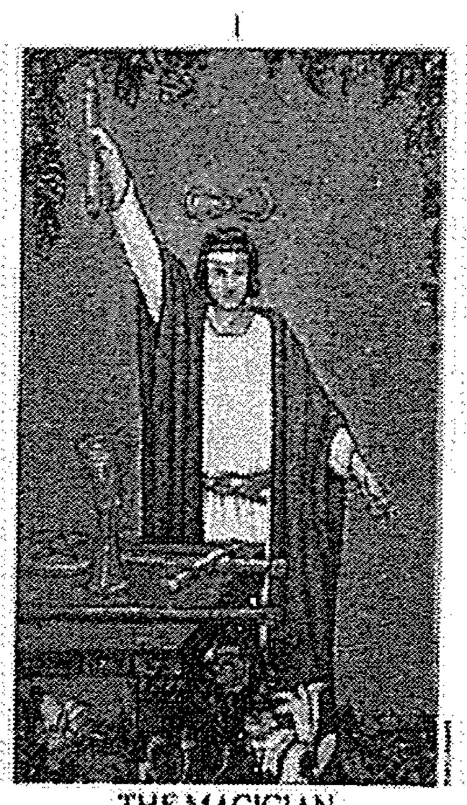

魔术师，英文名为Magician，意大利名为Bagatto。古塔罗中的魔术师所表达的意义与现代塔罗的魔术师有所不同。纵观魔术师牌的历史，大体上可以分为两类，一类是Magus，也就是现代塔罗牌中的魔术师，是指掌握着神秘学知识、可以依照自己的意志通过召唤宇宙的能量来影响现实事物的魔法师。但是在古塔罗里，魔术师的名称是Bagatto，也就是Juggler，是指街头或舞台上变戏法、杂耍的人、赌博的人、骗子或是江湖术士。在早期的意大利语中，魔术师也被称为“El Bagatella”。“Bagatella”是个古意大利词汇，现在有时也会用到，意思是“无关紧要的小事”，代表的是较低、较次的地位。

在愚人之旅中，愚人开始了自己的旅程，他所遇到的第一个对象便是魔术师。魔术师站在路边的小台子后方，魔术师声称只要花上一块钱便可观赏到他精彩的戏法表演，但事实上他是想以此吸引更多路人来参与自己精心设计的一种赌局。当然这种赌局有欺骗的成分，通过引诱他人参赌，然后达到骗取钱财的目的。在早期的古塔罗牌里，也有一些牌画着一群人围着魔术师及他的桌子参与赌博小游戏，如下图：

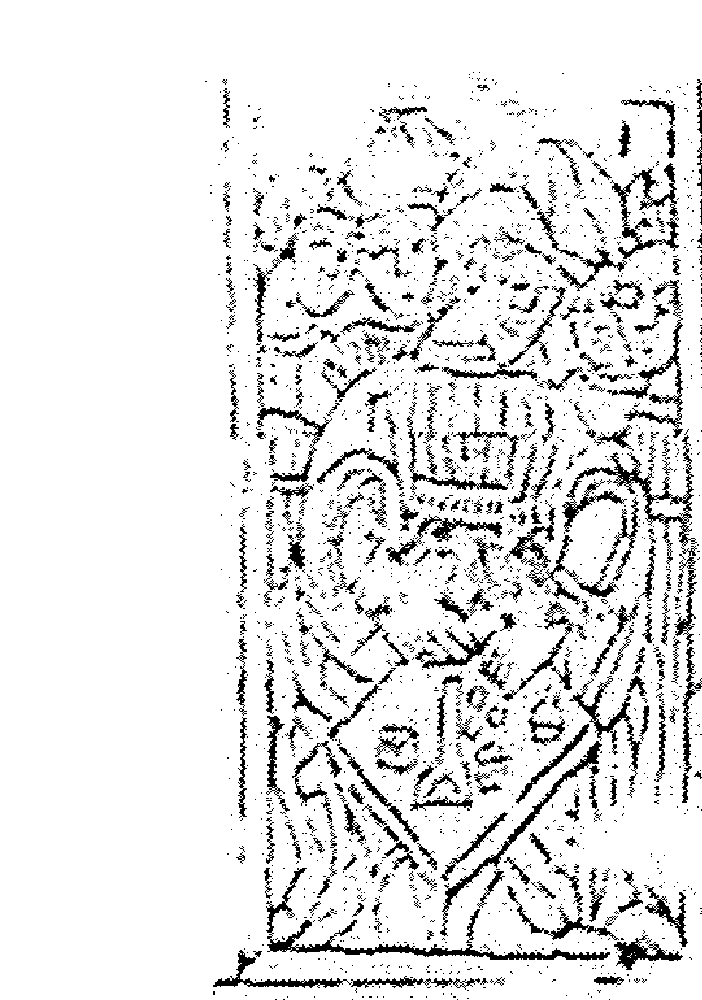
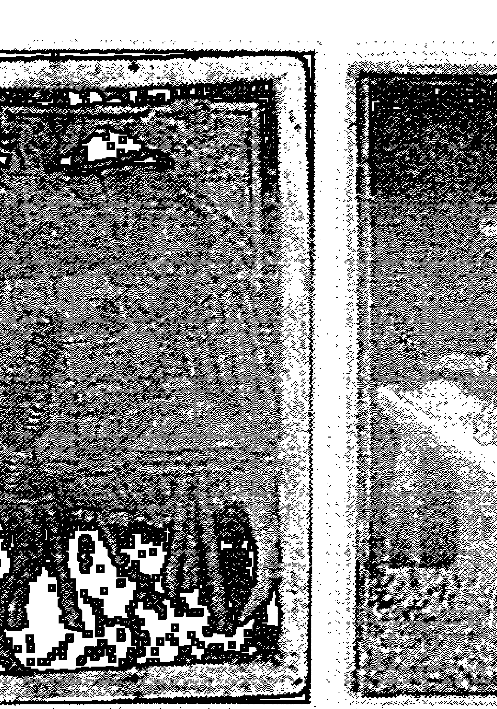
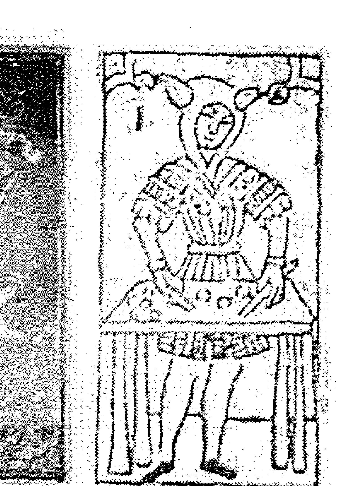
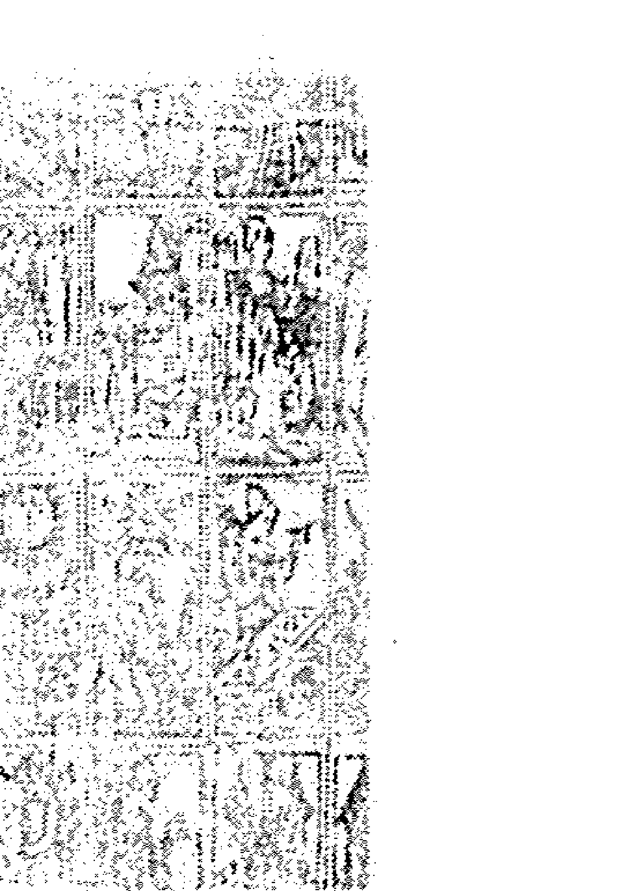

在魔术师图意解释的最低层面，魔术师就犹如一个骗子。他的行为、举动给到正在旅途中的愚人的暗示是：一个人能够通过骗钱来取得成功，一个人可以利用别人、在物质世界里达到自己的所有目的。所以魔术师不仅可以代表街头骗子、变戏法的人，他还能代表做生意的人。这里，魔术师给愚人带来的启示是，一个人要想在社会上立足，或多或少地需要有些手艺或特长。

在魔术师图意的较高层面解释，魔术师可以代表艺术家、工匠和手艺人，在这个层面上，魔术师象征的是人类与生俱来的创造能力，并能在成长过程中不断发展自己的天赋与才能，作出有用的创造行为来证明自我、实现自我的价值。魔术师也可以代表中世纪和文艺复兴时期的炼金师，炼金师对当时的普通人来讲是神奇的，古人相信炼金师能够将普通物质炼成黄金。(不过炼金术的主旨在于内在、在于灵性的提升和发展，所以在这个层面上，魔术师给愚人的启示就是，必须发挥和培养自己的天赋和才能，如果一个人在某一领域有较高的天赋和才能，若再加上其后天勤奋刻苦的学习和努力，那么他在该领域的能力将会令人惊叹，所以了解自己的能力是踏上这个社会之前必须做的功课。)

可用于文艺复兴塔罗

魔术师图意的最高层面，他象征了魔法师，也就是掌握着神秘学知识、能够充分掌握和完善自身的能力、并可依照自己的意志通过召唤宇宙和大自然能量来影响现实事物的魔法师。这里的魔法师就相当于墨丘利神、赫尔墨斯神、以及埃及的透特神，是给人类带来智慧和知识的神。魔术师在牌图中时常被画成站在户外的人，因此这张牌也可以代表大自然或白魔法，也就是对自然力量的发展、掌握和运用，他实践自己的智慧去理解和掌控大自然的能量。他一手握着权杖并将其高举头顶，一手指向地面，这就是将宇宙天体的力量导入大地以及他桌前的魔法道具。

总的来说，魔术师给愚人提供了旅程中的第一条路，是愚人进入较高意识层面的首个人口。魔术师象征了人类的智慧和才能，以及人类自身那种精神与物质的二元结合。魔术师也可以代表神秘学思想中的“赫尔墨斯之路”。愚人在这里通过发展自己的心智来理解整个世界，认识这个世界的规律和法则，提升自我的才能来达到更到的意识境界。

#### II. 女祭司

> ——要比别人聪明，但不要告诉人家你比他更聪明。

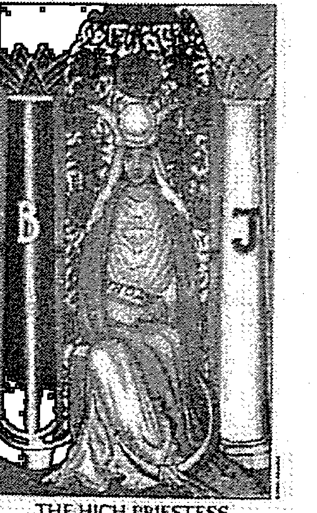

许多塔罗历史学家，如汤姆·利特尔（Tom Little）认为，这张牌可能是整副塔罗大牌中最神秘、最难以从历史角度解析的牌，也是塔罗牌历史上较有争议的牌之一。对于使用现代塔罗牌的大家来说，这张牌的名字被称为女祭司（The High Priestess），但是在古塔罗中，这张牌名为女教皇（The Papess）。女祭司（The High Priestess）这个名称首次以法语“La grand pretresse”出现，而出现女祭司名称的塔罗牌是法国1800年左右出产的大司祭塔罗牌（Grand Pretre Tarot），整副塔罗牌表达的是法国神秘学家古德·杰柏林（Court de Gebelin）的书籍《原始世界》（《Le Monde Primitif》）中涉及塔罗部分的内容。但在此之前的塔罗牌，这张牌的名称都是女教皇（The Papess），也就是女性的教皇，意大利文为“La Papessa”，法文为“La Papesse”。

在女祭司的牌图中，我们看到为一位坐在石凳上、给人以冷静、安详感觉的神秘女子，她就是女祭司。在女祭司的两旁是两根柱子，两根柱子之间有一张帷幔。女祭司手里拿着一份卷轴，在她的长袍里半遮半现。女祭司的服饰有其宗教的特质；有的牌以基督教修女呈现、有的牌以头戴三重头冠的女教皇呈现、有的牌则象征了古埃及女神伊西斯（Isis）。

愚人之旅到达女祭司这里，女祭司呈现给愚人的感觉与之前的魔术师完全对立。她体现的是女性阴柔、神秘的一面，她展示的是另一种通向智慧的道路。先前的魔术师是一种偏于主动的自我发展，而女祭司则偏重于被动向内的平静、接受特质。

女祭司展示给愚人的世界是神秘的世界。她既吸引人，又令人觉得敬畏。这种二元对立的特质通过她身旁的两根柱子很好地表达出来，这两根柱子不仅是二元法则的象征，也象征着一扇大门和入口，愚人在通过穿越双柱体会二元奥秘来达成自己的目标。

女祭司在特质上除了与魔术师相对之外，还与第五张牌教皇相对。在早期的一些塔罗牌中，女祭司与教皇的排列是前后紧挨的。如果教皇代表宗教上对外公开的一面，那么女祭司就代表内部秘密的一面，也代表了神秘学及冥想的道路。在现代塔罗牌序列里，女祭司处在魔术师和皇后之间，她平衡着魔术师的主动，也平衡着皇后的热情。

在18世纪和19世纪这段时间，一些神秘学家错误地将塔罗归为埃及起源，所以他们对塔罗牌作出的解释也极力朝埃及文化靠拢，于是女祭司也就被毫不犹豫地说成是伊西斯。伊西斯作为月亮女神，是潜意识的象征。这张牌给愚人通向更高意识境界的旅程提供了第二条重要道路，给愚人了解神秘主义、冥想以及被动沉静的寓意。女祭司手中半遮半现的卷轴以及她身后布帘后面的静谧湖水都显示出其蕴含的超验智慧，如果愚人能够按照她的指引前进，就自然能学到这些。

可以说，女祭司是智慧的，是聪明的，但是她的聪慧带着谦卑，毫无张扬之意，苏格拉底说：“要比别人聪明，但不要告诉人家你比他更聪明。”不在智慧中夹杂傲慢，不在谦卑中缺乏智慧，这点恐怕女祭司做的最好了。

> > 苏格拉底说：“要比别人聪明，但不要告诉人家你比他更聪明。”

塔罗大阿卡那中的女祭司、皇后、皇帝、教皇这四位人物可以对应到荣格心理学的四大心理功能：直觉（Intuition）、感官（Sensation）、感受（Feeling）、思维（Thinking）。这里，女祭司对应的是直觉功能（Intuitive），代表直觉与潜意识，女祭司在这里表达的是无法用语言表达的神秘学精神知识，这种类型的知识是无法从书上学到的，而是来自于直接的神秘学实践的经验。

#### III. 皇后

> ——懂得生活的人会合理利用已有的资源而把生活过得有滋有味。

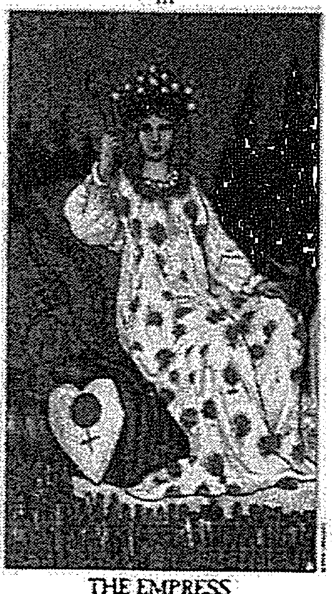

在愚人穿越神秘的女祭司神殿之后，来到了维纳斯的花园，遇到了皇后。皇后是大地、母亲与物质的象征，代表了大自然的生命以及对大自然的接受。皇后被周围的美丽大自然景物所围绕：鲜花、绿草、流水、大树以及代表生命食粮的小麦，这些都象征了厄琉息斯教派中掌管农业、丰饶之神得墨忒耳。

在早期的塔罗牌里，皇后是女性能量的象征，她坐在凳子上，塔罗解释者将皇后牌与金星相对应。皇后有一点和女祭司类似，也是女性能量的象征，但是皇后的女性能量的获得主要体现在对于大自然的拥抱和接受，或者说的更直白点就是爱。对于愚人来说，皇后就犹如母亲、犹如避风港、是能够给他生活带来支撑的象征。

皇后与女祭司相比，她就好比是女性的另一面。如果女祭司是女人文静、神秘的一类特征，那么皇后就是有如母亲般的给予温暖和保护的一类特征。如果女祭司给人遥远而捉摸不透的感觉，那么皇后就是使人亲近熟悉的感觉。如果女祭司是阴暗而神秘的，那么皇后就是开放而明亮的。

皇后这张牌总体给人以祥和和慈爱的感觉，她与冷峻、公私分明的皇帝又有的一比。所以皇后一边平衡着女祭司的神秘与阴暗，另一边平衡着皇帝的冷峻和攻击性。当然，愚人可以看到这些连续的牌体现着他意识层面的二元对立，而最终在他最后的道路上，他也将超越这些二元法则，现在的他虽不具备看透这些二元对立法则的能力，但在之后的漫长旅程里，他终将把这些元素全部整合于一起，并以此来理解这个世界的法则。

现在，愚人知道了大自然的美好，他也从中感受到了慈爱、温暖和支持。他又要开始启程了，因为他意识到再下去他会沉浸在物质享受中而无法自拔，这也与他最初开始旅程的目的相违。皇后倡导平衡，从皇后这里愚人也学到了这一点，物质生活并不能简单地抵制，而是需要去超越，人不能脱离物质生活。所以在愚人通往更高意识境界的旅程中，第三条道路仅仅是一种单纯的生存方式：贴近自然。这里暗示着人类属于物质世界，也需要回归大自然母亲的怀抱。

在荣格四大心理学功能中，皇后对应了感官功能（Sensation），可以关联到大地之母或者一些神话中的大女神。同时皇后也是丰饶、丰富、以及所有具有吸引力事物的化身。

#### IV. 皇帝

> ——伟人之所以伟大，是因为他与别人共处逆境时，别人失去了信心，但他却下决心实现了自己的目标。

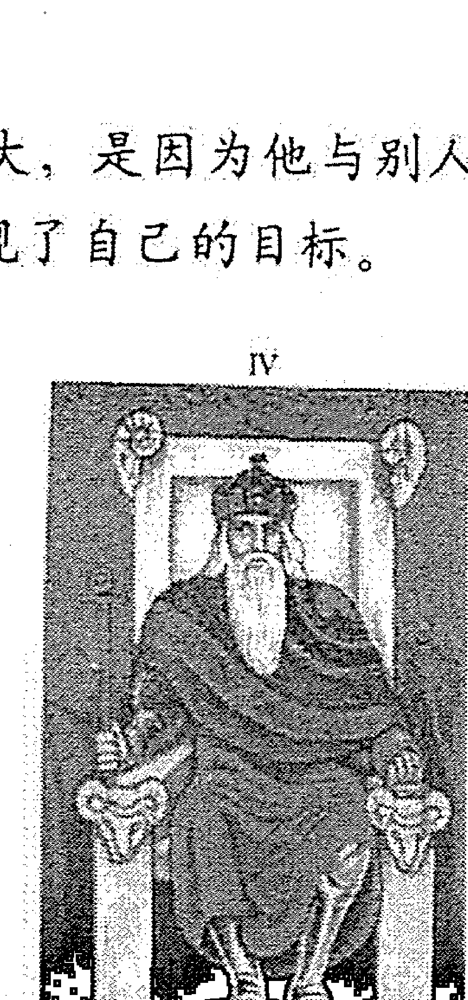

皇帝坐于一张方形的石凳王座，他正是这块地方的主人。皇帝手中的圆球和权杖是他力量的象征，他是一位已经获得胜利的战士。他是攻击性、成功男性的缩影，一切都在他的掌控中，他是物质世界达到顶峰的人。皇帝象征了波斯神话中的杀了牛的光明之神密特拉。皇帝也可代表罗马神话中的朱庇特，对应古七大行星中最大一颗行星木星，同时朱庇特也是罗马神话中的主神。

皇帝是物质世界中的最高统治者，也是物质生活达到顶峰的标志。皇帝的数字为4，在马赛系的塔罗牌里，皇帝的双腿被放置成数字4的形状，如下图。由于4是代表完成的数字，这也喻示了愚人之旅已经完成了其中的最底层环节，也就是物质部分的环节。

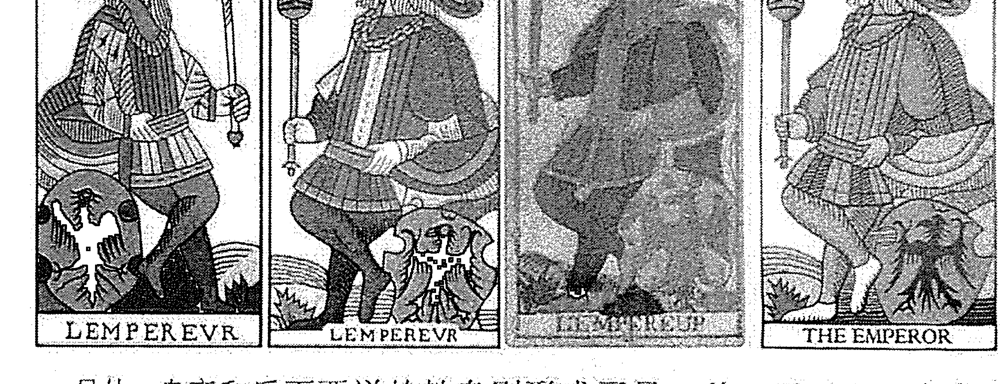

另外，皇帝和后面要说的教皇则形成了另一种二元对立，皇帝和皇后属于物质世界的高位象征，而教皇和女祭司（古塔罗女教皇）是精神世界的高位象征。皇帝与教皇就是物质与精神这种对立二元状态的高位象征。

除此之外，皇帝亦和魔术师有关联，两者的特质都呈积极主动态势，对于生活中遇到的困难他们都会采取果敢的行动去克服。但魔术师多为凭借机敏、灵巧的小聪明，而皇帝则体现了成熟、稳重的运筹帷幄。皇帝为愚人之旅所提供的道路，是对于物质世界及肉体限制的征服与超越，是采用自身力量去征服自然和改造自然。和魔术师相比，皇帝的征服使用的是意志和力量，而魔术师则更多的运用智力。

所以这里可以理解为，皇帝教导了愚人去运用意志的力量来达到更高的意识境界。

皇帝对应了荣格四大心理学功能中的思想功能（Thinking）。如果前面说的皇后代表的是身、是物质上的感官功能，那么皇帝代表的就是心、心智上的思想功能，展现的是理性、逻辑和做决策前的思考与部署。

#### V. 教皇

> ——信仰来源于信念，所谓的信念就是自己认为可以去相信的一种看法。虽然兴趣是最好的老师，但是一个信念者所开发出来的力量，会大于99个只有兴趣者。

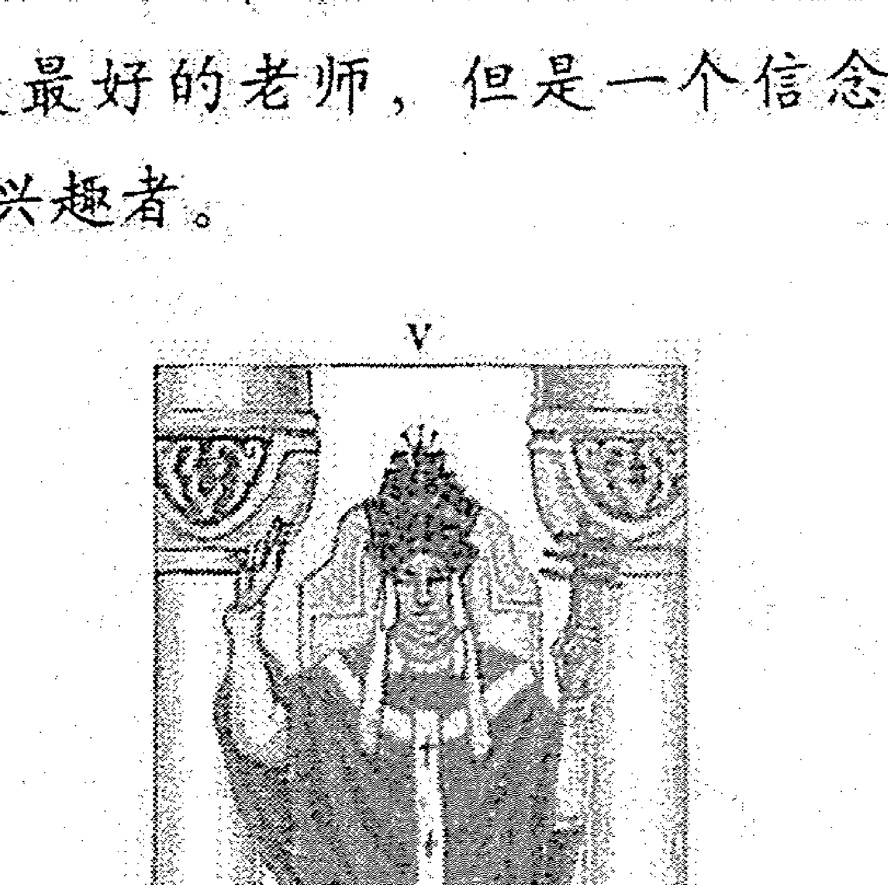

教皇坐在自己的椅子上，他头戴三重王冠，手握三重十字架，另一只手呈出教皇专有的祝福手势，身前还有两名信徒，接受教皇的祝福也谨记教皇的教诲。教皇是灵性智慧的持有者。

教皇拥有打开灵性世界大门的钥匙。而教皇本身也是一个向人类传输灵性智慧的通道。

教皇是提供给愚人的第五条道路：是对于社会的接受以及基督神学之路。教皇提倡互相关爱、互相帮助。

在愚人之旅中，愚人到达教皇这头，是否已经到达了旅程的顶端？答案肯定是否定的。按上所述，教皇的确代表了人类世界精神领域的最高峰，拥有打开精神领域大门的钥匙，而教皇本身也是一位向人类传输灵性智慧的通道。并且，根据教会的教义，他们提倡的是互相关爱、互持互助。在最好的情况下，教皇可以被视为精神领域的英雄和模范，是圣者、圣师、以及虔诚圣徒的象征。但是，对愚人之旅的主角愚人来说，教皇只能引导人们成为一名虔诚的信徒，而不能将人变成一名获得启迪和开悟的人。

在佛教中，我们常常看到或听到这句话：“佛曰：不可说，不可说”。其实有时不是不可以说，而是没办法说。很多东西靠的是一个“悟”，会了就会了，不会的就是不会。即使让会的去教，结果往往依然不会。那是因为有的东西特别是一些精神领域的东西，是教不会的，要靠自己的经验和领悟。所以教皇在愚人的旅途中只是一个接受教导的站点，而并非是终点。

教皇对应着荣格四大心理功能中的感受功能（Feeling），是作出价值判断、用来断定好坏并由此引发相关的行为及行动的功能。

#### VI. 恋人

> ——和：恶语难消，忍过事堪；和睦相处，万事谐通。

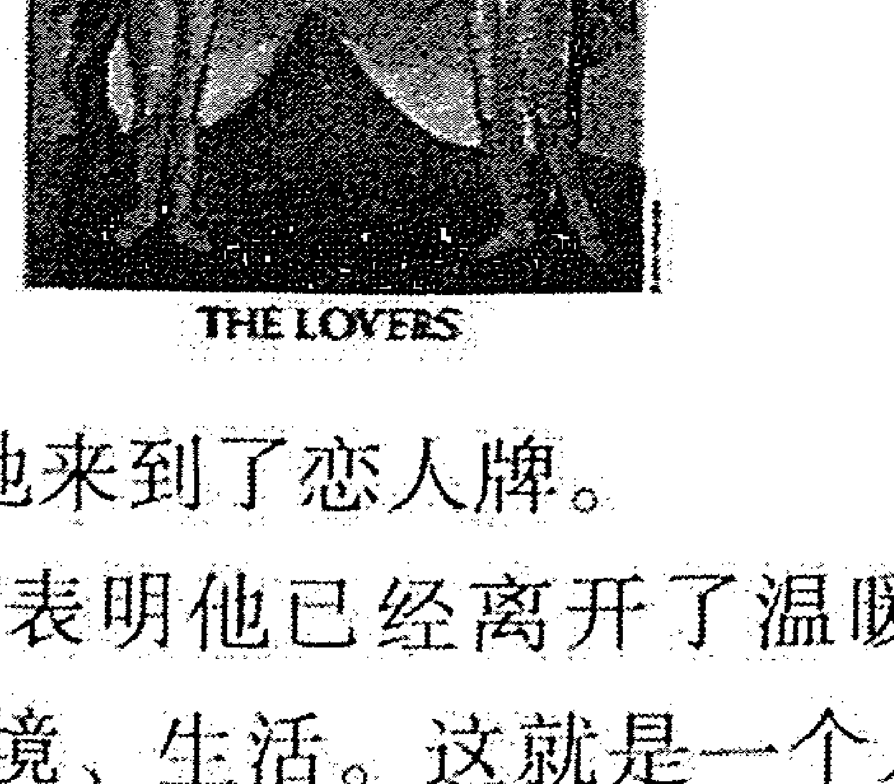

愚人继续他的旅程，他来到了恋人牌。愚人来到恋人牌，就表明他已经离开了温暖而熟悉的家庭、环境，进入了一段全新的环境、生活。这就是一个人生的转折点，预示## TAROT 经典塔罗攻略秘籍

自此开始，他将独立，以前受父母（皇帝皇后）、师长（教皇女祭司）照顾的日子已经成为了历史。

在先前旅途中，愚人受着长者与前辈们的指点，所学到的东西有限，往往只是书面理论，这样的发展和进步是有限的，因为愚人并没有开始走出一条真正属于自己的道路，但从恋人牌开始，他将开始独立、为下一张牌（战车）将要开始的征途做好准备。

此时正面对一项十字路口的选择。在以往马赛系塔罗牌的图里，一位蒙着眼睛的天使正对着底下的男子拉满了爱情之弓，而底下的一位男子需要在两名女子之间做出选择；还有的牌显示该男子需要在自己的母亲和恋人之间作选择，母亲代表自己亲切温暖的家，而恋人则代表离开原本自己熟悉的家，进入新的属于自己的婚姻生活。不过对愚人来说，他的选择是明确的，因为紧挨着恋人牌的是战车，所以愚人的选择自然就是继续自己的征途，选择困难的冒险路线。

在伟特塔罗牌中，天使底下画着一男一女，似乎表达着一方与另一方的沟通与相处，这也预示着愚人在独立之后将会不可避免地与他人发生接触和交往，而交往的双方都出于同一水平线，并非如小时候父子和母女交往时，父母总归忍让三分。不过，愚人在与不同阶层、不同角色的人们交往后，他也会发现，自己可以从交往中学到很多，也会依靠和用到在那些关系中学到的各种事物。

愚人之旅来到此时此刻，他就已经成熟了，已经被现实生活所包围，无论幸福或不幸福，他都要面对，这显示出了生活的残酷性，当愚人意识到这一点时，便已经长大了。从此，他不能再简单地笑、不能放纵地哭，不能如此、不能那般，这就是长大后的生活。

#### VII. 战车

> ——征服畏惧、建立自信之最快最确实的方法，就是去做你害怕的事，直到你获得成功的经验。

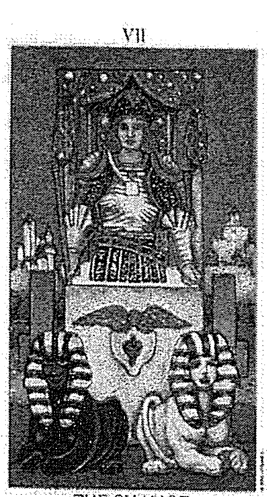

从这里开始，愚人长大了、成熟了。他离开了自己的家。在战车牌中，人物的模样就如神话中的战神玛尔斯。从这里起，愚人就要开始将之前学到的东西应用到实际，学习做自己的主人，同时还要学会如何听从命令、以及如何指挥他人。战车牌中的课题犹如皇帝牌的衍生，是走向人生征途的启程。他处于战车的上方，而对于战车前方的两匹马或狮身人面兽的驾驭并不是采用缰绳，说明驾驭者对其的控制不是体现在物质层面。如果这里的两匹马或狮身人面兽代表的是自我的低层次部分，那么战车的驾驭者代表的就是自身较高层次的部分，这里意为高层次的部分对于低层次部分的控制与压制，让低层次部分能按高层次部分的意志行事，这在图中体现为驾驭者对两匹马或狮身人面兽在前进方向上的控制。同时，我们还在牌图上看到驾驭者手中握着的武器，这象征了竞争无处不在，勇敢面对竞争、勇于接受挑战也是人生之旅中的一个组成部分。

磨难与挫折是人生成长旅途中的必修课，有时候血的教训反而更能使人成熟，而去经历、克服并战胜这些挫折则是人生旅途中宝贵的经验。相信每个人都体验过站在高处领先时的那种得意焕发的感觉，战车牌就可以代表这种意思。这同样也是人生宝贵经验的一种，可以让人更加自信、让人感觉自我价值的体现，对于未来自我的发展是必需的。正如在解释“牌意的多源性”时，我们提到了《变形金刚3·月黑之时》中的汽车人首领擎天柱（Optimus Prime）的所言：

> > 一个人可以对任何人失去信心，但永远不可以对自己失去信心，因为在一场属于自己的战斗中，如果连一个人对自己都没有信心，那么他是做不成任何事的。

诚然，这里的“战斗”可以象征我们生活中的将要面临的障碍与挑战，但是，无论是艰难还是困难，我们首先要具备的便是自信心，如果连信心都没有，那么你便等于不战自降。

这里，我们的愚人就谨记了前辈们（女祭司、皇后、皇帝、教皇）的教诲，以充分的信心利用以往学到的知识和经验勇敢地面对了眼前的挑战。当然，任何成功与胜利的喜悦之情总是短暂的，当你迈入下一个挑战时，前一场胜利无论它有多么伟大都会成为历史。这一点，战车就跟皇帝不同了，皇帝可以常坐宝位不动，但战车的驾驭者坐于胜利的高位则是暂时的。当战车上凯旋的英雄下了战车后，他又重新变成了愚人，或者普通人。但是此时的他已经品尝到了成功与胜利的感觉，战车的宝座将成为他生命中下一个、乃至下下个标目。

此外，战车还能代表一种对于社会法则的适应，战车的驾驭者可视为一个“原本的自我”，而他所乘坐的战车则是原来自我所塑造出来的“人格面具”，人格面具是人类在生活中为了适应不同环境所扮演的不同角色，以得到社会的承认。在老师面前是个乖学生；在小弟面前是位敢作敢当的大哥；在朋友面前是位讲仁讲义的兄弟；在敌人面前是位冷酷无情的杀手。

#### VIII. 力量

> ——所谓方圆之道，即为没事不惹事，来事不怕事。

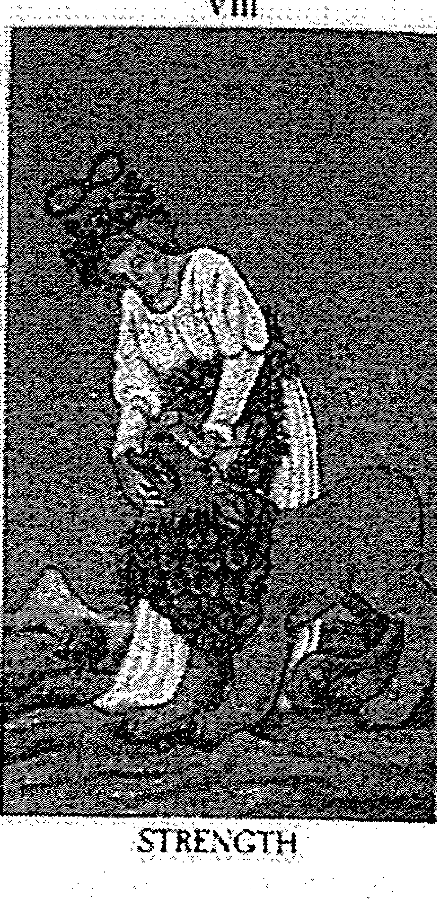

力量牌的英文名为Strength，法文为La Force，体现的是四大美德中的力量（其余三个是节制、正义和审慎）。源于古意大利的La Fortezza，代表着坚毅（Fortitude）。the ability to endure rather than to be on the offensive（坚持、忍耐，而并非进攻）。亚里士多德将这个词语解释概括得很好：a person should neither seek out danger nor avoid it（不要自找麻烦，也不要回避麻烦）。

在塔罗牌的历史上，力量牌图有三种类型。在早期塔罗牌里，维斯康提塔罗的力量牌画着一位大力士，他应该是希腊神话中的大力神赫拉克勒斯，或者是萨姆森，正举着一根棒子准备打狮子。在另一些牌中，有的画着一位女子折柱的形象。还有的则画的是一人坐于狮背上将狮嘴合拢的形象。所有的这些形象都是旨在表达“精神战胜物质”的理念。

## 经典塔罗攻略秘籍

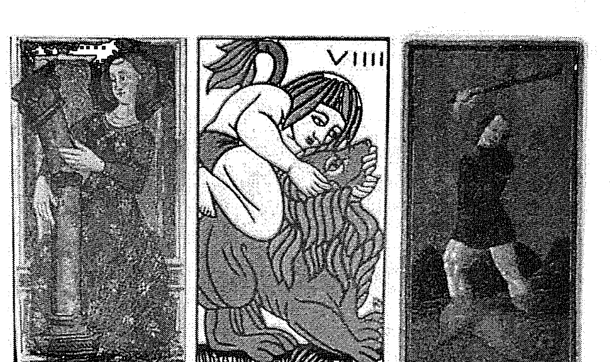

在愚人之旅的前一站，愚人遭遇了战车的课题，发起针对外在层面的征服，那么到了这里，愚人面对的是力量，重在内在层面修行，培养内心的坚毅和勇气，因为一个人只有内心坚强了，才能应对可能来自于各界的压力，精神才不会被压垮。所以，力量作为一种美德，是愚人之旅中必修的一站。

在伟特牌的力量图中，我们发现虽然牌图也画着一名女子试图合拢狮嘴的情形，但是从该女子无邪的笑容、纯洁的衣着、轻柔的姿态中可以发现，这里并非暴力和蛮力的动用。这里，身穿白衣的女子象征了高层次的精神层面；而狮子则代表低层次的物质层面，整副图像描绘的则是较高层面对较低层面的控制，所以这张牌也可以代表一种自我的克制，自我的高层次部分对于低层次部分控制。我们常常会遇到这样的情形，对于一件事的决定上，从内心深处会发出两种声音，一种偏向于对自身与欲望的约束，另一种则偏向于自身欲望的施展。力量牌中的结果就是对欲望的约束，但并不是扼杀，而是承认这一情况的存在、接受这一个现实，最终达到平衡与和谐的发展。

力量牌图中的女子头上出现了和魔术师头上一样的符号“∞”，但是从牌所表达的特质上，两者呈现了互相对立的态势。魔术师姿态舒展，有一种由内而外的感觉，旨在控制、压制外界和大自然；而力量中的女子姿势内敛，带有温和的劝服之感。虽然从图上看，女子与狮子两者呈以互相对峙的态势，但女子显然不慌不忙、不急不躁、一副心中有谱的样子，就好比《三国演义》中的诸葛亮坐守空城，却依然仪表安详、心如止水，表面上看，他没有主动干预事态往后的发展进行，一副任之随之的样子，可是实际上事态接下去的进行都在自己的预料之中。

所以，这里力量牌给于愚人的信息非常明显，在发展训练自我的内在力量之余，遇事保持内在的沉着冷静，运用坚毅的内心去面对去理智处理，而并非单纯倚仗匹夫之勇，毕竟暴力解决不了任何问题，暴力的回报还是暴力。

#### IX. 隐士

> ——当你走到顶峰的时候，你的敌人便是自己，战胜自己才是此时最后的目标。

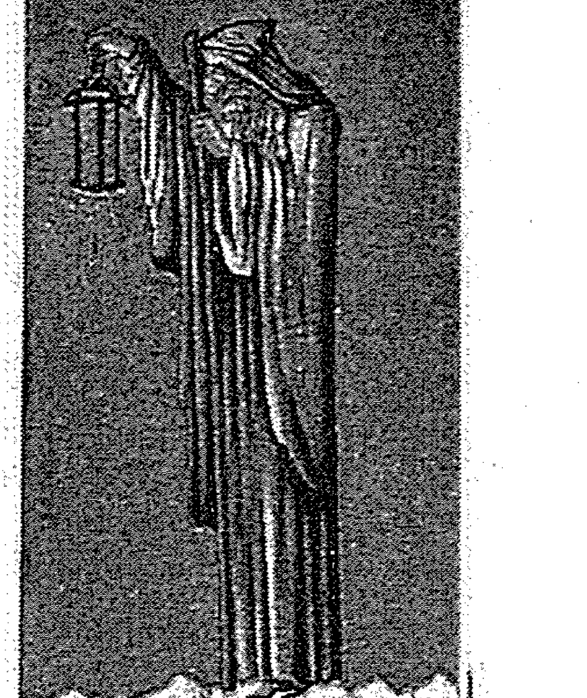

愚人到了隐士之处，他见到了一位手执木棍、身披长袍，为人谦恭、沉稳、以身施教、面容忧郁且极具智慧的隐士。

从最高层面来说，隐士手执散发智慧光芒的灯笼，可以算是智慧老人的原型了。这种手持灯笼的姿势可以追溯到公元前4世纪的哲学家戴奥真尼斯，据说他就是这样持着灯笼寻找善良且有德行的人。但是，如果愚人在更早些时候遇到隐士的话，他可能会觉得“这是一个啰嗦的老头”，从而不会听从或体会到隐士的苦心相教，因为当一个人的认知程度没有达到一定水准时，他是无法接受更高层次的东西的。但是，在愚人经历力量牌的课题后，他已经具备了接受来自隐士的教导和经验的能力。在许多古塔罗牌中，隐士的形象被喻为“时间老人”，或称时间之神。在古塔罗的隐士牌图中，隐士手中拿着的并非灯笼，而是一柄象征时间的沙漏，如下图。沙漏喻示了时间的飞驰与不可逆性，也喻示了任何有形物质在时间上的有限性。无论是君王、教皇、战士还是愚人，他们都逃不开时间的限制，他们的生命都是有限的。如此，既然时间不等人，那么愚人就应当把握好生命中有限的机会，俗话说，机会总是留给有准备的人，聪明的人懂得把握机会，反之只会不断地浪费机会。这就是隐士作为时间老人教给愚人的宝贵一课。

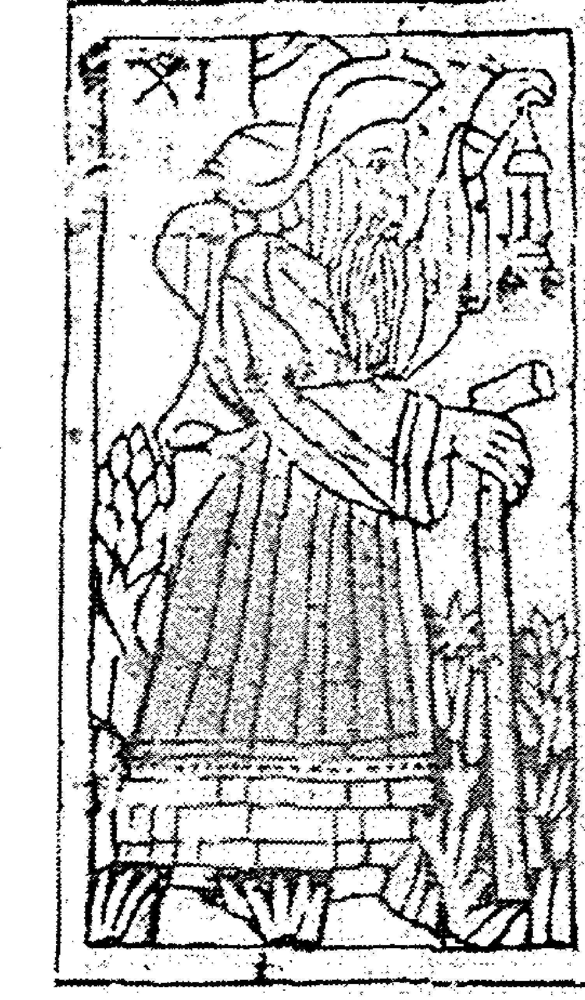

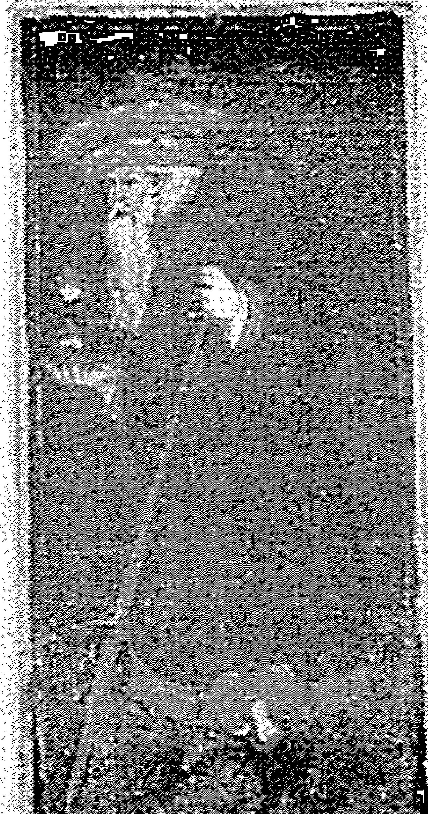

从另一种观点来说，隐士是独立的，愚人在这里学到了如何学会独立与独处。奥修对自己的奥修塔罗牌隐士进行释义时曾指出：真正的孤独是高贵的，当一个人孤独的时候，他的思想是自由的，他面对的是真正的自己®。这一点则不同于普通人理解上的孤独。

总的来说，隐士提供给愚人的第9条道路便是沉稳、静观其变之道。隐士的教诲偏向于自我的内省以及对自我的接纳。他虽然和愚人一样，都是独身行于旷野，但隐士没有背上愚人的那只小包包，取而代之的则是一柄象征追求更高一层智慧的提灯。现在，隐士所寻求的智慧已经达成，灯笼里已经发出六芒星形状的光辉，他以亲身实践告知愚人，你所追寻的答案其实是在你自己的手里。

#### X. 命运之轮

> ——随缘，不是得过且过、因循苟且，而是尽人事知天命。

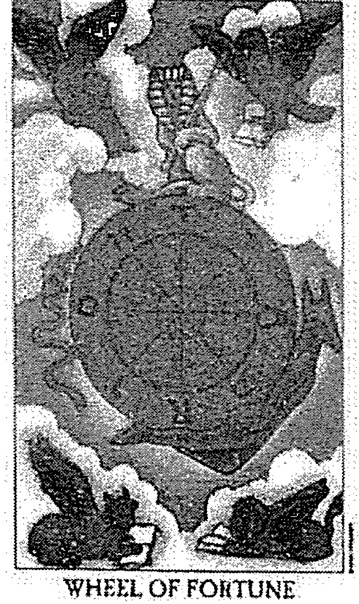

命运之轮这张牌可以体现人类普遍存在的心理特征，也就是心理、情绪上的波动性，高低起伏，比如高兴/沮丧，也可以体现人类生命中的不断经历的各种起伏，比如成功/失败。或者说的更贴切一些，这张牌可以代表人类在生活过程中经历的高低起伏以及由这些起伏所引起的心情波动。

在维斯康提—斯佛扎塔罗的命运之轮牌图里，图像中间有一个轮子，轮子上有四名男子，分别代表了命运的四大阶段，左边一个爬轮男子，代表一个萌芽状态，其身后的文字可译为“我将主宰”。轮子顶上的男子坐着，为“我正在主宰”，代表了处于命运之轮的最高峰。在轮子右边一个男子随着轮子下降，为“我已主宰过”，呈下滑趋势。而在轮子底部，一个趴着的老者，其身后的文字则是“我已不再主宰”，令人有种大势已去的感觉。如果用四张塔罗大牌来解释这四个人的情况，那么那名蒸蒸日上的男子象征了战车，代表正在朝着目标前行。达到顶峰的男子则相当于隐士，代表着精神修行的顶峰。正在走下坡路的男子代表了吊人，象征逐渐失势的情形。而大势已去的老者则为死神，一切都已经过去。

无论怎样，命运之轮道出了一种永恒持续的动态，世界的流动，以及人生的变化无常，这就是一种改变的力量。俗话说，世上唯一不变的真理就是“变动”。事物发展运行的轨迹应该是多元化的，存在着无数可能性，有时候不管事先计划的如何周全，事到临头往往会冒出其他情况，正所谓计划赶不上变化。愚人之旅到达命运之轮使愚人学到了跟之前隐士所不同的东西，命运之轮的“应变”与隐士的“沉稳”完全背道而驰，虽然静观其变的处事方式不算消极，但是如果你一直静观、不为所动，那么造成的结果便是固步自封，同时只能看着机会白白从眼前溜走。所以，这里命运之轮更加强调了随机应变，首先必须适应并融入那一个大环境，然后在知己知彼的情况下找到属于自己的机会，然后抓住它。

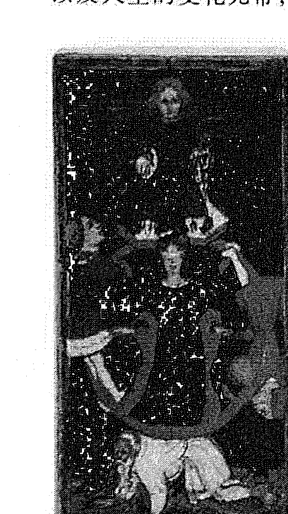

在许多其他的塔罗牌意解释书中经常会将命运之轮解释为“命运”。但是命运并非人力可以控制，但是，

> “命运负责洗牌，而玩牌的则是我们自己。”

我们无法控制自己抽到哪一张牌，但是我们所能做到的是，将已经抽到的牌打的有声有色。如果你在感叹命运让你错失一次良机，那么，在你无力改变它的时候，试图去找寻第二个机会吧，也许第二次机会不一定以相同的形式出现，但如果你能把握，也就是命运对你的一次补偿。

#### XI. 正义

> ——实事求是，精益求精，差之毫厘，失之千里。

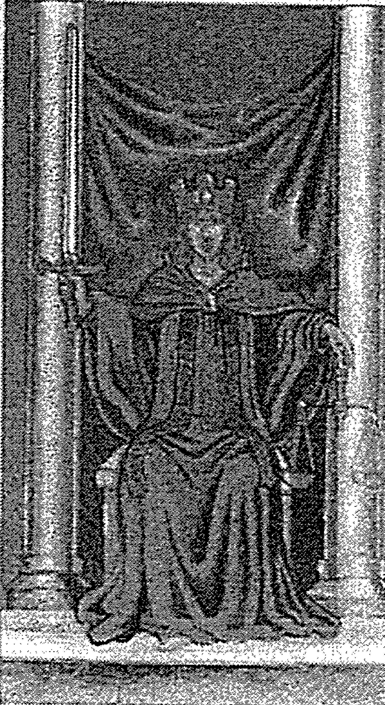

渡过命运之轮，愚人的旅程已经进行了一半。现在他又来到了双柱前，但是坐于双柱前的人物已经不是女祭司了，而是正义。正义的左手持着一架天平，右手举着一支宝剑，似乎守卫着通向双柱之后的人口。无论是天平、双锋宝剑、还是其中性的形象都透露着正义传达的信息是“平衡”。也许，在这里愚人首先要平衡的就是自己内心中的物质与精神吧。虽然，经过命运之轮的洗礼后，愚人的世界观、价值观已非昔比，但是后半段旅程中的困难与挑战也非前半段可比，所以他必须整合之前学到的一切，进一步学习审视与评估的课题。

首先，正义这个形象不是一个世俗的形象，不再如隐士、教皇、战士（战车）等那样的世俗形象，而是一个更加抽象的形象，由神或天使这样的角色来表达人类思想中的概念，所以可以算是一个原型形象。那么随着愚人之旅踏入后半段，此类原型形象则会出现的越来越频繁，这也是将愚人带入更高一层的精神境界的信号。

在这里，正义将自己的天平放在愚人的面前，要他作出一个选择、作出一个艰难的决定。在作这个决定之前，就需要用那架天平去衡量、去评估，尤其是对自我价值观的重新审视，到底是停留在命运之轮之前的世界里轮回打转，还是鼓起勇气继续走入旅程的后半阶段。如果继续下去，愚人就要放弃前半段在物质层面上获得的一切成就，等于重新来过。而且从正义手中的宝剑来看，后半段的旅程并不轻松，更严峻的考验在等待着他，并且走下去就不能再回头路。究竟是就此止步还是继续下去？正如愚人接到正义的天平那样，我们每个人心里也都有一把秤，可以用自己的价值观作为砝码去作出衡量，然后作出最终的决定。由于愚人已经经历了命运之轮，他明白前半段旅程中所有的成就与成功都是昙花一现，是无法长久的，也许那些选择折返的人的内心希望维持那种“人生极致”的高位感觉，但这些与愚人的价值观已经背道而驰，所以他舍弃了那种人生极致，接受了正义带来的平衡讯息，作出了自己认为的正义判断，毅然地走了下去。

#### XII. 吊人

> > ——丢卒保车，没有牺牲，没有胜利。

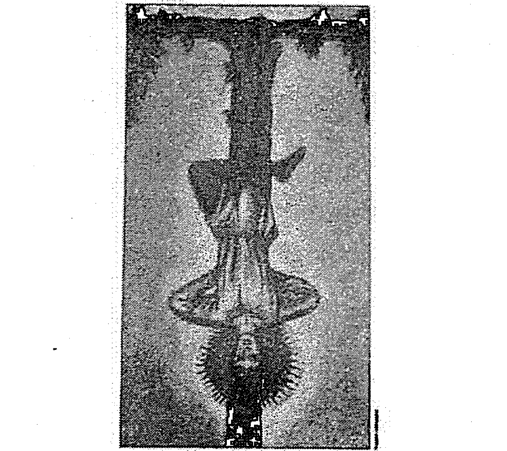

愚人在正义这里对自己的价值观作出重新衡量之后，来到了吊人牌中。这里，他用绳索将自己的一只脚绑着倒吊了起来，同时另一只脚弯曲与那只被绑脚呈出交叉姿势，形成与古塔罗皇帝的双脚和世界的双脚相同的符号。由于皇帝代表的是物质世界的最高位，而这里的吊人将双脚的位置提升至头部，体现的是精神的至高，也就是将皇帝的价值观逆转过来。在有些塔罗牌中，吊人牌的图像呈现的也是一名被倒吊着的男子，但是还画出了一些金币从他裤袋中掉落出来的情况，如图：

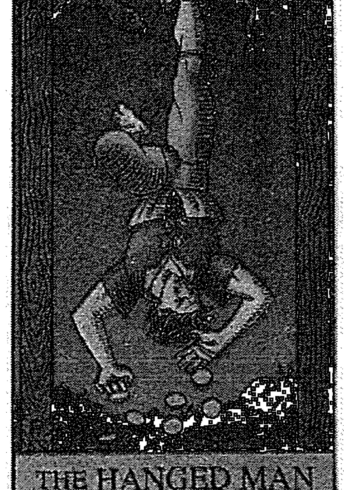

这里，金钱滑落只是加重了颠覆以往价值观的寓意，也就是对物质的摒弃，突出对精神与灵性的重视。事实上，吊人头上脚下，与正常的方向相逆，本身就有逆转、颠覆常规观念的意思。

在愚人进入后半段旅程开始，他以往受到皇帝、战车影响下的世界观和价值观就已经开始转变。物质层面的重要性在他的观念中已经瓦解，而在吊人这里，一套全新的观念已经建立。前半阶段旅程中被认为适当的理念在这里已经不太适用。

要理解吊人牌的意境，我们可以将自己替换成旅程中的愚人。在经过正义的衡量与评估后，决定继续行进下去，但是在行进之前必须要使自己再度革心洗面，将旧有的自我逐渐消除，重新构建一个全新的自我。要达到这一点，就把自己倒吊起来，颠覆以往的所见所闻。就这一点来看，我们就可以理解为什么被倒吊着还能如此安详、如此平静，因为一切都是自愿的，为了达到最终目的而必须经历的一个过程。其实他双手闲着，完全可以把自己从吊绳中释放。如果有读者对这种思想还不能理解的话，可以跟现实中的“下棋”对个比较。比如在下象棋时，我们往往会牺牲一些小的、无关紧要的棋子而达到吃掉对方大子儿的目的，这就是典型的“丢卒得车”的策略。这里的“小卒”就是吊人所要舍弃的旧我，通过牺牲旧我，达成大我。

说到底，吊人的这条道路并不是来自于个人的努力，也不是来自于自我的积极进取，而是来自于对自我的一种根本上的接受，他必须接受自己是谁，摒弃旧有的自我、错误的自我、骄傲的自我，以此来重构一个新的自我。当愚人走到吊人面前，问起吊人：“你这么做是想证明什么？”吊人曰：“我不想证明任何东西，我只想了解自我、挖掘事实。”这个自我与事实就在自己灵魂的最深处。在吊人所吊的树枝上，我们发现树枝并非凌乱不堪，而是经过精心修剪的。如此做的用意象征了将任何无关之物和过度之物都予以剔除。另外，吊人与纵向的那根树枝处在同一个水平线，将随同树根直通底部，喻示着这种变革是彻底的、从根源开始的。

#### XIII. 死神

> ——世上没有绝望的处境，只有对处境绝望的人。

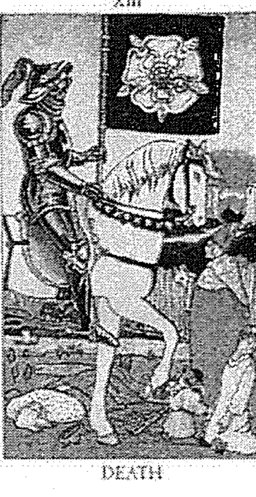

死神，在西方人的印象中，他是一位手持镰刀的收割者，古塔罗中死神的形象也大多手持镰刀、或骑马上，如下图：

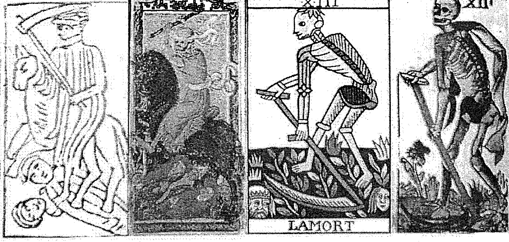

当然，这里的死神收割的不是粮食，而是生命。在死神跟前，无论是谁都无法逃脱，不管是教皇也好、皇帝也好、女人也好、小孩也好，在死神面前全部一律平等。在伟特塔罗牌的死神中，我们看到一位主教正双手合十进行祷告。这个形象反应出现实中我们一些人对待困难的态度，当这些人遇到一些障碍时，就会习惯性地祈求老天赐予更多运气、更多力量，以助平安渡过难关，但实际上，最终要面对的仍是自己，而障碍和困难其实是一个契机，从某种程度上说，障碍可以是我们超越自我、获得成长与革新的契机。

所以，这张牌所象征的死亡并不仅仅代表生命的结束，而是一个广义上的“死亡”。正如在愚人之旅的漫长道路上，死神不过是旅程当中的一个站点，愚人至此不过才经历了13/21。所以如果对“死亡”从一个较为适当的角度理解，应该代表了一种“转变”，也就是旧的逝去，新的到来。如果死神是愚人之旅中一条通向更高境界的大门，那么这扇门应当为一个“入口”，而非一个“出口”。从前一张吊人牌到这一张死神牌，愚人以顺从、接受的姿态迎来一个神秘学意义上的死亡，旧有自我的瓦解，愚人带来了一个全新的自我，这就是一种转变与蜕变。死神牌构成了愚人旅程中的一个必经转折点：旧的结束—旧到新的转变—新的开始。

不过从另一种角度说，死神这张牌似乎在提醒着愚人必须记住死亡，一些宗教团体就有教育底下的团员应当时刻惦记着死亡，把每一天的生活都当作一个末日来过，珍惜生命中所发生的一切。如此，死神牌也就意味着既存事物的死亡是一个不可避免的结局。

### TAROT
经典塔罗攻略秘籍

#### XIV. 节制

> ——修身养性，志存高远；举止留心，内方外圆。

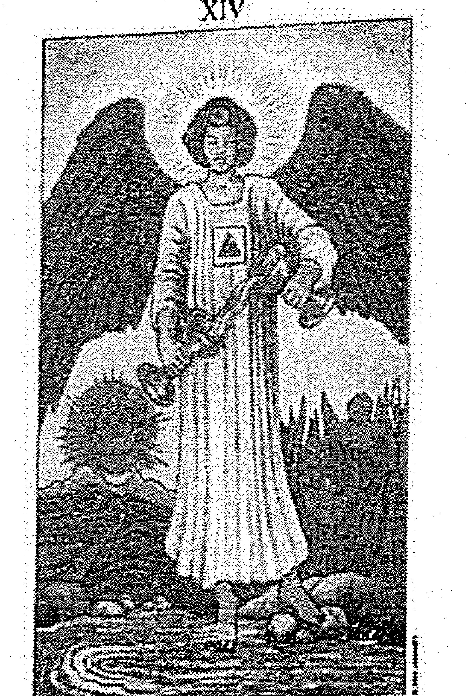

一位天使站在愚人的跟前，她手持两只杯子，并将一只杯中的液体倒向另一只，她一只脚站于陆地，另一只脚则没于水中，由于大地代表的干与河水代表的湿是互相对立的二元之物，而一脚触地一脚触水的天使则犹如这种互相对立二元体的联系者。又因为水可以象征潜意识，而陆地可以象征显意识，所以这里的天使亦为连结潜意识与显意识的桥梁。所以，这里的天使对愚人来说就犹如一位指引者，引导愚人如何将那两种意识作出联系，以使自身提升到一个更高层次的境界。

在22张塔罗大阿卡那中，有三张牌分别代表了西方传统中的三种美德：力量、正义、节制。这三张美德牌都是强调了一种身心的发展，道出了在愚人之旅中，这种自我身心素养上的修行是必需的，而且只能依靠自己。这三张美德牌同样也体现了一种达到平衡的和谐状态。古希腊哲学家亚里士多德曾经说过：过度是错，不及也是错，唯适中为对，这就是中庸与平衡。这句话的内涵，无论在正义、力量还是节制的寓意里都有体现。但节制，将这种平衡与中庸的意念体现的尤为突出。可以说，节制是一种将人的性情带向平衡、和谐、健康的美德，它虽对身心上的欲望欲求起到平衡缓解作用，但并不代表去抵制和拒绝欲望，而是用某种方式去使之得到健康满足，所谓中庸之道，就是“无过之也无不及”的平衡与和谐。这与中国的文化精神也有相通之处，中国文化中的中庸之道，是满而不盈，因为满易招损而谦则受益，上善若水利万物而不争，夫唯不争故天下莫能与之争。

自愚人之旅步入女祭司开始，他就犹如进入了一条二元双柱之旅，二元双柱象征着任何意义上拥有互相对立关系的事物：如干/湿、黑/白、男/女、轻/重、光/暗、内/外、阴/阳等等，而节制教会了他如何使自己的路线始终保持在双柱的当中而不偏离至任何一根柱子，因为这两根二元双柱中的任何一方，都象征着二元中的一个极端，所以向任何一方靠拢就等于在向这一个极端靠拢，也就容易造成身心或观念上的极端与狭隘。

# 第二篇：牌意的学问

#### XV. 恶魔

> ——你没有背叛任何人，你背叛的是你自己。

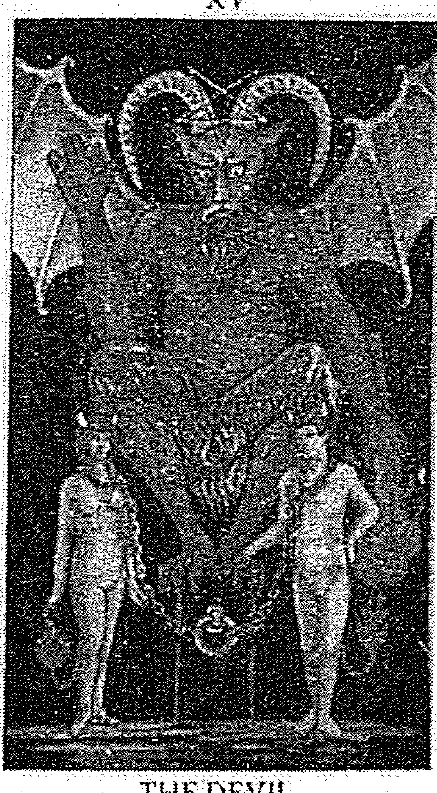

终于，愚人之旅已经渡过了漫长2/3，还有最后1/3的路程。但是就在这里他遇到了阻挡去路的恶魔。恶魔栖立在自己的石碑之上，石碑前有一只镣铐，分别铐着一男一女，这两名男女的容貌已经发生了变化，头上生出了恶魔小角，身后长出了恶魔小尾，显示出他们没有挡住恶魔的诱惑而甘心成为了恶魔的奴隶，或许他们沉浸于恶魔带来的堕落之感而无法自拔，他们自愿地受拷于恶魔之镣，为一些短暂的快乐而心甘情愿地出卖自己的灵魂，因为愚人已经发现，镣铐的颈圈要远大于他们的头部，他们若想脱身是轻而易举的。又或许，我们应该佩服恶魔的攻心手段吧，没有暴力、没有强迫，仅仅是小小的诱惑便能发挥最大化的攻心结果，究竟是恶魔的手段高明，还是受惑者不分是非、定力不够？在愚人看来，双方都有因素。当一个人受到某些诱惑而背离原来的良知、道德时，这就构成了“背叛”。虽然人人有权利和任何人（包括自己）由合而分，但如果叛的一方在背叛自己、而且还在竭力瞒骗欺自己时，这就是自欺欺人。倪匡在《卫斯理系列》丛书中共说：“背叛是背叛，叛变是叛变。叛变在明中进行，背叛在暗中进行。叛变可以光明正大，背叛必然黑暗阴森。”①

恶魔带来背叛诱因的同时，还带来了束缚，但在受缚的过程中，一定需要被缚者的配合，一个巴掌拍不响，只有在你情我愿的基础上，才能完成缚获者与被缚者的协议，此谓与恶魔之交易。另外，恶魔这张牌设计的也很巧妙，在恶魔底下受恶魔控制的有两人，而并非一人。这里其实说出了一个道理叫做“乘数效应”，乘数效应在这里体现的是一种互相之间恶性的加倍影响，一人堕落或许还能有所节制，但两人一同堕落，往往更加容易失去分寸，堕落的程度也将更为加深。只不过各人造业各人担，因堕落而受到的负面效应不会因为人多而有所分摊。这里也算在提醒我们：人不要过分自信，很多时候当我们觉得可控制某事物的时候（如烟酒、毒品），其实就已经深陷其中了。

同时，愚人还注意到，无论是恶魔的姿态还是手势，与之前经历过的教皇都有相似之处。两者跟前都有信奉者，两者的手势都呈权威至高之势。如此，教皇与恶魔便构成了一个二元对立的两极，如果将教皇与恶魔同为一种精神上的领导，那么客观来说，这一个领导位置本身无优无劣，但一旦坐上了人之后，此人可以将这个位置变成教皇，也可以将这个位置变成恶魔，一切取决于这个人的人品。所以换言之，如果一个人注重自我的德行操守，无论他在何种环境，他都能严于律己，不受周围险恶环境的影响，正所谓：“出淤泥而不染，濯清涟而不妖”。

从另一个角度来说，愚人的灵性之旅来到恶魔这一站是危险的一站，也是必须经历的一次考验，从抵制诱惑、束缚的角度上考验之前所学到的所有课题。在恶魔一站中，愚人受到了一切来自于人类世界最底层的物质和欲望的诱惑，包括权、钱、利、欲，通过这些考验健全提升自己的身心境界，这也是为什么在来到恶魔之前必须经历节制的洗礼。所以，恶魔可以被视为愚人之旅中的黑暗一面，这种黑暗面也是愚人必须接受的一个事实，这种黑暗面也可被视为愚人内心的另一面，至此，他必须接受、承认，就如对自己的接受与承认。

在思想上，恶魔也可以代表固执、偏执。人类的思想很奇怪，我们之中不少人都有武断、偏见的毛病，也有固执、自负的缺点，有时候只要认定一件事就很难、也不愿意改变自己的看法。这种情况也正是恶魔牌所指。

#### XVI. 塔

> ——有的人在逆境中崩溃，有的人在逆境中创造奇迹。

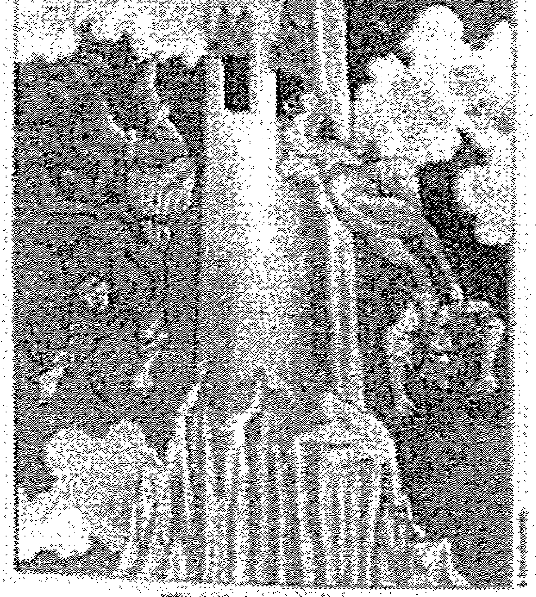

塔的意境就好比一场黑暗中突如其来的霹雳，令人胆颤、令人心惊。在这次闪电霹雳中，一座高塔的顶部受击坠落，同时处在塔顶的两个人也随之坠落。也许，在普通的观念中，这次不过是一场突如其来的事故，用倒霉、意外来诠释便足矣。但在愚人之旅中，这幅场景却有其深层次的意义。

首先，闪电来自于天上，可以视作一种神性的干预，它击落的塔顶之物形状为一顶皇冠，皇冠象征了物质。所以闪电劈落皇冠整个画面象征的是物质世界的在神性干预下的崩溃与瓦解。在愚人之旅中，愚人刚刚经历了恶魔束缚的黑暗考验，此时再受闪电的猛烈一击看似遭受了双重灾厄，其实不然。恶魔正是利用人类物质层面的欲望使人束缚、沉溺于其中，而高塔的来临则犹如当头一棒，将原本的束缚顿时冲破，这样看来，从高塔上随闪电掉落的两人反而是一种释放——从恶魔的沉浸中重获自由。所以高塔在这里也有突破、变革之意。从愚人之旅的角度来说，高塔带来的变革其实是对阻碍自我提升的要素进行革除，是使愚人向更高领域提升和突破的催化剂。

就人类的习性来说，人是一种惯性动物，如果自己已经习惯的事情突然发生一种彻底、猛烈的变故时，多少都会感到不自在，轻者需要这种变故重新适应，重者则可以导致手忙脚乱、寸步难行、不知如何应对。特别当人们在做某些繁琐的事前，都会提前做好计划、做好预案，这样可以让事情在自己的掌控下发展、进行。但是当高塔的情况出现时，就如一种外来的、突然的、意外的、剧烈的、计划外的变革，它会破坏人们先前详尽的计划，会把人们事先的部署大打乱，这就是典型的将先前所预想的、设计的、梦想的方案冲击的支离破碎，无法再圆。

无论如何，剧烈、突然、令人手足无措的变故是高塔的特性。它是愚人之旅、英雄之旅的必经之路，是自我成长、成熟、提升过程中的催化剂。所谓“天将降大任于斯人也，必先苦其心志，劳其筋骨，饿其体肤，空乏其身，行拂乱其所为，所以动心忍性，曾益其所不能”。唐僧西天取经，历经九九八十一难，最终取回真经。同样，愚人只有经历了此般磨练，才能继续迈入灵性之旅的最后阶段。

#### XVII. 星辰

> ——一个人最大的破产是绝望，最大的资产是希望。

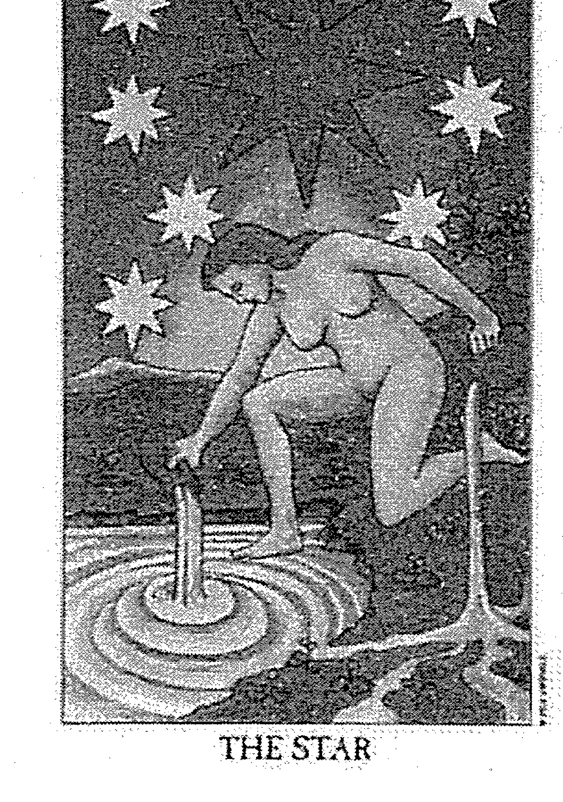

在愚人之旅经历了高塔的剧变后，愚人来到星辰这站并看到了这一幅景象，一名裸体女子一脚触地、一脚入水，双手拿着两只水瓶，水流正从那两只瓶中源源不断流出，一注水流直接倒入一个大水池，另一注水流则流向地面，并分成多道水流，流向各处。在空中闪耀着七颗小星辰，中间则为一颗大星辰。

炼金术有与塔罗星辰牌非常相似图很好地对星辰牌的意思作了辅助性诠释，该幅图出自1659年炼金师瓦伦丁所著的《哲人之剑》（L’ Azoth des Philosophes），图的名称叫做“哲学家的塞壬（Siren of Philosophers）”，该图样貌可见下：

“哲学家的塞壬”描绘的是传说中的美人鱼，图中的美人鱼同样代表灵魂。在美人鱼的胸前流出了红与白两色液体，它们流入水中，象征了炼金术中的三大要素融为一体：盐、硫、汞。这里，红色的液体为血，呈阳性特质，意为受难、死亡与恐惧。白色的液体为乳，呈阴性特质，意为哺育、生命与希望。而美人鱼作为这两者的源头，姿态平静，表示她自身对于恐惧与希望这两者的超越，体现出一种宁静与祥和。这里美人鱼的乳房及其象征意义可以对应到星辰牌裸体女子倾倒的双杯⑷。

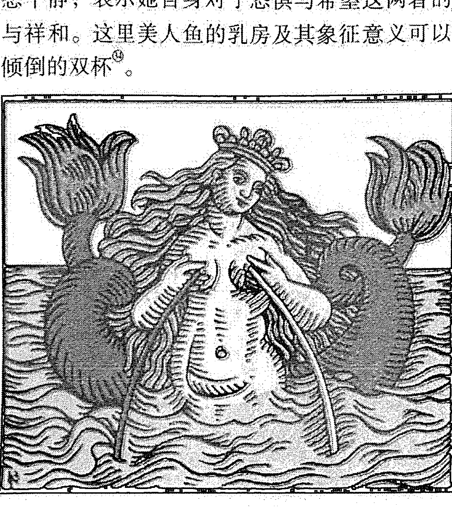

> “在暴风雨过后，便是宁静的回归⑸。”

同样，在星辰牌图中，裸体女子是灵魂的象征，此处她一丝不挂，姿态平静，体现了经过高塔洗礼之后的纯洁与净化。伟特塔罗牌的设计者亚瑟·爱德华·伟特曾指出：“在暴风雨过后，便是宁静的回归⑸。”也就是说，在愚人经历了恶魔的黑暗以及高塔的突破以后，黑暗终于被洗净清除，天空逐渐明朗。所以这里星辰的意境，无不透露着纯洁、净化、宁静、祥和。

另外，在愚人通过了恶魔与高塔的双重考验以后，空中所浮现的七颗小星辰及一颗大星辰有其特殊寓意。大星辰体现的是愚人之旅最终目标，同时也是最后的终点与目的地。七颗小星辰构成了通往大星辰的七级阶梯，七级阶梯在西方神秘学思想中很常见，在古西方人的宇宙观中，他们所认为的七大行星便是水星、木星、土星、火星、太阳、月亮和金星。这古七大行星构成了连系地球与天国的七级阶梯。所以，在塔罗的星辰牌中，随着代表目标的大星辰，以及代表阶梯的七颗小星辰的浮现，预示着愚人之旅正离目标越来越近。

从星辰这里，愚人看到了希望与信心，由希望和信心构成的力量充斥着自己的内心，这种力量的流露就如星辰中那名女子倾倒出的水流，注满了他全身。他相信，在这平静的夜空，只要遵循大星辰的指引，最终便能抵达目的地。引，就一定能够达成自己的目标。

#### XVIII. 月亮

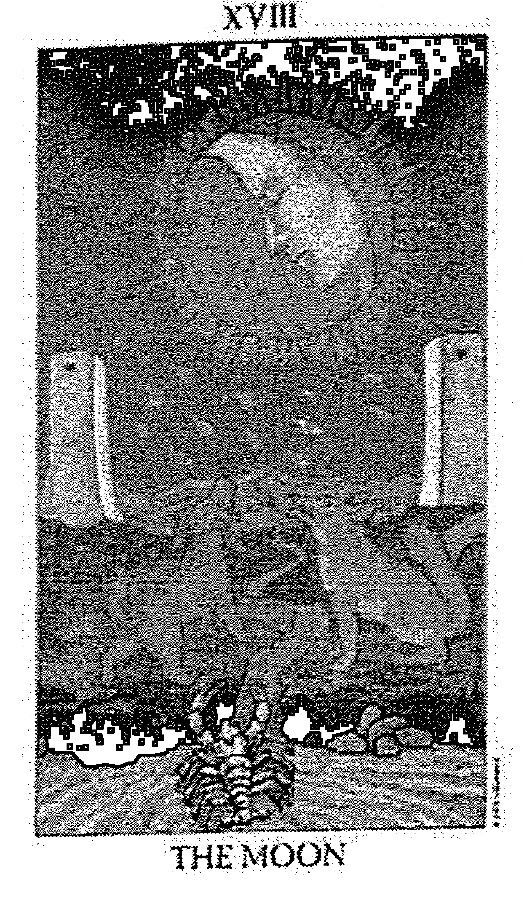

天上的星辰犹如一盏启明灯，为愚人之旅重新指明了前方的道路。即便如此，天色依旧昏暗，在破晓时刻到来前，愚人还将在黎明前的黑暗中继续摸索。

愚人沿着星辰中的池塘，来到了池塘的另一端。在这里，愚人看到的是天上一轮明月、前方的两座高塔、近处的两只犬科动物、一只爬出池塘的龙虾状动物，还有一条蜿蜒曲折通向不知何处的小径。

月亮本身并不会发光，其影射的是太阳的光芒，所以这里预示真正的光明尚未到来。前方的道路沉没于暗夜，充满着未知与不确定因素。在大多数时候，人类的紧张和恐惧不是来自于已知，相反而是来自于未知。比如一个人会因为明天将要到来的考试而紧张，那是因为他不知道考试中会出现什么题目，自己会不会做不出，即使题目都会做，会不会因自己粗心而将题目做错，考试时会不会发生什么意外，比如笔突然写不出了、试卷被自己涂涂改改得一塌糊涂、时间来不及等等，这些都是焦虑、恐惧的要素。而在考试结束，等待分数前夕，也会因为不知自己考得如何而不安。所以，未知是导致恐惧、焦虑、担忧、不安等等情绪低落的要素。

正是在这种环境下，愚人感觉自己过往的所有经验被还原到一种原始的状态，就如那只从象征潜意识的池塘深处爬出的小龙虾，准备踏上那条未知的道路。在道路两旁，愚人看到了一对塔柱，在这对塔柱前驻守的不再是之前见到的女祭司或者正义，而是两只犬类动物，一只狼和一只狗，它们正在吠月，无疑增加了恐怖、焦虑的气氛。两只犬类动物身后的双塔与死神牌中是同一对，双塔象征的是一个人口，人口的两边是两种不同的世界。在双塔上还各有一个小孔，在无边的黑夜中，给人的感觉就像是被里面的眼睛监视着，但是其背后究竟有没有监视的眼睛，是不知道的，所以仍旧强调了未知的氛围。

有人说月亮这张牌代表了一种幻象，幻象涉及到所见所闻是否真实，从一个普通的心理上来说，没有人愿意吃自己不想吃的东西，也没有人愿意看自己不想看的东西。可是不喜欢吃的东西可以不吃，但有的时候不希望看到的东西却是不得不去面对的，否则他将会永远停滞不前。所以，当我们的愚人抬起头时，他隐约从月亮暗淡的光芒中看到一张闭着双眼的脸孔，这张脸似乎在告诫愚人，想要看清前方的道路，不能凭借双眼，不能凭借显意识，而应倾听内在的声音、跟从自己直觉与潜意识的引导。

#### XIX. 太阳

> ——经受过严寒的人才懂得太阳的温暖；饱尝人生艰辛的人，才懂得生命的可贵。

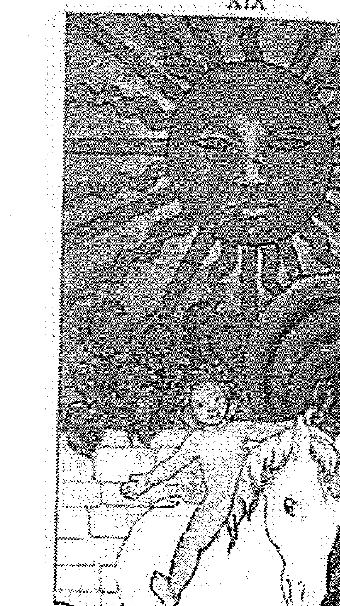

在太阳牌中，太阳正尽情地释放着璀璨的光芒，光芒射出的光束一共22条，对应了22张塔罗大阿卡那，那么可以认为，这些光芒的源头——即太阳本身则相当于22张大阿卡那的整合。在阳光底下，骑在马背上的裸体孩子可以视为愚人，这从孩子头上的羽毛就可看出，与愚人头上的羽毛是同一根。这表示，愚人终于走过了月亮中双塔的关口，也度过了黎明前的最后黑暗，迎来了期盼已久的明媚阳光。这使愚人感到，自己似乎回到了欢乐的童年，掌着胜利之旗骑在马上手舞足蹈。

这里，我们应该能够注意到，骑在马上的愚人并没有处在围墙之内，而是在围墙之外。因为从围墙里面探出的是象征物质世界的四朵向日葵，这四朵向日葵不但代表了四重物质世界，还对应了塔罗牌四组小阿卡那、四元素、四方位、四季节、以及任何四重体系。所以，围墙之内属于物质世界，而围墙之外则属于更高一层的精神世界。由于围墙堆砌的十分整洁，也十分干净，可以看出，围墙背后是一个文明有序的世界。但是，愚人之所以处在墙外，是因为他所追寻的是自由、自然、纯真而简单的世界，这也是愚人追求精神与灵性之旅的目标与动机。由于裸体象征了灵魂，所以这里同样喻示着自由奔放、无拘无束的灵魂，也象征着灵魂的胜利，这从孩子手中的胜利之旗也能看出。

总而言之，愚人来到太阳牌这一站时，最后的胜利已近在眼前。太阳牌中所显示的一切，如光明、欢乐、自由、纯真等气氛都体现着一种万物复苏、内在的觉醒的迹象，同时也影射了成功与胜利。

#### XX. 审判

> ——成功的信念在人脑中的作用犹如闹钟，会在你需要时将你唤醒。

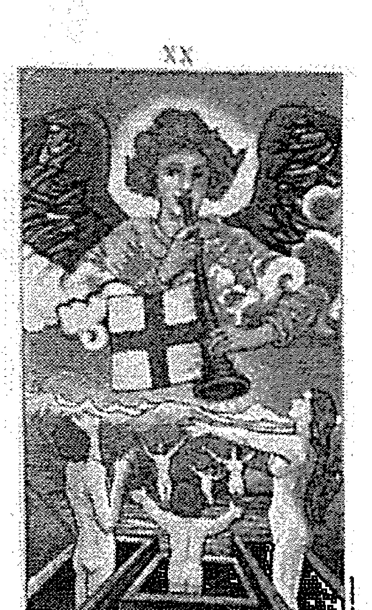

虽然愚人已经克服了重重艰难，经历了重重考验，终于走到了旭日东升的那一刻，也终于达成了自由、纯真、和谐的精神境界。但是单凭他自己是无法越过太阳，完成最后旅程的。所以这里他等待的是一个“召唤”，一声“号令”。

天使加百列终于来到愚人的上方，他取出一支挂着红色十字旗帜的小号，吹响了这个能够带领灵魂超越物质世界的最后号角。一时间，受到召唤的灵魂纷纷起身响应着这一号召。这是超越物质限制、超越死亡、走向高层精神境界的胜利，这就是一种重生。
另一方面，如果我们采用比喻与双关的手法，加百列的召唤可以喻为我们内心深处的召唤，来自于我们的深层潜意识、高层自我的召唤。有时，在我们的梦中，它往往会以老者、智者、神仙、菩萨的样貌出现，给予梦中的我们一些珍贵的指点与提醒。有时，当我们准备做些不该做的事情时，也会在心中听到另一种告诫、劝导、提醒的声音。还有时，当我们在为一个难题苦苦思索答案，却一直无解，但突然之间就犹如灵光乍现，或者受到周围环境事物的启发，于是便一下子想通了，这就好比牛顿在被树上掉落的苹果砸中脑袋后就想出了万有引力定律那样。诸如此类的从内在深处传来的声音非常珍贵，愚人正是抓住了这一点，终于搭上了灵性之旅通向终点站的末班车。

#### XXI. 世界

> ——再长的路，一步一步也能走完；再短的路，不迈开双脚永远也不能抵达。

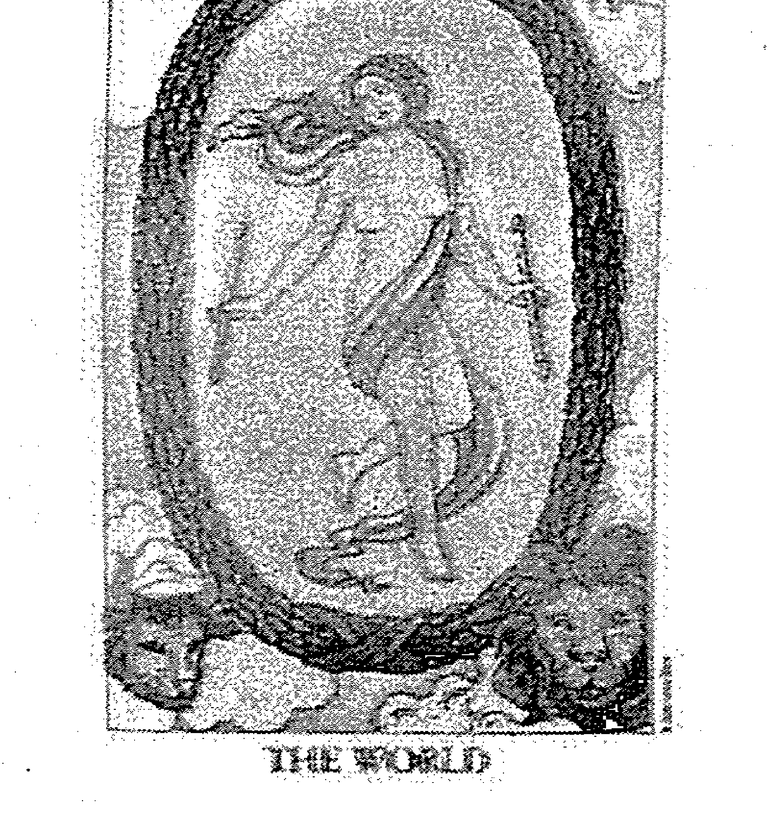

随着愚人遵从了天使号角的召唤，他的灵性之旅也终于达到了终点。在那里愚人以裸体舞者的形象在花环中间翩翩起舞，花环象征着成功与胜利。的确，愚人之旅已经完美达成，胜利的花环也理所当然。在花环中，舞者的双脚呈交叉姿势，这一交叉的姿势同古塔罗中的皇帝、吊人的形象一致。皇帝是物质世界的最高位，而吊人则是将这一价值观逆转过来，体现的是精神之高的理念。而在世界中，由于舞者双脚腾空，体现出高超的灵活度与自由度，他已不用再像吊人那样花好大力气去将双脚移至上位，因为世界牌已经超越了物质世界的一切理念，再无上、下、高、低之分。同时，世界也是一个二元联合的统一体，超越了一切阴阳二元属性，所以有的书上才会指出，世界牌中的舞者是阴阳结合体，其实就是这个道理。

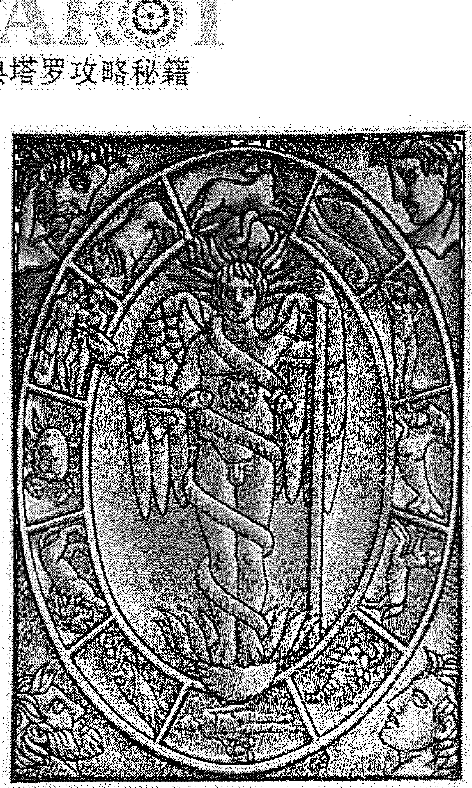

在花环的上方与下方所系着的红绳呈∞无限符号，这个符号在魔术师与力量中也有出现。魔术师头上的无限符号代表了一种阳性力量，是对外部世界的控制，其作用力朝外；力量头上的无限符号与魔术师的相反，代表的是对于外在事物的接受性与包容性，其作用力向内；而世界牌中的无限符号由于整合统一了所有的二元性，体现了进退自如、内外互动的完美特质。

在花环之外的四个角上，分别显示着象征四福音的四活物肖像，对应四元素、四大固定星座（金牛座、狮子座、天蝎座、水瓶座）。这种分布我们可以称为“五点排列法”。五点式排法是人类神秘学和宗教中经常用到的结构与符号，又称曼达拉（Mandala）。其布局方式为：将最重要的元素被置于中央位置，另外再于四个角或四周放上另外的四元素。这种五点形排法在它的中间位置无疑是最最重要的位置，属于一个神圣的、超越于其他事物的中心。

20世纪的宗教史学家米尔卡·埃利亚德（Mircea Eliade）发现，世上几乎所有的宗教和文化都存在一个共同点，即他们都是设定了一个神圣的、超越于其他事物的位置，而这一位置就被认为是世界的中心。在一些艺术作品中，这一重要位置通常就是设定五点排列中的中央位置。比如佛祖的位置就是在四重曼茶罗坛场的中间；基督则位于四重形状的十字架中间。在俄耳普斯神话中，法尼斯是由“世界之蛋”衍生出的第一个存在物，为了表达他的神性，法尼斯通常都被认为是阴阳合一体，我们可以从下面一副古老的雕像图中看到，法尼斯的位置不但处于黄道中心，也处于四个角上头像的中心。

而在13世纪的一本法国圣经的封面上，画了一副基督圣像，其结构也是五点式排列图中央的人物就是基督，他周围环绕着四活物：狮、鹰、牛、天使，四活物象征了四种创造物或四福音，象征将基督的教海传播向世界的四方传播。

在炼金术符号中，五点布局里的中间位置自然就是代表的是第五元素（Quinta Essentia）的符号了，第五元素在中间，在四角上则是象征四大元素的符号，有时候，第五元素也会被描绘成一名女子。

那么在塔罗的世界牌里，以一名裸体女

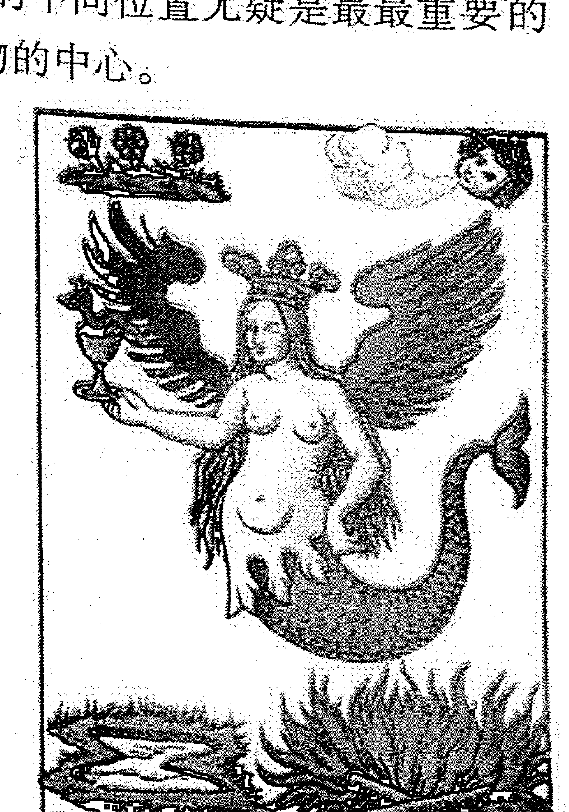

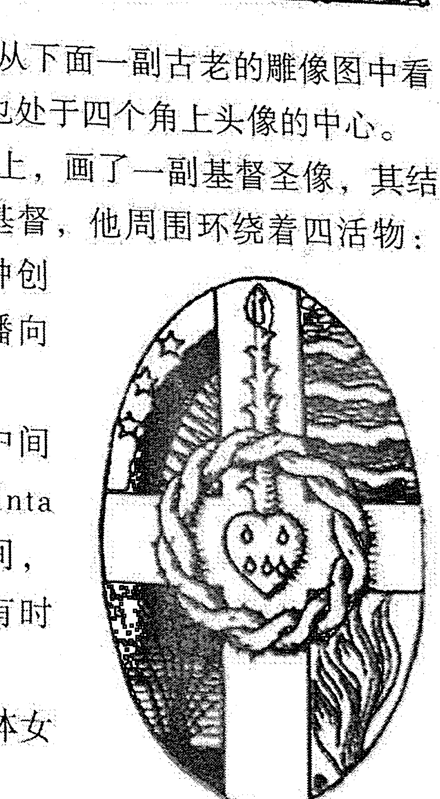子或阴阳结合体为中间位置，裸体一般象征的是灵魂。那么世界牌中的裸体舞者象征的是新柏拉图派哲学中的世界灵魂（Anima Mundi）。世界灵魂是世间万物灵魂的中枢，万物灵魂皆来源于此。裸体舞者双手持有的两根权杖反映了二元性，是一种创造的动力之源。所以，世界牌所代表的世界灵魂是万物的灵魂之源，也是万物灵魂的归所，它是愚人灵性之旅又称灵魂之旅的终点站，也是一个完美圆满的终点站。如果对应到我们的人生，谁说人生没有圆满呢？虽然我们不可能得到一切，但是我们所拥有的就是另一种圆满。

#### XXII. 关于愚人之旅的最后一番话

至此，塔罗大阿卡那的愚人之旅已经告一段落，我们对大牌的初步解说也告一段落。如果各位读者能够通过本篇内容对塔罗牌作出进一步的了解和熟悉、能够引发读者进一步探究塔罗牌意的话，那么我们这里的目的也就达到了。其实上面采用愚人之旅的方式对各张牌所作出的解释并在于告诉读者，这张牌该怎么解释、那张牌该怎么解释，而是给读者提供一种解释的见解，正所谓一石激起千层浪，希望本书的这番解释可如抛进池塘的石块，能够引发大家层层的涟漪与共鸣。

在第四章节说到牌意的概念时，我们已经知道塔罗牌意的一些特征、分类和来源，对牌意的情况有了一定的了解。其中，我们说到，就塔罗牌自身而言，其表达意义有一种最最直观、同时也是最最基础的方式，那便是“符号与图像”。伟特塔罗牌的设计者亚瑟·爱德华·伟特说：“塔罗牌是符号象征系统。”的确，符号存在于每一张牌，表达着各种细节上的信息，这些符号通过组合构成一整张牌的牌图，于是同时一整张牌的图像又可视为一个大符号。然后整个由22张牌组成的塔罗大牌牌组又是由每一张牌图组成，这些牌图按照特定的次序构成一个整体，展现的是塔罗大牌的愚人之旅。无论如何，正是这些大小符号结合在一起，才使得观者可以从中得到体会、作出理解，并由此产生各式各样的意义。

在诸多象征体系中，符号是当中最小的单位。符号可以是一个字母、一幅画、一个数字等任何一个对象。说到这里，我们也许会联想到塔罗牌中的符号真可谓是一应俱全，有文字（牌名）、数字（编号）、图像、及各类细节符号。但是，一个符号只有加载了意义才能传递出意义，这个意义的加载者就是人。在对于符号的认知上，符号在英语中的单词为“Symbol”，原本意为“被一同丢出去的东西”①，就好比一个分为两半的东西，有一半留着，这一半留着的就如我们看到的那些符号本身的样子；而另一半被丢出去的就是那些意义，我们的工作就是把那一半意义再度拾回来，并去理解、感知、体会这些意义。所以说，理解符号的意义，我们不能认为符号的意义就只一种，只要这种意思背出来就行了。这是一种理解上的误区。从释义的角度看，符号和有别于人们日常生活中看到的标志。首先，符号绝对没有“单一的”解释的——这是符号最最基本的概念。符号意义的来源及其关联的范围相当之广，涵盖历史、人文、宗教、同时还有个人的理解。比如“十字”符号，它就不单只有一个意思，基督教有基督教的解释，此外埃及、阿兹特克、印度等等许多文明里中都有出现过这个符号。而标志就不同了，打个比方，某个图像画的是一根烟，烟上加了一个x，这代表的是“禁止吸烟”，它具有一个单一的解释意义，即使一开始你可能会不明白它的意思，可一旦别人告诉你它的意思之后你就知道了，但是这一个的意义也就到此为止了，不像符号可以不断延伸、不断联系、不断扩展。

上面讲述的愚人之旅，作者所采用叙述方式比较偏向于“原型式”的含义，比较靠拢每张牌的核心内涵，而没有过多地展开。这里，读者自己所要做的功课便是将这些原型式的含义作出联系、扩展与延伸，将这些意义往自己需要的方向靠拢，自由地得出自己所需要的意义。这正如著名的心理学家约瑟夫·坎贝尔（Joseph Campbell）所言：“如果我告诉了你某种意义，并接着向你解释这个意义如何延伸、如何扩展以及所对你会带来的影响，那么这就等于对你施加一种束缚。因为别人体会到的意义和你体会到的未必相同的，别人的意义未必适合于你，我们要用自己的精神和灵魂去体验意义，这样体会出

## 第六章 塔罗大阿卡那的体系与结构解读

之前我们所介绍的愚人之旅是以愚人为主角，21张大阿卡那为各级站点，道出了愚人之旅从低层次逐渐发展到至高境界的这么一个过程。那么如果将这一个过程按照相应的理论去分割，是否可以有效地分成若干个阶段？

答案是肯定的。事实上，古今往来已经有许多塔罗学者也都这么去尝试了。他们根据自己的理解，结合相应的神秘学、哲学理论，将22张大阿卡那分成若干个阶段，比较常见的有3×7大方阵结构、2×11的流变之轮结构、毕达格拉斯的圣十结构、六芒星结构、3×7级阶梯结构等等，每一种结构背后都有西方神秘学原理的支持。

这种将一个塔罗整体划分成若干层结构，所得到的结构就叫塔罗体系，对于塔罗体系的认知能够揭开牌与牌互相之间的内在联系和影响，能够给人带来更新、更深刻的认识和理解。

由于本书篇幅有限，这里仅选取两种较为常见塔罗体系进行详述。

### ◆ 数字与新柏拉图主义思想下的3×7大方阵结构

大阿卡那的3×7大方阵结构是塔罗圈内支持人数较多的结构。其实，除了拥有塔罗牌本身的含义支持之外，3和7这两个数字的本身也是重大的支持证据之一。

由于塔罗牌是文艺复兴时期的产物，在对比同期的许多艺术作品就会发现，在这当中，数字的象征意义无处不在，不但体现在这些艺术作品的画面中，而且也隐藏在作品的结构分层中。就比如但丁的文学大作《神曲》，其结构就分为三本书，共计三十三个章节，其突出了数字3的重要性⁽⁹⁾。再比如骰子，两只骰子一共可以掷出21种可能的结果，而三个骰子就能掷出56种可能的结果，这时我们就会发现，21正是塔罗大阿卡那的数量（21+愚人），而56恰恰是塔罗小阿卡那的数量，这些难道只是巧合吗？

就塔罗大阿卡那而言，它包括了21张标有罗马数字的牌和一张没有数字的愚人。21这一数字就是以6为基数累加而至的完美数字（即21=1+2+3+4+5+6），也是第六个三角形数字（即能够构成三角形的数字：如1、3、6、10、15、21、28、36、45、55、66、78），下图的例子就是第四个三角形数字“10”所构成的三角形。

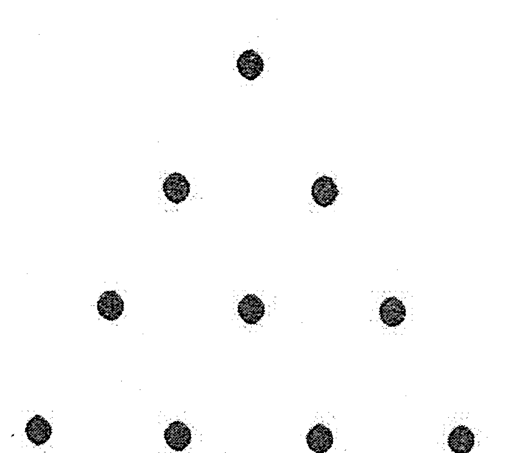

塔罗小阿卡那的数字56，则是一个六层高的“四面体数字”[可以排成底为三角形的锥体（即四面体）的数，其计算公式为n(n + 1)(n + 2)/6]。

# # PART
经典塔罗攻略秘籍

2）/6，那么6层高的四面体数字则为：6（6+1）（6+2）/6=56），下图的例子就是“五层高的四面体”；

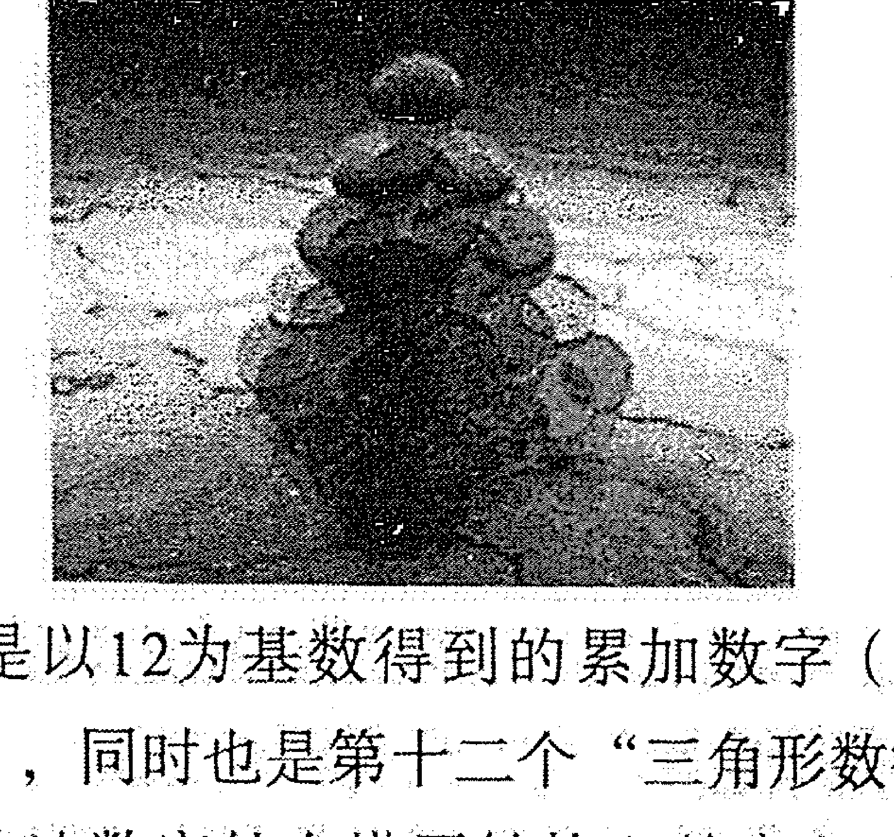

整副牌78张则是以12为基数得到的累加数字（78=1+2+3+4+…+11+12=78），同时也是第十二个“三角形数字”。

以上说的这些传达数字的在塔罗结构上的意义，那么当我们言归正传，将3×7的理念与塔罗大阿卡那的结构结合时，我们就不得不提其中的新柏拉图主义要素。

3×7大方阵结构就是将大阿卡那的1—21号牌分成三个大组，每组七张牌。3×7是理解塔罗数字结构的答案，因为如果某位设计者要以符号与象征的方法来构建一组囊括万物原理的体系，那么按照西方文化的习惯，我们就会发现这个结构的基础数字往往会是3。比如古希腊哲学家对三重合一结构的情有独钟，柏拉图在《理想国》中将一个凡人提升成为智者的阶段分为了三层。而文艺复兴时期的人们对于整个宇宙世界的理解也是三重的：原型界、物质界和联系两者的中间界。这些都是遵循着三位一体的模式。

另外，如果再要在这三层分布中再度进行切割，那么就要轮到数字7出场了。比如当时在人们将整个宇宙世界分为原型界、中间界、物质界的时候，他们同时认为，联系意识界与物质界之间的桥梁，即中间界，是分七阶构成，在新柏拉图主义的宇宙观中，七大行星（月亮、水星、金星、太阳、木星、火星、土星）构成了七级阶梯，连系着地球（物质世界）与天国（精神世界）。

于是，我们从文艺复兴时期人们的世界观中发现了3与7的线索，3作为一个大的结构，7则是3中的小结构。这也是我们经常能在一些书中看到3是神圣的数字而7则是神秘主义的数字的原因。3的神圣是因为它描述了这个世界的构成，而7之所以是神秘主义数字是因为那些神秘主义者就以7作为流溢的阶梯来提升自我，这同样体现了新柏拉图主义的流溢思想。

所以，塔罗牌3×7=21张大阿卡那的数量则体现了神秘主义通向神性的含义，这正好与之前我们说的大阿卡那之旅的神秘主义之路相吻合。

在解说了塔罗大阿卡那之旅3×7结构的理论依据后，我们就要结合大阿卡那本身的含义来解释在这样一个结构中，每个阶段的含义。

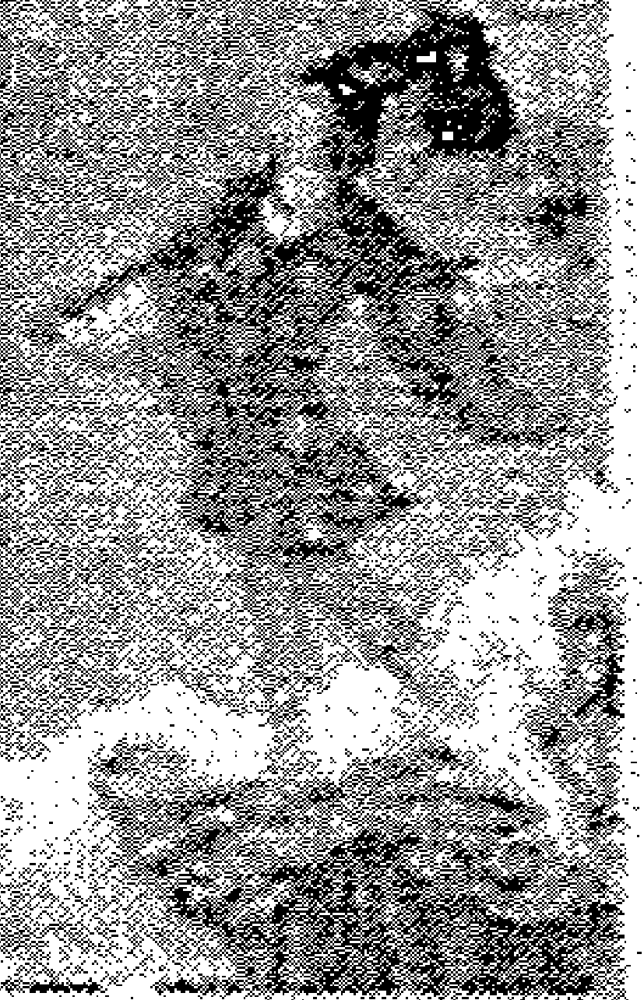

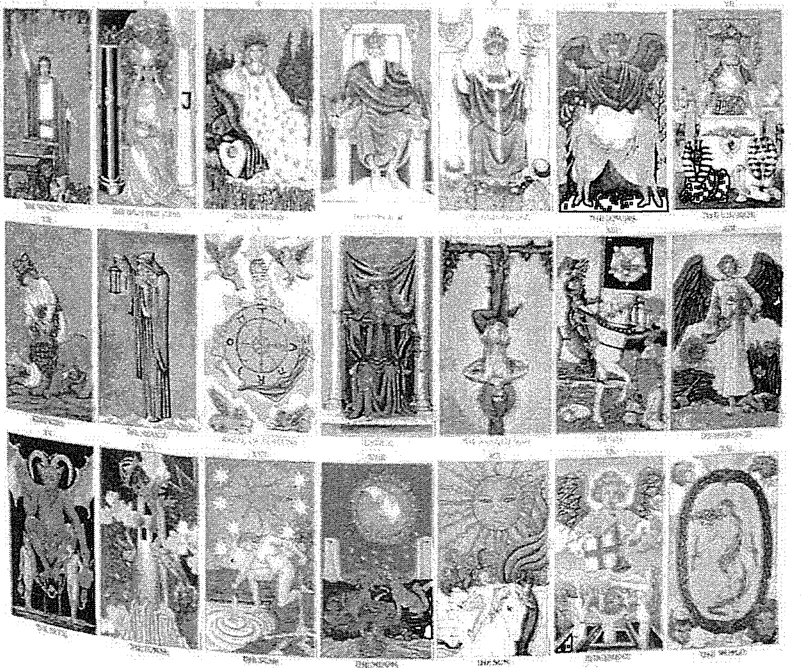

# # TAROT 经典塔罗攻略秘籍

在这个3×7犹如大方阵般的大阿卡那体系结构中，愚人游离于3×7之外，因为他不属于整个愚人之旅的故事，同时又贯穿于整个故事。

除了愚人之外，其余21张牌被平均地分为三组，每组七张牌。如果读者有仔细读完之前对于每张牌的描述，那么也就会发现，这三组牌的之间呈递进、由浅入深的发展趋势。第一组讲述的是物质世界的旅程，第二组为内心世界的旅程，第三组为精神/灵性世界的旅程。在物质世界的旅程中，愚人从处于社会最底层的魔术师（江湖术士、变戏法的浪人）起步，一直到到达象征物质界荣誉的最高点战车。在心理世界的旅程中，愚人从认识、接受、掌控自己心理的阴暗面开始，直到达成无过之也无不及的中庸圆融之道。在精神世界的旅程里，当愚人站在至高的精神层面看待物质世界与心理世界时，两者犹如恶魔掌控下的一男一女，代表迈入真正意义上的重生前的重要一步，直到完成旅程，获得最终的启迪与开悟。

向日葵在《塔罗葵花宝典》一书将3×7结构的三组依次解释为“身/显意识、心/潜意识、灵/超意识”。

Robert M Place在《The Tarot》一书里，将这三组分别对应柏拉图哲学中的灵魂三部分：欲望灵魂、激情灵魂、理智灵魂。

Paul Foster Case则提出，第一组代表了一种力量或能量的外部表达，第二组为这种力量的表达方式和潜在的规则，第三组为深层的作用与影响。

在Rachel Pollack最新出版的塔罗书籍《Tarot Wisdom》中，她认为第一组是个人对于物质生活与外部问题的关注，第二组说的是一种自我的觉知与转化，第三组则是为个人的提升直至达到最终的天人合一境界。

无论哪种说法，虽然用词不同，但剥除语言的外衣，其内涵是一致的。这种过程以大三段、小七阶的方式，诉说了一种精神/灵魂/灵性之旅。如果对这种结构举个形象的例子，那就是爬楼梯，整个旅程犹如一幢三层楼高的楼房，每层楼都有七级阶梯，而作为爬楼梯的主角——愚人——也就是我们，每经历一张牌就好比登上一级台阶，每登完七级台阶就是完成一个楼面的攀登，直至爬完所有的21级阶梯达到顶层。这就犹如“八音度”，每个音阶中都有do、re、mi、fa、so、la、xi，从do一直到xi，当进入下一个do时，音阶就上了一层。一些爱玩RPG（角色扮演类）游戏和SLG（战棋）游戏的读者应该对这种升级体系很熟悉，当经验值达到一定程度时就会升上一级，每升满七级就可以获得一次转职，这种递增提升的形式就是新柏拉图主义的流溢思想，也是3×7塔罗之旅的途径。

### ◆ 二元思想下的流变之轮体系

如果说3×7大方阵结构中蕴含着数字与新柏拉图主义的底蕴，那么作为另一个塔罗大阿卡那的知名结构——流变之轮则是建立在二元思想的基础之上。

二元思想，简而言之，说的是世间万物是由两股互为对立的力量之间战争的产物。我们所处的这个世界被认为是邪恶的，由象征黑暗与邪恶的力量德穆格所创造，也就是基督教理念中的撒旦。另外人类的肉体与较低层次的欲望就是由德穆格所创，但在其中仍有一股与之相对的神性，这就是人类的灵魂，但是灵魂中的这股神性只有在获得启迪之后才能冲破外围物质的束缚。而要获得这种知识，就需要以超越二元（世界）为目标，这种知识也就是诺斯替——以希腊语中意为智慧与真知的词语“gnosis”来命名的词汇。

二元思想自古以来就广泛存在于西方的神话和文化中，柏拉图和普罗提诺清楚地区分出了理念世界和物质世界这一互相对立的二元。古希腊的哲学家们也定下了两大二元基本法则：动与静。而动与静的相互作用则解释了万物的存在。没有两大对立法则，当时的哲学就无法解释世间各物。所以，这也说明了二元理论成为一种被广泛接受的理论的原因。二元理论不单是世间万物的存在法则，也是许多宗教系统的基础，这就是西方宗教与哲学中的二元：善与恶、存在与非存在、物质与形式、理念与客观实在。只是哲学家的任务则是去解释这个道理，而宗教的任务则是告诉大家如何去超越二元。

# # 经典塔罗攻略秘籍

从二元思想对塔罗牌的影响上来说，在小的方面，如塔罗牌图与符号中的二元象征：比如双柱、双壶、阴阳符号、男女符号、白天与黑夜、天使与恶魔等等。这些都只是细节上的小符号。

往比较大的方面来说，20世纪的神秘学家保罗·福斯特·凯斯（Paul Foster Case）曾经提出，塔罗大牌若按照每张牌的次序来看，总能发现后一张牌拥有与前一张相对立的特质③。比如魔术师的站与其后女祭司坐，女祭司敛与皇后的扬，皇后的女与皇帝的男，皇帝的世俗与教皇的精神等等。

再往大的方面说，就要说到塔罗22张大牌的整体结构——“流变之轮”，流变之轮就是将22张牌分为两组拥有对立二元意义的体系结构——无限大符号，它的样子是一个横着摆放的“8”，或者说是相切的两个圆。

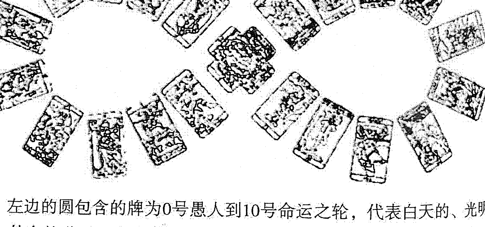

左边的圆包含的牌为0号愚人到10号命运之轮，代表白天的、光明的、外在的世界。右边的圆包含的牌为11号力量到21号世界，代表夜晚的、黑暗的、内在的世界。这就是对立二元的一种表达方式。同时我们也可以注意到，左边象征外在世界的牌其摆放朝向向外，而右边象征内在世界的牌其摆放朝向则向内。

也许，对于塔罗大阿卡那流变之轮结构的解读，最为贴切的仍是心理学家荣格的“个体化”过程。个体化过程是一个自我与本我互相认同，从而合二为一的过程。个体化过程充斥在整个人类生活，并且分为两部分。第一半部分为阳性特质，是关于个人与外部世界的关系，影响到个人意识的发展与自我的稳定；另一半则为阴性特质，是与内在本我作出的联系。

如此，塔罗的22张大阿卡那就在这个体系中被均匀地分成两半，而命运之轮与世界牌的交叉之处便是流变之轮结构的中点。

愚人可以被视为进入这一二元世界的新生儿，纯洁、天真、无知，他经历外部世界的旅程，构建出一个完全的自我，然后当他经过中心点命运之轮的转折，随即进入内部世界的旅程，完善内心世界的本我，直到最后的个体化过程的完成。

整个流变之轮体系的展开形状犹如躺下来的数字8，这一个符号便是无限符号“∞”，象征了永恒法则下“开始与终结”的不断循环，同时也象征了最最原初的合一，对应了西方神秘学思想中“一”的法则，这在魔术师、力量、世界中都有出现。

另外，这个体系从愚人开始，头十一张牌呈向外摆放的形式，而后十一张牌呈向内摆放的形式。如果我们将这个体系的形状“∞”分为左右两部分单独来看，那么就可以把它们当成两个互相咬紧的“齿轮”，若将左轮按顺时针方向转一张牌，那么右轮就会相应的按顺时针方向转一张牌。由此，我们就会发现左轮和右轮的每一张牌都有一一相称的对应。比如在上图中，互相交叉的两张牌是命运之轮和世界，那么当左轮顺时针转一张牌时，原来命运之轮的位置就会变成隐士，而右轮也会随之顺时针转一张牌，原来世界的位置就会变成力量，这时互相紧贴的两张牌便是隐士和力量。以此类推，流变之轮体系的左轮与右轮便构成了互相对应、互相映衬的结构。

从愚人开始，愚人对应了审判、魔术师对应太阳、女祭司对应月亮、皇后对应星辰、皇帝对应塔、教皇对应恶魔、恋人对应节制、战车对应死神、正义对应吊人、隐士对应力量、命运之轮对应世界。

如何来理解这一个对应，不同人有不同的方法。笔者的理解是：前十一张牌表达了一种展现出来的现象、事件、情形，而与之相对应的后十一张牌代表的是这些现象、事件、情形背后的原因与动机。比如，愚人之所以能够义无反顾地无视悬崖向前进行，那是因为他遵从着内心深处的召唤（审判）；魔术师能够利用起身前的资源开展各种行动是因为内在创造力的爆发和流溢（太阳），运用自然之力反过来再去影响大自然、改变大自然；女祭司的智慧与静谧缘于潜意识的指引（月亮）；皇后的慈祥与包容来自于内心的宁静与祥和（星辰）；皇帝以自己意志力去对抗和控制随时而来的剧变（塔），他需要的是一切仅在掌控中；教皇以精神与道德上的准则指引、劝导人们，使他们免于受到物质和欲望的沉溺（恶魔）；恋人中的男女结合始于对立二元交融（节制）；战车的出征是为了迎接那一个全新的开始（死神）；正义的决断源于探寻内部深层的真相（吊人）；隐士脱离世尘，只为全面认识高层次的自我与低层次的自我之间的关系（力量），以最终去面对那一个真正的自己。命运之轮对于命运的洞悉，就是去早了解自我、了解外部世界的基础上找出这两者之间的联系（世界）。

## 结束语：

第二篇关于牌意部分的内容就到此为止了。相信在读者在对塔罗牌意作出全盘理解之后一定非常关心下面的问题——牌意是如何在塔罗预测中体现的？牌意带入预测时又有哪些需要注意的？

以上这些都涉及到塔罗的另一块学问——塔罗预测的艺术。那么，在本书的第三篇，中国塔罗界新星 沙若 带着大家领略塔罗预测艺术世界。

-   ① 《Pictorial Key to the Tarot》 by Arthur Edward Waite
-   ② 《琴诗》——苏轼
-   ③ 《故乡》——鲁迅
-   ④ 《塔罗牌意学：解析牌意的特征》——亮（亮’ s 塔罗时空 http://blog.sina.com.cn/jeaora）
-   ⑤ 《Everyday Tarot: A Choice Centered Book》 by Gail Fairfield
-   ⑥ 《Dante's Commedia and the Tarot》 by Robert V O’Neill
-   ⑦ 《塔罗葵花宝典》——向日葵
-   ⑧ 《The Tarot: History, Symbolism and Divination》 by Robert M Place
-   ⑨ 《Tarot Symbolism》 by Robert V O’Neill
-   ⑩ 《迷踪之国》——天下霸唱
-   ⑪ 《塔罗葵花宝典》——向日葵
-   ⑫ 《The History Art and Symbolism of the Tarot》 by Robert M Place
-   ⑬ 《Iconology of the Early Tarot》 by Robert V O’Neill
-   ⑭ 《The Alchemical Tarot》 by Rosemary E. Guiley and Robert M Place
-   ⑮ 《Iconology of the Early Tarot》 by Robert V O’Neill
-   ⑯ 《The Tarot Cards》 by Gertrude Moakley
-   ⑰ 《其实你已经很塔罗了》——保罗·凡顿·史密斯
-   ⑱ 《Learning the Tarot》 by Joan Bunning
-   ⑲ 《塔罗葵花宝典》——向日葵
-   ⑳ 《第一次塔罗占卜就上手》——清风
-   ㉑ 《The Secret of the Tarot》 by Robert Swiryn
-   ㉒ 《The Western Esoteric Traditions》 by Nicholas Goodrick—Clarke
-   ㉓ 《Tarot Symbolism》 by Robert V O’Neill
-   ㉔ 《The Fool’s Journey》 by Robert V O’Neill
-   ㉕ 《荣格心理学导论》——F·弗尔达姆
-   ㉖ 《The Mystical Staircase》 by Andrea Vitali
-   ㉗ 《A Complete Guide to the Tarot》 by Eden Gray
-   ㉘ 《Tarot Mirrors》 by Mary K Greer
-   ㉙ 《Osho Zen Tarot》 by Osho
-   ㉚ 《老子》
-   ㉛ 《卫斯理系列：背叛》——倪匡
-   ㉜ 《爱莲说》——周敦颐
-   ㉝ 《孟子·告子下》——孟子
-   ㉞ 《The Tarot: History, Symbolism and Divination》 by Robert M Place
-   ㉟ 《The Secret Tradition of Alchemy》 by Arthur Edward Waite
-   ㊱ 《The Symbolism of Alchemy》 by Robert M Place
-   ㊲ 《21 ways to read a tarot card》 by Mary K Greer

### TAROT
经典塔罗攻略秘籍

- 《The Hero's Journey》by Joseph Campbell
- 《Dante's Commedia and the Tarot》by Robert V O'Neill
- 《The Tarot: History, Symbolism and Divination》by Robert M Place
- 《The Tarot: a key to the wisdom of the ages》by Paul Foster Case
- 《Tarot Wisdom: Spiritual Teachings and Deeper Meanings》by Racl Pollack
- 《The Tarot: a key to the wisdom of the ages》by Paul Foster Case

## 第三篇：塔罗游戏的艺术

## 第七章 塔罗预测简介

### ◇ 什么是预测占卜

预测，这是一个我们每一个人都知道的词语，但实际上，对大部分占卜来说，它并不是一个很清晰的概念。如果我们对一个人提问，预测是什么，他可能回答说，“预测嘛，不就是预测未来么？”。但是真的是如此么？电视台中的天气预报也能够预测未来，但是它并不是预测。要被称为预测，是需要一定的条件的。虽然许多人心中很模糊地知道预测的概念，比如知道预知梦不是预测，但是却无法用语言明确地讲出来。而本节的目的，就是要让这种模糊的概念具体化。到底什么才是预测？满足什么样的条件可以称为预测？预测的特征是什么？这些都是本节将要阐述的问题。此外，本节中我们也会探讨预测的目的和用途到底是什么，这将会在给出作者对预测的定义后进行。

现在，就让我们从一些常见的预测手段着手，探讨预测的特征是什么。

有一种预测方法是这样的，在喝完一杯茶后，通过观察留在杯底的茶叶的形状来推测一场战争的胜负。和之前说的“天气预报”相比较，我们能够发现对于一般人而言，预测最为明显的特征，那就是不被现代科学所承认，或者说，没有科学依据。无论是哪一种预测，都是科学所无法解释的，包括本篇主要介绍的塔罗牌预测。几张随随便便抽出的卡牌，为什么会和求问者的生活发生联系？为什么解牌人能知道过去和未来？这些都是科学所没有办法所解释的。也许这就是为什么预测在一般人看来都特别神秘吧。当然，对某些人来说，预测完全是一种迷信，是一种毫无根据的事情。对于这种观点，我只能表示无奈，因为持这种观点的人往往不了解预测，或者是因为先入为主的观念，或者是自己之前见过以预测为形式的骗术，执着地将预测这整个事物全部否定。但是确实，预测是没有科学依据的，是一种我们尚且无法解释的现象，这是真的。

当然，这并非是预测的唯一特征。科学所无法解释的预知未来的现象的话，预知梦也算是其中一种，预知梦的存在与否姑且不论，假定其存在的话，它是不属于预测的。虽然一般人也能意识到它不属于预测，却无法道出为什么。我们再举一种预测方法的例子，这个答案就很明显了。

灵摆这种预测方法也是比较普及的，它通常是在一根丝线的末端绑着一块水晶，可以用来寻找失物，也可以用来回答一些简单的问题。它和预知梦的区别之一是，当我们遇到什么问题想要获得答案的时候，我们可以立刻预测，但预知梦往往并非是随心所欲的，因为这种预测需要的条件只是一个灵摆，只要有了这个媒介，我们随时都可以进行预测，但是预知梦的话相信并不是那么随心所欲就能遇到的。没错，预测的另外一个重要特征就是媒介，预测是通过一个媒介来得到我们所需要的信息。媒介是预测的一个很重要的因素。不同的媒介使得不同的预测方法各具特色，但同时媒介也会限制一种预测方法。比如说灵摆，因为灵摆可以向任意一方向摆动，所以它可以被用来寻物，但同时，灵摆的摆动轨迹却无法表达更为复杂的东西，当我们向它提出某个问题时，它作出的回答只能是诸如“是，否，不知道，不能告诉你”这样预先设定好的简单的答案，这便是它自身的限制。再比如说本部分主要讨论的塔罗牌预测，塔罗牌预测主要问的问题大都是和我们生活相关的，而塔罗牌这种媒介因为有着富含深意的图像，它又常常会显现出求问者的内心想法和不自觉的冲动，这是因为，图像和符号是潜意识的语言，相比于文字，图像更适合表达人们的情绪，感受等。但同时，这也使得用塔罗牌预测某些问题时显得不怎么好用，比如说时间、方位之类的问题。

但是，我们却并不知道我们想要问的事情是怎么反映到我们的媒介上的，这也是为什么预测被认为是不科学的原因之一。战争的胜负为什么会和杯底的茶叶形状联系起来？失物的所在为什么能通过灵摆摆动的方向得知？预测者的生活和内心想法为什么会通过塔罗牌表现出来？这是自然科学无法解释，也无法承认的。关于这个问题我们会在“预测的原理”这一节再讨论。现在我们暂且将它放在一边，继续讨论什么是预测这个问题。

在上面的例子中，还有另外一个预测的特征浮现出来。那就是预测所得的信息的性质。大众印象中预测可能仅仅是用来预测未来的。但是实际上，我们也可以预测过去和现在。比如说，通过灵摆寻物的时候，我们所预测的是“现在”失物所处的位置，而我们用塔罗牌预测的时候，常常会在一次预测中同时涉及到过去，现在，以及未来的状况，此外，预测的结果也不仅仅局限于具体的会发生在现实世界的事件，比如之前举例的，塔罗牌显现出的当事人的内心感受和情绪。甚至，我们可以用塔罗牌预测一些假设性的问题，类似“如果我做了什么，会怎么样”，诸如此类。实际上，预测所能得到的答案很大程度上只受到预测媒介的限制。此外，预测一般不会用来获取我们已经知道或者可以通过常规手段取得的信息。

通过之前的阐述，相信你已经大致明白预测这一活动有着怎么样的特征，但是，这并不是预测这一词所代表的全部。就好像写作，它代表用文字表达自己的想法、情感等的一种活动，但如果一个人说他在学写作的时候，他所学的就是写作这门学问，也就是写作的历史、技巧，等等。预测也是一样，这个词不仅仅代表预测这个活动，也代表预测这门学问。准确地说，预测是许多门学问一个总称，因为各种预测术各有各的方法与媒介，也各有各的历史和学问。

不得不承认，可能有一些人出于种种目的胡编乱造出一些“预测方法”混淆视听，但许多预测术都是有其历史的。在时间的流逝中，预测的方法可能改变，新的理论可能被提出，也可能被推翻，各个时代也会有各自的有影响力的人物。同任何一门学问一样，预测是持续发展的，在过去被认为是真理的理论可能会被推翻，而新的理论也可能会出现，也会出现整合其它学科的知识的情况。

世人对预测的印象可能不外乎两种，第一种便是认为预测是纯粹的迷信思想，另一种便是认为**预测**是什么都能占出的梦幻技术。但从严谨的学术角度来说，这都不是**预测**，**预测**是现实存在于我们身边的事物，它也可能不准，也可能出错，但这是正常现象。一个化学家如果实验失败了，人们肯定会认为是这个化学家哪里出了什么问题，而不是化学是一门没用的学科，但是一个解牌人如果占的不准，人们要么觉得他是骗人的，要么认为**预测**是没用的。人们总是认为，如果**预测**真的有用，那么解牌人的每一次**预测**，都应该是准确无误的。但人们却忘了，这个世界上并不存在完美的事物，正是因为**预测**是真实存在的，它才会出现错误，它才会像其他任何学科一样，需要发展，需要修正，需要整合新的思想。这也是为什么**预测**会有其历史，就像任何存活到现在的学科一样，它随着时间的流逝，被不同的人发展，解读，才形成了现在我们所知的**预测**。

至此，我们便可以为**预测**下一个定义了：**预测**是通过某种媒介，以自然科学尚且无法解释的方式，得到我们无法直接得到的信息的科学与艺术。

这个定义说明了**预测**的性质，但却没有说明**预测**的目的和用途。**预测**在英语中为divination，解释为“get in touch with the divine”，源于拉丁词语“divinus”，而divinus则源于拉丁词语“dues”，意为神。如果用远古时期西方人的观点来看，**预测**是与神明取得沟通，指点迷津、寻求神启，这点可以从希腊古都特尔斐（Delphi）所留存下来的记载了解到。**预测**有预测和预言的成分，但不是主要目的，其主要目的在于寻求指示。

而在西方中世纪和文艺复兴时期，他们对于**预测**的看法也是寻求指示与指引，说简单些就是指条明路。下面就拿文艺复兴时期的一则实例说明：

1527年费拉拉人梵蒂（Sigismondo Fanti）写过一本占卜书，这本书名叫“Triumpho Di Fortuna”，出版于威尼斯。Triumpho Di Fortuna意为命运的胜利，有点战胜命运的意思。这本书中有一幅插图，反应了16世纪文艺复兴时期的**预测**理念，如下图：

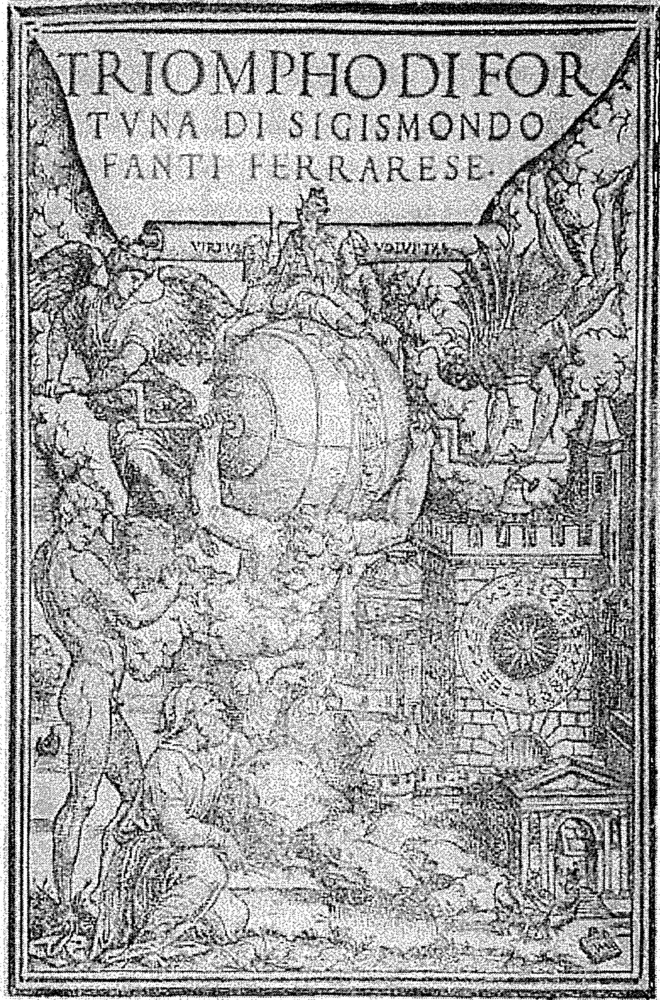

结合上图来解释当时的人们对待占卜的看法。

首先我们会发现近处一位手持骰子的男子和一位占星师，这使我们想到早期塔罗牌中的魔术师与占星师的关联。而骰子在中世纪的时候也有被用作一种简单的占卜工具，另外在当时设计的塔罗牌魔术师的牌面上也是有骰子的。在两人的前方是一条河流，河流的对面是一座城邦，城邦的入口就在钟塔下的门，钟塔上的钟一共有24个刻度，代表时间，由于一天24小时原本应为日月交替，但钟楼刻度中间只画出了太阳，而没有月亮，这寓示了超越时间的永恒、以及超越日月的二元，所以由此我们也可看出塔罗牌中太阳和月亮的寓意，代表时间的循环，也代表了二元。由于钟楼就是进入城邦的入口，所以这座城邦就是当时人们渴望的永恒之城，进入永恒之城就是超越时间、超越世俗的二元法则、超越命运。城外，手持骰子的男子和占星师就在通过预测指引着大家入城的方向，就这里就能看出，这里两个人物角色的作用在于指引，而不是判断谁能进谁不能进，说明预测并非仅仅是简单的预言未来，通过预测获得的信息能帮助我们做出决定，以这种方式指引着人们获得最佳的命运——抵达永恒之城。这就是这幅插图所在的预测书表达的预测理念，也可以反应出当时人的预测理念。

这本预测书中没有提到塔罗牌，但是鉴于图上出现那么多与塔罗牌特征一致的符号，比如教皇、命运之轮、恋人、魔术师、塔、恶魔、太阳、月亮、星辰。这也就为塔罗牌在当时也有可能是被用于预测提供了间接证据。

上述说的就是古代西方人对于预测和其目的的理解。对于我们现代人来说，其本质是没变的，概括地说，预测的目的是寻求问题的建议和对策，得知如何在适当的时机和适当环境下采取适当的行动，使问题得到进展。预测的主要目的虽然不是预测未来，但预测能够指出可能的未来，在给人提供启示和指导的情况下使人去创造未来。

### ◇ 塔罗游戏的方法

在塔罗发展的历史中，出现过不止一种游戏方法，到了现代，许多玩家已经摈弃了曾经流行的繁琐的游戏方法，而是使用更为简单的办法。本节所要介绍的，也是这种简单的方法。这种游戏方法大致可以分为五步，分别是：准备，洗牌，切牌，抽牌，解牌。和新人想的不同，在这五个步骤中，洗牌到抽牌的步骤是次要的，实际上国外有许多玩家通过电脑软件模拟这个过程，自己甚至连牌都不会碰。尽管如此，我们还是建议初学者学习和熟悉洗牌、切牌、抽牌的这个过程。

#### 第一步 准备

如果你是为别人预测，那么在这个步骤中，你需要了解对方所要推测的事情的大概，之后想出一个恰当的问题，然后确定所要使用的牌阵。

关于牌阵是什么，我们可以这样说。当我们抽牌的时候，我们抽的牌数往往不止一张。那么，我们怎么确定要抽多少张牌呢？很简单，这由我们所选定的牌阵决定。比如说，我们使用的是圣三角牌阵，那么我们就需要抽出三张牌，从左到右摆开，这三张牌中，第一张牌代表过去的情况，第二张牌代表现在的情况，第三张牌代表未来的情况。这里，我们抽的牌的张数，它们所摆的形状，它们各自被赋予的意义，就是由牌阵规定的。

如果是为自己预测，那么当然不需要了解事件的背景。但是在为别人预测时，你需要和对方仔细沟通，了解整个事件的来龙去脉。这十分重要，因为如果你做不到这点，你就无法和对方一起想出一个合适的问题，此外，无法做到这点也代表你们之间并没有建立起良好的信任关系，无法进行适当的沟通，而这在许多情况下都可以被视为是一次失败的预测的前兆。在前一节中已经介绍过，塔罗牌更适合表达内心的情绪和感受，试想，如果对方并不信任你，他怎么会对你关于他内心的情绪和感受的阐述作出回应呢？随着塔罗牌的发展，许多玩家都不再将之视为是单纯的预测未来的工具，而是有着类似心理咨询的意义在其中。许多玩家也顺理成章地吸收了精神分析学中的理论。不过说，如果预测的是诸如“现在是不是入股的好时机”这样的问题时，是不需要那样深度的信任的，但是仍然，良好的沟通是必要的。

了解了整个事件的背景之后，你需要和求问者一道想出一个合适的问题，问题决定了预测的方向，之前说过，预测可以获得的信息并不仅限于固定的未来，而是有多种可能性。而当我们提出一个特定的问题，我们就是在这多种可能性中选择了一种，让它呈现在我们的面前。举个例子，一对恋人吵了一架后正在冷战，之后男方来找你分析，你可以预测：如果放任不管，他们会变得怎样，如果男方努力，会变得怎样，或者预测他们会产生矛盾的原因，但是如果你不提问题，你怎么知道你预测的到底是什么？

想出一个好的问题并不简单，实际上，常常看到新手的一个不恰当的问题使得整个分析显得没有意义的情况。在本章的“提问的方法”一节中，我们会详细讲解应该如何提问题。

至于如何确定应该使用的牌阵，因为在第八章中有详细讲解，所以这里也不会赘述。如果你不知道用什么牌阵好的话，现在可以只使用之前介绍过的圣三角牌阵。

#### 第二步 洗牌

在这个步骤中，我们需要把一副牌的顺序打乱，让其中的牌随机排列。一般使用的方法是洗麻将式的洗牌法。顾名思义，这种洗牌法需要将所有牌背面向上地散开放在桌面上，之后用双手将它们打乱，就同洗麻将一样。洗到你觉得合适时就可以将整副牌重新合在一起了。关于洗牌时的方向是顺时针还是逆时针的问题，建议读者不必太在意，随意就好。

此外，并不建议使用洗扑克时用的各种天花乱坠的洗牌方法。首先，游戏并不是表演，这些花哨的洗牌方法会给人一种不严肃的印象，这可能会影响对方对你的信任的建立。更重要的是，这些洗牌方法有可能会伤到牌，而对一个解牌师来说塔罗牌并非是像扑克牌一般可以随用随丢的东西，实际上很多人不会愿意自己的塔罗牌被别人随便碰，更不用说，在国内的环境下，原版牌有着动辄上百的价格了。

#### 第三步 切牌

首先需要说明一点，这一个步骤实际上并非是必需的，因为一般情况下，洗完牌之后的整副牌已经应该是随机排列的了，所以这一步显得有一些多余。而且，这一步实际上有些复杂，用文字描述时很容易让人看不懂。所以如果你不知道怎么切牌，我也不推荐你学习。不过，我还是决定将它的步骤放在这里作为参考。

在洗牌之后，你的面前应该是一叠完整的牌，首先请从这叠牌的上方取出一部分牌，放在原本这叠牌的下方。这个时候，你的面前应该有两叠牌，我们将上方的这叠为A，称新取出的这叠，也就是下方的这叠为B。

之后，从B的上方再取出一部分牌，放在A的上方，我们称这叠新取出的牌为C。现在，你的面前应该有三叠牌，从上到下分别为C，A，B。

最后我们需要把这三叠牌重新组合成一叠。先拿起A，将之放在B的上方。之后把AB组合起来的这叠牌拿起，放在C的上方。于是切牌这个步骤就完成了。

如果你觉得读了上面这些说明之后还是不知道怎样切牌，没有关系，之前说过，切牌并非是必需的，跳过即可。

#### 第四步 抽牌

抽牌的方法也不止一种。你可以直接从上到下抽出需要张数的牌，也可以将一副牌摆成扇形，再由你或者求问者从中抽出需要的张数，或者，你也可以从上到下每隔几张抽一张牌，这些都是可以的。总之，只要能抽出牌阵需要的张数即可。在国内某些塔罗书上宣称某些特定的牌阵需特定的抽牌方法，比如每七张中抽出一张，其实这些都是可以随意的，并没有那么多的限制。

#### 第五步 解牌

这一步才是真正的重头戏，在这一步中，你需要解读你所抽出的那些牌，对第一步中你提出的问题进行解答。这也是本书后三部分所主要关注的，因此这里并不会对这个步骤进行详细的讲解。如果你对解牌的基本都不清楚，可以选择先跳到本章的最后一节，“基本解牌法”。除此之外，在本书中我们也为读者详细地介绍了解牌方法，这些内容在本书的第四篇，由盛亮执笔。在本篇的末尾，也就是第十三章中，你也可以了解到沙若自己所用的解牌方法。

### ◇ 塔罗游戏的原理

在前一节中我们介绍了现代塔罗游戏的一般方法，也许你已经进行了一次预测，并正为其准确度惊异，你是否想要知道，塔罗牌预测的原理到底是什么呢？我们会在本节讨论这个问题。不过遗憾的是，我们没有办法给你一个标准答案。对于塔罗预测的原理，不同的人提出过不同的理论，但我们很难对它们进行验证。有一种理论将塔罗牌预测的准确性归结于我们的潜意识。随着现代心理学的发展，我们发现我们的潜意识知道许多我们自己不知道的知识和信息。所以，我们也可以很自然地想到，对于我们预测的问题，我们的潜意识早已知道了答案，它控制我们的手，让七十八张塔罗牌中特定的那几张在牌阵中出现。除了将塔罗牌表达的信息来源归结于潜意识之外，也有其它类似理论将之归结于超我，甚至守护天使等等。总之，这类理论都宣称塔罗牌表达的信息的来源是我们自己心中我们不知道的部分，通过我们的手，这些知识被体现在牌上。

另外一种常见的理论称，当求问者在洗牌或者抽牌的时候，他们将自己的“能量”注入了牌中，因此牌抽出来的结果才会反映他们的生活。除了能量之外，也有说是震动或是其它什么的。这种理论的关键是需要求问者洗牌或者抽牌，如果不这样做的话，那么按照这个理论，塔罗就会不准确了。但据我所知，并没有许多解牌师在塔罗游戏的时候一定要求问者碰塔罗牌，甚至有完全不愿意求问者碰自己的牌的解牌师存在。

这些理论的共同的特点是需要依靠“牌”这个物件的存在，如果不借助“牌”的实物进行预测的话，这些理论就说不通了。实际上，不用牌进行预测也是很常见的，在我们生活的21世纪，电脑技术和互联网非常的发达，有许多网站都提供了网上抽牌的服务，使用这些服务，你不需要拥有塔罗牌，只需要轻轻一点，屏幕中就会出现一个摆好的牌阵。相比自己动手抽牌来说，使用这些服务非常的方便，快捷。尽管有人怀疑网上抽牌的准确性，但许多人确实都在使用它，包括国外的收费解牌师。我自己也使用过网上抽牌，在我看来，网上抽牌有趣的地方在于，可以随机选择使用的牌种和牌阵，在自己动手抽牌的时候要做到这点还是比较麻烦的。除了不一定需要牌这个物体的存在之外，互联网的出现还使得远距离预测成为可能，这便完全否定了之前说的能量注入说。

## 第三篇：塔罗游戏的艺术

因为远距离预测的可行性，国外有解牌人相信这样一种理论。他们认为，整个宇宙是一体的，宇宙中的一切都以某种方式联系在一起，远距离塔罗预测时，解牌师便从这种联系中获得求问者的信息。同之前提到的理论一样，这个理论也有各种形式，比如说认为宇宙不只是物质而更是能量，在预测的时候，解牌师的能量与求问者的能量相连。这些形式之间，宇宙中的一切联系在一起的方式可能不同，但是这些理论都涉及到整个宇宙是怎样浑然一体，以及其中物理距离很远的人怎样发生联系，因此可以归为一类。

以常识来看，这些理论都带有不可思议，超自然的色彩。这些理论中提到的“能量”，显然和物理学中的能量截然不同，关于潜意识的理论中，人的潜意识怎么知道所有牌背朝上的牌的正面图案为何，也值得怀疑。也就是说，所有的这些理论，以自然科学的角度看，都是不成立的。实际上，所有解释塔罗牌预测原理的理论，都是不科学的，包括塔罗牌自身。自然科学，至少在我们的大部分人眼中，它的基础是实验，实验需要观察，测量，需要限制条件，通过实验得出的结论，如果正确的话，应该是几乎可以被视为真理的。比如说牛顿第一定律，也就是惯性定律，至少在宏观方面上来说，它是在任何时候对每个物体都适用的，不会今天适用，明天就不适用了。化学实验也是类似，只要条件满足，一个化学反应总是会一次又一次地发生。但我们的生活是无法测量，无法观察的，你不能说今天谁和谁的爱情移动了几米，发生了什么反应。人的生活是无法量化的，我们可以说，是“科学无法解释的”。而塔罗牌，我们知道，它反映了我们的生活，所以预测结果和其解释，同样是无法测量，无法观察的。我们没有办法设计一个实验来验证塔罗牌是不是准确的。除非，我们预测的问题是明天会不会下雨。但是，即使我们实验明天会不会下雨的预测来确定塔罗牌的准确性，我们也没办法得出一个“科学”的结论，我们不能说，因为这个玩游戏者一周的天气全部算中，塔罗牌就是准确的了。塔罗牌并不会一次又一次地，在每个人手里都是准确的，我们也没办法观察，什么因素影响预测的准确度，因为我们首先会想到解牌人的状态和水平，而这，又是完全无法量化和测量的。追求塔罗牌的科学解释是完全徒劳的，既然科学无法解释我们的生活，我们为什么要让它解释塔罗牌怎样反映我们的生活呢？

到目前为止，我们介绍的理论都是在为塔罗牌预测的合理性找原因，这些理论都是在说，因为什么什么什么，所以塔罗牌预测是准确的。但是，在所有关于塔罗牌预测原理的理论中，有一个理论并非如此，这个理论是荣格的共时性理论（Synchronicity）。可能许多读者已经听说过这个理论，但却并没有明白这个理论到底是什么。在国内的塔罗牌资料中，关于这个理论的应该只有网上流传的一篇文章，遗憾的是这篇文章对这个理论说得并不清楚，实际上共时性理论是一个非常有见地的理论，尽管荣格不可能接触过互联网，但共时性理论却能够解释塔罗牌远程预测和线上抽牌。

共时性这个词，除了描述这个理论之外，荣格也用它描述与之相关的现象，它将这些现象总结为“有意义的巧合”。“巧合”，也就是说，按照这个理论，并不是因为有什么力量使得塔罗牌预测的结果表现求问者的生活状况，塔罗牌预测的准确性是一个巧合。但是，这并不是说，塔罗牌预测的准确性仅仅是个巧合。荣格在他的《Synchronicity, An Acausal Connecting Principle》中举过这样一个例子，荣格的一个病人告诉荣格，她梦到了有人交给她一只金黄色的圣甲虫，这个时候荣格听到背后的窗户发出轻轻的拍打声，他转过头，发现窗外有一只昆虫，荣格打开窗户后，这只昆虫飞了进来，马上就被荣格抓住了。在荣格所处的海拔，这是最接近金黄圣甲虫的一类昆虫。这是一个巧合，但无法让人相信这仅仅是一个巧合，因为按我们的常识，这样的事件发生的概率接近于零，我们会想到，为什么会发生这样的事件呢？我们很容易就会想到是有什么超自然的力量，或者神灵什么的在背后驱使这个事件的发生，但荣格并没有这样想。尽管荣格研究过炼金术、占星，甚至易经，尽管荣格批判自然科学，但荣格并不是一个神秘学家，他不会采用“有看不见的力量在驱使”这类解释。荣格首先承认，这个事件是一个巧合，并非是有什么因素促使这样的巧合发生，但是，荣格也想到，这样的巧合是有意义的，在其背后，有我们所不知道的原则起作用，将这个病人的梦和第二天的昆虫联系在一起。这实际上呈现了一种我们所不熟悉的世界观，在我们一般的思考中，两个事物如果有联系，那么一定是因果联系，因为我们推一个椅子，所以椅子会倒，这是合理的，但是如果我们推倒了这个椅子的一个模型，这个椅子也倒了呢？椅子模型被推到和椅子倒了显然是没有因果关系的，但它们之间仍然可以有某种联系存在，某种因果关系之外的联系，这种联系也就是共时性描述的“有意义的巧合”。

在塔罗牌预测中，我们也不能说我们抽出来的牌和求问者的生活有因果关系，除非我们承认，存在一些“看不见的力量”，但是，塔罗牌预测出的结果和求问者的生活之间确实是有某种联系的，而共时性就是强调，这种联系是存在的，尽管塔罗牌预测出的结果是随机的，但是它确实是有意义的，是和求问者的生活有联系的。实际上，根据共时性原则，正是因为塔罗牌预测出来的结果是随机的，它才会反映求问者的生活。如果我们洗牌没有洗均匀，那么很有可能会出现几张编号相连的牌同时出现，这就形成了因果关系，因为洗牌没洗均匀，所以这几张牌一起出现了，但是，当我们洗牌洗均匀的时候，我们没办法为预测的结果找到任何物理上的因果关系，这个时候，共时性原则就将预测的结果和求问者的生活联系到了一起。荣格确实相信，存在有一种因果关系之外的法则让事物之间形成联系。当我们在预测中洗牌洗得够均匀的时候，这种法则就发挥了它的作用，这也解释了为什么可以用线上预测代替塔罗牌实物，因为重要的是预测结果的随机性。

荣格在观察共时性现象时还发现，当事人的情绪对这类现象有较大影响，如果当事人的情绪比较高涨，兴趣比较浓厚，那么这类现象会比较容易发生，这个结论主要是从美国杜克大学的JB·莱茵教授所作的关于超感知方面的实验得出的。将这个结论用到塔罗牌预测上的话，也许就可以解释为什么预测的结果显示的不是别人的生活，而是求问者的生活，并且是求问者所关心的生活中的那一个特定的方面。（莱茵实验，简单地说，是让受试者猜二十五张卡片会以怎样的顺序出现，理论上讲，纯猜测只能达到20%的准确率，但实验结果却超出这个准确率。）

荣格还观察到，共时性现象发生时，两个事情之间的联系会不受时间和空间的限制，在莱茵的实验中，时间和空间都没有影响实验结果，无论是将距离增大至4000英里，还是让受试者猜测未来的卡片出现顺序，实验结果都大致相同。这可以用来解释塔罗牌远距离占卜以及不同步占卜。国外有的解牌师喜欢进行电子邮件占卜，求问者将占卜的问题发给解牌师，解牌师在自己抽牌之后，再将结果用电子邮件寄给求问者，共时性理论也解释了这种做法的可行性。

所以就现阶段来说，共时性理论是对塔罗牌占卜原理的解释较好的一个理论，也只有这一个理论能够解释线上占卜、不同步占卜等随着互联网而出现的新兴事物。但共时性理论也并不是一个简单易懂的理论，篇幅所限，本节也只能点到它的一些皮毛，希望读者能从中抓住共时性的基本。

## 经典塔罗攻略秘籍

### ◇ 提问的方法

之前说过，提出一个好的问题并不容易。提出的问题往往反映了解牌师对塔罗牌占卜和其用途的理解，以及对塔罗牌的态度，也反映了解牌人和求问者的沟通是否良好。我们在这里总结了提问题的几个原则，以便读者能更好地了解用塔罗牌占卜时提问题的方法。

第一个原则是不要认真地分析没有意义的问题。所有带娱乐性质的问题都属于这种没有意义的问题。这样的问题有诸如2012问题、明星的个人问题等。这些问题本身便带有八卦性质，即使要分析，带着玩玩的心态就好，不必对结果当真。其他没有意义的问题有诸如，“我的真命天子今年是否出现？”、“我什么时候结婚”、“我的下一个男友是什么星座的？”问这些问题的人都抱着想当然的态度认为这些可以预测，但实际上这些是没法预测的。真命天子到底存不存在，已经是一个很值得商讨的问题，而假如真有真命天子，那么这个真命天子当然要和求问者相守一生，也就是说，我们抽出的几张牌要看透求问者的一生，这几乎是不可能的。另外两个问题也是同样的理由，我们不知道要预测的结果是几个月、几年，或是几十年后的状况。一般塔罗牌占测的问题都主要关注“现在”这个时间点，或者是较近的未来。而即使是占测较远的未来的解牌师，其测出的结果也并非是回答这些问题的。当然，不能占测这些问题的另外一个原因是知道这些问题不能给求问者带来任何益处，了解这些问题的答案并不会对求问者的人生产生任何影响。

如果你不知道怎样判断一个问题是否是无意义的，那么你可以将这个原则这样解读：尽量分析和求问者的现在和较近的未来相关的未来。比如说一次相亲的结果，比如说新的工作岗位上的问题，比如说最近和恋人吵了一场，等。

第二个原则是永远不要在问题中出现“应该”这两个字。许多求问者都爱问“我应该怎么办？”但这个问题是非常不合适的，也是无法回答的。这个问题类似“我怎样做最好”，很多时候我们所做出的选择并不能用简单的好坏评价，每一个选择都会带给我们一些东西，也会让我们失去一些东西，从本质上说它们的区别并不大，而我们之所以会认为一个选择优于另一个选择，是因为我们有自己的好恶，有自己的价值观，所以我们能做出选择。但是，每个人的价值观都是不一样的，对我们来说很完美的选择对别人来说可能并不是如此，所以，“怎样做最好”是一个只有求问者自己能回答的问题，而“应该怎么办”也是如此。当一个求问者提出这样一个问题的时候，他在内心中已经放弃了选择的权力，只等着别人来替他做选择，等着别人来救他，具体地说，这个时候，他是等着解牌师为他做出选择，为他的人生负责任。对于求问者的这种心态，我们不能满足。我们不可以，也无法为他们的人生负责，而如果我们尝试这样做的话，我们只会让他们越来越依赖解牌师，无法自立，并且他们还会认为解牌师帮了他们，甚至会对解牌师感恩戴德。但我们都知道，这并不是在帮他们，而是在害他们。在这种情况下，我们需要做的是告诉求问者对自己的人生负责，帮助他自己做出选择。所以，我们可以问类似这样的问题，“为什么我会陷入这样的困境中”，“如果我那样做，会有什么样的后果”，这样的问题强调求问者自己的主观意识和选择的权力，以及对自己的选择负责任。在占测中，我们不应该将求问者放在被动。

- 第三个原则是慎测时间、方位、健康、财政问题。

由于塔罗牌先天的限制，塔罗牌并不适合用来预测前三个问题。虽然确实有高人预测方位和健康问题能测得非常准，但这是极少见的情况，一般的解牌人面对这方面的问题会感到一头雾水，即使能解出来也不会保证准确性。而对于健康方面的问题我们要尤其慎重，许多解牌师都会直接建议求问者先去医院会诊，并且不接受此类问题，这是对求问者的负责，即使愿意预测健康问题的，也会声明自己的解读并不能代替医生的会诊，建议求问者不要特别当真。此外，“tarotpedia”中，关于“解牌师的职业道德（tarot ethics）”的文章这样写道，“在世界上某些地方，在塔罗预测时提出健康方面的建议会被视为是在提供医学建议，并且这会被视为是不合法的，除非这个解牌师同时也是一个已注册的医学从业人员。”而慎占财政问题则是因为解牌师不一定具有这方面的专业知识，所以不一定能给出合适的建议。美国塔罗协会的解牌师职业道德守则（也就是所谓的“塔罗九戒”）中也有这样一条，“如果我没有法律、财政、医学、心理学方面的从业执照，那么当求问者需要这些方面的意见的时候，我会建议他去咨询一个专业人士。”尽管不是所有人都接受他们的观点，但这一条我认为是很值得参考的。

- 第四个原则是慎测关于其他人的问题。

这里的其他人指的是求问者之外的人，比如求问者可能想要预测他的朋友的爱情进展，或者别人为什么会这样对待他。慎占这样的问题的第一个理由便是这侵犯了别人的隐私权。求问者可能有各种各样的理由，比如关心朋友，比如担心，等等，但事实是他们并没有权力知道别人的隐私，解牌师没有权力，也没有义务帮助他们窥探别人的隐私，这和担心、关心等理由都没有任何关系。第二个理由是如果求问者预测的事情是和他有关的，这样一个问题会将责任转移到其他人的身上。之前已经说过，求问者的生活，只能由他们自己负责。即使他们放弃了自己的责任，他们也要为自己的放弃负责。总之，所提的问题最好还是以求问者为中心。

第五个原则是不要提带有消极意义的问题。我们需要帮助提问者解决他们生活中的问题，帮助他们把人生往更好的方向调整，而不是怂恿他们浪费人生，堕落地活着。当然相信大家都是想帮助求问者的，只是有的时候并没有意识到求问者问了一个消极的问题。这样的情况其实很常见，比如说求问者可能问类似这样的问题，“我们的关系是不是完了？”，“我们还有希望和好么？”，“我的事业是不是就这样到头了？”，甚至是“为什么我总是遇到这样的男人！”，等等。这些问题都会给整个预测蒙上消极的基调。因为当你在解读时，你会去打消求问者消极的想法，或者证明求问者的消极想法是错的，不管事实是怎样，你的解读都会围绕着这个消极想法，而这本身就会助长这种消极的想法。这就类似紧张的时候，一直对自己说，“我不紧张”，结果反而变得更加的紧张一样。

这些消极的问题之所以不提倡，还有另外一个原因就是，消极的问题往往带有放弃的意味，给人一种听天由命的感觉。现代塔罗预测非常强调个人意志和个人选择，认为塔罗预测的未来并非无法改变的宿命，我们可以通过塔罗牌预测更好地了解自己，过上更好的生活。塔罗牌是一种工具，但并不是窥视天命的工具，而是帮助我们实现人生的转变的工具。

在讲完这五个原则之后，我们需要提醒一点，请读者不要死记硬背这五个原则。这五个原则就其本身不过是不要测什么、不要测什么的经验总结而已，重要的是为什么不要预测这些问题，为什么这些问题都是不合适的。我们希望读者不仅能够学到怎样问问题，更能够了解为什么要这样问问题，更重要的是，希望读者能更详细地了解塔罗牌预测的目的和用途。之前我们说过塔罗牌预测的目的是指引和帮助我们，而在这一节中，通过我们对于怎样提问题的讲解，希望读者对塔罗牌预测有更为形象具体的了解，希望读者明白塔罗牌是怎样指引我们的。在本节的最初我们也说了，提出的问题反映了解牌师对塔罗牌预测和其用途的理解，只要你对塔罗牌预测的目的有了全面而整体的印象，对塔罗牌预测持着严肃的态度，对求问者保持负责的心态，那么你也能了解怎样提问题是合适的。

不过，在之前的讲解中，塔罗牌预测的一些重要的特质我们没有讲到。这些特质能让你对塔罗牌预测的目的有更好的理解。

有的时候，寻求塔罗解牌师帮助的人在生活中面对严重的问题，他们自己也深陷在一些负面的观念中，无法看清自己到底遇到了什么样的问题，无法从中走出来，我们可以形象地说他们就如同在黑暗中一样，不知道该往何处走，很多时候尽管他们自己以为是在寻找一个解决办法，却离事实越来越远。这并不是因为他们没有勇气，而是每个人的潜意识中都有自己无法面对的部分。而塔罗牌因其本身丰富的图像，非常适合表现这些潜意识的内容，也就是说，塔罗牌能表现出人们潜意识中自己不想承认的想法，能告诉我们导致求问者处于那种状态的过去的事件和内心的挣扎等，所以塔罗牌预测可以被用来解决这些问题。但是另一方面，面对自己不愿面对的内心想法和情绪并非是一个简单的事。预测之前，他们之所以不能了解自己潜意识里真正的想法，实际上也是一种自我保护。这些想法可能和社会的道德观和善恶观相悖，与求问者自身对自己的认知相悖，所以求问者才在潜意识中将这些想法压抑起来。虽然在一般情况下，求问者会刻意地去逃避甚至拒绝预测中显示的自己不愿意面对的内容，但是求问者受到精神打击的可能性还是存在的。而解牌师要帮助求问者解决这些问题，要帮助求问者面对自己不愿意面对的部分，要帮助求问者自己选择自己想要的生活而不是自己沉沦，塔罗解牌师需要的不是作为一个解牌师应有的知识和技巧，而是作为一个心理咨询师需要的知识和技巧，这也是为什么现代塔罗解牌人吸收了荣格的精神分析学的理论和方法，毕竟现代的塔罗牌预测和心理咨询在许多时候处理的是相同的问题。正因为如此，一个塔罗解牌师也担负着心理咨询师的责任。对于求问者的人生，我们并没有责任，但是我们必须意识到，我们分析出来的结果，我们说出来的话，是可能对于求问者的内心和求问者所做的决定产生影响的。求问者可能把塔罗牌占测当成是一种单纯的娱乐。但作为一名解牌师，我们明白，塔罗牌并不是完全娱乐，所以许多解牌师并不愿意配合求问者，去分析一些纯粹娱乐性质的问题。
塔罗牌与心理咨询的类似，也提醒了我们，当我们在占测的时候，不一定非要注意外部的事件，可以从求问者的内心着手。比如，我们可以问，“为什么我总是无法控制自己的情绪？”，“对他，我内心的真正想法到底是什么？” 当我们处理这些问题时，我们也许会发现求问者在心中一直有着童年的某些事件的阴影，或者发现求问者对自己的伴侣的依恋并不单纯。也就是说，塔罗牌可以当作是用来帮助求问者探索内心的工具。实际上，即使是没有特别强调探索内心的分析中，许多解牌师也会解读出求问者的内心情感和想法。我们在日常生活中的行动和所作的选择，很多程度上受到了我们的过去的影响，或者是带着我们不知道的阴暗情绪。比如说一个成年男人在选择自己的伴侣时，他可能并不是真的是喜欢那一位女性，而是出于对自己的家庭的叛逆心理。当自己的生活出现问题时，许多人并不会意识到这实际上来源于自己的内心，而仅仅是把它当作是一个生活中的问题，也就是说，他们很可能不会去咨询一个心理咨询师。且不说在中国，即使他们发觉问题源自自己的内心，也有可能不去咨询心理咨询师。但是，如果他们不抵触塔罗牌的话，他们就这个问题去咨询一个塔罗牌解牌师的可能性是比较大的。这是塔罗牌占测相比于心理咨询的一个优势。在节奏日益加快的现代社会，许多人并没有闲暇关注自己的内心，但是这并不会使得他们的心理问题消失，这是现代社会的悲哀，虽然我们没法改变，但我们至少可以尽力帮到那些来找我们玩游戏的人，当然，前提是这个求问者是带着认真的态度前来的。

### 基本解牌法

解牌的过程是非常个人化的，不同的解牌师的解牌风格可能迥然不同。有的解牌师也许喜欢引用许多理论知识，而有的解牌师完全靠自己的经验，还有一些解牌师主要依靠自己的直觉。不同的解牌师解读同一个牌阵，详略、侧重、解牌的角度都可能不同。要从这些解牌风格中整理出一个清晰的套路是不可能的，因此在本节中，我们只能根据我们的经验，向读者介绍一种比较简单和基本的解牌方法，作为一个参考。随着你的经验和知识的积累，对牌意和牌阵的理解的加深，你会自然而然地发现属于你自己的风格。在塔罗牌吧中的一场讨论中，楼主提到靠直觉解牌和靠理论解牌的问题，当时“王不留行”叔说，“妹子，你没法选择理论还是直觉，你只有被选择的份儿。”尽管本书的读者不会都是妹子，但结论是一样的，你不大能决定你自己的解牌方法是什么，只能发现你自己的解牌方法是什么。

我们本节讲解的基本解牌法的核心是“联系”。首先第一步，是你需要能够将牌面和牌面背后的涵义联系起来。见到78张塔罗牌中的任何一张，你都要知道，它的牌意是什么。比如说当你看到权杖5时，就应该想到它代表激烈的争端和冲突。当然，这对于塔罗牌的初学者来说有一定的难度，不过，初学者们刚开始时完全可以选择照着牌意书进行解读，《七十八张牌的智慧》是个很好的选择。但照着书解释仅限于初学阶段，在学习和练习一段时间后，就应该开始尝试离开书本解读了。

第二步，你需要能够将牌意和牌在牌阵中的位置的含义联系起来。比如说，我们在圣三角牌阵中的过去位置抽到了权杖5，那么我们就可以说，这个激烈的冲突是发生在过去的。当然，这只是最简单的联系，实际上牌阵中的位置的含义在某些情况下并非是如此简单，当它和牌意联系在一起时，我带给我们的见地比现在举的这个例子要多。不过如果你对解牌的经验还不是太深，那么大可以在有了练习的积累之后再考虑这个问题。对于牌阵的解析在本书中是在下一章，你也可以现在去了解这些。

第三步，你需要将第二步的结果与求问者的状况联系起来。还是举权杖5的例子，假设求问者问的是事业方面的问题，而他们又是在创业，那么我们就可以得出结论说他们这几个创始人之间曾经有过激烈的冲突。

将这几个步骤对每一张牌走一遍之后，也就大致完成了一次解# TAROT
## 第三篇：塔罗游戏的艺术

读。但是，再次提醒你，这几个步骤只是提供给初学者的参考，这几个步骤所做的是最为浅显的解读，在牌中还蕴藏着更深的意味需要你自己去发掘。比如说刚刚的权杖5，这张牌并不是代表一般的意见不合，而是激烈的争端，是带有权杖牌组的火气的，那么我们可以说，有可能这个创业团队年轻气盛，在讨论问题时不够冷静，他们讨论问题时像是在吵架而不是在讨论，所以在最后可能是弄得每一个人都一肚子火气但却并没有解决什么实质的问题。

此外，这种基本解牌法并没有告诉你应该怎样和你的提问者沟通，而在实际预测中，这却是异常重要的。提问者的反应能使你知道你对某一张牌的解读是不是正确的，当你解读出现错误时他们的反应能马上将你拉回正轨。更重要的是，和求问者的沟通能够使你解读的更好，他们的反应能给你新的灵感，有的时候随着解读的进程他们会告诉你之前没有说过的故事或者内心情感和想法，这些都能够使你更好地解读你手上的牌。在我自己的解读过程中，即使是在互联网上，只要对方是持合作态度，对方的只言片语甚至只有一个“嗯”也能让我对整个状况产生更好的把握。而在面对面分析，也就是一般所说的面测中，你更可以从求问者的表情，动作中了解到你的解读对他产生了怎样的影响。

塔罗牌能用仅仅78张牌表达我们在生活中遇到的各方面的问题，其中一个因素便是每一张塔罗牌的图像都表达了很广泛的含义，比如说圣杯6可以代表与小孩相关的工作，也可以代表童年的回忆，也可以代表已经长大的人回到故乡，想起一些已经忘记的回忆，有许多种可能性。我们说塔罗牌预测的结果很模糊，指的并不是塔罗牌预测不准确，而是指不具体。我们可以预测出回忆，当周围有其他牌的时候我们可能分析出这个回忆是什么样的性质，给求问者造成了什么样的影响，但是我们很难知道具体发生了事情，所谓的模糊指的是这个。也正是因为不具体，塔罗牌才能表现生活中各种各样的事情。而我们在解读的时候，则需要将预测的结果具体化，从一张牌的许多中含义中找出一个或者几个最合适的含义，深入了解具体的状况。而这个具体化的过程，离不开和求问者的沟通。求问者告诉我们的事件的背景，他自己的想法，事件相关的人的状况，这些信息每一次在我们心中和其对应的牌的牌意整合之后，我们对这张牌所表达的意义的理解就更具体，更深入，对求问者的现状的把握就更全面，也就是，能更好地帮助求问者。

当然，想要学好解牌，最简单也最关键的步骤只有两个，多学多练。多从书本和解读中学习新的知识，多在实践中练习自己的能力，总有一天，你会感到你不是在解读塔罗牌，而是塔罗牌在向你述说一个又一个的故事。

## 第八章 牌阵与牌阵的选择

### ◇ 为什么要使用牌阵

在前一章之中我们大致提到了什么是牌阵，也给读者介绍了一种最为基本的牌阵：圣三角。而在这一章中，我们将对牌阵进行专门而且深入的讲解。尽管相比于解牌来说，牌阵是一个常常被忽视的元素，但这并不代表牌阵是不重要的。相反，同所提的问题一样，牌阵为我们解牌铺下了基础。选择一个设计不合理的牌阵可能会使得整个解读无法进行下去，而选择一个好的牌阵则从更好的角度呈现我们所预测的问题，让我们解牌时更为得心应手。因此在本章节中，我们将会阐述关于牌阵的目的，历史，也会介绍和分析一些经典的牌阵，让大家对牌阵有更好的了解。

在早期神秘学家关于塔罗牌的作品中，介绍的是一些复杂的推算方法。在这些方法中，并不是洗完牌之后就可以抽牌了，而是要经历一系列繁琐的步骤，才可以抽出需要张数的牌，开始解读。比如说Paul Foster Case的《Oracle of the Tarot》中介绍的圣三角推算法，在洗牌后需要将牌分为四叠，分别对应上帝四字真名（Tetragrammaton，由四个希伯来字母Yod—Heh—Vav—Heh组成）中的一个字母，之后解牌师要在这四叠牌中寻找指示牌（代表求问者的一张牌），再根据寻找的结果判断求问者的问题将是关于生活的哪个方面，并且，如果这个判断出错了，那么解牌师应该在至少两个小时后再为他分析。如果这个判断正确了，解牌师则将有指示牌的那一叠牌拿出，再将这叠牌分成三叠，每一叠分别代表过去、现在和未来，在解读时解牌师需要解读这三叠牌中的每一张牌。也就是说，用这种方法，在每一次的解读中解牌师都需要解读接近20张牌，这确实是一件很恐怖并且累人的事情。而现代的解牌师几乎完全抛弃了这样一种繁琐复杂的解读方法，指示牌的使用与否也变得全凭个人喜好。但是，“牌阵”这个思想留了下来，现在我们用圣三角预测的时候，也会有过去，现在，未来三个位置。同时，这本书中出现的另外两个牌阵，十二宫和生命之树，也一直保留到了现在。

生命之树是犹太秘密传统卡巴拉中的核心观念。它由十个被称为“源质”(Sephirith)的球体组成。生命之树被称为是“诠释宇宙与世间万物原理、结构与彼此关联的地图”。当然，这里说的宇宙并只是物理宇宙。卡巴拉作为一种带有极大宗教性的传统，其理论当然严重地涉及到上帝，天使之类的概念。如果你对这些概念有一些排斥的心理，那么这里把生命之树视为一种哲学体系即可。但是，在塔罗牌相关的许多理论中都有类似的概念。还是建议读者先抱着研究的态度了解一下，而不要先把这些理论全盘否定。

但是，为什么是牌阵能够保留到了现在？为什么牌阵没有随着历史的前进被淘汰掉？这是因为牌阵对于塔罗牌预测有其独特的价值。当我们使用一个牌阵的时候，我们是在通过这个牌阵规定的几个视角去看一个问题，比如当我们使用圣三角的时候，我们通过过去，现在，未来这三个视角来看一个问题，如此，我们就能看到事情是怎样演变到现在这种状况，现在又呈什么样的发展趋势，这给我们的解读提供了一个切入点。一个原本我们一无所知的事件，我们要在几十分钟内掌握这个事情的大概，深入分析当事人的心结和情绪，我们需要一个切入点，有一个了解整个事件的出发点，而牌阵就给我们提供了这样一个出发点。如果没有出发点，我们可能会感觉求问者的状况十分复杂，难以掌控，感到雾里看花般的困惑。当我们在使用一个牌阵时，我们实际上是将需要预测的问题再化成几个小问题。我们提出的问题很可能比较抽象和复杂，很难直接回答，需要结合事实的状况，求问者自己的想法，求问者周围的人的想法，以及我们自己的解读，才能得出一个明确的答案。而我们的牌阵就可以用几张牌代表事实的状况，用几张牌代表求问者的想法，等等，用这种方法将一个复杂的问题化成几个小问题，让我们能够更容易更方便地进行解读。而为特定的问题设计的牌阵，还会将问题分解为几个更有针对性的问题，而不像圣三角之类通用的过去、现在、未来。比如说专为爱情设计的灵感对应牌阵：

| 位置 | 含义 | 位置 | 含义 |
| :--- | :--- | :--- | :--- |
| 1 | 你对对方的看法 | 2 | 对方对你的看法 |
| 3 | 你认为目前的关系 | 4 | 对方认为目前关系 |
| 5 | 你期待将来发展 | 6 | 对方期待将来发展 |

我们看到，在这个牌阵中，恋爱双方的想法都有兼顾到。而相比于圣三角之类的牌阵，灵感对应这样强调“两个当事人”的牌阵更能帮助我们看到两个人之间的问题，促进他们更好的沟通，等等。类似的，专门为健康设计的牌阵可能会用一张牌代表一个部位的健康情况。也就是说，一个设计合理的牌阵，本身就会将事件的状况做出一定程度的解析，它会以一种合理的形式将我们需要了解的关于这个事件的方方面面展示出来。

对于我们现在一般使用的牌阵来说，这样的解释是说得通的。但是十二宫牌阵和生命之树这类的牌阵在表面上看并不是这样。它们并不是为某种特定的问题设计的，看起来甚至和我们的日常生活毫不相关，而是充满了神秘学理论。看起来这样的牌阵，在解决我们实际问题的时候也许并不能起到什么作用。但是，实际上并不是如此。我们之所以会认为神秘学理论对解决实际问题没有作用，是因为我们不了解神秘学理论。关于神秘学理论的中文资料现在还非常地缺乏，所以国内大部分塔罗牌学习者对于神秘学理论的了解并不深，当他们看到生命之树牌阵的时候，仅仅会觉得“哇，好深奥”和莫名其妙而已。这是由于大陆的环境限制，并非一天两天就能够改变的。但是，至少希望大家能在观念上转变过来，明白神秘学的理论并非只是一些玄而又玄的哲学思想，而是一种关于世界的真相的理论和世界观。一个神秘学家的世界观可能和普通人的世界观大相径庭，他对许多事情的理解要比一般人都要更为深入，比如22张大阿卡那表达的主题，这些思想并不是作为一种知识存在于他的记忆中，而是成为他的世界观的一部分指导着他的行动。神秘学是一门比大部分人所想的都要实干的学问，只是这种实干并不不同于我们的常识所定义的实干。类似的，加入了神秘学思想的这些牌阵，实际上也并不是那么玄乎，它只是根据神秘学的思想解析我们所要预测分析的问题。实际上，在许多时候，我们会发现使用这些加入了神秘学思想的牌阵比那些容易理解的牌阵更方便解读，因为这些牌阵中所蕴含的神秘学思想实际上在我们生活中的各处都有体现，只是我们往往无法注意到，当我们使用一个蕴含神秘学思想的牌阵的时候，我们实际上也就在看着一个事件的核心内容，我们关注的并不只是事件的表现，而是驱动事件如此表现的力量。比如经典牌阵圣三角，“过去”的位置可以代表求问者过去的习惯和心结，“现在”位置可以代表求问者现在的行动和想法，而“未来”位置可以代表求问者对未来的期望和理想。也就是说，圣三角这个牌阵所表现的不一定是发生在三个时间段的事情，而可能是驱动求问者行动的三股“力量”。通过解读这三股“力量”，我们不仅能了解发生过什么和将要发生什么，更能够了解为什么事情会变成现在这个样子，为什么事情会向那个方向发展。如此，如果未来的发展并不顺利，我们就可以寻找导致未来发展不顺利的因素，进而改变它。在塔罗牌预测中，很多时候我们看到，知道未来会怎么发展，求问者愿意改变未来，这两个因素并不足以改变未来。我们每个人的行动都由多个因素控制的，我们并不是仅仅凭着脑子里瞬息万变的一些想法来做出决定，而是极大地受着文化、记忆等的影响，如果我们永远不知道我们为什么会在未来做出那样的决定，那么我们只会一次又一次地看着塔罗牌分析出的未来成为现实却无能为力。在接下来的几节中，我们会向大家详细介绍几个这样的优秀牌阵。

### ◆ 圣三角牌阵解析

圣三角是一个简单易懂的牌阵，三个位置，过去，现在，未来。但是，这只是圣三角的最常见的形式。在国外，圣三角这个牌阵并不叫这个玄乎的名字，而仅仅是“三张牌牌阵”，也许有同学会疑惑，那么其他由三张牌组成的牌阵怎么办。国外的做法很简单，就是将所有由三张牌组成的牌阵，都称为“三张牌牌阵”。但是，这种状况仅限于三张牌的牌阵，国外也并没有将凯尔特十字和生命之树都称为十张牌牌阵。那么为什么所有三张牌的牌阵都被视为是同一种牌阵呢，我们可以从三这个数字着手解释这个问题。在许多宗教和文化中，我们都可以看到以三个为一组出现的事物。比如说基督教的三位一体，现代巫术中的三个神，中国文化中的道阴阳，弗洛伊德的人格结构理论。再比如生命之树除去最下方的王国之外，是由三个三角构成的，卡巴拉的元素理论也被称为三元素理论，对应希伯来字母中的三个母字母。再比如说潜意识、意识与超意识（superconscious）。这些以三为基础的体系都有着一些相同的特征，那就是在这个系统的三个元素中，我们往往能发现一个元素是阴性的，一个元素是阳性的，而另一个元素则可以被视为是阴阳的结合。现代巫术的三个神中一个是男神，一个是女神，而另一个神则被称为是全（the all），这个“全”被视为是无法了解无法觉知的。基督教的三位一体虽然全是阳性元素，但在诺斯替的教义中，圣灵被视为是上帝的阴性的一面。卡巴拉的风、水、火三元素也显而易见地符合这个模式。

既然这些系统都符合这个模式，那么当我们把它们用到牌阵的设计上时，这些牌阵显然会给我们一些相同的感觉。正是因为这个原因，我们才可以将这一种牌阵统称为三张牌牌阵。不过，也有一些由三张牌构成的牌阵并没有被称为三张牌牌阵，比如说身心灵牌阵，但是这个牌阵和圣三角依然是有相通之处的，读者在第四篇中看到身心灵牌阵的例子的时候，相信自然就会明白了。另外，为了符合我们的习惯，本书中还是会将这些牌阵都称为圣三角。但是，这又引起了一个问题，那就是我们原本所认知的时间之流的圣三角似乎并不符合这个模式。之所以会出现这个问题是因为我们对于阴性与阳性的了解不够，我们可以这样说，阴性是固定的，过去也是固定无法改变的，阳性是变动的，而未来也是充满多种可能性的，但是，我们手中能掌握的，却只有现在，我们在“现在”这一刻所做的事，由我们的过去与我们对未来的期望所影响，以我们过去的遭遇为基础，会决定我们在以后的遭遇，从这个意义上来说，它也是阴性和阳性的结合。

这些知识在国内尚未听说有人教授，其中一个原因似乎是大家对牌阵的关注度不高。只是偶尔见到有新人在提关于牌阵的问题，但度过这一阶段的同学们似乎都满足于自己熟悉的几个牌阵，不再花时间研究牌阵相关的问题。除了本书的另一位作者盛亮外，我也只看到过小皇帝同学写过一篇关于圣三角的小文。在文中，他提出了意识流的圣三角，也就是之前提过的潜意识、意识、超意识，但是，他在文中并没有详细解释这个牌阵各个位置的含义。而意识流的圣三角在各种形式的圣三角中也是用的比较多的一个，此外意识流的理论在大阿卡那的3×7结构中也扮演着很重要的角色，因此，在本节中我们将会详细讲解意识流的圣三角。

意识流理论其实并没有这个如此正式的名字，我们也不知道是谁最先提出这个理论，但是，这个理论却被人们广泛地接受着。潜意识、意识、超意识，这三者中的“意识”并非是指我们的意识这个整体，而是指我们自己有自觉的意识，也就是所谓的显意识，而潜意识和超意识都是我们在大部分情况下却没有自觉，但却又影响到我们的决定的。这三个部分加起来，才是我们的完整的意识。由于弗洛伊德的强大影响力，潜意识并不是一个大家十分陌生的词，根据弗洛伊德的定义，潜意识中存在的的是我们在成长过程中被压抑的想法，这些想法可能与社会的道德相悖，可能是自己都无法接受的黑暗想法，可能是以前某个事件的心结，等等。在弗洛伊德提出潜意识这个概念之后，人们突然发现，原来我们并不了解自己，我们也并不了解我们的想法，虽然，并不是真的人们到近代才知道我们不了解自己，古希腊的阿波罗神殿上就赫然刻着“认识你自己”这几个字。随着潜意识这个概念的出现，人们进而发现除了这些被压抑的想法之外，我们的人格中还有其它我们没有意识到的部分，进而提出了新的概念，下意识便是其中之一。下意识指的是对内外环境中的讯息未加注意，因而对其所感知的一切，均未达清晰了解的地步，比如在平坦笔直而车少的路上开车之类已达娴熟的工作。而我们这里所说的潜意识，是一个较为广义的概念，包括弗洛伊德的潜意识概念，也包括下意识等。我们的潜意识呈现怎样的样貌是由我们的过去决定的，不管是已经熟练的工作，还是几乎要忘记的儿时心结，都是由于我们在过去的行动和遭遇才会发生。过去发生的事件能反映我们的潜意识，我们的潜意识也能表明过去的事件在我们看来是什么样子的。因此，在我们用圣三角预测时，我们可以在一定程度上把过去这个位置以潜意识的解法来解。

而意识，或者更准确地说，显意识，就是你自己此时此刻能觉知到的自己的想法。比如说，现在你的显意识主要关注的应该就是本书此页此行所写着的文字，如果并非如此，那么也许你并没有在集中注意力阅读本书。我们知道，人的想法是极易变动的，我们的脑袋无时无刻都在不停地思考着，转动着。轻浮和无力，就是显意识的特点，我们大部分时间都不会觉得自己现在所在想的事情是没有意义的，但是实际上，我们这个没有停止过的“想”这个行为实际上并没有经常得出有益的结果，我们可能天南地北地想，但也仅仅是想想就完了。但是，显意识也并非总是这样，显意识的另外一个特征是它可能集中于某个特定的事情。在本段开头，我们说，“如果并非如此，那么也许你并没有在集中注意力阅读本书”，当我们的显意识集中于某一点时，它就不再是不停变动，不可预测的，而是固定的，并且这种固定是可持续的，我们可以说，当你在读这本书的时候，通常情况下，你的注意力是集中在你正在读的内容上的。同样，当我在写这本书的时候，我的注意力是集中在我正在下的内容上的。这是显意识的一个非常重要的特质，不过，我们并不会在现在深入讨论它，当我们大致阐述完关于超意识的内容之后，我们会再来讲解这个问题。实际上，潜意识、意识、超意识是一个整体，我们不能在不了解其它两个的情况下深入了解它们中的一个，同时，了解它们中的任意一个都会对我们对它们的整体有更深的了解。

超意识对许多人来说是一个闻所未闻的概念，不仅仅是因为这是个外来词汇，更是因为这个词汇所代表的含义对我们是陌生的。实际上，即使在西方，超意识对一般大众都是一个陌生而奇怪的词汇。在现代社会，我们关心的更多的是事业、家庭、爱情等这些很现实主义的事情，而不是类似人生的意义，为什么活着这样的抽象命题，而超意识就是这些抽概念中的一个。在塔罗牌中，超意识是高塔牌中击中塔的闪电，是星辰牌中悬挂在天上的八角星，是审判牌中的天使，也是世界牌中的舞女。最初，我们自身的超意识让我们感到恐慌，因为我们的显意识只能看到现在眼前的事物，而超意识却驱使我们远离我们已有的成功。超意识是一颗希望之星，在星辰牌中我们虽然无法直接感受到它在我们自身中，却能因它而保持冷静和专注，这个时候，支撑我们的不是周围的人的支持，不是过去的业绩，不是眼前能够看到的成就，而是充斥在心中的希望，以及对我们所做的事情的本身的喜爱。在我们的日常生活中，我们很难做到不顾他人想法，放下自己过去的成就，追求自己想要的东西，甚至，当我们以为我们在追求自己想要的东西的时候，我们往往只是在逃避别人的压力。我们真正想要做的事，真正能让我们感到快乐的事，在我们的日常生活中，我们很难感受到。许多人认为，我们之所以会这样，是因我们充满烦恼的过去，遮住了我们真正的自己，我们的超意识，让我们不知道我们是谁，为何在这里，只有当我们知道自己日常生活中的行为是如何受记忆的影响，当我们不断了解我们“自己”实际上受着许多事物的影响后，我们才能从这些控制自己的事物中解放出来，才能允许超意识浮现出来，而这也是塔罗牌中的恶魔牌所表现的。在经过星辰、月亮、太阳之后，我们的超意识已经浮现出，我们已经改变，只是我们自己还没有意识到，在最后，我们发现自己成为世界牌中的舞女，带着这种超意识回到生活中，实现我们人生真正的目的和价值。

但是，这是大阿卡那所表达的理想化的过程，我们很难在生活中做到对超意识完全的觉知。因为，所谓的“我们对超意识觉知”，也是指我们的显意识与超意识相接触，让超意识的内容流入我们的显意识中，通过这种方式我们产生了对超意识的觉知。但是，之前也说过，显意识的一个特征是轻浮和无力，我们的大脑总是在不停地转动，这是没有办法接触到超意识的。想要让我们对超意识产生觉知，我们需要显意识的集中力，通过集中，我们可以使我们心中这些嘈杂的声音停下来，进而将我们想要觉知的超意识或者潜意识中的部分带入我们的显意识中，这也是魔法师这张牌表达的主题之一。注意在上面这句话中，我提到“超意识或者潜意识”，为什么我们要觉知潜意识？我们知道了解我们潜意识的想法可以使我们活得更自由快乐，但是为什么，当我们“想要对超意识产生觉知”时，我们要把潜意识的部分带入到我们的显意识中？这个问题的答案在于这三种意识的结构。它们并不是并列排列的，而是潜意识在显意识之下，超意识在潜意识之下。因此当我们想要觉知超意识时，超意识会先流入潜意识中，然后再流入到我们的显意识，在这个过程中，不可避免地潜意识本身的一些内容也会被我们觉知。而当我们没有刻意注意自己的意识，完全凭感觉行动时，这个流动依然成立，在我们的每一个想法中都存在潜意识中的想法，而这些潜意识中的想法中又有超意识的内容，这个时候，我们以为我们的想法，我们的行动都是出于我们自己的意志，但是实际上我们却是基于我们的潜意识在行动，我们并没有在控制自己。我们可以举一个稍微极端一些的例子，我曾在报纸上看到过一则新闻，一户人家中，妻子时不时就必须得要丈夫或者儿子抽打她，否则便浑身不舒服，迫于无奈，她的丈夫和儿子也只得这样做，最后心理学家发现，之所以会这样，是因为这位妻子潜意识中在自己高文化水平的丈夫和儿子面前有自卑的心理。在这个例子中，我们可以清楚地看到这个妻子的行动不太寻常，我们也可以比较容易地想到也许这需要一位心理学家的帮助。但是，如果她的行动并非是如此明显的反常，而是一些更为细微的表现，比如说，每次都非要自己给丈夫盛饭，或者不让丈夫儿子帮助做家务，那么她会不会觉得自己的思想和行动非常自然，是出于自己的想法和意志，她会不会想到这是潜意识的影响？如果我们把自己放在质问的中央，我们可以说，我们的想法都是出于我们自己的意志吗？学习意识流这个理论的一个好处是，它可以让我们怀疑我们自己的想法，让我们开始质问我们自## 第三篇：塔罗游戏的艺术

自己开始试图了解自己的行动是否是受到潜意识的支配，进而从中解放出来。而显意识，就像宝剑8的正位和逆位，它可以受到潜意识的支配，但也可以做出一个选择，看清真实的状况，依靠真正的自己的意志所行动，因此我们说，显意识所对应的元素是风。

我们可以一直这样讲下去，再继续讲意识流与四大元素的对应，与其它系统的对应，等等，但我们的主要目的并不是传授哲学思想，而是讲解用到了意识流这种思想的牌阵，对于意识流这种思想，我们只进行稍稍深入的讲解，让你能够使用这个牌阵解牌即可。通过这个意识流的讲解，我们也希望你能明白，牌阵也是塔罗牌预测中一个重要的元素，希望你能了解到牌阵背后也可以有复杂的思想，而不是每个位置只用寥寥数字解释就可以了。

### ◇ 凯尔特十字解析

凯尔特十字是一个非常经典也非常流行的牌阵。它最初出现在伟特塔罗所附的小册子中，并一直流传到了今天，在这个过程中，这个牌阵被许多人研究和改进，因此出现了多种版本，关于这多种版本读者可以参考盛亮的博客中关于凯尔特十字的文章。在许多关于塔罗牌的书籍中，凯尔特十字甚至是唯一一个被专门介绍的牌阵，比如说《Tarot For Your Self》。不过遗憾的是，这个极具生命力的牌阵在大陆并非特别流行，许多人都因其所用牌数多达10张而没有经常使用它。其实这也无可厚非，大牌阵更耗费精力，适合比较复杂和需要深入解析的状况，但这种问题并非是每天都能够遇到。更重要的是，大陆的环境使得许多认真学习塔罗牌的人主要进行网络解牌而不是面对面预测，但网络上的求问者许多都并非真心在生活中遇到问题需要解牌师的帮助，甚至连素质低下的都有，这就更使得凯尔特十字这样的牌阵很难有用武之地了。即使如此，凯尔特十字依然是每一认真学习塔罗牌的人都应该了解以及掌握的牌阵，我们所处的环境也许并不理想，但我们不能因此而止步不前。

上面是凯尔特十字牌阵的形状，我们看到整个牌阵由两个部分组成，左边的十字和右边的直线。

#### 1号和2号牌

传统上，1号牌代表基本的环境和氛围，2号牌代表冲突和阻碍。但是，这种简单的解释并没有告诉我们这两张牌在预测中的真正地位。实际上，这两张牌被看作是凯尔特十字中最重要的两张牌，它们表达了现在这个状况中最本质的问题与冲突所在。1号牌常被视为是代表内在的自我（Inner Self），而2号牌则代表外在的自我（Outer Self），它们之间的冲突是求问者需要了解和解决的问题。注意这两张牌处在这个十字的中央，它们同样也是代表整个问题的核心，在介绍之后的位置时，我们会回过头来再解释这两张牌处在十字中心的意义。

有的人发现不知道怎么分辨2号牌的正逆位。对于这个问题，有的人选定一个方向作为正位，而我使用的方法则是无视这张牌的正逆位，也就是，不管它朝向哪个方向都按照正位来进行解释。

#### 4号牌和6号牌

4号牌和6号牌分别代表过去和未来，有时它们也被标上较近的过去和较近的未来。这两张牌和2号位置的牌形成了十字的横向部分，如果我们这样将这三张牌作为一组来看，那么中间的二号牌应该代表什么？没错，现在。这三张牌组成了时间之流的圣三角，时间和空间都是我们的身体所感知到的概念，我们的意识并不受它的限制，时间和空间也和物质世界紧紧相连，因此这三张牌代表了处在这个物质世界的我们所感知到的事物，而这三张牌正中的2号牌则代表处在这个世界的我们，也就是外在的自我。

#### 3号牌和5号牌

这两张牌一般所用的含义分别是基础和可能的结果，也有人将5号牌看作是可能的最好的结果，或者是目标。但我们这里并不使用这种解读。如果我们使用这一种解读，那么3号牌和5号牌之间将不会产生明显的对应关系，但4号牌和6号牌却有明显的对比，此外，若5号牌解读为“可能的结果”，那么它就和10号牌“结果”相重复。在之前讲解4号牌和6号牌时，我们将它们和2号牌放在一起构成了一个圣三角，同样的，我们也可以把这两张牌和1号牌放在一起，再构成一个圣三角。之前说过，1号牌和2号牌分别代表内在和外在，因此我们看到2号牌的圣三角形成了一个时间之流的圣三角，那么，1号牌的圣三角当然也可以构成一个意识之流，也就是，3号牌代表潜意识，5号牌代表超意识。实际上，你也可以使用其它的系统，比如弗洛伊德的本我自我超我。这种意识之流的解读其实用传统牌意的人也在使用，比如波拉克在《七十八度的智慧》中将3号牌解读为基础，但是，在她给出的例子中，仍然将出现在这个位置的皇帝解释成了求问者潜意识中的问题。在本书第四篇的解读实例中，盛亮所使用的凯尔特十字也和这里介绍的稍微有差别。

使用意识之流带给我们的好处是能够让这个十字中横向和纵向的牌形成更好的对比。如果我们完全使用传统的含义，我们很可能会觉得这六张牌互相之间大都没有什么联系。但是如果我们使用这种解读，我们会发现纵向的三张牌和横向的三张牌分别代表内在和外在，它们并非是孤立的，而是有机地整合在一起，这种解读也使得我们更容易理解1号牌和2号牌为何分别代表内在和外在。

带着这种见地，让我们再仔细审视1号牌和2号牌，它们都处于各自的圣三角的中心位置，在时间之流中，现在是我们唯一能掌握的，我们的行动，我们的思想，都发生于“现在”这一时刻，在意识之流中，只有意识（显意识）能够做出一个选择，而我们面对自己的潜意识，开始认识自己的勇气也只存在于意识中。我们看到，在这两个圣三角中，它们中心的位置都是“自我”，但是时间流中的自我是外在的自我，行动的自我，而意识流中的自我是内在的自我，自省的自我。这两种自我并非是完全孤立的，它们是统一的，如果我们无法面对自己的潜意识，那么我们也没有办法真正按照自己的想法行动，而正视自己的潜意识，了解自己，这些都需要时间，也需要我们了解相关知识，甚至需要心理治疗师，塔罗牌的帮助等，而并不是只要冥想就能做到。但仍然，我们会发现内在自我与外在自己之间会有冲突，甚至是激烈的冲突，这是自然的，基督教中有天使和恶魔同源而对立，中国有阴阳互生互灭，就连政治书上都写着事物的对立性和统一性。而正是这种自我的冲突，是我们在预测中需要尽力解决的问题。当然，我们预测分析的可能是求问者生活中遇到的实际问题，涉及到求问者之外的人和事，那么为什么自我的冲突却是我们需要解决的问题的核心呢？这个，就完全是塔罗牌理论知识了，我知道大陆的塔罗牌学习者中许多人只爱实占，对理论无太大兴趣，那么今天就让我吊吊各位的胃口，请你们好好研究理论，自己解决这个关于预测的问题。

#### 7号牌至10号牌

同前六张牌不同，我们很难发现凯尔特十字右半部分的四张牌之间有什么联系。尽管Mary K. Greer在她的书中称这四张牌分别对应四大元素，但我并未找到一种合理的对应方式。不过，这四张牌的确和四大元素及其对应的小阿卡那有共同点，那就是它们都主要关注较为具体的事，而不是类似意识这样看起来很抽象的概念。这四张牌的意义分别是：

-   7. 你眼中的自己
-   8. 你周围的环境，家庭，朋友，情人等的影响
-   9. 你的希望和恐惧
-   10. 结果

同前六张牌不同，这四张牌的意义简单明了，几乎用不着解释。只有9号牌，“希望和恐惧”，可能让人有些摸不着头脑，这张牌代表求问者对于事情的发展是抱着积极的态度还是消极的态度，因此我们叫它“希望和恐惧”。

7号牌代表“你眼中的自己”，而不是自己，说明这张牌表现的是求问者在这个状况中所表现出的态度，以及求问者对这个状况的影响，荣格流的解牌人将这个位置解释为“人格面具（persona）”，也就是我们为了在社会中行动而培养出的一种面具，它不一定表现出我们真正的自我应有的特质。

### ◇ 其它常用牌阵举例

#### 二择一（版本一）

-   1. 目前的状况
-   2. 选择A的现状
-   3. 选择B的现状
-   4. 选择A之后，未来的发展
-   5. 选择B之后，未来的发展

#### 二择一（版本二）

-   1. 决定将要发生的事情的关键因素
-   2. 将你拉向结果A的因素
-   3. 将你拉向结果B的因素
-   4. 可能的结果A
-   5. 可能的结果B

#### 三角十字

-   1. 指示牌
-   2. 风元素
-   3. 火元素
-   4. 水元素
-   5. 土元素

这四张牌代表的是四大元素对求问者的影响，而不是求问者表现的这四大元素的特质。

-   6, 7. 这两张牌代表两股相冲突的力量。这可以是内在的冲突，也可以是外在的冲突。
-   8. 这张牌能够解决6，7两张牌所代表的冲突
-   9. 最终的结果

#### 六芒星

-   1. 问题过去状况
-   2. 问题现在状况
-   3. 问题未来状况
-   4. 解决此问题的应对策略
-   5. 周遭状况
-   6. 本人态度
-   7. 最后结果

#### 维纳斯的爱牌阵

-   1. 求问者的真心
-   2. 对方的真心
-   3. 双方关系变化对求问者的影响
-   4. 双方关系变化对对方的影响
-   5. 可能产生的障碍
-   6. 最后结果
-   7. 未来求问者的心情
-   8. 未来对方的心情

### ◇ 怎样选择牌阵

在本章之前的内容中，我们已经给大家介绍了一定数量的牌阵，大家也可以在网上找到数量众多的牌阵，但是，面对如此众多的牌阵，你可能感到有些困惑，不知道在什么情况下该使用什么牌阵，在本节中我们就将阐述怎样选择牌阵。

首先请记住一点，你可以在为同一个求问者的预测中使用多个牌阵，也就是进行多次分析。你可以先用一个圣三角了解大概的状况，之后再使用一些更为复杂的牌阵了解具体的细节，而不必为是用大牌阵还是小牌阵而踌躇。在预测中，有的时候随着分析的深入，我们会发现新的问题，而这个问题在原有的牌阵中并没有表现出来，这个时候，我们也可以果断地再为这个问题预测分析一次。也就是说，如果有必要的话，请联合多个牌阵使用。

对于许多已经脱离初学阶段的解牌师来说，选牌阵并不是一个问题，因为他们大都熟练使用几个常用的牌阵，当选牌阵的时候，从这几个常用的牌阵中挑出适合求问者所问问题的就好。我们也建议你熟练运用几个牌阵，而不是每一次预测时都考虑自己应该使用什么样的牌阵。牌阵方面我们不必追求标新立异，只要够用就好。

对于初学者来说，仍然需要了解怎样选择一个合适的牌阵。而选择牌阵，首先一点是不要选择无意义的牌阵，比如说真命天子牌阵，类似的牌阵还有破镜重圆等。这些牌阵各个位置的意义往往让人无法解释。比如说真命天子牌阵中有一张牌代表这个真命天子的星座，如果我们在...这里抽到一个空白牌，那么我们应该怎样解释？或者说，我们抽到了命运之轮，我们又该怎样解释？这一类的牌阵，如果你实际使用过它们进行占测，你就会发现它们不具有任何实用性。

淘汰这些无意义的牌阵后，选择牌阵需要配合求问者主要关心的问题。比如求问者提的是爱情相关的问题，那么你当然不能用事业相关的牌阵。至于圣三角和凯尔特十字，它们并不是为某类特定的问题而准备的，在一般情况下都可以使用。那么什么时候它们不适合使用呢？举个例子，当我们的求问者是一对恋人的时候，碰上这种情况我们最好是使用需要恋人双方都在场的爱情牌阵为好，而且我所知道一种这样的牌阵确实需要男女双方分别抽牌。这也许是因为，为一个人读牌时，我们所分析出的关于恋人中的另一方的信息很可能仅仅是对方给求问者所留下的印象，而当我们用这种方法为两个人占测时，有可能会陷入两个人中的一个人占主导的情况，也就是，另一个人并没有积极参与，牌中所反映的信息与为一个人占测时一样。让男女双方分别抽牌，则在一定程度上避免了这种情况的出现，强调了两个人平等积极地参与。

不过，配合求问者也并非是如此简单，你还需要决定，是使用类似意识流圣三角之类强调内心和抽象概念的牌阵，还是类似灵感对应之类的强调具体现实的牌阵。凯尔特十字随着解读风格的不同可以偏向抽象也可以偏向具体，但本篇中介绍的凯尔特十字是偏向内心的。这两种牌阵实际上代表了两种不同的解读风格，在强调内心的牌阵中，我们首先注意的是求问者的内心感受和想法等，其次再注意求问者遇到的具体的事情、未来的发展等，沙若就比较偏向于这种风格，使用这类牌阵的原因在于，我们相信，在许多情况下，求问者内心的感受和心结是求问者在现在和未来的行动和遭遇的原因，而我们相信，通过了解自己内心的想法和自己为何以一种特定的模式行动，我们就能从这些下意识的行动中解放出来，进而控制自己的行动，基于命运可以被掌握在我们的手中的这种理念，沙若选择这种风格。但这一个明显的缺点，许多求问者并没有带着面对自己潜意识的决心和意识前来找你预测，他们可能并不知道在预测中你会说出他们内心的恐惧、心结等，因此这种风格的预测容易让他们产生恐惧的感受。尽管所有风格的塔罗预测都不避免的有这个副作用，但人的内心往往是比未来更容易使人产生恐惧的东西，所以我们和求问者都需要付出格外多的努力，才能使求问者真正地了解到自己为何以某种特定方式行动的原因。而另外一种风格，当然就是主要强调事实的牌阵，这种牌阵的设计一般简单明了，不需要特别说明，我们就能够理解它每个位置的意思。不过，与第一类牌阵比起来，这些牌阵往往看起来显得缺乏内涵和系统，对于用惯了第一类牌阵的人来说，这些牌阵的设计显得十分简单，只触碰到了事情的表面。当然，这并不是说如果你使用这些牌阵，你也只能触碰到事情的表面，实际上，使用哪一种牌阵，我们都既可以读出关于事实状况的信息，也能够读出关于求问者内心的信息，只是一种牌阵可能比另一种牌阵更适合你的个人风格和求问者的需要。比如说，求问者提问的事情在事实方面比较简单，我们不需要再知道太多的细节，而在交流中求问者又显得非常的情绪化，这个时候使用第一种牌阵当然就更有针对性。

此外还要注意的是牌阵的信息的来源。在国内某些不负责任的塔罗书籍中，可能罗列有多达数十个牌阵，但是，这些牌阵中有很多并不具有很强的实用性，真命天子这样的牌阵也往往出现在这些书中，如果你要从这些书中选择一个牌阵来使用，那么你可能很难选择到好用的牌阵。网络上一些不负责任的网站也是类似的状况。对于初学者，我们建议先使用本书中提到的这些牌阵就好。

### ◆ 关于无牌阵

所谓无牌阵，指的是不使用牌阵，随意地抽出几张牌，也不特别规定这些牌哪张代表过去、哪张代表现在之类的，据说最初是从台湾传到大陆来的。在大陆某些特定的群体中，无牌阵的使用有一定的流行趋势。

尽管有人称无牌阵打破了“牌阵的条条框框”，给人更大的自由空间等，但我却对这种说法表示怀疑。从本章最初的讲解中，相信你已经能够看到牌阵的存在是价值和意义的，我们之所以要使用牌阵，是有原因和目的的，是因为牌阵确实能够帮助我们更好地解读一个问题，帮助我们更好的解牌。而无牌阵所谓的打破了牌阵的条条框框这种说法，不过是哗众取宠的无稽之谈罢了。

不过，无牌阵也确实有其有价值的地方。不使用牌阵，我们就不会如使用牌阵时一般进行系统地思考，而是更依赖于自己的直觉。这在预测一些特殊的问题时会对我们有所帮助，比如说寻物、健康类问题，对于这些问题即使使用牌阵我们也很难想到应该使用什么牌阵，而且这些问题的解读本身也更靠直觉而不是系统的知识，因此使用无牌阵是有一定合理性的。

但是，对于一般的问题，我很难找到使用无牌阵的优越性。实际上，当有人用无牌阵预测了一个问题需要我解读时，我往往很难找到灵感。这也许只说明无牌阵不适合我，但是我可以很肯定的说，牌阵是适合每一个使用塔罗牌进行分析的人的。

在中国大陆的网络上，解牌师进行的“解牌”活动远多于“预测”。许多人自己抽牌之后，将自己抽牌的结果放在网络上，拜托解牌师进行解读。我之前说的无牌阵在大陆的流行趋势，指的也是这些拜托别人解牌的人。既然他们大都没有很好的塔罗牌知识，只是想知道自己所关心的问题的答案，也许这些人在使用无牌阵的时候，心中所想的也许并非是无牌阵的优越性等等，而仅仅是因为这样不用面对应该选择什么牌阵的问题？

总之，对于本书的读者，我十分强烈地建议你尽量少用，或者干脆不要使用无牌阵，如果你也属于上面所说的要将自己抽出的牌交给别人来解的人，那么我建议你把抽牌和选牌阵这个过程也交给解牌师来做。

### ## 第九章 大阿卡那的解法

在本书的第二篇中，大家已经了解到，大阿卡那本身包含复杂和深刻的涵义，它们所表达的概念以通常的眼光看是复杂与晦涩的。在荣格心理学中，塔罗牌的大阿卡那对应原型，原型是深藏在人类的集体潜意识中的一些复杂概念，它们在各种文化和各种领域以各种形式出现着。在第二篇中也介绍了愚人之旅所表达的西方古老的神秘学思想原型。在塔罗占卜中，大阿卡那也常会表现这些抽象的概念，但同时，它可以代表这些抽象概念的具体表现。每一张大阿卡那所对应的具体表现都有许多种的可能，这就造成了大阿卡那在解读中的复杂性。比如说魔术师这一张牌，它可以代表一个有魅力的年轻人，可以代表沟通，可以代表一项计划的开始，可以代表一个人合理利用资源，也可以代表演讲，还代表当事人有很强的意志。如果我们只需要从大阿卡那这众多的可能性中选择一个适合的，那么大阿卡那的解读会变得简单许多。在许多情况下，大阿卡那表现了不止一个含义，比如在一次关于分手的解读中，高塔这张牌表达了整个事件对当事人来说类似一场灾难，逆位的它也表示当事人把自己的泪水强行压抑住（关于什么是逆位牌请看第十一章），同时，这张牌也表示他们之间的关系缺乏安全感。我把这种特性称为大阿卡那的多面性。

### ◆ 大阿卡那的复杂性

大阿卡那本身表现的并非是我们生活中的具体的事件，而是非常抽象的原型，而这些原型可以各种具体的表现。比如教皇这张牌，它的原型是一个传授知识的人，但是它传授的知识并非是来自自己的看法或者见解，而是来自一个已经建立好的体系。这个体系可以是西方的基督教，可以是我们在学校所学习到的知识，也可以是神秘学理论，不论如何，它强调的是一种体系，而不是个人的探索，联系前后牌，它代表的是社会教给我们的东西。

从本书第二篇中大家也能看到，大阿卡那表现的都是这样抽象的概念，而不像小阿卡那这般通常代表具体的事件。我们可以对比恋人牌和圣杯2，圣杯2可以简单地解释为一场恋爱，但是恋人牌不同。在马赛牌中，恋人牌表现的是一个男人必须在两个女人之间做出一个选择，对这个牌面的一种解读是，这个男人必须要在恋人和母亲之间做出一个选择，同时，当他做出这个选择的时候，他第一次根据自己的意志行动，而不是像之前的牌描述的一般根据别人的想法和别人对他的教导行动。

从这两个例子中我们也可以看出，大阿卡那所表达的主题更倾向于事物的意义而不是事物的表现。许多时候，小阿卡那告诉我们发生了什么事，而大阿卡那告诉我们这些事情对我们有什么意义。这也是为什么大阿卡那在预测中出现时往往被视为比较重要，大阿卡那告诉我们这个事件对我们有什么意义，让我们不仅仅看到事情的表面，更能看到事情更深的意义。当然，大阿卡那表达的主题本身的强力也是一个原因。我接触塔罗牌，很大程度上是被大阿卡那各张牌的牌名吸引到的。大阿卡那表达的主题深深植根于我们的集体潜意识中，这些牌的图像揭示了我们在日常生活中不曾注意到的真相。

之前介绍意识流的圣三角时，我们说超意识流向潜意识，潜意识流向意识，而大阿卡那可以被看作是超意识和潜意识的桥梁，它的概念存在于潜意识中，但却和一般的潜意识的内容有所不同。大阿卡那代表的原型存在于集体潜意识中，集体潜意识的内容对于世界上每一个人都是一样的，并且似乎并不会随着时间的流逝而改变，集体潜意识的表现有比如各个文化中的艺术家笔下类似的主题，各个宗教中相似的概念，再比如，我们东方人却在使用塔罗牌。东方人使用塔罗牌其实是一个非常奇怪的事，无论是大阿卡那中的牌，还是小阿卡那对应的四大元素，在东方文化中都是完全没有的概念，比如最终审判，比如魔法师，比如女祭司，再如教皇、天使、死神等。包含如此之多的源自西方概念的塔罗牌却能被东方人毫无障碍地学习和使用，既证明了集体潜意识的存在，也表明了大阿卡那表达的概念确实植根于集体潜意识中。

### TAROT
## 第三篇：塔罗游戏的艺术

这便是大阿卡那具有复杂性的原因之一，大阿卡那表达的主题既然在我们的心中如此深的地方，那么它的表现就可以是我们的潜意识中的感受，也可以是我们的意识中的想法，当然也可以是我们的行动，以及我们对外界的人或事的认知。此外，它也可以表现其作为原型本应表现的含义，也就是这一切对我们的意义。

另一个原因是这些原型不仅会从各个方面表现，更会以各种形式表现。比如女皇牌，并不一定代表和母亲有关的事情，它可以代表女皇牌所表达的特质，比如社交活动、打扮、亲近自然、抚养小孩等。皇帝牌也一样，它可以代表一个强势的成熟男人，也可以代表这种强势的态度，需要这种专业的态度的职业等。在我们这个时代，这些形式更是多种多样，情况更为复杂，甚至还存在地域之间的差异。比如说，教皇牌所代表的教育和学校，在中国除了大学外显然可以看作是压力的代名词，而西方的教育则更强调个性化，这也是不同的表现形式。再比如星辰牌，它的表现形式在我们这个时代更是多种多样，包括电脑、互联网、环保，以及各种各样的艺术。

虽然这些原型本身并没有随着时代的变化而出现太大的改变，但它们的表现形式却在与日俱增，并且我们可以预见，会不断增加下去。不仅仅是之前举的例子中那样外在世界的形式，它们在人的观念、人与人的关系、人的行为中的表现形式恐怕也会随着时间的流逝而增加。比如恋人牌，原本代表在别人的想法和自己的意志之间做出一个选择，或者是在父母和恋人中选择一个，在这个时代却也可以代表性取向的选择。虽然这是一个较为罕见的例子，但相信这个例子较好的说明了时代对大阿卡那的表现形式的影响。而且，随着我们对塔罗牌的研究的进一步深入，大阿卡那更多更广的表现形式被发现也并非不可能的，以前，每一张牌解读时的含义也不过被给出了几个或者十几个相关的单词，就如《马瑟斯谈塔罗》中那样，但现在我们随便找一本好的牌意书，都能看到每一张牌有多达几页的解释。

那么，我们应该怎样掌握这些复杂又繁多的含义呢？显然，我们没有办法记住每一张牌的每一种可能的意义，先不说有太多的意义，当我们在塔罗预测的时候，联系要预测的现状更多的意义会浮现出来。我们也没有办法总结出牌意会从哪些方面表现，让你能把牌意分门别类地记住。总之，我们没有一个很好的办法帮助我们记住牌意，或者说，我们的这种“记住牌意”的做法本身就是有一定的局限性的。对于一些常见的牌意我们可以记住，但是我们应该尝试去理解牌意，也就是要理解，为什么会有这样的牌意，进而能够去发掘牌意，能够自己想出书上没有的牌意。也就是说，我们需要理解牌意背后的原型。

实际上，经典牌意书《七十八度的智慧》就是这样做的，对于大阿卡那，这本书中并没有详细地讲它的众多含义，而是更倾向于它的原型含义。书中也花了很多的笔墨在牌面的符号含义上。尽管这些内容看起来和我们实际预测毫不相干，但我们实占时的牌意也是来自这些内容，通过学习这些内容，我们才能够理解一张牌为什么会表现出这样的含义，在一定的学习和练习之后，我们也才能够自己引申出一张牌的新的含义。

但是，理解大阿卡那代表的原型并不是一件容易的事情。毕竟相比之下，对初学者来说，记住一些给定的牌意更为简单也更具可行性，而理解牌面的符号学含义，记住牌面的演化历史看起来也是一件很枯燥的事。但塔罗牌的魅力所在，塔罗牌的牌意根源，都在于塔罗牌的牌面。如果连一张牌的牌面上的各个符号代表什么都没有大概的理解，只是根据书上给出的公式解牌，塔罗牌在我们人手中和扑克牌有什么区别呢？

不过，确实有一些方法可以帮助你掌握和理解大阿卡那的牌面含义和其背后的原型。我自己在学习塔罗牌的过程中用过的两种方法分别是记忆相关对应和大阿卡那图像凝视法。

前一种方法指的是研究与塔罗牌大阿卡那与其他系统的对应，比如说占星。占星的知识对我学习塔罗大阿卡那确实起到了不小的帮助。比如说，大阿卡那中的最后一张牌世界与土星的对应，这个对应初一看很不合理，世界牌往往被视为是一张代表完美和美好的牌，但土星确是占星上传统的灾星。在仔细的研究之后，我们会发现这个对应是有其理由的。世界牌中的舞女是在胜利的花环中跳舞，但是这个花环也可以代表限制，它和周围代表四大元素的四个动物一起，代表物质世界的限制，这样就和土星的含义形成的联系。顺带一提，《其实你已经很塔罗了》这本书中的大阿卡那与星座的对应并非是主流的对应，不仅如此，书中只有星座的对应，而没有行星的对应，所以我建议，读者如果也准备采取这个方法，请将《其实你已经很塔罗了》中的对应仅作参考。

后一种方法是每日一抽的另一种版本，在沙若的博客中有一篇文章曾经介绍过。这种方法指的是，每天抽一张大阿卡那，在抽出这张牌之后，凝视这张牌很短的一段时间，之后闭上你的眼睛，在你的脑中重现这张牌的牌面，细节部分越详细越好。通过这种方法，不仅能记住牌面，相信也能让这些原型在你心中产生共鸣。不过，这种方法的原作者称这种方法有一定的危险性，如果你在凝视任何一张牌时感到恐惧或者其它反常的情绪，请立即停止。

### ◇ 大阿卡那在预测中的含义

要想完全掌握大阿卡那的原型和其牌面符号，并将这份理解应用到实际预测中，还是需要联系一张大阿卡那在预测中表现出的具体含义才行。在对牌面有一定了解的前提下，再去学习一张牌在预测中表现的含义，会使得你明白这张牌的原型在现实生活中会怎样表现，加深你对这张牌的原型的理解。对牌面的理解也会让你明白为什么一张牌会在预测中表现出这些含义。简而言之，沙若认为想要掌握大阿卡那，对它的牌面含义和预测中的意义都应该学习。

在预测中，大阿卡那首先可以代表求问者自身表现出来的态度，或者是求问者做出的一些行动，或者是求问者的心情、感受。也就是说，求问者正在表现这张大阿卡那的特质。教皇牌可以代表在教导别人，恶魔牌代表专心挣钱。往往求问者并不只是会表现一张牌代表的行动，在恶魔牌的专心挣钱之下，求问者也可能感到人生没有意义，充满痛苦，但是同时又觉得没有办法。再如，女皇牌除了代表打扮之外，更重要的是代表女性的爱美的特质。对于某些牌，我们说是求问者的行动是不大确切的，说是求问者正在经历这张牌比较好理解，比如说死神、命运之轮、倒吊人以及审判牌。不论是哪种情况，求问者都很可能表现出这张大阿卡那代表的心情、感受、态度等。比如死神牌、审判牌，以及命运之轮，它们都可以代表变化，但它们代表的心态却并不相同，死神牌出现时，求问者对这个变化往往是抗拒、害怕的，当命运之轮出现时，求问者会将这次变化看作一次机会，至于审判牌，求问者可能感到自己受到什么东西的召唤，想要诀别过去，走上人生的新阶段。

在时间之流的圣三角中，这种解法一般是可以的。但对于某些问题和许多牌阵来说，这个解法并不适用。比如说，事业方面的问题，你不能总绕着求问者自己表现了什么态度来解，恋爱方面的问题同理，因为毕竟是两个人的事。牌阵的话，比如说恐惧和希望这个位置，再比如意识流的圣三角。

对于结合牌阵怎么解我们先不谈，先说事业方面和恋爱方面，类似的问题还有考试能不能过等。对于这些问题，你需要将大阿卡那当作描述整个状况来解，而不是将它们当作描述某一个人的态度和想法。有的时候这和上一个解法并没有本质性区别，只是事情的主人公从一个人变成了多个人而已，比如说，倒吊人可以表示问题已经积累到了一定的程度，已经大到一个团队，或者一对恋人已经无法再走下去的情况了，再比如说高塔牌可以代表一个团队，或者一个项目面临危机。对于有的牌，牌面上的某些元素可能正对应某个人或者某件事，比如说战车牌中的黑白狮身人面兽就可能指代团队中持相反意见的两个人。此外，一张牌也可以代表一个人或者一个因素，往往这个人或因素会对整个事件有较大的影响。当魔术师出现的时候，一个团队可能会由一个有魅力，脑袋灵活的人领导，当星辰牌出现的时候，这个团队中的人可能都对这个团队的未来充满希望和憧憬，而如果这两张牌同时出现，牌阵中又还有代表问题的牌的话，这些人的希望和憧憬可能只是泡沫，因某个人的花言巧语而没有看清事实。

尽管大阿卡那在预测中可以表现这些外在状况，我们在占卜中，还是更看重它对我们的内心和我们的生活的意义。比如在恋爱的问题中出现的女祭司，它除了可以表示女方比较文静，不大喜欢表达自己观点之外，更表示她并没有对男方敞开心胸，也没有积极地追求自己想要的爱情。相对的，魔术师则表示这个男方看起来十分积极，但实际上却并没有考虑到女方的想法，只是照着自己的愿望行动。当这两张牌一起出现的时候，表面上看两个人的关系可能是非常典型的男追女的状况，男方对女方死缠烂打，但女方不为所动，或者态度不明确，如果当事人年龄都比较小的话，可能也会自认为是在谈恋爱。但实际上，两人都并不懂爱情是什么，心中都没有“对方”的位置。当然，并不是只要有这两张牌之一就是这种情况，还是要具体情况具体分析的。

之前也说过，在一次预测中，出现的大阿卡那很有重要性，就是因为大阿卡那不仅仅可以表现事情的表象，更可以像这样表现事情对我们的意义，或者是我们自己真实的想法。在某本书中看到过这样一个例子，在一个男人的事业预测中出现的皇后逆代表这个男人在选择自己的生涯的时候，实际上是带着反抗母亲的心情而做出的选择，他并没有选择自己最适合的道路。在前一节中我们强调学习大阿卡那的牌面和原型的原因之一便是，在预测中大阿卡那也会表现其深层含义。许多塔罗牌初学者不明白这点，认为这些内容都是空洞而遥远的哲学思想。不客气地说，想要学好塔罗牌，这种观点是必须丢弃的。一个不明白塔罗牌，尤其是大阿卡那的深层含义的人，在预测中便只能看到表象。我们说塔罗牌没有好坏之分，没有一张牌是好牌，也没有一张牌是坏牌，那么，死神牌好在哪里，恶魔牌好在哪里，恋人牌又坏在哪里？死神牌，它不像高塔牌一般代表突然降临的灾难，而是代表每个人必须面临死亡的命运，它代表的不是生命的脆弱，而是当一个事物变得不再有生命力的时候，它需要给新来的事物让位。所以尽管预测中出现死神牌可能会让我们产生恐惧的情绪，但它代表的是一种非常自然的过程，如果我们能够接受它，我们会如死神牌背景中的小舟一样在人生的路上继续前进。如果在圣三角中的现在位置抽到这一张牌的话，那么过去位置的牌可能会告诉我们，这个不再具有生命力的事物到底是什么。

对大阿卡那的解读不是只记一两个关键字就行了，大阿卡那作为原型，其深刻复杂的含义在占卜的时候也是会表现出来的。再拿死神牌作例子，初学者可能只知道有结束这个含义，但实际上占卜中它常常还反映出求问者对过去的执着，对未知的未来的害怕。这种恐惧拒绝了更有生命力的事物在求问者的生活中出现，也使得求问者自己的生命力流动不顺畅，这种不顺畅的最直观的表现可以是求问者在生活中没有精神，死气沉沉，也可能表现得像是活死人一样。但死神牌也可以表示这种生命力的流动已经势不可挡，求问者已经不可避免的要诀别过去，所以这个时候他也可能感到自己充满了能量，这种能量可能以愤怒的形式表示。这些含义，除了可以从死神牌本身看出来之外，从死神牌所对应的天蝎座的特质中也能看出。类似的还有命运之轮这张牌，对这张牌的解释一般仅仅是正位代表好运气，逆位代表坏运气而已，《其实你已经很塔罗了》就是这样的观点。但这张牌的含义远远不止如此，不过本节并不准备讨论这张牌，你可以参考第二篇第五章中对命运之轮的描述。

想要在占卜中得心应手地使用大阿卡那，对大阿卡那的深刻含义都是必须学习的。这不仅在解释事情对求问者的意义时很重要，对一般的解读来说这也是很重要的。塔罗牌是随机抽取的，任何一张牌都可以出现在任何一个位置上，如果你对一张牌的多种含义没有很好的掌握的话，那么就可能没有办法应付一些情况。比如说，潜意识位置的命运之轮，超意识位置的恶魔，对这种情况下的这两张牌，相信初学者几乎都会卡壳，要解读它们，需要对这两张牌的含义有一定程度的理解才行，只背书上的公式的话，是没有办法解的。这张恶魔牌，在一般情况下可以代表求问者需要更脚踏实地一下，有的时候可以代表求问者不必按照传统观念的规定行事，在爱情方面，代表两个人之间的物理距离需要更近一点，需要更亲密一点。

总的来说，大阿卡那的解读并没有固定的套路，我也只能把一些常常出现的情况，以及自己在解读中总结的经验介绍给你。当你自己实际进行大阿卡那的解读的时候，你还是需要自己寻找怎样解读是合适的。塔罗牌预测是一个非常个人化的事情，对于大阿卡那的解读也是如此，究竟一张牌到底应该怎么解，别人的想法对你来说只能是灵感。到底应该怎样解读，是不是采用别人的方法，还是需要你自己去探索和思考。

### ◇ 大阿卡那的多面性

大阿卡那之所以在预测中会出现一张牌同时代表多个含义的现象，一个原因是大阿卡那代表的原型的表现形式有许多，而这许多的表现形式因为同样来自一个原型，往往会多种同时出现。比如说高塔牌代表的灾难，以及面对这种灾难的惊慌失措的心情，很可能同时出现，魔术师牌代表的对局势的掌控和注重沟通，有魅力的人格也往往会出现。再如教皇牌代表的学校，和一个教授传统观念的老师，这些意义同时出现也是非常合理的。

不过有的时候，在预测中同一张牌代表的多个含义可能会看起来并无这种合理联系的现象。比如你抽到了隐士牌逆位，它代表你现在正在从学校和社会所教授的观念中逃离，寻找适合你自己的价值观，但这个过程并不顺利，就在这个时候，你遇到了一个给予他人建议和帮助，但却又不属于社会之类系统之内的人，比如说，一个心理咨询师，或者说一个塔罗牌解牌师，你于是将他当作自己的导师，希望变得和他一样，事事都向他请教，但这个时候他告诉你，你实际上把自己心中的隐士牌投射到了他的身上。在这个例子中，你正在寻找适合你自己的价值观，和你突然遇到一个这样一个人并没有直接的合理的联系，但是这两件事都是隐士牌所表现的，并且这张牌还表现了你和这样一个人之间的关系——你将自己的需要投射到了他的身上。这实际上也属于荣格的共时现象的例子。本章开头所举的高塔牌也是这样并无合理联系，面对分手压抑眼泪还算常见，但是并不一定高塔牌逆位就代表两人之间的关系没有安全感，它们之间并非有什么合理的联系，只是恰巧在这次塔罗预测中，高塔牌同时表示了这两种含义。并非是每一次塔罗预测中，高塔牌或者隐士牌都会像这样同时表现这几种无直接联系的含义，但根据我的经验，在实际塔罗预测中一张大阿卡那像这样表现几种无直接联系的含义是非常常见的。因此，在塔罗占测中，当我们处理大阿卡那的多面性时，并不是在已经知道某一张大阿卡那表现某个特定牌意之后，通过这种特定牌意推理出其它的牌意可能也适用。在塔罗占测中，我们应该对这些可能性敞开自己的心胸，让你的直觉告诉你，这张牌在这个时候所表现的另外的含义。

大阿卡那在占测中也可以同时代表求问者的行动和这行动背后的原因。比如说，当教皇逆出现的时候，求问者在生活中可能确实与长辈或者老师有发生冲突，同时，发生这些冲突的原因是求问者不希望按照别人的想法生活。我们可以把这个概念再扩大一点，外在发生的事件和求问者内心的想法可以同时被大阿卡那表示，之前说过的隐士逆便是一个很好的例子，在那个例子中，隐士逆不仅同时描述了外在的事物和内在的思想，也描述了这两者之间的联系，也就是求问者将自己心中的这个需要投射到了心理咨询师或者塔罗解牌师身上，或者说，隐士牌同时表达了这个事件对求问者的意义，求问者是如何看待这个事件的。当教皇逆代表与长辈发生冲突的时候，求问者也是将长辈看作是传统观念对自己的束缚的象征而反抗着。

有的时候，这些多种含义也可以从与周围的牌的联系中看出来。比如说，在爱情塔罗占测中，当一个魔术师代表一个有魅力的年轻男人的时候，它也可能代表这个男人对女方并非是真心诚意的，除了因为魔术师有欺骗的含义之外，还因为魔术师这张牌的牌面是牌中的男人根据自己的意志和想法行动和操纵周围的事物，也就是说，在这个男人心中可能是自己最重要。这个时候，如果这张牌的周围有圣杯4之类的牌的话，这种可能性就比较大了。

## 第十章 小阿卡那的解法

同大阿卡那不同，小阿卡那表现的是更为贴近我们生活的事物。一张小阿卡那可能代表我们生活中发生的某件事，可以代表我们某段时间的心情，可以代表我们的一段假期，或者我们身边的一个人。大阿卡那告诉我们整个状况背后的意义和求问者行动的原因，小阿卡那则告诉我们整个状况的细节，它告诉我们发生了什么，牵涉到什么人，等。因此，小阿卡那的解读并没有那么复杂，不会像大阿卡那般牵扯到许多抽象的概念。许多初学塔罗牌的人都喜欢用大阿卡那胜过78张牌一起用，但有趣的是，这些人在塔罗预测时往往更关心具体的事物，而不是想要知道事件的意义或者自己陷入这样的状况的原因，他们也许应该只用小阿卡那而不是大阿卡那？之所以出现这种状况，很大的原因是在某些关于塔罗牌的资讯中，包含了“一般只用大阿卡那预测”这种错误的观点，实际上在现行塔罗圈中，只使用大阿卡那或者只使用小阿卡那都是很少见的现象，大部分时候，我们都提倡大阿卡那和小阿卡那一起使用。

有一种说法称，小阿卡那代表的是固定的东西，而大阿卡那具有变动的性质。这个说法实际上来自塔罗牌和卡巴拉生命之树的对应。生命之树上的源质被视为是固定的，而源质之间的路径被视为是变动的。对于塔罗牌和生命之树的对应，在很大程度上我持保留态度，这种说法我也认为不一定正确。在我自己的预测经历中，也没有明显地感觉到这种说法的正确性。因此建议对这种说法不要太在意。

### ◇ 四个牌组

在伟特塔罗中，小牌的四个牌组分别是法杖、杯子、剑，以及五芒星盘。当然，我知道大家一般都将这四个牌组称为权杖、圣杯、宝剑和星币，但这种叫法是有问题的。在某些塔罗牌中，用棍棒为象征物的牌组确实是冠上了权杖（Scepter）的名称，但在伟特塔罗中它却是法杖（Wand），尽管这个牌组在图像上并不具有法杖的特征，但它的英文名称确确实实是法杖的意思。同样的，伟特中以杯子为象征物的牌组并不叫圣杯（Grail），而是叫杯子（Cup）。至于星币牌组则稍稍有些复杂，许多塔罗牌中这个牌组都是叫做钱币（Coin），但在伟特牌里却变成了Pentacle。Pentacle这个单词指的是五芒星形的东西，比如说刻有五芒星的吊坠，而这里指的是刻有五芒星的圆盘。之所以是圆盘，并非是因为它的尺寸远大于一般的钱币，毕竟马赛牌中的钱币也是这个夸张的尺寸，而是因为五芒星盘本身是确实存在于金色黎明传统中的一个东西。不过，为了方便阅读和符合《经典塔罗》的体系以及我们的习惯，我们还是会以权杖圣杯这样的方式称呼伟特牌小阿卡那的四个牌组。

在一般的塔罗书籍和资料中，都会提到小阿卡那的四个牌组分别对应四大元素：权杖一火，圣杯一水，宝剑一风，星币一土，许多人也理所当然地接受了。但是，这并不是一个应该这样想当然地接受的理论，因为四大元素的理论在文艺复兴时期之后，随着科学的进步，已被化学家们所否定，在此之前这个理论长久地阻碍着化学的发展，这样一个被科学否定的理论我们为什么要学习，又为什么要研究它与塔罗牌的联系？这个问题相信很多学习塔罗牌的人并没有考虑过，除了因为初学者常常会不加批判地接受资料之外，还因为大部分塔罗牌学习者都能够下意识地明白，这里的四大元素理论和化学家否定的四大元素有很大的不同。与小阿卡那有对应的四大元素，并不是像化学元素那样的东西。四大元素中，每个元素有与其相关联的特质、行动等。当我们说到火元素的时候，我们会想到热情、行动、竞争，或者一个急性子的人。

尽管我们也常说四大元素代表物质世界，但这个物质世界是相对于精神世界来说的，也许，我们说四大元素代表外在世界要更好一些，因为，四大元素代表的物质世界的概念中，还包含有人类的活动等，仅仅是物质的话是用土元素代表的。我们的身体，我们的行动，我们表面的思想，我们与别人的关系，我们的情绪，都是包含在四大元素和小阿卡那四牌组代表的物质世界的概念中的。我们日常生活的一切，也都是小阿卡那的主题范围中的。

那么大阿卡那代表什么？我们可以说小阿卡那代表外在世界，但是说大阿卡那代表内在世界则是不正确的。我们可以说大阿卡那代表精神世界，但“精神”这个词往往不能正确地传达我们想要表达的概念，之前所说的超意识一定程度上和大阿卡那表达的概念相关，但是此处仍然不大适用。之所以会这样难以解释和说明，还是因为大阿卡那代表的“精神世界”的概念完全不存在于我们的常识之中，塔罗牌本身所表达的世界观也是如此。

在亚里士多德的四大元素概念中，四大元素各自带有冷热干湿性质，具体地说，火元素是热而干的，水元素是冷而湿的，风元素是热而湿的，土元素是冷而干的。显然，冷热、干湿是两组相对的性质，如果我们把它们替换为阴阳，那么四大元素的性质又会变成这样：火元素代表阳性中的阳性，风元素代表阳性中的阴性，水元素代表阴性中的阴性，土元素代表阴性中的阳性。

四大元素的这些性质在紫微的《透视系统塔罗》中也有列出。这些性质，向我们揭露了塔罗牌本身所表达的世界观的一角。你可能感到疑惑，阴阳本身是源自中国，为什么四大元素会有阴阳的性质？并不是西方塔罗学者将易经中的概念加入到了塔罗牌中，而是西方本身也有类似的概念，只是西方没有像易经中那样从阴阳的组合中发展出四象之后又发展出八卦，也没有明确地提出阴阳的概念。不仅四大元素和四象有相似性，我们也可以在赫密士主义经典《Kybalion》中找到类似“阴盛阳衰，阴极阳生”的理论。

在我国的传统文化中，有“太极生两仪，两仪生四象”这样的说法，也就是说，对立和分离的阴阳的源头是太极。西方也有类似的概念，这里在塔罗牌中，大阿卡那则是充当了将分离的四组小阿卡那予以统一结合的角色。或者说，从统一的精神世界（大阿卡那）中产生对立和分离，产生了四大元素存在的物质世界（小阿卡那）。这就是塔罗牌本身的结构表达的世界观，也是西方神秘学家所持的世界观。之所以在这里阐述这个世界观，是为了帮助读者更好地理解塔罗牌与四大元素的对应，以及小阿卡那与大阿卡那的关系。由于资料的缺乏，四大元素的统一性也许并没有被国内大多数塔罗牌爱好者掌握，而仅仅是通过它们与塔罗牌以及占星的对应了解它们各自所代表的性质。

关于小阿卡那与四大元素的对应还有一些需要说明的是，本节中给出的对应并非是惟一的对应。在有些对应中权杖对应风，而宝剑对应火，而另一些系统中权杖对应土，星币对应火。前一种对应的理由是赫密士所拿的双蛇杖，后一种对应的理由是树木在土中长出，钱币在火炉中铸造而成。有一些牌的设计确实用到了这些对应，但是伟特作为金色黎明的一员，我们几乎可以肯定他在自己设计的塔罗牌中用到了金色黎明的对应，也就是之前给出的对应。

此外，小牌的四个牌组还与生命之树以及四字真名有对应关系。但这些对应关系我们并不准备在本书中讨论，因为这些内容本身非常晦涩，在国内缺乏卡巴拉相关资料的情况下，读者更是不容易理解这些内容，我们也很难进行详细的讲解。尽管这些对应给人以“玄之又玄”的印象，但毫无疑问的是，伟特牌小阿卡那的设计中也加入了这些对应。伟特牌的小阿卡那具有生动的图像的这一特点，虽然确实是史密斯的原创，但是这些牌所表达的主题却并非完全是他们自己凭空想出的，通过将伟特牌的小阿卡那与金色黎明资料的对应，我们会发现他们之间存在明显的联系，尽管我们不会在本书中详细描述这种联系，但是在接下来的“数字牌的解法”一节中，我们会提到这些联系的一些表现。

讲完了理论，我们再来看这四个牌组在实际预测的时候给我们留下怎样的印象。如你所见，权杖牌组的主色调为红色，整个牌组给人的感觉也包含热情、积极、冲突等，这个牌组表达我们对梦想的追求，实现自己的目标的决心，以及直面障碍的勇气。权杖牌组也代表没有耐心，以及竞争、愤怒等。权杖牌组倾向于行动。

圣杯牌组和权杖牌组形成了明显的对比。圣杯牌组更注重于情绪、情感、回忆等内心感情。权杖牌组的快乐来自胜利和超越他人，而圣杯牌组的快乐则来自和他人一起分享生活。圣杯牌组也和想象力、直觉、潜意识等内容有关，但是在糟糕的情况下，圣杯牌组也可能代表逃避现实，沉迷于一些梦幻的东西之中。

宝剑牌组和星币牌组比前两个牌组更多地表现生活中的困难之处，尤其是宝剑牌组。宝剑牌组的大部分牌都给人不幸的感觉，充满了冲突和痛苦，在最好的情况下，宝剑牌组表现的也仅仅是暂时的休息，如宝剑4和宝剑6。我认为，之所以宝剑牌组会表现出这么多痛苦，是因为宝剑牌组处理困难的方法和其它牌组的有所不同。权杖牌组会不顾困难，专注于自己的目标，圣杯牌组倾向于逃避困难，躲进梦幻之中，而星币牌组只关心现实的困难，只有宝剑牌组会直面困难和痛苦。许多神秘学家和思想家都持有这样的观点，世界上充满了痛苦和磨难，诺斯替教也将世界视为是邪神创造的牢笼，我们只是在日常生活中并没有意识到这份痛苦，并且也很大程度上麻木了。但是，如果我们能意识到这份痛苦，感受这份痛苦，那么最后我们就能产生新的觉知。有一种说法称，风元素是离“精神”，或者说大阿卡那最近的元素，宝剑牌组可能就是如此，直面和感受这个世界的痛苦，如此才能进而感受到“精神”的存在。这也是为什么宝剑10被神秘学家解释为新生，但并不一定是求问者在生活上遇到的困难真的会发生好转，而是在痛苦之后，求问者能感受到一些更为伟大的东西。

至于星币牌组，则更“现实”一些，这个牌组更关注金钱、商业、工作这些东西，但是，这个牌组也存在太过关注物质生活，而忽略其它我们生活中重要的东西的倾向，就如星币10中所表现的。

### ◇ 数字牌的解法

所谓数字牌，指的是每个牌组中从王牌到10号牌的这10张牌。除了数字牌之后，每个牌组还由宫廷牌组成，所谓宫廷牌，指的是国王、皇后、骑士、侍从这几张牌，一共有十六张，包括权杖国王、星币骑士等。宫廷牌表现的是一个人物，而在数字牌中，除了王牌之外，每一张牌都描绘了一个特定的场景，这些场景有诸如一群人在吵架、几个人在庆祝等。虽然伟特牌中这些场景的时代都设定在中世纪，但是这些场景所表达的含义、争吵、伤心、开心等，在我们现在的日常生活中是能够看到的。这些牌或者表现一个事件，或者表现人的感受，或者表现一个场景。解读这些牌时，我们只需要将这些场景或者心情往求问者所处的状况中套就好，相比于大阿卡那的抽象来说，这些牌的解读是比较简单的，这些牌的牌意也大都可以直接从牌面上看出来。即使如此，也不要忘了塔罗牌是在用仅仅78张牌代表我们生活中的方方面面，每一张牌都可以表达多种含义。比如圣杯10，它可以表达美好和谐的家庭或者关系，但也可以表现全然的空想。

四张没有表现任何特定场景的王牌的牌面设计非常相似，它们表达的意思也相近，具体地说，王牌一般代表这个牌组的特质以最单纯和直接的形式表现，比如说，权杖王牌可以代表单纯的热情，圣杯王牌代表你与他人分享你的快乐。王牌也可以代表一个开始和新的机会，圣杯王牌可以代表一封情书，钱币王牌可以代表一个新的工作，或者升职等。

而2号牌到10号牌，从牌面上看各个牌组中这些相同号码的牌之间的联系不大，牌意上我们也并非每一个数字的牌之间都能找到明显关联的地方，但是金色黎明是为小牌的每个数字编号都赋予了特定的含义的，从这个角度看，小阿卡那的数字牌就是各自的牌组的特质加上各个数字的特质。这样思考的好处是可以降低学习小阿卡那的难度，毕竟小阿卡那的数量一共有56张，要全部掌握这56张牌的牌面和牌意还是很难的，而能看到牌之间的联系和差异的话，学习起它们会轻松一些，当然，这也能加深我们对小阿卡那作为一个整体的理解。在Mary K. Greer的《Tarot For Your Self》的附录中，Mary就是用这样的结构教授牌意的。在瑞秋·波拉克的《七十八度的智慧》中，作者也给出了小阿卡那每个数字对应的含义。

当然更重要的是伟特和史密斯在设计这些牌的牌面的时候，很有可能也是参考了金色黎明中的这种思想，证据便是金色黎明中对某些小牌的牌意解释对伟特塔罗的小阿卡那十分适用，比如说，在金色黎明的资料中，权杖6代表“胜利”，宝剑3代表“悲伤”，宝剑4代表“从冲突中退却”，圣杯7代表“成功的幻觉”，星币5代表“物质方面的困难”，宝剑10代表“毁灭”，圣杯2代表“爱情”。再比如说，金色黎明中对宝剑王牌的描述几乎完全符合伟特塔罗中的宝剑王牌，包括宝剑顶端的皇冠，皇冠两旁不一样的枝条，甚至还包括宝剑左右两边的6个黄色希伯来字母“Yod”。所有这些都指出，虽然伟特塔罗的小阿卡那表现特定的场景这一点是史密斯的创举，但这些场景表现的主题却并非全是他们的原创。他们在设计这些牌的时候，很可能以金色黎明和之前的神秘学家的研究和他们总结的系统，尤其是金色黎明明的系统为基础，再加入自己的见解和灵感。既然如此，我们将小阿卡那中编号相同的牌放在一起研究和阐述，就有充分的理由。我们也有充分理由相信，用这种视角审视小阿卡那的数字牌，会带给我们关于小阿卡那的结构的新的见地。

在2号牌中我们看到阴性与阳性的结合、分离，或者是冲突。在权杖2中以“已经取得的成就“和“更大的野心”之间的矛盾表现，在圣杯2中，我们看到一对恋人的结合。而在宝剑2中这表现为拒绝在两个选择之间做出一个决定。星币2则表现为流通和变动。

3号牌的主题是现实的不完美与理想的完美的冲突。权杖3可以被看作是一个商人看着自己的商船出海，但是在以前，海上贸易不仅仅代表着风险，更代表着长远的计划，因为往往需要几个月甚至几年才能得到一次投资的回报。这里的矛盾有两个，一个是权杖牌组的急切的性格和回报需要等待的矛盾，另外一个是长远的计划和目标与手边的细节的矛盾，因此权杖3也可以代表忽略身边的细节，在一次寻物塔罗预测中，权杖3代表求问者没有注意到要找的东西就在自己身边不远的地方。在宝剑3中，这种冲突表现为痛苦和悲伤。这里的悲伤并不单指一般意义上的悲伤，而是因物质世界的不完美而产生的悲伤，也就是佛教认为的一切生老病死皆苦的这种悲伤。在生命之树上，这对应第三号源质Binah。在这两个阳性的牌组中，我们看到的是冲突，而在圣杯和星币这两个阴性牌组中，我们看到的则并非如此。星币3中的三个星币呈正三角形排列，以教堂的雕刻出现，代表抽象的完美的概念在不完美的现实中表现，代表这种冲突的和解。而圣杯3则完全沉迷在现实的享受之中。

4号牌代表一种结构，代表已完成的工作，代表一个事务已经固定下来了，或者说稳固。在权杖4中我们看到象征行动的火元素停下来庆祝，在宝剑4中我们看到了从争端中退却和休息。而在圣杯4和星币4中我们看到的更多的是一种闭锁，圣杯4拒绝云中伸出的新的杯子，而星币4常常被解读为自私和封闭。

和4号牌相反，5号牌给人以不稳固，不安全的印象，这些牌往往象征争端，冲突，以及重要的东西的失去，但同时，5号牌也带来改变，打破4号牌中的稳固状况。权杖5打破了权杖4中的和谐，带来了冲突。圣杯5中我们看到原本珍惜的感情的失去，但这也使我们有机会看到我们原本没有注意到的支持我们的人。宝剑5则和权杖5类似。星币5可以有多种解读，我们可以将之解读为物质上的不顺使我们能够注意到教堂所代表的对美德、幸福等的追求，但我们也可以把星币5解读为对教堂所代表的传统观念和体系的叛逆。在占星上这4张牌和火星对应。

- 1. 黄道天/原动力天
- 2. 临星天/黄道天
- 3. 土星天
- 4. 木星
- 5. 火星
- 6. 太阳
- 7. 金星
- 8. 水星
- 9. 月亮
- 10. 地球

在金色黎明的对应中，6号牌可以和基督教的救世主划等号，也就是说，这些牌中的主角如基督一般将人们从苦难中解救出来，有很大的人格魅力，吸引了一批追随者，而他也尽力帮助别人。权杖6主要表现了人格魅力和吸引追随者这些方面。而在圣杯6中，我们虽然看到一个大人向小孩赠予一个礼物，但这张牌的牌意总体还是更集中在回忆，过去等方向，因此圣杯6和这里所讨论的性质有些不符合。宝剑6中，基督则以船夫的角色出现，带着人们远离苦难和痛苦。星币6中的商人帮助穷人这个场面尽管经常被解读为不单纯的善心，但对这些穷人来说，钱确实是在实际上解救了他们。

关于6号牌的另外一种解读称，6号牌代表各个牌组的顶点。权杖6的单纯的胜利，圣杯6的回忆和过去，都很符合“顶点”这种解读。星币6中，商人虽然自己获得了成功，却没有忘记仍然在受苦的人，伟特在自己的书中称“这是对他在生命中的成功，以及善心的试炼”，如果以这个角度看待牌中的天平的话，这也是一张十分积极的牌。对于宝剑6，也许这张牌并不符合“顶点”这个说法。

对于7号牌，《其实你已经很塔罗了》的作者保罗的总结很是贴切，试炼。权杖7的人接受别人的反对和不同意见的试炼，圣杯7中的人接受自己的想象力的试炼。我们可以将试炼看作是一场考试，那么就必定有害怕结果的紧张，这种紧张在星币7中表现，耕种时，努力的劳作并不总能带来好的收成，当人所能作的都已经做到了的时候，人们便只能等待结果，这也是为什么星币7逆位代表焦躁。而这种紧张在宝剑7中的表现则是作弊，面对压力，宝剑牌组的做法往往是逃避，所以宝剑7中的人并没有正面面对敌人，而是使用了迂回战术。

8号牌对应占星中的水星，在小阿卡那的四个牌组中，8号牌表现的最多的特质是移动，变动。在权杖8中我们看到八根权杖在空中掠过，在圣杯8中我们看到一个人离开原本的环境。在宝剑8中，不仅表现了移动特质的反面——束缚，还表现了水星的另一个特质：假象。宝剑8中的女人没有意识到自己实际上可以行动，也不知道背后的城堡其实并没有自己所想的那么恐怖，她很大程度上是被自己的想法所束缚了。在星币8中表现的水星的特质则是技巧。

9号牌和10号牌可以被视为是相连在一起的，10号牌表现的是9号牌的进一步发展，这既包括9号牌中表现的好的方面也包含9号牌中困难的一面。圣杯9中的人的快乐现在被圣杯10中的家人一同分享，但同时，圣杯9中的圣杯已经放在这人所触摸不到的地方，在圣杯10中这些杯子却出现在了天边，这代表圣杯牌组的注意力越来越脱离实际，《其实你已经很塔罗了》中说圣杯9中的人的衣着表示他可能实际上内心空虚，其他人也将这一张牌解读为可能代表沉溺于电视等享受中，当一个人太过专注于这些东西的时候，他可能会远离现实生活的一切，所以圣杯10尽管可以代表这个牌组的最幸福快乐的情况，但也可能最为梦幻和脱离现实的一面。在宝剑10中，我们看到宝剑9中的痛苦被加深了一步，以最为直接的形式展现在我们的面前。

9也是大阿卡那中隐士的编号，而在小阿卡那的四个9号牌中我们都看到独处的人。隐士追寻的是传统之外的自己的道路，而小阿卡那的9号牌中的人则是追寻各自牌组所喜爱的事物，但是，我们更多地看到隐士的另一层含义的表现。在早期的塔罗牌中隐士手中拿着的并不是提灯而是沙漏，这张牌的名字也是“时间”、“老人”等，它代表时间和衰老对人不可抗拒的侵蚀。在小阿卡那的4张9号牌中，我们也看到这些人受到时间的影响，也就是，这个牌组前八张牌的追寻给他们自己留下的印记。在权杖9中，我们看到长期的冲突和争端对人造成的影响，牌面中并没有任何敌人或者敌人要出现的迹象，但是牌中的士兵却保持警觉，尽管他已经受伤，但却并没有在好好休息。本身权杖牌组代表热情和积极，但这里我们却只看到非必要的担忧、疑虑，以及恐惧，这张牌表现的好斗的态度来自于权杖牌组过去的经历和在这些经历中所受的伤害。而在权杖10中，牌中的人终于有机会意识到过去的经历已经成为自己的负担，并面临是否将之丢下的选择。宝剑九虽然并没有明确地表明这个痛苦是因过去的经历造成的，但是回忆、潜意识、梦这些本身就视为是相关联的事物，并且，宝剑9和宝剑10中，整个牌组一直在表达的痛苦终于变得让人无法承受，这两张牌代表宝剑牌组最终的解决办法。

至于我们一直没有讨论的星币9，它代表这个牌组一直追寻的东西——财富的获得。同星币牌组中前面的所有牌都不同，这张牌表现了一个衣着华丽的贵妇人，她看起来在这个环境中过得十分舒适。不同于星币8的努力，星币6的慷慨，星币9代表单纯的对物质享受和财产的喜爱和沉溺，这张牌也代表努力工作的回报，她已经享受了整个星币牌组所渴求的东西。但是，她也付出了她的代价。这张牌中的人是孤独的，并没有什么人可以享受她的这种快乐。她也是不自由的，牌中头被罩住的小鸟便是这的象征。我们说这张牌中象征的成功来自她对自己的限制，所以这张牌也代表自律。这些概念在星币10中得到进一步的发展，星币10代表传统和家庭，将这种物质上的安全感放大化，但是同时，星币9中的孤独感却因多个人物的出现而显得更为强烈，这张牌中没有两个人是四目相接的，他们都没有看着对方。相比之下星币9，星币10更强烈地表现出，在这种物质的成功中还缺了些什么。

### ◇ 宫廷牌的解法

宫廷牌的解读是塔罗牌实际占测中让人感到异常困难的领域之一。不同于数字牌，宫廷牌并没有表现特定的场景，不同于大阿卡那，宫廷牌也没有特别复杂的牌面设计和符号，虽然小阿卡那的四张王牌也是如此，但四张王牌的解读相比之下还是较为简单的。但对于宫廷牌，我们既难以从它们的牌面中看出许多东西，也没办法找到几个简单的牌意公式。这就使得宫廷牌的解读显得较为困难，如果我们没有特别地学习过宫廷牌的解读，当我们在预测中遇到一张宫廷牌时，我们往往会发现，我们完全不知道这张牌代表什么。也正因如此，我们需要对宫廷牌的学习付出更多的时间和精力。

在讲解宫廷牌之前，我们要强调，宫廷牌不一定代表和求问者相关的一个人。一张宫廷牌可以代表求问者自己在这个状况中表现的态度和扮演的角色，可以代表一个特定的事件或者状况，比如《其实你已经很塔罗了》里举的例子，早上抽到宝剑骑士可能表示你需要赶紧去上班或者上学，举一反三的话，我们可以说骑士逆位有可能代表堵车。

在伟特塔罗中，四张宫廷牌是国王、皇后、骑士、以及侍从。并非所有的牌中的宫廷牌的结构都是如此，波拉克设计的塔罗牌中的宫廷牌就和传统的宫廷牌的结构大相径庭，我们甚至不能够将之称为宫廷牌。在其它形式的宫廷牌中，最著名的恐怕是克劳利的透特塔罗中的宫廷牌，在他的牌中，骑士和侍从被替换成了王子和公主，但是，透特牌中没有国王，取而代之的是骑士。金色黎明的系统中的宫廷牌也是这个结构，但是金色黎明中骑在马上的角色被称作国王。这个骑马的国王使得这种体系的宫廷牌与伟特中的宫廷牌（也是传统的宫廷牌）体系格格不入，完全不兼容，这里具体的细节我们不会讨论，但请记住一点，我们不能说伟特中的骑士相当于透特中的国王或者王子，这两个体系是完全不兼容的。在这种体系中，四张宫廷牌按照成熟与否可以被分为两组，同时，按照性别也可以分为两组，这样，它们与四大元素的对应就变得相当明显了，国王和王子分别对应两个阳性元素，火与风，皇后和公主分别对应两个阴性元素，水与土。将这个结构和伟特塔罗中的宫廷牌相比，伟特牌的男女比例问题首先显现了出来。在伟特牌中，一组宫廷牌里竟然有三张牌是男性，而仅仅只有一张牌是女性，即使我们将侍从看作是既可以是男性，也可以是女性，一组宫廷牌中仍然有三张牌偏向男性。此外，伟特中的宫廷牌还存在没办法建立与四大元素的完美对应的尴尬。

尽管如此，伟特中的宫廷牌还是现今宫廷牌的主流，这种宫廷牌结构也在马赛牌中出现，而实际上也并没有许多人感到伟特中的宫廷牌结构上有缺陷。伟特牌的宫廷牌并非是建立在一种阴阳分立的系统上，而是呈现了另外一种结构。仔细审视这四张宫廷牌，我们可以发现它其实是按照中世纪宫廷中的权力大小排的。在这四张牌中，国王当然是拥有最大权力的人，其次是他的配偶，皇后，再次是骑士，接着是骑士的侍从，这些侍从跟着骑士学习，并且有机会有一天自己也成为骑士。如果我们将这四张牌视为一个家庭，显然国王和皇后分别是父亲和母亲，而骑士和侍从这里并非是儿子和女儿，而是青少年和儿童。在有多个子女的家庭中，年龄小的孩子会跟着年龄大的孩子，年龄大的孩子有时候也会对他们的弟弟妹妹们发号施令，这个状况与骑士和侍从之间的关系也非常符合。但是，在预测的时候，一张骑士牌不一定就代表十八岁以下的未成年人，随着时代的进步，现在的孩子在经济上脱离父母，走向独立的时间越来越晚，晚到我们不能称他们为孩子，而是称他们为年轻人了，而尝试脱离父母，走向独立正是骑士的特征之一。更重要的是，骑士牌代表冒险，在实际生活上来讲，这张牌可以指我们刚刚接触社会的时候，这个时候我们真的就好像刚刚踏入辽阔的世界的一个骑士，面对未知的世界和未知的危险，却没有什么人可以保护我们，骑士牌所含有的接受试炼的意味在现实中的意义就在于此。台湾的冯略前辈在一次网络授课中说自己曾经学习宫廷牌时是以大阿卡那辅助学习，而他给骑士牌配的正是战车牌，这也符合刚刚讲的意义。骑士牌所代表的这些诸如接触社会，诸如走向独立生活，在过去，也大致就对应青少年时期左右，而在现在这个时代，我们只能说不一定。现在在中国，许许多多年轻人都要读大学，读完大学之后，还有的人要读硕士，之后还有博士什么的，在这种情况下，我们完全可能在塔罗预测时遇到一个三十岁左右的骑士，但是，如果这个高材生在大学里和学术研究中找到了自己人生的价值所在，那么在塔罗预测时又很有可能表现为国王。

同样的，侍从牌也不一定代表小朋友。侍从是受保护的，他不需要像骑士一样面对充满了未知的社会，他既不需要面对太多的压力，## 第三篇：塔罗游戏的艺术

也不需要面对太大的困难。但是同时，一个侍从也需要学习，尽管在中世纪骑士的侍从是跟着骑士学习的，但在现代这个学习大部分情况下都应该是在学校进行的。这样，我们就又要面对上面的问题了，一个人完全可以学习到二十来岁，而在这个学习过程中这个人也受到了各种学校的保护，不用面对社会，同时，在一般情况下，他在经济上也要依赖家人。也就是说，一个典型的研究生也可能完全符合侍从牌的形象。在《其实你已经很塔罗了》中作者给侍从牌分配了风元素，理由是侍从牌爱玩，自由，还有侍从牌可以代表一条消息的到来。确实侍从牌也是这样的，如果非要联系到具体生活的话，中小学生是一个鲜活的例子，他们在上课之外的时间中所作的事情无非是玩，不管是下课的聊天、打闹，还是放学之后的看电视、踢球，总结起来都是在玩。尽管有一点很遗憾，那就是这个特质也常常能从我们的大学生身上找到。除了年龄之外，实际预测的时候还需要注意，侍从牌的特质是无忧无虑、快乐，但面临高考中考的同学们不一定会表现这些特质，同样的，对这些年纪的人，你将侍从解释为不需要面对压力恐怕对方不会认同，这种情况下，侍从牌表现的是其无力的特质。侍从是被保护的，也是依赖于人的，具体的说，一般是依赖于国王和皇后，也就是父母，但这也决定了侍从在生活中是无能为力的。侍从牌不用承担责任也就意味着他不能作出自己的选择，如果一个小孩犯错了，我们并不会责怪这个小孩，而往往会说他的父母管教不好，父母本应该“管好自己的小孩”。

从这个角度看，这两张牌并没有特别的性别取向。在封建社会，男人被认为是需要出去打拼，而女人只要依靠男人就好，但在现代，有独立精神的女性也并非什么稀奇事了。不过仍然，骑士牌的特质在年轻男性身上较为常见。青少年常常表现出叛逆的现象，而这种叛逆也可以用骑士牌来象征。在叛逆期的少年最大的特征就是家长们口中的“不听话”，他们并不再想要听从家长的教导，而是想要按照自己的想法行动，但是同时，由于他们自己还不成熟，他们往往也并不知道自己真正想要的到底是什么，也不知道该怎样做决定，因此他们可能会犯大量的错误，经历许多次失败，这就是骑士牌象征的冒险在现实中的含义。我们可以说骑士牌是不成熟和成熟之间的过渡阶段，也可以说依赖到独立之间的过渡阶段。这个时期的青少年，仿佛有一种能量驱使他们去做出自己的选择，驱使他们用自己的眼睛和身体来体验这个世界，而不是从别人告诉他们的知识中了解这个世界。这更接近于一种能量和一种冲动而不是一种想法，当青少年的这种冲动被家长阻碍的时候，往往会以愤怒的形式表现出来，在最坏的情况下甚至是离家出走，以及暴力等。这对于大陆尤其适用，同样对于大陆适用的还有骑士牌大都表示男性。西方国家是鼓励小孩独立的，不论男女，西方女性在东方人看来也大都是独立的。而我们大陆的教育相比来说，要传统一些。结合上面所说的，当骑士牌代表一种状况的时候，它就可能表示和父母的冲突与矛盾，尤其是权杖骑士。另外，冲突的对象并非只能是父母，任何能够被求问者视为对其有限制的人都可以，比如老师。它也可能不代表一次具体的冲突，而是代表一种态度，比如，不喜欢学校、讨厌老师、讨厌别人教育自己等。骑士是用自己的实际经历直接体验这个世界，相对的，侍从则是间接体验这个世界。他们被告知世界是怎样的，被教导什么应该做，什么不应该做，他们在别人的保护下通过别人的教导了解这个世界。我们也说侍从代表学习。

相对的，国王和王后两张牌则是代表成熟的独立的人。这两张牌中的人物都是端坐在王座之上的。王座不仅仅是代表他们拥有的权力，也是代表他们在过去生活中积累的经验，他们已经经历过骑士牌象征的困难，现在他们已经成熟，并且能够一定程度上掌握自己的生活。我们说国王可以代表父亲，是因为国王牌表现的特质和传统的父亲形象相符合。国王可以代表一个在事业上取得成功的人，或者一个领域中的专家，国王牌表现的性格也符合这样的形象，严肃、认真、压抑或者不表达自己的情绪、有责任感，等。我们说国王牌代表责任感，除了对家庭的责任感之外，还有对其相应的专业领域的责任感，就像一个国王对一个国家抱有责任一样，我们一般将这种责任感称为社会责任感。在事业方面国王是得心应手的，但是在其它方面就并非如此了，比如说，照顾和教育小孩。国王是一个发号施令的角色，他更倾向于指导，命令别人，而让他照顾小孩，而不是命令小孩自己照顾自己的话，恐怕会使其遇到相当大的困难，这个对权杖国王和宝剑国王尤其适用。此外，“发号施令”有时候并不会以“命令”这样显而易见的形式表现，而是以影响力表现，国王这个角色更善于影响别人而不是被别人影响，所以我们也可以想到，国王要倾听别人的抱怨可能有些困难，当然，圣杯国王可以是个例外。在预测中，这种喜欢影响别人可能表现成喜欢给别人提建议、喜欢怂恿别人，等。如果你给年轻人预测时抽到国王牌卡住了，不妨往这方面解试试。

国王热爱竞争，偏向于表达自己的想法，以及利用各自牌组的优势为自己谋福利。而皇后则能单纯地感受，体会和表达各自牌组的特质。圣杯国王并没有直视自己手中的圣杯，他拿着圣杯的方式和他拿权杖的方式一致，这表明他将之更多的视为一种工具。他的王座漂浮在水上，这表明他为了迎合国王的形象和承担自己的责任，不得不在一定程度上压抑自己的情绪，不去理会它。此外牌中的水面看起来更像是他的脚下和背后，这也代表他并没有对其足够的注意力。相较之下，圣杯王后则专注则凝视着自己的圣杯，她的王座也是面对着大海，她的披风或者裙子甚至看起来与水融为一体。其它牌组也是类似的情况，权杖王后并不太有权杖国王那般对竞争和事业的热情，她的热情可以体现在乐于帮助别人上，以及对生活的热情和热爱，她在日常生活中可能经常是热情高涨，精力充沛的。这可能和女性传统上在家庭的角色有关。按照传统的思想，男人应该专注于事业，而女人应该专注于家庭，也就是所谓的“男主外，女主内”，宫廷牌在一定程度上也表现了这种思想，国王牌都表现了事业成功的男人，而王后牌则表现了专注于家庭和日常生活的女人。在这种分工下，女人不需要面对社会的压力和责任，她们也就更能够自由地表达自己。国王牌总是在控制自己和克制自己，但王后牌没有这个需要。我们一般不会期待一个人的个人问题影响到他的工作，我们期待他每天都能以同样的状态工作，或者至少他的工作成果应该在可接受的状态内，即使因为个人问题他需要请假，这个假期往往也需要在规章制度的可接受范围内。这就需要一个人有自制力和责任心。所有的国王都适应了这些期待和制度，也都有相应的自制力和责任心，因此我们才能称他们为成功人士。但是对于王后来讲，她并不需要符合这些期待，也不需要迎合这些规章制度，因此她没有必要特别地控制自己的情绪。在我们一般的印象中，父亲往往无法顺利地表现自己对子女的爱，但母亲却可以轻易地做到，也可能是这个原因。王后牌表现了作为一个成熟的人，当我们不需要承担责任时，在日常生活中要怎样表达自己。

在实际预测中，国王不一定代表男人，王后也不一定代表女人，出现这两张牌时，也不一定都是代表三四十岁的人。比如在学校，一个称职的班长就可以表现宝剑国王的一些特质。这对于骑士和侍从同样适用，比如，当一个公司准备进军新的领域的时候，骑士牌的出现是非常合适的。如果在关于一个男人的塔罗预测中，我们发现了许多国王牌，以及其它阳性的牌，有可能这个男人的生活是不平衡的，他太多地将生活视为一个战场，他太执着于实现一个又一个目标，而忘了体味日常生活的乐趣，他需要多一些王后牌。四种宫廷牌的特质在我们的人格中都是存在的，也都是我们需要的，国王代表的责任感，王后代表的自由，骑士代表的勇气，侍从代表的天真，缺了其中任何一样，我们都是不完整的，尽管我们可能在很长一段时间内主要表现某一张牌的特征，但我们不能说，当你成熟时，你就是国王，而不是骑士了，有可能在你成熟了很长一段时间之后，突然的一些事件又让你需要表达骑士牌的特质。没有一张牌可以概括一个人的性格，许多张一起也不一定能够。

了解了四种宫廷牌的大致意义，我们在实际预测的时候，只需要将这些意义与各个牌组的特质结合一下即可。但这却并不是一个简单的事，一个牌组可以代表这张宫廷牌的特质在这个牌组的领域表现，也可以表示宫廷牌的特质以这个牌组的方式表现。比如说圣杯骑士可以代表在感情方面主动出击，但也可以是骑士牌本身代表的进入社会，只是这里的这个骑士有些优柔寡断。此外，牌组的特质与宫廷牌的特质有时也融合得不那么完美，比如圣杯和星币的骑士，他们的马并没有在奔跑，圣杯骑士因为自身的情绪而犹豫，星币骑士则是谨慎。我们建议你通过对比同一个牌组中的四张宫廷牌来学习，你也可以对比同一个位阶的牌在四个牌组中的表现，比如四个国王，或者四个王后。当然，你也应该从牌意书中找寻自己的灵感。最后，学好宫廷牌还是需要多实践。

## 第十一章 逆位牌的解法

如果你在洗牌时采用的是本书推荐的洗麻将式的洗牌法的话，那么当最后你抽牌摆牌阵的时候，你就有可能发现一些牌是倒着的，我们将这些倒着的牌就称为逆位牌。显然，逆位赋予了一张牌新的一些含义，一张牌的逆位和它的正位是有所区别的，不然我们也不会特地研究逆位牌了。逆位牌是塔罗预测中的难点之一，在预测中碰到逆位牌时，许多新人都会卡壳，感到不知道该怎么解。这是正常的现象，如果你刚开始学习塔罗牌，感到牌意的学习已经让你有些招架不住了，这个时候又发现逆位牌也读不懂，那么你可以选择暂时忽视逆位牌，将所有的逆位牌当作正位的牌来解。不用担心这样做会产生什么副作用，就连国际塔罗大师Mary K. Greer都曾忽视过逆位。甚至，有些塔罗牌的设计者反对逆位的使用，并因此将牌的背面图案设计成不对称状，让人能够从背面看到一张牌是否是逆位，比如著名的克劳利透特塔罗牌。

不得不说，从我的角度来看，不使用逆位牌是有一些可惜的。逆位牌能使我们的解读更有深度，如果你知道怎样解读一张逆位牌的话，它也往往会提供比正位牌多的信息。加入逆位牌的考虑并不会使一张的牌意变成两倍，而是会使其变成两倍以上的含义，逆位牌给一张牌加入了更多的可能性，它可以表现当一张牌的特质无法顺畅体现时是怎样的，也可以代表这张牌所描述的是内心世界，而不是外在现实中发生的事件。在Mary K. Greer的《Complete Book of Tarot Reversals》中，作者写道，“（逆位牌）让我们从一个不同的，更为复杂的角度来看待事物。”使用逆位牌，你能更好地看到求问者的内心中被压抑的想法，看到求问者内心的纠结和挣扎，这样也使得你更有可能帮助求问者解开其心结。

当然，不管怎样，使不使用逆位牌，如何使用逆位牌，都在于使用者自己的选择。不管是不是初学者，忽视逆位牌都是完全可以的，对预测的准确度也没有任何影响。不过，据我的观察，即使知道可以忽视逆位牌，大陆的许多初学者也倾向于硬着头皮去解读逆位牌，但是遇到牌数比较多的牌阵的时候，他们却很容易打退堂鼓。相比之下，西方人可能会忽视逆位牌，但初学者使用凯尔特十字这样的牌阵的情况是相当常见的。

### ◇ 逆位牌的传统解法

逆位牌的解读之所以会显得那么困难，一部分原因是受到传统塔罗书籍的影响。所谓传统塔罗书籍，指的是神秘学家们所著的塔罗书籍，比如《马瑟斯谈塔罗》，伟特牌所附的小册子《The Pictorial Key to Tarot》，Paul Foster Case的《The Tarot, the Key to the Wisdom of the Ages》。这些神秘学家有一个共同点，那就是不重视预测，他们更在意塔罗牌图案中的神秘学含义，塔罗牌与各个神秘学系统的对应等。在他们的书籍中，对于一张牌在预测时的含义，只对正位以及逆位分别给出了几个词语的解释。随着塔罗牌被重新发现，研究塔罗牌的人不再局限于神秘学家，这样的情况已发生了很大的改观。今天，我们越来越多地在预测中发现深刻的意义，一张牌在预测时的含义也被挖掘了许多。但是，某些方面我们仍然受着传统塔罗书籍的影响和局限，比如说逆位牌的解读和牌阵说明的简单化。当然，这种影响是越来越小，在很多书籍中，牌阵的说明已经足够详细呢，而逆位牌方面的专著也开始出现，比如之前提到的《Complete Book of Tarot Reversals》，比如《Learning Tarot Reversals》，中文书籍我们也有丹尼尔的《塔罗逆位精解》。在传统塔罗书籍中，逆位牌通常都有较坏的解释，比如在《马瑟斯谈塔罗》中，将正义逆位解释为偏执、偏见、将隐士逆位解释为胆怯、恐惧，就连恶魔牌，书中也将其正位解释为好的宿命、逆位解释为坏的宿命。虽然这些解释都是说得通的，但是这种解释方法也相当于是说，正位的就是好的，逆位的就是不好的，这种方法不可避免地带人们对于逆位牌的恐惧。在艾特拉（Eteilla）发明逆位牌的时候，这种恐惧就已经出现了，而直到今天，我们仍然能够看到，当塔罗牌初学者突然面对许多逆位牌时，他很可能会感到害怕或者认为事情会向不好的方向发展。

这种传统的逆位牌解读也体现了西方塔罗占卜方法过去给人的印象。在今天，无论是占星术还是塔罗牌的研究者，都不再认为自己是在讲述别人的命运，而是以一种更为人性化和积极的态度对待塔罗占卜，塔罗占卜并不仅仅能告诉我们发生了什么，更能帮助我们理解为什么会发生这些事，告诉我们明白事件背后的意义。这些我们在第七章中都已经介绍过了。对于占星的历史我并不清楚，但是塔罗牌是在最近的几十或者一百年间才变成这样的，在那之前，大众对塔罗牌占卜的印象和中国人对算命先生的印象差不多，也就是说，算出来的是一个人的宿命，是一个人无法也无力改变的。这个印象，我们至今也能在关于塔罗牌的电影中看到，在这些电影中，占卜师往往给人阴暗神秘的印象，在风雨交加的夜晚接待求问者，在黑暗中我们看不到她的面容，但随着她翻开一张塔罗牌，一道闪电闪过，求问者因牌面的内容而害怕得发抖。不仅是当时的大众对塔罗牌有这样的印象，当时的塔罗牌使用者也认为塔罗牌占卜就这样能讲述事实就够了。和这些相呼应的，就是传统上对塔罗牌占卜时牌意的简略描述。

对塔罗牌占卜中牌意的挖掘的重要性，很大程度上在于帮助我们理解这张牌表达的主题，比如死神牌，我们说它代表老旧的事物让位给新事物，代表我们需要前进，不得不离开那些已经不适合我们的东西，这些并不能让我们在占卜的时候对发生的事件进行更准确的描述，而是能够让我们理解这些事件背后的含义，也就是理解我们生活背后的含义。而对从前的解牌师和求问者来说，这些都是闻所未闻的概念。但在今天，我们不必再像他们一样，只将塔罗牌预测的结果当成对事实的描述，我们可以通过逆位牌获得对整个牌阵和求问者的状况的更深的见解。

### ◇ 逆位牌的现代解法

在大陆流行的牌意书籍中，对于逆位牌的解读其实也并没有那么偏向传统，但是仍然，这些书籍中对逆位牌的解释不如其对正位牌的解释详细，使得读者无法通过这些书籍对逆位牌掌握通透，在解读时还是会遇到卡壳的情况。《其实你已经很塔罗了》便是其中之一，书中介绍的“返回到前一张牌”的逆位解读法虽然说得通，但还是太过单一，只知道这种方法的话，解读逆位牌依然会很容易就卡住。

真正系统地总结逆位牌的现代解法的应该是Mary K Greer在2002年的著作《Complete Book of Tarot Reversals》，这本书中提出了多达十一种逆位牌的解读方法，在这本书出现之前，许多塔罗牌爱好者也开发了自己的逆位牌解读方法，比如我们在《七十八度的智慧》这本书中看到的，但是，这些方法极少系统地出现在一本书中，直到《Complete Book of Tarot Reversals》的出现。作者在书中说，“现在，一个逆位牌解读的新时代到来了。”本书中所阐述的逆位牌的解法，大部分灵感也是来自于Mary的这本著作。

逆位牌首先可以代表这张牌的正位的意义并没有表现出来，这可能是因为当事人将它藏在了自己的心里，比如说圣杯逆位可以表示一个人把对另一个人的爱慕藏在自己的心里，而不是付诸行动。有的时候求问者将之深埋在自己的潜意识中，连自己都没有意识到自己有这种想法或者感受，比如说逆位的宝剑3，可以代表很久以前的亲人的逝去至今还影响着求问者自己的生活，但求问者自己却以为自己的生活已经回归正常了，很久以前的和恋人分手的事件也可能会出现这样的状况。有的时候逆位牌代表一个状况没有表现出来，而不是一个人的想法。比如说权杖5就可以表示在表面的和谐之下，一个团队或者组织之间已经矛盾重重。

另外一种可能性是，这张牌的表达受到了阻碍。逆位的宝剑3也可以代表一个在近期发生的伤心事，但是当事人压抑住了自己的眼泪。当逆位的骑士出现时，求问者可能感到想要做一些有风险的事，但他压抑了这种需求，可能是出于自己的想法，可能是出于别人的反对。

有的时候，一张牌之所以没有表现出来，是因为环境不够成熟，或者这张牌的“能量”还不够强烈，这时候逆位牌可以被解读成人们心中的一个种子，它可能在未来表现出来，当然，也有可能胎死腹中，也就是我们一般说的逆位代表的潜力，可能性。比如说，一个年轻人抽到皇帝逆位或者权杖国王逆位，这可能表示这个年轻人有野心，但没有表现出来，而这两张牌代表的成功现在就只是一个种子，一种可能性，同时，这两张牌也代表这个人不够成熟，经验不够，自己的能力也有不足的地方，也就是之前所说的“能量”不足。之前的权杖5，我们也可以解读成，冲突在未来爆发是有可能的，只是现在矛盾还未大到一定程度，这个时候当事人还是可以解决矛盾的。

逆位牌也可以代表延迟以及犹豫。这个意义和上面讲的意义并不冲突，我们甚至能够看到它们同时出现。比如之前讲的圣杯王牌逆位，当事人可能同时也比较犹豫，因此，一段新的恋情有延迟的可能。当然一张逆位牌也可以代表外部的事件的延迟，比如逆位的侍从可以代表消息将会迟些到。但同时，逆位牌也可以代表一件事或者一个状况已经过去了。显然，这个含义不会和上面介绍的延迟的含义同时出现。比如隐士逆位可以代表尽量远离日常生活的嘈杂的日子已经过去了。之前所说的皇帝逆位，也可以代表一个人的雄心已经消失了。

有的时候逆位牌代表叛逆，反抗，拒绝和质疑。逆位的皇帝可以代表对自己的父亲的反抗，也可以代表对权威的反抗以及质疑。逆位的钱币6可以解读为拒绝别人对自己的帮助。求问者自己可能对这个事情有自己的不同的想法，比如逆位的钱币8可以代表不喜欢朝九晚五的生活，更愿意以一种更自由的方式工作。再比如，一个求问者拒绝别人提供给他的工作机会时，他就可能抽到逆位的钱币王牌，这个钱币王牌可能同时也表示他是在为一个更好的机会做准备。在这种情况下，逆位也可以同时代表和外界看法不同，在别人眼中求问者的行动可能是奇怪的，不合常理的，但在求问者自己看来并非如此。前面举的钱币八和钱币王牌都可以表示这个意思。

除了这些之外，一张逆位牌也可以表示这张牌的正位的意义表现的太多或者太少，逆位的圣杯3可以表示求问者朋友不在身边，也可以表示求问者成天和朋友鬼混。我们看到，一张逆位牌可以代表两种完全相反的状况，至于它代表的是两种状况中的哪一个，我们需要根据求问者的状况和周围的牌来判断。比如说圣杯6的逆位可以代表忘记过去或者执着于过去，这个时候它的周围如果有圣杯骑士正位，那么圣杯6代表忘记过去，继续前进的可能性较大，而如果是圣杯骑士逆位的话则相反。有的时候，逆位牌还可以代表在这两个全然相反的情况中的摇摆不定和挣扎。当预测婚姻出现恶魔牌的逆位时，求问者可能感觉自己的婚姻充满痛苦，想从中解脱，但同时又觉得自己别无选择，觉得自己毫无办法改变，如果求问者已经有了一个小孩的话，那么这种觉得自己没办法改变的想法很可能又会更加强烈。其它国家和地区的人是怎样的我并不清楚，但是对大陆人来说出现这种情况是很正常的。

从上面说到的逆位牌的一部分含义中，我们可以发现，逆位牌的意义和数字2的意义有共通之处。数字2可以代表二元对立，逆位牌的意义中也有成对出现的，太多和太少，过去了的和未出现的，这些都是二元对立的例子。2这个数字也可以代表阴性，之前所说的“未表现出来”便和这个对应。在塔罗牌中，表现数字2的含义的有大阿卡那的2号牌女祭司和小阿卡那的四个2号牌。但我们并不准备结合这些牌进行逆位的意义的阐述，将这些牌列出来是希望帮助对数字2的意义不太熟悉的朋友们更好地理解它的意义。

数字2也代表变化，这在逆位牌的意义中也有体现。逆位的宝剑9可以代表求问者正在从阴霾中走出，逆位的圣杯4也可以代表停止对生活的冷淡的态度。当某些牌的逆位象征代表时，它可能使得求问者感到恐惧或者不安，也可能使求问者抗拒这种改变。比如逆位的权杖9可以代表## TAROT

第三篇：塔罗游戏的艺术

求问者正在卸下自己对别人太过防范的态度，但同时，求问者却又可能感到一种恐惧，害怕自己之后会受到伤害。这是因为在这些时候，逆位牌象征的改变是从求问者一直以来的习惯中解脱出来，而习惯能够带给我们安全感，但改变不能。

当然，并不是所有的变化都会让人感到恐惧，比如当权杖7代表争端终于停止，可以休息的时候。但是，逆位牌本身很多时候都给人恐惧的感觉。每个人的生活中都有一些我们不大意识到的问题，或者说，是我们不愿意意识到的问题，直到这些问题大到引起一定的事件的时候，许多人才可能开始去面对它。在塔罗牌预测中，我们常常看到塔罗牌指出这些问题，以及这些问题可能引发的后果。而这些问题和后果，都很可能让求问者感到恐惧，这是极其正常的。

我们之所以不了解我们自己，不知道我们的生活中存在如此多的问题，一个合理的解释是因为我们还不能承受它们。传统神秘学家Paul Foster Case之所以在自己的书中反对塔罗牌预测用于娱乐，我想也是因为这个原因。对于热衷于保守秘密的神秘学家来说，大众不知道塔罗牌的价值是一件值得庆幸的事，实际上，误导大众是许多神秘学家都做过的事。所以反对塔罗用于娱乐，很可能是因为塔罗牌道出了求问者生活中的真相，但抱着娱乐心态的求问者不一定做好了接受这个真相的准备。求问者无法接受塔罗牌揭示自己生活中问题的现象非常常见，因此而产生恐惧也是正常的。

而逆位牌比正位牌更能揭示这些求问者无法接受的东西。数字2对应占星中的月亮，在阳光下我们能够看得很清楚，而在月光下我们只能看到一个模糊的轮廓，小孩子常常会将这些轮廓看成各种怪物，因此我们可以说，在月光下我们能够看到我们的恐惧。逆位牌也能揭示我们的恐惧。此外，微薄的月光也能让我们联想到黑暗和未知。逆位牌也让我们看到我们在生活中无法看到或者不愿意看到的东西。

尽管你不一定有自觉，但日复一日的日常生活给我们带来的安全感是很强烈的。中国有杞人忧天这个成语，不论古今，正常人都不会担心天会塌下来，不是因为了解大气圈的组成部分，不是因为气象学家没有发布大气层会固体化的预报，而是因为天一直就是那样没有变化，我们也理所当然地认为其会一直那样下去。但逆位牌往往会动摇这种安全感和这种理所当然，逆位牌指出我们在每一天的日常生活中没有注意到的问题，或者潜伏着并未表现的问题。

尽管不论正逆位，塔罗牌预测都能揭露这些问题，但当逆位牌出现时，这些问题可能潜伏得更深。此外之前也说过，逆位牌可以代表这张牌的表达受到了阻碍，这种阻碍可能来自求问者本人，求问者可能不愿意接受这张牌代表的状况或者问题，也就使得逆位牌相比于正位牌更难以被求问者接受，也会引起求问者更多的恐惧。

逆位牌会让一个人突然发现自己习以为常的生活中存在自己不知道的问题，这会强烈地动摇一个人。之前举的杞人忧天的例子可能太过抽象，这里我再举一两个比较具体的例子。读本书的相信大部分都是健康的人，四肢健全，没什么大病，你应该几乎从未担心过自己的身体会出什么问题。假如有一天，一个解牌人告诉你，你将会得病，你怎么想？当然一般人都会忽视掉。假如你相信了，你会不会产生恐惧，产生担心？这正是没有安全感的表现。而当这个预言成真的时候，你会不会无法接受？这就是萨拉家那位老人的故事。

再比如，一个正在恋爱的人找你预测，你预测出他们之间实际上存在一些问题，而对方发现你说的很对，对方会有什么反应？我可以告诉你，十有八九，对方会问你，“怎么办？”。自从学习塔罗牌，这三个字我已经不知道看到或者听到有多少次了。会问“怎么办”，说明求问者感到了动摇，感到不安，不知道怎么办，在寻求别人给他依靠，希望别人告诉他该怎么办，这就是我之前说的动摇一个人的安全感的具体的表现。会问这个问题，也说明求问者并不准备面对出现的问题，而是更关心怎么才能让自己不那么慌乱，怎么才能使自己安心，怎么才能找回失去的安全感。

之所以在这一章讨论这一话题，是因为这是主流的现代塔罗预测者都会遇到的问题。传统的逆位解读方法伴随着对塔罗牌的传统看法和传统塔罗预测方法而出现，而现代的逆位解读法也是因为现代塔罗牌预测方法和观念的发展才出现。在本章讲的逆位的解读方法中，也蕴藏着现代塔罗占卜所强调的对人性化的注重。

现代塔罗占卜并不是宣读求问者的命运，而是反映求问者的生活和心理，这意味着解牌师的工作并不仅仅是解读出牌面意味着什么，解牌师还可以帮助求问者面对和解决这些问题。这并不是一个简单的工作，它需要的不仅仅是解牌师对求问者状况的掌握和牌代表的问题的深刻理解，这也需要解牌师能够通过和求问者的沟通帮助求问者面对这些问题，慢慢克服自己的心理障碍。

让我再强调一次，这并不容易，你面对的第一个障碍便是之前提到的求问者不准备面对自己的问题的态度。所以，我在这里告诉你，求问者很可能对塔罗牌占卜揭示的问题表现这种态度，以及为什么会呈现这种态度的原因。讨论怎么应对也许太过超出本章的范围，但我们仍然希望你能够理解这种现象。尽管从整书结构而言，这部分内容也许并不适合放在这里，但作者任性地认为，灵感的流动是不受逻辑的限制的。

当然更重要的是，这种不安和恐惧，很多时候也是求问者对逆位牌的态度。我们介绍了多种现代的逆位牌的解读法，但是它们大部分依然可以被视为是“不好”的。也许，在某些人的眼中看来，现代逆位解读法只是比传统的方法能更有技巧性，更复杂地阐述求问者所遇到的生活中的悲剧。

这当然是一种误解。传统的对逆位的解读的缺点关键在其简单的公式，对每张牌的逆位的意义只有几个词，例子之前已经举过了。使用这些简单的公式，对于逆位牌，一个解读者能做的只是宣告求问者悲剧的命运，但使用现代的解读法时，我们有机会找出求问者遇到问题的原因，并帮助求问者改变这个状况。

比如当逆位圣杯王牌代表女方的爱意无法表达时，如果我们要探究为什么会这样，我们可以联想到，圣杯牌的逆位可以代表恐惧和担心，所以女方可能是担心对方不接受自己的爱意怎么办，对方不喜欢自己怎么办。圣杯牌逆位也代表习惯，所以女方之所以会这样也可能是受家庭教养的影响，毕竟中国人教育子女还是比较保守的。此外，当圣杯首牌是正位时，水是能顺利流动的，而在逆位，我们可以把这种流动视为受到了阻碍，也就是说，女方在一定程度上封闭了自己的内心，不愿意表达自己的想法，也不愿意面对对方。如果对方主动来找她的话，她有可能会逃跑。这个对内心的封闭往往就是这个问题背后的真正的原因。当然，有的时候，仅仅是双方相隔太远，没办法互诉衷肠而已。

从这个例子我们可以看出，使用现代的逆位牌解读法时，逆位牌确实不仅仅是表现了求问者遇到的问题，更可以指出在求问者遇到的这些问题背后的原因。知道原因，往往解决方法就很明显了。

但是，很多时候，我们看到求问者并没有勇气和决心真正去面对这些问题，也就是之前讨论的，求问者对塔罗牌的恐惧。之所以会这样，也许仅仅是因为这些求问者并不是带着解决问题和寻求帮助的目的来找塔罗牌解牌师的，他们不一定会觉得自己的生活存在什么问题。对这些人，不得不说，许多时候我感到无能为力。

许多人有可能相信一个江湖骗子，投入大量的钱财，但却很难听进一个负责任的塔罗牌解牌师的话。对于自己生活中遇到的问题，他们并不想去面对，而仅仅是想“大仙”们替自己“消灾”。这是一件很悲哀的事，不仅仅是因为这使得塔罗牌预测很多时候只对自己生活存在问题的感到困扰的人有更多的积极意义，更是因为这大多数人不愿面对自己生活中的问题，也不愿费力气去探讨解决方法，那么有可能只有当这些问题大到影响到他们每一天的生活，大到爆发的时候，他们才能够去面对这些问题。

如果他们并没有采取这样的态度，那么也许可以在问题还未严重化之前将之解决掉。Mary K. Greer在自己的书中说倒吊人能够总结塔罗的逆位牌，我认为这是有一定道理的。当一张逆位牌出现的时候，它可能是在召唤我们停下忙碌的生活，注意那些我们没有注意到的事情。

当然，准确地说，并不是一张纸牌，或者是塔罗牌解牌人要求求问者重新审视自己的生活，是求问者的生活本身将这样一个需要植根到了求问者的心中，但求问者没有注意到，而解牌人通过塔罗牌将它读了出来。就像倒吊人，逆位牌并不是代表外在世界施加给求问者的厄运，而是来自求问者自己内心的重新审视自己的生活的需要。逆位牌最本质的属性是它是倒着出现的，这代表以一种全然相反的态度对待生活。

在我们的日常生活中，我们非常容易将失败和痛苦归咎于外在环境，和其他人的过错，而逆位的出现则代表一种全然相反的态度，那就是自己承担这些痛苦，将自己作为生活的主角。所以我们说，逆位牌不是悲剧，而是机会。

再以之前说过的圣杯王牌作为例子吧，为了方便你理解，我们这次把主人公假设为你吧。相信读者都曾经有过，或者正在有爱慕却不表白的经历。我们假设你对这位幸运儿的爱慕已经达到了无以复加的程度，十分想告诉对方自己的心情，但却总是百般犹豫，迟迟不敢行动，不知道怎么办才好。于是你找到我为你预测。当我说到恐惧和担心的时候，你直点头，想到自己确实总是担心对方嫌弃自己怎么办，担心对方是不是完全没注意到你，或者自己今天的穿着是否合适。当我说到家庭教养的时候，你想想也觉得自己的家庭确实也不是特别开放的。而当我说之所以会出现这样的状况，一方面也是你自己的原因，你自己一定程度上封闭了自己的内心，你虽然在担心自己是不是受到对方的关注，但却从未问过对方，你也从未想要对方用那双眼睛看着你。

对于我说的这番话，你首先感到震惊，怎么可能是这样？你有一些气愤，闹着情绪说完全没这回事，就这样结束了这次预测。但回到家中，躺在床上，你却还在想着我所说的话。如果我所说的都只是假话而已，你又为何为感到气愤呢？你开始重新审视自己对那位幸运儿的感情，自己对对方的感情到底是怎样的呢？又是为什么迟迟未能表达自己的心意呢？如果，真的是如这个解牌人所说？那么，自己是不是应该做些什么？

不知道你是否明白这个例子所表达的，逆位牌给我们提供的机会。在我们的日常生活中，我们常常只看到发生了什么事情，只看到有什么结果，但却几乎从来没有想过为什么会发生这样的事情，为什么会有这样的结果。我们甚至不知道自己的行动到底是为了什么。甚至，许多人应该从来没有想过自己的行动到底是为了什么。当生活中遇到什么困难的时候，我们只是习惯性地逃避问题，或者将问题归咎于别人，我们害怕被责备，害怕承担责任，但逆位牌却让我们将自己放到问题的中心，在自己身上寻找答案。

### ◇ 逆位牌的多种可能

通过上一节的讲解，你可能已经发现，逆位牌不仅有多种解读方法，在解读的时候，还常常会遇到几种意义同时出现的情况。对于初学塔罗牌的同学来说，这可能看起来太过复杂，难以掌握，在实际预测的时候不知道采取用哪一种或者哪几种含义好。

就我自己来说，并没有遇到过这种情况，在了解逆位牌的多种含义之后，就直接用到了实践之中，也并没有过不知道该用哪一个牌意。因此，我也建议你先试着就这样解牌试试。如果你并没有办法掌握逆位牌的多种可能性，或者感到没有灵感，那么也许你可以使用下面这些方法帮助你学习逆位牌的解读。

- 第一种方法是借助牌意书。你不一定非要记住书中讲的每一张逆位牌的每一个牌意，只要能理解，并且留下了一定印象即可。本章中讲的是逆位牌的一般解法，但并没有将这些套到每一张牌上，因此，你之所以会感到解牌时灵感缺乏，可能是本章中讲的这些方法对你还只是知识，而不是已经掌握的技能，没法运用到对每一张牌的解读上。你可能需要时间学习别人对某一张牌的逆位是怎样解释的，需要思考本章中讲的这些可能性在不同的牌上会怎样表现。有的时候，你会发现书上描述的逆位牌意符合本章中写到的逆位牌的一种意义，但是书中却没有写另外一种可能的意义。恭喜你，这说明你已经开始理解本章中阐述的逆位牌的解法。实际上，还是有很多牌意书对逆位牌的解释不够详细的，在参考这些书的时候，你可以看看自己能不能想出比书中更多的逆位含义。这件事比你想象的要简单很多，我建议你先拿《其实你已经很塔罗了》开刀。

- 其次，你可以从一张牌倒立的图像中找到灵感。比如说之前说过的圣杯王牌，当它呈逆位时，鸽子仿佛堵住了杯口，不让水流下一般。再比如逆位的宝剑10，看起来就像这10把剑正从那人的背上掉下一般。还有逆位的吊人牌，逆位的吊人牌中的人一只脚放在地上，一只脚悬在空中，这代表既无法前进，也无法停止，或者是想前进但是却没有办法前进。注意他停在地上的那只脚是被绳子绑住的，还有他的双手也是被捆住的，所以逆位的倒吊人代表挣扎，更准确地说，是无谓的挣扎。倒吊人是一张带有宗教意味的牌，它代表痛苦，人生的痛苦让我们不得不将注意力从外在的追求转向内在的探索，它代表向这种痛苦屈服，停下日常生活中的忙碌。而倒吊人逆位，相对的，则表现了一个人不顾这些痛苦想要继续自己生活。坦白地说，这并不是一个适用面很广的方法，可能会有许多牌你都无法从其倒立的牌面中看出任何信息。

- 另外，你也可以选择先使用较为简化的逆位牌解读法。比如说，你可以先记住逆位牌可以代表一个牌的意义没有表现出来，或者表现出来了，但是却有问题。之后，在解牌的时候再思考，为什么没有表现出来，或者到底是怎么个“有问题”的方式表现的。这之后再慢慢地有意识地加入逆位牌的其它意义，或者在每次预测中学习新的解读方法。

无论你使用哪一种方法帮助你学习逆位牌，你都需要练习逆位牌的解读。你应该在之后的解读中有意识地加入本章中学到的逆位牌解读法，直到对逆位牌的解读对你变得十分自然，而你自己也对其有自己的理解和看法。仅仅看书并不能让你学会怎样解读逆位牌，你需要在实践中掌握怎样解读逆位牌，也只有在实践中你才能了解，怎样解读逆位牌更符合你自己的解牌风格和世界观。在你自己解读逆位牌的实践中，你可能会渐渐忘掉一些不适合你的解读方法，但你也很可能也会发现本书中并没有提到的解读方法。

## 第十二章 沙若的解读方法

### ◆ 解牌时的大局观

在本人的解牌法中，最重要的一点是大局观，也就是对牌阵整体的把握。本人解牌时很少会按顺序解读每一张牌，而是先把所有的牌看一遍，大致了解所预测的问题的整体情况，之后再来看牌阵中的几张比较重要的牌。

我认为，尽管一个牌阵中每一张牌表达了不同方面的意思，但牌阵是一个整体，牌阵中所有的牌加起来一起描述了求问者问题的状况。一个牌阵中，每一张牌都不是孤立存在的，而是作为整体中的一个部分而存在。本人的解牌法，就特别强调将牌阵作为一个整体，在解牌阵中的某一张牌的时候，也要记住整个牌阵的情况。整个牌阵的情况会帮助我们对牌阵中某一张牌的解读，而对牌阵中某一张牌的深刻解读也会使我们对整个牌阵有更好地把握。

也许是因为强调这种大局观，我并不喜欢解读单张牌牌阵，也不太欣赏无牌阵和设计不合理的牌阵。设计合理，各个位置之间有紧密联系的牌阵适合这种解读法。同时，相比小牌阵，大牌阵我解得更为得心应手。

将整个牌阵作为一个整体，在实际解读的时候很多时候体现在强调各个牌之间的联系上。比如说，当圣杯6和女祭司同时出现的时候，圣杯6就加强了女祭司的自我封闭的含义。在一个复杂的牌阵中，我们可以做出许多像这样的联系，同时，各个位置之间的关系又会使得这种联系有更多变数。比如说在凯尔特十字中，潜意识这个位置的牌可能和超意识这个位置的牌冲突，而超意识又可能和未来冲突，对于后者我们又可以在1号牌和2号牌中寻找原因。

所以，如你所见，这种解读方法非常适合解读大牌阵。同时，使用这种解读方法，你也会常常看到同一张牌同时表达多个含义的情况。第十一章中讲的逆位牌的解读法会很好地配合这种解读方法。不过，如果你的预测风格倾向于预测准确发生的事的话，那么我建议这种方法只供你参考。这种解读方法随着我自己的解读风格出现，受到了本篇提到的现代塔罗预测理念很深的影响，追求解读的深度和详细度。

想要解读能够有深度，首先对于每张牌的牌意理解必须要深刻，最好是除了书上获得的知识之外，能够有自己的理解。给你一张牌，让你说出它的几种牌意，之后再问你，什么会有这些牌意，是从牌面上来的，还是从牌所处的位置来的，还是从这张牌的历史版本来的，还是是从牌名中来的，或者，是不是从牌与其它系统的对应中来的？

如果并不是从牌面上来的，那么，这个牌意在牌面上有体现吗？如果没有，那么使用这个牌意合适吗？对于这些问题，如果你自己心中都有答案，那么你对牌意的掌握就应该是比较到位的。这个要求也许有些苛刻，但这是必要的。何谓解读的深度？一个有深度的解读应该不仅能够指出发生了什么，更能指出这些对求问者的意义，还要能指出求问者如此行动的原因，帮助他掌握状况。但如果对牌本身的理解就不到位，甚至还有误解的话，要怎么才能做到这些呢？比如说，如果一个解牌师自己都把高塔牌视为一场灾难，那他怎么平息求问者对这张牌的恐惧呢？再比如，一个解牌人对世界牌只知道这张牌代表很完美的情况，那么他对这张牌的最深入的解读恐怕也只能是“哇，太完美了”而已。

要应用这种解牌方法，还有一个很重要的概念需要掌握，那就是占卜中内在和外在的统一性。在占卜中，我们常常会测出许多外在世界发生的事件，许多解牌师也仅仅把它们当作客观的外在的事件来解。但是，完全用这种方法的话，无法做到我们说的将一个牌阵作为一个整体解读。一张牌阵中，很可能几张牌代表求问者的外在境遇，几张宫廷牌代表周围的人，还有几张牌代表求问者自己的态度和行动，这样的话，我们怎么把它们作为一个整体？求问者过去的境遇和求问者在未来即将遇到的人，我们怎么将它们作为一个整体看待？

解决方法很简单，那就是不将这些牌单纯地视为只表示客观的事件，而是将它们视为求问者是如何感受和经历这些事件的，求问者是如何看待这些人的，也就是本段开头说的内在和外在的统一性。也就是说，我们之所以可以将牌阵视作一个整体，是因为求问者的生活是一个整体。对求问者来说，自己的境遇，自己的行动，自己遇到的人，都是他感知到的生活的一部分。在观察外在世界的时候，我们也不可避免地会加入自己的价值观和看法，在占卜中也是如此。每一张牌，都带有求问者自身的想法和情感，都是求问者眼中的世界。

在占卜的时候，如果出现许多大阿卡那中编号靠前的牌，我们会判断求问者可能不大成熟，也是这个道理。同样的，如果权杖牌组占多数，我们会说求问者主要关注事业、竞争这些方面，或者求问者自己表现了权杖牌组喜爱竞争，争强好胜，喜欢冒险、热情的特质。

### ◇ 如何掌握大局观

从多张牌而不是单张牌中看出求问者的倾向和事情发展的趋势，是掌握大局观的第一步。上一节的最后提到的注意牌阵中是否某个牌组占多数便是一个很好的例子，并且，这个方法也足够简单，如果你还没有使用过这个方法，那么我建议你在下次占卜的时候试一试。如果你想要一步一步踏实地学习我的解牌法，建议你先从这个方法开始。这个方法并不会在你解牌的时候为你提供特别多的信息，但它能让你的注意力从单张牌上移开，转而注意整个牌阵是以什么样子呈现的。刚开始的时候，即使注意到了整个牌阵，你也可能并不能看出什么来。本节接下来会介绍一些方法，你可以在自己的解读中刻意地去使用其中的一个或者几个，直到你熟练掌握了这些方法，不需要刻意去想着用哪个方法也能下意识地使用它们。

- 首先，为什么不稍稍延伸一下之前介绍的那个方法呢？除了关注哪一个牌组出现的频率最高之外，你也可以看看是不是某一种宫廷牌出现的频率特别高，比如说出现多达三张的国王的时候，你可以思考是不是求问者自身正在表现这些国王的性质，正在雄心勃勃地考虑今后的发展，或者，这三张国王代表家中的多个长辈对他的压抑，让他有些喘不过气来，甚至有些叛逆的想法。

- 除此之外，你是否已经想到，我们在第十章中讲到的小阿卡那中有相同数字编号的牌带有相似的意义？请也把这个情况也加入考虑之中。也举个例子吧，一次占卜中4号牌出现的次数比较多的话，可以说明求问者现在比较追求稳固安全的生活，而不是追求新的机会。

在你学习接下来介绍的几种方法的时候，也希望你能够举一反三，延伸出去，发展出新的方法，或者是自己总结全新的方法，而不要局限于本书中所写的这些方法。

### TAROT

## 第三篇：塔罗游戏的艺术

除了注意出现频率比较高的牌组或数字之外，在做预测时，你也应该注意，本来应该占主导的牌组是否出现频率很低。比如说，在占卜事业相关的问题的时候，权杖和星币牌组极少出现，反而是圣杯牌组大量出现，这可能表明求问者太过感情用事，或者是在工作中扯进了太多的私人问题。

你也可以观察一个牌阵中正位的牌和逆位的牌出现的数量。有的解牌师看到牌阵中出现许多张逆位的时候，为拒绝为求问者预测，理由是求问者有较大的心结，不大容易接受解牌师所说的话。尽管我们不提倡你也因此而拒绝为求问者预测，但你也应该注意许多逆位牌出现的情况。这一块代表求问者处在很深的纠结和矛盾之中，这个时候主要的问题并不是外在发生的事件，而是求问者自己心中的感受和想法。

上面介绍的方法，都是以牌组或者数字这些为基础的。当你熟悉了它们之后，你便可以试着查看牌意之间的联系，而不仅仅是这样一眼就能看出的联系。你可以试着开始寻找一个牌阵中是不是有许多牌表达类似的主题。当你刚开始尝试这样做的时候，你很可能会先注意到一个牌阵中是不是有很多“坏牌”，或者说是有很多“好牌”，我们并不提倡太强调好牌和坏牌，因为牌只是反映求问者的生活，“好牌”说明事情发展得比较顺利，“坏牌”说明求问者遇到了较多的困难。在做预测的时候，你可以用这个技巧先判断事情整体进展顺不顺利。当然，我们不能只停留在看“好牌”多还是“坏牌”多就行了。比如说，当一个牌阵中同时出现宝剑九、恶魔，权杖10这样的牌的时候，我们就应该想到，它们都表达了压抑、压力的主题。类似地，当隐士、圣杯8、逆位的教皇、钱币5、逆位的钱币10同时出现时，你应该能看出这些牌在一起时都可以被视作是代表对传统价值和否定和对属于自己的道路追寻，如果这五张牌中正位的三张中有部分以逆位呈现，我们可以说求问者还在犹豫，还不能完全自由地寻找自己的价值观，或者是受到了一些阻碍等。在你自己的实践中，你应该能够发现更多像这样的组合。

## 经典塔罗攻略秘籍

到目前为止我们都只是讨论牌与牌本身之间的组合，并没有考虑它们在牌阵中的位置。之所以这样做是因为牌阵这一因素的加入会使我们这里阐述的解牌方法变得复杂起来。但是，只有考虑到牌阵中每个位置和各个位置之间的联系，才能发挥这种解牌方法最大的价值和魅力。你可以从小牌阵开始练习，比如圣三角。经过之前的实践，相信你现在已经能够关注整个牌阵是怎样表现的，而不是只观察某一张牌，掌握只有三张牌的圣三角的整体状况对你来说应该是小菜一碟。现在，请把各个位置之间的联系和冲突也加入考虑。我们说，圣三角的核心在于现在这张牌，现在位置的牌受到过去的影响，并且会影响未来的发展，很多时候，这三张牌表达的意思都是连贯的，有明显的因果关系。但是有的时候你可以观察到，现在位置的这张牌和过去的牌看起来并不一致，比如过去的宝剑三逆位和现在的圣杯三正位，宝剑三逆位可以表明求问者并没有忘记过去的悲伤之事，而是将之压抑在心中，而圣杯三正位则表示求问者享受和朋友在一起的快乐时光。在这种情况下，求问者现在的生活并不一定真的很快乐，他只是很想在灯红酒绿的生活中麻痹自己，在物质享受中忘掉过去的悲剧。注意，圣杯三一般是在逆位下才有这样的含义，但在这个例子中，圣杯三正位表现逆位的含义也是合理的。这种不一致可能会导致未来位置的牌和现在位置所表现的牌也出现冲突和不一致的情况。当然，可能的冲突并不只有这种情况，其它的可能性还请你自己探索。除了冲突之外，你也应该注意表达相似含义的情况，比如从一个骑士变为另一个骑士。

除了圣三角之外，任何设计合理的牌阵都是可以使用的。我建议你直接尝试凯尔特十字，原因在于凯尔特十字的设计非常合理，牌阵中的各个位置形成了一个有机的整体。并且，和生命之树之类的牌阵相比，凯尔特十字也没有涉及到太过晦涩的神秘学知识，从初学者到熟练的解牌师都可以使用它。凯尔特十字左半边的大十字，尽管我们将它视为由一个时间之流的圣三角和一个意识之流的圣三角组成，但它的解读却远远难过两个独立的圣三角牌阵的解读。除了两个圣三角内分别有各自的冲突和联系之外，两个圣三角也可能会有冲突。这种冲突主要表现在1号牌和2号牌的冲突上，但是其它各个牌之间也是会有表现。当然，除了冲突之外，也可能有两张牌表达的意义接近的情况。更可能的情况是，你既能在牌之间找到冲突，也能在它们之间找到相似点。比如说现在这个位置的牌可以和意识这个位置的牌有冲突，但是潜意识这个位置的牌和现在这个位置的牌一致，这表明求问者现在的行动有不由自主的成分，可能他自己并不想那样行动，但是却习惯性地作出了这样的事。而如果再将凯尔特十字右边部分加入考虑的话，我们便面对着更多的可能性，显然我不可能在这里将所有的可能性都列举完，这些可能性都等着你自己去发掘和发现。当然，除了凯尔特十字和圣三角之外，你也应该在解读其它牌阵的时候尝试使用这种解读方法。

### ◇ 单张牌的解读

这种注重大局观的解读法，并非是到能很好地掌握一个牌阵的整体情况就可以满足了。我们还需要带着这种大局观，再来解读单张牌。掌握解牌时的大局观并不是说不需要再单独解某张牌了，相反，对大局观的掌握会使你在解一张牌时更为得心应手，因为对牌阵整体有了很好的把握之后再来解单张牌，你会更多地注意到这一张牌与其它牌的联系，这种牌与牌之间的联系会让你对单张牌的解读更有深度。同时，对牌阵中某一张牌的深入解读，也会使得你对整个牌阵有更好的掌握。

比如说，在一次关于家庭关系的圣三角解读中，过去位置出现了逆位的节制，未来位置出现了正位的审判。这里节制逆位代表在求问者看来，原本家中平稳和谐的日子突然消失了，但求问者依旧在怀念那样的日子。至于审判牌，我们知道，审判牌有一个含义是表达自己的想法，让别人明白自己是怎样想的，而在这个例子中，过去的节制逆就告诉我们，这个需要表达的想法是求问者对和谐的家庭生活的希冀。如你所见，考虑牌与牌之间的联系可以使我们的解读更为具体。再以这个牌阵为例子，这个牌阵中现在位置的牌是教皇逆，因为这个牌阵的背景是求问者的父母最近经常吵架，所以我们联想到，教皇逆可以代表家中一个人有些管着其它人，但是我们无法确定这个人是父母中的一个还是家中的老人，这个时候我们可以将节制逆加入考虑。节制逆可以代表夫妻间本来微妙的平衡状态被打破，所以说，教皇逆代表的这个人是父母中的一个的可能性是比较大的。

在之前的一节中我们讲过观察一个牌阵中有没有几张牌表达相同的主题，这对我们解单张牌也是有帮助的。这个时候，其它牌的出现加强了这张牌。比如说，宝剑3和宝剑国王同时出现的话，它们有可能互相加强了牌中“悲伤”的牌意。有的时候，其它的牌是加强这个牌某一个特定方面的含义。比如说，一般来说，魔术师代表欺骗还是比较少见的，但是如果牌阵中同时有宝剑7出现的话，宝剑7就加强了魔术师牌的欺骗的含义。

除了牌与牌之间的联系之外，牌与牌之间的冲突也可以加深我们对其中某一张牌的解读，尤其是如果这张牌是逆位的话。这个时候其它牌可以告诉我们具体是这张牌具体是受到了什么的阻碍。比如说逆位的恋人加上逆位的钱币10就是对罗密欧与朱丽叶的故事的很好的描述，这里的恋人代表的恋情就是受到了家族和传统观念的阻碍。同牌与牌之间的联系一样，牌与牌之间的冲突有时候也会突出一张牌某一方面的含义，而这方面的含义在一般情况下可能是很难看到的。比如说同样是受到家庭阻碍的恋情，如果出现的是圣杯5和逆位钱币10的话，这里的圣杯5除了表现悲伤，失去，痛苦之外，还可以表示怨恨。而圣杯5的怨恨这个意义，又会加强逆位钱币10的反抗家庭和传统观念的意义。

同之前一样，你也应该将牌阵的设计和每个牌位的意思加入考虑。

## 第三篇：塔罗游戏的艺术

在本节最初举的那个家庭关系的例子中，我是将圣三角的过去位置以类似潜意识的解法来解，将之解为求问者未表达的想法，所以才有节制逆补充审判牌的情况出现。在你解牌的时候你也可以用类似的方法，比如，在凯尔特十字中看到权杖9的时候，你可以看看“希望与恐惧”这个位置的牌是不是可以看作是对权杖9的补充。除此之外，在解读某个位置的牌的时候，你可以将与其有冲突或联系的位置的牌加入考虑，看它们能否帮助你的解读。比如说，解过去这张牌的时候把未来位置的牌也加入考虑，或者是在解凯尔特十字的1号牌时也将2号牌加入考虑。

还要说一下解读顺序的问题，我自己在解牌的时候，很少按照牌阵的顺序一张一张地解，一般是先整体看一遍，之后再靠感觉从牌阵中的一张牌或者几张牌解起。我也建议你不要按顺序一张一张解，因为你在进行一次解读的时候，并不一定一开始就对每一张牌都有灵感，有可能对某张牌感觉比较好，而对其它牌却完全没话可说。这是正常现象，塔罗预测并不是要解牌师拿到一个牌阵之后就一次性把它从头到尾全部解读出来，而是需要持续性地和求问者进行交流。随着解读的进行，你和求问者交流，求问者告诉你新的信息，之后你对牌阵产生新的灵感，对牌阵的整体和其中的每一张牌的把握渐渐加强，然后一步一步走向结论。因为求问者自己看不到问题的关键，所以并不一定在一开始的时候就会告诉你所有你需要的信息，实际上，几乎在每次预测中，解牌人都需要询问求问者一定的问题。

所以当你在预测中卡在某一张牌的时候，你完全可以先把它忽略掉，先解一下其它的牌，等一会再回头看它。这是很重要的一件事，灵感并不是一个劲地想便能得到的，很多时候你需要一个提示，比如求问者告诉你的新的信息，或者说是你对某一张牌的新的理解，有可能在这个时候，你突然想到，啊，原来那张牌还可以那样解。寻找牌与牌之间的联系也是这样，你最好不要刻意地寻找它们之间的联系，你应该在解读某一张单独的牌的时候也不要忘记整个牌阵是以一个怎样的形态呈现的，之后灵感应该会自然而然地浮现。

尽管我自己在寻找牌与牌之间的联系时主要靠自己的灵感和直觉，但这种灵感绝对不是类似运气或者天赋之类的东西。这种灵感来自本章一直强调的大局观，能够把整个牌阵当作一个整体看待，在解读单张牌的时候也清楚整个牌阵是什么情况，如此，这种灵感才会浮现。这是一种技巧，而不是一种天赋。

### ◇ 从多个角度解读同一个牌阵

本节的内容和之前三节的内容并没有什么联系，而仅仅是本人在解读中常常使用的一个技巧。尽管本人常常使用这一个技巧，但是说实话我并不清楚这个技巧在理论上是不是站得住脚。从多个角度解读同一个牌阵，这种方法是不是在每一次解读中都可以使用，我也存有疑问。尽管如此，考虑到这种解读方法在预测中给我带来的灵感和思路，我还是将它加入到了本章中，希望它也能给你带来灵感，至于是不是具有广泛的实用性，是不是将之用在自己的解读中，还请读者自己判断和衡量。本人当然是一直在使用这种方法的。

接下来我先用一个例子来说明一下何谓从多个角度解读同一个牌阵。这个是之前一节中讲过的家庭关系的牌阵：节制逆，教皇逆，审判。解读这个牌阵的时候，我首先解出来的是未来可能搬家，经确认确有其事。原因的话，节制牌可以代表旅行，也可以代表忙碌的准备，教皇逆可以代表换学校，而审判牌代表一个新的开始。由于求问者的年龄，不可能是去读大学，所以搬家的可能性要更大一些。这是第一个角度。之后是从家庭关系的角度解，这个时候节制逆和教皇逆的意义之前已经说过了，而审判牌代表的，显然，就是家庭关系进入新局面。最后，从求问者自身的角度解，节制逆代表在求问者眼中原本和谐的家庭突然变得不一样了，教皇逆代表求问者在这种状况下父母有时将自己当作出气筒的有一些不甘，同时也代表求问者有些想要对家庭关系做些什么，而审判牌的意义，也就是之前说过的，让家人了解自己的想法。

如你所见，用这个方法将会很大地增加一次解读的复杂性。但是，我们却会自然地产生疑问，怎么能这样解？这次占测中，求问者的问题是对于父母吵架这种状况自己应该做些什么。第二个角度，家庭关系的角度和这个问题关系还算密切，但是第一个角度，解出搬家的那个角度却和这个问题没有任何直接联系。此外，在这个解读中，一张牌可能同时代表几种毫不相干的含义，比如节制逆同时代表旅行，夫妻两人的关系发生改变，以及求问者眼中的原本的和谐家庭生活已经不复存在。一张牌同时代表几个含义并不少见，但像这样几个含义之间关联不大的情况，还是很让人疑惑的。

但能让人产生疑问的地方并不只是这些。这本身是个时间之流的圣三角，但从求问者自己解的那个角度中，我明显使用了意识流的圣三角，将审判牌当作了给求问者的建议。在家庭关系的那个角度中，显然，我使用的是过去，现在，未来这个模式的圣三角。这也算是多个角度的另一方面表现。但是，这两个圣三角本身绝对是不一样，不能划等号的，既然如此，为什么能像这样进行解读？

对这些疑问的合理解释，我认为还是第一节中提到的塔罗占卜中的内在和外在的统一性，只是这里的这个统一性的表现稍有不同。在第一节中我们说，求问者的经历都是其生活的一部分，是求问者眼中的世界，是带着求问者的感受和想法，所以之所以牌阵能当作一个整体，是因为求问者的生活是统一的，是一个整体。而在这里，这种统一性以求问者的生活和求问者的内心世界的统一性出现，求问者的遭遇和求问者的内心世界被同一个牌阵表现。我们也可以联想到共时性原则，荣格在他的《Synchronicity》中说共时性有两个要素，第一个是潜意识中的图像浮现在意识中，第二个是外在世界出现与这个图像相称的内容。尽管我们说是“图像”，但它可能非常复杂，比如荣格在书中提到的一个人梦见某地的火山爆发。在书中的后面部分，荣格说这个“图像”很可能是一个原型，虽然在有的情况下我们无法发现它。尽管我们一般都将共时性原则视为解释塔罗牌原理的一个理论，说随机抽出来的几张牌反映了求问者想要问的问题的状况，但是如果我们换一个角度来看，不将塔罗牌抽牌的结果视为那个“外在世界出现的与这个图像相称的内容”，而是从我们解读塔罗牌的角度，把它作为那个图像的角度来看，我们会得出怎样的结论？我们是不是可以把求问者本人的想法和感受视为浮现在意识中的这个图像？我们是不是可以把求问者生活中的状况视为外在世界中出现的与这个图像相称的内容？我认为这是可以并且合理的。

按照这个解释，那么解读同一个牌阵的这多个角度，最基本的就是内在和外在这两个角度。我们可以将牌阵中的每一张牌视为一扇窗户，透过这个窗户往里看，我们看到的是求问者的内心世界，透过这个窗户往外看，我们看到的是外在的世界，一般情况下，一次解读也只需要我们解读这两个角度。在预测中，我们需要弄清楚的主要首先是正在发生什么事，其次这件事对求问者有什么意义。这两个要素如果我们都弄明白了，那么我们的解读基本也能够达到帮助求问者看清生活和自己的目的。而从这两个大角度中又可以分出一些小角度，比如关于家庭关系的那一个圣三角中，我们实际上就用到了两个外在的角度，一个角度是从家庭关系出发的角度，或者是从家人的角度，而另一个角度是从家作为居住的地方这一个角度出发。你也可能会遇到两个内在的角度，比如说求问者自己的感受和求问者的行动这两个角度。我并不建议你去刻意使用这些小角度，而是主要使用内在和外在两个角度就好，因为我自己也是这样做的，在做塔罗预测的时候，才发现某个牌阵原本可以再加一个角度来解。

我自己在使用这个方法的时候，对于牌阵本身各个位置的角度也会处理地比较灵活。对于圣三角牌阵，当使用内在角度解读的时候就会带一些意识流圣三角的感觉来解。在解读凯尔特十字的时候可能也可以用上这类似的方法，不过说对于凯尔特十字这样的阵，我自己也没有遇到需要从多个角度来进行非常详细的解读的情况，一般来说，一个凯尔特十字，直白地解下来就已经非常详细了。但从理论上讲，从多个角度解凯尔特十字应该是可行的。本书中介绍的凯尔特十字牌阵比较偏向注重求问者自己的感受和自己心中的矛盾，而传统的凯尔特十字看起来更适合解释外在发生的状况，其各个位置的意义有诸如“较近的未来”、“可能的结果”、“基础”之类。如果你有兴趣，你可以查阅相关资料。顺带一提，对于一个已经摆好的牌阵，进行多种不同的解读的做法并不是我的独创，在Mary K. Greer的《Tarot For Your Self》中介绍过将一个已经摆好的凯尔特十字变形为多种不同的牌阵再进行解读的方法，坦白地说，此书中的方法比我这里讲的方法要更容易学习，就解读的详细程度也优于这个方法，所以如果你对详细解读凯尔特十字有很高的追求，我建议你仔细阅读Mary的这本著作。

也许有读者并不太清楚我这里讲的内在和外在具体指代什么，没办法将这个方法用于实践。求问者所问的问题一般都指出了外在这个角度具体是怎么样的，比如说，恋爱关系中，两个人之间的互动，两个人的矛盾，这都属于外在，在家庭问题中，外在则是家庭关系，在工作方面，外在可以是同事之间的关系，计划的进展，甚至是公司与公司之间的合作是否顺利。而内在的话，在恋爱关系中就可能表现为求问者自身对恋爱的态度，对之前的恋情的怀念，自己是如何看待这次恋情的，在工作方面可以表现为是否有自信，是否有野心，等等。

明白了上述概念，相信只要稍加练习，你也能迅速将这种方法应用到自己的解读中，当然，前提是你已掌握之前几节中说到的技巧。我之所以会使用这样一种看起来有些奇怪的解读方法，我想还是因为在之前几节中描述的注重大局观的解牌法。在第一节中我们已经说到，不管求问者问的是什么问题，一个牌阵中有多个权杖牌组的话，我们还是可以稳妥地说求问者很可能在处理这个问题时表现了许多权杖牌组的特质。有了这样的思想，在解关于求问者自己内心的牌的时候也很容易会不自觉地联系到一些描述外在情况的牌，久而久之，认为每一张牌都在表达求问者内心的想法也会自然而然地出现了。既然如此的话，我们也可以顺其自然地认为每一张牌同样也在表达外在的事件。

以上就是我关于多个角度解读同一张牌这一独特方法所有可以说的了，尽管到最后也应该没能让人完全信服这种方法的可行性。但仍然希望这个方法能够带给你更好地解读塔罗牌的灵感。至此，我的解牌方法也介绍得差不多了，希望读者至少能从中得到灵感和启发。这整个解读方法偏向于对一个牌阵进行尽可能详细的解读，它需要你对于每一张牌的牌意有深刻的理解，很多时候，这也就意味着，需要掌握许多的理论知识。尽管大陆许多解牌师并不爱理论知识，但我的解牌风格和解牌方法是和我的塔罗牌理论知识息息相关的。我的解读方法也强调对牌阵的理解，牌阵中位置与位置之间的关系，在我的解读方法中也有着重要的地位。总之，想要完全掌握我的解牌方法，仅仅实践是不行的，还需要知识。

至此，本篇就要结束了。我们在本篇中向读者介绍的各种预测理论，预测方法，希望你能掌握它们，并将它们用到自己的塔罗预测实践之中。在本书的下一篇，会由大陆塔罗学术的先行者盛亮为大家讲解另外一些解牌的方法，同时你也可以在下一篇中看到使用这些方法解牌的实例。

① 《现代心理学》——张春兴 p116-117
② 《Seventy-Eight Degrees of Wisdom》283页
③ 当然，这只是一般情况，大阿卡那也能告诉我们发生了什么事。

第四篇：塔罗解读的方法与实例解析

塔罗牌的解读，是“塔罗学”中涉及塔罗实践与应用的部分。若把塔罗学粗分为两大部分，那么一部分为理论，另一部分就为实践。倘若我们除去理论部分中的一些学术成分（如历史、符号），那么剩下部分的牌意和游戏就是为了实践应用而服务的。所谓“实践是检验真理的唯一标准”，言下之意便是理论为基础，在以切实的理论为基础的前提下，将理论总结出的东西在实践中不断运用，在运用中进行检验，最后将得出的结论反过来再去完善、改善、补充那个原先的理论。我想，塔罗学中的实践与理论应该就是这样一个相辅相成的东西，塔罗学长年以来也就是这样循序渐进、不断发展的。

## 第十三章 塔罗解读的方法与实例解析

本篇章致力于各种解读方法的教学，涉及的方法包括牌意解读法、图像取意法、图像流动法等等，而配合这些解读方法所采用的解读实例则主要收录的是本书作者之一——国内塔罗研习者盛亮在漫长的塔罗学习中所解读的各类案例。除此之外，也收录了少量国外经典的解牌法。另外，请各位读者在阅读过程中必须注意，由于在游戏解读时通常不会将这些方法独立地区分，通常都会以融汇的方式将各种方法在一个解读过程中圆融体现，所以以下举出的实例也不会例外，虽然每一个解读实例都会着重突出特定的读牌方法，但不排除其中仍旧夹杂着其他方法，毕竟一次成功的解读是各种方法的融合。另外，也正因为这里的解读采用的是教学式解读，所以在解读过程中会将一些意义的摄取过程、思考过程、联系过程一一展现，目的是为了让读者看得清晰，了解整个读牌过程的思路全貌。在实际操作时则不必如此。

注：以下出现的牌，正位在牌名后以+来标记，逆位则在牌名后以-标记。

### 牌意解读法

牌意解读法是运用最广泛、最易入门的读牌方法。通常是对一张牌通过理解、取舍的方法得出特定的意义，然后再将这个意义对应到实际问题来分析。这就是一种象征手法的运用，其原理就是利用对等性的法则使一件事物描绘另一种事物，这就好比是作出一种意义之间的传输，根据两者之间的“类似性”特征，将意义从牌意的领域传输到实际问题的领域，这种方法用起来具有简易、直接、便捷、平易近人的特点。但若用得不好，也可能发生牌意与实际问题联系牵强、找不到适合牌意或者牌意太多无从下手的情况。所以，这种方法会比较能考验一个人牌意库的容量，也会考验到一个人能否很好地将抽象的牌意与具体的实际问题作出对应联系的能力。

用最为直白的话说，牌意解读法的关键就是“如何将一张牌的一项或几项意思很好地作出联系、渗入问题”①。比如吊人在有一项意义是“悬挂、拖延”，根据这项意义，你可以问结合牌阵与问题思考：在这个问题中哪些要素“被拖延了？被耽搁的原因是什么？”然后再从周围的牌找一些线索和原因。

下面就“牌意解读法”所放出的实例，解读风格并不一致，有的着重于牌阵中各张牌的联系，有的则偏重于单张牌深层意义的挖掘。但无论如何，这两样都是“牌意解读法”的必要元素。

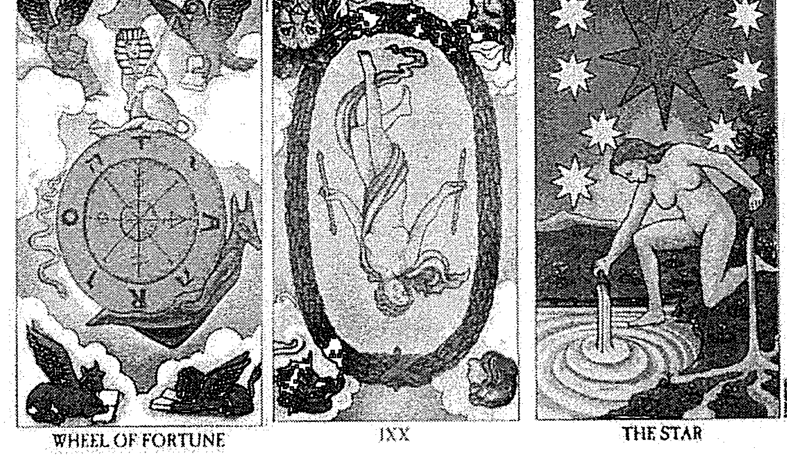

### 实例1

背景：求问人的前男友（A男）跟另一名女子（B女）传出了流言，但求问人（A女）对她的前男友（A男）还是念念不忘，一直致力于挽回这段感情。所以求问人想知道自己的前男友（A男）对那名女子（B女）到底是什么感情。

问题：A男与B女的感情

牌面：
- 过去：命运之轮+
- 现在：世界-
- 未来：星辰+

解读：

这个牌阵在解读之前一定要注意，不能拿过来马上就解读，因为我们从背景得知，这个次解读的性质是属于求问人开阵去预测别人的情况，即A男与B女之间的感情状况。但是A男与B女却又和求问人有着一定的关系，所以并不能算是“预测与自己无关之事”。因此，在解读之前我们必须先帮助求问人把思路整理一下。

这里对牌阵所作出进一步的思考是：A男与B女之间的情况如何与求问人有着什么样的关系？这一点就背景来看这好像也是有关的，因为求问人对A男仍有意、并且一直在试图挽回自己与A男的感情。

这里要对牌阵作出的第二步思考是：A男与B女的关系是否真的会影响到求问人与A男的关系？那么这点从背景信息中，依照求问人的讲述意思似乎是有关的。也许求问人认为：如果A男与B女走到了一起，她就没有机会挽回自己与A男的感情了；而如果A男与B女之间没感情，似乎她就还有机会。

由于求问人正是抱着这种想法来做塔罗占卜，所以当时，我建议她将问题做了改变，改成：A男与B女的关系发展会对我与A男的感情产生什么样的影响。这样就等于把求问人自己作为了占卜的主体，由这个出发点作出解读应该更加合适。

接下来我们就将站在求问人立场去读牌，来看A男与B女的关系对于求问人的“挽回感情行动”究竟会造成什么影响。

命运之轮表达的是一种改变的力量，这种改变不受人力控制，结合实际情况，我觉得是在说客观事物在变动、客观事物也在发展，有些事或多或少不可避免，正如本来作为求问人的男友——A男，他们之间的分手是不是事物发展过程中的一部棋？

作为当事人，在面对这些事时，主观上可以接受也可以不接受，后一张逆位的世界则说明求问人的不接受，采取的是静止、等待的方式停留在旧环境，这样说可能比较严重，但很明显的是求问人并没有在对A男的感情上放手、没有沿着分手之后的路走。所以命运之轮+世界-的情况就是“面对命运之轮带动的客观发展，主观没有跟其一起跑”的状况。

但是问题在于命运之轮“不受人力控制”的特性加上世界逆位“已经过去”的特性似乎决定了过去的事已经过去，求问人与A男的感情已是往事…

所以根据命运之轮和世界-的分析，我觉得至少说出了一点：不管A男与B女的关系怎样，都与求问人没有多大的关系，都不会对求问人与A男的关系产生多大的影响。

至于未来的星辰，星辰是一张宁静、祥和的牌，同时牌图中的人物倒水与水流八方的图案也象征了“放手过去、去与多方连结”，宁静是一种省思，这样才能去想通一件事，想通后才会放手，放手后会发现更多的机会。

所以，如果说逆位的世界代表的是“只认一条路，若不通则不动”的情况，那么星辰则道出了“条条大路通罗马”的寓意。

希望求问人未来真的能够抵达如星辰所示的那种情况吧……

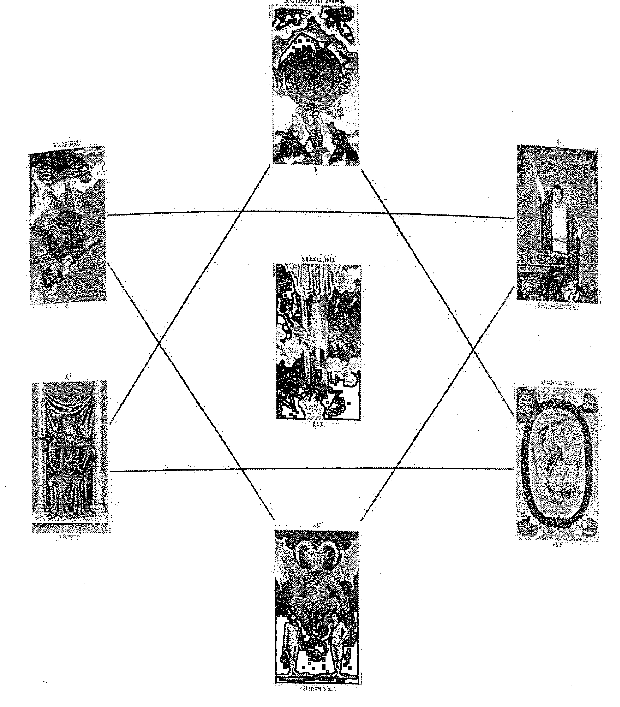

### 实例2

背景：求问者的朋友在公司某部门工作，现在手上有一单业务，打算找求占者合作。商讨过程中，朋友却不是很积极，求问者感到朋友那边可能有一些障碍。

问题：要如何应对目前的这个局面？

牌阵：六芒星

牌面：
1. 过去：命运之轮-
2. 现在：世界-
3. 未来：正义+
4. 对策：恶魔+
5. 环境：愚人-
6. 态度：魔术师+
7. 结果：塔-

解读：

说明：
1. 为便于陈述，以下将求占者称作A，求占者的朋友称作B。
2. 对此阵共分为四个部分进行分析：
   - 第一部分：客观的时间流分析
   - 第二部分：当事人主观意愿和周围环境的分析
   - 第三部分：对策与建议
   - 第四部分：结果分析

#### 第一部分：时间流的分析

**过去：命运之轮-**

命运之轮逆位表示事情在时间上的拖延和耽搁，而且这种拖延不是靠人力（A）可以改变的。过去代表已经发生的事，命运之轮逆位在这里说明了A和B在过去关于业务合作的商讨，其进展不大，始终讨论不出一个结果，这里也体现出一种下滑的趋势，即商谈没有朝着A希望的方向进展。结合整个牌局看得出来，没有进展的原因出在B这一方，而A是非常希望与B合作的，这在后面会加以说明。

**现在：世界-**

世界逆位在这里也有一个时间上的拖延，即在达成目标之前，还存在一些或者许多的问题需要解决。世界逆位出现在现在的位置，表明了A和B两人仍未就业务合作的相关事宜达成一致，在他们想要达成共识之前，还需解决很多问题。前面提过，A是希望揽下此次合作业务，而想要把业务揽下来，就必须先与B达成共识，A想要达到这个目标，就必须先解决一些既存的问题。但是结合实际来看，那些问题似乎并没解决，也不是那么容易就能解决的，所以也反映出至今A和B还没有达成共识，也进一步验证过去命运之轮-所表述的拖延和耽搁。

**未来：正义**

正义可以分为两个层面来解。

平衡，结合前两张牌，可以知道，A与B的商谈进行得不顺利，迟迟没有一个结果。未来，这种状况还将延续，因为正义手里天平代表平衡，平衡代表不偏不倚，不偏不倚代表悬而未决——未果。结合实际，A与B合作商讨的结果无非就两种，一种是达成一致，开始合作；另一种是商谈破裂，合作失败。但是正义的平衡却表明，未来的情况并非有倾向于成功或失败的一方，而是中立，还是没有结果。

公正，A和B是朋友关系，朋友之间讲究的是情义，而公正则暗示了A在未来将要面对的局面对他不利。一般来说，一方手头上有一个业务需要寻求合作伙伴的话，对这个合作伙伴是有一定要求的，当今社会追求的是效益和效率，花同样数目的钱总希望能够找来更有能力、能帮助产生更大效益的合作人，这便是一个最根本的问题所在。或许另一个比A更有优势的一方也打算与B合作，如此一来B会选择情义、还是效益？正义牌似乎很能说明问题。因此，回到开头，正如过去的命运之轮-所述，A的情况正变得越来越不利。

#### 第二部分：环境与态度的分析

**态度：魔术师**

**环境：愚人-**

环境的愚人-和态度的魔术师：周遭的环境和A的态度形成强烈对比，愚人和魔术师皆有开始的意思。魔术师显示了当事人A强烈希望与B合作的态度，渴望通过实际的行动促使他们的商谈能有实质性的进展，并尽快达成一致，开始业务上的合作。环境的愚人-却显示出A“寸步难行”的局面，即周围的环境对他的计划和行动起到阻碍的效果，造成这种局面的原因已在未来的正义牌中说过，这里就不重复了。

#### 第三部分：对策分析

**对策：恶魔**

从以上分析中可以获知，A主观上很希望与B达成此项目的合作。但事实上，如果A任由现况发展下去，最后是无法和B合作的。但这项合作会以怎样的方式结束则必须联系正义牌来看，由未来的正义知道，未来A和B之间地商讨始终处于悬而未决的状态，如果B一直不给A进一步商讨的机会和实质性的答复，那么A与B之间和合作一事必然结束。

所以，想要改变结果就必须先改变A自己的态度和行动，通过态度和行动的改变去影响结果，使其改变。恶魔牌作为对策可概括为以下三点：

恶魔牌注重的是物质和利益，追求效率，以获取更多利益。双方合作，重要一点就是“双赢”，A想要成为B的合作人，必须在确保自身利益的同时要尽量多挖掘出自己的优势（如果有的话），让B确实感受到与你合作是一个明智的选择。（评：这条建议的可行性不大）

恶魔牌有诱惑的意思。A可以找一个适当的机会主动与B商谈一下关于“回扣返利”的相关事宜，即A从这一次合作项目所得的利润中，抽出一定比例作为“回扣”返利给B。（这条建议是十分有效，也是合作营销双赢策略的一种，建议选择采用。）

从恶魔的对应来看，有开放心胸的意思，这里是要A考虑清楚，当下，通过正常途径与B达成共识接下合作项目的可能性很小，不如放开胸怀坦荡地放下，接下去就不要把精力花在这一方面了，留点力气另外拓展业务吧，世界很大，机会很多，不要在一颗树上吊死了，这本身也不违背追求效率的原则。（此条建议与A的意愿相违背，可行性不大）

综上三条建议，我觉得A选择第2条的可能性最大，本人也建议A选择第2条建议。

#### 第四部分：结果

**结果：塔-**

通过对第一部分时间流的分析，能客观的知道问题将会朝哪个方向发展。这里，如果不改变主观人力因素，最后的结果是A不想要的。通过对第二部分环境、态度的分析，知道A的主观愿望和周围环境的鲜明对比。通过对第三部分对策的分析，知道为了避免将要到来的不好结果，A应当采取的措施和行动。最后一部分的结果，就是结合第一、第二部分的内容，再加上第三部分的建议，分析最终会通向结果。塔十代表剧变和突如其来的损失，结合以上所有部分的分析，再加上塔-本身的含义便可推导出结果，塔-的改变带来的损失没有正位来的剧烈，在时间上有滞后和抑制的意思，即人为地将损失抑制住。所以这里是有人为因素作用地，通过按照建议牌恶魔的指引、行动，则达到延迟、抑制损失的目的，从而起到改变原先结果，使其改向自己希望的方向发展。

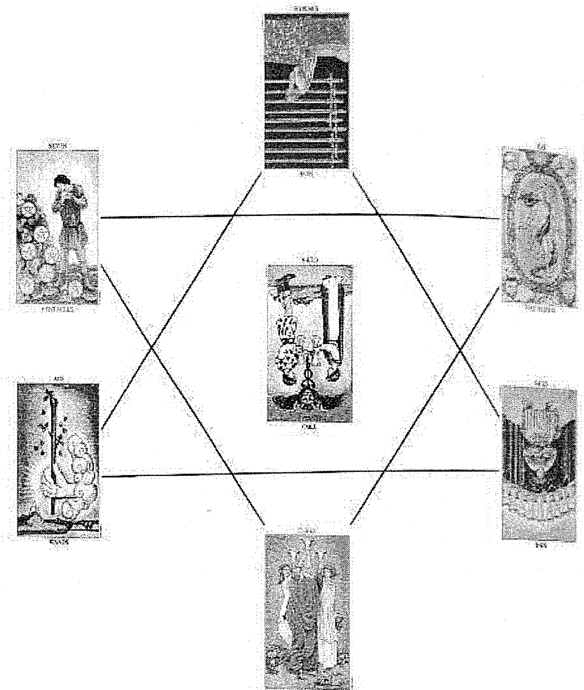

### 实例3

背景：求问人的A公司现在准备重组合并，准备与B公司进行合并。A、B两个公司的董事会议已经开会决议同意，并也下了文件，但是在执行时却困难重重。

问题：A公司与B公司能不能合并成功？

牌阵：六芒星

牌面：
1. 过去：宝剑9-
2. 现在：圣杯9-
3. 未来：权杖A+
4. 行动：圣杯3+
5. 环境：金币7+
6. 内心：世界+
7. 结果：圣杯2-

解读：

#### 过去的宝剑9-

宝剑9是一张代表绝望、痛苦的牌，原因是事实与期望相反，是当事人不能接受、不愿看到、无能为力的。宝剑9-同时带有“延迟”和“先隐后现”的意思，有一个逐步浮现过程。起初，当事人认为合并一事会顺利地进行，不会有很大的阻碍。但是随着事情的进展，问题逐渐浮现，而且多半是两公司合并重组时的资产分配问题。此时当事人这才意识到此问题解决过程中的重重困难，他深知，问题的解决需要双方的共识，而不是光靠自己的努力。在利益面前，谁都不愿让步是最令他头痛的，一方面要确保自身利益的保证，另一方面要让对方接受，这实在不是一件易事，沟通不好就会导致谈判的破裂。这是他在睡觉时都在思索的问题。

总结——未曾预料的噩梦逐渐浮出——这就是宝剑9-对过去状况的描述。

#### 现在的圣杯9- & 环境的星币7 & 内心的世界

如果过去的宝剑9-表现了问题对当事人开始意识到问题的所在，那么现在，随着问题的浮现，在AB双方都希望自身利益的最大化的前提下，分歧终于出现，合并谈判进程受阻。这里的圣杯9-结合环境和态度一起分析：

**态度的世界**：有两层含义，第一，世界代表圆满、完成，说明成功合并重组是当事人的最终目标；第二，世界体现了当事人希望获得更多的利益，但是对方也想啊！这就是问题最大的矛盾之处。世界在流变之轮中对应命运之轮-，揭示了一个关键——“世界”膨胀得越厉害，命运之轮逆转得也就越厉害！就是说当事人想要的利益越多，谈判就越难进行，分歧越大，最后破裂的可能性就越高，这与当事人的最终目标相违背。一时间愿望变成阻碍。

**环境的星币7**：反映了停滞不前、暂停思考的大环境。也有两层含义：
1. 不放弃：很明显，双方都对“金币”虎视眈眈，都希望自己多拿一些是一些，这里体现的是不放弃争取利益的任何机会；
2. 暂停、思索。由于成功合并重组是双方共同的心愿，因此这里表示双方无法就分歧达成共识后，暂时停止，并开始思索研究一个新的方针，这在未来的权杖1中也所体现。

**现状的圣杯9-**：表达了想要满足却得不到满足的现状，另外，因为分歧造成彼此情感上暂时的不愉快在所难免。

总结——7个金币是无法平均地分给两个人的，当每个人都想多拿一些的时候，便形成了分歧——这就是圣杯9-、世界、星币7对现状的概括。

#### 未来的权杖1

权杖1代表新计划、新行动、新方向。圣杯9-的现状说明现行的方针行不通，那么未来新计划自然就会出台，先不论这项计划成功与否，至少能够确定的是：双方都不会放弃，谈判还会继续。从权杖1还能看出双方目标一致（合并重组），只是细节问题存在分歧（各自利益），在权杖1图中，以权杖为起点，远方的城堡为终点，这段路程之长，说明双方还将处在长期的谈判之中。

总结——新计划的出台是为了达成双方的共识、实现共同的目标，但要解决两方平分7个金币的问题谈何容易？这是权杖1对未来状况的概括。

#### 对策的圣杯3

作为建议，圣杯3给出了相当明确的答案。

第一、团体、结盟：圣杯3显示的是一个互信互利、相互合作的团体。这里当事人需明确一点，在平等的前提下，当事人不要太贪图眼前的小利而放弃长远的大利，双方达成平等的合作共识才是最好的出路。（正如那7个金币，你3个、对方4个，眼前是少了一个，但是从长远说，你完全可以利用3个金币产出远大于你所失去的那一个金币的价值）

第二、圣杯代表情感与沟通：一些细节问题，建议当事人在牢牢把持原则性问题的基础上与对方沟通商议，其他小毛小利则可作出让步。

第三、平等：这一点是原则！如果对方仍然一意孤行地坚持太过苛刻的条件，那么当事人完全不必“舍生取义”（事实上当事人也不会那么傻），因为圣杯3有“机会不只这一个”的含义。不过个人认为，由于对方内心也希望重组，所以一意孤行的可能性不大。

总结——平等、双赢为前提，积长远考虑为基础，积极沟通为手段，成功就在眼前——这是对策圣杯3给予的建议。

#### 结果的圣杯2-

圣杯2表明达成共识、合作成功，那么圣杯2-在结合上述所有情况（特别是权杖1）之后，取“延迟”之意，双方在一段时间内还将处于一轮又一轮的沟通谈判阶段，但是当事人如果本着上述的建议去实行，成功之日尚可待矣。

总结：整个牌阵的过去、现在、环境和态度说明了双方问题的所在和分歧，在未来的权杖1中有一个转折，不过要把问题全部解决、双方达成一致，还有很长一段路要走，最后的结果圣杯2-说的就是这点。

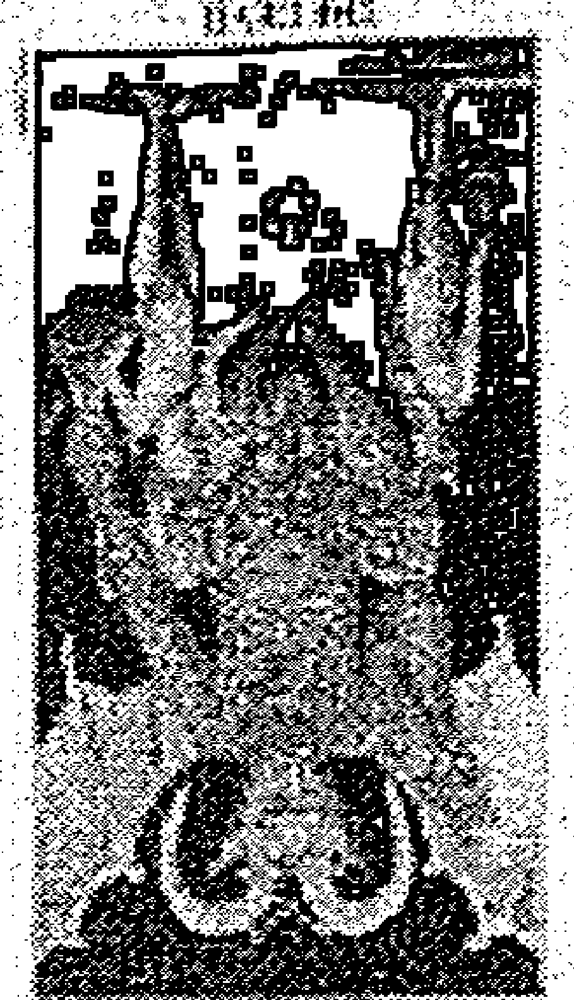
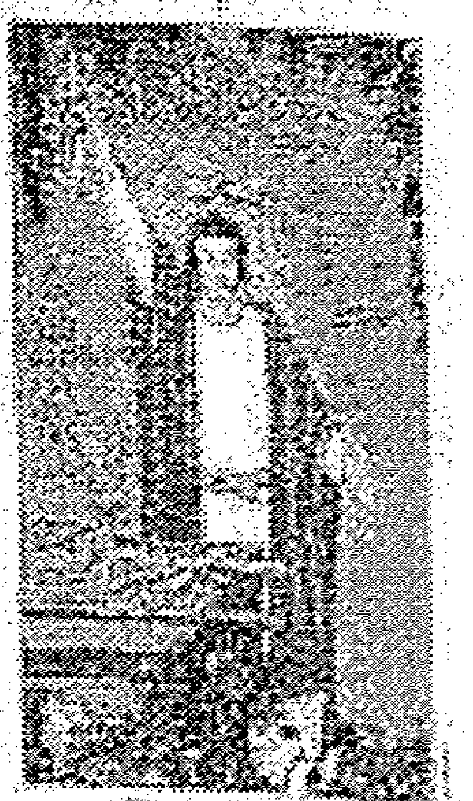
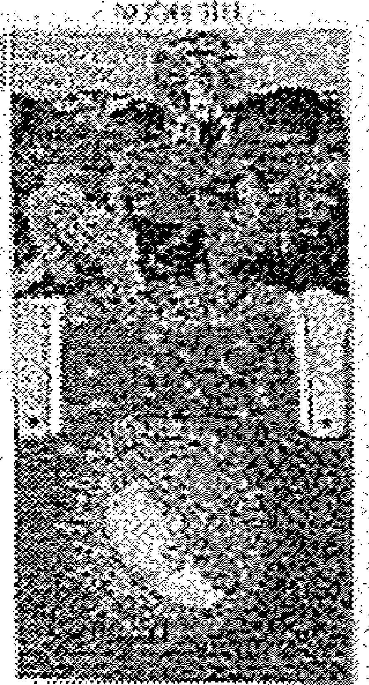
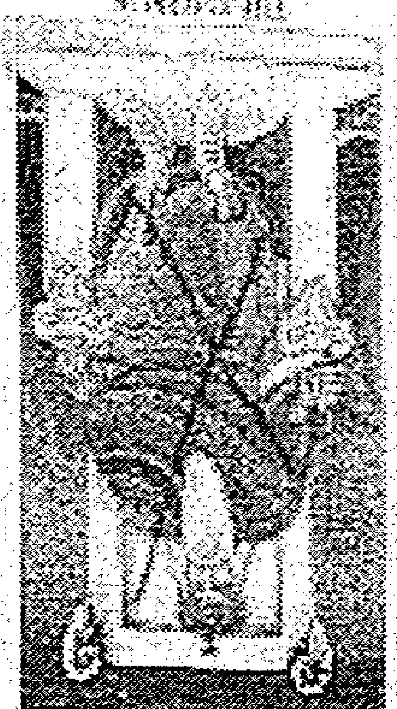
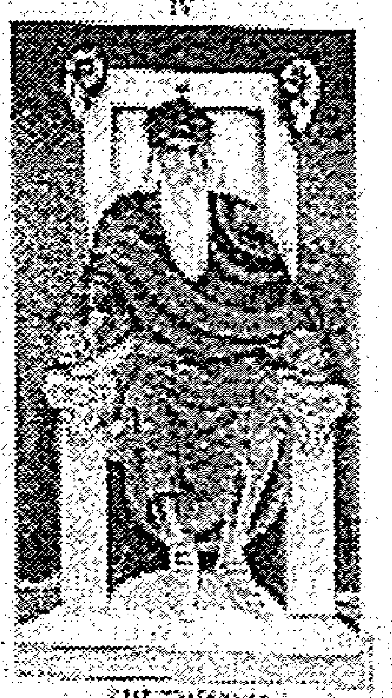
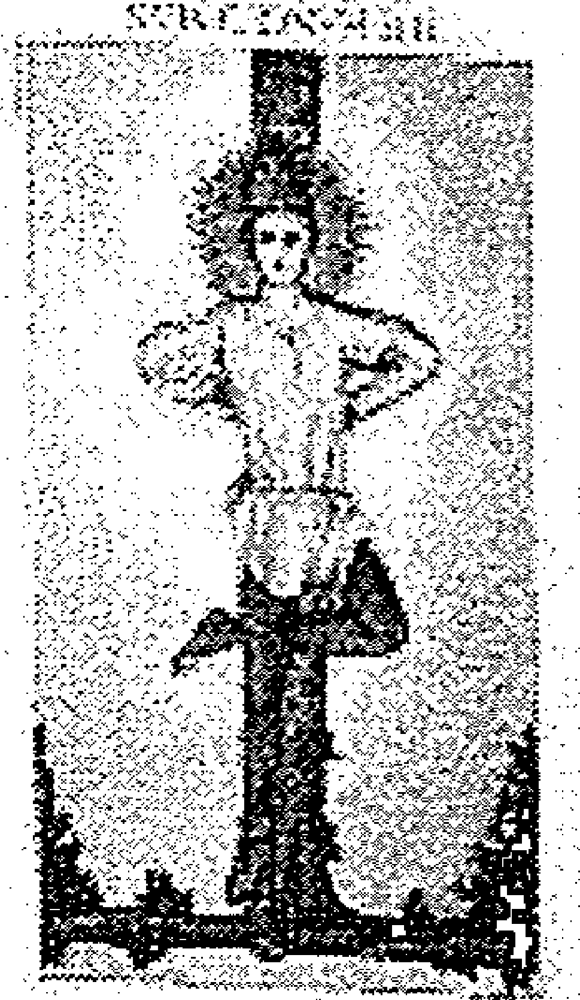
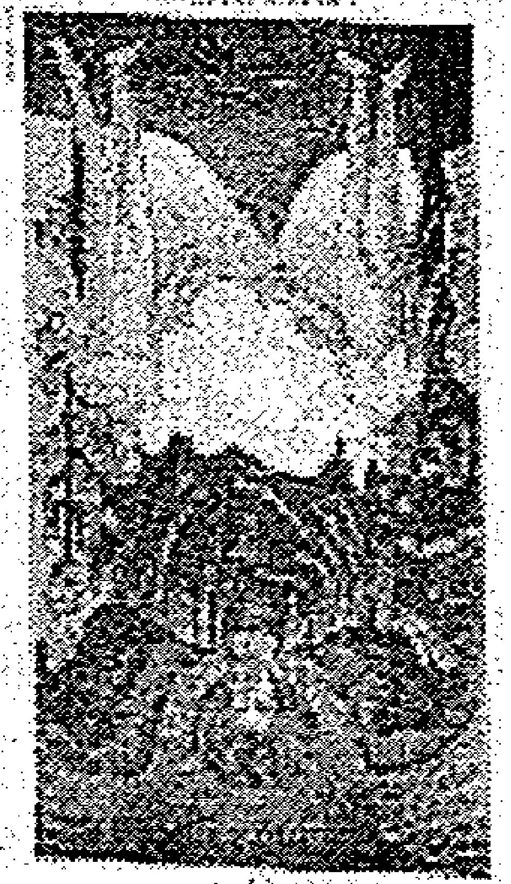

### 实例4

背景：一大四学生，在辅导员的推介下，去了一家公司。半个来月后，对公司越来越失望，觉得公司本身没什么前途。所以想看一下辞去工作和不辞去工作的发展。

问题：辞去工作与不辞去工作这两个不同选择的不同发展。A为辞，B为不辞。

牌面：
1. 本人状态：恋人-
2. 选A的现状：皇帝+
3. 选B的现状：吊人-
4. 选A的未来：月亮-
5. 选B的未来：教皇-
6. 对A的建议：恶魔-
7. 对B的建议：魔术师+

解读：

#### 1. 现状

恋人牌是一张代表选择和决定的牌，在这个有关事业问题的牌阵中，这张牌代表了当事人本人的现状。恋人逆位，这里，体现为当事人在两者的选择和取舍中，还无法决定究竟是保持现状还是改变现状。当事人为是否辞去现有工作的问题上遇到了困惑，他虽然认为留在公司没有前途，但是他仍然无法轻易下辞去的决定。

#### 2. 选择辞职的A线

选择辞职后的情况是皇帝牌，皇帝牌代表通过自律和努力来获取成功。从这张牌能得知当事人选择辞职的原因和状况。选择辞职正是由于当事人不满足现状，试图找寻另外一条适合自身前途发展的途径来达到自己的目标。那么在辞职以后，当事人会为了目标的达成，而采取积极行动，不懈努力和奋斗。

当然，努力了未必就一定会带来成功，因为在未来，当事人选择的这条路上还有许多困难等着去克服，还有许多令他觉得心烦或者不愿面对的事情等着去解决，月亮逆位所要揭示的正是这一种情况，如果月亮牌中的池子内的东西表示的是未知（包括困难、风险、烦恼以及令当事人恐惧、不愿面对的事物），那么当事人会如何做呢？是接受这些挑战还是再退回到一个相对稳定、安全的状态中去？

## TAROT 经典塔罗攻略秘籍

这个池子里既然包含了上述这些困难与挑战，那么也必定包容了所有这些问题的解决之道，当然，前提是当事人愿意接受这一切。

#### 选择A线的建议：

建议牌为恶魔逆位，当事人选择辞职就代表他正尝试性地走出原有模式限制，摆脱稳定，迈向挑战。细看恶魔牌面，当逆位时，恶魔头上的五角星是正位，正立的五角星象征着理智，那么倒立的恶魔牌给出的建议就是用理智去分析现状，在确定做出每一个行动、每一个选择之前需要对他们进行思考和了解，必须清楚自己采取这些行动的目的，及知道自己为什么要走这条路、选择这条路的意义何在？这样，才不会在各种复杂的形式下迷失。

#### 3. 选择不辞职的B线

逆位的吊人代表因无法抵挡来自于周围环境或人们的压力而挣脱绳索走到地面。吊人逆位表示无法用独特的眼光和独特的思考方式来看待事物的，简单说，就是以一种保守、随大流的心态来决定自己的行动。那吊人逆位出现在这里至少能看出了当事人选择留下可能是因为当事人受到周围人或环境的制约，而没有顺从自身内在的声音，一方面可能是听从了他人对他的期望；另一方面，可能是迫于现实环境的压力，当事人认为虽然觉得留下来发展前景不好，但是考虑到辞职必须承担更大的风险和后果，这样权衡利弊后还是选择留下，以求一个稳定的局面。

未来出现的教皇逆位代表新观念新思想的形成，同时打破传统观念，为开辟新的道路而采取行动。一看之下突然觉得与前一张吊人逆位所阐述的意思相背而驰，其实分析之后，其实并不矛盾。先看当事人的背景资料便知当事人的内心是希望发展的，选择留下只是迫于周遭环境的压力求个稳定，因此，虽然留了下来，但却只是暂时的，内心一直在等候寻找机会，等到未来某时一旦时机成熟，他便会打破原有局面寻求新的发展。倒立的教皇同时也意味着开辟新道路的过程是崎岖不平的，需要付出艰辛努力的，但当事人会觉得这是值得的。

# 第四篇：塔罗解读的方法与实例解析

#### 选择B线的建议

魔术师在这里给出了相当明确的建议。作为1号牌，魔术师通常都意味着开展实行一个计划的好时机。那么什么时候才能算是好时机呢？

看牌面，圣杯、宝剑、星币放在桌上，权杖被握在魔术师的手中，也就是说，当圣杯（正确的动机）、宝剑（明确的计划）、星币（扎实的基础）这三样元素备齐之后，就是举起权杖（确实的执行）的最佳时机。因此，这张建议牌向当事人阐述了在开辟新道路之前，切勿急躁，必须三思而后行，待所有元素备齐之后也就是执行的最好时刻。

#### 4. 总结

整体观看一下，选择A线需要面临一个压力相对较大的局面，困难也是重重，但是只要顶住了压力突破了困难希望自然会出现在眼前。
选择B线短期内因为处在一个熟悉的环境中会比较稳定，稳定之余如果当事人能够积极为将来开创新道路作准备的话，则万事俱备只欠东风之日不远矣，相对于A来说这条比较轻松，也是比较现实。

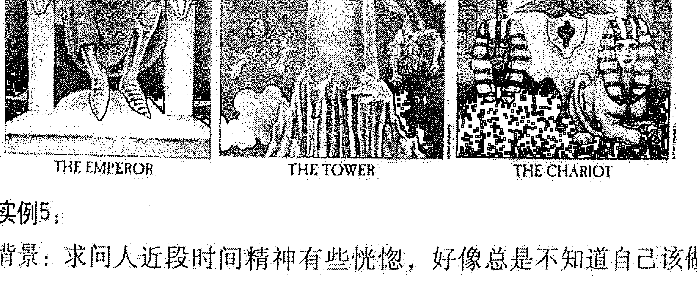

### 实例5：

背景：求问人近段时间精神有些恍惚，好像总是不知道自己该做些什么事情，非常茫然的，特别在晚上睡觉时感觉像是找不到自己的人生目标一样。

问题：发生这种情况的原因是什么。

牌阵：圣三角

牌面：

-   1. 过去：皇帝+
-   2. 现在：塔+
-   3. 未来：战车+

解读：

圣三角是描述一个问题在时间上由过去到未来演变过程的牌阵。
过去皇帝——现在塔——未来战车
这个过程我们大多数时间可以从历史书本中看到：

皇帝可以看成一个稳固的体制和政权（可进而引申为行为模式）；塔代表一个旧有模式的摧毁；战车代表理智控制下朝着既定目标的前进。

皇帝到塔的过程代表的是一个一直以来、拥有较长时期的行为模式的摧毁，皇帝在这里可以看成过去一直以来的习惯。由于人是一种沉浸于习惯的动物，当一个“过去形成的习惯”到了改变的时候，人往往会觉得不适应，所以从这两张牌就大致能看出求问人当下感觉手足无措的原因。（毕业如此、分手如此、生活中其他对你有影响的改变皆是如此）

塔到战车的过程是旧有模式摧毁以后，一个新的目标的确立，有了目标就有了方向，战车这张牌就有如朝着这个方向不断前进的象征。看到这里就能知道，求问人现有的不好感觉，在未来不久就得到消除，因为当人生有的新的目标和方向时，就会重新找到一条起跑线，开始自己新的旅程。

# 第四篇：塔罗解读的方法与实例解析

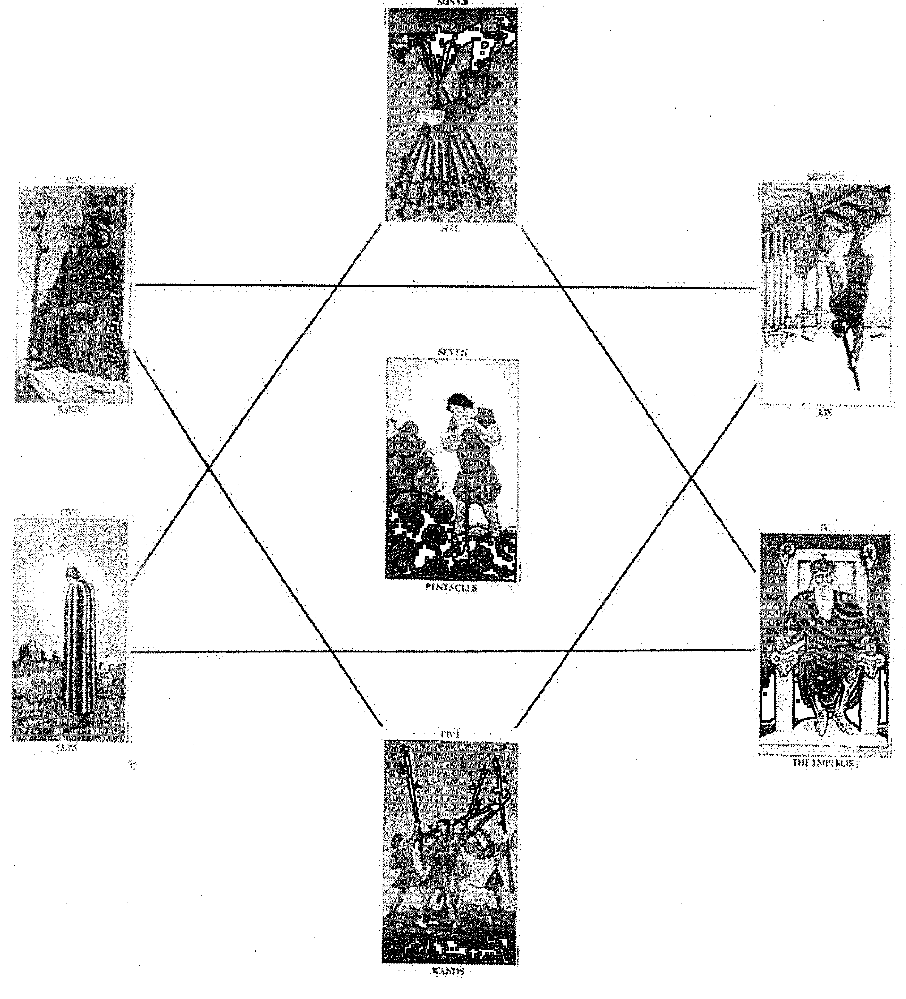

### 实例6：

背景：求问人是一男单身，而且单身很久了，最近感觉到和一女有发展成为恋人的可能性，但他不确定对方能否接受他，担心告白后被拒绝反而连朋友也做不成了，因此作了一次塔罗占卜，想看一下他们之间的发展情况。

问题：是否有机会和此女成为恋人（双方关系的发展状况）

牌阵：六芒星

牌面：

-   1. 过去：权杖10-
-   2. 现在：皇帝+
-   3. 未来：圣杯5+
-   4. 建议：权杖5+
-   5. 环境：权杖国王+
-   6. 态度：宝剑6-
-   7. 结果：星币7+

#### 解读：

过去的状况是权杖10—，可以代表一种“卸下重担”的情况。据了解，求问人过去有过2次恋爱的经历，这两次经历除了留下一些美好回忆之外的确也有让他感到“压力”，觉得很累（或许前女友比较强势、要求较多、且较高吧）。因此，过去那段漫长的单身时期对求问人而言，无疑是轻松的、自由的，就如“重担卸下”之后的状况。

现在是皇帝，皇帝代表控制，为了保持某一种状况而去控制，数字4也有稳定之意，同样也是为了不让某种状况得到“改变”而使之“稳定”。

从时间流分析上来说，现在位置是过去的延伸。因此可以看出皇帝代表了控制和稳定的对象是什么——控制什么、使什么状况稳定：很明显，过去权杖10—代表了求问人单身时期的状况，而皇帝要稳守的就是这种状况，不让这种情况改变。为何要守住这一状况？原因有两点，一是因为权杖10—从挑担到放下重担，再要他重新拾起来肯定不会那么容易；二是因为态度位置的宝剑6—，这点放到之后分析。

另外皇帝还代表了理智，以冷静的理性意识来面对这一问题。理智和情感是相对的（理智的人不可能喜欢了就马上表白，这不是皇帝特质的人处理感情的风格）

求问人的态度是宝剑6—，这个位置说出了求问人的“希望和恐惧”。首先，宝剑6牌面出现的是水面上行驶着一艘插着宝剑的船——求问人觉得这艘船很危险，他说换了他不大敢搭乘这艘船——这其实是没有“安全感”的体现，怕表白之后被拒绝，不敢迈出这一步——这也是皇帝一直稳守现状的原因之一。

在这里，宝剑6是逆位的，逆位可以理解为“主观上的抗拒”——求问人不愿意乘上危船驶向另一端这就是“抗拒”的体现。

逆位还可以理解为“延迟”——如果上了船就等于开始向对岸方向驶去了，也就意味着他跨出了一步，但事实上求问人却迟迟不愿向对方表白的体现，想一直拖延下去，可能他想等一个更好的机会吧。

未来是圣杯5，乍一看不免发问：

> 图上的人物为了打翻的水杯而掩面而泣，看得出他非常悲伤非常后悔，难道这次真的要以悲剧收场吗？

我说：

> 是的。未来是过去和现在的延续，如果你一直坚持皇帝和宝剑6一的方式来面对此问题，导致的未来就是圣杯5——打翻的水杯代表机会的错过，掩面而泣的人代表你会后悔！至于为何‘后悔的如此严重’需要更深人的分析。

的确，这里有一个很重要的问题需要分析：求问人为何会悲伤、为何会后悔？之前的权杖10一到皇帝所显示的就是他自己在坚持和稳固这个单身的状态，那么为什么他会如此后悔？

不要忽视了第五个位置——权杖国王。权杖国王所在的位置代表的是环境，这个环境对于求问人来说是有利的，这个环境是求问人“能够把握的住的”，是求问人“能够掌控的”。（很多时候环境牌显示出的信息对求问人非常不利、非常消极的，问题往往在于如何去扭转形势）。而在这个问题中，环境如此有利，全是因为求问人自身的原因而不去争取——就这点来说，在未来的某一时，当求问人发现自己当时在那么有利的情况下与其失之交臂，这种后悔莫及之心岂止圣杯5所能表达的？

因此把权杖国王和圣杯5合起来分析，就能清晰的理解未来的圣杯5表达了什么以及圣杯5的原因。

接着轮到了建议牌权杖5。数字5代表改变，对数字4那种稳定状况的改变和颠覆，同时也是对数字4的突破（皇帝也是4号牌）。又因为权杖代表行动。因此权杖5的建议实在是非常明显，意为建议求问人用自己的行动去打破那个现状（除非求问人想经历圣杯5的“课题”）。
另外，权杖5还有竞争之意，竞争即为去争取，在良好的形势下不去努力自动放弃，最终与心爱之人错失交臂，后悔的还是自己。
最后的结果是星币7。星币7代表一个成果：种瓜得瓜，种豆得豆的道理。想要圣杯5的果子还是其他果子全由自己选择。
不论如何，我认为，只要跨出第一步就是成功。这一步是对自我突破，这一步对求问人非常重要，代表了“走出去”。反之若是一直不跨出这一步，长久的“稳固”状态对于日后的发展也相当不利。
（后记：当然，这个牌阵即使没有“建议牌”，在分析完大部分的牌面之后求问人也知道自己该怎么决定了；没有结果牌，求问人也知道后果如何以及对他而言迈出这一步的重要性。至于实际上他做还是没做，那是求问人自己的选择，至少选择时不会再像原先那样迷茫了。不过，后来，才没过几天吧，求问人就迈出了那一步，对方也表示了接受，愿意尝试交往……反过来说“如果求问人没有做此游戏，结果会如何呢？”难道真的会经历圣杯5吗——谁知道呢。反正，至少这个牌阵的故事已经告一段落了……）

### ◇ 图像取意解读法

塔罗牌是一种图像与符号的象征系统，它用图像与符号诉说潜藏于内部的意义，从最最直观的角度来说，人对牌的第一印象其实就来自于图像。
在塔罗游戏与解读的过程中，有一个避免不了的过程就是对图像、符号的读取、转换、并联系实际问题来解释，这是一个对塔罗解读、分析、翻译的过程。在对牌意的学习上，仅通过现有牌意的背诵方式是不会有更多长进的。因为如果仅仅只对每张牌的牌意或者一些关键词进行死记，那么塔罗牌的图像和符号的意义分级衍生效应就不能得到发挥，图像与符号的存在意义就不那么大了，世间出现那么多不同图像风格、不同符号种类的塔罗牌也就没有意义了。如此，一个人只需找78张纸片，

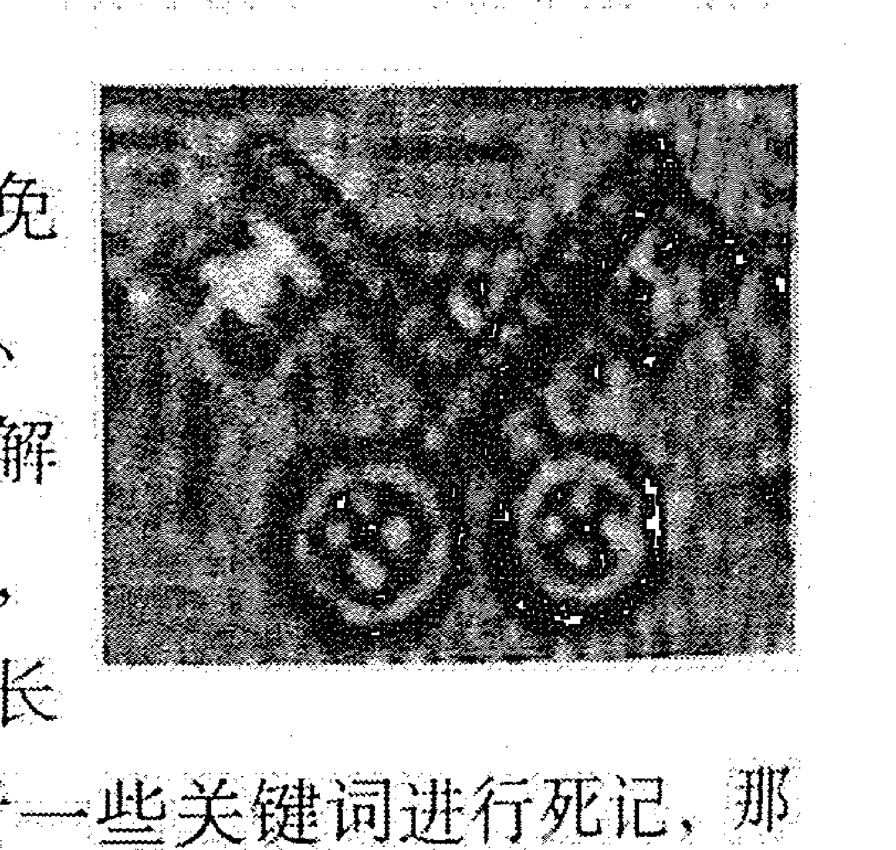

在每张纸片上写上牌名和关键词就行了。这从根本上说与塔罗图像与符号的运作原理相违背。

正因为塔罗牌是一组符号象征系统，符号和图像是一种表达形式，是一类“语言”，而文字又是另一类语言，所以在实占解读中对塔罗牌图像的解析时，首先要对它的符号与图像进行理解，因为符号与图像是构成人们对塔罗牌意及含义理解的一大要素。其次要将这一种理解转换对应到实际的问题。最后结合问题做出最终陈述。这个过程就好比是一种语言到另一种语言的转换过渡，所以用“解译”一词来表达“解析和翻译”符号与图像的过程还是很贴切的。

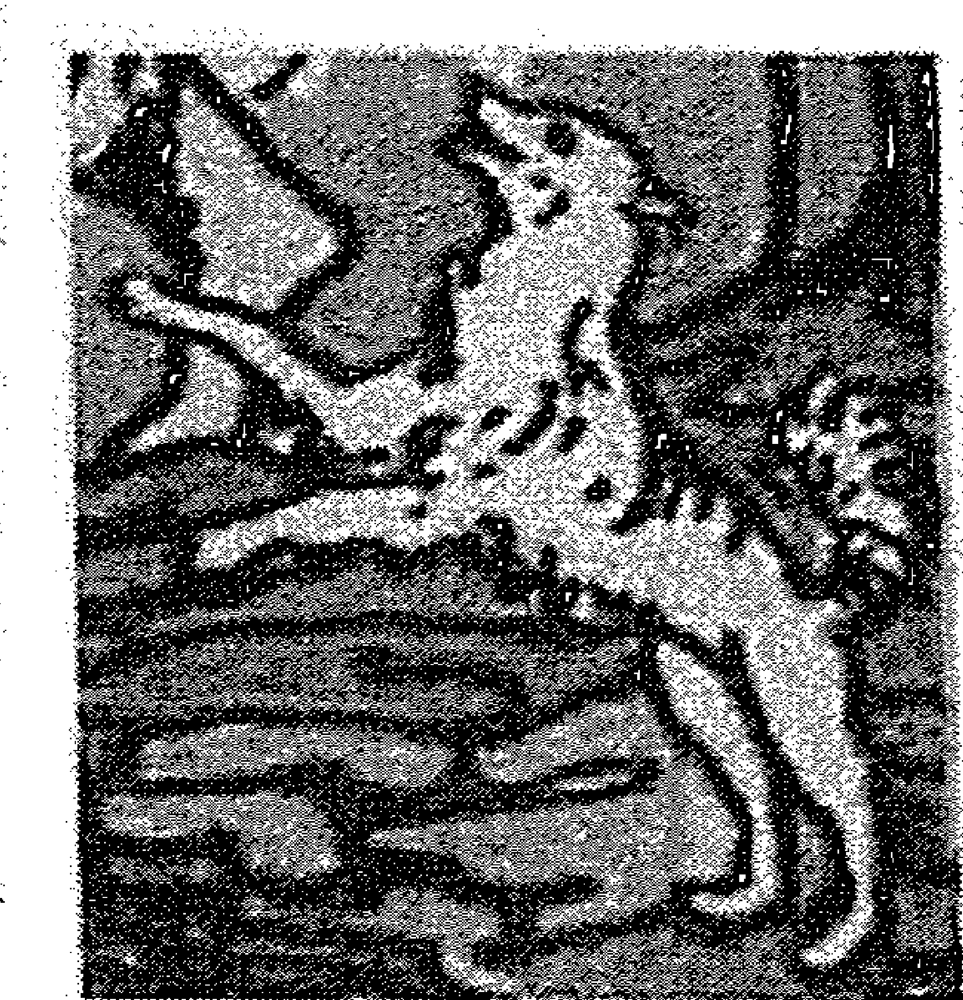

塔罗教母Mary K Greer就对这种方法举过两个例子，这两个例子分别用到了教皇牌中的钥匙和愚人牌中的小白狗②。她认为，符号与图像有外在意义和内在意义两部分（和本书第二篇第四章提到的牌意层次性类同）。

先说钥匙，在外在意义层面上，钥匙是一种物质，根据一些机械原理制作，并使其能够与相应的锁具匹配，起到打开与关闭的作用。所以钥匙与锁要放在一起理解，独立开来就没有意义，因为光有钥匙没有锁，这把钥匙能做什么呢，废物一个不是吗？同样，光有锁没有钥匙也是没用的。所以这里，钥匙的功用就是打开和关闭的作用。

在钥匙符号的内涵层面上，钥匙意味着一种隐藏与揭示，经常代表取得、进入、或获得某事某物某知识的资格与方法。如果我们再说的抽象一点，钥匙代表了得到某些重要问题的答案、解决方法、或意义。内涵层面上的意义一般都属于相对比较主观的，往往会带有一些喜好或厌恶的情绪和感受在里头。

再说愚人牌中的小白狗。其外在层面的意义为“一只长着四条腿的食肉动物，拥有敏锐的听觉和嗅觉”。这只狗的功用方面可以解释为能够被人驯化，可以充当人类的陪伴者、保护者、也能帮助人们狩猎。如用到内涵层面解释，狗可以代表忠诚、也象征了一种人类与动物的本能。 那么图像解释的方式与符号类同，因为符号就是小图像，图像就是由各个小符号构建起来的大符号。 由于图像解读法的本质是“由图取意”，所以它与上一种牌意法的主要区别也就在于多了一些个人理解。另外由于图像与符号的理解偏向于多元化，所以这也是催生独具一格、别具匠心的读牌风格的好方法，比如将图像内各种要素予以整合，对原有单张牌的牌意进行扩充；还可以按照图像所体现出的特性（如动/静、热/冷）来应用到问题作出整体分析等等。

### 实例1:

-   1. 身（肉体部分、外在的物理条件、欲望）：隐士
-   2. 心（显意识范围的思想、心智、理智部分，控制着你对事物的认知和态度的这部分，影响着你的决策。）：宝剑3
-   3. 灵（你的理想、目标与追求，是人的“向善”部分，其作用有如“高我”，具备启发、建议的作用）：愚人

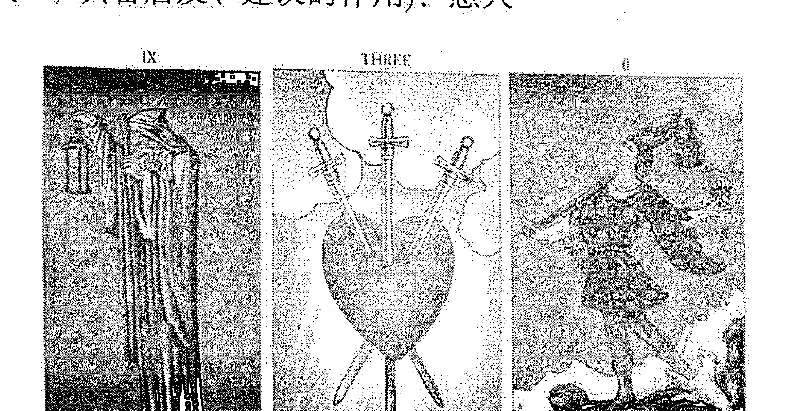

解读： 从图像来分析，我们看到了左牌隐士和右牌愚人之间卡了一张宝剑3。宝剑3的图像是一颗插着三把利剑的心，而上空的乌云密布，外加阴雨绵绵。从图像流动的角度看，宝剑3阻碍了右边的愚人到达隐士的线路，这就是致使能量流动停滞的阻碍。

插着三把利剑的心一点都没有生机蓬勃的样子，三把利剑犹如“封印”一般阻止着心脏的正常跳动，上空压顶的云层及阴雨更是犹如“天塌”一般，与利剑构成了外界与内在的“双重困压”，这对于愚人澎湃的行动力无疑是一种相当沉重的打击，致使其无法继续。

把三张牌合起来看，愚人看上去正要朝着稳重、谨慎、缓行、智慧的隐士前进，然而在他抵达目标之前，他需要作一些牺牲和改变。事实上，愚人缺什么、需要什么很方便地就能得知，因为隐士与愚人是两位在各个方面都拥有截然不同的风格，一老一小、一慢一快、一细一粗、一冷一热、一弛一张，一稳一冲等。这些特征上的对比都可以直接从图中直接得出结论。所以从愚人到隐士这种过渡和变迁都是巨大的，不过从宝剑3可以得知，无论需要作出什么剔除，愚人都要经历一场蜕变，而蜕变的过程必定痛苦、必定倍受压力、不易忍受。这时如果愚人看不清想不透在自己改变之后会获得什么，那么他也就不会再前进。如果求问人就是愚人，那么就应当自问，这项行动的课题是什么，所能得到的宝贵经验是什么。再者，取决于不同的问题，这局牌面能够作出不同的象征，从另一角度说，如果我们不对愚人的此类自发性行为进行一些必要控制（或把它们的地位放于过高），则可能造成一些不好的影响——会阻止成长、造成马失前蹄之类的影响到自我成功的因素。

### 实例2:

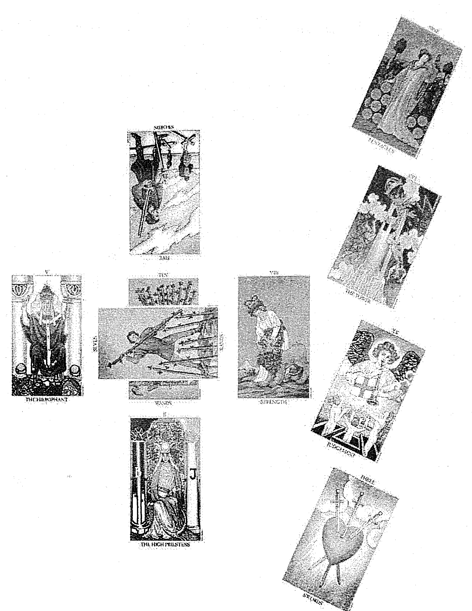

背景：某人前不久辞职了，和朋友合伙作生意，最近心里觉得不太对劲，又说不太清楚。

-   牌阵：凯尔特十字

牌面：

-   1. 权杖10：问题的摘要，问题的大体状况以及你在这个情况下的状态。
-   2. 权杖7：横向的阻碍、逆流，外在的力量将问题分裂拉向两个方向，也有可能是外在的力量和情况使问题更复杂。若是比较正向的牌也有可能代表助力、机会。
-   3. 女祭司：在你之下，问题潜在的影响。或者代表潜意识动机、你未注意到的部分。
-   4. 教皇：在你后面。最近过去的状况，逐渐对你失去影响力的情况或者引发现在问题的原因。
-   5. 宝剑5一：在你之上，显意识层面，你对问题的最高目标、理想、计划、目的。
-   6. 力量：在你之后，未来的状况，按照目前发展下去你所走的方向，形势下一步的变化。
-   7. 宝剑3：代表你自己，你在问题中扮演的角色、你对问题（1和2）所抱持的态度。
-   8. 审判：你所处的环境，周围环绕于你的能量：家庭、工作、朋友、恋人，以及环境给你带来的影响。
-   9. 塔：你对问题或目标的希望或恐惧。
-   10. 星币9：问题形成的结果或问题的答案。

#### 1. 权杖10是问题的现状与核心

如图，对权杖10牌面的受力分析可得知，右方为行进方向，求问人本身施以一股向右的力量致使自己向目标移动，但同时还要承受向下的压力，这股向下的压力对前进力起到一个拖滞作用，延缓了向前的行进速度。

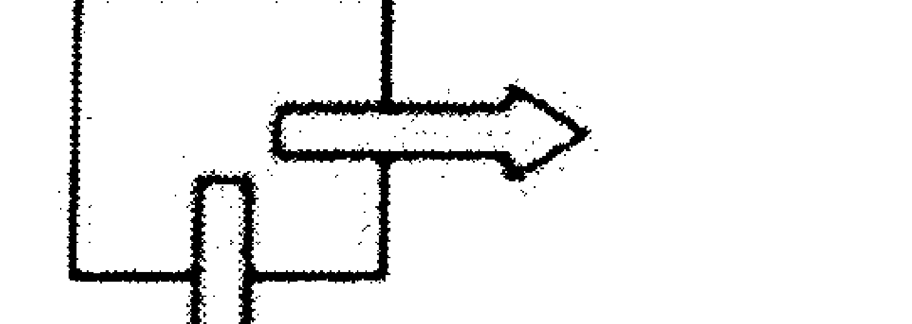

这张牌最最普通的解释就是重担和压力，从当事人的主观方面来分析，处于这个问题当中令求问人感到压力和负担很重，造成这一原因是多方面的：首先，由于求问人是辞了职出来与朋友合作的，其本身就承担了一定的风险，对于走了这条路，他可能嘴上不说，但内心也有担心是否走错，压力的源头之一就是这方面；其次就是把本次创业看得很重，渴望成功担心失败的心态无疑给自己心理上也增加了负担；第三，此次创业不容易，压力往往来自于责任，求问人所承担的责任越大，随之感受到的压力也就越重。

从客观状况来分析，权杖10也反映出创业进程的艰辛与缓慢，虽然从牌面图像中能看到目标就在前方不远，但要扛着重物走过这一段路显然需要一定的时间和精力。

这张牌直接告诉求问人，他既然已经做出了决定（辞职与创业），接着就必须去承担这一决定随之带来的结果。也许在作了某种决定之后求问人才发觉它所产生的问题比他预期的要多，但既然走到了这一步就必须去面对、去做这些的事。

另外，权杖10的牌面图案中还揭示了很重要的一点：请注意牌面人物的头目，这人的视线被密密麻麻的权杖遮蔽，造成他看不清前方的路途，求问人在重压之下是否忽略了一些很重要的事？这一点恐怕需要当面对求问人启发亲能了解。

#### 2. 权杖7，对问题的向两旁分裂、拉扯的力量

权杖7在先前的受力分析图中添加了一股向左的施力作用（仔细看牌阵图，会发现权杖7牌面中有6根权杖指向这个人，这6根权杖代表直面此人的力量）。因此从这里就能知道，在求问人向右的行进过程中，除了要承担向下的压力，还要承担和克服外来反方向的阻力，这直接增大了向右行进的难度，求问人势必需要对右方施以更大的作用力才能向目标方向移动。

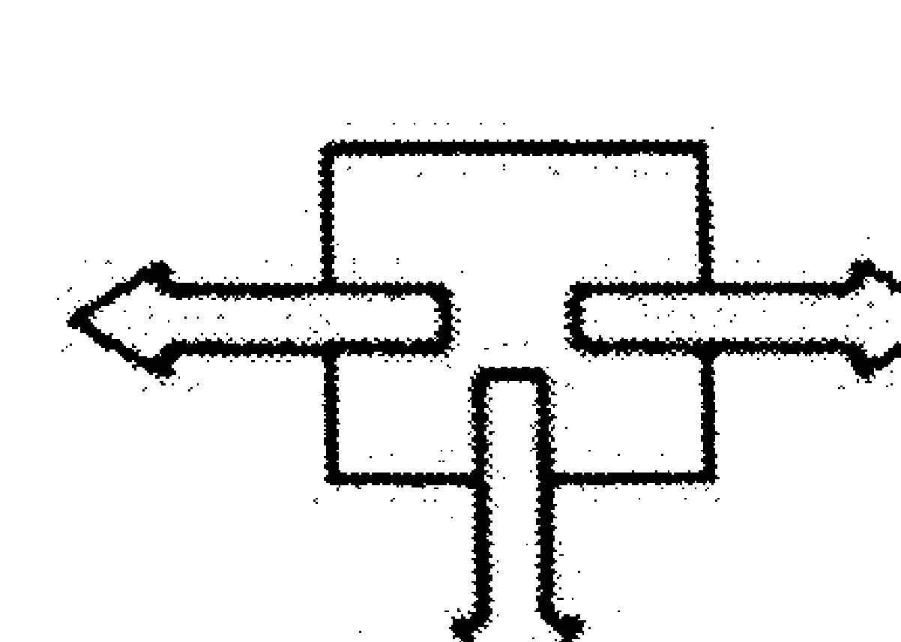

位置1和2合起来所组成的问题的核心，权杖对应火元素代表行动力，我们清晰的看到在某个行动过程中，不但要克服已身的压力，还要直面外来的反向阻力。

#### 3. 女祭司，问题潜在的影响，求问人未注意到的部分

女祭司有“智慧、冷静”之意，女祭司外在无行动力，内在充满智慧。这一点对求问人有何启发？这一点是不是求问人所忽略的？这一点又是不是整个问题所潜在的影响？

从1和2的核心中，我们看到求问人只顾克服各种阻力，一心向前直奔目标，眼里只看到目标的他是否考虑过，如果停下片刻冷静思考一下会不会对看清自己的方向更有帮助（别忘了权杖10中他被什么遮住了视线）。热火朝天的他此时缺少的正是水元素的透彻，也是他没有注意到的部分，同时也是整个问题潜在的影响——因为冷静、理智的头脑有益于分析利弊、看清目标、及时矫正方向、摆正位置，这对问题的走势影响是颇大的。

#### 5. 宝剑5-，显意识层面，对问题的最高目标、理想、计划、目的。

宝剑5-可以看到求问人显意识所表露出来的行动，宝剑风元素可以代表伤害、受伤，数字5代表混乱、冲突、改变，宝剑5一则有恐惧改变、抗拒改变之意，求问人可能担心事件向不好的方向、担心事态会出现混乱而脱离自己的控制、担心自己成为整个事件当中的失败者和受害者（宝剑5原本就有挫败的意思，逆位则加入了人力对此的抗拒力量），而且最要命的是：宝剑5的挫败不仅仅是一方的失败，而是各方的失败——整盘局中没有胜利者，也就是说若是最坏的状况，便是双方合作的破裂，由此导致整笔生意的受创，大家各有各的损失，这是谁都不愿看到的。现在宝剑5是逆位的，一方面是这个状况还未表露出来，但或许有点影子，另一方面是人力的抗拒，也许求问人已经提前意识到了这点并要设法预防。

宝剑5-也指出了求问人对“竞争”问题有所顾忌，也许他觉得这个竞争尚未显现出来，但未来或许会表露出来，并由此担心先前自己花了那么大的努力可能会因沦落为失败者而白费。

作为求问人对这一问题的最高目标，宝剑5-说明了求问人求稳的心态，在这个问题中，他们合作愉快、一心为创业而努力，少一点勾心斗角和互相猜忌、少一点面和心不合，这是最重要的，也是创业成功最基本的保证之一。

- 4. 教皇，代表时间流的过去
- 6. 力量，代表未来

作为一个时间流，反映的是问题经过去通向未来的状况。教皇牌和力量牌都有一个共同的特点——被动的、接受的、受影响的

过去的教皇牌有一个最大的特点，就是“受人影响”。过去，从求问人的辞职到决定与他朋友一起创业的过程中，他的朋友对他的影响是比较大的，从某种角度上，他之所以愿意辞职，势必他与朋友所创的业要比他原来工作的来得更有优势，因此求问人才做出那种选择。

未来的力量牌也是，也许许多解读者会认为力量牌显示了一个比较有利的地位。但是，我却有自己的一些想法，从塔罗的3×7六芒星体系来说③，力量和教皇其实都是被动的，力量代表坚毅、自信、勇气、面对困难不退缩的精神品质，这的确是正面的品质，可这只能代表求问人面对问题时所具有的正向品质，却没有“改变问题本质的行动力”，即没有通过切实的行动来对问题作出任何的改变。(牌面中的狮子仍旧是狮子，依然存在，没被杀死也没被消灭，这代表困难依旧存在，只是主观上的面对问题)。所以即便有足够的智慧和能量来处理眼前的困难，但是如果没有实际的行动，一切都没有意义，这一点是需要理性评估的——还记得最初的受力分析图吗？求问人要克服的不仅是自身的压力，还有外来的反向阻力，力量牌说出了求问人不畏惧这些，拥有面对的足够勇气，尽管如此，事实上这些压力和阻力依旧存在，依旧在拖延前进的脚步。所以是否应该提示一下求问人，能不能从“减轻阻力”的方向入手来考虑，障碍减少了，压力变轻了，阻挡前方视线之物也势必减少，自己前进的脚步也轻松了，这也就起到了“事半功倍”的效果（下图）。

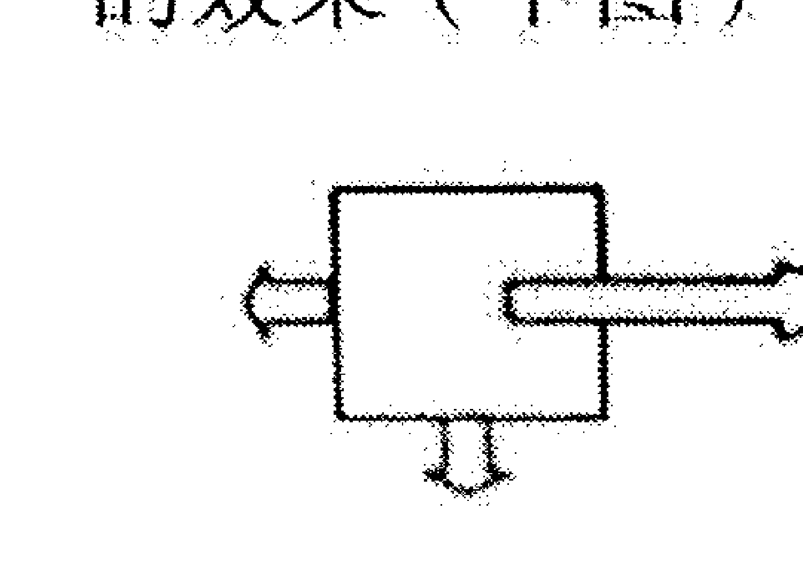

# 第四篇：塔罗解读的方法与实例解析

凯尔特十字的左半部分分析完后，接着就看牌阵的右半部分

按照我自己的解读方式，右半部分四张牌是对左半部分起到补充作用

#### 7. 宝剑3，代表求问人自己，求问人在问题中扮演的角色

宝剑3更多的显示出求问人在一个冲突状况中的反应，用痛苦或伤心来描述可能比较合适，但是更应该引导求问人思考清楚为什么感到伤心和痛苦的原因。我的解读方式是将这个位置和凯尔特左半部分的第4号位置结合在一起看。教皇代表过去的状况，有援助之意，求问人从辞职到与朋友合作，受朋友的影响颇大，所以现在当求问人发觉彼此沟通上可能有问题时（数字3通常代表合作与沟通方面）无疑会有宝剑3痛苦的感受，牌图里插在心上的三把剑中，一把应该是自己给自己的压力、一把应该是创业的阻力、还有一把可能就是来自与朋友合作上的问题。

#### 8. 审判，代表周围的环境

作为求问人周围的环境状况，审判这张牌的特性也是比较被动的，当天使吹响号角的时候就是你起身的时候，如果你不起身就错过了重生的机会，所以体现出了“听号令行事”的情况，在这个问题中究竟是谁听谁的，其实很明显，求问人是处于被动一方，也正是因为如此他才会有担心。这张牌要和牌阵的第3个位置女祭司联系一起分析，就是说当你处在被动的情况中时，你如何保持冷静和理智、等待机会，主动权虽不掌握自己手里但如何不被他人完全牵着鼻子走，在被动中把握主动、把握自己能把握的因素，这就需要求问人自己根据实际来把握和思考了。

#### 9. 塔，代表希望与恐惧

塔的本意是代表了“旧有模式的变革”，对应到不同情况会得出不同的解释（积极或消极）。所以塔这张牌既能反应出了求问人的希望，又反应了他的恐惧。

塔所显示求问人的希望是“突破”，求问人希望这次的创业能在现有的基础上取得一个飞跃性的突破，能够打破各种阻力更加靠近那个目标，也算对自己近阶段背负重压的回报。

塔所显示的恐惧是“剧变和打击”，塔的变革往往是剧烈性和颠覆性的，能致使前功尽弃的变革，当这个位置和牌阵中的第5个位置联系起来看时，就很容易明白了。

#### 10. 星币9，结果

星币9作为问题最后的结果，从星币9中也可能得到很多启示。

首先，星币土元素代表物质和稳定，数字9=3×3，是一个创造的成果，而且9也是一个自我复制的数字（任何数字乘以9之后，把结果拆开来再相加仍旧会回到9，如9×12=108，108=1+0+8=9；9×4=36=3+6=9）。

星币9可以代表物质上的丰富，对于创业问题来说是一个比较有利的信号。由于最后的结果需要和左边第6个位置的力量联系起来看，所以保持足够的内在的信心和坚毅的精神，坚持下去成功是可能的，所以不要放弃，努力会有成果。

另外，星币9有“孤独”的意思，其实塔罗牌中所有的9号牌表现出的都是独自一人的画面，所以人际关系要注意，毕竟先前充当教皇把求问人拉出来共事的是他朋友，所以为了共同利益、为了长远利益，未来还是要注意保持好双方的关系，不过星币9所显示的人际关系的局面显然比宝剑5来的好的多。

# 第四篇：塔罗解读的方法与实例解析

### 实例3：

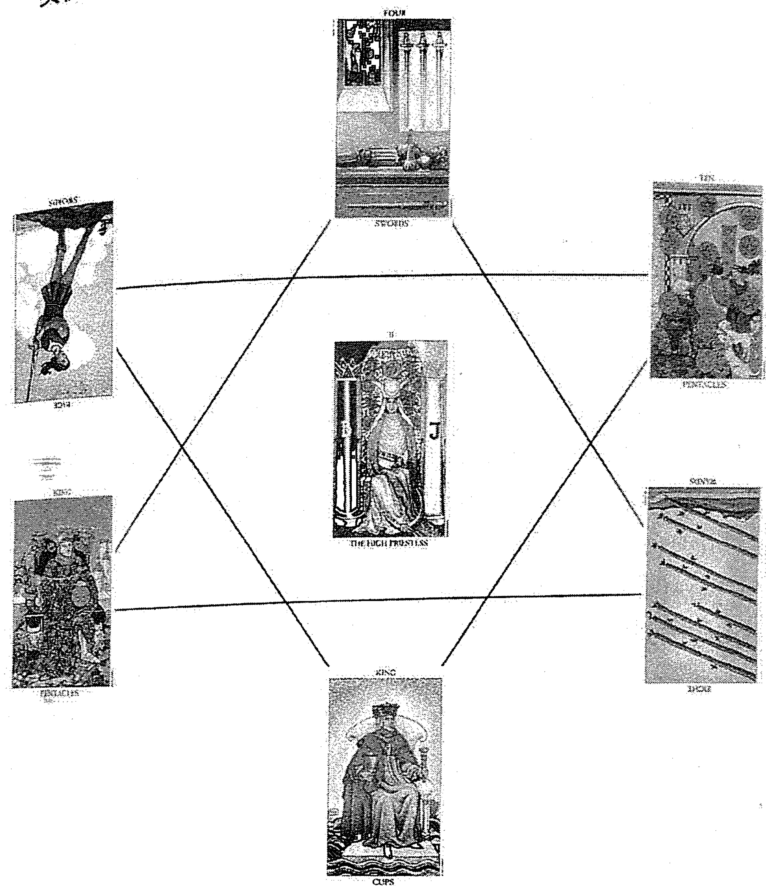

问题：工作事宜（由于涉及商业机密，故不便公开）

牌阵：六芒星

牌面：

| 序号 | 位置   | 牌面       |
| :--- | :----- | :--------- |
| 1.   | 过去   | 宝剑4+     |
| 2.   | 现在   | 权杖8-     |
| 3.   | 未来   | 星币国王+  |
| 4.   | 对策   | 圣杯国王+  |
| 5.   | 环境   | 宝剑侍从-  |
| 6.   | 态度   | 星币10+    |
| 7.   | 结果   | 女祭司+    |

#### 解读：

#### 1）图像的整体分析

如果把牌面分为“动”和“静”两类，
属于“动”一类的牌有：现在的权杖8-（八根棍子呈流动趋势）；环境的宝剑侍从-（回首背身挪步移动姿态）
属于“静”一类的牌有：过去的宝剑4（躺姿）；未来的星币国王（坐姿）；对策的圣杯国王（坐姿）；态度的星币10（稳定）；结果的女祭司（静态）

所有动态的牌都为逆位，而所有静态的牌都为正位。从求问人主观上来分析，则可看出当事人内心求的是一个稳定的局面，而抗拒不稳定、动荡的局面。另外，也从侧面说出若不加入人力，事态的衍变可能会朝向自己所不希望的方向变动。

#### 2）互相有关联的牌

##### A. 过去的宝剑4与环境的宝剑侍从-

造成过去麻烦的原因与环境的宝剑侍从-脱不了干系（都是宝剑），宝剑侍从-带来的消息与当事人主观意愿相违背，也可以说是造成过去宝剑4的死胡同的主谋。因此若是求问人放手任由事态自行衍变，则根本解决不了什么问题。宝剑侍从-还有不公正、欺瞒之意。

##### B. 自我与他人的对比：星币10与宝剑侍从-

互相对立的两张牌。麻烦动乱制造者与力求稳拓维护者的较量。

##### C. 过去的宝剑4 & 现在的权杖8- & 星币国王

过去的宝剑4可视为步入一个死胡同，宝剑为伤害，4为一个阶段的稳定结果。权杖8-可视为对宝剑4的一个转折，也可视为受到宝剑4的影响导致能量流动受到限制，因此，是顺着过去的状态一直走踏下去，还是逆转当下的逆境，就看这段时间自己如何去处理了。而且就在不远的未来是星币国王，说明事态就将成型，一旦成型将难以改动（其实也没时间了）。

##### D. 对策、未来与期望：圣杯国王、星币国王、女祭司与星币10

如果将对策的圣杯国王拆分，则会变成圣杯+国王，同理星币10就是星币+10

可以看到，对策圣杯国王中的圣杯与女祭司相呼应（水元素）；圣杯国王中的国王成为了未来星币国王中的一分子；态度的星币10中的星币则成为了未来星币国王中的一分子。因此可以见得，未来星币国王，是由态度中的星币+对策中的国王构成的。这表明了事态并不是“己力所不能为”，相反，己方的力量完全可以对事态予以掌控，使其向着自己有利的方向发展。

作为对策，圣杯国王首先要冷静应对，树立信心。借用可以利用的资源（同领导、前辈一起），充分发挥外交手腕，则事态的各种矛盾终会得以解决与统合并得到平息（女祭司）

纵观之下，其实就过去到现在这段时间难熬了点，如果处理得当，过去了也就会好了。

### 实例4：

背景：某女对她朋友的一个旧同事产生了兴趣，只是看了相片，她朋友要负责帮忙介绍，但该同事目前已经到了另外一个公司去，所以还不知道这个男生是否已经有对象。因此做了这个塔罗游戏。

问题：与某男是否有发展的可能？

牌阵：时间流三张（圣三角）

牌面：

- 1. 过去：节制+
- 2. 现在：死神+
- 3. 未来：恋人+

#### 解读：

在实际游戏的牌阵解读时，由于牌阵中出现的每一张牌就是一副图。如果采用读取牌面的读牌法时，可以做到一种将多张牌图予以联系整合的效果。这就是图像解读法中的“图像合成法”。这种方法就是将牌阵中彼此有关联的牌面（两张或三张或更多）整合成一副大图（二合一、三合一或多合一），我们就是要从这副大图像中获取信息、得到全新的牌意。

以下是牌阵中出现的三张牌图：

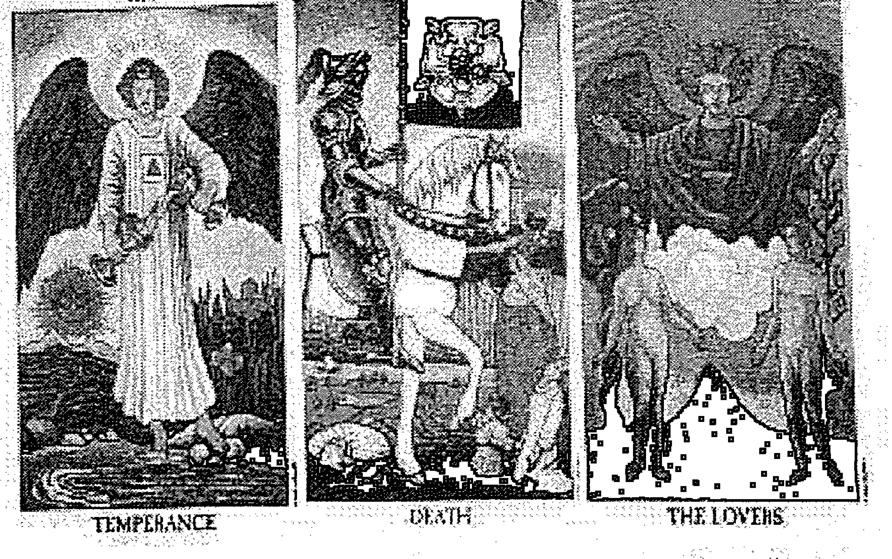

我们看到，两边分别是节制和恋人，中间夹着死神。依照三张牌的牌图从左到右来看，似乎是节制的交融被骑在马上的死神带入了恋人的关系。在这种关系过程的指导下，这三张牌的图像就可以进行合成，整合为一张大图，如下：

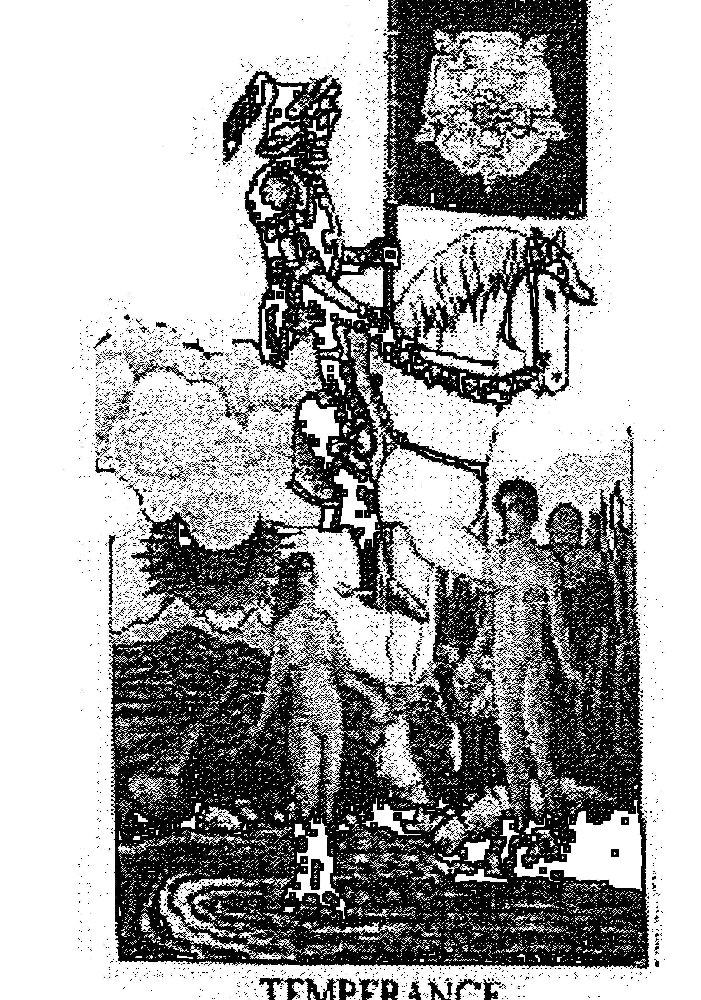

由此，我们可以看到，恋人中的男女身处节制牌的大背景，他们两人双方分别持着节制天使手中的两只杯子。同时，男女双方在站位上也很特别，男的在地上、女的在水中，预示着处在两个不同平台上的“距离”。而他们背后的天使现在则变成了死神，那是因为这种沟通和交融是经由死神带来的，故在这一整合后的大图中，死神代替了天使夹在了男女两人中间，这也喻示着死神对于男女双方沟通活动所起到的直接影响作用。

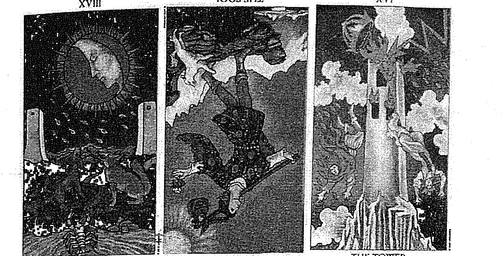

### 实例5：

背景：求问人和对方网上认识，已有三个月的交往，求问人希望与对方定下终身，于是他开牌游戏，看一下双方关系未来的走势。

问题：双方的恋情能否修成正果？

牌阵：圣三角

- 1. 过去：月亮十
- 2. 现在：愚人一
- 3. 未来：塔十

#### 解读：

从这三张牌的图像特征来看，它们都不属平平稳稳的牌，而是偏于一波三折、波澜起伏的状况。

过去的月亮牌从表面看似安静，从本质而言它只是用表面的安静来掩饰内在的不安。

从过去的月亮到现在愚人-犹如一种非稳定因素自月亮之处的潜伏到愚人之处浮现的过程，也可以看成是双方关系中存在的种种矛盾一直以来都处于潜伏状态，愚人就犹如月亮中的小龙虾，已经探出头来，只不过当下愚人还处于逆位状态，逆位可以视为原来正位的意义受到压制、抑制的状态，这也说明那些矛盾只是初显端倪，尚未完全暴露。

在愚人-到未来塔这个过程中，两张牌从图上看都属于“从上往下掉”的牌，若以“上”代表优势，那么“下”则为劣势。上方为轻松、松弛的感觉，下方则是沉重、束缚的感觉。而且塔代表原来受到束缚的东西突然爆发，犹如积攒已久的能量超过临界点突如其来的爆发出来。这说明一直以来受到掩盖、压制的矛盾由于未来出现了一些充当导火线的诱因，从而全面暴露，这些恐怕不是求问人事先能够预料的，高塔的特点就是当头一棒，打的人半晌来不及作出反应。

所以，总的来说，求问人应当对这段关系抱以谨慎的态度，三思而后行。

### ◇ 图像流动解读法

图像流动解读法是图像取意法的一个延伸。注重的是牌阵中各张牌图的方向性流动，并由此判断出整个牌局的能量流动是否顺畅，若有阻碍则这个阻挡要素是在哪里，如何解决。

在《The Tarot: history, symbolism and divination》一书中，作者将这种图像间的流动归纳为6种模式：线性模式、选择模式、中源模式、汇集模式、阻塞模式、指示模式。如果以三张牌从左至右摆放，那么线性模式就是图像呈从左至右或从右至左的流动；选择模式就是中间一张牌的朝向呈面对或背对两侧中的某一侧牌；中源模式就是能量从中间的牌同时流向左右两张牌；汇集模式与中源模式相反，为左右两张牌朝中间那张牌流动；阻塞模式就是中间的牌对两端牌的流动起到阻碍作用，对从左往右或从右向左的能量起到阻挡作用；指示模式就是中间那张牌对左右两张牌的不同状况作出显示、指示的作用。

### 实例1（该实例引自《The Tarot: history, symbolism and Divination》）：

作为一名塔罗学习者，可以从以下三张牌得到学习塔罗的建议与启示。

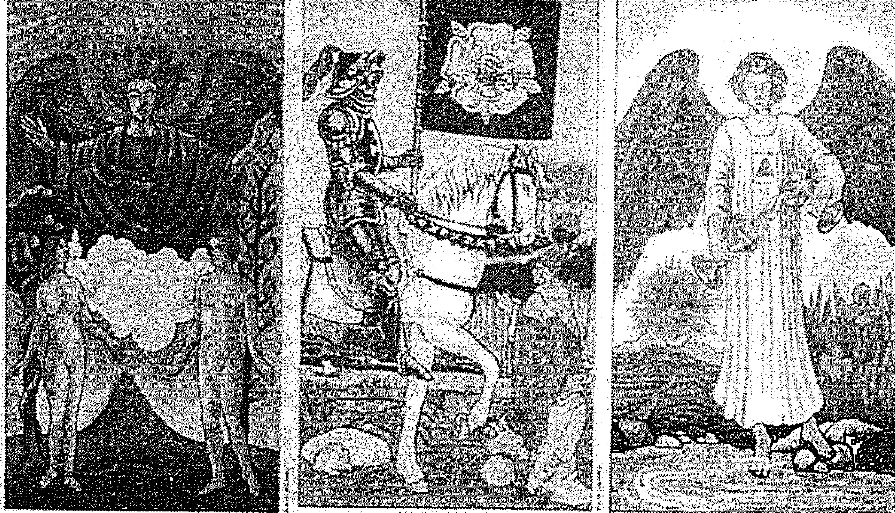

从这三张牌的流动我们可以看出，中间的死神将左边的恋人牌的能量带入右边，因此呈为典型的从左到右的线性流动模式。
左边的恋人代表了爱和热忱，在塔罗的学习上体现为学习最初的那段时间对于塔罗牌一时的热衷与热情，但是随着时间的推移，这种“一时发热”的喜爱会最终走到终点——也就是死神。许多人往往到达这一步就停止了学习，其中的原因往往是因为厌倦而导致了放弃。如果一个人想要超越那一个最初的热情并继续学习下去，那么就需要有一颗持之以恒的心，在这颗心的引导下坚持的练习、实践。这样就会如节制牌所示的那样，让塔罗牌会融入你日常生活的一部分。同时这种融入也会将你带往更深层的热爱并使你达到真正的融会贯通之中。

### 实例2

问题：自我身心的检视
牌阵：身心灵
牌面：

- 1. 身（肉体部分、外在的物理条件、欲望）：隐士
- 2. 心（显意识范围的思想、心智、理智部分，控制着你对事物的认知和态度的这部分，影响着你的决策。）：宝剑3
- 3. 灵（你的理想、目标与追求，是人的“向善”部分，其作用有如“高我”，具备启发、建议的作用）：愚人

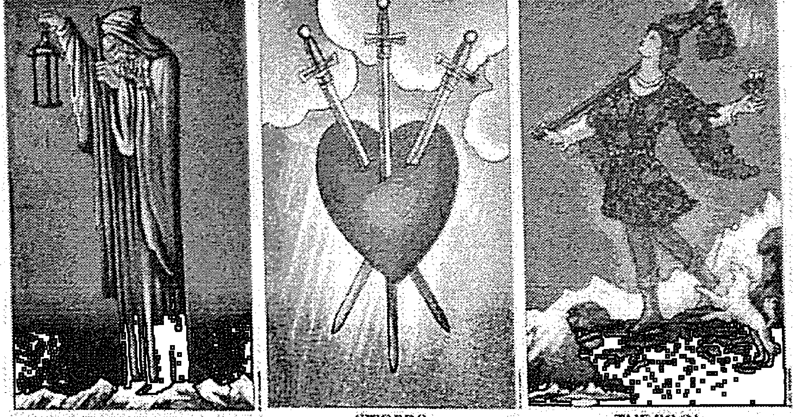

这个实例在“图像取意法中”已经作过解读，这里我们使用“图像流动法”的方式对同一个牌阵同样的牌面采用不同的方式进行解读，以便于大家理解。

#### 解读：

身部分的隐士牌代表退出、回避；心部分的宝剑3代表受伤、痛苦与悲伤；灵部分的愚人代表带着启迪与开悟敞开心扉、接受一切。

根据图像所演绎的情形将三张牌予以联系起来：隐士背对于宝剑3、而愚人面对并呈以接受姿态面对宝剑3。这在图像流动的六种模式中属于阻塞模式。愚人的欢乐与无忧无法渡过宝剑3这一关，最后无法缓解孤独隐士的沉默与忧愁。

当然，图像流动的六种模式不是图像流动解读法的唯一方式。我们还可以运用其他一些方式来对这三幅图作出解析：

这里按照身心灵的牌阵位置规则，应用到解读中的情况便是：较低层次的欲望部分需要自我赶快脱离这段正在经历心理伤痛（宝剑3），并试图通过孤寂、沉默、独处来回避心伤（隐士），高层自我的部分则要以微笑去面对接受这段心伤（愚人），即使前方会让我面对悬崖般的危险、或是让我面临如心绞般的痛楚，我也要勇敢面对，因为愚人告诉我：“越是危急的时候就要笑得越从容”。

也有一些针对特定牌阵所创出的一些非常开阔思维的技巧，比如清风所著的《第一次塔罗占卜就上手》一书里就提到过身心灵牌阵的解读技巧：将“身”视为“沉沦之力”，将“心”视为“抉择之力”，将“灵”视为“提升之力”，身心灵牌阵就是三种力量互相拉扯的关系。

那么在这局牌阵里，就能视为在面对自己不愿面对但必须得去面对的事情时，自我的哪一股力量会占得上风，因为“力的平衡”告诉我们，提升之力与沉沦之力的孰强孰弱会直接影响到你内心的决策，那么在经过自身的权衡，欲望和理性谁会获胜呢？也许就在这一念之间。

### 实例3：

背景：求问人在一次聚会活动时认识了一位异性，对她产生好感，很想与对方产生进一步交往，在聚会结束后也有再度邀请对方出来共进晚餐的想法。于是求问人希望通过塔罗来给这段关系寻找一些启示。对此，求问人问了两个问题，问题1是想了解一下这段关系以及关系中双方的大体情况。问题2是希望从这次塔罗游戏中得到一些帮助和建议。

#### 问题1：这段关系以及双方的大体情况

牌阵：关系展开法

牌面：

- 1. 代表你自己：权杖3
- 2. 双方的关系：星币1
- 3. 代表对方：宝剑侍从

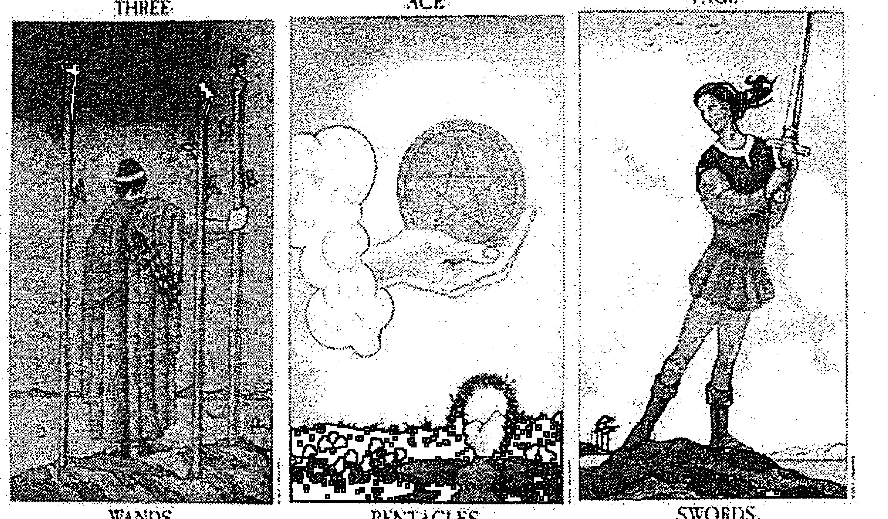

#### 解读：

左边是自己，右边是对方，中间是双方关系，可以先观察一下这三张牌图像的整体走势。

三张牌走势大体上由中间那张牌引领呈为从左到右的流动方向，但是左右两张牌在流动方位上不是十分流畅，左边的权杖3只是一只手伸向右方，人面朝前，右边的宝剑侍从身体和移动方向朝右，但头却朝左回望。了解了能量流动趋势之后来分析这三张牌

权杖3是权杖牌组，对应火元素，代表热情，这里是代表求问人自己。权杖3图像中的那人于山崖上伫立沉思，手握最外侧也是最右侧的那根权杖，右边是对方的位置，所以这个动作可以显示出自己的内心有行动的意向（背景：有邀请对方出来共进晚餐的想法）。不过图中那人身体面向前方而不是对方的方向，这则表示这一切的一切都只是内心的想法，尚未付诸于实际行动。图像中那人注视着海面，也许是在期待船只的返航，也许是目送船只的离去，但不论是等待返航还是目送离开这些对应到实际都表明求问人对对方尚不了解。

中间的牌是星币1，星币1是决定能量从左到右的牌，1代表开始、开端、萌芽；星币对应土元素，代表物质、实际、现实。在这个问题的这个位置里，星币1算是比较好的牌，因为左边的权杖3仅仅是停留于计划与构想，凭的是仅仅是一股热情，缺的正是实际行动，而这里的星币1则恰到好处予以了落实。由于星币1代表的是双方的关系，所以可以见得，能量的流动势头是从求问人开始再到对方，这至少说明## 第四篇：塔罗解读的方法与实例解析

如果求问人主动则可能有些希望，而安于等待则容易石沉大海。

右边的是宝剑侍从，宝剑侍从图中，侍从的身体和宝剑所指的方位是右方——不是求问人的方向，结合宝剑“挑战与心智”的含义而作初步判断，则为对方目前的注意力主要放在学习和工作上，但是幸好的是，宝剑侍从的头部回了过来，呈与身体相反的朝向——朝向求问人这一方向，这个信息代表求问人是有引起她的注意的。

这三张牌指出求问人与对方之间关系的大体情况是：对方是有一点注意求问人的，但在这段关系的发展上，求问人必须起到主动带头作用，如果他不能将这一想法转化为实际行动，则很可能会不了了之，因为从牌面来看，对方是不会主动的。

#### 问题2：基于上述对双方关系的状况和关系的分析之后，求问人希望塔罗能给自己一些启示和建议。

牌阵：三张牌牌阵

牌面（从左到右）：

- 1. 宝剑7
- 2. 权杖2
- 3. 圣杯8

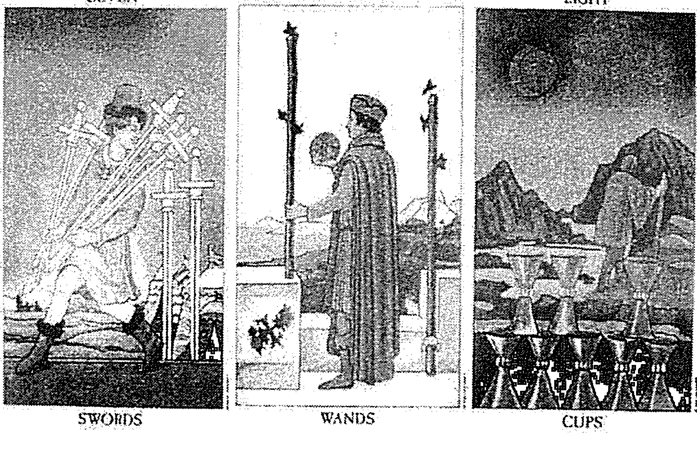

#### 解读：

从图像流动的六种模式来看，上述三张牌所呈现的模式“选择模式”，左侧的宝剑7朝向左边，右边的圣杯8朝向右边，中间的权杖2朝向左边的宝剑7、而背对右边的圣杯8。可见中间的牌存在有选择性的指向。
先看圣杯8，圣杯8说的是一个人正退出和离开某一个情形，将圣杯抛弃于身后，圣杯代表感情，所以结合实际情况便可以解释成主动退出一段关系。
权杖2中的人物背对圣杯8，而面向宝剑7，这里塔罗是在建议求问人采取宝剑七的行动。
宝剑7中的人物正从一个军营里窃取武器，以抢得先机，占得主动之势。另外在远方还有一些小黑影，可以代表除求问人之外还有其他一些对对方有兴趣的竞争对手，所以很明显这张牌是在让求问人赶快行动。
所以，就整体来看，求问人应该趁热打铁，尽快向对方提出邀请，相信这一次邀请只要不和对方的计划与安排冲突（特别是工作上和学习上的），对方欣然接受的可能性还是比较大的。这一步的交往也许就可以成为双方关系发展的第一步，至于今后是否有继续深入发展的可能性，则需要今后再作综合评估。

### 实例4：

背景：求问人是一名快要毕业的大学生，正值期末考试。一天早晨，他突然接到一家公司的面试电话，要求他在当天下午去该公司面试，但不巧的是，下午求问人正好有课，两者正好冲突，而且课程内容比较重要。所以求问人非常犹豫不决：一方面，目前就业形势紧张，好不容易获得面试的机会自然不肯轻易放弃；另一方面，快要考试了，不去上课是否会对期末考试产生影响也是他所担心的。

问题：选择上课（A）与选择面试（B）将会给自己带来的影响，并希望通过塔罗游戏来获得关于这个问题的一些启示。

牌阵：二选一

牌面：

- 1. 代表求问人本身、求问人的状况、问题的现状：权杖1—
- 2. 选择A之后的状况：权杖4
- 3. 选择A之后的发展：宝剑1
- 4. 选择B之后的状况：宝剑5
- 5. 选择B之后的发展：星币5

解读：

在看该牌阵的两条选择路线之前，我们理应先对权杖1—这张牌好好分析，

权杖1—：权杖牌组对应荣格心理四大机能中的感受，属于决策功能，给一个人行动提供了动机，对一个人的行动起到推动作用。数字1代表的是一个新方向的开始。所以权杖1可以代表在决策和内部能量的推动下确立及引发的行动新方向。而权杖1—则代表则表达了一种被压抑的特质，这一个新的方向难以被确立。行动方向为什么会难产呢？这也可以借助塔罗牌来寻找一下原因，因为存在着一些能量阻碍了自身的决策并直接导致决定和行动上的困难（可以参见权杖10的牌图，身上重物过多不但拖累了自己的行动速度还阻挡了自己的视线，使自己看不见远处的目标，造成目光短浅。使用符号的象征方法，如果权杖1图中的一根权杖代表一个想法、一次决定和一个行动，那么权杖10牌图看起来则说明想法太多而拖累了行动，在这样的情况下往往不利于做出高瞻远瞩的决定）。

结合实际问题，导致自身决定困难的原因则是两方面的选择，一方面是好好上课、放弃工作机会；另一方面则是抓紧每一次上岗工作的机会，但可能会拖累学习。

那么如何看待这一次选择呢？我们可将这一个“选择牌阵”变形，变为下述排列（左线A仍然居左，右线B则居右，使其呈“一”字形横向排开），这样便可更容易我们分析。看下图：

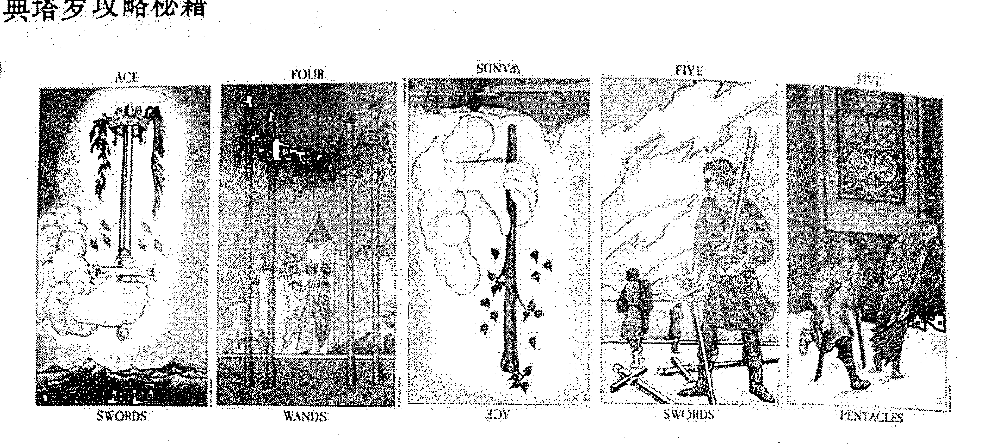

以权杖1—为中心，左右分别对AB两种选择，这里若用“三张牌读牌模式”中的“选择模式”可以一目了然地看出牌阵的方向流动性。首先，第一感觉便是左半部和右半部色调上的差异，左边的色调偏热、右边的色调偏阴。这可对积极与消极程度作个大致判断。中间牌权杖1—面对着右路，也就是B线，但是由于权杖1为逆位，可以代表一些阻碍性的能量影响了求问人的判断力和出发点（犹如权杖10般被挡住视线的情况），在这种情况下贸然前进则非常容易与既定目标发生偏离。如果我们将权杖1放正，那么它的指向则变成了左方，也就是A线。

### 现在就让我们分别来检视A与B：

A线中的权杖4是一个和谐稳定欢愉的局面，也可联系实际情况象征为毕业典礼，代表学业的顺利完成，而再往后的宝剑1可代表更高的理解和胜利，象征经历稳定、持续的发展后所得到的回报。

宝剑1、权杖4、权杖1—三张合起来所得到的启示是：成功（权杖4）是基于清晰的判断力（宝剑1）和明确的行动方向（权杖1）之上的。学业的顺利完成是找工作的保证和前提，况且作为一名学生、学业是其首要任务，理应遵循塔罗之意按部就班，以学业为重，宝剑1亦显示，毕业之后也存在着新一轮开始的机会。

B线里，两张数字为5的牌呈现的是混乱的局面，伟特说两张数字为5的牌同时出现，在游戏中意为一种警戒、警示，宝剑5中没有胜者，得到的东西是要以失去另一些作为代价的，结合星币5可以确定得到的东西并不是工作机会。所以若以“工作”作为B线选择的衡量指标无疑是非常不利的。
根据权杖1—、宝剑5、星币5我们得到的启示是：要想达到自己的目标，首先要擦亮自己的眼睛，避免被急功近利的想法所迷惑，权杖1—在这里能够用权杖10图像来借鉴，急功近利的想法一锅端，不断放慢自己赶往目的地的速度，更造成宝剑5+星币5的局面——也就是俗话说“追二兔者皆不可得”，工作学业两全误，所以何必心急一时呢？

### ◆ 引导式解读法

首先，引导式解读法是一种偏向于心理学咨询式的解读方法。这种方法在国内并不多见，但在塔罗预测成熟的西方国家比较常见。要解释引导式解读法的概念，我们还是要从头说起。
对一般求问者而言，他们往往的确关心的只是未来和结果——但其实只是表象。如果深入想下去，求问人为什么会关心未来和结果？那是因为他们重视，希望这个未来或结果能够合自己的心意。可是如果再深入思考下去，求问人对未来和结果的看重只是从侧面反映出他们对那一个结果没有把握，从而导致了内心的忧虑与不安。所以就本质而言，他们所最最关心的，应该是“如何才能获得合意的结果”。就这一点来说，塔罗预测的主要目的也就变成了“赋予求问人决定能力”，因为只有赋予了他们决定能力，他们才能够有那股力量克服内心的不安，才能有能力达到预期的结果。这一个过程就是“使人获得觉知，使人的意识获得提升”。这些就需要通过塔罗预测来进行，所以，一次塔罗预测就是一次提升求问人对问题的认知程度，也是使问题变得更加清晰、让求问人更清楚地了解其中的课题、了解自己的目的、了解自己可以选择的范围、增强对当前形势的评估，当所有的一切完成之后，他们的对于问题的意识和认知也就比预测前更进了一步，这种认识能力的上升也就更有利于他们对预测的问题作出决定，这就是赋予他人自我决定的能力。

那么接下去的问题就是，如何做到去赋予求问人那一个决定能力，如何使求问人获得对某一个问题认识上的觉知。那么，在现行西方职业塔罗解牌师的观念里，他们认为只有咨询式的解读方法才能很好地做到这一点。于是，国外的一些塔罗解牌师们已经渐渐地不再把他们自己定位为算命师，而是咨询师。咨询师的工作，除了回答求问人的一些问题外，还会在做塔罗预测过程适当地引入一些引导式的方法。这种引导求问人的方法其实就是在帮助求问人了解自己的状况，理清他们的问题、从而帮助他们面对这一个问题。

这种引导式的解读方法被塔罗界拥有塔罗教母之称的Mary K Greer写入了她的塔罗牌解读著作《21 ways to read a tarot card》中。这里的解读方法被她命名为R.I.T.E解读法——a Reading that is Interactive, Transformational, and Empowering.⑦

在这里，Reading就是读牌。Interactive是交互式的，求问人、解牌师、牌面一起互动——三者缺一不可；Transformational是转化，通过解读揭开问题的模式，从而使求问人改变、提升对问题的看法和认知，看清问题的形势、看清自己在问题中所处的位置——这既要求分析出过去、现在、未来的问题走向和可能的结果，又要分析出周围环境的影响因素（强化或削弱），还要结合求问人的主观心理、态度一并分析。而Empowering是赋予和强化求问人决定的能力，找到一个最合适的心态来面对问题，知晓自己该怎么决定，这同时也赋予了求问人把握自己命运的能力。所以，R.I.T.E就是综合以上这些要点总结而成的高阶读牌法，简而言之，所谓的RITI解读法就是利用交互式的引导方式来达成的。

我们可以一同来看一下这本书中所举的一个例子：

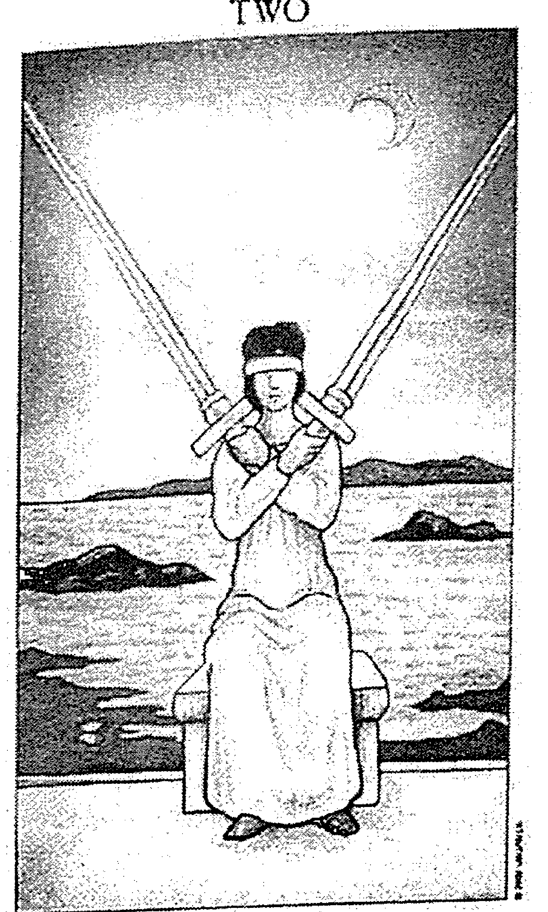

实例1 (该实例引自《21 ways to read a tarot card》):

问题：目前的生活中，我最需要关注的是什么？

牌阵：1张牌

牌面：宝剑2

解读：

宝剑2在大多数的塔罗牌中都是一个蒙着眼的女人背对着大海坐着，头顶上有一个月亮，女人双手握剑交叉于胸前。有一位求问人将这一图像在情绪方面描述为“不快乐的、对抗和决定”。如果将这种叙述换做第一人称，那就是：“我是一个眼睛被罩住的人，背对大海坐着，我的双手持着双剑置于胸前，并保持着这种姿势，我觉得不开心而且我目中无人，但我已经决定了。”

解牌师这时就抓住最后一个单词“决定”，这个词看起来像一个未完成的想法。所以解牌师便问：“决定去做什么？”

求问人：“我不知道。”

解牌师：“那我们作一个假设，如果你对某事已经做了决定，那它是什么？”

求问人：“我决定不论如何，我都要保持我这个姿势（将宝剑向上交叉于胸前）。”

解牌师：“那么如果宝剑掉落，那将如何？”

求问人：“会失去。”

解牌师：“会失去什么？详细说。”

求问人：“我会受到侵害，牌面中的人看上去穿着一件睡衣，所以这有点像是一个恶梦，梦中有东西在追我，而如果我能完全保持这个姿势，追赶我的东西可能看不见我，甚至认为我是一尊雕像。”

解牌师：“那你为什么带着眼罩？”

求问人：“眼罩使我镇定，如果我看不见那东西，我就不会害怕。”

解牌师：“那么在你的生活中，你需要这种镇定吗？”

求问人：“嗯，关于税收方面的。在我正式的工作之外，我在做一笔小生意，这个生意几乎每年都亏损，所以我申请了税收的免除额度。但是我担心的是，税务局会来审查并发现我的这项生意是在正式工作之外的另一份业余工作，这样按照规定，我就不能享有这笔税收上的免除额，这将损失很多。我不知道该怎么做，但至少我已经让我的一位朋友来处理此事了。”

解牌师：“你是否看过相关的规章制度？”（这个问题就是在探究她是否故意将自己置于黑暗中，如牌面中的眼罩那般。）

求问人：“我不想知道，我只想让我朋友处理，但如果这部分税收不能免除，我就不能继续我的生意的，这项买卖可是注入了我很大的热情的。”

评：从上述解牌师与求问人的对话中，我们可以看到，其实这是求问人自己把问题变得更加复杂的，因为他没有察觉到自己的选择，拒绝获知任何事（用这种方式来保持平静）并担心税务局来查核，这样一种情况构成了他的恶梦。
作为一名解牌师，由于专业领域的限制，解牌师是不应该插手于求问人税务方面的问题，也没有权力去强迫他学习相关规章制度，更何况他自己已经决定了那样去做。求问人的税务问题遍及了他的生活，他有一个机会来建立一个“屏障”来忽略“对他造成威胁的东西”——那就是请他朋友来处理，从而自己不闻不问。这样做的原因可能是他以前遇到类似困境时用过这种应对方式，而且很有效。所以在他身上，一部分的自我在采用这种对抗行为，另一部分感到的是不开心。这种情况是不是就是“处在两把宝剑之间无法移动”？数字2代表选择，宝剑代表理智，将眼蒙起来代表他不想看自己处在进退两难时的道路。当他处于两种决定之间（交叉的剑）不想看到自己想法（蒙眼）时，月亮和水（潜意识的感觉）在宝剑（风）中的支配地位就格外显眼，指出了这种情况下最好的处理方式就是遵从自己的感觉。

在这段对话中，我们看到了解牌师对求问人所描述的一些关键信息所采取的捕捉。比如恶梦的景象——实际上这属于一个象征——告诉我们现实的环境对求问人来说的确如恶梦。然后还有关于求问人将事务移交给他朋友（推卸责任？）。最后还对求问人的最后一句话进行了捕捉，这使我们体会到了求问人对这项业余工作的热情和兴趣。所以当我们试着去确定求问人担心之处时，我们能够在大脑中勾画出一幅图像，在这副图像里的求问人不得不忍受的税收问题，再配以相关的情绪状态就能做到使用移情法来理解问题和处于问题中的当事人的感受。

这项业余工作注入了求问人很大的热情，但如果他不能证明免税是正当的，那么就由此产生了另外其他的问题，关于这些问题，我们就需要再追加更多的问题并抽取更多的牌来分析。最后，还记得这次占测的问题吗？——我们现在已经知道了求问人在当下的生活中需要面对的问题，这是一个进退两难问题，但求问人选择了恐惧和无为来回避这个不悦的事实。所以如何去解决如何寻求对策则需要对求问人提更多的问题来支持。

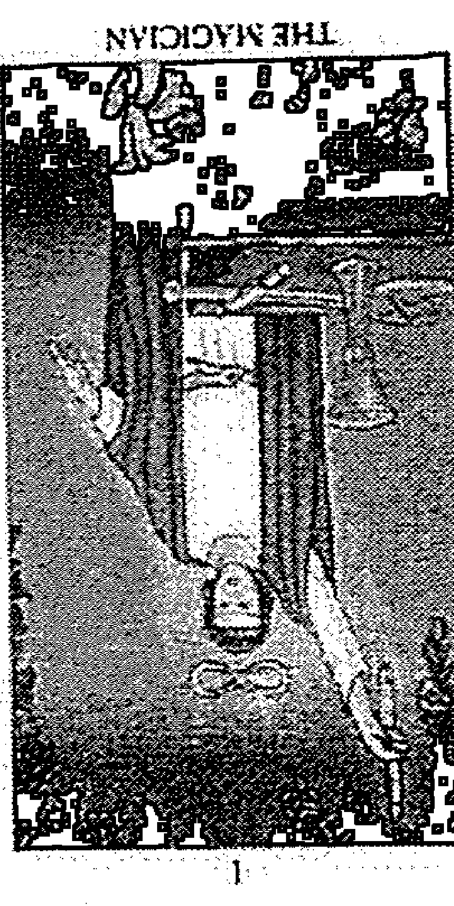

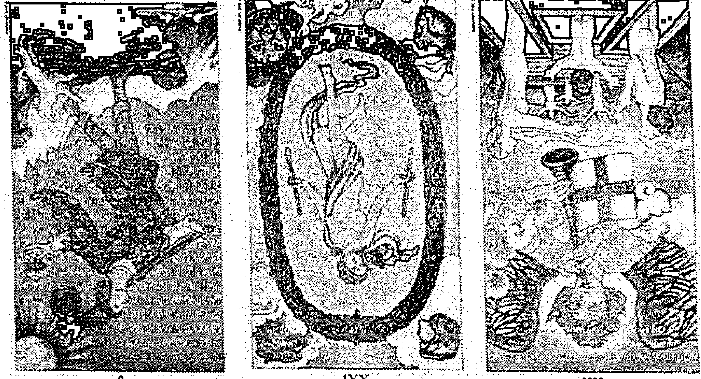

#### 实例2：

问题：求问人与他喜欢的人是否有可能成为恋人。

背景：一个没有恋爱经验的求问人，现在就读大学三年级，内心渴望找个女朋友。有天正巧遇到了她，但在是否要告白这一点却犹豫了，自己明明喜欢她，但是不知道怎么办才好。

牌阵：爱情金字塔

牌面：

- 1. 自己：世界—
- 2. 对方：愚人—
- 3. 彼此关系：审判—
- 4. 未来发展：魔术师—

解读：

以下，问=解牌师，答=求问人，评=分析
问：你觉得牌告诉你什么？

答：好像是别自做多情的感觉。
评：这里体现出求问人对自己并无十足信心，也对牌阵中出现的牌并无信心。
问：那么哪张牌的出现会让你觉得很有希望。
答：世界，星辰。
问：那么当你觉得有希望的时候你会怎么去做？
答：更加主动的去跟她沟通。
问：那没希望的时候就放弃了吗？
答：也不是说放弃。说放弃可能就是放弃追她咯，但是还是想多一个朋友。
问：做了朋友之后你觉得会给你带来什么改变吗？或者说你和她成为朋友会有可能给你更多的机会去获得这份感情吗？
答：是的。从朋友到恋人，需要这样的过程吧。
问：既然如此，为什么不努力和她成为朋友？
答：大家都是天蝎座。不太会说话、不爱说话，然后对方说的似乎也不多，我了解的太少。比如说QQ聊吧，在Q聊再好不过了，但是她回得很慢，似乎很忙的样子，打电话给她呢，说着说着又会断哦。有点尴尬。
问：你前面好像说过，你觉得出现世界牌就会很有希望，但现在的牌里是有世界，但是逆位的，而且是代表你的，那么你觉得这说出了什么问题？
答：印象中世界正逆位似乎都是张好牌所以没研究过区别……噢！我突然想到钥匙……逆位……额……没有钥匙……在那干等……也可能还找不到钥匙打开门吧……钥匙丢勒。
问：世界逆位对应命运之轮，说了你希望的是命运来安排，最好哪天你中意的女孩跑上来和主动你拍拖？
答：是的。
评：这里，求问人的不自信体现的淋漓尽致，比较多地寄希望于上天的安排，而推掉理应自己所付出的努力。

问：在牌阵中，对方的位置是愚人逆位。愚人逆位是代表她，那你在等待和犹豫的时候，你觉得她的感觉如何？

答：愚人一，我想到了浮躁，好像只是想到了浮躁。愚人还不够成熟，逆位，跌倒了的感觉，就实际情况来看，似乎她对我也不是冷淡的。

问：既然如此，为什么之前你会觉得自己是在自作多情呢？

答：突然觉得的，只是感觉。有啥建议么？审判牌我就不知道怎么解嘞，只觉得好像不是很好的样子。

问：你缺少一点信心，原因还是对于失败的恐惧与紧张。那么如果照你前面所说的，先从朋友做起的话……会不会对这种紧张的心理起到缓释作用。

答：是吧？！因为不确定没信心，做朋友，了解多了、接触多了，可能更加有机会的感觉。

问：那现在你们之间的关系是审判逆位。天使吹响喇叭，躺着的人全部起身，但是是逆位的，你觉得怎么对应到你的问题中。比如说，死人站起来代表什么，天使吹喇叭又代表什么。

答：死人站不起来，依然躺着。那就是原地不动咯。天使吹喇叭，带来福音。

问：嗯。正位的审判，死人起来就是复活，为什么复活呢，因为天使吹了喇叭，你说的对，天使带来福音，死人复活。那么现在是逆位，你刚才说死人站不起来，那么站不起来的原因是什么，是不是有一种可能是因为没人吹喇叭，而无法带来福音？

答：站不起来。因为没有福音，没有希望的感觉，所以没有站起来。

问：那么对应到你的问题，牌中的天使代表谁，天使吹响喇叭代表“他”的什么行为？你要注意，这个人的这个行为可以令死人复活，复活是由死到生，代表一个状态向另一个状态的转变。

答：天使代表她吧。天使吹喇叭。也许是代表一种信息，能给我信心的信息。

问：呵呵，到现在为止，你还是在推卸自己的作用。前面一开始，已经通过世界逆位了解自己的问题所在——你太被动，希望能够信手拈来。现在对这张牌的理解再次提点了你这个问题，你是该正视一下了。天使为什么不能是你？你为什么吹出的喇叭不是福音？难道你吹出的声音一定是噪音吗？至少到目前为止，你还没有吹过，那么等到吹了再回答我吧。

答：我想过这个可能哦。不过刚才没有说。其实怎么吹好像也是个问题。

问：那么最后看未来的发展，魔术师的逆位。魔术师我可以告诉你，是代表整合现有可以利用的资源做出适当的行动，现在逆位，你觉得这个逆位的原因在哪里？是你没有资源可利用，还是一直不行动。说得再简单点，魔术师最重要的是把握机会就出击，你觉得自己是没有机会还是不去出击。

答：后者。

问：那要怎样才能让自己行动起来？要有怎样的机会放在你眼前，你才觉得应该行动了？是不是你要等到她跟你来表白的时候才会觉得这才是最佳的时机？但是这是她的出击，你做的只是回应。

答：把握机会这环节上似乎挺麻烦，我不太懂。不过似乎这样看来，如果我不采取行动的话这种关系就难以进展。看来还是先从朋友做起，然后等待机会吧。

评：其实，从求问人自身来说，他内心极其清楚想要一步到位是不可能的。于是他就寄希望于上天、寄希望于对方主动来向他表白，不过这点无论从对方的愚人逆位还是双方关系的审判逆位都说明，这样的可能性微乎其微。其结果便是：愚人迟迟不从高处跳落、审判的序曲也迟迟不会吹响，而未来，他也将一直等不到魔术师施法的机会。

所以，要想改变现状，无疑只能自己开展行动，这一点在上述对话中，他也已经悟到。但是行动的方式有许许多多种，比如可以采用非常直白的一步到位式，也可以采用比较含蓄的循序渐进式。那么在最后，求问人也已经认识到，就当前自己的情况、对方的情况以及整## 经典塔罗攻略秘籍

就大环境而言，比较妥当做法便是循序渐进，从认识到熟悉、从熟悉到朋友，然后再去找寻适当的机会发展。这里，塔罗牌虽然没有帮到他达成“喜结良缘”的美好愿望，但是却帮助他看清问题的现状和将来的走势，也令他获知当前当下的自己该如何去做。

#### 本篇总结

本篇以实际案例的形式，列出了许多塔罗预测中的实用解读方法。当然，这里给出的方法不是塔罗解读的全部方法，而只是冰山一角。相比一些比较复杂、难以运用的解牌法而言，本篇的方法更加易于理解、便于运用。

最后，我想告诉大家的是，世上绝不存在某个“最好”的塔罗解读法，只有相对最适合自身的塔罗解读法，正所谓十八般兵器，各有千秋。一个人也很难做到十八般武艺样样精通。所以，重要的是根据自身的情况去打造适合自身的解牌方法。当然，上面列出的各种实例也好、方法也好，主要也在于起到一个“牵引和启发”的作用，正所谓抛砖引玉，最终目的则在于引出潜藏于各位读者内心深处的“洞见”。

- 《21 ways to read a tarot card》 by Mary K Greer
- 《Translating images in a tarot reading》 by Mary K Greer
- 可参考《亮’s塔罗时空——3×7六芒星体系》：http://blog.sina.com.cn/s/blog_4b44f948010005je.html
- 《塔罗逆位精解》——丹尼尔
- 《The Tarot: History, Symbolism and Divination》 by Robert M Place
- 《第一次塔罗占卜就上手》——清风
- 《21 ways to read a tarot card》 by Mary K Greer

## 参考资料

- 《塔罗葵花宝典》——向日葵
- 《其实你已经很塔罗了》——保罗·凡顿·史密斯
- 《第一次塔罗占卜就上手》——清风
- 《荣格心理学导论》——F·弗尔达姆
- 《塔罗逆位精解》——丹尼尔
- 《现代心理学》——张春生
- 《The Tarot: History, Mystery, and Lore》 by Cynthia Giles
- 《A Cultural History of Tarot》 by Helen Farley
- 《Iconology of the Early Tarot》 by Robert O’Neill
- 亮’s 塔罗时空：http://blog.sina.com.cn/jeaora
- Trionfi: http://trionfi.com
- 《The History Art and Symbolism of the Tarot》 by Robert M Place
- 《the Hermetic Journal》 by Adam McLean
- 《Reading the Marseille Tarot》 by Jean—Michael David
- 《The Tarot: History Symbolism and Divination》 by Robert M. Place
- 《Tarot Symbolism》 by Robert O’Neill
- 《A Wicked Pack of Cards》 by Michael Dummett
- 《The Tarot Cards》 by Gertrude Moakley
- 《A History of Games Played with the Tarot Pack》 by Michael Dummett, John McLeod, E. Mellen Press
- TarotPedia: http://www.tarotpedia.com
- 《Pictorial Key to the Tarot》 by Arthur Edward Waite
- 《Everyday Tarot: A Choice Centered Book》 by Gail Fairfield
- 《Dante's Commedia and the Tarot》 by Robert V O’Neill
- 《Learning the Tarot》 by Joan Bunning

## TAROT 经典塔罗攻略秘籍

- 《The Alchemical Tarot》by Rosemary E. Guiley and Robert M Place
- 《The Secret of the Tarot》by Robert Swiryn
- 《The Western Esoteric Traditions》by Nicholas Goodrick—Clarke
- 《The Fool’s Journey》by Robert V O’Neill
- 《The Mystical Staircase》by Andrea Vitali
- 《A Complete Guide to the Tarot》by Eden Gray
- 《Tarot Mirrors》by Mary K Greer
- 《Osho Zen Tarot》by Osho
- 《The Secret Tradition of Alchemy》by Arthur Edward Waite
- 《The Symbolism of Alchemy》by Robert M Place
- 《21 ways to read a tarot card》by Mary K Greer
- 《The Hero’s Journey》by Joseph Campbell
- 《The Tarot: a key to the wisdom of the ages》by Paul Foster Case
- 《Tarot Wisdom: Spiritual Teachings and Deeper Meanings》by Rachel Pollack
- 《The Tarot: a key to the wisdom of the ages》by Paul Foster Case
- 《Translating images in a tarot reading》by Mary K Greer
- 《Complete Book of Tarot Reversals》by Mary K Greer
- 《Seventy—Eight Degrees of Wisdom》by Rachel Pollack
- 《Psychological Types》by Carl Jung