# 美少年塔罗读心占卜

# 前言

# 用塔羅占卜，愛上自己下的每一個決定

塔羅能將你現在最需要的訊息傳遞給你。
對你來說，塔羅是什麼呢？
塔羅牌擁有不可思議的力量，遠超乎我們的想像。
會在我們最需要的時候，傳遞最重要的訊息給我們。
當你難受、痛苦或想求助他人時，不妨翻翻這本書。

在這裡，沒有人會責備你。
慢慢來沒關係，請試著翻開這本書吧。
書裡有著只屬於你的世界。

杏花栗子

# 指引未來方向的塔羅牌

# IDEAL SOULMATE TAROT

本套牌卡包含大阿爾克那（大牌）與小阿爾克那（小牌），共有 78 張繪有原創美少年的塔羅牌。

幻想世界的塔羅牌能包容、療癒，並為你的人生帶來正向的美好。二次元少年們會將人生導向光明正向，讓自己變得更加光彩奪目吧！

IDEAL SOULMATE TAROT 製作：LUNA FACTORY © LUNA FACTORY

# 本書的使用方式

本書綜合塔羅占卜與翻書占卜的特性，只要翻開本書，幻想世界的塔羅牌將會引領你往更美好的未來。

最重要的並非占卜的知識與經驗，而是你看到牌卡的瞬間感受到什麼。占卜師杏花栗子透過美麗的塔羅牌「IDEAL SOULMATE TAROT」將正向訊息傳遞予你。

請相信自己的直覺，翻開這本書吧，這將會成為改變的契機。

# 占卜步驟

## 1 沉澱情緒，思考想問的問題：

調整呼吸，深吸一口氣。整頓好思緒後，在心中默念或說出問題都可以。無論是戀愛、家庭、工作或人際關係，任何煩惱都無妨，一個一個找到答案吧。

- ◇ 之後有機會和○○○交往嗎？
- ◇ 該怎麼做，才能和○○○感情變好？
- ◇ 如何才能遇到結婚對象？
- ◇ 換工作會順利嗎？

## 2 輕敲書封：

左右手皆可，握拳時內心想「請告訴我答案」，像是喚醒塔羅牌般輕敲封面兩下。

## 3 當你覺得是時候了就翻開書，那一頁就是當下的答案：

相信你的直覺，隨意翻開一頁。

閱讀順序：①仔細觀察並感受左頁的牌卡；②右頁的文字就是牌卡少年想對你說的話；③ 解牌下方關鍵字，無論面對各種情境，讓靈感無限延展。

# 占卜時的注意事項

為了讓你與本書有更深入的連結，
占卜前有四點要注意。

## ◇ 避免密集詢問同一個問題

若你在看到訊息後感到煩躁，請先向塔羅牌詢問「為何會出現這種結果？」你一定能找到讓你感到不安和煩惱的線索。同樣的問題，請隔一段時間再問。

## ◇ 出現逆位牌也不要擔心是負面答案

抽到正位並不代表就是好預兆，反之抽到逆位也不代表壞兆頭。重要的是塔羅牌本身所傳達的訊息，無須受正位與逆位的影響。

## ◇ 不需要過度在意牌卡給你的訊息，重點是看了之後你怎麼感受、如何行動

比起牌卡訊息，請正視自己真正的想法。塔羅牌不是恐怖未來的預兆，也不會強迫你接受某種理論，只是提供一個解決煩惱的方向與線索而已。

## ◇ 把喜歡的牌卡拍照下來隨身攜帶，獲得滿滿能量

可將塔羅牌與訊息拍照下來存在手機中，隨時查看，還能成為護身符。當作手機桌布也不錯，用自己喜歡的形式隨身攜帶吧。

# Queen of Wands 權杖皇后〔正位〕

關鍵字
愛 精力充沛

# 你絕對沒問題，
因為你充滿魅力！

現在的你，是否非常缺乏自信呢？
即便如此，也不需要逼自己變得正向開朗。
試著正視自己的感受之後，我要告訴你，
你是一個非常有魅力而且優秀的人。
自信不足正是你願意誠實面對自己的證據。
而這樣的你，總有一天能擁有自信，展翅高飛。
在那天來臨前，好好面對自己，慢慢思考也無妨。
若有想達成的目標，也別害怕勇往直前，
就依照自己的心意走。
最重要的是重視自己真正的樣子，走自己的路。

# Four of Wands 權杖四〔正位〕

關鍵字
和諧 平靜

# 這一刻終於到來，流淚過後，將迎接平靜及安定。

這一刻終於要來臨了。
過去你所感受到的痛苦與悲傷，將慢慢轉為平靜。
為戀愛而煩惱的你，將能兩情相悅或結婚……
就算是不拘泥於形式的你們，也能許下愛的誓言。
除了戀愛以外，抽到這張牌也代表一切事物都將走向安定。
所以請放心，照你自己的步調生活吧。
牌中那些茂盛的枝葉不僅輔助花朵綻放，
也盡全力祝福著你的未來。過往流下的眼淚絕對沒有白費。
這次你將流下喜悅的淚水，灌溉花朵盛放。

# Queen of Pentacles 錢幣皇后〔正位〕

關鍵字
保守 豐足

# 好好珍惜別放手，
這份重擔將成為你的養分。

深藏在你心中的「那件事」對你來說非常重要，
我能感受你多不希望他人談起這件事。
而你是不是有時會為了自己的堅持，
以及過於重視、不願退讓的想法而困擾呢？
這並沒有錯。對你來說，什麼才是最重要的呢？
我想你早就注意到了，無論路有多麼崎嶇，
你一定能到達終點。當你感到疲憊時，
暫時把「那件事」放在心底，先去思考別的事也無妨。
你是不會逃避的，因為那件事已成為你的血肉及養分了。
未來也將繼續與你同行。

# STRENGTH 力量〔正位〕

關鍵字
決心 具象化

# 偶爾撒嬌也無妨，
試著放下肩上的重擔吧。

你是不是時常覺得受人擺布呢？
事實並非如此。
你會這麼覺得是因為你非常善良，且能敏銳察覺他人的情緒，
所以有時會勉強自己配合對方，或去顧慮對方的心情。
但是請別擔心，你並沒有任人擺布。
你只是很關心別人，以及周遭的狀況罷了。
你一定每天都很心累吧，辛苦你了。
這次換你撒嬌了，就算小小的耍性子也可以，
偶爾哭泣也沒關係。

# WHEEL of FORTUNE 命運之輪〔逆位〕

關鍵字
變化的前兆 內省的時期

# 再稍等一下下，
你期望的那一刻即將到來。

你是不是很害怕懷抱耀眼的夢想卻一再落空，
以及對於很想實現的某件事抱有過度的期待呢？
這絕不是壞事。人的感情非常複雜，
要抹去對於期待的恐懼與不安會更痛苦。
千萬別勉強自己，試著接受自己的情緒。
你即將面臨一件非常重大的事，
一件能讓你徹底拋下不安的大事，所以再耐心等候一下。
我並不是要逼迫疲於等待的你，
只不過「那件事」還需要稍待片刻才會降臨。
但它最終會來的，請放心。

# Queen of Cups 聖杯皇后〔逆位〕

關鍵字
倦怠 別自責

# 不管多瑣碎的小事，都能察覺到蛛絲馬跡。

你看事情的角度十分細膩，
所以比他人更容易感受到心痛及脆弱。
正因為你容易察覺到情緒波動，
甚至連不想知道的事都能察覺，所以特別容易累。
這樣的你已經很辛苦了，我不會隨口亂給建議。
因為不需要別人說，你也總不吝於鼓勵、關心身邊的人。
所以現在的你，只需要去好好睡一覺。
平常的你，已經傾盡心力幫助大家了，
今天就什麼也別想，讓自己好好休息。
如果睡不著也沒關係，隨心所欲足矣。

# Knight of Cups 聖杯騎士〔逆位〕

關鍵字
休息 再出發的前兆

# 是休息而非停滯，
最終一定能向前邁進。

你會對遲遲未行動的自己，感到不安嗎？
那種看不到前方的恐懼，以及現狀停滯的不安……
的確令人非常害怕。有時你會害怕事情永遠沒有進展，
有時你也會因為不安而無法入眠。
正因為你能配合他人的步調，並能察覺他們的感受，
所以會更容易不安焦慮。
但這並不是停滯或靜止，只是暫時休息罷了。
就像在旅途中的短暫小歇一樣，不會永遠停滯不前。
即使緩慢，你一定能向前邁進。

# THE HIGH PRIESTESS 女祭司〔正位〕

關鍵字
精神交流 多愁善感

# 真相遠比你想像的更細膩。
專一又純潔的他。

浮現在你腦中的對象，是一個非常真誠的人。
若你腦海中出現的不是某個人而是某件事，
那這件事也極具可信度。一路以來，你的待人處事都很真誠。
就算有時你會感到一頭霧水，有時你也會疲於思考，
但都是經過深思熟慮所下的決定。
無論發生什麼事，你腦中的他/她或它都很相信你。
別忘了！真相遠比你想的更細微，
所以一定要仔細聆聽那些低語。
你究竟想怎麼做呢？我相信你一定很快就會找到答案，
所以今晚就好好休息。

# JUDGEMENT 審判〔正位〕

關鍵字
復活 復合

# 在寂靜中復活與重生，
此刻正是重新出發的時刻。

曾放棄的夢想與目標，以及強烈的意念……
心的聲音，傳遞出了各式各樣的意念。
現在的你站在改變的道路上，無論選擇復活重生，
還是另尋他路，全都由你作主。
過去那些讓你彷彿伸手不見五指的難受，
以及歷經過痛苦的你，都將有所轉變。
你絕不是被篩選的一方。誠實面對自己的心意，
做出選擇與決定吧，很快就會沒事了，
帶著過去的記憶，一切都將開始運作。
接下來，你將踏出重新開始的第一步。

# Queen of Cups 聖杯皇后〔正位〕

關鍵字
慈愛 浪漫

# 兩人凝望彼此。

你珍視的所有人事物，都擁有溫柔的眼神，
並和你注視著同一個方向。
一直以來，你經常不知該如何面對自己的堅持與強烈的信念，
或許也對未來感到不安。
但從今以後你將能卸下肩上的重擔，帶著輕鬆的心情，
和對方站在相同的立場，並順其自然地走下去。
別再戰戰兢兢，稍稍放慢腳步也無妨，
你的心便能像沉靜的海洋般平靜。
你的信念不會溜走，它正牢牢地掌握在你的手中。

# Page of Pentacles 錢幣侍者〔正位〕

關鍵字
穩健 準備

# 機會突然來臨，
別錯過那些徵兆！

有一個莫大的機會將來到你身邊，
它的出現毫無預警，所以一開始你可能會嚇一跳。
若你認為難度太高，甚至開始焦慮的話，其實無須過度擔心。
因為這次的經驗將會成為你的養分，最終獲得成功。
雖然難免會感到緊張，但只要放鬆壓力，
冷靜處理就沒有問題。你只要抱持期待的心情就好了。
無須求神拜佛，因為在你身邊，
有許多值得信賴的人會對你傾囊相助。
衷心期盼你能得到空前的成功。

# Page of Pentacles 錢幣侍者〔逆位〕

關鍵字
重新審視的重要性 做足準備

# 沒事的，
最後一定能互相理解。

你是否因為不知該如何回應而感到不安呢？
那就試著正視現在自我的感受吧。你不該無視自己的感受，
而是去思考為何會有這種想法，以及你想怎麼做。
慢慢來也無妨，你不需要急著下定論，
憑空想像的不安不會成真。
所以正視現在的情緒和客觀事件吧。
別擔心，你所珍視的人事物不會消失。
即使遇到了與你擁有不同價值觀的人，
最終一定能互相理解。請先冷靜下來，好好安慰自己。
不需要害怕，沒事的。

# Eight of Swords 寶劍八〔逆位〕

關鍵字
從束縛中解放 改善

# 渴望有所行動的你，
時機終將到來。

無論是停滯不前的事，
或是苦無進展的事，都將開始啟動。
你心中所想的那件事，其實一直在默默進行中。
一等再等的你，應該早已身心俱疲了吧。
尤其是伺機而動的期間，
其實很消耗心神，內心煎熬。
正因為你嘗過如劍刺般的痛苦，才能讓事情有所進展。
事情差不多要開始運作了，過去你所承受的苦，
終於有所變化了。你將從束縛的枷鎖中釋放。

# Seven of Swords 寶劍七〔逆位〕

關鍵字
解決 建議

# 對方值得信賴，
但你不用勉強自己相信。

明明想相信，卻無法相信……
這種痛苦令人難以想像。
但是我想告訴你，關於你心中所想的，並不是謊言。
即便如此，你也無須逼迫自己相信。
無法輕易相信，是身而為人的正常心態。
所以無須苛責自己，你並不是無用之人。
會糾結會煩惱，代表你願意誠實面對自己，這樣就足夠了。
宣洩出來，不是也很好嗎？
不用強迫自己相信，這樣的你已經很棒了。

# Six of Swords 寶劍六〔逆位〕

關鍵字
客觀 內省

# 多多慰勞
已經筋疲力盡的自己吧。

為了整頓好整個局面和狀況，
想必你構思了各種做法並反覆嘗試。
是時候讓自己休息一下了。當然，我並不是要你停止一切。
而是希望你能放鬆心情，做一些自己喜歡或能自我療癒的事，
暫時遠離眼前的問題。就算只有幾小時，甚至是幾分鐘都好。
稍微休息，事情也不會完全停擺，
依然能以剛剛好的步調順利進行。
請趁能休息時，好好休息吧。
無須過度擔心，辛苦你了。

# THE FOOL 愚人〔逆位〕

關鍵字
謹慎行事 可靠的計劃

# 改變的時刻，
目標趨於真實。

看不清前路，未來又該何去何從，想必充滿不安。
正因為你認真思考自己的未來，所以無止境地擔憂。
但你就快要看見該前進的道路了。
原本狀況不明準備要放棄的事，也將柳暗花明，
你的未來將顯露希望。
夢想不再是妄想，終將趨於現實。
所以無須放棄，心中所思將大放異彩。

# Six of Pentacles 錢幣六〔逆位〕

關鍵字
充分休息 重新審視關係

# 別努力過頭了，不如休息一下吧？

你是一個會將很多的愛分享給他人，十分溫柔的人。
有時是透過語言，有時是透過關心，
你總會透過各種形式，為身邊的人付出。
每個人都擁有被好好對待的權利，即使只是一下下也無妨，
暫時放下他人，對自己好一點吧。
不管是按摩也好，好好睡一覺也很棒。
為他人傾盡全力的你，最該好好療癒的就是自己，
可別搞壞身體了。平時真是辛苦你了，請好好休息吧。

# Seven of Pentacles 錢幣七〔逆位〕

關鍵字
成長 轉捩點

# 思索夢想的絕佳時機。

你是否正在摸索自己的未來呢？
無論你是否已經找到夢想與目標，
都在認真思考該如何打破現狀。
現在正是最完美的時間點，去正視這個機會吧。
你期盼的未來是怎樣的？
撇開你的人設與社會觀感，你真正的願望又是什麼呢？
最重要的是，你想要什麼樣的未來。
想好之後，再去思考如何達成。
凡事不過分著急，先從學習接受自己的想法開始。

# Four of Wands 權杖四〔逆位〕

關鍵字
休息 接近平靜

# 過往的傷口即將癒合，
痛苦也將不再。

你心底那道深深的傷，
絕不可能輕鬆癒合，你也無法向他人傾訴。
過去的你，總是獨自煩惱，暗自忍耐，又時常哭泣吧。
你曾認為自己絕對無法迎來平靜，
並在伸手不見五指的黑暗中承受著痛苦。
但迷宮皆有出口，洞穴皆有盡頭，你的黑暗定會轉為光明。
盡頭的光亮就快要來臨了，所以千萬別勉強自己。
傷口不會消失，但總有一天會慢慢痊癒。

# Ace of Swords 寶劍一〔逆位〕

關鍵字
柔軟彈性 多關心周遭狀況

# 懂得自我抽離，
試著靈活思考。

若你因為憤怒或不耐煩，而想責備自己，
那我必須告訴你，這不是你的責任。
就算聽起來有些不負責任，但你不過是向著自己的心，
竭盡一切努力罷了。
別忙著責怪自己，因為你的想法比什麼都重要。
請把握這個原則，先認同自己，才懂得靈活思考。

# Five of Pentacles 錢幣五〔正位〕

關鍵字
善良 絕望時的救贖

## 你是獨一無二的存在，
有人正把你放在心上。

抽到這張牌，表示有個人正把你放在心上。
也許你怕帶給對方困擾，選擇獨自承受一切。
這樣的想法固然體貼，但千萬別逞強。
因為無論發生再難受的事，那個他都願意與你一起度過。
你是否願意與他一路前行，邁向屬於你們的光明未來呢？
對方似乎非常篤定，只要和你一起，
無論眼前是怎樣的未來，都能一起面對。

## Eight of Pentacles 錢幣八〔正位〕

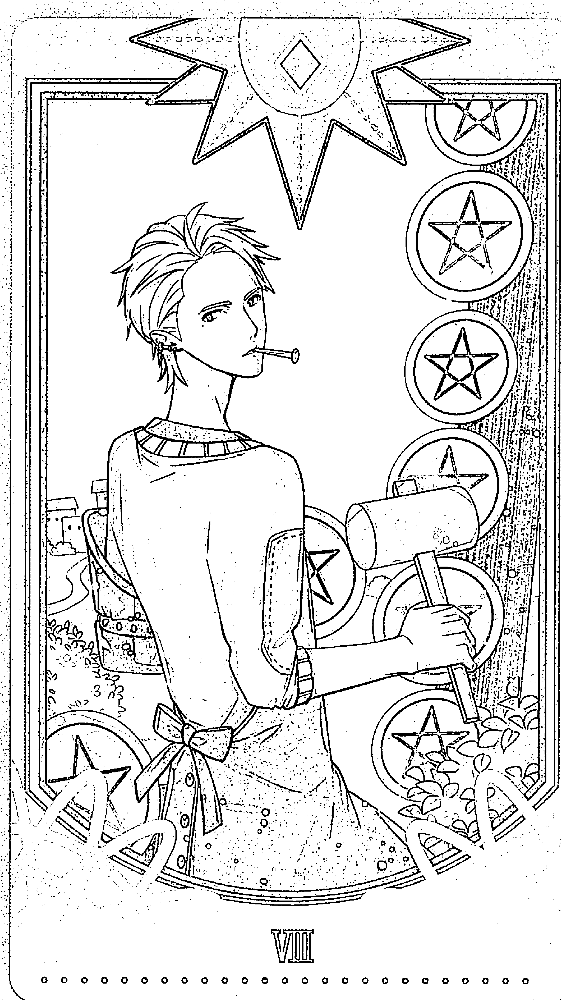

關鍵字
誠實 切磋琢磨

## 笨拙的他，
其實很重視你。

你是否曾在夜裡，因笨拙又不善於表達愛的他，
而感到鬱悶呢？無論是戀愛或是其他事，
每當搞不清楚對方的心意，你就容易胡思亂想。
但那個他，其實只是不擅言辭而已。
正因為你很重要，所以他不會信口開河，
或輕易做出不負責任的言行舉止。
當然，你不一定要接受，因為你的確因此感到難受。
殊不知對方連你的這種感受，也想一起包容。
我想再過沒多久，他便會害羞地向你表達心意了。

## Ten of Pentacles 錢幣十〔逆位〕

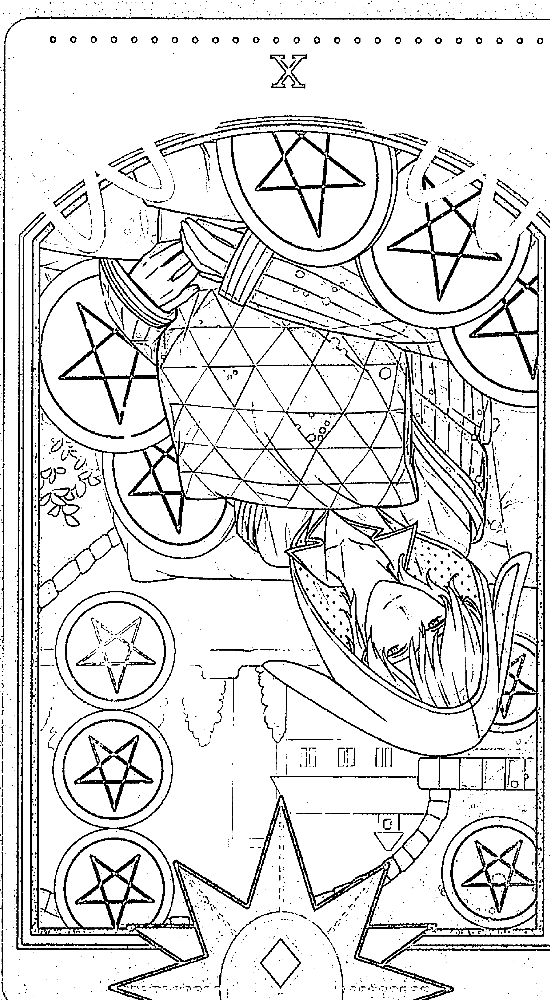

關鍵字
愛撒嬌 適度休息

## 循序漸進地寵愛自己。

每天要面對很多事，真是辛苦你了。
你有沒有好好休息呢？
別把自己逼太緊了，先躺下來深呼吸。
要是睡不著，或是思慮過重，也不用逼自己睡著。
就利用這段時間，專注於自己的情緒。
無論痛苦或悲傷，還是無奈的感受都行。
接著稱讚自己已經做得很好了。
循序漸進就好，好好寵愛努力的自己。

## THE WORLD 世界〔正位〕

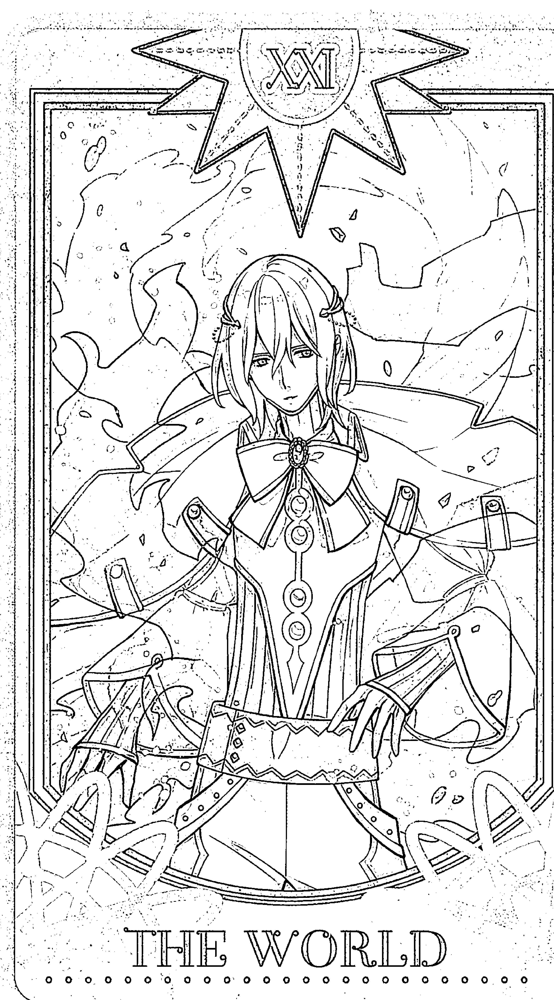

關鍵字
圓滿 達成

## 所有的一切彼此連結，
你的世界趨於完整。

過不了多久，你的世界將會完整，新的故事也即將展開。
也許從很久以前，你就一直期盼著這天到來。
現在的你，什麼都不用害怕。
即使是恐懼和不安，都是拼湊完整世界的必經過程。
你已脫離曾讓你痛苦的世界，一切即將重啟。
你已經累積了足夠的力量與經驗，
接下來就是專屬於你的新篇章。

## THE SUN 太陽〔正位〕

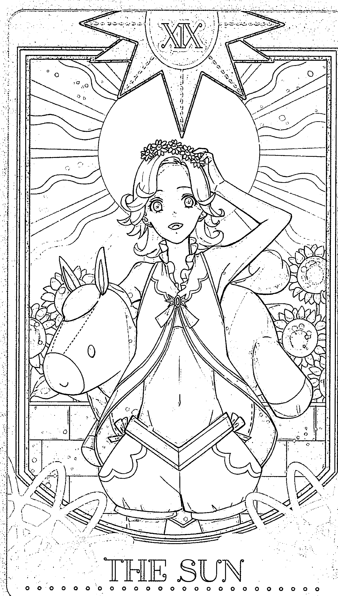

關鍵字
笑容 精力充沛

## 魅力爆棚！
### 自信成為展現自我的契機。

現在是將魅力發揮到極限的時刻，全心投入喜歡的事物中吧。
用真實的樣貌當作吸引他人的號召，
還能讓身邊的人更有自信。
若你真的非常缺乏自信，試著佩戴一些喜歡的裝飾品，
從自己力所能及的範圍開始嘗試吧。
你非常有魅力，是一個很棒的人。
你身邊也有許多人因你得到救贖，
所以不需要強迫自己樂觀正向。
走出戶外曬太陽，依照自己的步調前進吧。

## TEMPERANCE 節制〔逆位〕

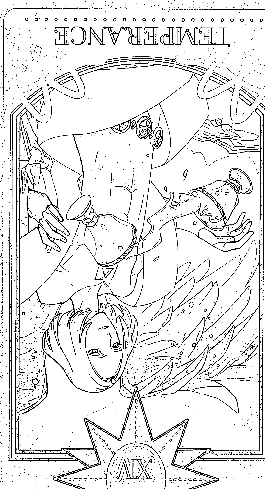

關鍵字
實驗的時刻 整理感情

## 情感波動大，
學習坦承與釋放。

你正經歷一段五味雜陳的情感波動期，
開心與悲傷，或是對未來的期待與壓力等等。
這時若有想挑戰的事，可以放膽去嘗試。
也許試著調整自己的說話方式與態度，
或是對夢想與目標的細節規劃。
最重要的是，情緒來了別忍著！
在自己力所能及的範圍內，緩慢釋放。
因為坦承從來都不是一件壞事。

## DEATH 死神〔逆位〕

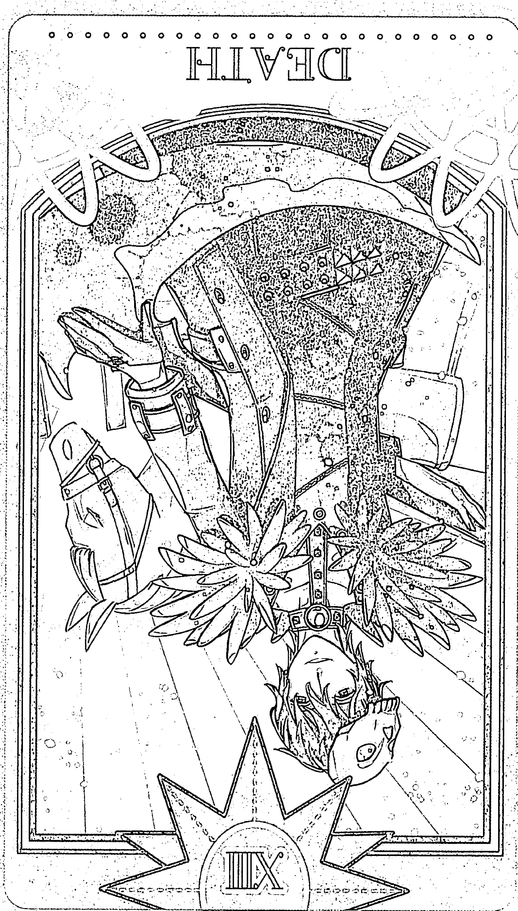

關鍵字
轉換期 重新審視現狀

## 耿耿於懷沒有錯，
請仔細探究自己的感受。

釐不清的想法，走不出的煩惱讓人痛苦；
不想再被提及，想忘又忘不掉，這樣的想法讓人退無可退。
誠實面對這樣的情緒是第一步，
然後仔細思考耿耿於懷的原因，
最後再試著分析自己的感受，這麼做就一定能找出新的答案。
耿耿於懷的情緒不是壞事，在你能夠轉換心境之前，
好好地正視自己的想法吧。

## THE HANGED MAN 倒吊人（逆位）

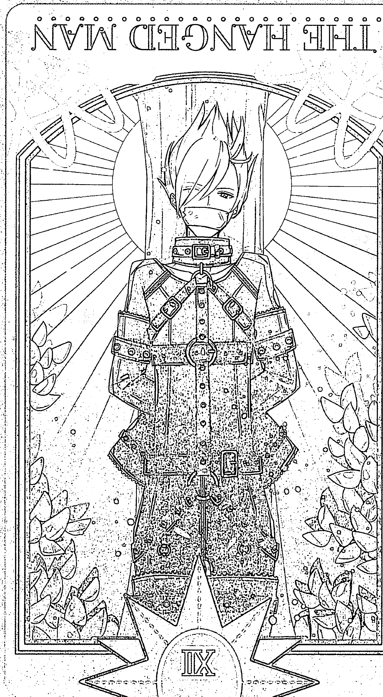

關鍵字
逆境 出現解決方法

## 人生就是一次次的修行，
解決方式終將出現。

過去這段時間，辛苦你了。
你過得好嗎？是否過度勉強自己呢？
再稍微忍一下就好，你將會找到答案。
這段彷彿修行般的痛苦時期即將過去。
對過去的那段痛苦記憶，你有什麼想法呢？
一路上又是如何面對呢？若不想回想，也別勉強自己。
過往的經驗定會成為未來的養分，眼前的道路也將平坦。
痛苦的修行已經結束，請跨出解脫的那一步吧。

## JUSTICE 正義〔逆位〕

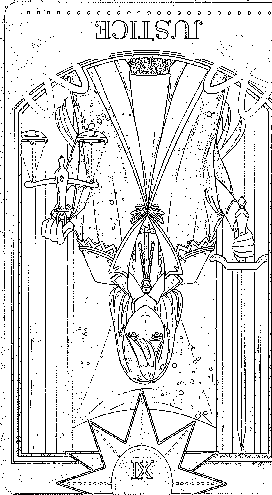

關鍵字
重新調整平衡 整理思緒

## 下決定很難，
尤其是你的心。

現在的你正處於想要釐清並確認某件未定之事的狀態。
一直處於被動與未明狀態的你，也許早已到達臨界點，
想要儘早得到答案。
你需要重視這樣的情緒，請試著把感受說出來。
也許你害怕被討厭，也怕給人陰沉的形象，
所以只需要透露一點點就好。
你不該隱藏自己的感受，好好正視心中的煩悶。
若你想劃清界線也無妨，因為你的心也想這麼做。

## Three of Pentacles 錢幣三〔正位〕

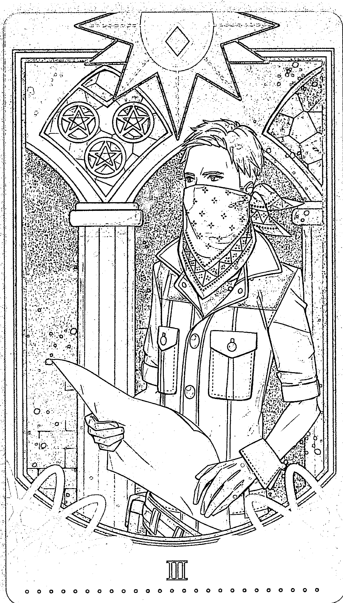

關鍵字
進步 合作

## 眾人的協助是關鍵，
有很多人在支持你！

熱衷又努力的樣子，十分有魅力。如果你也有熱衷的事物，
就盡情投入吧。只要投入，那些想幫助你的人也會出現。
說不定，他們已經在你身邊了。
在互相幫助，彼此分享想法的氛圍下，
能創造出完美的世界觀以及作品。
不管你為了戀情而煩惱，或是為了夢想而迷惘，
也能向他們說出自己真正的想法。
如此一來，也能減輕你的負擔喔。
沒問題的，因為你不是一個人。

## Ace of Pentacles 錢幣一〔正位〕

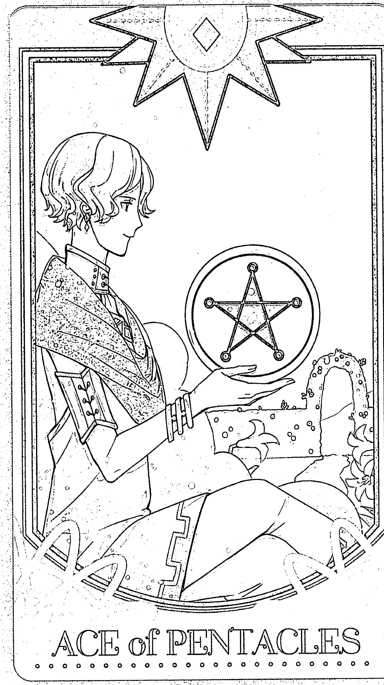

關鍵字
繁榮 成就感

## 好好珍惜此刻的感受，
它將成為未來的重要資產。

你懷抱的所有感受，在未來都會成為龐大的資產。
資產不僅限於金錢，也包括人生中的重大經驗。
現在的情緒與感受會帶來價值，
先把旁人的意見與世俗的想法擺在一旁，以自我為優先。
珍惜你無法妥協的堅持，以及強烈的信念，
接著用自己的步調前進。
全世界最重要的就是你的核心。

## Knight of Wands 權杖騎士〔逆位〕

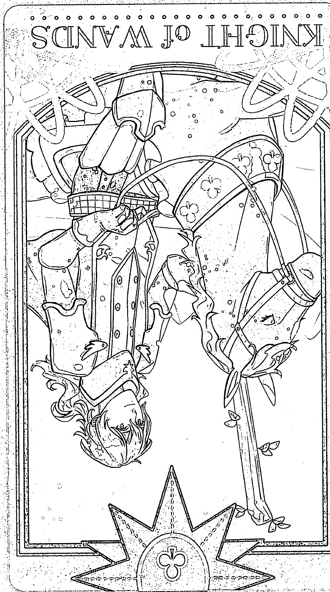

關鍵字
變化的前兆 照著自己的步調

## 坦然接受罪惡感，
負面情緒並沒有錯。

愧疚與罪惡感容易讓人心煩，但這樣的情緒絕對不是壞事。
就算看似完美的人也一樣，只要是人就有糾結與痛苦，
所以你並沒有錯。有人說有煩惱就不會有好事發生，
或是會引發負面連鎖效應，但這些都不是事實。
好好傾聽內心的吶喊，等到能坦率接受後再前進就好。

## Page of Wands 權杖侍者〔逆位〕

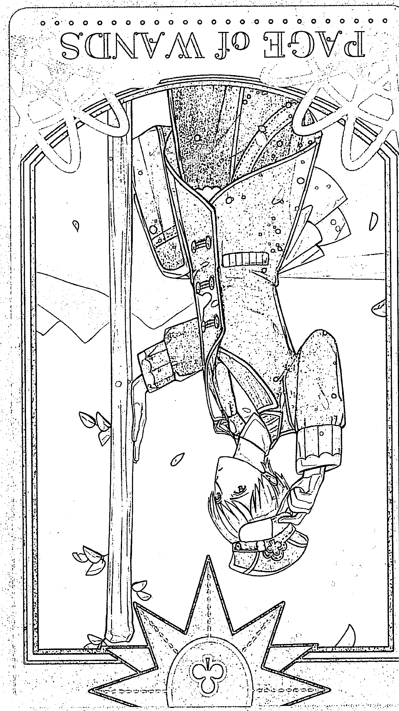

關鍵字
不放棄 不畏懼

## 挑戰的開端，
跨出重新開始的第一步。

現在的你對於從零開始這件事感到畏懼。
過往的失敗經驗、不安和陰影等等，
都在阻擋你跨出關鍵的一步。
也許你曾在心中反覆回想起失敗的記憶，
但變化的徵兆已經出現在你的眼前了。
那些因為沒有進展而曾放棄的事，終於露出一絲曙光。
一切還沒結束，從現在開始重新出發。
這個瞬間，你的新篇章即將開始。

## Ten of Wands 權杖十〔逆位〕

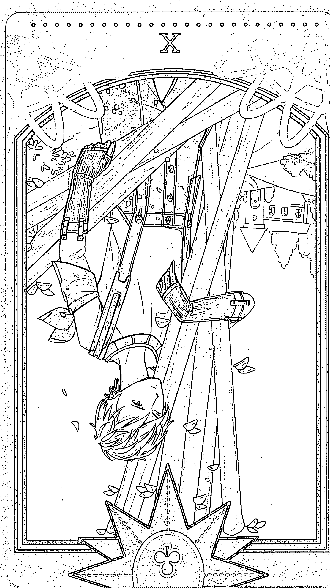

關鍵字
壓力 不要勉強

## 沉重壓力下隱藏著線索，
救命的稻草就在你身邊。

常有人說「若這件事成了你的負擔，就該放手」。
但是若能輕易放手，就不會如此煎熬了吧。
你特別理解放手有多困難，而且每天都在內心拉鋸著。
因為一路走來，你都習慣把責任扛在自己身上。
總是為了改善現況，而不斷努力的你，
請把自己的感受擺在第一順位，
試著照現有的步調繼續走下去。
即使不放手，變化的契機也快來了！
在你的心願意放手前，照著現有的步調前進。

## THE CHARIOT 戰車〔逆位〕

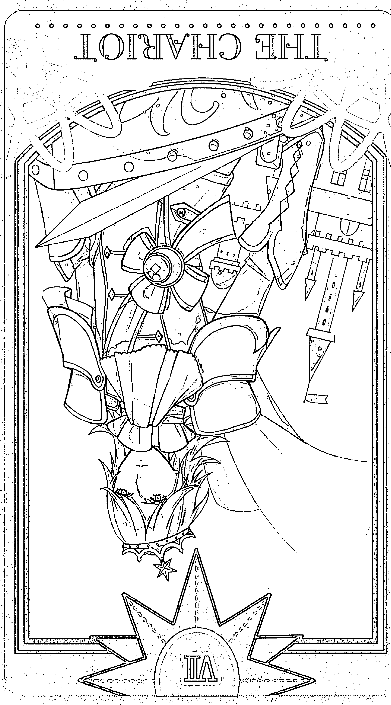

關鍵字
試著面對 共識的重要性

## 現狀不是停滯，而是重要的準備期。

每當沒有更進一步，或是長時間等待時，時間過得特別慢。
不管是誰都覺得這種狀態很難受。
即使有人告訴你「慢慢等，總有一天會有進展的。」
但這句話，一點都無法減緩心中的痛苦。
我只想告訴你，這段時間絕對不是停滯，也不是結束，
而是用來迎接下次前進的絕佳時機。
一切都正在默默運行，所以不要擔心，這絕不是停滯。
那一刻，馬上就會來臨。

## THE LOVERS 戀人〔逆位〕

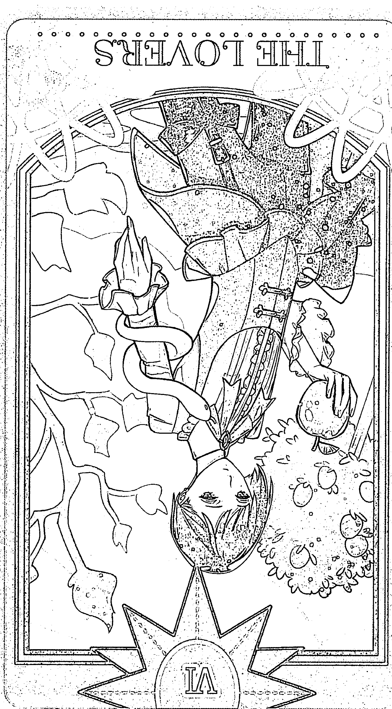

關鍵字
別害怕不安 改善的線索

## 焦慮不安不是預兆，
而是前進的線索。

抽到這張塔羅牌時，
你可能會覺得自己被討厭了、一切完蛋了，
或是想到不忠誠的對象……不安的情緒不斷交錯。
別害怕，這張牌所說的不安，不是恐怖的預兆，
也不代表你的未來，或是對方的心聲。
而是代表你現在的心情。你時常因為想太多，而感到疲累。
有時無法入眠，有時哭泣，明明感到寂寞，
卻想壓抑這種感覺……
一路走來，你已經很努力了。現在，請好好地安慰自己吧。
沒事的，你絕不是孤身一人。

## THE HIEROPHANT 教皇〔逆位〕

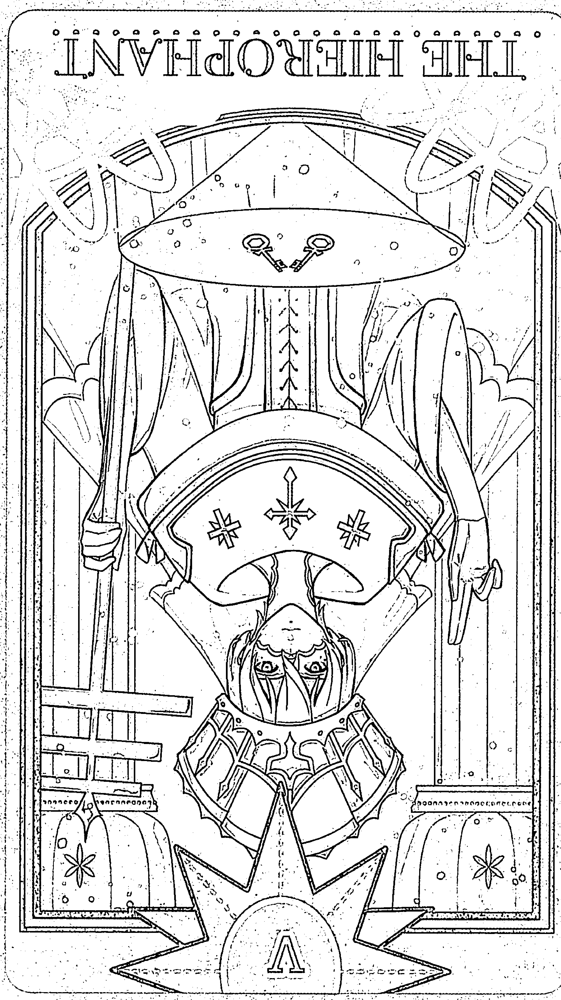

關鍵字
重新審視的時期 不要獨自承受

## 眼前的兩個選擇，
請審慎思考。

假設眼前有一條岔路，任誰都會停下腳步思考下一個選擇。
對現在的你來說，就處於這樣的重要時刻。
該走哪條路呢？哪條路比較安全呢？
還在猶豫不決的你不要害怕，人生中不會有錯的選擇，
每一條都是對的道路。最重要的不是方向，也不是時間點，
而是「由你做出的選擇」，沒有什麼比這點更重要。
因為你的選擇，才是唯一重要的事。
請不要忘記這點。

## Two of Cups 聖杯二〔正位〕

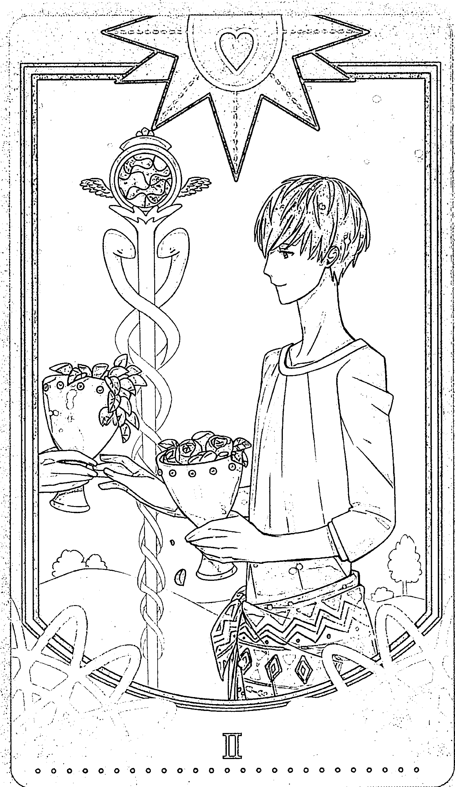

關鍵字
戀愛成功 心動

## 你們彼此牽絆，
視對方為獨一無二的存在。

「如果今天是人生的最後一天，我想和他一起度過。」
這個無人能取代的他，也同樣把你放在心上，
不管發生任何狀況都不會改變。
對你們來說，重要的不是你們之間的關係與世人的眼光，
而是你們曾一起經歷過的時光、記憶和彼此的心意。
無論兩人分隔多遠，就算無法見面，
你們之間仍有著更深刻和強烈的羈絆。
你們對彼此來說，是獨一無二的。你的夢想就快要實現了。
直到人生的最後一天，都別鬆開雙手。

## Ten of Pentacles 錢幣十〔正位〕

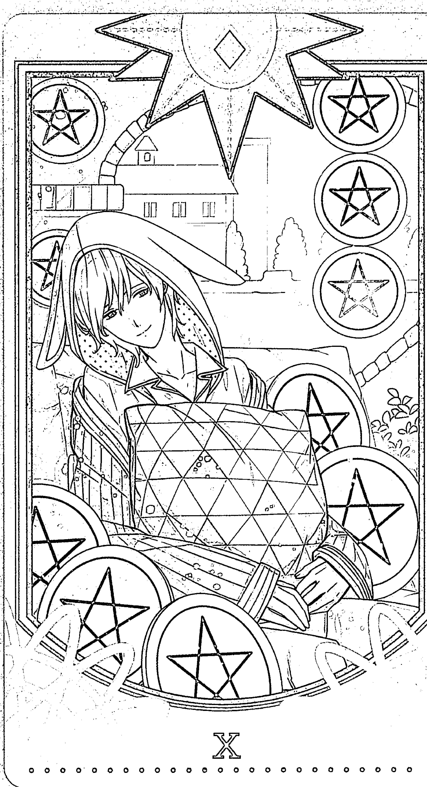

關鍵字
平和 安定

## 安穩的每一天，
歲月靜好。

最近的你總是很匆忙，一定很累吧。
請先休息片刻，喝些熱飲吧。
暫時把對未來的不安和煩惱都擺在一旁，好好休息。
你追求的不是轉瞬即逝的平靜，而是細水長流的安穩時光。
所以請把握時間好好休息。什麼都不想，只是發呆也沒關係。
未來的你，將會度過平穩的每一天，放心地邁向幸福的未來。
現在就請慰勞一下自己吧，你一定沒問題的。

## THE EMPRESS 皇后（正位）

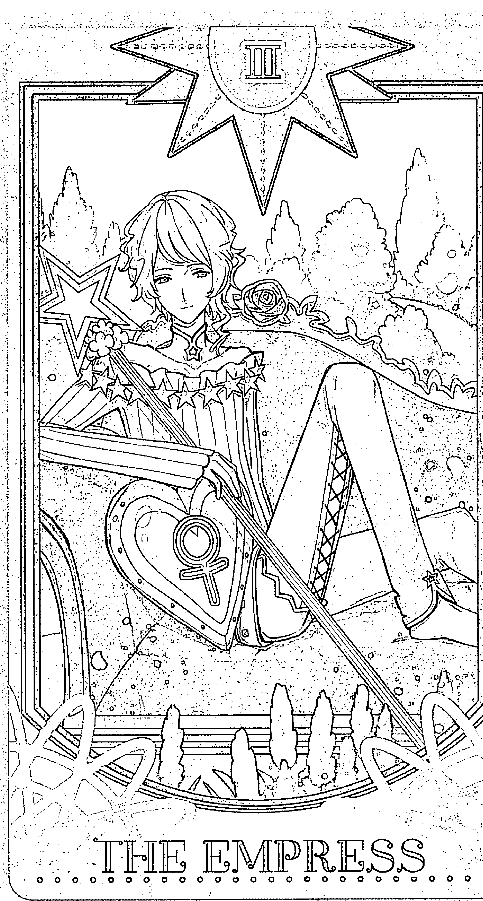

關鍵字
豐饒 愛

## 無所畏懼，
度過自由快樂的每一天。

就如同春花飛舞的季節，你也将迎來人生新氣象。
接下來，你將跳脫過去那段心靈枯竭的痛苦時光，邁向高峰。
各方都會對你釋出善意，你也将受人愛戴，
用自己真正的樣貌度過每一天。
你現在還沒有這種感受也無妨，請珍惜現在的模樣，
準備迎接時機成熟的那一刻。
現在先做好準備，多留意身邊的一景一物。
過去流過的淚，都不會白費。

## Seven of Wands 權杖七〔正位〕

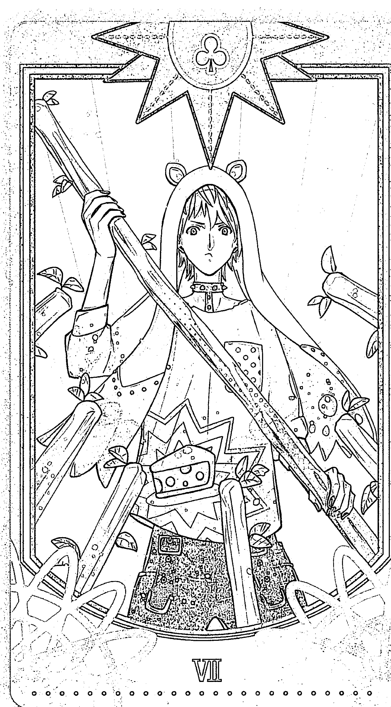

關鍵字
競爭 稱霸

## 別在該衝刺的時候，
讓自己累倒了。

你正在反覆嘗試各種方法，只為了迎向更好的未來，
以及達到更高的目標。有必須要做的事，也代表責任重大。
你因為不想失敗，所以對自己非常嚴格，甚至沒有好好休息。
這樣的熱情與衝勁請延續下去，全力相信自己的可能性。
只須記住不要過度勞累，休息是為了走更長遠的路。

## THE STAR 星星〔正位〕

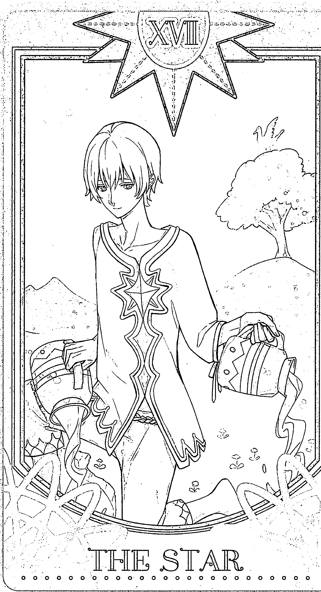

關鍵字
有希望 安心感

## 願望終於實現，
迎接欣喜收穫的時刻。

一路上你不停地努力前行，會流淚，想放棄都是理所當然。
對辛勞的自己說聲辛苦了。
艱辛的時期將要結束，不必再經歷同樣的辛苦了，
願望終於實現了。
過去的你赤腳走過無數次荊棘路，好不容易到手的希望，
也落空了好幾回。現在終於不用再經歷那種感受了。
今後的你能夠走在柔軟的草地上，帶著無限感觸，
一邊散步，一邊仰望美麗星空。

## Six of Cups 聖杯六〔正位〕

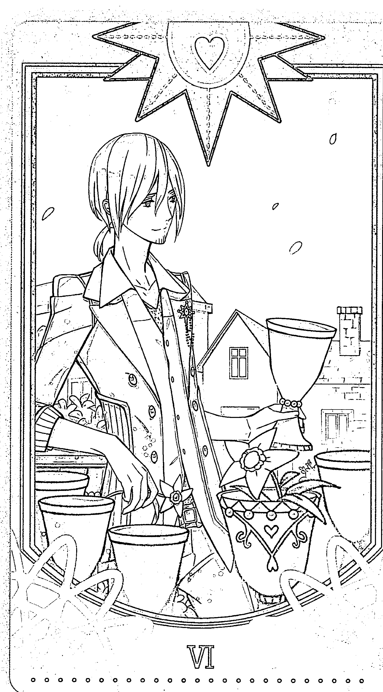

關鍵字
回憶 前進

## 回憶不會消失，
過往的錯會成為未來的基石。

回憶時而美麗動人，時而殘酷傷心，
無論哪一種，對你來說都是人生的一部分，滿載了許多情感。
其中包含了無法輕易整理清楚的複雜情感。
你可以選擇好好珍惜這段回憶，或是選擇抹去。
不必拘泥於形式，
過往的記憶與經驗都會成為邁向未來的一大步。
過去的錯不是錯，而是未來的養分。

## Nine of Swords 寶劍九〔逆位〕

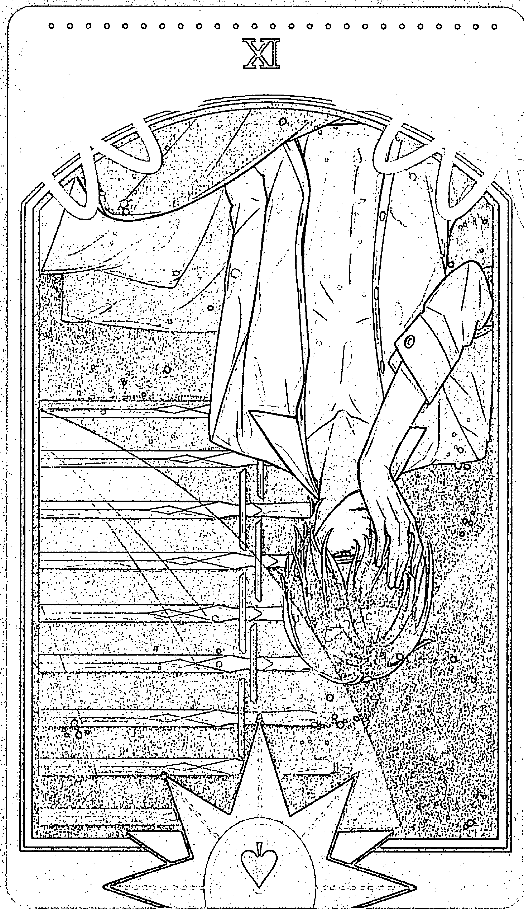

關鍵字
發現 安心

## 迴盪腦中的話，
終將跨越黑夜迎來破曉。

縈繞在腦中揮之不去的想法讓你痛苦，逼迫自己忘記前，
先試著聆聽那些聲音，並且思考為什麼你會難受。
那些話語和想法為何讓你久久不忘，若你實在難受，
先試著轉移注意力。除了你自己，誰也不能逼你刪除或忘掉。
一切取決於你的感受和想法，如此而已。
不用逼自己去打開窗簾，晨曦自會降臨，就先維持現狀吧。

## King of Cups 聖杯國王〔正位〕

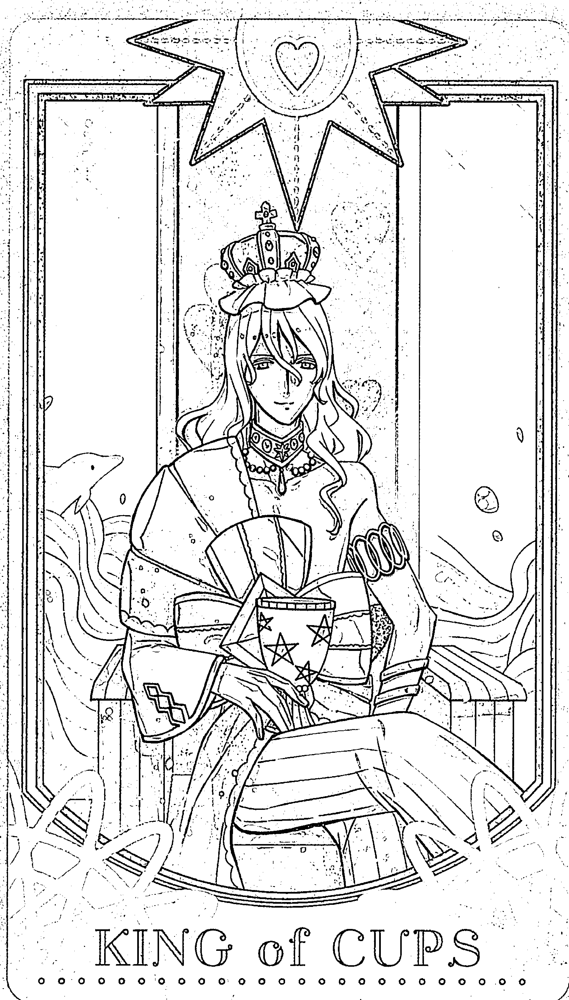

關鍵字
溫暖的感情 共好

## 即將出現
充滿真誠與愛的救兵。

你身邊有一個相當真誠的人，
不管你們是情人還是其他關係，他都把你放在心上。
他能承接你所有的痛苦與悲傷，也想成為你的力量。
若你現在正獨自承受著什麼，請多依賴他一些吧。
也許你不想給他添麻煩，也害怕成為對方的負擔。
但是那個他，連你的顧慮也願意一同承擔。
你可以放心依賴對方，因為他會永遠站在你這邊，
帶著溫柔的眼神在遠處守護著你。若你願意，
試著向他伸出手，要求協助。

## Three of Cups 聖杯三〔正位〕

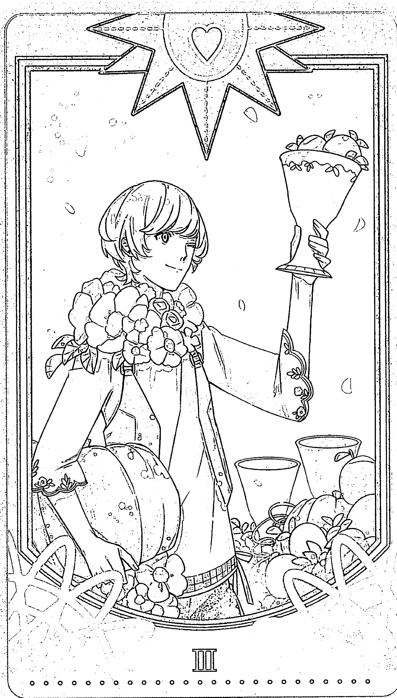

關鍵字
解決問題 成長

## 祝願成就，
你一定會成功。

你的夢想與計劃必定會成功，並獲得巨大成果，
預告成功的徵兆就出現在你面前。
若你正準備接受新挑戰，也會發生某件事，
讓你明顯感受到成功的機率大增。
現在的你為了醞釀新的變化，正在挑戰一件非常了不起的事。
願望成真的那天已經不遠，也絕對有實現的可能。
當你準備好迎接美好果實的瞬間，請好好認可自己的努力。
對自己說「你做得很好，未來也請多多指教」。

## THE HERMIT 隱士〔逆位〕

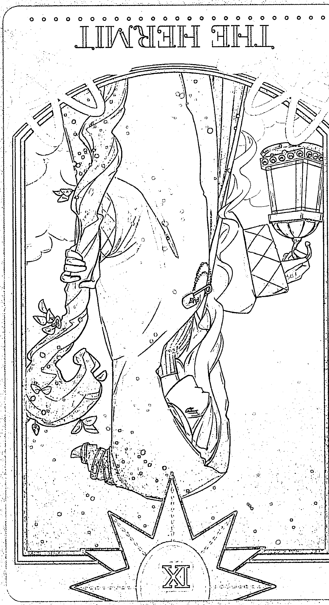

關鍵字
冷靜 思考後得到答案

## 懂得發覺身邊微小訊號，
深思熟慮後得到的答案。

有時我們會懷疑，去尋找答案這件事到底對不對，
還因此感到不安。面對弱點時，人會產生後悔和痛苦的情緒；
找出自己必須改善的地方時，也會內心糾結。
徹底思考的過程必有其意義，
深思後釐清的答案中就藏著解決問題的線索，
而你一定能找出答案的。
用來煩惱的時間，都不會白費。所以無論你現在努力思考，
或暫時拋諸腦後都沒關係。因為答案早已在你的身邊。

## STRENGTH 力量〔逆位〕

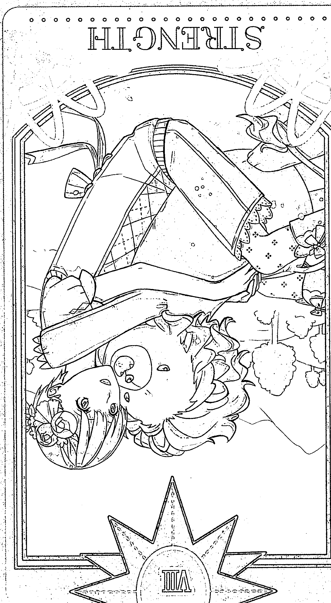

關鍵字
關係的改善 適度休息

## 關係對等的兩人，
終能找到共識。

面對無法解決的事情，先試著和對方談談，
或互相表達感受也非常重要。
你一定曾和對方談過好幾次了，對方同樣想解決這件事。
你們兩人明明是同輩分，關係理應平等，
卻只有你覺得痛苦……其實不只是你，
也許對方也同樣覺得不安。
沒事的，對方也和你一樣，你們的關係平等且溝通順暢。

## Nine of Pentacles 錢幣九〔正位〕

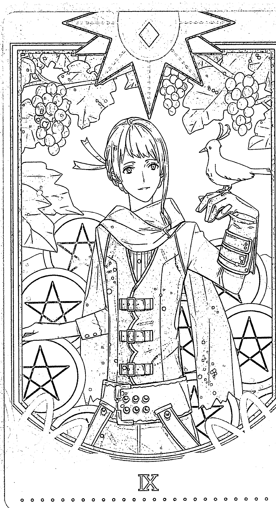

關鍵字
滿足心願 值得期待

## 有機會就去聚餐，能拓展視野。

你將有一段美好的相遇，讓你獲得新機會。可能是你很欣賞的對象約你聚餐，也有機會與你尊敬的人深談等等，這是能讓你快速成長的絕佳機會。物質與精神上獲得滿足之餘，還將產生新見解。你會度過一段身心富足的時光，請把它當作一個美好的經驗吧。

## Eight of Wands 權杖八〔正位〕

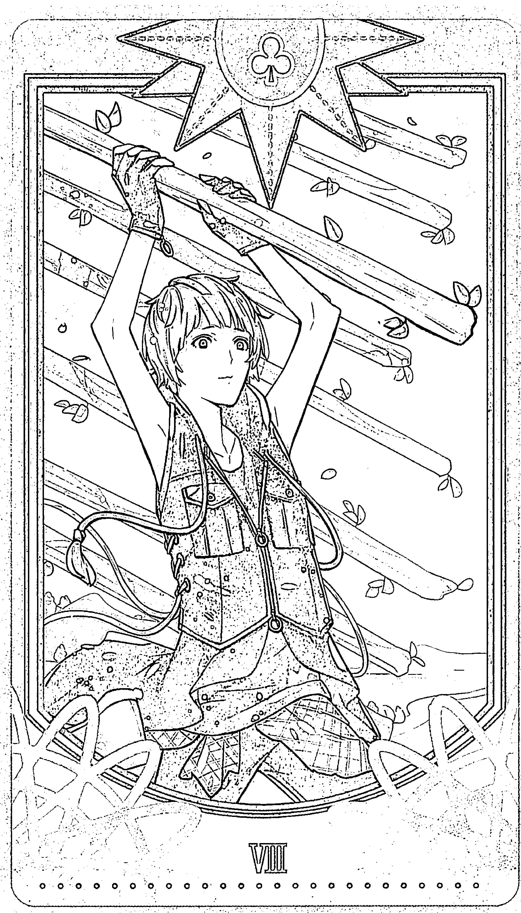

關鍵字：急速發展 好轉

## 不要害怕變化，試著接觸看看。

事情即將迎來劇烈變化，你可能會突然收到通知，也可能是聽到某些意外情報。在這突如其來的幸福及喜悅之中，你會隱約感到一絲不安，甚至讓你瞬間停下腳步，開始審慎評估。但是這真的是一個非常大的機會。為了不讓自己後悔，一定要冷靜下來好好思考。無論最後要拒絕或接受，全都取決於你。這並不是令人害怕的事，所以請放心。令人開心的好消息就要傳來了。

## THE FOOL 愚人〔正位〕

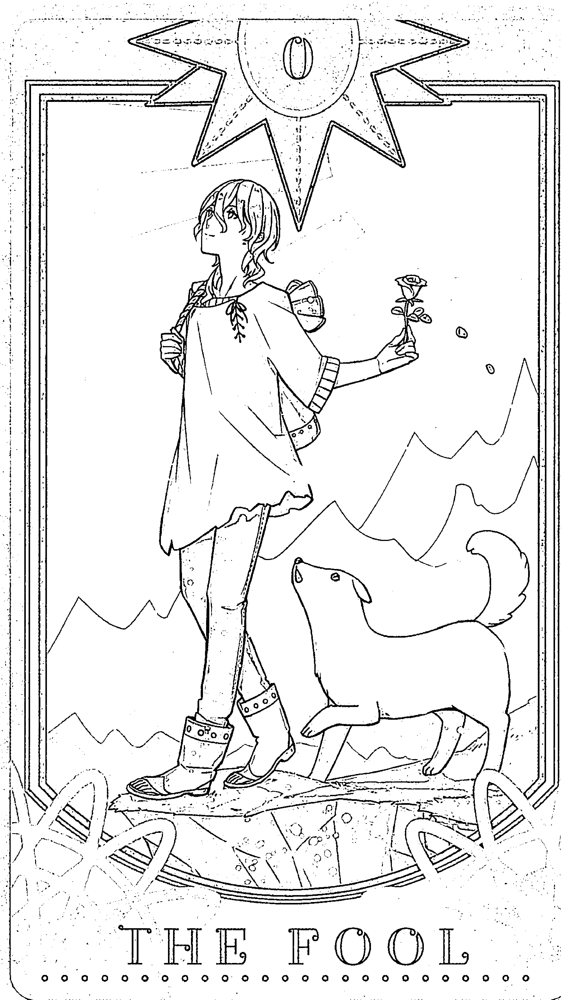

關鍵字：廣闊 未知

## 可能性就是未知數，現在就是挑戰的時刻。

在一條前人未至的嶄新道路上，有時會因為未知的未來而感到恐懼。但只有此刻，你只需要感受到挑戰的滋味。對你來說，現在就是面對那一刻的重要時機。你無須害怕，請儘管走向自己想走的路。也無須受他人的告誡捆綁，甚至失去信心。請先從你力所能及的事開始做起吧。別擔心，快樂的未來正在等著你。

## Page of Cups 聖杯侍者〔正位〕

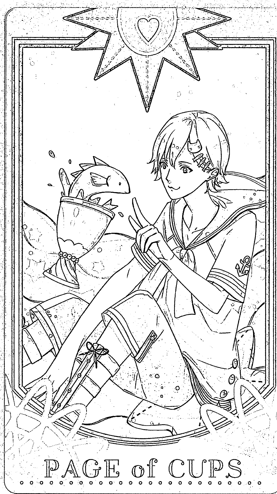

關鍵字：純粹 感受能力

## 誠實面對現在的心情，機會就在眼前。

機會將來到你面前。因為只是一些蛛絲馬蹟，以及很小的訊號，所以你可能不會發現。但這些小事都與未來息息相關，所以現在的你應該注重「令人雀躍又興奮的感受」，並正視心中所求。就像是回到孩提時光的純粹，以及猶如找到寶物般的歡喜。請珍惜這種單純又快樂的心情，這些感受會成為迎向未來的契機。從這刻起，即將發生巨大的變化。請好好期待吧，因為未來的可能無限大。

## Two of Pentacles 錢幣二〔逆位〕

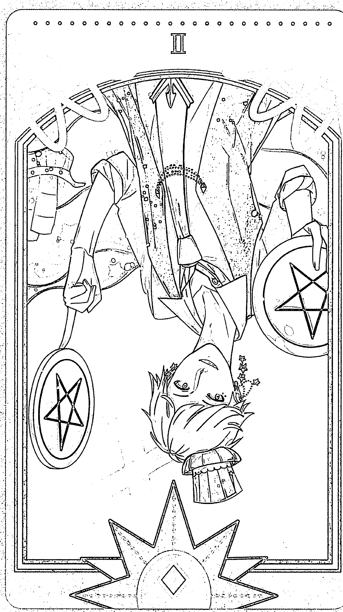

關鍵字：轉換心情 機會來臨

## 照現在的步調走沒問題，狀態會趨於安定。

你現在是否失去自信了呢？深刻感受到兩者兼顧的困難及嚴峻，讓你不得不在理想與現實之間搖擺。但正因為有這些痛苦與糾結，你一定能達到理想的境界。就像蹺蹺板在達到平衡前一定會搖動起伏。同樣的，這些起伏總會有停止的時刻，結果也即將揭曉。不用焦急，那一刻就快到了。在達到完美平衡前，就先照現在的步調走吧。

## Three of Pentacles 錢幣三〔逆位〕

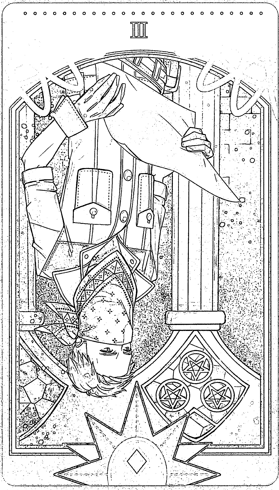

關鍵字：無須過於謙虛 嘗試放鬆

## 每天都辛苦你了，多多稱讚自己吧。

我要對每天都很努力的你，說聲辛苦了。富有責任感的你，無法輕易依靠他人，所以每天都過得非常糾結。你真的非常了不起。可以試著多依賴別人，也不要所有責任一肩扛。懂得開口向他人求救，不用把自己逼到極限。此刻你只需要好好稱讚努力生活的自己，你不是獨自一人。沒事的，從力所能及的範圍慢慢做起吧。

## Page of Wands 權杖侍者〔正位〕

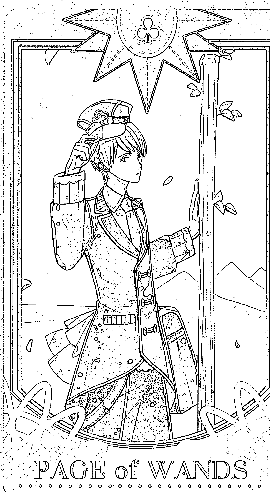

關鍵字：好的開始 光明的未來

## 好的開始，一切都能勢如破竹。

你是否想開始一件事，卻還在觀望狀態呢？因為你知道一旦開始，就無法輕易反悔，讓你更加小心翼翼。讓你心心念念想去做做的事，會為你帶來爆炸性的靈感。所以若你願意，隨時都可以開始嘗試。對於變化感到不安絕非壞事，而是非常重要的事。現在就是下決定的時候了。請選擇一條不會後悔的路，並勇往直前吧。

## Nine of Cups 聖杯九〔正位〕

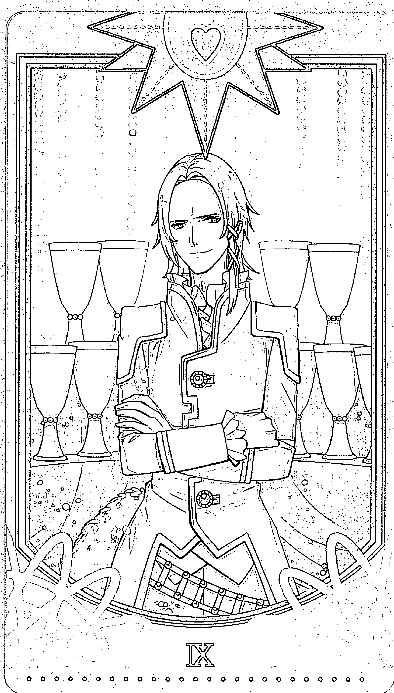

關鍵字：美夢成真 成功

## 現在就是夢想成真的時刻。

每個人都有不顧一切想完成的夢想，那就試著將夢想轉換成話語吧。現在的你需要「言出必行」的力量，向外表現你對夢想的熱情與想法。過去的你因為認為夢想絕不可能實現，所以裹足不前。不過你一定辦得到的，絕對沒問題。懷抱夢想絕對不是魯莽也不是妄想，而是你一路以來放在心中最珍貴的心願。

## THE HERMIT 隱士〔正位〕

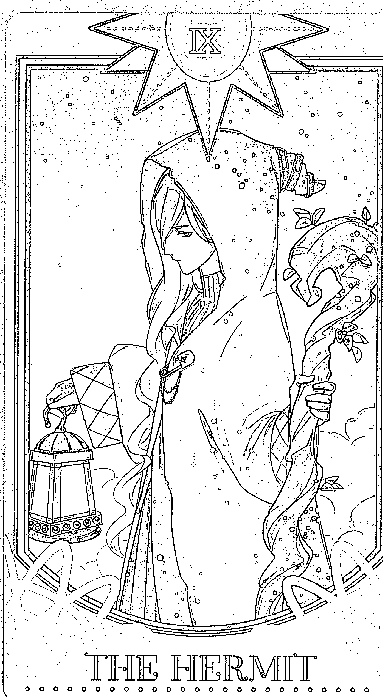

關鍵字：內省 沉默

## 善良的你，多給自己一些關心。

每個人都有自己的堅持，以及無法退讓的信念。有時你也搞不清楚，懷抱這種信念到底正不正確，其實最重要的是「你想怎麼做、你希望怎樣」。重視你的感受，不需要抹滅自己的堅持。別擔心，大家都很清楚你的善良。你的堅持是種寶物，請千萬別忘記這一點。

## King of Wands 權杖國王〔正位〕

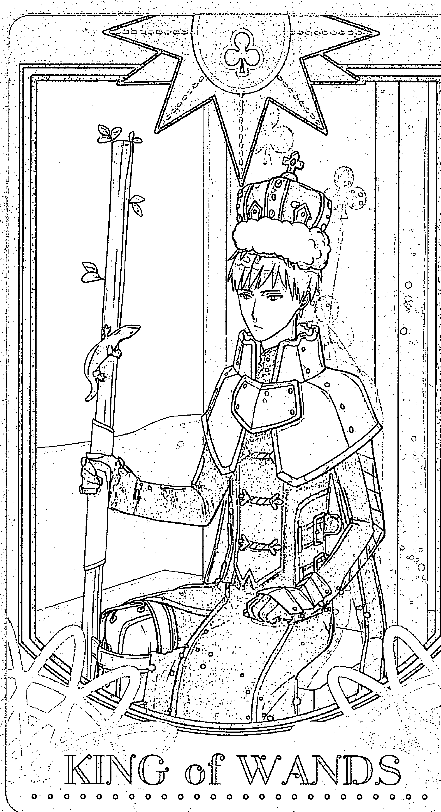

關鍵字：康莊大道 自信

## 在目的地迎接劇烈變化的前兆。

過去的你曾有過一段艱辛又痛苦的經驗，偶爾回想起那段回憶，還是會讓你痛苦。甚至連想到未來都會感到不安。現在的你，已經抵達其中一個目的地，可以暫時休息一下了。為了能及時因應未來可能發生的劇烈變化，請先做好接招的準備。過去這段時間，你一定投注了許多熱情。正因為你擁有氣勢、熱情和階段性的成功，才能得到現在的穩定。接下來，你將會找到新的熱情。

## Six of Wands 權杖六〔正位〕

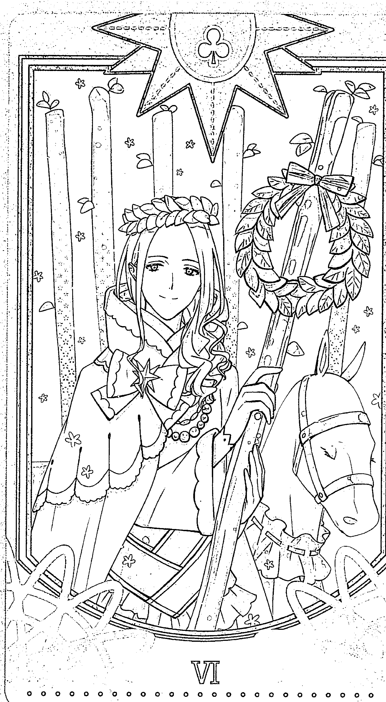

關鍵字：勝利 希望

## 勝利就在不遠處，感受歡呼中的淚水。

你即將獲得勝利。所謂的勝利，除了輸贏之事以外，也代表精神層面的勝利。或許一路走來你感受到的盡是挫敗感和自卑感，但即將發生令你打從心底感到滿足且喜悅的事。時候到了，記得要給自己一個大大的鼓勵，抬頭挺胸露出屬於你的笑容。你身邊的人們一定也打從心底期待這一刻。恭喜！你努力走過來了。現在就流下感動的淚水，盡情歡笑吧。

## Ace of Wands 權杖一〔正位〕

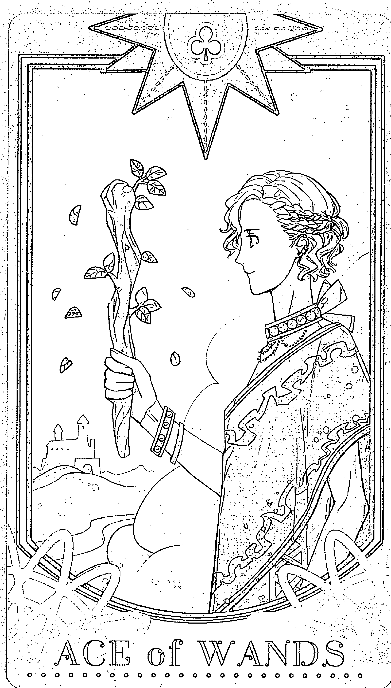

關鍵字：克服 榮耀

## 將過去的經驗當作養分，擁抱過往的一切。

回顧過往看似是一件簡單的事，但其實不容易也相當難受。你應該也很能理解這種複雜的情緒並多次體會過吧。所以每當你懷抱著嶄新的心情，要開始新事物時，總會回顧過去。揪心的同時，仍帶著這份心情往前走。雖然告訴自己不要被過去所困，卻仍懷著寂寞的心情繼續向前。你真的非常了不起，過去這段時間一定很辛苦。擁抱你所有的痛苦、悲傷、後悔和過錯，繼續前行吧。

## Page of Swords 寶劍侍者〔正位〕

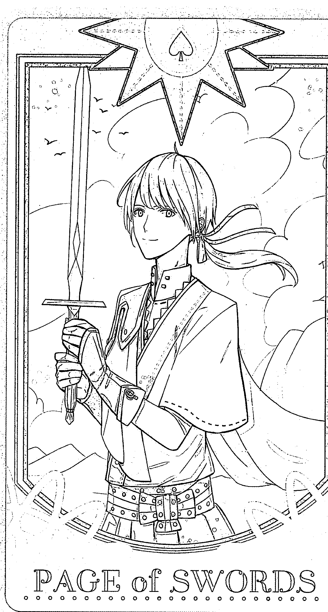

關鍵字：外交 善良帶來的智慧

## 出於善意所做的決定，請珍惜善良的你。

你真的是一個非常善良的人。所以你時常為了顧及他人的感受，而隱藏真心話；或是為了顧全大局，而獨自承受一切。然而你身旁的人，都很清楚你的善良。所以請正視自己所下的決心，並試著說出來吧！表達自己的意見，並不會讓其他人失望。正因為你擁有真正的善良，才有這樣的結果。所以請珍惜自己的所有想法。

## Two of Wands 權杖二〔正位〕

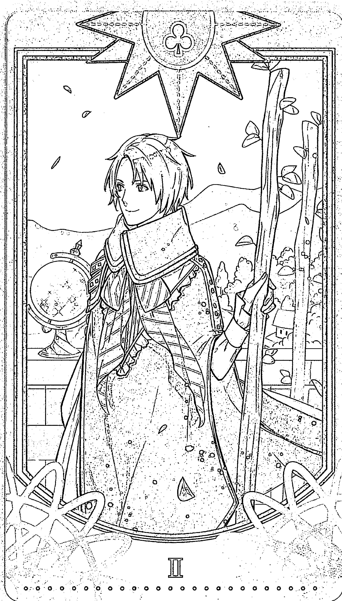

關鍵字：目標 野心

## 目標趨於明確，變化即將到來。

模糊的願景與未定之事，將趨於明確。所有達成夢想與目標的具體對策與計劃，也將一一浮現。你將成就你理想中的世界，不但能擁有多元觀點，而且表現十分活躍。就算你沉浸在感傷的回憶中，最後只要能化負面為正面，活用過去的所有經驗就能成功。這次一定要好好抓住夢想，不要放手。你一定能夢想成真，並擁有非常大的成就。屆時，你將會回想起跨出的這一步，並再次拓展新的世界。

## Three of Swords 寶劍三〔逆位〕

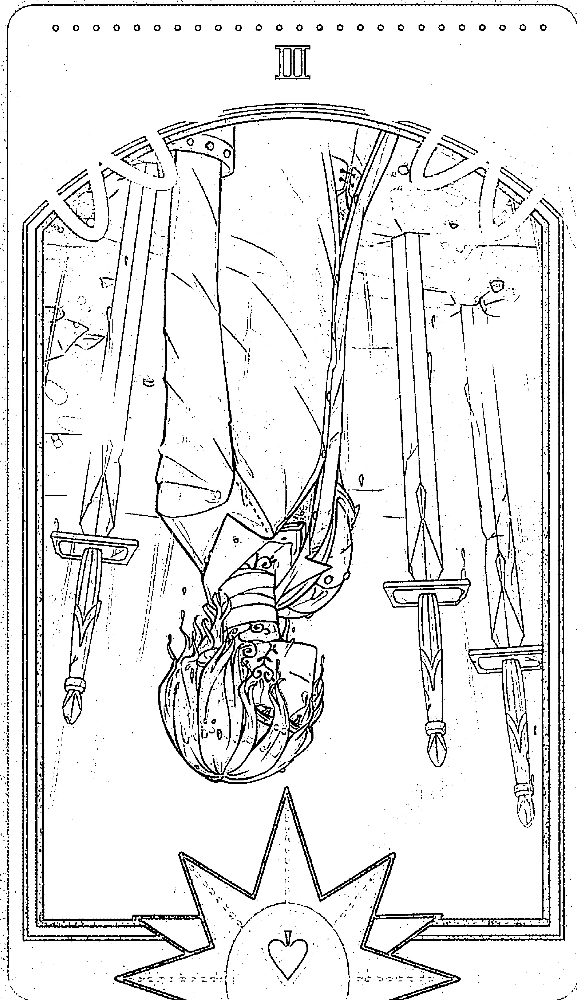

關鍵字：再出發 受到療癒

## 即使過去的傷口依然存在，現在只要能慢慢癒合就好。

如同暴雨來襲的日子，你的心也正流著豆大的淚珠。你並沒有做錯，別急著責怪自己。也許會有人逼你拋下過去的傷痕，或是要你學會放手。其實除了你以外，無人能替你作主。你即將從痛苦中解放，受傷的心將慢慢恢復。你不用強迫自己表現得活潑，也不用勉強自己笑。雨馬上就要停了，所以現在的你，就盡情哭泣吧。

## Two of Swords 寶劍二〔逆位〕

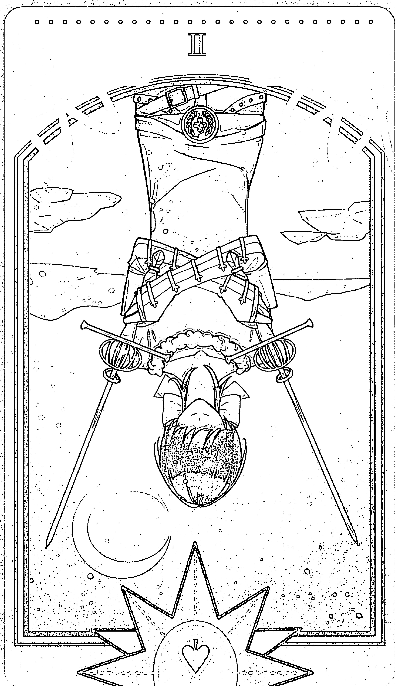

關鍵字：二選一 決擇

## 迷惘即將落幕，答案將水落石出。

你將找出過去所有的迷惘及煩惱的答案。若你正在追尋某個答案，定能理出頭緒。過去的你就像演員，總是逼自己扮演別人心中的某個角色或是配合別人行動。現在這齣戲將迎來高潮，並迎向落幕。你將離開黑暗的舞台，迎接嶄新的開始。是時候睜開緊閉的雙眼，迎接屬於你故事的序幕。

## THE HIGH PRIESTESS 女祭司〔逆位〕

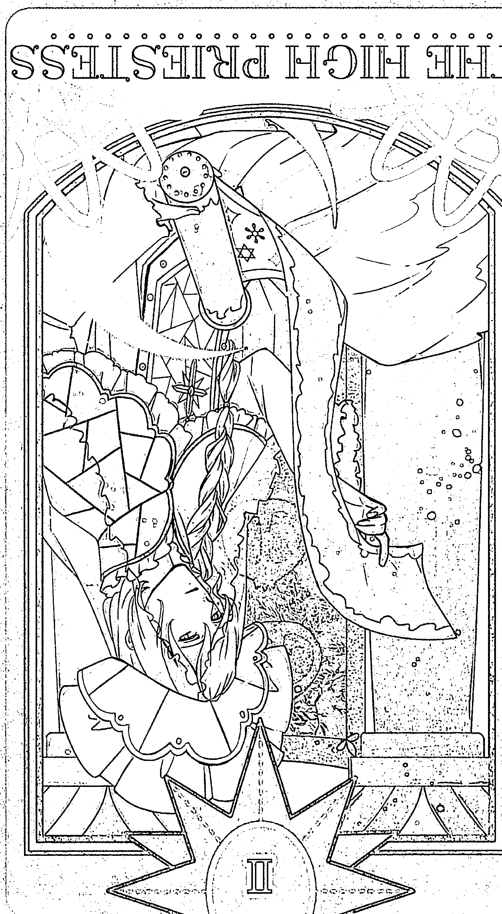

關鍵字：敏感 畏懼不安

## 探究真相，答案就在眼前。

你是否正在追尋某個答案？我想你應該已經翻閱了各種書籍與報導，卻遍尋不著答案。你已經花了很多心思反覆思考，現在請先平靜下來。所謂「當局者迷」，說不定你所追求的答案，就藏在令你意想不到的地方。當目標太近，反而會失焦。也許答案一直都在你身邊。說不定你也有所察覺，所以才急著想去證實。不要著急，相信自己的直覺吧，答案就在不遠處。

## Four of Cups 聖杯四〔逆位〕

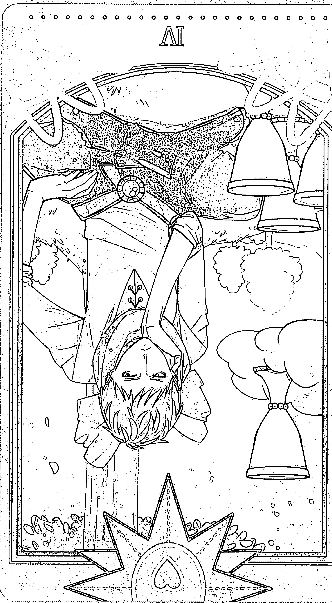

關鍵字：幫助 共鳴

## 別擔心，他對你有好感。

你很怕別人討厭你，或是對你有負面印象，光是想像就令人悲傷。你或許會後悔過去，不知為何事態演變至此。若你現在正被那種情緒淹沒的話，我要告訴你「沒事的」，你並沒有被討厭。別擔心，他現在仍把你放在心上最重要的位置。

## THE DEVIL 惡魔〔正位〕

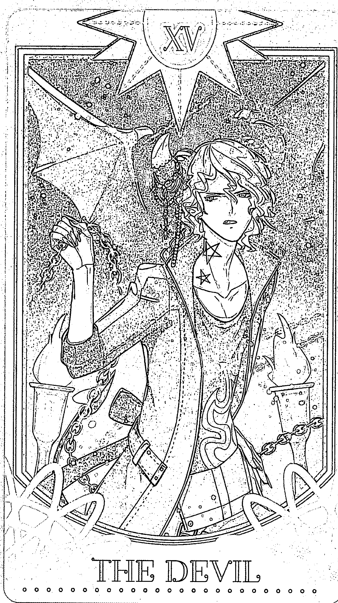

關鍵字：魅力 吸引

## 你是否願意敞開心扉？

你在心裡畫下一條與他人保持距離的界線，這是個非常聰明的決定。但未來有個他，會出現在你的面前，融化你的心。或許這個人早已出現。你可能會驚訝或是困惑，但若想與對方發展新關係，不妨試著敞開你的心。掌握改變的唯一鑰匙，就是你。

## Queen of Swords 寶劍皇后〔逆位〕

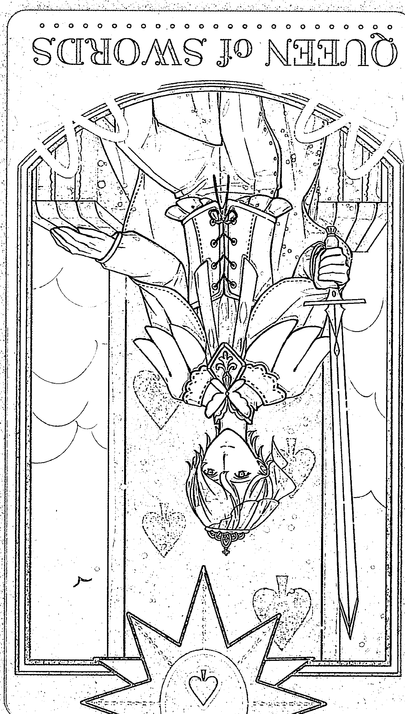

關鍵字：商量 不責備自己

## 別壓抑怒氣，因為你才是對的。

現在的你正在忍耐邊緣。你也許常聽到別人說，「應該站在別人的角度想，並原諒他」。其實你不需要自己承受這一切，也無須忍住憤怒與壓抑自己的真心話。一路以來，你已經非常忍讓了。所以想生氣就生氣，想哭就哭沒關係。請抽出你心中的寶劍，擺出架式。這把劍的作用，並不是要用來傷害誰，而是用來保護自己。

## Knight of Swords 寶劍騎士〔逆位〕

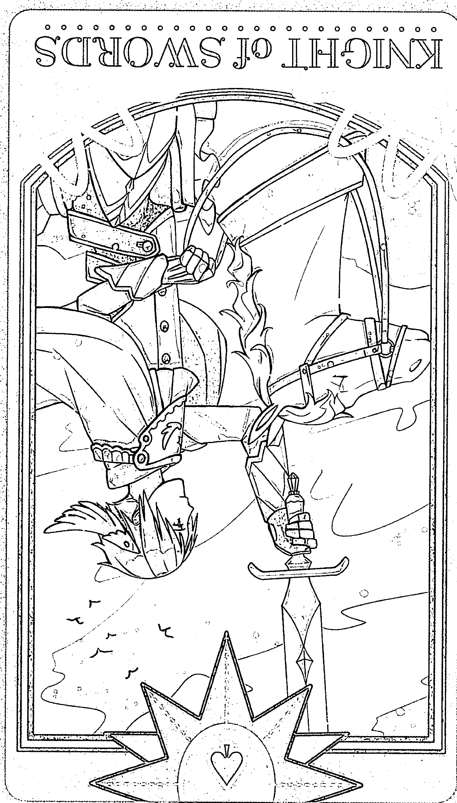

關鍵字：溝通 依照自己的步調

## 與伴侶合作，正視溝通的重要性。

無論是戀愛、工作還是學業，或是與他人的關係，每個人都是獨一無二的。你是否因為和某人的價值觀不同，或無法彼此分享意見，而感到挫折呢？其實對方也和你一樣，希望能和你分享更多彼此的感受。他絕對沒有被你嚇到，或是對你厭煩。想和對方攜手邁向更好的未來時，就要正視溝通的重要，一步一步慢慢前行吧。

## Page of Swords 寶劍侍者〔逆位〕

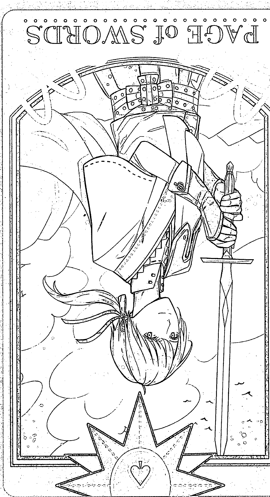

關鍵字：重視客觀性 冷靜面對

## 逆轉的時期，需要異想天開的想法。

思緒太多反而想不出好點子；越是急著想解決，越是走投無路。但是令人難以想像的線索，即將出現在你面前。所以保持微笑，放鬆一下吧。你曾經放棄的事，將會出現轉機。放下作為武器的寶劍，放心地展露微笑、面對困境，因為一切都不需要擔心。

## Ten of Swords 寶劍十〔逆位〕

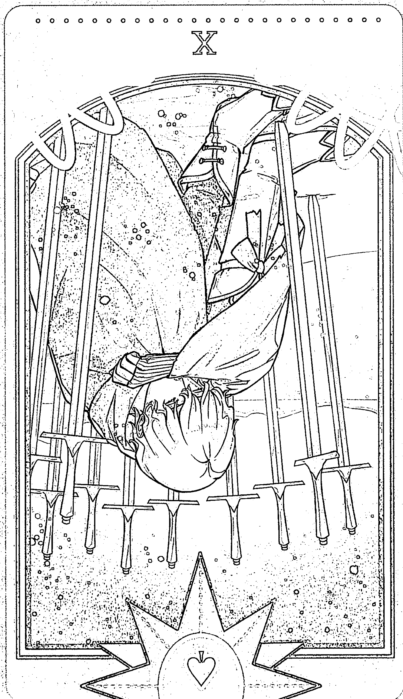

關鍵字：好轉 改善

## 惡夢即將結束，把內心感受寫下來吧！

最近的你是否經常失眠？身心正處於痛苦邊緣，已經快要無法承受了。但這種狀況就快要結束了。無須隱藏淚水，長夜漫漫終於要迎接天明了，請將你現在的思緒記錄下來。除了可以整理情緒，還能成為你今後的養分。你現在感受到的一切痛苦與悲傷，將會成為開闢嶄新未來的契機。無論如何，今晚請先好好睡一覺吧！

## Ace of Swords 寶劍一〔正位〕

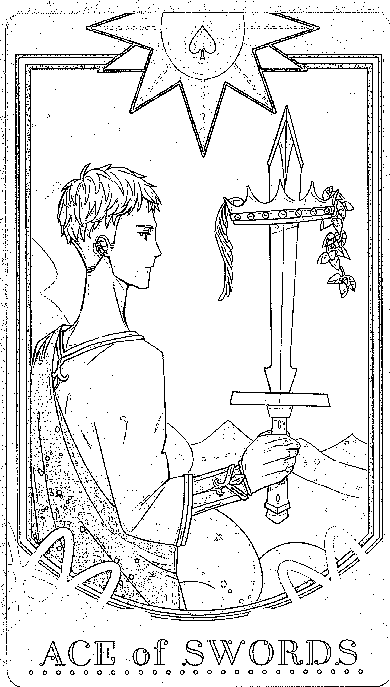

關鍵字：突破 成功

## 集中火力，讓創意綻放。

你正在創意領域中發揮超凡的力量，堪稱革命等級。腦中所浮現的點子、企劃與主題，將隨著你的沙盤推演，逐漸成形。現在的你擁有各種的可能性，甚至可以把其他事都排開，延後處理。先把所有心神，專注在你現在最熱衷的目標與夢想上。你的想法就是一切，請更重視自己的可能性。

## Two of Swords 寶劍二〔正位〕

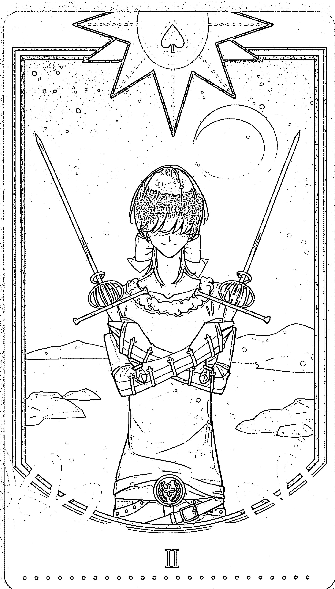

關鍵字：平衡 調和

## 重要的不是征服，而是真實傳達你的感受。

向對方表達你的感受時，是否時常欲擒故縱？或是習慣隱藏自己的真心話，寧願去依賴一些教戰守則？你該做的不是欲擒故縱，而是和對方真誠相待。建立關係這件事很複雜，也不存在正確答案，你也很清楚這點。與人來往時，所有的攻略或戰術都毫無意義。最重要的是向對方傳達最真切的感受。你是否願意睜開雙眼，試著去面對他人？鬆開手中的武器，才有可能牽起對方的手。

## THE MOON 月亮〔正位〕

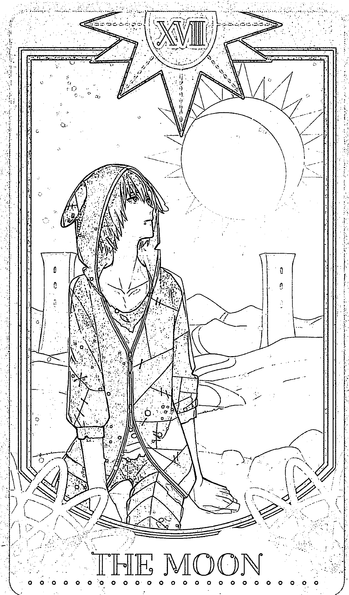

關鍵字：變化 單純的真相

## 差異才是關鍵，展現截然不同的優勢。

這張牌要給你的線索是「對比」。也許你一直以為的黑，其實是白，反之亦然。對比這件事，會為你帶來轉捩點。原本你不喜歡的對象，將意外成為你的助力。而你曾深信不疑的事，也可能和你的想像截然不同。過去的你總是獨自面對許多糾結與煩惱，其實這些事沒有你想像中複雜。在痛苦的日子裡，不必勉強自己。偶爾抬頭看看月亮、星星或太陽，然後隨心所欲地過生活吧。

## Seven of Pentacles 錢幣七〔正位〕

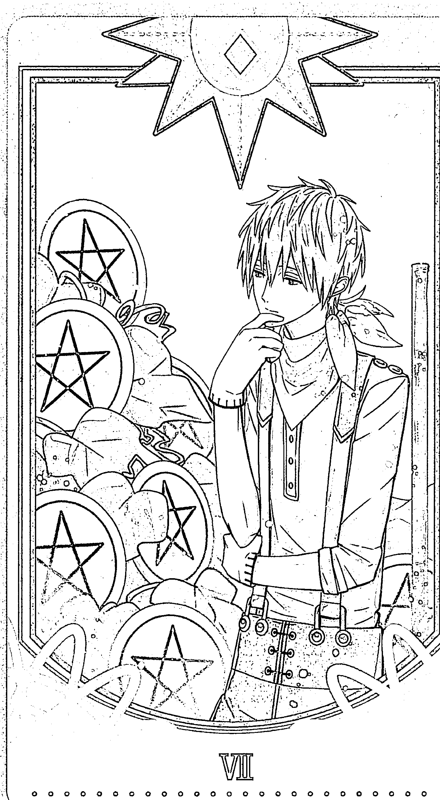

關鍵字：守護 發展

## 他是一個非常認真的人，請仔細觀察。

你是否想到他時，會感到十分困惑呢？你看不出來他到底有沒有認真聽你說話，而且這個人似乎也很難以理解。但他其實是個非常認真且真誠的人。正因為他不會為了敷衍你而隨便發言，這樣的他有點笨拙，也常被人誤解。無論這個人是你的情人、家人或是朋友，他待你都非常認真。我相信未來的你們，一定能更輕鬆地對彼此微笑。

## Knight of Pentacles 錢幣騎士〔逆位〕

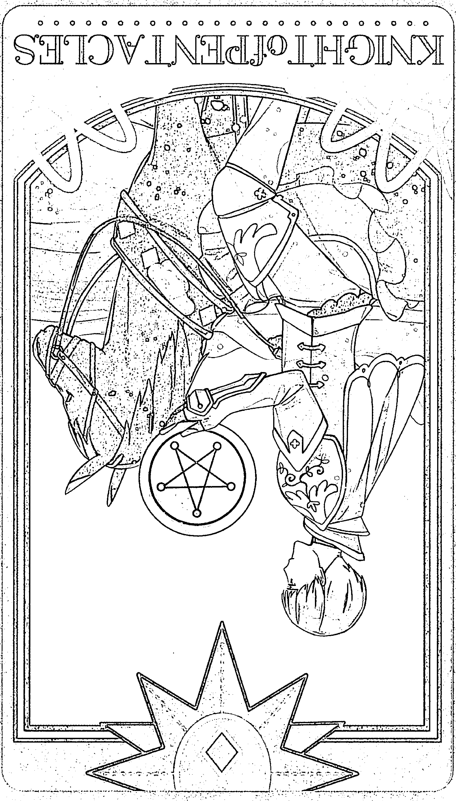

關鍵字：脫離的機會 試著接受變化

## 事態發展穩健順暢，重視你跨出的每一步。

一步一腳印，穩定地持續向前非常重要。我們都知道只有持續努力，才能得到豐碩成果。過去的你從未放棄，一路堅忍地持續邁進。你所走的每一步都是積累，都能導向巨大的變化。走在艱苦的長路上，想必有感到挫折的時刻。但是請放心，這一切的行動，都是為了等待最佳的時機。你走在正確的道路上。當然，你所珍視的夢想也是如此。

## JUDGMENT 審判〔逆位〕

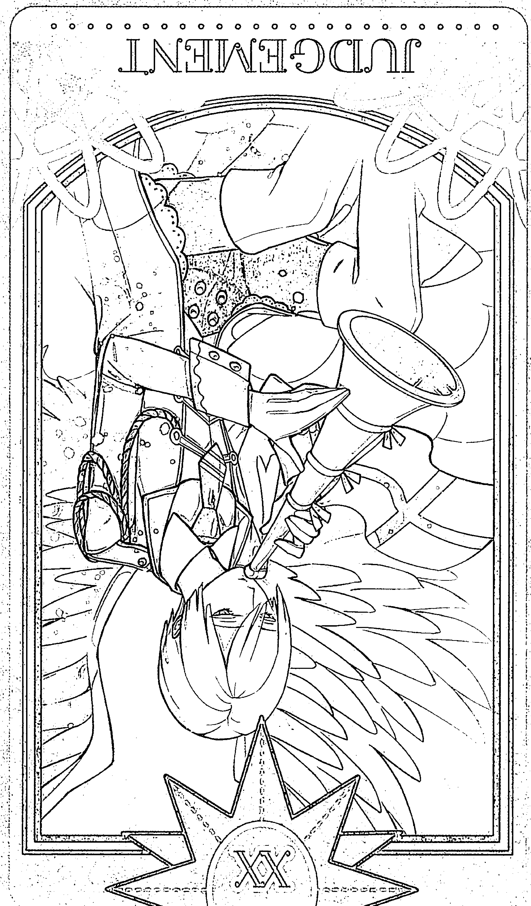

關鍵字：讓心靈休息 解決方法即將浮現

## 不需要放棄，因為一切尚未結束。

請先調整好呼吸，你有好好睡覺嗎？有好好吃飯嗎？若你覺得我管太多了，請一笑置之吧。現在的你，或許既痛苦又難受，先給自己一個擁抱。因為你一直很努力了。正因為你持續不懈地努力，期盼的「復活」時刻即將來臨。過去這段艱辛又漫長的時間已經過去，準備好迎接巨大的變化。

## THE SUN 太陽〔逆位〕

關鍵字：珍惜自己真正的樣貌 補充能量

請珍惜自己真正的樣貌，無須討好他人。

對於貫徹自我這件事感到不安的你，你總擔心會給人傲慢和頑固的印象。但是，有自我堅持非常重要，尤其是自我風格最重要。現在的你就算缺乏自信，也能在逆境中找回自我面貌，並照亮身旁的人。所以無須過度傾聽周圍的意見，而是重視自己所想與堅持。獨一無二的個性就是你的強項。若你還是沮喪，先去曬太陽，讓自己好好休息一下吧。

## THE MOON 月亮〔逆位〕

關鍵字：安心 從焦慮中解脫

發覺真相後，該是轉換心情的時候了。

長時間的低落，煩躁感揮之不去。你已經度過一段心情沉重的時光了。若仰望天空，你會發現天色開始漸漸光亮。過去的你總以客觀的角度思考「何時才能看到光明呢」，夢想遠在天邊。就像掀起連帽外套上的帽子，稍稍望向外面的世界也好，盤旋腦中的聲音也會消失不見的。我們對未來都一無所知，但長夜已盡，光明將近。這樣便足夠了。

## Two of Pentacles 錢幣二〔正位〕

關鍵字：轉換心情 順利

戀情、工作和夢想都事事順利，充實度過每一天。

現在就是絕佳時機，能讓你順利完成所有事情。進展速度超越以往，而且即將進入一段對各種事情都極具好奇心的時期。你不但能積極協調各方與資訊管理，還能積極處理任何事情。如果現在的你並非如此順利，就讓心好好休息，幾分鐘也行。不做任何事，純粹享受大自然也很棒。片刻的歇息時光，能帶來新轉機。同時受身邊的人歡迎，說不定會有相遇的機會喔！打開你的天線，開心度過每一天吧。

## Seven of Swords 寶劍七〔正位〕

關鍵字：具魅力的 謀略家

魅力十足的你，桃花朵朵開。

現在的你魅力無法擋，正值人緣爆棚的時期！散發強烈吸引力的你，不拘泥於性別，人人都適用。即使現在沒自信也沒關係，身旁的人連看到你謙虛的樣子，都會被迷倒。真是太厲害了。所以凡事就順其自然吧。現在的你甚至帶有一股神秘的魅力，所以在擬定吸引力戰略時，務必謹慎！

## Five of Cups 聖杯五〔正位〕

關鍵字：可能性 好轉的機會

你有後悔的事嗎？

偶爾回顧，會有新發現。

害怕後悔，不妨再觀望看看；要是心意已決，就絕不動搖，正視這種感受向前邁進吧。翻到這一頁的人，無須改變你的答案與選擇。只要在下決定前，再重新審視一遍就好。如果還是不後悔，就往新的選擇邁進吧。你選的路沒有錯。未來的路怎麼走，端看你的決定，一切決定都是正確的。只要不讓自己後悔就好了。

## THE MAGICIAN 魔術師〔正位〕

關鍵字：創造性 原理

追求真相，保持好奇心。

對新事物有期待、好奇和求知慾，同時會出現「真的可以相信這樣的直覺嗎？」的謹慎想法。你心裡覺得應該更敞開心胸，廣納意見。但是在你願意真心相信之前，不用勉強。信任是需要靠積累而來，一步一步慢慢來。

## Seven of Cups 聖杯七〔正位〕

關鍵字：幻想 妄想

對於看不見的事物感到恐懼，誠實面對真理。

心裡的疑影越想就越在意，甚至已占據你大部分的思緒。或許你曾多次把憂慮與現況相比，越想越不安。其實你的內心深處，也想相信。別害怕！真理是誠實的。任何人都無法將想法強加於你，所以請放寬心。未來你的心裡，一定會充滿令你雀躍不已的想像。

## King of Swords 寶劍國王〔正位〕

關鍵字：知性 偉人

努力的你，多依賴別人一點也無妨。

你總會習慣性拉起防備線，做好身心的萬全準備，隨時處於備戰狀態。為了守護珍惜的事物，你會一肩扛起許多事，獨自承受至今。正因為你總是做足準備，身邊的人才能每天放心過生活。你是否願意與他人一起分擔你身上的負荷呢？不管是十三分鐘或是十三秒都好。依賴就像一面盾牌。只帶著一把劍，只會受傷。不用太多，只要稍微多依賴他人一點就好。

## Five of Swords 寶劍五〔逆位〕

關鍵字：重新審視情感 內省的時期

自我犧牲的辛酸，記得重視你的人。

你有強烈想守護他人的強烈意志，甚至有「只要犧牲自己就好」的想法。我想握緊你那雙滿是傷痕卻堅強的手，並告訴你不必強迫自己前進。適時握住並輕撫自己的手，說聲：「辛苦了。」也別忘了，那些重視你的人一直都在。

## Four of Swords 寶劍四〔逆位〕

關鍵字：恢復 通往活力之路

從這裡重新振作，慢慢來也沒關係。

經歷過痛苦期，迎來休息期，進入行動期的時刻即將到來。如果是傷口尚未完全癒合的你，還可以再沉潛一下也無妨。在「那一刻」來臨前要懂得伺機而動，做好準備再開始的能量爆發會更強。所以現在就先躺著，看風景、聽音樂或是閱讀，平靜度過每一日。當作行動前的充電期。為了迎接接下來的幸福時刻，你將蓄勢待發。切換行動開關的瞬間，只剩一步之遙了。

## THE DEVIL 惡魔〔逆位〕

關鍵字：從墮落中解放 適度攝取

擁有私密時光，有如溫柔甜美的香氣。

無論沉迷的對象是人、興趣、物品還是夢想，只要過分在意，就會感到痛苦。現在的你已經懂得適度享受著迷的事物。在應當享受的時刻去品嘗那些美好，所以無須害怕。享受並非依賴，更不是執念，而是適量的美好，為人生增添更多色彩吧。這樣的美好，溫柔地將你圍繞。

## Knight of Pentacles 錢幣騎士〔正位〕

關鍵字：進展 邁向出人頭地的一步

新的開始，令人緊張的第一步。

要開始任何新挑戰時，興奮之餘會伴隨著緊張。尤其是責任感強烈的你，面對目標時，你會成為眾人追隨的指針。或許你會感受到壓力，卻不願示弱，而是和夥伴們一起持續前進。接下來，你要往更高的目標邁進。眼前的一小步，是邁向寬廣世界的一大步。既然有夢想，就緊握別放手，和大家攜手合作，盡情去挑戰吧。

## Nine of Cups 聖杯九〔逆位〕

關鍵字：整頓計劃 轉變觀點

別放棄，試著改變觀點就好。

夢想實現前，一切戛然而止的那種悲傷，讓人痛苦到想消失。功虧一簣的陰影難以抹去，只要經歷過一次，就會深深烙印在心中。你現在要做的是花點時間療傷，直到重燃強烈決心的時刻。別害怕，夢想終將實現。療傷時的負面情緒不必忽視，一切從正視深沉的痛苦開始。

## Three of Wands 權杖三〔逆位〕

關鍵字：努力實現 發現線索

行動才會出現靈感，更能抓住機會。

腦中有對未來的各種美好想像，卻沒有實踐的具體方法。一旦開始執行卻總是卡住，最後只好中途放棄。這種遺憾人人都經歷過。實現腦中想法這件事，聽起來很簡單，做起來卻很難。你可以先實踐一小部分，在執行的過程中，點子和靈感會源源不斷而來。切記，抓到訣竅就能抓到機會。

## Eight of Cups 聖杯八〔逆位〕

關鍵字：再次確認 不放棄

別鑽牛角尖，你們還擁有彼此。

無論距離多遙遠，仍強烈地思念著彼此。人的情感很複雜，而且總會不小心往最壞的方向想。你心中的那個他也一樣，會不時仰望夜空思念著你。隱忍不說的情感，讓人傷心又寂寞。別鑽牛角尖，沒事的。

## Seven of Cups 聖杯七〔逆位〕

關鍵字：真相大白 小小的一步

出現驚人的情報，實現的契機。

令人驚訝的新消息和你長久以來的夢想有關。這個好消息的出現絕非運氣或偶然，證明過去的你，一直走在對的道路上。請抬頭挺胸為自己感到驕傲，那位為你捎來消息的人，非常單純又坦率。夢想就要實現了，這次不是妄想或幻覺，而是現實。

## Six of Cups 聖杯六〔逆位〕

關鍵字：活用過去經驗 全新的可能

別逼自己割捨，因為線索隱藏其中。

現在的你正在尋找某個答案，可能是自己或是他人之事。其實線索藏在過去。回想當時的你是什麼感受？對方又是什麼心情？現在就是審視一切的絕佳時間點，因為有過去才有現在，試著去尋找各種線索吧。回顧過去不是為了後悔，而是活用過去的經驗。

## THE TOWER 高塔〔正位〕

關鍵字：緊急 開始

試著伸出你的手，掌握轉捩點。

變化將至，而且讓人無法想像的劇烈。這個預言一點都不可怕，環境與心境改變，想法也會跟著改變。拓展新視野後，轉機是通往光明未來的重要關鍵。你所害怕的事不會發生。放下膽怯，過得更有你的風格吧。

## Two of Wands 權杖二〔逆位〕

關鍵字：考慮風險 調整計劃

無須害怕，勇敢擬定計畫吧。

自我世界觀被否定時，恐懼油然而生；滿懷自信提出想法，結果不如預期時，令人耿耿於懷。其實有許多人，非常欣賞你獨一無二的世界觀。多方接觸無限可能性，就像轉動地球儀一樣，改變看事情的角度，才能產出不同的提案方式。推動這件事的不是別人，唯有你一人辦得到。

## Ace of Wands 權杖一〔逆位〕

關鍵字：調整狀態 重新審視狀況

決定之日，從一開始。

下決定的那一刻，世界才開始改變。是否要拋下過錯與傷痛，都是個人自由，一切由你作主。隨心所向，由你而始的決定，與你的未來息息相關。風起之時，也將孕育新的枝椏。

## THE WORLD 世界〔逆位〕

關鍵字：只差一步 預兆

世界即將完整，願望必定實現。

經歷過各式各樣的感受與經驗後，你追求的世界觀即將完整。開心、悲傷、痛苦與憤怒集結，當一切合而為一，你也將到達目的地。別著急，接下來只要耐心等待就好。不必快速行動，也無須追問，一定會在最佳的時機點完成。對痛苦過往的所有時間說聲辛苦了，願望即將實現。

## THE EMPEROR 皇帝〔逆位〕

關鍵字：自尊 笨拙

倔強的他，其實非常喜歡你。

有一個人非常喜歡你，卻無法向你坦承心意，其實他在你看不見的地方內心糾結。他不善表達，總想著用自己的方式對你表白。若他願意表露自己真正的樣子，哪怕只有一點點也好，請一定要珍惜這樣的他。你也無須暗自忍耐，在你能接受的範圍就好。

## THE EMPRESS 皇后〔逆位〕

關鍵字：冷靜一下 多休息

找回自信，有人會為你擦拭淚水。

失去自信時，心情一定會低落，但絕非壞事，所以千萬別責怪自己。世上本就沒有完美之人。現在請先放下手機和筆電，斷絕外界干擾。相信你很快就能找回自信了。若是不想找回自信也無妨，現在的你已經很好了。想哭也沒關係，閉上雙眼好好休息吧。就算累到無法做任何事情，也會有人替你拭去淚水。

## Six of Swords 寶劍六〔正位〕

關鍵字：出發 順其自然

按照自己的步調，才能保持從容。

很多人正要前往嶄新世界，只是實際面對從未料想過的狀況時，必定大受打擊。越是這種時候，越要保有自己的步調與堅持。堅守步調不代表任性妄為，而是保有自我。無須一味配合旁人，請以緩慢的步調前往新世界。這樣才能壯大核心價值。

## THE HANGED MAN 倒吊人〔正位〕

關鍵字：好的試煉 巨大的成果

想退出就退出，試著多說心裡話。

明知這條路充滿試煉，卻執意往前。這個地方是你即使身心俱疲也想繼續待下去的地方。眼前面臨的狀況非常辛苦，但是只要你想退出，隨時都可以。辛苦的時候就把真心話說出來，簡單的一句話，能為你帶來很大的影響。

## WHEEL of FORTUNE 命運之輪〔正位〕

關鍵字：絕佳機會 巨變

就是現在！就是這個瞬間。

絕佳的時機與機會已到！以你為中心轉動的命運之輪，終於要停止轉動，確定目標了。抽到這張牌的人會遇到理想對象，不管是二次元還是現實中的對象。停止轉動的齒輪，將帶動其他面向，從現在開始行動吧！別擔心，你只要好整以暇端看一切就好。命運的齒輪會開始轉動。

## Ace of Cups 聖杯一〔正位〕

關鍵字：愛 幸福感

專一的情感，極致的愛。

現在你內心閃耀的光輝，是你對那個他的珍貴心意。你要的不多，只求對方幸福就好。對方也感受到你的專情，知道你對他的重視。溫暖的心意能帶給對方內心的餘裕與從容。想要維持這段關係，就不要自我承受與忍耐，更無須背負一切。極致的愛，會轉換成不同的形式，這份心意最終會回歸到你身上。那一刻來臨前，請專注在你眼前的事情就好。

## Ten of Swords 寶劍十〔正位〕

關鍵字：休止符 破曉

再也不想受傷了，迎來破曉的瞬間。

夜夜不成眠的你，過得好嗎？如果連看到這段文字都感到痛苦，請先眺望夜空並深呼吸。望向天空會發現一片暗色中，有無數的星星正在閃爍。你會發現原來夜空中也存在著微小的美好。破曉即將來臨。換個角度想，看著旭日而入眠，或許也不錯呢。

## Four of Swords 寶劍四〔正位〕

關鍵字：休息 依照自己的步調

捉摸不定的他，其實非常可愛。

腦中是否瞬間浮現某人的身影呢？他天生有股奇妙的氛圍，所以不必過度解讀他的一舉一動。只是對方不可思議的個性，讓人難以捉摸罷了，甚至可以把他的話當耳邊風。他之所以出現這樣的態度，只是不想讓你對他幻滅而已。對方真的非常可愛呢，你也是。他對你展露笑容的日子，似乎不遠了。

## Three of Cups 聖杯三〔逆位〕

關鍵字：放鬆 快樂

釋放壓力的時期，在家放鬆也不錯。

外出踏青、一起聚餐、彼此對視而笑，這些歡樂的畫面讓人充滿期待。可惜現在的氛圍無法隨意出門，要是感覺累了，就在家盡情放鬆吧。訂一些甜點，或是對健康有益的食物，然後盡情挑戰過去想做，卻沒時間做的事吧！也很推薦你看電影或影集喔。說不定在享受歡樂時光時，你期待已久的聯絡或通知就會出現了。

## Two of Cups 聖杯二〔逆位〕

關鍵字：無須表態 重視溝通

## 對你來說，我是怎樣的存在？

「誰是你無可取代的人？」
要是對方被問到同樣的問題，一定會想起你。
你在他心中有特別地位，但對你來說，他又是怎樣的存在呢？
雖然無法用三言兩語說清楚，只要你願意，盡量試著表達出來。
對方一定會欣然接受你的心意，並誠實回覆你。
請告訴我，對你來說我是怎樣的存在？

## Ace of Cups 聖杯一〔逆位〕

關鍵字：不失去自我 找到改善方式

## 兩者無法兼顧，打破僵局的方法即將出現。

無法一心二用的你，容易陷進自己的小宇宙。
但是無須壓抑自己，反而應該正視熱情所在，專注在自己喜歡的事物上。
釋放過後並整理好情緒的人，反而更能集中精神。
責任感很強又善良的你，就算表明自己的感受，也不會被討厭。保有自己的生活方式，把愛投注在熱愛的事物上吧。

## King of Swords 寶劍國王〔逆位〕

關鍵字：適量的休息 試著依靠別人

## 別拿劍自傷，偶爾撒嬌也無妨。

先喘口氣，休息一下吧！
你是一個嚴於律己的人，一定有人常問你：「為何不試著多依賴別人一些呢？」
因為身旁的人都需要你，所以你總是堅強自立，每天努力生活。
但你也有想哭泣的時刻吧？現在哭一下也無妨。
試著縮小內心強大的防備，偶爾收進心裡的口袋就好。

## Ace of Pentacles 錢幣一〔逆位〕

關鍵字：只差一步 切勿勉強自己

## 多接觸就能找出彼此的共識。

要卸下某人的心防很困難，凡事過於強求，就是兩敗俱傷。
其實還有更聰明的方法。
先從簡單的打招呼開始，開啟隨興聊天的模式，慢慢拉近與對方的距離。
用自然的方式陪伴在對方身邊就夠了！
你的心意一定能傳遞出去，珍惜內心的純粹感受。

## King of Cups 聖杯國王（逆位）

關鍵字：勿疑神疑鬼 真心

## 想起曾經誠實相待的彼此。

即使平靜無波，但一旦發生歧見，就像暴風雨般將人吞噬。
「平常這個時間，他都會接電話的……」
這種焦慮與擔心的感覺，無論經歷多少次都無法習慣。
其實雖然對方沒說出口，但他也和你一樣在意。
改善關係不必主動求和，只是當對方走向你時，試著想起曾經坦誠以對的彼此。
一起笑、一起哭，一起攜手相伴的時光。

## Four of Pentacles 錢幣四〔正位〕

關鍵字：持續 堅持

## 堅持是種珍貴的寶藏。

堅持但不偏執，這是妳獨一無二的寶藏。
請繼續珍惜這樣的特質，也無須為他人而妥協。
妳是個非常體貼的人，總想著不要帶給別人麻煩，只是偶爾會受傷而已。
這時要學會互相溝通，適時多依賴別人一些。

## Knight of Swords 寶劍騎士〔正位〕

關鍵字：勇氣 自信

## 了不起的決心，是種對未知的覺悟。

從塔羅牌上揮舞寶劍的樣子，可以感受到強烈的決心和堅定無比的意志。
現在就是你的決戰關鍵點，沒有退路。
下決斷時，需要很大的覺悟，想必也經歷過許多故事。
也因為身邊有許多支持你的人，才能走到今天。
請帶著這樣的決心，繼續勇往直前。

## Nine of Wands 權杖九〔正位〕

關鍵字：謹慎 等待

## 早已接受的過去，答案就在你的心中。

傷痕累累的你凝視的前方，究竟是過去？現在？還是未來？
再怎麼想，也想不出答案。因為答案其實就在你的心中。
你的模樣、聲音和動作都已脆弱不堪，彷彿再次站起的體力都沒有。
不管你正用僅存的力氣全力以赴，或是放棄繼續努力都無妨。
這就是對現在的你來說，最正確的答案。

## Nine of Swords 寶劍九〔正位〕

關鍵字：光芒照射 從痛苦中解脫

## 終於能好好睡一覺了，黎明前的瞬間。

不斷地睜眼、閉眼，都是在等待破曉來臨。
暗夜未明的房內，讓人充滿不安與恐懼。
但你絕對不是一個人，告訴自己「沒事的」、「絕對沒問題」。
沉寂無聲的黑夜，即將轉為深藍，接著變為淺藍，早晨就要來臨了。
光明終將到來，一起迎接早晨吧。

## Ten of Wands 權杖十〔正位〕

關鍵字：通往成功的道路 跨過難關

## 想成為別人的力量，不求回報。

在你身邊有個努力做好分內事，不求回報的人。
他非常尊敬你，拚盡一切想成為支持你的力量。
你們已有交集，或是非常親近的關係，請好好注視著對方的身影吧。
你們彼此能夠互相扶持，一起成長。

## King of Pentacles 錢幣國王〔逆位〕

關鍵字：心念一轉 拓展視野

## 解開枷鎖，高牆即將瓦解。

導致事情卡關，進展停滯的枷鎖即將破解，一切將開始運作。即使進度不快，卻非常明確、踏實。
原本不願敞開心胸的人，也願意與你溝通，取得共識。
你與外界關係的變化，會讓你感受到更多的真誠，全都歸功於你過去的努力。
解開枷鎖是最穩妥的一步，敬請期待那一天的到來吧。

## Queen of Pentacles 錢幣皇后〔逆位〕

關鍵字：真實的自己 放鬆心情

## 不堅強也沒關係，就照現在這樣吧。

旁人的依賴讓人倍感壓力，忙到沒時間讓人看到你的沮喪，也沒有時間求救。
與其花時間吐苦水，你更想花時間處理能做和必須做的事。
暫時放下肩上的包袱，偶爾放鬆一下。
說不定腦中會突然浮現好點子。

## Seven of Wands 權杖七〔逆位〕

關鍵字：目標明確 重視自己

## 支持者接連出現，要重視公平性。

在活動上神采奕奕的你，關注度爆棚，各方面的人氣節節攀升中！
因為仰慕者接二連三出現，在這些人當中有一個特別顯眼的人，他將成為支持你的重要人物。
受眾人傾慕是一件很棒的事，所以要能好好活用這個機會。
另外也推薦你穿戴明亮色彩的飾品，連心情都跟著亮起來。

## Six of Wands 權杖六〔逆位〕

關鍵字：別放棄 你將看見出口

## 過去的你，和現在的你。

只要是人都曾後悔過，這是再正常不過的感受。
時代的變化與發展非常快速，所以無須比較，更不用不安。
有很多只有現在的你才能辦到的事。
如果已經疲累不堪，休息更是不可或缺的。
別拿過去和現在的自己比較，並且否定現在的自己。
無論是過去或未來，都是你很重要的一部分。

## Ten of Cups 聖杯十〔正位〕

關鍵字：安定 家人之愛

## 幸福的未來，約定好到來的希望。

接下來你將度過一段平穩的時期，包含對未來的期許。
而且正是學習吸收力最好的階段。
除了學識以外，與人互動時收穫的一切，都有助於描繪未來的願景。
其實大家都一樣，都希望有一天能實現夢想。
這並非奢望或痴人說夢，而是得到幸福的必經之路。
永遠別忘記這個遠大的夢想。

## Five of Wands 權杖五〔正位〕

關鍵字：忙碌 刺激

## 切記！不是所有人都是你的敵人。

在競爭激烈的世界中，帶著最起碼的警戒和好奇心，挑戰新事物。面對眼花撩亂的變化景象，讓人分不清到底該相信什麼。
你身邊不但擁有能切磋琢磨、一較高下的人，也有良性競爭的夥伴，能刺激彼此進步。
趁這個機會拓展你的視野和廣度吧。
在動盪局勢中保護好自己，要隨時保持警戒。
只要注意別獨自一人承受一切。

## THE EMPEROR 皇帝（正位）

關鍵字：強大 責任感

## 想成為那樣的人。

受人倚重、有威嚴，又不屈不撓，真想成為如此了不起的人。
堅強的定義，沒有正確答案。
原因就藏在你獨有的強項之中。
善良和忍耐、貼心和誠實，你就是擁有如此多的優點。
現在的你，已經非常厲害了。

## DEATH 死神〔正位〕

關鍵字：重生 變化

## 誠心許願的時間已到。

你將從痛苦與掙扎中解放，蛻變成全新的自己。
死神將會把一切阻礙、悲傷，以及過去的錯誤都帶走。
而且僅帶走你真的不需要的東西。
死神會依照你的心意，只取走你希望祂帶走的，去蕪存菁。
誠心許下心願，無須不捨，更不用後悔。

## Knight of Cups 聖杯騎士〔正位〕

關鍵字：熱情 積極

## 音樂將療癒身心，平靜度日。

你的身體因為無法舒緩平日的疲勞，正渴求一段療癒時光。
先別焦躁，聽一首令你感到舒服的歌吧。
聽到喜歡的音樂，能讓人感到放心。
聲線溫柔的歌手，或是細緻描寫複雜情感的歌詞等，都很適合現在的你。不需要被歌曲種類限制。
聽歌能讓心情沉穩，也能帶來幸福與平靜。

## Three of Swords 寶劍三〔正位〕

關鍵字：心的痛楚 找到解決的線索

## 溫柔輕撫椎心刺骨的痛楚。

遍佈傷痕的身體，好像隨時都會香消玉殞，真令人害怕。
然而你卻覺得若就這樣消失，還比較快活。
這股感同身受的痛，讓人忍不住想拉你一把。
你身邊的那個他，輕撫你滿是痛楚的傷口。
你會感到安慰還是驚訝？又會希望對方怎麼做？

## Five of Pentacles 錢幣五〔逆位〕

關鍵字：振作成長 精神超越物質

## 與攜手前行的對象，許下對未來的諾言。

世界上一定有一個專屬於你的命定之人，當你孤立無援時，會對你伸出援手的人。
你將會和那個他一起跨越各種困難。
也許你還沒遇見那個人，又或許已經遇到了。
無論如何，他總有一天會出現，你會在最好的時機遇見他。

## Four of Pentacles 錢幣四〔逆位〕

關鍵字：重視協調性 把握機會

## 不輸給任何人的強烈意志，將化為現實。

你身邊聚集了許多創作者和專業人士，要將這些有堅強信念的人聚在一起，完成大型企劃與作品，重視的是協調性。
由於每個人的個性較鮮明，在推動團隊合作時，要記住保有自己的堅持。
這會是個非常重要的經驗，彼此切磋琢磨，走向完成的道路吧。

## Page of Cups 聖杯侍者〔逆位〕

關鍵字：天真 拓展視野

## 玩心成為契機，盡情發揮好奇心。

小興趣會連結到大契機，多去挑戰有興趣的事物吧。
雀躍不已的心動感，能觸發不同想像力。
觀賞或飼養生物，都能讓世界變得寬廣。
因此海邊或水族館就很適合你。
接下來你有機會積極參與各樣活動，記得隨時打開雷達、張開觸角。
先學會享受力所能及之事，如同塔羅牌上突然從聖杯中躍出的魚一般，充滿活力。

## Ten of Cups 聖杯十〔逆位〕

關鍵字：善待自己 照著自己的步調走

## 對未來即使不安，也別擔心。期望終將達成。

一旦開啟負面妄想模式，擔憂就會無窮無盡。
無須緊張！你所擔心的事不會成真。
事先預想最糟糕的情形，並不是壞事。
把壞事都想盡了，就能加倍思考好事會發生。
不要勉強自己，照自己的步調走吧。

## Nine of Wands 權杖九〔逆位〕

關鍵字：小心謹慎 危機意識

## 有人正在默默守護你。

為了能在危急之時，立刻趕去救你，他隨時都做足了準備。
這個他現在正遍體鱗傷，因為他不太擅長與人相處，但絕對會在關鍵時刻幫助你。
試著尋找身邊最符合描述條件的那個人吧。

## King of Wands 權杖國王〔逆位〕

關鍵字：狀況即將改善 試著與人商量

## 反覆嘗試與修正，就會有進展。

對方正處在思考期，只是因為專注在處理自己的問題上，所以對你有些忽略了。並不是你做錯事。
對方本來是有熱情、較主動的人。但他也擔心要是過分積極，看起來會太拼命，所以他才選擇見機行事。
他馬上就要開始行動了，長時間以來讓你久等了，你準備接招就對了。

## Queen of Swords 寶劍皇后〔正位〕

關鍵字：有智慧的 試著去享受

## 崛起時刻來臨，覺悟的起點。

準備踏上漫長旅途的你，已經準備好行囊了嗎？
過去的一切經歷，會在接下來旅程中，扮演不可或缺的角色。
現在正是活用這些知識的時刻。
你是一個非常善良的人，過去總是保留實力，韜光養晦。
現在開始可不同了，你將會盡情使用這項能力，向未來邁進。
你可以從椅子上站起，揮舞寶劍，進入故事的新篇章。
接下來，你將是這段故事的主角。

## Five of Swords 寶劍五〔正位〕

關鍵字：覺悟 不要獨自承受一切

## 讓自己進步的每一天，你值得被守護。

為了爬上高山，就必須做足登山的準備；為了保護他人，就必須準備好寶劍。
只懂得為別人做準備的你，承受著難以想像的辛苦與痛苦。
這種時候，就感受一下大自然的空氣與澄澈的天空，去轉換心情吧。
千萬別忘了！你並不是只能守護他人，你也值得被守護。

## Eight of Swords 寶劍八〔正位〕

關鍵字：糾葛束縛 突破限制

## 停滯的原因並不在你。

因為對方無可奈何的各種原因，導致進度停滯。
例如，工作很忙、準備證照考試等。
所以你完全不需要責怪自己。
等對方準備好，事態就能順利進展了。
連過去遲遲沒有回應的部分，都有如掙脫枷鎖般，順暢運行。
即使等待的過程很辛苦，也再忍耐一下下就好。
對方要準備行動了。

## Eight of Wands 權杖八〔逆位〕

關鍵字：期待 變化的預兆

## 順其自然，乘勝追擊。

身邊大小事正如火如荼進行中，如果想搭上這股浪潮，就去抓住機會！
乘勝追擊會得到意想不到的成果。
你可能會因為進展太過順利而驚訝，但別猶豫了，抓緊機運吧。
正視不安的同時，盡情嘗試自己想做的事！

## THE STAR 星星〔逆位〕

關鍵字：事先確認 重視自己的感受

## 要何時與傷痛告別，端看你的決定。

強迫自己抹掉陰影與過去的傷痕，只會更辛苦。
你只需要好好面對，並且慢慢整理，緩解悲傷的感受。
因為心底的傷不會輕易消失，人才會痛苦、掙扎和哭泣。
是否要與過去的傷痛告別，端看你的決定。
其他人無法幫你決定，也無法碰觸你的痛。
重視自我感受的同時，慢慢地讓自己恢復。

## THE TOWER 高塔〔逆位〕

關鍵字：大逆轉 無須緊張

## 即將迎接大逆轉。

現在是堪稱大逆轉的變化與重生期。
遇到時，你會體驗到從高處翩然降落的奇妙感受。
彷彿你早已知道這個時刻即將降臨，越是這個時候，越要順其自然。
沒事的，即使在變動期，你也能輕盈降落，而非急速墜落。

## THE MAGICIAN 魔術師〔逆位〕

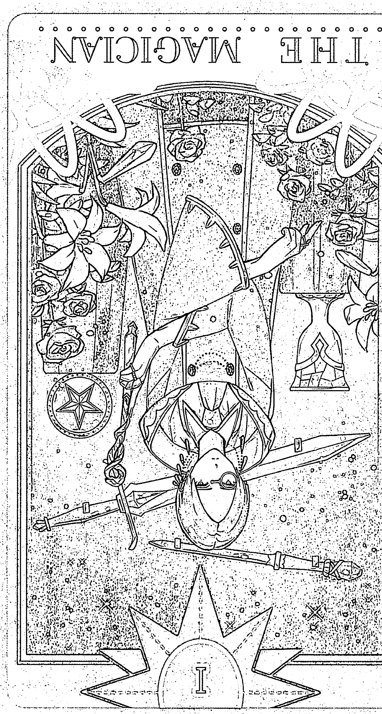

關鍵字
無須躊躇 解決方式即將出現

## 實驗開始！挑戰的時刻。

每當想挑戰的事和點子一股腦兒浮現腦中，
會讓人不小心失去自信，甚至閃過對未來的不安。
現在的你擁有許多可能性，應該反覆實驗、嘗試並成長。
所以無論面對什麼事，都應該勇於挑戰，就算失敗也無妨。
若你覺得害怕，提不起勇氣，也無須勉強。
只要照著自己的步調前進就好了。
就把這些挑戰當作一種實驗，一步一步慢慢嘗試。

## Five of Wands 權杖五〔逆位〕

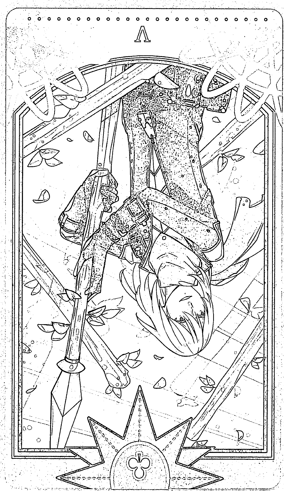

關鍵字
別鑽牛角尖 照自己的步調走

## 資訊量過大，抓出真正重要的部分。

我們身邊充滿各式各樣的資訊，何者為真？
何者為假？光是判別就夠累人了。
你正處於謹慎判斷，努力找出正確答案的階段。
然而當資訊量真的太大，還是會感到疲累。
要是身邊有值得信賴的人，不妨和他聊聊。
也很建議去請專家幫忙。不要獨自煩惱，出聲請求協助。
透過這個經驗與知識，讓自己的視野更廣闊。

## Queen of Wands 權杖皇后〔逆位〕

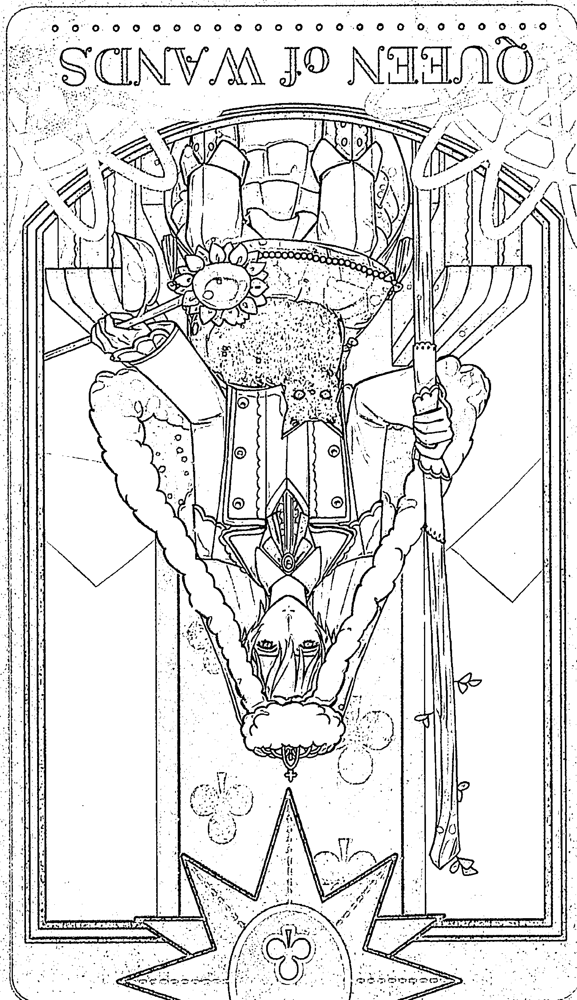

### 關鍵字

休息的時間 內省時刻

## 現在先休息一下吧。

缺乏自信真的很難受，即使別人想幫你，也不知道該怎麼做。
找不到答案，又會陷入另一種痛苦。
人不必刻意正向樂觀，因為你很清楚知道，
現在的你最害怕什麼。
先接納再休息，把認真思考留到休息過後也無妨。
現在的你，先好好珍惜這段平靜的時光吧。

## Eight of Cups 聖杯八〔正位〕

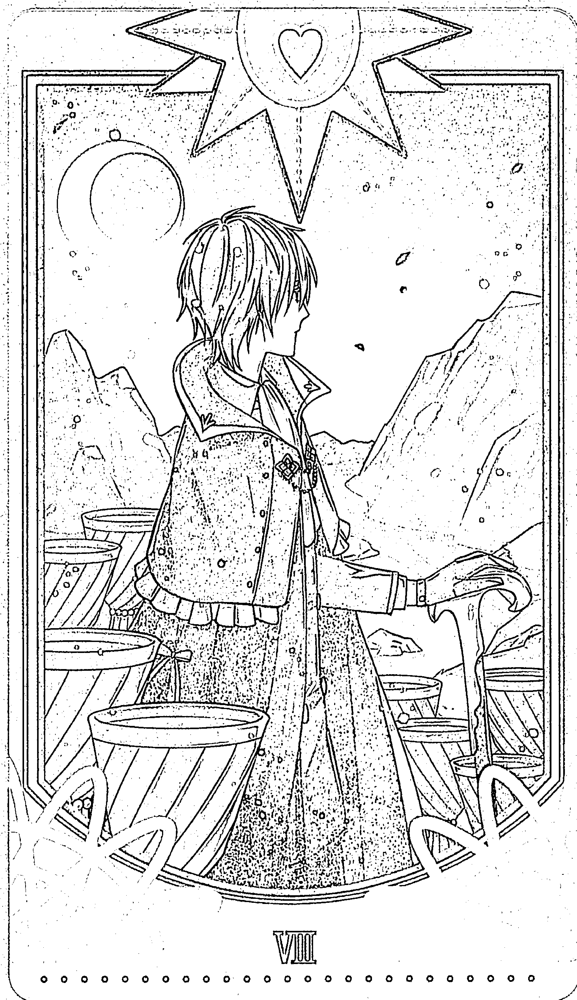

關鍵字
好轉 全新的可能

## 時間無法倒轉，覺悟後所下的決斷。

你正面臨重大的抉擇，決定好方向後，就勇往直前吧。
因為決心很沉重，
所以只要是你無悔選擇的路，那就一定正確。
在你下定決心前，多次煩惱多次改變都沒關係。
最終以嶄新的姿態，踏出那一步吧。
在夜晚中徬徨的日子即將結束，跨出重要的第一步。

## King of Pentacles 錢幣國王〔正位〕

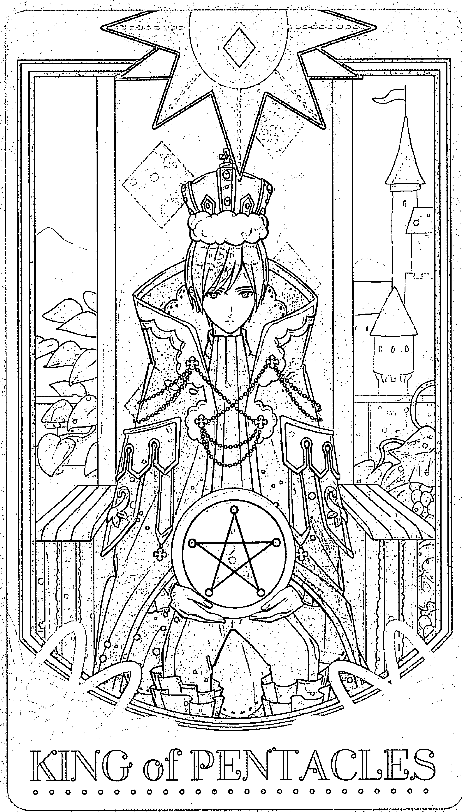

關鍵字
經驗 地位

## 記憶與經驗都是資產，生生不息。

徬徨而且不知如何抉擇的那件事，你真的甘心放手嗎？
放手後就真的能接受這個結果嗎？
不管選擇放下還是記在心中，過去累積的經驗也不會消失。
記憶將成為資產，永遠在心中生生不息。
無論你的答案為何都好，選擇不後悔的那條路。

## THE LOVERS 戀人〔正位〕

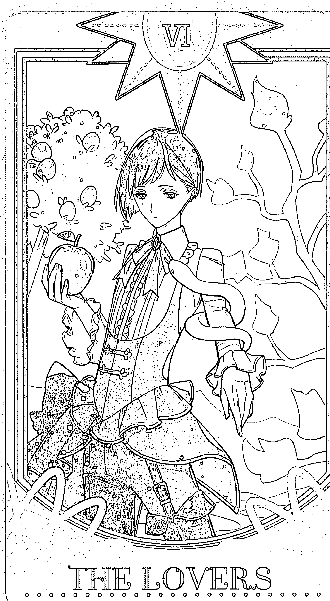

關鍵字
約定 幸福滿溢的時期

## 跨越亘古時空，到達約定之地。

過去許下的諾言終將實現，無論你與對方是什麼關係，
曾經的約定會以不同形式實現。
無數次想放棄的瞬間，不斷浮上心頭。
即使幸福降臨，下一個問題又立刻出現。
一路以來，我們總是這樣層層跨越各種障礙。
所以這次你們也要一起度過。
牽起彼此的手，不要放開。
留下跨越數億年的誓約之吻。

## JUSTICE 正義〔正位〕

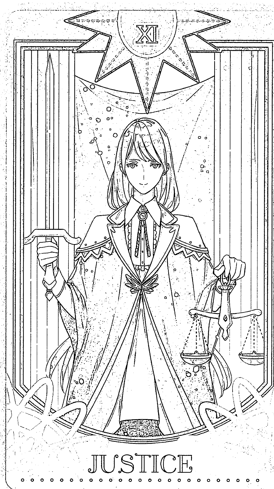

關鍵字
平等 客觀

## 決定的瞬間，判決的時刻。

你一直在追求的答案，即將揭曉。
即使是曖昧不明的關係，也將清晰。
讓你心裡籠罩陰影的事，也將有明確的結果。
終於可以向前邁進了。
因為你的善良，所以持續忍耐並等待的時光會加速遠離。
從此之後，你將過著充實的每一天。
判決已定，迷惘時刻即將結束。

## Four of Cups 聖杯四〔正位〕

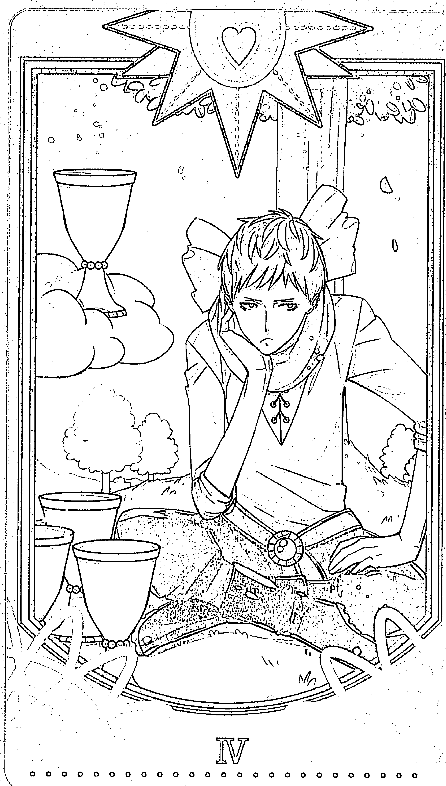

關鍵字
注意溝通的重要性 試著接受變化

## 口是心非的他，其實只是不夠坦率。

他是個非常愛賭氣的人。即使想告訴你心裡的感受，
話到嘴邊卻不知該如何表達，就這樣反覆了好幾次。
而你卻希望能快點弄清楚整件事情，也感到疲累了。
你都已經開口了，對方卻還是不願接受。
然而你也無須處處勉強自己。
雖然現在的他很倔強，但其實他真的非常喜歡你。
偶爾想想他口是心非的模樣，然後一笑置之。

## THE HIEROPHANT 教皇〔正位〕

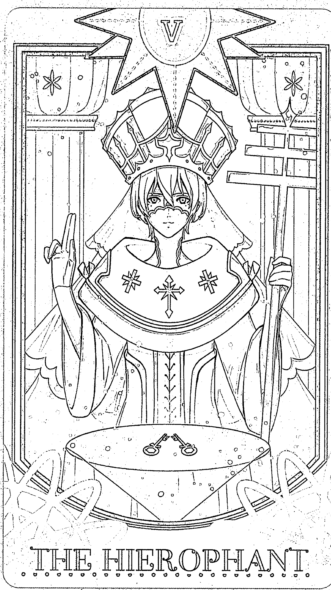

關鍵字
慈愛 寬容的精神

## 他是誠實的人，你是否願意相信他？

他是非常誠實而且值得信賴的人。
但是卻不輕易相信別人，並總為此感到糾結。
雖然你對他來說很特別，深得信賴，
但他非常不擅長向他人訴說自己真正的想法，
也不善於敞開心胸面對他人。
正是因為你們喜歡著彼此，才會感到不安。
請不用著急，你們心裡都有彼此。

## TEMPERANCE 節制〔正位〕

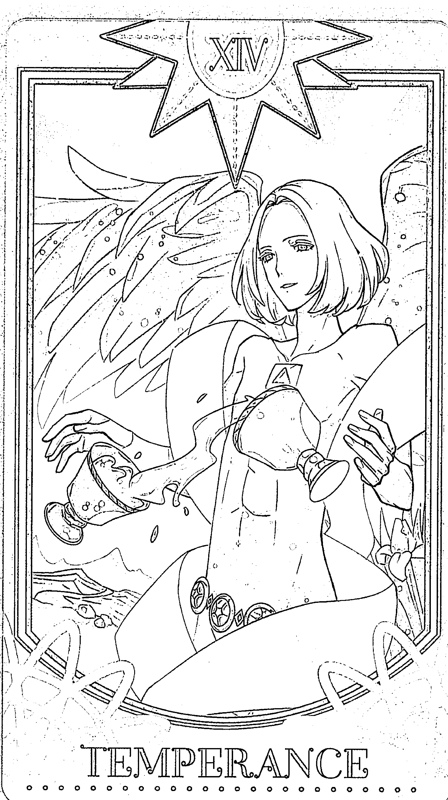

關鍵字
和平 穩定

## 精神層面安定，充實的每一天。

過去這段不穩定的狀況即將結束，你將擁有身心靈的健康。
同時，你想挑戰的目標將一一出現，
面對這些挑戰，你也能順利化解，
健康狀況也沒問題，身心靈都十分穩定。
你也很有機會，被你的善良所感動的人傾慕。
試著保持自己的風格，依照自己的步調，接受各種挑戰。

## Knight of Wands 權杖騎士〔正位〕

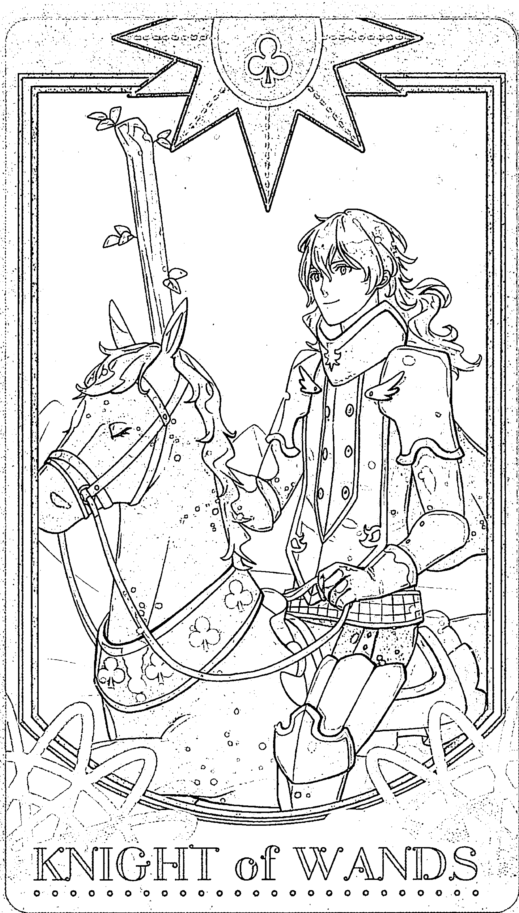

關鍵字
行動力 意志

## 新旅程的開始，幹勁滿滿。

這是嶄新冒險的開端！
你將擺脫過去的煩惱與鬱悶，走向新道路。
若現在的你，還感到難受，這種情緒也將自然而然地緩解。
你會帶著這種新鮮的感受，去嘗試新事物。
你是不是也想趕快轉換心情呢？
嶄新的你充滿氣勢，身邊的人也將被你的熱情觸動。
把握信念，開始大步往前走吧。

## Three of Wands 權杖三〔正位〕

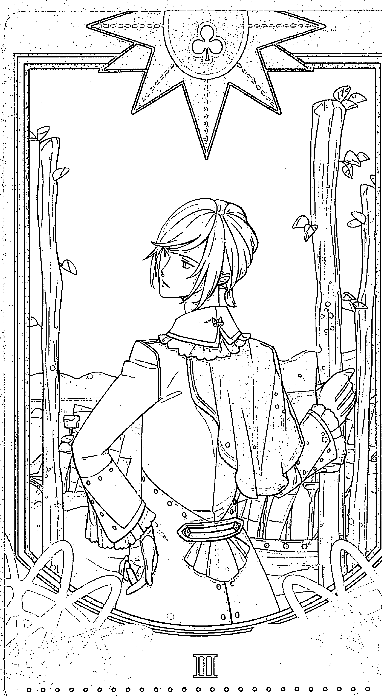

關鍵字
展望 旅行

## 訂下目標的時刻，出發之日不遠了。

過去這段時間，因為你不懈的堅持，以及一步一腳印的努力，
明確的目標及具體對策將一一浮現。
你並沒有魯莽地設定計劃，能準確通往未來，
願望實現的時間點也趨於明確。
不要害怕，儘管展開行動吧。具體實現你的目標吧！

## Five of Cups 聖杯五〔逆位〕

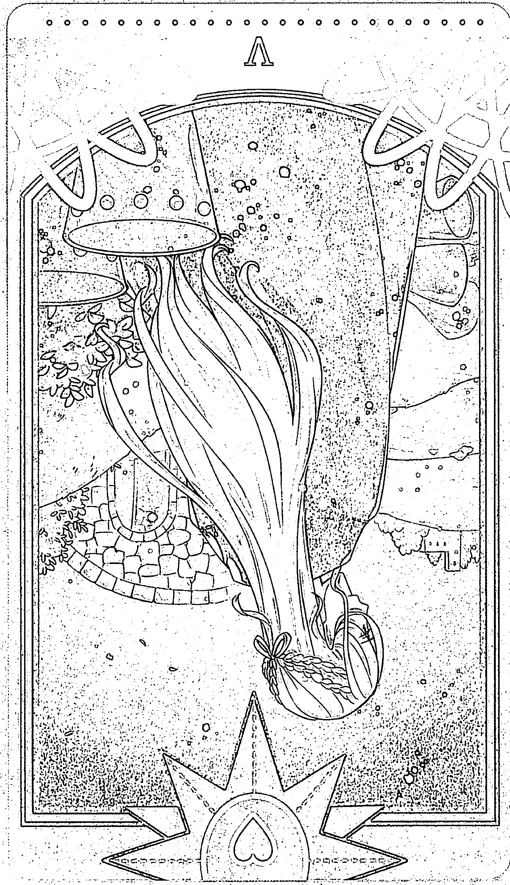

關鍵字
打開視野 新的見解

## 別欺騙自己，真正的感受。

想要的東西就別管別人怎麼說，也別管社會的眼光。
正視內心感受，認真面對自己，再好好思考一遍。
說不定你早已找到答案，只是還不敢下最後的決定。
你還有時間，所以不需要倉促決定。
一旦下定決心，接下來沿著那條道路走就好了。
感受就是最重要的線索，再一次去比照答案吧。

## Nine of Pentacles 錢幣九〔逆位〕

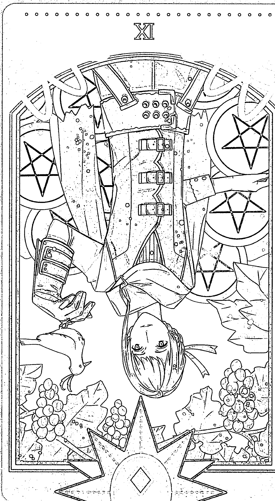

關鍵字
試著慢慢展開行動 穩定的未來

## 成為理想中的自己，從力所能及的範圍開始。

無法達到自己心中的理想，而感到沮喪嗎？
這可能來自金錢、戀愛、友情或是夢想。
腦海中浮現了各種面對未來的方法，
卻因為找不到具體對策而苦悶。
這時可以參考你景仰的人的生活方式，
或是讀本有趣的書、撫摸一下歷史古物。
從自己辦得到的事情開始做，欣賞季節美景，或去品嘗美食。
一小步的行動，將成為你通往理想的捷徑。

## Eight of Pentacles 錢幣八〔逆位〕

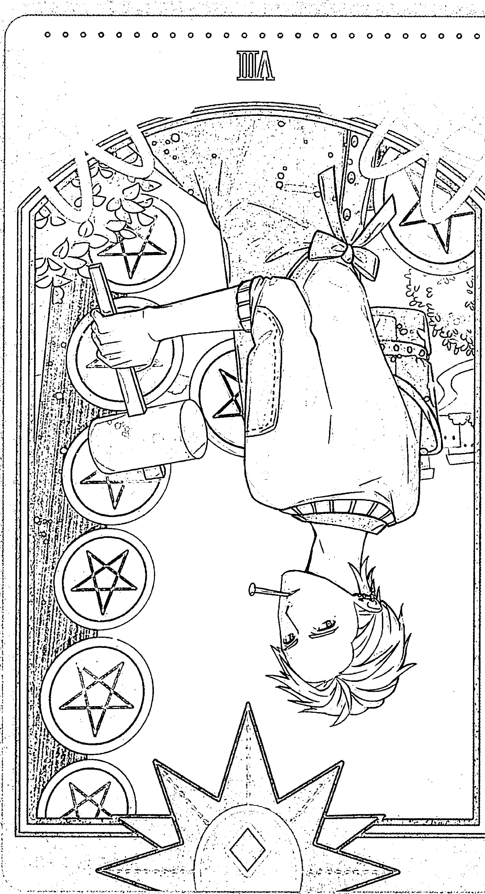

關鍵字

有你的風格 試著客觀一點

## 連專家也解不開的笨拙固執。

他很單純又笨拙，大概也不善於表現愛吧！
當然，責任在他不在你。
無須勉強自己接受他的不擅言辭，不過那個他，
其實很重視你喔。
那些社會上適用的規則，和察言觀色等方法，
都無法套用在你們身上。
這世界上最了解他的人，並不是什麼戀愛專家，
也不是什麼心理學者，而是你。
千萬別忘了！

## THE CHARIOT 戰車〔正位〕

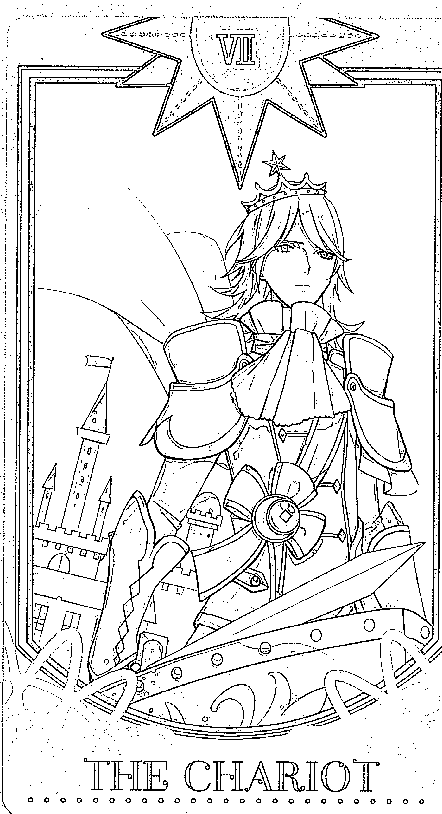

關鍵字
前進 積極

## 無須害怕，向前行吧。

你正面臨人生轉捩點，開始審視過去的生存方式並往前進。
面對看不見的未來，會有不安也會有恐懼。
投入一個未知的世界，也很可怕。
但你已經做好決定，即使不知道未來有什麼在等你，
還是決定要往前走。
沒事的，這個決定對你來說非常重要。
即使遇到岔路，也請堅定向前。
你的終點，早已決定好了。

## Six of Pentacles 錢幣六〔正位〕

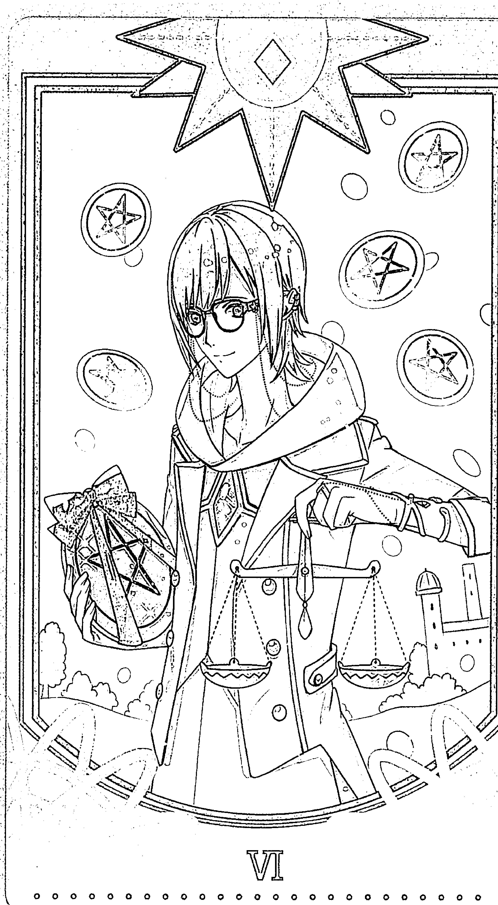

關鍵字
體貼 安定

## 終於走到這一步，前往永恆的未來。

這是 156 張塔羅牌中的最後一張。
就在這瞬間與牌卡相遇的你，正迎向終點和新的開始。
過去曾不斷付出的你，終於走到這一步，
並蛻變成全新的自己。
曾受過傷，也曾被隨便對待，
總是不斷哭泣的日子將徹底揮別。
你將打造全新的人生。有付出也有人給予，擁有對等的關係。
好不容易，你終於走到了這一步，就大步邁向永恆的未來吧。
