# 花影塔罗指导手册

# 关于绘者

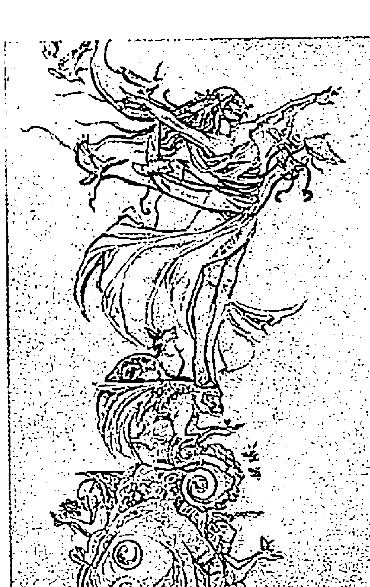

Stephanie Pui-Mun Law 在幼年时期就开始描绘神秘世界的图画，但直到 1998 年，她才正式执笔，成为一名职业画家。当时的她刚结束一门电脑技术课程的学习。整整三年，她白天为公司编程，下班后则立刻冲回家，一直作画到深夜。之后，她终于离开逻辑与数字的世界，一心扑进充满梦幻与魔力的绘画世界。

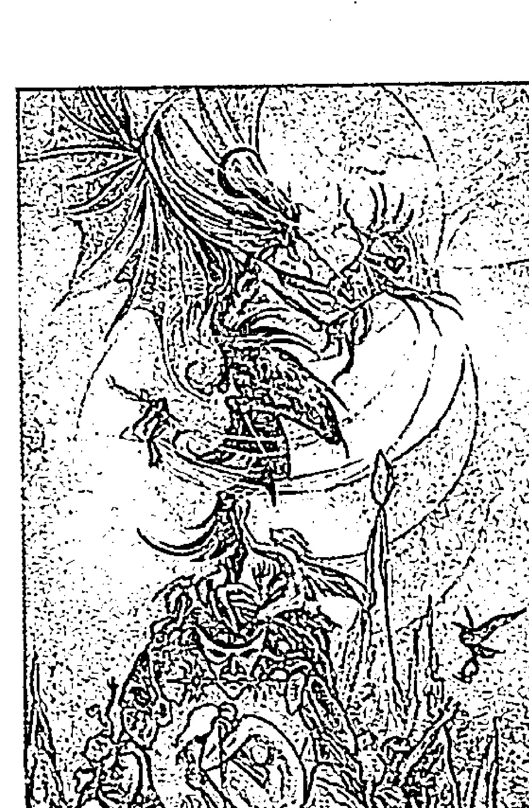

她为大量游戏和出版公司做设计，比如 Wizards of the Coast, HarperCollins, LUNA Books, Alderac Entertainment and Green Ronin（以上均为出版商名称）。她在 2008 年出版了绘本“Dreamscapes”，其中的水彩插图动人心魄。除了图书，她也定期为杂志出专栏插图。

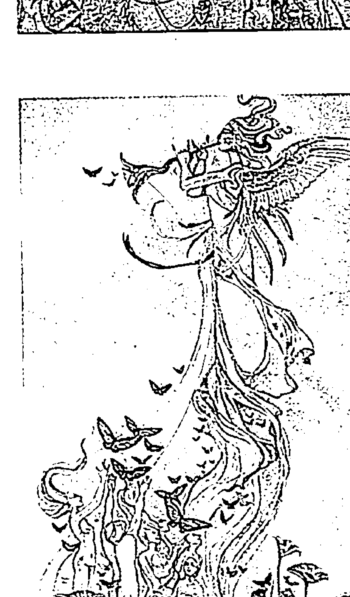

日常工作之外，她把大量时间都花在研究各种神话、典故和民间传说上 — 寻找灵感，流连忘返。她的画风深受印象派、拉斐尔前派和超现实主义的影响，并为自然之美沉迷陶醉。她画橡树枝的窃窃低语、画树叶的斑驳多彩，也画天空的无边无际。她跳了十几年弗拉门戈舞，那自由而飘逸的舞姿在其笔下展露无遗。她的画就像一幕幕精心编排的演出，那些舞者除了人类，还有很多很多……

# ## 关于本书作者
## ——Barbara Moore

近20年来，塔罗、神谕卡和魔法在Barbara的生命中占有极其重要的地位。她曾师从几位顶尖塔罗师，并在学习结束后，和一些声名远播者共事。Barbara喜欢为塔罗牌与神谕卡编写牌意，对这种挑战甘之若饴。她运气绝佳，有机会参与许多塔罗牌资料的编写，包括：梦幻仙子塔罗牌、炫金塔罗牌、女巫塔罗牌、魔谕卡、神话梦者塔罗牌、永恒之夜塔罗牌以及一本关于异教徒魔法仪式的书籍。目前，她正同时设计几副塔罗牌，并为卢埃林公司2010年的新牌“启蒙者塔罗牌”撰稿。

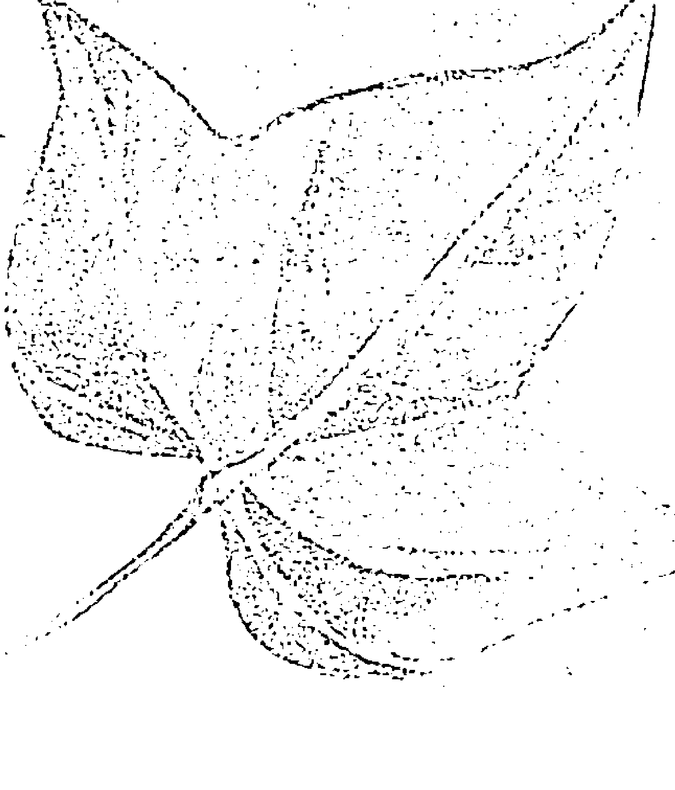

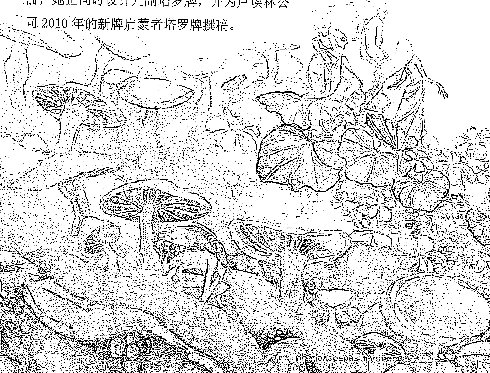

# —— 绘者自述

当我画完最后一位国王的时候，我放下画笔，任思绪飘回到 2004 年的 6 月。那时我就像愚者一样，摇摇欲坠地站上了悬崖，前方是未知的深渊。这份工作挑战着我的心灵，也挑战着我的技艺。而现在，78 张牌的创作已接近尾声，我感受到自己的生命片段在每一张牌中充盈跳动，诉说着这段旅程。所以在每一张牌上，都留下了我尽情变换的冥想，是那冥想将之催生。黄昏雾霭中，潜鸟们狩猎的叫声回荡在湖水镜子般的水面，也回荡在 9 号隐者牌中。门廊台阶上，一只蜘蛛耐心地织网，那件作品令人叹为观止，钱币 8 的工匠之技跃然其上。而当我灵感枯竭，身陷低潮与谷底之时，圣杯王后就会跳起感性的舞步向我靠近。我一直爱听各种故事。传说、神话和童话故事中的原型源源不断地跑进我脑海，然后从笔尖流出。故事是这些卡片的灵魂与核心 -- 有些是我的创造，有些来自于古老的传承。它们在篝火和床榻流转千年，讲述者的私语依然缭绕耳边。故事里总是有人出现，人类带来了体验、渴望、恐惧和贪婪。故事说：世间无界，天地一线。我已完成使命，满心解脱，却忧虑顿生。我看到这段旅程从始至终的圆满完结，但突然不知自己何去何从。空虚之渊注视着我，我环顾四周，无尽可能带来的空虚让人沮丧。但愚者向我微笑，她握住我的手，带我走到迷雾的边缘“再跳一次啊。”她说。

# ## 前 言

亲爱的，先听我说。在用牌之前，有件事你要好好记住。这副塔罗具有神奇的力量，它值得拥有一个特别的时刻。你们的初次会面至关重要，从这一刻起，你们会互相建立起连接。每张卡牌都是一扇门，门背后藏着全新的世界。就像两个陌生人，他们同时穿过房间，在短短一瞬吸引住对方的目光。你和牌也要这么做，花不了多久，最多两分钟。

那么现在，拿好你的牌，然后洗牌——当然，你可以不洗牌，这完全没问题，你喜欢怎样就怎样——闭上眼睛，抽一张。抽好之后，不要看书，别管牌的名字和编号，只看图画，尽情欣赏吧，沉醉在那繁复多变的图案与扑面而来的美丽中；为它着迷吧，直到你闭起双眼，图案也在心中。接下来，闭上眼睛，回想它曼妙的画面，让自己走入画中。你感受到怎样的情感？闻到怎样的气味？听到怎样的声音？感受吧！如果你想冒点儿险，就试着和画面里的景物和人互动。等一切结束后，记得重新拿起书本。

很多人，尤其是刚刚接触塔罗的新人，最想知道的永远是牌意的出处。牌意源自许多不同的事物，瞧，你已经开始了解了，你刚刚接触了它们中的一位。刚刚的经历留给你怎样的感觉？不管你体会到什么，那就是这张牌牌意的一部分。

讽刺的是，这对很多人来说，既是最难的一部分，也是最简单的一部分。看图说话是小孩每时每刻都在做的事，在他们看来再自然不过。但成年人却为此苦恼，因为他们总“害怕说错”。直觉和情绪反映对塔罗解读非常重要，你必须学会充满智慧的表达与转述。你即将发现，塔罗一直在试图展现平衡—心与灵的平衡，精神与肉体的平衡。

塔罗是规则与自由的融合体，能为你创造出独有的体验。唤醒你的身体，你的心，你的精神与灵性吧，你将踏足神圣之境。你会敞开心灵，与内在的智慧交流与沟通。这正是塔罗的精妙之处，它以此来回答问题，给出指引和建议。没错，塔罗会“说话”，但这些言辞并不来自纸牌自身——纸牌是工具，你自己才是向导，塔罗的用途是连接，它帮你看到内在智慧给出的答案。

在接下来的几页，你将会学习一些塔罗的基本知识，这些知识将教你如何运用直觉（别忘记，自由飞翔与遵守规则同样重要）。再后面几页，你还会看到如何做一次完整的解读。之后，是由绘者本人为这些精美的牌面撰写的牌意。它们会引导你进入更深层的画面，体验力量更强的洞察之光。在书的最后几页，是有关牌阵的介绍。到那时，你将学会如何完成一次真正的占卜，并获得自己寻找的答案。

这是一段自我探索与挑战的旅程，充满奇妙的灵性幻境。塔罗是一本激动人心的书，它是你的指路灯。但记住，亲爱的，塔罗会帮你确定航路，但无法为你决定人生。

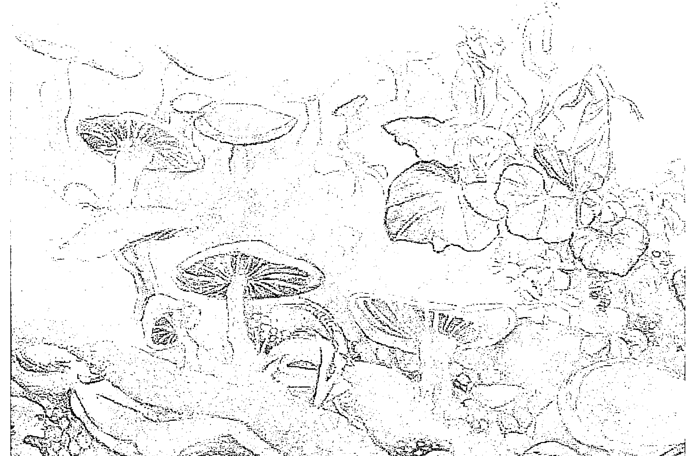

# ## 塔罗基础知识

塔罗解读是一种非常个人化的行为，每个解读者和每位塔罗师都有自己的风格与特点。因为他们有着不同的信仰、不同的知识与不同的技巧。即使是第一次接触塔罗，你一样能够和内在互动，获得答案。只需要抽一张牌，观察图案，说出想法就可以了。你占卜越多，经历越多，解读就越深，也越容易。

下面的部分将为你展示如何与内在智慧沟通，如何增加灵性直觉以及不同的事物是如何影响着同一张牌的牌意。你也会看到如何进行一次完整的解读。但请让我重复一次，塔罗解读是一种非常个人化的行为，随着你练习次数的增多以及对牌意理解的加深，你会慢慢形成自己的风格，了解到哪些流程对你有用，哪些流程只适合别人。

# ## 了解牌意

简单来说，塔罗解读就是根据具体的问题来解释牌意。每一次占卜，同一张牌的牌意都会显示些微不同。这是因为有各种因素在产生影响，比如：

- 你对艺术的感知能力
- 你的直觉
- 牌的编号或牌组元素带来的提示
- 传统上的意义
- 绘者的意识和独有的视角
- 不同的问题
- 牌在牌阵中所处的位置

你看，每一张牌的牌意是个十足的混合体，它包含了历史传统构架、艺术、风格、内容以及现场的情绪。

# ## 塔罗牌的结构

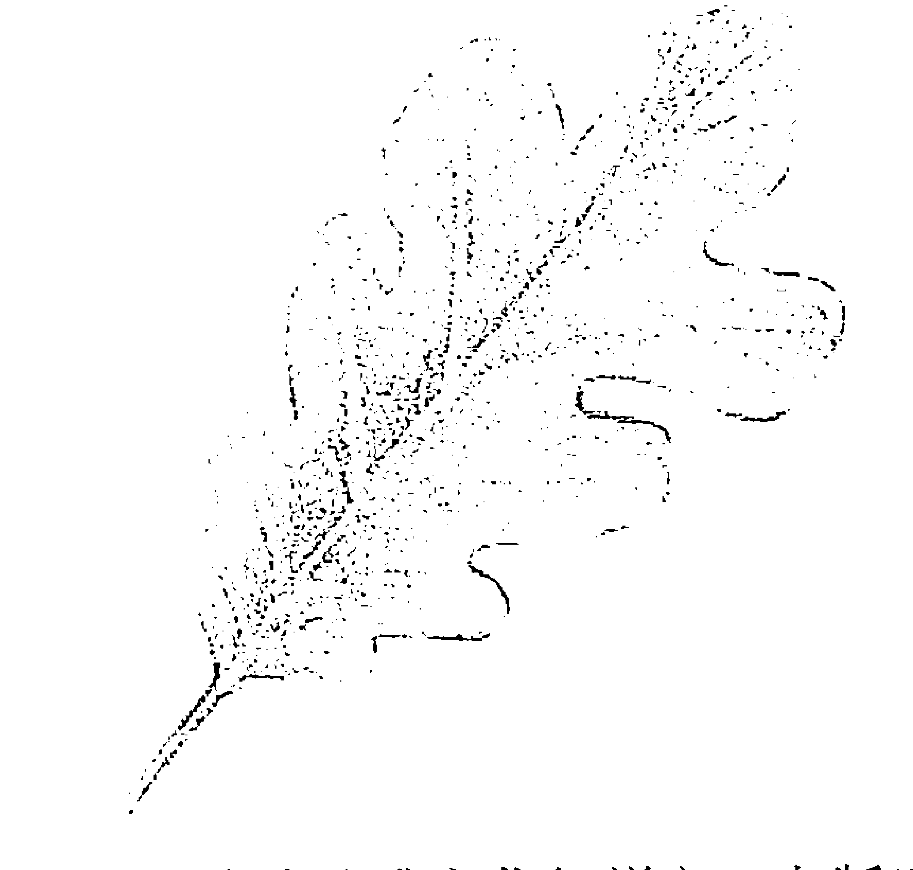

我们先说说塔罗牌的结构。你也许听说过（或者你知道），出版商出版了许多不同种类的塔罗，也出版了许多不同种类的神谕卡。塔罗牌和神谕卡不同，塔罗牌拥有特定的结构。增加对塔罗牌结构的了解，将提升你的解读技巧。

塔罗牌的结构并不复杂，简单好记——你玩过扑克牌吗？那就好办了！从某种意义上说，塔罗牌的结构和扑克牌挺像。塔罗牌分为两个部分，每个部分的名称中都含有“阿尔卡那”这个词。“阿尔卡那”意为“秘密”。一部分叫大阿尔卡那，我们等会儿再说它；另一部分叫小阿尔卡那，分为四组，分别以权杖、圣杯、宝剑和钱币命名。注意，在扑克牌中，它们的名字是黑桃、红心、梅花和方片。每组牌由10张数字牌组成，编号从首牌（ACE牌，意即1）开始，到10结束。接下来就有点不同了，在扑克牌中，人物牌有三种：J（杰克）、Q（王后）和K（国王）；而塔罗牌有四种人物：随从、骑士、王后和国王，它们称为宫廷牌。

刚才我们提到，小阿尔卡那分为四组，每组分别对应一种元素（火、水、风、土）。这些元素对应着人类社会中发生的各种情景。权杖象征火元素，代表各种激情、行动与事物进程。圣杯象征水元素，代表人际关系、情感、情绪与创造力。宝剑象征风元素，代表挑战、问题、思维与智慧。钱币象征土元素，代表资源、物质、现实世界与身体。小阿尔卡那就像它的名字一样，告诉我们一些“小秘密”，也就是日常生活中会出现的具体事件。

小阿尔卡那的牌面上印有编号或宫廷牌的名字，这些数字和名称同样具有含义。

- ACE: 首牌，新开始，激情
- 2: 二元性，平衡，人际关系
- 3: 创造、出生、成长
- 4: 稳固、构架、停滞
- 5: 冲突、不安、动荡
- 6: 沟通、问题解决、均衡
- 7: 内心反映、校准、评估
- 8: 移动、力量、进程
- 9: 妥协、怜悯、灵性
- 10: 完成、圆满、循环结束
- 随从：热情的年轻人、消息
- 骑士：极端、迅速、寻求、救援
- 王后：成熟、关怀、富有经验
- 国王：领导者、守护者、权威

解读时，除了观察图案，用直觉感知情绪外，也要结合牌组的数字和名称考虑牌意。当然，这还不够，即使你加入了数字和名称的含义，还必须注意牌在牌阵中所处的位置。好了，我们先不说牌阵，说说大阿尔卡那。

女祭司、命运之轮、死神、恋人……这些名称都来自神秘的大阿尔卡那。有些人认为大阿尔卡那特别神秘，这话没错——它们的名称就充满了神秘感，让人兴奋。大阿尔卡那（后简称大牌）代表“大秘密”。和小阿尔卡那（后简称小牌）不同，大牌象征着里程碑，重要的大事件，精神层面，还有那些超过我们掌控的事物。
大牌的编号从0（愚者）开始，到21（世界）结束。每一张牌都有自己的名称，并用传统的罗马数字编号。虽然这些牌含义复杂宽广，但你仍能从名称上参透一二。愚者是个真性情，当然，也有点儿傻气。女祭司掌管着深层的智慧与直觉力。命运之轮，伴随着未来的变动与生命的循环。月亮则带来梦境、阴影与骗局。

当你在解读中遇到大牌时，谨记它代表影响深远的事件和精力。把牌的名称作为联想的一部分，配合图案加以解读。

# 传统含义与绘者新义

从塔罗牌的结构基础上讲，经过几百年的流传和沉淀，确实存在着某些人眼中的“传统”牌意。在本书中，绘者也加入了大量传统含义。不过除此以外，她也用大量文字描述了自己的观点与看法，帮助使用者对她的图画产生更深的理解。同样的，我们希望你也能与牌建立起私人观点和联系。

塔罗牌，特别是大牌，每一张都拥有多层含义及表现方式。可以说，一千位塔罗绘者的眼中，就有一千种不同的塔罗。举例来说，教皇牌在传统含义中，寓意教导。在这个关键词中，可以引申出沉闷、专制、欣慰和丰富等含义。每位塔罗绘者都会将自己独特的理解渗入牌中，这也是你要做的事。在解读时，结合图案、名称和传统含义，渗入你的理解。

### 如何提问

提出正确、适合的问题非常重要，因为提问的方式会影响结果。不过“什么样的问题算正确适合”，这一直让所有人头疼。每个人都有一套关于提问的完美理论，下面是抛砖引玉，供你参考。

1、如果你不想知道答案（或者还没想好），不要问，这听起来有点儿奇怪，不过我是认真的。想想吧，你可能会得到各种答案，好的、坏的，还有几个一般般的。那时候你什么感觉？真的，只要你认定自己想知道什么，都可以问；如果你还没想好，千万别问。

2、你是否相信命中注定？如果你想问问牌有关未来的事，那说明你倾向认为未来无法改变，命运早有注定。你不相信自主选择，只相信难以抗争——简而言之，你觉得该来的就是要来。这种信念会影响你的提问方式。你会更愿意问“我会结婚吗？”而不是“我该如何吸引一段可靠的恋情？”

3、你是否相信人定胜天？这条和第二条刚好相反。如果你保有这种信念，你的问题就会围绕着如何行动展开——从而获取自己想要的未来。你会更愿意问“我该如何找到理想的工作”而不是“我会有工作吗？”

4、你是否相信你拥有自由意志，但宇宙能量将超然其上？这是一种居中的信念，它是最好的。如果你相信你拥有可以改变一些未来的自由意志，同时又相信自然和宇宙自有其规律运行，你就能提出正确又适合的问题了。你会提出富有创造性的问题，例如“关于人才市场，我需要得知什么信息？我怎样才能找到对我来说最好的工作？”

重复一次，问题非常重要。它不仅反映出你的信念，也影响着牌给出的答案。另外，你的解读也和信念相关。比如，一个相信未来注定的人在恋爱结果中抽到死神，他会解读为一段关系的结束；而一个相信人定胜天的人抽到同样的牌，则会将之视为某种转变和机遇。在前一种情况中，求问者让自己经历事物；在后一种情况中，求问者让自己改变事物。

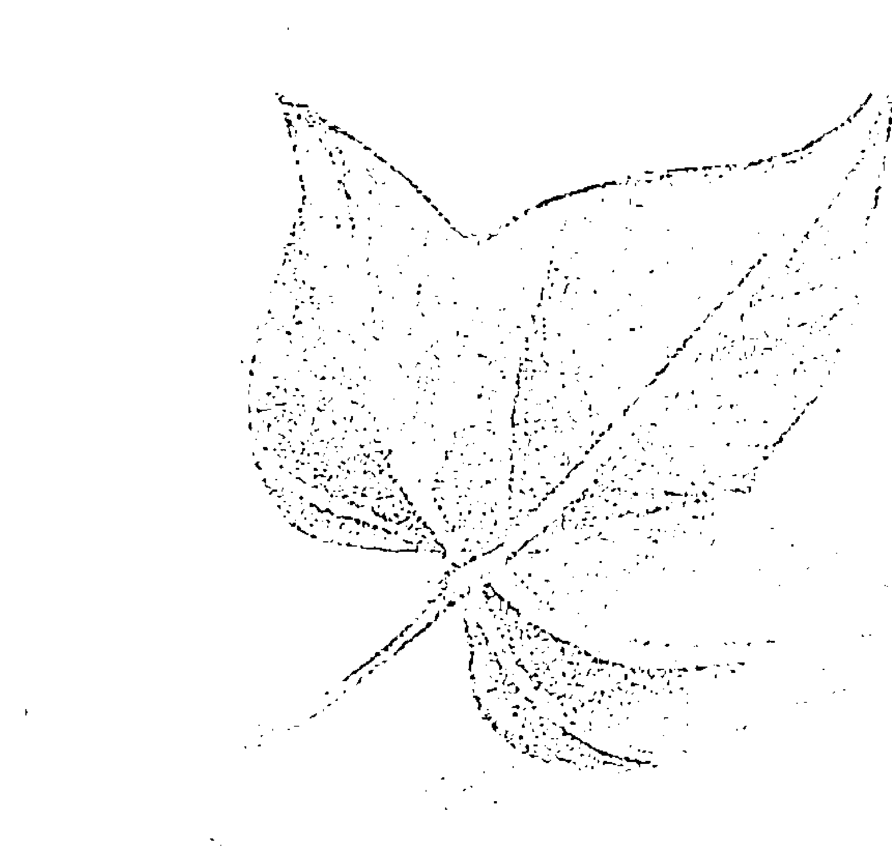

### 牌阵中的牌位

牌阵是一种摆放纸牌的方式，用于解读。为了应付不同的问题，出现了许许多多不同的牌阵。在书最后几页，我们列出了一些牌阵。你也可以买书，有些书专门讲述各种牌阵。你还能在网上找到更多的资料。最后一点，你当然也可以创造自己的牌阵。

每张牌在牌阵中的位置都有自身含义，比如这种常见的三张牌的牌阵（举例为时间之流，传到东方变换位置，成为圣三角）：

- 1 过去
- 2 现在
- 3 未来

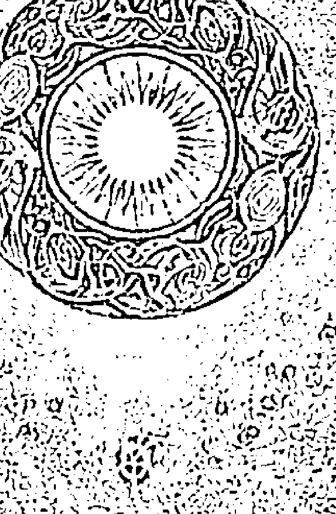

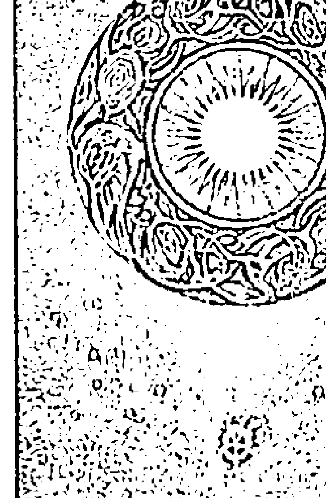

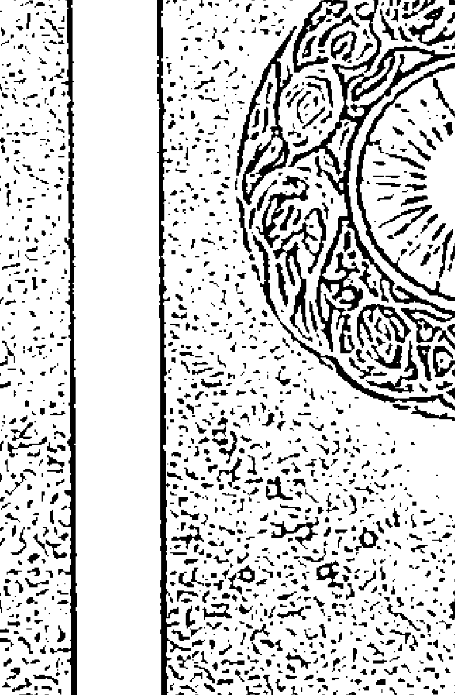

第一张牌代表过去发生的事情；第二张牌代表现在发生的事情；第三张牌代表即将发生的事情（准确地说，是可能发生的事）。在这个牌阵中，牌的位置巧妙地影响着牌的含义。

另一种三张牌的牌阵摆法如下（三张牌的牌阵有很多种办法，使用者可以自由定义）：

- 1 问题
- 2 建议
- 3 可能发生的结果

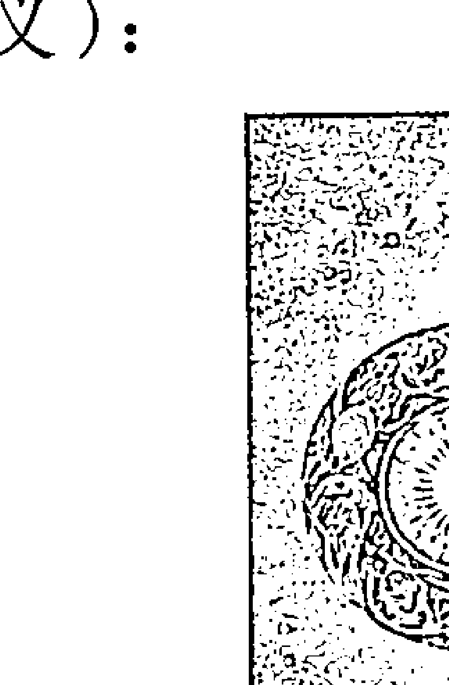

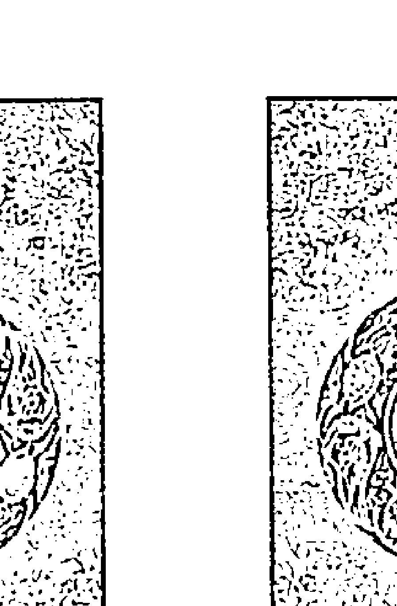

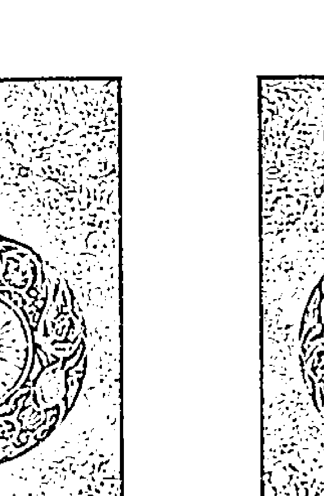

在这个牌阵中，位置的影响更加明显。即使是同一张牌，出现在“建议”位置与出现在“可能发生的后果”位置，其牌意截然不同。如果你抽到月亮牌，在建议位置它可能在暗示你“相信直觉”或“保守秘密”，但如果在结果位置，它可能是在说“警惕错觉或骗局”。

### 逆位简介

在你学习塔罗的进程中，你会听到一个词：“逆位”。逆位是指一张牌在牌阵中上下颠倒，倒立呈现。当然了，牌面依然向上，只是转了180度，如图：

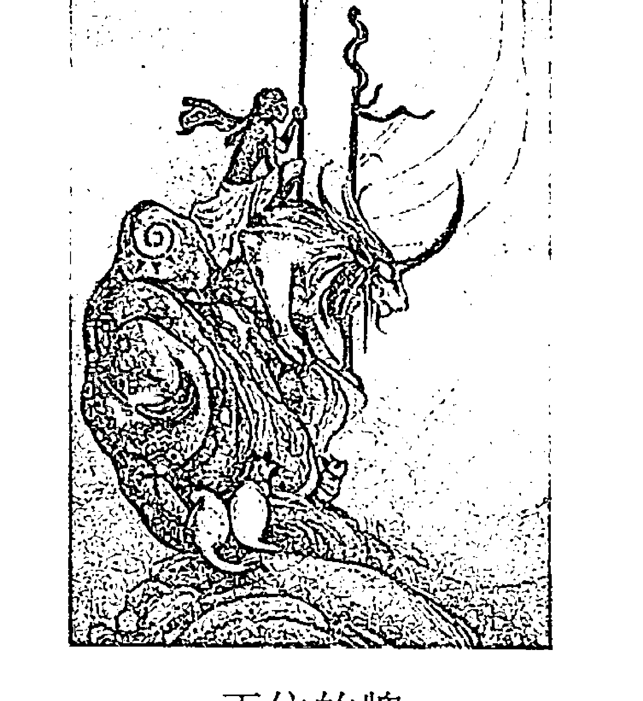

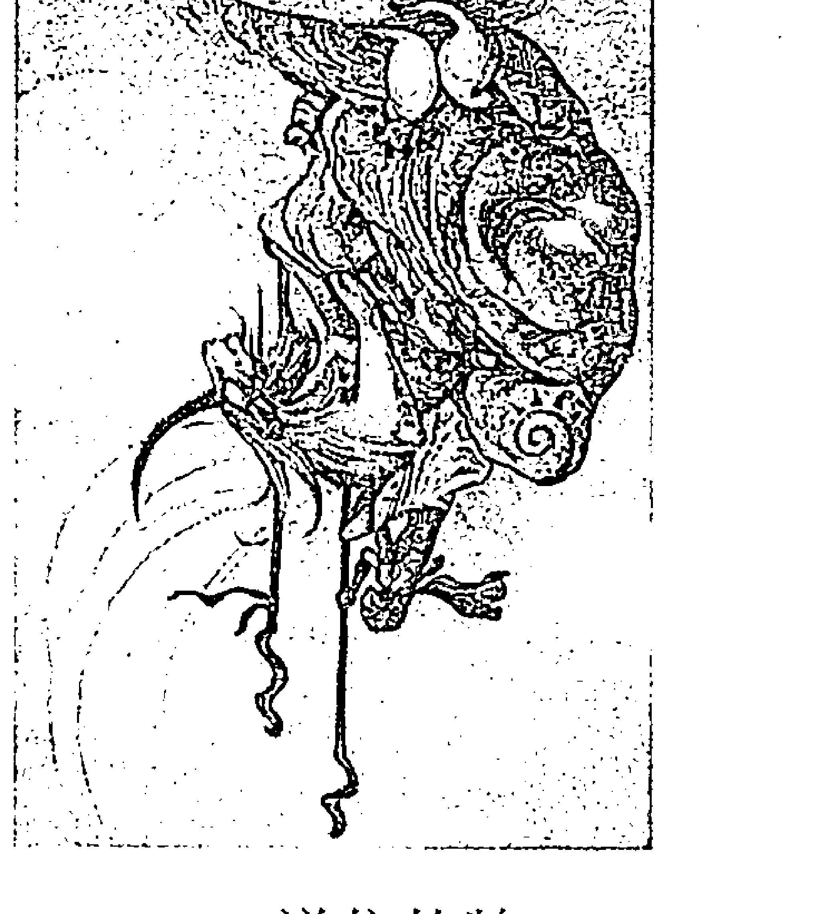

在有关逆位的解读问题上，至少形成了十几种大大小小的理论和方法。有些人从不使用逆位，他们认为逆位与正位毫无区别，如果抽到逆位，手动转成正位即可。另一些人保留逆位，他们认为逆位有独特的含义，应与正位区别对待。有些创作者使用逆位，他们会考虑到这一点，为塔罗设计出逆位含义。本书绘者没有为花影塔罗设计逆位，因此书中的牌意不包含逆位。

如果你对逆位特别有兴趣，跃跃欲试地想要尝试一番，也无可厚非。有许多方法可以用来解读逆位。举例来说，有时可视逆位即为正位，但需加以特别关注；或将其视为阻碍或延缓，还可以干脆视为正位的相反含义。

好了，说了这么多，你已经对如何使用这副牌的牌意有了初步的了解。现在，你肯定很想摊开你的牌，好好看看每一张牌上的图案，获得某些印象，如果能记录下来就更棒了。当然，绝对有些人会跳过这个过程，他/她已经忍不住要开始一次占卜了。

### 解读

解读是指用塔罗分析答案，回答问题的过程。解读风格既可以简单直接，也可以事无巨细，你喜欢怎样就怎样。接下来，我会告诉你一些解读中要注意的基本元素，之后分享一些个人经验，也许会对你有所帮助……至少能帮你筛选出适合自己的风格。

#### 基本解读步骤

- 1、确定问题
很多人会把问题记录下来。除此之外，还会记录牌形、牌位以及解读内容，这是为了方便日后回顾。

- 2、选择牌阵
根据问题选择适合的牌阵，你也可以自创牌阵。

- 3、洗牌
关于这个部分，你可以想怎么洗就怎么洗，没有任何规定和限制。

- 4、摆出牌阵
你可以随机抽牌，也可以将整副洗好的牌从底部翻上来，从最上面的牌开始摆。这个部分一会儿我会详细说明。

##### 5、解读每一张牌

先解释每一张牌的牌意。

##### 6、将解读整理为答案（总结）

结合所有抽出的牌，记准位置，为问题总结出一个适合的答案。

到这里，解读就结束了。这些是一次解读中，最最简单的基础步骤。当然，预留了很多空间给你自由发挥。你可以慢慢发现和创造提升灵性、增强力量和更加集中精神的方法或仪式。

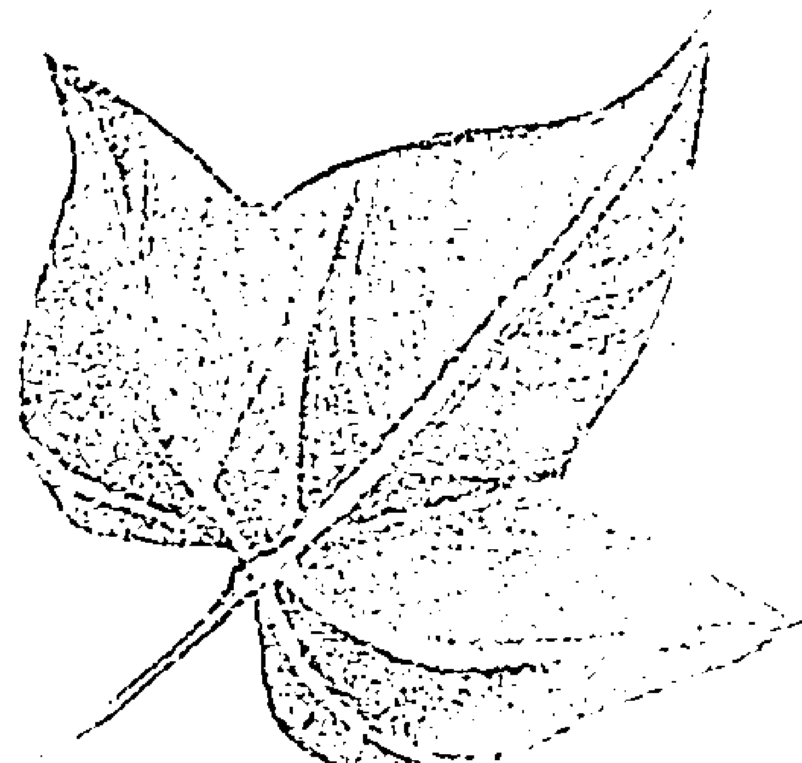

#### 仪式

仪式不是解读中必有的步骤。不过，确实有那么一两个仪式，可以在练习解读的时候使用。我们日夜忙碌，总是关注太多事情，注意力无法集中。而仪式最基本的作用，就是让你静下心来，向内注视自我，关注眼前事。有些人认为，解读塔罗是通灵行为。

其实，解读是与自身灵性沟通的过程。在你的高层灵性中，逻辑与理性安静下来、让位给奇妙的直觉行动。在解读前做个小仪式，有助于你进入状态，让思维放松、重组，进入解读模式。如果你是为他人解读，仪式也能帮助对方平静下来，关注内在以及集中精神。他们会进入仪式打开的神圣空间，对答案和解读更容易接受。

仪式可以繁复，也可以简单。有人喜欢干脆利落地做个动作，有人喜欢准备个花哨的系列。下面是一些塔罗师的个人做法，挑你喜欢的试试。可以单个，也可以结合，看看哪种适合你。

- 铺一块特别准备的桌布
- 用固定方式洗牌和切牌
- 双脚放好，手按住嘴唇，闭眼，注视内在的自己
- 点蜡烛
- 放点儿音乐
- 念一段祈祷词或誓言
- 熏香

#### 洗牌、切牌和摆牌

在解读之前，首先要洗牌。洗牌有很多种方法，比如像玩扑克时那种快速的叠牌。如果你担心牌会折损，那就用手来回抽牌和插牌。如果你觉得牌太大（或者你手有点儿小），那就把牌面朝下，在桌子上摊开洗。

切牌比洗牌更简单。在打扑克或玩其他纸牌游戏时，切牌是为了避免有人耍老千。但在塔罗解读中，切牌是一种仪式。把一叠牌分成两叠或三叠，然后打乱顺序，重新合成一叠。

有些塔罗师固定用左手切牌（如果你是左撇子，则换用右手）。

摆牌是你把几张牌分别放入适合的位置，摆出牌阵的过程。你可以从一叠牌的顶部拿牌，也可以从底部拿牌，更常用的做法是把一叠牌摊开成扇形，随意抽取牌阵需要的牌数，之后摆放牌阵。

如果你为他人占卜，事先决定是由你洗牌切牌，对方提问；还是全部由你负责（也可以全部由对方负责）。有些人从不让别人碰自己的牌，有些人则认为，让对方的能量在洗牌时融合非常重要。

有些人喜欢洗牌的时候让牌面向下，有些人喜欢牌面向上。牌面向下洗牌可以增加神秘感，带来探索未知的新奇和激动之情。每抽出一张牌，就增加一分直觉，你会全神贯注，不受周围的牌面影响。牌面向上洗牌相对少见，最大的好处是让使用者在摆放牌阵之前，对所有抽到的牌有一个直观的概念。

#### 纵观牌阵

纵观牌阵是一种简单的技巧，这让你能对牌阵提供的信息有一个大致的概念。因为你已经了解了塔罗的结构和特定的含义，例如大牌偏向于较重大事件，圣杯牌象征情感和人际关系，首牌 (Ace) 则表示一个新开始。

有些塔罗师还会特别注意某个部分。比如牌阵中出现好几张宫廷牌，这也许说明很多人都卷入某个事件。骑士们通常代表急切的状况（尤其是和权杖 8 一同出现）。超过一张的首牌、2 号牌和 3 号牌可以象征事态正出于开始阶段；4 号、5 号和 6 号象征中间阶段；7 号、8 号和 9 号则接近尾声。至于 10 号牌，它象征状态的完结或循环结束。当你展开牌阵之后，观察大牌、同组小牌、数字或宫廷牌的出现情况。你也可以快速吸收有关重复的色彩、符号或图案信息，这是它们在对你的直觉说话。

举例来说，如果你在为一段两性关系做解读，牌阵中出现了很多宝剑，没有圣杯，还有几张 4 号牌——那你就差不多心里有数，看来情况不妙，因为牌阵中显示着问题和停滞。之后，你再逐一解读每张牌，补充细节。

#### 净化

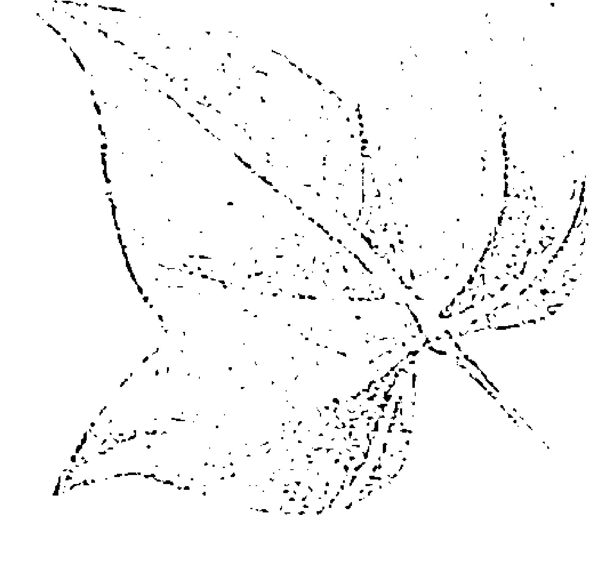

净化是一种和仪式类似的步骤，不同之处在于，仪式通常在解读前完成，净化则要在解读后才做。这种方法可以帮助你的牌保持能量均衡、状态自然，不受他人影响。拿出牌，把每张牌转为正位，按顺序整理好。点燃鼠尾草或熏香，把牌从烟雾中穿过。你也可以在牌旁边摆放净石英或芙蓉石，或者在满月的夜晚，把牌放在窗台上（室内！）。

#### 塔罗日记

很多塔罗师会把解读过程记录下来，对他们来说，这是一种学习的方法。顺着记录下来的足迹，你可以追溯到过去的某个时间，用后续发展的情况验证当时的解读——有些非常精准，有些因为解读时漏掉了某个牌意而严重偏差。

另一种绝佳的练习是每日一牌，也就是每天抽一张牌（好吧，其实你喜欢隔多久都可以）。除了询问当日状况外，这张牌还可以用来玩快速记录。限定一段时间——比如5分钟——用这段时间疯狂写下这张牌给你的感受。别管什么语法、错字或者笔迹，写得越快越多越好。限定时间之后，慢慢写下你对这张牌牌意的理解，然后从快速记录中寻找灵感和直觉体验。

在记录塔罗的过程中，你会发现各种惊喜——洞察力、惊喜以及各种“啊哈！”随时回溯和阅读你的记录，你将想起自己学到又忘记的某些东西，并感到惊讶无比。如果你还发现当时无法理解，但现在已从智慧中窥得的洞见——恭喜你。

好了，我的话已经讲完，是该看看绘者制定的牌意了。看看那些充满智慧的优美文字，蝴蝶般飞舞在她精心创作的魔法时刻中。

## Shadowscales Tarot

## 大阿尔卡那

Shadowscales Tarot

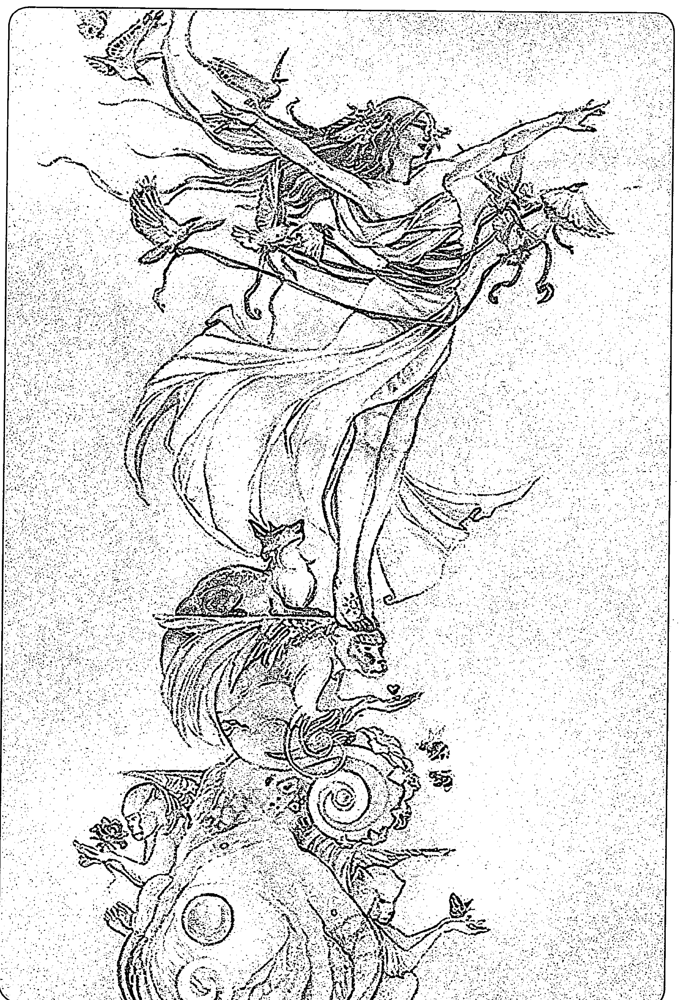

# 0愚者

一阵轻柔的吟唱拉开了序幕。歌声起伏、婉转动听，在她身边缭绕飘荡，在脑海中旋转流淌。它召唤着：来吧……来吧……来吧……“去哪儿？”她问道，满心好奇，却没有任何回应。

她不再理会那召唤，直到有一天，诱惑的赛壬之音突然高涨，脉动激荡。她难以自拔了。“去哪儿？”她再次发问。这次她得到了回应，她感到心脏有力地敲打着胸膛。愚者自遥远之地而来。她走了很远很远，站上了世界之巅的边缘。直觉呼之欲出，真正的旅程才刚要来临。她踮起脚尖，在纵身一跃前和风尽情拥抱。心中翻涌着无法遏制的力量，似乎有一百对翅膀拼命扑打，想要冲破身体的牢笼。她突然醒悟了，她要在肩上生出羽翼，飞舞翱翔。从这里离去，让蜕变发生。

等等！别跳！内心有个细小的声音颤抖地喊着。慎重！危险！它生气了，快回来！
她毫不理会，迈前一步，然后……

#### 牌意：

她站在陡峭的悬崖边，周身的保护只有鸽子和几根丝带。狐狸把这些看在眼里，默默注视。狐狸是聪慧的化身，但聪慧并不能阻止他人犯傻。说到底，它无法理解愚者想要纵身一跃的信念——如此说来，谁才是傻瓜呢？是准备迈入未知，看起来全无头脑和逻辑的愚者；还是坚定过头，牢牢扎根于理性和现实的狐狸？

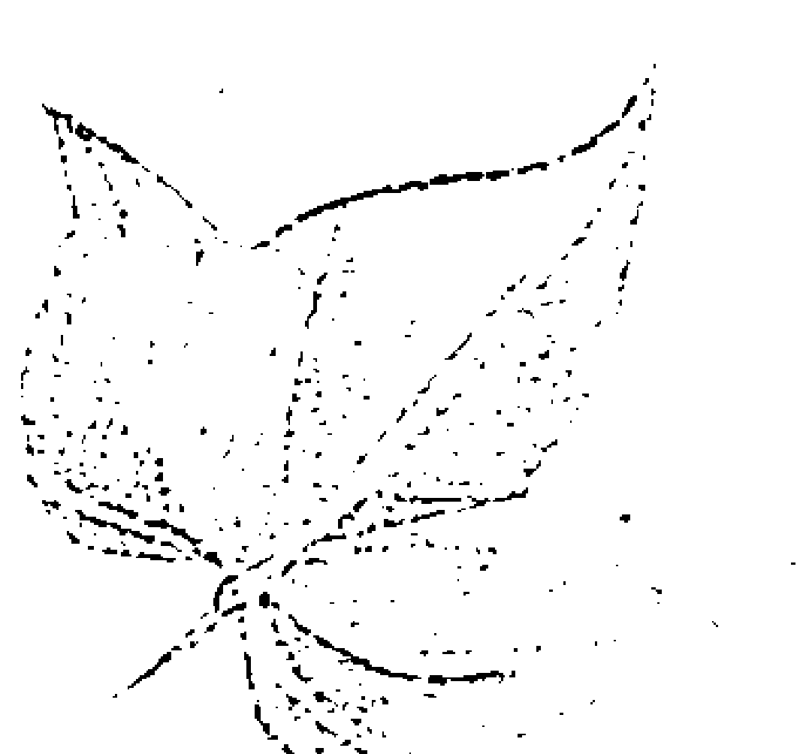

愚者象征着全新的开始、冒险、愉悦和激情。她冲得飞快，完全不假思索，轻率冲动。跟着感觉走，凡事先做再说。你也许就像愚者，正站在悬崖边，眺望未知的世界。在遥远的天空和更加遥远的大地之间，只有无边无际、虚空无垠的蓝。等在那里的，究竟是愚蠢的冲动和可怕的后果，还是惊人的探险和伟大的信念？也许精神和知识会鼓起风，成为翅膀，引领你穿越障碍与艰难时刻。对追寻者来说，面前永远是无限的可能。

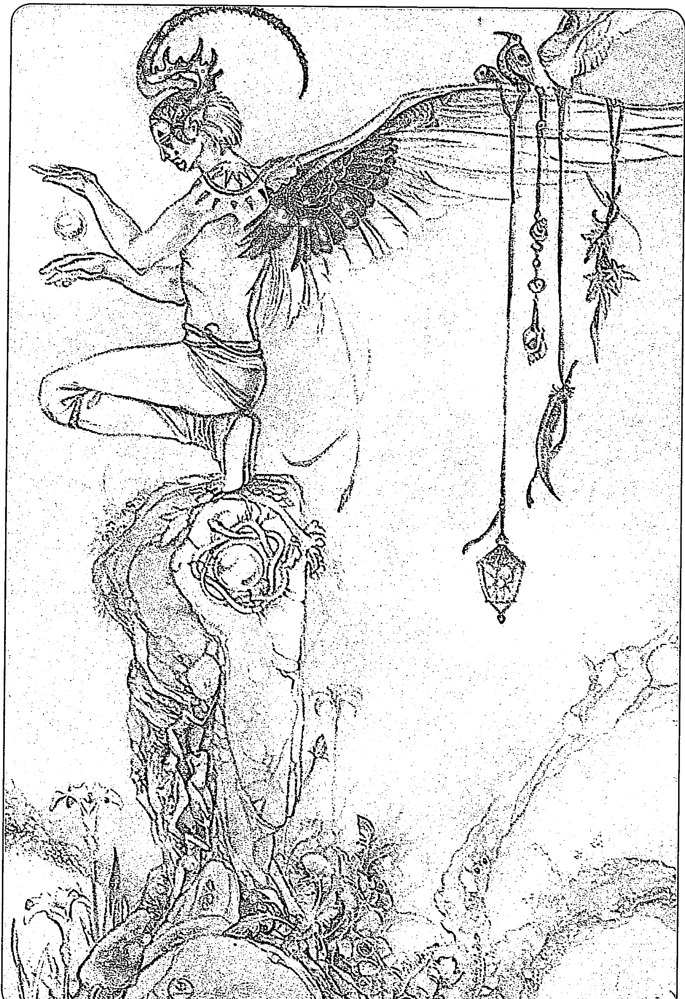

图261

### 1 魔术师

愚者飞舞着，像风中的种子，像晶莹的沙粒，也像飘摇的羽毛。她划过天际的时候，看到了魔术师。一个男孩，正在探求着元素的奥秘。她注视着，观察着。他技艺纯熟，精通咒语和召唤术，且相当自律。

终于有一天，她按捺不住，用风的手指轻抚他的双眼。他惊讶地睁开眼睛，看了一会儿。“你是谁？”他想要答案。突然，电光火石间，那纯净的灵魂化作一头牡鹿，跳跃着跑走了。

他追着牡鹿跑进了树林，它近在咫尺，却触手不及。泥土沾上他的赤脚，风穿过他的发丝，太阳灼烤着他的肩膀。翠绿的草地上，牡鹿一闪而过的白色身影充满了挑逗，使他焦躁难忍。直到有一天……它消失了。留下他独自一人在一块岩石上，他发现了牡鹿留下的礼物。象征着四元素的神圣物品在太阳下闪耀着光芒。他伸手握住这些馈赠，嘴角泛起笑意，体内能量如潮流动。

#### 牌意：

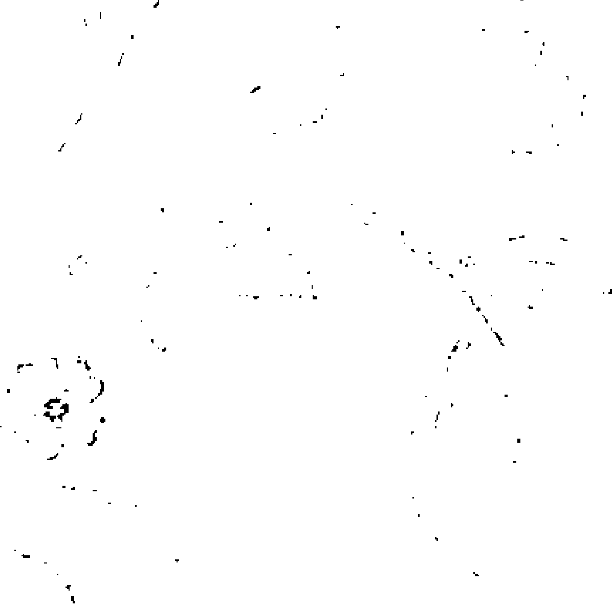

本源、创造、能力、技巧、意志力、自信、机敏，和一点手腕。这是贪念作怪，想抓住周围隐藏的能量；控制它、驾驭它，让它成为现实的、可以触摸的一部分。魔术师拥有象征元素的神圣物品，他以此为指引：提灯中存着火种、贝壳里藏着海浪声、乌鸦羽毛留下了风的气息，树叶飘落滋养大地。他知道自己的心意，也知道自己必能如愿：保持清醒、发挥意志力、运用知识、掌控世界。

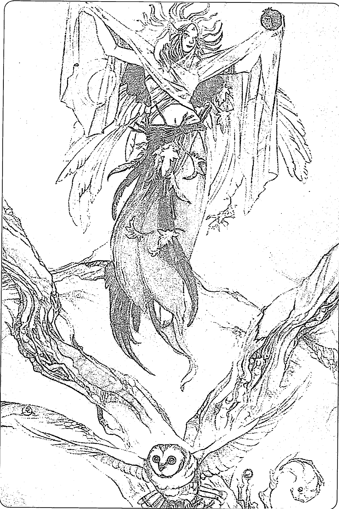

### 2 女祭司

女祭司在空中舒展身体，星星在她前胸投下点点斑驳的光芒。她浸入那片闪烁又炽热的星光，在脑海中感受它的光与热，打开通道，尽情舞蹈。

> 群星吟唱着：

> 当群山依然年轻，我们就在这里
> 当海洋还是梦幻，我们就在这里
> 我们看丘陵繁茂枯萎，看无数季节老去
> 我们看云卷云舒
> 用缓慢的语言穿越世纪
> 请听我们诉说

猫头鹰在黑暗中鸣叫，用夜的旋律呼唤着他的女主人。他的白色羽毛在月光下闪耀，仿佛从体内射出光芒。他在黑暗中滑翔而过，飞去女祭司身边休憩。

黄昏降临，阴影中填满了窃窃私语，诉说着星辰、树木和大地的秘密。每个声音的主人都压低声音，轻声讲述着自己收集来的各种故事与智慧。

女祭司用手指编织起这些声音，将音律转变为物质的存在。她手里握有一根金丝银线缠绕而成的钥匙。她将猫头鹰召至身边，对他说：带上这个，成为传递秘密的信使。

#### 牌意：

智慧、知识、学习、研究、直觉、纯净、处女。女祭司伸展双臂，身体的姿态形成了神秘学的符号——圣杯。猫头鹰是智慧的守护者，他衔住的钥匙能开启未知的秘密。石榴是波尔赛佛涅（宙斯之女，被冥王劫持娶为冥后）的标志，她吃下了石榴的果实，从此不能和冥王哈迪斯分离。因此，石榴除了多产的象征之外，也是死亡之果。月光在她的衣裙上绣出阴晴圆缺，新月与满月交替辉映，合二为一。

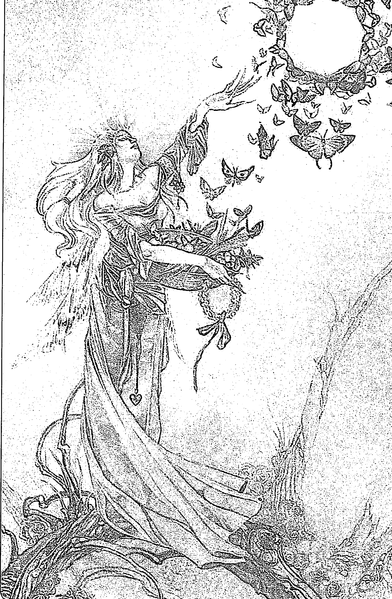

### 3 女皇

“大地母亲啊，”游离飞舞的精灵呼唤着，“我们为您带来了礼物！”他们在女皇身边上下翻飞，尽情舞动，天空中映满飘逸的身影。他们献上和谐圆满，也献上无穷变幻。欢喜吧，女皇微笑着，收下献礼。她的思绪和情感引导着世界，形成这一场视觉的盛宴。

精灵们用早春的新芽和花蕾编出花冠，轻柔地为她戴在耳边。“这是山谷中茉莉与百合谦卑的新芽，它们献给你。”精灵轻声说。“苹果树神献上了他的果实，旷野女神献上了她的稻谷。”他们把这些礼物也放入篮中。突然，光芒大盛，精灵们围成一个圆圈，在光亮和音乐中盘旋着，慢慢消失了。“再会了，大地女神！”空中回荡着他们最后的呼喊。

#### 牌意：

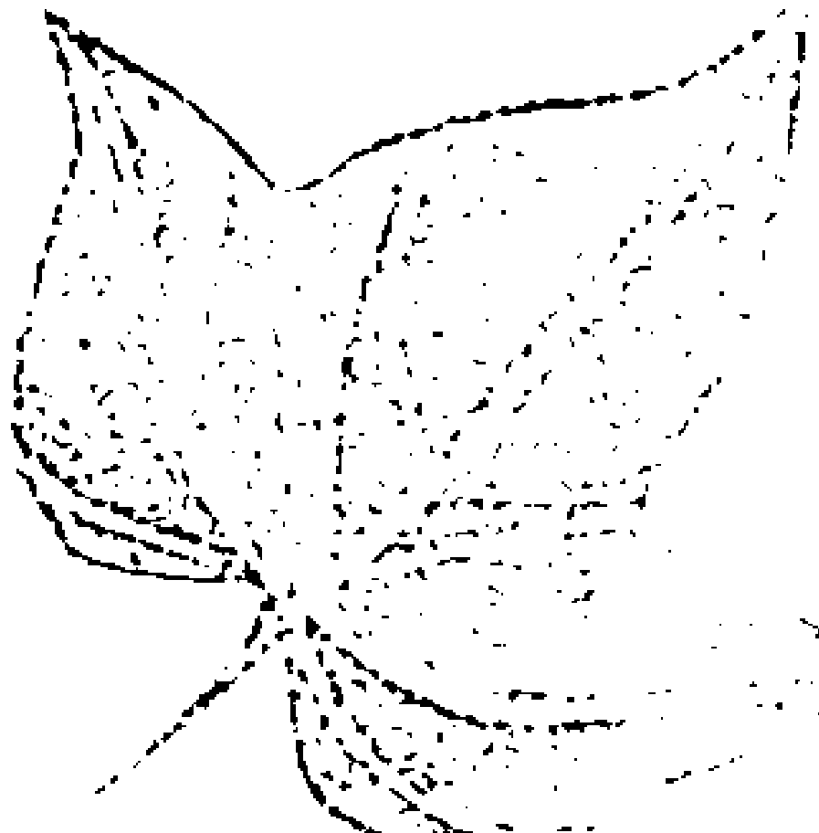

创造、孕育、慷慨、耐心与爱。女皇是丰饶的象征，她用感性来体验事物，与自然和谐相处。她是一位创造者、一位母亲，她哺育万物，生生不息。她手挽竹篮，仿佛怀抱幼儿，里面盛满大地的恩惠——多汁的果实、丰收的谷物和绚丽的花朵。她是万物之源，她是生命的化身，她与自然紧紧拥抱，时刻连接。她衣着华美，以大地染色，手中的花环旁是翠绿的常春藤。

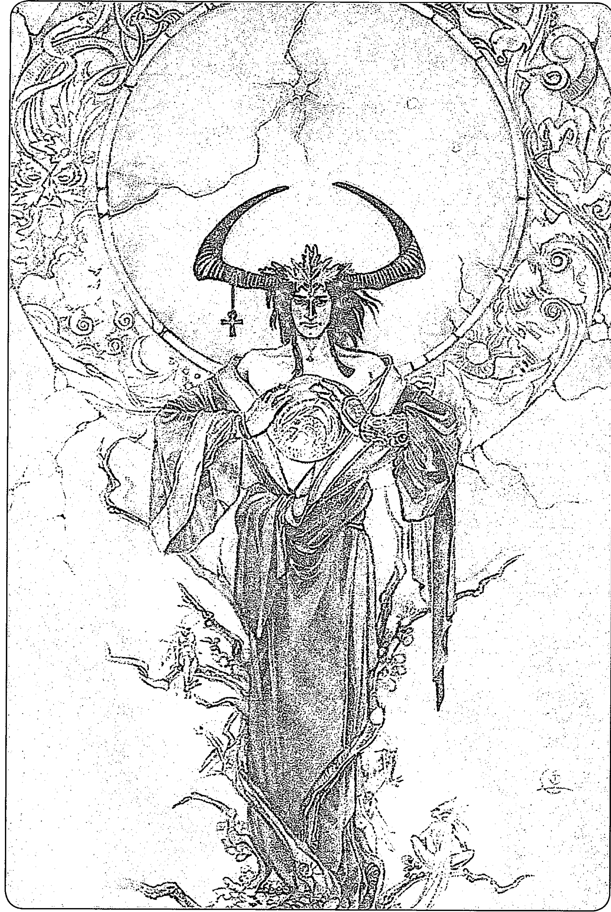

### 4 皇帝

皇帝陷入回忆…

他依稀记得，身边曾有过一个人。是他的父亲？还是导师？或者是……被他征服的国王？他思绪回潮，贪婪地寻找。是啊……自己身边曾经真的有过这样一个人，那人将龙珠拱手相让。他还记得自己的目光第一次接触到这枚龙珠的时候，那无限迷离的心情——他刚一碰触它，龙之力就随着热潮呼啸而来，涌上手臂，统御心灵。现在，你就是尘世之王。这是那个人的声音吗？还是龙在说话？皇帝化身为龙了。

“是的——”尘世之王说道。

#### 牌意：

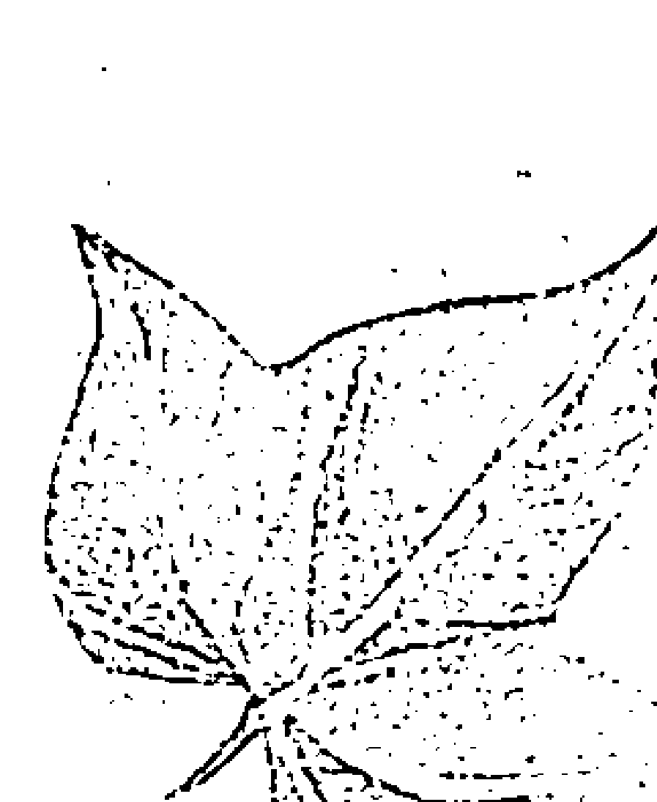

在混乱的局势中创造秩序、荣耀、领导、权势、建立法律和规则。墙壁上镌刻的符文象征他的疆土和权力，雄鹰振翅，越过山巅，越过海洋，越过日夜流转，沧海桑田。凡尘的生物啊，鞠躬行礼吧，跪拜这高高在上的统御之力。但无论雕刻出如何雄伟的影像，那石墙仍然是人工的造物——用人力遏制野性的自然，试图在石头上刻出永恒。人类渴望权力，渴望用自己的力量征服一切，镌刻传奇。身为皇帝的男人通常扎根于自我，对所选择的道路非常坚定。他固执，不变通，充满自信，相信自己的决定就是最好的发展之道。

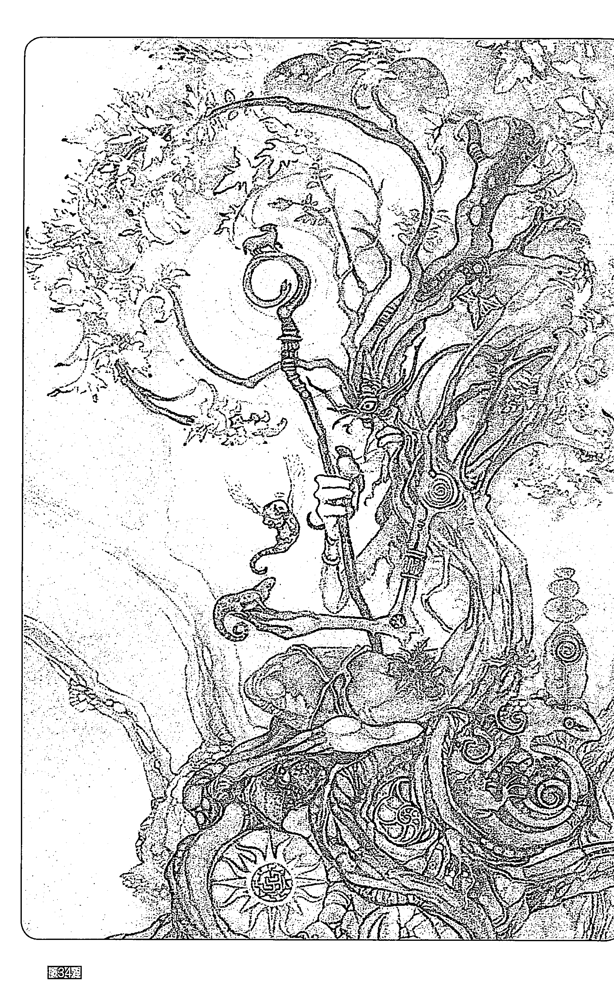

### 5 教皇

“我想听个故事。” 火蜥蜴对老树说

“想听什么故事，小家伙？” 老树缓缓地问，似乎每个字都来自深深的地下，来自蔓延的根须。火蜥蜴耐心地等他说完。

“我想听个飞翔的故事，我想飞。您知道，我本来一直很满足自己的生活。直到有一天，我的朋友毛毛虫说他特别特别困，他睡了，睡了好长好长时间。睡啊，睡啊，我都快把他给忘了。可结果呢？昨天，一只飞蛾冲我咧嘴大笑，仔细一听，那是毛毛虫的声音。他笑啊，笑啊，说他一直梦想着飞上天空，现在梦想成真。”

“啊。” 老树响亮地出了一口气，似乎会传到永远。“啊，那真是太遗憾了，小家伙。不过，那也许就是身为毛毛虫的幸运。他会睡着，做一个长长的，关于飞翔的梦。他吐丝，用丝线作茧，然后把自己藏进去，直到有一天 他破茧而出，面貌全非。而你……”

“我也想做那个飞翔的梦！” 火蜥蜴非常认真地说“也许你会梦到的。” 他的朋友，也是他的老师回答道。“我不能否定你的命运。但你要牢牢记住，你自己的命运也奇妙无比。所以你是火蜥蜴，不是毛毛虫，不要放弃梦想。”

#### 牌意：

教皇的根深深扎入泥土，盘绕着秘密、传统和时光。他遵从仪式、敬畏礼仪，他追求知识和深奥的隐喻，也坚持信仰的无可动摇之力。他将神谕带到尘世，为众生讲解；他沉默寡言，顽固、坚定又自信。教皇是自律的代表，是一位引领追随者窥探神秘的导师。

### 6 恋人

在很久很久以前，所有古老传说中最古老的那一位说：我给你一个选择。你想要洞察世界的知识和万人羡慕的感情，还是和现在在你身边的那个牵手。拥抱吧，紧紧地拥抱，将灵魂和灵魂融合，寻找完美的渴望和欲求。迷恋吧，当爱与情欲合二为一，恋人睁开的眼中只有彼此，没有世界。金光四射的太阳无法引起他们的注意，天使的召唤他们也置若罔闻。他们没有缀满黄金和珠宝的帝冠，也没有葡萄藤和花朵编织的花环，是的，这些他们都没有，可他们依然如此靠近，紧紧相依。天地间一无所有，对方即世界。

> > “拿着这个，”他递给她一粒橡树的种子，放在手心。“用你的心灵滋养它，生出灵性之芽。”
>
> “我们将一起照顾它成长，看瓜熟蒂落。”她回答说。

### 牌意

独特、平衡、热情、精力、爱恋、渴望、激情、融化的心灵、建立联盟或订婚。恋人有时会象征一般意义上的浪漫和情爱之事，但除此之外，它还有很多其他的含义。恋人牌也表示权衡，比较价值观，以及在选择中挣扎抉择。恋人虽然亲密无间，相拥一体，但脚下的蛇和苹果带来了古老的伊甸园的诱惑。画面下边布满了白色的马蹄莲和红色的玫瑰，它们既象征至真的纯洁和华美的繁荣，同时也象征着物质、浮华和情欲。

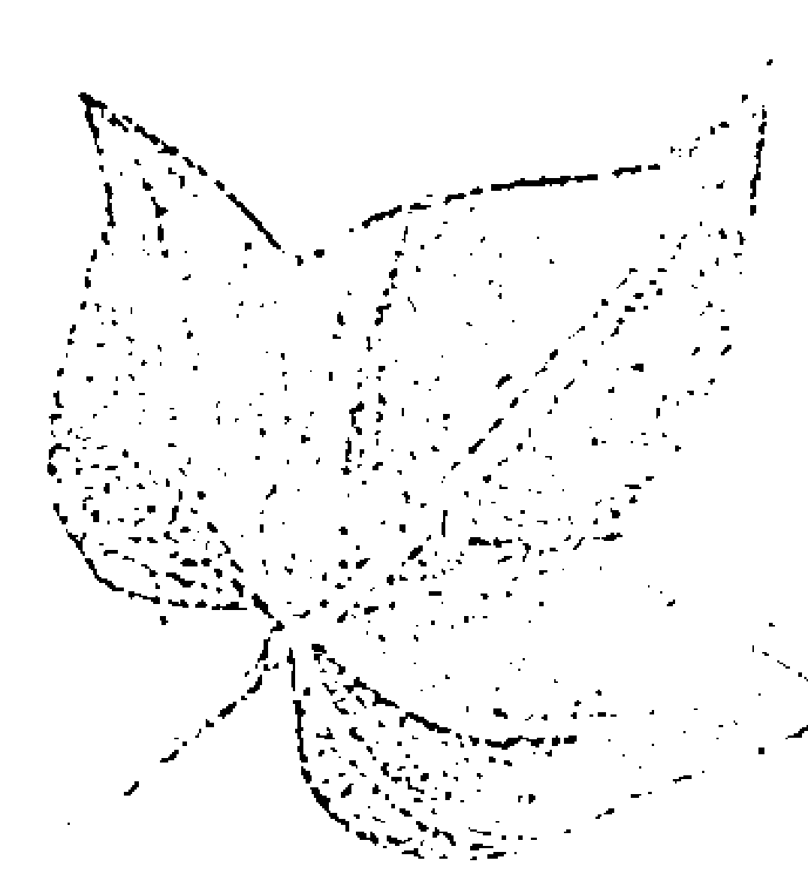

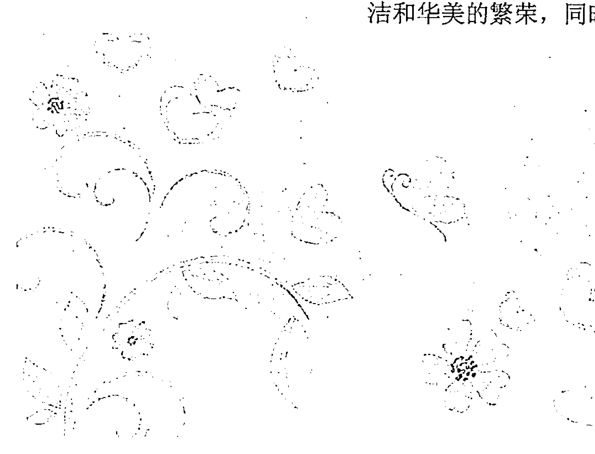

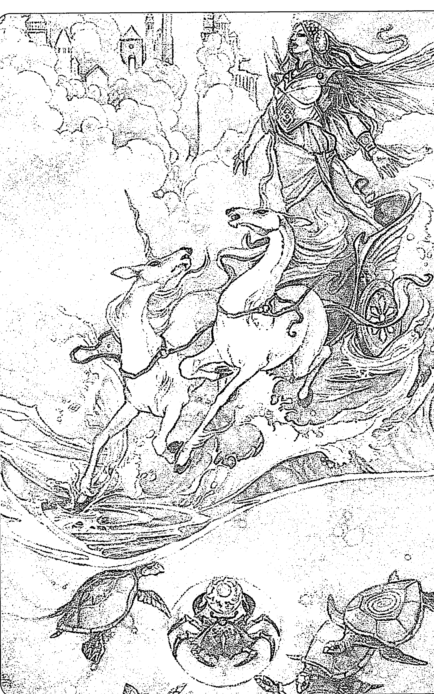

### 7 战车

她是肩生双翼的胜利女神，她的名字是 Nike（胜利女神）或是 Maeve（大地女神）。她自空中而下，意志坚定，自信满满。她召唤着，深海中的独角兽就破海而出，为她挽缰。他们低首伏额，谦卑恭敬，以诚挚之心行礼，服侍她踏浪前行。大海澎湃，掀起怒涛，却无法撼动战车的魔法双轮。飞溅的浪花用力拍打咆哮，但胜利女神毫不畏惧，她指示独角兽穿越水道，继续前进，只留下身后的海浪拍打着海面，渐渐归于沉寂。

这前行的意志甚至传到了海底，触动了沉静隽永的深海居民。精灵们对海神耳语着，舞动出一个彩色的漩涡，去迎接那不可阻挡、坚定强势的力量——请接收我们的跪拜吧，伟大的女神，因您征服了野性难驯、冲击一切的海洋。

#### 牌意：

昂首前进、越过阻碍、达成胜利、专注的精神、强大的意志力、良好的自我认知、自信、设立规矩、紧握权力与荣耀、对事业抱有不可动摇的态度和观点、在变化的环境中坚持前行、迎接挑战、接受锻炼、有能力（且有意愿）面对艰难险阻。仿佛海天一线的交界处，海洋和天空互相对峙，不让分毫。变化未可知，事态尤可为。想高奏凯歌，必须拥有相应的能力，同时拥有坚决的心，才能击破障碍，取得胜利。

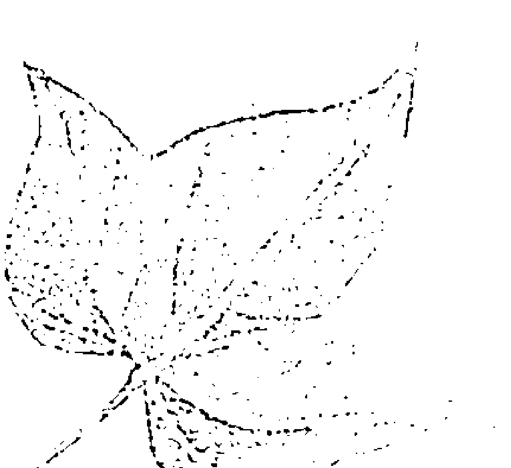

### 8 力量

雄狮发出了一声怒吼，大地颤抖了，风紧张地掠过水面，竹子摇摆，竹叶欲坠。从很早起，中国人就懂得了竹子中隐藏的力量：看起来娇弱易断，却柔韧坚强。这是一种更深更广的力量，从不呐喊，从不炫耀，从不发威，而是在强风来临之际，谦卑地弯下腰，看泉水悠然流淌，听落叶沙沙作响。雄狮发出了第二声怒吼，惊起飞鸟无数。少女却开始缓步向他靠近。竹影婀娜的身姿赋予她曼妙的步态，竹竿中柔韧的坚强给予她无畏的力量。她一步步走来，无所畏惧。那荒野之王注视着她，她与他目光相交，注视回去。雄狮发出了第三声怒吼，响彻云霄，宣告声音所及之处，均为荒野之王所有。她微笑着，伸开坚实有力的双臂，拥抱亲吻他金色的额头。

#### 牌意：

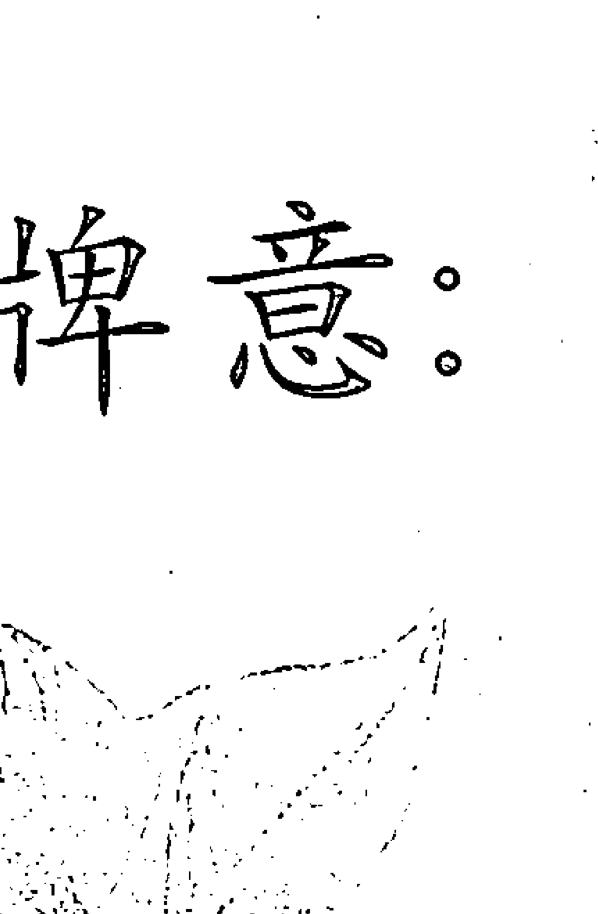

勇气、冷静、沉着、耐性、同情、信念、说服力、同情心、温和的力量和控制。不要被内心情绪操控，以爱和宽容遏制内心的愤怒。这就是力量。要有必胜的信念，无论它看起来多么遥远，也无论它看起来有多么艰难。即使雄狮挡路，声吼震天。她守护着燃烧的火焰，激情和能量是她的一切。而力量是平衡、是调和、是节制，无法动摇的意念是实现渴望的源泉。

天地广大，力量多变。野兽的力量是尖牙利爪，残暴野蛮；天鹅的力量是舞起双翼，保护幼雏；橡树的力量缓慢而坚定，从小小的种子破土而出，长成雄伟的参天巨木；而摇曳的竹子最了解力量的本质，他们顺从外力，以柔克刚，将风力化为己有，不卑不亢。

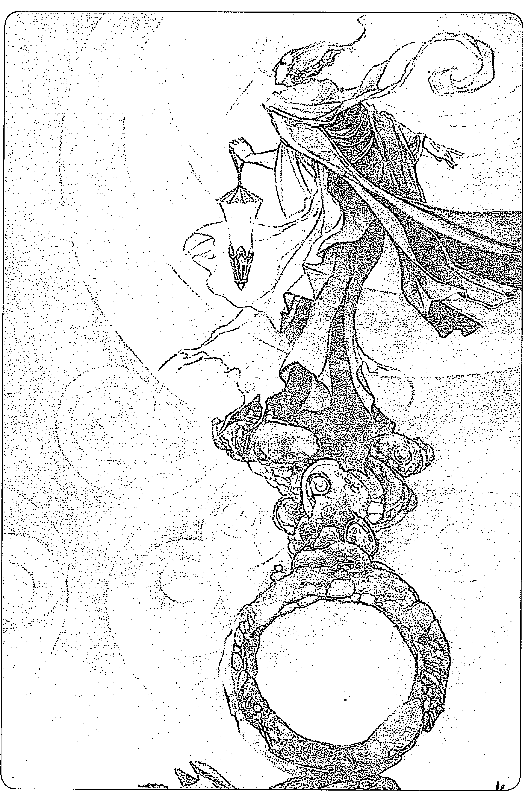

### 9 隐者

他是寂寞的追寻者，背过灯光、喧嚣和热闹的人世，把世界推向远方。因为在城市里，他无法仰望繁星，刺眼的灯和尘世的阴霾淹没了微弱的星光。

他有一盏提灯。一位充满智慧的女士曾对他提起，那盏灯里有星辰的一角，将为他指引归家的路途。于是，他独自跟随这光线穿越清冷的峡谷，渡过波光粼粼的湖面。提灯中的星辰为他照亮每一条蜿蜒小径，但他仍不知何去何从。他继续寻找着，每前进一步，就发现下一步已泛起光芒，召唤他前行。

最后，他爬上一座断崖的顶端，准备穿越人性迷雾的旅程。突然，他身后的空气泛起阵阵浓郁的香气，吸引了他的注意。啊……原来他从未忘记，依然为这香气深深着迷。它如此纯净，让身体充满了渴望，似乎离开香气就无法呼吸。他突然懂了，在很久很久以前，也有人曾来到这里。他们的足迹如此古老，所以没有任何痕迹。断崖开始说话了，它说：任何到达这里的人，都是唯一。前无古人，后无来者。只有上一个从记忆中消失，下一个才会来临。

多么漫长的旅程啊。在经历了这么多艰辛险阻之后，他终于来到了静谧之地。他的双眼学会了适应黑暗，他的记忆已和城市一同封存。他的提灯中星辰闪耀，而它的姐妹们，那些更加闪耀的群星回应着它，在苍穹中欢快地舞蹈。

#### 牌意：

内省、隐居、孤独、自闭、远离尘世、探求、追寻、智者、提供建议、接纳指引。隐者是一位优秀的伙伴，同时也是位优秀的导师。他将帮助你开启内心的隐秘之地。未解之事将发出光芒，慢慢显露清晰的脉络。潜鸟展开翅膀，安静地滑过地平线，追逐黑暗中深邃的影子。它们带来安宁与和平的景象，充满神秘智慧的奇异之声在水面回荡。潜鸟拥有关于天空、大海和丛林的知识，它们经常出现在印第安酋长的头饰上。

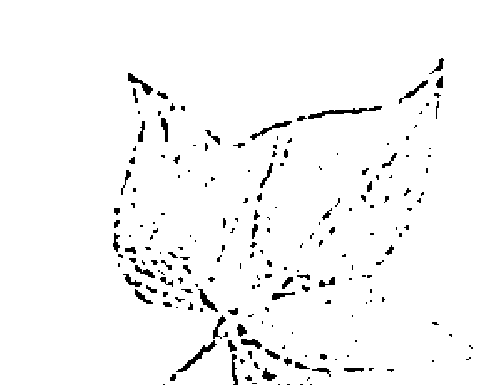

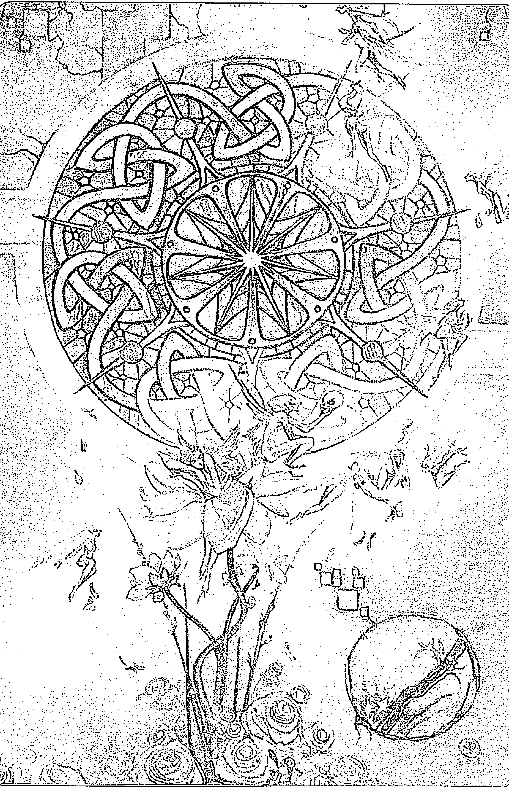

### 10 命运之轮

这又是一个“很久很久以前”的故事，但无论它在多久以前开始，总是像一捆打包好的行李一样，在旅途的终点迎来完结。或许你不知道，真正的传说是无始无终的。没有开始，也没有结尾。它们似乎不存在于时间之中，踪迹皆无，直到被人发现。它们亘古长存，一年又一年跳着漫长的舞蹈，编织命运。我们总是喜欢以开头和结尾来标明故事，喜欢为所有事物划出界限。这仅仅是因为我们的眼睛只认识生命之花，以为死亡规定了界限。

我们总是匆匆忙忙，追寻着永不消逝的力量。却不知真正的力量来自那伟大的智慧，它们从不消失，但也从不显露，无法碰触。

命运三女神日夜不停，纺车转动，编织着人类的命运。从这里剪断丝线，或者从那里编入地毯。就这样，日复一日，命运的布匹从纺车上垂下，生命的图像渐渐浮现。

日为金乌，绕天而成；月有玉兔，广寒之能。斗转星移，沧海桑田，春日里抽出的鲜嫩新芽，在夏日里繁茂开花，秋日沐浴着落叶的洗礼，凛冬将至，则迎来漫长的睡眠和无尽的等待。这循环生生不息，永不停止。

这是最冷酷的故事，这就是永恒的故事。

技艺超群的工匠在墙上雕刻着花纹，却不知道这美丽总有一天会失去。残垣断壁上，将有新的建筑拔地而起。人们再珍爱什么，也只能尽力暂停几日——或许更长吧，但年复一年，终有一天，改变来临。

#### 牌意：

命运之轮——命运——由命运丝线编织的交响曲。转折点、改变、移动、循环、伙伴、内在关联的世界。玻璃窗上，映出了金色丝线随着命运之轮旋转。有些刚开始露头，有些已经收工。有些向上，有些向下，回旋反复，每一次都带来生命中的改变。如果你觉得了无希望，不堪重负，世界都离你而去——退后一步，放眼观望吧。轮子后面有全新的世界，改变即将来临。

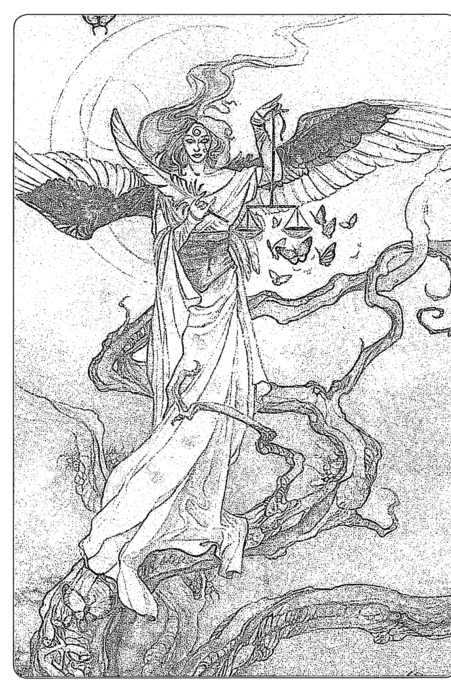

### 11 正义

这一次，我们要回到古埃及。当死亡对肉体宣判之后，灵魂将被带到女神马特面前。她将在天平上用羽毛称量灵魂的重量，如果坏事做多，灵魂重过羽毛，死者就会被押送地狱。

那些被打入地狱的灵魂说正义女神判断错误，因为她双目失明。这是错的。女神双目燃烧着炙热的白色光芒，可以一眼看穿背后的真相。她用眼睛剥去说谎者的外衣，透视最细微的情感，不在乎叫嚣，不被愿望和期待动摇。她长驱直入，直视心灵，死者只能毫无保留，无可遁形。她是正义的化身，为因果和报应长居世间。灵魂的蝴蝶围绕在她周围，徘徊不去，她紧握胸前的羽毛，象征正义之剑。

她判断时既不依照自己的观点，也不存在灰色空间。在正义女神眼中，凡事只有黑白两面。是非分明，寸步难行。她带来绝对的公正和真正的正义，悬而未决之事必不长久，决断即将到来，平衡得以实现。

#### 牌意：

平衡、协调、均等、公正、责任。分析时间中所有因素，将所有考量纳入正确的选择。正义依靠逻辑思维运行，她洞察是非，客观地控制事态发展，随时重新评估各种因素。思索何为正确的决定，确立责任，坚守美德，有时需调停双方，以保证协议可以进行。欣然接受客观事实与真相。任何微小的行动都会造成后果，种下的种子必将偿还。因果循环，需为将来种下良种。

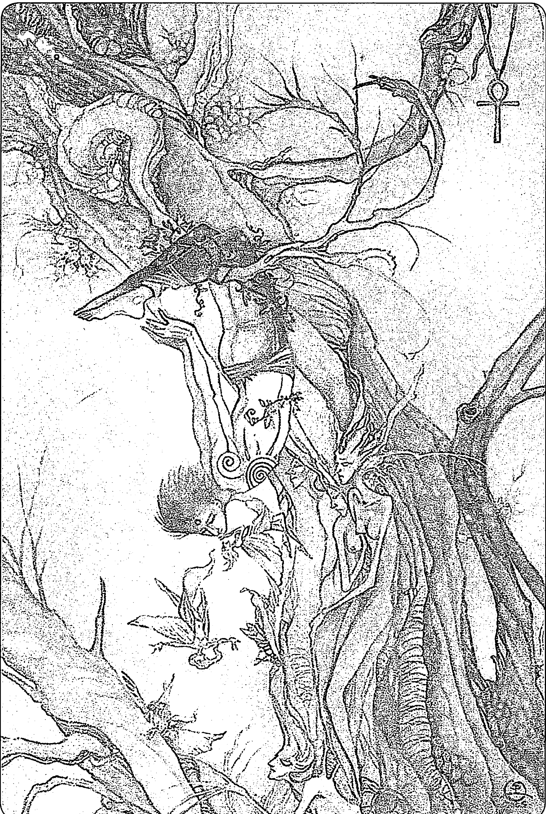

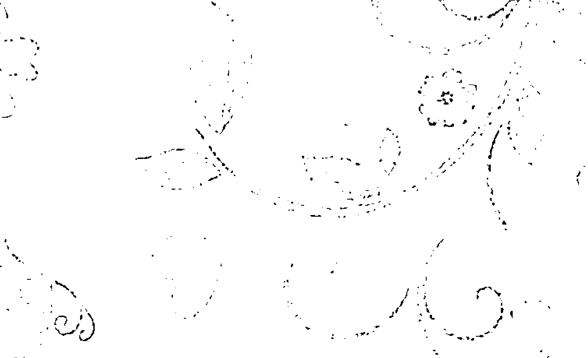

### 12 倒吊人

雾霭深处，灌木丛中，他将手指插入红色的泥土。接下来，他小心地抚摸着身上的图案，抚过胸膛、抚过双臂、拂过脸庞。那红色的螺旋图案在肌肤上盘绕，将他的思绪坠入冥想深处。在那里，思绪开始跑动跳跃，沉静也开始用神的声音开口说话。当身体满溢沉寂之时，他踮起脚尖，慢慢向上升去。树林里的精灵注视着他经过，一片肃静。随后，他们悄悄探出身，试图碰触那神圣的躯体。他们踏着他上升的轨迹，庄严地跟随着，来到伟大的橡树前。

倒吊人决定自我牺牲，他从容地迎向自己的命运。他放下对一切的支配，默默忍耐，等待回报来临。常春藤紧紧缠绕他的全身，把他和橡树连接在一起，仿佛生而为一。常春藤象征着决定，同时也象征着不可撼动的力量和人类的希望。

倒吊人对信仰的回应感召了精灵，他们纷纷收翅飘落，把自己交给空中的风。

#### 牌意：

顺其自然、遵从经验、释放情感、接受现实、放弃控制与支配、推迟行动、自我牺牲。奥丁大神曾将自己倒悬于世界之树，付出了一只眼睛的代价，换来了无穷的智慧。放弃自我，才能获得成长。倒吊人推动你从另一个角度观察人生，用全新的眼光去看待世界吧——不要挣扎，让转变开出微妙之花。

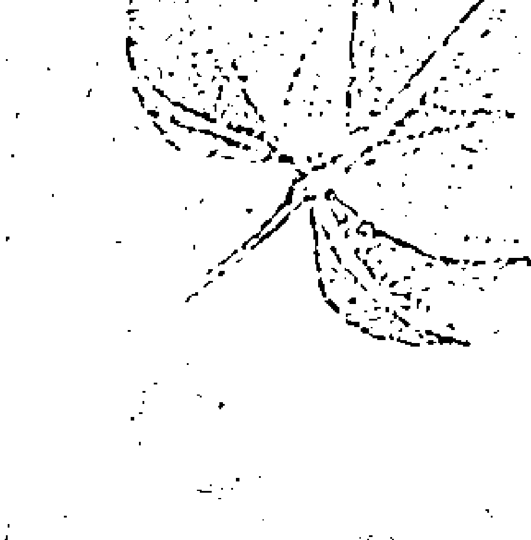

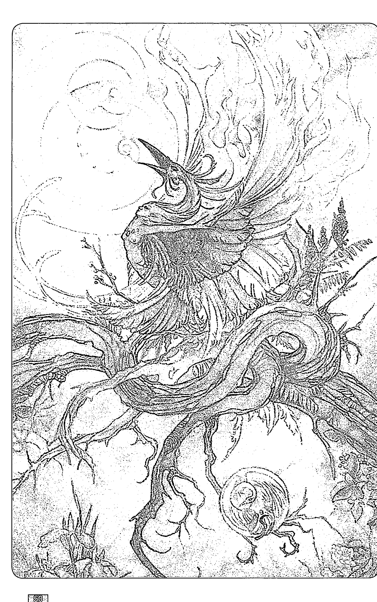

### 13 死神

传说天鹅会终其一生保持沉默，从不唱歌。而当末日来临，它站在死亡之门的入口，则会竭尽全力，吐尽胸膛里的最后一丝气息，唱一首婉转凄美的歌。它唱啊唱啊，发出叹息之音，然后死去。据说那是世间无可比拟的，最令人心碎的死亡之歌。

但凤凰的歌……啊，我真不该这么说，但没什么能比得上那声音，即使是天鹅的歌声。当凤凰感到死亡将至，她就会放声歌唱。曲调苍凉，唱着痛苦、悲伤与哀愁，却无法掩饰歌声里深深的欢愉。她知道，死亡的火焰连接着心灵，而心灵滋养着凤凰蛋的生命。继任者正在蛋中沉睡，死亡之火交换生命之光，这是她身为凤凰的宿命。这是她曾接受过的生命之光，直到很久以前，直到时间的开端。她端坐死亡之榻，仰首向天，顺从亘古不变的命运。重生之刻开始了，火焰爆出白光，她展开双翅，唱出最后的歌声。

#### 牌意：

关上通向过去之门，打开通往未来之门。开启全新道路，经历改变与转化，改变地位或身份，舍弃过往或多餘的事物，屈从于无情的力量，生命中发生重大改变。只有扫清和烧净旧事物，才能为新事物让出空间，打开入口。凤凰的传说在千百年间传颂，无数文化中都回荡着她的歌声。她被火焚尽，又涅槃重生。鸢尾花与希腊彩虹女神的名字发音相同，她也是死亡的象征。彩虹女神经常为大地的子民带去神的旨意，并将女性的灵魂接入地狱。龙葵含有剧毒，是欺骗、危险和死亡的象征。还有漆树，在维多利亚时代的花语中，意味着“穿过灾难，我必长存。”

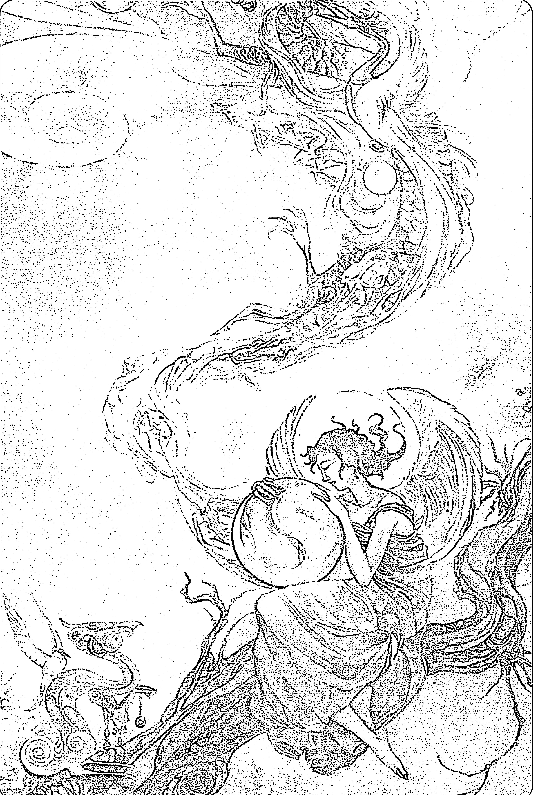

### 14 节制

她集中自己的能量，去往平静与和谐之地。在她的心中，感受到飞龙与凤凰的悸动。他们互相缠绕、相拥、嬉戏、舞蹈，鳞片挨着鳞片，羽毛轻抚羽毛。他们紧紧依存着，蜿蜒飞舞，好似融为一体。它们有时会转成圆环，为压倒另一方开始战斗。

优雅的华尔兹在空中响起，他们在云中翻卷，击起漩涡，激荡着杀气。而她呢，她就像一位伟大的艺术家，驾驭他们，保持和谐。一旦她感到失去了平衡，和谐即将打破，就会深深注视着它们。大地与天空，火焰与流水，男人与女人，炎炎夏日繁茂的生命和凛凛冬日侵袭的寒风……所有这些对立的事物都在不断转化，阴阳调和永不停息。最终，他们都争得圆满，一切均完美制衡。其实所依存之事并非自身，存在的意义恰恰来自对立的能量和机缘。

没有水，火焰的怒意将毫无节制，最终生成凶猛的大火，把自己燃烧殆尽。没有火，水将昏暗、阴沉、到处泛滥，变为毫无意义，无声无息的水潭。界限带来了生气，他们是对方生命的一部分，二元对立，形成共生的完美和谐。一旦谁开始泛滥，就会有另一个压制上来。

#### 牌意：

平衡、均等、调和、治疗、在极端和偏激中行中庸之道、资质、驾驭、压制绝对的力量、有目的地统领他人或安排事物。以对恃双方的力量反控，相互制约、达成美妙的联合。有时候，造成对立的唯一阻碍是信念的高墙。保持心灵的开放，保持宽容和同情心，从不同的角度看待世界，你将会击溃那堵看不见的高墙。

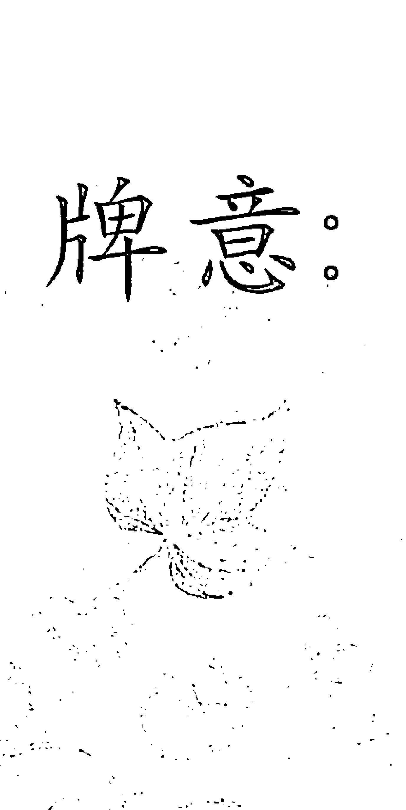

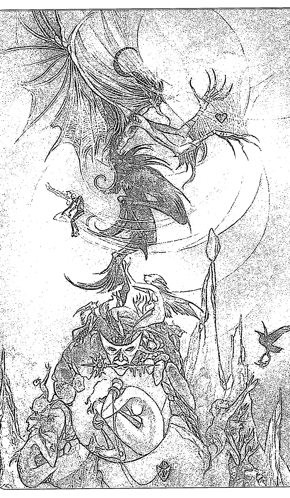

### 15 恶魔

她感到墙在迫近，让她喘不过气来。亲爱的，你忘记抬头看看，你没有被完全包围。另一面是广阔的世界，完全自由地向你敞开。天空高唱着美妙的自由之歌，她却捂起耳朵，向内蜷缩。她想躲避恐惧，逃离此地，却没发现捆住自己的只是一根血红纤细的线，而钥匙就在伸手可及的地方。抬起头来，看看啊！你真想对她大声呼喊，抬头看看你的四周！

但她双耳已聋，除了恶魔的言语，她听不到任何声音。她只能感受到头顶上起舞的恶魔，操纵她、煽动她、压迫她。哒哒哒，他跳着快乐的舞蹈，蹄子敲出讽刺的节奏；哒哒哒，欲望的圈套如此诱人，让她无处可逃；哒哒哒，他嘲笑智慧，因为他轻轻松松就俘虏了一个充满生气的灵魂，让她绝望徘徊。

向上看！微弱的声音透过石头，传入她的身体——这次，她听到了。

#### 牌意：

失去独立性、成瘾、堕落、重视物质、放纵、选择暗处生存、性爱、放荡、欲望、受困、毫无希望、被限制、无法选择。

恶魔高高在上，玩弄着你的渴望。把目光放远，超越物质的枷锁和诱惑，斩断木偶师手中的提线。

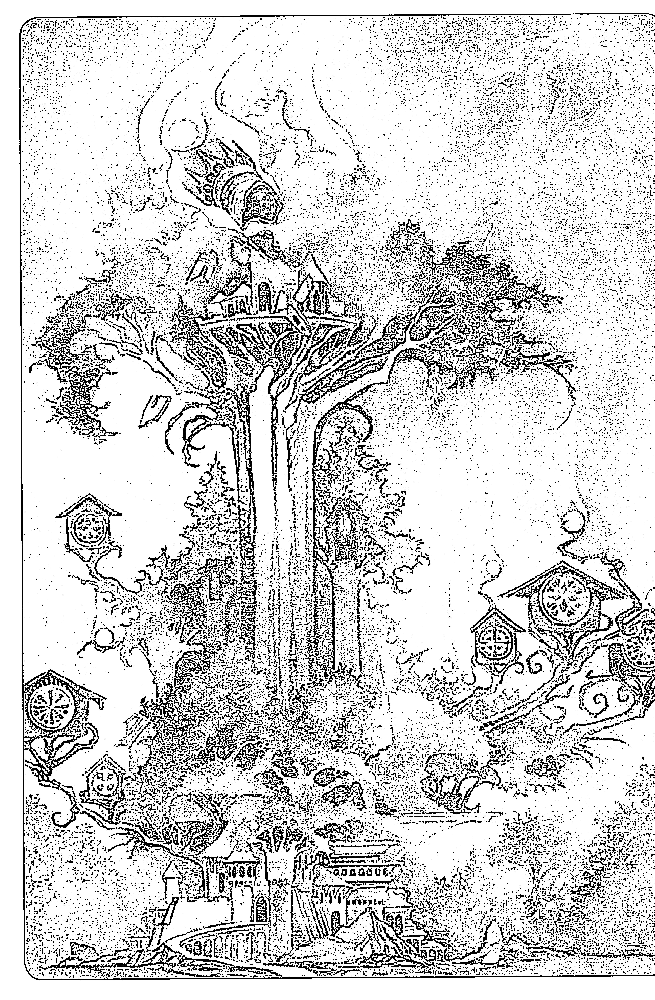

### 16 高塔

一粒种子随风飘远，又轻轻落到地面。从此，它在这里扎下了根，发芽，抽枝。年复一年，它慢慢长大，细小的树苗摇曳着绿色的生命。年复一年，它变得高大雄伟，枝条触到了天空，挑战苍穹的庄严。年复一年，它成为参天巨木，尽情伸展着手臂，展现自然女神的奇迹。

小鸟在它光滑的手臂上栖息，欢快玩乐，放声歌唱。唱温暖的阳光，唱疾掠而过的风，也唱那无边无际的天空。男男女女在它的树荫下休息，舒适美好，阳光穿透树叶，斑驳满地。他们睡着了，梦见清澈的溪流，肥沃的土地和富庶的家园。即使在隆冬时节，它坚固的枝条仍然是旅者或野兽的保护伞，每一个满身疲惫的生物来到这里，它都是他们的港湾。

年复一年，它树立在这里，仿佛要一直站到永恒。它的枝叶触摸着天空，扫过星辰，轻轻拍打新月和满月。它的树根深入大地，拥抱着最寂静的黑暗和那里律动的生命。

万物变换，世事无常。自然女神收回了庇佑，一如当初她慷慨地给予祝福。她从空中抛下一根长矛，带着电闪雷鸣的怒吼——千百年的时光瞬间销毁，从种子慢慢成长的参天巨树折为两段。在死亡来临的一瞬，它突然爆出了耀眼的光芒，流光飞溅，转瞬即逝。

- 撕裂
- 灼烤
- 烧为灰烬
- 隆隆倒下，大地颤抖

#### 牌意：

灾难、惊天动地的变化、危机、情感爆发、遭受打击与折磨、心灵的启示、看透假象、现状必须以强有力的手段改变。

当模式已定，只有爆发与剧变的力量才能突破和动摇这种长久。

不切实际的幻想被现实残忍地击溃，从而与过去一刀两断。现在是变革的时刻，重组吧。

### 17 星星

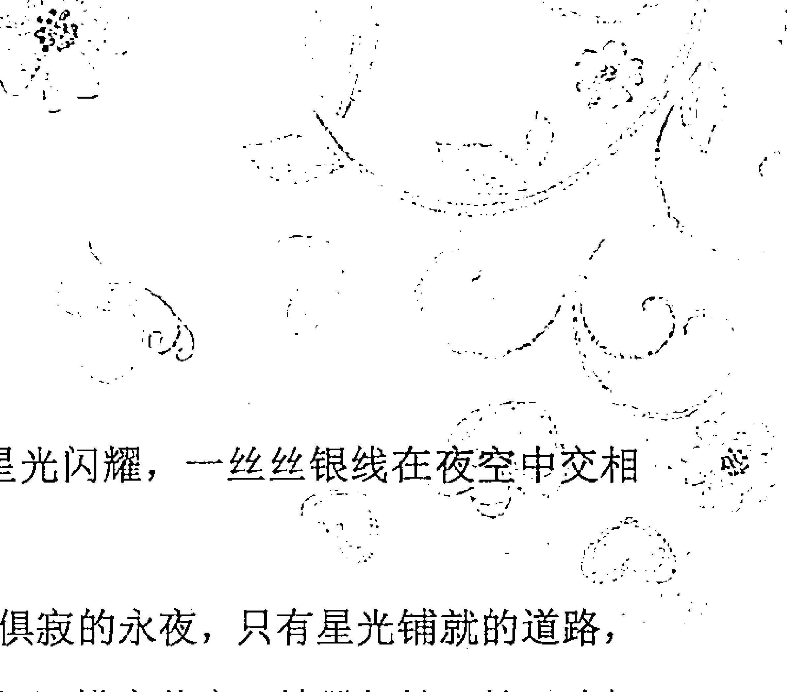

闪着银色光芒的足迹在银色之路上流淌，银色星光闪耀，一丝丝银线在夜空中交相辉映。

这里没有太阳，也不是月亮的故乡。这里是万籁俱寂的永夜，只有星光铺就的道路，仿佛在紫色天鹅绒般的夜空中撒上碎钻，闪闪发光。银河横穿苍穹，繁星似锦，她一路轻摇慢舞，顺流而下，从天界之河走向大地的流水。

泉水、大地和空气环绕着她，回归最初的本质。她可以在泉水中行走，在大地中游泳，随心所欲。

她变换着舞步，脚步如此轻盈，只有些许水花荡漾。这是由星光精心编织的舞步，它们的光芒穿越尘世，穿越时间。它们以此静默向凡尘致意，是那里的人们见证了星光。它们以此舞出人类的生命，短暂、流逝，痛苦却又无比美丽。她跳啊跳啊，以此带来真实的希望。

她舒展开肢体，在群星下摇摆，陡然飞至高处，又在旋律颤动的瞬间静止。她身影飘忽，如星光明灭，她回旋的舞步踏足之处，就有一株花朵悄然绽放。

她整夜不停地舞蹈，丝毫不感到疲倦，她是人中之人，也是人中之神。直到黎明的微光悄悄在东方出现，她才裹紧银色的衣裙。她突然累了，疲惫终于打败了她，爬上了她美丽的眼帘。她卷起银河的壁毯，回到她暗夜星辰的姐妹身边。嘘，睡吧，在永夜中闪烁，等待下一个黑夜降临。到那时，她必将再舞。

#### 牌意：

重获希望、对未来怀有信念、信心、激励人心、希望。寻获安慰心灵之地，虽陷入困境仍保持内心的平和。和谐、不求回报的付出、分享与慷慨。没有严酷的日光，也没有冷漠的月光，星星为你拉起天幕，用一视同仁的仁慈目光注视着你。这是疗伤之地，你可以在这里休息、成长、打起精神、东山再起。释放疑惑和恐惧吧，拥抱夜晚，星星会指给你归家的路，她象征着希望。画面上的鲤鱼代表心灵的力量，它们灵活而有力，不屈不挠、坚持不懈，拥有勇气和决心。菊花通常具有长寿的意象，但同时也象征希望。

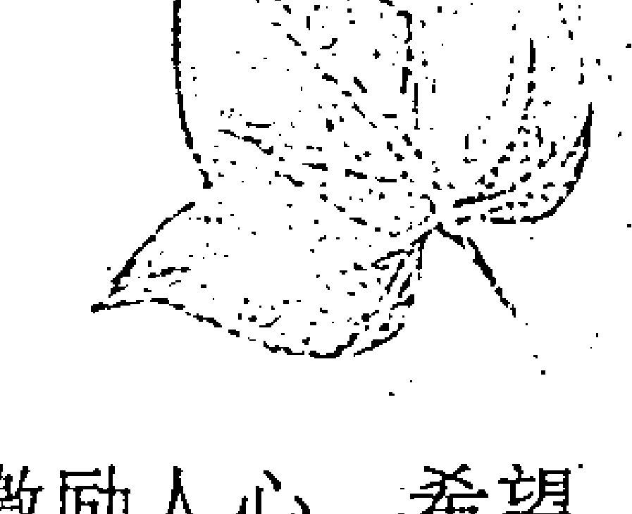

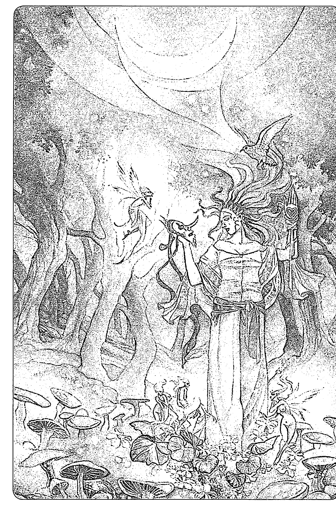

### 18 月亮

> 你们山河林沼的小妖们；踏沙无痕、追逐着退潮时的海神而等他一转身来便又倏然逃去的精灵们；；在月下的草地上留下了环舞的圈迹，使羊群不敢走近的小神仙们；以及在半夜中以制造菌蕈为乐事，一听见肃穆的晚钟便雀跃起来的你们。——莎士比亚，《暴风雨》，（第五幕，第一场）

太阳合上了警觉的双眼，刺眼的光芒慢慢暗淡。仿佛尘世消融，渐行渐远。月亮爬上了夜空，巡视着她的国土，黑暗的世界慢慢苏醒过来，仙子静静地发出了荧光。太阳慢慢看不见了，黄昏逼近，夜晚降临。仙子环的磷火越发闪亮，为她们精灵般的女王照明。

“她往这儿来了！”空中的精灵大声呼喊，声音那么甜美，凡人听到就会痴迷发疯。“快让路！”火光精灵们也高声呼喊，急匆匆地穿过灌木丛。平日里，她们用光亮指引迷途者，虽然能戏弄人类，却没有人能真正陪她们玩耍，度过漫漫长夜。森林里的精灵都聚集过来了，她们牵起手，一同穿过银灰色的桦树林，与落叶和花瓣缠绵飞舞。您的仆人来迎接您了。

女王缓步前来，她穿过林地，踏足之处，有银莲花盛开。她笑起来，开始跳舞。

- 让路！让路！
- 为漆黑之夜让路
- 白昼终结，自生自灭
- 午夜疯狂，听我歌唱
- 没有悲痛，没有哀伤
- 永不守密，永不泄密
- 来仙子环吧，和我们放纵，生出翅膀！

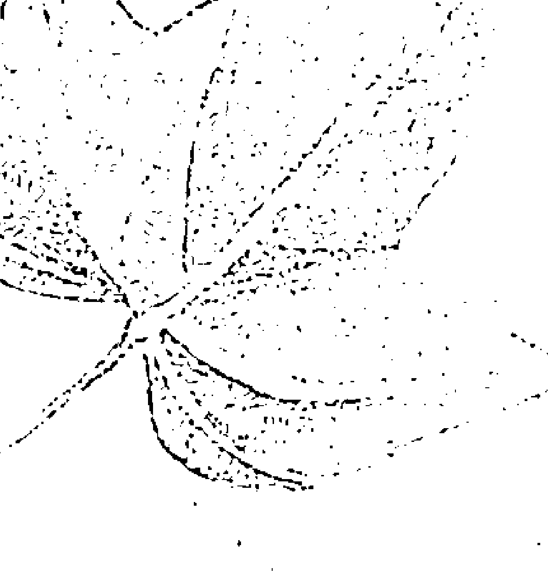

#### 牌意：

恐惧、焦虑、相信幻想、追梦、扭曲、梦与意象、迷失。幻想中最美的景象是死亡降临的时刻。仙子环发出的荧光，将带你一步步走向毁灭。众所周知，月亮总是不以真面目示人，她象征着直觉和谎言。这是另一个世界，是属于她的暗夜森林。她如此超凡脱俗，魅惑人心。但假若你超越界限，轻浮靠近，她必令你恐惧，怯步不前。自古以来，多少旅行者被仙子的光芒吸引，陷入迷途，在森林中永远徘徊。你必不能如此，要以智慧面对诱惑，透过幻想看出真实的光芒。如此一来。你便能获得这珍贵的荣耀，窥视那鼓舞人心的魔法。这是走向未知的旅途，也是光与影融合的地方。你将顺流而下，穿越迷雾，这是月亮赐给你的礼物。

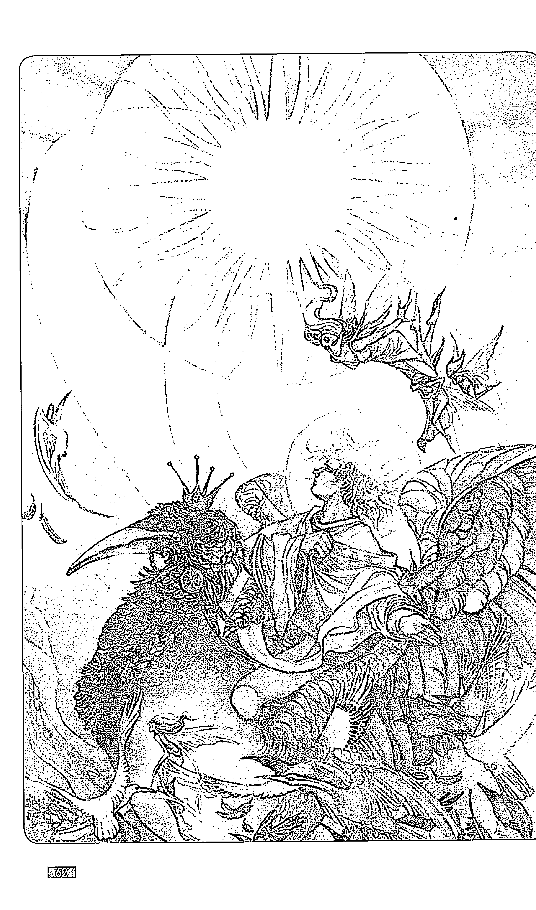

### 19 太阳

金色光芒一泻而下，空中光芒万丈，太阳高升。这是灿烂无比的开始，太阳由此放逐了自己在夜晚发出微光的兄弟。

百鸟之王从栖息木上探出头来，朦胧的晨雾从缀满露珠的大地向上蒸腾。他在清晨玫瑰色的光晕中抖开羽毛，泛出彩虹的颜色。他的臣民们盘旋上升，随他一同飞越领土。他们越过山谷，听凡尘中人类吟唱的歌声；他们飞跃高峰，又来到湖面，收拢翅膀，急掠而过。这些白昼之子追随着巨鸟的光环，他们飞越天空，紧紧跟随着太阳，一同行过白昼的轨迹，直到天边。

#### 牌意：

受到光芒的感召、启迪、成绩、成就、生命日复一日的更新、活力、光芒四射、饱满的情绪、欢乐、正能量、精神充沛、身心愉快、健康。有人担保、确信、信心、清晰的愿景、目标光明。从古至今，太阳一直是生命的标志，他象征生长。在各种文化和历史长河中，他总是以生机勃勃的神明身份显现。他年轻、荣耀、拥有无尽的智慧和生机，流光溢彩。他的神力滋养着太阳的光辉，也滋养着大地。

## 20 审判

审判日降临了，天使吹响了真理的号角。这声音让所有灵魂从地下升起，响应召唤。他们的愿望将被感知，他们的行为将接受审判。他们的灵魂将穿越灼烧的光与热，去除杂质，得以净化。

这是清算和偿还的时刻，是衡量现在与逝去的时刻，公正无私和真诚之心将笼罩每一个人。回想起来吧，你的所作所为，正是它们造成今天的后果。无论结果好坏，善恶有偿，得回馈的自有天意，不得的也必忍耐，赦免、赎罪、宽恕、净化。

红色罂粟花象征睡眠与死亡，有时也代表冥界的邀请。它们像血般鲜红，染满旷野、耕田和牧场。它们美丽又智慧，在充斥着生命的广阔大地上，洒下优雅的深红与金黄。蝴蝶用翅膀托起灵魂，带它们前行。无限自由和无垠的蓝天，正等在那里。

#### 牌意：

释放、复兴、觉醒、豁免、崭新的开始、新星。在难以面对的残酷中艰难决定，做出裁决。面对选择，了解自己的需求与宽恕。觉醒、重生，获取出生与死亡的秘密。命运正在前方召唤，你要跟随内心的直觉，听那不可拒绝的声音。行动吧，你知道什么必须完成。

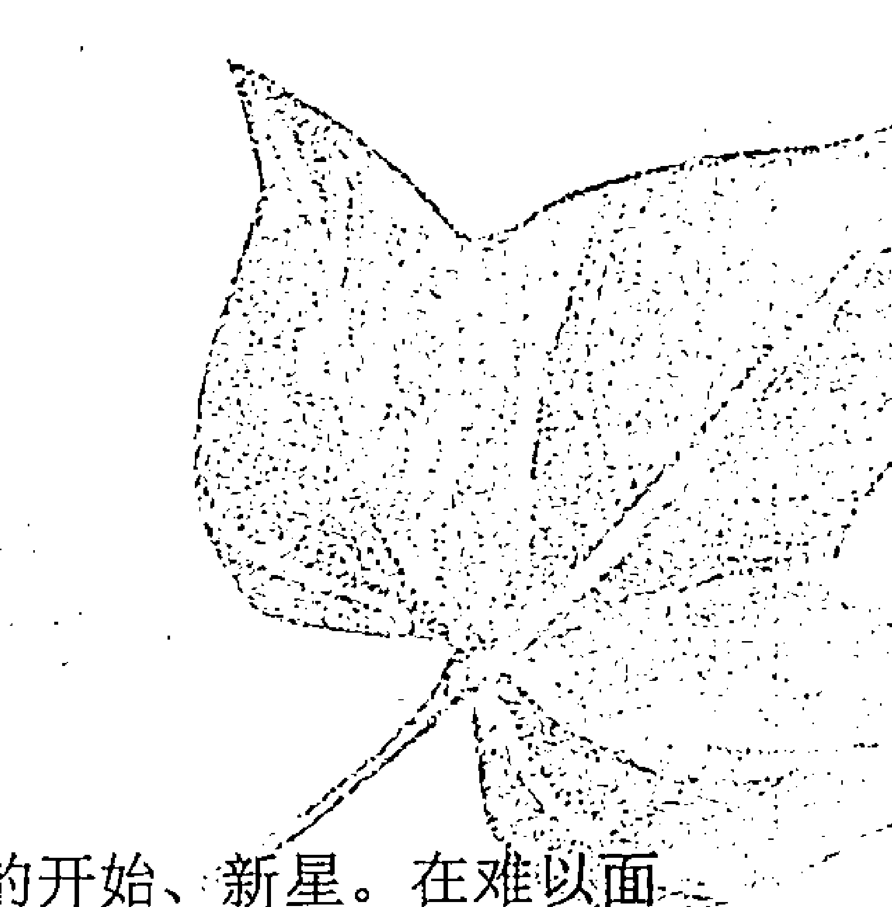

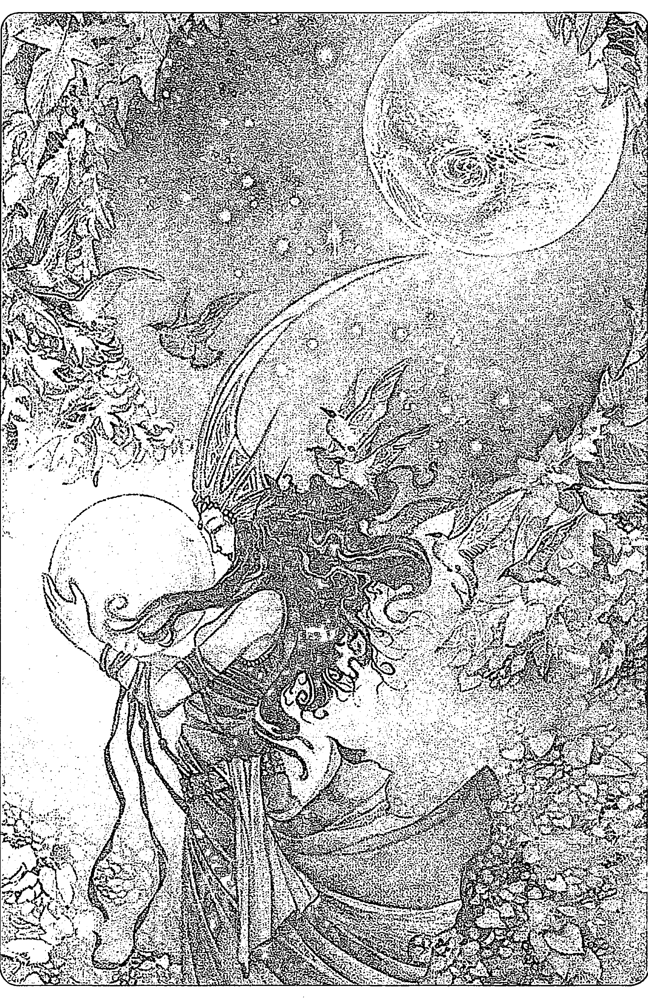

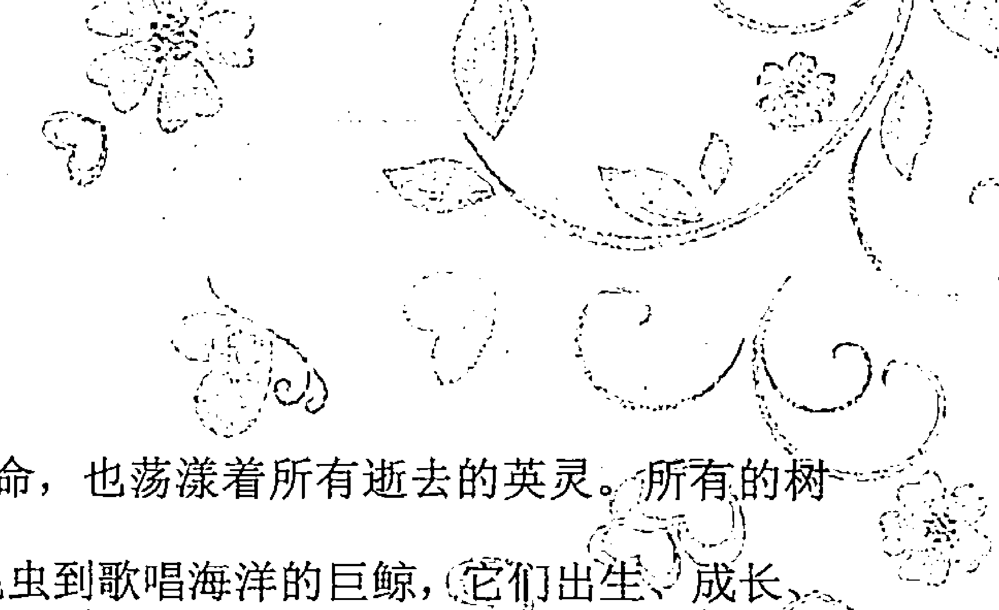

### 21 世界

世界鼓动着脉搏。她激荡着一切鲜活的生命，也荡漾着所有逝去的英灵。所有的树叶与花朵，所有的人类与精灵——从最微小的昆虫到歌唱海洋的巨鲸，它们出生、成长、死亡，用生命的轮回编织成花纹，在世界的和谐韵律中颤动。这是最美妙的和音，声声参差，却无限平衡。世界是对截然不同事物的完美统一。

她额头光洁，戴着洞察之冠。她腰身窈窕，系着真理的腰带。她展开双臂，感受生命的起搏，她碰触一切，万物现形在她心里。她如此优雅，又如此有力，她心中蕴含着万物生息，发出生命之光。她飞起来了，带着洞察一切的目光。她感受到飞舞的群鸟，感受到翅膀随风翱翔，那么轻盈、灵巧；她感受到阳光的爱抚，感受到那爱抚像吻一般时而疏远，时而热情；她感受到千年的流水经过山石，烙下刻印，没有往来去除，也无始无终。她心脏的律动和宇宙共鸣着，从开天辟地，宇宙诞生的时候开始，到空间凝固，时间尽头为止。这是永恒的一瞬，心中的律动蔓延在她的血脉中，一丝一丝，直到奔流欢腾。她突然明白了，自己已得到祝福。

#### 牌意：

满足、内心祥和、完满、成功、结局近在眼前、平衡或和谐得以实现、融合、协调、生命的欢歌、目标一致。世界是关于目标和展望的一张牌，她是某个阶段的完成，或者穿越混乱的状况，完成艰辛的任务，也代表目标达成。此地此时，她表达出对完满和结束的满溢喜悦之情。这是奇妙的时刻，是珍宝闪光，辛勤的工作得到报偿，满足升至顶点。她给你机会，体验平日忽视的、可望而不可及的传说中的宝藏：梦想成真。

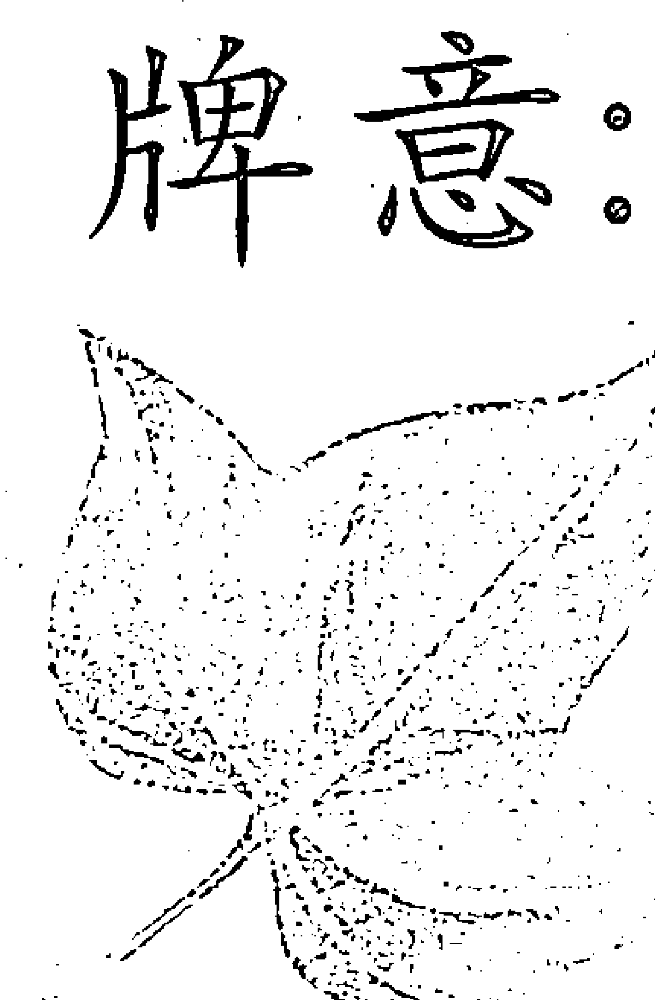

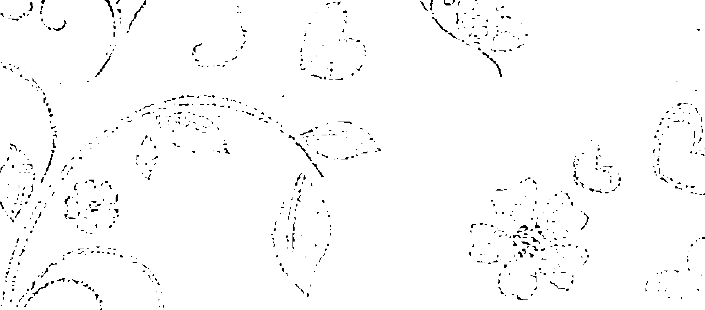

## Shadowscape Tarot

## 小阿尔卡那

- 权杖——象征 火元素
- 圣杯——象征 水元素
- 宝剑——象征 风元素
- 钱币——象征 土元素

### 权杖牌组

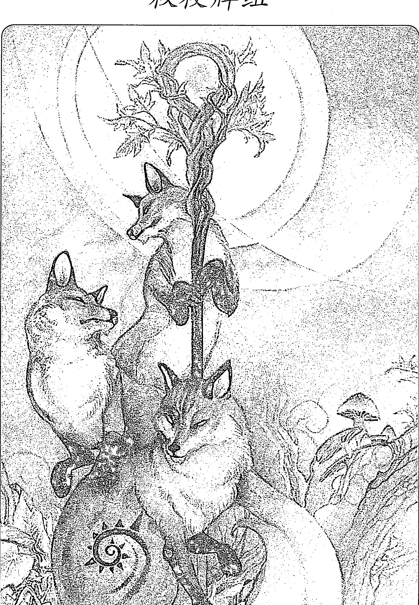

### # 权杖首牌 (ACE)

这是创造力带来的无限可能，兴奋、激动、探险，带着勇气和信心开始冒险。

将火焰般的权杖插入大地，注视那深红色的火焰，仿佛前行的指引。打火石互相敲击溅出的火花回应着火焰的渴望，开出被火光唤醒的花朵。瞧，酒与风的精灵都来欢庆了。

他们在柔和的光亮中飞舞，你简直无法加以区分。他们在落叶里，在树梢上，在碎石中，在天空上。不，你分辨出来了，因为他们振翅时洒下了流光。所有的精灵都感受到这股开创的力量，光芒闪耀，他们窃窃耳语，传达着挑战之音。注意，邀请已经发出，就在这黎明时分。

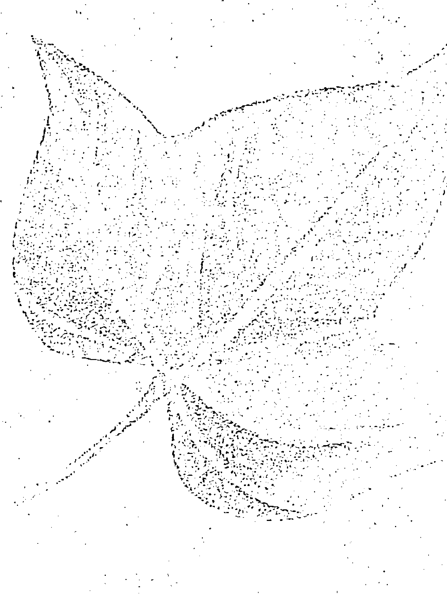

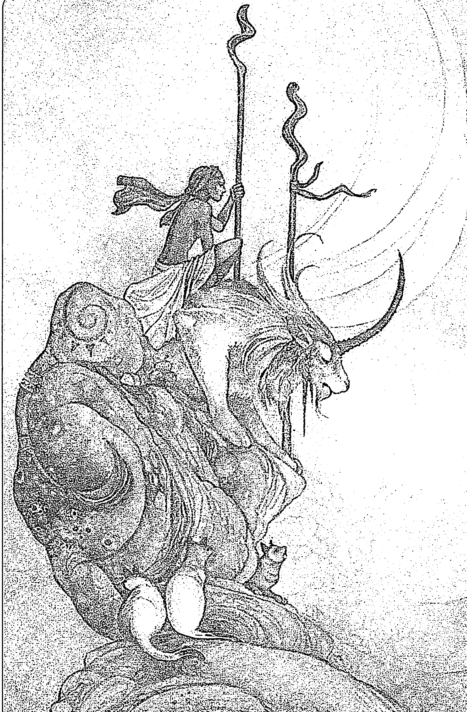

### # 权杖 2

她没错，就是她，画中是一位女性（虽然看起来不怎么像）注视着眼前的大地。那是她的疆土，居住着她的子民。她驾驭高峰，俯视一切，正如她古老的祖先。有时候，在闪念之间，她的目光变得模糊，仿佛眯起眼睛看到未来之景。那是一幅宏伟的蓝图，需要耗费数年去完成。她已经成长，拥有了权利，这是她实现梦想的时机。她必须紧握缰绳，建立心中的国度，她要为子民开拓道路，坚定不移。她不能软弱，不能惊慌，因为一旦弱点暴露，她将落马，被取而代之。

她的伙伴是一只雄狮，他是万兽之王，是勇气和荣耀的化身。他卧在山巅，紧盯前方，有谁敢来挑战，必将闻风胆丧。他抬起雄伟的头颅，摇动火红的鬃毛，发出一声大吼。那吼叫穿越山谷，传至边疆，连远在千里之外的子民也听清了他的吼声。

权杖 2 代表个人权利和影响，象征着勇气和光荣。要抓住时机去发明和创造，而不是远远避开，逃离。这是必须完成的任务，但注意不要陶醉在权利中，迷失自我，丧失公正。

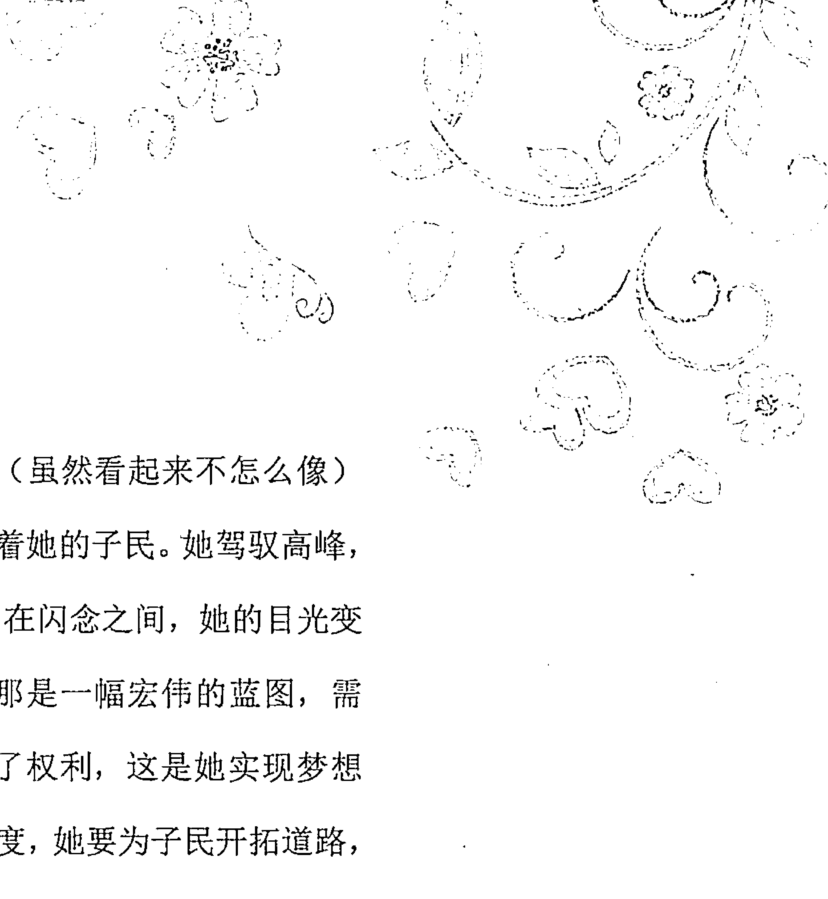

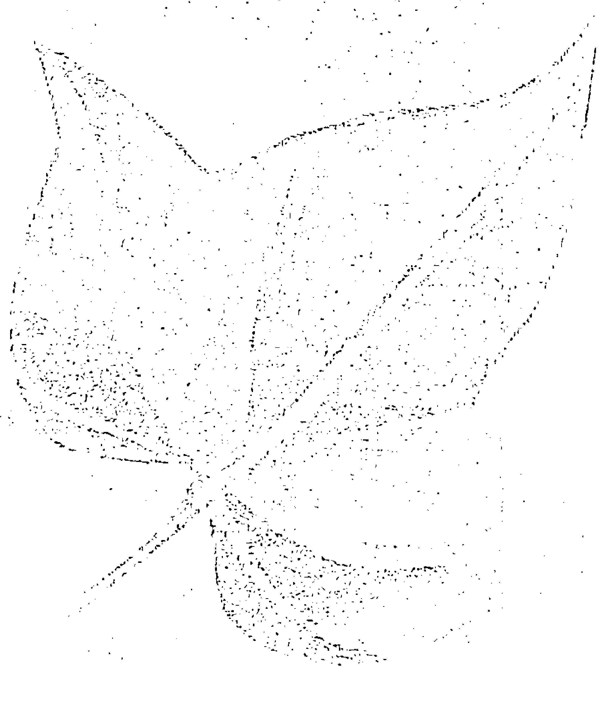

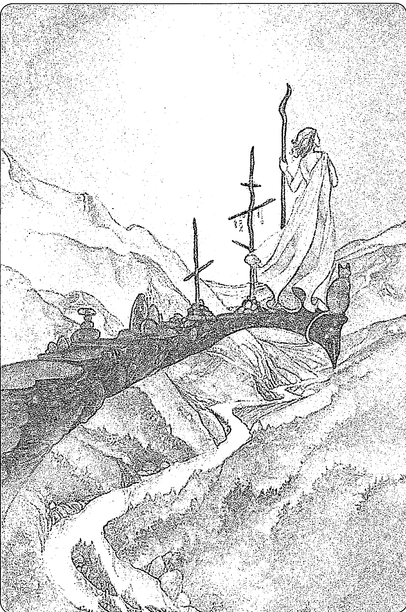

### 权杖3

这座桥连接着世界的边缘。它声音低沉，召唤着那些勇敢又好奇，不怕艰难的旅人。它有着一道优美的弧线，划过天空，却没有伸向更远。而她，她站在边缘处，开始思考去往何处。高悬天空的太阳发出强烈的光芒，令人炫目。光芒下湍流奔腾的河流，发出怒吼。高处空气凛冽，如水晶般纯净，如水晶般永恒。空中充满激动人心的律动，仿佛她心中爆发出无限可能的鼓声。她吸气、呼气，吐出令人兴奋的寒冷气息。

她回过头，看看之前走过的遥远旅程，她竟然走了这么久。她看看手中的权杖，是它跟随自己前行。它担心着自己的主人在此停下脚步，也担心断桥如何能去往下一步的远方。她停了一下，抬起眼睛，目光直视，然后迈步向前，走入虚空。坚硬的石块托住了她的双脚，这是梦想的桥梁，要有坚定的梦想和行动才能前进。她深深吸了一口气，开始大步向前一步、一步，桥梁在她的脚下生长蔓延。

权杖3是一张邀请你探险的牌，探索未开发的地带，开阔你的视野和生活空间。好好观察一下情况，并明确领导权。

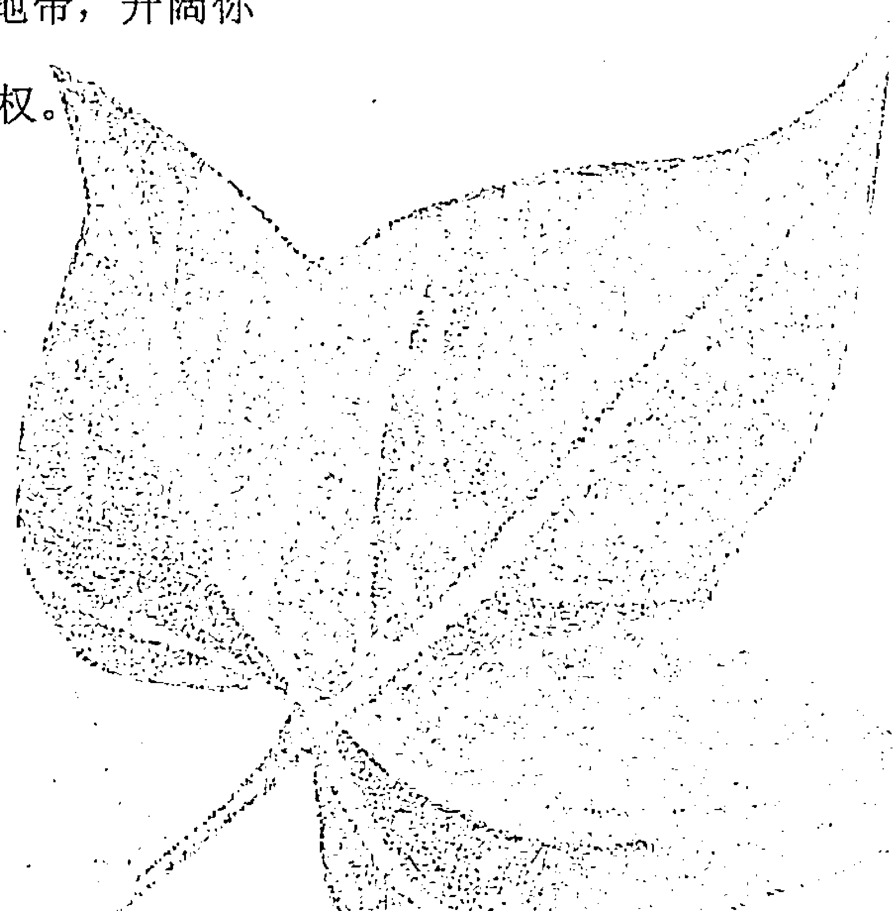

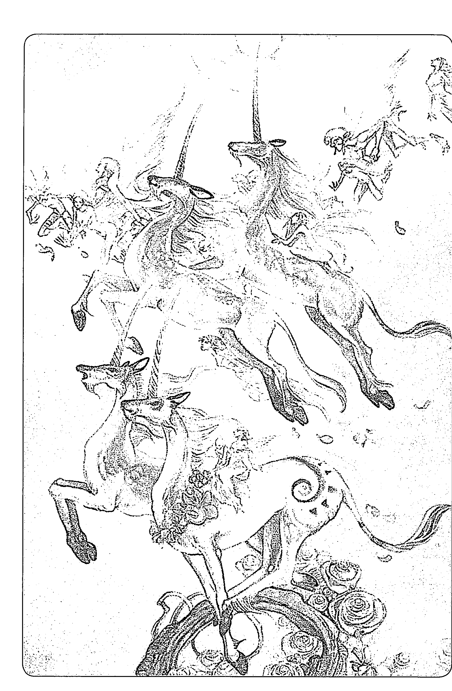

#### 权杖 4

春天降临，百花吐蕊，玫瑰散发出迷人的香气，邀约住在仙境的子民。独角兽和麒麟也听到了召唤，它们从去往庆典的路上转头，带领主人向前跃进。大地随着这欢快的韵律颤动，大气中寒冷消逝，舒畅美丽。好好休息吧，这是暂时的放松，为了日后更辛勤的劳动。在重新开始劳作前，让我们尽情欢歌。

独角兽向前飞跃，号角在黎明中回响。风在鬃毛和翅膀中回旋，追随着它们的脚步和踪迹。它们越跑越快，直到世界只留下一道道模糊的色彩。突然，传出一声欢庆的呼喊，它们奋力一跃，踏入苍穹。

权杖4是一张为庆典而生的牌。这是权杖牌组的第一次庆祝，将希望与欢乐带入天空。这是和谐与融洽的时刻，保证繁荣持续，欢乐再临。你可以放松一下了，好好休息和玩乐。但不能松懈下来，必须打起精神，准备继续出发。火焰必须燃烧，生命之力是它的供氧。远离限制，拥抱自由，否则火焰就会化为灰烬。

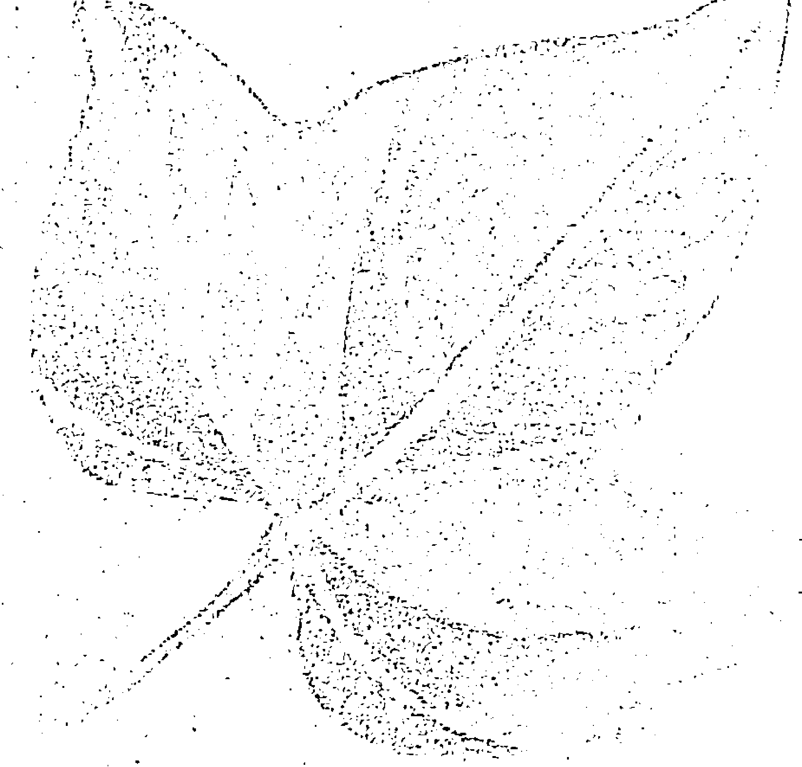

#### 权杖 5

这是一场奔跑的竞赛。野兔跑在最前面，穿过碎石，穿过树丛，在落叶上一跃而过。它奋力奔跑，血脉喷张，白光在旷野中一闪而过。追猎者闻到了它的气息，那鲜红的、流动的血液刺激着他们的神经。这气味让他们发狂，急不可耐，疯狂扑出。他们互相赛跑、追逐，快得几乎跳到同伴的背上。他们从权杖上一跃而下，在空气中呼啸而行。

而他呢，他控制着这些追猎者，它们则竭尽全力，抗击着他的行动。他像在浪涛中逆流而行，肌肉和筋骨筋疲力尽地灼痛着。一个声音一次又一次地重复道：“停下吧，倒下！让洪流淹没你，让争斗持续！”不，如果他真的倒下，瞬间就会被激流践踏。他不能动摇，他毫不动摇。他感到自己的脉搏激烈地跳动，因这场争斗而兴奋异常。面对扑面而来的它们，他艰难地保持上风。忽然，他觉得自己似乎是那只野兔，拼命挣扎，想冲破重围，寻获自由。

有时候，权杖 5 看起来就像世界摆了你一道。大大小小的麻烦蜂拥而来，汇集成一股强有力的阻碍。保持清醒，这些阻碍将激发你的生命本能。保持体力和脑力，全力迎接挑战。你将敢于面对困难，感谢那暗中帮助你的神秘力量吧。

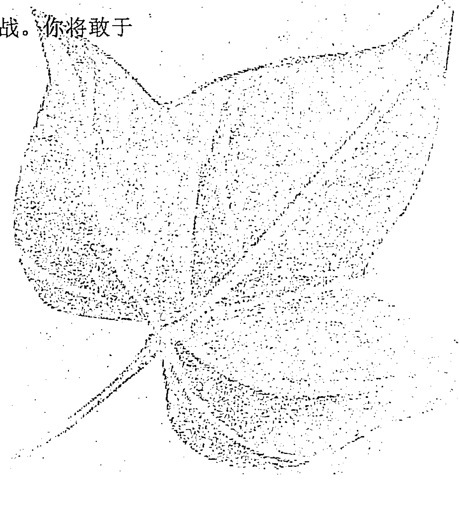

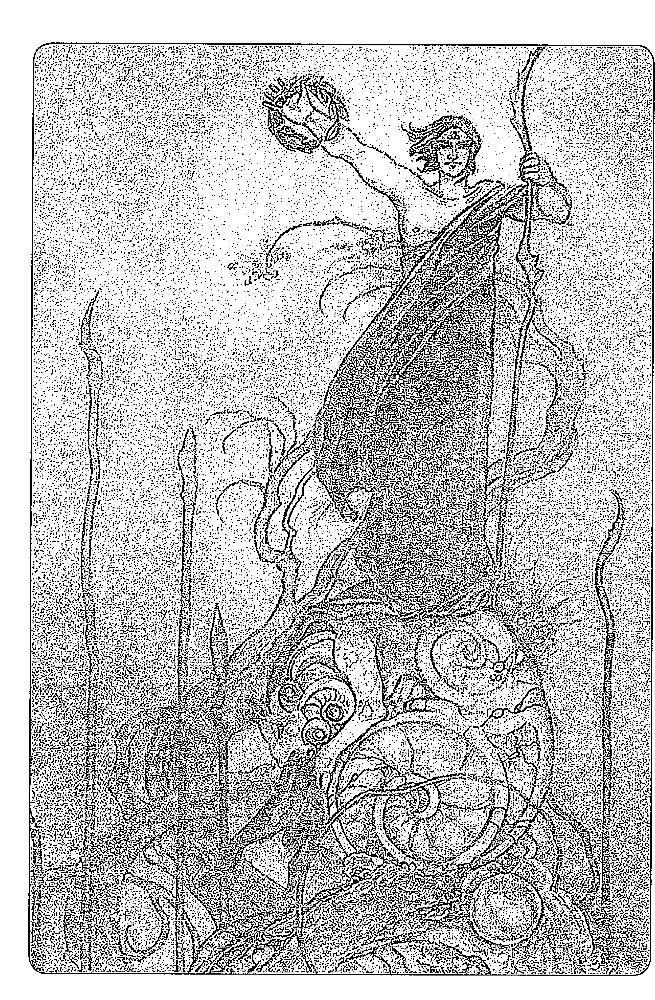

### # 权杖 6

他站在石狮子上，它代表国王与皇帝的荣光。他洋洋得意，向世界宣告自己的权利，它弯腰抬爪，向胜利者低头。

他手握木棍，如同君主手握权杖。他高举桂冠，显示自己时代的来临，并不屑于人和人的挑战。他已经见过太多了，无数挑战者来了又去——既有勇敢的骑士，也有愚蠢的骑士，还有想蒙骗他的聪明人；有手捧花环的名士，也有气焰嚣张技巧高超的人。但没有一个人能把他打倒，他对自己的力量和能力自信满满。高傲、自负，无人望其项背。他经历无数挑战，并脱颖而出，立于大地。或许终有那么一个人将挑战成功，但现在他还在等待时机。这是一位过于自信的王者，等待他的最终结局。

权杖 6 是胜利和凯旋，象征经过无数挑战，最终获取胜利。但胜利之后是蒙蔽、疲惫和傲慢，不能被此吞噬，也不能在自我优越中迷失。

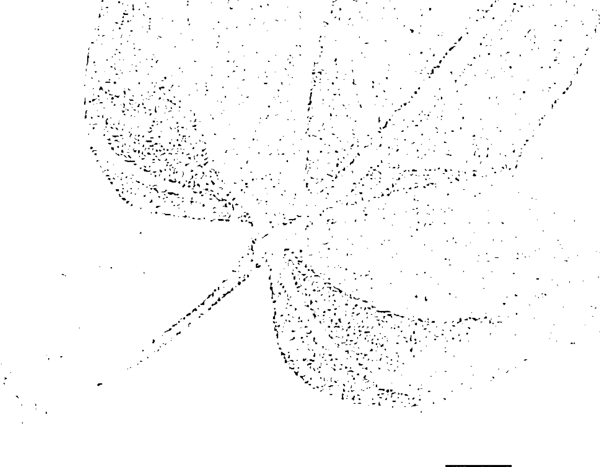

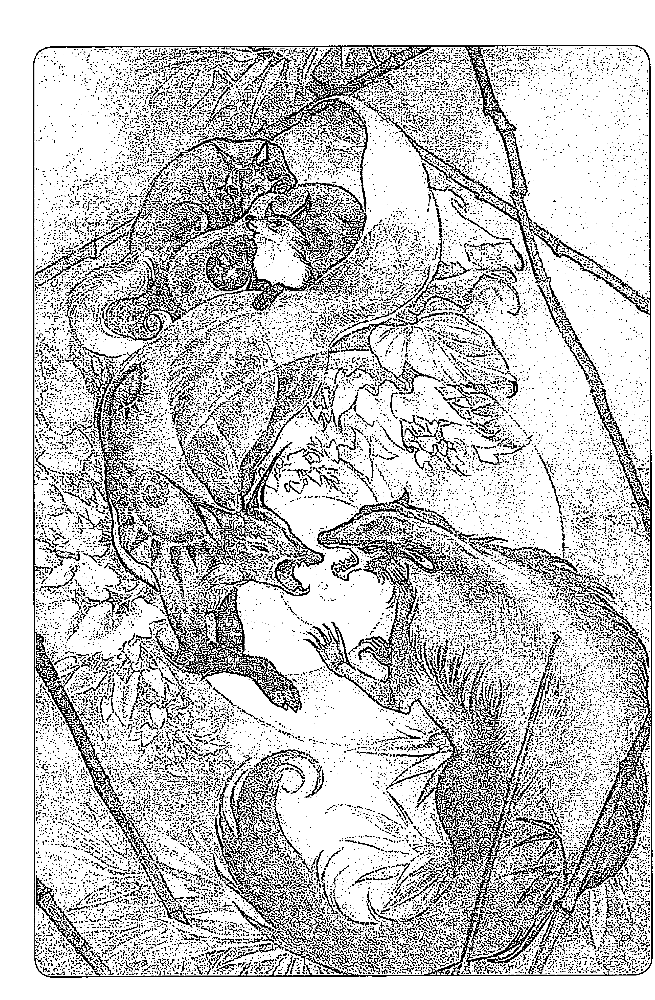

### # 权杖 7

母狐狸紧紧盯住眼前的獾。她的幼崽蜷缩在母亲的尾巴下，小心翼翼地呼吸。敌人左右摇动，慢慢徘徊。他们互相打量，用迅猛的动作疾掠而过，用激烈的动作大力出击。她不会把孩子交出去的！小狐狸的恐惧在她胸中燃起熊熊火焰，她必须扑上去，不是出于鲁莽，而是必须如此。这是无私的母爱，是不需纠结的行动，这需要无穷的勇气，但早已超越了勇气。是信念，她的信念让她从心中冒出了强大的力量，面对巨大的敌人猛烈回击。

竹子做的权杖代表力量和不屈不挠的勇气。这种象征在力量牌中同样出现。竹子柔韧坚强，随风摇摆，但不卑不亢。它执着地向四面八方生长着，和周围的参天大树争夺雨露和阳光。

权杖 7 象征着表明立场，并为信仰而战。世界充满竞争，战斗无时无刻都在发生。当困难来袭，寸步难行，你必须勇于面对，无所畏惧。不要被凛冽的风吓住脚步，你虽然弯下脊椎，却会像竹子一样弹起。那看起来无懈可击的敌人，必将被信念的勇气击退。

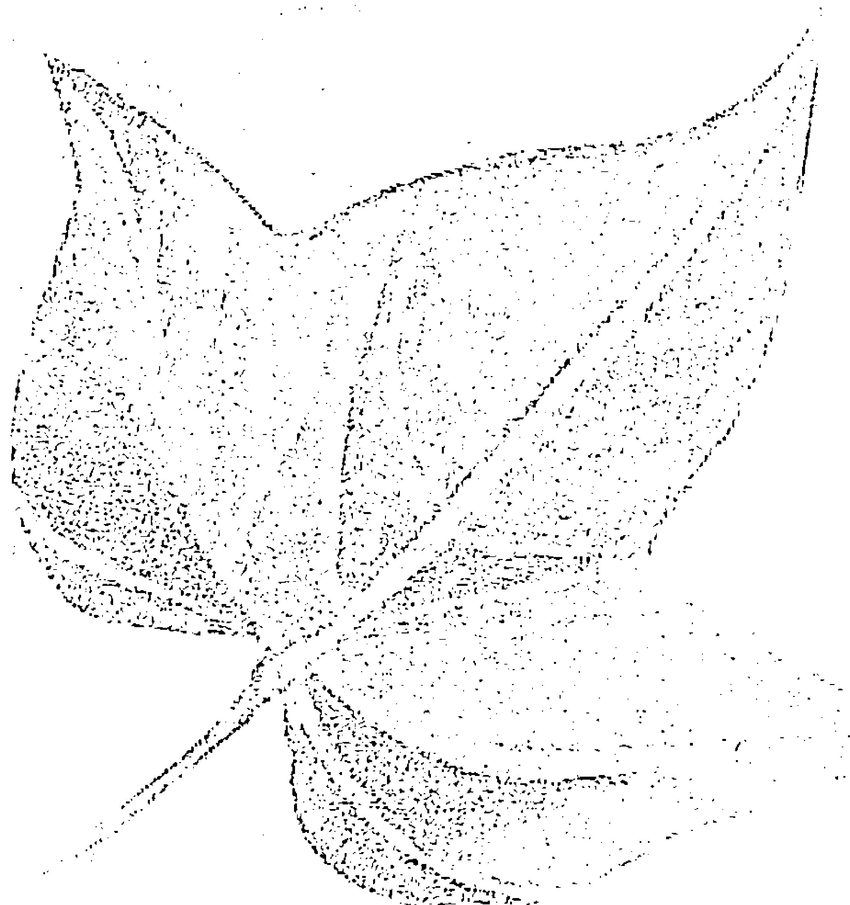

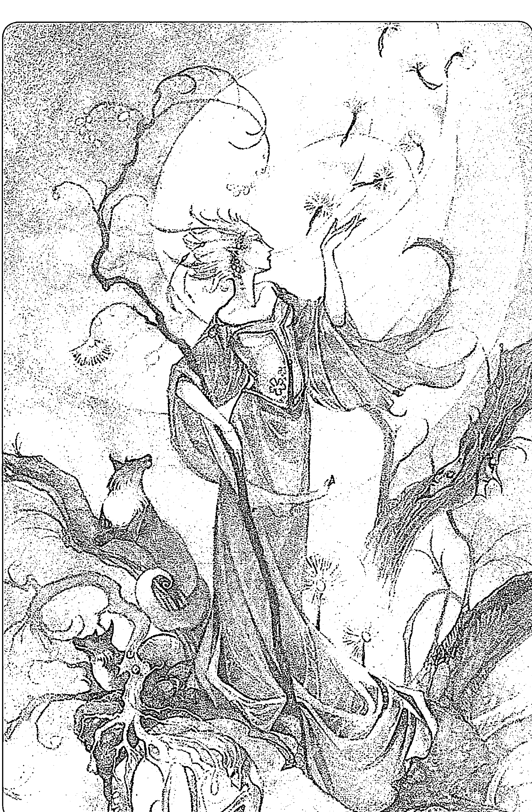

#### 权杖 8

她正缓步上升。光球发出阵阵波动，光晕抖落花叶，落在道路两旁。她忽然想起，有个童年玩伴把它们叫做希望。于是她拾起一株蒲公英，将种子吹入风中，注入希望。种子能飞多远，就能学到多少智慧，窥视多少真相。她又拾起一株，也将种子吹向空中。开始旅程吧，亲爱的，绒毛带着种子在空中优雅摇荡，轻盈美丽，飘向远方。这是蒲公英命运的终结，却是种子作为新生的开始。它们在风中越飞越远，带着自然的祝福和历练——这是天赐的礼物，是命中开启的航线。去远航吧，然后落下，开出新的花朵。

权杖 8 代表向着目标开始长久的旅程。你已经做出了一项重要的承诺，带着希望和动力向未来进发吧。

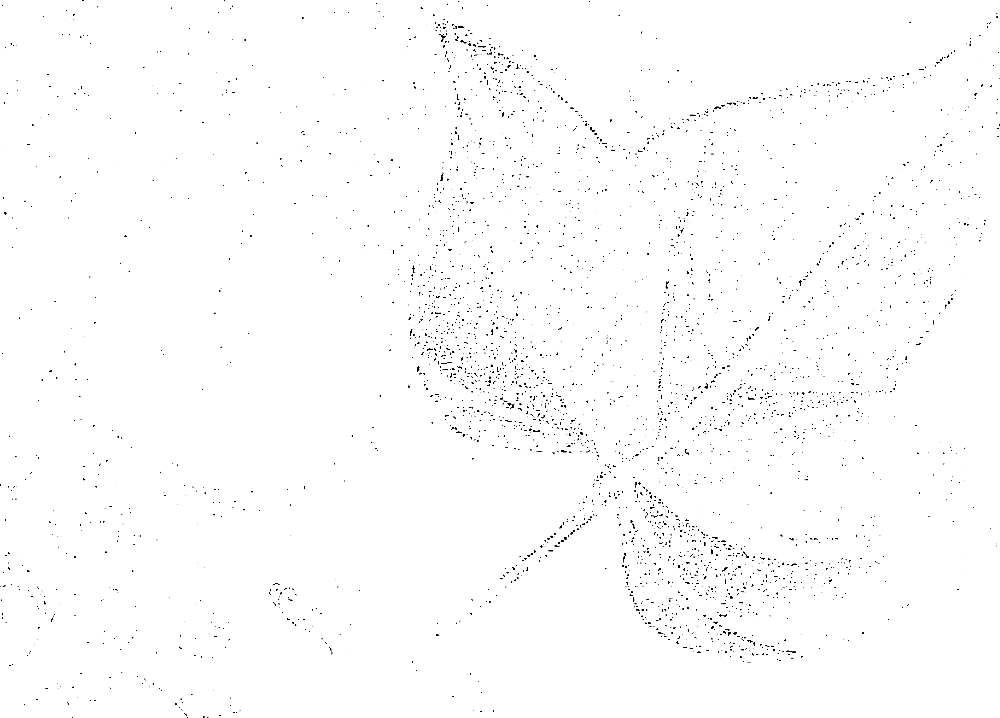

### # 权杖 9

哨兵坚守岗位，注视着前方。他们是永恒的守卫者，睁大双眼，警觉非常。敌人来自未知的深渊，或许那只是世界边缘的迷雾与微光。但他们只愿意站在这里，似乎失去了发现真相的勇气。他们只知道自己的职责是守卫，只需要静静矗立在崖边，注视着白昼将尽，太阳西沉。

当最后的光线落幕，夜晚会向太阳告别。到那时，深渊中会出现什么怪物？他们的力量能否挡住进攻？其实日复一日，他们从未开战。虽然每天黄昏都会被黑夜代替，每一天他们都在等待未知的敌人。但即使他们睁大双眼，凝视着黑暗与未知，期盼今夜就是决斗的时刻。但当清晨来临，阳光照耀在双肩的时候，他们才发现又是寂静的一夜。他们如此荣耀、高大、威猛，在暮色的寂静和夜晚的黑暗中却似乎不堪一击。也许今天又过去了，但总有一天，他们要奔赴战场。

权杖 9 的关键词是守卫。它急切地催促你，储备力量，为应付任何紧急状况提前准备。它要你掌握住力量的核心，但更重要的是，明白力量的本质。有时候，只有直面困难，我们才能展现出忍耐痛苦的能力。如果挑战迟迟未来，等待的时间超出预期，一定要谨慎，不可懒惰倦怠——保持敏锐和警惕，才是难以攻克的挑战。

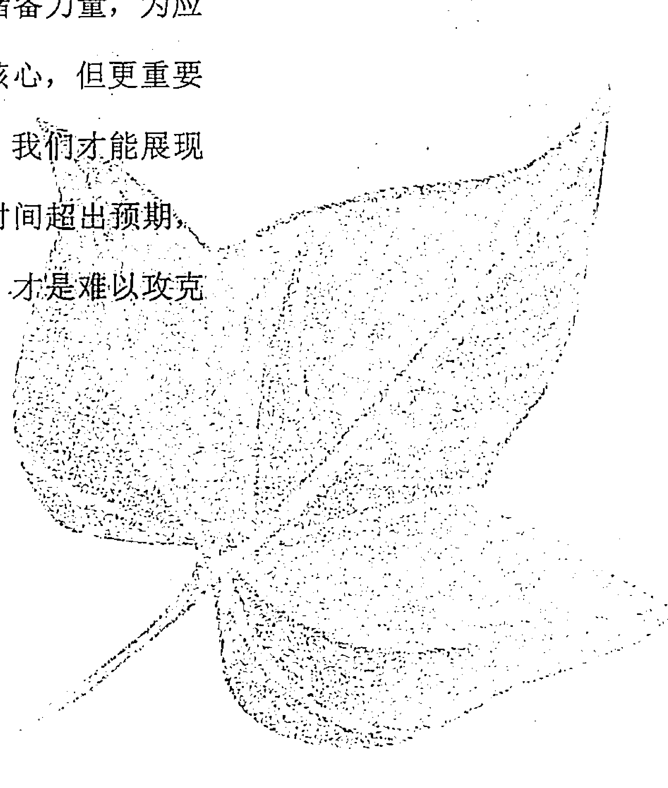

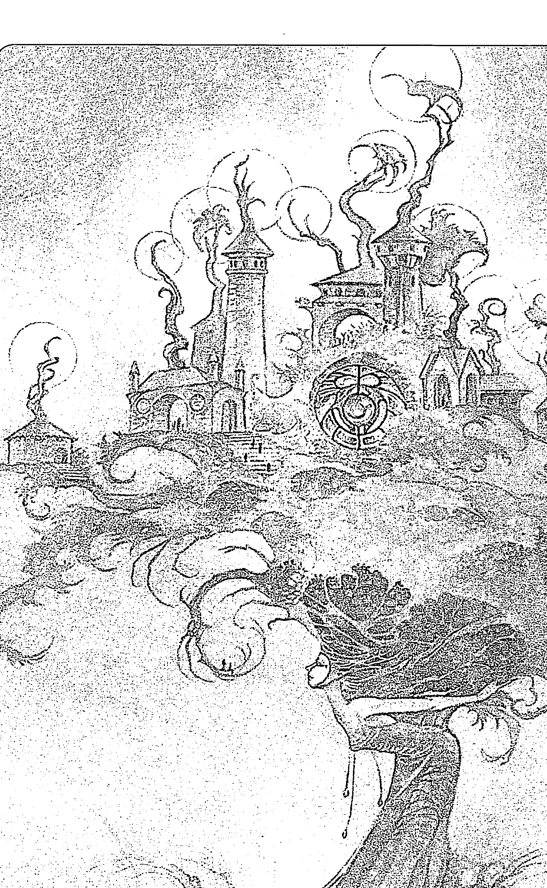

### # 权杖 10

树神用坚实的背部撑起了世界。她的枝叶向下坠去，在沉重的建筑下弯曲。居住塔内的生物需要养分，一切都需由她的精气支持和供给。他们的灵魂穿越在枝叶中，那是她发自心灵的歌声。但滋养她树根的只有灰色的水流，头顶上是难以忍受的重担。终于，她抬起头来，向着太阳凝视，试图借助那光芒的火焰，照亮周围的一片黑暗。

权杖之火慢慢熄灭了，它曾经燃放出怒吼般的火焰，现在却只留下最后的灰烬。太多了，太重了，太沉了……她挣扎着再次抬起头来，去仰仗那万物生长的光辉。

权杖 10 是超负荷的运作，承担了超出限度的责任。过度的重压导致精疲力尽，却采取着最艰难的方式解决问题。也许塔中的生物无需她时刻悉心照料，他们也不是她必须的责任。养分不必毫无保留地给予，甚至重压也并非必须承担。她自愿承受这本可以不必的一切，但她也明白，她有能力坚持下去。

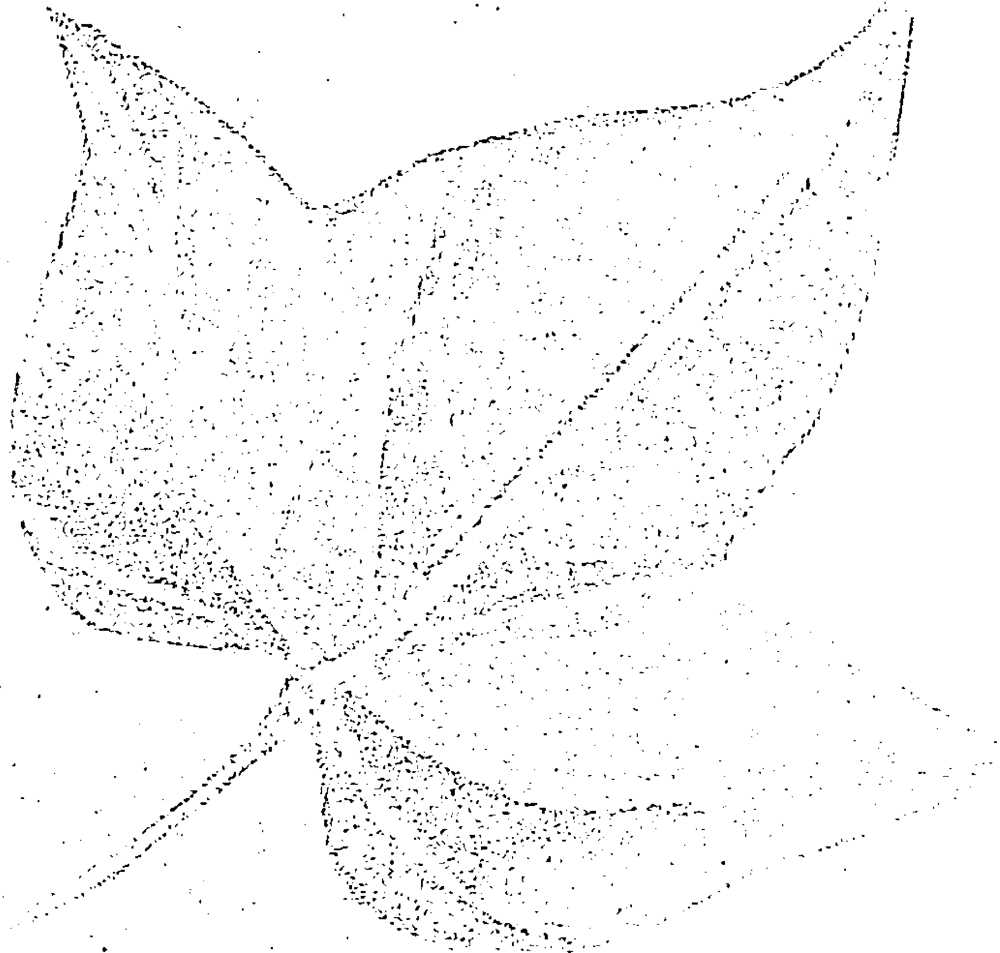

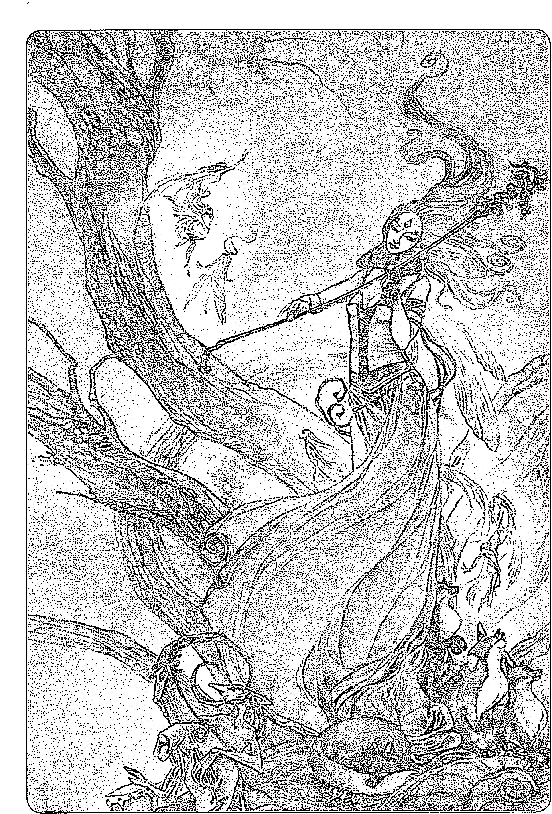

### # 权杖随从

> 音乐是人类共同的语言——亨利·华兹伍斯·朗费罗

她拉动琴弦，自娱自乐，嘴角浮出自信的笑，像孩子一样开心。这是一首关于自信和允诺的乐曲，节奏跳动，回旋舞蹈。这是任何生物都无法抵挡的欢乐之声，跳动的节奏咚咚作响。她轻笑着，笑声吸引着树丛中的动物，纷纷跑出。它们席地而坐，围绕着她，仿佛看着森林的公主。空气中弥漫着兴奋，还有无法呼吸的激动。

- 有形之人，无形之身
- 海之彼方，空之彼端
- 快来吧，听我呼唤
- 来吧，来吧，来吧！

权杖随从代表激情和创造力。她俏皮、幽默，拥有超凡魅力。她大声宣告着自己的见解，表明想法，简单直接。从这种意义上说，她也是导师，渴望向人们传达拥有的智慧和知识。

她是善良的火花，是创意的火焰。她主动，而且打定主意，认为你不敢去探究那些充满潜力的机会。好吧，也许看上去有点儿可怕，所以她打算推你一把。在陌生的环境中行事，往往带来出人意料奖赏。她恨不得告诉你，要行动，去吧，千万别坐下来空想。行动才是最重要的！你听到了吗？她那美妙的歌声，激情的歌喉，唱出甜美的诱惑之歌。

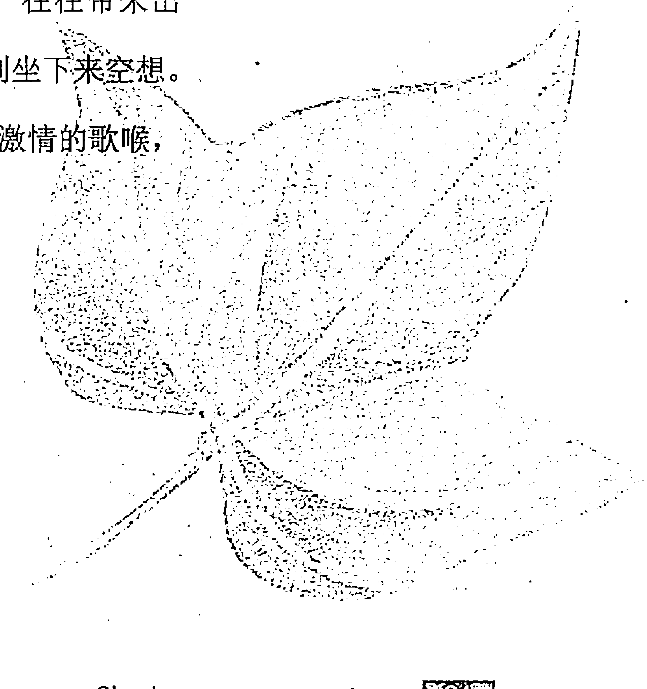

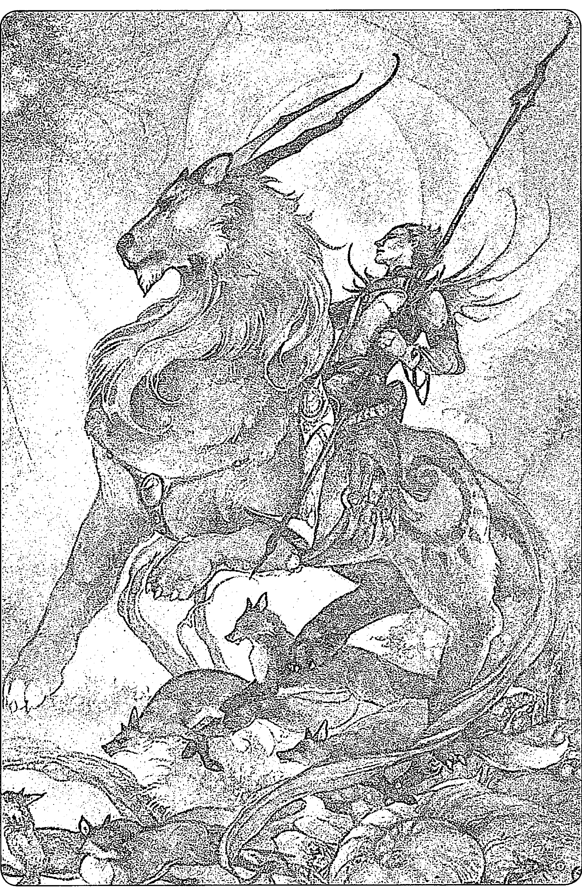

### # 权杖骑士

权杖骑士预示着改变。他洋溢着勇气和激情，向一个目标冲去。他精神高昂，像火焰般闪耀，正是权杖牌组的最佳代言人。他胯下雄狮的鬃毛发出火焰般的光彩，脚下的狐狸飞似的掠过树丛。风鼓起他的头发，他大笑不止，策狮前行。

雄狮的肌肉充满力量，在骑士驾驭之下向前冲。开始冒险吧，踏上旅程，步伐满含激情。骑士虽然冲动，但泰然自若，反倒使对手惴惴不安。或许是他刚正不阿，志在必得的士气吧，再没有比他更得意和自信的人了。但小心啊，骑士，好斗的天性有时过于自负和鲁莽。

他是一位战士，拥有雄狮之心和狐狸的智慧——虽然有时他冲动过头，顾不上什么智慧。他不顾一切的前行，在世界上横冲直撞；他豪迈地跃下悬崖，直面命运的激荡。多么英勇无畏啊！他双眸燃起熊熊火焰，满含对目标的执着，还有坚定的信仰。好了，骑士，别忘记看着脚下。在你奋勇向前的路上，开有朵朵野花。蛮干过头和爆裂的能量会阻碍你的发展，小心造成混乱哦。

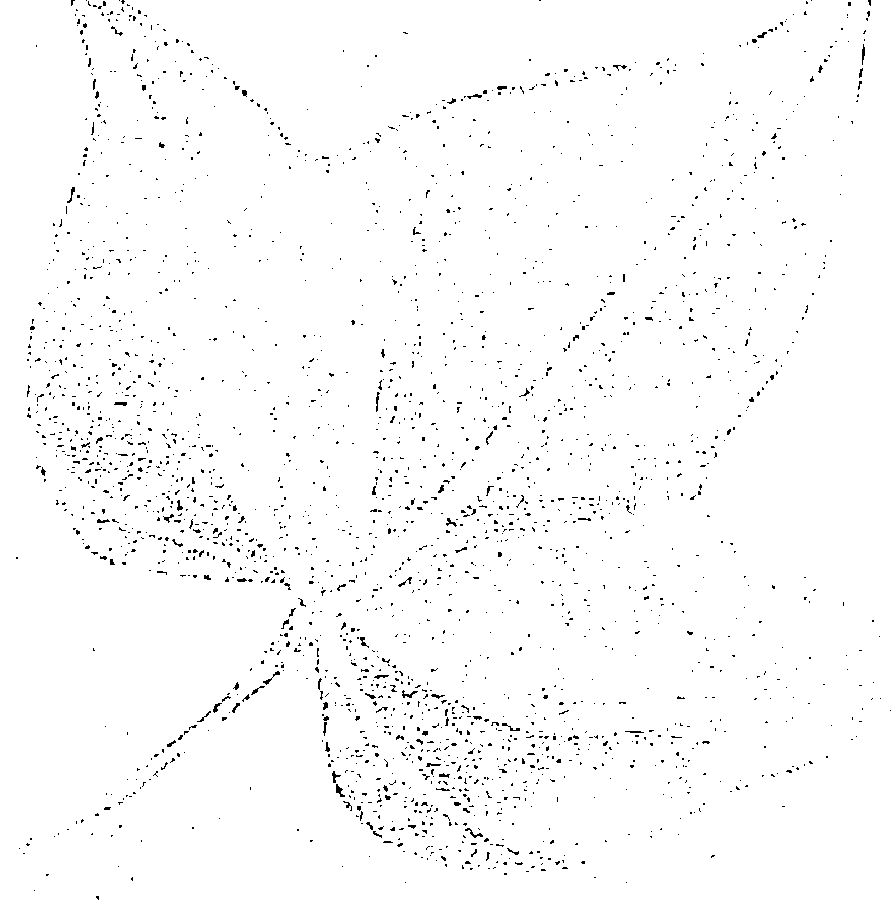

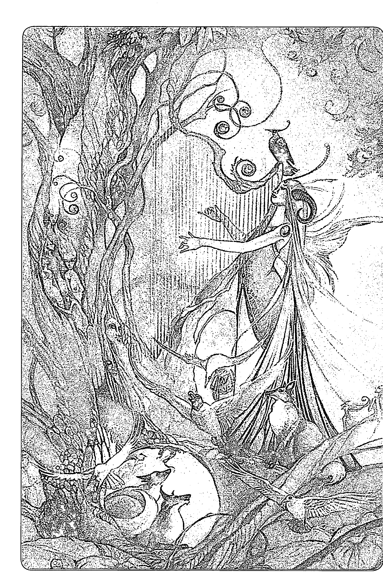

### # 权杖王后

狐狸在阴影中穿梭，火红的皮毛一闪而过。他们被王后的琴声吸引，呼唤着丛林里害羞的居民。她沐浴着正午的日光，长发闪闪发亮。她的内心燃着熊熊火焰，这让她的出场灿然发光。她的指尖跳动着，如流水拂过琴弦。树神也为她倾倒，甘愿成为她的权杖，她的火焰和她的乐器。

权杖王后优雅迷人，富有魅力。她喜欢鼓舞人心，也知道如何完美地运用权力。她天生喜爱聚光灯，众人的目光是她活力的源泉。她充满自信与智慧，能坦然面对一切。她并非自大，也并非傲慢，这是她的才能，去正确理解与判断。不过小心，她的魅力瞬间就能转向黑暗。她会造假，更会欺骗，她操纵事物超有手腕。还好，她时刻守护自己，不被黑暗诱惑。

别忘了，整个世界都为她着迷，沉醉在她充满活力的歌声和美貌里，也沉醉在她散发的光芒里。她双手摇摆，弹拨起婉转的调子，这是生命之歌，来自她富饶的内心。

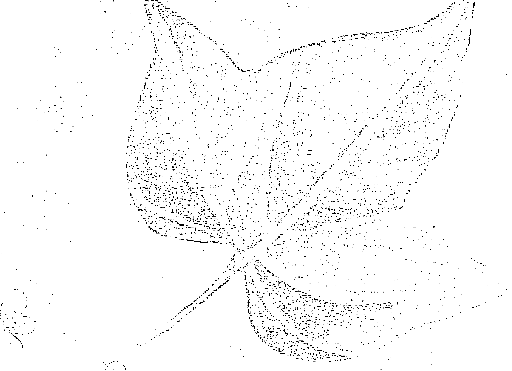

#### 权杖国王

他手中的权杖竖直向上，发出火光，仿佛火炬般明亮。他本身就是一盏明灯，熊熊燃烧，点燃了心中的火焰和头上的皇冠。他高举火把，照亮前路，然后大步前进。大地颤动，树木也纷纷让路。树干开裂，枝叶折损，一切都愿听从他的意愿，甚至不必他开口下令。您的愿望就是我的命令，主人。

权杖国王拥有超凡的魅力，无人能够抵挡。只要他心有所愿，整个世界都能够改变自己，为他开道。他是灵感之源，充满与生俱来的能量和荣耀。他拥有自然之力，火焰与之相随。他的血液，他的声音，他的每一个碰触中都散发出熊熊火光。他像雄狮般骄傲、凶猛，在实现自我的道路上勇往直前，尽情开创。他自信、有力，富有行动力，再勇猛的野兽也只能换得他蔑视的目光。他象征着勇猛和自信，毫不犹豫地开拓疆土，兴奋地期待即将到来的冒险。

### 圣杯牌组

#### 圣杯首牌 (ACE)

在平和如镜的湖面上，第一滴水落了下来。涟漪悄无声息地缓缓散开。仿佛地面轻微震荡，却将海面的波浪掀起，围绕水柱散开，消失在天际。这是情感的首次出动，这是激情第一次被点燃，这是爱意初临，是亲密新体验。这是万物和谐之音律，来自心底深处，一点一滴融入情感，汇成细流。这些涓涓细流安静地延绵流淌，聚成河流，汇入浩瀚情海。圣杯中清澈的水面仿佛一面魔镜，静静地反射水晶般光彩。小心啊，别忘记直觉收到的刺痛，小心未来带来的悲伤。等你明了这些之后，拿起杯子一饮而尽吧。其中的清水，正是闪耀的情怀和深刻的智慧之光。

鱼，这海洋深处的居民，正是圣杯的守护者。还有古老的海洋精灵，他们是藏身海底的灵魂。它们在海洋中优雅地遨游，体验情感的奥义，用尽生命起舞。月亮阴晴圆缺，海浪潮起潮落，海洋拥抱着生命，生命中的血液也伴随律动，那是情感的律动。

### 圣杯2

一切都融化了，甘泉、大地、天空……鱼儿在圣杯般晶莹剔透的河水中游荡。森林女神的枝叶缠绵悱恻，将周围的空气涌入怀中（亦或海洋？）。他们心有灵犀，紧紧相拥，仿佛连身体也要合二为一。即使如此，却又保留着各自的颜色和独立。

仿佛阴阳双生，二元对立，他们和谐地环绕彼此，满是温柔，和谐统一。瞧，他们分享着同一个圣杯。“喝吧。”其中一个捧着圣杯，轻声低语。“好啊。”另一个回答，伸手握住圣杯。他们深深地饮了一口，就在这一瞬，养分已同时融入他们的身体。还有一个圣杯，它稳稳落在一根树杈上，似乎无人注意。但精灵和仙子们看到了，他们正仔仔细细地端详着。随着树木生长，抽枝展叶，从稀疏到繁茂，沧海桑田，是否一切不变？圣杯还能否端坐枝头，还是会打翻落地？

圣杯2象征建立关系，合作与联合。不同立场的人联手，带来潜在的关系。它也代表一段人际关系的开始，或者一段感情的和谐期。圣杯滋养着生命，所以人际关系也会因之变换、生长。有力的联合能成为坚强的后盾，无力的联合被人淡忘，无影无踪。

### 圣杯3

有这样一首流淌在海里的歌。它栖息在峡谷和海沟里，它潜伏在暗礁和洞穴中，它也藏身在海浪的拍打声中，躲进海豚的鸣叫声中。一旦时机成熟，海洋的气泡汇聚成强大的屏障，它就以不可阻挡的势头向海面猛冲。海底深处的赛壬（用歌声诱惑水手的海妖）们猛然跃起，她们已经等了太久太久，这一时刻终于来临了。海洋深处开始传出强烈的信号，经由海浪传递到每一个角落。赛壬开始唱歌了。她们用声音为大海编织出绝妙的曲调，用双唇将欢愉唱进抑扬顿挫的歌声中。

海水欢乐地震颤着，海底居民苏醒了。各式各样的海洋生物纷纷涌出，跟随着赛壬的歌声起舞。所有生物都随波荡漾，感受着来自海洋那优雅而有力的律动。旋律伴随行云流水般的舞蹈涌向海面，来自海洋的歌声回荡于苍穹。

圣杯3代表庆典、舞蹈和欢歌。友情和聚会是开启它的条件之一，另一个条件是拥有伴侣，团队或者可靠的伙伴。

#### 圣杯 4

她轻轻落在湖面上，发丝扫过水面，涟漪荡漾在指尖。她跳上石块，任湖水漫过秀发，洗涤双肩。她的鱼尾甩动水珠，在空中画出一个圆弧。仿佛碎钻点燃星火，在空中光芒闪动。随后，光芒落入湖水，消失了。于是她躺下来，一动不动，安静地呼吸，直到确定自己是独自一人。也对，谁会想要跟踪她呢？大家的时间和精力全部放在水下的世界。但她等待着，一直等待，她想百分之百地确定，真的是自己一人。她不喜欢他们，如此乏味，海洋无休止的舞动也让她疲倦。

她划动的涟漪渐渐消失，水面又恢复成光滑的镜面。天空的蓝色都融进水里了，散发出青蓝色的光，杳无边际，流光溢彩。在这一瞬间，她的思绪逃离了身体与尘世，潜入梦幻的冥想世界。她仿佛第一次看到自己的倒影，简直被迷住了，眼中除了虚空的迷幻，就是这让人惊讶的美丽容颜。她凝望着水中的双眸，像两颗晶莹剔透的葡萄。突然，她的指尖触到了湖水，倒影被波纹化开，消失了。

她呆住了，直到此刻她才发现，她根本不是独自一人。海洋的居民让她独处了一阵，但空中的精灵却在她毫无戒备之时靠近。他们专心地注视着她，撺掇她，嘲弄她。她一下感到寒冷，干燥的肌肤思念着海洋柔软的拥抱，而她思念着伙伴和姐妹。

圣杯 4 表示着一种无趣、缺乏激情的生活状态。

### 圣杯5

她艰难地涉过沙丘，每一个步伐都如此沉重，等到终于抵达海边，她的双足已饱受折磨。她走向沙滩的边缘，紧紧抱住半空半满的鱼缸。她多害怕在这一刻，鱼缸滑落，摔碎在岩石上。她双脚赤裸，浸泡在冰冷的海水中。海浪拍打着她的脚面，带来真正彻骨的寒意，她仿佛觉得自己被撕碎了，碎成千万片。

她颤抖着，忍受着寒风掠过肩膀。但她没注意到，除了风，掠过肩头的还有精灵。他们用指尖温柔地抚过她的长发，在她耳边说着安慰的话语。可她全无察觉，因为她所有的意识和精神，都用来关注自己的悲伤与痛苦。她传递出自己的绝望，也传递出自己的渴求，那些思绪仿佛变成了白色的帆船，越过海洋向前航行。它们什么时候才会满载而归呢？她想。她哭了，眼泪注满了鱼缸。

她收集每一滴落在胸前的眼泪，想象中间有一条鱼在游动。她捧起这新的鱼缸，看它从空气中游到水里，又从水里游到空气中。

圣杯5代表独自忍受悔恨和损失。被幸福抛弃或感到悲伤，满心盼望留下机会，重新拥有。

### 圣杯6

她是迷途的女孩，直到寻获自己的命运。她停在这里，身旁有小溪涓涓流淌。她摆下桌子和茶具，招待可爱的访客。那都是第一次来做客的朋友，它们纽扣做的眼睛闪闪发亮，线缝的嘴角挂着微笑。精灵们也忍不住来参加了。他们从树林的阴影中来，从空空的洞穴中来。溪流中冒出了精灵和仙子，山毛榉和橡树旁露出了树妖和生活在地下的小妖精。他们都是她的伙伴，她表示愉快的欢迎。

他们爱她，爱她的天真无邪，爱她的自由自在，爱她的纯净之心。她还没有被尘世玷污，不觉得什么事不能尝试，也不觉得什么事必须完成。在她的世界里，鱼儿甚至不必游于水中，它们在空中尽情穿梭，水面上照出它们的倒影。她开心极了，精灵的陪伴让她雀跃，布偶的陪伴让她安心。

精灵女王走向前来，精灵们纷纷后退。女孩继续微笑，奉上一杯热茶。

圣杯 6 是童年的无邪、是美好的愿望和纯净的品德。是简单的快乐，是重温愉悦之情。圣杯 6 不希望你对此感伤，它希望你回想起从前的故事，然后让自己更宽容，更懂得尊重。不要被生活中急速射出的箭逼迫太近，你可以折断它，选择和生命紧紧连接，这是你的责任。

#### 圣杯 7

她眼中只有云端，繁星是她的双眼。每当她望向内心，明确的目标都会被月亮遮掩。她身在高崖，命悬一线，自己却毫无察觉，似乎心灵全然被其他的东西吸引。她甚至渴望退后一步，坠落悬崖，坠下充满迷雾的深渊。风拍打着她的头发，骚动着，和她一起兴奋。

而他，他站在稍稍低一些的地方，正在思索。当她满心盯着空中飘浮的幻象时，他脑海中出现的是悬崖旁的城堡。虽然手中的地图模糊不清，符号难以辨认，虽然千难万险，但他们依然能够成功。他懂得，渴望奇迹并不会带来痛苦，但空想会。

可她不这么想。“抬头看！”她喊道。她的手指摩挲着他的肩膀，迫切地想要他倾听她的诉说，她的渴望。他呢，心不在焉地点点头，努力抛开“也许我们真的能到那座空中城堡也说不定”的想法，继续埋头研究魔术师给他的地图。

圣杯 7 包含着对幻想的沉迷。拥有太多的选择带来了太多的问题。面对如此众多的去路，事情开始变得令人敬畏。太多的欲望，带来了太多的艰难。有些可能实现，有些是明智之举，有些则是冥冥中发出的诱惑之音。圣杯 7 带来无限可能，该何去何从呢？

#### 圣杯 8

她是海洋的追随者，也是海洋的追寻者。她向海底游去，向最深处游去，穿过蓝宝石般的海水，向黑暗游去。她拨开寂静的海水，在顺流和逆流中轻巧地穿越。她远离海面上光明的世界，和那里耀眼的浮华，她只想要最深处的真理。仿佛深海生物会发出冷光，有些事物，只有在幽暗中才能寻获到它的光亮。去吧，海洋的追寻者，在那深处有发出微光的真理的世界，去吧！

圣杯 8 召唤着你，鼓舞你去发现和追寻自己的探索之路和答案。它希望你离开物质世界一会儿，花时间去探索精神。离开逻辑世界的思维与框架吧，避开空气中总是吹响号角、嗡嗡作响的风。海洋的怀抱更加柔软，那里涟漪与水流交织，是你的愉悦之地。海洋能融合各种情感上的冲突，能让每件事都变得一帆风顺。

阳光渐渐远离，圣杯却渐渐明亮。它们缓缓向深处下沉，光滑闪耀，召唤你去拥抱每一个。现在是放下一切的时候，把意识交给海洋，让自己融化在波浪中。

圣杯 8 代表着你正超越某人，或突破某特定状况。它表示一个人光理解还不够，还包括离开一种稳定的状态（圣杯六），去发现圣杯十所提供的满足感。

#### 圣杯 9

所有的内心渴望都触手可及，它们化身鱼群，泛出金黄色的光。它们来回游荡，越聚越多，甚至无处容身，必须跃出海面。温柔的月光在他的皮肤上滑过，他和它们一起唱起了生命之歌。

他们为世界献上丰饶的礼物，那些伸手索求的人，都得到了满足。世界变得欢快、美好与宏大，鱼群结伴而行，在水中画出无比优雅的漩涡。它们游啊游啊，没有谁单独行动，仿佛一支精心编排的舞蹈。

鱼是健康和财富的象征，也预示着美好的未来。圣杯 9 带来各种感官的愉悦享受，带来满足和美梦成真。未来已经给出承诺，所见一切都幸福完美。

### 圣杯10

海水在两人身边打转。海浪享受着阳光的亲吻，水波变得温暖而诱人。他们在水中拥抱，随波漂流，他们心中燃起火花，彼此吸引缠绕。外面的世界仿佛已经静止，在此刻只有完满和融合存在。他们不需要旁人，但周围的生物依然眷顾着他们。

鱼群吐出气泡，汇集到一起，形成明亮的光球。这光线散发出欢乐的情绪，保护他们不受阴暗海水的侵扰。鱼是富饶的象征，它们滑过蔚蓝的海洋，鳞片像金子般闪闪发光。这是狂喜的时刻，片刻就能获取满足和无上的欢乐。这欢乐是真实的，但必须时刻关怀，用爱滋养。否则它将坠入深海，像打散的鱼群，永不再来。

圣杯10代表最终的和谐与平静，代表欢乐与成功。它尤其代表一种情感上的满足，而不仅仅是物质或精神上的满足。同时，家庭的支持和坚强的纽带，是安享幸福的重要保证。

#### 圣杯随从

她深入海浪，独自寻找，想去往一个平和之地，好理清她的思绪。

她随身携带着圣杯，杯中盛满光芒。有来自海面上的阳光精华，流光溢彩；有来自深海的金币，点点微光；还有不知何处的迷途光线，不小心在海中走失，被她发现。她把所有这些提炼收纳，捧在手中。

她端起圣杯，感受那金色的光芒。她回想起阳光的亲吻，于是海水也变得温暖起来了，更加宁静与祥和。温暖的火光激起了她的情感和想象，她的思绪开始飞出，同海浪一起，随波荡漾。她目光迷离，眼中充满梦幻奇景。

圣杯随从多愁善感，她拥有一颗真正的浪漫之心。在嘈杂喧嚣的世界里，她总是想寻找一个安静的角落，享受沐浴在欢乐中的一刻。她拥有深刻的理解，也拥有过人的直觉，这让她能够全心全意，追随那来自灵性深处，语言无法表达的声音。对她来说，一切不可能的事物，都值得相信。

圣杯随从代表着有益于情感的奉献。

#### 圣杯骑士

独角兽是海洋之子，海浪和泡沫伴随着它发出吼声。它狂躁不已，在海上冲撞，只有心灵最纯洁的人才能和它同行。圣杯骑士参与了这场没有尽头的追寻，在寻找神秘的旅行中彼此相伴。

他是守护圣杯的圆桌骑士，他是浪漫无比的战士，他追随着心灵与情感，去往梦想中的地方。他是艺术家，是音乐家，也是诗人。他目光迷离，能看到旁人看不见的梦幻国度。他是梦想家，绝不用物质衡量一切，他只会不顾一切地踏浪前进，继续那也许不知后果的旅程。

圣杯骑士总是追逐着梦想。他靠直觉引导自己的旅程。海洋中的妖精和仙子纷纷跳出，争着告诉他梦想之国有多么遥远，陆地才是他的故乡。而他反而心生怜悯，同情它们的现实与恐慌。他要继续前进，用自己的双眼一探究竟。

金色的圣杯正是他内心完美的体现。他一直懂得，只要保持忠诚和坚贞，相信内心的直觉和召唤，总有一天，圣杯之地会欢迎他的来临。海浪在他脚下翻卷，不知何种生物潜伏在下面——但他毫不在乎，在蓝宝石般的大海上，他只看见那些晶莹的浪花。

圣杯骑士代表着在情感和行动之间做出决定。

#### 圣杯王后

圣杯王后是创意的代言人，她充满诗意，是想象的化身。她能在碧波上舞蹈，用生命之舞牵动世界，也牵动着身边的一切。

她明了自己的直觉，并追随内心的感受。她时常倾听星星的低语，因为星辰比一切生物更古老、更智慧，在海洋刚刚诞生的时刻，它们就已经开始书写世界。

她行为随意，举止任性。但不要被外表欺骗，她拥有最深刻的学识，她的智慧来自于大海深处。海龟，那些住在海底的古老智者，也摇摇摆摆游到近前，参加她的庆典。整个世界都在舞蹈，仿佛梦幻之门敞开，所有事物都融合在一起，酣畅淋漓。这是涌动的无意识的边界，是灵性与直觉的国度，在这一刻，它们与现实世界重叠。这是创造的时刻，是灵感喷发的时刻，是完美的时刻。

直觉包围着她，保护着她。圣杯王后舞动着，享受和另一个世界相互融合的快乐。她面前消失的土地是一扇门，通往深不可测之地。王后看顾着入口，欢迎那些与她一同舞蹈，回应召唤的人。她在入口前继续跳着，看蔚蓝的海洋与天空拥抱——就在海天一线的地方，世界与世界正完美相融。

圣杯王后代表着透过倾听直觉而成功。

#### 圣杯国王

他是智慧的，也是深刻的。他深谙等待的含义，就像游曳在他身边的海龟。长久以来，他用不变的冷静指引着变幻莫测的深海之路。千百年来，他阅读着龟壳上的花纹，领略其中的智慧，间或低头，从圣杯中啜饮一口智慧之水。他的行动总是缓慢的、优雅的，仿佛蔓延的水波，像海洋本身那样清澈。

海马是波塞冬神力的代表，充满着不知疲倦的水之能量。它深具耐心，不受控制，在海洋中以独特的步调前行。他随波飘荡，顺从现状，有时背上的尖刺保护自己。不要轻视海马的力量，雄性海马是年轻人的保护神。

圣杯国王也是一名保护神。他关爱身边的每一个生物，为它们奉上治愈之水，也奉上他的怜悯和关爱。他透过海流融进你的血脉，带来讯息，净化心灵。他非常耐心，非常宽容，但同时他也懂得，所有的需求必须保持平衡。

### 宝剑牌组

#### 宝剑首牌 (ACE)

宝剑双刃双锋。它用绝对的正义斩断阻碍真理的荆棘，迸发出智慧和公正的光芒，给世界以清澈透明。但那傲慢和狂躁也呼啸而来，伴随宝剑的力量同行。这两种截然不同的能量在利器中交汇，合二为一，降临世界。

新生开始了。风在空中打旋，召唤天空的守护者，召唤那些身生羽翼的纯净灵魂。漩涡升起，气流上冲，宝剑的力量划破长空。

身生双翼的生灵都是天空的使者，也是宝剑的守护者。最优雅的是天鹅，它展开白色的翅膀，脖颈弯出美丽的弧度。小心啊，不要轻易靠近。天鹅是拥有强大力量的生物，它们隐藏着暴虐的天性。一旦被激怒，天鹅将不顾一切地战斗，双翼鼓起长风，令敌人止步前行。

#### 宝剑 2

他横挡路中，挥剑斩杀所有敢于接近的生物。他隐藏气息，无法预测，又冷酷心肠。双剑阻挡着去路，金属泛出寒光。“还有谁妄图从这里经过？”他说道，眼神冰冷，尖牙撕磨。他一动不动，仿佛自身也化为铸剑，毫不动摇。丛林的精灵在他身边的树枝中穿梭，它们感受到他的吸引——坚如酷铁，冷若冰霜。

宝剑2代表僵局和思路。双方都不愿合作，除非一方做出让步，否则事态不会进展。这就像一着死棋，拼命挣扎，宁死也不愿寻求权衡之路。这是对现实的否认，对真相的逃避。

当宝剑 2 出现，你会对眼前发生的事实和内心隐藏的情感视而不见。

> “睁开你的双眼。”天鹅开口说话。她奉上金币和鲜花，试图让死亡沉睡，拆去缠绕的荆棘和篱笆。

> “敞开你的心灵。”天鹅恳求着，她扔下闪亮的宝石，可他的心始终紧锁，只愿索取，不愿付出。

#### 宝剑 3

雄伟不在，美丽陨落，天鹅遭到了背叛。她满心血泪，充满悲痛和忧伤。她并非无助的生物，此刻却一动不动。她曾为自己和子民奋力拼搏，现在却将自己独自献祭，卸下武装。是伤痛让她无力起身？还是忧伤击碎了她的心灵？这是一张带来悲伤和心碎的牌。

宝剑 3 充满孤独、分离，它孤立无援。没有谁安慰或是伸出援手，也不知道是否有其他人落入同样的境地。在美丽陨落之际，世界转身，抛弃了伤者，甚至不曾回头，给那颗支离破碎的心最后一击。

度过悲伤吧。心灵的泪水会净化灵魂。血液流失会重生，你将一跃飞起，在天空再次起舞。

## 宝剑4

她将双臂放于胸前，摆出了死亡的姿态。但这只是休憩和恢复的时刻，并非最后的休眠。她静静安睡，思绪自由飘远。她紧闭双目，冥想自己在空中漂浮，窥看全新世界。胸口的宝剑上雕有眼睛的图案，她也由此向内深入，探索迷雾般的内心。她自我放逐，好有时间一探究竟。她身边漂满莲花，是精神和纯净的象征。莲花出淤泥而不染，涤荡清波，在阳光下开出美丽的花朵。粉色的莲花也象征着启蒙，追随心灵的真理旅程。

她枕在剑上，这样在冥想时，宝剑将刺破虚假和彷徨。她将找到祥和宁静之地，在那里短暂休憩。她深知这只是安详片刻，因此双手紧握宝剑。她深深呼吸，将每一缕花香都镌刻进记忆。现在，她已完成探索，随时准备拔出宝剑，重回充满抗争的世界。

宝剑4是一张休息的牌。你该闭上双眼，放飞心灵，寻找属于内心的祥和与平静。这里居住着心灵的力量，每当你感到疲倦，都能在此获取储备的能量。

#### 宝剑 5

黑夜将尽，初生的太阳破空而出，给黎明染上淡紫色的天光。突然，响亮的号角声传来，战斗撕破了空中的祥和。暗之天使拿起宝剑，与黑天鹅一同加入战斗。

它们经受了利益和权势的争斗，羽毛已不再洁白。他们将不会再与浑身雪白的兄弟姐妹嬉戏，周身散发出黑珍珠的光泽，带来暗夜之美。它们曲颈向天，发出刺耳的叫嚣声，期待即将来临的战斗。

暗之天使像箭一般射出，划过天际，心中只有自己的目标。为达目的，他放弃了原则与界限，不择手段才是他真正的索要。他眼中只有自己，只有胜利者；但他忘了——没有对立，何来冲突？胜利者和失败者，其实缺一不可。天使究竟是谁？他是唱着凯歌的胜利者，还是被逐出天堂的失败者？他背上的双剑来自宝剑2，不问理由地争斗，并且否认失败。剑锋闪过，结局来临，他选择清醒，还是继续堕落？

宝剑5象征着利益冲突，带来争斗与不和。有时候，面前选择诱人，好处能轻易取得。别只为自己考虑，不是全世界都联合起来对付你。敞开心灵吧，换个角度看世界，否则你会越来越孤立。

#### 宝剑 6

他缓缓闭上了眼睛，感到一双大手将他抱起，放到柔软的天鹅背上。他触摸到坚实的肌肉，有力的筋骨，感受到天鹅起飞后空气的颠簸。他觉得双臂舒展起来，悲伤逝去，如婴儿般蜷缩起身体。他把自己交给这神圣的守护者，让她带领自己高飞远行。

天鹅穿过黑夜，翅膀不知疲惫，似乎永不会筋疲力尽。她双翼鼓动，不停挥舞，扇起有力的节拍。她温暖的心脏有力的波动，仿佛将那温暖渗透出来，融进他的肌肤。

黎明吐露出第一丝光线，他终于睁开眼睛——向下望去，脚下是无垠的大地。如此遥远，如此渺小，他甚至难以想象，就是那里曾经带给他如此大的创伤和磨难。他又望向远方，云雾散开，他看到了天鹅飞向的目的地。他微笑着，拥抱着她，感到指尖生出全新的力量。

宝剑 6 代表远离痛苦。这是在创伤之后获得重生的机会。混乱的世界总会让我们意志消沉，但你必须寻找道路，重新振作起来。

#### 宝剑 7

他把真实面目隐藏在面具之下，顺带一同掩盖了真实的品性。他躲过宝剑守卫者的目光，窃笑着偷走了一根战利品。他以为她疏忽大意，其实她了然于心。她了解他，深谙他的天性。

身披黑色羽毛的鸟儿俯冲而来，呱噪不止：“这算什么？就是根没用的样子货！样子货！”他们蔑视着他手里的宝剑，宝剑怒气冲冲，发出寒光。他毫不理睬，背对他们，表示自己的轻蔑。

他才是最聪明的那只黑鸟，只有他能从石堆中取得宝剑。宝剑7象征想要逃避的责任。它尝试带走不属于自己的东西，表露出小偷的行径。他品行不端，试图将一切占为己有，并对任何想要分享好处的人恶言相向。这是个充满欺骗的世界，如果某人不值得信赖，那就不要把信任浪费在他身上。欺骗带来怀疑，从而消极应对世界。

#### 宝剑 8

荆棘缠绕，遮掩在黑莓枝包围的树篱中。莓果甜美多汁，枝条却庞杂带刺，难以靠近。一只小小的蜂鸟飞来，它轻松穿过盘桓交错的陷阱，钻入细小的缝隙，品尝美味，又穿越而出。但平日尊贵高雅的天鹅却狼狈陷入，那宽厚有力的翅膀，恰恰变成了牢笼——黑莓枝交错缠绕，倒刺扎进翅膀。她并不是第一位受害者，瞧，四周地面散落着头骨。他们个个都拥有力量，充满自信，以为自己能征服一切。仿佛睡美人城堡周围被施了魔法的丛林，吸引来无数的骑士，让他们在尖刺的拥抱中死去。

仅靠力量对抗力量，无法征服一切，胜利有时源自他径。蜂鸟飞进来了。“冷静点儿，”她说。天鹅停止了扑打，尖刺也不再继续攻击。蜂鸟轻轻拔出尖刺，一根接着一根。天鹅抬头仰望，空中闪耀着自由的光亮，高远却并非遥不可及。

宝剑 8 提醒我们，不要在琐事中浪费精力。危机很容易刺激感官，在外力所困之时，让我们感到限制、困惑和无力。环境制约并不可怕，你只要稍作喘息，集中精神，总有办法能重获自由，逃出生天。

#### 宝剑 9

乌鸦盘旋，带来死亡的消息
沙哑的鸣叫，传递终结之音
盘旋着盘旋着
跚跚靠近
有一种来来向往探索
有一种来来充满恐惧

空中出现了向上的阶梯，风暴遮掩着高塔，充满着不详的预兆。但他抬头望去，发现天际微亮，有一丝金色的光芒摇曳，吸引他的目光。“跟我来吧，跟我去吧。”盘旋的乌鸦飞掠而过，窃窃私语，“让我引领你。”他再次抬头，焦渴的目光向上搜寻，却忘记在黑夜中守护住灵魂。他紧握宝剑，寻求安全感，却忘记它将会引领他走向真正的光明，远离黑暗。他忘记自己手握指路明灯，亦或软弱无力，难以驾驭。

他饱受痛苦的折磨，胸口纹出的宝剑，代表他曾经历过的悔恨。他苦于内心的折磨，还有愧疚和莫名惊恐的夜晚。他本属于天空，展翅就可高飞，却无法碰触那辽阔赐予的无限自由。现在，风暴即将来临，咆哮的气流撕开大地，天空伸下利爪——但只要他放下心中的疑虑，就能同乌鸦一样盘旋，飞向平静的高空。

剑 9 代表内心的混乱，其实外界情况并没有糟糕到顶点。灵魂被心魔折磨，愧疚或者恐惧限制着你的行动。了解恐惧的源头，体验它们的含义，你拥有冲破一切阻碍的自由意志，只要你解放自己的心灵，它就会出现。

## 宝剑10

她缓缓落下。鸟儿不但没有伸出援手，反而在她身旁上下回旋。他们发出邪恶的鸣叫，仿佛秃鹫在等待死亡的降临。他们的翅膀利如刀锋，羽毛冷如匕刃；他们用尖戾的鸟喙刺破她的长袍，让她下落得更快。

刺耳的鸣叫在阴沉冰冷的夜晚回荡，一切都变得格外恐惧。空气疾掠，擦过她的双耳，仿佛在山谷和洞穴中来回呼啸。树木向空中伸出干枯的枝条，身躯早已破败，一切归为死寂。结束了，这就是结束！她突然发出了震天的哭声。神啊，难道这一切的一切，都是为了给死亡拉上戏剧化的帷幕？

宝剑10代表灾难、荒芜、幻想破灭、责任终结。仿佛她自空中坠落，进程无法受自己控制。四周煽动着漩涡和气流，除了毁灭，还是毁灭。有时候，事情就是要走向终结，你只能收拾起一地碎片，并从不幸中学得智慧。

#### 宝剑随从

她轻盈地浮在空中，怀里搂着一只小小的天鹅幼雏。她用身体做成壁垒，保护它不受伤害。她拥有强烈的意愿，认定目标均能实现。这也是她对待世界的态度和看法，正如下面聚集的天鹅，扇动有力的翅膀保护她。它们是尽职的守护者，机警的双眼四处顾盼。它们的翅膀掀起气流，托住她安然穿越暗夜。

她笑了，抬起头来，望向群星，仿佛寻求指引的水手。群星用微光画出一条航路，让它们得以跟随其前行。群星已这样做了千百年，从遥远的古代，它们就为人类描画星座，给予指引。它们交相辉映的星光织就出神秘的地图，在她掠过天际的刹那，呼唤着她的守卫，也呼唤着托起她的风。

突然，风起云涌，天色暗淡，风想要回应星星的召唤。她开心地笑着，鼓舞着这自然之力去追随星星的呼喊。因为即使风从翅膀下消失，她也不会惊慌。她聪慧又机敏，知道如何感知细微的变化，也知道如何转变适应。她是你的明灯，指引你从强烈的日光下避开，让视线恢复清醒。闭上双眼，再睁开吧，夜空中的守护者，也在为你开路。

宝剑随从是诚实和正直的化身，她无所畏惧，坚持信仰。她望向黑与白的边界，观察暗夜与天光。她懂得自己为何存在，也懂得灵魂深处真正的含义。她对情感毫不保留，但作为风的使者，她绝不会让感情支配自己、影响决定。理性，只有理性才是她的追求，她要终生与此为伍。她思维敏捷、善于分析，并用这些技能守护自己。她善于加以判断，配合直觉，同时为新鲜事物留出空间。

#### 宝剑骑士

宝剑骑士是一位勇猛的英雄，他带着信仰，一头扎入战斗。他行动迅速、直言不讳，掩饰不是他的长项，谎言不是他的面具。他是最诚实和最忠诚的依靠，稍稍欠缺了圆滑和谨慎。另外，情感对他来说可算身外之物，他不会让感情拦在自己和目标之间。他不选那些显而易见的挑战，他喜欢怀疑和恐惧，带着理性的宝剑锋芒，无所畏惧、所向披靡。也许等待终点的只有失败，但他不会轻易退缩，因为他眼中只有胜利。

骑士拥有超强的意志力，甚至有点蛮横。他骑乘着国王的飞鸟，如同利刃，插入苍穹。他是勇敢的探索者，用利刃和翅膀斩断疾风。他匆匆掠过，冲向前方，随从部队扬起阵阵旋风。他凌驾于团队之上，奋勇向前，穿越混沌迷雾。面对深渊，他发出呼啸：

> 带我腾飞，空中的精灵
培养我大鹰的双眼和雀鸟机敏
给我乌鸦的警惕
还有蜂鸟的勇气
天鹅的双翼，托起我吧
让猫头鹰的智慧指引我前行

宝剑骑士代表要达成愿望需要有敏捷的行动。

#### 宝剑王后

宝剑王后用刀锋划开谎言和欺骗，为真理开路。她诚实、深刻、理智，抬高双手，把飞舞的探索者送入空中。它们是她的身体的一部分，它们脱胎于她的心灵。它们所见一切，必将成为她所见之一切。它们懂得灵魂的语言，因为它们正来自灵性之地——转化、蜕变，死亡并非长眠。

明亮的白色代表纯净，那是诚实的颜色、清澈的颜色、理智的颜色，它平衡了一切。但小心啊，白色也是死亡的颜色，是距离的颜色，是冥界的颜色。你必须摘掉虚荣的面具，祛除谎言才能辨识真理。从过去剥离出来，离开厚厚的保护壳，向内探究，寻找你真正的面目，面对世界。

宝剑王后是一位富有智慧的女性，她忠诚、诙谐、爽直、幽默。她用理性看待世界，用经验衡量世界，她向内注视自己，如同注视着一面镜子。她知道那是自己本性的倒影，散发着美丽的光芒。在花语中，紫色百合代表内心的力量，白色菊花则象征真理。

#### 宝剑国王

他手中的宝剑竖直向上，是力量与荣誉的象征。他手握生杀大权，宝剑永不入鞘。这个勇敢的国王虽然端坐，但随时可以站起，开始必要的行动。

这是位领导者，威武地走在队伍最前方。他一路担当重任，追随着宝剑的智慧，走在通往真理的路上。现在，他停了下来，但猫头鹰将继续引领他前进。它停在剑端，一动不动，双眸闪耀着古老的智慧，心灵和人类的思维连接。

除了猫头鹰，他脚边的乌鸦也给予他指引。他们象征着奥丁的两只乌鸦，一只代表思想，一只代表回忆。它们飞去远方，寻求真理和智慧，再将消息传回，对他窃窃私语。这些鸟代表着白昼，也代表着黑夜。乌鸦身披太阳闪耀的光芒，猫头鹰代表暗夜的智慧——在那天鹅绒般柔软的星月之光下，是只有暗夜的使者才能听清的叹息。

国王肩头落有紫色的阴影，这颜色意义深重，古埃及人把这种紫色献给君王。他的王座刻有达芬奇的维特鲁威人，对称均衡的人体舒展，中心是宇宙浮现——在这里，科学与艺术完美融合。

### 钱币牌组

## 钱币首牌（ACE）

这是实现财富，保障生活的机会。对那些辛勤工作的人，钱币首牌会给予他们繁荣、健康和富贵——他们付出的努力必将有所回报。

一粒种子跌入肥沃的土壤，它会如何发芽？如何生长？开出怎样的花朵？结出怎样的硕果？钱币代表将有财务入账，但需要耐心等待或辛勤劳作。种瓜得瓜，种豆得豆，什么也不种，就什么也没有。种子需要日日灌溉，施以养分，还有勤加看护。收获不会凭空落下，成功也不能靠白日梦。用渴望之心浇灌它，用信仰之心看顾它，用勤奋之心照料它，养料充足，才能有累累硕果。

在古埃及，火蜥蜴代表非凡的智慧和无上的财富。他们是大地的子民，和变色龙、巨龙一同成为金钱的守护者。他们将引导你从迷幻和梦境中走出，进入现实的世界，让欲望与所求触手可及，梦想成真。

#### 钱币 2

他单脚站立，跳着怪异的舞步，看起来仿佛马戏团的小丑。
他的姿态仿佛湿婆（印度教毁灭之神）降临，在创造和毁灭间舞蹈。
这是势均力敌的较量，是时刻不停的权衡。虽然他在努力保持平稳，
但脚下断石颤抖，似乎微风拂过，就会向山谷冲落。但他如此自信，
因为他深谙舞步的精华。他能捕捉到每一丝风吹草动，仿佛和风
缠绵，共同跳一曲双人舞。他是否自信过头？万一坠入深渊，会
不会悔不当初？如果风突然失去兴致，鼓起风暴，他如何力挽狂澜，
拯救自己的生命？

钱币 2 代表着维系平衡，他游刃有余地将手中之物变换位置，
平衡调停。如果计划被打乱，不要惊慌，打起精神，你可以应付——
只是不要同时面对太多。

#### 钱币 3

他们亲密无间，共同工作，相拥成一座人梯。一人贡献肩膀，一人贡献力量。一人把另一人架起，碰触更高的地方，他们向上升去，面对工作的石墙。她抬起手指，雕刻出钱币的图案。他们之间紧紧的联系，象征人际关系的锁链。这是一个互相包容，互相搀扶的联盟，是一个关于人际关系与互利互惠的互动。她小心翼翼地刻画着每一笔弧度，每一道笔画都属于整体的蓝图。她的指尖在石块上轻轻划过，仿佛石墙是柔软的粘土。坚硬的石块在她指尖下融化，让她轻松设计、勾勒——这力量来自他们共同的意志，任何困难之事都能完成。所有不可能的任务都变得简单清晰起来，他们的合作产生出一股无法阻挡的力量。

钱币 3 代表团队合作，以及互相帮助时具有的优势。它强调工作能力，还有超水平的发挥。有时候联手是达成目标的必要手段。并不是所有任务都能凭一己之力完成。也不是所有人都只能向自己求助。寻求联合不代表失败，相反，这说明你人际关系良好。拥有耐心，制定计划，坚持合作，这就是成功的原则。

#### 钱币 4

巨龙紧紧蜷缩着身体，把珍贵的宝藏包裹在怀里。他把大量的生命花费在寻获财宝上，然后小心翼翼地藏在怀里，日夜看护。不许别人碰到，没人能从他手中夺走！“这些都是我的！”他对那些想要靠近的小生物怒吼。蝾螈和蜥蜴四下奔逃，他们本是他弱小的兄弟，现在却唯恐他把自己烧焦。

“是我的金子，我的！”他大声宣告。他看到变色龙正贪婪地注视着他的金币，他想那些小东西一定在等待时机偷盗。他甚至觉得悄然抚过的微风也满含狡诈的气息，让他无法安心。所以他紧紧蜷缩起身体，紧紧地蜷缩，鳞片互相交织，发出咯吱咯吱的声响。他注视着金币发出的光芒，那样可爱、那样柔和，不会消退，直到永恒。

钱币 4 代表占有欲，他总是想控制一切。受到这么强烈的占有欲的控制，他的生活处处受限、碰壁。他为自己编织起牢笼，拒绝任何改变。他拒绝交流、拒绝发展，拒绝一切。同时，他否认自己的弱点，虽然他从不曾远离。他享有荣华富贵，心灵却被物质的枷锁封住；他贪婪吝啬，可笑可悲。放下心中的自私吧，打开心灵，分享比珍宝更能带来欢乐与幸福。

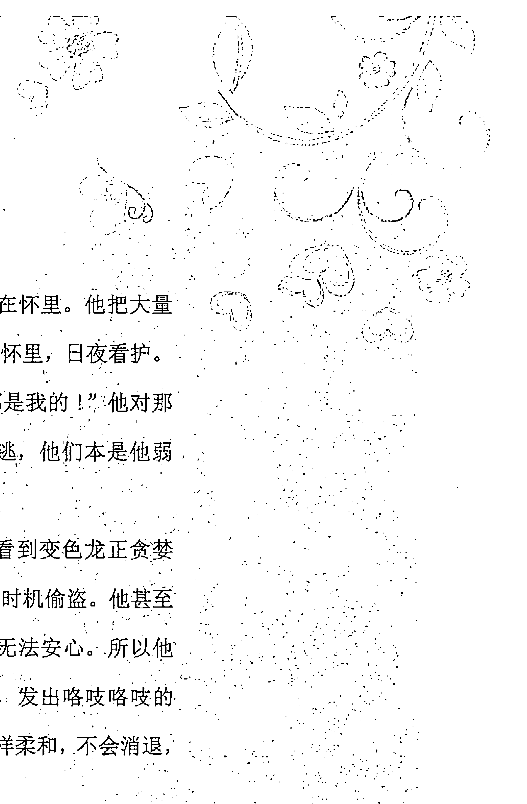

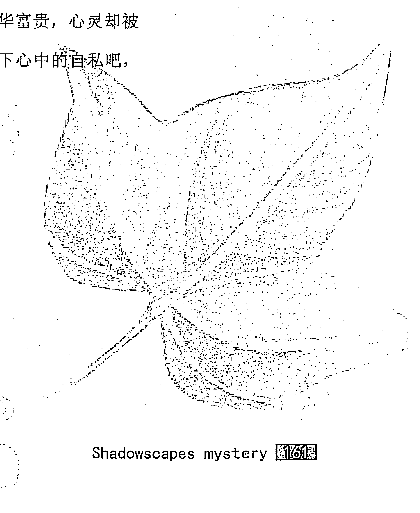

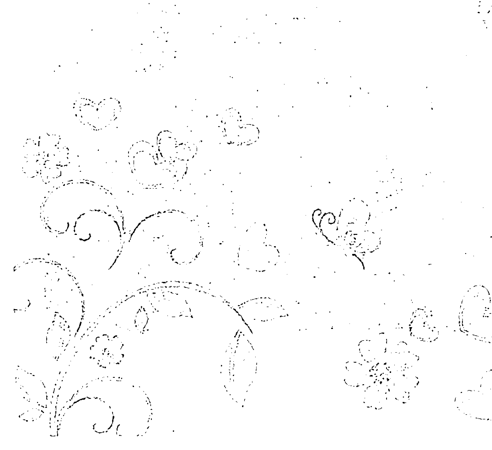

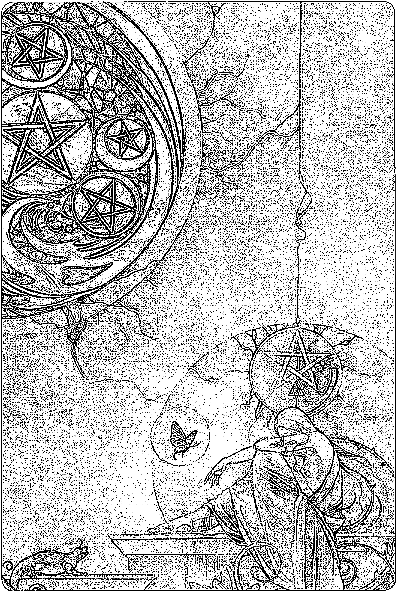

#### 钱币 5

她蜷缩成一团，把脸埋进臂弯。她从不曾抬起双眼，看看头顶上的彩色舷窗，那流光溢彩般的华美光芒。这美丽和光耀让她更加渺小，那充满活力的华彩让她了无生趣。飞龙尖啸，发出欢欣鼓舞的声音，仿佛嘲笑她的姿态，也嘲笑她的谦卑。只有荆棘拥抱着她，向她伸出尖刺。她躲闪着，孤独、寂寞，饱受伤痛的折磨。她只要伸开指尖，就能碰触到精灵，却依然垂下目光，锁入阴影。

她从不注意四周的实物，任性地对外界关闭心灵——她不看、不想也不听，她的灵魂哭喊着，却无法得到关注和回应。或许……或许她只是不知所求，所以隔绝身体，封锁心灵。她叹息着，把一切封锁、关闭。

钱币 5 代表情感的缺失、物质的困难和不安全感。在艰难的时期，忽略自身的渴望，注意力全部被悲伤吸引。感到遭受放逐、抛弃或蒙受损失，就是钱币 5 的意义。如果你能唤起生机，将身体与心灵重新连接，就会发现重生的机会近在眼前。即使你睁开双眼，只有满目荆棘。

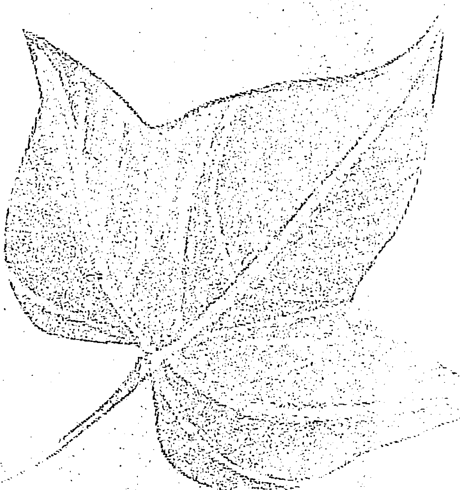

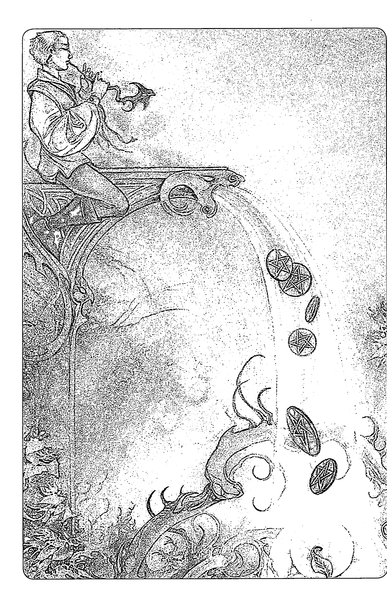

## 钱币6

他安然自得，端坐高处。他注视着脚下的幼苗，满心自信，知道自己有能力付出。他吹奏起美妙的旋律，将财富倾泻而出。干涸的大地感激地敞开怀抱，伸出枯萎的枝条迎接施舍与祝福。这是降下的生命之水，伴随着祈福的歌声。

钱币 6 代表拥有财富的人和一无所有的人之间的循环。幼苗顶破泥土，冲出废墟，抖落污垢，尽情沐浴着生命的泉水和养分。吹笛者或许是特意，但也许并未留心，也许他只是随手洒下慷慨，并未精心安排。其实他们的联系不止于此。他端坐的高台恰是树枝架起。它们用根茎插入裂缝，用生命织成安全网。他们支撑着他，保护着他，让石墙加固，免他坠落。这是无始无终的循环，仿佛乌洛波洛斯（传说中首尾相接，口衔尾尖的蛇）形成的自我循环。

在这样的循环中，你能分清谁是给予者，谁又掌握着真正的力量呢？

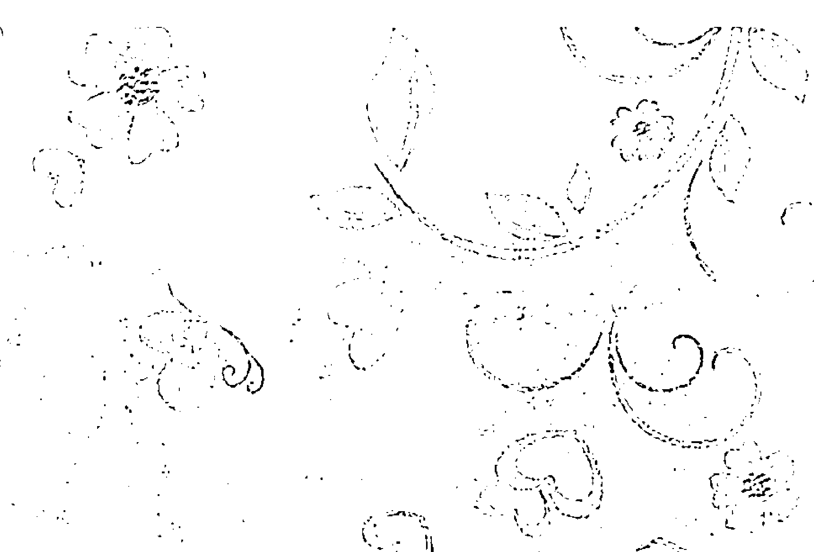

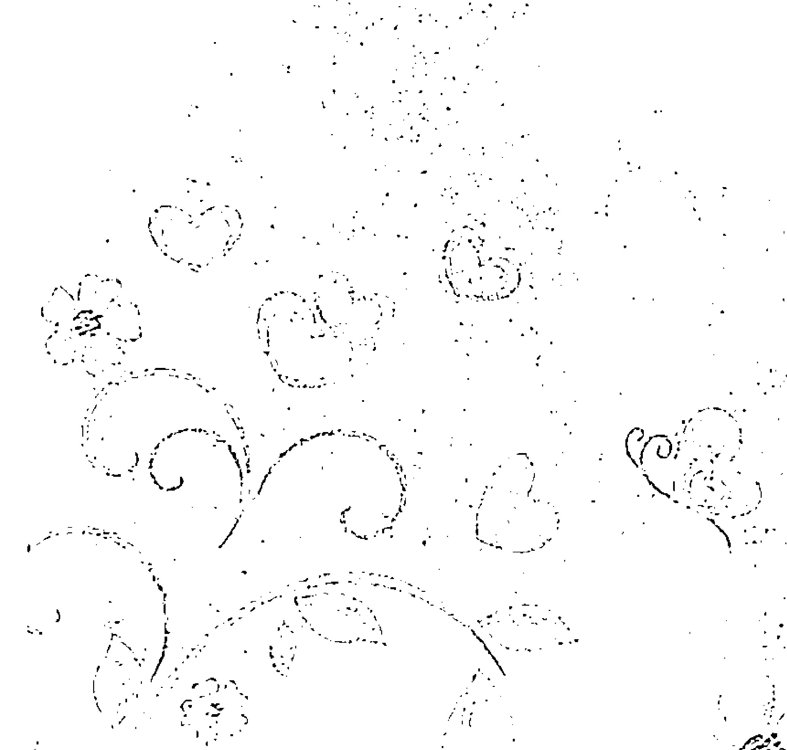

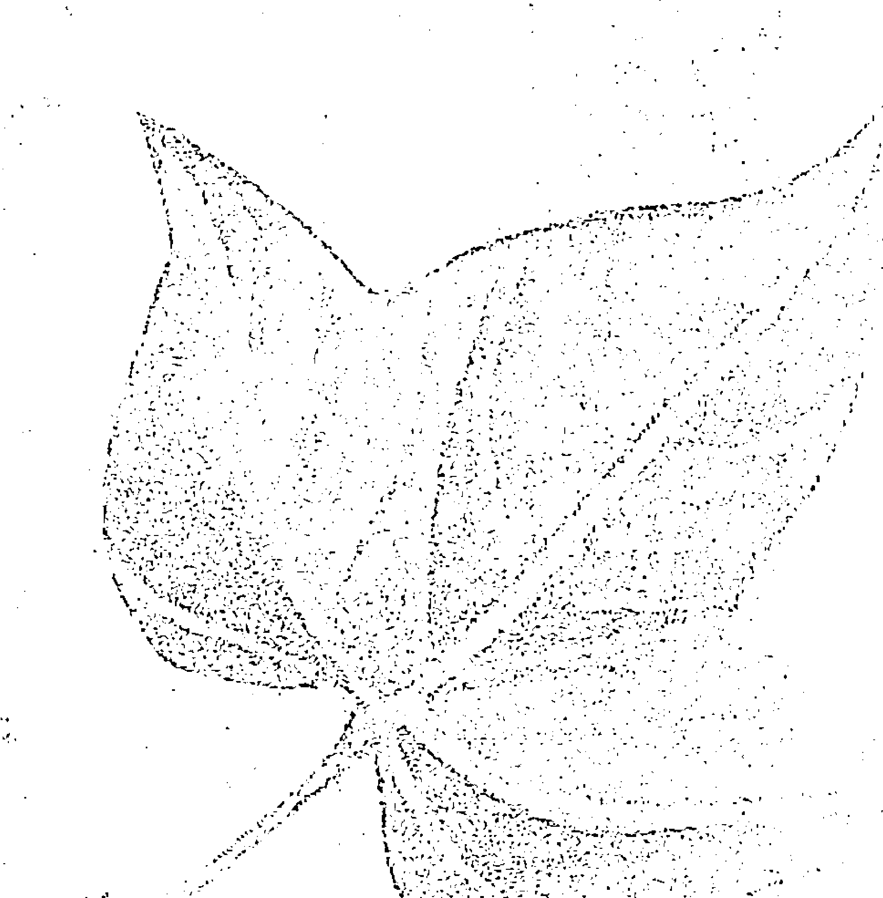

#### 钱币 7

这是繁茂的花园，绿叶青青，硕果累累。她站在花园中，悉心照料，满怀欢愉。她是树木的守护之神，她是这里的一部分。这是出自她精心呵护的庇护所，是她一手建成的伊甸园。桃子成熟了，每一颗都饱胀汁水，甜美诱人。它是漫长夏日赐予的果实，唇齿留香，清凉甘甜。当清冽甘美的汁水流过喉咙，就会勾起夏日里最动人的情怀。

那要不要摘下几颗呢？她犹豫了，纹身图案随着思考律动。她用手轻轻抚摸着果实，有那么一刻，似乎已按捺不住。它们连接着大树的枝叶，和大地的脉搏一起跳动。如果她切断连接，摘下它们……那些果实是否还会晶莹闪耀，还是和篮子里的一样暗淡无光？

钱币 7 代表你面对困难时的决定：是享用到手的果实呢？还是留下它们继续生长？其实，这是一个有关收获的选择，是花光到手的钱，还是留待他日。种子已经播下，劳作也成为过去，现在是收获的时刻了。停下来，慢一点，好好思考，是收获，还是继续？

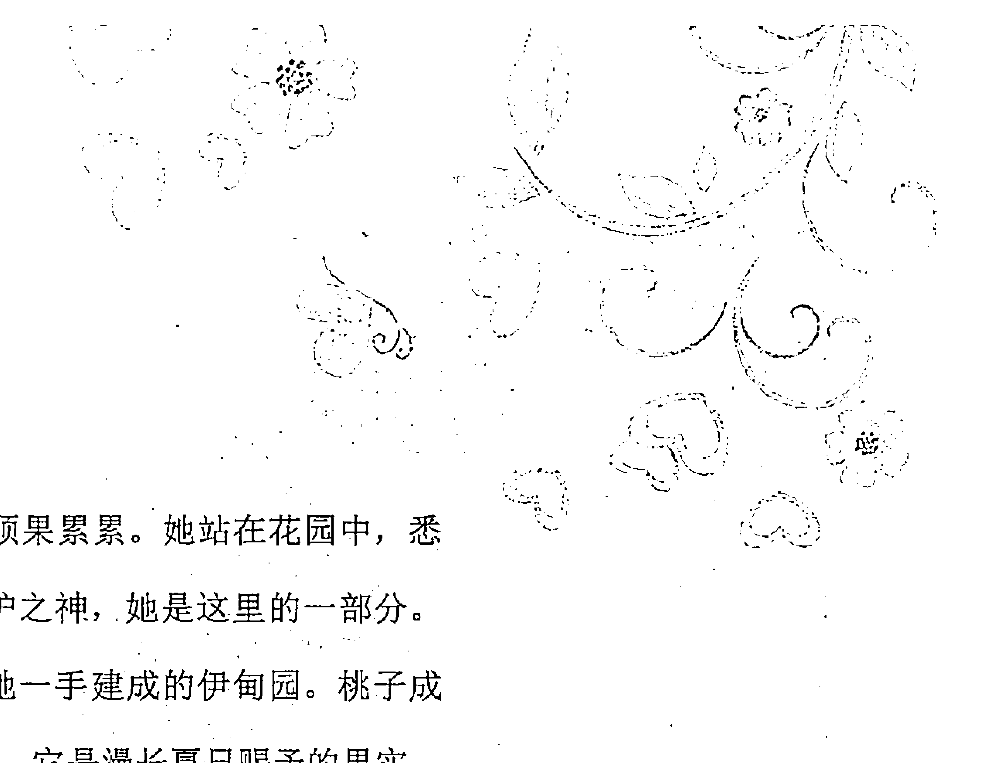

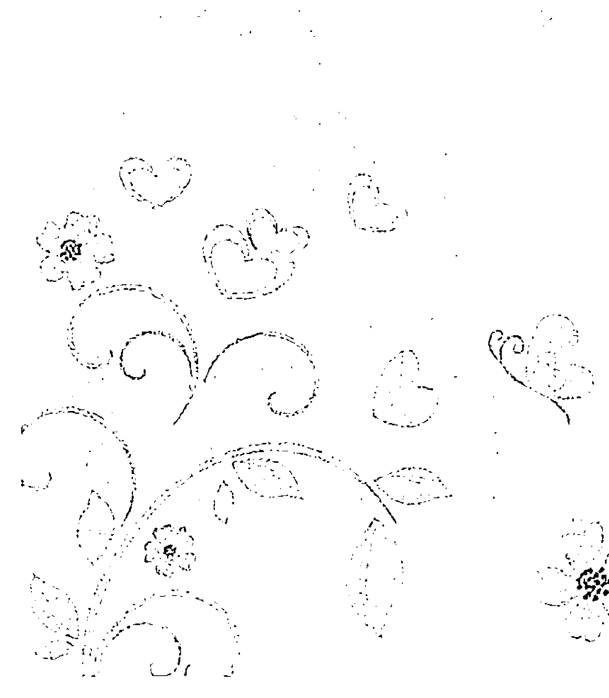

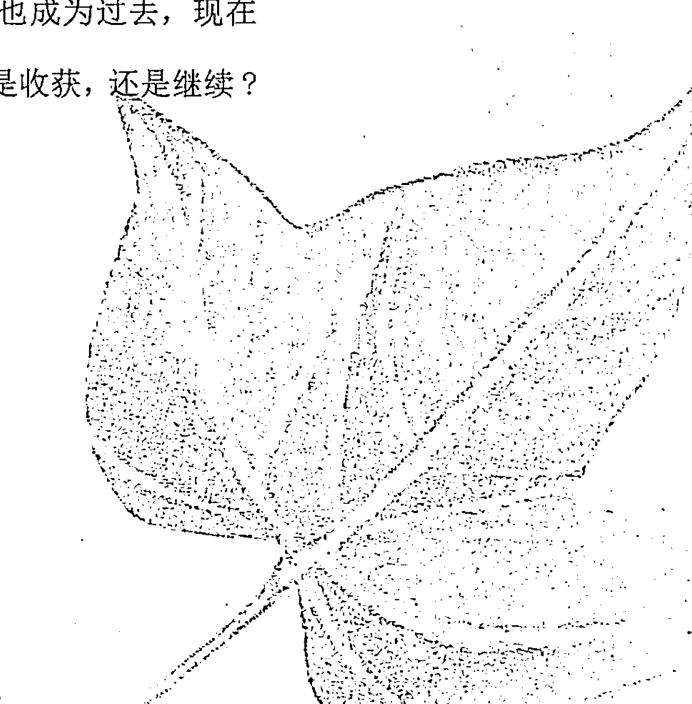

## 钱币8

优雅、勤劳和耐心，蜘蛛轻盈地编织着薄纱般半透明的网。黎明的灰尘静悄悄地落上细密的蛛丝，仿佛星辰沾上露水，微微发光。

> 织啊，织啊，织出花纹 / 织出夏日弥漫的香气 / 织出夏日薄暮的迷离
> 
> 织啊，织啊，织出命运 / 织出一生心碎的停顿 / 织出月亮圆缺的哀怨
> 
> 织啊，织啊，织出画卷 / 每一根丝线精挑细选 / 每一处匠心都完美无憾

蜘蛛努力劳作，在白昼编织，在黑夜拉丝。每一根蛛丝都精心安置，编织出美妙绝伦的图案，意义都深刻遥远。她是八只脚的舞者，旋转、跳跃、停顿；她是高明的织造者，冥想、编织、打结，再继续向前。就这样周而复始。

钱币8代表手艺人。那是饱含耐心，着眼细节的工匠，拥有某个领域的专长。它将全部精力投入，开始实现目标的漫长过程。它探求智慧，寻找更高更深的技巧和领会；它必须勤加劳作，用双手亲身创造，思想才能体会。它也渴求成功，因为成功是一种实践和考量。而判断能力和技巧的标准，有时候正是成功。

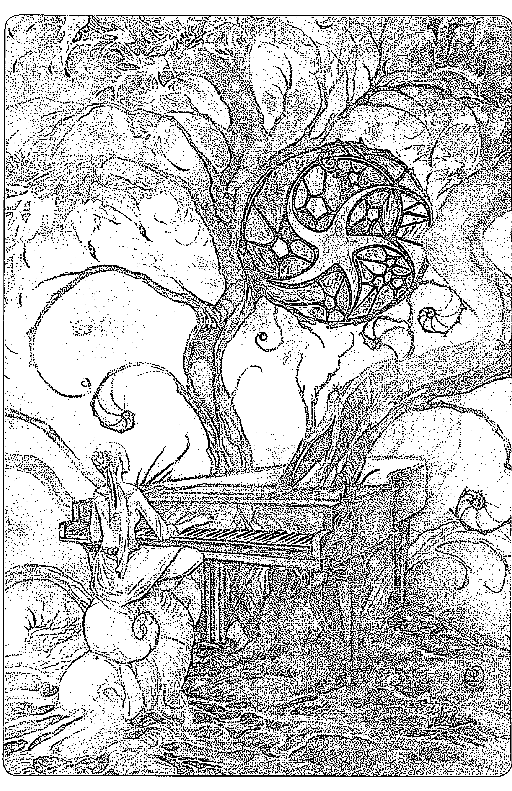

#### 钱币 9

她正用心灵与肉体沟通交流，手指划过精心编排的琴键，试着用音乐建立连接。金属与木头融合在一起，用悦耳动听的调子，演奏出流畅的歌曲。

这架钢琴由人工打造，虽非天然生就，但与四周的大自然相辅相成。它背靠大树，和枝桠一同生长。它是树木的一部分，是森林的一部分，是沼泽的一部分，是落叶的一部分。风中的呼啸是她指尖流淌出的乐声，那跳动的音律与一切融为一体。

她很孤独。远离尘世，来到树林中。树林为她创造了一片安详僻静之地，保护她，为她提供庇护。她对这一切感到满意，自由自在、自给自足。蜗牛盘叠成她的座椅，卷曲的枝条化作金色琴弦。自然安静地延伸着，保持着平和与理想的状态。

她继续演奏着，不用低头看谱，而是抬起头来，注视着上方。那里有光芒倾泻而下，穿过枝叶，晶莹剔透。她微笑着，沐浴在这片温暖的阳光中。

钱币 9 象征物质和精神的双重平衡。她内心和谐，物质充足。既追求享受，又自律行动。她靠自己的双手创造，并相信自己所能。她对所取所得心存感激，并深深理解它的运行规律。

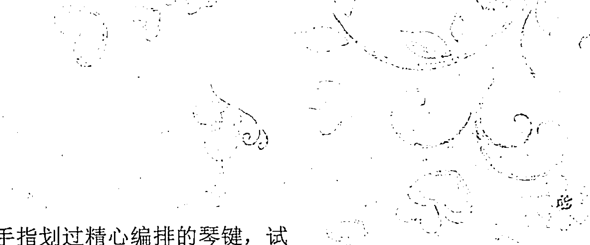

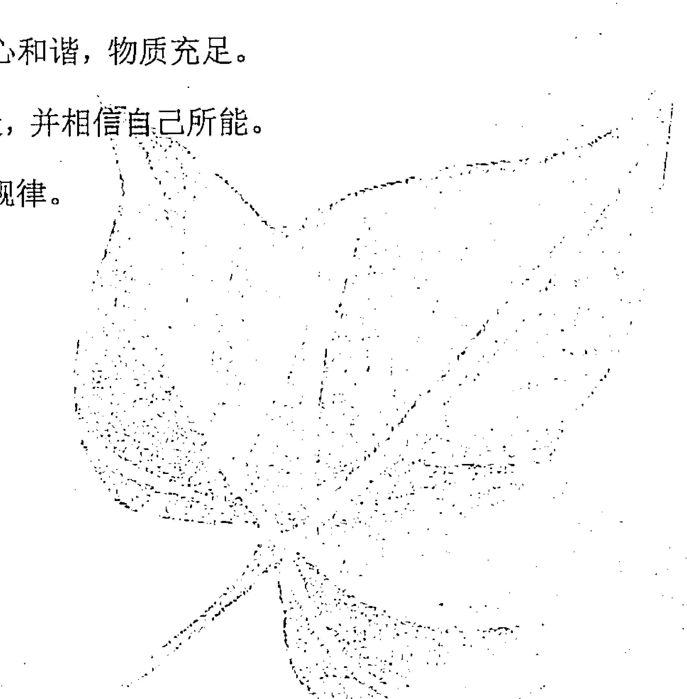

#### 钱币 10

她身穿华美的绸缎，上面用金子装点。她容貌高贵，衣饰精致，享有崇高地位。她安稳地靠在巨龙背后，当山谷中冷风吹过，他就伸开翅膀，为她遮挡。

风带来古老的秘密，它低声讲给树听。枝叶盘旋，生出宝藏，慢慢垂向地面。落叶拂过，将珠宝献给巨龙，也带给他风的秘密。落叶讲述着千年的巨变，那期间沧海桑田。她手中捧着鲜美的桃子，长久以来，在东方它一直代表长生与繁荣。

她遵循习俗，喜爱传统。她制定规矩，步步为营。她从心底明白，传统和规则是她成功的基石，所以她才拥有了现在。财富并非来自幸运，世界依律暗自运行。她四周环绕着彩色的玻璃，斑斓美丽，让人窒息。但它只归于艺术范畴，如果置于现实世界，很快会分崩离析。是的，她已站在世界顶端，全因她坚定的信仰和辛勤的努力。

钱币 10 象征享受荣华，渴望财富延绵不断。这是最终的成功，巨大的收获，努力终于获得回报，你可安享财富与社会地位。这是你努力创造结果，继续努力就可长久持续。

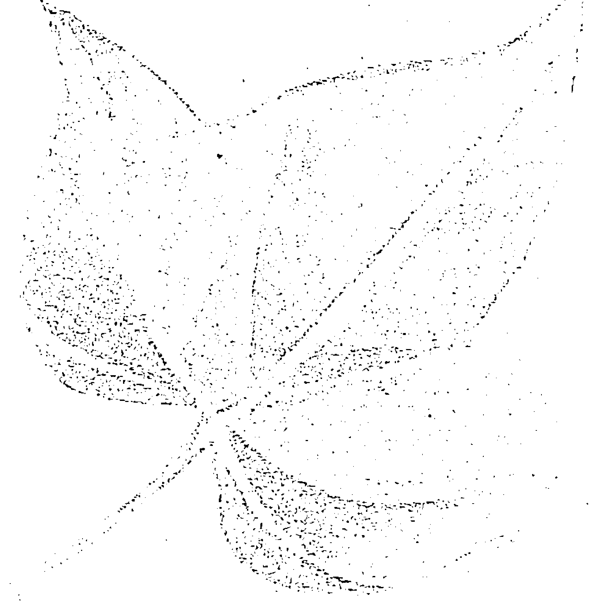

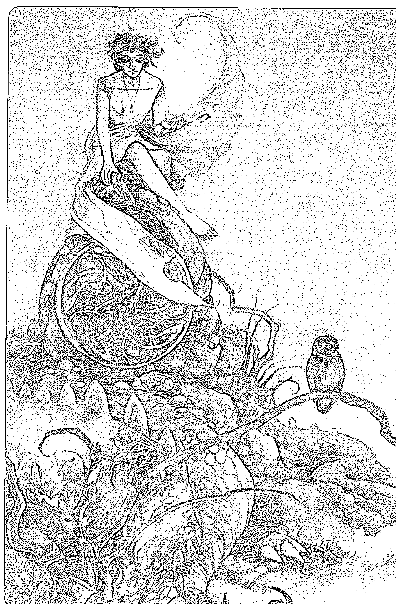

#### 钱币随从

机会静静蛰伏，仿佛钱币随从身下的龙蛋，一动不动。巨龙庞大的身躯一起一伏，身上闪耀着蓝宝石的光芒。那是梦想之光，也是愿望之光，他们是来自梦中的碎片，准备踏足这条清脆的道路。它沉稳地呼吸，做着一个美梦——那是个胜利的梦，梦中充满了珍宝和权力。而她守护着巨龙，也守护着这座梦想花园。

钱币随从带来成长和成功的机会，她手中的火光象征着能力。点燃梦想吧，无论是星星之火，还是熊熊火炬。你必须依靠自己，根据能力和资源订立目标，做出选择。

钱币随从文静、可靠、忠诚，她非常热心，而且善于研究。她很现实，脚踏实地，步步为营。但她也拥有梦想，人还在端坐，心思已随风而动。她并不觉得享乐有什么不好，她无忧无虑，非常快乐。她的精神感染着周围的一切。

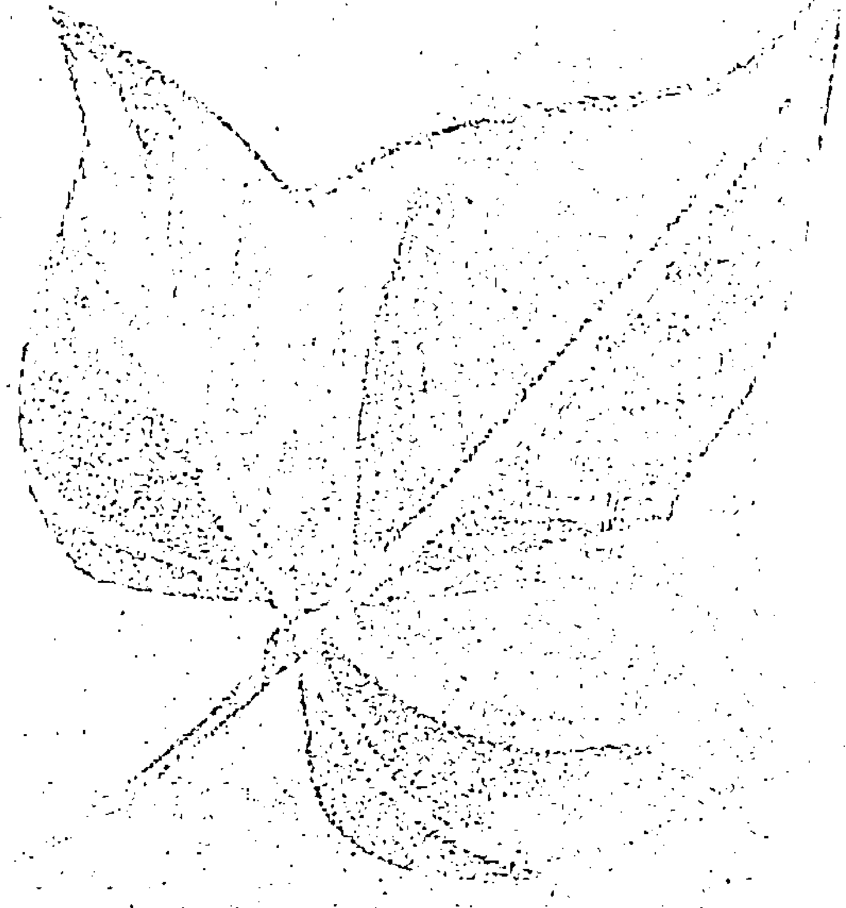

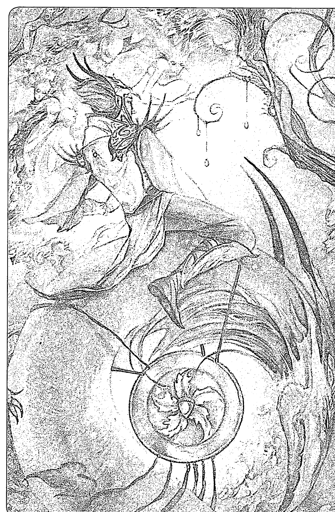

#### 钱币骑士

树丛为他让开一条通路，狭长、幽静，不受打扰。但他并未分心，哪怕树丛中闪亮的精灵飞近，开口进上魅惑之音。即使他与森林仙子擦肩而过，即使她们美丽的枝条扫过他的头盔——一切都不能引起他的注意，一切。

他目光如炬，死死盯着心中的目标。钱币骑士深思熟虑，凡事井井有条。他坚定不移，端坐大地之龙，缓缓前行，却无可阻挡。是的，只要他决心已下，就必定能够抵达彼方。

他从不轻易评估事态，也不慌忙做出决定。他有的是时间和耐心，去审时度势，慢慢思考商量。他有点保守，喜欢用经验和证据做事，从不偏离正途，踏入未知。从某个角度说，他确实创意不足，探索欲望缺乏。但他在乎的是最终的结果，而不是胜利如何来临。他非常尽责、坚定而忠诚，而且言出必行。如果他执行在即，那么在完成目标之前，他必定全程保持能量，绝不会收手休息。

钱币骑士倔强地前进，锁定目标，有点儿一根筋。或许他面临失败，但仍然保持效率。他清晰地明白命运的归属，也了解自己的目的。于是，他开始行动了，以不可阻挡的气势一步步前进。当他临近目标，他不会忘记所经历的一切：巨人凶猛的进攻，大地有力的震颤，以及参天巨木盘桓交错的枝叶和遍地阻拦的石块。

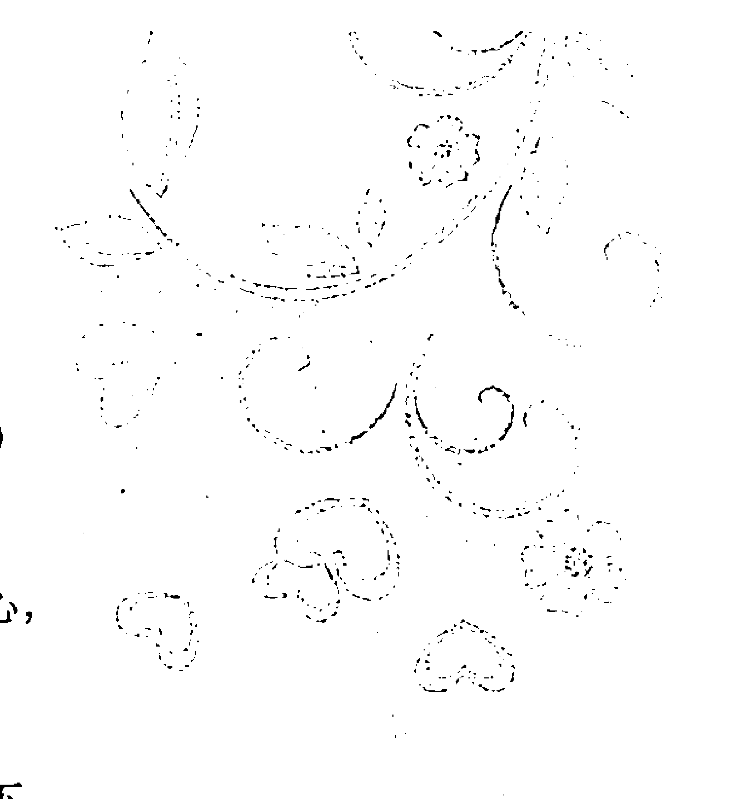

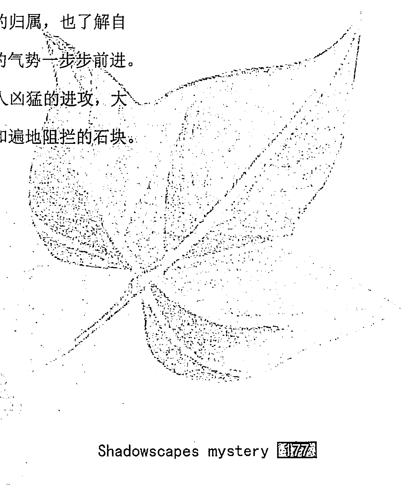

#### 钱币王后

钱币王后喜爱自然，就像她喜爱他人。她双眼中闪耀着慷慨和温暖，散发着人性的光辉。她肩头树枝缠绕，散开成扇形，那是印度十臂战车女神的象征，代表女性的创生之力。她拥有献身精神，可靠、可信，有能力守护自己的财产和地位。

钱币王后会给询问者以指引，她从橡树中得到力量，并不分彼此。她愿意分享，她那长久稳定的生命力，以及枝叶中阳光转化的纯净能量。

> > “带上这个，记住，我会一直在这儿。”

她说著，从最粗的树枝上摘下一枚绿叶，叶子中回荡着她的低语。树叶唱起一首歌，歌声百转，音调奇异。它们用千万种声音叹息著，融汇成奇妙的和谐之音，唱着它们为她守护的秘密。

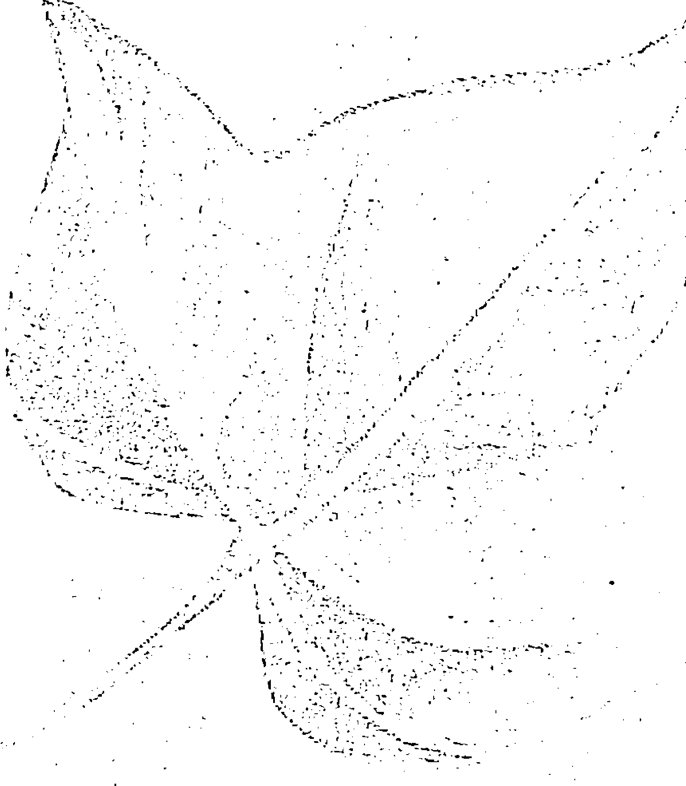

#### 钱币国王

钱币国王手中有一粒种子，散发出柔和的光芒。它如心脏般起搏律动，姿态安详，为发芽成长做着准备。树枝在阳光沐浴中尽情伸展，分叉的枝头挂满成熟的果实。每一枚都饱满多汁，闻起来香气扑鼻，吃一口渗入心脾。

他的枝干向上伸展，如同鹿角的形状。他是物质世界的国王，是人、是树、也是龙。三种属性互相融合，形成了他无尽的才能。他拥有进取之心、多才多艺，如点金石般为周围染上金色的光芒。如果他投资，则必定成功；如果他创新，则必定开枝散叶，结出硕果。他非常可靠，经验丰富。

他的力量来自大树，那里有坚定和永恒。树根深深扎入泥土，扎入最黑暗的深处。他从龙的巢穴中吸取养分，在古老的石块中寻找养料。那是厚重而稳固的力量，他一步步地，把手臂、枝叶和抱负伸向天空的群星。

他喜好成功，但为人慷慨，愿意分享财富和荣光。他结出果实，为他人提供。他深深懂得一个道理，钱如流水，不用不随（千金散尽还复来）。摘掉果实，分享财富，新的种子才会发芽生根，长成参天大树。

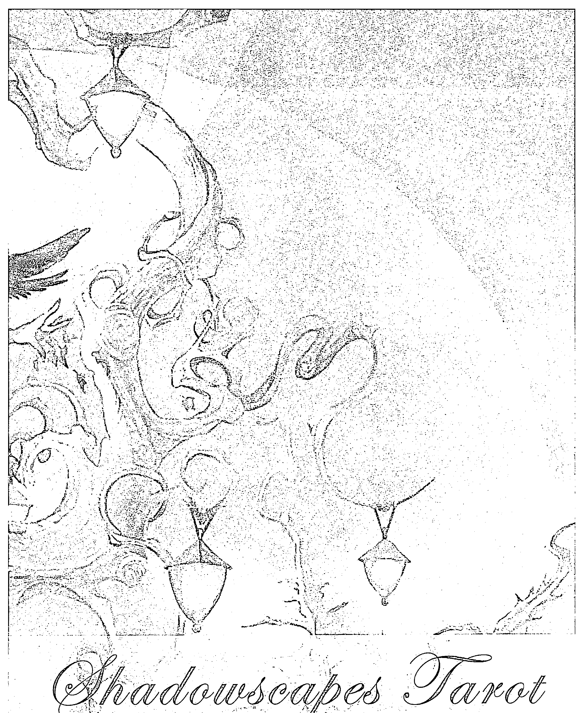

# Shadowscape Tarot

牌阵

## 单张牌的牌阵

有时候，简单带来最直接的答案。你几乎不敢相信，能从一张牌里收获如此大量的信息和智慧。单张牌的美妙之处在于，它几乎可以应对任何种类的问题。只要提出问题，抽牌，答案就有了。比如：

- 我今天需要注意什么？
- 我该买什么作为妈妈的生日礼物？
- 我该去参加今晚的派对吗？
- 我该怎样写年度工作总结？
- 我为什么会有这种感受？

## 三张牌的牌阵

这种牌阵非常灵活，你可以得到更多信息，还可以从不同的角度观察事态。你可以自由定义位置，好让牌阵适合提问。下面是一些参考的例子：

- 1 过去
- 2 现在
- 3 未来

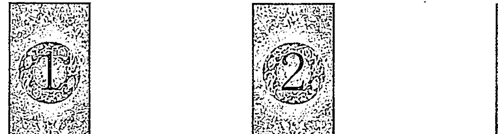

用这种摆法观察过去的事件或能量对现在的影响，判断现在的事态或能量对未来的影响。

- 1 现状
- 2 阻碍
- 3 建议

用这种摆法深入观察问题的阻碍，并寻求解决方法

- 1 决定
- 2 选择 A
- 3 选择 B

这种摆法用于面临选择的情况。它会显示你对问题的看法，以及有关两个选择中，你最需要考虑的重要方面。这个牌阵可以扩展，如果你有两个以上的选择，就补抽更多的牌。

- 1 现状
- 2 该做的事
- 3 不该做的事

用这种摆法应付棘手的状况，寻找解决问题的最佳途径。

## 凯尔特十字牌阵

凯尔特十字牌阵是一个古老的传统牌阵，它非常有名。无论用于解读什么问题，它都能提供大量的信息。在牌阵中，要注意比较和观察 5、6和10这三个位置的牌，因为它们都与未来和结果有关。

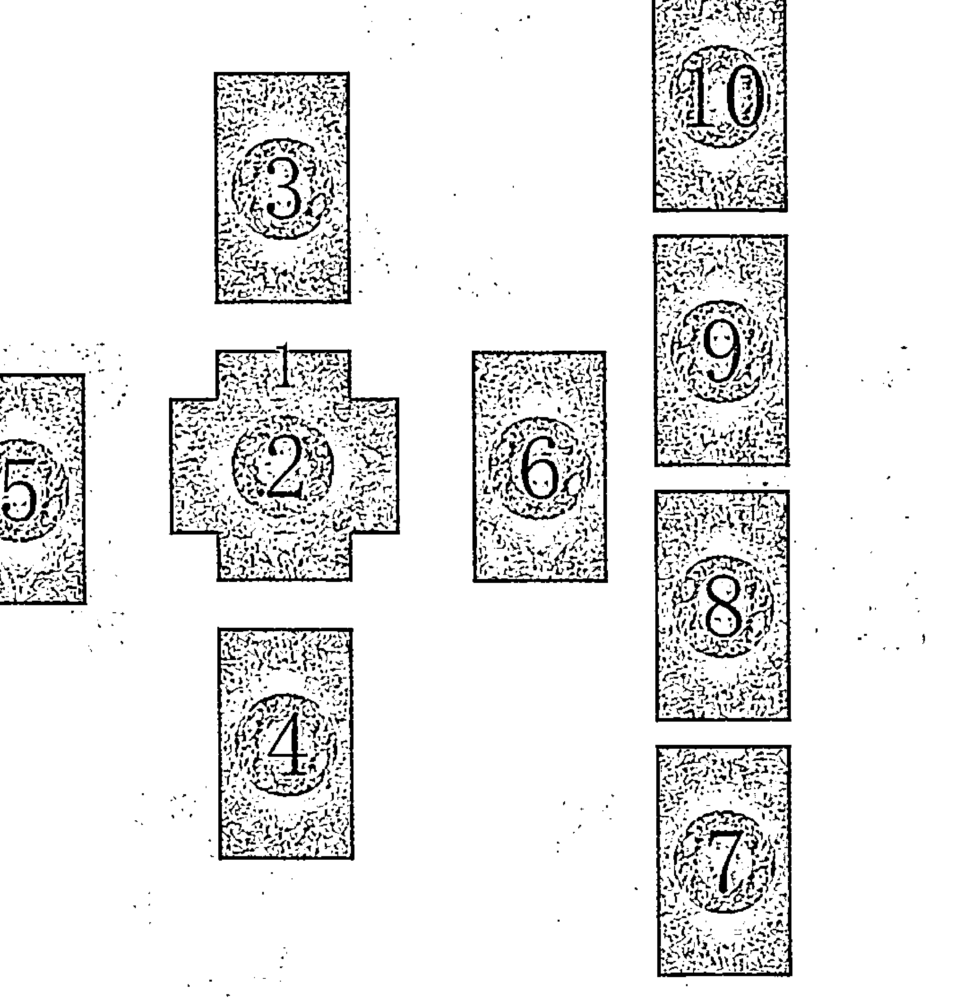

- 1 自我：代表你自己。
- 2 影响：代表冲突（横放，花影无逆位，如使用逆位，这张牌的解读也无视正逆位）。
- 3 基础：代表形成事态的基础或因素。
- 4 过去：代表发生在过去，而对现状造成影响的事件或能量。
- 5 近期的未来：代表可能即将发生的事。
- 6 想要的结果：代表在目前事态中，你最希望得到的结果。
- 7 自我表现：代表你在事态中如何看待自己。
- 8 环境：代表周围的环境（人或事）在事态中如何看待你。
- 9 希望与恐惧：代表目前事态中你最希望和最恐惧的事情。
- 10 结果：这张牌代表可能发生的最终结果。

## 爱之星

如果你期待一段罗曼蒂克的恋情，或者好奇星星是否已经为你选出情人，可以使用这个牌阵。

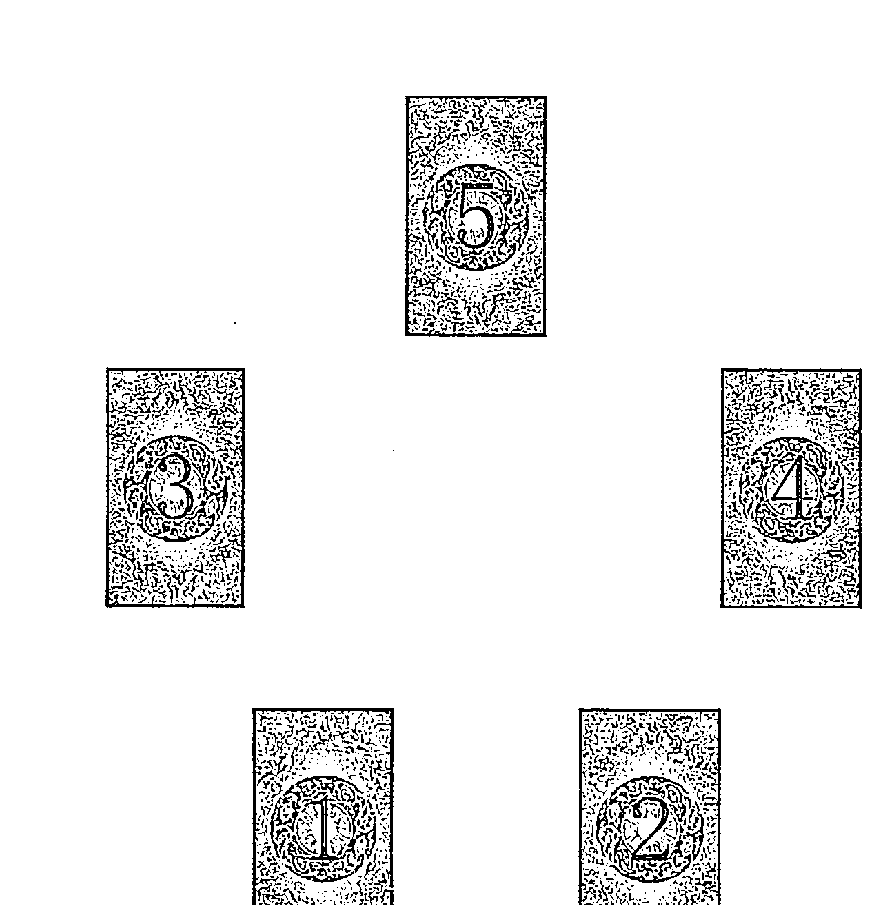

- 1. 已经做好的准备：代表你为迎接恋情已经做好了哪些准备。
- 2. 尚未做好的准备：代表面对恋情，你还没做好的准备（或者阻碍）。如果你想拥有爱情，一定要好好理解这张牌。
- 3. 可行的：代表推动恋情到来的建议。
- 4. 不可行的：代表警告，这张牌是你为何无法展开恋情的原因。
- 5. 结果：代表答案。如果答案是积极的，代表恋情已被繁星送出。警惕第 2 张和第 4 张牌，这些警告只有好处，没有坏处。如果答案是消极的，除了警惕第 2 张和第 4 张之外，还要强化第 1 张和第 3 张牌的能量，努力实践。过段时间重新占卜，看你是否有所改进。

### 命运的终局

如果你身处某段恋情，想知道自己能否“和王子／公主永远幸福快乐地生活在一起”，这个牌阵可以帮你一窥未来。确保联系牌与牌之间的相互影响，尽量接受更多的相关信息。举例来说：第一行的三张牌代表恋情中有利的部分，第二行的三张牌则代表关系中面临的挑战。第1张和第4张牌显示出你的希望和恐惧，观察、对比它们。不同之处在哪里？相似之处在哪里？第2张和第5张牌代表对方的希望和恐惧，每一对牌都要仔细比较。

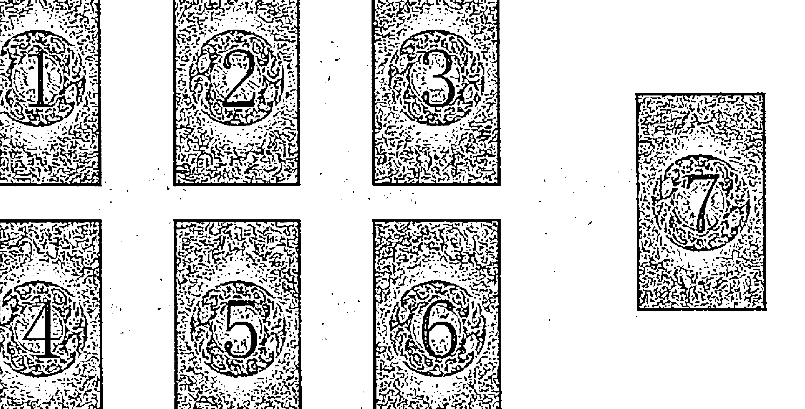

- 1. 你的希望：代表即将发生的你希望中的事。
- 2. 对方的希望：代表即将发生的对方希望中的事。
- 3. 优势：代表这段关系中最大的优势。
- 4. 你的恐惧：代表这段关系中你害怕或担心什么。
- 5. 对方的恐惧：代表这段关系中对方害怕或担心什么。
- 6. 弱点：代表这段关系中最大的弱点。
- 7. 结果：代表可能发生的结果。如果答案是消极的，那就把重点放在消除恐惧和弱点上，并加强优势，看看能够起到什么作用。如果答案是积极的，就记住牌阵传递的信息和建议，把恋情经营得更加美好。

## 权衡之阵

这个牌阵的设计灵感来源于花影的钱币 2。这张牌诉说着权衡和调整。在我们的生活中，有太多时候需要周旋在泥潭般的事物中：责任、义务、需求、欲望、渴求，等等。有时候我们处理的是日常琐事，它们伴随着我们的整个生命旅程。有时候我们处理的是精神和情感，那些有关信念、思维和情感的平衡。这个牌阵非常适合处理类似的情况。它能帮助你了解自身的状态，以及周围环境存在的影响。它也在提醒你，即使你正在协调事态，情况仍然不可能保持均衡。世间一切自有来去，无法修订。想想看，当你插手事态的时候，需要面临什么新的状况？又有哪些事态就此消失？

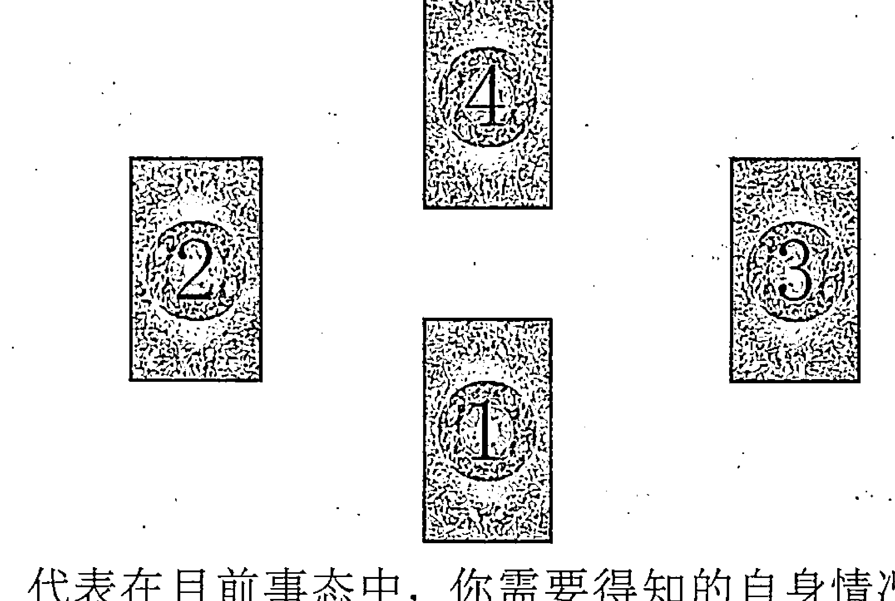

- 1 自我：代表在目前事态中，你需要得知的自身情况。这张牌可能会显示你对事态产生何种积极影响或消极影响，也可能显示出事态对你的影响。
- 2 出现的事态：代表事态中正在产生的新状况。可能是有形的，也可能是无形的。可能是你期待发生的，也可能是你不愿看到的。
- 3 消失的事态：代表事态中正在消失的状况。可能是有形的，也可能是无形的。可能是你期待消失的，也可能是你不愿失去的。
- 4 风：代表环境对事态的影响，这张牌的意象来自钱币 2 中的微风。这张牌将显示这种影响是有利的，还是不利的。也将显示这种影响会改变平衡，还是保持平衡。

## 无尽的追寻

这个牌阵设计的灵感来自于花影塔罗的圣杯8和隐者，这两张牌都反映了离开某处，开始追寻的旅程。如果你感到生活或世界处处阻碍着自己，或者想做真正的自己却听不清内心的声音，这个牌阵是你最好的选择。它将告诉你是什么在拖你的后腿，以及接下来你该如何行动。

把第4张和第5张牌放在一起解读，会提供相当有趣的信息。你为何踏上旅途和为你照亮道路的事物之间可有联系？这些牌又如何同终点联系到一起？同样的，那些代表离去的牌和挑战又有何关联？

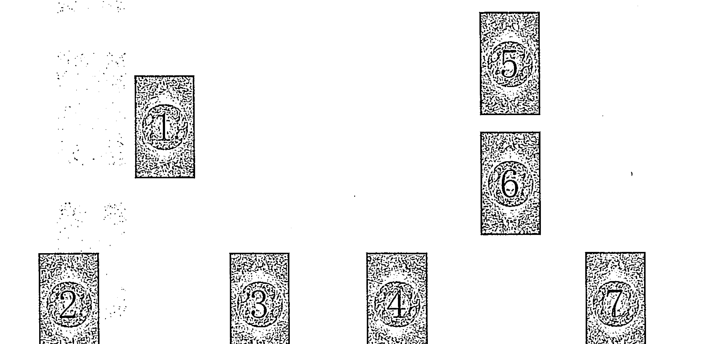

- **1-3 离去:** 这三张牌代表你远离了什么。你不再满足于和它们相处，也许它们正在拖你的后腿。三张牌也许分别代表三种不同的事物，也许代表一件事的三个方面。
- **4 原因:** 代表你为何在此时开始追寻。
- **5 星光:** 代表隐者提灯中的星光，象征什么会指引你前进。
- **6 挑战:** 代表你在追寻的路途中将会面临的挑战。
- **7 终点:** 代表你将抵达何处。这是你心中的目标（或许是高等自我的目标），也是旅途的终点。

## 宇宙的讯息

这个牌阵将为你带来强有力的经历，它是一次体验冥想的绝佳时机，你可以从这个牌阵入手，尝试用意识“走入”牌中。

- 1 身体：代表宇宙发出的有关身体的讯息。你对待身体的方式，考虑身体的方式，以及提升或摧毁它的方式。

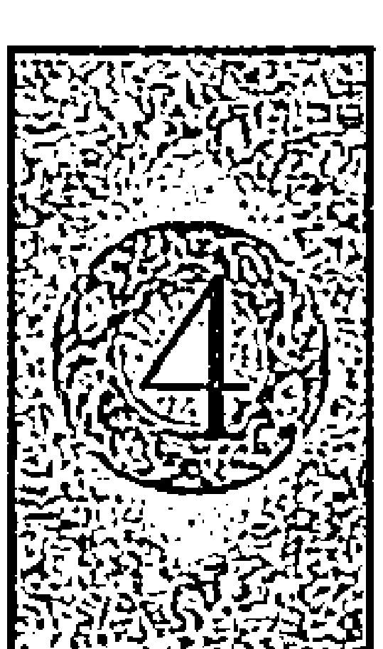

- 2 心灵：代表宇宙发出的有关心灵的讯息。你守护情感的方式，分享爱意的方式，体验情感的方式，以及情绪在你生命中扮演的角色。

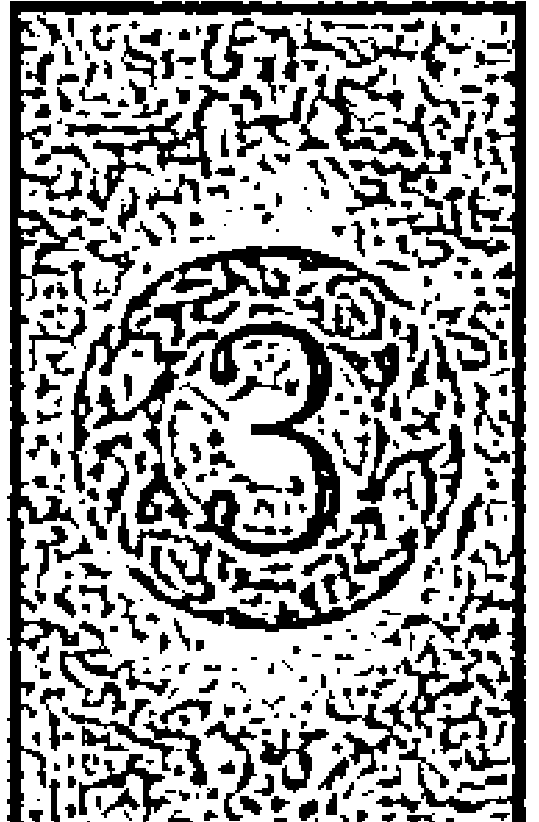

- 3 思维：代表宇宙发出的有关思维的讯息。你运用（或不运用）思维的方式，你看到和思考世界的方式，以及你招惹麻烦的方式。

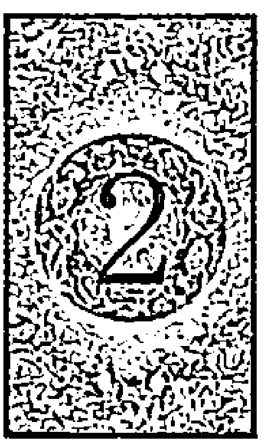

- 4 精神（灵性）：代表宇宙发出的有关精神的讯息。这张牌可能会显示如何让你的精神保持正面能量。你提升灵性的方式，以及如何用灵性为日常生活带来积极的影响。

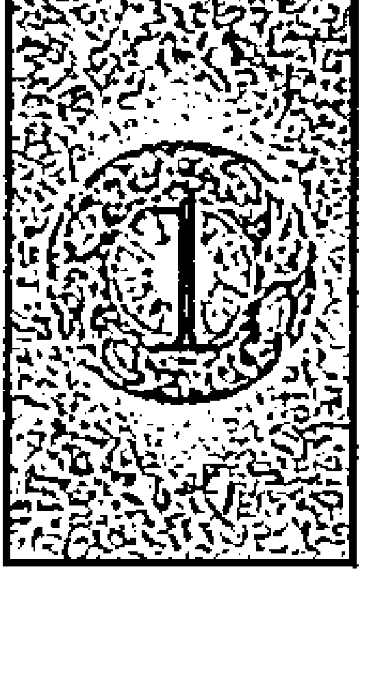

## 梦想成真

如果你拥有梦想和目标，用这个牌阵再适合不过了。它会显示你可以利用什么，你需要警惕什么，以及你可以用怎样的实际行动来推动进程，让梦想成真。注意第4张和第5张牌。

观察他们如何使用第1张和第2张的正面能量，又如何反抗第3张的负面能量。

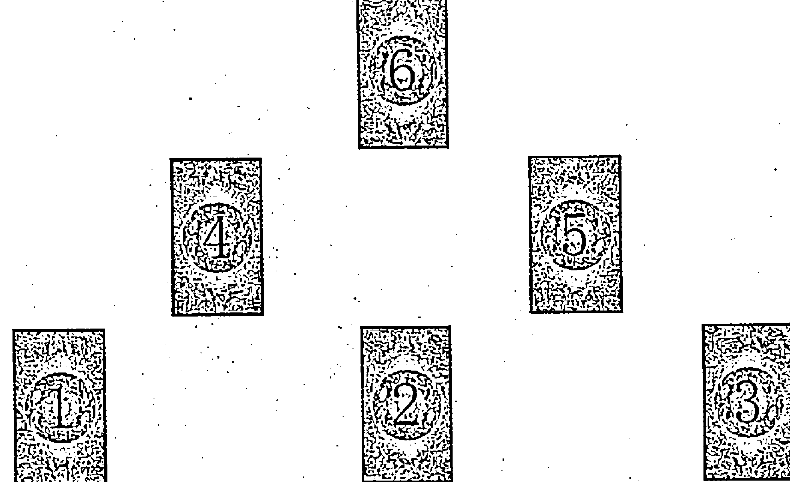

- 1. 最有力的部分：代表你的梦想或目标中最强有力的部分以及你拥有的基础——那正是建成未来的基石。
- 2. 提供帮助的能量：这是你拥有或能够拥有的能量。可能来源于自身，也可能来源于他人（特别是在这个位置上出现宫廷牌）。这个人可能会为你提供信息或资源，或者其他种类的帮助。
- 3. 最无力的部分：这是你计划中最大的漏洞或弱点。是你最需要帮助的地方，或者你最需要面对的挑战。
- 4. 5 可行的：代表两条可行性建议——或应对之策的两个步骤——可以帮助你向目标更进一步。
- 6. 结果：代表你听从解读的建议之后，可能会发生的结果。如果答案并非你心中所想或所愿，重新考虑你的目标，以及其他可能的发展方向。尝试修整你的计划，然后重新占卜。