# 花茎幻影塔罗牌

译者：二三

编辑：空气

工作组：秘密矩形

# 关于插画家兼作家

Stephanie Pui-Mun Law

虽然 Stephanie Pui-Mun Law 的艺术家的职业生涯从 1998 年才正式开始，她已经在童年时期多次尝试描绘神秘世界。1998 年她从电脑技术学习课程毕业。经过三年白天为公司编程然后冲回家画画直到午夜的时间，她离开了编程和数字的世界，进入到色彩与线条的美妙的奇幻空间。

她曾为游戏和出版公司工作过，包括 Wizards of the Coast（万智牌），HarperCollins（哈伯科林斯出版集团） LUNA Books，Tachyon Books，Alderac Entertainment 和 Green Ronin 等出版社。她曾插画了 Dreamscapes 一书（2008，North Light Books），她用她的水彩技术为此书添加了很多光彩。她的作品经常在杂志 Realms of Fantasy，Cricket 和 Cicada 中出现。

除了日常的工作，她有一大部分作品的灵感来自于神秘故事，传说和民俗学。她也受到印象派艺术，拉斐尔前派画风，超现实主义画风和自然之美的深深影响。蜿蜒的橡树枝，落叶在水面上划出的波纹，和无垠的天空的颜色都经常出现在她的画作中。她十年的弗朗门戈舞者的背景也十分明显地在她的笔触和画风中体现出来。她笔下的一切都像是被精心编排般流畅——可不只有人才是她笔下的舞者。

# 关于作者

Barbara Moore

塔罗，密教和魔法都在她的最初的二十年留下了深刻的影响。她曾在最具影响力的塔罗学者门下学习现在也与这些业界的前辈一同共事。

Barbara 非常喜欢接受关于表达塔罗牌深意和神谕的挑战。她曾成功地写过多本著作，包括 A Guide to Mystic Faerie Tarot（梦幻仙子塔罗牌）, The Witchy Tarot（女巫塔罗）, Destiny's Portal（炫金塔罗）, The Dreamer's Journal（奇幻梦境塔罗）和 Vampires Tarot of the Eternal Night（永恒之夜塔罗），也参与撰写过一本关于魔法的书名字为 Pagan Magical Kit（异教徒的魔法）。目前，她正在忙于设计不同的塔罗版式以及新书 Tarot of Beginners（启蒙塔罗）（卢爱林出版，11，2010）。

# 插画家的话

当我画完最后一个国王放下的画笔，不禁回想起 2004 年六月我刚开始这段旅程的时候。就像愚者，我站在这个项目的最尖端，在无限未知的悬崖的边缘晃动——这是一个挑战自我内心和绘画技术的工作。而现在，七十八张牌的创作已接近尾声，我感受到每一丝笔触都给予这套牌组一丝鲜活的生命。每一次落笔都饱含着那只属于我的异想世界化为现实。潜鸟越过黄昏神灵之湖飞入了隐者的牌面。在我的门边耐心织网的蜘蛛向我展示了钱币八中一个真正的工匠应该有的样子。圣杯女王，当我的灵感枯竭她自己舞动着身躯向我走来。

我是一个爱故事的人。我绘画的原型来自神秘的故事，传奇，有时小精灵们也会路过我的思想的丛林并一跃到纸上。故事是这个牌组的核心——有一些是我自己创造的，有一些来自床头和火炉旁那讲故事的人的声音。这些故事时常来自人类的经验，欲望和恐惧，一切皆能成书。

当我画完最后一张牌面我感到了释然以及恐惧。我很高兴我能顺利完这趟心灵的旅程，但是也因为“我该去向何方”而恐惧。黑暗的深渊开始注视我。我回望四周，无尽可能带来的空虚让人沮丧。但愚者朝我微笑，牵起我的手，带着我走进无常变幻的薄雾的边缘。“再跳一次吧。”她说到。

# 作者的话

在你还没有实践任何事之前，这是你应该了解的事。有魔力的包裹需在正确的时间正确的地点和方式去打开。双方都必须先留下第一印象。这套牌组的每一张牌都像一扇开启另一个世界的门。就像两个陌生人，想要穿越房间在一瞬间抓住对方的目光，在这一瞬间点燃了无数可能性的火光，这将发生在你和这套牌之间。

拿着你的牌并洗牌——或者不洗，看你如何选择——闭上你的眼睛，选一张牌。看完这张牌的故事和含义就放下书。忘记牌的名字和含义和编号，只看图画。深深地观摩它。去掉繁琐只为它的简单之美着迷。看着它直到你闭上眼也能回想出它的样子。展开联想。想象出这个世界的触感，气味，和声音并感受它。当你完成你想象的构建，再重新拿起书本。

很多人，特别是刚刚接触塔罗的人，会去思索牌意是怎么来的。牌意来自很多不同的事物，现在你已经知道了其中的一部分。你刚刚感受了一张牌。这种感受到什么？它对你的意义也是这张牌牌意的一部分。

讽刺的是，很多人看来牌意是最简单也是最困难的一部分。只是简简单单看牌面然后诉述它的含义这是小孩子常常在做的事，但是成人却很难轻松为之，太害怕说错。直觉和感知的反应是对于解读塔罗来说很重要的，也要好好的将智慧一点一点地表达出来。就像你将要看到的，塔罗和平衡息息相关…你思想和心灵的平衡，你精神和肉体的平衡。

塔罗是一种综合的体系和艺术，创造一种独特的情感体验。当你的全部——思想，心灵，肉体，精神——都被启发，你将踏入祥和之境。你将打开深藏于你内心深处的智慧。这就是塔罗如何帮助你告诉你问卜答案和指引你的方式。答案和指引的道路并不来自牌，牌只是工具。答案来自你内心，牌只是帮助你看到它。

在后面的叙述中，你将学习一些塔罗的基础，将为你提供一个根据去放飞你的思想。解读牌面也有一套复杂的系统。当你学会你将可以解读来自她深层次的美丽。解读将挖掘更深的牌意也会让你的体验更有力。你将有能力去自我解读牌面并自己找寻答案。

现在差不多是时候带着创意搜集和图景和这本书提供的建议。它们将一路伴随你，但是去向何方还是由你自己决定！

# INTRODUCTION

## 塔罗简介

# 塔罗基础

解读塔罗是很个人的体验。每一个解牌人都拥有自己的风格，来自信仰的，和他们的智慧和技巧的影响。即使是人第一次解读牌面也会与牌有这有趣而丰富的互动。你不阅读这些文字，你也可以问一个问题，抽一张牌，然后解读答案。但是当你知道的越多，那么你将解读的更容易，更深刻。

这一章将通过牌面上的不同事物告诉你如何提升你的解牌技巧。你也会学习解牌的步骤。但是记住，塔罗的解读是个性化的。当你的经验和技巧逐渐增多，你将了解到什么该做什么不该做。

## 了解牌意

解读塔罗是在建立在有特定问题及其答案的基础上参阅牌面来进行的。每一张牌的牌意在每一次的问卜中的含义都稍有不同。这是因为有很多因素影响着牌意的关系，例如：

- 你和画面的互动
- 你的直觉
- 牌的名字和设计
- 传统的牌意
- 艺术家的意图和他独特的牌面风格
- 问的问题
- 牌在牌阵中的位置

就像你看到的，任何牌的意义都是复杂的，它包含着历史，结构，艺术家的目的，环境和情感的回应。

## 塔罗牌的结构

让我们由塔罗牌的结构开始学习。你可能会注意到有很多不同塔罗牌可以供你选择，正如很多神谕卡一样。一套塔罗牌系统，和神谕卡相反，拥有一套特殊的结构。理解这个结构可以帮助你解读牌意。这个结构是简单的——如果你熟悉扑克牌的结构。塔罗牌和扑克牌有一些相似。塔罗也可以看做成两部分，两部分都被称作阿尔卡那。阿尔卡那的意思是“秘密”。第一部分，小阿尔卡那，有四种分别叫做权杖，圣杯，宝剑和钱币，正如扑克牌中的方片，红桃，黑桃和梅花。这四种牌都有从一到十的数字牌。这里有小心的不同。扑克有 J, Q, K 而塔罗是侍从，骑士，王后和国王——四位贵族（或是宫廷牌，在塔罗里面是如此称呼的）而不是三位。

四种不同的小牌都代表着不同的元素（火，水，风，土）并代表着不同的人的意识。权杖是火元素的代表，也代表着激情，活动和项目。杯是水元素的代表，也代表着人际关系，感情和创意。剑是风元素的代表，也代表着问题，思想和才华。钱币是土元素的代表，也代表着资源，物质和肉体。小阿尔卡那，就像你从名字中能看到一样，代表着小的秘密，或是你日常生活的反应。

小阿尔卡那的数字牌带有数字编号，宫廷牌带有名字，它们有着自己的含义。

- 一号牌：新的开始，潜力
- 二号牌：二元性，平衡，关系
- 三号牌：创意，新生，成长
- 四号牌：稳定，结构，停滞
- 五号牌：冲突，不确定的，不稳定的
- 六号牌：联合，问题解决，平等
- 七号牌：反应，评定，评估
- 八号牌：移动，权力，进步
- 九号牌：妥协，同情，心灵上的
- 十号牌：结束，完美，循环的终点
- 侍从牌：年轻的激情，一个信号
- 骑士牌：极端的，快的，追寻，拯救
- 女王牌：成熟，照顾，经验的
- 国王牌：领导者，保护者，权威

当你解读牌，考虑到它包含的元素和数字和名字，就想你考虑到你的直觉和情感对于牌面的回应。运用这些组成并将他们融入到最后的解读中——但是不要只运用这些。问题和在牌阵中牌所在的位置也是至关重要的因素。在我们讨论这些之前，我们先来讲一讲大阿尔卡那。

祭祀，命运之轮，死亡，恋人…这些都是大阿尔卡那之旅的一部分。当然，他们确实是有些神秘——他们的名字确实听起来很魔幻。大阿尔卡那是“大秘密“。不像小阿尔卡那专注于日常的事务，大阿尔卡那反映着重要的事件，巨大而且戏剧性的事件，心灵层面的，和你无法控制的事。

大阿尔卡那是从零（愚者）到二十一（世界）的。他们也拥有名字和传统的意义上的罗马编号。这些牌是复杂的，你可以从他们的名字中了解一些最基本的含义。愚者是一个天真无邪，或者，当然的，愚蠢的人。祭祀是深邃而博学的人。命运之轮是关于改变和生命的循环的。月亮代表梦，阴影和欺骗。

当大阿尔卡那在牌阵中出现。记住它代表影响深远的事件和经历。将牌的名字作为你联想的一部分和解牌的一部分。

## 传统的牌意和画师的远景

在结构的性的意义之上，塔罗拥有几百年来建立起的很多学者都归类为“传统”的含义，包含在这本书的牌意部分。Stephanie（本塔罗的画师）在作品中包含了传统的含义，并另外的，加入了她的关于牌的感触，去帮助你进入更深层次的理解她笔下的牌。我们希望，你的理解能深入你与牌之间。这些牌，特别是大阿尔卡那，拥有多层的含义和路径去体验它们，所以每一个塔罗的画师都拥有自己的切入点。比如说，教皇是按照传统含义绘制的。在此基础上，也可以被更详细丰富地描绘。每一个塔罗的画师都会将自己独特的理解渗入进去。这样能将你独特的理解渗入牌面，名字和他们传统意义上的牌意。

## 关于问卜

提问是很重要的一部分，它将为问题制定框架。到底“什么样的问题才是一个好问题”是很难回答的。每一个人关于这个问题都有自己的观点。这是些你需要考虑的方面：

1. 如果你不想知道答案就不要问卜
说真的。想象所有你所问的问题可能拥有的答案，好的坏得或是不好不坏得。你有何种感受？如果你准备好接受任何情况的答案，那么可以问卜。如果不是，那么等你准备好了再说。
2. 你是否相信未来已经决定？
如果你想询问一些关于未来的事，那么可以假定说你已经相信未来是确定的或者你没有能力改变未来——简而言之，你相信要发生的总要发生。这个信念会影响你的问题。你会更倾向于询问“我会结婚吗？“而不是”我该如何吸引一段可靠的恋情？“
3. 你是否相信你对你的未来有全面的控制？
这是一个更第二条相反的信念。在这个情况下，你关于未来的问题会更专注于你该如何行动去取得你想要的结果。你会问“我该如何找到理想的工作“而不是”我是否会找到工作？“
4. 你是否相信你拥有控制权但是有一些事情是超出你的控制范围的？
这是一个混合的方式，也是比较流行的方式。如果你相信有掌控命运的权力但同时，你也相信有些事情你没办法掌握，那么你问问题的方式也将不一样。你会问一些折中的问题，比如“关于人力市场我有什么需要知道的，我有如何才能找到对我来说最好的工作？

问题是重要的。它不但会反映你的信仰也会给你的答案立起框架，同时也影响着你解读牌面。比如，如果有一个人更偏向未来是确定的那么当他看到死亡牌可能将它解读成一段关系的结束。而更相信个人力量的人则会将此牌视为一个改变和机遇。在一种解读方式中，他们感受事物；在一种解读方式中，他们做出行动。

## 牌阵与牌的位置

牌阵是我们摆放牌和解读它们的方式。有许多不同的牌阵和许多不同的解读方法。书的后半部分列举了一些牌阵供你选择。也有关于牌阵的书籍可以购买。也有一些牌阵你可以在网络上找到。你也可以自己发明自己的牌阵。
牌阵中的每一个位置都是经过设计的。比如，一个简单的三张牌的牌阵就像这样：

1. 过去
2. 现在
3. 未来

第一张牌代表着过去发生的事，第二张牌代表当下发生的事，第三张牌，代表将要发生（或者可能会发生的事）。在这个牌阵中，能够非常清楚地看出牌的位置对含义的影响。
另外一种三张牌的牌阵是这样的：

1. 存在的问题
2. 建议
3. 可能的结果

在这个牌阵中，影响比较明显。解读代表建议的那张牌（第二张牌）跟解读代表可能的结果的那张牌（第三张牌）有些许不同。月亮牌在建议牌的位置出现可能要解读成为“相信你的内心“或是”不要将所有都暴露出来“。如果是在结果牌中出现，那么则需要解读为“发现了自己的内心”。

## 关于逆位的解读

当你继续着塔罗之旅，你会很快发现逆位的牌。逆位的牌代表着在牌阵中上下颠倒的牌。就像这样，原本的头部到了下端，下端上移的情况：

正位 逆位

关于逆位的解读有很多不同的选择。有一些解牌者并不把逆位做为特别的解读，依旧作为正位的意义看待。有的则认为逆位和正位的含义有不同。有的塔罗牌设计师认为逆位的牌也必须有其他的含义因此将逆位的含义也包含在著作中。Stephanie（本塔罗的设计师）并没有将逆位做出特别的描述，所以书中没有概括逆位的含义。

如果你希望加入逆位的含义那么你可以试下如下的方法。Mary K. Greer 的 Complete Book of Tarot Reversals（塔罗逆位解析）就着详细描述。在她的书中，她列举了很多解读逆位牌的方法。如果你将逆位牌特别解读，那么可以讲牌意解读成原本意义的削弱或者抑制，或者是正位含义的反义。

现在你拥有很多技巧去解读单张的牌，你或许想要花一点时间去看看的牌，试着感受第一印象，将你的个人感想写下来。或者你想继续阅读下面关于问卜的部分。

## 问卜

问卜是用塔罗找寻问题答案的有效工具。问卜可以简单或者复杂可以由你而定。在这个部分，我们会将最基础的问卜部分的要素告诉你。然后我们会分享一些你可以用的上的技巧…或者你想按照你自己的方式问卜。基本的问卜程序

1. 确定问题
很多人喜欢写下来，包括出现在牌，牌阵，和他们的解读，方便以后参考。
2. 选择一个牌阵
选择一个最适合的你的问题的牌阵，或者自己创立一个牌阵
3. 洗牌
有很多洗牌的方式，你可以随便按照任何一种你喜欢或是熟悉的方式洗牌。
4. 按照牌阵摆牌
如果是初学的话，先将牌面朝上，然后最上方的牌开始解读。下面我们将讨论这个部分。
5. 逐个解牌
一个一个的解读牌的含义。
6. 综合牌意成为答案
将所有的牌，和他们的位置结合起来，汇总成为一个完整的答案。这样就能完成一次占卜了。这就是占卜的最后一个步骤。 无论如何，以上方法都可以变化，也有很多其他更有意义更有利的方式去体验塔罗世界。

## 仪式

占卜中仪式其实不是必要的。但是，有时候，仪式可以帮助你更好的解读牌意完成占卜。我们的日常生活是忙碌的，纷扰的。就算是最简单的仪式也可以帮助我们冷静下来，专注于我们的内心和我们手中的事物。有人认为问卜塔罗是连接预言或者与之交流的一种方式。这种交流的方式将打开你的心门，让你平日的逻辑思维冷淡下来让你的直觉更活跃一些。在问卜之前举行仪式可以让你的思维伸展，更快地进入状态。最后，如果你是为他人解牌，那么仪式将帮助他们冷静下来，更专注。仪式可以让他们的进入精神界，所以地从他们身上提炼讯息。

仪式可以复杂可以简单。你在问卜前的仪式可以一步到位或者需要很多准备。这是一些其他的解牌者会运用到的东西。你可以尝试其中一些，单个或是多样，按照你的感觉而定。

- 扑上特别的放牌的布
- 按照统一的方式洗牌切牌
- 平放你的双脚，将手放在大腿上，闭上眼集中精神
- 点燃蜡烛
- 播放一些音乐
- 祈祷
- 燃香

## 洗牌，切牌，摆牌

当你在问卜之前你必须洗牌。有很多方式可以用于洗牌。你可以快速的洗牌如同人们洗扑克。如果你认为这样会损坏你的牌，你可以双手洗牌。如果你觉得牌太大（或是你的手太小），你可以将所有的牌都面朝下在桌面上摊开来洗。

切牌是更简单直接的步骤。在玩牌的时候，切牌是为了避免出老千，但是在塔罗世界中，这只是一种仪式。将牌组切成两个和多个牌堆，然后一个盖一个叠起。有一些解牌者用他们不常用的那只手去切牌（即左撇子用右手，右撇子用左手——译者注）。

摆牌是你如何将牌从牌堆中取出并放置在牌阵中相应的位置上。你可以从最上面或者最下面抽牌。或者将牌排开，随机抽取需要的牌数，然后将牌回归成一叠，然后从最上面或是最下面开始摆牌。

如果你从别的地方看到其他的方式，你可以自行决定只洗牌和只切牌的方式，只是你个人意愿的问题，你看情况而定。有的人不愿让他人碰他们的牌。有的人认为让问卜者人参与洗牌是将问卜者的能量和塔罗联合的重要途径。

有的人喜欢在摆牌时将牌面向上，有的人喜欢牌的背面朝上。将牌面朝下摆牌可以帮助你专心地一次解读一张牌而不被其他的牌影响，也能帮助你构建故事。而将牌面朝上可以帮助你在单一解读牌面前先对整体有一个认识。

## 整体的解牌

整体的解牌是一个简单的技巧可以帮助你从牌面中提炼整体的信息和概况。因为你知道牌组中有很多组合拥有各自独特而相对独立的含义，你可以利用对塔罗结构的认知去解读牌阵。大阿尔卡那代表着人生中的重大事件，圣杯代表着感性和人际关系，一号牌代表着新的开始之类。

还有一些别的塔罗师特别注意的。如果有很多宫廷牌，可能意味着在问卜的事务中有很多人牵扯在其中。骑士意味着事情进展快速（特别是和权杖八一同出现的时候）。一号牌，二号牌和三号牌代表着事情的开端；四号牌，五号牌，和六号牌意味着事情的中期；七号牌，八号牌和九号牌代表着接近解决的方法；十号牌意味着事务的终结。当你打开一个牌阵，寻找大阿尔卡那，元素，数字或者宫廷牌。你也可以留意唤起你的直觉的颜色，符号，或者画面。

如果，举个例子来说，你正在解读一个关于情感关系的问题，你看到很多剑，没有圣杯，和一些杖，那么你可以感觉到事情比较糟糕——他们有很多矛盾，甚至情感淡泊。然后，你就要一张一张牌地去解读，去寻找细节。

### 净化

净化是一种和仪式相似的步骤，只在你完成问卜之后做，而不是之前。这是一个象征的手段，让你的牌远离其他不被期望的事物的影响。你可以将所有的牌正面朝上，并保持正位。然后将牌越过香薰的烟。将你的牌同干净的玫瑰晶一同储藏。将你的牌放在窗台（室内！）去感受满月的月光。

### 保持旅程

很多塔罗师都将他们的问占当做旅行。对他们来说，塔罗是他们学习的工具。保持问占的记录，可以让你回看并感受你问卜的情况在现实中的结果。你可以看看你的解读是否正确或是看看你是不是在解读中漏掉了什么。

还有一种保持前行的方式是一天抽一张牌（或者任何你喜欢的方式）并用牌做一个自由写作对话的指引。自由写作是在规定的时间中——可以首先尝试五分钟——并写下任何事，不在乎拼音和语法。就是写任何牌带给你的想法。在你写完之后，再写下从自由写作中得到的关于牌意和解读的观点和智慧。

当你保持联系，你会留意到你的意识，心灵和醍醐灌顶的时刻。随着时间的推移，回望你的旅程。你会为你的进步而欣喜，并留意你智慧的点滴增长可以如此宽厚高深。

那么现在，是时间去看看画师笔下的塔罗世界了，去感受她的思想，美丽而智慧的文笔，和如此神秘而精心设计的牌。

# THE GREATER ARCANA

## 大牌

### FOOL

### 愚人

故事：
它于一在耳边厮磨般的声音开始。这高低起伏的歌声透过了她的时光和她的脑海。它召唤着：来吧，来吧，来吧。“去向哪儿？”她回应着，好奇着，却没有得到回答。

她对此召唤置若罔闻，直到有一天这迷笛般的歌声出乎意料地颠覆了她又充实了她，将她推到边缘。它的呜咽声让人无法回避。“何方？“她再次询问，而这一次她心脏坚实的节奏得到了回应。

愚者已经行走很远，从很远很远的地方旅行而来，来到这个从地面升起的尖峰的顶端，但从这一刻，她才刚刚开始她的旅程。她的直觉告诉她，预感到她将随着她立着的脚尖慢慢升起，在纵身一跃前的那一刹那与风在呼吸间拥抱。千万个煽动着的翅膀渴望突破障碍取得自由，在她这个牢笼中挣扎。这力量让她的心脏在她的胸口激烈的跳动起伏，直到她领悟到她蜕变，必须让翅膀从她的肩膀抽出细芽，离开此地向前继续飞行。

等等！停下！细小的尾音相伴随。谨慎！小心！它抱怨。退下！却没被理会。她继续前进，前进…

牌意：
她站在一个陡峭的悬崖的边缘，只有丝带与白鸽让她不至于颓丧跌倒。一只狐狸也在旁默默观察。它是聪慧的化身，但是聪明并不能让愚者变成另外一类人。狐狸并不理解愚者将要为信念而为的纵身一跃。这样说来，谁又是真正的愚者呢，是一跃而进全然的未知世界，看起来完全缺乏逻辑的思量的她，还是过于固守现实的学术的成规的狐狸？愚者代表着全新的开始，冒险，愉悦和激情。她笔直向前冲，不假思索而冲动，靠着直觉先做了再说。像愚者般，你可能站在悬崖边向着未知眺望。从天空到地面充斥着的无边无际空无一物的蓝是如此如此的遥不可及。你将体验由这一纵身而带来的迟钝的无知，或是体验到一种来自冒险的狂野的精神和至诚的信仰与智慧而带来的引领你坚强，是每当面临困难与障碍指引你方向的力量。对于探索者，只有无限的可能。

### MAGICIAN

### 魔术师

故事：
愚者化成风中的种子，漂浮的羽毛和晶莹的沙粒慢慢飘过，她看见了魔术师。她看见这个男孩已经熟悉掌握元素的秘密。他已被教导，已经精通咒语，召唤和封印。

一天愚者再无法抗拒，她摇曳着风的指尖轻抚过他的双眼。他睁开双眼的那一瞬，他问道“你是谁”，啊，闪电般，这丝情绪化作一头雄鹿跳跃着跑走了。

他追着雄鹿进了丛林，每次都差一点点捉住的时候它悄然不见。他裸露的双脚陷入泥土，风猛烈的越过他的头发，阳光压在他双肩。雄鹿那戏谑嘲弄般的一闪而过的白影在碧绿的草地上有力的扑闪，奚落着魔术师让他难以忍受，直到有一天，突然…

它消失了，留他独自一人。

站在一个石块上，他看见礼物早已留给了他。元素所遗留的在阳光中闪烁，当他的手伸进这些留给他的礼物，一个微笑轻碰了他的唇，一股力量从中汹涌而生。

牌意：
原创的，有创意的，技能，意愿的力量，自信，机敏灵活，双手的技巧手法。这张牌暗示抓住你身边不可见的，并控制它，驾驭它，让它变为现实的一部分，牵引着那难以描述的事物融入现实世界，成为可触碰的存在。这位魔术师依据现实世界的代表元素而进行指引：他提灯中的火焰，贝壳中海洋的声音，乌鸦羽毛间风的气息，和落叶铸成的大地。他知道他想要什么，同时他也知道如何通过有意识目的地运用他内心的力量以及他所掌握的如何操纵和驾驭这个世界的知识去得到他想要的一切。

### HIGH PRIESTESS

### 女祭司

故事：
女祭司将她的身体舒展面向天空。在她胸口上降落的星光让她沐浴温软。她沉浸在这羸弱而又炙热的光芒中，感受它与自己的思想一同发光发热，打开了通道，并相拥如丝，翩翩起舞。

群星唱诵着：
当山峦仍然年轻，海洋只是梦幻，我们在此；
当山丘在千万不胜数的季节来去中繁茂，
我们注视着风画下它们的景色；
许我们用悠扬缓慢的语言穿梭于世纪…
来诉说。

猫头鹰在黑暗中低声呜咽，用夜的旋律呼唤着他的女主人。他的白色羽毛在月光下发着微光，就像从他体内散发。他在黑暗中滑翔而过，去她的身边休憩。

在此黄昏，夜晚充斥着低声的细语——来自星辰，树木，和大地的秘密知识。每个仙灵用着细小的声调低语着它收集的故事和智慧。

她用她的手指编织这些声韵，将这些音律变成物质的存在。银花丝的钥匙在她指尖接合。她将猫头鹰召至身边对他说“带着这个，成为秘密的传信人“。

牌意：
智慧，知识，学习，直觉，纯净和贞操。女祭司伸出她的双臂，将她的身体伸展开，如同圣杯般。猫头鹰是智慧的守护人，他担负着被开启的神秘事物的钥匙。石榴是珀尔塞福涅（宙斯之女，被冥王劫持娶作冥后）的标志，她因吃了石榴籽而一生与冥王哈迪斯绑在了一起，因此石榴是一种多产而又伴随死亡的果实。阴晴圆缺，月光在她的袍子上绣上花纹，新月与满月将循环化作唯一完满。

### EMPRESS

### 女皇

故事：
“年轻的母亲啊”，彷徨的精灵呼喊着，“我们带来了献礼”。他们靠近女皇，在空中飞舞。他们为她的幸福献上无穷变化而又和谐相宜的舞蹈，她微笑着与之共舞。她的思绪和情感融入于此交响乐。

他们温柔地将春日第一株嫩芽织成的皇冠轻放于她的眼眉。“山谷中的茉莉与百合谦和地为皇冠奉上她们的最初的新芽。“精灵轻声说。

苹果树仙人献上他的果实，旷野的女神献上她的牧草，这是置于篮子里的礼物。

伴随着一阵突然的光耀，精灵回旋成一个圈，盘旋于光亮和音乐中，然后慢慢消失。“殿下，保重。”他们最后呼唤着。

牌意：
有创意的，慷慨的，有耐心的，有爱心的。女皇是关于富饶的，以及对事物的体验，与自然和谐相处。她是一个创造者。她是一位母亲，富饶多产，哺育万物。如幼童紧抱她，她手持的篮所持是大地的恩惠：果实和冬日的落叶以及温雅的花朵。她释放精华，将生命实现，她与自然紧密联系。皇冠被置于常春藤上，她被围绕其的世界的色彩紧紧拥抱。

### EMPEROR

### 皇帝

故事：
皇帝依然记得…

他记得曾经有这样一个人。此人可是他的父亲？此人是他的导师？又或是被他征服的国王？他的思绪回溯，寻找。曾经…有这样一个人，他将龙珠拱手。

他记得当他第一看到龙珠时的无限着迷的心情。他还记得那股力量，当他当触碰到它，一股热潮涌上他的手臂直冲至他的心灵。

你现在是世间凡土的国王。这是另外一个怎样的人说的？还是来自龙的真言？他现在已成为真龙的化身！

“是的…”他说道，他懂得这就是真相。

牌意：
在混乱的局势中下达命令，荣耀，领导，优势，建立法律与法规。墙壁上的雕刻展示着他的领土与主权。雄鹰攀升至高空越过高山和海洋，白日与黑夜，囊括一切。凡尘的生物向此统治鞠躬行礼。但即使雕刻的影像如此雄伟，城墙依旧出于人手——将驾驭野蛮世界的故事刻在永恒的石块上也是人所能触及到的程度和手段了，人渴望控制并铭记他所用的命运。国王是一个终于自我之路自我之观和自我之道而不取信于伙伴的男人，这也是事物正确合理的构架和发展。

### HIEROPHANT

### 教皇

故事：
“我愿倾听故事。“蜥蜴对教皇说。

“你希望倾听怎样的故事呢，小家伙？”教皇缓缓地说。每一个音节都像是从深处拾起，再被一枝枝树根带出。蜥蜴已经习惯了，它耐心地听着。

“我想知道我如何才能飞翔。我本心满意足。有一天我的毛虫卡特（caterpillar 卡特彼勒 毛虫）跟我说他很困倦。

他睡了好久好久，直到我甚至差点将他遗忘——直到昨天。一只飞蛾前来嘲笑我。他笑起来像毛虫卡特，他说话的声音像毛虫卡特，他说他做了一个关于翅膀的梦。“

“啊。“一个响亮的呼声好像能传达至永远。”啊，小家伙，我很抱歉，毛虫卡特受到祝福。他或许做了一个关于飞翔的梦。他编织了一个丝质的仪式缠绕于其身，然后有一天他的梦想成真。而你…”

“我也想做一个关于飞翔的梦！”蜥蜴认真地说。

“你或许也会做一个这样的梦吧“他以朋友及导师的身份说”我不是一个会否定你神性的人。但是你也要懂得你所拥有的属于你自己的神奇是与毛虫卡特不同的。不要让渡你的梦想，蜥蜴 。”

牌意：
教皇的根深扎入泥土，盘绕于秘密，传统和时间。他遵从仪式和礼仪，他追求知识和深刻的隐喻，也坚信信仰的系统不可动摇。他将圣谕带到世间，并将其阐述。他沉默寡言，坚定而自制，他是一位能道破神秘的导师。

### LOVERS

### 恋人

故事：
其中一个古老的故事中，有这样一个抉择：学识和世俗情感的高度满足，或是时常存在于当下的单纯朴素。

去融入一个拥抱，去需找一种全部灵魂都渴望和欲求的完整，去了解爱与激情的合二而一并为之着迷。他们长大双眼，却他们只注视对方，不理会冉冉升起的太阳和来自天堂的凝视。没有黄金与珠宝的皇帝之冠或是葡萄藤与花朵缠绕的女王之冠来妆点他们的眼眉；

没有外力推攘他们让他们如此靠近；当然的，他们感受不到除了他们对方的其他。

“带上这个种子”他对她说，并将一粒橡树果子置于她的手掌心。“用你心灵与意志之泉浇灌它。”

“然后我们将一起看着它成长”她回答说。

牌意：
唯一的，平衡的，热情，流动，爱恋，渴望，激情，融化的心与感情，建立联合或是婚姻。虽然它可以代表一般而言的浪漫与情爱，但并不绝对。恋人牌也表示衡量价值和挣扎于抉择的确定——情人间无邪地相融为一体和蛇怀里闪着光的最古老的诱惑的象征之一，苹果，形成对比。同样地，马蹄兰的至真纯洁简单和玫瑰的繁琐的厄苍翠繁茂和肉欲浮华形成对比。

### CHARIOT

### 战车

故事：
她是一个展翼的胜利女神，是女神 Nike（胜利女神），亦或是 Maeve（大地女神梅芙）。她从空中驰马而下，坚定而坚信自己的立场。她召唤出深海的独角兽当坐骑。它们恭敬地服侍她，怀着最真诚的心谦卑地行礼。大海澎湃起浪潮却被驯服于战车魔法的双轮。闪烁的浪花以大海之力拍打咆哮着，但她的驾驭的独角兽越过闪耀的小道，浪花依旧在她的身后拍溅然后归寂于镜面般的道路。

而这沉静而又隽永的前进触动到海底居民们。海面之下，海洋的精灵对于海洋之神轻声低语，在一个专属海洋的色彩漩涡中，他们起舞至海面去迎接那个坚强意志而强势，不可阻挡的，能够驾驭如此野蛮，富有自然之力的海洋。

牌意：
昂然越过阻碍，达成胜利，专注的意愿和意志，确定身份，自信，建构纪律，紧握权力与荣耀的缰绳并将对于一种事业不可动摇的必然之势驾乘。驾驭必须在一个富于变化的环境中得到锻炼，并且必须有能力也有意愿面对挑战—在一个人们常常面对变动人事物的世界。就像海天交接的细线，一个来自天空与海洋充满变数和张力的推拉对峙，想要让坐骑带你至凯旋，必须有能力保持信心，拥有智慧行越于易碎的表面。

### STRENGTH

### 力量

故事：
雄狮怒吼，大地颤抖，风紧张地掠过水面。竹子缓慢的摇摆。中国人懂得竹子隐藏的力量，看起来易碎脆弱，却柔韧坚强。这是一种力量，不用通过呐喊来向世界展示它的力量，而总是谦卑地像风弯下腰脊，然后泉水悠然地向前流动，伴随着落叶的沙沙声。

他又开始了咆哮，一群鸟儿惊恐地从栖木上飞去。少女（Maiden，处女，无性经验的）向前一步。她竹子杆茎般的袅娜之美给予她力量。一步一步地，无所畏惧地，她渐入佳境。荒野之王注视着她，她与他目目相接。

他第三次强有力的吼声直逼云霄，叫嚣着他对他的声音所致之处领土的统治。她微笑着，她双臂坚实有力，她亲碰那光耀的头角。

牌意：
勇气，冷静沉着有耐心，怜悯，信念，有说服力的，以及怀柔的控制，温和的力量。控制冲动以制衡愤怒和力量，而不是被它们操控。你必须对有必胜的信念，即使它不会立刻到来，也不易于取得。雄狮是凶猛的，他守卫的火焰是燃烧着的热情。力量有时需要调和。无法动摇的信念将贯穿渴望直至最后。

力量的形式多种多样。残暴野蛮是一种力量，利齿猛爪兽性的力量，天鹅拥有凶猛的双翼义勇向前守护她的青春。一株橡木用一股坚定的力量不断不断不断从一颗种子地生长成为威武的树。而竹子拥有的力量，顺从外力而将之化成自己的，以柔克刚的能量。

### HERMIT

### 隐者

故事：
他是一位追寻者，他背对城市的喧嚣和霓虹以及其他令人分神留恋的事物。在城市中，繁星微弱的光亮被刺眼的灯光和尘世的阴霾淹没。他带着他的提灯。一位智慧的女性曾告诉他，这展提灯内有一颗被捕捉到的星辰，而它知道回家的路。寂寥的光线带他穿越峡谷，越过泛光的如明镜般的湖面。他的星辰提灯照亮了小路，他虽不明他去向何方，而他每一步的前进，他的下一步都泛起光耀，指引他继续前进。

他爬上一个悬崖的顶峰，这是穿越人性迷路的道路，随着他的后退，空气冉起一阵浓郁的香味。直到他第一时间感受到它他才明白他也为此气味深深着迷，它是如此纯净，让身体如此渴望好像离开了着气息便无法继续生存。曾有人在他之前来到这里，但是他们的足迹是如此古老，这里没有任何他们所留下的线索。这是此地的传统，任何到达此地的人，他们都就是第一个和唯一一个，没有任何人能踏入此地直到现任的到达者已被遗忘。

这是一个漫长的旅途，而此在艰辛旅程的进程中，他的双眼终于适应了旷野的黑暗。他将他的回忆封存在城市。他提灯中的星辰燃烧发亮，而此星辰的姐妹们依旧在无限苍穹中回旋出一只欢愉的舞蹈。

牌意：
内省的，隐居的孤独的，远离尘世，提供或是接纳指引。隐者是一位令人振奋的导师和伙伴，在他的帮助下将开启你内心的秘密。这也是玄妙之事如何在变得清晰明了，发光发亮。潜鸟展翅安静地滑行过地平线和夜晚深邃的影子。这些是和平和宁静的象征，它们神秘的缭绕心头的呼喊的回音装载着古老的智慧穿越过水华航路。潜鸟同时同样代表着它们所拥有的关于天空，海洋和丛林的知识，也经常出现在印度酋长的头饰上。

### WHEEL OF FORTUNE

### 命运之轮

故事：
故事总如此开头“很久很久以前…”，然后，像是一起打包好的行李，它总是迎来最后的“完”。（电影在结束之后出现的“END”）

而真正的传说是没有开始和结束的。它们在被人点明“存在”之前都没有影踪但它们确实一直在那里，一年又一年回响于编织之舞。（命运三女神编织命运）。我们试着给其加上开头和结尾，为所有事物画上边界，仅仅是因为他们的生命被出生和死亡规定了界限。

### 命运之轮

仅仅是因为他们的生命被出生和死亡规定了界限。于是我们追寻消减不休的力量。而真正的智慧所拥有的力量是不会被触碰到的。

命运三女神不停歇的编织着人类的命运，一个连着一个。将此织物从这剪断，或是将它织入另一命运的壁毯。缓慢地，随着布匹的滚动卷页，生命的图像渐渐浮现。

苍穹日夜循环。世纪随着春日最嫩的抽芽繁茂，到夏日的慷慨和炙热，再到秋日落叶的沐浴，最后，是漫长的休眠和无尽的等待的冬日…而此循环相依无休无止。

这既是最冷酷而永恒的故事。

工匠创造的墙壁与美丽有天总将消逝，而新的建筑将立于之上。既是人们珍惜其他任何的人，在此循环中或许能停留一天两天，或甚至一年复一年到结束之时。改变终会来临。

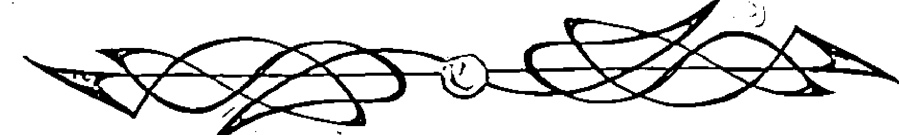

牌意：

命运之轮，生命之毯相接相连，命运，转折点，改变或是改动，伙伴和循环，一个互相关联的世界。有污迹的玻璃镜窗上的无头无尾的金线绳结随命运之轮旋转。命运之轮的下旋上转都一次又一次地带来生命中的改变。如果世界好像不堪重负了无希望，退后一步去观望更宏远的图景，改变的时刻就将到来。

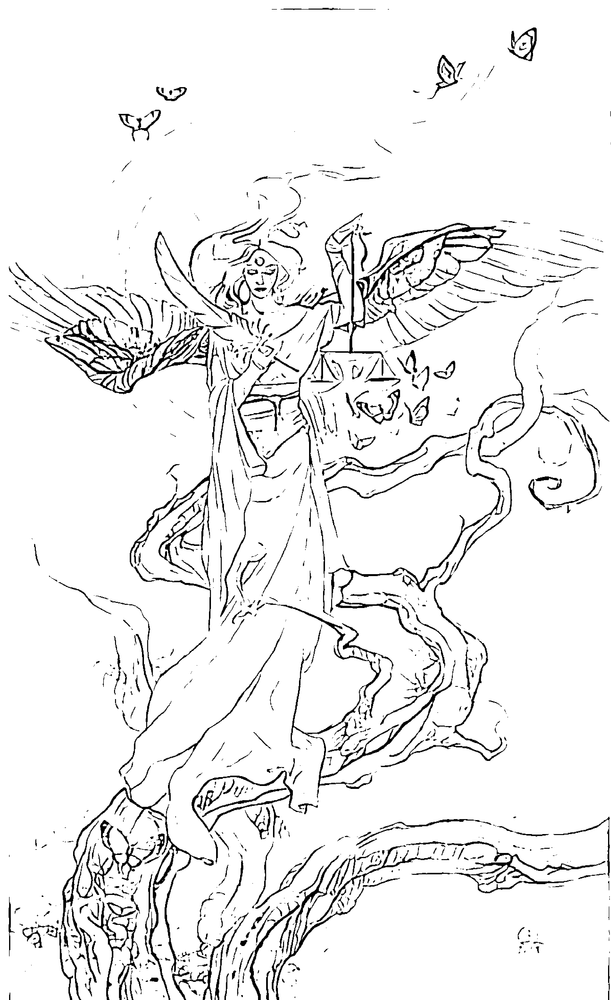

### JUSTICE
### 正义

故事：
回溯到古埃及的年代，当死亡宣判于灵魂，其将被带到女神 Maat（玛特，埃及正义之神）处接受审判。她将在她的天平上用羽毛称量灵魂的重量，而当灵魂被发现不足资格，他将被送入地狱。
有人说正义女神是盲的，但这并不是事实。她的双眼燃烧着白色的光，并不是盲目的而是拥有最真的事实真相。她看穿剥去说谎者最细小的情感，叫嚣，愿景和期待，并深入心灵，将居住其中的意识释放，毫无保留，无所遁形。她为因果报应而立于此。灵魂聚集于蝴蝶群中在此处盘旋徘徊，她将羽毛握紧靠近心口如同所持是刀剑。

她并不以她的偏见或是似是而非的迷障来做出审判，而是以绝对的非黑即白。事物正是如此，公平地，公正地，准确地。当真正的正义被给予，未被确定之事物得到应有的决断，平衡得以达成。

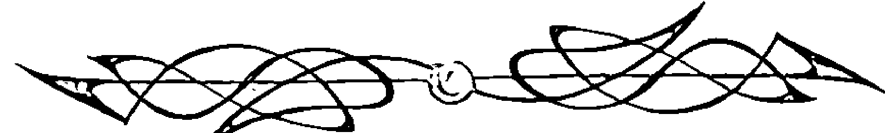

牌意：

平衡，协调，均衡，承担责任，权衡某事件中所有因素，将所有认知纳入选择的确定。正义依靠着逻辑的思维，有能力客观地控制事态发展并调整那些需要重新评估事物。在夜晚沉思冥想，美德，责任，或是必须做出的妥协去平衡事态的两极发展。认知并报答真知。领会你行动所将带来的后果，以及事物间的联系，并从中为未来铺出道路。

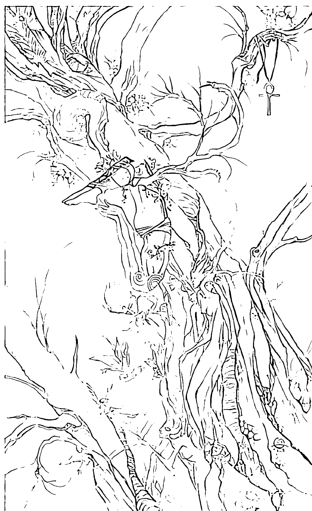

### HANGED MAN
### 倒吊人

故事：
在雾深处的灌木丛中，他将他的手指深入红色的泥土，他小心的用手顺着他身体上的图案抚过，抚过胸口，双臂和脸颊。红色的螺旋图案将他的思绪带入一个深入的冥想之地，此地思想变成行动，此地沉静之声既是上帝之声。当他灵魂的寂寥变成一种绝对，他踮起脚尖，慢慢升起。森林里的精灵注视着他经过，无声，肃静。他们探出，试探性地触碰他神圣的身体，踏着他走过的足迹，带着最庄严的自尊，他们来到雄伟的橡树前。
倒吊人做出了自我牺牲的决定。他从容地走向他的命运，放下他对事物的支配，他为他的牺牲所能带来的回报与利益默默忍耐。常春藤缠绕他的全身，捆绑着他，束缚着他于树上至只留有最后一只藤蔓。常春藤，是决定，和人类精神的不可阻挡的力量与意愿的标志。
Echo fey（回声精灵）模仿着倒吊人的关于信仰和牺牲的举动，他们将羽翼后折，从树上栖息处自由的落下，将自己托付于风。

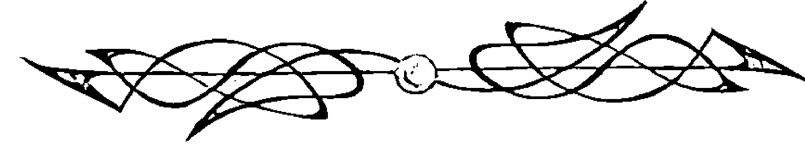

牌意：
顺其自然，拜倒于经验，释放感情。接受现实，放弃控制与支配。推迟行动。牺牲。就像奥丁（odin 北欧神话主神）将自己悬挂于世界之树，yggdrasil（宇宙树，北欧神话里从被奥丁杀死的巨人伊米尔身上长出的），为了他对于智慧的追求，一个人需放弃自我才能得到最高深的学识。倒吊人也迫切的推动着你去从相反的一面去认知世界，用全新的眼光去看待世界。有时，一个人关于世界的洞察是需要改变的，这是一种思想维度的微妙变化。

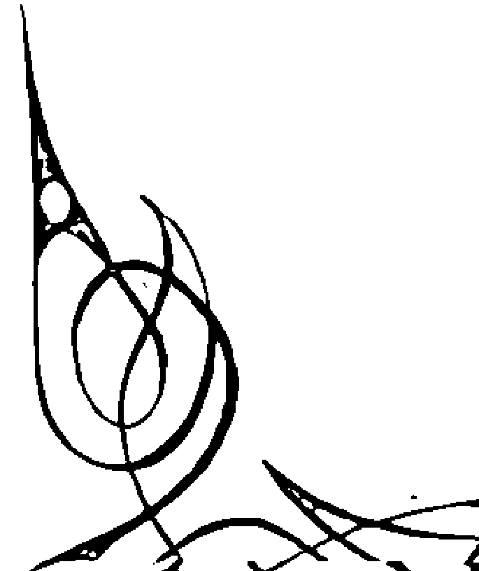

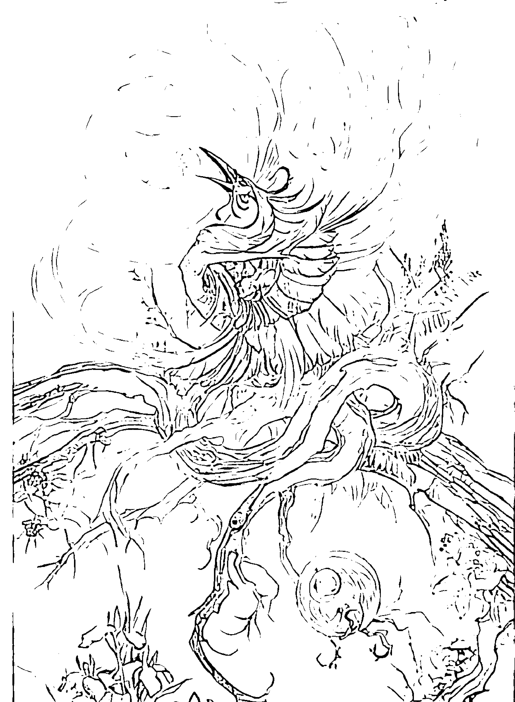

### DEATH
### 死神

故事：
有人曾说，天鹅一生沉默。在死亡之门的入口之上，无论如何，它都用尽胸腔最后一丝气息唱出一首凄美的歌，它发出最后的叹息随之死去。这是最令人心碎最令人哀婉的死亡之歌。
但凤凰的歌，是天鹅之歌无法比拟的。当凤凰见死亡将至，她抬高她的声音唱出一首关于痛苦，关于悲伤，关于哀愁的苍凉之歌。却无法掩饰最炙热的欢愉，她知道火焰与她的心脏紧紧相连，而她的心脏振奋搏动着她继任者所眠之新卵。死亡之火既是她生命之炎，无情的相互接连。正如她与她的前任相联，及之前，之前的之前，而现在，是重生之时了。她端坐于她的死亡之榻，她的巢穴之上，顺从于命运无形的双手。当火焰燃烧至火红白炽，她展开双翅，将她最后的气息唱成歌。

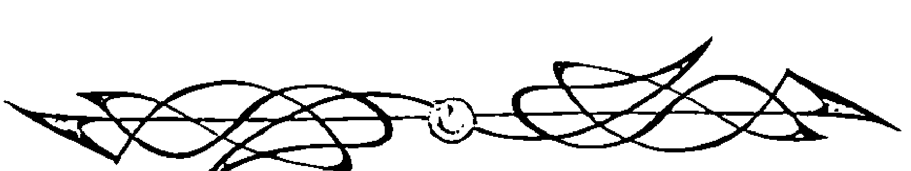

牌意：

关上这道门，还会开启另一道门。开启新路，经历变动，地位改变，将老旧的和多余的舍弃，屈居于无情的力量之下以及大规模的改变。老旧的必须被抛弃，被销毁，为崭新的让出道路。在无数文化中关于凤凰的古老故事被不断的传颂，反复。她是死亡也是重生，成为一个独立的象征。鸢尾花（irises，这种花名源自希腊语，意思是彩虹）与死亡紧紧相连，正是 Iris（艾瑞斯，希腊彩虹女神），这位希腊的彩虹女神，曾为大地的子民带去神的启示，并将女人的灵魂带去地下城。致死的龙葵是一种剧毒的植物，是欺骗，危险，和死亡的象征。而火炬树，在维多利亚时代的花语中，的意思是，“我当于巨变中生还”。

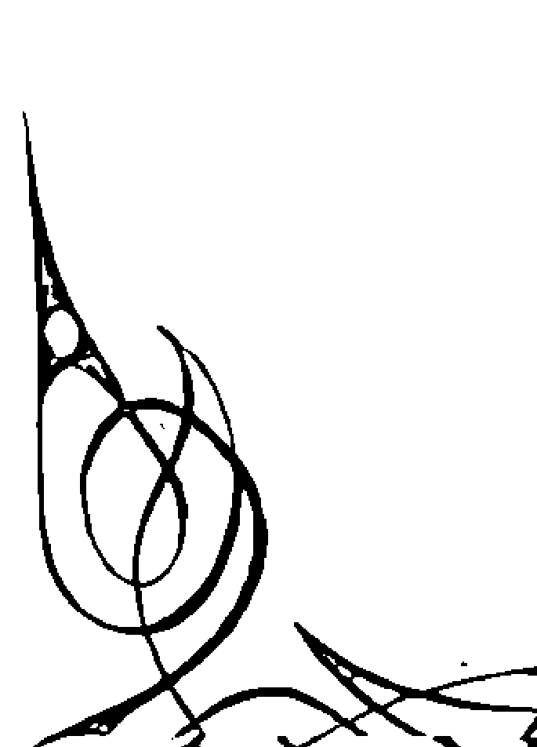

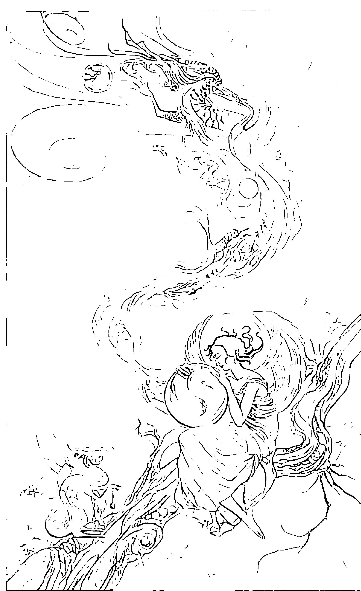

### TEMPERANCE
### 节制

故事：
在平静无风的中心，一个平衡之地，她将自己的能量集中。在此中心，她感受到龙与凤的悸动。它们互相缠绕。它们相拥，鳞与鳞，羽毛与羽毛，相互靠紧蜿蜒缠绕，直到好像融入一体。它们缠成圈，为了霸权持续着永恒的战斗，优雅的华尔兹舞曲中翩翩起舞，相拥推搡。它们在她身旁蜷曲成漩涡，激荡着杀气。就像一位艺术大师，当她感受到任何有失平衡她即注视它们，驾驭它们，因此和谐得以实现。

大地与天空，火与水，男与女，夏日的炎热和苍翠繁茂的成长，冬日的寒风的侵袭：这些都是对立面不断转化，无休止的阴阳调合作用的结果。它们之间都得到完美的制衡；事实上，它们存在的意义和定义正由它们相反的那一方给予。

没有水，火焰的愤怒将毫无抑制的燃烧，并最终将自己在凶猛的大火中消耗殆尽。没有火，水将昏暗，阴沉，泛滥，直到成为毫无意义的静止无声的水镜。通过给予对方界限，它们都将被给予生气，也将成为生命的给予者，被调和至共生的完美平衡，一方将会抑制另一方的泛滥。

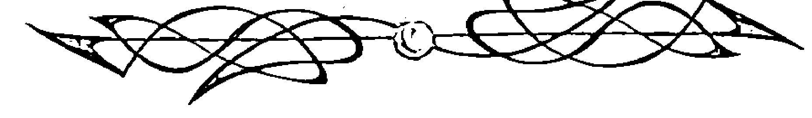

牌意：

平衡，均衡，对立面的调和，治愈。极端偏激的中庸之道，自制，驾驭绝对的力量，驾驭之让其有目的而行。用对立双方的统一的力量控制把持双方。让他们融合成为统一慎重考量过的形式，理解力量的制约关系，那么一个美妙的联合将能达成。有时候能制衡双方的是信仰之墙。保持灵活和宽容去理解有不止一种认知世界的方法，这种态度将大力帮助你击溃那堵看不见的高墙。

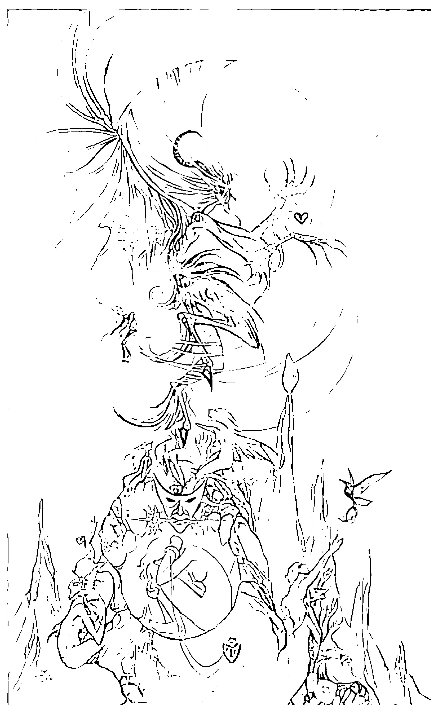

### DEVIL
### 恶魔

故事：
她感受到墙面在慢慢逼近她，忘记了她并不是完全被包围住的——另一边广阔的世界向她敞开着！天空高喊着美妙的关于自由的歌曲，而她却将她的脑袋卷缩，去躲避恐惧，捆绑自己于高墙与枷锁，即使只有纤细的线束缚着她，红如她心的鲜血，而锁链的钥匙离她如此如此的接近。抬头看！你想对她大声呼喊。抬头看看你的周围！但她的双耳已聋，除了恶魔的声音她听不见其他任何声响。她能听到能感受到的所有只有在她之上起舞的恶魔，操纵着她，煽动着她，压迫着她。哒哒哒，他的蹄跳出快乐的舞，嘲讽的节奏。哒哒哒，欲望的圈套如此诱人。哒哒哒，他舞蹈着，他嘲笑智慧，因为他如此轻易地就将一个充满生气的灵魂俘虏。
向上看！微弱地，声音刺穿石块，渗透入她的身体，被她接收到。

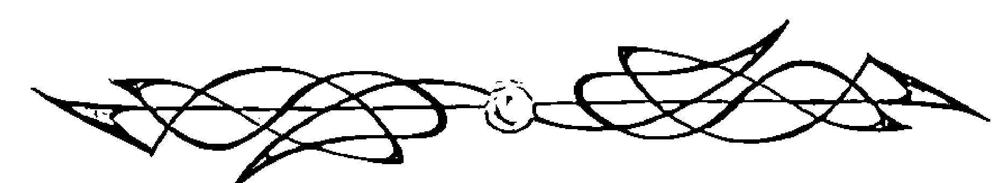

牌意：
失去独立，成瘾被奴役，进入物质的国度，放纵，选择留在暗处，欢愉，放荡，和欲望。感到被困住，毫无希望，和被限制的选择。恶魔如此善于建立联系，玩弄你的渴望。将眼光放远，超越物质的封锁和诱惑，斩断傀儡师手中的提线。

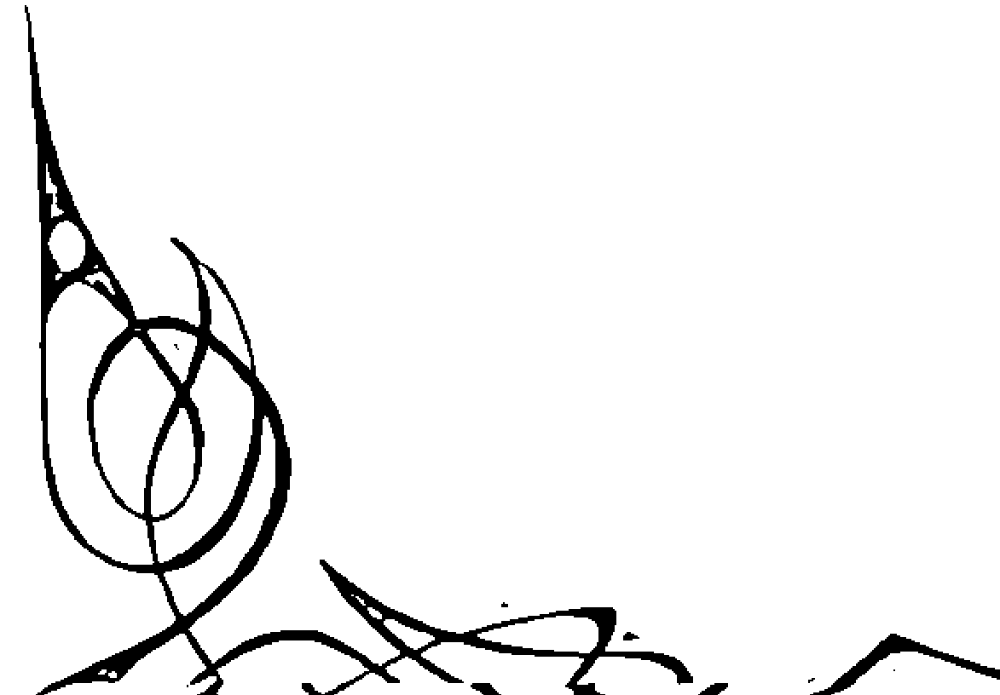

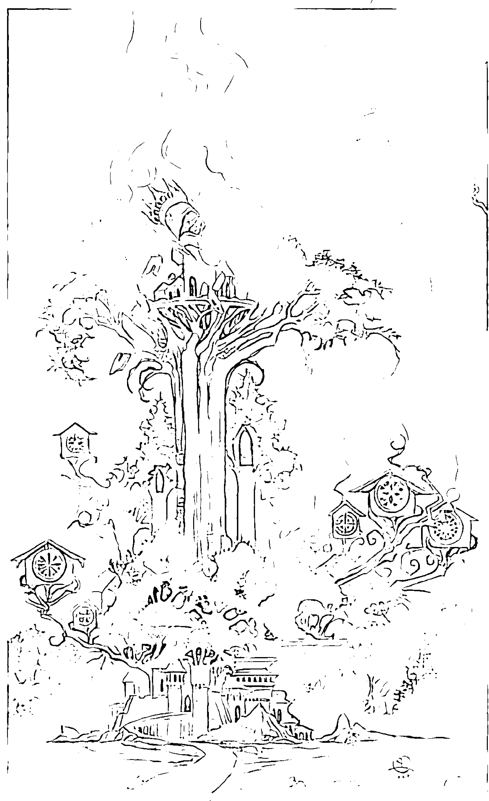

### TOWER
### 塔

故事：
一粒种子随着风飘远落下，被轻轻放在地上。从此，一棵树木扎下了根。一年又一年过去，它成长了——一株细小的树苗，与绿色的生命一起生长。一年又一年过去——雄伟而庄严地，它触碰到了天空，挑战着苍穹。一年又一年过去——它雄伟地树立于巨树间，深情地精心伸展着枝叶，这是自然女神的鬼斧神工。小鸟在它光耀的双臂上歇息，如此快乐，放声歌唱，所有的歌都来自于阳光的温度，风的轻抚，和无垠天空所激发的灵感。

男人与女人在它的温软的，点缀着光斑的树荫下歇息，梦见清澈的流水，肥沃的土地和家园。即使在深冬，它密实坚固的枝叶成为任何旅者，人或是兽的保护罩——一个为任何疲惫者停靠的港湾。

一年又一年过去——好像它已树立在此至永远，扎根致深。它的枝叶触碰天空之顶，轻轻的扫过繁星，爱抚明月无论阴晴圆缺。它的根深扎大地，包裹了在最深处的黑暗中颤抖的生命的律动。

世间万物变化无常，自然女神举手抛下的种子收到四方祝福蔚然成树，她也能轻易收回她给予的自然之礼。她从空中抛下一柄长矛。从单薄种子慢慢成长为苍天巨树所需千百万年的基业就此毁于一旦，在此致死的一瞬，稍纵即逝的光辉如此华彩美丽。

它撕裂。
它炙热燃烧。
它将万物化为尘埃。
大地随着打击的强震不住地颤抖。

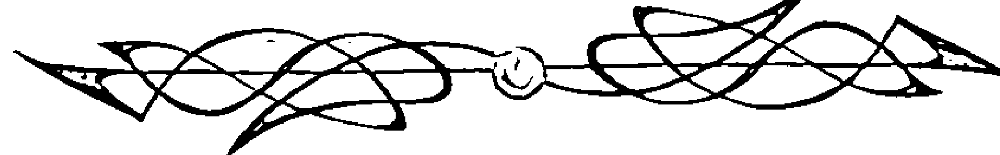

牌意：

灾难性的，翻天覆地的变化，危机，释放所有情感，自我受到打击的折磨，心灵的启示，看穿幻象。对现状必要的破坏——只有暴力的突破性的剧变才能动摇长久以来的既定模式。幻想被现实残忍而野蛮地击溃，与过去一刀两断。是时候扩张改革信念的选择和结构了。

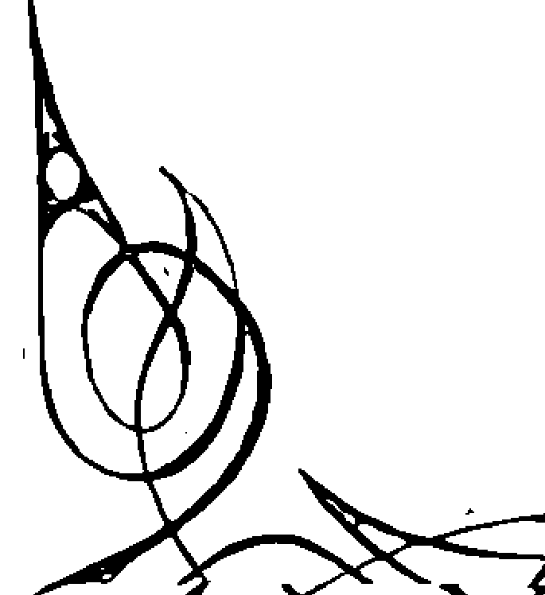

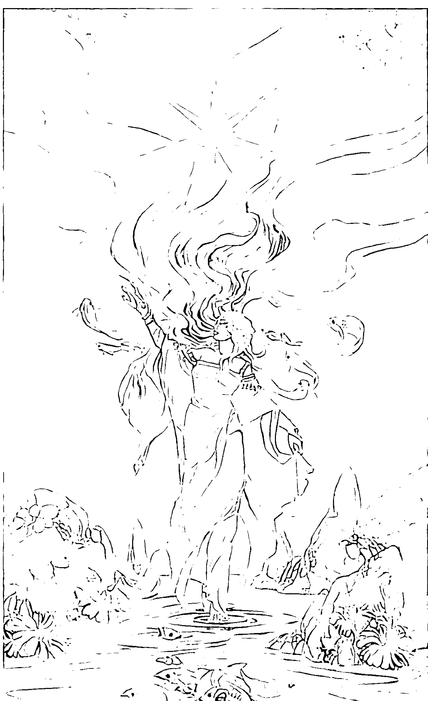

### STAR
### 星辰

故事：
金银妆点的足迹在向下流淌的银色之路上指引着银色的繁星的光辉将夜空蚀刻成一片接连一片的银色。
这里没有太阳。这里没有月亮。在此万籁俱静的永恒暗夜，只有星光之路在天鹅绒地毯般的夜空中闪烁着，如同钻石中的斑斓。银河横穿过繁星似锦的苍穹，她在一路轻舞，通往仙河流向的银色的尘世之泉。水，土地和空气，成为属于她的珍贵宝藏。在上面行走，在其中游泳，介无碍；它们会成为她想成为的样子。

她舞动着，她的步子如此轻盈，只有些许浪花被激起。她的舞蹈是由星耀精心的编排，它们已凝望世间千万年，带着它们对所纪念的英灵无声的敬意。此舞包含人类生命的流逝，包含最真最本质的痛苦之美。这是将希望化作可触的实体。

在群星下，她伸展，摇摆，她飞跃到至高处，当旋律鼓点跳动到一瞬间的静止。星河的一个飞溅滴落了水花在她回旋的舞蹈中。每一滴水花滴落的地方，都有一株花朵缓慢绽放。

她整夜不知疲倦地舞蹈着，超于凡人地将人性化为实体。当黎明的光辉微微散发于东方的天界，她紧抱她银色的大衣。陡然的疲倦带着胜利的棱角侵袭她的眼帘。她卷起银河的壁毯，回到她暗夜星辰的姐妹身边，她们在黑夜中闪烁着并等待着下一个最真的黑夜降临，再次起舞。

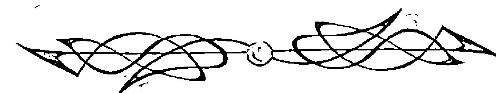

牌意：

重拾希望，对未来怀有信念，激励人心的。找到永恒而安静之地带这既是陷入困境依然保有的内心的宁静祥和。和谐，不求回报的付出，分享，慷慨。严酷的日光与月光不再，只有繁星冷静而一视同仁的慈祥眼光。这是这样一个地方，一个地方给你成长，去准备，升华精神。让我们逝去疑虑与恐惧，去拥抱这样一个夜晚。星星一直是指引和希望的象征，它们将指出回家的路。有劲而灵活的鲤鱼代表着心灵的力量，坚持不懈不屈不挠的精神，勇气和决心。而菊花常用于象征长寿，但它也是希望的象征。

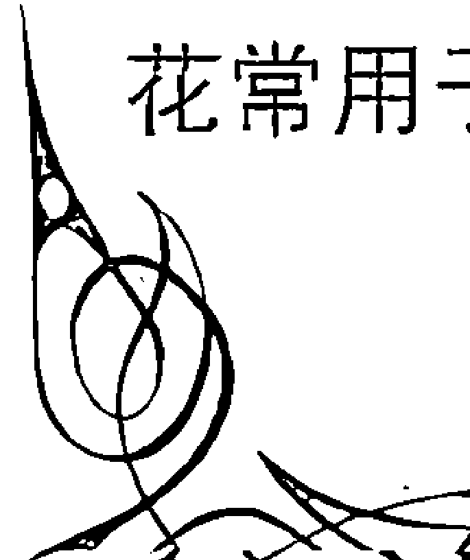

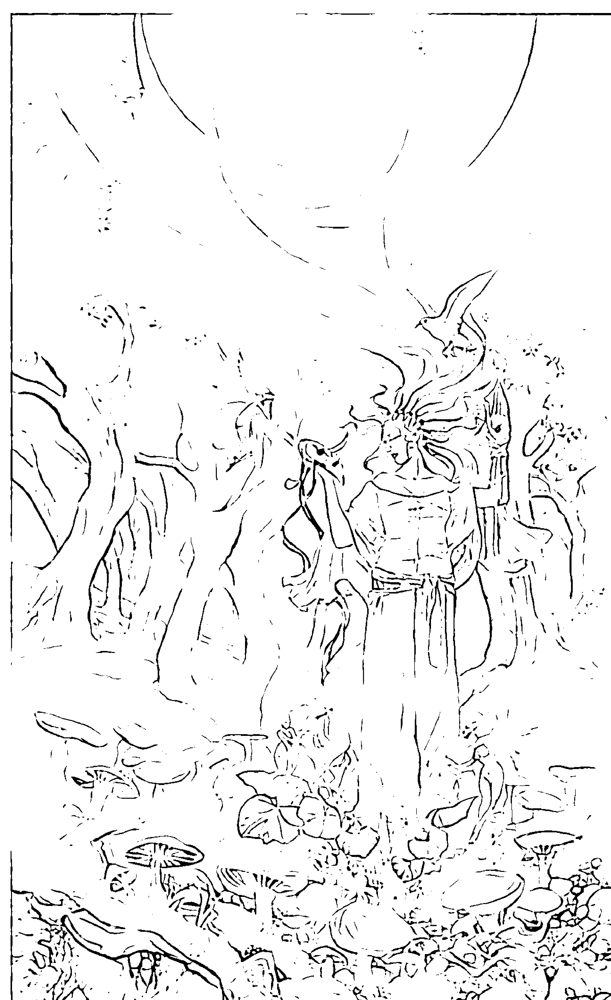

### MOON
### 月亮

故事：
你们山林的小妖们，在月下的草地上留下环舞的圈迹，使羊群不敢走近的小神仙们，以及在半夜中以制造菌蘑为乐事的你们….

> ——莎士比亚，暴风雨，（第五幕，第一场）

太阳已合上警觉的双眼，白日照射在世间刺眼的阳光变得迷离模糊，渐消渐远。月亮爬上夜空，她的国土，侦查这黑暗世界的慢慢觉醒。菌蘑的仙子的珠宝在月光下静静的发着光亮。随着时光的飞逝和黄昏的临近，它们越发闪亮，为她们的皇后用磷火照亮小路。

“她来到这边了！”空中的精灵大声呼喊，声音如此甜美让凡人如此深切渴望。“快让路”一丛丛小精灵呼喊着（Will-o'-the-wisps，在一般的英文解释中特指属于仙族的以火光指引迷途旅人的精灵），穿越过灌木树丛。她们闪烁着，奚落也引导那些迷途的人，却没有人能陪伴它们供它们嬉戏，能让它们度过此夜。森林里的精灵手牵着手，一起越过银灰的桦树随着她们身边落叶与花瓣的飞舞掉落，去作为仆人迎接女皇的到来。当她滑翔而来，穿越过森林，在她踏过的脚步边，银莲花突出新芽，她微笑着开始起舞。让开路！让开路！黑夜将统治，将领舞，将白日阻挡在外！最疯狂地欢愉，起于我们的歌声：

此处没有悲伤，没有沉重的包袱需要担负，此处没有秘密，也没有对秘密的探究，仙子们珠宝的精细锻造，归功于大自然的奔放与狂热。让我们感受飞翔！

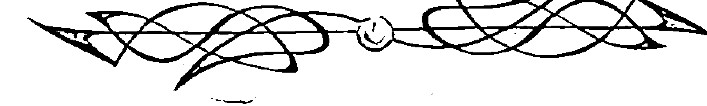

牌意：

恐惧与焦虑，相信幻想，追随幻想，变得扭曲，梦与想象，迷失方向。关于死亡的影像，是幻象中最美的艺术，正如仙子的珠宝散发的光将你一步一步领向死亡，也同时广为人知。月亮不可被认知，被感受和断言。这是另一个世界，在属于她的夜里，她超凡脱俗而鼓舞人心，如你不予以尊敬她将令人畏惧，令人怯步。做一个被林中仙子吸引注意而被带至迷途，在树林间无所适从的任性的旅者是如此轻而易举。而如果你以你的智慧面对诱惑，向无限光耀的真实望去一眼，这是最珍贵的荣耀，也是最鼓舞人心的魔法。这是走向被隐藏的未知的途径，也是融合黑暗与光明的源泉，你将顺着溪流走出这片迷雾。这就是月亮所给予的礼物。

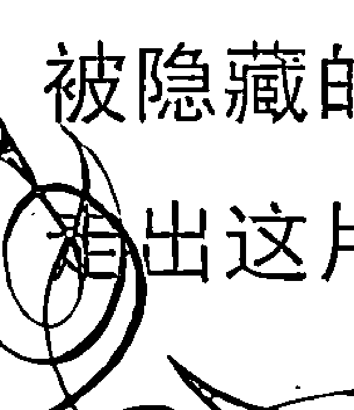

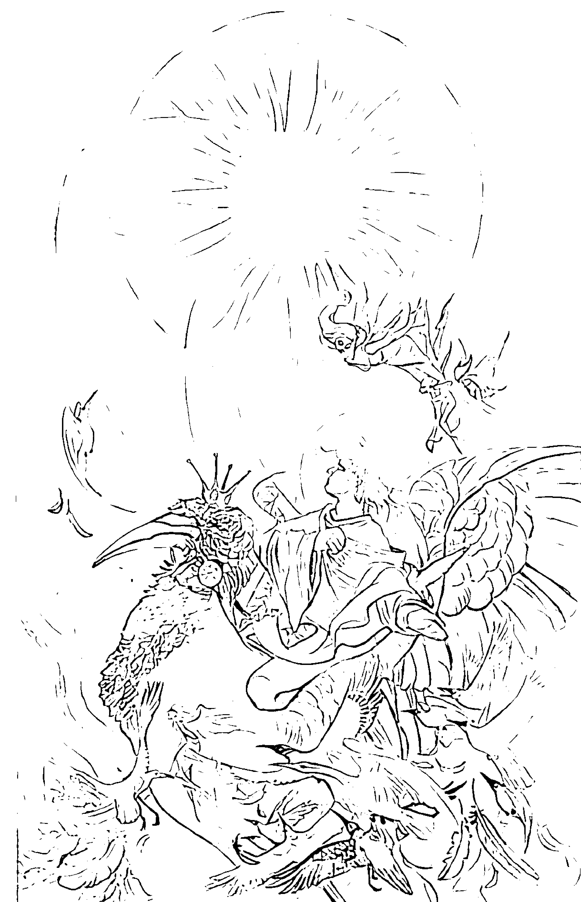

### SUN
### 太阳

故事：
一株金色的光华从天空一泻而下，太阳就此升起。这是白日最光耀的恒星，在黎明驱逐了他在夜晚发出微亮光芒的兄弟。
万鸟之王从他的休憩的栖木中探出头来当朦胧的晨雾从噙满露珠大地上缓缓浮起。他的羽毛在清晨玫瑰色的光芒的调合下泛着彩虹色的暖光。他的伙伴也开始展翅盘旋上升，并同时并行飞跃过他们的领土。他们越过山谷，听着土地上的人民唱出的歌声。他们高飞越过山峰，又以稍纵即逝的迅速用翼尖划过湖面。

白日的居民追随着巨鸟的光环。他们飞跃过天空，紧跟太阳和它来回于最远天边的旅程所走过的圈圈弧线。
来自耕地牧场和青翠溪谷，来自被阳光撒白的海滨带着钻石般的谷穗，和月光拖曳出的像是牛拉出纹路的小径，越过山峦，河流，越过过去与最后的完结当天空只拥有最迷幻的面纱，来将一切超越，胜过一切。

我，召唤所有用于羽翼的伙伴同族
从地平线至梦境的边界！
被禁之歌的旋律，
将所有一切卷入
然以此为中心向下俯去，
这就是他们的归属之地！

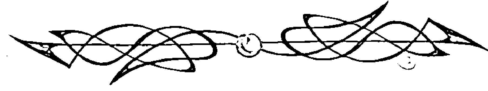

牌意：
收到光芒的启迪和感召，突出的成就。生命反复的革新，活力，饱满的光芒四射的欢乐与能量，精神充沛身心愉快，十分的健康。被担保，确信并保有信心，明晰的远景和目的被日光照亮。从古老的文明到现今，太阳一直是生命和成长的标志。在无数的文化和历史长河中，它搜是充满生气的神与女神的化身——年轻，荣耀，无尽智慧，生机盎然散发显赫华彩。神明的力量滋养太阳的光辉。

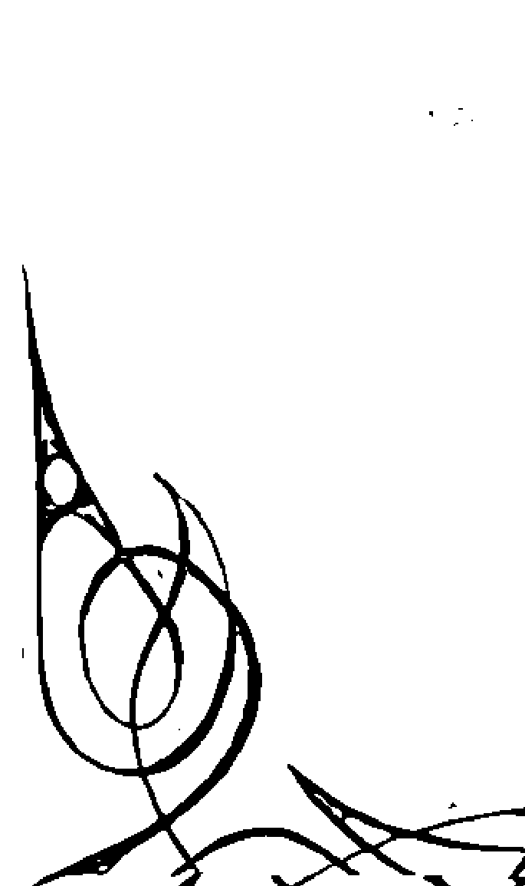

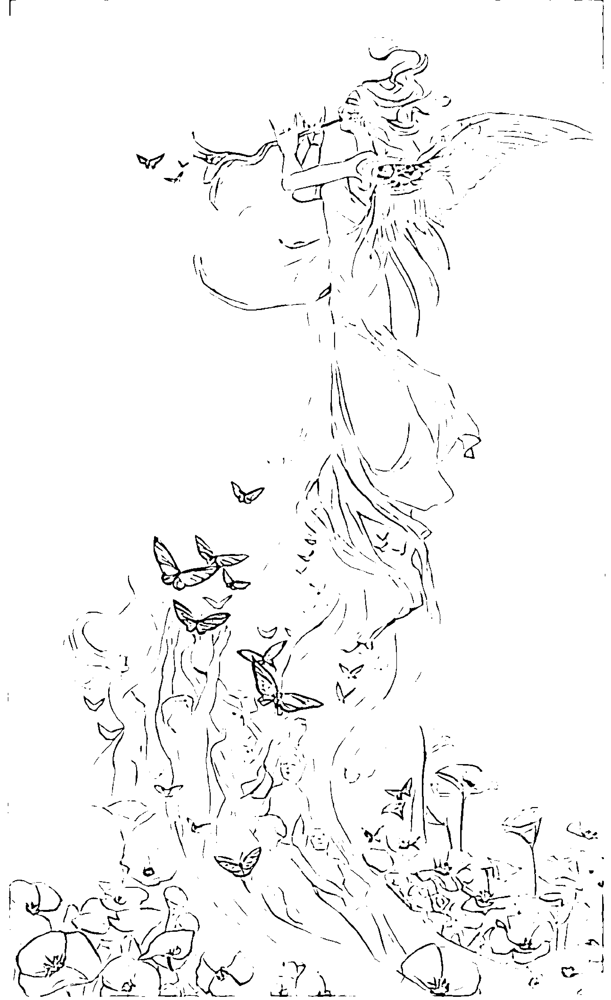

### JUDGEMENT
### 审判

故事：
在审判之日，一位天使吹响号角，投射真理（blast of truth）这冲击让所有灵魂升起，召唤他们，将他们的愿望全部列出以便判决。用燃烧的火焰与光明洗涤灵魂，让他们纯净真诚。
所有人都将被清点的时候就是此时。这是一个衡量逝去的生命的时间，以公正无私的思量和真诚之心重新组织和判定一个人自身。任何行为都有它带来的后果，无论结果好坏，无论是得到回馈或是忍耐必须给予的赦免和宽恕，赎罪与净化。

### 世界

故事：
世界的脉动激起所有在世的生命和逝去的英灵的涟漪。所有的叶与树，所有的生物——从最小的昆虫到歌唱的巨鲸——当他们出生，死亡，并不断轮回时所织成的花纹，都在此和谐一致的鼓点中颤动，介由至高无上的君主在此聚合。这是最美妙的包含参差的和谐，这是平衡的本质，这是对截然不同事物的完美统一。
她将洞察的皇冠置于眼眉之上。她穿着真理的腰带。她展开双臂，感受命脉的起勃。她触碰它，它有形地存在于她的心中，优雅而有力。由她的心脏发散出的相互交织的网络发着光亮。她与她的思量一起飞向高空！她感觉到翱翔的群鸟，了解翅膀之肌随着风改变而伸缩，从而平衡又灵活的保持飞行，感受到阳光在她舒展的身体上留下的吻时而热烈时而疏远，感受千万年来水流过山石，留下刻印。没有过去没有现在没有未来，此心脏的律动来自从宇宙初生的火光，它也将继续它的脉动直到时间停止。这是现世永恒的一瞬，相互交织的网络于她的血脉壮观地轻弹跳跃直至炙热。她瞬间明了，她已被祝福。

牌意：
满足和内心的祥和。完满成功的结束，结束之时近在眼前。平衡得以实现，融合和协调成统一的生命之歌。世界是关于目标和展望的觉醒的一张牌。它是一阶段完成，穿越过混乱的事态和完成艰辛的工作。当一个人目标得以达成，在此地，在此刻，得以感受到至上的完满溢出内心。这是个奇妙而珍贵的时候，这是被辛勤工作推至的顶点，让你看到美梦成真，去理解那令人容易忽视的来自仙境的传说中神秘宝藏：心之所向。

### 快乐松鼠

这是属于塔罗世界的一点点诙谐，欢乐的花栗鼠牌来自动画辛普森一家的其中一个桥段。“牌什么的都好暧昧好神秘啊。”

## 小牌

### 权杖

#### ACE

这是创造的可能性，令人兴奋的，冒险；面对挑战，向前迈出充满勇气和信心的一步。
将燃烧的权杖安置于大地，注视着它在深红色的厄光亮中向前发出火焰。像是对打火石溅出火绒做出的回应，被光亮唤醒而盛开的花朵。酒的精灵和风的精灵倾巢而出。他们在柔和的光亮中藏身，无法将他们从落叶，树梢，碎石和天空中区分出来，却他们却在他们光辉悄悄溢出和展翅的时候被发现。他们感受到一些事物将要开始。光芒开始闪耀。一个挑战已被耳语传颂。在此黎明时刻，邀请已被发送。在此光耀时刻，火焰无法被预知和控制。一股难以驾驭的能量将燃成大火。抓住这个无与伦比的机遇，在火中释放光明。这是火焰燃烧的最初，由权杖守护：火狐，山猫和雄狮。智慧与才华的点燃的火花，急速掠过的身躯猛击着这个世界，凶猛和坚强的心灵熊熊燃烧。

#### 2

她勘测卧于其身后的大地。那是她的国土，居住着她的国民。她驾驭在此高峰能俯望所至的一切，正如她的祖先。有这样一个时刻，她的视野变得朦胧，她看到一个远景，需要她耗费数年去完成，而她已被赋予权力。起码，这是一个机会去将梦想实现，并将她心中的国度建立成现实。她知道她必须紧紧握住缰绳。她必须在为她的子民开拓的道路上信念坚定而不可动摇，因为当她的弱点被发现就将被迅速取代。她的伙伴，雄狮，知晓他是万兽之王。他是勇气和荣耀的化身。在此高峰，他将凶猛地盯着任何胆敢向他们挑战的人。他抬起他雄伟的头颅，摇动他火红有力的鬃毛，他的嘶吼穿越山谷，远至边疆，即使住在最远处的子民也能听到他的吼叫。杖二是个人权利和影响，荣耀，勇气的象征。抓住时机去发明创造，而不是远远逃离，回避此必须完成的任务。但同时也要注意不要陶醉于权力而迷失自我或有失公正。

#### 3

这是一所相接世界边缘的桥梁。它低声的召唤勇气和好奇之心向前并开始此艰难的旅行。 它的优雅的弧线划过天空却没有伸向更远的地方。她站在桥的边缘，思量着往何处去。悬于高空的太阳散发的闪烁的光带的使人目眩，此光芒穿越过下方的越山谷和河流。在此高处的空气如水晶般纯净永恒。它被发着火光的电子充斥，就像所有的可能都在她的心中默默等待着她的到来，吐出令人兴奋却寒冷的气息。她看到在她之前走到如此之遥远之地的权杖，或许它们的主人在此回头，畏惧于此般道路的下一步远景。她将此刻停止，并不向下望去，将步伐迈向看似空无一物的空中。她的双脚感受到了坚石和踏实的岩板。她意识到完整的桥梁是由步伐和梦境建起。她深吸一口气，开始大步前进——她一步又一步，一步又一步，桥梁也在她的步伐下生长开来。

#### 4

春日降临，繁花盛开！玫瑰花以香味作为邀请着仙境的子民。随着东方的独角兽，麒麟，在通往庆典的路上听从着召唤并引领仙境的主人向前的跳跃的步伐，大地不住地颤动。大气中的寒冷已经消逝，此刻的小憩不仅仅是为了欢愉，更是为了日后更坚信的劳作。在重新开工的之前，让我们尽享快乐。先驱们举起他们的王牌，号角之声在黎明回响。风在鬃毛和双翼中回旋，追随着他们的踪迹。他们越跑越快，直到世界只是一道道模糊的色彩，此时，一声欢庆的呼喊，他们一跃而进高空，踏入苍穹。杖四为庆典而生。最初的胜利将希望与快乐带入天空。和谐与融洽得以实现。无论怎么说，一旦拥有，此繁荣必须被维持下去。在此刻休憩和玩耍，但也必须准备好继续完成这项任务。火焰必须持续燃烧。它必须时常被供养去持续它的光亮，不允许熄灭成为灰烬。让限制远离，拥抱你所拥有的自由。

#### 5

在此族群的最前线，野兔迅速奔跑。它穿越过石从和树木，在灌木从中一窜而过。随着它血管中肾上腺素的激起，它的步子在旷野中一闪而过——那鲜红，流动的血液的气息被他的猎捕者们嗅到了。此气味让猎捕者们发狂，他们的追捕如此急速不可琢磨。他们互相赛跑追逐，他们的追逐如此迅猛甚至快要扑上对方的脊背，他们从权杖上一越而下，在空气中呼啸而过。人不为己，天诛地灭！而在此争斗中，他控制着拥有火红皮毛的他们。他们则竭尽所能去阻碍他。他就像在大浪中逆流而行。肌肉和胸肺筋疲力尽地灼痛着。一次又一次，这样一个细小的声音催促着“就此倒下吧，让争斗的洪流将你淹没并远去”不，如果真如此则会将被激流践踏。他毫不动摇。他感觉脉搏随着这场斗争急速地兴奋地跳动。在此面对活跃着的障碍物的挣扎中，他当艰难地上行。他觉得自己有一点像是那只野兔，挣扎着想要冲破一个出口，通向一个属于自己天堂。杖五，有时候看起来像世界在你的道路中投掷了些许障碍。当它们被集中，一个个的阻碍物成为了需要跨越却势不可挡的城墙，不过让心苏醒吧，让肾上腺素觉醒身体和思想，面对挑战就迎难而上。不要以绝望回应挑战，而应以复苏的活力。感激当你面对困难时被激发的神秘力量。

#### 6

他站在代表着国王与皇帝的石狮子之上，并得意洋洋地向世界宣告他的支配地位，即使狮子已向此胜利者屈下了他的头颅，合上了他的利爪。狮子安静而顺从地躺下。他将木杖如同君王的权杖般手持着，将它举过桂冠。他知道他的繁星正在闪耀，他不屑于任何向他挑战的人。他已见过无数挑战他的人来了又离去——包罗勇敢的骑士，或是愚蠢的骑士。以及想要欺瞒他的聪明人，手捧花环的名士，和那些气焰嚣张却富于技巧的人。没有一个有能力将他打倒。他对于他自己的力量和能力十分自信，高傲而自负，十分确信没有人能望其项背。他历经无数战斗，从而脱颖而出，从而立于此地——或许最终那位能打败他的挑战者还在等待属于他的时机，等待一个时机打败这个过于自信的王。杖六是胜利和凯旋的标志。战胜打败无数障碍来到最高处。但是你必须意识到这绝对的胜利将带来的疲惫与傲慢或许会将你吞噬，也不要在自我优越感中迷失。

#### 7

母狐直面着獾，她的幼兽在她的尾巴的保护下卷曲着呼吸着。敌人一圈圈地徘徊。他们互相打量。一个小动作去试探回击的速度；一个猛击去试探回击的力度。 为了保护她的子嗣母狐咆哮着向前突进，她不会将他们交出！她的小狐狸的恐惧在她的胸腔中燃烧。她的行动是必须的而不仅仅是勇气所致，这最无私的无需纠缠于缘由的行动已超越了勇气。她的信念让她带着最猛烈的力量成倍地猛烈回击。权杖之竹代表着力量和不屈不挠的勇气。竹子拥有的单薄柔软在随风摇摆而不折断。它执着地向四方生长，在争夺阳光和空间的竞争中取得有利的位置。杖七代表着表明立场，为你的信仰战斗。这个世界充满战斗和竞争，必须当困难来临时勇于面对。不要被严厉呆板的风压弯了脊梁，但像竹子般柔韧。看起来无法超越的惊奇将会被信仰的勇气打败。

#### 8

她将她的物品放置在她身后，她一步一步的向上攀升。发着热的光球泛起涟漪承载着带着花边的叶子落在道路的两边。她记得她一个童年的伙伴称它们为希望，拿起一株，将无数的种子吹入风中能带走祈愿。种子旅行的越远，它们能获得智慧和真相就越深远。她弯下腰拾起一株。随着气息的呼出，她将种子们送入他们的旅程。可爱的花朵优雅的绽放成轻盈而美丽的精心雕琢的球形最后的结局，也是新生的开始。种子在狂野的风中飘远——这是自然的怜悯，带着大自然的希望用她赠与的芊薄的丝远航。远航，到远方，然后落下长成参天大树吧！杖八代表着想着目标开始长远的旅程。一个承重的承诺已在手中，它带着希望和动力向未来冲去。

#### 9

哨兵继续在前方守卫，无比的警觉。他们是永恒的守卫者。他们抗击深渊中未知的事物——或许它只是是世界边缘的光和雾，但他们并未鼓足勇气越过它去用他们的双眼瞧一瞧。他们只知道他们的职责是守卫，注视着白日将逝时光线渐渐弱去的西方。当最后的光线射出，当绿色的荧光向太阳做出告别，会有何物走出深渊？他们的力量是否能抵挡攻击？他们还未尝试过。每一天，当黄昏渐变成黑夜，他们等待着他们未知的敌人，并睁大双眼希望的黑暗和神秘，或许今夜就是战斗的时刻。当阳光照耀着他们的双肩，他们开起来如此光耀，高大，和威猛。在只有暮光的寂静夜晚却难以保持此优势。当至少到现在，他们明白总有一天他们将奔向战场。守卫是杖九的口号。它迫切地需要你去储备力量，并为任何状况做好准备。抓住力量的核心，更重要的是，知道力量的本质。有时候我们拥有的忍耐痛苦的能力只有在面对困难的时候才会显现出来。当挑战并未浮出水面甚至超出预期地迟迟不肯到来，是如此容易令人懒惰懈怠。 而保持敏锐才是最难以攻克的挑战。

#### 10

此树神（德律啊得斯，希腊神话中的树神）像是用背撑起了一个微缩的世界。她的枝叶向下垂坠，在沉重的建筑下弯曲。栖息于这些塔内的生物所需要的由她供给的支持和养分来自于穿梭在枝叶里的树之精气。它们的灵魂是发自她内心而穿梭在枝叶里的歌声。古老的银灰色的溪水渗入她的树根，这是一个重担让她难以忍耐承担。她向上伸展，触碰太阳寻求火光得以在黑暗的日子的继续支撑。权杖燃烧的火在慢慢熄灭，它看起来像是过去怒吼般的火焰留下的最后的余烬。如此多的事物依靠着她，需要着她！她挣扎着尝试着将头抬起，去把持创造和给养的中心。极度超出限度的延伸，由于承担了过度的责任而筋疲力尽，一直承担着必要的责任，用艰难的方式解决问题。或许在她的枝叶中活着的小生物并不需要她视为己任的精心照料。而养分毫无保留无需报酬的给予，责任也是自愿被承担，她明白她有力量持续给养并坚持下去。

#### 侍从

> 音乐是人类共同的语言——
亨利.华兹伍斯.朗费罗

她演奏着她的乐器伴随着自信和孩童般的喜悦，发出她的信息。节奏在回旋的韵律中舞蹈，这是一首关于信心和允诺的歌。响亮的鼓点标出任何人都无法抗拒的轻快的拍子。她微笑着，她将此树丛里出没的所有生物吸引出，并懂得她就是它们注意力的中心。空气中荡漾着兴奋和令人窒息的繁华：来自地下的古老国度的，来自 天空和海洋的，都来到我身边！我将你们召集你们当倾听此召唤：在我身边聚集，飞来，游来，大步走来！权杖侍从拥有创造力和激情。她诙谐幽默，拥有超凡魅力，并大声宣扬她的哲学。 她懂得她的想法，当她有一个观点她将直截了当的说出。她或许是一个导师， 渴望传递她所明了的智慧的核心。她是主动和创意燃烧的花火，而且她打赌你不敢去探究去寻找或许令人恐惧但充满潜力的机会。那些推你进入你并不熟悉的环境的行动是对你最好的奖赏。她告诉你去行动而不是坐下空想。行动才是重要的。你能听到她的歌声吗？你能听到它用冲动之声唱出的甜美的诱惑之歌吗？

#### 骑士

权杖骑士预示着改变和向着目标前进。他是一个洋溢着勇气和激情的人。他的精神激昂闪耀正如同权杖代表的元素火焰，他所骑乘的雄狮的鬃毛如焰火般散发光芒，他的狐狸飞也似地穿过被火焰围绕的树林。风强力地拨弄着他的头发，他在风声中大笑不止，他的雄狮的每一块肌肉的饱含力量，在他之下舒展有力的身躯。骑士的旅途充满冒险。他的步伐满含兴奋之情。他泰然自若，而他的对手总因他的出现而惴惴不，或许是因为他志在必得，得意而自信。有时候好斗的天性有时候看起来过于自负和鲁莽。他是一位拥有雄狮之心和狡狐之智的骑士，虽然有时候以他的智慧并不配拥有这些。他在这个世界上不顾一切地前行，他豪迈地跃入悬崖勇敢面对自己的命运。这是多么英勇无畏的举动！命运，信仰，和他对目标的执着追求在他沸腾的双眸中燃烧，或许正因如此他没有留意到他在他义勇向前的路上所踩踏的花朵。小心骑士野蛮的灵魂和燃烧的能量打断你的进程，造成的混乱。

#### 王后

狐狸火红如焰火的皮毛在她的周围的阴影中四窜。他们看着被王后的琴声吸引而出的森林里的其他居民。她在正午的光芒中闪闪发亮，或许是她的出席如同熊熊燃烧的火焰正如她内心的内心燃烧着的能量。杖王后的指尖在琴弦上来回舞动，她拥抱她的树神（dryad 德律阿得斯），她是王后的观众，乐器和权杖。杖王后是优雅迷人有魅力的。她总是如此鼓舞人心。她知道如何完美而冷静地运用女王的权力。她是注意力的中心也知道这是她的职责。她带着自信和智慧现身，她能应对任何人，任何事。这不是自大或者傲慢，这是对她的所用的能力的正确理解和判断。她的魅力可以轻易地转向黑暗，用于欺骗和操纵事物。但她守卫自己不被诱惑。要记住，这个世界为她的声音和眉美貌和她所散发的光芒中迷醉。她双手在竖琴的琴弦上弹奏出的抑扬顿挫的音乐唱出了她生命力的富饶和刚劲。

#### 国王

他向上举起权杖如同手持散发着火光的火把。或许他自身就是一盏灯塔，他同他胸中的火焰和头上炙热的皇冠一同燃烧。他举起燃烧的火把去照亮道路，并大步前进。大地颤动，树木也不禁后退。树木为他折腰，将树枝嫁接成他的道路。环境都为他的意愿改变并服从于他不必开口言说的渴望和指令。权杖国王拥有超凡魅力。他的魅力令人无法抵挡，正如世界的为他的渴望和意愿而重塑而折腰。他是灵感之源，感受他与生俱来的炙热的荣耀。他拥有自然的元素，燃烧的火焰与之相随——在他的血液中，他的声音中，和他的每一个触碰中，都发着火光。他拥有雄狮的精神：骄傲而凶猛，统治，在追求自我渴望的道路上无所畏惧。他将行动赋予施行，自信而有力，轻蔑地看着周围的野兽。他身性勇猛，毫不犹豫地开拓新的危险的道路。

### 圣杯

#### ACE

这是初生之水滴在明镜般的湖面。只有悄无声息的波纹缓缓散开去。那是地面小小的威震将海面的波浪扇起，围绕着海洋之柱散开，消失于天际。这是感情首次被触动，这是激情首次被点燃，这是爱意首次被发现，这是亲密的关系首次被建立，这是协调音律被调和——这来自心底深处轻轻的一点将融入由人性的点滴汇成的河流。它们都细细流淌汇成一股流入浩瀚的情感之海。圣杯中静止水面像是一面魔镜。深入地探究水晶般的未知，留意到直觉感受到的刺痛，然后将杯子拿起一饮其中的清水。此圣杯闪耀着知识与深刻智慧的光芒。这些是圣杯的守卫者：海洋深处的居民，鱼以及古老的海洋之魂。它们同海洋的奥义一同优雅地遨游，带着全部的感情起舞。月亮的阴晴圆缺让海洋潮涨潮落，那些生活于海洋的拥抱中的生命所流淌的血液也将被其轻轻拍打触碰。

## 圣杯 2

清水大地和天空，这些有魔力的元素都在此刻融化。鱼儿游于河流像圣杯般的晶莹闪耀（或是它们漫游于阳光中？）。森林女神（dryad）的枝叶互相缠绕，将周围流动的空气抱于怀中（或是流动的海洋？）。他们心灵相通。他们紧紧环抱着对方像要融合为一体，却又同时保留了各自的独立和属于自己的颜色。

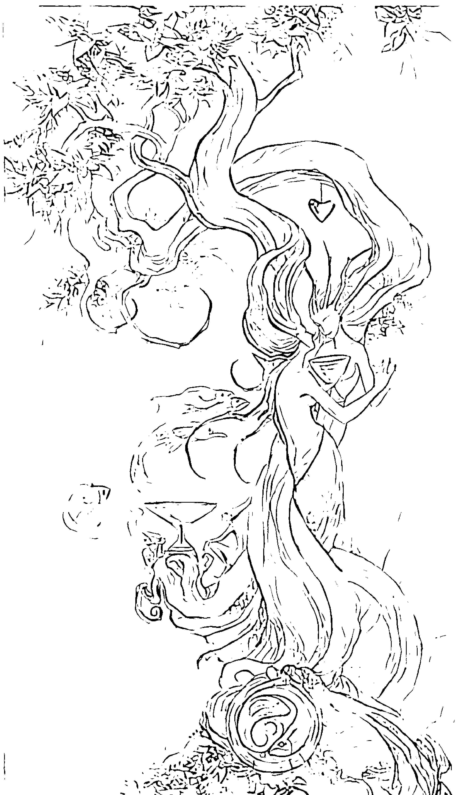

像是阴阳双生的和谐，他们相互环绕带着温柔的推攘却和谐统一。他们分享一个圣杯“喝吧”其中一个捧着圣杯轻声低语道。

“好主意”另一个回应道，并将杯子接过。他们深深地饮下一口，一瞬间，被分享的养分已融入他们的根茎。另一个圣杯稳稳地端坐在一个分叉的枝头。他们好像没有注意到它，但精灵和仙子仔细地端详着它。现在的圣杯如此的平稳，但随着树木的生长，随着树枝伸展，卷曲变得茂密，圣杯是否还会屹立不倒或是被打翻摇晃至地面，将珍贵的琼浆撒漏？

杯二代表着建立联系，成立联盟，或是合作。它将不同立场的人联合并带来潜在的联合关系。它是一段人际关系。像是一个有生命的有机体，人际间的关系也会生长；有力的成长为坚固的支柱，薄弱的关系被人淡忘最后消逝不见。

## 圣杯 3

有这样一首歌存在于海流中。它潜伏于峡谷和深沟。它藏于海浪的拍打声和海豚的鸣叫中。它栖息于暗礁和洞穴。然而，一到时机成熟，像海洋的气泡聚集一起形成的有力的屏障，它将以不可阻挡的势头像海面升起。深处的海妖们（Siren 塞壬）已经久等于这个时刻。她们汇聚一堂当她们感受到通过海浪传来的来自海洋的每一个角落的强烈的信号。当她们歌唱。她们的歌喉为海洋之歌编织出美妙的曲调。她们的双唇将欢乐用抑扬顿挫的歌声传播。海水愉快的震动召唤了海洋的居民。这些在海洋的拥抱中生活的各式各样的生物，跟随着海妖们的歌声。每一个游曳而过的生物，都将感受到这段优雅的来自无常而有力的海浪的舞蹈。这段海洋的行云流水之舞涌向海面，来自海洋的歌声将回荡于逛过的苍穹。

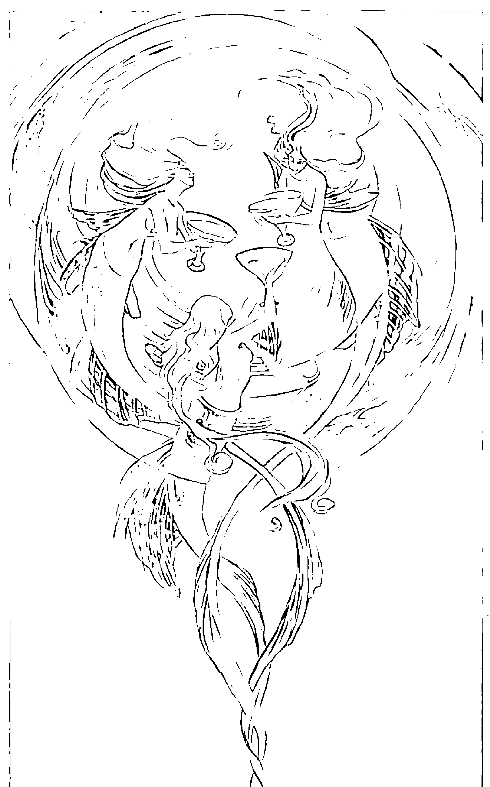

杯三代表着庆典，舞蹈和歌唱。友情是开启它的一部分，还必须拥有伴侣，或者依靠他人，和发展联盟和团队精神。

## 圣杯 4

她悄然落在湖面上。水面的涟漪在她的指尖泛起，她飞跃过障碍爬上石块。溪水流过她的秀发和香肩。她的鱼尾将水滴在空中画出一个圆弧。像是碎钻，它们在空中国闪耀出火光，然后在水面下消失不见。她躺在这儿，一动不动地只是安静呼吸，直到确定无人跟随她。谁会跟踪她呢？他们只有时间和精力去注意水下的世界。但她持续的这等待。她想百分百确定此处只有她一个人。她觉得他们是如此乏味，海洋无休无止的舞蹈让她感到疲倦。

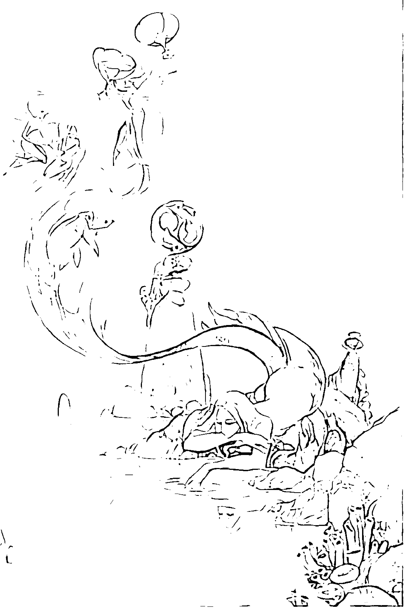

她泛起的涟漪渐渐消无，很快水面又重新回到明镜般的光滑。天空之蓝融化在湖水的青蓝里，变成一种无边无际的色彩与光芒。她的思绪在这一刻，逃离了尘世来到一个梦幻般的冥想世界。她第一看到自己的倒影。她被她的美丽迷倒，并不是虚空的迷幻，只是令人惊异的发现：她凝望着水中她的双眼，像是包涵着细弱的水塘。突然间，她的指尖碰到湖面，她的倒影被波纹化开。

她呆住了，直到此刻才发现她并不如她想象中那么孤独。虽然海洋的居民让她独处，空气的精灵趁她不注意的时候向她靠近，他们专心地注视着她，被逗笑并嘲笑着她。突然她干燥的肌肤感觉到寒冷，她思念海洋柔软的拥抱和她的伙伴们。

杯四代表着自恋，内省，过于沉醉于自我世界并迷失在其中。主要到其他缓缓逝去的东西，世界缓慢变得阴沉。但是只要你擦干你的眼泪外面的世界将为你提供更多。

## 圣杯 5

她艰苦跋涉过沙丘。她的每一个步伐都如此沉重，当她到达海边她的双腿饱受疼痛。她走向沙滩的边缘，紧抱半满（或是半空？）的鱼缸，唯恐它从她的怀抱中掉落碎在石块上。她的双脚感受到海水的冰冷。海浪拍打着她的脚趾，带来一阵阵彻骨的寒冷。让她觉得她的身体将碎成千万片。她颤抖着。她想着或许是风冲刷着她的肩但觉没有意识到是精灵抚过。他们用温柔的指尖抚过她的头发并在她的耳边说着安慰的耳语，但她却全无意识，如此地专注于她自己的悲伤和痛苦。她将她的希望送出，跨越了海洋。希望乘坐着白色的帆船航行，她思量着何时它们才会满载而归。她将眼泪注满了鱼缸，将令人难以发掘落于她胸前的水滴拾起。她想象着一条鱼游动于她的泪水中，也在未满的半边在空气中游动，不受空气和水体的限制。她将此咸苦的它放于地下，其他的鱼缸旁边。杯五代表着肚子忍受悔恨和损失。被幸福抛弃，感到悲伤，期许着曾有机会拥有的东西。

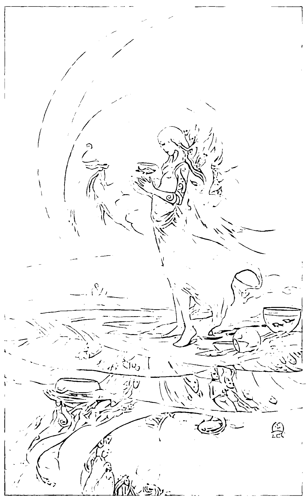

## 圣杯 6

她在一路迷茫直到归顺于她的命运。她停留的地方有小溪在不远处涓涓地流淌。她摆好她的桌子与茶杯，来招待她的访客——第一次来她家的做客的朋友，它们拥有闪烁扣子眼睛和线缝的可爱微笑。然后精灵们从树林的阴影和空穴中慢慢爬上来：来自溪水里的精灵与仙子，来桦树，山毛榉和橡树的树妖，和地底的小妖精。

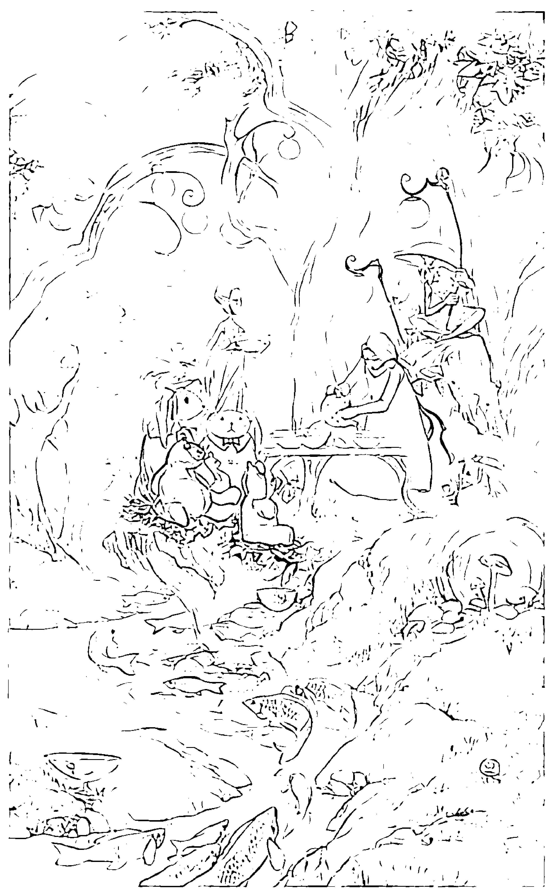

这是她在等待的伙伴，她愉快地迎接他们。他们被她天真无邪的品德，和还未被“必须做的”事情的限制和对不可能之事的定义所玷污的心灵而倾倒。在她的世界里，鱼不必游于河流——它们可能在明镜般的小到上在空气中穿梭——而精灵的陪伴让她如此雀跃，正如她缝制的小伙伴。

精灵的女王走向前来，她仙界的随从都向后退她却依然保持着微笑，倒上一杯茶，并微笑着奉上。

杯六是对童年无邪，美好意愿和高尚品德，简单的快乐和愉悦的重温。

并不是要你过于感伤，而是希望能给予孩童的观点多点宽容和尊重，追寻在你的记忆中被折断的将被折断的箭冲向你的过去，带着责任和对生活的领悟。

## 圣杯 7

她的顶部藏于云层。繁星即是她的双眼，当她望去她的内心的目标即被月亮遮掩。她的肉体和心理都被囚禁而且没有注意到他们身处命悬一线的高崖。她的渴望将带她踏出鲁莽的一步从而坠下悬崖落入围绕着他们的迷雾般的深渊。风拍打着她的头发，为她的兴奋而骚动。

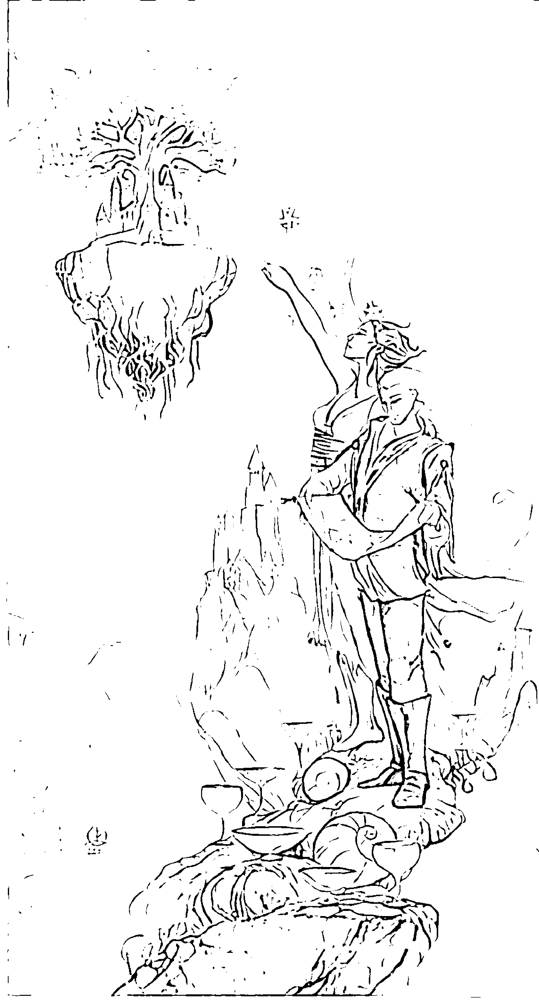

同时，他处在稍微低矮一些的地方。当她盯着空中飘浮的幻影，他的双眼落在悬崖旁的城堡。即使他手中地图上的神秘符号是模糊不清的，虽然难以到达，他们还是可以成功的。他知道渴望不可能之事的痛苦。并不是要你过于感伤，而是希望能给予孩童的观点多点宽容和尊重，追寻在你的记忆中被折断的将被折断的箭冲向你的过去，带着责任和对生活的领悟。

但她不。“抬头看！”她说。她的手指摩擦着他的肩膀，当她迫切地想要他倾听她的渴望并抬头看去。他心不在焉地点点头。他尝试着抛开关于“如果万一我们能到达空中的城堡…”的想法，并继续仔细研究着魔术师给他的地图。

杯七包含着对幻想的沉迷。你拥有太多的选择。面对这这么多条道路，任务开始变得艰难令人畏惧。太多的欲望。有一些有着可能实现的可能，但有一些…就不一定了。有一些是明智之举，其他的仅仅是诱惑唱的冥冥之音。此处包含着无限的可能。

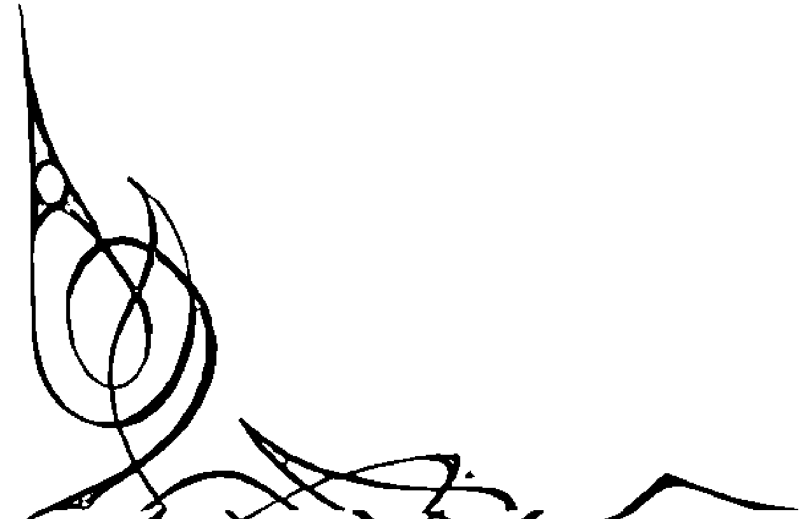

## 圣杯 8

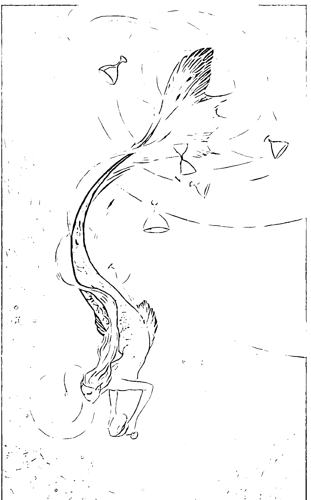

海洋的追寻者，向下游去，向深处游去。垂直地穿越过蓝宝石般的海水，如此黑暗，散发着黑珍珠般的光亮。穿越过寂静的海水，追寻者向往着真理轻盈地身躯逆流和顺流；远离上面的光明的世界和它过于耀眼的浮华。像是海洋深处的生物发出的冷光般，有一些事物只有当你的视界在幽暗中扩大时才能看见，在这深处的微亮的世界。下潜吧，海洋的追寻者！杯八召唤你去追寻并发掘属于你自己的探索和答案。为精神世界远离甚至脱离物质。离开界限与框架，以及那刺耳的穿透干燥的空气的尖锐号角声。海洋的拥抱更加柔软，带给你更多愉悦，并在涟漪与水流中相互交织。海水柔和了情感上冲突，所以每件事都变得一帆风顺。八只圣杯随着太阳光线的远离而闪闪发光。它们缓缓地向深处下沉。下落的光华和闪耀召唤着你去拥抱其中任意一个。现在是时候发下一些事物，让意识随着海流飘走，让你自己融化在波浪中。

## 圣杯 9

所有的心之所向都在他的指尖下被触碰，发出如鱼群般饱满的，金黄的颜色。他们翻滚游曳过风海流，带着繁茂的族群用激动的心情翻滚，直到变得拥挤甚至要跃出了海面。温柔的月光在他的肌肤上轻轻划过。他们唱着时候快乐的生命之歌并未搜寻此歌声的献上丰富的物产。世界将幸福和它令人迷醉的美丽扩张。当鱼群联合成一体而不是单独在水中泳游时，它们水中画出的漩涡如此优雅。他们如此和谐地游着，像是一支被精心编排过的舞蹈。

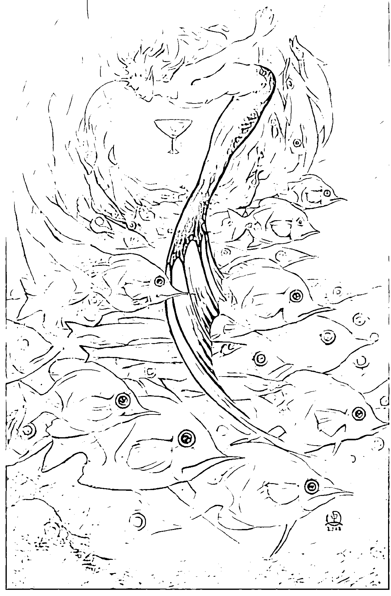

鱼是健康，富饶，和美好未来的象征。杯九带着对感官的愉悦，满足和美梦成真的诱惑。未来是有保证的，视野内的世界都是如此美丽。

## 圣杯 10

水在这两人身边打着圈。海浪的浪尖亲吻了太阳，水是如此温软诱人。他们在水的拥抱中漂流，被在他们心中燃烧的火花托起。就像一对小太阳，被对方吸引，围绕着对方。外面的世界好像在此刻心的融合时静止了。此刻完满，他们只需要对方，但是他们与所有的周围的生物直接依然有着联系。

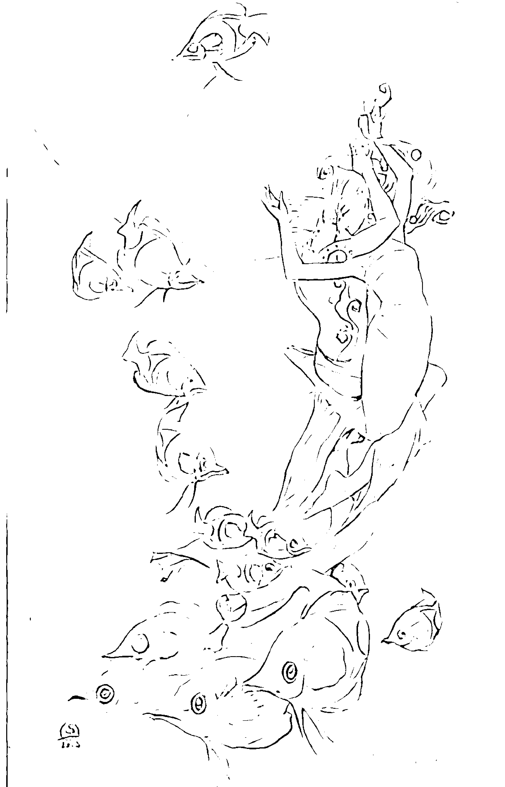

鱼群煽动出一个气泡的旋涡形成了一个令人晕眩的海流缠绕住了他们。鱼群的欢乐散发出光线保护着他们，鱼代表着富裕。他们滑过蔚蓝的深海，他们的鳞片像金子般闪闪发亮。在此欣喜若狂的一刻，看起来能直至永恒的满足，是真实的，但是它必须被关怀被输于养分，不然它将很快流逝坠入深海，就像散乱的鱼群。

杯十代表着最终的和谐与平静的达成。最终拥有了成功与快乐——一种完满的感情上的满足，不但只是物质或者精神的愉悦。家庭的支持和纽带是享受此种幸福的重要保证。

## 圣杯 侍从

她深入海浪，独自追寻，去寻找一个平和之地去理清她的思绪。

她带着一展圣杯陪同她。它溢出被捕捉的阳光的精华之光，此光来自离她如此遥远的上面的世界。它漂流至海床，包含着来自金币光亮或是造物者不小心走失的穿透至深海的阳光。这些全部都被提炼收纳在她的手中。

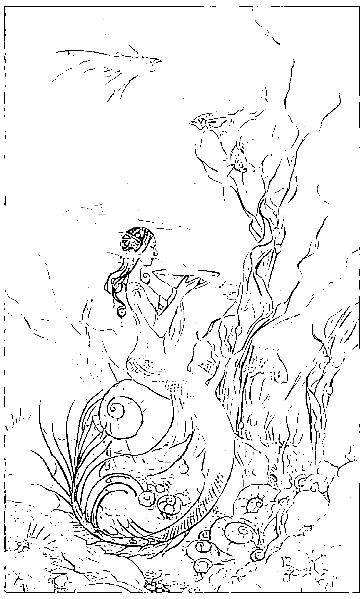

她将圣杯举在她的面下，感受她记得的阳光之吻的温暖。温度渗透入海水延伸了宁静与祥和。发着光芒的火花激发了她的思绪和想象。她感觉到她的思想开始顺着海浪飘浮，她的视野里充满的梦幻奇景。

杯侍从是多愁善感的。她拥有一颗真正浪漫的心，在此吵杂喧嚣的世界里，她寻找着一个最质朴而祥和的时刻并真正沐浴在快乐中。她带着深刻的理解和过人的直觉追随那来自语言深处不变的声音，她渴望相信不可能的事物。

## 圣杯 骑士

此独角兽是海洋的子女，出生于海洋的泡沫和无休止的海浪，与狂躁的海浪一同俯冲。只有那些拥有最纯洁心灵的人才能触碰此生物，跟少有人可以骑在她的背上。圣杯骑士在此无止尽的追寻中与她相伴。他们两个在这个神秘的旅行中相伴相依。

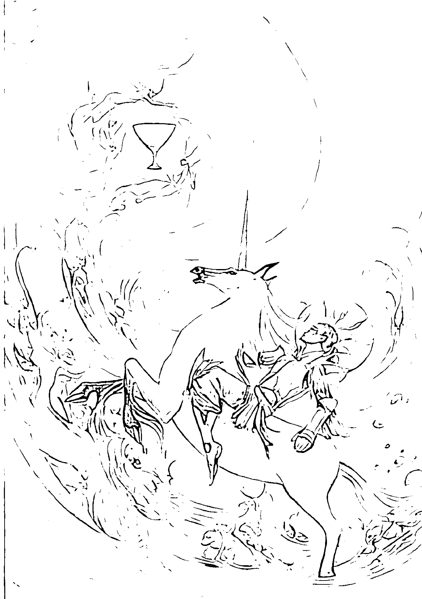

他是守护圣杯的圆桌骑士的一员。他是浪漫的，他追随他心与情感所向往的地方。他是艺术家，音乐家和诗人，那些能将目光不被看见的梦幻之国。他是一个梦想家，他不会仅被物质的标准去停止他继续那不计后果的踏越浪尖的旅程。圣杯骑士追随他的梦想。他让他的直觉引导他的旅程。海洋的妖精和仙子告诉他梦想之地离大陆何其遥远，而他怜悯这些精灵他当用自己的双眼一瞧究竟。金色的圣杯是他心中完美的具体化的表达。他知道如果他保持忠诚和坚贞，并相信他内心所诉的真相，他总有一天能去到圣杯之地。海浪在他脚下搅动，他并不知道也不在乎何物潜伏在此蓝宝石版的海浪下；他只看得见海浪喷射出来的晶莹的浪花。

## 圣杯 王后

圣杯王后代表着最具创意的连结。她对待感情是诗意的，她是想象的化身。她能在变化无常的海浪，和谐地与她身边所有的生物一同翩翩起舞。
她感受到她直觉，并追随内心的感受。她倾听星星的低语，她知道他们比地面上的生物更具智慧。当海洋初生，他们就已书写下世界。

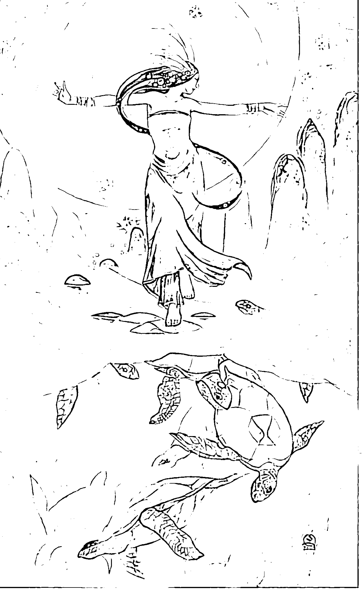

虽然她的举动看起来随意而任性，但她是拥有着深刻学识的。她的智慧来自无垠的大海深处。海龟，来自大海深处的古老而智慧的生物：他们游上来参加她欢快的庆典。整个世界像梦幻般一同舞蹈。所有的事物都是如此流畅，一个又一个接连融化。这是涌动的下意识的国土的边界与现实世界的重叠。这是创造和艺术表现的本质。由直觉守卫，她与另一个世界合唱去寻找精神世界相通的快乐。在她的方向的那一小步缺失，是为那些达到且理解她的步调的人们准备的跃入深不可测之路的一个纵身，而不是为圣杯王后准备的。她在其之上舞蹈，被蔚蓝的海洋和天空拥抱，在海天相接的地方，相接天衣无缝。

## 圣杯 国王

他是智慧和深刻的。他了解等待的含义。就像游曳于他身旁的海龟，他用不变的冷静指引着变幻莫测的无垠的深海之路。好几个世界以来他阅读者刻成花纹的他们在背壳上的智慧，并用此礼饮水每当那包裹着他们的潮涌带一次次带走他们的呼吸。他的出现带来缓慢而优雅的水的蔓延。蔚蓝的浪花宝石般清澈。

海马是波塞冬神力的代表符号，并被不知疲倦的海洋的能量所渗透。他是一个有耐心的海洋生物，在海洋中以他独特的步调前进。他顺着海流游动。无论如何，他以他背上的尖刺为装甲，那优雅的蜿蜒不该被低估，这是海洋中的雄马是后代的保护着。

就像海马一样，圣杯国王也是一个保护者。他关系爱护他身边的每一个生物。他奉上他的治愈之水。他奉上怜悯和关爱。他的信息将透过海流融进你的血脉用它的重量净化的你的心灵。他耐心又宽容，并懂得他身边的人们的所有需求必须得到制衡。

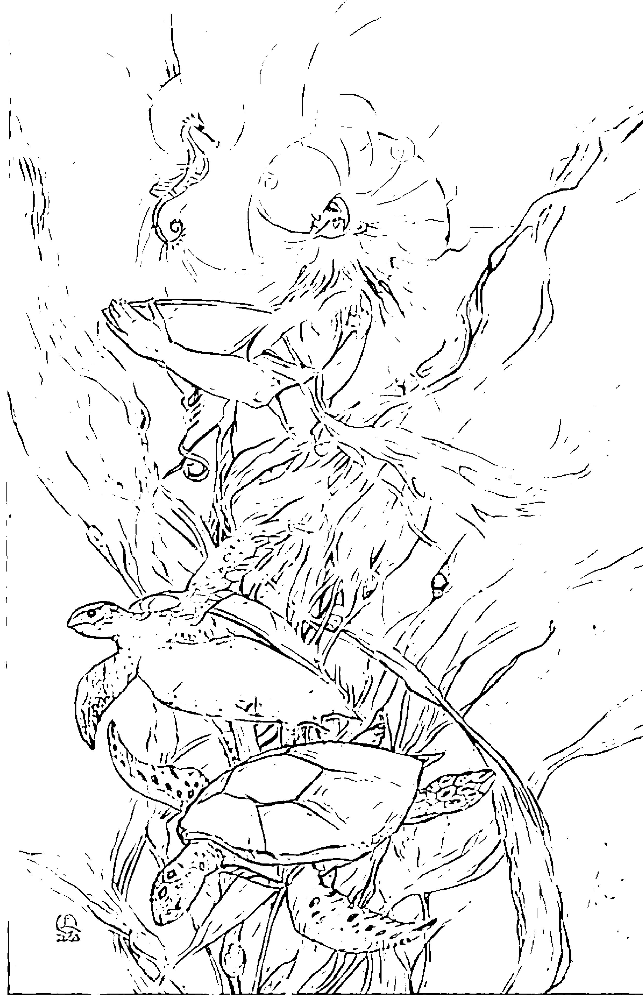

## 宝剑 ACE

此剑乃双锋之剑。它当用绝对的正义斩断隐藏真理的阻碍。它用智慧和公平的光耀归还一个清晰透明的世界。那傲慢生于生于暴怒的狂热，带着生猛的力量，也将与剑并行。有两种不同的力量蕴含在此利器中——两种非常不同的力量将在此时合二为一降临于世。有事即将发生。风打着旋召唤天空的守卫者：带着羽毛的性灵之物。在漩涡中，上升的气流将唤起此剑的力量划开长空。

空气的精灵和剑的守卫者们：是在空中展翅的神明。天鹅如此可人——她展开她柔软的白色羽毛，细长的脖颈带着优雅的弧度——但如此的美妙外形却包含着有力的身体和无所畏惧为自我而战的暴虐天性。天鹅将为自己战斗，健硕的双翼欲捕捉驾驭袭来的长风。

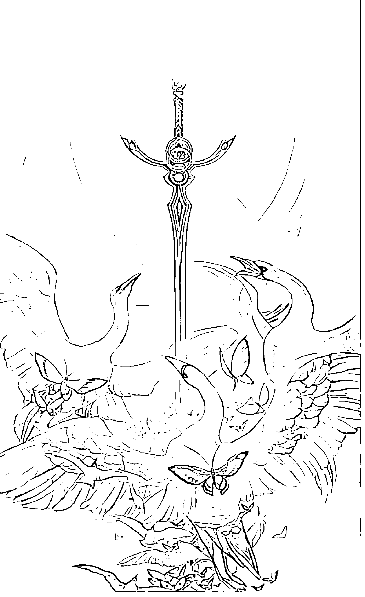

## 宝剑 2

他立于道上，撂倒所有敢于接近他的生物。他将自己的气息隐藏，如此坚定冷酷，无法捉摸。当他用双剑阻挡着前进的道路，金属的冷光吐出寒气。“谁妄想经过此地？”他说到，眼生冰冷，牙齿撕磨着，像是刀片倒影的冷光。他站在此地，坚定不屈如同被锻造的剑。树林的精灵在围绕着他的树枝间穿梭。他们来自冷峻的石林，那冰雪般的世界。

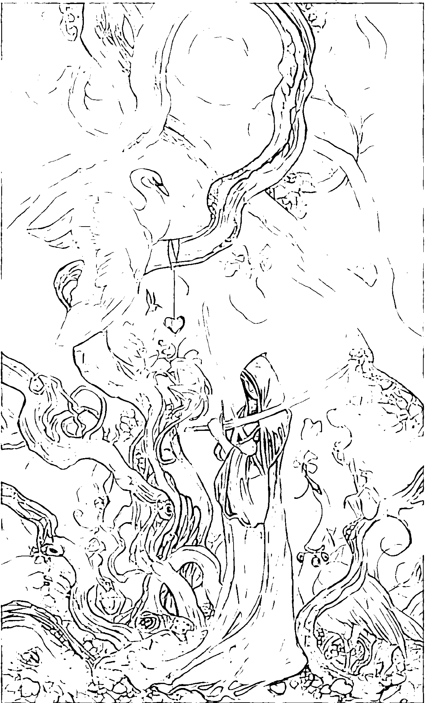

剑二代表着僵局和死路。双方都不愿合作，因此直到有一方做出让步之前，事情不会有进展。就像一着死棋，一种怪异的舞蹈，挣扎于寻求一条不屈服于任何事物的处世之道。它是对现实的否认，是一种对眼前所发生的事实或者是心中隐藏的情感的一种逃避。

“打开你的双眼”天鹅诉说着，献上金币，花朵，当坚固的篱笆无法继续阻挡蕴藏在中罂粟花沉睡着死亡将现身。

“打开你的心房”天鹅恳求着，投出闪耀的宝石，他的心始终紧锁，他的心只愿索取不愿付出。

## 宝剑 3

在此，天鹅雄伟的气魄与风华陨落了，她遭到了背叛。她的心带着血泪默默地哀悼忧伤。她可不是无助的生物——她将为她自己和她的子民奋力地拼搏——但在此，并没有任何挣扎的痕迹；或许她将自己献祭。她独自上前，卸下武装。是否是痛苦和忧伤让她无力起身？

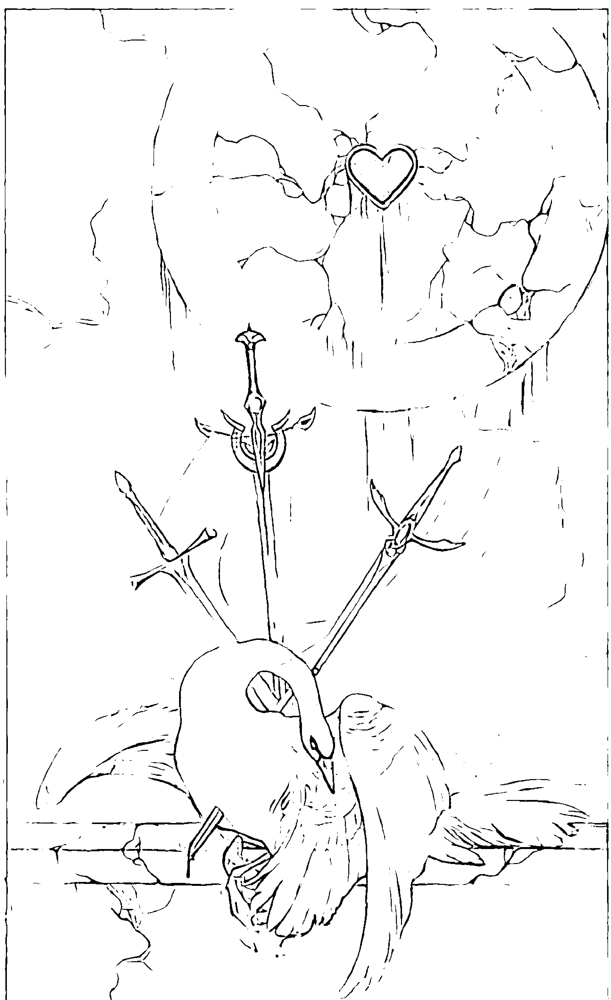

悲伤和心碎充斥着剑三。
这是一种孤独，分离，被孤立的情感。没有给予安慰或是伸出援手。还有其他人陷入此荒芜之地需要帮助吗？世界遗弃背叛这破损的美丽，对着破碎残缺了的心，他们甚至不曾回头看。
克服此苦难；心的泪水或许会洗净灵魂。讲痛苦排干；黑色的血液将得到净化，然后再一跃而起回到天空再次起舞。

## 宝剑 4

她的双臂放在身前摆成了死亡的姿势，但这不是最后的休眠。这是休息和恢复的时刻。她的思想自由地飘远。她冥想的天空中漂浮。她的双眼紧闭，但她的双眼所见到的是另一种景象。眼睛的印章刻在她贴于胸口的宝剑上，去窥探她的内心，去探寻她周围迷雾般的世界，她尽力想要一探究竟的自我放逐的世界。 她同莲花一同漂浮，莲花是精神和思想之纯净的符号。莲花在湖中的淤泥的生长，被清水和阳光净化而成如此可爱的花朵。它们带着追随心灵的真理的暗喻。粉色的莲花有时也是启蒙的标志。所以，同样地，她枕着的剑，在她冥想时，刺穿了彷徨和虚假的迷雾，找寻心中的祥和宁静之地。无论如何，这只是暂时的休憩。她的双手紧紧地抓着剑。她深深地呼吸，将莲花的芳香刻印于脑海。她已经准备好拔剑出鞘，回到充满争斗和抗争的世界。

剑四呼唤着你去休息一阵。闭上你的双眼，找到属于你内心的祥和之地，居住着心灵能量的地方。每当你来到此地便能得到储藏着的力量。

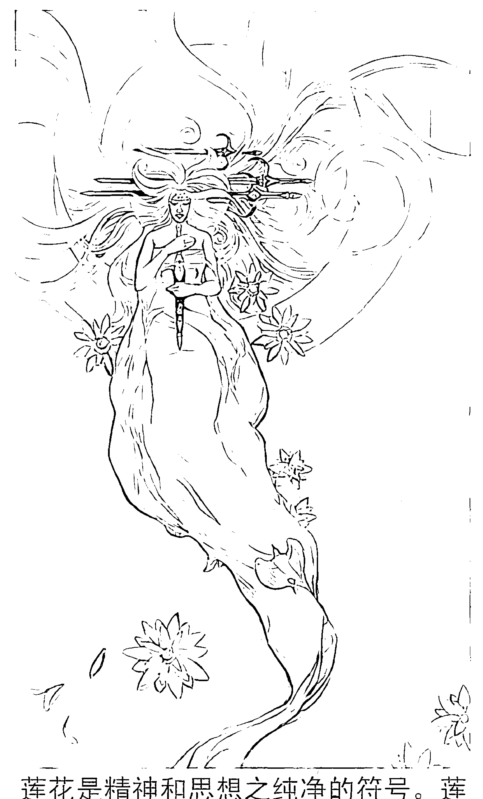

## 宝剑 5

黑夜逝去。初生的太阳划开天空带着黎明淡红色的光芒，空气被响亮的战斗的号角击碎！暗之天使拿着他的宝剑参与战斗。他有黑天鹅相伴。

他们已经参与过关于利益和权力的争斗，他们将不会继续于他们带着白色羽毛的兄弟姐妹一同玩耍。他们的羽毛带着黑珍珠般的光泽，是一种黑暗的美。

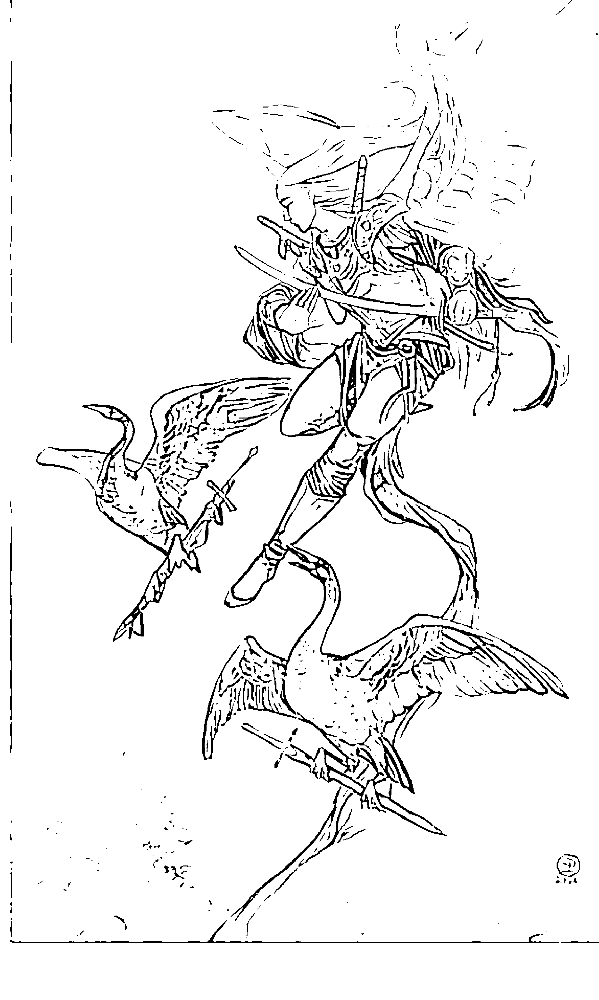

他们向天堂送出刺耳的叫嚣，品味着即将到来的战斗。

如箭般，他划过天空，心中只有他的目标。他将他的正直献出为了到达他想要去到的终点，他只关注自己，只关注幸存的人。但是任何冲突中，都有胜利者和失败者——他们失去了对方都不能继续存在。

谁是这个暗之天使？他是凯旋雀跃的人，还是被击败被逐出天堂的人？

他背上的双剑代表着剑二——是对失败的否认或者是对争斗的正确与否的逃避。他刀锋的惊醒是否在最后得到了应有的肯定？

### 宝剑

#### 6

剑五是不协调，利益冲突的标志。选择已被陈列出，让人更轻易地去得到好处，只为自己的利益考虑，让你感觉到世界都联合在一起对付你。或许以一种更广阔的视野面对世界会帮助你减少这种孤立感。

随着他的眼睛缓缓闭上，他感觉有一双大手将他放置在此柔软的天鹅之背上。他感觉到翅膀肌肉的收紧和放松，柔韧的肌腱和骨骼，和天鹅飞向空中的些许颠簸。他感到他的双臂随心所欲地舒展。她带着他飞向高空，他在她的悲伤如婴孩般卷曲。他继续让她带着他远行。

天鹅飞过了黑夜。她的翅膀却不知疲倦。她似乎不知筋疲力尽的意思。她的双翼保持着有力的节拍不断挥舞，而她有力的温暖的心在他的胸口下跳动，好像要渗透出来，将她的精气神融进他的肌肤。 当黎明试着将光明带入天空，他终于张开他的双眼一眼望去他脚下飞跃过的无垠的大地。大地离他如此的遥远。实在是难以相信如此渺小的世界能创造如此多的痛苦和磨难。他望向前方，当云雾散开，他将能看到天鹅带他去的地方。他微笑着，他用他指尖新萌生的力量紧紧地环抱着她的背。剑六代表着远离苦难。这是一个在创伤后获得重生的机会。这混乱的世界总叫我们意志消沉，但你必须自己需找到重新振作的路。

#### 7

他将他真实的面容藏于面具之下，遮掩了他真实的品性，他在剑的的守卫者的眼下偷走了一支剑并窃笑着。他认为这个守卫者是粗心大意的，但事实上，她回头看到了他。她了解也记住了他的天性。

黑鸟俯冲而来侧身向他飞进。“你从中得到了什么？华而不实的小玩意！不过是华而不实的小玩意！”他们叫道，描绘着他手中散发着愠怒之光的宝剑。他背对着他们，他是最聪明的一只黑鸟，只有他有能力从石堆中取得宝剑。

剑七代表着企图逃避责任。它代表着尝试带走不属于他的东西的小偷。他的品行不正直，试图将一切都占为己有并对任何尝试从他这里索取的人恶言相向。这样的世界是不可靠的，如果有人如此不值得信赖那么又何必将信任浪费在他身上？ 欺骗衍生出怀疑以及消极的世界观。

#### 8

荆棘之冠静卧在黑莓枝包裹的树篱，这里水果多汁香甜，但是它们的枝叶庞杂带刺，难以接近。一只小小的蜂鸟能轻易越过这些诡诈的盘结。她能轻易地飞过细小的缝隙，穿越这片荆棘地。但尊贵高雅的天鹅，带着她宽厚的翅膀，是难以适应如此交错庞杂的带着倒刺的小路的。天鹅并不是第一个掉入此荆棘陷阱的受害者。那些先人的头骨散落四周，他们可能拥有力量并自信能克服一切。围绕着睡美人的被施了魔法的荆棘林吸引了无数勇敢的骑士在尖刺的拥抱下死去，单纯的力量和对力量的滥用并不总能带来胜利。蜂鸟飞进了。“冷静点”她说，当天鹅停止了扑打，荆棘也不再刺入天鹅的肉体，小小的蜂鸟轻轻地拔出尖刺，一根又一根，天鹅看到了来自上空自由的光亮，遥远却并不是不可及。

剑八提醒我们不要在琐事中浪费精力。在危机中自己很容易就被外力困住——感受到界限，困惑，无力，被环境制约——但是只要你稍作喘息总能有办法逃出生天。

#### 9

盘旋的乌鸦带来死亡的消息
他们沙哑的鸣叫传递着告解之声
盘旋着
盘旋着
慢慢接近
有一种未来向往探索
有一种未来充满恐惧

天空的阶梯直通天国，风暴中
不祥的高塔拥有一点金色的希望的微光闪烁在高空中动荡的双眼里。“来投靠我吧，来追随我吧”盘旋的乌鸦在他耳旁厮磨“让我带你穿越”
他带着焦虑的双眼抬头望，忘记在黑夜中要小心守护他的灵魂。他紧握锋利的剑寻求安全感，他可以轻易拿着他的剑走向光明的道路。但是他遗忘了他紧握着的明灯，或者是过于软弱无力去驾驭此剑。
他饱受痛苦的折磨。他的胸口有着剑的纹身，代表着他曾经历过的悔恨。他苦于内心的恐惧，愧疚和夜晚不知名的危险的恐惧。他属于天空——他的翅膀能带他远走，天空如此辽阔将带给他无限自由。然而，将要到来的风暴带着咆哮着的风，让天空更像是带着利爪的圈套。但是如果他放下他心中的疑虑，他将能同盘旋的乌鸦一样飞翔于平静的高空。

剑九代表着被内心的混乱缠绕。并无外力强迫，灵魂赤裸裸地被它的心魔折磨。愧疚与恐惧将你的肌肉牵扯无法伸展。去了解恐惧的源头，去理解它们的深意和脉络。要懂得冲破阻碍得到自由的力量只是被束缚在你自己的心中。

#### 10

她缓缓下落。鸟儿们并没有伸出援手。他们在她的身旁紧紧地打着回旋。他们邪恶地盘旋，像秃鹫等待着既定的死亡。他们的翅膀如同刀锋，他们的羽毛如同匕首，锋利而冰冷。他们用他们尖戾的喙刺穿她的袍子，让她下落的更快速。刺耳的鸣叫在此灰暗冷漠的夜里显得格外令人恐惧。空气急速掠过她的双耳，如同山谷和洞穴中吹过的呼哨。树木在空中伸出赤裸裸的枝条，他们的躯干已被败坏。结束了！她的哭声响彻天空。

或者这只是为这过于戏剧化的殉难拉上帷幕？

剑十代表着灾难，荒芜，肩负责任和幻想的终结。就像四周被煽动的漩涡和不可控制的潮涌。像她的下落，有时候世界不受人类的掌控。有时候事情终止碎成千万片也不会有人帮你收拾残局，你要从不幸中得到智慧。

如果他放下他心中的疑虑，他将能同盘旋的乌鸦一样飞翔于平静的高空。

#### 侍从

剑男仆抱着一只小天鹅，他的身体微微卷曲保护着它不受到伤害。她拥有强烈的实现目标的意愿。正如她对待事物的态度，天鹅缓缓聚集用有力地煽动着翅膀保护着她。他们是警惕地守护者。他们张望的双眼收纳世界。他们的翅膀怕打出上升的气流，托住她穿越暗夜。她为守护者望向群星，向水手般收到星星的指引。群星细弱的微光划出光明的线路让他们得以跟随，正如群星在古老的年代为那些懂得着错综复杂的图案的人做出的指引。群星相互交织的星光如同神秘的地图。当她飞越过天空，群星们呼唤着她和她的伙伴以及被煽动的风。突然间，风起云涌，风想要回应星星的呼唤。她欢迎他们去追随星星的呼唤；如果风在她的翅膀下陡然离开，她也能很快适应。她能感知到细小的变化也知道如何适应。她是你的明灯，指引你褪去过于强烈的日光带来的视野的朦胧，去看夜空中古老的守卫者奉上的道路。

剑男仆是诚实和真正的化身。她毫无畏惧地审视她的信仰；她望向黑与白的边界且不被谴责，她懂得她灵魂的真正深意。她对感情毫无保留，虽然她并不会让感情支配她的决定；理性才是真正支配她的。她的思维敏捷，善于分析，她用此去守卫目标，评估现状。她将她的知觉伸展开去，在心中为那些新鲜的和位置的保留余地。

#### 骑士

剑骑士是一个勇敢的英雄，他鲁莽地一头扎入维护信仰的斗争中。他是迟钝，直言不讳。掩饰假装不是他有能力做到的。这可以看做是诚实和忠诚的新生或是不够谨慎和圆滑。他不会让情感站在他和他的目标之间。情感对他来说是身外之物，封锁那些显而易见的，允许怀疑和恐惧的存在。不带自我情感的骑士是无所畏惧的，所向披靡的，并且对可能是失败一无所知。他不会轻易退缩，他只有胜利这一个选择。

骑士是拥有专横的性格。他骑乘着国王的鸟，他们如同刺过苍穹的利矛。他是一个探索者，用他的剑和翅膀斩断天空。一阵旋风被他唤起，由他的健硕的部队带起，他凌驾于他们之上，义勇向前穿越混沌。剑是他的追随者的指路灯。他面向黑暗的深渊呼喊：

让我腾飞，空中的精灵
给予我鹰的双眼
雀鸟的敏捷
蜂鸟勇敢的心
用天鹅的双翼将我托起
用猫头鹰的智慧指引我前进

#### 王后

剑王后用她的刀锋为真理划开谎言和欺骗。她是诚实的，深刻的，将带着翅膀的探索者送入空中。他们来自于她的身体和心灵。他们所见的一切，都将在瞬间由他们间无形的连线传回。他们知道灵魂的语言，他们正经历着蜕变，并不是睡去或者长眠。

闪亮的白是代表纯净，诚实，清澈和坚定的平衡的颜色，但是有时也是距离和死亡的颜色，有时你必须褪下虚荣和诡诈才能得到真理。抛弃过去，离开椰子壳般的保护，深入钻研，去寻找你真正的面庞以面对世界。

剑王后是一位富有智慧的女性，忠诚，诙谐，而且直率幽默。她用所拥有的理性和经验衡量世界。她一直凝视着，并知道当她望向镜子，那倒影将是它本应有的样子，是阳光与她的精魂一同在镜中闪闪发亮。

在花语中，紫色的龙百合代表着内心的力量，而白色的菊花代表真理。

#### 国王

就像他拿在手中笔直的剑，他是力量与荣耀的支柱。他手掌生杀大权。他是一个勇猛的国王，剑永远不入鞘，所以他可以随时准备好开始必要的行动。

他是一个领导者，威武地走在队伍的前方。他在他的行动中一路担当重任，追随着由宝剑之光指引的真理之路。他由他智慧的猫头鹰继续带领着前进。她在他的剑锋出平稳地站立，她的双眼带着古老的智慧，她的心灵已被人性的信仰灌输。

猫头鹰的镜像，他也被在他脚边阴影中的乌鸦指引，这两只乌鸦正像是 Hugin 和 Mugin（欧丁的两只双胞胎乌鸦，分别代表着“思想”和“回忆”。）他们飞远去寻找真理在带回耳语给他。他们的结合，代表着暗夜和白日。他们是太阳闪耀的光辉，猫头鹰代表着只有在天鹅绒般柔软的星光和月光下才能被清楚听见的智慧。这是在这些鸟兽中被实体化的深意。

黑暗的阴影落在他的双肩，蒙上一层厚重的紫色，此种颜色古埃及人奉献给君王，王座的地基刻着达芬奇的维特鲁威人，对称而均衡的人体在宇宙的中心舒展开来，这是艺术与科学融合为一体的符号。

### 钱币

#### ACE

这是实现富裕而有保障的生活的可能。这是对那些辛勤工作者所保证的富贵荣华与健康。付出的精力也当回复。一粒种子掉落到肥沃的土壤中。有什么将会成长而出？怎样的奇花异果将繁荣？ 钱币代表将有物资到来，但需要耐心和努力。种瓜得瓜，种豆得豆。种子必须被灌溉，吸收足够的养分，果实不会凭空生长而出，成功需要的不只是白日梦。用渴望的之心浇灌它，带着信仰用勤勉和奋斗输于它养分。

在古埃及，蜥蜴代表着非凡的智慧和无上的财富。它们是大地的子民也是钱币的守卫者： 火蜥蜴，变色龙，飞龙。他们在朦胧的迷幻中指引出道路，将欲望与所求不变的国土化成真实的可触碰的世界。

#### 2

他单脚站着，玩着杂耍的平衡之舞。就像印度之神湿婆（印度教的毁灭之神），他在创造和毁灭间舞蹈，这是一种和谐的均衡对立两方的力量。虽然他的身体还不至于失去平衡，他所立于的山峰看似已经随时会被微风吹落跌入山谷如果有微风吹过；但是即使如此他还是如此自信。他深谙此舞，能感觉到任何风吹草动，他能感受到风一举一动，像是一位看不见的舞伴一同舞蹈着被精心编排过的芭蕾双人舞。他的自信是否会带他坠入万丈深渊？和风是否会失去它的兴致，背叛它的舞伴挂起狂风而他是否有能力力挽狂澜？

钱币二代表着维持平衡：变着花样将事物玩弄于指尖，游刃有余地改变着方向。打起精神面对那些打乱了你的计划的挑战，但不要一次性对付太多的麻烦。

#### 3

他们亲密无间地一同工作，相拥接合成一座人梯，为对方献出肩膀。他们把对方架起，能触碰到更高的地方，他们向天空伸展开去。在石墙上，她雕刻着钱币和圆圈的图案。 他们形成一条锁链，像是将她包含在内的各式各样的人际关系. 这是一个互相纠缠包容的大集合。这是一个关于人际关系与互动的算术。

每一个圆弧都被小心地刻画，他们都是整体蓝图的一部分。她指尖在石块上轻轻勾勒着图案像是触碰于柔软的粘土。坚硬的石块在她的指尖下才变得如此柔软。这种力量来自他们共同的意志 而关于“不可能的”事的问题突然变得简单清晰，任何困难的事情都可能完成。当他们合作将生成一种联合统一的力量。

钱币三代表着团体合作，当互相人帮助时能拥有的优势。

它强调工作的能力和超水平的发挥。有时候互相扶持是达成目标的必要手段; 并不是所有的任务都能够靠个人单独完成。并不是所有事都需要”靠个人” 来完成。向他人寻求帮助并不是一种失败，但是与人合作需要耐心，很好的计划和坚持合作的原则。

#### 4

飞龙紧紧地蜷缩着身体，包裹着他最珍贵的宝贝。他将生命中的很多时间都花在得到此宝贵的财富上。没有人能碰它；没有人能从他手中夺走它！“这是属于我的！”他对着他弱小的想要靠近窥视的兄弟姐妹发出嘶吼。蝾螈和蜥蜴迅速的跑走，唯恐他用他愤怒将他们鞭答。

“我的金子！”他大声宣告。他知道变色龙正用贪婪的眼睛注视着。他知道他们正在等待一个时机偷走它。他感觉就连悄然飘过的微风也带着狡诈的气息，所以他将身体卷缩，紧紧地，紧紧地卷缩。蝾螈急速的逃离留下他一人。他的鳞片相互交织在从他包围着的金币周围散发出可爱的，柔和的光芒，不曾消褪，直到永恒。

钱币四代表着占有欲和总是想要控制一切的人。因为此强烈的占有欲，他的生活处处受限，他生活在他自己编制的囚笼里，拒绝任何的改变。他阻碍了自身的发展，他否认自己的弱点，并被这些弱点束缚。作为一个拥有荣华富贵而心灵却被物质封锁的人，他吝啬贪婪而可悲。让放下自私的情感可能会带来更带来比此珍宝所能给予的更无上的幸福。

#### 5

她卷缩成一团，将自己埋在臂弯里。她的双眼不曾抬起望向在她之上那从窗户中散发出的流水般华彩光芒的荣耀。此美丽和光耀更显她的渺小，在对比之下她显得如此毫无生气。飞龙欢欣鼓舞地鸣叫，像是在嘲笑她并苛求着她保持谦卑。只有荆棘拥抱着她。带刺的藤蔓伸向她，她躲避着。她带着剧痛饱受孤独的折磨，看不到她指尖旁的精灵，只把目光锁在阴影里。她从不注意她的四周，任性地对外界闭锁着双眼，也忽视自己内心的感受。她的灵魂哭喊着她却并未留心她内心的不满足。或者她只是不知道她到底想要什么，所以将她的身体与她的心灵隔绝。她的心里和身体断开了联系。

钱币五代表着情感的缺失，物质的困难，不安全感，和艰难的时期。忽视了肉体的渴望，感到被放逐被抛弃，蒙受了损失。如果你能将肉体和性灵结合，跨越肉体和精神的障碍，救赎就在不远处等待着你。即使她只看到唯有荆棘丛将她包裹。

#### 6

他坐在尖峰，骑在飞龙的背上，自信满满。他知道富有且拥有对生命的热忱。他坐在高处吹奏着美妙的旋律。他坐在干燥的高地，将他所积攒的财富随着他吹奏的歌声倾泻而出。干枯的大地感激涕零地接受者施舍，伸出荆棘的枝干去迎接生命之水以及他祈福的歌声。

钱币六代表着拥有者和一无所有者间的循环。树苗冲出废墟，淤泥与污垢，沐浴于生命之泉和来自上方的养分。吹笛手并未看到或是留心，大概是他只是给予的那一方；但同时，他也坐于树木枝叶架起的高台。它们的根茎深入裂缝，用它们的生命之网加固了石墙，支撑着他，让他不至于由于石墙的破碎而坠落。他们互相支撑，就像乌洛波洛斯（ouroboros 衔尾蛇）一个不断的自我的循环体。

在一个这样的相互联系的环境中，谁才是给予者？谁掌控着真正的权力呢？

#### 7

她站在青翠的花园里，她悉心照顾的花园。她是树木的守护之神。她是此地的一部分，这是出自她手的伊甸。桃子成熟了，每一个都如此饱满丰饶。桃子是夏天这个漫长休憩的季节的水果。他们的琼汁让人口齿留香。他们的甘甜的汁水滑过喉咙就像被勾起的夏日里最动人的回忆。

要不要采摘他们呢？她身上的纹身随着她的思索浮动。她将双手置于果实之上，已经准备好将其摘下。它的接连着大树之心的脉动微弱，这脉搏穿梭于枝叶。这些桃儿是否会持续发散着它们的光亮即使被摘下？还是会像在她篮子里的其他果实一样变得暗淡无光？

钱币七代表着你将面对困难的决定：是享用篮子里的果实，还是让它们继续在枝头生长成熟？这是关于是否要收割回报和奖赏的决定。种子已被播种；劳作和等待的时间已经过去。它们已经成长，变成美味的果实。现在是享受的时刻。是静下来考虑思量其他不同的事务的时候了。

#### 8

带着优雅和等待之心，蜘蛛编织着她的轻薄的网。黎明的灰尘在细密的网线上像是一片带着露水的星辰。

纺织的人，纺织出花纹
织出一段带着夏日香气的梦
织出秋天黄昏的幕帘

纺织的人，把命运织出
织出一生的心碎， 用刚劲的
的线；
织出月亮的阴晴圆缺

纺织的人，织出一个网
织出了丝般的柔滑，珍贵的缎绸
让艺术家的沮丧涓涓流出

蜘蛛努力地工作。她在黑夜中织着她的网，每一丝细线都被精心安排，创造出美丽的图案，美丽而富有深意。像是一段冥想，一段八只脚所舞出的高难度的舞蹈：旋转，跳跃，留步，编织，打结再一步向前；然后周而复始。

钱币八代表着手艺人，代表着那些拥有耐心着眼细节的人。它是将全部精力投入一个目标，探求智慧，和追寻更高深的理解。但必须勤于练习，用一个人的双手，亲身地，带着思考去创造。这也常伴随着对成功的诉求——这是对能力和技术的实践和考量，判断其是否有能力完成任务，取得成功。

### 钱币

#### 9

她的心灵正与她的肉体交流。她试着通过这精心制作的钢琴，去用音乐建立联系——金属和木材和四周的一切巧夺天工地去谱曲一首美丽的歌。

此琴，无论如何，它是人手工制作而非天然而生的。它依靠着周围的一切。无法脱离大自然树枝的盘绕，像围绕着它的活着的树木般生长。它是森林的一部分，是沼泽是落叶是风中呼啸和她指尖在琴键上弹奏出的音乐的一部分。她是孤独的。她远离尘世来到此处树木给予的安详僻静之地。她对她的自给自足感到满意。蜗牛盘成旋是她的座椅，蜿蜒的树枝是金色的琴弦，持续不断地无限伸展，保持着平衡和理想状态。当她弹奏时她并未注视着她的双手，她抬头看向晶莹剔透的光芒穿过枝叶一泻而下。她微笑着沐浴在这温暖的阳光中。

钱币九代表着精神和物质的平衡。物质上的精致和富裕，自律的追随物质享受，靠着自己的双手，相信自己的能力。这是对已拥有的富饶的感恩和深刻理解。

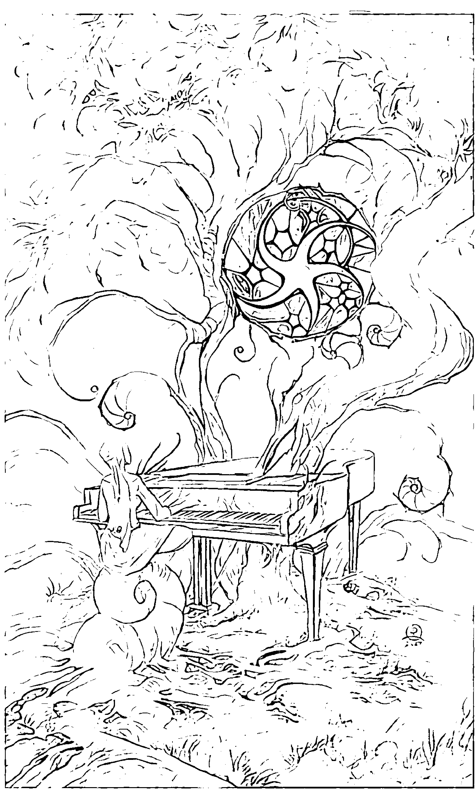

### 钱币

#### 10

她是覆盖在由金子妆点的绸缎下。她的容装显示出她的财富，也暗示着她享有高的社会地位。

她卷起身子背对着巨龙，当他展翅而山谷中吹过的风冰冷像是要冻结。

风将着古老的秘密低声耳语给树木。树木卷曲他们的盘绕着珍宝的树根，然后随着落叶抚过，树木将珍宝献给了巨龙。

而这一次，轮到他将古老的秘密说给她听，告诉她他在这几千年来所看见所经历的一切。世界尚留存着好戏——一个属于艺术和物质的世界——而她紧扣着中国长久以来代表长生不老和繁荣昌盛的桃子。

她遵循传统和习俗，并制定规则和标准，因为她知道正因为她追随了这些原则她才能拥有现在的地位。她意识到财富并不是幸运带来的。

无论是对生命还是世界。它就像围绕着她的彩色的玻璃——意志坚强，出自于大师之手。这个被刻画的图景作为一件艺术品更能适应于属于它自己的物质环境而无法作为瞬息而亡的事物存在于现实世界。

她知道她所到达的高处来自于她的信仰和艰辛的劳作。

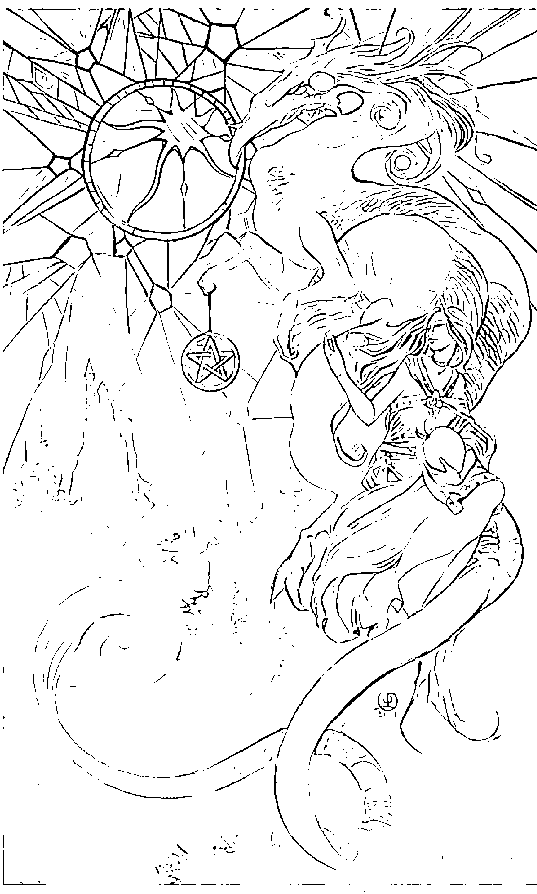

钱币十代表着享受荣华，渴望财富的持续并由能力去创造和保持这种富裕的生活。这是最终极的巨大的成功，长期以来的努力终于有了回报，终于有能力得到和持续这种经济地位和社会地位。

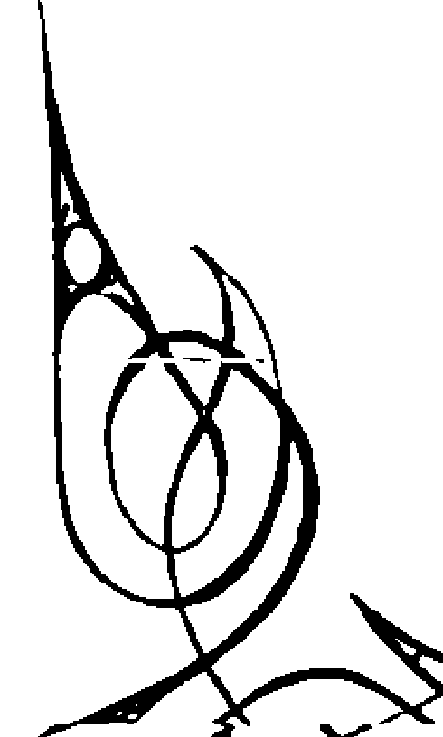

### 钱币

#### 侍从

机会像是钱币侍从身下的巨龙一样休憩着。 梦想和远景随着它巨大的蓝色宝石般闪闪发亮的身躯一同上下起伏。 它们都将随着任何踏在这青翠道路的步子缓缓升起，他们来自利维坦的梦中的思想的碎片（“Leviathan” 的字意为裂缝，在《圣经》中是象征邪恶的一种海怪，通常被描述为鲸鱼、海豚或鳄鱼的形状。）——关于胜利的梦，关于得到物质和地位的梦。她知道这些幻想来自于巨龙——她之于手中那一团奇妙的火烟。 她守护着火焰，愿为保护它而献身。

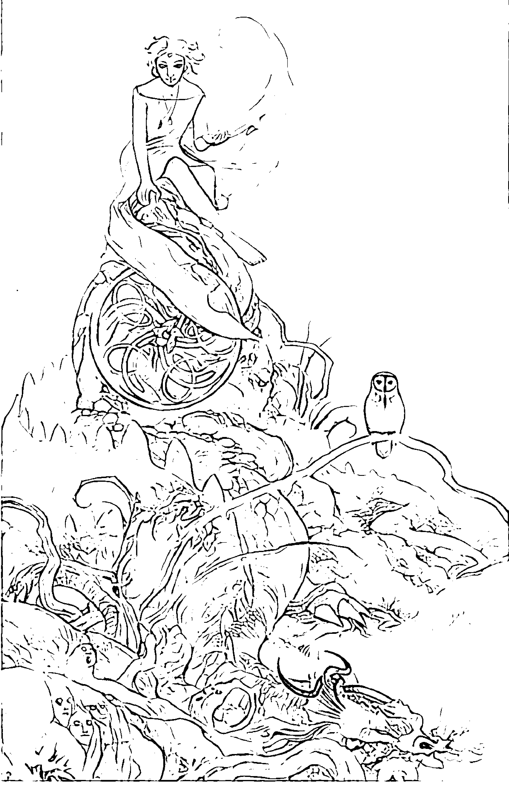

钱币侍从带着成长和成功的机会而来。她手中的火星，只是潜能的预兆。将你的愿望燃成火焰吧——不论是小小火星还是熊熊燃烧的星辰——但是这个选择和愿景必须有 由个人利用他们自己的能力和手中的资源独立寻找。

她是可靠的，优雅的，热心而善于并热爱学习的。她也十分现实，脚踏实地，风未动，她心已远。但是同时她也并不恐惧于拥抱生理上的愉悦。她是无忧无虑的， 快乐的人，她的精神感染了围绕着她的一切。


### 钱币

#### 骑士

树丛为他开辟了一条细长的道路，但是他的双眼并未被环境诱惑。树木的精灵飞近，耳语着魅惑之言，摇晃着他们闪着亮光的小玩意。当他森林的仙子们交错的枝干，森林的仙子们伸出她们细长的枝叶划过他的头盔。

但是他并未注意到；他的双眼死死地看着他心中目标所散发的光芒。钱币骑士处事井井有条的，深思熟虑的也是坚定不移的。他骑在大地的巨龙之上，沉重而缓慢但是他们的前进无可阻挡；他将去到任何他想要去的地方。

他从不在未对事情做出评估的情况下进攻。他拥有时间和耐心去审时度势。他是保守的，并且倾向于用经过考验和证实的方式做事，而不是偏离正道步入未知。这或许表现了他缺乏创意或探索的欲望，但是他更在乎最终的胜利而不是目标是如何被完成的。他是尽职的，坚定的，忠诚的，并且言出必行。当他有任务在手，他的耐心和能量在任务完成之前都不会停息。


钱币骑士倔强的走在他的路上，锁定了他的目标，带着他甚至有一点一根筋的心态。或许这看起来会遭遇失败，但其实十分的有效率。他看见也了解他真正想要的，明白他命运的归属，他以不可阻挡地气势坚定地一步一步向前。当他触碰到他的目标，他与他当唤起的大地的子民搏击：巨人雄壮的冲击，地震猛烈的颤抖以及苍天大树穿越土地与石块的根茎的鞭打。


### 钱币

#### 王后

钱币王后怜悯自然，关爱他人。她双眼的闪烁着慷慨和温暖的人性的光芒。缠绕着她手指的扇形的树枝，是印度的十臂战争女神杜尔迦的回忆录，代表着女性创生的力量。她有着献身的精神，可靠，值得信赖。她守护着她的物质的财产以及地位。

钱币王后将指引任何前来询问她的人。她拥有从任何她也是其中一部分的橡树中得到的力量（或是说，橡树是她的一部分）。她愿意分享她来自她稳定，无上的生命力以及太阳藏于她枝叶的温暖，并将它们转化成最纯净的能量。

“带上这个，不要忘记我一直在这里”她说道，捧着那从最粗壮的树枝上摘下的低语着她的声音的叶子。它们用千万种声调叹息着，叹息的音调奇异而和谐，是它们为她守护着秘密。

愉悦。她是无忧无虑的，快乐的人，她的精神感染了围绕着她的一切。

脚所舞出的高难度的舞蹈：旋转，跳跃，留步，编织，打结再一步向


### 钱币

#### 国王

钱币国王将种子放入手中。种子由内散发着柔软的光芒，它如心脏般跳动着好像用它的脉动谦卑地做着必要发芽成长的保证。枝叶沐浴在阳光中尽情地伸展。分叉的枝头挂着成熟多汁的果实，每一个都饱含美味诱人的汁水。他的树枝向上伸展如同雄鹿的角。他是人，是树也是龙，三种属性都互相融合，盘绕；他是物质世界的王。


他拥有创业的进取之心以及多种多样的才能。他能同迈达斯般点石成金（Midas），将他围绕他的一切都增添金色的光芒。当他着手冒险投机，他必定成功。当他想出一个点子，这个点子必将散发才华的光辉。他是可靠的，熟练于他的专业。

树木的永恒和坚定是他力量的源头。树木的根深深扎入泥土，从黑暗的深处，从龙的巢穴，从古老的石块和化石中给养。 用这安定的力量，他将他的枝叶，他的手腕和抱负伸向空中的群星。

他是受到成功的激励，但有慷慨并愿意分享他的财富和荣华。他献出果实供于分享。他知道财富必须不断地挥洒，从这些果实中，新的种子将再次发芽成长为参天大树。


# CARD SPREAD

## 牌阵

### 单张牌阵


有时候失去就是得到。大量的智慧和信息可以通过此单张的牌阵流露出来。此牌阵的美妙在于基本上可以回答所有的问题。简单地问一个你的问题然后抽一张牌。比如：

- 我今天有什么需要知晓的？
- 我改买什么当做生日礼物送给妈妈？
- 我该去今晚的派对吗？
- 我该如何完成工作上的年度回顾？
- 我是这么想的吗？

### 时间流


这是一个非常灵活的牌阵，可以帮助取得一些关于事件中人际关系的信息。你将能轻易适应找到在你的问题中你所处的位置。你可以试一下以下的方法或是发明自己的方式。

#### 过去 现在 未来

运用此种方式去理解过去对现在的影响，和现在如何对未来造成影响。

#### 现在的状况 存在的问题 解决的方法

运用此种方式去理解繁杂的事态并找出可能的解决方法。

### 二选一


需要做出的决定 选择一 选择二

运用这种方式将帮助你做出决定。它将表明所需做决定的最重要的部分和你最需要谨慎考虑的事物。这种方式可以扩展使用；如果你有两种以上的选择，就多加相应的牌数。

#### 现在的状况 应该做的 不应该做的

运用这种方式会帮助你寻找最好的处理方法去应对麻烦的事务。

### 凯尔特十字


凯尔特十字是一种广为认知的传统的牌阵。它可以提供关于事情状况的十分充足的信息。在此牌阵中，去比较第五张，第六章和第十张牌是十分有趣的，因为它们都是关于未来和结果的牌。

1. 你：这张牌代表你自己的状况。
2. 交叉：这张牌（横放的这一张）代表冲突
3. 根基：这张牌代表事情的基础，或者根基。
4. 过去：这张牌代表过去发生的事情对现在的状况所造成的影响。
5. 近的未来：这张牌代表什么可能将在短期的未来中发生。
6. 顶点：这张牌代表你最期望的未来。
7. 你自己：这张牌代表在现阶段你对你自己的认知。
8. 环境：这张牌代表周围环境对你的影响；它能反映他人是如何看待你的。
9. 希望和恐惧：这张牌暗示着在此事件中你最希望和恐惧的事情。
10. 最后的结果：这张牌代表如果没有其他的变化那么将会发生的最后结局。

### 爱之繁星


如果你找寻恋情，并想知道星星是否为你安排了浪漫的邂逅，你可以通过这个牌阵找到答案。

1. 做好的准备：这张牌代表对于将要走进你生命的恋情你准备好了的。
2. 没做好的准备：这张牌代表对于将要走进你生命的恋情你没有准备好的。想要爱情降临，对此牌一定要好好理解。
3. 需要做出的行动：按照此牌的建议去做出下一步的计划将带你靠近爱情。
4. 需要停止的行为：将此牌当做警告，注意那些将你脱离爱情的行为。
5. 最后的结果：你的答案。如果答案是积极的，恋情已被繁星安排，那么请注意第二张牌和第四张牌，它们的建议会让事情进行的更顺利。如果答案是消极的，那么请额外注意第二张和第四张牌提到的问题，并强化第一张和第三张牌的力量。然后重新问卜此牌阵看看你会不会拥有更好的答案。

### 缘分牌阵


如果你在一段恋情中并想知道是否有一个“后来他们幸福地生活在一起”的结局，这个牌阵能让你一窥究竟。请一定从不同的角度好好对比和理解牌阵上的牌。比如，第一排的牌集中于表现恋爱关系中的光明面，下面一排则代表着两性关系中的挑战，这也是最自然的比对。第一张和第四张牌分别代表着你所希望和恐惧的。比较它们。它们的不同之处是什么？它们的相似之处是什么？第二张和第五张牌是你的爱人所希望和恐惧的，也需要逐一对比理解。

1. 你的希望：这张牌代表着你希望发生的事。
2. 你伴侣的希望：这张牌代表着你的伴侣所希望发生的事。
3. 优势：这张牌表示了这段感情中的优势所在。
4. 你的恐惧：这张牌表示了你对这段感情所忧虑害怕的所在。
5. 你伴侣的恐惧：这张牌表示了你的伴侣对这段感情所忧虑害怕的所在。
6. 劣势：这张牌表示了这段感情的脆弱之处。
7. 结果：这张牌表示了可能最后结果。如果结果是消极的，那么好好面对恐惧和劣势，发挥优势，在看看结果如何。如果结果是积极的，就运用此牌阵告诉你的建议让你们的恋情更美好。

### 心之天秤


这个牌阵的灵感来自花影塔罗中的星二。星二这张牌代表着岌岌可危的平衡。在我们的生命中，我们经常需要判断很多事情，比如责任，义务，想要的，需要的，或是欲望之类。有时候我们日常生活必须处理那些伴随着我们整个生命的旅程中的琐事。有时候当我们面对琐事我们需要保持内心关于信仰，思想和感情的平衡。这个牌阵非常适合问卜这两种情况。它会帮助你理解你自己和那影响你所作所为的外部环境。它同时也会提醒你在这些需要保持平衡做出选择的时刻，并没有什么事情是完全定下来的。所有的事物都在不停的改变和发展。当你能抓住平衡之点，有什么新的事物或者情况将衍生出来？又有什么被抹杀了？

1. 你自己：这张牌显示了你在当下的事态中需要进一步对自己了解的部分。它将表明你是积极地或是消极地在影响问题，或是问题是如何影响你的。
2. 所创造的：这张牌表示何事正在被建立的进程中。它可能是有实体的，或是无形的。它可能是你有意去创立的，也可能是你不希望出现的。
3. 被抹杀的：这张牌表示了何事正在消逝的进程中。它可能是有实体的，或是无形的。它可能是你有意去抹杀的，也可能是你不希望被抹杀的。
4. 风：这张牌，就像在星二中出现的清风，代表外在的环境对事件的影响。这张牌将显示起产生的影响是有利的还是有害的。它将显示环境将改变或者维持原样。

### 探寻之旅


这个牌阵的灵感来自花影的杯八和隐士牌。这两张牌都关于离开一些事物，踏上旅程，去寻找一些迷失了的东西。当你发现你自己被你当下的社会或者生活所限制，这个牌阵会帮助你确定是什么在扯你后退什么需要你继续先前。

第四张牌和第五张牌当你联系在一起解读将会显示出格外有意思的讯息。你踏上旅途的原因和照亮了你的旅途的事物之间是否有联系？这些牌又是如何同“命运“联系在一起的？同样地，代表”离开“的牌和挑战之间是否有联系？

1-3. 离开：这三张牌告诉你远离了什么，什么无法再继续满足你，或者什么正在拖住了你的步伐。可能是它们代表三种不同的事物，也有可能同时形容描述同一件事。
4. 原因：这张牌告诉你，你为何在此时被召唤踏上旅程。
5. 星耀 就像隐者提灯里的星辰，这张牌代表着何物指引着你的旅程。
6. 挑战：这张牌显示了你在旅程中将要面对的挑战。
7. 命运：这张牌显示了你将什么先前推动。此处，对于你旅程的支柱来说，你（或是来自你更深的内心）所期望得到的。

### 宇宙传来的信息


对于此讯息的解读将成为一个强力的经验和非常好的机会去实践在此书的开头被提到的“深入解牌“的形象化的练习。

1. 身体：这是来自宇宙关于你身体的信息——你关注它的方式，你对它的考量，你为之自豪或为之羞愧。
2. 心灵：这是来自宇宙关于你心灵的信息，你保护它或是分享你的爱意，你感受其他事物的方式，或是你让你的感情在你的生活中扮演的角色。
3. 思想：这是来自宇宙关于你思想的信息，你运用（或者不运用）它的方式，你看待和思虑世界的方式，或者你处理问题的方式。
4. 精神：这是来自宇宙关于你精神的信息。或许代表着你需要对你的精神所要做出的净化，你对于精神世界的信仰，或是你如何让你的精神贯彻于你的日常生活中。

### 美梦成真

如果你有一个想要实现的目标或者愿望，这个牌阵将会对你大有帮助。它将显示你可以利用的东西，和你必须留心的事，和将帮助你实现愿望的事物。要多留意第四和第五张牌。注意他们是如何好好地利用在第一张和第二张牌里面提到的能量，或是如何影响第三张牌所描绘的现状。

1. 最有力的：你的目标或者梦想中最有力的部分，你可以继续好好发展的部分，这是你成功的踏脚石。
2. 有帮助的能量：这是一股非常有助力的能量。它可能是一种很难把握的能量，但也可能代表着能帮助你的人（特别是当此处出现宫廷牌），或是你能找到有用信息或者资源的地方。
3. 最弱的：你计划中最薄弱的环节。这是你最需要帮助的地方，或是此处将面临挑战。
4-5：需要做的：这两张牌代表着两件你能做的事，你能做出的进步，让你在实现目标的道路上更进一步。
6：结果：这张牌代表着如果你接受建议后可能会有的结果。如果结果不是你所期望的，再三斟酌你的目标和可能情况。考虑改动你的计划，然后重新问卜。

## 牌评和译者后记

空气：花茎幻影塔罗这幅牌，被称为 2010 年最美的塔罗。画面的华美虚幻带给人强烈的视觉冲击，和传统伟特的牌面差别很大。算是典型的插画性塔罗牌。
很多人估计觉得插画塔罗牌的收藏性大于实用性，买来只是摆着好看而已。我不否认前半句的说法。花影充斥着大量符号的变形因为构图需要也省略了一些含义，但是这副牌绝不仅仅是好看如此简单。仔细观察，作者在色彩的运用和画面表达之处皆独具匠心。细细体会，其实也蕴藏着深刻的一面。里面大量运用动物形象，比如狐狸，天鹅，变色龙，鱼，狮子等来传达出深层的含义，这些灵巧的动物在民间带着共通的个性在童话故事和寓言故事中出现，狐狸的聪明勇敢，鱼代表着丰收富饶这些通过牌面传达出来的自然代入感，让人会心一笑。不仅仅有现实中的动物，那些在神话传说里的麒麟，海妖，树妖，凤凰等也在这副牌中占有独特地位。凤凰从火焰中重生，提升到新层面。麒麟带来了快乐安详，塞壬的魅惑于贪婪表快乐平实则笑里藏刀。牌面加进这些的出发点不是为了好看，而是作者在整副牌中加入了这些动物背后所要传达的意义。那些民间传说的启示，寓意，还有特定的文化背景。这些都是这副牌的可爱之处。

而且在一些花纹刻画中，和色彩的运用上也非常直观的表达了明朗，喜悦，悲伤，活力等整体气氛。颜色基调很好以元素相结合。作者以人身体不同夸张的姿态，设计出舞蹈般的美感。牌中人物的心情联系着牌意跃然呈现于画面上。以上说的是花影是隐藏的部分，但花影也是直观的。这副牌无时无刻不扣紧一个主题，就是人心的旅程。寻找，放弃，得到，失去。从心灵层面上给予的启示无非是这幅塔罗牌的重心。激发你深处的灵性，开启宇宙能量。通过画面去感受，通过故事去理解。这些全在牌面上，以的华丽的姿态出现，等着你去感觉。真正的韵味无法通过说明或者是明确的具像来体现，一切要靠自己的感觉和所经历的人生阅历，文化底蕴。

所以说，它的蕴含还是非常丰富的。在各种故事中体现，我们要善于从表面的美丽中挖掘出深层的故事。

二三：作者描述故事和牌意的时候用了很多华丽的辞藻。在描述动物时用了很多人称代词。我们可以认为在此牌中动物和植物也是非常重要的一部分。竹子，橡树，桃，还有荆棘等都多次出现，要注意不同植物出现的故事环境和所代表的独特含义。这副牌里面包含了很多不同文化里面的传说和隐喻。甚至中华文化也有包括。总的来说这一套的世界观还是相对比较完整，有很多设计者自我的感悟。比如钱币六关于给予者和被给予者之间关系的解读。不过钱币五没有加入恋人的感情有一点美中不足。而恋人牌牌面的设计个人感觉过于强调恋爱的情感弱化了选择的成分。但是对于北欧神话的引用还是非常有意思并恰到好处。不过值得注意的是此套牌的牌面并没有包含逆位的设计，所以在用次套牌占卜的时候要多有留心，需要发挥个人的想象和理解。

请不要用作商业用途。尊重劳动成果
