# 英国皇家塔罗牌

## 前言

如果你从来没有接触过塔罗，那么我建议你从中国电影出版社“爱上塔罗牌系列”的第一本《爱上塔罗牌——伟特TAROT实用手册》看起，它将引导你从最普及的伟特牌开始入手；而“爱上塔罗牌系列”的第二本《维斯康提塔罗牌》，将带你进入古意大利始祖塔罗时代，让你体验最古老塔罗牌的神秘力量；最后再进入这本《英国皇家塔罗牌》，作为世界上最高贵的塔罗牌，它会让你领略英国皇家塔罗世界的风范。不过要是你不小心一下子就买到了这本书，也没有关系，因为这一系列丛书介绍的是不同风格的塔罗牌，每一本都有初级玩家的入门教程，都能够让你全面了解塔罗的历史，轻松掌握塔罗的奥秘。

如果你已经知道什么是塔罗，那么，请小心为这副全新的精美英国皇家塔罗牌举行开牌仪式，轻轻翻开本书，和我一起进入这个不一样的塔罗世界吧。

对一个塔罗爱好者来说，如何挑选适合自己的塔罗牌是一件非常重要的事情。目前坊间能看得到的塔罗相关书籍，除了一部分伟特系统的牌还比较适合初学者使用之外，有些塔罗牌跟西方传统的塔罗编排很不一样，还有些牌面图案作者随意联想，画面与塔罗毫不相干，让使用者无法根据牌面联想牌义，这样的牌是不能叫做塔罗牌的。其实对初学者而言，维斯康提牌和伟特牌是比较容易入门和上手的。但塔罗的世界博大精深，任何一套牌都不过是塔罗文化中的沧海一粟，当你爱上塔罗之后，会发现有可能别的塔罗牌更适合自己。我们本着热爱塔罗文化的心情，在为大家介绍过最普及的伟特牌和最古老的维斯康提牌之后，又精心挑选出了这一套高贵华丽的英国皇家塔罗牌，与大家一起分享塔罗的快乐。

英国皇家塔罗牌是中古时期英国的织毯风格，画风相当可爱，清新高雅而不流于艳丽庸俗，真是很有特色的一副牌。整副牌偏重暖色系，色调柔和，图案表现的是中古时期英国皇室生活的情景。相传这套塔罗牌是英国皇室特别拜托塔罗设计师为皇家专门设计的，在皇室成员当中相当流行。对他们来说，这套塔罗牌不但能用以娱乐，解读神秘的命运，而且还可以充分体现英国皇室的高贵气质与独有的绅士风度，可以说，英国皇家塔罗牌与皇室成员的精致生活最为搭配。

英国皇家塔罗牌在大阿卡娜的设计方面，走的是伟特系统塔罗牌的传统路线；小阿卡娜则兼具扑克牌式与人物式，画面上方以扑克牌方式绘出权杖、圣杯、宝剑和钱币，下方则有人物式的小图，但小图的内容与伟特牌不太相同，在表现中古时期英国生活风情的同时，传达出有别于伟特系统塔罗牌的特殊含义。对于初学者来说，小阿卡娜是比较难以理解的部分。例如，所有的圣杯牌小图都是一个人演奏某种乐器的图像，然而，单凭这样比较难以联想牌义，因此解牌时不必拘泥于小图，而应多所发挥。

本书除了系统介绍塔罗牌的历史、文化源头之外，还非常详细地解说了塔罗牌的使用方法，并将塔罗牌发展过程中流传下来的经典牌阵以及许多爱好者和专家创作的实用牌阵做了很多的搜集、整理与分类工作，按照难易程度精心编排了专门介绍牌阵的章节，并用推测实例进行解说，使大家简单上手，轻松精通，充分体会塔罗的神奇，快乐解读神秘的命运。

特别值得指出的是，由于英国皇家塔罗牌和流行的伟特系统塔罗牌牌义有所不同，为了让大家不至于混淆，我们精心翻译并编写了78张牌的牌义解读，每张牌都有独立的图案解析和内涵解析，帮助大家完成圆满的人生。

相信通过本书的介绍，大家一定会爱上这套高雅精美的英国皇家塔罗牌，在塔罗的神秘力量指引下，一起去探索命运的奥秘吧。

感谢您的阅读。

林山 / 陈鸿亮
2006年2月于北京

## 第一章 塔罗——异世界的预言者

时下在我们之中流行的塔罗牌，似乎是时尚的宠儿，其实却拥有着古老而神秘的历史。在人类文化发展的千年岁月中，塔罗这个来自异世界的预言者扮演了神奇的角色。

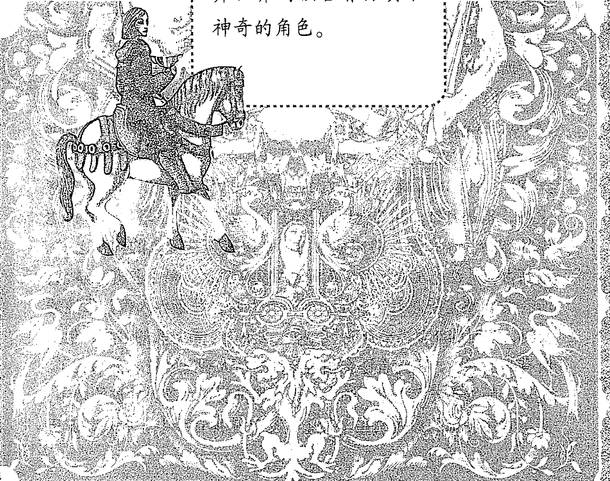

### 第一节 古老的塔罗牌

> “塔罗”一词，是取自埃及语的tar (道) 和ro (王) 两词，含有“王道”的意思。因此，“塔罗”本身也就是指身为王者，他应该具备的正确决断力，这也正是塔罗游戏方式的起源。

塔罗牌最初是一种古老的游戏工具，它是智者将古老的智慧宝典绘成图案，流传下来。就像《易经》被公认为东方智慧之书，塔罗牌则被认为是西方的智慧游戏，两者都是探讨宇宙和生命的变化，所不同的是塔罗牌更充满了西方艺术和文化的风貌。

1781年，由一位研究神秘学团体的考古人类学家杰柏林 (Antoine Court de Gebelin) 所出版的《原始世界》 (Le Monde Primitif) 一书在探讨塔罗来源时，认为塔罗和一本古埃及的《智慧之书》 (The Book of Thoth) 有关，而Thoth就是埃及的沟通和智慧之神，也是月神。相传他以埃及的象形文字创造了塔罗，以传达他的智慧。《智慧之书》是专门用来传达天神旨意的神秘之书。每当古代的法老王有任何疑难问题需要解决时，就会打开这本书，所有的问题便能迎刃而解了。而当西方基督教世界入侵并掌控埃及时，当时的新罗马皇帝下令毁掉一切不属于基督教的事物，包括所有的图书馆，因此有许多相当珍贵的前人智慧和资料都消失了。埃及王朝惨遭灭亡之时，为了防止这部神秘之书落入异族的魔手，便将它用图画的形式绘在卡片上，交付在神官手中。后来经亚历山大之手传入欧洲。在中世纪左右的时候，就形成了现在我们所玩的塔罗牌。

塔罗牌风行在西方的中世纪，从很多当时的图画、书籍中都可以找到它的踪影，无论是王公贵族或是平民百姓，塔罗牌无所不在。一直到教会的兴起，塔罗牌被视为异教的神秘魔法，从此遭到打压。在有心人士的保护下，塔罗牌还是流传了下来，在世人面前展现它的神秘气息。

塔罗牌是由22张图画牌（大阿卡娜牌）与56张数字牌（小阿卡娜牌）所组合而成，共有78张，每张精致的纸牌都有它独特的图案和意义。在使用塔罗牌游戏的时候，可以78张牌全部使用，不过大多数都是仅使用大阿卡娜的22张牌。

关于塔罗牌的起源有多种说法，大致应该是这样的：首先塔罗牌的大阿卡娜起源自古犹太人的kabbala，由于古犹太人跟古埃及人经常有接触，也吸纳了不少埃及的宗教符号，随着中东战乱频繁，塔罗牌的前身几乎消失，后来吉卜赛人学会了使用塔罗牌，但相信他们似乎对塔罗牌的哲学层面未必十分了解，他们把它当作占卜工具。在12至14世纪期间传至欧洲，又很快被教廷禁绝。教会的势力减弱后，塔罗牌又得到发展，陆续有新的塔罗牌推出，尤其是19世纪末，研究人员把塔罗牌和古犹太人密教的卷轴文物联系起来后，塔罗牌的研究变得更有系统，莱德-伟特塔罗牌（Rider Tarot）就是其中的代表。

保存至今的最早的一副塔罗牌，是目前存放在法国巴黎的国家图书馆中的17张大阿卡娜。在欧洲中世纪时，塔罗牌被教会视为异端邪说而被打压，许多教会禁止教友接触塔罗牌，到18、19世纪经由哥柏林（Geblin）与李维（Levi）等人的研究与推动，塔罗牌又以全新的面貌出现在世人眼前。19世纪末李维的追随者帕普斯（Papus）大幅改进了塔罗牌的理论与系统，帕普斯的名著《波希米亚人的塔罗牌》是第一本完全的塔罗牌专著，其中更加入灵数学 (Numerology) 丰富了塔罗牌的内涵。帕普斯因而被奉为近代欧洲塔罗牌理论与系统的开山祖师。

1910年，A.E.伟特与史密斯女士出版了莱德-伟特塔罗牌，并出版了一本用以解释这副纸牌的著作《塔罗图示指南》，很快该牌就成为全球发行量最大的纸牌，也是大多数塔罗牌研究者所公认的国际标准版，而书则用以作为研习塔罗牌入门的教科书。现今这副纸牌均以黄色纸壳包装，只要有卖塔罗牌的地方都可以看得到它的踪迹。

时至今日，塔罗牌的发展更形多元，不少塔罗牌结合当地的文化推陈出新，例如：俄罗斯塔罗牌、英国塔罗牌、瑞典塔罗牌、中国易经塔罗牌，可以说塔罗牌在游戏之余，又表现了世界各地不同文化与风俗民情。

### 第二节 塔罗牌的神秘力量

> 塔罗牌的起源很神秘。我们可以肯定，在15世纪的意大利，塔罗牌是种流行的牌戏。富人们出钱制作了精美的纸牌，其中一些留存至今。比如问世于1450年或稍早时期的维斯康提牌 (Visconti Tarot)，就是最早的塔罗之一。
后来，在18和19世纪，一些知名的神秘学学者发现了塔罗牌。这些人被塔罗牌迷住，发现牌面上的图画拥有强大的力量，绝不仅仅是牌戏那么简单。

尽管塔罗牌的根基是古老的神秘学，近几十年来，人们对塔罗牌的兴趣仍然不断发展，其中包括许多不同的方向。许多新的塔罗牌被创造出来，以反映这些新视角。例如，美国土著塔罗牌 (Native American)，草药塔罗牌 (Herbal)，龙之塔罗牌 (Dragon)，以及日本塔罗牌 (Japanese) 等。

塔罗牌主要被看成一种解牌工具。传统的塔罗解牌需要两个人共同完成：一个称为“求问者”——遇到个人问题，想要寻求答案的人；另一个称为“解牌者”——懂得如何解释牌义的人。求问者洗牌并切牌之后，解牌者把选出的牌按某种图形（即所谓牌阵）摆开。牌阵中每个位置都有特定的意义，每张牌也都有自己特定的含义。解牌者把这两种意义加以结合，以此揭示求问者的问题。

这是一套有图片的牌。问题来了：我们到底能用它干什么？

答案牵涉到潜意识——它存在于我们每个人的记忆和意识深处，却又表现在日常体验中。尽管大多数时候我们都会忽略潜意识的活动，但它却深刻地影响着我们的行为。弗洛伊德在其著作中着重描述了潜意识的非理性和原始性。他认为，潜意识是我们最不愿承认的欲望和要求的源头。与他同时代的卡尔·荣格 (Carl Jung) 则强调潜意识的正面性与创造性。他试图说明，潜意识是人性中那些优良品德的集合。

或许我们永远无法了解潜意识的全部内涵与能力，但却有办法揭示它的面貌。为此发展出许多方法，心理学，解梦，想象与冥思。塔罗牌也是这类工具中的一种。

花点时间来观察我们手边的这副英国皇家塔罗牌中很典型的一张：“圣杯七”。这张牌画着两个男人手拿不同的乐器，互相看着对方，他们当中隔着一个巨大的圣杯。当我们看着这张牌时，我们开始围绕这张图创建故事。我们看到两个人似乎都对自己的选择和现状不满，反而觉得对方的处境令人羡慕，很希望自己能处在对方的位置。

我们所做的就是观察一张意义广泛的图片，并为它编写一个故事，设想出这张图惟一可能的解释。但实际上，其他人没准会设想出一个完全不同的故事来。或许这个男人正在快乐地合奏，他们演奏出了美妙和谐的音乐，为了彼此的默契而互相对视一眼。或者，他们之间在彼此比赛，看谁能够把手中的乐器演奏得更好。

关键在于，有许多可能的故事，而我们选择了其中一个。为什么?因为人会本能地把潜意识映射到事物上。我们始终透过内心的镜头来看待事实。心理医生们早就注意到了这种特性，并发明了工具来辅助治疗。著名的《罗夏墨迹测验》（Rorschach Inkblot Test）（瑞士Hans Huber 1927年出版），就是基于心理映射的。

心理映射正是塔罗牌有价值的原因之一。这些令人迷惑的图画和符号对于释放潜意识非常有效。这是塔罗牌的个人性，但它还有共通性。作为人类，我们都有些普遍的需求和体验。塔罗牌的图画抓住了这些共通的东西，并且描绘出来。人们很容易对塔罗牌有反应，因为它代表了某些心理模型。许多世纪以来，塔罗牌已经演变成人类思想和情绪的最基本的集合。

再看看另一张“女皇”。她代表母亲的象征意义：生命处于富饶之地。注意她的图画如何唤起丰饶的感觉。她头上戴着金光闪闪的王冠，长袍飘垂折叠，围绕着她。在女皇身上，我们感受到大自然的慷慨与丰富。

塔罗牌的力量源于个人性与共通性的结合。你可以用自己的方式看待每一张牌，但与此同时，你也能感受到别人所体会到的东西。塔罗牌是一面镜子，反映出你个人意识中隐藏的一面。

我们洗牌，切牌，选出一些牌并摆开。尽管这个过程看来是随机的，但我们仍然认为自己取出了特定的牌。说到底，这就是塔罗解牌的关键——选择我们想要的牌。

首先，塔罗解牌并非机械作用的孤立产物。它是一长串意识活动的结果。我们决定学习塔罗牌，我们买了牌，开始研究如何使用它。我们在特定的地方用特定的方式洗牌、切牌。最后，我们用自己的直觉和理解力来解释牌义。

在每一步中，我们都活跃地投入。那么我们为何说塔罗解牌是“机械作用的随机结果”呢？因为我们无法解释心理意识如何投入。我们知道自己抽牌时并没有特意去选择，因此就说是随机的。而实际上，这一过程中是否有种深层的力量，一种涉及潜意识的力量？我们的内心状态是否以一种尚未了解的方式影响外部事物？

塔罗牌的图画内涵丰富，互相联系，因此包含许多信息。更重要的是，塔罗游戏把各种含义联系起来，因为我们投入愿望，忠于内心，来发现我们生命中更深层的真实。借着这种寻求含义的方式，我们承认内心愿望的真实性，并有机会揭示它的实质。

如果在解牌中有某种含义存在，那么它从哪儿来？它来自我们本身的一部分，来自意识的神奇源头。这是潜意识的一方面，但还不只这些。它就像一个深深了解我们的智者。它理解我们的需求，并引导我们走向我们想要的方向。有人把它叫做灵魂，超意识，或是超我。应该称它为“心灵向导”，因为这正是它在塔罗解牌中扮演的角色。

我们每个人都有心灵向导，它是意义之泉。你的心灵向导始终伴随着你，因为它是你的一部分。你无法切断这种联系，但你确实可以忽略它。当面对塔罗牌时，你向心灵向导发出信号，准备接收它的智慧。这一简单而真诚的行为，使你意识到内心的存在。

我们天生就懂得依赖心灵向导的智慧，但却时常忘了这一点。我们相信头脑，却忘了观察内心。我们的脑子很聪明，但不幸的是，它并没有足够的意识力，好让我们每天做出恰当的选择。

当我们使用头脑时，我们经常感到各种事情随机出现，带给我们压力。生活没什么目标，我们总是忍受，因为我们并未真正明白自己是谁，要去向何方。当懂得如何运用心灵向导后，我们对生活的体验就完全不同了。用内心目标把意识愿望列出来之后，我们获得了自信与平和。

你不一定非要用塔罗牌来接触心灵向导。塔罗牌的作用和“丹波的魔羽”一样。在迪斯尼电影《小飞象丹波》（Dumbo, Walt Disney Productions, 1941）中，小象丹波真的会飞，但他自己不相信。他在身上系了羽毛，把全部信任都放在羽毛上。他认为羽毛能带给他飞行的本领，但当发现羽毛飘走时，他被迫求助于自身的能力。

塔罗牌或许可以帮助你飞行，直到你能自己运用心灵向导为止。

### 第三节 认识英国皇家塔罗牌

> 无论什么塔罗牌都分为大小阿卡娜两大部分。总共七十八张的塔罗牌，乍看繁乱，事实上却具有规律有序且近乎完美的结构。了解塔罗牌的结构在塔罗牌的学习过程中是极为重要的一环。想要知道塔罗牌是如何创造出来的，这七十八张牌又如何能呈现世间万物，以及对牌意的掌握和塔罗系统的整合，都可以从其结构着手。

#### 一、塔罗牌的整体结构

大部分的塔罗学习者都是从大阿卡娜开始学，其实那是比较困难的方式。由于大阿卡娜讲的是抽象的精神元素，牌中融合着许多西方神秘学的符号和历史典故，因此一张大阿卡娜可能代表的牌意非常多，且较不容易从图像上看出来。以倒吊者这张牌为例，传统上这被倒吊着的人其实是位殉道者，所以有“牺牲”的涵义，这对他是种“考验”。而他因为被倒吊，世界对他而言上下颠倒，他头上有顶橙色的智慧光环，所以也有“不同角度的智慧”与“洞察力”的涵义。再者，他被绑着不能动弹，所以还代表“忍耐”、“安于现状”、“拖延”、“束缚”等。此外，倒吊者牌还代表“预言”、“惩罚”、“损失”等牌意……

相对而言，小阿卡娜表现日常生活中的事件，就比大阿卡娜简单多了，有时甚至可以只用一个关键字来概括。像宝剑三，就是“悲伤”，不管怎么解释，总是离不开这个中心意义。甚至让一个完全不懂塔罗牌的人来看，也能猜出小阿卡娜十之八九的意义。

不管是由大阿卡娜或是小阿卡娜入手，死背牌意都是行不通的方法，从图像中理解牌意才是轻松又正确的办法。

#### 整体架构

| 大阿卡娜 | 个人无法控制的部分、内在心灵、相对长期、影响较深、抽象精神 |
| --- | --- |
| 小阿卡娜 | 个人可以控制的部分、外在世界、相对短期、影响较浅、具体事件。 |

#### 牌组关联特性

| 大阿卡娜 | 精神 / Spirit | 任何事物的根源 |
| --- | --- | --- |
| 小阿卡娜 | 权杖牌组 | 火 / Fire | 行动与创造 |
| | 宝剑牌组 | 风 / Wind | 思考与讯息 |
| | 圣杯牌组 | 水 / Water | 感情与直觉 |
| | 钱币牌组 | 土 / Earth | 物质与稳定 |

在实际解牌时，大阿卡娜通常代表当事人无法控制的部分。所以当牌阵中大阿卡娜出现的比率特别高时，当事人面对的情况恐怕难以有什么人力可以改变之处。另外，当大阿卡娜出现特别多时，有时也代表这是当事人生命中影响较深远的重要事件，例如恋人牌和圣杯二相比，恋人会是较长久且影响较深的关系，圣杯二则表示比较短期的感情事件，也许很快就消逝了。另外，在实际解牌时，若摊开牌阵有很大比例是大阿卡娜（例如十张牌中有七八张以上），经常是当事人表面上并没有特别的问题或事件发生，只是他心中一直念念不忘，非常在意，千思百转。例如A女生与男友分手一年，仍然天天日思夜想，放不下感情，盼望复合，却从来都没有希望，此时牌阵中就会出现许多大阿卡娜，表示这件事对当事人而言极为重要，表面没特别事件发生，此事都是在当事人内心世界中进行的。

小阿卡娜中的四个牌组各具有不同的特性。权杖讲的是行动（通常与工作有关），宝剑的解释则有两个流派，传统上说的是伤害，摊开宝剑牌组来看，里头的意象经常惨不忍睹；另一说则是思考，因为宝剑属风元素，风在占星学上代表思考。圣杯讲的是感情与人际关系，钱币牌顾名思义与金钱、物质和享乐相关。

所以在实际解牌时，解牌者不仅仅要解单张牌意，更要仔细观察整个牌阵的结构，是大阿卡娜特别多呢？还是小阿卡娜特别多？小阿卡娜中又是哪个牌组特别多？如果算感情时，没有一张圣杯牌出现，是不是很奇怪呢？其实这代表当事人面对的问题不能从感情上入手，要从牌阵所显示的具体情况进行分析。推测工作时没有权杖，反而出现一堆圣杯，很明显当事人在工作上是想得多做得少，或者是在工作上有人际关系的问题。不过，不管算什么，出现一堆宝剑总是令人不悦，透露当事人在某方面恐怕受到伤害，或是起了冲突等。

在摊开牌阵之后，建议解牌者先检视大小阿卡娜及牌组间的比例，先把问题重心与特质掌握住，再逐一细解单张牌，比较能够提纲挈领，以免迷失在重重牌阵中。

## 大阿卡娜与小阿卡娜

在西方的神秘学中，火、风、土、水这四大元素是最基本的概念，其定位相当于东方的金木水火土五行。世间的万事万物都可以用这四大元素或五行来分类与归纳。因此，塔罗牌的架构与四大元素当然脱不了关系，小阿卡娜的四个牌组就分属四大元素，而大阿卡娜代表的是较抽象的精神元素。换言之，大阿卡娜讲的是事情发生的深层原因，而小阿卡娜呈现的是事件的表面。

权杖牌组：
火与小阿卡娜中的权杖牌组相关，表现的是主动、积极、外向和创造力。如同“热情如火”一词，火通常与运动、战争、行动力、直觉有关。具有火元素特质的人，个性较急，直来直往，随时都精力充沛，在人群中特别引人注目。占星学上的火象星座狮子、射手、白羊都具此特质。

宝剑牌组：
风是飘忽不定、无法捉摸、变动性强的。占星学上，风代表着抽象的思考分析与清晰的判断力。例如出版写作、旅行、学习等，这些事就含有风元素的特质。然而，另一方面，风也和麻烦、问题、争执、疾病、死亡等负面事物相关，所以传统上与风有关的宝剑牌组几乎令人避之唯恐不及。占星学上的风象星座有双子、天秤和水瓶。

## 水 Water

圣杯牌组：
人家说女人温柔如水，水正是与感情、感受、潜意识相关的阴性元素。相对于火的主动，水扮演的是被动的角色，具有水特质的人特别注重人际关系与感情，较女性化，心思细腻敏感，有时多愁善感，喜欢照顾别人也需要受人保护。在占星学上水象星座有双鱼、巨蟹和天蝎。

## 土 Earth

钱币牌组：
土地滋养万物，最是稳定牢靠。如果说风是理论家的话，那土就是实践家了。土特质的人勤奋不懈，重视财富给予的安全感，经济有保障，便可以享乐。所以与土相关的钱币牌组除了表现金钱物质方面之外，也代表物质享受和娱乐。土象星座有摩羯、金牛和处女。

## 大阿卡娜牌意解析整理表

| 编号 | 牌名 | 牌意 | 对应元素 | 守护星或星座 | 主神 |
| :---: | :---: | :---: | :---: | :---: | :---: |
| 0 | The Fool 愚人 | 流浪 (寻求) | 风 | 天王星 | 酒神迪奥尼索斯 |
| 1 | The Magician 魔术师 | 创造 (开拓/开始) | 风 | 水星 | 智慧之神汉密斯/女巫比蒂亚 |
| II | The High Priestess 女祭司 | 智慧 | 水 | 月亮 | 月亮女神黛安娜/美神维纳斯 |
| III | The Empress 女皇 | 丰收 (成熟) | 土 风 | 金星 | 美神维纳斯/大地女神迪密特 |
| IV | The Emperor 皇帝 | 支配 (权力) | 火 | 白羊座 | 宙斯 |
| V | The Hierophant 主教 | 援助 | 土 | 金牛座 | 宙斯/奥丁 |
| VI | The Lovers 恋人 | 结合 | 风 | 双子座 | 丘比特/赛姬 |
| VII | The Chariot 战车 | 胜利 (斗志) | 水 | 巨蟹座 | 战神阿拉斯 |
| VIII | Strength 力量 | 意志 | 火 | 狮子座 | 大力士海格力斯 |
| IX | The Hermit 隐士 | 寻求 | 土 | 处女座 | 使神汉密斯 |
| X | The wheel of Fortune 命运之轮 | 轮回 (转变) | 火 水 | 木星 | 大地女神迪密特/命运三女神 |
| XI | Justice 正义 | 均衡 (平衡) | 风 | 天秤座 | 法理女神特尔斯/智慧女神雅典娜 |
| XII | The Hanged Man 倒吊者 | 牺牲 (无私) | 水 | 海王星 | 海神波士顿/耶稣 |
| XIII | Death 死神 | 结束 (陈腐) | 水 | 天蝎座 | 死神(光阴之神克罗那斯) |
| XIV | Temperance 节制 | 净化 (引导) | 火 | 射手座 | 处女之神 (代表少女、母亲、老人三位一体的处女之神) |
| XV | The Devil 恶魔 | 诅咒 (引诱) | 土 | 摩羯座 | 亚当夏娃/牧神潘/潘朵拉 |
| XVI | The Tower 塔 | 毁灭 | 水火 | 火星 | 战神阿拉斯/潘朵拉 |
| XVII | The Star 星星 | 希望 | 风 | 水瓶座 | 农业与受胎女神 |
| XVIII | The Moon 月亮 | 不安 | 水 | 双鱼座 | 月亮女神黛安娜/黑暗女神利托 |
| XIX | The Sun 太阳 | 生命 | 火 | 太阳 | 太阳神阿波罗 |
| XX | Judgement 审判 | 复活(轮回→审判→重生) | 水 | 冥王星 | 冥王哈迪斯/使神汉密斯 |
| XXI | The world 世界 | 达成 (完成/圆满) | 风土 | 土星 | 农业与铅之神亚当夏娃/赫梅弗度斯 |

## 四组小阿卡娜牌意解析整理表

| 牌组名称 | 象征 | 对应元素 | 涵义 | 暗示 | 代表色 |
|---|---|---|---|---|---|
| Batons 权杖 | 工作 (朝气、活力) | 火 | 精神 | 思考、行动 | 红色 |
| Cups 圣杯 | 感情、爱情 (情绪、感性) | 水 | 感情 | 情绪、感情 | 蓝色 |
| Swords 宝剑 | 权力、斗争 (野心、破坏) | 风 | 知识 | 言论、通信 | 黄色 |
| Coins 钱币 | 地位、金钱 (物质、肉体) | 土 | 物质 | 现实事物、金钱 | 绿色 |

## 第二章 塔罗之旅全程攻略

好的开始是成功的一半，只要充分了解塔罗牌的解牌规则，才能完全体会塔罗牌的乐趣。下面，让我们一起开始塔罗之旅去领略最详尽、最完整、最简洁、最实用的全程攻略吧！

### 第一节 玩牌前的准备

#### 一、选择适合自己的塔罗牌

1. 选择自己“有感觉”的牌是最重要的

这不是一种奢求，反而是一种必要的要求。塔罗牌是一种工具，也是一种美丽的收藏品，当你不喜欢你的塔罗牌时，你的心情必受其影响，用自己不喜欢的工具，为自己指引方向，其准确性能有多少？就算不把塔罗牌当成工具，而是当成艺术品收藏，试问你会愿意收藏自己不喜欢的东西吗？所以，选择自己“有感觉”的牌，就跟买水晶、宝石、法器一样，要慎重地选择。毕竟自己爱的，才能让自己充满信心与力量，不是吗？

2. 从外形上挑选塔罗牌

纸牌的一些外在形式也要斟酌，如纸质的感觉与牌的大小，甚至背面图案都要考虑。

纸质的感觉要软硬适中：若纸质不好，经过长期多次使用，纸牌会容易受损，尤其是纸牌的四个牌角。厚度最好不要太薄，但也不要太厚，以免影响洗牌与切牌动作。

牌的大小要配合用途：主要是出于携带与解牌的考虑。若你常常要使用，必须随时带着塔罗牌，那最好选小一点的牌；若要方便求问者观看，则可选大一点的牌。但是请注意，太大或太小的牌都会造成洗牌时的不方便，应当选择最适合自己使用、用起来最舒服的牌。

**背面图案不可有正反向：** 现在牌的背面也会印有一些漂亮的图形，或是神秘的符号，但有些牌背图案有正反之分，一些初学者在翻牌时，还没看到塔罗牌的正面图像，就被牌背的正反位影响，心想怎么这么多反牌，难免造成心情波动，就会影响解牌的情况。建议初学者选择无正反位的牌背，即图形是对称的，翻倒时与正面相同。

3. 购买完整的78张塔罗牌

你所使用的塔罗牌应该是标准的78张塔罗牌，也就是除了有22张大阿卡娜，还要有56张小阿卡娜。虽然一般书上都从大阿卡娜教起，但是小阿卡娜的使用属于更进一步的运用。当你能够比较熟练地使用大阿卡娜时，进一步学会使用小阿卡娜就能更加精确地进行解牌。所以建议要买就买一整套，哪怕一开始用不上小阿卡娜，也可以收起来以备日后使用。

4. 选择古代或近代塔罗大师设计的牌

越古老的牌就越有神秘的灵感和力量。塔罗牌的设计极为精密，牌上任何一个图像、颜色、版面配置都有它的象征意义，马虎不得。因此只有研究塔罗多年的大师才有资格设计塔罗牌，设计出来的牌才优秀，而不是随便一个漫画家就有资格设计塔罗牌。而且古老的牌流传了很多年，在西方有无数的人使用过，在这些看上去不如那些漫画塔罗牌精美的图案里，蕴藏着使用过它们的人的力量哦！

本书附赠的英国皇家塔罗牌是目前公认的最为华丽的贵族牌品，属于塔罗世界中最具典藏价值的牌种，其图案中的意思比较接近塔罗的真义，没有在流传过程中被民间杂糅的文化所干扰。试试看，你很可能找到神秘的灵感哦！

#### 二、为你的塔罗牌准备一个舒适的布袋

现在市面上能买到的塔罗牌一般都装在盒子里，但这只是新牌的包装。正式开始使用的时候，塔罗牌最好装在一个布袋子里。这是为什么呢？其实，由于塔罗牌在我们身边还不是非常普及，所以一些使用塔罗牌的小常识很多朋友都还不知道。塔罗牌是沟通心灵和自然的重要工具，平时不用的时候应该妥善保管，可不能像扑克牌一样，用完就乱丢乱摆，这样很容易造成塔罗牌磨损刮伤，不但妨碍美观，也会减短塔罗牌的寿命。而塔罗牌是跟在主人身边越久就越灵验的，一副牌用不了多长时间就损坏了，不但浪费金钱，也很浪费主人的力量哦！下面我就对这些小常识做一下解释。

1. 妥善保管自己的塔罗牌，不要轻易丢弃

经过慎重的选择，现在你已经拥有了一副塔罗牌。要注意，一旦选定了一副牌，最好不要轻易丢弃它。一副新的塔罗牌就像一个新生婴儿一样，没有什么力量。它会跟着自己的主人一起成长，受到主人力量的影响，养成和主人相似的性格，并且和主人相辅相成。常常玩塔罗牌的人都有这种感觉，就是自己经常使用的牌玩起来很顺手，但别人的牌或者新买的牌用起来常常会答非所问，很不准确。这是因为塔罗牌会沾染主人的力量——新买的牌没有力量，用起来准确度当然不高。

当你和塔罗牌接触的时候，你的力量就会一点一滴地注入牌中。经过长久的积累，牌的力量形成了和你的力量和谐的波长，这时如果别人来使用它的话，由于力量的波长不和谐甚至相反相克，当然就不可能准确。所以，一定要妥善珍惜保管自己的塔罗牌哟，它是你的好朋友，好顾问，和你在一起时间越久，你们之间就会越有默契！

2. 常常把塔罗牌带在身边，尽量不要让别人使用它

塔罗牌会和主人的力量一起成长，可是如果你常常把它小心翼翼地放在抽屉的最里边，或者书架的隐秘处的话，它是不会成长的。为什么呢？很简单，因为它接触不到你呀。塔罗牌接受主人的力量就是通过和主人的接触。因此常常把塔罗牌带在身边，它会感受到你的呼吸和气息，你的力量会包围它，它的成长速度当然就会加快了。因为塔罗牌有这样的特性，所以尽量不要让别人使用自己的塔罗牌（当然不包括你用自己的牌为别人进行解牌）。因为塔罗牌一旦形成和你相似的个性，别人用它的时候它就会伤心甚至不高兴，准确度也会下降。如果经常让别人使用的话，塔罗牌的力量就会改变，它和你的默契就会被破坏，你辛辛苦苦培养的成果就会付之东流了！

3. 给塔罗牌一个舒适的布袋子，封印它的力量

看了以上两点，你应该可以了解为什么要给塔罗牌准备一个舒适的布袋子了吧？其实除了保护塔罗牌、延长它的使用寿命以及方便常常带在身边之外，还有一个很重要的理由。塔罗牌能够连接心灵和自然，它的力量实际上类似一种场。如果塔罗牌经常暴露在外的话，它会和自然界发生各种各样的联系，主人给它的力量很可能会一点点地流失。就像阿拉丁神灯一样，灯神也是要住在灯里的嘛，所以给塔罗牌准备一个舒适的布袋子，就等于给它一个家，让它能够安心地呆在你的身边。

给塔罗牌准备布袋子要注意以下两点：

- **要用纯色布料做成的布袋子。** 通常很多人都比较喜欢用黑色的布袋来装塔罗牌，因为神秘的黑色能够封印塔罗牌的力量，而且还能够吸收阳光、月华、星空、风、花草树木等等自然界的精灵，提升塔罗牌自身的能力。黑色还能阻挡来自黑暗的力量侵蚀塔罗牌，保护你的牌。实际上只要是纯色的袋子就可以了，因为这有利于保持塔罗牌力量的纯洁。反之，杂色的袋子会让塔罗牌的力量混乱，毕竟，颜色也是有一定魔力的。不同的颜色代表不同的力量方向，例如红色趋向于情感，绿色趋向于行动，蓝色趋向于内心，等等，你可以根据自己的需要选择一种颜色来培养塔罗牌的力量方向。

- **要选择能够扎紧袋口的袋子。** 如果是敞口的袋子，塔罗牌的力量还是会流失，因此最好选择能够扎紧袋口的袋子。而且扎紧袋口也能防止牌从袋子里滑出散落，一举两得哦！

另外，使用塔罗牌还要注意一点，不要太经常用塔罗牌为自己进行解牌。因为你的牌和你是心意相通的，当你为自己解牌的时候，你的潜意识会导向你所希望得到的结果，你的牌常常会按照你的希望来阐释，而不是按照塔罗牌自身得到的讯息和意愿进行阐释，这样解牌就不可能很准确。当你为别人进行解牌的时候，因为你站在一个客观的立场上，你本身没有什么导向和意愿，这时候塔罗牌的阐释也是客观的，比较符合事实，解牌的结果也会比较准确。如果你很想用塔罗牌为自己找一些答案的话，最好找一个也会使用塔罗牌的好朋友，请他用他的牌为你进行解牌。你也不希望因为自己和牌之间的默契，使得心爱的塔罗牌好心办坏事，从而耽误你的重要安排吧？

#### 三、做好玩牌前的准备

使用塔罗牌进行解牌之前，最好做一些准备，这样能够提升准确度，对增加牌的力量也有好处。要确认自己的身体和心灵都在良好、平静的状态，因为解读塔罗是一件需要费心力的工作，必须集中精神，才能了解塔罗牌所呈现的意义。所以最好选择安静的地方，避免干扰。尤其当求问者希望隐秘、注重隐私的话，更应该注意选择游戏的地点。游戏时要提前洗手，环境要清洁干净，这样也利于保护塔罗牌少受磨损。

1. 可以准备一块桌布

准备一条单色丝巾或一块单色纯棉布，用来在解牌时铺桌子。除了真丝或纯棉之外的料子也要是天然的东西，不能是化学织品，否则塔罗牌无法和自然接触，不能从自然界得到讯息。注意不同颜色会有不同的效果：

- 爱情或友情：绿色或粉红
- 知识或教育：灰色
- 金钱：黄色或金色
- 事业或地位：紫色
- 个性：蓝色
- 健康：咖啡色或绿色
- 力量的聚集：黑色
- 纯洁：白色

2. 可以准备一些其它工具

**熏香、蜡烛、精油**

解牌时如果可以点上熏香、蜡烛或者精油等等，就可以增加点神秘感，给人一种迷迷蒙蒙的感觉，使得你和求问的人都容易放松心情，集中注意力。另外，各种不同的熏香和精油也有特别的效果，例如薰衣草能安定神经，佛手柑可以集中精神，防止不好的力量打扰，薄荷可以提神等等。蜡烛的颜色也有类似的效果，红色蜡烛代表爱情，指向南方，象征元素是火；黄色蜡烛代表智慧，指向东方，象征元素是风；蓝色蜡烛代表心灵，指向西方，象征元素是水；绿色蜡烛代表和谐，指向北方，象征元素是土。

**首饰、宝石**

解牌时如果戴些首饰，例如项链、耳环、戒指等，也有提高准确度的效果，因为每颗宝石都是在自然界中经过长久岁月的打磨才形成的，早已吸收了日月精华之气，所以玉有驱邪的效果，黄水晶可以招财，粉水晶能够带来桃花运等。你可以依推测内容的需要配戴，来提升某方面的感应力。

#### 四、使用塔罗牌的五大禁忌

使用塔罗牌进行解牌的时候最好不要用玩笑的态度。如果你不是认真想问一个问题的话，你的牌也不会认真告诉你它的看法。同一个人、同一件事情不能问两次，起码要等事情状况有所改变之后才能再问一次，否则就要用不同的问法。塔罗牌是你借以窥探命运一隅的工具，可说是命运旅程上的伙伴，因此，你必须对它寄予绝对的信任。如果它告诉你的结果不尽如意，还是应该保持着尊重的态度。千万不要有“问到好结果出来为止”的心态——命运并不是一种尝试错误的游戏。如果一意孤行，那么你的塔罗牌以后便不会愿意再向你显示任何正确的答案了。所以请务必信任自己的塔罗牌。

**精神很差时不能进行推测**，这会影响到解牌的准确度，有时还会影响到身体健康，甚至还会让你受到不好力量的影响。如果属紧急状况一定要进行推测的话，也请带上水晶补充能量。

**不能把塔罗牌用在争论或骗人上。** 如果有人向你挑衅、怀疑牌的准确度或纯粹想让你出糗，请不要进行推测。用塔罗牌挑战别人或骗取钱财也不行，这样做会污染牌的力量。

**不要遗失任何一张牌。** 一套牌就像手足一样，有其完整性，无论遗失了哪一张，对牌本身而言都是一种伤害。万一实在不小心遗失了，也不要马上丢弃整副牌，使用我们贴心设计的2张替补牌吧。这2张是空白牌，可以用来代替遗失的牌。

**避免洗牌时的意外状况。** 这些意外状况包括洗牌的时候有一张牌突然翻过来正面朝上，洗牌的时候把一些牌洗掉到地上，切牌的时候放错牌堆等等。你应该尽量避免这些意外，这些现象都在说明一件事：你的精神不够集中，这会对解牌的结果造成最严重的影响。

### 第二节 开始玩塔罗

塔罗牌解牌流程原则上没有一个公认的规则，各人有各人的习惯与偏好，只要熟练都能够使用。而塔罗牌在长期演变下，发展出各式各样的仪式，令人眼花缭乱。其实，绝大部分花哨的仪式都可以省略，这并不会影响准确度，玩家完全可以依照自己的偏好选择性地使用，甚至自行创造一个流程。在这样的情况下，仪式变得就像是个人的习惯，能够使人感到自在，进而收到集中精神的效果。不过，使用仪式有个小缺点：一旦养成实行仪式的习惯之后可能导致玩家太依赖仪式，如果没有实行，就觉得浑身不对劲而影响解牌准确度。事实上，仪式可有可无且不会影响准确度，这点可以牢记在心。

在正式说明之前，为避免初学者混淆，有两个名词需先加以解释：第一是“求问者”，指的是问问题的人。第二是“解牌者”，指的是解牌的人。如果自问自解，那么求问者与解牌者是同一个人。

#### 一、开牌

一副新牌拿到手中，最好先进行开牌。开牌可以增进主人和牌的沟通，缩短牌与主人之间的磨合期。不过这只是一个辅助作用，只要你对你的牌好，它就会乖乖听话啦。

开牌有一定的仪式，具体如下：

1. 准备开牌之前，请先备好四大元素的代表物：
   - 火：使用蜡烛、精油、檀香等；
   - 土：可以用一些鹅卵石，也可以用水晶；
   - 风：一般会用小刀、匕首或剑之类的利器来代表，不开锋的也可以；
   - 水：用一个漂亮的透明玻璃或水晶杯来象征，杯中装的水请用纯净水或矿泉水。

#### 二 提出问题

为新牌做过开牌仪式之后，你就可以开始用塔罗牌进行解牌了。

一般说来，在解牌之前就应该已经有个问问题的具体方向。如果是为自己解牌，那么洗牌的时候心里要一直想着自己要问的是什么问题；如果是为别人解牌，那么在你洗牌的时候，要请求问者注视着你洗牌的动作，同时心里反复默念他要问的问题。在取出需要用的牌、摆好牌阵之后，还要让求问者正式向塔罗牌提出问题（给自己解牌的话当然就由你自己来问了）。

这个问题最好是有建设性的。怎么问一个好问题恐怕没有想象中那么简单。有个方针可以做参考，就是要“有改变的空间”。与其问“他会不会离开我？”而束手待毙，不如问“我该如何改善我们的关系？”或是“照目前这个状况看来，我跟他未来的发展如何？”要知道塔罗牌提供的答案不是唯一的结果，而是“照这个形势演变下去而不加人力改变，所得到的结果”。打个比方来说，我们可以将人生看成一个多重结局的计算机游戏，玩家做的每个选择都导向不同的结局，而塔罗牌就是作弊的工具，可以偷偷告诉玩家“照他目前的选择走下去会得到何种结局”。玩家如果对结局不满意，随时可以改变。真正的结果还是掌握在你的手中。

通常说来，塔罗牌只能说出事件三个月内的变化，并不能说出较远的未来，或者是解答关于一生的问题。锁定范围或是特定对象的问题比较容易得到精确的答案，问题越笼统广泛的话，得到的答案也会越模糊。

要注意的是，在上文的塔罗五大禁忌中我也提到，即使你对第一次解牌的结果不太满意，短期内也最好不要再问相同的问题，一天之内同一个问题问两次是大忌。除非问题的状况已经发生了变化，否则不但你得不到准确的答案，对你心爱的塔罗牌也很有伤害哦！

### 第三节 牌阵的使用

决定好要向塔罗牌询问什么问题之后，就应该决定使用什么牌阵。千万注意，牌阵最好在洗牌前决定好，否则就是本末倒置。在决定牌阵的同时，使用指示牌亦或切牌的问题也会一并被解决。对进一步有关牌阵的解说，请参照本书关于各种牌阵的详尽介绍。

塔罗牌经过长期的演变和流传，发展出了许许多多各式各样的牌阵。有些牌阵对各种问题都比较通用，比如圣三角牌阵、六芒星牌阵、凯尔特十字牌阵等几乎可以用于各种问题，但也有些牌阵则是特别针对某一方面的问题，例如爱情、事业、工作等等。

通常在确定好所要问的问题之后，就要决定用哪一种牌阵比较适合。本书第六章和第七章为大家精选出一系列牌阵，你可以根据自己的问题选择使用。

塔罗牌特殊的地方在于它常常是对事不对人，也就是说，塔罗牌解答的不是人的命运，而是人们对事的处理态度，以及事情的发展趋向。因此，解牌者必须针对求问者的问题症结所在来选择恰当的牌阵，帮助分析现状和解决办法。

比如说：你想问某人爱不爱我？一般都会选择可以一针见血回答的圣三角牌阵。但如果这个问题的症结所在并非是这个人爱不爱你，而是如何使他爱上你，那么就应该选择四元素牌阵，来帮助你从各个方面提出建议、探讨这个问题。

不同的牌阵有不同的擅长领域，并不是每一个牌阵都可以包回答你的所有问题。需要建议的时候选择圣三角这种说一不二的牌阵，得到的答案就不是建设性的。需要作决定的时候选择四元素这样从各方面均衡考量事情的牌阵，得到的答案当然会模模糊糊，急死人。所以不管是给自己解牌也好，给别人解牌也好，都需要理清问题的关键，从而选择一个最恰当的牌阵。

你所选择的牌阵的大小也很重要，比较大的牌阵需要用到小阿卡娜牌。一般说来，像凯尔特十字牌阵这样用到10张牌的牌阵，已经是使用大阿卡娜牌的极限，如果需要使用超过10张牌的牌阵，那么建议你用完整的78张塔罗牌来进行解牌。

将牌摆成牌阵有一定的顺序。每一个牌阵图上的牌都写有序号，将取出的第一张牌图面向下放在牌阵位置1，依此类推……摆牌阵的时候先不要看自己拿出来的是什么牌，这样才是正确的。

另外，如果你已经是个很熟练使用塔罗牌的高级玩家，那么就不必拘泥各种牌阵了，你完全可以自己创造牌阵，针对不同的问题的特性，创造自己用起来最得心应手的牌阵，这也是玩塔罗牌的一种乐趣！

#### 四 洗牌

选好牌阵之后就可以开始洗牌了。

洗牌方式很多。常见的有两种：

**扑克牌式：** 这个扑克牌式洗牌法可不是花哨的“两叠牌放在桌面，劈哩啪啦交错洗下来”。那样炫丽的方式，留给扑克牌用可以，除非有钱把牌当消耗品使用，否则这种方式很容易把牌弄旧弄坏（特别警告：如果把别人的塔罗牌拿来这样洗的话，他很可能会翻脸）。在这里的扑克牌式洗牌法指的是一般洗牌的方式，那就是“把整副牌背面朝上放在右手，用左手随意抽出一叠置于其上，如此反复进行”（对右撇子而言）。假如不想分正逆位置，可以用这个方式洗牌；若要使用正逆位，必须每隔一会儿将部份的牌旋转180度。

**麻将式：** 把整副牌背面朝上置于桌面，像洗麻将一样的搓洗。顺时针方向或者逆时针方向要看你开牌时用的是哪一个。这个方式洗得很干净，正逆位也都有，唯一的缺点是对于桌面要求高，最好有布垫着。相对于扑克牌式，我比较推荐这个方法，因为这样洗得干净，并且容易分正逆位。

当然洗牌并不限以上这两种方法，眼睛可以睁开也可以闭着。但无论使用什么方式，都要保证洗干净。给求问者洗牌或是解牌者自己洗也没关系，洗牌的目的是取得随机数。

切牌是让求问者大显身手的时刻。当你洗完牌、牌面朝下叠成一叠放好之后，就要请求问的人来切牌。当然，如果求问的人就是你自己，就要自己来切牌了。

首先，请对方集中精神，从牌叠的上方，依照自己的意志拿起一摞牌（绝对不可以不拿），把这一摞牌放在原先牌叠的下方（也就是靠近你的这个方向），变成两摞（见下图）。

其次，从第二摞的上面再拿一摞牌，放到第一摞的上方。现在，你们面前已经有三摞牌了。

接下来，由你来把牌叠回去：先把第一摞拿起来，放到第二摞的上方，再把这个第一摞和第二摞的合体拿起来，放到第三摞的上方。如此，便恢复为一叠牌了。

我们还剩下最后一个切牌动作（见下图）：在刚刚的过程里，牌面都是横向朝下的。我们现在要把牌转为直向朝下。这个动作千万不可以搞错了：如果是为别人解牌，你的旋转方向是逆时针的；也就是说，你要把塔罗牌的左端朝下旋转90度，变为直向。如果你是为自己解牌，则是顺时针把牌旋转90度。一旦搞错，整个牌面的意义会完全颠倒，所以务必要谨慎喔！

#### 六 发牌选牌

根据选好的牌阵，这时应该从切好的牌叠中拿出需要用的数量的牌。可以由解牌者按从上到下的顺序依次从牌叠上取下排好，也可以将牌背面朝上摊开成扇型，由求问者随意从中抽出需要的牌数。用左手或者右手、张开眼或闭上眼都没关系。由求问者抽的原因是为了得到最原始的数据。让别人替求问者抽牌，中间总是隔着一个媒介，抽出的是二手数据。因此最好让求问者亲自与牌接触，他所抽出的牌才是最能反映事件本身的第一手资料。

#### 七 解牌

##### 解牌的基本方法

摆好牌阵之后，就可以开始按照牌阵图上的序号依次将背面朝上的牌从左至右翻过来，也就是说从左边掀开，同时解牌。

说起解牌的规律，初学者经常会碰到没有规律可循的情况。如果牌阵本身也比较难解，就更让人头疼了。

事实上，解牌确实没什么规律可循，每个玩家都有自己的一套方法，不同的牌阵也适合不同的解法，需要玩家细细选择。基本的方法包括：

- ☆ 释义——按照本书的解释来阐释牌阵所传达的意思。
- ☆ 感应——凭个人的天资而定。
- ☆ 图解——塔罗牌的图案互相有所关联，尤其是古老的牌，在这方面做得相当好，但一些漫画牌，由于那些漫画家对塔罗的研究还远远不够，画出来的牌自然也就无法图解。
- ☆ 数字——数字也会有关联，如果读过《易经》，这种方法比较合适。
- ☆ 文化背景——塔罗在希腊神话和生命之树方面都有特殊意义。如果了解这些，这样解牌的准确度还是很高的。这也是高级玩家常用的方法。

一般人通常会选择几种适合自己的方法混合使用，你也不妨试试。

每张塔罗牌都有正逆位两种意义。当牌翻出来图案是正位，就代表正面意义。当牌翻出来图案是逆位，则代表反面意义。如果牌是横放的，则人头在左为正，右为逆。不过你千万不要用倒吊者来看，大家都知道，倒吊者的图案刚好是相反的。

下面我就用一些具体的例子来说明解牌的一些方法，一般我会通过五种方法来进行解牌。

##### ▷ 1 感应法

当你翻开一张牌，看到牌面时，由于牌面的触动，你会在脑中出现一幅影像。试着说出你所看到的东西。这个过程就好像是在描绘某一个画面——经由牌面图案的触动，开启了某个开关，然后依照牌义描绘出一个画面。

打个比方说，在关系牌阵当中，代表女方的牌面是女教皇，代表男方的牌面是愚人，而代表两人关系的是宝剑九。在你的眼中就出现一个画面：一个严肃又敏感的女性正与一个玩世不恭的男人争吵，女性可能正在要求男性要遵守某种规矩，而男性却觉得那是束缚，会失去自由。同时男人自由奔放的个性也让女性感到无法掌握而没有安全感。两人的落差极大，又不知如何调整，关系中充满了痛苦。然后你就可以将这幅景象描述出来。

有时候，你的脑海中会飞快地出现一幅影像。当眼睛一接触牌面时，脑中就闪电般闪过影像，这样你也可以将所见的讲出来。通常这种突然闪现的画面，精确度颇高。塔罗对玩家而言比较像是水晶球，是让你感应到东西的工具或媒介。

在脑海中描绘影像的能力就是这类方法最重要的关键。如何增强自己的这种能力呢？首先你可以练习闭起眼睛回想房间的摆设、灯光和其它的细节。然后从熟悉实在的东西开始，练习在脑中重现它的影像，熟练了之后，再去想象比较不熟悉的东西。

如果可能，可以练习把所有的塔罗牌图案一张张地在脑海里重现，这对于解牌会有很大的帮助。因为有时候你看到某人或某个场景，心中可能会浮现某张牌的图案。这时候你就会领会到牌和实际状况以及和牌义本身的关系。

但是感应法有一个缺点，就是所看见的画面容易散乱而片段，缺乏逻辑性和完整性。因为这个方法主要是从空间上来阐释塔罗牌得到的讯息，缺乏时间上的条理，所以必须和其它的方法合用才能比较准确完整地解牌。

##### 2 观察法

塔罗玩家解牌时容易发生一个问题，就是看到牌面的时候，马上就在脑中搜寻牌义或过往的解牌经验，这时候就容易忽略牌面上的细节所提示的讯息。尤其是老玩家，更容易因为解牌的经验多，看到牌面就直接想起牌义，熟极而快地解牌。虽然准确度不错，但是总差了那么一点，感觉上就是无法正中红心。原因就是依赖过去的经验解牌，缺乏对当下状况的观察。

观察法有两个重点，第一个是观察细节，第二个是保持好奇心。解牌的时候你的眼睛和耳朵都应该是开放的，对每一件事情都应该有兴趣，包括最微小的细节。这样你才能在最不起眼的细节上看到重要的征兆。

解牌不是只有牌面而已，还包含解牌者与求问者以及整个空间与时间背景的总合。认真地观察牌面图案细节，以及求问者的状态，读取当下时空所有的讯息对应于牌面的象征做出的响应，如此在解牌的时候，你就会发现解牌并不是那么困难，塔罗牌要告诉你的讯息是那么清晰。你也会明白应该说什么，才会对求问者有所帮助。

那么，解牌时如何具体使用观察法呢？你可以问自己下面几个问题：在推测时，你是否敞开心胸，像是第一次看到牌面一样，观察所有的图案细节？牌的颜色、牌面的象征，哪一个细节特别吸引你的注意？你是否感觉到对方的状态、气息甚至小动作，和牌面的哪一个象征是“共鸣”的？在牌面上是否有某些细节是共通的？综合这些问题的答案，你就会有所领悟。

使用观察法要注意千万不要急着想要表现或下结论，即所谓的“铁口直断”。这样的心态会妨碍你心胸的开放，让你受限于旧有的经验无法再进步。

观察法也有缺点，那就是容易迷失在细节当中。当细节占据了我们所有注意力的时候，我们就会只见树木不见森林，在细节中忽略整体。要知道塔罗牌想要传达的讯息是一个整体，牌阵中单独的一张牌不可能阐释整个牌阵的意义，这一点也千万要注意。

##### 3 综合法

解牌时应当在复杂的牌阵当中找到整体的趋势。观察法能够把细节阐释清楚，而综合法就能把握整个牌阵的走向。解牌阵的时候不能散乱地东解一张西解一张，然后又互相矛盾，牛头不对马嘴。你应当优先去观察一个牌阵架构的“流向”和“位置”，考虑牌在这个流向和位置结构中呈现的意义，之后在这个牌阵中找出每张牌面共通的部分，并把这个共通的部分和架构再做一个统整和归纳，最后找出一个比较合乎逻辑的答案。

举个例子，以维斯康提古塔罗牌为例，在关系牌阵中，代表男方的是宝剑骑士，女方为宝剑九，关系为死神，面临的挑战为权杖五，结果为世界。运用综合法先看看牌阵的架构，根据牌面你大概可以猜到，男方和女方在吵架，而且男方得理不饶人（宝剑骑士有集中和锐利之意），女方很伤心（宝剑九有痛苦和伤心之意），而挑战是权杖五（冲突）更显示出彼此的冲突，从这三张牌的结构上我们可以综合出来二人的关系目前处于吵架状态。同时男女都是宝剑，所以可以归纳出争吵的原因可能是观念上的不合，而不是情感要求的落差。

可是结果是世界，而关系是死神，感觉上很矛盾，难以理解。其实，仔细观察这两张牌，他们有一个共通处：都是结束和完成之意。所以就从这种共同性的部分进行推测：男女吵架吵得很凶，甚至吵到要闹分手的地步，而且是观念不合。同时也推断这份关系也有重修旧好的可能，因为主要是观念不合，不是情感的断裂，同时死神和世界也有另一个共同的部分，就是重生与连结。所以又可以归纳出解决之道：彼此的观念上要做一些调整，互相包容对方的看法，讲话稍微做修饰，不要刺伤对方，那这个关系就有重生的可能。

从上面的例子里，我们可以看出，综合法重视逻辑上的合理和牌面共通的部分，并在共同的点上找出合理的解释。所以这个方法在解牌阵的时候，是蛮适合使用的。

但是综合法的缺点就是太重视相同的部分，以至于过度简化，有时候会太过武断和粗糙。这和观察法刚好是相对的，两种方法结合使用当然比较好。

##### ▷ 4 反说法

这个方法感觉上比较不容易掌握，因为这个方法主要是把坏说好，从不可能当中看出可能，绝望中看出希望。在大家觉得不该那样想的地方，找出一条路来，另辟一条蹊径。

事物在发展到极限的时候，自然会向另一极移动。所谓阴极生阳，明极生暗，循环往复。正如我们所知，有些路常常是表面看似不可行，但其实是可行的。有时候旁人看起来可能觉得某个人是傻瓜，做一些愚不可及的事，其实日后才知他是正确的。先知常常被当成笨蛋、被众人所耻笑的例子屡见不鲜。

但是反说法并不是解牌的时候一切都反着来解释就对。要正确使用反说法，一定先得经过观察法与综合法的思索，再翻过一番，从反方向来思考，往往会赫然发现解牌的新世界。你会发现，牌面混乱矛盾到你不知如何下手解牌时，反说法常常可以为你找出一条路。或者当你在解牌感觉很顺畅的时候，有时候不妨也反过来想想看，说不定可以看到新的、隐藏于合理之下的隐喻。

塔、恶魔与死神常常被当作是不祥的牌，用反说法的角度来看，它们是非常好的牌。塔与死神常暗示着毁坏和结束，但是没有结束哪会有开始？没有毁坏哪会有新生？只要我们能坦然面对，重生就是接下来的道路。恶魔代表的是欲望与诱惑，但何尝不是提醒我们，要正视自己的欲望，用一个轻松的心情去看待它？欲望并不是洪水猛兽，当我们不接受自己的欲望，把它扭曲成我们想要的样子时才可怕。能正视自己的欲望并且接受它所带来的结果，不逃避也不扭曲，那么欲望并不会带来痛苦。即使真的是结束和欲望带来痛苦的状况，只要我们如实地去面对和穿越，伤害必能减到最小。

世界这张牌看来有完成、达成的意思，其实完成不就代表结束？花朵开到顶点就会凋谢，果子成熟就会掉落，它同时也暗喻着结束。所以它不一定要做好的解释。对相同的牌面，从一个崭新的不同的角度出发，从另一面来看待牌义，就是反说法的精髓。

所以，在解牌时，如果能利用反说法，可以在很不好的牌面上找到启示：一种解决之道的提醒；或者是在很好的牌面上，提示我们可能发生的弊端。就如圣杯一，它代表自我满意的状态，但是有时却会太自我满意而得意忘形，所以出现时也不一定是好事呢！

当你觉得“这样解不太可能吧？”的时候，多点勇气“乱解”，解牌的时候再加以归纳分析，说不定能看出新的门道呢！

##### 5 组合法

解牌时使用组合法的重点在于融合。不同的东西排列组合之后，可能会产生新的意义。倘若反说法是隐含着颠覆、打破常规的道理的话，组合法就比较像是创造，从既有的事物里面寻求新的组合产生新的意义。

组合法的基本是将牌放在一起看，去思索它们的组合会产生什么新的意义。譬如命运之轮是比较容易练习这个方法的牌，它本身的牌义是“变化”、“转折”，比较中性，所以有些难以解释。此时最好和其它的牌面一起看，才能看出到底会是什么变化和转折。不过总体而言，都有无法违抗的意味在内。假设命运之轮和死神合看，有“破而后立、死而复生”的感觉，而且很可能是大环境所带来的冲击。如果这样的组合是在问感情，那大概已经分手或快要分手了，而且求问者的心情是很无奈又痛苦的；如果是问工作，那他大概已经失去工作了，而且可能是被辞退的。如果和塔同时出现，比起死神，是较不利的，死神还隐含复活复生的味道，而因为塔的牌义是崩坏，那可能会有较长的低潮期。

不过除了命运之轮，如果是其它的组合可能就不那么容易了。比如说魔术师和死神合看又是如何？你要怎么去解？这个时候又该如何使用组合法呢？你可以先用感应法，先在脑海里想象出这两张牌的图像，并且将它们组合重叠在一起。想象自己将这两张牌丢到一个炉子内，互相融合，最后会出现什么？在每次的推测中，可能出现的会有所不同，因为随着求问者的情况和当时状况的不同，也会有不同的结果。所以这个方法和灵感直觉比较有关系。

当然你也可以在推测的练习中，根据经验归纳一些规律，了解不同牌的组合会含着什么新的意义。我们可以先从两张牌的组合加以练习，慢慢扩大到三张以至整个牌阵。通常要使用组合法的人，在牌义上、学术上要有一定程度的熟悉，然后将这些东西放入你的“炼金炉”，以敞开无成见的火焰将它们融合，说不定会得到令人惊讶的启示。

以上就是我自己常常使用的解牌方法。这五种方法一般都是结合使用的，根据不同的牌阵、不同的问题和不同的求问者情况，力求能最准确、最完整地揭示出塔罗牌所要告诉我的讯息。当然，这些方法都需要在日常进行不懈的练习才能够熟练掌握的哟。对一般初学者来说，更需要注意的是一些解牌的基本常识。下面我就说说解牌的时候应当注意哪些事项。

##### 解牌的注意事项

##### 1 解释牌义的时候，首先要注意避免断章取义

“死神的正位，坏牌，你绝对会倒大霉！”“世界的正位，全世界最好的牌，你鸿运当头啊！”这些话，都是刚开始玩塔罗的人容易说出来的。如果以牌义来说，好像也没什么错误，但是也太草率了。死神只是描述事情的某些过程，或是某些心理层面的东西，很

##### 2 解牌要统揽全局

塔罗告诉了你一件事情的整个过程，如果单凭一张牌来判断，多半是对不了的。一定要贯通整个牌阵，才能传达塔罗得到的讯息，所以要注意培养自己的整体归纳能力。

##### 3 不要使用耸人听闻的话语

在回答求问者的问题时，切忌不可使用太多负面的字眼。即使所出现的牌真的非常不好，也不可以说出一些会让求问者感到惊吓的话。解牌者应该始终站在求问者的立场，尽量寻找一些解决的方法，或是给予一些正面的警告。

##### 4 重视灵感和直觉

解牌除了要掌握牌义、熟悉牌阵之外，还必须依靠解牌者当下的灵感和直觉，这点是非常重要的。即使是同样的牌阵与牌，不同的问题和不同的人，都会引发解牌者不同的灵感和直觉。抓住一瞬间的感悟，才是玩转塔罗真正的诀窍。

所以，你千万不要拘泥于别人怎么说，书上怎么说，一定要把自己的心灵完全打开，才可以找到真正的启示。有时一张好牌，我们看起来却是不祥的；有时候一张坏牌，在我们看来却是个很可贵的契机，就是凭借灵感的力量。

刚开始玩塔罗牌的时候，应该尽量把牌义记下来，这样才能顺利解牌。不然翻开牌阵的时候还要一手拿着书慢慢查找，非常不方便。牌义可以随着运用逐渐熟练，之后就应该慢慢跳出塔罗牌本身的束缚，找出自己的见解，这才是练习塔罗牌的重点。

#### 八 收牌

解牌结束后，应该把心爱的塔罗牌收起来了。可不要随随便便就把牌塞回布袋子里去！完整的收牌动作，不但可以训练你的耐心，也是对塔罗牌的一种敬意。

一般而言，收牌的时候可以再洗一次牌。收拢牌阵上用的牌，再拿起解牌时没用上的那部分牌，合在一起，牌面向下，用洗牌的方式轻轻地把牌混在一起，消除这个问题对塔罗牌力量的影响。当你觉得差不多洗干净的时候，就可以把牌收成一摞，放回布袋子。

当然，有些更加认真的塔罗玩家，每次收牌的时候都会像开牌一样，洗干净后把牌按照顺序一张一张放好，同时复习每张牌的牌义，然后再把牌放回布袋子。这样做虽然比较花费时间，也很麻烦，但是对增加你和牌之间的默契、提升牌和你的感情很有好处，而且每次都复习一遍牌义，你的解牌功力也会突飞猛进哟！

#### 九 封牌

如果你不小心遗失了一副牌中的一张，或者你不喜欢你现在用的塔罗牌，又或者你的牌太残旧了，你想换一副新的牌，总之，如果你想从此不用一副塔罗牌的话，最好给它进行一个封牌仪式，封印塔罗，使它长眠，以免影响主人。

所谓的封牌其实很简单，不用准备什么东西，不过时间、地点和开牌仪式一样。

首先细看每张牌，拿出22张大阿卡娜，收好其余的牌。按顺序把大阿卡娜呈两列排好，用你经常拿牌的手按顺序抚摸它们，之后按顺序收拢。大阿卡娜收好后，对待小阿卡娜牌也要如此做一次。

牌都收拢后，拿一块新的黑布把牌包好，再用黑绳子扎紧，或者用蜡封口，放在家中的正北方（房间的高处）。如果想念它，还可以拿出来看一看，不过最好不要再使用了。

当然，把牌封在黑布里后，你也可以送给和这副牌有缘的人。这时候的封牌仪式主要是尽量切断你和牌之间的联系，好让它能更容易地接受新的主人。他收到牌以后，就需要做一次开牌仪式。当然，牌是否能接受他，就要看他们的缘分了。

要注意，除非是意外事故，最好不要故意用火把牌烧掉。牌的力量可以封印，却可能会因为力量存在的媒介——纸牌的烧毁而四处流窜，甚至变成黑暗力量。除非你的牌原本就用的黑暗方面的力量，那么就一定要用火烧掉。

## 第三章 英国皇家塔罗牌牌义精解
(完全版 78 张)

> 西方神秘学与皇室
贵族血统的首度结合，
华丽精美、高贵典雅，
尽显100年前英国皇家
风范的真髓：城堡与宫
殿中的繁复礼节，优雅
庭园中的热情诗颂，光
辉荣耀的骑士精神，一
丝不苟的贵族风度。

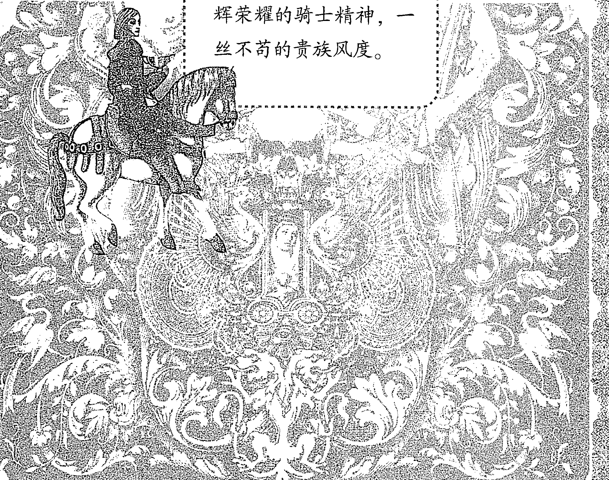

### 第一节 大阿卡娜

22张主牌是塔罗牌的核心，每一张都有自己的序号。它们描绘出复杂的、深层的内心反应。牌面上的图像能唤起很多东西，因为它们把深奥的象征与可识别的人物、境况结合起来。这种象征很微妙，但是很有效。

在塔罗解牌中，主牌一直备受关注。当一张主牌出现时，那个牌位上的含义绝非是平俗的、暂时的。它们代表了你最基本的、最关心的事：你的主要感觉和动机。

许多解牌者把这些主牌看成个人内心成长的不同阶段——有人称之为“愚人的旅程”。22张主牌就是心灵成长道路的路标，从最初的意识（第0号牌）开始，直到睿智与充实（第21号牌）。

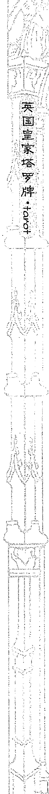

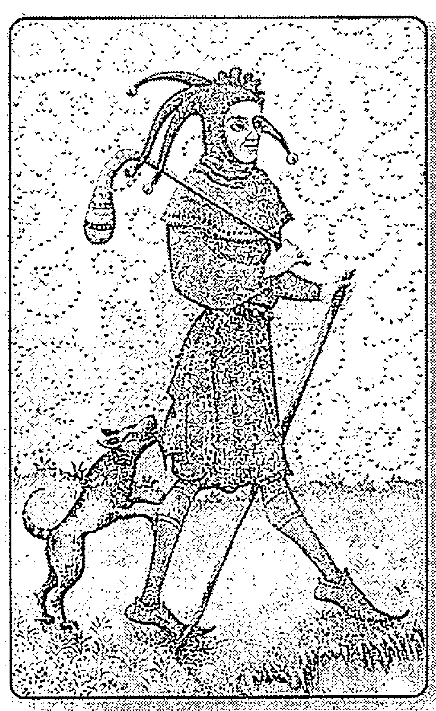

#### 0 愚人

关键词
开始 大胆 天真 旅行
大智若愚

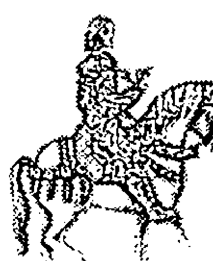

0 The Fool

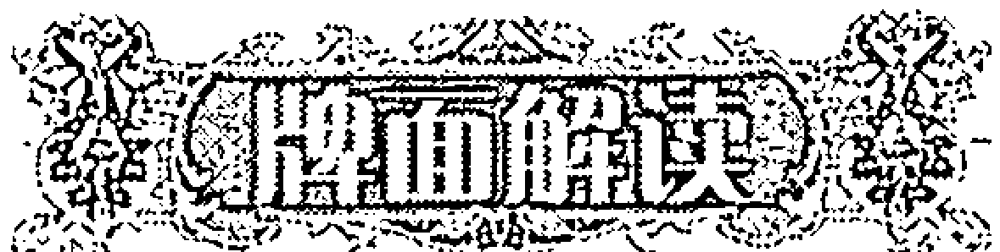

愚人穿着色彩鲜艳的衣服，带着像小丑一样的帽子，志得意满，面带微笑，昂首阔步，朝着悬崖走去。他是鲁莽而无知的，左手拿着象征权力的权杖，肩上搭着装满经验的包袱，然而他只是漫不经心地扛着，并不懂得运用这些经验。眼看他就要凭着直觉向万丈深渊走去，脚边的小狗惊慌地叼住了他的衣襟，然而他并不惊醒，依然故我地微笑着大步向前。有人说他与真理很接近，天才与白痴本只是一线之隔。这是一种四处漂泊的流浪行为，有人认为这是没有理想的空虚生活，但也可解释为是一种“无为”的理想状态。他用大智若愚的态度面对这个世界，单纯到近乎痴狂的个性使他放弃一切俗世的羁绊，即使面对的是不可知的前途，他也毫无畏惧。

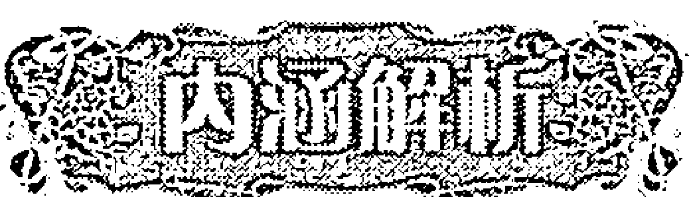

愚人是一张很特殊的牌，它的编号是0，其实是没有编号，它可以出现在任何地方。也许因为愚人象征旅程的开始，因此它处于整副塔罗牌的起首。愚人本身可以当作空白牌来使用，它包含着无限的可能，它可以是好也可以是坏，它同时包含着两种可能。

愚人是一个天真无知的形象，宛如一个初生的孩童，拥有无限的可能性。愚人是个旅人，他正要展开一次充满未知的旅程，他是如此充满着希望，以致看不清前面的重重阻碍。0这个数字代表着一切事物皆处于混沌未开的状态之中，没有善恶的分别。

愚人这张牌好坏杂糅，解读牌义时需谨慎思考，逆位的愚人牌不一定是正位的反义，而有它特殊的含义。将愚人牌作为空白牌时，则正逆位没有区别。

###### 正位牌义

- 好冒险、寻梦人、不拘泥于传统、自由奔放、从基础出发、流浪成性。
- 以独特的恋爱攻势获得成功、绚丽的罗曼史、独特的爱人、等待机会。
- 以独特的用功方式带来意外的效果、由于好奇心而对学业产生兴趣、掌握重点、寻找捷径、无法在不自由的环境下工作、热衷艺术及自由职业。
- 以轻松的方式交友就会很顺利、相识于旅途当中、以幽默的个性受到欢迎。
- 孤注一掷、有好奇心、追求某种新事物、打破规律、与众不同、流浪者。

###### 逆位牌义

- 低落、失败、漫无目标的旅途、散漫、愚昧的行动。
- 空虚的心情、轻率的爱情、对婚姻感到束缚、不顾众人的反对、无法专情。
- 成绩一落千丈、没有耐心、没有计划、经常迟到、猜题方向错误、临时抱佛脚。
- 因过于单纯而受到轻视、怪人、恶劣不合常理的言行、无节制而且粗心大意。
- 毫无理财观念、不脚踏实地、不在乎旁人的眼光、急性子、梦想发大财却无法成功、行为不检点。

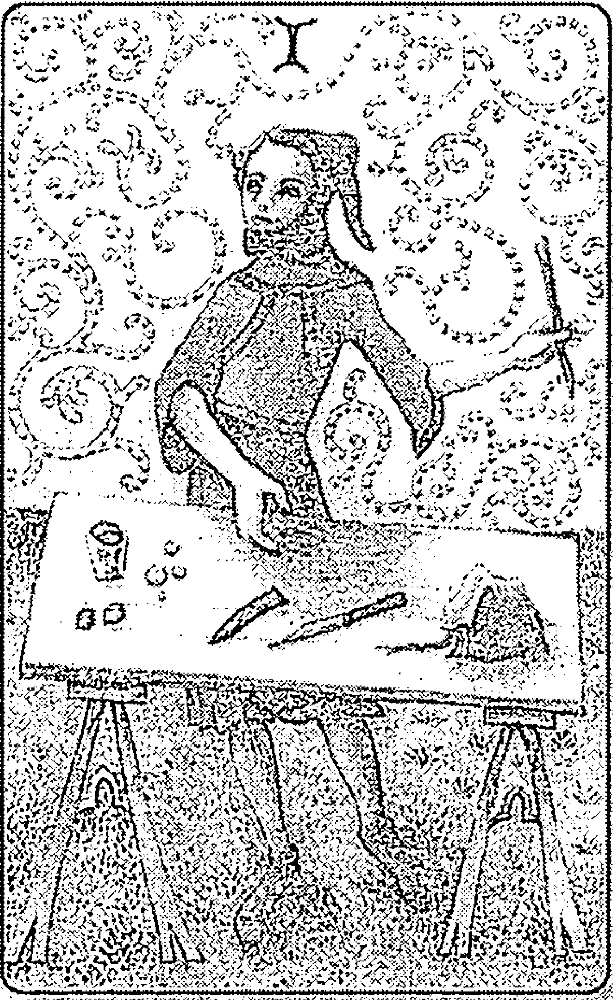

#### 1 魔术师

关键词
创造力 专心 新计划
控制力

I The Magician

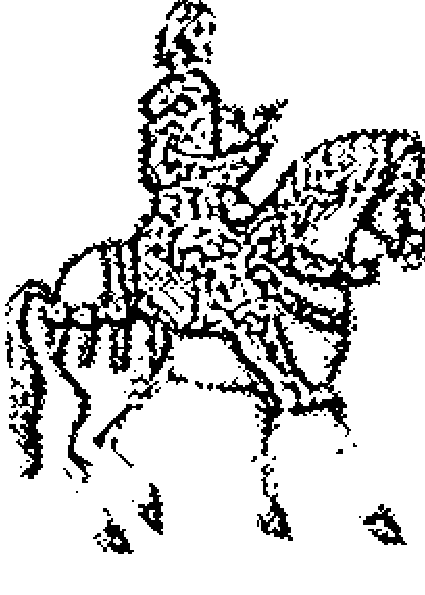

###### 牌面解读

魔术师表情严肃，双眼凝视远方，仿佛在思考什么重大的问题。他头戴热情和主动的红色布帽，身穿象征着火焰元素的红绒布衣服和红色皮靴，左手拿着权杖，面前的桌子上摆放好了圣杯、钱币和宝剑，这既代表四个牌组，也正是四要素的象征，这四种元素互相配合，将产生无比的创造力。在绿草如茵的环境里，他的智慧和法力在慢慢地聚集。究竟如何通过调和四大元素来平衡世界和时空呢？魔术师轻轻挥了一下手，自信地准备马上就要开始的秘法仪式。全神贯注的他仿佛背负着神圣的使命，犹如已经掌握了通向未知世界的钥匙。魔术师相当清楚自己的能力，他可以未卜先知，自由运用宇宙的四大元素使自身的力量达到最高点，因此，所有塔罗牌都将魔术师这张牌放置在1号的位置以显示它的重要性。

###### 内涵解析

魔术师代表着一切的开始，事物的开端，是他创造了这个世界，因此这张牌也同时代表着一个充满开创新局面的智慧和高度操作技巧的形象。1是所有数字的开始，代表沟通，因此魔术师是一张非常主动而有行动力的牌。他的行动经过清晰思考，所以很有把握与自信，与愚人未经过深思的大胆行动截然不同，这张牌表现出把梦想化为实质的概念，是一个潜力无限的开端，蕴含力量强大，正逆位不同，起落大，大悲大喜，结果明确。

魔术师手上拿的权杖是导引能量的工具，能量善加引导，可以事半功倍；反之则不仅无益，反而有害。逆位置的魔术师就可能犯这种错误，能量导引错误即精力用错地方。因此你应该运用自己的智慧与判断力，有效地支配发挥这股力量。

###### 正位牌义

1. 好奇心、有独创性、有发展性、以新的计划获得成功、幸福的开端。
2. 心灵相互契合的伴侣、受欢迎的对象、彼此的性格皆得以发挥、感情愉悦。
3. 读书获得好效果、充满效率的计划、注意细节、创意受到认同、艺术方面有创造力、于交际时获得更多的资讯。
4. 能够获得良师益友、彼此能够使对方发挥优点的组合。
5. 以合理的代价获得想要的东西、善于模仿、处理事情很机灵。

###### 逆位牌义

1. 无法下定决心、因学艺不精而败北、消极、容易受骗、光说不练。
2. 缺乏爱情的技巧、会受花言巧语的欺骗、无法专情、心情过于浮动、冷酷、无法向对方表达心意。
3. 预期的成绩没有起色、努力不足、撒谎会被拆穿、需要独特的念书方式、考试失误、一成不变的工作。
4. 因不明确的态度而丧失信用、虚假表面的交往、不够体贴对方、诈欺。
5. 容易乱花钱、因好赌而倾家荡产、听不进他人的劝告。

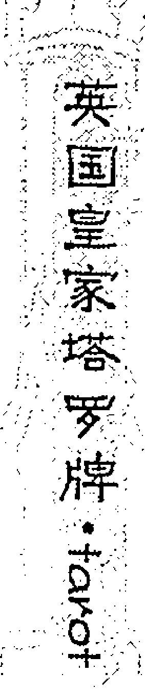

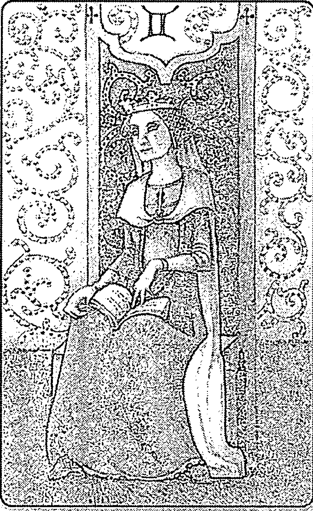

#### 2 女祭司

关键词
等待 智慧 理智 神秘

II The High Priestess

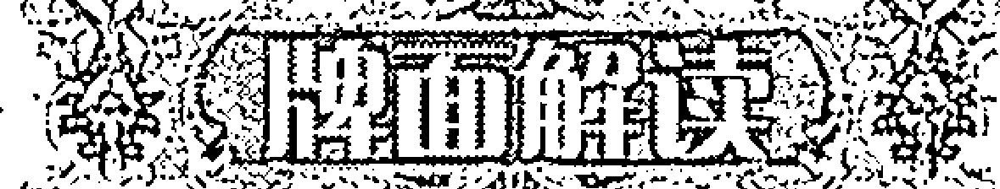

女祭司平和冷静的表情似乎是在浅浅地微笑，眉宇间却隐隐含着一股忧愁。她端坐于椅子上，双眼无意识地凝视远方，似乎正在心中沉思默想着某个人。身上穿的蓝衣、红裙和白色披风，象征着灵性与智慧，显示着她的冷静和睿智以及包容万物的爱心与温柔。手中的圣书则象征着她心里藏着神秘的智慧和戒律，仿佛要样样与法律对照，理性地判断事物而不会流于情绪化。由于她这种高度的精神修养，总给人一种深不可测、难以亲近的感觉。这本圣书也代表着古代流传下来的智慧，但同时也压抑了她的热情。宽大的外袍盖住了她的身影，因此她同时也代表着隐匿。

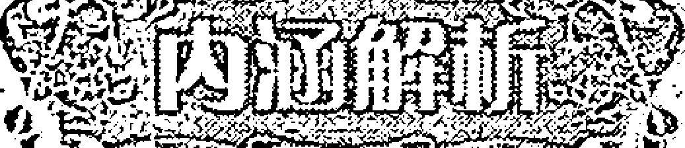

女祭司这张牌和月亮很有关系，她是真理的守护者，这是一种精神上的存在，不存在于现实。这张牌有很强烈听从直觉的意义，注重心灵成长和宗教玄思，往往也逃避情感。因此这张牌对感情的进展往往是不利的，而对命理玄学的学习则有极大的好处。这张牌也在提醒我们运用直觉、听从直觉，建议是宜静不宜动。不过女祭司的静，就像是两仪之中的阴，相对于魔术师的阳，代表着事物寂静、沉潜的一面，这张牌的能力和智慧是潜藏而不外露的。

在某些塔罗牌中，有时会用处女来代替女祭司，强调她坚守着纯洁和律法的灵魂，因此这个职位本身已经能给推测者很多讯息。这是一张意义明确的牌，因此若求问者为男性，则此牌代表关注他的女性，若求问者为女性，则此牌代表求问者自己。

###### 正位牌义

1. 有良知、文静、敏锐的观察力、理性、富有研究的精神、正确的时机或人将出现。
2. 理智的感情生活、柏拉图式的恋情、深藏内心的爱意。
3. 有责任感、有目标、有机会、考运佳、与教育相关的职业、有评论的才能。
4. 能互相谅解的友谊、良好的商量对象、能够倾心交谈、体贴的好友。
5. 善于理财、迅速的理解力、同冷静的女性商谈可获得新知、洞悉旁人的力量。

###### 逆位牌义

1. 缺乏理解能力、粗心大意、容易紧张、神经质。
2. 单恋、有洁癖、因冷漠而产生误会、任性、晚婚、无趣的女性。
3. 固执、不能集中全力、不用功、无法学以致用、焦虑、考试失败、想换环境又下不了决心。
4. 受到冷漠的对待、自闭、容易过于激动而得罪人。
5. 没有计划的花费、因任性而感到孤独、嘲笑别人、所有意见不和的对象都不理会、出人意料的小心眼。

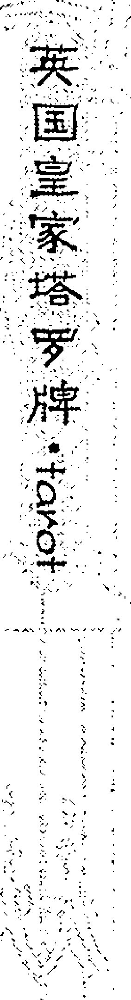

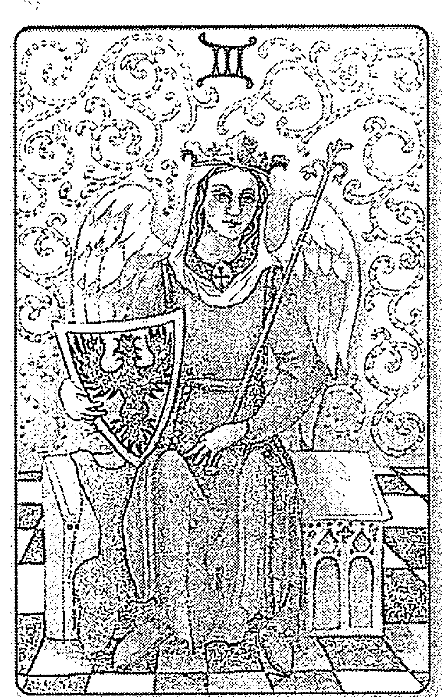

#### 3 女皇

关键词
高贵 丰收 母性 自然

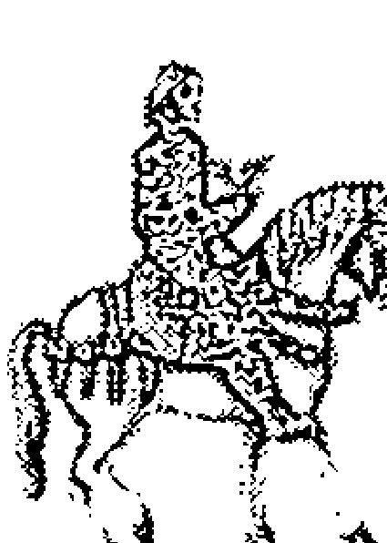

III The Empress

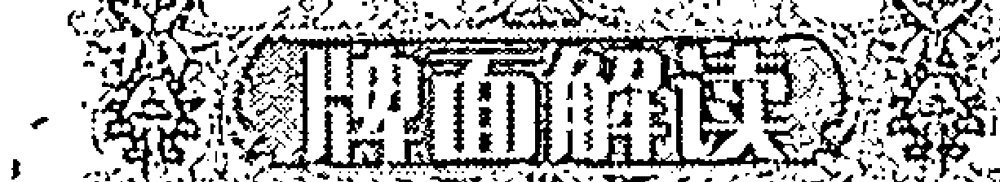

女皇穿着高贵的宝蓝色衣裙，显示出她所拥有的权威性。她头戴金冠，脖子上戴着金色的十字坠饰，手持象征权力的权杖以及金光闪闪的皇家盾牌，泰然坐在宝座之上，双眼慈祥地微微向下俯视，仿佛带着无限悲悯看着万亿民众。背后的一双白色纯洁翅膀凸显她的母性光辉，拥有宛如天使一般的神圣力量和高贵灵魂，她就是君临天下的万物之母。女祭司给人的感觉是位身具智慧而且文静的女士，而女皇则正好相反，她具有一种温和的包容力，会给人民带来繁荣和丰收。拥有优雅外表兼具天仙般气质的女皇给人们一种完美的印象，似乎她的心中蕴藏了无限深厚的情感，因此她也具有热情而奔放的个性，然而这种个性往往容易误导人们走入盲目的爱情之中。幸好，女皇的情思兼具了广阔的眼光和自我认知的理性，可以包容万物，而并不是过于自我的感情。

##### 内心描述

女皇牌相对于接下来要介绍的皇帝牌，这两者刚好是母性与父性的象征。女皇牌除了带有强烈的母亲形象之外，也代表着孕育万物的大地，是生命的成长之所。她是大地的母亲，代表丰收、富饶、成长。在感情上，她代表着热烈的情感，也代表着由女性主导，具有女性特色的力量。相对于女祭司牌的知性，女皇牌更加感性，更贴合女性之事。如果求问者是男性，则可能暗示与女性有纠缠，或女性气质强。

###### 正位牌义

1. 优雅的生活、艺术天分、丰收、繁荣兴盛、富足。
2. 有收获的恋爱、异性注目的焦点、令男性钦佩的女强人、富有母性的光辉。
3. 成绩进步、在艺术领域颇有成就、适合装扮和服饰方面的职业、优秀的感受性、在工作上很活跃的女性。
4. 开放而不拘束的态度给人好感、受人注目、聚会或派对的主角。
5. 意外之财、善于制造气氛、喜欢美丽的事物、贴心的人。

###### 逆位牌义

1. 迷惑、缺乏上进心、轻浮、损失、没有成就、爱慕虚荣。
2. 优柔寡断、没有结果的恋情、因任性而遭人厌恶、嫉妒、过于迷恋而无法自拔、缺乏女人味、遥远的婚期、意外地怀孕。
3. 浪费时间、懒惰、对学科过于好恶分明、成绩低落、缺乏集中力。
4. 锋芒毕露、过强的自尊心、因骄纵而失败、缺乏包容力。
5. 爱慕虚荣、不必要的花费、不被重视、要长久的时间才能获得成果、被母亲指使。

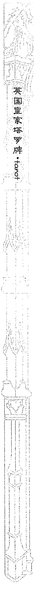

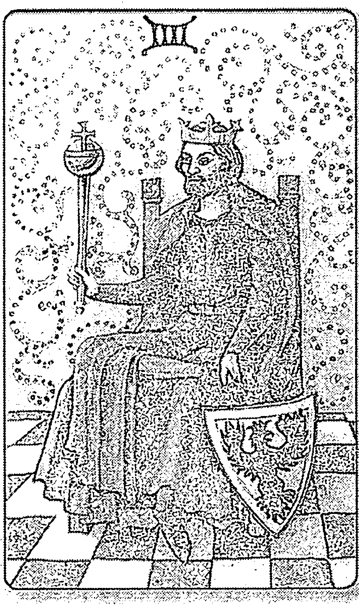

#### 4 皇帝

关键词
权力 统治 秩序 父性

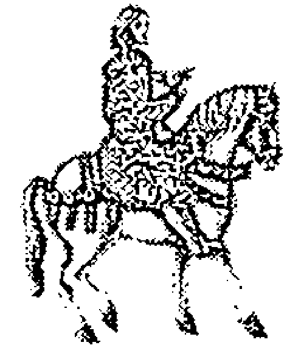

IV The Emperor

###### 牌面解读

皇帝是男性象征的代表，拥有主宰物质世界的支配力。一国之尊的他头戴皇冠，身着锦袍，右手拿着象征生命的古埃及十字架，充满自信地端坐于皇位之上，脚边摆放着绘有黑鹰图案的皇家盾牌。他的表情刚毅，充分显示出他所经历过的艰险战役和沧桑岁月。在登上这至高无上的皇位之前，他走过了一条多么漫长而艰苦的道路啊。他的身影使人感觉到高昂的斗志与决胜千里的信心，代表道德戒律与禁令。虽然皇帝拥有稳固的地位与强大的统治权威，但在威仪之后是一般人难以了解的孤独与焦躁，而不是想象的幸福和无忧无虑，这也暗示着有得必有失的道理。不及固然不好，但过多的也未必是你真正想要的。

###### 内涵解读

皇帝代表着父权的形象，他就是权威，严格而公正地执行着律法，他的话语是不可反抗的，代表着全然的支配和掌握，是一种绝对的男性形象。因此这张牌偏向秩序、规范和稳定的局面，拥有至高无上的权力。同时正因为这些理性和权威，他必须收藏起个人的感情，这就有了高处不胜寒的隐喻。

皇帝的编号是4，意味着四元素或四季，为一统宇宙与安定世界的力量，借以表达物质的需求，并象征着男性的权力与统御力。但皇帝既可以是明君，也可能是暴君，所以皇帝牌是可好可坏的。

###### 正位牌义

1. 有行动的魄力、领导者、稳定的根基、男性化、富有责任感。
2. 以锲而不舍的精神获得青睐、值得信赖和依靠、是主动的一方。
3. 钻研学业、保持优良的水平、极高的目标及理想、坚定的信念、考试顺利、擅长管理、愿意提供帮助。
4. 活跃的领导者、可信赖的朋友或学长、结交有力人士。
5. 对金钱感到满足、不服输的个性、坚忍不拔的性格。

###### 逆位牌义

1. 幼稚、缺乏管理能力、不负责任、任性、蛮横霸道、欠缺欲望。
2. 强迫的恋情、不可靠的对象、只有外貌而无内涵的对象、痛苦的结局。
3. 不适合长时间坐着的工作、没有干劲、没有领导能力、因过于自信而失败、从基础重新开始。
4. 因不负责任而遭受指责、固执己见。
5. 损失金钱、财物发生困难、虚张声势、事与愿违、自以为是。

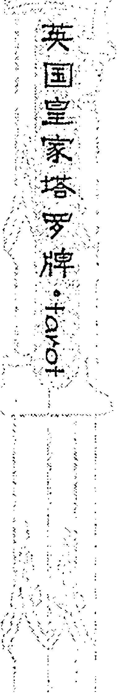

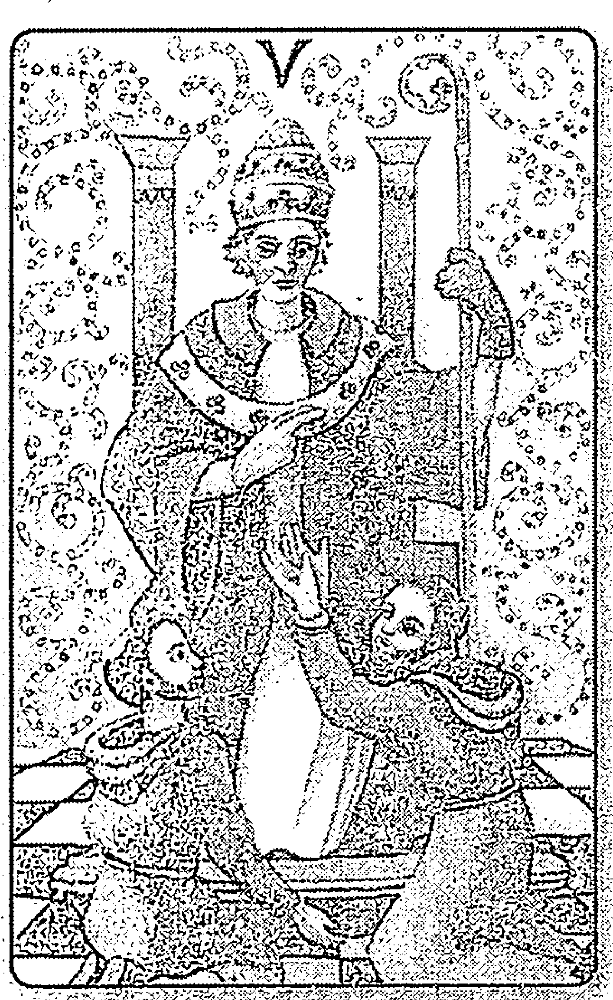

#### 5 主教

关键词
引导 援助 传统 教育

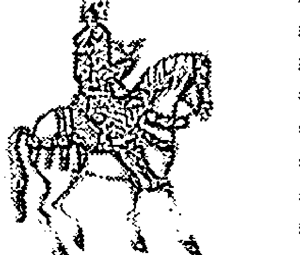

V The Hierophant

教宗身穿代表教职的大红法袍，端坐在信众之前。他头上戴着象征权力的三层冠冕，分别代表着身、心、灵三种层次的世界。他的右手食指和中指指向自己心脏所在的位置，象征着引导人们的心灵，左手戴着红色手套，手持金色权杖，代表弃绝肉体凡胎而接受圣灵的引导。教宗身后的两根柱子宛如一道半开半合的门，象征教宗是站在天国之门门口引领人心的带路使者。他的双眼微闭，浅笑着看着跪在他面前的信徒，他的目光慈爱，以无私的爱心对待跟随他的求道者。他安详的表情给人无比的信心，仿佛在他面前，一切的迷惘和痛苦都消失无踪。信徒眼中露出虔诚和感激的表情，伸出双手，向教宗乞讨心灵的平静和安宁，祈求教宗将他们迷失的灵魂引导向没有苦难和罪恶的天国。

##### 教宗

教宗和女祭司都是代表着支配有关宗教上与精神上的世界的牌，然而，二者有着很大的不同。女祭司严守着旧有的律法和知识，将有关宗教上的智慧当作是自己的涵养而深藏心中，是一个独善其身的形象；教宗则与女祭司所代表的神秘性精神不同，他代表把智慧视为一种真理，认为应该广泛地推广，他关怀人世间的一切苦难，愿以引导一切事物的智慧帮助愚昧的世人。哲理虽然深奥，但他以浅显的方式向求道者提供真正的忠告，为他们解释疑难迷惑，帮助他们获得真知。

教宗代表精神世界的权威，相对于统治者物质世界的皇帝，教宗是宗教、精神和心灵的领导者，一个绝对的权威，提供心灵成长与道德教育，是社会规范和社会责任的化身，用言论指引人们走向正途。

###### 正位牌义

- 受到信赖、得到援助、良好的建议者、有宽大的胸怀、有宗教情绪。
- 对恋情慎重、良缘、有媒人的牵线、逐渐加深的恋情、长久持续的交往。
- 遇到良师而成绩进步、会出现对自己有帮助的人、与同学一起用功而获益、拥有强韧的耐性、思想保守、适合顾问、医学或以谈话为主的职业。
- 获得学长的谏言、获得父母的帮助、能够为朋友着想。
- 最好看紧钱包、借改变环境往好的方向前进。

###### 逆位牌义

- 失去信赖、多管闲事、过于依赖、度量狭小、孤立无援。
- 缘分薄、步调过于缓慢、彼此不能够体贴、占有欲过重、父母反对、诚心相待比礼物攻势更有用。
- 因讨厌老师而对课业失去兴趣、过分依赖同学的笔记、得到错误的情报。
- 自以为是、没有必要的义气。
- 因助人而损失金钱、无人援助、心胸变得狭窄、太过亲切只会显得多管闲事。

#### 6 恋人

###### 关键词

开端 结合 选择 性欲

VI The Lovers

###### 牌面解读

世间的爱情并不都是美满的，长着一对纯洁翅膀的爱神丘比特能够将盲目的爱情之箭射中恋人的心，使他们和谐统一。在象征着光明和美好的阳光中出现的丘比特手握长弓，但并没有准备爱情之箭，因为他身下的那个男人正站在两位少女之间，不知如何作出选择。两位少女同样青春美好，一位比较热情奔放，一位比较腼腆内向，然而如初绽的蔷薇一般的面颊和鲜嫩的嘴唇都散发出处子的芬芳，她们都伸出一只手臂，向这位男子提出爱情的要求。爱情毕竟是自私的，从来不能是三人行，那么，究竟要选择哪一位呢？丘比特将在这位男子作出选择的时候，再拿出他的爱情之箭，射向他所选中的那位幸运少女。

###### 内涵解析

在普及版本的伟特塔罗牌中，传统的恋人牌构图被改变了，成为伊甸园里的亚当夏娃在大天使拉斐尔的祝福下相爱的场景，因此这张牌被更加强调了爱情和性欲的因素。然而在其之前的传统塔罗牌中，恋人牌的构图却不是这样，通常绘有一个男人在两个女人之间进行抉择，因此就传统而言，恋人这张牌的通常意义是意味着选择，它的出现经常代表当事人面临重大抉择，不仅是在所爱的人之中作出选择，更可能是在无法割舍的两件事物之间作选择。有时是理智和情感的抉择，有时是现实和理想之间的取舍。

一旦出现这张牌，当事人必须分外谨慎，因为他所作出的抉择可能对他产生重大影响，此时要仔细思考自己究竟要什么，才能做出好的决策。

###### 正位牌义

- 幸运的相遇、同心协力、情投意合、丰富的感情、美好的前途、一个拥有无限可能但又都无法确定的时机。
- 在团体活动中结识进而结为连理、经友人的介绍而发展的恋曲、从朋友成为恋人。
- 有好机会、以团队精神获得成功、观察力敏锐、擅长文科、出现好帮手。
- 人际关系良好、社团活动顺利、朋友增加、有幽默感、活泼。
- 没有金钱的烦恼、以直觉判断事物。

###### 逆位牌义

- 离别的时刻、想要转移目标、关系结束、没有协助者、遭遇阻碍。
- 移情别恋、别离、水性杨花、短暂的恋情、朋友虽多却没有固定的恋人、抓不到对方的心。
- 没有兴趣用功、没用的计划、不能持之以恒、缺乏集中力、成绩不佳、集体学习效果不好。
- 朋友不合作、与旁人意见不合、社团解散、交不到好朋友。
- 资金短缺、破财、表里不一、容易受到诱惑、变得笨拙、闷闷不乐。

#### 7 战车

###### 关键词

前进 胜利 意志 旅程

###### 牌面解读

战车上端坐着一位英勇的战士，他正要远征异乡，脸上洋溢着得意非凡的表情，不可一世。他身穿战斗的铠甲，头戴胜利的桂冠，手握锋利的宝剑，炯炯有神的目光直视着正前方的征途，家乡种满绿色树木的山丘已被他抛在身后。由于对自己的能力充满了自信，并不愿意保守于现有的封地，强烈独立的个性使得这位战士要凭着自己的力量去争得更多的财富和荣誉。在民众的欢呼声中，他已经充满信心地踏上征途去探求未知的世界。崭新的战车上镶嵌着象征家族荣誉的徽章，拉着战车前进的是两匹白色的骏马，分别配带着红色和蓝色的缰绳。不过让人担忧的是，两匹战马的表情都有些迷惘和胆怯，和战士冲天的斗志形成鲜明对比。它们所要前往的方向似乎正好相反，那么这两匹战马将把这辆战车拉往何方？

###### 内容解析

战车向着胜利的道路前进，似乎没有人能够阻挡，但是有时候却往往因为冒进而失败，因为没有认清应该行驶的方向。拉着战车的两匹马正象征着人类的理性意识和无法掌握的无意识部分，这两者有时候是会南辕北辙的。必须坚定地掌握住缰绳，维持住两边的平衡，让两匹马同心协力向着一个方向前进，才能往正确的道路驶去。

因此战车这张牌，往往代表着如何自我控制内心与周遭的矛盾，努力地充实自己，多尝试不同的体验，不断开发自我，而找到一片属于自己的天空。

###### 正位牌义

1. 以有效率的方式进行、把握先机、担任指挥、对所有事物都有积极的态度。
2. 情场的胜利者、积极的交往终于成功、遇到喜欢的对象会猛烈追求。
3. 独立作业、以自信心完成、成绩进步、迅速调整情绪能够提高完成的效率、经得起激烈的竞争、及格过关、与娱乐有关的工作将会带来好运。
4. 交游广阔、个性活泼、灵活周旋、独立自主。
5. 考上驾照、搬家、对新鲜的事物充满兴趣。

###### 逆位牌义

1. 无法控制、突发事件、胡作非为、失败、停滞不前、因焦虑而失败。
2. 过于鲁莽、遭到抛弃、因懦弱而无法进展的恋情、缺乏理智的恋情将遭受挫折、出现强劲的情敌。
3. 对不想做的事情缺乏责任感、对课业不感兴趣、成绩及效率低落、经常脱轨。
4. 固执的争论、因任性引起旁人的不满、过于消极。
5. 损失钱财、不懂节制的花费、赌博失利、超速驾驶、散漫的注意力。

#### 8 力量

###### 关键词

意志 力量 勇气 耐心

VIII Strength

一位纤弱的女郎伸出她的纤纤素手，轻柔地合上狮子的大嘴。凶猛的狮子嘴里长满了利齿，然而在女郎的手中，尖牙利齿一点也派不上用场。狮子伸出了两只张着利爪的前腿，但却无法反抗女郎的神奇力量。女郎面带微笑，仿佛在抚摸一只温驯的小狗一般，谁能想到她柔弱的身躯里竟然隐藏着征服猛狮的力量呢！在女郎的力量之下，狮子高高地翘起了它的尾巴，就像宠物向自己的主人献媚一般，健硕的躯干完全屈服在女郎的手下。女郎的表情没有一丝憎恨与嫌弃，反而略带着些许的怜悯，似乎是很同情狮子的兽性。作为百兽之王的狮子，本意味着不被征服，然而在女郎冷静慈悲的目光中，原本充满敌意与伤害的兽性也缓和了几分，彻底被她征服了。原来力量虽然是胜负的关键，但却不是征服别人的唯一因素，以柔克刚才是更高的层次。

###### 内涵解读

作为力量的代表竟然是一位女性，这既意味着清廉的操守，更意味着上善若水、以柔克刚才是能使人游刃有余的智慧。狮子象征人内在的兽性，战车用阳刚的铁腕作风来控制，力量则用她内心的勇气、信心和耐心来驯服。因此拉着战车的马在强力的控制下还会奔向不同的方向，而凶猛的狮子则能够彻底顺服，这或者暗示着柔弱和刚强两个极端正是相生相克的吧。

人的一生当中，失败挫折与危险障碍是在所难免的，必须要有强大的意志力和坚定的信心、决心才能通过重重难关。同时对隐含在本能的七情六欲中的兽性，更需要耐性去克制。所以这张牌也暗示着自我控制的重要性。

###### 正位牌义

1. 精力充沛、不屈不挠、扭转乾坤的意志力、潜藏的力量。
2. 过于热情、获得恋情、克服障碍长相厮守、恋情的主导者。
3. 突破难关、全力发挥、将居领导地位、喜欢受人所托。
4. 获得热情的赏识、以果断的言行受到赞赏。
5. 一大笔开销、果断的投资、有胆量、信念坚强的人、只要认为正确就会努力不懈、强烈的自我、在社团活动中相当活跃。

###### 逆位牌义

1. 精力不足、急躁不安、危险的赌注、丧失信心、忍耐力不足。
2. 懦弱而不能坚持爱情、虽然积极也得不到成果、因自满及装腔作势而造成阻碍、经不起诱惑。
3. 学艺不精、没有力量继续下去、欲速则不达、好高骛远、只偏重某方面。
4. 因过于任性而破坏团体的和睦、禁不起友人的诱惑、对交友失去信心。
5. 赌输、透支、不善理财、输不起、自私自大。

#### 9 隐士

###### 关键词

本性 内省 指引 孤独

IX The Hermit

这位在深山中离群索居的隐士远离了人世间的虚伪和尘嚣而寻求真知，他身穿灰白斗篷，站在山巅，陷入了寻求真理的沉思之中。他的右手高举着一盏明灯，象征着真理的指引，淡淡的灯光似乎在山顶的一片混沌中照亮了一条通往真理的道路。隐士的左手拄着一根族长之杖，这根杖在愚人、魔术师和战车中都曾经出现过。然而愚人太过天真，不知道杖的魔力，只借它的力量来行走；魔术师则运用杖的法力施行法术；战士将杖变化为宝剑；隐士则杖交左手，用以在启蒙之路上作前导。在隐士的周围，似乎能感受到空气轻微的流动，仿佛盲目者都能够通过他的引导找到黑暗中的道路。隐士举步在悬崖之巅是孤独的，他追寻的是性灵的成长，远离人群和交际，内心平静，希望寻到真理之光。

###### 内涵解析

这位修行的隐士，不固执自己偏狭的观念，将目光转向更宽广的领域中。

隐士和愚人同样都站在悬崖顶端，愚人大踏步地向前走，隐士却十分谨慎。因为隐士是成长之后的愚人，他花白的胡子似乎在告诉我们他已经积累了足够的经验与智慧。探寻真理的路是艰苦而漫长的，不但要能忍受得了寂寞，更要不时地自我反省，以开阔的胸怀去认知一切，才能求得正道，修得正果。

隐士远离人世间的纷扰，摒弃忙碌劳顿的生活，走向寻求智慧的道路。寻求的另一面就是舍弃，这意味着你必须舍弃生命的某些部分，而去追求另一个更高的境界。

这张牌如果出现在牌阵的中间，则可以比较简单地解释出来，但如果出现在结果部分则含义比较难解，此时不妨考虑重整牌局，或者注意从一些细微之处寻找出答案。

###### 正位牌义

1. 自信、理智、坚持不懈的心态、冷静的行动、为了新的开始而远离所有事。
2. 默默的相思、以单纯的心思慕、追求精神层次的结合、永存的恋曲、单恋、不将情感形诸于色，理性的爱。
3. 一板一眼、拟订长期计划、注意细节、杰出的分析能力、适合以辅佐的方式出现、要求稳定、勤勉、遵守规则。
4. 清楚自己的立场、与任何人都能够以礼相待、因内敛而受到信赖、肯进忠言、有独特的思想及行动。
5. 开源节流、写日记、订计划。

###### 逆位牌义

1. 泄露秘密、俗气、神经质、不能通融、不理智、多疑。
2. 怀疑爱情、不敞开心扉、孤寂的心灵、轻浮的恋情、对爱侣下意识的挑剔、缺乏告白的勇气。
3. 因注意力不集中而造成错误百出、没有发挥实力、考试不顺利、随便贬低他人成就。
4. 对旁人失去信心、因自卑而困扰、孤僻、别扭。
5. 无谓的花费、若不懂得节制将花大钱、小气、随便判断别人的想法、跟自己过不去、短视近利、心胸不宽大。

#### 10 命运之轮

###### 关键词

运转 命运 契机 转折点

X The Wheel of Fortune

###### 牌面解读

命运之轮是唯一一张没有人物的大牌，可见这张牌的独树一帜。田野当中竖立着一个金色的大轮，然而它既不是用于耕作的农具，也不是具有田园风光的风车，三个长得像恶魔一般的诡异动物快乐地推动轮子的运转，站立在轮子上方的恶魔手持象征智慧和争夺的锋利宝剑，冷冷地看着世人。谁能知道这个轮子竟然掌握着世界的命运，每个人在冥冥中都不知不觉地加入到了它的轮转中呢。光怪陆离、形形色色的百态人生也正像是随着轮子而回转的，服从着变幻无穷无法掌握的命运。

###### 内涵解读

命运之轮的转动正是人生命的转动，它无时无刻不在轮回变化中，这正暗示着坎坷的人生旅程。世界上的万事万物都是时时变动不羁、循环不已的。在无穷的流转中，总有一个能够维持均衡和平的真理。

这张牌接近于22张大牌的正中，意味着一段旅程的结束，也是另一段旅程的开始。它表现了命运的不可预测和变幻多端。当命运之轮转动时，犹如人生潮起潮落，祸福变化。命运是变化的，同时又是循环往复的。命运之轮表示新的开始，新的轮回，所以当命运之轮牌预示着不好的结果时，同时也可能暗含着否极泰来的意义。人不应被困境所击倒，因为顺逆都不过是循环的一部分罢了。

###### 正位牌义

1. 掌握时机、机会来临、转变期、意外的幸运、当机立断。
2. 命运的邂逅、一见钟情、遇到新对象、爱情的好机会、运气逐渐上升至可以结婚。
3. 好运来临、确立前途、转换方向的好时期、弹性的计划、考运佳、有人伸出援手。
4. 意外得到贵人相助、有利的环境、随机应变。
5. 临时的收入、意外之财、幸运降临、得到机会、想到的事情立即进行。

###### 逆位牌义

1. 判断错误、低潮期、运气不佳的时刻、左右为难。
2. 缺乏要领的交往方式、不稳定的恋情、逐渐冷却的恋情、失恋、错失良机。
3. 拼命努力却没有成果、成绩下降、效率没有预期的高、经常误解、突然改变计划、希望落空。
4. 误解较多、人际关系不稳定、白忙一场、意见不和。
5. 超支、小心被骗、一时的幸福、缺乏变化的生活。

#### 11 正义

###### 关键词

公正 平衡 责任 决定

XI Justice

###### 牌面解读

正义女神端坐在审判的宝座上，右手拿着锋利的宝剑，垂直竖起。她身穿端庄的长袍，披着宝蓝色的披肩，头上戴着金色的冠冕，双眼直视前方，目光中没有一丝一毫的怜悯，显示出公正的冷漠。直举的宝剑象征着她的决心，不偏不倚则表示她的公平决断，并且智慧可以戳破任何虚伪与幻象。宝剑两面都有刃，表示既可行善，又可为恶，只看她如何选择。她的左手拿着金色的天秤，表示她正在评估，同时追求平衡。一旦她做出决定，就要用右手的宝剑进行裁决。女神的全身透露出一种冷静而凌厉的气质。

###### 内涵解读

宝剑的双刃代表着只有对自我先反省与先约束才有资格去裁定别人的是非；天秤象征着维持均衡的智慧，在这充斥私欲的世界上，只有适当地协调他人与自我的对立，才能公正地判断曲直是非。想要维持公正的判决，并不是件容易的事，必须有敏锐的观察力并且能够自我内省，所以剑与天秤缺一不可。世界上没有绝对的对或错，女神手中的天秤似乎就说明了这一点。

正义牌整体呈对称模式，正义女神长相中性，这暗示着天秤追求平衡的特性。正义女神同时也是法律的化身。这张牌的出现，通常代表与某个决定有关，需要用心中的天秤来衡量各种因素而做出决定。它暗示着，不论何时何地，都要坚持道德与正义，要有宽容的心胸，不可受利益影响而偏私。

###### 正位牌义

1. 诚实、公正、在两者之间调解争端、维持平衡。
2. 和温文有礼的对象交往、彼此能平衡、诚实的爱情、学业与爱情兼顾。
3. 各科成绩都很好、工作与家庭兼顾、做人成功、个人学业和社团活动兼顾、和法律有关的工作。
4. 能够对他人公平地对待、适合担任解决争端的角色、讲义气。
5. 贷款获准、财运上升、得到应有的代价、爱好和平。

###### 逆位牌义

1. 不公平、有始无终、以自己的意见去断定、不能两全、不均衡。
2. 个性不合、不顾后果的交往、脚踏两条船、单恋、出现第三者、不诚实的态度。
3. 无视规则、各科成绩差异过大、过于守旧导致失败、缺乏能力及自信、作不正当的事。
4. 缺乏道德观念、滥好人、左右为难、对朋友过于挑剔。
5. 财务危机、借贷引起纠纷、暧昧不清、对自己不利的状况、偏袒某一方。

#### 12 倒吊者

###### 关键词

牺牲 以退为进 顺其自然 等待

XII The Hanged Man

###### 牌面解读

这张牌图案简单，含义却十分深远。一个男人一只脚被捆绑地倒吊着，这时候他身上的东西都已经散落在地上。他两只手背在身后，形成一个三角形；一条腿屈起，两腿交叉形成一个十字。十字和三角形结合起来，就是一个炼金符号，象征伟大事业的完成，也象征低层次的欲望转化到高层次的灵魂。这个男人虽然被倒吊着，但他的表情却似乎很平静，不做一点挣扎，却反而好像陷入了沉思冥想中。他情愿做出这样的自我牺牲，即使肉体毁灭了，灵魂也会永远存在，他深悟其中的道理。再糟糕的情况，只要耐心等待，厄运终究会过去。如果把这张牌倒过来看，倒吊者就不再是倒吊的了，他的姿态看起来反而像世界牌中的舞者。这暗示着倒吊者最终能够看到事物真实的模样。当一个人处于生死边缘的时候，往往会有更多的感受与领悟，这时如果能抛开一切执着，顺其自然地发展，人生将会有不同的面貌。

###### 内涵解析

这张牌含有自我牺牲的精神，表示灵魂不灭，即使失去自由不能行动，却能以极其平和的心态来面对多变难测的未来。倒吊者的沉静安详，是他以肉体的痛苦换取心理的满足。这张牌代表着必须有所付出才能有所得，也代表着必须试着以不同的角度面对自己的问题，才能获得认清事实的智慧。

倒吊者和命运之轮以及正义这三张牌，都可以看作大牌的中点。命运之轮是转折点，正义是中心，而倒吊者的编号12正是世界21的相反，即表示这是倒过来的世界。倒吊者与愚人也有共同点，他们都敢于与众不同，做自己真正想做的事。愚人主要出于本能，而倒吊者则出于深沉的理解，因此他不畏惧世人的眼光，把自己倒吊过来。

这张牌与正义也有着对应关系，正义裁定了是非罪行，倒吊者则表示被处刑罚的服刑状况，紧接其后的是一张象征终止的死神，这一连串牌是塔罗牌中最冷酷的场面。

这张牌的出现，正位是有偿的牺牲，逆位则可能是无偿的牺牲，或者是不付出的意思。关键是弄清楚面临抉择时，这一次牺牲是否有价值。

###### 正位牌义

- 1. 无法动弹、牺牲、因小祸而获大福、因困苦劳顿而成长、以不同的角度去看待事物。
- 2. 经得起爱情的考验、明知有挫折却依然不肯放弃、将有所牺牲。
- 3. 一定要有耐心、努力就会有成果、看起来很难、不妨以直觉判断、不可偷懒。
- 4. 经常扮演吃亏的角色、只要咬牙忍耐必有好转的一天。
- 5. 花钱消灾、因助人而损失金钱。

###### 逆位牌义

- 1. 没有希望、白费力气、没有必要的付出、自我毁灭。
- 2. 得不到回报的恋情、没有发展的希望、不值得奉献的、失去耐心。
- 3. 无法忍受严苛的环境、因过于被动导致成绩退步、努力无所获、反效果。
- 4. 没有代价的付出、拘泥、杞人忧天、漫无目标的外出将有意外的支出。
- 5. 情绪化的花费、态度恶劣、缺乏实行能力。

#### 13 死神

###### 关键词
结束 转变 新生

XIII Death

###### 牌面解读

一个骷髅穿着褴褛的衣裳，手持金色的镰刀，轻悄地走在绿草如茵充满生机的大地上。它穿着一双黑色的便鞋，因为它并不是为整个世界带来死亡，只是前往带走到了生命终点的某些灵魂，因此不愿意让白骨的寒气传染这片绿地。残破的衣袖遮不住它的臂骨，从中透出一股死亡的白骨气息。金色的镰刀倒悬着，锋锐的巨大刀身让人充分感受到死亡的残酷和无法避免。然而削瘦的死神却能够轻巧地拿起这把镰刀，因为它就是掌握死亡和终结的神祇。它微微偏过头来，黑色空洞的眼窝里看不出一丝表情，然而它的嘴角却微微扬起，隐隐露出诡异的微笑。莫非它所凝视的你，就是它今天将要去引导带走的那一个吗？

###### 内涵解析

骸骨象征着最后的破坏，表示着要毁灭一切生命力与创造力，所以这张牌暗示的含义是要能立刻当机立断，迅速地下决断，在终止与重生之间做一个明确的抉择。生命走到尽头的同时，也是新生命的诞生。任何事情的结束也同时是新的目标的开始。如果想彻底革新进步，就要将一切陋习与腐败完全抛弃掉，这也暗示着先有破坏而后有建设的重要性。

在西方，13一直被认为是个不祥的数字。然而这第13张塔罗牌死神却不如想象中那般的可怕。这张牌代表着转机，必须结束旧有的生命才能迎接新生命的开始，虽然那并不能保证是个更好的新生命。

虽然这张牌名为死神，但肉体死亡的含义在推测中是很罕见的，死神牌更大的意义在于代表着各种形式的结束。

| 正位牌义 | 逆位牌义 |
| :--- | :--- |
| Ⅰ 失败、厄运连连、进入死路、来不及、绝望。 | Ⅰ 扭转方向、改变形象、奇迹似的东山再起、脱离低潮期。 |
| Ⅱ 隔阂加深、和对方分手、分居、分离、不幸的相逢、冷酷的爱情。 | Ⅱ 主动展开攻势将有好结果、感情好转、绝望后重新燃起爱的希望、破镜重圆、萌发新爱苗。 |
| Ⅲ 死气沉沉、成绩跌到谷底、没有进展、后继无力、事物呈停滞状态、考试不顺、必须离开工作岗位。 | Ⅲ 有决断力、以新的计划重新开始，好转、挽回劣势、更换助手。 |
| Ⅳ 关系恶化、友情出现裂痕、忧郁自闭、朋友遭受不幸。 | Ⅳ 和解、既往不咎、倍加亲密、新友谊的展开。 |
| Ⅴ 奢侈成性、不经考虑的购买行为、过于顺应自己的情绪而不顾后果。 | Ⅴ 失而复得、脱胎换骨的时机、开拓的勇气、果断的决定。 |

#### 14 节制

关键词
协调 配合 平衡 关心

XIV Temperance

###### 牌面描述

有着可爱金发的天使头上戴着镶嵌了白色花朵的绿色头冠，正在将代表灵魂的水从一个圣杯倒入另一个圣杯。她脚下的绿地代表意识，水代表无意识，两个圣杯分别代表着物质和精神，象征着在物质和精神方面的渴求。当两只圣杯都注满时，便可以取得平衡，走向成功。调节圣杯里的水不让它漫溢出来的，就是这张牌里暗含的节制之力了。杯子里的水象征着人们有限的生命，必须不断地交流，犹如活水一般，这样才不会腐败，并且还有净化的作用。保持生命之水流动的节制之力体现出来的是适度的自我克制。在充满诱惑自由放任的世界里，找到自我的平衡是多么必要。节制的能量从表面看起来，也许没有激情，但是它是飓风中的宁静。四处都是旋转的风，但是中心是一个安静的点，使所有的东西都保持平衡。这是一种令人鼓舞的团结的力量。这样的人，散发着沉静的力量。平静和从容中，不知不觉已获得成功。

###### 内涵解析

节制代表完全、和谐、净化和治疗，也代表了适度的需要和平衡的必要。杯中的水不断地以一种舒缓的节奏流动，这是一个疗伤止痛的过程，治愈身心，也使得事情渐渐好转。妥协和合作是非常重要的，应该寻找一切机会使对立的双方结合为一体。

节制同时代表着缓慢的意义，必须以一种自制、温和、充满耐心的态度面对问题。如果加入一个新元素，节制便意味着改变。通过重新结合，节制也就代表了事物可能面临一种渐渐转化的契机，我们能够找到一个理想的解决方案。

###### 正位牌义

- 调理整顿、在平淡的重复中发现关键、关注自我需求也兼顾他人的意愿。
- 能够有所差异的交往、爱情弥坚、心心相印、有节制的交往、心灵相通。
- 很好的直觉、反复学习获得良好结果、交流会有收获、人事变动。
- 能够与各种不同的人相处、毫不做作、体贴。
- 在流动的资金当中获得利益、善于节俭、可以控制、家族的凝聚力很强、互相协助。

###### 逆位牌义

- 缺乏调整能力、耗费过巨、遗忘初衷、消耗殆尽、没有节制。
- 三心二意、不善于控制恋情、往错误的方向发展。
- 过于情绪化、陷于低潮、单方取消、过于浪费、时机不佳、进展不顺利。
- 因无法控制自己的情绪而得罪别人、不和睦。
- 金钱的纠纷、不节制的花费、平均分担费用、沉闷的说教。

#### 15 恶魔

关键词
诅咒 沉沦 欲望 物质主义

XV The Devil

###### 牌面解读

恶魔支配着黑暗，长着一对蝙蝠一般的肉翅，头上长着羊角，生着羊腿和偶蹄，象征着动物的本能与天性。他的驴耳朵代表着固执，男女同体的模糊性别说明它集合了人类的一切欲望。他的左爪拿着锋利的宝剑，象征着物欲是把双刃剑；右爪张开指向天空，仿佛要抓住受到诱惑的众生。恶魔垂下眼睑，耷拉下血红的舌头，用轻蔑的表情冷笑着俯视面前受到束缚的两个异形生物。这两个杂糅的奇怪生物原本都应该是人，但由于受到欲望的引诱，缺乏自制力而沉沦，由此受到恶魔的诅咒，失去了人类的形体，被绳索束缚，站在恶魔脚边，无法逃脱。其实系在他们脖子上的绳索是他们自己套在身上的。可见人们心中隐藏的种种恶性化身而成的魔鬼多么可怕，他狰狞而诡异的脸孔给人恐怖不祥的印象，他的力量需要多么强大的意志才能够抵抗。一旦屈服于恶魔的轻声细语之下，便跌入万劫不复的深渊。

###### 内涵解析

恶魔这张牌有时被称为撒旦或黑魔术师，象征着人们心中隐藏的欲望和罪恶，这些往往会诱导人们走入歧途而导致最后的灭亡。恶魔是由人内心的欲念而生，这张牌代表你被自己的欲望所束缚无法自拔。被自己的自私和骄傲所困，还有什么比这更容易毁灭一个人呢？

诱惑是恶魔牌的重要含义，诱惑在于心灵，这张牌提醒我们保持内心自省的状态，暗示着要去克服种种欲望与自我堕落，不再限于爱欲贪嗔的心理矛盾中，如此便要具有坚定的信心与自我控制的能力，才能战胜懦弱的人性而不受到诅咒，成为恶魔的俘虏。

###### 正位牌义

- 受到拘束而感到不自由、卑躬屈膝、隐瞒事实。
- 过于紧张、无法真实地展现自己、秘密的恋情、心胸狭窄、只会想到不好的。
- 因诱惑而荒废学业、受到束缚、对自己过于严厉、对管教感到不满、施加暴力、受到不良的诱惑、陷入秘密团体、屈服、阴险的人。
- 被骗财、欠债、套牢、不该有的收入、艰苦的生活、过于忍耐、恶劣的条件、秘密行动。

###### 逆位牌义

- 摆脱不良诱惑、断绝、有脱离现状的机会、获得解脱。
- 结束拖延的恋情、摆脱感情的困扰、陷于肉欲之中。
- 向较弱的科目挑战的机会、离开无法忍受的工作环境、摆脱重担、想要独立发展的人要慎重行事。
- 断绝不良的关系、放弃私欲、恢复理智、改善人际关系。
- 脱离控制、转亏为盈、转型投资的时机、转为自由、解除负担。

#### 16 塔

关键词
毁灭 意外 天启 邃变

XVI The Tower

###### 牌面解读

原野远处伫立着一座高高的华丽之塔，然而此时它受到了雷击，正在坍塌，即将毁灭。高塔象征物质，天上的雷鸣电闪则意味着神的愤怒与制裁。地上倒下的两个人说明人类即使有再大的本领，也无法抵抗自然的力量，无法违抗神的旨意。高耸的塔象征着人类的高傲和自满，就像《圣经》中的巴比伦人建的巴别塔一般，妄图通向神的领域，这也是遭受雷击的根本原因。塔的坍塌和毁灭代表着结束，闪电代表着突如其来的意外灾难。或许和死神的意义相结合，塔是一个强制的结束，必须先有完全的破坏才能重建。

###### 内涵解析

从第13张牌开始，通过死神尝过生死边缘滋味的人们，很可能会在不同的环境中靠节制得到净化身心的机会。但如果不能彻底自我反省，则将沦为恶魔的俘虏，被囚禁在塔中，遭受各种打击与折磨。这或许也是为什么暗示毁灭的塔这张牌紧跟在象征诅咒的恶魔牌后面。

在22张大牌之中，塔的意义最为不好，提醒自我反省的意义相应地也更加强烈了。但是，没有非常的破坏，就没有非常的建设。解脱高塔的牢笼，未尝不是置之死地而后生。逆位的塔牌代表着毁灭的预感，和正位类似，但没有正位强烈。其实有时候压抑控制事态的发展不一定是好事，完全的解脱可能会造成一定的痛苦和损害，但也是新生的开始。

###### 正位牌义

- 麻烦不断、逆境、遭受打击、信念崩溃、坏局面、突发事件。
- 意外的分手、变得具有攻击性、与爱人争吵、失去爱情、想要返回原点却刹不住车。
- 事态急剧恶化、爆发不满却苦无对策、因意外的事件造成辍学、有精神上的烦恼、遇到灾难、不及格、落榜。
- 遭受连累、有纷争、与朋友吵架、变得暴躁易怒。
- 损失金钱、赤字、破产、多管闲事、以往累积的成果崩溃、有纷争。

###### 逆位牌义

- 瓦解、要有悬崖勒马的勇气、口舌之灾、内部纠纷、紧急状态。
- 直接表达心意、感情的危机、可能遭受打击。
- 听天由命、放手一搏、成绩跌落谷底、不放弃、紧迫逼人的立场。
- 大动乱的前兆、不要勉强、应尝试让步、纠纷不断。
- 从零开始、表面富有其实贫穷、破产边缘、风雨前的不安感、不可大意、有重大的事情要发生。

#### 17 星星

关键词
希望 祝福 平静 慷慨

XVII The Star

###### 牌面解读

希望之星辉映了整个天空，星光下，一个美丽的女神将壶中倾倒出来的源源不绝的水洒向大地与河流，滋润着世间万物。这些水孕育了世界上所有的生命，是生命力的象征，表示我们要毫不吝惜地尽心付出我们的爱心，借此培育希望，迈向光明的未来。女神的左膝着地，在她身后两棵树上各有一只鸟，代表永恒的青春和美丽。天上的七颗星星代表信心和希望。土地代表意识，女神站立在地上的河流旁边，自古人们相信那是希望的源泉，星光下的女神正象征着“永远之美与无穷的希望”。星星是生命的希望，仿佛在夜空中指引方向的星辰一般，它的光芒给我们的心灵指引方向。只要能够相信未来，就一定能达成目标。因此，星星会不停地闪耀着光辉，前途必将是一片光明。

###### 内涵解析

经过死神和魔鬼，我们来到了星星的一派欣欣向荣之中。星星是一张为人们带来希望的牌，女神为生命灌注了新的能量。这张牌和节制有关联，代表经过净化后，要开始新的契机。星星虽然不能提供具体实践解决方案或最终结论，但它令人鼓舞，给与希望。一旦出现这张牌，我们就知道，我们正处于正确的轨道上。我们的目标和热情得到了回应，同时可以采取积极的行动，运用星星的光芒指导前进的方向。

###### 正位牌义

- 1. 愿望实现、萌发灵感、理想主义者、充满希望的未来。
- 2. 感受到好预兆、理想的恋人、爱情萌芽、遇到理想的对象、美妙的恋爱。
- 3. 有独创性、乐观的将来、对事物充满好奇心、能够达到极高的目标、艺术方面颇有好运。
- 4. 兴趣相投的朋友、相辅相成的友情、遇到理想的朋友。
- 5. 新的财源、依靠感觉可以获得意外的收入、希望达成、反应迅速、取得专利。

###### 逆位牌义

- 1. 缺乏想象力、失望、单纯的构想、无法实现愿望、过高的理想。
- 2. 无法心灵相通、无法产生爱意、期望落空、以貌取人、难以解决的隔阂。
- 3. 有创意却一无所获、考试受挫、希望过高、理想与现实的矛盾。
- 4. 自我意识过甚、看别人不顺眼、无意义的交谈、对朋友感到失望。
- 5. 破财的征兆、无法得到预期的代价、错失良机、过于坚持己见、洞察力变差、理想和现实无法兼顾。

#### 18 月亮

关键词
不安 迷惑 欺骗 幻想

XVIII The Moon

###### 牌面解读

阴晴圆缺变幻莫测的月亮自古以来在人们的心中留下了许多的梦幻与传奇的故事。幽蓝的夜空中悬挂着一钩弯月，它就要到了月亏而进入黑暗的时候了。月亮象征着想象的精神世界，一般代表着极富浪漫的气氛，但月亮的阴晴圆缺代表着变化，因此偶尔也会令人感到隐隐的不安。两只狗对着月亮狂吠，水中冒出了蝎子，阴暗的气氛充满了危险和不安。月光下的城镇一片死寂，看不见一个人影。月亮本身的圆缺变化对生物的精神与心理都存在着某种程度的影响，在三只动物身上，我们很清楚地看到亏蚀的月亮让它们充满了躁动和恐慌。

###### 内涵解析

月夜和明亮的白天相反，令人产生不健康的感觉，也因为这种昏暗，有些事物得以蒙混过去。这张牌充满了危险和不安，暗示人们要本能地探求真相，寻求真理，取代恐惧与不安的心灵。

月亮牌的意象象征着潜意识的活动，事物的暧昧性和发现不安定的讯息，也代表着迷惑。越幸福的时候，越会担心不幸的到来。如果能破除迷惑，就能得到好的结果。

解牌的时候，这张牌通常代表恐惧和焦虑，它们来自夜晚最黑暗的地方。月亮也代表幻想，月光下，我们很容易迷失方向，有时候会被诡计和错误的想法引入歧途。自古月亮就代表着人的潜在意识，那似乎是代表黑夜的力量，人们爱月亮虚幻的美感，却也惧怕她的变化无常。朦胧的月光所映照的不是真实，而是代表欺骗的幻象。所以，月亮牌提醒我们，必须找到回归之路，弄清楚自己真正的目标。

###### 正位牌义

- 1. 幻想、谎言、不安、迷惑的心、暧昧不明、背后的敌人、被现实所撞击的愿望。
- 2. 暧昧不清的恋情、虚伪的恋情、变成孽缘、三角关系、弄得一团糟、遭遇背叛。
- 3. 不明确的目标、徒劳的感觉、犯错、欺骗、无法镇定而考试失败。
- 4. 容易受到伤害的时期、小心谎言、恶言中伤、遭受误会、精神疲劳。
- 5. 私房钱、财务危机、提防欺诈、无法作出决定、不能完全发挥自己的力量。

###### 逆位牌义

- 1. 逐渐好转的状况、时间是良药、疑惑解开、幸免于害。
- 2. 发觉虚伪的恋情、婚期可待、误会消逝、被动等待。
- 3. 逐渐好转、检讨的时刻、有挽回的希望、冷静地观察事态、默默付出的精神终将获得回报。
- 4. 迷惑消失、顺利交往、误会冰释、静观其变。
- 5. 解除金钱危机、等待渡过难关、只要等待就会幸运。

#### 19 太阳

关键词
生命 快乐 成功 自由

XIX The Sun

###### 牌面解读

太阳是能源的中心，也是一切能量的来源，是一切生命的源头。炽热的阳光孕育了大地万物，使得美丽的花朵得以绽放，生物繁殖茂盛。在金色的阳光下，田野充满了生命的喜悦，树上结满了果实，两个衣着一新的人在丰收的田地上手舞足蹈，脸上掩饰不住快乐的微笑，他们因为阳光的精气而容光焕发，象征了神赐生命的可贵。太阳牌表达的是生命的喜悦，光明而灿烂的景象告诉我们，所有生命的喜悦，来自健康的养育和繁荣的生活。

###### 内涵解析

月亮牌隐含着暧昧与不安，那样的夜间世界和象征开朗与活力无限的白昼形成强烈的对比。太阳牌代表着新生，月亮有圆缺并随着周期规律性地变化，但太阳则亘古至今始终不变，依然散发着光辉。虽然太阳也每天东升西落，但它的活力却亿万年来丝毫不减。毫不减，意味着每日不断努力所带来的成功。
尽管过度的阳光意味灼伤和炙烤，但太阳牌是所有大牌中光明意义最丰富的一张，比星星牌更加充满希望。逆位的太阳牌这种意义可能稍微弱一些，有时候也多少有一些负面意义。

###### 正位牌义

###### 逆位牌义

- 1. 明朗的未来、有活力、有欲望、非常活跃、贵人相助而成功。
- 2. 相亲相爱、喜结良缘、顺利健康而开放的交友、出现好的恋人、恋情得以公开。
- 3. 目标达成、成绩快速的进步、积极的主张、因为遇到好老师而提高学习效率、工作环境的气氛变得开朗、发挥实力考试顺利、尽全力完成。
- 4. 活泼开朗的交往、好友增加、积极的交往。
- 5. 财运好、积蓄增加、阳光照射的地方能带来幸运、怀孕、充实的每一天。

- 1. 意志消沉、取消、情绪低落、无法持久。
- 2. 过于冲动、爱情破裂、离婚、不能结合的恋情、不被祝福的恋情、婚约可能取消。
- 3. 不安感加重、不听劝告、没有耐心、无法实行计划、没有目的地、原地打转、成绩下降、精力不足而导致失败、没有固定的职业。
- 4. 可能被同伴排斥、绝交、因为过于消极而给人黑暗的印象、无法与人亲近。
- 5. 失去收入、浪费、因为虚荣增加开支、不够活泼、无助而且忧郁、生活不稳定。

#### 20 审判

关键词
复活 审判 觉醒 回忆

XX Judgement

###### 牌面解读

拥有一对华丽翅膀的天使冲破了灰暗的天空，仿如从一朵盛开的花中心探出身来，开始吹奏长长的喇叭，给世界带来力量和鼓舞，传播着福音，象征着发现真理。审判的时刻到来了，嘹亮的喇叭声到处回荡，唤醒了沉睡在地底的灵魂，解放了凡人们的苦恼，告诫人们远离迷惑，怀抱感恩的心，倾听福音。这是审判日，得到赦免的灵魂就要被带入天堂。但是那些没有获得拯救的人怎么办？他们的罪孽是否能够获得神的赦免？这一点让人感到不安。神的审判有着“精神觉醒”的含义，天使的喇叭，代表唤醒人们的觉悟，神的爱是无穷的，不论什么罪孽，只要有悔改之心，就会拥有希望，让人们感到灵魂不灭与生命复苏的奇迹。传播上天福音的天使，脸上却带着严肃的表情，似乎对人类许多愚昧无知的行为感到不满，严正地要引导人们离开迷途，找到自我，感谢并聆听神的福音。

###### 内涵解析

审判牌含有拯救的意义，当天使召唤的时候，你就获得了重生，所有的罪孽都被清洗干净了，过去和过去的错误都在你的身后，你可以开始新生活。或者你感到一种召唤，那是你对自己生活的一种确定。如果你正处于低潮阶段，需要希望和赦免，这张牌的出现就表示，新的开始就在眼前。

审判这张牌来自基督教末日审判的传说，天使将吹响她的号角，死者从地下重生。新生命来临之前，是对旧有自我的裁判，只有面对和接受自我的错误，才能获得新的契机。

| 正位牌义 | 逆位牌义 |
| --- | --- |
| ❶ 决断的时刻、等待的尽头、命运好转、公开发表、改革期、好消息。 | ❶ 失败了不再振作、还没开始就结束、不妥当的决定、无法决断。 |
| ❷ 真心的恋情、有和好的希望、爱的使者出现、重逢的喜悦、告白的时刻。 | ❷ 嫉妒心过重、辜负对方的好意、无法敞开心扉、缺乏真心、不能重来、留恋。 |
| ❸ 复职的希望、脱离危机、工作单位变化、更上一层楼、考试顺利、听到好消息、适合与音乐有关的工作、临阵磨枪获得成果。 | ❸ 凄惨的状态、无法录取、受挫折、不能接受事实、对考试的期望不高、很难考上理想的学校。 |
| ❹ 受到旁人的赞赏、与多年的老友取得联系、言归于好。 | ❹ 左右为难、无法和好、失望、过去的伤害留下隔阂、交错朋友。 |
| ❺ 失而复得的钱财、临时的收入、拥有自信。 | ❺ 失去钱财、遗失重要的东西、散漫的生活、有罪恶感。 |

#### 21 世界

关键词
完美 达成 新的开始

XXI The world

###### 牌面解读

在象征名誉和光荣的月桂树叶编织成的花环中，爱与美的女神阿弗洛狄特手持生命树枝做成的魔杖，表情泰然，轻轻舞动。她调解纷争，教导慈爱，孕育生命，世界在她手中完成。在她身边，环绕着代表宇宙四大元素的事物：火——狮子、水——鹫、风——天使、地——母牛。这张牌代表宇宙的终点，只要我们拥有感恩的心，就一定能为自己打造美丽的世界，找到幸福与快乐。在这里，一切都圆满了，人们心里平安喜乐，从此将可以无牵无挂地踏上新的旅程。

###### 内涵解析

世界牌是从第一张开始，经过各种各样的状况而终于来到的灵魂升华的最高境界，达到与宇宙万物合为一体的状态，表现出现实世界的气息，是非常幸运的一张牌，有着非常积极的信号。它代表我们认识到内心的渴望，是积极贡献和服务的象征。要把握世界，我们必须让自己投身其中，这就是快乐的真正源泉。

愚人的流浪终于到达了终点，世界代表着目标的达成以及物质和心理的完美状态。但需要注意的一点是，这张牌也代表着终点和结束的意义。

###### 正位牌义

###### 逆位牌义

- 1. 完成、高昂的精神、幸福的时刻、达到巅峰、成功。
- 2. 得到祝福的婚姻、最佳拍档、条件齐全、历久弥新的情侣、永久的爱情。
- 3. 最旺盛的时期、与航空有关的工作、学业提升、完美达成、可以顺利毕业、以最佳的方式获得成功。
- 4. 幸福的相逢、交友获益、安定的信赖关系。
- 5. 增加收入、资金调度平顺、夙愿达成、幸福围绕左右。

- 1. 无法完全奉献、为将来而苦恼、不顺利、不安于现状、不成熟。
- 2. 即使有人求婚却仍犹豫不决、无法结合、容易破裂的感情、暧昧的态度令人不满、没有活力的交往、失去新鲜感。
- 3. 情绪低落、前景不好、低潮期、懒惰、因准备不足而失败、受挫、缺乏创意、无法如愿发展。
- 4. 交友不慎、彼此缺乏热情、在人际关系方面过于幼稚。
- 5. 破产、资金调度困难、不满现有的待遇、缺乏先见之明、无法掌握要领、不适合搬家。

### 第二节 小阿卡娜

权杖牌组：表现的是主动、积极、外向和创造力。如同“热情如火”一词，火通常与运动、战争、行动力、直觉有关。具有火元素特质的人，个性较急，直来直往，随时都精力充沛，在人群中特别引人注目。占星学上的火象星座狮子、射手、白羊都具此特质。

宝剑牌组：飘忽不定、无法捉摸、变动性强。占星学上，风代表着抽象的思考分析与清晰的判断力。然而，另一方面，也和麻烦、问题、争执、疾病、死亡等负面事物相关，所以宝剑牌组几乎令人避之唯恐不及。占星学上的风象星座有双子、天秤和水瓶。

圣杯牌组：水是与感情、感受、潜意识相关的阴性元素。相对于火的主动，水扮演的是被动的角色，具有水特质的人特别注重人际关系与感情，较女性化，心思细腻敏感，有时多愁善感，喜欢照顾别人也需要受人保护。在占星学上水象星座有双鱼、巨蟹和天蝎。

钱币牌组：土地滋养万物，最是稳定牢靠。如果说风是理论家的话，那土就是实践家了。土特质的人勤奋不懈，重视财富给予的安全感，经济有保障，便可以享乐。所以与土相关的钱币牌组除了表现金钱物质方面之外，也代表物质享受和娱乐。土象星座有摩羯、金牛和处女。

#### 权杖牌组

##### 权杖Ace

###### 关键词

创造力 灵感 行动的开始

Ace of Batons

一棵枝繁叶茂的大树深深地扎根在肥沃丰腴的土地上，苍翠的树冠直指天空。在这宁静清新的气氛中，一只可爱的小鸟不知是从哪里来的旅人，带着漂泊的孤寂，轻轻地停落在树梢，张开婉转的歌喉，唱出一曲动听的生命之歌。权杖Ace不是枯槁的一根大棒，而是一棵美丽的树，这种活的形式反映权杖牌组面对各种日常事物的活力与热情，在目标与挑战中成长，并以其狂热追求潜在的胜利。背景中清朗的天空显示着这一刻，你的目的即将变得清晰。是的，在这里，生命生生不息，一切都能得到全新的开始。

###### 内容解析

权杖一象征着开始一项方案或旅行，是一个强而有力的开始，代表着着手新计划的渴望、力量与勇气。这张牌指出已经开始的行动，而且一定会产生具体的结果。它出现在采取行动的时候，而不是代表任何的计划与决定，只是开始新事情的具体行为。寻找值得追求的目标，会产生一种目的感。

这张牌并不是要你去思考或感觉，而是要你付诸具体行动。它可以表示一段具有力量、权力以及充沛的体力的时间。这是一张代表旅行与移动的牌，也常常表示一种对生活的热爱。

###### 正位牌义

- 蕴含创造力。
- 重大事件的开端。
- 新的发明诞生了。
- 开始一段冒险旅程。
- 新的机会出现、实现梦想的好时机。
- 发明、创造、开始一个困难的计划、新生、展开令人兴奋的经验。

###### 逆位牌义

- 采取的新行动的失败可能性比较大。
- 事件的开端情势不佳。
- 遭到失败。
- 前途不太明朗、事情发展不见曙光。
- 为感情而心痛。
- 流产或堕胎。
- 错误的开端、停滞不前、空虚。

##### 权杖二

###### 关键词

掌握 决定 勇气

Two of Batons

###### 牌面解读

天空中悬挂着两根大棒，在其之下，一个农夫挥动着手中的鞭子，驱赶着两匹马拉着犁铧耕种着一望无际的田野。田野平整宽旷，井井有条，孕育着生命和丰收。拉犁的两匹马努力地协调步伐，在农夫的指挥和掌握下，同心协力地完成繁重的工作。这张牌的出现，通常在提醒人们沟通的重要，在统一的掌握中，合作才是达成目标的捷径。同时，这张牌也在暗示因成长而不满当前的环境，梦想已经一步步实现了，但还需要决定未来行动的方向。

###### 内容解析

权杖类型的人总把生活看成战争，因为如果没有障碍，就没有冒险。他们往往喜欢体力方面的活动。这张牌的出现表示你可能会从事体育、竞赛或者农事劳作等一些偏向于身体运动的事情，这往往会干扰你其他方面的计划。

权杖二代表的是一种来自实践或者依靠自身修养而来的掌控全局的力量。个人魅力是一种生生不息的力量，令人积极向上。当它和勇气相搭配的时候，就能成就辉煌。它给人新的精神状态。

- 正位牌义
- 1. 拥有权力和威力、或拥有权力和威力的人。
- 2. 正确运用手中的权力。
- 3. 富有个人魅力。
- 4. 摒弃以往的陈腐、要开创新的生活。
- 5. 额外地具有勇气和创造力。
- 6. 训练、增强争斗对抗的力量、主动、竞争。

- 逆位牌义
- 1. 出现了意外事故。
- 2. 事情的进展遇到了麻烦。
- 3. 生活穷困潦倒、生病。
- 4. 行动受到拘束。
- 5. 不要陶醉于权力的感觉而失去理智。
- 6. 矛盾、复杂、令人疲惫的人际斗争、因为各执己见而把事情搞得一团糟。

##### 权杖三

###### 关键词

远见 领导 旅行

Three of Batons

三根大棒不再是枯萎的树枝，而发出了嫩绿的新芽，充满了心灵和生命的灵性。可爱的风车小屋伫立在绿色的原野之上，三只小兔子离开了温暖的小洞，它们探头望着外面的世界，要到哪里去呢？其中一只小兔子低头看着，似乎在研究地图，准备带着两个伙伴去寻找新的生活。它们已经不满足于呆在一个地方，决定踏上征途，丰富自己的人生。

###### 内涵解析

权杖三通常指发自内心的动力，可以代表当你寻求自我内在意义的过程中，仍然可以保持沉静和稳定，表示你一面在重视自身内在的成长，一面在维持一种平衡的状态。你已经不满足目前的环境，通过一段时间的积累，你有了足够的经验和胆识，能够制定比较宏远的计划，甚至可以带领一个团队去开创新的事业。在这个过程中，耐心是非常重要的，因为在我们所处的环境中已经有足够的动力来促成改变和成长，我们所需要的只是一点对于成长的渴望。

###### 正位牌义

- 1. 事业已经或者将会获得成功。
- 2. 与贸易有关的事务。
- 3. 彼此合作、协调性比较好、有助于事务发展。
- 4. 能够获得援助。
- 5. 具有领导地位、或具有领导地位的人。
- 6. 探索新的方向、有新的情侣或开始新的旅行、出国、出差。
- 7. 成功的异地恋爱、灵感、集合想法并实现它们、实用的知识、发自内心的原动力。

###### 逆位牌义

- 1. 事业发展倒退、财运下降。
- 2. 整体局势不佳、事情被终止。
- 3. 合作不良。
- 4. 缺乏远见、计划不周。
- 5. 欠缺领导力、当事人刚愎自用、过度的野心。
- 6. 项目、旅程等计划被延迟。
- 7. 环境的影响、心灵上的损耗。

##### 权杖四

关键词
和谐 欢庆 稳固

###### 牌面解读

四根权杖占据了画面的主要部分，相应地，草地上生长着四棵郁郁葱葱的小树。树下，一只美丽的孔雀正在照顾她的四只雏鸟。在这片丰饶的土地上，想必它们生活得十分幸福，衣食无忧。看，它们正悠闲自得地觅食，生活是多么美好啊。

###### 内容解读

权杖四给人的意向是正面的，积极向上的，一种安全感油然而生。因为四具有四位方正的含义。这是一张代表幸福的牌，表示你会有一个坚固的家庭或是优越的工作环境，欢乐与分享将使你生活的一部分。逆位的权杖四既有与正位相反的含义，也有相似的意义，应当视具体的问题和整体牌阵来决定。

###### 正位牌义

###### 逆位牌义

- 和平繁荣的景象。
- 悠闲的生活、稍作小憩。
- 罗曼蒂克的感情、美满的家居生活。
- 关系稳固、彼此交往越来越深。
- 学业事业等基础牢靠而扎实。
- 代表庆功宴、婚礼、晚会等等喜庆的事件。
- 发明、实践、未知的地方、迷惑、影响未来的决定。

- 失去平静的状态。
- 没有结果、不够稳定的恋情。
- 不够确定、有点模糊。
- 基础薄弱。
- 人际关系差。
- 困扰、奇怪的事件。

###### 塔罗问答板

Q: 如何提高自己的解牌水平呢？

A: 只要多多练习几次，从自己以及朋友的问题开始，而且将每次的内容记下来，等待事后来验证，看看与事实的结果是否相符。等渐渐熟悉了塔罗牌与问题之间的关系之后，相信你就会掌握到解牌的诀窍了。

##### 权杖五

###### 关键词

冲突 得不到满足 阻碍
竞争

###### 画面解读

与权杖五的数字相对应的，五只乌鸦在画面下方肆无忌惮地飞舞。它们用锋利的喙啄食刚刚冒出地面的嫩芽，翠绿的新叶被它们咬得支离破碎，残破的叶子散落一地。由于树苗并不多，这五只乌鸦还互相抢夺，这真是一幅令人心痛的画面。

###### 内容解读

权杖代表火元素，这张牌表现出一种激烈的争夺。但它们的争斗是公平的，并没有血腥和残酷的景象出现。树苗象征着紧张稀缺的资源，或者共同的目标，乌鸦则象征着争夺这些资源或这个目标的竞争者。因此这张牌表现的更多的是暗指一种竞争的状态，不仅是外在的，也代表内心的矛盾与冲突。

## 第三章 英国皇家塔罗牌牌义精解

| 正位牌义 | 逆位牌义 |
| --- | --- |
| 将会发生激战或冲突。 | 非公平的竞争、欺诈。 |
| 对方是强敌、将会出现强敌。 | 状况混乱而复杂。 |
| 充满斗志。 | 受到纷争的牵连。 |
| 面临抉择和挑战、内心难以抉择。 | 可能会有诉讼发生。 |
| 竞争的良机。 | 失去消息、缺乏支援。 |
| 传达消息、尽职、克服障碍、充分准备、努力的成果。 | |

###### 塔罗问答板

Q: 一定要使用桌布吗？且一定要用同一块吗？一副塔罗牌只能搭配一块桌布吗？

A: 准备桌布主要是为了保护塔罗牌，使洗牌更顺畅方便的，不一定要每次都使用同一块桌布。但是塔罗用的桌布最好是专用的，不要用来做别的事情。
你喜欢有几块塔罗桌布都可以，同一块塔罗桌布可以给不同的塔罗牌使用，当然一副塔罗牌也可以搭配不同的塔罗桌布！甚至有时候你忘了带塔罗桌布出门，也可以借用朋友的塔罗桌布，当然自己的塔罗桌布也可以借给朋友使用。

##### 权杖六

###### 关键词

自信 胜利 获得

Six of Batons

图案中一个美丽的农妇在充满生机的田野上喂饲着鸡群。这是她家的农场，看上去丰收在望，今年的收成一定不错。农妇脸上洋溢着满足和快乐的微笑。她的劳动获得了回报，这是对诚实劳动的最好奖赏。

###### 内容解析

权杖六暗示着相信自身的力量。在我们对自己及生命的可能性有了真正的信仰时，去完成我们想要做的事情所需要的能量几乎总会得到补充。这张牌成功的象征意味明显，不过这种成功比较世俗化，更具体和生活化一些。

权杖六表示要相信自己，并且用个人的能力去实现、完成自己的目标。如果你这样努力的话，必定会获得成功，就像辛勤耕耘就能得到丰收一样。

###### 正位牌义

- 1. 获得胜利、凯旋而归、金榜题名、衣锦还乡。
- 2. 努力有了成果、得到回报。
- 3. 有吉报、喜讯传来。
- 4. 进展顺利、取得进步。
- 5. 感情有望水到渠成。
- 6. 能力出色、充满自信。
- 7. 一贯性、教育、培养、回报。

###### 逆位牌义

- 1. 失败。
- 2. 不诚实的交易。
- 3. 内部有敌人。
- 4. 骄傲自满、导致恶果。
- 5. 传来坏消息。
- 6. 迟迟到来的成功。
- 7. 劳累、放任自流。

##### 权杖七

###### 关键词

挑战 勇气 信心

Seven of Batons

###### 牌面描述

大风吹过田野，结满累累果实的树木在风中几乎弯下了腰，不但落叶满天，连果实都被吹落在地。一个旅人拄着手杖，背朝着大风吹来的方向，双眼望向远方。他的斗篷被风吹得飘飘舞动，几乎迈不动脚步。然而没关系，他朝着征途前进的步伐没有犹豫，只要坚定地走下去，一定能到达风光明媚的晴空之下。

###### 内涵解读

权杖七暗示通过坚持而获得成功。你面临着巨大的挑战，但如果你继续努力前进，就一定能获得丰厚的回报。即使逆风而行，也千万不要放弃，因为明媚的终点就在前方。

## 第三章 英国皇家塔罗牌牌义精解

| 正位牌义 | 逆位牌义 |
| --- | --- |
| 1. 战胜对手、获得成功。 | 1. 对自己的能力产生怀疑。 |
| 2. 有利的立场、正义的立场。 | 2. 被打败了。 |
| 3. 充满斗志。 | 3. 感到困惑、无法对事物进行决断。 |
| 4. 勇气、反对、在逆境中的力量、面对逆境不放弃、逆境即将结束。 | 4. 冲突、焦虑、困窘。 |

###### 塔罗问答板

> Q: 听说有些解牌方法会有时间上的限制，比方说晚上11点到早晨7点之间不可以解牌，那塔罗牌解牌有没有时间的限制呢？

A: 塔罗牌解牌并没有深夜的时段不能做的顾忌，只要你的身体与精神状态良好，任何时刻都可以玩儿！但要注意，解牌时需要很好的精神力与意志力，所以在比较容易疲惫或精神不易集中的时候，最好不要玩儿，等养足了精神与体力，再来解牌会比较有意思。

##### 权杖八

###### 关键词

快速 消息 结果 急速的变化

Eight of Batons

###### 牌面解读

金黄色的田野上，三个农妇正在收割成熟的庄稼。她们挥动欢快的镰刀，沉甸甸的谷穗成排地倒下。一个农妇跟在后边，将收割下来的庄稼捆好，准备运回粮仓。这是丰收的时候，是所有的努力得到结果的时候。很快，这片田野将会进入荒凉的冬季，那时候的情景将和现在完全不同，虽然孕育着来年的生机，但却不会再有现在这种丰收的喜悦了。

###### 内涵解读

目标清楚可见，以往的努力已经显露出你所应当得到的成果，收获的时刻已经来到了。然而如果你不付出劳动前往收割，那么劳动的果实也将付诸东流。只要再付出一点，就能得到所有的成功，享受丰盛的果实。一定要小心，行百里者半九十。

###### 正位牌义

- 1. 快速的行动。
- 2. 不妨做一个旅行计划。
- 3. 果断地下决定、马上开始行动。
- 4. 一鼓作气、勇往直前。
- 5. 看到或听到某些很重要的信息、要仔细辨认。
- 6. 结束手中的任务、为下一个做准备。
- 7. 匆促地下决定、过于快速的进展。

###### 逆位牌义

- 1. 有争论发生。
- 2. 家庭不很和睦。
- 3. 行动不够迅速、进展迟滞。
- 4. 一蹶不振。
- 5. 缺乏防范、睡眠不足。

###### 塔罗问答板

Q: 我看了很多书。但发现塔罗牌的使用方法都不相同，这是怎么回事呢？

A: 首先，你要明白塔罗牌不只有很多类型，还有很多学派，当其他塔罗使用方法和你所用的书相冲突的时候，如果没有强有力的证据证明你的书错了，就按照书上所写的做。

##### 权杖九

###### 关键词

谨慎 防御 固执

Nine of Batons

###### 牌面解读

收割后的田野没有一个人影，然而捆好的庄稼却堆积如山。农人们都到哪里去了呢？成堆成垛的庄稼要如何运回粮仓去呢？究竟发生了什么事？这样的情景让人不由得心生疑窦，小心啊，未知的才是最可怕的。要做好防范的准备！

###### 内涵解析

权杖九意味着情况有点暧昧不清，最好观望一段时间。你可能把自己不受欢迎、不被接受的部分强加给别人了，就像堆成山的货物一样，让人喘不过气来，朋友都离你而去，人们对你采取防御的姿态。需要小心身边的情况，不要太过固执于自己的看法。

## 第三章 英国皇家塔罗牌牌义精解

| 正位牌义 | 逆位牌义 |
| --- | --- |
| 1. 要做好准备、应付困难来临。 | 1. 遭遇逆境。 |
| 2. 在气势上压倒了敌人而获胜。 | 2. 气势低落、斗志衰弱。 |
| 3. 隐藏实力、蓄势待发。 | 3. 身体不健康。 |
| 4. 看不见的敌人。 | 4. 运气不太好。 |
| 5. 僵持、需要观望的情况。 | 5. 必须克服阻碍、要做的事情被延迟。 |

###### 塔罗问答板

> Q：我是一个很想学塔罗牌的天蝎座女生，我试着帮同学解题，可是每次结果出来时，我都要翻书看解析，感觉一点气氛都没有，因为印象中的玩牌高手，好像都很厉害，只要一看到牌就知道意思，是不是因为熟能生巧呀？

A：你说得没错，玩牌确实是需要熟能生巧，所以常常练习绝对可以增加你的功力。一开始不会解牌，原因是记不住牌义，看着翻出的牌却讲不出意思来，其实答案都在牌面上了，所以熟悉每张牌的基本含意，并从经验中累积综合多张牌牌义的能力，你就会拥有解牌的功力了！

##### 权杖十

###### 关键词

忍耐 责任过重 压力大

Ten of Batons

###### 牌面解读

一匹毛色有些肮脏的老马拉着一辆简陋的车子，艰难地走在乡间的道路上。车上高高地堆着捆好的粮食，赶车的车夫拼命挥动手中的鞭子，催促马匹用力拉车。车子后边，一个农夫弓起身体，低下头，双手攥住车栏杆，使尽浑身力气推动马车。然而即使如此，车子还是一动不动，仿佛钉在坎坷的土路上一般。篱笆之外，三个像是一家人的路过的农人放下了手中的篮子，紧张地看着这一幕，不知不觉挽起了手臂，好像为他们捏了一把汗。车上的东西实在是太多了，恐怕不卸下一点货物的话，马车永远是走不动的吧。

###### 内涵解析

你的肩上承受着巨大的压力，使得你甚至无法对人诉说。你想获得自由，享受一下轻松的感觉，然而蓦然回首，你却发现自己担负着太多的责任，很明显这种状况已经超过你能够处理的范围了。这张牌的出现暗示着你应该找一个妥当的方法解决现状，不是继续超支自己的能力，而是试着让别人来替你分担一些。

###### 正位牌义

- 1. 信念强烈、非常具有责任感、付出许多努力。
- 2. 因不懂拒绝而导致负担过重。
- 3. 感到有压力、情绪不安。
- 4. 过度的疲惫和劳累。
- 5. 成功带来压力。
- 6. 压迫感、为达目的而承受苦难。

###### 逆位牌义

- 1. 难以承受的压力、快要崩溃。
- 2. 无法继续负荷而放下负担。
- 3. 受到损失。
- 4. 逃避责任、逃避别人的言论。
- 5. 不诚实、搬弄是非。
- 6. 叛徒、推托借口、不变通的话就无法脱离困境。

##### 权杖侍从

###### 关键词

自信 认真 一个好的开始

Knave of Batons

风光秀美的山顶上，一个羞涩宛如处子一般的金发少年穿着鲜艳的衣服，手持一根权杖。脸上的红晕仿佛诉说着他的纯洁，但也透露出他的天真、不稳定和不够成熟。虽然他可能因为年轻犯下愚蠢的错误，但也正因为未经世事，他有着充满活力的自信和孩子般的认真。他的人生将有一个充满阳光的起点。

###### 内涵解析

这张牌的出现代表不论做什么事情，都将有一个良好的开端。权杖侍从意味一个崭新的人生局面的开始。它通常是由身体上的行动来开始做某件事情。侍从牌也可以象征通过信件或各种媒介带来的新消息，但通常是形容一项新计划或人生新方向的开始。侍从代表牌组中风的成份，就一般观点来看，这意味理念和行动结合展开新方案或迎接新挑战。它代表思想先于行动，你正在梦想或思考你将会达到的目标，以及面前的挑战。如果这张牌在牌阵中代表一个孩子，那么他通常是情绪高昂、精力充沛、积极而且喜欢吵闹的。

###### 正位牌义

- 1. 代表一个诚实的人。
- 2. 有好消息传来。
- 3. 优秀的助手或辅佐人员。
- 4. 值得参考的资讯。
- 5. 专心致志、可信任的朋友、新的灵感及合作关系、带来重要消息的人、新的挑战。

###### 逆位牌义

- 1. 传来坏消息。
- 2. 祸从口出。
- 3. 不安定的状态、令人担忧和困惑。
- 4. 缺乏成熟的思考和决断的能力。
- 5. 傲慢、小阻碍、思考太多而行动不足、优柔寡断。

##### 权杖骑士

###### 关键词

改变 积极 强烈的愿望

Knight of Batons

###### 牌面解读

权杖骑士优雅地骑着白马，漫步在林间草地。他手中拿着的权杖长出了长长的新枝，上面甚至停留了一只可爱的小鸟。他的脸上充满着对人生的信心，由于过于自信，甚至透露出骄傲的情绪。他带着勇敢和冲动面对人生的路程，挥动手中的鞭子，策马前奔。

###### 内涵解读

权杖骑士代表着火的成份，可以象征行动、旅行、改变以及为了自身缘故的活动。它给人一种活力、热情及运动的印象。但因为太过志得意满，难免会有一些负面的意义。权杖骑士可以代表已经成年但还没有完全成熟的人，或者年龄虽大但心理还未成熟的人。他还不具有权杖国王所拥有的理解力，还需要更多的人生阅历才能够稳定下来。

## 第三章 英国皇家塔罗牌牌义精解

| 正位牌义 | 逆位牌义 |
| --- | --- |
| 事业顺利、获得晋升。 | 令人措手不及的突发事件。 |
| 开始新的旅程、人生有一段新的开始、对新事物进行挑战。 | 事情的进展被中断。 |
| 充满自信、有令人难以抗拒的魅力。 | 喧哗吵闹的场面。 |
| 脾气暴躁、缺少谋略。 | 意见产生分歧。 |
| 进入新领域的愿望、有进取心但暴躁的男性、出发、迁居、分离、过于主动。 | 感情破裂、分居或分离、不调和、猝然改变、中断关系。 |

###### 塔罗问答板

Q: 可以持有多副塔罗牌吗？

A: 有些塔罗解牌师是可以拥有很多副塔罗牌的，但大部分都只会用其中的一种。但每一个解牌师都会有自己最喜爱的一副牌。如果说有太多塔罗牌就会出问题的话，那卖塔罗牌的人不是早就死翘翘了！但是有一点要记住，当你开始解牌的时候，脑中要想的是你正在用的牌，不要想另外一副牌，否则结果会不准。

##### 权杖皇后

###### 关键词

热心 有魅力 开朗

Queen of Batons

###### 牌面描述

权杖皇后穿着华丽带镶边的衣服，双手抱持粗壮的权杖，象征她的尊贵和权力。身披红色披风，表明她的智慧和内在的力量。她的目光偏向左边，似乎看到了什么有意思的情景，微微流露出一丝笑容。

###### 牌面推测

权杖皇后代表水的成份，通过感情、情绪以及直觉处理事物。她和力量牌都象征狮子座，代表既坚强又直率的个性。凭着感觉行事，运用内在的力量达成目标。她是一个积极又自信的人，有着充沛的热情，喜欢行动胜过思考。

## 第三章 英国皇家塔罗牌牌义精解

###### 正位牌义

- 1. 值得信赖的女性或女性工作者。
- 2. 精力充沛、热情而温暖。
- 3. 内心或者地位很独立。
- 4. 有决心、有能力。
- 5. 叛逆、从事变革的工作。
- 6. 精神世界丰富的人、有时感性强于理性。
- 7. 与可信任的成熟女性的友谊、独立、富同情心、善体谅、能真诚表达爱。

###### 逆位牌义

- 1. 情绪化、波动、不稳定。
- 2. 傲慢。
- 3. 有阻力存在、无法发展。
- 4. 嫉妒、被忽视、缺乏回应的。

###### 塔罗问答板

> Q: 何谓冥想?有人说在解牌前要冥想一下,冥想到底是什么呀?到底要去冥想什么东西呢?

A: 冥想的用意是要你静下心来将问题想清楚,然后再去问塔罗牌。冥想的方法有很多种,可以先静坐后再冥想,想一些明朗恬静的画面,如天空、星际、大海、广阔的草原等,让心灵先平静下来,接着重复默念着你的问题,然后再开始洗牌。

##### 权杖国王

###### 关键词

坚强 领导者 能力超强

King of Batons

###### 牌面解读

权杖国王是一个开国者与建立者，他虽然坐在宝座上，但看上去似乎随时准备站起来去实行他的想法，说明他有着很强的行动力。颔下的胡须仿佛代表他的阅历和沧桑，虽然过度的热情会导致冲动，但他成熟的决断力和拥有的智慧足够加以控制。权杖国王是稳重而宽宏大量的。

###### 内涵解读

权杖国王这张牌暗示着经由自律而成功，能够通过意志力来领导及统御别人。对自己有坚定的信念，因为自信建立在经验之上。为人诚实、积极而坦率，常常愿意接受新挑战，认为过程比结果更重要，拒绝任何拖泥带水的挑战。

## 第三章 英国皇家塔罗牌牌义精解

| 正位牌义 | 逆位牌义 |
| --- | --- |
| 1. 有教养、有学识的人。 | 1. 太过严格、苛求。 |
| 2. 优秀的父亲。 | 2. 独断专行。 |
| 3. 精明、判断常常是正确的。 | 3. 态度傲慢。 |
| 4. 诚实、善良、有高尚的道德品质。 | 4. 过于在乎颜面而导致失败。 |
| 5. 与成熟的男性有良好的关系、严格、经验、自律、诚信可靠、有责任感的人。 | 5. 过分简朴、思想极端。 |

###### 塔罗问答板

Q: 抽牌者一定要本人吗?真的一定要这样才会准确吗?如果对方通过电话来求问,根本不在现场,那么我到底能不能替他破题呢? 这样的结果真的就不准了吗?

A: 这一点是一定要的,而且非常不赞成由别人代抽,除非那是和自己关系很密切的人。如果由别人代抽的话,因为代抽者不是求问者本身,和求问者的交流不够强,牌会呈现比较模糊的答案,造成解牌焦点的偏差。

#### 圣杯牌组

##### 圣杯Ace

###### 关键词

喜悦 满足 丰盈的爱

Ace of Cups

一个华丽的金色杯子中，满满地盛着鲜艳欲滴的果实。这些果实颗颗饱满，泛着水润的光泽，在绿叶的衬托下，五彩缤纷，十分美丽。果实是如此之多，以至于这么大的圣杯都有些装不下，杯口边缘悬挂下来一小串，似乎马上就要跌落地面了。

###### 内涵解析

圣杯Ace意味着情感的获得和满足。这张牌代表一个开始，暗示生活当中存在着快乐、爱和喜悦的机会。它可能意味着你要进入一段情感满足的时期，你将在生命的核心中发现真正持久的东西。这张牌也是持续你心灵发展的一个机会，通过爱这个令人快乐和喜悦的方式。当我们的心灵在生活中的许多瞬间契合时，就算很小的事情也能让你充满喜悦，像是一个阳光灿烂的日子、一朵绽开的小花、一个婴儿的微笑。当你失去这种默契时，你将会在挑战中寻求满足。

| 正位牌义 | 逆位牌义 |
| --- | --- |
| 爱苗已经萌芽动土、大胆追求美好生活。 | 应改掉虚伪的毛病。 |
| 有婚庆之喜。 | 对求爱者无爱意。 |
| 心中充满幸福感。 | 一场单相思、要尽量摆脱。 |
| 一切顺利。 | 喜悦中带着隐忧。 |
| 出生、精神的永恒之源、满足、爱的到来、欢喜、丰富、美好的前景。 | 改变、不稳定、没有回应的爱。 |

##### 圣杯二

###### 关键词

平等 珍惜 真爱

Two of Cups

###### 牌面解读

占据了画面最主要位置的，是两个一模一样的圣杯。这两个杯子看上去仿佛能装下许多的幸福和情感。图案的右下角，一个美丽的女子身穿轻柔的纱袍，盘起了头发，怀抱古老的七弦琴，轻轻吟唱着梦幻般的歌谣。她的表情平静而安详，似乎在爱情中得到了莫大的满足。

###### 内涵解析

圣杯二经常与爱情产生强烈关联，提醒你该珍惜现在拥有的感情。当你拥有爱情时，请温柔地对待你身边的那个人，即使有天要分离，也该在心里抱着感激，至少你们曾经相遇过。男女双方要相敬如宾，平等地对待对方，不做强求。不过这张牌不只局限于男女情感，也可以涉及友谊或各种人际关系，表示这些关系往往是和谐对等、愉快的。因此，关于友谊、婚恋、合作的问题，圣杯二都会给你一个答案。

###### 正位牌义

- 1. 有火一样的热情。
- 2. 美好的友谊。
- 3. 当事人或周围的朋友有婚庆之喜。
- 4. 方方面面的关系都很和谐。
- 5. 情侣或朋友之间相互了解。
- 6. 旅行、漂泊、年轻的爱侣、亲密的朋友。

###### 逆位牌义

- 1. 情侣或朋友之间互相猜忌。
- 2. 当事人或周围的朋友可能要面临离婚。
- 3. 方方面面的关系比较对立。
- 4. 你的爱无法得到满足。
- 5. 误解、失去方向。

##### 圣杯三

###### 关键词

喜悦 丰收 享受庆祝

Three of Cups

一个身着表示喜庆的红衣的女子高兴地斜过身来，敲响了手中的小巧手鼓。这是欢庆的第一声锣鼓，这是丰收后的庆典开始的标志。三个巨大的圣杯仿佛表示今年人人都能收获最丰美的劳动果实。看哪，人们穿起节日的盛装，载歌载舞地庆祝这快乐的一天。

圣杯三通常表示以感情作为关联的团体，是带来祝福的圣杯，杯子里满盛着各种各样的想法，带着喜悦的心，一起干杯。另外，这张牌也代表一种欢庆的场合，其丰收的含义通常代表事情有了好的结果。

###### 正位牌义

- 1. 事情得到解决。
- 2. 需要做一项决定。
- 3. 幸福的婚姻。
- 4. 生活重新开始。
- 5. 矛盾的关系和解了。
- 6. 伤痛已经痊愈。
- 7. 想念、怀旧之情、关于往昔的白日梦、休息。

###### 逆位牌义

- 1. 事情做过头了。
- 2. 乐极生悲。
- 3. 快乐也伴随着痛苦。
- 4. 不好的饮食习惯。
- 5. 做事情拖拖拉拉，不干脆。
- 6. 错过、空想。

###### 塔罗问答板

Q：牌的逆位解释是将正位的解释颠倒过来吗？还是有其他的原则呢？

A：并不一定是颠倒过来的。以塔为例子，塔的逆位置代表“毁灭的预感”、“毁灭即将来临”。这就不完全是正位置的颠倒。

塔罗牌的解释是可以很抽象，再以塔来举例，它本身代表一个强制的结束，但倒过来想，新的开始必须先有完全的破坏，谁不知道雨后才会有彩虹呢？正位本身已存在着好与坏的解释，而所谓正逆位只不过同一个结果不同解释，所以有些人支持没有逆位牌的解牌方法。

##### 圣杯四

###### 关键词

不满 冷漠 沉思 观望选择

四只圣杯分成两组，平均摆在图案的主要位置。无法同时拿到四个圣杯的时候，你将选择哪一组呢？看上去似乎是一样的四个杯子，但有可能内在有所不同。世间的事也往往如此，鱼与熊掌不能兼得，造成人们的不满。就像图案左下角的男子一般，手中有两支笛子，不知先吹奏哪一支，你的生命当中所有事物都缺少适当的安排。

###### 内意解析

圣杯四代表的是一种对现状不满的心态，然而尽管你知道目前的状况很不协调，却不知道因该如何改变它。面前可能会有不同的机会，然而你并没有做好准备，决定选择哪一种前进的方向。或者这并不是做出选择的时机，而是调整自己心情的时候，只有理清自己的心中真正想要做什么，你才能够明确自己脚下的道路。

###### 正位牌义

- 1. 总感到寂寞无聊、需要找到一件自认为有意义的事情来做。
- 2. 身心俱疲、需要调节或休息。
- 3. 深深地失望、对生活没有信心。
- 4. 对什么都不感兴趣、觉得活着没有意思、面临选择。
- 5. 珍爱的东西、保持、恢复、重逢。

###### 逆位牌义

- 1. 有新的人际关系、生活出现另一种境界。
- 2. 发现新方法、觅得新机会。
- 3. 脱离低潮期。
- 4. 新鲜事、新的关系。

##### 圣杯五

###### 关键词

悲观 遗憾 毫无发展

###### 牌面解读

本应该按照顺序排列好的五个圣杯，居然倾倒了一个，还有一个歪斜着，马上就要跌落下来。原来盛在杯中的东西散落一地，唾手可得的幸福与成功也就此与你失之交臂。图案左下角的一个男子无精打采地敲打着背在孩子背上的小鼓，仿佛不知道今后该如何是好。就算有再多的爱和幸福，也不会再有杯子来给你盛载了。

###### 内容解析

圣杯五代表的是一种悲伤痛苦的处境，眼看着身边的幸福在一瞬间消失无踪，即将到达的成功彼岸忽然又如此的遥不可及，心情的悲观和遗憾可想而知。可是，希望就在失望的背后，虽然倒了两只杯子，毕竟你还拥有三只完好的圣杯，珍惜仍然拥有的，重新开始，否则生活会永远这么痛苦下去。

###### 正位牌义

- 1. 被后悔的情绪淹没、生活在一种无望的痛苦当中。
- 2. 局部受到损害、导致怀疑自己整体的正确性。
- 3. 有缺陷。
- 4. 无意义的交际。
- 5. 深深的幻灭感、开始怀疑生活和人生的意义。
- 6. 错误、物质的损失、美中不足。

###### 逆位牌义

- 1. 老朋友回来了、往日的美好会重新回到生活中。
- 2. 旧缘分得到重续、夫妻破镜重圆。
- 3. 东山再起、重拾生活的信心。
- 4. 结成新的同盟。
- 5. 快活、满足、继承、庆祝、成就、胜利。

##### 圣杯六

###### 关键词

纯洁 安定 善良

###### 牌面解读

六个圣杯漂亮地排列在图案的主要位置，显示出一种美好的和谐。图案左下角一个美丽的金发年轻女孩穿着淡紫色的轻罗纱裙，双手各拿一个金色的铃铛，扭转婉约的腰肢，跳起了曼妙的舞蹈。她那纯真的脸庞透露出一种善良的气质，令人回忆起过去的纯真年代，那是多么温馨和美好啊。

###### 内涵解析

圣杯六除了代表对往事的温馨回忆和思乡之外，有时也能提醒当事者，回忆毕竟已经是过去的事情了，生活的路正长着，要面向将来的幸福，现在就开始努力。

## 第三章 英国皇家塔罗牌牌义精解

###### 正位牌义

- 陷入回忆之中、难以自拔。
- 幼时的体验刻骨铭心、影响到现在的情绪及行为。
- 虽然分手但还能再见。
- 多愁善感、情绪不稳。
- 无法消散的乡愁。
- 结合、快乐的未来、爱情、热情、友情。

###### 逆位牌义

- 好运马上到来、需要在奋斗中等待。
- 比过去更关心未来。
- 开始有长远的打算、能够高瞻远瞩地过日子、为事业奋斗了。
- 把过去的回忆作为将来努力的动力。

###### 塔罗问答板

**Q: 学习塔罗是经验重要还是基本知识重要？**

**A:** 学习塔罗是没有基本规则可循的，就像是抵达目标的路程，是可以依照自己的天赋能力，用不同方式、途径来完成的，不要以为对塔罗的基本知识足够，就能把塔罗学习得很好，也不要认为塔罗只需要很多的实战经验就能舍弃基本牌义，这两者是相辅相成的。

##### 圣杯七

###### 关键词

幻想 欲望 浪费
无法实现的梦想

Seven of Cups

###### 牌面解读

在七个圣杯的中间，两个男子隔着一个圣杯互相望着。他们一个拿着手鼓，一个抱着七弦琴，不过似乎都对自己手中的乐器不太满意，充满渴望地望着对方，脸上现出羡慕的表情。但是，他们中间隔着一个巨大的圣杯，杯中仿佛装满了他们的幻想和欲望。然而，他们却无法跨越这个障碍，只能徒劳地看着对方而已。

###### 牌面解读

圣杯七代表着一种无序的混乱，什么都想得到，这种贪欲本是人类的本性，但毕竟是无法实现的梦想。这张牌的出现表示你必须马上调整生活状态，否则过分的贪心会变成有害的放纵、沉溺和颓废。

## 第三章 英国皇家塔罗牌牌义精解

| 正位牌义 | 逆位牌义 |
| --- | --- |
| 1. 对生活不现实的态度。 | 1. 下定决心、有决断力。 |
| 2. 反复无常、出尔反尔。 | 2. 有坚强的意志、经得起艰难困苦的考验。 |
| 3. 不切实际、幻想成功。 | 3. 近期要达到目标。 |
| 4. 白日梦患者。 | 4. 明智的选择。 |
| 5. 采取欺诈的手段。 | 5. 不再优柔寡断、突破保守的限制。 |
| 6. 多种选择的机会、放弃自己原先的计划。 | |

###### 塔罗问答板

Q: 应该把22张大阿卡娜牌义读熟后再开牌好呢？还是开牌时再记下牌义呢？还有，一定要把牌义背熟才可以解牌吗？

A: 只要你先认识了每张牌的画面及名称，就可以进行开牌了，开牌后再来慢慢地读熟牌义也不迟。
刚开始解牌不一定要背熟了牌义才行，你可以一边试着推测一边加强对牌的理解，久而久之就可以用画面的联想与理解来解释牌义了。

##### 圣杯八

###### 关键词

追寻 新的选择 内涵

###### 牌面解读

牌面上似乎满满当当，摆满了杯子。然而仔细看的话，会发现其实最下面一排的中间似乎少了一个杯子，多出来一个位置。一个男子放下原本拿着的小鼓，拿起了一支笛子，陶醉地吹奏着。看来他比较满意现在的这个选择。

###### 内涵解读

圣杯八表示应该认知你的内在寻求。这是一张代表自我发现、心灵成长的牌。对行动有所思考能帮助你将经验转变为知识，更向智慧与理解靠近。试着探索自己的内心，可能你对现在的状况不太满意，那么看看有没有新的选择或者内心真正的追求。

###### 正位牌义

- 1. 放弃计划、半途而废、没有毅力和耐心。
- 2. 严重的疑心病。
- 3. 衰弱、失去力气。
- 4. 理智的爱、不再盲目追求。
- 5. 停止努力。
- 6. 寻求、想象力、深思之后的选择、幻想能幸运成功。

###### 逆位牌义

- 1. 新的恋情即将降临、生活出现转机。
- 2. 喜庆之事不断。
- 3. 舞会或宴会之类的邀请。
- 4. 正在努力奋斗。
- 5. 幻想、欲望、不实际的想法。

###### 塔罗问答板

Q: 我昨日买了维斯康提塔罗牌，一开始就迫不及待地认真开牌，且选出了主牌。可是主牌却是恶魔，那代表什么？会不会带来坏运呢？

A: 塔罗牌是一种有趣的玩具，不管你抽到了哪一张主牌，都不会带来任何坏运喔！你的主牌是恶魔，这代表了你的牌对于人性的黑暗面与欲望很有兴趣，所以对破解关于复杂的爱情关系，或事情背后的深层次原因会很有帮助！这也代表无论破解任何问题，你的牌给的答案都可能是犀利而且深入的呢！

##### 圣杯九

###### 关键词

梦想成真 快乐 满意

Nine of Cups

###### 牌面解读

九个金光闪闪的杯子，让整个画面表现出一种丰盈的感觉。九是达到顶峰的数字，在中国文化中，也有最高的含义。画面下方一个小男孩看见这些圣杯，高兴得直翻筋斗，表现出一种梦想成真的快乐。

###### 内涵解读

圣杯九这张牌充满强劲的生命力，预示梦想在现实中的去向，是一张可以招来美好运气的幸运牌。出现这张牌的时候，你就有可能得到希望拥有的东西。

## 第三章 英国皇家塔罗牌牌义精解

###### 正位牌义

- 1. 物质生活很富足。
- 2. 内心充满幸福。
- 3. 形势有利、乘胜追击。
- 4. 有潜力、有希望。
- 5. 获得成功。
- 6. 找到心灵家园。

###### 逆位牌义

- 1. 物质上有一定损失。
- 2. 生活中容易犯错误。
- 3. 内心十分不满。
- 4. 不懂得节制、体力开始衰弱。
- 5. 虎头蛇尾、有始无终。
- 6. 远离他人的帮助、心灰意懒、孤单。

###### 塔罗问答板

Q: 有时候同学的问题很多变，也很抽象，例如有人问、我未来的对象是谁？这种问题也可以解出来吗？友情要怎么解出来呀？

A: 其实塔罗牌并不能无限期地解牌，太过广泛的问题也只能得到模糊的答案，所以身为解牌师就要帮求问者归纳问题。
比方说，“我未来的对象是谁？”，这问题可以归纳为、“三个月内的人际关系状况”或是“最近一个月内我与某某人的友情发生了什么问题？”也就是说，问题越具体，范围越小，得到的答案也就会越清晰，越明确。

##### 圣杯十

###### 关键词

保障 安全 愉悦

十个圣杯和谐地摆成对称的图形，图案的下方有个女士正在弹奏竖琴。竖琴的琴弦需要调配得当才能够发出美妙的声音，不过在圣杯十的充足和丰腴之下，弹奏出的应该是非常美妙和谐的乐曲吧。

圣杯十指的是个人的成熟与满足，表现的是人际关系中的快乐和满足。如果经历一段时间的人际冲突，那么拿到这张牌就表示和解指日可待。这张牌也代表保障和安全，不过他人的帮助固然十分重要，但只有自我内心富有才是永不枯竭的精神之源。

###### 正位牌义

- 1. 内心平和、情绪良好。
- 2. 认为目前的幸福是实实在在的、感到知足。
- 3. 家庭美满、工作环境人际关系融洽。
- 4. 满足的爱、身心愉悦。
- 5. 慷慨、幸福、安心。

###### 逆位牌义

- 1. 内心感到不安、情绪忐忑。
- 2. 失去友情、失去得力的事业伙伴。
- 3. 身边有家庭暴力。
- 4. 人际关系不和、对立。
- 5. 过于依赖、安于现状。

###### 塔罗问答板

Q: 算牌与自身能力有关吗?

A: 基本上塔罗牌就是一种占卜方法,和其它的推测没什么不同。人类具有与生俱来的预知欲望,塔罗牌可以满足这种欲望,所以当然和自身的能力有关联。

但是算牌的准确度与对牌的熟练度,这和人的自身能力及对别人的说服力都有关系。塔罗牌本身只是媒介,它像是放大器般把你的预知欲望放大,用图案表现出一些答案,所以想真正掌握塔罗牌,还要看你自己哦。

##### 圣杯侍从

###### 关键词

柔弱 情窦初开 直觉

Knave of Cups

###### 牌面解读

一个年轻男子手持圣杯，站在一棵小树前边，树上和树下站着一对漂亮的鸟儿。侍从似乎是来喂养它们的，他望着树梢的雄鸟，感受到它和树下的雌鸟之间的深情，脸上泛出微微的浅笑。

###### 内涵解析

圣杯侍从这张牌意味着情感上的成长，表示透过冥想或其他任何类似的被动方式进行心灵上的学习或发展。圣杯侍从看上去像个柔弱纤细的少年，代表着善于思考的年轻人，好学和沉稳使得他受到人们的信赖。

## 第三章 英国皇家塔罗牌牌义精解

| 正位牌义 | 逆位牌义 |
| --- | --- |
| 1. 爱好冥想、在冥想中体验现实中缺少的幸福。 | 1. 身边有溜须拍马的小人。 |
| 2. 新的消息传来、有好消息。 | 2. 心灵手巧。 |
| 3. 辛勤努力。 | 3. 要学会独自一人排遣不良情绪。 |
| 4. 人缘好、身边的朋友很热心。 | 4. 脱离控制。 |
| 5. 做事情深思熟虑。 | 5. 出轨、分心、诱惑。 |
| 6. 新奇、爱的信使。 | |

###### 塔罗问答板

Q: 以圣三角解牌法来说，第一张牌的位置，应该放在解牌师的前面还是求问者的前面？

A: 因为圣三角牌阵的图形是呈倒三角的形状，所以第一张牌要放在解牌师的前面，而且无论如何在解牌的时候，一切都是以解牌师为主的，因此当然要摆在解牌师前面。

##### 圣杯骑士

###### 关键词

体贴 有魅力的男子 情感

Knight of Cups

###### 牌面解读

英俊的金发骑士端着圣杯，骑着披挂了华丽鞍辔的白色骏马，轻轻走过你身边。他回头一笑，瘦削刚毅的脸庞散发出男性的魅力。情窦初开的少女们怎么能不拜倒在他的脚下呢？在他双目深情的注视下，白马都低下了它的头。整个画面充满了浪漫和美好的气氛。

###### 内涵解读

圣杯骑士代表着情感丰富、重视直觉并且魅力十足的男子，意味着在感情上的行动。这张牌如果代表的是一个人的话，则具有热情和感性，通常内心温和敏感，各种人际关系、情感和创造力的追求都吸引着他，在作决定时通常会将伴侣的需求也考虑在内。

## 第三章 英国皇家塔罗牌牌义精解

| 正位牌义 | 逆位牌义 |
| --- | --- |
| 1. 新的机会在慢慢靠近、生活正在起变化。 | 1. 小心身边的人、处境危险。 |
| 2. 计划、提交预案。 | 2. 当心欺诈。 |
| 3. 身边全是诱惑却毫无意识。 | 3. 行为不端、需要检讨自己。 |
| 4. 热心、温柔。 | 4. 生活不够检点。 |
| 5. 放松、增进情感的行动、深思熟虑的人。 | 5. 坏消息、优柔寡断、停滞不前。 |

###### 塔罗问答板

Q: 我想快点接触塔罗的世界，但光靠我自己好像什么都做不来耶。我也想更深地了解牌义，但是有点无法融会贯通。有什么好方法吗？

A: 学习塔罗牌光靠自己是没有办法一下子就速成的，除了恒心与毅力之外，信心也是很重要的，多方尝试不要怕犯错，一定可以累积你的实力的。

##### 圣杯皇后

###### 关键词

仁慈 直觉 倾听

Queen of Cups

###### 牌面解读

端坐在宝座上的皇后，目光温柔地注视着前方，仿佛在看着她面前的人们，一副母仪天下的神态。她手中端着象征丰富的圣杯，穿着端庄的红色绿花长袍，散发着成熟女人的韵味。她是如此的温柔，母性的光辉甚至盖过了她本身的美貌，让人心醉神迷。

###### 内涵解读

圣杯皇后意味着凭借直觉而成功。她从经验得知杂乱无章的想象所产生的结果通常是有限的，因此她可以将精力用在对身体、情感、精神及心灵都很有价值的行动上，创造上的成就是她最大的骄傲。虽然她看上去很温柔细心，但她也有坚强的意志。母性的爱调和着她的意志，并增加个性上的深度。她带着爱心和怜悯行事，常常表现出浓浓的家庭感情。

###### 正位牌义

- 1. 感受性丰富而细腻、节制情绪、容易多愁善感。
- 2. 愿意为爱献身、陷入爱河。
- 3. 善良、公正。
- 4. 成功就在眼前、坚持奋斗。
- 5. 幸福的生活。
- 6. 女性朋友、倾听、有梦想的女性、准确的直觉。

###### 逆位牌义

- 1. 无法信赖身边的人、尴尬的环境困住你。
- 2. 注意别人身心的独立性、不要强求别人。
- 3. 注重名誉。
- 4. 尝试改变性情、坏脾气使你面临困难。
- 5. 品行不够端正。
- 6. 感情淡漠的女伴、个性消极、过于自我。

###### 塔罗问答板

Q：一开始开牌时如果洗牌次数超过或少于100次，有关系吗？

A：开牌时要洗一百下只是个大约值，目的是要让人专心，并从中摸索出自己洗牌的习惯，所以多几下或是少几下是无所谓的。

##### 圣杯国王

###### 关键词

宽宏 亲切 明智 胸怀宽阔

###### 牌面描述

手握大权的国王坐在金色的宝座上，手执圣杯，充满自信的目光望着前方。他的左手抱持着象征权力的宝杖，披着宝蓝色的披风。当一个人步上了至高无上的地位的时候，还有什么样的罪人是他不能宽恕的呢！看着国王仁慈的面庞，人们不禁开始忏悔自己的所作所为。

###### 内涵解读

圣杯国王暗示透过创造和情感上的训练而成功。他对任何需要创造力的领域都很在行，例如写作、绘画、表演、建筑、音乐等等。圣杯国王也适合从事心理学、考古学及哲学或宗教信仰的研究。在现实的事业中，他可能成绩中等，但他的心将会一直处于创意的追寻。

###### 正位牌义

- 1. 见多识广、令人尊敬。
- 2. 某方面的专家、在某方面有突出的作为。
- 3. 有创造性、想人所未想。
- 4. 公正而值得信赖的人。
- 5. 顺利、宽大、保守秘密、艺术家、有创造力的人。

###### 逆位牌义

- 1. 表里不一、令人厌恶。
- 2. 行为不端、欠缺道德感、在追逐名利上不择手段。
- 3. 面临损失。
- 4. 不诚实、不公正、狡猾。

###### 塔罗问答板

Q: 切牌的意思是什么呢？

A: 关于切牌的方法，可以参照本书的相关部分内容，本书所给出的是比较常见的切牌方式。不过如果你喜欢其它的切牌方式也没关系，只要维持固定的切牌习惯就行了！

#### 宝剑牌组

##### 宝剑Ace

###### 关键词

新的冒险 挑战 公正

Ace of Swords

###### 牌面解读

一支锋利的宝剑在淡蓝的天穹中散发着冷冽的金属光芒，锐利的剑尖刺穿了一顶象征权力和威望的王冠。整个画面象征着挑战欲望的威力无边，这是一把双刃剑，可以保护人们获得胜利，但若使用不慎，就会招致毁灭。剑的力量很容易走向极端，就像爱与恨，可以成就，也可以毁灭。

###### 内涵解析

宝剑Ace代表开始或计划一项冒险，暗示你的心智可以看透物质世界，直达事物的精神层面，看穿思想在物质世界中造成的结果，你必须谨慎地评估采取行动可能带来的任何后果。这张牌也有理智、正义、知识、心灵力量、决心、公平等等相关牌义，往往代表了某种权威，或是寻求权威的必要性。当这张牌出现的时候，应该反思自己是否有过激的表现。

###### 正位牌义

- 1. 表示具有强烈的进取心与攻击性。
- 2. 挑战时胜利的可能性比较大、结果更富正面性。
- 3. 需要手术、治疗、可以治愈的疾病。
- 4. 做事顺利、逢凶化吉。
- 5. 有超人的力量、做出使自己惊讶的成果。
- 6. 敏锐的理解力、成功、力量的释放、创造力、构想、果断、开始。

###### 逆位牌义

- 1. 容易引起麻烦、有争端。
- 2. 奋斗路上有很多障碍。
- 3. 因逞强而招来灾难。
- 4. 挑战的失败可能性大、结果更趋负面性。
- 5. 受到外伤、住院。
- 6. 暴力、自我毁灭、障碍。

##### 宝剑二

###### 关键词

僵局 逃避
二者之间选其一

Two of Swords

两把宝剑剑尖相对，悬挂在天空之中。图案的下方是一望无际的原野，背景的树丛前边有一些无人的帐篷，仿佛是军队的营地。战士们都到哪里去了呢？天空中的宝剑似乎预示着一场浩大的战役，究竟哪一方会获胜呢？

###### 内涵解读

宝剑二提示当事人有一颗比较封闭的心灵，对待万事万物都消极悲观，采取一种抗拒和逃避的态度。事情已经陷入了僵局，逃避并不是办法，问问自己的内心，做出选择吧。
这张牌也有任务即将成功完成的暗示。经过一段时间的努力工作和伙伴们的支持，你们的努力即将得到成果，它将带来真实的喜悦和荣誉感。不过，你们的收获并不止如此，在合作过程中产生并增进了的友谊才是你们得到的最大的财富。当你面对着困难时，请不要忘记来自于周围人的支持，合作将帮助你克服任何学习、工作和生活中的难题。

###### 正位牌义

- 做事有一定协调力、能集中全部身心去完成一件事。
- 有钢铁般的意志、不轻易改变。
- 与同事或竞争对手互相残杀。
- 一直不认输的一件事已经走到尽头。
- 合作、乐于面临新的工作、相称、有帮助的环境。

###### 逆位牌义

- 代表当事人能做出决定、打破僵局、结束紧张、停止抗拒。
- 两面人、双重人格。
- 不要损害朋友利益、注意保护友谊。
- 见好就收、适可而止、急流勇退。
- 口是心非、表里不一、貌合神离。

##### 宝剑三

###### 关键词

伤心 悲惨的结局 灾难

Three of Swords

###### 牌面解读

三把锋利的宝剑仿佛就要从天而降，剑尖直指大地。一个小小的山丘上，人类的城堡显得那么渺小，面对这样的灾难，完全无能为力。大地一片寂静，究竟是风波过后的废墟的平静，还是灾难来临之前最后的静寂呢？

###### 内涵解析

宝剑三意味在另一个开始之前某种状况的结束。这张牌描绘的是一个不幸的情景，暗示在某种情况下，一切已到了最低潮的时刻，但尾随着艰难时刻的将会是新的以及更好的事物。体验悲伤是很重要的，因为这样做的同时，你也扫清了障碍，让即将到来的机会可以接近你。你对人生的思想或信念导致此刻的境遇，从这里，你的思想将会带领你到任何你认为能够去的地方，它或许会帮你从物质环境和对生命的信念中抽离。你可能是被一些无用的事情或对生命具破坏性的信念缠住了。通常这种低潮的时候，你会设法抓住那些你平日所放弃的事物和态度，这时所需要学习的是屈从并且容许改变发生。记住，悲伤会过去的。

###### 正位牌义

- 1. 最近一直有口角。
- 2. 失去了生活中所一直享有的一种爱。
- 3. 离散、开始分手。
- 4. 生活中发生了严重的对立。
- 5. 伤心、失意的眼泪。
- 6. 无法减轻痛苦的哭泣、坏消息、不幸、另一个开端。

###### 逆位牌义

- 1. 心理上一直处于封闭状态、不愿接纳任何事物。
- 2. 伤口应该愈合、沉浸在悲伤中、不愿接受别人帮助。
- 3. 一直让周围的人伤心。
- 4. 小心大的损失。
- 5. 不安的感觉越来越重。
- 6. 利益、短期的获利、暂时的成功。

##### 宝剑四

###### 关键词

休整 纠缠不清 思考

Four of Swords

四把宝剑纠缠在一起，剑尖向下，表示一种难以理清的状况。这是一种麻烦的情景。天空之下似乎是一个平静的小村，人们仿佛并不忙碌，三个女子摆出了小桌，布置起餐具。即使情况是多么难以解决，还是需要一定的休息。毕竟经过休整和思考的预备之后，才能够以清醒的头脑和心态来解决各种情况。

###### 内涵解析

宝剑四出现的时候，通常代表当事人正处于一种休息状态，或是他需要放慢步伐，好好休息一番，然后重新出发。这张牌也提醒当事人试着从烦扰你的事情中脱离，规避某些特殊的话题和场合，因为它们使人联想到某些尚未解决的问题。也许你正陷于与他人的对立或争执中，请仔细思考在你们之间造成矛盾的理由，暂时放下你与对手之间的歧见，也许将会是一种不错的解决方法。当你脱离了对立和争执，你的内心烦恼也将消退。生活中矛盾常出自于人与人间的不理解，这样的对立并非是真正的是与非。面对你的对手放下手中剑并不是胆怯的表现，而是一种自信的勇敢。

###### 正位牌义

- 1. 需要静养一段时间再说。
- 2. 凡事要学会做暂时性的让步。
- 3. 以退为进。
- 4. 休息、一段不去思考或争斗的时间、撤退。

###### 逆位牌义

- 1. 要提醒自己切勿急躁、凡事细细想、慢慢来。
- 2. 通常能在较短时间内休息妥当、重新投入生活。
- 3. 注意检讨自己、找回从前失去的东西。
- 4. 杂乱、忙碌、焦虑。

##### 宝剑五

###### 关键词

争斗 混乱的景象 恶化
暂时的胜利

Five of Swords

###### 牌面描述

五把宝剑整齐地叠放在一起，剑尖向下。一群士兵全副武装，用锋利的剑刺向手无寸铁的村民。人们表情惊慌，无法反抗，这真是一幕人间惨剧。情况看上去似乎不能比这更糟了，但有可能敌人在杀死我们的人民后，还要占领我们的土地。可是，这样残暴的侵略者，他们取得的胜利可能是长久的吗？恐怕反抗的火苗早已在人们心中蔓延，总有一天，侵略者的末日会来到的。

###### 牌面解读

纷争使事态越来越恶化，受到伤害的人将会对你失去信心。为了暂时的胜利而失去更多的东西，这是不值得的。这张牌提醒当事人不要一味追求胜利而忽略了其意义，要在奋斗过程中，找到利人利己的方法。

## 第三章 英国皇家塔罗牌牌义精解

| 正位牌义 | 逆位牌义 |
| --- | --- |
| 1. 不要短视、不要忘掉努力的最终目的。 | 1. 从自私的行为中解脱出来，停止无谓的争执。 |
| 2. 小心四周对你怀有敌意的人。 | 2. 无法预测。 |
| 3. 辞职或免职的危险。 | 3. 朋友中将有人发生不幸。 |
| 4. 堕落、脱离正轨。 | 4. 不好的消息。 |
| 5. 对人际关系产生迷惑。 | 5. 放弃、争论、可疑的建议。 |
| 6. 侦探、间谍、遗失。 | |

###### 塔罗问答板

Q: 关于开牌前的沟通，是说第一次打开塔罗牌时，就要马上进行开牌仪式吗？可是在那之前如果就已经迫不及待地打开它，开始解牌，事后还可以举行开牌仪式吗？

A: 其实事后还是可以再进行开牌的。因为开牌仪式只是一个关于新开始的仪式，不管过多久，都是可以重新开始的。

但在开牌之前，你必须要先仔细的认识每一张牌，看看画面给你什么样的感觉，以加深你对这副牌的印象喔！

##### 宝剑六

###### 关键词

旅行 前往解决 尝试

Six of Swords

###### 牌面解读

风光如画的郊外，一个猎人骑着骏马，驱赶着猎犬，前往森林中狩猎。树上结满果实，地上绿草如茵，今天的猎获一定不少。六把宝剑组成整齐的形状，漂亮地挂在天上，似乎预示着出行的顺利。

###### 内涵解读

处于困境中的时候，何去何从都决定着人的命运。前进或者还有希望，否则逆水行舟，停止不前就只能失败。这张牌意味着经过不断尝试而获得成功，苦难带来的不断的磨炼丰富了我们对人生的理解，因此宝剑六也代表一段旅行或放松的时期，经历了一段艰苦的努力并获得成功后我们需要休息调整，要用一段时间来思考今后的方向和旅程。

## 第三章 英国皇家塔罗牌牌义精解

| 正位牌义 | 逆位牌义 |
| --- | --- |
| Ⅰ 将来会有更多的艰难。 | Ⅰ 历尽艰险后万事太平。 |
| Ⅱ 伤口迟迟无法痊愈、不愿意接受帮助。 | Ⅱ 把自己隐藏起来与世隔绝。 |
| Ⅲ 现在没有很好的对策。 | Ⅲ 需要中介者帮忙。 |
| Ⅳ 需要向误解你的人倾吐心声。 | Ⅳ 已渡过难关。 |
| Ⅴ 勇敢、胜利、通过思考和平静战胜恐惧、旅行、假期。 | Ⅴ 失落、空虚、潜在的危险。 |

###### 塔罗问答板

Q: 初学者第一次解牌时的答案准确吗？

A: 通常出现的牌会是准确的，只是不太会解析而已。也有可能在初次解牌时因为还在摸索整个解牌的流程，所以难免会发生不准确的状况。只要专心诚意的按着一定的步骤顺序去做，应该还是会有准确度的喔。

##### 宝剑七

###### 关键词

与众不同 奇思妙想

Seven of Swords

###### 牌面解读

一个勇士高高举起手中的宝剑，砍向面前的恶龙。勇士全身披挂，面对喷火的恶龙，毫不畏惧。这样的情景似乎不应该出现在现实当中，是谁的幻想呢？这个人一定希望自己是个拯救世界的英雄，能够有着与众不同的丰功伟绩。六把叠加的宝剑上面，放了一把单独的剑，垂直地指向地面，似乎要尖锐地指出现实和梦想的不同。

###### 内涵解析

这张牌告诉人们，做一件困难的事情，想要成功，就要付出极大的心力。宝剑七可能暗示，你相信自己对现实的情况无能为力，没有任何选择的余地。你可能被你的伴侣、家人、心灵或宗教信仰所束缚。我们经常被自己或别人所控制，沉溺在不现实的幻想中，这张牌正代表这种情况。

###### 正位牌义

- 1. 生活中总是疏忽大意。
- 2. 有隐藏得很深的敌人。
- 3. 泄露秘密。
- 4. 将要或已经失窃。
- 5. 计划已经或面临失败。
- 6. 危机、放弃、投降、被束缚。

###### 逆位牌义

- 1. 有意想不到的好运。
- 2. 要参考别人的建议。
- 3. 好的忠告或指导。
- 4. 艰难的任务、消沉。

##### 宝剑八

###### 关键词

限制 约束 停止

Eight of Swords

###### 牌面解读

八支宝剑交叉叠放，就像樊笼一般，遮住了湛蓝的天空。图案的下方显示出一座高高的监狱，从紧锁着的门里，我们可以看见一个犯人的面庞，他张着苍白的脸，双眼渴望地望着铁窗外的世界，目光中透出悲伤和痛苦。但是仔细看看，牢门的锁上竟然挂着钥匙。看来，想要脱离这个监狱并不是很困难的事情。门前就是一条宽广的大路，它通向何方？只有走出来才知道了。

###### 内涵解析

宝剑八预兆着当事者将陷入或已陷入艰难的处境，不过，新的奋争也将开始。这张牌也暗示由梦境传达的直觉，或对问题的担心。这是一张代表着担心和情绪骚动的牌，这种担心可能是对自己或周遭的一切。被某些问题或状况束缚住了，找不到出路，苦闷和低落的情绪困住了你，面对一切外在世界的恐惧，可能并无道理，而唯一能确定的办法就是亲自去看看。或者解决的途径就在手边。

宝剑八暗示你的焦点和注意力都集中于思考，而没有意识到情绪和身体。在这种情况下，你需要脚踏实地，通过多花时间接触大自然来逐渐重新认识你自己。

###### 正位牌义

- 处于孤立境地、一种全新的奋斗生活开始了、可能就此沦落下去。
- 有坏消息传来。
- 周围有对你的责难、中伤。
- 被束缚、失去自由。
- 生活中总是起争执。
- 前兆、超出理解的知觉、预感的梦。

###### 逆位牌义

- 挣脱束缚、获得自由。
- 危机解除了、松了一口气。
- 生活已经重新开始。
- 困惑、怀疑、窘境。

##### 宝剑九

###### 关键词

恐惧 噩梦 焦虑

###### 牌面解读

八支宝剑交叉叠放，依然像樊笼一般，但中间多了一支剑，锋利的剑尖似乎就要刺到画面下方那个人的头上。这个人身穿囚犯的蓝衣，被绑在处刑架上，脚边堆起了柴火，仿佛马上就要开始火刑了。他所处的地方好像是个广场，身后是个市集，然而围观的人群在哪里呢？他的脸上显出困惑的表情，几乎忘记自己的处境。莫非这不是真的，只不过是场恶梦吗？

###### 内涵解析

宝剑九代表来自内心的煎熬，不是一张令人高兴的牌。不过它不仅仅预兆不安的状况，也代表鲜明的梦境或梦魇。梦魇可能在传达一种强烈的讯息，也就是你生命中某些不对劲的事物，已经从潜意识层面浮现出来了。通常它只是某些不快因素或者麻烦将出现的信号。它常表明你所走的道路将不是很平坦。

###### 正位牌义

- 1. 正处在苦难之中、苦难即将来临。
- 2. 爱人将给你带来不幸。
- 3. 半途而废、好事多磨。
- 4. 和朋友绝交、与情人分手。
- 5. 生病、身体不适。
- 6. 变动、迷茫。

###### 逆位牌义

- 1. 耻辱的事不断发生、难以应付生活、沮丧。
- 2. 拥有很多知心朋友。
- 3. 做事优柔寡断。
- 4. 恐惧感。
- 5. 周围充满谣言、中伤。
- 6. 不允许暴力打破平衡、深思熟虑。

##### 宝剑十

关键词：失败 死亡 毁灭 极端

Ten of Swords

###### 牌面解读

十支宝剑布满了天空，看不见一丝阳光了。在茫茫的大海上，一艘船正面临着灭顶之灾。它的帆索断了，船板漏了，半个船身已经没入了波涛之下。远航的目标已经不可能实现，即将到达的陆地都已经隐约可见了，然而风暴无情地吞没了小船。一切归于毁灭。

###### 内涵解析

事情不可能更糟了，似乎所有的不幸都在这一刻集中起来。宝剑十代表一种险恶到极致的状况。恐怕你已经到了最低潮的时候，伤口越来越深，救援的手还没有到来。然而，俗话说，否极泰来，毕竟已经可以看见地平线了，就算船儿沉没了，还可以凭着毅力，用双手游到岸边。最坏的情况马上就会过去，新的美好的开始就在前方。

###### 正位牌义

- 一直十分苦恼、找不到出路。
- 希望一切结束、消极。
- 面临惨败、极端的失败。
- 悲惨而孤寂的命运。
- 梦境、成长、迷惑、寂寞。

###### 逆位牌义

- 有瞬间可以成功的机会。
- 东山再起的希望。
- 改善的可能性。
- 虚弱、胶着、未成型的计划。

##### 宝剑侍从

###### 关键词

敏锐 公正 毅力 沟通

Knave of Swords

###### 牌面解读

一个已经长出了胡髭的青年男子左手举着宝剑，右手轻轻地将剑鞘倚在腰间。他虽然年轻，但却也经历了一定的风霜，目光中透露出沉稳和敏锐的洞察力。他身穿红色衣袍，代表对生命的热爱和坚韧的毅力。身后，兔子和小鸟在他身边跳跃，看来他有一颗善良的心，能和动物沟通。

###### 内涵解读

宝剑侍从象征着太多的梦想，但行动却不够。对于那些以创意和思考为生的人而言，这是一张正面的牌。这张牌还暗示着航空旅行，如果权杖四、宝剑六、节制或者世界出现在牌阵中，这个意味就更加明显了。

###### 正位牌义

1. 在事情有变异前已察觉。
2. 适合做调查类的工作。
3. 经历过挫折、找到新的开始。
4. 忠诚、有远见、有观察力的人。

###### 逆位牌义

1. 没有预见到事情变化、没有充分的准备。
2. 一时无力对付强劲的对手。
3. 做事有漏洞。
4. 生病。
5. 脱离实际、幼稚、虚幻。

###### 塔罗问答板

Q：请问用完牌后一定要按顺序收好牌吗？

A：这要看个人习惯了，牌不会因为你的这些动作就认为你是不尊重它。牌的生命是你赋予它的，你才是它的主人。当然，用完牌把牌按照顺序整理一次，可以顺便再将牌仔细看一遍，把牌意重新复习一遍，这也是加快学习塔罗牌速度的一种便捷途径。

##### 宝剑骑士

###### 关键词

强而有力 过于激进 想到就做

Knight of Swords

###### 牌面解读

这位骑士的穿着也未免太华丽了，全身披挂着金属的铠甲，左手持着锋利的宝剑，右手拿着金色的盾牌。跨下的白色骏马也披着华丽的金色与红色搭配的鞍辔，傲慢地扬起了前蹄。骑士的脸上表现出一种骄傲的冷漠，仿佛告诉人们，他强硬的意志不容人们违抗。身后金色的城堡代表着他所获得的荣誉，是的，战功累累，他有刚愎自用的资本。

###### 牌面推测

宝剑骑士代表事业心强的人，他们可能缺乏情感，但不是冷漠，只是不关心。因此这种人对异性有强烈的吸引力，却无法建立长期的关系。这张牌也暗示要达成愿望需要有敏捷的行动。

## 第三章 英国皇家塔罗牌牌义精解

###### 正位牌义

1. 具有挑战的勇气、具有一往无前的行动力。
2. 强力压制反弹、对待突发事件不乏手段。
3. 有行动力、有手腕。
4. 冲动的、勇气、轻率。

###### 逆位牌义

1. 做决定需要深思熟虑、仔细分析考量。
2. 英雄气短导致失败、容易受情绪支配。
3. 自负、轻狂。
4. 与朋友或伴侣关系不和。
5. 僵持、不成熟的计划。

###### 塔罗问答板

Q：一开始初学者用塔罗牌解牌不太准是正常的吗？

A：初学者用塔罗牌解牌不太准其实是正常的，因为可能不熟悉解牌的流程，或者无法专心地进行解牌，也或许是不会解释所开出来的牌，所以一开始不准是正常的，不要太放在心上，多练习就会有进步的！

##### 宝剑皇后

###### 关键词

深思 经验丰富 裁判

Queen of Swords

一个中年女子挽着发髻，带着小巧的王冠，披着薄纱，微笑着坐在王座之上。她身穿美丽的大花裙袍，素雅的颜色和火红的披肩形成鲜明对比。她的右手轻轻举着一把冰蓝色的宝剑，睿智的眼光望向遥远的地方。虽然手中拿的是利器，但她慈蔼的面容让人心中产生无限的信任，相信她一定会用好自己的权力。

这张牌暗示经过深思熟虑所得到的成就。皇后是理性的，思虑清晰，富有耐性。她的思路相当敏捷，是个优秀的组织者，也是个称职的审判者。她可能是个完美主义者，会给予别人明智的忠告，这正是由她经历过的痛苦经验而来。

## 第三章 英国皇家塔罗牌牌义精解

| 正位牌义 | 逆位牌义 |
| --- | --- |
| 1. 事业如意却倍感孤独、各方面都差强人意。 | 1. 相当固执、不到黄河心不死。 |
| 2. 有洁癖、生活习惯上有过分的行为。 | 2. 敌人十分顽固。 |
| 3. 离别、分手。 | 3. 盛气凌人、不顾他人感受。 |
| 4. 强烈的失落感。 | 4. 短视、忧伤、体验椎心刺骨的凄凉。 |
| 5. 仁慈、不放弃努力地创造机会、敏锐。 | |

###### 塔罗问答板

Q: 塔罗解牌的桌子要固定吗？解牌的地方也要固定吗？可不可以用茶几或书桌进行解牌，或是在外面的餐厅玩儿呢？

A: 当然不需要固定在同一张桌子与同一个地方解牌，其实进行解牌的时候，只要桌子是干净的，无论是茶几或是书桌，甚至是外面餐厅的桌子都可以玩儿！最主要的是你所选择的地点不要太吵杂，除此之外，只要不是会让人过于分心、无法集中精神的地方都可以。

##### 宝剑国王

关键词：公正 严厉 气势

King of Swords

###### 牌面解读

一位国王展现在大家面前，他没有穿着华丽的锦袍，而是依然披挂着战斗时的铠甲，看上去甚至更像个战士，只有头顶的王冠表明了他的身份。身后，广袤的土地和整齐的营帐诉说着他的战功与成就。已经登上了宝座，掌握了如此的权力，为什么还严阵以待呢？他的眼光注视着手中的利剑，似乎正在思考新的计划。

###### 内涵解析

宝剑国王意指透过清晰的思考和实际的努力而成功。这张牌在告诉你，你需要利用你的构想去做一些真实的事，并拥有一些物质的东西来代替它们。宝剑国王代表一个在心智上拥有自制力的成熟男人，他深谙规划的价值，也明白思考与行动结合的重要性。他是一个拥有良好、清晰、实用构想的人，但他可能会太偏重实际思考，而对于那种未经合理化的感情无所适从。他是一个思想和目标有条不紊的人，也是一个很好的组织者。

###### 正位牌义

1. 有权威性、是某方面的专家。
2. 有统帅力、领导能力出众。
3. 很冷静、想象力丰富。
4. 在专业领域内如鱼得水。
5. 征服、增加自己的力量、权威、合法的行动、计划与思考。

###### 逆位牌义

1. 生活中时常发生冲突、意想不到的麻烦。
2. 遭受不正常手段的打击。
3. 身边始终有群很残酷自私的男人。
4. 不专一、朝三暮四。
5. 失败、残酷、颠覆、制造混乱的人。

#### 钱币牌组

##### 钱币Ace

###### 关键词

财富 丰足 地位 物质

Ace of Coins

多么大的一枚金币啊，上面甚至还铸着象征丰收的谷物图样！正像钱币上的花纹一般，画面上的小农庄似乎正喜悦地迎来了丰收的季节，农场的小屋和房前屋后的树几乎被金色的麦浪淹没，风轻轻地吹过，麦穗快乐地舞蹈着。天上远远地飞过几只鸟儿，一派繁荣祥和的景象。

###### 内涵解析

钱币Ace暗示你有足够的钱去执行你的计划。这张牌代表一个开始，可能是一个崭新的未来，或者是某种状态中一个新局面的开端，表示一种务实的作风，也暗示你所投资的金钱、时间或精力可能会带来极大的回馈。此刻，你足以掌握住你的财富，获得物质上的丰足，多么令人羡慕！

###### 正位牌义

1. 物质丰富的生活、精神生活欠乏。
2. 得到一切想要的物质。
3. 获得利益、事事顺利、运气较佳。
4. 安泰的生活状态。
5. 令万物生长的大地、大型商业活动的成功、幸福、收入、经商的天分。

###### 逆位牌义

1. 被强烈的欲望冲昏头脑、做了不可理喻的事。
2. 奢侈的生活。
3. 因为金钱方面的原因导致声名狼藉。
4. 精神空虚、物质丰富。
5. 不快乐的成功、金钱的虚掷。

##### 钱币二

###### 关键词

动荡 贸易 投资

###### 牌面解读

一艘小船扬起了风帆，正打算驶出港口，船上似乎满载着货物，两个隐约的人影望着远处的城镇，仿佛向家乡道别。天高云淡，风平浪静，这一次旅途可能充满艰险，但也可能充满着无限的机遇。不管如何，毕竟只有前进才能知道前方到底有什么，只有前进，才能开创人生。

###### 内涵解读

人的一生要应付许多状况，这张牌意味着注意隐藏在日常生活中的机会。钱币二要求当事人面对各种事物，善于处理纷繁复杂的情况，而不要死守某个思维定势。就财运方面而言，钱币二预示收支平衡。如果你最近情绪低落，这张牌则提醒你想开些，投入地娱乐一番。

## 第三章 英国皇家塔罗牌牌义精解

| 正位牌义 | 逆位牌义 |
| --- | --- |
| 1. 生活中总是麻烦迭出、运气差到极点。 | 1. 投入地娱乐、正确处理工作和生活的关系。 |
| 2. 烦恼层出不穷、学会在逆境中生活。 | 2. 用钱过度、超出计划。 |
| 3. 新的计划、机遇的来临。 | 3. 表面快乐、内心痛苦。 |
| 4. 向前看、脱离混乱的生活、理清头绪。 | 4. 扭转劣势、打开局面。 |
| 5. 节俭、投资、参与贸易。 | |

###### 塔罗问答板

Q: 翻牌的方法是什么？是不是所有牌阵都是由左翻向右的？还是由下往上翻的？

A: 翻牌一定是由左向右翻的，因为如果要看正逆位的话，“由上向下翻牌”会使“正变逆，逆变正”，那是绝对不行的。

##### 钱币三

###### 关键词

协力 合作 能力出众 计划

###### 牌面解读

三枚金币在天空中摆成一个恒定的三角形。田野中，只有一个农人孤零零地在辛勤劳作。这仿佛是一片果园，成排成片的矮小的果树还需要修剪、松土、施肥、灌溉……这么多繁重的活儿，一个人怎么做得完呢？然而远远的村镇里，似乎并没有人沿着这条小路走来帮忙，仍然只有这个农人在默默耕耘……

###### 内涵解析

钱币三经常代表团队工作，团队中每个人目标必须共同一致，不能单独行动和决定，一定要经过事先的计划，并在实施过程中多次讨论决定，否则就会像孤独的农人一样独力奋斗。因此，钱币三也经常代表沟通、协调。这张牌也可能表示工作团队中培养起来的恋情，或因双方都把重心放在了金钱与地位上，缺乏情感的交流。

###### 正位牌义

1. 业务熟练、一流的水准。
2. 有才能、超出一般人。
3. 完成了一件奋斗已久的大事。
4. 注重名声、有荣誉感。
5. 玩耍、小礼物、手艺及商业方面的能力。

###### 逆位牌义

1. 水准不高、难以令人满意。
2. 想法不成熟、难以实施。
3. 有一定的物质损失。
4. 恶作剧、过于轻率。

##### 钱币四

###### 关键词

控制 占有 得到

Four of Coins

###### 牌面解读

这看上去就像是一片富饶的农庄，田野一片青翠，主人所住的古堡也十分壮观美丽。一条弯弯曲曲的小路从古堡的门房前通出来，经过很远才来到乡间的路上。两头健壮的犍牛拉着一辆沉重的牛车，车上载满了丰收的葡萄。看来这家主人经营的是葡萄园，可能也精于酿酒。然而，周围看不见和善的邻居，隐约有一圈树篱将古堡围了起来，似乎在防备着外人的进入。

###### 内涵解析

钱币四经常代表物质生活上的充足与稳定，但精神层面往往却很空虚。在实际运用中，这张牌一般指控制，代表那些紧紧抓住物质不放的人。如果是情侣，会有很重的嫉妒心，爱吃醋；如果是上司，则很可能会经常克扣员工的工资。这张牌的出现提醒我们，要认清在人与财富的关系中，人真正的价值是什么。

###### 正位牌义

- 吝啬鬼、过分的节俭。
- 生活中精打细算、勤俭节约。
- 有遗产方面的问题、继承不太顺利。
- 追求物质财富很执著。
- 思考自己拥有的、不确定。

###### 逆位牌义

- 入不敷出、坐吃山空。
- 奢侈无度、生活开支没有计划、缺乏自控能力。
- 金钱运势很差。
- 物质欲望过度膨胀、失败。
- 错误的预期、虚假的利益。

##### 钱币五

###### 关键词

穷苦 艰难 绝望的境地

Five of Coins

赤地千里，田园中的树苗全都枯死了，绿色的树叶变成枯黄，一片片掉落在地上。褐黄的土壤没有一点水分，干渴地张大了皲裂的缝隙。五个金光闪闪的钱币就像五轮太阳一样，高高地悬挂在天上。饥荒，灾难，这一切可怕的事情马上就要发生。怎么办呢？人们陷入了绝望的境地。

钱币五的出现表现物质上的缺乏，可能是某方面的欠缺，例如财务上需要援助。请注意避免无谓的消耗，静静等待时机的来临。同时，这张牌提醒你，珍惜目前拥有的。

## 第三章 英国皇家塔罗牌牌义精解

| 正位牌义 | 逆位牌义 |
| --- | --- |
| 1. 有金钱方面的烦恼、物质上困乏。 | 1. 担心居住问题、有房产方面的麻烦。 |
| 2. 放浪、玩世不恭、生活态度不端正。 | 2. 生活混乱无秩序、物质上的困难烦恼。 |
| 3. 连续失败。 | 3. 各方面的关系都不太好。 |
| 4. 失业。 | 4. 想法荒唐、无法自拔。 |
| 5. 心灰意冷。 | 5. 缺乏野心、发展缓慢。 |

###### 塔罗问答板

Q: 塔罗牌魔力究竟来自何处？如果是来自求问者，也不能保证每位都有，至少是参差不齐的，解牌者该如何判断？如果是来自牌的，也似乎不合理，因为谁都可以做牌，而且目前大部分的牌都应该是机器制造，要相信它有魔力很难。如果是来自解牌者的，原本也应该听起来最合理。但是这样说起来，求问者又何必边默念边洗牌？

A: 如果你认为塔罗牌准的话就必须有魔力，那么这种所谓的魔力，就应该是源自你自己了，塔罗牌本身只是一个工具而已。边默念边洗牌的方式，其实是尊重牌的一种表现，而且也是集中精神的一种方法。

##### 钱币六

关键词：慷慨 施与 理财

图案中似乎在绿色的草地上铺着一张雪白的桌布，不过只露出一部分。上面摆着一架金色的天平，天平的两端分别放着一堆钱币和一堆果实。天平很平稳地不向任何一端倾斜，看来这是一场公平的交易。不过，放果实的一端下边还散落着几个葡萄，一个草莓，看来这一方并不在意多一点或少一点，打算大方地将这些果实全部交给对方。

钱币六代表一种理财能力，或者你将要得到需要的东西，比如朋友欠你的债、一件有意义的礼品、遗产等等。当然，也代表你有所付出。有时候，这张牌也代表一方控制另一方，天平意味着等价交换，因此在财运上表示收支平衡。

###### 正位牌义

1. 懂得礼尚往来、人际关系很好。
2. 与人为善、有人缘。
3. 生活状况良好。
4. 胸怀宽广、坦荡。
5. 经济能力、积累财富、追求安定。

###### 逆位牌义

1. 自私自利、令人生厌。
2. 嫉妒心强、心情常常十分恶劣。
3. 拥有很多不该拥有的财富。
4. 欠债、欠人情、知恩不报。
5. 贪图物欲、被物质欲望操纵。
6. 失去拥有的财富、守财奴。

###### 塔罗问答板

Q: 请问塔罗牌可以自己玩吗?我有一副塔罗牌,而且也玩牌1年半了,可是前不久。我朋友告诉我,牌不可以自己玩,真的是这样吗?而且我买到牌时也没有进行开牌仪式,不知道这样会不会影响到牌的准确性呢?如果有影响。那还有没有补救的方法呢?

A: 第一,可以自己玩,但是不要玩得太多;第二,只要你和牌交流得好,不做开牌没有大问题。第三,自己玩塔罗,因为过于希望出现自己所希望的结果,而使塔罗依照你的意愿行事,所以自己玩的时候多少有点偏差。

##### 钱币七

###### 关键词

休息 思考 收获

Seven of Coins

###### 牌面解读

葡萄成熟了，农人将之摘下，作为一年的收成，打算带回家去。经过半天的劳作，辛苦的农人在树下小憩，不知不觉睡着了。拿在手里吃的一串葡萄掉落在草地上，摘好的两筐葡萄则随意地放在身边，招来了两只顽皮的乌鸦。它们不顾这是农人的劳动果实，大口地啄食着甜美的葡萄。再不醒来，恐怕葡萄就要被吃光了。

###### 内涵解读

当钱币七出现的时候，你应该明白工作本不应是沉闷无味的，而是一种自我完善的机会。工作不仅是为了填满你的时间、胃和口袋，更重要的是让你的人生完善。它还暗示如果你并不喜欢目前的工作，那就离开，去寻找你所喜欢的工作，最适合你的工作将是一种爱的劳动。

## 第三章 英国皇家塔罗牌牌义精解

| 正位牌义 | 逆位牌义 |
| :--- | :--- |
| 目的无法实现、衡量问题严重性。 | 付出了多余的努力、生产过剩。 |
| 对事物进行仔细的观察。 | 无知、轻率地作出决定。 |
| 做无用功。 | 毫无见识、愚蠢的投资。 |
| 辛勤劳作、取得成功。 | 努力得不到回报。 |
| 金钱带来的困扰、令人难堪的消息。 | 稳定的工作、安于现状。 |

###### 塔罗问答板

Q: 解牌过程中有牌翻过来，或者从牌堆里掉出来怎么办？

A: 你需要马上把那张牌记下来，它具有特殊意义。那张牌可能就是开启整件事的钥匙，一般会用正位置来解释。

这种牌可以锻炼大家的串联能力，要知道有些时候好不是好，坏不是坏，自由联想能力在这个时候是非常重要的。

所以说，具有丰富想象能力的人是很有塔罗天分的哦！

不过，还是要尽量避免这种情况比较好，毕竟这是一种禁忌。只是万一发生了，也不要太紧张！

最后再提醒一点，当有牌跳出来的时候，这就意味着你要对最后的解牌结果有一个全新的解释，不可以墨守成规。

##### 钱币八

###### 关键词

勤奋 学习 知识

Eight of Coins

###### 牌面解读

酒桶，酒壶，酒盏，画面上的这些东西都表示某种技术，那就是酿酒。散落的葡萄应该是今年的收成，从桶中倒出来的却是陈年的佳酿。看酒盏中如同红宝石般光泽的酒液，这位酿酒大师想必有着非凡的技艺，一定经过多年的艰苦探索和学习。如今，芬芳的酒香回报了他的努力，人们争相前来品尝出自他手下的美酒，这是多么令人激动的时刻啊。

###### 内涵解析

钱币八暗示着透过研究、学习或将构想付诸实现而改善自身的境遇。扎根于稳固的基础上，才能建立某些具有持久价值的东西。它告诫我们应当明白知识的价值，并与其他人分享，遵循来自生活的信念，而不要执迷于那些遥不可及的梦幻。这是张对自身发展有正面意义的牌，预示着稳定持久地向目标迈进。

###### 正位牌义

- 进取心强、不甘人后。
- 做事有条理。
- 技术上精益求精。
- 正在研究与学习。
- 自我激励、鞭策自己。
- 理解、领悟、别人的支持。

###### 逆位牌义

- 没有真本事、虚荣。
- 为牟取利益不择手段。
- 不务正业。
- 野心遭受挫折。
- 平庸之才、金钱上的困扰。

##### 钱币九

###### 关键词

丰足 美满 上进 吸引

Nine of Coins

###### 牌面解读

整齐排列的九枚金币仿佛在装饰这间温馨的新房，翠绿的树枝和鲜红的丝带编成了花环，点缀着房间的墙壁。一对新人穿着美丽的礼服，幸福地坐在床上，举起了美酒。这是多么幸福的时刻，经历了风风雨雨，共同努力克服了生活的种种困难，两人心心相印，终于走到了今天，建立起属于两个人的美满未来。

###### 内在提示

钱币九在具体应用中含义丰富，常常意味着经过长期的努力而得到美好的结果。有时候这张牌也是纪律和自控的象征，有所节制，冷静地用自己的理性进行分析判断后，再明智地下判断，这样就能收到命运之神的眷顾而获得成功。

## 第三章 英国皇家塔罗牌牌义精解

| 正位牌义 | 逆位牌义 |
| --- | --- |
| 1. 有一定眼光、懂得选择、被人激赏。 | 1. 不守信用、被人厌恶、习惯成自然。 |
| 2. 储蓄是必要的、精打细算但不吝啬。 | 2. 计划终止、前功尽弃。 |
| 3. 持续不断地为自己创造有利条件、实践、说到做到。 | 3. 没有管理能力。 |
| 4. 取得一定的成就。 | 4. 没有信用、破产。 |
| 5. 做事沉稳可靠。 | 5. 被窃。 |
| 6. 安全、不需要担心贫困、成长、稳定的收益。 | 6. 焦虑、急躁、损失金钱、不良的投资。 |

###### 塔罗问答板

Q: 在什么样的情况下要用到切牌？

A: 每次进行解牌的时候，洗完牌之后都要进行切牌，然后才能发牌喔。

##### 钱币十

###### 关键词

富裕 家庭 团体成功

Ten of Coins

这是一个幸福的家庭，妻子和丈夫穿锦着罗，一起享用着丰盛的晚餐。餐桌上什么都有，显示出这个家庭的富裕。墙壁上甚至还挂着两面盾牌，分别刻着农作物葡萄和家畜猪的纹章，看来这个家真的是农田万里，猪羊满圈了。餐桌下，两只漂亮的狗仰着头，等待主人的恩赐。夫妻俩举起手中的酒杯，尽情品尝生活的甜蜜。

###### 内涵解析

钱币十描述的是一个财务基础很稳固的家庭，这可以代表企业等以金钱与成功为目标的团体，并显示合作双方在事业上是契合的伙伴。成功并非偶然，通过承诺、劳动、纪律、学习以及重新评估，你已经稳固地建立起了某种具体的事物，并且也为将来打下良好的根基，投入生活并与它密不可分。经过谨慎的规划及对目标的不断投入，你将会掌握周遭的一切。

###### 正位牌义

1. 可能会继承遗产。
2. 传统家庭、维持一定用度。
3. 家境良好、物质丰富、家人关系良好。
4. 团体事业运作态势良好。
5. 幸福、成就、收入、激动。

###### 逆位牌义

1. 团体中某种程度的不和即将出现、为金钱起纠纷。
2. 投资合伙要暂时缓一缓、谨慎理财。
3. 失去遗产。
4. 与亲人对立、家庭不和。
5. 失窃、或其它方面有一定损失。
6. 偏护自己的家人、不公平。
7. 不安稳的状态、失去。

##### 钱币侍从

###### 关键词

运用 实践 投资

Knave of Coins

###### 牌面解读

一个清秀的年轻人优美地单手叉腰，站立在绿树草坪之上。他的脚边摆放着一枚大大的金币，手中还举着一个。年纪轻轻就拥有了这笔不小的财富，该如何运用呢？他的人生阅历似乎还不足以给他任何实际的建议。他的目光沉思地看向远方，似乎做不了决定。看来，他需要学习如何运用资本，进行投资。

###### 内涵解读

这张牌意味着努力学习，形容一个为人务实并且稳健、热爱大自然的人。他们通常少年老成。这张牌还说明你需要认真地实践，从而展开一项新的方案，或者开始某个阶段。钱币侍从有着充满希望的前途，只要谨慎计划，就能成功。学习是准备的一种形式。

## 第三章 英国皇家塔罗牌牌义精解

| 正位牌义 | 逆位牌义 |
| --- | --- |
| 1. 学习态度端正。 | 1. 挥霍、浪费金钱。 |
| 2. 热心积极地投身于研究工作。 | 2. 知识贫乏、认识不够全面深刻。 |
| 3. 求知欲旺盛、头脑优秀。 | 3. 视野狭窄。 |
| 4. 与知识或者研究工作有关的好消息。 | 4. 精力充沛。 |
| 5. 应用、学习、循序渐进、事业的开端。 | 5. 自食恶果。 |
| | 6. 难以面对现实、非分的想法、虚度青春。 |

###### 塔罗问答板

Q: 要怎么洗牌啊？是像打麻将那样吗？还是随便拿起来插牌呢？

A: 洗牌的方式确实是像打麻将，目的就是要把牌的顺序打乱，并混淆正逆位的差别。建议可以固定一个方向去洗，比方说顺时针或逆时针，习惯了一种方向之后，往后就依照那种方式去洗牌。最重要的是，洗牌时牌不要离开桌面，拿起来插牌不仅会伤牌质，而且也无法均匀地混淆正逆位。关于洗牌的详细方法，可以参照本书的相关部分内容。

##### 钱币骑士

###### 关键词

认真 努力 物质主义

Knight of Coins

###### 牌面解读

身着宝蓝色绒布衣装的骑士头上戴着同色的小帽子，面容平静地骑马缓缓前行。他是一个认真而稳健的人，通过人生道路上的不断努力进取，如今他不但得到了象征财富的钱币盾牌，而且左手还能握着金色的权杖。不过他的身边怎么没有和他一起享受胜利的人们呢？恐怕在努力的过程中过分注重了物质的方面，而忽略了和朋友、亲人的情感交流吧！

###### 内涵解析

稳健而认真是钱币骑士的标志，他经常在感情上显得不成熟，因为他的野心可能会妨碍他的感情。当别的骑士嬉戏、恋爱、旅行或探险的时候，钱币骑士却在学习、工作、为将来而努力。这个年轻人将会在物质上获得成功，他选择的伴侣也一定会是和他未来的事业伙伴相处愉快的人，他把爱情当作一项长期投资。通常他是个负责任、勤奋工作的独立的人，他比较喜欢拥有自己的事业，总是设法掌握自己的生活，因此常常忽略了身边的人，过度劳累。

###### 正位牌义

1. 讲究效率、有能力的组织者。
2. 了解现实状况、稳扎稳打的实干家。
3. 有责任感、值得信任和依靠的人。
4. 家庭的保护者。
5. 观念有点保守的人、保守派。
6. 认真、有用的、适当的时机、有计划、可以洞悉事情始末的人。

###### 逆位牌义

1. 懈怠、松散的工作态度、没有进取心。
2. 思想过分保守、顽固派。
3. 处事随性、三分钟热度、没有恒心和毅力。
4. 发展停滞不前。
5. 粗心、寡断、茫然。

##### 钱币皇后

###### 关键词

慷慨宽大 母爱 繁荣 可信赖的

Queen of Coins

###### 牌面描述

这位皇后的宝座是深红色的，她却穿着冷静高贵的宝蓝色衣裙，戴着式样简单的小小皇冠。褐色的长发披肩垂下，衬托出她丰满美丽的面容。她右手托着象征皇家财富的钱币徽章，左手轻轻让象征皇家权势的纤细权杖靠在胳膊上。她的脸上露出平和的微笑，相信由她来掌握财富和权力，国家必定繁荣安定。

###### 内心需求

钱币皇后是无限温暖的一张牌，她的稳定而具耐心的特质，以及喜欢规律的生活，使得一切井井有条。她清楚自己的能力和限制，用一种务实的方式把个性的力量和情感的理解结合起来，让周围的人都能感受到她的良好影响力。

###### 正位牌义

1. 自立而成熟的女性。
2. 母爱般温暖包容、值得依靠和信赖的人。
3. 温柔而善解人意的人。
4. 坚定而有气度的人或行为。
5. 温暖、信任、安宁的氛围。
6. 好客、乐于助人、富裕繁荣的生活。
7. 严格却又宽容的女性、经济上的安全、自由、预知的能力。

###### 逆位牌义

1. 爱慕虚荣、生活浮华。
2. 对人态度恶劣不够友善。
3. 铺张浪费的行为。
4. 内心冷淡、不可信任的人。
5. 怀疑、虚无的成功、疏忽职责。

###### 塔罗问答板

> Q: 是不是没灵性的人根本没法与塔罗沟通?不知道为什么,每次玩塔罗都没什么感觉,我一个朋友说是因为我缺乏灵性,不能和塔罗沟通,那种感觉就好像我是一根木头似的,好郁闷。我的塔罗牌会不会不喜欢我,或者真的我的灵性不足,塔罗都不肯帮我?

> A: 这是需要时间的,每个人学习塔罗的时间不一,你只是还抓不到那种感觉罢了。不需要紧张,紧张反而无法好好实践,塔罗会不会喜欢你,那得先看你喜不喜欢塔罗啊!

##### 钱币国王

###### 关键词

坚定 富有 事业成功 保守

King of Coins

钱币国王坐在深红色的宝座上，身披深蓝色丝绒披肩，头戴较大的金色皇冠。他一脚跷起，放在另一边的膝盖上，右手随意地抱着钱币徽章，搭在跷起的脚上。他的目光中充满一种志得意满的快乐，嘴角微微翘起，显示出他掌握了皇家财富的满足。不过，即便富有如他，是否也会有迷惑呢？

###### 内涵解析

钱币国王这张牌一般代表经济基础和事业有成，但在财富已经不成问题的情况下，也暗示着金钱带给人的迷惑。这位国王很可能在对成功的追求中迷失了自己，虽然他个性稳健、可靠并且保守，能够竭力履行承诺，慎重地担负起责任，但他不像权杖国王那样富有冒险精神，也没有圣杯国王的创意，只能凭借稳定的步伐和认真地实践达到成功。可是，当他走到成功的顶端，有可能大吃一惊：坐在成功宝座上的并不是他本人，却是一枚金光闪闪的钱币……

###### 正位牌义

- 有身份有地位的成功人士。
- 有营销手腕的商业人才。
- 学识丰富的人。
- 适宜投资。
- 值得信赖的人、彼此互相信赖。
- 预示着能够达成理想。
- 矛盾、必须在物质和精神之间作选择、金钱至上。

###### 逆位牌义

- 缺乏经济头脑的人或做法。
- 行为卑鄙。
- 两人之间关系危险、可能导致不良后果。
- 对别人不信赖。
- 堕落、贪婪、吝啬、无情、冒险。

## 第四章 六大皇家牌阵实例详解
(20个实例)

本章介绍的是塔罗最常用的几种牌阵及其解牌实例，这些实例都是经过许多资深塔罗解牌师精心挑选的，极富代表性。读者一定要仔细阅读这20个实例中的解读部分，眼睛盯着牌面，学会如何针对不同问题解读出不同的信息，并逐渐领悟出属于自己的解牌方式。

### 第一节 无牌阵解牌法

这是塔罗牌里最简单的一种解牌法。由于没有牌阵的束缚，推测的灵活性和自由度也很高。不过对初学者来说，也需要多多练习才能完全掌握。无牌阵解牌需要解牌者抽牌前先决定好抽多少张，每张牌要问的问题或代表的意义是什么。

#### 适用范围

全方位（可针对任何时机、任何事件）。

#### 发牌顺序

解牌者洗好塔罗牌后，问者从中随意抽三张，从右向左排列好，然后按照抽牌顺序依次解释牌意。其实无牌阵解牌具体抽多少张牌是没有硬性限制的，但牌数太少没办法问清一个问题，太多的话初学者又不能融会贯通整个牌意，所以以三张为最佳。

#### 怎样解读

无牌阵解牌法没有硬性规定每张牌的解读方法，解牌者需要发挥自己的联想能力和预知能力，将牌面意义和具体的解牌内容结合起来解释，这样就可以完全抛开牌阵和书本的束缚，更接近塔罗的真意。

#### 注意事项与建议

无牌阵解牌是塔罗牌最简单实用的一种解牌方法，既省去了初学者死背繁琐的牌阵方位和牌面意义的麻烦，又适合让想进一步提高自己技巧的玩家练习自创牌阵。这是一种最易上手的解牌方法。

#### 实例

##### 实例 1

求问者：女生。
问 题：问者觉得她暗恋的对象最近似乎不太理她，接连打了好几次电话都没接，也没怎么见面。女生想知道是男方有意闪躲，还是太忙碌而无暇顾及。
牌 阵：无牌阵随意抽出3张牌。
开 牌：
隐士 逆位
世界 逆位
恋人 正位
解 牌：
恋人正位的出现是因为女方希望跟男方成为恋人；世界逆位表示在这段关系中，常有一方无法配合行动；隐士逆位表示女方很容易胡思乱想，总是钻牛角尖，不管男方怎么对她，她总是患得患失，无法在这段关系中得到满足，也因而对这段感情采取负面消极的想法。

##### 实例 2

求问者：女生。
问 题：作为对方地下情对象的女生，在得知对方又结交新欢时，是否应该决定分手。
牌 阵：无牌阵任意抽3张。
开 牌：
圣杯五 正位
圣杯皇后 正位
皇帝 正位
解 牌：
分手的原因，可能是对这段感情失望，决定要脱离这段关系，让自己自由，就好像圣杯皇后那张牌所给予的图像暗示。皇帝也许是指这个男生太强势，也可能是指求问者要对自己的人生负责，为自己的快乐负责，于是选择分手。

##### 实例 3

求问者：女生。
问 题：某位男生对她有好感吗？
牌 阵：无牌阵任意抽3张。
开 牌：
恶魔 正位
愚人 逆位
正义 正位
解 牌：
恶魔正位代表该男生对求问者还是有好感的，但这种好感并非出自真心，而且还在犹豫不决是否要有进一步的行动。
因为感觉不够真实与强烈，所以男生就按兵不动。女生会觉得和他只是普通朋友的关系，没有心动的感觉。未来的关系会趋于平淡。看来两人的生活圈虽然接近但有隔阂，结局应该是不会交往。

#### 实例

求问者：女生。
问题：跟男友交往多年，最近因为一些原因（自己觉得可能是两人都很忙，相处时间较少，争执次数比较多），两人决定分开一段时间。这是女生提出的，男生说没意见，她觉得好就好。看到他的反应，她有一点寒心，感情变成这样，是不是太无所谓了点？但女生始终割舍不下，所以想问这段感情是否还有希望。
牌阵：无牌阵随意抽3张。
开牌：
隐士 正位
教宗 逆位
命运之轮 正位
解牌：
隐士正位的图中显示一老者手持提灯，意味着双方都在黑暗中寻找出口跟答案。教宗逆位代表两个人之间沟通的渠道受到了阻碍，不再那么心有灵犀了。命运之轮这张牌代表随缘或顺其自然，轮子在转动着，就像是重生。当两人都冷静一段时间，沉淀过后，恋情的走向就如同初始。

### 十二 圣三角解牌法

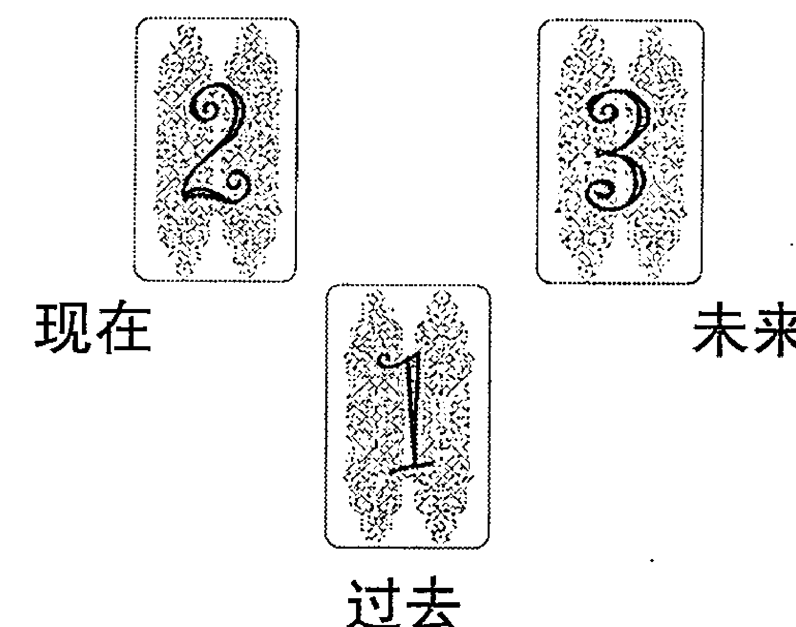

这是玩塔罗牌时最常使用的牌阵，初学者非常容易上手。这三张牌按照序号依次分成过去、现在、未来三个时间段，这样解牌能比较准确地掌握事情当下的状况。这个牌阵有相当丰富的变化与灵活度，而且求出的答案也相当明确清晰，一点也不会有拖泥带水的嫌疑。但是有时这个牌阵给出的答案太过于直接，所以在解读时，也需要解牌者根据不同的情况给出合理的解释，这样求问者就不会有太剧烈的心理反应。

#### 适用范围

全方位。

#### 发牌顺序

- 1、将所有洗好的牌拿起来，从最上面的第一张牌开始数起，数到第七张牌时，请把第七张牌拿出，放置到牌阵图中1的位置上，这张牌就是过去牌。
- 2、现在把数过的牌放置到一旁，把手中剩下来的牌重新数到第七张，拿出这第七张牌，放置到牌阵图中2的位置上，这张牌就是现在牌。
- 3、重复步骤2，拿出第七张牌放到牌阵图中3的位置，这张牌就是未来牌。

#### 怎样解读

过去牌代表着此刻之前的经验或发生的事情；现在牌代表着现在的问题或这件事情的情况；未来牌代表着未来的事情发展或结果的推测。

#### 注意事项与建议

一般的初学者在使用圣三角牌阵时，很容易就把牌义解释得很绝对。在这里建议初学者，使用圣三角时尽量把牌看得深一点，结合具体情况，不要只看书上注释的牌面意思。因为事情常常不是我们想象得那么简单，并且有时候解读出来的塔罗牌所传达的讯息是很让人难过的。

#### 实例 5

求问者：女生。
问题：好友最近要参加就业考试，他已经准备将近两年了，想要知道这次考试是否能够金榜题名。
牌阵：圣三角。
开牌：
过去：权杖六 正位
现在：钱币二 正位
未来：钱币侍从 正位
解牌：
这位仁兄的个性十分认真诚实，准备也很努力，因此对这次考试蛮有信心的，周围的人也相信他应该有考上的实力。
正位的钱币侍从通常指的是年少得志。不过，因为这位朋友的年纪已经不小了，所以这张牌指的应该是继续学习，甚至有转业的可能。

#### 实例 6

求问者：男生。
问题：一个女同学生日快到了，想问问该不该帮她买礼物。
牌阵：圣三角。
开牌：
过去：战车 正位
现在：节制 正位
未来：恋人 正位
解牌：
恋人这张牌表明求问者正在抉择要不要买，战车这张牌的意思是求问者在考虑给这位女同学买什么礼物的同时还要兼顾做好别的事情，节制这张牌说明送了礼物，你们的关系也没啥大变化，因为本来你们就是朋友。

#### 实例 7

求问者：女生。
问题：她和男朋友的交往遭到对方家长的强烈反对，目前两人因工作原因两地分隔。想要问问那位男生对这段感情未来的打算是什么。
牌阵：圣三角。
开牌：
- 过去：隐士 正位
- 现在：节制 逆位
- 未来：命运之轮 正位
解牌：
命运之轮代表的就是因工作而在空间上产生距离的情况，两个人的关系开始产生了改变，未来的可能也跟着改变。男方对于家长的反对，采取低调的作法。
从节制逆位看起来，突破的空间并不大。再加上隐士，看来是凶多吉少了。
最后求问者还追加了一个问题：如何软化对方家长的态度？
随便抽两张，得到：
- 塔 逆位
- 恶魔 正位
看起来，对方家长的控制欲很强。那样的态度也让这段感情里的人觉得无从抵抗；塔逆位说明最激烈的矛盾已经过去了，要试着缓解的话，就要用比较委婉的手法。

#### 实例

求问者：女生。
问题：和分手的男友会有什么发展？
牌阵：圣三角。
英国皇家塔罗牌·tarot
开牌：
过去：恶魔 逆
现在：正义 逆
未来：恋人 逆
解牌：
正义逆位给人的感觉是会复和，而且配上恋人和恶魔的逆位，你们之间的感情会从过去的凭借热情与欲望的维持，转变成偏重精神层面的交往。
总的来说，你们俩人有口难言，心中虽有想法却不说出口，相对的也在猜测对方想法，不如主动地去走出第一步，打破你们之间的僵局，你们的关系会有很好的发展。

### 二择一解牌法

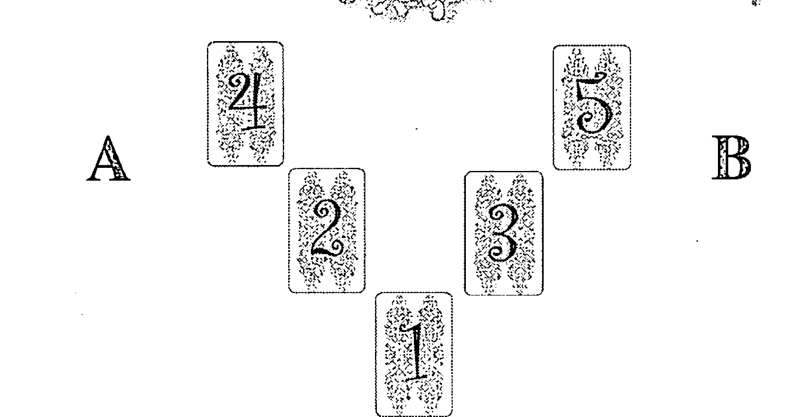

这个牌阵正如其名，属于选择性的牌阵，当求问者心中有难以选择的两种可能的时候，特别适用这个牌阵。这个牌阵也是相当热门的，因为人的心中拥有两个以上的选择是很正常的事情，而这个牌阵的出现，正好弥补了塔罗牌阵里所缺少的选择性解牌方法。这个牌阵在基础架构上，很类似圣三角牌阵，所以也算是比较简单的，没有需要配牌综合解释的难度，非常容易上手。

#### 适用范围

爱情、学业、事业等选择性的问题

#### 发牌顺序

- 1、洗牌前先请求问者选定一个方向。因为此牌阵呈V字型，分成左右两边，也分别代表了不同的选择（A和B）。这就要请求问者选定哪一边代表什么选择，并且牢记自己定下的方向，这样就可以不用把选择告诉解牌者，然后再开始洗牌。
- 2、洗好牌后，把牌拢成一摞，然后从最上面的第一张牌开始数，数到第六张牌，把这第六张牌放置到牌阵图中1的位置上。
- 3、把已经数过的五张牌放置到一旁，重新数剩下的牌，数到第六张与第七张牌时，分别把这两张牌取出，放置在牌阵图中2和3的位置上。
- 4、重复步骤3，把第六张与第七张牌取出，放置到牌阵图中4和5的位置上。

#### 怎样解读

- 在1位置上的牌，代表的是问题的整体状况。
- 在2位置上的牌，代表A选择的现况。
- 在3位置上的牌，代表B选择的现况。
- 在4位置上的牌，代表A选择的未来发展或结果。
- 在5位置上的牌，代表B选择的未来发展或结果。

#### 实例 9

求问者：女生。
问题：有一个比较喜欢的特定对象A，不过目前有另外一个说要考虑娶我的B，我想算算我跟这两人之后的发展。
牌阵：二择一。
开牌：
2、4代表选择A 3、5代表选择B
1位置的牌： 审判 正位
2位置的牌： 宝剑十 逆位
3位置的牌： 恶魔 正位
4位置的牌： 权杖八 正位
5位置的牌： 权杖六 正位
解牌：
看来以你现在的情况，还是别做任何选择会比较好！
你现在的心态正在经历很大的考验。如果选择A，可能他并不是那么喜欢你，而且，他似乎已经有对象了。
如果选择B，只有物质欲望方面能满足你，但是他会在各个方面管束你，你甚至会失去自由。
如果你硬是要做出一个选择的话，还是选B比较好，尽管会影响你的学习、工作等等，毕竟你在物质方面不会有匮乏的危险。
另外一点，如果我是你，我宁愿放弃现在的所有选择。这两个都不是你的正缘，以后难免分手。与其日后伤心，不如现在做出决定。

#### 实例 10

求问者：女生。
问题：我人现在国外，要九月才会毕业，但因为课已修完，从三月到八月都很空闲。我现在经济上比较拮据，再加上想累积工作经验，所以这段时间我想找工作。不过就工作环境和条件来说，国外和国内都各有其困难和吸引我的地方。如果我想在四月找到工作，国外或国内哪边比较好呢？
牌阵：二择一。
开牌：
- 2、4代表选择国外 3、5代表选择国内
- 1位置的牌： 钱币九 正位
- 2位置的牌： 权杖一 逆位
- 3位置的牌： 圣杯二 正位
- 4位置的牌： 宝剑皇后 正位
- 5位置的牌： 圣杯侍从 逆位
解牌：
钱币九代表求问者现在处于情绪不平稳的状况，但还是很努力的在自我控制，想要靠自己或经由工作来获得一些成就及满足。
权杖一逆位表明要在国外找工作过程非常困难，若想找到国外的工作，就需要清晰的思考能力。但宝剑皇后说明就算找到了，最后的结果也不是很好。
在国内找工作似乎比较容易，因为有出国的经验 (圣杯二)，不过情绪上可能不快乐 (圣杯侍者逆位)。
最后要如何选择，还是要看求问者本人的意愿了。

#### 实例

求问者：女生。
问题：我该不该跟交往4个多月的男朋友提出分手？男朋友小我两岁，我觉得我同他的沟通出现了问题，他虽然在慢慢改变，但偶尔还是会莫名其妙发脾气。我在这段感情中，快乐的时候很快乐，但每次与他发生争执，都是我先低头，他从来都不觉得他有错，就算有错也根本不会道歉。渐渐的，我觉得他没有为这段感情努力的感觉。所以想问，我应该跟他提出分手，让他知道事情的严重性吗？
牌阵：二择一。
开牌：
- 2、4代表选择分手
- 3、5代表选择不分手
- 1位置的牌： 魔术师 正位
- 2位置的牌： 审判 逆位
- 3位置的牌： 太阳 正位
- 4位置的牌： 女皇 逆位
- 5位置的牌： 星星 正位
解牌：
从牌面来看，求问者应该多尝试与他沟通，不要放弃。如果轻易分手，会损失很多。如果能够坚持下去，应该会有不错的结果。
这个问题的重点在于，能否经由“分手”这种手段让男方“觉醒”（从审判逆位这张牌得出的结论）。通常这种手段是最后通牒。建议你严正地与他声明，你跟他之间的前途完全看他的态度而定，你也要再仔细观察一下，然后再作最后的决定。

#### 实例 12

求问者：男生。
问题：是否要选修一门极难的专业课。
牌阵：二择一。
开牌：
2、4代表选择退课 3、5代表选择修课
1位置的牌： 愚人 正位
2位置的牌： 权杖十 逆位
3位置的牌： 钱币八 逆位
4位置的牌： 权杖四 逆位
5位置的牌： 星星 逆位
解牌：
选择退课：修这门课可能会让你自己觉得有点吃不消，你也不想负担这个压力，因此选择退课。
选择修课：钱币八逆位代表你加修了这门课后，可能也不会太用功，结果成绩可能也不怎么理想。
愚人代表你自己没有计划，拿不定主意。愚人的号码是0，这张牌包含了各种的可能性，未来可能是好可能是坏，全看你是怎么去走下一步，毕竟一切才正要开始而已。加油吧！

#### 实例 13

求问者：女生。
问题：关于选择指导老师。因为这学期要决定指导老师了，在我接触的老师中我对两位老师很有好感。但在交谈之后，自己颇难决定要跟哪位老师。因此想问问塔罗牌，希望能给我一个中肯的建议。
牌阵：二选一。
开牌：
2、4代表选择A老师 3、5代表选择B老师
1位置的牌： 力量 逆位
2位置的牌： 太阳 正位
3位置的牌： 恶魔 逆位
4位置的牌： 倒吊者 逆位
5位置的牌： 命运之轮 正位
解牌：
A老师在教学过程中会依你的情形来训练带领你，他会像太阳一样指引你走正确的路，教给你真正的道理。不过发展到最后，你会觉得跟当初想要得到的结果不一样。
如果选择A老师，他可能会叫你做许多你不想做的事情，所以你后来并不会乐在其中。只能说老师带给你的是正确的方向，可是你却跟他的想法会有所分歧。
B老师会依你的专长或是现有的能力来继续教导你。不过他用的似乎是一种走捷径的方法，只不过使你最后能够取得文凭。老师只是带你进行研究，不一定会告诉你真正的道理。不过最后你还是能依着你的意愿达成学业的。
如果只想要文凭，选B老师会较好，不过如果想在这个领域获得更多的知识的话，请选A老师，但最后就只能看你熬不熬得过他的课程了。

#### 实例 14

求问者：女生。
问题：求问者就职于一家软件公司，目前被派到IBM参与一个项目的测试工作。她的项目下个月就将结束。她需要选择的是：A，项目结束后继续留在IBM，仍然做测试；B，回到原来的公司，进行新的软件开发工作，从头学起。
牌阵：二择一。
开牌：
2、4代表选择A 3、5代表选择B
1位置的牌： 塔 正位
2位置的牌： 恶魔 正位
3位置的牌： 女皇 逆位
4位置的牌： 力量 正位
5位置的牌： 星星 正位
解牌：
正位的塔说明求问者目前的状况比较差，压力很大，心里没有底气，无法突破。
正位的恶魔说明IBM薪水高，工作强度其实不是很大，不会经常加班，所以是很有诱惑力的事情。并且以现有的知识水平能应付目前的工作，不用花费很大力气去学习新的东西。这是一个安逸舒适的状态。
逆位的女皇表明回到公司的话，从现在到春节，应该不会有新的大项目上马，那么意味着求问者将会被闲置，也不会有奖金，物质上绝对是一大损失。需要学习与软件开发相关的很多东西，这是一个挑战。另外，外派了这么久，和公司的人的合作，也不会很顺利，人事上将会有一段时间的磨合期。
正位的力量表明舒服的日子过久了会厌倦，其实求问者心里还是知道，梁园虽好，非久留之地。永远做表层的测试而没有技术基础，是不可能有发展的。所以心里面还是会萌生去意，而且会有很强烈的愿望要离开。
正位的星星说明新年伊始，新的项目将展开，会有新的机遇。学习新的东西开拓自己的人生，将让求问者从低谷中走出来。

### 四 吉普赛十字解牌法

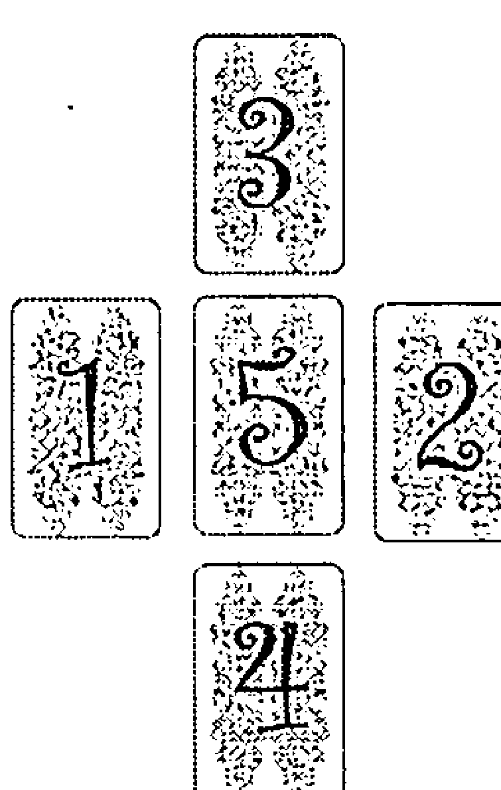

此牌阵属于拥有建议牌的牌阵，并且加入了配牌的解法，所以属于高级牌阵，需要比较多的时间来训练，才能更加熟悉如何运用。这个牌阵能够针对专门的问题来做解释，并没有太多灵活的变化。有一个比较特别的地方是，这个牌阵只适用于大阿卡娜牌，不用小阿卡娜牌。虽然牌阵有五张牌的位置，但有时候却只需要四张牌，因为这个牌阵用到了重复牌，所以有时候也会有同一张牌在不同位置上的解释，需要特别加以注意。

#### 适用范围

爱情、友谊、学习、事业等等方面。

#### 发牌顺序

- 拿出大阿卡娜牌，洗好后把牌呈扇形打开，平放在桌面上。
- 接下来就请求问者从中抽出一张牌，放置到牌阵图中1的位置。
- 重复上述的步骤，继续请求问者抽出三张牌，依序放置到2、3、4的位置。
- 收好剩下的牌，不要弄乱顺序，把整叠牌从左到右翻转过来，使有图案的那一面朝上，放到一旁。
- 把1到4位置的四张牌全部翻转过来，使其图案朝上，然后把这四张牌上面的数字全部相加，得到的数字若小于或等于22的话，就从剩下的牌中找寻同数字的牌，放置到5的位置。
- 若这四张牌相加的数字超过22的话，就把得数的个位与十位相加，按照求出的数从牌中找寻同数字的牌。
- 如果5位置得到与其他四张牌相同的牌时，就先不管5这个位置，等到前四张都解读完成时，再来看它。

#### 怎样解读

- 在1与2位置上的牌，象征着影响整件事情或问题的外在因素或外在的人事状况，需要把两张牌综合起来解读，然后求出答案。
- 在3位置上的牌，代表整件事情或问题发生的原因或问题的关键所在。
- 在4位置上的牌，代表整件事情或问题的解决方式与建议。
- 在5位置上的牌，代表整件事情或问题的最终结果。

#### 注意事项与建议

使用吉普赛十字牌阵时，要注意配牌解读的重要性。当出现了无法解读或是两张牌相互矛盾时，就先解读一张牌，然后从辅助的角度来尝试解读另一张牌。不要把两张牌都当成主要牌来解读，这样会增加难度。一般以第一张牌为主牌，第二张牌为辅助牌，不过根据具体情况不同，玩家也可以自行选择。

#### 实例 15

求问者：女生。
问题：求问者与某男生之间发生了一件事，想问这件事对这位男生的影响以及与他今后的发展。
牌阵：吉普赛十字。
开牌：
- 1位置的牌：女皇 逆位
- 2位置的牌：皇帝 逆位
- 3位置的牌：力量 逆位
- 4位置的牌：节制 逆位
- 5位置的牌：命运之轮 正位
解牌：
二人的心情：他在遇到这件事后的心情是逆位的女皇，代表他从内心里感动高兴。但由于种种原因仍放不下忧虑的心情，比较不安。逆位的皇帝表明求问者觉得自己很了不起，有点自负。
现在应采取的对策：力量逆位是暗示求问者稍微放慢一点行动，继续温柔的对待他，不要着急，慢慢来。
周围状况：节制逆位代表两人心灵有一定的距离，追求的东西有些不同。别人对你们更不抱有太多的希望，这也影响着你们，你们缺乏协调和沟通。
最后的结果：根据整个牌阵来看，命运之轮正位应该暗示着如今不和谐的状态也不过是暂时的，也就是提示你要主动地去把握住时机，如何将命运导向有利的一面才是最重要的。

#### 实例 16

求问者：男生。
问题：想知道和心仪的女生之间未来的感情会如何发展。
牌阵：吉普赛十字。
开牌：
- 1位置的牌：皇帝 逆位
- 2位置的牌：愚人 正位
- 3位置的牌：隐士 正位
- 4位置的牌：审判 逆位
- 5位置的牌：死亡 逆位
解牌：
从皇帝逆位这张牌来看，女方对男方是没有什么感情的。因为皇帝逆位代表必须要探讨前一张牌，也就是女皇的牌意。如果没有女皇所要求的情感，就会造成皇帝逆位的情况。
从愚人正位这张牌来看，当时男方可能是想要不计后果地去尝试的。
双方目前的关系从隐士正位这张牌来看，可以知道目前双方都是单身，对感情也都有所保留，这段关系应该是很保守而且不易发展的。
从审判逆位这张牌来看，双方的关系并不乐观，因为双方欠缺太阳正位光明、乐观的元素。
最后死亡逆位这张牌提出了建议，要求求问者认清并且接受目前对他不利的情势，再想办法发展这段感情。

#### 实例 17

求问者：女生。
问题：她很喜欢一个男生，但目前两人连朋友都称不上，只是那名男生曾经寄了几封暧昧的e-mail给她，似乎表示对她也有好感。可最近那名男生和另一位女生开始出双入对地交往，求问者很伤心，因为她觉得被那个男生给戏弄了。不过她还是很喜欢他，所以想问那个男生到底喜不喜欢她？她和他是否还有发展恋情的机会？
牌阵：吉普赛十字。
开牌：
- 1位置的牌：月亮 正位
- 2位置的牌：皇后 逆位
- 3位置的牌：节制 正位
- 4位置的牌：命运之轮 逆位
- 5位置的牌：塔 正位
解牌：
对方的心情：月亮正位，表示他自己也搞不清楚自己到底喜欢谁。而且因为求问者目前的反应而感到不安。
皇后逆位：一开始就只有求问者单方面在付出，然而由于得不到回应，所以现在她的热情已消失，也不想再付出了，只是内心对他还是心存一些爱意。
命运之轮逆位：表示对方对和她这段暧昧不明、从没正式发展的恋情也不抱希望与期待，因此结果的节制正位这张牌代表求问者最后是可以走出这场感情漩涡的，只是这需要花一段时间而已。

### 五 爱的现状解牌法

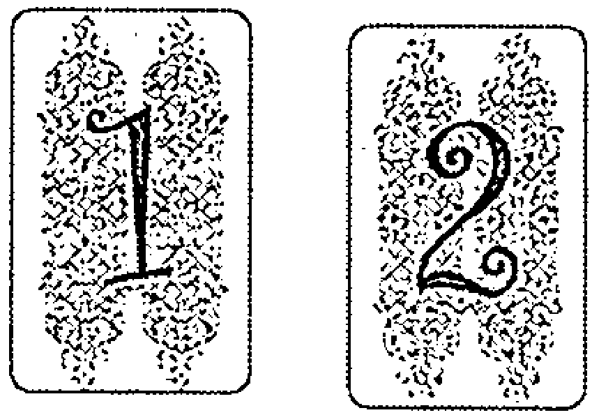

#### 适用范围

爱情方面的各种问题。

#### 发牌顺序

可以只使用大阿卡娜牌或只使用小阿卡娜牌，也可以使用整副塔罗牌。推测时随意抽两张牌，依序放在1和2的位置。

#### 怎样解读

1位置的牌代表：两人目前的状况。
2位置的牌是建议牌。

#### 实例 18

求问者：男生。
问题：两人的关系遭遇瓶颈，该如何解决？
牌阵：爱的现状。

### 六 爱情金三角解牌法

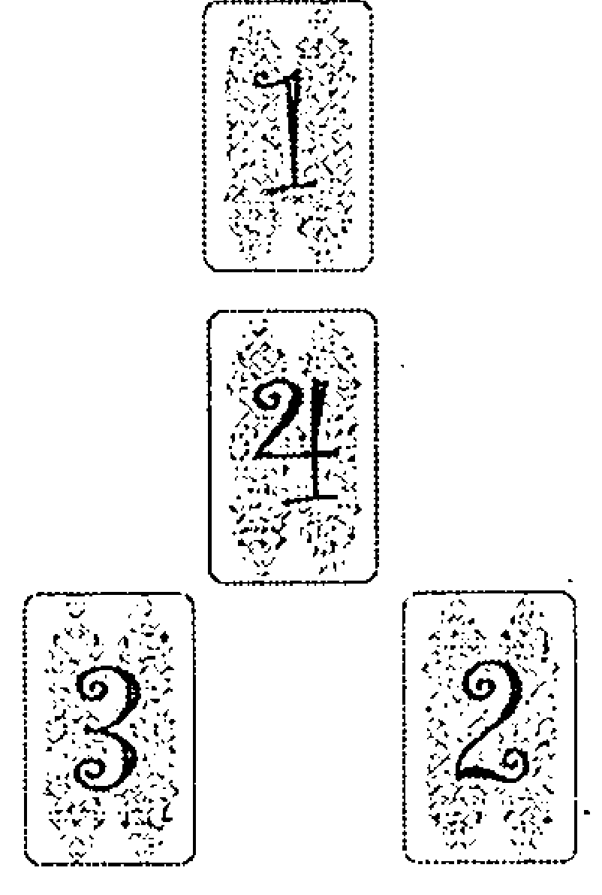

#### 适用范围

爱情方面的各种问题。

#### 发牌顺序

可以只使用大阿卡娜牌或只使用小阿卡娜牌，也可以使用整副塔罗牌。游戏时随意抽四张牌，依序放在1、2、3、4的位置。

#### 怎样解读

- 1位置的牌代表：你和他的未来发展。
- 2位置的牌代表：对方的情形和想法。
- 3位置的牌代表：你的情形、想法。
- 4位置的牌代表：你们之间的关系。

#### 实例

##### 实例 19

求问者：女生。
问题：A君和自己未来的互动如何？他是怎么看我跟他之间的关系的？
牌阵：爱情金三角。
开牌：
1位置的牌：皇帝 正位
2位置的牌：月亮 正位
3位置的牌：星星 正位
4位置的牌：倒吊者 逆位

解牌：
星星代表你对未来心里是持乐观态度的，而过往岁月里的所有付出，或许是今生注定。
倒吊者逆位表示你很努力在挣扎，但现在的情况并不明朗，最好分开一段时间好好让彼此的心情沉淀一下。
皇帝正位让人觉得喜欢一个人一定要为他做一些实际的事情，有时候不妨多关心一下别人的情绪或他真正在乎的事情。
月亮这张牌看起来表面上可能关系不错，但是有时候明亮的月光却又被遮掩住了。这朵掩盖在他心中的云雾可能是过去一直困扰着他的一个未解难题。
可能相处总觉得少了些什么默契吧？塔罗牌告诉你别太着急，随着时间的流转，也许明天云雾就会散尽。先以朋友的关怀来面对，或许对你们的现状应该比较适当。

##### 实例 20

求问者：女生。
问题：对一个朋友越来越有感觉，已经到了很严重的地步。最近跟他关系好转了一点，所以想问双方目前对彼此的态度及恋爱的可能性。
牌阵：爱情金三角。
开牌：
1位置的牌：太阳 逆位
2位置的牌：力量 逆位
3位置的牌：命运之轮 正位
4位置的牌：女祭司 正位

解牌：
从命运之轮正位来看，你对他的感觉只会增强，不会减弱。他可能心里正在犹豫不决是否要选择你，因为他对你的感情其实本来并不深，至少不是你所认为的那种程度。所以你们目前的状况才会显现出女祭司正位这张牌，处于一种退缩而内省的状态。
他未来会不会选择你？我想不会，因为他还是没办法说服自己去喜欢你，而你们之间的关系，也会由于他对你没感觉，你却又一直跟他示好，造成他的压力，从而慢慢疏远。

## 第五章 牌阵——打开塔罗之门的钥匙(39个牌阵)

熟悉了每一张塔罗牌的含义，我们再来看看牌阵的使用方法。按照难易程度精心编排的这一章节，用解牌实例进行解说，使大家简单上手，轻松精通，充分体会塔罗游戏的轻松愉悦。

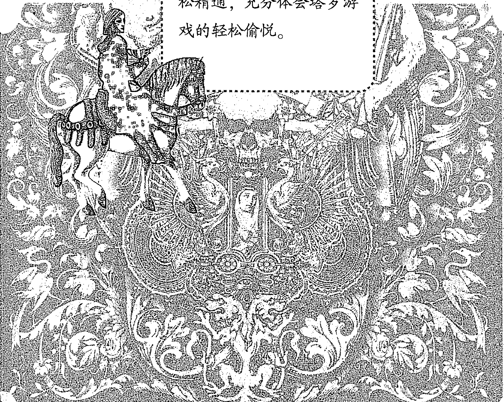

牌阵是问题呈现的一个形式。在解牌时，选对牌阵，可得事半功倍之效。因此，如何为问题选择一个适当的牌阵是相当重要的一个步骤。牌阵少则使用一张牌，多则数十张不等。简单的牌阵应付简单的问题，复杂的牌阵则处理重大的问题，依据不同的问题而选择不同的牌阵。没有绝对的优劣之分，合适、恰如其分即可。

在使用牌阵时，有一点需要特别注意：选择牌阵的重点是有效呈现问题、解决问题，而不应被不适用的牌阵所牵制。有时候，甚至可以不使用牌阵。举例来说，我们时常要面对一些鸡毛蒜皮的问题，例如：“明天要去吃大餐，还是郊游？”此时使用大型牌阵只是大而无当。我们可以利用小巧的二择一牌阵。或者是更简单的，抽一张牌代表吃大餐，再抽一张代表郊游。不使用牌阵的“与牌对话”有时反而更加直接明了。

讨论牌阵有多少种是毫无意义的，因为牌阵有无数种，其中变化万千，任何人都可以自创牌阵。以下列举的是我们为初学者准备的最简单的基础牌阵和一些方便的实用牌阵，以及一些经过时间考验的经典牌阵。下列牌阵中，标明22张的，只使用22张大阿卡娜牌；标明56张的，只使用56张小阿卡娜牌；标明78张的，则要使用整副牌；同时标明22张、56张、78张的，则可任选其一。

### 经典牌阵

这里介绍的牌阵，是一些经过漫长时间考验的牌阵，有一些曾流传了数百年之久，所以牌阵的摆放相对复杂一些，使用的牌数也相对多一些，建议初学者要熟悉了简单牌阵和牌义后再来了解这些经典牌阵。

#### 凯尔特十字

据说塔罗牌刚刚出现的时候，凯尔特十字预测法就已成为塔罗解牌的主要方法，它由流浪的吉卜赛人从埃及传到爱尔兰，在凯尔特人中广泛流行，由于其形状与当时欧洲流行的中世纪武器十字剑相似，更添了几分神圣与庄严，成为战争或结婚前必用的占卜仪式。
它流传至今，已有了多种分支牌阵，但十张牌的凯尔特十字仍是现今塔罗牌解牌的主流牌阵，亦是很多塔罗大师最偏爱的牌阵。

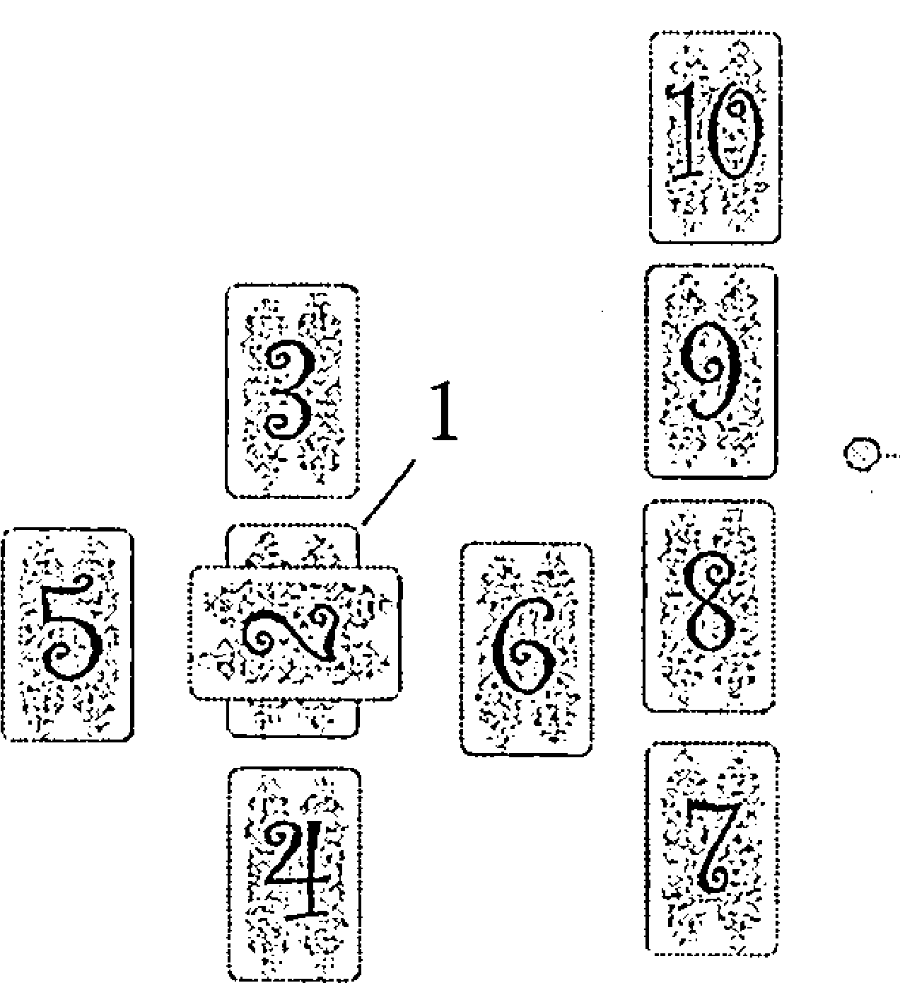

| 取牌范围 |
| :--- |
| 22张大阿卡娜、56张小阿卡娜、78张塔罗牌 |
| 取牌方式 |
| 随意抽10张牌，依顺序放在图中1、2、3、4、5、6、7、8、9、10位置上。 |

##### 解牌技巧

传统上对“古代凯尔特”牌形的诠释是这样的：
- ☆ 牌1 第1张牌放在十字形的中央，代表解牌者及其目前状况或是他现在的问题。
- ☆ 牌2 第2张牌与第1张牌呈十字形交叉，代表阻碍或影响现在状况的困难。
- ☆ 牌3 第3张牌放在头两张牌之上（十字形之首），代表短期的目标，即现在状况所能达到的目标。
- ☆ 牌4 第4张牌放在头两张牌之下（十字形之脚），代表较远的过去影响了现在的情况。
- ☆ 牌5 第5张牌在十字形的右臂，代表较近的过去对现在的影响。
- ☆ 牌6 第6张牌在十字形的左臂，反映了最近的将来。

如果其它因素不变的话，这个顺序可追溯至十字的赫尔墨斯牌或说是反向牌，形似数字4。

最后四张牌放在十字的右边，直线排列，由下而上。

- ☆ 牌7 第7张牌代表内在的自我秘密愿望与欲望，及影响目前情况的基本人格。
- ☆ 牌8 第8张牌代表环境或家庭的影响，包括现实或精神上的住所。
- ☆ 牌9 第9张牌代表预期之外的好运或噩运。
- ☆ 牌10 第10张牌像小阿卡娜的10号牌一样总结全部，暗示可能的结果。

> “古代凯尔特”牌形有一首方便记忆的韵文，牌洗好之后可以念：
> “1找到你，2影响你，3加冕你，4在你下面，5在你后面，6在你前面，7是你的希望与恐惧，8是你的房子与家庭，9是你没有预期的，10是一定会发生的。”

请注意，当事人是指问题的主角，并不一定是求问者，例如求问者问：我男朋友考得上大学吗?我爸爸的病会好吗?这时候，问题的主角就不是求问者，请注意问题解释的角度不同，结果会相差很多。

#### 星宫之书

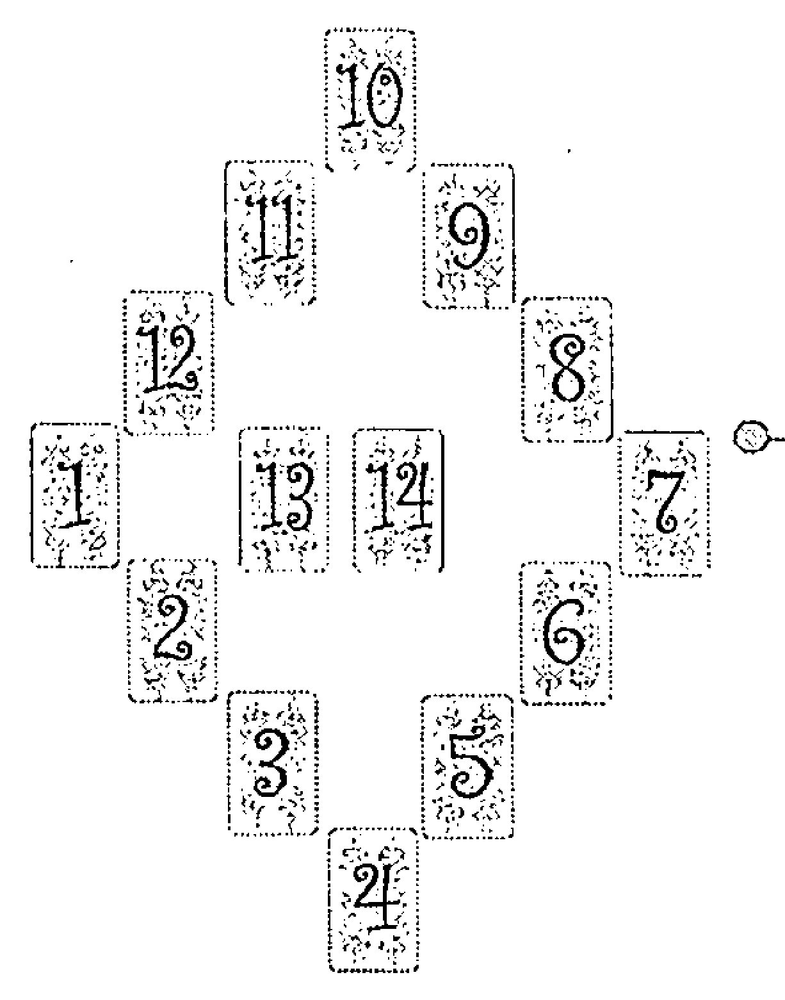

**取牌范围**
22张大阿卡娜、56张小阿卡娜、78张塔罗牌

**取牌方式**
随意抽14张牌，依顺序放在图中1、2、3、4、5、6、7、8、9、10、11、12、13、14位置上。

##### 解牌技巧

类似十二宫解牌法，解释也是用十二星座的象征解释。

- ☆ 牌1 第1宫：你的外貌与外显的个性，最容易被其他人了解的方式，例如：你如何打扮、着装。
- ☆ 牌2 第2宫：金钱、拥有物、价值观，你对于获得的东西要如何运用的想法，也代表自我的层次，你的价值与你如何设定你的目标。
- ☆ 牌3 第3宫：人际关系、短程旅行、兄弟姊妹，为了受人欢迎，与其他人沟通的最佳方式。依照你所问的问题而定，短程旅行或兄弟姊妹等因素可能要加以考虑。
- ☆ 牌4 第4宫：家庭、根基、双亲之一，你的家庭状况，以及那些你需要去加强的（你在家中无法感受到的，并且是你一直想要的感觉却很难去获得的）。也代表你的双亲之一（父或母）能如何帮助你。
- ☆ 牌5 第5宫：罗曼史、小孩、创造力，通常是指将你的创造力用在外在的欲望上。依据你的情况，恋情或小孩等因素可能要加以考虑。
- ☆ 牌6 第6宫：工作与健康，你因为什么样的目标而工作，你的工作节奏如何，如何利用你的工作扩展你的人际关系。也代表在这段时间中，你如何照顾好你的身体。
- ☆ 牌7 第7宫：婚姻与其它的人际关系，你的配偶、家庭、朋友、生意上的伙伴可以如何帮你实现你的目标。
- ☆ 牌8 第8宫：性、死亡、改革、其他人的金钱，你能如何激励自己，你需要放弃哪些东西，哪些部分需要革新，在金钱方面其他人能如何帮助你。
- ☆ 牌9 第9宫：高等教育、远距离的旅行、信仰、人生观，你需要学习的，你需要前往的地方，你能如何与你的灵性相结合并让你的人生观使你更加坚强。
- ☆ 牌10 第10宫：事业、身份地位、声望、双亲中的另一位，你的整体概观与生活经验，你应该要强化的部分，让某部分的能力、优点更加突出，你的另一位双亲（父或母）能如何帮助你。（与第4宫指的另外一位）
- ☆ 牌11 第11宫：朋友、团体、抱负，你的个人接触、交往，对你的目标最美好的憧憬。
- ☆ 牌12 第12宫：隐居、隔离、内在、秘密、下意识，当你单独一人时该做些什么，隐蔽而没有显示的事物，克服你的恐惧的最好方式、获得直觉的最好方式。
- ☆ 牌13、14 神秘知识之书的指示：最后两张牌包含来自神秘知识之书的特殊星体资料，虽然这两张牌没有对应任何的星体位置或是相关联的星座意义，但是在广泛的解读中，这两张正说明着每件事的光明面。解释上，这两张牌将告诉你最后必需知道而且非常重要的事。

#### 生命之树

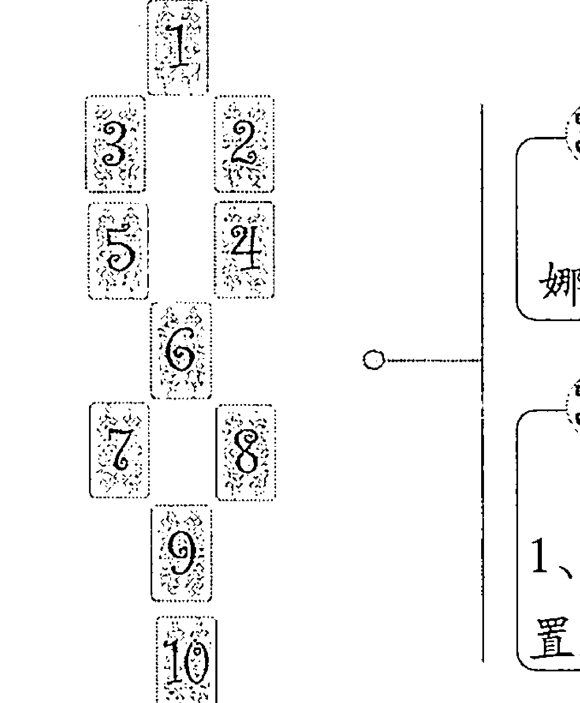

**取牌范围**
22张大阿卡娜、56张小阿卡娜、78张塔罗牌

**取牌方式**
随意抽10张牌，依顺序放在图中1、2、3、4、5、6、7、8、9、10位置上。

##### 解牌技巧

这个生命之树牌阵是将塔罗、哲学和冥想连接在一起的多种复合系统，此牌阵必须由底部解释到最上方（由第10张解释到第1张），通常使用这牌阵是用来分析生命的整个情况，并且它使用所有牌（通常为78张）来展开牌阵。

在完成解读之后，把没用到的牌展开成扇形，并再选出一张牌，这张牌称为Daat Card——达卡。这张牌的位置在第1张与第6张牌所连成的直线中间，它象征一种隐藏的智慧，一种能帮你完成你最大愿望的智慧。

一个完整的生命之树牌阵解说，通常要花费数小时之久，并且包罗万象，所以通常建议解牌之后一年内不要重复解牌（因为这是长效型牌阵，而且算一次真的很累）。

- ☆ 牌10 Malkut（王国）：结果、家、物质界、肉体、日常生活、实际的情况。
- ☆ 牌9 Yesod（根基）：灵魂的中心、想像力、幻想、习惯、过去的生活、潜意识的根基。
- ☆ 牌8 Hod（光辉、荣耀）：思想、判断真实与虚伪的知识、口语的表达与沟通、技能、技巧、科学与应用科学。
- ☆ 牌7 Netzach (胜利、持续)：爱、性爱、本能、艺术、灵感、感受、美、欢乐。
- ☆ 牌6 Tiferet (美)：个性、自我、特质、健康、对其他人的付出、目标、主要的目的或意图。
- ☆ 牌5 Gievurah (严厉、力量)：力、征服、挑战、冲突、重新调整、障碍、不和谐、挑衅、力量的表现、领导能力。
- ☆ 牌4 Chesed (慈悲、恩典)：善良、有利的机会、赋予、机智、救助者、援助、褒奖、力量。
- ☆ 牌3 Bina (理解)：心灵的意识与理解力、母亲、心灵、阴、接近结束、企划能力。
- ☆ 牌2 Chochma (智慧)：创造力、外在价值与思想、父亲、意图、阳、智能与知识、本质。
- ☆ 牌1 Keter (王冠)：高层次的思想、目标与意图的正确判断力、和谐的状态、问题的根本或起因。

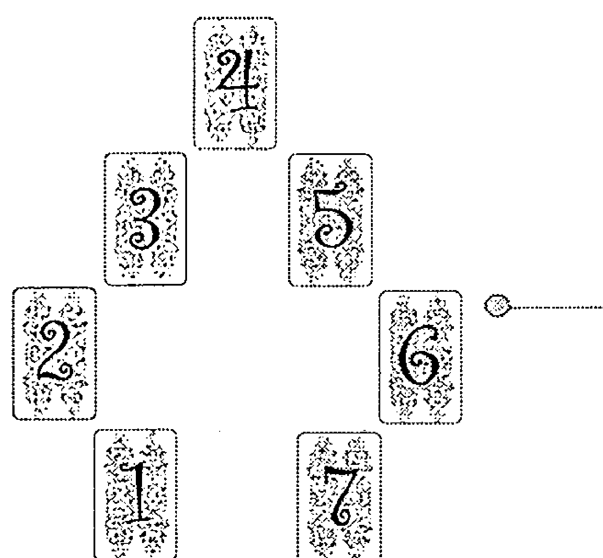

| 取牌范围 | 22张大阿卡娜、56张小阿卡娜、78张塔罗牌 |
| :--- | :--- |
| 取牌方式 | 随意抽7张牌，依顺序放在图中1、2、3、4、5、6、7位置上。 |

##### 解牌技巧

- ☆ 牌1 代表月亮，指的是求问者的家人状况与家庭环境。
- ☆ 牌2 代表土星，表示求问者的智能及精神状况。
- ☆ 牌3 代表金星，意味情感方面。
- ☆ 牌4 代表太阳，象征求问者的人际关系及社交魅力。
- ☆ 牌5 代表火星，指的是求问者及其对手的竞争状况。
- ☆ 牌6 代表木星，意味物质的获得，或是任何人际关系、精神性物质的取得。
- ☆ 牌7 代表水星，表示在贸易、商业、工作或学习等方面的状况。

#### 梦游者之屋

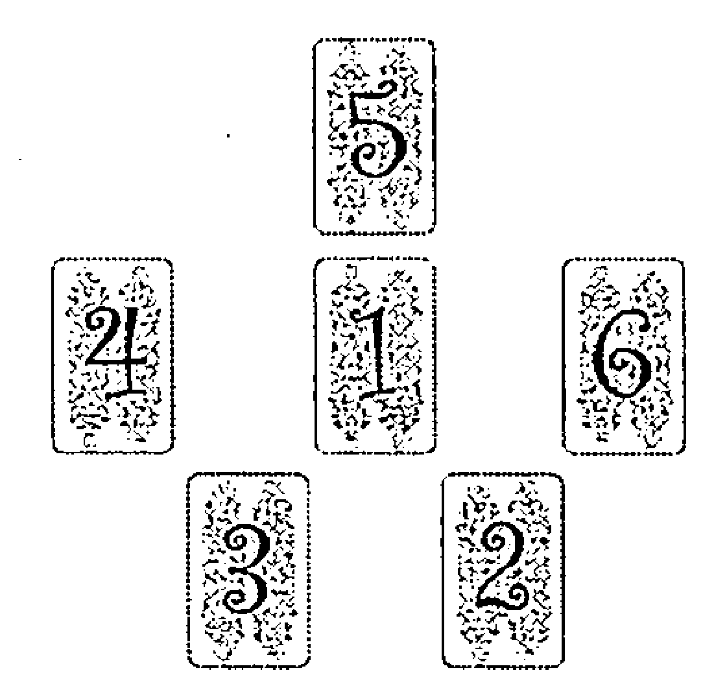

| 取牌范围 |
| :--- |
| 22张大阿卡娜、56张小阿卡娜、78张塔罗牌 |

| 取牌方式 |
| :--- |
| 随意抽6张牌，依顺序放在图中1、2、3、4、5、6位置上。 |

##### 解牌技巧

此牌阵适合当求问者不清楚状况，或正在考虑目前情况时，给予当事人相关的忠告与消息。此牌阵虽然没有告知一个肯定的结果，但是，在最后结论的地方，仍是告诉你一个相当可靠的事情发展情况。

- ☆ 牌1 代表求问者与他们的感觉。
- ☆ 牌2 疑问、问题、状况。
- ☆ 牌3 隐藏在问题底下的影响因素。
- ☆ 牌4 将求问者与问题纠缠在一起的过去的事件。
- ☆ 牌5 要注意的、指示你的，必须深思熟虑的。
- ☆ 牌6 可能的结果。

#### 意识动力

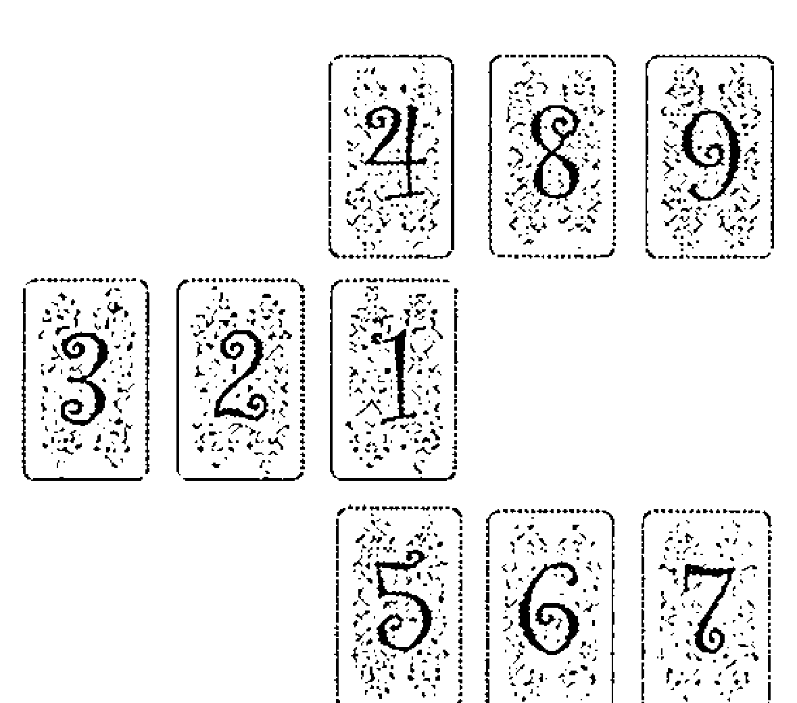

**取牌范围**
22张大阿卡娜、56张小阿卡娜、78张塔罗牌

**取牌方式**
随意抽9张牌，依顺序放在图中1、2、3、4、5、6、7、8、9位置上。

##### 解牌技巧

此牌阵一般的目的在于了解意识、时间、结果的相互作用。尤其适合与决定、计划、自我评估相关的问题。

- ☆ 牌1 指示：求问者的感觉，求问者所知道的问题现况。
- ☆ 牌2 过去的影响：事件，所分析的问题在过去有什么力量与因素影响它。
- ☆ 牌3 过去的强化：强化第2张牌的相关人物，另一种可能是延迟求问者的进展，以便客观公平地认清当前状况的人。
- ☆ 牌4 道德观对于事件的影响，或内心超我的想法。
- ☆ 牌5 潜意识的影响：累积的习惯、情绪、事件，这些都会影响求问者现实方面的判断力。
- ☆ 牌6 假如求问者不做任何改变，不对现况做任何努力，情况会如何发展。
- ☆ 牌7 有可能的未来结果，假如求问者正如第6张牌的指示一样就有可能发生。
- ☆ 牌8 求问者可以做的改变，或是援助与原因，也有可能是一种让你偏离目标的诱惑。
- ☆ 牌9 更多可能的结果，假如求问者听从第8张牌的指示时就有可能发生。

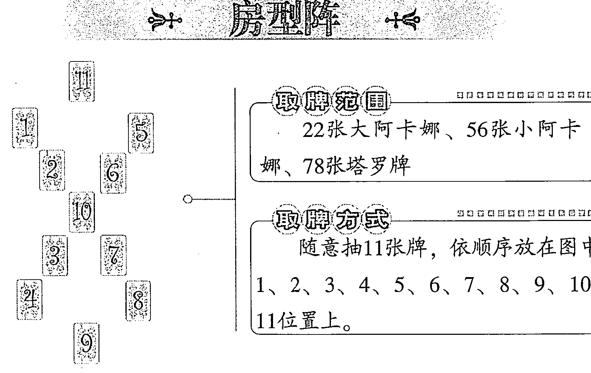

**取牌范围**
22张大阿卡娜、56张小阿卡娜、78张塔罗牌

**取牌方式**
随意抽11张牌，依顺序放在图中1、2、3、4、5、6、7、8、9、10、11位置上。

##### 解牌技巧

- ☆ 牌1 客厅：朋友、社交关系、团体活动。
- ☆ 牌2 家人休息室：父母、兄弟姊妹、配偶、小孩、宠物。
- ☆ 牌3 厨房：健康、肉体。
- ☆ 牌4 私人房间：工作、资金。
- ☆ 牌5 洗衣间：你要留意的、必须小心的。
- ☆ 牌6 地下室：被隐藏的或是在你生命中不断累积的，但是你却没有意识到。
- ☆ 牌7 车库：停靠在你生命中且需要留意的。
- ☆ 牌8 卧室：连接第9、10两张牌的想法。（对于进入、离开你生命的人、事物的想法）
- ☆ 牌9 后门：正离开你生命的某些事物或某些人。
- ☆ 牌10 前门：正进入你生命的某些事物或某些人。
- ☆ 牌11 阁楼：你最后的成就。

### 二、基础牌阵

#### 二选一牌阵

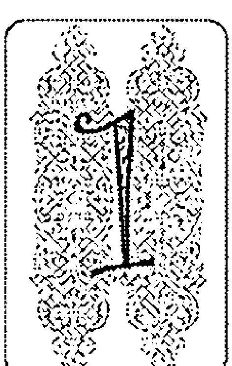

**取牌范围**
大阿卡娜22张、小阿卡娜的圣杯九、4张 Ace牌，共27张牌。

**取牌方式**
随意抽出1张牌，不考虑正逆位，以出现的牌面来解释。

##### 解牌技巧

- ☆ 若是出现小阿卡娜Ace的任何一张，代表你必须调整自己的动作，或等待时间的安排。
- ☆ 若是出现圣杯九，则代表明确的“肯定”。
- 若出现大阿卡娜牌请查阅下面所列。
- ☆ 若出现以下牌则代表答案为“肯定”：愚人、魔术师、女皇、皇帝、战车、正义、星星、太阳、世界。
- ☆ 二者皆可的牌（您可以自己随需要选择）：女祭司、命运之轮、恋人、教宗、月亮、审判。
- ☆ 若出现以下牌则代表答案为“否定”：力量、塔、节制、隐士、倒吊者、死神、恶魔。

#### 得与失

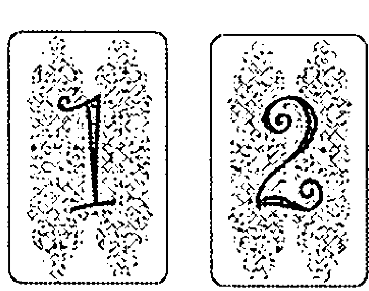

**取牌范围**
22张大阿卡娜、56张小阿卡娜、78张塔罗牌

**取牌方式**
随意抽2张牌，依顺序放在图中1、2位置上。

##### 解牌技巧

- ☆ 牌1 我将失去什么。
- ☆ 牌2 我将获得什么。

#### 今日运势

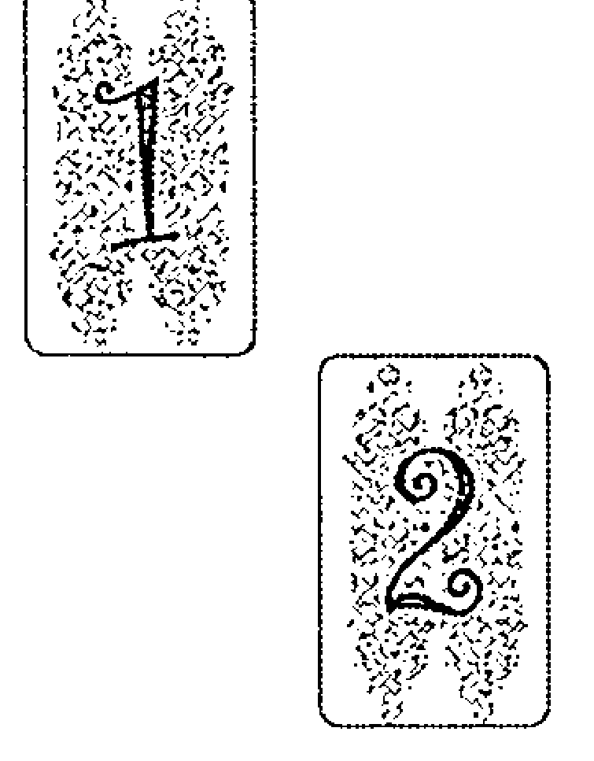

**取牌范围**
22张大阿卡娜、56张小阿卡娜、78张塔罗牌

**取牌方式**
随意抽2张牌，依顺序放在图中1、2位置上。

##### 解牌技巧

- ☆ 牌1 事件：今天可能发生的一些事。
- ☆ 牌2 感受：你的感受或是对所发生事情的反应。

#### 了解自己

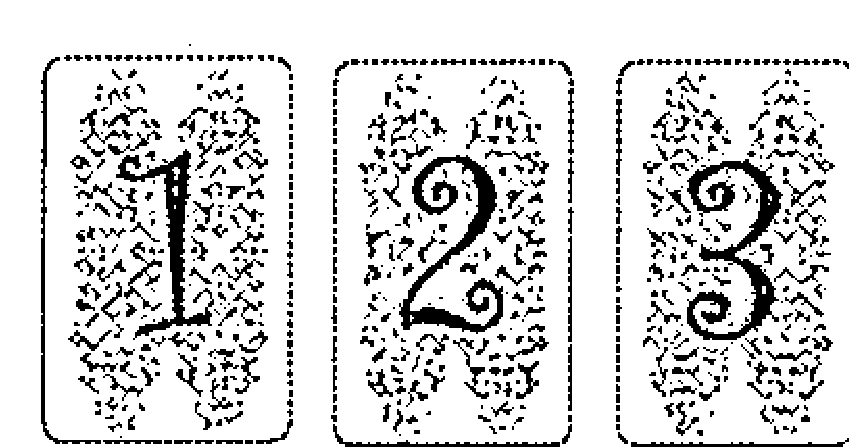

**取牌范围**
22张大阿卡娜、56张小阿卡娜、78张塔罗牌

**取牌方式**
随意抽3张牌，依顺序放在图中1、2、3位置上。

##### 解牌技巧

- ☆ 牌1 我是谁。
- ☆ 牌2 我的需求。
- ☆ 牌3 我如何达成我的需求。

#### 今天会发生什么

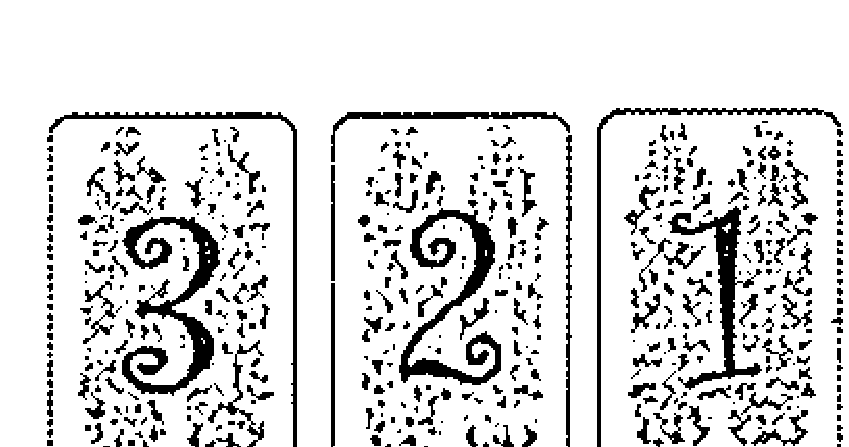

**取牌范围**
22张大阿卡娜、56张小阿卡娜、78张塔罗牌

**取牌方式**
随意抽3张牌，依顺序放在图中1、2、3位置上。

##### 解牌技巧

- ☆ 牌1 今天的重点事件。
- ☆ 牌2 这事件会如何发展。
- ☆ 牌3 你如何开始或你该为这事件做些什么。

#### 工作

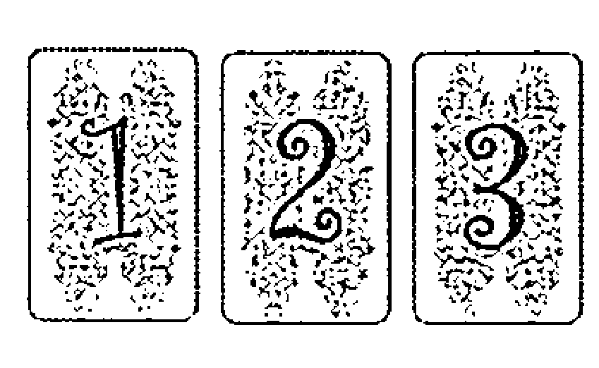

**取牌范围**
22张大阿卡娜、56张小阿卡娜、78张塔罗牌

**取牌方式**
随意抽3张牌，依顺序放在图中1、2、3位置上。

##### 解牌技巧

- ☆ 牌1 我选对工作了吗？(必须深思熟虑)
- ☆ 牌2 这工作稳定吗？(可以做多久)
- ☆ 牌3 应该做些改变吗？(我应该继续做，还是稍做调整，甚至离职)

#### 合伙

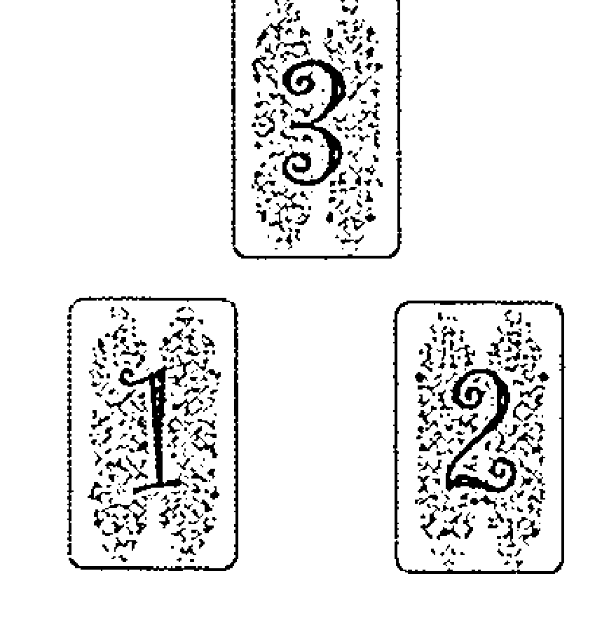

**取牌范围**
22张大阿卡娜、56张小阿卡娜、78张塔罗牌

**取牌方式**
随意抽3张牌，依顺序放在图中1、2、3位置上。

##### 解牌技巧

- ☆ 牌1 我的伙伴。
- ☆ 牌2 我自己。
- ☆ 牌3 合伙工作的状况或是风险。

### 三十三 爱情牌阵

#### 分手

**取牌范围**
22张大阿卡娜、56张小阿卡娜、78张塔罗牌

**取牌方式**
随意抽5张牌，依顺序放在图中1、2、3、4、5位置上。

##### 解·牌·技·巧

分手解牌法主要是告诉你一些你必须取舍的事。
第5张牌主要告诉你如何去调整自己对爱的感觉。

- ☆ 牌1、2、3：我为什么要放手？为何要放弃的隐藏原因。
- ☆ 牌4：为何要放弃的最主要或惟一的原因。
- ☆ 牌5：最终结果：如果你放手了，会造成怎样的结果。

#### 真爱预测

**取牌范围**
22张大阿卡娜、56张小阿卡娜、78张塔罗牌

**取牌方式**
随意抽5张牌，依顺序放在图中1、2、3、4、5位置上。

##### 解牌技巧

- ☆ 牌1 我真正的伴侣的类型。
- ☆ 牌2 我真正的伴侣已经走入我的生命之中了吗?
- ☆ 牌3 将会有困难产生吗?
- ☆ 牌4 什么样的改变是需要的?
- ☆ 牌5 我将相信什么?

#### 爱情大考验

**取牌范围**
22张大阿卡娜、56张小阿卡娜、78张塔罗牌

**取牌方式**
随意抽5张牌，依顺序放在图中1、2、3、4、5位置上。

##### 解牌技巧

- ☆ 牌1 这段时间，我的爱情关系传达了什么东西给我。
- ☆ 牌2 在爱情关系中我真正要什么。
- ☆ 牌3 在爱情关系中我不喜欢什么。
- ☆ 牌4 什么可以赋予爱情新的能量。
- ☆ 牌5 对于爱，我仍不了解的，或是我应该学习的。

#### 爱情消失

**取牌范围**
22张大阿卡娜、56张小阿卡娜、78张塔罗牌

**取牌方式**
随意抽5张牌，依顺序放在图中1、2、3、4、5位置上。

##### 解·牌·技·巧

前3张牌（1、2、3）可以解读成，因为长时间的误解，而造成现在爱情伤心与痛苦的原因。

- ☆ 牌1 因为某事、某原因你伤害我很深。
- ☆ 牌2 在一起时，我们曾拥有什么。
- ☆ 牌3 因为某事、某原因，你却破坏了它（第2张牌所指）。
- ☆ 牌4 这状况可以获得解决吗？
- ☆ 牌5 我们将仍会在一起吗？

#### 爱情的起点

**取牌范围**
22张大阿卡娜、56张小阿卡娜、78张塔罗牌

**取牌方式**
随意抽9张牌，依顺序放在图中1、2、3、4、5、6、7、8、9位置上。

##### 解牌技巧

- ☆ 牌1 这是一个新起点吗？
- ☆ 牌2 将会有新的爱人吗？
- ☆ 牌3 会有什么惊喜产生？
- ☆ 牌4 这将令人安心吗？
- ☆ 牌5 过程将会如何？
- ☆ 牌6 相处融洽吗？
- ☆ 牌7 内心所想的是真的吗？
- ☆ 牌8 将设定怎样的目标？
- ☆ 牌9 一切都会好吗？

#### 评价爱人

**取牌范围**
22张大阿卡娜、56张小阿卡娜、78张塔罗牌

**取牌方式**
随意抽10张牌，依顺序放在图中1、2、3、4、5、6、7、8、9、10位置上。

##### 解牌技巧

- ☆ 牌1 我的爱人关心我吗？
- ☆ 牌2 我们稳定吗？
- ☆ 牌3 我们有相似的梦想与目标吗？
- ☆ 牌4 我的爱人是忠诚、可靠的吗？
- ☆ 牌5 我们互相吸引对方只是因为性的因素吗？
- ☆ 牌6 我的爱人考虑过结婚吗？
- ☆ 牌7 我的爱人是高水平与高素质的人吗？
- ☆ 牌8 我们能分享彼此的金钱与个人财富吗？
- ☆ 牌9 我的爱人将为我停留，还是离开我？
- ☆ 牌10 最终结果。

#### 爱情配对

**取牌范围**
22张大阿卡娜、56张小阿卡娜、78张塔罗牌

**取牌方式**
随意抽10张牌，依顺序放在图中1、2、3、4、5、6、7、8、9、10位置上。

##### 解牌技巧

- ☆ 牌1 有吸引力的、诱人的。
- ☆ 牌2 那个人正在恋爱吗？
- ☆ 牌3 我们能相处愉快吗？
- ☆ 牌4 我们可以一起工作以及相互支持对方吗？
- ☆ 牌5 我们的性生活能配合吗？
- ☆ 牌6 我们的家族能相处融洽吗？
- ☆ 牌7 我们宗教信仰是否不同、有冲突吗？
- ☆ 牌8 我们将会有权力与金钱方面的问题吗？
- ☆ 牌9 这将是一段长时间的关系吗？
- ☆ 牌10 结果。

### 四 财富牌阵

#### ※ 牌 数 ※

**取牌范围**
22张大阿卡娜、56张小阿卡娜、78张塔罗牌

**取牌方式**
随意抽7张牌，依顺序放在图中1、2、3、4、5、6、7位置上。

##### 解·牌·技·巧

- ☆ 牌1 你的愿望。
- ☆ 牌2 如何播种你的愿望种子，并且得到成果。（该如何行动——种瓜得瓜，种豆得豆）
- ☆ 牌3 在实现愿望的过程中，所需要的新想法。
- ☆ 牌4 某人或某些事物会帮助你。
- ☆ 牌5 你面前的挑战。
- ☆ 牌6 你将得到什么。
- ☆ 牌7 实现未来远景的关键。

#### 财富占卜

**取牌范围**
22张大阿卡娜、56张小阿卡娜、78张塔罗牌

**取牌方式**
随意抽9张牌，依顺序放在图中1、2、3、4、5、6、7、8、9位置上。

##### 解·牌·技·巧

- ☆ 牌1 钻石：你出众的地方，主要的天赋、能力，你拥有的财富。
- ☆ 牌2 珍珠：你的知识，你将其融入生活中的知识与信息。
- ☆ 牌3 金币：你拥有的，金钱与目前你可以使用的物质。
- ☆ 牌4 翡翠：你认识的人，在你生命中新发生的关系。
- ☆ 牌5 白金链：阻碍你的，在你生命中你必须去解决、处理的人事物。
- ☆ 牌6 蓝宝石：你与众不同的地方，目前正脱颖而出的才能、财产、能力。
- ☆ 牌7 水晶：你正在学习的，你可以将其融入生活中的知识与信息。
- ☆ 牌8 红宝石：你可能马上要认识的人，那人正走入你的生命中。
- ☆ 牌9 未经琢磨的钻石：你尚未发挥的地方，你可以开发的财产、能力。

#### 四、财务状况

**取牌范围**
22张大阿卡娜、56张小阿卡娜、78张塔罗牌

**取牌方式**
随意抽10张牌，依顺序放在图中1、2、3、4、5、6、7、8、9、10位置上。

##### 解牌技巧

- ☆ 牌1、2、3、4 与我金钱方面有关的，并且需小心注意的。
- ☆ 5、6、7 我如何让我的财务方面稳定安全？
- ☆ 8、9 谁能提供我所需要的帮助？
- ☆ 10 我财政方面的未来规划。

### 五、家庭牌阵

#### 搬 家

**取牌范围**
22张大阿卡娜、56张小阿卡娜、78张塔罗牌

**取牌方式**
随意抽7张牌，依顺序放在图中1、2、3、4、5、6、7位置上。

##### 解·牌·技·巧

- ☆ 牌1 什么样的地方对你福利、健康是有帮助的。
- ☆ 牌2 下次搬家的机会。
- ☆ 牌3 你如何找到属于你的特殊地方。
- ☆ 牌4 关于这地方你必须知道的事。
- ☆ 牌5 你搬家前必需做的。
- ☆ 牌6 关于这地方你必须考量的事。
- ☆ 牌7 结果。

#### 十·宠·物·十

**取牌范围**
22张大阿卡娜、56张小阿卡娜、78张塔罗牌

**取牌方式**
随意抽7张牌，依顺序放在图中1、2、3、4、5、6、7位置上。

##### 解·牌·技·巧

- ☆ 牌1 你的宠物试着要告诉你的。
- ☆ 牌2 你的宠物现在的感觉，它的需求。
- ☆ 牌3 你如何帮助你的宠物。
- ☆ 牌4 此时你的宠物需要更多的是什么。
- ☆ 牌5 你的宠物整体的健康。
- ☆ 牌6 在最近的未来中你的宠物将所需要的。
- ☆ 牌7 你的宠物的整体分析。

#### 二小孩家庭

**取牌范围**
22张大阿卡娜、56张小阿卡娜、78张塔罗牌

**取牌方式**
随意抽8张牌，依顺序放在图中1、2、3、4、5、6、7、8位置上。

##### 解·牌·技·巧

这牌阵专为有两个小孩的家庭所创，且此牌阵可以很容易增加其它牌与解释到牌阵里面。
你可以沿用这个牌阵的格式或是增加一些牌来符合你的需求。

- ☆ 牌1、2、3 你最大的小孩的个性、人格与性向的特征。
- ☆ 牌4 你能做些什么事来帮助你最大的小孩。
- ☆ 牌5、6、7 你最小的小孩的个性、人格与性向的特征。
- ☆ 牌8 你能做些什么事来帮助你最小的小孩。

### 事业牌阵

#### 事业发展

**取牌范围**
22张大阿卡娜、56张小阿卡娜、78张塔罗牌

**取牌方式**
随意抽5张牌，依顺序放在图中1、2、3、4、5位置上。

##### 解牌技巧

- ☆ 牌1 我将有一个更好的工作吗？
- ☆ 牌2 我拥有什么或是我该做些什么。
- ☆ 牌3 我将遇到什么问题。
- ☆ 牌4 我可以期盼一个新环境的到来吗？
- ☆ 牌5 结果。

#### 事业发展

**取牌范围**
22张大阿卡娜、56张小阿卡娜、78张塔罗牌

**取牌方式**
随意抽7张牌，依顺序放在图中1、2、3、4、5、6、7位置上。

##### 解牌技巧

- ☆ 牌1 对于我所选择的事业，我真正想要从中得到什么。
- ☆ 牌2 什么行动可以改善我的事业。
- ☆ 牌3 事业中的哪些方面是我无法改变、改善的。
- ☆ 牌4 对于事业，我是否感觉到已经作出最棒的结果。
- ☆ 牌5 我可以去创造哪些属于自己的机会用来帮助我的事业。
- ☆ 牌6 虽是过去形成的阻碍，但现在仍影响我的事业。
- ☆ 牌7 最终的结果。

### 七、日常牌阵

#### 旅行牌阵

**取牌范围**
22张大阿卡娜、56张小阿卡娜、78张塔罗牌

**取牌方式**
随意抽4张牌，依顺序放在图中1、2、3、4位置上。

##### 解牌技巧

- ☆ 牌1 周围环境对于你即将开始的旅行的影响。
- ☆ 牌2 关于这次的旅行你所必须知道的一些事，而这些事有可能会被隐藏或忽略。
- ☆ 牌3 因为此次旅行，你将学到或领悟什么。
- ☆ 牌4 结果。

#### 生日

**取牌范围**
22张大阿卡娜、56张小阿卡娜、78张塔罗牌

**取牌方式**
随意抽9张牌，依顺序放在图中1、2、3、4、5、6、7、8、9位置上。

##### 解牌技巧

- ☆ 牌1 你目前的处境。
- ☆ 牌2 下次生日的时候你希望能得到什么。
- ☆ 牌3 可以帮助你的。
- ☆ 牌4 完成你的目标前必须去做的。
- ☆ 牌5 你目前身体的状况。
- ☆ 牌6 你目前感情的状况。
- ☆ 牌7 你目前精神的状况。
- ☆ 牌8 对你的阻碍。
- ☆ 牌9 为了让梦想实现今年所必须要做的事。

#### 四季运势

**取牌范围**
22张大阿卡娜、56张小阿卡娜、78张塔罗牌

**取牌方式**
随意抽8张牌，依顺序放在图中1、2、3、4、5、6、7、8位置上。

##### 解牌技巧

- ☆ 牌1、8 春季：象征开始或行动开始、立定志向，可以说像是种下种子一样。
- ☆ 牌2、3 夏季：象征计划的进展，想法开花结果（企划完成）。
- ☆ 牌4、5 秋季：象征计划的决议，结果将会如何。
- ☆ 牌6、7 冬季：象征计划或行动完成后那一段的收获期，或是代表求问者想从这计划行动过程学到的东西。

#### 彩虹牌阵

| 取牌范围 | 22张大阿卡娜、56张小阿卡娜、78张塔罗牌 |
| :--- | :--- |
| 取牌方式 | 随意抽6张牌，依顺序放在图中1、2、3、4、5、6位置上。 |

##### 解牌技巧

- ☆ 牌1 雨：阻碍你完成心中愿望的。
- ☆ 牌2 细雨：首先要做的，可以帮助你更进一步达到你想要的。
- ☆ 牌3 雨停：某些人、事物将会帮助你。
- ☆ 牌4 阳光：你所能希望的最好状况。
- ☆ 牌5 彩虹：短期的指引。
- ☆ 牌6 金色苍穹：长期的结果。

#### 英国皇家塔罗牌·tarot

##### 旅程牌阵

**取牌范围**
22张大阿卡娜、56张小阿卡娜、78张塔罗牌

**取牌方式**
随意抽8张牌，依顺序放在图中1、2、3、4、5、6、7、8位置上。

##### 解牌技巧

- ☆ 牌1、2 你目前的处境。
- ☆ 牌3 你如何前往你想要到达的地方。
- ☆ 牌4 你从何处出发。
- ☆ 牌5 你得到什么、发现什么（沿路上你会发现什么）。
- ☆ 牌6、7 你学习到什么、你会得到的经验。
- ☆ 牌8 结果（旅程的终点是如何的）。

#### 隐藏与丰盛牌阵

**取牌范围**
22张大阿卡娜、56张小阿卡娜、78张塔罗牌

**取牌方式**
随意抽8张牌，依顺序放在图中1、2、3、4、5、6、7、8位置上。

##### 解牌技巧

- ☆ 牌1 你过去的健康状况。
- ☆ 牌2 你现在的健康状况。
- ☆ 牌3 你未来可能的健康状况。
- ☆ 牌4 某人或某些事物可以帮助你改善或维护你的健康。
- ☆ 牌5 过去什么事情让你快乐。
- ☆ 牌6 现在什么事情让你快乐。
- ☆ 牌7 未来什么事情可能会让你快乐。
- ☆ 牌8 某人或某些事物可以帮助你或加强你的幸福与健康。

#### 幸运分析

**取牌范围**
22张大阿卡娜、56张小阿卡娜、78张塔罗牌

**取牌方式**
先取出小阿卡娜的4张Ace，然后随意抽5张牌，依顺序放在图中1、2、3、4、5位置上。
然后从4张小阿卡娜Ace抽出1张放在6。

##### 解牌技巧

- ☆ 牌1 你的幸运状况大概的分析。
- ☆ 牌2 你的幸运状况是如何影响你的生活。
- ☆ 牌3 可能产生幸运的地方。
- ☆ 牌4 某人或什么事物将走入你的生命之中并带来幸运的效果。
- ☆ 牌5 第4张牌带来的幸运将如何帮助你达成你的愿望。
- ☆ 牌6 较幸运的季节——只使用小阿卡娜的4张Ace之一。
  - 权杖Ace——春天。
  - 圣杯Ace——夏天。
  - 钱币Ace——秋天。
  - 宝剑Ace——冬天。

#### 九宫阵命运

| 取牌范围 | 22张大阿卡娜、56张小阿卡娜、78张塔罗牌 |
| :--- | :--- |
| 取牌方式 | 随意抽9张牌，依顺序放在图中1、2、3、4、5、6、7、8、9位置上。 |

##### 解牌技巧

- ☆ 牌1 我的生活将有何改变。
- ☆ 牌2 会有新关系或婚姻的产生吗？
- ☆ 牌3 我可以创造出成功的机会吗？
- ☆ 牌4 我将有金钱方面的保障吗？
- ☆ 牌5 我将有一个自由的旅程、旅行吗？
- ☆ 牌6 将会有什么问题发生？
- ☆ 牌7 我将会变得更聪明、更有智慧吗？
- ☆ 牌8 我将变得崇拜物欲吗？
- ☆ 牌9 我将变得更有价值吗？

#### ✦ 希望之光 ✦

**取牌范围**
22张大阿卡娜、56张小阿卡娜、78张塔罗牌

**取牌方式**
随意抽15张牌，依顺序放在图中1、2、3、4、5、6、7、8、9、10、11、12、13、14、15位置上。

##### 解·牌·技·巧

- ☆ 牌1 你自己。
- ☆ 牌1、2、3 你的个性、特质，以及针对情况或问题，本身所拥有的相关知识。
- ☆ 牌4、8、12 若没有采取任何行动，这情况或问题会如何自然发展。
- ☆ 牌5、9、13 若采取任何行动，这情况或问题会产生怎样不同的发展。
- ☆ 牌6、10、14 一些对你下定决心、做出决定可能有帮助的信息。
- ☆ 牌7、11、15 超过求问者所能控制的一些力量（无法控制的）。

#### 十 梦魇

**取牌范围**
22张大阿卡娜、56张小阿卡娜、78张塔罗牌

**取牌方式**
随意抽7张牌，依顺序放在图中1、2、3、4、5、6、7位置上。

##### 解牌技巧

- ☆ 牌1 关键：象征此梦想的状况或你对于此梦想的感觉。
- ☆ 牌2 梦想状况：一些与梦想有关的事件，例如：何时、何地、如何、为何。
- ☆ 牌3 内部的能量：此一梦想的主要能量。
- ☆ 牌4 表意识的想法：此梦想对你当前生命的意义。
- ☆ 牌5 潜意识的想法：此梦想在你心中的意义。
- ☆ 牌6 不易掌握的能量：假如你盼望梦想实现或想解决目前的窘境，你所需要的力量。
- ☆ 牌7 结果：此梦想将会如何呈现与它的影响效果。

## 第六章 塔罗与十二星座

人们熟悉的十二星座是从星相学中的黄道十二宫演变而来的。
黄道十二宫里的每一个星座都有与之对应的塔罗牌，并受其影响。其实我们每个人除了所属星座之外，还有代表我们个性的塔罗牌。

晴朗的夜晚，遥远的点点繁星看上去是那么的美丽。其实，满天的星光和我们每个人的关系都十分密切。研究这些星星和人类之间的神秘关系的一门学问，就是星相学，人们熟悉的十二星座就是从星相学中的黄道十二宫演变而来的。

“黄道十二宫”(zodiac)一词来自希腊语 zodiakos，意思是动物园。在希腊人眼里，星座是由各种不同的动物形成的，这也就是十二个星座名称的由来。

如果以地球为中心，太阳环绕地球所经过的轨迹就称为“黄道”。黄道宽 16 度，环绕地球一周为 360 度。黄道面包括了除冥王星以外所有行星运转的轨道，也包含了星座，恰好约每 30 度范围内各有一个星座，总计为十二个星座，称为“黄道十二宫”。

在星相学中，人们认为太阳根据季节不同，行经不同星座，造成日月星辰的变化与四时气候的更替，因此每个人出生的日子由于太阳到达星座的位置不同，显现出不同的个性。

黄道十二宫里的每一个星座都有与之对应的塔罗牌，并受其影响。其实我们每个人除了所属星座之外，还有代表我们个性的塔罗牌（见下页图）。

### 皇帝

3月21日至4月20日

皇帝这张牌，代表的主要象征就是大公羊，它象征白羊座的支配力和古老的力量。皇帝这张牌常常伴随着公羊的出现，代表着一切世俗权利的掌握与最顶端自我的控制。代表着第一个成功与名声的开展，同时也代表着白羊座野心的展现。

白羊座的守护星是火星，具有凶猛、暴力和英雄气概。代表的个性是雄心勃勃，喜欢冒险、开拓、接受挑战，担任领导者；成功欲望很高，富有侵略性，不顾一切追求自己的目标。

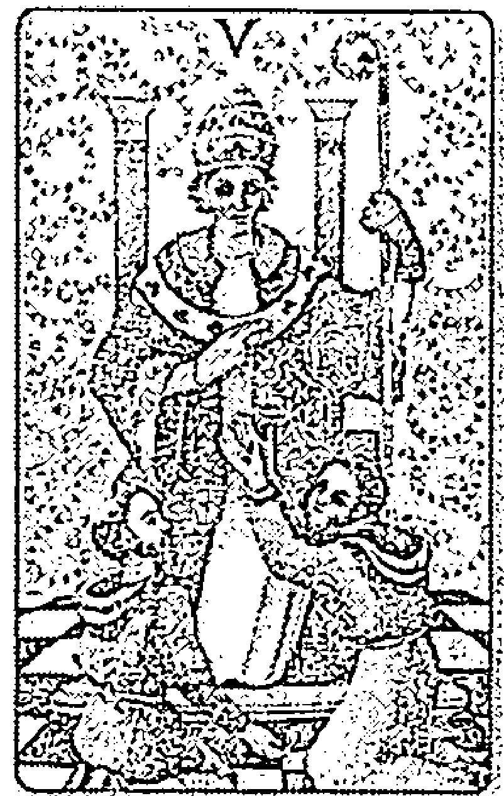

### 主教 金牛座

4月21日至5月21日

主教是世俗的导师和神的代表，其主要象征是公牛，有着金牛座的厚道以及大智若愚的特性，也有着温和及稳健的个性，总是带给人们领导的方向与精神生活的崇高意志，使人不知不觉地遵从他。

金牛座的守护星是金星，具有爱美的天性和艺术天分。代表的个性是温柔、热情、优雅、迷人，情感丰富，容易受感动。

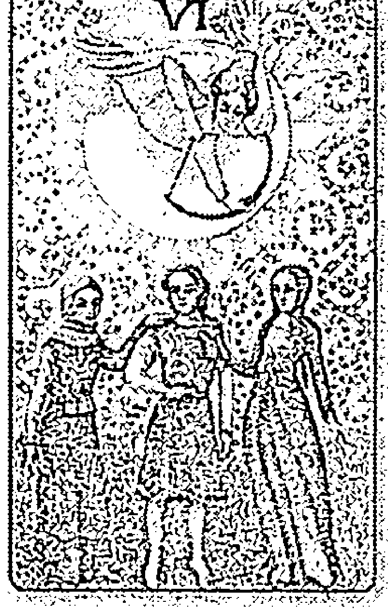

### 恋人 双子座

5月22日至6月21日

恋人象征着自由的灵魂，像双子座的孪生子一样，象征着完美无缺的结合，也代表着共生的意味及两位一体的观念，所以在感情方面好的时候很好，纠葛起来，也没完没了，就好像自己和自己打架一样。

双子座人的守护星是水星，具有聪明的头脑和锐利的言辞。代表的个性是聪明、活泼、冲动，思虑敏锐，注意细节，容易冲动而陷入正在进行的事。

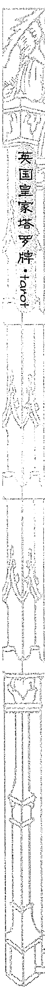

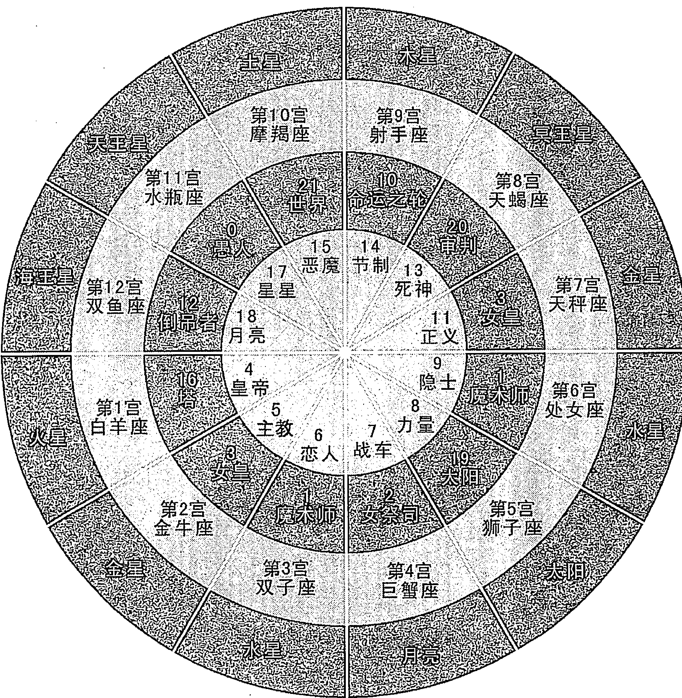

### 塔罗与十二星座对照盘

(黑色对照黑色区,灰色对照灰色区)

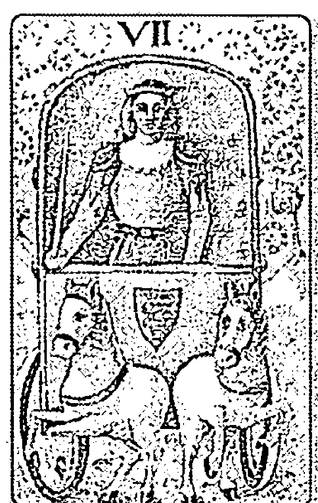

### 战车 巨蟹座

6月22日至7月23日

战车这张牌代表着心灵的进化，正是喜欢对抗命运的巨蟹座人的象征，也符合巨蟹座人有责任感，敢于面对巨大挑战的个性。另一方面由于水相星座的影响，战车这张牌和巨蟹座人都有情绪化的一面。

巨蟹座的守护星是月亮，月亮影响潮汐，牵动人类的情绪，代表梦和潜意识以及情感的力量。所影响的个性是敏感、细心、内向，情绪起伏很大，富有同情心，善于和他人合作。

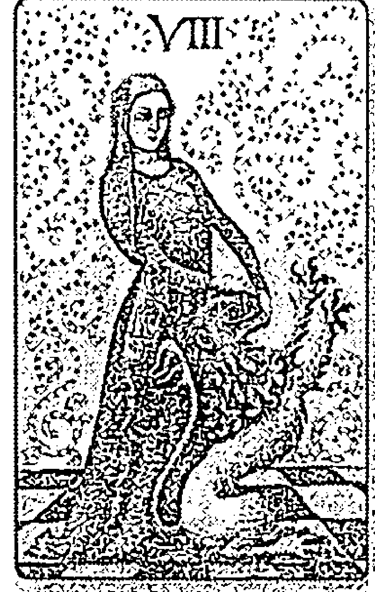

### 力量 狮子座

7月24日至8月23日

> “不畏艰难，我以烈火焚烧我的敌人；不怕没有援助，我用双手撕裂威权猛狮。”

无止境的活力和坚强的意志力是狮子座人的最大特点，他们一生都在追求力量，就像狮子一样，永远都想统治大地。力量对狮子座的人来说有很多涵义：活力，热情，爱恨分明，才华出众，惹人注目，这些都是狮子座人所追求的。

狮子座的守护星是太阳，太阳提供光和热，是创造力和力量的来源，所影响的个性是坦诚、率直外向、活跃、热情、善于表达自己、喜欢指挥、控制、影响别人。

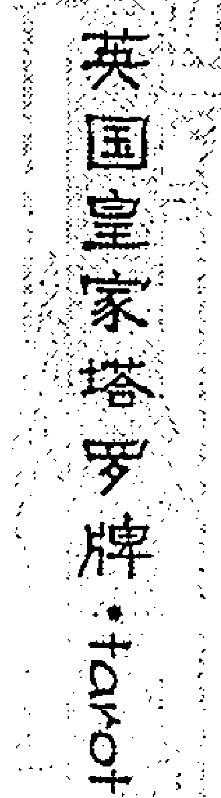

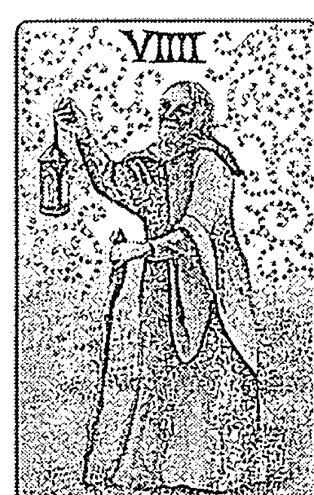

### 隐士 处女座

8月24日至9月23日

一步一个脚印的寻找，是隐士的人生话题，透过双手的实践和身体力行，隐士寻找到属于他的经验与成就，通过学习，隐士寻找到属于他的智慧与力量。而追求真谛，正是处女座永恒不变的理想。所以开化、认知与启蒙是隐士的强项。

处女座的守护星也是水星，具有聪明的头脑和锐利的言辞。代表的个性是聪明、活泼、冲动，思虑敏锐，注意细节，容易冲动而陷入正在进行的事。

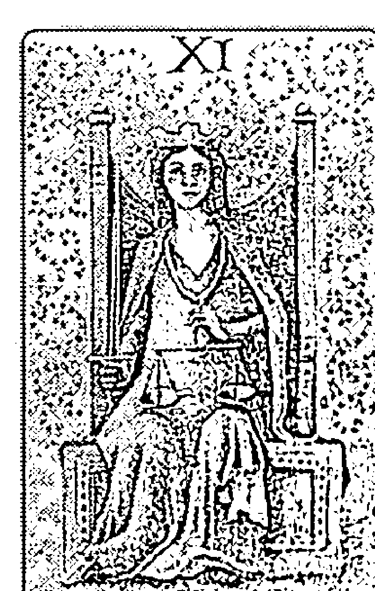

### 正义 天秤座

9月24日至10月23日

手持天平是正义女神的形象，天平代表着公理与公正。天秤座的人天生就有协调与平衡的能力，能调整事物的平衡与界定标准。天秤座所在的第七宫是另一个秩序的开始，就像每部法律的制定都标志着新规定的诞生和新局面的开展。

天秤座的守护星也是金星，具有爱美的天性和艺术天分。代表的个性是温柔、热情、优雅、迷人，情感丰富，容易受感动。

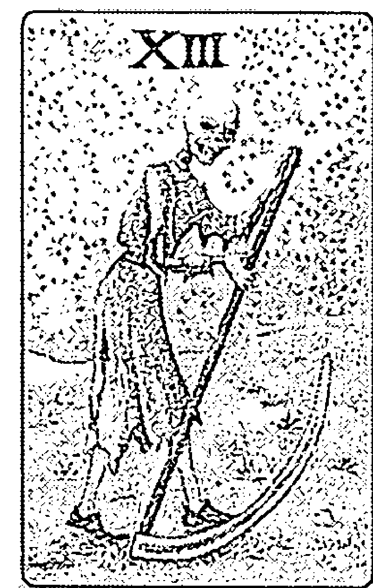

### 死神 天蝎座

10月24日至11月22日

当死神出现时，就代表着陈旧与破败的事物已经为社会本身带来了不良的影响。当邪恶，破败累积到一定程度的时候，就代表着完结的时刻即将到来。这一特性与天蝎座的特性极其相似。

天蝎座的守护星是冥王星，代表的个性是刚毅、敏感，直觉力强，观察力敏锐，感情强烈。

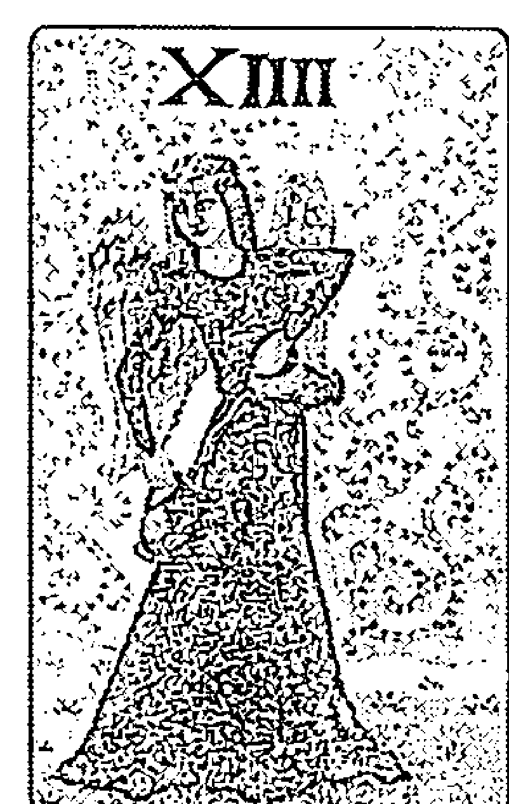

### 节制 射手座

11月23日至12月22日

受到节制牌的影响，射手座(也称人马座)人变得喜好哲学与宗教，他喜欢不受拘束，自由自在的感觉。射手座人的热情表现在研究与学习上，孜孜不倦的致力于知识的交流和融合，并同时追求心灵的稳定与超脱。

射手座的守护星是木星，影响智力、潜能发展及生活方式，代表的个性是乐观、愉快，凡事朝正面思考；充满智慧，善于解决问题；喜欢阅读和旅行，注重生活品质。

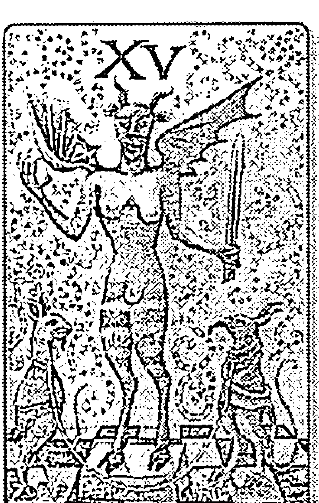

### 恶魔 摩羯座

12月23日至1月20日

摩羯座(也称山羊座)受到恶魔牌的影响，对于权力与欲望，有着无可救药的执着，天生对名利有着无比的渴望(成就，名望，欲望)，同时也拥有恶魔般的知觉与洞察力。另一方面，恶魔也代表着人类堕落的本性，以及人类劣根性的一面。

摩羯座的守护星是土星，具有冷静的头脑和坚强的毅力，影响人生的方向和使命感，也是万物的基础、秩序和责任的来源。代表的个性是固执、不易妥协，意志力与毅力坚强，主观，重视纪律和权威。

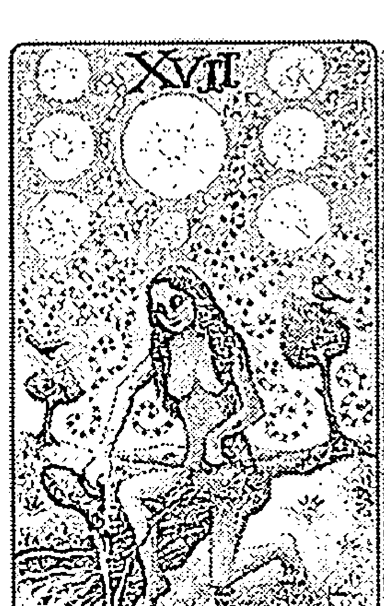

### 星星 水瓶座

1月21日至2月19日

毁灭之后，剩下的就是重建的希望跟光明的梦想，就如同挂在天边的星星，永远指引着人们前行的方向。受星星牌的影响，水瓶座带来了希望与梦想，第十一宫的人常会有新奇独到的想法，为人生与未来开创新的希望。

水瓶座的守护星是天王星，代表的个性是捉摸不定、善变，具有天生冲动的爆发力，以及创新的能力。

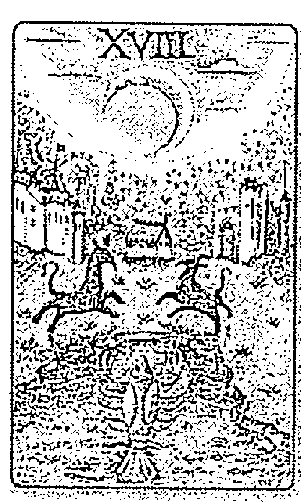

### 月亮 双鱼座

2月20日至3月20日

双鱼座人受到月亮潮汐的影响，情感的低潮与高潮会交替出现，而浑浊不堪的潮水令双鱼座人看不清自己的样貌，而潮汐也会带来深海中隐藏的敌人。所以在月亮牌的影响下，双鱼座人变得让人捉摸不定，从而产生一种神秘的美感。

双鱼座的守护星是海王星，代表的个性是有丰富的想象力，充满梦想和创意，容易吸引、感染和影响别人。

