# 跟着大师学塔罗

## 跟著大師學塔羅
导读 | 塔罗教父 丹尼尔

瑪莉老師這本《跟著大師學塔羅》在英美的塔羅牌圈子可說是無人不知、無人不曉，從1984年發行初版以來，啟發了許多塔羅牌的占卜師及教師，之後一度絕版，還曾在網路二手書店及拍賣網站飆上天價！所幸在2002年又出了第二版，才讓價格稍稍回落，但其廣大又深遠的影響力可見一斑。

嚴格來說《跟著大師學塔羅》並不是一本適合單獨閱讀的書，而是一本利用塔羅牌來幫助自己的工作手冊，若是能跟著作者的編排一步一步地練習，看完本書時你將會發現對自己及人生有更進一步的體會，並且深深地愛上塔羅牌這件好用的工具。

《跟著大師學塔羅》並非只適用於特定圖案的塔羅牌，在簡介當中作者建議讀者去選擇一副自己有感覺的塔羅牌，但是最好在小牌部分也帶有圖案與象徵，這樣比較容易聯想。同時作者也提供一些方法幫助讀者發展自己的直覺力，大都是很實用也很有效的建議。

在第一章當中作者運用靈數與占星幫助讀者找到一些與個人特別有連結的牌，這是非常好的方法。畢竟塔羅牌有七十八張，一開始要完全熟悉所有的牌有其困難，如果能由個人的經驗出發先挑幾張牌深入認識，會打下很好的基礎；接下來作者也介紹了一些與塔羅牌相關的儀式，對於儀式魔法有興趣的讀者應該會由這個部分獲益良多。

第二章開始進入到實際占卜的練習方法，作者建議讀者每天進行三張牌陣的占卜，並且將自己占卜的結果記錄下來，這是個人化塔羅牌很重要的基本功夫，也是後面所有練習的基礎，與在臺灣流行的「塔羅日記」法有異曲同工之妙；接著作者進一步介紹終身年度牌的算法，希望幫助讀者從過去的經歷之中，找到與大阿爾克那牌義的連結。

第三章作者進入到更細部的占卜功夫，介紹問問題的方法，以及解讀小阿爾克那各個牌組的基本原則。在這章當中介紹了利用四元素淨化的儀式及逆位牌的解釋原則；第四章可說是本書前幾章的總結，作者以凱爾特十字牌陣為例，引導讀者綜合運用之前所介紹的各種技巧。

在第五章當中作者開始引導讀者去熟悉宮廷牌的特質，作者提到「許多解讀者都發現，宮廷牌是在讀牌時最難解釋的部分」，這點與丹尼爾的教學經驗相同。而作者提供的各種方法都很實用，如果能夠確實練習應該可以幫助讀者大幅提升對於宮廷牌的解讀能力；第六章作者提出獨特的換置技巧，可以突破牌陣當中固定位置的限制，看到更深入的內涵。

本書的後半部則是針對塔羅牌各種運用主題的介紹：第七章作者介紹如何運用塔羅牌來處理處理情緒、情感與人際關係的問題，第八章介紹處理生涯規劃的技巧，第九章則是介紹運用占星與靈擺來輔助塔羅占卜的方法，第十章處理疾病與療癒的主題，第十一章介紹如何將水晶能量運用在塔羅占卜當中，第十二章則是提到設計牌陣、創作自己的塔羅牌、運用塔羅牌激發創作靈感等主題，這六章幾乎包括了大部分讀者感興趣的主題。

本書的附錄一提供了每張牌正逆位的關鍵字、聯想提示與肯定句的範例，可以作為練習時的參考，附錄二則是補充了塔羅牌的歷史源流，這是在第二版當中大幅修改增訂的，附錄三提供大阿爾克那與希伯來文字、占星學符號、音律、色彩、寶石、動物、植物、魔法道具和香料的對應表，當中有不少資料可以讓讀者再延伸運用。

如果你還是初學者，建議先把簡介及附錄二的塔羅歷史先看完，然後開始跟著作者安排的章節閱讀並做練習，遇到牌義有疑問再去參考附錄一的內容；如果你已經有豐富的占卜經驗，那麼就只管挑選自己有興趣的章節看。但是丹尼爾仍然會建議確實去做作者提供的練習，才會有最大的收穫。

這本書是瑪莉老師的成名之作，增訂第二版之後更加完整與深入，本書不只適合想要學好塔羅占卜的讀者，任何對於塔羅牌有興趣的人都可以從本書當中獲益；當然單單只讀一本書不太可能立刻就成為塔羅高手，不過本書當中豐富的資料與練習，確實能幫助有心學好塔羅牌的讀者更上一層樓，在此誠心推薦給大家。

# 與塔羅為友
推荐序 | 作家 袁琼琼

總統大選之前，某電視節目曾找命理師算塔羅牌，預測哪個候選人會當選。

我是選後才在YouTube上看到這段影片。因為「答案」已經揭曉，這時候看塔羅牌的預測，真有石破天驚之感。因為塔羅牌不僅做出正確預測，事實上，在命理師為特定候選人抽的牌中，還包含了代表被占卜者自己的星座牌。塔羅牌占卜中出現這樣明確的關鍵牌時，表示大事底定，一切不會再有變化。

從塔羅牌的狀態解讀，應該是選前算牌的那一刻，一切已然確定了。選後的分析中，事實上許多名嘴也做出類似的結論。對照事實與預測，不得不驚嘆：塔羅牌真是準啊！

我接觸塔羅牌甚早，學會之後，也時常給朋友和自己算，歷三十年。自己的經驗是：塔羅牌總是準的，但是命理師解牌的功力卻是三六九等，碰到了解牌能力差的命理師，不但說法搔不到癢處，細節也會說的似是而非。驗證命理師功力高低，最簡單的方式就是，他給的答案是不是斬釘截鐵？如果模稜兩可的話，這個人不會解牌，因為塔羅牌最利害就是：它給的答案總是很明確。這尤見於選擇題或是非題。

因為塔羅牌這種坦白的性質，因此，所有的命理系統中，塔羅牌幾乎是唯一可以自己給自己算，也不會失去準確性的占卜法。給自己算命，總是不免有些一廂情願的念頭，但是塔羅牌就像個真正的好朋友，它總是對你說實話，並且逼真到讓你無從迴避。

有過算牌經驗的人，一定會發現，與其說塔羅牌在給答案，其實更像是它在跟你對話。就像有個更高更明澈的存在，看到了我們的迷亂與困惑，而適時的給予點撥。然而這不是初學者可以輕易體驗到的。《跟著大師學塔羅》這本書彌補了初學者在經驗上的不足，直接告訴我們，除了固有含義之外，在塔羅牌上還可以看到什麼。

由於探索到塔羅牌的心理學層面，它對於牌面的解說遠超過我曾閱讀過的任何塔羅書籍。不僅詳盡完整，並且還有作者自己發展出的延伸意義。由於書的原身是作者的教學講義，並且實際使用於教學，它有一個絕大的優點：內容多數是與學生的互動而來，因此幾乎涵蓋了一切學塔羅的人在實際操作時會碰到的問題。某種程度可以視本書為塔羅牌的百科全書。無論重要或不重要的，對於塔羅牌的一切疑惑，都能夠在本書中找到解答。

這不僅止是一本教導如何算塔羅的書，並且還教導我們如何讓塔羅牌成為最忠實，和不離不棄的好友。在人生旅途上，我們總有孤寂和昏亂的時刻，而通常身邊未必能適時出現既有智慧又可以信任的對象。如果學會給自己算塔羅，說真的，你可以信任塔羅。塔羅牌總是會給你明確和真實的答案，讓我們看清面前的路。

# 序

從我著手寫《Tarot for Yourself》（本書原文書名），一轉眼已經過了二十幾年了。原本暫定的書名為《Personalizing Tarot》（個人化塔羅），因為我希望讀者利用這本書與塔羅牌建立良好的互動，並構築一個積極正面的人生觀。我並不認為這些偏向超自然的塔羅研究、冥想、占卜或塔羅歷史探尋等等，是不實用或不值一提的。但我覺得市面上已經有太多探討這些主題的書籍了，而關於塔羅的體驗和實用技法卻還有很多值得著墨的空間，卻很少被提及。只因為所有的塔羅書都叫你不要為自己算塔羅。而當時我想是時候了，必須將我和學生、友人們多年來的發現與大家分享。結果書一出版，很多人都跟我說這就是他們一直想寫的書。本書是由我教學的講義及個人筆記集結而成的，若是照著我建議的方法持續作塔羅筆記，有一天你會發現，自己也能完成一本專屬的塔羅書。

我看見許多讀者為這本書裝了特製封套，甚至整本書裡都寫滿了密密麻麻的重點標記，還有將內頁裝在活頁講義夾裡，以便隨時增添新的圖片或筆記。那些作了完整筆記的人告訴我，這些紀錄都成了他們專屬的百寶箱，充滿了這一路的體認和成長的軌跡。每次重新閱讀，總會有新的領悟。而且他們都建議：不要擔心自己寫的東西太簡單或膚淺，只要將想到的都寫下來，有一天這些文字會對你產生意義的。

在此，我只想強調一點，縱然算塔羅有許多的規則，然而規則就是等著被打破的。

英文「禁忌」這個字源於波里尼西亞語，原義中「神聖」的成分大於「禁止」。表示人們可以運用這些強大的力量，但必須抱持著敬意和高度自覺，謹慎處理相關的禁忌。在為自己算塔羅時，我發現抱持順其自然的心態，通常效果會比較好，畢竟最初始的塔羅是被視為一種遊戲。而在使用本書時，如果不確定自己的做法是否正確，那就用你自認最合理的方式進行就好，之後再來評估結果。你可以選擇自己喜歡的方式來收藏塔羅牌；用你覺得舒適的方式洗牌，並將牌展開。我認為塔羅的規則就像一本食譜，第一次做某道菜時，會乖乖按照步驟去做，之後就可以依自己的喜好斟酌調整口味和份量。而在第一次踏入塔羅這個奇幻王國時，你或許想要謹慎一點，然而只要拿起這本書，其實你可以放鬆而自在的來算塔羅牌。

我絕對不是主張拋開其他所有的塔羅書，然後一路自己憑空捏造，這點從我參考書目的琳瑯滿目，應該可以清楚看得出來。然而算塔羅或學習塔羅有太多方式，而我相信這本書能夠填補其他塔羅書未提及的空白。希望讀者能從那些塔羅作者的經驗中汲取知識，盡所能地探究塔羅的歷史（這是個迷人的主題，可以參考附錄二）。你將會發現，所有的研究終會和塔羅連結在一起。而我不管看哪一類的書，都會以「塔羅文」作筆記，也就是把相對應的大阿爾克那牌註記在某個重要的觀點旁，如此可以讓我整合各個不同的觀點，甚至得出令人興奮的新發現。

本修訂版除了保有原有的內容之外，還加了一些說明和修正，以及重新撰寫的歷史章節。此外也增加了幾個實用圖表來說明我稱之為「隱藏要素（陰影）牌」以及關於逆位牌的解讀。附錄一包含了七十八張牌的逆位涵義，還有對小阿爾克那數字牌的擴大解釋。還增加並更新了許多參考書目，以及文獻資料。

在八〇年代早期，我始終相信塔羅牌的起源是古老、神秘、超自然的，雖然我並不相信埃及和吉普賽的神話。而從許多歷史學者，諸如麥克·達米特（Michael Dummett）、蒂埃里·德波里 斯（Thierry DePaulis）、朗·戴克（Ron Decker）、史都·卡普 蘭（Stuart Kaplan）及羅伯·歐尼爾（Robert O'Neill）等人的研究 中，都已充分證實塔羅極有可能發源於十五世紀前半的義大利北部。我在附錄二中有討論到這個問題。在此要特別感謝羅伯·歐尼爾、湯姆·泰佛·利德（Tom Tadfor Little）及詹姆斯·瑞伐克（James Revak），謝謝他們給我許多建議，而書中所有的結論、觀點及謬誤，均由我個人負責。

與占星學一樣，希伯來字母以及生命之樹的概念均來自於「金色曙光協會」（Golden Dawn，創立於1888年）。由於二十世紀最具影響力的塔羅牌創造者（萊德·偉特和托特塔羅）都是「金色曙光」成員，於是此類組織開始盛行於英語圈世界。當然還有許多可與之對應的系統，包括伊萊佛斯·里維（Eliphas Levi，建立馬賽塔羅牌 Marseilles Tarot 標準）和C. C. ZAIN（創造光之弟兄塔羅牌 Brotherhood of Light），以及其後不斷推陳出新的系統。請大家依書中所列，自由選擇喜愛的系統來算塔羅，按照自己的意思善用這本書。

或許有人會對我的女兒凱西米拉很好奇，因為在書中我常以她為例。而當我在寫這本書時，她正在澳洲短期遊學，一方面完成在新罕布夏大學的四年級學業。儘管我花太多時間在寫作上，但她總是能夠獨立將自己的事情處理好。雖然她並不相信塔羅，但不反對在有困難抉擇時看看塔羅怎麼說。

願神保佑你每一次的塔羅讀牌。

瑪莉 K. 格瑞爾 2001年9月4日
於加州內華達市

# 萊德·偉特牌 (THE RIDER-WAITE-SMITH)
最早發行於 1910 年，在神秘學者亞瑟·愛德華·偉特的指導下，由帕美拉·柯曼·史密斯繪圖。其大阿爾克納牌劃分為三列，每列七張，置頂的則是愚者 (0)。三列牌分別代表「身、心、靈」。任取第三列某張牌的數字，加上其正上方第一列牌的數字，再除以二，正好會得到兩牌中間那張牌的數字。而數字 11 是兩張涵義截然相反的牌相加除以二所得之平均值，例如 1 和 21 或 8 和 14 等。根據保羅·佛斯特·凱斯的說法，第一列代表動力與潛力，中列為法則或作用，最下面一列則代表狀況或影響。所以可以解釋為 1 號牌通過 8 號牌的作用，改變了 15 號牌的影響，以此類推。

# 前言 | Introduction
現在我們能夠看到塔羅牌的真正用途了。它關乎我們的起居，並協助安排我們的生活，也是我們內在和外內生活交流的符號……總之，塔羅是最有價值的心理生理貨幣收藏，並可以在任何次元兌換。

> —— Wm. B. 葛雷，魔幻儀式之法 (Magical Ritual Methods)

一直以來，無論難易層級和技巧，塔羅牌的重點都在為他人解讀牌義，或是冥想它們的符號，而專業讀牌者同時也會為自己讀牌。塔羅受到如此廣泛的運用，展現了人們追求理解自我的基本渴望，而塔羅又是多麼符合這項需求。《跟著大師學塔羅》是第一本將重點放在個人運用方法的塔羅書，並且提供筆記格式，可以將運算的過程都記錄下來。

《跟著大師學塔羅》是一項能認識自我的工具。內容主要是教導如何算塔羅，而非只是解釋其涵義。同時也能將塔羅變成一項有效資源，運用在現實生活中。

本書透過介紹各種與塔羅相關的事物，讓塔羅初學者和進階學習者都能有所收穫。包括冥想、儀式、牌陣、曼陀羅、視覺化、對話、圖表、占星學、靈數學以及肯定語。這些都能指引人去進行更深層的自我探索。經由檢視自己的過去、現在和未來的潛力，就能夠學會更有效的處理問題，並且認清自己的選擇，進而確立目標。如果希望走上這條認識自我的路，所需要的工具就只有這本書，以及任何一套塔羅牌，還有一支筆就夠了！

# 什麼是塔羅？
在現代，塔羅是一種西洋超自然心理和哲學系統，也是一種紙牌遊戲。共有七十八張牌，並分為大阿爾克納和小阿爾克納。二十二張大阿爾克納的符號代表一個人一生的旅程。心理學家榮格稱此旅程為「個體化進程」（Individuation Process）。

剩餘的五十六張牌包含了十六張宮廷牌和四十張數字牌。裡面有四大元素：權杖、寶劍、聖杯、錢幣，對應一般撲克牌的黑桃、紅心、梅花、方塊。而每種元素都有國王、皇后、騎士、侍者（或公主）四張牌。數字牌則為1到10。

由於塔羅牌使用的是宇宙共通的象徵語言，因此在過去幾個世紀裡它的影響力能傳播於世界各地，而不受語言或語義的限制。同時因為象徵語言也是代表潛意識的語言，所以使用塔羅往往可以刺激人的直覺和右腦中樞。這些因素使塔羅的各種牌陣自十八世紀起成為最普遍的通靈占卜方法，而其中最流行的就是塞爾特十字牌陣。

占卜方式包括洗牌，選牌，將牌排成特定的模式或者牌陣，再根據問題或實際生活狀況來解讀牌上的象徵語言。

但使用塔羅時焦點不要只局限在那些隨機選擇的牌上。每張牌，尤其是二十二張的大阿爾克納，展現了完整的哲學和心理學概念，其中任何一張牌都能拿來作為冥想或視覺化的主題。

# 為自己算塔羅
人都很難以客觀角度去審視自己的問題，所以大部分的塔羅書都是教人如何為別人讀牌，而不鼓勵為自己算塔羅。因為這些牌能夠顯示出自己內心的慾望和恐懼，然而大部分牌陣的設計都不是為了提供新的建議或選擇的，所以算到最後讀者只會感到無助罷了。

在面對塔羅牌時，不應只是將它當成一個占卜工具，它是能讓個人成長及轉變的一種強而有力的潛在工具。我在這本書中分享了許多來自我個人或學生經驗所得的方法，它們將盡可能的讓「為自己算塔羅」變成一場有力且具啟發性的冒險。

在開始之前，這裡有幾個方法可以避免遇到那些為自己算塔羅時常見的困難或疑惑：

1. 不需要去解釋牌的意義！只要將讀牌當成作筆記的一部分，然後深入而簡潔的觀察牌和所寫的內容有什麼關聯就好了。
2. 讀牌時將自己的聲音錄下來，聲音儘量大聲，彷彿是在解釋給別人聽一樣。
3. 儘量花時間來解讀一張牌。用幾種不同的角度來解讀它，最好把牌放在梳妝臺上，讓自己可以每天看到它。
4. 如果有某張牌讓自己特別困惑或苦惱，那麼透過冥想或視覺化來理解它。
5. 找個能夠協助自己的朋友。交換解讀對方的牌，並提供自己想法和意見。
6. 不要只是去「解讀」塔羅牌，還可以利用它來創造曼陀羅或故事，也可以只是單純透過牌的象徵語言來想像它的狀況。

# 如何選擇一副塔羅牌
使用塔羅牌時必定會接觸到象徵語言，因此挑選一副讓自己覺得舒服、有親近感的牌是很重要的。為了能透過本書的練習獲得最大效益，塔羅牌必須是每一張都有圖案的，要注意有些歐洲的小阿爾克納是採用抽象圖案（類似現代撲克牌）。我下面列舉的牌都是適合本書使用的，雖然它們只是個開端，嘗試給予各種可能的建議。自從八〇年代初我剛開始寫這本書起，已經有數百種新款塔羅問世，平均每年都會出現數十種。可以儘量試著用不同的牌來練習，甚至比較一下它們之間解讀出的結果有什麼差異。

下面我所列舉的牌只是一小部分，例如數種以世界神話為背景的塔羅牌。

| 種類 | 說明 |
| --- | --- |
| 萊德·偉特牌<br>Rider-Waite-Smith | 1910 年發行。是第一副為小阿爾克納加上圖案的塔羅牌。由亞瑟·愛德華·偉特所設計，帕美拉·柯曼·史密斯繪圖。其概念來自「金色曙光協會」，對後來的塔羅牌帶來深遠的影響。（以下簡稱 RWS） |
| 煉金術塔羅牌<br>Alchemical | 源於十七世紀的煉金術。 |
| 祖先之路塔羅牌<br>Ancestral Path | 包含多元民族元素。 |
| 水瓶座塔羅牌<br>Aquarian | 以六〇年代裝飾藝術風繪製。 |
| 棒球塔羅牌<br>Baseball | 將棒球隱喻成功融入塔羅中。 |

# 神聖玫瑰塔羅牌
Connolly
修改了一些繪者可諾麗認為較負面嚇人的傳統圖案。

## 魔法迷惑塔羅牌
Enchanted
奇幻且以拼貼組成的藝術品。

## 傑敦塔羅牌
Gendron
以電腦繪圖而成。

## 萬聖節塔羅牌
Halloween
充滿童趣。

## 漢生羅伯特塔羅牌
Hanson-Roberts
將 RWS 重新繪製，走童話風格，不帶恐怖色彩。

## 霍德斯塔羅牌
Hudes
牌面以文藝復興時代為背景，出現許多地圖。

## 亞瑟王塔羅牌
Legend
以亞瑟王、聖杯神話為主題。

## 摩根吉爾塔羅牌
Morgan-Greer
色彩明亮強烈，充滿肖像風格。

## 希臘神話塔羅牌
Mythic
以希臘神話為基礎。

## 埃及之光塔羅牌
Nefertari's
埃及風，鍍金。

## 新帕拉迪尼塔羅牌
New Palladini
由水瓶座塔羅牌作者繪製。

## 羅賓伍德塔羅牌
Robin Wood
新異教主義，威卡教派。

## 費茲王室摩洛哥塔羅牌
Royal Fez Moroccan
十二世紀風格。

# 神聖玫瑰塔羅牌
Sacred Rose
源於拜占庭，彩繪玻璃風。

- 變形塔羅牌 Shape-Shifter：巫術風格，融合動物及人類。
- 螺旋塔羅牌 Spiral：華麗，預言者，形而上學風格。
- 普及版偉特塔羅牌 Universal Waite：將 RWS 重新著色的版本。
- 幻境之旅塔羅牌 Vision Quest：印地安塔羅牌。
- 威廉布萊克塔羅牌 William Blake：以布萊克的畫作及創作爲背景。
- 女巫塔羅牌 Witches：新異教主義，預言者。
- 蘇丹塔羅牌 Xultun：以瑪雅文化爲背景。
- 托特塔羅牌 Thoth：於 1945 年完成。由艾利斯特·克勞利設計，費達·哈里斯繪製。出身「金色曙光協會」。

## 以下的塔羅牌乃同時受到托特塔羅及 RWS 的影響

- 宇宙種族塔羅牌 Cosmic Tribe：圖片以電腦拼貼處理。
- 光與影塔羅牌 Light and Shadow：有優雅的背面圖案，黑白剪影。
- 和平之母圓形塔羅牌 Motherpeace：圓形，女性化。
- 奈爾傑克遜塔羅牌 Nigel Jackson：以異教徒、空氣、火爲元素。
- 神聖之輪塔羅牌 Sacred Circle：以塞爾特人的神聖領域爲藍圖。

### 領航者直覺塔羅牌
Voyager
以照片圖畫合成。

### 世界精靈塔羅牌
World Spirit
以多元文化組成，巫術的。

### 自成一類的塔羅牌

- 塞爾特智慧塔羅牌 Celtic Wisdom：以塞爾特神話為主題。
- 奧修禪卡 Osho Zen：帶有佛教色彩。
- 歡慶日塔羅牌 Merryday：有仙女、精靈、現代魔術師等元素。
- 華麗部落塔羅牌 Shining Tribe：以巫術、地球為主題。
- 變化之輪塔羅牌 Wheel of Change：鄉村異教。數字牌上沒有人物。

### 歐洲古典塔羅牌

馬賽塔羅（Marseilles）、古義大利塔羅（Italian）、經典塔羅（Classic）、古代塔羅（Ancient）、伊特魯理亞塔羅（Minchiate Etruria），以及大部分埃及系統塔羅牌的圖案都比較簡單。雖然解讀時很有樂趣，但使用這類塔羅牌時多半需要記住每張卡的涵義，至於本書中所教的解讀技巧反而不是那麼重要。

我在寫作時以萊德·偉特牌和托特牌為基本的參考工具。至於塔羅牌與占星術、靈數學、希伯來字母等等的對應關係，我均總結在附錄三中。

# 理性與直覺思維

我們都很習慣以理性的邏輯來思考，因為學校是這麼教我們，而社會也鼓勵我們這樣過生活。而直覺思維是建立在「洞察力」之上，是一種對宇宙和諧的全心認可，是對過去、現在、未來之間，以及我們本身與世間一切連結的接納。

本書的練習能夠有系統的運用直覺，並且在筆記部分預留空間紀錄自我成長的過程，一個可以以充滿創造性、自發性心態持續終身的過程。這個工具就是能夠超越語言限制的塔羅牌視覺象徵。它們能夠使人在平衡而圓融的同時，運用直覺及分析思考。

# 如何使用本書

無論是初學者還是老手，使用自己的方法，跟著本書一章一章的進行練習是最好的。這些練習能藉由幫自己算塔羅建立自信及專業知識，日積月累下來將能感受到它的效果。

要記住，這是一本工具書。所以不要只是用眼睛閱讀那些練習，要動手做，並且把結果寫下。能夠自發性的練習是非常重要的。不要只看牌面的意思，要找出它們傳達出獨特且重要的訊息，並且相信自己的選擇。建立了與這些象徵語言間的獨有默契後，就可以開始運用附錄一中的解釋來擴展關於這些象徵語言的知識。你將能在解讀牌陣時，定位出每張牌的具體意義，並發現關鍵問句和編寫肯定語範例，讓每張牌在你的思維模式中發揮最高潛質。

將這本書當成一本手記，一本可以紀錄練習結果、自我成長過程，還有操作塔羅及冥想之後得到的洞察結果、思想、經驗等等的手記。就像其他手記一樣，記得將練習和筆記的年、月、日都紀錄下來。 做筆記時，不自我限制和發自內心是兩個很重要的因素。除非自己願意，否則不需要將自己寫的東西給任何人看。 書中的練習筆記頁可複印使用，參照書中附「圖表」部分，看看哪些是對自己最實用的。不過這些表格格式只是提供一些指引，並不是要強制規定必須按照上面的模式。所以可以隨意按照自己希望的方式填寫，或是寫在別的紙上也無妨。

## 發展你的直覺

本書的主要目的之一是幫助發展直覺意識，並了解它的運作機制。這裡有一些建議能夠更快熟悉練習的方式——

1.  憑直覺寫下感受到的印象及腦中浮現的影像。即使想否定這些想法，還是要寫下來。不要過濾自己的想法。
2.  儘量自在、開放，並展現自己的感情。不要擔心拼錯字或發音有誤。唯有正式文書才需要被校正和修改，使用這本書時並不需要。
3.  如果當時寫的東西看起來似乎不正確，就先在下面畫一條線，這樣不會妨礙你閱讀。再次閱讀時，或許會有不同的靈感出現。
4.  如果你是右撇子，嘗試用左手寫作（反之亦然）。雖然一開始會很笨拙，但這樣或許能幫助脫離僵化的表達方式。
5.  如果遇到瓶頸，就一直反覆寫最後一個字，直到新的靈感浮現。不用擔心，一定會的。
6.  幻想、謊言……牢牢抓住那些不可思議及奇異的感覺。看你的心靈將帶領你走向什麼樣的未知領域與驚奇。

如果覺得用寫的不過癮或不適合自己，那麼試著將自己的感覺錄音下來，基本原則與上述相同。也可以將得到的印象敘述給夥伴聽，甚至可以用表演或其他表現藝術來詮釋大部分的練習。重點是要客觀地表達出自己的直覺。正視自己的行為模式，才能隨心所欲的改變它們。

## 照片與插圖

本書每個章節的開頭都是一幅塔羅牌的照片或插圖，其展開方式能夠幫助理解它們的關係、與彼此的關聯，以及牌中更深層的涵義。仔細沉思其中模式後產生的直覺洞察，是解開它們奧秘的鑰匙。

透過冥想每張牌之間視覺上的交互關係，並配合牌義解釋，將可以學到塔羅牌的結構，以及自身的心理結構。有些作者描述他們透過特殊的展開模式所得到的領悟，我曾嘗試建議讀者留意這些資訊，閱讀這些作品。然而就如同冥想一般，每個模式的意義要透過個人去領悟，無法完全以言語解釋。所以我將它們收錄在本書中，做為進一步研究時的參考方針。

## 練習例題

現在立刻停止閱讀，拿一支筆或鉛筆，然後在下方空白處寫下「玫瑰」兩個字。接下來的五分鐘，將自己從「玫瑰」聯想到的任何事物都寫出來。運用聯想力、記憶力和直覺。寫的速度儘量快！即使自己這樣想：「真蠢，我討厭死玫瑰了。這麼做有意義嗎？」所有想法都是重要的，一點都不能漏掉。如果腦中浮現某些影像，就用簡單的字句描繪，例如：

「玫瑰是紅色的，紅色的玫瑰。刺會傷人。充滿香氣。我的手指被刺傷而沾滿鮮血，但我無法制止自己不去偷鄰家的玫瑰。看花瓣盛開，然後凋零，宛如乾涸的鮮血池。

我舉的例子絕不可能得到什麼新詩比賽優勝，但這不重要。幽默是接觸塔羅一個很好的開端。儘管做荒謬的聯想，抱著嘲諷和頑皮的心態，畢竟你是個剛開始一趟新旅程的「愚者」呀！

大多數的塔羅牌都會出現玫瑰。完成了寫出直覺的練習後，記住，要在完成練習之後，仔細看看牌中的玫瑰代表什麼意義？寫下的那些詞句有沒有讓自己領悟到為什麼玫瑰會出現在那些特定的牌中呢？

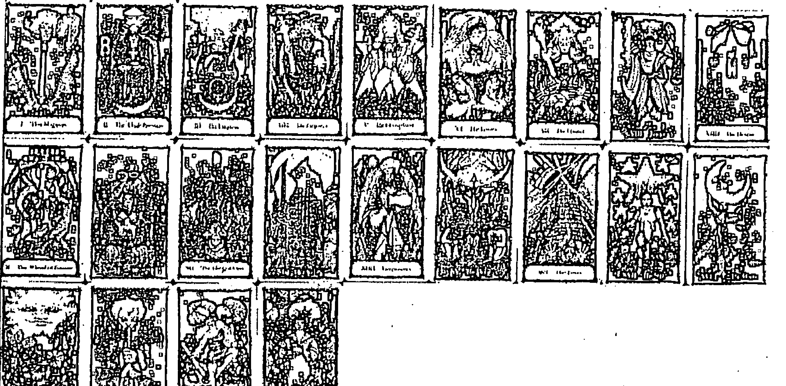

## 神聖玫瑰塔羅牌 (THE SACRED ROSE TAROT)

喬安娜・謝曼設計。1982年由U.S. Games Systems公司出品。大阿爾克納在這裡排成三行九列。任一張牌上的數字拆開後相加，會等於其正上方牌的數字；例如16 = 1 + 6 = 7。任一張牌上的數字加上9，就是其正下方牌的數字，例如7 + 9 = 16。根據李察・羅伯特的理論，每個數字的原型都是透過加上9而提升到另一個層次（隱者或探尋者）。在他的著作《塔羅啟示錄》(Tarot Revelations)中，探討了每一行塔羅牌之間圖像上共通的主題。例如11號和20號牌的圖像都有審判的主題。還探討了任一張牌與其後一張相加時會得到什麼結果。

# 第一章 熟悉你的牌

## 塔羅之輪述說哈托爾女神的律法

決定開始運用塔羅，就像開啟一趟漫長的旅程。一趟內在心靈之旅，而且絕對不能等閒視之。它是一門學問，起源古老而艱澀難懂。「塔羅」這個字取自埃及語「王道」的意思。還有一說是「ROTA」的變形，「ROTA」是拉丁文「輪」的意思，代表沿著這條道路行進。塔羅也被形容成是一張地圖或一把鑰匙。塔羅牌中的大小阿爾克納是被切割開來的「方舟」，或者是「握有煉金術士探求的偉大自然之謎」的容器¹，一種隱匿中的自我知識。而大小阿爾克納就是開啟自我容器的鑰匙。

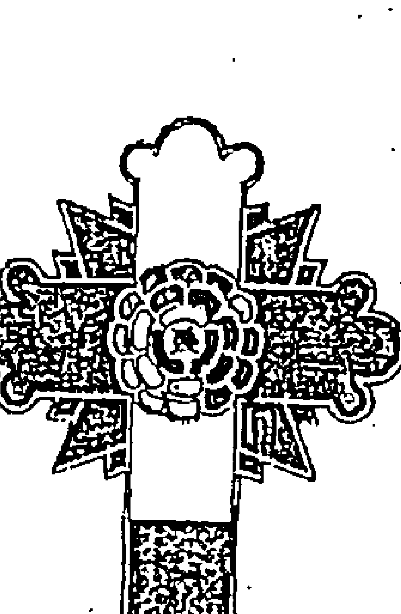

保羅·佛斯特·凱斯想像大阿爾克納牌的最大意義，在於建立空間的立方體結構，也就是整個宇宙的基礎。而這個立方體的中心是一個十字，一個類似托特塔羅牌背面所繪製的玫瑰十字（The Rosy Cross）。法國神秘學者伊萊·李維以及傑拉德·恩格斯（筆名 Papus）都將生命之樹視為塔羅鮮活的體現。在蓋瑞·奈特的著作《卡巴拉象徵主義實用指南》（A Practical Guide to Qabalistic Symbolism)中可以找到很詳細的圖案。

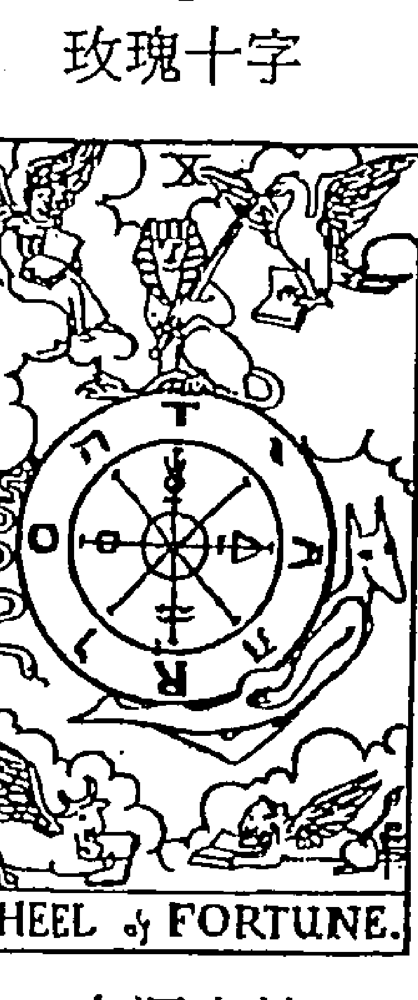

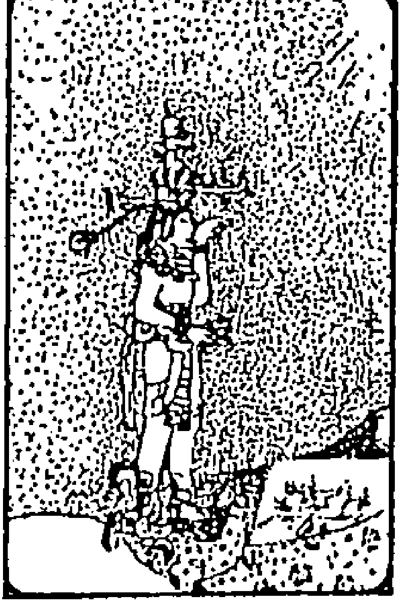

就如同本章一開頭所引用的，「ROTA」在塔羅中意義為「輪」，一個能量運轉的中心。查理斯·威廉斯在他的小說《大阿爾克納》（The Greater Trumps）中將其形容為舞動生命之舞。如果能夠跟上複雜的舞步，就能夠與這其靜止的中心——愚者（The Fool），融為一體。

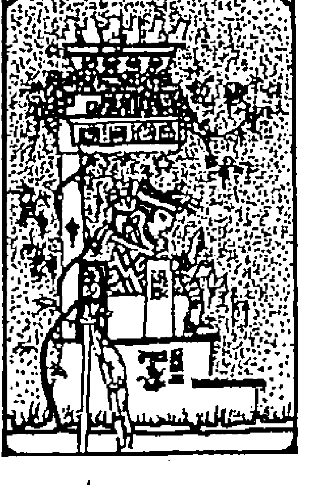

塔羅亦可代表「torah」，在希伯來文中指「律法」。猶太教的最初五部舊約經書也稱為「Tora」。塔羅名為「tora」之書，是女祭司放在膝上的法典，代表了唯有憑直覺及個人經驗，才能領會的律法。她是神諭、女預言者、哈托爾女神的女祭司，比 Isis 更早的埃及大地女神。這位牛頭女神的牛角頭飾上有上弦月、滿月和下弦月的記號，代表周期或是創世之輪，是所有文明測量時間的基準。

在本章中，將學習如何憑直覺來探索這些牌，對塔羅牌的感覺完全釋放出來，並了解它們對自己的意義。將會重新認識那些自己已經知道的事實。期待這份感覺帶來的驚喜吧！其實自己知道的遠比想像得要多。

幾年之後，寫在這本書上的筆記將會成為重要的記錄，提醒自己在開始這趟發現自我的旅程當時是什麼模樣。所以一定要隨時準備一支筆在旁邊，當你在嘗試各種牌陣或練習時隨時記下想法及領悟。看完下面的問題後，記住自己的第一反應。牢牢抓住它並寫下來，不假思索且不帶任何評斷。

- ☆ 什麼是塔羅？（寫下自己的定義，假設正在解釋給朋友聽。）
- ☆ 你覺得塔羅牌的意圖是什麼？
- ☆ 你希望從塔羅學到什麼？
- ☆ 你希望從這本工具書中獲得什麼？

日期： ________________

## 塔羅簡介

### 個人塔羅象徵的指引和啟發

巴斯克²人類學家和塔羅大師安吉莉絲·艾倫教大家一種方法來決定哪一張大阿爾克納牌可以視為個人專屬牌。某種程度上這與占星術中的太陽星座很類似。這是一個與這些古老原始象徵語言建立關係的理想方式，同時也是一種工具，了解塔羅是如何幫忙找出這趟個人之旅的意義及目的。

### 性格和靈魂牌

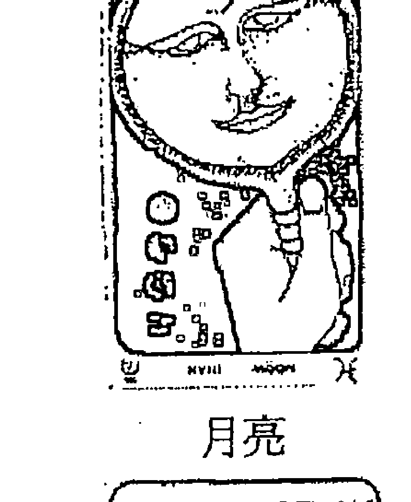

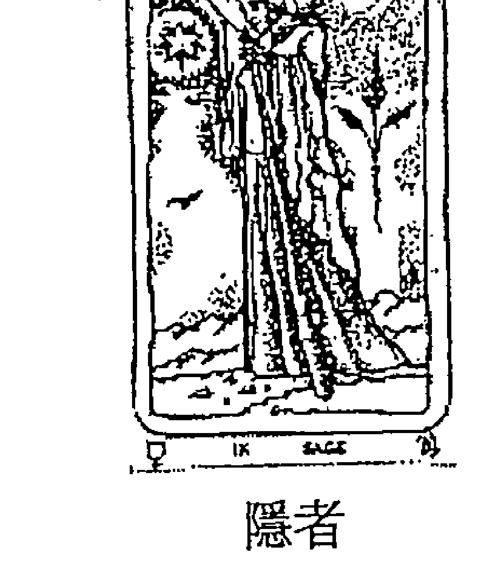

以出生日期即可算出你的性格和靈魂數字。對應的性格牌代表在這段特別的人生中，你將要學習的課題是什麼。對應的靈魂牌則顯示你今生靈魂目的之所在。

要決定這兩張牌，先將個人的出生年月日相加，例如：

```
1947年10月14日出生 = 10
14
+ 1947
1971
再將這四個數字加起來：
1 + 9 + 7 + 1 = 18
```

總和一定要在1到22之間。這個總和數字就是自己的性格數字。這個例子的數字對應了大阿爾克納的第18張牌——月亮。

接著再將1與8相加，等於9，這是自己的靈魂數字，對應了第九張大阿爾克納牌——隱者。靈魂數字必須介於1至9之間。

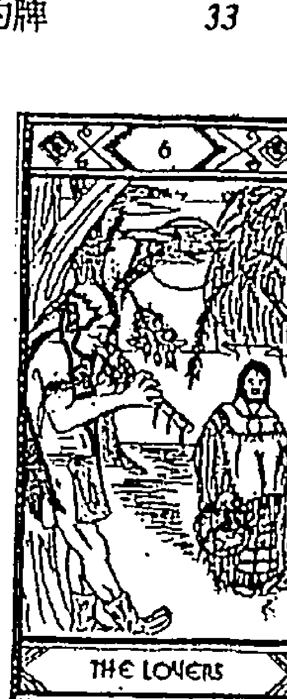

有時加起來的總數會大於22，但由於大阿爾克納只有22張牌，故必須將總數減少至22或以下。例如：

```
1980年2月4日 = 
                  2
                  4
            + 1980
            1986
```

1+9+8+6=24，2+4=6。在這個例子裡，6（戀人）同時是自己的性格數字及靈魂數字。在這一生中，將會特別專注於追尋靈魂之目的，聚焦且方向明確。

有一種情況會出現兩張以上的牌。如果加總的數字是19，就會有三張牌。例如：

```
1954年11月16日 =     11
                       16
                 + 1954
1981 = 19 = 1 + 9 = 10 = 1 + 0 = 1
```

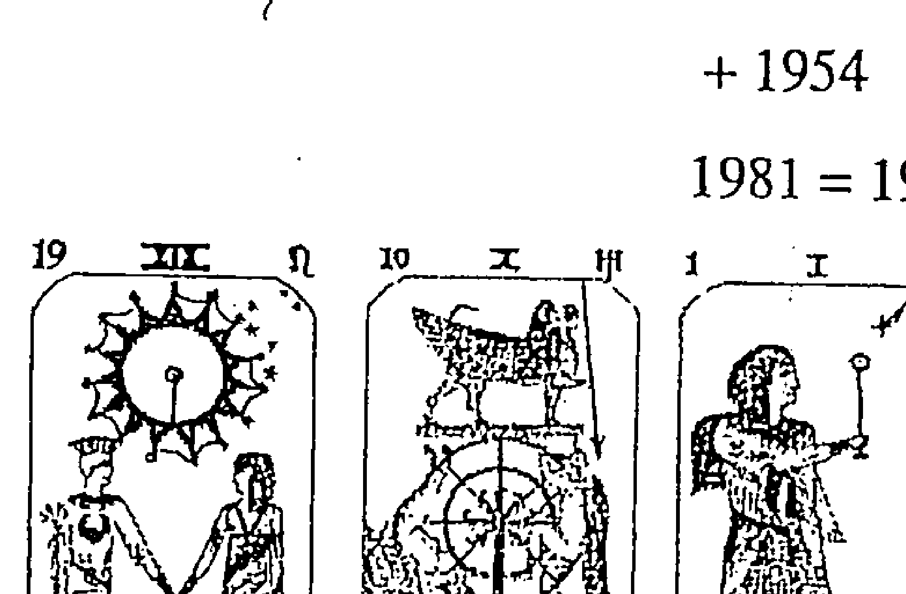

三張牌同時代表了性格牌和靈魂牌，這將是一段非常具有創造力的旅程。得出三張牌的人必須學習如何傳達自己的創造力。這種人的自我認同及自我感覺將與生命和靈魂目的緊緊結合，密不可分。他們處理人際關係的能力端賴此二者之間和諧的願景和目的。

如果出生年月日相加後剛好是22，那麼你擁有無比的衝勁以及神秘色彩，二者之间保持着微妙的平衡。22 相减为 0（愚者），相加则为 4（皇帝），你可以将 4 当成自己的灵魂牌，22 当作 0 成为性格牌（尤其在推算自己的生命灵数和机会牌时）。我发现实际上它们是相辅相成的。

**按照下面的方式找出你的性格牌和灵魂牌：**

先将以下数字相加

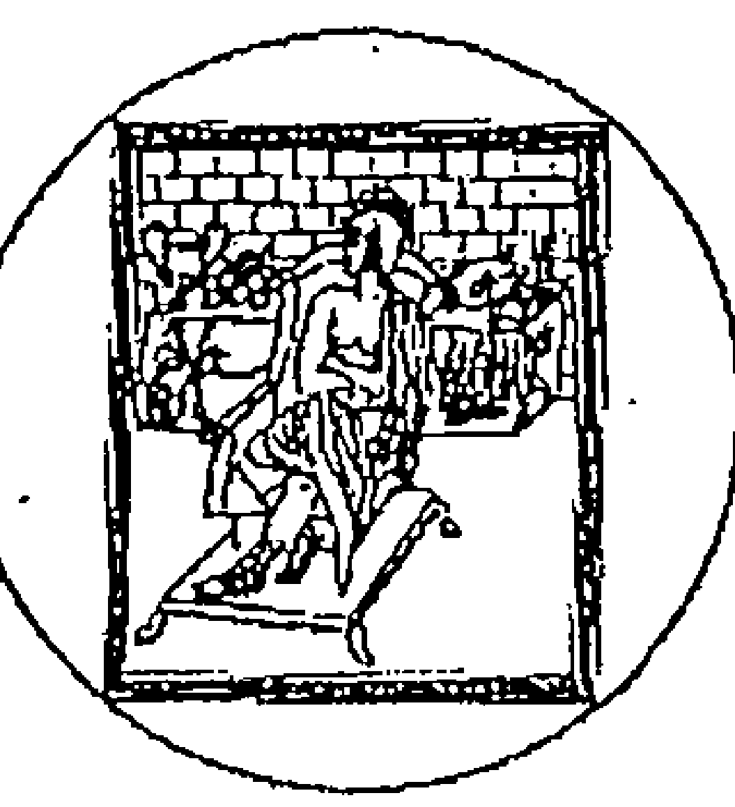

| 项目 | 填写处 |
|---|---|
| 我的出生月份： | ________ |
| 我的出生日期： | ________ |
| 我的出生年份： | ________ |
| 总 和： | ________ |

再将数字拆开后相加：

______ + ______ + ______ + ______ = ________

如果得出的总数是两位数，再将它们拆开相加：

______ + ______ = ________

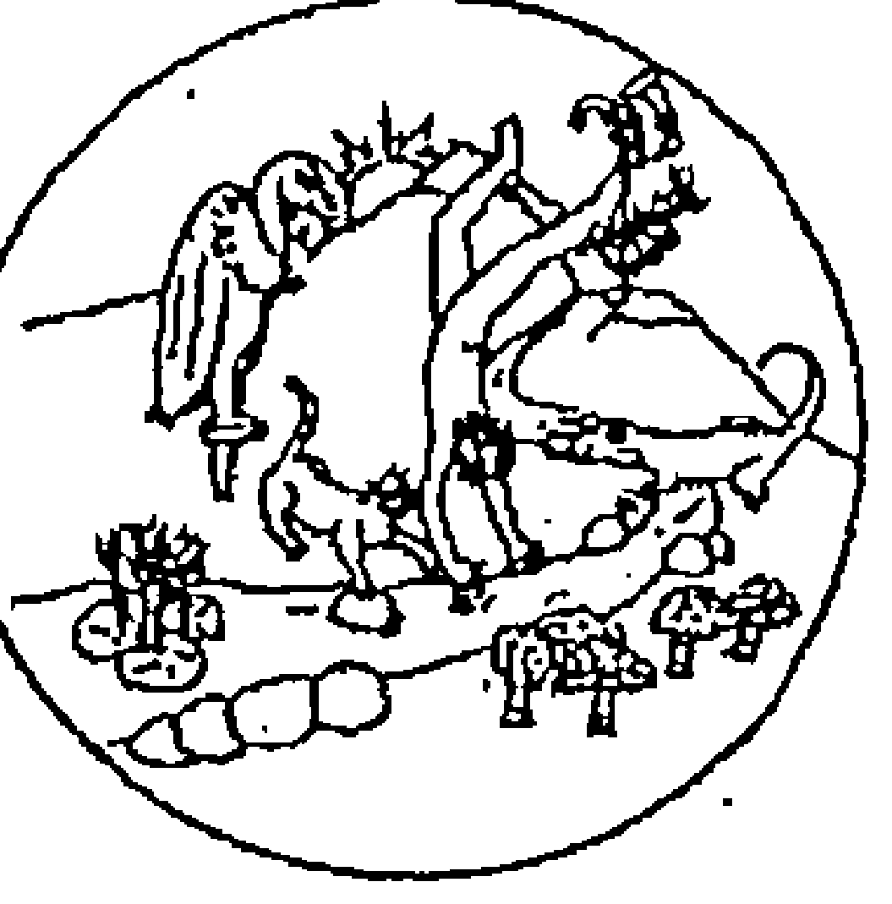

我的性格数字是 ________（所得出的两个总和中数字较大的一方，但不得超过 22）。对应这个数字的大阿尔克纳牌是 ________。

我的灵魂数字是 ________（性格数字的加总，介于 1 到 9）

对应这个数字的大阿尔克纳牌是 ________。

（例外已在上述文章中说明）

### 隱藏牌

除了這些根據加總所得出的數字外，通常還會有另一張跟牌上的數字有關、間接與自己的生日聯結的牌，我將之稱為隱藏牌。請參考第 38 頁的圖表，找出自己的隱藏牌。

### 塔羅關聯對應

「塔羅關聯對應」包括了所有具有質數特性的牌（1 至 9），以及大阿爾克納中任一由兩個質數組成的牌。它們根據相同的原則將能量匯聚，或是組合起來，也就是將相似特質可產生共鳴的元素結合在一起。

回到之前提過的例子，如果出生年月日是 1980 年 2 月 4 日，那麼他的性格牌及靈魂牌都是戀人（6）。接下來我們看關聯對應中個人命盤組合（見圖表），會發現 15 這個大阿爾克納數字出現。由於在計算過程中並沒有出現 15 這個數字，所以它是一個隱藏的生日振動元素。它是隱藏牌，惡魔（15）。所有數字為 6 的小阿爾克納牌都對應這個關聯，代表所有與關係和選擇相關的主題。

如果出生年月日相加後的數字為 21，那麼性格牌是世界，靈魂牌是皇后（3），而倒吊人（12）是隱藏牌。如果出生年月日相加後為 3，那麼皇后同時是性格牌及靈魂牌，而世界和倒吊人則是隱藏牌。

### 夜間牌

如果出生年月日相加的總數是 14、15、16、17、18，那麼就沒有隱藏牌。然而這些數字有時被稱為「夜間牌」。節制牌 (14) 出現時，太陽下山了，而在月亮牌 (18) 之後，太陽升起了。所以如果你的相加總數得出夜間牌，那麼陰影其實也是人格中不可分割的一部分，但是在這些陰影之外，還是有自然、信賴、魅力等元素。

## 代表陰影的隱藏牌

你的隱藏牌展現了對於自身的恐懼、抗拒或看不到的部分，因此它也可以被稱為陰影牌。陰影，一個由榮格所使用及定義的專有名詞，意指個性中未知或鮮為人知的部分。且往往會否定自己個性中存在著這些層面，因而無法正視它們。然而，你其實對這些部分很敏感，因此會產生一種心理上的投射機制，傾向在別人身上找出這些特質。

## 隱藏牌也是導師牌

隱藏牌往往在年輕時的陰暗面發揮最強的力量。土星需要花二十八至三十年來繞十二宮一圈，為了回到你出生時它掛在天空的位置。這個將近二十九年的土星周期就是你的「土星回歸」。因此，在占星學上，土星代表陰影，其意義與隱藏因素相同，每二十九年，土星必須面對自己一次。當你三十歲左右時，可能會面臨自己陰影面中極為重大的議題。榮格稱陰影是人們最好的人生導師。唯有認識自己的陰影面，才能完成個性化的進程。

對於年過三十的人來說，隱藏牌的效力會更加明顯，好比你的導師牌一般。這是因為此時，他們已經準備好積極面對其原則並早有意識了。

當你積極努力地去開發並了解自身及周遭世界的本質，你的隱藏牌就能成為你的人生導師。也將代表你的力量。

如果組合是 19-10-1，那麼這裡面並沒有隱藏牌，而是由命運之輪（10）來做導師牌。這種組合的人直覺相信人生帶給他們的經驗都是為了幫助他們實現目的。最壞的情況是他們只隨波逐流，而不去試著運用自己豐富的才能。

我的隱藏／導師數字為______。
對應此數字的大阿爾克納牌是______。

> 備註：可參考我的另一本書《Tarot Constellations: Patterns of Personal Destiny》，對個人生涯和年度牌有更具體的描寫。

一旦確定了這些牌，就必須找出它們對於自己本身的意義為何。可以從附錄一中或其他書中找到這些牌代表的涵義，但是要尋求它們對你的個人意義，最好的方法就是和他們一起生活。將性格牌、靈魂牌及隱藏牌（如果有的話）拿出來，貼在你房間的牆上，和這些圖像產生共鳴，透過冥想將其具像化。

另一個方法是詢問自己的性格牌、靈魂牌或隱藏牌，這一生必須從它們那裡學到什麼。先將想到的第一個答案寫下來，再繼續問幾個問題，並寫下直覺反應而未加修飾的答案。在人生的不同時期會有不同答案出現，所以過一段時間再重複一次這個過程。漸漸的，就會理解隱者、皇后及月亮對自己而言究竟代表什麼意義。

在繼續讀下去之前，先進行下方的練習題目。花七分鐘，將專注於牌上圖案時腦中掠過的任何想法都確實的寫下來。在寫下第一句話或是試圖繼續這個作業時，可以預見將會遭遇一些妨礙與阻力。重要的是，一定要繼續寫下去。記住，幽默往往能打敗這些阻礙，而毅力能為你帶來意想不到的驚喜。如果必要的話，多拿幾張紙來寫也沒有關係。

塔羅個人命盤組合中

| 特質 | 關聯對應 | 小阿爾克納牌 | 隱藏（導師）牌 | 性格及靈魂牌組合 |
|------|----------|--------------|----------------|------------------|
| 意志及專注力 | 魔術師（太陽、命運之輪、魔術師） | 10's & 1's | 10 & 19；19；10（導師） | 1-1；10-1；19-10-1 |
| 透過直覺平衡判斷 | 女祭司（審判、正義、女祭司） | 2's | 11 & 20；20；11 | 2-2；11-2；20-2 |
| 愛與創造性的想像力 | 皇后（世界、倒吊人、皇后） | 3's | 12 & 21；21；12 | 3-3；12-3；21-3 |
| 生命力及權力的展現 | 皇帝（愚者、死神、皇帝） | 4's | 13 & 22；22；13 | 4-4；13-4；22-4 |

| | 教導與學習 | 關聯與選擇 | 經由改變而掌握 | 勇氣與自尊 | 內省及個人修養 |
| :--- | :--- | :--- | :--- | :--- | :--- |
| | 教皇<br>(節制、教皇) | 戀人<br>(惡魔、戀人) | 戰車<br>(塔、戰車) | 力量<br>(星星、力量) | 隱者<br>(月亮、隱者) |
| | 5's | 6's | 7's | 8's | 9's |
| | 14<br>* | 15<br>* | 16<br>* | 17<br>* | 18<br>* |
| 5-5<br>14-5 | 6-6<br>15-6 | 7-7<br>16-7 | 8-8<br>17-8 | 9-9<br>18-9 |

我的性格牌〔          〕，靈魂牌〔          〕，或隱藏牌〔          〕（三張牌中選一張）是__________。

今天日期__________

選擇牌中某一特定圖像提出自己的問題。

我選擇__________。

> ☆ 對著圖像問：「在此生我需要學習的事物中，你能教導我什麼？」

你還可以將親戚及朋友的性格牌、靈魂牌記錄在這裡：

| 序号 | 姓名 | 出生年月日 | 性格數字及性格牌 | 靈魂數字及靈魂牌 | 隱藏數字及隱藏牌 |
|------|------|------------|------------------|------------------|------------------|
| 1    | ________ | ________ | ________ | ________ | ________ |
| 2    | ________ | ________ | ________ | ________ | ________ |
| 3    | ________ | ________ | ________ | ________ | ________ |

### 年度牌

還有一張個人年度牌，代表這一年將會經歷的考驗、教訓和體驗。

將出生月日和該年度相加，例如：

```
2011 年 10 月 14 日=      2011
                 10
              +  14
2035 = 10 (命運之輪)
```

在決定年度牌時，數字最高不能超過 23（記住 22 等於愚者）。算出來的數字就對應自己的年度牌。

將以下數字相加：

我的出生月份：_______________________

我的出生日期：_______________________

今年年份：_______________________

等於：_______________________

20______ 年度，我的年度數字是_______，

對應的大阿爾克納牌是___________________________________________。

有兩個日期可以作為一個年度的起算日：

1. 那年的1月1日。
2. 那年自己的生日。

不管選擇哪一個日期，一個年度的周期都是十二個月份。根據我的經驗，無論用哪一個日期算結果都是準確的。因此我也是兩種同時並用。

隐者

例如一個生日是10月14日的人，只有在那年的生日起到年底這段期間用兩種起算日都是得到10(命運之輪)。

命运之轮

而在2011年的大部分期間中，隱者和命運之輪會同時發揮影響力。而自2012年1月起至10月14日，命運之輪與正義將互相影響。每個人的生日有固定的年度周期，所以能確立自己的節奏。以我個人而言，我發現每年1月至次年1月的這段時間具有重要的外在涵義，能夠幫助我去了解生活中發生的事件。而以生日的周期來看，則是我消化一樣新教訓或學習新事物所需要的時間。所以在每年1月到次年1月，我會遭遇一些狀況，迫使我去學習一種新的應對或方向。而在我生日前後這段期間，我會開始整合學習到的新事物。而在整年的生日周期中，這些新感悟所產生的新動力會遭受到許多考驗和試煉，最後終將成為我的一部分。

正义

其他有特殊意義的牌後面會有詳細說明。將它們填入個人塔羅資料中。透過冥想及直覺的書寫來讓這些牌發揮效力。

### 星座牌

要確定哪一張牌對應太陽星座，只要參照下表即可（所有星座的對應乃按照金色曙光、克勞利、偉特、保羅·佛斯特·凱斯等慣用的順序。如果與自己的順序不同，可自行重新排列）。

- 牡羊座——皇帝（4）
- 金牛座——教皇（5）
- 雙子座——戀人（6）
- 巨蟹座——戰車（7）
- 獅子座——力量/慾（11/8）
- 處女座——隱者（9）
- 天秤座——正義、調整（8/11）
- 天蠍座——死神（13）
- 射手座——節制/藝術（14）
- 魔羯座——惡魔（15）
- 水瓶座——星星（17）
- 雙魚座——月亮（18）

我的太陽星座是_______________。

對應的牌是_______________。

### 生命靈數及機會牌

機會牌是四張小阿爾克納牌（每種牌組一張），而機會數字和靈魂數字是相同的。例如靈魂數字是3，那麼生命靈數及機會牌就是權杖三、聖杯三、寶劍三、錢幣三。如果靈魂數字是22／4，就用4作為靈數。若是19-10-1，那麼1和10都適用。

我的靈魂數字是________，我的四個生命靈數及機會牌是權杖______，聖杯______，寶劍______，錢幣______。

### 星座與生日對應與機會牌

有三張小阿爾克納牌會對應太陽星座。先從下表找出自己的太陽星座，有三張塔羅牌對應每個生日區間及機會牌。

| 星座 | 日期范围 | 塔罗牌 |
|---|---|---|
| 牡羊座 | 3月21日至30日 | 權杖二 |
| | 3月31日至4月10日 | 權杖三 |
| | 4月11日至20日 | 權杖四 |
| 金牛座 | 4月21日至30日 | 錢幣五 |
| | 5月1日至10日 | 錢幣六 |
| | 5月11至20日 | 錢幣七 |
| 雙子座 | 5月21日至31日 | 寶劍八 |
| | 6月1日至10日 | 寶劍九 |
| | 6月11日至20日 | 寶劍十 |
| 巨蟹座 | 6月21日至7月1日 | 聖杯二 |
| | 7月2日至11日 | 聖杯三 |
| | 7月12日至21日 | 聖杯四 |
| 獅子座 | 7月22日至8月1日 | 權杖五 |
| | 8月2日至11日 | 權杖六 |
| | 8月12日至22日 | 權杖七 |
| 處女座 | 8月23日至9月1日 | 錢幣八 |
| | 9月2日至11日 | 錢幣九 |
| | 9月12日至22日 | 錢幣十 |
| 天秤座 | 9月23日至10月2日 | 寶劍二 |
| | 10月3日至12日 | 寶劍三 |
| | 10月13日至22日 | 寶劍四 |
| 天蠍座 | 10月23日至11月1日 | 聖杯五 |
| | 11月2日至12日 | 聖杯六 |
| | 11月13日至22日 | 聖杯七 |
| 射手座 | 11月23日至12月2日 | 權杖八 |
| | 12月3日至12日 | 權杖九 |
| | 12月13日至21日 | 權杖十 |
| 魔羯座 | 12月22日至30日 | 錢幣二 |
| | 12月31日至1月9日 | 錢幣三 |
| | 1月10日至19日 | 錢幣四 |
| 水瓶座 | 1月20日至29日 | 寶劍五 |
| | 1月30日至2月8日 | 寶劍六 |
| | 2月9日至18日 | 寶劍七 |
| 雙魚座 | 2月19日至29日 | 聖杯八 |
| | 3月1日至10日 | 聖杯九 |
| | 3月11日至20日 | 聖杯十 |

我的太陽星座是________。我的星座生日對應及機會牌是________、________和________。

# 命运牌

命运牌是你的生日所对应的小阿尔克纳牌。这张牌可从上面的表中选出，是星座与生日对应及机会牌的其中一张。能够从这张牌中看到个人基本冲动、欲望及反应。（参照书末建议书单《The Pursuit of Destiny》）

我的出生月日是______。

对应的命运牌是______。

### 形象牌

形象牌有三张，是来自宫廷牌及星座命盘间的对应关系。要确定这几张牌，必须先知道自己的太阳、月亮及上升星座（除了个人潜力牌只需要太阳星座）。如果不知道自己的星座命盘，可以先询问星座专家，或是从免费查询星座命盘的网站上查出来。每个星座都有相对应的宫廷牌，如果使用的是不同的对应系统，那么可以更改下面的表格以符合你常用的系统。

**填入你惯用系统对应的牌（如果与下表写的不不同的话）**

| 星座 | 对应的牌 |
| :--- | :--- |
| 牡羊座 | 权杖皇后 |
| 金牛座 | 钱币国王 |
| 双子座 | 宝剑骑士 |
| 巨蟹座 | 圣杯皇后 |
| 狮子座 | 权杖国王 |
| 處女座 | 錢幣騎士 |
| 天秤座 | 寶劍皇后 |
| 天蠍座 | 聖杯國王 |
| 射手座 | 權杖騎士 |
| 魔羯座 | 錢幣皇后 |
| 水瓶座 | 寶劍國王 |
| 雙魚座 | 聖杯騎士 |

- ☆ 個人潛力牌是對應太陽星座的宮廷牌。我的太陽星座是 _______________，所以我的個人潛力牌是 _______________。
- ☆ 內在導師牌是對應月亮星座的宮廷牌。我的月亮星座是 _______________，所以我的內在導師牌是 _______________。
- ☆ 個人表達模式是取決於對應上升星座的宮廷牌。我的上升星座是 _______________，所以我的個人表達模式可以 _______________來代表。

# 中塔罗资料

### 個人塔羅象徵語言的引導及啟發

姓名 ________________________________________________________________________

日期 ________________________________________________________________________

以下的牌在透過冥想及視覺化後，能幫助你找出生活的意義、目的和方向。

- ☆ 性格牌 __________________________________________________________________
代表我的人生目的、啟發，以及應該學習的事物。
- ☆ 靈魂牌 __________________________________________________________________
代表可以協助我的靈魂宗旨和本質。
- ☆ 隱藏牌／導師牌 __________________________________________________________
代表我恐懼抗拒或看不見的本質，有可能成為我最有力的強項。
- ☆ 太陽星座牌 ____________________________________________________________
代表自我表達。
- ☆ 今年年度牌 ________________________ 代表 20______年度。
代表我今年需要發展的特質。

過去年度牌

| 年度 | 牌 |
| --- | --- |
| ______ | ________________________________ |
| ______ | ________________________________ |
| ______ | ________________________________ |
| ______ | ________________________________ |

未來年度牌

| 年度 | 牌 |
| --- | --- |
| ______ | ________________________________ |
| ______ | ________________________________ |
| ______ | ________________________________ |
| ______ | ________________________________ |

在與你的性格牌或靈魂牌、隱藏牌、星座牌相同的年度牌旁邊畫上一個星號。這些年度很重要，因為它們是你表達人生目標的指標。

### ☆ 生命靈數及機會牌

有四張小阿爾克納牌與我的靈魂數字相對應：

權杖

聖杯

寶劍

錢幣

### ☆ 星座與生日對應與機會牌

有三張小阿爾克納牌對應我的太陽星座：

### ☆ 命運牌

這張小阿爾克納牌代表個人的基本衝動、慾望及反應。

### ☆ 形象牌：

個人潛力牌

與我的太陽星座對應的宮廷牌。

內在導師牌

與我的月亮星座對應的宮廷牌。

個人表達模式牌

與我的上升星座對應的宮廷牌。

### 儀式

要與牌建立默契，儀式是非常重要的，但也不必過於拘泥形式。在經過一段時間與練習後，會很自然的發現：通過洗牌、收牌的方式和使用牌的地點，以及時間等小環節，已經發展出一套個人儀式了。這些反覆的動作有助於在解讀牌時放鬆，並且跳脫每天固定的生活作息。不要怕去嘗試，創造出屬於自己的儀式。但不要忘記，如果要使儀式及選擇的象徵物品產生力量，就必須相信它們。要相信所做的將會帶來對精神上、身心上均有意義的結果。要驗證儀式的效力，得花一段時間觀察。

## 推薦儀式

第一次拿到牌，試著把它放在枕頭下面和它一起入睡，或是至少把它和個人的私密物品放在一起。這麼做可以開始建立你們之間的特殊關係。

將牌用布包起來或裝在袋子裡，要用自己覺得漂亮的、摸起來舒服的布或袋子。有很多使用塔羅牌的人會將牌放在有精緻刺繡的緞面或絲絨的袋子裡。我還見過一些有趣的收納法，例如用中國風的袋子、二手或古董晚宴包、珠飾皮革袋、手工雕刻的進口盒子、陶瓷或上釉容器裝起來。

傳統上習慣用黑色絲綢來包裹塔羅牌，因為絲綢是很好的通靈絕緣體，但它並不適合用來長期保存。棉或羊毛也是適合的材質。如果是木箱子的話，白松木是最好的選擇，不過我只要看到漂亮箱子就不管材質了。基本上木材有可能會影響紙質，所以並不建議拿來保管紙張。如果有收集塔羅牌的習慣，那麼將原本裝牌的盒子留下來，然後查查看保存和保養紙張最好的方法是什麼。

### 淨化塔羅牌

首先拿到一副新的牌，要先淨化它。在兩次讀牌的中間，還有為自己讀牌，以及對它們冥想時也都要進行淨化，尤其如果最後一次使用是為別人解讀時，以下是淨化牌的幾種方法：

1. 反覆有節奏的洗牌。這是淨化的最基本模式，在做任何解讀時都不可或缺的動作，也不會妨礙你集中意識——這也是淨化帶來的效果之一。淨化意指潔淨，而洗牌不僅賦予牌新的力量，同時也能將舊的東西除去。在解讀完成後洗牌和在開始解讀時洗牌都是很好的做法。
2. 用西洋杉、鼠尾草，或是矮松、白菖蒲將牌熏一次。將乾燥的藥草放在鮑魚或類似的貝殼裡燃燒出來的煙熏特別具有效力。因為貝殼代表水，植物代表地球，煙代表空氣，而火則代表火的元素，這讓儀式中的四大要素都具備齊全了。不過也大可運用手邊的東西。用煙將牌熏幾次，也別忘記讓煙霧繚繞在自己和身邊的人周圍。這個儀式被稱為「煙熏淨化」，可以用一支大羽毛來讓煙霧擴散。
3. 為牌注入光芒。首先閉上眼睛，距離牌約四十五公分左右，然後想像有一顆散發著耀眼白光的小種子，也可以用其他顏色代替白光（金色也很推薦）。這顆種子漸漸生長，並從頂端向牌注入了一道燦爛的光，讓這道光淨化牌。這個方法可以與其他淨化儀式併用。
4. 用絲綢或棉布擦拭。這條布也可以用來包裹牌。
5. 用海鹽與水來潔淨（限使用於塑膠材質的牌面）。用沾取了海鹽和淡水的海綿輕輕擦拭每一張牌，再將牌徹底擦乾，如果牌面有些沾黏，就灑一些滑石粉在上面。
6. 埋在土裡。如果牌散發著令人強烈不快的能量，那麼就需要將牌埋在土裡七天，或從滿月至新月的第一天。我們的地球之母將會吸收所有的負面能量。雖然我見過有些人這麼做，不過通常是不需要到把牌燒掉的地步。

-   7. 將使用過的牌按照順序排放整齊。這麼做可以認識牌原來的順序，也能淨化牌。一副塔羅牌的順序象徵著通往自我了解的途徑。可以將剛使用過的牌放在最上面，這樣下次使用時第一眼就會先看到它了。我放牌的順序是：大阿爾克納、愚者到世界，然後每種牌組按照順序（從 A 到 10），接下來是每種牌組的國王、皇后、騎士和侍者。牌組的順序則是權杖、聖杯、寶劍、錢幣。

進行塔羅占卜時，氣氛應該是輕鬆愉快的。我建議最好不要喝咖啡、濃茶、酒類或服用藥物。傳統上花草茶有助於精神面及想像力的活躍，以及讓頭腦清晰，並使人感到愉悅幸福。例如馬鞭草、艾草、大茴香、檸檬馬鞭草、洋甘菊、肉桂、月桂葉、牛膝草、薄荷（但如果懷孕就不要使用）、車前草、迷迭香、熊果、北美聖草（yerba santa）等等。你可以試試這些花草茶，或是只喝水也可以，總之避免飲用含咖啡因的飲料。

傳統上認為能量是從東向西流，從北向南流。你可以善用這些地球能量的流向，只要面對著能量來源——通常是東方或北方，就可以了。

另一個重要問題是，其他人可否觸碰自己的牌，答案因人而異。如果怕別人會「褻瀆」自己的牌，那麼這種不安的確可能會成為一種干擾，並且造成不好的影響。我則是對我的牌注入了滿滿的愛，並且邀請我的朋友們自由使用它。有時某些特定的人觸摸我的牌會讓我覺得不舒服，而我發現這時淨化牌的儀式可以讓我恢復良好的感覺。

試試看實行上述那些儀式或自己發明的儀式。記住，反覆執行和堅定信仰是賦予儀式力量的不二法門。這些儀式有個戲劇性的元素，就是如果願意放下質疑，那麼它們會自己創造奇蹟，營造出一個特別的時空。

將自己對於儀式的想法寫在這裡：

## 積極的想像

解讀塔羅牌時，可以從附錄一或其他塔羅書中查出這些牌的涵義，也可以看著牌上的圖像或象徵語言去想像它們代表的意義。這套積極想像法在格式塔心理學3及心理綜合學上也被應用來解析夢境或做精神分析。積極想像還有其他代名詞，例如主題式幻想、創意視覺化、象徵語言的運用、想像力遊戲，甚至連自我催眠也會用到這些原則。

想要激發自己發揮高度想像力的潛能，重點是要放下戒心，並且將日常瑣事趕出腦袋。在開始進行塔羅占卜前，試試下面的放鬆練習。

## 放鬆及放空練習

先閱讀以下說明。你可以將這些步驟錄音起來，或請朋友唸給自己聽。在反覆練習幾次之後，就不再需要聽錄音了。在做完一開始的三次深呼吸後，接下來的過程應該不必思考就會做了。最後，將能迅速釋放自己的能量，只花一兩分鐘就進入深層的放鬆狀態。不過一開始先慢慢來，不要急。

這也叫做「放空」練習。任何心靈活動的目標都是要讓自己成為一個暢通無阻的管道，不要把東西滯留在心中，因為那可能會產生阻滯，可能會產生緊繃的感覺，或甚至生病。藉由放空能量，你可以記憶卻不會受困於經驗，就讓它們穿越你，回到大地之母或消散於天空之父的無垠空間。

挺直背脊，端坐在一張普通椅子上，雙腳平放在地上，脫掉鞋子。雙手放在腿上，手心向下。

3. 格式塔心理學：Gestalt psychology，是心理學重要流派之一，興起於20世紀初的德國，又稱為「完形心理學」，由馬科斯·韋特墨（M·Wetheimer, 1880-1943）、沃爾夫岡·苛勒（W·Kohler, 1887-1967）和科特·考夫卡（K·Koffka, 1886-1941）三位德國心理學家在研究似動現象的基礎上創立。

### 開始使用塔羅牌之前最好先做這個練習

先深呼吸三次。吸氣，讓空氣進入肺部底層，再慢慢充滿整個肺中。擴展胃部，停住，數到三之後再吐氣。呼氣時先將肺部上層的空氣推出來，再慢慢將肺部裡的空氣全部呼出，胃也隨之收縮。維持三秒鐘後再進行下一次吸氣。

維持這樣緩慢而細膩的呼吸方式。想像每呼氣一次，煩惱與緊張也會隨之從腳底排出去。而每吸氣一次，充滿活力的能量就從腳底一起被提上來進入體內。想像自己是一棵樹，正從大地之母那裡吸取生命力與養分，同時將多餘的雜質排出。反覆的做，直到夠穩定，甚至有節奏的進行這樣的呼吸。直到練習結束為止，要一直維持這種呼吸方法。

接下來，吸氣時，想像它帶來大地之母的生命能量，而這些能量從腳底進入並貫穿身體，最後由頭部釋放到周遭的空氣中，變成閃閃發亮的金色粉塵，形成橢圓形的雲朵，仔細感受這些能量帶來幸福及健康感受。

下一次吸氣時，想像頭頂上距離四十五公分處有一個光點，吸進的氣將與這個光點連結，形成一道金色的光線，照進心臟。而呼氣時這道光芒將從心臟向四方照射出去。

## 變化

如果完全適應了上述過程並練習多次後，可以試試下面的變化版本，或是自己加上一些變化。

-   1. 呼氣時從心臟吐出粉紅色（薔薇水晶的顏色）的光線，並想像那是宇宙大愛的顏色。
-   2. 藉由同時吸進來大地之母和太陽之父的金色光芒，由上而下交換能量，當你屏住呼吸時，讓二者在你心臟正中央交會。吐氣時，將大地之母的養分及生命力向上傳送給太陽之父，也以太陽之父充滿啟發的光芒來活化大地之母。這將為萬物帶來純淨而自由的能量。
-   3. 練習在吸氣與吐氣時保持喉嚨打開的狀況。要做到這一點，就不要介意呼吸時喉嚨會發出些微聲音。一旦抓住喉嚨打開的感覺，以後以同樣方式呼吸時就不會再發出聲音了。
-   4. 將自己想到的變化記在下面：

## 進入一張牌

將大阿爾克納牌排成三列，每列七張，愚者牌置於最上面（參照第16頁的圖）。接著選一張最吸引你的牌：__________。

-   1. 描述你所看到的。放任你的視線在牌上四處游移，並記下那些吸引你注意力的象徵語言。記下其中哪一些似乎最能掌控你的注意力。
-   2. 將牌上那些你沒有注意到的圖像或物體寫下來。
-   3. 這張牌以什麼顏色為主？

閉上眼睛，試著在腦海裡想像一次這張牌的模樣。然後張開雙眼，確認是否確實記住了這張牌。

在開始接下來的練習之前，先將以下的說明全部閱讀完畢。使用和前一個練習相同的牌。或許可以將這些步驟錄下來或請朋友唸給自己聽。說明中的刪節號「……」，表示需要停頓一小段時間。

閉上雙眼，做三次緩慢的深呼吸，讓空氣進入身體中心。想像選的牌變得越來越大、越來越大，直到牌裡的人物變得和自己一樣大……然後跨過牌的邊緣，進入這張牌。現在視野變寬廣了，可以看清楚四方，環顧四周，看到了什麼？有聽到任何雜音嗎？聞到什麼味道嗎？這裡的溫度如何？

現在是一天中的什麼時間？更仔細的去觀察周遭任何引起自己興趣的東西……如果可以的話，伸手觸摸它；它摸起來是什麼感覺？在這張牌中還有其他人和自己在一起嗎？靠近最吸引自己的人或動物，他／她有一樣禮物送你，一樣你可以帶回現實生活中，並幫助你了解自我的禮物。接受這樣禮物，並且仔細端詳它……然後謝謝對方。

問對方這樣禮物的用途是什麼……向周遭的風景投以最後一瞥，然後想像牌的邊緣就在後方。轉身，跨出去。然後你看到這張牌瞬間縮回原來的大小。張開你的雙眼。

就像作夢一般，如果不立刻將夢境中所體驗的事寫下來，那麼很快就會忘記那些細節。在書寫時，可能會發現原來記得的細節比印象中的還要多。將這些印象及感受記錄下來。

| 我所進入的牌 | ____________________ | 日期 | ____________________ |
| :--- | :--- | :--- | :--- |
| 我挑選這張牌的理由 | ____________________ | | |

-   ☆ 我看到些什麼？儘量詳細描述。
-   ☆ 那裡聞起來是什麼味道？
-   ☆ 我聽到什麼？
-   ☆ 天氣和溫度如何？

## 第一章 | 熟悉你的牌

-   ☆ 當時是一天中的什麼時間？
-   ☆ 我觸碰到什麼？它的觸感如何？
-   ☆ 我有品嚐到什麼味道嗎？
-   ☆ 我的描述中沒有提到的顏色：
-   ☆ 那裡有什麼生物（動物／人類／神靈）？描述他們的樣貌。
-   ☆ 我收到什麼禮物？是誰給我的？
-   ☆ 有給我任何訊息或指示嗎？
-   ☆ 我的禮物有什麼正面特質可以代表自己？
-   ☆ 寫一段說明，確定你已經吸收這些特質。

## 變化版本

現在已經可以進入任何一張塔羅牌，探索其中情境，與其中的人物相見。還可以與他們對話，詢問他們關於這張牌本身的資訊，或是請他們給一些個人建議。此外還可以這麼做：

-   1. 進入自己的性格牌、靈魂牌或年度牌。
-   2. 進入一張自己不喜歡或是令自己困擾的牌，試試看能否從中學習到更多東西。記住，可以隨時離開這張牌。
-   3. 同時進入兩張牌。只要將它們並排在一起，並想像它們的景觀是相連的。可以觀察這兩張牌中的人物相見的情形，聆聽他們的對話，或是加入他們三方對談。這麼做可以幫助在解讀牌時了解牌與牌之間的關聯性。
-   4. 進入塔羅牌中，可以直接詢問某個圖像或象徵它們代表的意義。有時它們的答案會意外的充滿啟發性或符合當時的狀況。

記得一離開牌之後要立刻將答案寫下來，或是嘗試在想像牌中情景時同時書寫。

## 推荐书单

*Numerology and the Divine Triangle*. Faith Javane Dusty Bunker Rockport, MA: Para Research, 1979.

*The Pursuit of Destiny*. Muriel Bruce Hasbrouck. New York: Warner Destiny Books, 1976.

*Mind Games*. Robert Masters and Jean Houston. New York: Dell, 1972.

# 馬賽塔羅 (THE TAROT DE MARSEILLES)

最早出版於十七世紀的法國。到目前仍是最具影響力及受歡迎的塔羅牌之一。大阿爾克納排成三列，每一列有七張牌。約翰·D·布萊克利在《塔羅神秘之塔》(Mystical Tower of the Tarot)一書中提到他在尋找塔羅牌發源於回教蘇非派的證據。他發現一本寫於1899年的書，名為《來自國王花園的神秘玫瑰》(The Mystic Rose from the Garden of the King)，作者是費爾法克斯·L·卡特萊特爵士。內容是一名神秘苦行僧所講述的故事。敘述一個流浪者基於求知慾望來到一座塔前。塔問他：「你在尋求什麼？」他回答：「知識。」並宣稱他有力量及決心爬到這座塔最頂端的房間。他發現塔的每層樓都有三個房間，每層樓都有一個活的塔羅人物，並且每層樓都呈現另一種層面的思考，以及事物的不同角度。這塊未知的土地，知識殿堂的面紗被揭開了，原來他發現，這就是人的「心」。

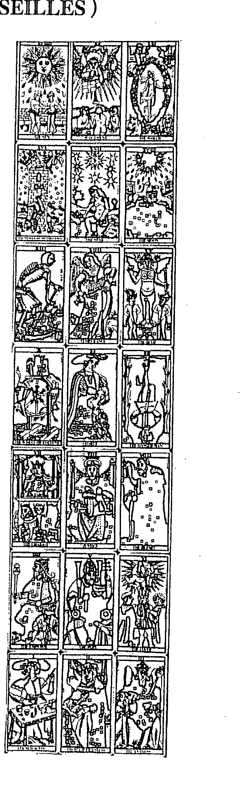

# chapter 2

# 塔羅筆記

要理解自己的塔羅牌，最好的方法就是找出這副牌在自己的生活中發揮什麼樣的功能。透過每天讀牌，了解運勢的起伏變化。從某些牌，例如太陽、世界、聖杯二或是惡魔、塔、寶劍九等，是如何以不斷變化的節奏出現或消失。需要發掘這些牌的意義，例如日常生活中，「塔」這張牌往往能夠指出自己情緒失控、自我傷害，或突然想把冰箱清空的衝動——也就是一種急速的情緒爆炸。如果「塔」這張牌出現的頻率很高，則代表自己可能正在經歷一種轉變期，導致舊有模式的崩壞。有時這代表以往生活中熟悉和感到安全的事物即將被破壞，或是生活的安全架構將要瓦解，例如突然失去工作。就「塔」這張牌的意義來說，表示會被要求打破以往的生活架構，打破那些對自我成長沒有幫助、信仰及價值觀僵化的生活架構。這是一個機會，放開自己迎向新自由，並吸收到新知識。以前為自己設的防線已經不合時宜，現在將可以超越它們。塔羅牌就是用這樣的方式來提醒自己不要錯過眼前的課題和機會。想要安排好自己的生活，就必須儘快完成它給的課題。

將對牌所有的解讀都寫下來，並且註明日期，以及當時這些牌對自己的意義。如果有另作筆記，也可以將具有重大意義的解讀影印下來加入筆記中；也可以在解讀旁邊註明目前生活的大致狀況，做一個簡單的描繪。四到八周之後再回頭看這些有重大意義的解讀，並寫下事情的發展狀態。現在能夠具體知道關鍵人物是誰了嗎？原來誰才是那位神秘的權杖騎士？如何感受到這位陽剛騎士的能量？數字又代表了什麼（權杖五）？或其實它代表的不只是數字？放棄了些什麼（死神）？最後選擇放棄的動機是什麼？能在解讀其他牌時確定這一點嗎？

每當我回頭看之前的解讀時，都會使用不同顏色的筆在原有的註解旁寫下新的註解然後標明日期。接著我會在六個月或一年之後再重複閱讀一次，並再次以其他顏色的筆寫下第三次的註解。

當第三次看這些解讀時，會開始看到自己在不斷地轉變。在剝去了重重的自我欺瞞後，終於開始認識到自己玩的是什麼樣的遊戲了——那些自己不能或不願意面對的事實。從這些註解中找出證明自己直覺的證據、內在的智慧，以及那些在最適當的時間出現的建議與勸告。不要忘了注意那些反覆出現的主題，還有問問自己，生活中哪些層面從未出現在解讀中。為什麼？

不需要每隔幾年就回頭反省以前的牌陣，但是幾次刻畫出生活的里程碑或轉折點的特別讀牌是必要的。例如在開始某項新事物，換工作、搬家、一段新的關係、生日等等，事物終結時也是必要的，不妨選在新月及滿月時讀牌。如果是女性，那麼月事的第一天是一個絕佳時機，將注意力放在自己身上或需求上。男性則可以以類似的方法，賦予自己訂定的周期，予以儀式化的意義。試試看在每個月的占星命盤中，當月亮回到自己出生當天的位置來做特別讀牌，也可以藉此觀察自己的情緒變化和規律。

## 三張牌陣

現在我們將學習第一個牌陣。這個牌陣幾乎所有玩塔羅牌的人都會使用。雖然很基本，但卻非常實用，尤其對持續作塔羅筆記很有幫助。這個牌陣是很強力的工具，能夠當下反應出決定和處理問題的過程。它能在採取行動前看清所有的選項，以及了解事情過後的狀況。

我們還將學習去感應自身的三個層次——身、心、靈，正要求往哪個方向走。

-   一、選擇維持原狀。
-   二、選擇新的可能性或採取相反的行動。
-   三、整合折衷前兩個選擇。

要解決問題，可以從你過去的經驗、現在的感覺，以及對未來的期望中找方法。而每次參與抉擇的，是身體的驅使及習性、頭腦的思考及推論、精神的理想與目標。解讀三張牌陣時就可以用三個選擇、三個時間進程，或自身三個層次這幾個角度來看。

數字三同時也是創造力的基礎。人們對創造力的定義，就是以新的方式結合至少兩樣事物，形成第三樣事物。3號塔羅牌皇后可以說明此定義。她的子宮內有胎兒和精子，即將形成全新而完全不同的生物。

### 準備解讀三張牌陣

要使用三張牌陣來作塔羅筆記，就得先規劃出某個特定時間及場所來進行每天的讀牌。這麼做能夠讓讀牌成為日常生活固定的冥想時間或是核心練習，並保持心態的平靜。

記錄所抽到的牌，接下來一整天仔細觀察這些牌是如何展現它們的意義，再將觀察到的事情寫下來，或是簡單描述今天發生的事，保持每天記錄的習慣。

用彩色鉛筆，輕輕將每種牌組塗上不同顏色以作區分：權杖、聖杯、寶劍、錢幣，以及大阿爾克納。注意有哪些牌或牌組會反覆出現。錢幣國王代表生活中某個特定人物嗎？聖杯皇后又是誰呢？是不是有某些牌代表生活中經歷的焦慮和緊張情緒？其他牌則代表了自己的創造力和熱情嗎？當所有事情都進行得很順利時，哪些牌看來最能代表自己正處於高峰期？

如果錯過了一天，還可以在第二天進行本來該作的讀牌練習。

只是簡單的讀牌並不能幫助理解，必須實際去做。

現在應該很想立刻展開牌陣了吧。

### 洗牌

使用任何一副自己想用的牌。透過洗牌這個動作，將上一次讀牌的所有能量全都釋放出來。停頓一下，深呼吸三次。吸氣時將能量從腳部一起帶上來，呼氣時再將能量釋放，讓它回歸地球。接著再次洗牌，直到覺得洗得夠乾淨為止。最後用左手將牌切成三疊。

### 選牌

迅速摩擦雙手，直到手掌溫熱並有點刺痛感。將手心朝下，左手手心覆蓋在三疊牌上，然後憑直覺決定哪一疊代表身，哪一疊是心，哪一疊是靈。通常代表身的牌是最容易感應的。它的磁場往往感覺更溫暖，刺痛感較重，也比較深厚。接著再決定代表心及靈的兩疊牌。我發現代表靈的牌較容易決定，它的磁場是最輕也最短暫的。手掌看起來會有一點浮在上面，也會有種微妙而舒暢的感覺。心的那疊牌會有股電流，並有些冰冷。仔細體會感覺到了什麼，並試著描述出來。最重要的是相信自己所做的都是正確的！然後將這三疊牌按照以下的順序排放：從左到右分別是身、心及靈。最簡單而直接的方法是按照之前寫的做法將牌切作三等分，然後翻開每疊牌最上面的一張牌，或是切完牌後將它們重新疊在一起，推開成扇狀，再隨意抽出三張牌。在翻開牌之前，先注意浮現在腦海中的任何相關牌組、顏色或圖像。這些牌所散發的氣勢如此強烈，去感覺它們對自己的特殊意義。也應該注意那些在洗牌時掉下來的牌，如果它們在讀牌時反覆出現，解讀時多花一些心思在這些牌上。意外是有它的意義的。

### 解讀牌

依照下列格式徹底解讀一次三張牌陣。之後就可以隨性使用這些步驟，以最適合自己的方式進行讀牌。

## 中 每日讀牌紀錄表 中

| 日期 | 身 | 心 | 靈 | 本日大事 |
|------|----|----|----|----------|
|      |    |    |    |          |
|      |    |    |    |          |
|      |    |    |    |          |
|      |    |    |    |          |
|      |    |    |    |          |
|      |    |    |    |          |
|      |    |    |    |          |
|      |    |    |    |          |
|      |    |    |    |          |
|      |    |    |    |          |
|      |    |    |    |          |
|      |    |    |    |          |
|      |    |    |    |          |
|      |    |    |    |          |
|      |    |    |    |          |
|      |    |    |    |          |
|      |    |    |    |          |
|      |    |    |    |          |
|      |    |    |    |          |
|      |    |    |    |          |

將每疊牌最上面的一張牌翻開。你所翻的牌是：

身：________ 心：________ 靈：________

記下你的第一印象：

-   你看到什麼？
-   有哪些顏色？
-   每張牌上的數字對你有什麼意義？
-   你看到什麼人物或動物？
-   每張牌的環境各是什麼？
-   裡面有些什麼象徵語言？
-   你能夠以情緒的角度來描述這些牌嗎？當你看著這些牌時心裡有什麼感覺？是擔心？期待？高興？悲傷？憤怒？

☆ 記下牌裡的人或動物面對哪個方向，是面對面還是背對背？是朝向身或靈的位置，或朝著心的位置等等。寫下你對於它們關係之所見：

接下來確認每張牌的位置涵義。使用牌上的圖案，假設它們是想像出來的。也可以藉由角色扮演來編一個故事。可以化身為牌裡的各種人物或事物，然後用口頭或筆談對話，找出他們要對你或對方說的話。如果不知道牌的意義，請參考附錄一。

身：代表身體及周遭環境的狀態。你的習慣及自然反應。如何確立自己。如何展現自己及成果。通常代表狀況的起源。你的感覺。
我的「身體」告訴我：

心：代表你所想，以及自覺意識。理性、合理化思考的方式。你的態度。讀牌時腦中的狀態。
我的「心靈」告訴我：

靈：代表你的理想、目標及抱負。精神是自我的更高境界，提供新的可能性，並建議如何解決問題。往往會朝牌所顯示的方向走。如果牌是負面的，或許就會阻斷或抗拒你的靈性要看的東西。
我的「靈魂」告訴我：

舉例來說，在下面的解讀中，隱者牌出現在身的位置，寶劍三在心，世界牌在靈的位置（這裡使用的是萊德·偉特牌）。

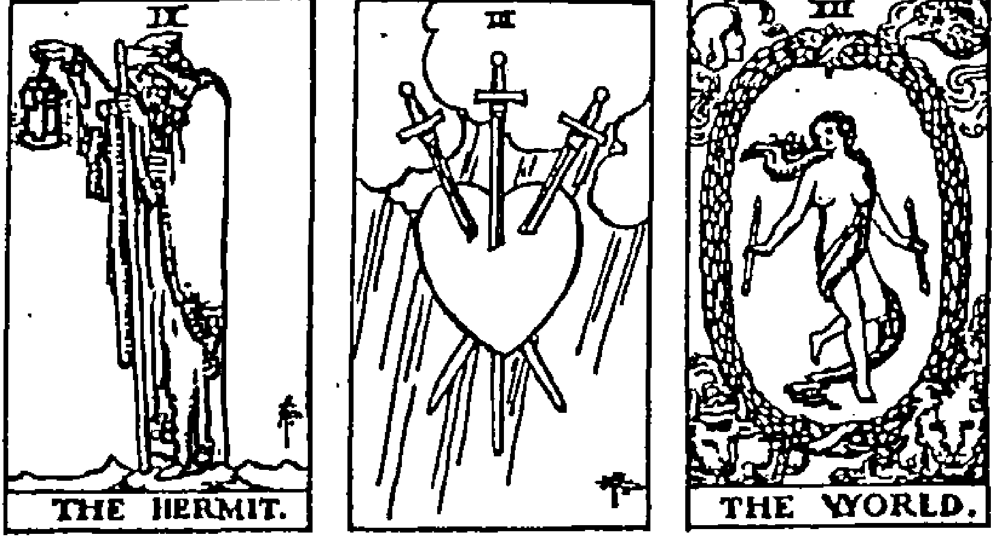

我的身要我退出、獨處，才能安撫那些心指出我正在經歷的心靈創傷和痛苦。但靈催促我克服感覺的限制，體會在接受痛苦和失去後隨之而來的自由。

用一個句子將三張牌連結起來。將從牌裡所見編成一個故事或傳說。使用以下句型寫下你的訊息：

-   我的身要我 __________ 時，
    我的心告訴我 __________ ，
    但我的靈要求我 __________ 。

現在你可以停止讀牌，也可以繼續，以追求更深的理解。本節接下來的部分將指導如何使用同樣的三張牌，以得到更深入的了解。

## 更深入的讀牌

下一步是回到最初，這次從「時間」角度來解讀：過去、現在、未來。例如：

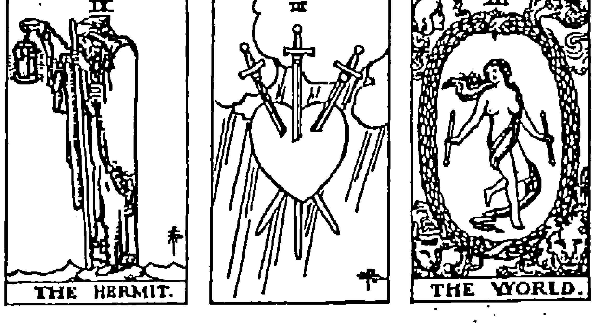

我一直獨來獨往，排斥與人來往，因為我害怕被傷害。而現在我必須面對及處理人際關係帶來的痛楚。我的靈要求我以更自在及開放的態度來面對那些在不久將來會出現的機會。換句話說，就是要我卸下一直以來自己保護的外殼。必須讓寶劍三中的雨水將我洗淨，才能看清內心的隱者在旅程所體現的領悟，雖然我仍心懷恐懼。

## 關於你的過去、現在、未來，解讀告訴你什麼？

-   過去：___________________________
    現在：___________________________
    未來：___________________________

現在是放膽去做的時候了，用雙手掌握人生：將牌隨自己的意思任意移動。用剛才舉的例子說明：

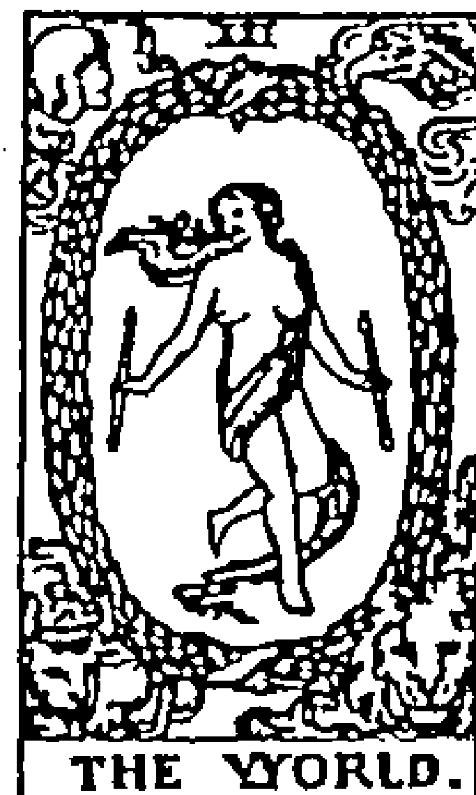

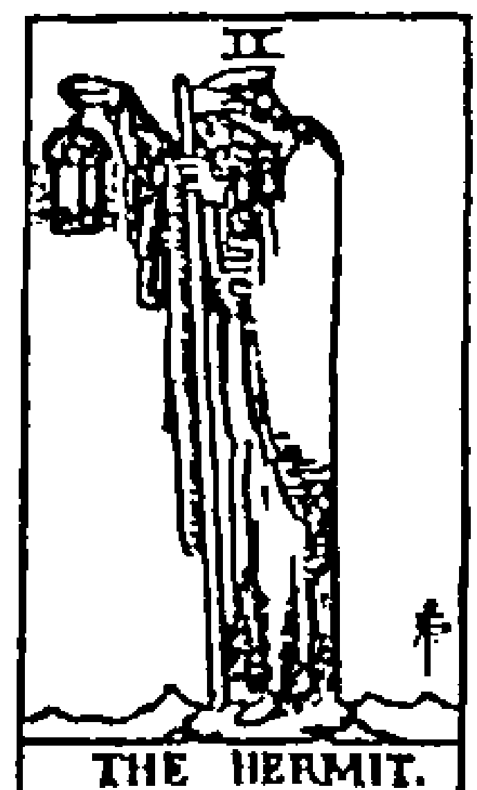

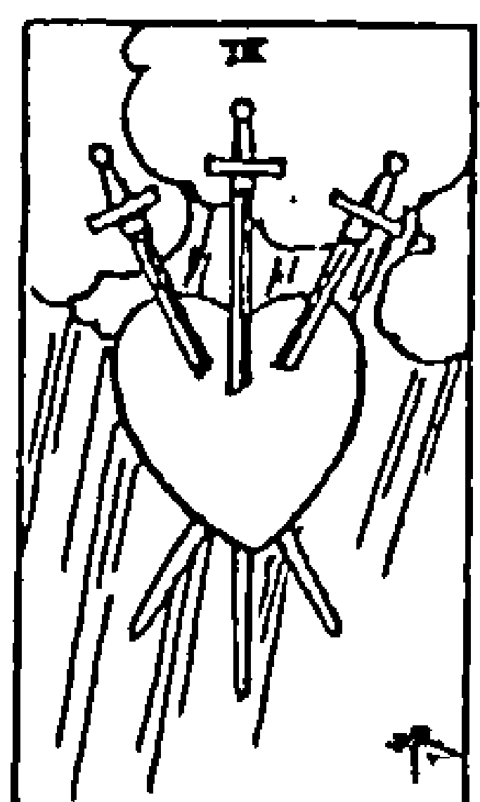

現在隱者正在尋找世界——內在的靈魂及自我已經不再害怕去面對那些生活中會帶來悲傷及痛苦的人。現在了解痛苦的狀況能夠帶領我找回自我感覺及完整性。

注意牌中哪個人物在注視哪個方向或朝哪個方向移動。這對於讀牌很重要。

將牌以全新的、不同順序擺放。你比較喜歡現在這個順序嗎？你看到了什麼新觀點？

## 可以再次移動牌。例如：

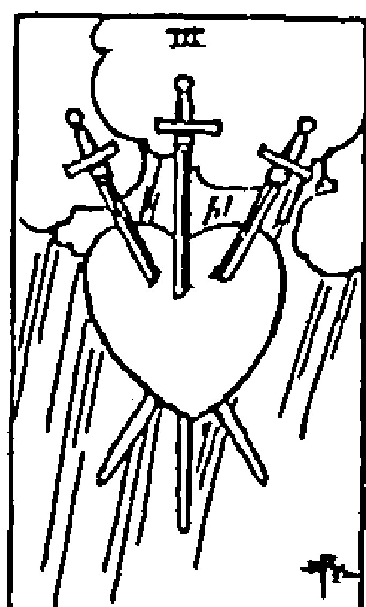

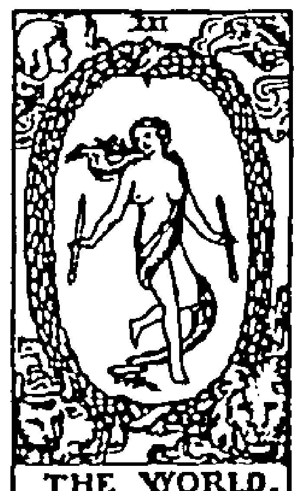

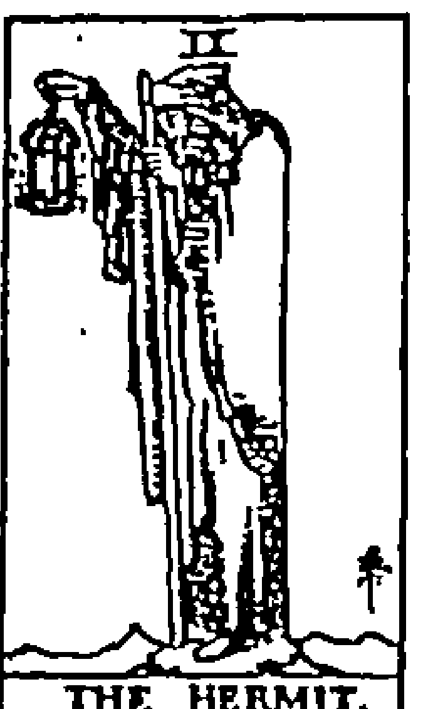

我已經克服傷痛，並超越了它。因為我依靠代表自我智慧的隱者來了解究竟發生了什麼事，並且善用學習到的經驗。我往回看，提燈照亮了那條我自暴風雨中走來的小路。

我已經開闢出一條新路。我隻身一人，但伴隨著智慧及對自己能力的信心，讓我勇闖世界。

## 記下任何移動牌後，你的進一步見解：

由三種不同角度看過這三張牌後，再將它們放回原來的位置。注意自己對這個原始的排列獲得多少訊息，還有它們呈現了哪些可能性。重點永遠是時間——無論過去發生了哪些事，或在未來將會發生什麼。那些過去也曾是自己的未來；而未來有一天也會成為當下。轉換觀點就會明瞭「現在」的意義，也將開始以循環的形式來體驗它。

可以持續移動牌至任何位置或排列順序，每一種排列都能加深了解。以下是一些可能的例子：

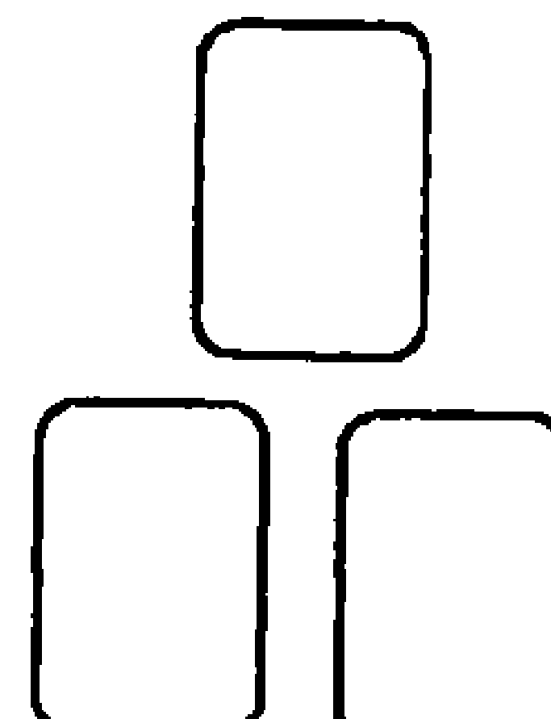

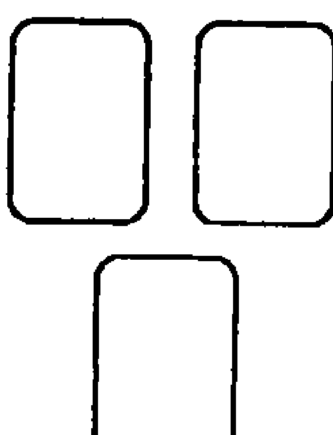

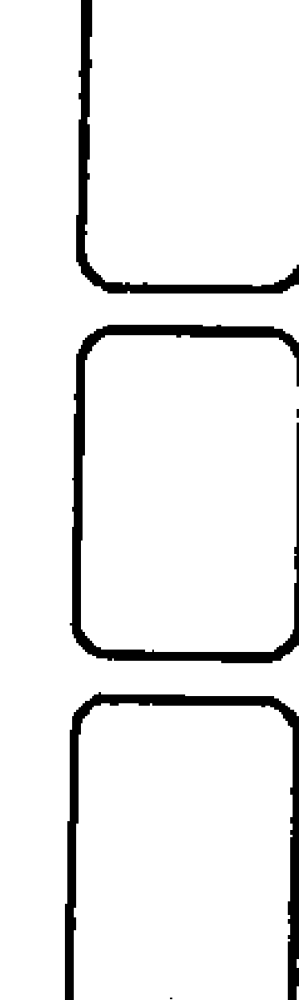

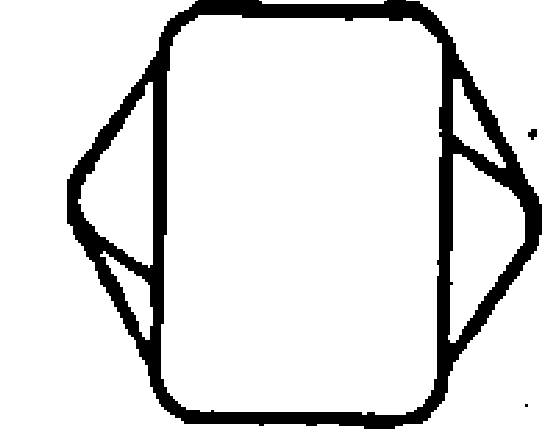

這三種牌陣的位置也可以呈現多種意義。以下是我最喜歡的一些變化，等找出對自己有效的變化後也可以添加進去。

-   身
    過去
    潛意識
    孩子
    馬雅／幻覺
    論點
    開端
    想法或計畫

-   心
    現在
    意識
    父母
    知識
    對照
    反對
    對它的批判

-   靈
    未來
    超意識
    成人
    魔法
    綜合
    整合
    將侷限發揮至最大的方法

## 回顧每天的解讀

我的一個學生，琳達·提吉斯，她將每天對三張牌陣的解讀紀錄下來，並持續了一個月。然後她將所有出現三次或三次以上的牌都挑出來，以更加了解她這一個月以來進展。她還注意那個她最常抽到的數字，一。她將所有「一」的牌，以及大阿爾克納的一號牌魔術師，做為解開這一個月來一切經歷之意義關鍵。

## 依照個人選擇來選牌

在接下來許多練習中，可能會使用新的方法來占卜。讓牌面都朝上，然後從中選牌。在某些練習中，必須基於對於牌上圖案或意象的個人反應來選牌。
而在做其他練習時，我會給一張表，上面有每張牌的「用途」，可以先選擇一個用途，以及對應的牌。無論是上述哪一種選牌方式，牌上的意象都有很重要的意義。
而所使用的牌有多少意象，會對選牌以及解讀有很大的影響。所以使用的牌必須具有個人意義，除非特別擅長靈數學和解讀抽象意象，否則你所使用的大小阿爾克納牌都要有圖象或象徵語言（在簡介中有一張表，列出了目前可以使用的塔羅牌種類）。
在做下面的練習時，可能會被要求「挑一到三張代表自己最佳能力的牌」。這時將整副牌的面朝上，眼光快速掃過它們，然後抽出所有可能符合這個描述的牌。最好不要預先設定答案，而是問每一張牌：「你代表我的能力嗎？」如果很猶豫，不知道該不該抽這張牌，就將它放在「有可能」的那一疊牌上。可能會抽五至二十五張牌，將這些牌攤開，然後淘汰那些感覺不符合或並沒有表現主要問題的牌。現在應該只剩約五到七張牌了。將每一張牌都和另一張牌做比較，並問自己：「如果我必須剔除其中一張牌，我會選擇哪一張？」用這樣的方法，會慢慢將這疊牌的數量減少至一到三張，而這幾張牌會是最簡潔而恰當表現出自己最佳能力的牌。通常最後會留下一張以上的牌，尤其當一張牌的能量必須藉另一張牌的力量發揮時。雖然有時很難決定要剔除哪張牌，但會發現當牌越少時，越容易做決定。

接下來用以下的格式開始練習。

我的最佳能力可以用以下牌來代表（選出一到三張牌）：

這些牌敘述了我這些能力：

## 終生年度牌圖表

在第一章裡已經學過如何找出年度牌，也可以計算出終生的年度牌，然後將它們填入表格中。使用下一頁這張便利的表格「算出終生年度牌」，找出每年的年度牌。其中的四位數字是年度＋月份＋日期的總和。右邊的一位或二位數字代表大阿爾克納牌的數字。

將自己的年度牌圈出來，就能看到今生課題的模式。有些牌會一直反覆出現，另一些牌則只出現一、兩次，然後不再出現。由於我們的數學系統是以十進位，所以會發現數字以十年為一個周期在運作。根據出生的日期，某些特定數字或周期會居於主導地位。例如 1988 年 1 月 1 日之後，就不會再有 19-10-1 的組合出現，雖然之前出現的次數很頻繁。要一直到 2069 年之後才會再有這樣的組合。

終生年度牌的圖表（或是任何其他圖表用紙），每一條橫軸表示大阿爾克納牌，縱軸代表年紀。從你出生的那年開始，將西元年份寫在年度的欄位上。為了便於參考，在年份的上方寫下自己該年的年齡。

### 算出終生年度牌

左邊數字＝年度、月份及日期之總和，右邊數字＝年度牌。

| 年度+月+日 | 年度牌 | 年度+月+日 | 年度牌 | 年度+月+日 | 年度牌 | 年度+月+日 | 年度牌 | 年度+月+日 | 年度牌 | 年度+月+日 | 年度牌 |
|---|---|---|---|---|---|---|---|---|---|---|---|
| 1890 | 18 | 1926 | 18 | 1962 | 18 | 1998 | 9 | 2034 | 9 | 2070 | 9 |
| 1891 | 19 | 1927 | 19 | 1963 | 19 | 1999 | 10 | 2035 | 10 | 2071 | 10 |
| 1892 | 20 | 1928 | 20 | 1964 | 20 | 2000 | 2 | 2036 | 11 | 2072 | 11 |
| 1893 | 21 | 1929 | 21 | 1965 | 21 | 2001 | 3 | 2037 | 12 | 2073 | 12 |
| 1894 | 22 | 1930 | 13 | 1966 | 22 | 2002 | 4 | 2038 | 13 | 2074 | 13 |
| 1895 | 5 | 1931 | 14 | 1967 | 5 | 2003 | 5 | 2039 | 14 | 2075 | 14 |
| 1896 | 6 | 1932 | 15 | 1968 | 6 | 2004 | 6 | 2040 | 6 | 2076 | 15 |
| 1897 | 7 | 1933 | 16 | 1969 | 7 | 2005 | 7 | 2041 | 7 | 2077 | 16 |
| 1898 | 8 | 1934 | 17 | 1970 | 17 | 2006 | 8 | 2042 | 8 | 2078 | 17 |
| 1899 | 9 | 1935 | 18 | 1971 | 18 | 2007 | 9 | 2043 | 9 | 2079 | 18 |
| 1900 | 10 | 1936 | 19 | 1972 | 19 | 2008 | 10 | 2044 | 10 | 2080 | 10 |
| 1901 | 11 | 1937 | 20 | 1973 | 20 | 2009 | 11 | 2045 | 11 | 2081 | 11 |
| 1902 | 12 | 1938 | 21 | 1974 | 21 | 2010 | 3 | 2046 | 12 | 2082 | 12 |
| 1903 | 13 | 1939 | 22 | 1975 | 22 | 2011 | 4 | 2047 | 13 | 2083 | 13 |
| 1904 | 14 | 1940 | 14 | 1976 | 5 | 2012 | 5 | 2048 | 14 | 2084 | 14 |
| 1905 | 15 | 1941 | 15 | 1977 | 6 | 2013 | 6 | 2049 | 15 | 2085 | 15 |
| 1906 | 16 | 1942 | 16 | 1978 | 7 | 2014 | 7 | 2050 | 7 | 2086 | 16 |
| 1907 | 17 | 1943 | 17 | 1979 | 8 | 2015 | 8 | 2051 | 8 | 2087 | 17 |
| 1908 | 18 | 1944 | 18 | 1980 | 18 | 2016 | 9 | 2052 | 9 | 2088 | 18 |
| 1909 | 19 | 1945 | 19 | 1981 | 19 | 2017 | 10 | 2053 | 10 | 2089 | 19 |
| 1910 | 11 | 1946 | 20 | 1982 | 20 | 2018 | 11 | 2054 | 11 | 2090 | 11 |
| 1911 | 12 | 1947 | 21 | 1983 | 21 | 2019 | 12 | 2055 | 12 | 2091 | 12 |
| 1912 | 13 | 1948 | 22 | 1984 | 22 | 2020 | 4 | 2056 | 13 | 2092 | 13 |
| 1913 | 14 | 1949 | 5 | 1985 | 5 | 2021 | 5 | 2057 | 14 | 2093 | 14 |
| 1914 | 15 | 1950 | 15 | 1986 | 6 | 2022 | 6 | 2058 | 15 | 2094 | 15 |
| 1915 | 16 | 1951 | 16 | 1987 | 7 | 2023 | 7 | 2059 | 16 | 2095 | 16 |
| 1916 | 17 | 1952 | 17 | 1988 | 8 | 2024 | 8 | 2060 | 8 | 2096 | 17 |
| 1917 | 18 | 1953 | 18 | 1989 | 9 | 2025 | 9 | 2061 | 9 | 2097 | 18 |
| 1918 | 19 | 1954 | 19 | 1990 | 19 | 2026 | 10 | 2062 | 10 | 2098 | 19 |
| 1919 | 20 | 1955 | 20 | 1991 | 20 | 2027 | 11 | 2063 | 11 | 2099 | 20 |
| 1920 | 12 | 1956 | 21 | 1992 | 21 | 2028 | 12 | 2064 | 12 | 2100 | 3 |
| 1921 | 13 | 1957 | 22 | 1993 | 22 | 2029 | 13 | 2065 | 13 | 2101 | 4 |
| 1922 | 14 | 1958 | 5 | 1994 | 5 | 2030 | 5 | 2066 | 14 | 2102 | 5 |
| 1923 | 15 | 1959 | 6 | 1995 | 6 | 2031 | 6 | 2067 | 15 | 2103 | 6 |
| 1924 | 16 | 1960 | 16 | 1996 | 7 | 2032 | 7 | 2068 | 16 | 2104 | 7 |
| 1925 | 17 | 1961 | 17 | 1997 | 8 | 2033 | 8 | 2069 | 17 |  |  |

決定每年的年度牌後（參考第一章介紹的方法），以點的方式標示在圖表上，再將點用線連起來，看看它們呈現的模式，如同「終生年度牌圖表範例」一般。

檢視自己的圖表，找出每個十年的周期。而每個周期的結束都代表人生的轉折點。

你在哪些年度結束了十年周期？而你又在這些年度中完成了哪些人生的循環？

| 年度 | 年齡 | 完成事項 |
|------|------|----------|
|      |      |          |
|      |      |          |
|      |      |          |

你從哪些年度開始一個十年周期？在這些年度中開始了什麼人生的循環？

| 年度 | 年齡 | 開始事項 |
|------|------|----------|
|      |      |          |
|      |      |          |
|      |      |          |

將圖表中遇到性格牌、靈魂牌的年度圈起來。這代表牌非常重要的意義，在這些年度中，有可能被迫或遇到對今生靈魂的目的有重大意義的事件中。換句話說，你會做一些能夠發揮自己最佳潛能的事。而你的所做將會教導你，如何完全發揮自己的潛力。當時候到了，這些年度將讓你有機會重新確立自己的方向，並達成人生目標。在以下表中記下你的性格牌和靈魂牌年度中，具有重大意義的事件，以在自己人生的課題中，獲得更多的洞悉。

### 終生年度牌圖表範例

| 年齡\年度 | 0 | 1 | 2 | 3 | 4 | 5 | 6 | 7 | 8 | 9 | 10 | 11 | 12 | 13 | 14 | 15 | 16 | 17 | 18 | 19 | 20 | 21 | 22 | 23 | 24 | 25 | 26 | 27 | 28 | 29 | 30 | 31 | 32 | 33 | 34 | 35 | 36 | 37 | 38 | 39 | 40 |
|---|---|---|---|---|---|---|---|---|---|---|---|---|---|---|---|---|---|---|---|---|---|---|---|---|---|---|---|---|---|---|---|---|---|---|---|---|---|---|---|---|---|---|
| 1 |  |  |  |  |  |  |  |  |  |  |  |  |  |  |  |  |  |  |  |  |  |  |  |  |  |  |  |  |  |  |  |  |  |  |  |  |  |  |  |  |  |
| 2 |  |  |  |  |  |  |  |  |  |  |  |  |  |  |  |  |  |  |  |  |  |  |  |  |  |  |  |  |  |  |  |  |  |  |  |  |  |  |  |  |  |
| 3 |  |  |  |  |  |  |  |  |  |  |  |  |  |  |  |  |  |  |  |  |  |  |  |  |  |  |  |  |  |  |  |  |  |  |  |  |  |  |  |  |  |
| 4 |  |  |  |  |  |  |  |  |  |  |  |  |  |  |  |  |  |  |  |  |  |  |  |  |  |  |  |  |  |  |  |  |  |  |  |  |  |  |  |  |  |
| 5 |  |  |  |  |  |  |  |  |  |  |  |  |  |  |  |  |  |  |  |  |  |  |  |  | 權杖騎士 |  |  |  |  |  |  |  |  |  |  |  |  |  |  |  |  |
| 6 |  |  |  |  |  |  |  |  |  |  |  |  |  |  |  |  |  |  |  |  |  |  |  |  |  |  |  |  |  | 戰車 |  |  |  |  |  |  |  |  |  |  |  |
| 7 |  |  |  |  |  |  |  |  |  |  |  |  |  |  |  |  |  |  |  |  |  |  |  |  |  |  |  |  |  |  |  |  |  |  |  |  |  |  |  |  |  |
| 8 |  |  |  |  |  |  |  |  |  |  |  |  |  |  |  |  |  |  |  |  |  |  |  |  |  |  |  |  |  |  |  |  | 寶劍侍者 |  |  |  |  |  |  |  |  |
| 9 |  |  |  |  |  |  |  |  |  |  |  |  |  |  |  |  |  |  |  |  |  |  |  |  |  |  |  |  |  |  |  |  |  |  |  |  |  |  |  |  |  |
| 10 |  |  |  |  |  |  |  |  |  |  |  |  |  |  |  |  |  |  |  |  |  |  |  |  | 寶劍皇后 |  |  |  |  |  |  |  |  |  |  |  |  |  |  |  |  |
| 11 |  |  |  |  |  |  |  |  |  |  |  |  |  |  |  |  |  |  |  |  |  |  |  |  |  |  |  |  |  |  |  |  |  |  |  |  |  |  |  |  |  |
| 12 |  |  |  |  |  |  |  |  |  |  |  |  |  |  |  |  |  |  |  |  |  |  |  |  |  |  |  |  |  |  |  |  |  |  |  |  |  |  |  |  |  |
| 13 |  |  |  |  |  |  |  |  |  |  |  |  |  |  |  |  |  |  |  |  |  |  |  |  |  |  |  |  |  |  |  |  |  |  |  |  |  |  |  |  |  |
| 14 |  |  |  |  |  |  |  |  |  |  |  |  |  |  |  |  |  |  |  |  |  |  |  |  |  |  |  |  |  |  |  |  |  |  |  |  |  |  |  |  |  |
| 15 |  |  |  |  |  |  |  |  |  |  |  |  |  |  |  |  |  |  |  |  |  |  |  |  |  |  |  |  |  |  |  |  |  |  |  |  |  |  |  |  |  |
| 16 |  |  |  |  |  |  |  |  |  |  |  |  |  |  |  |  |  |  |  |  |  |  |  |  |  |  |  |  |  |  |  |  |  |  |  |  |  |  |  |  |  |
| 17 |  |  |  |  |  |  |  |  |  |  |  |  |  |  |  |  |  |  |  |  |  |  |  |  |  |  |  |  |  |  |  |  |  |  |  |  |  |  |  |  |  |
| 18 |  |  |  |  |  |  |  |  |  |  |  |  |  |  |  |  |  |  |  |  |  |  |  |  |  |  |  |  |  |  |  |  |  |  |  |  |  |  |  |  |  |
| 19 |  |  |  |  |  |  |  |  |  |  |  |  |  |  |  |  |  |  |  |  |  |  |  |  |  |  |  |  |  |  |  |  |  |  |  |  |  |  |  |  |  |
| 20 |  |  |  |  |  |  |  |  |  |  |  |  |  |  |  |  |  |  |  | 命運之輪 |  |  |  |  |  |  |  |  |  |  |  |  |  |  |  |  |  |  |  |  |  |
| 21 |  |  |  |  |  |  |  |  |  |  |  |  |  |  |  |  |  |  |  |  |  |  |  |  |  |  |  |  |  |  |  |  |  |  |  |  |  |  |  |  |  |
| 22 |  |  |  |  |  |  |  |  |  |  |  |  |  |  |  |  |  |  |  |  |  |  |  |  |  |  |  |  |  |  |  |  |  |  |  |  |  |  |  |  |  |## 终生年度牌表格

| 年龄 | 年度 | 1 | 2 | 3 | 4 | 5 | 6 | 7 | 8 | 9 | 10 | 11 | 12 | 13 | 14 | 15 | 16 | 17 | 18 | 19 | 20 | 21 | 22 | 23 | 24 | 25 | 26 | 27 | 28 | 29 | 30 | 31 | 32 | 33 | 34 | 35 | 36 | 37 | 38 | 39 | 40 | 41 | 42 | 43 | 44 | 45 | 46 | 47 | 48 | 49 | 50 | 51 | 52 | 53 | 54 | 55 | 56 | 57 | 58 | 59 | 60 | 61 | 62 | 63 | 64 | 65 | 66 | 67 | 68 | 69 | 70 | 71 | 72 | 73 | 74 | 75 | 76 | 77 | 78 | 79 | 80 | 81 |
|------|------|---|---|---|---|---|---|---|---|---|----|----|----|----|----|----|----|----|----|----|----|----|----|----|----|----|----|----|----|----|----|----|----|----|----|----|----|----|----|----|----|----|----|----|----|----|----|----|----|----|----|----|----|----|----|----|----|----|----|----|----|----|----|----|----|----|----|----|----|----|----|----|----|----|----|----|----|----|----|----|----|----|----|----|
| 0    | 1    |   |   |   |   |   |   |   |   |   |    |    |    |    |    |    |    |    |    |    |    |    |    |    |    |    |    |    |    |    |    |    |    |    |    |    |    |    |    |    |    |    |    |    |    |    |    |    |    |    |    |    |    |    |    |    |    |    |    |    |    |    |    |    |    |    |    |    |    |    |    |    |    |    |    |    |    |    |    |    |    |    |
| 1    | 2    |   |   |   |   |   |   |   |   |   |    |    |    |    |    |    |    |    |    |    |    |    |    |    |    |    |    |    |    |    |    |    |    |    |    |    |    |    |    |    |    |    |    |    |    |    |    |    |    |    |    |    |    |    |    |    |    |    |    |    |    |    |    |    |    |    |    |    |    |    |    |    |    |    |    |    |    |    |    |    |    |    |
| 2    | 3    |   |   |   |   |   |   |   |   |   |    |    |    |    |    |    |    |    |    |    |    |    |    |    |    |    |    |    |    |    |    |    |    |    |    |    |    |    |    |    |    |    |    |    |    |    |    |    |    |    |    |    |    |    |    |    |    |    |    |    |    |    |    |    |    |    |    |    |    |    |    |    |    |    |    |    |    |    |    |    |    |    |
| 3    | 4    |   |   |   |   |   |   |   |   |   |    |    |    |    |    |    |    |    |    |    |    |    |    |    |    |    |    |    |    |    |    |    |    |    |    |    |    |    |    |    |    |    |    |    |    |    |    |    |    |    |    |    |    |    |    |    |    |    |    |    |    |    |    |    |    |    |    |    |    |    |    |    |    |    |    |    |    |    |    |    |    |    |
| 4    | 5    |   |   |   |   |   |   |   |   |   |    |    |    |    |    |    |    |    |    |    |    |    |    |    |    |    |    |    |    |    |    |    |    |    |    |    |    |    |    |    |    |    |    |    |    |    |    |    |    |    |    |    |    |    |    |    |    |    |    |    |    |    |    |    |    |    |    |    |    |    |    |    |    |    |    |    |    |    |    |    |    |    |
| 5    | 6    |   |   |   |   |   |   |   |   |   |    |    |    |    |    |    |    |    |    |    |    |    |    |    |    |    |    |    |    |    |    |    |    |    |    |    |    |    |    |    |    |    |    |    |    |    |    |    |    |    |    |    |    |    |    |    |    |    |    |    |    |    |    |    |    |    |    |    |    |    |    |    |    |    |    |    |    |    |    |    |    |    |
| 6    | 7    |   |   |   |   |   |   |   |   |   |    |    |    |    |    |    |    |    |    |    |    |    |    |    |    |    |    |    |    |    |    |    |    |    |    |    |    |    |    |    |    |    |    |    |    |    |    |    |    |    |    |    |    |    |    |    |    |    |    |    |    |    |    |    |    |    |    |    |    |    |    |    |    |    |    |    |    |    |    |    |    |    |
| 7    | 8    |   |   |   |   |   |   |   |   |   |    |    |    |    |    |    |    |    |    |    |    |    |    |    |    |    |    |    |    |    |    |    |    |    |    |    |    |    |    |    |    |    |    |    |    |    |    |    |    |    |    |    |    |    |    |    |    |    |    |    |    |    |    |    |    |    |    |    |    |    |    |    |    |    |    |    |    |    |    |    |    |    |
| 8    | 9    |   |   |   |   |   |   |   |   |   |    |    |    |    |    |    |    |    |    |    |    |    |    |    |    |    |    |    |    |    |    |    |    |    |    |    |    |    |    |    |    |    |    |    |    |    |    |    |    |    |    |    |    |    |    |    |    |    |    |    |    |    |    |    |    |    |    |    |    |    |    |    |    |    |    |    |    |    |    |    |    |    |
| 9    | 10   |   |   |   |   |   |   |   |   |   |    |    |    |    |    |    |    |    |    |    |    |    |    |    |    |    |    |    |    |    |    |    |    |    |    |    |    |    |    |    |    |    |    |    |    |    |    |    |    |    |    |    |    |    |    |    |    |    |    |    |    |    |    |    |    |    |    |    |    |    |    |    |    |    |    |    |    |    |    |    |    |    |
| 10   | 11   |   |   |   |   |   |   |   |   |   |    |    |    |    |    |    |    |    |    |    |    |    |    |    |    |    |    |    |    |    |    |    |    |    |    |    |    |    |    |    |    |    |    |    |    |    |    |    |    |    |    |    |    |    |    |    |    |    |    |    |    |    |    |    |    |    |    |    |    |    |    |    |    |    |    |    |    |    |    |    |    |    |
| 11   | 12   |   |   |   |   |   |   |   |   |   |    |    |    |    |    |    |    |    |    |    |    |    |    |    |    |    |    |    |    |    |    |    |    |    |    |    |    |    |    |    |    |    |    |    |    |    |    |    |    |    |    |    |    |    |    |    |    |    |    |    |    |    |    |    |    |    |    |    |    |    |    |    |    |    |    |    |    |    |    |    |    |    |
| 12   | 13   |   |   |   |   |   |   |   |   |   |    |    |    |    |    |    |    |    |    |    |    |    |    |    |    |    |    |    |    |    |    |    |    |    |    |    |    |    |    |    |    |    |    |    |    |    |    |    |    |    |    |    |    |    |    |    |    |    |    |    |    |    |    |    |    |    |    |    |    |    |    |    |    |    |    |    |    |    |    |    |    |    |
| 13   | 14   |   |   |   |   |   |   |   |   |   |    |    |    |    |    |    |    |    |    |    |    |    |    |    |    |    |    |    |    |    |    |    |    |    |    |    |    |    |    |    |    |    |    |    |    |    |    |    |    |    |    |    |    |    |    |    |    |    |    |    |    |    |    |    |    |    |    |    |    |    |    |    |    |    |    |    |    |    |    |    |    |    |
| 14   | 15   |   |   |   |   |   |   |   |   |   |    |    |    |    |    |    |    |    |    |    |    |    |    |    |    |    |    |    |    |    |    |    |    |    |    |    |    |    |    |    |    |    |    |    |    |    |    |    |    |    |    |    |    |    |    |    |    |    |    |    |    |    |    |    |    |    |    |    |    |    |    |    |    |    |    |    |    |    |    |    |    |    |
| 15   | 16   |   |   |   |   |   |   |   |   |   |    |    |    |    |    |    |    |    |    |    |    |    |    |    |    |    |    |    |    |    |    |    |    |    |    |    |    |    |    |    |    |    |    |    |    |    |    |    |    |    |    |    |    |    |    |    |    |    |    |    |    |    |    |    |    |    |    |    |    |    |    |    |    |    |    |    |    |    |    |    |    |    |
| 16   | 17   |   |   |   |   |   |   |   |   |   |    |    |    |    |    |    |    |    |    |    |    |    |    |    |    |    |    |    |    |    |    |    |    |    |    |    |    |    |    |    |    |    |    |    |    |    |    |    |    |    |    |    |    |    |    |    |    |    |    |    |    |    |    |    |    |    |    |    |    |    |    |    |    |    |    |    |    |    |    |    |    |    |
| 17   | 18   |   |   |   |   |   |   |   |   |   |    |    |    |    |    |    |    |    |    |    |    |    |    |    |    |    |    |    |    |    |    |    |    |    |    |    |    |    |    |    |    |    |    |    |    |    |    |    |    |    |    |    |    |    |    |    |    |    |    |    |    |    |    |    |    |    |    |    |    |    |    |    |    |    |    |    |    |    |    |    |    |    |
| 18   | 19   |   |   |   |   |   |   |   |   |   |    |    |    |    |    |    |    |    |    |    |    |    |    |    |    |    |    |    |    |    |    |    |    |    |    |    |    |    |    |    |    |    |    |    |    |    |    |    |    |    |    |    |    |    |    |    |    |    |    |    |    |    |    |    |    |    |    |    |    |    |    |    |    |    |    |    |    |    |    |    |    |    |
| 19   | 20   |   |   |   |   |   |   |   |   |   |    |    |    |    |    |    |    |    |    |    |    |    |    |    |    |    |    |    |    |    |    |    |    |    |    |    |    |    |    |    |    |    |    |    |    |    |    |    |    |    |    |    |    |    |    |    |    |    |    |    |    |    |    |    |    |    |    |    |    |    |    |    |    |    |    |    |    |    |    |    |    |    |
| 20   | 21   |   |   |   |   |   |   |   |   |   |    |    |    |    |    |    |    |    |    |    |    |    |    |    |    |    |    |    |    |    |    |    |    |    |    |    |    |    |    |    |    |    |    |    |    |    |    |    |    |    |    |    |    |    |    |    |    |    |    |    |    |    |    |    |    |    |    |    |    |    |    |    |    |    |    |    |    |    |    |    |    |    |
| 21   | 22   |   |   |   |   |   |   |   |   |   |    |    |    |    |    |    |    |    |    |    |    |    |    |    |    |    |    |    |    |    |    |    |    |    |    |    |    |    |    |    |    |    |    |    |    |    |    |    |    |    |    |    |    |    |    |    |    |    |    |    |    |    |    |    |    |    |    |    |    |    |    |    |    |    |    |    |    |    |    |    |    |    |

### 性格及靈魂數字年度：

| 年度 | 年齡 | 牌 | 重大事件 |
|---|---|---|---|
| | | | |
| | | | |
| | | | |
| | | | |

此外，也看看是否有新數字出現。它們代表了必須去整合的新經驗及教訓。將新數字第一次出現的年度記在下方（尤其是第一個十年周期之後）。

### 第一次出現的數字／牌：

| 年度 | 年齡 | 牌 | 年度 | 年齡 | 牌 |
|---|---|---|---|---|---|
| | | | | | |
| | | | | | |
| | | | | | |

從何時起相同的數字不再出現？這表示那些課題你已經學到了教訓。將某些最後一次出現的數字記下來。

### 最後出現的數字：

| 年度 | 年齡 | 牌 | 年度 | 年齡 | 牌 |
|---|---|---|---|---|---|
| | | | | | |
| | | | | | |
| | | | | | |
| | | | | | |

哪些牌出現次數最頻繁？它們代表最大考驗及最需要被強化的領域。無法一次就學會，因此會有很多次機會。將自己生命中最常出現的牌，要超過六次或更多，記在下方。也要記下它們對生活有什麼特殊意義。

### 最常出現的數字：

| 牌 | 出現次數 | 對自己的意義 |
|---|---|---|
|  |  |  |
|  |  |  |
|  |  |  |
|  |  |  |
|  |  |  |
|  |  |  |
|  |  |  |
|  |  |  |

我發現在圖表上每一個年度旁邊記下當年的關鍵事物，是很有幫助的做法。因為這樣，我發現有兩次在愚者／皇帝（22／4）那年，我搬去亞特蘭大，其間剛好相隔十年。我祖父在跟死亡與再生的行星，冥王星對應的審判（20）那年去世。在三個教皇（5）年中，我遇見了幾位人生重要導師。而我第一次上塔羅課，是在隱者（9）年（這也是我的靈魂牌，代表我靈魂的目的）。在戀人（6）那年，我在墨西哥度蜜月，待了十個月。當我在寫這本書時，又是另一個隱者（9）年，感覺對這本書的順利完成是個吉兆。

我也看過很多人年度牌圖表與他們人生中實際發生的大事明顯相符的例子，而我認為應該注重的是，去觀察年度牌對自己的意義究竟是什麼。

例如戀人牌可能出現在自己保持單身的一年，因為你不斷在捫心自問自己在一段感情中究竟在追尋什麼。因此這張牌在強調自己可以選擇一段更有意義和價值的感情關係。

### 年度牌的課題

下面的表列出了一些可能從年度牌中學習到的課題：

- 魔術師：集中注意力，寫作、溝通、魔法、運用心靈力量克服一切以及任何與心智上努力相關的事物。
- 女祭司：獨立、直覺或心靈上的發展、與女性的關係、自我滋養。
- 皇后：創造力、孕育、滋養他人、與女性的關係、喜愛愉悅和美麗的事物、具有魅力和吸引人的。
- 皇帝：開始新事物、開拓、建造、建構、充滿自信與權威、奠定基礎或穩固基地。與男性的關係。
- 教皇：學習與教導、聽與說、從事與社會架構或階級相關工作——理解「系統」。
- 戀人：任何關係、與感情相關的重大抉擇、作決定並接受隨之而來的責任。
- 戰車：向世界證明自己、搬遷、旅行、學習保護——照顧自己與他人、設定與達成目標。
- 力量／欲：創意的渴望、強烈的熱情及慾望、引發強大力量及耐力的挑戰、處理憤怒情緒。
- 隱者：孤獨、內省、從經驗中或向榜樣學習、完美、追求、完成計畫。
- 命運之輪：重要的變動——關於居所、工作、觀點，以及完成一個周期並開始新周期，運氣和命運、名利及財富。
- 正義／調整：法律及財務方面的考量、平衡與和諧、學習以真實的自己與人相處、夥伴關係、契約。
- 倒吊人：處理自己的難題、自我犧牲、磨難、酗酒及成癮問題、放棄既有的觀念、態度、信仰，獲得新觀點。
- 死神：放下某些東西、割捨陳舊模式以容納新的成長、重生與再生、痛苦、深究事物底層、研究。
- 節制／藝術：促進健康與治療的方法、測試及嘗試自己的信仰與哲學、創造性組合。
- 惡魔：權力鬥爭、操縱、保持幽默感、引發不安、質疑權威、強烈的性慾。
- 塔：潔淨——運動、節食、斷食、大掃除、憤怒與痛苦、卸除或毀滅老舊而不必要的架構。
- 星星：確認自己的目標、理想和人道主義思想，並採取行動。意識到地球是萬物的本質，渴望能夠療癒她。
- 月亮：具豐富的想像力及夢境能力、被未知慾望牽引的感覺、業力關係。
- 太陽：認可、達成主要目標、婚姻或生產、自我價值感。
- 審判／永恆：從自己和他人身上處理與判斷、批判和評價相關的議題；得到新的信念、世界觀與理解；重生，處理死亡和轉化的議題。
- 世界／宇宙：學習與自己的局限共舞、在限制或框架內處事、無窮的可能性。
- 愚者：探險、旅行、大膽的、對新體驗的開放心態。

## 視覺化塔羅牌

我塔羅班上有個學生莉安·格瑞芙，她寫了一段文字。這些文字脫胎於對愚者、魔術師、女祭司等牌的冥想，且具有一種能夠引起共鳴的普世意義，所以我將它修改成想像塔羅牌的指南。我會將這些文字讀給學生聽，並搭配背景音樂。使用節奏緩慢輕柔的音樂，能夠讓人更容易放鬆，也讓字句更容易進入腦海，並排除那些常識判斷及障礙。我發現維瓦爾第的「四季」中有幾小節特別適合做為冥想的背景音樂。

## 一個塔羅故事

圍繞著寺院的庭院是難以形容的。一個色彩鮮豔的人物以漫不經心的態度帶領自己來到這裡。他的注意力全被周遭環境吸引，這讓人有些微不安。如果不是還有自己和這條小白狗，可能早就不知發生多少次意外了。為了跟緊他，必須很清楚知道自己身在何處。他看起來很不真實，讓人相信他其實是虛擬人物。當自己攀爬懸崖、跳下溝壑時，開始有點頭暈，暫停下來調整呼吸，然後看到他消失在玫瑰花園當中。

當思緒恢復時，會有一種新的意識進入腦海。彷彿有種變化發生了，一股難以置信的能量正通過玫瑰花叢向自己招手。

穿越了垂下的葡萄藤，另一端就是花園，而遠處是那座寺廟。進入這個不可思議的綠洲，便被周圍的強烈力量所震懾了。左邊是一張方形木桌，桌前站了一名男子，他的俊美令人屏住呼吸。他似乎在指揮一支隱形的交響樂團，右手舉起指揮棒，左手則指揮著能量。他全身發出電光，面前的桌上放了一個杯子、一根棒子，以及一把劍，還有一個似乎是個巨大錢幣，中間還有一顆星。自己和這名男子彷彿有點熟悉，似乎曾在夢境中跟著他來到這裡。問他叫什麼名字，他看著自己，眨眨眼，看起來像在捉弄人。視覺及幻想在眼前交錯，然而它們都超越了單純的幻覺。每一個新的想像畫面，都呈現出自己以前不知道的真相及感悟。緊跟著他是唯一能做的事。最重要的是，他穿著那件白襯衫及紅色斗篷，看起來是如此迷人。要說唯一多餘的，就是一直在他頭上盤旋的無限符號。它旋轉、扭動著，並發出光線及能量。這是一種催眠，只有他的眼睛讓人保持清醒。那雙眼睛看進靈魂深處，這是從未感受過的眼神。站在花園裡，周遭圍繞著葡萄藤、玫瑰、植物及花朵……多到不勝枚舉。覺得和那名男子及花園裡的一切成為一體，你們的靈魂合而為一，也希望與他連成一體，進入他的頻率，與電流一起通過他的身體。

> 在結束思考前，一個聲音進入腦海：「你必須完成旅程，必須離開這座花園，進入那座寺廟。在那裡，如果被接受了，那麼會得到進一步指示，並踏上接下來的路途。」在聽到接下來的答覆後會感到一陣失落，「我們是一體的，我們的靈魂來自同一個父親。在我能夠回來帶你走之前，你必須通過這個入門考驗。許多人像你一樣來到我面前，但沒有人能停留得像你這麼久。我曾經欺瞞、迷惑、驚嚇許多比你巨大的人，然而你的美麗與奇特讓我感到興奮，就好像我為了填補失去真正的執迷而創造的一切，完整地站在我面前。我是魔術師，你的純真及信賴讓我神魂顛倒。在我們真正合而為一之前，你必須離開這座花園，離開我。如果你是我相信的那般，我們會如一開始那樣合而為一。這條路是艱辛的，旅途是漫長的，而最後我們將永遠成為一體。你的追尋再次引領你來到花園。你找到了我，也在我之中看到了你自己。我沒有任何東西可以給你，沒有養分，沒有庇護，沒有護身符也沒有魔藥。我可以給你一點靈感——一個字眼、一個願景，讓你記住我是誰。好好的思考它們，光靠它們，就能夠帶你回來找到我。我仍然會待在這裡，永遠是個魔術師，直到外在的力量能帶給我超越自己的新遠景。我看見你靈魂中的水平線，我感覺到你的內部存在著一種精神，如同我的一樣美好。你是我的靈魂，我的伴侶，你是當我們失去恩寵時失落的一部分。永恆已成為一夜美夢，我看著你入睡，而現在你甦醒了。仔細選擇，吾愛，因為這將成為你對我唯一的記憶。

彷彿已經來過這裡好多次了。他的眼光不曾離開過自己，只是緊閉著嘴。清楚的知道自己在哪裡，也知道他是什麼人。冰冷的電流貫穿體內的每一個細胞，低下頭來感謝這道祝福。再次看著他，他看起來很高興。離別的時間終於來臨，跨越門檻，穿越魔法，自己的命運就在眼前。請他為你唱一首歌，一首將會永遠繚繞在身邊的歌。他的雙眼散發充滿靈感的光彩，然後點點頭說：

> >你的要求太簡單了，應該可以再加一項。當我在那裡，你就能感覺到。這將會是你最大的考驗。我是生命的氣息，是水流貫穿萬物的小溪，同時也是一個魔法師。不能曲解我的本質，我是唯一的，前無古人後無來者。你會知道我的存在，毫無原因。不要尋找我，我一直都在這裡。相信我的存在，聆聽我的歌。如果你通過了入門考驗，完成這趟旅程，那麼我們將合而為一，離開這座花園。如果你失敗了，就會發現自己再度站在玫瑰花園前，只是每次這神秘面紗就將更難推開。你的純真將減少，重新到達目標的距離也會變得更遠。現在的一切都會遠離你和我，唯一會留下的是這首歌，和我們離別之前給彼此的最後一眼。帶著你純真的心和開放的心態走吧！我會跟著你，如同從前，未來也是。

他最後一句話迴盪在整個花園裡。他四周的光線變得如此閃耀，讓人無法直視。冒險對那道光芒投以最後一瞥，被一道看穿靈魂深處、震懾心弦，並在心靈中引起一股聲音的目光驚呆了。隨著聲音越來越強，光線越來越暗，最後聲音和光線融為一體，變成一道微弱而遙遠的音調。可以跟隨著這個指引前進，然而內心的某種東西滯留不前，然後發現自己站在一座高聳的白色寺廟前。不必去思考是如何到達這裡的，也不用回想在進入這個敞開的入口前經過了哪些地方。看到在一道長廊的盡頭，一名女子站在那裡，身穿飄逸的藍色長紗。感覺充滿了知性，那就像一杯水解了內在的渴。旅程於焉開始。

## 女祭司所引导的视觉化

先休息一下，然后想像自己接近庙里的女祭司，继续这个故事。接下来的部分也应该先录下来或请别人唸。当遇到 # 记号时，记得要停顿，呼吸几次。# 记号越多，表示要停顿的时间越久，大约一个长长的深呼吸。

闭上眼睛，放轻松，然后深呼吸三次。

###

现在想像自己站在一座白色高耸的寺庙前，接受任何进入脑海的想像。

###

接近寺庙，然后走进去。

面前有一道长长的走廊向前延伸。

环顾四周，想像一下这座寺庙是什么样的设计风格。发现自己在一个不寻常的地方，但很安全。这座寺庙存在于脑海中，你希望它是什么样子，它就是什么样子。

####

走进长廊，越来越接近寺庙的中心。

#

现在你已站在寺庙女祭司面前。仔细看着她，注意她穿著什么样的服装，她坐在或是在哪里，还有她正在做甚么。注视她时，她的外貌可能会慢慢变得更加清晰。

####

花点时间做深呼吸。

呼吸这座寺庙的芳香。

####

仔细听，听到任何声响吗？

#

如果有，听到什么声音？

###

女祭司同时也代表神谕。

她看进灵魂深处，带着无所不知的表情，并从她充满古老记忆及深邃奥秘的所在召唤人们。

#

她能够给予需要的协助。

她手裡拿著一本書，裡面記錄了你的誕生及前世。
另一隻手也拿著一樣東西，但你看不見。她揮手要你上前，想給你一些對旅途有所幫助的東西。
她將拿在手上的東西放在你的左手裡。那是什麼？
仔細的端詳。
####
你將拿它來做什麼？
詢問她這樣東西該如何運用在你的人生中？
####
然後謝謝她的幫助。
##

轉身再次穿越長廊，走出門口。
花幾分鐘時間回到現實。
感覺椅子或腳下的地板。
伸展身體，準備好後，張開雙眼。
立刻回答下列問題：

- * 你的女祭司看起來是什麼樣子？
* 在寺廟裡你看到和感覺到什麼？
* 裡面聞起來是什麼味道？
- ☆ 你聽到什麼？
☆ 女祭司給你什麼東西？
☆ 她要你如何使用這樣東西？

## 推薦書單

> The New Diary: How to Use a Journal for Self-Guidance and Expanded Creativity. Tristine Rainer Los Angeles: J.P Tarcher, 1978.

月亮的盈虧與位置可以在天文曆等曆書查到，如 Celestial Influences Calendar and the Daily Planet and Witches' Almanacs.

# 摩根吉爾塔羅牌 (THE MORGAN-GREER TAROT)

在勞埃德·摩根的指導下，由威廉·格瑞爾繪製。出版於 1979 年。這些大阿爾克納牌排成煉金術及玫瑰十字會的十字玫瑰狀。這朵玫瑰共有二十二片花瓣，代表二十二個希伯來字母，也與塔羅牌以及占星符號、行星對應。位於中心的是希伯來文的三個母字母：Aleph（魔術師），Mem（死神），Shin（愚者），對應了風、水、火。圍繞著它們的是七個雙音節字母 Beth，Gimel，Daleth，Kaph，Peh，Resh 及 Tav，對應傳統七大行星。外圍的一圈是十二個單音節字母：Heh，Vav，Zain，Cheth，Teth，Yod，Lamed，Nun，Samekh，Ayin，Tzaddi，以及 Qoph，對應從牡羊到雙魚十二星座。這些字母的組合以及發音，乃是它們名稱及來源的關鍵，也是充滿神秘的冥想主題。

# 第三章

# 解讀塔羅

> 塔羅並不意味著命運將超越我們。
相反的，它告訴我們應該主動迎向命運，
我們有選擇的。
——蘇珊·賈迪斯

我們都在尋求快速解決問題的方法。希望某個人或某樣東西能幫我們解決衝突，給我們安全感，實現我們的願望，消除我們的疑慮。對於這樣的渴求，從人類文明中處處可見的神諭儀式可見一斑，也就是預測未來，一種占卜神明對人類命運安排的方式。我們利用神諭來趕走對未知危機的焦慮。然而，這其中還存在著一種危險的錯覺，因為這種預言的方式，僅是單一個人的生活經驗及機緣，無法適用於每個人。

它對於周遭事物的清晰分析及敏銳觀察，提高了自我意識及自我成長，這也是神諭對我們有所幫助的地方。具體來說，它能夠回答這樣的問題：「你如何善用目前的狀況？」「你重視自己的長處並有效利用它們嗎？」「你的生活方式對自己，對地球，對所有生物有益嗎？」「在遇到事情時，你選擇用什麼方式來表達個人的自由意志？」

## 打開機會之門

塔羅牌鼓勵人們以象徵語言的角度看人生，深入探索它的意義。它敦促你越過表象的混亂探討更深層，且被埋藏於潛意識的普世真實，進而了解因果的真正意義。唯有為自己的生活負責，才能找到釐清混亂的力量。

例如惡魔牌象徵無知對我們的束縛。它可能意味著工作或人際關係上的權力鬥爭，同時也建議你承認自己正被這場權力鬥爭所掌控。

執迷於困難可能才是真正的惡魔，尤其如果它限制了人們選擇的自由。或許它給了一個無望的解釋，但也同時給予選項，以及另一種感受現狀的模式。惡魔牌建議「歡笑」，意思是要學習自嘲，在僵化及頑固的現狀中看到幽默及荒謬。在被捲入權力鬥爭中後還能保持傲然，在看清整個狀況的荒謬還能自制是很困難的，因而惡魔牌會促使人看清目前狀況的反面。它不會讓人感到罪惡及焦慮，而是提醒這是一個趁亂建立新架構的好機會。是否選擇看見和掌握新機會？在建構新的認知時所發揮的能量，與獎賞和混亂的程度是相當的。

這是一條由底層攀爬至頂端的路，可能意味著價值觀將被顛覆。而對於沉迷於鬥爭，受到權力及慾望束縛的人，它將指出一條擺脫自我束縛，通往自由之路。惡魔牌給你的是機會啊！

唯有花費心思排列再排列自己的牌，並且研究它們之間微妙的關係，才能夠領會人生各面向的相互關連。如此也才能發現人生中看似各自獨立的事件，其實是息息相關的。還有生命中單一面向的所有行動是如何與其他面向發生關聯。例如背痛可能源於對自己肩負重任的不滿。

1. 決定此次解讀的目的：例如是要問具體問題，或者只是做每天例行
2. 決定最適合自己解讀的牌陣。
3. 準備好紙、筆或錄音機為這次解讀做紀錄了嗎？
4. 記下讀牌的日期。
5. 淨化自己的牌。
6. 定下心並放空自己。
7. 洗牌，切牌，然後將牌攤開。

## 如何問問題

首先，並不是每次解讀時都需要問具體的問題。我通常是尋求一般的指示，例如這樣的問題：「我需要對目前生活做什麼審視？」相信更高層的自我能夠提出最合適的問題。在解讀中，特別注意單一被強調的牌組，這通常代表生活中某個必須處理的領域。一般而言，權杖代表創造力和進取精神；聖杯代表情緒和心靈領域；寶劍代表智力與抗爭；錢幣則是工作、金錢與安全。宮廷牌的重點在人物，包括自己在生活中扮演的不同角色；而大阿爾克納代表過程、方法及課題。

在「開放式的」解讀時，首先是提出什麼樣的問題，再針對這個問題提出建議。有時牌不會給建議，而是對情況做一個簡單明確又清楚的描述。如果遇到這種情形，通常牌給的訊息是關於自己本身與問題間的關係。

例如為一名男性解讀時，牌很清楚指出問題有關工作（出現大量的錢幣），但同時強調一張女性的宮廷牌，看來是在描述他的母親，而根本上她影響了他對工作的選擇以及認知。能夠承認自己其實希望取悅母親，按照母親對他的期望而活，才能更清楚的看到工作為他帶來的動力。他了解到自己的選擇其實是基於錯誤的出發點，雖然是下意識的，但總是先想到母親對自己的期待是什麼，而不是什麼才是最適合現狀的做法。這同時讓他釋放了一些平時對母親的怨氣。在為自己讀牌時，他也會對女性牌的出現更加注意，因為在處理了這個問題之後，代表他內在對女性的看法有了變化。

你不妨藉由崇高的自我或是宇宙、造物者、偉大神明、一位特定的天使或指導者的建議，為自己指引迷津。而這種尋求一個實體來保護及指引的行為，被稱為「召喚」。或許還想再加一項請求，希望得到的建議是「對我的精神及地球（或其他相關萬物）是最理想的」。

用自己的話寫下一句或更多的召喚，或是可以拿來用在日常解讀的意圖說明：

不過大部分時間在召喚塔羅的原始能量時，都有更具體的目的。

除了一般的指引及尋求方向外，其他可能會想問的問題有：

1. 關於能採取的最適當行動。
2. 關於選擇的問題。例如幾個選項裡哪個是最好的，或是每個選項的後果是什麼。
3. 問「為什麼」的問題。最好是以下述的形式表達：「我應該從中學到什麼教訓」，或「現在這種情況是想教導我些什麼」。
4. 可以用「是」或「否」來回答的問題。

花許多時間來釐清問題，並且看到事情不同的面向，決定真正需要知道些什麼才能解決它，是很值得的。問問題的形式最後會決定使用的牌陣，包括是否需要自創一種牌陣來得到那些確切的訊息。例如假設有名男子想知道他與妻子該不該生第二個孩子，這也是造成他們夫妻爭執的主要問題。經由分析問題，我們發現他需要知道三件事：再生一個孩子對他是否有利？再生個孩子對他妻子是否有利？再生個## 孩子对夫妻关系而言是否有利？

我们决定使用简单的三张牌「是或否占卜法」。总共有三个位置，每个问题有一个位置（第五章里会讨论「是或否占卜法」）。占卜结果说对他个人而言是「是」，因为能强化他与自身童心的结合；对夫妻关系而言是「否」，对他妻子而言也是「否」，因为这样对她的身心双方面都是不利的。由于线索显示越多孩子越能够让他表现出自己内心那个受挫的孩子，所以我们讨论能够代替多生孩子，又能发挥相同作用的方法。

只要开始探索这本书中的各种牌阵后，将会发现如何去得到问题的答案。

## 理解牌组

若是第一次解牌，可能会需要用这本书或其他书查好每张牌的意义。虽然这也是一种熟悉牌的方法，但也会发现每位作者对牌的诠释各有不同。请记住，牌原本就没有绝对的定义。每次读牌的特定位置或特定牌阵可能都会不一样。如果一开始就培养了与牌之间的互动关系，会发现它们在尝试以一种独特的方式与人沟通。

用放松而包容的态度来看待它们，让它们展现自己。以大阿尔克纳来说，它们的符号是古老而原始的，并且基本上每副牌都很类似。而在运用一些这里强调的技巧来贴近小阿尔克纳时，最好一开始先使用有图像，而非抽象符号的牌。

当然，也可以记住每张牌的正位及逆位的涵义（总共有一百五十六种）。或是可以选择学习一项系统，以求不只是明白每张牌的意义，同时也了解它与前后牌，还有相同数字不同牌组的牌之间的关系。

在本节中会介绍不同牌组及元素。在附录一中，小阿尔克纳牌组是以数字列表，并条列出每个数字一般的象征涵义与解释。整合了每个数字在不同牌组（或元素）中所代表的概念后，在使用它们时会更加得心应手。

虽然我下面所写的，并不是这些牌组唯一概念，也不是唯一有可能与该牌组相关的元素，但这是我很有自信的使用了三十五年的系统，同时也是莱德·伟特、托特或其他之后的塔罗牌所使用的设计系统，所以它能与绝大部分英美设计的塔罗牌完美结合。如果使用不同的系统，那么要确定自己彻底地了解它，并且要使用与它相容的牌。请将自己的想法写在旁边，并加上图像说明。同时也将其他书本的不同解释也写下来。

## 权杖

（英文也使用 Rods、Staffs、Batons、Scepters、Clubs）

权杖与火有关，通常以火炬或是一段萌发新芽的绿色树枝代表（象征新生命）。

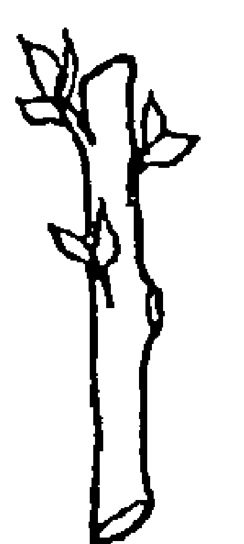

权杖代表成长、男子气概、创造力、自我发展、灵感、事业、能量、明确的概念、启发、热情、欲望。权杖乃以未来为导向，具有创造发明性质，并会展开行动。它们照亮黑暗角落，并让事物开始运作。

在读牌时拿到一张权杖，扪心自问：「我的欲望是什么？我要如何才能充满创意的表达自我和想法？我有哪些让自我成长的选择？我能够采取的第一步是什么？」

- 优点：创造力、进取心、积极努力
- 缺点：自傲、毛躁、任性
- 元素：火
- 风格：具爆发力、活跃、鼓舞
- 荣格理论中的功能：直觉
- 方向：南
- 季节：春天
- 形象：蜡烛、火焰、火柴、火山、向日葵、阳具、火蜥蜴、狮子及所有猫科、公羊、新生命、婴儿、春天的植物等等。

## 圣杯

（英文也使用 Vessels、Cauldrons、Hearts）

圣杯与水相关，通常以一个满的或空的高脚杯表示，有时则以花朵代表，尤其是莲花。

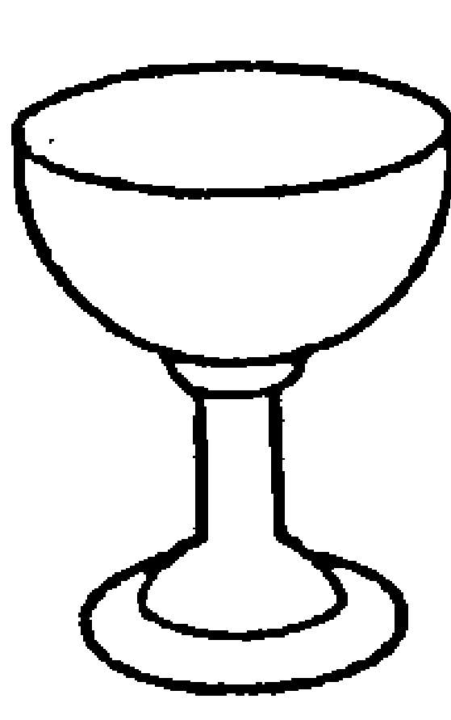

圣杯代表情绪、关系、潜意识、梦想和星光的世界、超自然及直觉的艺术世界、视觉化、幻术、生殖力、恩宠、宁静。圣杯是爱的喜悦，伴随着一种审美态度；也是喜爱交际的。

在读牌时拿到圣杯牌，问自己：「什么或谁是我所爱？我梦想或幻想的是什么？我现在感觉到什么？而我又是如何反应？」

- 优点：宁静、爱、有创意的想像、想像力、培养
- 缺点：喜怒无常、过度及上瘾、精神耗竭
- 元素：水
- 风格：流动、扩展、渗透、充满爱
- 荣格理论中的功能：感觉
- 方向：西
- 季节：夏天
- 形象：杯子、高脚杯、容器、水的成分、子宫、花朵（尤其是莲花）、凤凰、水女神、海豚，以及所有水中生物。

## 宝剑

（英文也使用 Blades、Spades）

宝剑与风相关。注意莱德·伟特牌通常会以云朵和天空作为背景。宝剑代表心智能力、理性和逻辑能力，以及沟通和思想。宝剑同时代表挣扎或冲突，以及下决定所需要的论点，或从过去的情感中脱离。宝剑往往也代表对真理的追求及对辨别能力的需求。

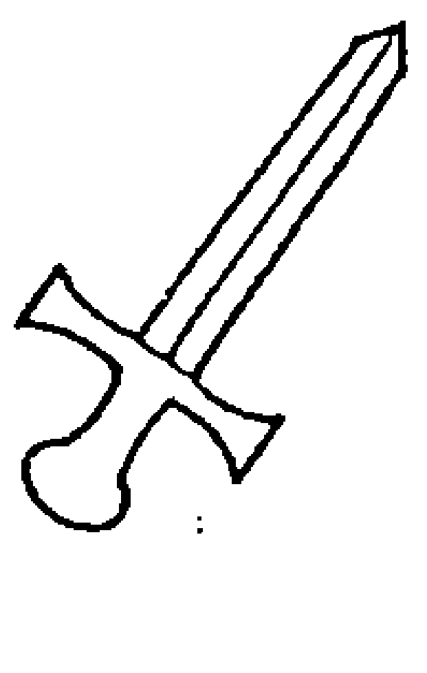

在读牌时拿到宝剑，就问自己：「我思绪的重点放在哪里？我正面临什么决定？我需要处理什么样的紧张和冲突？我必须做怎样的改变？」

- 优点：洞察力、勇气、力量、真理和正义、组织
- 缺点：轻率、批判主义、尖锐的言词、恐惧、混乱
- 元素：风
- 风格：爆发、冷淡、对抗、概念化、沟通、面对、穿透
- 荣格理论中的功能：思考
- 方向：东
- 季节：秋天
- 形象：云朵、风、天空、所有尖锐物体：刮鬍刀、刀子，玻璃、精灵、四季风、鸟类

## 钱币

(英文也使用 Deniers、Disks、Coins、Stars、Diamonds)

钱币连结大地，通常代表金钱，以及／或者手工艺术品，或者植物的果实、成功的果实。

钱币代表与金钱的关联、劳动的成果、知识的累积、技能的发展。钱币代表基础及稳定的力量，以及传统、根基、传承。由于它们表示自我的价值观及个人价值的疑问。因此钱币可以代表金钱、工作或家庭——这些决定个人安全感的要素。

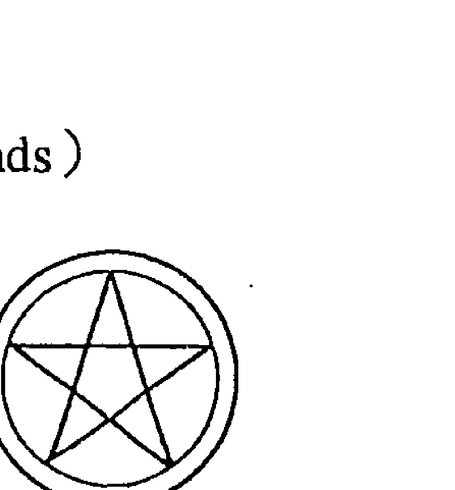

基于一种独特的想象，莱德·伟特牌将钱币以资本主义的结构来描绘，往往显示出贫富间的差距。

读牌时拿到钱币牌，问自己：「我的价值是什么？我从何处获得最大的安全感？我对什么感到不安？哪些目标被实现了？我从自己的」

- 优点：知识与能力、持久性与稳定性
- 缺点：紧张与焦虑、固执、缺乏改变的能力、占有欲、贪婪
- 元素：土
- 风格：枯燥、积极、具体化、坚强、明确化
- 荣格理论中的功能：感官
- 方向：北
- 季节：冬天
- 形象：金钱、圆盘、石头、大地的果实、工艺品、组织、大地之母、地精、公牛、母牛、山羊

## 以土、水、风、火来进行净化

在这个练习中，会实际体验对应四种图案的元素能量。由于需要运用充满创意的想像，因此必须先将以下步骤录下来，或请旁人读出来。这个练习是我在一次与苏菲派大师毕尔维拉雅特汗（Pir Valayat Khan）的禅修时所获得的启发，详细可在大师的著作《Toward the One》找到。我借用了查理・威廉斯在《The Greater Trumps》书中借土壤来净化的想法。

## 基本准备

将牌按照牌组分成四叠，从 ACE 到侍者，将它们放在面前的桌子上，可能还想摆放每个元素的仪式性象征物。

例如以蜡烛或一根木头代表火，以一杯水代表水，以一支香或一把刀代表空气，以一枚铜板或一盆土或花草代表土。

一开始先脱掉鞋子，伸出双手，手心向上。用鼻子缓慢而平静的深呼吸。

吸气时，想像自己正通过腹腔神经丛（大约肚脐以上1.5公分左右之处），能量从脚底一直上穿过头顶。
吐气时，从心脏中心，以及双肩及手心散发出能量。
持续做上述动作。

现在我们在我们有了三个能量的入口：一、来自地球磁场的土壤能量，由脚底吸收。二、生命力或宇宙能量，由腹腔神经丛吸收。三、天空的能量，从头顶吸收。

经由这三个中心点吸入能量。

我们也有三个能量出口：一、由心释出爱。二、灵气或个人磁场，由双肩释出。三、疗愈能量，由掌心释出。

### 与土共同净化
（用鼻子吸气、呼气）

将钱币牌拿在手上，心里想着与土相关的事：花园的土壤、田野中的事物、路上的尘土、种花的泥土、自己所生长的大地、分隔了陆地与海洋的各种形状的土地、地球、让万物生长及腐化的土壤。让脑中充满这些形象，并让双手准备好洗牌。将牌平稳但轻柔的拿住，如果它们看似要移动，就随它们去。帮助它们，帮助它们滑动和洗牌。感觉那股在牵引、操纵的力量。

正往土壤的深处生根，将它们推入湿润阴暗的土壤中以寻求养分。

呼气时吐出所有毒素和自身浑浊的部分，将它们排至能将陈旧能量更新的土壤中。然后吸入经过过滤的能量、养分，让大地之母为你充电。

呼气时，感觉土壤的磁场是如何牵引身体的磁场接近她。

吸气时，感觉身体的磁场是如何将土壤的磁场拉进来，就如同植物吸收土壤和水分一般。

将钱币牌洗一次，去感觉牌一张张滑过指间，就像泥土从指间碎落一样。你正用双手剥开和摩擦一块泥土。这里充满了成堆的泥土。一张泥土的牌想从手指间落下，就让它掉下去，让一张牌掉落在地上，落在脚边。

现在将牌落成整整齐齐的一叠，单纯的只是将它们当成一叠牌，只是有线条和色彩的简单纸片。将牌放在面前的桌上，然后捡起刚才掉的牌，先将它放在一旁。

### 与水共同净化

(用鼻子吸气，用嘴巴吐气。)

拿着圣杯牌组，心里想着水：清澈湛蓝的湖水、一条穿过森林的银色小溪、吞没自己的咸咸海浪、清新大地洗净万物又绿了草木的滂沱大雨。感觉手中的杯子里水波荡漾，如同池塘的涟漪、小溪的水流。让水流过指间，让双手如同河岸一般，引导着水流。

想象磁场是一条清澈小溪注入的湖，它将人洗净，用水流清洗。呼气时，磁场中的杂质也被注入溪水中。觉得自己像个筛子，有许多小孔。

当你吸气时，宇宙的流体注入身体每个细胞。

让能量通过身体。踮起脚尖站在瀑布下方，让水流下你的身体，流过你的双手。完全放松。现在身上都湿了，完全湿透。

现在洗圣杯牌。感觉水流过双手，自己仍然站在瀑布下面，水正流过身体，穿过每个细胞，清洗净化它们。感觉水流过头发、皮肤，穿过指间。它们都湿了，却还有流动的水滴、水波将一张牌打入你的指间。拿出这张牌放在一旁。

现在再度将牌单纯的当做一副牌，只是一张张硬纸片。它们在手中是硬而不易折弯的。重新将它们叠成一叠，放在面前的桌上。将刚才那张圣杯牌和之前的那张钱币牌放在一起。

### 与风共同净化

（用嘴巴呼吸，嘴唇近乎紧闭，这样气息就会优雅而轻柔。）
拿出宝剑牌，心里想着与风有关的事物。想像在户外吹着风，它吹走了过去，吹起了头发和衣裳。用嘴巴吸气和吐气，张开双臂，并打开手指和脚趾。
吸气时就像老鹰拍打翅膀。
呼气时，让空气从你的翅膀间流过。
用皮肤的毛孔吸气，感觉一阵风吹过自己，通过细胞和身体间的分子。当呼出一口气，融于气流中，与世界的呼吸融为一体。
感觉手中的宝剑牌，悬浮于呼吸间的空间，蓄势待发。现在它们将采取行动，所以开始洗牌。让流动的风带领它们，就像带领人们移动一样。会觉得风吹得飘摇、旋转、抬起脚尖，凌空而飞宛如一只鸟。在每次呼吸间找到一个平衡点，然后风会再度将人吹起。现在飞起来了，所有的重力和密度都被抛得远远的。完全接纳了源源不绝的光的气息，一种神圣的精神。呼……当你呼气时，被具破坏性的风吹散，然后下一次呼吸又重新聚在一起，悬在空中。
风将一张牌吹进手里，接住它。现在风平静下来。
将牌轻轻推回原位。它们是画了图案的纸片，手指触摸它们时会感觉到硬度。将牌整齐的叠在一起后放在桌上，然后将风给你的那张宝剑牌与土的钱币牌和水的圣杯牌放在一起。

### 与火共同净化

（用嘴巴吸气，用鼻子呼气。吸气时嘴唇几乎完全紧闭，只吸进一道细微的空气。）
拿出权杖牌组，想像与火有关的事物。一支燃烧的香、黑暗房间中舞动的烛光——有红色、橘红色、黄色、蓝色。壁炉中燃烧的橡木、温暖、吞噬。一座原本黑暗的火山突然对着夜空爆发出闪亮的火光、金黄色的熔岩自黑色山脉滚滚而下。感受身体内部的燃烧过程——食物在体内如同燃料般燃烧。感觉自己为理想而燃烧，而当你实现它们，它们就变成光亮——照亮你周遭的纯白光芒。感觉你手中的权杖牌。它们是光亮之牌，正在流动着，在光的照亮下是透明的。当你洗牌时，这些权杖牌照亮了你周遭的事物。

你的嘴唇几乎完全紧闭，吸进的火焰通过腹腔神经丛，而光自头顶照亮体内。它们被牵引至心脏中央并在这里交会，爆出四射的光芒。

用鼻子呼气，心脏的中央也打开，并射出如太阳般的光芒。同时这道光也自头顶升起，宛如喷泉。光线分解为所有颜色的光谱，并化为彩色的火花落在周遭将人包围。吸入火焰，吐出光芒。由腹腔神経叢和头顶的光之喷泉吸入空气。当光芒在心脏中央相遇并爆发，呼气并感受光芒自心脏中央射出，充满整个房间，同时头顶有一道彩虹喷泉环绕着。自己感到无比光亮，你开始体验自己成为一种光之生物。彩虹的光芒在你手中闪烁，将牌洗过，它们是舞动的光球。从牌堆中选出一张燃烧的权杖以照亮路途，然后将这张牌和其他三张牌放在一起。

重新将牌叠好，它们变成简单而不透明的，只是一堆纸牌，一堆涂了颜色的卡片罢了。光芒黯淡下来，但现在知道哪里可以找到它。

将你拿到的四张牌写下来：

我拿到

- 钱币__________
- 圣杯__________
- 宝剑__________
- 权杖__________

这些牌显示在目前生活中要从哪里找到这些牌组／元素中的行动力和能量。写下在何处及何种方式感受到这些牌所显示的内容：

## 逆位牌

另一个在读牌前必须解决的问题是如何去解释「逆位牌」，也就是当你由右往左将牌翻开时，呈现逆位的牌。

当我刚开始解读塔罗时，并不喜欢去解释「逆位牌」。我害怕它们出现，并且每次都要查找其牌义，因为我永远背不起来。最后我决定以平常心看待逆位牌，这让我放松了心情，在更深的层次去相信它。我将每一张牌看成含有意义光谱的彩虹，一端是对牌的负面解释，另一端则是对牌积极正面的解释。当我抽了一张牌，我通常调整自己与牌的能量同步，但我通常能分辨这张牌的牌义是来自彩虹的哪一端（像在《易经》中，当它提到「君子」时，你必须自问是否是君子）。我也发现当我认同了自己的选择能力，就能够自在的滑动于彩虹两端，这点在我选择更正面或更负面的任何牌时可以表现出来。由这点可以证实，塔罗牌并不是在「预测」一个固定而不可改变的未来，而是一种工具，让我明白我能使用什么样的能量。让我可以退后一步看清状况，并愿意承受行动所带来的责任。我也知道该往什么方向去寻求自己最大的潜力。

几年之后，我开始重新思考逆位牌。毕竟如果一张牌从我洗过的牌堆中掉出来，或是在某个牌阵中占有重要位置都表示有特殊意义的话，那么解读时出现逆位牌，一定也有其特殊意义。同时发现我的意图也在直觉和心理作用上扮演了重大角色。这也是为什么对不同的人而言，有截然不同的解释和技巧能发挥作用。

下面的说明提出了如何将正位牌的意义变换为逆位牌。尝试所有的可能性，直到找到一个或更多最适合你，并能配合解读和世界观的类别。如果有疑问，先试试前三个类别。例如一张逆位的 ACE 显示一个新的开始可能会遇到困难或延迟。但确认一下自己是否无意否定了曾出现在眼前的机会。一张逆位国王可能表示不希望像自己的父亲般压抑或否决自己去适应。它可能也表示你的外在是安静而谦虚的，但内心却拥有国王般的决断力及能力。

1.  通常牌所描绘的能量会被封锁、压制、否定、拒绝、抵制。潜力是存在的，但并没有被使用或释放出来。
2.  可能会出现犹豫不决、不确定、困难、延迟。如果很多张牌都是逆位，那可能单纯表示整体的延误及伴随的挫折感。
3.  能量可能是无意识、内在的、个人的，而不是自觉性的、外在的和公开的。如果真的是无意识的，那么问问题的人可能会否认。
4.  如同新月或暗月期间，它可能代表了本能、隐藏，以及一个概念的形成或重建。
5.  你可能将否定的事物投射到其他东西上。有可能是你所赞赏的，也可能是不喜欢的特质。
6.  提问者可能会推翻、摆脱、打破、拒绝或转身远离正位牌的状态。
7.  它可能显示情况已经结束或过去。方向的失焦或转换。
8.  这里完全不会有正位牌的任何特质。它「不是」正位牌。试着在正位牌的特质前加上「不」、「非」等否定字眼。
9.  逆位牌可能有极端的意义来加强或减轻影响：太过或不及；不足或过度；青涩或衰老。它可能是弥补过度或不足，或情况出现逆转。
10. 可能会有一个错误的开始、坏的时机、错用、滥用或误导。
11. 逆位牌就像行星逆转，代表一些加上「重新」的字眼，倒退的动作、撤回、相反的、无效，或必须重新作某件事。你可能需要回顾检讨、重新考虑或重复之前做过的事。
12. 逆位牌可能同时代表疾病又代表拯救方法。所谓拯救方法是指「恢复健康的媒介」。就像倒吊人的逆位是希望你思考出什么样的新观点呢？
13. 如果正位牌是描绘传统的智慧，那么逆位牌描绘的就是非传统智慧。它描绘的是阴影、魔术、巫术的世界。它可能扮演的是一个恶作剧的角色，要你不要对事情太认真。

逆位牌的出现会有机会去承认事情背后的真实，并且如果可能的话，采取必要的具体行动。

现在，应该已经有一些关于小阿尔克纳牌组的知识，也有使用基本的三张牌阵的经验，并了解了逆位牌的可能性。已经准备好去探索塔罗牌最具功能性的牌阵了！

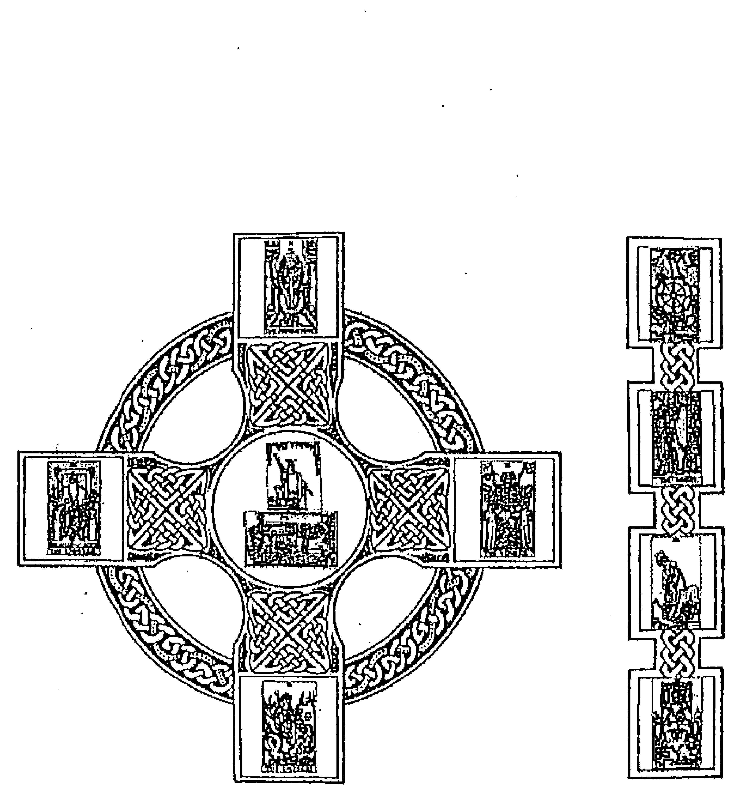

## 最初的十张大阿尔克纳牌 (THE FIRST TEN MAJOR ARCANA)

使用莱德·伟特牌，排成塞尔特十字牌阵，是由苏珊·圣·汤玛斯所绘制。魔术师及女祭司代表了基本的二元性和对立——命令相对于接受。皇后代表丰饶的潜意识，在这里种下思想的种子。皇帝是规范和秩序的建立，也就是自己过去的经验。教皇是最崇高的理想。恋人是选择未来的方向。战车是个人的工具，同时力量代表管理周遭环境的能力。隐者在寻找他的人生课题，而命运之轮让你明白，原来结束不过是另一个新的开始。

## 塞尔特十字牌阵

解读塔罗牌最古老的方法之一，就是塞尔特十字牌阵（或称十张牌阵）。它只经过些许的改良而一直被持续使用至今，并成为最普遍的牌阵之一。它最早是由 A. E. 伟特在 1910 年提出，被称为「古代塞尔特」，但现今对其起源所知甚少，主要是金色曙光协会成员在使用。其中有人将之称为「吉普赛」，也有人称为「非秘传教团的」方法，因此它可以在非成员面前使用而不造成违反保密誓约。其资讯的缺乏意外使得这个牌阵的形式及意义被保留下来，即使塔罗牌本身历经了不断演变、被重新诠释，甚至从根本上改变。

解读塔罗牌有很多种形式和方法，但事实上经过长年经验证明其广泛的适用性、实用性及深远意义后，无论是业余或专业的解读者都还是选择使用塞尔特十字牌阵。本节中将探讨是什么原因让这个牌阵的用途如此广泛，以及忠于原貌。同时提供新的方法来拓展它的应用范围，以增进个人及心灵的成长。

### 塞尔特十字的历史及象征性背景

塞尔特十字是一种十字形状的标志，发源于爱尔兰。就像爱尔兰莫那斯特博伊斯（Monasterboice）地方有名的梅里赫达十字（Muiteadach’s Cross）或其他许多十字般，都是在西元十世纪时用来当作露

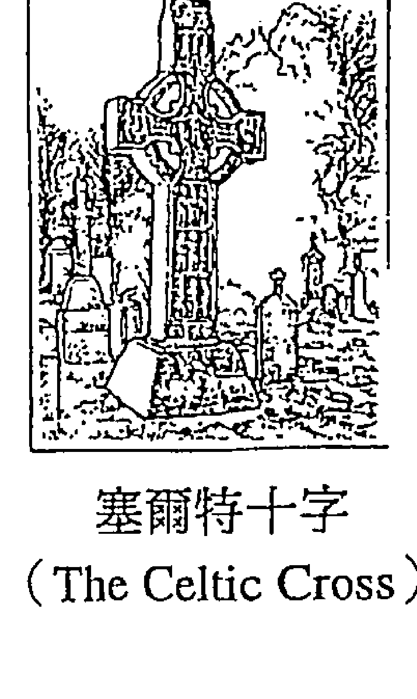天佈道時的視覺教具。

這些石頭的十字架約有 21.5 英尺高，通常雕刻了螺旋狀圖案，或是聖經中的場景和耶穌的一生。「刻在上面的聖經場景，是為了教導農民經文。」梅里赫達十字上覆蓋的雕刻場景是取自舊約和新約裡以耶穌基督為中心的最後審判。這些十字架的交界處都以一個大的圓環相連在一起，代表精神與物質的統一，這在基督教中是很少見的。就在離這些基督教建築物不遠處，人們發現了塞爾特人及前塞爾特人留下的古老宗教巨石群。

它們被稱為石塚、巨石或圓錐形石或世界的中心（肚臍）。這些直立的石頭看起來像是連接了天空與地面，並且隨著地球以年度周期運轉，通常指向某些固定的星星。在古老的早期德魯伊教裡，巨石代表了具生殖力的、創造力的陽具。此外，它聳立的模樣也宛如一根根魔術師的魔杖。作為巨石，就是一條通道或一道梯子。通過它，我們能夠朝著心靈天堂邁進——接近神，這是人類永恆的企圖。而作為世界中心或肚臍，它們是與大地之母的連結，永恆的保護及滋養之路。無論是哪一種，它們都指向統一的方向。有趣的是，在莫那斯特博伊斯也發現了階梯圖案，並且關於它的發現者聖·布魯特留下一個傳說，據說他死時爬上了一座天使給他的階梯，通往了天堂。

很有可能這些結合了基督教與塞爾特的物體促成了塞爾特十字牌陣的誕生，因為牌陣的排列方式乃是典型的十字架形式，鄰接著排成階梯狀巨石的牌，通常是在十字的右邊。以象徵意義來說，十字架的水平方向代表著物質層面的正／負二元性，也就是俗世的自我。而十字架垂直方向代表精神的衝動下降至物質中（退化），再上升脫離物質（進化），注入地球，創造了物質型態的意識。它是一個永遠以自我為中心的世界軸，而它的中心就是自我意識。在這裡，所有二元性元素的交會：光明與黑暗、上與下、精神與物質、有意識與無意識、邏輯與直覺、陽剛與陰柔。J. E. 卡洛在他的著作《象徵語言字典》（A Dictionary of Symbols）中將十字定義為「一個神奇的結，將某些特殊元素組合在一起，形成一個獨立的個體。」這個個體往往代表的就是基督，但同時也是我們透過塞爾特十字牌陣尋求的最高自我——我們心中的基督——的一種寫照。作為一個耶穌受難的象徵，十字架代表了受苦、衝突、痛苦、疼痛、死亡，以及相對的意義如重生、希望、愛、團結、寬恕。我們可以從其中一方，或同時在雙方都認識到自己。十字架代表了處理面對的問題（必須背負的十字架），而階梯則是能夠克服障礙及超越極限的道路。

### 牌陣與10的意義

基本的塞爾特十字牌陣使用十張牌，代表了整體、完美和圓滿。十，是一個周期或一個十年的結束。然後我們又回到了一，且此時的一已經歷過其他所有數字，是已意識到自身的一。十有時會被畫成一個圓圈，在正中央有一個黑點或一條線。

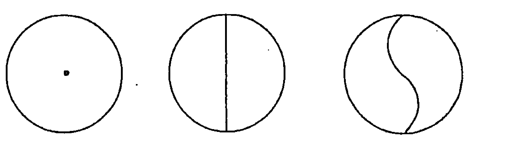

陽性和陰性的二元性（或左腦和右腦）匯聚成整體的意識。我們從「一」開始，結束時也是「一」，而且是更有自覺及自我意識的「一」。這個周期已經完成，現在開始了另一個進階的周期。它提醒我們每個命運之輪（奧秘十）上的點，既是起點也是終點。因此每個牌陣完整的圖像，本身就已經代表了完成。雖然可能會加上一些其他的牌，例如指示牌或召喚牌，但我個人是覺得塞爾特十字牌陣中是沒有必要再使用其他牌，通常不具有什麼參考價值。但如果它們對你有幫助，儘管使用沒關係。

首先，六張排成十字型的牌代表四個方位：東、西、南、北，這 是我們都熟悉的。此外還有兩個附加的方位，以在中央的兩張牌代表： 天空與土地。而我們心臟中央的上方和下方在美國原住民的觀念中， 代表了天空之父與大地之母。所以實際上這裡總共有六個方位。這六 張牌就是基本的十字牌陣。

- 北
  - 上升、上方
  - 頭頂或冠冕
  - 占星術的天頂
  - 意識、志向
- 西
  - 左手
  - 夕陽
  - 下降點
  - 被動、接受、過去導向
- 天空／土地
  - 心臟
  - 中心、二元性
  - 生命能量
  - 動態張力
- 東
  - 右手
  - 朝陽
  - 上升點
  - 積極、未來導向
- 南
  - 下降、下方
  - 腳部或脊椎的根部
  - 天底
  - 基礎或潛意識

## 體驗塞爾特十字牌陣

在實際操作前，可能希望體驗一下塞爾特十字牌陣內部蘊含的動力。首先盤坐於地或椅子上，雙臂下垂放鬆。將雙手向兩旁延伸，手心朝上。想像腦海中央有一張塔羅牌，左右手裡也各一張，還有第四張在脊椎根部。

花一點時間感應身體的這些部位，以及位於這些部位的牌。對這些牌有什麼感覺？能夠清楚的看見它們嗎？想像它們各自在身體裡的部位，是否有特定的牌浮現於腦海中呢？
發現牌有任何的特徵，都將它們寫下來：

- 我腦海裡的牌：___________________________
- 我左手的牌：______________________________
- 我右手的牌：______________________________
- 我脊椎根部的牌：___________________________

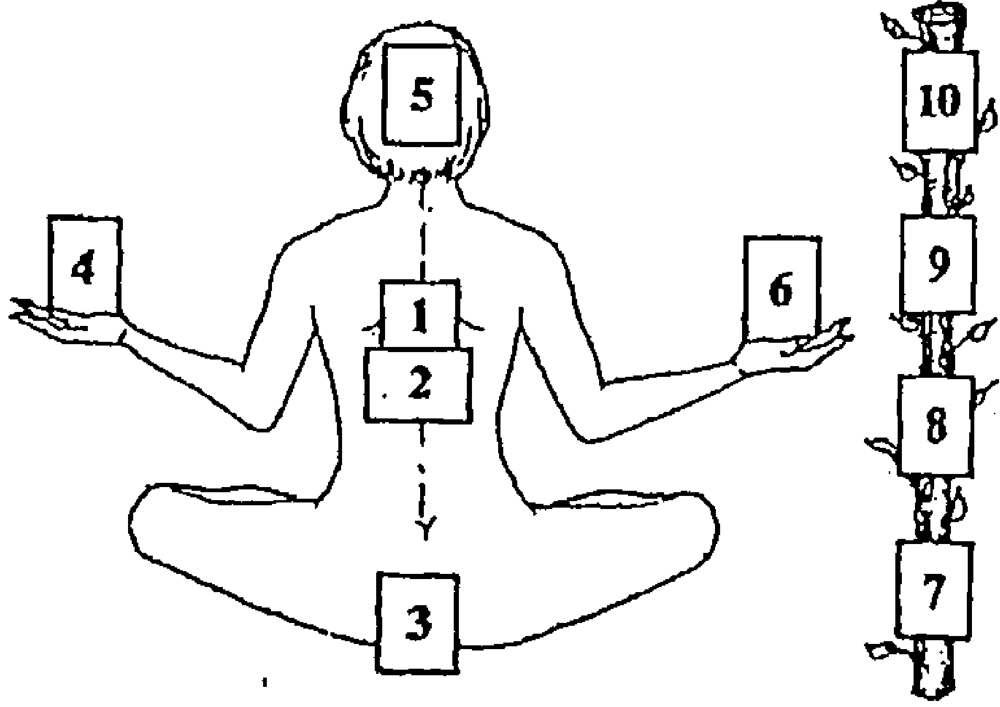

這兩張中心牌有什麼特徵？

不要讓這兩張牌交叉，而是重疊，接下來再將底部的牌抽出來置於最上面。這兩張牌合併為一體時，能夠感受到它們優於其他牌的轉變、滑動的 能量嗎？這兩張中心牌事實上就是解讀的中心。通常不需要再更進一步，最後也終將回歸於這兩張牌。其他牌只是對這個中心主題的進一步闡述罷了。最後將這六張腦海中想像的牌聚集在一起，然後放回牌堆。

在這個練習中想像的牌已經證明能夠使用牌的原始能量，無論是否手上真的有一副牌。清楚看見牌和感受它的意義，是一種很重要的能力，因為稍後需要運用它來選牌，以獲得靈感及進行冥想。

除了排列成基本十字的六張牌，還會有四張牌在右邊排成一條垂直的線。這四張牌代表了旅程中的路途、路徑、階梯，以及可能會選擇的方向。這是一條代表可能性的線：依據你是誰、你所學到的、你的過去，以及讀牌時的期待，可能會採取的行動也會有所不同。

反過來說，因為正在解讀，透過意識感受到生活中的能量，現在有改變這條可能性的選擇。這四張牌代表了四種元素及小阿爾克納的四個牌組——你的感知（權杖）、情緒（聖杯）、心智（寶劍）、身體（錢幣）四方面。偶爾會發現它們位於十字架的四個開放角落，很像十二星座中的四個符號標誌：獅子（獅子座）、老鷹（天蠍）、天使（水瓶）、公牛（金牛座），同時也出現在許多版本的命運之輪和世界牌中。

## 解讀塞爾特十字牌陣

每個人對塞爾特十字牌陣的解讀都會有些許不同，牌的排列順序也多少會有相異，而這些意義不明之處其實也就是它的強項。試試這種模稜兩可的感覺，並使用各種方法來解讀相同的牌試試看。

在解讀一張牌時，試著由多種角度來理解這張牌。這麼做能防止看法變得太過制式及僵化。例如左手的牌（4 號位置）傳統上代表已經過去的影響，但也可以被視為帶來的創意才能和天生能力。所以它確認了自過去經驗或生活中所獲得的現有能力。無論現在正發展什麼，將來會對自己有幫助的長處（大部分是第 5、6、10 號位置牌）。最終，在未來的解讀中，它們會成為過去的牌（在第六章中會進一步討論這個概念）。

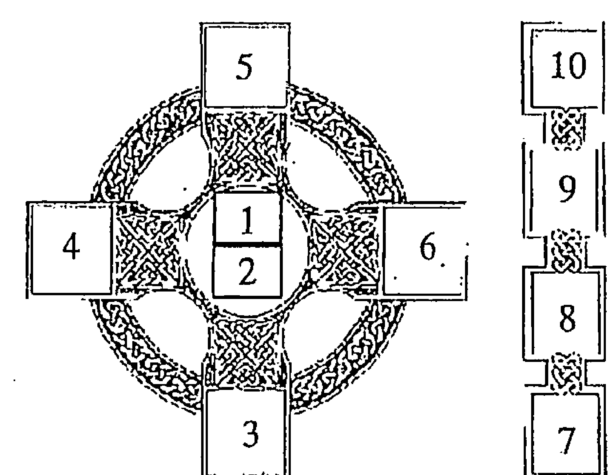

## 各個位置的意義

下面是一些精選的塞爾特十字位置的意義，改編自一些塔羅書和幫助我認識塔羅的朋友的經驗。意義來源以創始者的姓名縮寫來表示（儘可能詮釋）。

他們是：

- TRAD : 傳統解釋，大多以偉特牌解釋為主。
- JUNG : 來自多種來源所發展出的榮格式詮釋。
- A. A. : Angeles Arrien 的縮寫。
- J. K. : Joanne Kowalski 的縮寫。
- 其他 : 彙整各種來源，包含作者。

在閱讀以下章節前，先拿出牌，並以覺得舒服的方式洗牌，確定已經將它們洗得很乾淨了。不要忘記持續的深呼吸，沈澱自己並集中精神。現在可以拿起最上面的十張牌，牌面朝下，按牌陣順序排列好。或是將牌展開，並隨機抽取。在學習每張牌的意義時，翻開那張牌並思考它對自己的意義是什麼。

### 1、2 號位置牌

前兩張牌實際上就是整個解讀的基本要素，他們表示出你目前狀況的動態張力，那是源自你過去的行為，並將刺激你未來的行動。作為你的心臟／核心／中心，這些牌告訴你內在（真實）自我想知道的事。其他的牌將給你機會去探索這個基本能量張力，並了解在這些事件中的個人責任，唯有這樣你才能掌控它們。

### 1 號位置牌

- TRAD：一般圍繞著你的環境或氣氛。
- JUNG：與傳統解釋相同。
- A. A. ：你過去的心。業力關係（編按：所有與人事物的關係）。
- J. K. ：自我發展的方法、你必須處理的部份，能夠利用、相信、依賴的優勢。
- 其他 ：過去你的能量所在、你的習慣、前世。過去的發展及表現、能量的焦點、你所意識到的、起源、你想創造的、內在自我。

### 2 號位置牌

- TRAD：內心的衝突及障礙。
- JUNG：與傳統解釋相同。
- A. A. ：現在的心、對遠景的展望。
- J. K. ：阻礙自我發展的障礙。
- 其他 ：正在發展及展現的、讓你能量的重點偏離或擴大的。失衡，可能激發改變的潛力、成長。反應、你想保留的、外在自我。

### 3 號位置牌

TRAD：目前情況的根基或準則、已經成為你的經驗，而隱藏在你身後的一部分。

JUNG：你的陰影、不能或不想面對的自我、無意識的總合。

A.A.：潛意識心理、腿與腳、落實及表達自然能量的能力。

J.K.：將過去的特質內在化。

其他：脊椎的根部、第一和第二個脈輪、潛意識的慾望，以及身體和情緒上的需求。還沒意識到的事情、根源、不自覺的習慣、平衡、1 號與 2 號位置牌潛意識的融合、原動力、直覺的能力。

### 4 號位置牌

TRAD：過去、已經過去的影響、在你背後的因素。

JUNG：阿尼瑪、感受性、陰柔特質。

A.A.：左臂（或身體的左半邊）、接收與製造情況的機會與能力、你受什麼所吸引或接收到什麼、創意才能、技巧及能力。

J.K.：與傳統解釋相同。

其他：機會當前，你卻不一定會接受，美學的、視覺的、表現出一部分自己的形象。你「知道」卻又不知所以然的事；直覺。與他人相處的能力。透過親身經驗，已經明瞭或完成的事。過去的決定。已經擁有的。

### 5 號位置牌

TRAD：你的目標、所追求的、可以實現的最佳狀態、目的、致力、理想。

JUNG：更高的自我或引導。

A.A.：有意識的頭腦、人類知覺的頂端或中心、對自我力量的認知。

J.K.：應該努力與自我結合的部份。

其他 ：你自我意識到的。你努力或渴望得到的。佛洛依德的超我 (super-ego)：你認為自己「應該」或「必須」去做的。認可：你如何或為什麼要被認可。你被什麼所引導或如何看待權威。一個新的方向或天賦，你必須去發展（對照第 4 號牌，與你已經擁有的相反），並且能夠幫助你解決 1 號和 2 號牌之間的緊繃情勢。對立的關鍵。

### 6 號位置牌

- TRAD：當下的事情、未來、即將要發生的事件。
- JUNG：阿尼瑪斯、陽剛、指揮、外放的能量。
- A.A. ：右臂（或者右半邊身體）、給予與執行及善用機會的能力、你引發了什麼、下決定的能力。
- J.K. ：與傳統解釋相同。
- 其他 ：採取行動的能力、你對他人所付出的、自我與需求的外在表現，特別是透過行動、你要如何運用自己的能力。

### 7 號位置牌

- TRAD：你看到的自己。
- JUNG：人格面具。
- A.A. ：狀態、工作、創造性的可能。
- J.K. ：根源與能量的層次、驅動力、個人洞察力。
- 其他 ：讀牌時的狀況與態度、個人優勢與弱點、自我概念。

### 8 號位置牌

- TRAD：你周遭的環境、家、工作、家庭、朋友、情人。
- JUNG：與傳統解釋相同。
- A. A. ：與傳統解釋相同。

### 9 號位置牌

- TRAD : 對達成目標的希望與恐懼。
- JUNG : 與傳統解釋相同。
- A.A. : 你如何面對及處理自身的兩極化。
- J.K. : 未解決問題，並造成能量的阻礙。在有更進一步的發展前，你必須解決的問題。
- 其他 : 讓自身融入環境的方式、內在情緒及暗藏的慾望、焦慮、不可告人的秘密、必須記取的教訓。

### 10 號位置牌

- TRAD : 結果。
- JUNG : 與傳統解釋相同。
- A.A. : 現在的想法和能量的呈現，會影響個人未來的表現。你下定決心要清除的阻礙或干擾。
- J.K. : 與傳統解釋相同。
- 其他 : 完成、解答、選擇的道路、幫助你突圍的特質或工具、一個循環的結束，即將開啟另一個新的週期。一個額外的要素，而且或許是你從未思考過的。獎賞、你將從這次的經驗中得到的收穫。

## ✦ 基本塞爾特十字牌陣的解讀 ✦

日期：_______________________

解讀對象：_______________________

生 日：_______________________

解 讀 者：_______________________

使用的牌：_______________________

問 題：_______________________

性格牌：_______________________

靈 魂 牌：_______________________

隱 藏 牌：_______________________

年 度 牌：_______________________

## 牌面

1 號與 2 號 你的內在（1 號）與外在（2 號）的能量焦點各是什麼？你內心有什麼樣的衝突與緊繃？

3 號 在這個狀況中，你潛意識的需求和慾望是什麼？

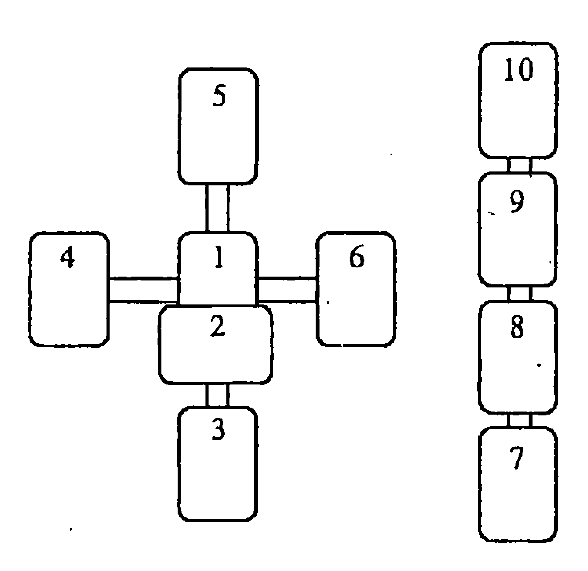

- 4 號 過去的才華或能力是為你帶來幫助或阻礙？你最能接納的機會是什麼？
- 5 號 你在想什麼？你在這個狀況中的想法及企圖是什麼？
- 6 號 在不久的將來你會採取什麼行動？會如何運用你的能力？將會做出什麼決定？
- 7 號 在這個狀況中，你是如何看自己的？
- 8 號 在這個狀況中別人是如何看你？這個狀況是在何種環境中發生的？
- 9 號 你需要學習什麼課題？為了下一步的進展，你必須解決什麼問題？你在期望什麼？又懼怕什麼？

10 號  根據你目前的思想及能量展現，你在未來將如何表現自己？

注意：2 號牌與 4 號及 6 號牌相連結，1 號牌與 5 號及 3 號牌相連結。

- ☆ 什麼數字出現得最頻繁？
- ☆ 回顧這次解讀，並在以下的空白處寫下筆記及日期：

## 解讀範例：塞爾特十字牌陣

注意：這些例子都寫於 1980 年代早期。但即使過了這麼久，它們仍然是很棒的例子，證明了作筆記能夠得到這麼多的收穫。我和我那即將面對同樣狀況的女兒，都能夠藉由回顧那些具重大意義的時刻及發展過程中，來了解我們之間的關係進程。我希望透過這本書，讀者也能夠透過探索自身的困境和選擇而有所感悟。
我的問題是：「在我與凱西的關係中，需要學習的課題是什麼？」愛德已經出城一個月，而我那時在新學院（New college）上整天的課，並趕著完成這本書。我那兩歲半的女兒凱西白天被送到托兒所，但我發現從晚上將她接回家後，還有週末假日的這些時間裡，我完全不可能做任何需要集中注意力的事，因為她需要我時刻全神貫注的照顧她。我對於自己一心掛記著這本書感到很沮喪，寧願和她坐在電視機前生悶氣，也不願多花心思陪她做些更有意義的事。此外我是如此疲倦，在哄她上床後我也立刻睡得不省人事了。我無法承受這樣的罪惡感、怨氣、沮喪和對自己的憤怒。

我決定使用和平之母圓形塔羅牌（Motherpeace deck），因為我發現它對於個人成長與關係之間的內在掙扎，能夠給予很大的幫助與感應。我抽到的牌如下：

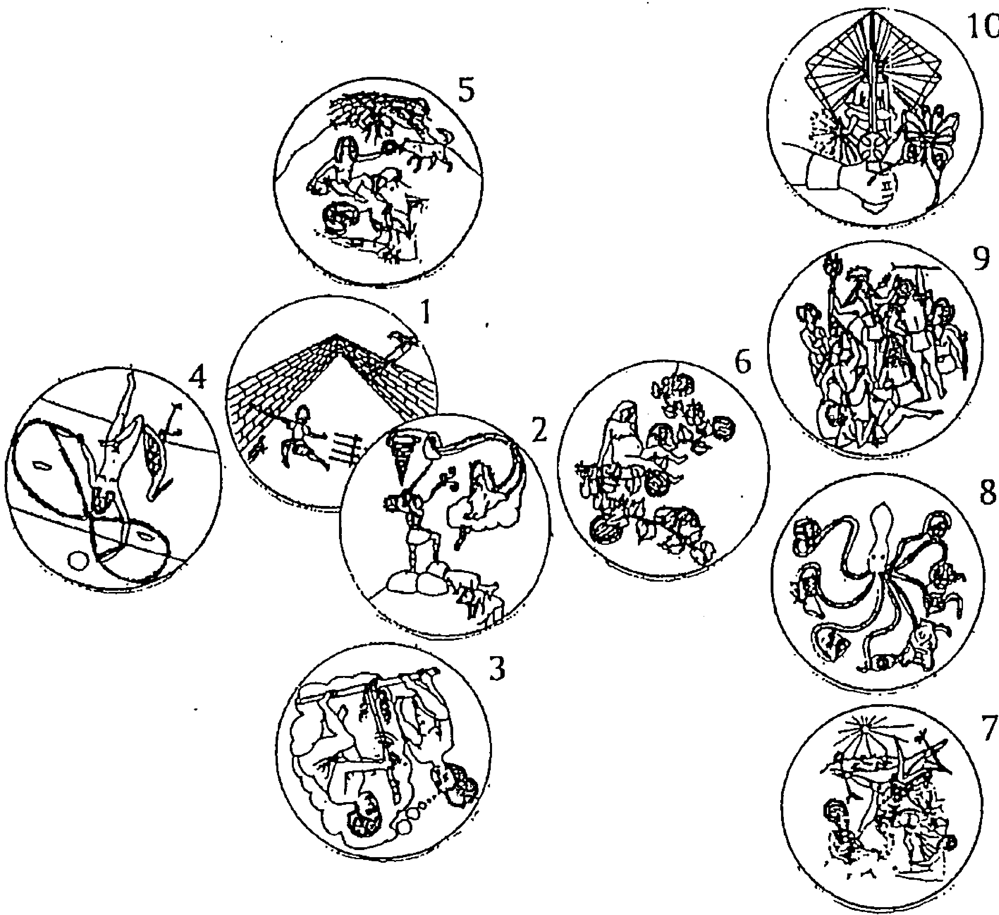

## 第四章 | 塞爾特十字牌陣

前兩張牌是寶劍八和寶劍女兒（侍者）。一如往常，這些牌貼切的描述了我的狀況，甚至幫助我重新確認了自己的問題。我在寶劍八中，看見自己被找不到出口的責任所框住而感到無力，只能等待愛德回來解救我。而寶劍女兒讓我立刻將凱西聯想為一名溝通者，她總是在說話，喜歡戳戳我，因此我被框在她對溝通的需求中。而我卻也是一個「女兒」，正毅然決然地努力斬斷自己的沮喪。

第三張牌——無意識——權杖二的逆位，顯示我的失控。它指出我是如何阻礙自己的領會，而且控制並否定了自己還有選擇的能力。而寶劍二的逆位（4 號牌）顯示我背後那些從過去帶來的技巧及能力，於是我明白了自己一直在犧牲自我的需要。我必須為自己和凱西之間找到平衡。

第五張牌，力量，顯示我意識到的事，以及對目前狀況的期望。我知道自己必須表達我的愛，並親近自己的本能。這張牌同時顯示了我對創造力的渴望。我該怎麼做才能既保有與凱西的親密關係，同時又能夠持續進行自己的工作呢？

關於未來（6 號位置），我拿到了錢幣七，代表必須評估自己的努力及檢視價值標準。看著自己工作的成果，並希望從錯誤中學習。我需要看清自己所珍視的，如此才能確切地知道自己的能量該朝哪個方向發揮。

我從 7 號牌權杖之子（騎士）看見自己，渴望自我成長、變化和刺激，熱衷於玩樂及生活中的不可預期，而非沉悶及一成不變。同時我也很任性且相當自我中心。

我的環境（8 號位置）是一張逆位的聖杯八。我的退路已經被封鎖，無法逃開，只能留下。同時我並無法總是提供一個充滿關懷與愛的環境，那實在讓我心力交瘁。我必須了解自己需要休息，還有獨處的時間。

我的希望及恐懼（9 號位置）是一張權杖七。我在捍衛自己，以及對於擁有獨處及工作時間的需要。我希望自己能夠挺身對抗所有阻力，又害怕會陷入一場惡性循環的戰爭。我害怕自己總是會被凱西和她對我的要求所擊倒。然而我必須學會為自己挺身而出。

最後一張牌（10 號位置）是寶劍 A，這帶給我溝通機會及拓展我的概念，幫助我明白其實還有新的選擇。我正跨出最重要的第一步：開啟誠心的溝通之門，並揭開問題的表層。它跟我說，我必須「公平」對待凱西和我自己。

兩張 2 號牌指出了我與凱西之間，或者凱西與我工作之間的對立；兩張 7 號牌顯示我將如何測試或嘗試幾個可能選項。兩張 8 號牌，是這個狀況中必須優先或重新考慮的因素。

這份解讀並不完整。我會在第六章的〈置換〉中繼續解釋。在每一次解讀中最重要的階段，是「突破障礙」（第六章也會解釋）。當找到解讀的關鍵之後，就能為你帶來解決之道和完美結局。

將拿到的牌填入塞爾特十字牌陣解讀表，並寫下這些牌在你人生中代表的意義。

## 推薦書單

### 關於象徵語言：

- A Dictionary of Symbols. J. E. Cirlot. New York: Philosophical Library, 1962.

### 關於解牌：

請參閱附錄一牌義解釋，並特別注意參考書目中以下幾位的著作：

- Butler, Douglas, Fairfield, Gerhardt, Gray, Noble and Pollack.

# 印地安塔羅牌（THE NATIVE AMERICAN TAROT）

由一對夫妻檔梅格達及 J. A. 貢查拉斯攜手設計，由 U. S. Games Systems 於 1982 年出版。當代塔羅牌在宮廷牌的命名方面，越來越自由。貢查拉斯對於他們所選擇的名稱是這樣解釋的：「美國印地安人的女酋長都是年老的婦女，因為她們的技能與智慧而受到族人尊敬。而酋長並不是統治者，相反的，他們是因為睿智而受人尊敬，才獲得此稱號及職責。戰士是那些仍致力於證明自己的年輕男子。少女是已婚或未婚的年輕女子，她們必須證明自己的價值。女酋長代表內在心靈力量的本質；酋長則是潛在的智能力量。勇士代表被激發的物質力量；少女是流動的感情力量。這些想法都與金色曙光等的理論類似，例如宮廷牌都與某些元素相關，如國王有火的特質，皇后是水，騎士是風，錢幣是土。也因此權杖國王被認為是火中之火（權杖）。聖杯騎士是水中之風，以此類推。

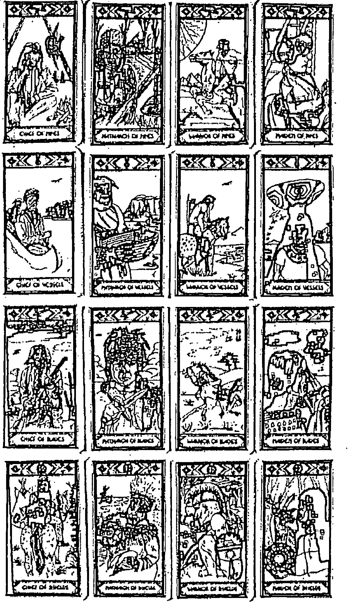

## chapter 5

### 宮廷牌的人格特質

許多解讀者都發現，宮廷牌是解牌時最難詮釋的部分。若在解讀時，十張牌裡有七張都是宮廷牌的話，應該會非常不知所措吧。本章的練習就是為了幫助你和這些牌中人物建立親密與個人私密的連結。

在解讀中出現的宮廷牌，通常具有兩種意義。第一種，宮廷牌代表你自己，也就是正在解牌的人。第二種，可能代表一個你認識的人，尤其是某個你「投射」了部分個性在他身上的人。

要處理第二種意義的宮廷牌，首先，由於他們通常代表你所認識的人，例如國王或皇后可能代表你的父親和母親，或者某個有權威的人，以及你尋求指引的人。國王與皇后通常指成熟而能夠給予建議的人。他們的影響方式會顯示在牌陣中的位置。騎士往往指的是年輕男性，並且能為你的生活注入一股具爆發力的新能量。他們會邀請、引誘、鼓勵和把你拖進他們的興趣中。例如在一次為我朋友愛麗絲做的解讀中，錢幣國王代表了她的丈夫傑森，他們有過一段穩固長久的關係。接著是亞伯特，一位聖杯騎士型的人物，以他嶄新的能量和活力，帶給她刺激和興奮，於是變成她的情人。騎士通常代表一段任性不羈且不顧一切的經驗。侍者可能代表孩童、年輕女性，也可能是任何帶來新訊息或新想法的人。他們往往是一個偶然出現的觸媒，帶給你生活變化。

宮廷牌的設計和命名隨著不同版本的塔羅牌而有許多變化。例如在托特塔羅牌的騎士就比偉特牌的成熟，並取代了偉特牌中國王的角色，但又更加有活力。而托特的王子是騎士與皇后的兒子，比較偏向一位工作者，正在發展他的能力，並且持續學習當中。托特的侍者牌被稱為公主，是一名年輕女性或女童，感性而大膽，勇於冒險及探索新的可能性。和平之母圓形塔羅牌則分別是巫師、女巫、兒子、女兒的角色。也為這副牌帶來了魔幻的感覺，並指出你有可能創造自己的未來。

正如之前所提，宮廷牌總是代表使用者的各項特質。在解讀中，他們代表了你面對各種情勢時的反應，包括你如何運用自己的身分面向，或者在某些特定的狀況下，你會戴上的人格面具。例如，你覺得自己成熟又有能力，而且一切都在自己的控制之中？像個國王嗎？或者你對於他人的需求敏感又充滿包容性，而且會盡其所能地滿足那些需求，這不就是如皇后般的能力嗎？你是一個充滿活力又大膽的騎士，總是順著自己的慾望行動嗎？或者你是一個侍者，面對一件新事物，天真又敞開胸懷盡所能的學習？

榮格的心理學在融合這兩種觀點上，提供了一個基本架構：宮廷牌代表你自身以及另一個你。這個概念叫做「投射」。指的是你將自身內在的某些特質投射或加諸於周遭的人身上，無論他們是否真的具備這些特質。他們變成反映你自身陰影的一面鏡子。而這面鏡子的運作為：你會注意到他人某些你沒有在自己身上發現的特質——無論是正面或負面的。因此，你會讓這些人將你自己無意識的想法，以及內在的狀態，大力表現出來，而當他們不這麼做時，你會感到憤怒。例如，蘇珊非常喜歡閱讀及寫作，她和湯瑪士，一個嚮往成為劇作家的優秀木匠，住在一起。他們的關係讓蘇珊得以繼續專注於自己的興趣，卻不需要親自去寫作。她喜歡稱讚湯瑪士的作品，滿足他的自尊心，就像滿足自己未認知的渴望。然而當湯瑪士投入其他事情以致於不想寫作時，蘇珊便會很不滿且不停嘮叨。如果她認清了自己想藉寫作來表現自己的慾望，就不會將這樣沉重的負擔加諸於湯瑪士身上，逼他不停的寫作。而藉由牌陣中宮廷牌的出現，你可以看見自己可能「放棄」了哪些力量或能力。以及在自己的人生中，你希望別人為你扮演什麼角色。這樣的投射通常在兩性之間會特別強烈，當一名男性被限制展現自己陰柔的一面，他就會找個女性來代替他表現這一方面，反之亦然。一旦你不再將這樣的投射強加於周遭人的身上，就等於釋放了他們，讓他們做真正的自己。而你也可以自由的為自己的渴望或野心而努力。

另一種投射的形式與你的陰暗面有關，也就是那些你不承認的負面內在特質。注意那些他人會惹惱你的行為，你是否也曾做過類似的事，或是很想做，但還是讓別人去做了？尋找這些陰影的投射，尤其是塞爾特十字牌陣中代表無意識（3 號位置）、過去（4 號位置）和你的希望及恐懼（9 號位置）的牌。

如果解讀中包含了多張宮廷牌，通常代表你的人際關係和各種你必須扮演的角色。有時能量的分散是表現在這些不同人格和觀點上。例如一名精明幹練的女性主管，對她的孩子來說是一個慈愛的母親，對她先生而言是一個魅力十足的情人，對她母親則是一個孝順的女兒。更不必說在某群朋友面前她是激烈的女性主義者，而對另一群則是個熱情好客的女主人。她還有個秘密身分，就是塔羅及占星學的學生。每個角色都有需要改變的技能、服飾、聲調、能量層次和注意力等。我們可能會這樣描繪她的多變角色：權杖國王、錢幣皇后、聖杯皇后、權杖侍者、寶劍騎士、權杖皇后，以及寶劍皇后，或許你會選擇不同的牌來表示這些相同的特質。

列出五到十個你在日常生活中扮演的角色，並選出一張最能代表你每個角色的宮廷牌。或許有些牌你會用到不只一次，也可能某些特定的角色需要一張以上的牌來代表。

| 目前生活中扮演的角色 | 對應的宮廷牌 |
| :--- | :--- |
|  |  |
|  |  |
|  |  |
|  |  |
|  |  |
|  |  |
|  |  |
|  |  |
|  |  |
|  |  |

選擇一張宮廷牌來代表你生活中最重要的人，他們時常出現在你生活不同的層面中。

| 人物 | 對應的宮廷牌 |
| :--- | :--- |
|  |  |
|  |  |
|  |  |
|  |  |
|  |  |
|  |  |
|  |  |
|  |  |

記住這些人都有好幾個角色要扮演，因此可能在牌陣中以其他宮廷牌出現，不一定只有你在這裡所選擇的牌。在每天例行的三張牌陣解讀中，注意你和周圍的人時常出現的不同模式。

### 宮廷牌派對

現在是面對所有宮廷牌人格特質的時候了。先將十六張宮廷牌抽出來，隨意攤開。想像他們是一場派對中的人物。

- ☆ 我覺得吸引我的是：
- ☆ 我想避開的是：
- ☆ 令我感覺不舒服的是：
- ☆ 我覺得相處愉快又談得來的是：
- ☆ 我覺得神秘而孤僻的是：
- ☆ 這些人感覺似乎較冷淡或無禮：
- ☆ 讓我感到備受歡迎及溫暖的是：

想更深入瞭解這些宮廷牌的特質，就挑出兩個你覺得會強烈互相吸引的宮廷牌人物，並想像他們正在進行一場具挑逗性的對話。並將內容寫在另一張紙上。

兩張宮廷牌：__________ 和 __________

對話主題：__________

### 了解宮廷牌

下面的練習可以刺激你對另一個人的直覺想像。這個練習原本出自法蘭西斯·方恩的著作《覺醒的直覺》(Awakening Intuition) (1979年紐約 Anchor Press / Doubleday 出版)，而我做了一些修改以適用於塔羅牌。

首先，挑選一張你感興趣的宮廷牌。

- ☆ 將最初浮現腦海，自然而然不帶任何批判的印象寫下來。

日期：__________

我為這個練習所選的宮廷牌是：__________

- ☆ 如果這張牌裡的人物是一種動物，會是什麼動物？又會是什麼樣的植物呢？
- ☆ 如果這個人是一種景色，會是什麼樣的景色？
- ☆ 如果這個人的形體是水，會是什麼樣的水？
- 水會有多深？
- 有多清澈？
- 水溫如何？
- 描述一下水是如何流動的？
- ☆ 如果這個人是一道光，會是什麼樣的光？
- 是什麼顏色的光？
- 是多強的光？
- ☆ 如果這個人是一個幾何符號，會是什麼？
- ☆ 如果這個人是音樂，會是什麼音樂？
- ☆ 如果這個人是一樣工具，會是什麼工具？
- ☆ 如果這個人是個歷史人物，他會是誰？
- ☆ 你會將這個人想像成什麼樣的小孩？
- ☆ 這個人的能量如何？
- 你和這個人之間的能量有多強？

花幾分鐘的時間靜下心來，然後繼續集中精神在牌中人物上，並接受任何自然浮現腦海的影像。

- ☆ 寫下任何新浮現的印象：
- ☆ 你與這個人有哪些不同之處？

如果你喜歡這個練習，並覺得對你有幫助，就多重複幾次，並多用幾張宮廷牌，或是全都使用宮廷牌。使用宮廷牌形象表來紀錄你的答案，並讓你有機會比較對照你對這些牌的印象。有些宮廷牌在經過與其他牌的對照後會更容易掌控。例如權杖騎士和權杖國王的不同之處在哪裡？你又如何以兩種不同的動物來顯示他們之間的不同呢？

### 塔羅牌的三種形式

下一個練習的故事發生在我寫這本書的期間，是同時發生的類型。它印證了塔羅牌原始的本質是一種集體潛意識的表現，為希望的人揭示那些他們欲發現的內在特質。

當時我正在研究一種幫助人們了解宮廷牌的方法：是什麼讓它們與其他牌有所不同？它們擁有的特質是什麼？想學習如何在解讀中運用宮廷牌的話，最好的方法是什麼？我已經將其他宮廷牌章節的練習都寫好了。那時我想創作一個將七十八張牌分為基本的三組（三種形式）：大阿爾克納、數字牌、宮廷牌的解讀。我了解到可以從每疊牌中抽出一張牌，然後在解讀時將它們整合。這個方式演變成以下的練習，並且在我的課堂上運用及測試，結果非常棒！大約四個月之後，我朋友給了我一本絕版書籍《魔術儀式的方法》（Magic Ritual Methods）（William B. Gray 著）的復本。雖然書中對塔羅的著墨並不多，但有一個章節是專門探討宮廷牌的。在如何了解宮廷牌的內容中介紹了一個牌陣，竟然與我剛「發明」的一樣，只是多加了一疊四張ACE的牌。不論哪種做法，解讀者都需要先從每疊牌中各抽一張牌以形成牌陣。他不僅是「發明」了與我相同的牌陣，同時也經歷了與我相同的過程——為了了解宮廷牌煞費苦心，才發現這個牌陣的道理。

這時我的第一個反應是很沮喪，原來我並不是這個牌陣的創始者！但突然間，我明白到這件事顯示了塔羅牌（和其他許多形而上系統）的兩個重要特點。首先，它的原始本質不僅僅表現在牌的圖案上，還顯示於牌的結構。只要是熱中於探索塔羅牌的人，都會受到「集體潛意識」主導。榮格將人類的記憶和經驗稱為「原型」印象。而新發現就像打開了解內在的大門，產生自我認知的追求。

第二，這是一種本能的保證。當時間對了，新的知識就會問世。進化論並不是達爾文發明的，這個理論的雛形之前就已經有人發表過，只是這個想法問世的時機到了。塔羅牌也是一樣，在寫這本書時我一次又一次的觀察這種情形。例如當我闡釋了每張牌的定義後，參加了一場講座，由安吉列絲·艾倫主講。她提到她也做了相同的事，就在幾個星期後，一份她針對大阿爾克納所做的定義表在塔羅網絡新聞（Tarot Network News）上首度發表。就在同時間，夏卡緹·珈溫在她甫出版的著作《Creative Visualization》中，推廣一種「積極思維」，一種能幫助個人成長的新架構。

接下來的練習，是我為了更加了解塔羅三種形式的差異而設計。

### 塔羅牌的三種形式

1. 我正在經歷的：

我的行為像一個________（宮廷牌），一個________（描述你在這張牌中看到的人物類型）。

我處於這樣的狀況之中：________，情況是________（小阿爾克納）（用行為動詞來描述你的狀況）。

由於________，它顯示了我這樣的需求：________（大阿爾克納）（描述你內在需要表現出的原始能量）。

如何處理這個狀況，請以同一張牌進行以下的練習：

2. 我如何為這個狀況做最佳處理？

我可以運用________的特質，來________（大阿爾克納）（描述你在牌中所看到的最佳特質）。

為了處理________，它表現了我這樣的欲望：________（小阿爾克納）________（描述你自己招致的情況）。

由我內在的________________________所經歷，也就是我內在的________________________（宮廷牌）________________________（描述你選擇來經歷這段情況的自我）。

設計自己的句子來表達你對塔羅牌各種形式間的了解。

### 塔羅牌的三種形式

**宮廷牌：** 行為的模式或方法。你如何行動？你的次人格、人格面具和外在形象。你扮演著什麼樣的角色？

**小阿爾克納：** 對情況的說明。你正處理什麼樣的狀況？

**大阿爾克納：** 你內在需要表現出來的原始能量。你用什麼方式處理這個狀況？你正使用什麼能力？

威廉·蓋瑞增加了第四種模式，四張 ACE，我則是將其納入小阿爾克納之內。可以自行決定是要將 ACE 分開或納入小阿爾克納。如果選擇將它們分開，那麼它們將代表生活的某些部分。

將牌分成三堆：宮廷牌、數字牌和大阿爾克納。將每疊牌洗乾淨後各抽出一張，不去看是什麼牌。寫下這是什麼牌以及它代表的意義，或用前後相連的句子寫出個人簡短的解釋。

## 與你內在導師的宮廷牌接觸

如果回頭看第一章，會看到關於如何算出內在導師宮廷牌的說明（但首先要知道自己的月亮星座是什麼）。如果不清楚自己的星座，或是不想藉由星座算出，那麼也可以選擇一張感覺最適合代表內在導師的宮廷牌。做法是先將所有的宮廷牌攤開，然後選一張覺得牌中人物最像老師——擁有一種能夠依賴，能夠指引出內在方向，發揮最大潛能的特質——的牌。花一點時間，靜靜的面對這種特質。問問更高層的自我，對你選擇這位導師有沒有意見。如果沒有感到強烈的「否決」或不太舒服的感覺，那麼就繼續這個練習。麥克·山繆與赫爾·班奈特在他們的著作《心靈指南：通往內在世界》（*Spirit Guides: Access to Inner Worlds*）中有些很好的建議，是關於如何檢視你接收到訊息是否來自心靈，還是他們稱為的「靜態自我」。

1. 你的肌肉放鬆嗎？你感到輕鬆嗎？
2. 這個訊息是否不帶批判？
3. 它有傷害任何人嗎？
4. 它是基於愛？
5. 它是否過分的取悅你？或是引出你的內在疑慮及不安？如果是，那可能是你的內在或陰暗面在發言。

將這張代表內在導師的宮廷牌置於面前，仔細的端詳它，直到閉上眼睛也能在腦海中浮現它的模樣。放鬆自己，做規律的深呼吸，放下你的能量。（如前面所敘述的）

想像自己是一棵向地球扎根的樹，樹根延伸得越來越深越來越深，直到延伸進地球中心的一個洞裡。然後順著這些樹根，把它們當成電梯，往下滑落，來到這個洞穴。進入洞穴後，環顧四周，感覺這裡的壁面、地面、溫度、顏色、擺設。就算印象很模糊，或看不見任何東西也不用擔心，可以虛構一個狀況。

你的內在導師走近你，親吻了你的額頭，開啟了你的視野並保佑你。接著他觸碰你的內心，讓你只接受源於愛的思想。請求你的內在導師用最完美的一面或最高潛力來展示他／她自己。明白你在這個保護圈裡是完全安全的。觀察你的內在導師，看他周遭環境中那些色彩、形狀、聲響和本質是如何變化和變得強烈。

就算你覺得很難去看到這些事物也不用擔心，運用你內在所有的感覺，去感受任何微妙的變化，並注意身體的反應。往往在人物周圍會出現特定的符號、圖像、印象，不要遺漏這些。

當你回到現實，寫下所有你看見的印象。你大可使用圖案或比喻來表達。

- ☆ 以下是我對那展現最完美一面及最高潛力的內在導師的印象：
- ☆ 以下的描述是關於圍繞著內在導師的環境、物體及圖像：

你的內在導師宮廷牌也適用於以下的引導方式。可以嘗試以下的變化：
深呼吸，放鬆並放空自己。用剛才的方法進入洞穴，為自己佈置一個舒適的座位。在洞穴中等你的，是你的引導者，你的內在導師。他迎接你，並帶你參觀洞穴內部。如果覺得不舒服，可以請求導師改變環境，直到你覺得安全和放心。

現在請你的導師帶你去見你的個人塔羅協助者——某個能夠幫助你解讀和闡釋塔羅牌的人。讓你的導師帶領你走到洞穴左邊，那裡有一個你之前沒有注意到的，一個充滿陽光的開口。當你走近那個開口，地面突然上升了，於是妳看到外面明亮的日光。妳離開洞穴，跟著一條往右延伸並圍繞著山丘的小徑，最後妳來到一片隆起的草地。妳的塔羅協助者已經在那裡等妳，記住他或她看起來是什麼樣子。將妳的塔羅牌交給協助者，妳的協助者將三張牌攤開在一塊布或一張小桌子上，然後解釋給妳聽。如果妳很難看清它們，也可以要求只看一張牌。妳可以問任何有關這幾張牌的問題，問問它們在妳生命中的意義，或如何解讀它們。

- ☆ 你的塔羅協助者看起來是什麼樣子？
- ☆ 你的塔羅協助者給了你哪幾張牌？
- ☆ 你的塔羅協助者如何解釋這幾張牌？
- ☆ 你還從這些塔羅牌接受到什麼其他的訊息？

## 宮廷牌形象表

| | 動物 | 植物 | 風景 | 水的型態 | 光及顏色 | 幾何形狀 | 音樂 | 工具 | 歷史人物 | 其他 |
| :--- | :--- | :--- | :--- | :--- | :--- | :--- | :--- | :--- | :--- | :--- |
| 權杖國王 ♣️ | | | | | | | | | | |
| 聖杯國王 🏆 | | | | | | | | | | |
| 寶劍國王 ⚔️ | | | | | | | | | | |
| 錢幣國王 ⊛ | | | | | | | | | | |
| 權杖皇后 ♣️ | | | | | | | | | | |
| 聖杯皇后 🏆 | | | | | | | | | | |
| 寶劍皇后 ⚔️ | | | | | | | | | | |
| 錢幣皇后 ⊛ | | | | | | | | | | |
| 權杖騎士 ♣️ | | | | | | | | | | |
| 聖杯騎士 🏆 | | | | | | | | | | |
| 寶劍騎士 ⚔️ | | | | | | | | | | |
| 錢幣騎士 ⊛ | | | | | | | | | | |
| 權杖侍者 ♣️ | | | | | | | | | | |
| 聖杯侍者 🏆 | | | | | | | | | | |
| 寶劍侍者 ⚔️ | | | | | | | | | | |
| 錢幣侍者 ⊛ | | | | | | | | | | |

## 第五章 | 宮廷牌的人格特質

現在你已經建立你們之間的連結，以後你將更容易隨時再回來找這位塔羅協助者，接受個人的解讀或找到你問題的解答。

你也可以請你的內在導師帶領你去找一個塔羅牌中的人物，那個人可以當你的個人嚮導，並在下方幾種情況中幫助你：

- 1. 治療創傷
- 2. 工作上的問題
- 3. 宗教及心靈指導
- 4. 對人際關係的洞察
- 5. 創意的想法
- 6. 今世和前世的資訊
- 7. 對政治及世界的了解

讓你的內在導師帶領你去找一位塔羅牌人物原型，會比自己隨便選一位要好。這樣能夠洞察到令你意外的新事實，發現解決問題的新途徑。只要遵循出現在你面前的指引類型就好了。例如尋求關於一段人際關係的指引，而內在導師可能很出乎意料的，帶來一位正義類型的人物。正義嚴肅而不帶感情的問你希望在這段關係中得到什麼，你描述了整個狀況後，她便將你的答案放在天秤上。這下明白，原來你一直沒有誠實對自己和你的夥伴，表明你真正的欲望和需求。

## 推薦書單

關於宮廷牌：

- Magical Ritual Methods. William B. Gray. New York: Samuel Weiser, 1969.

關於投射心理：

- The Tao of Psychology: Synchronicity and the Self. Jean Shinoda Bolen. New York: Harper and Row, 1982.

關於意象：

- Awakening Intuition. Frances E. Vaughan. Garden City, NY: Anchor Press, 1979.

關於心靈引導：

- Spirit Guides: Access to Inner Worlds. Mike Samuels and Hal Bennett. New York and Berkeley: Random House/Bookworks, 1974.
- The Inner Guide Meditation. Edwin C. Steinbrecher. York Beach, Maine: Weiser, 1988.

# 托特塔羅牌 (THE THOTH DECK)

由費達·哈里斯繪製，艾利斯特·克勞利設計。小阿爾克納排列成卡巴拉生命之樹的形狀，顯示了十個特性與每種牌組的數字牌間的關係。根據羅伯·王在他書中的說法，卡巴拉塔羅牌中，小阿爾克納具有最大的意義，因為它們象徵了我們自身及宇宙真正的力量；是旅程軌道——大阿爾克納——的能量中心。每張數字牌同時也將黃道十二宮的三百六十度做了三十六等分的切割（參照第一章的星座與生日對應講解及機會牌圖表）。它們都受到自己所屬行星的支配。行星支配黃道分度是連續分配的，由牡羊座的第一個十度開始，順序如下：火星、太陽、金星、水星、月球、土星、木星。接下來按照順序，又重複經過黃道十二宮。因此每張小阿爾克納牌從2開始，都有一個對應星座，為其定義更添色彩。

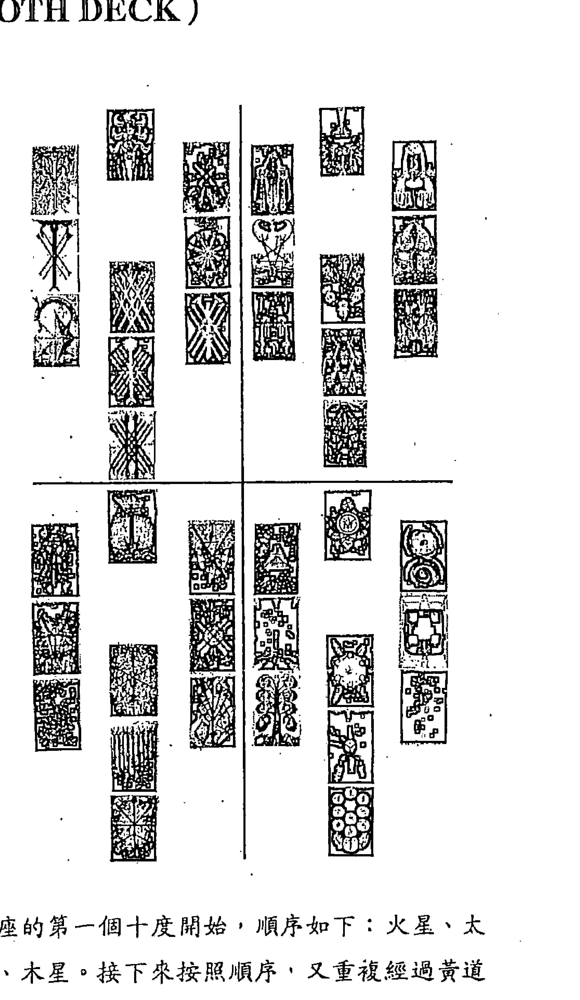

# 第六章

### 置換——更深层的解讀

置换，根据韦伯斯特大辞典的解释是，「变化、修改、重组、在群体中进行组合或位置的变化」。经过重新排列三张牌阵（第二章），已经用到「置换」这个概念了。在这一章里，「置换」的意义扩大到解读单一塞尔特十字牌阵有许多可能的方式。我们在解读时已经试过以抽牌的方式来决定每张牌的位置，现在我们要将牌的顺序和位置都重新排列过。每次的置换都会对事情产生不同的视角。原则是保持似是而非、追求模棱两可。由此产生的创造性张力能够帮助你用不同的观点来看那些每天发生的事，进而增进洞察力，在自主选择时能更放得开。

很多人都教我或建议我一些置换的方法。经过许多年，我已经将它们整合，延伸为自己解读塔罗牌的方法。

当你寻求对自己正在处理的能量与力量做更进一步了解时，可以利用置换。越清楚看见这些模式的流动和影响，就越能转变成自己希望的模样。

解读时要运用所有的置换方法，可能会花一段相当长的时间。一旦熟悉了置换的方法，通常一次解读的时间是一个半小时左右。它还需要深入探讨你（或你朋友、客户）的动机、恐惧、希望、计划、担忧、长处和弱点。同时也需要保留一些额外的时间，用来彻底的放松及放空自己。

由于不可能一次就熟练所有的置换方式，所以先选择一种来练习。每次使用塞爾特十字牌陣時都使用這種置換方式，探索它的細微差別及可能性。第三類置換（全人總結牌陣）是最可多方面應用的，因為它幾乎可以適用於其他所有牌陣。可以幫助了解所有牌組的意義，最後會發展出自己的模式來運用置換。將它當成一種方法，用來觀察牌與牌之間的相互關係。如果覺得這些概念特別有幫助，那麼每種置換都可以略作修改，成為一個獨立的牌陣。

### 重新排列以獲得進一步的解讀

首先，依照第四章的步驟排出塞爾特十字牌陣。並運用其基本格式解讀所有的牌，有了基本了解後，就可以開始將這十張牌重新置換為一個新的、不同的排列與關係。本章節中牌上的數字乃參照原始塞爾特十字牌陣的布局位置。

### 第一類置換：轉動之輪

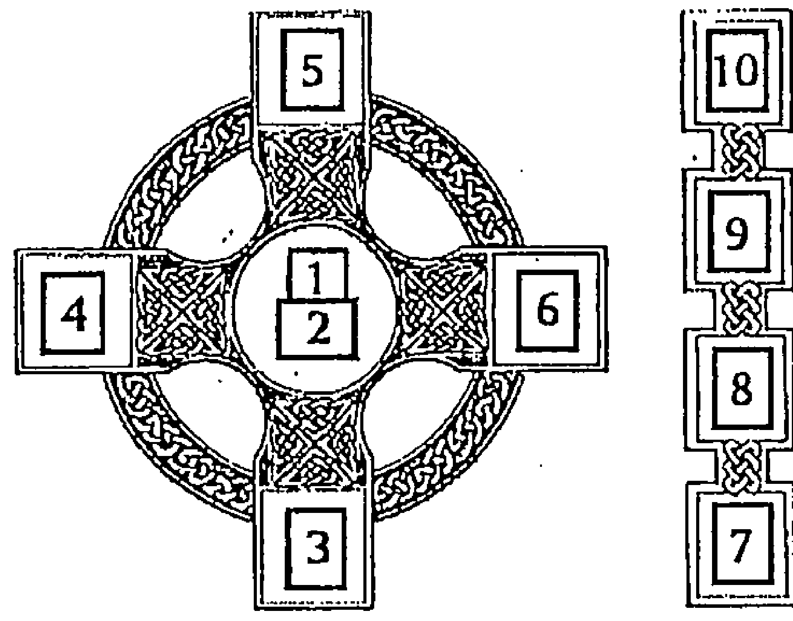

當你嘗試了解自己和動機時，它有助於看清自己過去是如何行動，以及吸收新的經驗與教訓後，未來又會如何行動。這個置換能讓它變成可能。它改編自 Marcia Church 設計來做為課堂作業的太極拳牌陣。

想像塞爾特十字周圍有一個圓圈，連結了十字架的四邊。它對應了「道」和命運之輪，所有事物都循著環狀移動，最終又回到起點。因此在這個置換中，我們會將十字架的四邊（3 號、4 號、5 號、6 號牌）以順時針的方向移動，如下圖所示。

解釋這些換了新位置的牌，就像之前解釋原始位置的牌一樣。我們在這裡所做的，都是基於所有思想或行動的自然過程。這個過程經歷了以下階段：（1）構思或理想，（2）行動／主張，而後成為（3）習慣／直覺，最終變成（4）放手並接受新構想。目前的情況是從過去的行動（可能還包含前世）所發展出來的，同時也會影響未來的行為。原本5號牌現在到了6號位置，而6號牌到了3號位置……現在，解讀這些牌彼此間的關係。在這種方式下，看看現在意識到的事（原本的5號牌）變成下一個會採取的行動（移動至6號位置）時，會發生什麼狀況？同時外在的自我表現（原本的6號牌）變成一種潛意識習慣（移動至3號位置）時，這種無意識的基礎（原本的3號牌）變成了來自過去的創造性天賦（移動至4號位置）。而過去的知識（原本的4號牌）成為一種有意識的指導力量（移動至5號位置）。現在再次將牌轉一次，重新開始。持續將牌以順時針方向移動，並重新詮釋它們的意義，直到這些牌都回到最初的位置。看到「轉動之輪」是如何引導你去深入了解這四張牌的涵義了嗎？

回顧過去（也就是以順時針方向移動牌時），將牌與自己過去的經驗結合，也許是你上周去過的地方，或是一年前對某件事的領會；甚至可能發現自己在描述之前的生活，以及如何依據自己的知識來行動。

同樣的，當潛意識不再隱藏自己的需求，將它們明確的放在自己的意識中，那麼未來行動的可能性就會變得清晰易見（當3號牌移動至5號位置）。可以實際看到事件之輪在你面前移動，並看見過去是如何變成現在，而未來又如何成為回顧過去的一種方法。或許你會懷疑該如何判斷自己解讀的究竟是過去或未來。何不試著用這兩種角度來解讀！讓直覺告訴你答案。

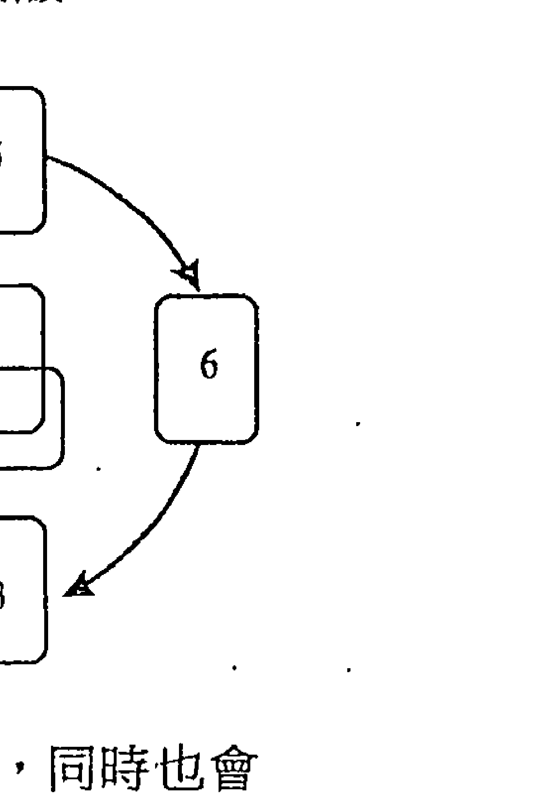

### 範例：轉動之輪，第一類置換

根據下方所示，將牌排成塞爾特十字牌陣。並依照關於置換的說明來移動你的牌，這個例子你將可以很容易理解。

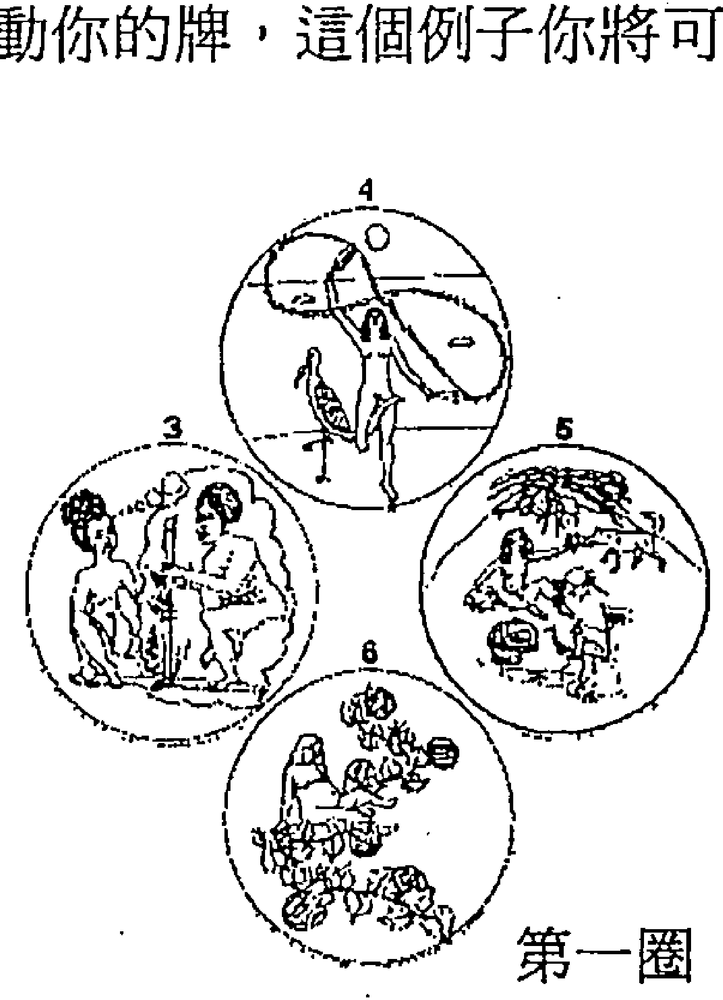

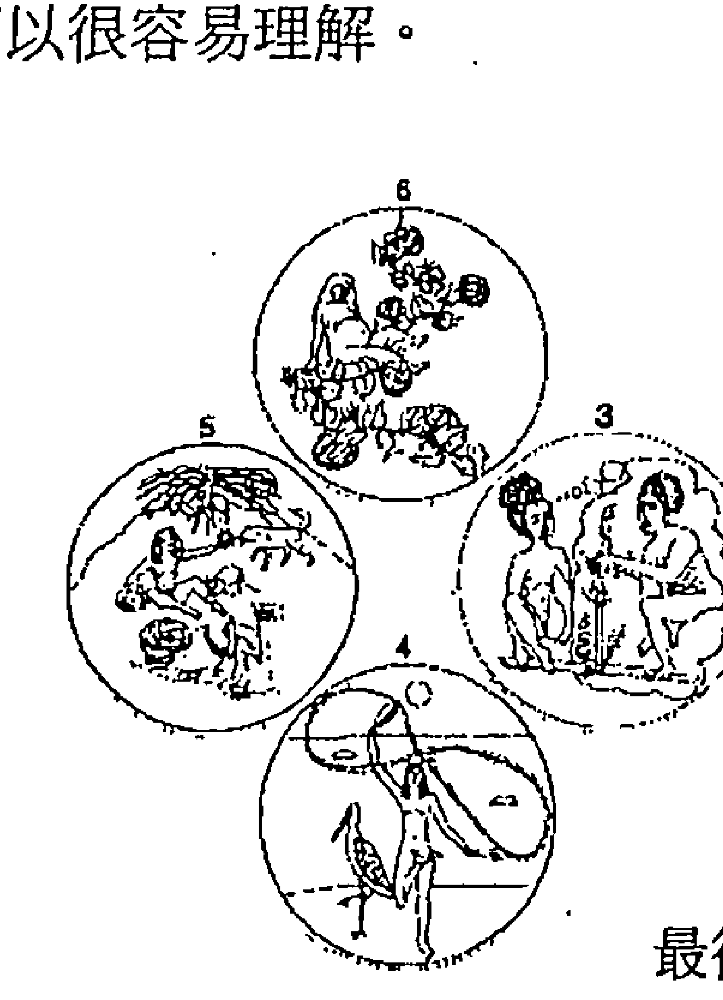

我正在處理關於既要撥時間工作，又要抽空陪女兒的衝突。當我開始轉動這些牌，發現在第一圈時，我的理想是不惜一切代價以保持平靜安寧（寶劍二在5號位置上），並主張有完美的方法可以迴避衝突（力量牌在6號位置），然後我不斷持續評估結果（錢幣七在3號位置）。這讓我明白，自己有能力選擇要讓什麼狀況發生（權杖二在4號位置）。

當我來到最後一圈時，我明白自己可以自覺的評估狀況（錢幣七在5號位置），維護自己的力量以提出一個創造性的解決方法（權杖二在6號位置）。而要做到這一點，我就必須改掉那總是尋求妥協的習慣（寶劍二在3號位置），而我需要接納自己的願望才能展現創造力，但不能讓它凌駕於一切（力量在4號位置）。

現在回到一個之前解讀過的塞爾特十字牌陣，希望能更深入了解它。先排好一開始的六張牌，中央的兩張牌（1號及2號）維持原狀，它們在這個置換中將不會被用到，但就如以往，它們代表了位置3、4、5、6 號牌周遭的基本狀況。將順時針轉一圈後出現的牌，寫在下面的空格中。將每張牌都視為正位，在下面空格中寫下對這些牌的新解釋。

### 轉動之輪解讀

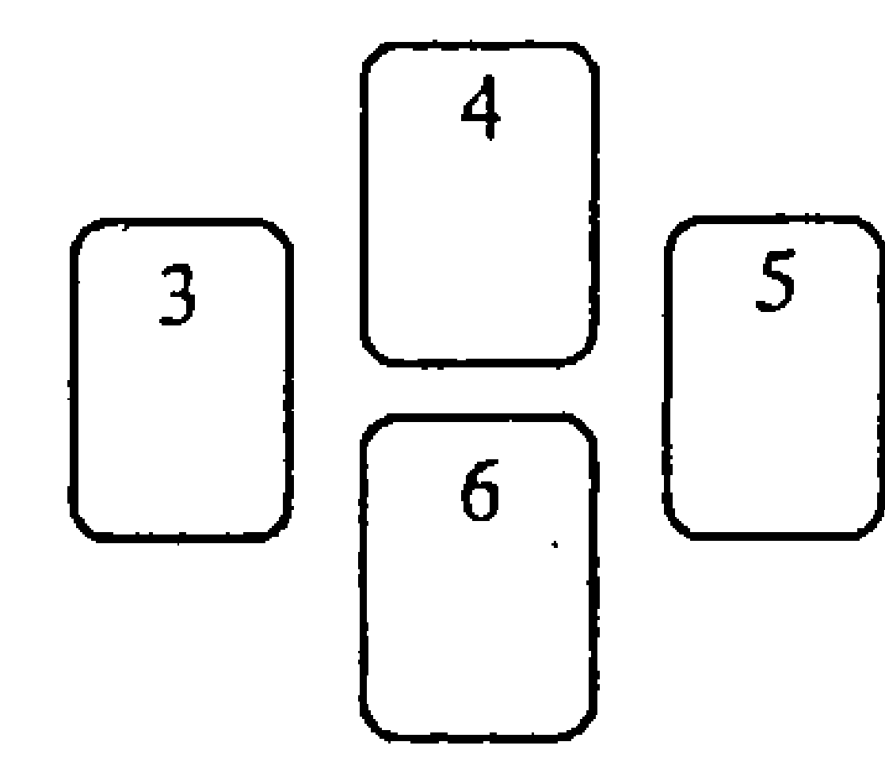

- 構思／理想 (4 號位置)
- 行動／主張 (5 號位置)
- 習慣／直覺 (6 號位置)
- 放手／接受 (3 號位置)

再將這些牌順時針轉一圈。

在下一個潛意識的劇本裏，我認為牌要告訴我：

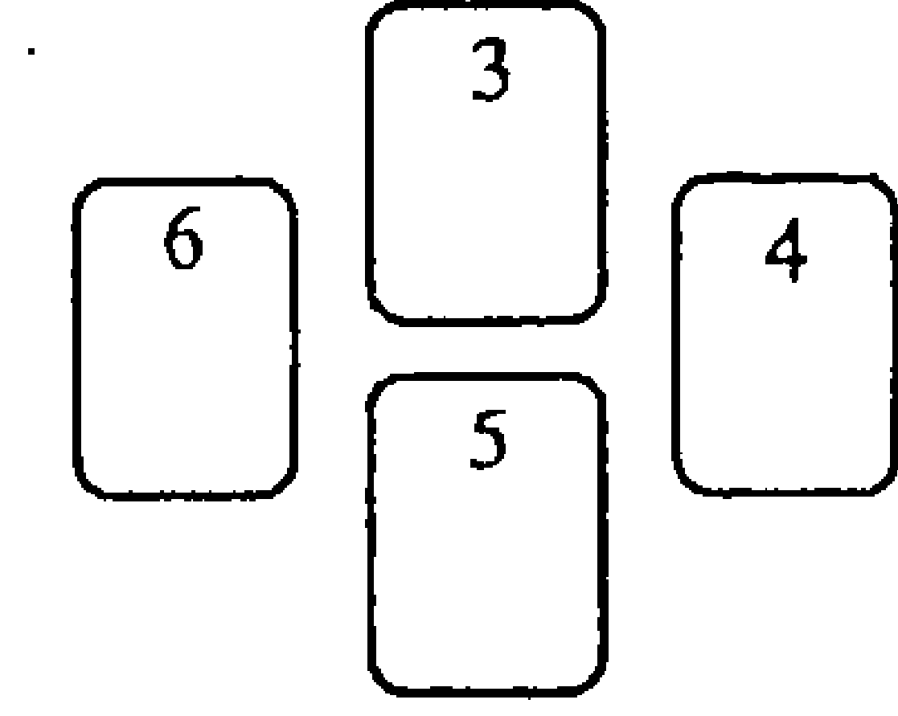

- 構思／理想 (3 號位置)
- 行動／主張 (4 號位置)
- 習慣／直覺 (5 號位置)
- 放手／接受 (6 號位置)

將牌順時針繞最後一圈。

在這個未來的劇本裏，我認為牌要告訴我：

- 構思／理想（6 號位置）___________
- 行動／認定（3 號位置）___________
- 習慣／直覺（4 號位置）___________
- 放手／接受（5 號位置）___________

### 第二類置換：過去、現在、未來

希拉蕊·安德森在加州理工學院於舊金山的亞洲研究課程「創造性的神諭特色」中，教授了以下這些塞爾特十字牌陣的變化。將牌移回塞爾特十字牌陣中原本的位置，然後將它們排放成三大類，如同以下範例所繪的圖一般：

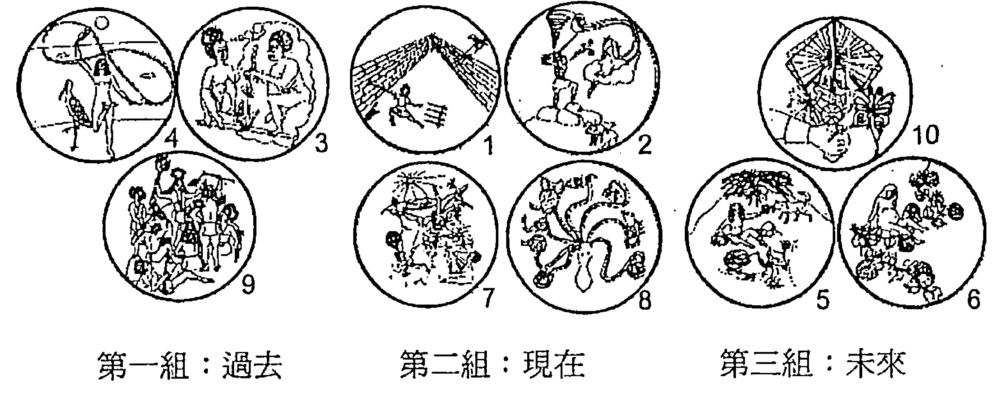

### 範例：過去、現在、未來，第二類置換

繼續塞爾特十字牌陣範例：透過將牌移動至新位置及關係，意識到我透過過去（寶劍二、權杖二和權杖七）的經驗，讓我能夠掌控自己及採取果決行動。隨之而來的，是那種遭遇反對、必須為個人需求而戰的感覺又復甦了。然而對平靜的渴望及試圖找到折衷的方法，卻讓我失去採取行動時該有的沉穩。

現在（由兩張中心位置的牌：寶劍八及寶劍女兒所代表。還有我自身所在的環境：權杖騎士和聖杯八）對於自己及女兒成長新方向的可能性，還有我們雙方都有時間及空間獨處的機會，我是那麼熱烈的渴望。現在我能看到脫離被囚禁的方法，也能與女兒建立良好的溝通模式。

我未來的表現（由力量牌、錢幣七、寶劍一代表）建議我可以「恰如其分」並誠實的與凱西溝通。這個溝通是建立在我對情況的考量，以及所愛的凱西與工作間的理想平衡上。

### ‡ 過去、現在、未來解讀 ‡

第一組——過去：3、4、9 號牌。這些牌都與過去有關。希望及恐懼都包含在這類中，因為你對未來成功或失敗的預測都是基於過去的經驗。這些牌會幫助你看到那些還沒學到的教訓。

代表我過去的牌是：

哪些過去的問題還懸而未決？你正在運用哪些過去曾習得的能力和知識？

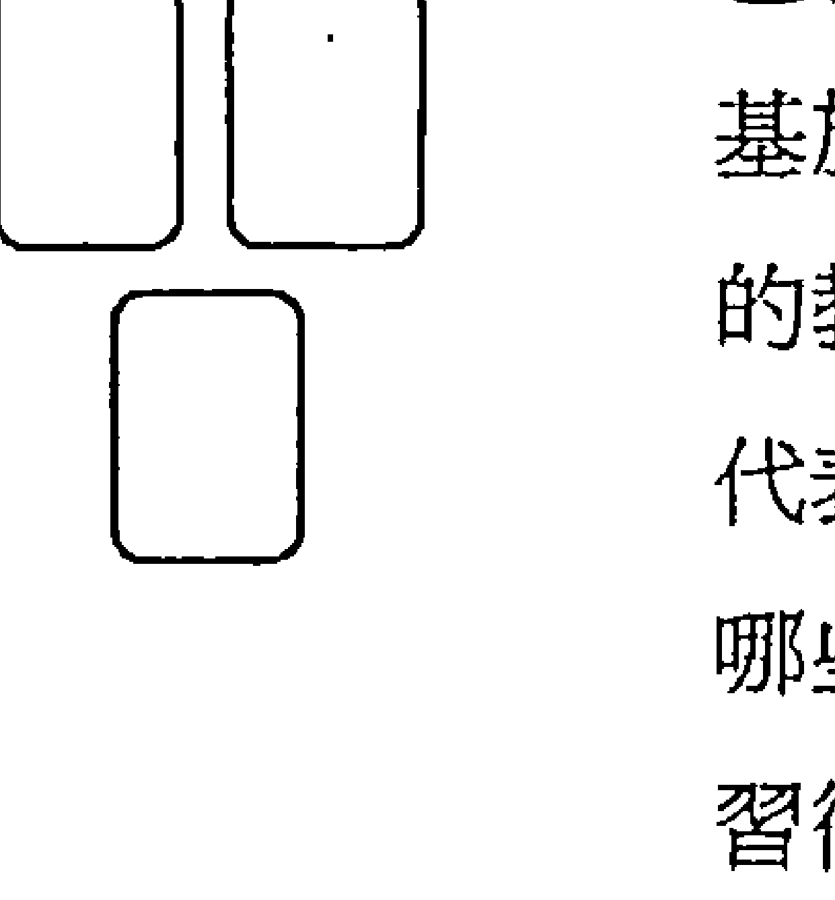

### 第二組——現在：1、2、7、8 號牌。這些牌代表你自身（7 號牌）及所處的環境（8 號牌），處理的基本狀況（1 號及 2 號牌）。它們告訴你目前處於什麼狀況。

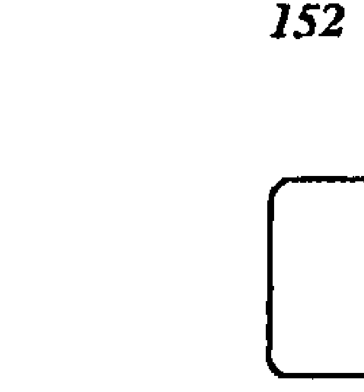

代表我現在的牌是：

我是：________________________________________________________ (以 7 號牌為基礎描述你自己)

在這樣的環境中進行：_____________________________________________ (描述 8 號牌中的環境或人物)

我處理的基本狀況：________________________________________________ (描述 1 號牌所顯示的內在希望)

以及_____________________________________________________________ (描述 2 號牌所顯示的外在擔憂)

### 第三組——未來（逐漸清晰化的過程）：5、6、10 號牌。它們是具前瞻性、有遠見、積極而自覺性的。顯示了你在何處及如何展現能量，以塑造未來。最後，你的想法及所創造的，將成為未來的現實。

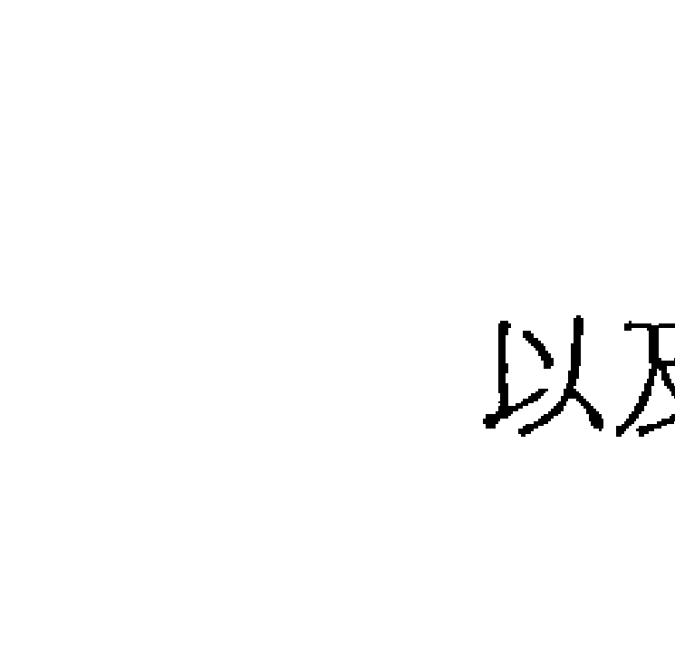

代表我未來的牌是：

我的未來表現：___________________________________________________ (描述 10 號牌顯示的潛在表現)

將會有這樣的結果：_______________________________________________ (描述 6 號牌顯示的行動)

這是根據了______________________________________________________ (描述 5 號牌顯示的想法及理想)

現在將牌在它們所屬的分類中繞圈移動，這麼做會得到更多資訊，並建議更多進一步的互動。


### 第三類置換：全人總結牌陣

這個置換是由安琪拉·亞利恩所傳授，也是她全人牌陣的進階版。以幾種方法強調自我理解：知覺的，以權杖為象徵；心智的，以寶劍為象徵；情緒的，以聖杯為象徵；身體的，以錢幣為象徵；原型的，以大阿爾克納為象徵。

將牌陣的十張牌依四種牌組及大阿爾克納共分為五組（要根據你的牌陣，有些牌組可能不會出現）。將每組牌都排成橫向的一列，總共是平行的五排（權杖是第一排，再來是聖杯、寶劍、錢幣）。每一列的牌從左到右，先是宮廷牌（國王、皇后、騎士、侍者），再來是數字牌，從一到十。大阿爾克納是最下面一排，也是按照數字順序由左至右排列。讓每一行都居中對齊，在視覺上有一種平衡的效果。參考下圖的例子：

範例：全人總結牌陣，第三類置換

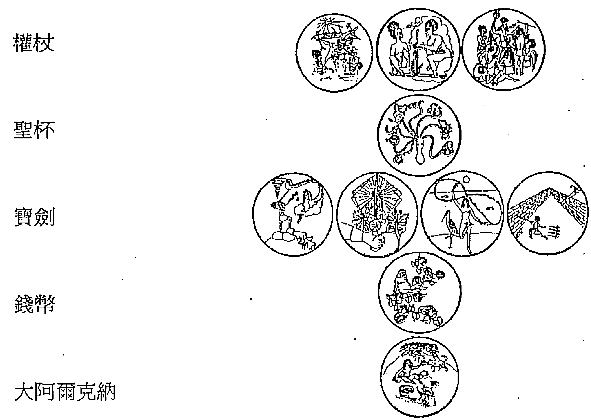

以我本身為例的塞爾特十字牌陣在做了置換後，我看到我抽了三張權杖，顯示我覺察到在與女兒的關係上，需要更具創造力和表現力，並且不應該把所有的主導權交給她。我需要擁有自我意識。

我抽到一張聖杯，顯示我的情緒已經枯竭，需要安靜的獨處以及重生。

這裡有四張寶劍，其張數之多突顯了我那種被局限、總是在犧牲及對抗沮喪的感覺。寶劍也強調了我正在經歷的掙扎，以及我為了讓狀況「合理化」所做的努力。同時也顯示了我的需求——希望對自己和凱西都是誠實而公平的。

我抽到一張錢幣。看到這張牌讓我知道，或許這次我該讓工作擱置一陣子。與其埋頭工作，不如停下來重新評估工作的規劃。

我抽到一張大阿爾克納牌：力量。我擁有足夠的實力和創造力來提出一個充滿愛的解決方案。這張牌告訴我要堅定才能控制局面，並且透過理解我們雙方的需求和希望，來達成一種圓滿的和解狀態。這並不表示我對凱西的愛減少了。

權杖和寶劍出現的張數最多，證明了我主要苦惱的問題是關於創造力、自我表現和公平性。

移動牌陣讓它們置換新的位置。依照接下來的格式，將牌填入空格中。

將你置換後的牌陣畫在下方：

看起來是負面的牌顯示你需要努力的領域。移除這些牌，就能看出當你克服了恐懼和不安後，能夠成為什麼樣的人。任何沒有出現的牌組通常代表的是狀況中比較次要的問題，但也有的時候是很明顯指出你在逃避真正問題所在（缺少的牌組）。例如我做了一個關於戀愛的解讀，而解讀中沒有出現聖杯。有時這可以被解釋為一種不需要被注意的強烈情感，但在這裡，很明顯的是顯示這段戀愛關係中缺乏的正是強烈的情感。戀愛關係的基礎是建立在安全感與舒適合宜上，而非感覺。經過討論後，很清楚的顯示了這對情侶都不願承認他們之間其實早就沒有愛了。

### 全人總結解讀

1. 權杖代表精神、創造和洞察力量。一個有遠見、先鋒者的自我，需要成長和積極的空間。

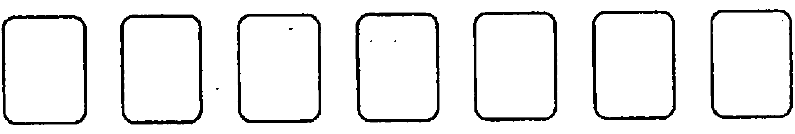

你有幾張權杖？_________________
你的精神力量與創造力是什麼？你察覺到了什麼？正在構想、展望、啟動什麼？

2. 聖杯代表情感本質。愛人及與人相處的能力，還有夢境與想像力。

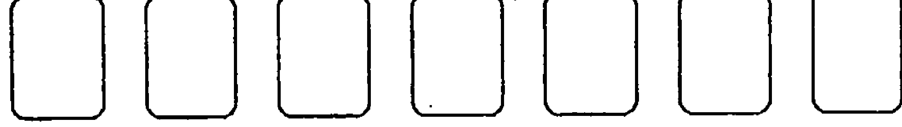

你有幾張聖杯？

愛人的能力，與人相處、夢想、想像的能力是什麼？現在的感覺是什麼？

3. 寶劍代表心智／理性思維、辨別能力。有時代表掙扎、衝突的領域。

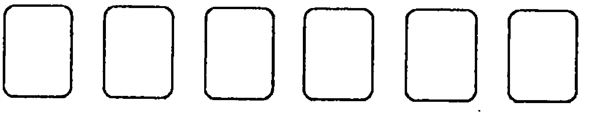

你有幾張寶劍？

主宰你想法的是什麼？你在何處掙扎？又在哪裡發現衝突？你如何與他人溝通？

4. 錢幣代表身體的相關問題。如何沉澱自己？你的穩定度及可靠度？你投入工作及課業的能量都在這裡表露出來。

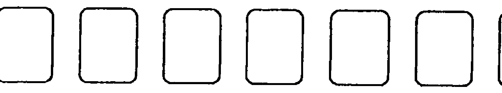

你有幾張錢幣？

在身體方面你有什麼問題？如何沉澱自己？你的穩定度及可靠度？如何將能量運用在工作及學業上？

5. 大阿爾克納牌代表在此情形中原型力量是如何運作，你內在的特質正接受召喚與考驗。在這個狀況中，你涉入的部份。

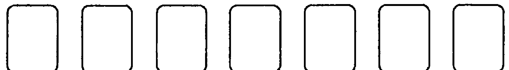

你有幾張大阿爾克納牌？__________

在這個狀況中，運作的原型力量是什麼？哪些內在特質正被喚醒和接受考驗？哪些方面是需要學習及發展的？

## 第四類置換：Yod He Vau He ——赫密士之路

這個置換是基於帕柏斯在其著作《波西米亞塔羅》(Tarot of the Bohemians)中的理論。他描述小阿爾克納的結構是三個連鎖三角型，象徵一個辯證過程：論點（開端），對立（反應或反對），以及總結（綜合），而後連接著一個新的論點。卡巴拉神秘主義在上帝之名(Tetragrammaton)中也含有同樣的概念。由希伯來文四個字母：Yod、He、Vau、He拼出Jehovah或Yahweh（耶和華）的名字，並代表其顯示的過程。

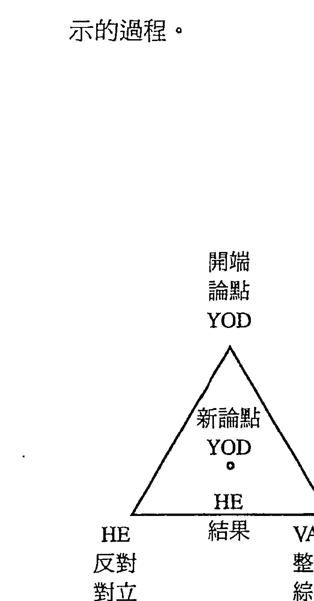

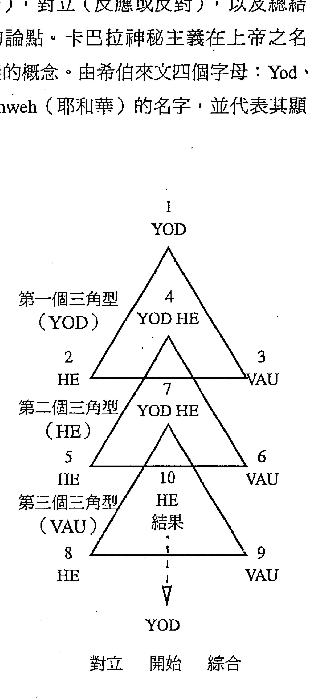

每個新論點都代表一個誕生、新的秩序、新的行動，是由上一個辯證的三角型中央衍生出來的，形成如下圖的概念。

塞爾特十字牌陣可以重新排列，按照這個方式排序。按編號排序，並依照以下涵義來解釋：

- 1. 1、4、7、10 號牌以及第一個三角型（Yod）都是代表論點、行動、創造、開端、開始、根源、種子。它們是起源，並且與精神及意識相關。它們也指出每個新的行動同時也是過去行動和刺激的結果。
- 2. 2、5、8 號牌及第二個三角型（He）都代表反對、抵制、反應、反射、障礙、矛盾、懷疑、維護。它們是感性的，並追求維持秩序和現狀，表示一種慣性。
- 3. 3、6、9 號牌及第三個三角型（Vau）都代表綜合、融合、平衡、改造、決心、轉型、通過。它們與身體相關，是對立面的融合。

這個置換方法是最深入而充滿訊息的，透過研究它，不僅可以重新認識每一張牌是如何與其他牌互動，又是如何演變及交互影響的。這個解讀法強調你在面對生活上各種狀況的慣常處理方式。它點出你的行為模式，而當你認知了這些之後，便可以改變以展現自己的最佳特質。

## 範例：赫密士之路，第四類置換

當我繼續以前述範例作說明時，發現這個置換一如往常，彙整了所有解讀，並幫助我看到每次遇到類似問題時，自己所建立的行為模式。

第一個三角型（Yod）中的 1 號牌（寶劍八）是我行為周期的開端，顯示出我感覺受到約束和局限，對於那些我覺察到的限制感到很沮喪。

2 號牌（寶劍女兒）顯示我決心反抗，突破那些限制。然而這張牌

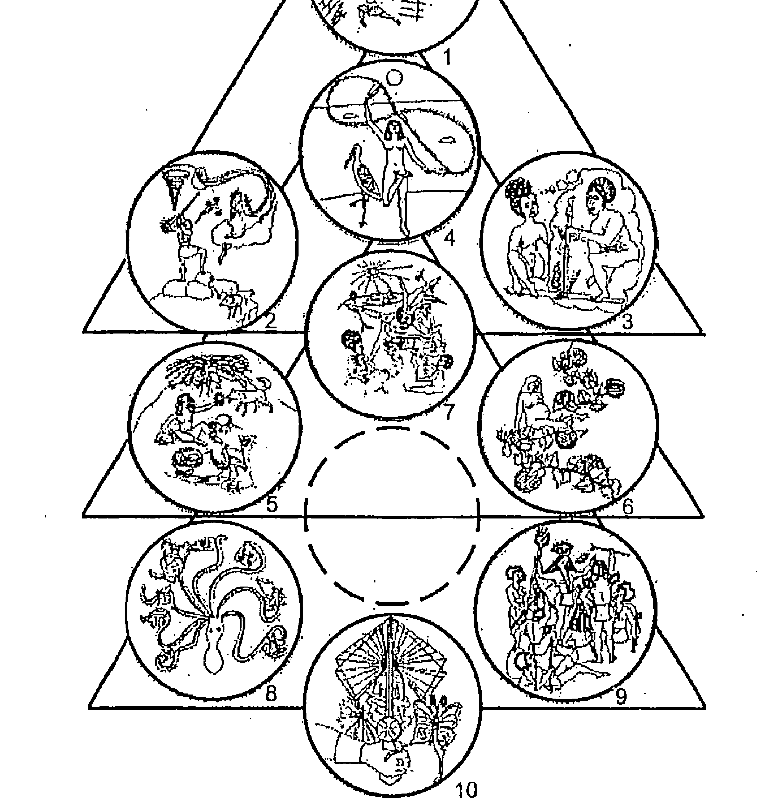

也同時代表凱西，代表她需要我的陪伴與溝通，而這樣的需求與我打破限制的努力是相違背的。

如 3 號牌（權杖二）所示，藉由尋找一種有創意的方法，將高質量的時間平均分配給凱西與工作，我就能重新掌控時間，並且整合上述兩個對立的能量。

在 4 號牌（寶劍二）中，也是第二個對立三角形（He，也是對立的開端）的第一張牌，我看到自己一直在試著妥協。當然，我也一直不滿意這樣的結果，因此它成為一個僵局。

在對抗這樣的對立上（5 號牌，力量），我那希望表達創造性自我的願望再次出現。但這次它要我細心協調雙方的需求——透過堅定不移的決心，以及對眼前一切的全心投入。

為了整合這些對立（6 號牌，錢幣七），我評估目前的狀況以及我一直以來所犯的錯誤（缺乏足夠的時間，以及偏向針對凱西而非對事）。

整合的開端（7 號牌，權杖之子），第三個三角型（Vau）的第一張牌顯示玩樂與冒險、靈活性，並以新思維撼動了舊模式。

整合受到的阻礙（8 號牌，聖杯八），試圖安撫凱西導致情緒枯竭，以及幾乎絕望而衝動的想逃離。然而我卻一直持續這個狀況，直到筋疲力盡。我害怕凱西的獨立，以及她的遠離嗎？我是否沒有成功教導她尊重和理解我把時間花在工作上這件事？

要整合這些狀況（9 號牌，權杖七），我就必須捍衛及維護自身的需要。

新的循環（10 號牌，寶劍一）可以展開一個新組合、一個新的三角、一個新的可能性，只要願意溝通，和將時間與能量做適當的分工。現在就是開始的時機。

繼續你的置換，位置的涵義並不是絕對，只是個例子，告訴你如何看待牌的順序。在以下圖表中寫下你自己的牌陣，根據你的具體回答對每張牌的問題。

## 赫密士之路解讀

1 號牌：開端的開端。是什麼驅使你開始？什麼是你想展現的？

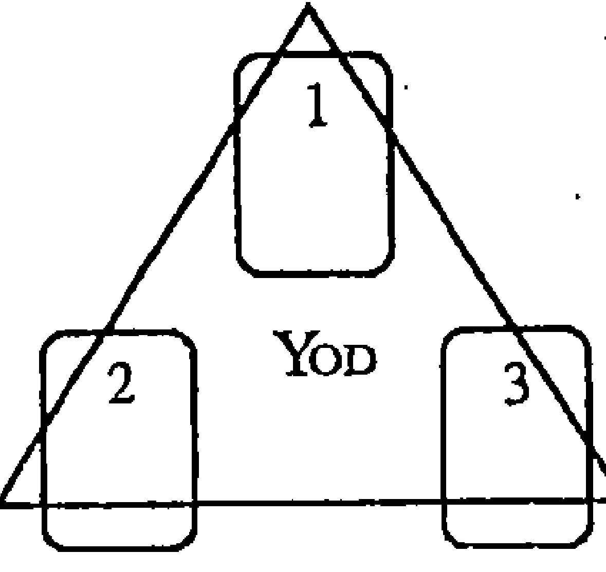

2 號牌：開端的對立。是什麼與這個開端對立？

3 號牌：開端的整合。你如何整合開端與對立（透過無意識的自我）？而在這裡，整合的基礎又是什麼？

4 號牌：對立的開端。你如何與自己的新動力對立？是什麼讓你抗拒改變？

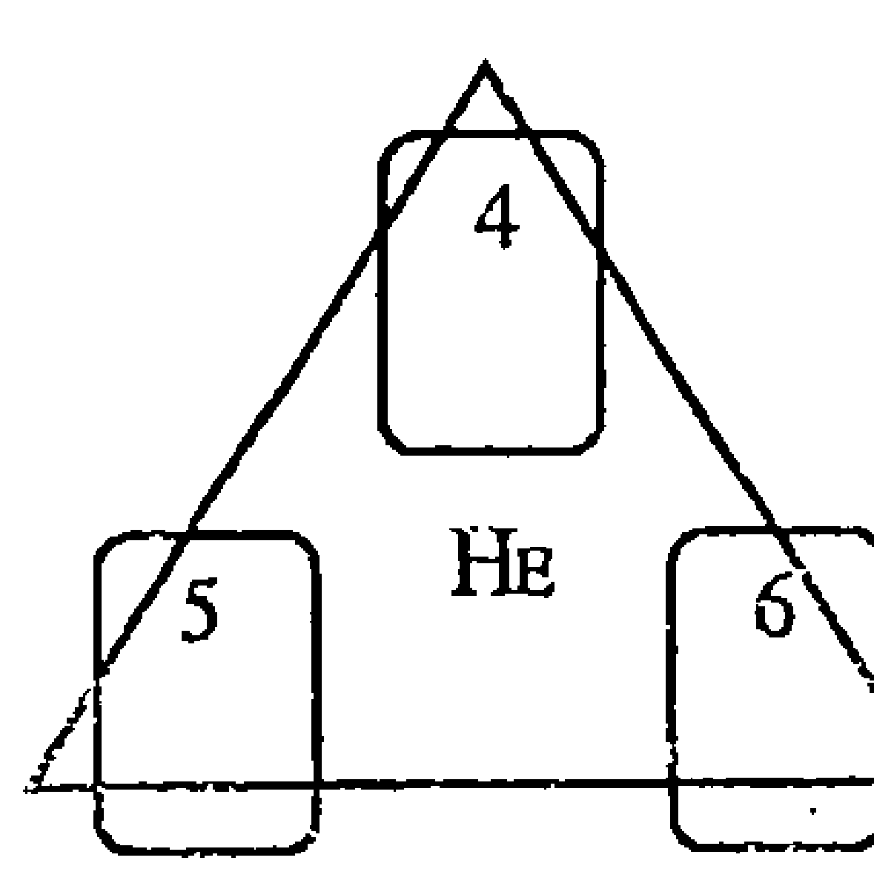

5 號牌：對立的對立。你如何重新確立及展望自己的願望？

6 號牌：對立的整合。你將做出什麼決定？你將採取什麼行動？

7 號牌：整合的開端。你將如何開始帶著自我認知整合你的願望？

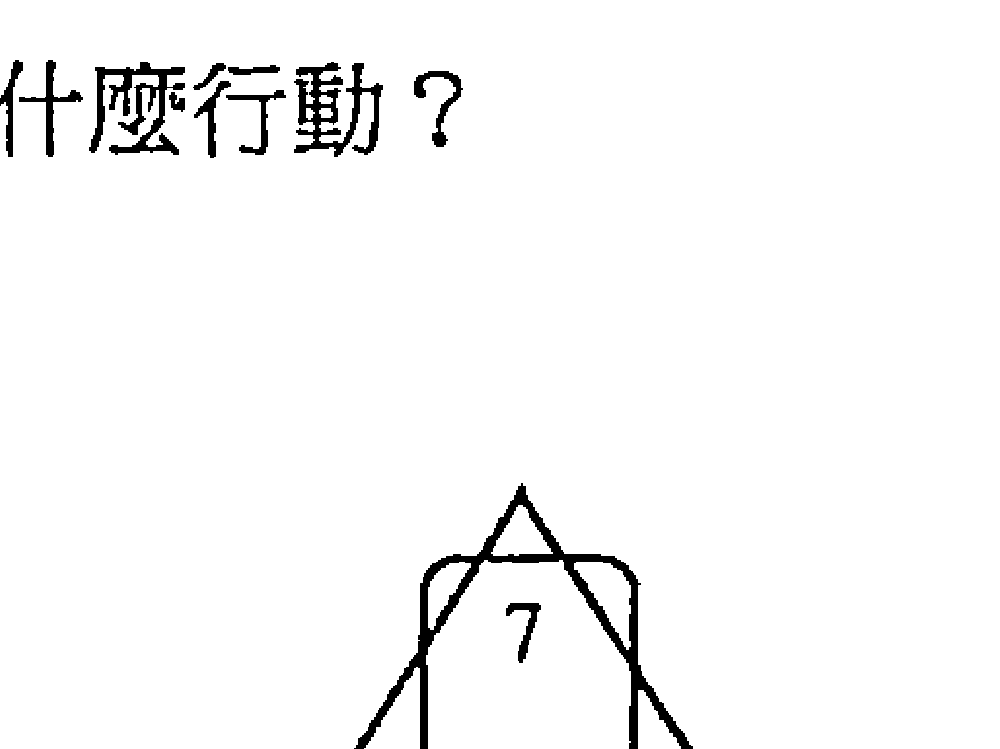

8 號牌：整合的對立。你必須考量哪些外在因素？你為何必須跟他人妥協？

9 號牌：整合的整合。你必須學習如何與局限和約束共存？你必須學習什麼？

10 號牌：新行動所帶來的報酬與結果。這個循環帶來什麼樣的結果？你看到的新循環開端是什麼？


## 突破障礙，達到能量最高峰

在一般情況下，可以看出基本的塞爾特十字牌陣顯示出自己的狀況，並提供對生活中不同事件或面向的觀察。用更清晰的角度看事情，對自己絕對有幫助。現在清楚知道問這個問題的根本原因，對其

## 範例：突破障礙

在解讀的最後階段中，我抽中了寶劍二、寶劍八、聖杯八，代表困住及限制我的問題。寶劍二顯示我為了維持和平所做的犧牲，以及是多麼的優柔寡斷。寶劍八讓我感覺我別無選擇——我被困在這種模式中。而聖杯八顯示了我的疲憊感，顯示出我想脫身。

想要突破這些阻礙，我選擇了權杖七來表示我有能力捍衛我的信念，並且有選擇的權力。

去想些具創造性的解決方案。錢幣七，讓我能夠評估狀況，而不是只會逃離。同時也讓我承認一直抗拒那些我應該接納的東西。因此，我能夠透過改變行為來讓結果有所不同。

## ✦ 突破的過程 ✦

- 1. 像往常般解讀牌。
- 2. 挑出牌陣中代表狀況、阻礙或限制的牌（通常是一至三張）——那些你最想擺脫的牌。描述每張牌所代表（或潛在意義代表）的具體情況。
- 3. 針對每個障礙，從牌陣中選一張牌，而它的特質能夠幫助你突破這個阻礙。這張牌建議如何處理問題呢？

| 問題、阻礙、限制，以及它們如何顯現在我的生活中 | 表示突破的牌，以及建議我處理問題的方式 |
| :--- | :--- |
| 牌： | 牌： |
| 牌： | 牌： |
| 牌： | 牌： |

- 4. 從解讀中選一張牌，最能表現出你在這個狀況中想發展的特質。這是展現你最佳特質的關鍵。

我的關鍵牌：________________________。

我最想發展的自身特質是：

- 5. 肯定自己具備了上述的特質。只做正面闡述，試著使用主動詞，盡量具體而確切。基於關鍵牌，我對自己的肯定語：

（對自己高聲喊出肯定語，一天三次，多做幾天）

- 6. 決定某些二十四小時之內能做的具體事情，並且會運用到那些特質。選擇簡單而相對容易做的事。可以是一項作業、一個遊戲或一個儀式。在二十四小時內我將要：

## 現在就去做！

注意：由於這些牌都是從解讀的牌中所選的，因此可能有時會覺得沒有牌能夠充分代表關鍵或突破。無論如何，跟隨你的直覺，從牌中選擇任何你需要的牌，將生活掌握在自己手中。

在這個解讀中，讓我展現最佳特質的關鍵是力量牌。這張牌的特質是愛、溫柔、和諧、指引、持之以恆，以及將事情做得完美正確的力量。透過這個關鍵可以知道我的肯定語是「我有力量以柔情堅持我的需求，並以尊重和理解的態度去指引凱西得到她要的」。

在二十四個小時內（同時在下星期也是一樣），我會將全部時間都投注在凱西身上，也會想一些她能夠自己做且值得而愉快的活動。那麼當她打擾我工作時，我就能溫柔（並不感到罪惡）的堅持要她回到她的活動上。

這個方法能夠賦予任何解讀一種完成感，並且提供行動和變化的正面象徵。更重要的是，你能夠透過重新定向和有效運用能量來選擇自己的成長方向，以脫離目前的狀況。

## 延伸三張牌陣

第二章中所介紹的三張牌陣可以延伸出更多的資訊。你也可以運用基本三張牌形式，賦予每個位置意義後來回答特定具體問題。在釐清問題所在之後你可以使用這三張牌導出另一個牌陣，例如塞爾特十字牌陣。

一開始，先放鬆並放空自己，然後淨化、並洗牌，然後切成三疊。抽取每疊最上面一張牌進行解讀。

我抽到下面三張牌：							日期：___________

## 這些牌所描述的問題是：

大部分的人都想知道每疊的最下面一張是什麼牌，所以也把它們抽出來。這第二組的三張牌是更深層的，代表這個狀況中隱藏或潛在的因素。將這兩組三張牌都排成一列橫排，最上面的三張是第一排，最底部的三張則是第二列。將每張新牌講述給其他牌聽，也講給上面一列的牌聽。

## 我的三張最底部的牌是：

## 這個解讀中隱藏及潛在的因素是：

如果你像我一樣覺得六張牌還不夠完整，那麼就選出第三組的三張牌。先分別將三疊牌洗乾淨，同時思考這張牌會如何幫助你解決及完成問題。最後將每疊牌攤開，從中各抽一張牌出來。

## 我抽了以下的牌排在第三列：

關於身的問題（1 號及 4 號牌所描述的）解決及完成之道，乃是由 7 號牌所顯示，內容為：

關於心的問題（2 號及 5 號牌所描述的）解決及完成之道，乃是由 8 號牌所顯示，內容為：

關於靈的問題（3 號及 6 號牌所描述的）解決及完成之道，乃是由 9 號牌所顯示，內容為：

最後，將剩下的三疊牌混在一起洗乾淨，切兩次牌，然後任意重新疊成一疊。將最上面的牌翻開，這第 10 號牌整合了之前的牌，也是一個關鍵，幫助你運用其他牌帶來的訊息。

我的 10 號牌是 _____________，整合了其他牌傳達的訊息，這些訊息是：

## 用三張牌陣詢問問題

當回答問題時，三張牌陣通常是直接切入核心的。它總是嘗試準確而精闢的表達你的問題。在開始之前，先將問題寫下來。三張牌陣對以下幾種類型的問題是最有幫助的：

- (1) 是或否的問題
- (2) 非此即彼的問題
- (3) 人際關係的問題

在以下狀況中，根據想知道的事情是什麼，用來確定牌陣中每個位置的意義是什麼。在洗牌及排牌陣之前，用書面清楚的列出來，你希望透過各個位置獲知什麼訊息。

## 是或否的問題

範例：「我應該在五月搬去位於東灣的新公寓嗎？」注意問題的精準度。像這樣具體的問題，就需要在其中加入特定的時間。或許你也可以把問題改成這樣：「如果在五月搬去位於東灣的新公寓，對我會有好處嗎？」因為你的重點是「應不應該」。這樣的問題一定要寫下來，這樣你與神諭才能確定問題是什麼。請記住，是與否的問題往往是種限制，因為或許還有很多你根本沒考慮到的選項。

當你在洗牌時，確定你已經隨機的轉換了某些牌的方向。正位牌表示「是」；逆位牌表示「否」。但由於中間那張牌要算兩票，因此你可能會得到平盤的答案。

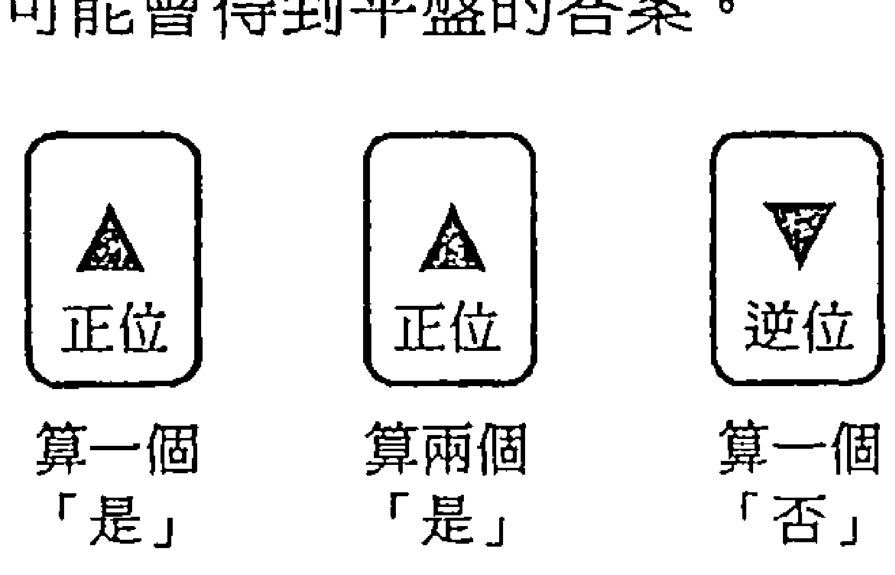

在這個例子中，有三個「是」及一個「否」，所以答案是「是」，至少就問題字面上的意思是這個回答，雖然有些跡象顯示未來可能有些變化。隨著狀況中的新訊息或變化，答案或許會有所不同，所以你可以重新做一個牌陣，以獲得最新的訊息。

你也有可能獲得兩個「是」和兩個「否」，這種情況表示：一、結果尚未確定；二、對你最有利的答案並沒有被提出；三、你的問題表達得並不恰當或明確。同時也要記住，塔羅牌是看問題字面上的意思——永遠要確定你對牌的解釋有確實針對你的問題。

確定了答案後，就過去、現在、未來三方面，或任何以前選擇的三張牌陣變化版本來解釋牌和它們的建言。如果你想要有更多的素材來幫助你理解，可以用同樣的方式運用任何的奇數牌（5 或 7 或 9）。提出你的問題。

日期：________

我的是或否問題是：

我抽中的牌（註明正位或逆位）是：

- - （算一個）過去
- （算兩個）現在
- （算一個）未來

我的答案是：________ ，而我解釋這幾張牌給我的建議是：

## 非此即彼的問題

這種問題表示你有兩個或更多個選擇。例如「今年秋天我應該整天待在學校，還是去做全天的工作？我到目前為止都在工作。」 在洗牌之前，根據自己的問題，預先將牌陣的每個位置設定好定義並寫下來。將左邊設定為你已經選擇

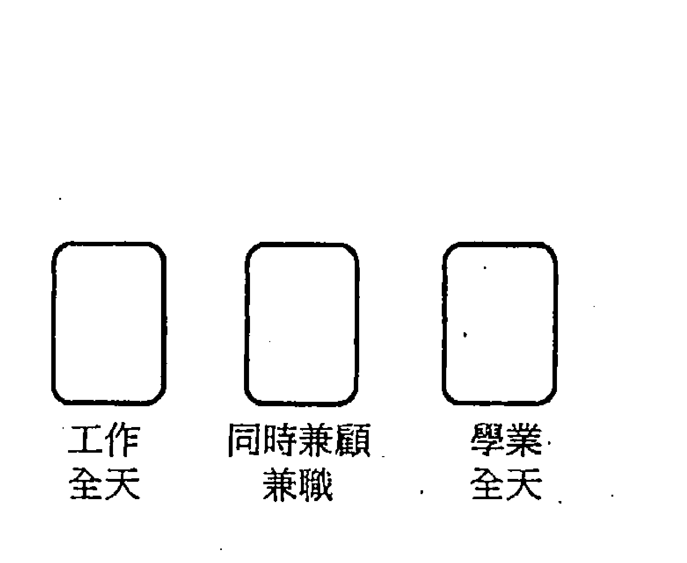

的選項，右邊則是一個新的選擇。你可以由過去、現在、未來的角度來讀牌。

就如在這個例子中看到的，這裡通常會有一個隱藏（或許不會隱藏得那麼深）的第三個選擇，中間的牌可以被指定為顯示你目前的心態。這種技巧也可以被運用在是或否的牌陣，依據牌是正位還是逆位來判斷每個選擇的答案是「好」還是「不好」。

現在問一個你希望得到指引、非此即彼的問題。

日期：_______

## 我的問題是：

將問題分解成幾個部分，如果可能的話，將它們分為過去時間軸（或正在進行）選擇、你的現在（或未知）選擇，以及未來（新的）選擇。洗牌時，如果還有使用「是或否」選項的話，記得也要將牌反轉一下。切牌後抽出三張牌，然後將它們由左至右排好。

左邊的位置表示：

中間位置表示：

右邊的位置表示：

我抽到的牌指示我：

## 人際關係的問題：

這個版本的三張牌陣讓你對任何兩個人或事物間的關係有基本的認識。

例如：「梅林與我關係的本質是什麼？」

我與梅林的關係 | 這段關係的本質 | 梅林與我的關係

或是你也可以這樣問：「梅林與我之間的問題是什麼？」如果你想釐清問題，可以運用下列三個位置：

我的觀點 | 問題本身 | 梅林的觀點

或者要解決問題，你可以問：

在這段關係中我的需求及願望 | 解決問題的手段或障礙 | 梅林在這段關係中的需求及願望

用下面的空白設計一個你自己或他人的基本人際關係問題。

日期：____________________

我的問題是：

我將各位置定義如下。

左邊的位置：

中間的位置：

右邊的位置：

我在這些位置抽到的牌告訴我：

## 你為別人解讀時的個人訊息

在算塔羅時，有一個時常被忽略的部分，就是去覺察到你在為別人解讀時，塔羅牌給你本身的個人訊息。因此，如果可以的話，最好留下每次你為別人解讀的紀錄。過段時間之後，你就可以重新看一次，看看它給你的訊息對你有什麼幫助。你在為別人做的解讀中提出了自己的意見及觀點，思考一下你能從中學習到什麼？拿發生在我身上的例子來說，一名女客戶覺得寶劍七裡面那個受到束縛的女子正在等待穿著閃亮盔甲的騎士來拯救她。這不但讓我對這張牌有了新的認識，也對我當時正面臨的問題提供了新的見解。

當短時間內進行許多次解讀，例如在一場通靈聚會，或是客戶量大時，我發現某些特定的牌會不斷的重複出現。如果你將抽到的牌都紀錄下來，你會發現有些牌會藉由它們的頻率和確切的關聯而形成固定形式。將這些牌拉出來並移到旁邊，直到它們之間的關係能夠為你形成一個解讀。

## 推薦書單

### 有關塔羅中的 Tetragrammaton :

Tarot of the Bohemians. Papus. N. Hollywood: Wilshire Book Co., 1973. (此主題相當複雜而神秘不公開，所以並不適用於所有人的喜好。)

### 關於設計你自己的牌陣 :

Choice-Centered Tarot. Gail Fairfield. York Beach, Maine: Samuel Weiser, 1984, 1997.

# 和平之母圆形塔罗牌 (THE MOTHERPEACE TAROT)

由维琪·诺宝及凯伦·福格尔设计，1982年出版。代表了女性主义和多元文化神秘传统，并以现代词语表达。配合这副牌的圆形设计，在这里，大阿尔克纳牌也排成三个轮状。六张牌围绕着一张中心牌，而这三个轮子又围绕着愚者牌。要自己排一个这样的牌阵，先将所有牌按照次序排好。先将魔术师、女祭司、皇后分开排列以展开你的三个轮子。第四张牌先将皇帝排好，第二张是教皇，依此类推，依顺时针排出一个圆形。最后三张牌（愚者除外）摆在三个圆形的中央。注意相对位置的牌相减后都会得出同一数字，而每个圆形的最后一张牌与第一张牌相减也会得出相同数字。仔细观察每个轮子的主题，同时这个分类也可以表现论点、对立、综合的辩证原则，或是开端、反对与整合。

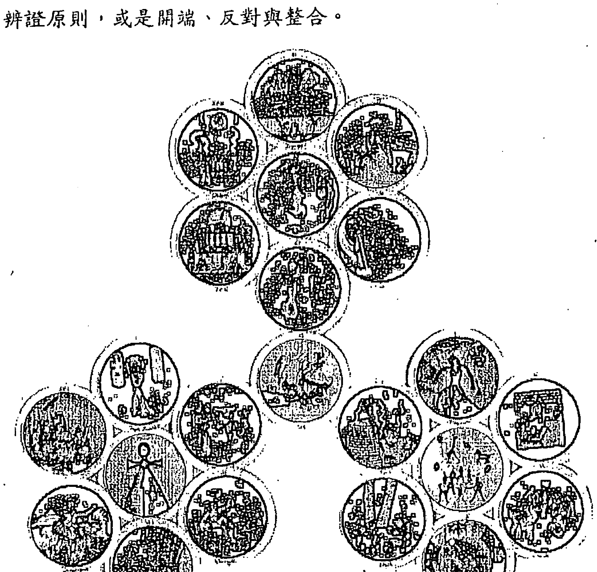

# 第七章 處理情緒、情感與人際關係

本章的重點在教你使用與以往不同的方法算塔羅。在第二章中，本書介紹了一些概念，包括選擇代表自己經驗的牌，以及如何從一副牌中找出最合適的圖案。本章節的練習都是你在處於高度緊張及情緒化的狀況時會想使用的，但我希望你現在就做這些練習，而不要等到那些狀況真的發生，這樣你才會熟悉它的程序，以及每個練習能夠提供什麼。

## 處理你的抑鬱

有些人在憂鬱或沮喪時會尋求塔羅牌的幫助。然而我發現自己在經過十到十五分鐘的洗牌之後，終於排好牌陣，卻感覺塔羅牌就像其他東西一樣，對我一點幫助也沒有。不過接下來的練習是改編自崔斯丁·瑞那在《The New Diary》中所做的筆記。根據我的經驗，當我覺得自己正面臨世界末日時，它的確對我有幫助。

現在就試試這個練習，不管目前情緒如何。這樣你就會記住它，並且在真的需要使用它時，對它的效果有信心。現在將塔羅牌拿出來，並準備一支鉛筆或原子筆。

將牌都攤開，並且每一張面都朝上，以便你能看見它們的圖案。挑出幾張能表達目前感覺的牌。

☆ 我所選的牌是：

現在再從上述幾張牌中挑出一張最能代表你現在感受的牌。

☆ 最能表達我現在感受的牌是：

想像自己是你選擇的牌中人物，並且用現在式第一人稱（我是……）來描述牌中發生的事，以及你身為牌中的人物，感覺如何？
例如有某人選擇了寶劍十，以下是他的敘述：

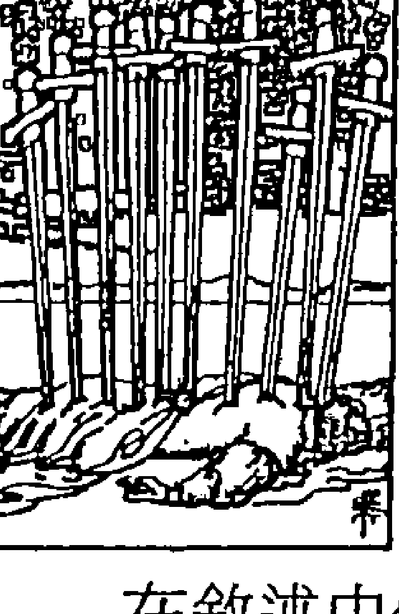

> 「我（身為牌中的人物）感到不堪負荷和萎靡。為什麼我的背上插著許多支劍呢？我並不感覺疼痛，但它們讓我動彈不得。每次我試著移動，就有人走過來把劍插得更深，或是多插一把劍在我身上。為什麼我不能乾脆放棄算了？我真希望我能這麼做，不過或許我可以撐到太陽升起。」

在敘述中儘量使用物體、顏色和圖像來描述。體驗牌中所有的細節，包括那些選牌時不曾注意到的部分，以表達你的沮喪。

我（覺得／是）：

當你完成一次敘述，會發現自己自然而然脫離泥沼。下一個階段是選擇五張牌，上面的圖案是你必須去做，或是會去做的事——如果你能做任何想做的事。用幾句話具體描述這些行動是什麼。例如剛才選擇寶劍十的人選了下面三張牌：
- 聖杯六＝將書歸還給傑米
- 權杖八＝去公園跑步
- 錢幣二＝拋開我所有的責任，去英國旅行一趟

如果我現在可以做想做或是需要做的事，我會：
1. 牌： _______________ ＝ _______________
2. 牌： _______________ ＝ _______________
3. 牌： _______________ ＝ _______________
4. 牌： _______________ ＝ _______________
5. 牌： _______________ ＝ _______________

選一張上面的牌：
並且立刻付諸行動。

這個過程還可以組織你的一天。例如當你覺得不知所措，需要對事情做全盤的了解時，列出五到七件你必須做的事，然後選擇對你個人而言代表這些事的牌。現在排出它們的優先順位，決定哪些事必須立刻去做，而哪些事可以等。許多塔羅牌評論家認為塔羅牌是可幫助記憶的符號。一個視覺上熟悉的牌陣可以幫助你以正確順序記起你的願望清單。

## 發現喜悦

這是另一個由崔斯丁·瑞那所推薦的練習，源自喬安娜·菲爾德在《A Life of One's Own》中的敘述。在這本書中菲爾德提到她試圖去尋找什麼事物能帶給她喜悅，這樣她便能在生活中更頻繁而充分去感受這些喜悦。

選擇六張描繪的內容能讓你感覺到快樂的牌：

| 牌 | 經驗 |
| :--- | :--- |
| 1. ________ | ________ |
| 2. ________ | ________ |
| 3. ________ | ________ |
| 4. ________ | ________ |
| 5. ________ | ________ |
| 6. ________ | ________ |

現在仔細回想過去兩天。列出每一件讓你感到快樂的小事情，即使只是很短暫的也無妨。然後選擇一張牌來代表它：

| 經歷 | 牌 |
|---|---|
| | |
| | |
| | |
| | |
| | |
| | |
| | |
| | |
| | |
| | |

這兩張表有什麼不同之處？

這兩張表有什麼相同之處？

喬安娜將她的發現喜悅之旅描述成一種觀察的練習。她發現自己對快樂的假設與她每天所經歷的快樂是完全不同的，而一旦她開始認識到每天對於喜悅的感受後，這些感受就越加增長，帶給她更大的幸福感。

持續做一個定期（不需要是每天）會發生的歡樂事件清單，無論是內在或外在的。注意觀察有哪些牌是你一直選擇來代表這些體驗的。哪些牌？

注意這些牌何時開始出現在你日常生活的解讀表中。它們都是來自於類似的快樂情況嗎？如果不是，那它們來自什麼樣不同情況呢？

| 出現日期 | 牌 | 注釋 |
|---|---|---|
| | | |
| | | |
| | | |
| | | |
| | | |

## 釐清你的人際關係

這個練習來自我學生詹姆斯·嘉佛的作品，是為了增進人際關係的品質而設計的。透過認識自己正投射或吸引什麼樣的原型能量到你的人際關係裡，便能選擇繼續或改變行為，以期與你的內在需求協調。

使用整副的七十八張牌。在選擇牌時，先快速掃過所有的牌，然後將與你感覺合適的牌都拿出來（如果有的牌讓你猶豫，也將它拿出來）。然後將你的選擇縮小至三到七張牌，最後才從中選出最後一張你要用的牌。在開始之前，先決定你是要算情感／性關係、與家人或朋友的關係，還是工作上的人際關係。

在選擇任何牌之前先回答下列問題。
1. 你的關係中有什麼是需要被釐清的？

在關係中，你想要被滿足的需求是什麼？

將所有塔羅牌看過一遍，選出一些牌，是你認為圖案看起來最像你自認在一段關係中看起來的樣子，然後將牌的張數減少至三至五張。將你所選的牌寫在下面：

從上面選出一張牌，最能代表關係中的你：
___

這張牌的什麼特質描繪出你在關係中的表現？

哪些特質和圖案出現在所有你選的牌中？

2. 在一段關係中你所幻想的理想伴侶是什麼樣子？

在這段關係中他或她是如何表現的？

再次將所有的牌看過一遍，挑出所有能表現你理想伴侶的牌，然後將範圍縮小至最具表現力的三到五張牌：

看著牌，它們之中有什麼是吸引你注意的？哪些圖案和特質是這些牌共通的？它們代表了什麼？

以上的牌當中，哪張最能代表你的理想伴侶？

為什麼？

3. 將你選出來代表自己和理想伴侶的牌一起放在你面前的桌上。它們如何互相關聯？

隨意翻閱整副牌，並挑出幾張牌，能夠代表上述兩張牌可能互動的方式：

哪張牌最貼切的描繪出它們的理想互動呢？

描述它們的互動：

4. 你可能描述了一個完全正面的互動。接著選出一張牌，代表你們兩人可能有的負面互動，例如吵架：這牌告訴你什麼？

5. 看著這四張你選擇的牌，當它們被放在一起，它們訴說了什麼關於你們之間的潛在關係？

6. 在那些你選擇代表理想伴侶的牌中，有沒有哪張牌讓你想起目前出現的人（如果沒有，挑一張牌，最能代表在一段關係中對你最重要的人）？是哪張牌？__________是誰？__________將這張牌和一開始你選擇代表自己的牌聯想在一起。描述它們的互動：

挑出一些表達這段實際關係的牌：

描述一下每張牌裡發生些什麼事：

在這些狀況中，你有什麼感覺？

### 7. 你需要採取什麼行動，將目前的關係轉換成你理想的關係？

選一張牌，最能表達你創造出一段你最想要和值得擁有的關係的能力：

你可以立刻開始做些什麼，以開始這個轉變？

現在，創造一個曼陀羅來肯定你在一段關係的價值。從你剛完成的練習中挑出下面的牌，將它們按照下面圖示的六角星曼陀羅號碼排放。
1. 你在一段關係中理想的自我是____________。(1)。
2. 你在一段關係中理想的伴侶是____________。(2)。
3. 你們互動的方式是____________。(3)。
4. 你們在負面情況下互動的方式是____________。(4)。
5. 你創造理想關係的能力是____________。(5)。
6. 戀人牌或聖杯二：____________。(6)。

將你的曼陀羅（或是它的複印）放在你看得到的地方，經常看它。

## 你內在的男性面與女性面

什麼是一個人的男性面和女性面，不管書上怎麼說，其實都是非常個人而相對性的經驗。以下的練習若是與好幾個人一起做的時候，能夠描繪出男性面與女性面的多樣概念。而當你是獨自一人做時，它們能幫你整理出自身經驗的「男性面」與「女性面」，及其之間是如何互動的。

### 練習 A

為自己準備一個足夠將牌排開的空間，可以在地毯或地板上做，並且要有空間讓你退後一步，以看清所有牌的圖案。使用大阿爾克納牌，並根據它們向你展現什麼性別，按照以下方式分類：男性化、女性化、中性化（一個男女性平衡的狀態），或是無性。也可以不要分類，而是將牌連續排開而不做硬性的區分。你可以享受自己創造的視覺效果。

☆ 將你排列牌的方式畫在下面：

☆ 你的女性牌看起來有什麼共通特質？

☆ 你的男性牌看起來有什麼共通特質？

☆ 你的中性牌看起來有什麼共通特質？

☆ 你的無性牌看起來有什麼共通特質？

☆ 哪一張女性牌最清楚的描繪你內心的女性部分？
為什麼？

☆ 哪一張男性牌最清楚的描繪你內心的男性部分？
為什麼？

### 讓你做進一步練習的變化版
1. 寫下一段你選的女性牌及男性牌之間關於任何相關議題的對話。
2. 加入一張中性牌當作一個中間人，或是為對話提供一個新的觀點。
3. 介紹一張無性牌進入這個討論，或許也可以總結真正的問題是什麼。
4. 拿一張大的牛皮紙（或將幾張紙拼在一起），躺在上面，然後請朋友將你的輪廓畫出來。將大阿爾克納牌放進這個輪廓之內，並將它們擺放在你認為最適合它們的位置。

### 練習 B

塔羅評論家已經將許多塔羅牌連起來配成一對了，例如皇帝／皇后、月亮／太陽等等。試試看你能否將所有大阿爾克納牌組合成互補的配對（不一定要是男性或女性）能量。這次也要在地毯或其他較大的空間進行，並儘量嘗試多種變化。

### 可能配對的牌

| | |
|---|---|
| | |
| | |
| | |
| | |
| | |
| | |
| | |
| | |
| | |

哪些牌在好幾組配對中都扮演重要角色？它們還形成哪些配對？

哪些牌完全沒形成配對？

你學到關於牌的哪些事，是你之前並不了解的（例如發現兩張牌之間有相同或相反的圖案，或它們之間的新關係）？

## 複合關係牌陣

這個牌陣是塞爾特十字牌陣的變化形，你和你的伴侶都必須抽牌。這個解讀是為了第三個本質，也就是你們之間的關係。運用這個牌陣來了解你們的關係。

兩個人先輪流洗牌，然後一個人當「A」，另一個人當「B」。首先，A先將牌切成兩堆，B選擇一堆，A則拿另一堆。各自洗自己的那堆牌，洗完後將牌攤開成扇形，然後憑直覺選出下列的牌，並排成傳統塞爾特十字牌陣：
1. 1號牌：A在這段關係中的心。
2. 2號牌：B在這段關係中的心。
3. 3號牌：這段關係的基礎，是這對伴侶尚未自覺的。由B選擇這張牌。
4. 4號牌：你們過去的關係。同時也是已經發展的才能、技巧、能力。由B選擇這張牌。
5. 5號牌：這對伴侶對這段關係的目標和野心。由A選擇這張牌。
6. 6號牌：這對伴侶面對的決定，以及他們共同行動的能力。由A選擇這張牌。

7號及8號牌：每個人各抽一張牌，代表「我眼中的自己」——也就是兩人這段關係中的自我印象。所以兩個人都有一張代表自己的牌，另一張則是代表對方。
9. 9號牌：發展這段關係必須克服的問題。由A或B抽這張牌都可以。
10. 10號牌：這個特質或工具能夠幫助雙方開拓這段關係的新深度。由不是抽9號牌的人來抽這張牌。

兩個人共同解釋這些牌。要記住，彼此個性和相互的反應比那些牌的客觀意義更為重要。理想情況下，這能讓你在腦海中拼湊出一幅互動模式的圖像，實現對雙方如何創造實質關係的了解。

## 安姬的關係牌陣

第二個關係牌陣最早是由安姬莉絲·艾倫所傳授，能夠顯示兩人之間的實際關係。這個牌陣要在雙方都在場時進行，並且如同之前的牌陣，主觀的反應及雙方共同的解釋都是重要的動力。這個牌陣可以與朋友、家人、工作夥伴，以及戀人一起算。它需要使用兩副牌，最好是同樣設計的。如果手邊只有一副牌，就先排出一個人的牌，將它記下來，再將牌彙整後重新洗一次牌，然後再排第二個人的牌陣。最後再將第一個人的牌陣的結果拿出來放好，這樣你就能看到完整的牌陣了。
1. 兩個人各使用完整的一副牌。洗牌時心里要想著這段關係。兩個人都將牌分成三疊。你們一個人是「A」，另一個人是「B」。
2. 兩個人都將第一疊牌洗乾淨，同時心裡要想著在這段關係中你「給予」的是什麼？將牌排成扇形，然後挑出一張牌，放在你的1號位置。
3. 兩個人都將第二疊牌洗乾淨，同時心裡想著你的自尊。將牌排成扇形，然後挑出一張牌，放在你的2號位置。
4. 兩個人都將第三疊牌洗乾淨，同時心裡想著你在這段關係中所「得到」的。將牌排成扇形，然後由對方從你的那疊牌中選一張牌出來，放在你的 3 號位置。接著你也從對方的那疊牌中挑一張牌，放在他或她的 3 號位置。

5. 兩個人將剩下的三疊牌匯聚在一起洗乾淨，同時心裡想，你「想要」從這段關係中得到什麼？將牌排成扇形，然後挑出一張牌，放在你的 4 號位置。

當解讀這些牌時，首先打開 A1 和 B3 ——看你給予了什麼，而對方又獲得了什麼。再來翻開 B1 和 A3，看對方給予了什麼，而你又獲得了什麼。接下來是 A2 和 B2，再來是 A4 和 B4。

特別注意那些在雙方解讀中都出現的牌。這表示你要準備好誠實的討論你們之間的關係，無論是好的或壞的方面。通常這樣的牌陣會表現出，有些狀況是你們已經許久都未曾談論的。

## 推薦書單
- The New Diary: How to Use a Journal for Self-Guidance and Expanded Creativity. Tristine Rainer. Los Angeles: J.P. Tarcher, 1978.
- A Life of One's Own. Joanna Field. Los Angeles: J.P. Tarcher, 1981.
- The Tarot Handbook: Practical Applications of Ancient Visual Symbols. Angeles Arrien. Los Angeles: J. P. Tarcher, 1987.

## 導航者塔羅牌 (THE VOYAGER TAROT)

由詹姆斯·汪列斯指導，肯·奴森拼貼而成（1984 年）。大阿爾克納牌排成完全自我曼陀羅，汪列斯將其描述為「你和你的世界象徵性的肖像」。照片中十個位置的牌乃是由汪列斯所選擇，它們代表了一種可能的原型模式，能夠表現這些位置的本質。它們是 (1) 愚者——代表精神的小孩——你的原型人格；(2) 代表心靈的平衡（正義）——你的心智狀態；(3) 代表心臟的女祭司——你的情緒狀態；(4) 代表腿部的隱者——你的身體狀態；(5) 代表左側的月亮——你的女性特質；(6) 代表右側的太陽——你的男性特質。這六個位置顯示你的內在自我。而圍繞著它們的牌則代表你的世界：(7) 代表你財富的命運（命運之輪）；(8) 代表你工作的皇帝；(9) 代表你家庭的皇后；(10) 代表你人際關係的戀人。你過去行動的結果和未來的種子，在這裡被描述為你現在選擇的變化。

Reproductions of the Voyager Tarot deck, copyright © 1984, are used by permission of Jim Wanless.

## 第七章 | 處理情緒、情感與人際關係

## 成功與規劃

> 根據個人的目標及潛能做出決定的能力，對於積極而有意義的成長來說是最關鍵的因素。—哈里達斯·巧胡里 (Haridas Chaudhuri)

## 轉捩點與重要里程碑

為了掌控自己的生活，你需要用更寬廣的視野來看待它。你可以藉由列出十二個或是更多的生命轉捩點來做一個回顧，這些轉捩點都代表你在過去做的選擇和決定，或是／以及某人為你所做的。轉捩點、里程碑、墊腳石都是你可以繼續之前道路的點，然而你做了另一個選擇，或選了不同的方向。在列表時，當某個轉捩點看起來是命運為你做出選擇時，回想一下它的時間。回想一下那些你為了關鍵決定而經歷長期焦慮，或似乎是其他某個人為你做了重大決定的時間。重要的是找到十二個將你引領到今天來的重要步驟，然後將它們依照發生時間先後列出來。

舉例來說，我列了如下的表：

| 序号 | 事件 | 塔罗牌 |
|---|---|---|
| 1 | 離家上大學 | 錢幣三 |
| 2 | 取消婚約 | 權杖八 |
| 3 | 加入劇場 | 聖杯七 |
| 4 | 搬至亞特蘭大 | 權杖二 |
| 5 | 辭職去歐洲 | 聖杯八 |
| 6 | 獨自回到佛羅里達 | 寶劍四 |
| 7 | 結婚 | 聖杯二 |
| 8 | 離婚 | 寶劍八 |
| 9 | 教授第一堂塔羅課 | 錢幣六 |
| 10 | 搬至舊金山，在大學找到工作。 | 權杖七 |
| 11 | 發現到女性的心靈力量 | 聖杯三 |
| 12 | 擁有伴侶，生產。 | 聖杯一 |

使用以下的表格列出十二個你生命中的轉捩點。接著將每個轉捩點都與不同的小阿爾克納牌（四種牌組一到十，總共四十張牌中的任何一張）連結起來，選擇一張最能描述或描繪該事件的牌。
最後，在表格中將每個事件的意義都寫成一段簡單的敘述，如同你選擇牌時做的解釋一般。

## 哪種牌組最常出現？

## 為什麼你認為它占了主導地位？它在你做選擇時有給任何建議嗎？

如果你希望更進一步，就選一張宮廷牌代表你自己需要或促成轉捩點的那一面。例如你內在的男性面或女性面主導了這個決定嗎？你是主動抑或被動參與？你關注的是金錢面還是安全面？是愛與激情？是啟發想像力的自我表達？是痛苦與憤怒？你想要建立、打造或培育？學習？就算你是女性也大可使用一張國王；若是男性也可以使用侍者牌。仔細審視那些依照自己行動的內在特質及能量，選擇出來的牌。同樣一張牌可以多次使用。

| 原因<br>大阿爾克納 | 事件及個人意義 | 對象<br>小阿爾克納 | 人物<br>宮廷牌 |
|---|---|---|---|
| | | | |
| | | | |
| | | | |
| | | | |
| | | | |
| | | | |
| | | | |
| | | | |

- 哪些牌出現次數最多，國王？皇后？騎士？侍者？
- 你從這些牌中看見任何突出的意義嗎？
- 從中釐清了自己的行動嗎？

想想看每個轉捩點發生的原因。它是因為你的選擇或決定才產生的嗎？是別人為你做的決定嗎？還是它「就這麼」發生了——因為命運，因為巧合，或因為你內在的指引？

從下面的表中為你的十二個轉捩點各選一張大阿爾克納牌，來解釋「為什麼」會做那樣的選擇。一張大阿爾克納牌可以同時用在不同的轉捩點，或是可能需要用到兩張或更多的牌來準確的顯示為什麼要那麼做，或做了什麼。
- 愚者 : 因為愚蠢、無知或天真。
- 魔術師 : 因為行使自己的意志。
- 女祭司 : 因為內在的自我引導、受到一名女性影響，或為了保守某個秘密。
- 皇后 : 你的母親為你做了決定。
- 皇帝 : 你的父親為你做了決定。
- 教皇 : 因為教導、傳統或社會家庭的期望。
- 戀人 : 為了愛或因為情人。
- 戰車 : 為了「證明」自己和自己的能力，或為了保護别人。
- 力量 (慾) : 因為一種對創造性自我表達或自我成長的強烈渴望。
- 隱者 : 因為對心靈成長的探索，或是因為遵循你服從的大師、精神導師的命令。
- 命運之輪：因為機緣或命運。或是因為遇到了「對的時機」，例如一個週期的完成。
- 正義（調整）：為了糾正錯誤，或因為它是「正義的」，或因為一個法律上的理由。
- 倒吊人：作為一種犧牲，或因為處於服藥或精神不穩的狀態。
- 死神：由於某件事或某人的死亡。表示斬斷過去或對某件事放手。
- 節制（藝術）：為了平衡或為了健康、治療。
- 惡魔：為了權力、掌控或惡作劇，「是惡魔叫我這麼做的」。
- 塔：為了打破或中斷某種情況，或是在憤怒中採取的行動。
- 星星：因為有「神聖的指導」；因為對理想的信念。
- 月亮：出於本能、迷惑、被某樣東西所「迫使」。因為夢境或一種直覺的感受。
- 太陽：為了生命中純粹的喜悅和愛。出於一種「這是你這輩子做的最好選擇」的感覺。
- 審判（永恆）：因為你認識到一種生活中新的（或不可預期的）可能性或方向——一個新的視野和目標。
- 世界：你自己所有的綜合體，一種整體存在的表達。在受限的情況中表現自由。

☆ 哪一張大阿爾克納牌出現得最頻繁？
☆ 這些牌告訴你，你是用什麼方法行動？
☆ 哪些牌你完全沒有用到？

## 進一步的練習

過幾個月後再次重複這些步驟。使用不同顏色的筆寫下那些讓你不敢相信、當時居然忽略掉的重大里程碑。回顧你的反應，看看你第二次是否感受仍相同。在餘白部分寫下你的新想法。

## 釐清你的選擇

你已經使用塔羅牌回顧過去的經驗和選擇，現在你將準備使用塔羅牌來意識未來，以及做出具有個人意義的選擇。第一步是先看清楚並釐清所有選項。

這個牌陣是第六章介紹的三張牌陣（或非彼即此牌陣）進化版本，當你有兩三個以上的選擇時，它能夠告訴你該怎麼做。當你清楚知道自己有兩個或更多選擇時，就運用這個解讀。重要的是在開始前先明確而具體的描述你的所有選項，不過你也可以指定一個位置來描述之前所沒有看到的選擇。

翻到後方練習頁，將你的選項寫在每張牌的下方空白處。由於你有多少選擇就會使用幾張牌，所以去掉那些多出來的牌。有些選項在此時還不可行的也沒關係。你正在尋求能量的引導，當經過釐清和界定後，一個原本可能性最小的選擇或許會產生更多可能性。

例如有一段時間我的工作處於很不穩定而不確切的狀態，於是我抽了些牌幫助我看清自己究竟想做什麼。以下是我的選擇：

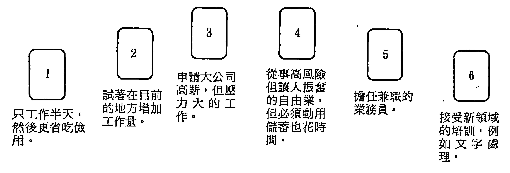

當時我試圖同時進行這些選項，而未意識到自己應該更集中精力在其中一到兩個選項上。事實上，在我寫下前五個選擇後，原本只有模糊可能性的第六個選擇便出現了，而現在我知道它是可行的。後來我真的去學了文字處理，所以能夠使用電腦來打字並編輯這本書。

牌陣中可以添加一些其他牌以幫助你釐清問題，並且讓你在做決定時有更好的見解。例如：

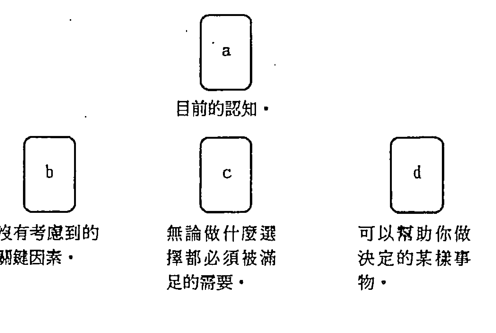

如果一張負面的牌出現在最後這幾個位置，它可能代表你做決定時的障礙，但並不意味著它根本上是沒有價值的。

## 釐清你的選擇：洗牌與分類法

將牌洗乾淨後，有幾個選項便將牌分成幾疊。拿起每疊最上面一張牌，面朝下，放在應有的位置上。剩下的牌聚集在一起重洗一次，切兩次牌，重新疊起來。抽出最上面的一張牌，將它們放在額外選擇的見解牌位置上。在解牌之前，先閱讀本章節以下的部分。

當你運用牌來做選擇時，不光是去解釋牌本身的意義，同時要注意你在翻開每張選項牌時的想法。你希望它會是一張「好」牌，代表這個選項的成功嗎？還是希望它代表失敗，這樣你就能捨棄這個選項了？你感到不安嗎？你是處於緊張還是放鬆狀態？你很怕去看是什麼牌嗎？為什麼？你還記得曾經丟三次硬幣想以三分之二的機率來得出答案嗎？而當答案不是你所希望的，你又決定將機率改為五分之三、七分之四，直到得到你真正想要的答案。在這裡也是一樣，你至少可以發現自己真正想要的是什麼。

當你解釋每一張牌時，你是什麼反應？是感到鬆了一口氣？還是很沮喪？你有沒有努力試圖去合理化你對某些牌的解釋？你感到振奮還是失望？注意你的身體反應：例如情緒或精神緊張。這些反應都是你的內在自我試著給你的關鍵。學習注意和聆聽這些內在反應，能夠讓你的直覺能力和對自我的認識更加協調。最後當你下決定並觀察其結果，它們能幫助你辨別你是在運用直覺或只是自欺欺人。

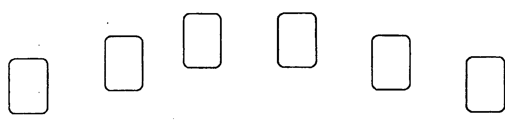

- ☆ 哪些選項是你最急著積極去解釋的？
- ☆ 哪些選項是你可以很放心的暫時擱置一旁的？
- ☆ 有發現任何驚喜嗎？是什麼？
- ☆ 接下來解讀那些你額外選擇的見解牌。哪些額外因素是你必須考慮進去的？

總結你所收到的訊息。如果合理的話，按照這些訊息來排列選項的優先順序。

只要你得到更多關於選項的重大訊息或是意識到自己正以一種新的角度看待情況，就可以再擺一次這個牌陣。這個解讀是以目前的狀況為基礎，當情況有變化時，新的解讀會提供更多說明。

## 五年夢想計劃

五年夢想計劃的目的是要確認你對未來的希望和夢想。確認你的希望夢想後，你就有機會掌握讓你更接近目標的選擇。例如在1980年時，我寫下對1985年的夢想是我能夠住在墨西哥。幾個月之後，我接受了一個很突然的機會，讓我住在墨西哥，雖然這表示我必須取消去秘魯度假的計畫，並且有可能無法回到目前的工作。而我的另一個夢想是出版一本關於塔羅的書（當時完全沒有具體計畫）——就是這本啦！而且雖然我在一年之內又回到美國並沒有待在墨西哥五年，但我從未後悔自己的決定——我曾經按照夢想生活過。

想像從現在開始的五年內，為自己描繪最令人興奮、最美好而理想的未來。夢想的細節越仔細越好。要具體的與你的環境、工作、成就結合。不要因為哪個想法太過古怪或愚蠢而將它剔除，在你的夢想中，任何事都是有可能發生的。越誇張越不可能發生的夢想越好——要破除個人習慣性的安全思維！你有勇氣用大膽的想法把自己嚇一跳嗎？垂涎於這樣的喜悅嗎？感覺自己因為可能達成目標而驕傲嗎？

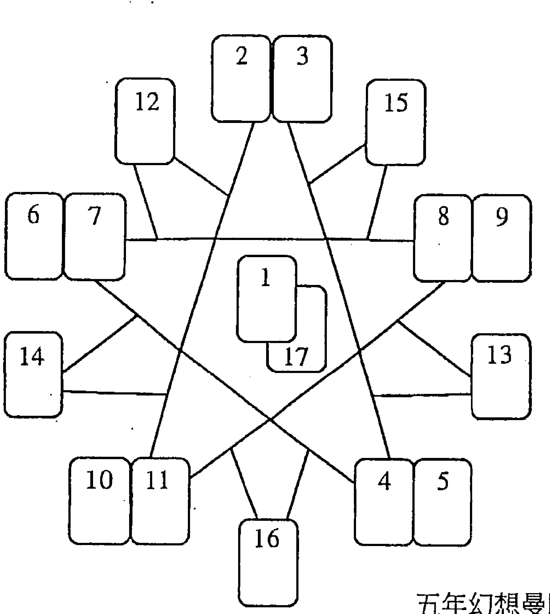

拿出你的塔羅牌並將它們排成扇形，然後選一張牌，不要看是什麼牌，因為你正在為自己創造夢想。將這張牌放在 1 號位置：牌陣的中心。這個夢想曼陀羅總共有十七張牌（十七個位置）。它代表了星星，是未來希望與願景的象徵。當你讀完接下來的介紹後，將你在夢想曼陀羅中拿到的牌寫下來。

關於牌陣的 2 號到 11 號位置，先將所有的牌看過一次（牌面朝上），依照下面介紹的位置意義，花時間選出代表你夢想的牌。將每一對組合牌的意義合併融合在一起。舉我個人的例子，魔術師和錢幣六組合成 2 號及 3 號牌，也代表我這本書成功的願景（五年後）。魔術師象徵我對想法、點子所做的溝通；而錢幣六（成功）是銷售的版稅。錢幣六中的人物手拿著一個秤，強化了成功是基於群眾判斷的概念。從另一個觀點來看，這對組合牌同時也代表了我用知識和我希望由讀者身上獲得能量所做的神奇交換。

日期（五年後）是：__________________

## 1 號位置（未知的牌）：

創造你的夢想。這張未知的牌會給你一些想法，告訴你如何去創造自己的夢想。如果翻開來是張負面的牌，你可以選擇暫時終止這個練習，因為一個積極的結構是魔法發揮效力的必備要素。

## 2 至 11 號位置：

接下來選出能夠描繪你五年後理想未來的五組牌。將所有牌看過一次（牌面朝上），嘗試各種組合直到你感覺對了為止。

- 2 與 3 號    最近獲得的一項重大成就。
- 4 與 5 號    你的工作／專業狀況。
- 6 與 7 號    你生活中讓人興奮的事——一段關係、旅行、休閒嗜好，或一項有創意的企劃。
- 8 與 9 號    你已經掌握的才華與能力。
- 10 與 11 號  你的居家環境。

## 12 至 17 號位置：

彙集剩下的牌，洗牌後將它們牌面朝下攤開成扇形。接下來抽出六張牌代表以下位置：

- 12 智力          15 突破意識
- 13 創造力        16 金錢與力量
- 14 愛與性        17 你的理想自我

這些牌在你考慮未來五年的個人發展時，將提供深度的見解。

如果你翻開牌時，感覺它像是對你達成目標的障礙或絆腳石，就選一張特質能夠幫助你突破這些障礙的牌。並將這張牌放在障礙牌上。

為了加強你的能力，寫一封信給朋友，假設你已經很久沒有見到他／她。信上寫下今天的月份和日期，但年度必須是五年後。依照你為星星曼陀羅選擇的印象，告訴你的朋友自己正在做些什麼。去感受你自己，你的喜悅，你的驕傲，以及你的成就感。

在大學中教學生運用五年夢想計劃，並加上我的建議後，我發現最多學生在兩年內就達成他們的夢想，有時甚至超越了他們原本最瘋狂的夢想。對我而言，這表示這個結合對幻想願景的仔細思考及抽「見解牌」的牌陣，是一種實現個人目標極為有效的方法。

## 釐清金錢問題與成功曼陀羅

許多人覺得如果有更多錢就能解決他們所有的問題。然而雖是老生常談，但通常有錢的人往往發現他們並不快樂、不滿足。要為生活帶來財富，就必須展現一條適合你的成功之路。要做到這一點，得清楚知道自己對錢的喜歡與不喜歡之處，還有為什麼應該得到它。接下來的練習幫助你釐清自己的感覺，並創造機會，為你的生命帶來相應的成功。

在這個練習中，你將所有牌看過一遍，然後挑出那些你認為「合適的」。在審視這些牌時，運用你自身的聯想力。舉例來說，錢幣六在萊德·偉特塔羅牌中是描述一個有錢人正將他的錢分給一個乞丐。這或許代表你的老闆從他的勞工身上撈取利益，但卻只發放給你們最低薪資。但你也可能以完全不同的角度來看這張牌，例如接受贈款或捐款給慈善機構等。換句話說，廣義的解釋這張牌，再加上你自己的具體用詞。

日期：______

- 1. 選幾張（三至五張）牌來代表富有對你而言的意義。
  - 就你所選擇的圖像來闡述富有的意義。（這些牌之間有任何共通的圖像嗎？）
  - 哪一（幾）張富有牌是需要金錢的？
  - 哪些牌需要一些比錢更重要的因素？
  - 寫出錢以外的其他因素：
- 2. 列出幾張牌是代表匱乏對你而言的意义：
  - 描述你選中的牌敘述的狀況：
  - 哪些狀況是可以用金錢補救的？
- 3. 金錢對很多人而言代表安全。挑選幾張對你而言代表安全的牌：
  - 這些牌中有任何共通因素嗎？
  - 它們告訴你哪些有關你自身安全感的事？
  - 金錢對於你所謂的安全有多重要？
- 4. 在我們的社會中，金錢是獎勵人的一種方式。挑選一些牌是代表你值得受到讚賞和肯定的事：
  - 這些牌代表了你的哪些具體成就：
  - 選一張牌來顯示你理想中希望因這些成就而獲得什麼樣的獎勵：
  - 這張牌的圖案是描繪什麼？
- 5. 選幾張牌來代表你最痛恨金錢的哪些方面：
  - 這些牌有什麼共通點？
  - 這個共通點對你有什麼意義？
  - 要讓你對金錢的感覺良好，必須解決哪些問題？
  - 哪些牌能夠代表這些補救辦法？
- 6. 想像自己的富裕及幸福。選擇一張牌來顯示這個印象。
  - 你記得自己曾經真的感到這麼幸福過嗎？描述當時的情況：
- 7. 挑選一或多張牌來代表你對金錢的焦慮及緊張：
  - 這些牌所描繪的是什麼樣的狀況？
  - 藉由思考這些焦慮，去感覺自己體內的緊繃。然後慢慢讓身體放鬆，讓緊張通過雙腳流出去，流入大地。深呼吸三次，放鬆額頭、下巴、肩膀、胸部、雙手、腸胃、雙腿和腳趾。選一張牌代表你的完全放鬆和自在：_____________________
  - 選擇另一張牌，代表宇宙為你所有需求提供豐盛資源：_____________________

將你選擇的最後一張牌（代表宇宙為你所有需求提供豐盛資源）放在 1 號位置。

- 在這張牌的周圍排放你剛才已經挑選好的牌：
  1. 2 號位置：代表完全放鬆和自在的牌。
  2. 3 號位置：最能代表富裕和幸福的牌。
  3. 4 號位置：這張牌能補救你對金錢的負面感覺。
  4. 5 號位置：最能代表理想中將因為你的成就而獲得什麼樣的獎勵。
  5. 6 號位置：一張（或多張）牌，代表富有對你而言的意義。

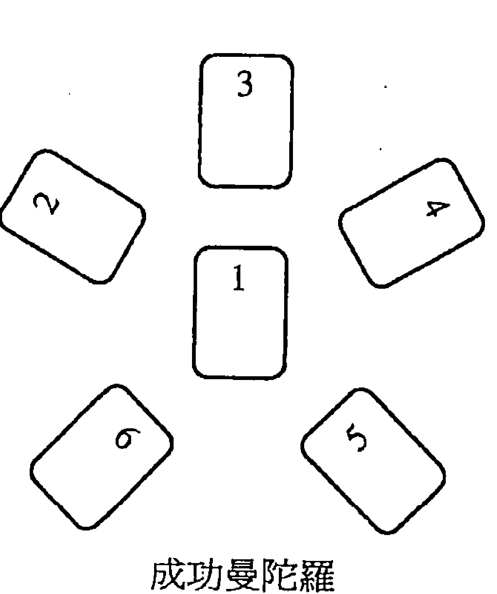

這就是你的成功曼陀羅，將它放在你經常看得到的地方。每天入睡之前看看你自己的富有和幸福，再度感受你內在的感覺。

- ☆ 將你從成功曼陀羅形象中看見的主要特質列出來：
- ☆ 用這些特質寫一段肯定語來代表你生命中的富有（例如「宇宙為我的所有需求提供了豐饒的物質」）。

每天早晨站在浴室的鏡子前，腦中想著你的曼陀羅，嘴裡大聲的將上面這段文字唸三遍。每天睡覺前也將它當成上床前的最後一件事。這是一種用塔羅牌為你實現渴望的神奇方法。

## 用塔羅來做計畫

當你在進行規劃或解決問題時，記住，「決定」在事情不斷變化的巨大循環中，只不過是其中一個階段罷了。此外，所有的計畫都可能偏離軌道。因此不管是什麼計畫，都應該先想好緊急應變方案。下面的牌陣讓你檢視問題本身，界定最終目標以及到達目標的必要步驟。同時，它還建議你其他的選擇方案。

過程可以用以下的問題來概述：

- 1. 什麼——計劃
- 2. 為什麼——意圖
- 3. 必須具備什麼——資源
- 4. 如何做——步驟
- 5. 何時——時間範圍
- 6. 誰知道？——命運

現在拿起你的塔羅牌，然後放鬆，沉澱自己，集中精神。

1. 計劃。首先要做的是確定你的問題或是確立目標。打算做什麼？內容可能直接而實際，例如找一份工作，或是解決工作上的問題。也可能是比較具創意性或心靈上的東西。
讓牌面朝上，將牌整個看過一遍，然後選出一或多張牌，代表你的意向。
我所選的牌是：
我的目標／意向／問題是：

2. 意圖。第二階段是去研究你「為什麼」想要這樣做。這個答案會給一個依據，以評估最後努力的成效。比方說，你想找一份工作，只是為了錢嗎？還是為了在這個領域中累積經驗？為了累積人脈？為了離開家庭或家人？為了讓你遠離某件事？去思考和界定你的動機是很值得去做的。通常得到的原因會比擺在眼前的還要更多，因為人們會去做一件事的原因很少是單純的。因此在這個階段的牌陣中，要去看你三方面的意圖。
洗牌，將牌面朝下，攤開成扇形，然後抽出三張牌。它們代表了你身、心、靈三方面想要達成這個目標的原因。
我抽到的牌是：

| 身 | 心 | 靈 |
|---|---|---|
| | | |

它們告訴我：

3. 目標。第三個階段是認同並促進你的目標。想要實行你的計畫，必須學習或運用的是什麼？將牌面朝上，看過整副牌後選出一張或數張牌，代表下列三種學習：(1) 實現計畫所需之技巧和能力；(2) 需要的知識和資訊；(3) 你必須改變的態度或感覺，以便開放自己迎接新的可能性。

我選擇的牌是：

## 技巧與能力

## 知識與資訊

## 態度與感覺

這些牌告訴我，我需要用以下方法來發展自己：

## 4. 如何去做。

下一個階段是確定實際的步驟，以完成你的計畫。

洗牌，牌面朝下排成扇形，然後抽出三張牌，代表了朝向你目標的步驟。

為了達成目標，我必須採取的步驟是：

| 牌 | 採取的步驟 |
|---|---|
| | |
| | |
| | |

## 5. 何時。

第五個階段是確定相關的時間範圍。不必要是絕對的，但必須要具體。這個時間範圍可以讓你知道自己是否正按照計畫在運作，還是需要重新思考一下自己目前在做的事。

從牌面朝上的整副牌中選一或多張牌，代表了依照下列訊息，你期望何時完成計畫（你也可以在最後一個過程時為每個階段都選一張時間牌）。時間的長短乃以小阿爾克納牌來定義，並乘以牌上的數字：

- 權杖＝天數（權杖十＝10天）
- 聖杯＝周數（聖杯五＝5周）
- 寶劍＝月（寶劍二＝2個月）
- 錢幣＝年（錢幣七＝7年）

大阿爾克納代表的是它所對應的星座月份。例如正義牌（對應天秤座）指的是9月23日至10月22日。它們對應了行星也是指牌的數字所代表的年數。它們紀錄了那些形成目前狀況的未來或過去事件。宮廷牌指的是發展的階段：侍者是開端，騎士代表的就是過程，皇后代表了成熟和成果，國王代表完成。

我預計在以下時期完成計畫：

| 時間牌 | 日期 |
|--------|------|

## 6. 命運。

這個最後階段將會使用到我稱之為「外卡」的牌。這兩張牌代表了你必須處理的那些隱藏因素。它們可能在任何時間任何地點出現，也可能表示你得重新擬定計畫或進度。

洗牌，牌面朝下，將牌攤開成扇形，然後抽兩張牌出來。

這些牌代表了：

| 有些你必須考慮<br>進去的事情 | 一個看不見的機會或可能性 |

我必須考慮進去的事是：

我應注意以下的機會或可能性：

## 計畫曼陀羅

由前面的練習來創造一個曼陀羅，並運用你在第六章「突破障礙」學到的，來找出能夠幫助你突破障礙和限制的牌。用星星記號將你的關鍵牌標出來。

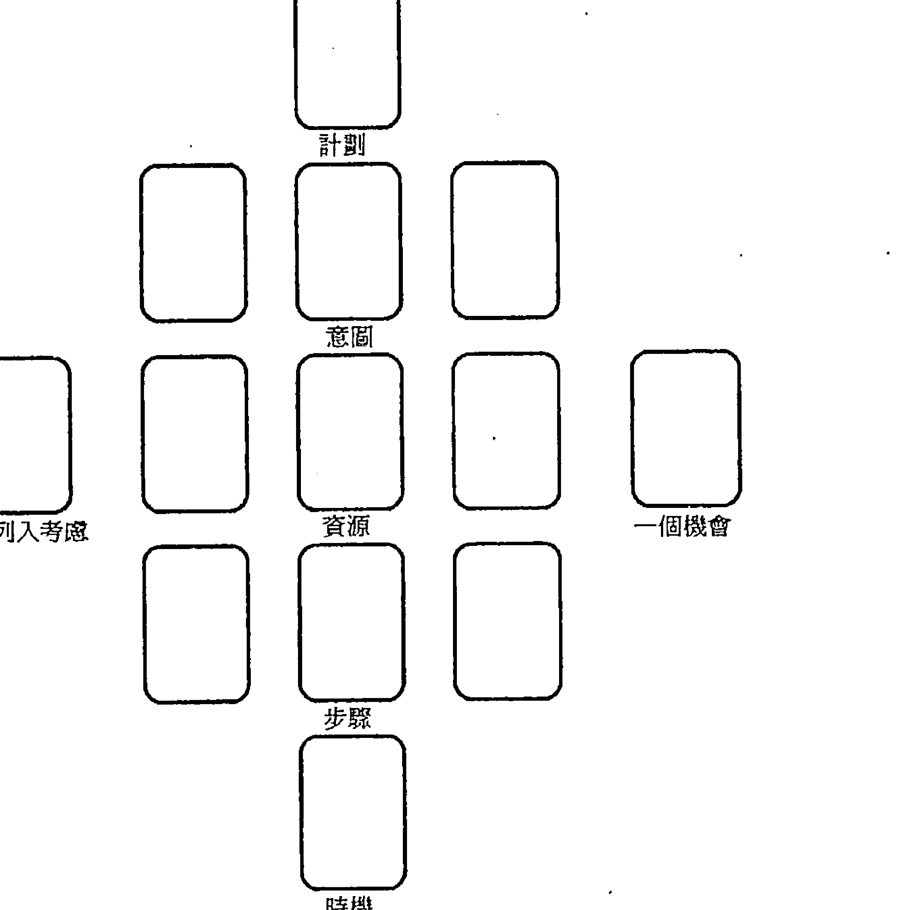

計畫曼陀羅

## 推薦書單

The Universal Traveler: A Soft-Systems Guide to Creativity, Problem-Solving and the Process of Reaching Goals. Don Koberg and Jim Bagnall. Los Altos, CA: William Kaufmann, 1976.

Design Yourself. Kurt Hanks, et al. Los Altos, CA: William Kaufmann, 1973.

Prospering Woman: A Complete Guide to Achieving the Full, Abundant Life. Ruth Ross. Mill Valley, CA: Whatever Publishing, 1982.

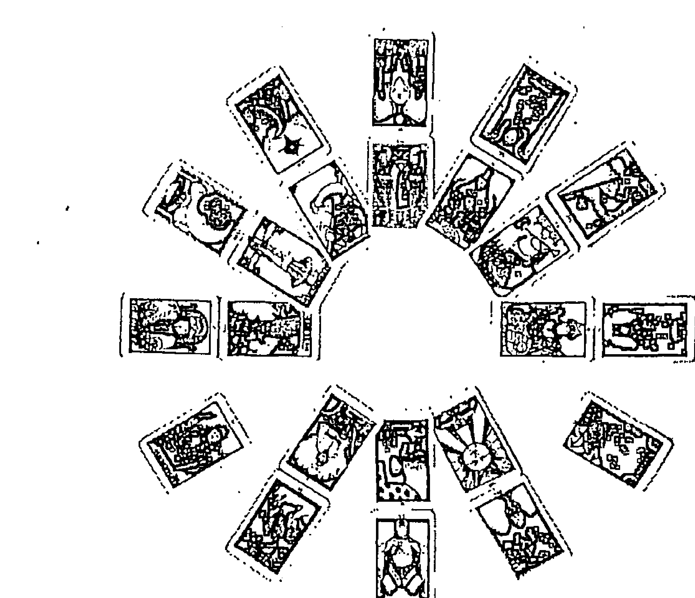

# 水瓶座塔羅牌 (THE AQUARIAN TAROT)

由插畫家大衛・帕拉狄尼繪製，1970年出版。大阿爾克納在這裡排列成基本的占星盤，外圈的一圈是黃道十二宮，內圈則是根據金色曙光系統對應的黃道十二宮主宰行星。牡羊座（皇帝）從左邊的地平線上開始了這個星座圖，也是第一宮（上升星座）；主宰行星是火星（塔）。朝逆時針方向下來是金牛座（教皇），主宰行星是金星（皇后，也在其他位置履行雙重職責）。雙子座（戀人），主宰行星是水星（魔術師）。巨蟹座（戰車）位於最下方，主宰行星是月亮（女祭司）。獅子座（力量），主宰行星是太陽（太陽）。處女座（隱者），主宰行星是水星（魔術師，他也主宰了兩個位置）。天秤座（正義），第七宮，主宰行星是金星（皇后）。天蠍座（死神），主宰行星是冥王星（審判）。射手座（節制），主宰行星是木星（命運之輪）。魔羯座（惡魔），位於中央上方或說天頂（M.C.），主宰行星是土星（世界）。水瓶座（星星），主宰行星是天王星（愚者）。雙魚座（月亮），主宰行星是海王星（倒吊人）。

## Chapter 9

## 意識到你所創造的事物

本章涵括了運用其他工具來聯繫你與塔羅意識的各種方法。

## 你的星座曼陀羅

即使對占星學所知不多，你仍然可以運用塔羅牌來解釋自己的星座命盤。你需要一份依據出生時間及地點排出的精確星盤。你可以在網路上找到排命盤的網站，只要用「免費星座命盤」來搜尋就可以了。而你必須知道確切的出生日期及時間（最好是根據出生證明或家族記錄表），以及出生地點（最好能夠包含確切的經緯度）。若不知道自己的出生時間，就用「正午」（太陽位於天頂），或是排一份太陽宮圖，將你的太陽放在上升星座。只要有這份命盤就可以了。

你還必須準備十二根三英尺長的細棒或紗線，依照下一頁的圖表，將細棒或紗線排在星座命盤中，將星座命盤區隔成十二個部分。這十二個部分就被稱為「十二宮」。

從命盤上找出上升星座，也就是「第一宮」。你的上升星位於命盤左邊的地平線上。然後使用書上提供的格式來找出每個宮的星座及大阿爾克納牌。這裡使用由金色曙光所發展出的對應系統，如果你習慣使用其他系統，那麼請自行做適當的替換。

先從上升星座開始。你可以使用任何版本的塔羅牌，對應每個## 解释你的出生命盘

宫，将以下的大阿尔克纳按逆时针顺序围着你的星座曼陀罗摆一圈。顺序将与下图相同，不过是从你的上升星座开始。（偶尔一个星座〔以及其相对星座〕会被“截夺”完全落在某一宫，而没有跨过宫头〔两宫交界〕，这时会有其他星座〔以及其相对星座〕横跨两个相邻的宫头。这种情况较常出现在极北或极南纬度的地区。）

下面图表为黄道十二宫星座的宫位，及其对应的塔罗牌。请对照该图并找出自己的宫位，填在下方表格。

- 牡羊座：皇帝牌位在第________宫。
- 金牛座：教皇牌位在第________宫。
- 双子座：恋人牌位在第________宫。
- 巨蟹座：战车牌位在第________宫。
- 狮子座：力量牌位在第________宫。
- 处女座：隐者牌位在第________宫。
- 天秤座：正义牌位在第 ___ 宫。
- 天蝎座：死神牌位在第 ___ 宫。
- 射手座：节制牌位在第 ___ 宫。
- 摩羯座：恶魔牌位在第 ___ 宫。
- 水瓶座：星星牌位在第 ___ 宫。
- 双鱼座：月亮牌位在第 ___ 宫。

接着找出自己星座命盘中的行星，并将相对应的大阿尔克纳牌放入该星所在的星座及宫位。

- 太阳：太阳牌是在 ___ 座，以及第 ___ 宫。
- 月亮：女祭司牌是在 ___ 座，以及第 ___ 宫。
- 水星：魔术师牌是在 ___ 座，以及第 ___ 宫。
- 金星：皇后牌是在 ___ 座，以及第 ___ 宫。
- 火星：塔牌是在 ___ 座，以及第 ___ 宫。
- 木星：命运之轮牌是在 ___ 座，以及第 ___ 宫。
- 土星：宇宙／世界牌是在 ___ 座，以及第 ___ 宫。
- 天王星：愚者牌是在 ___ 座，以及第 ___ 宫。
- 海王星：倒吊人牌是在 ___ 座，以及第 ___ 宫。
- 冥王星：审判／永恒牌是在 ___ 座，以及第 ___ 宫。

然后将牌放入圆圈内，就完成了自己包含全部二十二张大阿尔克纳牌的基本星座曼陀罗。你可以将其当做一个整体的自我来冥想，或是用以下方法解读它：

行星是你“生命的能量”。星座显示这些能量将如何展现——也就是它们的表现方式。宫位代表它们将展现在你生活的哪一个部分（家庭、工作、人际关系等），也就是指如何在你生活中具体显现。例如我的月亮落在天秤座、第十二宫，可以解释成“我的女祭司（月亮）在我生命中的月亮区（第十二宫），以正义（天秤座）的方式展现她的能量。”也有其他几种不同的解释方法，例如使用与牌相关的关键字，像“我相信我内在的女性特质（女祭司）能够平衡（正义）我的个人表现与社会群体需要（月亮）”，或是“我遇到阻碍或感到困惑时（月亮）会凭直觉（女祭司）做出决定（正义）”，或是“我乐于接受（女祭司）关于未知和神秘（月亮）的真实（正义）”。

### 解释你的出生命盘

1. 依据宫位来解释牌的意义。使用以下每个宫位代表的涵义：

   **第一宫——（皇帝）** 你的身体和外表。早期环境。个性和自我表现。兴趣爱好。
   
   以下的行星落在我的第一宫，它描述了：

   **第二宫——（教皇）** 你的财产和财务状况。你的价值观。个人的创作能力，尤其是指音乐及歌唱方面。
   
   以下的行星落在我的第二宫，它描述了：

**第三宫——（恋人）** 你所想的。学习。沟通。小旅行。融入环境的能力。你的兄弟姊妹和邻居。
   
   以下的行星落在我的第三宫，它描述了：

**第四宫——（战车）** 你的遗传。生命的开始与结束。你的家庭与双亲。身心的安全感。
   
   以下的行星坐落在我的第四宫，它描述了：

**第五宫——（力量）** 你对创意的表达。自我表达。生育和你的孩子。恋情。冒险与投机行为。消遣、娱乐。
   
   以下的行星落在我的第五宫，它描述了：

**第六宫——（隐者）** 自我提升。你的健康、卫生习惯和营养状况。职务和工作。
   
   以下的行星落在我的第六宫，它描述了：

**第七宫——（正义）** 你的人际和伙伴关系。法律事项。合约与协议。合作与敌对。
   
   以下的行星落在我的第七宫，它描述了：

**第八宫——（死神）** 性爱。死亡。转化。其他人的财产与遗产。超自然及心灵体验。能量的深层交流。
   
   以下的行星落在我的第八宫，它描述了：

**第九宫——（节制）** 你对个人意义的探索。哲学。高等教育。宗教。梦想。长途旅行。刊物出版。教学。
   
   以下的行星落在我的第九宫，它描述了：

**第十宫——（恶魔）** 你的荣誉。威信。阶级。名望。专业。野心。雇主。父亲或母亲。
   
   以下的行星落在我的第十宫，它描述了：

**第十一宫——（星星）** 你的计划和目标。朋友与社交生活。团体与社团。改良与革命。人道主义。希望。理想。抱负。
   
   以下的行星落在我的第十一宫，它描述了：

**第十二宫——（月亮）** 被隐藏、看不见或意料之外的事。个人与集体所未意识到的事。你与扮演的社会角色与社会结构的关系。自我伤害的行为。障碍与限制。因果。孤立。制度习俗。
   
   以下的行星落在我的第十二宫，它描述了：

2. 想更深入的话，可以考察你的各个“相位”。相位取决于行星之间的数学关系，每个星座都有三十度，所以占星命盘总共是三百六十度。行星的位置取决于星座、角度与分，例如金星可能在摩羯座的十七度十三分（17°13′），或是刚好过了这个星座中间。我们可以运用以下概念来找出两个、三个或四个行星彼此形成的相位：

   **合相**——行星间的角距在八度之内，融合了它们所代表的意义。它们共同发挥效力，并加强彼此的力量。
   
   我合相的行星是：

   **对分相**——行星相对（形成一百八十度的相位），容许度范围在八度之内。这代表你的两个矛盾部分，同时追求跷跷板两端或完全相反种类的东西。你觉得自己很难同时拥有它们。
   
   我具对分相的行星是：

   **四分相**——两颗行星形成九十度角（差三个星座），代表你艰难地在协调两颗行星能量间的冲突和紧张情势。往往显示了具强大力量与决心的领域。
   
   我具四分相的行星是：

   **三分相**——行星间形成一百二十度角（差四个星座），代表对你而言轻而易举的事物。一些与生俱来的才华或能力。这些行星和谐地共同运作。
   
   我具三分相的行星是：

以上是主要的相位。不过还有许多其他相位，例如六分相（相隔六十度）、十二分相（相隔三十度），平稳和谐地运作并提供机会；半四分相（相隔四十五度）、梅花相位或十二分之五相位（相隔一百五十度）代表比较棘手的问题。

举例来说，如果你有土星（世界）与冥王星（审判）与火星（塔）的合相，坐落在狮子座（力量）、第九宫（节制），首先你可以将这些合相的行星（由世界、审判、塔所代表）视为一个三张牌阵。审判（在中间）连接了另外两张牌，表达的是一个旧秩序崩坏和新秩序建立的变革过程；你很可能会接受、甚至欢迎自己哲学概念的彻底改变。你可能会对别人的因循常规感到不耐，甚至愤怒地抨击 those 看来太过死板或受限的人。在狮子座（力量）里你将明显而有创意地表达自己的信仰与哲学（第九宫）。

### 占星牌阵

占星牌阵可以与你的星座命盘一起使用或单独使用。它能显示你目前生活的概况。我发现在感到郁闷或沮丧，却又困惑于自己的问题出在哪里时，这个牌阵特别有用。只要看到任何障碍或问题牌出现在哪个宫位后，我就能找到苦恼源头。

放松，沉淀自己并集中精神。净化并洗牌、切牌，然后将十三张牌按逆时针方向排列，由上升星座（第一宫）开始排。将最后一张牌（第十三张）置于中央，它代表你目前整合生活中十二个领域的能力。

依据前述各个宫位的意义来解释每张牌。决定哪些牌代表障碍、干扰或问题。这些牌所出现的宫位就显示出你感到难受，并有问题待解决的领域。

针对每个障碍，从牌阵中找出一张牌能够帮助你突破它（通常一张突破牌对应一个问题）。这些牌来自你生活中目前特别强势的其他领域，在这些领域中，你能够有效的集中能量。它们也代表处理问题的关键。

最后，从你的解读中找出关键牌：它的图像代表了你目前最想展现于生活中的特质。给这些特质一个名称，在心中为他们设计一句肯定语。判断你可以运用这些特质立即采取哪些行动。

如果你充分了解自己的星座命盘，能够触类旁通，就将你在这个牌阵中抽的牌绕着命盘排放，包括你目前的转变及发展，如果你有这些牌的话。注意问题牌和突破牌，因为它们关系到你的命盘中发生了什么状况。

### 星座牌阵摘要表

| 宫位 | 牌 | 特质/问题/突破 |
| :--- | :--- | :--- |
| 1 |  |  |
| 2 |  |  |
| 3 |  |  |
| 4 |  |  |
| 5 |  |  |
| 6 |  |  |
| 7 |  |  |
| 8 |  |  |
| 9 |  |  |
| 10 |  |  |
| 11 |  |  |
| 12 |  |  |

### 大阿尔克纳牌阵

我觉得这个牌阵和占星术很类似，因为所有的大阿尔克纳牌都会出现，就像所有行星和星座都会出现在你的星座命盘中。某人曾说过：“每个人的命盘某处都会出现土星。”就像每个人的内在某处都有恶魔、死神、和塔牌的特质。通过这个牌阵，你可以看到牌目前运作的确切位置。

这个牌阵基本上是将塞尔特十字牌阵分解为一个螺旋，然后向后延伸缠绕，将自身包围住。许多小阿尔克纳没有图案的塔罗牌（例如马赛塔罗牌 Marseilles），其力量强大的大阿尔克纳在这个牌阵中将会会有很好的效果。

放松，沉淀自己并集中精神。净化并洗牌。将牌切成三堆，再重新叠在一起，然后按照下面图示的数字顺序将牌排列出来，牌面要朝下。

只将前十张牌翻开。记下你对每张牌的第一印象以及它们之间的关系。然后将剩下的牌也翻开，深入的解读它们。3、4、5、6 号牌各有两张补充牌，这两张牌综合后能提供关于上方那张牌的进一步讯息。特别注意你的性格牌、灵魂牌、年度牌和太阳星座牌出现在哪里。使用下面所列各位置的意义，或将它们与你自己的塞尔特十字牌阵的涵义结合。

- ☆ 1 号及 2 号牌：你能量的内在（1 号）与外在（2 号）焦点各是什么？你内心存在着何种冲突与紧张？
- ☆ 3 号及 13、14 号牌：你的哪些潜在需求及欲望形成了这个情况的基础？
- ☆ 4 号及 15、16 号牌：你具备了什么才华及能力，它们将成为你的助力或阻碍？你最善于抓住什么样的机会？
- ☆ 5 号及 17、18 号牌：你正在思考什么事？你目前的理想和野心是什么？
- ☆ 6 号牌及 11、12 号牌：在不久的将来，你将如何行动及运用自己的能力？你将会做什么决定？
- ☆ 7 号牌：在这个状况中你是如何看自己的？
- ☆ 8 号牌：别人在这个状况中是如何看你？这个状况是在什么环境中产生的？
- ☆ 9 号牌：你需要学习什么教训？
- ☆ 10 号牌：根据目前想法和能量表现，你未来将有什么个人表现？
- ☆ 19 号牌：你如何表现自己的阴性或女性能量？
- ☆ 20 号牌：你如何表现自己的阳性或男性能量？
- ☆ 21 号牌：你必须面对的限制和结构是什么？
- ☆ 22 号牌：你能够利用哪些可能性或魔法？

## 使用水晶灵摆来辅助塔罗牌

算塔罗牌时，也可以使用水晶灵摆来辅助，让你的解读更清晰，并且获得更多的讯息。

科学家宣称人只用了大约百分之十的大脑潜力——剩余的部分是意识无法到达的。任何能帮助你发掘未知百分之九十的办法，哪怕只是一点点，也都是一大福音。举例来说，催眠术和脑部刺激能够揭露那些连你自己也未知的记忆和知识。而灵摆是另一种发掘内在智慧之无限可能的方法，将它与塔罗牌的强力意象结合，帮助开启及刺激你的直觉表现。

费瑞达·莫利斯医师在她的著作《两日自我催眠》（Self-Hypnosis in Two Days）中，描述钟摆运动是受潜意识控制，它“都会给你问题的答案，但你通常无法接收到讯息”。钟摆将难以察觉的身体冲动放大为看得见的摆动。你自己可以透过积极的强化，训练无意识冲动转换为可预见。我们的目标是能够定义钟摆往某一个方向摆动代表“是”，往另一个方向摆动则代表“否”。

用水晶当摆锤，让它成为一个极度敏感的心灵方向探测器，并能利用它放大你的意图。

要做一个水晶灵摆，只要将一小块水晶系在布绳、皮绳或金链子、银链子上即可。（水晶可以用很便宜的价格在卖宝石或石头的店买到。要求看一下矿石的样本，确认水晶是天然的。但如果买不到水晶，就用你手边的材料来制作。拿一条绳子穿一颗钮扣也是可以的。）

如果你想将水晶灵摆当成项链坠子，那么链子应该大约七十公分长，这样水晶就刚好会垂在胸口中央的地方。将水晶灵摆戴在身上，能够帮助它与你的感受和心跳协调。（第十二章有更多关于水晶和如何净化的资讯。）

首先你必须确定灵摆表示“是”和“否”的摆动方向。要了解你的灵摆是如何摆动，一手握住绳子距离水晶约二十至三十公分之处，让水晶悬在手掌上方约二公分处。问一个客观并且确定答案是否定的问题。例如“我的名字叫玛丽，是苏格兰女王？”将这个问题大声的问出来，并重复一两次。问这个问题并不是在胡闹，用意是借此找出特定的摆动方式来开启沟通管道，并建立你与灵摆的关系。灵摆可能朝任何方向摆动，也可能纹风不动。接着问一个明确具体、并且答案绝对是肯定的问题，例如“我是否出生于（你的出生地）？”或“我的车是○○牌子吗？”这次你应该看到与之前不同的摆动方式。某些人能够很快得到确定的“是”与“否”反应，但也有人得持续的尝试摆动，要相信当自己学习仔细倾听身体的细微脉动后，一定会发展成有意义的反应。

当你的灵摆已经准备好可以运用了，就可以尝试下面的做法：

用灵摆选一副塔罗牌：拿着灵摆依序悬在每一副牌上，问哪一副塔罗牌与你的精神最契合，然后观察摆动的方式和强度。不过别把这当成你选择塔罗牌的唯一标准（在盖儿·费尔费德的著作《中心选择的塔罗牌 Choice-Centered Tarot》中有关于如何选择一副塔罗牌的精彩讨论）。

灵摆还可以帮助你选择一个适合装塔罗牌的容器。我用这个方法检视了自己所有的塔罗牌和塔罗布，以确定这些布包是最适合的。最后我修改了几块布，这结果让我感觉更轻松满意了。

决定使用哪一副塔罗牌来做一次特定的解读：你可能会得到数个“是”的回应，而哪一个是反应最疯狂热烈的呢？

决定你的身心灵牌以在三张牌阵中使用：刚开始发展自己的直觉时，要你决定这三叠牌可能会有困难。首先，仔细观察自己对每叠牌的感觉，然后使用灵摆，例如问它“这叠牌是不是代表身”，来印证与你的感觉是否相符。在做过一两次之后，你将不再需要使用灵摆，因为你已经与每叠牌都发展出明确的连结。

厘清牌阵中每张牌的意义：让灵摆悬在牌的上方，并询问灵摆这张牌对你生活的特殊意义。记住，因为我们使用的是一个象征性的系统，所以真实答案可能不只一个。例如你可能会问权杖骑士牌是否代表你的男朋友，但权杖骑士也可能代表你以创意表现自我的强烈欲望。当然，去体会牌阵所给你的讯息中意义是如何两两互相连系，也是非常重要的，你也可以问灵摆这些牌是否有其他重要意义是你没有注意到的。

选牌：你也可以将灵摆当成占卜杖来使用。握住水晶灵摆上方五至七公分处的绳子，将你想选的牌摊开让水晶灵摆在每张牌上方摆动，此时脑中只想着你要问的问题或牌阵位置的意义。用心发现和感受那股将你拉向某张特定牌的磁场。

确定要问哪些问题：让灵摆在你的手掌上方或写了问题的纸片上摆动。简单询问你的问题是否恰当即可。

## 推荐书单

关于占星学：

- Astrology: A Cosmic Science. Isabel M. Hickey. Watertown, MA: Published by the author, 1970. (35 Maple St., Watertown, MA 02172.)
- Saturn: A New Look at an Old Devil. Liz Greene. New York: Samuel Weiser, 1976.

关于灵摆：

- Self-Hypnosis in Two Days, Freda Morris. New York: Dutton, 1974.
- Huna: A Beginner's Guide. Enid Hoffman. Rockport, MA: Para Research, 1981.

# 埃及塔罗牌

由 C. C. 赞 (C. C. Zain) 所设计，最早由光之教会出版于 1936 年。在这里大阿尔克纳排成两行，每行有十一张牌，是根据保罗·克里斯强 (Paul Christian) 的《魔术的历史与实践》(The History and Practice of Magic) 书中，一份被称为“Crata Repoa”的古老共济会文件所设计。这些是托特—赫米斯神圣奥秘组织在大金字塔下的神圣墓穴中进行最后测试之前，呈现在新入会者面前的图像。曼利 P. 赫尔说人面狮身像是“再生”之处，是“子宫的奥秘”，并且有一个通往大金字塔的秘密通道。根据克里斯强的说法，这条通道的墙壁上都刻画着塔罗的原始雏型。而“神圣符号的守护者”在解释这些符号的艰难试炼中，给予挑战者这样的鼓励：“对符号的理解将为你的心脏创造一个刀枪不入的盔甲……意志的科学、所有智慧的原则、一切力量的来源，都包含在这二十二个阿尔克纳或象形文字的符号中。”

# 疗愈

> > 疾病是身体给你的讯息，告诉你必须改变生活中的某些部分。
> 
> ——麦克·山缪医师

疾病有时是一种解决个人问题的方法，在《精神指南：进入内心世界》(Spirit Guides: Access to Inner Worlds)书中，麦克·山缪医师说我们必须自问：“你愿意放弃因为生病所得到的，还是要用其他方式得到它？”只有你自己知道答案，无论你是否愿意深入内部，或问自己为了治疗而必须放弃些什么。

“更进一步来说，”山缪医师说：“我们该做的，一个是学习找出造成不适和疾病的部分，并寻求能带来舒适及健康的积极改变；另一个是去控制生活以及控制生命的走向。”

当你不适（也就是生病）时自己应该感觉得出来，虽然你可能不知道是哪里出了问题。医生通常只能找出造成“症状”的直接原因，但并不是引起疾病的真正原因。医生处理症状的方式是：让症状消失，并希望不要在某处或以其他形式复发。通常规定你休息放松或强迫你改变饮食习惯，帮助会比任何药物都大。但即使这样，你仍然没有去面对造成生病的真正原因。

塔罗牌可以帮助你抢先找出究竟哪里出了问题——某些你必须放手或彻底删除的事物，或是你必须解决的问题。塔罗也能够显示那些不利于健康的生活习惯。它可以当成一个预警装置，提醒你需要面对# 第十章 疗愈

某些事，以展现最健康而均衡的自己。以下的牌显示出健康欠佳的状况：倒吊人、死神、塔、恶魔和月亮。此外当教皇、隐者、正义、节制和审判／永恒牌与前述的牌一起出现时，也可能在暗示身体上的问题。至于小阿尔克纳，注意以下牌的出现：权杖五、七、九；圣杯四、五、七、八；宝剑三、四、五、七、八、九、十，以及钱币五和八。虽然这些牌本身并没有直接象征疾病，但确代表处于压力、困惑和焦虑的状况，可能导致身体出问题。

如果你感到不适，可以试试看用下面的脉轮牌阵做为个人的诊断工具，以判断身体哪个部位的运作受阻碍而失常。只要你对自己的任何地方感到“不舒适”——无论是对自己、对人际关系、工作或创造力，就使用这个牌阵。

## 脉轮牌阵

脉轮牌阵能帮助你找出造成疾病的心理因素，并准确定出身体需要找回平衡的部位。这个牌阵侧重于东方文化中广为运用的人体七个身体、心理和精神能量中枢。

脉轮 (Chakra) 在梵文中的意思是“轮子”，可以将其想像为七个沿着脊椎排列的旋转圆盘，也像花瓣数量不等的莲花。每个脉轮都有自己的颜色，形成混合的彩虹光，从最下方的红色 (或称海底轮) 开始，最后是最上方的紫色顶轮。当你的脉轮很干净时，它们是一条让心灵能量顺畅流动的管道。然而当它们因为压力或不好的生活习惯而变得“污浊”，或是因充斥着旧情感和未完成的工作，造成能量的流通受到阻碍时，就容易引起疾病。例如当你的沟通方面（喉轮）受到阻碍，可能会引起你的喉咙痛。而当你进一步探求原因，或许会发现你的沟通问题是源自于一个更深层的障碍——也许是你的太阳轮虚弱无力，并潜在地影响了食物消化。

脉轮牌阵折衷了东方的七个能量中心概念，以及同样适用于人体的西方生命之树思想。生命之树也有七个层次，但其中三个层次有两个位置，这些具有双重位置的层次必须平衡男性／女性化、内在／外在、无意识／意识、被动／主动等等部分的自我。在脉轮牌阵中我使用十张牌，因为它与接下来会介绍的生命之树牌阵结合得太完美了。这两个牌阵彼此可以辅助另一个牌阵，也可以拆开来单独使用。

要运用脉轮牌阵，首先要全面列出关于疾病或不适的问题，并且确定身体哪个部位的症状最明显。

放松、沉淀，集中注意力。净化你的牌，并将它洗得很干净。将注意力集中在你希望看到的——导致你身体不适的原因，以及在哪里可以将它找出来。将牌切成三叠，再依任何顺序将它们叠在一起，然后将牌依照下图的位置及顺序排列。

- 1）基本轮或海底轮或本我轮（梵文为 Muladhara，红色）。掌管腿和脚部，并显示你是如何脚踏实地，面对现实。它代表你的基本生存本能，并显示你的活力、生命力，以及平时的生活水平。此处代表基因和遗传因子的基础，也是过往的根基。你的习惯通常在这一层会固定。
- 2）第二轮或脾轮（梵文为 Svadhisthana，橘红色）。这个脉轮与物种生存有关，因此也关系到你的性与情感。如果你有很深的愤怒与恐惧，也会特别显示在此。它也会呈现你是如何处理体内的东西（尤其是肠子）——它是如何消化吸收或无法消化吸收。你滋养或照顾他人的本能也会显示在这里。
- 3 A 与 B）第三轮、脐轮或太阳轮（梵文为 Manipura，黄色）。这里画了两张牌，此脉轮显示你如何运用或表达生命能量，同时显示你的权力感或无力感，以及达成目标的意愿。自我投射，以及看法和偏见均来自此处。你与他人的关联或情感联系均由此起头。而当你的灵魂出窍时，都是经由这个脉轮离开及回到身体。消化功能也是在此。你的自我在这里最脆弱，而这里也是接收太阳神经丛的心理力量之处。这两张牌之间的巨大能量差异（左边的牌代表意志及自我，而右边的牌代表情绪连接）。显示你的压力和紧张。
- 4）第四轮或心轮（梵文为 Anahata，绿色）。这个脉轮是博爱的中心。体会怜悯、力量和理解的能力就在这里。这里也是由心跳所建立的时间感中心，是抚慰自己与他人的能力所在。这个脉轮与肺部、呼吸（梵文中的 prana，生命力之意）息息相关。
- 5 A 与 B）第五轮或喉轮（梵文为 Vishudda，蓝色）。喉咙是言论、自我表达与沟通的中心。如果听觉特别敏锐或具有通灵能力，会表现在这个脉轮上。如果这个脉轮阻塞，表示你应该将某件事说出来，而你却退缩了；这种状况通常起因于位置较低的脉轮。这个位置有两张牌，分别代表你内在与外在的沟通。
- 6 A 与 B）第六轮或眉心轮，又称三眼轮（梵文为 Ajna，靛蓝色）。这个脉轮是你内在的中心，同时也是外在视野、洞察力及幻想与梦想。它代表你幻想的能力和思想的源头，从而成为行动表现的冲动——去实现你所想的。你的心灵能力也是在这里被开发。左手边的牌代表你的右脑（左手），右手边的牌则代表你的左脑（右手）功能。
- 7）第七轮或顶轮（梵文为 Sahasrara，紫色），是你与根源的连接处。这里是宇宙能量的入口，在这里能找到你的最高志向及对真理的认识。很多系统甚至不将这个脉轮放在身体之中，而是凌驾于身体之上，直接与你的心灵意志连接。

代表心轮的牌在任何有关健康的解读中都是关键牌。即使出现某些暗示问题的牌，只要关键牌是正面的，代表只要你愿意就可以选择治愈自己。然而如果关键牌是一张非常负面的牌，例如宝剑九，就表示你否认自己，以及自己能让事态好转的能力——或许是拒绝承认自己值得被爱。如果你不爱自己，那么治疗也是不可能的。

## 中脉轮牌阵

日期：____________________ 使用塔罗牌：______________________________________
解读对象：____________________ 解读者：__________________________________________
问题：____________________________________________________________________________
受到最大影响的脉轮：_____________________________________________________________
阻塞最严重的脉轮：_______________________________________________________________
关键牌（心轮）：__________________________________________________________________

- 1—海底轮。问题的根源或主因是什么？你充满活力与能量吗？你被哪些习惯所束缚？
- 2—脾轮。如何运用你的性能量？有着什么深刻感受的情绪？什么是你想吸收或参与的？你承担了谁的能量与问题？
- 3A 与 B—太阳轮。与你有强烈关联的人或事物是什么（B 牌）？谁在你的控制之下（A 牌）？你承受了什么样的自我挫折（A）？或你将它分摊给他人（B）？你抱有什么样的信念（A 与 B）？（注意两张牌能量之间的冲突。）
- 4—心轮。治愈自己的能力是什么？你的心在其中吗？治疗过程中的关键是什么？什么是你必须以无条件的爱去接受的？
- 5A 与 B—喉轮。什么是你的潜意识或内在自我必须说出来的（A 牌）？实际正在进行沟通的事是什么（B 牌）？是对谁？如何表达自己？你的内在与外在自我协调吗？
- 6A 与 B—眉心轮。你的想像与直觉告诉你什么（A 牌）？你看见什么可能性，想实现什么（B 牌）？
- 7—顶轮。你所希望的治疗结果是什么？在你的治疗过程中，什么可以辅助你？

## 生命之树牌阵

生命之树是一个复杂的冥想和哲学系统，来自一种犹太神秘思想教义，称为卡巴拉。生命之树是由十个圆形 Sephiroth（原质）所组成，对应了小阿尔克纳数字牌。它们象征着造物主的十个属性，此外人性中也反映出它所蕴含的本质。二十二条对应小阿尔克纳牌的通路与十原质相连接。就如塔罗牌般，生命之树也提出了在所有人类之中运行的永恒原则，它显示了身心灵之间的连接，因此也如同镜子般反映了我们生命的状态，包括了健康及身体的舒适。由于许多书都阐述了塔罗与卡巴拉之间的关联以及它们的意义（参照本章最后的推荐书单），因此我就不再赘述了。

虽然生命之树有十个原质，但它们被排为七个层次。就如同之前所述，大致能够对应七个脉轮，因此生命之树牌阵的排列与脉轮牌阵是相同的。它们可以结合作更深层的解读，当然也可以单独运用解牌。

如同脉轮牌阵一样，这里也是由下（Malkuth）往上（Kether）解释——不过号码是从 10 开始，以符合传统生命之树的编号。每个位置表现了你心理和身体的各个方面。当你将这些牌解释过一次后，再次从上（Kether）往下（Malkuth）解读一次。将你的牌阵记录下来，并描述原质以及他们之间的相互关系。

生命之树牌阵位置图，展示十个原质的位置和编号：
1. Kether
2. Chokmah
3. Binah
4. Chesed
5. Geburah
6. Tiphareth
7. Netzach
8. Hod
9. Yesod
10. Malkuth

各原质的心理属性如下：

- 10. MALKUTH (「王国」之意，代表四元素，颜色为茶晶、橄榄绿、黄褐色及黑色) — 表现、成效、有形的结果及传播媒介。环境、家乡、身体、感官、状况的基础、日常生活。
- 9. YESOD (「基础」之意，代表月亮，颜色为紫色) — 问题的潜意识基础。情绪及气氛、想像力、梦幻、洞察力。通灵及透视活动。前世或因果的基础。习惯、梦想、集体潜意识。
- 8. HOD (「宏伟」之意，代表水星，颜色为橘红色) — 你所想的。智慧神道的推论。真实／虚伪的知识。口头表达能力与沟通。手艺、技能、科学、技术、计划、野心。魔术、象征及隐喻。机智、恶作剧。
- 7. NETZACH (「胜利」之意，代表金星，颜色为绿色) — 你所爱的。爱神。动机和意图背后的欲望。灵感、情感上的好恶。与他人的关系，尤其是性关系。美学及肉体上的喜悦。你发现“美”的地方、鉴赏、感受。
- 6. TIPARETH (「美丽」之意。代表太阳，颜色为黄色) — 自我、身份、个人特质、问题的中心。健康、幻想、平衡、中心目标或意图。为理想牺牲的能力、意向、其他人对你的认识。
- 5. GEBURAH (「力量」之意。代表火星，颜色为红色) — 挑战、冲突、重新调整。你遇到某种障碍、挫折及不和谐。对愤怒及侵略的表达。习性及自满的失败、力量的表现、领导能力。
- 4. CHESED (「慈悲」之意。代表木星，颜色为蓝色) — 机会、礼物、生活的给予，能在人生路途上帮助你的。资源、支援、帮手及辅助。美德。你获得认可及力量的方式。
- 3. BINAH (「理解」之意。代表土星，颜色为黑色) — 母亲的内在形象。阴性特质。阿尼玛、内在认知、能获得的理解。物质的价值、生活的限制与界限。向界限妥协的痛苦、事情的基本构造或型态、传播本质的媒介。
- 2. CHOKMAH（「智慧」之意。代表黄道十二宫，颜色为灰色）— 父亲的内在形象。阳性特质、阿尼玛斯、创意及能量的支出。进取心、自信。有潜力获得的智慧及知识。外在。抽象价值及想法。元素。
- 1. KETHER（「王冠」之意，颜色为白色）— 目的和意义的判断力。最高理想。问题的来源或原因，尤其是精神方面。和解的手段。
- DA'ATH（神秘）— 当你解读完所有的牌后，摊开那些未使用到的牌，并从中选一张牌做为 DA'ATH 牌。这张牌介于 KETHER 和 TIPARETH 中间，表示你实现最高抱负的意愿。这是你内在隐藏的，有关最高自我潜力的知识。它代表了你发展的关键，但你有没有意愿去利用它呢？警告：这项知识不能运用在物质的成功或自我满足上，否则将使你误入歧途。

## 闪电解读法

现在依照“闪电解读法”，从最上方（KETHER）开始解读，一直到最下方的 MALKUTH，即数字 1 到 10 的顺序。如同这个解读法的名称，你将会对这个牌阵的意义产生一种爆发性的认同感。

## 连接原质

最后用以下的结构观点来检视你的牌阵：

- Geburah / Tipareth / Netzach 三张牌形成一条斜线，代表你的性动力及两性磁力。
- Hod / Tipareth / Chesed 三张牌形成的斜线显示你的沟通、思想及哲学，以及旅游、写作、出版与教学。
- 中央的支柱，Kether / Tipareth / Yesod / Malkuth 告诉你如何实现自我改造。

## 将焦点放在“路径”上

参阅前面的生命之树牌阵图，找出对应大阿尔克纳牌的路径。牌阵中出现的大阿尔克纳也可以放在它们自己的路径上，显示这些路径是特别活跃的。它们指出形势中的重要环节和连结。每条路径都以其连结的原质来叙述，例如“女祭司连接了 Kether 与 Tipareth”。

## 将焦点放在“原质”上

小阿尔克纳牌被认为源于原质所对应的数字，也就是说 1 与 Kether 对应 ... 等。宫廷牌对应的原质如下：国王—Chokmah，皇后—Binah，骑士／王子—Tipareth，侍者／公主—Malkuth。你可以将牌阵中的这些牌放在它们对应的原质上，看看你此时的焦点放在哪里。

- 10—你的基础和中心点是什么？它们是以何种形式具体表露出来？在什么环境下？
- 9—这个状况的情绪或气氛如何？哪些事发生在灵魂出窍、无意识的梦境中？什么是潜意识的基础？其中还涉及了哪些超自然或透视（或前世）的活动？
- 8. 你如何思考与沟通？你如何使用魔法技巧？事实的真相是什么？被清楚地表达出来了吗？
- 7. 你动机背后的愿望是什么？你与其他人有着什么样的关系？你所爱的是什么？你是如何体验喜悦或美丽？
- 6. 问题的中心是什么？你的健康及生命力如何？你的目标或意图是什么？你看起来如何？
- 5. 你经验了什么挑战、障碍、挫折与不和谐？哪些旧习和障碍必须突破？你在哪些地方会表现出挑衅与愤怒？
- 4. 你拥有什么机会与天赋？辅助你的是什么人或物？你的力量在哪里？它是如何被认可？
- 3. 你如何将想法化为具体形式？你从限制与界限中学到什么？你内心的女性特质（母亲形象）是如何展现？
- 2. 你的能量如何外流？你如何采取主动及坚定自信？你能从这个状况获得什么智慧？你内在的男性特质（父亲形象）坚持什么样的价值观？
- 1—在此事中你的最高理想是什么？这个解读的灵性诉求是什么？
- DA’ATH—能够帮助你实现最高志向的隐藏知识是什么？你准备好运用它了吗？
  - ☆ Geburah / Tipareth / Netzach 所代表的你的性动力和两性磁力是什么？
  - ☆ Hod / Tipareth / Chesed 显示你是如何沟通、旅游、表达哲学性的思考？
  - ☆ 你如何通过中央支柱 Kether / Tipareth / Yesod / Malkuth 的能量来实现自我改造？

## 节制：疗愈的天使

当你对于自己的哪个部位需要治疗有些想法，也准备好进行治疗，这时塔罗将再次给你帮助。塔罗牌具有强而有力的图像，能够帮助你创造渴望的现实。它们在内心的意识中运作，你可以选择代表希望实现的自我图像放在面前。

其中节制牌的图像对疗愈特别具有效力。通过向这张牌中的“天使”祈求，你可以召唤所有疗愈艺术、古代及现代的智慧和知识。这张牌描绘了一名治疗者，正在混合着长生不老药，而药能带来能量及身心循环的平衡。这张牌中的人物被许多算塔罗的人认为是一名炼金术士，她／他是你的个人医生，能够为你开必要的药，帮助你治疗自己。

想与节制牌中的疗愈天使接触，首先要完全放松，并进入轻微恍惚状态。（参照第一章视觉化练习）

进入这张牌，并走近你的疗愈天使，她以微笑向你打招呼。向治疗者诉说你为什么来此，并请她检查你的身体。疗愈天使放下手中的瓶子，距离你身体三、五公分，伸手在你全身游移检查时，站定不要动。她正在为你从头到脚检查是否有紧张、失衡和能量受阻的状况。然后她会调整失衡，轻轻疏通被阻塞的通道，并扫去疲劳和紧张。接受这种充满爱心而轻柔的触摸，以及对能量领域的抚慰后，你将感到焕然而一新而通体舒畅。注意当她的手沿着你的身体移动时，哪些部位是如何放松以及释放紧张和焦虑，也注意她在接触哪些部位时有迟疑或花费更多时间，这表示你必须特别花心思在这些部位上。谢谢你的天使。接着问她是什么阻碍了你的治疗。天使的回答是：

- ☆ 问她该怎么作才能去除这些障碍。天使的回答是：
- ☆ 问她你需要做什么才能让自己恢复平衡状态。天使的回答是：

现在你自己变成疗愈天使了。感觉你穿的长袍垂到地上，你的一只脚踩在冰凉的流水中，另一只脚则踩在坚固而温暖的大地上。你通过双脚吸取大地的养分和营养，然后拿起两个瓶子，在里面放入那些需要恢复平衡的事物。现在将它们混合，从这个瓶子倒进另一个瓶子，反复来回，让两个瓶子里的东西融合在一起，直到在它们之间的空气间形成一种新的物质，它象征着你个人的疗愈仙丹、你治疗的方法。询问你的内在自我这个药是为了治疗什么，你要如何使用它，用来治疗哪个部位。接受任何你脑中出现的想法。

- * 你得到了什么东西做为仙丹？
- * 它是为了治疗什么？
- * 它建议你采取什么行动以治疗自己？
- * 你应该将此治疗运用在身体的哪个部位？

将这个药放在你身体最应该被治疗的部位。对自己肯定地说你很愿意治疗自己，并使用疗愈天使给你的象征与建言让能量恢复平衡。现在你觉得轻松而完整，并且能感到体内正在接受疗愈。向后退离开你的天使，再次谢谢她。跨越牌的界线离开这张牌，现在你面前的只是一张单纯的纸牌罢了。感受你脚下的大地正支撑着你。如果你有点晕眩，弯下腰，双手平放在地上，呼吸一阵子让空气进入脑部，然后伸展身体。

在我所做的节制牌天使冥想中，她是这么告诉我的：

> “我是一名治疗者，是一条清澈的通道。我额头上的太阳盘代表着顶轮（CROWN CHAKRA），能量能由此自由进入，经由心轮（HEART CHAKRA）离开。经过我的心脏来调解能量的流动，将具体的形状和形式（方形）赋予精神（方形中的三角形）。当我吸入 prana（梵文，气，也就是生命能量之意）时，我也将能量从大地和海洋汲取上来。我让这些元素在体内温和而平均地混合在一起……信念能够治疗你，而我就是你信念的一部分，也是这宇宙完美的一部分。”

在做心灵疗愈时，成为疗愈能量源头的通道是很重要的。为了做到这一点，我想象自己变成节制牌的疗愈天使，让疗愈力自由在我体内穿梭而不受我的自我干扰。现在做治疗的不再是“我”，而是一种不受个人感情影响的原始力量在通过我运作，不受到我及我的自我阻碍。通过这样的做法，我自身的能量就不会流失。我感觉到自己又重新充满了能量，却很放松——仿佛被治疗的是我本身一般（事实上的确是）。

下一章会继续介绍疗愈这个主题，但会将重点放在使用水晶搭配塔罗牌。

## 推荐书单

关于疗愈：

> Spirit Guides: Access to Inner Worlds. Mike Samuels, M.D., and Hal Bennett. New York & Berkeley: Random House/Bookworks, 1974.

关于生命之树：

> The Qabalistic Tarot: A Textbook of Mystical Philosophy. Robert Wang. York Beach, ME: Samuel Weiser, 1983.

> The New Living Qabalah: A Practical Guide to Understanding the Tree of Life. Will Parfitt. London: HarperCollins UK, revised edition 1995.

# 苏丹塔罗牌 (THE XULTUN TAROT)

由彼得·柏林所绘制，概念来自1975年12月21日这天浮现在他脑海中，一副以玛雅风格呈现的完整大阿尔卡纳牌图像。当他后来在著作《羽蛇神的飞行》(The Flight of Feathered Serpent)中提到塔罗牌时，他写道：“使用塔罗牌时需要的是‘超脱的观察’，必须要先让思想完全自由，才能够有新发现。”他更进一步解释，意思就是要“了解其弦外之音”。柏林的塔罗图案有五个层次，代表了玛雅神话中被创造的五个世界：精神世界、理智世界、情感世界、纯粹物质显现的世界，以及进行中的第五个世界。而玛雅人预言第六个太阳，将开始于西元2012年并毁灭这个世界，被称为“意识的世界”。

Reproductions of the Xultun Tarot deck, copyright © 1976, are used by permission of the artist, Peter Balin.

# 第十一章

### 水晶与塔罗

本章继续讨论使用塔罗牌进行疗愈的方法，并结合另一个有力的工具：水晶。最近大家又重新发现在冥想和守护上的效力，但它最主要的能力还是在于心灵的强化及集中精神。

我使用水晶已经有一段时间，并且越来越觉得有必要将水晶与塔罗牌结合起来，只是一直不确定应该怎么做。转机发生在我拜访一位朋友，吉姆·汪里斯在柏里那斯教授的塔罗牌课程时。天色渐晚，课程也即将接近尾声。我站在一名头上别着花朵的女性旁边，她问我是否曾经用灵摆搭配过塔罗牌。这时我的背脊突然一阵颤抖——就是它！“没有，我没有这么搭配过，但我很想这么做。”我急切地回答，并且感到即将有重要的事要发生了。“你的做法是什么呢？”她咧着嘴微笑说：“哎呀，你知道的！”说完就转身离开了，仿佛这句话就是她唯一该说的。

那天晚上我回到家后开始振笔疾书，撰写这一章的主要部分，也就是关于水晶，还有第九章灵摆。后来我彻底检查过那天晚上写下来的东西，实际上需要修改的地方很少。

我朋友梅林是夏威夷的水晶守护者，她告诉我水晶是矿物王国的花朵，是矿物生命的最高阶段，成长为复杂却美丽的自然形态。在古代，人们相信水晶石是由天堂的水冻结后产生的。水晶共有两千多种不同的种类，而石英水晶是最多的一种。

石英或是“水晶石”，也就是二氧化硅（SiO2），硬度是7，比重为2.65，是六角柱的形状，其一端或两端则是呈六角锥形。除了透明的之外，石英还有其他各种颜色：紫色的称为紫晶；黄橘色的称为黄水晶；粉红色的称为粉晶；棕色或灰色的称为茶晶。水晶会有纹线，就好像人的指纹一样，没有两颗水晶的纹路是完全相同的。它们会呈螺旋状生长，可能向左旋或向右旋。石英传递的光谱范围比玻璃更大，变形的频率也较少；由于光学上优于玻璃，因此石英被拿来制作精密仪器的镜头。

石英晶体会展现所谓的压电效应，是指它们在受到电流输入时，会经历力学上的变形。依其物理特性，它们只在狭隘的频率范围内产生共鸣，因而普遍被运用在控制广播线路的振荡器和其他电子仪器、精密计时器上。相反的，压电效应也使水晶在力学变形时制造电流输出。这样的属性让水晶可以制成电唱机唱针、麦克风和应变规等感测器，功能优越。到后来，我们革命性的电脑技术也完全是以硅晶片的惊人记忆能力为基础而发展的。

水晶同时也是个人的疗愈工具，能够以许多方式协助我们。首先最重要的，它们是你目标的扩音器和放大镜，所以务必留意关于你目标的讯息。“要清楚设定你的目标，这样宇宙才知道要提供你什么信息。”梅林说。水晶在疗愈、占卜、魔法、梦境、守护、祈雨、视觉化增强与接触指引和导师等方面都极有帮助，而它们本身也能成为我们的导师（因为水晶会让你知道它的目的）。同时石英还会吸收正离子并散发负离子。

### 水晶传说

有人说你的第一个水晶会自己找到你，假如你受其吸引，你会将它握在手里，凝视着它闪耀的表面和彩虹光芒，然后直接买下来，但不要讨价还价。接着你就成为一名水晶守护者了。

水晶被认为是来自亚特兰提斯的强力能量来源。欧席那，一位美国印第安导师谈到一台保存于博物馆的古代南美洲发电机，是由水晶驱动，并且至今仍然维持运作。水晶在所有已知的能量转换过程中是效率最高的。

美国原住民、埃及人和古代爱尔兰人在埋葬尸体时会放一块水晶石，这样即使埋身黑暗墓穴中，水晶也能让他们与精神之光相连。一些美国原住民现在仍会将水晶做成坠饰挂在脖子上，垂挂在介于太阳轮和心轮之间的位置。由于太阳轮是接收外界刺激进入体内之处，如果你希望的话，位在这附近的水晶能够净化接收的能量（它不会对你携带的负离子产生器有任何负面影响）。确定你佩带或使用的水晶两端都是开放的，这样能量才能顺畅地穿过它。此外坠子要用金属线或细线将水晶绑住，而不要将水晶装在封闭的套子里。

有许多著名且有历史的水晶被收藏在博物馆里或为私人收藏，大部分被使用在神圣或超自然的用途上。水晶球就是最为人所知的例子，包括占星师约翰·迪博士曾用水晶球为伊丽莎白一世预言。近代私人收藏则有米切尔·海吉斯所拥有的著名水晶头骨，是在英属洪都拉斯（现为伯利兹）玛卢班顿地方的玛雅遗迹所发掘。这个下颚分离的头骨，是用一块极为透澈晶莹的水晶雕刻而成。头骨是在一个祭坛下方被发掘出来，而发现者相信它是在亚特兰提斯的占卜仪式和祭拜神明时使用的。这些在中美洲被挖掘出的头骨属于女性的事实让我相信，这些头骨来自女性拥有强大精神力量的时代与地方。

仪式才会被拿出来。北美的却洛奇族利用水晶来寻找失物，尤其是马匹；澳洲原住民则利用水晶祈雨。

在欧洲，浸泡过水晶的水具有许多疗效，包括舒缓焦虑和腹泻、刺激哺乳期的母亲分泌母奶、止血和治疗晕眩。至今仍有许多人在饮用水中放一块小水晶以让水变得更香甜。将水晶放在割破或烧伤的伤口上似乎能减轻疼痛及帮助愈合。也可以放在太阳穴上减缓头痛，它的功用就像一个小冰袋一样。罗马人甚至在炎热的夏天用水晶降温，中国人也将其含在口中解渴。

或许水晶自古以来的主要用途一直是在冥想和宗教上，它的清晰度、内部的彩虹光和棱镜效果都像在提示着造物主之光、神明之灵。默想水晶的内在光芒和清澈透明，能够穿透无知的黑暗，洞察到造物主创造万物的概念与目的，或是至少它能够帮助你提高自我。深深凝视水晶深处可以帮助你集中精神，或是将焦点集中在你目前要处理的任何问题上（例如催眠）。

### 净化水晶

由于水晶有这么多外部能量震动、正离子和功能，所以一定要定期净化你的水晶。永远带着尊敬和爱来对待你的水晶，你将获得更大的回报。

净化水晶有许多方法。最普遍的方式是将水晶浸泡在海水中一个晚上，用海盐或泉水也可以，盐会从水晶中吸收能量。泡完水晶的水应该要倒在没有任何东西生长的地方。如果你刚收到一个水晶，或觉得你的水晶需要做一次深层净化，就将它浸泡七天七夜。

太阳会为水晶重新注入能量，给它光能。尽量常将水晶置于阳光下，或一扇会透进阳光的透明玻璃窗前，让水晶沐浴于阳光中。其他净化水晶的方法还有：

- 用西洋杉、鼠尾草、茅香（sweetgrass）、迷迭香或其他当地草药的烟熏它，最好是那些你所在地区原住民使用的草药。这么做能够洁净你周围的能量领域，让思路、沟通更清晰，并赋予你活力。
- 将水晶埋在土里。尤其是需要进行时间更长更深层净化的时候。
- 想象水晶充满了纯白、金黄或“基督的”光。
- 用呼吸将水晶内杂质呼出来。
- 用一块布擦拭，最好是棉质或丝质。
- 拿住水晶的两端，用力地呼气，同时以指尖将能量从两端拉出来。反复做三次，让水晶的每一面都能被擦干净。

要记住，你的目的和你使用的方法一样重要。

### 水晶与塔罗

接下来我整理了水晶与塔罗结合的方式。这些都会在本章的剩余部分详细讨论。

- 当成灵摆，用来厘清讯息和选择最适合的工具（参照第9章关于此项的讨论）。
- 用来净化与保护你的塔罗牌，以及让解读时的气氛更和谐。
- 将焦点集中在你的问题上，并放大你的解读目标。记录你的解读。
- 在进行疗愈或魔法时将塔罗牌的原型加入水晶中。保护一个神圣的地方或进行这类活动的空间。
- 让你见到塔罗牌原型或塔罗向导，并放大你的塔罗视觉化。

### 使用水晶来净化及保护你的塔罗牌

在使用过塔罗牌后，在牌上放一个刚净化过的水晶。当没有用牌的时候，这么做能同时洁净和保护你的牌。有些人会在装塔罗牌的布包里放一块小水晶。你也可以准备一块特别的水晶灵摆作为塔罗牌专用，将它装在小袋子或容器中，外面用绳子缠起来以保持密封状态。记住要用盐水烟熏等方式定期净化你的灵摆。

### 利用水晶将焦点集中在问题上、放大解读目标，并让气氛更和谐

要将水晶做此用途，可以使用平时与塔罗牌放在一起的那块水晶。确定有经常净化它，如果没有其他材料就用光来净化。用右手拿着净化过的水晶，低声将你的问题传达给它，记得要说出声。现在你已经定出目标，并且很清楚地传达给你自己和宇宙双方。当你洗牌和读牌时保持水晶在你前方，并经常注视它，以维持你注意力的集中。由于水晶会产生负离子，所以也能让解读时的氛围和谐且更健康。

### 使用水晶来记录解读

水晶是有记忆的，或许是地球上最长远的自然记忆。你的水晶不仅会记住解读时发生在它之中的一切，你也可以再度唤回这些讯息。水晶当然无法用文字和语言与你沟通，但如果你用左手握住它，便能够回想起当时的重点，有时甚至是完全的字句。安静地坐着，平稳的深呼吸，放松，并敞开心胸接收水晶记录的讯息。如果你之后想写一封信给朋友叙述关于某次解读内容，或是将解读的意义写在笔记中，那么用水晶做记录是非常有帮助的。

### 将塔罗牌原型的特质注入水晶中

你或许会需要用某张特定大阿尔卡纳牌的特质来给予水晶能量，以发挥特别的用途，例如疗愈。无论这个用途是暂时或永久的，都可以用这个做法。

水晶在你的手中既能放大你的疗愈目的，也能扩大流通于你手中的能量。举例来说，如果你喉咙痛，治疗者会想象一道蓝色光线笔直穿过水晶，由尖端流出，将你喉咙的疼痛一扫而光，并冷却和舒缓发炎的组织。想象水晶上印着一个塔罗牌的原型（呈现出它的最高理想典型），你将去吸收一股巨大的转变力量。你正在呼唤和期待一些不寻常的事情发生，某种无法以逻辑解释的事，而它们真的能够、也确实会发生。同时你也正调整自己进入幽体脱离和心灵力量及能量的世界：天使、众神、行星及宇宙。

### 暂时性的注入

首先，决定哪张（或哪几张）牌最符合你的目的。接着用西洋杉或其他草药烟熏净化这张牌和你的水晶（必须先以盐水洁净过）。如果是暂时性的目的，简单的将水晶放在牌上就可以了。陈述你的目的三次，要说出声，然后要求牌的本质进入水晶以达成你的目的。你可以将它们放在原处一个晚上，也可以立刻将水晶拿起来使用。如果你很了解牌上的图案，可以在脑海里清楚而准确地描绘出来，那么只需简单想象着牌，然后将你的意图低声传达给水晶。这个意图的能量将一直留在水晶中，直到你净化它为止。

### 永久性的注入

要让牌的本质永久留在水晶里，就要将牌和水晶都放在满月的月光下三个晚上（满月的前一晚、满月的晚上及第二晚）。如果湿度太高，不要将你的牌放在户外，要放在照得到月光的窗口。满月会将能量吸引过去，因此牌的原型特质被往上吸时会先进入放在牌上方的水晶里。要确定月亮星座与你的目的是协调的。最后，让你的水晶过三次神圣的柴火，这堆柴火必须是你为这个目的专门烧的。暂时或永久性注入水晶的方法都可以在一个特设的魔法圈内进行仪式。（见第 264 页说明）这里有一些将塔罗原型注入水晶的准则：

### 用于疗愈：

- 节制牌—用于重新平衡灵气、愈合的指导、一般心理治疗、结合特质。
- 塔牌—分解或燃烧掉阻塞物、癌症。
- 死神牌—用于切断、释放或缓解过渡期（与星星和力量牌结合）。
- 力量牌—用于强化器官，尤其是心脏。
- 恶魔牌—（必须谨慎使用）用于增加性能量和性欲下降问题（与力量牌结合）。
- 魔术师—用于协助诊断（与审判牌结合）。
- 太阳牌—用于生命力、放松、良好的健康、阳刚/阴柔的平衡（与月亮牌结合）。
- 月亮牌—用于将内在牵引出来、放松或帮助入眠。
- 星星牌—用于清洁净化、让人免于恐惧、舒缓压力。
- 世界牌—用于限制或压缩、帮助某人在被限制或压缩的状况下发挥最大能力。

### 用于魔法或通灵的执行：

- 每张大阿尔卡纳牌都有魔法的用途，更具体的说，有炼金术或卡巴拉的用途。以下的列表只是给你一点灵感罢了。
- 魔术师—用于聚焦、注意及魔法器具的使用。
- 女祭司—特别用于透视、通灵及塔罗牌的解读。以及内心的指引及保护。
- 倒吊人—用于改变状态、神秘的想象。
- 恶魔牌—用于性的魔法。
- 星星牌—用于仪式性工作。
- 月亮牌—用于前世、梦境、灵魂出窍、一般魔法。
- 皇后与教皇—用于沉淀及集中。
- 恋人及节制—用于炼金工作。

### 用于人际关系：

恋人牌、力量牌或太阳/月亮、皇帝/皇后等这类成对的牌。

### 用于一般目的：

- 魔术师与水星—用于魔法、沟通和对于才智的追求。
- 女祭司与月亮—用于内在智慧、塔罗牌咨询、前世、接受能力。
- 皇后与金星—用于受孕、培育和艺术。
- 皇帝与牡羊座—用于开始新的计划、建造、权力、自我主张。
- 教皇与金牛座—用于教学、演讲、歌唱及基础训练。
- 恋人与双子座—用于选择、精神紧张、爱情关系、男性与女性能量的平衡。
- 战车与巨蟹座—用于胜利以及当成守护者保佑家园。
- 力量与狮子座—用于欲望、创造力、勇气和心灵。
- 隐者与处女座—用于旅行、心灵上的追求、忍耐。
- 命运之轮与木星—用于交换和扩大你的资源、赌博时的运气。
- 审判与天秤座—用于法律及金钱问题、合约协议、清晰的思路、真实。
- 倒吊人与海王星—用于放弃、神秘幻象，以及诱发变化状态。
- 节制与射手座—用于一般治疗、天使的指引、复合治疗法、重返平衡。
- 恶魔与魔羯座—用于激励鼓舞、欢笑及玩乐、增加性能量，用于缺乏活力。
- 塔与水星—用于燃烧殆尽和打破（特别是指积习）。
- 星星与水瓶座—用于冥想、洁净与净化、仪式、精神指引、自由与解放。
- 月亮与双鱼座—用于梦想、隐藏某件事、感受性、用于魔法。
- 太阳与太阳—用于成功、寻找东西、创造力、赞赏、分娩、身体健康以及放松。
- 审判与冥王星—用于视觉化、批评的洞察力、转换和过渡。
- 世界与土星—用于心灵的保护、舞蹈、融合。

### 用水晶及塔罗牌守护：设置魔法圈

当你在使用魔法牌阵，或是为有一段距离的对象作治疗时，你可能会希望在一个能量守护的圆圈内进行。这就叫做“设置魔法圈”。你需要在中心点聚集来自四个方向的能量，想象中央有一个闪耀着白色光芒的球。它能够赋予力量给你所关注的焦点，让它扩大成具体的形式，如同你想象白色光芒不停扩大一般。

你还要准备一块每边约六十至九十公分长的白布，将它铺在地上或小桌子上。在这块布的中央放置任何你使用的魔法牌阵、塔罗曼陀罗或某张特定的牌，代表你希望发展的特质或你想治疗的对象，你还可以放一张这个人的照片。

在布中央或附近放一根白色小蜡烛，另外在四个方位上也放置代表这个方向颜色的蜡烛。从东方开始，然后按顺时针方向摆放。

| 方位 | 颜色 | 元素 | 牌组 |
| :--- | :--- | :--- | :--- |
| 东方：黄色、白色或淡蓝色 | 风 | 宝剑 |
| 南方：红色、橘色或金色 | 火 | 权杖 |
| 西方：蓝色、浅绿色或靛青色 | 水 | 圣杯 |
| 北方：黑色、咖啡色或深绿色 | 土 | 钱币 |

> (白色蜡烛可以用来代替所有颜色的蜡烛。)

接着在四个方位的蜡烛旁各放一块指向正中央的水晶，然后在每一块水晶下面放一张ACE牌，牌组必须要与方位对应。最后在正中央的牌或照片上放置第五块水晶，指向上方。

站或坐在东边。用海盐，最好是结晶状的粗盐，画一个圈将所有东西围住，必须要碰到并连接四块水晶及四根蜡烛。

面向东边然后这样说：“东方权力的守护者，太阳升起及所有新事物开始之处，请指引并保护我。希望我现在所做的（简单叙述内容）能够分享你的光芒，我的想法及目的能够晶莹透澈，并与宇宙调和。”将蜡烛点燃，想象有一道金色光芒，如旭日初昇，照入水晶的尖端，进入中心。

转向南方然后说：“南方权力的守护者，燃烧的荒漠之地，请指引并保护我。希望我现在所做的（简单叙述内容）能够分享你的光芒，我的观察力及创造力能够晶莹透澈，并与宇宙调和。”将蜡烛点燃，想象有一道红色光芒，宛如烈火，射入水晶的尖端，进入中心。

转向西方然后说：“西方权力的守护者，海洋的家乡，请指引并保护我。希望我现在所做的（简单叙述内容）能够分享你的光芒，我的爱与情感能够晶莹透澈，并与宇宙调和。”将蜡烛点燃，想象有一道蓝色光芒，像一道溪流，由水晶的尖端涌入，进入中心。

转向北方然后说：“北方权力的守护者，洞穴、土壤、阴暗之处的卫士，请指引并保护我。希望我现在所做的（简单叙述内容）能够分享你的光芒，并且平安无恙，我的感觉能够晶莹透澈，并与宇宙调和。”将蜡烛点燃，想象有一道黑光、绿光或紫外光，穿过水晶的尖端，进入中心。

点燃中央的白色蜡烛，想象所有颜色的光芒汇集形成一道闪耀清晰的彩虹，并且慢慢扩大，直到吞没了圆圈边缘的四道光，让水晶看起来像是融入一道圆形的光芒中。这道光芒将提供能量及生命力给位于中央的象征目标。想象一下你希望达成的任务：例如你“看到”你的朋友体内充满了疗愈的光芒，将她的疾病烧光，恢复细胞的平衡；或是你“看到”自己正在梦想的工作室中，光线从天窗流泻进来，你的安乐椅放在角落，工作区则在另一个角落。

花时间让自己集中精神在这个过程中，然后以打开魔法圈做为完成并结束这些程序的仪式。先由东方开始，说：“守护者，谢谢您的指引及守护。”（此时吹熄蜡烛）“我愿意让这道光净化我。”然后拿起水晶，将断面贴着额头，吸气，感觉最后一道光经由你的额头被吸收进来，通过你的身体，清净、重建并净化了它，最后呼气时这道光由你的脚部流出，进入大地。接下来以顺时针方向移动，对其他剩下的蜡烛进行同样的步骤，最后是中央的白蜡烛。

当你不是独自进行这项活动时，也可以安排每个人各站一个方位。但所有人都必须吸收每种颜色的光，以保持平衡。

如果你想在一个主题上多花几天的时间，可以暂时离开这个摆设好的工作区，不过蜡烛必须每天重新点燃，只有最后一天要让蜡烛燃烧到自然熄灭。

### 在做塔罗视觉化时使用水晶辅助

就如之前所提到的，水晶是你意图的扩音器和放大镜。用右手握着水晶，就能够放大并增强你的意图，让你的视觉化变得明确而真实。这样你的感官经验会更生动，也能够记住视觉化中发生的一切。水晶能帮助你阐明并加强自我肯定，并在视觉化结束后还能记住它们。记住：一定要将目的明确地定出来，这样宇宙才知道该提供些什么！

下面是一套搭配水晶，充满威力的视觉化方法，由加州桑诺尔的戴尔·渥克所开发。

右手握住你的水晶，呼气，放松并放空自己。

想象你正在一片草原上，头顶艳阳高照，这是个和煦的春日。你将水晶放在面前的地上，看着它越来越大越来越大，直到变得像一间小屋子那么大。一扇门打开了，一条斜坡向下伸到地面。你顺着这条坡道而上，进入了你的水晶。你环顾内部四周，发挥所有感官：墙壁看起来是什么样子？地面呢？你闻到什么味道？听到什么声音？有什麼值得品味的嗎？裡面溫度如何？當你走動時溫度有變化嗎？當你開始了解水晶的內部，它可能會有些改變以配合狀況。站在正中間，水晶尖端的下方。現在抬頭，你看到什麼？往下走，走入脈石的深處。在那裡你發現什麼？

一旦你徹底熟悉了水晶內部，就可以開始為視覺化目的創造一個適合的環境。例如想像有兩張椅子，一張地毯，一個書櫃，一個觀看影像的螢幕（大概像電視螢幕或電影銀幕那樣），還有其他任何讓你感到舒適得宛如在家一般的東西。坐在其中一張椅子上，邀請你的塔羅嚮導一起坐在另一張椅子上。趁這個機會請他給你塔羅牌的指導，或是回答你的問題。

無論進行任何療癒工作，或是你的療癒天使治療你時，水晶內部都是一個既完美又安全的好地方。你也可以在這裡與你的其他嚮導見面。

當對某張特定的牌進行冥想時，將這張牌的特質注入水晶後，進入水晶，由水晶內部進行冥想。

你會發現水晶內部裡那些想像出來的書櫃或影碟櫃，成為關於水晶、塔羅、療癒及宇宙源源不絕的訊息來源。取出其中一份紀錄，看看裡面的內容。

當深夜走在大街上時，我發現走在水晶內部是更安全的，幫自己加上一輛小「戰車」或舞動的「宇宙」能量也無妨。

當你完成了在水晶內部的工作，千萬不要忘記謝謝總是陪你旅行的嚮導。用任何你喜歡的方式離開水晶，然後看著它越變越小，直到變回你手中那塊水晶的大小。當你的意識回到握著水晶的手上，就張開雙眼。深呼吸幾次，再將你多餘的能量緩緩呼出來還給大地之母，最後舒展你的四肢。

這個做法有個變化版，當你想讓你的夢「結晶」（成型）時可以使用。將水晶放在枕頭上或床旁邊（最好能使用雙頭水晶或赫耳基摩鑽石（Herkimer Diamonds））。用和上述相同的方法進入你的水晶，找到你的睡夢房間，確立你的睡夢目的，並在水晶內部入睡。利用你的水晶來幫助你在第二天早晨記住夢境。

總而言之，我發現水晶是結合塔羅牌解讀和冥想的極佳工具，特別是能夠協調及平衡氣氛，並幫助我集中注意力及釐清目的。

## 推薦書單

### 關於水晶與療癒：

- Healing Stoned: The Therapeutic Use of Gems and Minerals. Julia Lorusso and Joel Glick. Albuquerque, NM: Brotherhood of Life, 1981. (110 Dartmouth, SE, Albuquerque, NM 87106.)
- Precious Stones: Their Occult Power and Hidden Significance. W. B. Crow. London: Aquarian Press, 1968.
- The Way of the Shaman: A Guide to Power and Healing. Michael Harner. New York: Harper & Row, 1980.

### 關於儀式：

- The Spiral Dance: A Rebirth of the Ancient Religion of the Great Goddess. Starhawk. New York: Harper & Row, 1979.
- Mother Wit: A Feminist Guide to Psychic Development: Exercises for Healing, Growth and Spritual Awareness. Diane Mariechild. Trumansburg, NY: Crossing Press, 1981.

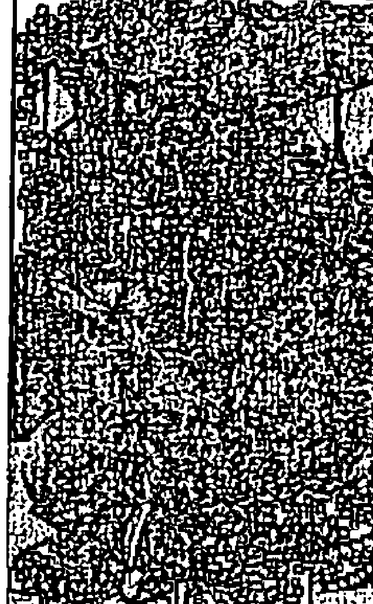

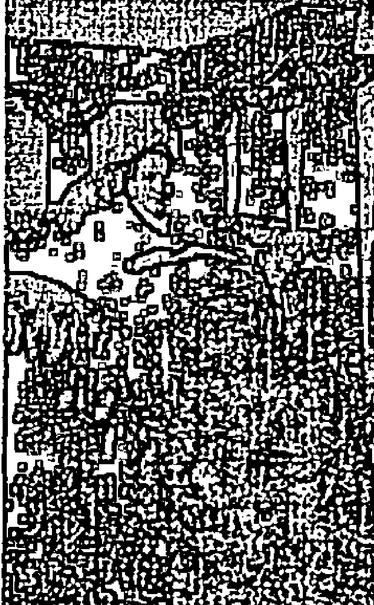

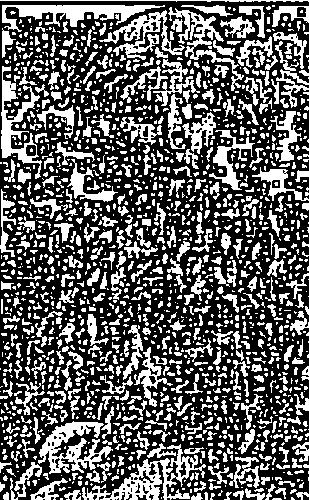

# 大阿爾克納牌陣

這是為了一項塔羅課程而設計。這些拼貼圖像是很好的例子，說明了如何創造一副特別而具有個人意義的塔羅牌。這副牌使用了當代人物，例如哈利·胡迪尼的相片做魔術師牌；葛楚德·史坦（Gertrude Stein）的相片做女祭司牌。這些牌的排列方式代表了一個三牌牌陣的可能變化，以及基礎的原始概念。在這裡，魔術師和處女祭司牌（奧秘的永恆存在於此刻及記憶中）被排成一對。他們之間的往來與互動（意願及磁性的異性相吸原理）創造出一些新事物。女祭司現在變成一名懷孕的皇后了。想法變成具體形式，這個被構思出的未來等時機一到，愛意就萌生了。

## chapter 12

## 塔羅牌的設計與創意

透過這本書，你不僅藉由塔羅牌持續觀察自己的生活，也同時在設計生活。在這最後一章裡，你將有機會用塔羅牌來設計及創意表現個人靈感。我將會介紹的領域包括：設計你自己的牌陣、設計你自己的塔羅牌、塔羅藝術及塔羅牌的創意寫作。

### 設計你自己的牌陣

現在你已經知道並運用過許多牌陣了，它們應該能為你大部分的問題提供資訊。在你徹底熟悉這些牌陣後，它們的效果會更好。所以要了解它們的細微之處、它們能夠提供和不能提供的各種訊息。而你將在一次次完整的解讀中建立自信心。

進入塔羅牌的下一個階段，你應該會想設計、改良或創造屬於自己的牌陣來表現你的個人哲學、世界觀、風格和關心的事物。

接下來是一些設計牌陣的不同方法。準備一本牌陣專用的筆記本，紀錄你和朋友設計的牌陣（如果你想分享，請寄一份拷貝給我）。

- 1. 以你理解的超自然或物質結構為基礎來設計，例如這本書裡提過的脈輪、生命之樹、太極拳（或轉動之輪）牌陣。舉例來說，你可以利用以下結構變化，像 DNA 螺旋體、一個房子中的不同「房間」、風水、精神綜合療法的關鍵思想等等，作為設計牌陣的基礎。
- 2. 以牌的數字為基礎，考量牌陣的靈數學意義。例如 3 = 創意、新的組合與和諧；4 = 結構、被建立的事物、四個方向；9 = 掌握與完成。運用這些數字帶給你的任何意義及想法，也可以參閱附錄一的小阿爾克納數字牌以獲得靈感。
- 3. 為你牌陣中的每一張牌都分配一個塔羅原型，代表這個位置的意義。舉例來說，安吉莉絲·艾倫設計了一個名為「重生之路」的牌陣。這個牌陣用了九張牌，從死神牌開始，然後接著世界牌依照順序繼續下去。在這個例子中，第一張牌死神設定了解讀的主題——什麼是你必須放手的，以及你將如何經歷重生與改造。這是一個審視個人掙扎及自我發現的牌陣，最後以向上通過產道再回到世界作為結束。
- 4. 「你的牌陣就是你問題的地圖。」蓋兒·菲爾費德在她的著作《中心選擇的塔羅牌》(Choice-Centered Tarot) 中這麼說。她建議從你的問題，還有所有你關注的事情、議題開始著手，然後立刻設計一個牌陣，為每個你所關心的核心問題都指定一張牌的位置。由於你的第一步是釐清問題以及它的構成要素，蓋兒說，有時你甚至不需要將牌排開——只要將問題釐清，就能得到答案。參照第六章的「延伸對三張牌牌陣的解讀」，裡面有個簡單的例子說明這個狀況。
- 5. 先以基本的牌陣開始（越簡單的越好）。在解讀過牌陣中的牌後，你可以針對牌陣中任何一張牌或議題，尋求進一步說明或更多訊息。只要將剩下的牌攤開，抽一張牌以提供你訊息。你也可以用這個方式進行一次完整的解讀。自然的問問題，然後抽牌來解答你的問題。做這種解讀時將過程錄音下來是特別重要的，因為進行的速度往往會很快，會快速的發展和產生出許多想法。
- 6. 先決定一個主題作為開始，例如人際關係、金錢、療癒或夢想。確定主要元素（或模式、需求、關注議題），然後分別給它們一個位置。例如人際關係的牌陣至少會牽涉到兩個人（或是兩個或更多的自我層面），而問題可能是關於溝通、性、扶持等等。這種做法並不是在處理一個特殊的狀況，而是試著去發現一種牌陣，能夠適用於任何人，並針對你選擇的主題運作。
- 7. 將行為的心理／社會／經濟／精神理論轉換為牌陣的位置。運用格式塔心理學、角色扮演、設計和制定準則。
- 8. 先以傳統牌陣開始，經過冥想、沉思、運用，然後試著遊戲（「如果我用螺旋排列代替上下排列會怎麼樣呢？」等等）、做變化、運用你獨有的洞察力來進一步發展這個牌陣。問自己下列問題，以將牌陣修正至最適合你的狀態：
  - 牌陣的視覺和幾何排列顯示出這些牌的內在關係了嗎？
  - 這個牌陣可以再分割成更基本的組成結構，例如過去／現在／未來；有意識的／無意識的或左腦／右腦嗎？
  - 如果將牌移動位置，我能因此而有什麼收穫嗎？
  - 有任何事是懸而未決的嗎？而我是將問題留在那裡，還是在可以在牌陣內加幾張牌解決這個問題？
  - 如果將位置的意義以不同方式表達（將它們變成疑問形式或以比喻方式表達），對我而言效果是否會更好？

將能夠轉化成牌陣的主題、理論、想法列出來：

什麼樣的問題是你還未找到合適牌陣來解決的？（將其分解成組成問題的基礎元素，看看這樣能否幫助你解決。）

### 設計一副自己的塔羅牌

「可是我不會畫畫呀！」對，如果你像我一樣，那這可能會成為一個障礙。但還有許多其他方法來製作一副你個人的塔羅牌。投入時間和精力去做這件事是值得的，因為它能讓你對塔羅牌以及個人的了解更加充實。你可以不用設計一整副牌——先從一張牌開始，例如你的性格、靈魂或年度牌。也可以為朋友做一張，在他生日時送給他。你甚至不必固守傳統的塔羅牌概念。以下是幾個自己設計塔羅牌的建議：

- 1. 做一副拼貼的塔羅牌。如果牌有點太大導致洗牌困難，那麼可以用照片或影印一整副牌來算牌使用。可以去二手書店或商店、舊貨拍賣等地方找舊雜誌來使用。
- 2. 做一副照片塔羅牌。你可以為這副塔羅牌特地去拍一些照片、構思服裝、找背景和道具，並找一些看起來像塔羅牌人物的朋友。另一個方法是從你收集的照片中選擇一些能夠代表牌的特質，也實際反映生活的照片。例如父母的照片用來做國王牌和皇后牌，孩子跨出第一步的照片用來做愚者牌，一道彩虹橫跨瀑布的照片用來做節制牌等等。
- 3. 用電腦繪圖結合拼貼、照片和剪貼藝術。
- 4. 幫一副黑白塔羅牌手工著色，像 B. O. T. A. 塔羅牌、埃及之光／埃及人塔羅牌、羅拉諾迪克塔羅牌或亞馬遜塔羅牌一樣。這裡只舉幾個例子，你可以按照傳統的配色，或是完全恣意按照自己的印象來著色。
- 5. 為現有的塔羅牌增添顏色，或以其他方式美化它。U. S Games 公司推出的柔和色彩版萊德·偉特牌就是一個很好的範例。新式的金屬光澤筆能夠為傳統印刷品增加不可思議的豐富色彩。
- 6. 就算你不是一個多才多藝或天生的藝術家，你還是有可能畫出一副具有個人意義的塔羅牌。記住，許多所謂的「原始藝術」都不是由專業藝術家所主導，並通常伴隨著深具存在感的力量。但如果你真的不適合這麼做，就委託一位藝術家（或與他合作）畫出你的洞察。這種做法遵循了許多現存塔羅牌的傳統，也就是一個人是提供概念者，另一個人則負責繪圖。
- 7. 將你的牌用各種不同的材料重新組合。費歐娜·摩根在等待一位藝術家（花了數年）幫她完成個人塔羅（母系塔羅牌）的期間就這麼做。她剪了七十八塊圓形紙板，然後在上面貼上各種她喜歡的、不同種類的塔羅牌，或是雜誌上的圖片、她或她朋友畫的圖案、人物的照片等。於是她有了一副不斷在演進、變化的塔羅牌，並且兩面都有圖案。這副牌有一點太大而笨重，但她已經能熟練的使用，並且輕鬆地解讀它。

完成的塔羅牌可以用彩色影印機複製，背面以紙板墊厚，並且將特殊的牌護貝以長久保存。工藝品店有販售可以剪圓角的特殊剪刀。

### 塔羅藝術

凡是我任教的大學塔羅課程，學生都必須接受期末考試，或是準備一項創意作業。多年來我所見過用來表現塔羅的媒介有：蠟染、絹印、搪瓷、音樂、歌曲、服裝、容器、珠寶、香水、油畫、素描和照片。我少數幾個學生創造的塔羅作品可以被譽為是藝術家或達人級的作品，而他們的作品反覆向我證明，幾乎每個人體內都隱藏著某種藝術天分，只需要刺激他們想表達的慾望就可以了。

除此之外還有塔羅戲劇、小說、唱片專輯和藝術展覽。

選擇一張強烈吸引你的塔羅牌，並且以具體明確的方式再現它的特質。使用你的雙手。你希望涵蓋哪些象徵？究竟圖案是否必要？什麼樣的表現方法吸引你？

探索你所選的牌面顏色。如果是像我這樣失敗又沒有才華的藝術家，可以拿一組水彩，將一整張水彩紙弄濕，然後塗上符合你那張牌的顏色漩渦，不用去管那些代表性的塔羅圖案。

### 創意寫作與塔羅

許多人用塔羅作為他們寫作的主題或是背後的靈感來源。有時塔羅的影響很明顯，有時則否。一個塔羅圖案可以做為起點，也可以是整個主題。看書時，尤其是關於神話或心理學的書，我常發現塔羅牌被拿來作為例證，只是作者本身可能沒有特別意識到。

如果你很認真的做了這本書中的練習，那麼回顧這些內容時應該會發現，你所寫的那些有關直覺的內容中其實存在著詩和故事的種子。描述牌中所見的內容通常特別合適。以下是我在墨西哥的寫作班時，與作家皮耶・迪拉崔共同對托特塔羅的皇后所做的描述。

#### 皇后

她聚集周圍的能量——
漣漪與振動的氣流
波浪，在她的雙手前一分為二，
加緊跟隨她蜿蜒的腳步
她的心已經準備好
一朵藍色的花，一朵半開的睡蓮，
現在綻放，閃閃發光，
為了展示純白的花心。
能量的波浪匯集於此。
她的左手聚集能量，

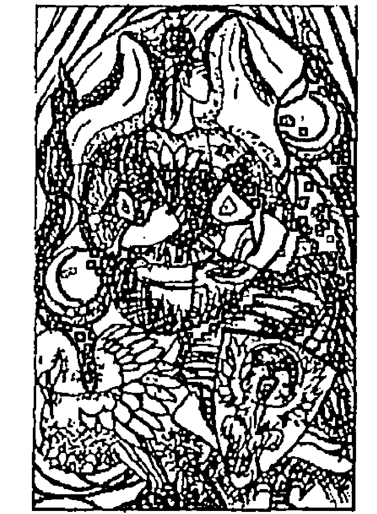

她的右手保持原狀，
準備再次將能量送出。

她用右手指揮著牌，
移動它們的位置，
為自己解釋
這些牌的意義。

在她的雙腳
一道光圈深入大地。
她由強壯的軀幹向下深深扎根，
向大地之母
尋求她需要的養分。
每當她呼氣，
根就向下扎得更深，
蔓延，伸長。
每當她吸氣，
以雙腿雙腳奔馳
帶來了穩固的感覺，
以及自信、
平靜，
與自然融為一體。
她再次呼氣與吸氣
這次上升的氣流在她心中
裝滿了藍色花朵，
並滿盈著直覺，
轉變成純白色的光芒，

氣流掃過她的背脊。
她呼氣。
由她頭頂湧出，
與她頭上的
金色皇冠交會，
創造出彩虹光之雨
完全包圍住她。

她坐在一個被包裹的
橢圓形飄移流動色彩中，
她的左手接受外部氣流，
而她的右手蓄勢待發
去表達她在眼前牌中發現的一切，
無論是什麼。

她坐著，
感官警覺，
身體挺直但放鬆，
雙眼凝視前方，
豎起耳朵，
為了聆聽那溫柔而盤旋的
直覺之歌。

許多作家在寫作時都曾因塔羅牌圖案激發靈感。例如葉慈，雖然未直接使用過塔羅的圖案，但根據凱薩琳·瑞恩的說法，他在塔羅牌中找到「一種領會真實永恆不變、普遍角度的方法」。

最近一個朋友說了他的作家／藝術家朋友送給他人生中第一副塔羅牌的故事。「他給我一副塔羅牌和一本塔羅書，然後說『拿去。每個好的詩人從內在到外在都應該了解塔羅牌。』」（愛瑟雷德·艾德里奇對派屈克·弗林所說。）

下面是從塔羅或其圖案獲得靈感的一些詩和故事。詩人羅伯特·克瑞利以偉特牌為藍本，用「文字描述圖片」寫了一首詩。

#### 零：愚者

羅伯特·克瑞利 作（引用偉特牌）

> > 「踩著輕盈的腳步，彷彿大地和一切束縛幾乎都無法約束他。這名身穿華麗法衣的年輕男子停在懸崖邊緣，站在世界的高處。他眺望著前方遠處的藍——不看眼前的風景，而是那遼闊的天空。他想走路的渴求還是那麼明顯，雖然此刻他是靜止的。他的狗仍然在旁又跑又跳。深淵裂開的邊緣並不令人恐懼，彷彿如果他縱身一躍，會有天使等在那裡接住他。他的面容充滿智慧及對夢想的期待。他一手拿著玫瑰，另一手拿著一支奢華的權杖。權杖靠在右肩上，掛著繡了奇異花紋的錢包。他是另一個世界的王子，正在進行他的旅行——在寒冷刺骨的空氣中穿過全都是曇花一現的事物。太陽在他身後照耀著，清楚的知道他來自何處，要往哪裡去，也知道幾天後他將如何從另一條路回來……」

——摘自《小品集》（Pieces）（1969年）

下面的詩仍是以單張牌為重點，但更廣泛。

#### 戰車

約翰·魏納 作

早晨火焰燃燒著，
馬匹的袋子空無一物。

它裝載著太陽橫跨天空，
點亮了愛使你盲目。

它將夜晚變成了無窮無盡的白晝，
改變了神秘月亮的運行轨道

要駕馭你的心，而不是天堂。
這是一張被解讀為七的牌。

> ——摘自《我們偉大的聲音》(The Voice That Is Great Within Us)
(由海登·凱魯斯校訂，1970 年)

### 聖杯六

黛安·瓦考斯基 作

一張牌上的詩

「裝扮」表示每次都會有些不同，
兩個孩子正在採花
在有著高牆的圍裡，

他們的杯子裡裝滿了花朵，也看到那裡有一顆星，是白熱的，因為它自天上掉下，燃燒墜落在每個花器上，但孩子們似乎並不知道星星改變了花器的內容。他們遞杯子要給對方，或許他們會觸摸浮在上面的星星，宛如這些星星是熱騰騰的餅乾，或是一片剛烤出爐的薑汁麵包。這些杯子是他們的玩具，他們互相拿著仔細觀察和品味——自豪擁有它們，也對每一顆美麗的星星自豪。若我將手放在任何一顆星星上，我的手將在一分鐘內燒成一塊炭，甚至來不及後悔和挽回。我必須讓雙手遠離這高達十萬度的星星，但他們仍然遞杯子給對方，笑著彎腰，講述關於愛的事，那些我不需要由他們告訴我有多少價值的事。他們還是可以將杯子交給我，裡面有一條粉紅色的蛇蜷曲著身子如同一張雕刻的面孔。

> ——摘自《在血的工廠裡》(Inside the Blood Factory)（1968年）

#### 皇后 #8

> > （摘自《塔羅牌》（The Tarot Deck））

黛安·瓦考斯基 作

給 D. di P.

> > 一條蛇從你的腳下偷窺
> ——你會用腳踩牠
> 還是庇護他（用你的雙腿）？
> 你同時具有這兩種力量？
> 還是
> 只具有這兩種表象？

> > ——摘自《汗痕》（Smudging）（1974 年）

#### 錢幣公主

黛安迪普利馬 作

> > 這裡有她
> 完整的光譜，範圍從
> 從覆蓋著樹葉
> 統領叢林的綠色女性開始，
> 極少人能讓她抬眼一看。
> 直到沙漠中的女子，她的紅髮
> 就是夕陽，她的裸體
> 是黏土，她的雙眼
> 看來空洞，因為它們是清晰的藍綠色
> 空無一物的沙漠的天空顏色。
> 在她腦後
> 是夜晚的綠松石的藍綠色
> 還有雙腳
> 在沙中消失。
> 她是山的女子
> 走在暮色中。她的肌膚
> 和銀灰色的長袍和
> 她具有的激烈狼性
> 森林的妖精
> 蘑菇的小小靈魂
> 她是彩虹女子，但
> 並不是全部
> 冰之女王及美人魚
> 屬於她的姊妹。她
> 帶著聖杯 及 其他看不見的，或許它們速度太快。她屬於
> 你看到的光譜。

> ——（未發表作品）

### 權杖皇后

茉蒂·葛蘭作

……
而我是權杖皇后。
人們崇敬我。
我是他們高舉在頭上的火炬
當他們宛如昆蟲般行軍又行軍
以數十億之量
進入血腥的現代世界，
跨過在他們過去年代被拋棄的屍體，
總是高舉著我，或抱著我，一把火焰在雕像的手中，
一捆木炭，
在他們煽動性的教義中，
呼喚我為火之聖杯，
本質之光，
火焰
以及他們新世界的事物將被製造。
他們稱呼我為蘇菲亞（海倫）、啟蒙、
「神之光」、智慧、浪漫、美麗、被守護、
「自由」。和理性的年代。
他們稱呼我為進步，工業革命，
「人民的統治」，未來，一個時代
屬於電子、屬於水瓶座、屬於平凡的男子與女子、
演變，
太陽能與自立。性的自我表現。
他們稱呼我為原子分裂、物理學、相對論、
雷射計算，在無止境的心靈天空，
他們稱呼我為「科學」還有情緒，
心靈感應與社會責任的光環，他們稱呼我為
意識、「健康」，他們稱呼我為
愛，綻放的海倫。
她的臉頰羞紅，更增顏色。
……

> —摘自《權杖皇后》(The Queen of Wands) (1982 年)

有些詩是在描述對塔羅牌的解讀，例如這首由鄧肯·麥克諾頓所寫的詩：

## 背後的圍籬

> 古老的塞爾特十字架

在秋季它再度出現……最終點的一朵花：
一張五號的牌
讀最上面的死神牌，或將其覆蓋
某個倖存者的頭……

七月過去而我的玫瑰樹仍然活著——
在第六階段，與算牌者對立，
塔之神，廢除……我急速下降
負傷，一個翅膀受傷的祈禱者

朝向大地以進入，進入七之屋
由惡魔所持有：斡旋
進行及歷經白晝天堂與夜晚的等待，
指定的目標被否定……

我的星星，帶領我獨自一人
居住在它空的王座之宮。

—摘自《魔鬼的一段話》(A Passage of Saint Devil)(1976年)

## 是什麼創造了塔羅與百合花

菲力浦·拉曼提亞作

是什麼創造了塔羅與百合花
駕馭我的心與塔栓在一起
女祭司指引天啟的所在
寶劍纏繞在如梅杜莎般的頭髮上
彈著曼陀林的女子在花園裡

他們爬上牆，他們從牆上跌落
百合花照亮一隻眼睛

自牆壁出來

他們在花叢中戰鬥。
象徵學形成，由於吸收汗水
使戲劇性的殘酷放大了靈魂，在沉思的
雲朵上 開啟轉動的煽動性刺激開關！

他們達成和平
並在嘉禾舞中痛哭
怪獸冷卻他們的母親
在冒著泡的火山口
天使們
丟下鱗狀的戰利品

在一個高遠的季節他們將血染黑，

## 爬上牆

一朵百合花在衝刺的馬匹上力爭上游
進入了覆蓋著月光的騎士
他的夫人在牆上

## 強奪

月亮，用權杖戳刺
鈴聲輕響，他的夫人迎風搖動白百合

## 曼陀林

暴躁的表現形式平靜
爆發！
騎士們散射出劍
樹脂的牆上，三重女王
出現
當白百合
發光
在燒毀的肉身下
忽然颳起強風

## 塔羅占卜

在中世紀 染色 玻璃

> —摘自《詩選》（Selected Poems）（1943-1966, 1967）

有許多關於塔羅牌的小說，或是在小說中某段場景中寫到塔羅牌。接下來的文字摘錄自有關塔羅的小說，在其中，牌呈現了他們的生活，小說中的人物則為虛構。

## **摘自查理・威廉斯之《大阿爾克納》**

牌在她手中震動，她回看著它們。突然其中一張牌飄至半空中，並慢慢的向地板落下。另一張飄出來，接下來又是一張，它們就這樣依序宛如溫柔的雨滴般落下。她並沒有試著阻止它們，就算試了，她知道也不會成功。人物出現又消失在她面前。每一個人出現，在螺旋狀的迴旋中，一些她仍然握著的牌滑出來，不停的轉圈，然後消失在她的視線，掉入不停旋轉的霧氣中。

它們現在變巨大了，宛如某些原始樹木的大片樹葉，像我們的釋迦牟尼悟道之神聖菩提樹，或北歐神話中的世界之樹，還有客西馬尼的橄欖樹。從她手中握著的牌中向下飄落。她的腦中並沒有這些人像，有的是命運的觀念，以及看到葉子慢慢的、慢慢的飄落，上面輕柔的承載著盤旋的風，並在經過她身邊時觸碰她，也吹走面前的金色雲朵。盯著它們，她漸漸感到暈眩；從中伸出的奇形怪狀的手當然不會是南西・科寧斯，而是一個她所不知道的巨大形體。

她努力的將視線移開，看著面前，只是更加確實的看到舞者們。現在它們的高度比一開始多出二十倍，它們是侏儒、小矮人，長得奇形怪狀，並且有生命。它們現在看起來比之前任何時候都更清楚。一個突然混雜而成的群體由她面前的霧氣中出現，呈現三種樣態——他們的左臂高高的拱著，腳趾碰觸並圍繞共同的中心旋轉。她凝視著，她認識他們——聖杯皇后，拿著杯子對著她的心臟；裸體的粗人是死神，他右手拿著鐮刀，看起來仍是那麼不祥。一群埃及人，帶著一顆驢頭。他用鏈子拴著俘虜，他是無限大的惡勢力。他們旋轉，一圈又一圈，比之前更快速。每當他們從旁經過，看來都像要對著她伸展出所帶的符號。這當中進入她耳朵的音樂已經升高為強風的尖叫，而她周圍的風變得又冷又強。更高處的風仍然在嘶吼，更激烈的以強風攻擊她。寒冷打擊也凍壞了她，她獨自一人，手裡空無一物，而蕭瑟的風死亡。只有她看到最後片段，看到金色的霧氣被風吹散和驅趕。但

當它經過，當她氣喘吁吁的意識到她的情人與朋友就在附近時，似乎仍在那裡停頓了一會兒。三個舞者圍著她旋轉，他們的左手摸著她的頭，一下離開一下靠近。有些知識觸及她的心，她對答案感到心痛，與她那光榮的苦惱不同，當這知識幾乎打破愛的負擔，她感到隱隱的痛。它存在過，也終止了。

> 亨利的聲音從她身後傳來：「親愛的，快樂的生活！讓我們看牌吧。』……

> —摘自《大阿爾克納》（The Greater Trumps）（1950 年）

在我選的最後一段範例中，塔羅牌的解讀確實被用來創造浪漫小說中的人物和情節。解讀塔羅牌被安排進故事本身，在寫小說的整個過程中，兩位作者都定期的抽牌或做額外的讀牌來釐清角色的動機，以及發展進一步的情節。故事是關於一名女性，在丈夫突然去世後遷去加州卡梅爾，搬進他生前為她建在海邊的房子。在那裡她發現了自己的創造力，也不再害怕靠自己的力量活下去。下面是書中出現的讀牌場面，展現了作者是如何安排情節。

## 心靈的追尋（未發表手稿）

西碧兒・德門（凱瑟琳・高斯與多莉・翠波）作

> 「現在讓我們來看看妳目前生活中的能量流動。」瑪拉繼續說：「某樣東西正在外流，會是什麼呢？」她戲劇化而誇張的將右邊的牌翻過來，牌上顯示的是一個哀痛的人物，穿著黑色斗篷，低頭看著三個翻倒的杯子，對立在身後的兩個裝滿的杯子則置之不理。「聖杯五，艾倫。妳看——妳已經準備好除去那套將你綁在過去的哀痛黑色長袍。當妳真的這麼做了，就能夠轉過身去面對未來，而滿盈的杯子正在那裡等著妳。」……「但那兩個杯子裡裝的是什麼？」艾倫急切而又有点憂慮的問。

「我只是個諮詢師而不是預言家。記住，未來是充滿變化和可能性的。妳用心靈掌握它，就像陶藝家在轉盤上掌握他的瓶子，塑造它，讓它成形，直到它被放進窯裡燒硬，那就是未來變成當下的時刻。在這之前，它都任由妳去創造。但妳湊近看這張牌。」她拿起牌給她，「看看背景的圖案。這裡有一棟房子在水邊，還有一座橋。橋樑象徵過渡，妳將離開一個悲傷的地方，前往一個提供新生活之處。而那裡有一棟房子——這棟房子將成為催化劑。」艾倫吸了一口氣。「是的，我的確有一棟房子在卡梅爾海邊。我來就是為了看房子的。」「這棟房子會為妳的生活帶來變化。一開始可能會讓妳恐懼，因為它代表了未知。但不用害怕，改變會讓一切變得更好……」「現在，」瑪拉說，並翻開左邊的牌，也是剩下的最後一張牌。「讓我看是什麼準備進入妳的生活呢……就是他，權杖騎士！」

作者選擇讓權杖騎士按照其字面意思登場。那一幕中，他瀟灑地騎著一匹馬，穿越卡梅爾的沙灘。

## 敘述你自己的故事

這裡有些想法幫助你更加了解塔羅，同時寫下一些故事。

## 愚者故事

童話故事的主角往往是最小的兒子或獨生子，或一個呆子、傻瓜，被設定要去完成一項大任務，因為他們的天真無邪以及親切善良，尤其是對動物（聰明又願意幫忙），所以最後都會成功。那些他／她幫助過的動物或人們會送他神奇的禮物，而這些禮物就會協助他。最常見的獎賞是娶到國王的女兒（如果主角是男性），他也因此而成為

國王，一國之明君。或是得到一位迷人的王子（如果主角是女性），然後從此在遙遠國度裡「過著幸福快樂的日子」。婚姻重新建立了社會秩序，也代表重新找回平衡。

寫一篇愚者的故事，並試著在其中運用愚者牌的形象：他／她是誰？為什麼穿著奇異的服裝？他的任務是什麼？為什麼必須達成？他肩膀上的袋子裡有什麼？為什麼有玫瑰和紅色羽毛？那隻狗有什麼關聯？愚者為什麼會站在懸崖的裂縫邊？他來自何處，又將去向何方？

## 牌組的故事

這個練習引導你加深對小阿爾克納牌牌組排序的了解：
挑選任一牌組，以牌的圖像為基礎，依 Ace-10 的順序編一個故事。如果你想的話，可以將宮廷牌拿來做為故事中的人物。

## 構思情節

讓牌自己來構思出一則短篇故事或小說。塞爾特十字牌陣會有很大的幫助：

-   ☆ 可以選一張宮廷牌來代表主角，或是隨意從十六張宮廷牌中抽一張。你選擇作為主角的宮廷牌是：
-   ☆ 這個故事將會是什麼風格？（懸疑？浪漫？喜劇？冒險？奇幻？等等）

當思考為這個人物所創造的故事同時，將所有的牌都洗過。切牌，並將它們排列成塞爾特十字牌陣。如果你能儘量依字面來詮釋牌，那麼不但可以玩得很開心，最後還會得到一個有趣的故事。舉例來說，如果出現權杖騎士，你可以安排一名紅髮男子騎著馬或一輛紅色保時捷出現。當你排好牌，將故事情節寫在下面的空白中。

1 號及 2 號牌是 ________________ 和 ________________ 描述基本的衝突：

3 號牌 ________________ 代表主角不知道的，存在於問題根本的某件事：

4 號牌 ________________ 代表來自他／她的過去而必須拋開的某件事：

5 號牌 ________________ 代表他／她心裡所想的：

6 號牌 ________________ 代表接下來會發生的事：

7 號牌 ________________ 代表主角對自己的看法：

8 號牌 ________________ 代表了環境：

9 號牌 ________________ 代表要學習的教訓——主角必須克服的改變。

10 號牌 ________________ 提示了結局：

決定故事的風格與形式，再添加其他人物與事件，充實你故事的基本情節。這樣屬於自己的故事就完成了。


# Epilogue

# 後記

請寫下自己的後記。一開始你被要求依照所見來為塔羅牌下定義，並規劃希望運用塔羅來學習什麼。而現在是檢視你學到什麼，並評估其價值的時候了。你不需要先將本書的練習全部閱讀或做一遍。正在閱讀這部分，就表示你有資格現在就回答下面的問題，並且將來隨時都可以再做一次。塔羅是一項你會繼續使用的工具嗎？如果是，你會如何使用它？只有你能決定在看完本書後會發生什麼。

日期：________

你對塔羅牌的個人定義有所改變嗎？現在的定義是什麼？

什麼方法和技巧是你發現最有用的？（以及你為什麼覺得它們對你比其他方法更有效）

哪些方法和技巧是你不認同或決定不使用的？為什麼？

當你使用這本書，你學到哪些事是更值得注意的？

將來你希望能利用塔羅做什麼？

# Appendix I

## 牌義的詮釋

接下來的牌義解釋主要是為了幫助你在解牌時，如何將牌中的意象與自己生活和心靈中某些特定領域連結。最好的學習方式是根據前後脈絡來解牌，而不是死背單張牌義。然而，為了不斷精進個人的塔羅知識，你必須從各種塔羅新知和經典中，持續研習。

## 關鍵字

當你注視著一張牌時，要讀取它的關鍵字和概念，找出那些看起來與你的狀況特別相關的解釋。不妨在旁邊寫下你喜歡的關鍵字。

## 問題

讀了問題之後，記下任何閃過腦中的影像。並將重點放在其中一兩個與你的狀況相對應之問題。並且儘量具體而明確地回答它們，然後根據牌陣的位置（過去、現在、未來、自我，以及其他等等）來修正這些訊息。

## 肯定語

肯定語的範例是為了幫助你將每張牌的最大潛力發揮出來。根據你最欣賞的每張牌的特質，以及在一個特定情境中，你想要彰顯出來的意義，創造出屬於自己的肯定語。

## 記錄抽牌日期

將每天抽到的牌，在以下牌義解釋的旁邊記錄下日期。如此不僅可以看出你抽到什麼牌，還可知道在任意段期間內抽到這張牌的頻率。若是當你在抽牌時，某些牌突然掉下來，你也可以瞭解一下有什麼特殊的意義，還有哪些牌你還沒有抽到過，以及第一次抽到這張牌究竟在什麼時候。哪些是你在特定期間內經常出現的牌，並可進一步研究能夠從中學到什麼；也可以用簡單的代號來標出牌陣的位置，例如用「CC4」來表示塞爾特十字牌陣中的 4 號位置，或用「B」來代表三張牌陣中身體的位置。

## 讓每張牌發揮最大的效果

透過第一、二章的練習，你會發現每張牌的圖像包含其牌義的關鍵。而當你在閱讀圖像時，你所使用的塔羅牌將會影響你對牌義的解讀。如果你有研究圖案，那麼所使用的特定塔羅牌應該會影響你對牌的解釋。接下來，我總結了本書給讀者的建議，在閱讀牌義之前或之後，你可以這麼做：

-   1. 以自己的文字簡單描繪從牌上看到了什麼。
-   2. 化身成牌中的人物，介紹自己並講述發生了什麼事。使用第一人稱單數、現在式。
-   3. 運用直覺寫下與牌中人物的對話。
-   4. 自由的聯想，並運用直覺寫下與牌圖像相關的聯想。
-   5. 說出你看到牌時的第一印象及感覺。
-   6. 賦予牌中的數字、顏色、形狀及象徵意義，然後將個別象徵的意義連結起來，合成整體的意義。
-   7. 聯想一些與牌的命名或圖像契合的諺語、格言，以及描述。例如，錢幣五的圖像中顯示出兩個「曝露在寒風中」的人。
-   8. 對那些突然閃入腦海的瘋狂想法或聯想，要永遠以開放的心態對待。並慎重思考那些出現在心靈之眼的「瞬間快照」，就像對家族相片般地重視，即使它們一開始看起來似乎沒那麼有關聯性。

這些建議也適用於解讀兩張或多張牌之間的關係。

## 自己做詮釋

利用書頁的空白處寫下你對牌義的附加解釋，以及個人的肯定語，並且修改那些對你沒有幫助的牌義解讀。

## 對應

每一張大阿爾克納牌都有一個對應於占星學上的行星或星座，每張牌名的下方還有對應的希伯來字母。而每一張小阿爾克納牌也都有對應位於某個星座的行星，宮廷牌則結合了「土、風、火、水」這四個元素其中兩個。這些對應關係，大部分是根據「金色曙光協會」的設定。請參照附錄C中，有更多與大阿爾克納相對應物件的資訊。而假如其中有與自己的感覺相違背的部分，你也可以寫下屬於自己的對應物件。

## 大阿爾克納牌

### 0 愚者

天王星
Aleph

跨進某些人生的新階段。精神獲得解放。無憂無慮。樂於嘗試。不假思索或毫無計畫地衝動行事。自發性行為。意想不到或計畫外的事。單純的狂熱。天真。缺乏自制力。不受拘束，天馬行空。傻氣。輕挑。胡鬧。你的選擇可能是愚蠢的，或沒有好好考慮其他因素。信任天地萬物。沒有意識到憂慮或恐懼。感覺被保護。在此時此地體驗生活——時時刻刻。樂觀。旅行和流浪。期望這張牌帶來預料之外。

逆位：不敢冒險。恐懼世俗規範。自由被限制。缺乏旅行或冒險。小心翼翼。缺乏信任。不成熟。不負責任的。愚蠢。拙劣的決定。魯莽。貧窮。潛力降低。懶惰。靜不下心。漂泊。徒然悔恨。不聽勸阻。錯誤。未聽從本能。漫不經心。輕率。「代罪羔羊」。尷尬。長不大的孩子。不得體的，幼稚的行為。有問題的孩子。憨直的傻瓜。

#### 要回答的問題：

在你的人生中，哪個領域是你可以憑著全然的自信及信任掌控的？你將往哪裡去？你覺得愚蠢的是什麼？如果能做任何你想做的事，哪些事你會認為很有趣？

#### 肯定語範例：

> 「當我決定毫不設限地體驗當下，所有可能性都將為我敞開。」

### 1 魔術師

水星
Beth

感知。自覺。專注在計畫或目標上。單一目標。承諾。掌控。靈巧。技術。擅長手工。狡猾。奸詐。機敏。淘氣。組織能力。善於操控自然和他人，以利用其力量。魔法和超自然力量。溝通。善於寫作、演說、說服。阿尼姆斯，或自我認知。
逆位：無法獨立行事。缺乏技巧。推卸責任。心煩意亂。優柔寡斷。意圖不明。意志薄弱。過度或自信不足。虎頭蛇尾。欺騙。推諉。騙取信賴。江湖郎中。幕後黑手。遭排擠。內在的發展。培育你內在的心靈花園。精神緊繃。魔術師或醫學方面人士。任意改變觀念。看透假象。

#### 要回答的問題：

你將能量專注在哪裡？你的目標明確嗎？在這個狀況下，你需要什麼能力與技巧？你如何與他人溝通？你希望別人相信或看到什麼？

#### 肯定語範例：

> 「我是精神力量在這世上展現的自願管道。」

### 2 女祭司

月亮
Gimel

深層的內在智慧。內在認知。良好的判斷力。超自然或通靈能力。玄秘深奧的知識。通往阿卡莎¹秘錄之徑。獨立。自力更生。安靜的退出。隱居。客觀性。感受性。奧秘或秘密。被隱藏的事。某段你需要正視的記憶。回想。夢。靈魂之旅（靈魂出竅）。阿尼瑪，或女性的自我認知。尋求指引及諮詢（尤指來自一名女性）。特別關注你身體及情緒的自然規律與周期。習慣。月經周期。心情及善變。比較和對比，思考正反兩面。

逆位：難以進入直覺、夢境、感覺。經過一段時間的孤獨後更加融入群體或性感。或者變得更加孤僻與孤單。冷漠。膚淺。不誠懇。公事公辦。局外人或放肆的。熱情。被一名女性背叛。不想要的性。秘密被揭露。信心崩潰。惱怒。焦慮。生理期問題。周期紊亂。情緒波動。新月儀式。巫術。恍惚狀態（催眠）。降靈（神靈附身）。

> 1. Akasha : 梵語「天空」、「空間」、「乙太」之意。延伸為「阿卡莎秘錄 The Akashic Records」記錄了人類自太初以來的一切，包括每個人前世今生的思想、語言、行為等一切，是人類靈魂的成長紀錄。是一部完整而無止盡的檔案系統。

#### 要回答的問題：

你必須要察覺到哪些規律及周期？你在尋求什麼知識？你需要記住或「發現」什麼？你在隱瞞什麼？這樣做恰當嗎？這次你要如何將自己的直覺、心靈力量或夢境能力做最大發揮？誰在尋求你的諮詢，或你希望向誰諮詢？

#### 肯定語範例：

> 「我所追尋的知識就在我心裡，正等待著我的問題。」

### 3 皇后

金星
Daleth

強烈母性。你的母親或生命中另一名養育你宛如慈母的女性。大地之母。落實你的能量。阿尼瑪。透過一位女性得到藝術與美學的靈感。一股創造性思維與行動，但往往太鬆散而需要加以整理與組織。豐饒。創造新的融合。打造非凡事物的渴望。發現屬於自己的美麗與優雅。魅力與誘惑。自我放縱。看見周遭事物的豐饒與和諧。繁榮。關注身體與感官。提升健康以獲得成長與幸福。

逆位：折磨人或缺席的母親。不希望像自己的母親。虛榮。自我放縱。拒絕傳統女性角色與價值觀。生育困難。過度自私或過分給予。奢侈。善變。不注重身體或健康。把愛收回或撤回投資。
喪失影響力。空巢症候群。感覺自己沒用。激烈且不健康的成長與過剩。違反社會規範。受挫的創造力。原始而未開墾的天性。內化的母親。自我撫慰。

#### 要回答的問題：

如何養成及照料目前展現的特質？現在正在規畫和發展什麼樣的創意？什麼東西正吸引著你？誰啟發和滋養你？如何滿足自己的感覺？

#### 肯定語範例：

> 「我是一個豐饒的花園，能夠將創意孕育成花朵。」

### 4 皇帝

牡羊座
He

父親的形象。阿尼姆斯。上司。王者。一名男性的影響，或你內在的男性。自以為可以掌控一切。一個仁慈的獨裁者，在其統治之下安全無虞。熟悉權力的領導階層。已具備的領導能力。到達成功巔峰的野心。實現野心的力量。權威。自信。主張。展開並啟動新事物。通往實現之路的行動。生命、熱情、遠見。命令、計畫、打造。命令你的思想與能量。謀求穩定。體驗自我的整體與一致性，整合元素與四大功能等。為了群體的利益壓抑天性需求。創造一個穩定局面以永續運作。保護及支援某件事或某個人。占有欲。擁有。將天然及人力資源視為建設及構築的原始材料。依賴理性、權力及穩定。

逆位：獨裁者。自以為是的專制。抑或是意志薄弱，缺乏男子氣概的懦夫。拒絕傳統男性陽剛的角色。缺席或派不上用場的父親。無法保護。背叛信賴。無效的。失敗的領導者。沒落的英雄。偽裝的驕傲。小丑。被推翻的王國。動搖。失去控制。用力過猛。極度嚴苛。過度倚賴理性及邏輯。過度挑剔和批判。競爭。殘酷的掌控。男性生殖能力問題。不成熟。衰老。內化的父親。自我權威。負傷的國王。

#### 要回答的問題：

你的野心展現在哪裡？你正在組織、建立或做些什麼？你是個什麼樣的皇帝？是充滿活力且富想像力，還是僵化而封閉的？在你的人生中，是誰設立了你的生活準則、界限和架構？誰擁有能力和權威？又是如何運用的？

#### 肯定語範例：

> 「我擁有達成終極野心的力量和嚴格的訓練。」

### 5

## 教皇

金牛座

Vau

一名導師，阿尼姆斯，或良師益友。直覺的指引。教學與教育，特別是傳統社會的教育。將所學與人交流或教導他人。提供或接受建議。跟隨大師、系統、哲學、傳統或道德體系。精神鍛鍊。服從規則，以及對宗師、組織、工作、國家等的忠誠。祝福。透過遵守其信仰與規則，對某種文化的認同或任何一個符合自己恪遵的信仰和規則的團體。遵從。理解現有的種種規則及禮儀。學習如何玩一場遊戲。促使你進一步尋找這個領域中的權威人物，以獲得新的盟友。維護善與惡的道德準則。傳統道德。跟隨文化的內在規則。聽從良心的聲音。感覺被生命中的那些「應該」、「必須」所壓抑。自由思想受到限制，導致你展現出非傳統、標新立異，以及革命性思想，或者容易上當。感到被規則背叛。涉及公眾與個人良知對立的問題。

逆位：反抗權威。標榜道德規範。抗拒宗教傳統。「局外人」。非正統。反傳統。與體制對抗。打破傳統。沒有道德良知。罪惡。不道德的。缺乏美德。沒有原則。被放逐。或是太過僵化與教條。道貌岸然。偽君子。執著於不合時宜的傳統。最高審判者。盲目的信仰。缺乏信念。缺乏堅持信念的勇氣。陷入兩難。離婚。失勢的大師或導師。善於神秘儀式。

#### 要回答的問題：

誰是你尋求協助、指引或學習的對象？你認為自己逾越了哪些法律或規定？而誰又會指責你？你堅持哪些傳統？反抗什麼傳統？你正在學習什麼？

#### 肯定語範例：

> 「我只順從更高自我的指引。」

### 6
戀人

## 雙子座

## Zain

調和。結合頭腦與心靈、感覺和知性的元素。我們和宇宙之間的神聖結合。對立兩面的融合。思考感情關係。與人合作，或準備與人合作。你的感情關係映照出對內在自我的價值感，你對自己的感覺如何，可以從夥伴與你的關係看出來。在安穩與冒險中抉擇，或是在新與舊之間做選擇。在可敬但沉悶，或是極度誘惑但敗德之間做選擇。責任。為自己的選擇與行為負責。運用自由意志。從壓抑、罪惡感、限制或束縛中解脫。愛只有在沒有限制的情況下才能夠存在。互相認可。需要你的意識及潛意識達成協議後才能做出的平衡決定。合作過程中的參與。認可自己及他人的男性和女性特質，並將二者與你的內在整合。

逆位：不存在於物質世界的無形結合。沒有感情生活。在感情中有困難。離婚。分開（分居）。意見相左。溝通問題。單戀。引誘。性方面不協調。不貞。享樂主義。誘惑。操縱。缺乏辨別力。錯誤的選擇。優柔寡斷。內疚。違抗。抑制個性與自由。平衡內在的陽性與陰性特質。「神聖的結合」。惡魔的戀人。自戀。

#### 要回答的問題：

你正在進入一段具有什麼樣重大意義的感情？這段關係如何反映出你的自我價值感？你正面臨什麼樣的抉擇或決定？基於這個決定，你將負起什麼責任？有什麼需要被融合、組織或匯聚的？

#### 肯定語範例：

> 「在所有的關係中，我選擇從壓抑、內疚和束縛裡釋放出來。」

### 7
戰車

**巨蟹座** &nbsp;&nbsp;&nbsp;&nbsp;&nbsp;&nbsp;&nbsp;&nbsp;&nbsp;&nbsp;&nbsp;&nbsp;&nbsp;&nbsp;&nbsp;&nbsp;&nbsp;&nbsp;&nbsp;&nbsp;&nbsp;&nbsp;&nbsp;&nbsp;&nbsp;&nbsp;&nbsp;&nbsp;&nbsp;&nbsp;&nbsp;&nbsp;&nbsp;&nbsp;&nbsp;&nbsp;&nbsp;&nbsp;&nbsp;&nbsp;&nbsp;&nbsp;&nbsp;&nbsp;&nbsp;&nbsp;&nbsp;&nbsp;&nbsp;&nbsp;&nbsp;&nbsp;&nbsp;&nbsp;&nbsp;&nbsp;&nbsp;&nbsp;&nbsp;&nbsp;&nbsp;&nbsp;&nbsp;&nbsp;&nbsp;&nbsp;&nbsp;&nbsp;&nbsp;&nbsp;&nbsp;&nbsp;&nbsp;&nbsp;&nbsp;&nbsp;&nbsp;&nbsp;&nbsp; **Cheth**

自制。自律。戰勝本能。通過個人力量成功掌控狀況。自信、樂觀，且相信自己的能力。匹夫之勇。控制自己的外在環境和身體。憑意志力或科技控制本性。感覺有一個方向，一個計劃。駕馭所有的力量，朝向目標前進。你的工作與感覺之間有強烈分歧。你像鏡子般反映周遭人的行動與情緒反應。對周遭的情緒極度易感及敏銳，你需要盔甲來保護自己，因此戴上了一具疏離的面具。人格特質的發展——一種呈現在外在世界的面具。你身在這個世界的身分。自尊的面具。測試你所學到的。證明自己及你的能力。本能地依賴技巧及能力來通過挑戰。開啟一段旅程，特別是個人發展之旅。前進。讓懸而未決的矛盾和緊張情勢獲得控制。想像自己超越人類極限。驕傲。自大。成功及名聲造成的自我膨脹。勝利。精通。征服。凱旋。

逆位：不自量力。過度自信。輕率。魯莽。跟車有關的問題。旅行出狀況。延遲或取消。偏離目標。意見對立造成的衝突。空轉卻毫無進展。漫無目標。能量分散。失控。憤怒。煽動。騷動。暴力。騷亂。意外。在競爭中被擊敗。篡奪權力。密謀。不擇手段。自我膨脹。恃強欺弱。叛亂。幕後工作。不常出門。專注在內在的旅行。靈魂之旅。英雄的旅程。靈性戰士，為了自我救贖，也為了人類福祉。

#### 要回答的問題：

你在這個世界呈現的是什麼樣的面具（人格）？你隱藏了什麼情緒反應？你一直掙扎著要掌控的是什麼樣的矛盾或緊繃情勢？你最近在生活中經歷了什麼勝利或成功？你向世人測試自己的能力有什麼樣的進展？

#### 肯定語範例：

> 「竭盡所有的力量朝向目標前進，並控制自己的恐懼，我將成功迎接挑戰。」

### 8

## 力量／慾
獅子座 Teth

愛是力量的泉源。儘管恐懼和情緒緊繃，仍然能夠找到力量開啟或繼續某些艱鉅的計畫。面對重重困難，仍堅忍不拔的力量。生存的動力或意志。生命的渴望。試圖控制自己的情緒；學習冷靜處理熱切的情緒。熱情洋溢與強烈的渴求。強烈的情感。性慾。愛你所為。狂熱。對自我創造力的渴求。敢於承擔風險。豐富的生命能量。調解對立雙方或與一位敵人和解，並將不同能量整合為一股強大力量。努力面對一個需要不屈不撓去解決的問題。駕馭自然能量讓自己能夠運用自如。沒有評斷的愛。學習去愛不喜歡的人。從壓抑的力量獲得釋放。設身處地理解他人。勇氣與毅力。

逆位：對熱情、衝動以及本能的恐懼，或是過於魯莽、大膽。專制。暴政。高估能力。理性與本能對立。心不在焉。缺乏勇氣或毅力。漠不關心。被你無法控制的力量擊敗。支配或奴役他人。膽怯。順從。阿諛奉承。權力結構。貓捉老鼠的遊戲。拒絕熱情。扼殺感覺。失敗。懦弱。濫用本能。經前症候群，臉潮紅。心臟與血液問題。譚崔（Tantra 雙修）。魔力。動物的盟友。生命療癒。

#### 要回答的問題：
你的愛有多強烈？你被要求如何表現勇氣與毅力？你渴望創造什麼？如何表達和調合你內在的熱情？你要做什麼反應天性或本能的事？

#### 肯定語範例：

> 「我勇敢堅定的去愛調和後的兩個內在的自我（刻板的自我和進化的自我）」。

### 9

## 隱者

## 處女座 Yod

退縮。孤獨。透過心證厭倦或拋棄世俗。追尋某樣事物。研究。關注細節。審視某些被掩蓋或隱藏的事。耐心。探求一種遠見。一趟旅程。時機。時間管理。審慎。需要擬定計畫，並放慢步調，仔細感受要走的路。精進你所為。一位幫助你追尋內在自我的導師或指引人。來自一位導師、大師、諮商者或朋友的幫助或建議。在自己專長的領域中得到指導，或對別人扮演這樣的角色。謹慎、小心、思慮周密。一段需要觀察並保持沉默的時間。拒絕發表意見。秘密擬定計畫。反省。完成一個周期。成熟。對疾病與健康議題有興趣：憂鬱症及治療師。

逆位：不孤單。尋求感情關係或人生意義。不喜交際。遁世者，或是渴望社交，結束隱居生活。遺棄。與長者、導師、大師的相處出現問題。糟糕的建議。過度完美主義。或是不謹慎、輕率、浮誇。不謹言慎行。膨脹的專業建議。反對。中年或晚年危機。恐懼老化。不成熟。懷舊。過分拘謹。刻薄。心懷怨恨。無法容忍年輕人。族譜研究。隱藏的缺陷或潛力。偽裝。誓言。哲學家。靈魂的指引。

#### 要回答的問題：

你在屬於自己的時間裡會做什麼？你在追尋什麼？或是你需要知道些什麼？誰能幫助你找到？在時間方面，你最擔憂什麼？你需要對什麼保持沉默？怎麼做才是穩健審慎的？你需要完成什麼？

#### 肯定語範例：

> 「在啟蒙的路上，我耐心遵循更高層自我的引導。」

### 10

## 命運之輪

木星

Kaph

因果業報和輪迴的律法。為我們的所作所為承擔應有的後果。循環與轉捩點（例如土星回歸）。初始。尋找生活中週期性和反覆出現的主題。生命中的變化（可能是你無從選擇的）。樂觀。慷慨。機會。適應變化。命運的轉折。搬家或換工作。生活的拓展，引進新資源、人脈和金錢。幸運。意外之財。某件你完成的工作得到讚賞。嶄露頭角。對周遭的一切都有一個重點或目標，或是陷於老舊的窠臼。尋求神諭或預知你的運勢。開始與結束，季節變換。倒果為因、循環式的思考模式。傲慢自大。過度驕傲。揮霍放縱。

逆位：仍然是正面有利的，但有些不穩定。很難或抗拒改變。受阻。陷入困境。延遲。停止啟動。溜溜球效應（不斷循環、重蹈覆轍）。波動。焦慮。未知的結果。不可預測的。過早的努力。未完備的。不好的時機。時機錯誤。必須重來或重複。不斷變化。繁重的工作。成長與擴張過快。過剩的。粗心大意。疏忽。過於謹慎。執拗。放緩。消極。錯失機會。厄運。報應。垮臺。意外的勝利或失敗。故態復萌。季節性憂鬱。

#### 要回答的問題：

- 你正經歷哪些生活上的變化？
- 你如何適應這些改變？
- 你在之前的環境中受到了哪些影響？
- 有什麼必須解決的問題嗎？
- 你如何拓展自己的視野？

#### 肯定語範例：

> 「我依靠宇宙帶給我的經驗並得以展現所有潛力。」

## 11

## 正義／調整

天秤座

Lamed

需要作出的決定。慎思採取什麼行動。暫停行動直到做出決定。建立平靜、穩定、均衡與和諧。尋求理解與行動、真理與正義、自我與他人之間的平衡。平衡你的帳目。工作或時間上與金錢或賠償相關的決定。合約。透過金錢、物品或工作，平衡地交換能量。看見問題兩面的能力。辨識及揭開表象以發覺真正動機的能力。權衡所有因素：利弊得失，保有好的、屏除壞的。交涉。仲裁。扮演中間人。推動。認識真實的自己。關注某個狀況中的正義。為自己的行動正名，需要得到一種在道德上的正名或可被接受的感覺。擬定計畫，並了解可能出現的反應與後果。為自己的行動負責。因果法則。為過去的行為承擔結果。對之前的行動作出反應。尋求適當的回應。涉入一個與法律有關的狀況：訴訟、合約、交通罰單等等。對等的合夥關係。

逆位：「不公平」。正義瓦解。法律糾紛或損失。枉顧法律。犯罪行為。執法者的殘暴。環境或社會動亂。不平衡。不義獲利賠償。補償（法律上）。合夥糾紛。離婚。蒙羞或謙遜。另類正義或善惡終有報。被文書工作或繁文縟節擊倒。規則或禮俗的瓦解。優柔寡斷。沒有行動力。偏執。偏見。歧視。壓迫弱勢。嚴厲的批判。過度理性。內在的正義與平衡。預感。

#### 要回答的問題：

你正在權衡什麼決定？其中利弊得失為何？從過去的行為中，你正面臨什麼樣的結果？需要做哪些適當的補償（或能量交換）來平衡情況？為了忠於自己，你需要做什麼？

#### 肯定語範例：

> 「我在做任何決定時，都要忠於自己。」

## 12

## 倒吊人

海王星

Mem

傾聽內在的聲音，即使看來與你所想的相反。做某件事時必須將之前建立的順序顛倒過來。從另一個觀點看事情。非傳統的行為舉止。對某件事感到緊繃。受阻。限制。等待。焦慮。行動懸宕。停滯和挫折。生病。精神崩潰。與現實脫節。釐清一些事務。清理懸而未決之事。尋求諮商或治療。通靈的能力或遇到通靈的事件。看見別人看不到的東西。犧牲某樣東西。折磨。受虐狂。審視自己為什麼要為了別人放棄個人時間、空間與心靈需求的動機。被害者意識。自憐。孤獨與寂寞。感覺沒人關心。藉由藥物或酒精來逃避問題。試圖逃避責任。全然信任、臣服於更高的力量或存在。捐棄成見與期待，為了得到更高的知識。讓心靈進入一個清明、反思的容器之中。冥想。放棄懷疑。人生轉換期（成年、婚姻等）。從一種狀態啟動或過渡到另一種狀態。獻身於某種運動。愛國主義。將自我意識納入一個目標或他人之中。幻覺／幻象。看事情沒有看到真實。

逆位：準備採取行動，但不知何去何從。美好得不夠真實。隱匿的動機。虛假的誠實與喜悅。傲慢。偽君子、自命清高。自私的目標、想法。專注於唯物主義。群眾。平民。烏合之眾。冤獄。徒勞無功或無謂的犧牲。謊言（一邊說謊一邊又祈求原諒）。拖延。不踏實。令人厭煩的。冷漠。煩擾。脆弱。獲釋。不受束縛的。釋放。從責任中解脫。心靈上的轉捩點。充滿希望。

#### 要回答的問題：

你期望從犧牲中獲得什麼？你正專注於什麼樣的事情中？你在焦慮什麼？你需要弄清楚什麼？你需要放棄什麼？你試圖逃避什麼？你如何追求更高的知識？

#### 肯定語範例：

> 「我願意放下個人的享受以獲得精神上的富足。」

## 13

## 死神

## 天蠍座

## Nun

困在老舊框架中。冥頑不靈。需要革除制約的積習、障礙及陳腐的方式。對於固有的狀況或信念感到不自在。與過去切割。將積習痛苦的連根拔除，或將生命中某些人或東西剔除。結束與一段親密的友誼和團體的聯繫。釋放自己。手術。意識的轉變、進入一個新的狀態、吸收融合成一個新的形式。轉化。解放。復活。全新發展的可能性。你正經歷一段如此深層的情感，宛如歷經一段「死亡之旅」。強烈的性體驗。放棄自我意識以與他人或宇宙融合。穿過事物膚淺的表象去了解其核心。嚴重削減。回歸基本。從一種形體轉換能量，或直接變成另一種。

逆位：可能比正位還要困難。延遲或抗拒某件事的結束。痛苦及煩惱的延長。妨礙新的成長。感覺受折磨。了無生趣。失眠。停滯。頑固。悲觀。從悲痛、憂傷或沮喪中恢復。對生命及喜悅的覺醒。復甦。再生。瀕死經驗。迷戀死亡，哥德式暗黑的議題。相信吸血鬼傳說。巫術活動。通靈。稅金。性傳染病。更年期。預知死亡的靈性修煉。

#### 要回答的問題：

- 你需要放下什麼？
- 在這樣的轉化期，支援你的基礎系統（就像骨架一樣）是什麼？
- 什麼被轉換了？
- 如今新的成長可能性是什麼？
- 讓你感受這麼深刻且強烈的是什麼？

#### 肯定語範例：

> 「我透過放掉那些對自己的成長不再必要的東西，來改造和使自己重生。」

## 14

節制／藝術

射手座 Samekh

燃燒的熱情。自信且樂觀。直言不諱；坦率表達想法。開明，迅速跳開、豁達、獨立。善於處理變化多端的情況。痊癒。調和生活並找出事物正確的組合，讓自己變得更好。從事身體及心靈癒療活動。一種氣脈能量的循環。與內在嚮導、守護天使或捐助人一起工作。合作。適應。相容。運用所學，以辨明哪些是真的，以及你實際精通的程度。測試自己。實驗。管理。認識及運用資源（時間、人力、空間、材料）。組織與規劃。將材料、資源、人才或想法融合為新的形式。創造性活動。鞏固。以正確比例混合。調和對立的特質。鍛鍊。用嶄新和不同的方式混合或結合生命中不同的面向。創造和諧。向公眾傳達你的想法。

逆位：事情失去平衡，處於衝突或極端的狀態。壓力。疾病的可能性。無法融合的。無法一致的。缺乏合作。競爭。衝突。爭吵。意外。機械問題。漏水。調節系統故障。缺乏創造力。不切實際。沒耐性。挫折。缺乏同情心。囤積。飲食失調或某種癮頭。凡事得來容易的態度。內在節制。內在心理。奧妙的身體療癒。融合並轉化的過程。與天使溝通。神職。

#### 要回答的問題：

- 你對什麼感到樂觀？
- 你如何結合現有資源？
- 你正在測試或實驗什麼？
- 有什麼需要治療或平衡的？

#### 肯定語範例：

>「我積極管理自己的需求與資源，以帶來健康與和諧。」

## 15
惡魔

魔羯座
Ayin

只憑事物外在表象來判斷，因此受謬誤控制。處於迷惑之中。只相信自己所看到的。處於恐懼與無知的狀態。對某件事盲目，或選擇忽略事實。感到疑惑或悲觀。沮喪。感覺陷入某人的擺佈之中。壓迫者／被壓迫者意識。為自己的生命製造束縛與侷限，並認知其實源自內心。變得更加制式化而缺乏彈性，儘管可能有了更遠大的目標。停滯。克服惰性。這張牌提醒你需要一點幽默感：學會嘲笑自己也嘲笑自己的妄自尊大。殘忍，惡意，充滿活力且精神奕奕。喧嘩吵鬧。故意扮演代罪羔羊（聖經中）、擾亂者或惡魔的代言人，以強迫他人審視自己的信仰。處理不協調或不相關的事情，並以全新、創造性的方式將之結合在一起。將看來亂無章法的東西結合在一起。創造、革新。極度驕傲。為了私人野心占他人便宜。操控他人只為個人利益。負面表達自我的「陰暗面」：故意做一些自己應該知道不能做的事。在性方面利用人或遭人利用。成為慾望的奴隸，並壓過自己的判斷力。執念佔有。誘惑。邪惡的意圖。黑魔術。嫉妒。沈溺於感官；缺乏超越物質世界的信仰。

逆位：極端。邪惡的勝利或摒棄。心靈上的盲目。卑鄙。陰謀詭計。讓他人頂罪。拒絕誘惑。遠離邪惡。在罪人與聖人間轉換角色。瞬間改變信仰。極度的正直、道德、貞潔。逃避不愉快。打破枯燥乏味的行為。從錯誤的壓抑、束縛、操縱與依附中釋放。進入內在隱藏的祕寶。覺醒。內在恐慌。從遭虐中復原。病毒。獸角神（異教神）。詭計多端。從理解心靈層次開始。

#### 要回答的問題：

最近你生活中的束縛與侷限是什麼？你對什麼東西或被誰迷住？你如何以創造性及非操縱性的方式，傳送及建構你的能量與慾望？有什麼狀況你需要用幽默看待的？

#### 肯定語範例：

> 「從黑暗及混亂中，我創造機會，超越侷限。」

## 16

## 塔

火星 Peh

強大的防禦、習慣、結構的崩壞；從無知中解放。一種精神的覺醒。一股來自更高自我的洞察力。對自尊或自我形象的打擊。侮辱；從高處被推下。無預期的變化或打擊。瓦解。震驚。憤怒和挫折。情緒爆發。衰竭或耗盡，有時會導致疾病或意外。某種東西毀壞。你的成長漸漸超過周遭環境所能承擔（通常會因此感到沮喪）。參與一個激烈的自我成長計畫：密集治療、運動、節食等等。大掃除。禁食。人類的建築與科技在面對大自然時都是徒勞。自然災害及逃難。與混亂及災難對抗。

### 17 星星
### 水瓶座 Tzaddi

冥想。無窮盡的靈感。心靈上的重生。運用活躍的想像力和視覺化能力。藝術和科學的靈感。規劃自己的理想與目標。審視你對未來的希望。運用能夠洞察自我的系統，例如占星術、塔羅牌、靈數學等等。以真實的自我和價值觀生活，而非外界的評定。「自由就是沒有什麼東西可以失去」。利他主義。不墨守成規。做出非預期的事。暴風後的寧靜；從束縛中解放。自由。自然崇拜。單人儀式。和平與寧靜。精力恢復，重生或潔淨。淨化。洗禮。對真相的渴望，開放而誠實，溝通無阻。坦率。揭露或發現。參與對你同伴有益的行動或計畫。參與啟蒙和提升人類意識的渴望。成為「明星」，人們注目的焦點。公眾的認可。成為領袖及發言人。頑固堅持既定觀念。

逆位：附庸於（需要擺脫）虛假的地位、外表與持有物。否定才華、優雅、美麗。短暫的覺醒。短視。不科學的。失去的靈感。缺乏目標。自我欺騙。凌亂的。失焦的。分門別類。沈重的任務。徒勞。高不可攀的理想。浪費。剝奪。風暴。被忽視。內在意圖。光說不練。自大。傲慢。缺乏想像力。追逐流行。生理回饋。平靜。舒緩。再度致力於某樣事物。與大地、植物、行星的能量統一並存。

#### 要回答的問題：

你生命中哪個面向已被淨化或潔淨？什麼被更新了？你被啟發去做什麼？為什麼你收到了認可？你對這件事有什麼理想？

#### 肯定語範例：

> 「我的內在閃耀如明星，指引我的行動，並讓我重生與淨化。」

### 18 月亮
### 雙魚座 Qoph

自欺。錯覺。混亂。困惑。波動。事物的盈虧。不穩定。被情緒與感覺淹沒。不知道自己想要什麼，宛如身上許多部分都在喊著想要不同的東西。面對你潛意識中的恐懼。探索未知領域。感覺孤單。你與他人的溝通充滿誤解。對某人或某事幻滅或疏遠。反省。必須隨著感覺走。開發或使用你的感應力或直覺。無意識領域內的活動，尤其是夢境、想像與幻象，以了解你的潛意識試著要告訴你什麼。某些你已遺忘的過去，透過非正常的顯現影響著你目前的生活。一段來自過去業力的感情需要再續。一種被引導或牽引的感覺，或像被潮汐拉往注定的目標。受到內在驅使。進化。依照本能行動。自然而然去做某件事，彷彿早已熟練到根本不需要思考。

逆位：執著於理性、合理、常規。否定看不見的、本能的與野性的事物。心靈感應受阻。搖擺不定。抵禦自然演化。不適應。否定或是狂熱接受超自然體驗。極端浪漫主義。壓抑原始和神話相關的內容，或它們不合理的爆發。受到都市神話欺騙。受到虎視眈眈的攻擊。靈魂附體。靈魂回歸。揭露秘密、耽溺、創傷。勒索。領會與淨化靈魂體驗。靈魂之旅。喚回前世記憶。

#### 要回答的問題：

狗、塔和陰暗的環境象徵了你的恐懼，對你而言它們代表了什麼？你忘記了什麼？你直覺想做什麼？你在重複什麼周期或模式？你的做法是否貼切當下的處境，抑或其實只是受到過去經驗的左右？什麼事讓你困擾或迷惑？什麼是真實什麼又是虛幻的？

#### 肯定語範例：

> 「我在努力超越恐懼與不安。我願意通過未知的內在自我，踏上通往自覺之路。」

### 19 太陽
### Resh

啟蒙運動。清晰。了解。理解。智慧。過去不清楚或被隱藏的事，現在被攤在陽光下。克服之前的障礙。成功。好運。獎賞與獎品。豐收。誕生。完整。從老舊形式中獲得自由與解放。你需要的每件事與每個人都如磁鐵般被你吸引過來。能夠具象化你所要的，並讓它成真。創造力與個人成長之際。對個人成就的認可與讚賞。創意受到認可。喜悅。生命中強烈的愉悅與快樂。樂觀。熱情。在經過深度溝通與互相分享之後，許諾了一段愛情。與他人的良好關係。友誼。良好的健康與活力。積極而充滿活力。利他主義、理想主義，以及高度的希望。感覺自己能達成任何事。自大與虛華。

逆位：如同正位但稍微減弱或過頭。太炎熱或多雲。耗盡。拒絕認知喜悅。誤解。無法接受認可或成功。恐懼事情太好而不真實。阻礙自己散發光芒。賣弄。自我膨脹。專橫。沒有兌現的信用。破裂的協議。和平的離婚。假象。充滿大話。偽裝的樂觀。不誠懇的。不適當的幼稚行為，或是害怕自己太幼稚或戲謔。易受騙。天真。季節性情緒失調。煉金術的黃金、神聖的結合、神聖嬰孩的誕生（編按：煉金術之下的產物，無性別）。

#### 要回答的問題：

你現在理解了什麼？你達到了什麼成就？你造就或實現了什麼？你與他人分享了什麼喜悅？你做了什麼承諾？

#### 肯定語範例：

> 「我以清晰的思維與熱情，創造溫暖與光明。」

### 20 審判／永恆
### 冥王星 Shin

對某件事物產生從未發現過的一種覺醒。一種模式的轉換帶來全新的觀念。重生。聽到靈性的召喚。復活。體認到一個全新的生活。發展一個新的人生哲學或意義。來到一個關乎超越自己更高目標的十字路口。深入研究或調查某件事。探究事物真相，並決定其價值及對你的意義。完成一份人格量表或自我評估。回顧過去的行為；正視自己的目標。接受個人在運用機會中所取得的責任，積極面對挑戰與試鍊。苛求。批判或評斷他人，或受到批判。審判。必須超越偏見與批判。道德良知。罪疚與赦免。贖罪。懺悔。道歉。在交換分析中統合你人格中的不同部分，例如父母、成人、小孩。身、心、靈都為同一個目的而生。再生。轉化。從一種狀況或身分轉變成另外一種。在性或其他方面渴望與他人的融合；或渴望與自己的創意融合。對身為父母或家庭價值的領悟；對他人的責任感而不是只想到自我保護。身為社會的一份子，必須與他人合作。人生轉換期（成年、婚姻等）。

逆位：難以轉變。抗拒轉化。放棄理想。逃開。來自老舊方式的威脅。停滯。衰弱。拒絕「召喚」。拒絕新科技。封閉。家庭麻煩。遭排除在外。疏離。異議。示威運動。暴亂。加入戰局。過度批判或評斷。偏見。缺乏洞察力。無法縱觀全局。錯誤的判斷。失誤的決策。錯過消息。試圖影響他人。突然和意外的痊癒。全球的變化。

#### 要回答的問題：

- 你聽到什麼「召喚」？
- 誰或是什麼事受到批判？
- 作出了什麼審判？
- 什麼新的理解或頓悟改變了你？
- 你與誰或什麼事物融合在一起？
- 你該對什麼事或誰負責？

#### 肯定語範例：

> 「我每天改造自己，喚醒更多來自心靈上的召喚。」

### 21 世界／宇宙
### 土星 Tau

意識到自己的侷限，從而釋放以發揮最大的潛力。與自己的侷限共舞。「化圓為方」從眾多歧異與不可能中，找出最佳解決之道：將精神的力量體現在現實世界，或者建構並賦予其形體。抵達。為自己及周遭情況負責。涉入一個非常惱人的、複雜的、情緒化的、涵蓋廣泛的經驗。一種對於生之喜悅、存在狂喜的感覺。無窮的潛力。自我實現（雖然並不總能獲得他人的理解或欣賞）。萬物皆為你所用。處於錯綜複雜中仍泰然自若。或是對變動及複雜的恐懼將你困在一個狹隘的框架內。不要忘記你身之所繫的本性與法則。大地之母。女性造物者，她代表了永恆。太始。她是你從何而來，必須回到何處的架構或基礎。

逆位：與正位類似。延遲進展或成功。秘密的或私下的勝利。「放下」。旅行的麻煩。未完成的工作。不完美。重做某件事。令人不快的限制。過度保護。缺乏全貌。溫和的挫折。無力。安於過往榮光中。責任與義務。不負責任的自由靈魂。將他人理想化。相信某人是完美的。因果了結。公眾健康。原初物質。創造神聖空間。狂喜的舞蹈（編按：一種配合冥想的舞蹈）。內在完整。

#### 要回答的問題：

你如何讓自己從生活中的侷限和束縛中解放出來？或者你如何讓自己與其自由自在地共處？你在自己身上看見了什麼潛力？在這世界又看見了什麼潛力？你必須照顧生理上的哪些需要？什麼事讓你高興得手舞足蹈？

#### 肯定語範例：

> 「豐饒的宇宙提供了我一切所需。」

## 小阿爾克納牌——數字牌

（注：請參閱第三章中牌組的解釋。）

### Aces

水星。行動、想法、最初。種子。根源。本能衝動。可能性。敏銳。誕生。初始。開端。禮物。潛力。論點。起點。集中力。注意力。專心。內觀。一致性。自覺。意向。入門。開始。焦點。機會（生命之樹—— Kether）。

負面意義：你可能很難把握機會。

### 權杖一

意識抬頭²。創造力。自我成長的渴望。靈感。新的想法。能量的爆炸。熱情的行動。動力。讚賞。系統運行自如。誕生。開端。宣告。自發性的暗示。目標。收買。提供。命令。注定。聲明。對某種理想或某個人堅信不移。

逆位：一張表示反對的牌。心口不一。時機未到。延遲，取消。嚮往或渴望，但卻沒有機會。挫折。過分狂熱。草率開始。機會稍縱即逝。勉強。得不到。洩氣。無能。感覺無力、途勞。通往內在的能量、力量、潛力。臥底的力量。

#### 要回答的問題：

什麼激發你的靈感？什麼激起你的熱情與渴望？你希望如何成長？你希望怎樣具有創造性的表現自己？你感到一股什麼樣的衝動？你的能量和熱情注入何處？你正得到什麼新的機會？

#### 肯定語範例：

> 「我認知到這個機會能帶來新的想法及創造性的成長。」

### 聖杯一

敞開內心。愛與愉悅的開端。心靈、精神或無意識管道的敞開。感受性。愛與感情的嶄新機會。滿溢的感情。精神與物質上的滋養。即將到來的聚會。禮物。祝福。情書。肥沃。懷孕。誕生。婚姻。夢想。

逆位：空虛。示愛遭到拒絕或嘲笑。枯竭。拒絕感情。單戀。不誠懇。濫用藥物。飲食失調。欺騙。延遲。不孕。不相信心靈力量。令人不安的夢境。無法承諾。濫情。憂鬱。禁慾。貞潔。愛自己。重新找回感覺。

#### 要回答的問題：

此刻什麼事讓你感覺很好？你想做些什麼來讓自己享受一下？什麼事或誰給你滋養或愛？你從夢境和幻象中接收到什麼訊息？你的心最能向什麼敞開？

#### 肯定語範例：

> 「我認可這個機會去表達與接受愛的到來。」

### 寶劍一

拓展智力。心智上的專注力。將事物表層剝開剖析，穿透事物的核心。真理和正義的種子。意志的運用。新的思維方式。確認方向與行動。全新的計畫與戰略。理智。真實與虛假的對比。正與反。斬斷束縛。野心。

逆位：失敗的進攻或誤用邏輯。計畫延誤。障礙。不公平。失去目標或力量。「在戰火之下」。自我及意志的降伏。悲觀。缺乏信心。精神壓力。痛苦。文思枯竭。無法解決的問題。結束敵對。拒絕戰鬥。謊言。毀謗。設下限制。心靈手術（編按：另類療法，徒手進行手術）。超能力武器（編按：一種將心靈力量注入的武器）。

#### 要回答的問題：

你正面臨什麼新的問題？你在想什麼？你需要分析什麼？重點是什麼？你公正、公平嗎？你需要面臨什麼決定？你能判斷事情的真相嗎？你有得到關於法律、寫作或研究的機會嗎？

#### 肯定語範例：

> 「我知道這個機會可以讓我發現真實。」

### 錢幣一

支撐身體的力量。一個事業或工作的可能性。物化的觀念。集中或放空你的能量。新的計畫。理財建議。繁榮與安全的種子。承諾身體健康及物質享受。靈性的潛力。成功的果實。珍惜資源。意外的收穫。成就。禮物。

逆位：富裕。寶藏。點石成金。貪婪。囤積。壓抑喜好。害怕失去。花錢。減少金錢支出。缺乏機動性、靈活性。注重身體、物質相關的事。停滯不前。可疑的機會。獲得檯面下的報酬。保守。專注於力量與能量。接觸療法。

#### 要回答的問題：

你有什麼關於工作、穩定性、家庭、金錢或健康的新機會？什麼讓你感到安心與踏實？你如何運用最新的天賦呢？你正在運作什麼計畫？你正在栽培什麼種子？你的成就獲得了什麼報酬？

#### 肯定語範例：

> 「我認知這個機會將實現我的想法。」

### 2

月亮。性格、面具、情緒。反射。增強。接納。培育。磁性引力。二元性。對立。複製。平衡。對比。演進。記憶。潛意識。陰柔。被動。感受。力求平衡。抉擇。改變。重點放在維持中道。建議由內在認知來引導。神諭。直覺（生命之樹——Chokmah）。

負面意義：不平衡的。冷酷無情的；拒絕去看表象之下的東西，過度情緒化。拒絕改變或善變。辦事或選擇的困難。

### 權杖二

火星在牡羊座。透過整合所產生的個人力量。有能力作出選擇。創意的表達。掌控局勢。獨立和自治。支配資源。沉思之旅。出發。機會之門。力量的平衡。成就之餘的憂鬱。

逆位：困難狀況中的變化。事件的意外轉折。新觀點。難以下決定。限制。不出門的旅行（编按：藉看书、看电视旅行）。未获满足的渴望。失手。意料之外的惊喜。不可思议，敬畏。轻信。不满足。广场恐怖症。其他类似你内在最美好的。往另一个世界或迷幻空间（编按：通常是在服用药物之后）。

#### 要回答的问题：

你以什么新的或不同方法将两种构想整合在一起？你计划要完成什么？你能够胜任什么？你希望整合哪些冲突的愿望？你站在什么起点上？你有什么选项？

#### 肯定语范例：

> 「我拥有选择的力量。」

### 圣杯二

金星在巨蟹座。以爱与疗愈的力量将对立面统合起来。爱的力量。化热情为心灵层次。相互尊重与互利。魅力。合作。跨越分歧。为一个更高的目标努力。半路与某人相遇。调和或整合选项。和解。结婚。婚约。

逆位：互相矛盾的讯息。争吵。暂时的问题。空虚的激情。阻碍恋情的人。分离。缺乏或拒绝爱。秘密的恋情。性方面的不协调。不贞。痴迷。残破的信任。希望破灭。平衡内在的阴性与阳性能量。爱自己。投射在他人身上的阴影。

#### 要回答的问题：

你将你的爱与感情给谁？你如何滋养他人？在你们的关系中被疗愈的是什么？你内在的阳性与阴性特质是如何在人生中结合及共同运作的？什么是你乐于与人分享的？

#### 肯定语范例：

> 「我爱他人就如同爱自己。」

### 宝剑二

月亮在天秤座。悬而未决的判断。受阻的情绪。不确定或僵局。和解。拖延。妥协。冲突的想法或观点。公平。平衡。骑墙派。权力的微妙平衡。相反的目标。矛盾。无党派的。孤立。自我保护。

逆位：打破平静。采取行动。分裂的忠诚。表里不一。四分五裂。抗拒平衡的力量。下决定。打破自满及表面的和谐。变节。背叛。抗争。干扰。令人不快的拘束。无法调和的分歧。内在的平和。涵盖和整合对立面。

#### 要回答的问题：

你在犹豫去做什么？你必须与谁和平共处或和解？你为了维持平衡所做的挣扎是什么？你宁愿不要做什么决定？你宁可不知道的是什么？

#### 肯定語範例：

> 「當我與別人共處時是圓融而不帶偏見的。」

### 錢幣二

木星在魔羯座。適應性。機動性。擴大你的視野。改變。旅行。遊玩。消遣。渡過驚濤駭浪。糾葛。交換商品及服務。交易。市場的波動。眩目的小把戲。快速的應變能力。同時發生一連串事情。

逆位：繁文縟節。書面工作。累積和大量的資料。迅速的溝通。答覆。訊息超載。電腦當機。熱門小技巧。容易受影響或左右。新聞工作。當雇員。循環。分配。促進。廣告。陷入一個枯燥無味的循環之中。狂熱。失去平衡。耍蠢。詭計。滑稽。

#### 要回答的問題：

你正輕鬆處理的兩個或多個狀況是什麼？你正在適應什麼？對於住家、職業、地位、財務等，你希望做什麼改變？為了保持穩定的（金錢、體重、生活方式），你正在耍弄什麼花招？你如何玩弄和運用多餘的能量？你需要什麼樣的圓滑？

#### 肯定語範例：

> 「我輕鬆處理各種狀況，迅速調整自己。」

### 3

金星。直覺、愛慕、美麗。聚會。表明。整合。結合。同情。豐饒。理解。成長。繁殖。綜合。和諧。展露。合作。理想化。所有的「三」都是「理想與現實」的對比。它們考驗你處理世俗與對理想失望的能力。「三」是具有強大同情心的潛在改革者。（生命之樹—— Binah 和土星）。

負面意義：殘忍、傲慢、自我放縱。

### 權杖三

太陽在牡羊座。有魅力的。有遠見的。已具備的力量。構想的整合。先見之明。規劃。綜觀全局。創造性的概述。警戒。開始新事業。貿易。談判。計畫付諸實行。監督。方向。國外旅行或商務。膽大妄為。氣魄。

逆位：創意障礙。難以將計畫付諸行動。壓垮；衰竭。缺乏遠見。不切實際的期望。未被實現的夢想。傲慢。焦慮。不信任。挫折。未得預期回報的投資。結束等待。流放者。專注於過往。族譜研究。旅行時得到的疾病。

#### 要回答的問題：

你的野心展現在哪裡？你將注意力放在哪裡？什麼東西或什麼人被你的生命力、力量與能量吸引過來？你對未來有什麼構想？你必須與什麼事或跟誰協調以實現你的計畫？

#### 肯定語範例：

> 「我以明確的展望來創造自己的未來。」

### 聖杯三

水星在巨蟹座。友誼。溝通。將愉悅分享他人。歡慶及喜悅。分享理想。牽繫。意氣相投。聯盟。黨派。歡樂。儀式。聚會。好客。出席或參加某個活動或演出。豐收。懷孕。成就。祝酒。

逆位：孤僻。失去友誼。疲倦。懷念過去美好時光。放縱。宿醉。戒酒。空虛的愉悅。輕佻。覺醒。孤立無援。缺乏合作。受到嫉妒。排他。被認識的人偷竊。一個意外或肌肉拉傷。提昇內在能量。私人慶祝活動。

#### 要回答的問題：

你如何讓自己過得愉快？你如何與他人輕鬆相處？什麼為你帶來快樂？你有什麼才華？又是如何運用它們？你想與他人溝通或分享什麼？你生活中有什麼值得慶祝的事？

#### 肯定語範例：

> 「我慶賀自己的喜悅與快樂。」

### 寶劍三

土星在天秤座。悲傷。痛苦。疏遠。分離。嫉妒。把心碎化為創意。感覺受傷。淚水。爭吵。破裂。去除。不和諧。不相容。心靈與頭腦不一致。自憐。三角戀愛。協議瓦解。痛苦的溝通不順。受傷。違背自己的意願。憂鬱。

逆位：從麻煩中紓解。放下悲傷。恢復。療癒。拋掉疑慮與痛苦。支援的保證。拒絕嫉妒、悲傷或困難的關係。不再哭泣。嚴重疏離或疾病。永不癒合的創傷。崩潰。尷尬。將自己的問題歸咎他人。混亂。可能的暴力。詛咒。爭吵。傳統上，這是一張戰爭的牌。

#### 要回答的問題：

你為何感到痛苦？感到嫉妒？受傷？有任何 人傷了你的心嗎？你在悲傷什麼？你想傷害誰或報復誰？你可以真實而誠實地看待自己的關係嗎？在關係中，你最感到恐懼的是什麼？

#### 肯定語範例：

> 「我承認自己受傷而且痛苦，如此我才能面對並克服它。」

### 錢幣三

火星在魔羯座。工作，尤其是與他人共事。創意的技巧與能力。實用性。團隊合作。建設。翻新。學徒。遵照教導。發表。評價與批評。贊助與支持。優秀。神聖的具體化。美學。詳細。

逆位：跟工作有關的麻煩。失業。拒絕一份提案。與老闆或同事產生問題。感到被忽視或不被重視。計畫或圖表中的錯誤。維修。平庸。劣等技能。厭倦。太過或不合格的。不利的批評。撤回支持。暗中破壞。危險的狀況。陰謀。奧秘的啟蒙。內在導師。

#### 要回答的問題：

你如何與他人共事？你正在做什麼工作？你的目標為何？你在使用什麼技巧？你是否願意堅持下去？你如何接受或表達工作上的批評？

#### 肯定語範例：

> 「我與人共事融洽，認同每個人對於工作的專長與價值。」

### 4

地球／太陽。踏實。穩定。秩序。完成。實現。法律與秩序。合理。鞏固。專注於內我的自我。專心。需求的評估。社會習俗。物質世界。組織。基礎。設立。完美。「四」的基本衝突在於一方面對法律、秩序和安全感的需求，一方面卻又對伴隨而來的懶散、無趣及消極，渴望去改變和伸展。四標示出一條通道、一個轉折點或里程碑，從而建立了界線及限制。（生命之樹—— Chesed 和木星）

負面意義：壓抑，限制，狹隘，不適，約束，不滿足。

### 權杖四
金星在牡羊座。勞動後的節慶與感恩。樂觀。抵達。儀式。一項事業的完成。重返家園。團聚。收穫。成果。鞏固個人牽絆。協定。條約。社會和諧。周末講座或會議。在鄉村住宿。購置物業。感激。

逆位：與正位相同。人生轉換期。多代同堂。非常規。未被認可的關係。告別。不想離開一段快樂時光。失態與有違社交禮儀。難以表達感激之情。不協調。不安全感。不完整的幸福。恢復健康。

#### 要回答的問題：
- 你完成了什麼？
- 又得到了什麼？
- 儀式或典禮在你生命中扮演什麼樣的角色？
- 你將什麼融入你的生活？
- 你經歷過什麼人生轉換期？
- 你是如何慶祝的？
- 你在慶祝什麼？

#### 肯定語範例：
> 「我歡欣地面對每一個人生階段的完成，並感謝從中得來的果實。」

### 聖杯四
月亮在巨蟹座。無力、冷漠及不滿足。厭倦。沉思。情感的孤僻。寂寞。被動的接受。休息。疲倦。厭惡。反感。拒絕一個禮物或機會。白日夢。想像。休耕期。暫時休息。不滿足的關

逆位：新的机会。新鲜的经验。重新考虑的选项。一个迹象或预兆。征兆。预感。通灵的感觉。意外的解决方案。躁动。突破不满足。结识新朋友。重新锻炼。在短暂的流行间不断变换。食欲不振。漠不关心。

#### 要回答的问题：
你觉得有什么不满足？你去哪里寻找平和与宁静？在这次的自闭及沉思中，你得到了什么启发？你正在重新评估生活及人际关系中的哪些部分？你有什么梦想？又要去如何实现？

#### 肯定语范例：
> 「我接受梦境及直觉给我的讯息。」

### 宝剑四
木星在天秤座。需要疗愈。处理问题或困境。生病。退却。休息与康复。暂时休息。孤寂。处于压力之下。从压力中暂时舒缓。退休。沉思。梦想。从一位专家那里得到建议。祈祷。组织想法。重新排列优先顺序。监禁。和平主义。

逆位：灵魂出窍。从睡眠中觉醒。病后的恢复。从事业亏损或困境中恢复。消除忧虑。从孤僻中走出来。同情。无法休息。令人不安的梦境。困在左右为难的状况。注意。时间冻结。过于严格的坚持原则。内在引导。

#### 要回答的問題：
你需要從什麼事情中休息或撤退？你需要將能量集中在哪裡以恢復你的力量？你需要做什麼以取得更好的洞悉，才能夠在這個情況中更公平公正？什麼專業協助是最有幫助的？

#### 肯定語範例：
> 「我給自己時間休息。將計畫擱置，轉向尋求內在指引。」

### 錢幣四
太陽在魔羯座。自我中心或自私。對個人價值的認識。占有慾。力量。為一個情況架構或建立順序。穩定性。安全感。鞏固。控制及保護資源。退休或儲蓄計畫。貪婪。囤積。根深柢固。

逆位：釋放。風險。改變。過度貪婪。過度防禦。與世隔絕。放下權力或財產。剝奪。障礙。延遲。堵塞。阻礙成功的無形屏障——無晉升機會。不切實際。輕率的花費。投機。財務損失。打破壟斷。無力感。物質的不滿。靈魂附體。

#### 要回答的問題：
你不斷在專注什麼？你最大的力量是什麼？你有多麼強大？什麼東西給你安全感？什麼是你想抓住或擁有的？你需要保護誰或什麼事？

#### 肯定語範例：
> 「我將力量握在自己的雙手中，我的安全感也在其中。」

### 5
火星。反應。欲望。挑戰。適應。改變。困惑。掙扎。衝突。崩潰。命運。罪惡。混亂。風暴與壓力。顛覆了「四」的靜止穩定狀態。人道思想。中途。橋梁。調解。良心。誘惑。打破自然的力量。測試。出現協助。干擾。憤怒。「五」代表了內疚、掙扎、衝突。必須經由更進一步的成功，或不斷地達成來通過測試。擺脫一切無用、不好或過時的。與生俱來，超越障礙的本能或力量。對「四」的常規與傳統的反抗。它們代表了某種失去——脾氣、感情、安全感或完整。（生命之樹—— Geburah 與火星）

負面意義：麻痺。武斷。壓抑。

### 權杖五
土星在獅子座。交換意見——有時很激烈。充滿活力及競爭力的遊戲。面對障礙。擾亂。衝突。遊戲。競爭。圖謀權力或位置。腦力激盪。解決問題。會議討論。慾望的衝突。力爭意見被聽到。豐富。超過。膨脹的自尊。

逆位：結束衝突與壓力。達成協議。法律或專業的調解。突破僵局。迫害和折磨。使用欺騙或詭計來挑起糾紛。破壞談判。內在的折磨、內心矛盾。意見紛擾。缺乏優先順序。比賽或體育賽事的延期。抵抗感染。心靈的自我防衛。

#### 要回答的問題：
你是如何以及與誰競爭？你正面臨什麼阻礙？你如何對別人表達自己的意見？你正與誰吵架或爭論？在爭論什麼？又為何如此激動？你正在玩什麼遊戲？

#### 肯定語範例：
> 「我明確而肯定地提出自己的想法。」

### 聖杯五
火星在天蠍座。失落與失望。進度受到阻礙。失去和諧，但愛仍在。暫時的延遲。由錯誤及經驗中學習。苦難。悲痛。哀傷。失望。後悔。無知。恐懼。船到橋頭自然直。繼續前進。反抗威權。遺棄。爭吵。

逆位：充滿希望的前景。復原。更新。繼續你的人生。聯盟。喜好。聯繫。癒合裂痕。環境及政治因素。遺傳血脈。原生家庭。否認失落或傷痛。擴大的悲痛。讓某人成為受害者，或把某人當成受害者。不利因素。通靈能力。

#### 要回答的問題：
什麼東西看來是失去或枯竭了？你對什麼絕望？你對什麼感到幻滅或失望？你對什麼事感到難過？什麼東西可以替代那些你失去的？什麼事等待著你的關注？你從自己的錯誤中汲取什麼教訓？

#### 肯定語範例：
> 「我感覺到我的失去，但我仍然帶著學到的教訓繼續前進。」

### 寶劍五
金星在水瓶座。使用不公平手段獲得的空虛勝利。製造爭端而不道德的。個人或政治紛爭。激烈的狀況。爭執。征服。竊盜。淨化。救難行動。衝突的觀點。思緒毫無條理。離間。濫用。兩敗俱傷。惡意。怨恨。屈辱。

逆位：哀悼。喪葬儀式。塵封的回憶或動機。分裂的人格。失去靈魂。挫敗的努力。背叛或犯罪。對外人冷漠。毫無疑問或不帶個人感情的遵從秩序。和解。結束衝突。悔恨。後悔。賠償。修復的裂痕。窘迫。沮喪。

#### 要回答的問題：
你預料在這個狀況中會受到什麼傷害？你在害怕什麼？什麼造成了你的團體分裂？為什麼對自己正在做的事感覺不好？你必須做什麼來讓自己感覺比較好？什麼是你必須去做且合乎道德的？什麼事對你來說如此重要，以致於你需要證明其他人都是錯的？

#### 肯定語範例：
> 「我承認沒有雙贏的局面，並願意優雅的退出。」

### 錢幣五
水星在金牛座。自願過著極為簡樸、非因循一般社會價值的生活。因為不確定所造成的焦慮、擔心和壓力。失去工作、家庭、安全感。感覺被遺棄。友誼。對愛情是好的，但對麵包無益。困難。殘疾。匱乏的感覺。疏離的。有裂痕的。標新立異。雪中送炭。

逆位：回到工作。擺脫破產狀態。逆轉一個壞的趨勢。尋求庇護之處。便利。誤用或揮霍資源。恣意浪費。混亂。毀滅。不被認可的愛。因為失去或分離而改變的關係。和解。大赦。拒絕或背叛宗教權威。精神的感召。

#### 要回答的問題：
什麼是你的生存問題？你對處理什麼改變感到困難？你選擇放棄或是不做什麼？為什麼？你在擔心或焦慮什麼？你在反抗哪些世俗／傳統？你試圖改變哪些不平等或不公正？

#### 肯定語範例：
> 「我願意過著看似困難及非傳統的生活方式，以遵循我的內在價值。」

### 6
木星。繁榮。和解。某種形式的高峰體驗。富於表現及坦率的。發揮最大功能的元素（克勞利）。沉思。交互作用。合作。分享。煥發四射。選擇。促進。和諧。平衡。「六」顯示了給予眾人的利益，尤以一種互惠的原則。對於人們的需求，具有感受性（敏感），且樂於提供。（生命之樹—— Tiphareth 與太陽）

負面意義：極端的傾向。自我中心。虛榮。高高在上。

### 權杖六
木星在獅子座。對自己的領導能力有自信。朝目標前進。勝利與榮耀。自尊。團隊合作。旅行。意氣風發。支援。動員。掌管。新聞。使者或先驅。名望。受人尊敬的地位。領導者與追隨者間的互惠。使徒。滿足期望。

逆位：
- 窩裡反
- 謀反或背叛
- 不安
- 跨臺
- 短期的獲利
- 新聞、溝通與員工關係出問題
- 沒有勝利
- 被攻擊
- 缺乏領導能力或領導不力
- 英雄的弱點
- 隱藏你的桂冠
- 嫉妒他人的成功
- 墮入陰間或進入靈魂深處（編按：為了重生）

#### 要回答的問題：
- 你承擔了什麼領導和責任的位置？你與同事之間的關係如何？
- 通過你的行動解決了什麼？
- 什麼是你覺得有信心的？
- 別人需要你哪方面的領導能力？

#### 肯定語範例：
> 「我達成目標的自信激勵了與我共事者。」

### 聖杯六
太陽在天蠍座。想起或更新來自過去的某些事物。友誼。愉快的交換。狂喜。給予和收到禮物。懷舊之情。回憶。渴望。懷念。尋求慰藉。過去。以前。古老。裝飾。美化。保護。私通。求愛。結識新朋友。

逆位：留戀過去。保守的。未來。即將。再生。復活。解放舊有模式或責任。「無法回到過去」。理想的瓦解。進步的。新科技。成長。活在當下。重新裝修。超越根源。藥草療癒。內在的稚氣部分。

#### 要回答的問題：
- 哪些過去的記憶或關係又重新出現？它們提供了什麼見解或認識？
- 什麼讓你恢復活力或振奮？
- 什麼帶給你喜悅？
- 小孩或童真的樂趣對你目前的生活有什麼意義？
- 你在友誼中付出什麼？你是個什麼樣的朋友？

#### 肯定語範例：
> 「我最美好的禮物就是友誼。」

### 寶劍六
水星在水瓶座。遠離危險。意識之旅或心智之旅。解決問題。退一步以更深的洞察力看事情。退開。轉換。過渡。使節。水路之旅。傳送想法、數據、物質。規劃路線。科學思維。依賴他人。

逆位：心智或身體上遇到困境。空想之旅。運輸上的困難。與水有關的困難。猶豫、恐懼。死守偏見。剛愎。秘密行動被發現。由旅行返回。文化衝突。遭遇困境而放棄職位。不被需要的提案。公開揭露或曝光。計畫更改。靈魂回歸。陰間之旅。

#### 要回答的問題：
- 你試圖解決什麼迫在眉睫的問題？
- 你要如何解決它們？
- 在你目前的人生中，什麼部分需要清晰的思考？
- 你如何從混亂及虛假的想法中解放你的心靈，讓自己的思考更明確清楚？
- 你何時會從問題後退一步，以獲得清楚的觀點？
- 你看到了什麼？

#### 肯定語範例：
> 「我藉由改變看待問題的思考方向及焦點來獲得更深的洞察。」

### 錢幣六
月亮在金牛座。分享你的資源。獲得援助或庇護；取得你需要的。象徵性的改革。對他人的需求敏感。能量交換。給予或收到金錢。禮物。慈善。投資者。捐助者。贏得官司。償還貸款。相互依賴。支配與降服。

逆位：財富再分配。權力的懸殊。苛扣。羨慕。貪婪。呆帳。快速致富的計畫。獲利不如預期。諂媚者。敲詐勒索。亟需獲得關注。缺乏感恩。不公平。渴望與滿足間的鴻溝。拒絕慈善捐助。需要被否定。挪用資金。顛覆階級架構。

#### 要回答的問題：
你與誰分享自己的財產、資源或能力？你是誰的導師、顧問或贊助者？你如何給他們意見？你如何分享財富（金錢、才華與資訊）？你必須給予他人哪些他們需要的東西？你如何管理自己的時間？你從誰那裡收到了什麼東西？

#### 肯定語範例：
> 「我願意給予，且會收到對等的回報。」

### 7
土星。成熟的過程。內在活動。自我反思。掙扎。注意。測試。限制。紀律。克制。活動。更改。新方向。平衡。精通。休息。複雜的整合。自我表達。獨立行動。修正失衡。改變模式。覺醒。準備。先見之明。（生命之樹—— Netreth 與金星）

負面意義：自大。欺騙。操縱。不願意面對與處理現實。

### 權杖七
火星在獅子座。面臨一個情況並主張你的觀點。名聲與正直。表明立場。保衛自己以及自己的需求與信仰。論述。道人長短。當之無愧的領導者。贏得優勢。開拔啟程。跨越鴻溝。沒有把握的立足點。適當的位置或元素的結合。

逆位：「柏林圍牆」。偏執狂。設下或撤除防備、屏障。撤退。太多事要處理。過度。克服異議。劃定界線。休息時間。迴避行動。尷尬。怯懦。動搖。被迫妥協。讓某人成為受害者，或把某人當成受害者。頑強不屈。感覺脆弱時放鬆和專心。

#### 要回答的問題：
你抱持什麼樣的信念或意見可以不顧批判和社會壓力？你正在與誰對抗？你忠於自己嗎？如果你的願望能夠成真，你理想中的結果是什麼？你如何最有效的表明立場及表達你的觀點？

#### 肯定語範例：
> 「我為自己的信仰挺身而出。」

### 聖杯七
金星在天蠍座。一種意識狀態的轉移（編按：通常透過夢境或催眠）。大量湧現的幻想。被幻象或感官世界吸引住。夢境。白日夢。憧憬。創造性的想像力。優柔寡斷。誘惑。靈魂及情緒的測試。放蕩。放縱。快速致富的計畫。虛幻的成功。

逆位：明確而富邏輯性的思維。看清現實。擬定計畫。設立優先順序。專注。設定目標。或者完全無所適從。缺乏想像力。希望破滅。幻象消散。慾望昇華。與罪惡和邪惡對抗。延緩的成就。憂鬱症。惡習造成的疾病：驕傲、嫉妒、貪食、貞潔、忍耐、慷慨與勤勉。屈服於世俗誘惑。

#### 要回答的問題：
你是如何矯枉過正或放縱自己？你對未來的幻想是什麼？至少列出七個。你最近的白日夢是什麼？你如何自欺欺人？你出現過什麼神秘或宗教性的幻覺？你如何滿足自己的感官？

#### 肯定語範例：
> 「我認知自己的幻想，並且請求宇宙供給我的需求。」

### 寶劍七
月亮在水瓶座。鬼鬼祟祟。說謊。因爭執而感到不安，避免衝突。研究：從他人身上得到知識與想法。準備。組織。分配。暗中行事。藉口。竊盜。機智。消除敵意。

逆位：審慎。迴避危險。推翻計畫與安排。沒有藉口。公開表明。「出櫃」，將難以啟齒的秘密公諸於世。取回某樣東西。重回犯罪現場。被偷的東西又回來了。審視過去的行動。建議與指示。啟動。深奧的知識與解釋。

#### 要回答的問題：
- 你將什麼據為己有？
- 你在欺騙誰？
- 你達成目標的戰略是什麼？
- 你在做什麼研究？
- 你在收集什麼意見？
- 你是如何操縱結局？
- 你信任一起工作的人嗎？
- 你在困擾什麼？
- 要怎麼做才能讓自己撤除防備、更加敞開心胸？
- 你的計畫、研究或工作的弱點是什麼？

#### 肯定語範例：
「我進行研究與準備，並為我的計畫蒐集證據和資源。」

### 錢幣七
土星在金牛座。恐懼失敗。延遲。評估你努力的結果。從錯誤中學習教訓。觀察週期與過程。培養。採集。排除。費心。耐心。估量。豐收。完美主義。因懶散而拖延。進展緩慢。阻礙。

逆位：加深的焦慮。損失。偏執狂。擔心。惆悵。急躁。因懶散而拖延。空頭支票。無法靜下來。工作過量。回收與付出不成正比。缺乏利潤。剝削。資源的過度開發。未被利用的剩餘。浪費。懶惰。順其自然。信任過程。魔幻咒語。

#### 要回答的問題：
- 你所關注的成長與成熟是什麼？
- 你擔心失敗或被搞砸的事是什麼？
- 在過去類似情況中你曾犯過什麼錯誤？
- 這次你能有什麼不同的做法？
- 哪些你對時間、金錢、努力所做的投資是讓你擔心的？
- 你的努力是如何獲得回報的？

#### 肯定語範例：
> 「我從成功與失敗中學習，並評估其中過程與結果。」

### 8
天王星。付出。花費。擴張。條理或缺乏條理。重新評估。優先。使用能量。評價。激勵。演化。平衡。因果關係。共鳴。活動。繼續前進。（生命之樹—— Hod 與水星）

負面意義：懸而未決，沒有結論，無力決定。挫折、嫉妒。

### 權杖八
水星在射手座。迷戀或墜入愛河。活躍與能量加速。快速成長與發展。迅速思考與溝通。網路。迅速投入熱情。旅行。空中之旅。比賽。接近目標。指揮。結盟。組織精簡。商業交易。同時性（編按：請參閱榮格理論，有點類似當你想到什麼，就突然出現什麼）。

逆位：
- 面對問題。
- 情緒爆發。
- 嫉妒。
- 未釋放的覺醒。
- 歇斯底里。
- 恐慌。
- 盲目迷戀或結束一段愛情。
- 不和諧。
- 溝通不對盤。
- 操之過急。
- 浪費能量。
- 意外。
- 不符規則。
- 罷工、減緩或取消。
- 悔恨。
- 由束縛中解放。
- 突破至新的階段。
- 飛行。

#### 要回答的問題：
- 你急急忙忙投入什麼？
- 一段關係？
- 一個成長的新方向？
- 一個信仰或哲學？
- 什麼讓你忘我或著迷？
- 什麼事讓你急於加快腳步？
- 你有什麼要跟別人說的？

#### 肯定語範例：
> 「當時機對了，我能迅速作出反應。」

### 聖杯八
土星在雙魚座。
- 能量枯竭。
- 自憐。
- 退卻。
- 由活躍轉向自我。
- 遠離舊價值與信念。
- 漫無目標。
- 興趣缺缺。
- 不滿足。
- 遺棄。
- 假期。
- 旅行。
- 被捲入未知事物。
- 心靈上的追尋。
- 深切自我反省。
- 尋找失落的。

逆位：
- 回鍋。
- 恢復中。
- 慶典。
- 堅持到底。
- 道歉。
- 稍縱即逝的機會。
- 儲備。
- 收集。
- 假期延後。
- 麻木。
- 感覺被困住或空虛。
- 漫無目標的飄泊。
- 恐懼親密關係。
- 執著於一段已結束的關係。
- 視覺化的引導。內在旅程。逃離現實。失眠。

#### 要回答的問題：
你對什麼感到厭倦或不滿足？哪些關係或價值對你的生活已不再具有意義？什麼人或事在吸取你的能量，讓你感到情緒枯竭？你如何抽身或抽出時間來重新調整自我？

#### 肯定語範例：
> 「我會找時間來補充能量並重新找回自我。」

### 寶劍八
木星在雙子座。感覺被困住。限制。太多想法卻毫無方向。偏執狂。受阻的能量或創意。被自己心理上的障礙所束縛。等待被救援。感到脆弱與孤立。妨礙自我的心理。讓某人成為受害者，或把某人當成受害者。足智多謀。逃避。代表魔術大師胡迪尼的牌。一種嚴峻考驗的儀式。

逆位：從經驗的桎梏中脫離。超越命定、宿命與注定。藉由努力、機智與靈機應變來移除障礙。打破制約。不容易動情。不容易受騙。被迫害的妄想。自我破壞的行為。錯誤的謙卑。耐力的考驗。神秘主義偏好。切斷情緒的羈絆。遇見幽浮經驗。

#### 要回答的問題：
有什麼受環境所限的行動、計畫或想法，不是你所能控制的？你會做些什麼來讓自己擺脫困難與阻礙？什麼人或事能夠協助你擺脫？若不採取行動你又有什麼好處？什麼干擾了你的創意表達？或是你的溝通能力？

#### 肯定語範例：
> 「我放下那些束縛我的觀念，將自己從進退兩難的困境中解放。」

### 錢幣八
太陽在處女座。自律。準備。注重細節。生產力。讓你的財務與資源有條有理。工作。專門技藝。品管。達成應有的配額。審慎。乏味。展示。練習。維持記錄。反覆進行。每天的進展。堅持。按部就班的發展。

逆位：變更職業。再訓練。缺乏訓練。失業。無所事事。缺乏野心。罷工。無意義或短期的工作。輕率。魯莽。虛榮。賺不了錢的工作。偷工減料。意外。缺乏專注力。直銷。未付的帳單。過度勤奮。審視舊有模式。製作及供奉神聖法器。魔法師的弟子。

#### 要回答的問題：
你在忙什麼？或是提前準備什麼？你在學習什麼技能或技藝？你需要檢查及打理什麼細節？你如何為工作建立一個固定的時間與地點？你需要做些什麼準備？你怎麼照顧自己的健康與幸福？

#### 肯定語範例：

> 「我充滿耐心且持之以恆地工作，以達成良好的結果。」

### 9

海王星。運氣。命運。力量。才能。固執。整合。經驗。孤獨。醞釀。魔術。完成。啟動。純粹的理智。結論。實現。達成目標。穩定的變化。自立自強。自我意識。（生命之樹—— Yesod與月亮。）

負面意義：孤立。妄想。拒絕與排斥。缺乏自律與自我意識。

### 權杖九

月亮在射手座。得自經驗的智慧與鍛鍊。獨立。致力於一個主張。意圖的力量與堅持。防禦。設防。保護。舊傷口。紀律。名聲。警惕。懷疑。延後。預料。孤立。缺乏彈性。守住最後防線。

逆位：阻礙變成沈重的壓力。極度的孤僻。疏離。放逐。打破制約。拆除防禦。輕率。無趣。缺乏紀律。毫無防備。等待結束。沒有工作。事業的挫折。阻礙完成。慢性疾病。削弱防衛。心靈上的洞察。由經驗所得的內在智慧。

#### 要回答的問題：

你吸收了哪些過往的知識與能力？是什麼強化了你面對反對的力量？你貫徹了哪些紀律？什麼人或事對你有許多要求？哪些任務是你必須親自處理的？

肯定語範例：

> > 「我從經驗中發展智慧及經驗，讓我能夠獨立行動。」

# ### 聖杯九

木星在雙魚座。滿足。願望實現。想像你所要的。感官上的喜悅。自我放縱。物質上的快樂。情感上的滿足。健康。幸福。慾望滿足。沾沾自喜。戰利品。策劃或觀賞一個活動或娛樂。創意的想像力。被隱藏的事。自滿。

逆位：

願望未實現。過錯、失誤、不完美被揭露。曝光。從表面的情感中解放。顛覆自滿。很難取悅。放棄過去的面具或性格的一部分。不顧一切的享樂主義、膚淺、沉溺。釋放毒素。為了心靈上的滿足而捨棄物質享受。簡樸。沉思。慷慨。

要回答的問題：

你是如何讓願望成真的？你經驗了什麼歡愉？你在沾沾自喜什麼？你希望在人生中體現什麼？你能夠鉅細靡遺把它視覺化嗎？

肯定語範例：

> > 「透過明確而精準的視覺化，我體現出自己想要的。」

### 寶劍九

火星在雙子座。沮喪。痛苦。內疚。自己貶抑。惡夢。失眠。精神折磨。絕望。羞恥。自我虐待。良心。悔恨。質疑。受傷。生病。在槍口下。恐懼。想像最壞的情況。分離。失敗。用時間來療傷。夜晚盜汗。修道院的生活方式。

逆位：

走出憂鬱。惡夢的結束。告解。為自己挺身而出。挑釁。否認沮喪、孤獨或羞恥。長期、嚴重的憂鬱。病態的幻想。心理上的陰影。心靈上的自我反省。面對你的恐懼。誹謗。合理的恐懼或懷疑。避開人們。精神掙扎。

#### 要回答的問題：

- 你是如何地貶抑自己？
- 你抑鬱的源頭是什麼？
- 你為什麼而受痛苦？
- 你曾經怎樣殘酷或自私？
- 或誰曾經對你殘忍且傷害了你？
- 你能夠做些什麼來改善這個情況？
- 什麼想法或惡夢困擾著你？

#### 肯定語範例：

> 「我認知了自己的情緒，並進而釋放它們。」

### 錢幣九

金星在處女座。享受孤獨的悠閒。放鬆。紓解。收穫。努力獲得良好的成果。物質上的幸福。獎勵。退休。假期。奢侈品。喜悅。愛好。身體健康。購買或受雇看守物產。作為保護的圍牆或陷阱。謹慎。克制本能的衝動。

逆位：陷阱。對自由的渴望。抗拒誘惑。錯誤的價值觀。焦躁不安。財產損壞。環境的危害。風暴。奸詐。受騙。搶劫。詐欺。手段。拒絕幸福或好運。過度工作。缺乏外部利益。沒有執行。自我放縱。欲求過多。妖精的恩賜。喜愛動物。

#### 要回答的問題：

你的努力獲得了什麼？物質財富？安全感？地位？你如何享受賺得的成果？你如何度過悠閒的時刻？你對所擁有的，如何表達自己的感謝？

#### 肯定語範例：

> >「我運用並享受努力的果實，不允許有一絲的浪費。」

### 10

冥王星。再生。釋放。責任。鞏固。從事情的開端到完成的總結。警告。頂點。結束與開端。結果。因果。獎勵與懲罰。關心他人的福祉。循環。嶄新的開始，對家庭與社區負起社會責任。重新設定或新的方向。賦予你的經歷意義或目的。代表一段時間之內，所造成（或存在中的）的情況。慣例。堅持。保守主義。相對於社會條件的自我意志。（生命之樹—— Malkuth與元素。）負面意義：溢出或過量的元素。反叛與不顧一切。

### 權杖十

土星在射手座。責任。堅持達成目標。負擔。憤恨。不斷增加的意見或任務。維護。信息超載。精疲力竭。沈重的負擔。拖累。受困。備受壓力。背叛。障礙。藉口。不公平。責任。創意受阻。努力終於達到了最後階段。

逆位：脫離重擔。轉移負擔。委派責任。推卸責任。緩和。清理。鴕鳥心態。逃避。悲觀。絕望。偽造的。虛假。掩飾。墮落。藉口。欺瞞。隱藏。不負責任的。夢想或野心的結束。移民。放棄舊有模式

#### 要回答的問題：

- 什麼責任沉重地壓在你的肩上？什麼讓你感到負擔？你的目標是什麼？何時能達成？什麼人（或事）在限制你，或是阻止你完全展現高度的能量？你為什麼要承擔這些責任？你如何將自己的力量及能量做最佳的運用？

#### 肯定語範例：

> 「我完成自己的責任，但也不剝奪他人的責任。」

### 聖杯十

火星在雙魚座。讓自己和他人都賓至如歸。完整與實現。肯定生命中的喜悅。樂觀。包容。和諧。幸福的家。大家庭。暴風後的和平與許諾。理想化。一個不可能的夢想。飽足。太過美好。連結個人與專業、內在與外在間的橋樑。

逆位：告辭。與家庭或關係有關的麻煩。爭執。分離。家庭分裂。難以聚在一起。瓦解的夢想。空巢症候群。慈善或福利。摒棄家庭價值。缺少家庭或孩子。不當盈餘。郊區的過度拓展。內在情緒的滿足。心靈上的完整。

#### 要回答的問題：

- 你如何與周遭環境和諧共存？你生命中美好的事是什麼？你從何尋找喜悅？你的故鄉在哪裡？你對未來關係的期望是什麼？
- 你想從家庭中得到什麼？你能滿足家庭與朋友的哪些需求？

#### 肯定語範例：

> > 「我在家裡與我摯愛的人在一起。」

### 寶劍十

太陽在雙子座。麻痺。一個問題、防衛、自我焦慮、敵對的結束。放手。接受與順從。犧牲。苦難。誇張。背叛。精疲力盡。不見棺材不掉淚。被中傷。被迫說出意見。喪失立場。背的問題。拋棄老舊思維模式。釋放。救濟。新的曙光。希望。

逆位：康復。重生。倖存。突破障礙獲得解放。解除壓力。最糟的已經結束。過一段時間可能會再度發生的慢性健康問題。新的經濟來源不穩定。贖罪。否定問題的嚴重性。拒絕放手。必要的犧牲。強者生存。靈魂出竅。死亡／重生儀式。

#### 要回答的問題：

你是如何感到麻痺或無力作為？什麼地方讓你覺得自己沒有選擇？你被迫接受什麼？要犧牲什麼？什麼問題是你現在就可以放手的？如果你徹底承認失敗，那麼現在你能夠做的是什麼？

#### 肯定語範例：

> 「我對那些無法達成的事放手，好讓自己去做辦得到的事。」

### 錢幣十

水星在處女座。傳統與慣例。階級。繼承。耐力和持久。繁榮與財富。家庭與家鄉。家族累積的財富。家庭價值與責任。遺產。遺傳學。世族。檔案紀錄。保險。持久的。團聚。制度。智慧。

逆位：拒絕傳統。隔閡。家庭、組織或制度上的問題或損失。不安全感。剝奪。爭吵。世仇。忽略忠告。賭博。過分強調唯物主義。照顧的負擔。被遺產或義務拖累。毫無價值或揮霍遺產。有爭議的繼承。自家車庫跳蚤市場。祖先召靈儀式。

#### 要回答的問題：

你在哪些方面是富裕的？你繼承什麼傳統？你繼承的是什麼？工作？金錢？一間公寓？你承繼於家庭的影響是什麼？你在階級或組織中的地位／位置是什麼？在這個經驗或狀況之外，你要繼續忍耐下去的是什麼？在這個狀況下你被期望如何行動？

#### 肯定語範例：

> 「我在家庭及傳統方面都很富有。」

# ## 小阿爾克納牌——宮廷牌

（注：可同時參照第三章中對牌組的定義。）

# ### 國王／巫師

國王在這個牌組中代表的是支配、能力、權威。他們代表了經驗、權力、權威及地位。可靠但嚴格，受他們自己建立的規則所局限。宮廷牌在解讀中通常意味著你自己與他人。國王牌可以是你的老闆、父親或其他權威形象。「他」也可以代表一個女性的阿尼姆斯，或一個男性的自我意識。

# ### 權杖國王

（火之火）自我的建立。做自己的能力。一個仁慈的獨裁者。他靠靈光一閃的直覺來掌握機會，就像賭博般非常炫目及戲劇性。成就導向。可能會盛氣凌人、易怒及傲慢。創意與自我表現。

逆位：
- 傲慢
- 專制
- 自以為是
- 虛有其表
- 傲慢的自尊
- 跋扈咆哮。愛現。「國王的新衣」。或者是軟弱而沒用的。怯懦的。不明智的使用權力。愚蠢的決定。錯誤的判斷。退休或失業的困難。恐懼缺乏專業知識。不受控制。推卸力量與責任。缺席的父親。過於寬大。爛好人。或是太過嚴厲。

要回答的問題：
你如何表達自我？你如何運用自己的決策與領導能力？誰在掌控狀況？你仰慕誰的自我表現？

肯定語範例：
「我認可自己的成就，還有自我引導的能力。」

### 聖杯國王

（水之火）既定的情緒或關係。愛人的能力。諮詢者或照顧者。創意與想像。他也許會控制自己的感情，保持一種疏離，或者因為嫉妒或胡思亂想而讓問題混亂。

逆位：多愁善感。易傷感的。惆悵。懦弱無用的。無情。冷淡。情緒失控。在錯誤的地方尋找愛情。寵愛妻子的。操控情緒。侵占。詐騙。表面的體貼。虛情假意。不被領情的犧牲。怕老婆。退縮至幻想中。靠癮頭逃避。自憐。古怪。放蕩。暈船。牧師的佈道。

#### 要回答的問題：

你在牢牢控制自己什麼樣的感情？你以什麼方式當照顧者或諮詢者？誰非常在乎你？你如何建立創造性的自我？

#### 肯定語範例：

> 「我認識我的內在價值、感受與直覺。」

### 寶劍國王

（風之火）既定的思維。溝通與分析的能力。作家、律師、外交家或哲學家（專業或以其他方式）。保護與防衛。銳利與迅速。他可以無情的切割他認為不必要或不合邏輯的。

逆位：薄情的。沒有同情心。堅定不移的。嚴格的紀律。挖苦。不寬容的。偏見。不合理的。無慈悲的。或者意志薄弱、散漫的、沒有骨氣的。謙遜的。心不在焉的老師。反智的。不擇手段。狡猾的（尤其在法律問題中）。犯罪。錯誤的想法。司法系統或政治的幻滅。不循常規行事。避免後果。推翻法律上的決定。心智的墮落。痛苦。嚴峻考驗與詛咒。宇宙法則。

#### 要回答的問題：

誰在發號施令？你如何讓自己理性、邏輯與善於分析？誰在評斷或批評你？

#### 肯定語範例：

> 「我認可自己有能力為認定的真理挺身而出。」

### 錢幣國王

（土之火）既定的工作。計畫與執行的能力。一名管理者、金融家或工匠。負責及值得信賴的，但固執且改變能力緩慢。崇尚感官逸樂。專注穩定與品質。

逆位：吝嗇。剝削。固執。粗野。粗魯。沉悶。乏味。缺乏想像力。或是浮誇的。鋪張的。腐敗的。貪得無厭。對權力飢渴。占有慾。嫉妒。不安全感。被低估。濫用土地、資源、人力。身體上的殘疾。對金錢的憂慮。不堪負荷家庭或物質需求。無法供應。或者拒絕物質方面的關心。暴飲暴食。關節或前列腺的問題。綠人雕像（編按：象徵重生）。內在安全感與滿足。

#### 要回答的問題：

你如何運用自己的能力來管理物質方面事務？誰是值得信賴但卻固執的？你如何實際與務實？或是你認識的誰是這樣的？

#### 肯定語範例：

> 「我承認大地之母是帶給我物質幸福的來源。」

### 皇后／女巫

皇后代表內在與個人，而不是世俗的、控制的。她們有能力滋養及發展此牌組所顯示的事物。她們代表母親與母愛，習慣與文化的融合。她們管理及傳送力量。她們由心統治。「她」可以是一個男性的阿尼瑪，或一個女性的自我。

### 權杖皇后

（火之水）承認她的個人權力。顯示自信、慷慨、燃燒的熱情與強烈的慾望。本能的行為與脾氣火爆。利用她創意的能量，並在其他方面激勵鼓舞他們。幸福的愛。

逆位：女巫。潑婦。強勢的女性。掠奪性的。嫉妒。報復心重。暴力。指派。憤怒。受挫的野心及個人成長。缺乏機會。將自己的需要擺一邊。過於慷慨及樂於助人。力竭。意志薄弱。強勢。陰險。惡意的。不可預測的。野性的熱情。性慾強或變得冷感。過分跋扈的母親。煩躁。自以為是。自私。得不到的。臉潮紅。妖魅。

#### 要回答的問題：

你如何表達自己的創意能量？誰給予你許多好的意見與能量？什麼時候你會感到充滿力量與熱情？誰是有堅強意志並具保護性的？

肯定語範例：
「我有自我的潛力與能力來實現我的渴望。」

### 聖杯皇后

（水之水）傳送感覺、情緒、夢境與幻想。她是繆斯，迷人的女性。她是靈媒，感情豐富，她的情緒就像月亮般起伏波動。她必須靠近水源，反映他人的無意識。她富有同理心與體諒，但可能喜怒無常或誤導。愛中之愛。

逆位：蕩婦。勾引。情緒的吸血鬼。輕佻。戲劇化的。善變的。不夢幻的。尖銳。冷酷。無情的。不切實際的。過於敏感的。沒有時間觀念、責任感，或對他人的需求毫不在意。退縮至幻想或耽溺。妄想。索然無味的。沒有活力的。依附。自憐。消極抵抗。情緒不穩。做家長的，不是漠不關心就是干涉太多。容易被附身。傳送管道。

要回答的問題：

誰一直想保護你並給你滿滿的愛？你如何與自己的無意識合作或表達它？你如何表達情緒？誰以他的夢境或開放的胸懷啟發你？

肯定語範例：

「我認知自己情感的深度，以及吸引周遭人的迷人魅力。」

### 寶劍皇后

（風之水）傳送思想。能夠代表他人發言。清楚表達她的觀點。看穿欺騙或矯飾。職業婦女。才智與自力更生，有著批判的頭腦與鋒利的言詞。通常公平而合理，但也可能懷恨。愛的想法。

逆位：懷恨的。欺騙的。惡意的。吹毛求疵。深切失望。脾氣暴躁。受挫的野心。理想變質。能力被犧牲。依賴。容易激動。深藏在詭計下的才智。否認悲傷。害怕孤獨。無法做決定。抗拒或是無法結束。缺乏勇氣與辨識力。壓抑憤怒。假正經。偏狹或猶豫不決的。過敏。將屍體準備好以埋葬。

#### 要回答的問題：

你如何運用自己的智慧及溝通能力？誰以一種理智，也許批判的方式指出事情的重點，並幫助你看到不同的選擇？你如何讓自己具有辨識力和分析能力？

#### 肯定語範例：

> > 「我認知自己內在的智慧和公平公正的能力。」

### 錢幣皇后

（土之水）傳送感官訊息及實用知識。能夠保存及保護。對身體、食糧、土地的尊重。多產的。對世界、地球、生命的愛。讓人信任及給予安全感。

逆位：邏遢。凌亂。討厭鄉下、烹飪、園藝。女性冒險家。拒絕培育或關懷身體及環境。不忠誠的。財務困難。不被領情的。優柔寡斷的。膽怯。自我矮化。對於處理需求感到困惑。無助。或是對做家事狂熱。過度管理。貪婪與占有慾。執迷於安定、地位與遵照規矩。消化與營養問題。對環境毒素敏感。廚房的魔法。

#### 要回答的問題：

你如何傳送既有的資源？誰激發你對實務技能的需求，以及滋養你對知識的渴望？誰是可靠而值得信賴的？你如何根植於大地之母？

#### 肯定語範例：

> 「我認可自己靈魂的豐饒，並於準備好的土壤中埋下我的種子。」

### 騎士／王子／兒子

騎士採取行動，並且投入其中，並且著眼於那些他們牌組所象徵的事物。他們代表純淨的能量，通常可以顯示出你將自己的能量放在哪裡。專注但積極的，他們展現目標、勇氣及溫文爾雅的態度。他們有時剛愎自用、魯莽輕率、不體貼、自我中心。對女性來說，騎士通常代表心中對男性阿尼姆斯的形象，尤指愛情的對象。他們代表你需要去挑戰某些事，或獨自去冒險。他們也表示旅行。

### 權杖騎士

（火之風）將能量注入自我成長、未來前景與新方向。願意冒險。被激發的熱情。可能因為憤怒或嫉妒而爆發。散發光芒的創意與性能量。

逆位：沒有理由的反叛。惡棍。尋求刺激者。愛現。無賴。惡霸。瞬間點燃怒火。中斷。魯莽。製造不和諧及不團結。爭吵。衝突。風暴。沒有焦點與出口的沸騰慾望。暴怒。愛火來得快去得快。將性視為消遣或一種運動競賽。暴躁。對新的努力踩剎車。或者放慢速度。停下腳步，待思慮清楚後再行動。赤腳過火。內在的探索者。

#### 要回答的問題：

你如何成長與發展？你如何冒險？在你的生活中有什麼人散發著無比的創意與性感能量？誰熱切的對某件事勇往直前？

#### 肯定語範例：

「我願意依照我的靈感行事。」

### 聖杯騎士

（水之風）跟隨你的夢境、想像、理想與愛。表現品味與審美觀。以心靈與直覺分享想像和付出愛。浪漫的夢想家。可能情緒化或好嫉妒。

逆位：一個虛假的暗中策劃者，或過度敏感的唯美主義者。誘惑的，特別是透過詭計或操控情緒。為愛而愛。秘密或不符世俗價值的愛。秘密。可疑的提議。取消邀約。得不到回報的愛。作弊。不願意承諾。奉承和諂媚。漂泊。渴望逃離嚴苛的「現實」。可能有癮頭。變動的不均衡狀態。詩意的幻想。

#### 要回答的問題：

你在追隨什麼樣的夢、想像、理想或愛？誰邀請你踏上一段挖掘情緒意義之旅？

#### 肯定語範例：

「我願意跟隨我的夢想行動。」

### 寶劍騎士

（風之風）強調觀點。著重在想法、思想、哲學。運用智力、溝通能力。大膽說出來，斥責他人。果決與勇敢，卻剛愎而不耐煩。

逆位：輕率的。失控。報復心重。小偷。作弊。不顧他人的魯莽行為。或是後繼乏力。戰敗與力竭。退卻。打一場錯誤的戰爭。吹牛、言之無物。使錯力。無意義的爭論。不明就裡的惱怒。駕馭脫韁野馬。深思熟慮的。兜圈子。失聯。意外。傷口。心靈上的自我防衛。精神鬥士。堅持內在真實。

#### 要回答的問題：

你正衝向何處？為什麼這麼快？你想要強調什麼？誰對你的感受已經失去耐心和關心了？

#### 肯定語範例：

> 「我捍衛所有真實與正義的權利。」

### 錢幣騎士

（土之風）實行或去講授你的成就。運用你的知識。著重於安全。穩定而可靠，但有時太頑固。努力維持秩序並堅持標準。

逆位：頑固。不寬容的。反社會。過分唯物。沉悶守舊的人。懶散、無所事事。脾氣暴躁的。疲勞。或者全神貫注在運動及健身上。缺乏主動與耐力。被遺棄的人與計畫。失業。棘手的工作。喪失行為能力。浪費精力或資源。或是推翻對物欲的執著。開玩笑的。著眼於內在價值與標準。靜心養神。自然的精靈。橡樹之王（編按：象徵成長與擴張）。

#### 要回答的問題：

誰一直是你穩定而可靠的依賴？誰承諾你安全與世俗價值？工作或計畫進行得順利嗎？你感覺到自己的身體或大地之母有什麼需求？

#### 肯定語範例：

> 「我保護及照料自己的身體和大地之母。」

### 侍者／公主／女兒

侍者表示需要深入看問題——去研究，以開放心態接收「訊息」或新方法和新想法。他們扮演變革的觸媒，代表一個機會。他們願意冒險並對新的可能性敞開大門。他們可能象徵一個真正的孩童，或是你內在的「孩子」——天真無邪，不斷學習。有時以傳信者的身分進入你的生命。

### 權杖侍者

（火之土）為了自我成長與發展尋求新方向。帶來信息以及打電話。熾熱而大膽，老虎嘴上拔毛。脾氣暴躁。不受約束。直接而坦率的發言。

逆位：標榜愛好藝術卻一知半解或凡事都是半吊子。趕流行的。不是易怒，就是容易厭煩而缺乏熱情。極度活躍的。優柔寡斷。注意力不集中。尋求立即的滿足。恐懼失望。缺乏好奇心。乏味。害怕表現出容易受騙或天真的樣子。一副世故或輕蔑的樣子。被寵壞的。過度沉迷。任意。魯莽。殆忽職守。愛吹牛。壞消息。機會或計畫被拒絕。故事與寓言。詩人的訓練。魔法師的學徒。

#### 要回答的問題：

你在檢驗哪些新的領域及想法？誰在召喚你？誰對你的努力很熱情？或是視你為成熟的成年人？你正在做什麼冒險行為？你被什麼激發了？

#### 肯定語範例：

> 「我永遠在成長及學習。」

### 聖杯侍者

（水之土）敞開胸懷去愛和接受新關係。願意為愛冒險。從你的夢境及直覺帶來信息。感情上的依賴。為他人服務。

逆位：抗拒愛。恐懼受傷。喪失天真與信任。喜歡少年或少女。引誘。奉承。馬屁精。浮誇。過度敏感。逃避現實。過於浪漫或不夠浪漫。麻木不仁。無情。忽略或錯誤的夢境和直覺。退縮到空想中。容易動搖、被影響。悲傷憔悴。分手信。取消邀約或應酬。成年禮。

#### 要回答的問題：

誰在情緒上依賴著你？你的直覺要你做什麼？你如何為他人服務？

服務？誰提供了無條件並不帶批判的愛？

肯定語範例：
「我願意為愛冒險。」

### 寶劍侍者
（風之士）尋求正義與真相。克服沮喪及沉重、激烈的想法。甘冒危險去溝通。銳利與機巧。克服模糊的想法以理解事情的真相。時而輕率、魯莽和懷恨。

逆位：刻薄。謾罵。好辯。或是語塞。軟弱。感覺被抨擊而易受傷。無法保護自己。不合邏輯的。不設防。虛張聲勢。未準備好的。防衛心過重。騙子。誤解。法律上的麻煩。加入幫派。因離婚或疏遠而受傷。拒絕溝通。突發事件並造成困擾。缺乏邏輯與規劃的計畫。青春期的嚴峻考驗。

要回答的問題：
你必須說什麼？你必須面對什麼恐懼？你透過媒體學到了什麼重大意義？誰正試著與你溝通？

肯定語範例：
「我面對自己的恐懼與沮喪，並且拼命地斬斷它們。」

### 錢幣侍者
（土之土）尋求知識、經驗與新技巧。靈境追尋。尋求大地的指引。審視價值標準。金錢與安全的冒險。身體上的冒險。

逆位：失去焦點。不勤勉。學習與記憶上的困難。不耐煩。出紕漏。極端吹毛求疵。貪圖金錢或財產。或是不切實際、不夠務實。神經質的情感。迷戀超自然事物。忽視健康或衛生。髒亂。破壞環境。陷入細節的泥滓。工作過度。精疲力盡。童年時期的小毛病。壞消息。取消。對於造物主的懷疑。

#### 要回答的問題：
- 你在收集什麼新資訊？
- 你的內在蘊含著什麼新的可能性？
- 誰為你帶來財務上的資訊？
- 你聆聽大地的聲音嗎？

#### 肯定語範例：
「我信任來自身體給我的訊息，並且學習如何傾聽它的話。」

# Appendix 2

## 塔羅牌歷史及理論的起源
在過去的二十五年間，我們已經學到許多關於塔羅牌的起源。然而空洞的事實可能導致對發生的事所做的錯誤描繪，如同用幻想或猜測一般。對於讀牌者、研習禮儀者或禪修者而言，塔羅牌的神話是一個殘存的古老智慧傳統，一個心靈象徵的投射，能夠直接與靈魂對話。它蘊含了巨大的能量潛力，能夠運送至個人意義中，運用於激發創造性的見解、塔羅藝術及個人轉變。

我必須承認我選擇我所認識的事實來寫以下的文章，因為我覺得它們最合理。如果你只是想要看事實證明，那麼我建議你可以在參考書目中找以下作者的書：Dummett;Decker, Depaulis, 及 Dummett; Kaplan; O’Neill，以及塔羅歷史資訊網站。（www.tarothermit.com 或 www.villarevak.org）

### 起源
紙牌出現在歐洲的時期是十四世紀後半。雖然有人不同意，但應該早於塔羅牌五十年左右。撲克牌最早是在十三世紀之前起發於小亞細亞某處，可能是由中國或印度紙牌的所得的靈感。經由馬穆魯克埃及，它們沿著貿易路線首先到達西班牙或義大利南部。藉由在十一世紀到十三世紀偶然傳入的造紙技術以及十四世紀末之前的木版印刷，紙牌很快就傳遍歐洲。一開始它們被稱為 naypes 或 naibi，這些名稱應該是來自阿拉伯術語。na'ib 意思是「中尉或總督」，如同刻在兩座馬穆魯克宮殿和人頭牌的字一樣。（這時與希伯來文 nabi 或「prophet」（先知）相關的詞源尚未建立，除非它與神的代理人 prophet 相關。）由於回教禁止描繪生物，所以設計偏於抽象而非以具體圖形表示。牌的牌組是馬球棍、寶劍、聖杯、錢幣或圓形。而歐洲人從未見過馬球棒，所以將它改成權杖或官杖。

在義大利北部，二十二張凱旋牌或王牌被加入原本的紙牌中成為固定牌組，並發展為類似橋牌的遊戲。已經沒有被保存的紀錄可以告訴我們究竟王牌最早是在何處、何時，由誰或為什麼被發明了。然而目前所知最古老的牌與米蘭的統治家族有關。

西元一四二八年，菲利波·維斯康提，米蘭的大維斯康提家族最後一位大公娶了瑪莉亞·薩瓦。在他們的結婚禮物或之後的週年禮物中，有一整副以手工繪製，並鑄了金葉做花飾的，華麗而過大的紙牌。此外，它們還有一樣特色：新發明了一組二十二張眾所皆知的 I Trionfi（史詩「勝利」）寓言圖像的王牌。這副牌中的情人牌被稱為 Cary-Yale Tarocchi，描繪了一對男女在篷子邊緣下緊握雙手，並佩帶了維斯康提與薩瓦家族的紋章。

另一副牌可能是設計來紀念菲利波大公的私生女比安卡與暴發戶、職業軍人法蘭切斯科斯弗爾札間的聯姻。斯弗爾札看起來是拯救這個公國——一個富裕而重要的自治城邦——的唯一希望。在這個時期或稍晚出現的「維斯康提—斯福爾札塔羅牌」，一般認為是柏尼法喬·班波的早期作品之一。班波協助斯弗爾札爭取到米蘭的爵位。同時他的畫作「湖畔的蘭斯洛特（圓桌武士之一）的歷史」也廣為人知。

這兩副創造了新遊戲，以及華麗、以手工繪製並以金葉裝飾的紙牌在一開始都被稱為 trionfi，但到了十五、十六世紀已改叫 tarocchi。後者的字源可能與一項被稱為 taroccare 的壓印金片設計技術（tara）有關。同時也與一種接近金黃色，表面凹凸不平的西西里橘子相關。甚至可能與一個意為「徹底擊敗」的阿拉伯字 Taraqa 有關連。然而這都只是在一長串有可能性的塔羅或 tarocchi 字義中最新的幾個解釋而已，其他還包括埃及的皇家之道（Royal Road）、佛教女神 Tara，以及一條義大利名為 Taro 的河川。有趣的是，你可以在牌背面所壓刻的相同菱形圖案上看到十五世紀米蘭建築，例如鮑羅麥歐宮殿上的壁畫。在這個宮殿內部，一副占了整面牆的宏偉壁畫（日期約至一四四○年代）上描繪了男男女女在玩 tarocci，尺寸及形狀都是最早的宮廷牌。

上面提到的兩副牌是歷史最久並保存最完好的塔羅牌。在巴黎的國立圖書館中發現的一副不完整的塔羅牌被認為屬於法國的查理六世在一三九二年請 Jacquemin Grigonneur 所繪製的三副牌，但是沒有任何跡象顯示他繪製的這些牌被拿來做遊戲之外的用途。而現存最早的塔羅牌被鑑定是在一四八○至一四九○年之間，由義大利費拉里斯的一名藝術家所繪製。

歷史上第一次出現關於塔羅牌的記載是在一四四二年，人們從義大利費拉拉一名叫 D'Este 的人的遺物中發現了「pare uno de carte da trionfi」（一包凱旋牌）。此外在一四五○年，法蘭切斯科斯弗爾札（當時已是大公）命令他的司庫為他送來一包塔羅牌。「如果他找不到，那就拿一包普通的遊戲紙牌來。」同一年在佛羅倫斯，官員們在禁牌令與禁棋盤遊戲令下豁免得以玩 trionfi 遊戲，此豁免權並持續多年，史料中甚至還有樞機主教玩塔羅牌的描述。不過一份十五世紀的文獻中有著對骰子、西洋雙陸棋與塔羅牌的譴責，稱它們都是「惡魔的道具」。

還有一種更古老設計的木刻塔羅牌出現在十五世紀的某個時期，在各地區有著不同的設計。我們不確定這些牌的出現較為貴族繪製的牌更早或更晚。由於紙做的牌很容易破損，只要缺了幾張牌古代人就會將牌整副丟掉，所以現存的唯一一套完整的牌是一整張用來裝訂書本的未切割舊紙片，也就不令人感到意外了。同時印刷過遊戲紙牌及 trionfi 牌的印刷機都描繪了聖徒與基督教的美德，事實上這兩種牌之間並沒有嚴格的區別。它們與物神崇拜較早的思想形式相呼應，讓老百姓相信這些東西中蘊藏著神聖化身並散發出力量。古書商班奈特·吉爾伯特曾說：「由於相信其中是神聖的空間，帶著虔誠的目光通過它能夠進入這神聖木刻畫中的一種身分，因此圖像發展出了意義。」這些印刷物被古代人貼或釘在他們所崇敬，認為是療癒及奇蹟來源之處的牆上、門上和櫃子上，並且也縫在衣服上。他進一步指出：「這是一種『大眾心態』的領域，充滿了非理性、古風、情緒及瀰漫著迷信的文化。」

雖然占卜已經有長遠的歷史，但它在歷史上引起注意都是在有重大變化的時期。或許是因為我們在生活中需要以一種新的、隨機方式來混合元素，並且承擔在安定社會中不可能發生的風險。感應及應對危機的老舊方式已經沒有用，然而新的方式尚未出現。

雖然沒有確實證據顯示塔羅是被發明來做占卜的工具，但就在歷史重大事件剝奪了人們百年來所相信的，啟發了他們的新思想及新生活方式的這段期間中，塔羅牌出現了。看任何一段歐洲中世紀的歷史，以及它在一四〇〇年的終結，過渡至文藝復興的時期。再看任何一段文藝復興時期的歷史，在經歷了由中世紀的轉變後，它開始於一四五〇年代印刷術的發明。塔羅牌最早就是出現在這兩段時期之間—大約一四二〇至一四四〇年之間的義大利北部某處，一個文化、財富與學術的主要中心。它既不是中世紀，也非文藝復興時期的產物，雖然它包含了前一個時代的根據，又預示了下一個時代的先兆。這是一段歷經兩個巨大動盪又自相矛盾時代，期間有戰爭，有繁榮，有發明，有建築，還有蓬勃發展的新藝術風格，伴隨著對過去知識的大規模重新發現。

在十四世紀末期，超過八百部的希臘手稿及翻譯文在傳說的拜占庭垮臺之前到達了佛羅倫斯。西班牙發生的反閃米特人暴動導致早期的猶太人移居至其他國家，尤其是義大利一些已經發展的猶太人地區。由於缺乏自己的傳統宮廷音樂，有錢人便從法國南部聘請了最優秀的音樂家來。這個地區就是宮廷愛情傳統、阿比爾派及卡特理派異端分子，以及早期希伯來卡巴拉作品——都來自幾個世紀之前，但人們仍記得部分故事及歌曲——的發祥地。貴族的家庭成員與歐洲各地通婚，並負責管理這個國際化的中心地。

在上個世紀，但丁與彼得拉克都描寫過被稱為 trionfi 的遊行。而競爭對手的大公們將它們重新改造，在盛大的遊行、節慶與嘉年華中表演。凱旋花車往往由愚者帶領，描繪了四種性格、美德與命運、行星、元素、年代、異教神與女神，並總是包含死亡的戰車。死亡，在一三五〇年的大瘟疫時期減少了歐洲一半的人口，並在每一個新時代都會再來訪一次。一位紐約圖書館研究員格特魯德·莫克蕾在一九六六年時曾寫道她在塔羅牌的圖案中看到與彼得拉克的詩 I Trionfi，以及凱旋節遊行的照片有相似之處。她還注意到在禁牌令的時期，農神節與嘉年華會時間玩牌是被允許的。

撲克牌很早就被視為具有寓言的意義。瑞士僧侶 Johannes von Rheinfelden 在《Tractus de moribus et disciplina humanae conversationis》(著於一三七七年，也可能增訂於一四二九年)寫到撲克牌（稱為 Ludas Cartarum）描繪了世界的型態，並且對道德教育極富價值。他提到牌組，說：

> 「有些被認為是好的，但也有一些象徵邪惡。」

一四二三年，聖伯爾那帝諾在一場佈道中反對玩牌，用下列字眼描述了撲克牌的四種牌組：「被認為是對金錢的貪婪、愚蠢或卑鄙殘暴的棍棒（梅花）；是裝了醉態與暴飲暴食的高腳酒杯或杯子，也是仇恨與戰爭的利劍。」這顯示了將罪過歸於撲克牌牌組的傳統，也一直延續到今天。

塔羅牌歷史學家普遍認同當初牌的發明純粹是為了遊戲，並且沒有任何跡象顯示它有任何本質連貫的象徵意義，或這種假設的象徵意義曾被拿來運用。然而除了遊戲之外，二十二個圖像的發明背後還可能有另一個目的，接下來我會提供一些吸引人的事實以及大量的推測。

### 寓言及宇宙觀
菲力波·馬力亞·維斯康提，一個學術研究與占星術的偉大信徒，在他的屬下中一直安置了幾位博學的哲學家。其中一位是猶太占星學家名為 Helias（我們能大膽假設他也是一名卡巴拉專家嗎），另一位則是 Marziano da Tortona。菲力波大公委託 Marziano 發明一個寓言遊戲，在四種牌組中有著異教神明。

儘管如此，教育性的紙牌傳統更悠久。在一二二七年初，一名在義大利旅行的法國人保存的日記中，他提到在義大利宮廷中貴族的小孩在玩一種小巧精緻的圖片，叫做「carticellas」，而這可能是一種教育上的輔助工具，在古典知識的基礎上扮演重要角色。

繪製圖像通常被當作記憶的工具，但也用以作為精神冥想與崇拜的對象。十五世紀人文主義者馬西里歐·菲奇諾總結了這樣的理念：「光建立一個完美的世界模型或去看著它是不夠的：我們必須通過對我們房間中那些圖像的強烈冥想與沉思將它帶進我們的內部。人啊……必須將自己與生活及萬物力量視為一體，綜合他自己，以實現完美的和諧。」

寓言遊戲是發明來作為宇宙學的原型，描繪了宇宙的意義，顯示了存在的模式與目的——一條上坡與下坡的路徑，介於終將致死的地球與神聖神格的所在地，以及永恆的生命之間。瑪莎·黑曼在寫到宇宙觀時提到一個有效的宇宙學能夠成長、改變，並像生物般演化，從而消化思想、信息與經驗。但它必須被帶進一個龐大的，看似毫無相關性資料王國以作為整理它們的工具。這些資料是互相矛盾的經驗，發生在和諧的關係中，如此它們的意義才能顯現出來。她發現「更偉大的各種經驗是成功的在內部完成並協調，是一種更偉大的工具。」雖然很多牌被發明，但很少能夠流傳至今一例如九十七張的Minchiate牌或五十張的Mantegna牌，雖然在當時頗具影響力，但在現代已經很少看到了。另一方面，塔羅牌證明了它是一個活的、會成長的傳統，對許多人展示了跨文化及時代的智慧教義及神話中的和諧。宇宙和寓言遊戲很明顯的是基於一種文藝復興時期的神秘會徽傳統。產生於宇宙學，在每次國家或階段的勝利時就往上進一階，最後回到神的源頭，收復的聖地或天國。在基督教最有名的預言：啟示錄中也可以看到類似的主題。事實上，正如提摩西·貝茲在《Tarot and the Millennium》一書中所紀錄，在中世紀及文藝復興早期關於啟示錄的插圖，與塔羅牌的圖案有某些驚人的相似之處。世俗被稱為「團」的宗教組織最早形成於義大利並開始活動，此外還協助人們死亡時處於優雅的狀態。成員身穿連帽長袍以保持他們的慈善行動秘密進行。他們使用圖像來教育自己的成員以及社會大眾如何避免惡魔的惡習，以及信奉美德，從而登上天堂的階梯。這些圖像包含了歐洲死亡的凱旋與骷顱之舞最佳的典範，被保存在一面十五世紀團體禮拜堂的壁畫上，就在米蘭附近一個名為 Clusone 的村莊裡。我並不是指以上提的這些就是塔羅牌等的前身，但它們是十四及十五世紀常見而帶有圖像的主題，並且與塔羅凱旋牌有著許多驚人的相似之處。

你或許會問，那塔羅牌是誕生於埃及或吉普賽人，或是卡巴拉的奧秘之說又該怎麼解釋呢？從歷史上看，這些想法是直到一七八一年，法國學者 Antoine Court de Gébelin「發現」了一段關係後才出現的。最早的牌上並沒有埃及的象徵，而吉普賽人最早出現在東歐的時間大約與撲克牌相同，出現在義大利的時間則與 trionfos 相近，至今並沒有證據顯示他們之間是有關聯的。很顯然的，吉普賽人直到十九世紀為止都還沒有開始使用塔羅牌。

我們現在也知道在十五世紀早期，義大利曾出現使用猶太卡巴拉者。此外基督教神學家已經研究了猶太教對摩西五經的註疏：光明篇，並探索猶太秘術卡巴拉數世紀來預示了基督出現的可能性。在塔羅牌問世後的四十至五十年之後，根據學者艾德加·溫德的理論，Pico della Mirandola 告訴世人：「異教，毫無例外的使用了一個象形文字意象，隱藏了設計來分散群眾注意力的寓言及神話啟示，以保護神聖的秘密不受到褻瀆。」Pico 宣稱異教傳統與聖經有一個共同的美德：它們都含有希伯來文的奧秘。卡巴拉是基於互相關聯的字母象徵意義、數字及占星符號。但早期的牌上並沒有文字與數字，只有圖案。雖然有二十二個希伯來字母，早期是用來排塔羅的順序，基本上在玩牌的時候將凱旋牌編到二十一號，加上一張沒有號碼的愚者牌。文藝復興時期的歐洲有了數字象徵的替代系統，包括畢達哥拉斯和柏拉圖的概念，並且大部分都更加貼近牌的圖案。塔羅可能還傳承了畢達哥拉斯、鍊金術、新柏拉圖及集大成於埃及亞歷山大的魔法思想。

這在羅伯特·歐尼爾在他的傑出的著作《Tarot Symbolism》有加以描述。例如於一四二二年抵達佛羅倫斯的希臘手稿，是 Horus Apollo（Horapollo）所寫的《The Hieroglyphica》，一本五世紀的希臘經文。這本書是文藝復興時期會徽傳統的鼻祖，因此立刻造成很大的騷動。讓人們普遍相信埃及人用神秘圖像來蘊藏古老而隱密的奧秘。克里斯丁·培恩-陶樂提出一個受到爭議的理論。他認為這些想法是綜合了希伯來文字，並成為一道穩固的「暗流」，流穿了西方文化。

一位研究中世紀肖像及塔羅牌的義大利學者安德烈維塔力，引述了 Origen，一位西元三世紀在埃及亞歷山大出生長大的基督教早期教父的話：

> 「在數字的順序中，每個單獨數字都包含了超越事物的一定勢力與力量。宇宙創造者在某些情況下運用這個力量與勢力來賦予宇宙起源，也運用它們來表達每件事顯示出的本質。它跟隨，並必須觀察在基督教教義中它們屬於數字本身的樣貌並畫出來。事實上，我們不應該忽略聖經的架構。據猶太人宣稱，聖經之所以有二十二個部分，與希伯來字母有二十二個元素相同，不是沒有原因的。因為事實上，二十二個字母看起來像是對世界智慧與知識的介紹。」

二十二的意義與希伯來字母包含的原始智慧相關，作為一個永恆不變的主題橫跨了歷史，並與結合埃及亞歷山大智慧教導的古典異教知識相吻合。剩下尚有待證明的，是文藝復興時期玩凱旋牌的人那爾二十一加一張王牌，有沒有與這些意義相連結？在十八世紀時終於有人證實了這件事。

### 宇宙的故事
但是在我們進入這個故事之前，先來思考文藝復興時期的人們可能已經認識，並能夠形成基本的教育遊戲（giuoco）的宇宙圖形。早期的牌是沒有編號的，所以玩牌時每個地區都有它們獨自的版本。下面例子是由一份拉丁文件中的名稱、順序及評論所摘取。這份文件 Sermones de Ludo Cum Aliis（在《與他人》的遊戲上講道）在一四五○年至一四八○年之間由一名多明尼加僧侶所構成，也是最早關於 Trionfos 的文字敘述。我基於安卓亞·維它力與格特魯德·莫克蕾的建議，以以下的故事為基礎。

首先是 Bagatella（騙子），他是最低層的人（此人「微不足道的重要性」成為 comedia de l' arte 的原型，是眾所皆知的 Bagatino，一個江湖騙子喋喋不休的說著愚蠢的行話。莫克蕾建議將此張牌作為「嘉年華之王」，最終將會被大齋期的人物「愚者」推翻）。

接下來我們遇到的是 Imperatrix(皇后) 與 Imperator(國王)，跟隨著一個精神指引，警告我們，否認我們的基督教信仰。是 La Papessa (女祭司) 與依然神聖不可侵犯的 El Papa (教皇)。

我們被教導要節制的過生活，La Temperantia (節制)，讓自己適合去愛，L'amore (愛)。此外我們必須戰勝世俗的世界，Lo caro triumphale(凱旋馬車)，這需要毅力與堅強 La forteza(力量)。

然而當我們到達主導地位的高度，命運轉動了車輪，La rotta (車輪)，讓我們下降至另外一邊。時間與年齡讓我們的身體彎曲了 El gobbo(駝子)，而做為一個叛徒 Lo impichato(倒吊人)，我們無力對抗死亡，La morte（死神）。

我們繼續行進，既到了地獄，El diavolo（惡魔），也通過了閃電與神聖之火 La sagitta（箭），到達了我們與命運：La stella（星星）La luna（月亮）及 El sole（太陽）交會處上方的天體。「日、月、星辰要顯出異兆，地上的邦國也有困苦。」《路加福音 21：25》。

接下來我們被召喚至最後審判的天使面前，Lo angelo（天使）。在那裡神聖的正義戰勝一切，La iusticia（正義），我們也進入了神的存在，El mondo, cioe Dio Padre（世界，也就是上帝之父）。

無論我們是否認出祂，我們都釋放了所有世俗的情感，為看到的世界景象瘋狂。El matto（狂人）是沒有任何價值的（除非玩牌的人希望）。格特魯德·莫克蕾建議在嘉年華最後是一個覆蓋著羽毛的愚者，代表大齋期謙恭的禁慾。他可以戰勝一切。

### 占卜、個性分析以及魔法
在十八世紀之前，並沒有關於占卜與塔羅牌結合的紀錄。然而在十六世紀，紙牌被用在稱為 tarocchi 的詩歌遊戲中，很適合用來做個性分析的提示。先由某人發牌或分配王牌給每個人（通常是高貴的淑女），然後詩人即興創作一首符合牌與每個人特點的十四行詩。Pietro Aretino 在一五二五年寫了〈Le Carte Parlanti〉（會說話的牌），賦予某些塔羅牌寓言的涵義，並說明：「它們揭示大自然的秘密、事情的原因，並解釋為什麼白天會被黑夜驅趕，而黑夜又被白天驅趕。」在一五四〇年，Francesco Marcolino da Forli 出版了一套用於占卜技術或「sorti」（計畫），的撲克牌，也是一種隨機的工具，指引提問者瀏覽他包含了預言的書。然而牌本身並沒有含意。這與古典時期的骰子占卜運用的是相同的技巧。莫克蕾指出，兩顆骰子可以擲出二十一種不同的結果，而三顆骰子則可以有五十六種組合，這剛好與二十一張王牌與五十六張的小阿爾克納牌相呼應。一位主教 Wibold 使用五十六種骰子的組合作為精神鍛鍊的基礎。這時候是否已經將牌上的圖案視為神聖的呢？

一五八九年，威尼斯法庭記錄了一個女巫在祭壇上及法術中使用塔羅牌的證據。Pierre del'Ancre 在一六二二年曾對這樣的用途做過如下解釋：「這是一種某些人使用的占卜方式。他們在圖像中置入他們召喚的某些惡魔或妖精的存在，因此這些圖像能夠指引他們關於他們想知道的事。」在 J. Aliamet 的雕刻 Depart pour Le Sabat（一六五〇年後大衛·坦尼爾畫了一幅同名作品）中，我們看到撲克牌被設計為魔法咒語的一部分。另一方面，許多神秘藝術的記載，例如羅伯特·弗魯德、拉貝雷斯或帕拉塞爾蘇斯等人的作品中都沒有提到塔羅牌。這顯示在使用法術時，塔羅或撲克牌可能只是一種低賤的民間巫術，而非高階魔法。

一六六五年，約翰蘭斯霍在倫敦出版了五十二張算命牌。「任何人若想試試他們的運氣，就請他們從四張國王牌中選一張，並選擇他們想問的問題。」接著要算命的人必須遵循一個複雜的過程來確定他們的運氣。一本一六七二年由 Schwabergen 所寫，關於超自然科學的拉丁文書籍中，作者解釋占卜需要看適合的時辰，並且「占卜（無論是用牌或其他工具）不應該在太多霧、暴風雨、下雨或刮大風的日子進行。」

一七〇三年，製牌者山繆·福伍德在「倫敦日報」上刊登了這樣的廣告：「有趣而無害的算命牌」。同時我們也可以確定在十八世紀初塔羅已經與占卜產生關聯。一張畫著三十五張波隆納王牌及數字牌的紙張上標記了具有簡單占卜涵義的字眼，如「旅行」、「背叛」、「已婚男人」、「愛」等。至於其他參考文獻都是關於普通撲克牌的。一七六五年，卡薩諾瓦在他的手記中寫著他那俄國農婦的情婦每天都讀牌，「將二十五張牌排成一個正方形。」歌德在他的傳記《Dichtung und Wahrheit》中記述了一七七○年的秋天，正如同幾次解讀撲克牌顯示的結果，他經歷了與一對姊妹有關的痛苦局面，並影響到他之後與女性的關係。同時也是在一七七○年，Etteilla 在史上第一本關於撲克牌占卜的書中，一份列出其他占卜方式的表中提到了「les Taraux」(塔羅)。

## 神秘塔羅

一七八一年，Antoine Court de Gébelin 出版了八世紀版本的《原始世界》(Le Monde Primitif)。這是他的百科全書，他試著藉此追蹤那些希臘黃金時代留下的古老智慧。他在書中宣稱：「我們的時代仍然存在著古埃及人的成果，其中一項就是從吞噬他們宏偉圖書館的大火中倖存下來的書籍。裡面包含了關於充滿吸引力的主題與最純粹的學說。……在我們之前從未有人懷疑過它顯赫的起源。」他聲稱「Tarot」(塔羅)這個字是從埃及字TA 及RHO 而來，這兩個字的意思是「王者之路」，而人們給了這兩個字一個源自埃及神話的新名稱。他並認為塔羅是透過波西米亞人（吉普賽人）而傳遍歐洲。當然，羅塞塔石碑一直到一七九九年才被發現，而象形文字的虛構意義也有了極大的自由度。對於在占卜中的運用，他則是引用了一篇在他之後由伯爵M××× 發表的文章。Louis-Raphaël-Lucrèce de Fayolle，伯爵 Mellet (1727-1804)，法國 Maine 與 Perche 省的總督。他對於 de Gébelin 的發現似乎有著比 de Gébelin 更深入發展的知識。 在《The Book of Thot》一書中，伯爵 Mellet 第一次說明塔羅牌對應了希伯來字母表的字母。他讓 Aleph 與世界牌對應，以此類推，按順序排下去，最後的愚者與 Tau 對應。例如「太陽等於 Gimel，象徵『報酬或快樂』；惡魔等於 Zain，象徵『反覆無常、錯誤或犯罪』；死神是 Teth，象徵『掃蕩行動』；命運等於 Lamed，象徵『法律或科學』。Court de Gébelin 與伯爵 Mellet 很可能是共濟會、玫瑰十字會或其他在法國氾濫的秘密結社成員。因此他們有很多的機會散布那些已經在秘密結社中廣為流傳的資訊。此外一副大約在十八世紀雕刻的小巧牌組驚人的對應了 Mellet 所描述的牌。但它的出現較「Le Monde Primitif」早或晚則不得而知。

此外在一七八一年，威廉·賀歇爾發現了天王星，也是自巴比倫史前史後被確認的第一顆行星。美國獨立戰爭結束，俄國凱薩琳大帝和神聖羅馬帝國皇帝約瑟夫二世分裂巴爾幹半島，約瑟夫並關閉三分之一的寺院，一半以上的僧侶因此還俗。第一次人工授精證明了精子的作用。在巴黎，與父母住在一起的嬰兒不超過百分之六，大部分嬰兒被送到鄉下撫養。洛杉磯創建。一個年輕人威廉·布雷克寫下他的天真與經驗之歌。康德的「純粹理性批判」與吉朋的「羅馬帝國衰亡史」出版。而莫札特也正在作曲。工業革命正處於發明的全盛期。法國的共濟會中正有一股不小的騷動，因為一七七八年一份描述埃及金字塔下奧秘的「Crata Repoа」被翻譯成法文，而共濟會的新分會也被創立。Franz Anton Mesmer 推廣他的動物磁性說及電氣浴，而 Antoine Court de Gébelin 在電氣浴治療期間喪命。

根據 Mellet 的說法，前七張牌是從世界牌倒退至正義牌，代表了創造。他從在一個橢圓形或一個蛋中畫著女神愛西絲，四個角落畫著四季，分別代表人、老鷹、公牛與四季的宇宙牌開始。接著是Osiris(審判)，它創造人類。接下來是創造Sun(太陽)、Moon（月亮）與陸地眾生，還有Stars（星星）與魚類。彗星的尾巴將一對男女從天堂之Tower（塔）上推下來，而Typhon（埃及神話中的邪惡之神）帶了惡魔來折磨他們，因此結束了黃金時代。

在白銀時代，Temperance（節制）天使指示人們如何避免祂一直譴責的死神，但Death（死神）仍然成功的用鐮刀同時砍下了帶著皇冠的頭及一般人的頭。為了避免災難，例如被吊死，我們必須與雙腳被倒掛的Prudence（代替之前的倒吊人）通過世界。Strength（力量）協助Prudence征服野性而狂暴的獅子。The Wheel（輪子）顯示了善變女神福爾圖那的不公正（用籤或數字占卜）。The Sage／Hermit(隱者)到處尋找Justice(正義)，也是這組牌中的最後一張牌。

鐵器時代開始於戰爭中的Chariot（戰車）的罪行。當在罪惡與美德間搖擺不定時，人受邱比特的慾望主導。永恆的Jupiter（木星）威脅地球，而King（國王）與Queen（皇后）的至尊天體顯示了沒有任何東西能滿足他們的貪得無厭。

這個結果是一種由Juno（掌管婚姻的女神）所預示的，世間偶像崇拜宗教強大力量的傲慢。The Juggler（騙子）拿著東方三博士的權杖，製造奇蹟並騙取人們的信賴。The Fool（愚者）帶著他背部的缺陷，而一隻悔恨的老虎咬他的大腿，妨礙了他朝向人類行為的自然結果：犯罪前進。

這似乎是一個政治性的激進描述，預告了法國大革命的內部動盪。

Mellet最初將錢幣牌組稱為Talismants（護身符）。偉特則用術語 pantacles（錢幣）來表示護身符，在他的牌組中將錢幣描繪成錢幣，可能是參考 Eliphas Lévi 宣稱五角型是最完美（我們可稱之為「典型」）的護身符的說法。Mellet 將凱旋牌稱為 Tableaux，而 de Gébelin 則稱之為 Atouts（一個同時代表凱旋與「機會或良機」的字）。De Gébelin 是第一個使用術語「大祭司」與「高階祭司」的人，而 Mellet 則參照了瑞士德語牌或貝桑松塔羅牌對木星及婚姻女神的稱呼。根據 Mellet 的說法，在埃及祭司的神聖用途中，杯子代表了約瑟夫的神聖之杯；硬幣與護身符則是 Theraphim, Urim 和 Thummin。寶劍預言未來和戰爭的命運。而摩西與賢者的權杖製造了奇蹟。寶劍是王族；聖杯是神職人員；錢幣是商業；權杖（牧杖或尖棒）代表農業。

Mellet 抱怨：「我們的算命師不知道如何閱讀象形文字，所以刪除了所有的 Tableaux，甚至把聖杯、權杖、錢幣和寶劍的名稱都改了。因為他們根本不知道這些字的詞源和表達方式，它們代替了紅心（幸福）、方塊（冷淡與農村）、梅花（財富）與黑桃（不幸）的牌組……但它們保留了一些人物與表現方式，將使用用法奉為是神聖的，讓我們了解它們占卜的起源。」

最後，他描述埃及祭司如何使用 Tableaux 來解夢，並舉了一個法老夢見七隻肥牛和七隻瘦牛的例子。「一開始他們先用所有占卜共通的文字寫出這個讓他焦慮的夢境。這裡有個明確的疑問，就是哪個文字必須尋求命運之書（Sorts）的回應。將神聖的文字混合後，一個人抽 Tableaux，並小心而仔細的將抽出的牌放在尋求解釋的文字下。而 Tableaux 形成的詞組形式就由 Jannes 祭司（或稱 explicator，解釋者）負責解讀。」

不久之前，Jean-Baptiste Alliette，一個印刷商與代數學（似乎意味著數字命理學）教師，曾經用 Etteilla 這個筆名創作了幾本關於紙牌算命的書，發表了他自己對《Livre de Thot》（Thoth 之書）中七十八張牌的解釋。這對之後的紙牌在占卜中的涵義有了重大的影響。

## 塔羅牌與儀式魔法

Eliphas Lévi（筆名 Alphonse-Louis Constant），一名天主教教會的執事，在一八五〇年代偶然得到幾個神秘魔法的奧秘線索。他將數字與卡巴拉生命之樹的 sephiroth 連結，圖案則與元素連結。他提出一套與 Mellet 不同，連結 Clefs 與希伯來字母（Lévi 用來指凱旋的字，意思為「關鍵」）的系統，從 Aleph 開始，對應魔術師。他拒絕用重新建構過的艾特拉塔羅牌，重新回到馬賽塔羅牌，但加入了一些他自己的修改，例如在戰車牌中加入黑色與白色的人面獅身像。沃爾斯的塔羅牌就是以 Lévi 的觀點為基礎。而之後的法國塔羅牌專家，例如 Paul Marteau 也回歸受到 Lévi 超自然哲學影響的馬賽塔羅牌。現代法國的塔羅牌研究則傾向在馬賽風格塔羅的每一行間尋找意義與微妙的細節。

Lévi 的徒弟保羅克利斯丁在《魔法的歷史》（Histoire de la magie，一八七〇年）一書中第一次使用術語「阿爾克那」，兩組牌的「神奇秘密」。這個詞源於 arca，意思是一個盒子或容器，字根是「關上或關閉」。關於阿爾克那的知識人們所知並不多。克利斯丁常對一個新柏拉圖學派信徒 Iamblichus（死於三三〇年）談論「內殿中的阿爾克那」，是一個在寺廟最深處聖域中的神秘容器。帕拉塞爾蘇斯用阿爾克那讓煉金藥轉化成一種永恆不朽的東西，稱阿爾克那有「讓東西本質變化的力量，改變我們並讓我們健康」。此外，海倫·布雷瓦茨基說，通過純粹的阿爾克那，人類能夠帶領自己與無形的精神溝通。

克利斯丁是 Jean-Baptiste Pitois 的筆名。他是一名阿森那地方的圖書館員，那裡收集了阿爾克那的手稿。他在一八六三年的一本超自然小說《杜勒麗的紅色男子》（L'homme rouge des Tuileries）中第一次間接提到七十八個以圖案表示的關鍵。在《魔法的歷史》一書中，他提到了一所源起於金字塔下埃及神秘學派。他聲稱這個學派是來自 Iamblichus，但實際上是以被稱為 the Crata Repoa 的新柏拉圖學派混合體為基礎，並在共濟會的各分會流通。克利斯丁添加了一個景象為 Pastophore（東方三博士之一）對新入會者解釋排列在巴黎長廊中的神聖阿爾克那的意義。

在一八九六年，R·法康尼爾出版了《二十二張占卜塔羅牌的神秘插圖》（Les XXII lames hermétiques du tarot divinatoire），其中全部使用由 M.O. 韋格納繪製的埃及風格的插圖，根據的就是克利斯丁的說明。這開啟了神秘埃及塔羅的傳統並延續至今，尤其是 C.C. Zain 與光之兄弟的作品。

在一八九〇年，一個法國神秘學者團體聚集在 Gerard Encausse 周圍，他的筆名是 Papus，探索並拓展 Eliphas Lévi 的神秘想法還有 Etteilla 對占卜的詮釋。可以看《波西米亞的塔羅》（Tarot of the Bohemians），裡面有幾篇他同伴所寫的文章。

同時，英格蘭的一個魔法組織「金色曙光協會」，建立於一八八八年，他們的儀式是根據一份出處不明，用密碼書寫的手稿內容，其中包含了 Eliphas Lévi's 的卡巴拉對應關係的替代版本。很有可能這份手稿來自 Kenneth Mackenzie，一個高等級的玫瑰十字會與共濟會員，也是神秘結社儀式的創作者。他死於前一年，並曾經拜訪 Lévi 討論關於塔羅的想法。

金色曙光最為人所知的是他們連結占星術、希伯來文字、生命之樹、塔羅，以及行星、香料及魔法兵器間對應關係的學說。

這些名單由艾利斯特·克勞利收錄在《777》這本書中，也是附錄三的依據。從這個傳統還產生了由金色曙光新成員撰寫及創造的幾本書與幾副牌：麥克·格瑞格爾與莫伊納·麥瑟（金色曙光塔羅牌）；A.E.偉特與帕美拉·柯曼·史密斯（萊德·偉特塔羅牌）；以及艾利斯特·克努力（托特塔羅牌，由費達·哈里斯繪製。）

## 現代塔羅牌文藝復興

一九六〇年，紐約的書商伊頓·葛瑞發現針對萊德·偉特牌的解釋，市面上缺少容易理解的說明，於是自費出版了幾本書，這也是第一次出現讓任何人都能輕鬆讀牌的書。此外，她還鼓勵人們單純的去看牌。這種簡單有效的方式讓她的作品成為第一本因為嬉皮的熱切潮流而數量成長的教科書。他們發現塔羅是一種魔法的工具，能夠探索心靈、超自然形而上學與一種在發展過程中構成獨自規則的文化。它跨越六〇年代及七〇年代初的另類文化，並注入至「New Age」（新時代）。現代塔羅牌的文藝復興已經生根。在一九六〇年代末期，新一代藝術家設計的塔羅牌表現了摩登，往往還具有心理的、「太空時代」的趣味性與主題。在那之後，又出版了數百本新書籍與塔羅牌。

最新的發展可以從網路上塔羅牌資源的迅速增加看出來。此外期刊、專業組織、研討會、靈媒師電話熱線、運用了各種工具的個人或共同創作塔羅牌、對跨文化符號的探索也蓬勃發展。而義大利及法國出版商複製的古董塔羅牌，更重新引起大眾對塔羅牌歷史的興趣。透過大量網路的群體討論以及對塔羅起源的再次熱潮，令人興奮的國際思想與資訊交流每天都在熱烈的進行。一些專門提供「專家諮詢」的網站發現解讀塔羅是他們網站中最有人氣的區塊，並且儘管其他分類的變化總是很劇烈，但塔羅區的人氣一直持續燃燒。或許這是因為我們正處於一種時代交接的過度期，因此占卜與其他被正式認可的方式一樣，甚至更適合作為對未來方向的指引工具。

# Appendix B

## 對應表

我發現最完整而縝密的形而上學對應系統，是由金色曙光協會的麥克·格瑞格爾與麥瑟所發展出來，並由艾利斯特·克勞力、A.E.偉特、迪昂·佛邱、保羅福斯特凱斯及B. O. T. A.（一個名為「Builders of the Adytum」之宗教組織縮寫）等做進一步的發展。

法語與西班牙語支持不同的對應系統。一個是基於 Eliphas Lévi 與法國法師的理論，通常使用馬賽風格的塔羅牌；另一套則是 C.C. Zain 所發展的對應系統，大部分是使用光之兄弟埃及風格塔羅牌。

金色曙光的對應系統讓我們知道塔羅牌能夠與占星學符號、行星、聲音、色譜、寶石、香料、香、花草與藥材、希伯來文字、卡巴拉生命之樹、神話、天使與數字連結在一起（或一致）。當對著一張牌冥想時，透過這些涵義你或許可以將你所有的感官都投入。因此無論任何時候，我參考的都是金色曙光系統。在這個附錄中有一些我添加進去的變化版本。要注意的是，這些對應是克勞利、凱斯、偉特及其他人在他們自己持續嘗試的過程中得出的理論。因此你應該只把這些對應當成一個你自己做研究的起點。其中我覺得最需要花精神的領域是那些花草與香料。每個地域都有其獨自的藥草與植物，或許能夠拿來放在生命之樹上，或是與大阿爾克納對應。此外，許多香料來自瀕臨絕種的物種，例如麝貓。我們可以自行尋找替換的來源，而不要再危及到任何生物。

如果你是使用另一個系統，並希望繼續使用下去，那麼就簡單的改寫並寫下你自己的對應。永遠使用你自己覺得舒服的方式！

## 附录3 | 对应表

| 编号与大阿尔卡那 | 希伯来字母 | 星座与字母 | 音符 | 颜色 | 宝石 | 动物 | 植物 | 魔法工具 | 香味 |
|------------------|------------|------------|------|------|------|------|------|----------|------|
| 0 愚者 | Aleph | 公牛 | 天王星 | E | 淡黄 | 碧玺、绿松石 | 老鹰、人、蝴蝶 | 山杨树、葡萄、薄荷 | 匕首、扇子 | 白松香 |
| 1 魔术师 | Beth | 房屋 | 水星 | E | 黄 | 虎眼石、黄水晶、火蛋白石、玛瑙 | 朱鹭、人猿、燕子 | 马郁兰、棕榈、马鞭草（提神醒脑） | 木杖、双蛇杖 | 乳香、豆蔻、苏合香 |
| 2 女祭司 | Gimel | 骆驼 | 月亮 | G# | 蓝 | 月光石、珍珠 | 狗 | 杏仁、石榈、榛子、Moowart（调经） | 弓和箭 | 樟脑、鸢尾、经血 |
| 3 皇后 | Daleth | 门 | 金星 | F# | 翠绿 | 祖母绿、粉晶 | 麻雀、鸽子、天鹅 | 玉米、桃金娘、玫瑰、丝柏（催情） | 腰封或腰带 | 檀香、桃金娘、玫瑰、鼠尾草 |

| 编号/位置 | 大牌牌名 | 希伯來字母 | 字母之意 | 星座 | 音付音 | 寳石色 | 寳石 | 動物 | 植物 | 武器 | 香味 |
| :--- | :--- | :--- | :--- | :--- | :--- | :--- | :--- | :--- | :--- | :--- | :--- |
| 4 | 皇帝 | Heh | 窗戶 | 牡羊座 | C | 猩紅 | 紅寶石 | 公羊、貓頭鷹 | 橡樹、金針花、天竺葵 | 號角、雕刻刀 | 龍血 |
| 5 | 教皇 | Vau | 釘子或鉤子 | 金牛座 | C# | 橘紅 | 黃玉、紅玉髓、青金石 | 公牛 | 錦葵、甘蔗 | Labor of Preparation、準備分燒 | 蘇合香 |
| 6 | 戀人 | Zain | 劍 | 雙子座 | D | 橘 | 亞歷山大變石、瑪瑙 | 鴿 | 蘭花、燈心草 LSD草 | 鼎 | 艾草 |
| 7 | 戰車 | Cheth | 柵欄 | 巨蟹座 | D | 橘黃 | 琥珀、玉髓 | 獅身人面獸、螃蟹、烏龜 | 蓮花、橄欖、水田芥 | 燃燒的熔爐 | 施喜列 |
| 8 | 力量 | Teth | 蛇 | 獅子座 | E | 黃 | 貓眼石、黃玉、橄欖石 | 獅子 | 向日葵（消脹氣） | 紀律 | 乳香 |## 参考书目

目前已有非常多的塔罗相关参考书目，每年亦有许多新书出版，我不打算再锦上添花。以下书籍有的是内文曾提到的，有的是曾为本书发想带来影响，其他则单纯是我强烈推荐。在修订版中我只添加了几本必要的著作，并且尽可能地更新出版资讯。

## 牌义和牌阵

- Arrien, Angeles. The Tarot Handbook: Practical Applications of Ancient Visual Symbols. J.P. Tarcher, 1987, 1997.
- Bunning, Joan. Learning the Tarot: A Tarot Book for Beginners. Samuel Weiser, 1998.
- Butler, Bill. Dictionary of the Tarot. Schocken Books, 1975.
- Crowley, Aleister. The Book of Thoth. many editions, 1969 ff.
- Douglas, Alfred. The Tarot: The Origins, Meaning and Uses of the Cards. Penguin Books, 1973.
- Echols, Signe; Robert Mueller; and Sandra Thomson. Spiritual Tarot: Seventy-Eight Paths to Personal Development. Avon Books, 1996.
- Fairfield, Gail. Choice-Centered Tarot. Red Wheel/Weiser, 1982, 1997.
- Gearhart, Sally. A Feminist Tarot: A Guide to Intrapersonal Communication. Alyson Publications, 1977, 1997.
- Gray, Eden. Mastering the Tarot: Basic Lessons in an Ancient Mystic Art. New American Library, 1971.
- Greer, Mary. The Complete Book of Tarot Reversals. Llewellyn, 2002.
- ______. The Essence of Magic: Tarot, Ritual and Aromatherapy. Newcastle, 1993.
- ______. Tarot Constellations: Patterns of Personal Destiny. New Page Books, 1987.
- ______. Tarot Mirrors: Reflections of Personal Meaning. New Page Books, 1988.
- Jette, Christine. Tarot Shadow Work: Using the Dark Symbols to Heal. Llewellyn, 2000.
- Kliegman, Isabel. Tarot and the Tree of Life: Finding Everyday Wisdom in the Minor Arcana. Quest Books, 1997.
- Louis, Anthony. Tarot Plain and Simple. Llewellyn, 1996.
- MacGregor, Trish and Phyllis Vega. Power Tarot: More Than 100 Spreads That Give Specific Answers to Your Most Important Questions. Simon & Schuster, 1998.
- Noble, Vicki. Motherpeace: A Way to the Goddess through Myth, Art and Tarot. Harper San Francisco, 1983, 1994.
- Pollack, Rachel. Seventy-Eight Degrees of Wisdom: A Book of Tarot. Thorsons, 1980, 1983, 1998.
- Renee, Janina. Tarot Your Everyday Guide: Practical Problem-solving and Advice. Llewellyn, 2000.
- Riley, Jana. Tarot Dictionary and Compendium. Samuel Weiser, 1995.
- Waite, Arthur Edward. The Pictorial Key to the Tarot. many editions, 1910 ff.

## 塔罗发源历史及理论

- Cavendish, Richard. The Tarot. Harper & Row, 1975.
- Decker, Ronald; Thierry Depaulis; Michael Dummett. A Wicked Pack of Cards: The Origins of the Occult Tarot. Duckworth, 1996.
- Dummett, Michael. The Game of Tarot: from Ferrara to Salt Lake City. Duckworth, 1980.
- Giles, Cynthia. The Tarot: History, Mystery, and Lore. Simon & Schuster, 1992.
- Huson, Paul. The Devil’s Picturebook: the Compleat Guide to Tarot Cards. Putnum, 1971.
- Kaplan, Stuart. The Encyclopedia of Tarot, vol. I, II, III. U.S. Games Systems, 1978, 1986, 1990.
- Moakley, Gertrude. The Tarot Cards: Painted by Bonifacio Bembo for the Visconti-Sforza Family: an Iconographic and Historical Study. New York Public Library, 1966.
- O'Neill, Robert. Tarot Symbolism. Fairway Press, 1986.
- Walker, Barbara G. The Women's Encyclopedia of Myths and Secrets. Harper & Row, 1983.
- Williams, Brian. A Renaissance Tarot. U.S. Games Systems, 1994.

## 塔罗与卡巴拉、炼金术、魔法、冥想

- Anonymous. Meditations on the Tarot: A Journey into Christian Hermeticism. Amity House, 1985.
- Case, Paul Foster. The Tarot: A Key to the Wisdom of the Ages. Macoy Publishing, 1947.
- ________. The Book of Tokens: 22 Meditations on the Ageless Wisdom. Builders of the Adytum, 1934.
- Fortune, Dion. The Mystical Qabalah. Samuel Weiser, 1957.
- Gray, William G. Magical Ritual Methods. Samuel Weiser, 1969.
- Greer, Mary K. Women of the Golden Dawn: Rebels and Priestesses. Park Street Press, 1995.
- Hoeller, Stephan A. The Royal Road: A Manual of Kabalistic Meditations on the Tarot. Theosophical Publishing, 1975.
- Jayanti, Amber. Living the Tarot. Wordsworth, 1988, 2000.
- Knight, Gareth. A Practical Guide to Qabalistic Symbolism. Samuel Weiser, 1978.
- Moore, Daphna. The Rabbi's Tarot: An illumination from the kundalini to the pineal to the pituitary. Llewellyn, 1987.
- Parfitt, Will. The New Living Qabalah: A Practical Guide to Understanding the Tree of Life. HarperCollins UK, revised edition, 1995.
- Roberts, Richard and Joseph Campbell. Tarot Revelations. Vernal Equinox Press, 1979.
- Steinbrecher, Edwin C. The Inner Guide Meditation. Weiser, 1988.
- Wang, Robert. An Introduction to the Golden Dawn Tarot. Samuel Weiser, 1978.
- ________. The Qabalistic Tarot: A Textbook of Mystical Philosophy. Samuel Weiser, 1983.

## 塔罗与灵数学

- Bunker, Dusty and Faith Javane. Numerology and the Divine Triangle. Para-Research, 1979.
- Hasbrouck, Muriel Bruce. The Pursuit of Destiny. Destiny Books, 1976.

## 塔罗与神话、符号学

- Biedermann, Hans. Dictionary of Symbolism: Cultural Icons and the Meanings Behind Them. Meridan, 1989, translated from the German 1992.
- Chevalier, Jean and Alain Gheerbrant. The Penguin Dictionary of Symbols. Penguin, 1982, translated from the French 1994.
- Cooper, J. C. Symbolism: The Universal Language. Aquarian Press, 1982.
- Cirlot, J.E. A Dictionary of Symbols. Philosophical Library, 1962; B&N Distr, 1995.
- Graves, Robert. The White Goddess. Farrar, Straus and Giroux, 1966.
- _________. The Greek Myths. Penguin, 1955, 1993.
- Harding, M. Esther. Women's Mysteries, Ancient and Modern: A Psychological Interpretation of the Feminine Principle as Portrayed in Myth, Story and Dreams. Harper & Row, 1980.
- Jung, Carl. Man and His Symbols. Doubleday, 1964.
- Nichols, Sallie. Jung and Tarot: An Archetypal Journey. Samuel Weiser, 1980.
- Weston, Jessie. From Ritual to Romance. Anchor Books, 1957.
- Wirth, Oswald. The Tarot of the Magicians: A Guide to the Symbolism and Application of the Wirth Tarot Deck. Samuel Weiser, 1985. (Originally published in 1927 in French.)

## 其他塔罗相关知识

- Amaral, Geraldine and Nancy Cunningham. Tarot Celebrations: Honoring the Inner Voice. Samuel Weiser, 1997.
- Arrien, Angeles and James Wanless, editors. Wheel of Tarot: A New Revolution. Merrill-West, 1992.
- Balin, Peter. The Flight of Feathered Serpent. Wisdom Garden Books, 1978.
- Blakely, John D. The Mystical Tower of the Tarot. Robinson and Watkins, 1974.
- Calvino, Italo. The Castle of Crossed Destinies (fiction). Harcourt, Brace, 1969, translated from the Italian 1977.
- Denning, Melita and Osborne Phillips. The Magick of the Tarot. Llewellyn, 1983.
- Papus. The Tarot of the Bohemians: The Most Ancient Book in the World: For the Use of Initiates. Wilshire Book Co., 1973.
- Raine, Kathleen. Yeats, the Tarot and the Golden Dawn. Dolmen Press, 1976.
- Ricklef, James. KnightHawk's Tarot Readings: A guide to the art of Tarot reading using subjects from literature, mythology, and history. Writers Club Press/iuniverse.com, 2001.
- Williams, Charles. The Greater Trumps (fiction). Farrar, Straus and Giroux, 1950.

## 塔罗日志

- Field, Joanna. A Life of One's Own. J.P. Tarcher, 1981.
- Rainer, Tristine. The New Diary: How to Use a Journal for Self-Guidance and Expanded Creativity. J.P. Tarcher, 1978.

## 灵摆和水晶

- Crow, W. B. Precious Stones: Their Occult Power and Hidden Significance. Aquarian, 1968.
- Harner, Michael. The Way of the Shaman: A Guide to Power and Healing. Harper & Row, 1980.
- Hoffman, Enid. Huna: A Beginner's Guide. ParaResearch, 1976.
- Lorusso, Julia and Joel Glick. Healing Stoned: The Therapeutic Use of Gems and Crystals. Samuel Weiser, 1993.
- Pennington, Michael. Crystal Powers, Crystal Spells. Llewellyn, 1997.
- Ravenscroft, Trevor. The Spear of Destiny. Samuel Weiser, 1972.
- Simmons, Robert. The Book of Stones. Heaven and Earth, 1995.
- Stone, Barry. Crystal Power, Crystal Healing. Judy Piatkus, 1996.

| 编号 | 塔罗牌 | 希伯来字母 | 字母之意象 | 星座/行星 | 音符 | 颜色 | 宝石 | 动物 | 植物 | 魔法道具 | 香味 |
|---|---|---|---|---|---|---|---|---|---|---|---|
| 9 | 隐者 | Yod | 手（开掌） | 处女座 | F | 黄绿 | 橄榄石、血石 | 犀牛、狗 | 雪花莲、山杨树、水仙（抑制性欲） | 木杖和灯 | 水仙、豆蔻 |
| 10 | 命运之轮 | Kaph | 手（握拳） | 木星 | A# | 皇家紫 | 蓝宝石、紫水晶、青金石 | 老鹰、狮身人面兽 | 神香草、橡树、白杨、古柯树 | 权杖 | 番红花、雪松 |
| 11 | 正义 | Lamed | 赶牛棒 | 天秤座 | F# | 翠绿 | 祖母绿、珊瑚、翡翠 | 大象、鹤 | 芦荟、烟草 | Cross of Equilibrium | 乳香、白松香 |
| 12 | 倒吊人 | Mem | 水 | 海王星 | G# | 深蓝 | 绿柱石、海蓝宝石 | 蛇、老鹰、狮子 | 莲花、白蜡树、水生植物、发酵的葡萄（泻药） | 星杯和十字架 | 没药、施喜列 |
| 13 | 死神 | Nun | 鱼 | 天蝎座 | G | 蓝绿 | 蛇石、血石 | 狼、甲虫、小龙虾 | 仙人掌、紫杉、山杨树、桃金娘 | 邪眼、邪恶的痛苦 Pain of Obligation | 安息香、没药、阿魏 |
| 14 | 节制 | Samekh | 支柱 | 射手座 | G# | 蓝 | 红宝石、紫水晶 | 马、狗、人马 | 灯心草 | 箭矢 | 薄荷 |
| 15 | 恶魔 | Ayin | 眼 | 魔羯座 | A | 靛蓝 | 黑钻、黑曜石 | 山羊、驴 | 大麻、葫、无花果、Orchis Root | 邪眼、灯 | 麝猫、薄香、肉豆蔻 |
| 16 | 塔 | Peh | 口 | 火星 | C | 深红 | 红宝石、石榴石 | 熊、狼、马 | 艾草、芸香、烟草 | 双刀剑 | 龙血、胡椒 |
| 17 | 星星 | Tzaddi | 鱼钩 | 水瓶座 | A# | 紫 | 绿松石、白水晶 | 孔雀、人、老鹰 | 欧洲冷杉、橄榄、椰子（利尿） | 香炉 | 白松香 |
| 18 | 月亮 | Qoph | 后脑的 | 双鱼座 | B | 紫红 | 乳蛋石、月光石、珍珠 | 海豚、鱼、甲虫 | 罂粟、鸦片、毒蘑菇（麻醉） | 魔镜 | 龙涎香 |
| 19 | 太阳 | Resh | 头 | 太阳 | D | 橘 | 钻石、孔雀石 | 雀鹰、狮子 | 月桂、向日葵、天芥菜 | 弓与箭、矛 | 乳香、肉桂、朱砂 |
| 20 | 审判 | Shin | 牙齿 | 冥王星 | C | 红 | 火蛋白石、血玉髓 | 狮子 | 木槿、红蓼、栗（硝化） | 木杖、灯 | 乳香 |
| 21 | 世界 | Tau | 记号 | 土星 | A | 蓝紫 | 玛瑙、煤玉、青金石、黑珍珠 | 鳄鱼、龙 | 蒔柏、蔷薇、紫杉、龙葵 | 镰刀 | 乳香、阿魏、硫磺 |

# Bibliography | 参考书目

Minerals. Brotherhood of Life, 1981.

Melody, A. Love Is in the Earth: A Kaleidoscope of Crystals. Earth Love Publishing, 1995.

Morris, Freda. Self-Hypnosis in Two Days. E.P. Dutton, 1974.

Raphaell, Katrina. Crystal Enlightenment: The Transforming Properties of Crystals and Healing Stones. Aurora Press, 1985.

## 占星术

Block, Douglas and Demetra George. Astrology for Yourself: How to Understand and Interpret Your Own Birth Chart. Wingbow, 1987.

Greene, Liz. Saturn: A New Look at an Old Devil. Weiser, 1976.

Greer, Mary K. "Tarot and Astrology: Tarot's History and Correspondences to Astrology" in Mountain Astrologer, Vol. 10, No. 3, April/May 1997, pp. 21-31.

Hickey, Isabel M. Astrology: A Cosmic Science. CRCS Publications, 1970, 1992.

Jocelyn, John. Meditations on the Signs of the Zodiac. Multimedia Publishing, 1970.

Sakoian, Frances and Louis Acker. The Astrologer's Handbook. Harper & Row, 1973.

## 激发想像力与创造观想

Gawain, Shakti. Creative Visualization: Use the Power of Your Imagination to Create What You Want in Your Life. New World Library, 1978, 1995.

Mariechild, Diane. MotherWit: A Feminist Guide to Psychic Development: Exercises for Healing, Growth and Spiritual Awareness. Crossing Press, 1981.

Masters, Robert and Jean Houston. Mind Games. Dell Publishing, 1972.

Samuels, Mike and Hall Bennett. Spirit Guides: Access to Inner Worlds. Random House, 1974.

Schulz, Mona Lisa. Awakening Intuition: Using Your Mind-Body Network for Insight and Healing. Three Rivers Press, 1999.

Starhawk. The Spiral Dance: A Rebirth of the Ancient Religion of the Great Goddess. Harper & Row, 1979, 1989.

## 荣格的同步性理论

- Bolen, Jean Shinoda. The Tao of Psychology: Synchronicity and Self. Harper & Row, 1982.
- Jung, Carl G. "Foreword" in The I Ching or Book of Changes. Trans. by Richard Wilhelm. Routledge and Kegan Paul, 1950.
- Progoff, Ira. Jung, Synchronicity and Human Destiny: Noncausal Dimensions of Human Experience. Dell, 1973.
- Von Franz, Marie-Louise. On Divination and Synchronicity: The Psychology of Meaningful Chance. Inner City Books, 1980.

## 创意延伸、规划与设计

- Hanks, Kurt, et al. Design Yourself! William Kaufmann, 1977.
- Koberg, Don and Jim Bagnall. The Universal Traveler: A Soft-Systems Guide to Creativity, Problem-Solving and the Process of Reaching Goals. William Kaufmann, 1973.
- Ross, Ruth. Prospering Woman: A Complete Guide to Achieving the Full, Abundant Life. Whatever Publishing, 1982.
- Sher, Barbara. Wishcraft: How to Get What You Really Want. Ballantine Books, 1979, 1986.

## 其他相关资源

网络是个绝佳的场所，可以让你了解塔罗课程、活动、讨论团体、文章、书籍和牌卡的心得，也是取得新牌及二手牌的管道。不过网址常有变动，如果找不到某个网站，请尝试用关键字搜寻。

占星命盘可以在许多网站免费取得。
塔罗牌在许多网站均可购买。

www.tarotpassages.com 有书评及牌的使用心得，以及牌的样品和描述，是个从头开始了解塔罗的好去处。

讨论区、电子报和课程。在 groups.yahoo.com 可以找到各式各样的社团，个人最喜欢的是 TarotL 和 ComparativeTarot。

Ellen Bunning 在 www.learntarot.com 有免费的线上塔罗教学。

TarotL 的旧文章资料一览可以在 Tom Tadfor Little 的 www.tarothermit.com 和 jwrevak.tripod.com 两处找到。

圣殿建造者 (Builders of the Adytum) 函授课程可洽 5101 North Figueroa Street, Los Angeles, California 90042. or www.bota.org。

免费解牌可至 www.tarot.com、www.facade.com、www.annikini.com、www.ata-tarot.com 有线上解牌。

## 相关机构、学会、新讯与证照

- American Tarot Association, POB 102, Stoneham CO 80754. www.ata-tarot.com
- Daughters of Divination and Bay Area Tarot Symposium, POB 471221, San Francisco CA 94147, airndarkness@yahoo.com
- International Tarot Society, POB 1475, Morton Grove IL 60053. www.tarotsociety.org
- Los Angeles Tarot Symposium. hrabarb@earthlink.net
- Tarot Celebrations, www.tarotcelebrations.com
- Tarot Certification Board, www.tarotcertification.org
- Tarot Guild of Australia, POB 369 East Kew, Victoria 3102, Australia. www.tarotguild.org.au
- The Tarot School. www.tarotschool.com
- Tools and Rites of Transformation (T.A.R.O.T.), POB 720, Nevada City CA 95959.
- www.marygreer.com or marygreer@tarot.com

Photographs by Ed Buryn

Original illustrations by Susan St. Thomas

Diagrams by Mary Greer

Grateful acknowledgment is made for permission to print:

"Six of Cups" copyright 1962 by Diane Wakoski from the book Inside the Blood Factory by Diane Wakoski. Reprinted by permission of Doubleday and Co., Inc. "The Empress #8" from Smudging by Diane Wakoski. Published by Black Sparrow Press, Los Angeles, copyright 1972. Reprinted by permission of the author. Excerpt from "The Queen of Wands" from the book The Queen of Wands by Judy Grahn. Published by The Crossing Press, copyright 1982. Reprinted by permission of the author. "The back fence/the ancient Celtic Cross" from A Passage of Saint Devil by Duncan McNaughton. Published by Talonbooks, Ltd., copyright 1976. Reprinted by permission of the author. "What Made Tarot Cards and Fleurs de Lis" from Selected Poems 1943-1966 by Philip Lamantia, copyright 1967. Reprinted by permission of City Lights Books. Excerpt from "Zero: The Fool" in Pieces by Robert Creeley, copyright 1969. Reprinted by permission of Charles Scribner's Sons. Excerpt from The Greater Trumps by Charles Williams. Copyright 1950 by Pellegrini and Cudahy. Reprinted by permission of Farrar, Straus and Giroux, Inc. "Princess of Disks," a previously unpublished poem by Diane di Prima, copyright 1983 by Diane di Prima. Printed by permission of the author. "A Tarot Story," a previously unpublished short story by LiAnne Graves, copyright 1984 by Lianne Graves. Printed by permission of the author. Tarot processes developed and taught by Angeles Arrien in her classes used by her permission. Adaptation from "Images of Interpersonal Intuition" from the book Awakening Intuition by Frances E. Vaughan. Published by Anchor Books, copyright 1979. Used by permission of the author. Reproductions of the Aquarian Tarot deck, copyright 1970, and the Morgan-Greer Tarot deck, copyright 1979. Used by permission of Morgan Press, Inc. Reproductions of the Church of Light Egyptian Tarot deck, copyright 1936, 1964. Used by permission of the Church of Light. Reproductions of the Motherpeace Tarot deck, copyright 1981. Used by permission of Vicki Noble. Reproductions of the Moon and Sybil cards from the Amazon Tarot deck, copyright 1980 by Elf and Dragon Press. Used by permission of the artist, Billie Ports. Reproduction of the Sage card from the Amazon Tarot deck, copyright 1980 by Elf and Dragon Press. Used by permission of the artist, Prairie Jackson. Reproductions of the Voyager Tarot deck, copyright 1984. Used by permission of Jim Wanless. Reproductions of the Xultun Tarot deck, copyright 1976. Used by permission of the artist, Peter Balin. Tarot cards reproduced by permission of U. S. Games Systems, Inc. from the following decks: Aleister Crowley Thoth Tarot deck, copyright 1978 by U. S. Games Systems, Inc. and Samuel Weiser, Inc. Native American Tarot deck, copyright 1982 by U. S. Games Systems, Inc. Rolla Nordic Tarot deck, copyright 1981 by U.S. Games Systems, Inc. Sacred Rose Tarot deck, copyright 1982 by U. S. Games Systems, Inc. All rights reserved. Further reproduction prohibited. Rider-Waite Tarot cards reproduced by permission of U. S. Games Systems, Inc., Stamford, CT 06902 USA. Further reproduction prohibited.
