# 雷曼诺卡宝典

# 作者

向日葵（蔡桑妮）

從小就是個對命運感興趣的孩子，國小接觸占星，國中自學紫斗，高中時迷上塔羅牌，就讀台大期間擔任易經學術研究社社長及塔羅社創社社長，並於2004年出版《塔羅葵花寶典》，暢銷又長銷至今超過五萬冊，為全台銷量最高的華語塔羅書。

現為「晶荷花精」創辦人，經銷塔羅牌及身心靈商品，同時以筆名「倪采青」出版文學小說，而無論在什麼領域、做什麼事，她的目的都是為了提供療癒。

晶荷花精官網：
www.crystalherbs.com.tw

臉書：
晶荷花精愛療癒

-   其他心靈著作：
- 《塔羅葵花寶典》、《手作芳療噴霧魔法書》、《圖解巴赫花精》（李泓斌、蔡桑妮合著）

-   小說著作：
- 《變身暢銷小說家：倪采青談小說寫作技巧》、《過稿力：一流出版人告訴你編輯到底想要什麼》、《金匙小姐不矜持》、《潛入婚紗的女人》、《夢遊秘境的女孩》、《再見後，開始香戀》、《加油！Flora小姐》


# 第一章 引言

本章介绍研究的背景、目的和意义。

# Chapter 1 雷諾曼卡的歷史

雷諾曼卡是相當新穎的紙牌占卜術。相較於塔羅牌起源於西元1420至1440年間，雷諾曼卡目前可考的紀錄最遠始自1730年，距今不到300年。

要介紹雷諾曼卡，很自然會從它的名稱開始。之所以稱為雷諾曼卡，其實是商人以法國史上最有名的女預言家雷諾曼（Marie Anne Adelaide Lenormand）為牌卡命名，而造成的「美麗的誤會」。

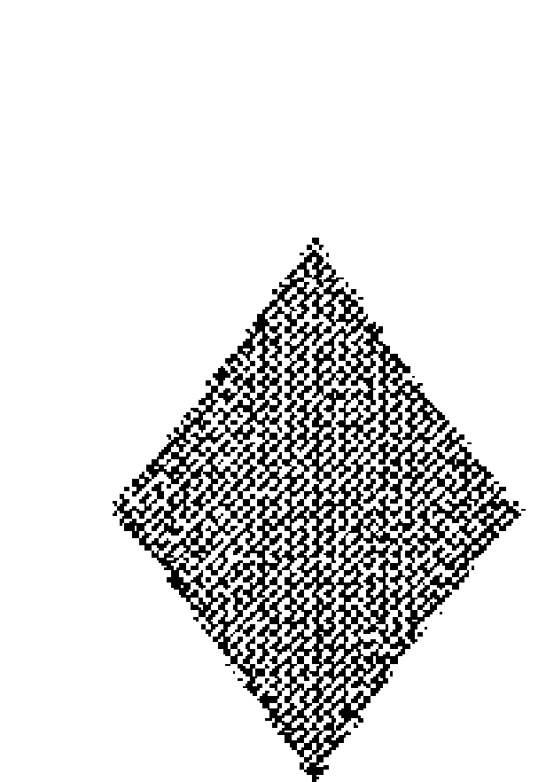

## 法國史上最知名女預言家 雷諾曼的生平故事

雷諾曼既被譽為法國史上最知名的女預言家，她的生平確實精采跌宕。她在1772年生於法國，年僅5歲就成為孤兒，被繼父再娶的繼母虐待，隨後更被送到修道院。當時沒人能料想到，她7歲在修道院時，就做出驚人之舉——她預測當時的院長即將被換掉。

這個預言很難不惹怒修道院長，雷諾曼被罰關禁閉，但是不久後就證實她的預言是正確的。

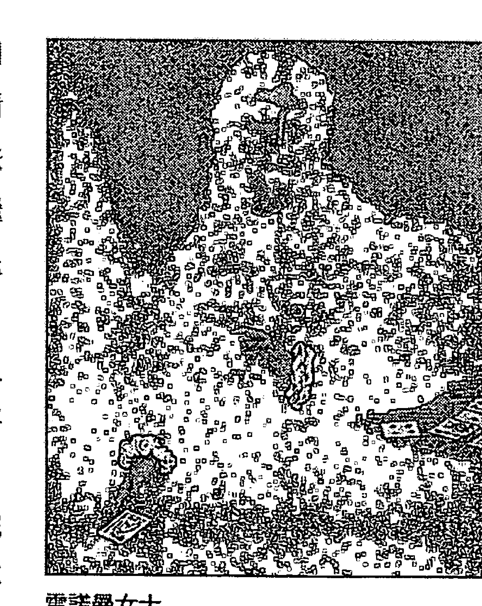

### 一役成名

她接著大膽預言繼任者的姓名、年齡和髮色，都準確命中。初出茅廬的這一役，已充分展現出她的預言天賦。

事實上，雷諾曼在早年就已經博覽神秘學，而且她很清楚自己的志向，幾乎不讀神秘學以外的書。

雷諾曼14歲時，說服繼母送她去巴黎，她就這樣帶著一個只裝著衣物的行囊，和六法郎，踏上都市生活。據說她跟當時一位小有名氣的算命師學習，3年後就開了自己的占卜沙龍，生意大獲成功。

此時正是路易十六執政後期，風雨飄搖之時。她大膽預言路易十六波旁王朝即將走向終結，準確命中。她也預言法國大革命的三位領袖羅伯斯比、馬拉與聖鞠斯特，將死於暴力，當時這三位領袖聽了，當場譏笑不信，不料事後竟都一一應驗。

讓雷諾曼卡真正爆紅的原因，大概是她與拿破崙的妻子，也就是法國皇后約瑟芬的密切關係。她在約瑟芬未嫁時，就已經是約瑟芬密切請教的對象，之後，就連拿破崙都向雷諾曼求教。

拿破崙當時還只是總司令，雷諾曼就預言他將娶一位寡婦（約瑟芬當時確實是寡婦）、戰勝、登上王位、震驚世界，最後死於流放。而拿破崙跟約瑟芬的婚姻變化，也無一不在雷諾曼的預言之中。

雷諾曼的名氣，甚至吸引來俄皇亞歷山大問卜。

### 傳奇的一生

不過，人紅是非多。雷諾曼也曾入獄幾次，原因是她企圖拯救被關在牢裡的瑪麗皇后（路易十六之妻），以及她過多的政治預言惹怒了拿破崙，不過都不久就獲得釋放。

雷諾曼的預言天賦不僅只對名流。她也曾在某天起床後，哭著跟身邊的人說她哥哥死了，事後，哥哥的死訊才送到。

雷諾曼也是多產的作者，畢生寫了超過十五本書。她的6法郎，最後增長到50萬法郎，成為大富婆。她在自己的書中，對拿破崙和約瑟芬有極盡細膩的描述，甚至記錄下拿破崙的掌紋等命理資訊。

雷諾曼以71歲高齡，死於1843年，在法國政治圈活躍了超過40年，人生牽連最輝煌動盪年代的政治頂峰人物，她寫的書為後世的史學家留下不少珍貴的紀錄。可惜的是，她個人的文物一點都沒有留下，因為繼承她財產的親戚是天主教徒而宗教禁止占卜之故，把她的文物全燒毀了，諷刺的是，那位親戚倒是把她的錢全留了下來。

雖然後世的批評家認為，雷諾曼的傳記裡，是自我宣傳的成分居多，有些內容可能不盡然真實，而後世的人在她死後替她寫的傳記，矛盾恐怕就更多了。譬如她的財產據說有50萬法郎，有人考證認為應只有12萬。她14歲前往巴黎，後世一篇傳記裡記載的年份，推算出來卻是17歲。她在巴黎跟隨學習3年的那位據說頗有名氣的算命師，追查回來可能其實是雷諾曼母親那邊的長輩，不見得是什麼巴黎的有名算命師。而她那些神奇的政治預言，憑著她與政治圈的密切來往，或許不是那麼難。

雷諾曼或許是被神化了，不過，沒有人可以否認，她是法國史上最知名的命理師，當之無愧。

## 雷諾曼的真實起源 其實是德國桌遊「希望遊戲」

瞭解了雷諾曼的生平，大多數人的直觀反應就是：「那雷諾曼卡應該就是雷諾曼發明的吧？」

不，雷諾曼卡不是雷諾曼發明的。事實上，雷諾曼本人可能根本從未用過雷諾曼卡。

雷諾曼卡的真正起源，其實是一位德國黃銅廠商人約翰·卡斯珀·赫克特爾（Johann Kaspar Hechtel）所創作的一款叫「希望遊戲」的桌遊，這款桌遊的德國原名為Das Spiel der Hoffnung，約在1799年出版。遺憾的是，赫克特爾本人在同年病逝，年方28歲。

希望遊戲是運用36張紙牌，以6×6排列在桌面當棋盤格，讓玩家擲骰在上面遊戲，走到不同牌卡上面，會觸發不同的作用。

為了讓玩家更廣泛的運用這套牌，赫克特爾貼心的把德國遊戲紙牌和法國遊戲紙牌的牌圖，都嵌入牌卡中，使得這套桌遊也能當一般的遊戲紙牌使用。

當時，赫克特爾已發現希望遊戲有成為占卜卡的潛力。他在說明書中寫道：「可以把這36張牌洗牌、切牌後，排成五列，前四列放8張，第五列放剩餘的4張。如果問卜者是女性，就從第29號女人牌開始解讀，

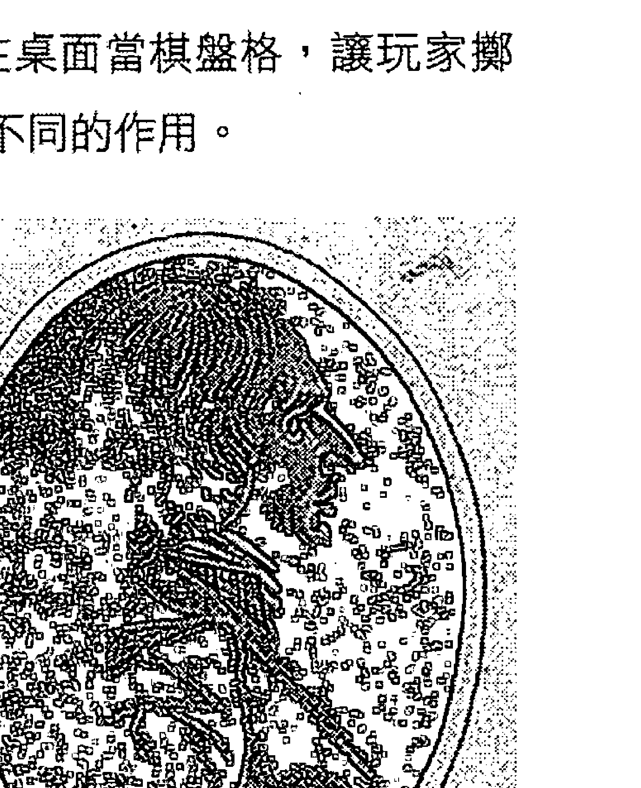

看看周遭有哪些牌，編織出一個詼諧的故事。如果問卜者是男性，就從第28號男人牌開始，同樣看周遭的牌來解讀。這會為每位玩家都帶來很大的娛樂。」

以上這段話，就是史學家目前所知，雷諾曼卡最確鑿的起源。這些考證是1972年，由德國教授Detlef Hoffmann和Erika Koppenstedt發表論文指出。而以上這短短的一段話，就是雷諾曼占卜最原始的說明。

希望遊戲現有一套存於大英博物館。由於有熱血的塔羅專家集資，請大英博物館將牌圖掃描成高解析圖檔，所以現在牌圖已在網上公開，只要用Das Spiel der Hofnung與British Museum為關鍵字搜尋，就能一睹它的廬山真面目了。

## 桌遊變身占卜卡 歸功於商人聰明的行銷

我們的下一個問題是，一套德國桌遊，又如何變成世人所知的「雷諾曼卡」呢？

這要歸功於商人的大力行銷。

在當年，希望遊戲主要仍是作為貴族和中產階級在家裡玩的桌遊。直到雷諾曼女士死後，因為她名聲過於響亮，商人就抓住機會，把希望遊戲的紙牌抽出來，單獨作為占卜卡，命名為「雷諾曼卡」販賣。當時以雷諾曼為名的占卜卡有好幾款，相當於現代的名人行銷。

打個比方來說，假設80年後，我們的鄰國有人把一款桌遊出版成占卜卡，取名叫「唐綺陽牌卡」，大概就是這樣的概念，事實上兩者是攀不上關係的。

### 雷諾曼卡問世

第一套雷諾曼占卜卡出版於1846年，也就是雷諾曼死後3年。這就是為什麼我們能確定，雷諾曼本人沒有用過雷諾曼卡作占卜。歐美網上曾流傳一種說法，說雷諾曼占卜卡是雷諾曼死後有人在她的衣櫥裡發現的，現在我們已知道，這完全沒有證據支持，雖然她的衣櫥裡倒是不無可能有一套希望遊戲。

其後，雷諾曼卡接連出版，牌圖有各種不同版本，不過，一直到1920年之前，估計有九成以上、甚至可能高達98%的隨牌說明書，都用同一種版本。這份說明書是在1846年由一位叫菲利浦雷諾曼（Philippe Lenormand）的人所撰寫，他自稱是雷諾曼的學生，雖然沒有任何證據證實這件事，許多人認為他是騙子，但總之因為雷諾曼的名聲太大，雷諾曼卡就如雨後春筍般出版。

現在我們所擁有的雷諾曼占卜相關知識，都是流傳自這份說明書，現在被稱為〈菲利浦雷諾曼說明書〉。如果你有興趣，可以上網以「Philippe Lenormand sheet」為關鍵字搜尋，就可以看見原稿，本書的牌義章節中也會提供這份說明書的中譯。

## 雷諾曼的起源追溯至義大利咖啡渣占卜

2013年，美國塔羅學者瑪麗・K・格里爾 (Mary K. Greer) 提出，希望遊戲的起源可追溯至更早的義大利咖啡渣占卜卡。

事實是，她發現1794年義大利威尼斯出版的一套32張咖啡渣占卜卡中，有29張牌的名稱跟希望遊戲相同。很有可能赫克特爾接觸過這副牌，做了一些改動，做成希望遊戲。

假如這個推測是對的，那麼赫克特爾是剔除了咖啡渣占卜卡裡的「蟲」和「綠灌木」這2張牌，把「獅子」換成「熊」，再增加「船、狐狸、鵜鳥、塔、書和鑰匙」這6張牌，牌數從原本的32增加到36張。根據學者Anthony Louis考證的結果，這應是因為希望遊戲是用兩顆骰子來玩，36這個數字較符合數學上的平衡，所以赫克特爾將其設計為36張。

這套咖啡渣占卜卡有附一本書，同樣是根據男人牌和女人牌周遭的牌，以及牌卡相距的遠近，來占卜吉凶。一般相信，雷諾曼卡占卜受到咖啡渣占卜卡的影響，不僅是因為解讀方法類似，還可以從「百合」牌的牌義看見明顯的痕跡。這一點，我們將在百合牌義的章節中說明。

這套占卜卡在1796年出版英文版，現有一套存於大英博物館。牌卡及書籍的掃描檔，都可以在大英博物館網站¹查閱到。

> 1 大英博物館的義大利咖啡渣占卜卡網址：https://www.britishmuseum.org/collection/object/P_1982-U-4637-1-32還有更早的起源嗎？富蘭克林的朋友提過它！

在1794年義大利的咖啡渣占卜紙牌出版之前，到底是誰發明這種占卜法，還未可考，不過瑪麗·K·格里爾還是繼續往前追溯，目前在文獻上最早的紀錄是1730年，美國開國元勳暨發明家富蘭克林的一位劇作家好朋友，曾在劇本裡提過咖啡渣加紙牌的占卜。

這件事告訴我們，咖啡渣加紙牌的占卜，起碼在1730年就已經開始流行了。

總結來說，至少我們可以確定，雷諾曼卡是大約290年前從義大利咖啡渣紙牌占卜流傳下來的一種占卜系統，以法國的占卜師命名，在德國發揚光大。它的歷史比塔羅牌短，解讀方式和著重的層面也不一樣。下一章我們就來瞭解雷諾曼卡的特色。

## Chapter 2
雷諾曼卡的特色

雷諾曼卡是繼塔羅牌之後才興起的紙牌占卜法。大多數雷諾曼卡的玩家，都先學過了塔羅牌，因此慣用塔羅牌的思路來理解雷諾曼卡，不過其實兩者從核心概念、占卜方式、解讀思路乃至產出的結果都大不相同，好比墨鏡與望遠鏡，雖然都是用來提升視覺，但是從裡到外都大不同！所以，學雷諾曼卡時，如果套用塔羅牌的模式，並不能抓到雷諾曼占卜的精髓。

因此，在學雷諾曼卡時，請先把算塔羅的習性拋掉，用空白的心態來學習。

## 雷諾曼卡VS.塔羅牌

雷諾曼卡與塔羅牌至少有這些不同點，當然並不限於此：

- 1. 第一，雷諾曼卡不需要神祕學知識。

塔羅牌有深厚的神祕學傳統。其中的集大成者都是金色黎明會或共濟會成員，因此塔羅牌是經過神祕學設計的，結構嚴整，一張牌裡面會有很多象徵符號，可能還會帶到占星學、卡巴拉數字學、色彩學、易經，甚至地占學，知識量非常龐大，哲理高深。

相對之下，雷諾曼卡是民間流傳的占卜法，運用日常生活的物件來解讀，這些物件具有普世通用的象徵意義，幾乎一看就能理解。而由於雷諾曼卡原本是桌遊，在設計之初，並沒有納入什麼嚴整的結構或哲理，所以學習的時候完全不需去學神祕學知識，上手速度更快。

- 2. 第二，雷諾曼卡每張牌權重相同。

塔羅牌78張中，有分22張大牌和56張小牌，大牌的重要性比小牌要重。雷諾曼卡則是36張都有相同的權重。

- 3. 第三，雷諾曼卡不分正逆位。

塔羅牌每張牌都可分正位和逆位，正逆位含義不同。雷諾曼卡完全不分正逆位。這也是雷諾曼更快上手的原因之一。

- 4. 第四，雷诺曼卡着重于具体事件的预测（但预测结果并非不能改变）。

塔罗牌着重在心理和灵性层面，它的强项是可以显示整个事情呈现的能量和内心世界，甚至还有如「奥修禅塔罗」这类牌种，几乎完全在讲心灵。雷诺曼卡则着重在日常生活的俗世层面，擅长预测具体事件。

简单来讲，塔罗牌告诉我们「为什么」，雷诺曼卡告诉我们「会发生什么」。或者，塔罗牌告诉我们「成因」及从成因推导出来的结果，雷诺曼卡则直接显示「结果」。

假设现在算感情，塔罗牌可以告诉你：「你现在感情问题的症结，是因为童年跟父亲的关系不好的创伤导致。」雷诺曼卡则会说：「你的男朋友在外面偷吃，第三者是他在健身房认识的。」

雷诺曼卡的诠释就是如此直白，而且一针见血，毫不含糊。

因此有人比喻，塔罗牌是哲学家，雷诺曼卡是我们的死党、好闺蜜。

虽然，当两种牌用得很精通的时候，塔罗牌也可以预测事件，雷诺曼卡也可以反映出心理上的状况，不过要这样算的话，都是绕了远路，不如一开始就选用适合的牌，才事半功倍。

举个实际例子，一个女人问过年该不该回家过，塔罗牌抽到圣杯二，是心心相印、感情很好的感觉，塔罗牌主要呈现这样一个情感能量，我们从这个情感能量去推演，她回去的话会得到情感上的亲密，因此占卜师给出的答案会是：「回去不错喔，你跟男友之间会有充满情感交流、仿佛热恋的感觉。」

可是雷诺曼卡可以直接显示，她回去的话，男朋友会当众向她求婚。

假设她抽到下面这些牌：

男人+戒指+花园

男人是男朋友，戒指是订婚，花园是社交场合，合起来就是「男友当众求婚」。

塔羅牌要能算出具體的事件，比較困難一點。相對來說，雷諾曼卡雖預測出具體事件，但比較不易呈現問卜者的心境，我們看不太出女方對此的感受如何。可見這兩種牌卡雖然都可以用來算這個問題，然而側重層面有所不同，造成解讀方向的差異。

由此可知，塔羅和雷諾曼卡這兩種紙牌占卜，各自擅長的領域不同，不需要去分誰好誰壞、誰高誰低，主要應依據想要瞭解的層面不同，來選用適合的占卜法。

其實世界上任何的命理或占卜法，都像是透過不同的眼鏡看世界，依據不同的需求選用不同的眼鏡，該戴墨鏡的時候戴墨鏡，該用望遠鏡的時候就用望遠鏡。雷諾曼卡就是幫助我們看見事情具體發展的眼鏡囉。

有些朋友認為，雷諾曼預測事件的長處，會讓人感覺有點像鐵板神算、鐵口直斷，可是他們想問：「難道事情真的就這樣註定不能改變了嗎？」我甚至還有朋友因此很抗拒使用雷諾曼卡。

事情並非如此。雷諾曼卡不是算出來就是註定的，每個人的未來都還是有改變的空間，牌卡只是顯示出「按照目前趨勢走下去最有可能獲得的結果」，但是，每個人還是可以依據牌面顯示的結果，趨吉避凶、改變未來。

關鍵是問問題的技巧。如果問得好，就不會被牌面的預測限制住。關於這點，在後面會更進一步說明。

- 5. 第五，雷諾曼卡需結合2張以上的牌卡解讀。

塔羅牌每張牌面上都有許多象徵符號，單張牌就可以訴說一個完整的故事。占卜師的挑戰是要從眾多象徵意義中，找到適用的牌義。

雷諾曼卡每張牌都相對簡單，一張牌只有一個主要象徵意義，解牌時就需用2張以上的牌去做詞彙的排列組合，3張牌可以得到一個完整的句子，9張牌形成一個小事件，36張牌就呈現人生的全景圖。

由此可知，雷諾曼解讀特別著重牌與牌之間的相互關係。舉例來說，

前文中提到「男人＋戒指＋花園」這個牌組，這張男人牌，在雷諾曼卡的世界中單純代表一個男人，沒有更多了，需要從旁邊的牌才能推知關於這個男人的事。

我曾聽一位塔羅老師說過，學塔羅牌要有能力把一張牌看成多張牌，他指的是從牌上眾多的象徵符號中，個別看出獨立的意義。雷諾曼卡剛好相反，我們要學的是把多張牌看成一個整體的能力。

- 6. 第六，雷諾曼卡的牌義不受牌面圖案影響。

塔羅牌有成千上萬種，它仰賴牌面的象徵訊息，所以只要牌圖畫得不同，意義就會不同。而雷諾曼卡都是取自生活中常見的物件，象徵意義是舉世共通的，並不會因為戒指畫成大顆還是小顆，就影響到占卜結果。

所以，雷諾曼卡用哪一副，完全不影響解牌方向及結果，選購牌也因此相對自由。

因為雷諾曼卡是這麼的簡單，甚至如果忘了帶牌，我們拿起影印紙裁成36張，在上面寫下36張牌的名稱，就這樣開始占卜，也完全行得通。

還有些練到高段的高手，根本不必有牌了，只要在心裡默問問題，眼睛睜開看第一個落進眼中的物品，就可以開始解讀。這就等於是用眼睛來抽牌，很方便吧？

## Chapter 3 如何选购雷诺曼卡

市面上已有不少雷诺曼卡的款式。既然雷诺曼卡的牌图对牌义没有影响，选哪一副牌就很自由，并没有说初学者一定得用哪款牌入门。

不过，根据经验，还是可以分门别类选出一些对初学者较友善的牌。以下就是建议初学者选牌时留意的部分。

### 選購雷諾曼卡6心法

#### 1.選有撲克牌標示對應的

雷諾曼卡跟撲克牌有對應，有時撲克牌對應可運用來增添占卜意義，所以最好選擇牌面有畫出撲克牌的牌種，或至少有簡單標註出來。

目前大多數的牌都有繪出撲克牌對應，但還是有少數無對應的牌在市面上流通。如果你打算在占卜中運用撲克牌對應，選購時就要避免買到無撲克牌對應的牌卡了。

此外，還可以稍微留意繪製呈現的方式。

古典風格牌卡通常會把整張撲克牌畫在牌面上，一目瞭然，但若占用過大牌面面積，就不易突顯牌卡原本的主題。

現代風格牌卡則多用符號簡略表示，例如紅心3就是標個小小的「3♥」，優點是精簡，相對來說，如果想利用撲克牌花色解讀時，就沒那麼容易看清。在這方面，可依各人喜好及解牌習慣取決。

#### 2.選物體畫得清楚明確的

因為雷諾曼卡需多張一起解讀，最經典的大藍圖牌陣還得36張全部用上，如果畫面太凌亂，或是物體無法一眼就讓人辨識出來，甚至還有原本該分屬2張牌的物件被畫在同一張，解讀的時候就易混亂。

我曾見過的狀況是狗牌跟熊牌畫得極像，令人難以區分。也有熊牌裡面畫著兩個小孩，使人搞不懂這是熊牌還是小孩牌，還有狗牌裡畫著一枚大戒指，讓人誤認為戒指牌，或者狗牌上畫著小孩，諸如此類，都容易使初學者困惑。

通常古典風格的牌由於圖像極簡，在這方面表現比較好，如復刻1875年Dondorf版雷諾曼古牌的法式雷諾曼卡（French Cartomancy）便是國外占卜師普遍推薦的，牌圖相當清楚明確。喜歡更精緻華麗風格者，可選擇復古雷諾曼卡（Old Style Lenormand）。

現代風格的雷諾曼卡，通常比較色彩繽紛，背景可能畫上琳瑯滿目的物件，或有花俏的外框，這在做大藍圖牌陣占卜時，有可能使人眼花撩亂，不過，還是有些高明的畫家能在全景畫面中突顯主題，讓我們在鮮麗多元的畫面中，仍能流暢的解讀，這種牌卡對初學者較為友善，也是我較建議初學者選用的，如凱爾特雷諾曼卡（Celtic Lenormand）就是其中的佼佼者。

#### 3.選無外框或外框範圍小的

有些雷諾曼卡外框範圍很大，主題相對顯小，這對於大牌陣解讀並不友善，因此建議選無外框或外框範圍小的，以便突顯主題。

#### 4.選有標示編號在牌面上的

雷諾曼卡標準36張，每張都有編號，這些編號在占卜的時候有用途，所以一定要買有編號在上面的。（所幸，目前市面上的牌款幾乎找不到沒有編號的了。）

#### 5.尺寸不要太大

因為雷諾曼卡的牌陣可用到多達36張牌，如果牌太大，就需要找大桌面才能進行，會比較不方便，因此建議買撲克牌大小的尺寸即可。若大於7×12cm的標準塔羅牌尺寸，比較適合做教學或拍片用途。

#### 6.選用標準牌數36張

雷諾曼卡的標準牌卡數量是36張。有些牌會有額外的男人牌或女人牌，可用在同志占卜中，這還可以選用，還有些牌款會附加新發明的牌，就有新的牌義需要學習，對初學者而言就會增加上手難度，因此建議初學者先用標準36張牌做占卜。

好消息是，就算你喜歡的牌剛好有附加額外牌，也很容易處理，只要先將額外的牌挑出不用即可。

### 總結

綜合以上的條件，我最推薦初學者入門的牌種如下：

1. 法式雷諾曼卡 (French Cartomancy)
2. GT大牌陣雷諾曼卡 (Grand Tableau Lenormand)
3. 藍鳥雷諾曼卡 (Blue Bird Lenormand 又稱青鳥雷諾曼卡)
4. 復古雷諾曼卡 (Old Style Lenormand)
5. 經典復刻原始版雷諾曼卡：希望遊戲 (Primal Lenormand —— The Game of Hope)
6. 凱爾特雷諾曼卡 (Celtic Lenormand)

下面這些是不完全符合上述條件，但整體而言仍屬優秀的牌種：

1. 精靈雷諾曼卡 (Fairy Lenormand Oracle)：尺寸偏大。
2. 泰勒瑪雷諾曼神諭卡 (Thelema Lenormand Oracle)：尺寸偏大。
3. 黃金雷諾曼神諭卡 (Golden Lenormand Oracle)：尺寸偏大。
4. 聖甲蟲勞拉雷諾曼神諭卡 (Lenormand Oracle)：尺寸偏大。
5. 築夢之路雷諾曼卡 (Dreaming Way Lenormand)：有3張牌易混淆，但牌圖極美。
6. 玫瑰祕境雷諾曼卡 (Under the Roses Lenormand)：有2張牌易混淆，但標題大字彌補了這個缺點。
7. 廣義雷諾曼卡 (Maybe Lenormand)：有額外的牌，拿掉即可。
8. 金色夢想雷諾曼卡擴充版 (Gilded Reverie Expanded Edition)：有額外的牌，拿掉即可。

简单演示

361行代码实现完整功能。

```
print('Hello, World!')
```

## Chapter 1
牌義學習的基本概念

在進入36張牌義的介紹之前，有幾個重要原則要先知道。

這些原則，幾乎可以適用在任何紙牌占卜術，可以說是占卜術的大通則，請務必牢記。

### 學習牌義6心法

#### 第一，學牌義不需要死背。

我曾經看過一種教牌的方式，一張牌過來，老師就說，這張牌代表成功、完成、旅行、外國人，但是從頭到尾沒有告訴學生為什麼，這樣死背的記憶太辛苦了。

其實學牌是可以很輕鬆自然的。只要先認識圖面，抓一兩個最主要的關鍵字，再從關鍵字往外聯想，就很容易整體記憶、舉一反三了。這也是我們在這本書裡將進形的方式。

舉例來說，「狗」這張牌，我們先從「狗」的核心象徵開始，你第一個聯想到什麼？應該是「人類忠實的好朋友」吧？於是，沒錯，我們得到「忠實」和「朋友」兩個牌義。

接著繼續發想，「忠實」可以繼續聯想為「友善」、「親切」、「誠懇」、「支持」、「幫助」、「奉獻」。而「忠實的好朋友」這種概念，若換到現代社會的眼光，當然也可以代表「粉絲」和「追隨者」。

以同樣的方式，換個情境，可以繼續聯想下去。在愛情占卜中，「忠實的好朋友」會代表什麼樣的狀況？嗯，應該是由朋友日久生情吧。問健康，抽到狗牌，你再想想，狗的生理構造有什麼特色？狗總是哈哈哈哈吐著舌頭吧，所以狗可以代表「舌頭」及相關疾病，甚至與味覺有關。

看見沒？雷諾曼卡的牌義幾乎不用費力記憶，只要從象徵意義聯想，自然就出現了。

這就是雷諾曼卡正確的學習方式：從核心象徵，向外推想，擴充你的詞義庫，就像做心智圖，就是這個概念！

#### 第二，每一張牌都可能代表字面義。

雷諾曼卡的牌面都是日常生活的物件，每張牌都有可以真的代表該物件。譬如，騎士牌就有可能真的代表騎士，幸運草牌就代表幸運草，雖然這種情況不常見，但還是有可能。解牌的時候要依據問題的情況，看適不適合朝字面義解讀。

#### 第三，所謂的好牌壞牌都只是世俗眼光的認定。

本書的牌義章節中，會幫每張牌總結這是好牌、壞牌還是中性牌，但是在這邊我一定要強調，在雷諾曼占卜或任何占卜裡面，所謂好跟壞都只是表面世俗上的判斷而已。

其實任何事件本身都是中性的，所謂的好跟壞都是人的想法去賦予它的，同一件事，給不同想法的人來看，每個人對好壞的認定都不同。

譬如，今天有一個人死了，一般人肯定認為這是壞事，可是，這個人可能在病榻上輾轉折磨多年，他的家人因此在經濟與身心上都飽受煎熬。這天他終於走了，對他來說是一場早就想要的解脫，對他的家人也是鬆了口氣……那麼，「死亡」究竟是好事，還是壞事呢？在雷諾曼卡占卜時，無疑可能會以棺材這種負面牌來顯示死亡事件，但是我們一定要記著，任何負面事件，換一個眼光來看，都可以是正面的。任何負面牌，都隱含著正面意義。

所以，本書中給每張牌好或壞的定義，是因為雷諾曼擅長預測世俗生活的事件，既然是世俗的事，才幫它下一個世俗大多數人所認知的好壞的定義，這僅僅是為了符合一般人在占卜上的需求罷了。但是，若站在更高的角度，就不見得要判定它是好或壞，就算是一般人最怕的棺材或死神牌，其實都只不過代表一個結束，這個結束可以是很好的。

總之，不管抽到什麼牌，都一定有其光明面，這點請讀者務必要放在心上。

#### 第四，需以雷諾曼卡形成的時空背景來理解牌義，並與時俱進。

每種占卜術都有當時形成的時空背景，隨時光推移後，意義可能發生變化。舉個例子，在紫微斗數中，過去的「機月同梁」命格是當官的貴命，「殺破狼」命格是販夫走卒的賤命。時空推移到今日，「機月同梁」變成了公務員，「殺破狼」變成大老闆，解讀方向就不可同日而語。

雷諾曼卡也是如此，在理解牌義時，需用它形成的時空背景——十八世紀的歐洲——來尋找現代的類比。例如「船」這張牌，是因為當時還沒有飛機，搭船是唯一前往遠方異地的方式，到了今日，「船」牌當然就可引申為搭飛機了。

再舉個例子，如「信件」這張牌，是因為過去只能寫信，現在「信件」當然可以引申為電話、傳真、電子郵件和各種社群媒體了。

#### 第五，雷諾曼卡的牌義，每個人都可以自行引申創造。

雷諾曼卡現存最早的占卜資料是1846年的〈菲利浦雷諾曼說明書〉，只有薄薄一張紙，每張牌都只介紹短短幾句而已，但是現在西洋的雷諾曼卡書，牌義都洋洋灑灑一大篇，為什麼會擴充這麼多呢？

其實，都是後世的人各自以各自的經驗與理解，去引申它的牌義。

這是不得不然的結果。因為原始資料太少，占卜者為了因應占卜所需，自然需要去引申更多牌義。

引申到後來，因為個人與文化認知不同，產生流派差異，是相當正常也不足為奇的結果。

舉個真實的例子。還記得第一副雷諾曼占卜卡是在德國出版的嗎？德國雷諾曼占卜傳統上，代表工作的牌是「錨」，因為錨提供安全與穩定感，就像工作提供給人們的一樣。

荷蘭和比利時一帶，多用「月亮」代表工作，因為月亮是人們欣賞歌詠的對象，而一般人會被別人如此稱頌，多半是因為事業上的表現。

到了法國，卻是用「狐狸」代表工作，因為狐狸為了生存使出各種伎倆，就像人類為了生存而工作一樣。

那麼，到底工作該用錨、月亮，還是狐狸來代表呢？

其實都可以。因為這是雷諾曼原始文獻中沒有寫的，後世占卜師於是各自演繹，因此也沒所謂的對錯，只要自己事先做好設定，算出來都會準確。

還有一個更有趣的例子：

雷諾曼卡做健康占卜時，要怎麼算出「拉肚子」這件事？《菲利浦雷諾曼說明書》並沒提到這一點。

有位占卜師某次為顧客占卜健康，抽到「騎士」和「魚」這2張牌。他的客人後來拉肚子了。占卜師於是恍然大悟：原來騎士（奔跑）＋魚（水）＝跑廁所＝拉肚子啊！

從此以後，他就記得騎士加魚等於拉肚子了。他寫書分享這個發現，於是許多讀者都採用這個牌義。

另一位占卜師學雷諾曼卡時，他覺得拉肚子應該是蛇加魚，因為蛇（腸子）＋魚（水）＝拉肚子。很說得通。

他將這個認知付諸實踐，從此以後算健康，看到蛇加魚，就預測會拉肚子，結果也相當準確。他也寫書分享這一點，於是他的讀者，都學會用蛇加魚代表拉肚子。

同樣的，這兩種牌義組合也沒有誰對誰錯。騎士加魚對第一位占卜師是對的，蛇加魚對第二位占卜師也是對的。上述第一位占卜師是芮娜·喬治（Rana George），第二位是安迪·伯羅維森格（Andy Boroveshengra），兩位都是享譽盛名的雷諾曼占卜師及暢銷作家。

至於身為讀者的你要採用哪個牌義，就看自己了。首先選自己覺得貼切的。再來，試著在自己的占卜中驗證。甚至，如果你覺得別人的牌義都不通，你也可以創造自己的牌義——沒錯，別人可以自行創造牌義，我們當然也可以！

命理界有句話說「錯的用久就會對」，正是描述這個現象。就算本來不通的牌義或占卜方法，用久了，自然也會照著占卜者的認知去運作，所以不管你用貓、月亮或狐狸代表工作，還是用騎士加魚或蛇加魚代表拉肚子，只要你事先設定好意念，然後固定使用，無論如何，用久了都會對。

#### 第六，雷諾曼卡不適合透過第三方解牌，尤其是當有自創牌義或解讀方法時。

雖然雷諾曼能自創牌義這點看似很自由，不過，自創是把雙面刃，一旦自創牌義或自創解讀方法後，將來都只能自己解讀自己的牌了，給別人解讀就不會準確。

這是因為占卜術都是依照占卜者的認知來運作。一個認定月亮牌代表工作的占卜師，做了一場占卜，事後拿給認為狐狸牌代表工作的人解讀，是不會準的，因為那牌陣已經是以「月亮牌代表工作」為前提所顯示了。

同樣的，如果你認定「蛇加魚牌」是拉肚子，給設定「騎士加魚」是拉肚子的人來解讀，也不會準，因為你在抽牌之際，牌面就是以你的認知來顯示了。

這也是為何雷諾曼卡特別不適合請別人解牌，包括在網路上請人解牌，都不適合，除非你很確定對方對雷諾曼卡的認知與自己完全相同，才可互解。

因此，當你打算自創牌義的時候，雖然給了自己方便和解牌的豐富性，也要考慮這可能會使你不易與其他占卜者溝通。

本書中講解的牌義，都是從〈菲利浦雷諾曼說明書〉的原始牌義出發，參考1794年義大利咖啡渣占卜卡的說明，再補充當代的主流牌義速查表，故整體而言相當貼近原典。我刻意不納入我個人自創的牌義，就算偶有幾處分享我個人的牌義，我也會明白寫出這是我的個人牌義，目的就是為了便於讀者與歐美主流接軌。

我建議初學者還是先熟悉原典及主流牌義速查表，再由此去引申變化，不要背離原始牌義太遠，畢竟雷諾曼卡的象徵意義直觀簡單，與之背離太遠，恐怕代表違反常理了。

## 如何閱讀本書的牌義

本書的牌義分成幾個部分：

- **原始牌義**
每張牌介紹的開頭都會列出最原始的牌義來源，包括1794年義大利威尼斯咖啡渣占卜卡、1799年〈希望遊戲〉說明書，及1846年〈菲利浦雷諾曼說明書〉，這些都是雷諾曼卡牌義在歷史上的最初源頭。

- **基本資料：編號、撲克牌對應、核心意義**
雷諾曼卡每張都有一個編號與撲克牌對應，後面的章節會更深入說明如何應用。核心意義是牌義學習最關鍵的起點。

- **說明**
此欄從原始牌義出發，逐步推展到現代主流牌義速查表。

- **解讀的方向性**
有些牌卡的方向會影響解讀，增添更細緻的占卜意義，譬如雲牌陰暗的一側若朝向代表問卜者的指示牌，代表事情較不利；鐮刀牌的刀尖朝的方向，代表受到傷害的對象等。如果該張牌有方向性元素，會在此列出。

不過，需要瞭解的是，方向性並非一定要採用。有些占卜流派很看重方向性，有些則幾乎不太採用。我建議初學者先不採用，熟悉之後再逐步視情況採用。

## 4. 大藍圖牌陣的遠近解讀法

大藍圖牌陣就是用上36張牌的最大型雷諾曼牌陣，是所有雷諾曼占卜者最終要攀爬的聖山，解讀方式可分為德國傳統的「遠近法」，與現代新派解讀法。此欄說明這張牌在大藍圖牌陣中用「遠近法」解讀時，通常如何分析。

## 5. 主流牌義速查表

- **【名詞】** 這張牌代表的名詞，建議揀選兩個作為初學起點。
- **【形容詞】** 這欄列出當這張牌在形容旁邊的牌時，可以做為什麼形容詞。
- **【愛情】** 這張牌在愛情占卜中通常代表的意義。
- **【工作】** 這張牌在工作占卜中通常代表的意義。
- **【行業】** 這張牌代表的行業，可運用在求職占卜或辨認牌卡指涉的人。
- **【人物】** 雷諾曼卡如果牌面是人物或動物，或是有對應到Q和K這兩種宮廷牌，就可以直接代表一個人物，此欄指出可能代表什麼人。
- **【人物形容詞】** 每張雷諾曼卡都可以描述鄰近的人物牌，在這欄給予說明。
- **【身體部位】** 通常應用在健康占卜。
- **【疾病】** 通常應用在健康占卜。
- **【健康建議】** 通常應用在健康占卜，一般性占卜亦可。請注意，健康建議不是每一項全部都適用，而需根據直覺和占卜情境，選取最適合的那項。
- **【身心靈】** 如果想探索身心靈，可以運用此欄的資訊。
- **【物品】** 通常用於詢問物品或失物時。
- **【時間】** 每張牌都隱含速度的快慢，或代表特定的時間，可運用在時間預測。
- **【地點】** 通常用於失物占卜，有時一般占卜中也會顯示這個細節。
- **【建議】** 當詢問建議時，可以參考。請依據直覺和情境，選取適用的建議。
- **【總結】** 總結這張牌是好牌還是壞牌。

## 1 騎士 Rider

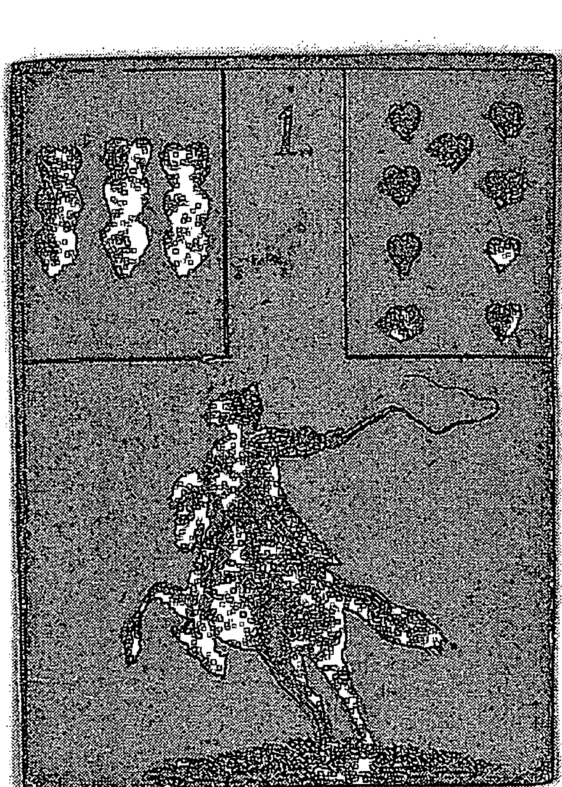

> 「不要對人性的善良絕望，因為你將得到意外的證明，你可以期待獲得新訊息，失物也會被歸還。」——1794年義大利咖啡渣占卜卡牌面箴言。

> 「騎士代表來自國外的好消息，可能是關於金錢方面，在某個外國情勢很好，或展望很好。他原本懷疑自己好運，這個圖騰出現後，好運肯定會持久。」——1794年義大利咖啡渣占卜說明書。

> 「騎士是好消息的使者，只要旁邊沒有負面牌。他會帶來這個人期待的好消息，可能是從自己家裡捎來的，或是從國外，不過這將不會馬上發生，而是要過一段時間才發生。」——1846年〈菲利浦雷諾曼說明書〉。

## 編號：1

## 撲克牌對應：紅心9

## 核心意義：消息、信差、訪客

雷諾曼卡誕生的時代，還沒有汽車，送信的人是騎馬的，所以，騎士就象徵送來消息的信差。也由於信差本身是登門的訪客，所以也可以代表訪客。

這位騎士捎來的通常是好消息，除非旁邊有壞牌。而由於現代物流發達，他也很可能捎來東西，細節可從鄰近的牌推斷，例如當旁邊有信件牌時，他就是送來信或包裹，也就是郵差或宅配員，當有代表飲食的熊牌時，他就是餐點外送員了。

騎士既然是專程送來消息或物品，因此含有抽象的抵達概念，可以代表某人即將抵達，或某物即將送達。譬如假使抽到愛心牌（愛情）加騎士，可能是表示戀愛即將來臨。

騎士也常代表通常是男性的人物。他可以是信差、訪客或真的騎士，也可能代表一個抽象意義上的進入生活中的人，因此，在愛情占卜中，騎士常代表新的男性戀愛對象。

不管這位騎士是送來消息、登門造訪，還是指一個人物，一定都會帶來一些新變化，所以騎士也可以進一步延伸為任何新的東西——新人、新消息、新物品，這些都會帶來新開始，推動新進展，造成新局面，一體連環。

因此，當騎士牌出現，可以預期事情將有新進展，局勢會向前推進，是不錯的預兆。

## 愛情解析

騎士在愛情占卜中，可以從「消息」、「新」和「訪客」為關鍵字延伸。「消息」可能是接到愛情方面的消息。「新」可以代表任何新的人事物，或許是聽到新消息，遇到新對象、開展新戀情、事情有新進展。「訪客」可能指有愛情相關的對象來訪。

## 工作解析

騎士可以代表工作上的消息、有信差或訪客，或新的人事物到來，這方面涵蓋很廣，從新的合作機會、新設備送達、新人到職，任何新的都算。
騎士代表的行業，首先與遞送有關，如快遞、宅配、外送、運輸。第二，與運動有關，特別是競速運動，如賽跑或賽車。第三，他真的就是個騎士，無論是自行車騎士、機車騎士或馬術騎士。

## 健康解析

因為騎馬主要運用腿部，所以騎士代表腿腳部位，也因為騎士的行動需要敏捷性，所以也包括關節、肌腱與韌帶。若指疾病，就是腿腳部的疾病，或運動傷害。若指健康建議，通常預兆有醫療方面的訊息將送達，也可能是建議多運動、多出去兜風、找新醫生或嘗試新療法。

## 人物解析

騎士牌可以直接代表一位人物，有以下幾種解讀方向：

- 女性愛情占卜中，可代表她的新的男對象。
- 同志愛情占卜中，可指男問卜者的男性戀愛對象。
- 一個年輕男子。此時無其他含義，須從周圍的牌了解他的特性。
- 信差：郵差、傳話者、宅配員、外送員等。
- 訪客。
- 騎士：包括但不限於自行車騎士、機車騎士或馬術騎士。

騎士如果是形容周圍的人物牌，則代表此人有騎士般的特質，熱烈活躍、外向奔放，很有行動力，可能是運動健將，體格當然也不錯，可能是個會打扮的潮男（因為騎裝很帥），喜歡出門兜風，缺點是可能魯莽衝動，過度躁進，缺乏定性。

騎士形象的代表人物有健美的彭于晏、籃球國手退役的男星黑人陳建州、形象很潮而行為稱不上穩重的邱澤、羅志祥、謝霆鋒。在《哈利波特》中，當海格上門通知哈利說「你是個巫師」時，海格就是騎士。

## 物品解析

騎士騎的馬在古代是交通工具，因此騎士可以代表交通工具，主要是可騎乘的陸地交通工具，如腳踏車或機車，但也有些占卜流派會用騎士代表汽車。騎士也可以真的代表馬，也包括兒童木馬、馬造型玩具等。

## 時間解析

由於騎士速度很快，所以這張牌代表的速度是「快速」。因為報信者通常只會短期停留，因此也可代表「短期」。而由於騎士牌是編號1，所以可以視情境代表數字1的日期：一天、一週、一個月、一月份或每月的第一日。

## 屬性

由於傳統意義，騎士牌送來的大多是好消息，所以屬於中性偏好。除非旁邊有壞牌，才會把消息轉為負面。

## 大藍圖牌陣的遠近解讀法

騎士在大藍圖牌陣裡，主要代表消息，至於消息是哪方面、是好是壞，可以從旁邊的牌來推斷。

騎士牌如果離代表問卜者的指示牌（男人或女人牌）遠，傳統上代表消息來自遠方，甚至國外。如果離指示牌近，則是從鄰里甚至家裡人傳來的消息。不過，因為現代網路發達，消息是從哪裡傳來，已經不那麼重要了，因此有占卜師建議將遠近視為消息對自己的影響程度，如果遠，表示跟自己不直接相關，如果近，表示與自己切身相關。

愛情占卜中，騎士可以代表女問卜者除了男人牌以外的第二個對象，或新出現的男對象。

騎士牌也被廣為運用在同志愛情占卜，作為男同志問卜者的對象（問卜者本身用男人牌代表，騎士牌代表他的對象）。

## 主流牌義速查表

| 項目 | 內容 |
| :--- | :--- |
| **【名詞】** | 消息（好消息、訊息、新聞）、訪客（客人、信差）、抵達（送達、到來）、新（新人物、新情況）、運輸。 |
| **【形容詞】** | 快速的、新的、新來的、即將到來的、快要送達的、在途中的、有進展的、更新的、領先的、先行的。 |
| **【愛情】** | 愛情方面的消息、新的人事物（新消息、新戀情、新對象、新進展）、訪客。 |
| **【工作】** | 工作上的消息、新的人事物（新人、新設備、新發展）、信差或訪客。 |
| **【行業】** | 運送相關（物流、外送、運輸、客運）、騎士相關（自行車手、馬術士）、競速運動相關（田徑員、賽車手）。 |
| **【人物】** | 女問卜者的新男性戀愛對象、男同志的男戀愛對象、年輕男子、信差（傳訊者、郵差、快遞員、物流員、外送員）、訪客、騎士。 |
| **【人物形容詞】** | 騎士般的（熱情的、活躍的、外向的、奔放的、有行動力的、動作快的、急性子的、敏捷的、愛運動的、健壯的、喜歡出門兜風的、打扮很潮有魅力的、魯莽的、衝動的、躁進的、沒定性的）。 |
| **【身體部位】** | 腿腳部（含關節、肌腱、韌帶）。 |
| **【疾病】** | 腿腳部問題、運動傷害。 |
| **【健康建議】** | 醫療方面的訊息馬上到來、多運動、多到戶外兜風、找新醫生、嘗試新療法。 |
| **【身心靈】** | 接收或傳遞靈性訊息、出去走走、學習新的身心靈法門。 |
| **【物品】** | 交通工具（腳踏車、機車）、馬（含木馬、馬造型玩具）。 |
| **【時間】** | 很快、短期。數字1的日期（一天、一週、一個月、一月份、每月一日）。 |
| **【地點】** | 馬路、駕訓班、賽車場、田徑賽道、馬場、自行車或機車停放處。 |
| **【建議】** | 行動吧、去吧、動作要快、尋找新方法、接觸新事物。 |
| **【總結】** | 中性偏好。 |

## 2 幸運草 Clover

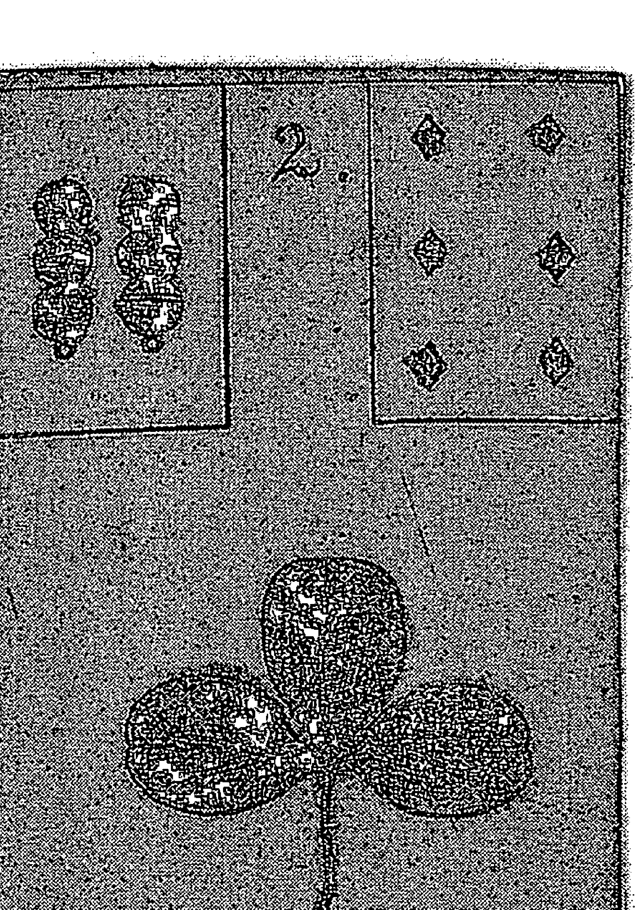

> > 「你可能的確非常好運，如果你總是榮譽和正直履行職責。」——1794年義大利咖啡渣占卜卡牌面箴言。

> > 「幸運草在這裡也是幸運的普遍象徵。它在杯子的不同位置，也會造成不同。如果在杯子上方，沒有離很遠的話，顯示好運，但是如果是在中間或底部，好運可能會遲來。如果雲圍繞，顯示很多不愉快將伴隨幸運而來。如果在明淨處，表示寧靜不受干擾的幸福，如他所願的光明。」——1794年義大利咖啡渣占卜說明書。

> > 「抵達好展望的星星，玩家獲得六分。」——1799年希望遊戲說明書。

> > 「幸運草是好運的預兆，如果旁邊沒有不幸運的牌的話。它帶來好運，可能是這個人所期待的，可能是來自家中，也可能來自國外。不過，這不會馬上發生，可能要過一些時間才發生。」——1846年《菲利浦雷諾曼說明書》。

## 編號：2

## 撲克牌對應：方塊6

## 核心意象：幸運、機會、開心

幸運草，顧名思義，是代表幸運的牌。在雷諾曼卡上，這張牌通常會畫為四片葉子，因為四葉很少見，所以傳說看見的人會獲得幸運。在雷諾曼占卜中，這張牌自然是相當樂見的好牌。這幸運可以是日常生活的小確幸，可以是一筆意外之財，可以是一場愛情豔遇，各式各樣的驚喜之門向你敞開。

因為這樣的好運，幸運草可以延伸出開心喜悅的含義。此時不僅會發生好事，問卜者心情多半也會很好，充滿樂觀、希望與正向的氛圍。

幸運，自然會帶來機會，幸運草是一扇機會之門，而一旦有了機會，就會有投機，所以現代主流牌義速查表將幸運草與投機連結在一起，讓幸運草代表賭博，乃至殺價、議價等投機行為。

雖然是這麼好的牌，可惜因為這小小的幸運草，綻放時間短暫，所以這場幸運通常維持不久，因此幸運草也代表短期或暫時性，及任何輕薄短小的含義。

在某種程度上，幸運草很有曇花一現的感覺，除非旁邊有代表長期的牌來加持，才能持久。所以，在解牌時，看到幸運草首先聯想到的關鍵字，不要只是幸運，要聯想為短暫的幸運才是。

## 愛情解析

幸運草在愛情方面帶來小幸運，可能有新機會降臨、短暫的豔遇、驚喜的巧遇、街邊的搭訕、一點打情罵俏、幾句小甜言蜜蜜語、一段跟對方共處的時光。對於在尋覓肉體關係的朋友，也可能代表一夜情。幸運草也可能是描述對感情抱著輕鬆、隨緣，或今朝有酒今朝醉的態度。

## 工作解析

工作方面的幸運，可能性實在太多，請根據情境推斷，是被老闆稱讚、領到意外的獎金、問題獲得美好的解決、獲得小升遷小加薪、靈感大神忽然降臨，還是跟同事相處愉悅呢？但可別樂過頭，這份幸運，通常只是曇花一現，請好好把握，盡情享受每一秒。

幸運草代表的行業，首先與賭博有關，包括賭徒與賭場工作者，第二是投機行為，特別是高風險投資，如對沖基金，第三是與散播歡樂有關，譬如馬戲團或喜劇相關工作。

## 健康解析

幸運草幸運到並不代表任何疾病，反而代表身體好得很，就算原本有疾病，此時也會好轉。

幸運草代表的身體部位，其實很難聯想，有些人甚至讓幸運草不去對應任何身體部位，不過這樣可白白浪費了一張牌；於是，在雷諾曼占卜師努力絞盡腦汁之下，目前最主流的對應是人體外圍的氣場，這可以從它幸運的氛圍來聯想。此外，也有人將它對應神經系統，或許是跟幸運草嗨咖的情緒有關，但我認為讓老鼠牌來對應神經系統，更加直觀，這點會在老鼠牌的章節中說明。

健康建議方面，若抽到幸運草，表示建議多吃綠色蔬菜、草藥療法，到草地上休憩也是不錯的主意。

## 人物解析

幸運草並未對應宮廷牌，因此本身通常不直接代表人物，但是可以描述旁邊的人物牌，此時有以下幾種解釋方向：

- 幸運：他是個幸運兒、幸運星、中獎者。
- 他有幸運草的喜悦個性：樂天派、大膽開朗、樂觀開放、輕鬆幽默，屬於比較嗨的類型，可能是眾人的開心果，不吝於散播喜悦給旁人。
- 他有幸運草的賭博投機特性：賭徒性格，追求風險，討價還價。
- 他從事幸運草相關行業：賭博（賭徒、賭場員工）、投機（投機客、高風險投資者）、喜劇（馬戲團表演者、喜劇作家、喜劇表演者）。

幸運草代表的人，通常帶著快樂特質，除非旁邊有雲牌。當幸運草被烏雲罩頂後，反而容易轉為悲觀負面。

幸運草的典型人物是《鹿鼎記》中又是賭徒、又樂觀又幸運的韋小寶，與《天龍八部》中老走狗屎運的段譽，還有《哆啦A夢》中總是化險為夷的大雄。

## 物品解析

所有雷諾曼卡都可以代表字面上的物品，因此幸運草真的可以代表幸運草。我曾為一位即將去禪修的朋友占卜，她抽到幸運草，結果她整個過程不但都很開心，還真的在禪修的鄉間看到一株四葉幸運草！

幸運草是與綠色特別有關聯的牌。綜觀36張雷諾曼卡，最鮮綠的大概就是這張了，而在西洋文化裡，綠色代表財運，如西洋財神節聖派翠克節，就是家家戶戶都穿上綠衣，幸運草正是這個節日的象徵。所以，幸運草可以代表錢財，特別是意外之財，諸如中獎、分紅、紅包、賭博贏得的錢之類，不過通常只是一筆小錢，記得它畢竟是輕薄短小的，也要記得這項收入不會是持續性的。

也因為幸運草是綠色小草，所以可以延伸為任何綠色植物和綠色物品，在占卜上最常運用的牌義就是綠色蔬菜、藥草或小草，以及種植這些東西的地方——農地、菜園、藥草園、綠地和任何有綠色植物的地方。在台灣，可以進一步推演為捷運綠線、陽明山上的擎天崗，甚至地圖上的綠色區域。

最後，幸運草可以代表賭博相關物，譬如你家的麻將和骰子，遊樂場的彩票、代幣與籌碼。賭博相關地點也在幸運草的牌義之列。

## 時間解析

因為幸運草綻放時間短暫，因此代表短暫、短期。由於幸運草是編號2，所以可以視情境代表任何數字2的日期：兩天、兩週、兩個月、二月份或每月的二日。

## 屬性

幸運草當然是正向的牌，只要旁邊沒有負面牌來破壞，尤其是雲牌。

## 大藍圖牌陣的遠近解讀法

幸運草通常能為周遭的牌帶來好運。如果幸運草在大牌陣中距離代表問卜者的指示牌近，為吉兆，事情獲得幸運解決，心情也樂觀開朗。如果距離太遠，表示問卜者可能比較難以獲得幸運的加持。

雖然幸運草很吉利，然而在十九世紀占卜傳統中，特別強調當幸運草在雲牌旁邊時，原本的幸運，反而會變成格外的憂傷與受苦。這個規則是來自1794年的咖啡渣占卜卡說明書，書中提及如果幸運草被雲圍繞，原本的好運會發生許多不愉快，因而流傳下這條占卜規則，不過，在後續的雷諾曼卡說明書中，又增加了一條說明道：如果幸運草跟雲離指示牌很近，那麼很快就會撥雲見日，事情仍會有好的結果。

當我們使用傳統方式解讀大牌陣時，可以將以上規則納入應用。

## 主流牌義速查表

| 項目 | 內容 |
| :--- | :--- |
| **【名詞】** | 幸運（好運、機會）、開心（希望、樂觀、輕鬆、驚喜）、投機（賭博、殺價、意外之財）、短時間。 |
| **【形容詞】** | 幸運的、開心的、驚喜的、投機的、短暫的、簡短的、曇花一現的、輕薄短小的、綠色的。 |
| **【愛情】** | 短暫幸運（小驚喜、新機會、豔遇、搭訕、巧遇、打情罵俏、甜言蜜語、共處的好機會、短暫戀曲、一夜情等）、輕鬆的態度（隨緣、今朝有酒今朝醉）。 |
| **【工作】** | 工作上的短暫幸運（好機會、驚喜、讚賞、獎金、額外收入、小升遷、小加薪、創意靈感降臨、問題解決、工作開心等）。 |
| **【行業】** | 賭博業、投機行業（高風險投資、對沖基金）、散播快樂的行業（馬戲團、喜劇工作）。 |
| **【人物】** | 無。 |
| **【人物形容詞】** | 幸運的（幸運兒、幸運星、中獎者）、喜悅的（快樂的、樂天開朗的、自由開放的、輕鬆的、幽默的、搞笑的、很嗨的、散播喜悅的、開心果）、賭博投機的（賭友、賭徒性格的、追求風險的、討價還價的）、從事幸運草相關行業的（賭場員工、投機客、高風險投資者、馬戲團表演者、喜劇作家、喜劇表演者）。 |
| **【身體部位】** | 氣場。 |
| **【疾病】** | 身體無恙、疾病好轉。 |
| **【健康建議】** | 多吃綠色蔬菜、嘗試藥草療法、親近綠地、多看喜劇、多多大笑、保持快樂心情。 |
| **【身心靈】** | 保養氣場、練習在當下獲得喜悅、藥草療法、藥草魔法、佩戴綠色礦石、穿綠色衣物、佩戴幸運符。 |
| **【物品】** | 幸運草、綠色植物（綠色蔬菜、藥草、草皮）、意外之財（獎金、分紅、紅包、賭博收入）、賭博物品（麻將、骰子、彩票、代幣、籌碼等）、喜劇節目。 |
| **【時間】** | 短期、暫時。數字2的日期（兩天、兩週、兩個月、二月份、每月二日）。 |
| **【地點】** | 賭博相關地（賭場、麻將間、電動遊樂場、放麻將桌和賭具的區域、放樂透獎券處）、綠色相關地（農地、菜園、藥草園、綠地、捷運綠線、擎天崗、地圖上的綠色區域、有綠色植物處）。 |
| **【建議】** | 把握機會、保持樂觀喜悅、享受降臨的幸運、盡情歡笑玩耍。 |
| **【總結】** | 好牌，除非旁邊有雲牌。 |

## 3 船

> 「擲到三點走到船這一格的人，可以到加那利群島快樂旅遊，那裡是很多著名美麗鳥類的家，前進到第十二格（鳥牌）。」——1799年希望遊戲說明書。

> 「船，是商業的象徵，代表很大的財富，會從貿易或繼承而來。如果接近這個人（指示牌），代表會早日去旅行。」——1846年〈菲利浦雷諾曼說明書〉。

- 編號：3
- 撲克牌對應：黑桃10
- 核心意義：旅行

雷諾曼卡所在的十八、十九世紀，還沒有飛機，當時的人要遠行，都得坐船。船是當時長程移動的主要工具，地位相當於現代的飛機，所以雷諾曼卡的船是象徵旅行，進一步可引申為度假、探索、冒險、異國等。

船的旅行是頗遠的。請想像鐵達尼號的時代，船邊送行的感人畫面，這一去可不是十天半個月回得來的，因此船通常是指會需要打包行李的遠行。以台灣這種海島地區，多半指出國旅行，或至少過夜的旅行。在大陸地區，就是跨州、跨省，甚至跨國旅行。這點可以跟十字路口牌作對照。

船也可以是象徵性的心靈旅行，彷彿我們的心想要航行到另一個地方，因此也可代表尋覓、渴望、期盼與憧憬的心情，所以，當抽到女人+船+愛，不見得一定解作「女人踏上愛之旅」，實際情況可能只是「女人嚮往愛」。

在身心靈占卜中，船同樣代表心靈旅行，諸如星光旅行、清醒夢及觀想式的冥想，觀想探索的範圍可以很廣，從前世今生、看阿卡西紀錄，乃至觀落陰都是。這些牌義較屬當代占卜師引申出來的新牌義，當你覺得認同時，即可採用。

由於船載運貨物，因此也可代表貿易，特別是跟外國有關的貿易。在工作占卜中，常代表生意機會，是吉利的象徵。

（菲利浦雷諾曼說明書）原始牌義中，提到船代表財富繼承，白話說就是遺產。既有遺產，必然表示有某人會過世，所以有些占卜師認為船可以間接暗示死亡。如果你覺得有點難以聯想的話，不妨把船聯想為航行到彼岸，就有那麼點像死亡了。但要注意，死亡這個牌義不宜輕易斷言，需要跟其他的牌一起搭配判斷，如果旁邊有棺材牌（疾厄死亡）或鸛鳥牌（與生死相關），指涉遺產的機率才比較高。

總體而言，船的核心意義在於移動，所以牌義涵蓋了旅行（人的移動）、嚮往（心意的移動）、貿易（金錢與物品的移動）、遺產繼承（財產的移動）等。

## 與編號在前的其他牌對照

騎士牌是登門來訪的人，或通常是兩輪的陸地交通工具，船是出外遠行，或大型交通工具。幸運草是一筆小意外之財，屬快速短暫性質，船是生意機會或遺產，為緩慢長程的。

## 愛情解析

船在愛情方面，可以代表新的機會、在商場發生的戀情，但更常指在旅行中的戀情，或遠距離戀情及異國戀情。較短期的占卜範圍內，也可能指長途跋涉去找對方的一趟旅行。另一方面，船也可以單純代表嚮往之情。

## 工作解析

船因為原本就代表商貿，因此可代表各種生意機會，在工作方面相當有利。船也代表旅行和移動，所以可能指人的移動，即差旅，或者錢貨移動，如交易轉帳。若是財務占卜，也要考慮遺產的可能。

船代表的行業首先是經商貿易，再來可與旅程或異國相關，如旅遊、運輸、進出口、遠洋漁業、外商、外交、報關、留學移民代辦、翻譯、機師、空服員及需要經常出差的工作。

## 健康解析

船跟水有關，因此會對應分泌液體或儲存水分的器官，如肝臟、膽囊、脾臟、胰臟、淋巴系統與泌尿道。船若指疾病，除了上述部位的疾病之外，也可以表示旅行相關的疾病，例如暈船、暈車、時差症候群、飛行恐懼症。

不過，船不包括膀胱，因為膀胱的水更多，因此用魚牌來代表，魚比船更多水嘛。

另外，你可能會想到胃裡面也有胃液，怎麼不是船代表？這是因為胃與熊牌有更緊密的關連，在熊牌的章節會說明。

## 人物解析

船通常不會直接代表一個人物，但可以形容鄰近的人物牌，此時有以下幾種可能：

1. 個性如船特質的人：大膽進取、愛好冒險、漂泊流浪、遷徙、開疆闢土、有雄心壯志與征服慾者。
2. 外表如船特質的人：長相有異國風情，可能晒得較黑，或有混血血統。
3. 外地人：留學生、外國人、混血兒、移民、外勞、外配、外派工作者、北漂者。
4. 從事船代表的行業者，其中經商貿易的機率最高。

船牌的代表人物有明朝航海家鄭和、長榮集團創辦人張榮發、順豐集團創辦人王衛、混血男星鳳小岳、費翔。

## 物品解析

船本身是一種交通工具，所以可代表交通工具，尤指汽車以上的大型交通工具，包括火車、高鐵、船舶、飛機等，可代表這些交通工具本體，亦可表示在這些交通工具上面。

船也可以代表旅行相關物品，譬如車票、機票、護照、行李箱、多國轉接頭、旅遊書、旅遊節目等。或者，代表船載來的物品——舶來品，也就是進口貨啦。

## 時間解析

因為船出海通常沒幾個月不會回來，因此時間是「慢」或「長期」，通常要幾個月。因為船是3號牌，也可代表三天、三週、三個月、三月份或每月三日。

## 屬性

船由於代表旅行與機會，是中性偏好的牌，但仍要注意是否受鄰近的壞牌影響。

### 大藍圖牌陣的遠近解牌法

當船離指示牌很近時，通常代表旅行的機會。離得遠，則通常向商貿或遺產繼承方向解釋。

當詢問「生意」、「遺產」、「旅行」的問題，甚至單純詢問「交通工具」時，船可以作為代表這些主題的主題卡，可從船四周的牌開始解讀這個主題的情況。(關於更多主題卡的說明，詳見後面的主題卡專章。)

## 主流牌義速查表

- 【名詞】旅行（遠行、度假、探索、冒險、異國、海外、遠方）、貿易（生意、機會、商業、付款、轉帳）、遺產。
- 【形容詞】旅行的、遠來的、異國的、海外的、國際的、遠方的、商業的、慢的、長期的。
- 【愛情】愛情機會、旅行中的戀情、遠距離戀愛、異國戀情、兩人一起旅行、長途跋涉去找對方、嚮往之情。
- 【工作】貿易、生意機會、交易、出差外派、付款轉帳。
- 【行業】異國相關行業（旅遊、運輸、進出口、遠洋漁業、外商、外交、報關、留學移民代辦、翻譯、機師、空服員、需要經常出差的工作）、經商貿易。
- 【人物】無。
- 【人物形容詞】船般個性的（大膽進取的、愛好冒險的、不畏漂泊的、開疆闢土的、有雄心壯志的、有征服慾的）、船般外貌的（五官深邃、膚色黝黑、混血血統）、外地的（外來的、異國的、混血的、北漂的、留學的、移民的）、從事船代表行業的、從商的。
- 【身體部位】分泌液體及儲水部位（肝膽脾胰、淋巴、泌尿道）。
- 【疾病】分泌液體及儲水部位相關疾病（肝膽脾胰、淋巴、泌尿道）、旅行相關疾病（暈船、暈車、時差症候群、飛行恐懼症）。
- 【健康建議】去旅行吧、選擇較遠的醫師、選擇外國的療法。
- 【身心靈】星光旅行、視覺探索、通靈、觀落陰、參加靈性旅行。
- 【物品】大型交通工具（汽車、火車、船、飛機）、旅行相關物（交通票券、行李箱、多國轉接頭、旅遊書、旅遊節目）、舶來品。
- 【時間】慢、長期、數字3的日期（三天、三週、三個月、三月份、每月三日）。
- 【地點】交通相關地點（車站、碼頭、機場、轉運站）、交通工具上（車上、船上、機上）、水邊、旅行途中。
- 【建議】去旅行吧、勇於冒險探索、多看看這個世界、選擇遠的。
- 【總結】中性偏好。

## 4 房子

> 「你和你的房子即將受到拜訪，隨後會獲得很大的好處，但請謹慎行事。」——1794年義大利咖啡渣占卜卡牌面箴言。

> 「房子若在杯子上方，表示所有事業的祝福和成功。如果你的情況不是最有利的，你可以期望很快會變得更好。在中間或下方，警告你對僕人要警覺一點，因為你光是警覺就足以防止自己受傷。」——1794年義大利咖啡渣占卜說明書。

> 「要進入這棟房子，必須付兩枚代幣給守門人。」——1799年希望遊戲說明書。

> 「房子是所有事業成功和富裕的明確徵兆，儘管這個人目前的情況不利，不過未來將會光明喜悅。如果這張牌在牌陣的中央，在這個人（指示牌）的正下方，這是暗示要小心身邊的人。」——1846年〈菲利浦雷諾曼說明書〉。

### 編號：4

### 撲克牌對應：紅心K

### 核心意義：家、私生活

房子象徵所有與家相關的事，囊括所有關起門來的私生活，代表我們的私領域，跟代表公眾領域的花園牌恰好互為對照。

房子最直接的牌義就是家庭，也可以指家人，稍微可以推及左鄰右舍與本地地區，更可延伸為家所帶給我們的感受——安全、舒適、穩定、熟悉、保護，一種彷彿回家的感覺。房子就是我們的基礎，給予安定的力量。

房子也可以指房子建築物本身，在這種情況下，從旁邊的牌可以說明這是什麼樣的房子，譬如房子加樹牌（健康）可指診所，房子加孩童牌可指托兒所，房子加狗牌就是狗屋了。

## 與編號在前的其他牌對照

騎士是喜歡四處兜風的，房子就是宅。船是往異國前進的，冒險移動開疆闢土，房子是本地的，守成不動。幸運草是快速短暫、賭徒性格，房子是緩慢長期、傳統保守。

## 愛情解析

房子形容的感情，是如同家庭一般的感情——穩定踏實，有安全感，相處模式如同家人，感情基礎穩固。或許也代表兩人在考慮搬進同一間房子，同居或成立家庭，這張房子牌就代表他們的房子。

## 工作解析

房子可以形容工作狀態像房子一樣，穩定，安全，基礎扎實，或許成長不太快，但基本上守成無虞。談生意就代表「穩啦」。

如果房子是描述工作環境，通常是本地的、中小型的，或者是家族企業。這點可以與船牌代表的外商企業對照。

房子也可指公司所在的建築物，同樣多是指單點小建築，如店舖、工作室、公司總部。甚至，房子可以指網路上的總部——首頁，不就叫Homepage嗎？

房子若是指行業，自然與房子有關，他可能是房子的擁有者，如地主、房東、包租公，或者是房子的工作者，如房地產業者、建築、裝潢、家具、室內設計、到府服務，也可能是在家工作者，如家族企業、SOHO族、宅男宅女。

## 健康解析

身體是靈魂的房子，因此房子可代表「身體」或「身材」。也有人把房子對應到「骨骼」，因為骨骼是撐起人體的骨架。還有人把房子對應到皮膚，因為皮膚有隔絕外界的功能，房子也是。

因為房子是象徵穩固的好牌，故一般而言房子代表健康基礎良好，在健康占卜中是樂見的牌。如果已經生病，就建議多在家休息，而且基本上也是身體擁有對抗病魔的基礎的好預兆。

## 人物解析

因為雷諾曼卡跟遊戲紙牌素有淵源，所有對應到Q（皇后）和K（國王）的雷諾曼卡，都有可能代表人。房子牌是對應紅心國王，所以可以代表一個男人。由於房子牌的穩重特質，有占卜師以它代表男性平輩或長輩，包括非血緣關係的導師，也有占卜師用房子代表性別不限的家人或同住者。

我個人認為「家人」這個概念對多數人來說應比較直觀，因此在我的占卜中，房子出現都是代表家人，甚至可能是沒有與我同住的妹妹（她在我心中仍等同家人）。不過，究竟要取房子的家人概念，還是取紅心國王的男人意義，你儘可自行決定，或在日後的占卜中多多印證。

除此之外，房子也可以代表主人，包括地主或房東。更罕見的情況下，可以代表在本地鄰里間活動的人，如本地人、左鄰右舍、地頭蛇，如果是進行里長競選的占卜，這類牌義才較有可能用到。

房子若是形容旁邊的人物牌的性格，此人是給人「家的感覺」的男人，所謂的好老公，穩定可靠、愛家顧家，可能很宅，喜歡待在家裡甚至於出外，很會照顧家庭，缺點是做事風格偏於保守，以守成為主。另一方面，房子牌可能是說明此人是房子的擁有者，或在家工作者。

房子若是形容人物牌的外貌，則他肩寬厚實，棱角方正。

房子的典型人物可參考藝人李李仁、修杰楷、劉德華，以及好萊塢影星湯姆·漢克斯和「金鋼狼」休傑克曼的顧家好男人公眾形象。符合房子外貌的人有藝人舜子、徐佳瑩和百萬部落客老高。

## 物品解析

房子可以指房子本身，可能是我們居住的房子，或工作所在的建築物，或者一般的小建築物。此點可與代表大型建築物的塔牌對照。

將房子的意義延伸，人體的房子就是衣服，可以為我們遮風避雨，所以房子也可代表衣服。

## 時間解析

房子的時效偏慢。因為它不會動，所以表示長期。因為房子是4號牌，依問題也可以代表四天、四週、四個月、四月份，或每月的四日。

## 屬性

房子是中性偏好的牌。

## 大藍圖牌陣的遠近解讀法

如同〈菲利浦雷諾曼說明書〉原始說明，房子牌在大藍圖牌陣通常是好兆頭，即使當前情況看來不好，房子都預示成功富裕的可能，然而，當房子出現在牌陣中央，是個警訊，代表要多注意家裡或左鄰右舍的動靜，如果房子還剛好落在指示牌的正下方，要更加小心提防家人或同住者，至於要小心什麼，可看房子周遭的牌推斷。

房子能提供穩固的助力。即使指示牌周圍有壞牌，只要房子也在旁邊，顯示問卜者能站在較穩固的基礎，對抗逆境。

詢問各類主題時，房子同樣能帶來助力。例如，問健康時，樹牌（健康的主題卡）旁邊若有棺材牌（疾厄），是明確的警訊，此時，如果房子也在大樹旁，顯示問卜者擁有足夠的基礎對抗棺材所代表的疾病。

房子牌在36張的大藍圖牌陣中，通常也作為「家庭」與「不動產」的主題卡，倘若是詢問家庭問題或不動產問題，可從房子牌的周遭解讀這些領域的狀況。

## 主流牌義速查表

- 【名詞】房子（不動產）、家（家庭、家庭生活、私生活、家人、同住者）、安穩（安全感、穩定度、基礎）。
- 【形容詞】家庭的、私領域的、隱私的、安全的、舒適的、熟悉的、穩定的、基礎良好的、保守的、本地的、內部的、方正的。
- 【愛情】如房子般的感情（穩定踏實、有安全感、如家人般、感情基礎穩固）、考慮搬進同一間房子（同居、成立家庭）。
- 【工作】工作狀態像家一樣（安全穩定、環境舒適、守成無虞、任務穩妥）、能力基礎良好。
- 【行業】房子相關行業（房地產、建築、裝潢、家具、室內設計、包租公）、在家工作者（家族企業、在家工作SOHO族、到府服務者、宅男宅女）。
- 【人物】男性平輩或長輩、家人、同住者、主人、地主、房東、本地人、鄰居。
- 【人物形容詞】給人「家的感覺」的（穩定可靠的、愛家顧家的、很宅的、會照顧家庭的、保守的）、外表像房子的（肩寬厚實的、臉形或身材方正的）、擁有房子的、在家工作的。
- 【身體部位】身體、身材、皮膚、骨骼。
- 【疾病】健康穩定、體質良好、擁有對抗病魔的基礎。
- 【健康建議】多待在家裡休息、為健康打好底子。
- 【身心靈】練習扎根接地。保養海底輪。讓自己處在舒適的環境裡。在家中進行靈性學習。
- 【物品】房子、不動產、衣服。
- 【時間】有點慢、長期、數字4的日期（四天、四週、四個月、四月份、每月四日）。
- 【地點】家裡、小店鋪、工作室、私人建築物。
- 【建議】讓自己像在家一樣舒適。多待在家裡。顧好家庭。打好基礎。採取安全保守的作風。
- 【總結】中性偏好。

## 5 樹

> 「永不要後悔付出努力或辛勞，認真工作本身就是回報，讓這成為你的安慰。」——1794年義大利咖啡渣占卜卡牌面箴言。

> 「只有一棵樹，如果在明淨處或在咖啡渣濃厚處的話，代表長期的健康。幾棵樹代表你的願望將實現。如果被線形包圍，是繁榮綻放的象徵，這會需要一些時間成熟。如果伴隨圓點，表示你會在你定居的國家致富。」——1794年義大利咖啡渣占卜說明書。

> 「樹如果離這個人（指示牌）遠，表示健康良好。如果有更多張有樹的牌在一起，願望無疑能實現，未來也會很快樂。」——1846年《菲利浦雷諾曼說明書》。

- 編號：5
- 撲克牌對應：紅心7
- 核心意蘊：健康、根源、成長

樹在雷諾曼占卜中，是代表健康的主題卡。

為什麼樹代表健康呢？我們或許可以這樣想像：樹往下扎根，往上生長，生長枝葉茂盛，就像人的身體向下扎根，向上抬頭挺胸，所以樹就像是連結天地之間的橋樑。也因為這樣，樹的形象，就成了雷諾曼卡代表人體健康的象徵。

現代占卜師將健康涵義往外延伸，將心靈層面的健康也納入，讓樹的牌義擴展到涵蓋我們身心靈的整體狀態，因此，如果你詢問自己的身心靈狀態，還是一樣可用樹作為主題卡。

樹的第二個核心意義是根源。這是因為樹扎根極深，我們的根，就是祖先了。相對於房子牌代表同住的家人，樹是向前追溯至列代祖宗，往外擴展到所有親族，甚至擴及到前世、業力、DNA遺傳。

因為如此，現代有人用樹代表靈性療法，不過我對這個引申持保留態度，因為星星牌似乎是與身心靈療癒關聯更深的一張牌。樹與靈療的關聯，應只在與根源相關的療癒，如祖先療癒、前世回溯，以及尊崇自然的古老哲學傳統，如薩滿、東方老莊哲學、印度吠陀經典等。（但不包括聖經，聖經是由十字架牌代表。）

樹往上成長，所以另一個核心意義是成長，不過樹的成長十分緩慢，充其量也只會是穩健成長而已，因此，樹也代表耐心。要知道，樹是需要耐心長期澆灌才能長成的東西。而因為樹的成長如此緩慢，有占卜師也將它賦予缺乏活力、慣性、沉悶、無聊、無趣等負面義。

## 與編號在前的其他牌對照

騎士牌是奔跑的，樹是扎根的。幸運草很短暫，樹很漫長。船牌代表的時間很慢很久，樹更慢更久。房子是守成不變的，樹是緩慢成長的。

## 愛情解析

樹在愛情方面的占卜，有不少方向可以解釋。第一是解釋為成長茁壯中的愛，雖然不快但穩健發展，可能是日久生情。第二是取根源方面的含義，解釋為兩人有靈性上的淵源，如遠親關係、前世因緣或業力關係。第三是取樹的長壽緩慢之意，表示兩人之間的關係像老夫老妻，在一起是基於習慣，好像左手牽右手，缺乏熱情了。在占卜時可憑藉情境與直覺來決定解讀方向。

## 工作解析

樹代表的工作狀態，通常是速度不快的穩健成長。也可以取樹的扎根含義，代表根基扎實、在這個行業深耕許久；或者取樹的成長含義，代表擴張計畫，但是樹的擴張速度不會太快，通常是長期耕耘，需有耐心。

樹代表的職業，首先與健康相關，如醫療人員、營養師、長照員。其次是與根源療癒或古老哲學傳統有關，如薩滿、瑜伽、前世回溯、家族排列、中醫、印度阿育吠陀醫學等領域的工作者。最後是跟樹相關，如森林護管員與環保人士。

## 健康解析

樹主要是作為健康的主題卡，從樹周圍的牌推斷健康狀態。

## 人物解析

樹牌本身通常不直接代表人物，但可以作為病人的指示牌。在很少見的情況下，可以代表祖先或四等親以上的遠親。

樹如果描述旁邊的人物牌，代表他穩健務實，通常中年以上，說話動作可能偏緩慢，或許有些無趣，也可能指他對樹的健康、自然、薩滿或古老哲學議題有所接觸。外表方面是身材高大，抬頭挺胸，站姿穩挺。

## 物品解析

樹可以代表任何與樹相關的物品，如樹、木頭、木製品、森林，或者延伸意義為族譜、樹狀圖或雨傘。由於樹與根源方面的靈療有關，所以可以代表薩滿用品、白鼠尾草杖或秘魯聖木之類的煙燻淨化用品、西藏頌缽等相關物。搭配其他牌卡，可代表健康相關物，如搭配棺材牌可代表醫藥櫃或醫藥箱。

樹如果是代表場所，首先是樹或樹形場所，如森林、森林公園、樹蔭下、樹屋、屋簷下、涼亭。由於樹與健康有關，搭配其他牌時，可代表健康相關場所，譬如加塔為大醫院，加房子是診所。

## 時間解析

由於樹種下去沒有幾年無法成蔭，在速度方面，樹比船還緩慢，得以年計，相當長期。而因為樹是5號牌，依問題也可以代表五天、五週、五個月、五月份，或每月的第五日。

## 屬性

樹的正負面屬性是較為分歧的一張。有占卜師強調成長之義，歸為正面牌。有人認為樹通常單純作為健康主題卡，所以歸為中性牌。有人取〈菲利浦雷諾曼說明書〉的原始意義，因為樹是離指示牌越近越不好，故歸為中性偏負面牌。

在本書中，為尊重傳統源流，我將樹歸為中性偏負面牌。這樣歸類的好處是，做大藍圖牌陣占卜時，你記得樹是中性偏負面牌，就會自動知道樹離指示牌遠點比較好。

## 大藍圖牌陣的遠近解讀法

樹是代表健康的主題卡。在〈菲利浦雷諾曼說明書〉原始牌義中，樹離指示牌遠，表示健康良好；離指示牌越近，表示越需要注意健康。

## 主流牌義速查表

我們需要稍微理解一下這個邏輯。一般人會以為，如果樹代表健康，不是應該越近越好嗎？但雷諾曼卡的概念似乎是，當樹離得越近，代表健康越需要你的關照，因此離得越近越不好。

如果離得近，可以從樹周圍的牌解讀是哪方面的問題。如果周圍受好牌圍繞，那麼還不需擔心，不過，被壞牌圍繞時，特別是傳統上代表疾厄的棺材牌，要格外注意，並非真的會進棺材，不過這是明確的警訊。此外，雲牌也是要特別注意的警訊。警告的程度跟占卜設定的時間長度有關，時間越長，警訊越強，譬如如果問一天運勢，可能只是小頭痛，如果問半年運勢，恐怕就真的要去見醫生了。

〈菲利浦雷諾曼說明書〉也提到，當有好幾張圖中有樹的牌聚在一起，表示願望會實現。這個規則是沿用自1794年的咖啡渣占卜說明書。如果以古典牌圖為基準，那麼樹最多的牌通常是「房子」、「花園」和「十字路口」，所以當樹與這幾張牌碰在一起時，是很吉利的兆頭²。

這個規則也適用在健康占卜。當樹旁邊有「房子」、「花園」或代表大成功的「太陽」，那麼就算樹旁邊有壞牌，健康疑慮也較易化解。

**【名詞】**健康、根源（祖先、親族）、緩慢成長（耐心）。
**【形容詞】**健康的、根源的、緩慢成長的、穩健成長的、漸進的、長期的、穩定的、親族的、業力的、靈性的、緩慢的、延遲的、無聊的、古老傳統的。
**【愛情】**像樹般穩健成長的愛（日久生情、情感成長茁壯中）、像樹般長壽緩慢的愛（老夫老妻般無趣、因為習慣才在一起、好像左手牽右手、缺乏熱情、失去戀愛感）、與根源有關的愛（遠親關係、前世因緣、業力關係）。
**【工作】**穩健成長、根基穩固（能力扎實、深耕許久）、擴張、長期耕耘。
**【行業】**健康相關行業（醫療人員、營養師、長照員等）、根源療癒或古老哲學傳統相關行業（薩滿、瑜伽、前世回溯、家族排列、中醫、印度阿育吠陀醫學等）、跟樹有關的行業（森林護管員、環保人士等）。
**【人物】**病人（作為指示牌）、祖先、遠親。
**【人物形容詞】**性格像樹的（穩健務實的、中年以上的、說話動作慢的、無趣的、對樹代表的議題有所接觸的）、外貌像樹的（身材高大的、抬頭挺胸的、站姿穩挺的）。
**【身體部位】**身心靈的整體狀態。
**【疾病】**樹本身代表健康狀態，需從周圍的牌判斷細節。
**【健康建議】**多接近大自然、健康飲食、多吃蔬食。
**【身心靈】**扎根接地、抱抱大樹、尋根之旅、家族排列、薩滿、DNA／前世／祖先療癒。
**【物品】**樹相關物（樹、木頭、木製品、森林）、樹形相關物（族譜、樹狀圖、雨傘）、根源療癒相關物（薩滿用品、白鼠尾草杖之類的煙燻淨化用品、西藏頌缽）、醫藥相關（加棺材牌可表醫藥櫃或醫藥箱）
**【時間】**很緩慢、長期、數字5的日期（五天、五週、五個月、五月份、每月五日）。
**【地點】**樹或樹形場所（森林、森林公園、樹蔭下、樹屋、屋簷下、涼亭）、健康相關地（需搭配房子、塔或花園牌，分別可代表小診所、大醫院和社區聯合診所）。
**【建議】**有耐心一點。長期耕耘。穩健成長。
**【總結】**中性偏負面。（也有人歸為中性牌或正面牌）。

² 雖然有其他牌圖上也有稀落的樹，不同牌種牌圖上畫的樹也各有差異，不過現代占卜師多仍遵照傳統，只取房子、花園、十字路口這3張牌，無論牌圖如何。

## 6

### 雲
### Cloud

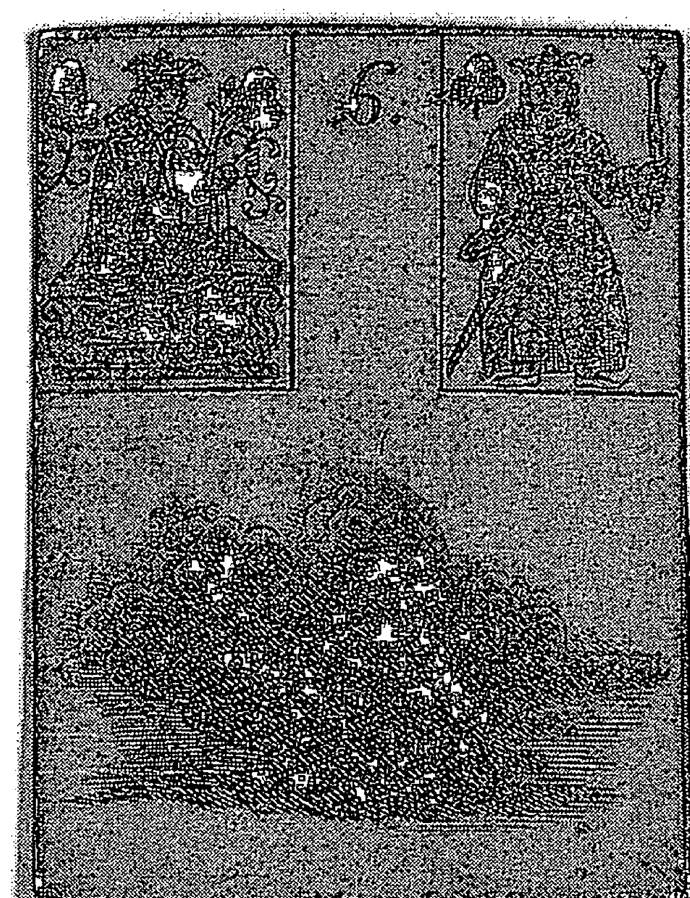

> >「就如烏雲消散般，讓你的憤怒消失，你很快就會超脫所有煩惱。」——1794年義大利咖啡渣占卜卡牌面箴言。

> >「雲如果是亮甚於暗，你可以期待你的希望將獲得好結果，但如果是烏黑的，你就可以放棄。被圓點環繞，暗示貿易和所有事業中都獲得成功，它們越明亮，你就越幸福。」——1794年義大利咖啡渣占卜說明書。

> >「雷電烏雲把你逐回第二格。」——1799年希望遊戲說明書。

> >「雲，如果明亮的那一面朝向這個人（指示牌），是幸運的兆頭，如果陰暗的那一面朝向這個人，不愉快的事很快就會發生。」——1846年〈菲利浦雷諾曼說明書〉。

### 編號：6

### 撲克牌對應：梅花K

### 核心意義：問題、迷惘、不幸

雷諾曼卡的雲，是烏雲，不是白雲，顯然是不好的預兆。

想到雷諾曼的雲，首先要聯想到烏雲罩頂四字，想像一下頭被濃密烏雲罩住的感覺，此時如墜五里霧中，自然會迷惘困惑，懷疑猶豫，看不清目標在哪裡，心情不安，最終連精神壓力都來了。

別以為一片雲沒什麼，在雷諾曼卡的世界裡，烏雲罩頂就是衰，雲是〈菲利浦雷諾曼說明書〉最頻繁提到最好要避免的壞牌，因為雲的陰影很會影響到周圍的牌。一言以蔽之，雲帶來各式各樣的問題與麻煩，是占卜者最不想看到的幾張牌之一。

### 解讀的方向性

雲的影響力，與牌面圖案的方向性有關。牌圖通常有一側比較明亮無雲，另一側比較陰暗烏黑。如果是明亮側朝向代表人物的指示牌，比較有利，顯示事情將會改善，若陰暗側朝指示牌，距離又近的話，就比較不利了。

## 與編號在前的其他牌對照

騎士牌熱情外向，雲內省陰鬱。幸運草牌是幸運且輕鬆喜樂的，雲是不幸且沉重煩擾的。房子牌穩定，雲不穩定。

## 愛情解析

愛情若飛來一片烏雲，當然會出現問題，或許是對感情迷惘困惑，情愫曖昧不明，或許是溝通誤解、各自隱藏，或許猜忌猶疑、下不了決心，或許自己想太多，或不知道對方到底在想什麼，還或許是根本沒有目標，看不見未來。

## 工作解析

雲代表工作方面的各種問題，這方面可能性極多，首先是不穩定，再來可從雲模糊不清的特性推想，諸如對工作感到迷惘、欠缺目標、表達不良、溝通不順、誤解產生、局勢不明、有隱藏秘密、有檯面下交易、工作時腦筋渾沌、不知道自己在做什麼、環境烏煙瘴氣。接著可從不幸的層面推想，或許運氣不好、事情出錯、有麻煩事發生。雲也代表壓力，可能指工作本身屬高壓職業，或問卜者感到精神壓力。

雲代表的行業，首先可能與天氣有關，如氣象學，再來煙霧有關，如菸草商、線香與薰香用品業，最後與腦袋思想有關，如哲學家、精神科醫師、理論研究者。

## 健康解析

健康方面，烏雲罩頂的意象，直接連結到腦部及心理精神層面。雲的氣體特性，也可代表呼吸系統。

雲所代表的疾病，也與這兩者有關。首先可代表任何精神疾患，從輕微的心理壓力，到嚴重的精神瘋狂皆屬之，或者是呼吸系統的問題，特別是吸煙引發的疾病！另外，因為雲本身是一種天氣，所以還可代表陰雨天氣引發的疾病，譬如風濕，以及因為天氣變化導致的過敏或季節憂鬱。

此外，因為雲本身模糊的性質，也可以代表疾病難以確診。

## 人物解析

雲對應撲克牌的梅花國王，可代表一個男人，最常見的情況是代表前夫、前男友，但也可能代表男主管或其他男性，通常都是討厭的那種。

如果雲是形容旁邊的人物牌，則這個男人可能思緒迷惘模糊，表達曖昧模糊，優柔寡斷，喜怒無常，悲觀陰鬱、善變而捉摸不定。他有可能喜歡「製造烏雲」，是吞雲吐霧癮君子，甚至是酒鬼與毒蟲。嚴重的情況下，他可能真的有點精神問題。

雲若是形容外表，可指臉色陰沉，有黑眼圈，感覺烏煙瘴氣的。

雲的代表人物有電影《美麗境界》的精神分裂男主角納許、《分裂》的精神分裂主角凱西、《海賊王》裡煙不離口的山治、《絕命毒師》裡戒不掉毒品的傑西，及哲學家，如蘇格拉底、柏拉圖、亞里斯多德、尼采等。因為雲通常代表男人，所以上述代表人物皆取男性。

## 物品解析

雲可代表任何雲狀的物品，例如雲、霧、煙、霾、灰塵、棉花，或者可以製造煙霧的物品，如香菸、線香、蚊香、薰香用品、噴霧器、乾冰、壁爐、灶、煙囪等。

雲的顏色是灰色，因此也可代表灰色物品或灰色地點。

## 時間解析

雲因為變幻不定，代表的時間不長，速度是快速。有時也表示陰雨天的日子。因為雲是6號牌，也可以代表六天、六週、六個月、六月份或每月的六日。

## 屬性

雲這張牌是相當負面的牌，而且會影響周遭的牌，給它們投下陰影。

## 大藍圖牌陣的遠近解讀法

雲在德國傳統雷諾曼占卜中，占有重要地位，是占卜師會特別去檢查的一張牌。雲在什麼牌旁邊，就會給它帶來問題與麻煩，因此我們希望它離指示牌和各大主題卡越遠越好。

除了前述提及雲的明亮側與陰暗側會影響解讀之外，德國傳統雷諾曼占卜的解讀方式，還有兩項重要原則：

1.  左邊的牌影響力漸弱且短暫，右邊的牌影響力漸強且持久。
2.  上面的牌會影響下面的，下面的牌比較不會影響上面的。

所以，除了考慮是陰暗側還是明亮側朝向指示牌外，也要考慮雲的上下左右相對位置，通常希望雲在左邊，不要在右邊。在下面，不要在上面。最糟的位置就是位在指示牌或主題卡的正上方與正右方，其次是右上方。
如果你的牌的明亮側是畫在左邊，那麼當雲位於指示牌右邊時，明亮側會朝向指示牌，這樣會與上述的原則產生不一致，使解讀複雜化。此時，為了簡化，你可以捨棄明亮側和陰影側的分別，只依上下左右解讀。

## 主流牌義速查表

**【名詞】**問題（麻煩、不幸、困擾、倒楣、衰運、陰霾）、迷惘（困惑、茫然、模糊、曖昧、隱藏、秘密、誤解、不確定、擔憂不安、精神壓力）、思想。

**【形容詞】**有問題的、麻煩的、不幸的、倒楣的、很衰的、令人困惑的、模糊不清的、不確定的、隱藏的、誤解的、陰鬱的、頭腦的、思想的、精神的、灰色的。

**【愛情】**出現問題、迷惘困惑、曖昧不明、猜忌猶疑、欠缺決心、想太多、不知道對方到底在想什麼、沒有目標、看不見未來。

**【工作】**不穩定、模糊不清（迷惘、欠缺目標、表達不良、溝通不順、誤解產生、局勢不明、有隱藏秘密、有檯面下交易、工作時腦筋渾沌、不知自己在做什麼、環境烏煙瘴氣）、不幸（運氣不好、事情出錯、麻煩事發生）、工作壓力。

**【行業】**天氣相關行業（氣象學）、煙霧相關行業（菸草、線香與薰香用品）、思想相關行業（哲學、精神科、理論研究者）。

**【人物】**前夫、前男友、討厭的男人、男主管。

**【人物形容詞】**性格像烏雲的（迷惘的、表達曖昧模糊的、優柔寡斷的、喜怒無常的、悲觀陰鬱的、善變的、捉摸不定的、有壓力的、有精神問題的）、喜歡「製造烏雲」的（吸菸的、酗酒的、吸毒的）、外表像烏雲的（臉色陰沉的、有黑眼圈的、感覺烏煙瘴氣的）。

**【身體部位】**腦部（含心理精神層面）、呼吸系統。

**【疾病】**腦部或心理精神疾病、呼吸系統及吸菸導致的疾病（感冒、肺炎、肺結核、肺氣腫、肺癌等）、陰雨天導致的疾病（風濕、因天氣變化導致的過敏、季節憂鬱）、難以確診。

**【健康建議】**釋放精神壓力、注意天氣變化、留意空氣品質、使用空氣清淨機、停止吸菸、戒癮。

**【身心靈】**練習呼吸（深呼吸、瑜伽呼吸技巧）、利用煙霧（薰香、煙薰淨化、使用水氧機）、接觸雲（多抬頭看雲、去觀雲海）。

**【物品】**雲狀物（雲、霧、煙、霾、灰塵、棉花）、能製造煙霧的物品（香菸、線香、蚊香、薰香用品、噴霧器、乾冰、壁爐、灶、煙囪）、灰色物品。

**【時間】**時間不長、陰雨天的日子、數字6的日期（六天、六週、六個月、六月份、每月六日）。

**【地點】**天空、有煙霧處（排放廢氣的工廠、空氣汙染區、觀雲海的景點、多霧的地區、香菸專賣店、香爐旁、除濕機或薰香用具旁）、灰色地點（灰色房間）。

**【建議】**釋放精神壓力、清晰思考、停止過度思考、想法正面一點、暫時不要作決定或給答覆、等情勢明確之後再行動。

**【總結】**負面。

## 7

### 蛇
### Snake

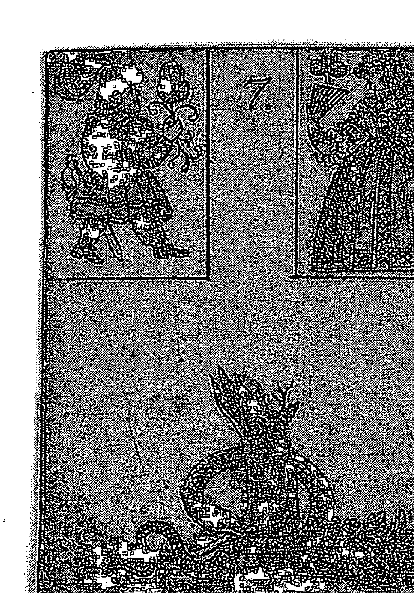

> >「一個秘密的敵人想傷害你，試著用善意讓他變成你的朋友。」——1794年義大利咖啡渣占卜卡牌面箴言。

> >「蛇總是虛假和仇恨的象徵，在這裡同樣普遍象徵敵人。在杯子的上方或中間，問卜者保證能戰勝敵人，但是，如果蛇出現在咖啡渣濃厚處或汙濁處，他就不會那麼容易成功。蛇旁邊通常會出現字母，從這裡很容易猜測出敵人是誰，這就是敵人名字的首字母。」——1794年義大利咖啡渣占卜說明書。

> >「要不被這條危險的蛇咬到，你必須付出三枚代幣。」——1799年希望遊戲說明書。

> >「蛇是不幸的象徵。影響的程度要看距離這個人（指示牌）是遠是近，它總是會帶來欺騙、不忠實和悲傷。」——1846年〈菲利浦雷諾曼說明書〉。

### 編號：7

### 撲克牌對應：梅花Q

### 核心意義：欺瞞、背叛、複雜

在伊甸園的故事裡，蛇是那個壞心、說謊騙人的角色，牠誘惑夏娃吃下智慧之樹的果實，進而引發後續的災禍。從這個故事，我們可以看到蛇的核心意義：欺瞞、背叛。

蛇的本質是虛偽的，所有的不誠實的事都有牠的份兒，中文有太豐富的詞彙形容這類行為，包括欺騙、謊言、背叛、操弄、告密、黑函、中傷毀謗、作弊、搞小動作、陷阱、仙人跳、說話膨風、表裡不一、笑裡藏刀、口蜜腹劍、在背後捅你一刀等。再好的情況，也得稱讚一聲：蛇真的很「有手腕」。而且，當蛇欺騙時，是真的出於惡意，因此蛇也代表惡毒、壞心、自私、嫉妒等特性。蛇是蛇蠍形象的女子，特別會裝，她就是會親熱叫妳閨蜜、轉身就睡妳老公的那種人。

蛇的身體捲在一起，複雜難解，所以複雜化也是蛇的重要含意。當事情複雜了，通常不是好事，表示事情惡化、加劇，有問題產生，自然會帶來麻煩、損失和困難。這種困難就像走路突然看到前方樹枝上掛著條蛇，讓人有點意外，必須加以應變。以工作為例，蛇可能表示原本談好的案子突然變卦、事情發生變故、發展曲折、峰迴路轉、殺出程咬金，或機件故障、技術問題。

幸好，蛇帶來的問題雖然有點棘手，但不是無法克服。相較於雲的烏雲罩頂、山的難以攀登或十字架註定沉重，蛇相對好處理多了，只要拿根樹枝把他挑掉就好，這種感覺就像想摸動物時突然被咬了一下，嚇得趕快甩手，但是吹吹雙手之後，又是生龍活虎一條。更何況，蛇所代表的欺瞞，就算占卜的時候還不知道，通常不久後也會浮出檯面，為問卜者所知悉，所以不是很難偵得的問題。

雖然雷諾曼傳統文獻中沒有提到，不過現代占卜師大都將蛇結合誘惑與慾望的牌義，考慮到伊甸園的故事，要把蛇的形象聯想到誘惑或慾望是很自然的。牠就像在路途中引我們走入歧途的女妖，使人心癢難搔。
再補充一個小知識，雖然蛇在西洋神祕學裡，也象徵智慧和知識，不過雷諾曼的傳統並未採用這個牌義。要記得，雷諾曼是民間流傳的占卜法，一般人看到蛇，直觀反應還是想到惡毒、欺騙、誘惑這些含義。因此，如果你看到有人把蛇解作智慧和知識，要知道這是現代才引申的新牌義，並且目前採用這牌義的占卜者並不多。

## 與編號在前的其他牌對照

騎士是明快、走直線的，蛇是隱密、走蜿蜒路的。幸運草牌是簡單短小的，蛇是複雜曲折的。房子是方的，蛇是長的。雲是被迷惑的，蛇是迷惑人的。

## 愛情解析

蛇在愛情占卜中，經常代表人物，代表的是除了女人牌之外的第二個女人，可能是女情敵、女的第三者、男方的前女伴或現在的外遇對象。在同志的愛情占卜中，蛇是作為女同志問卜者的女對象。

如果蛇是形容情況，可朝以下幾個方向解釋：

-   欺騙：各種隱瞞、謊言或背叛，外遇、出軌、偷吃、劈腿。
-   惡意：彼此傷害、報復、中傷、吃醋、猜忌。
-   複雜化：發生變故、糾紛、剪不斷理還亂的關係、橫刀奪愛。
-   慾望誘惑：充滿慾望和誘惑力、基於性吸引力的關係、短期玩玩的關係、不是正緣、不忠。

## 工作解析

蛇在職場上，首先代表各種欺騙，輕則說話不實、膨風、畫大餅，重則代表陷阱、騙局、隱瞞、謊言、背叛、檯面下交易與非法行為，還有各種惡意傷害，如告密、黑函、毀謗中傷、背後說人壞話、造謠、背後插刀，最後是事情複雜化，包括事態上的變故，還有各類電子機械設備的突發狀況及技術問題。由於蛇有不幸的含義，如果問投資，則不要輕易投資，可能會被騙或造成損失。

蛇代表的職業，由於蛇洞悉人心的特性，有人用蛇代表心理學家。蛇也可代表與蛇形物一同工作的行業，如鋼管女郎、水電工，當然還有馴蛇人。

## 健康解析

蛇由於細長的形狀，身體部位對應腸道或臍帶。疾病方面，顯示有小病，或者疾病併發、複雜化的可能，不過不用太擔心，蛇不代表致命的危險。健康方面的建議，多著重在腸道健康的保養，及小心醫療謠言或醫療騙局，或者這位醫者不值得信賴。

## 人物解析

蛇很常代表人物。由於對應撲克牌的梅花皇后，因此通常直接代表一個女人，幾乎不會代表男人。

蛇在愛情占卜中，代表情場上的「第二個女人」。若問卜者是男的，蛇可代表他的前妻、前女友或外遇對象。若問卜者是女的，蛇常代表情敵、第三者、男方的前女友或新女伴。若問卜者是女同性戀，蛇就代表她的同性對象。

蛇是代表第三者的牌。華人傳統稱第三者為狐狸精，所以我們我們直觀會想用狐狸牌來代表第三者，但是在雷諾曼這個歐洲占卜法裡，是用蛇來代表。

除此之外，蛇還可以指有點討厭的女性，諸如女上司、女對手，或任何難搞的女人，俗稱的「機車」便是。

在最中性的情況下，蛇可以單純代表「一個女子」，此時蛇就純屬中性牌，完全沒有負面意了。

蛇如果是形容人物的性格，這位通常是女子的人，很聰明世故、成熟能幹、頗有歷練，是個職業女性，請想像穿著套裝，戴著黑框貓眼眼鏡的那種精明形象。她善於詞令，頗有外交才智，八面玲瓏，很有手腕。

如果蛇是形容人的外表，此人擁有蛇般的身材，水蛇腰，體型瘦長，體態滑溜靈活，外貌性感誘惑，不吝展示女性的魅力，也難怪現代占卜師會用蛇代表鋼管女郎了。

蛇的代表人物是《白雪公主》與《灰姑娘》裡的壞心後母、《冰與火之歌》的皇后瑟曦·藍尼斯特、電影《控制》的女主角愛咪、埃及豔后、安潔莉娜·裘莉，及創業成功的好萊塢女星潔西卡·艾芭。另外，雖然性別不符，不過《鬼滅之刃》的蛇柱伊黑小芭內也滿有蛇的味道。

## 物品解析

蛇代表蛇，廣義上可以包括所有爬蟲類動物及其飼養籠。蛇也代表所有管狀細長物，如水管、電線、繩子、手環、晒衣桿、溜狗繩等，以及蛇形狀的地點，如彎路、小徑、河流、長廊、管形溜滑梯、甬道、隧道、雲霄飛車和萬里長城，還有滑溜的地點，如浴室、游泳池走道與滑水道。

## 時間解析

蛇在時間方面沒有明顯的快慢屬性，大致是居中。因為蛇是7號牌，也可代表有數字7的日期，如七天、七週、七月份、七個月或每月七日。

## 屬性

蛇是壞牌，幸好在壞牌中它算是比較溫和的了。如果單純代表一位女子或女同志的對象，就是中性牌。

## 大藍圖牌陣的遠近解讀法

蛇在大藍圖牌陣裡，要不就代表人，要不就代表欺騙或各類棘手的情況。在占卜前，建議先做好人物指示牌的指派，如此在解讀時就會知道蛇到底是指誰，還是指的是情況。

蛇如果離指示牌遠，比較沒什麼大問題，如果離得近，就要小心有欺騙情事。從蛇周圍的牌，來推斷是哪方面的事。

## 主流牌義速查表

**【名詞】**背叛、欺騙（說謊、不實、虛偽、虛假、陷阱、作弊）、惡意（壞心、自私、告密、嫉妒、操弄、毀謗、中傷）、複雜化（惡化、加劇、問題、麻煩、困難、變故、曲折）、誘惑（慾望、不忠、誤入歧途）、不值得信任。

**【形容詞】**騙人的、虛偽的、複雜的、惡化的、難搞的、棘手的、操弄的、彎曲的、曲折離奇的、迂迴的、誘惑的、棘手的。

**【愛情】**女情敵、女性第三者、欺騙（隱瞞、謊言、背叛、外遇、出軌、偷吃、劈腿）、惡意（傷害、報復、中傷、吃醋、猜忌）、複雜化（變故、糾紛、剪不斷理還亂、藕斷絲連、橫刀奪愛）、誘惑（慾望、性吸引力的關係、短期玩玩、不是正緣、不忠）、女同志的女對象。

**【工作】**欺騙（說話不實、膨風、畫大餅、陷阱、騙局、隱瞞、謊言、背叛、檯面下交易、非法行為）、惡意（告密、黑函、毀謗中傷、背後說人壞話、造謠、背後插刀）、複雜化（事情變故、發展曲折、峰迴路轉、殺出程咬金、電子設備出狀況、技術問題）

**【行業】**研究人心的行業（心理學家）、與蛇形物工作的行業（鋼管女郎、水電工、馴蛇人）。

**【人物】**感情中的第二個女人（女情敵、第三者、前妻、前女友、男方的外遇對象、女同性戀的女對象）、有點討厭的女人（女對手、女上司、難搞的女人）、聰明能幹的職業女性。

### 【人物形容詞】

- 蛇般負面性格的（虛偽的、說謊的、隱瞞的、雙面的、世故的、表裡不一的、口蜜腹劍的、笑裡藏刀的、不值得信任的、惡意的、壞心的、忌妒的、自私的、算計的、複雜的）
- 蛇般正面性格的（聰明世故的、成熟能幹的、頗有歷練的、善於詞令的、有手腕的、有社交才智的、八面玲瓏的）
- 長得像蛇的（身材瘦長的、水蛇腰的、體態滑溜靈活的、性感誘人的、展現女性魅力的、善於調情挑逗的）

### 【身體部位】

腸子、臍帶。

### 【疾病】

小病、副作用、併發症。

### 【健康建議】

留意腸道健康。嘗試斷食淨化腸道。勿聽信醫療謠言。小心醫療騙局。醫者不值得信賴。

### 【身心靈】

讓自己經歷蛻變、提升亢達里尼能量、學習心理學、做管鐘音療。

### 【物品】

- 蛇、爬蟲類（含飼養籠）
- 管狀物（水管、電線、繩子、手環、晒衣桿、管型溜滑梯）

### 【時間】

速度居中、數字7的日期（七天、七週、七個月、七月份、每月七日）。

### 【地點】

- 蛇形地點（彎路、小徑、河流、甬道、隧道、萬里長城）
- 滑溜的地點（浴室、游泳池走道、滑水道）

### 【建議】

小心背後。勿輕信他人。謹慎應對目前的問題。不需要太老實。正視自己的慾望。

### 【總結】

負面。

## 8 棺材
Coffin

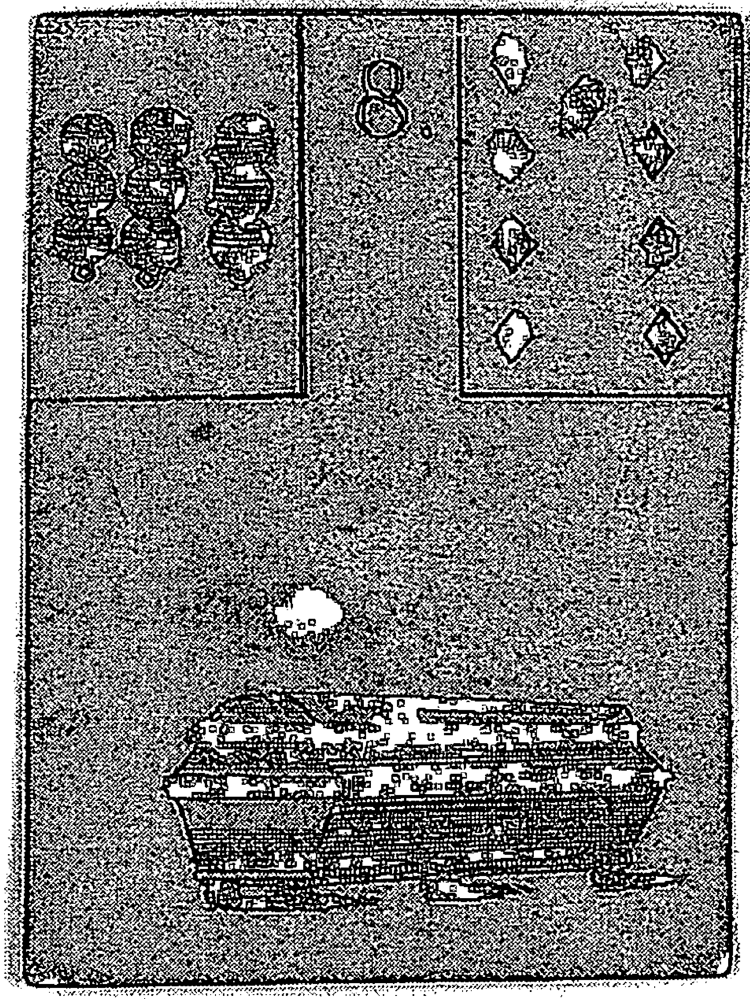

> 「你可能對一筆龐大遺產歡慶，但很多人會因此嫉妒你。」——1794年義大利咖啡渣占卜卡牌箴言。

> 「死亡的象徵在此意義相同，或者，如果是在咖啡渣濃厚或汙濁處的話，代表至少會是長期而磨人的疾病。如果在明淨處，代表長壽。在杯子頂部的濃厚處，代表會從有錢的親戚獲得可觀的遺產，在底部以相同方式出現的話，代表死者與問卜者關係沒有那麼近。」——1794年義大利咖啡渣占卜說明書。

> 「來到這個棺材的人被視為死亡，除非有其他人走到這一格，或他擲到兩個一樣的花色，因為當輪到擲骰時，他不會被排除。」——1799年希望遊戲說明書。

> 「棺材，當非常接近這個人（指示牌）時，無疑代表危險的疾病、死亡、財產澈底的損失。當離這個人遠時，這張牌就沒那麼危險。」——1846年〈菲利浦雷諾曼說明書〉。

### 編號：8

### 撲克牌對應：方塊9

### 核心意識：結束、疾厄

不管在東方還是西方社會裡，大家都不喜歡看到棺材，因為這代表喪禮與死亡，讓人避之唯恐不及，不過不用擔心，在雷諾曼占卜裡，實際上，百分之九十九點九九九都不會是表示死亡，只是意味著某種結束而已。

結束可以包括事情終止或遭到取消，在輕微的狀況下，可能只是面臨截止期，英文稱它「死線」（Deadline）不是沒有意義的。然而，因為人性害怕變化，結束通常意味某種失去，人在碰到時，難免會出現種種負面情緒，

- 悲傷
- 憂鬱
- 恐懼
- 失望
- 哀悼
- 痛苦
- 空虛
- 沉寂

這些都是棺材的引申牌義。棺材的結束，通常帶著某種死寂麻木感。

棺材牌在傳統上也代表疾病。這是36張牌中，最重大的疾病預兆。

棺材在雷諾曼占卜裡是明確的負面牌，牌義類似塔羅牌的13號死神牌或寶劍十，都是結束。塔羅牌由於神秘學乘載豐富，強調結束後的新生與蛻變之意，所以當你抽到死神時，塔羅占卜師通常會說：

> > 「不用擔心，結束之後就是新生，後面會有更好的等著你！」

不過，雷諾曼卡可不同，既然是十八世紀歐洲庶民的占卜，抽到棺材時，肯定是嚇得脫口說：

> > 「媽呀，好慘！」

占卜師也不會跟他說什麼新生的哲理（想想看，雷諾曼女士多喜歡預言別人慘死），所以，雷諾曼卡的占卜傳統，並不會把棺材往正面去解釋，因此新生或蛻變並非棺材牌的原始意義，棺材的核心意義仍然是結束。

棺材並不是不能表現蛻變之意，只是雷諾曼的占卜邏輯是看幾張牌的共同關係，棺材必須搭配其他的牌，才能解為新生與蛻變。譬如棺材後面加鸛鳥牌（改變）或小孩牌（新生），那麼2張合併就可獲得這個含義了。

令人安慰的是，棺材牌單獨出現時，有時還是可以是好牌，就是——當我們已處於難關很久時，棺材牌若出現在後面，可代表難關即將結束，馬上就要解脫了！

### 解讀的方向性

棺材會結束掉左側的牌所描述的事，右側的牌代表新開始，所以一般希望好牌出現在右側。

## 與編號在前的其他牌對照

騎士牌與幸運草牌是開放的，棺材是封閉的。樹還在成長，棺材已經結束。雲還在迷惘變化，棺材已經蓋棺論定。蛇的關係尚在複雜糾纏中，棺材已經掰掰甚至解脫。

## 愛情解析

棺材在愛情意味某種結束，想像棺材在你面前砰一聲闔上的感覺，這可能代表分手、分居、離婚、恢復單身、見不到面、被拒絕、碰釘子、約會取消、失聯、搞消失、冷戰，雖然大都是負面意涵，不過，如果原本在痛苦的關係中，棺材可能意味解脫，反而非常好，尤其是下一張牌若是正向牌，更能確認結束之後更美好。棺材也可能是形容單身，或雖有對象但沒有未來，或者一段死氣沉沉的時期，呈現哀傷、空虛、寂寞、冰冷、麻木的感受。

## 工作解析

棺材在工作方面，代表某種結束，可能是求職碰壁，自願或被迫失去工作，公司方面可能有違約、跳票、截止、合約終止、項目中斷、結束營業等情形。財務方面，自然代表破財甚至破產。也可能形容工作環境死氣沉沉的意象，沒有前景、沒有未來。不過，若原本的工作十分痛苦，棺材可代表離開不好的工作，反而是吉兆。
棺材代表的行業，皆與棺材意象有關，如喪葬業、法醫、寵物標本師。又因為棺材黑盒狀的外型，可代表在地下室的工作。棺材的外型還連結到盒狀物，包括音箱與樂器，所以可代表與這些物品相關的職業，如音響工程與樂器演奏，所以，沒錯，音樂家是用棺材牌代表！

## 健康解析

棺材既然與死亡相關，對健康絕非好事。若指疾病，會是較嚴重或長久的疾病。棺材死氣沉沉的意象，可代表身體方面像要進棺材的病，如臥床、虛脫、累垮、嗜睡、眼前一黑、肢體麻痺、癱瘓，或者心理方面如進棺材，如憂鬱、哀痛過度、幽閉空間恐懼症、自殺傾向，亦可延伸為所有恐懼症。極少數情況下，棺材牌可以代表真正的死亡，但是這真的很罕見，需與周圍的牌一同判斷。

有趣的是，棺材也可能代表疾病的結束。請搭配情境和周圍的牌來判斷，若周圍的牌，特別是下一張牌是大好牌，就有可能是指疾病結束。

棺材若指身體部位，可為器官結束處，如肛門、陰道口、尿道口。

## 人物解析

棺材牌本身通常不代表人物，唯一的情況是在喪葬占卜中可用來做為死者或鬼魂的指示牌。

棺材牌形容鄰近的人物牌時，有以下幾種情況：

1. 棺材般個性的：如棺材裡的屍體，憂鬱負面、悲傷寂寞、行屍走肉、要死不活、自我評價低落。也可能指這個人處在棺材狀態般，病懨懨、沒有活力、生病、臥床、住院、癱瘓、昏迷、彌留等。
2. 棺材般外型的：長方而稜角分明的體態，臉色像僵屍。或指他的裝扮走歌德頹廢路線，穿黑色、蒼白臉與濃濃的煙燻妝。
3. 從事棺材代表的行業者，特別是喪葬業者或音樂家、演奏者。

棺材牌的代表人物有《暮光之城》的吸血鬼爱德华、《阿达一族》里的阿达一家人、《超人特攻队》第一集前期的巴小倩、《哈利波特》的石内卜教授与露娜·罗古德、《樱桃小丸子》的野口。

## 物品解析

棺材若代表物品，有以下几种可能性：

1. 盒状物：盒子、纸箱、抽屉、柜子、货柜、床。
2. 有音箱的物品：乐器、音响。这是由盒状做的延伸，但十分实用。
3. 黑盒状空间：暗房、黑暗的房间、地下室、电影院。

棺材若代表地点，可以是死亡意象的地点，如墓园、殡仪馆、告别式。也包括有离开与终止意象的地点，如出口、后门、逃生门、终点站。

## 時間解析

棺材是突然的结束，所以时间表示「立即」。因为棺材是8号牌，视问题也可代表八天、八周、八个月、八月份或每月的八日。

## 屬性

棺材是负面牌，不过若问卜者已处于困境且后面有好牌，则可解作困境的结束，从痛苦中解脱。

### 大藍圖牌陣的遠近解牌法

棺材牌離指示牌近時，可從棺材周圍的牌推斷是什麼要結束，事情會發生什麼變化。如果棺材落在代表過去的位置，指的是過去經歷過的結束，可能包含一段傷心、憂鬱、沉寂的日子，或是生病，而若落在未來的位置，就要更留意，小心解讀細節。

如果棺材離指示牌遠，就比較無礙，但是如果緊鄰主題卡，還是值得深入解讀。

當棺材出現樹牌旁邊時，要特別留意。樹是健康的主題卡，棺材傳統上代表疾病，湊在一起，顯示健康的警訊。

棺材加樹可能代表比較嚴重的疾病，但是不要輕易預測死亡。雷諾曼占卜師芮娜·喬治（Rana George）曾分享她的個人經驗，她以前住在貝魯特戰區時，當棺材跟鐮刀（傷害）、船（遺產）一同緊鄰指示牌時，死亡的機率頗高，畢竟住在戰區者的死亡率當然不會低，不過，等她搬到美國後，棺材代表死亡的機率就極低了。

這也告訴我們，棺材預言死亡的機率，與大環境有密切關連，除非你是在有人員大量死亡的地區，否則棺材一般而言不會真的代表死亡。占卜師要根據現實情境與實際機率一同斟酌，方能做出斷言。

## 主流牌義速查表

- 【名詞】結束（終止、失去、沒了、取消、截止、解脫）、悲傷（空虛、沉寂、死寂、冰冷、麻木、安靜無聲）、疾厄（疾病、破財、破產）、死亡（喪禮）。
- 【形容詞】已結束的、沒了的、失去的、最後的、空虛的、沉寂的、死寂的、安靜無聲的、麻木的、悲傷的、生病的、住院的、破財的、破產的、死去的、盒子裡的、空的、黑色的。
- 【戀情】結束（分手、分居、離婚、恢單、見不到面、被拒絕、碰釘子、約會取消、失聯、搞消失、冷戰）、死氣沉沉（哀傷、空虛、寂寞、冰冷、麻木）、從痛苦關係中解脫。
- 【工作】結束（求職碰壁、離職、失業、違約、跳票、截止、合約終止、項目中斷、結束營業、破財、破產）、環境死氣沉沉（沒有前景、沒有未來）、解脫（離開不好的工作）。
- 【行業】棺材相關行業（喪葬業、法醫、寵物標本師）、盒狀物相關行業（在地下室工作者、音響工程、樂器演奏）。
- 【人物】死者、鬼魂。
- 【人物形容詞】棺材性格的（憂鬱的、負面的、悲傷的、寂寞的、行屍走肉的、冰冷麻木的、要死不活的、自尊低落的）、棺材狀態的（病懨懨的、沒有活力、生病的、臥床的、住院的、癱瘓的、昏迷的、彌留的）、棺材外型的（臉形體態長方的、稜角分明的、臉色像僵屍的、歌德風頹廢裝扮的）、從事棺材代表行業的、死去的。
- 【身體部位】器官結束處（肛門、陰道口、尿道口）。
- 【疾病】身體如進棺材的病（重病、久病、臥床、虛脫、累垮、眼前一黑、嗜睡、肢體麻痺、癱瘓）、心理如進棺材的病（憂鬱、哀痛過度、幽閉空間恐懼症、恐懼症、自殺傾向）、死亡（極少發生，需與其他牌一同判斷）、疾病結束。
- 【健康建議】格外留意健康。好好休息。臥床休息。
- 【身心靈】斬斷過去。脫離舊我。放手臣服。瞭解失去是成長的開始。
- 【物品】有蓋盒狀物（箱子、盒子、抽屜、櫃子、垃圾桶、貨櫃、床、系統家具）、有音箱的物品（音響、樂器）。
- 【時間】立即、結束、數字8的日期（八天、八週、八個月、八月份、每月八日）。
- 【地點】盒狀物裡面（盒子、紙箱、抽屜、櫃子、垃圾桶裡等）、黑盒狀空間（暗房、黑暗的房間、地下室、電影院）、終止的場所（後門、出口、逃生門、終點站）、死亡相關地點（墓園、殯儀館、告别式）。
- 【建議】深度休息。沉潛蟄伏。臣服，接受結束。開啟人生的新一章。
- 【總結】負面。（除非問卜者已處於困境且後面有好牌，則可解作痛苦的結束。）

## 9 花束
Bouquet

> > 「花束代表各方面的幸福。」——1846年〈菲利浦雷諾曼說明書〉。

### 編號：9

### 撲克牌對應：黑桃Q

### 核心意羲：幸福、美麗、禮物

花束的核心意義是幸福。如同收到花束時的感覺，正向心情如潮湧現，開心喜悅，感恩美好。因為花束是如此多采多姿，如果代表顏色，肯定是彩色的。如同花束的豐富，花束也可以形容多種多樣的選擇。

花束是美麗的，可以象徵所有美好的事物，它是日常生活中的小確幸，特別是聚餐、宴會、派對和與閨蜜的下午茶，以及各種邀約，都是花束代表的牌義。

花束本身是一種禮物，但不只是禮物，更可以包含無形的善意、幫忙

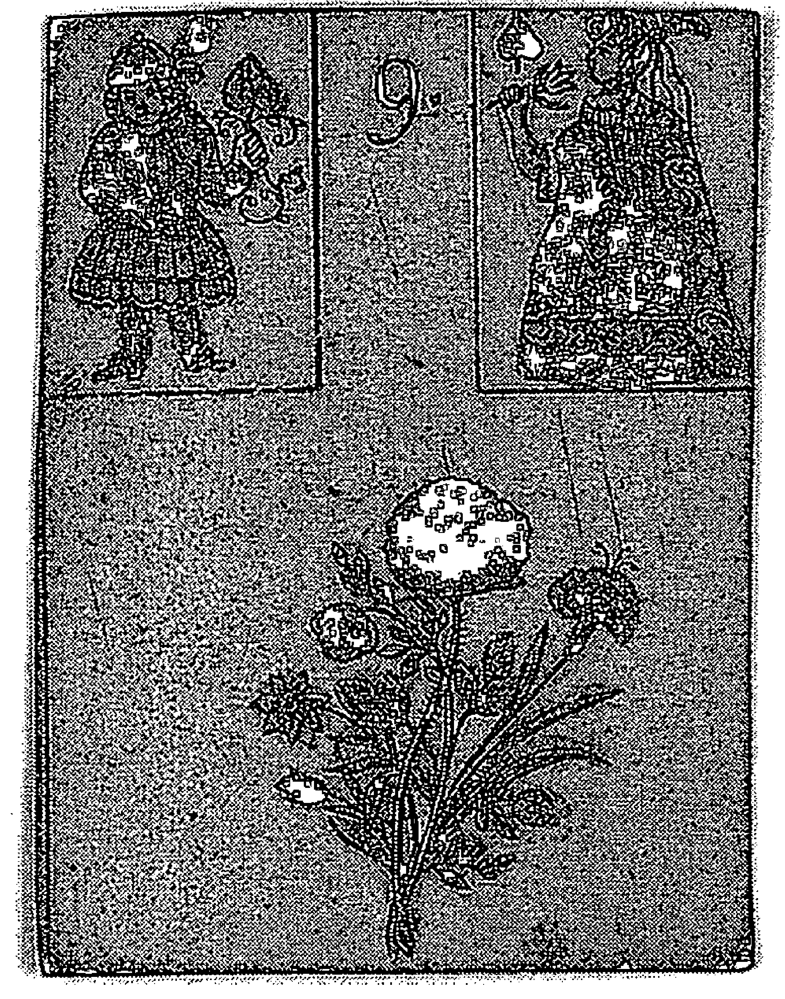

與讚美。

花束是最好的牌之一，象徵生活中美好愉悅的一面。

## 與編號在前的其他牌對照

幸運草牌與花束都是喜悅，幸運草是偶然意外且短暫的，花束是自然來到且悠哉的。雲是不開心，花束是開心。蛇是惡意的傷害，花束是善意的邀請與饋贈。

## 愛情解析

花束在愛情方面，象徵一切的美好，可以是美好的約會、送禮驚喜、約會邀請，或代表兩人感情處於熱戀期，濃情蜜意，如膠似漆，幸福喜悅，忠誠熱愛，兩人可以一起享受生活。

## 工作解析

花束牌在工作方面，代表各種美好，事情成功、心情快樂滿足，或許受到顧客讚美，受老闆表揚，參加慶功，獲得推薦，接到合作邀約等。好好享受這份喜悦吧。

如果花束代表行業，首先代表與花和植物相關的行業，如花藝、芳療、花精、藥草、植物學。再者是與美學相關，如美妝、香水、藝術、設計、時尚，包括模特兒也是。因為花束本身可作為禮品，所以也代表禮品業。

## 健康解析

健康占卜中，花束通常是好轉的徵兆。對應的身體部位，是第一印象展現美麗的部位——臉部與頭髮（但是頭髮也有人對應在毛髮多的熊牌，你可以自行決定要把頭髮對應給哪一張）。

花束如果代表疾病，可能是跟花相關的症狀，如花粉症，也可以延伸為廣義的過敏。而花朵的美麗可以連結到醫學美容，花朵的浮誇可以代表組織增生或腫瘤。若是詢問健康建議，花束建議嘗試與花或植物有關的療法，諸如花精、精油芳香療法、中草藥等自然療法。

## 人物解析

花束牌對應黑桃皇后，可以代表一個女子，代表男人的情況很少見。這個人通常是成年女子，年齡可大可小，有可能是很照顧問卜者的人。而在適當的情況下，譬如媽媽占算幾個小孩的事，花束牌也可以代表其中一位未成年的小孩，此時代代表男生的可能性就稍微增加。

花束如果是形容旁邊的人物牌，則這人多半是俊男美女，人見人愛，斯文有禮，溫暖溫情，和善貼心，有美學方面的興趣，很有生活品味，講求質感與格調，可能喜歡穿色彩繽紛的衣著。缺點呢，就是可能浮華自戀。

花束牌代表人物有時尚大師香奈兒、彩妝大師芭比·波朗、《怦然心動的人生整理魔法》作者近藤麻理惠、英國王妃戴安娜、超模娜歐蜜·坎貝兒，文青界有徐志摩可為代表。法國路易十六的瑪麗皇后則是負面典型。

## 物品解析

花束代表花，而花本身是一種禮品，所以可以代表各種禮物，包括賀卡、喜帖與邀請函，特別是搭配信件牌時。有時甚至可代表禮金（搭配魚牌）和賭博吃紅（搭配幸運草）。

花束也可代表花朵相關物品，譬如花盆、花圃、花精、芳香精油、花草茶，以及美學相關物品，如美妝品、香水、飾品、藝術品、美術用品等。

## 時間解析

繁花盛開的季節是春季，花束因此代表春季。花束同時是9號牌，視問題也可代表九天、九週、九個月、九月份或每月的九日。

## 屬性

花束是很正面的牌。

## 大藍圖牌陣的遠近解讀法

花束是最好的牌之一，不僅預兆好事，這好事還能讓人心情滿足。如果出現在未來的位置，可以期待好事、禮物、邀約等，再多些好牌，可能真的有不錯的驚喜等著你。就算被壞牌圍繞，問卜者也比較能獲得幫助，至少能有情緒方面的支持，事情不會真的那麼糟。

## 主流牌義速查表

【名詞】幸福（喜悅、滿足、驚喜、和諧、溫情、慶祝、感激、安寧、心滿意足、多彩多姿）、美麗、禮物（讚美、邀約、幫助）。

【形容詞】驚喜的、愉悅的、令人滿足的、多種多樣的、美麗的、和諧的、溫情的、藝術的、花的、彩色的。

【愛情】約會、送禮、驚喜、邀請、熱戀期、濃情蜜意、如膠似漆、幸福喜悦、忠誠熱愛、一同享受生活。

【工作】美好、成功、快樂滿足、慶功、顧客讚美、受表揚、獲得推薦、接到合作邀約。

【行業】花與植物相關行業（花藝、芳療、花精、藥草、植物學）、美學相關行業（美妝、香水、藝術、設計、時尚、模特兒）、禮品業。

【人物】一個女子。

【人物形容詞】花束個性的（人見人愛的、有魅力的、斯文有禮的、溫暖的、溫情的、和善的、貼心的、藝術性格的、愛美的、浮華的、自戀的）、花束外貌的（俊帅的、美貌的）。

【身體部位】臉、頭髮。

【疾病】健康好轉、花粉症、過敏、醫學美容、增生或腫瘤。

【健康建議】多保養。多休養。嘗試植物療法及自然療法。

【身心靈】心靈滿足、心靈獲得療癒、練習感激、讓自己圍繞在美好的人事物中、讓生活更豐富多彩、花精療法、芳香療法、草藥療法、順勢療法。

【物品】花束、禮物（加信件牌可為邀請函、喜帖、賀卡，加魚牌可為禮金，加幸運草牌可為吃紅）、花卉相關物（花盆、花圈、精油、花精、花草茶）、美學相關物（美妝、香水、飾品、藝術品、美術用品）。

【時間】春季。數字9的日期（九天、九週、九個月、九月份、每月九日）。

【地點】花卉相關地（花園、花店、花圃）、美學相關地（美容院、美髮院、梳妝台、藝廊）。

【建議】開心點、讓自己漂亮一點、給自己一點驚喜、犒賞自己一下、幫助別人或接受幫助。

【總結】正面。

## 10 鐮刀
Scythe

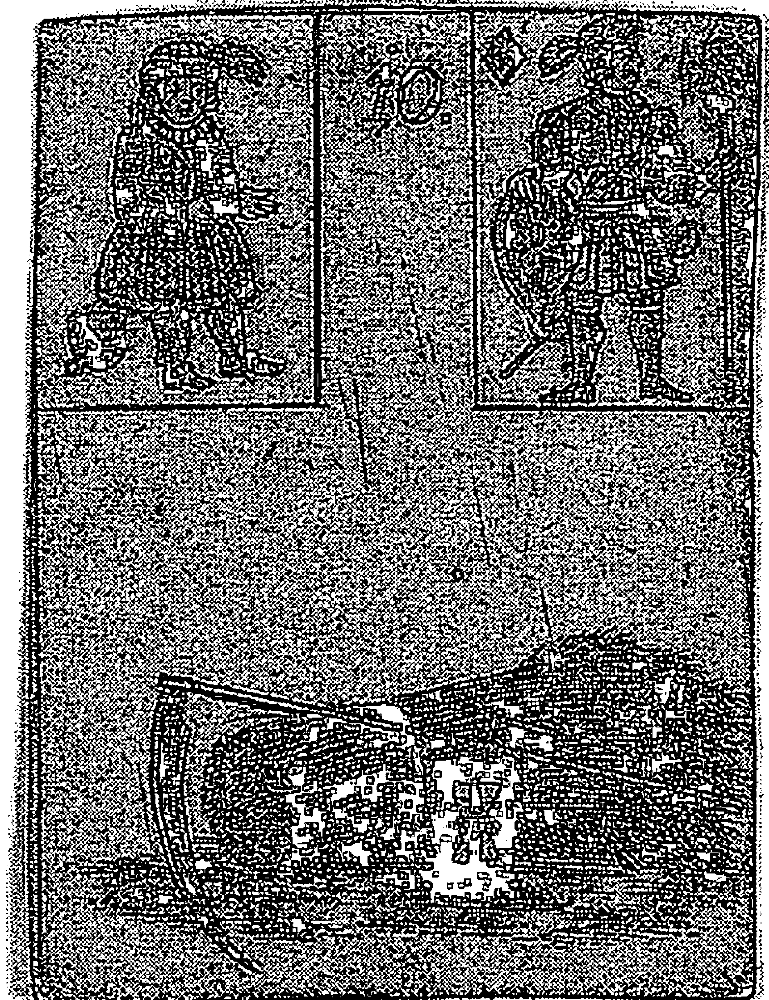

> > 「靜候與你勞動成果成正比的收穫，因為每個人都是自身好運的創造者。」——1794年義大利咖啡渣占卜卡牌箴言。

> > 「鐮刀如果和漏斗圖騰結合，代表各種迫在眉睫的危險。在下方，代表幸福而長壽的生活。」——1794年義大利咖啡渣占卜說明書。

> > 「鐮刀指很大的危險，只有在幸運的牌圍繞時，才能避免。」——1846年〈菲利浦雷諾曼說明書〉。

### 編號：10

### 撲克牌對應：方塊J

### 核心意涵：危險、侵略、傷害、收成

鐮刀是拿來採收農作物的，動作必須很快，才割得斷，所以我們可以從「急速斬斷」這個意象來瞭解牌義，急速代表很突然，斬斷這個動作有切割、斷裂或結束的意象，所以可能代表任何突如其來的變故或中止。鐮刀本身帶有強烈的動作性，所以經常代表動詞。

鐮刀的效應通常是不可逆的，好比稻草一旦被割斷是接不回去的，這些突然的變故或中止，通常都會造成不可逆轉的結果。這些情況不盡然都是外力造成，有時是問卜者自己做了突然的決定導致，因此鐮刀也可以代表突然的決定，會令旁人驚愕的那種。

再者，鐮刀是能傷害人的利器，因此也代表危險，特別是意外。鐮刀牌出現代表一個警告，要我們注意眼前，有危險，要小心。在現代占卜中，鐮刀還真的是代表犯罪的牌。

鐮刀是代表現代斷捨離概念的牌，搭配周圍的牌，可能產生切除隔壁牌的含意，譬如愛心牌加鐮刀可代表斬情絲，雲牌加鐮刀可代表戒菸或去除迷惘。

鐮刀與棺材牌都可以代表結束，但是鐮刀的結束更匆促，更讓人措手不及。不過，其實凡事都有一體兩面，就像棺材牌可以是痛苦時光的終結，鐮刀斬斷農作物之後，就會是收成和休養生息的日子。如果本身是在剪不斷理還亂的情況裡，出現鐮刀更是好兆頭，表示事情終於可以徹底了結了，真正完成斷捨離。

### 解讀的方向性

鐮刀是有方向性的牌，我們可從鐮刀刀尖朝向的方向，來判斷它會傷害到誰。刀尖指的一方是被傷害的對象，刀柄朝向的一方則是拿著鐮刀的人，是他會去傷害，或是收成、獲得好處。譬如「男人＋鐮刀＋狗」，假設刀尖朝左，就是男人會被狗（好友）傷害。我們可以認知為刀尖朝的一方是被減除的對象，刀柄朝的一方會增加、獲得。

假如刀柄朝的方向並不是代表人物的牌，而是好牌，或是周圍還有其他他好牌，那么这些好牌可能是暗示我们避免伤害的方法，譬如「男人+镰刀+爱心」，指男人可以以爱来化解伤害。有些占卜师将镰刀刀尖朝的方向视为伤害的来源，因此刀尖方向的牌是施加伤害者，这样解读出来恰好会与上述相反。我认为这样解读比较不符合一般人的直观，因此不取用，但还是写出来让你知道也有些人是这样做。

## 与编号在前的其他牌对照

船是变化，镰刀是措手不及的变化。房子是舒适稳定，镰刀是突如其来。树是缓慢成长，镰刀是突然减少。云还在迷惘模糊，镰刀很决绝。蛇是背后插刀，镰刀是正面来的。棺材是结束，镰刀是割舍，但结束没有危险，镰刀会带来危险。花束是增多，镰刀是减少。

## 爱情解析

镰刀代表爱情关系的突然切除，例如突然分手、突然变化、被不留情的拒绝，这也可能是指问卜者自己做出了断。而如果是问关于爱情的建议，很明确是该直接了当把话说清楚，甚至慧剑斩情丝了。因为镰刀本身代表危险，也可能代表这是危险关系，譬如对方是危险情人、有犯罪倾向之类的，人身安全恐受威胁，但这是比较极端的情况了，较轻微的情况可能只是对方说话难听，个性决绝。

## 工作解析

镰刀在工作方面预兆突如其来的变动，通常是不好的方向，且有变少减除的概念，如突然失业、预算削减、业绩衰退、薪水被砍、部门裁减、毁约、被拒绝、清算，这也有可能指问卜者自己突然做出某个决定，或砍掉重练。再来，镰刀的伤害性，可代表工伤。

镰刀也有收成含义。当周围的牌不错，且镰刀刀柄方向是朝着指示牌时，表示问卜者可以去收割或获得一些东西。

镰刀若指行业，因为镰刀是农作收成物，因此可链接到农作物相关的工作，如农业、园艺。再来是使用利器的行业，如理发师、裁缝师、外科医师、牙医、军人等。

## 健康解析

镰刀在健康占卜中代表各种外伤与血光之灾，也包括会见血的侵入性治疗方式，如注射、点滴、手术。此外，还可代表任何割裂或针刺般的感觉，如急性疼痛、头痛、牙痛或牙齿敏感。

镰刀代表的身体部位，都是可以切断东西的部位——指甲、牙齿与嘴巴。

若询问健康建议，镰刀建议接受医疗处置，该动刀就动刀吧。

## 人物解析

镰刀通常不会直接代表人物，但是可以形容周围人物牌的特质。若是形容性格，他十分犀利，或许真的有张刀子嘴，说话做事不留情面，甚至让人觉得残酷、有侵略性。因为镰刀有急速的含意，所以他也可能是个急性子，没耐性。好处是他的头脑清晰，思路清楚，说话言简意赅，能一针见血地剖析现况，是个厉害人物，可以是很好的决策者。

若是形容外貌，代表像镰刀一样瘦瘦长长、有曲线，可能剪着精干利落的发型，像三分头这种。此外，也可以代表身上有创伤痕迹的人，如疤痕，甚至截肢。

镰刀也可以形容人物的职业，与周围的牌搭配可获得更多线索，譬如搭配花束牌可能指造型师，配树牌可指外科医师或牙医。

镰刀的代表人物有英国达人秀的毒舌评审Simon Cowell、秦始皇、项羽、成吉思汗、包青天。《冰与火之歌》里残酷的乔佛里·拜拉席恩是负面代表。

## 物品解析

镰刀除了可以代表刀，也可以代表任何金属器械、兵器（包含枪），和放置刀具器械的地点。代表颜色是金属色。

## 时间解析

镰刀的速度非常之快，是很突然的。镰刀是用于收成的季节，因此亦可代表秋季。镰刀同时是10号牌，视问题也可代表十天、十周、十个月、十月份或每月的十日。

## 属性

镰刀是负面牌，除非问卜者处于负面情况且前面多坏牌，则镰刀可解作负面情况的斩除。

## 大蓝图牌阵的远近解读法

镰刀是直接的危险预兆。如果离指示牌近，它的伤害力会削减掉一些好牌的影响，不过如果离指示牌远，或有好牌环绕，伤害性就不高了。

## 主流牌义速查表

- 【名词】危险（威胁、伤害、犯罪、意外、惊吓）、突然斩断（中断、暂停、决裂、破裂、拒绝、了结、突然的决定）、斩除（减少、削减、缩编、去除、断舍离）、收成。
- 【形容词】突然的、危险的、威胁性的、伤害性的、决绝的、精简的、缩减的、不可逆的、金属（色）的。
- 【爱情】爱情关系突然切除（突然分手、突然变化、被不留情的拒绝、做出了断、慧剑斩情丝）、危险关系（危险情人、人身安全受威胁、决绝、说话难听）。
- 【工作】突然的削减变动（突然失业、预算削减、业绩衰退、薪水被砍、部门裁减、毁约、被拒绝、清算、突然决定、砍掉重练）、工伤、收成（收割、获得）。
- 【行业】农作物相关行业（农业、园艺）、使用利器的行业（理发师、裁缝师、外科医师、牙医、军人）。
- 【人物】无。
- 【人物形容词】镰刀般性格的（犀利的、尖锐的、刀子嘴的、残酷的、不留情面的、侵略性的、威吓的、急性子的、没耐性的、头脑清晰的、思路清楚的、言简意赅的、一针见血的、做决策的）、镰刀般外型的（体格瘦长的、有曲线的、发型精干利落的、有疤痕的、截肢的）、从事镰刀行业的。
- 【身体部位】指甲、牙齿及嘴巴。
- 【疾病】外伤（意外伤害、骨折）、见血的侵入性治疗（抽血、注射、牙医治疗、手术）、任何割裂或针刺般的感觉（急性疼痛、牙痛或敏感、头痛）、疤痕。
- 【健康建议】接受医疗处置。该动刀就动刀。
- 【身心灵】断舍离、净化气场、切除乙太能量索、切断情感依附。
- 【物品】刀、金属利器（剪刀、刮胡刀、缝衣针、注射器针头）、金属工具（螺丝起子、扳手、耙子等）、兵器（包括枪）、置刀架、工具箱。
- 【时间】很突然、秋季、数字10的日期（十天、十周、十个月、十月份、每月十日）。
- 【地点】金属器具相关地点（厨房、工具间、有器械的工作室、手术房、钢铁厂、厨具店）、收成的地点（农地）。
- 【建议】断舍离。犀利一点。拿出决断力。直接了当。大刀阔斧。
- 【总结】负面。

## 11 鞭子
Whip

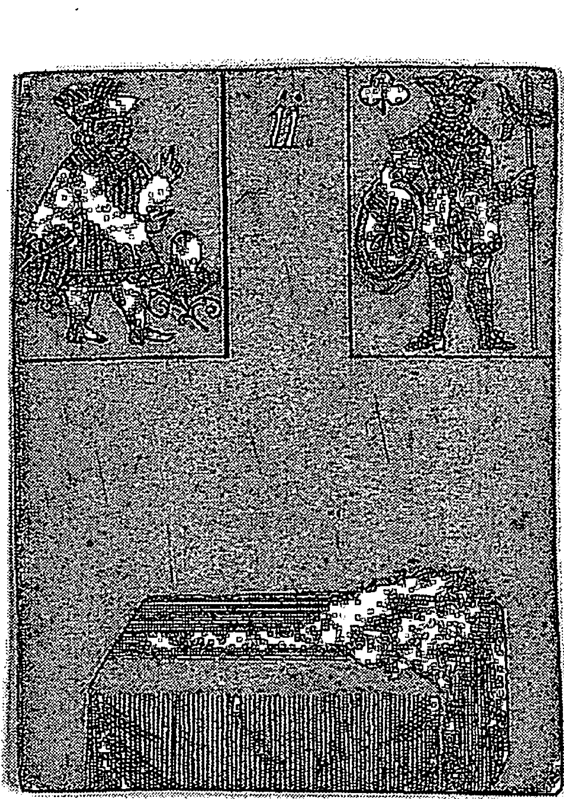

> “你卷入了纠纷，不要太热衷参与其中，否则你的身体会生病。”——1794年意大利咖啡渣占卜卡牌面箴言。

> “鞭子显示跟遗产有关的歧异，如果在咖啡渣浓厚处，代表生病。”——1794年意大利咖啡渣占卜说明书。

> “要不被棍子打到，玩家得付出两枚代币，这样可以前进两格，到第十三格。”——1799年希望游戏说明书。

> “鞭子代表家庭争吵，家中的折磨，夫妻需要和平一点，也代表发烧和久病。”——1846年〈菲利浦雷诺曼说明书〉。

| 项目 | 内容 |
|---|---|
| 编号 | 11 |
| 扑克牌对应 | 梅花J |
| 核心意识 | 争执、重复、性 |

在雷诺曼卡最原始的牌义里，鞭子代表家庭争端或婚姻失和，是代表人际冲突的牌。

鞭子牌也称为“棍子”，在牌图里通常是鞭棍一组画在一起，两者的重要性是相当的。这两种东西，在古时的欧洲都是用来打人的，打受罚的学生的屁股，打不配合的犯人的肩背，因此鞭子很直接可对应到各种争端、批判和惩罚。最严重时可以代表暴力虐待，最轻微时可能只是讨论，但是这种讨论也是偏向激烈，或至少热烈的那种。

《达文西密码》电影里曾出现一幕修道士鞭打自己的情节，这在中世纪欧洲是很常见的习俗，修道士自我鞭打以压抑自己的欲念。这加强了鞭子与性的连结，也带出了鞭子的另一层含义——惩罚，无论是责罚别人，或责罚自己皆是，轻则心里内疚，重则可能自残自虐。

现在的雷诺曼占卜界，更考证发现棍子是源自古罗马帝国的“束棒”。这种东西是用几根桦木以皮革捆绑起来，上面通常还有斧头，由刀斧手携带，而刀斧手在当时是长官的随侍护卫，有权力逮捕平民，施加处罚，因此束棒在当时可是权力的象征。这个考证，更强化了鞭子和争端、惩罚甚至法律事务的关联。

因为鞭子打人的动作是重复性的，跟镰刀的一次斩断可不同，所以重复也成为鞭子的主流牌义速查表。当鞭子出现在某张牌后面，有可能代表这件事是发生两次，或需要重做一次，譬如若出现在骑士牌后面，可能代表会收到两次消息，出现在书本牌后面，可能是建议你要重读一次，出现在棺材牌后，是警告疾病复发。幸好，鞭子通常只代表两次，不是像吴刚伐木那样永无止尽的。

从“重复”这个意象，后世继续延伸出种种跟重复有关的动作，譬如运动与写作，都是重复的动作，各种技能的锻炼都算是，更重要的是性行为，不也是重复的动作吗？因此，鞭子在雷诺曼卡里是代表性的牌，最激烈时，会是SM或性虐待，这两者可不是真的会用到鞭子吗？

性虽然是鞭子牌在现代才引申的新牌义，但因为性在感情占卜里扮演重要角色，所以常被提及。要注意的是，鞭子牌代表的性，不见得是基于爱之上的，不是忠实的，更可能不是婚内的。（婚内基于爱的忠实的性，是百合牌）。

现代牌义把鞭子继续延伸为纪律，这大概是重复性的锻炼加鞭打意象，或者老师拿棍子约束学生的画面，自然产生的联想。

## 与编号在前的其他牌对照

骑士牌和鞭子都可以代表运动，骑士较常指骑乘或竞速类运动，鞭子较常指需重复操练的运动或体力劳动。云牌是用想的，且怀疑困惑，鞭子是用吵的，立场鲜明。蛇是从背后偷袭的，鞭子是当面理论。棺材是沉默的结束，鞭子是激动的持续。花束是和谐温情的，鞭子是冲突火热的。镰刀是突然出手，一击必杀，鞭子是来来往往办不停的唇枪舌战。

## 爱情解析

鞭子描绘的爱情关系，是很热烈的，可能是两人情绪激动，吵个不停，口角争闹，也可能指性生活的热烈，火辣的性爱，以肉欲为主的关系，如中文里讲的“干柴烈火”。当然，也可能两者皆是，就是俗称的“床头吵床尾和”啰。

## 工作解析

在工作方面，并不乐见鞭子，既然有人际争端或惩罚，就不会是和谐的环境，会有争执口角、各类人际冲突、处罚，也可能代表环境高压。亦可取鞭子的重复含义，代表工作上的反复操练、重做一次。

行业类别方面，鞭子打人的动作需要用力，因此代表各类体力活，特别是健身运动相关。又因为鞭子与口舌有关，可能代表批评辩论相关职业，如律师、名嘴、民代、批评家、论述作家、游说募捐者或社运人士。此外，因为鞭子与性爱的关联，也可代表性工作者，男女不拘。

## 健康解析

由于鞭子性质热烈，被鞭打过的地方真的会如火烧，因此鞭子在健康占卜中代表发烧，也代表疾病反复发作，故而久病，可能是一般认知的慢性病，也可能是其他有反复性质的病，如过敏、上瘾症和强迫症。再者，因为鞭打的动作会牵动肌肉，所以也可以代表肌肉酸疼，也别忘了被虐或自残的可能。

鞭子对应的身体部位就是肌肉（打人打太累）、舌头（口舌用太多，另一张对应舌头的是狗牌），也有人把喉咙和声音给纳入（想想看“喉舌”这两个字，不过我个人认为喉咙与声音对应给鸟牌似乎更适配）。最后，民间俗称的虎鞭蛇鞭之所以称“鞭”不是没有原因，鞭子与男性性器官有不可忽视的关连。

有些人把鞭子吵架联想到神经紧绷的情绪，因此让鞭子对应神经系统，不过因为鞭子对应的身体部位已经够多，我认为让老鼠牌来对应神经系统，较能取得系统性的平衡。解读鞭子时较不易因为它对应太多部位，而不知该选取哪个意义。

鞭子的健康建议就是要多锻炼体能，或多表达自己积压在心内的意见，或持续复健、持续回诊。

## 人物解析

鞭子牌本身通常不代表人物，但可以形容周围的人物牌。若是形容人物性格，他通常是火爆浪子类型。好则如民运人士、正义魔人，可以滔滔不绝，热烈说服，给予建言，坏则批评好辩，侵略性强，会把人逼到墙角的那种，最严重时可能闹事、施虐。另一方面则可能指注重肉欲，追求的方式热烈直接，几乎想把对方扑到床上的样子。

鞭子若是形容外貌，因为此牌对应运动且与性爱有关，因此通常指身材精壮，有性感魅力。

鞭子的典型人物中，琼瑶爱情剧里的马景涛是激动的鞭子，《格雷的五十道阴影》男女主角是性欲的鞭子，《绝命律师》是职业的鞭子。国父孙中山、马丁路德、翁山苏姬、曼德拉、林肯等革命人士，也都是鞭子。

## 物品解析

鞭子可以代表任何鞭棍类物品，以及性相关物品，譬如保险套、情趣用品。颜色属性是热烈的红色。

鞭子代表的地点可以是运动相关地点，如运动场、健身房，还有性相关地点，如声色场所，以及常有唇枪舌战处，如法庭或立法院。

## 时间解析

鞭子代表重复，或两次，也可代表速度非常快。因为鞭子是11号牌，视问题可代表十一天、十一周、十一月份或每月的十一日。

## 属性

鞭子是激烈高张且有冲突争端性质的能量，因此是负面牌。除非指的是运动锻炼、性行为或重复的行为，才属中性，但仍要明白鞭子的性行为并非忠诚或舒适，重复行为往往也不见得是好的，譬如疾病复发、被罚写或重做时，谁不希望能一次就做好呢？

## 大蓝图牌阵的遥近解读法

鞭子在大蓝图牌阵里，指涉人际冲突的机率最高，其次是重复性的事物（运动、性、复发或重做），可以从周围的牌来推测，例如如果旁边有树（健康）或棺材牌（疾厄），是指疾病复发，若旁边是房子牌，可能指家庭纷争，依此类推。

鞭子碰到镰刀牌要特别注意，这代表口头冲突（鞭子）可能演变为实质的伤害（镰刀）。

若是占算法律问题，鞭子可代表律师或你委请的民代，特别是当旁边有狗牌（伙伴）时。

## 主流牌义速查表

- **【名词】** 争执（吵架、口角、争执、争议、激烈讨论、辩论、质问、责骂、冲突、侵略、愤怒、批评、谴责、言语暴力、暴力、权力压迫、家庭失和、惩罚）、责罚（惩罚、自我惩罚、自责、自虐、自残）、重复（两次、重做、复发）、反复的动作（运动、锻炼、写作、性行为）、纪律（自律）。
- **【形容词】** 争吵的、有争议的、冲突的、骂人的、批评的、指责的、批判性的、惩罚性的、激烈的、虐待人的、侵略性的、重复的、复发的、性爱的、色欲的、长期的、红色的。
- **【爱情】** 口舌热烈（口角、争吵）、床上热烈（床头吵床尾和、肉欲关系、火辣性爱、干柴烈火、SM）。
- **【工作】** 争执（口角、人际冲突、处罚）、高压环境、重复（反复操练、重做一次）。
- **【行业】** 体力活（运动员、健身教练、保全、特技、工人、军人）、批评辩论相关行业（律师、名嘴、民意代表、批评家、论述作家、游说募捐者、社运人士）、性工作者（牛郎、妓女）。
- **【人物】** 无。
- **【人物形容词】** 鞭子争斗特质的（火爆的、好辩的、滔滔不绝的、爱批评的、爱吵架的、好胜的、愤怒的、严厉的、粗暴的、激动的、侵略性强的）、鞭子性欲特质的（肉欲的、性欲强的）、鞭子外貌的（身材精壮的、有健身的、性感的）。
- **【身体部位】** 肌肉、舌头、男性性器官。
- **【疾病】** 发烧、反复性的疾病（久病、反复发作、慢性病、过敏、上瘾症、强迫症）、肌肉酸疼、抽筋、被虐、自残。
- **【健康建议】** 多锻炼身体、多表达心内积压的意见、持续复健、持续回诊。
- **【身心灵】** 按摩、身体工作、运动、保养喉轮与脐轮、做反复性质的疗愈手作。
- **【物品】** 鞭棍类物品（鞭子、棍子、皮带、长尺、竹竿、晒衣杆、钓鱼竿、扫把等）、性相关物品（保险套、情趣用品）。
- **【时间】** 重复、两次。非常快。数字11的日期（十一天、十一周、十一月份、每月十一日）。
- **【地点】** 运动相关地点（运动场、健身房）、性相关地点（声色场所）、常有唇枪舌战处（法庭、立法院）。
- **【建议】** 多做身体运动。进行技能的锻炼。小心口舌纷争，说话前三思。多为自己发声争取。
- **【总结】** 负面。除非指运动，才属中性。

## 12 鸟
Bird

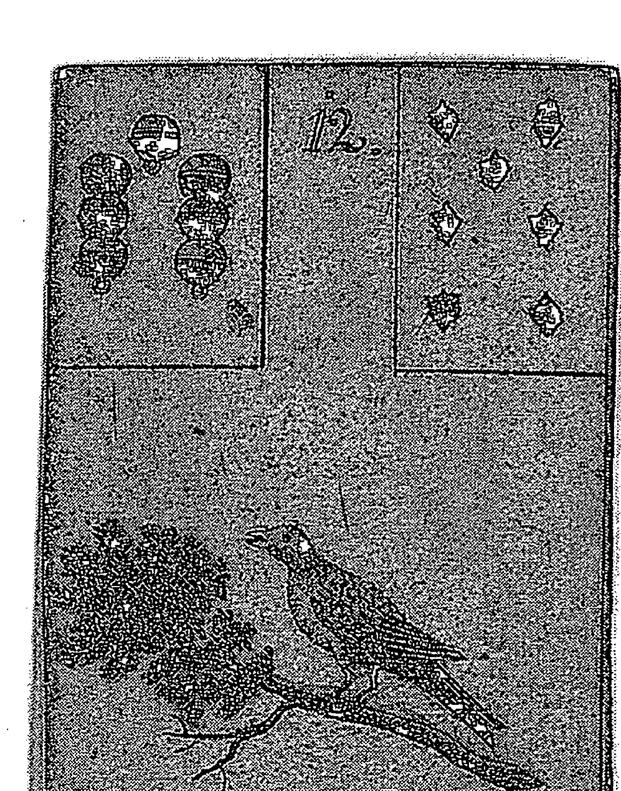

> “你很快乐，但是爱情若被热情冲昏头，会使你非常不快乐。”——1794年意大利咖啡渣占卜卡牌面箴言。

> “鸟若在明净处，表示你原本必须对抗的不愉快和麻烦即将结束，在咖啡渣浓厚处，是美好生活的征兆，也代表很快会有一场成功的旅游或航行，如果有线条，就会旅行到很远的地方。”——1794年意大利咖啡渣占卜说明书。

> “掷到三点走到船这一格的人，可以到加那利群岛快乐旅游，那里是很多有名的美丽鸟类的家，前进到第十二格（鸟牌）。”——1799年希望游戏说明书。

> “鸟代表需要克服的困难，但这只是短暂的。当离这个人（指示牌）远的时候，鸟表示快乐的旅行。”——1846年〈菲利浦雷诺曼说明书〉。

**编号：12**

**扑克牌对应：方块7**

**核心意象：口头谈话、焦虑不安**

相对于鞭子的激烈争吵，或骑士特地为你捎来的消息，鸟代表口头沟通，通常是面对面的，可以是轻松的聊天八卦，也可以是正式的讨论协商，不过因为时代改变，通过电子和网络传输的沟通，也都被归在鸟的范围了，包括手机、社群媒体、广电节目与podcast。

鸟通常会画出至少两只，有时会画成猫头鹰，不过无论是鸟或猫头鹰都不影响牌义。因为有两只，所以可以代表两个，至于两个什么，可从前一张牌来看，譬如如果幸运草牌加鸟，可代表中奖两次。

同理，鸟也可代表双倍，例如幸运草加鸟也可代表加倍幸运，或中奖双倍金额。有时，鸟会被画成三只，因此也有人用鸟代表数人小团体。而在爱情占卜中，人物牌前面出现鸟，经常代表这人已经是有伴的状态了。

鸟因为飞行的含义，可以代表旅行，但因为小鸟飞不了太远，通常指短期的航空旅行，但陆路旅行也是有可能的。（航空旅行意涵较强的是鹤鸟牌。）

〈菲利浦雷诺曼说明书〉提到鸟代表暂时性的困难，或许是因为鸟聚在一起叽叽喳喳声音扰人，所以引申出焦虑不安之意，传统上也有认为鸟代表忧愁悲伤，所以对遵守传统的占卜师来说，鸟是微偏负面的牌。

现代更继续把鸟引申出分心、兴奋、好奇等含义。这些解释方向有点分歧，可选择自己容易联想的就好。

## 与编号在前的其他牌对照

骑士牌是送达给你的专属讯息，鸟是随机的八卦闲聊。幸运草是轻松的，鸟是焦虑的。船的旅行可长可短，鸟较属短期旅行。树是稳重的，鸟是躁动的。云可以是深度忧郁，鸟只是轻微小焦虑。棺材是死寂沉静的，鸟是活泼嘈杂的。花束是日常的愉悦美好，鸟是日常的小不安。鞭子是激烈或至少热烈的讨论，鸟最多只是一般的讨论。鞭子可以代表同件事做两次，鸟代表同种东西有两个。

## 爱情解析

爱情方面抽到鸟，最常代表两人的沟通谈话，特别是口头对谈，如手机通话、聊天、交心甚至告白。因为现代网络发达，以讯息取代口谈的情况越来越普遍，所以鸟在现代也可代表电子传讯，并没有那么严格限定必须是口谈了。

因为鸟可以代表两个，因此如果代表对象的指示牌旁边有鸟，可能代表他已经有伴了。

最后，鸟也有忧虑方面的可能，显示对爱情的小担心、小不安。

## 工作解析

在工作方面，鸟可好可坏。好的部分代表工作上的口语谈话，包括沟通、讨论、开会、协商等，如果问谋职，是个好预兆，可能得到面试机会。负面的话就是上班聊天、八卦流言、嚼舌根，以及担忧、压力、不安等日常困扰，但都算轻微短暂。如果有采取“分心”的牌义的话，它也可以代表工作分心、注意力分散、一心多用。

鸟代表的职业，首先与说话沟通相关，如行销、业务、媒体、咨商、电话客服，再来是与声音相关，如录音、配音、主持、歌唱、接线生等，最后是与飞行相关，如机师、空服员。

## 健康解析

鸟对应的身体部位是与发声有关的部位，喉咙和声带。也有占卜师从焦虑不安而将鸟对应为轻微焦虑症，进一步延伸高血压和肾上腺的问题。

題，加愛心牌（心臟）更加強心血管疾病的可能。還有人以鳥類視力好為聯想，對應到眼睛。

鳥所代表的疾病，皆與上述部位有關。此外，因為鳥代表兩個，所以也有占卜師將鳥視為懷孕的預兆，尤其是當前面有孩童牌時，不過另一張「鶴鳥牌」（送子鳥）更能直觀的代表懷孕。

健康方面的建議，鳥牌顯示可以多運用溝通與聲音方面的療癒，如聽音樂、歌唱、找人談話、尋求諮商，或者要多釋放自己的不安情緒。

## 人物解析

鳥牌是動物牌，本身可以代表人物，此時有以下幾種可能性：

- 一對年長的伴侶：因為年長伴侶的相處模式已經變成像鳥一樣，只剩單純的說話陪伴了。
- 兄弟姐妹：因為兄弟姐妹就像鳥般群聚一窩，吱吱喳喳。
- 旁系親戚長輩：如伯嬸叔嫂或阿姨之類親戚，所謂的「婆婆媽媽」們，經常讓人感覺像鳥一樣嘰嘰喳喳的。
- 雙胞胎：因為鳥牌裡的鳥有兩隻，甚至更多。

鳥若是形容周圍人物牌的性格，通常表示愛講話，好的情況是健談、口才好、反應快、舌燦蓮花、妙語如珠，不好的情況就是愛八卦、口風很鬆、廣播電台、散播謠言。若有採用分心含義，則代表容易分心的，可能還很善變。

鳥若是形容鄰近人物牌的外貌，則指身材嬌小，麻雀腿，嘴巴尖翹，或者有鷹鉤鼻或尖鼻子。

鳥也可以指鄰近人物牌是從事鳥代表的行業，或是已經有伴侶、跟別人是一對兒的了。

許多主持人和歌手都能代表鳥的特質，如主持人蔡康永、小S、吳宗憲、吳姍儒，和流行歌天后瑪麗亞·凱莉、加拿大流行天后席琳·迪翁、音樂劇天后莎拉·布莱曼，還有那些參加歌手節目的明星，個個都

## 物品解析

鳥可以代表鳥，包括鳥籠或鳥巢。因為雷諾曼有2張鳥類牌，這張鳥牌代表體型比貓頭鷹小的鳥類（比貓頭鷹大的鳥類是鸛鳥牌）。

鳥可以代表會發出聲音的物品，電話、手機、麥克風、音響、擴音器、收音機、音樂播放器，或與聲音有關的地點，如KTV、演奏會、歌劇院、電話亭、視聽室、聊天室、廣播電台。

## 時間解析

鳥輕靈敏捷，速度中偏快。因為鳥是12號牌，視問題可代表十二天、十二週、十二月份或每月十二日。

## 屬性

鳥在〈菲利浦雷諾曼說明書〉因有短暫困難之意，故為中性偏負面的牌。

## 大藍圖牌陣的遠近解讀法

鳥在大藍圖出現時，常代表溝通對話，要不就是日常焦慮，再其次是代表旅行，最後是代表人。根據周圍的牌，影響鳥的好壞，好時可能聊得很投機、聽見開心的事、快樂旅行，壞時就一言不合、道人長短，或旅行不愉快。

在大藍圖牌陣中，如果距離指示牌近，代表焦慮的機會較高，不過都是很快就能克服的小事。如果距離遠，可能代表旅行，通常是計畫外的短期旅行，有可能搭飛機。根據問題設定的時間長度，越是短期，旅行越小，譬如，若每日抽牌，可能只是跟朋友出去喝杯咖啡閒聊而已。

## 主流牌箴速查表

【名詞】短暂的困难、短期的麻烦、谈话（聊天、讲话、讨论、沟通、协商、交涉、谈判、会议、报告、研讨会、电话、讯息、留言、面谈、八卦、谣言、小道消息、新闻）、不安（焦虑、忧愁、悲伤）、短程旅行、两个（一对、小团体、几个人）、声音。

【形容詞】谈话的（对话的、口头的、八卦的）、不安的（忧虑的、躁动的、兴奋的、烦人的）、两个的（一对的、双倍的）、短暂的、短程旅行的。

【愛情】谈话（通话、聊天、交心、传讯、告白）、两个（已有伴侣）、忧虑不安。

【工作】谈话（沟通、讨论、开会、协商、面试、上班聊天、八卦流言、嚼舌根）、分心（注意力分散、一心多用）、不安（小担忧、小焦虑、小压力）。

【行業】说话沟通相关行业（行销、业务、媒体、谘商、电话客服）、声音相关行业（录音、配音、主持、歌唱、接线生）、飞行相关行业（机师、空服员）。

【人物】兄弟姐妹、一对年长的伴侣、旁系亲戚长辈、双胞胎。

【人物形容詞】鸟般个性的（健谈的、口才好的、反应快的、爱八卦的、舌灿莲花的、妙语如珠的、爱八卦的、口风很松的、易分心的、善变的）、鸟般外型的（身材娇小的、麻雀腿的、嘴巴尖翘的、鹰钩鼻或尖鼻的）、从事鸟代表的行业的、有伴侣的。

【身體部位】发声相关（声带、喉咙、语言能力）、忧虑相关（血管、肾上腺）、视力相关（眼睛、视力）。

【疾病】喉咙或声带问题、失语症（＋棺材）、高血压、肾上腺问题、心血管疾病（＋爱心）、眼睛或视力问题、轻微焦虑、怀孕（＋孩童）。

【健康建議】释放焦虑不安、多听音乐、多歌唱、寻求谘商、找人谈谈。

【身心靈】保养喉轮、唱歌、吟诵、尝试如西藏颂钵之类的声音疗法、諮商談話、溝通表達、賞鳥。

【物品】鳥相關（鳥、鳥巢、鳥籠、體型比貓頭鷹小的鳥類）、聲音相關物（電話、手機、麥克風、音響、收音機、擴音器、音樂播放器）。

【時間】中偏快、數字12的日期（十二天、十二週、十二月份、每月十二日）。

【地點】聲音相關地（KTV、演奏會、歌劇院、電話亭、視聽室、聊天室、廣播電台）。

【建議】把話說出來。去找對方談談。聽歌或歌唱。放鬆心情勿焦慮。

【總結】中性偏負面。

# 13 孩童 Child

> 「你給子女的良好教育所帶來的結果，會使你晚年很喜悅。你將活著看見他們帶來許多快樂。」——1794年義大利咖啡渣占卜卡牌面箴言。

> 「孩童在明淨處，表示問卜者和另一個人的純真交往。在咖啡渣濃厚處，表示在愛情方面太過頭，將付出很大的代價。在杯子底部，表示性慾的後果。」——1794年義大利咖啡渣占卜說明書。

> 「要不被棍子打到，玩家得付出兩枚代幣，這樣可以前進兩格，到第十三格（孩童）。」——1799年希望遊戲說明書。

> 「孩童是這個人進入很好的團體的徵兆，而且他對每個人都很好。」——1846年〈菲利浦雷諾曼說明書〉。

- 編號：13
- 撲克牌對應：黑桃J
- 核心意義：孩童、支持的夥伴、小的

孩童，真的代表孩子，也可以代表一切孩童般的特質。

孩子天真無邪、單純善良、充滿信任、無憂無慮。他喜歡玩耍，充滿遊戲性。他是新的、小的、剛萌芽的，所以如果孩童牌與其他牌搭配，就可以形容那是新的、小的或剛萌芽的事物，例如房子加孩童，就可以表示新房子、小房子，或剛萌芽的建案。

但是任何事都有一體兩面，孩童的特質也有缺點，他的另外一面就是不夠成熟，太幼稚，缺乏經驗。

〈菲利浦雷諾曼說明書〉特別提到孩子對每個人都很好，從這個源流推演下來，孩童可以代表一位支持的夥伴。當指示牌周圍有小孩牌，他本人生活中卻沒有小孩或特別重要的年輕朋友，這張牌也不適合解釋為新的、小的或剛萌芽的事物時，有可能就是指一位支持的朋友。

整體而言，孩童牌是新生的能量，如同幼苗，雖未成熟，卻充滿無限潛能。

## 與編號在前的其他牌對照

幸運草和孩童都很樂天，幸運草會投機，孩童很天真。樹是高大與久遠的，孩童是嬌小而新開始的。雲是烏煙瘴氣的，孩童是新鮮明亮的。蛇是複雜的，孩童是單純的。棺材是結束，孩童是新生。鞭子是性愛的，孩童是無性的。花束是精雕細琢華麗之美，孩童是單純樸實。鐮刀是威脅危險，孩童沒有威脅性。鞭子跟你吵架，孩童支持你、仰望你。鳥是焦慮不安的，孩童是無憂無慮的。

## 愛情解析

孩童可以代表新戀情，或是剛萌芽的感情。也可以形容兩個人的相處像小孩一樣，這跟鞭子那種高張的情慾不同，而偏向兩小無猜、純純的愛，或無性的柏拉圖戀情。

## 工作解析

在工作方面，我們可以從孩童「新」、「小」、「剛起步」和「孩童」這幾個方向來解釋。新的，可能代表新工作、新專案、創業階段。小的，代表這是個小兼差、小副業，或小職位。剛起步的，可能意味實習、學徒職位、剛起步的計畫、經驗不足、沒有充分準備或事情尚未成熟。孩童相關，指工作環境有許多孩童或年輕人。

孩童的代表行業是教育業，從幼教到大學都涵蓋在內。（嬰兒相關行業則主要由鵪鶉牌代表。）

## 健康解析

抽到孩童首先可聯想到有小孩了，若加上鳥、鵪鶉或樹就更可確認懷孕。身體部位可對應到胸部和乳房（小孩吸吮的部位），而因為小孩還在發展免疫力，也有人將孩童對應到免疫系統，但我認為免疫系統對應到花園牌更合適。

孩童代表的疾病，最典型就是小兒疾病，如腸病毒、麻疹、水痘、腮腺炎之類。另一方面，可從「小」的概念來推想，通常表示這是小病、問題很小、很早期、原本的增生變小了，或療癒有點小進步，總之沒什麼大礙。我曾有朋友問病況檢驗報告的結果，抽到孩童加花束，結果真的是有一點點小進步。

孩童牌較罕見的情況是指一些讓人處在孩童狀態的病，如侏儒、生長遲緩、唐氏症、彼得潘綜合症或失智症，但機率當然相對低很多。

## 人物解析

孩童牌代表人物的機率頗高，男女都有可能。當孩童本身代表一位人物時，解讀時有以下幾種可能性：

- 問卜者的小孩或孫子。
- 一個年輕人。
- 一個剛起步的人，如初學者、新手、學徒、菜鳥。
- 一個對你很好的人。

如果孩童牌是形容鄰近的人物牌，那麼他就是像孩童一樣，天真無邪、無憂無慮、全心信任、待人很好，對任何事都覺得很新鮮，很可愛，很愛遊戲。不好的情況就是幼稚，孩子氣、太單純，不夠成熟或經驗不足。若是形容外貌，則身材嬌小、娃娃臉、有稚氣，可能還具有中性的氣質。

孩童的典型人物有金庸小說《射鵰英雄傳》的老頑童周伯通、《書劍恩仇錄》中單純天真的香香公主，和原本就是個小屁孩的蜘蛛人。孩童外貌的代表有周迅、陳意涵、林依晨、蘇有朋、林志穎。好萊塢女星克蘿伊·摩蕾茲（Chloë Grace Moretz）也有張孩童臉。海倫娜·寶漢·卡特雖已有點資深，長相與戲路也頗有孩童特質。

## 物品解析

孩童可以代表跟孩童相關的物品，如兒童用品、童書、玩具、遊戲用品、遊樂器、卡通節目、學用品。也可以形容東西的尺寸是小的，或剛開始進行的東西，譬如剛開始拼的拼圖、剛開始組裝的模型。

## 時間解析

孩童代表的時間是剛開始。因為孩童小，也可以代表短期。因為孩童生長快速，所以速度偏快。因為孩童是13號牌，所以也可代表數字13的日期：十三天或每月的十三日。

## 屬性

孩童牌被視為中性偏好或純中性牌。若取《菲利浦雷諾曼說明書》的傳統牌義，孩童是對人好的人，所以屬中性偏好，但現代有些占卜師較看重孩童欠缺經驗的涵義，因而把孩童視為中性牌。在本書我們尊重傳統，故將孩童列為中性偏好的牌。

## 大藍圖牌陣的遠近解讀法

孩童若在大牌陣中離指示牌很近，若不是問卜者的小孩，或生活中認識的年輕人，通常代表一個支持問卜者的好夥伴，這個人通常待人很好，會全心支持問卜者。另外一個可能性，就是懷孕，若周圍有其他健康及懷孕牌卡，如樹、鸛鳥或鳥，更能確認。

如果距離遠，那麼這個好夥伴可能無法支持到你，或者需解作其他意義。

## 主流牌義速查表

- 【名詞】孩童（年輕人、好夥伴）、孩童特質（天真、善良、信任、單純、遊戲、玩耍）、新（剛開始、初期、萌芽階段、新發展、新機會、新事物）、小（一點點、小進展）。
- 【形容詞】孩童的、年輕的、新的、新鮮的、小的、一點點的、剛萌芽的、剛開始的、起步階段的、初期的、早期的、尚在發展中的、不成熟的。
- 【愛情】剛萌芽的感情、新戀情、兩小無猜、純純的愛、柏拉圖式的無性關係。
- 【工作】新的（新工作、新專案、新創事業）、小的（兼差、副業、小職位）、剛起步的（實習、學徒職位、剛起步的計畫、經驗不足、沒有充分準備、事情尚未成熟）、孩童相關的（工作環境有許多孩童或年輕人）。
- 【行業】教育業、兒童用品相關行業。
- 【人物】小孩或孫子、年輕人、全心支持你的人、剛起步的人（初學者、新手、學徒、菜鳥）。
- 【人物形容詞】孩童性格的（天真無邪的、單純善良的、全心信任的、對人很好的、無憂無慮的、愛遊戲的、可愛的、幼稚的、孩子氣的、不成熟的、外表像孩童的（嬌小的、娃娃臉的、稚氣的）、剛起步的（尚在學習中的、經驗不足的、不熟練的）。
- 【身體部位】胸、乳房。也有人對應免疫系統。
- 【疾病】小兒疾病（生長痛、麻疹、水痘、腮腺炎、腸病毒等）、小的（小毛病、很早期、增生變小、療癒有小進展）、懷孕生產（＋鶴鳥、樹、鳥）、處在孩童狀態的病（侏儒、生長遲緩、唐氏症、彼得潘綜合症、失智症）。
- 【健康建議】只是小病，沒有大礙。尋找新興的療法或年輕的醫者。
- 【身心靈】療癒內在小孩、返璞歸真、玩耍、跟孩童相處。
- 【物品】孩童相關物（兒童用品、童書、玩具、遊戲用品、遊樂器、卡通節目、學用品）、小尺寸的東西、剛開始進行的東西。
- 【時間】剛開始、短期、偏快、數字13的日期（十三天、每月十三日）。
- 【地點】孩童相關地（幼兒園、遊樂場、學校、兒童遊戲室、親子餐廳、親子旅館）。
- 【建議】輕鬆一點、無憂無慮。用遊戲的態度看世界。用新鮮的角度看待。多遊戲玩耍。才剛起步，你正在成長茁壯中。
- 【總結】中性偏好。

# 14 狐狸 Fox

> 「狡猾的狐狸帶玩家誤入歧途，他必須到第五格找到樹木避難。」——1799年希望遊戲說明書。

> 「狐狸，當距離近的時候，要小心誤信他人，因為有些人會想要欺騙你。當距離遠時，就沒有這個危險。」——1846年〈菲利浦雷諾曼說明書〉。

**編號：14**

**撲克牌對應：梅花9**

**核心意涵：奸詐狡猾、欺騙、錯誤**

說到狐狸，一般人第一個反應就是覺得牠**奸詐狡猾**。狐狸從古到今都被視為騙術大師，而且全球皆然，東方有狐狸精，西方有《列那狐傳說》（法語Roman de Renart）。當狐狸牌出現時，是要我們警覺：小心被騙，有事情可能出錯了。

要瞭解狐狸牌的精髓，需先瞭解狐狸的個性。狐狸本性多疑，每當進入新的環境，就會先觀察四周。若遇到敵人，牠會採取**欺騙手段**，躲進其他動物群裡，或跳河避難，甚至裝死。狐狸從來不會正面迎擊敵人，他都來陰的，因為這樣，大家才會說狐狸奸詐狡猾，是大騙子。因為如此，狐狸的形象就是花言巧語，天花亂墜，占人便宜，投機取巧。總之，不是很好。

不過，狐狸也有長處。牠智商高，聰明靈活，嗅覺靈敏，四處偵探，因此狐狸如果不是當詐騙犯，就會是警探，要不就是更高明的行騙高手——魔術師。電影《動物方程市》裡，狐狸主角就是為了求生存去當詐騙犯，有趣的是，牠後來真的改行做警探。這部電影徹底顯示西洋人對狐狸的認知，也相當反映了狐狸牌的精髓。

狐狸的另一個主要牌義是**錯誤**。這張牌出現提醒我們，有某些事可能出錯了，或者這件事根本就是錯的。譬如假如抽到船牌（旅行）加狐狸，可能代表這場旅行是錯誤的。

如果占卜是詢問建議，狐狸建議你採用狐狸作風——迂迴應對，懂得隱藏，可以稍微賊一點，最重要的是運用聰明才智！

狐狸被法國占卜流派視為工作主題卡，這是有歷史上的原因的。最初雷諾曼占卜原型希望遊戲桌遊是發源於德國，德國人是用貓牌當工作主題卡，取其穩定之意。直到1999年，史上第一本非德語的雷諾曼卡專書才出版，是由瑪麗·馬可（Marie Marco）以法文撰寫，在書中，她用狐狸牌代表工作，因為狐狸使出伎倆求生存，就像人類在職場一樣。

瑪麗·馬可之所以會這麼連結，據信是受到法國當地《列那狐傳說》的影響，傳說描寫一隻會狡猾的狐狸，與其他更高階的肉食動物周旋的故事。表面雖是寓言故事，實則描寫中古歐洲貴族權力腐化的百態，所以列那狐在法國文化中象徵勞動階級的英雄，在法國人人都知道這隻狐狸的形象，因此很容易聯想。 就是這樣，自從瑪麗·馬可的書出版後，狐狸就被法系流派的占卜師用來當受薪工作的主題卡了。 要不要採用狐狸當工作主題卡，是個人的選擇。我個人認為，在東方文化中，狐狸與工作的連結比較難聯想，所以我較少選用狐狸當工作主題卡。

## 與編號在前的其他牌對照

船是貿易與生意機會，狐狸是謀生餬口的工作。花束是真心的邀請，狐狸是別有用心的來往。鐮刀很毒舌，直接傷害，狐狸嘴很甜，陽奉陰違。鞭子是直率的，狐狸是迂迴的。孩童真心對你，狐狸不真心。 狐狸跟蛇牌特別需要深入比較。這2張牌都有欺騙和背叛的含義，初學者極易混淆，其實兩者之間雖然相似，但是仍有細微的差異。目前西洋主流的區分方法大致如下：

- 蛇的欺騙是出於惡意，狐狸是出於自利與求生存。
- 蛇是針對人，狐狸不是針對人，你只是剛好在牠求生存的路上被牠利用到而已。
- 蛇是刻意傷害人的感情，狐狸通常只是想要獲取利益。
- 蛇較常是情場敵手，狐狸較常是職場對手。
- 蛇的欺騙通常很快會浮出水面，狐狸的欺騙較難察覺。
- 蛇通常是女的，狐狸不一定。

總體而言，蛇是比較壞心的，但是狐狸比較難纏。因為狐狸的智商比較高，害人的技巧更高明，偽裝的功夫更厲害。傳說故事裡，不是狐狸都會化身成人嗎？狐狸就是那種把人賣掉、那個人還會幫他數鈔票的厲害角色。如果職場中碰到狐狸，被害的時候，是更不容易察覺的。

## 愛情解析

在愛情中，狐狸提醒欺騙、隱瞞或錯誤，有可能對方接近是別有所圖，或者這段感情有哪裡出錯了，甚至根本錯誤了呢？

## 工作解析

工作占卜中，狐狸同樣警示有欺騙或隱藏的成分。你是否被人利用了？還是被操弄、被煽動、被占便宜呢？狐狸也可能是警告事情有錯，是收到錯誤訊息？是人際關係的應對錯了？工作方向錯了？財務規劃錯了？可以從附近的牌來推知出錯的部分在哪裡。

狐狸代表的行業有警察、偵探、詐騙集團，和另外一種更高明的騙徒——魔術師。由於狐狸嗅覺靈敏，也可代表聞香師。

## 健康解析

狐狸因為嗅覺靈敏，且在野外需仰賴嗅覺來聚積資源，所以身體部位是對應鼻子與嗅覺。（雖然這個部位很直觀會被對應到狗牌，不過目前最主流還是對應給狐狸，因為狐狸除了鼻子與嗅覺之外，似無其他更適合的對應了。）

狐狸代表的身體疾病，可能是鼻子與嗅覺方面的問題，也暗示可能誤診。健康建議就是尋求專業意見，最好多找幾個醫師確認，能找到該醫療領域的專家更好。

## 人物解析

狐狸牌本身如果代表人，可能有以下幾種情形：

- 工作占卜中，代表職場上的對手。
- 法律占卜中，代表對方的律師。
- 因為法國占卜流派取狐狸當工作主題卡，因此也有人讓狐狸代表工作上的同事。

狐狸牌也可以形容鄰近的人物牌。所謂狐狸個性，無非奸詐狡猾、詭計多端、花言巧語、巧言令色，把話說得天花亂墜，畫大餅、灌迷湯，說謊不打草稿。他騙人或背叛，通常是為了占便宜或取得利益。他在職場上汲汲營營，到處鑽營，但確實是個聰明機靈、智商高又足智多謀的人。

狐狸牌若是形容外貌，通常是中等以下身材，眼睛不大，眼尾翹起，有點邪邪壞壞的氣質，但有獨特的魅力。因為狐狸是紅毛的，也可以單純表示他的頭髮染成紅褐色。

狐狸的代表人物，有多疑的曹操、電影《動物方程式》的狐狸主角、《冰與火之歌》的紅女巫梅莉珊卓（她剛好還是紅髮）、《哆啦A夢》的小夫、神探福爾摩斯、魔術師劉謙、《香水》中嗅覺靈敏的主角葛乙奴。

## 物品解析

狐狸可以代表狐狸，以及所有貓科動物。在為寵物貓作占卜時，可選用狐狸作指示牌。

狐狸欺騙的性質，還可以代表騙人用的東西，如魔術道具、網路謠言、假髮、假牙、魔術胸罩、義乳、角膜變色片、遮瑕膏、仿冒品等。

如果狐狸是代表地點，可為魔術舞台，警局、偵探社。假如你視狐狸為工作主題卡，它也可以代表工作場所、辦公室等。

## 時間解析

狐狸沒有明顯的快慢含義。因為是14號牌，視情境可代表十四天或每月的十四日。

## 屬性

狐狸是負面牌，除非用來代表工作或同事，才會變成中性。

## 大藍圖牌陣的遠近解讀法

狐狸如果離指示牌近，是一個警告，可能有欺騙，要不就是事情出錯了，或某件事一開始就是錯的。有些人會從狐狸鼻子指的方向，來看是什麼地方出問題。

狐狸如果離指示牌很遠，而且四周無壞牌，如此不但沒有危險，反而可能是在告訴你：「不需要那麼小心。你認為不好的人，可能並沒有不好。」

## 主流牌義速查表

- **【名詞】** 欺騙（謊言、奸詐、狡猾、欺詐、詐騙、謊報、誤導、詭計、陷阱、碰瓷、非法）、背叛（操弄、占便宜）、聰明（策略、識別、深入研究）、生存（自保）、工作（雇用、職場對手、同事）。
- **【形容詞】** 欺騙的、錯誤的、虛假的、操弄的、誤導的、被占便宜的、可疑的、聰明的、有技巧的、策略性的、非法的、紅色的、職場的。
- **【愛情】** 欺騙、隱藏、錯誤、背叛、利用、占便宜。
- **【工作】** 欺騙、隱藏、被利用、被操弄、被占便宜、錯誤（事情有錯、收到錯誤訊息、做事方向錯誤等）。
- **【行業】** 警察、偵探、詐騙、魔術、聞香。
- **【人物】** 職場上的對手、對方的律師、同事（法國占卜流派）。
- **【人物形容詞】** 狐狸般狡猾的（奸詐狡猾的、詭計多端的、巧言令色的、花言巧語的、天花亂墜的、畫大餅的、灌迷湯的、騙人的、背叛的、占便宜的、閃避的、可疑的、汲汲營營的、到處鑽營的）、狐狸般聰明的（機靈的、智商高的、足智多謀的）、狐狸般外貌的（中等以下身材的、眼睛不大眼尾翹起的、邪壞氣質有魅力的、頭髮染成紅褐色的）。
- **【身體部位】** 鼻子、嗅覺。
- **【疾病】** 鼻子與嗅覺相關疾病。誤診。
- **【健康建議】** 小心誤診。多找幾個醫生確認。尋求醫療領域中的專家。
- **【身心靈】** 療癒生存本能（海底輪）、說真話、療癒喉輪、對自己誠實一點、利用嗅覺療癒（芳香療法）、配戴紅色礦石、穿紅色衣物。
- **【物品】** 狐狸、貓科動物、騙人用物（魔術道具、網路謠言、整人玩具、假髮、假牙、魔術胸罩、義乳、角膜變色片、遮瑕膏、仿冒品等）。
- **【時間】** 數字14的日期（十四天、每月十四日）。
- **【地點】** 警局、偵探社、魔術舞台、工作場所或辦公室（法系占卜流派）。
- **【建議】** 誠實一點、小心被騙、別被占便宜、運用聰明才智解決問題、迂迴應對或暫時閃躲、做事要有策略、保持靈活彈性。
- **【總結】** 負面。若代表工作或員工則為中性。

# 15 熊

Bear

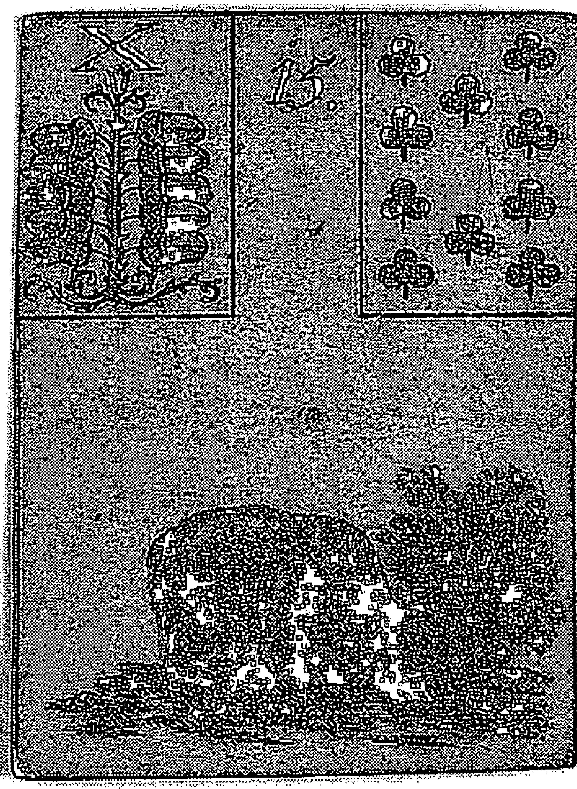

> 「時刻保持警惕。越輕信的人，越容易被騙。」——1794年義大利咖啡渣占卜卡牌面箴言。

> 「獅子，或任何猛獸，若在杯子上方的明淨處，代表與上流人士的各種繁榮興旺。若在底部，是警告問卜者要避免所有這種交往，因為他無論如何都會發現有人嫉妒他的財富且無法淡然看待。」——1794年義大利咖啡渣占卜說明書。

> 「熊是繁榮興旺的使者，或是告誡我們要遠離一些朋友，特別是嫉妒的人。」——1846年〈菲利浦雷諾曼說明書〉。

### 編號：15

### 撲克牌對應：梅花10

### 核心意義：力量、資源、飲食

熊給人的印象，首先是力量，想想熊龐大的身軀立在你面前，一掌巴下去的畫面。人類之所以怕碰到熊，其來有自。

力量本身是中性的，可以為善，可以為惡。熊的力量若做正面發揮，可以是勇氣與保護，讓我們勇於正面迎擊，捍衛自己。這跟狐狸的迴避策略恰成對比。而力量若作負面發展，就是權力濫用，逼人太甚，威嚇控制，乃至欺壓霸凌了。

由於力量特質，熊可以代表有力量的人、這包括體力、權力或財力，譬如我在占卜健身房續約問題時，熊牌出現就是代表我的健身教練。

熊也是有份量的人，說話有份量，體重也有份量。他是可以是男的，擔任主管級的權力人士，也可以是女的，作為母親般保護性特強的角色。奧斯卡得獎電影《神鬼獵人》中，李奧納多飾演的主角一開始被熊攻擊至重傷，後來才知道那頭熊是為了保護寶寶，正所謂「為母則強」。

值得一提的是，解為有力人士是從德國傳統流派起源，解為母親是荷比新派的解法，兩者雖誕生於不同流派，不過現在占卜師通常已經混合兩者，或自由從這兩者取一來應用。我個人是覺得熊對我來說比較像有力人士，所以我取前者，除非占卜剛好與媽媽有關，才會往後者解釋。當然你可以做自己的選擇。

熊的第二個核心意義是資源，因為熊會囤積食物冬眠，類比到人類社會，就是存錢啦。因此熊是代表資產的牌，專指儲存下來的錢，以及如何處理資產，這點可以和代表收入的魚牌作對照。

也因為熊會囤積食物，所以也與飲食有關。

在某些英文資料裡，會提到熊代表好運，其實這是德文資料轉譯為英文時失真所導致的誤解。〈菲利浦雷諾曼說明書〉英文版裡，翻譯道「熊是Good Fortune的使者」，會讓人以為這指的是好運，其實德文原意更接近整體的繁榮興盛，有一種強強滾、很旺的感覺。

在〈菲利浦雷諾曼說明書〉的原始牌義裡，熊還有嫉妒的意思，要我們小心嫉妒的人。此說是出於1794年的咖啡渣占卜書，至於咖啡渣占卜書為何會這麼說呢？這是因為熊擁有龐大的資產，恐會招人眼紅嫉妒，他自然需要保護自己的資產了，這也再度加強了熊牌保衛的含義。 也有占卜師試著從文化背景推想，據說這可能跟1837年羅伯特·騷塞（Robert Southey）出版的《三隻熊》寓言故事有關，故事說有個嫉妒的老太太，闖進三隻熊的家，吃了她們的粥、坐了她們的椅子、睡她們的床，最後被熊發現，就逃跑了。這故事雖然是在1837年才出版，但是其實騷塞在1813年就開始跟家人講了這個故事，而且他是從他的叔伯輩聽來的，可見這故事在更早之前就開始流傳，因此，咖啡渣占卜卡出版的時代，當時的人可能已經熟知這個故事，因此援引到牌義裡。 當然，這只是一個假說。後來這個故事改版，老太太變成現在較為人所知的金髮姑娘金鳳花（Goldilocks）。

### 解讀的方向性

現在新一派的占卜師為熊加入了方向性元素。若熊是代表嫉妒的人時，熊臉所朝的方向，就是嫉妒的源由，例如若朝著幸運草牌，代表他嫉妒問卜者的好運。

## 與編號在前的其他牌對照

幸運草是小的意外之財，熊已累積龐大資產。蛇與熊都可代表嫉妒，熊較常指因成功而遭人眼紅，蛇比較指一般性的嫉妒，特別是情場上的嫉妒。孩童是小的、剛開始的，熊是大的、已有力量的。狐狸還未成功，為了自利與求生存而運用才智獲取所需，熊已經掌權可以直接碾壓人。

## 愛情解析

熊的力量與保護特質，代表雙方的情感很穩固，有安全感，令人感覺受到保護。梁祝的苦情故事不會發生在熊身上，這對戀人有足夠的力量和資源應對一切。

若周圍被壞牌環繞，就要傾向負面解釋，代表關係中的壓迫、霸凌，也許是過度保護、限制太多，也許其中一方是大男人大女人，需事事聽令於他。或者，可能有忌妒、打翻醋罈子等情事。

## 工作解析

工作方面，熊除了可能代表主管或媽媽類型人物之外，因為熊本身有豐盛繁榮之意，可以顯示各類成功，問投資有利可圖，問業務擴展可望成功，問轉職有機會獲得肥缺或升職，問營收相當豐碩，問財務十分穩定，交涉談判也會站在有力地位。

熊也可以代表職場的有力盟友，或者，相反的，遭到職場鬥爭與欺壓霸凌。視周圍的牌決定解讀方向。

熊代表的職業，首先與資產相關，如銀行、保險、金融、證券、會計，也包括儲存資產的行業，如倉儲。其次是飲食相關行業，如餐飲、食品業。

## 健康解析

因為熊與飲食的密切關聯，健康方面自然與飲食有關，包括營養及體重控制。身體部位對應到儲存食物的器官——胃與整個消化系統，包括腹部位置。此外，也對應到毛髮。

熊對應的疾病也是與飲食、腹部消化和毛髮相關的疾病，以及與囤積相關的症狀，如肥胖、腫瘤、增生。

熊也可以代表擁有對抗疾病的資源，可能指體力足夠、出得起醫療費用，或擁有親友的支持照顧。

## 物品解析

熊與資產有關，可代表儲存資產的物品或場所，如錢包、存錢筒、銀行、ATM、存摺、倉庫等。熊與飲食有關，因此可代表食物、餐具，以及餐廳廚房等相關場所。由於熊是大型野生動物，因此也可以廣泛的代表大型野生動物。

## 人物解析

熊是動物牌，在占卜中可以代表一個人物，此時有以下幾種可能性：

1.  有力人士：主管、有力盟友、保護者。（此為德國傳統派的對應。）
2.  母性人物：媽媽、祖母、婆婆、女性長輩。（此為荷比新派的對應。）
3.  當出現在牌陣中不利的位置時，可代表嫉妒者或霸凌者。

由於流派之分，熊代表人物時，出現了不同的解釋方向，有占卜師只取有力人士之義，有些只取母性人物。建議選取其中一項為主，或在占卜前先做指定，以避免混淆。

當熊是形容周圍的人物牌時，他就像熊一樣有勇氣，有力量、保護欲強，豪邁有氣魄，是老大哥樣的人物，不好的情況下則是霸道威嚇或嫉妒。另一方面，也可能代表母性強的人，像媽媽般，同樣很有保護性。

熊若是形容人物牌的外貌，通常虎背熊腰、魁梧壯碩、孔武有力，可能體毛多，還可能有刺青，但也有可能指肥胖者。

熊牌也有可能是形容該人物從事熊牌代表的職業，如餐飲或財富管理業，但這情況比較少。

熊的代表人物有《哆啦A夢》的胖虎、變身後的綠巨人浩克、巨石強森、知名Youtuber館長。動畫電影《魔法滿屋》裡保護全家的奶奶是母性的熊。《冰與火之歌》的凱特琳·史塔克夫人也很符合熊的母性特質，塔斯的布蕾妮亦符合熊的外貌、力量與保護性。

## 時間解析

熊可以代表六到八個月，這是熊的冬眠期。熊本身動作不快，故也代表緩慢。另外，熊是15號牌，所以也能代表十五天或每月的十五日。

## 屬性

熊在〈菲利浦雷諾曼說明書〉是繁榮興旺的象徵，同時有招忌的隱憂，平均下來屬中性偏好的牌。

## 大藍圖牌陣的遠近解讀法

當熊距離指示牌近時，象徵各種豐饒和資源，也可以代表你的母性長輩、主管、有力的盟友或保護你的人。

當熊距離指示牌遠，且被壞牌環繞時，代表要小心遭人忌妒。特別是熊加鞭子（爭執）或鐮刀（危險），有可能是霸凌警訊。

熊也可以當財富的主題卡，但跟魚牌的商業或薪資收入不同，而是指資產處理，譬如投資、存款、買保險、退休金準備這類事，便可以用熊為主題卡，從熊周圍的牌來解讀。

## 主流牌義速查表

- **【名詞】** 繁榮興旺、力量（勇氣、支持、保護）、資產（財富、投資、財產、物資）、飲食、嫉妒。
- **【形容詞】** 繁榮興旺的、有力的、保護的、霸道的、支持的、壓倒性的、母性的、大的、雄厚的、高資產的、資源豐富的、有錢的、緩慢的。
- **【愛情】** 堅固穩定、安全感、受保護、有力量對抗外界、過度保護或限制、妒忌、吃醋。
- **【工作】** 繁榮（成功、有利可圖、擴展成功、肥缺、升職、營收豐碩、財務穩定）、力量（有力的盟友、交涉談判站在有力地位、權力鬥爭、霸凌）。
- **【行業】** 飲食相關（餐飲業、食品業）、資產相關（銀行、金融、證券、保險、會計、倉儲）。
- **【人物】** 有力人士（主管、有力盟友、保護者）、媽媽類型（媽媽、祖母、婆婆、女性長輩）、嫉妒者或霸凌者。
- **【人物形容詞】** 熊般個性的（有力量的、有權力的、有勇氣的、豪邁的、有氣魄的、保護性的、有錢的、霸道的、母性的、媽媽般的、支持的、有錢的、資源豐富的、緩慢的）、熊般外貌的（虎背熊腰的、魁梧壯碩的、孔武有力的、毛髮濃密的、有刺青的、肥胖的）、嫉妒的、從事熊代表的行業的。
- **【身體部位】** 胃、消化系統、腹部、毛髮。
- **【疾病】** 飲食相關（食物過敏、營養不足或過剩）、囤積相關（肥胖、腫瘤、增生）、毛髮病變。
- **【健康建議】** 注意飲食、平衡營養、控制體重。
- **【身心靈】** 拿出力量。建立個人界線。架設氣場防護罩。尋找有力的導師。
- **【物品】** 飲食相關物（食物、餐具）、存錢相關物（撲滿、錢包、皮包、存摺、保險櫃）、大型野生動物。
- **【時間】** 六至八個月（熊的冬眠期）、緩慢、數字15的日期（十五天、每月十五日）。
- **【地點】** 飲食相關（餐廳、廚房）、資產儲存相關（銀行、ATM、倉庫）。
- **【建議】** 不要害怕，拿出勇氣，使出個人力量。尋求有力的盟友或支持保護。不要嫉妒人或小心招忌。
- **【總結】** 中性偏好。

# 16 星星

Star

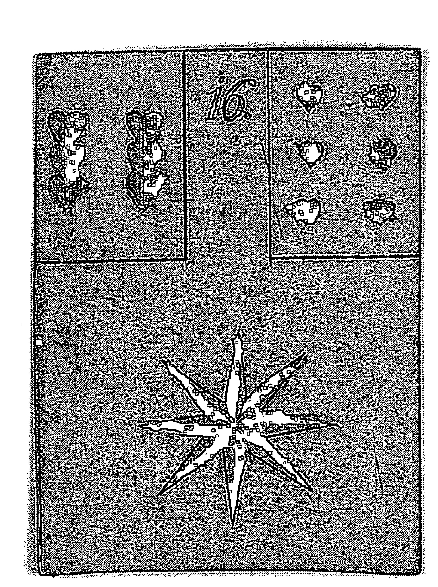

> 「盡你所能的做，你很快會體驗到好結果。」——1794年義大利咖啡渣占卜卡牌面箴言。

> 「星星如果在明淨處且在（杯子）上方，代表幸福。如果被雲遮蓋或在咖啡渣濃厚處，象徵長壽，雖然會遭遇各種麻煩。如果附近有圓點，預兆繁榮好運、富裕、受尊敬等。幾顆星代表很多很好的孩子，但若被線形環繞，孩子會在你晚年時帶來憂傷煩惱，你必須及時給他們良好教育，以防此事發生。」——1794年義大利咖啡渣占卜說明書。

> 「抵達好展望的星星，玩家獲得六分。」——1799年希望遊戲說明書。

> 「星星保證所有領域的好運，但是如果靠近雲，代表一連串不幸事件。」——1846年〈菲利浦雷諾曼說明書〉。

### 編號：16

### 撲克牌對應：紅心6

### 核心意象：展望、指引、實現

雷諾曼卡跟塔羅牌都有星星牌，而且都不約而同認為星星象徵希望，不過，雷諾曼卡的星星，多了一點展望的意味。這不是單純抱著希望，而是擁有志向，確實看見想實現的目標了。

在中世紀航海時期，是北極星指引方向的依據。北極星就好像我們的志向，星星描述的就是朝志向前進的過程，是小小潛能的巨大實現。只要有北極星導航，沿途都有精確的指引，我們便可滿懷信心，知道自己在正確的路上。星星是引導，是鼓勵，是帶領我們實現夢想的最佳導航器。

北極星的引導性，也進一步引申為視野清晰，判斷正確，思考或執行很精確。

星星是充滿無限潛能的牌。我們會對著流星許願，在那個當下，懷抱無限可能。我們還會講「摘星」這個詞，代表夢想的實現。當我們望著星空，正向情緒油然而生，和諧寧靜，樂觀安詳。

星星高掛天際，本身就屬超群，有種超脫凡俗的意味。因為與北極星的連結，星星可代表北方。星星也可以代表數量，代表的是無數的。

星星是代表身心靈與靈性療癒的主要牌卡，這點可從占星術來做連結，擴及所有命理占卜，再到整個身心靈領域。

總體而言，看到星星，就要想到北極星。星星描述的是我們前往摘星的過程，而這過程是擁有指引的。

## 與編號在前的其他牌對照

房子是日常俗世生活，星星是超脫凡俗。樹牌是接地，挖掘深遠的過去根源，星星是接天，描繪充滿前景的未來。雲是晦澀不明的，星星是清晰精準的。鞭子是情緒激烈的爭執，星星是平和寧靜的能量。孩童才剛起步，星星已經走在正確的方向上。狐狸表示錯誤，星星表示正確。熊運用體力、權力或財力，星星滿懷願力。

## 愛情解析

愛情占卜中，星星無疑是好預兆，夢想實現，不就是理想對象出現嗎？即使沒有理想對象，至少顯示對愛情仍懷抱希望。如果原本已有對象，那麼雙方的感情樂觀，幸福和諧，內心寧靜，有著共同的目標，前進方向正確，有望成功。

## 工作解析

在工作方面，星星通常表示很有希望，朝著目標穩健前進，或見事判斷正確、辦事足夠精準。星星顯示我們走在正確的道路上，目標唾手可得。若指工作環境，環境當然和諧，甚至到寧靜的地步。

星星代表的行業相當兩極，最科學與最不科學的行業都在其中。首先，取北極星精準定位之意，可代表科學，最直接就是天文與航太。又因為星點遍布天空，點到點之間就像是無線網路端點與端點之間的連結，所以也有占卜師以星星代表電腦與網路業。差不多所有跟科技相關的行業，都被星星包括在內。

另一方面，因為星星是占星學研究的對象，所以星星可代表命理占卜乃至整個身心靈產業，包括通靈與靈療。

再者，星星有亮晶晶的特色，因此可代表任何跟亮晶晶物品為伍的行業，例如水晶珠寶業、LED燈製造業，還有電力產業，因為電可產生電光火花，而且跟網路一樣有網絡傳導的特性（另一張對應電力的是太陽牌）。而由於星星是夜晚才出現，時間對應夜晚，所以也可代表夜班工作。

## 健康解析

星星本身有獲得引導、走在正確道路上、向目標邁進的概念，因此，在健康方面，顯示正在獲得療癒的路上，復原希望濃厚，是很不錯的象徵。

星星若代表疾病，通常與夜晚有關，如失眠、夜驚或夢魘。也可能代表皮膚疹，因為疹子像星點一樣遍佈皮膚。基於這種遍佈的意象，身體部位便是對應皮膚。（另一張對應皮膚的牌是房子。）因為星星是來自宇宙，且有精準之意，所以可以代表放射治療和雷射，而星星一顆一顆的意象，也可指藥丸。

現代有些占卜師會把星星遍佈天空的意象，想像為擴散，所以在問卜者已罹癌的占卜中，將星星解釋為癌細胞擴散。這跟星星的原義天差地遠，會令人不知該往那個方向解釋，倘若貿然解為癌細胞擴散，可是會引發恐慌的。

針對這個問題，我的建議是，完全不要採用擴散的含義，畢竟這是現代新引申的牌義，並非原始意義。至於癌細胞擴不擴散，那應該是去醫院檢驗，不是來問牌卡。

但是如果你還是想採用擴散這個牌義，要注意問題設定就必須非常明確，解讀時也要緊扣問題解讀。例如，如果是問「我的疾病復原情況如何？」抽到星星，可解為在療癒中、復原希望濃厚。如果是問「我的癌細胞發展程度如何？」抽到星星，那麼解為擴散就合理。問題精準是非常重要的。

## 人物解析

星星牌本身不太會代表人物，但可以附加說明鄰近的人物牌。

首先，可能代表此人是北極星般的指引角色——大師、導師、讓我們追隨的人。

或者，也可能說明此人很有理想、懷抱希望、築夢踏實，性情樂觀平和，見事清晰，有一顆思考精準的腦袋，數理能力可能很好，常被認為很有天賦、出類拔萃。也可能指他是從事星星代表行業的人。

若是形容外貌，通常長得不錯，頗有魅力，這種魅力是出自他內在的理想性，讓人不自覺想要追隨，眼睛可能特別明亮。若搭配壞牌，可能皮膚有痘痘、斑點或胎記。

星星的典型人物有愛因斯坦、印度聖雄甘地、印度靈性導師奧修、特斯拉汽車創辦人馬斯克、美國總統歐巴馬。

## 物品解析

星星代表的物品，可由以下幾個方向聯想：

1.  科學相關物：天文望遠鏡、網路、電腦、科技。
2.  占星命理相關物：西洋占星盤、中國占星術紫微斗數命盤。
3.  星星般亮晶晶的物品：水晶、金屬、螢光棒、LED燈、夜光貼紙，包括電力。
4.  精準定位用品：地圖、指北針、GPS導航系統。
5.  無數類似的小東西：藥丸、彈珠、串珠、動力沙。

## 時間解析

星星是夜晚才出現的，因此時間代表夜晚。又因為星星是編號16，可代表十六天或每月的十六日。

## 屬性

星星是很正面的牌，除非遇到雲牌。

## 大藍圖牌陣的遠近解讀法

星星如果距離指示牌近，且好牌環繞，顯示你在正確的道路上，目標唾手可得，成功率高，內心感到樂觀希望、心靈平靜。因為上面的牌會影響下面的，星星若在指示牌正上方，是最好的，影響力能直接及於問卜者。

如果星星距離指示牌雖近，卻被壞牌環繞，星星可以稍微照亮情況，為困境保留一點希望。唯一一個例外是當星星是在雲牌旁時，由於烏雲可以完全遮住星星的光芒，傳統上反而預兆一連串問題事件。

星星如果離指示牌遠，成功的含義會隨距離衰減，目標也顯得遙不可及了。在整個大牌陣中，星星周圍的牌表示最有希望成功的領域，所以也是最值得我們著力的領域，譬如如果星星在愛心旁邊，表示近期多花心思在愛情上面，很有可能開花結果。

## 主流牌義速查表

- **【名詞】** 展望（希望、夢想、渴望、理想、期盼、樂觀、潛能、鼓勵、好預兆、改善、復原、療癒）、指引（清晰、精確、志向、目標、實現）、身心靈（靈性、祈禱、命理、通靈力、和諧、寧靜）、科技、夜晚、北方。
- **【形容詞】** 有希望的、方向正確的、會成功的、很有潛能的、理想的、嚮往的、寧靜的、指引的、精準的、唾手可得的、療癒的、占星的、命理的、星象的、通靈的、超自然的、北方的、夜晚的、無數的、亮晶晶的。
- **【愛情】** 理想對象出現、感情樂觀、幸福和諧的關係、雙方有共同目標、方向正確、有望成功、仍懷抱希望。
- **【工作】** 穩健朝目標前進、在正確的道路上、目標唾手可得、見事清晰、辦事準確、工作環境和諧。
- **【行業】** 科學相關行業（天文、航太、電腦資訊、網路、科技）、命理業（占星、占卜、通灵超自然）、身心灵业（灵性疗愈）、亮晶晶的物品相关（水晶珠宝、电力、LED灯）、夜班工作。

【人物】无。

【人物形容词】大师、导师、让人想追随的、星星般性格的（有理想的、怀抱希望的、乐观的、平和的、见事清晰的、思考精准的、数理能力好的、很有天赋的、出类拔萃的）、星星般外貌的（长得不错的、因内在理想而充满魅力的、眼睛亮晶晶的、有痘痘斑点或胎记的）、从事星星代表行业的。

【身体部位】皮肤。

【疾病】疾病改善、获得疗愈、放射治疗、镭射、睡眠问题（失眠、梦魇、夜惊）、疹子。

【健康建议】保持信心继续治疗、治疗方向正确、很有希望改善。

【身心灵】许愿、祈祷、祈求神圣指引、制作梦想板、占星、通灵、运用水晶、连结星系能量、各种能量疗愈、疗愈顶轮。

【物品】星星、科学相关物（天文望远镜、网络、电脑、科技等）、占星命理相关物（西洋占星盘、中国占星术紫微斗数命盘）、亮晶晶的物品（水晶、金属、荧光棒、LED灯、夜光贴纸、电力等）、精准定位用品（地图、指北针、GPS定位系统等）、无数类似的小东西（药丸、弹珠、串珠、动力沙等）。

【时间】夜晚、数字16的日期（十六天、每月十六日）。

【地点】北方、高处（屋顶、顶楼）、科学相关（电脑室、天文台、外太空）。

【逻辑】拥抱梦想、保持乐观、抱持希望、筑梦踏实、朝目标迈进、去摘星吧。

【总结】正面。

## 17
鹳鸟
Stork

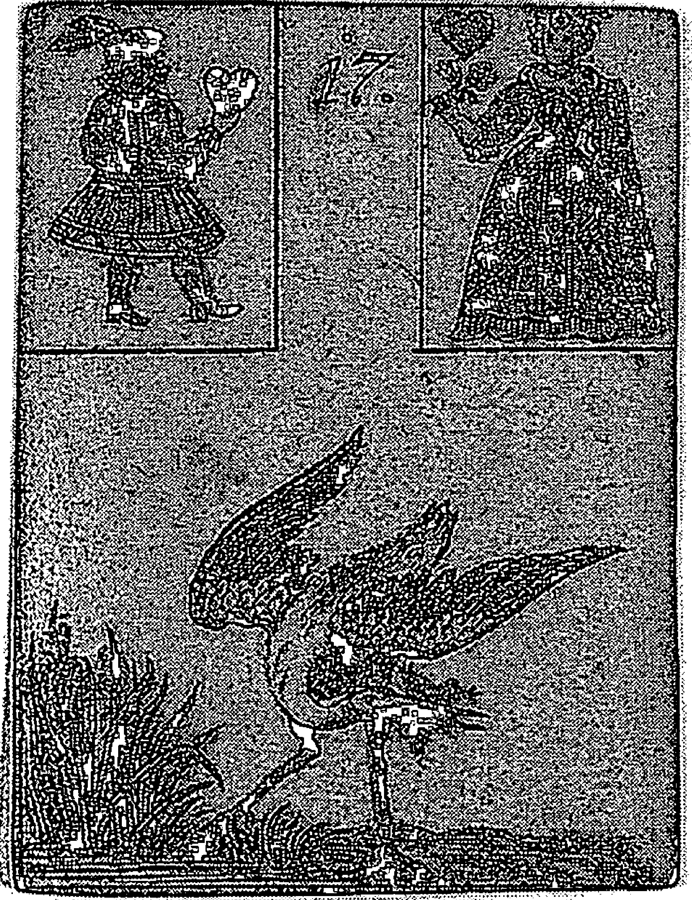

> > 「鹳鸟如果距离（指示牌）近，代表目前居所会改变，但是如果距离远，我们可以预测迁居会延迟。」——1846年〈菲利浦雷诺曼说明书〉。

- 编号：17
- 扑克牌对应：红心Q
- 核心意识：改变、进步

鹳鸟的核心意义是改变，且这个改变通常会带来进步。鹳鸟就是为人熟知的送子鸟，欧洲人认为婴儿就是送子鸟送来的，所以，鹳鸟加孩童牌，是雷诺曼占卜中最明确的怀孕征兆。

雷诺曼占卜会以鹳鸟象征改变，不只是因为孩子来了之后，会造成生活巨大的改变，也因为鹳鸟是一种会迁徙的候鸟，本身就是在搬家搬不停的状态。

鹳鸟所象征的改变，是一种进化，除旧布新，往更好的迈进，而且改变的速度也不会太突然，是一种能让人做好心理准备的渐进过程。除非周围绕坏牌，否则鹳鸟都是人生的升级改善。

改变可以有很多形式，除了〈菲利浦雷诺曼说明书〉说明的迁居之外，在现代生活中，更常发生的是家里整修装潢、增加新成员，或单纯是改变摆设，布置得更好。

鹳鸟与鸟牌是雷诺曼卡中唯二的鸟类牌。鹳鸟因为体型更大且是送子鸟，代表航空旅行及怀孕生产的涵义更强。鹳鸟与孩童牌都可能代表小孩，我个人设定的分野是：鹳鸟代表1岁以下或还不会行走的婴儿，孩童牌代表1岁以上或已经会行走的幼儿。

## 与编号在前的其他牌对照

船牌泛指一般旅行，鹳鸟是航空旅行。房子守成稳固，鹳鸟进展改变。蛇是变坏，鹳鸟是变好。棺材是结束，鹳鸟持续长进。鸟是航空旅行但也可以走陆路，鹳鸟强调航空旅行。孩童才刚开始，鹳鸟已在进步的路上。熊是大的，鹳鸟是高的。

## 爱情解析

鹳鸟带来的改变，呈现在爱情方面，同样是进展，可能从原本的暗恋进展到邀约，暧昧进展到告白，朋友进展到恋人，恋人则可能决定步入下一阶段，带男女友见家人、考虑同居甚至准备求婚。这是勇敢做出改变的时候了。

## 工作解析

鹳鸟带来工作方面的进展，最常见的是换了更好的环境、换了更好的同事、添购新设备、接到新工作、转职甚至升迁。

鹳鸟既然是代表怀孕生产的牌，现代占卜师也将其引申为工作生产力，故将鹳鸟解释为生产力增加、效率有进步。

鹳鸟代表的行业有几个方向，首先是怀孕生产相关，如妇产科和月子中心。第二是婴儿相关，如托婴中心、母婴用品贩售。第三是迁徙相关，如搬家公司和旅游业。第四，由于鹳鸟经常搬家，有占卜师将鹳鸟也对应到房地产业，不过我认为房地产业较直观的对应是房子牌，鹳鸟与旅宿业和租屋业的连结较强，你可以自己选择要如何对应。最后，鹳鸟还可对应到飞行相关，如机师、空服员。（另2张对应机师和空服员的是船牌和鸟牌。）

## 健康解析

鹳鸟一般显示健康有所进步。若代表疾病，会是腿部问题。身体部位自然对应整条腿部，毕竟鹳鸟的长腿特征太明显了。也有占卜师也将鹳鸟的对应延伸到手臂，如此鹳鸟就代表四肢，但你可以自行决定要不要把手臂也纳入。

鹳鸟加孩童牌，代表怀孕或生产。如果再加镰刀，为剖腹产。

## 人物解析

鹳鸟对应红心皇后，因此在占卜中可以代表一个女性，代表男性的机率很低。

许多人知道鹳鸟是送子鸟，不过你可能不知道，鹳鸟是特别会保护孩子的鸟类。他的巢又是鸟中特别巨大的，有1.5乘1.8公尺见方，它可以成功保护这么大的巢，而不踩到自己的蛋或宝宝。从这个角度看，就不难理解，鹳鸟象征的性别是女性，而他对应红心牌代表情感，体型又比较大，所以通常代表一位年纪比问卜者大、对问卜者提供某种助力的女性，但这只是一个倾向，并非绝对。

鹳鸟也有可能代表从事鹳鸟代表职业的人，譬如你的房地产中介、旅行社业务、妇产科护理师、搬家公司的人、机师或空服员。

鹳鸟若是形容周遭人物牌的个性，他通常热衷寻求改变与进步，适应力强，有企图心，喜欢新鲜改变，甚至喜新厌旧、骑驴找马。

若是形容外貌，他高挑苗条，双腿修长，五官和体态可能也优雅精致。若搭配坏牌，可能代表腿部有问题，例如有静脉曲张，或曾遭遇过创伤、不良于行。若加镰刀牌，创伤可能性更高。

鹳鸟性格的代表人物有梅莉·史翠普（对戏路的挑战方面）、婚前的周杰伦（感情方面）。鹳鸟外貌的代表人物有女星奥黛丽·赫本、蒂妲·史云顿、林志玲、梁咏琪、王祖贤、A-Lin。

## 物品解析

鹳鸟可以代表鹳鸟，及体型超过猫头鹰的鸟类（猫头鹰以下是鸟牌代表）。鹳鸟的送子涵意，与接生和婴儿相关，可代表怀孕生产及婴儿用品。鹳鸟高飞，可代表送我们到高处的物品，如楼梯、梯子、手扶梯和电梯。

## 时间解析

鹳鸟在时间对应方面较复杂。因为对欧洲人而言，鹳鸟是换季时迁徙，所以时间代表换季期。又因为鹳鸟是春天飞回欧洲，所以有人将鹳鸟对应春天。还有人因为鹳鸟离开欧洲的时间约有九个月，九个月刚好又是怀孕生产的需时，所以让鹳鸟代表九个月。鹳鸟又因为编号是17号，可以代表十七天或每月的十七日。

鹳鸟的时间对应特别多，可能造成解读的混淆，建议选取自己好记的来采用即可。

## 属性

鹳鸟是中性偏正面的牌，除非遇到坏牌，才会削弱正向含义。

## 大蓝图牌阵的远近解读法

鹳鸟如果距离指示牌近，显示改变与进步就要来临，可从周遭的牌解读改变是哪一方面的。周遭牌的好坏，则显示这个改变是问卜者喜欢还是想抗拒的。

依照德国传统解读法，上方的牌会影响下方的。如果鹳鸟刚好在指示牌上方，再加好牌围绕，进步就更确凿，或许真的会升迁或搬到更好的地方。

鹳鸟若出现在指示牌之左，代表过去的改变。出现在指示牌之右，表示未来的改变。

如果鹳鸟距离远，改变就不明显，假使又被坏牌围绕，这个改变将会延迟，甚或根本感受不到改变。

## 主流牌义速查表

- 【名词】改变（改善、进步、进化）、迁移、怀孕（生产、生产力）、航空。
- 【形容词】改变的、进步的、迁移的、有生产力的、怀孕的、航空的。
- 【爱情】进展、往下一步迈进、做出改变。
- 【工作】进展（换了好环境、换了更好的同事、添购新设备、接新工作、转职、升迁）、生产力（产能提升、效率增加）。
- 【行业】怀孕生产相关（妇产科、接生、月子中心）、婴幼儿相关（托婴中心、母婴用品贩售）、迁徙相关（搬家公司、旅游、旅宿、租屋）、航空相关（航空公司、机场、飞行员、空服员、航空货运）。
- 航空相关（机师、空服员）。
- 【人物】一个女子、比问卜者年纪大的女性、对问卜者提供助力的女性、从事鹳鸟代表行业者。
- 【人物形容词】鹳鸟般性格的（寻求改变与进步的、适应力强的、有企图心的、精益求精的、喜欢新鲜改变的、喜新厌旧的）、鹳鸟般外貌的（高挑苗条的、长腿的、优雅精致的、搭配坏牌为腿部有问题的）。
- 【身体部位】腿部或四肢。
- 【疾病】健康有进展、腿部或四肢问题、怀孕（加孩童牌）、生产（加孩童或树牌）。
- 【健康建议】有进展、改变治疗方式、换个更好的医师或医院、换个地方养病。
- 【身心灵】让自己蜕变、灵性学习可进展到下一阶段、开启顶轮。
- 【物品】鹳鸟、体型超过猫头鹰的鸟类、母婴用物（孕妇及婴儿用品）、送人到高处的物品（楼梯、手扶梯、电梯）、使人变高的物品（高跟鞋）。
- 【时间】换季期、春天、九个月、数字17的日期（十七天、每月十七日）。
- 【地点】高处。
- 【建议】做出改变，寻求进步。
- 【总结】中性偏好。

## 18
狗
Dog

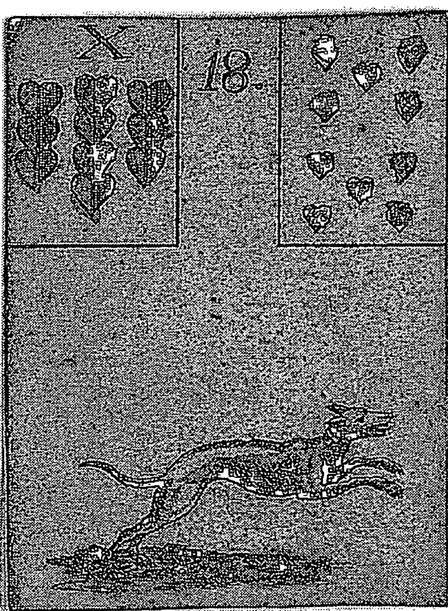

> 「你比较容易在陌生人中交到好朋友，甚于在自己已认识的人中。」——1794年意大利咖啡渣占卜卡牌面箴言。

> 「狗自古以来皆是忠实或嫉妒的代表，在此有两方面的意义。若在（杯子）上方且在明净处，代表忠实的真朋友，但若被云或线形围绕，显示你以为是朋友的人并不值得信任。但是如果狗在杯子底部，要小心极端嫉妒或羡慕造成的影响。」——1794年意大利咖啡渣占卜说明书。

> 「狗如果离这个人很近，你可以肯定朋友是忠实诚恳的。但是如果距离很远且被云围绕，你就不该信任自称是你朋友的人。」——1846年〈菲利浦雷诺曼说明书〉。

- 编号：18
- 扑克牌对应：红心10
- 核心意义：朋友、忠诚

狗是人类最好的朋友，核心意义可想而知就是朋友。狗象征我们的盟友，他是那个无条件在旁边支持我们的人，更是帮忙我们的人，对我们忠实不二，绝对值得信赖。大多数时候，狗牌是指问卜者的朋友，但不一定要是死党，仅仅认识的人也可以，但一定是对问卜者有某种帮助的。某些时候，狗可以指问卜者自己，显示他对某件人事物非常投入，甚至牺牲奉献，可从周遭的牌推知他对什么如此忠贞。雷诺曼占卜中，狗牌与孩童牌都可以代表支持我们的人，若要区分，依照《菲利浦雷诺曼说明书》的说明，孩童是对每个人都很好，狗比较是单独对你好，如此说来，孩童是一般的支持，狗更加死忠，忠诚可靠的意味更突出。

### 解读的方向性

虽然不是很主流，不过现在有占卜师为狗添加了解读的方向性。狗鼻尖指着的牌，是牠忠贞投入的对象，例如狗鼻尖指向戒指，代表他对这个约定很忠贞。如果狗是指问卜者自己，就是指问卜者自己对这个约定很忠贞。

## 与编号在前的其他牌对照

骑士的爱情是一头热但不见得持久的，狗的爱情是忠贞的。蛇是恶意的，狗是好心的。镰刀是牙尖嘴利跟你绝交的，狗是忠厚老实紧守身旁的。鸟爱八卦，狗可不会说你坏话。孩童是支持你的人，狗是你的死党。狐狸是占你便宜又狡猾的，狗是对你好而忠实的。熊是霸气保护，狗会在狗的能力范围内保护。星星是你所追随的，狗是追随你的。鹳鸟是迁徙不定的，狗是留在你身旁的。

## 爱情解析

爱情占卜里，狗可以代表一个人物，也可能是描述一个状况。

代表人物时，男人牌和女人牌代表问卜者及其对象，狗就代表「第二个男对象」，可以是新对象、外遇对象，或前夫、前男友，不过都是能维持友好关系的那种（不能维持好关系的是云牌）。此外，狗还可以在男同志爱情占卜时作为男对象的指示牌。

当对象以狗牌显示时，表示这个对象是认真的。

狗如果是描述感情状况，通常有坚实的友谊基础，对方像朋友一样，忠贞陪伴，保护你，对你好，永远站在你这边，对你牺牲奉献，是很有支持性的关系。抽到狗牌，可以放心，他不会偷吃。

## 工作解析

狗在工作方面，是相当不错的，解释方向可包括职场有支持你的人、有人帮助你、工作环境友善、同事间彼此帮忙、合作对象可以信赖、老板很诚信，或代表你对这份工作忠贞投入。

狗代表的行业，传统上是医护人员，因为医护人员就是照顾人的，包括医生、护理师、治疗师、长照师、咨商师及兽医都算是，特别是旁边有树牌（健康）时，更能肯定这层指涉。到了现代社会，狗还被对应到有跟班性质的工作，如秘书、助理、保镖、随扈，以及看守性质的工作，如警卫、保全，最后还别忘了宠物业。

## 健康解析

狗代表的身體部位是舌頭，從狗吐舌頭喘氣的畫面，不難理解。若代表疾病，即為舌頭或味覺問題。有占卜師連帶把嘴巴和牙齒也對應到狗，但我採用鐮刀來對應嘴巴和牙齒，不然鐮刀就沒什麼可以對應了。

此外，由於狗的聽覺很好，還有人把耳朵與聽覺也對應到狗。

有趣的是，雖然大多數人對狗的印象是嗅覺很好，直觀上鼻子和嗅覺似乎該對應到狗，不過狐狸已經對應到鼻子與嗅覺了，如果也讓狗對應，兩邊就會重複。因為這個緣故，我個人是沒有設定狗對應鼻子和嗅覺，不過如果你怎麼想都還是覺得狗應該對應鼻子和嗅覺，那麼請儘管如此設定，這對準確度不會有妨礙。

狗在健康方面的建議，由於狗本身就代表醫護人員，所以代表應尋求醫療人員的意見，也可以代表尋求各種協助，或診斷結果可靠。

## 人物解析

1. 任何支持你的人：朋友、夥伴、顧問、導師、醫護人員、諮商師、你的粉絲與追隨者。
2. 愛情占卜時，狗代表除了男人牌以外的第二個男對象。
3. 同志愛情占卜時，代表男同志的男性對象。
4. 寵物占卜時，狗可作為寵物的主題卡，用來代表所有種類的寵物。若不是選狗作為主題卡，那麼狗牌可代表獸醫師。
5. 老闆做占卜時，狗可代表員工。
6. 法律占卜時，狗代表我方的律師。（對方的律師是狐狸。）
7. 從事狗牌代表行業的人。

當狗是形容周圍人物牌的性格時，他忠誠友善、樂於助人，對別人都很好，很值得信賴。外貌如鄰家男孩，笑容可掬，平易近人，給人忠厚誠懇的感覺。若是形容外貌，他長得像狗——凸眼、笑起來嘴巴很大、舌頭明顯、招風耳。

狗的代表人物有《魔戒三部曲》中主角佛羅多的忠實好友山姆、《冰與火之歌》同樣也是忠實的好友山姆、《哈利波特》的榮恩、忠誠輔政的周公、鄰家男孩形象的盧廣仲、《梁祝》裡的梁山伯。

## 物品解析

狗牌可以代表狗、所有寵物和寵物用品，進一步可延伸為動物造型絨毛玩具。

## 時間解析

因為狗十分忠貞，時間代表長期、緩慢。狗是編號18的牌，還可以視問題代表十八天或每月的十八日。

## 屬性

狗在一般情況下是盟友，屬於正面牌，然而在遇到雲牌時，意義就轉為小心朋友不值得信任。整體綜合觀之，可歸類為中性偏好的牌。

## 大藍圖牌陣的遠近解讀法

狗如果離指示牌近，顯示有人支持，這個人是忠誠、可靠、值得信賴的。即使他被壞牌圍繞，也會在不利的環境下盡其所能的幫忙你。

另一方面，也可能顯示是問卜者對某件人事物很忠誠、很投入，可以從狗鼻尖指的方向，推測他是對什麼如此忠貞。

如果離指示牌很遠，友誼就沒那麼值得信賴。假如又被雲圍繞，反而是警告，小心損友，你不該信任自以為可以相信的人，無論他是朋友，還是醫護人員。

## 主流牌義速查表

| 類別 | 內容 |
|------|------|
| **【名詞】** | 朋友（盟友、友誼）、忠誠（忠實、誠信、幫助、陪伴、支持、保護、守護、奉獻、投入）。 |
| **【形容詞】** | 朋友的、友誼的、忠誠的、友善的、可靠的、熟悉的、值得信賴的、幫助的、支持的、保護的、奉獻的。 |
| **【愛情】** | 有友誼基礎的關係、忠貞的感情、彼此陪伴保護對方、無條件的支持、犧牲奉獻。 |
| **【工作】** | 職場有支持你的人、有人幫助、環境友善、同事間彼此幫忙、合作對象可以信賴、老闆誠信、對工作忠貞投入。 |
| **【行業】** | 醫護業（醫療、長照、諮商、獸醫）、寵物相關行業（寵物用品店、狗場、動物保育員）、跟班性質的工作（秘書、助理、保鏢、隨扈）、看守性質的工作（警衛、保全）。 |
| **【人物】** | 朋友、任何支持你或幫助你的人、第二個男性戀愛對象、男同志的男性對象、我方律師、員工、從事狗牌代表行業的人、寵物、獸醫師。 |
| **【人物形容詞】** | 狗般性格的（忠誠的、友善的、可靠的、值得信賴的、幫助的、支持的、保護的、奉獻的）、狗般外貌的（鄰家男孩般的、笑容可掬的、平易近人的、忠厚誠懇感的、凸眼的、笑起來嘴巴很大的、舌頭明顯的、招風耳的）。 |
| **【身體部位】** | 舌頭與味覺、耳朵與聽覺。（鼻子與嗅覺。） |
| **【疾病】** | 舌頭或味覺問題、耳朵或聽力問題。（鼻子或嗅覺問題。） |
| **【健康建議】** | 徵詢醫護人員的意見。尋求協助。診斷結果是可靠的。 |
| **【身心靈】** | 多與朋友相處、多與寵物相處、動物療癒、誠實面對自己。 |
| **【物品】** | 狗、寵物、寵物用品、動物造型絨毛玩具。 |
| **【時間】** | 長期、緩慢、數字18的日期（十八天、每月十八日）。 |
| **【地點】** | 狗屋、寵物店。 |
| **【建議】** | 尋求盟友的支持幫助。請求支援。多與你的寵物相處。對自己和他人誠實一點。對旁人友善一點，或與友善的人相處。 |
| **【總結】** | 中性偏正面。 |

## 19
## 塔
Tower

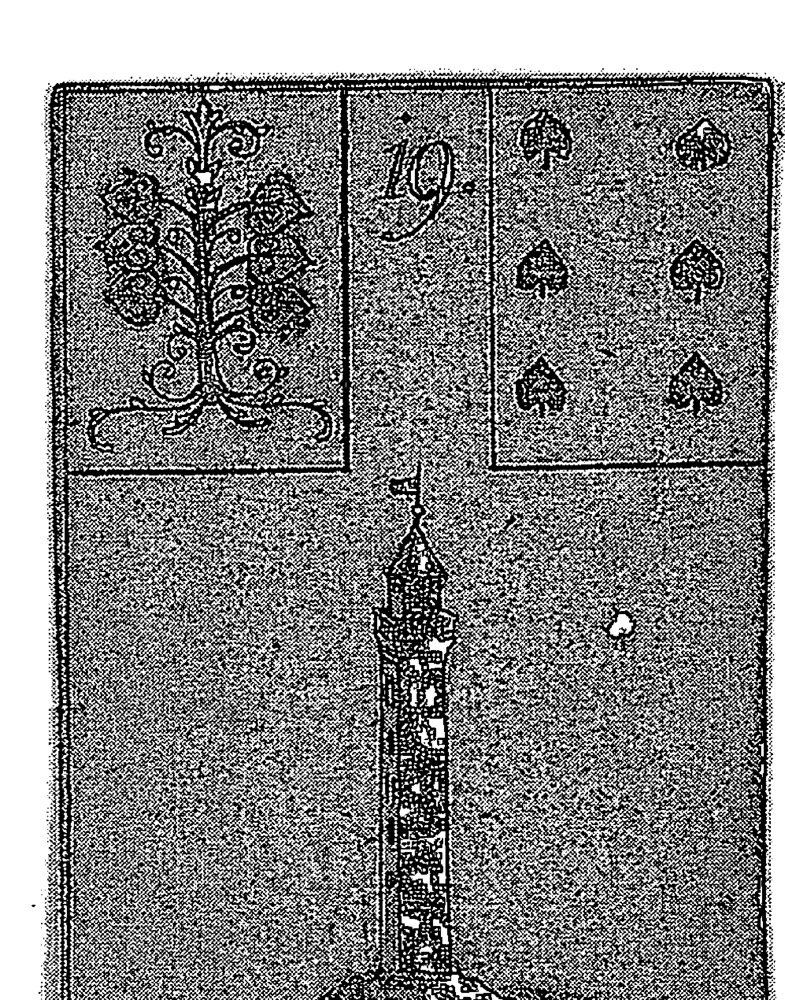

> 「要享受塔的美麗景觀，玩家需支付兩分。」——1799年希望遊戲說明書。

> 「塔給予長壽快樂的老年的希望。但是，如果被雲環繞，是疾病的預兆，視情況甚至代表死亡。」——1846年（菲利浦雷諾曼說明書）。

- 編號：19
- 撲克牌對應：黑桃6
- 核心意義：權威、孤立

塔在雷諾曼傳統上，是代表壽命的牌。塔是歲月悠長仍能經久不衰，千年過去還能巍峨佇立，所以，在雷諾曼占卜裡，看退休生活就是看塔。

塔在現代占卜用來看退休生活的機會不多，畢竟，在華人世界，退休人士大多會去算八字跟紫微斗數，雷諾曼卡大概聽都沒聽過吧！況且，雷諾曼卡占卜效期短，年輕人算出來的結果也不能適用到老年，所以，塔在現代較常運用的牌義是權威。看牌圖中描繪的塔，像一根直挺挺的柱子，高聳入雲，直入天際，有如統治者站在高處俯視眾生的意味，不是很權威嗎？

想想看，現實社會中最能代表權威的事物是什麼？自然是政府與各級公家機關了，例如法院、學校、海關、軍營和監獄，再來是任何大型的官僚般的機構，如大醫院與大型企業。基本上，任何大型機構與建築物，在雷諾曼卡裡都以塔來表示。我們可以從塔旁邊的牌來獲知這是什麼機構，譬如塔加樹牌為健康機構，就是醫院，塔加書牌等於知識機構，就是大學。塔尤其經常代表法院，更可以延伸代表任何法律事務。

大型機構都把握一定的權力，與一般人有距離，如同象牙塔般，因此塔也代表孤立，可延伸出寂寞、隔離與限制等含義，代表各種孤絕的生活，包括因疫情隔離或閉關創作之類的情境皆是。塔的孤立並非被迫，而是自願的選擇。

塔所象徵的階層結構，是許多人想攀爬的對象，所以塔如同社會階梯，代表野心與企圖心。然而，等到真的爬上塔頂，住在塔裡會是什麼感覺？或許可以遙遙睥睨平民百姓，但是自己內心是否也會感到限制、封閉，甚至窒息呢？這就是一體兩面的結果，所謂「高處不勝寒」了。

塔羅牌也有一張牌叫塔，但是牌義與雷諾曼卡不太相關。塔羅牌的塔有毀滅含義，雷諾曼卡的塔是中性的。其實塔羅牌的隱士牌，還更接近雷諾曼塔的孤立含義。

### 解讀的方向性

塔上方的牌，代表問卜者需要看清的事物，或需要努力達成或征服的事物。想像我們必須從下方攀爬到塔頂，才能看清或征服上面的東西。例如，塔上面是雲牌，代表需要看清困惑；塔上面是鞭子牌，代表需要不停嘗試直到成功；塔上面是鐮刀牌，表示需要毅然斷捨離。

## 與編號在前的其他牌對照

幸運草牌是輕鬆幽默的，塔是正經八百的。船邀遊四海，塔與世隔絕。房子是小型建築與小店舖，塔是大型建築與大機構。樹是自然的，塔是僵硬的。雲是語焉不詳的，塔是合法正式的。鳥牌是愛聊天的，塔是孤僻的。狗牌是隨和的，塔是固執的。鶴鳥是變動且適應力強的，塔是難以變動而固執的。熊可以運用身體上的蠻力，可代表上司或老闆，塔只運用職位上的權力，代表更高層的上司或老闆。星星是出世脫俗的，塔講求世俗野心。

最後，樹牌與塔都可以代表有年紀的高大男人，但樹是慢吞吞而無趣的，塔是固執刻板而孤高的。星星牌與塔都有雄心壯志，但星星是超脫世俗，著眼於高遠的理想，塔是世俗的，象徵攀登社會階梯的野心。

## 愛情解析

塔描述的愛情關係，雖然穩定，可能也很長期，但是畢竟過於嚴肅，恐怕缺乏情感了，可能有孤立隔離的感受，相處方式公事公辦，或感覺被對方限制太多。

塔與法律事務有關，因此有可能代表想要訴諸公家權威，協議離婚了。

## 工作解析

塔在工作占卜中，可作為大公司本身的指示牌，或代表公司的高層。

塔也可以顯示工作機構是大公司，或者，描述問卜者如塔一般孤立，單打獨鬥，自行其是，不過也可能只是耍孤僻，或是形容做事態度太公事公辦、一板一眼、不知變通、缺乏彈性。

塔也可以代表很高的職位，或形容一個人攀爬權位的野心。

塔代表的行業，都是大型權威機構，包括公家機關、法院、學校、大企業等，如果加代表健康的樹牌，就代表大醫院。另一方面，也可取孤立含義，表示獨自一人的工作。

## 健康解析

在健康方面，因為塔的形狀肖似人體脊椎，因此身體部位對應脊椎，對應的疾病就是背部與脊椎問題。健康方面的建議，可能代表尋找專業醫師甚至權威名醫的治療，或到大醫院治療，也代表隔離，或需要遠離人群，避靜靜養。

塔在占卜中還經常代表醫療院所，特別是搭配代表健康的樹牌時，更確定此層含義。

## 人物解析

塔是比較特殊的一張非動物牌也不對應宮廷牌，卻可直接代表人物的牌。塔因其權威性質，可以代表任何權威人士及父權長輩（相對於熊牌代表母性長輩），此時可以有以下幾種解釋方向：

- 1. 父權長輩：爸爸、祖父或叔伯輩。
- 2. 權力人士：來自政府或大型機構的官方人士、高層權威人士、官方代表、法官、上司、CEO、總裁。

另一張代表權力人士的牌是熊。對我而言，塔的層級比熊更高。如果熊是每天跟你密集互動的上司，塔就是你不常有機會見到的更高層上司。

塔若是形容鄰近的人物牌，那麼那個人通常已有地位，個性嚴謹僵硬，一板一眼，好處是做事一絲不苟，缺點就是有點孤僻、公事公辦、獨斷獨行、自掃門前雪，或野心太大，是野心勃勃的社會階梯攀爬者。他也可能是從事塔牌代表行業者。

若是形容外型，則他的外型跟塔一樣高高瘦瘦的，看來比較老成，很可能真的有些年紀了。

古往今來，許多中央集權的帝王都反映塔的權威性，至於竹林七賢或陶淵明這類隱士，則反映塔的孤立性。金庸小說《神鵰俠侶》裡長居古墓離群索居的小龍女，與改編自長髮姑娘童話的迪士尼電影《魔髮奇緣》，也是塔孤立性的代表。

## 物品解析

塔可以代表塔，以及塔狀物品，如高櫃。塔也可代表法律相關物，如法槌、天秤。

## 時間解析

塔是長期緩慢的、很久的。塔是19號牌，因此視問題也可代表十九天或每月的十九日。

## 屬性

塔是中性牌。

## 大藍圖牌陣的遠近解讀法

從塔牌可以看老年生活。好牌環繞時，象徵健康、快樂與長壽，但是如果旁邊有雲牌（烏雲罩頂）或棺材牌（疾病），反而是紅燈警訊，要特別留意身體健康。樹牌（健康）也是要檢查的重點，最好樹牌旁邊也是好牌圍繞。

詢問法律問題時，塔是主題卡，可從塔周圍的牌解讀情況。詢問工作時，如果公司是公家機關或大企業，可用塔牌代表公司。塔在占卜中滿常代表地點，請依問題情境，推定塔所指的地點，譬如假設今天是為學生占卜，塔就多半是指學校，而不太會是政府機構或公司了。

塔在愛情占卜中，不算太好。如果塔剛好阻隔在男人牌和女人牌之間，顯示兩人心意分離，甚至可能真的在考慮分開了，通常是由左邊那一方發起。如果沒有對象，塔單純在指示牌旁邊，可能是形容問卜者的孤獨生活。

## 主流牌義速查表

- **名詞**: 權威（政府、官僚、機構、階層、權威、結構、地位、大型公家建築、大型企業、法律）、孤立（獨處、寂寞、冷漠、隔離、分開、界線、限制、隱私）、高層（野心、社會階梯）、長壽（壽命、退休生活）。
- **形容詞**: 政府的、官僚的、正式的、官方的、獨處的、冷漠的、分離的、孤單的、獨立的、耐久的、穩定的、堅固的、年老的、長期的、高的、高處的、大型的。
- **愛情**: 穩定但嚴肅而缺乏感情的關係、孤立、分離、限制過多、感到窒息、訴諸法律權威。
- **工作**: 大型機構的工作、獨自一人的工作環境、高層職位、耍孤僻、公事公辦、一板一眼、不知變通、缺乏彈性、攀爬權位的野心。
- **行業**: 公職、法律、大企業、大醫院（+樹）、獨自一人的工作。
- **人物**: 父權長輩（父親、祖父、叔伯）、權力人士（政府官員、高層權威、官方人士、法官、上司）。
- **人物形容詞**: 塔般性格的（有地位的、嚴謹僵硬的、一板一眼的、一絲不苟的、孤僻的、公事公辦的、獨斷獨行的、自掃門前雪的、野心太大的、攀爬社會階梯的）、塔般外型的（高高瘦瘦的、老成的、有年紀的）、從事塔代表行業的。

【身體部位】脊椎。

【疾病】背部與脊椎問題。

【健康建議】尋求專業醫師甚或權威名醫的治療、到大醫院治療、隔離、避靜靜養。

【身心靈】避靜、獨處、挺胸、作伸展脊椎的瑜伽動作、設立個人界線、幫自己的靈性練習建立有組織的課表、追求更高的靈性成長。

【物品】塔、塔狀物品（高櫃）、法律相關物（法槌、天秤）。

【時間】長期的、緩慢的、很久的、數字19的日期（十九天、每月十九日）。

【地點】公家機關（政府、法院、海關、軍營、學校）、大型企業（大企業總部或辦公室）、大型建築（高樓大廈、公寓社區）、法律相關（律師事務所）、醫院（加樹牌）、高的地方（塔、瞭望台、高處、高樓層、樓上）、高樓匯聚處（首都、市中心）。

【建議】提高標準，目標設高，眼光放遠。拿出往上爬的企圖心。挺起胸膛自尊自信。做事方式要更有組織。暫時獨處一陣子。一個人做。

【總結】中性。

# 20 花園
Garden

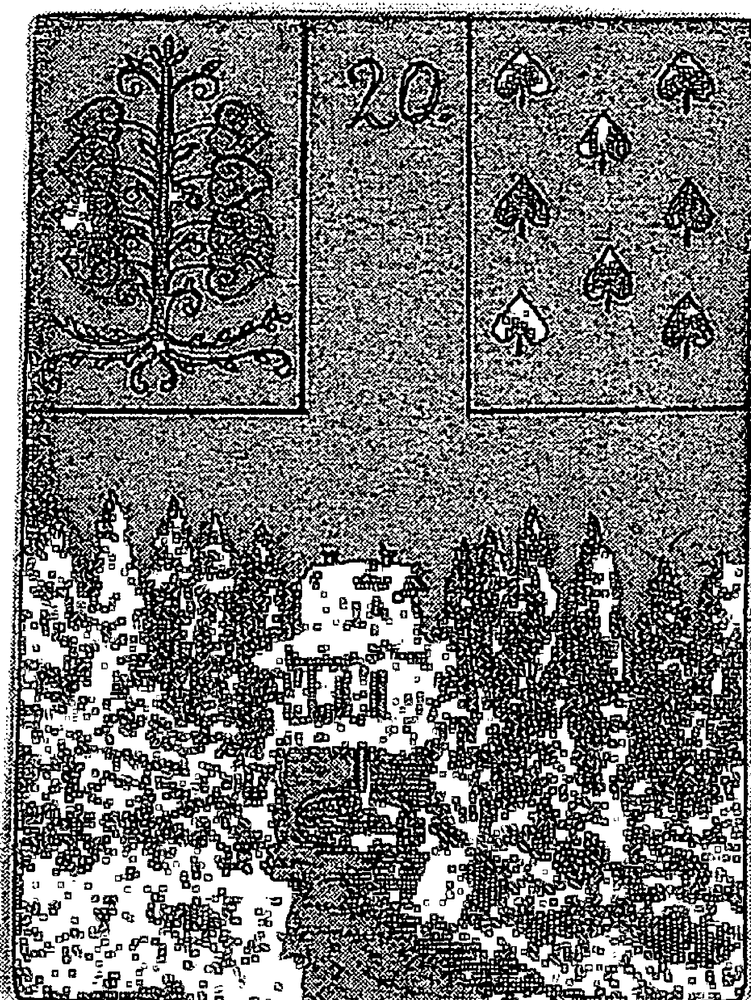

> 「你經常加入人群。如果你希望獲益，就要多聽少說。」——1794年義大利咖啡渣占卜卡牌面箴言。

> 「花園代表一個大群體。如果在明淨處，代表這群人裡會有好朋友，若在咖啡渣濃厚處或有條紋，就是警告問卜者要小心，不要把那些自稱是朋友的人當成朋友。」——1794年義大利咖啡渣占卜說明書。

> 「【22十字路口牌】這條路不被注意到的繞過山，回到20號花園。」、「【26書牌】不管是誰閱讀這本魔典（指書牌），就會被下咒，送回花園牌。」——1799年希望遊戲說明書。

> 「花園代表你將進入一個非常受尊敬的群體。如果距離（指示牌）非常近，你會建立非常親密的友誼，它保證長久的友誼，但是如果距離遠，是結交假朋友的徵兆。」——1846年〈菲利浦雷諾曼說明書〉。

### 編號：20

### 撲克牌對應：黑桃8

### 核心意義：公眾、社交

花園的核心意義是公眾與社交。

在十八、十九世紀的歐洲，花園是大眾最主要的社交場所，人們在那裡聚會，互相交流；因此，相對於房子牌象徵屋內的私領域，花園是代表戶外與公眾領域，代表我們與社會群體的互動。

如果說鳥牌是三兩好友聊天八卦，花園就是更大的社群，從你參加的社團，你擁有的人脈，乃至抽象的社會輿論都屬之。對行銷者而言，花園可代表整個顧客群、粉絲群，乃至整個市場。

現代的花園又有新意義。因為社群的意義已經在網路上更形擴張了，網路上的揪團團購、臉書社團、聊天室、社群媒體、電玩組隊打怪，都是花園的範疇，特別是旁邊有信件牌時。當花園（社群）配上信件（文書通訊），古時是寫信交筆友，現在就是打字交網友了。

花園也常代表地點，除了花園及戶外場所，還代表公共場合，有時可從旁邊的牌推知是什麼公共場合，例如，在塔牌我們曾說過塔加樹（健康）可以代表醫療院所，花園加樹也可以！塔比較可能是大型醫療中心，花園偏向社區聯合診所。又例如，花園加鳥（歌唱）可能是音樂會，花園加幸運草（賭博）可能是賭場，各種可能性不勝枚舉，請運用你的創意來解讀。

花園由於是公開又是群眾，可以代表一群或很多，也可以代表公開化。當戀愛（愛心牌）碰到花園，你可以想像這場戀愛會多麼擁擠又人盡皆知了。

## 與編號在前的其他牌對照

騎士是朝我們送達的，花園是我們向外接觸的。房子是室內、私領域與內向的，花園是戶外、公眾領域與外向的。樹代表親族，花園代表沒有血緣關係的團體。棺材是關閉的，花園是開放的。狗是一個好朋友，花園是一群朋友。塔是獨自孤立的，花園是社交連結的。

## 愛情解析

愛情占卜中，花園是公眾，而戀愛是私人的，顯示這個感情八字都還沒一撇，可能才剛認識、在聚會活動中認識，兩人還在團體社交圈，尚未步入一對一階段，約會時都是一夥人一起出去，或者都還在到處看看，還沒打算定下來。 如果是已在交往的狀態，出現花園牌加上壞牌，要小心多角戀愛。另外，也可能是指兩人的戀愛是人盡皆知，如公眾人物之間的戀情，就是這種型態。

## 工作解析

花園在職場上，通常代表人脈廣闊，發展得多半不錯。 職業方面，花園最直接對應到園藝業，然後是公眾活動相關，如廣告公關業、活動策劃人、婚禮規劃師、課程規劃員，以及為公眾服務的行業，如議員、里長，還有人脈超廣的人，如社交名流。

## 健康解析

花園因為是與眾人接觸的場所，所以可代表傳染病。身體部位對應免疫系統，因為免疫系統是當我們對外接觸時的保護機制。 花園在健康占卜中也有可能代表醫療團隊，或是醫院（搭配樹牌），或安養中心、療養院。 健康方面的建議，包括多到戶外走走、呼吸新鮮空氣，或是加入互助團體。

## 人物解析

花園牌本身通常不代表人物，但可以代表一群朋友或社交團體，以及大眾群體。

花園形容鄰近的人物牌時，他就是交際高手、花蝴蝶類型的人，交遊廣闊、長袖善舞、人面廣、受歡迎、善於團隊合作，長相一般來說也不差，可能很重視自己的衣著外貌，而因為歐洲花園造景通常不會有太高的樹，他的身材不至於太高。

德系占卜師安迪·伯羅維森格（Andy Boroveshengra）提出，花園與人物牌的左右位置會影響解釋，假如人物牌在左，花園在右，代表這個人會對他的社交圈很挑，如果反過來為花園在左的話，才傾向交際高手的解釋。我想這是因為德式傳統解讀方式，左邊那張牌是重點主題，右邊是附加說明，當花園在左邊，會突顯花園的社交牌義，反之，當人物牌居左時，花園（社交圈）只是附加說明，因此解作這個人對社交圈有所要求。

這個區別可能令不少學習者困惑，譬如我就會想：「為什麼解作對社交圈有所要求，不是解作他喜歡加入社交圈呢？」再說，我也接觸過其他雷諾曼卡教學資料說，形容人物的牌在人物牌左邊或右邊是沒有影響的，因此，對於這個議題，我建議你自行選擇。如果左右之分你覺得說得通、用得順，就用。說不通、用不順，就不要用。就是如此簡單。

回到花園牌的代表人物，許多社交名流都能反映花園特質，如孫芸芸、芭莉絲·希爾頓。《慾望城市》中從事公關工作的莎曼珊，以及現實生活不勝枚舉的政治人物。我曾認識一位專門銷售國外版權的代理商，差不多整個業界他都認識了，他搬個辦公室，登高一呼，四百多人親來為他祝賀，這也是很典型的花園人了。

## 物品解析

花園代表社交相關物，如社交媒體網站、網路社團、網路聊天室，特別是搭配代表網路的星星牌時。

花園代表的地點包括植物聚集處，如花園、公園、戶外、鄉下郊區、森林度假中心等。花園裡常有噴泉，因此也可代表水療SPA中心。花園當然還代表社群聚集處，如社團協會、俱樂部與各大公共場所，當與其他牌搭配時，可以更精確的描述是何公共地點，如運動會（加騎士牌）、夜市（加星星牌）、花市（加花束牌）、鳥園（加鳥牌）、商場（加魚牌）、戶外演奏會（加棺材）、動物園（加熊牌）、幼兒園（加孩童牌）等。請注意花園代表的地點多半都是戶外，且有社交特性。

## 時間解析

因為花園的社交活動大多舉辦在下午，因此花園代表下午，可以想像為下午茶時段。花園是20號牌，因此視問題也可代表二十天或每月二十日。

## 屬性

花園是中性偏好的牌。

## 大藍圖牌陣的遠近解讀法

花園如果離指示牌近，代表有認識新朋友的機會，有社群的支持，對他的發展很有幫助。再加上星星或信件牌，可能指網路的社群。

如果離指示牌遠，甚至被負面牌影響的話，要小心狐朋狗友，生活也可能比較孤立，尤其是當旁邊有棺材牌時，常代表被排擠了。

## 主流牌義速查表

- **【名詞】** 公眾、社群（社團、協會、團體、團隊、社群媒體）、社交（交際圈、聚會、團聚、派對、活動、人脈、大型會議）、公開（戶外、公眾場合）。
- **【形容詞】** 社會的、社群的、社團的、公眾的、公開的、社交的、聚會的、公開場合的、社區的、戶外的、公開化的、綠色的。
- **【愛情】** 八字還沒一撇、新認識的、在聚會或活動中認識的、尚未進入一對一階段、一夥人集體出去約會、到處看看還沒打算定下來、多角戀愛。
- **【工作】** 人脈廣闊、發展得不錯。
- **【行業】** 園藝業、公眾活動相關（廣告公關業、活動策劃人、婚禮規劃師、課程規劃員）、為公眾服務的行業（議員、里長等）、人脈超廣的人（社交名流）。
- **【人物】** 一群朋友、社交團體、大眾。
- **【人物形容詞】** 花園般特性的（交遊廣闊的、活潑外向的、長袖善舞的、人面廣的、受歡迎的、善於團隊合作的）、花園般外貌的（身材中等的、長相不差的、重視衣著外貌的）、從事花園代表行業的。
- **【身體部位】** 免疫系統。
- **【疾病】** 傳染病。
- **【健康建議】** 到戶外走走、呼吸新鮮空氣、加入互助團體。
- **【身心靈】** 多到戶外接觸大自然、參加共修團體、參加團體療癒工作坊、種植綠色植物。
- **【物品】** 社交媒體網站、網路社團、網路聊天室。
- **【時間】** 下午、數字20的日期（二十天、每月二十日）。
- **【地點】** 花園、公園、戶外、鄉下郊區、社團協會、俱樂部、各種公共場所（視與其他牌的搭配而定）。
- **【建議】** 多交朋友、參加團體活動、運用人脈、多到戶外、團隊合作、把消息公開。
- **【總結】** 中性偏好。

# 21 山
Mountain

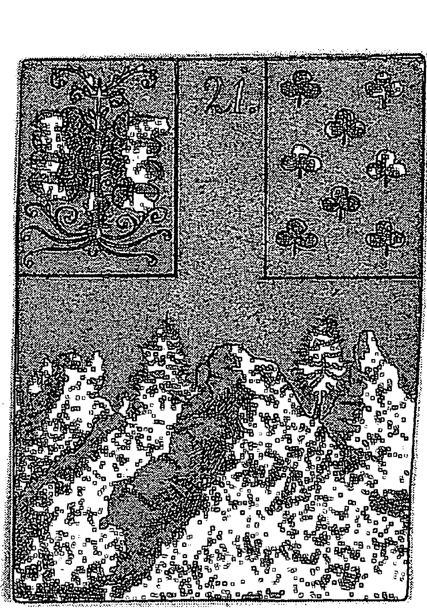

> >「你很容易受大人物的青睞，但要記得，爬得越高，跌得越重。」——1794年義大利咖啡渣占卜卡牌面箴言。

> >「山如果只出現一座，表示受到上層人士的青睞，但是若有幾座，特別是在咖啡渣濃厚處時，是象徵強敵。若在明淨處，意思就相反，會是上流朋友，他們會努力幫助問卜者。」——1794年義大利咖啡渣占卜說明書。

> >「玩家必須留在這陡峭的阿爾卑斯山，直到有人走到這一格來釋放他，或他必須擲出兩個相同花色。」——1799年希望遊戲說明書。

> >「山若接近這個人（指示牌），是警告會有強敵。如果距離遠，你有強大的朋友可以依靠。」——1846年〈菲利浦雷諾曼說明書〉。

### 編號：21

### 撲克牌對應：梅花8

### 核心意蘊：障礙、延遲

雷諾曼卡興起的時代，交通還不發達，當遇到前方有一座山，飛不過去，又沒有隧道，只能徒步攀越，豈不累死人？所以山對當時的歐洲人而言，代表障礙。

山是一個橫亙在我們與目的地之間、難以攀越的阻礙，使目標難以達成。山是任何阻礙我們的東西，可能是某個敵人、外在的情勢，還有我們自己！俗話說「自找麻煩」、「劃地自限」、「搬石頭砸自己的腳」，有時候阻礙我們達成目標的，不盡然都是別人或外在因素，自己造成的阻礙，也是山所代表的。

山造成的障礙雖然不是無法跨越，但多少會是辛苦的挑戰，恐怕會費不少功夫。相較於蛇牌，用根樹枝挑掉就可以繼續走，山就難處理多了，很可能造成延遲。(所幸，比起棺材牌或十字架牌，山相形之下還是比較容易克服。)

山造成人與人間遙遠的距離，冷淡、疏離、拒絕自然成為牌義之一。相較於鐮刀牌或鞭子牌的動態感，或鸛鳥牌的遷徙改變，山是一種僵滯不動的能量，橫亙在那裡，造成阻塞，形成僵局。

山是遙遠且阻隔的，所以可以代表國界、邊境，進一步代表遠方，甚至外國或外國人。搭配塔牌，可以代表邊境管理的機構，如海關、移民署。由於高山多雪，山可以代表冬天、霜雪或寒冷的天氣。在旅遊占卜或詢問地方的占卜中，山可代表山區或偏遠地帶，或多岩石的地區。

### 解讀的方向性

當山跟其他牌一起解讀時，兩牌的前後順序會影響含義。如果是「好牌＋山」，通常表示這個好事會受阻或延遲。若是「山＋好牌」，表示這個障礙會移除，最後能成就那張好牌所代表的好事，所以一般希望山出現在左邊，不要在右邊。

## 與編號在前的其他牌對照

船與山都有外國的含義，船是普遍性的外國，山指的主要是鄰國，也可以單純指遠方。棺材是終結，山雖延遲但仍有機會繼續下去。塔與山都是孤立，塔是自願的，山是被迫的。熊是保護你或嫉妒你的，山是你的靠山或強敵。星星引領你往目標前進，山是過程中的絆腳石。鶴鳥是成長進步的，山是僵滯不動的。狗是幫助你的，山是阻礙你的。花園是對外交流的，山是遙遠阻隔的。

## 愛情解析

山為愛情帶來阻礙，可能有幾種情況。首先是其中一方表現得像山一樣，敵意、頑固、冷漠、疏離。第二，兩人的感情遇到阻礙了，或許家人反對，情感淡漠疏遠，一成不變，缺乏進展，有絆腳石，或進入死胡同的感覺。第三，山不只指心理上的阻隔，也可能指物理上的阻隔，可能代表距離遙遠，見一面都難，所謂相隔千重水、萬重山。

## 工作解析

山代表工作上遇到的阻礙或敵人，可能遇到挫折、延遲、發展停滯、遇到難關、項目卡住、缺乏進展、遭遇對立的力量。但若山出現在距離指示牌遠的位置，則有可能代表靠山。
山代表的職業，首先與山有關，如登山攀岩、滑雪、野外求生、採礦、地理學、在山區或偏遠地區的工作。其次是與國界有關，如海關、邊境管理。

## 健康解析

山對應頭部，這是從山的形狀來想像的。也有人把堅硬的山跟人體骨骼做連結。

山若代表疾病，可代表頭部問題，或與阻塞、硬化、不動或抵抗有關，例如阻塞部分可能有便秘、心血管阻塞；硬化有肌肉僵硬、肝硬化、動脈硬化、多發性硬化症等；不動則可能代表臥床、行動不便、癱瘓、昏迷等；抵抗可能代表抗藥性。不過，山也可以普遍性的象徵在治療途中遇到的障礙。

健康方面的建議，山可以往幾個方向詮釋，首先可能代表要跨越治療的障礙，再來是要跟山一樣不動，暫時靜養，臥床休息。第三是指需要做一些協助軟化釋放的事，例如排毒、通便、拉筋，或情緒釋放。

## 人物解析

山雖然不是宮廷牌，但是本身還是可以代表敵人或造成阻礙的人。在牌陣中距離代表問卜者的指示牌遠時，可以代表靠山。

山如果是形容人的特質，他的個性就是冷漠疏離，性情頑固，不太友善，孤獨離群，可能有隱士性格，偏向安靜沉默，死板臉，不表露情緒，甚至有顆鐵石心腸，他通常對問卜者有敵意，嚴重時會歧視問卜者。另一個可能性是他住得很遠，甚或來自外國。

山若是形容外型，他體格可能很壯很大隻，也因為山頂通常光禿禿或有白雪覆蓋，可能有禿頭或白髮。

山的代表人物有性格孤絕的蝙蝠俠、《史瑞克》電影裡的史瑞克、《天外奇蹟》電影裡的老先生男主角卡爾·費迪遜、《可可夜總會》電影裡的祖母伊美達、《白雪公主》小矮人的愛生氣。

## 物品解析

山可以代表山，以及各種石頭。山可以代表造成阻隔的東西，如圍牆、城牆，也可能是大石、堡壘。在身體上，山可以代表骨骼、牙齒、關節。山也可以代表無法溝通或溝通不良的情況，或難以跨越的代溝。

牆。高山寒冷，所以可引申代表冰箱。最後也可代表堆得像山的東西。

## 時間解析

山代表數月以上、延遲。因為山是21號牌，視問題也可代表21天或每月的21日。

## 屬性

山象徵障礙與延遲，所以是負面牌。

## 大藍圖牌陣的遠近解讀法

山在大藍圖牌陣中，有時是代表人，有時候只是為旁邊的牌添加障礙或延遲的含義，或者代表情感疏遠、距離遙遠。旅遊占卜中，山可能單純代表山區偏遠地帶，或登山攀岩這類活動。所以，解讀時首先要瞭解情境，先確定山是指什麼東西。

在代表人的情況下，山如果距離指示牌近，就是敵人，假如其他壞牌過來湊熱鬧，這敵人就是更難纏的強敵了。若山距離指示牌很遠，反而是靠山，此時如果花園牌、狗牌和孩童牌離指示牌近，更能確認是靠山。

如果山是指障礙或敵人，根據傳統的解讀原則，上面的牌會影響下方的，因此山如果出現在指示牌上方，是最困難的位置，表示這個障礙或敵人對問卜者而言較難克服，會有壓力感。山出現在下方，就比較好掌控。

從山牌，我們可以窺知可能的敵人或靠山，此外，還可以從狗牌（忠實的朋友）和花園牌（社交社群）來綜合研判問卜者擁有的人際支持。在情境合適時，孩童牌（仰望支持你的人）和熊牌（保護者或霸凌者）也可以納入解讀。

## 主流牌義速查表

【名詞】障礙（阻礙、挑戰、難關、抗拒、限制、挫折、拒絕）、延遲（卡住、不動、僵局、阻塞）、遙遠（遠方、偏遠）、疏離（冷淡、頑固、孤獨、敵意）、山區（登山、攀岩）、重量。

【形容詞】有阻礙的、有挑戰性的、困難的、限制性的、延遲的、卡住的、不動的、僵持不下的、阻塞的、挫折的、疏離的、沉重的、登山的。

【愛情】阻礙、冷淡疏離、停滯、一成不變、缺乏進展、困境、死胡同、遠距離阻隔。

【工作】阻礙、挫折、有敵人或靠山（視距離遠近）、延遲、停滯、難關、項目卡住、沒進展。

【行業】山相關（登山攀岩業、採礦業、地理或地質學、山區或偏遠地區工作）、國界相關（海關、邊境管理）。

【人物】敵人（距離近）、靠山（距離遠）。

【人物形容詞】山般個性的（疏離的、遙遠的、冷漠的、頑固的、不友善的、沉默的、死板臉的、不表露情緒的、鐵石心腸的、孤獨的、隱士性格的、離群索居的、有敵意的）、有山般外表的（壯碩的、大隻的、禿頭的、白髮的）、遙遠的（遠方的、外國來的）。

【身體部位】頭部、骨骼。

【疾病】頭部問題（頭痛、偏頭痛等）、阻塞（便秘、血管阻塞等）、硬化（肝硬化、動脈硬化、多發性硬化症等）、不動（臥床、行動不便、癱瘓、昏迷等）。

【健康建議】跨越治療的障礙、暫時靜養、臥床休息、進行軟化釋放（排毒、通便、拉筋、情緒釋放等）。

【身心靈】到山區或偏遠地區休憩。清除氣場與脈輪的阻塞。釋放、淨化。

【物品】山、石（岩石、石頭、礦石）、牆、冰箱、堆得像山的東西。

【時間】數月之久、延遲、數字21的日期（21天、每月21日）。

【地點】山區、多岩石的地帶、偏遠地區、國界、圍牆、屋頂、遠方。

【建議】暫時不動如山。站穩腳跟不退讓。移除障礙。

【總結】負面。

## 22 十字路口
Crossroad

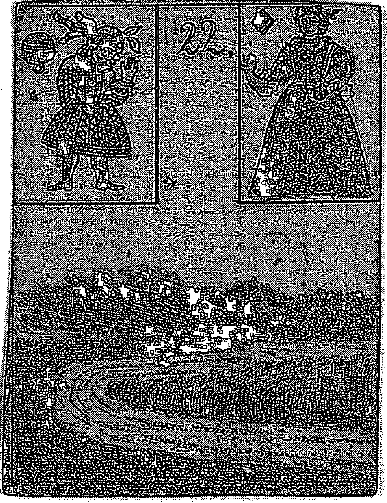

> 「過度肯定會讓你不開心，所以趁還來得及的時候避免。」——1794年義大利咖啡渣占卜卡牌面箴言。

> 「如果被雲遮蓋因而在（咖啡渣）濃厚處，據說是可靠的徵兆，表示要不就是過去、要不就是未來會有許多逆轉。但如果在乾淨處且清楚，代表手邊有好機會。如果包含許多斑點，表示意外之財，以及長壽。」——1794年義大利咖啡渣占卜說明書。

> 「這條路不被注意到的繞過山，回到20號花園。」——1799年希望遊戲說明書。

> 「十字路口，若被雲牌圍繞，是災難的象徵，但是如果沒有雲，而且距離（指示牌）遠，你會找到方法與途徑來避免這威脅性的危險。」——1846年〈菲利浦雷諾曼說明書〉。

編號：22
撲克牌對應：方塊Q
核心意義：選擇、多重

十字路口，最原始的名稱是道路牌（Roads），現在多半因為十字路口的意象更能傳達它的涵義，所以改稱十字路口居多了。牌面通常描繪為兩條交會的道路，正如同十字路口給我們的印象，這張牌代表選擇。

站在岔路口，該選哪一條路？這是十字路口牌的核心意義。當這張牌出現時，問卜者通常需面臨某種選擇。

跟鳥牌一樣，十字路口可以代表兩個。當出現在某張牌後面時，可能代表有兩個那張牌的意義，不過十字路口所代表的兩個，比較不是數量上的兩個，而是「替代方案或B計畫」，或「兩件事同時進行」。此外，十字路口還可以代表很多種，進而延伸到多重、多工、多樣化等含義。

十字路口本身是條路，所以可代表途徑、路徑、路線，以及不太遠的陸路移動，如通勤、步行、公路旅行或本地旅行。

## 與編號在前的其他牌對照

騎士牌是有交通工具的短程移動，船是出國遠行，十字路口牌是通勤、步行、公路旅行或本地旅行。房子是穩固的，十字路口是心意不定的。鐮刀是迅速決定，十字路口是猶豫不決。鳥是數量上的兩個或一對，十字路口是兩個以上的選擇。鞭子是重複的動作，十字路口是兩個不同的或兩個一起來。塔是孤立限制的，十字路口是有選擇自由的。山是橫亙於前的障礙，十字路口可以輕易繞過障礙。

## 愛情解析

由於多重選擇的含義，愛情占卜出現十字路口，不是好事，可能代表三角戀情或劈腿，就算沒有欺騙不忠，至少也顯示心意未定，或者還在尋尋覓覓、左右為難，搭配戒指牌可能表示處在開放式關係中。而由於十字路口可能是分道揚鑣的起點，也可能暗示分手。有時，可代表性戀或變性人。

## 工作解析

工作方面，十字路口除了代表工作面臨的選擇之外，或許事情需多工進行、同時有兩項以上專案在跑，也可能代表有兩份工作，特別是出現在工作主題卡旁時。另一個解讀方向是取公路意象，代表外出或出差。

十字路口牌代表的行業，首先與馬路有關，如司機、修路工、導遊。再者，因為十字路口有連接的意象，可以延伸為仲介與調解相關職業。

## 健康解析

將十字路口四通八達的意象，帶到健康占卜中，就是對應血管和循環系統。對應的疾病是血管循環疾病，特別是在愛心（心臟）牌旁邊時，更能確認。十字路口也可代表各種診斷測試（對不同方向的決定），或問卜者的醫療選擇。

若是詢問健康建議，十字路口代表最好尋求第二意見，或可考慮替代療法。

十字路口在健康占卜還算吉牌，在審慎搜尋各種醫療選擇後，解方通常可以出現。

## 人物解析

十字路口牌對應方塊皇后，本身可以代表一個女人。有人取分岔雙重的涵義，讓十字路口牌代表姊妹及堂表姊妹，但不是每位占卜師都採用這個牌義，有些占卜師是採用鳥牌來概括兄弟姐妹，甚至有人是用魚牌。

某些情況下，十字路口可以直接代表或形容周圍的人物牌是從事十字路口代表的職業者，或者描述此人是你在路上遭遇的，例如司機、乘客、遊客、路人。

十字路牌若是形容周圍人物牌的性格，表示此人這個人可能心意搖擺不定，性情善變，三心二意，彷彿隨時都在做決定的狀態中，說話也模稜兩可。他並不忠實，可能有兩任以上配偶，甚或同時有兩個伴侶並行。譬如，我曾認識一個奇人，大家都認為他忠誠可靠，很久之後，才知道他竟然十多年來都過著雙妻的生活，正妻一直以為他是在認真工作出差呢！這就是極致的十字路口人。

從「雙重」的含意繼續延伸，十字路口可以代表兼職者、替代人選，或者斜槓人，斜槓不也是雙重生活嗎？十字路口甚至可以代表性戀者，特別是搭配愛心牌（愛情）、百合牌（性慾）或鞭子牌（性）時。

如果十字路牌是形容人的外貌，可能代表挑染髮、灰白交錯髮，或有長短腳、兔唇、駢指等分裂意象，或者穿著另類、特立獨行。

十字路口的代表人物有《倚天屠龍記》裡三心二意的張無忌、穿著特立獨行的瑪丹娜與Lady Gaga、斜槓歌壇與翻糖蛋糕界的蔡依林、集歌手演員企業家與賽車手身分於一身的林志穎。

## 物品解析

十字路口的分岔意象，可以對應到叉子、迷宮。十字路口代表選擇，因此可以代表選擇題，或者與做選擇有關的物品，譬如擲筊的筊、抽籤的籤。

十字路口還可代表馬路，包括任何車子能行駛的範圍。

## 時間解析

因為十字路口的核心意義是做選擇，所以若問時間長短，可能代表猶豫不決或拖延，直到做出決定之前，不會有結果。因為十字路口是22號牌，視問題也可代表22天或每月的22日。

## 屬性

選擇本身可好可壞，因此十字路口是中性牌，需視周遭的牌判斷好壞。

### 大藍圖牌陣的遙近解讀法

十字路牌子在傳統解讀上，是好是壞，要看雲牌有沒有來湊熱鬧，畢竟在路上出行如果碰到烏雲，可是很擾人的。如果雲距離十字路口近就不好，再加上其他壞牌就更不利了，顯示這個選擇可能非常困難，幾至痛苦，而這些牌離指示牌越近，對問卜者的影響就越大。

若十字路口距離指示牌和雲都遠，那就沒有危險，選擇的結果會是好的，但問卜者必須做出選擇。

如果單純離指示牌近，沒有壞牌在周圍，顯示這個抉擇是他人生的交叉點，重要性很高。當離指示牌遠，表示這個決定較不重要。

可以從十字路口牌四周的牌來推斷這個抉擇是與哪方面有關。

旅行占卜時，特別留意公路牌旁邊有蛇牌（問題）或鐮刀牌（傷害）。若出現山牌（障礙）則代表需排除困難或遭遇延遲，棺材牌（結束）則是去不成。

## 主流牌義速查表

【名詞】選擇（抉擇、決定、選項、替代選擇、備案）、途徑（路徑、逃生路線）、多種（分支、多工、多重、多種多樣）、上路（通勤、外出、本地旅行、步行）。

【形容詞】選擇的、替代的、兩個以上的、多重的、多樣化的、同時進行的、通勤的、本地旅行的、徒步的。

【愛情】心意未定、多重選擇、劈腿、三角戀情、不忠、欺騙、騎驢找馬、分道揚鑣。

【工作】工作方面的選擇、多項任務一起進行、多工進行、兼職、替代方案、備案、B計畫、外出、出差。

【行業】公路相關行業（司機、公路維修人員、導遊等）、仲介業、調解工作。

【人物】一個女人、姊妹、堂表兄弟姊妹、從事馬路代表行業者。

【人物形容詞】十字路口個性的（猶豫不決的、三心二意的、優柔寡斷的、善變的、說話模稜兩可的、有兩任以上配偶的、雙重生活的、雙夫或雙妻的、兼職的、斜槓的、雙性戀的、變性的）、十字路口外貌的（挑染髮的、灰白相間髮的、長短腳的、駢指的、兔唇的）、在路上遭遇的（司機、乘客、遊客、路人）、替代的。

【身體部位】血管、循環系統。

【疾病】血管與循環系統疾病。

【健康建議】多做診斷測試。做出醫療選擇。尋求其他醫療建議。考慮替代療法。

【身心靈】靜心做決定。嘗試不同事物。尋找替代的學習法門。

【物品】叉子、迷宮、選擇題。

【時間】數字22的日期（22天或每月22日）。

【地點】路（馬路、路口、車道、通道、出口、逃生路線）、汽車行駛範圍。

【建議】大刀闊斧做決定。尋找替代方案。你可以同時進行這些事。

【總結】中性。

## 23 老鼠
Mice

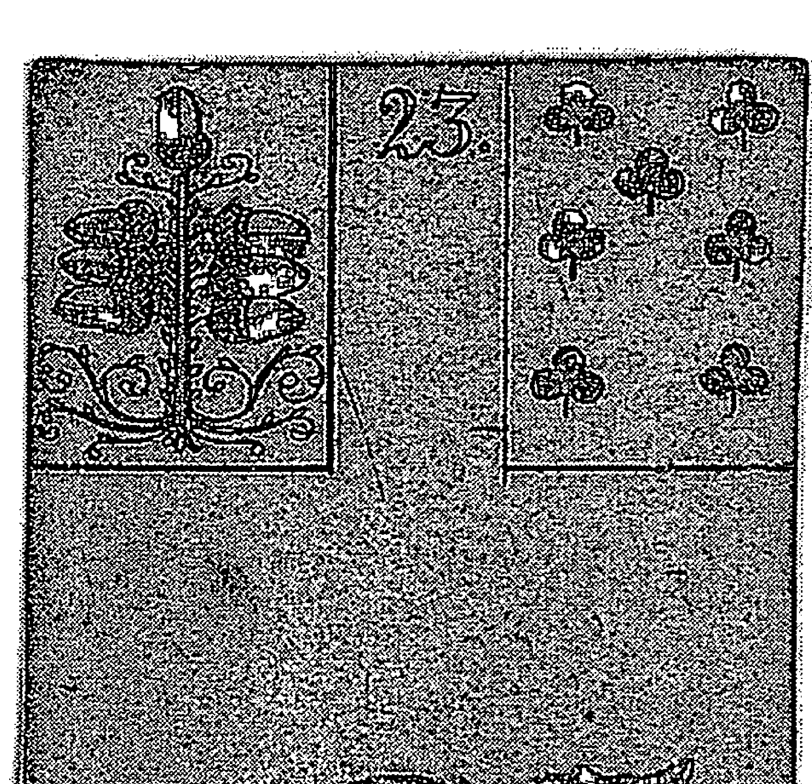

> > 「盯著你的僕人，因為你的疏忽可能會使誠實的人變成小偷。」——1794年義大利咖啡渣占卜卡牌面箴言。

> > 「由於這種動物是鬼祟生活的，因此在這裡它也是盜竊或搶劫的象徵；如果它在明淨處，表示你將以一種奇妙的方式重獲失去的東西，但是如果它出現在咖啡渣濃厚處，你可能要放棄這個希望。」——1794年義大利咖啡渣占卜說明書。

> > 「老鼠是盜竊和失去的徵兆。當距離（指示牌）近，代表被偷或失落的東西會找回。當距離遠，失去將不可彌補。」——1846年《菲利浦雷諾曼說明書》。

- 編號：23
- 撲克牌對應：梅花7
- 核心意義：損失、壓力

老鼠在傳統印象中，通常是不好的，牠會偷吃東西、損毀家具、傳播疾病，令人不堪其擾。當家庭中出現老鼠，一定有某種損失，所以損失就是老鼠牌首要的核心意義。

老鼠的損失是緩慢漸進的，但也確鑿的。從這邊我們可以引申出許多相關詞彙，譬如消耗、損耗、剝削、衰退、減少、失竊、壞掉、浪費等，凡是事物一點一滴的損失，全都是老鼠代表的意義，而且這種損失往往是在背後悄悄進行的。

物品可以損失，人也可以。疾病就是人的健康一點一滴的損耗。歷史上俗稱「黑死病」的中世紀鼠疫，在歐洲人心中仍餘悸猶存，因此老鼠牌自然會被用來象徵疾病，特別是傳染病。

當面臨上述的損失或疾病，心理上的壓力自然會出現，因此老鼠牌可以引申代表壓力或憂慮，以及煩不勝煩的感受。

### 解讀的方向性

有些占卜師會將老鼠左邊的牌，視為已經在損失的東西，右邊的牌視為失去的原因或元兇，譬如「狗＋老鼠＋鶴鳥」，可以解為「失去朋友（狗）的原因是搬家（鶴鳥）」。

另外，也有些占卜師將老鼠左右的牌，都視為損失的東西，只是左邊是逐漸、一點一滴的損失，右邊是未來會損失或遺漏的。

如果你有想要納入老鼠的方向性解讀，以上兩種解釋方向，請選定一種，固定使用。

## 與編號在前的其他牌對照

幸運草是輕鬆，老鼠是壓力。房子是穩固的結構，老鼠使結構崩塌。樹是成長，老鼠是衰退。蛇是欺騙，老鼠是背後悄悄偷竊。花束是送來的東西，老鼠把東西弄走。鐮刀是突然的失去，老鼠是逐漸的流失。鳥是日常暫時性的不安，老鼠是持續不斷的侵蝕，帶來憂慮壓力，最終可以把人拖垮。孩童是純善的，老鼠是猥瑣的。塔是獨自孤立的，老鼠是群體行動的。山是眼前醒目的強敵，老鼠是後方的小偷，讓你不知不覺糧倉失火。

## 愛情解析

愛情占卜出現，顯示感情正在走下坡。或許兩人的情感逐漸消逝，失去了原有的吸引力；或許對方像老鼠一樣對你予取予求，極盡剝削之能事；或者你覺得對方很煩，或這段感情本身就令你心力耗竭。而由於老鼠總是在背後偷偷摸摸的亂來，也可能代表欺瞞與秘密，可能有不可告人之事，這些都可能進一步帶來憂慮、緊張與壓力。建議要找出癥結，了解真相，才能著手處理。

## 工作解析

老鼠可以泛指工作方面的損失、不穩定，或心理上的壓力與憂慮，可能性相當廣泛。

以公司的宏觀角度來看，可能指公司資源損耗、業績衰退、客戶流失、庫存報廢。以個人角度來看，可能指薪水被砍、丟了工作、或從事的是沒有底薪、收入不穩的職業，或者工作性質需要東奔西跑、四處忙活，也可能是工作環境高壓緊張，或工作內容瑣碎煩擾，相當累人，甚至是遇到職場吸血鬼等。

老鼠所代表的職業，有幾種可能。第一是小零工、小雜事。第二，與偷竊或拿取相關，例如小偷、小罪犯、乞丐、拾荒。第三，因為老鼠與傳染病相關，因此也代表病毒或微生物方面的工作。第四，又因為老鼠是集體做精細工作的生物，可對應到工廠的流水線作業。最後，是從字面上來看有「鼠」字的職業，如滅鼠人、鼠舍工作者。

## 健康解析

因為老鼠象徵傳染與損壞，出現在健康占卜，當然不樂見。

首先它可以代表傳染病，其次可以代表與壓力憂慮相關的疾病，譬如恐懼症、恐慌症等。因為「損失」的意象，老鼠也可以代表會「吃掉」或「侵蝕」身體的病症，如蛀牙、落髮、潰瘍、肌肉流失、骨質疏鬆、營養缺乏、組織壞死、體力耗竭、寄生蟲、腫瘤，甚至可以代表心理上的流失，如注意力缺失、記憶力衰退與阿茲海默症。老鼠還有可能單純代表微小但惱人的問題，或還沒被發現但已悄悄在危害身體的病症。

老鼠對應的身體部位是神經系統，這是取老鼠神經質的個性而言。雖然有人把幸運草或鞭子來對應神經系統，不過幸運草較難聯想，鞭子則已對應了好幾個身體部位，所以讓老鼠來對應可能是最合適的。

此外，也有人將老鼠對應到牙齒，這是從老鼠是嚙齒類動物來聯想，不過，也有人採用鐮刀牌的切斷意象來對應牙齒，建議從這兩者擇一即可。

健康方面的建議：可能代表需找出健康耗損的原因、需要多做細部檢查，心理方面宜多抒壓、放下憂慮、排除生活中煩擾的事物。

## 人物解析

老鼠雖是動物牌，但本身並不常代表人物，通常只是形容旁邊人物牌的特質。

當老鼠形容人物個性時，他就是「鼠輩」樣的人物，雖然不算大奸大惡，但多少做著對人不利的事，最典型的是「偷竊」，如小偷，或企業裡挪用公款的會計、把貸款收進自己口袋裡的業務員。如果不是竊取金錢，他也會「竊占」他人的時間精神，可能是占人便宜，得寸進尺，斤斤計較，酷愛嘮叨，吸取別人時間精力，所謂情緒吸血鬼是也。儘管他不像鐮刀那麼犀利傷人，或鞭子那樣激烈叫罵，卻會做所謂的消極抵抗，故意擺爛不配合，背地插簍子，令人勞心耗神。

其次，可以從老鼠的「神經質」來聯想，可能指他個性神經質，容易緊張，擔心東擔心西。而由於老鼠是小型群居生物，也可能延伸為他跟隨群眾、人云亦云，眼光短淺，只看小處不見大局，只會雞蛋裡挑骨頭。

當老鼠形容人物外貌時，首先可以聯想到「獐頭鼠目」。他通常身材矮小，外貌猥瑣，或許禿頭、麻皮臉，或許有暴牙或一口爛牙，或許穿著邋裡邋遢，不愛乾淨。

老鼠的代表人物有《魔戒三部曲》的咕嚕、《哈利波特》的蟲尾。電影裡那些挖地洞搶銀行的土法煉鋼型小偷，或寫程式從全世界每個人的帳戶偷匯出一塊美金到自己戶頭的罪犯，也是老鼠的代表。

## 物品解析

老鼠代表任何有「鼠」字的物事，以及各種齧齒類動物，包括兔子、河狸與豪豬，還可以進一步延伸到各種害蟲。老鼠也可以代表失物。

## 時間解析

老鼠在時間方面有不同的解釋。有人取老鼠行動敏捷的意象，解為「很快」。有人取老鼠逐漸損失的含義，解為「逐漸的、漸進的」。有人取老鼠壓力與損失的含義，解為「在壓力或損失期間」。這方面沒有正確答案，請憑你的直覺來解讀。因為老鼠是23號牌，視問題也可代表23天或每月的23日。

## 屬性

老鼠是壞牌。唯一沒那麼壞的時候，是當它出現在代表壞事的牌的右邊時，可能代表那件壞事會逐漸減輕，但大部分占卜師仍認為，就算如此，它還是不能算好牌，因為壞事逐漸減輕，本質上仍然是壞事，只是程度減輕而已。如果壞事真的轉好，下一張會出現的是好牌，而不是老鼠……所以，除非你把老鼠拿來當成寵物占卜的指示牌，否則老鼠總是壞牌。

## 大藍圖牌陣的遠近解讀法

雷諾曼占卜傳統上，老鼠若離指示牌近，代表失落的東西容易找回。距離遠，就不易找回。我們可以把它想像成，若老鼠把東西偷得越遠，就越不容易找回來。

此外，也可以在大藍圖牌陣運用老鼠解讀的方向性。

雖然傳統上認為老鼠牌越近越好，不過，我個人的認知是，除非有特定失物要找尋，否則老鼠牌還是不要離指示牌太近比較好。

## 主流牌義速查表

- 【名詞】損失（損耗、損壞、丟失、失竊、侵蝕、剝削、毀壞、破壞、浪費、缺乏、缺陷、減少、衰退、流失、折舊、折損、損傷、惡化）、煩擾（壓力、憂慮、煩惱、不堪其擾）、髒亂（亂糟糟、傳染病）、細節。
- 【形容詞】正在流失的、失竊的、浪費的、損耗的、傳染的、壓力的、苦惱的、煩人的、令人心力耗竭的。
- 【愛情】走下坡、情感流失、失去吸引力、剝削、予取予求、煩心、心力耗竭、欺瞞、秘密、憂慮、壓力。
- 【工作】損失、不穩定、打零工、雜事、高壓環境、壓力、憂慮、注重細節。
- 【行業】偷竊或拿取相關（小偷、小罪犯、乞丐、拾荒）、傳染病相關（病毒微生物工作）、集體精細作業（工廠流水線）、老鼠相關（滅鼠人、鼠舍）。
- 【人物】無。
- 【人物形容詞】老鼠個性的（占便宜的、得寸進尺的、唠叨的、煩人的、挑剔的、憂慮的、神經質的、緊張兮兮的、從眾的、人云亦云的、竊取你時間金錢的人、猶如情緒吸血鬼的）、老鼠外貌的（獐頭鼠目的、矮小的、猥瑣的、禿頭的、麻皮臉的、暴牙或爛牙的、打扮邋遢的）、從事老鼠代表行業者。
- 【身體部位】神經系統。（牙齒。）
- 【疾病】傳染病、壓力憂慮相關疾病、「侵蝕」相關（蛀牙、落髮、潰瘍、肌肉流失、骨質疏鬆、營養缺乏、組織壞死、體力耗竭、寄生蟲、腫瘤、注意力缺失、阿茲海默症）、微小但惱人的病、還沒被發現但已悄悄危害的病。
- 【健康建議】找出身體耗損的原因。放下焦慮、紓解壓力、排除生活中煩擾的事物。
- 【身心靈】小心身邊的情緒吸血鬼。解決令你心煩的事。放下憂慮。停止奔忙。不用執著於細節。減法生活。讓身心充電。
- 【物品】任何有「鼠」字的物事、嚙齒類動物、害蟲。失物。
- 【時間】很快、逐漸的、在壓力或損失的期間、數字23的日期（23天或每月23日）。
- 【地點】老鼠出沒地（角落、縫隙、陰暗處、髒亂處、水溝）、賊窩、竊盜盛行地。
- 【建議】檢查損失狀況。找出損失的元兇。用漸進的方式處理。團隊合作。請把對細節的注意拉回平衡點。放下擔憂與焦慮。紓解壓力。
- 【總結】負面。

## 24

### 愛心

Heart

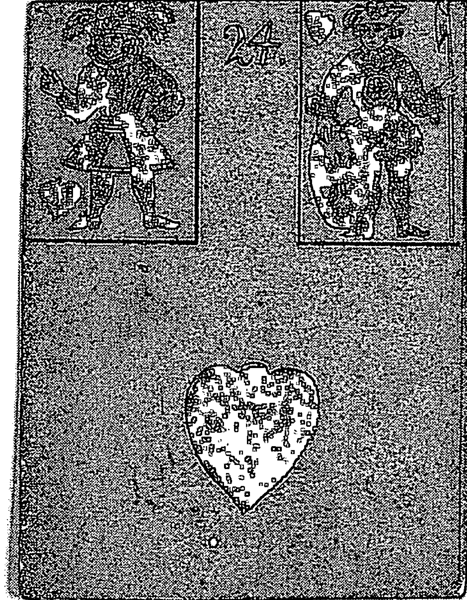

> 「你在考慮結婚計畫，如果訴諸理性，將會得到許多祝福。」——1794年義大利咖啡渣占卜卡牌面箴言。

> 「愛心如果在明淨處，表示未來很愉悅。如果被圓點包圍，有望收到一些錢。如果跟一枚戒指或兩顆心在一起，表示這人即將結婚或訂婚；如果附近有一個看得出來的字母，顯示對象名字的首字母；如果這字母是在明淨處，表示那人是處女，在濃密處則是寡婦。」——1794年義大利咖啡渣占卜說明書。

> 「不管是誰贏得這顆心，都會立刻送給28號的年輕人或29號的女人，這個意思是說，如果抵達第24號牌的玩家是女人，就會前進到第28號牌，男人會到29號。」——1799年希望遊戲說明書。

> 「愛心是喜悅的象徵，將引領至結合和至樂。」——1846年〈菲利浦雷諾曼說明書〉。

### 編號：24

### 撲克牌對應：紅心J

### 核心意義：愛、情意

愛心是舉世共通的語言。無論來自哪個國家，看到愛心，就知道是代表愛。從這邊可以引申出所有與愛相關的詞彙：情感、熱情、愛意、開心、快樂、喜悅、幸福、浪漫、愉悅、渴望、全心全意等，它可以指溫柔的愛你的鄰人，也可以是激情的愛你的戀人。從柏拉圖式的純愛，到靈肉結合的烈愛，都在愛心牌的囊括之內。

這份愛不僅可以指小愛，還可以擴及到大愛，也就是俗稱的無條件之愛，因此泛指所有與慈善相關的事物，慈悲、關懷、善意、溫暖、慷慨、大方、樂於助人。你絕對可以想出更多相關的詞彙。

愛幾乎可以說是全世界所有人都渴望的寶物，因此是相當正向的牌，尤其是人際關係與戀愛占卜時，更是樂見。

## 與編號在前的其他牌對照

幸運草是一時的邂逅，愛心是真正的喜愛。樹是身體層面，愛心是情感層面。雲是集中於頭腦理智，愛心是走心的。蛇是惡毒的誘惑，愛心是真心與誠意。花束是生活中較浮面的愉悅，愛心是打從心底的情感。鐮刀是斷開，愛心是連結。鞭子是性，愛心是愛。塔是封閉孤立，愛心是開放親密。山是冷漠疏離，愛心是溫暖親近。十字路口三心二意，愛心一往情深。老鼠是取走，愛心是給予。

## 愛情解析

愛情占卜中，出現愛心牌自然是大好事。在還沒對象的情況下，代表有愛意，愛情可能即將到來。在戀愛剛萌芽的情況下，可能代表眉來眼去、互相調情、彼此告白，乃至墜入愛河。而當有固定對象時，多半顯示雙方熱戀，感情正濃。

## 工作解析

愛心牌雖不表示會賺大錢，至少代表樂在工作。或許表示目前這份工作是自己的熱情所在，或同事跟自己相處愉快，周遭人對自己充分讚賞或感謝。某些情況下可能代表職場戀情。

愛心代表的職業是慈善工作，從大大小小的基金會、人道救援乃至無國界醫生都是。愛心代表心臟，因此可以代表心臟科醫師，特別是搭配代表醫護人員的狗牌一起出現時。由於愛心也與愛情相關，媒人、婚友社、伴侶諮商、戀愛教練、兩性專家、愛情小說家，以及現代的約會網站及交友app也都可納入。

## 健康解析

愛心自然代表心臟，也可以延伸為血管及循環系統，特別是當十字路口牌在旁邊時，後者的意義更為明確。若指疾病，則代表各種心臟血管相關疾病，包括心律不整、血管阻塞、血壓異常與中風等。

從愛心與其他牌的組合，可以進一步看出是何種疾病，不過這相當依賴個人的聯想。以高血壓為例，歐美占卜師有用愛心加鳥（壓力）表示，有用愛心加鞭子（激烈），有用愛心加鐮刀，我則認為用愛心加塔（高）也無不可。在這方面建議自己多加聯想，建立自己的牌義庫，占卜出來才是最準確的。

## 人物解析

愛心牌本身不代表人物，但是可以附加說明旁邊人物牌的特性。若是說明人物性格，表示此人很會表達感情、熱情、浪漫、快樂、討喜，或者是溫柔慈愛，有同理心，對旁人無私奉獻，慷慨大方、樂於助人，甚至真的從事慈善事業。

若是形容外表，那麼身材像愛心一般豐滿有肉，凹凸有緻，或身形上寬下窄。因為愛心是紅色的，也可以代表穿紅色衣物的人。

愛心牌的代表人物有電影《真善美》的茱莉安德魯斯、德蕾莎修女、證嚴法師、慈善家陳樹菊。《哈利波特》裡榮恩的媽媽也頗具愛心的慈愛形象，觀世音菩薩或許是更高層級的愛心代表。愛情方面，羅密歐與茱莉葉、情感豐沛的楊過，或不愛江山愛美人的溫莎公爵皆屬之。

## 物品解析

愛心代表心臟，以及所有心形的符號或物品。

愛心也可代表愛情相關的地點，如浪漫約會場所、婚宴會館，以及「核心地帶」概念的地方，如市中心蛋黃區、指揮中心、活動中心等。

## 時間解析

愛心是24號牌，所以可以代表24天或每月的24日。因為人們經常用春天形容愛情，所以愛心牌也可代表春天。如果是愛情占卜，可代表情人節或週年紀念日前後。

## 屬性

愛心無疑是非常正面的牌。

## 大藍圖牌陣的遠近解讀法

在愛情或人際關係的占卜中，愛心牌影響重大。愛心牌如果在代表問卜者的指示牌的右側或代表未來的方向，戀愛的可能性很高。距離越近，代表情感越強烈，也代表問卜者越重視此事。不過高興得還不要太早，愛心牌只代表愛情有，不代表會長久，周圍要有戒指（承諾）或貓（穩定），才可斷言穩定交往。此外，鑰匙（重要性）、房屋（成家）甚至鵲鳥（生子）等相關牌，也能增添長久的意涵。

愛心牌出現在指示牌的右側，但距離很遠，比較可能是柏拉圖式的淡薄戀情，此事在問卜者心中重要性也沒那麼高。

如果愛心牌是出現在指示牌左邊代表過去的位置，表示愛情已逝。

愛心本身可以當愛情的指示牌，因此特別要觀察愛心牌周圍。若被好牌環繞，更增幸福。若被壞牌環繞，傷心失落就在所難免。若周圍有蛇牌可能代表困難、複雜或誘惑，狐狸牌可代表錯愛或欺騙。

在與愛情或人際關係無關的占卜中，愛心也是好兆頭，表示整體的喜悅滿足，至少心情會很好。

## 主流牌義速查表

- **【名詞】** 愛（情感、愛情、熱情、激情）、大愛（慈悲、慈善、好意、慷慨、關愛、分享、給予、原諒）、喜悅（開心、快樂、愉悅、和諧）、心（心臟）。
- **【形容詞】** 充滿愛的、開心的、情感的、愛情的、激情的、和諧的、感情好的、浪漫的、慈善的、心的。
- **【愛情】** 愛意、熱戀、調情、墜入愛河、兩情相悅、幸福喜悅。
- **【工作】** 樂在工作、相處愉快、獲得讚賞或感謝、職場戀情。
- **【行業】** 慈善事業、心臟科醫師、情感相關行業（媒人、婚友社、伴侶諮商、戀愛教練、兩性專家、愛情小說家、約會網站、交友app）。
- **【人物】** 無。
- **【人物形容詞】** 愛心個性的（很會表達感情的、熱情的、浪漫的、快樂的、討喜的、溫柔慈愛的、有同理心的、無私奉獻的、慷慨大方的、樂於助人的）、愛心外貌的（豐滿多肉的、凹凸有致的、身材上寬下窄的、穿紅色的）、從事愛心代表行業的。
- **【身體部位】** 心臟、心血管。
- **【疾病】** 心臟、血管及循環系統相關疾病。
- **【健康建議】** 好好保養心臟及血管。開心一點。
- **【身心靈】** 做心輪療癒（配戴綠色或粉紅色礦石、穿綠衣或粉紅衣、用玫瑰精油或花精、在心輪部位作能量療癒、練習原諒）、練習無條件的愛、跟隨心中的感覺。
- **【物品】** 心形物。
- **【時間】** 春天、情人節、週年紀念日、數字24的日期（24天或每月24日）。
- **【地點】** 愛情相關地（浪漫約會場所、婚宴會館）、核心地帶（市中心蛋黃區、指揮中心、活動中心）。
- **【建議】** 開啟心扉、放開心胸去愛、去原諒、多表達感情、跟著感覺走、慷慨一點。
- **【總結】** 正面。

## 25

### 戒指

### Ring

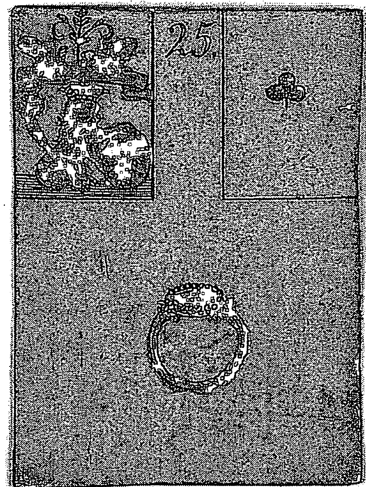

> > 「在你即將進入的幸福婚姻裡，為了自己的內心平靜，要避免嫉妒。」——1794年義大利咖啡渣占卜卡牌面箴言。

> > 「代表婚姻。如果附近有個字母，它是對問卜者顯示出他結婚對象名字的首字母。如果戒指在明淨處，預示快樂且有利可圖的友誼。被雲環繞，要對新到來的友誼持謹慎態度，可能至少會被欺騙，但是下面這個才是最不祥的：如果戒指出現在杯底，心愛的物品將徹底離開你。」——1794年義大利咖啡渣占卜說明書。

> > 「誰找到這枚戒指，就會得到三枚代幣。」——1799年希望遊戲說明書。

> > 「戒指如果在人物牌的右邊，預兆富裕而幸福的婚姻，如果在左邊且距離遠，將與心上人不和，婚姻也將破裂。」——1846年〈菲利浦雷諾曼說明書〉。

### 編號：25

### 撲克牌對應：梅花A

### 核心意義：結合、約定

在結婚典禮上，戒指可以套住一個人，這顯示了戒指牌的含義——約定。這可以是任何形式的結合，從愛情方面的定情、訂婚、結婚，人際方面的約定、承諾、加入小團體，乃至工作方面的合約、聯盟、貸款、租賃、合夥、合作、合併或併購。戒指代表雙方認定彼此，給予承諾。即使只是加入健身房會員、報名線上課或預約療程這些日常，不也是雙方各自給出金錢與責任義務的承諾？所以這些事在雷諾曼占卜中，也是以戒指牌來呈現。

戒指是環狀的，有循環往復的意象，因此可進一步代表重複的迴圈，長長久久的含義，畢竟套下戒指的行為就是為了抵抗改變，希望確保雙方關係延續。不過，雖然人喜歡長久，戒指牌卻不見得總是好，一切還是要看所問何事。若是愛情，戒指的承諾是樂見的；若是生病，長期反覆的生病大概沒有人想要。所以，戒指是吉中藏凶的牌，當出現的位置不對或周圍壞牌環繞時，就有可能變成負面義。

戒指的承諾，會帶來責任和義務。儘管戒指是許多人夢寐以求的情定終身，相對來說，也是被細綁或套牢，形成甜蜜的負擔。當戒指出現，無論有沒有締結正式合約，某種形式的雙方確定都是必然的。我們可以從戒指出現的位置和周圍的牌，來判定這是好的約定，還是沒那麼舒服的細綁。

戒指有把人包含在內的意象。我有一次應朋友邀請去上Podcast節目，出發前我抽了2張牌詢問建議，抽到熊加戒指。到了現場，我才知道主持人原來不只是我朋友，真正掌權的老闆（熊）也加入了。因為先前曾風聞這位老闆強悍的惡名，我心裡難免會生出排拒，雷諾曼卡正是建議我要接納他（戒指），就像把他納入自己的小圈圈這樣。

戒指牌偶爾會代表完成，就像套下戒指定下來一樣，事情完成了。還有人會把戒指視為「確定」或「解答」，不過戒指在這方面的意義並不如鑰匙牌那麼強。

### 解讀的方向性

當戒指出現在指示牌右邊，亦即代表未來的位置，顯示未來雙方將有連結或約定，是吉兆。若出現在左邊，反而表示雙方的結合已成過去式，有可能暗示分離或破裂。

## 與編號在前的其他牌對照

幸運草是短暫，戒指是長期。雲是迷惘，戒指是確定。棺材是結束，戒指是循環或完成。鐮刀是突然斷絕，戒指是結合。鞭子是兩次或重複，戒指是永久或循環。鳥泛指一對伴侶，戒指是有相互承諾的正式關係。孩童是天真的，戒指是認真的。我們向上仰望星星，戒指則是平等關係。鸛鳥愛遷徙變化，戒指講求始終如一。狗是基於情感的友誼，戒指是正式的承諾。塔孤立，戒指連結。花園是大群體，戒指是一對一。山是疏離阻隔，戒指緊密相連。十字路口還在尋尋覓覓的選擇，戒指已經塵埃落定。最後且最重要的是，愛心是心心相印的熱情，戒指才正式給出彼此的承諾。

## 愛情解析

戒指象徵愛情進入承諾的階段，如同套上訂婚戒指，確定雙方認定彼此，決定攜手走下去。在這階段，雙方已經不是試試看、玩一玩，而是認真了。有時戒指真的是指訂婚或結婚。

不過，雖然戒指在愛情是吉兆，還是要留意出現的位置，詳見下文大藍圖牌陣的解讀。

## 工作解析

戒指最常指涉各種合約，包括雇傭契約、採購或承包含約、租賃合約、貸款契約、策略聯盟、合夥、併購等合作關係，所以，如果你是在找工作、找資金或尋求買賣，戒指顯示合作的可能。

如果是指職場關係，戒指牌顯示所在的工作環境中，人人都認真投入，或彼此合作無間，有如一體。而戒指循環的意涵，也可以代表週期例行事項。

戒指相關的行業有各種中介，如仲介、調解人、保人、婚姻諮商師，或與契約有關的行業，如承包商、管理合約的法務。因為戒指是珠寶，也可代表珠寶業。

## 健康解析

當戒指牌出現在健康占卜中，首先可能代表與醫院達成某項約定，譬如進行長期或重複性的療程、簽下手術同意書、加入健康管理會員等。如果是形容疾病，可能代表長期的慢性病，或週期性復發的病，或頑強難治的疾病。有時代表同時出現的兩種疾病，也就是併發症。最好的情況，是取戒指牌的「完成」之意，代表治療已經完成，一切OK了。

戒指牌對應的器官，由於循環的涵義，可以對應到人體的整個循環系統，亦即心血管系統與淋巴系統。當與對應血管的十字路口牌一起出現時，指涉血管的含義更強。

健康方面的建議，可能表示要你更積極投入治療，或許需要與醫院更緊密合作，如定期複檢、持續回診、同意手術等。

## 人物解析

戒指牌本身不代表人物，但是可以說明旁邊人物牌的特性。首先他可能代表問卜者簽約或訂定某種約定的對象，出現在人物牌左邊代表已經約定，右邊代表未來將做約定。

感情占卜時，戒指出現在人物牌旁，可能代表此人已婚或已訂婚。

戒指如果是形容人物的性格，那麼此人可靠、守信、重承諾，對事情相當投入，值得信賴。他也可能是喜歡把人納入自己的圈子，是個能凝聚眾人的人物。

當戒指形容人物外貌時，他可能臉蛋或身材像戒指般圓圓的，喜歡戴首飾。歐美占卜師常以戒指代表金髮的人，是因為戒指通常是金色的緣故，不過這點意義在亞洲會弱化許多。

戒指牌的代表人物有死守抱柱信的尾生、一諾千金的季布、遵守十六年之約的楊過、南海鱷神岳老三、《冰與火之歌》中謹守約定的塔斯的布蕾妮。如果代表外型，代表人物是哆啦A夢、楊貴妃。

## 物品解析

戒指可以指戒指及各種珠寶首飾，還有像首飾般亮晶晶的東西。戒指本身小小的，但單價很高，所以可以泛指很貴的小東西。因為戒指是圓形環狀的，可以指圓形或環狀物。因為戒指能把人套住，還可以把指把人繩綁住的物品，如繩套或手銬。

戒指也可以代表各種圓形場地，如巨蛋、圓環、圓形廣場、摩天輪、圓桌，或者首飾存放點。

## 時間解析

戒指代表長久、週期性，不會那麼快結束。因為戒指是25號牌，也可以代表25天或每月的25日。

## 屬性

戒指通常是中性至好的牌，視位置可能轉為負面。

## 大藍圖牌陣的遠近解讀法

當戒指出現在牌陣中，位置非常重要。如果出現在指示牌右邊，也就是代表未來的位置，問愛情則表示認真的感情即將到來，問工作則代表合約即將達成，都是好預兆，且距離越近，吉兆越強。若是出現在左邊，問愛情表示承諾已成過去，問工作則代表合作已成過往，無論何者，雙方之間的連結漸逝，而且位置越遠越不利。

假如戒指是出現在指示牌的上方或下方，約定可能產生變化，上方表示事情較不受控制，下方表示問卜者尚能掌控局面。

戒指出對於判定戀愛對象是否單身，是非常重要的線索。如果出現在代表對象那張指示牌的左邊，表示他在過去已曾與人定情，並非單身狀態。

## 主流牌義速查表

- **【名詞】** 約定（結盟、合約、契約、承諾、答應、認定、責任、義務）、結合（合夥、合作、合併、聯合、併購、加入、納入）、循環（迴圈、週期、例行事項）、確定（完成）。
- **【形容詞】** 合約的、約定的、聯合的、連結的、承諾的、投入的、認真的、可靠的、循環的、週期性的、圓形或環狀的、金色的、亮晶晶的。
- **【愛情】** 認真、承諾、定情、求婚、訂婚、結婚、決定攜手走下去。
- **【工作】** 合作（簽約、結盟、聯合、聘僱、協議）、投入（認真、團結）、週期性（週期例行事項、景氣循環）。
- **【行業】** 中介相關（仲介、調解人、保人、婚姻諮商師）、契約相關（承包商、法務）、珠寶業。
- **【人物】** 無。
- **【人物形容詞】** 已訂約或合作的、已婚或已訂婚的、戒指個性的（可靠的、守信的、重承諾的、把人納入圈內的、凝聚眾人的）、戒指外貌的（臉或身材圓圓的、金髮的、愛戴首飾的）、從事戒指代表行業的。
- **【身體部位】** 循環系統，亦即心血管及淋巴系統。
- **【疾病】** 慢性病、週期性復發、併發症、頑強難治的病。
- **【健康建議】** 積極投入治療、與醫院合作（簽署手術同意書、定期復檢、持續回診、加入健康管理會員等）、治療已OK。
- **【身心靈】** 更投入在心靈成長、加入團體、週期性進行目前的諮商或療癒。
- **【物品】** 戒指、珠寶、飾品、亮晶晶物、很貴的小東西、圓形或環狀物、捆綁物（繩套、手銬）。
- **【時間】** 長期、週期性、數字25的日期（25天或每月25日）。
- **【地點】** 圓形場地（巨蛋、圓環、圓形廣場、摩天輪、圓桌）、首飾存放點。
- **【建議】** 更投入一點、保持信用、與人合作結盟、持續進行、打破負面循環。
- **【總結】** 中性偏好，偶爾負面。

## 26

### 書本

### Book

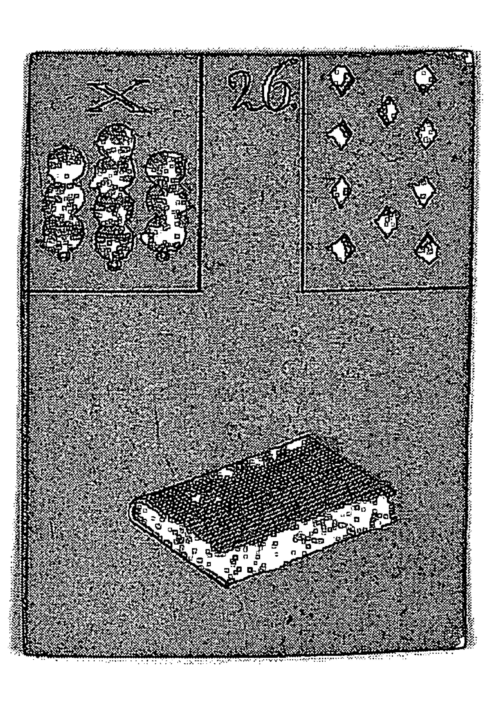

> >「不管是誰閱讀這本魔典（書牌），就會被下咒，送回花園牌。」——1799年希望遊戲說明書。

> >「書本代表你將發現一個秘密，根據它所在位置，你可以判斷是什麼事，不過，獲得解決的過程必須格外小心。」——1846年（菲利浦雷諾曼說明書）。

- 編號：26
- 撲克牌對應：方塊10
- 核心意義：未知、知識

雷諾曼卡的書本牌，通常被畫成皮革古書的樣子。根據〈希望遊戲說明書〉所稱，這可是一本魔法書，裡頭的神祕尚未被大眾所知，所以書本牌最核心的意義就是未知，以及相關的秘密、機密、神祕、隱藏資訊。

書本在占卜中出現，通常代表有事情是問卜者還不知道的，建議可以進行瞭解，或耐心等待事情水落石出。這件未知的事通常很快就會被發現，過程中仍要保持謹慎小心。

書本牌既然是魔法書，自然也跟神祕學有關，特別是魔法、咒術、命理占卜。另一張與命理有關的牌是星星牌，兩者差異在於，星星牌可囊括命理、通靈及身心靈，範圍較廣，而書本牌比較集中在魔法與命理學範圍。

其實，現在一般人看到書本，首先聯想到的應該不是魔法，而是讀書吧？沒錯，這就是書本牌的第二重要牌義，代表任何與讀書有關的事，包括學術、知識、教育、研究、學習、課程、訓練、考試、聰明、專業、智慧。因為帳簿也算書本形式的一種，所以書本牌也可以代表會計。

如果問學業考試，出現書本牌，是代表你該多讀點書了。若問求職也是同理，要你好好增進自己的專業，不然就是去多做些調查。從書本周圍的牌可以推知考試或求職的吉凶。

書本牌出現，告訴我們欲速則不達，暫勿太急著行動。要知道，在現實生活中，讀書雖是好事，但是在雷諾曼占卜中，書因為其神祕特質，被歸為中性偏負面的牌，行動還是要小心。

### 解讀的方向性

書本是有方向性的牌，從書脊和書頁所對的方向，可以獲得額外資訊。大多數的牌是畫成書脊朝左、書頁朝右，有些牌是畫成打開的樣子，此時就把打開的方向視為書頁方向，通常也是右邊。如果你的牌面分不太出來書脊書頁的區別，就固定視為書脊朝左、書頁朝右。

在解讀時，書脊朝向的那張牌是未知的資訊，書頁朝向的牌是已知資訊。例如「鞭子（左）+書本（右）」，代表這個爭吵大家還不知道，「書本＋鞭子」顯示大家都知道這場吵架。再例如「男人＋書本」代表這男人有很多未知的部分是你還不了解的，「書本＋男人」則顯示這個男人有書本般的特質——愛讀書、聰明好學或教育程度不錯等。你也可以把書頁朝向的那張牌，視為牌面要提供給你的線索，譬如書頁如果朝向狐狸牌，顯示可能有詐欺，有鳥牌，可能表示背後有口舌是非等。

## 與編號在前的其他牌對照

雲牌是自己感到迷惑，書本是被別人刻意隱藏資訊。鞭子是寫作或筆，書本是作品或書。鳥是小道消息，書本是系統性知識。孩童是天真未啟蒙的，書本是已有知識的。狐狸是蓄意騙人，書本是隱藏資訊。熊是有力人士，書本是讀書分子。塔野心勃勃，書本神秘兮兮。愛心是外向熱情，書本是內斂好學。

## 愛情解析

當愛情占卜出現書本牌，首先要了解是否有你不知道的部分，可能需要額外了解。也可能指這樁戀情是秘密的，或許是暗戀、祕戀、偷情、地下戀情，或許你有秘密的愛慕者，要不就是指對象相當神秘，令人難以看透，甚或真有暗藏秘密。

## 工作解析

在工作占卜中，書本同樣代表職場上可能有你還不清楚的地方，宜謹慎行事。也可能代表要你多查閱資訊、多做市場調查、增進專業、用功一點，或者要你去上課學習或教導他人，寫些文章，甚至出本書吧。書本牌代表的行業皆與書本相關，包括教育、出版及圖書館業，常見職業有老師、教授、學者、研究者、作家、編輯、書店店員、印刷業者、電子書業者、圖書館員，延伸到電腦資料庫及檔案管理員。

管帳簿的會計師也在其中。

## 健康解析

書本首先可能代表有尚未被診斷出的問題，或者你需要多做功課，去了解這個疾病或療法，或是需要做完整的檢查診斷。

由於書本與智力有關，身體部位對應大腦與認知系統，因此也可能表示有這方面的疾病，例如腦部創傷、失智症、阿茲海默症、認知障礙、閱讀障礙、記憶力衰退等。

## 人物解析

書本牌本身不代表人物，但是可以描述周圍的人物牌。此人的個性首先可從「讀書」來聯想，例如愛讀書、有學問、教育程度不錯、思想有深度，或許真是個書蟲或書呆子。另一方面可從「隱密」的方向來聯想，顯示此人低調內斂，沉默含蓄，重視隱私，口風很緊，不太透露自己的事，讓人感覺神神秘秘的，有可能他確實懷有秘密，或至少對透露的訊息很謹慎。第三個可能性是他從事書本代表的行業。

由於書本牌的書脊方向代表未知的資訊，而書脊通常是朝左，所以如果書本牌出現在人物牌的左側，可能代表此人有你未知的部分，或者雙方尚未謀面，或見過面卻還不太認識。若在右側，通常朝書本個性來解釋。書本若是形容人的外型，他可能戴著眼鏡，看起來像個讀書人。

書本的代表人物有《哈利波特》的妙麗·格蘭傑、《天龍八部》的段譽、孔子、孟子與朱熹。哈利波特也挺符合書本牌的外型。

## 物品解析

書本牌除了可以代表書籍本身之外，也可代表各種長得像書的東西，諸如文件、日記、相冊、手稿、紀錄、檔案、印刷品，以及一疊紙牌。因為現在走向電子化，所以電腦、平板電腦和電子閱讀器也都可以書本牌代表。如果代表地點，當然是所有與書有關的地點，如學校、補習班、圖書館、出版社、印刷廠、K書中心、書房，再來就是書櫃、檔案櫃等存放書的場地。

## 時間解析

因為書本象徵未知，表示時間未定，又因為書本厚重（相較於信件牌），這時程不會很快，至少要等到事情水落石出之後。因為書本是編號26的牌，也可代表26天或每月的26日。

## 屬性

因書本在傳統上代表有隱藏未知訊息，因此屬中性略偏負面的牌。

### 大藍圖牌陣的遠近解牌法

書本牌在大牌陣中，可以作為學業的主題卡。要知道一個人的學業狀況，便由書本周圍的牌來推斷。如果問卜者有調查研究在進行，或想要尋求進修，也可用書本作為主題卡。

如果書本牌不是作為主題卡，那麼它可能指出此事仍有問卜者還不知道的資訊，當書本牌離代表問卜者的指示牌越近，表示這個資訊越重大。你可以參考前文書本牌的方向性來尋找線索。

## 主流牌義速查表

- **【名詞】** 未知相關（秘密、機密、神秘、隱藏資訊）、神祕相關（魔法、咒術、命理占卜）、讀書相關（學術、知識、教育、研究、學習、課程、訓練、考試、聰明、專業、智慧）。
- **【形容詞】** 祕密的、神祕的、機密的、未知的、知識的、學習的、教育的。
- **【愛情】** 有未知的部分、祕密戀情、暗戀、偷情、地下戀情、祕密愛慕者、難以看透的對象。
- 有事情尚未明朗
- 多查閱資訊
- 多做調查
- 增進專業
- 上課學習
- 教導他人
- 寫文章
- 出書
- 教育業（老師、老師、教授、學者、研究者）
- 出版業（作家、編輯、書店店員、電子書業者、印刷廠）
- 圖書館業（圖書館員）
- 資料庫或檔案管理員
- **【人物】** 無。
- 書本讀書個性的（愛讀書的、有學問的、教育程度好的、思想有深度的、像書蟲或書呆子的）
- 書本隱密個性的（低調內斂的、沉默含蓄的、重視隱私的、口風緊的、神秘的、懷有秘密的）
- 書本未知特質的（仍有未知部分的、還不太認識的、尚未謀面的）
- 書本外貌的（戴眼鏡的、像讀書人的）
- 從事書本代表行業的
- **【身體部位】** 大腦與認知系統。
- 腦部及認知系統相關疾病（腦部創傷、失智症、阿茲海默症、認知障礙、閱讀障礙、記憶力衰退等）
- **【健康建議】** 有尚未被診斷出的問題、需要多做功課、需做完整檢查。
- 閱讀靈性經典
- 進行陰影工作
- 寫作或教導旁人
- 書籍、長得像書的物品（文件、日記、相冊、手稿、紀錄、檔案、印刷品、紙牌）
- 電子書（電腦、平板電腦、電子閱讀器）
- 書籍存放點（書櫃、檔案櫃）
- **【時間】** 時間未定、不會很快、至少等到水落石出之後、數字26的日期（26天或每月26日）。
- 學校
- 補習班
- 圖書館
- 出版社
- 印刷廠
- K書中心
- 書房
- 小心有事情是你還不知道的
- 謹慎行事
- 多做調查
- 耐心等待事情揭曉
- 多做功課
- 增進專業知識
- 要保守秘密
- 保持神秘感
- **【總結】** 中性偏負面。

## 27 信件

Letter

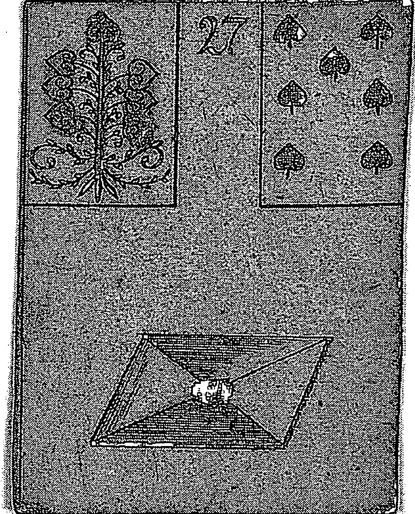

> 「在事業方面，你可以用美好的希望來討好自己，但要謹言慎行，不要總是把感覺說出來。」——1794年義大利咖啡渣占卜卡牌面箴言。

> 「藉由信件，我們向朋友傳達或開心或不愉快的消息，這裡就是這種情況。如果信件圖案在明淨處，表示好消息馬上會來。若被圓點包圍，代表大筆金額將匯入；但若被雲霧籠罩，就恰恰相反，是預示憂鬱或糟糕的消息、損失或其他險惡的事故。如果圖像在乾淨處，還伴隨一顆心，戀人可期待收到信，這封信會讓他確定他擁有心愛的對象，但是，如果在咖啡渣濃厚處，則表示被拒絕。」——1794年義大利咖啡渣占卜說明書。

> 「不管是誰收到這封信，必須付給送信人兩枚代幣的費用。」——1799年希望遊戲說明書。

> 「信件若沒有遇到雲，意味幸運，如果距離遠，代表好消息，但是如果烏雲離指示牌近，你可以預期很大的悲傷。」——1846年〈菲利浦雷諾曼說明書〉。

- 編號：27
- 撲克牌對應：黑桃7
- 核心意義：書信溝通、文字訊息

信件是訊息的傳遞。相較於騎士牌專程送達消息，與鳥牌口語傳播，信件牌特別指文字書面的訊息，不管是你與朋友間的信函、Email，還是手寫下的便條紙，任何文字訊息都可囊括其中。

信件還可以代表各種紙製品，當然現在電子化之後，以電子形式傳遞的文件也都被納入，所以各種文書、文件、表單、證照、帳單、履歷，凡是可以用紙乘載、有文字在其上的物品，都以信件牌代表。

雷諾曼有3張牌與消息有關：騎士、鳥與信件。這三者的劃分，有微妙的流派之分。首先我們要知道，騎士牌是專程送達給你的訊息，通常是面對面的，鳥牌也是面對面的口語閒談，唯有信件是隔空傳來的消息。那麼，講電話呢？講電話既是隔空，又是口語，該歸哪張牌管？因為這是個灰色地帶，有些占卜師設定鳥牌是口語，信件牌是文字，通電話由鳥牌代表。有些則以面對面或隔空來區分，讓電話由信件牌代表。我認為前者比較直觀，不過你還是可以自己決定如何設定，或者占卜幾次後自行印證牌面會如何對你呈現。每個人的經驗都有所不同，因此沒有絕對的對與錯。

信件牌本身是中性的，要從周圍的牌來判斷訊息是好是壞。傳統上碰到雲牌是壞消息，碰到棺材牌則是拒絕信，甚至死訊（還是要提醒，死訊機率很低），若能碰到太陽牌就是大好消息，碰到花束可能就是邀請函。

### 解釋的方向性

從信件牌所在的位置，可以得知是送出信還是收到信。如果人物牌在左，信件在右，是人物收到信，反之則是人物送出信。你可以這麼記：信件是新訊息，右邊是未來的方向，所以未來的信當然是收到信，而過去的信既然不是新訊息，就代表是送信出去。

## 與編號在前的其他牌對照

騎士牌是專程送來給你的好消息，信件是好壞不特定的訊息。船是送貨物到世界各地，信件是兩點間的訊息傳遞。房子是大的，信件是輕薄短小的。鐮刀是斷絕，信件是聯絡。鞭子是爭論，信件是通訊。鳥是口語、非正式的零碎閒談，信件是文字、較有組織的溝通傳訊。塔是正式文書，信件不一定正式。花園是跟大眾分享，信件是與特定人聯絡。山是不相往來，信件是進行往來。書本是隱而不宣，或厚重多頁的書冊與系統知識，信件是把它寫出來，或輕薄短小的紙品。

## 愛情解析

信件通常表示與對方的訊息往來。可從周圍的牌和與人物指示牌的相對位置，判斷訊息的內容，以及是收到還是送出訊息。最好的情況是信件結合愛心牌，代表情書；結合戒指牌，為結婚證書。比較糟糕的情況，結合到代表法律的塔，或代表爭端的鞭子、鐮刀等，有可能是遞交離婚協議書。

信件也可能代表雙方不常見面，主要透過通訊來聯繫。

## 工作解析

信件牌代表工作中的訊息往來。這可能是申請書、履歷表、送認證、收帳單，或發佈公告，也可以代表工作內容是跟處理文件有關，諸如整理發票、管理證書等。

信件牌對應的行業是郵局，還有各種訊息傳遞的中心——報社、雜誌社與通訊行。因為信件是紙製品，也對應造紙業與印刷業。信件牌還可對應文字工作者，如作家、記者、編輯、部落客、打字員、書記官、秘書。此外，與文件為伍的行業，如整理發票的總務，或收發文件的辦公助理，也都屬之。

## 健康解析

健康占卜出現信件牌，通常代表與健康有關的文書：診斷報告、處方箋、轉診單、復健卡、就醫證明、醫療收據，乃至健保卡。

由於信件是用手寫的，身體部位對應手部，疾病自是對應手部相關問題。信件也與寫作有關，所以也對應讀寫能力及相關障礙。

健康方面的建議，也是與醫療文書有關，例如把身體狀況記錄下來、去醫院取得處方箋或診斷報告、開立醫生證明、與醫護人員聯絡等。

## 人物解析

信件牌本身幾乎不會代表人物，只會形容旁邊的人物牌。出現在人物牌左邊可指有聯絡過但不太與你謀面的人，如筆友或網友，例如我曾跟一位平面設計師合作十多年，全靠通訊，從未見面，他對我而言就是很典型的信件人物了。而如果信件是出現在指示牌右邊，代表即將與你聯絡的人。

信件牌若是形容人物的性格，此人通常文筆很好、溝通表達力很強，或許他喜愛寫作，或許寫得一手好字、擅長書法，但也或許給人膚淺的印象，這是因為相較於擁有大量知識的書本牌，信件的訊息是相對淺薄的。此外，也有可能指他是從事信件相關行業者。

信件若是形容人物外表，他可能像信紙一般單薄，體格偏方，有稜有角。

## 物品解析

信件牌可以代表信件，與各種文字通訊的物品，如Email、名片、卡片、報紙、雜誌、廣告、傳單、海報、帳單、證照、申請書、履歷表、提案、合約、收據、發票、文件、占卜卡等。信件牌也可以代表所有紙製品，以及任何像紙般輕薄短小的東西，譬如塑膠夾鏈袋、錫箔紙和氣泡紙。

信件牌若代表場所，可對應通訊及造紙相關地，如郵局、報社、雜誌社、通訊行、印刷廠、造紙廠，以及存放紙的地方，如檔案室、書桌、信箱。

## 時間解析

信件牌在時間解讀方面，不同占卜師意見莫衷一是。傳統上認為信件需要等待，所以表示需要等一等，有占卜師則取信件輕薄短小、迅速送達之意，讓信件代表很快。我認為，對台灣人而言，寄出一封信，一兩天內就能送達，以這樣的時空背景來說，我們可以設定信件是很快、最遲幾天之內，或許是最好記的。

因為信件牌編號是27號，也可以代表27天或每月的27日。

## 屬性

中性，視周圍的牌而定。

## 大藍圖牌陣的遠近解讀法

信件牌代表訊息。〈菲利浦雷諾曼說明書〉說，信件牌如果離人物牌遠，代表是有利的消息。這個解釋現在比較不被採用，因為為何信件離人物遠會是好消息這點較難以聯想，所以現代占卜師通常讓信件離人物遠代表與他較無關的訊息，或過一陣子才會收到，離人物牌近表示與他個人切身相關的訊息，或很快就會收到。

還有一種解法是說信件離人物遠表示訊息是從遠方而來，不過因為現在網路發達，天涯若比鄰，訊息從何處來已經不那麼重要了。

雲牌對信件的解讀特別重要。信件牌與人物指示牌最好都遠離雲，否則收到的恐怕是壞消息。

前文說明解讀的方向性，仍適用於大牌陣解讀。

## 主流牌義速查表

- **【名詞】** 書信溝通（通訊）、文字訊息（信件、Email、傳真、留言、簡訊、新聞、文章、文書、文件）、紙製品。
- **【形容詞】** 文書的、文件的、文字的、記錄的、寫下的、列出的、郵寄出的、溝通的、通訊的、輕薄短小的。
- **【愛情】** 訊息、情書、結婚證書、離婚協議書、通訊維繫的愛情。
- **【工作】** 訊息往來（申請書、履歷表、送認證、帳單、公告）、文件處理（整理發票、管理證書）。
- **【行業】** 通訊相關（郵局、報社、雜誌社、通訊行）、製紙相關（造紙業、印刷業）、文字工作（作家、記者、編輯、部落客、打字員、書記官）、文件管理相關（總務、助理、秘書）。
- **【人物】** 無。
- **【人物形容詞】** 信件個性的（文筆好的、溝通表達力強的、喜愛寫作的、寫得一手好字的、擅長書法的、膚淺的）、信件外貌的（單薄的、體格偏方而有稜有角的）、有聯絡過但不太謀面的人（筆友、網友）、即將與你聯絡的、從事信件代表行業的。
- **【身體部位】** 手部。
- **【疾病】** 手部疾病、讀寫障礙。
- **【健康建議】** 把身體狀況記錄下來、取得處方箋或診斷報告、開立醫生證明、與醫護人員聯絡。
- **【身心靈】** 心靈寫作、抄經文、寫咒語、寫信給你想溝通的人。
- **【物品】** 文字訊息（Email、名片、卡片、報紙、雜誌、廣告、傳單、海報、帳單、證照、申請書、履歷表、提案、合約、收據、發票、文件）、紙製品、像紙般輕薄短小的東西（塑膠夾鏈袋、錫箔紙、氣泡紙）。
- **【時間】** 很快或要等一等、幾天之內、數字27的日期（27天或每月27日）。
- **【地點】** 通訊相關地（郵局、報社、雜誌社、通訊行）、紙製品相關地（印刷廠、造紙廠）、存放紙的地方（檔案室、書桌、信箱）。
- **【建議】** 寫下來、多溝通。提交文書。
- **【總結】** 中性。視周遭的牌決定訊息的好壞。

## 28 男人

Man

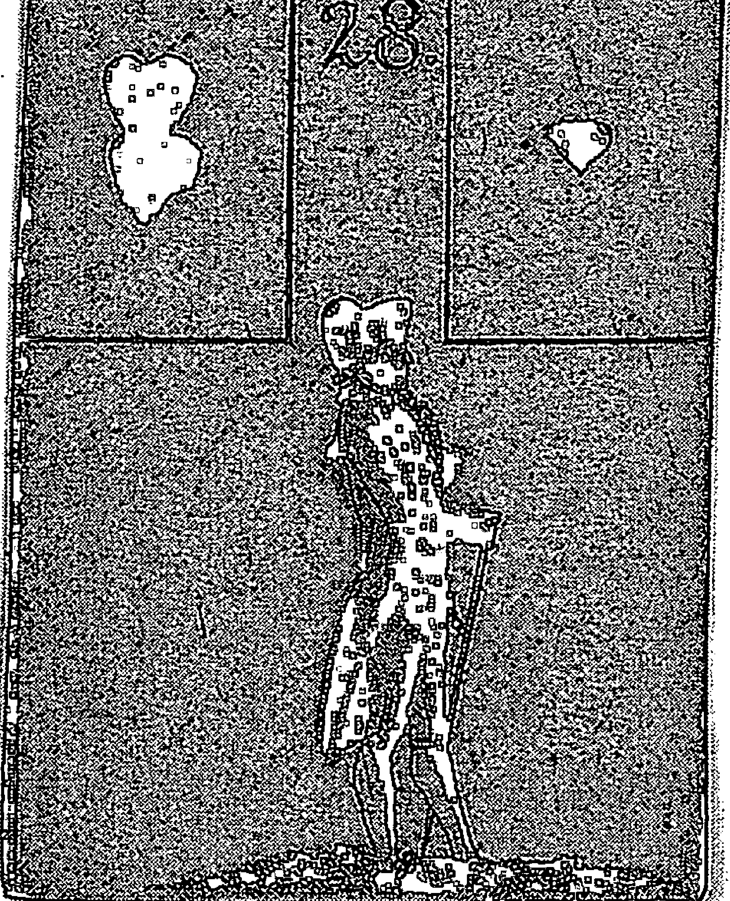

> > 「這個年輕人引領你前進到31號燦爛的希望之陽，不過，透過24號愛心牌來到這裡的，就不可以前進，必須等到下一輪。」——1799年希望遊戲說明書。

> > 「整副牌都是用來參照男人牌或女人牌，視來算命的是男人（28號）還是女人（29號）而定。」——1846年〈菲利浦雷諾曼說明書〉。

- 編號：28
- 撲克牌對應：紅心A
- 核心意涵：男人、陽性

男人牌代表一個男人，在占卜中通常作為人物的指示牌來用，本身除了指一個男人之外，沒有其他含義，要從周圍的牌來瞭解關於這個男人的事。

如果問卜者本身是男的，這張牌就代表他自己。如果問卜者是女的，這張牌就代表她的男對象，或在所問之事中最重要的男性人物，無論是父親、男上司、男性朋友或兄弟。

在做身心靈解讀時，男人牌可以代表我們的**陽性面**，或左腦層面，提醒我們要更運用陽性的力量，拿出男子氣概，以客觀與邏輯來思考，更獨立、勇敢、有力量。

### 解讀的方向性

當男人牌作為問卜者的指示牌時，有些占卜流派會以男人面對的方向為未來，背對的方向為過去，但是這樣在碰到男人牌被畫成面向左邊時，過去與未來的方向會與一般占卜習慣相反，在大藍圖牌陣中尤其易致錯亂，所以此區別現在大多已廢棄不用。

另外，在解讀感情時，有些占卜師會考慮男人與女人牌相互面對的方向。若面向彼此，代表兩人感情較和諧，較能關注對方，至少有些事是他們彼此都認同的，從兩人之間的牌可以看出連結他們的東西是什麼，就算中間是壞牌，至少有這些壞事將他們連結在一起，或他們對這個壞局面至少有共識。反過來說，如果背向彼此，表示較不和諧，漠不關心，或沒有共同生活，甚或根本沒見面。

不過，這只是情感解讀的其中一個要素，背向的兩牌之間仍可以有好牌發揮連結的影響力，此外還要考慮兩牌距離的遠近，在後文「大藍圖牌陣的遠近解讀法」有進一步說明。

## 與編號在前的其他牌對照

代表男人的牌中，騎士牌是年輕男子或訪客，雲是前夫或前男友，熊是有力人士或壯漢，狗是忠誠的朋友（有時代表第二個男對象），而男人牌泛指男人，無其他附加含義。

## 愛情解析

男人牌代表男問卜者自己，或女問卜者的男對象。

## 工作解析

男人牌可代表男問卜者自己，或女問卜者的職場中影響重大的男性。若是詢問建議，可能是要你留意這位男人造成的影響力，或是要你拿出男子般的氣概來行事。

行業方面，男人牌代表刻板印象上通常由男性擔任的職業，譬如水電工、建築工、消防員、機師、賽車手、工程師、貨車司機、重型機具操作人員等。當然這些也可以由女性擔任，雷諾曼牌義所取的僅是刻板印象。

## 健康解析

男人牌象徵男性生殖系統，以及其相關問題，常見的攝護腺肥大、陽痿或男性不孕症。

健康方面的建議，這張男人牌本身無吉凶，通常只是代表影響此事的一個男性，或者提醒你注意男性生殖系統相關問題。

## 人物解析

男人牌代表一個男人，沒別的意思了，需從周圍的牌瞭解關於這個男人的特徵。

## 物品解析

男人牌可表示通常是男性使用的物品，如刮鬍刀、西裝、小便斗、跑車、雪茄、古龍水、大型機具、大型槓鈴或啞鈴、威而鋼等。

男人牌若代表地點，指男人專屬的區域，如男廁。還有一些是雖然女性也可以去，但刻板印象中還是男性占大宗的場所，如吸菸室、居酒屋。日本有些只能站著吃的拉麵店，幾乎也是只有男性會去吃，亦可歸於男人牌。

## 時間解析

因為男人牌的編號是28號，可代表28天或每月的28日。

## 屬性

中性。需從周圍的牌瞭解這個男人的特性。

## 大藍圖牌陣的遠近解讀法

男人牌在大藍圖牌陣中同樣是做為指示牌，代表男問卜者本身，或女問卜者所問之事中最重要的男性人物。

在感情占卜中，特別要檢視男人牌與其對象的指示牌的距離遠近，這反映兩人的緊密程度。若離得近且兩牌之間有好牌，是感情親密的象徵，例如兩牌之間有愛心、小孩或戒指，分別表示有愛情、孩子和婚約將他們維繫在一起。而如果兩人很近，但中間是壞牌，顯示負面的緊密連結，例如鞭子表示吵得很熱烈，塔可表示兩人對分離或上法院有共識。但是如果兩牌距離很遠，就代表情感疏離，或距離遙遠。

有趣的是，當兩牌左右緊鄰在一起，中間沒有其他牌時，反而會被解作感情淡薄，甚或分離，理由是沒有東西把他們連結在一起，但是這個解讀有點反直覺，因此在占卜界有所爭議。有些占卜師反而設定緊鄰在一起表示感情親密，有些則是視是否面向對方而定，如果緊鄰而面對是感情好，背對才是感情不好。

如果男問卜者有第二個對象，可觀察男人牌是否離第二對象的指示牌更近，這反映了他與第二對象的感情是否比原對象更親近。同理，如果他有情敵，可觀察他的對象是離誰比較近，以及兩對之間各有什麼牌連結。

兩牌之間的上下相互位置也要考慮。上面的人對下面的影響較大，較有主控權，或較能控制對方。這個解讀無論兩牌是否在同一縱軸上都可應用。

## 主流牌義速查表

- **【名詞】** 男人。
- **【形容詞】** 男的、男性化的、陽性的、陽剛的、男人味的、男子氣概的、左腦的。
- **【愛情】** 一個男人。
- **【工作】** 男問卜者自己、女問卜者職場中影響重大的男性。
- **【行業】** 刻板印象中由男性擔任的職業（水電工、建築工、消防員、機師、賽車手、工程師、貨車司機、重型機具操作人員）。
- **【人物】** 男性問卜者、女問卜者的男對象、一個男人。
- **【人物形容詞】** 男的、陽剛的、男人味的、男子氣概的。
- **【身體部位】** 男性生殖系統。
- **【疾病】** 男性生殖系統疾病（攝護腺肥大、陽痿、男性不孕症等）。
- **【健康建議】** 這個男人與你的健康有關。注意男性生殖系統問題。
- **【身心靈】** 多運用陽性能量（客觀邏輯思考、獨立、勇敢、行動、力量）。
- **【物品】** 男性物品（刮鬍刀、西裝、小便斗、跑車、雪茄、古龍水、大型機具、大型槓鈴或啞鈴、威而鋼）。
- **【時間】** 數字28的日期（28天或每月28日）。
- **【地點】** 男人專屬的區域（男廁）、多為男性出沒的區域（吸菸室、居酒屋、站著吃拉麵店）。
- **【建議】** 拿出男子氣概、更有男人味一點。
- **【總結】** 中性，視周圍的牌說明更多關於這男人的訊息。

## 女人
Woman

> 「你可以满足你对女性的喜悦，但绝不要失礼。」——1794年意大利咖啡渣占卜卡牌面箴言。

> 「女人一般象征很大的喜悦。若在明净处，这个图腾的含义会比在咖啡渣浓厚处更好，表示巨大的幸福，浓厚处则代表很多嫉妒。如果图腾被圆点环绕，显示这位女士很多产或富裕。在杯子的不同位置，上方或在中间，你会和处女恋爱，但若在底部，则表示她会是寡妇。」——1794年意大利咖啡渣占卜说明书。

> 「这女生让你前进到第32号（月亮），从爱心牌来到这里的人除外。」——1799年希望游戏说明书。

> 「整副牌都是用来参照男人牌或女人牌，视来算命的是男人（28号）还是女人（29号）而定。」——1846年《菲利浦雷诺曼说明书》。

### 编号：29
### 扑克牌对应：黑桃A
### 核心意义：女人、阴性

女人牌代表一个女人，在占卜中通常作为人物的指示牌来用，本身除了指一个女人之外，没有其他含义，要从周围的牌来了解关于这个女人的事。如果问卜者本身是女的，这张牌就代表她自己。如果问卜者是男的，这张牌就代表他的女对象，或在此事中最重要的女性人物，无论是母亲、女上司、女性朋友或姊妹。

在做身心灵解读时，女人牌可以代表我们的阴性面，或右脑层面，提醒我们要运用阴柔的力量，拿出女人的特质，遵循情感和直觉，更温柔、感性、同理心。女人不追求行动，相反的，她恬静而有耐心，静待水到渠成。

### 解读的方向性

当女人牌作为问卜者的指示牌时，有些占卜流派会以女人面对的方向为未来，背对的方向为过去，但是这样在碰到女人牌被画成面向左边时，过去与未来的方向会与一般占卜习惯相反，在大蓝图牌阵中尤其易致错乱，所以此区别现在大多已废弃不用。

另外，在解读感情时，有些占卜师会考虑男人与女人牌相互面对的方向。若面向彼此，代表两人感情较和谐，较能关注对方，至少有些事是他们彼此都认同的，从两人之间的牌可以看出连结他们的东西是什么，就算中间是坏牌，至少有这些坏事将他们连结在一起，或他们对这个坏局面至少有共识。反过来说，如果背向彼此，表示较不和谐，漠不关心，或没有共同生活，甚或根本没见面。

不过，这只是情感解读的其中一个要素，背向的两牌之间仍可以有好牌发挥连结的影响力，此外还要考虑两牌距离的远近，在后文「大蓝图牌阵的远近解读法」有进一步说明。

## 与编号在前的其他牌对照

代表女人的牌中，蛇牌是聪明坏坏的蛇蝎女子，熊是强大的妈妈，花束是具有美感的女子，鹳鸟是寻求进步的女性或长腿姐姐，而女人牌泛指女人，无其他附加含义。

## 爱情解析

女人牌代表女问卜者自己，或男问卜者的女对象。

## 工作解析

女人牌可代表女问卜者自己，或男问卜者的工作问题中影响重大的女性。如果是询问建议，可能是这问题与此女人有关，或者要妳拿出女性的优势、以女性的特质来做事。

行业方面，女人牌代表刻板印象上通常由女性担任的职业，譬如护理师、美容师、化妆师、幼儿园老师、空服员、秘书、行政助理、芳疗师、媒人。当然这也可以由男性担任，雷诺曼卡所取的只是刻板印象。

## 健康解析

女人牌象征女性生殖系统，以及其相关问题，如女性不孕症，或乳房、阴道、卵巢、子宫的病变或肿瘤等。

健康方面的建议，这张女人牌本身无吉凶，通常只是代表影响此事的一个女性，或者提醒你注意女性生殖系统相关问题。

## 人物解析

女人牌代表一个女人，没别的意思了，需从周围的牌了解关于这个女人的特征。

## 物品解析

女人牌可表示通常是女性使用的物品，如美容美发用品、女性避孕用品、女装、香水、饰品等。女性生理用品当然也算是，搭配月亮牌更能确认。女人牌若代表地点，指女人专属的区域，如女厕、化妆室、哺乳室、女更衣室、女澡堂、妇产科。还有一些是虽然男性也可以去，但刻板印象中还是女性占大宗的场所，如美容院、美发沙龙、化妆品专柜、精品店、医美诊所、妇婴用品店等。

## 时间解析

因为女人牌的编号是29号，可代表29天或每月的29日。

## 属性

中性。需从周围的牌了解这个女人的特性。

## 大蓝图牌阵的远近解读法

女人牌在大蓝图牌阵中同样是做为指示牌，代表女问卜者本身，或男问卜者所问之事中最重要的女性人物。

在感情占卜中，特别要检视女人牌与其对象的指示牌的距离远近，这反映两人的紧密程度。若离得近且两牌之间有好牌，是感情亲密的象征，例如两牌之间有爱心、小孩或戒指，分别表示有爱情、孩子和婚约将他们维系在一起。而如果两人很近，但中间是坏牌，显示负面的紧密连结，例如鞭子表示吵得很热烈，塔可表示两人对分离或上法院有共识。但是如果两牌距离很远，就代表情感疏离，或距离遥远。

有趣的是，当两牌左右紧邻在一起，中间没有其他牌时，反而会被解作感情淡薄，甚或分离，理由是没有东西把他们连结在一起，但是这个解读有点反直觉，因此在占卜界有所争议。有些占卜师反而设定紧邻在一起表示感情亲密，有些则是视是否面向对方而定，如果紧邻而面对是感情好，背对才是感情不好。如果女问卜者有第二个对象，可观察女人牌是否离第二对象的指示牌更近，这反映了她与第二对象的感情是否比原对象更亲近。同理，如果她有情敌，可观察她的对象是离谁比较近，以及两对之间各有什么牌连结。两牌之间的上下相互位置也要考虑。上面的人对下面的影响较大，较有主控权，或较能控制对方。这个解读无论两牌是否在同一纵轴上都可应用。

## 主流牌义速查表

- 【名词】女人。
- 【形容词】女的、女性化的、阴性的、阴柔的、女人味的、右脑的。
- 【爱情】一个女人。
- 【工作】女问卜者自己、男问卜者的职场中影响重大的女性。
- 【行业】刻板印象中由女性担任的职业（护理师、美容师、化妆师、幼儿园老师、空服员、秘书、行政助理、芳疗师、媒人）。
- 【人物】女性问卜者、男问卜者的女对象、一个女人。
- 【人物形容词】女的、阴柔的、女人味的。
- 【身体部位】女性生殖系统。
- 【疾病】女性生殖系统疾病（女性不孕症、乳房、阴道、卵巢、子宫的病变或肿瘤等）。
- 【健康建议】这个女人与你的健康有关。注意女性生殖系统问题。
- 【身心灵】多运用阴性能量（情感、直觉、温柔、感性、同理心、恬静、耐心）。
- 【物品】女性物品（美容美发用品、女性生理用品、女性避孕用品、女装、香水、饰品）。
- 【时间】数字29的日期（29天或每月29日）。
- 【地点】女人专属的区域（女厕、化妆室、哺乳室、女更衣室、女澡堂、妇产科）、多为女性出没的区域（美容院、美发沙龙、化妆品专柜、精品店、医美诊所、妇婴用品店）。
- 【建议】运用女性特质、更有女人味一点。
- 【总结】中性，视周围的牌说明更多关于这女人的讯息。

## 百合
Lily

> 「你希望有一个忠贞的妻子，这个愿望可能会受到应允，如果你自己也是一样。」——1794年意大利咖啡渣占卜卡牌面箴言。

> 「如果此图腾在杯子上方或中间，表示问卜者拥有或将拥有一位贞洁美德的配偶。如果位于底部，表示相反。如果在明净处，百合进一步象征一段很长的幸福生活。如果被云遮盖，或在污浊处，预示麻烦和烦恼，尤其是在人际关系方面。」——1794年意大利咖啡渣占卜说明书。

> 「百合代表幸福生活，若被云包围，家庭方面会有悲伤。如果这张牌在人物（指示牌）上方，代表贞洁美德，如果在指示牌下方，他的道德原则受到质疑。」——1846年〈菲利浦雷诺曼说明书〉。

### 编号：30
### 扑克牌对应：黑桃K
### 核心意义：贞洁、性欲、年长

百合牌大概是36张雷诺曼卡中，意义最复杂，最令人困惑的一张了。

首先，百合牌与**贞洁**有关，这可能是因为1794年意大利咖啡渣占卜说明书中，写道如果百合图样出现在杯子中间或上方，象征配偶贞洁。1846年〈菲利浦雷诺曼说明书〉更进一步指出如果百合牌在指示牌下方，表示此人恐怕不贞。因为如此，百合牌与贞洁画上关联，进而跟贞洁的相反——**性欲**——也产生了关联。

如果要追根究柢，回溯百合花为何跟贞洁产生关系？这部分在欧美占卜界仍未取得共识。有人说因为百合花是结婚三十周年的纪念花，所以代表忠贞。有人说是因为百合花的性器官，也就是雄蕊和雌蕊，是完全开放在外的，所以与性欲有关。有人说因为百合花有异国香气，诱发人的性欲。有人援引希腊神话说百合花从女神希拉的母乳中生出来的，所以跟乳房与性有关联。还有人说因为百合代表家庭，家庭代表繁衍，因此跟性生活有关。真相究竟如何，众多占卜师们还搞不懂，但无论如何，百合花一方面给人纯洁的想像，一方面又与性欲画上等号，它的牌义就从这两方向发展出去。

贞洁的这一边，百合牌可象征家庭幸福，道德、忠贞与纯洁。又因为百合牌对应黑桃国王，在纸牌占卜传统中，这代表忠实、可靠且有智慧的男性，他是家庭的保护者，父亲形象的长辈，所以百合牌又象征年长男人，再延伸得到成熟、智慧、退休、保护、保守、有经验的、重视家庭等相关牌义。

既然这男人已经年长退休，获得如此的智慧，他的心灵自然和谐、平静、满足，步调徐缓，感觉一切已大功告成——这些也是百合牌的牌义。

来到性欲的这一边，百合牌既然是忠贞的，因此专指与固定对象的舒适幸福的性爱，通常是婚内或正常关系内的性行为，而非像鞭子牌那样的有性无爱或婚外性行为。

百合牌是跟家庭幸福有关的一张牌，因此有人取百合作家庭占卜的主题卡，但也有人取房子，所以家庭生活的占卜，通常就是从这2张牌择一来看。如果硬要区分，房子更着重房子实体与家庭成员的平安层面，百合更着重家庭成员间的情感交流部分。有占卜师则区分为与人同住者看房子牌，独居者看百合牌。这部分的区分，你可以做自己的设定。

因为百合跟家庭关系密切，现代占卜师把百合从家庭延伸出去，让百合也囊括社工与社会福利范畴。

另一方面，也有占卜师从「家庭」来推想，让百合牌代表后代子孙，包括小孩和（堂表）兄弟姐妹，因此让百合牌代表成年的孩子，孩童牌代表未成年的孩子。这样会让百合牌同时生出「年长」与「年幼」的歧义，恐增加解牌的困惑度，因此我建议初学者只采用年长为牌义即可。

由于百合的牌义如此分歧，有些现代雷诺曼卡把百合牌分成2张，一张代表性欲的，一张代表纯洁的，不过即使我们不把百合牌分成2张，根据情境也还是可以做出正确解读。

总结来说，如果从「贞洁/性欲」和「年长」为关键字来联想，要破解百合牌，就不是难事了。

最后还有一个实用小技巧，因为百合是白色的，所以可代表白雪、冬季和寒冷。

## 与编号在前的其他牌对照

骑士牌是活泼的，百合是平静的。幸运草是短暂的，百合是长期的。船是开疆辟土，百合是守护家园。房子是家庭生活与家人，百合是更偏情感层面的家庭幸福。蛇是不道德的坏女人，百合是很道德的好男人。棺材失落，百合满足。花束是外在浮面的感官欢乐，百合是内在深层的幸福喜乐。鞭子是婚外、不特定对象的性，百合是婚内、固定对象的性。鸟多嘴而焦虑，百合守静而和平。孩童是不成熟的小孩，百合是成熟的长辈。狐狸撒谎伤害人，百合忠诚保护人。熊可以是有力人士或母性的保护，百合通常是年长男性的保护。鸚鵡还没打算定下来，百合已忠贞不二。塔是不讲情感的权威人士，或社会阶梯攀爬者，百合是忠贞亲和的保护者，已经走过一遭心满意足。最后，书本是死知识，百合代表活智慧。

## 爱情解析

百合牌描绘的爱情，请想像跟一个可靠有智慧的成熟男性恋爱吧！这样的感情是平静和谐、令人心满意足的，步调不疾不徐，舒适可靠，他会好好守护妳。因为缓慢的特性，有可能指爱情长跑。如果还没有对象，百合牌可能代表与年长者的恋情，或者不要期待速度会快，但至少百合牌是舒适的，这让你寻觅的过程中不至于难熬。

## 工作解析

百合牌可以指年长、资深、有经验，或者个性本身够成熟稳定，足以应付工作所需，或指这份工作非常长期、已经做了很久。若百合牌是指工作环境，显示这是平静和谐的环境，工作步调不快，或者这是历史悠久的老牌企业，可让人安稳做到老。百合牌对应的行业，首先与老年和退休相关，如疗养院、独居老人照护、养老社区、银发住宅、退除役官兵辅导委员会等，再来与社工相关，包含各种社会福利和社会救助工作，也可能指在古老的场所工作，如老街、古迹、复古餐厅，或在雪地或寒冷区域工作，例如雪地救难员、滑雪选手、冷冻设备制造商等。虽然看似繁多，解读时可从周围的牌可以获得更多线索，例如雪地救难员可能是百合＋树（医疗）、滑雪选手可能是百合＋骑士（运动员）、冷冻设备是百合＋棺材（箱状物），你可以继续脑力激荡下去。

## 健康解析

百合牌在健康方面，主要代表俗称的「老人病」，例如骨质疏松、记忆衰退、老花眼、听力退化、失智症、帕金森氏症、阿兹海默症。其次，百合与家庭有关，所以也代表遗传病。再来，可能代表复原缓慢。

百合与性欲有关，特别是雄蕊性器官外显，因此也可代表性器官与性生活，进一步引申到性病，不过由于性病已经有男人牌和女人牌分别对应男女生殖系统的疾病，可以自行选择要不要再加上百合牌来对应。

因为老人的视力和听力都会退化，所以也有人将百合对应到眼睛与视力、耳朵与听力，不过前者已有鸟牌对应，后者有狗牌对应。要不要用百合牌对应，决定同样在你。

健康方面的建议：可能代表要给自己安静舒适的空间休养、需要给更多复原时间，或保守治疗。

## 人物解析

百合牌可以指一位长辈，通常是男性长辈，或父亲及类似父亲般的人物。（虽有其他流派采「家庭」含义，延伸为后代子孙，故让百合代表晚辈，这会使百合牌出现完全相反的歧异，因此建议两者取一即可。）

如果百合牌是描述旁边的人物牌，那么这个人通常比较年长，性格成熟，保护旁人，亲和、有智慧、重视家庭，工作方面则是资深与经验老到。若是形容外观，可能有些白发，看起来像爸爸般的人。

有人从性欲的角度发想，让百合牌代表性感有魅力者，男是肌肉男，女是火辣女。这会与年长的含义产生歧异，因此也不是很建议初学者采用，除非你对这个意义有共鸣。

百合牌的代表人物，导演李安的温和成熟形象很符合百合，周润发和张学友也是，还有《哈利波特》的邓不利多、《魔戒三部曲》的甘道夫、《冰与火之歌》的艾德·史塔克、意大利电影《美丽人生》的感人父亲基多，电影《即刻救援》的「地表最强老爸」连恩·尼逊……好啦，我知道最后一个是太过了点。

## 物品解析

百合首先对应老人用品，如拐杖、老花眼镜、假牙、成人纸尿裤与轮椅，再来对应退休相关，如退伍令、退休金、终身俸，后两者加鱼牌含义更强。百合也可以对应性用品，如避孕用品、情趣用品。因为百合的白色可联想到雪与寒冷，因此还可对应到雪、冰箱、冰库与保冷袋。

## 时间解析

百合牌既然是年长者，行为徐缓，所以代表缓慢与长期。因为百合是纯白色，有如雪地，所以代表冬天。百合牌编号30，因此也可以代表30天或每月30日。

## 属性

中性至正面。

## 大蓝图牌阵的远近解读法

根据〈菲利浦雷诺曼说明书〉的源流，百合牌若出现在人物指示牌上方，代表这个人是忠贞的，若在下方，显示不道德。现代占卜师继续从这个思路推演，以在上方代表幸福，下面代表不幸福。

跟其他雷诺曼占卜传统一样，云牌最好离得越远越好。如果以百合牌来看家庭幸福，云牌离得近，显示家庭有所不幸。

## 主流牌义速查表

- 【名词】贞洁（纯洁、忠贞、家庭幸福）、性欲、年长（父亲、长辈、成熟、退休、智慧、保护、和谐、平静、保守、缓慢、长期、心满意足、大功告成、三十周年纪念日）、白色（白雪、冬天、寒冷）。
- 【形容词】贞洁的、纯洁的、道德的、性欲的、年长的、成熟的、智慧的、退休的、保护的、和谐的、平静的、步调慢的、长期的、心满意足的、完成的、有经验的、白色的、冬天的、寒冷的。
- 【爱情】平静和谐的关系、心满意足、互相守护、步调徐缓、爱情长跑、与年长者的恋情。
- 【工作】年长、资深、有经验、成熟稳定、长期工作、环境平静和谐、步调不快、历史悠久的老牌企业。
- 【行业】老年相关（疗养院、独居老人照护、养老社区、银髮住宅）、退休相关（退除役官兵辅导委员会）、社工相关（社会福利、社会救助）、古老场所相关（老街、古迹、复古餐厅）、寒冷相关（雪地救难员、滑雪选手、冷冻设备制造商）。
- 【人物】男性长辈、父亲、父亲般的人物。
- 【人物形容词】百合个性的（年长的、成熟的、亲和的、有智慧的、重视家庭的、资深的、经验老到的）、百合外貌的（有白髮的、看起来像爸爸的）、从事百合代表职业的。
- 【身体部位】性器官。（眼睛与视力、耳朵与听力。）
- 【疾病】老人相关（骨质疏松、记忆衰退、老花眼、听力退化、失智症、帕金森氏症、阿兹海默症）、遗传病、复原缓慢、性相关（性病、性生活障碍）。
- 【健康建议】在安静舒适的空间休养、给更多复原时间、保守治疗。
- 【身心灵】静心冥想、禅修、瑜伽、太极、气功。
- 【物品】老人用品（拐杖、老花眼镜、假牙、成人纸尿裤、轮椅）、退休物品（退伍令、退休金、终身俸）、性用品（避孕用品、情趣用品）、白色与寒冷相关（雪、冰箱、冰库、保冷袋）。
- 【时间】缓慢、长期、冬天、数字30的日期（30天或每月30日）。
- 【地点】古老地点（老街、古迹、复古餐厅）、雪地、寒冷地区。
- 【建议】成熟一点、以平静的态度面对、慢慢来。
- 【总结】中性至好。

### 太阳
Sun

> 「你会赚到意想不到的财富，好好利用，别让任何人掩盖它。」——1794年意大利咖啡渣占卜卡牌箴言。

> 「太阳如果在明净处，是大好运和幸福的象征；但在咖啡渣浓厚处，预示巨大的悲伤。若被点或线状包围，表示这很容易被改变。」——1794年意大利咖啡渣占卜说明书。

> 「『29男人牌』这个年轻人引领你前进到31号灿烂的希望之阳，不过，透过24号爱心牌来到这里的，就不可以前进，必须等到下一轮。」——1799年希望游戏说明书。

> 「太阳，若在近处，意指幸福愉悦，因为它的光芒散发明亮温暖。如果很远，代表不幸和悲伤，因为如果没有太阳的影响，就没有东西可以生长。」——1846年〈菲利浦雷诺曼说明书〉。

### 编号：31
### 扑克牌对应：方块A
### 核心意涵：成功、胜利

如果说幸运草是小幸运，太阳牌就是大好运。太阳象征全面的成功，前景一片大好，充满活力，积极、正向而自信，心情当然也很high，问身体很健康，问工作很顺利，问情感很热烈。任何你想到的光明好词汇，都是太阳牌所象征的。

太阳牌出现时，就像暖阳升起，能驱散黑暗阴影，提升正面能量。如果在坏牌的下一张，也就是右边，出现太阳牌，能缓和原本的恶运，象征苦尽甘来，结局终究会是好的。不过，还是要注意，太阳也是会受到周围的牌影响，如果是太阳牌下一张出现坏牌，特别是云牌时，代表好运变调，吉兆转凶。所幸，就算太阳后面遇到坏牌，坏的程度也不会像两两坏牌相加那么糟，例如原本代表会赢，太阳遇到坏牌只会变成「差一点会赢」而已。

在太阳之下，毫无隐匿的空间。太阳是光明正大的能量，事事清晰可见，阴谋都会曝光，你不必担心有欺骗。太阳也跟温暖、白天、夏天与炎热地带有关。太阳本身是强大的能源，因此可代表电力，尤其是太阳能。另一张对应电力的是星星牌，读者可以选取自己觉得最直观的来对应。

太阳牌就像西洋神秘学中的火元素，或东方易经的乾卦，或阴阳学说中的阳，意义跟塔罗牌中的太阳几乎雷同，因此可象征决心、意志、力量等阳性积极能量。

## 与编号在前的其他牌对照

幸运草是小幸运，太阳是大好运。云是厄运，太阳是好运。蛇害人会背后来，太阳坦坦荡荡。棺材是结束，太阳正值高峰。花束是生活小确幸。

## 太陽

幸，太陽是從裡到外的成功。孩童剛開始，太陽值盛年。狐狸有詭計，太陽無隱藏。星星是夜晚，太陽是中午。鸛鳥在發展進步，太陽已經成功。塔孤立，太陽會走出去。山是難跨越的障礙，太陽是康莊大道。老鼠是負面的減少，太陽是正向的增加。書本隱藏資訊，太陽公開資訊。百合是冬天、北方與寒冷地帶，太陽是夏天、南方及炎熱地區。

## 愛情解析

太陽牌在愛情占卜中是大好象徵，這是一段光明正向的關係，雙方熱情摯愛，情深意濃，幸福和睦，萬事順遂，不管是內心感受還是外在環境都順風順水。即使沒有對象，太陽牌也帶來希望，可能代表豔遇或邂逅，而且是天雷勾動地火的那一種。

## 工作解析

太陽牌在工作方面的強運，可以以許多方式呈現，或許是面試錄取、接案成功、考取證照，或是獲得加薪或升遷、生意很旺。如果前面有困難，遇到太陽牌也解決了。另一方面可能指問卜者的個人狀態積極自信，能量高昂，有如太陽般，獲得榮耀與矚目。若指職場環境，則整體氣氛積極正面，業績強強滾。

太陽牌的代表行業是電力與能源產業，或有如太陽般溫暖人心的職業，如心靈激勵講師、成功學講師、啦啦隊，也可以代表與產熱電器有關的行業，如烤箱或電熱器產業。也可表示居業界領導地位的巨型企業。

## 健康解析

太陽牌一般象徵健康良好，身體充滿活力。若原本有疾病，復原狀況也會很順利。

太陽牌對應的身體部位是整體的活力與能量指數，以及太陽神經叢脈輪。如果太陽牌是指疾病，通常與高溫或陽氣過剩相關，如上火、中暑、熱衰竭、乾燥、晒傷、燙傷、脫水（加魚牌）。由於太陽燃燒極為旺盛，也可能代表有如過度燃燒自己的疾病，如過勞、衰竭、勞損，從鄰近的牌可以探知是哪一部位的勞損，例如「愛心牌（心臟）＋太陽」等於心臟衰竭。

健康方面的建議，太陽牌要我們多晒太陽、待在溫暖一點的環境，或多做讓自己提升活力的措施，多多「充電」。

## 人物解析

太陽牌本身不代表人物，但可以附加說明旁邊的人物牌。如果是說明人物的個性，此人性格如陽光般，樂觀、積極、開朗、有活力，是個樂觀主義者，或許還是個暖男，也可能是眾所矚目的成功人士，個性偏向高調，有話直說，不打迂迴戰。

太陽牌也可能表示此人從事太陽代表的行業，最常見的情況是電力維修人員。

太陽牌如果是說明人物的外貌，可能代表他的皮膚有晒黑，或臉上有雀斑。歐美占卜師會取太陽牌形容金髮碧眼，但這在亞洲不太適用。

歐美占卜師也會取太陽牌形容一個人物來自熱帶地區，不過因為台灣本身已跨入熱帶，一個來自熱帶的人物並不構成顯著特徵，所以在占卜上應用的機率也不高。

太陽牌雖好，可惜過猶不及。在占卜中，當太陽牌是形容一個人時，旁邊壞牌圍繞，則可能意味那人自我意識過高，喜歡自吹自擂，傲慢自大，不可一世。尤其是遇到熊牌或塔牌時，此種機率更高。譬如如果你問：「我明天要見的那個人是怎麼樣的人？」抽3張牌得熊（力量）、太陽與塔（權力），就要朝負面解釋囉。

太陽牌代表人物有太陽神阿波羅、超人、《鬼滅之刃》的炎柱煉獄杏壽郎、文學作品《阿爾卑斯山的少女》樂觀的海蒂。現實生活中的典型有未出事前的乙武洋匡，以及馬英九被塑造出的公眾形象。我自己曾經寫過一本小說《再見後，開始香戀》，男主角夏燦陽也是典型太陽人物，卻被編輯要求增加他的陰暗面，因為世間沒有真正跟太陽一樣只有光明沒有人格，所以這邊我們舉例的是公眾形象。在占卜時，該人的形象大致符合就可以納入。

## 物品解析

太陽首先可以代表太陽與陽光，再者可代表發亮的物品，如電燈、手電筒、蠟燭、燈塔（+塔牌）、捕蚊燈（+老鼠牌）。太陽也與炎熱高溫有關，因此可代表烤箱、電熱器、暖暖包、暖蛋、吹風機、離子夾、電捲棒、電擊棒、岩盤浴等，可從鄰近的牌獲知更精確的訊息，譬如電棒類會是太陽加鞭子（鞭棍類），岩盤浴會是太陽加山（岩石）。最後，太陽是能源，可代表電池、行動電源、太陽能與電力，而因為太陽提供日晒，故在西洋常代表仿曬劑、助曬劑或日晒機，但在亞洲因習慣不同，通常是代表防曬乳。

太陽牌若代表地點，是炎熱地帶，例如熱帶或沙漠地區，或是室內會西曬的房間。

## 時間解析

太陽代表中午或夏天，也可以代表廣義的白天。因為太陽牌編號31號，因此也可代表31天或每月的31日。

## 屬性

太陽牌是非常積極正向的好牌。

## 大藍圖牌陣的遠近解讀法

因為太陽牌代表大成功，〈菲利浦雷諾曼說明書〉的傳統是希望它離代表問卜者的指示牌越近越好。現代解牌原則又通常設定上方的牌會影響下方的，所以我們希望太陽在指示牌上方，讓指示牌充分獲得照耀。

假使太陽牌離指示牌近，周圍又沒壞牌，那麼好運與成功幾乎可說是必然的。若在上方更是錦上添花。

如果太陽牌的下一張，也就是右邊的牌，是壞牌，則讓太陽的光芒減弱。雲牌是最典型不樂見於太陽之後的壞牌，會遮蔽太陽的光亮，變成吉後轉凶，或吉中藏凶。這種劇本就多了，可能原本的勝利飛走了，或許勝得沒那麼光明正大，落人口實，又或只差臨門一腳，或好不容易贏得的佳人，才發現不適合等等。

如果太陽牌離指示牌很遠，代表距離成功還很遠，問卜者需要格外努力。另一方面意味問卜者可能需要拿出更多太陽般的力量，積極上進一點。

## 主流牌義速查表

-   【名詞】成功（好運、活力、積極、正向、正面、自信、快樂、高興、健康、順利、順風順水、熱忱、能量、決心、意志、力量、成就、卓越）、光（光明、清晰、曝光、陽光、電力）、熱（溫暖、夏天、南方、熱帶）。
-   【形容詞】成功的、好運的、積極的、正向的、快樂的、順利的、熱忱的、熱情的、明亮的、陽光的、溫暖的、南方的。
-   【愛情】光明正向、熱情摯愛、情深意濃、幸福和睦、萬事順遂、順風順水、豔遇或邂逅。
-   【工作】各種強運成功（面試錄取、接案成功、考取證照、加薪、升遷、生意好、困難解決）、個人展現光明（積極自信、榮耀矚目）、職場環境積極正面。
-   【行業】電力業、能源產業、溫暖人心相關（心靈激勵講師、成功學講師、啦啦隊）、產熱電器相關（烤箱或電熱器產業）、居業界領導地位的巨型企業。
-   【人物】無。
-   【人物形容詞】太陽性格的（樂觀的、積極的、開朗的、有活力的、溫暖的、眾所矚目的、成功的、高調的、直來直往的）、太陽外貌的（皮膚晒黑的、有雀斑的、金髮碧眼的）、來自炎熱地區的、從事太陽代表行業者。
-   【身體部位】活力、能量指數、太陽神經叢。
-   【疾病】健康良好、充滿活力、復原順利、高溫或陽氣過剩相關疾病（上火、中暑、熱衰竭、脫水、乾燥、晒傷、燙傷）、「過度燃燒自己」的疾病（過勞、衰竭、勞損）。
-   【健康建議】晒太陽、待在溫暖一點的環境、做讓自己提升活力的措施、多讓自己「充電」。
-   【身心靈】做太陽神經叢療癒、做讓自己有活力的事、肯定自己、多唸正面肯定語。
-   【物品】太陽、陽光、發亮物（電燈、手電筒、蠟燭、燈塔、捕蚊燈）、炎熱高溫物（烤箱、電熱器、暖暖包、暖蛋、吹風機、離子夾、電捲棒、電擊棒、岩盤浴）、能源（電池、行動電源、太陽能、電力）、日曬品（仿曬劑、助曬劑、日曬機、防曬乳）。
-   【時間】中午、白天、夏天、數字31的日期（31天或每月31日）。
-   【地點】炎熱地帶（熱帶、沙漠、西晒的房間）。
-   【建議】多看光明面、多一點活力與自信、公開透明、打鐵趁熱、勇於當領導者。
-   【總結】正面。

## 33 月亮

Moon

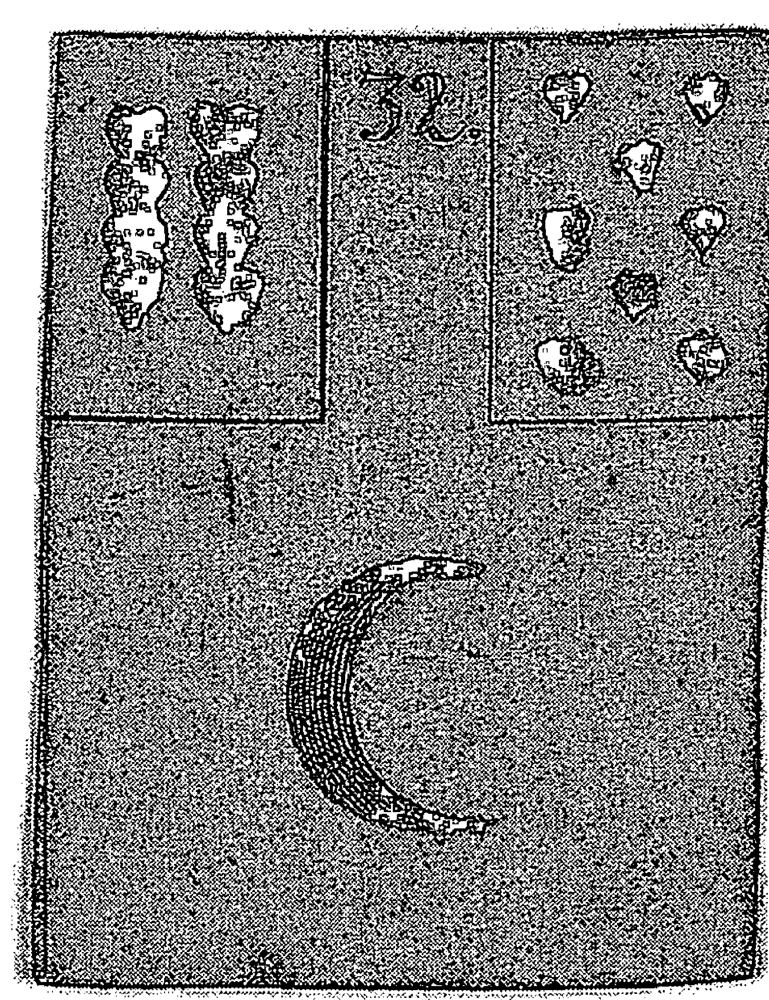

> 「你思想的自由總是會增加而非減少你的繁榮，還會讓你每天都更喜歡你的朋友。」——1794年義大利咖啡渣占卜卡牌箴言。

> 「月亮如果在明淨處，表示很高的榮譽，而在黑暗或咖啡渣較厚的部分，則表示悲傷，不過這都會一視同仁的過去。但是如果它在杯子的底部，問卜者無論是在海上或陸上都會非常幸運。」——1794年義大利咖啡渣占卜說明書。

> 「『32女人牌』這女生讓你前進到第32號（月亮），從愛心牌來到這裡的人除外。」——1799年希望遊戲說明書。

> 「月亮是很高的榮譽、繁榮和名氣的象徵，如果這張牌在人物（指示牌）旁邊的話。如果在遠處，代表悲傷和苦難。」——1846年〈菲利浦雷諾曼說明書〉。

### 編號 : 32

### 撲克牌對應 : 紅心8

### 核心意涵 : 名譽、形象、直覺

古往今來，無論東西，人們都不約而同歌詠月亮。東方有中秋節，西洋有月亮女神阿提蜜絲和戴安娜，所以，月亮牌在雷諾曼卡的語彙中，就代表那被頌讚的地位——名譽。

太陽牌是本身散發熱力，月亮則是反射太陽的光，因此是象徵我們在別人眼中的形象。當月亮牌在占卜中出現時，代表形象地位的整體提升：名聲很好，知名度高，榮譽加身，備受肯定，地位尊榮。月亮也可進一步代表自我形象，顯示自視甚高，自我感覺良好。

既然月亮象徵名氣，而許多人士是藉由工作獲得名氣，所以月亮就成為荷比新派的「工作指示牌」。當詢問工作時，便從月亮周圍的牌來解讀。

雖說以月亮當工作牌是荷比新派的作法，不過現在因為資訊發達，也不是只有荷蘭或比利時的占卜師會這樣用，任何國家的占卜者只要覺得順，都可以這樣用。我個人在占卜寫作事業時，就是取月亮牌，因為寫作是與名氣特別相關的事業。同理，如果今天有位藝人找你占卜，月亮就遠比追求穩定的貓適合作為工作牌。

於是我們知道，月亮象徵公眾形象、專業地位與事業成功，猶如眾星拱月，升遷走紅指日可待，你可以期待自己的社會地位提升。更棒的是，情緒方面也會是滿足的，感覺十分良好。

月亮牌的另一個意義與陰性有關。如果說太陽牌代表陽性特質，月亮就是象徵所有的陰性特質，包括自然週期、夢境、直覺、創造性、藝術性、想像力、通靈力、潛意識、情緒、感受、敏感、多愁善感、女性能量等。如果你學過占星學，任何占星學上認為的月亮特質，在此處都可以應用。

最後，月亮可象徵晚上，以及銀色，想想「銀月光」這個詞就知道。

## 與編號在前的其他牌對照

樹牌是成長，月亮是影響力。蛇和狐狸是聲名狼藉，月亮是美名遠播。鳥是八卦別人，月亮是眾口稱譽。星星是築夢的過程，月亮就是那夢想。愛心是熱戀，月亮是浪漫情愫。百合是白色的，月亮是銀色的。太陽是陽性與白天，月亮是陰性與晚上。

## 愛情解析

月亮牌為愛情添上夢幻的美感。儘管不像愛心的鐘情熱戀，或太陽的高調晒愛，月亮自有它的浪漫，是一種有朦朧美、距離美之愛。如果你詢問某人對你的感覺，月亮肯定是有感覺的。這比較像是戀情初期，雙方都還保有神秘感，對對方存有美好形象時，所進行的浪漫追求，以及燭光約會——月亮是真的可以代表月下幽會！

儘管月亮牌還沒進入熱戀階段，或許「朋友以上，戀人未滿」這個形容還算貼切，至少它指出了戀情的可能。

## 工作解析

月亮牌在工作上是極好的象徵，名聲地位提昇，獲得好評。如果是創意工作，月亮牌代表靈感來報到。若是形容工作環境，則可能代表在與名氣與藝文相關領域工作。

月亮牌代表的行業首先與提升形象有關，如廣告、行銷、公關，再來是與靈感創意有關，如藝文工作，以及與名氣有關，如明星、網紅。月亮象徵我們的內在心靈層面，所以也可代表心理師、精神科、靈媒、靈性療癒師與夢境工作者。值得注意的是，月亮也代表兼職，英文中的兼職就是moonlighting（月光）。

## 健康解析

因為月亮與生理週期相關，相關疾病包括經前症候群、月經異常或更年期。因為月亮與自我感受相關，也可象徵自厭導致的心理疾病，如問卜者覺得自己很醜，或以為自己比實際的身材胖很多，因而導致厭食或整形上癮。而由於月亮被視為工作牌，可以代表職業傷害。

有些占卜師將月亮對應女性生殖系統，女人牌也有此對應。對我而言，月亮比較單純代表女性賀爾蒙與生理週期，女人牌才含括更廣的女性生殖系統。

月亮的健康建議，可能是要我們多方打聽，尋找名醫或聲名卓著的院所治療，或多注重夜間睡眠。

## 人物解析

月亮本身不會代表人物，但可以描述旁邊的人物牌。首先，可能說明此人是個名人，或在圈內小有名氣者。就算不是名人，至少他的外型談吐都宛如名人。

如果月亮是描述個性，那麼此人陰柔、直覺敏銳、藝術性、敏感、細膩、多愁善感、有通靈力、自視高，或者，他從事月亮代表的職業。

若是描述外貌，他具有古典美、膚色白、臉或眼睛像月亮般圓，通常是俊男美女。

月亮的代表人物有知名度高形象又好的美國主持人歐普拉、如眾星拱月般被大眾崇敬的賈伯斯和「林來瘋」時期的林書豪，《紅樓夢》裡的林黛玉是月亮陰柔性質的代表。符合月亮外貌的有女星林心如、周慧敏、范冰冰與神仙姊姊時期的劉亦菲，她們的知名度也相當符合月亮牌。

## 物品解析

月亮代表月亮及月亮形狀的物品，和任何與月亮有關的物品，如月餅、中秋禮品。因為月亮跟形象有關，可代表用來捕捉或呈現形象的物品，如攝影機、照相機、相片或公關宣傳影片。當月亮加星星牌（網路），可能代表呈現個人形象的網站，如Instagram、個人官方網站，如果加花園牌（人脈），可指Linkedin等人脈網站。
說到月亮，還很容易讓人聯想到生理週期，所以也可以代表女性生理用品，特別是搭配女人牌時，怎能不聯想到月亮杯、月亮褲？
月亮牌代表的地點是夜間開放的場所，例如夜店、午夜電影院、深夜燒烤店、夜市（加花園牌）。月亮也代表我們晚上睡覺的地方——臥室——或者屋內月光可以照到的區域。
如果你將月亮視為工作指示牌，旁邊出現房屋或塔，兩者搭配即代表工作的地點。

## 時間解析

月亮代表晚上。因為月亮週期是28天，所以也可以代表28天或四週。

## 屬性

月亮是正面牌。

### 大藍圖牌陣的邏近解讀法

當月亮牌出現在代表問卜者的指示牌周邊時，表示問卜者受肯定、受稱讚，名氣向上提升，若位在指示牌上方更好，月亮就能更全面的照耀問卜者。若搭配更多好牌，可以看出具體是哪些方面的提升，譬如搭配魚牌時表示加薪，搭配船或騎士牌，有機會獲得公司配車。
如果周遭是壞牌，表示未受肯定或負面名聲。如果離指示牌很遠，可能表示懷才不遇，伯樂尚未出現。

## 主流牌義速查表

-   【名詞】名譽相關（名譽、形象、名聲、地位、知名度、榮譽、肯定、尊榮、自我形象、專業地位、工作、事業成功）、自我感受相關（情緒滿足、感覺良好）、陰性相關（陰性、自然週期、夢境、直覺、創造性、藝術性、想像力、通靈力、潛意識、情緒、感受、敏感、多愁善感、女性能量）、兼職、晚上、銀色。
-   【形容詞】名譽相關（有名的、名聲好的、形象好的、地位高的、有榮譽的、受肯定的、尊榮的、出類拔萃的）、陰性相關（自然週期的、夢境的、直覺的、藝術性的、想像的、通靈的、潛意識的、情緒的、感受的、女性能量的）、晚上的、銀色的、工作的、兼職的。
-   【愛情】夢幻、浪漫、有感覺、神秘感、浪漫追求、燭光約會、月下幽會、朋友以上、新戀情的可能。
-   【工作】名聲地位提昇、獲得好評、受讚譽、靈感報到。
-   【行業】形象相關（廣告、行銷、公關）、靈感創意相關（藝文工作）、名氣相關（明星、網紅）、內在心靈相關（心理師、精神科、靈媒、靈性療癒師、夢境工作者）、兼職。
-   【人物】無。
-   【人物形容詞】知名的、月亮個性的（陰柔的、直覺敏銳的、藝術性的、敏感的、細膩的、多愁善感的、有通靈力的、自視高的）、月亮外貌的（古典美的、膚色白的、臉或眼睛像月亮般圓的、俊美的）、從事月亮代表行業的。
-   【身體部位】女性賀爾蒙、生理週期。
-   【疾病】生理週期相關疾病（經前症候群、月經異常、更年期）、自我感受相關（自厭、厭食、整形上癮）、工作相關（職業傷害）。
-   【健康建議】尋找名醫或聲名卓著的院所治療、多注重夜間睡眠。
-   【身心靈】開發眉心輪（直覺力、通靈力、心像觀想能力、傾聽內在聲音）、開發女性或陰性能量、進行滿月或新月儀式、夢境工作。
-   【物品】月亮、月亮相關（月亮形狀或圖騰的物品、月餅、中秋禮品）、形象相關（攝影機、照相機、相片或公關宣傳影片、個人形象網站）、生理週期相關（衛生棉或棉條、月亮杯、月亮褲）。
-   【時間】晚上、一個月亮週期（28天）。
-   【地點】夜間場所（夜店、午夜電影院、深夜燒烤店、夜市）、臥室、屋內月光可照到的區域。
-   【建議】遵從直覺、多點想像力、提升知名度、提升自我與外在形象、享受你的名氣。
-   【總結】正面。

## 33 鑰匙

Key

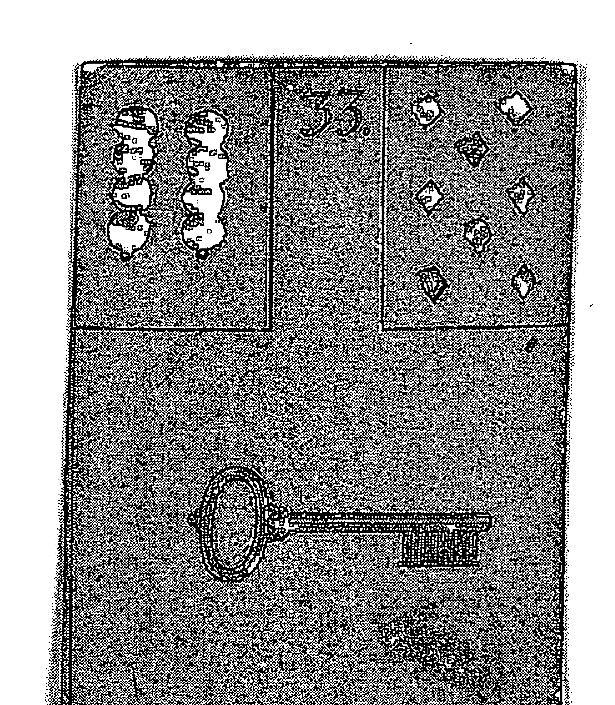

> > 「到達這個鑰匙，獲得兩枚代幣。」——1799年希望遊戲說明書。
> 「鑰匙如果在（指示牌）近處，代表願望或計畫一定會成功，如果在遠處，代表相反。」——1846年〈菲利浦雷諾曼說明書〉。

### 編號：33

### 撲克牌對應：方塊8

### 核心意義：解答、重要、確定

鑰匙是重要的物件，能打開大門，或所有我們想打開的一切。當鑰匙轉開時，我們就獲得了**解答**，因此在雷諾曼占卜中，鑰匙提供我們問題的答案。想知道你的問題該怎麼解決嗎？從鑰匙附近的牌來尋找就對了。

鑰匙給我們成功的關鍵。如果你問事情是不是該這樣做，鑰匙正是回答你：「是！對！去吧！」鑰匙給你靈光乍現的啟發，讓你確定，讓你突破，讓你獲得解放，成功唾手可得。

鑰匙是如此重要，所以在占卜中，鑰匙也經常代表重要，提醒你值得注意的地方。如果鑰匙出現在人物牌旁邊，代表此人很關鍵。如果出現在一串牌的右邊尾端，代表這串訊息是特別重要的關鍵。如果鑰匙出現在左邊，右邊接著一串牌，代表這串牌所預測的未來特別確鑿，特別有可能實現。雖說占卜原本每項訊息都有重要性，所預測的未來也有實現的一定可能，不過鑰匙在這裡的意義是「畫重點」的意味，被畫到的重點，強度加倍。

鑰匙牌為我們指出關鍵與成功的路徑，不過，鑰匙的成功跟太陽牌有所不同。太陽牌的成功，比較是自然不費力的達到，鑰匙提供的機會大門，你卻必須親自持鑰匙去打開，否則就像那個明明有大餅掛在脖子上，最後卻因為懶得轉動餅而餓死的懶婦一樣，所謂「天助自助者」，如果自己都不願出點力，手上有鑰匙也是枉然。因此，當牌陣中出現鑰匙牌，就像一根箭頭指向答案，對你說：「看過來，解決之道就在這裡，你自己打開！」

由於鑰匙的關鍵性，因此在身心靈方面代表命運或因果業力，是比較影響重大的部分。在印度瑜珈脈輪理論中，鑰匙是對應到眉心輪及頂輪，眉心輪讓我們清晰看見，頂輪接引上天的訊息，因此鑰匙牌會令我們靈光乍現、醍醐灌頂，有一種「啊哈我懂了」的豁然開朗之感。

鑰匙牌的開啟，與書本牌的隱密剛好成為一對。當鑰匙出現在書本後面（即右方），可特別留意，這代表秘密被打開了，將有重大的資訊會揭曉。

有占卜師認為鑰匙可以代表「微妙」、「精微」、「細微」等含意，這是從鑰匙是精巧物件所引申的，屬於比較次要的牌義，你可以自由決定是否採用。

## 與編號在前的其他牌對照

幸運草牌是無端的小幸運，鑰匙必須自己行動獲得成功。雲是迷惘混沌，鑰匙是豁然開朗。棺材是關閉的門，鑰匙把門打開。花束是送到你面前的禮物，鑰匙是你必須自己伸手拿。鞭子必須反覆很多次，鑰匙只需一次就打開。孩童還沒有形成重要性，鑰匙是關鍵大人物。狐狸會欺騙你，鑰匙告訴你真相。熊是運用力量，鑰匙運用微妙的技巧。鹳鳥是進展，鑰匙是那臨門一腳。山是障礙，鑰匙教你排除障礙的方法。十字路口還在做抉擇，鑰匙跟你說不用猶豫就是這個了。書本保守秘密，鑰匙揭露秘密。太陽的成功是自然而然，鑰匙還要付出行動。星星指向目標引你前行，鑰匙則提供打開目標大門的關鍵。月亮給我們名聲，鑰匙賦予我們重要性。

## 愛情解析

鑰匙牌在愛情占卜中，顯示這是一段重大的關係，甚至可能有因果業力或宿命成分，兩人可能有相遇是天注定、千里姻緣一線牽，或終於找到靈魂伴侶的感覺。由於鑰匙的解鎖涵義，也可能代表雙方打開心房，溝通順暢，或者在另一方面指出打開對方心房的關鍵，或指出雙方面臨的問題的解方。

## 工作解析

鑰匙在工作占卜中，通常代表發現關鍵資訊、找到解決的方法、突破與進展、拿到重要的案子，或者代表自己在職場的地位有重要性、擁有決策權力或能力、處於主控位置、有影響力，都是很好的象徵。如果是指職場環境，可能代表所處的部門或職位相當關鍵，有重要性，或團隊工作已掌握關鍵或訣竅，有所突破，進展頗豐等。

鑰匙代表的行業首先與鑰匙有關，如鎖匠、保安人員、保險庫、獄卒，還可以代表想保護或破解電腦裡的「鑰匙」的人，如電腦防火牆工程師。也可代表與「解答」或「關鍵」有關的行業，如顧問、研究員、偵探、醫生（提供診斷解答）、老師（傳授知識關鍵）。

工程師和駭客，以及破解數據的人，如精算師、數學家、工程師。鑰匙解鎖的含義，可代表為企業主解決問題的顧問或智囊團，或助人打開心結的心靈諮商師、生命導師。

## 健康解析

鑰匙在健康方面是很好的兆頭，代表找到解方、獲得治癒，或至少指出治癒的方法。

如果是詢問健康方面的建議，鑰匙代表解開疾病之謎，也就是去做各種診斷，找到治癒的關鍵。此外，鑰匙也可以指檢查的儀器或診斷問卷本身。

鑰匙並沒有對應的身體部位，但有些占卜師取其「精微」的涵義，將它對應維生素、礦物質等微量元素在體內的儲存，這在實占上很少用。

## 人物解析

鑰匙本身並不代表人物，但可以描述旁邊的人物牌。最常見的情況是指出這個人是關鍵人物，對此事影響重大，特別是當鑰匙牌出現在人物牌的右邊，也就是代表未來的位置時，多半可朝這方向解釋。

如果鑰匙牌是出現在人物牌左邊，可能是形容此人的個性散發出重要人士的氣場，堅定，務實，很有自己的想法，凡事求真，講求精確，有條不紊，很有解決問題的能力，另一方面也有可能指他從事鑰匙代表的行業。如果是形容外貌，那麼他的身材可能像鑰匙一樣纖長苗條，一般來說長得不會太差。

## 物品解析

鑰匙可以代表真正的鑰匙，包括現在常用的電子磁扣、感應門卡、遙控鎖，也可以代表鎖頭本身。在尋找失物占卜中，從鑰匙旁邊的牌可以推定是什麼鑰匙，加騎士牌是車鑰匙，加房子牌是住家鑰匙，加月亮、狐狸或鑰等工作指示牌可為辦公室鑰匙，但具體要看你認定哪張牌為工作指示牌為準。

鑰匙牌也可以代表「電子鑰匙」，如電子交易憑證、密碼，特別是搭配象徵隱密的書牌時，密碼的意義更為濃厚。

鑰匙代表的地點包括需要開鎖的地點，如大門、閘門、鐵捲門，和被鎖起來的地方，如保險櫃、暗屜，最後可代表存放鑰匙的地點。

## 時間解析

當下永遠是最重要的時刻，因此鑰匙代表當下、即時，就是現在！

## 屬性

正面。鑰匙牌可提供解答或解開問題的關鍵。

## 大藍圖牌陣的遠近解讀法

當鑰匙接近代表問卜者的指示牌時，代表問卜者握有成功的鑰匙，事情應會順利，所求應能實現，占盡天時地利人和，但問卜者本人還是要付出努力與行動。

如果鑰匙距離指示牌遠，代表距離願望實現尚須努力。這不是什麼太不好的兆頭，只是指出了距離成功還有多遠，就當作好事多磨，繼續加油吧。

## 主流牌義速查表

| 類別 | 內容 |
|------|------|
| **【名詞】** | 重要（關鍵）、解答（答案、解決之道、靈光乍現、醍醐灌頂、豁然開朗、開啟、啟發、突破、解放、成功唾手可得）、確定（是、對、去吧、肯定）、命運或因果業力、微妙（精微、細微）、密碼（＋書牌）。 |
| **【形容詞】** | 重要的、關鍵的、確定的、肯定的、值得注意的、精微的。 |
| **【愛情】** | 重大情感關係、有因果業力成分的感情、相遇天注定、千里姻緣一線牽、找到靈魂伴侶、打開心房、溝通順暢、打開對方心房的關鍵、問題的解方。 |
| **【工作】** | 發現關鍵資訊、找到解決的方法、突破與進展、拿到重大案子、職位重要、擁有決策權力或能力、處於主控位置、有影響力、掌握關鍵或訣竅。 |
| **【行業】** | 鑰匙相關（鎖匠、保安人員、保險庫、獄卒）、電子鑰匙相關（電腦防火牆工程師、駭客）、破解數據相關（精算師、數學家、工程師）、解決問題或心結相關（顧問、智囊團、心靈諮商師、生命導師）。 |
| **【人物】** | 無。 |
| **【人物形容詞】** | 關鍵的、重要的、鑰匙個性的（散發出重要人士氣場的、堅定的、務實的、有想法的、凡事求真的、講求精確的、有條不紊的、有解決問題的能力的）、鑰匙外貌的（纖長苗條的、長得不差的）、從事鑰匙代表行業的。 |
| **【身體部位】** | 維生素、礦物質等微量元素在體內的儲存。 |
| **【疾病】** | 無。 |
| **【健康建議】** | 你將能找到解方、獲得治癒。去做診斷。 |
| **【身心靈】** | 練習活在當下、祈求並聆聽上天訊息、相信你收到的徵兆、覺得對了就去做、保養頂輪和眉心輪（配戴紫色或靛色的礦石、使用頂輪或眉心輪花精）。 |
| **【物品】** | 鑰匙（含電子磁扣、感應門卡、遙控鎖）、鎖頭、電子鑰匙（電子交易憑證、密碼）。 |
| **【時間】** | 當下、即時、就是現在。 |
| **【地點】** | 需要開鎖的地點（大門、閘門、鐵捲門）、被鎖起來的地方（保險櫃、暗屜）、存放鑰匙的地點。 |
| **【建議】** | 是、對、就去做吧、你擁有打開成功大門的鑰匙、找到關鍵。 |
| **【總結】** | 正面。 |

# 34

## 魚

## Fish

「別讓自己像魚一樣被餌誘上鉤，審慎思考是非常重要的，特別是在長途旅程時。」——1794年義大利咖啡渣占卜卡牌面箴言。

「魚若在明淨處，暗示水路的幸運事件，可能會發生在問卜者身上，要不就是他在水路以外的事務會有改善。如果在咖啡渣濃厚處，問卜者會混水摸魚，並依靠別人在此之前已經失去的東西。被圓點環繞，代表他的命運召喚他去遠方。」——1794年義大利咖啡渣占卜說明書。

「來到魚，玩家需支付兩枚代幣。」——1799年希望遊戲說明書。

「魚如果離人物（指示牌）近，意指從水路生意賺到大錢，和一連串成功的事業，如果距離遠，代表無論先前計畫得多好的交易，都會遭遇失敗。」——1846年〈菲利浦雷諾曼說明書〉。

## 編號：34

## 撲克牌對應：方塊K

## 核心意象：豐盛、金錢收入、生意

水即是財，水代表財庫。這也是為什麼許多店家要放魚缸，因為深信如此能招財。有趣的是，十八世紀的歐洲民間也把魚視為財，魚牌因此象徵豐盛，代表所有與金錢收入有關的事，無論你問的是薪資、退休金、存款、投資、利潤、股利、商業、貿易、生意或財務狀況，看魚就對了。

豐盛的含義，是很多、很充裕、很大量，可能還很有價值。整體不虞匱乏，而且有剩，甚至可以倍增。這當然是財務占卜樂見的牌，我們希望它離代表問卜者的指示牌越近越好，不過魚可不只是如此，魚的豐盛可以是各方面的，在不同的占卜中，魚牌可以代表愛的豐盛、心靈的豐盛、產量的豐盛、時間的豐盛，及你想得到的任何層面的豐盛。

魚生活在深海中，因此我們得到第二個含義：深度。它可以形容旁邊的牌很深，譬如愛心加魚，代表愛很深；書本加魚，代表學問做得很深或秘密藏得很深，你可以舉一反三。不過，凡事過猶不及，太深的話，也隱含過度之意，譬如對錢愛得太深會變成貪婪、拜金、物質主義，對性愛得太深會性成癮，在周圍壞牌環繞的情況下，更可能如此。

魚牌還有一些現代引申的新牌義：獨立自主。這是因為大海的橫向縱向範圍都比陸地大，魚可以移動的空間遠比人類多之故。魚在水中如此自由，擁有水元素的彈性、適應性和流動性，甚至可以引申為滑溜、難以掌握。

## 與編號在前的其他牌對照

魚、船和熊都與錢財有關，船是貿易機會與遺產，熊是保護自己的資產，魚更廣泛的包含所有金錢收入與生意。棺材是停止的，魚是自由流動的。花束是贈禮，魚是真正的錢。鐮刀削減，魚增加。星星是最高的，魚是最深的。山停滯而固執，魚流動而彈性。老鼠偷走你的錢，魚為你帶來錢。信件是膚淺的，魚是深刻的。

## 愛情解析

愛情占卜中抽到魚牌，象徵獨立自主、自由自在的關係，在最極端的情況下有可能代表開放式關係（另一張跟開放式關係有關的是十字路口牌），但這種開放關係並非不好，整體而言魚是好牌，顯示雙方擁有情感的豐盛或深度，相處充實，這段關係很有價值。在負面牌圍繞的情況下，則可能代表滑溜、難以掌握。

## 工作解析

魚在工作占卜中，有幾種解讀方向。首先取豐盛之意，顯示收入豐盛、資源豐富、工作效率高，就像釣到大魚般的好機會上門。其次取獨立之意，表示在這份工作中享有充分的獨立自主權，工作自由有彈性，能自己做主。最後可取適應與流動性之意，解讀為適應良好、過程順利、資金流動順暢等。

魚代表的行業，首先當然是與魚直接相關的漁業、水族館、海鮮業和海洋學家。第二，由於魚本身的財富象徵就代表商業，當然也可代表各種商業，特別是有充分金錢流動性的產業，例如零售、進出口貿易、投資、銀行、會計、當舖、高利貸、洗錢等。第三，因為魚兼具財富與獨立的性質，所以可以代表創業、自由業、自雇者、顧問業、可以一人運作的工作室，或最多是小型企業。與塔象徵的大型企業對照，魚的生意更自由、更獨立。

其實這樣歸納下來，魚算是包山包海的囊括商業領域了，涵蓋範圍比船牌更廣。

## 健康解析

魚是與水最有關的牌，身體部位對應泌尿系統，魚游泳的意象也可以象徵精子。身體疾病可以對應泌尿系統問題和男性生育力問題，以及與飲用有關的問題，如水中毒、酒精濫用（特別是搭配雲牌時）。

魚在占卜中也可能點出金錢層面的事，有足夠的預算進行治療嗎？或者，建議你要讓治療方式更豐富一點，或尋求更多增進健康的方法。魚的水特質可能是建議你要多喝水、多泡浴、多親近水邊，彈性特質提醒你多做練些柔軟體操。若是在做求醫抉擇，或許去找那種不加入健保、獨立開業的醫者，是不錯的方向。

## 人物解析

魚本身代表人物時，通常是被用作「商人」的指示牌。

如果是描述周圍的人物牌，因為魚代表財，顯示此人可能是有錢人、生意人，或至少在認真賺錢中。他享受錦衣玉食，裝扮散發出財富的味道，無論是像孫芸芸那種上流社會精緻裝扮，低調奢華高質感，還是一派暴發戶土豪樣，用名牌開名車，俗豔得不得了，總之你會嗅到他有錢。

另一種可能性則是他很獨立自主，彈性與適應力良好，行動迅速，或許喜歡到水邊旅遊，可能是小規模運營的創業者或自雇者。

魚的性格缺點是奢侈揮霍、滑溜難測、拜金主義。

如果魚牌是形容外貌，除了上述所提裝扮華貴之外，也可能指他長得像魚樣，眼唇濕潤，膚色蒼白。

## 物品解析

魚可以象徵魚、海鮮，和各種液體，包括飲料。特別要記得酒精也是飲料之一，所以魚與酒有關，可代表酒吧、酒櫃、酒窖和酒品專賣店。

魚也象徵各種商業交易地點，特別是店鋪、市場、匯兌中心和股票交易所，這類你彷彿可以聽見金錢交易聲音的地方。

魚更象徵各種水體，從魚缸、水溝、飲水機、洗澡水這種小水體，到噴泉、泳池、池塘、河川、湖泊、大海的大水體，凡是有水，都涵蓋在內。

## 時間解析

在英文資料中，通常提及魚代表的時間是捕魚季節，然而各地捕魚季節不同，不同季節時間又有差異，一般人也不會清楚這類資訊，所以在這邊你只要大致記得時間是日出與日落時，或新月與滿月之日即可。

雖然魚牌編號34，也可以代表34天，但大部分占卜師並不採用。

## 屬性

魚通常是正面牌。如果用來當作商業指示牌，則為中性。視周圍的牌的情況，可能有貪婪拜金或負面的東西「很多」的含意，此時就稍微轉為負面。

## 大藍圖牌陣的遠近解讀法

魚牌象徵財，財越近當然越好。當魚牌距離代表問卜者的指示牌近的時候，錢財就在唾手可得處，顯示財務狀況好、收入增加，有好機會上門，宜多加把握。就算有壞牌在周邊，處理掉那些問題之後，仍然可有不錯的獲利。

若距離遠，顯示收入清淡，捉襟見肘，可能要準備度小月，更加努力賺點錢了。

## 主流牌義速查表

| 類別 | 內容 |
|------|------|
| **【名詞】** | 財富（金錢、收入、薪資、退休金、存款、投資、利潤、股利、商業、貿易、生意、財務狀況）、豐盛（很多、充裕、有價值、倍數）、流動性（現金、流通）、交換（交易、買賣）、水體（魚缸、水池、河流、湖泊、海洋）、深度、獨立自主（彈性、適應性、流動性、自由、滑溜、難以掌握）、海洋。 |
| **【形容詞】** | 財富的（金錢的、財務的、繁榮的、商業的、獲利的）、豐盛的（很多的、大量的、充裕的、有價值的、增加的）、獨立自主的、水的、液體的、深的。 |
| **【愛情】** | 獨立自主、自由自在、開放式關係、情感的豐盛或深度、相處充實、有價值的關係、滑溜、難以掌握。 |
| **【工作】** | 豐盛（收入豐盛、資源豐富、工作效率高、好機會上門）、獨立（獨立自主權、工作自由、有彈性）、適應與流動（適應良好、過程順利、資金流動順暢）。 |
| **【行業】** | 魚（漁業、水族館、海鮮業、海洋學家）、商業（零售、進出口貿易、投資、銀行、會計、當舖、高利貸、洗錢）、獨立（創業、自由業、自雇者、顧問業、一人運作工作室、小型企業）。 |
| **【人物】** | 商人。 |
| **【人物形容詞】** | 財富（有錢的、做生意的、認真賺錢的、錦衣玉食的、奢華的、打扮華貴的、俗豔的、看起來有錢的、奢侈揮霍的、滑溜的、難以掌握的、拜金的）、獨立（獨立自主的、有彈性的、適應力良好的、創業的、自雇的、自由工作的）、水相關（喜歡到水邊旅遊的、愛喝酒的）、外貌像魚的（眼唇濕潤的、膚色蒼白的）、從事魚代表行業的。 |
| **【身體部位】** | 泌尿系統、精子。 |
| **【疾病】** | 泌尿系統問題、男性生育力問題、飲用問題（水中毒、酒精濫用）。 |
| **【健康建議】** | 規劃就醫預算、治療方式或健康增進方式的豐富化、多喝水或泡澡、多親近水、多練柔軟操、尋找獨立醫者。 |
| **【身心靈】** | 親近水（親近水邊、喝祝福水、淋浴或泡浴）、養一條魚吧。 |
| **【物品】** | 魚、海鮮、液體（水、飲料、酒精）。 |
| **【時間】** | 捕魚季節（日出／日落、新月／滿月）。 |
| **【地點】** | 有水的地方（魚缸、水溝、飲水機、洗澡水、噴泉、泳池、池塘、河川、湖泊、大海）、酒（酒吧、酒櫃、酒窖、酒品專賣店）、商業地點（店舖、市場、當舖、匯兌中心、股票交易所）。 |
| **【建議】** | 順著流走、多親近水、保持獨立自主。 |
| **【總結】** | 正面。 |

# 35

## 锚

## Anchor

> 「如你這般在交易中誠實的人，永不會想要獲得暴利，但你的希望一樣可能實現。」——1794年義大利咖啡渣占卜卡牌面箴言。

> 「錨是希望和貿易的象徵。如果在杯子的底部，暗示透過水路和陸地進行成功的生意；在上方且在乾淨處，展現出恆久的愛和堅定的忠貞。在咖啡渣濃厚處且被雲遮蓋，也代表愛，但是像花蝴蝶般不可捉摸。」——1794年義大利咖啡渣占卜說明書。

> 「這是整個遊戲最重要的一張牌，就此而言，來到並停在這張牌上的玩家，贏得整局遊戲，可以拿走所有彩金或賭金。」——1799年希望遊戲說明書。

> 「錨是海上成功事業的徵兆，以及真愛，但是如果距離遠，代表期望化為泡影，愛情也不專一。」——1846年〈菲利浦雷諾曼說明書〉。

## 編號：35

## 撲克牌對應：黑桃9

## 核心意象：穩定、持久

當船開到目的地後，船夫下錨，讓船固定在原地，如此無論多少驚濤駭浪，船總能不動如山，堅守原地。這就是錨的主要意義——穩定。

錨的穩定度，是36張牌中最重的，象徵對目標的矢志不移，充滿決心毅力。錨給我們安定，是最根深柢固的基礎，是最安全的避風港。工作占卜中，錨是目標達成；愛情占卜中，是決心要天長地久。無論所問何事，都代表穩固與長久。沒有哪張牌比錨更可靠。它真的固若磐石、堅定不移。

在德國瑞士傳統流派中，錨是工作主題卡。在占卜工作時，主要由錨周圍的牌來解讀吉凶。這是因為謀生工作正是穩定感的來源，恰如錨給我們的穩定感。如果沒有收入，就像下不了錨的船，只能漂泊流徙了。

錨在傳統上也代表希望與信念，因為信念就是我們矢志不移所相信的事物，猶如錨，在惡水中仍不受絲毫撼動。這點我們也可以從希望遊戲的規則窺知，錨是終點卡，整場遊戲的目的就是要抵達錨，每個玩家都充滿希望的往那邊前進。

錨一旦下了，就不動了，因此象徵長期、持久，代表我們對一件事孜孜不倦的維持，使其經久不衰。這樣推來，誠信也是錨的引申義，因為誠信需要長期累積，就像百年老店的金字招牌，可不是從日復一日的微小誠信堆疊而成？我們說「滴水可穿石」、「鐵杵磨成針」，錨正是這兩句話的最佳寫照。

因為錨有長期維持的含義，繼續可引申為日常例行事項，這些都是我們必須長期持續做的事。

值得注意的是，如果周圍是負面牌，錨可能是說明此種負面事物很根深柢固、很沉重之意，此情形就不是好事了。

在某些資料中，提及錨可以代表「終身」，這點需要釐清一下。占卜無法做出終身預測，一般來說效期最多在六個月內罷了。錨無疑可以代表長久，不過我們的自由意志仍會對此投下變數，譬如如果工作占卜抽到錨，就可以斷言這個職位會做到退休嗎？事實是，只要一個想法改變，辭職信丟出去，這個預測就不會準了。因此，錨或許可以代表某份工作是「終身職」、有「終身俸」，但無論如何還是不要斷言預測結果會是終身的。

總結來說，錨牌是在告訴我們：「穩啦！」

## 與編號在前的其他牌對照

騎士是好動的，錨是不動的。幸運草是短暫、輕鬆與隨性，錨是長久、沉重而嚴肅。船是出發探索，錨是到達目的地，停留不動。房子穩定，錨更穩定。樹很緩慢，錨更緩慢。棺材停止，錨持續。鞭子是反覆做一件事，錨是長期持續的從事達成目標。孩童才剛起步，錨已抵達終點。狐狸狡猾，錨正直。星星是心願實現的過程，錨牌是抵達終點的結局。鶴鳥在移動改變，錨堅持不變。狗是對人忠心，錨是對工作與目標的堅守。山是外部障礙造成不動，錨是主動決定停留。十字路口還在三心二意，錨是絕對認真。愛心還在熱戀，戒指只是初步約定，錨則已決心長久。信件是膚淺表面，錨是深刻無比。月亮講情緒、代表獲得升遷，錨講原則與誠信、代表職位穩固。魚自由自在多變化，錨是刻意維持不變。

特別要比較幾張與金錢有關的牌：船是貿易機會與遺產，熊顯示我們如何保護或處理資產，魚掌管生意與收入，錨指謀生的工作。

## 愛情解析

愛情占卜中，錨是雙方關係能長久最強力的徵兆，象徵我們在尋尋覓覓之後，終於決心定下來了。這會是一段穩定、可靠、令人安心的關係，彼此信賴，忠貞不移。如果愛心牌給我們熱戀的情人，錨就是忠實的丈夫。

## 工作解析

錨象徵穩固。在工作占卜中，可代表工作穩固，或環境穩定。因為錨也跟到達目的地有關，所以可表示目標達成、塵埃落定。錨代表長期，因此可代表在位年資很久，日復一日孜孜不倦的做，或這份工作是終身職、享終身俸。

錨代表的行業首先與海事有關，包括漁業、船運、海軍、觀光遊艇或郵輪，或工作地點在海邊。因為錨的嚴肅認真與深刻含義，可以代表創辦人。錨的安定之意，可代表保全或保險業，這些行業都是賣安全感的。錨的維持之意，可指維修技師。錨是鐵製品，可代表鋼鐵業。最後就是各種「鐵飯碗」的職位，最常見的就是公務員與老師，不過因為這兩者已分別有塔和書本牌對應，你可以自行決定要不要也讓錨對應。

比較有趣的一點是因為英文中「主播」跟錨剛好都叫Anchor，所以有歐美占卜者會讓錨代表主播，但是因為中文無此對應，除非你英文好到看到Anchor可以馬上聯想到主播，否則可以不必採用。

## 健康解析

錨代表病況穩定，復原狀況良好，或目前進行的治療是可靠的。因為錨有希望之意，整體是往好的發展。健康建議就是很有復原希望，要堅持下去。

雖然有占卜師認為當負面牌環繞時，表示疾病已侵入深處，難以治癒，但是我建議無需採用此牌義。錨是正面的，如果真難以治癒，自有山、棺材或十字架等負面牌來呈現。

錨對應的身體部位正是人體最像錨的地方——臀部、骨盆和尾椎骨。請想像人體坐下時，這些部位猶如人體的錨，定在座位上不動了。由此推來，我個人認為深蹲是很吻合錨特性的運動，如果你也這麼認為，說不定錨在健康占卜中出現，就是建議要練深蹲喔！

## 人物解析

錨本身不代表人物，但可以描述周圍的人物牌。他的性格正直，目標堅定，忠誠、可靠、專情、認真、努力、勤奮、堅定、有原則，此人腳踏實地，有責任感且毅力驚人，很有土象星座的特性，缺點是可能過分嚴肅固執。另一方面可能指從事錨牌代表職業，或跟海邊有所聯繫。若是描述外表，他身形厚重壯實，可能是肌肉男。

## 物品解析

錨可以代表錨，以及像錨的物品，如吊墜、靈擺、鉤子。錨也可以延伸代表鐵製品，特別是很沉重的那種，例如健身壺鈴、啞鈴、鐵鍋。錨可以代表與海和船有關的地點，如海灘、港口、船公司。

## 時間解析

錨的時間是36張雷諾曼卡中最長的，在占卜中代表占卜設定時限的最長時間，也可以形容鄰近的牌是長期、終身、永久的。

## 屬性

正面。

## 大藍圖牌陣的遠近解讀法

錨牌在大藍圖牌陣中距離指示牌近，是成功在握的好徵兆，然而周圍的牌必須納入考量。若好牌圍繞，顯示基礎穩固、目標達成、心願實現。若壞牌圍繞，則基礎不穩，易遭挫折。由於錨距離越近，影響力越強，所以無論好牌或壞牌圍繞，影響都比較大。

較大。

錨如果距離遠，代表離目標還有距離，尚須努力。

## 主流牌義速查表

【名詞】穩定（穩固、決心、毅力、安定、根深柢固、基礎、安全、可靠、不變、避風港、目標達成、固若磐石、堅定不移）、希望（信念）、長期（持久、誠信、維持、滴水穿石、鐵杵磨成針、日常例行事項、終身、永久）、

【形容詞】穩定的（穩固的、安定的、根深柢固的、基礎的、可靠的）、長期的（持久的、終身的、永久的）。

【愛情】長久、定下來、穩定、可靠、令人安心、彼此信賴、忠貞不移。

【工作】穩固（工作穩固、環境穩定）、到達目的地（目標達成、塵埃落定）、長期（年資很久、日復一日孜孜不倦、終身職、享終身俸、鐵飯碗）。

【行業】海（漁業、船運、海軍、觀光遊艇或郵輪、海邊工作）、創辦人、保全、保險、維修技師、鋼鐵業、鐵飯碗、主播。

【人物】無。

【人物形容詞】錨般性格的（正直的、堅定的、有目標的、忠誠的、可靠的、專情的、認真的、努力的、勤奮的、有原則的、腳踏實地的、有責任感的、毅力驚人的、嚴肅的、固執的）、錨般外貌的（厚重壯實的、很有肌肉的）

【身體部位】臀部（含骨盆及尾椎骨）。

【疾病】病況穩定、復原狀況良好、目前的治療是可靠的。

【健康建議】很有復原希望，請堅持下去。練習深蹲。

【身心靈】堅持你目前的靈性練習、每天都做靈性練習、多扎根接地（做接地冥想、配戴黑色礦石、使用足輪或海底輪的精油或花精、腳底按摩、赤腳在土地上行走）。

【物品】錨、像錨的物品（吊墜、靈擺、鉤子）、沉重鐵製品（健身壺鈴、啞鈴、鐵鍋）。

【時間】占卜設定的最長時限、長期、終身、永久。

【地點】海和船（海灘、港口、船公司）。

【建議】保持希望、拿出毅力、要正直誠信、繼續維持、堅持下去。

【總結】正面。

## 36 十字架 Cross

> 「沒有比這更嚴重的不幸了，一點好處都沒有，因此希望一切都好。」——1794年義大利咖啡渣占卜卡牌面箴言。

> 「無論是一個還是多個，通常都預示逆境。位置不同，情況也會不同。如果在最上面，而且在明淨處，表示問卜者的不幸很快就會結束，或者他很容易克服這些不幸，但是如果出現在中間或底部且在咖啡渣濃厚處的話，問卜者要準備面對許多嚴峻的考驗；如果跟圓點一起出現，無論是在明淨處還是濃厚處，都表示他的悲傷將迅速轉變。」——1794年義大利咖啡渣占卜說明書。

> 「離最幸運的一張牌這麼近，玩家被騙了，因為他非自願的必須走過頭一步，到了十字架，他必須留在這裡，直到其他玩家來這裡，移開他的負擔，或他擲到兩個相同花色。」——1799年希望遊戲說明書。

> 「十字架永遠都是壞預兆。如果離人物（指示牌）很近，你可以期望這場不幸不會持續太久。」——1846年〈菲利浦雷諾曼說明書〉。

### 編號：36

### 撲克牌對應：梅花6

### 核心意義：痛苦折磨、宗教

36張雷諾曼卡中，最痛苦的牌是哪一張？就是這張十字架。十字架是耶穌背負的重物，祂在上面受盡苦難，壯烈犧牲，所以，十字架牌的核心意義可不是受到保庇，而是**受苦折磨**。

十字架是最大的磨難，帶來悲傷、負擔與慘況，這是難關、困境與考驗，所有你能想到的不幸都可以由十字架涵納，無奈十字架的命定意味太強烈，通常不那麼容易跨越，只能逆來順受，但這終歸是一件你必須讓它結束的事，請努力放手讓它走。

十字架跟其他牌一起解讀時，位置會影響到牌義。十字架後面的牌，通常是附加說明痛苦的來源，譬如「十字架＋愛心」可表示愛情方面的痛苦。也有人將這種排列視為一種警告：「小心，後面痛苦的要來了。」抽到這樣的牌序，就是警告你多留意愛情方面。其實兩種認知殊途同歸。

十字架後面的牌，也可能代表痛苦之後可獲得的結果，譬如「十字架＋太陽」可能代表痛苦之後雨過天晴。

反過來說，十字架如果出現在後面，會把前面的好牌做一個痛苦的終結，甚至隱含要結束前面這件事可能會很痛苦，還不是那麼容易結束，例如「愛心＋十字架」代表這場愛情註定變成一場痛苦，想結束還沒那麼容易咧，此情況負面意義更強。

你也可以這麼理解：解牌原則上，左邊代表過去、影響力漸弱的，右邊是未來、影響力漸強的，所以我們當然希望十字架出現在漸弱的那一邊，讓好牌占據未來的位置。

好消息是，有時候十字架會因為鄰近的牌而轉為好徵兆，譬如「十字架＋鐮刀（減損）」可表示痛苦消滅了，「十字架＋棺材（結束）」可代表結束了，這些就是好消息了。

十字架的另一個意義是宗教，特指人為組織的宗教，如佛教、基督教、伊斯蘭教這些教派。

## 與編號在前的其他牌對照

騎士是快樂的開展，十字架是痛苦的結局。幸運草是喜悅輕盈的，十字架是痛苦沉重的。雲是一時的倒楣，十字架是漫長的折磨。蛇是路途中的小麻煩，十字架是碾壓性的大麻煩。棺材是痛苦但至少乾淨俐落的結束，十字架是輾轉反覆看不到盡頭的折磨。鐮刀斷得很乾淨，十字架糾纏難解脫。山的障礙可以跨越，十字架只能忍受。愛心是至樂，十字架是至苦。戒指的束縛套了還可以摘下來，十字架可丟不掉。

幾張跟身心靈有關的牌中，星星象徵整個身心靈領域，樹強調根源、祖先與薩滿，鑰匙特指命運與因果業力，書代表神秘學與命理，十字架代表人為組織的宗教。

## 愛情解析

十字架的愛情太沉重，有負擔，有壓力，可能面對痛苦與難關。即使面臨分手，一時也無法解脫，例如不相愛的兩個人不得不奉子成婚，綁綁一生，或是想離婚的一對夫妻，因為孩子監護權和財產而纏訟多時，都屬十字架的典型。就算最終分手了，也不會是太好受的分手。

即使雙方相愛，十字架也會帶來考驗，好像羅密歐與茱莉葉，或者不得不相隔兩地，類似這樣的劇碼，為愛情帶來挑戰。

## 工作解析

十字架象徵的工作情況，也是各種壓力、痛苦、折磨與負擔，可能工作繁重，老闆給你很大的壓力，這是你不愛的工作卻不得不做，想離職卻因故盤根錯節離不開，求職過程或經手案件一波三折等。

十字架代表的職業與宗教有關，無論是神父、牧師，和尚還是尼姑，或僅僅在宗教團體打工的人。十字架也代表考驗你的人，如主考官、面試官、質詢者。十字架也可以象徵抱著犧牲精神去拯救他人安危的職業，如人道救援。

## 健康解析

十字架的沉重負擔，使人耗竭，因此可代表筋骨勞損、精力耗竭、疼痛，以及心理上的絕望無助，彷彿被壓得透不過氣，也可以指療癒過程中的挫折、磨難，或者難以醫治的痼疾。

十字架代表的身體部位恰好是身體的十字部位，兩條手臂、肩膀及下背腰椎位置，包含椎間盤。

健康方面的建議，宜多點耐心等待疾病痊癒，保持信念。

## 人物解析

十字架牌本身不代表人物，但是可以描述周圍的人物牌。這個人的性格就像背著十字架，命運不幸，嚴肅保守，悲傷消極，失望怨苦，責任沉重，無私的為旁人犧牲，或者身體有長期疼痛。或者，他是個對宗教極為虔誠的人。還別忘了，十字架也可以純指此人的職業與宗教有關。

若是形容外表，他看起來可能很虛弱疲倦，精神不濟，身形如同十字架的形狀，纖細苗條，長手長腳，可能有點駝背。雖然有些資料將十字架對應到身姿筆挺，如同此人站得跟十字架一樣筆直，當純指宗教人士時或許是如此，不過因為十字架本身是背負著的重擔，十字架人的特性是虛弱沉重的，所以在大多數的情況下，如背重擔的微駝身形應更符合十字架的特徵。

## 物品解析

十字架代表十字架與十字形狀的物品，以及各種宗教物品，無論何種宗教，這些東西可就多了，諸如線香、香爐、木魚、護符、神像、念珠、轉經輪、唐卡、經咒、聖水等等。

十字架也與宗教場所連結，無論是寺廟、教堂、聖地、祭壇、靈骨塔，或家裡的神明廳。十字架也對應任何有十字圖騰的場所，如墓園、紅十字會、救難中心。

## 時間解析

十字架在時間解讀上，眾多占卜師意見不一。有人認為它代表SOS求救訊號，時間是立即，也有人認為它代表長期受苦忍耐，因此代表「一直」或至少「還需要一段時間」，還有人認為它代表復活節或聖誕節等宗教節日。其實還有其他幾種說法，但實在太眾說紛紜，為了避免混亂，以上只列出最主流的說法，請選取你最易懂好記的說法來對應即可。

## 屬性

非常負面。作宗教解讀時為中性牌。

## 大藍圖牌陣的遠近解讀法

十字架雖是最負面的牌，不過根據〈菲利浦雷諾曼說明書〉流傳下來的傳統，反而希望它離代表問卜者的指示牌越近越好，如此就代表短暫的磨難，很快就過去了。

由於雷諾曼卡解讀原則中，居左邊是消逝的、影響力減弱，右邊是增強的、影響力變大、會變得更重要的，因此十字架若出現指示牌左近側，是更有利的位置。

而因為雷諾曼解讀的另一個原則「上面的能掌控下面的，下面的受上面影響」，所以十字架在下方也較有利，顯示問卜者有能力掌控此事。

雖然〈菲利浦雷諾曼說明書〉說十字架最好離指示牌越近越好，不過大多數人還是很難把十字架直接碰到指示牌理解為好預兆，所以也有占卜師認為，最好的位置是在指示牌左下方向，接近但不直接接觸到指示牌，同時指示牌受好牌圍繞。

無論十字架位在何處，周圍如果好牌圍繞，事情都會更容易解決。檢查十字架正下方的卡是哪一張，這是問卜者當前生活中最艱難的領域，但若好牌環繞就不需擔心。大藍圖牌陣中，十字架總會落在某個地方，而雷諾曼占卜的時效不長，就算十字架呈現得不理想，也是眨眼就過了，無須為此做出太負面的預測。

## 主流牌義速查表

- 【名詞】痛苦（折磨、苦難、磨難、悲傷、憂愁、負擔、不幸、悽慘、悔恨、難關、困境、考驗、犧牲）、宗教（信仰、信念、教條、慈善）。
- 【形容詞】痛苦的、折磨的、悲傷的、憂愁的、沉重的、負擔的、犧牲的、宗教的。
- 【愛情】沉重、負擔、壓力、痛苦、難關、無法解脫、辛苦的分手、不相愛卻被捆綁、相愛卻受考驗。
- 【工作】壓力、痛苦、折磨、負擔、考驗、挑戰、難關、一波三折。
- 【行業】宗教相關（神父、牧師、和尚、尼姑、宗教團體）、考驗相關（主考官、面試官、質詢者）、犧牲相關（人道救援）。
- 【人物】無。
- 【人物形容詞】十字架個性的（不幸的、嚴肅的、保守的、悲傷的、消極的、失望的、怨苦的、責任沉重的、無私的、犧牲的、身體長期疼痛的、對宗教極度虔誠的）、十字架外貌的（虛弱疲倦的、精神不濟的、纖細苗條的、長手長腳的、駝背的）、從事宗教行業的。
- 【身體部位】身體的十字部位（雙臂、肩膀、下背腰椎、椎間盤）。
- 【疾病】筋骨勞損、精力耗竭、疼痛、情緒絕望、難以醫治的痼疾。
- 【健康建議】多點耐心等待痊癒，保持信念。
- 【身心靈】接觸組織性的宗教、祈禱、舉行神聖儀式、配戴十字架飾品。
- 【物品】十字架、十字形狀物、宗教物品（線香、香爐、木魚、護符、神像、念珠、轉經輪、唐卡、經咒、聖水等）。
- 【時間】一直、還需一段時間、立即、宗教節日（復活節、聖誕節）。
- 【地點】宗教場所（寺廟、教堂、聖地、祭壇、靈骨塔、神明廳）、十字圖騰處（墓園、紅十字會、救難中心）。
- 【建議】保持信念撐下去。別讓自己太勞苦。移開負擔，要不就承擔起責任。
- 【總結】負面。代表宗教時為中性。

## 正負面牌總整理

以下為正面和負面牌做個總結，分類主要依據〈菲利浦雷諾曼說明書〉的傳統源頭。

- **正面（9張）**: 2幸運草、9花束、16星星、24愛心、31太陽、32月亮、33鑰匙、34魚、35錨。
- **中性偏好（10張）**: 1騎士、3船、4房子、13孩童、15熊、17鶴鳥、18狗、20花園、25戒指、30百合。
- **中性（5張）**: 19塔、22十字路口、27信件、28男人、29女人。
- **中性偏負面（3張）**: 5樹、12鳥、26書本。
- **負面（9張）**: 6雲、7蛇、8棺材、10鐮刀、11鞭子、14狐狸、21山、23老鼠、36十字架。

如果你看到不同的雷諾曼教學資料，會發現每位占卜師對正負面牌的歸納都有所不同，這是因為取用牌義的側重不同之故。例如鳥牌，有人側重溝通之意，有人較常取傳統的焦慮不安之意，因此就會造成有人將它歸為中性，有人歸為中性偏負面。再說騎士牌，有人取傳統的好消息送達之意，歸為正面，也有人單純將它視為消息或訪客，歸到中性。
一般來說，正面牌和負面牌，每位占卜師的認知差異不大。中性牌就會有比較明顯的差異。這沒有對錯，自己用得順就好。以上僅提供我盡量貼近傳統源流的歸納法，你當然可以有你自己的。

## Chapter 1 如何問個好問題

恭喜你正式進入占卜解讀的階段。在實占之前，有個非常重要的觀念需要先知道，那就是如何設定問題。

設定問題的重要性，再怎麼強調也不為過。以下16點原則，不只適用雷諾曼卡，也可以適用在所有占卜術。

### 16個設定問題的原則

#### 問題要明確

模糊的問題，只會得到模糊的結果。要牌卡訊息明確，問題就必須明確。

假設今天有個斜槓男，白天在研究所上課，晚上在健身房兼差，請比較以下三個問題：

1. 我的運勢如何？
2. 我在研究所的學業運如何？
3. 以我目前的準備情形，半年內考上建築師執照的展望如何？

第一個問題，很難分析他指的運勢是哪一方面，是學業、事業、愛情、財運還是家庭運呢？第二個問題，能限定解讀研究所的學業運。第三個問題最精確，能得到最精準的解答。

#### 要設定時間

雷諾曼卡無法回答長期的問題。3張牌小牌陣算出來的結果通常會立即發生，就算是36張的大藍圖牌陣，也不會超過一年，甚至大多數占卜師認為六個月就是上限了，而且，就算占卜時設定六個月為區間，預測出的事件也幾乎都會在三個月內發生完畢。

所以，在問問題時，最好設定至多不超過六個月的期限，譬如：

> 「我下週的面試情況會如何？」
> 「我下個月的工作展望如何？」
> 「我最近三個月與男友的感情發展如何？」

藉由事先設定時間，你也更清楚答案的有效期限。時間到了之後，如果有需要，就可以再重卜一次。

#### 要有建設性

我曾有位將退休的友人去找命理老師，回來之後哭得半死，因為老師跟他說：「你會無依無靠，孤獨終老。」卻沒能告知原因，也沒建議他任何改善方法。命理師很好心，陪他掉了些眼淚，還不收他的錢，但是我那位友人已經受到心理重創，覺得人生毫無意義了。

這樣的算命，並不理想，因為占卜的最主要意義是趨吉避凶，協助我們創造出更理想的結果。如果算出壞結果，卻不能提供相應的對策，那麼只會讓問卜者陷入絕望而已。

要知道，人生不是宿命的，命理占卜提供的答案都只是「按目前情況不加改變，最可能得到的結果」，但是我們的想法和行為都會影響未來的發展。命運是像多重結局的遊戲，根據我們在每一關卡的選擇，會導向不同的未來。

舉例來說，如果我某天占算出去參加某場聚會，會很無聊，我真的就過去無聊了嗎？當然不！我只搖頭說：「抱歉，我不參加。」未來立即就改變了。

我那位哭得半死的友人，後來在其他老師的幫助之下，找到他被算出孤獨終老的原因，原來是因為他的性格真的太難相處了，連至親都不想跟他住在一起。

於是他問，如果他從今天起，好好改善自己的個性，結果會如何？算出來就是一片光明。他接下來認真改進自己的個性，每年都占卜一次，詢問自己的進境，結果算出來都是好的了。

因此，當你算出壞結果，不用怕，想想自己可以做出什麼改變，然後再問一次：「如果我改成何種行動，那件事的發展會如何？」牌面顯示的未來，立刻就會改變。

因此，占卜時不要問「我會失敗嗎」，要問「我該怎麼做能獲得成功」。只要設定對問題，雷諾曼卡就不是讓人以為一切都是命定的鐵口直斷，而是讓我們趨吉避凶的工具。

#### 問開放式問題

問是非題能獲得的資訊少，而且不容許趨吉避凶的改變空間，算出的結果還不容許模糊空間，然而許多事情其實是有灰色地帶，或許真正的答案是「都可以」、「看你的喜好來決定」，是非題卻抹煞掉了這種可能。強迫一定要用是或否來回答，無形中喪失更細緻的訊息。因此強烈建議只有在問日常無關緊要的小事、不想花太多時間來決定時，才適合問是非題。

譬如，問要不要去某間餐廳吃飯，或要不要去看某部電影之類的，問是非題還無可厚非，但若是比較重大的問題，就建議一定要問開放式問題，以獲得更多資訊與改變的空間。

以下是開放式問題的一些範例：

- 「我可以怎麼做來達到某某結果？」
- 「我能如何增加某事的成功率？」
- 「如果我這麼做，事情會如何發展？」
- 「某事在未來某段時間內的發展會如何？」
- 「某事會發生的原因是什麼？」
- 「我在某方面的展望如何？」
- 「關於某事，我該知道些什麼？」

#### 不問已知的事

占卜界有句原則說「不疑不卜，遇疑則卜」，意思是唯有遇到疑難時，才進行占卜，此時，心誠則靈。

可是，當我們詢問已知的事，就不可能是虔誠想知道答案，而是抱著測試或玩樂的心態，這就是所謂的「測卜」或「戲卜」，心不虔誠，就不會準。所以，諸如以下這些已知的事，都不宜詢問。

- 「我是男的還是女的？」
- 「我去年的運勢如何？」
- 「我的老公對我好嗎？」
- 「我家的狗名字叫來福嗎？」

#### 同一件事不重複占卜，除非時效已過或情況有變

為什麼問過的事要重複問呢？最常見的原因，就是對答案不滿意，想要算到滿意為止，只可惜，再算也只是自欺欺人而已。
占卜界有句話說「一事不二卜」，意思是第一次占卜時牌卡已顯示答案，第二次占卜，只是抱著想獲得理想結果的執念，準確度已不足以參考了。
唯有在前次占卜設定的時效已過，或者事情發生顯著的變化，尤其是個人的想法有所改變而打算採取不同行動時，才適合重卜一次。此時也建議重新設定問題為：「如果我今天採取某某新做法，發展會如何？」如此讓牌卡呈現出採取新做法之後，會產生的新未來。

#### 不問不相關的事

有一副雷諾曼卡，不代表天下事都能隨你問。如果今天問美國總統的選舉結果，你抽一張牌，他抽一張牌，全世界八十億人口都抽一張牌，有可能都抽到一樣嗎？該以誰為準呢？很顯然，占卜無法這樣運作，抽牌者必須具有相關性及代表性。
這代表著，選舉的事，需由選舉者本人來抽牌；國運的事，需由總統來抽牌；名人的事，要由名人來抽牌；隔壁老王的事，也該由老王來抽牌。若由相關性低的人來抽，更多是反映抽牌者對這件事的觀感，或此事對他造成的影響而已。

為了驗證占卜不相關的事不會準，我曾經截圖各大報章的命理老師為影視明星做的預測，長期追蹤，結果非常驚人，幾乎全都不準。以下是真實記錄：

### 〈2016年某週刊〉

某易經老師占卜明星戀情，做了以下預測：

1. 許瑋甯、阮經天早已秘密複合，明年二月或五月感情浮出檯面。
   結果：並沒有。
2. 蕭亞軒明年感情開花結果。
   結果：並沒有。
3. 蔡依林與錦榮感情會生變，但還可以撐一年。
   結果：一占卜完就傳出分手，遠遠撐不到一年。
4. 林志玲明年（2017年）若找不到如意郎君，恐要等到2020年才有機會。
   結果：林志玲與丈夫是在2018年確認戀愛關係，2019年結婚。

### 〈2018年某週刊〉

1. 某知名易經卜卦老師談五月天主唱阿信的感情狀態：

> 「卦象判斷他應該是結婚了……他的小孩不會那麼快被逮到，差不多民國109年才會被拍到。」

   結果：現在已經111年了，沒有婚訊，也沒小孩被拍到。

2. 某塔羅老師為五月天主唱阿信抽牌占卜：

> 「他有個對象，可能是異國戀，或不在同一個城市……」

   結果：阿信曾浮上檯面的對象僅有多年女友和貼身助理二位，都不是異地戀。

3. 某易經老師占卜影星彭于晏的感情現況：

> 「大約民國108或109年才會交女友。」

結果：109年彭于晏自曝已單身五年。110年好友余文樂祝他脫單，意外曝光彭于晏依然沒有女友。
如果連報章上的知名命理老師占卜不相關的事都可以這麼不準，聰明的你想必已經明瞭，算與自己無關的事，準確率會多麼可悲了。

## 不問他人隱私

詢問他人隱私，一來，抽牌者的相關性不足，結果不會準。二來，這是有違道德的行為，即使硬抽出來，更多是反映抽牌者對這件事的觀感或這件事對他造成的影響而已。
如果你遇到有人想請你算別人的事，請幫助他把問題回到自己身上。例如：
「我女兒的功課要怎樣才會變好？」應改為「我可以如何協助女兒的功課？」
「我男友是不是偷吃？」改為「對於我懷疑男友偷吃這件事，我可以做些什麼應對措施？」
「他愛不愛我？」改為「我可以做些什麼讓我跟他的關係更進一步？」
把問題聚焦回抽牌者自己身上，不但準確度較高，也才能具體改善情況。

## 一次問一個問題

一個問題涵蓋太多主題，會太困擾，諸如「明年我的感情、財運和與家庭運會如何發展？」這在36張的大藍圖牌陣或許可以解答，但小一點的牌陣並不能。若使用小牌陣占卜，需要拆成三個獨立的牌陣來解讀，一次一個慢慢來。

## 不問否定句

像「我考試會考不好嗎？」這種問題，如果抽到好牌，到底是代表「是的，你會考不好」，還是「你會考得很好」？這太容易令人困惑，因此請永遠以肯定句來詢問。

## 不問投機的事

像賭博這類投機的事，因為心態本身已偏頗，無法從占卜中獲得準確答案。

在這裡要分清楚投機與正當職業的分別，一個完全不懂股市而想憑簽賭般押注發橫財的人，跟專業投資顧問，前者屬於投機，不可占卜，後者屬於正當職業，只要心態理智正確，就可以占卜。

## 不問犯罪的事

「我去搶銀行會成功嗎？」像這種問題，不可以用占卜解答。同樣，還是因為心態偏頗，難以獲得準確結果。占卜師也不應為這種問題解讀，否則有違背道德倫理甚至助長犯罪之嫌。

## 盡量不要問健康問題

雖然在本書的牌義章節中，列有健康相關段落，可應用在健康占卜中，不過，有個觀念請務必放在心上：身體有問題，要去看醫生。

我曾遇過求占者要求算她有沒有懷孕。很遺憾，牌卡占卜的準確度，不可能比醫院的檢驗準確。與其把健康賭在牌卡上，不如好好去求醫。

健康占卜的價值，是協助做醫療抉擇。你可以算去找哪個醫者或醫院最佳，或選擇哪一種療法最佳，或詢問什麼樣的照顧措施對患者最好，但是占卜絕不能替代醫療診斷。

我只有在一種情況下，會考慮占算自己生了什麼病——當所有醫生都診斷不出來時。

當能做的診斷都做了，且都宣告無用，真正走投無路時，那麼，拿出牌卡算一算，死馬當活馬醫，也就無可厚非了。

此外，還要謹記，為自己占卜是一回事，為他人占卜健康時，尤其要謹慎對待。如果沒有足夠經驗，寧可不要預測，因為你的三言兩語可能會讓對方焦慮個把月，甚至做出錯誤的醫療決策，你也可能觸犯醫療法規。而且，無論如何都要提醒對方，占卜不可以取代正式醫療，生病了就要去看醫生。我們是占卜師，可不是醫師。

## 慎問法律問題

在算法律問題之前，請先諮詢過法律專業人士。當你對法規情勢越瞭解，占卜能給你的見解就越明確，否則算出來的結果大概也是要你去諮詢專業人士。

## 不問雞毛蒜皮的小事

在寫這一點時，我有點猶豫，因為確實有許多人會拿雷諾曼卡問雞毛蒜皮事，雷諾曼卡在這方面確實好用。就連我自己，有時也會占算週末做什麼活動對自己的身心靈最好，不過，我還是決定提醒各位：不要依賴占卜。

我有著迷占卜的朋友，到後來沒有牌就無法決定事情，小至午餐要吃什麼，大至要不要求婚，全都依賴牌決定，成為「牌奴」是也。如果這樣，還不如無牌了。

人生畢竟要靠自己做決定，牌卡的結果可以參考，但是決定權要操之在己。如果發現自己開始連雞毛蒜皮事都要問過牌才能決定，就要反省自己是不是太依賴了。

## 不要試圖用牌證明什麼

有時人會有執念，想要證明自己是對的，竟然想藉由問牌來證明，因此產生像「我老公明明就對我不好，牌卡是不是這樣說？」、「某政黨是邪惡的，牌卡也同意吧？」、「我老闆很惡劣，是不是？」諸如這類問題。很抱歉，牌卡不是為了證明什麼而存在。抱著這樣的心態占卜，就算抽到想抽的牌，也只是反映出抽牌者的執念而已。

## 問題範例

綜合前面所述，以下列出幾個問題範例，可供占卜時的參考。

1.  我在某段期間內的某某人生主題，發展如何？
2.  在未來某段期間內，我可以如何改善或解決某事？
3.  在未來某段期間內，我採取什麼行動，最能幫助我達到某結果？
4.  如果我採取某行動，事情將如何發展？
5.  某事會發生的原因是什麼？
6.  某事在未來某段時間內最有可能的發展為何？
7.  依我目前的狀況，我的某方面在未來某段期間內的展望如何？
8.  關於某事，我該注意什麼？或有什麼事是我沒注意到的嗎？
9.  我從這件事學到什麼？
10. 我的某物遺失在哪裡？

## Chapter 2 指示牌與主題卡

指示牌和主題卡在雷諾曼占卜裡，是很重要的概念。指示牌是指人物，主題卡是指像愛情、事業、健康等詢問主題。解牌時，這些牌就是我們要著手解讀的地方。

## 指示牌

雷諾曼卡裡的男人牌和女人牌，分別代表男問卜者或女問卜者。
男人和女人牌剛好是一對，因此自然代表愛情占卜中的男問卜者與他的女對象，或女問卜者與她的男對象。如果還有第三個人介入其中，男的用狗牌為指示牌，女的用蛇牌代表。騎士牌也可作為女問卜者的新對象，通常是指新進入她生活中的人。女問卜者討厭的男人，特別是那些前任的，是雲牌代表。

如果是同性戀占卜，男男戀用男人牌和騎士牌為一對，女女戀用女人牌和蛇牌。

工作占卜中，同事、員工或粉絲用狗牌代表，對手是狐狸，主管是熊，女主管可用蛇，更高層的老闆是塔。孩童是支持你的人。蛇還可以代表任何女性，從普通女性到精明幹練的女性到惡毒的女性都可以。商人可用魚牌來普遍的代表。花園是廣義的市場、群眾。山可以是靠山，也可以是任何造成阻礙的人或敵人。

家庭占卜中，如果要算小孩、孫子或晚輩，孩童牌就是指示牌。假如有多位兒孫需要同時出現在占卜中，可在占卜前指定由哪張牌代表哪一個人物，花束、鸛鳥、愛心都是可考慮的選項。爸爸或爺爺可以用塔或百合代表，百合也可代表性別不限的長輩。媽媽通常用熊牌代表，如果不想用熊，也可以指定如女人（如果你是男的）、花束、百合、鸛鳥等牌代表。四等親以上的遠親或祖先，是樹牌。

法律占卜中，狐狸是對方的律師，我方的律師是狗牌，法官或法院是塔。

無論何種占卜，狗都可以代表你的盟友。

健康占卜中，病人的指示牌可用樹代表。喪葬占卜中，死者用棺材代表。

指示牌必須在占卜前做好指定，這樣牌面才會根據事先的設定來展開，解讀時就會很清楚，可避免陷入「天哪，這張牌到底是代表誰還是根本不是代表人物」的困惑。

## 主題卡

### 愛情

愛情占卜的主題卡有3張：愛心看是否墜入情網，戒指看雙方能否進入正式承諾階段，鑰看能否長久。如果想看性生活，通常看百合，玩咖就看鞭子。

### 工作

工作的主題卡有三個流派：鑰、月亮、狐狸。鑰是最傳統的工作牌，狐狸則是最晚近才出現的。只要三者擇一選用即可，決定了一就保持一致、不要變動，牌面才會據你的設定運作，切忌在開牌之後才想：「呃……我今天用鑰當工作指示牌好了。」如此可是會失準的喔。大多數人是選定一張當工作主題卡，就從一而終，另外也有人進一步細分為：鑰看工作穩定程度，月亮看求職和升遷。還有些人會用魚牌來當自雇者的工作主題卡，但我認為這樣太複雜了，因此我把魚限制在財運收入的範圍。如果專門問簽約問題，用戒指當主題卡。如果在等待特定文件或訊息，看信件牌。特定的專案項目、論文或作品，用書本牌。公司本身的主題卡是塔，小店鋪可用房子。

### 財務

魚牌是最通用的財務主題卡，可囊括所有收入。熊主要看資產處理。房子代表不動產。如果還需要更多資訊，可以從船牌看生意機會，從鑰牌看基礎夠不夠穩。

### 遺產

通常用船當主題卡，有些人會用熊。

### 家庭

從房子牌或百合牌擇一作為主題卡。對我而言，房子是更直觀的，而且房子可以更廣義的看同住者，例如室友這類，不過也有占卜師用房子代表房屋實體，以百合代表家人之間的相處狀態。請根據自己的認知決定即可。如果是獨居者，就是用百合牌來看。

### 健康

健康要從樹牌解讀。棺材牌則是傳統的疾病象徵，最好不要接近樹。

### 訊息傳遞

跟訊息傳遞有關的牌有3張：騎士、鳥和信件。其中鳥是口頭的，信件是書面的，騎士是專程送過來的消息，通常也是面對面的，但騎士搭配信件有可能指包裹或信送達。

### 旅行

船可泛指所有旅行或特指船的旅行，鸛鳥或鳥主要是航空旅行，十字路口是通勤、健行或公路旅行。騎士可指騎機車或腳踏車，但不一定是旅行。如果不太確定，可用船一張打通關。

### 搬家、懷孕生產

搬家與懷孕生產都是用鸛鳥當主題卡。

### 學業

學業用書本当主題卡。

### 考試

考試可以跟學業一樣用書本牌當主題卡，但也可以取十字架牌的考驗之義，讓十字架作為主題卡。面試則可以用鳥牌，取其口語溝通之意。

### 法律

法律問題通常用塔當主題卡。

### 失物、失竊

失物用老鼠當主題卡。

### 寵物

狗是最通用的寵物主題卡，但是你也可以進一步細分：狗代表狗及廣義的哺乳類，貓代表貓科動物，熊是大型野生動物，鸛鳥是體型比貓頭鷹大的鳥，鳥牌是體型比貓頭鷹小的鳥，蛇是兩棲類和爬蟲類，魚是魚類。

### 抉擇

牽涉到決定，用十字路口牌當主題卡。

### 賭運、投機

我知道前面說過賭博投機不適合占卜，不過如果你恰好從事賭博或投機事業，這對你就是職業，而非投機，此時就可以用幸運草當主題卡來占卜。

### 交通工具

通常用船當主題卡。若是兩輪交通工具，用騎士牌。

## Chapter 3 單張牌占卜練習

雖然雷諾曼卡的占卜主要是透過多張牌的組合來解讀，不過，初學者在練習的起點時，試著用一張牌占卜，對於增進詞彙量，不無幫助。

試著問一個超簡單的問題，然後抽一張牌，看看雷諾曼卡告訴你什麼訊息。

下面是一些參考範例：

- 我能怎麼獲得老闆賞識？
  百合→展現成熟的一面。
- 這次旅行中要注意什麼事？
  老鼠→注意小偷。
- 我能怎麼改掉滑手機的壞習慣？
  狗→請朋友幫忙提醒你。
- 我找哪一種工作最好？
  塔→公職或大公司。
- 這次的約會怎麼進行最好？
  星星→約在浪漫的夜晚。
- 我能如何改善媽媽的健康？
  幸運草→讓她多吃些蔬菜。
- 新產品如何推行能獲得最大的銷售量？
  鳥→口碑行銷。

你可以看見，儘管雷諾曼卡一張牌只能表示一個單詞，獲得的資訊量有限，但是還是可以獲得一針見血的建議。

我再分享一個真實案例：

疫情最嚴重的期間，我朋友A很猶豫要不要去剪頭髮。她抽了一張牌，問去找某美髮師如何，抽到鐮刀。鐮刀本身就跟剪除有關，有快速俐落之意，所以預測這位美髮師會超迅速的把她剪好。

結果揭曉：平常要花40到60分鐘的程序，美髮師這次15分鐘就把我朋友送出店外了。

朋友回來後直呼：「雷諾曼卡好準！」

令人更驚奇的是，她從未用過雷諾曼卡，這可是她第一次啟用呢。

所以，不要小看一張牌的占卜，一張牌一樣會準。

## Chapter 4 雙卡組合練習

熟悉了單張解讀之後，現在開始邁進雙卡組合吧。

雙卡組合是雷諾曼卡解讀的基石，就像數學裡的加減乘除，只要會了這個，就可以運用這個基礎，做更龐大的運算。

因為雙卡組合相當基本且重要，如果你曾在網上搜過資料，應該會看到雷諾曼卡雙卡組合牌義表，說A牌加B牌會代表哪些意思，A牌加C牌又代表哪些意思，以此類推，共36×35種組合。初學者常以為這些資料需要背誦，光聽到就退避三舍了。

其實，這是學習雷諾曼卡最常見的誤區。

雙卡組合的牌義完全不需要背誦，也不需要查閱，因為雷諾曼卡解讀需要視情境來詮釋，同樣2張牌的組合，在不同情境之下，可以產生數不清的牌義。這就是為何牌義表上列出的牌義大多派不上用場，背誦無用，查閱也不怎麼有用。

解讀雙卡組合的正確做法是，先熟悉36張牌的個別牌義，然後在占卜時先確定問題，了解情境，看到牌後當場發揮即可。只要對牌義有所掌握，緊扣問題情境，再加上一點臨場的直覺，解讀雙卡就不難。平時則多累積自己對雙卡組合的詮釋，必有如虎添翼之效，這是接下來要講的主題。

### 如何解讀雙卡組合？

雙卡的解讀方式，順序有影響。A牌加B牌的意思，跟B牌加A牌可不同。在解讀時，第1張牌是主題，第2張牌是形容這個主題的附加訊息。重要性以左邊為主，右邊為提供補充訊息。

你也可以把左邊那張想像成名詞，右邊那張想像成形容詞或動詞，是右邊的牌去附加說明左邊的。

看看這個例子：

騎士＋幸運草
主題是騎士，代表消息，而幸運草是形容消息的性質，合起來解為這是一個「有關幸運的消息」。
我們看看順序反過來會怎樣。

幸運草＋騎士
幸運草代表幸運，騎士說明這樁好運的額外訊息，可能是即將送達，合起來表示「幸運即將到來」，或這是「送上門的好運」。
雖然都是幸運的消息，第一種組合以「消息」為重心，這個消息的內容與幸運有關，不代表問卜者自己會獲得幸運，有可能只是他聽旁人談到頭彩開獎的消息而已。第二種以「幸運」為重心，牌卡確認問卜者本身會幸運，再補充說明這個幸運很快就會傳來。

我們再看更多例子：

狐狸＋孩童
狐狸可代表欺騙，什麼樣的欺騙？孩童可以代表小的，或跟小孩有關的，所以合起來是「小欺騙」或「跟小孩有關的欺騙」。

假設反過來如下：

孩童＋狐狸
孩童代表小孩，什麼樣的小孩？狐狸機靈多智、奸詐狡猾的性質，可以解為是「機靈的小孩」、「奸詐狡猾的小孩」、「愛騙人的小孩」等。

現在你看見順序調換可以獲得如此不同的結果吧？

接下來，再加上情境來解讀。假設現在小陳來詢問下週跟顧客洽商的情況，抽到我們前面說明過的這2張牌：

騎士＋幸運草
換了情境之後，解讀方向要隨之改變。騎士可以指顧客本人，可能是一個年輕男子，幸運草又提供了附加訊息，顯示他或許有投機性格，因此可解為：小陳的客人是個投機的年輕男人。

順序再次顛倒過來如下：

幸運草＋騎士
幸運草表示小陳這次洽商會很幸運。什麼樣的幸運？小陳的顧客帶給他的幸運，因此我們可以說：小陳的客人會讓他得到幸運的洽談結果。

你會發現，當牌卡順序調換後，解讀出來的結果會或有相同、或有不同之處。你也可瞭解到情境及牌卡順序對解讀有多重要了。

### 雙卡快速組合練習

在正式進入占卜之前，這個雙卡快速組合練習，可以幫助我們快速建立起初步的雙卡組合牌義。

首先，取出1號牌放在左邊，然後把下一張牌（不限順序）放到右邊。假設抽到如下：

騎士＋幸運草
記得，左邊這張牌是主題，右邊這張牌是附加訊息。就算只是練習，也要遵守這個原則。

你看到這2張牌後，以最快速度說出一個組合牌義。以這個組合而言，你可能會說「幸運的消息」，不過就算說「幸運的騎士」也不要緊。接下來，翻開下一張牌蓋住右邊的牌，假設得到這樣：

騎士＋狗
你看到之後，馬上說出一個組合牌義，無論是「朋友的消息」、「寵物的消息」甚至「載狗的騎士」這麼無厘頭的都行。

再翻開下一張牌，同樣蓋在右邊那張牌上面，假設你翻到這張：

騎士＋愛心
你繼續說出一個組合牌義，不管是「充滿愛的年輕男子」、「關於愛的消息」、「開心的訪客」都好，只要快速說出一個就夠。

如此持續進行，直到把手中的牌都出完，這一輪的三十五種組合就練習完畢了。

第一輪練習1號牌在左邊當主題，第二次可練習2號牌，如此依序把36張牌練習完畢。因為這個練習很快速，就算你一天練習一輪，36天也練習完畢了。屆時，你已經奠定下入門基礎了。

### 雙卡排列組合練習

雙卡聯想練習可以幫助我們快速熟悉組合牌義，並能將先前學到的牌義，真正變成自己能活用的知識。這是比上個練習更完整的練習法，進行方式如下：

首先，將牌卡依照順序排好，先取出1號牌，放在左邊，再將2號牌放在右邊，得到這樣的組合：

騎士＋幸運草
先想出左邊這張牌可代表的兩三個主題，然後逐一腦力激盪，看看與右邊的牌配對後，可以得到那些組合牌義。

例如，你想出騎士牌可以代表「消息」或「訪客」，假設先取「消息」做練習，與幸運草配對之後，可以得到什麼牌義呢？

你腦力激盪之後想出：「幸運的消息、關於賭博的消息、投機的消息、喜悅的消息、蔬菜的消息、藥草的消息、草皮的消息、簡短的消息……」

想不到更多牌義之後，換練習「訪客」為主題的聯想，你想出：「幸運的訪客、賭博的訪客（賭友）、開心的訪客、幽默的訪客、樂觀的訪客、投機的訪客、喜歡討價還價的訪客、從事喜劇的訪客、停留期間很短的訪客……」

盡可以榨乾你的牌義庫，直到想不出更多之後，請把牌順序顛倒過來。

## 幸運草＋騎士

現在幸運草變成主題了。你知道幸運草可以代表「幸運」、「賭博」、「投機」。假設先取幸運來練習，這次，牌義會有什麼變化？

你想出：「來得很快的幸運、即將到來的幸運、運輸方面的幸運、交通方面的幸運、跟年輕男人有關的幸運、跟騎士有關的幸運、跟競速運動有關的幸運……」

想不出更多之後，換「賭博」這個主題，你說：「進行得很快的賭博、跟一個年輕男子賭博、跟訪客賭博……」

最後，想想「投機」這個主題，你想出：「快速的投機行為、魯莽躁進的投機、訪客的投機、交通方面的投機……」

這樣一回練習完，你應該可以得到幾十種牌義，這些都是你自己聯想出來的，因此是屬於你自己的知識了。想到真的詞窮之後，再去翻書，看看有沒有遺漏的牌義，彌補不足之處。

每回練習後，如果方便，請將牌義記錄在筆記本裡，建立起自己的雷諾曼牌義庫。這樣做的好處是，萬一將來解牌時靈感忽然卡住，可以拿出筆記本參考一下。

要知道，你的牌義庫是你自己與雷諾曼卡建立的連結，所以，參照自己的牌義庫，會比參照別人的要準確。

以上1號牌與2號牌組合練習完後，換1號與3號、4號、5號……直到36號。之後換2號牌與3至36號做練習，再來是3號牌與4至36號，依此類推，直到所有排列組合練習完畢。

按照編號順序練習，而不是隨機抽牌練習，較能確認練習沒有遺漏。

這個練習共630回，每回至少要幾分鐘時間，所以建議每天做幾組即可。假如一天練習五組，約四個月可以練習完畢。別被這麼龐大的練習量嚇到了，這是高標，你不需要等到全部做完才開始實際占卜。事實上，如果這些練習全做完了，你已經遠遠超越初學者階段，進入近乎高手水準了。

## 雙卡自由聯想練習

雙卡自由聯想練習，是可從進階延續到高階的練習。新手可以做，有經驗者也可以持續做。這個練習能幫助我們解出最細緻的牌義。

這個練習可以興之所至隨意抽2張牌進行，也可以有系統性的按照編號順序進行。

假設按照編號進行，你抽出1號和2號牌。之前你已經練習過騎士作為「消息」和「訪客」為主題的組合牌義，現在，請腦力激盪看看，還有什麼你前面沒看出過的牌義？

騎士＋幸運草

你想出：「幸運的騎士、開心的外送員、幽默的郵差、投機的年輕男子、小型的交通工具、綠色的自行車……」

接下來，同樣將2張牌順序對調如下：

幸運草＋騎士

你之前練習過「幸運」、「賭博」、「投機」這三種主題，除此之外，還有哪些其他可能性？

你絞盡腦汁後想出：「朋友來訪的驚喜、進行得很快的賭博、躁進的投機行為、新買的藥草、外送到府的蔬菜、停著腳踏車的草皮、與新認識男子的調情、關於運動的喜劇……」

你同樣可以把聯想出的牌義記錄在筆記本裡，如此你的雷諾曼牌義庫就會越來越茁壯，解牌的詞彙會越來越豐富，解讀也越來越精準。

這個練習可以自行選擇性的進行，把它當成腦力激盪的娛樂吧。

## Chapter 5 雷诺曼日记

雷诺曼日记是让我们建立与雷诺曼卡的连结最有效的方式。藉由每天抽卡，实际体验牌卡如何与你对话，这会为你累积下极为宝贵的经验。

這個練習建議盡早進行。當你還在熟悉36張牌義時，就可以邊學邊練習了。

練習方法如下：

- 1. 睡前洗牌，把牌整疊放在床頭。
- 2. 隔天一早醒來，抽出2到3張牌。初期可抽2張，熟悉一點之後抽3張。
- 3. 因為雷諾曼的吉凶很直接，如果自認抽到壞牌時會影響心情，建議把牌卡背面朝上依序放著，不要看牌，直接離開。
- 4. 睡前，翻開今天抽的牌，看看這幾張牌與你今天產生什麼對應。
- 5. 記錄下你的發現。

對於確定不會被抽到壞牌影響心情的朋友，可以在抽牌後直接翻開，試著預測當天會發生什麼事，睡前再回顧自己預測的準確度。此法難度雖然更高，相對能更扎實的磨練自己的準確度。

由於雷諾曼日記只反映一天的區間，所以，無論抽到好牌壞牌，都會以極盡輕微的方式呈現，大多是雞毛蒜皮的小事，你真的不必因為抽到壞牌而擔憂。舉個實際的例子，我有一天抽到下面這3張牌：

孩童＋樹＋棺材

我看一眼馬上反應為小孩＋健康＋疾厄，我的小孩會生病，看起來好可怕！

不過，實際上只是我在抽完牌之後，聽到孩子打了兩聲噴嚏，流了一點鼻涕，隔天就好了。

又有一天我抽到：

雲＋蛇＋山

3張牌都是壞牌，雲是迷惑，蛇是複雜化，山是障礙。結果我當天在算帳時發現數字不對（雲），連帶發現前兩個月也算錯了（蛇），因此想辦法更正（山）。山原本是難以跨越的障礙，不過，此事其實也不過花了二三十分鐘，沒什麼大不了。

還有一次我抽到：

樹＋花園＋幸運草

3張都是綠色植物牌，有成長、有社交、有幸運，多好，那天結束時我發現自己只是去餐廳吃了很多超健康的蔬菜沙拉，那3張牌分別代表健康、社交場合與綠色蔬菜。

又有一次我抽到：

魚+花園+幸運草

錢財、社群與開心，如果是問財運，抽到這3張牌多吉利啊！不過那天我只是開心的小網購一下而已。

這個組合也讓我學到，魚（商業）加花園（社群）對我而言代表網購。雖然有些占卜師是用星星代表網路，不過顯然對我而言更傾向用花園來代表，日後我看到「魚+花園」的組合，就可以很有信心的解為網購了。

以上這些例子都告訴我們，雷諾曼日記無論抽到好牌壞牌，你都可以安心啦。

雷諾曼日記很重要，也很好玩。請堅持至少一個月，可以的話，持續三個月以上。

## Chapter 6 實占之前需熟悉的占卜流程

在寫雷諾曼日記的時候，你對占卜流程大致應該已有概念，現在我們來更深入梳理占卜流程。

實際占卜時，請依照以下步驟進行。

### 1. 設定一個好問題

問題很重要。若你還不知如何設定問題，請見前面〈如何問個好問題〉章節。

### 2. 決定牌陣與解讀法

雷諾曼卡不同牌陣適用不同的問題，解讀法也有很多種，這些都要在占卜之前預先決定。關於牌陣與解讀法，在後面的章節會介紹。

### 3. 指定指示牌與主題卡

這個步驟切勿遺漏，請把與問題有關的重要人物分別指派指示牌，如此在解牌時，就會清楚哪張牌代表誰。如果要算大藍圖牌陣，也請幫想瞭解的主題設定主題卡。

### 4. 靜心專注

這一點很重要，心越靜，心神越專注，就越能提升準確度。先做幾個深呼吸，收攝心神，然後心念集中在問題上，保持對答案的開放性。不要執著於想獲得特定結果，有時候太過執著想要得到特定的答案，會形成干擾，導致抽出來的是自己希望得到的結果，而不是真正的答案，因此放鬆也是很重要的。

### 5. 洗牌

洗牌的方法不重要，用不用桌布也不重要，只要取得亂數就可以了。要洗多久呢？只要覺得洗得夠乾淨，就可以了，憑直覺和常識，你自然會知道。

### 6. 抽牌

抽出所需數量的牌。我通常會把牌攤成扇狀來抽，不過你也可以用自己喜歡的方法。

### 7. 開牌

抽好後，若是小牌陣，通常是先把牌按照牌陣位置擺放，等全部定位好後，才翻開，但大藍圖牌陣為節省時間，可以在擺牌時就正面翻開擺放。翻開的順序不是重點，如果你一定要講究，那麼9張牌以下的牌陣通常可先翻開主題卡，再從上到下、從左至右翻開其餘的卡。大型牌陣就全部從上到下、從左到右翻開。
如果你是為別人占卜，那麼由你洗牌抽牌，或讓問卜者洗牌抽牌都可以。雖說問卜者抽牌理論上來說更有代表性，但是若問卜者情緒太激動或對問題太執著，那麼由你抽牌可能是更好的選擇，只要你有獲得他的同意，並且在抽時夠專注，抱著希望幫助到他的奉獻的心，就會準確。
這同時代表著，只要獲得對方同意，那麼透過電話或網路進行占卜，是可以的。
現在，你知道占卜流程了，接下來就是學習牌陣與解讀法，這是下一章的主題。

## Chapter 1 雷諾曼卡的解讀流派

雷諾曼卡1張牌是一個單詞，2張構成一個詞組，3張牌可以構成完整的句子，因此只要3張牌，就可以清晰的回答問題了。有9張牌，就可以看見一個具體事件，36張牌呈現人生的全景圖。

### 流派差异很大的解牌方式

在正式进入学习之前，我想先让你知道：雷诺曼卡的解牌方式，流派差异很大。

尽管雷诺曼卡每张牌的牌义是全球共通，几乎不太有差异，但是解牌方式的差异之大，可能超乎你的想像。

因为雷诺曼卡是民间流传的游戏纸牌占卜法，不像塔罗牌有神秘学家与协会制订严谨的结构，所以，当雷诺曼卡在德国发源，传到各地时，就出现了各种流派。传统解法与现代新解法，也大相径庭，几乎是完全不同的模式。

我在学习雷诺曼的过程中，翻开每一本教学书、打开每一个网站，每位占卜师的解牌法都有所出入，有遵循传统的，也有融合自己发明的技巧的，其中不乏解牌方式相去甚远者，令人不禁惊叹：世上如果有一百位雷诺曼占卜师，就有一百种解法。

总体而言，目前雷诺曼解牌法大致可以分成三种流派：

- 1. 德国派：最传统的流派，可谓雷诺曼卡占卜的发源，解牌方式最接近〈菲利浦雷诺曼说明书〉的「远近解读法」，也就是看各牌与指示牌的距离远近来断定吉凶。这个流派用锚牌当工作指示牌，将熊牌视为有力人士。
- 2. 法国派：较新的流派，受玛丽·马可（Marie Marco）的法语著作影响，用狐狸牌当工作指示牌，将熊牌视为母性长辈。
- 3. 荷比派：较新的流派，跟法国流派较为接近，特色是用月亮牌当工作指示牌。

近幾年來，雷諾曼的英文著作陸續出版，不同流派的知識傳播到全球之後，使得流派之分已經沒那麼分明，並非用月亮當工作牌的一定是荷比流派，也不是用狐狸牌當工作指示牌就一定是法國流派。大多數占卜師是擷取各方的方法，融合成自己用起來最順的方法，或多或少還加上一些自己的獨創解法。

由此可見，雷諾曼卡是持續在成長演進，而且容許使用者自定解牌方式的一種占卜法。

因此，到頭來，無論你學過多少種解牌方法，最後必然面臨取捨——你自己要選擇用什麼方法來解牌？

在本書裡，我把最傳統到最新創的解讀法都涵納進來，最終的取捨還是在你身上。

現在，準備好了嗎？我們要循序漸進，從3張牌帶你解到36張牌。

## Chapter 2 入門解讀技巧：鏡射解讀法

雷諾曼卡主要依靠牌與牌間的相互關係來解讀，所以占卜者會運用一些解牌技巧，來增加牌的配對，以汲取出更細緻的訊息。現在，我們先來學習最基礎的解讀技巧：鏡射解讀法。

### 镜射解读

鏡射解讀的運用範圍很廣，只要3張牌以上的牌陣就可以用。當你想得到關於某張牌的額外訊息時，就可以運用，方法也超簡單，請看下面這3張牌的牌陣。

鏡射就是想像你從中軸把牌陣折起來，1和3號牌會碰到彼此，就互為鏡射牌。解牌時，你可以把1+3結合起來解讀，獲得補充訊息。再看下面這個例子：

當牌數更多時，同樣從中軸左右摺疊作鏡射，得到1和5為鏡射，2和4為鏡射，可以用1+5與2+4結合起來解讀。牌數7張和9張時，也依此類推。再看下面這個例子：

想像這是一張紙，可以上下對折，或左右對折，互相碰到的2張牌就互為鏡射，因此上下對折時得到1+7、2+8、3+9鏡射，左右對折時是1+3、4+6和7+9鏡射。

你也許想問，可不可以斜著折，得到1+9和3+7鏡射？其實上下左右鏡射獲得六組牌，通常已能得到足夠訊息，若再增加斜向對角線鏡射，會增加複雜度，通常你會發現對角線鏡射只是持續重複前面的訊息而已，所以建議初學者只有當覺得上下與左右鏡射的訊息量還是不足時，才去解讀對角線鏡射。

接下來這張圖是大藍圖牌陣最傳統的8×4+4陣法。進行鏡射時，最下面那4張牌忽視不計，只折疊上面四排，同樣上下對折或左右對折。如果有需要，可再加入對角鏡射牌。如以下A牌，會得到3張a牌。

請注意，對角線那張鏡射牌，其實不是牌陣斜向折疊後會互碰到的牌，它只是貌似鏡射而已，因此有些占卜師會稱它為「反射牌」，以做區分。不過其實不管是鏡射還是反射，用途都一樣，因此我們後續就不特別在名稱上做區分。

現代有些占卜者會把大藍圖牌陣排成9×4的陣法，同理折疊之後，A會鏡射2張牌並反射一張牌，但是中央縱軸那4張牌，就只會有一張鏡射牌，如下圖B與b互為鏡射。

镜射法可以从3张应用到36张牌，不过通常只有在有必要获得更进一步资讯时才做。牌数少时，可以每张都镜射，牌数越多，镜射用得就要越少，否则真的镜射不完。假如大蓝图牌阵每一张都镜射，你会像陷入无限漩涡中，越解越迷糊啰。

接下来，带着你对镜射法的认识，我们要正式来占卜了。

## Chapter 3 牌陣

進入牌陣前，先告訴你一個好消息：雷諾曼卡的牌陣，只需要學經典幾款就夠。

這是因為雷諾曼卡最經典的36張大藍圖牌陣，已經足以回答人生所有問題。只要學會這個牌陣，什麼都能看。

所以雷諾曼卡不像塔羅牌那樣有海量牌陣。你只要會9張牌以內的線性牌陣、十字牌陣、九宮格牌陣，再加上36張大藍圖牌陣，就可以打通關了。

### 雷諾曼卡的經典牌陣

儘管現在雷諾曼占卜師陸續發明新牌陣，使得牌陣種類小有增加，不過，那些新牌陣都不是必要的。你只要學會最經典的幾種牌陣，一定夠用。如果之後真的遇到特殊需求，再根據需求採用新牌陣就好。現在我們由淺入深，從3張牌的牌陣開始。

### 線性牌陣

線性牌陣是最基礎入門的牌陣，但可不要以為它不好用。生活上凡是不太嚴重的事，用線性牌陣幾乎都可獲得解答。線性牌陣顧名思義，是從左到右的單列牌陣，牌數可以用3張、5張、7張或9張，通常都是取單數，因為這樣會有一張在最中央的卡，可以作為解讀的中心主題。牌數越少，越能簡單扼要回答問題，牌數越多，提供的資訊越豐富，需要的解讀時間越長。要了解的是，不是牌數越多就越好。問今天午餐要去哪裡吃，不需要出動大型牌陣來解答，那是殺雞用牛刀，只會讓人看得眼花撩亂。一切都是合適最重要。

#### 1. 三張牌線性牌陣

3張牌的牌陣，最適合解答日常小問題，或在你時間不多、想立即獲得答案時使用。這也是最適合初學者起步的牌陣。

##### 決定主題位置

3張牌牌陣的解讀有兩種方式。第一種是根據前面雙卡練習中的原則，最左邊是主題，右邊的提供附加訊息，最右邊的再提供更多額外訊息，如下圖所示。重要性以左邊那張最強，右邊最弱。

第二種方法是讓中間那張做主題，旁邊2張牌做附加說明，兩旁的牌重要性相當。如下圖。

這兩種方式，都有占卜師使用。第一種方式較多層次且細緻，是我個人較偏好的解法，第二種比較像是用2張牌去形容中間那張主題而已。但因為此牌陣只有3張牌，不管怎麼解，解出來的答案其實都相去不遠，所以這兩種方法無所謂優劣之分，自己覺得順就可以。
無論你選用哪種方法，都要在洗牌前做好決定，至少也要邊洗邊決定，不可以在抽牌攤開之後，才決定由中間還是左邊做主題。

##### 決定是否預選主題卡

現在，決定好以哪個位置做主題之後，接下來你還可以做一個選擇：要預先選取1張主題卡，還是用隨機抽取的方式讓牌陣自己帶出來？
預先選取適合初學者，隨機抽取適合有經驗者，例如假設你以為主題是工作，但抽出的主題卡卻是愛心，那麼就可以看出這件事的癥結其實不是工作，而是情感了。隨機抽取的好處是可以汲取更多訊息，雖然會稍微增加解牌複雜度，但只要稍有占卜經驗，就能體驗到隨機抽取的好處了。
接下來看真實案例。

###### 真實案例 主題卡在中央，預先選取

小陳詢問，他安排在明天讓搬家公司過來搬運，情況會如何？
我決定預選鵪鳥當主題卡，主題位置在中間。抽到以下3張牌：

星星＋鵪鳥＋熊
星星有判斷正確、辦事精準之意。熊孔武有力，搬家公司可能會派真正的壯漢過來。整體來說，還滿不錯的。
若用鏡射法讓星星和熊一起解讀，代表搬家公司的壯漢腦袋很清晰，會把這事辦得很好。
總結來說，小陳安排在明天搬家是很OK的。

#### 案例2 主題卡在左邊，隨機抽取

小美原本明天要休假去爬山，她詢問如果取消行程，跟平常一樣到公司上班會如何？
這次我選擇用左邊當主題卡，讓牌陣帶出主題，抽到下面3張牌。

**錨+百合+愛心**

錨是主題，很明確的點出工作主題。這不意外，小美回公司確實會去工作。工作得如何？百合指出和諧幸福的氛圍，愛心更增添了開心的成分，她心情會很好。

接下來我們用鏡射法看看能不能汲取更多訊息。錨與愛心為鏡射，可以解讀為開心的工作，她應該很喜愛這份工作，「大心」都出現了呢。小美的回應，也確認到這點。

後來小美進公司，老闆心血來潮辦了下午茶會，小美跟大家聊得肚子都快笑破了。更有趣的是，她們聊的話題居然集中在性經驗，百合牌完美預言了這點，這倒是我沒有解讀出來的。

## 2. 三張牌線性牌陣：回答是非題

雖然前面說過，儘量問開放式問題，不要問是非題，不過，對於生活中真的很微小的事情，不管做什麼決定都無傷大雅的話，倒也不妨用是非題來速答。

雷諾曼卡可以回答是非題。更棒的是，它容許灰色地帶，不僅可以顯示是與否的程度強烈之別，更可以給出中性解答說：「或許吧、都可以。」

是非題占卜方式如下：

抽出3張牌，排成線性牌陣，數裡面是正面牌多，還是負面牌多，中性牌不計。總和起來如果偏正面，就是「是」，偏負面就是「否」。如果正負互相抵銷，那就是「或許、都可以」。

你還可以計算得更精確，讓正面牌得兩分，中性偏正面牌得一分，中性牌零分，中性偏負面牌扣一分，負面牌扣兩分。總和之後，分數會介於正六分至負六分之間，零分代表「都可以」，正分表示「是」，負分表示「否」，分數高低反映程度之別。

現在我們回頭看上一個牌例，假使小美問的是：「我明天進公司是否較好？」

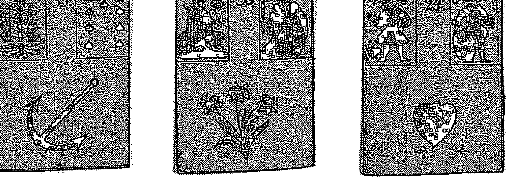

錨和愛心是正面，百合是中性偏好，得到五分高分，總結起來是強烈的「是」。

假如今天小美抽到下面這3張牌：

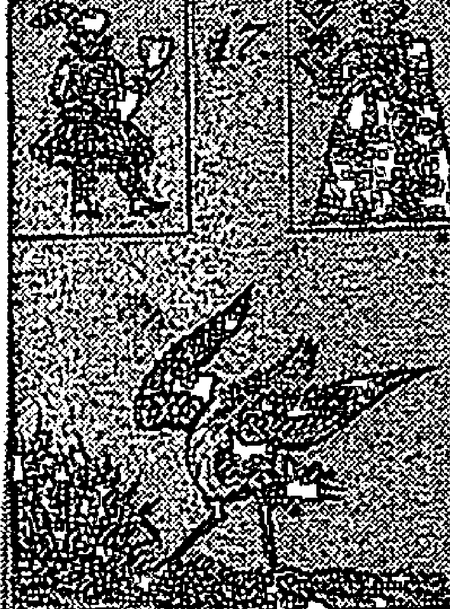

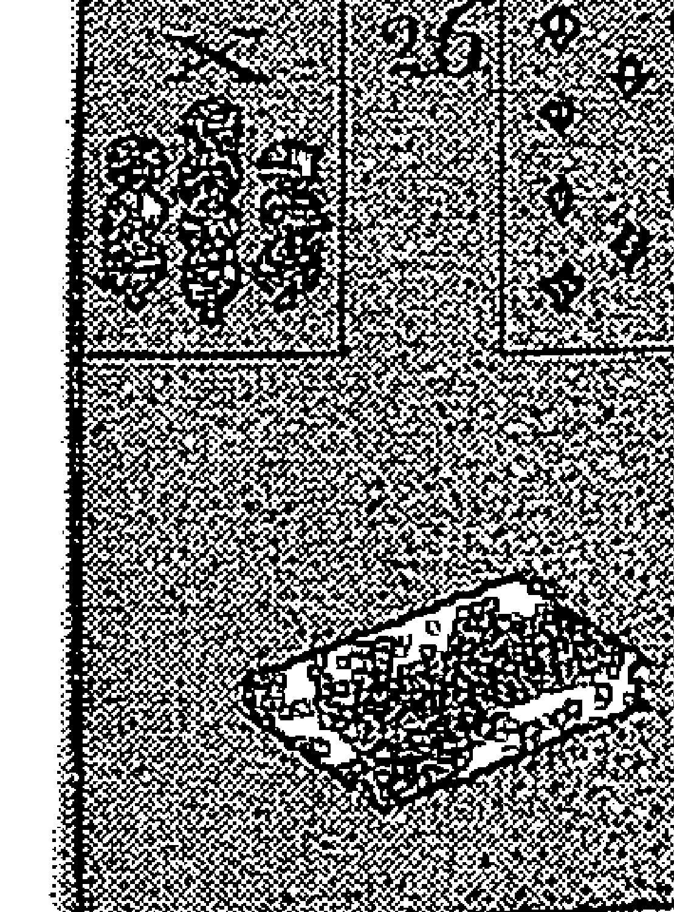

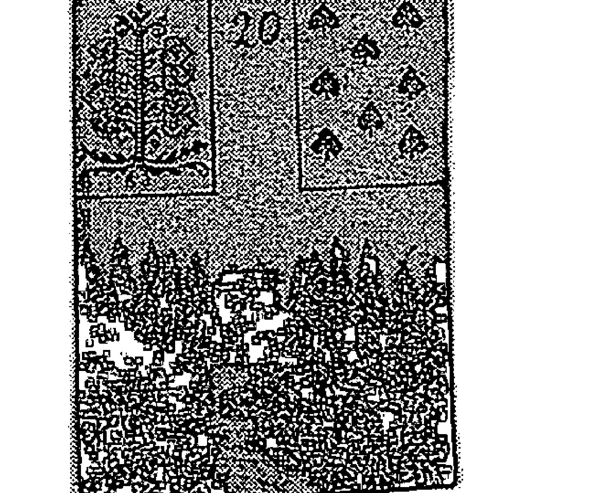

### 鶴鳥＋書本＋花園

鶴鳥和花園是中性偏好，書本是中性偏負面，兩兩相互抵銷後，總和起來得到一分，是中性略偏正面，解答道小美還是可以去，但程度比較微弱。小美在其中感受到的喜悅不會像上一個牌例那麼多。

再假如今天小美是抽到下面這3張牌：

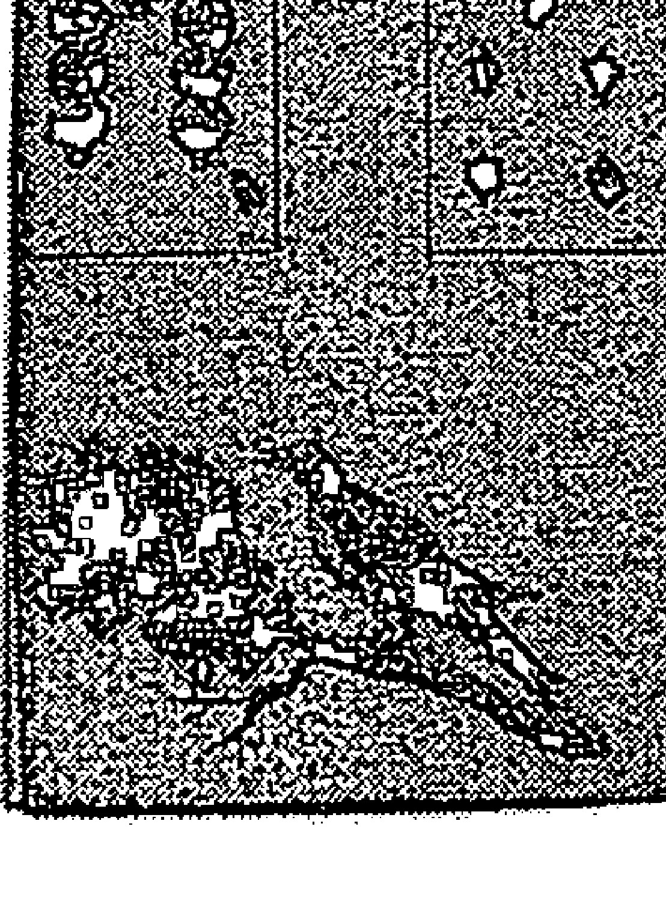

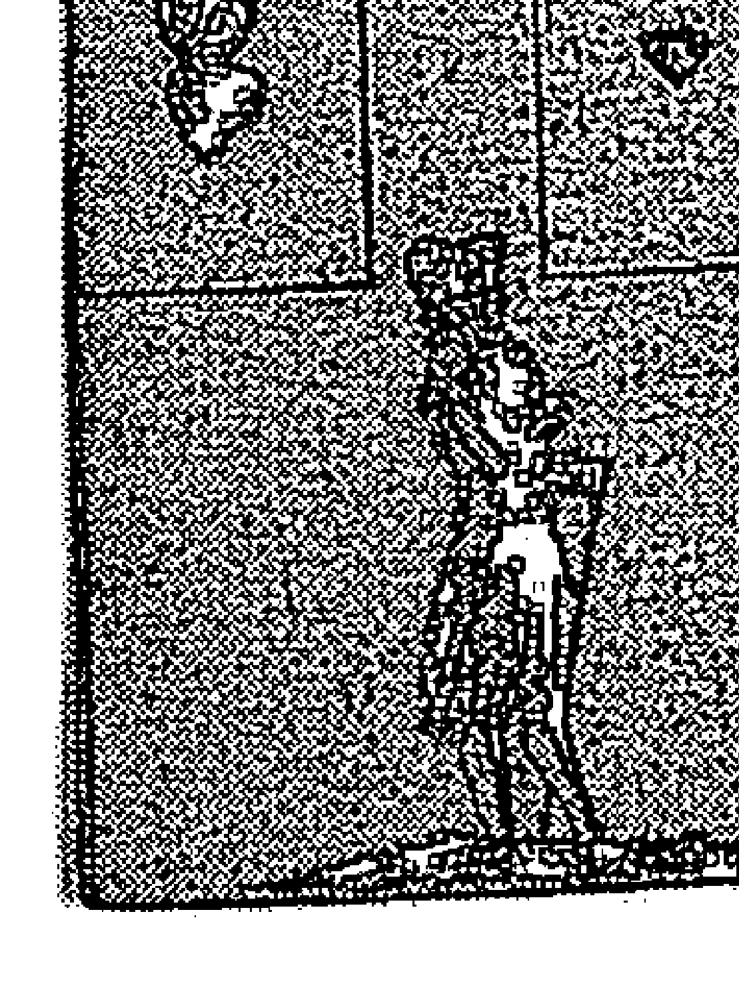

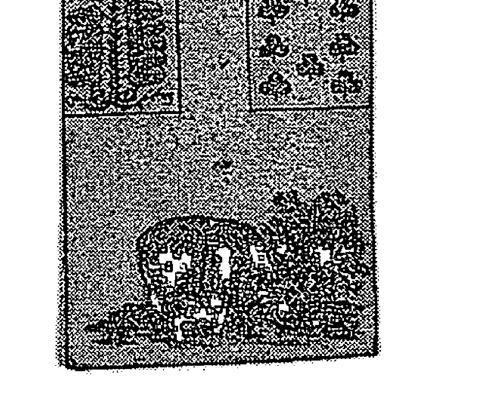

### 鳥＋男人＋熊

鳥是中性偏負面，男人是中性，熊是中性偏好，總和起來之後是零分的中性，答案就是「都可以」。

如果小美想知道更多訊息，可以繼續解牌，鳥可能是談論、口舌，談論什麼？一個男人。什麼樣的男人？熊可能代表有力的男子，不管是體力、權力或財力。小美這天就有可能聽同事八卦那男人的事，這顯然沒有百合和愛心那麼令小美興奮。倘若用鏡射法來解讀更多，鳥的八卦，加上熊的力量之意，顯示八卦力度可能過強了，因此占卜結果建議她去或不去都可以。

## 3. 三張牌線性牌陣：回答選擇題

凡是「我應該選A，還是選B」這種選擇題，無論A或B是人、事或物品，都可以列出兩個線性牌陣來評估何者較佳。

不要想用一個線性牌陣來解答選擇題，解牌時會非常令人困惑。

在占卜選擇題時，因為雷諾曼卡只有36張。為了獲得最精確的結果，建議先抽出3張牌解讀第一個選項，然後重新洗牌，再抽出3張牌看第二個選項。如此兩個選項都能充分得到36張牌的組合做解答。

如果你有兩副同尺寸的牌，就更省事了，只要把這兩副牌洗在一起，就可以一次抽出6張牌來解讀。

我們來看看下面這個實例。

小安問這週末要在家休息，還是去爬山？設定左邊的牌為主題卡，抽到這3張：

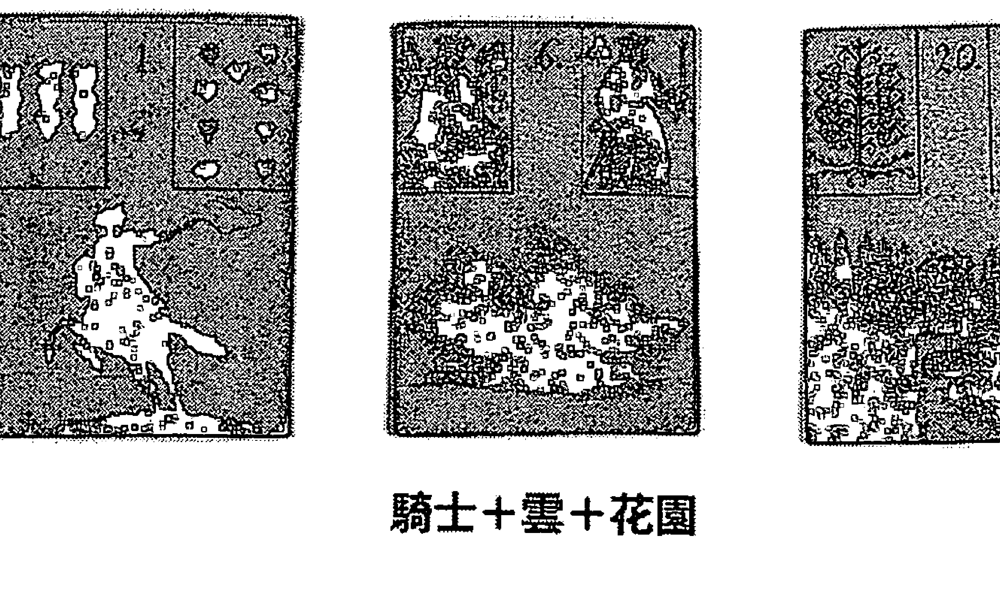

騎士顯示有消息或訪客到來。什麼樣的消息？雲顯示是壞消息，或至少是令人困惑的消息。與什麼有關的壞消息？看來是跟朋友圈（公園）有關。因此我們可以解讀為小安如果在家，會收到跟朋友圈有關的不太好的消息，或是有人來拜訪，告訴他這個消息。

騎士和公園牌鏡射，暗示這個送訊的人本身可能也是朋友圈中的一員。

小安說她們有個姊妹淘的圈子，近來有點不合，很可能跟這件事有關。

再來算算是非的分數，騎士和公園是中性偏好，各得一分，雲是負面牌，扣兩分，總結是零分，建議小安留不留在家都可以。

小安接著抽出下面這3張牌代表去爬山。

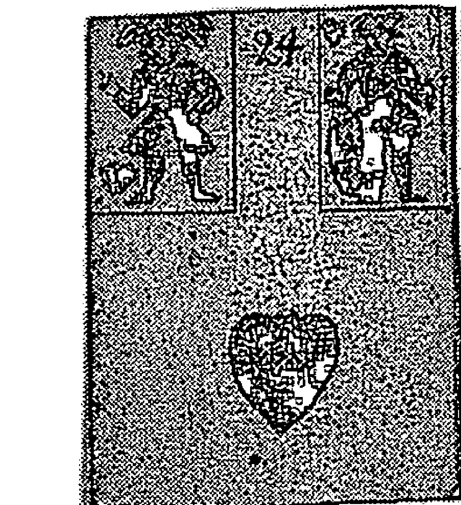

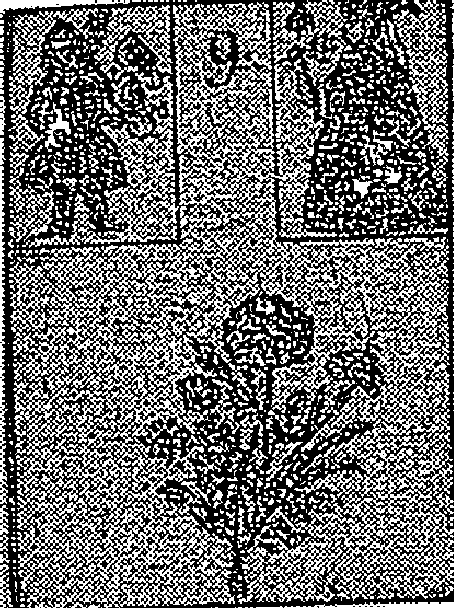

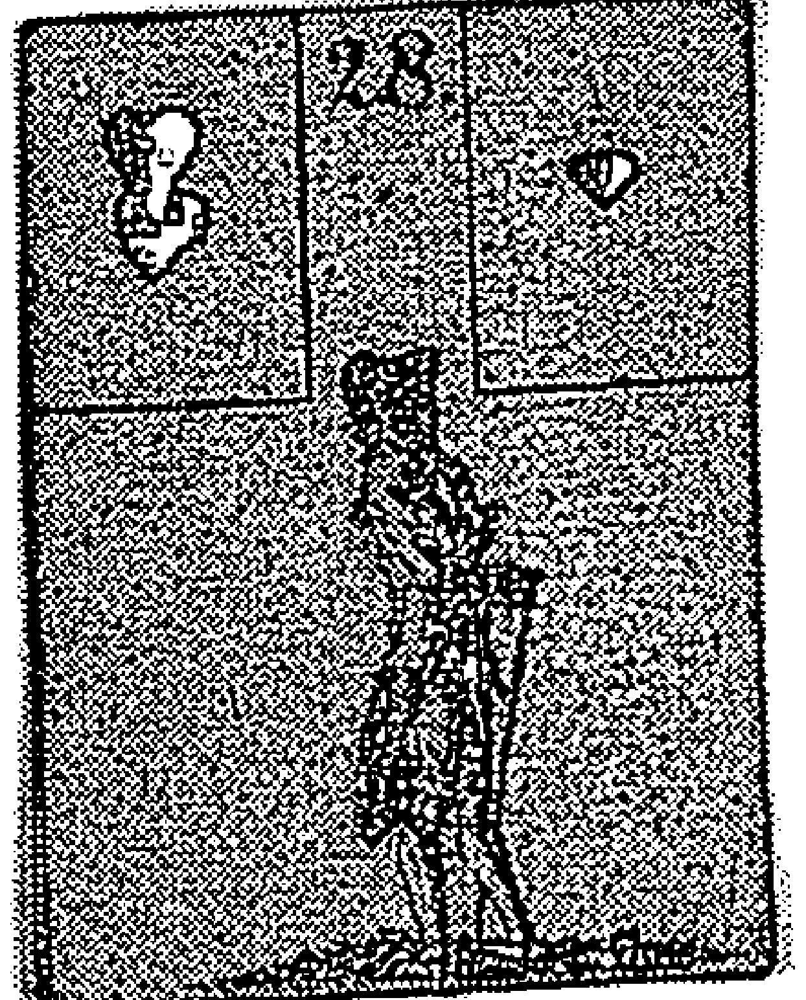

### 愛心+花束+男人

主題卡是愛心，很好的徵象，顯示小安的心情會大好，很有情感交流的意象。請注意在這邊不必一股腦解成陷入熱戀還是找到真命天子，因為小安問的問題是日常小抉擇，在日常小問題中，牌面顯示的訊息會以輕微的形式呈現，而找到真命天子這種事一輩子難得碰到一次，你可以運用概率和常識來判斷解讀的輕重程度。

接下來繼續解讀，小安心情好是為什麼呢？因為花束牌，可能有人會送她東西，或邀約她。什麼樣的贈禮或邀約？來自一個男人的（男人牌）。再鏡射愛心與男人，這男子可能很喜歡小安。

小安表示爬山確實是一個追求者邀她去的。

愛心和花束都是正面牌，各得兩分，男人是中性牌，得零分，總結是四分。對照留在家的零分，顯然小安去爬山是比較好的選擇。

選擇題通常在占卜後，答案就會見分曉。如果恰好遇到同分的情況，那就代表按自己的喜好選擇就行了。

## 4. 三張牌線性牌陣：時間占卜

雷諾曼卡的牌義與時間有明確對應，說它比塔羅牌更適合占卜時間，似乎不為過。許多朋友可能躍躍欲試，想問「某事會在何時發生」這種問題，不過，我還是必須誠實提醒：時間占卜的準確度恐怕比你想像的低。

因為，某事會在何時發生，受個人意志影響巨大，就算你說：「可是我沒有做出任何改變。」然而，僅僅是心念想法的轉變，都能造就不同。

所以，雷諾曼卡可以比較準確的預測此事是否會發生，但是發生的時間永遠有相當程度的可變性。問卜者的行動與想法，都會影響發生的時間，越遠的越難預測。這是在做時間預測之前，必須先瞭解的前提。

還有第二個前提是，在進行時間占卜之前，需要確認此事照目前情況進行下去確實會發生，畢竟我們不能問一件不會發生的事何時會發生吧？為了確認此事是否會發生，你可以先做一場獨立占卜來預測。

滿足了以上兩項前提後，才來進行時間占卜。

雷諾曼的時間占卜，雖然可以很粗暴的問：「幾天／週／月會發生。」然後抽牌看編號，抽到幾號牌就說是幾天／週／月，不過此法過於武斷，忽略了時間永遠是在改變中，所以槓龜機率很高。我建議採取的方式有以下兩種：

### 第一，抽單張牌看大致趨勢。

只抽1張牌，簡單的看快慢或大時間段，例如，抽到鐮刀就是秋天或很快，抽到樹牌就是很慢，抽到太陽就是夏天或白天等。這個方法的好處是容許時間的彈性，讓我們知道一個大略的進程，但是不說死一個時間點。這可能也較符合自由意志與宇宙運行的方式。

### 第二，用三張牌牌陣做是或否的預測。

這同樣是問何時發生，但是把問題轉換為：「這件事是否會在某時發生？」然後依上節的流程，做是或否的預測。此法雖然可能要多做幾次才能獲得確認，但是同樣容許彈性，且可有程度之分，你可以得到強烈的是、輕微的是、強烈的否、輕微的否，以及不置可否的答案。

這些強弱區別，多少反映了問卜者的意願強烈程度，及事態可扭轉的程度。舉例來說，如果一個人非常想要考上公職，他全神貫注，充足準備，而且明天就要考了，此時他就像一輛在終點線前一尺的高速賽車，要他不撞向終點都難，這時他卜到的就會是強烈的是。

反之，如果他對此心存猶豫，或是兩年後才會考，他現在才剛開始準備，那麼他卜到的可能就是弱是、弱否或不置可否了。

用三張牌牌陣問時間，原則上不建議卜超過一年的事，若能限縮在半年內更好。

## 5. 三張牌線性牌陣：尋找失物

雷諾曼卡是特別適合用來尋找失物的占卜法。當失物不是落在太廣大的地點時，可以簡單用三張牌線性牌陣處理，只不過對這3張牌的定義稍有不同，這次要把越左邊的牌認知成大地點，越右邊的牌認知成小地點。例如，假設你知道東西一定掉在家裡時，左邊的牌可能告訴你掉在哪個房間，右邊的牌則透露細部的位置。

依著這個原則，我們來看一個實際牌例。

我在找一份文件，抽到以下3张牌：

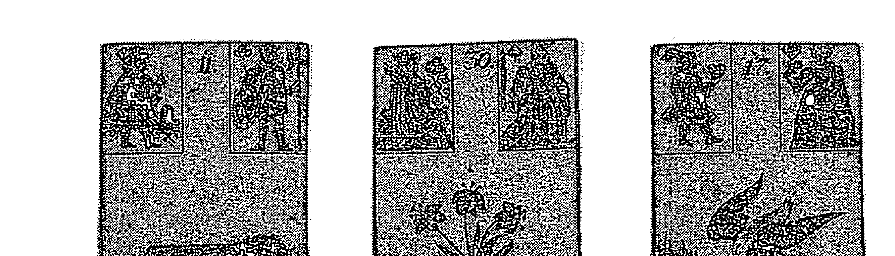

### 鞭子+百合+鹳鸟

鞭子告诉我，在写作的地方，于是我走进了书房。

百合，可能是说某种老东西，或者跟花有关的东西，要不就是白色的东西。我书房里除了白纸之外，没什么醒目的白色物件，但是我有老照片，也有花精，此时我还不太确定是指哪件。

鹳鸟，指在高处。

这下我知道是指什么了。我往书架高处的老照片旁翻找，找到了那份文件。

我们接下来再看第二个牌例：朋友陈先生的女儿的课本不见了，急得如热锅蚂蚁，于是我为他们迅速占卜一下。

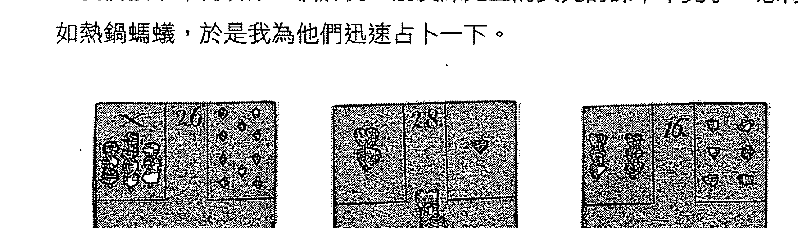

### 书+男人+星星

書，就是指遺失的課本，這張牌給了一個確認。

男人，在這裡就是指陳先生。非常有趣的是，我用的這副牌，男人牌裡的男人是畫成看著望遠鏡如在找尋的樣子，而那望遠鏡正好指著旁邊的星星牌。雖然雷諾曼卡的牌圖不影響占卜意義，不過我還是感覺這是一個徵兆，彷彿想透露什麼重要訊息。

星星，牌義比較分歧，我首先想到他家可上網的電腦附近，也可能是高處，要不就是指一點一點亮晶晶的物品。在瞭解他家的佈置之後，我們排除掉一些選項，剩下上網區跟女兒擁有的眾多亮晶晶物品較有可能。因為跟前面的男人牌搭配，我相信這是跟陳先生很有關的地方。

過10分鐘後，陳先生回報，他們在女兒的書包裡找到了課本，那個書本上面正有許多亮晶晶的雪花點點，課本跟其他書貼在一起。令人驚奇的是，在尋找之初，陳先生就不斷跟女兒說：「去書包裡找一找、去書包裡找一找！」誰想得到女兒找了N次，都沒發現到。

這下我懂那張男人牌用望遠鏡看向星星是什麼意思了。

以上就是3張牌如何幫助我們找到失物，雷諾曼卡在這方面真的很神奇，訊息有時直白得驚人。

用雷諾曼卡占卜失物時，3張牌通常足可應付失落在特定室內空間的情形，而如果是範圍更廣的尋找，如旅途中不曉得是掉在哪個城市了，同樣可以採用線性牌陣，視遺失複雜程度將牌數增加到5張、7張甚至9張，同樣依左邊代表大地點、右邊代表小地點的原則解讀。

## 6. 五張牌線性牌陣

五張牌線性牌陣同樣是用來解答簡單問題，但是能比3張牌提供更多一點訊息。

線性牌陣來到5張以上，幾乎所有占卜師都會選用中間這張牌作為主題，主要因為視覺上中間這張牌能提供一個中央核心的焦點。

主題卡同樣可以用預選的，也可以用抽取的方式讓牌陣自由帶出。

若用預選的方式，實際上只有4張牌需要解讀，如下圖所示，3是主題卡，我們就只需要解讀1＋2和4＋5。若還要更多訊息，就鏡射1＋5和2＋4。

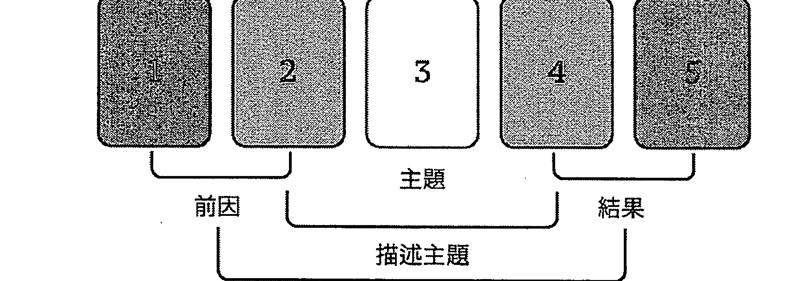

其中1＋2說明前因，4＋5是可能的結果，2＋4可描述主題卡，1＋5作為結論。

若主題卡是用抽取的，就要先解讀主題卡的意義，這代表此事的核心。接下來解讀1＋2、2＋3、3＋4、4＋5，再鏡射2＋4、1＋5。你還可以把5張牌從1＋2＋3＋4＋5像說故事一樣順著展開。此法可汲取更多訊息，相對需要多一點時間解讀。

我們來看實際案例：

小張想詢問下個月去應徵某公司的結果，抽到這5張牌。主題卡用抽取的方式得出。

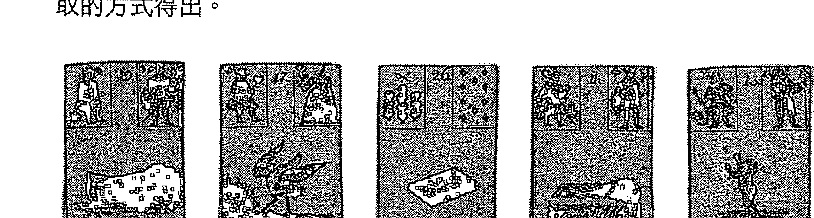

### 鐮刀＋鶴鳥＋書本＋鞭子＋孩童

書本是主題卡，顯示這跟小張的專業知識大有關係，我大膽推測小張的專業知識夠不夠，是他能否應徵得上的關鍵。

接下來解讀鐮刀與鸛鳥，這場面試會很嚴酷而犀利（鐮刀），想篩選出精益求精者（鸛鳥）。在哪方面精益求精？書本告訴我們，是要在專業知識精益求精。書本加鞭子，有了鞭子的重複與辯論之意，很可能主考官會在專業方面對小張反覆詰問。最後一組是鞭子加小孩，看樣子小張的專業是不足的，小孩顯示小張在主考官眼中恐怕還是太嫩了。

繼續做鏡射，鸛鳥加鞭子，顯示精益求精這件事不能停啊，要持續的進行。鐮刀加小孩，顯示小張可能會受到一些傷害。

5張牌合在一起，形成這個故事：面試很犀利（鐮刀），為了篩選出精益求精的面試者（鸛鳥），會在專業知識方面（書本）反覆提問（鞭子），最終小張可能顯得經驗不足（小孩）。

因為小張距離應徵還有一個月的時間，因此建議小張要趕快把握最後時間，多增進專業，好讓自己增加錄取的機率。

## 7. 七張牌線性牌陣

七張牌線性牌陣是用來回答有一點複雜度的問題，可以汲取出比5張牌牌陣更多的訊息。

解讀方式比照5張牌，一樣可以選擇主題卡要用預選的，還是抽取的。解牌步驟也與5張牌的模式相同，只是這次我們會得到比5張牌更多的雙卡組合可以解讀。

解讀時，從左至右，會形成一個大致依循時間線的故事。左邊的牌比較在敘述過去、影響力會漸弱的事，右邊比較在說明未來、影響力會漸強。但這是一條寬鬆的時間線，並不是問題期限設定多久，預測的事就一定會按照期限平均分配的發生。事實上，我們尚無法精確得知何時會發生。大部分的占卜師發現，雷諾曼卡預測的事情通常很快就會發生，即使你問兩個月，預測的事可能不到三四週就發生完畢了。

### 我們來看以下真實案例：

小君問，她的服飾店事業在未來兩個月內發展如何？我們用抽取的方式得出主題卡，獲得下面這7張。

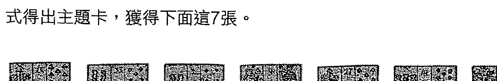

### 熊＋鑰匙＋幸運草＋花束＋信件＋狗＋戒指

先翻開中間的主題卡，是花束牌，美麗而令人愉悅的象徵，跟小君賣美美衣服的服飾業，有對應到。

接下來將牌從左到右、兩兩一組來解讀。

熊＋鑰匙：熊可以指情況，也可以指人。因為小君本身已經是老闆，沒有其他有力人士與此事有關，所以解釋為情況，熊代表力量，鑰匙代表關鍵，故小君握有經營服飾店的關鍵能力，資金或資源可能也很夠。

鑰匙＋幸運草：因為這個關鍵，讓小君能獲得幸運，經營得還算輕鬆。這是小君幸運的關鍵。

幸運草＋花束：2張好牌的結合，顯示這是令人心滿意足、大感幸福的幸運。

花束＋信件：花束代表邀約或贈禮，加上信件，顯示可能有邀請函會送達。

信件＋狗：邀請函是忠實的朋友發出的。

狗＋戒指：還記得戒指在人物牌右邊，代表即將與這對象訂約嗎？這個邀請函可能會帶來合作的可能，讓小君與朋友做好某種約定。

因為想知道是什麼約定，我進一步找到戒指的鏡射牌，是熊，因此推測是關於資產或資源方面的約定。

繼續鏡射狗和鑰匙，顯示這位朋友對小君的成功也挺關鍵的。鏡射信件與幸運草，再度確認這是帶來幸運的邀請函。

所以我們總結，小君其實已握有成功經營能力和資金，她會經營得很快樂且幸運，不久後她會收到來自朋友的邀請，帶來資源方面合作的可能。小君後來回報，她回去之後一週，就接到朋友的邀請了。

## 8. 七張牌線性牌陣：預測人物特性

雷諾曼卡每張都可以描述人物的內在性格與外在容貌。7張牌的線性牌陣，正好適合用來做這方面的預測。

占卜方法是：預選1張指示牌放中間，設定左邊3張牌是描述性格，右邊3張牌是描述外表。不需要做鏡射解讀。

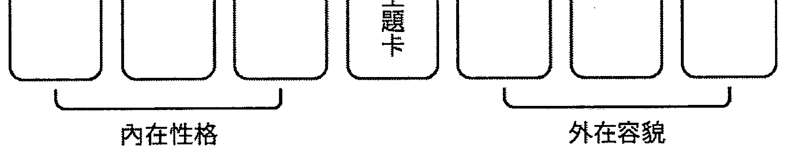

需提醒的是，當你可以就正常管道瞭解人物特性時，就不要做這個占卜。這是為了保持心態的純淨。如果明明打通電話就可以知道的事，偏偏要測試牌卡準不準，這樣的心態不易獲得準確的結果。唯有在無法就正常管道獲知，這件事又確實有重要性時，我們才抱著真誠想祈求答案的心態，進行占卜。

下面這個案例，是俊男詢問今天他要相親的這個對象，有什麼樣的特性？因為要介紹他這個對象的朋友，不肯提前透露女方的資訊，俊男又不希望雙方不合適的情況下見了面，浪費彼此時間，造成彼此困擾。

因為俊男是直男，我們選女人牌作為指示牌，抽到下面這些牌：

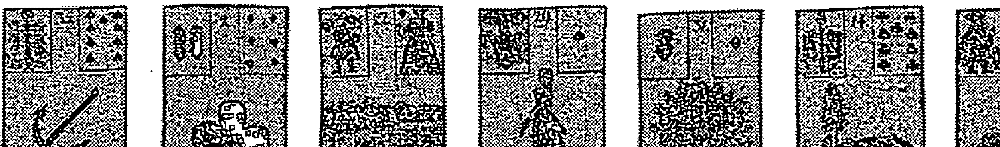

### 錨+幸運草+十字路口+女人+太陽+狐狸+鞭子

錨+幸運草+迷宮：描述這位女性的個性。錨與幸運草是鮮明的對比，錨說明她是個正直、堅持、有毅力的女性，幸運草顯示她幽默、輕鬆或隨和的一面，兩者結合之後，我看到一個外和內剛的女子。十字路口顯示她目前暫時還不打算定下來。

太陽+狐狸+鞭子：描述她的外貌。她可能膚色晒得很健康（太陽）、中等身高（狐狸）、身材有鍛鍊（鞭子）。

解讀時要知道的是，雖然每張牌的性格和個性描述，都可能有多種方向的解讀，但是解讀時不必把所有描述都納入，只需要取第一直覺跳出來的感應就可以了。上面關於太陽+狐狸+鞭子，是我在占卜當下的第一直覺，假如我把所有可能的描述都納入，就會解作這個女人膚色晒得很健康、有雀斑、中等身高、眼尾向上有點邪邪壞壞的感覺、染紅褐色頭髮、身材有鍛鍊、有性感魅力……這樣的預測成立的機率有多高？連雷諾曼女士復活都做不到了吧。這本書讀到現在你應該已知道，雷諾曼卡單張牌的解讀可能性很多，還是需搭配情境與直覺，把解讀限縮到最精簡的範圍。

在這個案例中，我們如實告訴俊男占卜結果。要不要跟對方相見，就交由俊男自己決定了。

在做人物特性解讀時，還有一個觀念非常重要：不要因為占卜結果，而對一個人存有先入為主的評判。

每個人都是極盡複雜、獨一無二的個體。雷諾曼卡只能看出一個表面特徵，如果因此對一個人心存偏見，想著：「牌卡說他是怎樣怎樣，他一定就是那樣。」那就障礙了你與他的認識與交流。

為了深入說明這一點，我想分享我的真實故事。有天我認識一個業務員，回家之後，我極簡的抽了2張牌來瞭解他，抽到鶴鳥與狐狸。

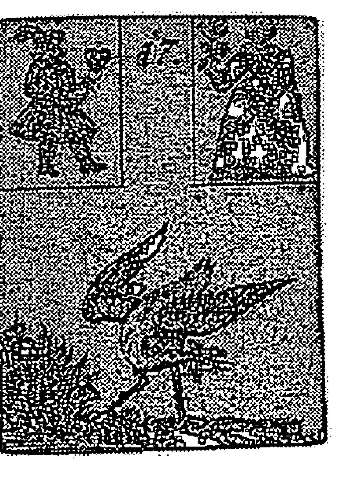

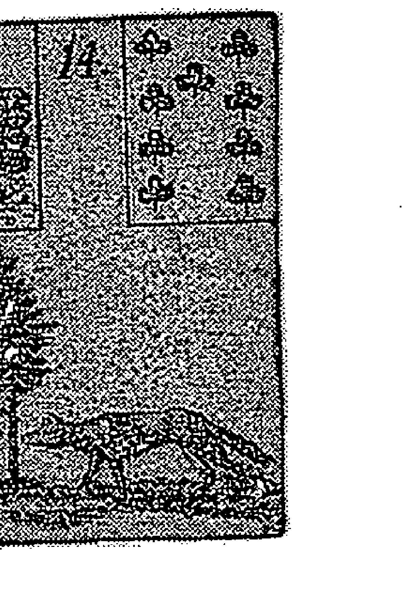

### 鶴鳥 + 狐狸

鶴鳥顯示這個人在專業上是追求進步的，但狐狸令我心生警戒，這是欺騙的警訊。

因為這樣，後續的洽談，我對他提出的條件十分存疑。我特地去詢問其他跟這間公司有交易的朋友，瞭解到他開給我的條件的確比較差，其他顧客都有獲得贈品，只有我沒有。再加上他明明跟我說公司宣布優惠只到這個月截止，但我下個月再詢價時，他又說優惠還有，這可不是騙我嗎？我當下就覺得果然印證了狐狸的預測。

於是我遲遲不肯同意購買，雙方洽談得有點僵。

表面上看來，雷諾曼卡的預測是應驗了。幸好我明白，不能斷章取義去評斷一個人。這段時間接觸之下，直覺還是告訴我，他有真誠與善良的地方，會不會是有些更深層的地方，雷諾曼卡沒有顯示出來？

於是我透過關係去詢問到其他業務，這才知道，其實那些贈品，都是業務為了促進成交，自掏腰包送給客人的，那位業務只是家境有困難，沒有自掏腰包送我贈品，這不能算是他有心欺騙，頂多只能算是他用聰明一點的狐狸方法，為自己求得最佳的謀生之道。而優惠截止期限一事，是公司方食言延長優惠，所有業務員只是按公司的公告行事，業務們對公司的出爾反爾也頗有怨言，覺得自己被公司擺了一道呢。

瞭解這些之後，我對他表面上呈現的狐狸貌，徹底釋懷了。後來，他獲得我的訂單之後，出乎意料的主動用許多其他方式回饋我，我們日後的相處頗為和睦。我很慶幸自己沒有因為狐狸的預測，而失去一個值得結交的朋友。

這個經驗，是我認為所有用雷諾曼占卜人物特性的朋友，都值得深思的。

以上的雷諾曼卡預測人物特性法，也可以用來預測寵物特性，只要在解讀時，把對人物的描述轉化為該種寵物適用的描述即可。以剛才的案例為例，倘若俊男問的是朋友想送他的狗有何特性？可以這麼解讀：

- 鑰+幸運草+十字路口：這隻狗專注固執、有毅力（鑰），雖然剛接觸時可能以為牠很隨和（幸運草）。牠喜歡在路上到處遊蕩（十字路口）。
- 太陽+狐貍+鞭子：這隻狗的外觀可能有斑點（太陽，把原本的雀斑轉化為斑點），毛色是紅褐色（狐貍），體格精實（鞭子）。

你如果問我，為什麼不解成毛色黝黑（太陽）、體型中等（狐貍）？那就代表你前面沒看清楚——這是占卜師當下的直覺所決定的。

假如直覺對你來說太抽象，還有一個變通的方法，你可以將每個位置限定到更小的範圍，譬如內在性格第1張代表第一印象，第2張代表優點，第3張代表缺點。外貌第1張代表臉蛋，第2張代表頭髮，第3張代表身材。解讀時只要依據設定的部位，去選取對應的牌義即可。

## 9. 九張牌線性牌陣

九張牌線性牌陣已經可以處理中等以上複雜度的問題，可能要預留20～30分鐘解讀。多牌卡組合。因為牌數夠多，有些占卜師會斟酌融合大藍圖牌陣的遠近解讀法，以牌卡距離人物指示牌的遠近，來獲取更多訊息。 所謂近或遠的定義，直接位於隔壁是非常近，中間隔1張牌是近，隔2張牌就不近不遠，隔3張牌是遠，隔4張牌以上是非常遠。舉個實例說明，假設指示牌出現在第三個位置，那麼遠近分布如下圖。

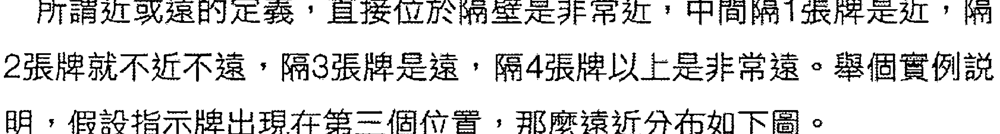

接下來這個真實案例，是小麗詢問未來六週她與心儀的男性的發展。 抽到下面這9張牌：

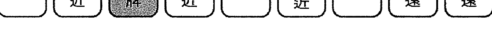

太陽＋山＋書本＋星星＋愛心＋十字路口＋塔＋蛇＋雲

雖然沒有預選主題卡，愛心自己跑出來當主題卡，確認這是關於愛的問題。不過整個牌陣並沒有出現女人和男人的指示牌，所以我們不太能運用遠近解讀法來獲取更多訊息，這不要緊。有一張蛇牌倒是有可能代表第二個女性，也可能代表誘惑、惡意或欺騙，這點我們稍後可進一步確認。

接下來從左到右解讀過去。

- **太陽＋山**：小麗在這段感情有取得一些成功（太陽），但現在遇到了阻礙（山）。
- **山＋書本**：阻礙來自有隱藏、未知的資訊，小麗還未得知，她可能覺得對方神神秘秘的。另一方面，書本牌也可能指小麗對對方可能也有所保留，這點我們稍後可以再確認。

書本+星星：星星顯示嚮往，小麗對此人有近似崇拜般的感情。我用的這副牌比較特殊，書本牌畫了個開口在左邊，所以書本左邊的牌代表已知資訊，右邊代表仍被隱藏的資訊，顯示小麗還沒有把這份情愫（星星）表露出去，這確認到了小麗對對方確實有所保留。另外還有個額外資訊是小麗主動提供的：小麗受到他吸引是因為對方很有知識（書本），牌面上可以從書本+星星+愛心發現這個端倪，這是因知識而造成仰慕，近而產生的愛情。小麗也承認不只是自己對對方有所保留，對方在她面前也很不透明，這正是近來小麗對這份感情產生動搖的原因。

愛心+十字路口：這段感情現在面臨了動搖，需要做抉擇。由於愛心牌是中央主題卡，愛心以左是過去或影響力漸弱的事，現在解讀到右邊，是進入預測未來的階段了。

十字路口+塔：十字路口是抉擇，塔是孤立，顯示小麗確定好自己的心意之後，雙方可能會彼此退縮孤立，與對方保持距離。

塔+蛇：蛇是牌陣中最值得玩味的一點。我想確認這條蛇究竟代表人還是事，從兩旁的塔牌和雲牌推敲，如果蛇是代表男方的女伴，塔顯示兩人的關係已趨於公事公辦、形式化的模式，最後一張雲顯示這女人會導致小麗與男方的關係陷入迷惘。蛇鏡射山，山可以代表障礙，也可以代表敵人，現在我認為蛇可能是同時代表女人與阻礙。這男人已經有女人了，當然也構成小麗感情上的阻礙，兩者並不衝突。

蛇+雲：由於這女人阻礙的存在，小麗與男子恐無法有好結果，形成曖昧不明的關係。

接下來進行鏡射，看能不能獲得更多訊息。

太陽+雲：原本的好運被烏雲遮蔽。

山+蛇：剛才已經鏡射過，有個女子形成阻礙，在這裡蛇也顯示出事態的複雜化。

書本+塔：一個隱藏，一個孤立，加強了雙方對彼此的保留。這個組合也暗示男子可能對小麗隱藏（書）自己在法律層面（塔）的事——蛇所代表的女人搞不好是他的妻子。

### **星星＋十字路口：**這份崇拜的感情，現在開始面臨動搖、分歧。

你會發現，鏡射多半只是增強、重複或再確認先前已經知道的訊息。

不做鏡射，還是可以做出準確的解讀。

如果你想納入遠近解讀法，通常是要尋找代表小麗的指示牌，也就是女人牌，然後去比對好牌壞牌與小麗的距離關係，不過，在這個牌例中，女人牌沒有出現，但是我們還是可以用主題卡愛心牌來作為小麗的愛情，來進行遠近解讀法。所幸，小麗的愛情是被星星和十字路口夾住，代表她只不過感覺到這份仰慕面臨抉擇。真正的問題牌——山、蛇和雲——離小麗都不近，因此小麗不至於受到太嚴重的傷害。

後來小麗確認這男子是已婚身分。小麗與男子雖未絕交，不過相處上有說不出的尷尬，就像雲那種曖昧模糊的局面。

## 十字牌陣

十字牌陣是排成十字形的5張牌牌陣。因為排列方式是立體而非線性，可以為每個位置設定解讀意義，幫助我們看見事件的不同層次。

在我為撰寫此書所研讀的英文資料中，十字牌陣版本眾多，解法也有所出入，我幾乎找不到兩個一樣的。以下提供的版本，是我整合為自己覺得最好理解，也最好用的，當然日後你可以做自己的變化。

十字牌陣通常是用來精簡扼要的瞭解某人的狀況，或某件事的情況。中央那張牌是核心，可以放指示牌算人物狀況，也可以放主題卡算事件的情況。

如果是算人物，建議只算自己或問卜者本人，不要算別人的。雖然前文已說明過，不過還是值得再強調一次。

十字牌陣排法如下：

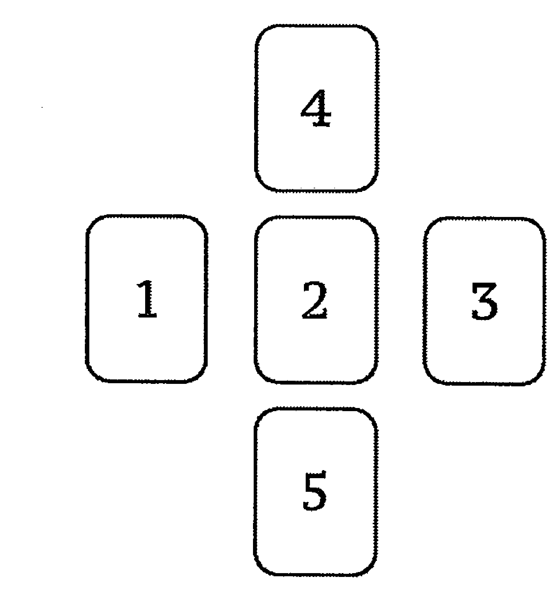

### 5張牌分別代表的意義如下：

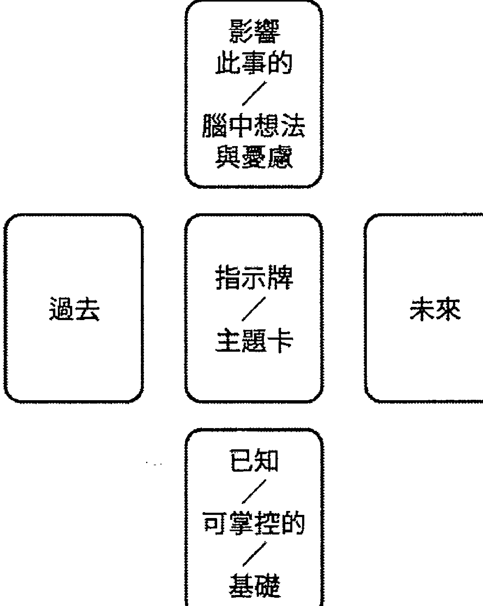

指示牌或主題卡同樣可以預先決定，也可以用隨機抽取獲得。前者解讀比較簡單，適合初學練習，後者可獲取更多訊息，適合稍有經驗者。雖然牌陣每一個位置都有單獨的意義，解讀時還是需要與鄰近的牌合併解讀，流程如下：

1. 先解讀最核心的3張牌組合：
   - 1+2+3：事情的線性發展
   - 4+2+5：事情的癥結

2. 解讀雙卡組合看細節：
   - 1+2：過去
   - 2+3：未來
   - 4+2：影響此事的
   - 2+5：已知或在掌控中的

### 3.進一步釐清細節（選擇性）：

如果還有不清楚的地方，可解讀1+4+3和1+5+3進一步瞭解事情的線性發展趨向。假如還想知道更多，4+1+5和4+3+5提供更額外的訊息。

我們來看下面這個案例。

小蔡跟媽媽起了衝突，媽媽已經氣到完全不聯絡了，小蔡想知道事情在近期會如何發展。我設定主題卡用抽取的，獲得下面這些牌：

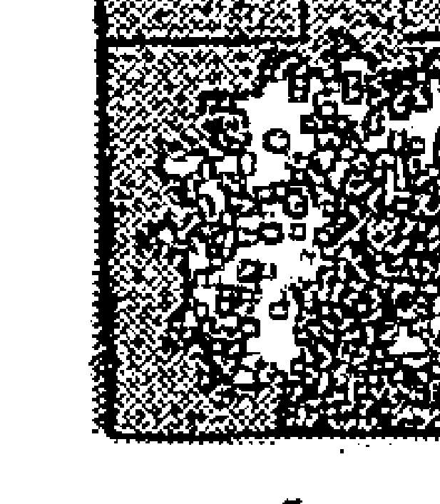

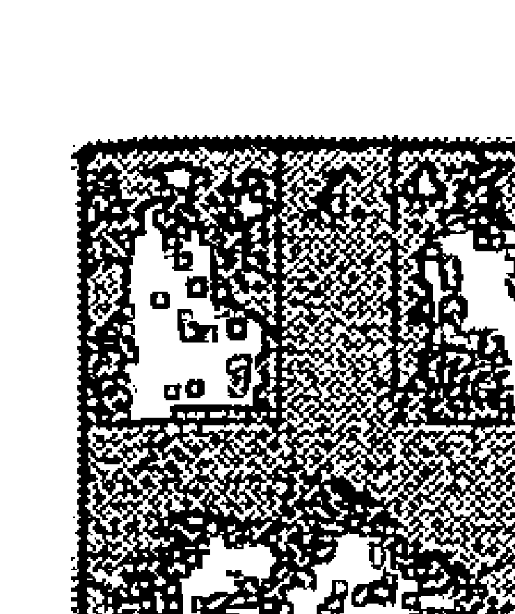

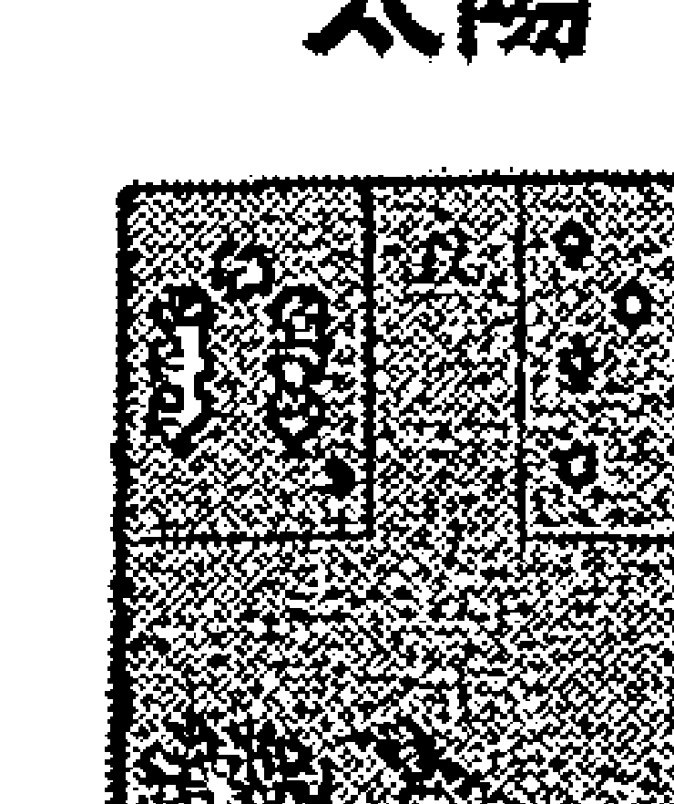

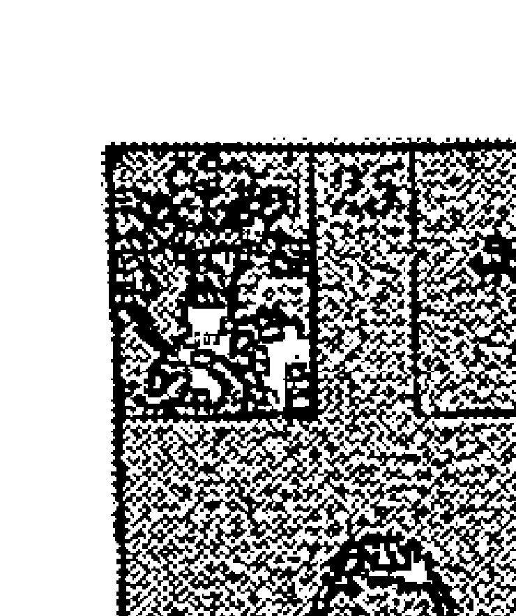

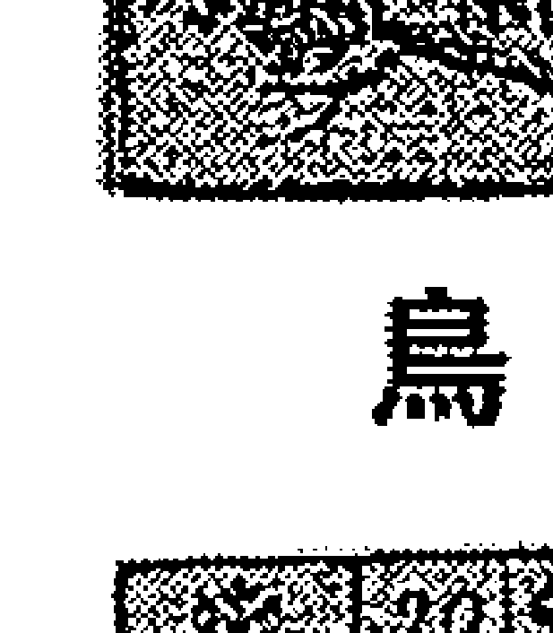

主題卡是鳥，跟口語溝通有關，也有謠言的可能，鳥甚至可能代表兄弟姐妹。小蔡表示確實是因為姊妹來跟他訴苦媽媽的不是，小蔡代姊妹出頭，才惹怒媽媽。他抽到的主題卡實在傳神，鳥既是姊妹，也代表溝通，第一步就好準。

接著我們依序解讀：

- 雲＋鳥：過去有與姊妹和溝通相關的麻煩。
- 鳥＋戒指：溝通之後將會達成某種約定（戒指）。
- 太陽＋鳥：影響此事的牌是太陽，非常正向，解讀為小蔡的心態仍然正向樂觀，願意積極處理此事。
- 鳥＋花園：這個位置代表已知或掌握中的事情，花園顯示這個事件波及更多人，但仍在掌握之中。在這個案例中，小蔡表示這件事原本是家事，現在已經鬧到公司去了，所幸所有人對此都還算寬容。
- 雲＋鳥＋戒指：事情的線性發展趨向會是，這場麻煩（雲）在經過溝通（鳥）之後，將達成共識（戒指）。
- 太陽＋鳥＋公園：事情的癥結是小蔡想用積極而大刀闊斧的方式（太陽）代姊妹與媽媽溝通（鳥），卻把事情鬧大了（公園）。

這邊的3張牌解讀方法，不見得會緊依我們在3張牌線性牌陣中講解的方式。在這裡你可以擷取主要牌義，流暢的串成一句話，形成一個故事。

接下來綜觀全局，因為未來的牌是戒指，太陽的正向能量影響全局，最糟的雲已經過去，而花園代表的公眾又可掌控，顯示不久之後小蔡與媽媽應能達成共識，和平相處。

接下來我們看看3張牌解讀能不能給出更多訊息：

- 雲＋太陽＋戒指：這場麻煩（雲）將有幸運的解決（太陽），雙方達成共識（戒指）。
- 雲＋公園＋戒指：這場麻煩（雲）鬧到公眾範疇（公園），但大家都能達成共識（戒指）。

這兩條3張牌解讀，因為只有中間那張牌不一樣，訊息開始重複。到這個階段，訊息量已經足夠了，平常我到這程度就不會再解讀下去，因為雷諾曼卡這樣繞來繞去解太細，有時候會兜圈子，不過，現在為了案例研究，我繼續解完：

太陽＋雲＋公園：小蔡想積極處理此事的心意（太陽）惹到麻煩（雲），鬧到公眾（花園）面前去。

太陽＋戒指＋公園：小蔡的積極樂觀（太陽）將促使共識達成（戒指），這共識會是大家都有的（花園）。

確實開始兜圈子了。

這件事後來的發展是，過一陣子，媽媽想通了，不再越界做出會困擾姊妹的事情，大家自然形成了一種雙方都不去踩對方底線的默契。

## 九宮格牌陣

九宮格牌陣可以完整呈現一個事件，比起十字牌陣，更為全面，同時也是進軍36張大藍圖牌陣的基礎。

西洋對這個牌陣的稱呼有「三乘三牌陣」、「肖像牌陣」或「盒子牌陣」。肖像畫指它是跟肖像畫一樣的直幅長方圖，盒子牌陣則是九宮格（Box of Nine）的簡稱。因為華人世界對九宮格最熟悉，所以中文通常譯作九宮格牌陣。

九宮格牌陣解讀需要花一些時間，適合在你想稍微深入的剖析問題時選用。

九宮格牌陣的排列方法如下：

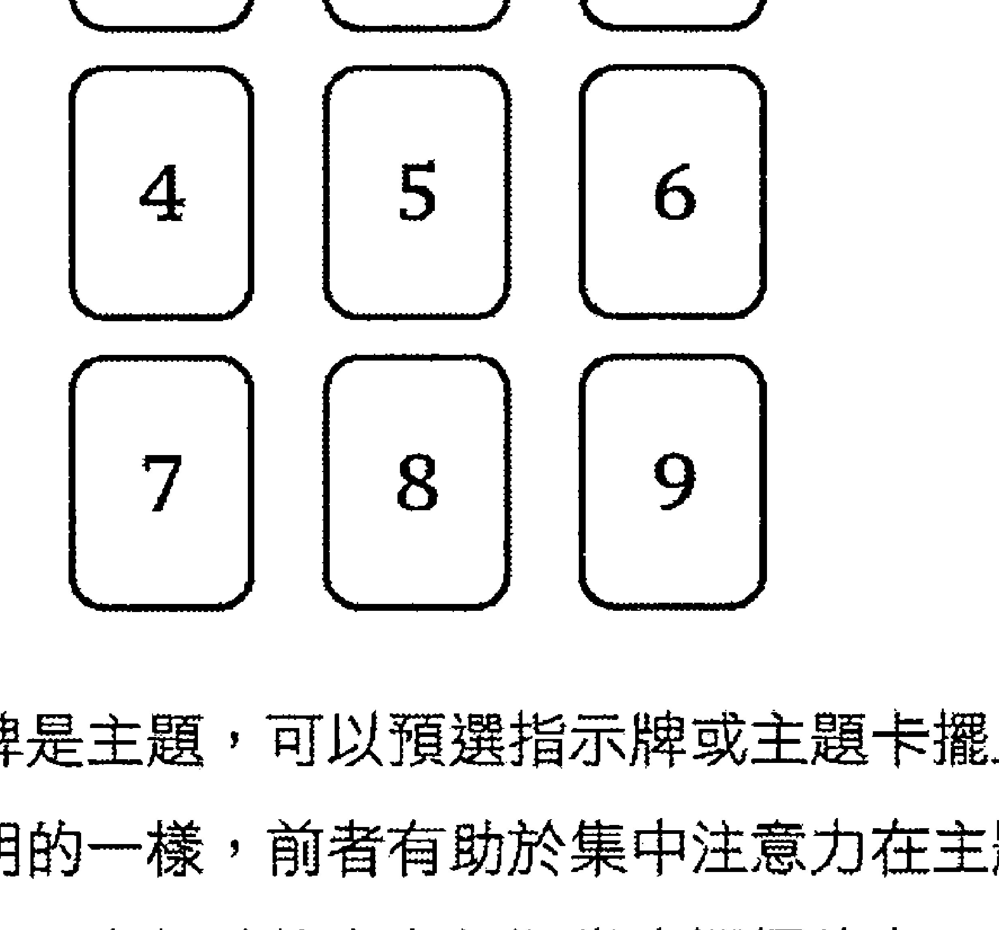

九宮格中央那張牌是主題，可以預選指示牌或主題卡擺上，也可以隨機抽取。與前面說明的一樣，前者有助於集中注意力在主題，且解讀較簡易，適合初學者，而有經驗的占卜師通常會選擇後者。

牌阵的解读方法，每位占卜师之间都有差异，不过占卜师们大致遵循一个宽松的共通解读方法，如下：

### 1.解读主题卡

如果主题卡是抽取的，首先请解读位置5的主题卡，这是整个事件的核心。

### 2.解读四角框架牌

解读1+9和3+7，这四角的牌就像画框的四角，形成事件的框架范围。你可以把它理解为情境或外部环境。如果出现坏牌，可能代表有外部的影响或压力，这有可能是问卜者正在对抗的。框架也有人是顺时针解读1+3+9+7，或按照摆牌的顺序读1+3+7+9，这些方法都可以，随你喜好，解读结果不会有太大差异。

### 3.解读纵轴/过去、现在、未来

1+4+7看过去、2+5+8看现在、3+6+9看未来。左边的影响力会渐弱，右边的会渐强。左边代表问卜者正在离开，甚至是想逃避的，右边代表他正前往的方向。

### 4.解读横轴/上中下

1+2+3是影响这件事的、脑中萦绕的思绪或忧虑。4+5+6是现况。7+8+9是已知或在掌控中的，以及基础。雷诺曼卡的解牌原则是上面的会影响下面的，因此最上层是最有影响力的，最下面的是已在掌控中的。你可以想象成上方的牌是压在头上的，下面的是手下可掌握的，而如果是坏牌出现在下方，代表即使是坏事，问卜者也已经知道且在掌控中，若是好牌，就解为他拥有的基础。

有些流派是把上面解讀成顯意識，下面是潛意識，因此上面是知道的事、下面是未知的事，這樣的解讀結果剛好與上述相反。據我理解，這種解讀法是從塔羅牌借用過來的，會增添一點心理諮商的況味，但並不太符合雷諾曼卡的邏輯，所以我沒有採用。

### 5.解讀X形（選擇性）

解讀1+5+9和3+5+7。其中1是第1張牌，代表故事的開端，5是主題核心，9是最後1張牌，是故事的收尾，1影響5再影響9，所以從1+5+9這個組合可以看出事情發展的趨向。3+5+7則是間接的影響力。

### 6.解讀十字（選擇性）

可以解讀中央十字範圍2+4+5+6+8看直接影響這件事的能量。也有人把這稱為鑽石解讀法，因為這似乎形成了一個菱形。

### 7.鏡射或騎士法（選擇性）

如果對哪張牌有不清楚的地方，可以解讀它的鏡射牌，或做騎士解讀法，以獲取更多訊息。關於騎士解讀法，在大藍圖牌陣中有進一步說明。鏡射與騎士請擇一運用，不要兩者都用。

以上的解讀順序可以依喜好自由調配。只要解到覺得答案夠清楚了，就可以停止，選擇性的部分不一定要做，大多數時候做完步驟1-4已經足夠，做X形或十字解讀經常只是重複或再確認訊息罷了。

|      | 1 | 2 | 3 | 影响此事的脑中想的 |
|------|---|---|---|------------------|
| 直接影响 | 4 | 主题 | 6 | 现况             |
| 框架 | 7 | 8 | 9 | 已知的掌控中的基础 |

### 案例

我帮自己占卜，问我的写作事业在未来八周内的发展。我设定月亮牌作为我的工作主题卡，用抽取的方式获得牌阵的主题卡，抽到下面这些牌。

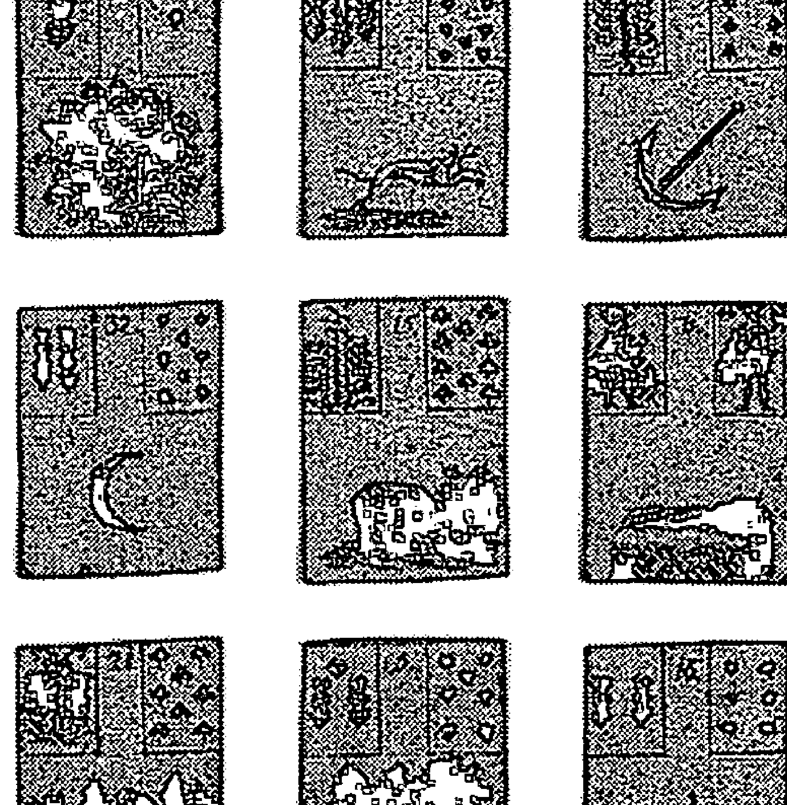

- 太阳
- 狗
- 锚
- 月亮
- 熊
- 鞭子
- 山
- 树
- 星星

### # 1. 解讀主題卡

翻開中央的主題卡，是熊牌，我解為資源，因為我知道自己過去累積的未出版稿量（熊代表的資產）已經夠龐大。熊作為中心主題，可能也暗示此事的關鍵在於力量，我需要拿出一些力量，採取實際作為來推動發展。

### # 2. 綜觀全局

全部開牌後，我建議可以先看全局，指示牌和所問之事的主題卡有沒有出現？好牌壞牌比例多少？在哪些位置？這樣馬上可以獲知整體的狀態。此案例中，我詢問的主題是事業，工作主題卡月亮有出現，還有代表寫作的鞭子，因此答案非常切題。如果在九張牌牌陣中，相關主題卡和指示牌1張都沒出現，代表所問的事不是真正掛心的事，或者雖然問的是這件事，問題的核心其實是另一件事。我抽到的牌陣好牌居多。鞭子平時雖然不算好牌，不過因為此次占卜主題是寫作事業，鞭子本身就代表寫作，因此就沒有負面含義了。唯一算得上負面的是山牌，剛好落在最左下方，是過去、可受掌控的位置，這裡是整個九宮格牌陣影響最弱的位置，所以也無需擔心。這樣一眼掃過去，就知道事情會朝好的方向發展，我接著解下去。

### # 3. 解讀四角框架

太陽＋星星：有想實現理想目標（星星）的熱情（太陽）。錨＋山：錨是定住不動，山是停頓障礙。這完美說明我做這占卜的原因，因為已寫好的稿件遲遲未能出版。四角框架說明了整個情況，我有寫作熱情與想傳遞的理想，卻長期卡住沒出版。

### # 4. 解讀縱軸：過去、現在、未來

太陽＋月亮＋山：過去在寫作事業方面的熱情與成就（太陽＋月亮），遇到了阻礙（山）。

狗＋熊＋樹：現在有盟友（狗）與資源（熊），事情會不快但穩健的發展（樹）。狗牌在這裡可以代表編輯或粉絲，我想了一想，出現了直覺，覺得是編輯（狗）決定拿出力量（熊），推動我的作品的發展（樹）。

錨＋鞭子＋星星：未來堅持（錨）在寫作（鞭子）上，將能往目標邁進（星星）。

### # 5. 解讀橫軸：影響和思緒、現況、已知或掌握中的

太陽＋狗＋錨：我的寫作熱情（太陽）在編輯（狗）的幫助下將能堅持達成目標（錨）。這3張牌位在牌陣上方，是影響這件事最大的能量，很幸運我帶著正向的想法，更棒的是太陽牌位於我的工作指示牌月亮之上，這代表事業受到太陽的庇佑，會有好運的發展。

月亮＋熊＋鞭子：對於寫作事業（月亮）我拿出力量（熊）持續寫作（鞭子）。這正是我現在正在做的事，牌面完美描述現況。鞭子上面的牌是錨，顯示我此次寫作會有錨的毅力來完成。

山＋樹木＋星星：目前已知事業的停頓（山）正緩慢發展（樹），朝目標前進（星星）。確實在做這占卜的前一天，編輯有傳來出版進度往前推進的消息，這是已知且在掌握中的部分。

### # 6. 解讀X形

太陽＋熊＋星星：顯示我的滿腔熱情（太陽）在經過充分發揮（熊）後，將能築夢踏實（星星）。記得這一條是故事的開始、核心與結束，顯示事情的發展趨向，很高興是正向的。

錨＋熊＋山：我長期堅持（錨）所累積的資源（熊）遇到阻礙

### # 7. 解讀十字直接影響

狗＋月亮＋熊＋鞭子＋樹：編輯（狗）在事業方面（月亮）拿出魄力（熊）持續進行（鞭子），使事情緩慢穩健的發展（樹）。畢竟無論我再怎麼努力寫，出版方不動作也是枉然，在這方面是需要仰仗編輯發揮直接影響力無疑，這也是為何代表編輯的牌會出現在牌陣上方了。

你會發現，九宮格牌陣是鉅細靡遺的看一個事件，9張牌以不同排列組合反覆解讀，資訊重複是正常現象。當你覺得已經得到答案，隨時可以停止，不必整套做完。如果解讀過程中覺得資訊太細碎而亂掉，請抓住心裡最直觀的感受就好，把握「看大放小」的原則，緊扣中央主題卡作為核心，應當就不會迷路了。

## 大藍圖牌陣

終於，我們來到雷諾曼聖山的山腳下。現在，你帶著對線性牌陣、十字牌陣和九宮格牌陣認識，可以開始學大藍圖牌陣了。

大藍圖牌陣，原名是法文的Grand Tableau，意思是「大圖」。「藍」這個字是華文翻譯把它加上去的，可能是取人生藍圖之意。你可以叫它大圖，也可以叫大藍圖，當然也可以跟外國人一樣把它簡稱為GT牌陣。

大藍圖就像人生的快照，占卜時可以不必問特定問題，因為它本身就已經把你的人生全景呈現出來了。這種不問問題的占卜，你可以把它理解為流年批運的概念，用來占算主要運勢。

如果有特定想知道的事，一樣可以用大藍圖解答，只要事先設定好此事相關的指示牌和主題卡，然後只解讀跟這些牌有關的部分就好。

因為36張全部排出來，有隆重的儀式感，還得花格外多時間解讀，所以大藍圖牌陣通常是看長期，時間範圍建議設在一至六個月，至少不要短過三星期，至多不要長過一年，而且就算問卜時是問一年，牌面預測的事多半也會在集中在幾個月內發生完畢。這是因為我們的每個心念與決定，都會影響到未來人生的展開，所以占卜術都是預測近的容易，預測越遠的越難。以雷諾曼卡而言，要看到半年以上就很不容易了。我自己是喜歡設定在一至兩個月，這樣的區間，就算算出爛結果，也不用太擔心。

大藍圖牌陣有兩種排法。第一種是8×4＋4，這是菲利浦雷諾曼說明書的最原始排法。之所以這樣排，是因為雷諾曼卡為了配合骰子點數，設定為36張，但是當年最流行的紙牌占卜「皮奎特紙牌（Piquet）」是2张，意大利咖啡渣纸牌也是32张，占卜时都是排成8×4。请注意皮克特纸牌占卜是大蓝图牌阵的前身，咖啡渣纸牌是雷诺曼卡的前身，所以后来人们用大蓝图牌阵算雷诺曼卡，自然按照旧习排成8×4，多出的4张牌就放在最底下了。

第二种排法是现代新发明的9×4排法。喜欢此种排法的人，通常是喜欢结构的平衡性，他们也会解读中轴脊柱那4张牌（第5号牌及其下3张），把它视为生活主轴。

在本书中，我统一用8×4+4来说明，不只因为这是最忠于原典的排法，最多占卜者使用，更是为了底下那4张牌有许多妙用。

大蓝图牌阵有很多解读方法，接下来我会一一说明。你必须知道的是，这些解读法都好比「外挂程式」，有些人用别人的程式，有些人写自己的程式（自创解读法），但没人规定你得全都用上去。事实上，如果全用上去，你的解读就会像负载过重的电脑一样，花很多时间还做不了什么事，讯息会一直兜圈子，越解越迷惑，还让人以为你天南地北都能扯。我认为占卜贵在一针见血，增加太多讯息负载，对问卜者和解牌者都非好事，所以大蓝图牌阵解读有时需要适可而止。

接下来介绍的这些解读法，有些是几乎每位占卜师在每次占卜都会使用的主流解读法，有些解读法则非必要，只需选择性使用。非必要的我会在标题后面打星号（*）。所有解读法你都可以试用看看，最后挑选自己觉得好用的，固定在自己的占卜中使用，你最终会发展出自己的解牌模式。

重点是一旦决定了就要保持固定，让牌阵依照你的设定来运作。你的个人解牌模式用得越熟，就会越准，你会越清楚牌阵在跟你说什么。

## 1.传统解读法：远近解读法

在雷诺曼卡刚诞生的时期，雷诺曼卡完全仰赖指示牌与各牌的距离远近来解读吉凶，现在称作「远近法（Near and Far Method）」。

要了解远近法，可参阅前面牌义章节里的〈菲利浦雷诺曼说明书〉的原文，及「大蓝图牌阵的远近解读法」栏位里的说明。

远近法是1850至1920年左右的占卜师使用的方法，是最原汁原味的古法。在〈菲利浦雷诺曼说明书〉里有一个牌例，你可以从这里看见一两百年前的人是怎么解读雷诺曼卡。

这个牌例的问卜者是个女性。菲利浦・雷诺曼是这样解读：

> 「31号太阳牌在妳头顶上，象征持久的幸福，因为16号星星牌在妳右边（译注：这个牌例左右的定义与现代相反），朝妳发光。因为这样，各种事务都会成功。妳的婚姻也会幸福，因为妳的丈夫，28号男人牌，在妳旁边，确认妳的贞洁，妳左边的13号孩童牌也再次确认。30号百合和9号花束在上方，证明妳的善行。命运更利用1号骑士赞许妳，并把好消息带给妳的真朋友。妳的好行为受到环绕的2、3、24、4、5、32、27、18、26、21、20、15、34号牌确认，额外证实妳未来会幸福。这些力量汇合起来保护妳免受诽谤的伤害，成功证实了贞洁永远能克服恶。不过妳的幸福会受到想伤害妳的恶灵短暂的困扰，他们是14、12、35、33号牌所代表，他们会竭尽所能来毁掉妳，不过他们的毁谤会被大众意见谴责，大众会站在妳这一边。29号塔牌承诺幸福的晚年生活，作为妳勇于忍受众人眼光的补偿。

> 妳已经征服了11号家庭不和的种子，17号告诉妳妳很快会改变居所。10号真的是危害的征兆，但妳会藉由25号牌及下方的33号钥匙从旁协助而克服。整体而言，所有不和谐的东西都离妳很远，因为8、6、7、35号代表的棺材、云、糟糕的蛇和危险的十字架这些都在很远的地方，很久不能接近妳。天意已注定妳的好运，此后妳将享受贞洁的好报，无视这恶毒腐化的世界，永远要相信天意，它永远不会背叛妳。」

我知道，1850年的占卜听起来很老派，很迂腐，还有点沙文主义。撇除掉这些古老的意识形态不谈，研究这个牌例的目的，主要是让你亲见雷诺曼占卜的最源头，以及了解远近法的逻辑。

现代的德系占卜师仍保留远近法，但稍稍穿上了新外衣。现代占卜师使用远近法解读时，是这样做的：

首先定义什么是远、什么是近。

- 1. 紧邻指示牌的牌，是很近，要强烈套用「近」的牌义。
- 2. 与指示牌间隔1张的牌，是近，可套用「近」的牌义，但程度较轻。
- 3. 与指示牌间隔2张牌的牌，不远不近，不套用牌义。
- 4. 与指示牌间隔3张牌的牌，是远，可套用「远」的牌义，但程度较轻。
- 5. 与指示牌间隔4张牌以上的牌，是很远，要强烈套用「远」的牌义。

所谓间隔，可以是纵、横或对角线方向的间隔。

你也可以理解为：直接环绕指示牌的牌，是「很近」。环绕「很近」的牌的牌，是「近」。环绕「近」牌的牌，是「不远不近」……就像同心圆般一层层环绕着那个人，如图所示。

了解远近的分别之后，你就可套用牌义章节中「大蓝图牌阵的远近解读法」栏位里的说明，开始进行解读。

大原则而言，好牌要近，坏牌要远，唯一例外以近为好的2张坏牌是十字架和老鼠，十字架近代表厄运较易掌控，老鼠近代表失物容易找回（但我个人的经验是，只要没有失物，老鼠离远一点也无妨）。

以前面这个牌例，现代占卜师会这样解：

- 1. 查看离女人指示牌最近的牌，没有坏牌。她受到上方太阳和星星的好运庇荫，站在钥匙的解答之上，脚边有忠实的朋友（狗），跟老公与小孩关系亲近（男人、小孩）。树离得近，健康需要注意。占卜师可能会进一步从树周围的牌来看是哪里出问题，这个牌例树周边有百合和女人牌都可能代表性器官问题，太阳的耗损加上骑士的运动伤害，显示可能有身子骨方面的劳损，但小孩牌告诉我们问题不大。
- 2. 查看离女人近的牌，虽然有老鼠这张坏牌，但因为不是紧邻女人牌，而且老鼠传统上原就是以近为好的牌，所以坏的程度不强。占卜师可以逐一从这些好牌来描述女人的生活。
- 3. 不近不远的牌，基本上不生效。
- 4. 查看远的牌，套用「远」的牌义。此例中，鸟离得远代表旅行的可能，狐狸与塔离得远都算好事，花束离得远也没有太大影响，整体仍然相当吉利。
- 5. 这个牌例没有「很远」的牌。
- 6. 问卜者若有特别想了解的主题，继续从那张主题卡看周围牌的远近分布。例如假如女人想知道爱情的发展，可看爱心牌四周被哪些牌包围。
- 7. 依〈菲利普雷诺曼说明书〉的传统，云是特别坏的牌，所以占卜师常会特别去确认云的位置，看看云离指示牌近不近？云的四周影响到那些牌？以这个牌例而言，云幸好离指示牌不近，四周影响到的领域有合约（戒指牌）、沟通（信件）、搬迁（鹳鸟），虽然也会加乘棺材和蛇的负面义，但因为离得不近，不太造成影响。

以上就是纯粹的远近法的解读方式。为了增添丰富性，即使是最遵循远近法的德系占卜师，多少也会融合现代新创的解读法，这些是下一节要介绍的。你可以先全部读完，然后决定要采纳哪些解读法。

最后，有一点非常重要：远近法本身已经自成一套系统。如果你要融入现代新创的解读法，请务必节制，以免陷入复杂漩涡，越解越迷路。

另一方面，采用现代解读法的占卜师，也可以融合远近法作为多一项解读工具，但他们一样融合得很节制，通常只会去看指示牌及云牌这2张的远近，不需要更多了。

## 2.现代解读法

### 切牌解读法

在洗完牌后，把牌整叠背面朝上放在桌上，然后分成两叠，这个动作称为「切牌」。此时，你可偷看这两叠牌最下面各是什么牌，这透露了一些关于这场占卜的重要讯息，特别可以读出问卜者目前的心境。

举例来说，一个女人来问家庭，切到塔和棺材，要怀疑她是否已诉诸法院（塔）希望结束婚姻（棺材）。问爱情，切到十字路口和十字架，看来她的抉择（十字路口）做得很痛苦（十字架）。

切牌就像往问卜者的内心偷窥一下，看他心里在想什么。

### 第一印象法

翻开牌阵的头3张牌，可以获得对此人生活的第一印象，让我们知道他发生什么事了。这跟切牌法有点像，让我们偷窥这个人生命中目前的重点，只是这次比切牌偷窥得更深。

有时，如果第3张牌刚好是大坏牌或有方向性的坏牌，可以把第4张牌纳入解读，譬如云或十字架若落在第3张，第4张可以让我们知道在不幸之后会如何。还有老鼠牌是损失、镰刀是危险，下一张牌也可让我们看到是什么造成损失或危险。

### 四角框架解读法

还记得在九宫格牌阵的章节学过四角的牌代表事件的框架吗？在大蓝图牌阵也是一样。你可以左上＋右下、右上＋左下解读，也可以从左上开始顺时针解读（或按照摆牌顺序左上＋右上＋左下＋右下解读），甚至可以两者都做。

如果四角有代表人物的牌，表示这个人形成了问卜者生活的框架，对问卜者的生活有重大影响力。如果是问卜者自己落在四角，就是问卜者自己的行动在此时有特别大的影响力。

假设有人来占算旅游，四角是狐狸、戒指、船、骑士，分别代表欺骗、约定、旅行、消息，你可以推测问卜者可能已获悉自己面临某种旅行约定方面的欺骗。无论是用狐狸＋船、戒指＋骑士，或四个串在一起。

### 指示牌位置解读法

代表问卜者的指示牌，在大蓝图牌阵中出现的位置，有显著意义。

由于牌阵中左边代表过去、右边代表未来，所以当指示牌落在牌阵中的两个区块时，会让占卜师特别尴尬，一是牌阵最左侧，这样解读不出过去，二就是最右侧，会解读不出未来。

当落在最左侧，形成没有过去的情况，显示他刚开展生命的新篇章，或许他迫不及待想甩开过去，但这个情况还是容易处理，我们还是可以解读他的未来，如果他不介意没能获取过去的讯息的话。

当落在最右侧，形成没有未来的情况，代表他要不就是执着于过去、走不出来，要不就是对人生迟迟下不了决定，无法开展新篇章。这本身就是极为重要的讯息，要他该往前进了，对人生作个决定，往前走！唯有他采取行动往前之后，后面的预测才会开展出来。

有些占卜师会为了满足顾客，当指示牌落在最右侧时，他会帮个案马上重算一次大蓝图，毕竟很少人能接受花钱来占卜，却得不到对未来的预测，不过，这种做法其实违反了「一事不二卜」的原则，不是最理想的处理方式。

我建议，在遇到指示牌落在最右侧的情况时，就要好好省思自己的人生，勇敢决心往前走，过一阵子再回来占卜。如果你确实往前进了，牌面自然会显现出未来。

- 1. 采用数牌解读法或宫位回溯法来捕捉讯息。（此两法后面会教到。）
- 2. 请个案先提出一个他目前对人生可以做的决定或行动，然后将问题修改为「如果我今天下了某决定／采取某行动，未来会如何？」再重算一次大蓝图。在这样的前提下，牌面就会显现在他决定或行动之后的未来，此时的第二次占卜就有了意义。

最后，除了留意指示牌落在的左右位置之外，上下位置也有意义。指示牌上方是影响他的、他脑中所萦绕的，下方是已知的、在掌控中的或基础。你可以想像上面的牌是压在头上的负荷，下面的是手底下可以掌握的。

因此，当指示牌的位置在越上方，代表他越能掌控自己的人生。在下面，代表他越被人生压垮、越无能为力，因此一般希望指示牌在越上方越好。

最好的位置，是最上面一排，中间偏左的位置。最糟的位置，是最下面最右边的位置。

### 九宫格解读法

指示牌周边的9张牌，是直接接触到问卜者的牌，代表他目前直接面对的情况。我们需要知道是什么围绕在他身边？他接触到什么样的情况？

解读时首先综观9张牌，好牌有多少？坏牌有多少？各出现在哪些位置？然后你可以依照跟九宫格牌阵相同的解读法，完成四角框架、横轴、纵轴和十字解读。

不过，在大蓝图中，由于指示牌算是预选、不能变动的，所以第二排纵轴和第二列横轴就只需解2张牌，让这2张去描述指示牌的情况。对角线的牌跟四角框架牌是一样的，所以不须重复解读。

如果想了解其他重要人物的状况，或特定想询问的主题，可以用同样的方法，找到该指示牌或主题卡，解读九宫格。举例来说，如果想知道财运主题，就解读鱼牌的九宫格；想知道女儿的状况，解读孩童牌的九宫格，依此类推。

### 十字解读法

十字解读法是几乎每位占卜师在每场大蓝图占卜中都会用的重要解读法，可以针对人物或主题来解读前因后果，有一点像是九宫格的往外延伸。解读方法跟十字牌阵章节里说明的一样，从指示牌开始，再线性解读他上面、下面、左边和右边的牌，这次要一路解读到牌阵最边缘。解读同样是左边看过去，右边看未来，上面是影响他的与萦绕在他脑中的，下面是已知、在掌控中的或基础。

其中，上下方的牌中，离指示牌越近，就代表他越能触及、影响或改变的部分。离得越远，代表他越难以影响或改变，所以位于指示牌正上方的牌，会比更上方的还好改变。位于正下方的牌，是最能直接掌控的，位于更下方的牌，能受的掌控就比较少。

简而言之，离得越远，就越难受控。请想像一下「鞭长莫及」这四个字，就记得了。

举个实例，右图中，女人的正下方是男人，再下方是鱼，女人能直接掌控这男人，但对他的钱（鱼）掌控比较少。女人上方是老鼠，更上方是塔，代表女人受到她的损失或情绪压力影响，可能是来自公司（塔）的，这两者都是她比较无法控制的，但如果硬要控制，她比较能控制损失或压力，甚于控制公司。

十字解读在大蓝图牌阵中还有一个进阶的变化。因为大蓝图牌阵中，上方的牌会影响下面的，所以在解读横轴时，可以把上面的牌义纳入一起解读。

举例来说，假如横轴从左至右是男人＋船＋戒指＋女人，可解为男人踏上旅程向女人求婚，这是一行简单的讯息。如果把上方的牌纳入解读，而上方的牌依序是狐狸、十字架、蛇，如此就可以解为不真心的男人（男人＋狐狸）、踏上一段痛苦的旅程（船＋十字架）、包藏坏心的求婚（蛇＋戒指）、被女方无情的拒绝（女人＋镰刀）。

这样能读出来的讯息，比单线丰富许多。当你解牌稍有经验后，不妨试试这个方法。

你同样可以针对其他指示牌或主题卡，来做十字解读。

## 对角线解读法*

对角线解读法也像是九宫格的延伸，把原本九宫格的对角线解读延展到牌阵边缘。解读方式同样是从左上解到右下，再从右上解到左下。此法主要是反映比十字解读法更间接的影响。

跟九宫格一样，可以特别留意左上到右下这一条，也就是图中2+11+指示牌+29+36这一条，从这里可以看出因果关系，2+11是因，29+36是果，是2+11造成了29+36的发展。

对角线解读法由于解读出的内容较不是一针见血，较少占卜者使用。建议只有在想要非常深入解读时，才进行这个方法。

## 镜射解读法*

当想知道某张牌的更多细节时，就可以利用镜射法。在大蓝图做镜射时，先忽视最下面的4张牌，想像把牌上下折叠及左右折叠，看看指示牌会碰到哪一张，就是镜射牌。若有需要，可以再增加1张对角镜射牌。如此你最多可获得3张牌，提供有关这张牌的进一步细节。

镜射法特别适合用在当某张牌意义分歧时，可作为澄清的线索。例如，当不确定蛇牌要解成恶意还是第三者时，透过镜射来找线索，假设镜射到女人＋爱心＋书本（女人、爱、隐密），那就可以确定这是第三者了。

镜射法也很适合用在当单张牌讯息不足时的补充。例如，张太太的大蓝图中，牌面上代表第三者的蛇牌，刚好落在角落，使得四周九宫格提供的讯息偏少，此时占卜师就可以镜射蛇牌，多得到一点资讯。假设蛇镜射到小孩与鹳鸟，占卜师甚至可以合理怀疑这位第三者怀孕了。

镜射法反映的是当前既有的状态，而当前状态一定也肇因于过去，所以这主要是看发生于现在之前的情况。

## 骑士解读法*

骑士解读法仿照西洋棋中骑士牌的L形走法，或类似象棋的马走日字形，方法是：从想更进一步了解的指示牌或主题卡出发，向上下左右任一方向走两格，然后往左或右拐弯走一格，走完可得到最多8张牌卡。

骑士解读法获得的牌，通常两两一对解读。走到边角时可能会缺牌，有人会忽视无法凑成一对的牌，只解读有凑成对的部分，但也有人全部都解读。

骑士法的解读意义，不同占卜师有不同的设定，目前有三种主流解读方式：

- 1. 用骑士法看更外围的影响力。
   因为指示牌受到四角框架的影响，骑士法得到的牌又都是影响到四角框架的牌，所以能让我们看见「是什么在影响我的四角框架」这种更外围的影响力。
- 2. 用骑士法看未来的走向，配套镜射法看现在之前的既有细节。
   简言之，这种模式用镜射法看现在与过去，骑士法看未来。当采用这种解读法时，通常把牌分成左下、左上、右上、右下各2张牌为一对。以上图来说，就是2+3、4+5、6+7为一对，1缺牌无法凑成对。
   根据雷诺曼「上面影响下面」、「左边看过去、右边看未来」和「下面是基础」这些解读原则，我们可以得到：
   - 左下：最远的过去、可掌控而影响力渐弱
   - 左上：较近的过去、无法掌控而影响力渐弱
   - 右上：近期的未来、无法掌控而影响力渐强
   - 右下：较远的未来、可掌控而影响力渐强
   因此解读时可从左下方开始顺时针解读。
- 3. 以骑士法取代镜射法，去获取更多关于起点牌的细节。
   这种方法等于是用骑士法取代镜射法，镜射法就完全不做了。原本镜射法可获得3张牌的额外讯息，骑士法相比之下可多获得好几张牌。
   这种方法在解读时，通常不会两两一组解释，而是用骑士牌个别与起点牌配对解读，等于所有骑士牌都是用来附加说明起点牌的。举例来说，假设起点是女人牌，用骑士法得到狐狸、船、镰刀、花园，即可解读为：
   - 女人＋狐狸：狡猾的女人
   - 女人＋船：有冒险精神的女人
   - 女人＋镰刀：说话不留情面的女人
   - 女人＋花园：人脉广阔的女人

以上就是骑士法的三种主流解读方法，请择一采用。

我个人是认为第一种方法太间接太飘渺，第三种可能得到多达8张牌描述细节，有点繁复，所以第二种可能是最简单的，可以在当未来的牌讯息量不足时，透过骑士法窥探一下。（但其实还有另一种「数牌解读法」更适合看未来，后面会说明。）

### 数牌解读法（7张）*# 數牌解讀法（首9後13）

根據雷諾曼卡作家安迪·伯羅維森格（Andy Boroveshengra）的說法，數牌法是一種在二十世紀中期前的中歐和東歐很流行的紙牌占卜方法。從想了解的那張指示牌或主題卡開始，把這張牌當作1，然後從左至右、從上往下開始數到特定數字，循環進行這個步驟，直到回到原牌，便會得到一系列的牌串，形成一個線性的故事。

這串牌通常獨立解讀，可以視為常規解讀之外的額外訊息。有人把它視為關於此人或此事的重要訊息，有人用它來解開隱藏的秘密，有人把它當作對此人或此事的建議，有人把它視為未來可能的發展，特別是當指示牌右邊代表未來的牌數不足時，用數牌法來解讀未來確實簡便可行。

我個人就是把數牌法設定為未來的發展，因為數牌是往後數，心理上很自然能獲得往後發展的意味。

至於數的數字因人而異，有人數每3張、每5張、每7張，也有人依首9後13模式來數，甚至有人依出發那張牌的內嵌撲克牌數字來數，只要事先設定好並固定操作就行。

我建議數7張牌為一輪，這樣操作最簡單，難易度也適中。方法是：把出發那張牌當作1，數到7後，把7右邊那張牌當成2，繼續數到7，依此類推，直到回到出發的那張牌為止。所以數牌時你口中會唸著：「1234567、234567、234567……」每張數到7的牌，就是我們取得的牌，最後共會得到5張牌，足以說一段故事了。

安迪·伯羅維森格本人採取較複雜的首9後13模式，亦即先數到第9張，然後把第9張右邊那張牌數成10，再繼續數到第13張，接著再把這第13張右邊那張牌當成10，繼續數到13，依此類推，直到回到出發點為止。此法共會得到7張牌，能提供更豐富的訊息。

數出的牌，可以抽到牌陣外，解讀完再放回去。也可以用紙筆記下，再做解讀。

# 連接解讀法

連接解讀法是解讀2張指示牌之間的牌，看看他們之間是如何連結的、中間有些什麼東西。此法適用人際關係解讀，且專用在當2張牌位在同一橫列的情形。

例如，大藍圖中的女人牌與男人牌是一對夫妻，中間以塔＋信件＋鞭子＋雲連接，意味法庭、文件、爭執、不幸，因而可以推測他們有爭執對簿公堂。再例如，男人牌與小孩牌之間以愛心連接，可見兩人感情深厚。

如果2張牌位於對角位置，適用下文的交點解讀法。關於人際關係解讀更多技巧，可參照男人牌或女人牌的「方向性」及「大藍圖牌陣的遠近解讀法」欄位。

# 交點解讀法

交點解讀法專用於人際關係解讀。當2張指示牌位於對角位置時，你可想像他們走向對方，在轉角位置相會，轉角的牌就是交點卡，從這2張牌可看出他們是如何交會的。

例如，女人牌與騎士牌之間，交點卡是愛心與鞭子，可以看出他們之間可能談戀愛還上床了。男人牌與代表他老闆的熊牌之間，有蛇和狐狸，看來兩人之間充滿著惡意和欺騙。

# 第三章 牌阵

## 宮位解讀法

雷諾曼卡每張牌都有個核心概念，傳達出特定的氛圍或能量。利用這個特性，我們可以賦予大藍圖每個位置特定的編號與意義，稱為「宮位」。

想像你把36張雷諾曼卡，從1號牌到36號牌依序擺成大藍圖牌陣，那麼每張牌所在的位置，就是固定的宮位，第1張的位置是第1宮騎士宮，第2張的位置是第2宮幸運草宮……依此類推。

這36宮的宮位，每次占卜都是固定的，不會變動。當牌卡落在這個位置，就會染上這宮位的氛圍能量。試著把這36宮想成36個舞台，或36個場所。每張落在宮內的牌，就好像進去這個場所的人一樣，會染上該宮位的氛圍或能量。

舉例來說，牌陣中第二個位置是幸運草宮，假如代表財運的魚牌落在這個位置，代表你的財運能沾上幸運。再例如，牌陣的第六個位置是第6宮雲宮，代表健康的樹牌落在這宮，就代表健康蒙上雲的麻煩。

宮位還有第二種解讀法：當解讀特定主題卡時，可以尋找該主題卡的宮位，查看落入其中的牌是什麼，這就代表這一宮在上演哪齣戲。

例如，想要問家庭生活，除了解讀房子牌周圍之外，你還可以找到位於第四個位置的房子宮，看看裡面是什麼牌。是老鼠牌？恐怕要留意失竊或房屋損毀囉。是花束牌？你家房子一定佈置得很舒適！
再例如，想問學業，除瞭解讀書本牌之外，也可以找到位於牌陣第二十六個位置的書本宮，裡面是愛心牌，看來問卜者很喜歡讀書呦。

宮位法的作用，是讓每張牌獲得額外一層細節，可以微妙的添加或轉變牌義，但是此法跟其他解讀法一樣，只有在需要時才做，千萬別每張牌都做。通常只要對指示牌和問卜者關注的主題卡做就好。

## 宮位解讀時還有兩種情況可特別留意

-   當一張牌落進自己的本宮，會加強原本的含義。例如鞭子牌落進第11宮鞭子宮，就要加倍小心口角了。
-   當兩張牌互相落入對方的宮，會互相加強彼此的含意。譬如戒指牌落入愛心宮，愛心牌落入戒指宮，那麼熱戀定情就是確定的事了。

宮位解讀法不適合初學者。除了大幅提升解讀難度之外，因為三十六個宮位初期難以記憶，會費很多時間找尋，有個小訣竅就是用8的倍數來找，每條橫軸最末尾的牌分別是第8、16、24和32宮，從這裡為出發點數下去，能比較快速的找到想找的宮位。而若想進一步提升速度，你可以準備道具。

## 通常道具準備有以下幾種方法

-   買已經標示好三十六個宮位的大藍圖專用桌布，如果買得到的話。
-   買一條占卜桌布，或更克難的海報紙，在上面畫上宮位、寫上名稱，然後把牌擺在上面占卜。
-   多買一副牌，占卜時先把多的那副牌按1到36的順序排好，再把你真正抽到的大藍圖擺在上面。

# 每個宮位的意義

| 宮位 | 名稱 | 大藍圖（包含宮的牌） | 影響宮內的卡 |
|------|------|----------------------|--------------|
| 1 | 騎士 | 消息、訪客 | 動態、活力、收到消息 |
| 2 | 幸運草 | 短期機會 | 小幸運、機會 |
| 3 | 船 | 旅行、生意機會 | 移動、冒險 |
| 4 | 房子 | 家庭、私生活 | 安全感 |
| 5 | 樹 | 健康 | 緩慢、穩健成長 |
| 6 | 雲 | 困惑、問題 | 困惑、麻煩 |
| 7 | 蛇 | 通常不適用 | 欺騙、背叛、複雜化、誘惑 |
| 8 | 棺材 | 喪葬 | 結束 |
| 9 | 花束 | 宴會、邀約 | 愉悅、美麗、驚喜 |
| 10 | 鐮刀 | 危險、犯罪 | 危險、威脅、斷絕 |
| 11 | 鞭子 | 運動、性（婚外或對象不固定的） | 衝突、重複、激烈 |
| 12 | 鳥 | 口頭溝通、口試、航空旅行 | 口語溝通、不安 |
| 13 | 小孩 | 小孩 | 新、新鮮、小、剛開始 |
| 14 | 狐狸 | 工作（法國流派）、欺騙 | 欺騙、錯誤 |
| 15 | 熊 | 資產、上司、媽媽 | 力量、保護 |
| 16 | 星星 | 通常不適用 | 指引、實現、擴展 |
| 17 | 鶴鳥 | 搬遷、懷孕 | 改變、改善 |
| 18 | 狗 | 好友 | 忠誠、奉獻 |
| 19 | 塔 | 政府、大公司、法律機構 | 孤立、限制 |
| 20 | 公園 | 社交或公眾生活、人脈 | 公開、對外連結 |
| 21 | 山 | 障礙、敵人 | 困難、阻礙、延遲 |
| 22 | 十字路口 | 選擇 | 雙重性、多元性 |
| 23 | 老鼠 | 失物、損失 | 遺失、損失、焦慮、壓力 |
| 24 | 愛心 | 愛情 | 愛、情感、開心 |
| 25 | 戒指 | 約定、合約、進入正式承諾階段的愛情關係 | 承諾、人際連結、循環 |
| 26 | 書本 | 學業、專案項目 | 未知或隱藏、知識 |
| 27 | 信件 | 通訊 | 溝通、書寫 |
| 28 | 男人 | 男問卜者或女問卜者的男對象 | 男性化、陽剛 |
| 29 | 女人 | 女問卜者或男問卜者的女對象 | 女性化、陰柔 |
| 30 | 百合 | 家庭情感、性生活 | 成熟、滿足、經驗、智慧、忠貞/性慾 |
| 31 | 太陽 | 成功 | 成功、好運、光明 |
| 32 | 月亮 | 知名度、工作（荷比流派） | 認可、榮譽、地位 |
| 33 | 鑰匙 | 答案、解決方法 | 重要、關鍵 |
| 34 | 魚 | 財運、商業 | 豐盛、深、流動 |
| 35 | 錨 | 工作（德國流派）、目標 | 穩定、毅力 |
| 36 | 十字架 | 宗教、受苦的事 | 負擔、折磨 |

## 宮位回溯解讀法

宮位回溯解讀法，也有人稱作「宮位鎖鏈法」，是宮位解讀法的延伸，屬於高階難度，也是最耗時間的解讀法。

具體做法是：當想要更深入了解或釐清某張指示牌或主題卡時，從那張牌出發，看它是位於第幾宮，然後去找與該宮同編號的牌，看那張牌位於第幾宮，再去找與該宮同號的牌，看它位在第幾宮……如此反覆進行，直到回到原本出發的宮位，就結束這次回溯。回溯過程中經過的牌，就是你得到的牌串訊息，可以用來確認不清楚的地方。

舉例來說，女人指示牌位在第26宮書本宮，我們去找26號書本牌，是在第5宮，再去找5號樹牌，是在第8宮，再去找8號棺材牌，這次回到了第29宮女人宮，到此結束這次的回溯。

於是會得到女人＋書本＋樹＋棺材，可以解讀為女人隱藏健康方面的問題，於是這條鎖鏈為你提供額外的訊息。假如前面的解讀讓你懷疑這女人健康有隱憂，宮位回溯就提供確認了。

宮位回溯法對我而言像在找前因，或往回推線索，雖然也有占卜師用它來看未來，但是因為未來已經可以用指示牌右邊的牌、騎士法或數牌法窺知，所以我個人是用宮位回溯法找前因或隱藏線索。

有時候，宮位回溯一下就結束，有時卻會回溯出10、20幾張，彷彿無休無止，反而令人越解越困惑。因為這個緣故，宮位回溯不必真的要回到起點才停止，當覺得已經獲得足夠訊息時，就可以停止。

宮位回溯法跟數牌法一樣，都會得到一串牌，但是宮位回溯法操作方式複雜、牌串數量不固定，數牌法簡單且能透過設定得到固定的牌數。你可以擇一使用，而若兩者都要使用的話，建議做一個互補的設定，譬如我是用宮位回溯找前因、數牌法看未來。

宮位回溯用文字解釋起來很複雜，但是其實實際操作一遍之後，並沒有想像中那麼難。這是真的：我那10歲的女兒在聽我教過一遍後，立刻上手，找牌的速度比我還快。而如果10歲小學生都能秒上手，大人當然學得會。它的操作本身不難，難的是解讀。

## 核心解讀法

## 中軸脊柱解讀法

在牌陣最中心的4張牌，也就是第12、13、20和21的位置，是為故事的核心，從這4張牌可以看出問題的核心。如果說四角框架牌定義了問題的範圍，4張核心牌就告訴我們問題的真正關鍵。解牌時以12+13+20+21順序解讀。

如果把宮位的意義納入考量，核心四牌位置意義分別為：

-   12宮鳥：在溝通討論的。
-   13宮孩童：剛開始的。
-   20宮公園：公眾的、大家知道的。
-   21宮山：被阻礙或延遲的。

結合這四牌，大致可以知道事情的癥結。

對於9×4的牌陣，核心是位於5、14、23、31這四個位置，稱為「中軸脊柱」，解讀順序由上至下。宮位意義分別是：

-   5宮樹：健康、成長
-   14宮狐狸：生存
-   23宮老鼠：壓力、擔心的事
-   32宮月亮：工作、榮耀

這四個位置涵蓋了人生從最基本的生存、健康，到不可或缺的工作，乃至擴張成長與榮耀，也描述擔憂與壓力，所以不只反映了問題癥結，也反映出整個人生主軸。

核心解讀法不是必要。如果有要使用，建議在解讀初期就要先看，一般通常是在解四角框架之後馬上進行。

## 命運線解讀法

在8×4＋4牌陣中，最下面4張牌，一般被稱為「命運線（Line of Fate）」。占卜師通常會在占卜最後結束時，解讀這4張牌，可以作為：

-   給問卜者的建議
-   祝福的話
-   占卜的最後一條訊息
-   引發的原因或事件
-   問卜者的發展目標（在詢問的時間範圍內可能尚無法實現的）
-   無法改變的命運

我個人是將命運線設定為建議，因為我希望讓問卜者獲得能改變自身命運的力量，而不是告訴他們：「卜出的結果你無法改變。」設定為祝福的話也挺不錯，這樣可在占卜結束時，讓問卜者得到滿滿的祝福感。

### 加冕解讀法

有些占卜師選擇先不要擺上最後4張牌，把它們保留起來做其他運用，加冕解讀法就是其中之一。
加冕解讀法也稱為皇冠解讀法，是當代占卜師芮娜·喬治（Rana George）所發明。在占卜的最末，當想要對某項主題得知更多訊息時，從這4張卡中抽一張，放到那張主題卡上面，這張主題卡就會得到此卡的特性。

舉例來說，小陳在占卜結束前，還想了解關於旅行、工作名望、專案的執行狀況和人脈這四個主題，分別找到牌陣中的船、月亮、書本和花園為主題卡，然後讓小陳抽取保留的4張卡，分別放上這些主題卡，就像為4張主題卡戴皇冠加冕一樣。

假設小陳分別抽到愛心、老鼠、魚、花園，可解讀為：

-   船獲得愛心加冕：這場旅行他會很開心，情感融洽。
-   月亮獲得老鼠加冕：要留意名聲受到損壞。
-   書本獲得幸運草加冕：專案執行將會有好運，很輕鬆。
-   花園獲得花園加冕：小陳的人脈旺得很。

對於一些沒那麼重要、不需費太多時間深入解讀的事情，用加冕法可快速看出吉凶。

此法有一個缺點，如果像男人牌、女人牌這樣重要的指示卡，或問卜者特別想問的主題卡，為了加冕法而被保留起來，不能顯示在牌陣中，可能因小失大，所以建議如果發現重要指示卡或主題卡沒有開出來，就放棄加冕法吧。

## 花色牌解法

雷諾曼卡牌面上內嵌撲克牌的花色，有其占卜意義，如下：

-   紅心：最正面，代表愛、情感、家庭。
-   黑桃：次正面，代表成長、擴展、人際關係。
-   方塊：好壞參半，代表變化無常、生活起落。
-   梅花：負面，代表困難。

當解讀核心4張牌時，順道檢查花色分布，可以得知這些額外意義。例如如果4張牌有3張是紅心，顯示愛與情感是目前的重心；如果2張黑桃，2張梅花，代表成長與困難參半。
你也可以對指示牌的九宮格做花色解讀。
關於花色的進階研究，可參閱後面的章節。

# 時間解讀法

大藍圖預測的未來事件，到底多久會發生？這是很多問卜者想知道。
很遺憾，大藍圖的時間預測，只能看出事件發生的順序，無法看出具體是何時發生。雖然目前已有幾種時間解讀的方案，不過，都只能當大略的參考而已，變數仍然會存在，不可能百分之百準確，這是你在給出時間預測前必須要熟知的。

目前最主流的時間解讀法有三種，我再提供一個我發明的方法。

# 縱軸時間解讀法

這是占卜師芮娜·喬治（Rana George）提出的方法。把一格當成一個時間單位，假設那個預測事件是出現在從指示牌右邊一格的位置，就說這在一天、一週或一個月後發生，或假設是在指示牌左邊兩個的位置，就說這發生在過去兩天、兩週或兩個月，視占卜時設定的時間範圍而定。

如果時間設定是一個月，就解讀為天或週，如果時間設定是三個月，就讀為週或月，依此類推，但芮娜·喬治並沒有明確的說，在那些時間範圍內到底應解為天還是週、週還是月，需要從與問卜者的談話中和過去事件來推定。

# 縱軸時間解讀法改良版

這是我發明的方法。在占卜前，將時間範圍設定為容易被八相除的倍數，如四週、八週、四個月（十六週）、六個月（二十四週），如此就能平均分配縱軸的時間範圍：

-   四週：每條縱軸為半週。
-   八週：每條縱軸為一週。
-   四個月（十六週）：每條縱軸為兩週。
-   六個月（二十四週）：每條縱軸為三週。

# 縱軸時間解讀法改良版（八週）

如圖所示，假設時間範圍設定八週，就可推知每條縱軸代表一週，女人到牌之間間隔三條，就是三週，不過女人跟船本身也算一週，所以可預估船的事件約發生在三到五週的未來。

這個時間解讀法的設計吻合大藍圖的邏輯，未來可以不全部顯示。當指示牌落在牌陣最左方，可以看見設定時間範圍內的所有未來；當落在越右方，能看見的未來時間範圍越短，這是因為問卜者心意還在搖擺，或執著過去、不想進入未來等自由意志的因素未定，使得雷諾曼卡未能完全預測到該時間範圍內的未來，這本身也是有重要占卜意義的。身為占卜師的你，與其硬要預測出一個未來，不如協助他找出過去的執著，加以釋放，下定決心，邁向未來。

## 行列區域分割法(Division)

這是安迪·伯羅維森格 (Andy Boroveshengra) 在他的著作《Lenormand Thrity Six Cards》提出的方案，在占卜時設定四周或八週的時間，專看這段期間內會發生的事，將牌陣分成四區，但最底下4張牌不算。

區域分割方式為：

-   第一區：第1-2排加第1列
-   第二區：第3-4排加第2列
-   第三區：第5-6排加第3列
-   第四區：第7-8排加第4列

# 行列區域第一區

# 行列區域第二區

# 行列區域第三區

# 行列區域第四區

如果時間範圍設為四週，那麼第一至第四區分別表示第一、二、三、四週。如果設為八週，四區就分別表示第一二、三四、五六、七八週。

此時這個大藍圖牌陣純為預測未來而做，解讀時就依照四區順序逐一解下去，不搭配其他解讀法。

## 季節選擇法 (Seasonal Selection)

此法是英國雷諾曼占卜師凱特琳·馬修斯（Caitlyn Matthews）在她的著作《The Complete Lenormand Oracle Handbook》提出的，將牌陣切割成四象限。

這四象限以左上為第一區，左下第二區，右上第三區，右下第四區，分別代表設定的時間範圍，如一週、一個月或一季，四個象限即可看見四週、四個月或四季。

這個方法跟行列區域分割法一樣，純為預測未來特定時間段內的事件而設，解讀時只要單純做線性解讀即可，無需搭配其他解讀法。每區各有8張牌，請上下2張為一對解讀，如1+9、2+10、3+11……依此類推。

最後的第33-36張牌，分別作為第一至四區的總結牌來解讀。

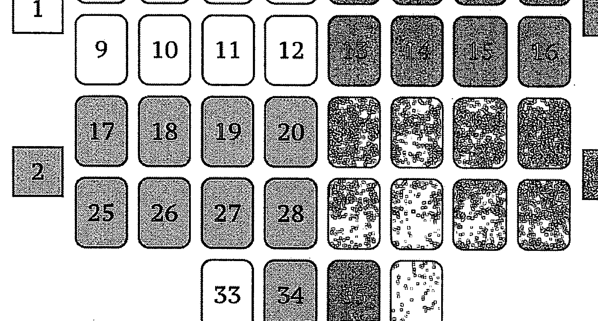

## 季節選擇法

## 3. 實占案例

在我學雷諾曼卡的過程中，最困擾的就是每本書與每個網站所分享的大藍圖解讀步驟，都不一樣。剛開始我什麼都想套用，最後發現這只會讓自己暈頭轉向，最後我終於覺悟，學了那麼多種解讀法，最後必要面臨取捨，融合成自己的方法。

於是我試著制訂一套最直觀、好記且不太繁複的解讀步驟，在本書中分享。這套解讀法只是拋磚引玉，讓初次解讀大藍圖牌陣的朋友，不至於迷路。解讀過幾次之後，你會有自己的感受，可以做自己的變化。

我的解讀步驟如下：

- 1. 先瞭解是否有重要相關人物及特定想問的主題，設定好對應的指示牌和主題卡。
- 2. 切牌解讀法：看問卜者的心境。
- 3. 第一印象解讀法：看事件的第一印象。
- 4. 四角框架解讀法：用左上+右下與右上+左下來看事件的範圍。
- 5. 核心解讀法。
- 6. 指示牌位置解讀法。
- 7. 指示牌宮位解讀法。
- 8. 指示牌為中心的九宮格解讀法。
- 9. 指示牌為中心的十字解讀法。如果未來的牌太少，從指示牌做7的數牌解讀法來瞭解未來。
- 10. 若有特定想問的主題，找到那張主題卡，做宮位及九宮格解讀。若想知道此主題未來的發展，做數牌解讀法。如果問與特定人物之間的關係，可做連接解讀法或交點解讀法。
- 11. 以上過程中若有不清楚該往何方向解釋的牌，做鏡射解讀法獲取線索。真有必要時，做宮位回溯法探詢過去的線索，但我通常只對指示牌或主題卡做。
- 12. 命運線解讀法：給予最終建議。

現在我們看一個實際的占卜案例。

| 列1 | 列2 | 列3 | 列4 | 列5 | 列6 | 列7 | 列8 |
|-----|-----|-----|-----|-----|-----|-----|-----|
| 21 山 | 4 房子 | 5 樹 | 36 十字架 | 31 太陽 | 15 熊 | 16 星星 | 25 書本 |
| 9 花束 | 1 騎士 | 25 戒指 | 33 鑰匙 | 6 雲 | 12 鳥 | 13 孩童 | 3 船 |
| 24 愛心 | 32 月亮 | 22 十字路口 | 2 幸運草 | 27 伴侶 | 19 塔 | 29 女人 | 34 魚 |
| 35 蟲 | 20 花園 | 18 狗 | 17 月 | 7 蛇 | 11 鏡子 | 14 狐狸 | 28 男人 |
| 10 鐮刀 | 30 百合 | 23 老鼠 | 8 棺材 |  |  |  |  |

朋友A問接下來六個月內的整體運勢。她也特別想瞭解愛情運，母胎單身的她是否有機會遇見對象？

## 1. 設定指示牌與主題卡

設定女人為指示牌，愛心為愛情主題卡。

## 2. 切牌解讀法

A切牌得到棺材＋月亮，顯示某種結束，什麼結束？月亮有多重含義，也是我的工作主題卡，但我沒有直接跳到對方想辭職的結論，因為A目前最掛念的是愛情，月亮象徵陰性面、諸般浪漫情懷，我感覺她把自己的女性面向關閉或否定了。

## 3. 第一印象解讀法

代表第一印象的3張牌是山、房子和樹，關鍵字分別是障礙、家庭、健康，顯示了家庭和健康方面的困難。看來除了愛情之外，她還有其他領域值得關注。

## 4. 四角框架解讀法

四角框架的兩對牌裡，出現了男人牌。當指示牌出現在四角，通常顯示此人對問卜者有特別大的影響，但此例中因為A尚未遇到對象，所以這男人並非指特定對象，而是象徵男人全體，這顯示交男朋友一事對A是很重要的，而山+男人明確顯示A在與男人交往方面有障礙。
因為已知A是母胎單身，書加鎖牌可讀為「堅持的隱藏」，描繪出A遲遲遇不到對象的心情，他就是不出現，真是不知道還要隱藏多久啊？

## 5. 核心解讀法

核心4張牌是：鑰匙、雲、幸運草、信件。
有信件的訊息，鑰匙顯示這訊息很重要，雲和幸運草又是困惑與快樂參半。經過詢問，原來A會來做這場占卜，主要是因為她去年做了今年的運勢占卜，得知她今年會交到男朋友，這訊息對她當然很重要，她確實也是懷疑與高興參半。

## 6. 指示牌位置解讀法

女人牌在右邊數來第二欄、偏下的位置，顯示她還沒能積極進入未來，可能還受過去舊有的事物或習性所限，有那麼一點感到無力。

## 7. 指示牌宮位解讀法

女人牌位在第23宮老鼠，顯示她的焦慮與壓力，可能對於找男朋友有感到年齡的壓力了。

## 8. 指示牌九宮格解讀法

綜觀指示牌周圍九宮格的牌，有1張正面牌，2張中性偏正面，2張中性牌，1張中性偏負面，2張負面牌。

四角框架是鳥＋男人、船＋鞭子，這裡我們看到對男人的不安（鳥＋男人），以及重複的尋覓與渴望（船＋鞭子）。

上面3張牌是鳥＋孩童＋船，我需要確認這個孩童是指人還是事情，所以對孩童牌做了鏡射，鏡射到女人、騎士和月亮，女人和騎士都是人物，因此我判定這張孩童是指人，他很好動（騎士），性格可能很有陰性或感性的特質（女人、月亮）。

經過瞭解，這是A的姪子，雖然姪子不是女的，但他個性確實很敏感。

我接著回來讀鳥＋孩童＋船的含義，這孩童可能讓A有點不安（鳥），可能很喜歡往外跑（船），而這似乎令A非常掛心（這3張牌位置在指示牌上方）。A大笑說明了事情的經過，原來A的姪子昨天在學校上課時居然沒回教室，自己在外遊蕩，出動老師搜尋並通知家長，此事怎麼不令全家擔心？

此事也與剛才的第一印象解讀相呼應，A的家中情況確實是她的關注焦點之一。由於這3張牌是位在她頭上，孩童牌更是位於正上方、直接影響的位置，顯示這件事對她造成不小的影響，她目前對此事也還感到有點無能為力。

我繼續解讀左側的牌。之所以依照這個順序，是因為上方的牌和左側的牌的起始牌是同一張，讀起來比較方便。我找到左側的牌是鳥＋塔＋鞭子，過去同樣有不安，有孤立，有重複的意象，顯示A過去對一再的單身感覺有點不安。

第二列塔＋女人＋魚，現況仍然孤單，所幸有魚表示她現在對此還算優游自在，適應良好。

第二排孩童＋女人＋狐狸，這裡再次反映那位令人頭大的姪子，真像狐狸一樣難纏。

右側未來的位置是船+魚+男人，非常好的徵象，A將踏出去尋覓男人，魚在這裡帶來豐盛。但這樣就代表A能交到男友嗎？我先不下定論，繼續看下去。

下方鞭子+狐狸+男人，乍看之下很容易解為跟男人吵架，甚至跟錯誤的男人發生性行為之類的，幸好目前的情境已知A未曾交過男友，所以這邊的情況是一再遇到不對的男人。A確實有過不少次相親經驗，但對象完全不OK，幸好這3張牌是在下方，顯示情況在A掌控中，不至於造成太大困擾。

## 9. 指示牌十字解讀法+數牌法

A的十字橫軸從左到右是愛心+月亮+十字路口+幸運草+信件+塔+女人+魚。顯示出她過去對愛情有幻想（月亮），有猶疑（十字路口），幸運草和信件指的是她上次占卜得到今年會交男朋友的消息，雖然她至今仍是單身狀態（塔），但未來將更豐盛、更自在（魚）。

如果納入上方的牌一起解讀，可以看見她真的很想要愛情上門（愛心上面是花束），想像對象會出現（月亮上面是騎士），但懷疑自己能不能與對方成功交往（十字路口上面是戒指），後來她得到一個對她而言很重要的幸運（幸運草上面是鑰匙），就是占卜得知她今年會交男友的消息，但這消息令她困惑懷疑（信件上是雲），她對於孤單懷有不安，說不定還有人在她旁邊碎念（塔上是鳥），但日後會藉由出外探索的方式讓自己過得更自在（魚上是船）。

我再看縱軸的牌，是星星+孩童+女人+狐狸。孩童跟狐狸前面已經解過了，星星位於最上方，顯示A對這姪子仍抱持希望，這是好事。另外，這雖不是主流牌義速查表，但我當下產生一個直覺，就是A的姪子的情況是不是受到行星或更高的力量影響呢？從A透露的訊息，我得知她姪子從小就是高敏感的自閉兒，有那麼一點「外星小孩」的況味。

為了更了解姪子的情況，我再檢查孩童牌所在的宮位，是熊宮，顯示姪子可能很有力量，甚至有霸凌相關的議題。A表示姪子的身材在同輩中算特別高大，會拿捏不住力道而弄傷同學，真的很符合熊的特性，這也令他們很頭痛。

如果想要瞭解姪子的未來發展，可以從孩童牌做數牌解讀法，甚至可以用宮位回溯解讀法解讀姪子的前因，但因為愛情才是A最迫切想知道的主題，我就放下姪子這條線，回到A的十字解讀。

因為十字右側的未來牌數少，過於概略，我補充用7張牌的數牌解讀法尋找更多線索。我從女人牌出發，數出來的牌是蛇+鼠+太陽+戒指+愛心，很高興看到她在經歷慾望（蛇）和焦慮（鼠）後，能得到好運（太陽），締結交往（戒指），找到愛情（愛心）。數牌法也確認了A今年交男友應是肯定的答案。我們也不能不注意到一點：男人牌與女人牌距離很近，且位於右下方，是可受掌控的未來位置，這又是一個吉兆。

## 10. 愛心主題卡的宮位及九宮格解讀

為了更深入瞭解A的愛情運，我對愛心牌做解讀。

愛心牌落在鶴鳥宮，是往好的方向改變的象徵，這再次確認A的愛情運應能有所改善。

九宮格皆是好牌，太好了！有願望實現的錨，有騎士進入新生活，有花園顯示她會多走出去與人交往（跟前面的船呼應），花束與月亮也都帶來愉悅的心情。

我對愛心牌做了數牌解讀法，更驚奇的發現，數出來的牌跟前面指示牌的數牌如出一轍，得到女人+蛇+鼠+太陽+戒指，最後回到愛心，是完全重複的訊息，因此加強了先前預測的肯定性。

## 11. 樹主題卡的宮位及九宮格解讀

因為樹出現在第一印象的3張牌中，我特別為A看了一下健康。
要先聲明的是，有些雷諾曼占卜師喜歡占卜健康，他們有詳細的列表說哪些牌組合在一起可代表何種病，但我認為健康診斷應是醫生的事，我就沒有特別使用疾病的牌卡組合，那些組合對我就不生效。
我對健康解讀的方式是採取整體、直覺的方式，而且著重在改善之道。
A的樹牌位在第3宮船宮，船代表分泌液體及儲水部位，也就是肝膽脾胰、淋巴、泌尿道相關疾病。
樹周圍的牌，十字架首先被我關注到，這是明顯警訊。我又注意到戒指牌也來湊熱鬧，戒指與十字架剛好都有長期痼疾的含義，增強了這方面的意義。
綜合起來可推測A有肝膽脾胰、淋巴、泌尿道相關的慢性病。
所幸有鑰匙和房子，代表她應有掌握到解決方法（鑰匙），身體底子也夠強健（房子）。
騎士牌可解為腿腳疾病，在這邊我看不出它與主要病情的關聯，因此我不朝這方面解釋。因為騎士跟房子同為左側的牌，我解為A過去應該有接到一些病情穩定（房子）的好消息（騎士）。
下面3張牌是健康所在的基礎，是騎士＋戒指＋鑰匙。其中鑰匙特別指出了解決之道，所以這3張牌我讀為：運動（騎士）要堅持不斷的進行（戒指），是解決的辦法（鑰匙）。
在這個案例中，A有糖尿病，跟上面的解讀完美吻合。

## 12. 命運線解讀法

最後我看雷諾曼卡給A什麼整體建議，下面4張牌是鐮刀、百合、老鼠、棺材，回應她先前對愛情的關注，要她大刀闊斧拿出決斷（鐮刀），展現自己的性感魅力（百合），放下焦慮（老鼠），拋棄舊有、開啟人生新一章（棺材）。

在解這4張牌時，我留意到百合牌兩邊的鐮刀和老鼠，都有減損的含義，包夾住代表性慾的百合牌，彷彿想要特別提醒什麼。與A一聊之下，瞭解到她一直覺得自己沒有女性的魅力，只會被男生當成好朋友，不會被當成女朋友，此時命運線就豁然清晰了，最後的棺材建議她要拋下這樣的想法，會更有助她脫單成功。

## Chapter 4 進階研究

雷諾曼卡結合撲克牌花色與數字，可為解讀增加更多素材，如果你還負荷得了的話。以下屬於鮮少人使用的研究級內容，有興趣者繼續探索下去，沒興趣者不學這些也完全沒影響，但仍請跳到最後兩小節看結語，你將會不虛此行。

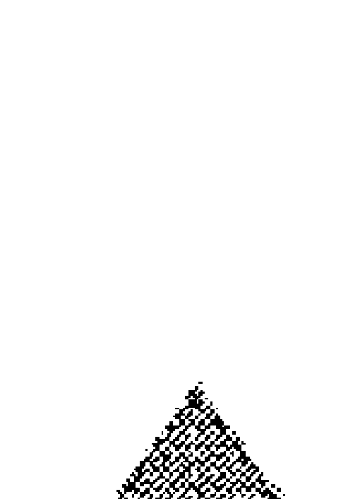

## 四種花色的占卜意義

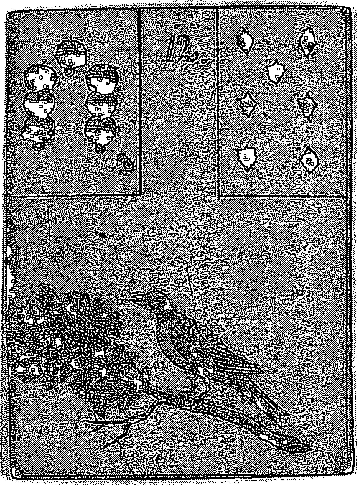

希望遊戲出版時，手冊裡有寫明，這套牌不止可以當桌遊，也可以用來占卜。在牌的左上角和右上角有嵌入當時流行的遊戲紙牌，作為對應。

圖中左上角是巴伐利亞式的遊戲紙牌，在東德和東歐流傳，下文簡稱為「德式」，四組花色分別是紅心、鈴鐺、葉子、橡實。

右上角是阿爾薩斯式紙牌，在西德和法國阿爾薩斯區以西的地區流傳，下文簡稱為「法式」，四組花色就是我們玩撲克牌所熟悉的紅心、方塊、黑桃、梅花。 雖然法式才是現在的撲克牌形式，但是，雷諾曼卡的花色意義是從德式發源的。

為什麼要強調這一點？這是因為有玩過塔羅的朋友，初學雷諾曼卡時很容易落入一個誤區，以為雷諾曼卡的四組花色，既然對應撲克牌，自然也能對應塔羅的權杖、聖杯、寶劍、錢幣四個牌組，和地水火風四元素。

然而，雷諾曼卡花色意義跟撲克牌並非系出同源，這樣對應下去，會牛頭不對馬嘴。要瞭解雷諾曼卡花色的含義，第一步需從德式紙牌來認識。

而且，還要把塔羅和占星的知識先丟掉，成為一張白紙再開始。

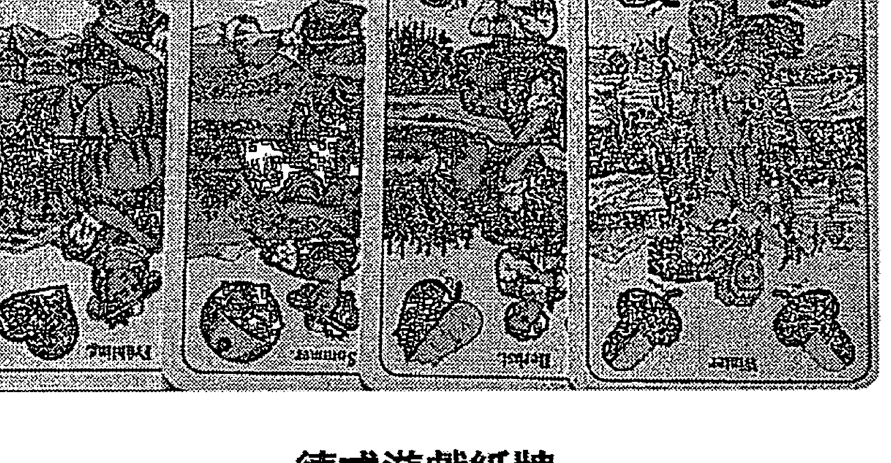

## 德式遊戲紙牌

圖片來源：Bermicourt

撲克牌有52張，雷諾曼有36張，這是因為配合希望遊戲的遊戲方式，要在桌上排成6×6的形式，讓棋子在牌上移動。這36張都可以對應到撲克牌，對應方式是從每個牌組的6到K，再加上A，每9張對應一個牌組，四組就是36張。這其中的對應對牌義是有影響的。

| 梅花牌組 (橡實) | 紅心牌組 (心臟) | 黑桃牌組 (葉子) | 方塊牌組 (鐘/金幣) |
| :--- | :--- | :--- | :--- |
| 十字架 (6♣) | 星星 (6♥) | 塔 (6♠) | 幸運草 (6♦) |
| 老鼠 (7♣) | 樹 (7♥) | 信 (7♠) | 鳥 (7♦) |
| 山 (8♣) | 月亮 (8♥) | 花園 (8♠) | 鑰匙 (8♦) |
| 狐狸 (9♣) | 騎士 (9♥) | 貓 (9♠) | 棺材 (9♦) |
| 熊 (10♣) | 狗 (10♥) | 船 (10♠) | 書 (10♦) |
| 鞭子 (J♣) | 心 (J♥) | 小孩 (J♠) | 鐮刀 (J♦) |
| 蛇 (Q♣) | 送子鳥 (Q♥) | 花束 (Q♠) | 十字路口 (Q♦) |
| 烏雲 (K♣) | 房子 (K♥) | 百合 (K♠) | 魚 (K♦) |
| 戒指 (A♣) | 男人 (A♥) | 女人 (A♠) | 太陽 (A♦) |

### 梅花牌組（橡實）

梅花牌組，在德式紙牌裡是橡實。橡實很難吃，除非飢荒，否則不會有人想吃它，因此橡實象徵當時最窮困的奴隸階級，代表各種不幸，如困難、麻煩，或像地主壓迫奴隸這樣的權力壓迫。

因為如此，雷諾曼卡對應梅花的9張牌幾乎都是所謂的壞牌。有老鼠、狐狸、熊、蛇和烏雲，都是農奴不想見到的東西，其中熊雖然看起來沒那麼負面，但也是可以很壓迫人的。還有鞭子、十字架、山跟戒指也都帶來壓迫感。戒指雖然比較正面一點，但是如果遇到壞脾氣的話，也會成為把人套牢的一種壓迫。

梅花對應到冬天，因為冬天是橡實落下的季節，我們也可以聯想成奴隸的生活就像冬天一樣辛苦。

雷諾曼卡的四組花色跟季節之間的對應，是雷諾曼那個年代的德式紙牌裡真的會畫出來的，所有梅花牌組的背景都畫成冬天，依此類推，所以本書中提供的雷諾曼卡跟季節之間的對應，是經過歷史考證的對應。

經過這篇說明，想必你已明白為何雷諾曼卡不能跟塔羅四個牌組和占星對應。如果要如此對應，雷諾曼的梅花原應對應到塔羅牌的權杖牌組、火元素、夏天，而且權杖牌大致是好牌，雷諾曼的梅花卻是冬天與壞牌，根本就牛頭對不上馬嘴囉。

### 紅心牌組（紅心）

紅心是代表牧師與神職人員的牌組，象徵愛、情感、家庭和人際關係，這裡的人際關係是比較親近的親朋好友的關係，屬於家庭私領域範疇。

在紅心牌組中的牌，與情感有關的有星星、月亮、愛心，與家庭有關的有送子鳥和房子，也有代表健康與家人的樹，和送到家的好消息騎士牌，還有好朋友狗牌。

你或許還注意到，男人牌也是紅心，考慮到十九世紀女人地位還很卑微的時代，男人牌可說是地位崇高，由此可見愛心牌組的重要地位。

紅心牌組對應到春天，不難聯想。

### 黑桃牌組（葉子）

黑桃的拉丁字根是寶劍，學過塔羅的朋友一聽到馬上聯想到壞牌，不過，在雷諾曼卡的世界裡，可不是如此。雷諾曼卡來自的德式紙牌中，黑桃是葉子，代表中產階級。

中產階級在社會中是可以正常茁壯成長的，因此葉子可視為「成長」與「擴展」，就像人成長後進入社會，踏入公眾關係領域。

黑桃跟紅心剛好形成對比。紅心是家庭的，黑桃是社會性的。

因此，黑桃也跟「貿易」有關，貿易正是往外成長擴展的一種形式。

所以，在黑桃牌組裡有塔、花園、花束這些跟社會關係有關的牌，有做貿易的船、鑰和信件，有代表人類成長的不同階段的小孩和百合（長輩），大都是中性至好的牌。

黑桃牌組對應到秋天，因為秋天是葉子落下的季節。

### 方塊牌組（鈴鑰）

方塊在德式紙牌裡是鈴鑰，這是貴族階級別在身上的裝飾。

歷史學家Johann Gräße在1856年說明德國紙牌占卜傳統道：「方塊牌組其實沒有特別的涵義，不過總體而言代表喜悦的事件，就像鈴鐺聲響，幾乎總是表示金錢來了或賭博贏得頭獎。」

十九世紀德國犯罪學家Benedict Avé-Lallemant在1858年的著作中提到，鈴鐺代表「錯誤、欺詐、妒忌」。雖然這是犯罪學作品，對雷諾曼卡源流也提供了一些史料。

1926年，維也納大學有場犯罪學演講，講者Hubert Streicher說：「鈴鐺代表財富、繁榮、無憂無慮的生活。」

當爬梳過史料後，這個牌組究竟代表什麼意義，仍然莫衷一是。

其實，這是因為方塊牌組原本就沒有明確的意義，所以雷諾曼卡裡的方塊牌，很難理出一個共同性質。許多現代雷諾曼占卜師因此對方塊的意義摸不著頭腦，因此出現了各種分歧的推測，說來說去，總而言之，眾人一致認為方塊牌組的性質變幻不定。

這個結論不奇怪，因為方塊牌組本來就沒有特定的性質。

要知道，遊戲紙牌的占卜術，畢竟是來自民間遊戲，我們不能要求它像易經、塔羅牌一樣結構嚴整，或每個環節背後都有哲學意義。方塊牌組沒有特定性質，或許讓它維持這樣就好了。

只不過，學習者總需要一個憑藉為依歸，希望能為雷諾曼卡理出一個系統邏輯性，總不能說其他三個牌組都有意義，就方塊牌組沒有意義吧？這會讓人覺得很沒邏輯的。

因此，根據現代占卜師所歸納出的說法，我提供一個我認為比較說得通的說法：

**方塊牌組就像鈴鐺發出的聲響，能量變化不定，很快速，很突然，就像在生活中的起起落落，變化無常，因此也跟捉摸不定的思想和溝通有關。**

由於此種動態的性質，方塊牌組裡好牌與壞牌並存，有代表短暫好運的幸運草和較長好運的太陽，有代表思想和溝通的書和鳥，有鑰匙可以開啟某種解答，有代表金錢流動的魚，還有像棺材、鐮刀表示突然結束或改變，或是像十字路口這樣改變中的狀態，全都富有動感。

雖然上述這個詮釋並非來自真正的占卜傳統，而是現代占卜者全新賦予的意義（如果不是牽強賦予的話），要不要採用，就隨個人偏好了。至少，這個說法有便於學習記憶。

方塊對應夏天。夏天是會出去爬爬走的季節，貴族身上的鈴鐺自然響叮噹了。

## 如何運用花色意義在占卜？

當瞭解四種花色的意義時，就可以應用在占卜裡，讓自己多會一種解讀法。

由於雷諾曼卡的四種花色忠實反映十八世紀的歐洲民間生活，占卜時，即可依據四種花色出現的比例，來一眼抓住牌面顯示的傾向。

具體做法如下：

在進行線性、十字或九宮格牌陣的占卜時，算一下各花色出現的數量，哪些佔比多？哪些佔比少？這是意義的。

若是5張牌以上的占卜（不含大藍圖牌陣），按機率來說，每種花色至少要各有一張。假如有哪種缺席了，請特別留意，這也是有意義的。

舉例來說，小明詢問事業運，占卜師一翻開9張牌牌陣，一眼望去，發現有特別多愛心花色，愛心象徵家庭與情感，故可能暗示此事與情感有很大的關係。9張牌裡完全沒有葉子，葉子是象徵往外擴展，缺了這個元素，可推測小明是否故步自封？忽略現實嗎？

這就是花色的運用方法。解讀時納入花色，能增添多一點素材，讓我們讀出多一點東西，雖然不是特別多，不過對於抓住大局是有點幫助的。

四種花色的完整解讀分析，請見下表。

| 花色 | 傾向 | 含義 | 多（9張以上牌陣） | 少（5張以下牌陣） |
| --- | --- | --- | --- | --- |
| 梅花（橡實） | 最負面 | 權力壓迫、困難、惡意 | 運勢不好、困難 | 沒有阻礙，進展順利 |
| 紅心（紅心） | 最正面 | 愛、情感、家庭 | 與情感或家庭有關 | 欠缺愛與感情，太過理性，少了人情味 |
| 黑桃（葉子） | 偏正面 | 成長、快樂、人際關係 | 跟人際關係與往外擴展有關 | 缺少與人的連結，故步自封，忽略現實層面。還是要務實一點好。 |
| 方塊（鈴鐺） | 偏負面（好壞參半） | 變化無常、生活起落、思想 | 生活的起落與變化 | 似乎欠缺一點動能，是不是事情的進展緩慢？太懶散？太沉溺於過去？ |

## 雷諾曼數字學

你或許會很驚訝，雷諾曼卡對應的撲克牌數字，也有含義。下表是我參考撲克牌源流、數字學及個人理解所做的歸納整理。

| 數字 | 十字架 | 星星 | 塔 | 幸運草 | 說明 |
|------|--------|------|----|--------|------|
| 6    | 十字架 | 星星 | 塔 | 幸運草 | 6是提升、獲取，上下交流的意象。6的牌全都是在我們之上、掌握之外的事物。十字架是自上而下的壓下，星星是心靈的往上追求，塔是世俗的往上追求，幸運草是運氣的向上提振。 |
| 7    | 老鼠 | 樹 | 信 | 鳥 | 7是溝通與重新評估。老鼠要我們評估損失情況、樹評估健康與成長狀況、信與鳥都是溝通。 |
| 8    | 山 | 月亮 | 花園 | 鑰匙 | 8代表地位，特別是在社群間的，反映外在世界的面向。山是強大的靠山或敵人，月亮有名聲地位，花園有社交地位，鑰匙本身就代表重要地位。 |
| 9    | 狐狸 | 騎士 | 貓 | 棺材 | 9是動vs.不動、終點。狐狸和騎士是動態的，一個忙於騙人，一個忙於送信。貓與棺材是不動的，一個到航程終點，一個到人生終點。 |
| 10   | 熊 | 狗 | 船 | 書 | 10是連結、指導。熊是保護你的長輩、狗是與你連結的平輩支持者（也會給你忠告指導），乘船與世界連結，從書中獲得指導。 |
| J    | 鞭子 | 心 | 小孩 | 鐮刀 | J是年輕男子，帶來活力與能量。鞭子是鞭打不停的激動男，愛心是羅密歐般的戀人，小孩是快樂成長的孩子，鐮刀是決絕的犀利男。 |
| Q | 蛇 | 送子鳥 | 花束 | 十字路口 | Q是皇后，帶來滋養與資源。皇后全都是女子，蛇是惡毒的，送子鳥是懷孕的、花束是愉悅施惠的、十字路口是正在決定中的。 |
| K | 烏雲 | 房子 | 百合 | 魚 | K是國王，代表成熟與統治。這些全都是某種特性發揮到極致的男子，烏雲是討厭到極致，房子是愛家到極致，百合是成熟到極致，魚是賺錢到極致。 |
| A | 戒指 | 男人 | 女人 | 太陽 | A是1，代表起源與頂點。男人女人是亞當夏娃（人類的起源），戒指締結連理（新生命的起源），太陽是地球萬物的起源，也是終極的頂點。 |

找出了這些數字的共通涵義，同樣可以應用在占卜中。牌陣裡如果重複出現同數字的牌，可以特別留意一下，裡頭可能有額外的訊息，譬如某個牌陣出現3張7號牌，可能表示需要溝通與重新評估。

所有數字的涵義要全理解、記憶，並在占卜中運用，不是一蹴可幾，所以這屬於高階的解讀法，很少占卜師使用。

話說回來，高階不一定等於好，只不過是操作上較難上手而已。如果覺得難用，大可直接忽略不用，不用高階解讀法依然可以做出精闢的解讀。

數字學的解讀，因為太麻煩，有些占卜師索性不去記憶，直接套表查詢。如下表是偉特塔羅牌發明人偉特先生（A. E. Waite）在《Pictorial Key to the Tarot》提供的同數字重複出現的涵義，雖是塔羅資料，也有雷諾曼占卜師直接拿來套用。

| 數字 | 5張涵义 | 4張涵义 | 3張涵义 | 2張涵义 |
|------|---------|---------|---------|---------|
| 6 | 豐盛 | 成功 | 易怒 |  |
| 7 | 陰謀 | 虛弱 | 新消息 |  |
| 8 | 逆轉 | 婚姻 | 新知識 |  |
| 9 | 好友 | 成功 | 收到 |  |
| 10 | 譴責 | 新狀況 | 改變 |  |
| J | 危險的疾病 | 爭論 | 不安 |  |
| Q | 大爭論 | 被女人欺騙 | 真誠的朋友 |  |
| K | 殊榮 | 諮詢 | 小小的商討 |  |
| A | 好機會 | 小成功 | 欺詐 |  |

偉特先生這張表比我提供的表更難記憶。即使是有經驗的占卜師，多半也都需要在占卜時拿出表格來查。許多占卜師放棄這條路，就是因為不好意思在客人面前做這種事，怕被認為不專業啦。

以上就是數字學的一切利弊，都跟你說了。用與不用，全在於你。

### 占卜的道德及保密原則

因為在身心靈界多年的經驗，我看過有些老師在個案前腳才剛跨出門，轉身就把個案的事情講出去，整間店在十分鐘內全知道個案的秘密了。尤有甚者，拿到課堂上去講，你可能沒想到自己對老師掏心掏肺、涕淚直流，他充滿愛的為妳解決困擾，回頭卻把你的痛苦當負面教材，在眾人面前把你的隱私洩漏出去。

這種老師不懂得服務的道德。不管今天做什麼諮詢，服務者對個案都應負有保密義務。個案的人生困境，不是老師的談資。

相對的，我也認識電視上知名的命理師，他在講課時專舉名人當例子。同學聽著笑了，他倒是很嚴肅的說：「這個人沒有找過我算命。如果他有來找我，我就不會講！」

此話乍聽之下以為他在埋怨那名人沒找他算，其實他是在表達自己遵守保密原則。也因為如此，才能獲得個案信賴，找他的名人才絡繹不絕。在我心中，一個頂尖的服務者，應該要能做到就算今天來找他算命的是天王巨星，他也能守口如瓶。當巨星走出去，他好像什麼事都沒發生過，雲淡風輕。

即使不是收費服務者，也不宜把朋友占算的煩惱講出去，我認為這是人與人間往來的善意，應該要做到的厚道。

所以，本書所有的案例，都在問卜者同意之下使用。我在公司所合作的老師，也都經過我觀察，上回大明星從我們店裡走出去，全店沒有一個人談過一句他來算什麼。

這才是比較理想的狀態。

## 占卜最重要的事

本書到了最後，我想跟你分享我學習命理的真實經驗，以及到目前為止的體悟。

我從小就對命運的神秘感興趣，非常想知道命到底能不能算？一切究竟是註定的嗎？所以我小學開始看星座書，國中排紫微斗數，高中開始研究塔羅，大學時更是瘋狂，易經、人相、擇日、八字、占星，什麼都學，當了東西方兩個命理社團的社長。因為就讀的學校資源豐富的關係，社團請到的都是重磅級大師，包括台大有棟樓以他命名的國學大師、電視節目知名老師，身為社長的我當時都有幸跟他們近身互動。

我很幸運，在這些老師的教導下，我建立了正確的命理觀念。我知道各種命理工具有其長處，也有短處；有其源流，而我們應該要探索源頭；有好的工具，也有沒那麼可靠的工具。

我也知道命理能發揮的助人之樂，以及它的限制。

我如此深入研究命理，把它當成值得耗費一生來鑽研的學問，夢想自己能練到百分之百的準確度。在出版《塔羅葵花寶典》時，我還是研究所一年級學生，卻已幾乎踏上了職業占卜之路。

然而生命安排總是如此巧妙。到了某天，我忽然覺悟了。

命理工具不可能達到百分之百的準確度。

即使有巴納姆效應，有波麗安娜效應，有羅森塔爾效應這些心理機制的護航，一個完全不會算命的人，籠統的隨口說一說，都能讓人以為他有六七成準。命理永遠不會死，永遠會有人覺得好準好準，可是……達到百分之百準度？抱歉，不可能。

學得越深，就越能理解，為何當年國學大師在教命理時，一直數說命理的短處。他是看得太多了，我現在也有一樣的感受。

命理可以很準，但每個人都有改變的自由意志，正是因為這些自由意志，造就了算不準的那一部分。

難怪大師老是說：「我最喜歡算不準。」

算不準，代表問卜者改變了自己的命運，這不是值得歡欣鼓舞嗎？

也因為瞭解命理的限制，以及明白每個人都有自由意志能發揮無限潛能，當我們為別人占卜時，一定要謹慎自己的措辭，不要打擊他、貶低他、讓他覺得人生無望，毫無改善的空間。相反的，要幫助他看見光明、找到希望，認知到自己能改變命運，拾回自己本有的力量。

那麼，儘管命理無法百分之百準，但是在健全的態度及正確的使用下，仍是很能幫助別人的途徑。君不見多少輔導老師跑來學牌卡，因為他們發現，跟學生口沫橫飛一席話，不如抽一張牌能給的幫助大。

命理雖是外在的工具，終歸有一天，我們會丟掉這些外在工具，只不過，人們在脆弱時，難免還是需要外在工具給自己信心。因此，對於相信命理工具的人，當他誠心抽牌時，會帶著「牌卡很準」或「上天會告訴我答案」的強烈信念，抽出來的牌就會回應他的信念，讓他覺得很準。

接著，牌面可以幫助他釐清狀況，更重要的是理清他的思緒。

最後，無論算出的結果好不好，都能藉由這個機會助他改善生命。如果是好的，他會滿懷信心去實現好結果。如果不好，也幫他找出建議，尋求改善之道。

身為占卜者的我們，暫且拋下一定要算準的執著吧。把焦點放在如何幫他指點迷津，獲得改善人生的力量，那麼，一切就功德圓滿了。

而你，就會體驗到助人為樂的妙處。

這就是我覺得占卜最重要的事，與最大的意義了。
