# 韦特之后塔罗

## 译者序

《韦特之后塔罗》由Giulia Francesca Massaglia绘制，Cortine Kenner编写说明指导。

《韦特之后塔罗》的说明书作为初学者的指导书可以与《其实你已经很塔罗了》相媲美。与其称之为《韦特之后塔罗》的指导书不如说它为初学者打开了一条通向韦特系塔罗的学习之路。

作者的编排体系较之前流行的一些初学者用书来说更为新颖，不再是分大牌和小牌两个部分去讲解牌义，而是将大牌和小牌通过灵数学的关系整合起来，通过数字划分章节讲解每一张牌，对比每个数字下牌的联系与区别。同时，作者将每张牌分为三个部分，讲解了“牌面描述”“主要符号”“建议解读”三方面的内容，让初学者既有“看图说话”的能力，也对“为什么可以这样看图说话”拥有一定的理解，是一本难得的佳作。

而也正是出于这个原因，瞻行决意对本书进行翻译和整理。希望能够为更多的塔罗爱好者带来一本足够精彩的初学者用书。

瞻行作为专业塔罗咨询机构同时提供神秘学咨询服务和相关课程教学。负责人联系方式：

- 萨拉：sarahsatan（微信）
- 星月：kohavim（微信）

瞻行
2016年1月1日

## 介绍

我们熟悉的塔罗图案已经近百年没有变过了，它们已经成为了我们集体智慧的一部分——将一瞬间的东西变成了永恒。

但时间的长河不停的流动，过去的塔罗已经不能够涵盖今天的所有。愚人也不可能永远都站在悬崖边上。

如果你能超越时间和地点的限制，看到接下来的事情呢？要知道，塔罗本就是用于看见未来的。

若是你知道了愚人踏出悬崖之后的景象呢？

或者说，如果你自己能够进入那个景象呢？

现在就有这样一个机会。

欢迎来到塔罗新视角，你可以来回转转，好好的看一看这里曾经有过的，和它们现在的样子。

欢迎来到韦特之后塔罗。

## 韦特之后塔罗

设计这套牌的初衷很简单。这套牌的图像由经典韦特塔罗演变而来。经典韦特塔罗由亚瑟·爱德华·韦特设计，帕米拉·科曼·史密斯绘制，他们的作品已经带着我们走过了一个多世纪。

韦特之后延续了他们的作品，这套牌中的大多数牌和经典韦特的图像类似，但是又有一到两处变动。当你看到这套牌的时候，你会看到新的人物角色，并且能够加深对他们的理解——不论是他们的希望，还是他们的恐惧。你会看到一些新的细节，并且看到他们的未来。

当你读牌的时候，其实你是在创造未来——你有不止一个选择，因为你可以从现在出发，穿过不同的时间线，去到不同的世界，创造出不同的未来。

未来不是为那些软弱的人准备的，如果你跟从这套牌的指示，你可以踏进时间的河流去探索它。你可以涉水而行，你可以扬起水花，你可以顺着水流游得很远。当你累的时候，你可以再顺着河游回来，回到理智和客观的土地上来。

和赫拉克利特斯不同的是，你可以踏进同一条河两次。

来吧！河水很有爱，你想待多久都可以~

## 第一章
### 塔罗基础

### 塔罗的神奇历史

每一张牌都有魔法。
每一张牌都是一个时空胶囊。
现在你有了韦特之后塔罗，你就加入了这个历史悠久的强大神秘学组织。

最早的时候，塔罗是从印度和北非流传过来的。一代一代的人带着他们的故事穿过沙漠而来，有征服土地的勇士，有寻找宝藏的淘金者，这些故事被一点一点的加入卡牌。

最开始的时候这些卡牌是做游戏用的，随着时间的推移，神秘主义和形而上学的学者用这些卡片来记录他们的秘传智慧，将符号系统和宇宙意义加入其中。

举例来说，这些卡牌的结构取材于古巴比伦占星，它的哲学思想可以追溯到古希腊柏拉图时代，它的图像掺杂了中世纪欧洲的炼金系统，而它的启蒙意义又来自文艺复兴时期的意大利。

几个世纪以来，智者们一直在将宇宙的奥秘画进这套牌里，把它们藏在普通的图像里，只有那些寻求精神启蒙的人知道要怎么去解码信息。今天的塔罗甚至包括了现代卡巴拉（古代犹太秘传的一种），心理学，社会学，和人类学。

当你拿着一张牌的时候，你拿着的是整个世纪的智慧结晶，而且你也可以创造历史。

### 神圣的设计：
#### 塔罗的结构

在你接触到塔罗的魔力之前，你应该理解它的结构。你第一要知道的是，塔罗分为大阿卡那和小阿卡纳。

### 大阿卡那

前22张牌组成了大阿卡那，在拉丁语中的意思是“大秘密”。每张牌都代表了人生的一个里程碑，从愚人依靠信念从悬崖一跃而下的那一刻开始，到他经历了一切走到世界终结。

大阿卡那和占星紧密相关，每一张都与一个星座或者行星有关。虽然你读牌不需要会占星，但是适当的学一些占星会使你的解读会更丰富，更深刻，更有洞见。这本书介绍了不少塔罗与占星的对应。不过如果你想了解更多，你可以买我的书《塔罗与占星》（Tarot and Astrology），书中介绍了所有的塔罗与占星的对应。

### 小阿卡纳

余下的56张牌是小阿卡纳，在拉丁语中的意思是“小秘密”，它们展现了日常生活的体验。不要被名字蒙骗了，小阿卡纳和大阿卡那一样重要，符号同样丰富。

像扑克牌一样，小阿卡纳分为四个牌组，扑克牌中有梅花，红心，黑桃，方片，塔罗中有权杖，圣杯，宝剑，和星币。每一组牌都有十张数字牌和四张宫廷牌，数字牌代表了事情的发展，宫廷牌代表人物和性格特点。

### 四个牌组

小阿卡纳中的四个牌组各有元素属性，而且也与经典哲学和古典占星相关。

权杖：权杖代表了火元素，他们象征着生命中燃烧着的激情。一般用刚砍下来的树枝来代表，象征着灵感与启蒙的火炬。权杖对应扑克牌中的梅花，梅花中的三叶草图形被认为与三位一体相关。

圣杯：圣杯组属于水元素，代表了感情。就像扑克牌中的红心一样，它们也象征着爱情。他们可以用来形容我们和朋友，和亲戚，和志趣相投的人之间的关系。他们也象征着浪漫，在一段感情中的满足感以及两个人在一起的愉悦感。我们在庆祝的时候，在与人谈话的时候，或是悲伤的时候都会举起手中的杯子，这就是圣杯。

宝剑：宝剑组代表令人愉悦的智慧，它们可以破除我们的迷惑和虚妄，让我们得以沟通，可以畅想。宝剑可以用来攻击或者保护我们最强烈的愿景，代表着思想和交流。它对应扑克牌中的黑桃，因为都有一个尖。

星币：星币看上去像钱币，因为它们代表财富，资产，和物理上的存在。它们象征着健康和肉体，如果从心灵的价值来讲，它还可以象征我们的灵魂。星币对应扑克牌中的方片。

### 数字

大阿卡那和小阿卡纳中的比较小的数字都象征着开始，中间的数字象征着一个循环的中间，后面的数字象征着顶点和结束。

### 如何解牌

塔罗是会讲故事的，如果你太匆忙了，你能听到一张牌的一个短故事；如果你有空，你可以用更多的牌看到更多的细节，听到一个更长的故事。

### 技巧和提示

1. 专注在一个问题或一个关注点上，洗牌。如果你会用扑克牌式洗牌法，洗上七次就差不多了。如果你更习惯于铺开洗牌，或者在手里来回叠，也可以在抽牌的时候把牌平铺开，随意抽取几张。
2. 选牌阵，抽牌。
3. 翻牌，一张一张的解牌。你第一要记住的是，解牌时尽量不要带有太多的个人意识。你只是在描述画面，先不要解读符号。你可以说“我看到……”这样你可以听起来像通灵大师，尽管你自己并不认为自己很通灵。
4. 如果你是在给别人读牌，要把牌中的画面与对方相结合。比如当你解读力量的时候，你可以说：“我看到你穿着白色的泡泡袖衣服，身上围着红玫瑰花环，抱着一只野兽。”
5. 当你描述牌面的时候，你可能一时半会还看不出这些图片的重要性和指示含义，但是你的客户会被这些图像打动。
6. 当你一张一张全部读完之后，你就可以进行更深一步的解读。你可以着重解释一些能够激发你想象力或者震动你的心灵的符号。
7. 塔罗解读是一个合作的过程，如果你卡住了，尤其是当你给别人解牌的时候，你可以问问他们图像对他们来说代表着什么，或者他们对那一个符号最有感觉。
8. 记住，牌阵中的每一张牌都是和问题或者状况相关的。我们在解读的时候很容易跑题，这个时候要把话题重新拉回到问题上来。
9. 你要记住牌阵中每一个位置的牌代表的含义，比如说，不要把代表过去的牌和代表未来的牌混淆。
10. 讲完整个故事之后，你要做笔记，或者拍照，这样以后还能翻回来看看。

### 逆位

牌逆位的时候，他们的意思不会改变，但是影响会变小。他们所代表的变动可能会被阻碍，或者延迟。你要把它们加进你的解读中去，但不要给他们其他的含义。记住他们的正逆，转成正位，继续解读。

### 时间线1

充分洗牌，然后随意抽出一张牌。

### 两张牌：微妙的变化

充分洗牌，抽两张牌。第一张代表过去，或者问题的开端，第二张代表未来，或者问题的结果。
当你对比这两张图的时候，思考，是什么改变了呢？什么维持不变呢？更重要的是，你会怎么改变呢？你又会如何不变呢？

### 三张牌：过去，现在，未来

充分洗牌，把牌分成三摞，或者一摞中最上面的三张牌。就像你读书的方向一样，从左向右读牌。
第一张牌代表过去，用来反省过去的关系，消除遗憾，和总结你从过去学到的东西。
第二张牌代表现在，用来评估你现在的状况，把它跟过去和未来的两张牌对比。
第三张牌代表未来，因为它代表按照目前的状态发展下去最可能出现的未来。你要寻找具体的建议，在正确的时间正确的地点采取正确的方式达到你的目标。

### 韦特之后牌阵

先抽一张牌，代表你的现状。然后抽出两行平行的牌，代表两种建议，两种未来，让你自己选择。

### 双重时间线

充分洗牌，然后随意抽出一张牌。

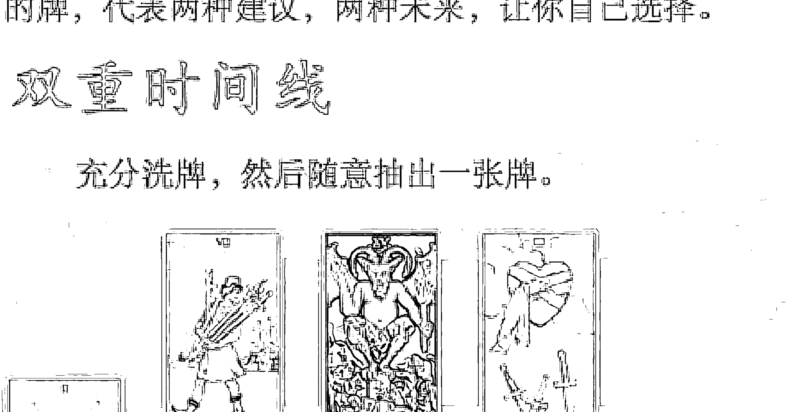

#### 解读范例

目前来说，希尔达正在两个人中间徘徊不决。（宝剑二）

### 时间线1

1. 第一个男人偷走了她的心。（宝剑七）
2. 他很富有，很强壮，很有魅力，他们两个之间有无法阻挡的吸引力。（恶魔）
3. 最终，他会让她心碎。（宝剑三）

### 时间线2

1. 第二个男人有颜有钱，但是不够有冒险精神。他动作很慢且很谨慎。（星币骑士）
2. 他将希尔达当做一个平等的恋人对待。（圣杯二）
3. 如果她选择了他，他们会结婚而且有孩子。（女皇）

### 双重时间线

看到两个选平行世界或者平行的时间线比你想象得简单。

随着时间的流逝，事情每天都在发生，有且有些时候我们也不知道它们为什么发生。电话响了，尽管你可能错过公车，你还是选择了接电话。一场会开的很久，所以你没吃午饭。你不小心把东西泼在了衬衣上，所以你停下来去换衣服，或者你决定带着狗再在周围溜一圈。你可能都没有意识到这些，但是你做的选择改变了事情的走向，然后你可能会听说，你躲过了一场车祸或者大桥坍塌，或者错过了遇到你正缘的机会。

有了这套牌，改变事情的走向就更容易了，每一张牌都通向一个平行宇宙，同时它还能映照出我们现在的生活。

### 事件记录

要把你的解读详细的记录下来，方便你日后回顾用。
记录下你的开始时间。
把你问的每一个问题都记录下来，还有每一个答案都要详细地写下来。你可以给每个牌阵拍个照，或者把它们画在你的塔罗日记中。
记下你抽出的每张牌，和你对牌的解读。

### 塔罗记事本

下面的图表是塔罗与占星的对应，日期取的是近似值。如果你需要非常确切的日期与时间，你需要去查占星日历或者行星运行表。

注意：Ace牌并不涵盖在图表中，因为他们代表元素，权杖A是火元素，圣杯A是水元素，宝剑A是风元素，星币A是土元素。

| 星座 | 元素 | 守护星 | 塔罗牌 | 日期 | 牌面 | 守护星 |
|---|---|---|---|---|---|---|
| 白羊座 | 火象基本星座 | 火星 | IV.皇帝 | 3.21-3.30 | 权杖二（火） | 火星 |
| | | | XVI.高塔 | 3.31-4.10 | 权杖三（火） | 太阳 |
| | | | | 4.11-4.20 | 权杖四（火） | 金星 |
| 金牛座 | 土象固定星座 | 金星 | V.教皇 | 4.21-4.30 | 星币五（土） | 水星 |
| | | | III.女皇 | 5.1-5.10 | 星币六（土） | 月亮 |
| | | | | 5.11-5.20 | 星币七（土） | 土星 |
| 双子座 | 风象变动星座 | 水星 | VI.恋人 | 5.21-5.30 | 宝剑八（风） | 木星 |
| | | | I.魔术师 | 6.1-6.10 | 宝剑九（风） | 火星 |
| | | | | 6.11-6.20 | 宝剑十（风） | 太阳 |
| 巨蟹座 | 水象基本星座 | 月亮 | VII.战车 | 6.21-7.1 | 圣杯二（水） | 金星 |
| | | | II.女祭司 | 7.2-7.11 | 圣杯三（水） | 水星 |
| | | | | 7.12-7.21 | 圣杯四（水） | 月亮 |
| 狮子座 | 火象固定星座 | 太阳 | VIII.力量 | 7.22-8.1 | 权杖五（火） | 土星 |
| | | | XIX.太阳 | 8.2-8.11 | 权杖六（火） | 木星 |
| | | | | 8.12-8.22 | 权杖七（火） | 火星 |
| 处女座 | 土象变动星座 | 水星 | IX.隐士 | 8.23-9.1 | 星币八（土） | 太阳 |
| | | | I.魔术师 | 9.2-9.11 | 星币九（土） | 金星 |
| | | | | 9.12-9.22 | 星币十（土） | 水星 |
| 天秤座 | 风象基本星座 | 金星 | XI.正义 | 9.23-10.2 | 宝剑二（风） | 月亮 |
| | | | III.女皇 | 10.3-10.12 | 宝剑三（风） | 土星 |
| | | | 宝剑女王 | 10.13-10.22 | 宝剑四（风） | 木星 |
| 天蝎座 | 水象固定星座 | 冥王星 | XIII.死神 | 10.23-11.2 | 圣杯五（水） | 火星 |
| | | | XX.审判 | 11.2-11.12 | 圣杯六（水） | 太阳 |
| | | | 圣杯国王 | 11.13-11.22 | 圣杯七（水） | 金星 |
| 射手座 | 火象变动星座 | 木星 | XIV.节制 | 11.23-12.2 | 权杖八（火） | 水星 |
| | | | X.命运之轮 | 12.3-12.12 | 权杖九（火） | 月亮 |
| | | | 权杖骑士 | 12.13-12.21 | 权杖十（火） | 土星 |
| 摩羯座 | 土象基本星座 | 土星 | XV.恶魔 | 12.22-12.30 | 星币二（土） | 木星 |
| | | | II.女祭司 | 12.31-1.9 | 星币三（土） | 火星 |
| | | | 星币女王 | 1.10-1.19 | 星币四（土） | 太阳 |
| 水瓶座 | 风象固定星座 | 天王星 | XVII.星星 | 1.20-1.29 | 宝剑五（风） | 金星 |
| | | | 0.愚人 | 1.30-2.8 | 宝剑六（风） | 水星 |
| | | | 宝剑国王 | 2.9-2.18 | 宝剑七（风） | 月亮 |
| 双鱼座 | 水象变动星座 | 海王星 | XVIII.月亮 | 2.19-2.28 | 圣杯八（水） | 土星 |
| | | | XII.倒吊人 | 3.1-3.10 | 圣杯九（水） | 木星 |
| | | | 圣杯骑士 | 3.11-3.20 | 圣杯十（水） | 火星 |

## 第二章
牌义

### 牌面介绍

在这一章，你将看到所有这些牌的介绍，用数字分组。

1. 魔术师和四张ACE
2. 女祭司，正义，审判，和小牌中的2号牌
3. 女皇，吊人，世界，和小牌中的3号牌
4. 皇帝，死神，和小牌中的4号牌
5. 教皇，节制，和小牌中的5号牌
6. 恋人，恶魔，和小牌中的6号牌
7. 战车，高塔，和小牌中的7号牌
8. 力量，星星，和小牌中的8号牌
9. 隐士，月亮，和小牌中的9号牌
10. 命运之轮，太阳，和小牌中的10号牌

这些大牌中的大数字的牌是怎样被归类进这里面的呢？把两位数字相加。举个例子：

1. 11号牌正义，1+1=2
2. 12号牌吊人，1+2=3
3. 13号牌死神，1+3=4
4. 14号牌节制，1+4=5
5. 15号牌恶魔，1+5=6
6. 16号牌高塔，1+6=7
7. 17号牌星星，1+7=8
8. 18号牌月亮，1+8=9
9. 19号牌太阳，1+9=10
10. 20号牌审判，2+0=2
11. 21号牌世界，2+1=3

另外，数字1-10也对应卡巴拉生命之树上的10个原质，一种古老的创世模型。

### 愚人

#### 开心的旅行者

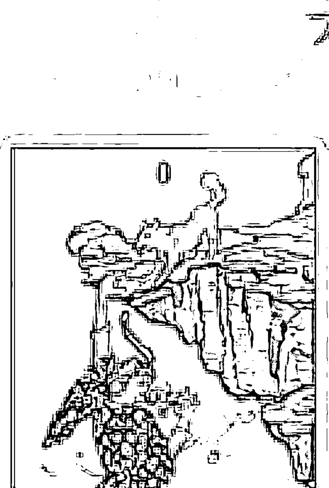

#### 停下脚步，细嗅蔷薇

愚人是塔罗中唯一没有编号的牌，这把他和其他牌区分开来。他可以漫步在社会规则和束缚之外，他有足够的自由去享受人生的旅途，不用担心各种截止日期，时间线，或终点。

理论上说，0不是一个数字。它代表存在之前的状态，或者说什么都不存在的状态。

因为它是圆形的，0也代表宇宙，年的循环，或者生活的循环。就像一个圆环一样，它没有开始，也没有终结。

### 牌面描述

愚人是个天真的人，小丑，和魔术师。他比他看上去的样子要有智慧的多。他用他的天真和简单去挑战社会，文化，和文明中已有的制度。

愚人挂在悬崖边上，在他上方，小狗在激动的叫着。他已经准备好纵身一跃，顺势而行，或者说栽下去。

悬崖摇摇欲坠，有些小石头从年轻人身边落下，而他还挂在半空中。

他的手杖和包裹都掉了下去，但是他看上去毫不关心。目前他只关心手中的白玫瑰，他深深的吸了一口气，闭上眼睛，体会玫瑰的芬芳。

他代表风元素，轻盈，不受重力限制。就像随风飘走的羽毛，他很镇静，完全不担心生活中的纷杂事务。

### 主要符号

愚人头上的羽毛代表胜利和成功。

他的帽子其实是一个月桂花环，我们在大阿卡那的最后一张牌世界中会再次看到它。

愚人外衣上的图案是卡巴拉的生命之树。

白玫瑰代表天真和纯洁。

小狗代表愚人的觉知和逻辑。

悬崖是一个分界线，将两个世界分开来。

手杖为愚人提供了支持和稳定性，但是现在来说，它什么都做不了。

背包里有愚人的行李，在象征意义上来说，它也是愚人的业力包袱，积累了他所有思想和经历，好的与不好的都有。

占星学来说，愚人与天王星相关联，代表不可预知性。

天王星主宰水瓶座，水瓶是风象星座，代表社交群体和预见性，友谊，人道主义事业，和富有远见的思考。

## 建议解读

你跨出了一大步。
你对你目前的面临的压力抱着乐观的态度。
现在告诉你三思而后行已经太迟了，但你依然可以停下来，体味一下生活。
你过去的经历对现在的帮助很小。
你所习惯的世界正在崩塌。
在某些时候，你要学会放手。
现在，你要放开一些你无法控制的东西。
放下你的负担。
放下那些拉着你下坠的东西。

## 1 号牌

## 开始

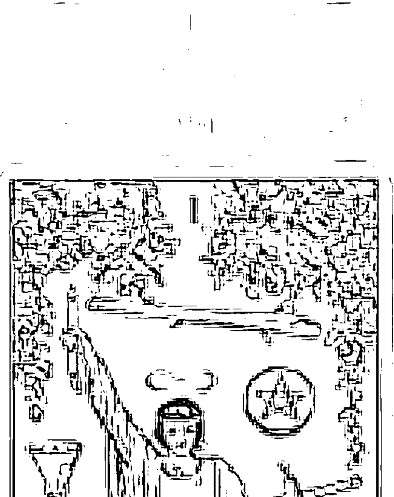

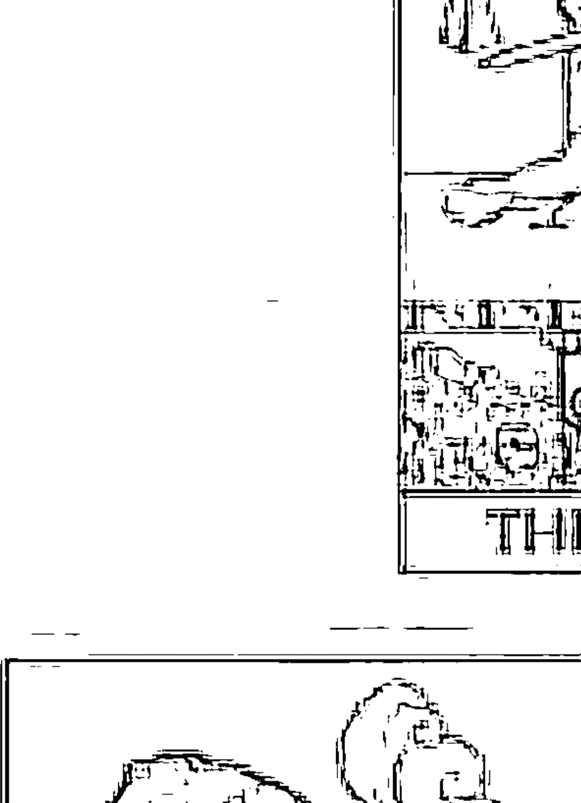

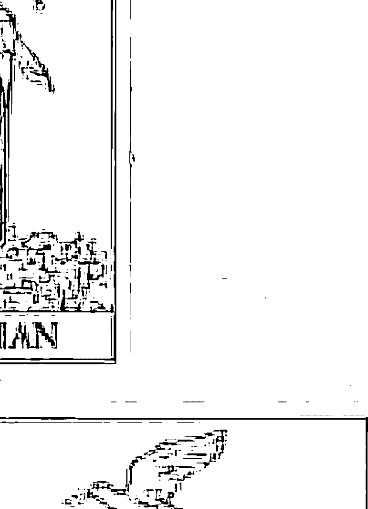

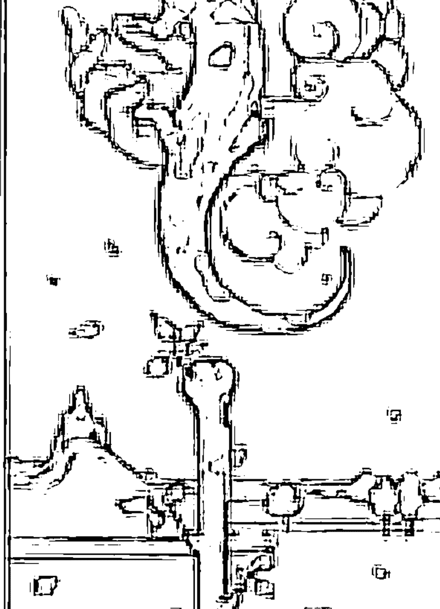

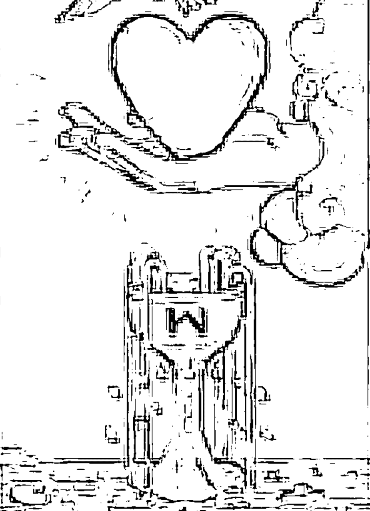

## 魔术师
### 和四张Ace牌

一代表统一，唯一的目标，一切的开始。魔术师和Ace是一切的开端，在四种元素世界里都是这样。但是，元素并不一定以物质形式显现，他们依然是以一种潜在的可能性的形式存在。就像种子一样，它们含有接下来所有的数字牌所需要的东西和可能性。

## 魔术师

> 如其在上
> 如其在下

魔术师是物质世界的大师，他与至高的宇宙能量相连接，并能够依照个人意愿来改变现实世界。在这个过程中，他践行着“如在其上，如在其下”的哲学原则，认为物质的存在是高等觉知的折射。
他手指天空，将上天的信息传达到人间。

### 牌面描述

一个有强大力量的魔术师召集了地水火风的力量，所有的元素都在他面前。权杖，圣杯，宝剑和星币在时间和空间里旋转跳跃，就像行星围绕太阳旋转一样。
如果将魔术师与四张Ace牌比较，思考它们的联系，你会发现四张Ace中，从云里伸出来的手其实是魔术师的手，他穿过迷雾带给我们力量和奇迹。

### 主要符号

四元素道具——权杖，圣杯，宝剑和星币——代表着小阿卡纳中的四种元素。
它们象征着四个领域：灵魂，感情，智力，和物质。

魔术师头上的8是大无穷的符号，代表他在魔法领域的成就，包括对时间和空间的掌控。

代表热情的红玫瑰和代表纯洁的百合花表示，肉体和血液是纯洁和欲望的结合。

黄色的背景色代表光和空气，以及能够对物质和精神世界进行理解的思维。

魔术师的白色袍子代表他有一个天真纯洁的灵魂，白色袍子外面套了一件红色的外套，外套是红色的，代表了物质世界和肉体的热情。

魔术师的腰带是一个蛇环，蛇头尾相衔，和大无穷符号一样，蛇环象征着永恒，它阐述了时间看上去是一条直线，其实是一个循环的道理。我们从一个点走向下一个点，然后发现我们自己又回到了原地。

魔术师的魔杖两头都是尖端的，它可以沟通天地的能量，使之更纯净。因为权杖是人的身体的延伸，也是象征个人意志的道具，它应该根据施法者进行微调：一个魔法师的权杖的长度应该等于从他的手腕到手肘，或者从手肘到指尖的长度。

占星学上，魔术师对应水星，体积最小运行最快的行星，名称含义为神的信使。同时，墨丘利（Mercury）也是一个擅长欺骗的神，善于操纵和误导别人。这个占星对应告诉我们，思想是以光速传播的，手永远比眼睛更快。

水星主宰双子座，是个代表思想和交流的风象星座。

## 建议解读

你是个爱出风头的人，而且有能够达成梦想的神奇能力。
你知道如何与人交流，如何让自己的演出继续下去。
你能够完全掌控你周围的环境。
你有能力塑造你所在的现实世界。
你不介意用一点小手段得到你想要的东西。
你知道如何让其他人看到你想让他们看到的东西。
你或许没有意识到自己的力量，和将它用在别人身上的效果。
你在搅乱局面。
你正处在一个塑造与重造自己和自己所在的现实的过程中。
你向人展示了你的力量，但是你最终的目的是什么？你的宏伟志向是什么？
宇宙完全听命与你。

## 权杖Ace

### 烫手山芋

权杖Ace是权杖组的第一张牌，对应古老的火元素。权杖，像火炬一样，可以燃烧，有激情，有痛苦，也有纯洁的一面。

### 牌面描述

翻腾的银灰色云朵中伸出一只发光的右手，一只代表火元素的火蜥蜴窝在这只手里。

人们认为火蜥蜴代表火元素因为他们可以总逃出火堆，就算火已经烧了一阵子了它们也还是能逃出来。

手的下面是一个大大的权杖，上面冒出了新芽，看上去像是从远处的树上刚砍下来的新枝。

在地平线的山坡上，有一座孤零零的城堡，平地上有一条小河。

### 主要符号

所有的ACE都代表新的开始，权杖Ace代表灵魂层面的开始。

图片中的手可能是魔术师的手，但也有可能是上帝的手。

火蜥蜴是权杖组的另一个代表，它是一个活物，而不是一个静态的象征。

翻腾的银色云朵象征着高等的思维，同时也将两个世界分开了。

远处的城堡代表避难所，警觉性，皇家统治权，和命运的指示。

它还可以代表和平，力量，支撑，和休息的地方。

因为权杖组对应精神生活，权杖Ace也代表了在精神层面新的开始。

所有的权杖组牌都是阳性的，他们象征着行动，冒险，能量，和出行。权杖Ace的阳性尤其重。实际上，它也象征着男性的生殖器，反映出我们创造和重新创造的力量。

传统上来说，权杖Ace被认为是火元素能量的根源，也就是说它是它代表的火元素的源泉。

占星上来说，权杖Ace对应火相星座：白羊座，狮子座，射手座。

## 建议解读

你经历了烈焰的考验并毫发无伤。
现在你的手中有无限的可能性。
点燃火焰，你可以推动重大的转变。
当你做计划的时候，总要保留一个区域，这样你的火焰才不会失控。
玩火的时候要小心，不要玩火自焚。

## 圣杯Ace 把我的心交给你

圣杯Ace是一个喷泉，后面所有的牌将从它的深度中产生。

在塔罗解读的过程中，圣杯Ace代表对友情和爱情的祝福，同时，当你把别人的心握在手里的时候，它也会带来责任。

### 牌面描述

一只张开的手从一朵翻腾的云里伸了出来，摊开的手掌中拿着一颗红心。
手的下面是一个金色的圣杯，飘在平静的蓝色的湖面上。就像莫奈的画中的那样，水面飘着睡莲花。
有五股水流从圣杯的边沿溢了出来，就像喷泉一样，有一只白鸽衔着圣餐饼飞走了。

### 主要符号

所有的Ace都代表新的开始，圣杯Ace代表情感层面的开始。
设计这套牌的人亚瑟·爱德华·史密斯和帕米拉·科尔曼·史密斯都是虔诚的基督徒，所以他们把他们的信仰也带进了这套牌里。
图中的杯子就是圣杯，是在最后的晚餐中用的圣杯，是基督被钉在十字架上后用来采集他的血液的圣杯。
圣杯上方的白鸽象征着圣灵。
鸽子口中的圣餐饼象征着事件。
虽然图中的圣杯和主持都源自圣餐仪式，但是它也是天堂和人间的连接，是灵魂变成物质的过程。
圣杯是阴性的，圣杯Ace也是子宫的象征，是生命诞生和成长的地方。
鸽子飞走了，一个生命已经被孕育完毕，有了自己的心跳，情况在掌控之中。（不管这个孕育的过程是实际的还是象征意义的，圣杯Ace可以指代一个孩子的诞生或者创造的开始。）

圣杯上的W可以代表水（water），酒（wine），或者牌的设计者韦特（Waite）。
占星上来说，圣杯Ace对应水象星座：巨蟹座、天蝎座、双鱼座。

## 建议解读

你将某人的心握在手中。
爱情和友谊都可以供你予取予求。
你的生命充满各种可能性。
水坝快塌了。
你很快会沐浴在祝福中。

## 宝剑Ace 风的力量

宝剑Ace直指任何问题的核心，它代表逻辑，思想，理解，和语言交流的核心。
宝剑同时也代表能够劈开迷雾的能力，可以穿透任何神秘和误解的面纱。

### 牌面描述

一只猎鹰栖息在一只从翻滚的云彩中伸出的带着皮革手套的手上，鹰的爪子和宝剑一样锐利，紧紧地抓住那只手。

为了让鹰保持平静，鹰被带上了面罩，拴住了爪子。鹰任何时候都有可能挣脱这些，去翱翔，去打猎，去杀戮，去带回它的猎物，迅速，高效，残酷。

### 主要符号

所有的Ace都代表新的开始，宝剑Ace代表智慧层面的开始。

宝剑长久以来都是正义，自由，和真理的象征。正义女神手中拿的就是宝剑，还有中世纪的骑士们也是用宝剑保护那些毫无战斗力的人们。

宝剑Ace直指任何问题的核心。它代表逻辑，思想，理解，和语言交流的核心。它代表你用语言表达你的思想的能力，不管是口头的语言还是书面的语言。

鹰是掠夺者，可以被训练来打猎，对被捕食者来说它们是致命的。

训鹰者戴的手套叫做护手，戴上后可以给鹰一个休息的地方，同时也保护自己的手不被它们尖利的爪子划伤。

占星上来说，宝剑Ace对应风象星座：双子座，天秤座，和水瓶座。

## 建议解读

宝剑总是代表着某种程度的斗争，你有可能是进攻方，也有可能是防守方。

你可以依靠你敏锐的，如宝剑一般的智慧来推动和守护你的思想。

真相是个双刃剑。
集中注意力在思考和讲话上，越清晰越好。
目前还不是打中场的时候。
快速切题。

## 星币 Ace —— 生活的礼物

星币Ace是一张非常实际的牌，没有一张牌能像它这样脚踏实地，因为星币Ace本身就代表大地（土元素）。
星币Ace是星币牌组的第一张牌，它象征着物质上的存在，代表事务和现实。它象征着一个充满可能的世界，可以指代从物质层面到精神层面的财富的积累。

### 牌面描述

远处有一个篱笆围墙，一只从另一个世界探出来的手中趴着一只金光闪闪的圣甲虫。甲虫拥有着漂亮的绿色，泛着红黄两种颜色的光。
下方是茂密而芬芳的花园，画面边缘有一个星币，这个地方被百合花和各种开花的灌木围绕。
拱门下有一条蜿蜒的小路，通向远处投下蓝色阴影的山。

### 主要符号

星币Ace代表财富和丰盛。
星币Ace也代表物质层面的新的开始。
圣甲虫是创造和重生的象征。在古埃及，人们认为是圣甲虫每天推着太阳在天空中转动，就像地上的甲虫在滚粪球一样。
星币上刻了一个五芒星，毕达哥拉斯学派用它象征五种感觉，在象征灵魂的圆环中被完美的合一，同时它也是国王和皇帝们用来体现自己皇权的符号。
后方的花园象征着休息，反思，和避难所。
花园周围的墙象征着安全和保护。
拱门象征着通向另一个世界的大门。
最后，星币Ace是一个阴性的符号，与受精卵和发育中的胚胎有关。
像所有的Ace牌一样，星币Ace代表创造的可能性。
传统上讲，星币Ace被认为是土元素力量的源泉。
占星学上说，金币Ace和土象星座有关，即金牛座，处女座，摩羯座。

## 建议解读

你将会获得可以让你完成梦想的资源。
你将可以将你灵魂上，感情上，智力上的理想变成现实。
在这个过程中你可能会变得很富有。
你将会开始生活的新篇章。
你可能会开始一个新事业。

## 2号牌 组合

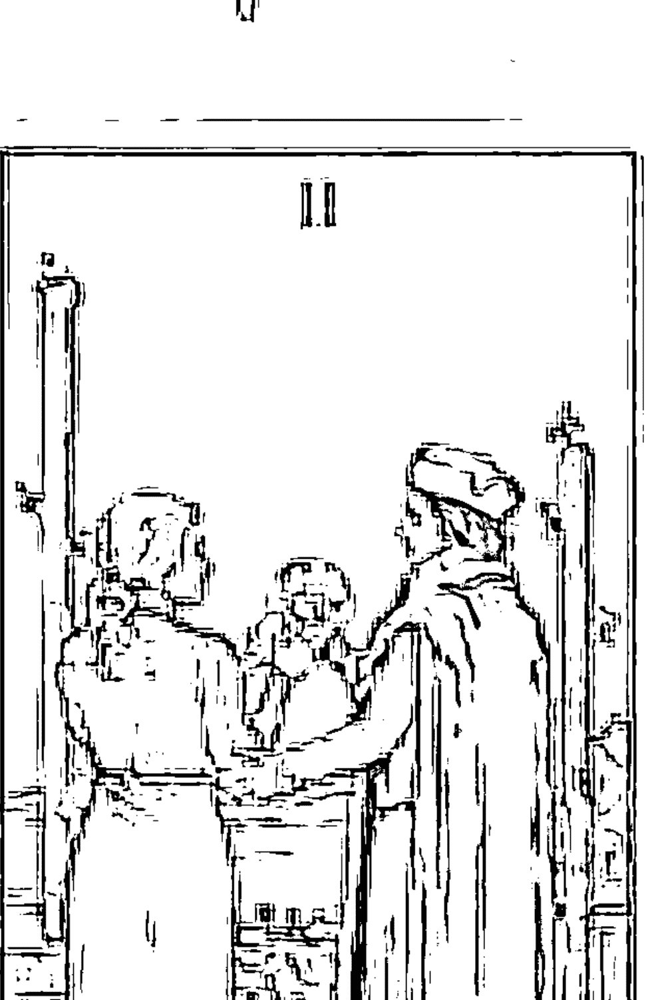

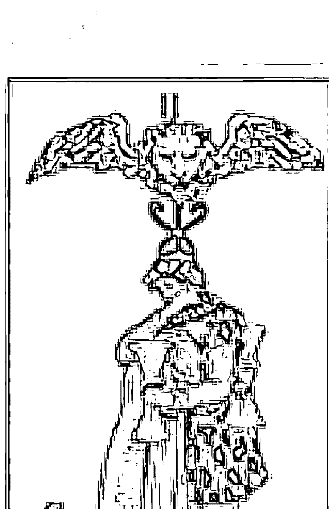

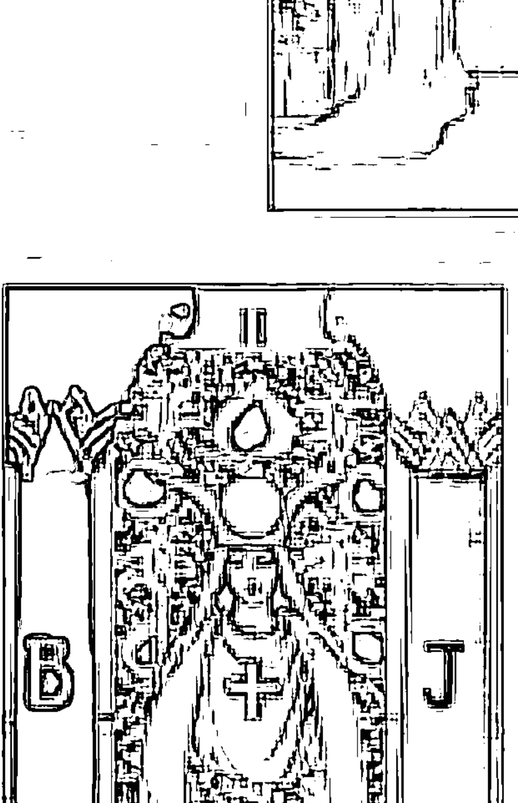

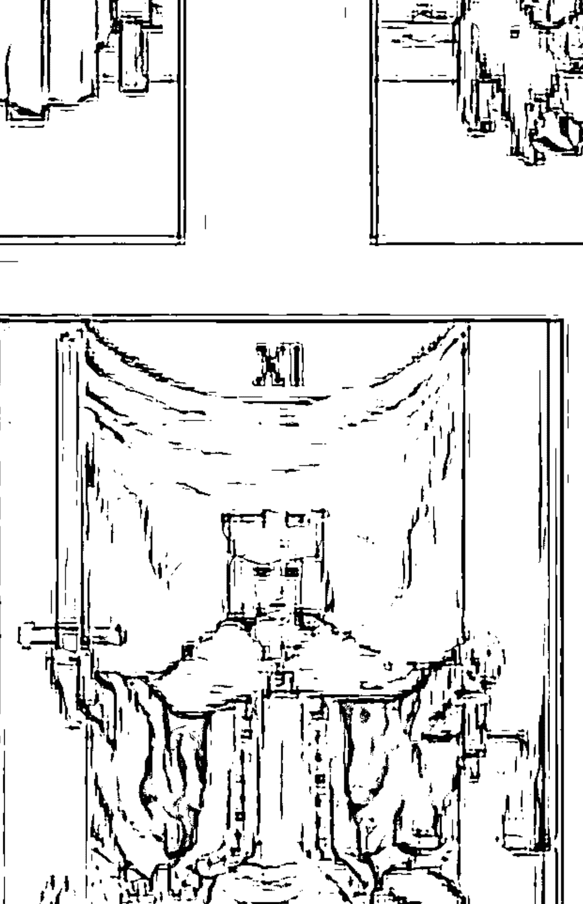

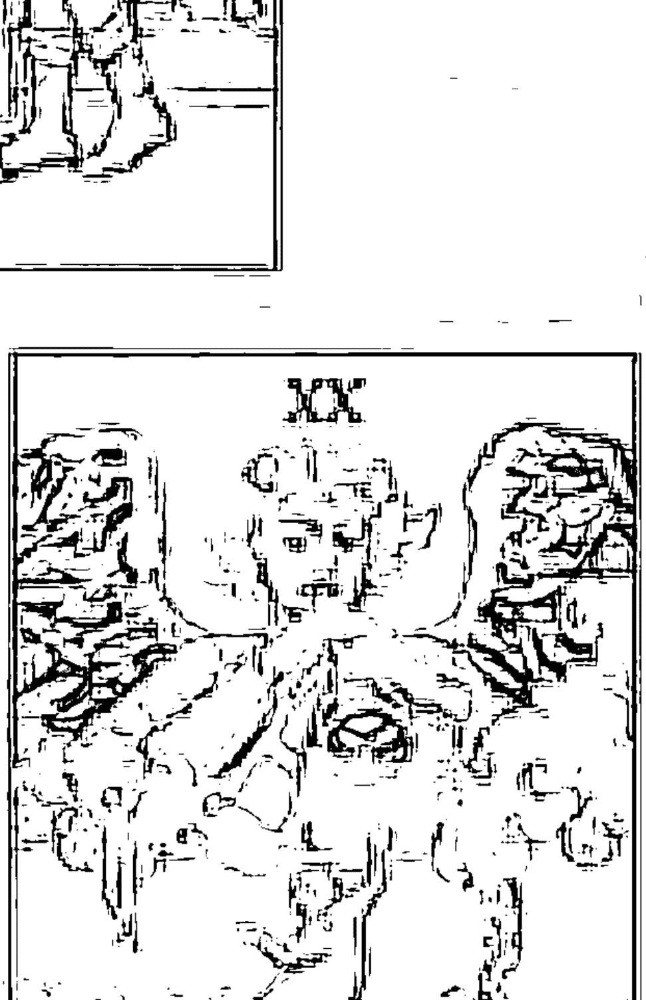

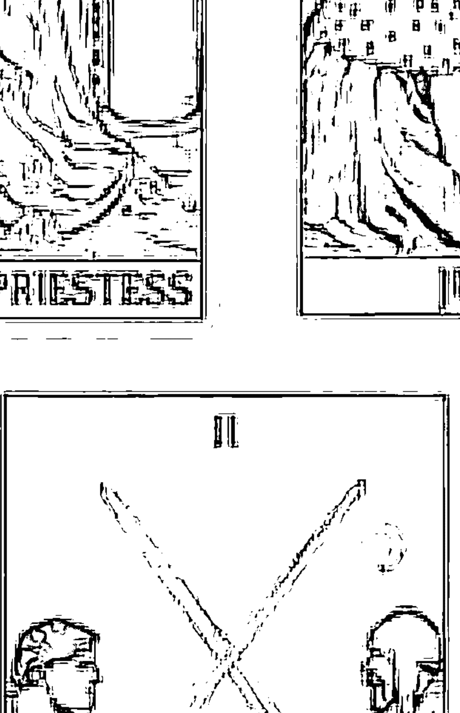

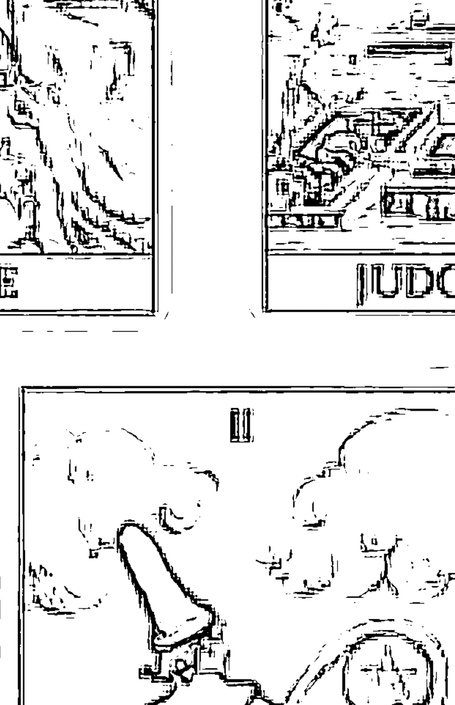

## 女祭司、正义、审判
### 和二号牌

2代表双重性，代表分开，分歧，又或者是一个点和它对应的点。人们可以对比两种不同的观点，这也就是产生智慧和理解力的端倪。2也象征着折射和反省，进而引出自我反省。

在塔罗里，2象征着伴侣和吸引力，还有随之而来的爱情、愉悦与和谐。2的本质大多来自成双成对的对比：天堂与人间，男性和女性，活跃的和惰性的，警觉的和懒散的，白天和黑夜。

## 女祭司

### 灵魂的指引

女祭司敏感，祥和，且纯洁，她手中有通向智慧的钥匙：通过思考和学习培养出来的直觉。

她是个典型的通灵者，这一特点将她和月亮联系起来，月亮象征着直觉和反省。

### 牌面描述

一个漂亮的女人安静地坐着，她的脸上看不到一丝担心或忧虑，显得十分平静。她坐在两个柱子中间：一个是黑的，一个是白的。柱子上挂着幕帘，帘子上有棕榈树和成熟的石榴。

她的头上戴着三重月冠，象征着月亮慢慢变圆，满月和月亮渐渐变缺的三种状态。她脖子上有一条细长的链子，下方悬着一个十字架。她的外套是紫色的，里面的衣服是绿色的。【译者按：这到底是印刷偏色了还是画家色弱了？！】她半披着外套，手中拿着一个卷轴，上面写着TORA。

她的胳膊盖在长袍之下，伸出来的手中拿着一组钥匙，这组钥匙和教皇脚下的那组一样。她为什么要拿着两把钥匙？因为想要解锁灵魂世界，首先你要搞定物质世界，女祭司手中的钥匙可以解锁这两个世界。

### 主要符号

女祭司边上的两个柱子是卡巴拉生命之树中的柱子，一黑一白，象征着事物的对立面，慈悲和严厉，光和暗，灵魂和物质，毁灭和创造。

柱子上刻着B和J，代表圣经旧约里面的人物：大卫王的曾祖父波阿斯（Boaz），和所罗门王圣殿里的大祭司约阿希姆（Joachim）。

用罗马数字写成的II看上去就像是女祭司身后的两个柱子，其实II本身也代表门，包括婴儿降生到这世间时的生命之门。

两个柱子中间的帘子和所罗门圣殿里的帘子一样，是这个世界和另一个世界的屏障，女祭司可以穿过帘子看到世界的真相。

帘子上有棕榈和石榴的图案，分别象征男性和女性的丰饶，石榴的排列顺序和犹太教的创世原型卡巴拉生命之树一样。

女祭司腿上放的经卷是妥拉（Torah），希伯来的律法书。图里只能看到前四个字母，余下的被女祭司的长袍遮住了，就像是她在保护某个秘密一样。Tora也可以看做rota的变形，rota在拉丁语里是“轮子”的意思。Tora还可以被写成tota，意思是“所有的”。

在命运之轮中你会再次见到它们。

女祭司的三重月冠代表了月亮由缺而圆，满月和由圆而缺的三种状态，她脚下是一轮新月。

月亮和通灵、直觉有关，它折射了太阳的光芒。它还象征着怀孕和生产，因为它代表了女人怀孕后身体形状的变化，从怀孕，到生产，到恢复。因为月亮一个圆缺周期是28天，它也代表了事物周期性的循环的本质。它还可以象征一个女人人生的三个阶段：从新月到满月是少女时期，满月是成为母亲之后的全盛时期，满月到月缺是老年时期。

女祭司脖子上的十字架是太阳十字架，代表平衡和平等。

占星上来说，女祭司对应月亮，代表反思和直觉。

## 建议解读

智慧是从阅历而来，但你也可以相信你的直觉。你天生有很强的直觉，你的第六感很强。别人很愿意向你寻求建议和引导。就像女祭司一样，你必须要有自己的私人空间，读书，写作，反思。塔罗就像人生一样，有一些真相是不可以被揭示的。

## 正义 —— 公正的聆听

正义象征着公平和平衡，正义女神是法律的创造者也是法律的执行者。作为最终的仲裁者，她手持双刃剑，告诉我们公平其实有利有弊。

### 牌面描述

希腊神话中的正义女神忒弥斯坐在高台上，边上是两个白色的柱子，她右手中的宝剑指向上方，左手的天平悬挂在下方。她红色的长袍外面是绿色的外套，头上戴着黄金的冠冕。
在她脚下跪着一个王子和一个乞丐，她同时倾听双方的意见来寻找真相，同时做出公正的判决。

### 主要符号

正义不是盲目的，所以在她的审判室和律师的办公室中，没有任何东西是被遮挡的。实际上，她的眼睛睁的很大，她可以看到全部的真相。
双刃剑提醒我们，正义有利有弊。
天平代表真理，以及慈悲和正义之间的平衡点。
乞丐头上的绷带告诉我们他受伤了。
王子的袍子和王冠代表他有权利且富有。
正义女神坐在正义双柱之间，就像之前的女祭司和教皇一样，这些柱子也象征着平衡和平等。

她头上的王冠代表敏锐的智慧，富有逻辑的思维，和实至名归的权威地位。

传统意义来说，法官的长袍用来象征中立，统一，和他们的地位。

正义女神拿着象征平衡的天平，这也是天秤座的象征。不论是在个人层面还是在社交层面，这个图像将正义和天秤座平衡，平等，平和的特性联系起来。

正义牌象征理智和逻辑，不会被激情或者感情动摇的公正。

## 建议解读

- 你在寻求平衡。
- 你支持弱势群体。
- 你相信公平和平等。
- 你可能会被卷进法律事务中，比如说合同和执照问题，官司，和仲裁。
- 因为这张牌与天秤座有关，你可能会参与到一些社交事务中去。

## 审判

### 觉醒的呼唤

审判揭示一切，预示着新世界的黎明，代表着饶恕的力量。

### 牌面描述

大天使加百列吹响了号角，召唤义人从坟墓中苏醒，这是重生的狂喜，因着他们的义行，被赐予永生的生命。但是那些德行有缺的人无法得到拯救，他们的白骨在坟墓中哭嚎着祈求拯救，但这都是无济于事的，他们只能在坟墓中腐朽。
天使比人更大，漂浮在半空的云朵上，伸出大大的翅膀覆盖了整个天空。

### 主要符号

天使是召唤者和信使。
图中所有的人物都是裸体，他们没有秘密。
加百列脖子上的等边太阳十字架象征着男性和女性的结合，阳性和阴性的合一。
红色的十字架一般被认为和拯救、健康和治愈有关。
云朵象征着更高层的意识，同时也是天堂和人间的分隔。
天使的翅膀象征着土元素的守护，它可以用来抵挡太阳，风暴，和雨水的伤害，或者说火风水三种元素的伤害。
背景中的柏树象征永生，裸露的棕色土地象征着刚刚开垦的新土地。
那些恢复健康和年轻的新生命急切的想要拥抱他们新的永生的生活。
打开的棺材象征着这些人能够脱离固有的思维模式。

从占星上来说，审判对应冥王星，冥王象征着死亡，重生，和不可避免的改变。冥王星主宰天蝎座，是个最喜欢探究人性阴暗面的水象星座。

## 建议解读

站起来！向前走！上帝的天使已经吹响号角！是时候面对这一切了！
放开过去的伤痛，放下过去，为更好的明天奋斗。
你应该原谅别人，也要原谅自己。
不要评判别人，让别人来评判你。
一个秘密将要浮现。

## 权杖二 —— 我的就是你的

权杖二是一张关于合作的牌，尤其是商业合作和世俗事务。

### 牌面描述

一个男人和一个女人站在两个比人高，像门一样的权杖中间。他们两个是平等的，而且互为补充：一男一女，一金发一棕发，一绿衣一红衣。
他们一起拿着一个水晶地球，象征着已知的世界。他们的肢体语言告诉我们他们的关系很稳定，能够互相支持。他们都稳稳地站立着，男人扶着女人的胳膊，他们互相深情地注视着对方。

他们站在城堡上，远处可以看到有个村庄，村庄里是红色屋顶的小茅屋，漂亮的花园，和绿色的海岸。绿色的树木在房子上投下阴凉，村庄的一边是山做的屏障，另一边是一条小河。

### 主要符号

传统上来说，权杖二代表统治，穿戴得体的夫妇是这个地方的主宰，他们将世界握在手中。

但是你看不到的是，世界其实是很重的负担，如果没有深刻的判断力和自制力，这对夫妇可能会被他们自己手中的权力毁掉。

城堡低矮的城墙象征着界限。

城墙上雕刻着象征激情的红玫瑰和象征纯洁的百合花，它们交叉成了圣安德鲁十字架的样子，象征着和谐，统治，与公正。

牌中的地理特色也有保护和防御的含义，海港让船只不受风暴的伤害，山脉让村庄不受入侵者的伤害，这个地方易守难攻，是个经营生意，发展贸易的好地方。

这对夫妇明显生活富裕，亚瑟·爱德华·韦特说他的姿势和亚历山大相似，亚历山大孤单的站在财富的中央，因为没有更多的世界可以去征服而感到怅然若失。

在塔罗里，二通常象征着双重性，合作性，或者观点的碰撞。权杖二可以象征兴趣类似，或者开始一段合作关系，或者有策略的联盟关系，甚至企业并购。

## 建议解读

你能够完全的控制你的事业和你的生活。
你有一个可靠的伙伴。
你可能会有敌人，但是你的防御系统很坚固。
永远不要低估界限的重要性。
保持谦卑。力量会消逝，绝对的权力崩塌时会有更大的影响。

## 圣杯二 —— 一吻定情

就像恋人牌一样，圣杯二也象征着浪漫和吸引。它可以给人以安慰感，比如恋人的一个拥抱，婚姻，以及婚后幸福的家庭生活。

### 牌面描述

一对恋人紧紧的拥抱着，女人把脑袋搁在男人的肩膀上，男人轻轻地抚摸她，另一只手插进了她的头发。他们两个手中都握着金质的圣杯，里面盛着葡萄酒，可以与另一半一起举杯庆祝。
在他们的上方有一只红狮子，狮子的头后面有翅膀，像是墨丘利手杖上的那只。同时，有一只白猫——被驯化的狮子——在他们的脚旁蹭来蹭去。

### 主要符号

男人头戴红玫瑰花环，象征着有激情的思想。
女人头戴月桂花环，象征胜利和荣耀。
狮子在炼金术中象征水与火的结合，在占星上是火象的狮子座和水象的天蝎座的结合，这个有时候也会被画成一只鹰。
狮子在炼金术上也可以象征还未出生的灵魂，他在寻找一个肉体以便来到这世间。
狮子象征着肉欲、娱乐，以及对于娱乐和繁衍后代本能的向往。墨丘利手杖上缠着两条蛇，对应水星。墨丘利看到两条蛇在殊死搏斗，用手杖分开了他们，后来这个符号是被当成了和平的象征。
这对年轻的恋人的感情看起来很真挚，但事情并不像我们看到的那么简单。画韦特塔罗的史密斯也是个舞台设计师，如果你自己看这两个年轻人，你会发现他们好像是站在舞台上一样。他们身后有山坡和草地，有红色房顶的小茅屋，和小树林。你可以自己判断这些到底是实景还是舞台的背景画。
占星上来说，圣杯二对应金星，主管爱和情感的行星。同时圣杯二也和巨蟹座有关，巨蟹座主管家庭和家庭生活。

## 建议解读

你看起来有一个完美的生活，但是是真的吗？还是个假象呢？
婚姻和家庭。
你被爱情和情感包围。
你很平静。
你的猫爱你。

## 宝剑二 —— 双重性，斗争

宝剑二代表艰难的决定，讨论和争论。这种斗争大多是内心的斗争，但是也有可能是外界的斗争。

### 牌面描述

一轮上弦月下面，在一个布满石头岸边，一个年轻的女人坐在石头凳子上，她的眼睛被遮住了，双手交叠放在腿上。
她看不到面前的这两个男人，但是她可以听到他们打架时剑的声音。她穿着白色的长衫，但是她面前的两个男人全副武装，穿得像中世纪骑士一样，束腰外衣和皮靴也都不落下。他们的表情非常的坚定。

### 主要符号

交叉的宝剑代表两个对立的观点。
图中的女人，就像正义中的女神一样，必须在两个一样重要的观点中选择一个。
女人被蒙着眼睛，表示她必须依靠其他的感官，包括她的直觉。
眼罩也可以代表她的潜意识。
两把交叉的剑并没有在劈或者砍，只是交叉在一起，像是暂时休战一样。
骑士认为他们的使命是冒险和拯救。
盔甲代表防御的能力。
新月代表成长和发展的初阶。
传统上来说，宝剑二被看做恢复平静的一张牌。
历史上来说，宝剑二可以代表友谊与和谐，或者给一个女人的礼物，或者当男人寻求帮助的时候获得的重要保护。也有人说宝剑二代表交战和解决小混乱。
占星上来说，这张牌与月亮有关，月亮代表反思与直觉，同时它还与天秤座有关，代表和谐和平衡的风象星座。

## 建议解读

你正面临一个难以抉择的状况。
你为什么要把眼睛遮住呢？你为什么不睁眼看看呢？
交战的双方都想要吸引你的注意力。
并没有中间点，你必须要选择其中的一方。
你最终会做出一个能让自己安心的选择。

## 星币二 —— 杂耍艺人

星币二代表不停地变动和调整。

### 牌面描述

星币二中的杂耍者一半是个小丑，一半是个弄臣。他只玩了两个星币，但是变幻出各种复杂的花样，把绳子扭成大无穷符号的形状。沙滩上散落着一些贝壳。
一艘船刚刚到岸，四个人从船上下来。虽然看不太清楚，但是像是一个男人，一个女人，两个年轻人，很有可能是宫廷牌中的四个人。在远处还有一艘船浮在海面上。

### 主要符号

杂耍的人是一个表演者，希望从观众那里收到几个铜板。
其他几个观众代表普通大众，年轻的年老的，男的女的，每一个人都行走在自己的人生旅途中。
翻滚的海面的云朵代表今天出海不会太顺利。
杂耍表示事物的循环，衰落或兴起，失去或得到，软弱和强壮。
大无穷的符号代表宇宙日月交替，一阴一阳，不停交替。
星币组都与钱财和物质有关，它也可以代表权衡两个工作或者过着两种生活。
这张牌中的平衡也可以是抽象意义的，比如大多数人每个月都在保持收支平衡。
有时候星币二也会指代脚踏两条船，想办法协调双方的时间，同时能够欺骗两个人。
传统意义上讲，星币二被称为和谐的交换。
占星意义来说，这张牌和木星有关，木星象征扩张，运气，和财富。它同时还与摩羯座有关，摩羯座是象征生意，职业，和社会地位的土象星座。

## 建议解读

你的生活处在不停地变动之中。
你在权衡两个大的因素。
这是一种极不稳定的平衡，但是你已经习惯了。
你让事情看起来变得很容易。
不要吝啬财富。

## 3号牌 创造性的追求

## 女皇、倒吊人、世界和三号牌

数字三象征着创造，因为它把两种事物融合之后产生了第三种新的事物。比如，一个男人和一个女人结合，可以生出一个孩子；一个理论和一个相反的理论放在一起，可以得到综论。三也象征着过去，现在，和未来，同时也象征着人生的三个阶段，出生，成长，死亡。

## 女皇

### 大地之母

女皇是一个典型的母亲形象，她滋养万物，其中也包括人类。

### 牌面描述

一个美丽的金发女人坐在雕刻着金星符号的王座上。王座上放着厚厚的垫子。她穿着华丽的长袍，脖子上戴着珍珠项链，头上戴着星星和月桂做的王冠。她一只手高举金质的权杖，一只手放在腿上。她脚边有一只雪白的天鹅，和四只小天鹅。
画面的前方有茂盛的麦田，后方是郁郁葱葱的树林，有一条清澈的小溪从其中穿过。

### 主要符号

女皇与爱，婚姻，和母亲有关。在解读中，女皇一般与夫妻关系或母子关系有关。
女皇的花园物产丰盛，小溪给园中的植物提供了充足的水源，树木得以繁荣生长，田地可以获得丰收。她的花园是避难所，也是天堂，在她的庇佑下，万物从青涩走向成熟。
她的王冠上有12颗星，对应黄道十二宫。
她的权杖象征她在尘世的权柄。
天鹅象征着和平，魅力，和时间的流逝。金星是爱与美的女神，天鹅对她有着特殊的意义，阿芙罗狄忒有一架天鹅拉的车。天鹅也可以和缪斯联系起来，缪斯是无数的音乐家，诗人和各种赞颂生活之美的人的灵感的源泉。
天鹅也和勒达有关系，勒达是个凡间女子。宙斯曾经变成了一只天鹅，引诱勒达。后来勒达生下了四个孩子，男孩有卡斯托尔和普鲁克斯，后来成为了双子座的星宿；女孩有海伦和克吕泰墨斯特拉。海伦长大后成为绝世美女，也成为特洛伊战争的祸根。
瀑布和小溪代表女皇与生命的链接。
柏树象征着永生。
在塔罗中我们默认女皇嫁给了皇帝（后一张牌），她也象征着婚姻和伴侣。
占星上来说，女皇对应金星，爱与美的行星。

## 建议解读

你的生活十分丰富并有创造性。
你可以引导力量，走向新的生活。
你可以把普通的素材加工成艺术品。
你可以用任何事物，任何形式，给自己以全新的生活。
你正闪闪发光，人们都很喜欢你。

## 倒吊人

### 徘徊

倒吊人代表着耐心，坚持，和希望。他以一个全然不同的角度来观察世界。

### 牌面描述

在一个十字形的树杈上吊着一个年轻人，他的右脚被绳子绑在树上，双手背在背后，左腿弯曲放在右腿后面。
他并不是孤身一人，他不是在受苦。有一个女人跪在他身边，用陶罐喂他喝水。

### 主要符号

倒吊人被掉在一个T型的树桩上，树桩的形状像是希腊字母Tau，Tau象征着仪式性的死亡和永恒的生命。
倒吊人有时会与基督联系起来，后者为人类做出了极大的牺牲。
倒吊人有时也代表背叛者，历史上对背叛者的惩罚就是倒吊起来。有些版本的塔罗可能会把吊在树桩的人画成犹大（出卖基督的门徒），从他的口袋中掉出30个金币。
历史上，耶路撒冷的女人会给吊在十字架上的人送一些有麻醉效果的饮品，来减轻他们的痛苦。
倒吊人头周围的光环象征着人类的灵性之光。
倒吊人有些精神恍惚，他好像进入了另一个世界，甚至是一种轻安的状态。
他不会因为被吊在树上而造成肉体上的死亡，但是他却可以从这种象征性的死亡与复活中得到灵性的成长。
有时候，吊人也会与未出生的孩子联系起来，因为后者在子宫中通常是头下脚上的状态。
他的姿态也可以解释成进入亡灵世界的姿态。黑暗天使路西法被从天堂驱逐出来的时候就是头朝下跌入地狱。
倒吊人的腿的姿态像是数字四，也就是皇帝牌的数字。这个姿势象征着稳定，就算他并没有站在地上。
占星学上，倒吊人对应海王星，象征着梦和幻觉。海王星主宰双鱼座，是一个象征着精神沉浸的水象星座。

## 建议解读

换个视角看问题。
摒弃你过时的态度和信条。
暂时不要去关注世俗的杂物。
你的计划可能会被延迟。
活在当下。

## 世界

### 宇宙的舞者

世界描绘的是一种永不停歇的生命的舞蹈，它象征着完成与成功，同时也准备开启下一个循环。

### 牌面描述

在一个巨大的月桂花环中央，一个年轻的女人在跳舞。她悬浮在半空中，浑身赤裸，一条长长的飘舞着的围巾从她肩头垂下，包裹住她的大腿。她金色的卷发向后梳起，露出宁静的表情。白色的云朵在她周围翻滚，还有四元素的象征，一个金质的星币，一个闪光的圣杯，一个比人还要大的权杖，和一柄银质的宝剑。

### 主要符号

世界是大阿卡那中的最后一张牌，代表整个循环的终结，当然也意味着永恒，没有开始，也没有结束。
舞者的花环被两个象征着大无穷的横8形状的丝带系了起来。
花环本身象征着死亡，重生，和永生。所以我们才用它们来庆祝季节交替，悼念我们逝去的亲人。
历史上，战胜对手的英雄总是头戴月桂花环。
舞者的围巾也是象征着起始和结束的符号。在过去，新生儿总是被襁褓包裹，而死者总是穿着寿衣。如果你仔细看，围巾的形状也像是大无穷符号。
舞者赤身裸体象征着她打破了自身的禁忌。
舞者两只手里都有权杖，就像大阿卡那的第一张牌魔术师一样。
世界可以是大阿卡那的最后一张牌，但它也是新的循环的开始，小阿卡纳的冒险和经历从这里开始。
占星学来说，世界对应土星，象征着界限和秩序。它告诉我们，规则可以限定人，但人也可以制定规则。

## 建议解读

你到达了终点，赢得了比赛。
去拿奖品吧。
打破自身的限制。
庆祝你的成功。
准备好，生活要步入新篇章了。

## 权杖三 猎人

权杖三代表了高层面的成功，引人注目的成就，和对辛勤工作的奖励。

### 牌面描述

画中的人身穿拼色长袍，背对我们。他站在高高的悬崖边上，俯视广阔的海面，海上漂着几只帆船。他站在三棵树苗中间，远处有低矮的山脉。
他举起左手，把猎鹰放飞了。

### 主要符号

鹰代表风元素和土元素，他们是残酷且贪婪的猎人，捕猎稳准狠。猎鹰可能成群结队的出行，但他们本性中的残忍是不会变的。他们眼神锐利，是绝佳的武器。
不管你什么时候在塔罗中看到一只动物，它都代表你自身的野性，不停地抗争以摆脱社会的束缚。
传统上，权杖三被叫做“已经建立起来的力量”，从牌中的人物身上可以明显的看到已经建立的权威。
权杖三是塔罗中极少数一张看不到人物表情的牌，我们无法得知他的想法或者感受。
他的位置可以俯瞰大海，代表力量和安全。
有三艘船穿过海湾，表明他参与了贸易和探险。
牌中的探索与发现不仅限于开发新市场和新客源，还可以是探索新大陆，新的货物与服务来源，或者寻找新搭档和盟友。
三棵树苗表明合作关系不仅仅只是纸上谈兵，它已经开始生根发芽了。
商人付出一些东西，希望它可以带来利益和财富，他愿意冒险。
占星上来说，权杖三对应太阳，还对应白羊座，白羊是象征领导力和新开始的火象星座。

## 建议解读

你已经达到了一个巅峰。
你勇敢地寻找你需要的东西。
你善于解决问题。
如果你现在处在一段关系中，不论是商业合作还是私人关系，这段关系最终会有结果。
舍不得孩子套不着狼。

## 圣杯三 丰收的庆典

光，空气，和水让大地变了样。太阳让植物撑过了漫长的寒冬，种子开花结果，葡萄被酿成了美酒。
圣杯三象征着丰收，舒适，和欢庆。

### 牌面描述

三个年轻的女人在葡萄园中又唱又跳，她们的勾肩搭背，高举酒杯，她们在庆祝大自然的慷慨。她们把树叶和花编进辫子里，高兴地笑着。这是丰收的时节。

### 主要符号

葡萄园像花园一样，象征着安全和文明。
收获象征着繁荣和丰盛。
三个女人代表过去、现在和未来；也可以代表出生、成长和死亡；还可以代表太阳、月亮和星星。
当你看着这三个女人的时候，你看到的是女神的三个样子，也是一个女人生命中的三个阶段：少女、母亲、老年。
她们也可以是古典神话中的女神，柏拉图曾经描绘过命运三女神，她们掌管生命之线，克罗索掌管未来和纺织生命之线，拉克西丝负责维护生命之线，阿特洛波斯掌管死亡，负责切断生命之线。
在斯堪的纳维亚神话中，兀尔德纺织生命线，贝露丹迪拉扯生命线，诗蔻迪剪断生命线。
在希腊神话中，她们也可以是阿格莱亚，欧佛洛绪涅，和塔利亚，分别代表着光辉、欢乐和庆祝。有时候她们也可以代表美丽，温和，和友谊。
她们也可以代表三美德：信仰，希望，和仁慈。
围绕着三个女人的丰盛的作物表明还会有更多的庆典。
传统意义上来说，圣杯三代表丰盛。
占星学来说，圣杯三与水星有关，水星代表速度和交流；还对应巨蟹座，象征家和家庭生活的水相星座。

## 建议解读

- 你会有很多收获。
- 你将要参加一个庆典。
- 你应该约一个女孩晚上出去玩。
- 吃喝玩乐浪起来。
- 当你玩乐的时候，时间也在流逝。

## 宝剑三 —— 时间是最好的解药

宝剑三画的是一个破碎的心，每个人都经历过这样的事情，每个人都明白牌中画的，也都知道没有伤口可以愈合后不留痕迹。
宝剑三在解读中更多地是代表过去的状况，偶尔会指向未来的状况，但在指向未来的时候通常不是一个突发状况，之前一定会有苗头的。

### 牌面描述

一个流血的心，被绷带包住，背景是乌云和暴雨。有三把剑掉在地上，它们曾经深深地伤害了这颗心。

### 主要符号

我们会因为各种原因心碎，但是这张牌通常是指分离和离婚。
地上的三把宝剑暗示这段关系的破裂可能是由于第三者的介入，可能有劈腿的问题。【译者按：这还真不一定！取这个含义要谨慎！】
也有可能一个是不速之客想要钻空子，打破一段貌合神离的关系。
有时候，宝剑三还代表流产或者死胎带来的打击和悲伤。这个含义依然是基于牌面中有三把宝剑，可以代表妈妈，爸爸，和孩子。
宝剑三也可以是抽象意义的，比如焦虑或者恐惧，或者实际意义上的心脏病或者手术。
宝剑三也可以代表一颗在流血的心，一个人被另一个人的悲惨故事打动从而感到心痛。
宝剑三里面的心也可以是基督的心，因为人们给他带上荆棘王冠而伤心。这也是为什么早期一些塔罗学派认为宝剑三可以代表修道者。
传统意义上来说，宝剑三代表悲伤。
占星学来说，宝剑三和土星有关，土星象征着界限和秩序；落在天秤座，象征和平和平衡的风象星座。

## 建议解读

你失去的东西让你非常痛苦，而治愈还需要时间。
过去的伤痛会留下疤痕，疤痕通常会让人很不舒服。等你恢复之后，你的心会比以前更坚硬，或者说更僵硬。你不再那么单纯，也不再那么天真。
如果你运气好的话，这个经历会让你不再犯同样的错误。你会更悲观，但也会更有智慧。
不经一番彻骨寒，怎得梅花扑鼻香。
有爱就有失去，但也比从未被爱过更好。

## 金币三 艺术视角

金币三代表对艺术的掌握，不管是老师教给学生的，还是学生从实践中自己领悟到的。

### 牌面描述

一个雕塑家向后退一步看自己的作品，一个大理石雕的男孩子，背着一个框子。他靠近一个拱门，拱门上有三个金币。他的作品是嵌在一个凹框里的。
他的工具——一个锤子和一个凿子——放在工作台上。他半披着衣服，好像是刚到这，又好像是收工了要回家。

### 主要符号

背景是一间教堂，是神的圣殿。这告诉我们，我们的身体也可以是一个圣殿，我们的灵魂住在一个肉体里。
拱形代表力量和支持。
教堂的拱门代表进入另一个空间，这是世俗世界和神殿的分界线。他们是世俗的物件，却可以引着我们的灵魂走向天堂。
三个金币代表三位一体，也可以代表身心灵组合。
凹陷处可以代表子宫可以提供给孩子的安全和保护。
雕塑雕刻的并不是一个一般人期待在圣殿中会看到的天使或者圣人，这是一个童工，甚至可能是一个奴隶。
艺术提醒我们神的存在和他的仁慈。实际上，很多作品像是造物者赐予的灵感，而不是人的灵感。
工具，比如锤子和凿子，可以用来雕刻作品，也可以毁灭作品。
以前，如果金币三出现在解读中，很可能是指向问卜者的大儿子。如果是逆位，可能代表小孩，童年，或者孩子气的冲动。
占星上来说，金币三与火星有关，火星是个代表能量和冲突的战士形象；落在摩羯座，象征生意，事业，和社会地位的土象星座。

## 建议解读

艺术来源于生活，你的杰作正在慢慢成形。
创造同时也意味着毁灭。
你正在创造一件美丽，持久，永恒的艺术品。
努力之后应该获得回报。
注意你在用的工具。

## 4号牌 稳定

## 皇帝、死神和四号牌

数字四代表完成和稳定，因为从几何学上说，四个点可以搭成一个稳固的结构。跟四有关的有：四维空间，四个方向，四个季节，四个风向，一天中的四个时期——破晓，白天，黄昏，夜晚，月亮的四个阶段——上弦月，满月，下弦月，黑月，四大元素——火，水，风，土，和小阿卡纳的四组牌。

## 皇帝

### 牺牲品

皇帝是现实世界的统治者，保护者，和供给者。他是以一个父亲的形象出现的——他保护他的子民和所有物，是一个备受信任的权威人士。他是女皇的另一半，把女皇创造出的事物分类规整好。

### 牌面描述

在一个荒凉的沙漠峡谷中，一个身材健硕的皇帝坐在一个巨大的，表面粗糙的王座上。他仪表堂堂，肩宽体阔。像是孩子们画的神祇一样，他头戴王冠，有长长的白胡子，他的面部表情十分坚定，眉毛又浓又粗。

王冠是很重的，或者说在这个画面中，没有一件轻巧的东西。他红天鹅绒的长袍下穿着全套的铠甲，手中拿着一个大大的T形十字架，和一个水晶球。他坐在花岗岩雕成的王座上，坐得笔直，动作僵硬。他的肩膀很宽，双脚牢牢地放在地上。在他的脚旁趴着一只野山羊。

### 主要符号

国王的王座象征着他的力量。这是个巨大的，表面粗糙的，花岗岩的王座。它象征着秩序和稳定。同时它立方体的形状也体现出了数字四的稳定性。

在这张牌中，公羊和皇帝是一样的，他们都是牺牲品，他们都要为自己的人民贡献生命。王座不过是一个被美化的祭坛而已。

女皇住在一个植物茂盛的花园里，皇帝则在一个气候严酷的沙漠里。背景中的山在某种程度上重申了他的统治的稳定性。这张牌中也可以看到女皇牌的影响，比如穿过皇帝领地的小溪，就是从女皇那里流过来的。

皇帝镶满珠宝的王冠是天授神权的证明。

皇帝长长的白胡子代表了他随着年龄增长的智慧。

在皇帝红色天鹅绒的袍子下面是全套的盔甲，说明他随时准备起身，保卫自己的领土。

T十字架是从埃及传来的，代表男女之间的平衡。

皇帝的阳刚气质爆棚，他的这种男性特质正好与女皇互补。同时，这也让皇帝成为一个有思想的人。

传统来说，皇帝有时候被称作黎明之子。

占星学来说，皇帝对应白羊座，黄道十二宫的第一个星座，象征领导力和开始的火象星座。

## 建议解读

你需要秩序和稳定性。
你不想要惊喜，你想要对全局准确的把控。
如果你没法掌控全局，至少你要知道谁说了算。
你极少失职。
你可能会很顽固，尤其是在捍卫你自己的价值观的问题上。

## 死神

### 众生平等

死神代表着变化。他挥舞着大镰刀，除去所有无法生存的事物。这张牌代表事情进入新的阶段，生命走完一个阶段，进入了下一阶段。
根据热力学，能量无法被创造或者摧毁，它只是从一个形式变成另一个形式。死神代表的也正是这一种转变。

### 牌面描述

死神走过生命的战场，摧毁掉那些脆弱的事物，无人幸免。有些人可能能活到看到太阳升起，但是死神很有耐心，他坚持不是不报时候未到，出来混的总是要还的。
他认为伟大和平凡都是一样的。一个全能的国王和一个强大的主教都已经倒在了地上。一个无辜的孩子躺在他哭泣的母亲的怀抱里。在远处，生命的河流正在流向永生的大海。

### 主要符号

死神的一般形象是一个骑着白马的骷髅。他穿过生命的战场，凡是阻拦他的都逃不过一死。他是最公正的人，他最终会征服国王，主教，少女，和孩子。
骷髅代表问题的实质。
镰刀代表收获，指代收获的灵魂们。
死神身着黑色的钢铁铠甲，和骑士的战甲一样。但是他却什么都不会失去，他才是最终的赢家。
死神手中的旗子上画着一朵白玫瑰，象征生命，死亡，和复活。
背景中有一条小船飘在冥河上，冥河是传说中隔开活人和亡灵世界的河流。
在埃及，升起的太阳象征着死亡与新生。
太阳被夹在两个柱子之间，这两个柱子曾经在女祭司，正义，和月亮中出现过。柱子象征着门，或者去向另一个世界的通道。
占星上来说，死神对应天蝎座，象征神秘和深度的水象星座。冥王星主宰天蝎座，象征死亡，重生，和不可避免的改变。

## 建议解读

你生活中的一些东西死掉了。
你可以放开一些过去的习惯，过去的方式，或者过去的关系，因为它们无法让你的生活变得更好。
死亡从来都不是突发的和无法预期的，它通常是一个缓慢的过程。
一个新的开始就要到来了。

## 权杖四 —— 坚实的基础

权杖四代表建立在坚实的基础之上的新的开始。

### 牌面描述

在画面前方有一个婚礼用的拱门，稍微靠后一点的地方，在城堡的墙外面，有一个新郎正驾着鲜花装饰的牛车，新娘在后面举着花束左右摇晃，他们后面是一队向他们表达祝福的人。客人在祝贺这对夫妻的新婚生活幸福美满，他们用鲜花装饰的车子让我们想起曾经的殖民者们，用粗糙的马车装着他们全部的家当，去探寻未知的世界。

### 主要符号

新娘对应金星，主管爱情的女神；新郎对应火星，主管战争的男神。因为在占星学上，权杖四对应金星，落在白羊座，主宰白羊座的是战神火星。

这两个人可能截然不同，但是他们的热情和爱情可以长期稳定的维持下去。

新婚夫妇穿着的长袍和外套是互补色，一红一蓝，对应火元素和水元素。

挂着树叶的架子是一个彩棚，一种犹太教婚礼的装饰品。支撑它的四个权杖代表家庭的秩序和稳定，这个彩棚整体代表保护和来自天堂的祝福。

新郎和新娘后面的人群表示这对夫妇可以受到家庭和周围人的支持。

户外的场景代表和大自然的连接和丰饶。

从这个前庭可以看到后面中世纪风格的城堡的墙和塔楼，它们象征着文明。城堡的墙代表界限和保护，塔楼代表更远的视线。

传统意义来说，权杖四还可以代表未曾预料到的好运，也可以代表宁静的乡村生活。

在韦特的塔罗图解 (Pictorial Key to the Tarot) 中将权杖四称为“完美的杰作”。

## 建议解读

来自对立方的吸引。
人的心是骗不了自己的。
公开的表达观点通常会推动事情的进展。
驾着你的车出发吧。
不要忘了自己是谁。

## 圣杯四

### 压抑的灵魂

如果你对韦特塔罗中的圣杯四比较熟悉，或者哪怕你只熟悉这套牌的圣杯A，你就会知道圣杯其实是从云中来的。如果云中的那只手缩回去了，这个圣杯也就消失了。

### 牌面描述

一个年轻的男人坐在一棵老树下，从金色的圣杯中往外倒水。水往山下流去，经过地上排列的三个圣杯，一朵云从男人的肩后面飘远了。他放开了抱在胸前的手，也伸开了腿，他不再像以前那样消极，他比以前积极多了。他拒绝了他的礼物，或者他只是把它还给大地。

### 主要符号

这个年轻的男人是一个独立的人。我们知道这是一个情绪化的人，因为他坐在一堆圣杯中间，他是一个沉思者。

这个男人坐在地上，表示他正在思考，但是他看起来好像正好起身，继续他的生活。

酒和水都代表生活的精华，像是灵丹妙药一样的存在。

从杯子中流出来的水代表时间的流逝。

水渗进土壤，可以滋养大地，但同时它也可以代表被浪费掉的机会，或者不愿与人共享好的东西。

在对诸神祭酒的时候，会把水或者酒洒到地上。

树木代表生命和长寿。

树木每个季节都有变化，它们也在提醒我们自然的循环和时间的流逝。

传统意义来说，圣杯四被称为“混合的愉悦”。它描绘了无聊，疲倦，不满，然后接下来是一段时间的激动和狂喜。它是高潮后的低谷，或者狂喜后的沮丧。

占星来说，圣杯四对应月亮，代表折射和直觉的行星；落在巨蟹座。月亮主宰巨蟹座，所以算是入庙，但是月亮在水相的时候也会表现的极度情绪化，尤其是她自己在家的时候，更倾向于陷入独自悲伤的情绪，而不是自得其乐。

## 建议解读

好事一般是接二连三的来的。
一份贴心的礼物远超责任的范畴。
人家给了你礼物，但你不一定要接受。
人家送你的东西，你想怎么用都可以。
你可以用礼物让自己开心，或者让别人开心。

## 宝剑四

### 安息吧

宝剑四代表后退，休息，和恢复。

### 牌面描述

一个年轻的女人拿着一朵白玫瑰，站在一个骑士的雕塑旁，这个雕塑雕在一个棺材盖上，映着彩色玻璃透过来的光。骑士双手合拢作祈祷状，这个女人看起来像是要把手里的花献给他。墙上挂着三把宝剑，第四把刻在坟墓下面。

### 主要符号

女人拿着白玫瑰，象征纯洁和爱情。
墙上的三把宝剑象征着对这个世界永无止境的焦虑和关心，宝剑挂在墙上，表示很多问题都悬而未决。
第四把宝剑靠近骑士，表示（在他生前）他随时准备战斗。
用古典宗教的话来说，其实并没有死，他只是睡着了。他赢得了一场战斗，现在他休息了，并且在等待重生。
彩色玻璃窗画的是一个人教导另一个人，仔细看，它像是一个人在模仿另一个人的动作。
宝剑四也可以代表梦境，奇幻的旅程，或者灵魂出体的经验。
这张牌也可以代表在某些宗教的仪式里，一些人象征性的死去，然后得到重生。

传统意义上讲宝剑四代表冲突后的平静。

占星学来说，它对应木星，木星是象征扩张和好运气的神；落在天秤座，代表和平和平衡的风象星座。

## 建议解读

你打赢了这一仗，你可以歇歇了——至少在下次冲突前你都可以歇着了。
你需要休息。
很多问题都可以等，你现在最需要的是休息。
你可以从你之前中断的地方继续工作。
你不会被人遗忘。

## 星币四 —— 死亡和繁重的税务

星币四是一个守财奴，抱着自己的财富不撒手，同时也渐渐的把自己孤立了。

### 牌面描述

一个贵族男性紧紧的抱着三个金币，同时头上还顶着一个金币。他很快就要被粗暴的打断了，死神从后面悄悄地接近了他，举起了手中的镰刀。就算这个男人富可敌国，也逃不出死神的手掌。

### 主要符号

死神象征着不可避免的死亡。
镰刀在收获的时候里通常是用来割麦子的工具。
这个贵族稳稳的坐着，固执地不肯起身，而且戒备心很强。他是个守财奴，不愿意分享自己的财富。
实际上，他已经把自己从家庭和朋友的保护和温暖中孤立开来了，在图中的表现就是他远离背景中的城市。他把钱看得比人更重要。
他看起来像是迈达斯王，这也是一个警告——迈达斯王有点石成金的技能，碰到的所有的东西都会变成金子。这不是一个祝福，而是一个诅咒，它最终让他失去了自己的女儿。
牌中的四个金币是这个守财奴最看重的东西，它们还象征着小阿卡纳代表的四种东西：灵魂，情感，智慧，物质。
尽管他可能沉迷于赚钱和攒钱，只有钱才能带给他安全感的这种局面很可能与他自己的健康和安全状况有关。只要想到人死了什么都带不走，这么沉迷于赚钱就很讽刺了。
金币四在一定程度上代表稳定的经济来源，传统上说，这张牌象征着一个女性带来的好消息，尤其是给单身男性的消息。逆位的时候，它代表与世隔绝，僧侣，或者尼姑。
传统上来说，金币四代表世俗的力量。
占星上来说，金币四对应太阳，代表能量和启蒙的行星；落在摩羯座，代表生意，事业，和社会地位的土象星座。

## 建议解读

生活，就是要好好地活着。
很多东西生不带来，死不带走。
如果你喜欢什么东西，就要给它自由。
是福不是祸，是祸躲不过。
会发光的不一定就是金子。

## 5号牌 静止

## 教皇、节制和五号牌

数字五代表事情的中点，在这个点上，事情可能会变得更好或者更坏。在塔罗中，五号牌大多数是比较负面的含义，多有危机和混乱感。

数字五很难达到平衡，它不像四边形一样稳定。一般被画作五角星或者有五星的金币。

我们有五种感觉，每个手有五个手指，英语中有五个元音。我们有时候会提到第五种元素——在某些学派中，灵魂被当做除了地水火风之外的第五种元素。

## 教皇

### 智慧的话语

教皇代表的是传统的权威，和权威对人们的影响。他是教会的首领，要维持自己在宗教和文化传统中的地位。

一般来说，教皇可以代表教学，传统，灵感，和启示。教皇可能是一个教授，一个祭司，一个信徒，或者一个心理医生。

### 牌面描述

两个学生跪在教皇脚下，教皇是他们的灵魂导师。他右手拿着一本打开的书，左手拿着三重十字架，他的王冠有三层，他的法衣上有三个十字架。
教皇座位的靠背形状像一个拱门，他的两边有两个柱子，他是第一阶段的守门人。

### 主要符号

三重冠和三重十字架代表过去，现在，和未来，同时也代表三位一体，圣父，圣子，圣灵。当然了，也可以代表神的三个时期，青年，父亲，智者；或者少女，母亲，暮年。

教皇面前的地板上放的交叉的两把钥匙是打开智慧大门和天堂的钥匙。同时，很多塔罗师也把塔罗牌叫做钥匙。

教皇手中拿的是一本手写的重点总结，就像这本书是塔罗的重点总结一样。它是一本带你了解生死奥秘的神秘之书。

在古代希腊，教皇是带领他的信徒完成伊洛西斯神话中的仪式的祭司，这种仪式通常是关于死亡与重生。

教皇（hierophant）和等级制度（hierarchy）的词根一样。

牧师和神父可以做一些代表物质和精神之间转化的仪式，比如洗礼，圣餐，和解，见证，婚姻，神圣的契约，和追悼。

教皇脚下跪着的学生是剃度的修行人，他们的剃度表示了他们的决心。他们的姿势很谦卑，也体现了学习，教导，和传统的价值所在。

左边的学生穿着象征热情的红玫瑰花纹的袍子，右边的穿着象征纯洁的百合花花纹的袍子。

传统意义上来讲，教皇是神在世间的代言人。占星学来说，教皇与金牛座有关，象征着稳定性，享受，和愉悦的土象星座。

## 建议解读

你的思维方式比较传统。
你周围的东西都很漂亮而且有价值。
你能够看到日常行为的简单的美好。
你相信每件事情都有一对一错两种解决方式。
当你认为你自己在做的事情是对的时候，你不会去向更有经验的人求助，你甚至不会跟他聊到这个问题。

## 节制 平衡的艺术

尽管大多数的塔罗描绘的都是比较极端的情况，节制说的却是调和两种对立的力量。节制表达的是平衡和平衡，在两个极端中取中立点。

### 牌面描述

节制中的大天使是米迦勒，他站在一个清澈的蓝色水池边，一个脚在水里，一个脚在岸上，一手指天。他有着弯曲的金色头发，红色的翅膀，前额上有一个象征太阳的圆环，胸前有一个方框里面有一个三角形。他向天空中放飞了一只白色的鸟，将圣杯中的水倒入脚边的水池。岸边有着金色的鸢尾花，一条小路从湖边延伸到山里，在山后面一轮金色的太阳在冉冉升起。

### 主要符号

节制中的大天使仅仅是站在那里，就将四元素整合在一起。天使是一种灵性的生物，属于风元素，他将水，土和天空联系起来。

在整个过程中，他向我们展现了将两种对立的力量融合的艺术，他是对立的世界中的一个平衡的存在。

米迦勒将他的世界分为两种，他的左脚在岸上，代表逻辑，他的右脚在水里，代表感情。他的姿势代表灵魂和物质世界的融合。

在远处有一条小路引向山里，代表通向其他思想和灵魂世界的桥梁和道路。

米迦勒前额上的符号象征着太阳，胸前有一个正方形套着三角形的七位一体符号，代表人的七个部分：高我，灵魂，思想，兽性，生命力，以太体，肉体。

黄色的鸢尾花在他脚边的湖岸上绽放，鸢尾花是彩虹女神，彩虹是天堂和人间的桥梁。每当众神争吵的时候，宙斯就会让伊里斯到地狱去，用金杯盛满冥河的水。每一个神都要喝，如果他说了谎，他会立刻感到喘不上气来，这种状态会持续一年。同时，接下来的九年里，他都不可以参加众神议会和节日庆祝。

山中的小路通向的山峰后面，太阳正在冉冉升起，太阳象征着永生的荣耀。

有时候，节制也被称为“艺术”，有时候被叫做“炼金术士”。传统上来说，这张牌也叫作和解的女儿。

占星上来说，节制对应射手座，半人马的弓箭手，他有强大的力量，随时可以快速奔跑。就像野马一样，典型的射手座是闲不住的，他们热爱冒险，他们读万卷书行万里路的人生信条让他们简约而不简单。

## 建议解读

向人迹罕至的地方去吧年轻人，四处旅行，看看周围的风景。
你需要把你过去，现在，和未来之间的空隙填上。
挑战极限，寻找最边缘，然后找到一个中立点，对立的力量是可以和解的。
学会断舍离。

## 权杖五

### 备选计划

权杖五，传统上来说代表抗争，混乱，不连续。这张牌中的五个人在努力合作，但是事情进行的并不顺利，每个人都在努力寻找自己的位置并与他人达成合作。

### 牌面描述

牌面中的五个人应该合作，但是现在他们都在干站着。实际上，只有中间的人在站着说，周围的人都坐着听。他们分别坐的方位像是罗盘的四个方向，每个人手中都拿着一根又高又直的长木棍，像是搭帐篷的梁。

木头代表支持，如果他们能够合作，就可以搭起一个独立支撑的结构。

### 主要符号

牌面背景是一个干旱，荒芜的地方，周围没有植被。没有城镇。

如果这几个人想要搭建什么东西，就必须要从0做起。

他们必须组成一个团队，他们的任务并不是单打独斗可以完成的。

这张牌的问题在于牌中的人数，如果是四个人的话完全可以把木头搭成一个方形，但五个人的话就要好好考虑一下要怎么做了。

第五根木头代表的也是古典哲学中的第五个元素，除了地水火风外，古人认为还存在一个以太，或者叫灵元素，可以把这四种元素连接起来。

一个人站起来分享他的观点，但是如果没有别人的理解和支持他是做不成的。

牌中的五个人也代表五种感觉，我们习惯于让我们的各种感官一起工作。当一个感官失效的时候，其他的可以做补足，但是我们也没有原来那么舒适，失去了平衡。

传统上来说，权杖五对于想要进行投机生意的人来说是张好牌。

占星上来说，权杖五一般对应土星，象征界限和秩序的行星；落在狮子座，象征勇气和创造力的火象星座。

## 建议解读

你可以做团队的领导者或者普通的组员，但是你必须要学会团队协作。
当你看到一张牌里面有好几个人物的时候，问问你自己，他们之间的关系会是怎样的。他们是同一个社会等级的吗？他们是同事，竞争者，还是死对头？
每个人的动力是什么？是什么让他们走到一起的？
他们每个人可以为这个团队贡献什么？这个团队的弱点在哪里？
他们在向你展示什么？
你是在用你所有的感官吗？你是在用你的天赋吗？你有没有清晰明确的表达自己的意图？

## 圣杯五

### 悲伤与失去

圣杯五是一张关于孤寂与悲伤，毁坏与失去的牌。

### 牌面描述

阴沉沉的天空下，一个男人垂头丧气的，站在脏兮兮的河岸边。在左边，有三个杯子倒着，里面盛的东西都流了出来，就像背景里的那条河一样。

河水决堤了，漫上河岸。水中有一个人无助的挥着双手寻求帮助，被水越冲越远。河岸上的这个人并没有看到他。

在右边有两个杯子依然直立着。在远处有一座拱桥，通往河岸另一边的城堡。

### 主要符号

披着黑袍子的人处在一种悲伤和黑暗的情绪中。悲伤像斗篷一样围绕着这个人。别人无法透过斗篷看到穿袍子的人。

河流象征着不断向前不断改变的生活的河流。水的轰鸣震耳欲聋，它淹没了水中的人的呼救声。

水的流速很急。

桥梁连接了两边的河岸，也象征着连接了两个世界。

背景中的建筑物十分坚固，可能是一个城堡，或者一个监狱。

圣杯五生动的体现了艾尔莎贝斯·库伯勒·罗斯说的悲伤的五个阶段：否认，愤怒，纠结，沮丧，和接受。

传统上来说，圣杯五逆位的时候可以代表一段长

## 建议解读

你经历过悲伤。

杯子里面装的是什么，水，酒，还是血？

它是怎么洒出来的。

你可以在河边站着，随你想待多长都可以。

当你在河边（悲伤中）的时候，你也可以帮助别人。

## 宝剑五 输与赢

宝剑五代表征服和失败，每一个胜利者背后都有至少一个失败者。

### 牌面描述

站在沙滩上的男人在庆祝他的胜利，还收集了战利品——他对手的宝剑。他高举手中的宝剑，像是他还要继续挑战其他人一样。

被打败的人离开了，垂头丧气的向着地平线的方向走去。天空中是一条条的云彩，远处的水波涛汹涌。风暴即将到来，胜利者迎风而立，但不用担心他会被风刮走。

### 主要符号

宝剑牌描绘的一般都是战争场景。
牌中所说的冲突可能是真的肢体冲突，也有可能是比喻意义的冲突。
这张牌一般指的都是与他人的激烈交锋。
它也可以表示人在战争中感受到的痛苦和伤害。
战胜者脸上的轻蔑和自鸣得意的笑还可以表示他糟糕的运动员精神。
背景中快速移动的翻腾的云表示这场胜利只能维持很短的时间。
历史上来说，宝剑五提醒人们注意经济危机。
传统意义上来说，宝剑五意味着失败。
占星上来说，它对应金星，关于爱和吸引力的行星；落在水瓶座，关于社交和长远思考的风象星座。

## 建议解读

你目前在为什么样的“战争”烦心？
你的对手是谁？
你在这场战争中是怎么做的？
你目前的战争是日后更大的战争的一部分吗？
你最终想到哪里去？你对输赢的标准是什么？
你的求生策略是什么？

## 星币五 内在的贫穷

星币五是一张关于贫穷和失落的牌，它描述了人肉体的需要和灵魂中的匮乏。

### 牌面描述

两个衣衫褴褛的人紧紧靠在一起，他们俩都受了伤，一个头部被绷带裹着，旁边的地上放着一根拐杖，他们在暴风雪中抱成一团取暖。有一个同样衣衫褴褛的体格健硕的女人走了过去，她的裙子上满是补丁，脚上缠着绷带，她徒劳的拉紧破烂的围巾想要让自己更暖和一点。
这群人唯一的避风港是背后的教堂，黄色的灯光透过五色玻璃投在他们身上。

### 主要符号

韦特在塔罗图解（Pictorial Key to the Tarot）中说，图中的几个乞丐其实是苦行僧，他们安于贫穷，以至于外人根本看不出他们是僧侣。他们在街上生活和工作，依靠他人的施舍度日。

在塔罗中，牌面上的贫穷也意味着精神上的贫穷。

图中的拐杖也代表绝望，那个人失去了一条腿，无法站立。

就算是这张牌中最富有的人也一样衣衫褴褛。

背景中的教堂代表温暖和安全。

透过玻璃窗的灯光表示来自天堂的指引。

历史上来说，星币五代表一个有骑士精神的男人和优雅的女人之间纯洁朴素的爱情。

传统上来说，星币五象征着物质的匮乏。

占星上来说，它对应水星，代表速度和交流的行星；落在金牛座，代表稳定，舒适，和愉悦的土象星座。

## 建议解读

你现在处在人生的低谷，但还没有出局。

你被一个人丢在寒风中。

你的价值不应取决于物质财富。

你的身边会有人帮助你。

让自己暖和起来。

## 6号牌 人世间

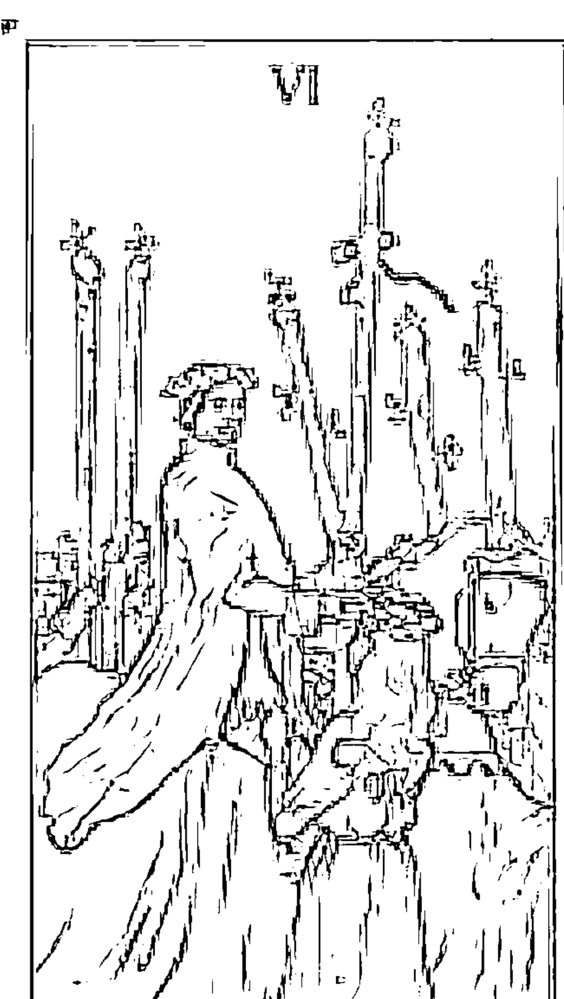

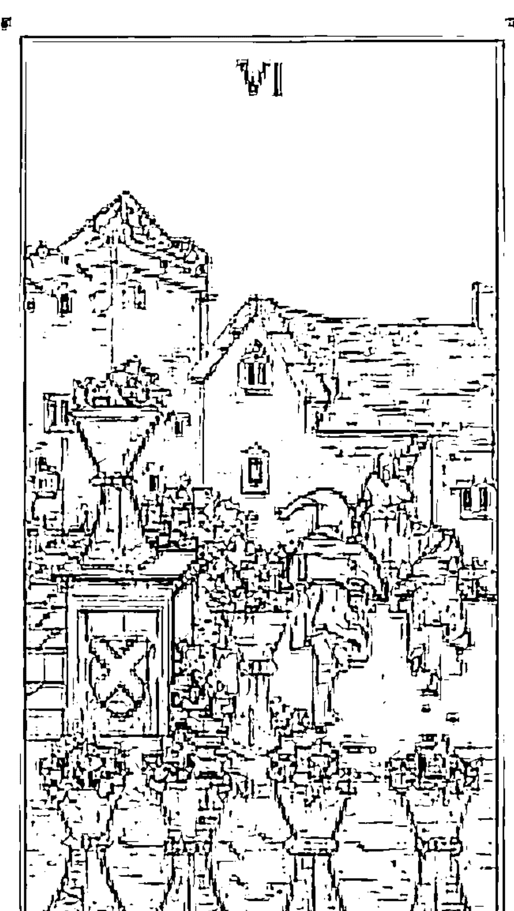

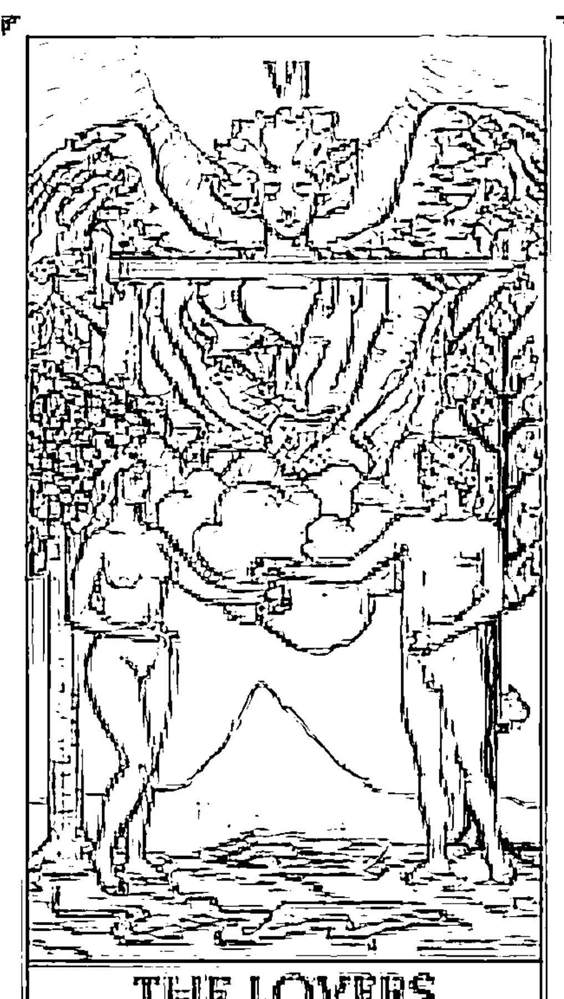

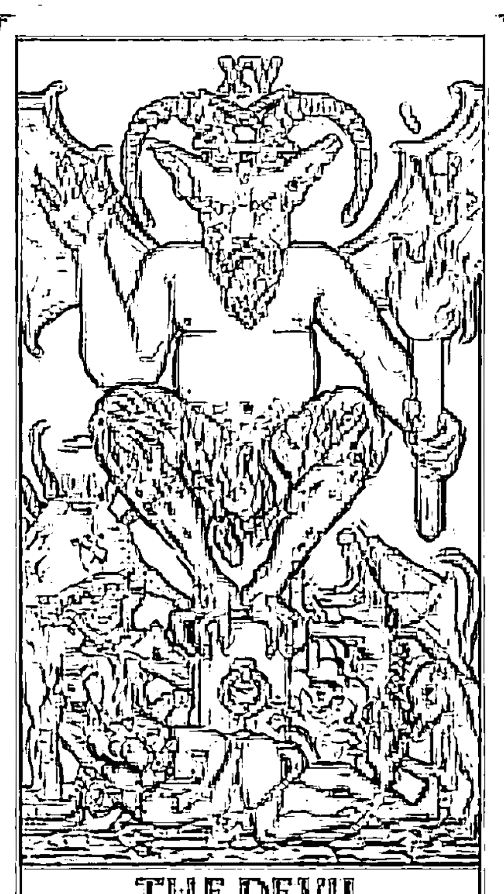

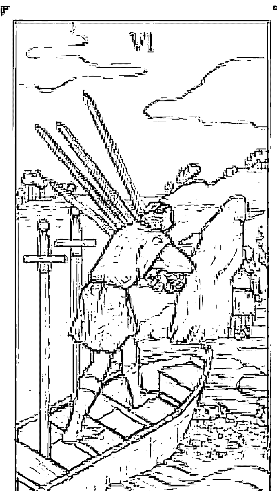

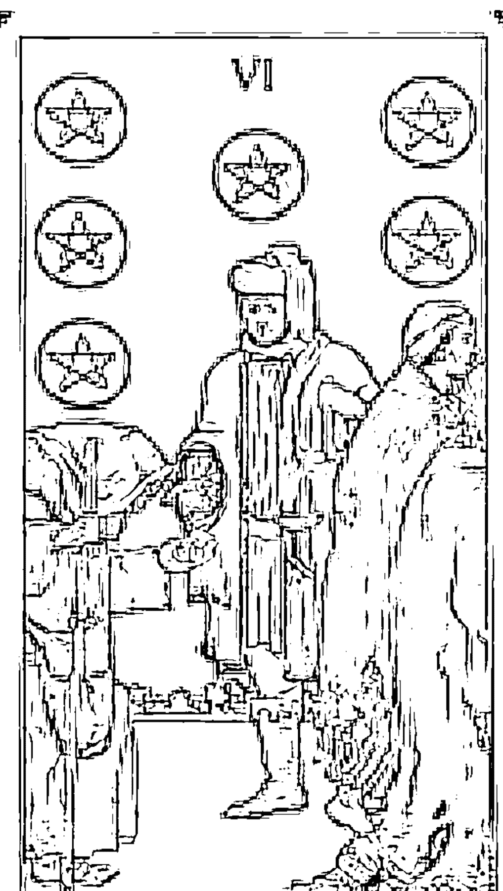

## 恋人、恶魔和六号牌

6代表联合和重逢，两种对立的力量汇聚，融合，最终恢复平衡与和谐。在塔罗中，6代表完成。
历史上说，数字6代表人类，因为圣经中说人类是在第六天被创造的。6还代表第六感，还有空间中的六个方向：上下左右前后。

## 恋人

### 禁果

恋人牌代表选择和选择带来的后果。它代表爱情，激情，和承诺，同时它也代表交流和清晰的思维。

### 牌面描述

亚当和夏娃赤身裸体地站在伊甸园中却不觉得羞耻。夏娃从智慧树上摘下了可以明辨是非的果子，并把它递给亚当。
在他们中间有一团低低的灰色的云彩，云上是大天使拉斐尔，他在等待，也在观察。他准备把亚当和夏娃偷吃禁果的事情抓个现行。我们都知道故事的结局：当亚当吃下果子的时候，大天使会举起他正义的宝剑，把这对恋人驱逐出伊甸园。
同时，引诱他们偷吃禁果的蛇从智慧树上下来，从草地里偷偷溜走了。

### 主要符号

像其他的天使一样，拉斐尔是上帝的信使。在弥尔顿的《失乐园》中，拉斐尔来到人间警告亚当，如果偷吃了禁果，他的好日子就到头了。

拉斐尔是七位大天使之一，是圣经中提到名字的三位大天使之一。（另外两位是米迦勒和加百列，米迦勒出现在节制中，加百列是审判中吹号的那个。在其他四个没有被提到名字的大天使中，乌列出现在恶魔中。）拉斐尔的名字的含义是“神已经治愈”，他是主管婚姻，治愈，欢乐，聚会和旅行的大天使。

禁果是从智慧树上摘下来的，在亚当和夏娃吃下它之前，他们俩也可以算是傻人有傻福了。

右边在燃烧的是生命之树，它永恒的火焰象征着灵魂中跳动着的火焰，和生命中的原始冲动。

太阳象征着神，同时也象征着优越的现实条件和理智的思维。

拉斐尔下面的云象征着更高层的觉知，和天堂和人间之间的屏障。

伊甸园，像塔罗中所有的花园一样，象征着秩序，控制，保护，避难所，休息，和反思。

草丛中的蛇象征着奸诈和背叛。

传统意义上讲，恋人被称作神的子女。

占星学上说，恋人对应风相的双子座。

## 建议解读

你需要做出选择。

仔细思考，谨慎选择。
不要意气用事，在你彻底想清楚之前不要做出选择。
做了选择就要承担后果。
覆水难收。

## 恶魔 —— 面对内心的魔鬼

恶魔代表我们自己黑暗的那一面。讲真，他让我们看到对物质的过度执着和自私自利是如何拴住我们，让我们离幸福越来越远的。

### 牌面描述

一个巨大的红皮肤的恶魔发着邪恶的光，他祝福他脚下的一对赤身裸体地夫妇啪得愉快。火炬的亮度正好可以让人看清恶魔的骇人的嘴脸，和周围的小鬼。
恶魔丑兮兮的头上有一对像羊一样弯曲的犄角，前额皱巴巴的。他的追随者在不断地增多。他有着尖尖的耳朵，尖尖的下巴上长着蓬乱的山羊胡，从他的肩膀后面伸出两只蝙蝠一样的翅膀。他的上身瘦而肌肉发达，腿上长着山羊一样的长毛。他没有脚，取而代之的是一双爪子，抓在他的底座上。
阴影中，有一群恶魔在邪魅的笑，其中的一个就是诱惑亚当和夏娃偷吃智慧果的那条蛇。

### 主要符号

恶魔象征着邪恶，比如奴役，诱惑，暴力，欺诈，狡猾，和会对他人造成伤害的种种阴谋，它常常被认为是人内心的阴暗面，让人无视种种罪恶，羞耻，内疚，否认，和禁忌而为所欲为。

不管你信不信，恶魔是塔罗中四个大天使中的一个。这是乌列，意思是“神的火焰”。很多人认为恶魔说的是路西法，意思是“光之使主”。这两个名字都告诉我们，有黑暗才有光明，知道什么是邪恶才知道什么是善良。

恶魔头上的倒五芒星象征着反对一切神圣和美好。正立的五芒星象征着肉体的平衡和健康，逆位的代表藐视人类的存在。实际上，“恶魔（devil）”一词正是“生命（lived）”倒过来写。

恶魔蝙蝠一样的翅膀代表他是一种属于黑暗的生物，他会带来慌乱，疾病，和恐惧。

恶魔的爪子像秃鹫一样，牢牢的抓住底座。秃鹫是一种残忍的食腐动物，别人的尸体是秃鹫的盛宴。

画面底部的一对夫妇关注的是他们肉体的欲望，而不是灵魂的结合。恶魔诅咒他们长出角和尾巴来，这样他们就跟他们的主子更像了。他们的尾巴一个是果子一个是火焰，正对应了恋人中两个人身后的两棵树。

恶魔像教皇一样举起他的右手祝福他脚下的这一对，但是手势全然不同，这是对教皇赤裸裸的鄙视。

这对夫妇被拴在恶魔的底座上，这个铁链只是罪恶和诱惑的大网中的一环，象征着奴役，诱惑，暴力，欺诈，狡猾，和会对他人造成伤害的种种阴谋，如果你仔细看图，你会发现这对夫妇并不是被铁链紧紧地拴着，如果他们想逃离的话是完全可以的。

传统意义上来说，恶魔有时被称为物质世界的领主。

占星上来说，恶魔对应摩羯座，摩羯的原型山羊与图中的恶魔有惊人的相似度。摩羯座主宰物质世界的财富：生意，事业，和社会地位。

恶魔看上去像潘，潘有着人的身体，羊的下肢和角。因此恶魔也常常代表肉体的欢愉，狂野的行为，和不受控制的欲望。

潘与狄俄尼索斯联系密切，后者是希腊神话中的酒神。因此，这张牌有时候也会代表试探，和物质至上。

## 建议解读

- 不要沉迷于肉体欲望。
- 小心毒品和酒精。
- 小心草丛里的蛇（小心暗处的敌人）。
- 你可能会作茧自缚。
- 你可以把自己从过去的错误中解脱出来。

## 权杖六

### 喜大普奔

权杖六代表胜利，成功，荣誉，别人的肯定，和衣锦还乡。

### 牌面描述

权杖六描绘了一个从遥远的战场凯旋归来的英雄，他回到自己的家乡，周围的人为庆祝胜利举行了盛大的游行。旗帜飘扬，音乐悠扬，锣鼓喧天。你可以想象到人群的欢呼和马蹄的哒哒声。人们有吃有喝，小贩搭起棚子，或推车叫卖，向狂欢者兜售他们的面包和肉。

他们在庆祝他们的英雄赢得战争，他为他们赢得了和平和繁荣。牌面中并没有描画出他曾经受过的苦难和挣扎，只有欢呼的人群在庆祝他的成功和他们的幸运。

英雄头戴月桂花环，他把旁边姑娘献给他的花环又戴在了姑娘头上。她是他的搭档，她值得同等的荣誉。

### 主要符号

英雄拯救了世界，他的成功让他的人民都可以活在和平和繁荣中——至少目前不会再有战乱。

月桂花环代表胜利。

这张牌也代表这对夫妇赢得了人民的支持，尊重，承认，和荣誉。

胜利大游行并不是一个过时了的概念，今天我们依然会庆祝超级碗和世界职业棒球赛的胜利。

马在塔罗中代表自由，力量，独立，和运动。

> 【译者按：是指五四运动或者维权运动的运动，不是健身房的那种运动，同时也指空间上的移动】

在历史上，马也代表荣誉和高贵。坐在马上的人不仅仅在物理空间上比别人高，在社会地位上也比别人高。

英雄和他的马都穿着长袍，这代表了他们的权势，地位，和名望。

英雄的马让他从人群中脱颖而出。

传统意义来说，权杖六代表胜利。

占星上来说，权杖六对应木星，象征扩张，幸运的行星；落在狮子座，象征勇气和创造的火象星座。

## 建议解读

你赢得了胜利。

你克服了困难和对立，在战争中证明了自己。

你有强大的队友们在支持你。

在你庆祝的时候，也要知道成功的另一面，一些新队友可能会抢你的功劳，有一些甚至会嫉妒你，一些会要求你报答他们曾经帮过你的恩情。每个人都想从你的成功中分一杯羹。

注意周围你曾经打击过的对手，他们很可能会东山再起来报复你。

## 圣杯六

### 欢迎回家

圣杯六代表乡愁和愉快的回忆。

### 牌面描述

在一个类似中世纪的村子里，院子里的两个孩子蹦蹦跳跳的奔向一个长胡子的长者。他张开双臂准备拥抱他们。院子里摆满了盆栽。

### 主要符号

图中的一对小孩子代表纯真的童年。
老人代表鼓励，耐心，和智慧。
他是一个会给孩子无条件的爱和支持的父亲形象。
院子代表安全和保护，它的墙可以保护住在里面的人的隐私不受人窥探。
在画面的边缘有一个全副武装的人在巡逻，为这个院子提供了更多一层的保护。
石座上的盾牌代表历史和传统。
圣杯里面的花代表生活的甜蜜和美好。
历史上说，圣杯六代表传承和遗产。
传统上来说，圣杯六代表愉悦。
占星上来说，它对应太阳，一切能量和愉悦的来源；落在天蝎座，代表神秘和深度的水相星座。

## 建议解读

你会遇到一个许久不见的老朋友。
你可以重拾童心。
圣杯六也可以代表灵魂伴侣，某个你注定要相伴一生的人。
一个长辈可能会给你一些建议。
一些回忆空中带甜。

## 宝剑六 到岸了

宝剑六是一张关于旅行和移动的牌，穿过风云翻滚的大海，从一个地方去到另一个地方，开启一段新的生活。它代表着从一个充满困难的环境中解脱出来，进入到一个更为平和的环境中去。
宝剑六经常代表灵魂的旅途，但它也可以代表实际的旅行，尤其是穿过水路的旅行。

### 牌面描述

一个女人和一个孩子从一个小船上下来，来到布满石头的海岸上。女人穿着带兜帽的长袍，保护性的搂着孩子的肩膀。
在他们后面有一个又高又壮的男人抱着一堆宝剑。海浪到岸边就安静了下来，天空中布满乌云。

### 主要符号

船象征着人类的肉体，乘船的人象征着人类的灵魂。
水象征着生命的河流。
摆渡人象征着灵魂导师。
宝剑象征着旧的痛苦，伤口，伤疤，和被侵犯。
船里还剩两把宝剑，好像船上还有两个看不见的乘客一样。

在希腊神话中，卡戎是冥河上的摆渡人。人们通常在下葬的时候在死者的眼睛上或者舌头下放钱币，作为摆渡费。

这张牌的画面让人感觉阴森森的。就像死神牌一般不是说字面意义上，肉体的死亡，宝剑六也可以指一些不那么致命的攻击，比如被人恶语中伤或冷嘲热讽等。

历史上来说，宝剑六预示着一个使者或者信使的到来。它也有可能预示着一段爱情公诸于众，或在公共场合的求婚，或者一个官司的败诉。

传统上来说，宝剑六象征努力得来的成功。

占星上来说，宝剑六对应水星，象征速度和交流的行星；落在水瓶座，象征社交群体和有远见的风相星座。

## 建议解读

你正在生命的航海途中，在从一个地方驶向另一个地方。
你身后的水象征着你的过去，它波涛汹涌而且难以应付。
你前方的水平静无波。
你并不是独自旅行，你有一个灵魂导师。
在人生的旅途中，你会收获上天赐予你的礼物。

## 星币六 分享财富

星币六代表给予，慈善，仁爱，和友善。
从另一个角度来说，星币六告诉我们，钱并不是万恶之源，对钱的狂热才是。它还暗指人们对钱又爱又恨的感觉，同时也可以象征人们在收到赞赏，帮助，或礼物的时候不自然的感觉。

### 牌面描述

一个富裕的商人右手拿着天平，左手在向一群乞丐分发金币。从他浅绿的长袍和毛领的红外套就可以看出他是多么的富有。

### 主要符号

星币六与商业和工业联系密切。
商人意识到了他比绝大多数人幸运，同时他也明白权力越大责任就越大。
独乐乐不如众乐乐。

牌面描绘了他成功的人生，同时还有善良的心灵。

当人们从商业和投资中获利的时候，慈善和博爱则是回报社会最好的方式。

他好像在和他帮助的人们交谈，这告诉我们，有时候语言和金钱一样重要。

星币六中的商人注重公平和商业道德，他手中的天平证明了这一点。

头两个乞丐看上去像是星币五中的两个修道士，他们脏兮兮的而且衣衫褴褛。

第三个乞丐看上去像是乔装打扮的隐士。

传统上来说，星币六一般象征物质上的成功。

占星上来说，它对应月亮，象征反射和直觉的行星；落在金牛座，象征稳定，舒适，和愉悦的土象星座。

## 建议解读

有人想要收买人心。

有人在花式刷存在感。

有时候你要站在一个给予者的角度，有时候你要站在一个受益人的角度。

给予和收获都是生活的一部分。

你很慷慨，你总是愿意跟别人分享你的经验和智慧。

## 7号牌 宇宙的秘密

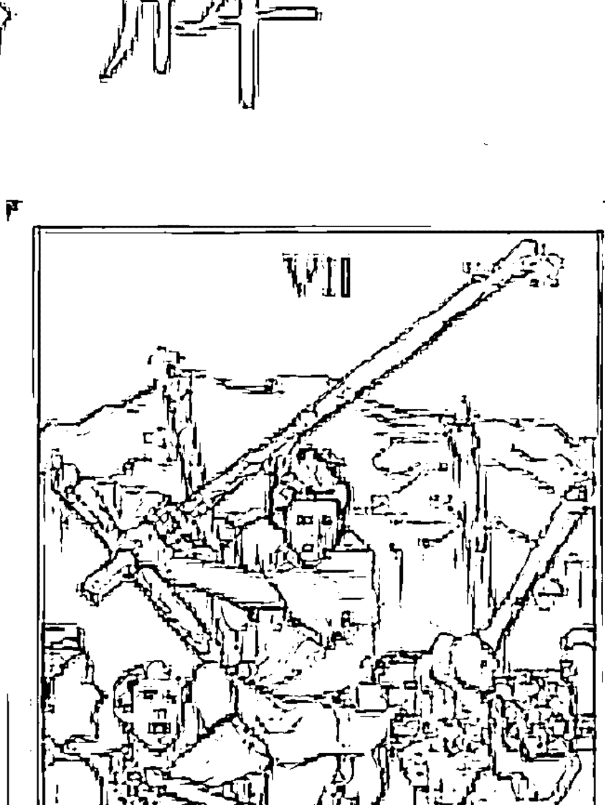

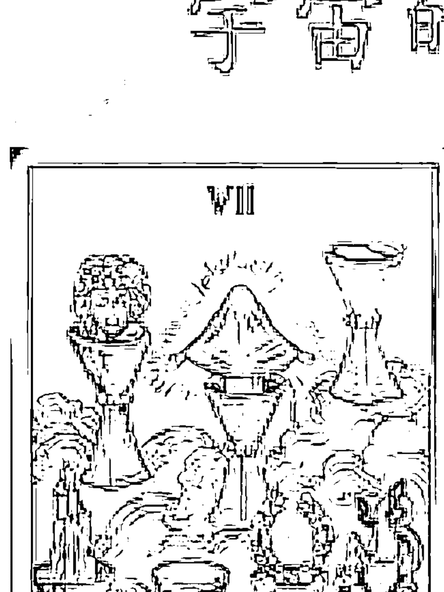

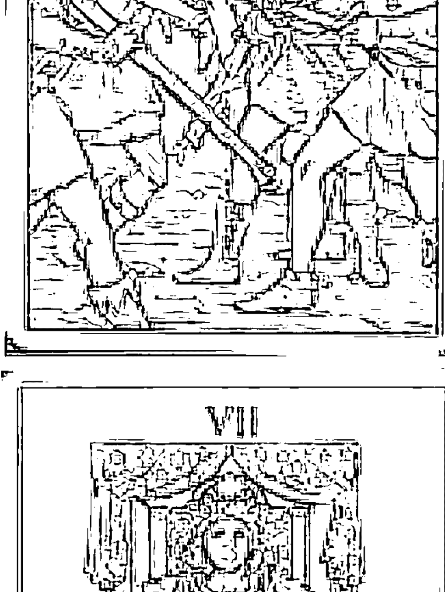

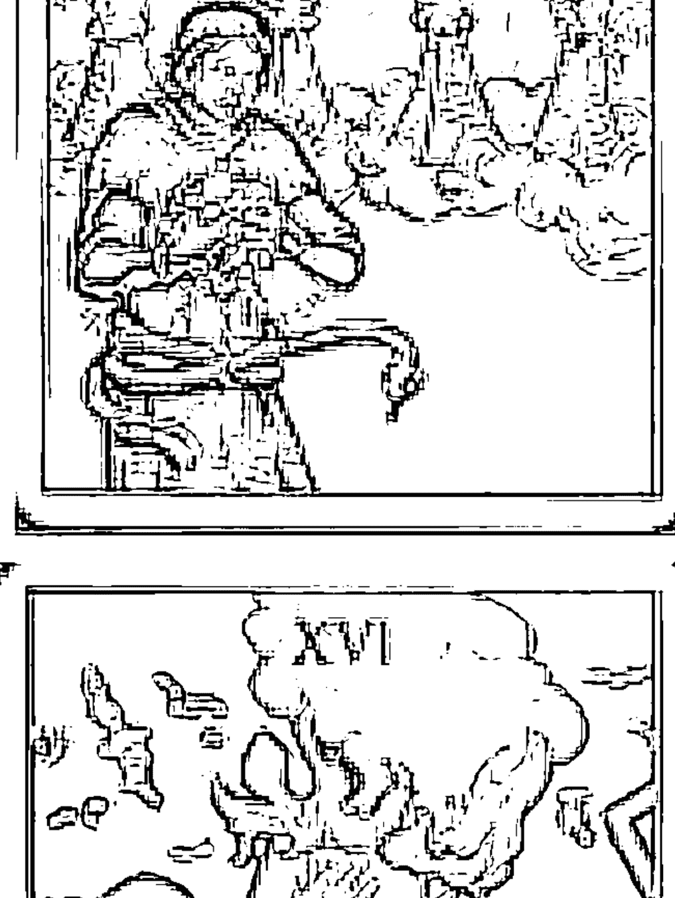

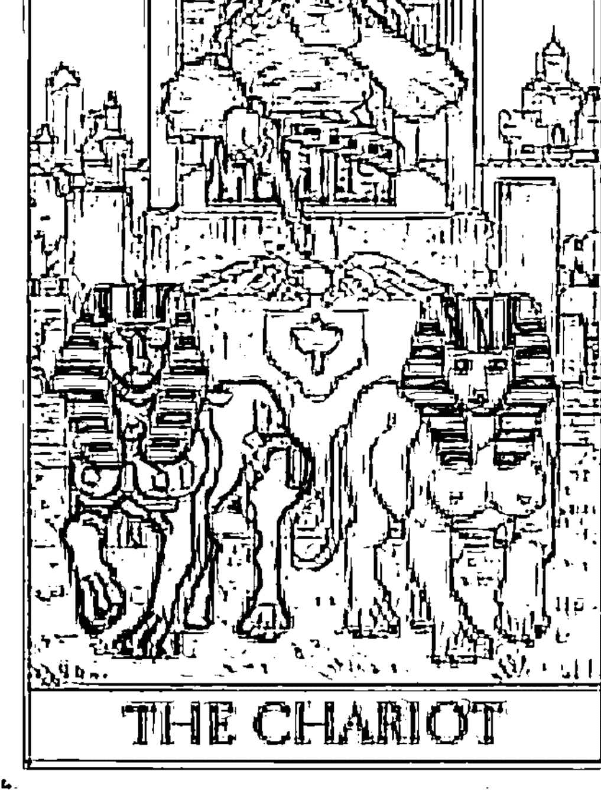

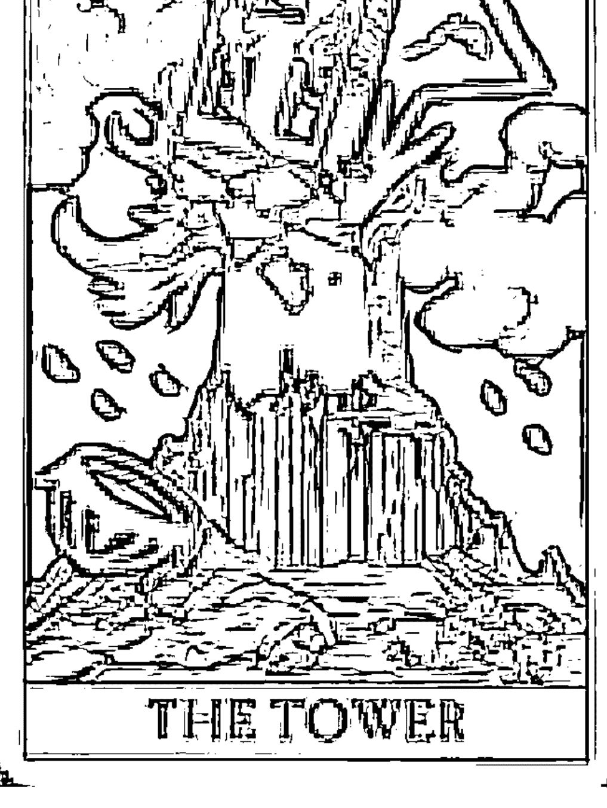

## 战车、高塔和七号牌

七号牌帮助我们认识到生活的美好和愉快。从数字上来说，7代表愉快和激情，促进我们跟他人的交流。但是，塔罗中的7号牌却有可能代表软弱和不平衡，因为我们有时会沉迷于一些不切实际的幻想中。

7是一个神秘的，有魔法的数字。圣经中创世用了七天。占星中有七大行星：太阳，月亮，火星，水星，木星，金星，土星。圣灵有七种品质：智慧，理解，劝告，坚忍，知识，虔诚，和敬畏。有七宗罪：嫉妒，懒惰，暴食，愤怒，傲慢，欲望，和贪婪。有七美德：信仰，希望，仁慈，坚忍，正义，节制，和审慎，（你可以在大阿卡那中看到其中的大多数。）炼金术中有七种金属：金，银，铁，汞，锡，铜，铅。一周之中有七天，音乐之中有七个音阶，还有七脉轮，人体中的七个能量中心，等等。

## 战车

### 英雄的旅程

战车说的是向前走和改变，它预示着旅行和冒险，而且强调征服和控制力——你最大的敌人其实是你自己。

### 牌面描述

一个表情严肃的年轻人站在一辆战车里，他身材健硕，身上的盔甲更加衬托出他的身材。
他一只手放在心脏上，另一只手指引着他的团队走向一个更加光辉灿烂的未来，只要他需要，他们就和他并肩作战。
战车上覆盖着一个画着白色星星的蓝色棚子，前方有一个带翅膀的球和盾牌。

### 主要符号

战车主要是战争的工具，但它同时也在探索世界，交易以及国际关系中扮演着重要角色。
旅行或与他人交换经验的结果有好有坏，战车中这两种结果都有可能出现。
画着星星的车棚像是战车的棚顶，蓝色的底色上画着星座，代表来自上天的庇佑和宇宙的指引。
战车前面的盾牌上画符号代表男性和女性生殖器的结合。盾牌的上方有一个带翅膀的圆形，这是荷鲁斯的象征，荷鲁斯是埃及的太阳神。
历史上说，凯旋的战士通常会举行胜利游行，向人们展示他们在战争中获得的战利品。
战车中的人的盔甲表示他为战争做好了准备，并且盔甲可以保护他不受伤害。
战车中的人的腰上的腰带象征着黄道十二宫，就是围绕着太阳的那一圈星座。
战车中的人并没有用缰绳或者挽具来控制这两只斯芬克斯，他是用自己的意志力和权杖来控制他们。
在这一点上他和魔术师很像。

在神话传说中，斯芬克斯给旅行者出谜语，猜对才给通行。我们很少看到斯芬克斯四腿着地的样子，但是这张牌告诉我们，就算是神话中的生物，也得踏踏实实过日子。

斯芬克斯是四种生物的合体：人的脑袋，牛的身体，狮子的脚，和鹰的翅膀。它们分别对应了四元素，还有黄道十二宫中的四个固定星座。

斯芬克斯一黑一白，它们象征着光与暗，男与女，动与静。

战车身后的城墙代表文明，他离开这个城市象征着他愿意离开自己的舒适区，去保护他身后的人们。

传统上说，战车被称为光之领主。

占星上来说，战车对应巨蟹座，一只背着房子到处走的螃蟹。

## 建议解读

你正行走在路上。
你正走在正确的方向上。
你移动的很快。
你是王者。
你需要克服自己一些野性的冲动。

## 高塔

## 滚蛋吧

高塔代表的是一种突然地，明显的变化，它通常会带来一个意料之外的结局，一个戏剧性的转折，或者一个令人不快的发现。

### 牌面描述

一个高高的势头塔被一个火球击中，缓缓倒地。在塔下边，有一个国王和一个王后的尸体，他们是在从塔上跳下来逃生的时候摔死的。蝙蝠在空中盘旋，就像他们身后的黑云一样。

### 主要符号

不在沉默中灭亡，就在沉默中爆发，而这个爆发足可以撼动任何既有的事物。

高塔象征着已有的成绩，是人类想要触摸天空的具象化表现。【译者按：想想巴别塔就懂了~】

一座塔同时还是一个瞭望台，它可以给人更远更广阔的视野。

高塔还是一个典型的男性符号，常常被用来指代权势和性。

闪电代表郁积的能量被迫清理掉，和推翻现有的想法。

闪电在空中的途径有点像卡巴拉生命之树中能量在各原质之间的“Z”字形传递。

传统上来说，高塔被称为神的宫殿，或者全能的神。

占星上来说，高塔对应火星，代表能量和决断的战士。

## 建议解读

准备好应对变化，或者被变化。

你会突然忧郁起来。

你正处在一段剧烈的变化中，改变就像强奸，如果逃不掉那就享受吧。

如果你感觉被束缚，那么你很快就会自由了。

从牢笼里出来吧少年！

## 权杖七 —— 进攻是最好的防守

不管你有没有受过搏击训练，生活中总有一些时候你会被卷进迷之混乱的局面中去。

### 牌面描述

一个张牙舞爪的人加入进战斗里来，准备勇敢地跟他的对手当面对抗。他冲劲十足，而且他出其不意的加入迫使他的对手们重新考虑作战方案。当他举起棍子的时候，他对手们的盾还未举起，让他的对手们处于劣势。

### 主要符号

权杖七代表勇气，决心，和既定的个人利益。
它画的是一个人愿意为自己的信仰而怒战群雄的场面。
权杖，相对于更为精致的宝剑来说，是一种比较原始的武器。
这不是一场高科技战争，相反，这是一场争夺土地，统治权，和地位的原始战争。
争夺的土地在牌面中的象征是打斗的人身后的小山。
这同样也是一场灵魂的战争，但是相对于宝剑组的战争来说，它远远没有那么拼脑力拼策略。
传统上来说，权杖七代表勇猛。
占星上来说，它对应火星，象征能量和决断的战士；落在狮子座，象征勇气和创造力的火象星座。

## 建议解读

现在还不是庆功躲懒的时候，奋斗吧少年！
“有可能”不代表着“一定是”。
你正处于上风。
坚持立场。
擒贼先擒王，打人先打头。

## 圣杯七 小心你的欲望

圣杯七代表梦，愿望，希冀，和恐惧。

### 牌面描述

一个男人做出了选择，他从一堆诱惑中选择了珠宝，并紧紧地抱在怀中。
尽管他还没有意识到，他还会带一些他不想要的东西回家。他的腰上缠着一条绿色的蛇，蛇有着邪恶的眼睛和分叉的舌头，紧紧的缠着男人以防在接下来的旅途中被甩出去。

### 主要符号

七个金色的圣杯悬在半空中，每一个杯子都装着一种诱惑：女人，蒙着面纱伸开双臂的人，蛇，城堡，珠宝，月桂花环，和龙。
杯子中的东西都是象征性的，对应七大行星，和七张大阿卡那。
女人对应女皇和金星。
蒙着面纱的人像对应女祭司和月亮。
蛇对应魔术师，因为魔术师的腰带通常是蛇形的，还对应水星。
小山上的城堡对应高塔和火星。
闪闪发光的珠宝象征着命运之轮带来的财富和运气；对应木星，象征着幸运和扩张的行星。
月桂花环对应世界中绕着舞者的那个大花环，还对应土星。
火龙是太阳中的马的另一种形象。
每一个圣杯中的礼物都可以引人堕落，欲望，欺骗，谎言，海市蜃楼般的愿景，虚荣，幻想的成功，醉酒。
传统上来说，圣杯七被称为虚幻的胜利。
占星上来说，它对应金星，爱与美的行星；落在天蝎座，象征神秘与深度的水相星座。

## 建议解读

你已经做出了选择：财富。你不会空手而归，但是你可能还会得到一些意料之外的东西。

别做白日梦了，找个现实点的目标踏踏实实做下去吧。

别迷迷糊糊的了，清醒点吧。

小心你的欲望。

记住，你控制的东西同时也在控制你。

## 宝剑七

抓贼啊！

宝剑七代表的是欺骗，和被抓包。

### 牌面描述

宝剑七中的人物是一个技艺精湛的小偷，潜入敌营去偷他们的武器。在他逃跑的时候，他一边回头看一遍偷笑。他认为他的对手们都在睡觉，他神不知鬼不觉的把他们的武器偷走，简直是太聪明了。如果他愚蠢的对手继续睡的话，他可能会回来偷第二次。
但是他不知道的是，他正走进他们的圈套里。

### 主要符号

宝剑七一个明显的含义就是，小心，可能会有小偷，欺骗，隐瞒等就在你的眼皮底下。
牌中的这个小偷可能是一个背叛者，也有可能是一个双面间谍。
在更实际的层面来说，这张牌可以代表背后中伤别人，毕竟宝剑本身就代表交流和沟通。
帐篷代表保护里面的人不受外界事物的伤害，同时也是制定战略计划的地方。
帐篷上方飘扬的旗子是这个队伍的精神号召。
历史上来说，宝剑七是一张不错的牌，它可以代表一个深肤色的女孩，和一段安详的乡村生活。逆位的时候，它预示着一个新公告的发布。
传统意义上说，宝剑七被称作三天打鱼两天晒网。
占星上来说，它对应月亮，代表折射和直觉的行星；落在水瓶座，代表社交群体和远见的风相星座。

## 建议解读

确认你家里和单位的安全防盗措施是否牢靠。
捍卫你自己的身份。
注意天黑之后发生的事情。
如果你需要的话，可以设下陷阱。
小心间谍和两面派。

## 星币七 —— 一分耕耘一分收获

星币七是一张关于耐心和回报的，不仅仅是说一分耕耘一分收获，而是说长期的计划和准备最终带来的收获。

### 牌面描述

一个年轻人走过一个结着金币形果子的树，他已经摘了一个果子带回家当晚饭。他胳膊下面夹着果子，肩膀上扛着锄头。

### 主要符号

钱当然不长在树上，但是星币七告诉我们，可以通过仔细的准备和计划去理财。
币七有时可以指代种子基金。
图中的年轻人是一个工人，并且在他的专业领域非常出色。
他的锄头是用来收获成功用的。
虽然成功近在眼前，但是这张牌也可能是一个警告：这个年轻人可能在期待一个大丰收，但是他的算盘打得太早了。夏季晚期依然会有风暴光临，就算是最顽强的作物也顶不住它的摧残。
历史上来说，星币七象征着辩论和争吵。
星币七象征着加薪，升职，或者其他的关于一个女人的丈夫工作上的好消息。
传统上说，星币七被称为成功暂未到来。
占星上来说，它对应土星，关于界限和秩序的行星；落在金牛座，关于稳定，舒适，和愉悦的土象星座。

## 建议解读

不要杀鸡取卵。
为即将到来的丰收做点你力所能及的事。
浇灌你的劳动果实。
除草。
耐心，让花花草草自己生长。

## 8号牌 比无穷更大

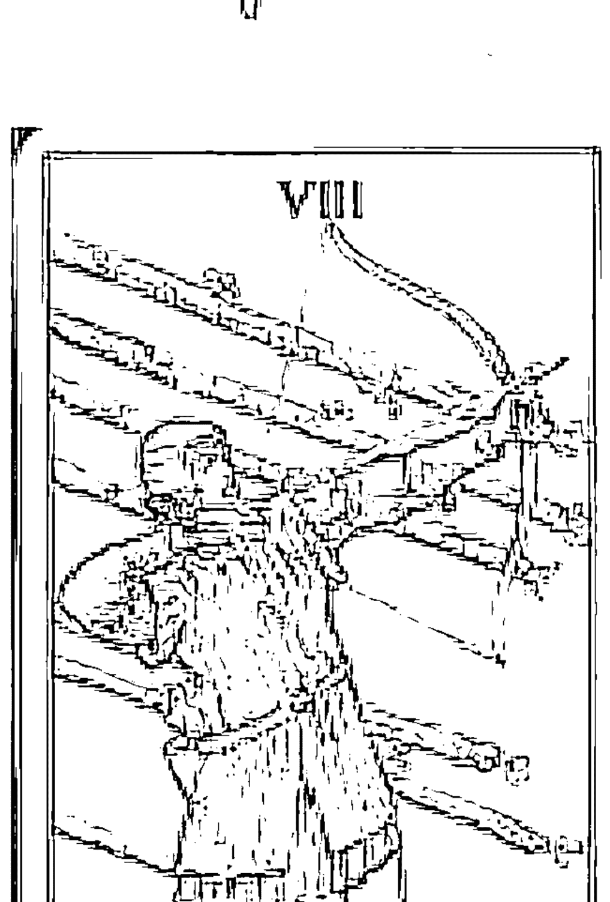

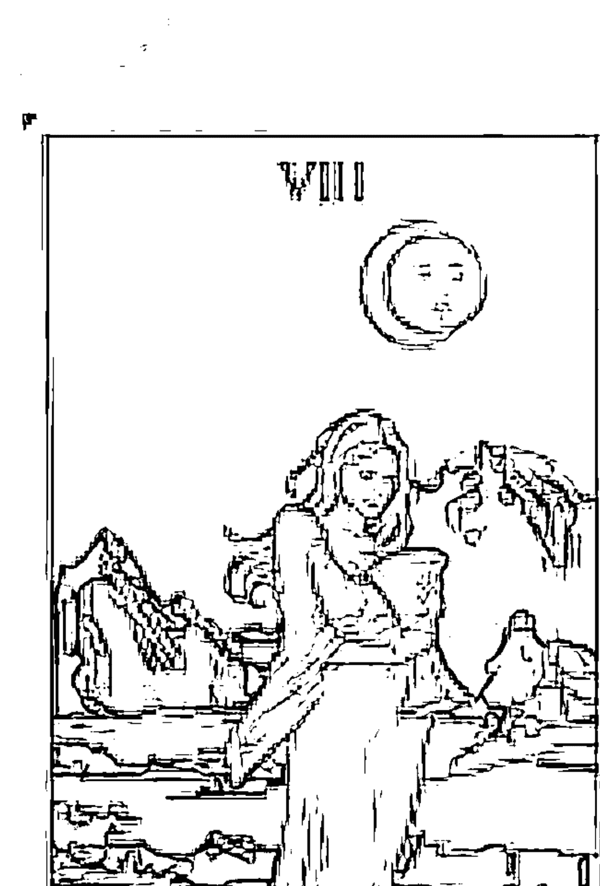

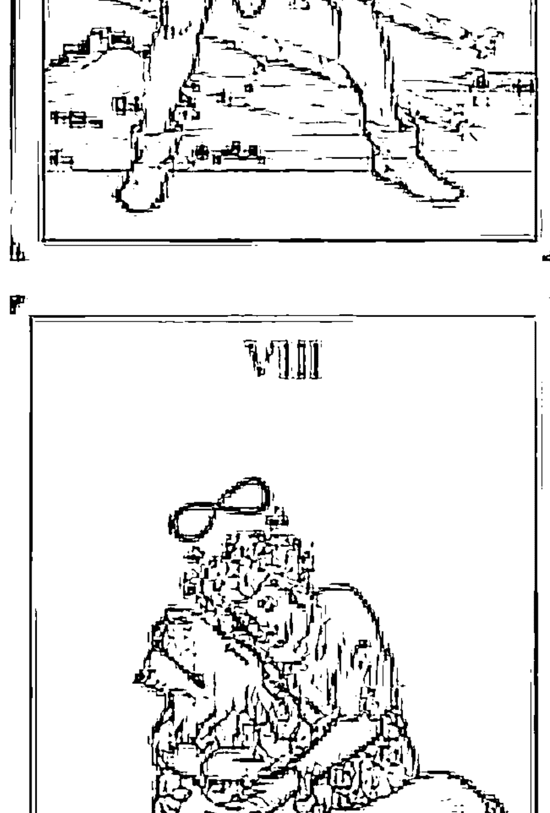

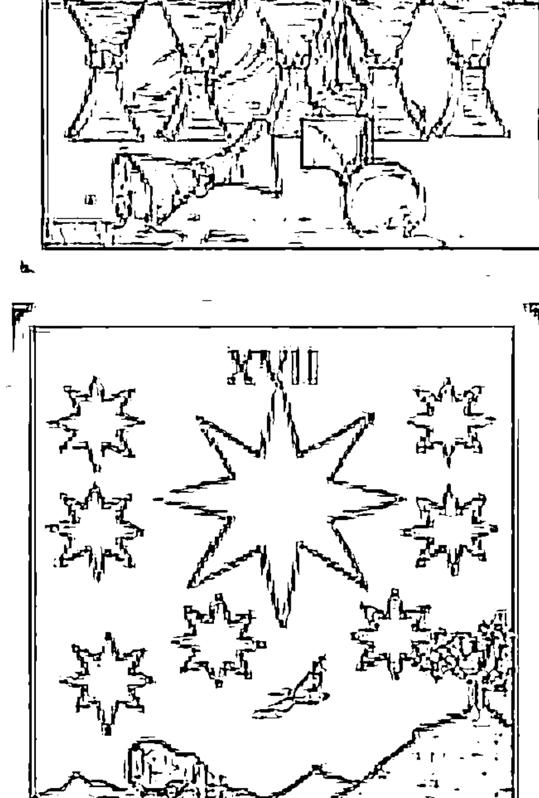

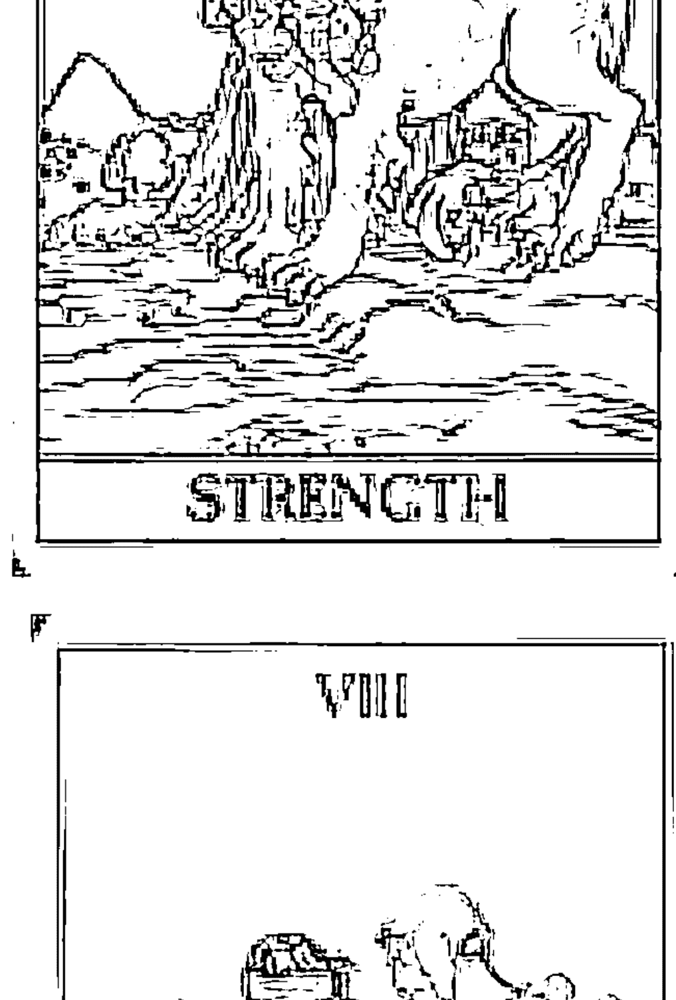

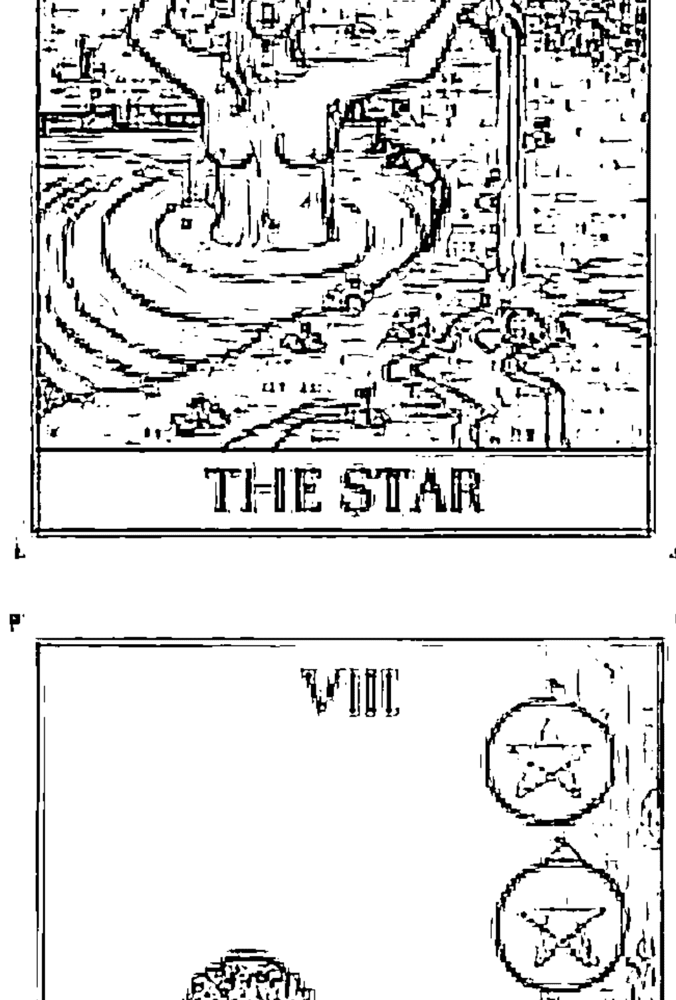

## 力量、星星和八号牌

当我们研究8号牌的时候，我们会发现自己对事情并没有十成十的把握。8号牌说的主要是抽象的概念，要求我们在深入的思考之后，整合我们的情绪和经验。

这是一个永无止境的过程，8代表无穷大，因为它们看上去像是大无穷符号竖起来的的样子。每年中有八个时间节点。8还象征着洗礼和灵魂重生，很多洗礼用的水盆是八边形的。

## 力量

美女与野兽

力量牌告诉我们，每个人都需要寻找我们内在的力量。它代表坚忍，意志力，和勇气，同时也代表毅力和决心。它还代表能量，行动，和激情。

### 牌面描述

一个可爱的姑娘两手抱着狮子的脖子，狮子打着呼噜回应她。她穿着白色的长袍，像是纯洁的新娘，头上和腰上都带着玫瑰花换，头上还有一个大无穷符号。

### 主要符号

这个女人穿的是仆人的衣服，表示她并不是皇室或者贵族阶级，她只是一个很有勇气和强大的自控力的普通人，她代表了一种自信和远离恐惧的心理状态。

她身上的花环表示灵魂的富有。

她是一个智力开化的人，但狮子却是地球上最原始的动物。但是从另一方面来说，狮子在很多方面跟人类类似，比如它们也有自己的社会等级制度，而且他们不吃同类。

狮子象征着人类的动物本能，我们野性的，无法驯化的本能和欲望。

狮子也可以象征人类最原始的需求，比如事物，睡眠，繁殖，自我保护。

这个牌面也可以是象征意义的，比如人和狮子可能是一个人格中的两个方面。

在远处有一个坚固的城堡，象征着警觉，避难所，统治权，和命运的指引。但是牌中的这个姑娘却非常的坚强和自信，她敢脱离城堡给予的安全和保护，独自站在外面。

历史上说，力量（strength）也被叫做力量（force），或者坚忍，坚忍是四美德之一。

传统上来说，这张牌叫做烈焰宝剑之女。

占星上来说，力量对应狮子座，象征勇气和创造力的火相星座。

## 建议解读

你有一颗狮子的心。
你可能认为自己不是个勇敢的人，你和其他人一样会紧张会害怕。
你跟别人不一样的地方是，尽管你有所怀疑，但你还是会向前走。
你可以直面自己的恐惧。
你拥有控制权。

## 星星

## 指引的明星

星星是黑夜中的明星，就像黑夜女神一样，牌中的女人是一个无忧无虑的人，为别人提供希望，鼓励，和指引。

### 牌面描述

满天星光下，一个美丽女人一丝不挂，在池塘里洗澡。天空中挂着8颗星星，中间金色的是宇宙的中心，边上围着七颗银色的小星星。每一颗星星的光芒都有八道。
她手中拿着两个陶罐，一个把水浇在她头上，另一个浇在草地上，水变浑了，蜿蜒着流向不同的方向。她的周围有不少小野花，远处有低矮的山脉，和一棵树。有一只朱鹭扑扑翅膀飞向远方。

### 主要符号

在塔罗图钥中，韦特说这个女人是揭开真相的女神。

天空中央的金色星星代表中心，其实图中的每一颗星星都是他们自己星系中的太阳。

最大的星星可能是新星或者超新星，代表理解。

七颗银色的小星星代表一周中的七天。

星星代表指引，远航的人通过他们找到方向。

星星也代表梦想和希望。

因为从各个星星发出来的光需要很久的时间才能照射到地球上，所以星星也代表过去的生活和经验。

在一些传说中，每一颗星星都是还没有出生或被放逐的灵魂。

星星和黑夜让我们想到星际旅行，灵魂出体，和梦。

朱鹭是透特神的象征，透特神是埃及的语言之神。

传统意义上来说，星星有时候被称为天空的女儿。

占星上说，星星对应水瓶座，象征社交群体和未来性思维的风相星座。

## 建议解读

你把夜空照亮。
你就像星星一样。
你是一个会讲故事的人。
你知道神话的力量。
你有来自上天的指引。

## 权杖八（一） 后发先至

传统意义上说，权杖八代表速度，去远方旅行，和从远处传来的消息。随着时间的流逝，这种含义更加凸现出来。不论是电话，传真，邮件，我们每天都会给远方的朋友或者同事发信息。我们的消息在空中嗖嗖飞过，就像权杖八一样。
但是有一个东西没有改变，就是这张牌的核心意义。在塔罗中，它代表事物的快速进展，新的消息，思想或者意图上的改变，和新的交流沟通。

### 牌面描述

一个弓箭手准备将箭射向空中。他带着皮质的头盔和护甲，随时准备战斗。他的表情很严肃，抿着嘴，皱着眉，拉着弓。
在背景中，有八根长着叶子的棍子在空中平行飞过。

### 主要符号

弓箭手是射手座的象征，他是个冒险家，喜欢长途旅行，也是个哲学家，在和别人一起玩耍的时候学习别人的经验。

射手座也略鲁莽，心直口快，乐观，幽默。

牌中的每一根权杖都代表一条消息。

每一根权杖也可以代表一种交流方式，比如电话，传真，邮件，短信，电话会议，视频会议，广播，和电视，等等。

权杖八有时候会代表飞来横财，有时候也代表天降桃花。

背景中的河流象征着信息或者情绪的流淌。长时间以来，水路都是旅行和交流的重要方式。

远处的城堡代表警觉，避难所，统治权，和上天的指引。

历史上来说，权杖八还代表已婚夫妇的争吵。

传统意义上说，权杖八的特点是迅速。

占星上来说，它对应水星，代表速度和交流的行星；落在射手座，象征长途旅行和哲学的火相星座。

## 建议解读

你会收到来自远方的消息。

你需要回复这些消息。

你甚至有可能需要当面回复对方。

不要拖沓，时间很宝贵。

你的朋友正在期待你的来信。

## 圣杯八 —— 寻找者与守护者

圣杯八告诉我们，当我们放弃梦想之后会发生什么。对于我们留下的东西，别人可以拾起来，如果他们想的话。

### 牌面描述

一个白衣飘飘的优雅的女人站在一堆圣杯后面，她拿着其中的一个杯子，盯着杯子里面。
两个杯子在一边倒着，里面的水和酒流了一地。
在远处，一个男人头也不回的离开了，向着远处的悬崖和海岸进发。

### 主要符号

圣杯八让我们思考物质财富和积累，心灵的财富，智慧的增长，和情感的维系。
牌中的八个圣杯曾经是整齐的摆放好的。
它们代表一种有序而繁荣的模式。
现在未来处在一种混乱中。
孤独的旅行家决定去别处寻找他人生的目标和意义，这个女人留下来收拾他留下的东西。
高山和小山丘都代表距离，困难，界限，和分割线。
历史上来说，圣杯八代表娶到一个窈窕淑女。
传统上来说，圣杯八被称为把成功抛在身后。占星上来说，它对应土星，代表界限和结构的行星；落在双鱼座，代表灵魂融合的水相星座。

## 建议解读

你可以把局面扭转过来。如果你不看好你人生中的一些东西，别人就会拿走。你的损失是别人的收获。不要放弃成功给你带来的东西。充分利用你有的东西。

## 宝剑八 挣脱束缚

宝剑八代表束缚与释放，不管是从现实状况中，还是抽象意义上的。

### 牌面描述

一个瘦弱的女人被绑架了，她被捆了起来，而且被遮住了眼睛，像一个动物一样关在笼子里。她的周围是一圈比人高的大宝剑，每一个都牢牢的插在她脚边的土地里。一个黑色头发的男人在用她周围的宝剑中的一把给她松绑。

### 主要符号

宝剑代表思维和交流，这个女人沉浸在各种伤人的话语和痛苦的记忆中不能自拔。
她被遮住了眼睛，因为有人不想让她看到真相。
笼子是给野生动物准备的，它们并不愿意被关，但是笼子可以让它们脱离自己的野性。
地是湿的，满是淤泥，她几乎站不住脚。如果她滑倒了，她就更没法站起来了。
天空阴沉沉的，地平线上没有光，
历史上说，宝剑八代表关于一个通过各种小道消息散播的关于某个女人的谣言，逆位的时候它代表一个亲人的离开。
传统上来讲，宝剑八被称为被限制的力量。
占星上来说，它对应木星，象征运气和扩张的行星；落在双子座，代表思维和交流的风向星座。

## 建议解读

你是一个自由的人。
是时候挣脱束缚了。
解放你自己，或者让别人帮忙解放你。
脱离捆绑你的东西。
让你的思想自由遨游。

## 星币八 手艺

星币八代表手艺人，同时也表示你有自信自食其力。

### 牌面描述

一个木工站在一边欣赏一个雕塑，雕塑中有三个星币，长着花与叶子的树枝，和一对羊角。他手里拿着锤子和凿子，看看能不能做什么新的改动。
在这个雕塑后面，有五个星币挂在树上。远处的村庄代表他的目标市场，这件雕塑可能是给一个城堡或者教堂做的。

### 主要符号

艺术家是神的创造力的传达者。
他的锤子和凿子可以被用来创造新事物，也可以摧毁事物——雕刻的过程中二者兼有。
他的工作服保护他不受木屑或者石头碎片的伤害。
他头上的帽子代表智力和思想。
历史上说，星币八代表把智慧运用在实际事物上，比如农业和工业。
另一个传统解读是说，这张牌代表商人，或者深色皮肤的女孩。
传统上来说，它被称为审慎。
占星上来说，它对应太阳，一切能量和启示的来源；落在处女座，代表勤奋和注重细节的土相星座。

## 建议解读

- 你知道你自己的价值。
- 你可以自给自足。
- 你有很好的艺术品位。
- 你很满意自己的作品。
- 不要害怕展示自己的能力。
- 不要担心其他人会抄袭你的方法或者批评你的技术。

## 9号牌

## 愚者

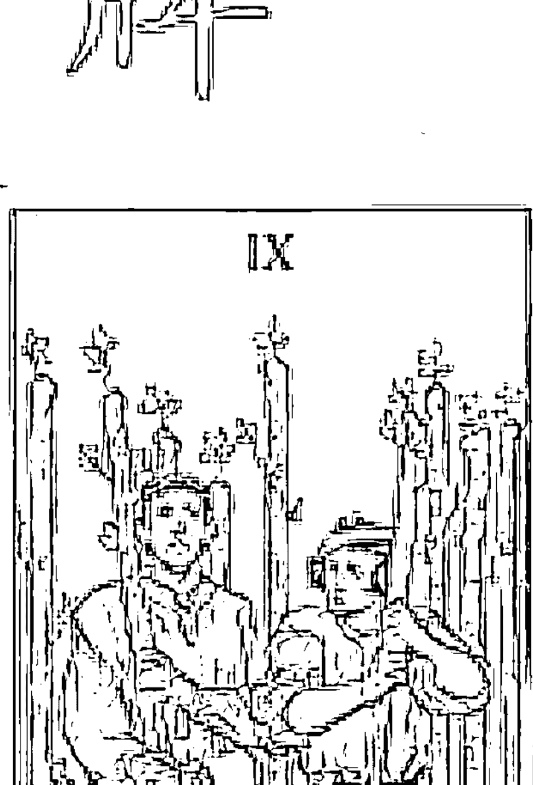

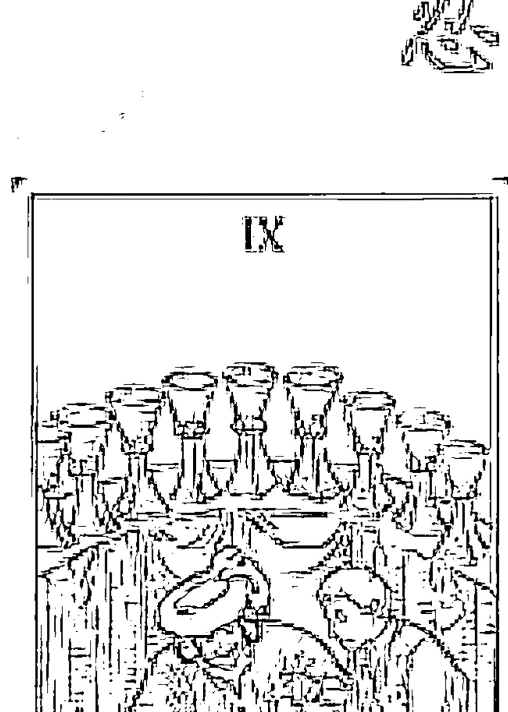

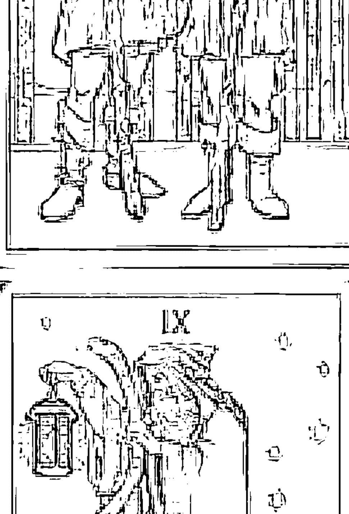

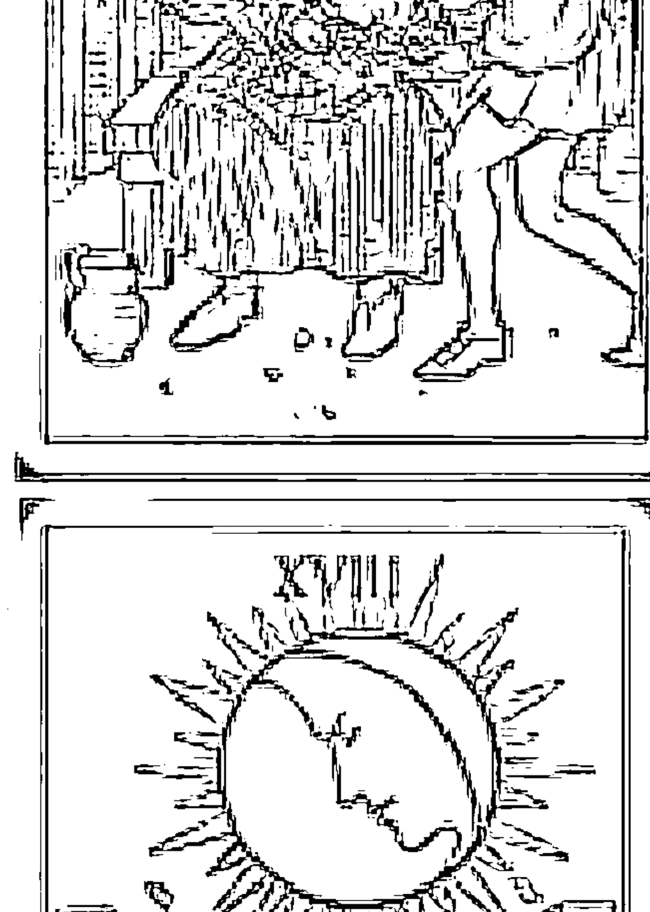

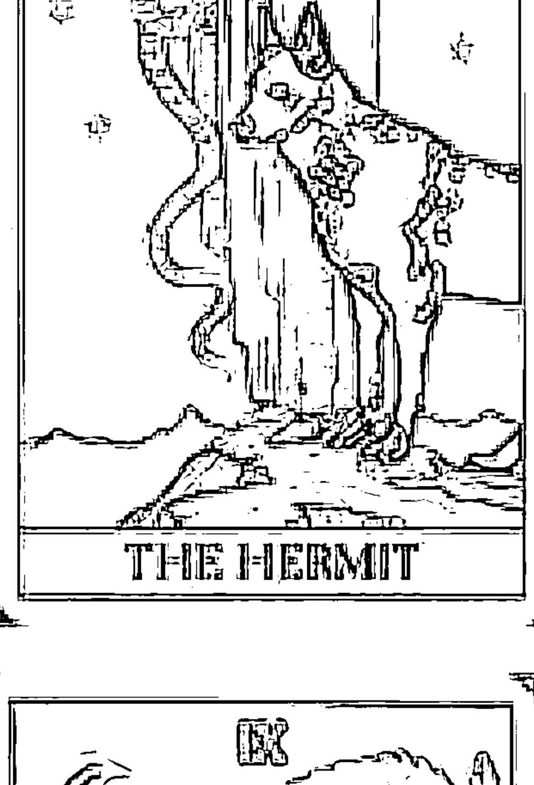

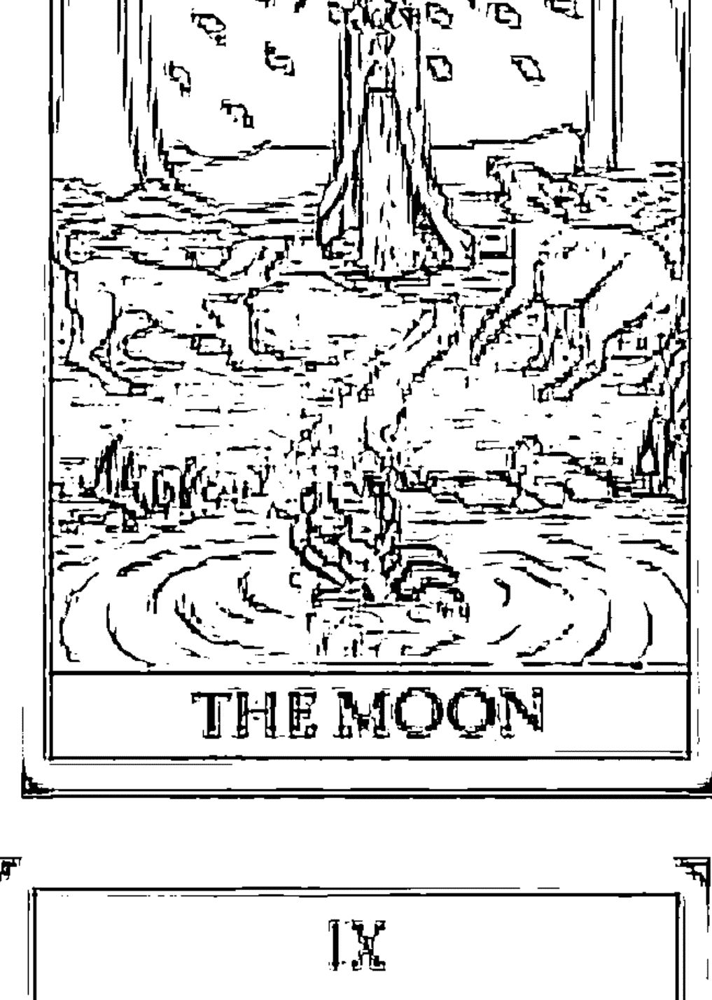

## 隐士、月亮和九号牌

在卡巴拉中，数字9被月亮守护，这让它很难将现实和朦胧的想象区分开来。月亮是我们世界的一部分，但同时，它也不是我们的世界。它是一个关于想象和梦的地方。

9是完成和结束的标志。因为怀孕有九个月，这个数字象征无私、慈悲、普世价值、人道主义，和灵性。

## 隐士 —— 最后站着的人

在时间的漩涡中，孤独的隐士前去冒险。他是一个独居者，远离拥挤和喧嚣的日常生活。他关注精神领域，高举智慧之灯，为人指引方向。

### 牌面描述

一个老男人站在白雪皑皑的山顶。他的胡须花白，看起来在研究什么远方的事情。他一手高举灯笼，一手拿着一条卷曲的大蛇，让人联想到摩西的权杖。另外，他的身边有一只黑色的大狗，用和它主人如出一辙的冰冷、厌世的目光看着世界。

### 主要符号

远离忙碌的世俗世界，隐士反思着精神领域的事情。

他拿着智慧的灯笼，既是为他自己照亮前路也是为他人点亮灯塔。

灯笼是光明和引领的象征。

隐士的灯笼里的光是一个六芒星，像是大卫之星和所罗门之印。历史上，这个形状象征对立事物的结合，比如男人和女人，天堂河地狱，火和水。

隐士的穿戴像苦行僧（a Capuchin friar），是发誓过简朴和禁欲生活的群体的一员。他的长袍象征着苦行和禁欲，他的生活证明了简单的生活方式可以帮助灵性成长。

这个山是我们第一次遇见愚人的那座山，手杖变成的蛇让人想起愚人的拐杖。

蛇是上帝赐给摩西的向埃及法老证明上帝权威的三个神迹之一。蛇象征法老的统治。所以当摩西将他简陋的权杖变成一条蛇的时候，就象征了法老的统治将结束。

稍后，摩西用他的权杖展示了救世的神迹：他用权杖分开了红海的海水，在沙漠中找到了水源，保证了战争的胜利。

黑色的猎犬是守护者和保卫者，就像是地狱之门旁站着的狗头的卫兵。

早期的演变中，这张牌被称作“时间”，手持一个沙漏的Saturn（也被称为时间之父）被画在其上。

传统上，隐士代表光的声音的法师。

占星学上，隐士对应处女座，勤奋和关注细节的土相星座。

## 建议解读

你生活在一个远离寻常日常生活的苦难和考验的世界里。

你在山腰上照亮了一条小路，从你的位置，你可以清楚地看到下面的纷扰和喧嚣。

攀爬和地位让你变得谦逊，你知道你处在一个引路人的特殊位置。

虽然你喜欢孤独，但是你也不介意别人找你。你会开心的和别人分享你的智慧。

你是有耐心的和智慧的。

## 月亮

### 银色的光辉

月亮是不断变化的太阳的镜子，因为它只在夜间出现，它代表阳光下很难看到的秘密和神秘事物。

### 牌面描述

在一轮巨大的满月下，一个穿着斗篷的女人站在两座塔中间的小路上。月亮中的人因为敬重和尊敬低下了头。两只狗弓着腰，在她前方的路上嚎叫，一只巨大的螃蟹正从一个发光的水池中爬到岸上。

### 主要符号

就像月亮反射太阳的光芒，这张牌也反映了我们潜意识的需求。

无论何时，金色的太阳不断地在世界各地追逐银色的月亮。他们是一对原始的夫妇，他们神性的共生关系象征着光和暗，行动和反应，男性和女性，光芒和反射，有意识和潜意识的转换。

月亮象征丰收和生产，因为28天的周期清晰地描绘了月经的周期，而且就像女性怀孕时的形态：纤瘦，然后肚子变大变得丰满，然后再次变瘦。月相也代表了女性人生的三个阶段：少女，新月走向满月；母亲，满月的女性；老妇人，即便是月亏的时候也能散发出光芒。

月亮和怀孕以及分娩联系的相当密切，月相非常清晰地描绘了女性怀孕时的形态：纤瘦，然后肚子变大变得丰满，然后再次变瘦。

月亮是一张关于演化的牌，因为它描绘了一个螃蟹从原始的海洋爬向了文明的干燥土地。那只被驯服了的狗和伴随它的狼——狗野生的近亲强调了这个主题。狗和狼的组合暗示了野蛮和文明都很恐惧对方。

牌面中的狗也提醒我们，那些我们恐惧的怪物，包括狼人和其他野兽，象征着我们对文明的微弱的掌控。这两者都表明，我们只不过是刚脱离了疯狂状态的生物。

满月常常和精神失常联系在一起。

历史上，月亮牌常常与阴谋和诡计联系在一起，因为真相被阴影所遮盖。

传统上，人们认为月亮控制涨潮和落潮。

占星学上，月亮和双鱼座对应，专注于精神世界的水象星座。

## 建议解读

将注意力放在你身边的人上，他们反射着你的能量。

记梦境日记，你的潜意识试图告诉你一些事情。你可以用月亮的周期描述你的经历。新月来临时，适合开始一些新的工作。满月的时候，事情会有一个结果。当月缺的时候，你可以整理未完成的工作，反思你的成功，并为你的下一个目标努力做好准备。

## 权杖九

### 受伤的勇士

权杖九是一张关于受伤的勇士的牌。在这种情况下，有两层意思：兄弟的武器，永远地效忠于彼此。

### 牌面描述

一个受了伤的勇士背对着一排高高的光秃秃的木棍做成的墙站着。他的头被包扎了起来，他警惕的看向一个方向。他可能在等待下一波的攻击，或者他可能只是在从早期的战斗中恢复，并且耐心且警惕的站着。他坚强，谨慎，游离在事物边缘。同时，他又果断，明智，精明，他找到了一个地方可以休息，重新思考，恢复力气，为任何即将到来的事情做好准备。另一个同胞加入了他。这个人的衣着更破旧些，他的伤势并不明显。他的目光凶狠，袖子上沾着血迹。他腰部有一个放钱的口袋，也许他有一些硬币或者烟草可以分享。他和第一个人一样机警。他们都保持巡视四周，都在小心聆听来自远方闯入者的声音。

### 主要符号

权杖九也是一张背景看起来像舞台布景的牌。
受伤的战士可能是真的受伤了，或者只是在戏里演了个受伤的人。
他们看起来警觉且戒备。
他们从今天的战斗中活了下来，明天可以继续作战，但是他们的背后靠着墙，已经没有更多后退的余地了。
后面的八根权杖组成的墙在理论上说是无法被穿过的。
他们的伤口可以是肉体上的，和精神上的。
传统上说，权杖九被称为对立的力量。
占星上来说，它对应月亮，象征折射与直觉的行星；落在射手座，象征长途旅行和哲学的火相星座。

## 建议解读

你可能已经受伤了，但你还能继续作战。
你有足够的智慧和经验，就算这些并不是你辛辛苦苦得来的。
你可以保护自己不受攻击和伤害。
你并不是一个人在战斗，你有同伴跟你一起，互帮互助。
你是一个兄弟团体中的一员。

## 圣杯九 吃喝玩乐

圣杯九是一张关于享乐的牌，甚至会有些沉迷享乐不能自拔。

### 牌面描述

一个仆人拿着晚餐盘给他的主人，一个胖胖的旅馆老板舒服的靠着一个吧台坐着，他后面整齐的排着九个金色的杯子。
今晚他要大餐一顿，有烤鸡，土豆，和蔬菜。他的脚边还有一个水壶。这个胖子咧着嘴高兴地笑着，选了一款鲜美多汁的肉，把肉从骨头上剔下来。

### 主要符号

圣杯九中的人物可能是这套牌中最老的模板型人物，他友好，外向，懂得享受，热情好客。
善于交流是酒保的必备技能。他们可以跟任何一个顾客聊起来，他们有一堆段子可以跟不同的人聊天——体育，政治，书，电影，新闻——还有让客人感到舒适的社交技巧。
在某种程度上来说，酒保也像是一个咨询师，他们听到很多客人的心里话，并且用酒给客人安慰。他们是穷人的心理咨询师。
有时候塔罗师也是扮演这样一个角色。你甚至可以认为酒保是低阶的女祭司，他们的帘幕是酒瓶，当人们喝醉的时候，他们的“灵魂”就会脱离现实世界。

酒保是他身后这一堆杯子的主人，他很乐意与人分享他所拥有的，所以不要嘲笑他们的墙上有99瓶啤酒。

传统上来说，圣杯九被称作从物质获得的幸福感。

占星上来说，它对应木星，代表幸运和扩张的行星；落在双鱼座，象征灵魂融合的水相星座。

## 建议解读

- 举杯消愁愁更愁。
- 慢下来，清醒起来。
- 确定你有一个代驾司机。
- 让自己得到一点身体上的享受。
- 找到一种可以让你的身体，脑力，和心灵平衡起来的事情。

## 宝剑九

### 屠龙武士

黎明前的黑暗总是最黑的。在凌晨3点的时候，我们被从一个噩梦中惊醒，然后就失眠了，我们的恐惧可以吞噬我们，问题可能看起来比实际的更严重，就像画中人头上挂着的九把宝剑。

### 牌面描述

黑漆漆的夜里，有一个男人直直的坐在床上，他的上方盘踞着一条长獠牙尖爪子的龙。他拿起宝剑来抵抗龙。他床边的墙上还有另外的八把宝剑。

### 主要符号

宝剑九讲述的是噩梦，恐惧，失眠，和忧虑，尤其是那些让我们担心自己和自己所爱的人的未来而辗转反侧无法入睡的忧虑。

圣约翰说，如同灵魂的黑夜一般，这张牌也可以代表一段时间的孤立。

牌中的宝剑的排列方式像是一道令人恐惧与压抑的帘子。

如果你仔细的看图，你会发现这些宝剑并不是实物。他们的表面并不反光，背后也没有阴影。它们不是真实存在的，只是虚构的。

牌中的人的被子有占星符号，象征着他收到来自天堂的保护。

历史上说，宝剑九指代一个大臣，祭司，或者神职人员，也有可能是神庙，教堂，寺庙，或者集会。

它也可以代表关于一个名声不好的人的猜测和怀疑是有理有据的。

传统上来讲，宝剑九也被称为失败和残酷。

占星上说，它对应火星，象征能量和决断的勇士；落在双子座，代表思维与交流的风相星座。

## 建议解读

你可能会独自与一些恶龙战斗。
如果你深夜因为一些不正当的原因无法入睡，你需要在白天把这些问题解决掉。
如果你确实有一些问题需要处理，在工作时间处理掉它们。
你所恐惧的东西是你自己臆想出来的，把他们都赶走，然后好好的睡一觉。
记梦境日记，像研究塔罗一样研究梦境中出现的象征符号。

## 星币九 丰饶的花园

星币九讲的是舒适的物质条件，和经济保障。

### 牌面描述

一个优雅的女人站在一个精心打理的园子里，她手中本来有一只猎鹰，但是她把它放飞了，把护手丢在了地上。现在她关注的是她果园中的葡萄的大丰收。

### 主要符号

星币九通常象征经济保障，这笔钱可能是通过继承，或者投资得来的。它告诉我们，好运气和好的管理非常重要的。

你可以模糊的看到远处主楼的轮廓，这个女人在这一场景中出现体现了她的财富和地位。

这个女人似乎总是会在恰当的时间做恰当的事情，并且懂得为自己创造机会。

她周围的环境向我们展示了她的物质基础，财富，奢华，舒适。她周围的葡萄藤上长着九个金币。即将到来的收获会为她带来更多的财富，她在冬天的时候会有酒喝，有东西就面包吃。

她周围的葡萄藤再次强调了她的安全，它们像一堵墙一样，保护她不受外界的影响。这个女人也知道她自己的弱点，她给自己设立了界限，她知道什么可以进来，什么不可以。

花园代表休息与反思，混乱中的秩序，和避难所。这个女人驯服了大自然，她用自己的意志改造她周围的世界。

猎鹰是捕食者，也是众所周知的难以驾驭的捕猎武器。它们是强壮且野性难驯的鸟。

训练猎鹰的人必须也是个强壮和意志坚定的人。

传统上来说，星币九被称作物质收获。

占星上来说，它对应金星，象征爱与美的行星；落在处女座，勤奋且注重细节的土相星座。

## 建议解读

你很看重美丽、优雅和平衡，而且你把它们内化为你生活的一部分。

你一定要待在让自己有安全感的环境里。

你驯服了自己性格中野性的那部分。

你可以控制自己的性格，你用自己的智慧改造你周围的环境。

你不管是独处还是和别人一起玩耍都很开心。

## 10号牌

### 完成和成功

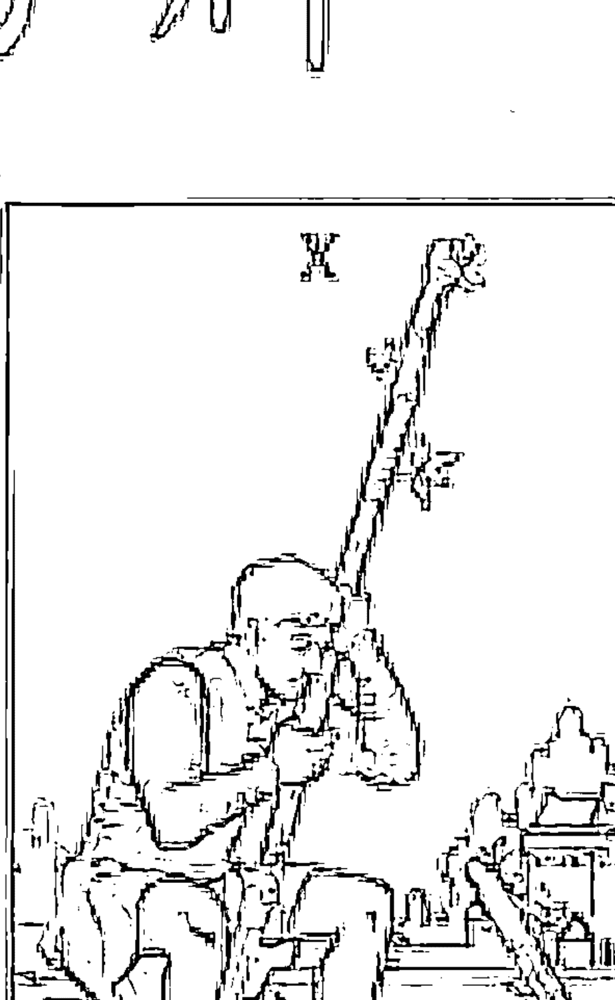

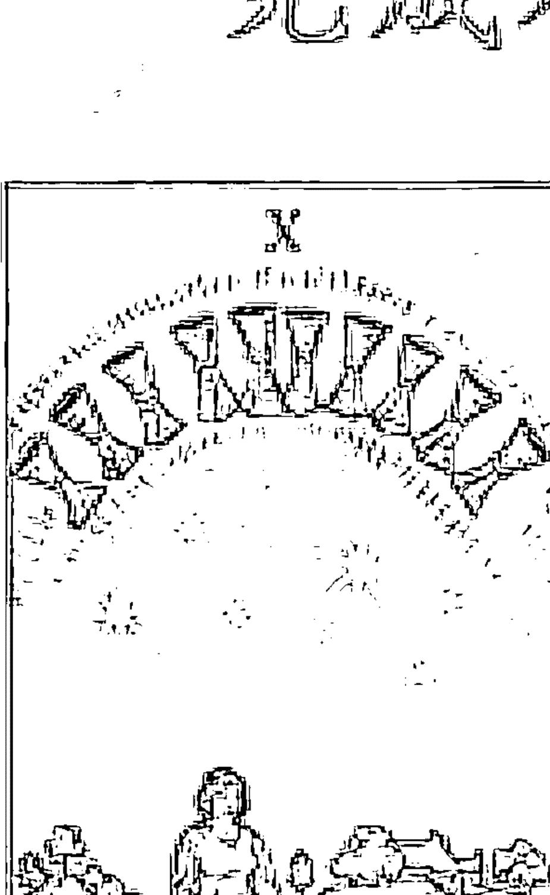

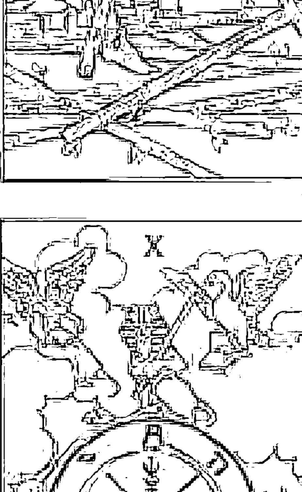

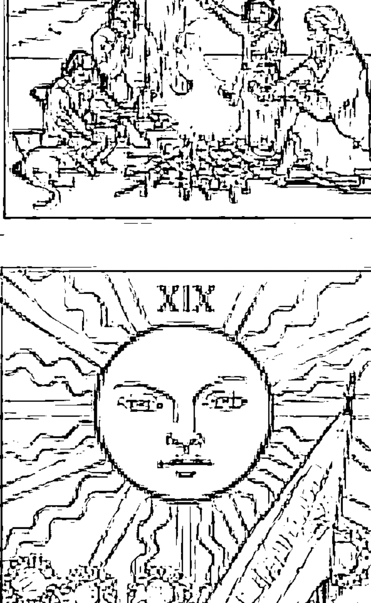

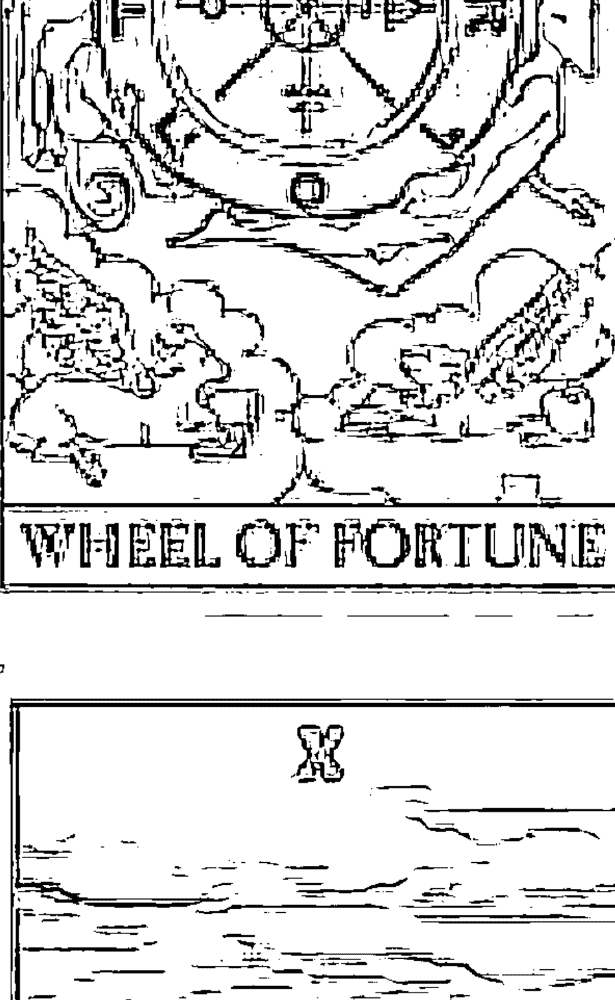

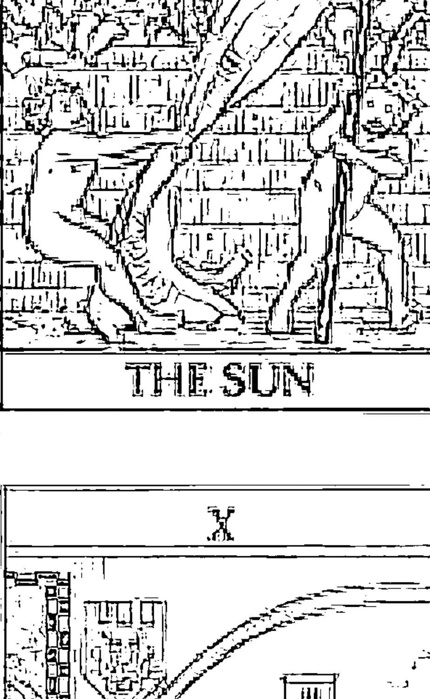

## 命运之轮、太阳和十号牌

10是代表顶点和完成的数字。卡巴拉生命之树上有十个原质，小阿卡纳的每一组牌里也有十张数字牌。在十号牌中，元素耗尽了能量，在固有的状况中休息。十号牌代表了完美，以及为了下一个循环的生活和世俗经验做准备。

### 命运之轮

好运中断

命运之轮是旋转着的命运的轮子。它提醒人们除了改变本身，没有任何事情是一成不变的。善有善报恶有恶报，有升必有降。

### 牌面描述

一个巨大的橙色轮子悬浮在半空中，被蓝色的天空和银色的云朵所包围。它周围有天使和古代的神，上面刻着关于力量和改变的魔法文字。

### 主要符号

轮子是橙色的，橙色代表火、光明、能量和热情。

它被分成了八个区间，以象征四个基本方向：北南东西；以及在它们的中间点：东北、东南、西南和西北。

这个分区也代表了一年中的轮回，春分、夏至、秋分和冬至，以及每个季节的中点。

四角的类似于天使的生物代表着黄道上的固定星座：带翅膀的天使代表水瓶座，凤凰代表天蝎座，狮子代表狮子座，公牛代表金牛座。

四种生物也代表了四个维度：宽度、长度、高度和时间。也代表了四个基本方向：北南东西。也代表了四个季节、四种风、四个月相、人类的四个年龄阶段：婴儿、少年、成人和老年。此外，四种生物也代表了小阿卡纳的四个牌组。

轮子顶上的狮身人面兽事实上是四种生物的结合。他有人类的头颅，公牛的身体，狮子的脚和尾巴以及天使的翅膀。

右边长着豺狼头的是阿努比斯，他是埃及的来世之神。

左边的狒狒是托特，埃及的文字之神。

盘绕在命运之轮中心的大蛇是古代的怪兽提丰，他曾试图推翻众神之王宙斯的统治。失败后被丢入地下，在那里他可以让火山爆发，呼唤风暴。它在努力咬到自己的尾巴，就像衔尾蛇一样。在古代，它表示物质世界的无尽循环。

轮子外围的四个阿拉伯字母【译者按：原文是阿拉伯字母，但是译者认为这是英文字母，至少也得是拉丁字母吧！】是在女祭司卷轴上也出现了的那的四个字母：TARO。顺时针的读这四个字母，可以拼成单词“Tarot”。逆时针的读可以拼成“tora”，也就是希伯来的圣书。如果你从底部顺时针的读，你就能拼出“rota”，这是拉丁文轮子的意思。

阿拉伯字母和希伯来字母 “Yod” “Heh” “Vau” “Heh” 交织在一起。这四个希伯来字母组成了上帝的名字，在英语里的发音是 “Jehovah（耶和华）”。

轮子里面的数字是炼金术的象征：硫是三角形，盐是圆形，汞是长了角的圆形，溶解用波浪线代表。这三个炼金术的元素被一度认为是物质的三种基本形式。

命运之轮对应木星，代表幸运和好运的扩张性的行星。因为它是我们太阳系中最大的行星，它代表各个阶层的成长：个人的，职业的，物质的，精神的，情绪的，智力的。占星学上叫它大吉星，因为在它路过黄道星座的时候会带来健康、财富和幸福。木星也代表去远方旅行，和外国人交朋友，和高等教育等。

## 建议解读

这是你幸运的一天，买一张彩票或者向别人请求帮助。

当幸运来敲门，开门。

你被天使保护着。

就算有恶魔来了，也不过是逗你玩，不会玩坏你的。

时间在不停的流逝。如果你不铭记过去，你就会重蹈覆辙。

## 太阳

### 荣耀

太阳是觉悟和行动的象征。它是宇宙的中心，也是温度、光明、地球上生物的源头。

### 牌面描述

在一轮明亮的黄色太阳之下，两个喜气洋洋光着身子的小孩正抱着一个旗杆和上面的红旗玩拔河。他们有着一头金色的卷发，胖乎乎的，非常可爱。右面的小孩带着从他身后的花田里采摘的向日葵做成的花环，上面还有一根红色的羽毛。他们上面的太阳有一张像孩子一样脸。

### 主要符号

太阳是光明和启蒙的象征。因为他是太阳系的中心，它告诉我们，我们小宇宙的中心就是我们自己，我们只能从我们自己的角度去看待世界。太阳象征觉悟、自我意识和自我认知。它说明了我们都想bling bling的发光，并且需要找到一个月亮一样的伴侣，可以让我们看到自己有多bling。

太阳不像月亮一样反射别人的光亮，它自己会发光发热，月亮反射它们。它体现了男性的能量和主动的特质，而不是女性的接受和被动的特质。

太阳隐藏了一些秘密。它的某些射线是可见的，其他的则落入光谱的紫外线端（不可见）。

太阳是年度事件的标志，比如生日、周年、太阳的节气如二至日和跨季日。

牌面上两个小孩是光着身子的，这是因为他们是奔放，无拘无束，而且纯洁的。

他们赤裸着，没有保留和压抑。

旗帜，不过是一个被安装在杆子上的标志或者象征，它代表一个集合点，和激励我们走向成功的事物。

花园的墙象征着安全和保护。

在墙后面，生长的向日葵代表了希望和灵感，它随着太阳的移动而移动。历史上，升起和落下的太阳通常代表生命和死亡。

传统上，太阳代表世界中火的国王。

## 建议解读

出门去玩耍。

晒晒阳光，感受吹过你头发的风和脚下走过的大地。

给你自己补充能量。

找一个时机来庆祝。

太阳落下，你可以在星辰下起舞。

## 权杖十 把它们收集起来

权杖十代表即便混乱和沮丧，也要坚持不懈。

### 牌面描述

一个劳动者坐在那，倚着一根像拐杖一样的木材，看着乱七八糟散在地上的其他九根木头。他找到了一个适宜的地方放下他的负担，放松他的背部，用这段时间反思总结，来整合并重新布置安排他的工作。背景处有一个房子，那可能是他最终的目的地。当他抓紧时间休息的时候，他可以完成他手头的一些小事情。

### 主要符号

权杖十象征工作和职责的重担。
那个工人是能负重的野兽，用蛮力多过用脑子。
他的样子表明他对生活有其它的计划。
他有能力去想想如何摆脱这个烂摊子。
他坐的岩石给了他基础和稳定。
背景中的村落是避难所也是休憩之所。
传统上，权杖十代表压抑。
占星学上，它对应土星，表示界限和结构的行星；落在射手座，代表长途旅行和哲学的火相星座。

## 建议解读

你必须做一些繁重的工作。
做出计划，让工作简单点。
巧妙做事，不要硬着头皮干。
排除万难。
强势完结。

## 圣杯十

### 家庭聚会

圣杯十是关于家庭团结和快乐的牌。

### 牌面描述

一个快乐的家族聚在一起，围绕在篝火旁边，黄昏降落，星星在逐渐变黑的天空中闪烁。篝火燃烧，父亲和儿子看着火堆陷入沉思，祖父温暖着自己的手。妈妈和女儿站着，女儿唱着快乐的歌谣。
他们温暖的家就在身后，在一条缓缓流过的小溪后面。在头顶上，十个金色的杯子排列成了一个彩虹的形状发出光芒，横亘整个夜空。

### 主要符号

历史上，圣杯十代表一个美满的婚姻，比想象中的还要好很多的那种。

牌中的孩子是良好的父母关系带来的结果。无论孩子们是他们真的想生的，还是只是婚姻关系产物都无所谓。在一个理想的婚姻中，一个丈夫和一个妻子都会增加对方的创造力。

祖父是一个父亲的角色，一个仁慈的老者掌管着家庭的传统。

背景中的房屋证明这是一个愉快的家庭。相对于外面的世界，它是一个温暖舒适的庇护所。

背景中的小溪是从一张牌流淌到另一张牌的生命之河，将所有的塔罗牌都联系了起来。它也代表了在真实世界中，将人们联系起来的能量和情绪。

彩虹象征了盟约，一个神圣的职责。

传统上，圣杯十被认为是代表完美的成功的牌。

占星学上，它和木星相对应，代表幸运和好运的扩张性的行星；落在双鱼座，表示专注于精神的水象星座。

## 建议解读

你有非常牢固的群体观念。
你与你的长辈关系很好。
你会将这种关系传承给你生命中的年轻人。

## 宝剑十 —— 余下的残躯

来到了宝剑十，“X”标出了尸体埋葬的地点。它是一张表示苦难、痛苦、幻灭、悲痛的牌。

### 牌面描述

两个士兵抬着一个倒下了同伴去他的最后休息之处。他的坟墓已经挖好了，他的身体躺在一个木板上，身上盖着红色的裹尸布，他仍然握着他的剑，就像骑士的雕像一样。黑色的云朵覆盖了天空，但是地平线上有黄色的光亮。三把剑散落在地上，其他的剑树立在背景中，宛若墓石。

### 主要符号

在塔罗里，十号牌通常象征结局，当宝剑十出现在解读中的时候，结局是无可争辩的。画面中的人物再也起不来了。他的精神已经自由了。他可以离开这个牢笼，飘向更高的层级。

宝剑很少是字面上的，他代表了语言、思想和语言的斗争。在这种情况下，死者可能屈服于恶毒人身攻击，八卦，中伤。

毫不意外，很多塔罗的解读者将其解释为表示苦难、痛苦、幻灭、悲痛的牌。

太阳在地平线上，黑云实际上也泛起了银光，明天又是另外的一天。

历史上，宿命论者小心地指出，宝剑十并不代表暴力的死亡。但是，有时它的确代表着监禁和背叛，特别是有Ace或者国王跟着的时候。

占星学上，它和太阳相对应，能量和启蒙的来源；落在双子座，代表思想和交流的风象星座。

## 建议解读

因剑而生，因剑而亡。
懦弱的人有一千种死法，但是英雄只有一种。
宁可站着死去也不跪着活着。
你知道人们都葬在那里。
把人放进去，盖土，别说话。

## 星币十

### 世俗的财富

星币十是一张有关财富和家庭财产的牌。

### 牌面描述

一个年轻的男孩惊讶地看着一枚从宝箱中拿出来的金币，一条白色的狗正在嗅那个箱子。在远方，一个老年人和一个士兵的目光穿过拱门，落在后边的院子里。

### 主要符号

星币十是一张充分表明财富和满足感的牌，不仅仅是物质层面还有精神领域。

这张牌表示了家庭生活的富足。它代表了继承，不仅仅是物质资源，还包括智慧、经验、家庭价值观、信仰，所有一代代传承的一切。

十个星币就像卡巴拉生命之树一样。

老男人穿着一件高贵的斗篷，暗示着财富、社会地位和安全。

拱门是一个古老的建筑上的构造，像任何建筑中最坚挺的，持久的设计一样，仍旧矗立于此。这个建筑代表了其家族关系的永恒。

狗是忠诚和忠心的象征。

在传统的凯尔特十字牌阵中，有一个牌阵位置被叫做“家庭”。在这个设计中，这个牌阵位置上的牌描述了你最亲近的人，他们每天都看到你并且很了解你。在许多方面，星币十描述了几代人生活在同一个屋檐下的事情，完美地解释了这个牌阵位置的含义。

历史上，星币十代表了赌博、投机的游戏和损失。

占星学上，它对应水星，速度和交流的行星；落在处女座，勤奋和关注细节的土象星座。

### 解读建议

- 你会继承巨额财富。
- 你可以期待关于你经济问题的好消息。
- 关注细节。
- 听老人的话。

## 宫廷牌 四个皇室家庭

每一类宫廷牌的四个人物角色组成了一个理想化的家族。他们表现为一个父亲、一个母亲、一个儿子和一个女儿。一些宫廷牌是阳性的，一些是阴性的。一些是行动力强的，一些是包容性强的。他们都有对应于其牌组的元素对应。

火元素的权杖组宫廷牌掌管灵魂和直觉。
水元素的圣杯组宫廷牌沉浸在情感世界的暗流中。
风元素的宝剑组宫廷牌呼吸着智力、思想和沟通。
土元素的金币组宫廷牌是建立在物质世界基础上的。

但是不仅如此。宫廷牌也有根据其阶层所对应的元素。

- 国王对应风元素，他们领导和指挥。
- 女王对应水元素，她们培养和指导。
- 骑士对应火元素，他们是冒险家和救助者。
- 侍从对应土元素，他们学习通往世界的道路。

## 侍从牌

### 人类形态的元素

在文艺复兴时期，侍从是宫廷中最年轻的人物。他们的职责是学习和被差遣，就像是将信息从一个人传递到另一个人那样。当侍从牌出现在塔罗的解读当中的时候，他们通常代表年轻人、学生或者是信息。侍从也是其所代表的元素现实的体现。

令人着迷的权杖侍从是人格化的火。它这种激烈的能量，构成了权杖组和精神与创造的世界的桥梁。它充满了能量、雄心和行动力。他是鲁莽的和勇敢的。

敏感的圣杯侍从是人格化的水。它所代表的易变的内心情绪构成了圣杯组和情感世界的桥梁。他是梦幻的和富于想象力的。他是诗人、艺术家和幻想家。

机灵的年轻宝剑侍从是人格化的风元素。他所代表的快速移动的能量构成了宝剑组和智慧与交流的世界的桥梁。他是一个读者、作家和一个演讲家。

星币侍从是人格化的土元素。就像在他身边的元素生物，一个侏儒。它所代表的坚定的能量构成了星币组和物质、存在的世界的桥梁。他是有教养的，慷慨的，友善的。

## 骑士牌

### 火焰的守护者

在中世纪时期，骑士是冒险家和救助者，他们发誓保卫弱者和无助的人，并会因此远征。骑士出现在塔罗解读里的时候，他们代表了新的远征或者新的探索的开始，或者表示救援就在路上。

大多数关于骑士的故事事实上都是关于变化的故事。在大多数演义中，骑士都在寻找一个神秘的物体，比如圣杯。当他追寻他的使命，他遇到并且跨过了一系列的障碍，这些障碍都是被刻意做来测试和挑战他的。作为他旅行的收获，骑士明白了，那个他所探寻的神圣的物体并不是他冒险的真正目标。相反，这个任务是为了促成自我改造和转变。

从元素的层面上来讲，塔罗中的骑士是火元素。他们将火元素与自己牌组的元素相结合。

在占星学上，骑士与黄道十二宫的变动星座相关联，这标志着季节的变化。

### 权杖骑士

像旧时伟大的十字军一样，权杖骑士人在旅途。他奔驰过金字塔，这表明他在炎热、干燥的沙漠，而这种环境正是他火热的性格所乐意享受的。他穿着一件黄色的外套，饰以火蜥蜴——火属性的元素生物的纹样。在元素上，权杖骑士体现了火元素与火元素间的激情的结合。占星学上，权杖骑士对应火象的变动星座射手座，这使得他外向且爱冒险。

### 圣杯骑士

圣杯骑士正在用一个金色的杯子喝水。他和他的白马正在一个干净透明的小溪旁休息，小溪的源头是一个不断冲刷的瀑布。他是一个梦想家和一个有远见的人，优雅安静地骑着马，他头盔上的翅膀象征着他想象中的云雾。在元素上，圣杯骑士体现了水元素和火元素的结合。占星学上，圣杯骑士代表了水象的变动星座双鱼座，这让他敏感并且自省。

### 宝剑骑士

宝剑骑士以虎狼之势压倒了对面的对手。在一个如旋风般的快速行动中，他的武器在敌人的喉咙上挥舞，他的敌人的盾牌飞向空中。宝剑骑士是与其坐骑完美结合的骑手之一，他的思维和他的坐骑移动的一样快。他可以像风一样驰骋。占星学上，宝剑骑士代表了风象的变动星座双子座，这使得他多才多艺并且思维敏捷。

### 星币骑士

星币骑士并不符合大多数人对于骑士的印象。他的行动并不是非常迅速，他并不轻浮，当其他的骑士正在冒险的途中的时候，他经常待在后面照看王国，巡逻边境。元素上，星币骑士代表了火元素和土元素结合。占星学上，星币骑士代表了土象的变动星座处女座，这使得他谨慎并且尽职尽责。

## 女王牌

### 养育理想

女王代表了那些证明了自我的女性。她们面对自己的心魔，并证明了自己是成熟和有能力的成年人。每一张女王牌都代表了一个理想的女性：一个完美的妻子或者母亲或者好的榜样。女王也体现了我们联系在女性身上的品质：她们慈悲、有创造力、包容、有同情心、直觉强。她们知道如何在幕后发挥她们的力量，如何说服他人改变观点。总而言之，塔罗中的女王可以利用他们的女性特质来守卫、培养和保护她们的世界。当女王牌出现在解读中的时候，通常表示一个同样有爱心的人守卫、培养和保护她的世界。

### 权杖女王

安静而又有张力，权杖女王坐在她高靠背的王座上，她的王座上刻着象征她的王权的狮子和向日葵。她手里拿着一株向日葵，穿着亮黄色、橙色、品红色的衣服。她的黑猫，就是女巫的那种黑猫，正准备跳上她的膝头。在元素上，女王代表了火元素和水元素的结合。占星学上，她代表了火相的开创星座白羊座，标志着强大的领导能力和启蒙能力，这也让她成为了一个天生的领袖。

### 圣杯女王

圣杯女王将一条鱼从她的杯子中拽了出来。她的王座是贝母材质的，被塑造成海贝的形状。它坐落于一个小岛上，离一个悬崖的岸边并不远。她的银色的缎子礼服优雅垂落，就像她金色的头发卷起的波浪。元素上，她体现了平静的水元素与圣杯组牌深度的情感的结合。占星学上，她代表了水相固定星座巨蟹座，她是一个天生的妻子和母亲。

### 宝剑女王

宝剑女王惊愕地看着优雅地落在她宝剑顶端的蝴蝶。她不准备在蝴蝶飞走前挪动她的宝剑。她被开阔的天空环绕着，树木被风吹得弯下了腰。她的王座上雕刻了鸟和有翅膀的天使，它们都能飞越长空。元素上，风元素的宝剑牌组的宝剑女王是水元素和风元素的结合。在占星学上，宝剑女王代表了风相的固定星座天秤座，这使她成为了高尚和亲切的领导者。

### 星币女王

星币女王高举一个金色的球，好像是她在提供一份礼物。这是她所统治的领域的象征，当然，她是养育和指导物质世界的女王。在最突出的前景处，一只象征多产富饶的兔子跑了过去。在元素上，星币女王是水元素和土元素的结合。占星学上，她代表了土象的固定星座摩羯座，这让她成为一个聪明的女商人，可以为她的人民争取广泛的资源。

## 国王牌

### 王冠的持有人

国王是保护者，提供者，和老练的、经验丰富的领导者，他们成功地完成了他们作为骑士所做的任务和征程。他们是熟练的指挥官，在生活的战场上他们已经证明了自己。他们对他们在完成任务期间获得的知识和智慧有信心。他们也是刻板的男性形象，他们是威权的，自信的和警觉的。他们甚至可以是好斗的。他们用激情和力量守卫他们的王国，他们不害怕做出任何行政决定。当国王牌出现在解读中的时候，也许意味着有人正要增强防御工事甚或是发动战争。

### 权杖国王

权杖国王将一个火蜥蜴放在手心。这种象征火元素的生物是他的图腾，它比没有生命的权杖来的更生动。他的袍子上也画着火蜥蜴的图案。狮子，另一种火元素的生物被刻在他王座的椅背上，他脖子上的吊坠也有狮子的图案。像塔罗中所有的国王牌一样，他的王冠下带着一顶礼节性的帽子，这是他智慧的象征。元素上，权杖国王是风元素和火元素的结合。在占星学上，他与火象的固定星座狮子座相对应，这令他成为一个自信、勇敢的君主。

### 圣杯国王

圣杯国王看上去似乎陷入了沉思，他上身稍微前倾。他的王座漂浮在海面上，杯子里一股稳定的水流，流入到汹涌的大海之中。他的王座雕刻着海贝和海马。他带着鱼形的吊坠，穿着蓝色的束腰长袍，和金色的披肩。在他身后，一艘商船航行在海浪上，鱼在海浪中来回跳跃。在元素上，圣杯国王是水元素和风元素的结合。占星学上，他与水象的固定星座天蝎座相对应，这使他充满激情和热情。

### 宝剑国王

强大的宝剑国王将剑的尖端穿过一个金色的王冠，将宝剑深深地插入脚下的地面。猎鹰栖息在他没有戴手套的手上，等待着他能够改变命运的命令。宝剑国王的王座雕刻着蝴蝶和一对浪漫的舞者。在元素上，宝剑国王是风元素和风元素的结合。占星学上，他对应风象的固定星座水瓶座，这使他成为一个具有前瞻性和社会意识的君主。

### 星币国王

星币国王迎来了一头公牛，并用金色的星币为其加冕。公牛鞠躬接受荣誉。土元素的象征物环绕着国王，这也加强了他和他元素之间的联系。他的王座是厚重的，拥有粗犷的风格，就像是土元素本身一样厚重和固定。王座以公牛头部作为装饰，这也是土元素和金牛座的象征。星币国王也被葡萄藤环绕着，葡萄藤象征着财富，富饶，和物质上的满足。元素上，星币国王是风元素和土元素的象征。占星学上，星币国王对应土象的固定星座，象征稳定、舒适、愉悦的金牛座，这也让他成为了一个稳定可靠的君主。

## 结语

我希望你喜欢塔罗千变万化的世界。
现在你读完了这本说明书，你看到了传统韦特牌画面的一个新的发展，一个更新更深入的牌面的解释。
你甚至可以看到你自己的未来的一角，以及改变未来的选择。哪个未来是你所选择的？
如果你有任何问题，或者仅仅是想分享你在牌种所看到的故事，那就给我发邮件吧。我的地址是：corrine@corrinekenner.com。
在此期间，持续读牌。剩下的时间交给你自己了，你可以选择一种更幸福的生活。

Corrine kenner

### 后记

历经三个月的努力，伟特之后塔罗的翻译终于与大家见面了。

这本书是非常不错的塔罗入门材料，这套牌也是近年难得一见十分出彩的一套。所以我们把它翻译出来，希望大家不会因为语言障碍而错失了这么好的一套书。

关于初阶塔罗学习，我们可以向你推荐

- 《其实你已经很塔罗了》：塔罗入门非常经典的一本书。不过现在市面上已经出现了许多国外的书籍翻译，所以这本书看与不看，自由选择。
- 《其实你可以再塔罗一点》：同上，也是入门非常经典的一本书。
- 《塔罗葵花宝典》：基于画面讲解牌义，非常不错的一本书。
- 《78度的智慧》：除了基础牌义外还做了不少延伸，值得一看。
- 《塔罗的藏宝》：一本单纯的讲解牌义的书，并没有关于画面的过多解释，但是其中的很多牌义讲解深入，非常不错。
- 《塔罗逆位精解》：同样是基于画面讲解牌义的，但是是逆位。可以让初学者对逆位牌的讲解有一个大概思路的把握。

这些电子书都可以在我们的淘宝店铺【瞻行塔罗】找到资料福利包。

另外，如果认为书面文章太过晦涩，可以来参加我们的塔罗课程。除了0基础的课程之外，我们还有塔罗的实战课程，帮助你在看完书中的基础知识后快速把知识灵活运用起来。

除掉塔罗之外，你还可以从我们这里找到其他神秘学的资料以及各类相关课程，如：塔罗课程、现代占星入门课程、古典占星课程、神秘学基础知识课程等。

同时，我们也会持续为大家带来高质量的神秘学翻译。欢迎大家关注。

瞻行负责人联系方式：
萨拉（微信）：sarahsatan
星月（微信）：kohavim

最后再次感谢大家的支持。

星月&萨拉
2017.2.24

我们熟悉的塔罗图像已经近百年没有变过了，他们已经成为了我们集体智慧的一部分，将一瞬间的东西变成了永恒。

但是时间长河是不停的流动的，过去的塔罗已经不能够涵盖今天的所有，愚人不可能永远站在悬崖边上。

如果你能超越时间和地点的限制，看到未来呢？毕竟塔罗就是占卜用的呀。

如果你知道了愚人踏出悬崖之后的景象呢？或者说，如果你自己能够进入那个景象呢？现在就有这样一个机会。

欢迎来到塔罗新视角，你可以来回转转，好好的看一看这里，曾经有过的，和它们现在的样子。欢迎来到韦特之后塔罗。

