# 韦特塔罗图像解读祕钥

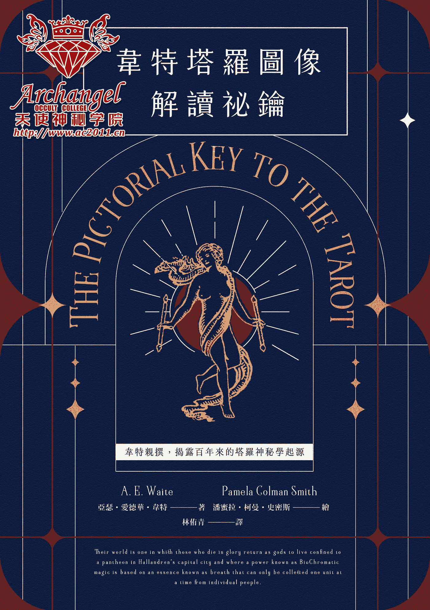

## 【推荐序】犹抱琵琶半遮面，
塔罗的历史精神与象征主义的现身

爱智者

韦特的书终于迎来了全新的译本以及最为详尽的注释，这不是一本好读的书，因此专业的注解尤为重要，而本书审阅者的严密把关，说明了它是目前最佳的中文读本。

时间回到一九一〇年，出版商莱德（Rider）公司为了替前一年，也就是一九〇九年所出版的莱德－韦特塔罗牌（Rider-Waite tarot）增加销量，特别商请作者韦特附上一本说明书。从这本说明书里可以看见，韦特本人对写作这本小书颇有顾虑。他一方面强调，塔罗牌的历史并未早于十四世纪，那些所谓塔罗源于埃及、印度或中国的说法全属胡扯，因此不得不借着本书来澄清；另一方面他又向读者坦承，他在书里对几个方面确实有所保留，但这涉及了他的“荣誉问题”，不得不然。

韦特的意思是，身为一位神秘学团体的高级成员，他有义务对塔罗牌的奥秘知识保密，因为这不仅是他的入会誓词，也是为了确保这份知识不会流入“圈外人”的手里，因为他们没有研究塔罗牌的资格。

因此，这本书时时可以见到韦特内心的拉扯。他批判并嘲讽此前的塔罗著作，不管作者是列维（Eliphas Lévi）还是 吉德杰贝林（Antoine Court de Gébelin），同时也对塔罗牌的奥秘被宵小之徒漤用而不齿。然而作为奥秘的保管者，他不能随意将“真知”大白于世，但也不能对市面上越来越多的错误置之不理。因此，“沉默法则的正当性完全不是我目前关心的问题”。

两个地方可以作为他有话不敢说尽，只能藏着掖着的证据。

第一，愚人牌的位置。他诡异地将愚人牌放在 20 与 21 号中间，然后告诉读者牌卡的真正顺序从未曝光。但我们知道，根据黄金黎明协会对卡巴拉的解读，0 对应着希伯来字母 Aleph，它是一个母字母，代表着元素里头的风，经常被视为一切声音的开头，一道还未形成声音的气音。

因此愚人牌的理想位置应当是最前面，符合我们一般从 0 开始的常识。作为该协会的一员与卡巴拉的学者，韦特不会不知道这件事。目前一般的推论是，他为了遵从守密的誓言而刻意做出了误导。

第二，8 与 11 的争议。在传统的塔罗牌里，8 号是正义牌的位置，黄金黎明协会为了使其与黄道十二宫的顺序对应，因此将 8 号留给了力量，将正义挪到 11 号去。韦特塔罗牌沿用这个做法。

熟悉托特塔罗的朋友很清楚，克洛利并不欣赏这个做法，因此他与韦特虽系出同门，却把黄金黎明协会的做法又修正回去。而韦特在解释这件事时，他的说法是，“基于满足我个人的理由，这张牌和通常编号为 8 的正义牌互换了。由于这个变动对读者没有任何意义，在此便无须解释”。

这便是这本小书的创作背景，一个不得不出来端正视听，却不愿让奥秘知识泄漏于外的无奈作者。

谈到创作背景，也不能不谈牌面绘制者潘蜜拉·柯曼·史密斯（Pamela Colman Smith）女士。作为一位同宗的艺术家，她接受了韦特的委托，要在短短的六个月内创作出七十八张全新风格的塔罗牌。在这样的时间要求下，史密斯对牌面设计有着极高的创作自由。因为韦特无暇再对她下指导棋。

现在普遍认为，韦特牌中的小牌基本上出自史密斯女士的个人手笔，也因此，这副牌应该为她冠名，改称为莱德－韦特－史密斯塔罗牌（Rider-Waite-Smith tarot），简称 RWS，借此表彰史密斯女士的功劳。

众所周知，韦特对小牌画面的解释，有不少明显的疏漏与错误，最著名的是例子是圣杯王牌中的五道泉水，他在书里写成了四道。对宝剑 6 的描述则完全没有提到乘客的心境，只提到货物很轻，因此摆渡工作很容易。同样漏掉画面重点的牌，还有宝剑王牌和圣杯 8，显然他把小牌的解释工作看得比较随意。

韦特自己在这本书中也曾提及，宫廷牌的牌面没有特殊涵意，除了极少数情况外，小牌上的设计也不存在什么高深的暗示。他认为塔罗牌的深刻之处尽在大牌，小牌的目的主要是用于占卜。而对他这样的大学者来说，占卜本来就是小道，不值一提。

但熟悉卡巴拉理论的读者显然不会同意他的说法，因为宫廷牌的四个人物分据生命树上不同位置，理应作为公主，分配于 Malkuth 这个位置的侍卫牌，也因为由女性被改成了男性，而使得原先由公主与王子（也就是侍卫与骑士牌）的婚姻所象征的阴阳结合变得不再可行。

韦特对塔罗牌的改动，背离了他很熟悉的卡巴拉理论，除了他有意隐藏奥秘外，找不到什么有力的解释。当然这也说明了黄金黎明协会及神秘学组织的传统知识份子气息，他们对所谓“圈外人”或者一般民众的素养与学习资格普遍不信任。这件事要到克罗利（Aleister Crowley）出版《托特之书》（*The Book of Thoth*），更大程度揭露塔罗与卡巴拉的关联后才得到改善。

话虽如此，这本书终究奠定了塔罗知识普及化的开端。因为在韦特塔罗面世之前，除了十五世纪末由不知名画家所绘制的索拉布斯卡（Sola-Busca）塔罗牌外，数字牌的牌面只有绘制单纯的花色，例如：圣杯 3 就画三个杯子，权杖 7 就画七根木棍。

虽说史密斯女士确定参考过索拉布斯卡塔罗牌的设计，但使塔罗牌风行于世、走入民间的，确属这副韦特塔罗无疑。从此塔罗牌就以韦特塔罗为尊，图像化的学习法也大幅取代了奥秘知识的学习。

说到这一点，不得不佩服韦特在这本书的先见，他告诉读者，象征主义“是对圣所中最深奥的事物最包罗万象的隐秘表达”，又说“真正的塔罗牌是象征主义，不说其他语言，不用其他符号。”

正是这个观点让他携手史密斯女士重新恢复小牌的图像，或许也是同样的原因，他重视的不是塔罗的占卜价值，而是启蒙与灵修的价值。他与心理学家荣格一样，都发现了象征的深度，发现了文字与符号的局限。客观来说，他想创建的其实是心灵科学，因此那当中不能有附会，也不该借着托古来夸大塔罗牌的价值。

所以他才秉持历史主义的精神告诉读者，完整的塔罗牌出现在十五世纪以后，而它们所包含的深层启示，即便是十四世纪也够早了。一份真理如果具有无上的价值，就不需要借着它出现的年代来彰显自己的价值。换言之，好东西没必要非得是老东西。

那么，作为一个当代的读者，这本小书还能给我们什么启示呢？

| 1、 | 韦特示范了何为证据说话，他对前辈神秘学家对塔罗牌的附会不假辞色，无意将塔罗牌与古埃及挂勾，这说明他想创建的是属于欧洲的神秘学或心灵科学。如今的考古证据依旧支持他的说法，那些把塔罗牌当成上古秘宝的想法可休矣！ |
| 2、 | 韦特竭力批评的前辈神秘学家多为法国人，这也说明英国神秘学与法国神秘学间的观点并不相同。身为后世学习者，我们需要知道，这场论战的背后难免有国族主义的情结在内，除了那些有明确证据支持的观点之外，学习塔罗牌时，千万不要有以某个说法为尊，或谁是唯一正统的想法才好。 |
| 3、 | 韦特告诉我们，理解塔罗牌的最佳方式是象征，作为象征的集合体，塔罗牌没有回答的，永远比它回答的还要多。但有些学习者容易有收集象征意义的习惯，举个例子：愚人衣服上的图案是什么意思，他的包袱、他手上的鲜花代表了什么？象征的意义是无穷的，但重点是：“愚人是谁？”“这张牌在表达什么？”切勿着迷于细节的争论而因小失大，错失了对整张牌义的掌握。 |
| 4、 | 这本小书回答了韦特塔罗牌一直存在的几个争议，例如：月亮牌最前方的究竟是蝎子、小龙虾、还是螃蟹？答案是小龙虾（crayfish，本书翻译为螯虾）。这是韦特自己的称呼。以及钱币 5 中的两人是情侣、路人、还是母子？韦特本人的答案是情侣。希望本书的面世可以终结许多似是而非的解释。 |

当然，知名的凯尔特十字牌阵也同样源于此书，进阶型的学习者也可以看看韦特怎么解读重复出现的牌以及古老的占卜法，你会发现，随着时代的演进，对于牌阵的大小以及牌面的意义都有不小的变化。碍于文长，我不再举例，而是要邀请读者穿梭回一百多年前那个韦特塔罗牌甫诞生的时代。两位进入新世纪的神秘学家正带着激动的心情，欲将他们所知的奥秘分享给世人。

而这份初始面世的奥秘虽然犹抱琵琶半遮面，却在这本小书里发出了耀眼的光芒。

## 【导读】塔罗神话的诞生：
潜入韦特塔罗的神秘学研究

王乙甯

韦特塔罗的重要性，在这个时代是无庸置疑的，但想像韦特牌出版时，对塔罗图像的各种改变与革新，当时是否也能受到同样的重视？我想韦特在当年可能对这件事也未必有十足的把握，或许这就是韦特会撰写本书的原因之一。本书的内容安排，在当年也是韦特的大胆尝试，把塔罗的神秘学研究与大众化的占卜结合在一起，从行销的观点，创出了新的类别，但这种创新也有可能澈底失败。时间证明，韦特的做法成功了，但比韦特早一年，在法国也有神秘学者出过类似的的著作，却获得负评。韦特的成功或许可以视为好运，但个人认为，更大的原因在于韦特牌对塔罗图像进行的大胆与创新的改头换面。

一九〇九年，法国的神秘学者帕浦斯（Papus，Gérard Encausse 的笔名）出版了《塔罗占卜》（*The Divinatory Tarot*）一书，帕浦斯的塔罗研究，主要跟随了列维（Éliphas Lévi，本名 Alphonse Louis Constant）的卡巴拉神秘主义学说，但在帕浦斯的时代，法国神秘学已然没落，虽然十年前他的著作《波希米亚人的塔罗》（*The Tarot of the Bohemians*，一八八九出版）也是塔罗与神秘学研究领域重要的著作之一，但十年后，帕浦斯结合了列维大秘牌的塔罗神秘学研究与占卜术应用的塔罗书出版后，却收到很多恶评。神秘学者们抨击帕浦斯将塔罗研究与占卜术结合得太过粗糙，对占卜有兴趣的大众也不买单，当时书里用的塔罗图像，大秘牌维持了列维的传统，小秘牌借用了占卜大师埃利艾特（Jean-Baptiste Alliette，又名 Etteilla）出版的“托特之书艾泰拉塔罗”（*Book of Thoth Etteilla Tarot*），这些图像都是早期埃及学说盛行时绘制的牌卡，这些图像对神秘学者们来说，是前人留下的遗产，不得俗化。对大众来说，进入二十世纪的法国中产阶级，热衷于生产自己的商业神话，不再一味模仿贵族们的品味，埃及意象对乐观看待未来发展的法国人来说，或许太过遥远与陌生。

同时期在英国拥有出版社的韦特，比帕浦斯更敏感的嗅到了市场走势，他清楚大众喜欢的是什么，所以当他想发行塔罗牌时，不再延续神秘学的埃及传统，反而找了绘制商业海报，并与韦特一起在黄金黎明会研究神秘学的潘蜜拉（Pamela Colman Smith），为塔罗牌创造出更为大众化，但又不失古典品味的全新视觉意象。韦特牌的成功，也要归功于四十张元素牌转变为人物图像，至于为何会做出这样的尝试，虽然韦特没有明说，但韦特在发行塔罗牌之前，早已熟知算命占卜术，他并不像法国的塔罗神秘学者们排斥占卜术。

一七八一年法国的共济会成员古德杰贝林（Antoine Court de Gébelin）撰写的塔罗与埃及神秘学研究的文章出版，打开了塔罗与神秘学研究的风气，也间接助长了民间的塔罗算命的发展。当时的算命大师埃利艾特，就是从古德杰贝林的书获得启发，自己设计了一套专为占卜用的塔罗牌（托特之书艾泰拉塔罗）以及讲解占卜术的专书，并在一七八三年出版，成为第一套专门应用于算命占卜的塔罗牌。虽然埃利艾特也很用心的延续了古德杰贝林的埃及与塔罗的神秘学研究，但没有加入研究圈，且并非神秘学者的埃利艾特，长期被法国神秘学的学术圈排挤，列维甚至取笑埃利艾特是江湖术士，大力批评他的塔罗占卜术误用了塔罗，这是当时的法国塔罗神秘学者们对待占卜术的态度。

韦特则对算命占卜早有涉入，并用大东方（Grand Orient）的笔名，在一八八九年出版过《纸牌占卜手册：算命与神秘占卜》（*A Handbook of Cartomancy, Fortune-Telling and Occult Divination*）一书，介绍了各种民间流行的算命占卜术。民间的占卜术普遍强调超自然力量，与占卜师个人的特殊灵力，但有些神秘学研究者，并不认为超自然力量属于神秘学，其实列维与韦特在此观点上是一致的。韦特认为神秘学不是超自然能力，而是一种透过理性思维进行的研究，所以由他在黄金黎明会推动的学习小组，较专注在超自然之外的神秘学领域。但韦特并没有与塔罗占卜术切割，他把这两者视为不同对象的使用需求，并理解占卜术的商业价值。而且把小秘牌改为人物画以后，反而可以与坊间借用灵力来占卜的各种纸牌做区隔，创造出韦特塔罗牌应用于占卜的特色。

但以上说明也只是个人推测，是我在进入塔罗占卜的研究后，对于韦特牌与其他传统纸牌占卜术之间的差异所推论出来的原因。不管韦特是否曾有这一层顾虑，韦特牌的图像转变，确实为之后的塔罗与身心灵占卜打开了新的可能性。韦特牌的成功，最主要发生在二十世纪正热衷于灵性发展的美国，结合灵性疗愈的塔罗占卜，直接使用韦特牌，而不是流传更久的马赛塔罗或其他牌卡，最主要的原因可能就是韦特图像的象征表现与人物图像。但身为神秘学者的韦特，不会只满足于牌卡在大众销售上的成功，他可能更期待能够在神秘学领域获得赞赏与认可，所以在发行韦特塔罗的同时，也发行了这本书。

如果详阅本书的内容，会看到韦特对前人的塔罗研究有诸多批评，可以看出韦特想要透过这本书，创建自己在塔罗研究上的学术形象。韦特撰写这本书时所想像的读者，是研究塔罗的神秘学者们，因此虽然他也将占卜应用的小秘牌纳入介绍的内容，但词语间却贬抑小秘牌的占卜功能，明显以他的学者身份抬高了大秘牌的神秘学内涵。所以本书并不是塔罗占卜书，而是韦特想要让自己发行的塔罗牌，可以获得塔罗神秘学研究认可的理论书。在内容的撰写上，从大众化的观点来看并不友善，很多概念与名词没有说明，在字词的使用上也不够白话。现代有些学者会批评韦特是自大、喜欢故弄玄虚的学者，主要原因也是因为韦特喜欢使用艰涩的字词，很多概念模煳不确定、前后矛盾。但他在塔罗图像上的改革，带来无人可比的影响，在这一点上，韦特塔罗的贡献无可否认。

在本书中，韦特很强调他与列维研究上的差异，列维被称为法国神秘学之父，他在塔罗研究上最大的贡献是将犹太教卡巴拉神秘主义与塔罗结合，至今他的研究还是影响着很多人，在解读塔罗牌时，卡巴拉的概念与塔罗牌成为无法分割的关系。但韦特并没有延续列维的思维，甚至也会批评列维的解读是过度解释。韦特对列维学说的不认同，并不代表列维的学说没有道理，而是透过否定列维，突显出韦特本人在观点上的创新。就像塔罗神秘学研究的开端是古德杰贝林的埃及学说，但塔罗研究并没有停留在埃及，后来的列维则提出和卡巴拉神秘主义有关的塔罗起源与学说，列维之后重要的法国学者是帕浦斯，他则是整合了前人的理论，并再加入数字神秘学与塔罗之间的关系，成为法国神秘学期间的三大重要人物。

比起法国，一八八八年在英国成立的黄金黎明会，在欧洲的神秘学研究上起步较晚，虽然承接了前人的很多成果，但创新需要比前人付出更多的努力。韦特早期透过翻译就已接触过列维或帕浦斯的塔罗理论，为了要让自己与法国学者们有所区隔，韦特将其视野转向英国的在地资源，从凯尔特的圣杯传说与基督宗教化的过程，把天主教已消失的教派链接为塔罗起源，为塔罗创造出新的起源传说。当然他的尝试与古德杰贝林、列维如出一辙，从古老传统找出与塔罗有关的起源，但这些尝试并没有历史考据，都只是这些研究者们的推测与想像。

韦特的推测建构了韦特牌的图像，所以不管历史真伪如何，要认识韦特牌的图像象征，就必须从基督宗教的传统去理解，而不是卡巴拉神秘主义。但现今还是有很多人喜欢用卡巴拉生命之树的概念解释韦特塔罗，这种解释还是能传达出韦特牌的意义，虽然韦特本人未必会认同。神秘学是有关人与世界、宇宙的学问，各家理论并不在于分出真伪，而都展现了人想要认识自身与世界的奥秘的各种尝试，虽然论述面向各有差异，但在讲述人的经验层次上，还是有很多相互共鸣的地方，所以各种神秘学理论，都能进入塔罗图像的解释，这也是为何有埃及、卡巴拉与圣杯传说的原因，到了我们这个时代，发展出荣格心理学，以及各宗教的灵修观来解读塔罗的方法。

### 如何阅读本书

#### 一、带着好奇心进入韦特塔罗创造的神话世界

还记得第一次阅读本书前几个章节时，好像在看达芬奇密码，韦特是很有说服力的学者，跟着他的思路，共济会、神智学、玫瑰十字会、天主教消失的教派⋯⋯好像在揭开不为人知的宗教背后的秘密，而且其他人都错了，韦特才是知道真正秘密的人。当然，在之后阅读了有文献考究的塔罗历史专书后，才知道韦特也只是在说他推测的故事。塔罗牌的历史直到一九八〇年，由英国的分析哲学家麦可·达米特（Michael Dummett）出版相关专书后才算定论，在那之前的关于塔罗起源的介绍，大多只能算是杜撰或有此一说的传闻，韦特也不例外。

考证塔罗历史的真伪，跟认识每幅牌卡背后的灵感来源是两种不同思维。就像达芬奇密码，它的创作灵感来自于圣经中的耶稣，但文学创作不需涉入历史真伪，读者也能从创作故事中获得阅读乐趣与启发。就像塔罗牌，从一开始的杰伯林的埃及说、到之后列维的犹太神秘学、韦特则强调天主教与圣杯传说的影响等等，这些神话成为塔罗图像背后的灵感，如果没有这些神话，塔罗牌或许只能停留在已无人在玩的游戏纸牌，也不可能像这个时代，为无数的创作者带来灵感，推动百花齐放的图像创作。

我们可以把塔罗牌的起源说，视为每一种牌卡的诞生神话，就像伟人出生时，不断述说的各种怪异迹象，这些迹象的重要性不在于是否属实，而是在于这些迹象述说了伟人的哪些贡献与特质。所以，认识每种版本的塔罗起源的重要性，不在于真伪，而是思考这些故事到底为图像赋予了什么样的意义。因此，在阅读本书时，可以从韦特的字里行间去好奇，韦特为何会这么说？他想要表达什么？这些内容为韦特牌赋予了哪些意义⋯⋯。每个说故事的人，背后都会有他的动机与意图，虽然在故事中未必明说，但好的聆听者会好奇，并注意聆听说故事的人真正想要表达的意义。韦特已经离世，但阅读这本书的读者，透过好奇心，或许能够成为与百年前的韦特有共感的聆听者。

#### 二、成为一位探秘者，进入众多巷弄共筑的迷宫

现有的很多塔罗书，专注在图像的占卜功能，所以比起图像的象征内容，更强调占卜时可对应的牌义。但这本书对大秘牌的介绍，完全与占卜无关，每张图像都成为说明神秘学的某种概念的象征图。象征图就像有很多典故的诗词，如果不懂典故背后的故事，便无法理解那首诗词在字句表层之外的深意。韦特大秘牌是象征图，如果不理解那些图取自于什么样的典故，我们也无法知道那张牌所代表的深层含义。在原文书里，韦特都只用了约一页的内容说明一张大秘图像的象征，但这一页的内容也充满了各种宗教典故，如果不去外查相关资料，很难看懂这页内容在表达什么，除非你已具备了相当程度的神学或神秘学的相关知识，否则文字读毕会有种没看到什么重要内容的感觉。

为了要看懂韦特写的每个字句，会发现自己已不再只是阅读这本书，而是手边或电脑已打开了各种相关资料，或甚至是同时阅读好几本主题都不相干的一些书。如果你想要快速读完此书，并对每张牌有大致的理解，就会觉得这本书很难读、无趣，内容不顺畅。有些书在阅读时，好像走上笔直大道，直接帮读者打通清楚的思路，但有些书在阅读时会不断被带进边间小巷，小巷里又有另一个吸引人的世界，很容易让读者在小巷里乱逛，但乱逛的过程却距离原来的地方越来越远，而这就是阅读本书的真正乐趣。不要设定阅读目标，享受不知会到达到哪里的不期而遇的期待，当你觉得在延伸小路中迷了路，再回头看看原来的图像，你就会很惊奇，小小一张图，却隐藏了这么多有趣的想法与概念，在这个过程，说不定你就会跟我一样，无可救药的迷恋上韦特牌，最后成为图像研究者。

## 序言

我应当先简要声明个人立场，就自我辩白的意义而言，看来似乎有必要而非出于偏好。在多年文学生活中，可能受本身心灵和其他局限影响，我向来是高等神秘学派的倡导者。我此时关注起乍看之下似乎只是某种家喻户晓的占卜方法，人们可能会认为这种举动很怪异。如今，即使是文学评论，某某先生的高见也无关紧要，除非恰巧与我们自身观点一致，但为了使这个教义变得神圣，我们必须确保我们的观点及其所产生的主题只涉及最崇高的事物。但就当前情况，这点似乎有疑虑，不仅对于我在适当范围内所尊重的某某先生而言，对一些更为重要的人也是如此，因为他们奉献的也是我所奉献的。对这些人和任何人，我想说的是，最具启发性的克里斯汀·罗森克罗斯弟兄 1，在转化的秘密宫殿中目睹炼金婚礼 2 之后，怀抱着隔日一早能当守门人的期待，他的故事便戛然而止。以同样的方式，那些能透过圣礼最清晰的面纱见到天国之王的人，往往是那些此后承担上帝之家当中最卑微职务的人。透过这种简单的做法，秘密会社里的行家和大师，也就和作为“神秘学仆人之仆人”的新手群区分开来。同样，或说以某种并非完全不同的方式，我们在最外围的门前──在所谓神秘学方术的碎屑和瓦砾中──遇到了塔罗牌，关于这些方术，任何逻辑正常的人都不会遭受最轻微的欺骗；然而这些牌本身属于另一个领域，因为它们蕴含非常崇高的象征意义，此乃根据恩典的法则解释，而非根据那些被称为占卜的托辞和直觉来解释。上帝的智慧在人看来是愚昧的，此事实无法推定人世的愚昧能意会神圣的智慧；因此，无论是普通阶级的学者或掌权的教育家，都不太可能马上意识到这个命题的概似性甚至可能性。这个主题已经在占卜师手中成为这行谋生的用具，我不会试图说服我圈子外的任何人，这一点有多重要或毫无意义；在历史和诠释方面，情况也没有比较理想，它一直由某些拥护者掌握，这些人使它澈底被那些有能力洞察哲学及赏识证据的人藐视。是时候解救它了，我打算一劳永逸解决此事，以便我能摆脱那些分散注意力、让人偏离主题的次要问题。正如诗歌是对至美事物最美的表达，象征主义则是对圣所中最深奥的事物最包罗万象的隐秘表达，这些事物尚未以同样丰富的方式对外言明。沉默守则的正当性完全不是我目前关心的问题，但我最近已在别处记录下我对这件事的想法。

接下来这篇专文分为三个部分，第一部分我将考证这个主题及衍生的相关议题。诸位应当理解，提出这些并非作为对纸牌历史的贡献，我对此一无所知也不关心；这是专门针对某个神秘学派的考量，尤其是在法国这个所有海市蜃楼的源头和中心，这些幻象在过去五十年间以塔罗牌历史作为幌子得以陈述。

在第二部分，我将探讨象征主义某些较高深的层面，正好用来介绍完整的修正版塔罗牌，这套彩色形式的牌卡和书分售，牌面设计则以黑白印刷收录至当前文本。论追本溯源和意义，牌卡是在我的监督下筹划，由一位绝对算得上艺术家的女士绘制完成。

关于占卜的部分，即本专文的结尾，我个人认为它是塔罗牌历史的一个事实。因此，我从所有已发表的资料来源整合了附加在不同牌卡上的意义，并郑重介绍一种从未公开的著名使用方法；它的优点是简单，同时也可广泛应用，能用来取代那些较大本的塔罗手册里累赘复杂的系统。

1.  原文为 Frater Christian Rose Cross，据说是一位 15 世纪曾赴中东跟随神秘学大师学习的朝圣者，返回日耳曼后创办秘教教团“玫瑰十字会”。他的传奇经历记载于 17 世纪三份匿名出版的玫瑰十字会宣言，亦可能为虚构的寓言人物。（本章注释未特别标示的，皆为译者注。）
2.  第三份宣言《克里斯汀·罗森克罗斯的炼金婚礼》（*Chymical Wedding of Christian Rosenkreutz*）1616 年于德国出版，这本寓言式罗曼史某些段落与《圣经》相似，描写罗森克罗斯受邀前往城堡，在七天中协助并见证国王（新郎）和王后（新娘）的“神圣婚姻”，这个结合实际上是指炼金术追求的伟大功业。

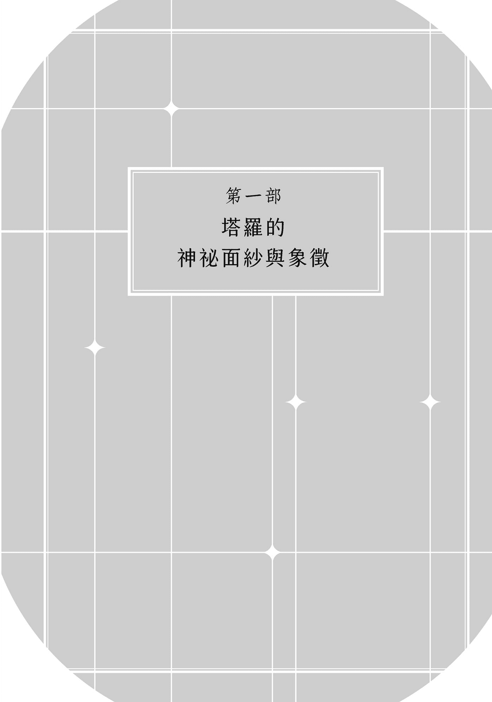

## 第一章总论

诗人的病理学说：“不虔诚的天文学家是疯子 1”，普通人的病理学说天才是疯子；在这些代表了数以万计类似过当状态的极端之间，至高无上的理性尽其所能地扮演调解者的角色。我不认为投入神秘学研究存在病理学，但没有人能质疑这件事的夸张无度，要在这方面扮演吃力不讨好的调解者同样困难。再者，即使存在病理学，也可能是一种经验主义而非诊断，而且无法提供任何判断标准 2。神秘主义和神秘能力不同，无论是日常生活中的商业才能，或是在自身领域里具备证据准则的知识，神秘主义都与其扞格不入。我知道，以胡说八道的高雅艺术来说，当有人批评断言某个立论不真实，而且看不懂它本来就只是浮夸词藻，还真没几件事能比这更无趣。我也知道，在这门领域里，在跟可疑教义或艰深研究长期打交道后，遇到明显有诈或无论如何完全不合理的东西时，总会感到耳目一新而想探究。但从神秘主义的视角看待历史这方面的胡说八道，通常并不总是浮夸词藻而已，也没有什么耳目一新的恩赐能愈合它对逻辑理解造成的伤口。当按照象征主义更崇高的法则来思考塔罗牌时，几乎需要一位像玫瑰十字会里“智者统御星辰 3”弟兄的耐心，才不会迷失在愚蠢的迷雾中。真正的塔罗牌是象征主义，不说其他语言，不用其他符号。鉴于其象征符号的内在意义，它们成为某种字母表，可以有无限组合并且皆具有真实意义。在最高层次上，它成为一把通往神圣奥秘的钥匙，不会受到个人臆断或诠释的限制；但，人们一直在述说关于它的错误象征故事，迄今每本已发表的相关主题作品里都写了错误的历史。已有两三位作者暗示，这一点至少在意义上无可避免，因为熟悉它们的人很少，而这些少数透过传承的人都发誓保密且不能背叛信任。这个暗示表面看来很荒谬，似乎有点泼这个主题冷水，因为有人提出特定诠释，认为占卜这个“抽牌艺术”只能保留给教义的弟子。尽管如此，事实是塔罗的确存在秘密传统，总是有可能会有一些神秘学的小奥秘随着响亮的号角声公诸于世，所以最好在事情发生前，警告那些好奇此类事物的人，关于象征意义的任何揭露只会包含大地和海洋的三分之一，以及星空的三分之一。原因很简单，无论是奥秘的根源或发展被写下来的都不是太多，在任何伪装的揭露背后仍然有许多东西可说。所以，恪守这一神秘秩序的某些入门圣殿守护者，毫无理由惊慌。

在我为《波希米亚塔罗牌》作的序中，我已经写下当时可能或最有必要的事，这本书在很长一段时间后，最近重新出版，纯属偶然。如同我提到的，当下这本书是特地用来介绍一套修正版塔罗牌，讲述它们朴素的真相，这种程度在圈外是可行的。至于那些更重要的符号的顺序，它们最终和最高的含义则比图片或象形文字的普通语言更深远。那些接受过一部分秘密传统的人才会理解。至于本书分配来描述重要大秘仪牌的文字意义，是用以正本清源排除过往的愚蠢和欺骗，让那些具有洞察力的人走上正轨，并在我能力范围内确保它们在一定程度上皆为真实。

我必须承认在几个方面有所保留令人遗憾，但这涉及荣誉问题。此外，一方面有些人对传统一无所知，却自认是所谓神秘科学和哲学的代表，另一方面，有些作家承袭了部分传统，并认为这构成他们具备合法名义在外界眼中卖弄，在前者的愚蠢和后者的假冒间，我觉得是时候说出能说的话，或许能将当前江湖骗术及无知的影响减到最低。

我们将在适当的时候看到塔罗牌的历史绝大多数都不太肯定，人们用明确的术语表达弥漫的空想和毫无根据的臆测，当这些问题澄清了，其实塔罗并没有十四世纪之前的历史。最早的阐述者谎言连篇，口中流露着关于塔罗牌源于埃及、印度或中国的自欺欺人，后来的神秘学作家们所做的只不过是怀着尚未觉醒的研究智慧，真诚地重现最初的虚假证词。正巧，所有的阐述都在狭隘的范围内进行，相对来说创造力并没有太大贡献，至少已经错过了某个绝佳机会，因为至今还没有人想到塔罗牌或许可能肩负阿尔比教派 4 秘密象征语言的责任，甚至可能是其起源。我将这个看法推荐给加布里埃·罗塞蒂 5 和尤金·阿鲁 6 精神上的直系后裔，也推荐给哈罗德·贝利爵士作为文艺复兴另一种新观点 7，至少可作为黑暗中的一盏烛光，而且不无敬意地说，也可能对像库珀·奥克利夫人 8 那样热情和渴望探索的心灵派上用场。想想，如果将塔罗牌的教宗或教皇牌与一位秘密阿尔比教派主教的概念链接，那么纸张上浮水印的所谓证据会增加多少收获，贝利爵士就是在这些浮水印里找到大量符合他心意的材料。试想一下，女祭司这张牌代表阿尔比教派教会本身；再想想闪电击中高塔象征着渴望摧毁罗马梵蒂冈，这座七山之城，当神的愤怒让高塔四分五裂，罗马教宗及其世俗权力从这座神圣建筑物里被抛下。这些可能性如此众多，引人信服，以至于几乎欺骗了其中一位创造这些论述的上帝选民。甚至还有更多，虽然我几乎不敢引用。当塔罗牌首度成为学者正式诠释的主题时，考古学家古德杰贝林 9 复制了一些塔罗中最重要的象征符号，以及，容我这么说，借由他的铜版印刷，他用的手抄本成为后来发行的多套牌卡参考的基础。这些图形非常原始，与艾泰拉塔罗牌 10、马赛塔罗牌 11，以及法国目前流通的其他塔罗牌不同。我对这方面没有多好的见解，但从我引用的案例可看出每张大秘仪牌都很可能符合浮水印的用途，圣杯王牌就是最显著的例子。

我应该称其为圣餐象征，沿袭圣体柜的用法，但现在这无关紧要。关键是，哈罗德·贝利爵士在他的《文艺复兴新观点》一书中提供了六个类似的图案，都是十七世纪纸张上的浮水印，他声称这些图案源自阿尔比教派，代表圣礼和圣杯的象征。

要是他听说过塔罗牌，要是他早知道这些占卜、算命、流浪艺术的纸牌或许当时就已经在法国南部流通，我想他那迷人但过于异想天开的假设可能会在他的梦境里更加膨胀。我们无疑会看到基督宗教 12 诺斯底教派 13、摩尼教，和他经由原始《福音书》理解的一切在这些图片背后闪闪发光。

我可不透过这种滤镜看事情，只能日后再推荐他留意这个主题；在此提到这件事只是想介绍一种前所未闻的奇观，看看关于塔罗历史牵强附会的推测有多神奇。

关于纸牌的形式和数量，可能不需一一列举，因为几乎都很耳熟能详，但由于假设任何事都有风险及其他原因，我将它们简要列出如后。

1.  原文 The undevout astronomer is mad 出自 18 世纪英国诗人 Edward Young 的长篇无韵诗《牢骚：或，关于生命、死亡和不朽的夜思》，描述诗人对至亲离世的反思并悲叹人类的脆弱。《夜思》在当时欧洲各国流传甚广，影响浪漫主义甚钜。
2.  此处韦特提起病理学可能认为有必要指出，神秘学者和拥有神秘经验的人也是正常人，其时代背景正值精神医学方兴未艾，韦特认为并无医疗上的诊断标准可断定神秘学者是否“发疯”。
3.  原文为拉丁文 Sapiens dominabitur astris（智者统御星辰），在 13 世纪末到 17 世纪末天文学家大量使用此格言，原典出处不可考，18 世纪末这句话重新出现在共济会和“黄金黎明会”等神秘学团体中。此处韦特虚构了一位遵守此格言的玫瑰十字会弟兄，表示需要毅力十足的智者，才能看清塔罗蕴含的深义。
4.  12 世纪卡特里教派（Catharism）传入法国南部阿尔比（Abi）城并在当地兴盛，故又称阿尔比教派（Albigenses）。此教派受摩尼教和诺斯底教派影响，信仰二元论，认为是恶神创造并掌控这个世界和肉体，真神并无形体，他们反对基督教道成肉身说，也反对腐败的罗马梵蒂冈。13 世纪初，教宗伊诺森三世派出阿尔比十字军讨伐异端，经历二十年镇压血洗，该教派残余势力转为地下直至 14 世纪末绝迹。
5.  加布里埃·罗塞蒂（Gabriele Rossetti）是 19 世纪意大利贵族、诗人和学者，支持意大利民族革命并创办烧炭党（Carbonari），后流亡英格兰。着有《论导致宗教改革的反教宗精神》一书。
6.  尤金·阿鲁（Eugène Aroux）是 19 世纪初法国学者。着有《中世纪骑士精神与柏拉图之爱的奥秘》。韦特认为这本作品受到罗塞蒂启发，这两人的作品皆影响了英格兰的神秘学圈子。
7.  英国学者哈罗德·贝利（Harold Bayley）靠自学通晓据称五十种语言，被誉为 20 世纪最伟大的东方学家之一。着有《文艺复兴新观点》一书，主张文艺复兴其实始于法国。
8.  库珀－奥克利夫人（Harriet Isabella Cooper-Oakley）是活跃于 20 世纪的神智学者和作家，作品也多受罗塞蒂和阿鲁影响。
9.  古德杰贝林（Antoine Court de Gébelin）是 18 世纪新教牧师和神秘学者，也是共济会成员。他是最早主张塔罗牌和古埃及《托特之书》有关的人，认为塔罗牌揭示了一条“神圣的道路”。
10.  艾泰拉（Etteilla）是法国算命大师埃利艾特（Jean-Baptiste Alliette）的化名，他是首位专职占卜的塔罗使用者，在 1789 年出版了自己的塔罗牌。
11.  马赛（Marseille）塔罗牌于 17、18 世纪时在法国非常流行。
12.  基督教指新教，基督宗教是对上帝一神信仰的统称，包括东正教、天主教、基督教。
13.  诺斯底教派（Gnosticism）又称灵知派或灵智派，相信真正的至高神存在于美善的精神世界，人因堕落被囚禁在肉体中，唯有获得真知的人能与真神链接并获得救赎，脱离物质现世，回归灵魂源头。

## 第二章大牌，
又称大秘仪

1\. **魔术师、魔法师**或**杂耍者**，庶民诈术世界中的掷骰者和江湖术士。这是“小册子 1”的解释，与它真实象征意义的对应性，就像将塔罗用于算命对应其象征主义秘密科学的神秘建构。容我补充，许多这个主题的独立研究者根据自己的理解，提出关于大牌的个别顺序和含义，他们的见解有时令人浮想联翩，但并非正确的理解。例如：艾利冯斯·列维 2 认为魔法师象征一元性，乃数字之母；其他人认为是神的一元性；最近一位法国评论家认为，一般而言它就是意志。

2\. **女祭司、教宗琼安**3，或**女教皇**；早期的阐述者试图称这张牌为母亲或教皇之妻，与其象征主义相矛盾。有时它被认为代表神圣法则及真知（gnosis），在此情况下，女祭司相当于 Shekinah4 的概念。她是秘密传统，也是制度化神秘学的更高意义。

3\. **女皇**，有时以正面示人，而与她对应的皇帝则以侧面呈现。由于人们倾向认为当中的区别具有象征意义，因此似乎有必要说明它没有任何内在含义。女皇普遍与万物丰饶的繁殖力和活动力的观念有关。

4\. **皇帝**，推算可知为前者的配偶。除了个人徽章，有时他也以配戴某种骑士阶层的星星或缎带的图像出现。我提及这点是为了显示，这些牌卡是新旧象征物的混和体。那些坚持某一方证据的人，如果愿意或许也能与另一方打交道。在某个特定设计融入旧材料并不能具体证明它的古老；但零星的新元素也没办法证明什么，这些新元素的干涉可能只表现出编辑或绘制者的笨手笨脚。

5\. **大祭司**或**教皇**，也称为灵性之父，更明显常见的称呼是教宗。甚至有人称其为修道院院长，然后与其对应的女祭司就是修道院女院长或女子修道院院长。两种名称都很牵强。这位人物配戴的是教宗的徽章，在这种情况下，女祭司就只能代表教会，教宗和牧师透过圣职的授命与教会结婚。然而，我认为这张牌最原始的形式并不代表罗马教宗。

6\. **恋人**或**婚姻**。这个符号历经许多演变，从它的主题可想而知。在十八世纪的版本中，这张牌首度因为考古研究 5 为人熟知，它实际上是一张婚姻生活牌，呈现一对父母，孩子站在他们中间；而上方射箭的异教爱神邱比特，显然是一个误用的象征物。邱比特代表的是爱苗滋长，而不是爱情成熟，守护爱的果实。据说这张牌曾被命名为“忠贞的拟像 6”，代表婚姻信仰的象征，对此，以彩虹作为盟约的标记可能更合适。这些人物也被认为代表真理、荣誉和爱，但我怀疑这可能只是评论家为了说教而加油添醋。这张牌是有这些意义，但还有其他更高的层次。

7\. **战车**。在一些现存的手抄本中，这张牌被描绘为由两只史芬克斯 7 拉车，这个设计与象征意义一致，但不可认为这就是它的原始版本；发明这种变体是为了支持某个特定历史的假设。在十八世纪，拉车的是白马 8。关于这张牌常见的名称，以小表大，虽名为战车，但实际上是指君王的凯旋。不过它象征的是胜利后自然而然称王，而不是第四张牌皇帝的既定王权。古德杰贝林说这是欧西里斯 9 的凯旋，春天征服的太阳战胜了冬天的障碍。我们现在知道，欧西里斯自死亡重生并非以如此明显的象征来表达。除了马之外，也曾有其他动物被用来拉“胜利之车”，像是狮子和豹。

8\. **刚毅**。这是其中一个天主教美德，我稍后会解释。通常会描绘一位女性人物正阖上狮子的嘴。在古德杰贝林出版的早期版本中，她显然在掰开它的嘴。第一个选项的象征意义更好，但在传统理解中，无论哪种都是力量的例子，并传达了掌控的概念。有人说这个人物代表有机力量、道德力量和一切力量的原则。

9\. **隐士**，这是称呼他的常用措辞，他是列表的下一位；他也是一位嘉布遣会 10 修士，更哲学的用语称之为圣贤。据说他在寻找牌卡序列里遥远的真理，以及寻道途中在他面前的正义 11。但稍后我们会看见，这是一张造诣成就之牌，而不是寻求之牌。据说他的提灯中蕴含神秘科学之光，他的拐杖则是一根魔杖。这些诠释在各方面都能与我稍后不得不讨论的占卜和算命意义相比拟。两者的邪恶之处在于，它们在自己的方式上是真实的，但错失了所有应该属于大秘仪的崇高事物。犹如一个人心里明白条条大路通高处，上帝就在至高之处，他竟然选择毁灭之路或愚蠢之路，作为获得自己造诣成就的途径。艾利冯斯·列维将这张牌归于“审慎 12”牌，但他这样做是刻意去填补象征符号中可能出现的空白。天主教四美德对于像大秘仪这样蕴含思想体系的序列不可或缺，但不能只采用最粗浅的意义，为了让在如今新闻一文不值的时代被称为街头百姓的人方便使用或得到安慰。

四美德适当的理解是，用相似字重新表达“完美的忠告 13”时所使用的关联词，它们的解读如下：

（一）超验 14 的正义，当天平因魔鬼而过重时，用来反平衡以让天平倒向上帝这一方。相应的忠告是，当你和魔鬼玩高额赌注时，请使用灌铅的骰子。定理是，“要嘛上帝，要嘛虚无 15”。

（二）神圣的狂喜，作为和“节制”抗衡的力量，我相信它的标志是酒馆里灯光的熄灭。相应的忠告是，在天父的王国里只喝新酒 16，因上帝主宰万有。定理是，人作为理性的存在必须对上帝深深着迷，典型的例子是史宾诺沙 17。

（三）王者的刚毅，这种状态是象牙之塔和黄金之宫，但这是指上帝，而不是人变成“脱离仇敌的坚固台 18”，而且敌人已经被逐出宫殿了。相应的忠告是，人即使在死亡面前也不该轻饶自己，他必须确信，在任何公开的过程中，他的牺牲能保证带来最好的结局。定理是，当人的力量上扬到敢于舍身的程度时，他将能找到上帝及庇护所，因此要无惧与学习。

（四）审慎是遵循阻力最小路线的节约行事，让灵魂回到所来之处。由于今生的压力、恐惧和明显的莽撞，这个教义是为了神圣的俭朴和能量的保存。相应的忠告是，真正的审慎是只关注一件必做的事。定理是，毋虚耗，毋所欲。整件事的结论是创建在交换法则的商业提案：关于神圣的事物，一定会在不知不觉间获得你寻求的，这是供需法则。我在此提到这几件事有两个简单的原因：

（一）由于和心灵的公正程度成正比，有时似乎更难确定是邪恶还是粗俗更悲惨地摧毁了现在的世界；

（二）为了弥补旧概念的缺陷，有时亟需清空这些概念公认含义的术语和用词，好让它们能获得新的且更充分的意义。

10\. **命运之轮**。目前英国有一本《纸牌占卜手册 19》蔚为风潮，这本书在大量稀奇古怪到毫无意义的事物中，穿插了一些严肃的主题。在其最新最大的版本中，有个部分讨论了塔罗牌；若我对作者的诠释正确，塔罗自始至终被视为“命运之轮”，这个说法是我自己的理解。我不反对这种包容但传统的描述；世界各地都有塔罗牌，不知为何命运之轮以前未被采用作为通俗算命方面最适当的名称。

这也是一张大牌的标题，正是我们目前关注的重点。近年来，它历经许多莫名其妙的呈现方式和一次在象征意义上颇具启发的假设性改造。轮子有七根辐条；在十八世纪，随着轮子上升和下降的动物其实是四不像，其中一个具有人头。轮子顶端是另一个不确定身体是何种野兽的怪物，肩膀有翼，头戴皇冠，爪子握有两根权杖。改造版本换掉了这些象征符号，随着轮子上升的是赫密努比斯 20，蹲伏在轮子顶端的是史芬克斯，随轮子下降的是提丰 21。这是另一个为了支持假设而发明的实例；但若抛开假设，这个动物群组在象征意义上是正确的。

11\. **正义**。这张本来能用更古老方式呈现的牌，显示了塔罗虽然历史悠久，但还不到远古。然而，那些在这类事物上具有洞察力的人，不用说他们也知道时间长短绝非考虑因素的本质。共济会 22 第三级的会所关闭仪式可能属于十八世纪末，但这事实毫无意义；它仍然是所有制度化和正式神秘学的概要。第十一张牌的女性人物据称是阿斯特莉亚 23，她体现了相同的美德，也用相同的象征符号代表。虽说的确有这位女神，虽说也有庸俗的邱比特，但塔罗并不属于罗马神话，也不属于希腊神话。它对正义的呈现，理应是大秘仪序列里蕴藏的天主教四美德；不巧，第四个象征物缺失了，评论家们必须在所不惜的找到它。他们已尽力而为，但研究法则从未成功透过“审慎”的形式解救失踪的波瑟芬妮 24。古德杰贝林试图用某个壮举解决此难题，认为他从吊人的象征里提取出想要的东西──此乃自我欺骗。因此，塔罗有正义、有节制、有刚毅，但由于离奇的遗漏，塔罗并未提供我们任何“审慎”的类型；尽管或许可以承认，在某些方面，隐士凭借自身的一盏灯火追寻一条孤独之路，对那些能心领神会的人来说，提供了关于“审慎之路”某种崇高的忠告。

12\. **吊人**。这个象征被认为代表“审慎”，而艾利冯斯·列维以他最肤浅和似是而非的方式表示，这是一位被自身承诺束缚的炼金术行家。这位男性人物头部朝下悬挂在绞刑架上，其中一个脚踝以绳索绑在架上。双臂绑在身后，一脚交叉在另一脚上方。根据另一种实际流行的解释，他象征了牺牲奉献，但目前所有归因于这张牌的含义都是占卜师的直觉，与象征方面的真正价值无关。十八世纪流传塔罗牌的算命师，描绘了一个穿着无袖紧身上衣的年轻人，气质阴柔，单脚直立，脚踝松垮地绑在一根插入地面的短木桩上。

13\. **死神**。呈现方式几乎始终如一，体现一种中产阶级保守的象征主义。画面是生命的场域，在平凡无奇的茂盛草木间，活生生的手臂和头颅突出地面。其中一颗头颅戴着皇冠，一个拿着大镰刀的骷髅正在砍断它。一目了然且必然的意义是死亡，但分配给这个象征符号的其他选项是变革和转化。其他头颅早已从原本的位置移除，就当前明显的意义来看，这张牌尤其是指国王之死。以异国风情来说，据说它象征灵魂在天界的扬升、创造和毁灭，以及永恒的运动等等 25。

14\. **节制**。一个有翅膀的女性形象，正将液体从一个水罐倒入另一个水罐中。这个女性形象和所有关于天使位阶的教义相反，但通常还是被归类到“服事的灵 26”这个次第。帕浦斯 27 博士在最后一本塔罗书中，遗弃传统形式描绘了一位戴着埃及头饰的女性。表面看来第一个明确的事情是，整个符号和节制并无特殊关联。节制向来是这张牌的标题，这个事实是意义背后还有意义的实例，就塔罗整体而言，考量这个名称特别重要。

15\. **恶魔**。在十八世纪，这张牌似乎只是厚颜无耻的动物象征。除了古怪的头饰，主要人物全身赤裸；它有蝙蝠翅膀，手脚以鸟爪呈现。右手握着一根末端被视为火焰标记的权杖。整体来看这个人物并不特别邪恶；它没有尾巴，有些评论家说它有希腊神话里鹰身女妖的鸟爪，都是胡扯。说那些是鹰爪这么另类的联想，并没有更好的依据。两个小恶魔的颈圈挂着绳索，把他们系在恶魔盘据的基座上，可能是一男一女。他们有尾巴，但没有翅膀。自一八五六年以来，艾利冯斯·列维及其神秘主义教义的影响，改变了这张牌的面貌，如今它看起来像是一个伪巴弗灭 28 人物，拥有山羊头，两角中间有巨大的火炬。它蹲坐着，而非直立，代替阳具的是希腊神祇赫密士的双蛇杖。在《帕浦斯博士的塔罗牌占卜》（*Le Tarot Divinatoire*）中，小恶魔被裸体的人类取代，一男一女被铁链束缚，彼此桎梏。作者可能因这个改进的象征意义而得福。

16\. **闪电击中的塔**。其他标题有：普路托斯 29 的城堡、上帝之家和巴别塔。在最后一例中，坠落的人物被认为是宁录 30 与其大臣。这无疑是张令人困惑的牌，广泛来说，这个设计可以对应除了“上帝之家”以外的任何称谓，除非我们要理解上帝之家已被废弃，圣殿的帷幕已被撕毁。略微令人惊讶的是，这个设计迄今尚未有人归因于所罗门圣殿的毁灭，毕竟闪电可以象征迦勒底国王 31 用来袭击这座建筑物的火与剑。

17\. **星星**，犬星或天狼星，也被异想天开称为魔法师之星。七个较小的发光体围绕着它，其下方是一位裸体的女性人物，左膝置地，右脚踩在水上。她正从两个容器倒出液体。一只鸟栖息在她附近的树上；在一些后来的牌卡中，鸟被换成停在玫瑰上的蝴蝶。星星牌也被称为希望牌。这是其中一张被古德杰贝林完全描述成埃及风格的牌，换句话说，是他自己的白日梦。

18\. **月亮**。一些十八世纪的牌卡月亮的脸在左侧；艾泰拉的掉价版本中，是一轮满月挂在星空。近年来，月亮的脸在右侧。几乎在所有呈现中，月亮都明亮地照耀着，洒落大滴大滴湿润的露水滋养大地。下方有两座塔楼，中间有条小径蜿蜒通往地平线。两只狗，或一狼一狗，正对月吠叫。前景有水，一只螯虾正朝着陆地移动。

19\. **太阳**。在旧版的牌中，这颗发光体的显著特征是波浪和突角交错的主要光线，以及放射出去的次要光线。它不仅透过光和热影响地表，也像月亮一样洒落露珠。古德杰贝林称之为黄金和珍珠的泪水，就像他将月亮的露珠和伊西斯的眼泪相提并论。在犬星 32 下方有一面墙，暗示着这是封闭空间，可能是有围墙的花园，当中有两名孩童，或裸体或衣着单薄，面朝一片水域，正在嬉戏或手拉手奔跑。艾利冯斯·列维说，有时这些画面会被一位解开命运的纺织者取代；或者换一个更好的象征，也就是一个骑在白马上的赤裸小孩，扬着一面红色旗帜。

20\. **最后的审判**。我已经提过这个象征符号的形式基本上不变，即便艾泰拉的塔罗牌也是如此。一位天使吹响号角召唤墓中苍生 33，死者复活。无论是艾泰拉省略掉天使，或帕浦斯博士用一个可笑人物取而代之，至少这与他随最新作品所附的塔罗套牌之一般占卜目的一致，这些都不重要。在拒绝此牌名称及眼前图像传递的象征主义一目了然的诠释之前，我们的立场应该很明确。至少表面上，它只能是人类三位一体的复活，即父亲、母亲、孩子，我们在六号牌已经见过。布尔嘉先生冒险提出，虽然这张牌不带任何进化的标记，以秘传的角度它是进化的象征 34。其他人说它象征更新，这显而易见；它是人类生命的三位一体，是“大地的生殖力……和永恒的生命。”古德杰贝林跟往常一样不可信，他指出若是去除墓碑，可接受将这张牌视为创造的象征。

21\. 其实在多数排列中这是零号牌，没有数字。**愚者**，**疯子**，或**不明智的人**。古德杰贝林把它放在整个系列的开头，作为计数缺省的零或负数，这是更简单也更好的安排。这个做法被摒弃，是因为后来人们把这些牌卡归因于希伯来字母，而要将零这个符号分配到能表示数值的字母表里，显然有点难以令人满意。目前这张牌对应字母 Shin，对应数值 300，困难或不合理依然存在。事实上，牌卡的真正排序从未曝光。愚者背着一个钱袋；他提心吊胆，浑然不觉自己来到悬崖边缘；一只狗或其他动物，有人说是老虎，正从背后攻击他，他懵懵懂懂就匆匆殒灭了。艾泰拉对这张牌提出一个理由充分的变体，一个符合常人理解的宫廷小丑形象，穿戴帽子、铃铛和五颜六色的服装。其他描述提到钱袋里装了持有者的愚蠢和恶习，这似乎是平庸保守又武断的评论。

22\. **世界**，**宇宙**，或**时间**。《启示录》和以西结所见异象中的四活物 35，在基督教象征里属于四福音书作者 36，它们围绕着一个椭圆形花环，仿佛是一串象征诸有情众生的花链。花环内有一女子，风用轻巧的围巾裹住她的腰际，这便是她的全部衣裳。她翩翩起舞，双手各持一根权杖。这个传神的意象描绘了感性生命的漩涡，身体获得的喜悦，灵魂在尘世乐园的陶醉，但仍深受神圣守护者的保护，仿佛借着圣名、四字神名 37、JVHV 的力量和恩典得到保护，这四个不可言喻的字母，有时也属于神秘的兽。艾利冯斯·列维称这个花环为皇冠，描述这位女子代表真理。帕浦斯博士将其链接到“绝对 38”和伟大功业 39 的实现；但对其他人来说，它是人性的象征与善用人生的永恒奖赏。值得注意的是，在花环的四个角落，有四朵特别标记的花。根据保罗·克里斯汀的说法，花环应该由玫瑰花组成，艾利冯斯·列维说，这样的花链比铁链更不容易断裂。或许是为了对比，但出于相同原因，至高无上的教皇头戴彼得的铁冠，可能比戴国王的金冠更轻。

1.  原文为 colportage，指类似传教士或摊贩的人游走分发或兜售的廉价出版物、书籍或宗教小册子，在 17、18 世纪欧洲尤其农村地区非常流行。
2.  艾利冯斯·列维（Éliphas Lévi）是 19 世纪法国神秘主义者、诗人和作家，年轻时放弃神职成为仪式魔法师，1854 年撰写神秘主义经典《高等魔法的教条和仪式》，可谓现代神秘主义的奠基者。
3.  教宗琼安（Pope Joan）是相传西元 853 至 855 年在位的天主教女教宗。她的名字首次出现在 13 世纪后期波兰道明会会士马丁所著《教宗及皇帝大事记》第三校订本。中世纪人们普遍相信确有其事，16 世纪后，许多新教作家以此传说编写反天主教的著作。
4.  Shekinah 的希伯来文原意是居所、居住；显现、彰显，此处意指“神的荣光与人同在”。
5.  此处暗指古德杰贝林，他在《原始世界》里提出恋人牌的原始图像，他认为一男一女中间的人应为牧师。
6.  原文为 Fidei Simulacrum，是一幅古罗马雕塑拟像作品，构图与古德杰贝林找到的恋人牌雷同（但上方没有邱比特），古德杰贝林认为此三人分别代表真理、荣誉和爱，象征夫妻婚姻生活的忠贞信仰。
7.  史芬克斯（Sphinx）是埃及神话里有翼的怪物，传说有人面狮身、羊头狮身、鹰头狮身三种史芬克斯。在战车和命运之轮牌中使用的是人面狮身形象。
8.  马赛塔罗牌是由两匹骏马拉着战车。列维改成由史芬克斯拉车，以支持塔罗牌源于埃及的理论。韦特不认同埃及起源说，但他沿用了列维的部分设计。
9.  欧西里斯（Osiris）是埃及神话中的冥王，同时也是生育和农业之神，与妻子伊西斯（Isis）生下荷鲁斯。
10.  嘉布遣会（Capuchin）是天主教兄弟修会方济会（Franciscan）的分支，创于 1620 年左右，属于托钵修会派别，奉行清贫、讲道、做学问的生活，修士衣着特色是连帽的棕色斗篷。
11.  列维认为 21 号世界牌象征真理，韦特认为是 17 号星星牌，两者都离 9 号牌隐士颇遥远。正义牌原本排第 8，在隐士前面，但韦特把它跟力量牌对调，变成第 11 号牌。
12.  审慎（prudence）的拉丁字源含有远见、睿智、洞察明辨等意，早在柏拉图和亚里斯多德时期，便将这种以理性管理约束自我的行为视为美德。4 世纪时担任米兰总主教的 Saint Ambrose 定调四美德为正义（Justice）、节制（Temperance）、力量（Fortitude）和审慎（Prudence），往后天主教和基督教传统中不乏各种版本的美德组合。有些神秘学者认为塔罗大牌中应有代表四美德的牌，但哪张牌代表审慎则众说纷纭。
13.  完美的忠告（counsels of perfection）出自天主教教义问答，当中描述四大美德并附带忠告和《圣经》引用。另有三种“完美的忠告”称为“福音的忠告”，分别是贞洁、贫困和服从。
14.  超验（transcendence）也称“超越”，在哲学上指处在普通经验或理解之外的状态，涉及超越知觉与知识的界限，访问更高或更深层次的现实。
15.  原文为拉丁文 Aut Deus, aut nihil（Either God or nothing）。
16.  出自《圣经·马太福音》26：29，耶稣和门徒用餐时说，“你们都喝这个，因为这是我立约的血，为多人流出来，使罪得赦。 但我告诉你们：从今以后，我不再喝这葡萄汁，直到我在我父的国里同你们喝新的那日子。”本书中的《圣经》引用皆采用和合本译文。
17.  荷兰哲学家史宾诺沙（Spinoza）是 17 世纪理性主义先驱，启蒙时代及现代《圣经》批判学的开创者。
18.  原文为拉丁文 Turris fortitudinis a facie inimici，出自圣经《圣经·诗篇》61：3，“因为你做过我的避难所，做过我的坚固台，脱离仇敌。”
19.  《纸牌占卜手册》于 1909 年出版，作者为法国大东方（Grant Orient），是韦特的化名。
20.  赫密努比斯（Hermanubis）是希腊神话中的赫密士（Hermes）和埃及神话中的阿努比斯（Anubis）融合的神祇，在罗马统治埃及时期很受欢迎，通常被描绘为人身和狐狼头。
21.  提丰（Typhon）希腊语原意是“暴风”，是希腊神话中力大无穷的巨大妖魔，也是大地之母盖亚的小儿子，传说上半身为人，下半身是巨蟒，曾与宙斯大战，使诸神奔逃至埃及。
22.  共济会（Freemasonry）是 1717 年创始于英国的秘密兄弟会组织，由中世纪末欧洲石匠行业协会演变而来，宣扬博爱和慈善思想，网罗世界菁英加入。
23.  此说法出自古德杰贝林。阿斯特莉亚（Astraea）是希腊神话中的正义女神，曾生活在凡间主持正义，直到人类道德逐渐败坏，返回天上变成处女座，手中判断善恶的天平变成天秤座。
24.  希腊神话中波瑟芬妮（Persephone）出生后被冥王黑帝斯偷走。此处韦特藉失踪的波瑟芬妮，比喻在塔罗里失踪的审慎（Prudence）。
25.  此说法出自法国作家 Paul Christian（本名 Jean-Baptiste Pitois）1870 年出版的《魔法的历史与实践》。
26.  《圣经》中天使通常被描绘为男性。此处原文为 ministering spirits，出自［希伯来书］1：14，“天使岂不都是服役的灵，奉差遣为那将要承受救恩的人效力吗？”
27.  帕浦斯（Papus）是 Gérard Encausse 的笔名，他是 19 世纪一位法国医师、催眠师及神秘学者。1889 年出版了《波希米亚人的塔罗》。
28.  巴弗灭（Baphomet）是基督教里的羊头恶魔，是撒旦的象征。列维在《高等魔法的信条与仪式》中，创作了雌雄同体的巴弗灭形象，从此深植人心。
29.  普路托斯（Plutus）是古希腊和古罗马宗教里的财富之神。
30.  宁录（Nimrod）是挪亚的曾孙，据［创世记］记载，大洪水后他自封为王并大兴土木筑城，一说是他命人兴建巴别塔。
31.  迦勒底（或称新巴比伦）帝国的国王尼布甲尼撒二世（Nebuchadnezzar II），西元前 586 年摧毁了耶路撒冷，包括所罗门圣殿。
32.  此处用犬星（天狼星），可能出自古德杰贝林在《原始世界》对星星牌的描述，“当太阳离开巨蟹座标志时，这颗星星升起，紧随其后。”意指太阳高升时，天狼星也同时升起（只是被挡住），或许解释了太阳“次要光线”的来源。
33.  墓中苍生（per sepulchral regionum）出自中世纪天主教拉丁语诗歌［震怒之日］（*Dies irae*），描写最后的审判场景。
34.  出自布尔嘉（Jean-Gaston Bourgeat）的《塔罗牌：历史概览》。
35.  《圣经·以西结书》1：5 记载，祭司以西结在迦巴鲁河边看见异象，狂风刮起，天上出现大片闪耀火焰的云，其中出现四个活的生物，各有四对翅膀、四张脸，分别是人脸、狮子、牛和鹰。
36.  四福音书作者（Evangelists）指新约《圣经》中四部福音书的作者马太（象征符号为天使）、马可（狮子）、路加（牛）、约翰（鹰）。
37.  四字神名（Tetragrammaton）是四个古希伯来字母，代表犹太教及基督教唯一真神之名，拉丁化后写法有 IHVH、JHVH、YHVH、YHWH 等。此四个字母都是子音，元音早已失传，无法确认发音。中世纪末“四字神名”被拉丁化为 Jehovah 且广为流传，合和本中译为“耶和华”，现代学者相信正确发音应该更接近“雅威”。
38.  绝对（Absolute）在哲学上意味着“自包含、完美、完整”的真实，即一切存在的精神基础，或视为精神统一体的事物整体；在神学上通常用来表示至高无上的存在。
39.  伟大功业（Great Work，拉丁原文 Magnum opus）指在炼金术传统中利用物质转化的过程创造出贤者之石（philosopher’s stone，又译点金石、哲人石）；在赫密士主义中，意味着个体自我觉醒后，借由不断内省和灵性实践，内在产生转化、超越，重新与神性链接并获得更高层次智慧，最终达到与宇宙合一的过程。

## 第三章四大花色牌组，
又称小秘仪

诠释的资源就算没耗尽，也大把挥霍在二十二张大秘仪牌上了，它们的象征意义无庸置疑。塔罗牌还有四组花色：权杖或长棍，根据推测，在这个主题的考古学里，就是现代扑克牌方块的前身；圣杯，对应红心；宝剑，对应梅花，因为骑士的武器和农人的铁头长棍跟阿尔萨斯击棍有关；最后是钱币，也被称为但尼尔 1、硬币，是黑桃的原型 2。在新旧花色中，都有一到十号牌，但在塔罗牌中，每种花色分配了四张宫廷牌，也就是说，除了国王、王后、小厮还有一名骑士。小厮是一名侍从，男仆，贵族青年；最正确的说法是随扈，大致是为骑士服务。但在某些罕见的套牌中，侍从会变成未婚女子，从而将宫廷牌四人组男女配对。这些图片自然具有鲜明的特点，我的意思是，权杖国王跟圣杯国王并不完全相同，即使已经考量到他们具有不同的象征物；象征意义存在于他们的地位和所属的花色。包括其他小牌，这些都不曾在当代以图像形式发表过，直到今日。它们的图像取决于与特定花色相关数字的特定含义。因此，我将保留小秘仪的细节，等到本书第二部所附的修正完善版塔罗牌再讨论。第三部则是大秘仪和小秘仪象征符号附带占卜含义的共识。

1.  原文为 Denier，是西元 8 世纪法国卡洛林王朝发行的银币，面额很小，类似便士（penny），后来成色逐渐降低变成铜币。主要于西欧流传，直到 1789 年法国大革命后停用。
2.  韦特在他另外两本书《占卜手册》和《圣杯的隐藏教堂》中，提供另一种塔罗与扑克牌的对应关系：权杖=方块，圣杯=红心、宝剑=黑桃、钱币=梅花。可能韦特自己也找不到满意的对应关系。

## 第四章历史上的塔罗

我们接着关心牌卡的历史，以便一劳永逸解决在神秘学研究流派中长期存在且不断繁殖的猜测和空想，正如前言所述。

让我们首先点明，是有几套或几组古老纸牌，但只有部分与我们有关。我最近重新出版了帕浦斯的《波希米亚塔罗牌》，润饰了不完善的翻译，该书在这方面有一些有用的信息，除了省略日期和其他考古意义的证据，它能满足一般读者需求。我不打算在此处大张旗鼓延伸，但确实有必要做点额外补充，也是一种澄清。

与塔罗有关的古老纸牌中，首先是大名鼎鼎的巴尔迪尼牌，传统上认为作者是安德里亚·曼特尼亚 1，尽管这种观点普遍不被承认。它的年代推测为一四七〇年左右，据信欧洲现存的藏品不超过四套，一四八五年的复制品或再制品也同样稀有。完整的牌包含五十个数字，分为五组十进制或十张牌的序列。似乎没有用它们玩游戏的纪录，无论是靠机率或技巧的游戏；它们几乎不可能用于占卜或任何形式的算命，而为其明显的象征设计赋予深刻的象征意义，实在没什么意义。

第一个十进制体现了生活的条件，如下：（一）乞丐；（二）小厮；（三）工匠；（四）商人；（五）贵族；（六）骑士；（七）总督；（八）国王；（九）皇帝；（十）教皇。第二个十进制包含九位缪思女神与其神圣领袖：（十一）卡利俄佩 2；（十二）乌拉希尼亚 3；（十三）忒耳西科瑞 4；（十四）埃拉托 5；（十五）波林尼亚 6；（十六）塔利亚 7；（十七）墨尔波墨涅 8；（十八）欧忒耳佩 9；（十九）克利俄 10；（二十）阿波罗。第三个十进制将部分人文艺术及科学与其他人类学习领域结合，如下：（二十一）文法；（二十二）逻辑；（二十三）修辞；（二十四）几何；（二十五）算术；（二十六）音乐；（二十七）诗歌；（二十八）哲学；（二十九）占星术；（三十）神学。第四个十进制补完人文艺术并列举了美德：（三十一）天文学；（三十二）年代学；（三十三）宇宙学；（三十四）节制；（三十五）审慎；（三十六）力量；（三十七）正义；（三十八）慈善；（三十九）希望；（四十）信仰。第五个也是最后一个十进制呈现天体系统：（四十一）月亮；（四十二）水星；（四十三）金星；（四十四）太阳；（四十五）火星；（四十六）木星；（四十七）土星；（四十八）第八界 11；（四十九）原动力 12；（五十）第一因 13。

我们必须搁下从这些十进制里提取完整塔罗牌序列的荒谬尝试；我们得克制不去说，好比生活的条件对应大牌，缪思对应金币，人文艺术和科学对应圣杯，美德等对应权杖，生活条件对应宝剑。这种事可以透过心理扭曲做到，但现实中绝不可能。同时，个别卡片很难不展现出某些惊人的模拟。巴尔迪尼牌的国王、骑士和小厮暗中对应小秘仪的宫廷牌。皇帝、教皇、节制、力量、正义、月亮和太阳，在曼特尼亚牌组和任何塔罗的大牌中都很常见。其他倾向还有将乞丐和愚者，金星和星星，火星和战车，土星和隐士，甚至木星或第一因和塔罗的世界牌联系起来。但大牌最显著的特征在曼特尼亚牌组中缺失了，我不相信会像有人暗示的那样，是后者的规则序列孕育出其他序列。罗曼·梅林 14 坚持这个观点，并肯定地将巴尔迪尼牌归于十四世纪末。

此说法若能获大众同意，除非一切真是那么凑巧，而且：

1\. 乞丐几乎是赤裸的，跟愚者牌的模拟创建在都有两只狗，其中一只正飞扑乞丐的脚。火星牌描绘了一个持剑战士坐在有天棚的战车上，然而没有马匹拉车。当然，要是巴尔迪尼牌属于十五世纪末，那问题就不存在了，因为在那之前塔罗牌在欧洲早已为人所知。

巴尔迪尼牌象征性或寓言性的图片，与塔罗牌只有零零星星模煳和偶然的联系，无论它们最可能的年代为何，它们都无法提供任何塔罗的起源动机。因此我们在寻找的，不仅是我们关心的符号起源之时间地点，还有它们在欧洲大陆出现的具体案例，以作为起点，无论是向后或向前。众所周知，一三九三年画家格林高诺 15 设计绘制了某种牌卡，好让患有精神疾病的法国国王查理六世消遣娱乐。这位格林高诺我追溯不到任何来由，但某个漠不关心的英国作家称他为神秘学者和卡巴拉 16 学家。于是引发了一个问题，即是否有东西能证明这些牌卡的性质。我们手边唯一的答案是，在巴黎的国王图书馆，有十七张画在纸上附插图的牌卡，非常美丽、古老和珍贵；人物背景是金色的，边框是银色，但它们并未附加任何铭文和编号。

但能确定的是，当中包含了塔罗的大牌，表列如下：愚者、皇帝、教皇、恋人、命运之轮、节制、刚毅、正义、月亮、太阳、战车、隐士、吊人、死神、塔和最后的审判。威尼斯的科雷尔博物馆也有四张牌卡，其他地方还有五张，共有九张。它们包括两张侍者或小厮，三张国王和两张女王，从而说明了小秘仪牌。这些收藏品向来都被认定是格林高诺绘制的套牌，但早在一八四八年此说法就有争议，如今显然也没有人再提出这点，即使是那些急于证明塔罗历史悠久的人也是如此。一般认为这些牌卡皆来自意大利，至少有一部分确实起源于威尼斯。借此，至少在地点方面，我们找到了必要的起点。权威人士进一步指出，威尼斯塔罗牌是最古老且真实的形式，是所有其他塔罗牌之母；但我推断完整的大秘仪及小秘仪牌组属于更晚的时期。据信这副牌包含了七十八张牌卡。

不过，虽说人们偏好威尼斯塔罗牌，明奇雅德 17 或佛罗伦斯塔罗牌的某些部分也公认应该归属于一四一三至一四一八年间。这些牌卡一度属于住在米兰的贡萨加伯爵夫人。一副完整的明奇雅德牌组包含九十七张牌卡，虽然一般而言这是较后期发展的迹证。它有四十一张大牌，额外的数字借用或参考了巴尔迪尼象征性的牌组。在小秘仪宫廷牌中，骑士是半人半马的怪物，侍者有时是战士，有时是仆人。另一个区别是基督教中世纪思想的盛行，以及缺乏任何东方的启发。然而，问题仍然存在，即塔罗牌中是否有东方思想的痕迹。

最后，我们谈到波隆那塔罗牌 18，有时也称为威尼斯塔罗牌，这套牌组的大牌已完备，但 20 和 21 号被调换了。在小牌中，四组花色的 2 到 5 号牌被删减，因此总共有六十二张牌。大牌结束在最后的审判很奇特，作为象征意义也颇引人注目。据说这套牌是十五世纪初由一位住在城里的比萨流亡王子 19 所发明，更正确地说是删改而已，除此之外这似乎就是全部关于波隆那塔罗牌的必要评论了。一四二三年，锡耶纳的圣贝纳迪诺 20 布道时反对纸牌游戏和其他形式的赌博，这个史实证明了当时牌卡显而易见的用途。四十年后，时值爱德华四世统治期间，纸牌被禁止进口到英格兰。这是我国对这个主题的首次具体纪录。

要查阅上述列举牌组的完美范例可能很困难，但找到详细又附插图的描述并不难，我应该补充，前提是作者并非一位神秘学者，因为来自该来源的记述通常不完善又模煳，还全神贯注考虑混淆关键的问题。“曼特尼亚手抄本”表达的某些观点就是一例，请容我继续用这种标题尊称这个牌组序列。如我们所见，在神秘学的幻想里，有人认为阿波罗和九位缪思女神对应钱币花色，但这种模拟在实际研究状态下并不成立；在我们认为天文学、年代学和宇宙学能等同圣杯花色之前，这种空想已濒临恶梦。代表这些主题的巴尔迪尼图像是他们那个时代的文化特征，并非是像塔罗这样的象征符号。

总结这部分，我观察到专家们倾向认为大牌起初跟编号的花色牌组无关。我不愿提供个人观点；我不是机率游戏历史专家，而且我讨厌占卜手段的世俗；我冒着重重顾虑大胆指出，倘若后续研究证实了这种倾向，那么除了古老的算命术及其对所谓命运的玩弄之外，这样对大秘仪牌会更理想。

目前为止是关于塔罗牌历史方面不可或缺的绪论，我现在要探讨这个主题的理论方面并检验其价值。在我为《波希米亚塔罗牌》写的序言中，我提到首位让塔罗牌的存在为人所知的作家是考古学者古德杰贝林，他在法国大革命前花费数年出版《原始世界》，共九册的四开本。他是当代的博学之士，一位高级共济会会员，历史悠久的费拉勒斯分会成员，也是一位早在专业学科存在之前就对世界古代文化论战拥有深厚且终生兴趣的大师。

即便今日，我所收集引用的他的摘记与论文仍然值得拥有。某次他偶然接触到塔罗牌，当时塔罗在巴黎还鲜为人知，他随即想像它是一本埃及古书的遗迹。他着手调查，确认它在欧洲大范围流通，包括西班牙、意大利、德国和法国南部。人们用它来玩一种仿效普通纸牌玩法的机率或技巧游戏；他进一步确认了游戏玩法。但这些牌也用于占卜或算命的更高目的。在一位博学友人的帮助下，他发现了赋予牌卡的重大含义，以及为此目的采用的排列方法。总之，他对我们的知识贡献卓著，至今仍是参考来源，但仅止于参考事实问题，而非塔罗包含纯埃及教义这个受人喜爱的假说。然而，他奠定了一个在神秘学界盛行至今的观点，也就是在十八世纪末象征埃及的神秘与奇迹、众神奇异之夜、未知语言与未解的象形文字之中，牌卡的起源早已散佚。

就像我们对法国典型文人特色的想像，我们几乎也能理解和同情，因为当时三角洲和尼罗河一带的国家已开始广泛浮现在学术界的关注中，“一切未知皆属埃及”成为许多人甘愿踏上的妄想之路。当时看来情有可原，但这种疯癫仍然在神秘学着魔的圈子里持续，至今仍口耳相传，这就毫无借口了。因此，让我们看看古德杰贝林为支持自身论点提出的证据，为求公正，我将尽可能以他的原话概述。

（一）塔罗游戏的人物和安排明显是寓言性的。（二）这些寓言符合埃及法律、哲学和宗教教义。（三）若卡牌属现代，大秘仪里就不会包含女祭司牌。（四）有疑义的该位人物头戴伊西斯的牛角。（五）所谓皇帝牌上的权杖顶端是三重十字。（六）名为月亮的牌，也就是伊西斯，发光体在明亮照耀之际洒落雨水或露珠，正如我们所见，此乃伊西斯之泪，使尼罗河的水汹涌，使埃及的土壤肥沃。（七）第十七张牌，或说星星，是供奉伊西斯的犬星，即天狼星，象征着一年的开端。（八）塔罗牌游戏以神圣的数字 7 为基础，该数字在埃及非常重要。（九）“塔罗”（Tarot）这个词是纯埃及语，Tar=路或道路，Ro=国王或皇家，因此意味着生命的康庄大道。（十）或者，它源自 A=教义，Rosh=水星=托特（Thoth），以及冠词 T；总和为 Tarosh；因此 Tarot 就是《托特之书 21》，或是“水星教义表”。

这就是证词，据悉我已经排除几个无法提供合理解释的随意说法。因此，这些就是支持这个论点的十根支柱，也是十根沙柱。塔罗当然是寓言性的，也就是说它是象征主义，但寓言和象征包罗万象，适用所有国家、民族和时代，在埃及不会比在墨西哥更多，就像它们也属于欧洲和中国，属于喜马拉雅山外的西藏及伦敦的街沟。作为寓言和象征，牌卡对应了多种类型的思想和事物；它们是普世的，而非特定的；事实上，它们并未特别或罕见地对应埃及的教义，无论是宗教、哲学或法律，这一事实从古德杰贝林未能更进一步成功确认就可清楚看出。大秘仪牌中女祭司的存在，视为某些盛行迷信的纪念物更容易解释，例如：利兰 22 追溯到的惊人结果显示，现代意大利仍然延续对黛安娜女神的崇拜。我们也不能忘记每种信仰崇拜里都普遍存在牛角符号，西藏也不例外。三重十字架作为埃及象征主义的例子更是荒谬绝伦；它是两个主教教区的十字架，无论是希腊语或拉丁语区，如威尼斯或耶路撒冷，也是东正教仪式里神职人员和信徒至今仍然使用的象征形式。我忽略伊西斯之泪毫无根据的典故，因为其他神秘学作家告诉我们那些是希伯来字母 Jods23。至于第十七张牌，它可以是天狼星或其他星体，视个人倾向而定；数字 7 在埃及确实很重要，任何有关数字神秘学的论着都会显示同样说法也适用于任何地方，即使我们选择忽视基督教七圣事 24 和圣灵七恩赐 25。最后，关于“塔罗”的字源，在罗塞塔石碑 26 发现之前，这个字早已被提出，当时对埃及语言所知甚少，只要观察到这点就够了。

古德杰贝林的论点并未在那个时代的思潮里安详长眠，它仅仅靠四开本的书便吸引了学者。它为塔罗牌在巴黎创造了机会，成为法国和全世界所有法国事物的中心。使用纸牌占卜背后竟有古代隐秘科学出乎意料的根据，而且埃及的奇迹和神秘还是整个主题的根源，这个联想几乎辉映着一种神圣的尊严。纸牌占卜从神秘学实务的边陲蔚为流行，一时之间几乎以为披上了教宗的圣袍。第一位扮演街头艺人、魔术师和杂技演员的人，是文盲但充满热诚的冒险家艾利耶特（艾泰拉）；第二位是雷诺曼小姐 27，她像某种女祭司，充满直觉和启示，但她属于较晚的时期；最后是茱莉亚·奥尔西尼 28，她被称为圣杯女王，但穿得是破破烂烂的灵视力 29。

我并不关心这些算命师，当时命运本身正在为遍地开花的革命游戏洗牌和切牌，或是为路易十八、查理十世和路易·菲利普一世 30 等皇室及朝臣洗牌和切牌。但在艾泰拉这个神秘称号下，艾利耶特（名字倒过来拼，念做艾泰拉）这个发型师非常认真地将自己定位为神秘学的祭司，而不仅仅是“抽牌艺术”的普通专家。即便到了今日，还有像帕浦斯博士这样的人，试图挽救他一部分古怪体系免于湮没无闻。

《原始世界》这部冗长庞杂的故事在一七八二年完结，一七八三年，多本艾泰拉的小册子开始如雨后春笋般出版，佐证他已经花费三十年，不，几乎四十年研究埃及魔法，并找到了最终的钥匙。这些钥匙其实就是塔罗牌，它是一本哲学之书和《托特之书》，但与此同时这本书实际上是由十七位魔法师在地中海东方边境一座火神庙写成，距离埃及古城孟斐斯大约三里格 31 远。它包含了宇宙科学，这位纸牌占卜师遂将其应用于占星术、炼金术和算命，对于他在做生意的事实没有一丝羞怯或迟疑。我根本不怀疑他认为这是真正的专职，他本人就是第一个被自己体系说服的人。但我们要注意的是，塔罗牌的古老性质就是以这种方式被大肆宣扬。艾泰拉的小册子证明了他甚至不懂自己的语言；一段时日后他推出了一套改良版的塔罗牌，即使是那些对他温情以待的人，也承认他破坏了塔罗的象征意义；在古老性方面，他只有古德杰贝林作为整体权威。

占卜师们依我之前提到的方式相继出现，当然这些细枝末节的奥秘也有相互竞争的专家；但这个主题的学术研究，若真能说已经存在的话，终究六十多年来都停滞在古德杰贝林的四开本上。根据他的权威，毫无疑问，每个透过理论或实践、偶然或特别的关注来了解塔罗问题的人，都接受了它的埃及特质。据说人们通常会按照自己的价值观来评价他人，而且，懒得思考的普通思维无疑会依循阻力最小的路线，接受考古学的大胆主张以及胆敢提出的人。法国作家杜尚 32 似乎是第一个重新思考这个主题的人，写过一些推论的书籍引起注意，但我不得不略过，且只能简单提及，英国的辛格 33 对普通纸牌主题的一些有趣研究也是。后者认为，威尼斯的古老游戏特波拉（Trappola）是欧洲最早的纸牌游戏形式，源于阿拉伯，用来玩游戏的五十二张牌卡也源自该地区。我不认为这个观点曾经受到重视。

杜尚和辛格之后出现另一位英国作家查托 34，他校阅了这个主题已出现的可用事实和推测疑云。这是一八四八年，他的作品仍有某种代表性权威，但即使考量独立思维带来的某种正当性，此作仍然是平庸甚至糟糕的表现。然而，在即将来临的十九世纪中叶它还是有自己的魅力。查托拒绝了埃及的假说，但因为他对此着墨甚少，几乎没有人认为他要推翻古德杰贝林，假如后者的假设有任何坚实基础可推翻的话。一八五四年，另一位法国作家博多 35 接手这个普遍的提问，坚称塔罗牌源起东方，尽管他并未试图证明这一点。我不确定，但我认为他是第一个将塔罗牌明确指向吉普赛人的作家；但对他来说，吉普赛人最初的家园位于印度，因此埃及从来不在他的选项内。

一八六〇年，艾利冯斯·列维崛起，他是一位卓越深奥的启蒙者，令人难以接受又难以摆脱。西方所有宣称或解释神秘学和魔法学的声音中，从未有一张嘴巴宣称过如此伟大的事情。我想，从根本上来讲，他和我一样既关心又不在意现象的部分，但他大大方方认为只要理由正当，江湖骗术就是达到目的的伟大手段，带着厚脸皮的自信解释这些现象。他来到自己的地方，自己的人也接待（接受）了他 36，予以适当评价，视他为博学之人（但他从来都不是），以及一位揭晓所有奥秘的人，但他本身却从未被任何奥秘接纳。我想从未有过这样的例子，一个空前绝后拥有伟大天赋的作家，将天赋用在如此无关紧要的地方。毕竟，他只是艾泰拉再次转生为人，在变身中获得了一张金口及更广泛的一般知识。尽管如此，他写下有史以来所有语言著作中最全面、最出色、最迷人的《魔法史》。他把塔罗牌和古德杰贝林的假说烙印于心，而所有法国神秘圈与英国秘教圈、马丁主义 37 者、半路出家的卡巴拉学者、所谓神智学 38 的种种学派，那处、这处、到处都信心满满地接受了他对塔罗的评断，就像他对自己只是浏览而非研读卡巴拉伟大经典所做出的诠释那般有自信。对他来说，塔罗不仅是最完美的占卜工具和神秘学的基石，还是原始之书，古代魔法师唯一典籍，是激发了古代所有神圣作品的神奇之书。不过，列维的第一本作品倒是心满意足地接受古德杰贝林的塔罗结构，再制了带有几许埃及特色的第七张大牌。塔罗是否透过吉普赛人传进欧洲的问题并未引起他的注意，直到一位非常了解吉普赛人的古怪作家瓦扬 39 在关于这些游牧部落的著作中暗示了这点。这两位作者几乎同时出现，之后相互辉映。这个主张持续到罗曼·梅林于一八六九年指出一个明显事实，也就是在吉普赛人约莫一四一七年抵达欧洲之前，已经有某种纸牌为人熟知。但因为吉普赛人抵达的是德国吕讷堡，加上追溯到更早之前他们已经现身于欧洲其他地方，这个修正说法失去了相当的影响力。因此，更安全的说法是，有关吉普赛部落使用塔罗牌的证据，直到一八四〇年后才被提出；为何在这之前有些吉普赛人已被发现使用牌卡，这是可以解释的，因为我们假设并不是他们将纸牌带进欧洲，而是在欧洲发现早就存在的纸牌并将其纳入谋生工具。

现在我们得知，塔罗起源于埃及没有分毫证据。从其他方向看，曾有本地权威提出，大约西元一一二〇年中国发明了某种纸牌 40。满怀热忱的古德杰贝林相信他追溯到了一个估计相当古老的中国碑文，据说提及洪水的消退 41。此碑刻有七十七个方块字，构成了和塔罗的模拟。印度也有自己的石板，无论是牌卡或其他形式，都暗示了类似的细微相似之处。但是，好比存在十种花色或风格，每种共十二个数字，代表了毗湿奴的化身，如鱼、龟、野猪、狮、猴、斧头、雨伞，山羊和马，最终，这些都无法帮助我们找到我们自己大牌的起源，或皇冠、竖琴的由来，甚至也不足以阐明小秘仪牌里可能的钱币之存在，像是作为但尼尔的同义词，或是硬币的别称。

倘若每个语言、民族、气候带和时期都拥有自己的纸牌，倘若人们用这些牌进行哲学思考、占卜和赌博，这个事实本身就够有趣了，但除非那些是塔罗牌，否则只能说明人类普遍倾向用或多或少相似的方式追求相同事物。

因此，我结束对这个主题的历史描述，并重申它在十四世纪之前根本没有历史，当时人们首次听闻纸牌的存在。

它们可能已存在数个世纪，若它们只是为了让人试试赌运或看看运势，那么这个时期已经够早了；另一方面，若它们包含秘密教义的深层启示，那么十四世纪也够早了，或说至少在这方面我们已尽力获得信息了。

1.  这套 15 世纪的意大利牌卡由两个不知名的艺术家制作。巴尔迪尼（Baldini）是雕刻家，安德里亚·曼特尼亚（Andrea Mantegna）是画家，两人都曾被猜想是这副牌卡的作者，故而拿来命名。
2.  Calliope，字面意思是声音悦耳的，卡利俄佩是掌管英雄史诗的缪思，九位缪思中最年长者。
3.  Urania，字面意思是天空的，乌拉尼亚是掌管天文学与占星术的缪思。
4.  Terpsichore，字面意思是热爱舞蹈的，忒耳西科瑞是掌管合唱与舞蹈的缪思。
5.  Erato，字面意思是可爱的，埃拉托是掌管爱情诗与独唱的缪思。
6.  Polyhymnia，字面意思是有很多颂歌的，波林希尼亚是掌管颂歌与修辞学、几何学的缪思。
7.  Thalia，字面意思是繁荣昌盛的，塔利亚是掌管喜剧与牧歌的缪思。
8.  Melpomene，字面意思是声音甜美的，墨尔波墨涅是掌管悲剧与哀歌的缪思。
9.  Euterpe，字面意思是令人快乐的，欧忒耳佩是掌管抒情诗与音乐的缪思。
10.  Clio，字面意思是赞美的，克利俄是掌管历史的缪思。
11.  根据神智学，第八界；（Eighth Sphere）也称为死亡之星，迷失空无的灵魂会被吸进去融解重塑。
12.  托勒密引入原动力；（Primum Mobile）概念，指地心宇宙模型中最外部的移动球体，用来解释天空中星体东升西落的运动现象。
13.  第一因（first cause）在哲学中指每个因果链最终会追溯到自己创造存在的“第一原因”，也就是宇宙的起源。
14.  罗曼·梅林（Romain Merlin）是法国书商，此说法出自他的作品《扑克牌的起源》。
15.  格林高诺（Jacquemin Gringonneur）是 14 世纪末期的巴黎画家。
16.  卡巴拉（Kabbalah）是一套属于犹太神秘主义传统的哲学体系，用以解释永恒的造物主与有限的宇宙之间的关系，可说是西洋神秘学的核心。
17.  明奇雅德（Minchiate）塔罗牌（当时称为 trionfi）发源自佛罗伦斯，也称为佛罗伦斯塔罗牌，minchiate 是方言里“胡说八道、废话”之意。
18.  波隆那塔罗牌（Tarocco Bolognese）流行于意大利波隆那，根据记载系用来玩一种塔罗奇尼（tarocchini）游戏。
19.  韦特提到的比萨王子应为 Francesco Castracani Antelminelli Fibbia，他是吉贝林家族后裔，14 世纪中叶从家乡卢卡（在比萨附近，不知是否韦特误植）逃亡到波隆那。这位神秘人物的资料因火灾已无从考证，仅存一张 17 世纪的肖像画，底下标记“波隆那塔罗奇尼游戏的发明者”。
20.  圣贝纳迪诺（San Bernardino da Siena）出身锡耶纳贵族家庭，是意大利神父和方济会修士，平生四处游历讲道，曾三度婉拒主教职位，被誉为“意大利的使徒”。
21.  托特是埃及写作和知识之神，许多学者发现或声称存在的古埃及文本都曾被称为“托特之书”。
22.  利兰（Charles Godfrey Leland）是 19 世纪美国幽默作家和民俗学家。着有《吉普赛巫术与算命》。
23.  Jod（也拼为 Yod、Yodh、Jodh）是希伯来文第十个字母，形似一个小点，在犹太教和卡巴拉哲学里被赋予许多重要意义。
24.  传统定义的七圣事（Sacraments）为：浸礼、坚信礼、圣餐、神职授任、忏悔礼、膏油礼、婚礼。
25.  出自《圣经·以赛亚书》11：2，七种属灵恩赐包含智慧、理解、谋略、刚毅、知识、虔诚和敬畏上主。
26.  罗塞塔石碑于 1799 年拿破仑占领埃及时期出土，是一块制作于西元前 196 年的花岗闪长岩石碑，以三种语言刻有古埃及法老托勒密五世的诏书。
27.  雷诺曼（Marie Anne Lenormand）是 18 世纪末一位法国著名书商、牌卡占卜师和通灵者，在拿破仑时代非常活跃。19 世纪初德国发行了一套以她命名的“雷诺曼卡”，风行至今。
28.  茱莉亚·奥尔西尼（Julia Orsini）是 1838 年《伟大的艾泰拉，或抽牌的艺术》一书作者，但研究者提出作者其实是法国出版商布洛克（Simon-François Blocquel），他使用许多化名写过多本流行小册子。
29.  灵视（clairvoyance）是一种超感官知觉，能透过普通感官之外的管道看见遥远的人事物（不受时空限制），或看透物体，或感知到人体察觉不到的能量。也称“遥视”或“透视”。
30.  1789 年发生的法国大革命和 1830 年的七月革命，深深影响了这三位法国国王的命运。
31.  里格（league）是古时欧洲和拉丁美洲长度单位，三里格换算约 17 公里。
32.  杜尚（Jean Duchesne）是 18 世纪末法国艺术史学家、国家图书馆版画部门保管员，同时也是共济会圣殿骑士团成员。着有《对扑克牌的观察》、《塔罗牌游戏》。
33.  辛格（Samuel Weller Singer）是 18 世纪末英国作家和莎士比亚作品学者，着有《纸牌历史研究》。
34.  查托（William Andrew Chatto）是 19 世纪英国作家，着有《纸牌起源及历史的事实与推测》。
35.  博多（Paul Boiteau）是 19 世纪法国作家和政治人物，着有《扑克牌和纸牌占卜》。
36.  此处韦特改写自［约翰福音］1：11，“他到自己的地方来，自己的人倒不接待他。”
37.  马丁主义（Martinism）是流传于 18 世纪的基督教神秘主义教派，相信堕落的人类丧失了神性之源，必须借由锻鍊心灵的历程以重返神性。
38.  神智学协会（Theosophy）是 1875 年创于纽约的新兴宗教，奠基于西洋神秘学秘密传统，并融入印度教、佛教等元素。
39.  瓦杨（J. A. Vaillant）是 19 世纪一位法国和罗马尼亚的教师、政治活动家、历史学家、语言学家和翻译家，着有《罗马人：波希米亚人的真实历史》。
40.  西元 1120 年时值北宋徽宗年间。据称唐代早已发明一种叫做“叶子戏”的纸牌游戏，有 40 张牌，分为十万贯、万贯、索子、文钱四种花色，后来演变为字牌和麻将。
41.  此处应为“禹王碑”，最早发现于湖南衡山，碑上刻有古篆文，字分九行，共 77 字，至今难以破译。据说碑文记述歌颂了大禹治水丰功伟业。

## 第一章塔罗
与秘密传统

塔罗牌体现了普世思想的象征性呈现，背后蕴含了人类心灵含蓄隐约之处，在这个道理上它们包含了秘密教义，也就是对深埋所有意识中的少数真理之领悟，尽管普通人尚未对这些真理表达认可。理论认为秘密教义一直存在，意即它由少数选定之人的意识构思而成；它借由秘密地代代相传延续，并以秘密文献记录，像是炼金术和卡巴拉哲学的文献；它也包括在制度化神秘学中，玫瑰十字会提供了历史上近在眼前的例子，共济会则是那些能诠释真正含义的人们现存之概要或普通的纪念活动。在秘密教义背后，人们认为有一种经验或实践可证明该教义的正当性。在当下这本手册中，显然我能做的不过是陈述这些主张；不过，这些我在其他几本著作中已详细讨论过，同时本书也计划探讨两个更重要的面向，这在共济会秘密传统和赫密士主义 1 文献的专书内也探讨过。至于塔罗的主张，别忘了很大一部分被指称为秘密教义的内容已经出现在炼金术的图像象征中，因此被指称为《托特之书》的图像象征绝不会是这类象征的单一发明。正如我在他处详述过的，炼金术分两类，我提到的图像象征二类皆通用。其物质层面体现在曼杰多斯 2 编印的巨大对开本《无声书 3》里的奇异象征。书中有十四块版铜版雕刻，展示了各种化学容器中物质的不同阶段，描绘了转化的伟大功业之表现过程。这些容器上方有神话、行星、太阳和月亮的符号，根据赫密士教义，仿佛主掌金属王国发展与完善的力量及美德正积极介入，以协助下方辛勤劳动的两个施作者。耐人寻味的是，施作者为一对男女。炼金术的精神层面则在《羊泉书 4》更奇异的象征中得到阐述，我对此已初步解释过，读者可自行参考 5。这本小书蕴含了所谓神秘或天然长生不老灵药的奥秘，即灵魂与精神在得道的贤者体内彼此“成亲”，以及作为这种结合的物理结果所产生的身体转化。我从未在其他作品中见过比这本小书更奇特的暗示；事实上，比起以最激烈的批评断定的塔罗牌在欧洲普遍流通的最晚日期，这两本小书的时间要晚得多；它们分别属于十七和十六世纪末。既然此处我并非光凭想像刷新事实和经验，我并未暗示塔罗牌是以图像表达秘密教义的典范，并被赫密士主义作家效仿，但显而易见它或许是这门艺术最早的例子。它也是最兼容并蓄的，因为它并非任何一种神秘学流派或文学的衍生物，它并非源于炼金术或卡巴拉，也非占星术或仪式魔法；如我所说，它透过共通类型呈现普世思想，正是在这些类型的结合之下（要是有的话）呈现了秘密教义。

根据假设，这种结合可能存在于数字序列中，或是透过洗牌、切牌和发牌获得的偶然牌组，就像玩一般纸牌机率游戏一样。两位作家对第二种观点并无偏见，但他们采纳了第一种观点，或许我最好立刻驳斥他们的说法。麦格雷戈·马瑟斯 6 曾出版一本关于塔罗牌的小册子，主要关于占卜，他提议二十二张大牌可按照数字顺序构成其所谓的“连贯句”。事实上，他认为这是人类意志之道德论的标题，它们由科学启蒙（以魔法师作为代表），由行动显现（此重要含义归于女祭司），在慈悲的善行中实现（女皇），这些特质被分配给了皇帝；他也以熟悉的传统方式提及审慎、刚毅、牺牲、希望和终极幸福。倘若这就是塔罗牌的讯息，那无疑今日根本没有理由出版它们，或以一定篇幅费劲阐释了。帕浦斯博士以满腔热诚撰写《波希米亚塔罗牌》，在字里行间不遗余力的思考研究，但不幸缺乏真正的洞察力，他在书中提出了一个大牌独特的复杂架构 7。如同马瑟斯先生的观点，它取决于牌的数字顺序，但展示了它们在神圣世界、宏观世界和微观世界之间的相互关系。借此方式我们得到了人的灵性历程，或说是灵魂从永恒诞生、透过物质身体的黑暗，最终返回高处。我认为作者在此相当接近正轨，他的观点就此程度来说颇具见闻，但他的方法在某些方面混淆了问题和存有的模式及层面。

我提过的另一种方法也诠释过大牌，大东方 8 在他的《纸牌占卜手册》中，采用伪装的超验占卜模式，当牌卡以洗牌和发牌方式排列成随机的牌组时，确实提供了某种牌卡解读的结果。无论出于何种意图和目的，使用占卜方法都伴随两个启示。人们可能会认为更深层的含义是人为赋予牌卡的，而非真实本有，这一点可透过某些牌卡的事实加以驳斥，像是魔法师、女祭司、命运之轮、吊人、塔或上帝之家，以及其他无法对应生活条件、艺术、科学、美德或包含在巴尔迪尼牌象征图像十进制里其他主题的牌卡；它们也确切证明了明显和天然的道德体系无法解释大牌的序列。这些牌卡以另一种方式证明了自身；尽管我在塔罗历史方面留下更形艰难的情况，因为也更加开放了，但它们指明了我们关心的真正主题。这些方法也显示至少大牌是适应变化被拿来算命，而不是原本就属于算命。第三部分将提供的常见占卜含义绝大多数是任意的归因，或是次要且未经指导的直觉产物；或者，它们最多属于主题的较低层次，与最初的意图无关。若塔罗牌的本质是算命，那我们就得在非常诡异的地方去寻找发明它的动机，得往巫术和女巫安息日集会的方向去，而非秘密教义。

塔罗牌在上层世界和下层世界附带的两类含义，以及并无神秘学或其他作家试图赋予小秘仪牌除了占卜含义之外的任何意义，这些事实以另一种方式证实了假设：这两个系列不属于彼此。可能是我在第一部分提到的比萨王子在波隆那塔罗牌中首次促成它们的联姻。据说其发明让他在收留他的城市获得公众认可和奖励，即使是在那些荒谬的时代，这也不太可能，毕竟他制作的塔罗只是省略掉几张小牌而已。但由于我们正在处理一个无论如何得以某种方式解释的事实问题，可以想像得到，借由将赌博用小牌结合哲学性大牌，以及借由将两者应用在机率游戏上，这很可能早已造成轰动。之后，它可能又进一步应用在被称为算命的另一种机率游戏上。此处应理解的是，我并不否认占卜的可能性，但作为一个神秘主义者，我对于致力将人们引入此道不以为然，仿佛这些外道与神秘的探索有任何关系。

随本书《韦特塔罗图像解读秘钥》一并发行的塔罗牌，由帕蜜拉·科曼·史密斯小姐绘制着色，我想人们会认为设计和执行都非常引人注目又美丽。本书的大开本里，重现了这些牌卡以作为参考文本的方式。它们在许多重要方面不同于过往传统的仿古风格，也不同于时下从意大利传来的卖书郎的糟糕印刷品，我仍须证明它们关于象征的变异是合理的。我呈现的是当代破天荒由艺术家创作的一套牌卡，我认为，即使对于那些曾被描述并自称“非常神秘学”的人（要是我们当中还有的话），我也理直气壮无须道歉。如果有人看一眼查托《纸牌起源及历史的事实与推测》中某一页印制的华丽塔罗牌侍者或小厮，他就会知道意大利在过去生产了一些出色的牌组。但愿我能以相同风格和尺寸发行修复及修正过的牌卡；这样的做法本来能更充分地展现设计，但事实证明对于与纸牌相关的实际用途，结果将变得难以掌握，无论我对此有何看法，都必须斟酌 9。至于影响设计的象征主义之变异，我负全责。就大秘仪牌而言，它们肯定会引起学生间的批评，无论是实际或刻意为之。因此，我希望在研究交流中保留礼貌和最高礼节，我对任何可能表达的观点都毫不在意。关于塔罗牌，存在着秘密传统及蕴含的秘密教义；我已遵循其中一部分，但并未超出这类事物的界限，这些界限属于荣誉法则。这个秘传分两部分，其中一部分已被记录下来，似乎随时可能泄漏，但这不重要，因为正如我所暗示，第二部分当前还未被如此传递，确实只有少数人持有。那些提供赝本和贩卖赃物的人，如果愿意请谨记这点。此外，近年有两、三位作家认为他们有资格暗示如果他们想要还能讲得更多，我要求和他们区分开来，因为我们不讲同一种语言；也要求与任何现在或将来可能会说她或他要坦露一切的人区分开来，因为他们的公开揭露只有意外，没有必要的基本要素。若我遵循了罗伯特·伯恩斯的忠告，将一些“几乎不告诉任何人”的事情保留给自己 10，我仍然能说的都说了；它是照自身方式表达的真理，尽可能满足圈外人的期待或需求，但不能期待这些圈外人拥有特殊研究的资格。

至于小秘仪牌，他们是现代（但并非从古至今）第一副附插画的牌卡，包括所谓的“点”，也就是每组花色牌面上计算数字的物品；这些图案对应撷取自多种来源的占卜含义。总而言之，本书目前这部分专门讨论大牌；阐明大牌关于更高目的的象征符号以及参照牌组的设计。第三部分将提供七十八张塔罗牌的占卜含义，特别参照小秘仪牌的设计。最终，它将为需要的人提供一些使用模式，原因我已在［序言］解释过。以下所述应链接第一部分有关旧版塔罗大牌的一般描述，以进行比较。你会看到 0 号牌“愚者”一如既往被分配到等于第 21 号牌的位置。这个安排并不太重要，它表面看来很荒谬，从象征意义来看也不正确，但把它放在序列第 22 号牌的位置也没有比较好。艾泰拉意识到这两种归类的困难，但他把愚者分配到通常由钱币王牌占据的位置，作为整组塔罗系列最后一张牌，这只会更糟。帕浦斯最近在《塔罗牌占卜》一书中依循了这种重新排列，当中的混乱并不重要，因为占卜结果取决于牌卡偶然的位置，而非牌卡一般顺序中的基本位置。我还看过零号牌另一种分配方式，在某些情况下无疑成立，但在最高的层次上失败了，对我们目前的需求，进一步研究毫无意义。

1.  赫密士主义（Hermeticism）奠基于一块翡翠石板，传说上面文字出自“三重而伟大的赫密士”（希腊神祇赫密士与埃及神祇托特的融合），记载炼金术、占星术与神通术三种宇宙智慧。最早出现在阿拉伯语著作，12 世纪译为拉丁语，17 世纪由牛顿译为英文。赫密士主义影响西方秘教传统甚深，也间接影响了现代科学发展。
2.  曼杰多斯（Johann Jacob Mangetus）是 17 世纪日内瓦的医生和作家，以研究鼠疫和结核病等流行疾病闻名，着有重要炼金术作品《奇特的化学图书馆》。
3.  《无声书》（*Mutus Liber*）是一部重要的赫密士主义作品，也是重要的炼金术作品之一。1677 年于法国首次出版，1702 年在日内瓦重新印刷并附新插图，曼杰多斯是编辑之一。
4.  《羊泉书》（*Book of Lambspring*）据信是德国炼金术师 Lampert Spring 写于 1625 年的炼金术小书，附有 15 幅图解，最初以手抄本流行，后来译为拉丁文。
5.  韦特在 1908 年《神秘学评论》中点评过《羊泉书》，文章标题为“炼金术的图像符号”。
6.  麦格雷戈·马瑟斯（MacGregor Mathers）是 19 世纪英国神秘学学者，秘密组织“黄金黎明协会”创始人之一。
7.  帕浦斯的核心思想是透过“四字神名”的字母 YHVH 来统一大牌和小牌。小牌还算合理，但用在大牌上相当复杂且无法处理愚者牌。
8.  Grand Orient，韦特的化名。
9.  根据大英博物馆信息，原始版“韦特─史密斯塔罗牌”尺寸为 12.6 x 6.6 公分，韦特可能希望再大一些，但他必须考虑实用度。
10.  罗伯特·伯恩斯（Robert Burns）是 18 世纪苏格兰诗人。此处出自他 1786 年的诗作［致年轻朋友的书信］。

## 第二章大牌及
蕴含的象征

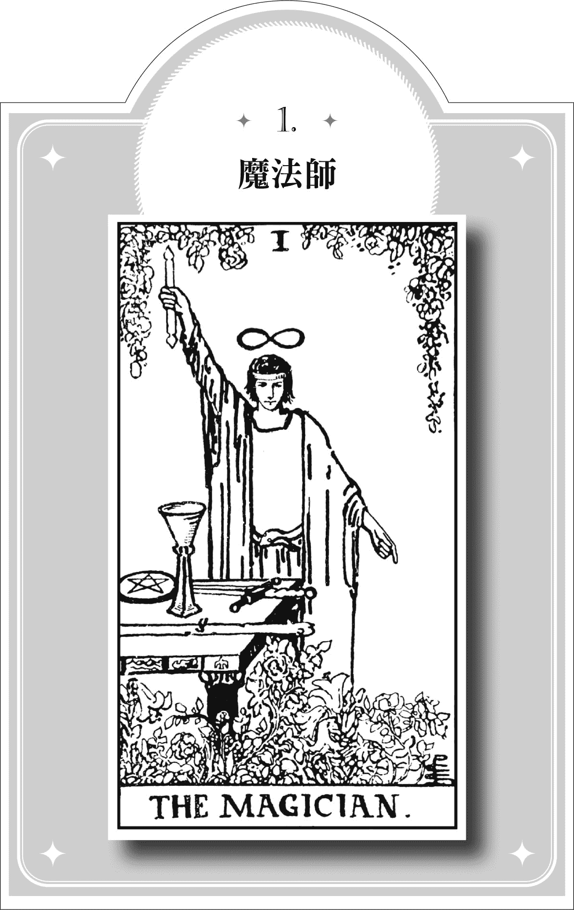

一位身穿魔法师长袍的年轻身影，神情犹如太阳神阿波罗，带着自信的微笑和神采奕奕的双眼。他头上有着神秘的圣灵符号，象征着生命，如一条无尽的细绳，形成水平的数字 8。他的腰间系着一条大蛇，蛇似乎在吞噬自己的尾巴。这是众所周知代表永恒的传统符号，但在此处，它尤其意味着在精神层次实现永恒。魔法师右手高举魔杖指向天空，左手指向大地。

这个双重符号在高阶制度化神秘学里相当知名；代表了由上降下的恩典、美德和光明，汲取自上天并传递至后土。因此，它在在暗示着拥有并传达圣灵的力量与恩赐。魔法师前方桌上有四组塔罗牌花色的符号，代表自然生命的元素（译按：地、水、火、风），像摆在炼金术行家面前的筹码，让他恣意变用。牌面下方的玫瑰与百合即 flos campi 和 lilium convallium1，在此处化为花园里的花朵，以呈现对更高精神追求的向往。这张牌显示了人内在的神圣动机，反映着神的存在，人类拥有与天上的神结合以获得解放的意志。此牌也代表了个体在所有层面上的合一，就更高深的意义来说，合一就在不断修复人与神性的链接中。

进一步谈到我所谓的生命符号及其与数字 8 的关联，诺斯底教派将基督复活转化称之为“回归第八层天界 2”。这个神秘的数字被称为上天的耶路撒冷，乳与蜜之地，圣灵和上帝的国度。根据马丁主义，8 是基督的数字。

1.  Flos campi 拉丁原文意谓“野地之花”，lilium convallium 意谓“山谷百合”，记载于《圣经·雅歌》2：1，和合本中译为“沙仑的玫瑰”和“谷中的百合花”。Flos campi 实际花种已不可考，有研究者提出更可能是水仙花或番红花，因《圣经》时代位于以色列沿海的沙仑平原并未引进蔷薇属的玫瑰品种。《圣经》新译本（CNV）中已改译为水仙花。
2.  Ogdoad（希腊文，意谓数字 8），是古埃及神话中的八位创世神。此概念也出现在早期基督教时代的诺斯底思想（Gnosticism），其思想体系包含“七个天界”，其上有一层天外天被称为 Ogdoad。

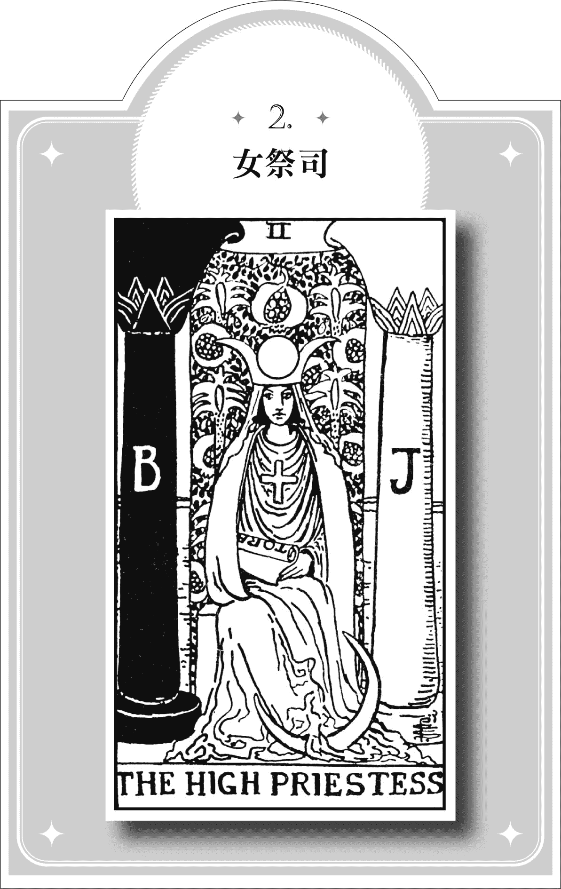

她的脚边有一弯月牙，头上的冠冕带角，中央是一颗球体，胸前挂着硕大的太阳十字符号 3。她手中的卷轴写着 Tora4，意味着律法、秘法，以及神之语的第二层含义。她的披风遮住了一部分卷轴，显示有些事物是隐含的，有些是明示的。她端坐在神殿白色与黑色的柱子（J.和 B.）5 之间，背后是神殿的帷幔，绣着棕榈和石榴。身上的圣衣飘逸轻盈，披风隐隐散发闪烁的光辉。她向来被称为神秘科学本身，近乎伊西斯女神圣殿般的存在，但她实际上是神秘教会，是属于神和人的家。她还代表了脱离俗世的圣子第二次婚姻的新娘 6；她是灵性的新娘和母亲，是星辰的女儿，是更高的伊甸园。总之，她是借来之光 7 的女王，此乃光中之光。她是由神圣母亲的乳汁滋养的月亮。在某种程度上，她也是神圣母亲本身，亦即她是光的映照。在此意义上，她最真实、最崇高的象征名称是 Shekinah，即“同住的神之荣光”。

根据卡巴拉哲学，形而上和形而下的世界都存在着 Shekinah。在形而上的世界，它被称为 Binah，也就是神圣的理解（understanding），映照出神向下流溢的其他属性。在形而下的世界，它被称为 Malkuth，该字被理解为受到祝福的王国，在其中受到祝福的存有即是圣灵居住的荣光 8。

就神秘学而言，Shekinah 是正义之人 9 灵性的新娘，当她诵读经文时会赐予她神圣的含义。

在某些方面，这张牌是大秘仪牌中最崇高也最神圣的。

3.  韦特版本的女祭司撷取了一部分古埃及伊西斯女神的象征。伊西斯的头饰是一对牛角和日盘，她也是自然和魔法的守护神。
4.  此处“Tora”应指《妥拉》（Torah），也称律法书。妥拉的字面意思为指引，涵盖所有的犹太教律法与教导。
5.  根据《希伯来圣经》记载，公元前 960 年所罗门王在耶路撒冷修建了第一座圣殿，门廊上有两根铜柱，分别是黑柱 Boaz（祂必竖立之意）和白柱 Jachin（在祂里面有力量之意）。
6.  此处原文是 Prince，《圣经·以赛亚书》9：6 提及耶稣基督乃和平的君（Prince of Peace）。韦特所谓“第二次婚姻”可能的解释：一是圣经中曾以“基督的新娘”暗喻教会，意旨耶稣与教会（信徒）的关系犹如新郎与新娘的链接，女祭司则是灵性层面的教会（新娘）；二是部分基督教神秘主义（尤其诺斯底教派）认为耶稣娶了抹大拉的马里亚，将天堂的钥匙交给了她，称她“知晓万物之女”，她是真正继承耶稣精神权威的第一位教皇，而非圣彼得。女祭司是教会的灵性层面的象征。
7.  审订注：指需要借由太阳才能发光的月亮。
8.  在卡巴拉体系中，宇宙的源头能量（自我显现前的上帝）流溢出十个质点（Sefirah）彰显自身的意志，创造了世界，也就是生命树的结构。顶端的三个质点是神圣、超越空间的存在，分别是 Kether（王冠）、智慧（Chochmah）和理解（Binah）。Binah 被认为是造物主原始的阴性能量。最底端的第十个质点是 Malkuth（王国），也称作 Shekinah，是与神圣意识世界镜像映射形成的物质世界。“神圣阴性”居住在祂的子民之中。
9.  审订注：在宗教中称为“义人”，指活出基督的信仰者。

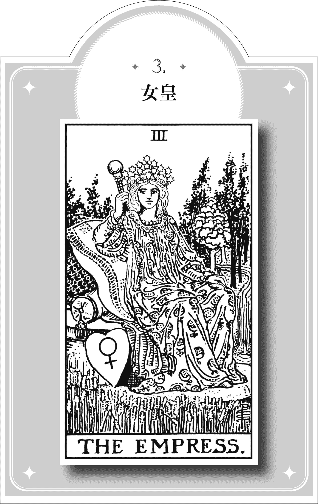

端坐的庄严身影，衣袍华丽，带有王者风范，犹如天堂与人间的女儿。她的王冠上有十二颗星星，聚成一簇。身旁的盾牌刻有维纳斯的符号。她面前那片玉米田正在成熟，远处有一道瀑布。她所持的权杖顶端是代表这个世界的球体。她是次于上帝所造的伊甸园，人间的乐园，象征人类具体能拥有的一切。

她并非“天堂之母”，但可说是“罪人的庇护所 10”，孕育了千千万万的生命。在某些方面，她也被正确地描绘为欲望及其翅膀，或“穿戴阳光的女人”，或“世间的荣耀”和“至圣所的帷幕”；但容我补充，她并非长出翅膀的灵魂 11，除非所有的象征都以不寻常的方式重新解读。

最重要的是，她是世间万物丰饶的繁殖力，也是神之语的外显意义。这很明显，因为男性从未被神直接赋予讯息，一如女性能孕育神的讯息那样；但女皇本身并无法解读神的话语。在另一种观念中，女皇牌象征人们通往此生的门或大门，就像通往维纳斯的花园；然而，通往人生另一端出口的路，即超越此生之路，是女祭司才知晓的秘密：由她秘密传授给被选上的人。过往大多数归类在女皇牌身上的解释，在象征意义上完全错误，例如：将女皇牌等同于神之语、神性本质、三位一体等等。

10.  审订注：罪人指的是所有人。亚当和夏娃偷吃禁果后，人就拥有了本罪。在基督宗教里就称人为罪人。
11.  马赛塔罗牌中的女皇手持盾牌与权杖坐在宝座上，某些后来的塔罗牌将她背后的椅子诠释为翅膀，韦特在此否定此说法。

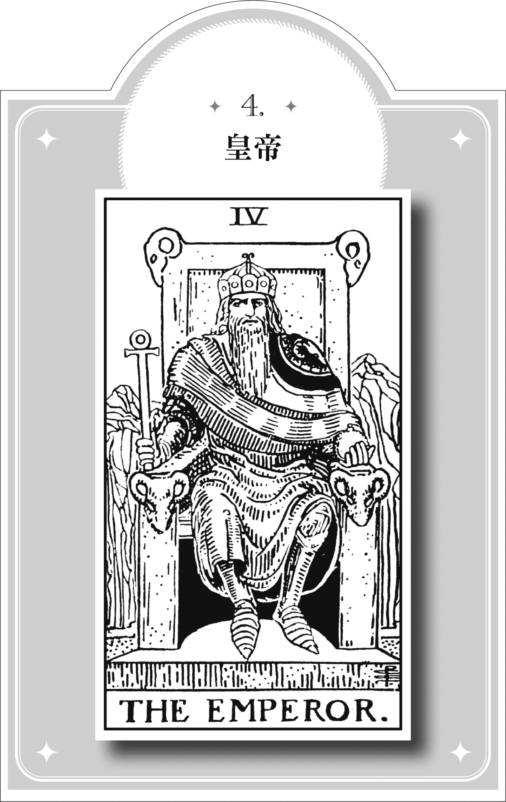

他手持生命之符 12 的权杖，左手拿着一颗球。他是加冕的君主，威风凛凛，庄严肃穆，端坐于宝座上，扶手装饰着公羊头。他是执行者和实现者，是这个世界的力量，带着与生俱来崇高的特质。他偶尔会被描绘为坐在一块立方体岩石上，这让一些论点变得混淆。他是阳刚的力量，对应女皇牌。在此意义上，他是试图揭开伊西斯面纱 13 的人；然而她仍保持处子之身。

我们应当了解，这张牌和女皇牌并未确切代表婚姻状态，尽管暗示了这种情况。如我所指出的，表面上他们象征世俗的皇室，高坐权力之位；但在这之上，还有另一个存在的暗示。他们（尤其是男性形象）还象征着更高的王权，占据智慧的宝座。于此，他们主宰的是思想而非动物世界。除了他们本身的样子，这两个人物都“充满奇异的经历”，但他们并非有意识地从更高的世界汲取智慧。皇帝牌被描述为（一）意志的具体形式，但这只是其中一种应用，以及（二）含有造物主的虚拟化身──但这只是幻想。

12.  原文为拉丁文 Crux ansata，意思是有柄的十字，一说起源于埃及象形文字“安卡”（Ankh），意思是生命之符。
13.  此处伊西斯令人联想到女祭司，暗示皇帝牌与灵性层面无涉。17 世纪末到 19 世纪，文学与艺术领域盛行以“揭开伊西斯的面纱”作为母题，讬寓启蒙运动时期人们在科学与哲学领域揭开自然的奥秘。18 世纪末开始有作家以此暗喻“揭晓令人敬畏的宇宙真理”。神智学会创办人之一的 Helena Blavatsky 便于 1877 年出版《揭开伊西斯的面纱》（*Isis Unveiled*）一书。

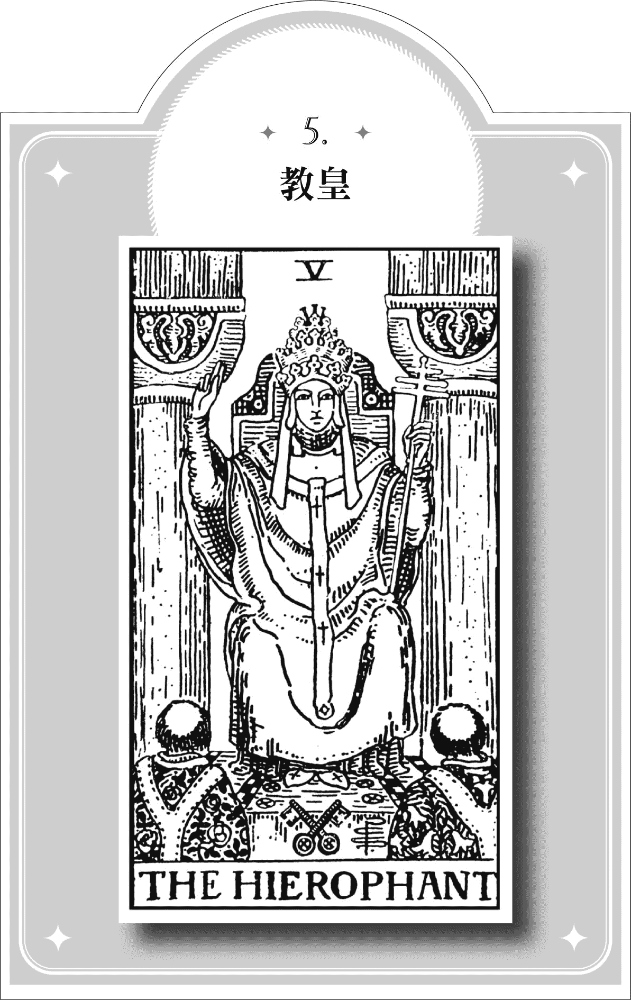

他戴着三重冠冕，坐在两根柱子中间，但它们并非由女祭司守护的神殿之柱。他左手拿着一根末端为三重十字的权杖，右手是著名的基督宗教手势 14，这个手势本身就很神秘主义，区分了教义中显明和隐蔽的部分。值得注意的是，女祭司与其毫无关联。他脚边是一对交叉的钥匙，两名身着白袍的神父跪在他面前。他通常被称为教宗，这是他所象征的一般神职工作的某种特殊称谓。他统领宗教的外在形式，就像女祭司是主宰隐秘、超然力量的天才。

这张牌的正确含义可悲地遭到各方看法的混和。大东方认为教皇是钥匙的力量，是对外传授的正统教义，是通向教义生活的外显层面；但他绝非神秘学教义的巨擘，如另一位评论家所推测的那般。他更像是当教义严谨表达出来时的《神学大全 15》；但他也象征了所有显化的正义和神圣的事物。因此，他是链接神圣恩典的管道，属于组织团体的世界，有别于宇宙自然的世界，他也是拯救普世人类的领袖。

他是公认阶级制度的秩序和领袖，这也反映了另一层更伟大的阶级秩序；但教皇可能会忘记这种象征状态的重要性，而表现得好像他拥有身上符号所意味的一切，或他所象征的形象体现的一切。他并非人们通常认为的那样是哲学本身（除了神学方面）；他不是灵感；他也不是宗教，尽管他是宗教的一种表达方式。

14.  在罗马教会和东正教的耶稣圣像中，经常见到这个右手大拇指朝上，食指、中指向上叠，无名指、小指垂下的手势，一说是耶稣赐福于人，一说象征三位一体。
15.  《神学大全》是 13 世纪意大利哲学家托马斯阿奎那（Thomas Aquinas）集学识大全的代表作，归纳了天主教的重要教义。此处原文提及的是 1663 年的版本《*Summa Totius Theologiae*》。

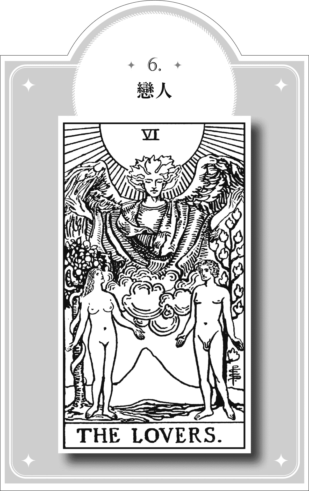

太阳在天顶照耀，下方有个长了巨大翅膀的身影，敞开双臂向下赐福。前景是两个人，一男一女，一丝不挂站在彼此面前，仿佛亚当和夏娃起初住在人间乐园时的样子。男人身后是生命树，结了十二颗果子；女子身后是知善恶树，蛇缠绕着树身。这两人令人联想到青春、童贞、纯洁，以及遭受粗俗的物质欲望污染之前的爱情。简而言之，这是一张人类之爱的牌卡，展示了真理与生命部分道路。

诉诸已知的基本原则，这张牌取代了我先前描述过的婚姻牌，以及后来那些将人描绘于罪恶与美德之间的愚蠢作品。就崇高的意义来说，这张牌是契约与安息日的奥秘。关于这名女人暗藏的讯息是，她意味着人对于感官生活的迷恋，这种迷恋中带有人的堕落之概念，但她其实更像是上帝干预的神秘运作，而非自愿或有意识地成为诱惑男人的女性。借由这个被归罪于她的过失，男人最终才能提升，只有透过她，他才能完成自己 16。

因此，这张牌某方面又是一个关于女性伟大奥秘的暗示。旧的牌义想当然耳随着旧的牌面插画分崩离析，但即使是后者的各种诠释，大抵有些是陈腔漤调，其他则充满错误的象征。

16.  诺斯底思想认为，伪神创造了这个不完美的世界，还禁止人类吃下智慧之果，打算让人类永远处于无知状态。但人类在蛇的帮助下得到了真知，才得以对抗邪恶的伪神。在此意义下夏娃反而拯救了亚当。

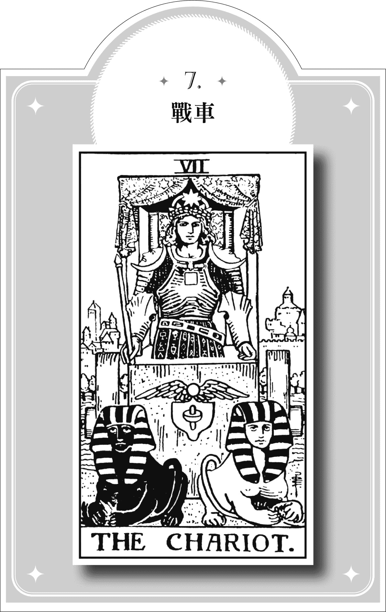

一个挺拔高贵的人物，手持出鞘的剑，大致上与我在第一部分给出的传统描述相符。胜利的英雄肩上的物件应该是乌陵和土明 17。他掳掠了仇敌 18，征服了所有层面：心智、科学、进步、某些入门考验。于是，他回答了史芬克斯，基于这个原因我接受了艾利冯斯·列维的变动；从而让两只史芬克斯拉他的战车。

他最重要的是在心智上战胜一切。为此我们应当了解：（一）史芬克斯的问题与宇宙自然的玄奥有关，而非神造的恩典世界，战车的驾驶答不出它的问题；（二）他征服的是外显或外在的层面，而非自己的内在；（三）他所达成的解放可能会让自己陷入逻辑理解的束缚；（四）他成功透过的入门考验要从物理层面或理性层面解读；（五）如果他来到女祭司坐镇的神殿柱子前，他无法打开名为 Tora 的卷轴，要是她提问，他也无法回答。他不是世袭的皇室成员，也不是神职人员。

17.  乌陵（Urim）与土明（Thummim）希伯来语原意为“光明”和“完全”，最早出现在旧约《圣经·出埃及记》20：30，大祭司亚伦到耶和华面前时必须“将乌陵和土明放在决断的胸牌里”，咸信是一种用来辨明神的旨意获得启示的工具（可能类似掷筊的作用）。乌陵和土明的样式或用法已不可考。
18.  出自《圣经·以弗所书》4：8。

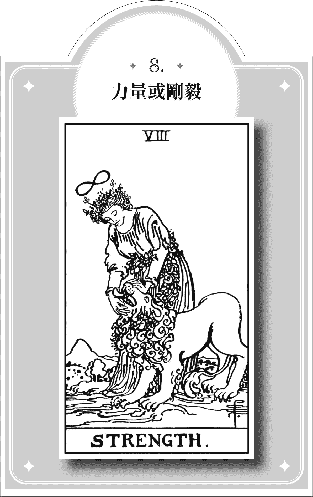

一个女人，头上孵育着我们在魔法师牌见过的象征生命的符号，她正阖上狮子的下颚。

本牌面设计与传统外观唯一不同之处在于，她仁慈的刚毅已经制伏了狮子，她用鲜花做成的链条牵着它。

基于满足我个人的理由，这张牌和通常编号为 8 的正义牌互换了。由于这个变动对读者没有任何意义，在此便无须解释。

刚毅最崇高的特点之一，是和链接神性的奥秘有关；当然，这种美德在所有层面都能派上用场，因此也获得各种象征意义。“抱诚守贞 19”以及“存于冥想的力量”，也和刚毅有关。

然而，这些更高层次的含义都是推论而已，我也没说这些在牌面上显而易见。在许多其他象征事物中，这些含义以隐蔽的方式，透过鲜花的链条暗指当人们内心深处对神圣的律法深信不疑，它也就成为甜蜜的桎梏和轻微的负担。

尽管有人提出这种联想，这张牌和所谓的自信无关──它涉及的是那些以上帝为力量、在祂里面获得庇护者的信心。

在某一方面狮子意味着强烈的情感，被称为“力量”的女人是解放的更高本质。这样的力量踩过了毒蛇和蛇怪 20，踏倒了狮子和巨龙。

19.  原文为拉丁文 innocentia inviolata，直译为“不受侵害的纯贞”。当人面临道德冲突或威逼利诱下，仍能如如不动保持内心的正直纯真，便是刚毅的美德。
20.  蛇怪（Basilisk）是一种鸡身蛇尾的怪物或有羽翼的巨型蜥蜴，在希腊和欧洲传说里是所有蛇类之王，能以眼神致人于死。

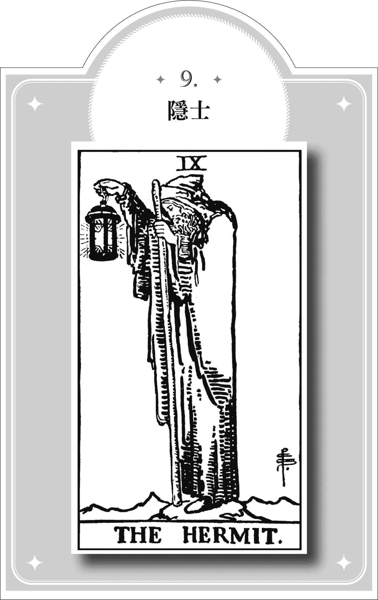

这张牌与传统样式唯一的不同，只在于提灯人的披风并没有遮住一部分的灯，他是“亘古常在者 21”与“世上的光 22”的混和体；一颗星星在灯盏里闪耀。我说过这是一张造诣成就之牌，为了延伸这个概念，你可以看见此人站在高处高举手中的明灯。因此，隐士并不像古德杰贝林解释的那样，是一个寻求真理正义的圣贤；隐士也不像后来提出的解释那样，是一个经验的特例。他手中的明灯默示了“我在哪里，叫你们也在哪里 23”。

进一步来说，将这张牌链接到为了保护个人磁场免受混杂而隐秘避世的观念，这种理解错得离谱。这都归功于艾利冯斯·列维，这是他轻佻愚蠢的诠释之一。这种诠释被法国马丁教派门徒会采纳，我们有些人已经听过很多“静默未知的哲学”，裹藏在披风下好跟俗世知识隔开。

在真正的马丁主义中，“未知的哲学 24”一词的意义是另一回事。它不是指刻意隐藏的制度化神秘学，更非它们的替身，而是就像这张牌本身指出一个事实：神圣的奥秘会自我保护，不让毫无准备的人接近。

21.  原文为 Ancient of Days，出自《圣经·但以理书》7：9，内文为先知所见到的神异象，并以“衣服洁白如雪，头发如纯净的羊毛”来描述了亘古常在者。韦特似是要以此来说明隐士的白发老者形象。
22.  原文为 Light of the World，出现在《圣经·马太福音》5：14，耶稣以此称呼门徒；并以此章节来说明隐士手上的灯的意义。5：15-16“人点灯，不放在斗底下，是放在灯台上，就照亮一家的人。你们的光也当这样照在人前，叫他们看见你们的好行为，便将荣耀归给你们在天上的父。”
23.  出自《圣经·约翰福音》14：3。
24.  此处原文为 Philosophe Iinconnu，是 18 世纪法国哲学家 Louis Claude de Saint-Martin 的笔名，他反对马丁主义思想导师 Martinez 提倡以通神术魔法仪式重返神性本源，认为应该透过心灵的途径，强调内在冥想的重要。

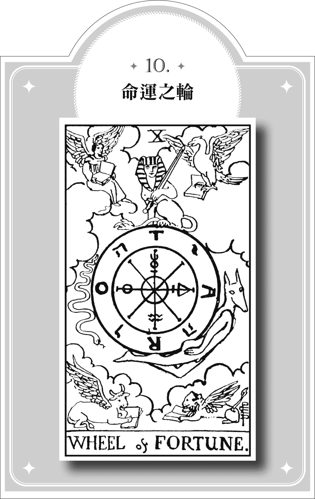

我再次沿用了艾利冯斯·列维重新打造的象征符号，他提出了几种变异。

如我之前暗示的，埃及象征符号有助于我们的目的时，使用它们很合情合理，前提是当中没有暗藏塔罗牌起源的理论。不过，我决定以蛇的形象来呈现“提丰”（Typhon）。

这张牌的象征当然并非全来自埃及，以西结所见的四活物占据了四个角落。轮子本身则沿用了列维关于以西结所见异象的其他建议 25，以说明特定的塔罗牌关键。

对法国神秘学者及牌面本身的设计而言，这个象征性的图形代表流动的宇宙永恒地不断运动，人类的生命也不断变动；史芬克斯则是当中的平衡点。

车轮上刻着能将 Taro 转写为 Rota 的四个字母 26，中间交错着神的名字 27，以呈现万物当中都暗藏了造物主的意志。

但这是内在的神圣意图，外在的相似意图则由四活物作为例子。

有时，史芬克斯会被描绘成俯卧在上方的底座，这种呈现坑骗了原本的象征意义，让最根本的概念，也就是变动中的稳定变得愚蠢失当。

在符号表露的一般观念背后，还存在着对机运的抗拒以及当中隐含的宿命。

再补充一点，从列维以来，人们对这张牌的神秘学解释，甚至对神秘学本身，都不可思议地愚昧。这张牌曾被说成代表原则、繁殖力、阳性的荣耀、当权者等等。

普通算命对这张牌的发现，就他们本身水准而言，都还比上述要好。

25.  以西结见到的异象中，四活物身边各有一个触地的轮子，“闪耀如水苍玉，又好像轮子套着轮子。”
26.  T、A、R、O 四个字母可组成“ROTA”轮子（拉丁文）；“TARO”塔罗；“ORAT”述说（拉丁文）；“TORA”女祭司手中的律法书（希伯来文）；“ATOR”埃及爱与美的女神哈托尔。“黄金黎明协会”创始人之一马瑟斯认为，这代表“The Wheel of Tarot speaks of the law of Love”（塔罗之轮述说爱的律法）。
27.  T、A、R、O 中间穿插了代表“四字神名”的四个古希伯来字母。

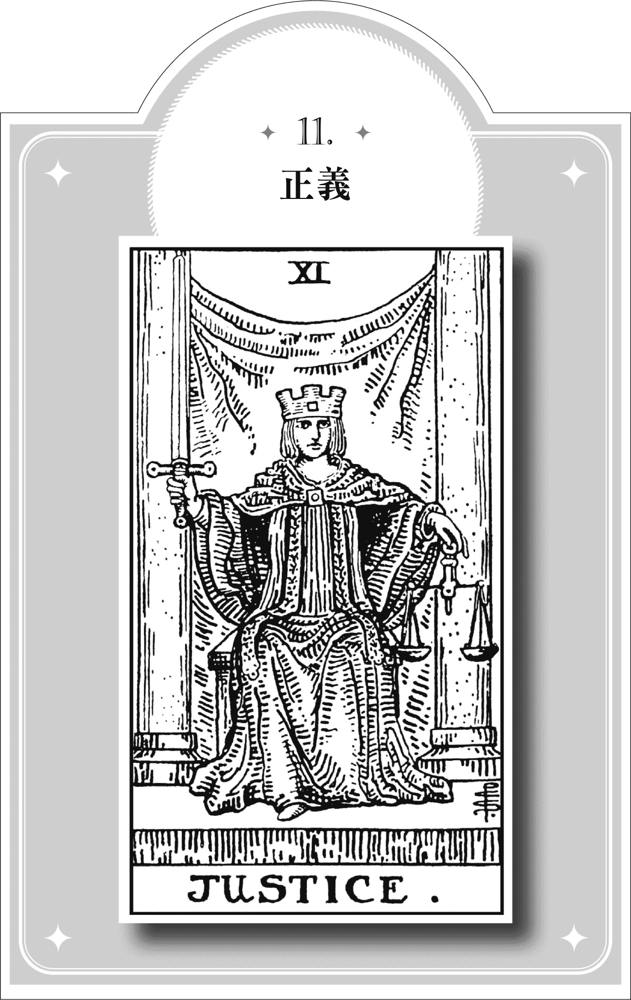

由于这张牌遵循传统的象征，所有显而易见的意义都在牌面上，因此除了第一部分中列举的少数考量之外，几乎没有什么可说，读者可参考前述。不过，可以看到这位人物像女祭司一样坐在柱子之间，因此，似乎有必要说明：根据个体所作所为加诸到身上的道德准则（当然，严加推论也包括更高的事物），在本质上和灵性的正义不同，后者包含了拣选的概念。

后者属于上帝对宇宙进行干预的神秘秩序，因此可能会有一些人构思出为了至高无上的事物奉献的概念。

天意的运作就像圣灵想往哪里吹气就往哪里吹，我们对此完全没有评判的标准或解释的根据。

好比诗人拥有仙子赐予的天赋、灵性直觉的天赋和神恩赐的天赋：我们有或没有这些，天赋来或不来，都一样是个谜。

然而，无论有或没有、来或不来，任何一种都不涉及正义的法则。

总之，正义之柱通往另一个世界，而女祭司之柱通往另一个世界 28。

28.  韦特认为这张牌的正义纯粹是人道法则，好比道德规范或法律，不牵涉奥秘的自然法则。以东方思想举例，人类无法参透天道如何平衡业力（karma）、无从得知心念或行为如何或何时会结成善果或恶果；天道（神的律法）属于女祭司管辖的范围，只有“择选之人”能够一窥堂奥。

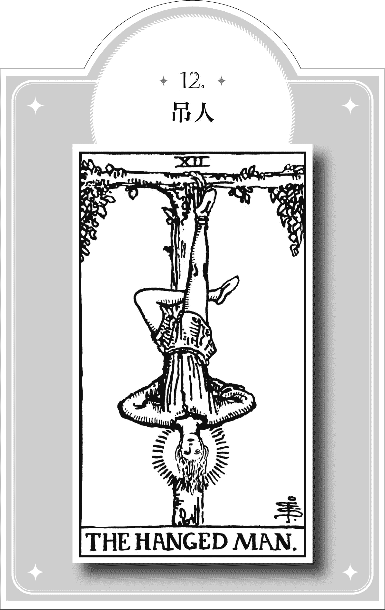

悬挂他的绞刑架形成一个 T 形十字，从腿的位置来看，这个人物形成了一个万字形十字架 29。

这个看似是殉道者的人头上有一圈光环。需要注意的有：

（一）这棵献祭之树是有叶子的活木；

（二）他的神情显得陶醉，而非受苦；

（三）整体来看人物暗示了悬而未决停滞的生命状态，仍有生机，并非死亡。

这是一张意义深远的牌，但所有意义都被掩藏了起来。

艾利冯斯·列维的一位编辑表示，列维不懂这张牌的含义，这是无庸置疑的，连编辑本人也不知道。这张牌被错误地解读为殉难牺牲、审慎、伟大功业、责任义务等意义；但穷尽所有已发表的诠释，我们可能只会找到徒劳的空虚。

就我个人而言，我会非常简单地说，在某层面上，这张牌表达了神和宇宙之间的关系。

这个象征嵌入了个体更高本性的描述，能理解这层含义的人，将会接收到关于可能的伟大觉醒的暗示，也会知晓在神圣的死亡奥秘之后，有着光荣的复活奥秘。

29.  原文为 fylfot cross，fylfot 是四个相互交错的 L 形符号，这个古老的符号在东西方，尤其宗教文化中相当盛行，通常带有神圣、吉祥、幸运或保护之意，也常用来装饰纹章、建筑和艺术品。但万字号被纳粹德国挪用后，已被污名化为极端主义的象征。

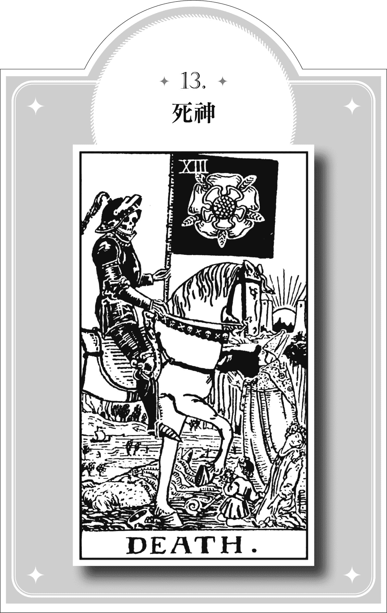

生命的面纱或面具，在改变、转化和由低走向高的生命阶段中得以延续，比起生硬的拿镰刀收割的骷髅，修正版塔罗采用世界末日异象中的一幕，能更贴切地呈现这个概念。

背景是一整片灵魂死后扬升的世界。马背上的神秘人物缓缓移动，手持一面黑色旗帜，上面印着象征生命的神秘玫瑰 30。

在地平线边缘的两根柱子之间，闪耀着不朽的太阳。

骑士并未携带明显的武器，但国王、孩童和少女都在它面前倒下，而一位双手合十的教长等待着他的终点。

应该无须再次指明，我在前一张牌提出关于死亡的暗示当然要从神秘学角度去理解，但在此例中并非如此。

人自然地过渡到存在的下一阶段，可能是他进步的一种形式；但当他仍然在此生时，通往神秘的死亡状态的入口既奇异又几近未知，是一种意识形态的转变和抵达某种状态的信道，这种状态下普通的死亡并非道路，也非大门。

现存关于第十三张牌的神秘学解释，包括重生、创造、终点和汰旧换新等等，这些解读整体而言都在水准之上。

30.  原文为 Mystic Rose，是天主教传统中对于圣母玛利亚的敬称之一。

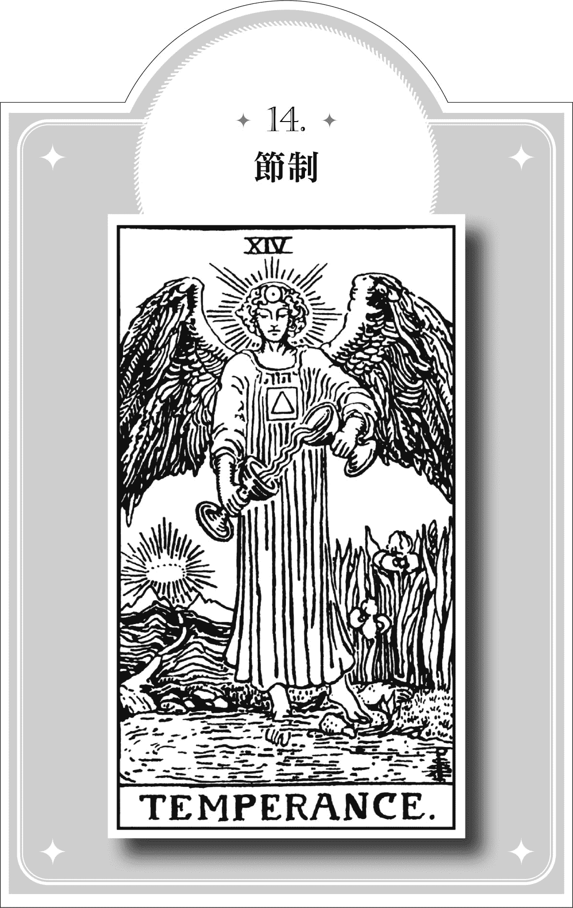

一位有翼的天使，额头上有太阳的标志，胸前有组成 7 的正四边形和三角形 31。

我将祂描述成男性，但这个人物既非男性也非女性。

人们认为祂将生命的精华从一个圣杯倒入另一个圣杯中。祂一脚踏地，一脚踏水，这个画面解释了要素的本质。

一条道路笔直地通往地平线边缘的高地，上方有一道巨大的光芒，当中隐约可见一顶皇冠。

这里透露了一部分永生的秘密，当人成为精神的化身时是有可能的。

此处所有传统象征物都被舍弃了。因此也舍弃了传统的意义，涉及季节的更迭、生命的永恒运动，甚至意念的结合。

此外，说这名人物象征太阳之灵是错误的，尽管祂确实是比喻太阳的光芒，在人类三重性的第三个层次实现。

这张牌被异想天开地称为“节制”，因为当我们在意识中获取节制的规则时，它会让心灵和物质的本质得到调节 32、化合，并臻于和谐。

在节制的规则下，我们理智的部分晓得我们自何处来，往哪里去。

31.  此处暗示了节制牌与炼金术的关系。正四边形代表水、火、土、风（空气），古希腊哲学家认为，这四种原始物质构成了世界，柏拉图为“四元素说”定调。三角形代表炼金术三要素：盐、水银、硫，对照人的三重性：身体、心智精神、灵性；向上的红色三角形也是炼金术里火元素的象征，呼应牌面中蕴含的地、水和风（羽毛）意象。4 加 3 组成 7，对应炼金术达成“伟大功业”的七阶段。炼金术师以炼出“贤者之石”为目标，这种传说中的物质能将普通金属变成黄金，还可让人治百病、得永生。
32.  此处原文为 temper，冶金学中叫做回火（tempering），是一种让金属在加热后冷却以强化韧度与可塑性的技术。

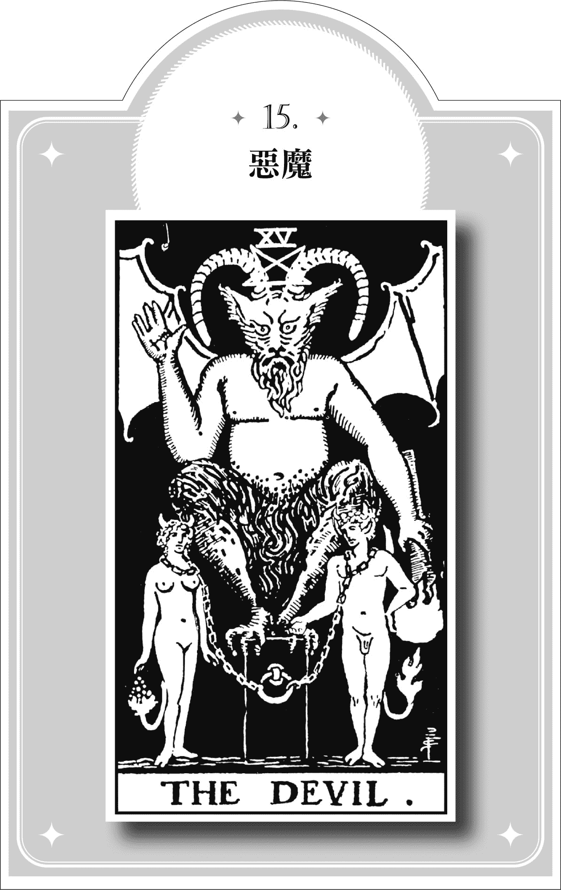

这张牌的设计是在第一部分提到的几种动机之间取得中间值、和谐和变通。

曼底斯城崇拜的有角山羊 33，有着像蝙蝠的翅膀，蹲踞在一座祭坛上。胃部凹陷处有水星的标志 34。它伸举右手，与第五张牌教皇给出祝福相反 35。左手拿着点燃的巨大火炬，倒过来朝向地面。额头上有一个颠倒的五角星 36。祭坛前方有一环，两条从环延伸出去的锁链挂在一男一女两个人物的脖子上。这两人类似第五张牌上的那两人 37，仿佛堕落后的亚当与夏娃。在此表示物质生活带来的枷锁和招致不幸的命运。

这两人有尾巴，意味着动物的天性，但脸上有着人类的智慧，而那位高高在上的人不会永远是他们的主人。即使是此刻，那位人物也是一个奴隶，靠内心的邪恶维生，对效忠的自由视若无睹。艾利冯斯·列维对他假意尊重并诠释为大师之作的艺术，表现出比平常更多的嘲弄，断言巴弗灭的形象代表神秘学和魔法。另一位评论家说，在神圣的世界它代表宿命，但在那个世界和下方的野兽之物没有关联。它真正代表的是，当那些吃了禁果的人被赶出神秘花园时，在花园外的门槛之魔 38。

33.  位于埃及北方的曼底斯城（Mendes）古名 Djedet，此地人们信仰远古神祇 Banebdjedet，拥有四颗长角的公羊头，乃生殖力之神。
34.  绘制韦特牌的 Smith 并未画出此描述。韦特的形容符合列维创造的巴弗灭形象，原本裤裆中间应有代表赫密士的双蛇杖。赫密士对应罗马神话里的墨丘利（Mercury），因此是水星的象征。
35.  此处另有一细微变异：列维的巴弗灭右手比的手势，和教皇牌中的基督手势完全相同，甚至左手也比出同样手势，只是朝向地面，因此韦特才说李维嘲讽教皇。韦特版的恶魔改为伸直右手无名指与小指，《78 度智慧》中也提及恶魔掌心有土星符号，代表限制、弱点与约束。
36.  韦特也采纳了列维的设计。根据列维在《撒旦圣经》的描述：“纯粹的五角星代表人被五颗星点环绕的形象（三颗朝上，两颗朝下），象征人类的精神本质。撒旦教同样采用五角星，但因撒旦教代表与精神本质相反的人类肉体本能，于是五角星被颠倒过来，完美地和羊头结合。”
37.  韦特此处是从 15 号恶魔牌的 5 号数字，对应到教皇。教皇下方也有着两个人物，教皇的手势与恶魔的手势刚好相反。
38.  原文为 dweller of the threshold（亦称 guardian of the threshold），最早出现于 1842 年英国神秘学小说家 Bulwer-Lytton 的《*Zanoni*》，后来盛行于神智学会。“门槛之魔”代表灵魂不同轮回修炼过程会经历的各种魔考关卡，韦特在此借用了门槛之魔的意象来说明恶魔牌对人造成的魔考。

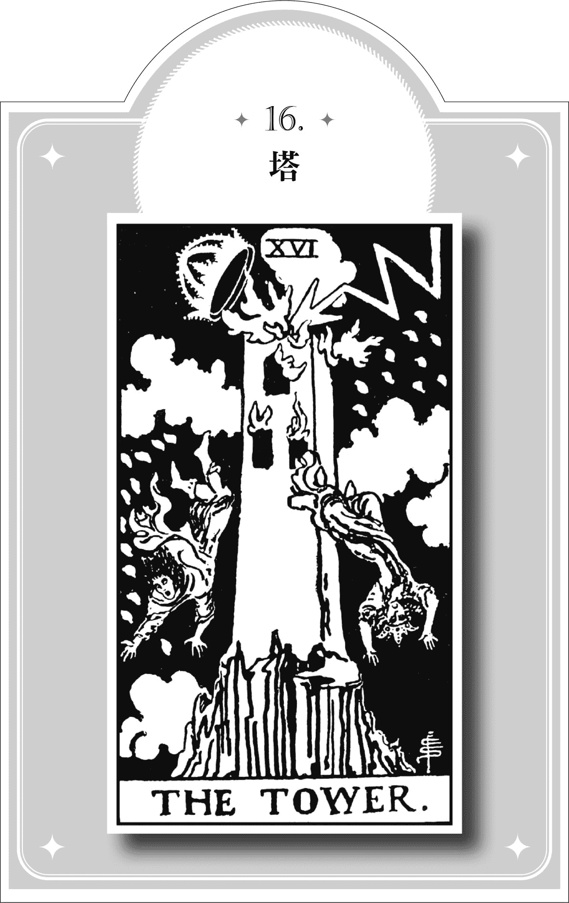

这张牌附带的神秘学解释极少，且多半令人头昏脑胀。

提出这张牌各方面描绘得很少颇为偷懒，因为这在牌面早已显而易见。也有人更进一步指出，这张牌含有第一个实体建筑的典故，但我不认为比起我们在之前三张牌中见过的柱子 39，这里的塔更有可能是实体的建物。

我没看到什么证据能担保帕浦斯的看法，他推论高塔照字面是指亚当的堕落，但更多证据支持他的另一种解释，也就是它象征了灵性语言的具象化。

书目学家保罗·克里斯汀认为它代表人类心智的堕落，试图洞察上帝的奥秘。我更赞同大东方的观点，它是人类之家的崩毁，当时邪恶盛行其中，最重要的是，它是教义之家的瓦解 40。

不过，我知道这里指的是谎言之家。它也以最详尽的画面说明了古老的真理：“如果不是耶和华建造房屋，建造的人就枉然劳力 41”。

某种意义上，这个灾难反映了前一张牌，但不是我试图在当中表明的象征方面。

更准确地说，这是模拟的问题：一张与沦落至物质和动物状态有关，另一张暗指智识方面的毁灭。

有人将高塔说成是骄傲的惩罚，一说是智识份子试图洞悉上帝之谜时一败涂地；但这两种解释都无法说明那两个活受罪的人是谁。

他们一个是字面上的话语变得虚无，另一个是话语从此被错误诠释。在更深的层次上，高塔也可能象征一个统治的终结，但在这里不可能考虑这个错综复杂的问题。

39.  此处指的是女祭司牌、教皇牌和正义牌上的柱子。
40.  有些学者认为牌上的塔就是巴别塔，韦特认为是虚假教义之塔，是内在的隐喻，而不是某个实体建筑。
41.  出自《圣经·诗篇》127：1。

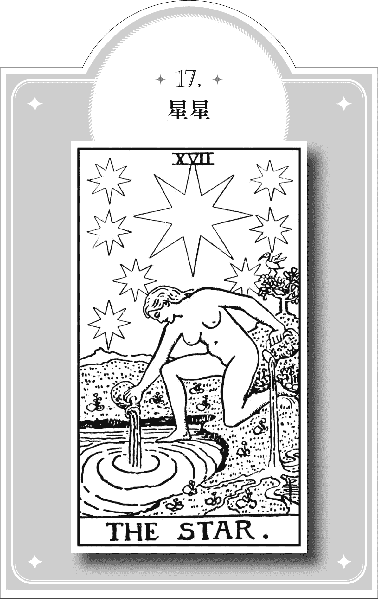

一颗硕大灿烂的八芒星，周围环绕着七颗较小的星星，同样有八道光芒。

前景中的女性人物全身赤裸。她左膝着地，右脚踩在水面上。

她从两个大壶中倒出生命之水，灌溉海洋和陆地。她后面有一片隆起的高地，右边有一棵灌木或树，一只鸟停在上头。

这个人物展现了永恒的青春与美丽。

这颗星星是“燃烧之星 42”，出现在共济会使用的象征中，但在共济会里含义被混淆了。

这名人物传递给现世的是穹苍和元素的本质。据说这张牌真正的座右铭是“自由的生命之水”和“圣灵的恩赐”。

总结几种俗丽的解释，说明这是一张希望牌。在其他层面，已经认证这张牌是永生和内在的光明。对多数准备好的心智来说，这名人物会显现揭晓的真相，在不朽的美丽中焕发荣光，将她无价财富的某些部分和数量倾注在灵魂之水中。实际上，她是卡巴拉 Binah 这个质点（Sephira）中的“神圣母亲”，也就是超越世间的“理解”（understanding），她链接了底下的质点，某种程度它们会接收到她能量的注入。

42.  原文为法文 l'étoile flamboyante（英译 blazing star），在共济会中有几种象征意义，一说是上帝对宇宙的干预，类似天意；一说是带来生命的恒星太阳；一说是引导所有共济会会员思想与行动的光。

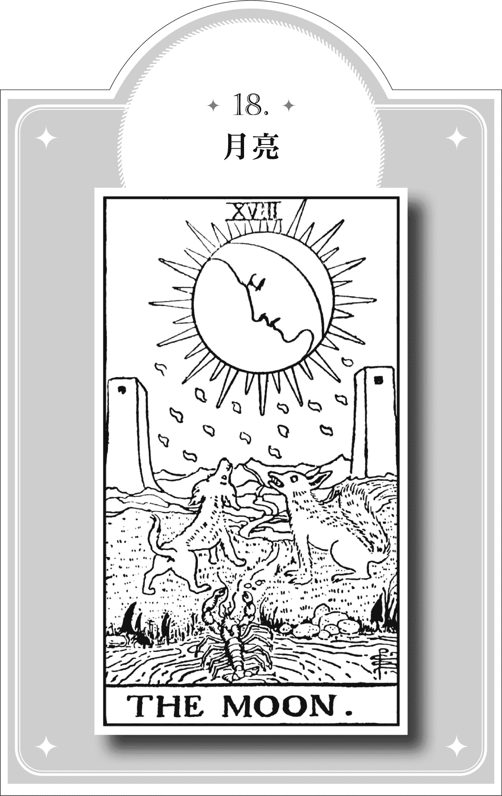

这张牌与一些传统形式的区别，在于月亮所谓慈悲的那面在增长，也就是各位看见的右半侧。

它有十六条主要光芒和十六条次要光芒。

这张牌代表了想像所构成的生活，有别于灵性的生活。

双塔间的道路是走入未知的难题。

当只有反射的月光引路时，狗和狼就是当下存在的心智油然而生的恐惧。

最后的参考是另一种象征形式的关键。

智识之光是一种反射，在它以外的是无法揭示的未知之谜。

它照亮了我们的动物本性，有下列类型──狗、狼，以及从深处爬上来的东西，无以名状又丑陋，比野蛮的兽类还低等。

它努力获得显化，从海底深渊爬行到陆地上象征了这一点，但通常它会沉回来处。

心灵的面孔平静地凝视着底下的骚动不安；思想的露珠落下；讯息是：

平静，静下心，那么动物的本性或许就能得到安伏，而底下的深渊将不再成形。

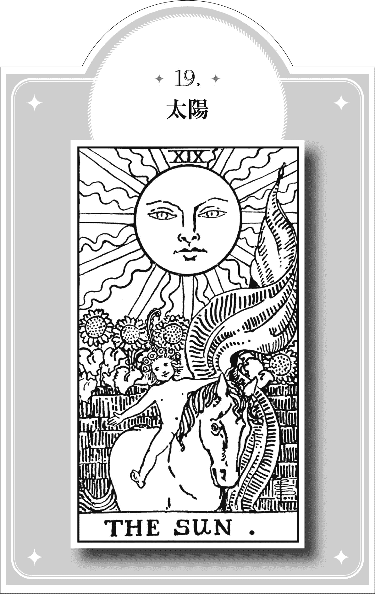

骑在白马上的赤裸小孩，扬着一面红色旗帜，前面已经提过，这是这张牌更好的象征。

它是来自东方超自然力量的天命，是引领一代代无尽人类伟大圣洁的光，它走出善感的生命所待的花园围墙，继续踏上返家的旅程。因此，这张牌象征从现世的显化之光（以地球上光辉的太阳为代表）过渡到来世之光，来世之光出现在成功之际，并以赤子之心作为代表。但最后一个典故再次成为不同形式或方面象征的关键。

太阳是灵性里的意识，是直射的光，是反射的智识之光的对立面。人物的特质类型变成心中的小孩，这个孩子天真无邪又有智慧。在天真中，他带着自然和艺术的印记；在无邪中，他象征着重生的世界。当原本的心智像破晓那般在意识里感受到自我觉知的灵魂，这个更新的心智就会引导动物的本性达到完全一致的状态。

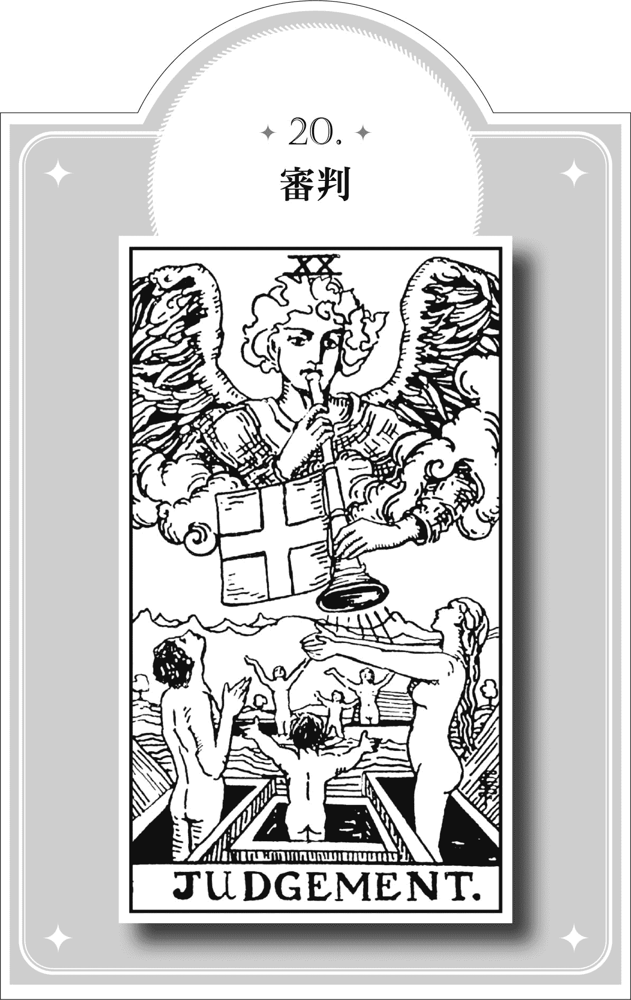

我说过这个象征符号在所有塔罗牌中基本上都一样，就算有所更动也不会改变它的特性。大天使被云朵环绕，但祂吹响了插着旗帜的号角，旗帜上照例出现了十字架。死者从坟墓中复活，右边是女人，左边是男人，中间是他们的小孩，头朝前方。但在这张牌中重生的不只三人，做出这个变更很值得，因为它说明了当前解释的不足。要注意的是，所有人全体都表达出惊奇、崇拜和狂喜的姿态。这张牌记录了从内心听见并回应上天的召唤，完成了转化的伟大功业。这里暗示了某种重要性，在此无法更进一步说明。

那个在我们灵魂深处响起的号角是什么，而我们本性中蛰伏的一切皆起而响应，几乎就在一瞬间、一眨眼间，让这张牌继续为那些无法看得更远的人描绘最后的审判和肉体的复活；但让那些打开内在心眼的人随之观看并觉察。他们会明白过去这张牌实际上被称为永生牌，因此，审判牌可以与节制牌相提并论。

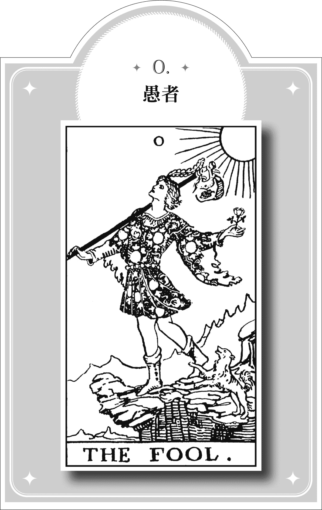

一个衣着华丽的年轻人，迈着轻盈的步伐，仿佛大地和其上的阻碍根本无法束缚他。他停在世界一处高耸的悬崖边，凭眺面前蔚蓝的远方，是仰望一望无际的天空，而非俯视脚下的景象。尽管画面上此刻他是静止的，但仍展现出疾行的姿态。他的狗还在蹦蹦跳跳。

面对悬崖边缘敞开的深处毫无一丝畏惧，仿佛万一他从高处纵身一跃，天使正等着撑住他。他满脸聪慧以及期盼的梦想。

他一手拿着一朵玫瑰，另一手拿着昂贵的权杖，枕在右肩的权杖上方挂着一个绣样奇特的钱袋。在晨光中，在凛冽的空气中，他是从另一个世界旅行到这个世界的王子。

在他身后照耀的太阳，知道他来自何方，去向何处，以及许多日子以后他将如何从另一条路归来。他是寻求经验的灵魂。

这张牌概括了许多神秘学研究的符号，在充足的凭证下，这张牌可说驳回了所有先前的混乱。

在大东方的《纸牌占卜手册》中，他对神秘的愚者牌的功用提出一个希奇的建议，把它视为高阶占卜过程中的一部分；不过，要实际操作可能需要非凡的才能。

让我们看看这张牌如何根据通俗的算命技艺发展，对于有先见之明的人来说，它会是一个事实的佐证，非常明显，即大牌原本在塔罗牌这种心灵赌博的技艺中毫无一席之地，当时牌卡只是用来当作计分的筹码跟神秘学的幌子。

然而，关于这种技艺在何种情势下兴起，我们所知甚少。

传统的解释认为愚者代表肉体、敏感的生命，并且出于一种古怪的讽刺，这张牌附属的名字一度是炼金术士，将其描绘成最冥顽不灵的愚蠢。

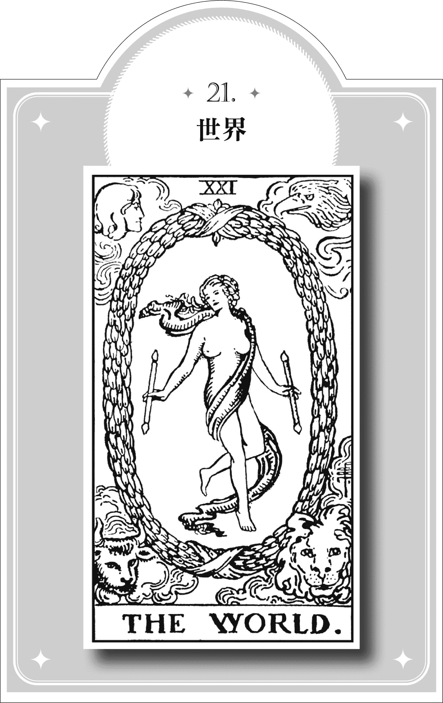

由于这张大牌的最终讯息在设计上并未变更，实际上也不可能更动，因此关于它更深层的含义先前已叙述过一部分了。

它同时代表了宇宙的圆满和终结，宇宙当中的秘密，以及大千世界在上帝里明了自己时的狂喜。

更进一步来说，它还代表了拥有神圣视角意识的灵魂状态，从自我觉知的灵魂反映出来。但这些含义不妨碍我提过关于物质层面的话。

这张牌在宏观层面还带有更多讯息，例如：它也代表了当显化法则达到最高程度自然而然的圆满时，那个重生的世界的状态。但也许这尤其指过去的事，指涉的就是那一天，那一天一切都被宣告为美善，晨星一同歌唱，上帝诸子为之欢呼。

关于它最糟的解释之一是，这个形象象征魔法师达到最巅峰的程度；另一个解释说它代表了“绝对”，这很荒谬。

有人称这个形象代表真理，然而这更适用于第十七张星星牌。最后，这张牌也被称为魔法师的冠冕。

## 第三章关键要点的结论

在先前的列表中，我无意呈现所谓三重世界中的象征意义，也就是神圣世界、宏观世界和微观世界。细说这些本末需要一本庞大的著作。人在有限的物质生命里追寻永恒的事物，我将牌卡放在与这样的人更直接相关的更高层面解读。

《纸牌占卜手册》的编纂者将其分成三大类：人性审慎之世界 1，严格来说和占卜没有区别；遵从之世界 2，也就是虔诚信仰的生活；以及成就造诣之世界 3，意即“灵魂对其探索目标的进展”。根据这些划分，他还提供了使用牌卡谘询的三个过程供读者参考。我没有这样的过程可以提供，因为我认为透过个人对每一张大牌的反思或许能收获更多。我也没有采用当前盛行的将牌卡归因于希伯来字母的做法：首先，因为这在初级手册中没有意义；其次，几乎每个归因都是错的；最后，我并未试图纠正牌卡彼此的位置关系，因此 0 号牌出现在 20 号牌之后；但我有确保将世界（或宇宙）牌编号为 21。无论应该放在哪里，0 都是一张没有编号的牌。

作为这部分的结论，我将进一步解释愚者牌，它是所有象征符号中最富表达力的。愚者牌代表了外在的旅程，初始能量流溢的状态，以及圣灵的恩典与被动性。他的钱袋上刻着模煳的记号，说明灵魂里储存着许多潜意识的记忆。

1.  原文为 World of Human Prudence，也就是人类思维、智慧和判断能力的领域。建议占卜者可询问物质层面的问题，像是事业、财富、婚姻、搬家等人生状况题。
2.  原文为 World of Conformity，指的是社会和文化中的规范、惯例和传统。建议占卜者询问关于宗教信仰、教义相关的问题。
3.  原文为 World of Attainment，指个人成就、目标实现和精神成长的领域。建议占卜者询问关于灵性追求的问题。

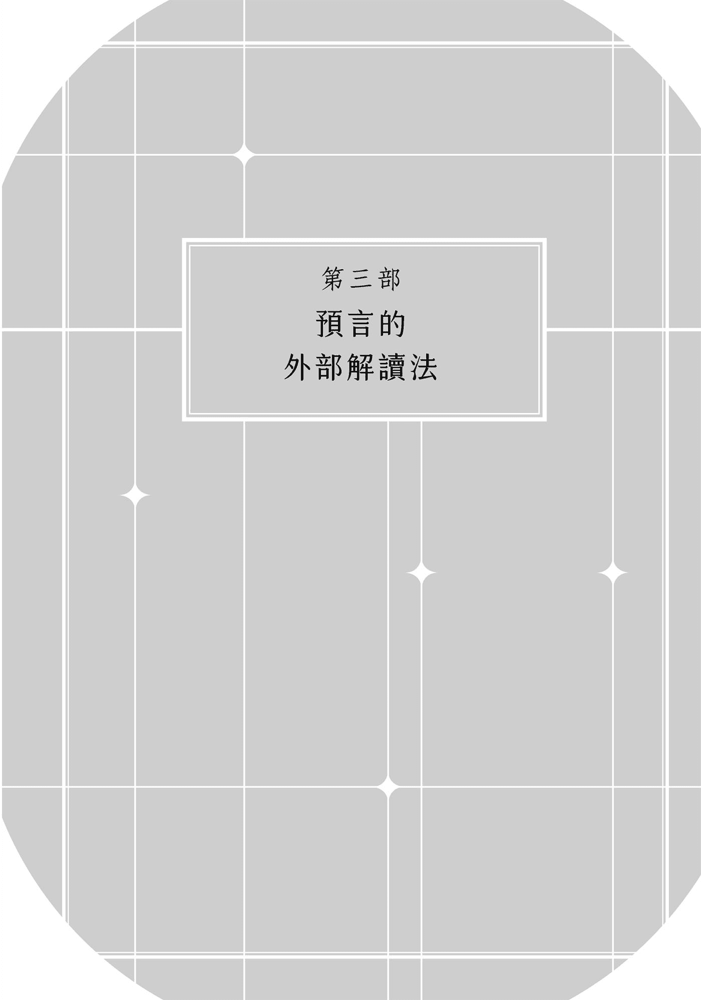

## 第一章大秘仪与
小秘仪的差异

就通常呈现的方式而言，大秘仪牌组与小秘仪牌组中间的桥梁由宫廷牌组成──国王、女王、骑士以及侍从或侍者；而它们和大牌之间的显著区别，则体现在它们传统的角色上。让读者将它们和像是愚者、女祭司、教皇等象征符号比较，或是和先前序列中（几乎无一例外）任何一张牌比较，读者就能看出我的意思。一般宫廷牌在牌面上无关特殊含义；它们只是约定俗成的桥梁，让牌组从代替计数工具的大牌，过渡到后面代替十进制数字的小牌。我们似乎已经完全脱离由生动图像说明更高深含义的领域；然而，曾经有一段时间数字牌也是图像，但这样的设计只是特定艺术家的零星创作，要嘛是典型或寓言式的传统设计，与我们理解的象征主义不同，要嘛是──能说吗？──关于礼仪、习俗和时代的插图。简而言之，它们只是装饰品，因此并未将小秘仪牌的重要性提升到大牌的层次。而且，这类变化非常少见。尽管如此，关于小秘仪牌中有更高深含义的传闻仍然存在，但迄今为止，即使在最神秘学圈子的审慎范围内，也无人透露过什么。的确，这些小秘仪牌有一些具占卜价值的变化版，但据我所知，它们在实际应用上也没有提供更好的结果。像帕浦斯在《波希米亚塔罗牌》所做的努力实在劳苦且值得赞许；特别是他辨识出大牌内在的神圣元素，并且尝试在一长串小秘仪数字牌里继续跟上脚步，好像这些小秘仪牌是算命世界过滤后的恩典世界；但他只是提出了一个无法进一步推展的牵强分类方案，最终不得不诉诸一般占卜方案，作为小秘仪牌存在价值的替代品。

此刻，我实际上的处境相同；但我在此不会像他和其他人那样，试图借助数字的神秘属性来挽救局势。我当下便意识到大牌属于哲学的神圣事务，其后的一切则属于占卜，因为小秘仪牌从未被翻译成其他语言；采取如此做法将使占卜（必要的话甚至赌博）变成属于特定技巧世界的事物，自成一家，和那些属于另一种秩序的事物分开。在当前这个主题的随意介绍中，只需要补充一点，五十六张小秘仪牌与普通扑克牌不仅在本质上差异很细微，因为将红心替换成圣杯诸如此类只是一种偶然的变异，而且在四个花色里出现的骑士牌一度是许多普通牌组的共同特征，不过当时骑士这个人物通常会取代女王。

这本手册呈现的修正版塔罗牌中，所有小秘仪牌的数字牌（除了王牌）都配有数字或图案，以说明相关（但不至于让人筋疲力尽）的占卜含义。

一些具有超越普通常理的反思和明辨能力的人（我不是在说灵视能力），可能会注意到在许多小秘仪牌中，透过牌面设计传递的模煳暗示，似乎超出了所述的占卜价值。为了避免误解我明确指出，除非极少数情况（而且只是偶然），不该将这些变化视为暗示了更高深且超凡的象征意义。

我说过这些小秘仪牌尚未翻译为超越占卜的语言，我确实不应该倾向于认为它们以现存的形式属于另一种领域；但根据这门艺术的假设，占卜的可能性是无穷无尽的，而纸牌占卜合并的系统，只表明了这些使用中的象征附带的基本意义。

当这些图案超出传统含义时，应该将它们视为暗示着同一条路线可能的发展；这也是为什么四组十进制里，宫廷牌蕴含的图像设计会对直觉有极大帮助。仅靠数字的力量和词藻空洞的意义本身是不够的；而这些图案就像一扇门，通往意想不到的房间，也像是在宽广的大马路转了弯，眼前一片开阔。

## 第二章小秘仪，
塔罗四大花色牌组

现在将根据牌卡所属的各个类别，透过图像加以描述，并提供各种来源牌义的统整。

### 权杖牌组

#### 权杖国王

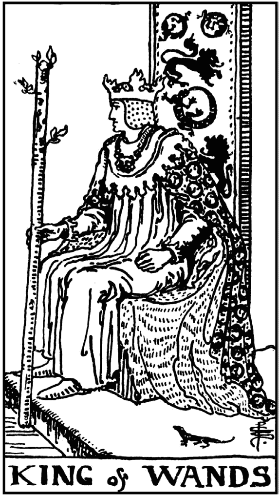

这张牌代表的外貌和情感特质是深肤色、热心、身段柔软、生气勃勃、慷慨激昂、尊贵。国王手持一根开花的权杖，并像另外三个花色中的国王一样，皇冠底下戴着一顶象征地位的礼帽。他和狮子的象征符号有关，宝座背后装饰了狮子图腾。

**占卜牌义：**深肤色男性，友善、乡下人，通常已婚，诚实且耿介认真。这张牌总是代表诚实，并且可能意味不久后会有意外遗产的消息传来。

**逆位：**好人，但严厉；严肃，但宽容。

#### 权杖女王

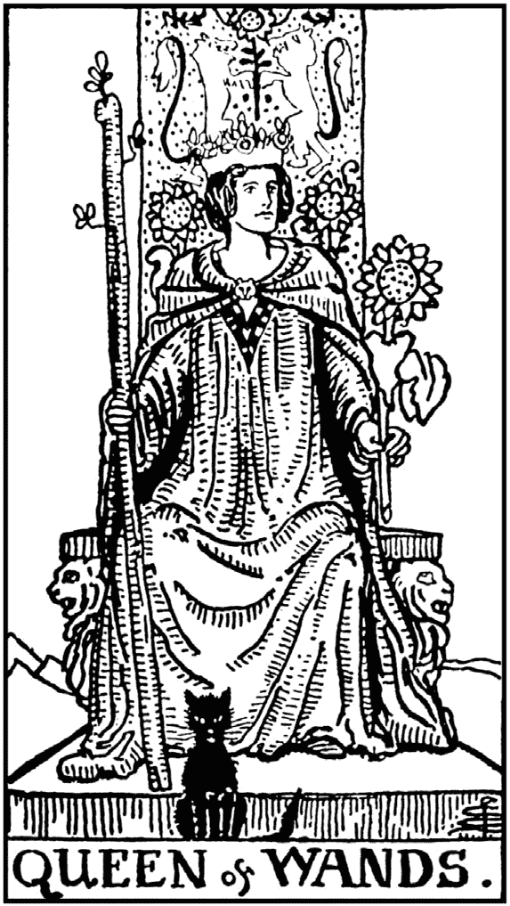

权杖牌组中的权杖一直都萌发绿叶，因为这是一个洋溢生命和活力的牌组。在情感或其他方面，女王的个性都跟国王符合，但磁场更吸引人。

**占卜牌义：**深肤色女性，乡下女子、友善、贞洁、充满爱心、高尚。若她旁边的牌代表一位男性，那么她对他有好感；若是女性，那么她对问卜者有兴趣。同时也代表爱财，或事业有成。

**逆位：**好人、节省、乐于助人、可用之人。在某些位置和邻近牌卡指向类似方向时，也可能表示对立、嫉妒，甚至欺骗和不忠。

#### 权杖骑士

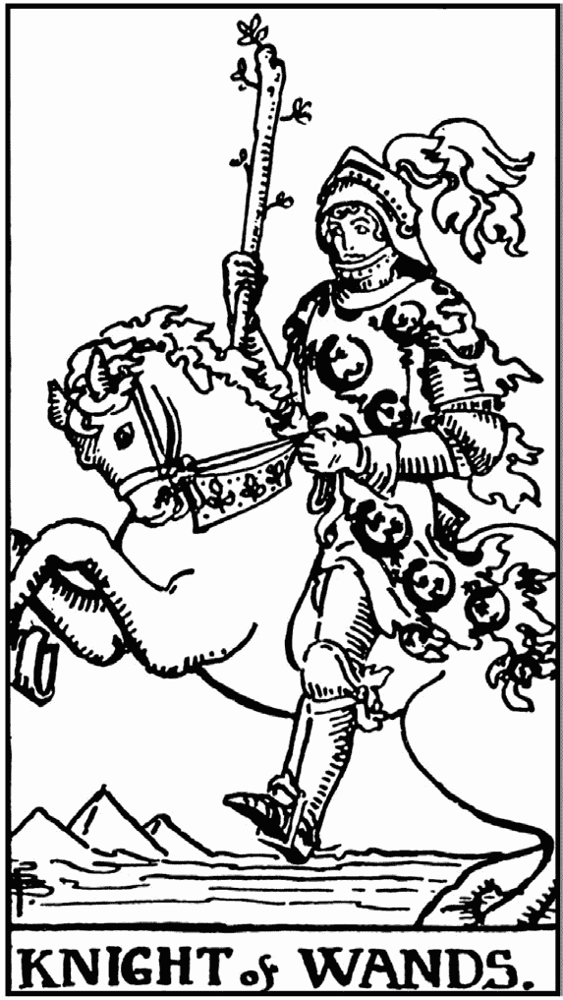

他看似在旅途中，手持一根短杖，虽然身着铠甲但并非出征。他行经土丘或金字塔。马的动作是骑士性格的关键，暗示着操之过急的心情或相关事物。

**占卜牌义：**离开、缺席、逃亡、移民。深肤色的年轻人、友善、改变居住地。

**逆位：**决裂、分歧、中断、不和。

#### 权杖侍者

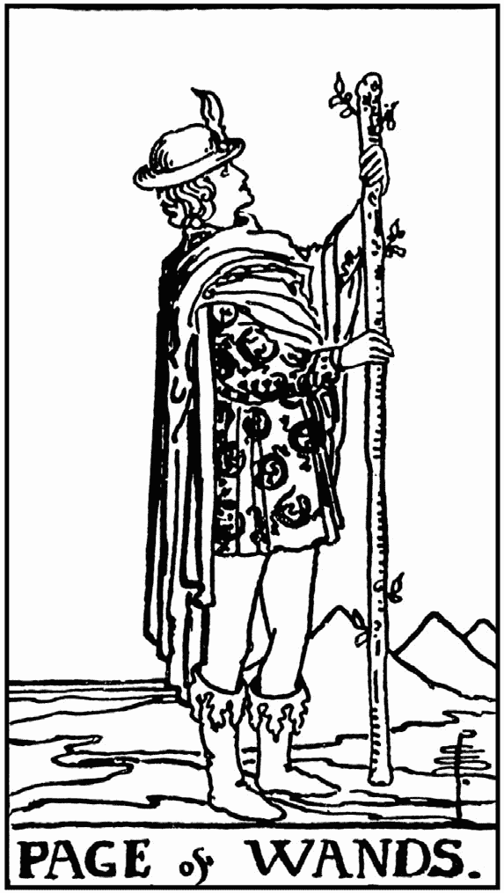

和前一张牌类似的场景，一名站姿的年轻人正发表宣言。他不为人知但忠诚，带来奇特的音信。

**占卜牌义：**深肤色的年轻人，忠诚、情人、信使、邮差。若旁边有男性牌，他会做出对该男性有利的证词。若后面出现圣杯侍者，他是危险的竞争对手。在他的牌组中有领袖特质。可能是家族的智力代表。

**逆位：**轶事、公告、坏消息。也代表犹豫不决和伴随的反复不定。

#### 权杖 10

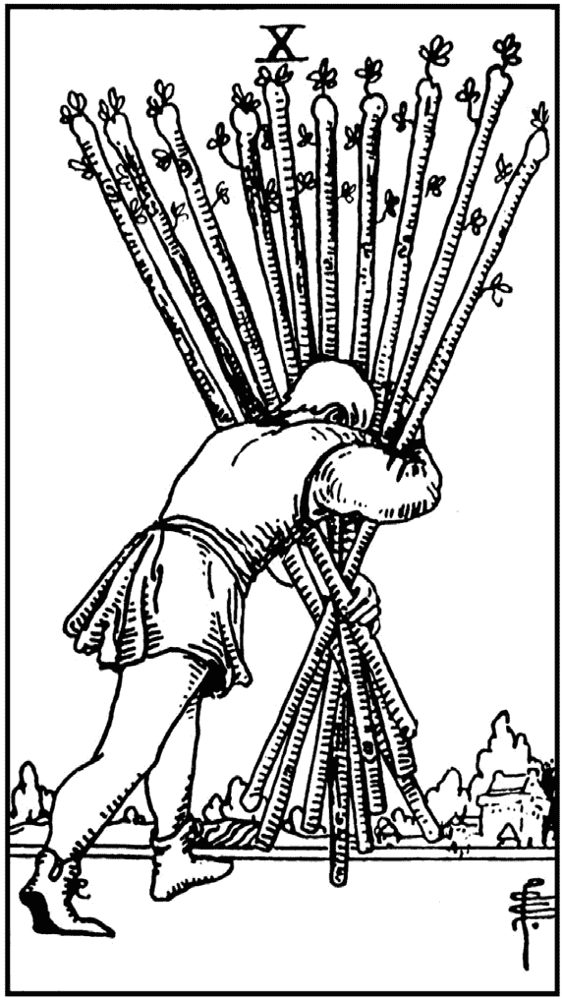

一名男子被他背负的十根木杖压得喘不过气。

**占卜牌义：**这张牌具有多重意义，有些解读彼此失调。我排除这张牌攸关荣誉和诚信。主要的牌义单纯是指压迫，但也是财富、收获、任何形式的成功以及这些事物带来的压迫。这张牌也关于虚伪、伪装、背信忘义。这个人携带的木杖可能会危及他接近的地方。若后面出现宝剑九，成功会受阻，若问题有关诉讼，官司会有损失。

**逆位：**矛盾对立、困难、阴谋诡计，以此类推。

#### 权杖 9

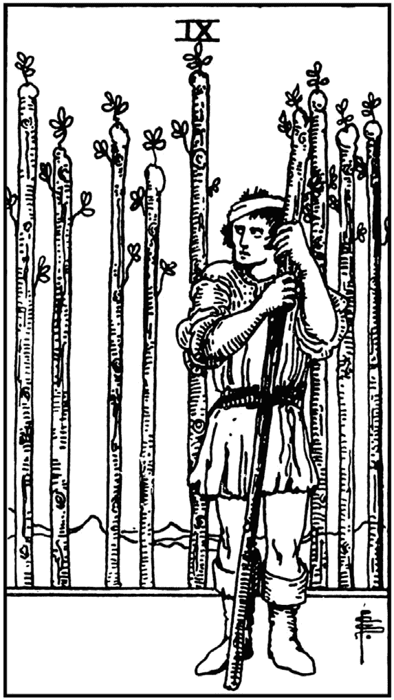

这个人倚在木杖上，面带期待，仿佛在等敌人到来。他背后有八根竖立、排列整齐的木杖，就像一道栅栏。

**占卜牌义：**这张牌象征对抗的力量。若遇袭则勇勐迎击；他的体格显示他可能是一位难以对付的敌手。此为主牌义，还有其他可能的附加意义，如延迟、暂停、延期。

**逆位：**障碍、逆境、灾难。

#### 权杖 8

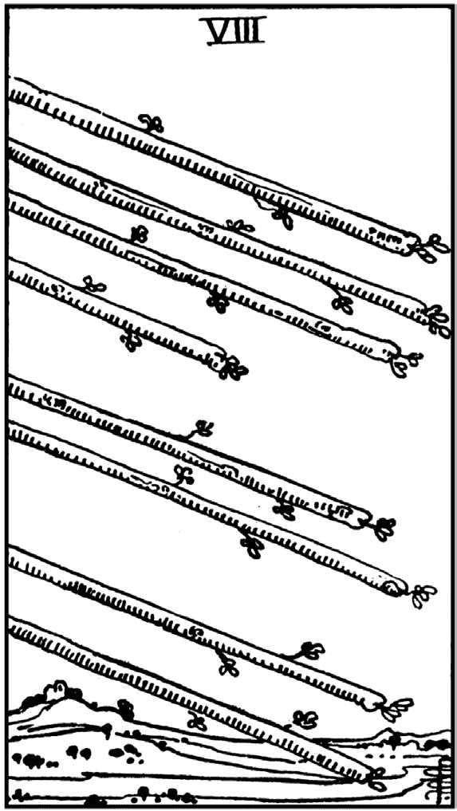

这张牌呈现在恒定不动背景里的变动，一把飞行的权杖越过开阔的田野，朝目的地前进。它们代表事物即将到来，甚至可能就在门槛。

**占卜牌义：**正从事的活动、活动的路径、迅速敏捷，如同快递员；非常急促、充满希望，朝保证幸福的终点飞速前进；通常是指进行中的事物；同时也是爱之箭。

**逆位：**嫉妒之箭、内部纠纷、良心不安、争吵；还有已婚人士的家庭纠纷。

#### 权杖 7

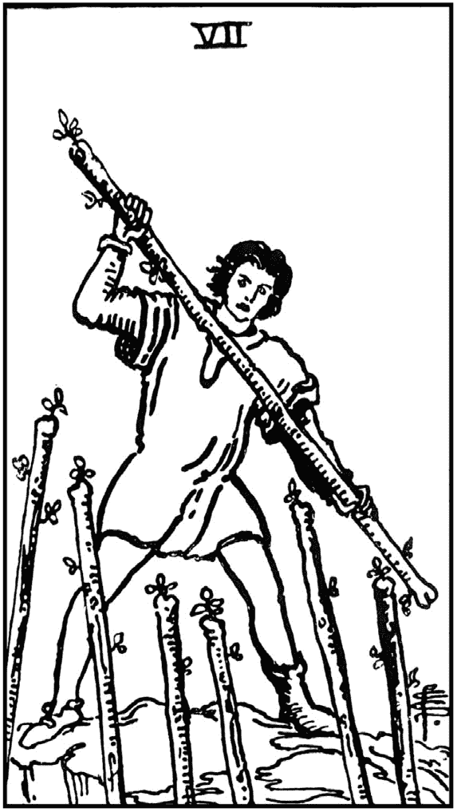

一名年轻男子在崎岖的高地上挥舞一根木杖，另外有六根木杖从底下朝他举起。

**占卜牌义：**这是一张勇气牌，因为表面上是六个攻击一个，但这个人物其实占据优势。在智力方面，它意味着讨论、冗长的争吵；在商业中，代表谈判、贸易战、以物易物、竞争。另外这也是一张成功牌，因为这名斗士位处上方，敌人可能无法接近他。

**逆位：**困惑、尴尬、焦虑；也谨防犹豫不决。

#### 权杖 6

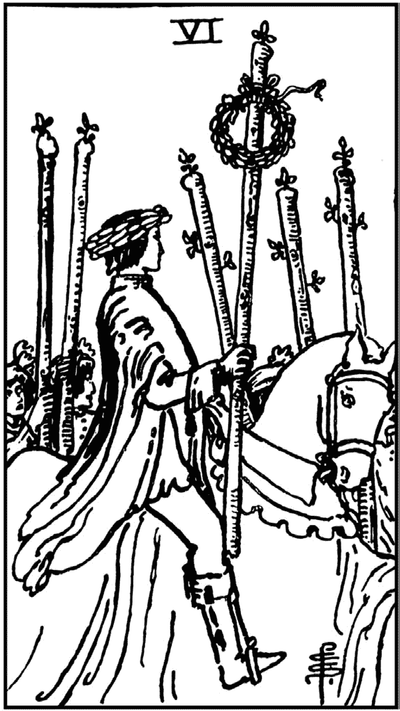

马背上的人物头戴桂冠，手持一根饰有桂冠的木杖；他身旁是手持木杖的仆役。

**占卜牌义：**这张牌设计成能涵盖多重含义。表面上是凯旋的胜利者，但也代表重大消息，像是国王的信使会庄重携来的那种；它是加诸渴望的期待、是希望的皇冠等等。

**逆位：**担忧、恐惧，如同打赢的敌人就在门口；背叛、不忠，如同向敌人敞开城门；也是不知会拖多久的延迟。

#### 权杖 5

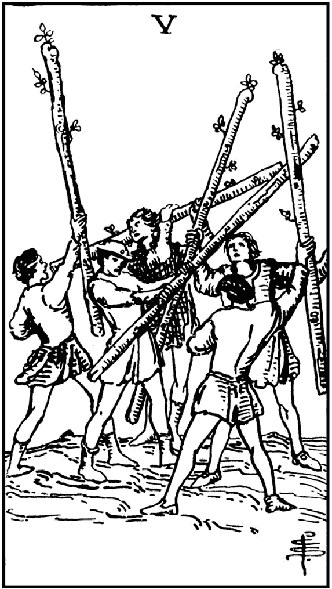

一群挥舞着木杖的年轻人，仿佛在运动或打架。这是模拟的战争。

**占卜牌义：**模仿，例如：战斗演习，但也指为了追逐财富的激烈竞争与争斗。就此意义来说，这张牌与生存之战有关。因此有些人把这张牌归为金钱、收获和富裕。

**逆位：**诉讼、纠纷、阴谋诡计、矛盾对立。

#### 权杖 4

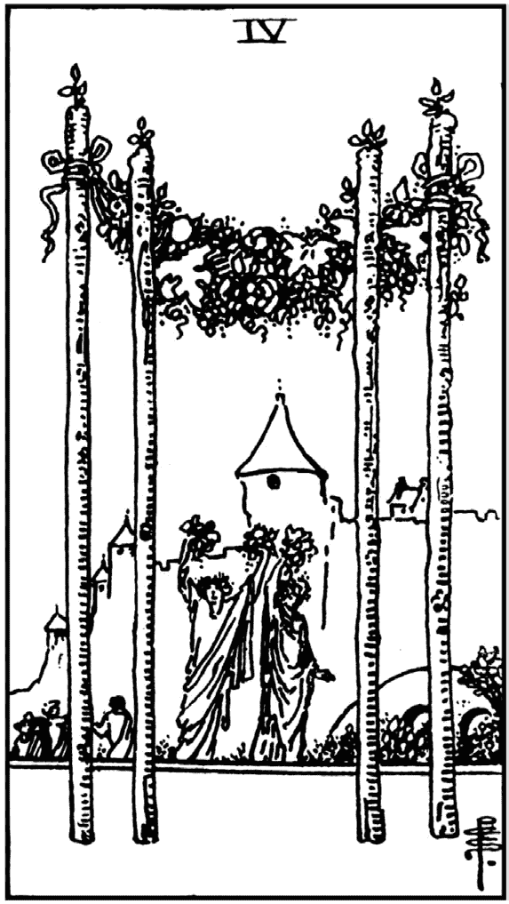

在前景中的四根大木杖悬挂着一个大花环；两名女性举起花束；她们身旁是一座跨越护城河的桥，通往古老的庄园。

**占卜牌义：**几乎就是牌面上的意思，乡村生活、避风港，一种家常的丰收家园，安枕无忧、和睦、和谐、繁荣、平静，以及上述的圆满成果。

**逆位：**意义不变；繁荣、增长、幸福、美好、锦上添花。

#### 权杖 3

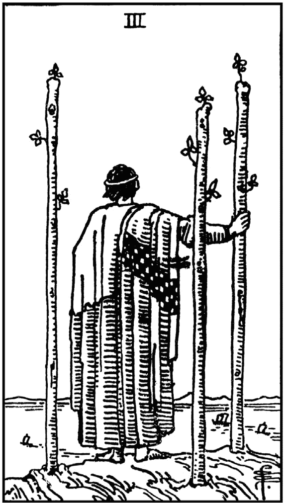

一位冷静庄严的人物，背对我们，站在悬崖边看着海上经过的船只。三根木杖插在地上，他轻轻倚着其中一根。

**占卜牌义：**他象征稳固的力量、事业、努力、贸易、商业、探索；那些是他的船，载着他的货物在海上航行。这张牌也表示商业上能够合作，仿佛成功的商人王子从他那边看向你，希望助你一臂之力。

**逆位：**困扰告终，暂时脱离或逐渐终结逆境、辛劳和失望。

#### 权杖 2

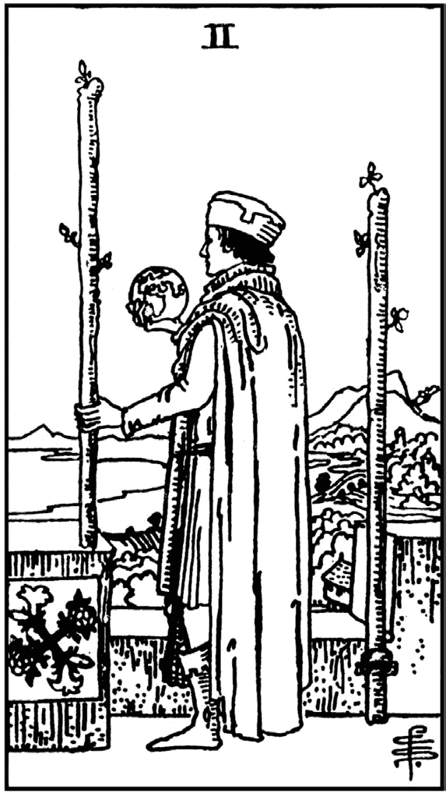

一名高大的男子在有城垛的屋顶上眺望海岸；他右手拿着地球仪，左手的木杖放在城垛上；另一根木杖固定在环里。可以注意到左侧的玫瑰、十字架和百合。

**占卜牌义：**在二选一的解读中，没有两全其美的可能性；一方面是金钱、财富、富丽堂皇；另一方面是身体的痛苦、疾病、懊恼、悲伤、屈辱。牌面的设计给了一个暗示，这是一位俯瞰领地的领主，同时难以取舍地对着地球仪沉思；看起来像是亚历山大大帝在身处显赫的财富世界中，所面临的疾病、屈辱与悲伤。

**逆位：**惊讶、诧异、着迷、情绪、困扰、恐惧。

#### 权杖王牌

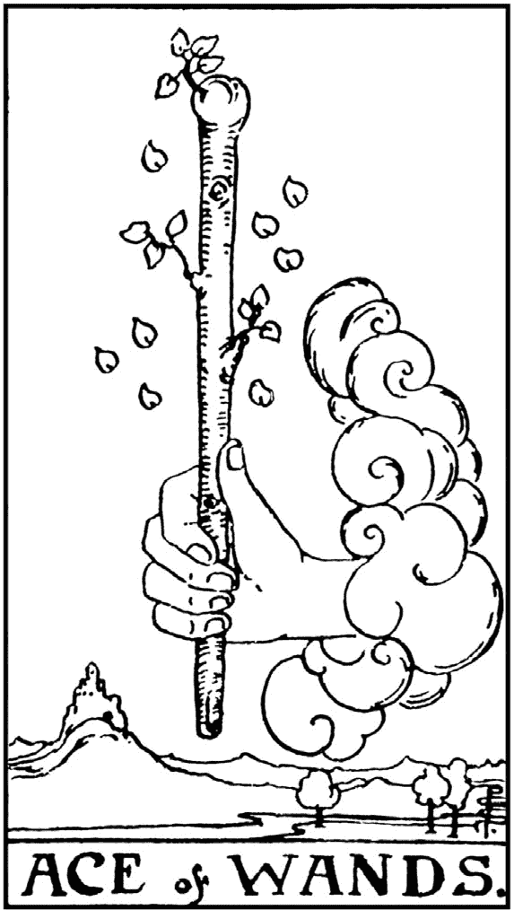

一只从云中伸出的手抓住一根粗壮的权杖或木棒。

**占卜牌义：**创造、发明、事业，导致这些的力量；原则、开端、源头；出生、家庭、起源，某种程度代表这些背后的阳性力量；事业伊始；根据另一个说法，也代表金钱、财富、遗产。

**逆位：**堕落、颓废、灭亡、消亡；同时也是乌云笼罩的喜悦。

### 圣杯牌组

#### 圣杯国王

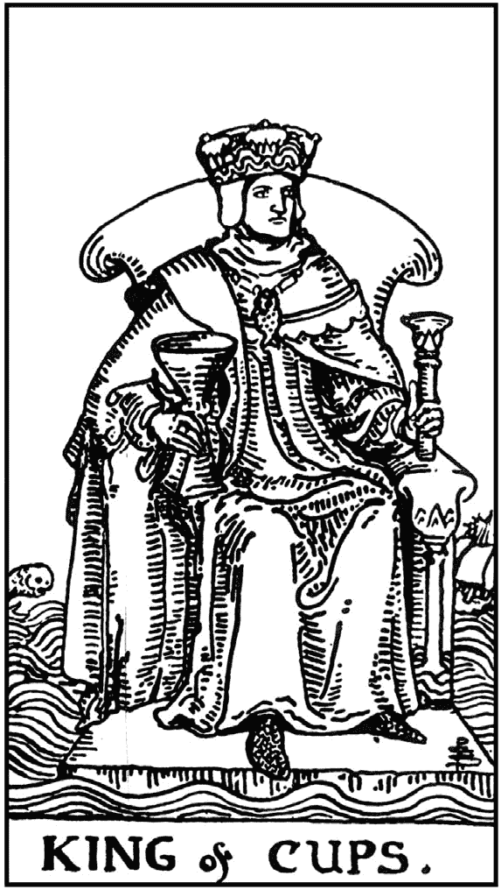

他左手拿着一根短权杖，右手端着巨大的圣杯。他的宝座位于海上；一侧漂着一艘船，一侧有只跳跃的海豚。不言而喻圣杯的象征自然与水有关，每张宫廷牌中都有水的意象。

**占卜牌义：**浅肤色男性，商人、律师或神职人员；有责任感，乐意协助问卜者；也指公平、艺术与科学，包括从事科学、法律及艺术的人；聪慧具创造力。

**逆位：**不诚实、双面人；无赖、勒索、不公不义、罪恶、丑闻、洗劫、可观的损失。

#### 圣杯女王

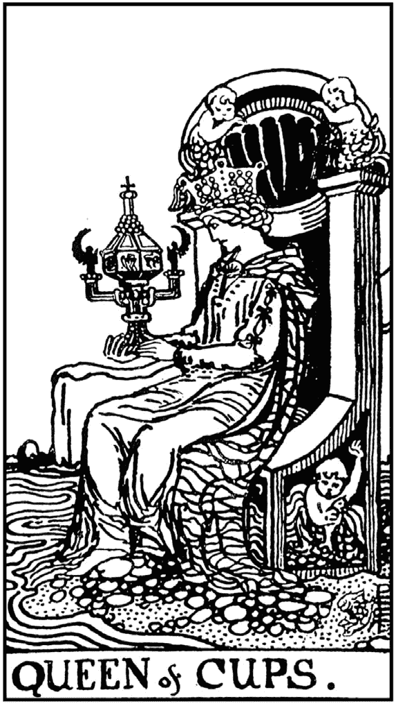

美丽、白皙、梦幻──如同在圣杯中看见幻象的人。然而，这只是她的某一面；她观看，但也行动，她的作为滋养了她的梦想。

**占卜牌义：**善良、浅肤色女性；诚实、热诚的女性，愿意为问卜者效劳；聪慧有爱心，因此拥有先见之明的天赋；成功、幸福、快乐；以及智慧、美德；完美的配偶和好母亲。

**逆位：**诠释各异；善良的女性；或是杰出的女性但不可信任；邪恶堕落的女性；罪恶、耻辱、道德沦丧。

#### 圣杯骑士

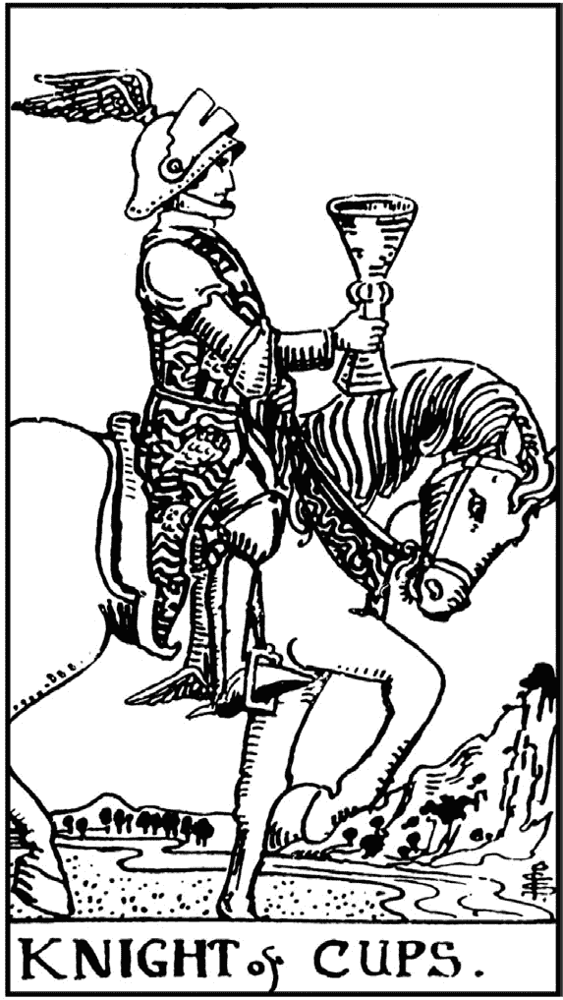

优雅、但不好战；静静骑马前行，戴着一顶有翼的头盔，意指想像力这份天赐恩典有时正是这张牌的特色。他也是一位梦想家，但偏重感觉的意象在他视野中萦绕不去。

**占卜牌义：**抵达、接近──有时是指一位信使；进展、提议、风度、邀请、煽动。

**逆位：**阴谋诡计、欺瞒背叛、城府、敲诈、表里不一、诈骗。

#### 圣杯侍者

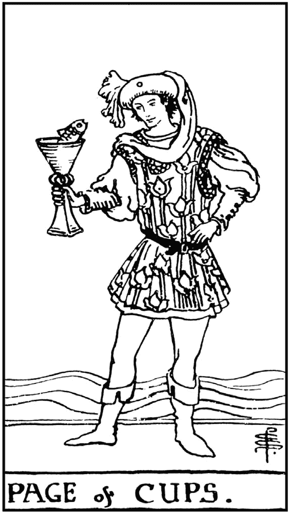

一个好看、讨人喜欢，有点阴柔的年轻侍者，一副专注好学的神情，凝视着一条从圣杯中跃起端详他的鱼。这是心灵具象化的图像。

**占卜牌义：**一位受驱使而效劳的浅肤色年轻男性，会和问卜者创建关系；好学的青年；消息、讯息、申请、反思、冥想；这些也指向商业。

**逆位：**品味、意向、依恋、诱惑、欺骗、欺瞒背叛。

#### 圣杯 10

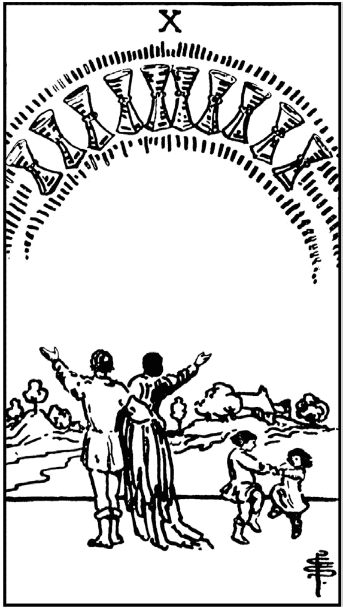

一道彩虹中出现了圣杯，下方有一对男女，显然是夫妻，惊叹陶醉地注视着彩虹。他右臂搂着她，高举左手；她高举右手。在他们身旁跳舞的两个孩子没看到这个奇景，自顾自地玩得不亦乐乎。远方有一处家园。

**占卜牌义：**心满意足，心安神泰；圆满的状态；也是人类爱与友情的圆满；若一起出现几张宫廷牌，代表某位人士正维护问卜者的利益；也可能指问卜者居住的城镇、村庄或国家。

**逆位：**虚情假意、愤慨、暴力。

#### 圣杯 9

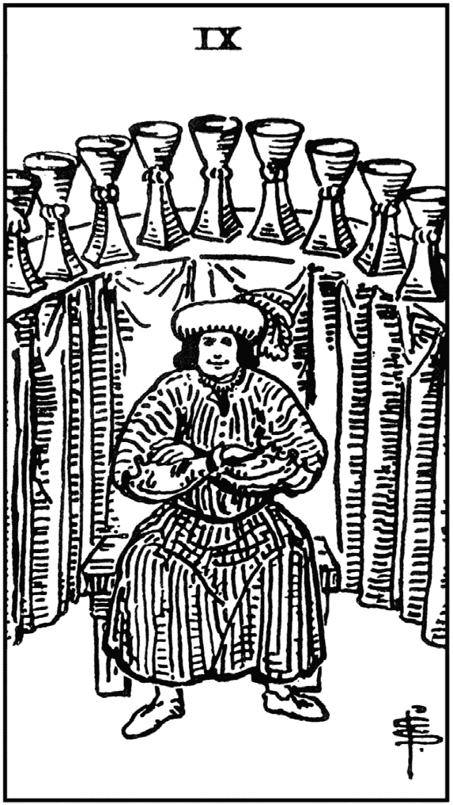

一位壮硕的人物已尽情享用盛宴，身后的拱形柜台上方摆满丰盛的美酒，仿佛预示着前程似锦。画面只呈现出物质的一面，但还有其他层面。

**占卜牌义：**和睦、满足、身体的康乐幸福；也代表胜利、成功、优势；问卜者或询问对象的满足。

**逆位：**真相、忠诚、自由；各种解读不尽相同且包括错误、不完善之处。

#### 圣杯 8

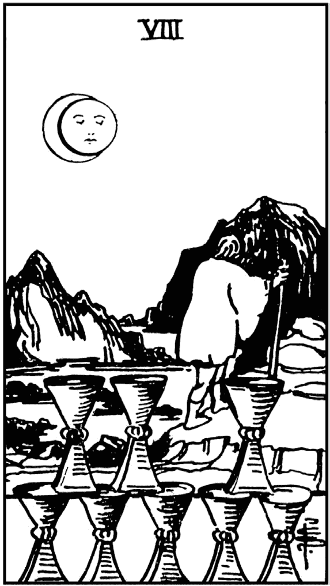

一位垂头丧气的男人背弃了他的圣杯，杯子代表他的幸福、事业、任务或先前关心的事情。

**占卜牌义：**牌义在画面上已不言而喻，但其他的解读却南辕北辙──说这张牌带来喜悦、温和、胆怯、荣誉、谦逊。在实例中，通常会发现这张牌呈现某件事在走下坡，或是原以为重要的事情其实影响微乎其微，无论是好是坏。

**逆位：**大喜、快乐、盛宴。

#### 圣杯 7

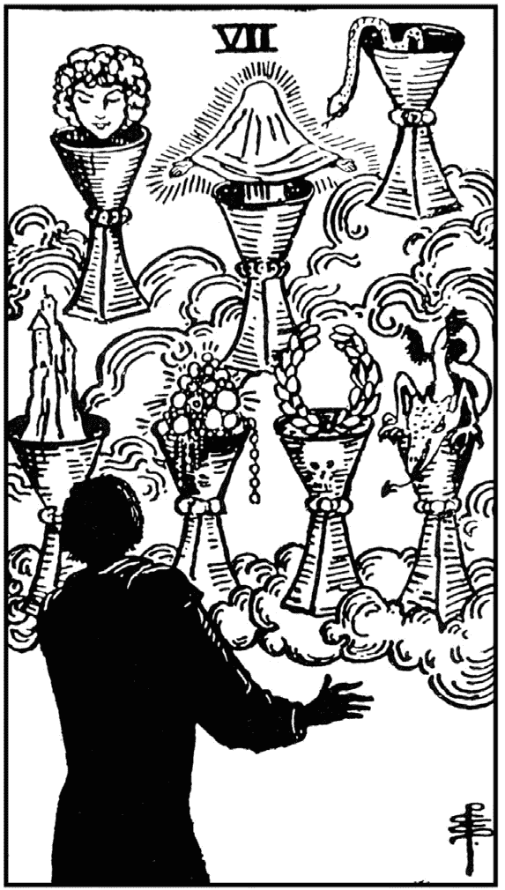

幻相里的奇异圣杯，这些意象尤其来自于奇幻的灵界。

**占卜牌义：**仙子的恩惠、投射的意象、多愁善感、想像、冥想时杯中所见之物；在这些程度略有成就，但并未暗示永久或实质性的东西。

**逆位：**欲望、意志、决心、计划。

#### 圣杯 6

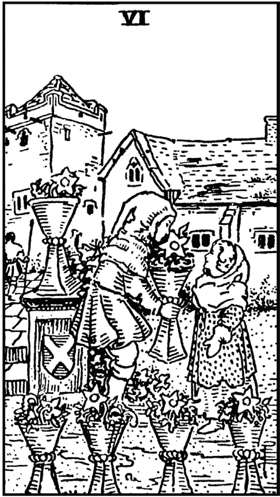

一座古老花园中的孩子们，杯里装满花朵。

**占卜牌义：**一张关于过去和回忆的牌，回顾往昔，例如：童年、快乐、欢喜，但来自过去；已消逝的事物。另一种解读则相反，指带来新关系、新知识、新环境，而孩子们在陌生的院落里嬉戏。

**逆位：**未来、汰旧换新，即将发生的事物。

#### 圣杯 5

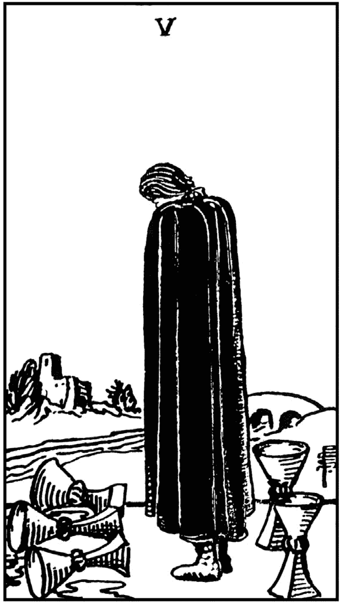

一位披着斗篷的黑色身影，侧身看着三只倒地的杯子，另外两只直立的杯子在他身后。背景中有一座桥，通往一个小要塞或领地。

**占卜牌义：**这是一张损失牌，但仍然有些留了下来；三个被拿走，剩下两个；这张牌代表继承、遗产、传承，但与期望不符；也有人诠释这是婚姻牌，但不乏苦涩或挫折。

**逆位：**消息、联盟、情投意合、血缘、世系、回归、虚假的计划。

#### 圣杯 4

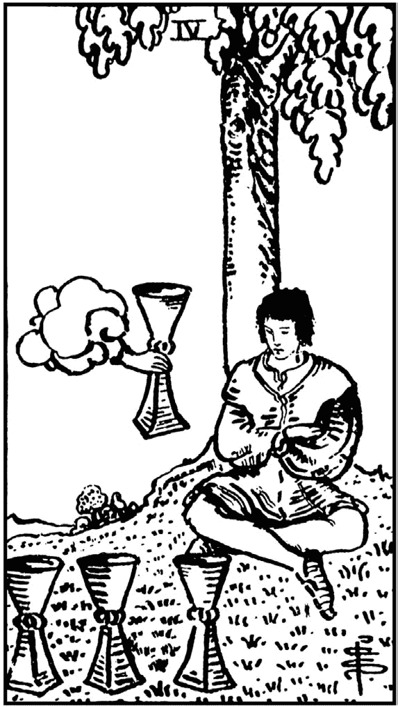

一名年轻人坐在树下，凝视着放在面前草地上的三只杯子；一只从云中伸出的手递给他另一只杯子，尽管如此，他的神情流露出对环境的不满。

**占卜牌义：**疲倦、厌恶、反感，想像出来的烦恼，仿佛这个世界的酒只带来厌腻；另一杯酒仿佛仙子的恩赐，现在递给了这个浪费的人，但他并未从中获得安慰。这张牌也表达混和的享乐。

**逆位：**新奇、预兆、新指引、新关系。

#### 圣杯 3

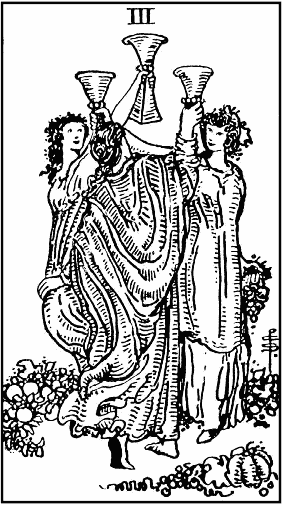

少女们在花园里举杯，仿佛在敬酒结盟。

**占卜牌义：**任何事情的结果都是充裕、圆满和欢乐；开心的发表、胜利、实现后的满足、安慰、疗愈。

**逆位：**远征、派遣、成就、结束。这张牌也代表过度享受身体和感官欢愉的一面。

#### 圣杯 2

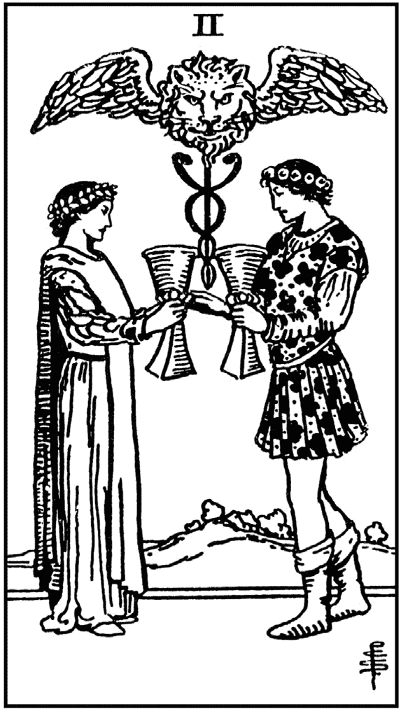

一名少男正和少女海誓山盟，他们的杯子上方升起赫密士的双蛇杖，巨大的双翼间出现一颗狮子的头。这张牌变更了在一些旧例里发现的象征。它附带了一些奇特的象征意义，但在此与我们无关。

**占卜牌义：**爱、激情、友谊、情投意合、结合、和睦、同情、两性彼此之间平等互惠的关系，以及（作为所有占卜服务之外的建议）不属于自然的欲望，但自然借此获得圣洁。1

#### 圣杯王牌

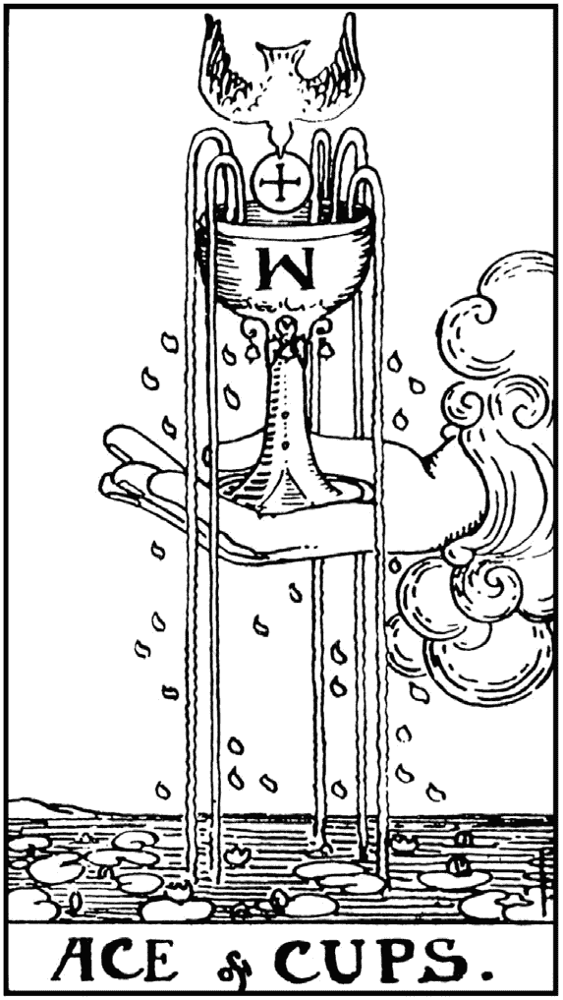

下方有水，水上有睡莲；从云中伸出的手，掌中托着一只圣杯，溢出四道水流 2；一只白鸽嘴中衔着有十字标记的圣餐面饼，飞落将面饼放入杯中；水珠自四面八方落下。这是小秘仪牌背后可能存在的暗示。

**占卜牌义：**真诚之心的家，喜悦、怡然自得、栖身之所、滋养、丰盛、生育力；圣餐礼的桌子，此处的幸福。

**逆位：**虚假之心的家、突变、不稳定、革命。

1.  编注：原作中韦特没有提到圣杯 2 的逆位。
2.  此处原文是 four streams，但牌面画有五道水流；不知是原文印刷错误或史密斯的插图因故与韦特所述不符，或是韦特刻意为之，有兴趣的读者可自行“参话头”。

### 宝剑牌组

#### 宝剑国王

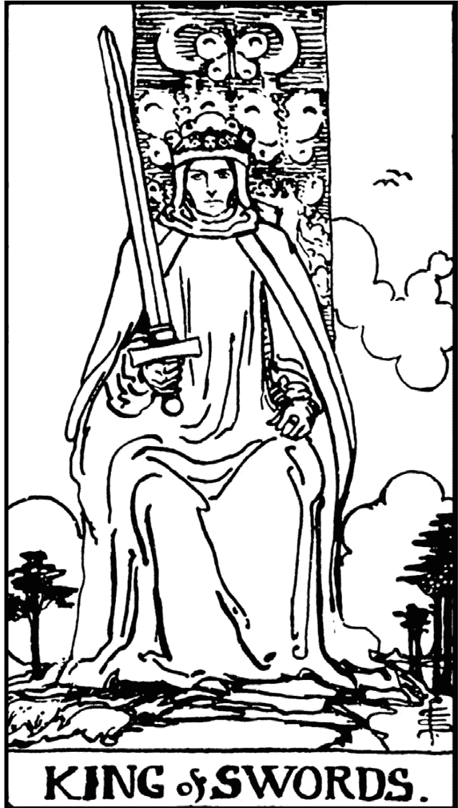

他坐在审判席上，举着出鞘的花色象征。当然，他令人想起大牌中正义牌的象征符号，他可能代表这种美德，但更多的是因职位获得判生判死的权力。

**占卜牌义：**一切源于审判及与其相关的概念，包括权力、命令、权威、战斗智慧、法律、王室职务等等。

**逆位：**残酷、反常、野蛮、背信忘义、邪恶的意图。

#### 宝剑女王

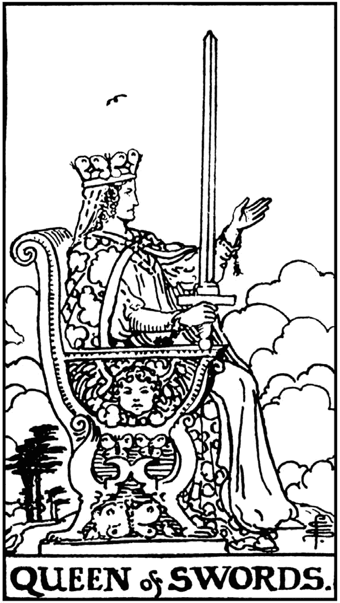

她的右手竖起武器，剑柄放在王座扶手上，她伸出左手，抬起手臂，神情严肃但克制；这暗示了她对忧伤的熟悉。这不代表仁慈，尽管她有宝剑，但她几乎不算是权力的象征。

**占卜牌义：**守寡、女性的悲伤与困窘、缺席、不孕、哀悼、匮乏、分离。

**逆位：**恶意、偏执、诡计、伪善、煎熬、欺骗。

#### 宝剑骑士

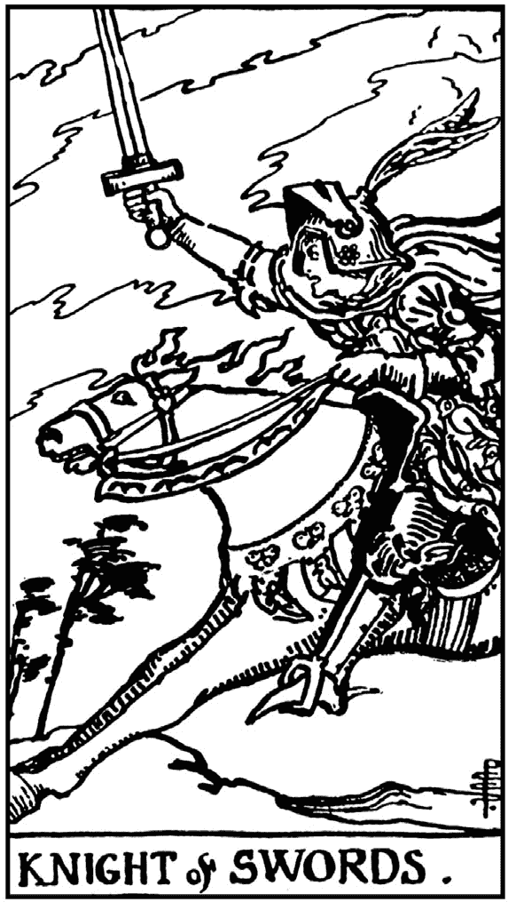

他全速驰骋，仿佛在驱散敌人。在设计上他确实是浪漫骑士精神的英雄原型。他几乎能成为加拉哈德 3，他的剑锋利明快，因为他心地纯洁。

**占卜牌义：**技巧、勇敢、才能、防御、机敏、敌意、愤怒、战争、破坏、对抗、反抗、毁灭。因此，某种意义上这张牌代表死亡，但只有在与其他死亡牌相邻时才有此意。

**逆位：**轻率、无能、奢侈。

#### 宝剑侍者

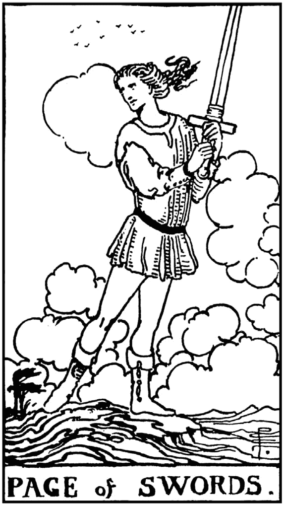

一个灵活的身影，双手直握长剑，步履轻快。他正穿越崎岖的土地，路上浓云密布。他机警灵活，东张西望，仿佛意料之中的敌人随时可能出现。

**占卜牌义：**权威、监督、秘密服务、警觉、暗中侦查、审查以及相关的特质。

**逆位：**这些特质的邪恶面；意料之外、毫无准备的状态；也暗示了疾病。

#### 宝剑 10

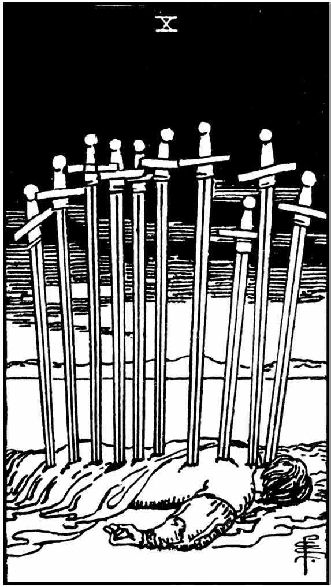

一个俯卧倒地的身影，被所有属于这张牌的剑刺穿。

**占卜牌义：**牌面设计隐含的一切；也代表痛苦、苦恼、泪水、悲伤、凄凉。并未特别指因外力死亡。

**逆位：**优势、利润、成功、恩惠，但上述皆不永久；权力与权威。

#### 宝剑 9

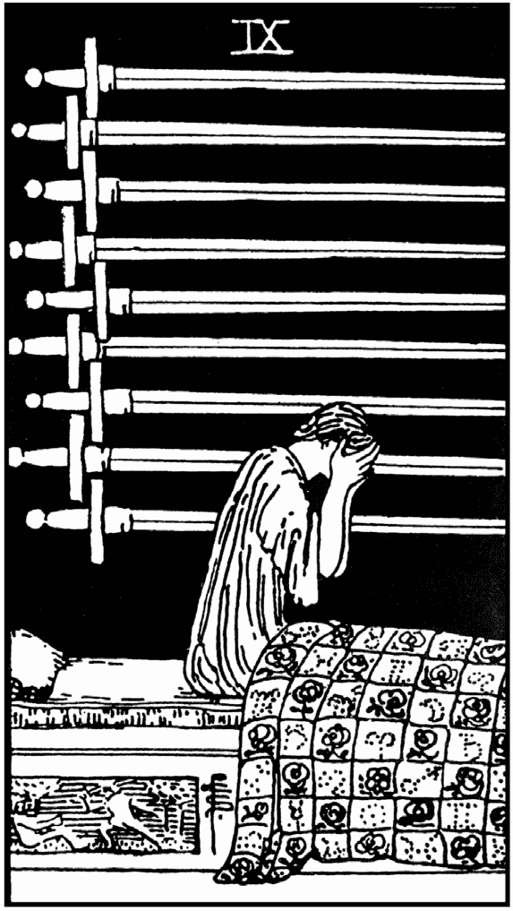

一个在卧榻上恸哭的女人，剑悬挂在她头顶上。她表现得像是世上没有悲伤能比拟她的悲伤。这是一张彻底绝望的牌。

**占卜牌义：**死亡、失败、流产、延误、欺瞒、失望、绝望。

**逆位：**囚禁、猜疑、怀疑、合理的恐惧、羞耻。

#### 宝剑 8

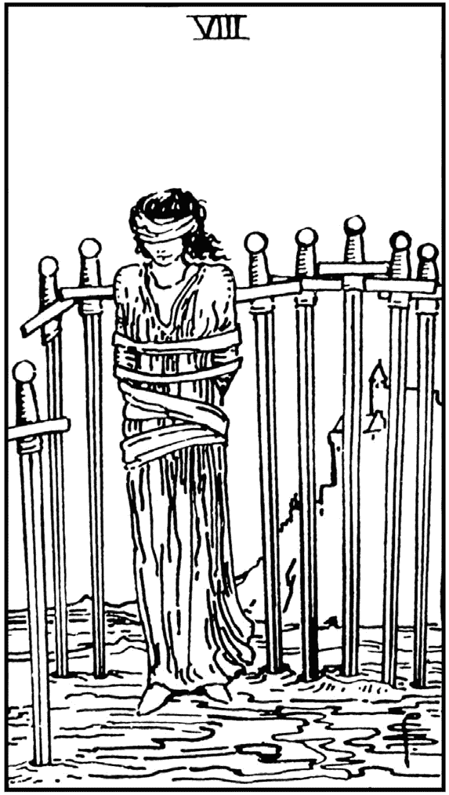

一位被捆绑蒙住眼的女子，身边围绕着牌上的剑。然而这更像一张暂时的困境牌，而非无法挣脱的束缚。

**占卜牌义：**坏消息、强烈的恼恨、危机、谴责、受妨害的权力、冲突、诬蔑；同时也代表疾病。

**逆位：**不安、困难、反抗、意外、背叛；意料之外的事；死亡。

#### 宝剑 7

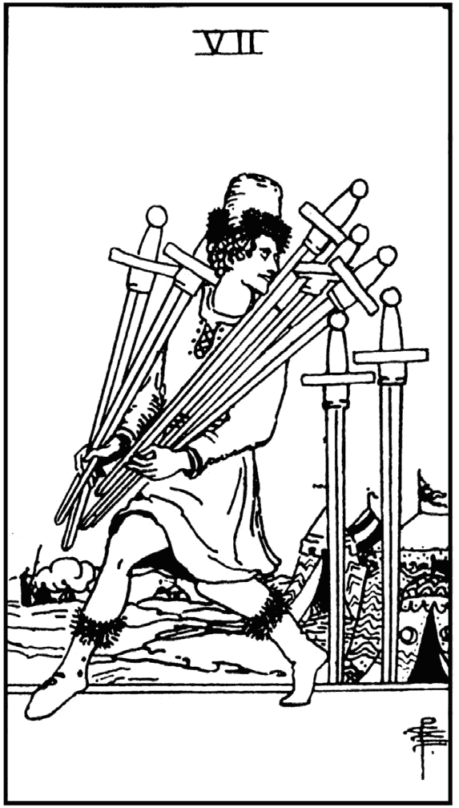

一个正飞快带走五把剑的男子，另外两把剑仍插在地上。附近有一个营地。

**占卜牌义：**计划、企图、愿望、希望、信心；同时也代表争吵、可能失败的计划、烦心事。牌面设计的意义并不明确，因为各种含义彼此大相迳庭。

**逆位：**好建议、忠告、指示、诽谤、喋喋不休。

#### 宝剑 6

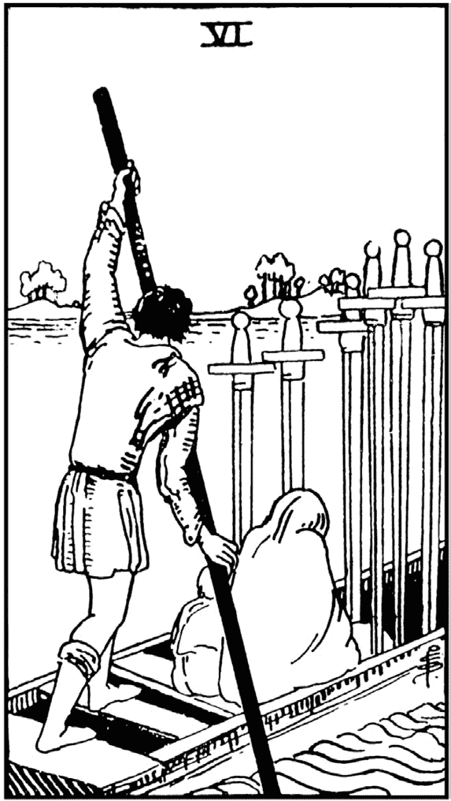

一位摆渡人撑着篙带乘客抵达远方的岸边。航程平顺，可见货物很轻。可说是一份力所能及的工作。

**占卜牌义：**走水路的旅程、路线、道路、使节、委托、权宜之计。

**逆位：**宣告、忏悔自白、公开；某个说法认为这是爱的求婚。

#### 宝剑 5

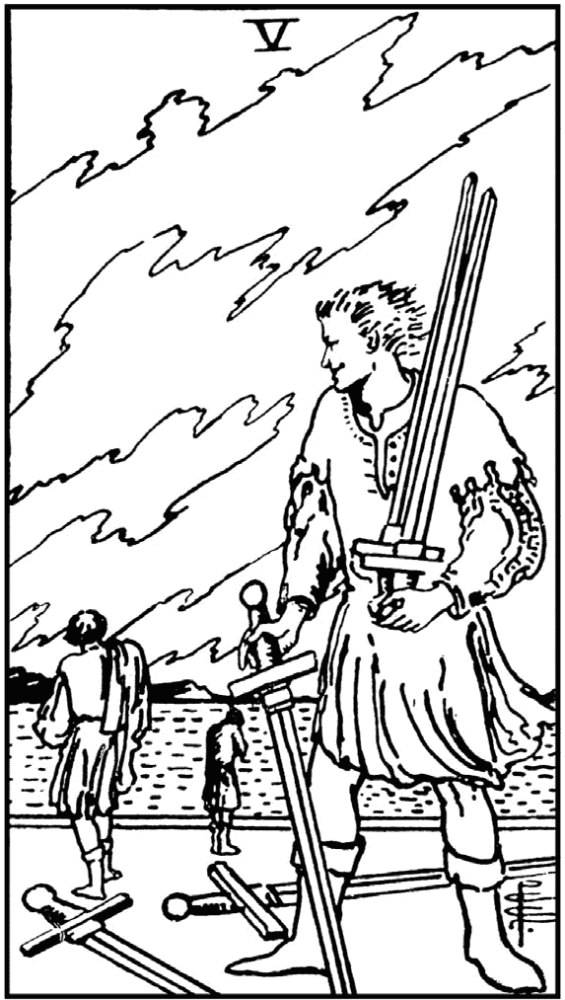

一名男子轻蔑地看着两个正在撤退且垂头丧气的人，他们的剑躺在地上，他左肩扛着另外两把剑，右手拿着第三把，剑尖朝向地面。他是占据领地的主人。

**占卜牌义：**贬低、破坏、撤销、声名狼藉、不名誉、损失，以及这些的变化和类似意义。

**逆位：**同上；丧礼和葬仪。

#### 宝剑 4

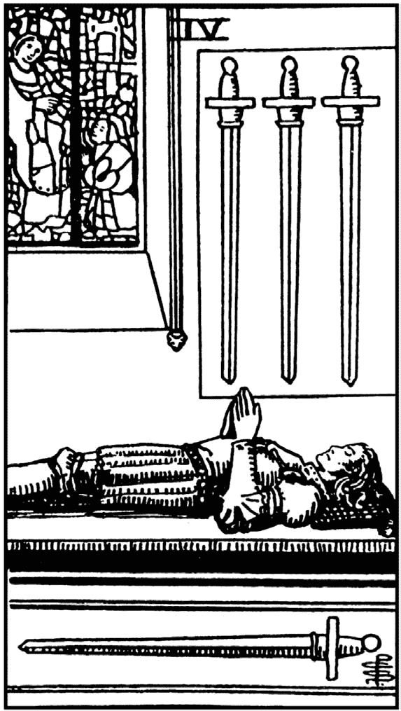

一位骑士的塑像以祈祷的姿势躺平在陵墓上。

**占卜牌义：**警觉、隐退、孤独、隐士的安息、流放、坟墓和棺材。最后几项促成了牌面的设计。

**逆位：**明智的管理、慎重、节约、贪婪、谨慎预防、遗嘱。

#### 宝剑 3

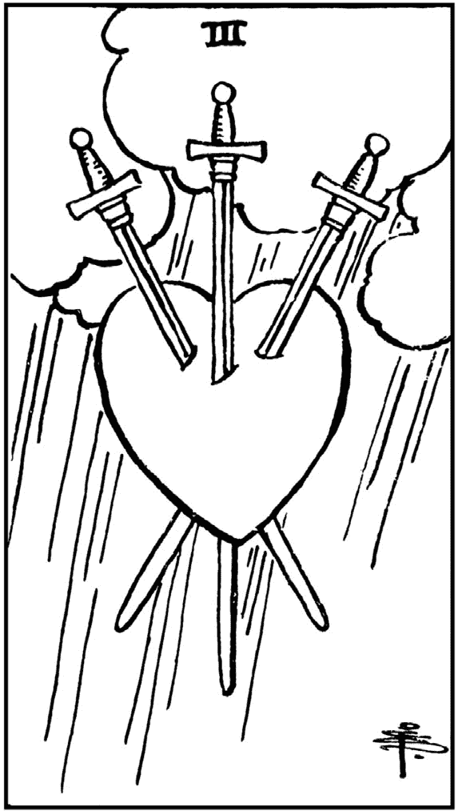

三剑刺心；背后是云和雨。

**占卜牌义：**移除、缺席、延误、分裂、破裂、分散，以及牌面自然意味的一切，简单明了无需具体列举。

**逆位：**精神错乱、错误、损失、分心、混乱、困惑。

#### 宝剑 2

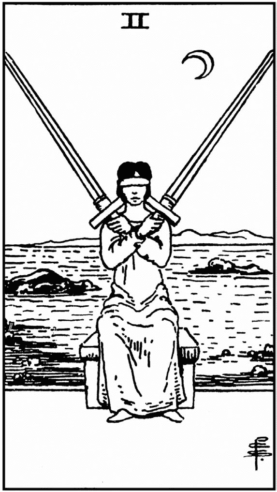

一位蒙眼的女性人物在肩上平衡着两把剑。

**占卜牌义：**遵从一致和平衡均势，暗示在勇气、友谊、武装状态下的和睦；另一种解读表示温柔，情感和亲密。必须有条件地考虑关于和谐的暗示和其他标榜的解读，因为宝剑牌在人类事务里通常不是仁慈势力的象征。

**逆位：**冒名行骗、谬误、表里不一、不忠。

#### 宝剑王牌

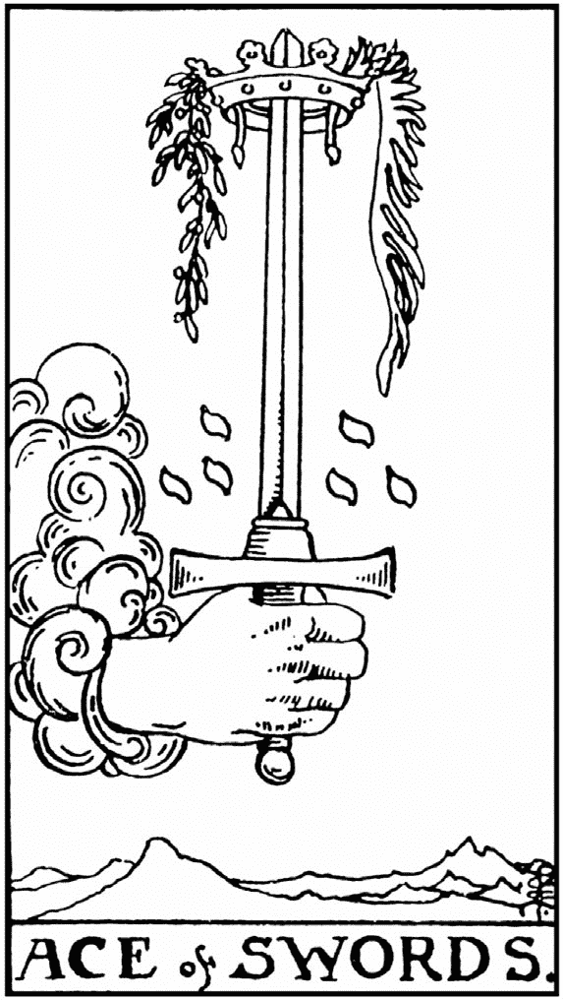

云中伸出一只手，紧握一把剑，剑尖被一顶王冠环绕。

**占卜牌义：**胜利、一切事物的极端、征服、力量的胜利。这是一张势力强大的牌，无论是爱还是恨。王冠可能具有比通常在占卜领域里更高深的意义。

**逆位：**同上，但结局是场灾难；另一种解释提到受孕、分娩、扩增、多重性。

3.  加拉哈德（Galahad）是亚瑟王传说中圆桌骑士兰斯洛特（Lancelot）与渔人公主的私生子，是圣杯三骑士之一，最终由他寻得了圣杯。

### 钱币牌组

#### 钱币国王

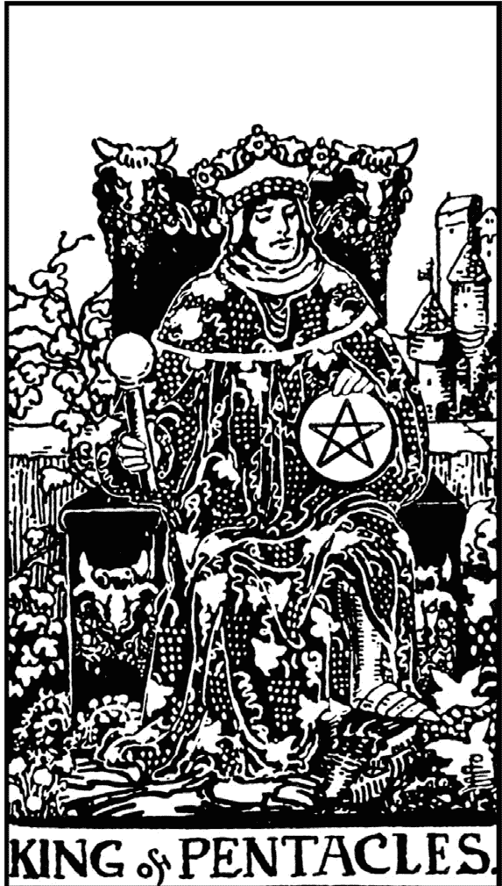

这个人物无需特别描述，脸色较深，暗示了勇气，但有几分无精打采。我们应该注意宝座上反复出现公牛头的标志。这个花色的象征符号向来一直是刻制或绘制的五角星，代表人类本质中四种元素的对应关系，以及它们能被掌控的方式。许多旧版塔罗牌中，这个牌组的花色代表流通中的硬币、钱币、但尼尔。我并没有发明五角星的替代品，也没有特殊理由替代方案。但占卜意义的共识是做一些更动，因为这些牌并不特别用来处理金钱问题。

**占卜牌义：**英勇、具实现力的智力、商业和正常智力才能，有时是数学天赋和成就；这些领域的成功。

**逆位：**罪恶、软弱、丑陋、乖张、腐败、危害

#### 钱币女王

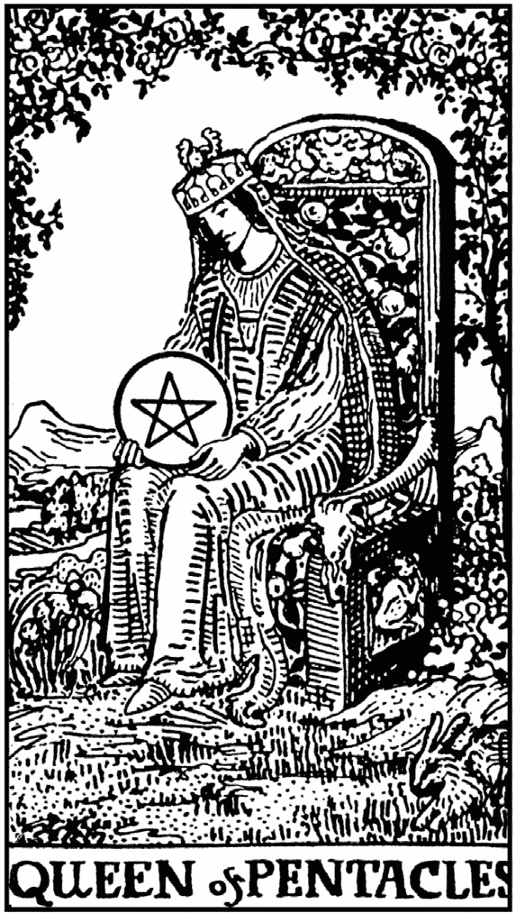

这张脸让人联想到肤色较深的女性，她的特质或许可总结为灵魂的伟大；她还拥有严肃的智慧特质；她凝视着她的象征符号，可能在当中看到了世界。

**占卜牌义：**富饶、慷慨、华丽、安全感、自由。

**逆位：**邪恶、怀疑、挂虑、恐惧、不信任。

#### 钱币骑士

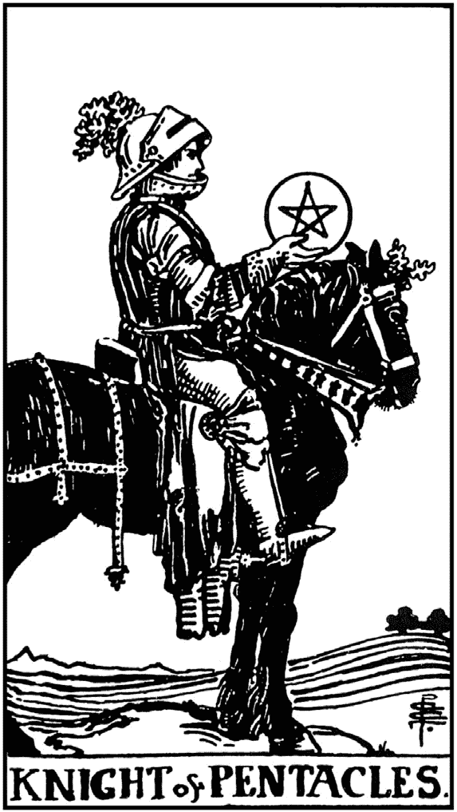

他骑着一匹行动缓慢，耐久且笨重的马，与他的外观相符。他展示出自己的象征符号，但没有凝视其中。

**占卜牌义：**实用、效用、利益、责任、正直（在普通和外在层面）。

**逆位：**惰性、懒散、休憩、拖延；以及平稳安宁、灰心丧气、粗心大意。

#### 钱币侍者

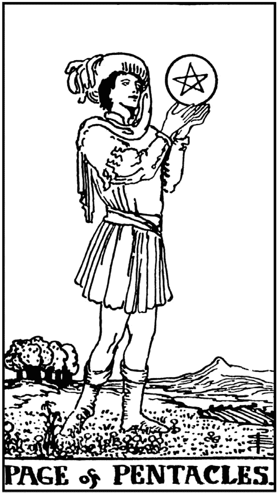

一位年轻人正专注地看着举起的双手间浮起的五角星币，他动作缓慢，对周遭事物不太敏感。

**占卜牌义：**应用、研究、学术、反思；另一种解读是新闻、讯息和传递者；也代表统治、管理。

**逆位：**挥霍无度、铺张浪费、慷慨大方、奢华；不利的消息。

#### 钱币 10

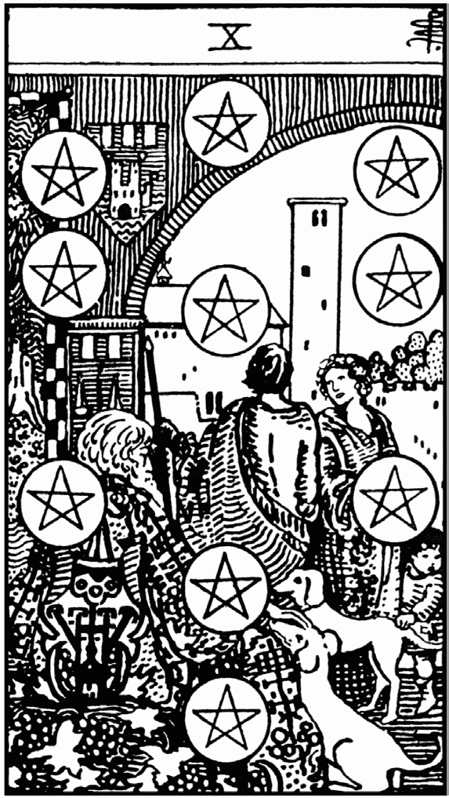

一男一女站在一座通往房屋和庄园的拱门下。身边带着一个孩子，好奇地看着两只狗热络地靠近前景中坐着的老人；孩子的手放在其中一只狗身上。

**占卜牌义：**收获、财富；家庭事务、档案、世系、家族住所。

**逆位：**机会、死亡、损失、抢劫、博弈 4；偶尔指礼物、嫁妆、养老金。

#### 钱币 9

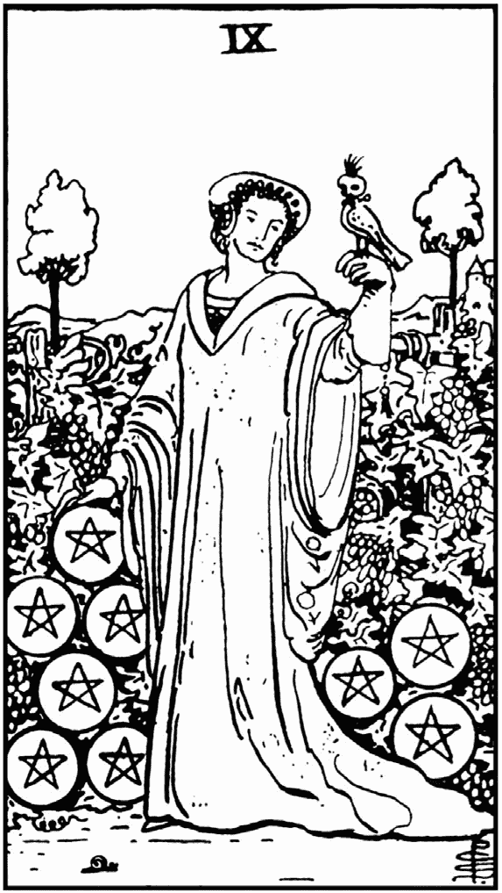

一位女性，手腕上有一只鸟，站在一座庄园的花园里，周围是蓊郁的葡萄藤。这是一片广阔的领地，暗示着丰足的一切。这可能是她自己的财产，证明她物质上的幸福安乐。

**占卜牌义：**审慎、安全、成功、成就、确信、洞察力。

**逆位：**流氓、欺骗、无效的计划、不诚恳。

#### 钱币 8

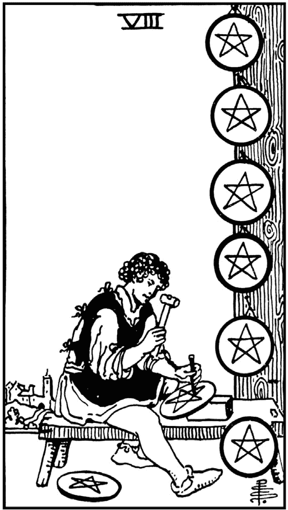

一名石匠正在工作，将作品像奖杯一样展示出来。

**占卜牌义：**工作、就业、佣金、工艺、工艺和商业技巧，可能处在准备阶段。

**逆位：**无用的野心、虚荣、贪婪、勒索、高利贷。也可能指拥有技能，将聪明才智转向奸诈狡猾和阴谋诡计上。

#### 钱币 7

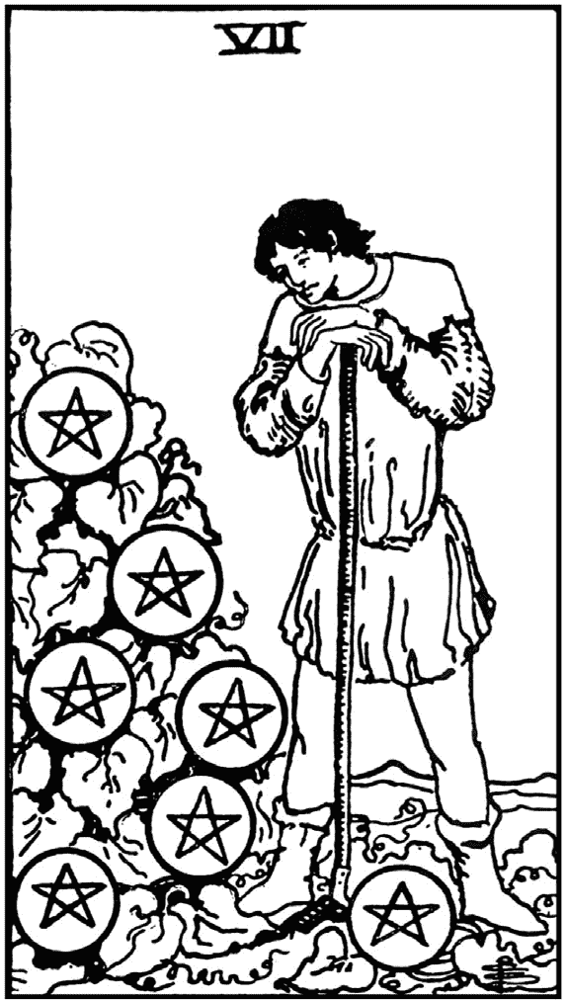

一位年轻男子倚在木棍上，专注地看着右边一丛绿叶间的七枚五角星币；可以说这些是他的财宝，也是他心之所向。

**占卜牌义：**种种意义非常矛盾；总体来说这是一张与金钱、商业、以物易物有关的牌；但某一种解读指口角、争论；另一种解读则指纯真、心灵手巧、净化。

**逆位：**和金钱有关导致的焦虑，可能有人提议借款。

#### 钱币 6

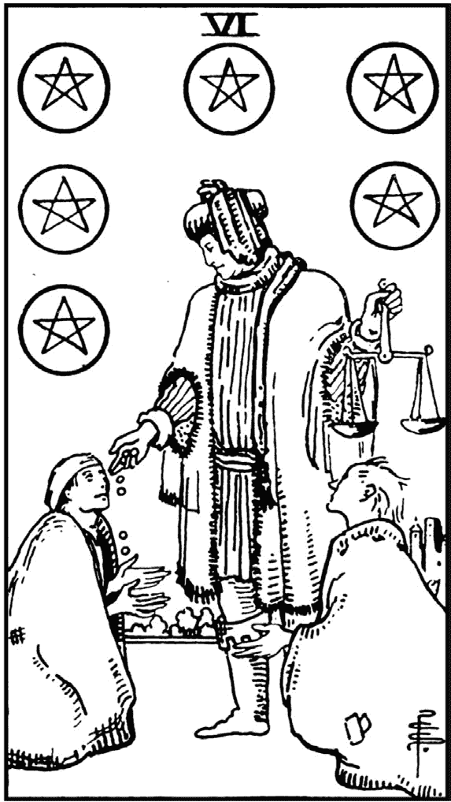

一位扮成商人的人用一只天平称钱，将钱分给需要帮助和拮据的人。这证明了他本身生活的成功，也表明了他的善心。

**占卜牌义：**礼品、礼物、心满意足；另一种说法是注意、警觉、现在是接受的时刻、目前的繁荣等等。

**逆位：**欲望、贪婪、羡慕、嫉妒、幻觉。

#### 钱币 5

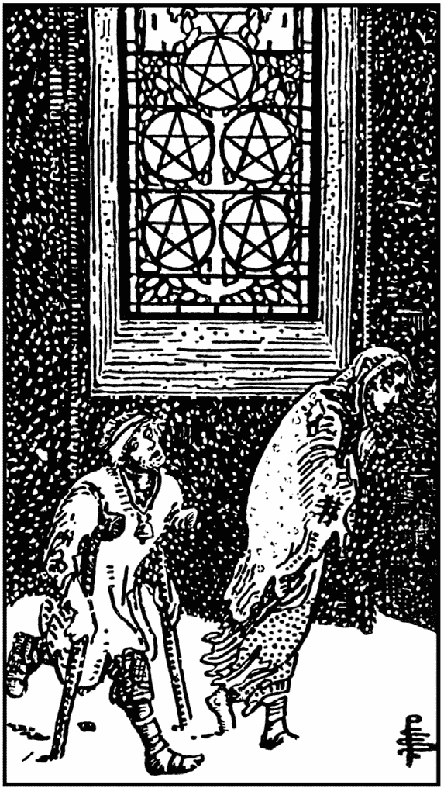

两名行乞者＃在暴风雪中经过一扇灯火通明的窗户。

**占卜牌义：**这张牌预示了物质的困难，无论是插图中呈现的赤贫或其他形式。对某些占卜师来说，这是一张爱情与情人的牌，可能是妻子、丈夫、朋友、情妇；也指和谐一致、亲密关系。这些不同解释难以统整。

**逆位：**失序、混乱、毁灭、不和睦、挥霍。

#### 钱币 4

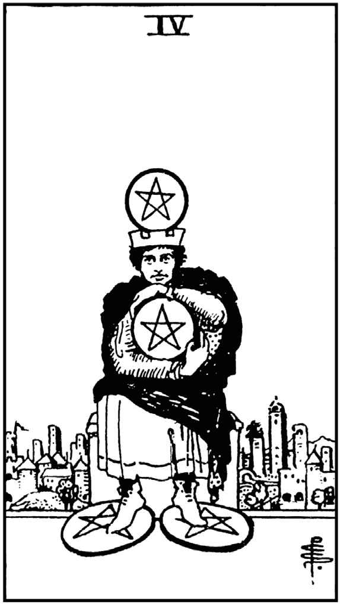

一位戴着皇冠的人物，皇冠上有一枚五角星币，双臂紧抱另一枚；脚下踩着两枚五角星币。他坚守自己拥有的东西。

**占卜牌义：**财产的保证、固守自己的所有物、礼物、遗产、继承。

**逆位：**挂虑、延迟、反对。

#### 钱币 3

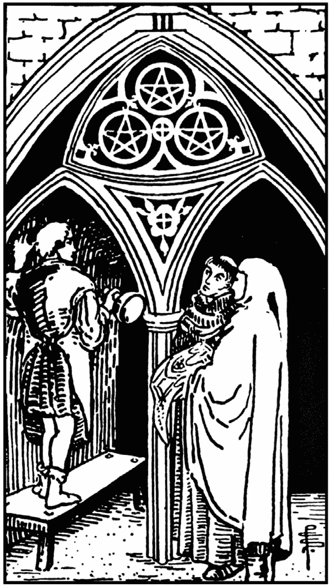

一位在修道院工作的雕塑师。请对照钱币 8 的牌面设计。当中的学徒或业余者已经得到回报，正认真工作。

**占卜牌义：**合适的职业、贸易、熟练的劳工；然而通常会被视为是贵族、贵族阶级、名声、荣耀的牌。

**逆位：**工作或其他方面的平庸、幼稚、小气、软弱。

#### 钱币 2

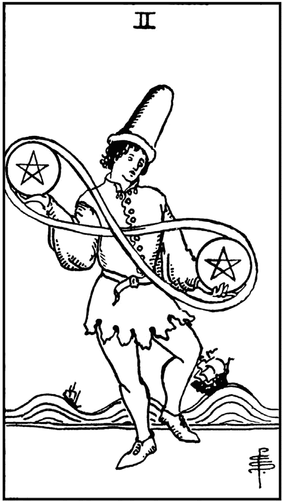

一位正在跳舞的年轻人，两手各执一个五角星币，被一条没有尽头的绳索链接在一起，像是倒过来的数字 8。

**占卜牌义：**一方面呈现为欢乐、娱乐相关的牌，也是牌面设计的主题；但同时也被解读为新闻和书面讯息，以及障碍、躁动、麻烦、卷入纠纷。

**逆位：**强迫的欢乐、假装的享受、字面意义、书写、作文、交换信件。

#### 钱币王牌

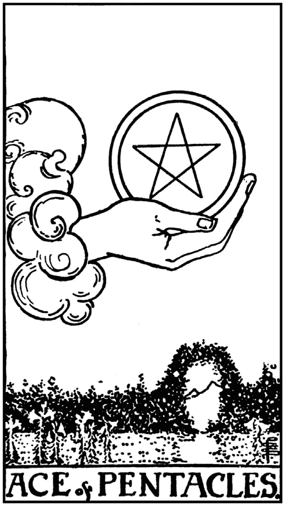

一只手一如既往从云中伸出，拿着一枚五角星币。

**占卜牌义：**圆满知足、幸福、狂喜；也表示敏捷的智力；黄金。

**逆位：**财富的邪恶面，智力不佳；也代表巨大的财富。无论如何都代表了繁荣、舒适的物质条件；但这对持有财富的人是否有利，取决于牌是否逆位。

4.  原文为 games of hazard、是英国一种以两颗骰子进行的赌博游戏。14 世纪乔叟在《坎特伯里故事集》中曾提及这个游戏、在 17、18 世纪相当盛行。
5.  原文为 mendicant，可以看见左边男子胸前挂有铃铛、拄着拐杖，可能是行乞的痳疯病人，右边是衣着破烂的穷妇，两人行经教堂外。Mendicant 也指基督教中的托钵修士，以化缘维生，信奉苦行主义。

## 第三章大秘仪牌
及其占卜牌义

以上就是小秘仪牌关于占卜技艺的暗示，其真实性似乎取决于挑选出一个有助于概略陈述的意义。根据假设，占卜的纪录就是过去基于经验的结果纪录；因此，它们是记忆的指南，那些能够掌握元素的人，或许（依然是根据假设）能给出基本的诠释。这是一种正式且自动的运作方式。另一方面，那些拥有直觉、第二视觉、灵视（要怎么称呼都可以）天赋的人，会用自己能力所发现的事物去补充过去的经验，并且借由神谕牌卡谈论他们所见到的。接下来我们继续简要介绍同样技艺赋予大牌的占卜意义。

**1\. 魔法师**

技巧、外交、谈吐、机敏；疾病、痛苦、损失、灾难、敌人的陷阱；自信、意志；若问卜者为男性、代表他自己。

逆位：医生、魔法师、精神疾病、耻辱、不安。

**2\. 女祭司**

秘密、奥秘、尚未揭晓的未来；若问卜者为男性，代表他感兴趣的女性；若问卜者为女性，代表她自己；沉默、坚韧、奥秘、智慧、科学。

逆位：激情、道德或肉体的热情、自负、表面知识。

**3\. 女皇**

成果丰硕、行动、主动性、长寿；未知、偷偷摸摸；也指困难、怀疑、无知。

逆位：光明、真相、解开复杂的问题、众人欢欣之事；根据另一种解读，表示踌躇不决。

**4\. 皇帝**

稳定、权力、保护、实现；伟大的人物；援助、理性、信念；同时指权威和意志。

逆位：仁慈、同情、信用；也表示使敌人感到困惑、阻挠、不成熟。

**5\. 教皇**

婚姻、结盟、囚禁束缚、奴役；另一种说法是怜悯和善良；灵感；问卜者求助的对象。

逆位：社会、善解人意、和睦、烂好人、软弱。

**6\. 恋人**

吸引力、爱情、美丽、克服考验。

逆位：失败、愚蠢的计划。另一种说法是婚姻受挫和各种矛盾对立。

**7\. 战车**

援助、天意、战争、胜利、放肆、报复、麻烦。

逆位：暴动、争吵、纠纷、诉讼、落败。

**8\. 力量（刚毅）**

力量、活力、行动、勇气、宽宏大量；也指取得圆满的成功和荣誉。

逆位：专制、漤权、软弱、不和谐，有时甚至是耻辱。

**9\. 隐士**

审慎、谨慎；尤其指谋反、假惺惺、无赖、腐败。

逆位：隐瞒、掩饰、政策、恐惧、不合理的戒备。

**10\. 命运之轮**

命运、财富、成功、晋升、运气、幸福。

逆位：增加、丰盛、过剩。

**11\. 正义**

公平、正义、廉洁、执法；应得的一方在法律上获得胜利。

逆位：各种法律领域、法律纠纷、偏执、偏见、过度严厉。

**12\. 吊人**

智慧、谨慎、洞察力、考验、牺牲、直觉、占卜、预言。

逆位：自私、群众、政治团体。

**13\. 死神**

结束、死亡、毁灭、腐败；对男性来说指失去一位贵人；对女性来说指众多矛盾对立；对少女来说指婚姻大事的失败。

逆位：惰性、睡眠、无精打采、被惊吓而石化、梦游；希望破灭。

**14\. 节制**

节省、适度、节俭、管理、调解。

逆位：与教会、宗教、教派、神职人员有关的事，有时甚至是要跟问卜者结婚的牧师；也指分裂、不幸的结合、相互竞争的利益。

**15\. 恶魔**

蹂躏、暴力、激愤、非比寻常的努力、势力、宿命；命中注定但不一定是邪恶的事物。

逆位：邪恶的宿命、软弱、小气、盲目。

**16\. 塔**

痛苦、悲楚、穷困、逆境、灾难、耻辱、欺骗、毁灭。这张牌尤其代表无法预料的浩劫。

逆位：根据某种说法，指程度较轻的压迫、囚禁、暴政。

**17\. 星星**

损失、偷窃、匮乏、遗弃；另一种解读是希望和光明的前景。

逆位：狂妄自大、桀骜不逊、无能。

**18\. 月亮**

隐藏的敌人、危险、诽谤、黑暗、恐惧、欺骗、神秘力量、错误。

逆位：不稳定、反复无常、沉默、程度较轻微的欺骗和错误。

**19\. 太阳**

物质上的幸福、幸福的婚姻、心满意足。

逆位：与上述相同但较轻微。

**20\. 审判**

地位改变、更新、结果。另一种说法表示诉讼造成的全部损失。

逆位：软弱、怯懦、单纯；也指审议、决定、判决。

**0\. 愚者**

愚蠢、狂热、铺张浪费、陶醉、神智不清、发狂、背叛。

逆位：疏忽、缺席、分配、粗心、冷漠、无效、虚荣。

**21\. 世界**

担保会成功、报偿、旅程、路线、移民、飞行、改变地点。

逆位：惰性、固定、停滞、永久。

可以看出，除非牌面意义传达了不可抗拒的暗示，占卜技艺从大牌当下提取出的意义，在我看来极度人为且武断。一种是光的奥秘，一种是幻想的奥秘。将算命这一面套到这些牌卡上，是经年累月鲁莽不宜的举措。

## 第四章小秘仪牌的
额外含义

### 权杖牌组

国王：通常是有利的，可能预示良好的婚姻。逆位：应该遵循的建议。

女王：丰收，可能有多重含义。逆位：对问卜者的善意，但没有机会实现。

骑士：坏牌；根据某些解读指疏远。逆位：对女性来说指婚姻，但可能受挫。

侍者：家族中的年轻男子，追求年轻女性。逆位：坏消息。

10：若旁边是好牌，表示困难和矛盾。

9：通常是坏牌。

8：已婚人士的家庭纠纷。

7：肤色深的孩子。

6：仆人可能会失去主人的信任；年轻女士可能被朋友背叛。逆位：实现被延迟的希望。

5：金融投机行为取得成功。逆位：争吵可能转变成优势。

4：意外的好运。逆位：已婚女性会生出漂亮的孩子。

3：非常好的牌；合作将利于事业。

2：年轻女士可能会遇到些微的失望。

王牌：各种灾难。逆位：生育的象征。

### 圣杯牌组

国王：提防某个有地位的人的恶意，以及虚情假意的帮忙。逆位：损失。

女王：有时代表个性模棱两可的女性。逆位：男方婚姻富贵，女方婚姻显赫。

骑士：朋友来访，替问卜者带来意外之财。逆位：不合常规。

侍者：好兆头；也指恋情不顺的年轻男子。逆位：各种阻碍。

10：对男性问卜者来说，一段超乎预期的美好婚姻。逆位：悲伤，也指严重的争吵。

9：对军人来说是好兆头。逆位：生意兴隆。

8：与美丽的女性结婚。逆位：心满意足。

7：皮肤白的孩子；想法、计划、决心、进展。逆位：如果伴随圣杯三，则表示成功。

6：愉快的回忆。逆位：迅速来临的继承。

5：通常是有利的；幸福的婚姻；也指祖产、遗泽、礼物、事业成功。逆位：许久未见的亲戚归来。

4：矛盾对立。逆位：不祥的预感。

3：对军人来说是意外的晋升。逆位：安慰、治疗、结束生意。

2：在娱乐、生意和爱情方面有利；还有财富和荣誉。逆位：激情。

王牌：不屈不挠的意志、金科玉律。逆位：意外的地位变动。

### 宝剑牌组

国王：律师、参议员、医生。逆位：坏人；也是结束毁灭性诉讼的警告。

女王：寡妇。逆位：坏女人，对问卜者怀有恶意。

骑士：士兵、武装人员、随从、受薪阶级；预示士兵将会有英勇的行动。逆位：跟草包争论；对女人来说，与其斗争的对手会被征服。

侍者：某个轻率的人将窥探问卜者的秘密。逆位：惊人的消息。

10：若后牌是王牌或国王，代表囚禁；对女孩或妻子来说，代表朋友的背叛。逆位：士兵在战争中获得胜利和随之而来的财富。

9：神职人员、神父；通常是不祥之兆。逆位：合理怀疑一位可疑之人。

8：对女性来说，关于她的丑闻被散播。逆位：一位亲戚离开。

7：肤色较深的女孩；一张好牌；承诺在确保收入充足后可过上田园生活。逆位：良好的建议，可能被忽视了。

6：会有愉快的旅程。逆位：诉讼不利。

5：对问卜者命运的一击。逆位：悲伤和哀悼的征兆。

4：一张坏牌，但若是逆位，透过明智的管理事务则成功可期。逆位：明智的管理将带来某种成功。

3：对女性来说，爱人的离去。逆位：问卜者与达成妥协的人见面；也指修女。

2：送给女性的礼物，对寻求帮助的男性提供有力的保护。逆位：和无赖打交道。

王牌：巨大的繁荣或巨大的苦难。逆位：女性由于自己的轻率而婚姻破灭。

### 钱币牌组

国王：肤色较深的男性、商人、主人、教授。逆位：年老恶毒的人。

女王：肤色较深的女性；来自富有亲戚的礼物；对年轻人来说富裕幸福的婚姻。逆位：疾病。

骑士：有用的人、有用的发现。逆位：失业的勇者。

侍者：深肤色的青年、年轻军官或士兵、一个孩子。逆位：有时指降级，有时指掠夺。

10：代表房屋或住所，从其他牌中得出其价值。逆位：可能是幸运或不幸的场合。

9：迅速实现相邻的牌所预示的事物。逆位：徒劳的希望。

8：与问卜者有关系的年轻商人、深肤色的女孩。逆位：问卜者将在借贷问题上妥协。

7：一位女士未来丈夫的地位获得改善。逆位：不耐烦，担忧，疑心。

6：现况靠不住。逆位：检验问卜者的野心。

5：以理性征服财富。逆位：爱情的困扰。

4：对单身汉来说，来自一位女士的愉快消息。逆位：观察，阻碍。

3：若是男性，表示他的长子将出名。逆位：取决于相邻的牌。

2：困扰多半出于想像而非真实。逆位：不祥之兆，无知，不公不义。

王牌：所有牌卡中最有利的。逆位：分得一份发现的宝藏。

以上可以观察到：（一）这些额外含义与他们涉及的牌面设计几乎毫无关联，因为这些设计对应更重要的思辨价值；（二）此外，这些额外含义往往跟之前给出的含义分歧。所有的含义大多彼此独立，并且根据它们在牌阵中的位置，大多会被减弱、强调或修改，有时甚至近乎相反。对这类情况几乎没有任何评判的准则。我想，随着任何体系从通则落实到细节，就比例而言自然会变得更加随机不定；在职业算命的纪录中，提供的多半是这个主题的渣滓和糟粕。同时，基于直觉和第二视觉的占卜几无实用价值，除非这些占卜能从普遍领域落实到具体领域；当个别情况中出现这种天赋，那么过去纸牌占卜师记录的具体含义将会被忽视不计，以支持对牌卡价值的个人理解。

这已经提过了。看来需要补充以下的推测解读。

## 第五章发牌时
重复出现的牌

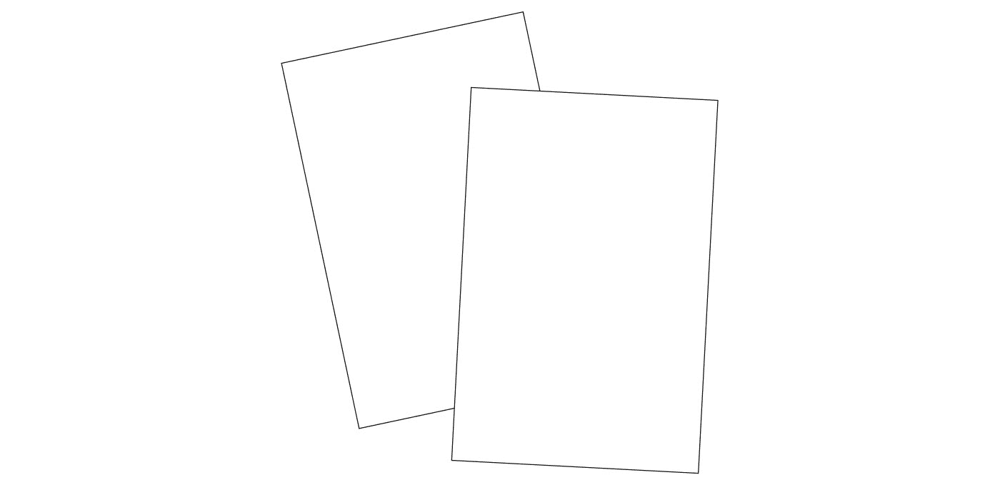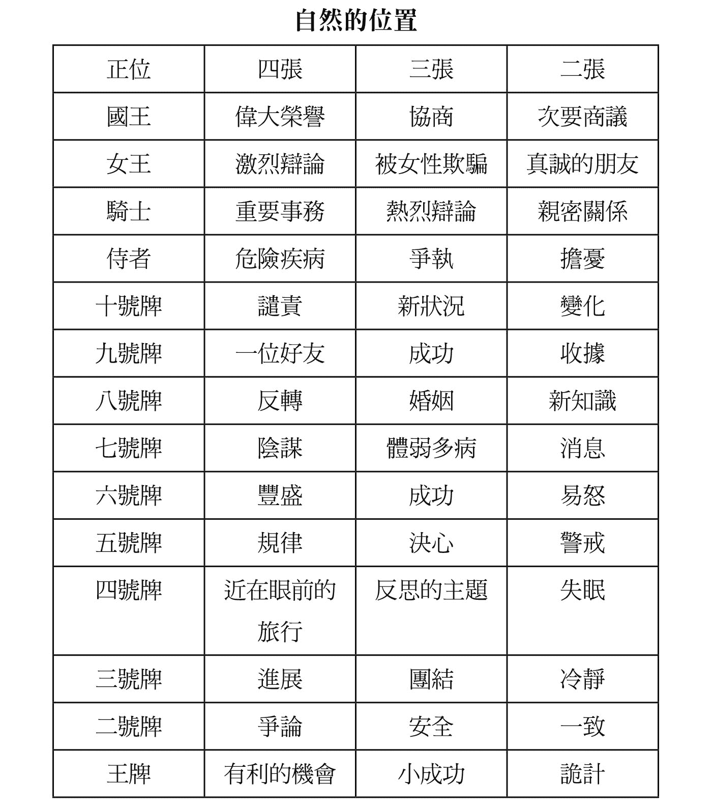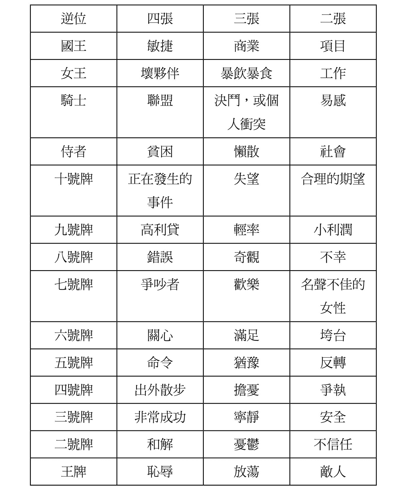

## 第六章塔罗占卜的技艺

我们现在进入本主题最后的实践部分，也就是透过塔罗牌询问和获得神谕的方法。操作方式相当多样，其中一些非常复杂。后者我略过不提，因为精通这类问题的人相信大道至简。我也略过最近在《波希米亚人的塔罗》一书中的“塔罗占卜”的章节里重新发表的操作方法；对于希望深入研究超出本手册有限范围的读者，该书价值合宜可供推荐。首先，我提供一个简短的占卜步骤，在英格兰、苏格兰及爱尔兰已私下使用了许多年。我不认为有人发表过，当然更不可能跟塔罗牌扯上关系。我相信它一体适用，但我会补充第二种变化方式，是过去在法国被称为茱莉亚·奥尔西尼的神谕占卜法。

## 第七章古老的凯尔特占卜法

这种占卜方式最适合获得明确问题的答案。占卜者首先选择一张牌来代表所询问的人或事。这张牌叫做“指示牌”。如果他想探悉与自己有关的事情，可选择符合他个人描述的牌。如果要询问的对象是一个四十岁或以上的男性，可选择骑士牌作为指示牌，低于四十岁的男性则应该选国王牌；四十岁以上的女性选择女王牌，年龄较小的女性则选侍者牌。

权杖牌组中的四张宫廷牌代表长相好看的人，有着金黄或红褐色头发，浅肤色和蓝眼睛。圣杯牌组中的宫廷牌义味着有浅棕或暗栗色头发，灰或蓝色眼睛的人。宝剑牌组中的宫廷牌象征的是有淡褐或灰色眼睛，深棕发色和肤色较暗的人。最后，钱币牌组中的宫廷牌指的是发色深黑棕色或黑色，深色眼睛和肤色蜡黄或黝黑的人。然而，这些分法会被以下保留条件影响，以避免在使用上过于墨守成规。有时你可以根据一个人的已知气质来引导你；一个非常黝黑的人可能非常有活力，用宝剑牌组人物代表会比钱币牌组更合适。另一方面，一个懒散慵懒的浅肤色对象，则应该用圣杯牌组人物而非权杖牌组代表。

为了占卜之目的，将询问之事作为指示牌更方便，那么则应选择符合该事意义的大牌或小牌。假设问题是：是否有必要提起诉讼？在这种情况下，选择第 11 号大牌（正义牌）作为指示牌。这张牌和法律事务有关。但若问题是：我能胜诉吗？必须选择其中一张宫廷牌作为指示牌。随后可以进行一连串占卜，来确定过程本身以及有关各方面的结果。

选定指示牌后，正面朝上摆桌上。洗牌并切牌三次，保持牌面朝下。

翻开牌堆顶部或**第一张牌**；用它覆盖主要牌，说出：“这张牌盖住它。”这张牌代表询问者或事件大致上的影响因素，以及问题当中其他趋势形成的氛围。

翻开**第二张牌**横放在第一张牌上，说出：“这张牌横挡它。”这张牌显示事件中障碍的性质。如果这是一张有利的牌，对立的力量不会太严重，或者可能表示某些好事不会在特定关系中获得好结果。

翻开**第三张牌**，放在指示牌上方，说出：“这张牌加冕它。”这张牌代表（一）问卜者对此事的目标或理想；（二）当前情况下能实现的最佳结果，但尚未成真。

翻开**第四张牌**，放在指示牌下方，说出：“这张牌在它底下。”这张牌显示了事情的基础或根据，是既成事实并且内化为对指示牌的影响。

翻开**第五张牌**，放在指示牌上人物视线的相反方向，说出：“这张牌在它背后。”这张牌给出的是刚刚过去或正在消逝的影响。

注意：若指示牌是一张大牌或任何无法说清楚是面向哪一方的小牌，占卜者必须在开始操作牌阵之前，决定要将哪边视作人物朝向的方向。

翻开**第六张牌**，放在指示牌朝向的那侧，说出：“这张牌在它前方。”这张牌显示了正在发挥并会在不久的将来产生作用的影响。

现在这些牌排列成十字的形状，被第一张牌覆盖的指示牌在正中间。

接下来，依次翻开四张牌，在十字右侧依次摆放成一行。

其中的第一张，也就是牌阵中的**第七张牌**，代表指示牌本身，无论是人或事件，并且表明了它在环境中的位置或态度。

**第八张牌**代表他的家庭，也就是他所处的环境以及正在影响该事件的倾向。例如：他在生活中的地位、身边亲近朋友的影响等等。

**第九张牌**呈现他对此事的希望或恐惧。

**第十张牌**是即将到来的最终结果，是由占卜中其他翻开的牌显示的影响力带来的最终高潮。

在这张牌上，占卜者应该特别集中他的直觉力，以及他记忆中这张牌所属的正式占卜含义。这些应该要包含你从桌上其他牌占卜出来的任何信息，包括指示牌本身及相关的东西；如果指示牌恰好是大牌，作为传递神谕也就是要解读的牌卡，不排除可能会出现更高意义的光芒，就像从天而落的闪闪灵光。

牌阵已经完成，但如果最后一张牌性质含煳不清，最后无法决定牌义为何，或是似乎无法显示事情的最终结论，最好再操作一次牌阵。在这种情况下，将第十张牌作为指示牌，取代之前用的那张。这副牌必须再次洗牌并切牌三次，和之前一样排出前十张牌。由此可以获得“将发生的事情”更详细的说明。在任何占卜中，如果第十张牌是宫廷牌，则表示占卜事宜最终会落入该张牌所代表的人手中，结果主要取决于此人。在这种情况下，将提及的宫廷牌在新牌阵里用做指示牌也会有帮助，可察觉他对此事的影响以及他将带来的议题。

这种方法在相对短的时间内可获良好成效，前提是操作者的天赋，也就是他潜在或已开发的洞察力，这种洞察力具有不受干扰的特殊优势。我在此附上此占卜模式牌卡排列图表，指示牌朝向左边。

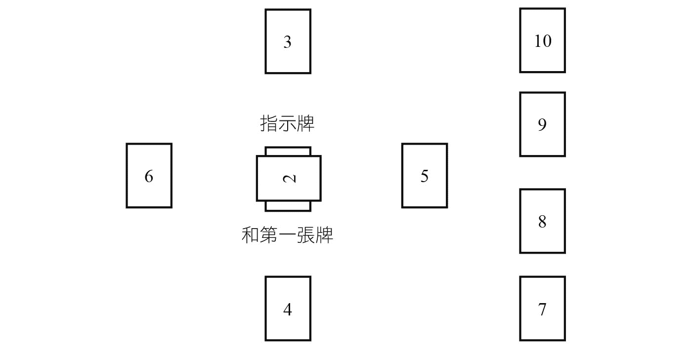

指示牌

1 是盖住它的牌。

2 是横挡它的牌。

3 是加冕它的牌。

4 是在它下方的牌。

5 是在它后方的牌。

6 是在它前方的牌。

7 是它自己。

8 是它的环境。

9 是它的希望或恐惧。

10 是将发生的事情。

## 第八章另一种
塔罗解读法

洗乱整副牌并翻转一部分的牌，使其上下颠倒。

让问卜者用左手切牌。

将前四十二张牌发牌成六叠，每叠有七张牌，正面朝上。第一叠七张牌构成第一组，接下来的七张牌构成第二组，以此类推，如下图所示：

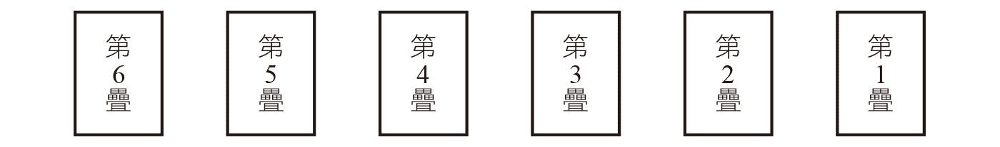

拿起第一组牌；将牌在桌上从右到左排成一列，将第二组牌放在上面，再依序放剩下的牌组。这样你将得到七组新的牌，每组有六张牌，排列如下：

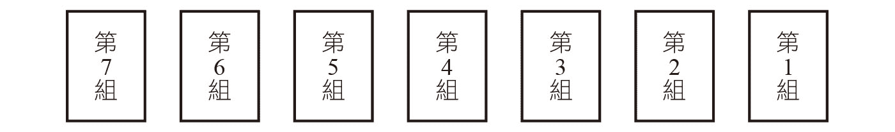

拿起每组牌最上面的那一张，洗牌后从右到左排列，排成一个有七张牌的横列。

然后从每组牌中取出两张牌，洗牌后，在第一列下方排成两列。

再拿起剩下的二十一张牌，洗牌后，在其他牌底下排成三列。

这样你将得到六个牌列，每一列有七张牌，按照以下方式排列：

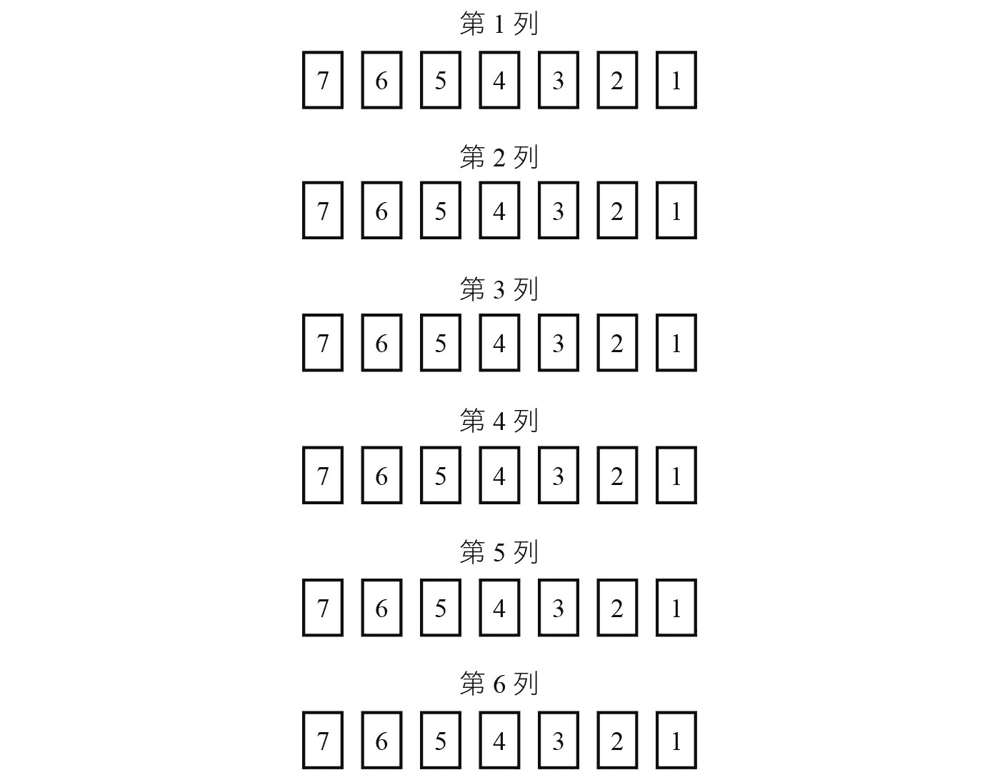

在此方法中，问卜者若是男性则以魔法师牌代表，若是女性则以女祭司牌代表。但无论哪种情况，在按照上述指示将四十二张牌排好之前，都不会从牌堆中将魔法师或女祭司牌取出。若桌上的牌中找不到这两张，必须在尚未发牌的三十六张馀牌里寻找，并放在第一列右边稍远的位置。反之，若这两张牌在桌上的牌里也要取出，按上述规定摆好，然后从三十六张未发的馀牌中，随意抽出一张牌填补空缺，所以仍然有四十二张牌在桌上。

接着依序从右到左解读牌卡，从最上方第一列最右边的一号牌读起，最后一张是最底部那一列最左边的七号牌。

这种方法适用于没有明确问题的时候，也就是说，问卜者想大致了解自己生活和命运的发展方向。如果他想知道在特定时间内可能发生的事情，在洗牌之前应该要明确指定时间。

在进一步解牌时，须记住牌卡应该要相对于主题进行诠释，这表示牌卡所有正式和传统的含义可以、且应该因事制宜，以和所讨论的特定个案的情况互相协调，像是问卜者或是想询问之人的地位、生命阶段和性别。

因此，愚者牌可能表示从单纯兴奋到疯狂之间的整个心理阶段范围，但每次占卜必须透过考虑牌卡整体走向来判断特定的阶段，在这方面，直觉自然发挥重要的作用。

开始解牌时，最好快速浏览一遍牌卡，让头脑对主题也就是运势走向得到大概的印象，然后再重新开始，逐一详细解读。

要记得，根据塔罗的假设，大牌代表着比小牌更强大、更有说服力的力量。

直觉和灵视能力的价值在占卜中实乃理所当然。占卜者身上自然具有或后天养成这些能力，牌卡偶然的排列链接了占卜者的心智和占卜主题的氛围，然后剩下的就简单了。直觉出错或不存在时，必须竭尽全力运用注意力、智力观察和推理，才能获得满意的结果。但即使直觉看似休眠，也可以透过练习占卜的过程来培养。若对某张牌在特定关联中的确切含义有疑问，精通此道者建议占卜者将手放在牌卡上，尽量不去想它应该代表什么，并留意心智中浮现的印象。一开始可能只是单纯乱猜，可能事后证明不正确，但透过练习，是有可能区分小我头脑的猜测和心智浮现的潜意识印象。

这不在我的职权范围内，我无法就这个主题提供理论或实用建议，因为我并未参与其中。以下附注由一位大师提供，如果欧洲所有纸牌占卜师都能用一双手洗牌并靠一种语言占卜，他比所有人加起来更具发言资格。

### 练习占卜注意事项

1\. 开始操作前，明确构思你的问题，并大声重复。

2\. 洗牌时尽可能让心思保持空白。

3\. 尽可能抛开个人偏见和先入为主的想法，否则你的判断力会受到影响。

4\. 出于这个原因，比起为自己或朋友，为陌生人占卜更容易得到正确结果。

## 第九章使用三十五张牌的
解读法

根据上一种方法提出的方案，当解牌完，可能会像之前出现仍然有疑虑的情况，或者希望进一步追问，可照此进行：

拿出在四十二张牌的牌阵中，没用到未发出的馀牌。刚才使用的四十二张牌堆成一叠放在旁边且面朝上，代表问卜者的那张牌放在最上面。剩下的三十五张牌跟之前一样洗牌和切牌，再如下分成六叠：

第一叠包含前七张牌；第二叠包含接下来的六张牌；第三叠包含接下来的五张牌；第四叠包含接下来的四张牌；第五叠包含两张牌；第六叠包含最后的十一张牌。届时牌卡会排成这样：

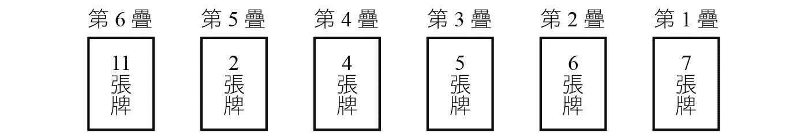

依次拿起这些牌堆，将它们包含的牌分成六列，这六列的长度必然不等。

第一列代表家庭、环境等。

第二列代表占卜的对象或主题。

第三列代表当下外在的事物，如事件、人物等。

第四列代表惊喜、意外等。

第五列代表安慰，可以缓和前几列中不利的事物。

第六列是为了阐明其他列的谜样神谕必须参考的内容，除此以外，这一列并不重要。

这些牌应该从最上面那一列，由左到右依次解读。

关于占卜这部分结论要说明的是，塔罗牌的解读法也适用于一般扑克牌，但额外的宫廷牌，尤其是大牌，则增加了神谕的要素和价值。

现在，为整件事做总结，我最后留下几句话，犹如以此为跋，一个更进一步且最终的观点。由此观之，我认为大牌包含秘密教义的理解。在此我并非指我熟悉的那些安藏这些教义的修会和兄弟会团体，这些地方是更高层次塔罗知识的一部分。我不是指这些妥善保存和传承的教义能独立嵌入建构成大牌，也不是指教义和塔罗无关。确实存在一些协会具有这两种特殊知识，有些知识从塔罗推论出来，有些则和塔罗无关；无论哪种情况，都系出同源。但也有一些保留的事物不属于修会或社会，而是以其他方式传递。撇开所有这一类的传承，让任何一位神秘主义者单独或综合研究魔法师、愚者、女祭司、教皇、女皇、皇帝、吊人和塔牌，然后再让他研究名为最后审判的牌。这些牌蕴藏了灵魂的传奇故事，其他大牌则是细节，有人可能会说，是一种偶然的意外。也许像这样的神秘主义者会开始理解这些象征符号深处隐含了什么，无论是谁先发明它们以及如何保存下来。若他当真理解了，他也会明白为何我会关心这个主题，即使要冒着写纸牌占卜的风险。

