# 韦特塔罗指导手册

# 韦特塔罗牌简介

韦特塔罗牌兼具艺术美感、娱乐性质，是朋友聚会、占卜娱乐、增加情感的必备佳品。让参与者可以通过使用塔罗牌增加对自己和他人世界观、人生观的了解。韦特塔罗牌五彩绚丽的牌面，被赋予了各种神话传说。你可以通过解读塔罗牌上所叙述的神话故事，从神话故事中感悟出更多的人生道理。

## 第一章 认识塔罗

- 塔罗牌的历史 (P2)
- 塔罗牌是什么 (P5)
- 认识塔罗牌 (P8)

## 塔罗牌的历史

“塔罗”一词，是取自埃及语的TAR（道）和RO（王）两词，含有“王道”的意思。因此，“塔罗”本身也就是指身为王者，他应该具备正确的决断力，这也正是塔罗预测方式的起源。

塔罗牌最初是一种古老的推算预测工具，它是智者将古老的智慧宝典绘成图案，流传下来。就像《易经》被公认为东方智慧之书，塔罗牌则被认为是西方的智慧宝典。两者都是探讨宇宙和生命的变化，所不同的是塔罗牌充满了西方文艺和文化的风貌。

1781年，由一位研究神秘学团体的考古人类学家柏林（Antoine Court de Belling）所出版的《原始世界》（Le Monde Primitive）一书在探讨塔罗来源时，认为塔罗和一本古埃及的《智慧之书》（THE book OF Thoth）有关，而Thoth就是埃及的沟通和智慧之神，也就是月神。相传他以埃及的象形文字创造了塔罗，以传达他的智慧。《智慧之书》是专门用来传达天神旨意的神秘之书。每当古代的法老王有任何疑难问题需要解决时，就会打开这本书。那么问题便能迎刃而解了。

而当基督教入侵埃及时，当时的新罗马皇帝下令毁掉一切不属于基督教的东西，包括所有的图书馆。因此有许多相当珍贵的前人智慧和资料都消失了。埃及王朝惨遭灭亡之时，为了防止这部神秘之书落入异族的魔手，便将它用图画的形式绘在卡片上，交付在神官手中。后来经历亚历山大之手传入欧洲。在中世纪左右的时候，就形成了现在我们所说的塔罗牌。

塔罗牌风行在西方的中世纪，从很多当时的图画、书籍中都可以找到他的踪影。无论是王公贵族或是平民百姓，塔罗牌无所不在。一直到教会的兴起，塔罗牌被视为异教的神秘魔法，从此遭到打压。在有心人士的保护下，塔罗牌还是流传了下来，在世人面前展现它的神秘气息。

塔罗牌是由 22 张大阿尔卡那和 56 张小阿尔卡那组合而成，共有 78 张牌，每张精致的纸牌都有他独特的图案和意义，在使用塔罗牌预测的时候，可以 78 张牌全部使用，不过大多数都是仅使用大阿尔卡那的 22 张牌。

关于塔罗牌的起源有多种说法，大致应该是这样的：首先塔罗牌的大阿尔卡那源自古犹太人的 KABBALA。由于古犹太人跟古埃及人经常有接触，也吸纳了不少埃及的宗教符号。随着中东战乱频繁，塔罗牌的前身几乎消失。后来吉卜赛人不知道怎么学会了使用塔罗牌，但他们似乎对塔罗牌的哲学层面缺少了解，所以把塔罗牌当做占卜工具。在 12 到 14 世纪期间传到欧洲，又很快被教廷禁绝。教会的势力减弱后，塔罗牌又得到发展，陆续有新的塔罗牌推出。尤其是 19 世纪末，研究人员把塔罗牌和古犹太人密教的卷轴文化联系起来后，塔罗牌的研究变得更有系统，莱德—韦特塔罗牌就是其中的代表。

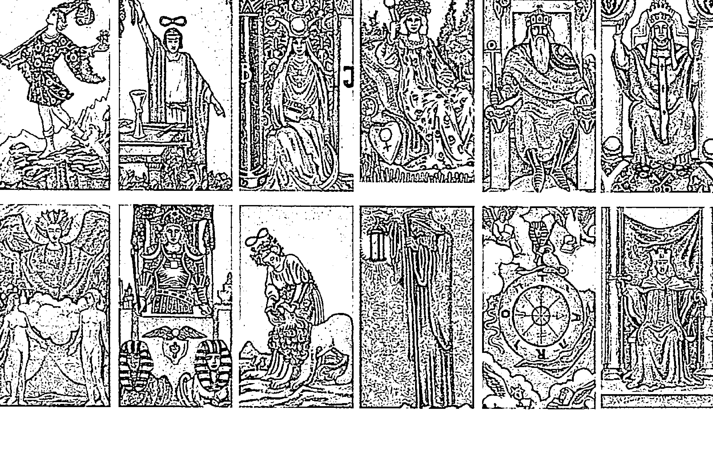

保存至今的最早的一副塔罗牌，是目前存放在法国巴黎的国家图书馆的 17 张大阿尔卡那。在欧洲中世纪时，塔罗牌被教会视为异端邪说而被打压，许多教会禁止教友接触塔罗牌。到 18、19 世纪经由哥柏林与里维 (Levi) 等人的研究与推动，塔罗牌又以全新的面貌出现在世人眼前。19 世纪末李维的追随者帕普斯大幅改进了塔罗牌的理论与系统，帕普斯的名著 Tarot of the Bohemians 是第一本完全的塔罗牌专著，其中更加入灵教学 (Number logy)，丰富了塔罗牌的内涵。帕普斯因而被奉为近代欧洲塔罗牌理论与系统的开山祖师。

1910年，A.E. 韦特与史密斯女士出版了莱德 - 韦特塔罗牌，并出版了一本用以解释这副纸牌的著作 A Pictorial Key to tarot 。很快该牌就成为全球发行量最大的纸牌，也是大多数塔罗牌研究者公认的国际标准。而该书则作为研习塔罗牌入门的教科书。

时至今日，塔罗牌的发展更加多元，不少塔罗牌更结合当地的文化艺术推陈出新，例如：俄罗斯塔罗牌、英国塔罗牌、瑞典塔罗牌、中国易经塔罗牌，可以说塔罗牌在游戏之余，又表现了世界各地不同文化与风俗民情。

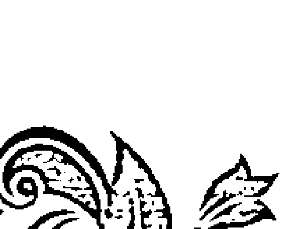

## 塔罗牌是什么

塔罗牌的起源很神秘，我们可以肯定，在15世纪的意大利，塔罗牌是种流行的纸牌游戏。富人们出钱制作了精美的纸牌，其中一些留存至今。问世于1450年或稍早时期的威尼斯康提——斯佛扎（discontiguous-Sforza），就是最早的塔罗牌之一，而且非常完整。

后来，在18和19世纪，一些知名的神秘学学者发现了塔罗牌。这些人被塔罗牌迷住，发现牌面上的图画拥有强大的力量，绝不仅仅是游戏那么简单。

尽管塔罗牌的根基是古老的神秘学，近几十年来，人们对塔罗牌的兴趣仍然不断发展，其中包括许多不同的方向。许多新的塔罗牌被创造出来，以反映这些新视角。例如，美国土著塔罗牌（native American），草药塔罗牌（herbal），龙之塔罗牌（dragon），以及日本塔罗牌（Japanese）等。

塔罗牌主要被看成一种预测工具。传统的塔罗预测，解牌是需要两个人共同完成：一个称为“求问者”——遇到个人问题，想要寻求答案的人；另一个称为“解牌者”——懂得如何解释牌义的人。求问者洗牌并切牌之后，解牌者把选出的牌按某图形（即所谓牌阵）摆开。牌阵中每个位置都有特定的意义，每张牌也都有自己特定的含义。解牌者把这两种含义加以结合，以此提示求问者的问题。

这是一套有图片的牌。问题来了：我们到底能用它干什么？

答案牵涉到潜意识——它存在于我们每个人的记忆和意识深处，却又表现在日常体验中。尽管大多数时候我们都会忽略潜意识的活动，但它却深刻地影响着我们的行为。弗洛伊德在其著作中着重描述了潜意识的非理性和创造性。他试图说明，潜意识是人性中那些共同的优良品德的集合。

或许我们永远无法了解潜意识的全部内涵与能力，但却有办法提示它的面貌。为此发展出许多方法，心理学，解梦，想象与冥思。塔罗牌也是这类工具中的一种。

花点时间来观察塔罗牌中很典型的一张“宝剑五”。这张牌画着一个男人手拿三柄剑，看着远处另外两个人，地上还有两柄剑。当我们看着这张牌时，我们开始围绕这张图创建故事。我们看到一个男人在战斗中获胜，心满意足，他沾沾自喜，很高兴能夺得所有的剑。另外两个人被打败，沮丧而失落。

我们所做的就是观察一张意义广泛的图片，并为它编写一个故事，设想出这张图唯一可能的解释。但实际上，其他人没准会设想出一个完全不同的故事来，或许这个男人正在捡起宝剑，他叫别人来帮他，可他们拒绝了。或者，另外两个人正在打斗，而他想迫使他们停下来。

关键在于，有许多可能的故事，而我们选择了其中一个，为什么？因为人会本能地把潜意识映射到事物上。我们始终透过内心的镜头来看待事实。心理医生们早就注意到了这种特性，并发明了工具来辅助治疗。著名的《罗夏墨迹测验》（Rorschach blotting Test）（瑞士HANS HUBER 1927年出版）就是基于心理映射的。

心理映射正是塔罗牌最有价值的原因之一。这些令人迷惑的图画和符号对于释放潜意识非常有效。这是塔罗牌的个人性，但它还有共同性。作为人类，我们都有些普遍的需求和体验。塔罗牌的图画抓住了这些共同的东西，并且描绘出来。人们很容易对塔罗牌有反应，因为它代表了某些心理模型。许多世纪以来，塔罗牌已经演变成人类思想和情绪的最基本的集合。

再看看另一张“女皇”。她代表母亲的象征意义：生命处于富饶之地。注意他的图画如何唤起丰饶的感觉，她坐在软软的豪华座椅上，长裙飘垂折叠，围绕着她。在女皇身上我们感受到大自然的慷慨与丰富。

塔罗牌的力量源于个人性与共同性的结合。你可以用自己的方式看待每一张牌，但与此同时，你也能感受到别人所体会到的东西。塔罗牌是一面镜子。反映出你个人意识中隐藏的一面。

我们洗牌，切牌，选出一些牌并摆开。尽管这个过程看来是随机的，但我们仍然认为自己取出了特定的牌。说到底，这就是塔罗牌预测的关键——选择我们想要的牌。

首先，塔罗牌预测并非机械作用的孤立产物，它是一长串意识活动的结果。我们决定学习塔罗牌，我们买了牌，开始研究如何使用它，我们在特定的地方用特定的方式洗牌、切牌。最后，我们用自己的直觉和理解能力解释牌义。

在每一步中，我们都活跃地投入，那么我们为何说塔罗预测是“机械作用的随机结果”呢？因为我们无法理解心理医师如何投入，我们知道自己抽牌时并没有特意去选择，因此就说是随机的。而实际上，这一过程中是否有种深层的力量，一种涉及潜意识的力量？我们的内心状态是否以一种尚未了解的方式影响外部事物？

塔罗牌的图画内含丰富，互相联系，因此包含许多信息。更重要的是，塔罗游戏把各种含义联系起来。因为我们投入愿望，志于内心，来发现我们生命中更深层的真实。借着这种寻求含义的方式，我们承认内心愿望的真实性，并有机会揭示它的实质。

如果在预测中有某种含义的存在，那么它从哪儿来？它来自我们本身的一部分，来自意识的神奇源头。这是潜意识的一方面，但还不只这些，它就像一个深深入了解我们的智者。他理解我们的需求，并引导我们走向我们想要的方向，有人把它叫做灵魂，超意识，或是超我。应该称它为“心灵向导”，因为这正是它在塔罗预测中扮演的角色。

我们每个人都有心灵向导，它是意义之泉。你的心灵向导始终伴随着你，因为他是你的一部分，你无法切断这种联系，但你确实可以忽略它。当面对塔罗牌时，你向心灵向导发出信号，准备接收它的智慧。这一简单而真诚的行为，使你意识到内心的存在。

我们天生就懂得依赖心灵向导的智慧，但却时常忘了这一点。我们相信头脑，却忘了观察内心。我们的脑子很聪明，但不幸的是，它并没有足够的意识力，好让我们每天做恰当的选择。

当我们使用头脑时，我们经常感到各种事情随机出现，带给我们压力。生活没有什么目标，我们总是忍受。因为我们并未真正明白自己是谁，要去向何方。当懂得如何运用心灵向导后，我们对生活的体验就完全不同了。用内心目标把意识愿望列出来后，我们获得了自信与和平。

你不一定非要用塔罗牌来接触心灵向导。塔罗牌的作用和“丹波的魔羽”一样。在迪士尼电影《小飞象丹波》中，小象丹波真的会飞，他认为羽毛能带给他飞行的本领，但当发现羽毛飘走时，他被追求于自身的能力。塔罗牌或许可以帮助你飞行，直到你能自己运用心灵向导为止。

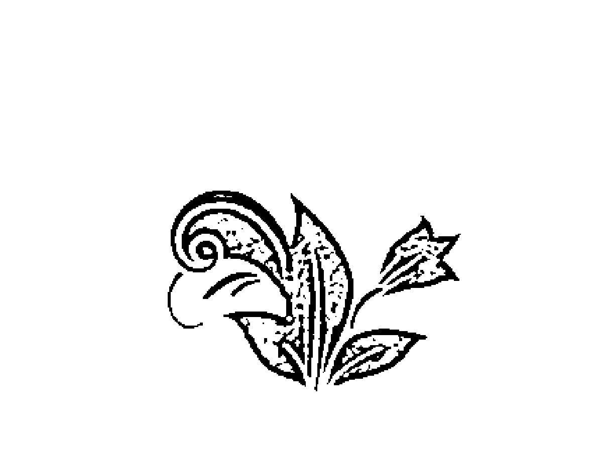

## 认识塔罗牌

## 认识主牌（大阿尔卡那）

标准的塔罗牌共78张，分为两部分：主牌（大阿尔卡那）和辅牌（小阿尔卡那）。“阿尔卡那”（arcana）是arcanum的复数形式，后者意为“深奥的秘密”。22张主牌是塔罗牌的核心。每张主牌都象征着某种共同性的人类经验。

主牌中每一张都有自己的名字和序号。有些牌的名字直接表达牌义，例如：“力量”、“正义”和“节制”；另一些牌是特定的人，例如“魔法师”、“隐士”；还有一些牌采用天体的名字，例如“星辰”、“太阳”和“月亮”，它们高悬在天，代表着难以捉摸的力量。

主牌很特殊，牌上的图像能唤起很多东西，因为它们描绘出复杂的、深层的内心反应；把深奥的象征与可识别的人物、境况结合起来。这种象征很微妙，但是很有效。

在塔罗预测中，主牌一直备受关注。当一张主牌出现时，那张牌位上的含义绝非是平俗的、暂时的，它们代表了你最基本的、最关心的事；你的主要感觉和动机。

主牌通常被视为一组。为了研究塔罗牌如何映射出人的心理状况，许多不同的体系已经发展出来。这些体系中经常用到数学、天文学以及其他一些深奥的学问。

许多解牌者把这些主牌看成个人内心成长的不同阶段——有人称之为“愚者的旅程”。在这些理论中，每张牌都代表某种品德或经验，我们必须结合这些品德或者经验才能完全认识自身。

我们都会沿着这条公路走向自我实现的目标，尽管旅程绝非一帆风顺，而且是经常走弯路、重复甚至重新开始。每个人的路途是独一无二的，但我们的里程碑却是相同的。22张主牌就是心灵成长道路上的路标，从最初的意识（0号牌愚人）开始，直到睿智与充实（21号牌世界）。“愚人的旅程”从一种经验到下一种经验，看起来是顺利有序地前进，但我们的学习之路并非如此。有时我们缺乏勇气与见识，没有探索心灵深处。有些人从来未听到过“隐士”在呼唤他们反省内心；有些人则不曾体会到“塔”所代表的危机，而这种危机体验或许能让他们从自我防卫中解脱出来。许多时候我们试图战胜困难，却一次次遭到失败。“倒吊人”的教训——放弃并承受失败的感觉——是非常不易学到的一课。在完全理解这一课之前，我们或许要一遍又一遍地去面对。

我们学到的经验常常不按顺序来。一个童年艰难的人，可能会提前学会“力量”这种品质，但以后必须学习“战车”的统治驾驭的能力与控制力。一个过着隐居生活的人，或许能够克服“魔鬼”的诱惑，不去追名逐利，可是早晚要补上“情侣”这一课。

主牌包含了人生经验的许多层次和模式。这些描述了成长的全部过程，不管这些过程是发生在人生的某一段还是整个人生。

无论我们自我探索的过程如何，主牌告诉我们，生命应该是完整而充实的。

## 认识辅牌（小阿尔卡那）

主牌表达了共同的主题，而辅牌则把这些主题扩展到现实中，展示出它们如何在日常事件中发生作用。辅牌代表你关心的事情、你的行动、你的情绪，这些东西构筑出生活的剧本。

辅牌共56张，分为四组：权杖、圣杯、宝剑、星币（注：许多塔罗牌使用另外的名字来称呼这四组牌，所选的名字通常反映出本组的主题）。每组牌都有特定的含义。

### 权杖 (Wands)

权杖这一组，代表创造、行动和运动。它们与热情、探求、冒险和自信等品德相关。这一组相当于中国哲学里的“阳”或是男性特征，关联元素为火。一堆跳动的火焰是权杖之力量的完美象征。这种能量向外发散，使人热情地参与事物。

### 圣杯 (Cups)

圣杯这一组，代表情绪和心灵体验。它们描述了内心状态、感觉和关系。这种能量是向内聚焦的。圣杯相当于中国哲学里的“阴”或是女性特征，关联元素为水。水可以流动、可以填满空隙，能够忍受，却又喜怒无常，这些都是它成为圣杯的典型象征。

### 宝剑 (Swords)

宝剑这一组，代表才智、思考和原因。它们与公正、真诚、道德等相关。宝剑的关联元素是风。晴空开敞，万里无云，处处明亮，象征着清澈明晰的内心精神，这是宝剑的最好写照。这一组也会引向不协调与不幸。我们的头脑是一项宝贵的财产，但是它代表自我，如果没有心灵向导注入智慧，它便会把我们带入歧途。

### 星币 (Pentacles)

星币这一组，代表实践、安全和物质。它们与处理问题时的具体需求相关。星币的关联元素是地。星币的精神是赞颂大自然之美、与植物和动物互动，以及身体的生理感觉。星币也代表各种各样的繁荣、成功和财富。有时这一组也称为“币”。在这个物质世界上，当换取货物、享受服务时，“币”当然是最明显的象征了。

每组牌都有自己代表的独特性质。我们的日常体验中，混合了这四类特性。塔罗牌会告诉你，在任何特定的时刻，这四种不同的能量如何影响你的生活。

这四组牌都是由 10 张数字（从 A 到十）以及四张爵牌（王、后、骑士和侍从）组成，很像我们经常玩的扑克牌。在塔罗牌的能量运行中，每张牌都扮演着自己的角色。

### A(ACES)首牌

A 说明了本组的主题。例如，“圣杯 A”代表爱、情绪、直觉，以及亲密关系——这些内容呈现在圣杯组的其他牌中。A 始终代表正面的力量，他承载着本组所能提供的最好的东西。

### 中间牌

编有序号的中间牌（二至九号牌），每张都代表本组的一个不同侧面。例如，权杖组所揭示的主题中，有个人力量（权杖二）、领导能力（权杖三）、兴奋（权杖四）和竞争（权杖五）。一张牌可能会从几个角度探讨一个问题，例如“星币五”显示出需求的许多方面——困难时期（物质需求）、健康不佳（生理需求），以及拒绝（感情需求）。

### 十号牌

第十号牌把 A 牌的主题推导到一个逻辑结果上。例如”圣杯 A“代表爱、亲密关系以及情绪等，如果你让它们发展下去，最后就会变成乐趣、平和以及家庭之爱，这正是“圣杯十”的内容。

### 宫廷牌

宫廷牌是一些个性化的人物，反映出各自的特质与身份。宫廷牌向我们展示一些特定的生存方式，因此在适当的时候我们可以应用（或是避免）这种处世原则。

国王是成熟而男性化的。他是个实干家，在生活中的事务上，他关注着外在。本组中，他代表权威、控制和统御的方面。王的方式是强壮、果断、直接。他关心结果与实践，以及如何应对事务。

王后是成熟而女性化的。她包容本组的特性，却并不把他们发挥出去。她关注着内在，她的方式是放松与自然。她更关心生存的乐趣，而不太看重结果。她与感觉、关系和自我表现相关。

骑士是个未成熟的青年。在表现自己时，他无法保持平衡。他想要成功地适应世界，却在两个极端中大幅度摇摆。骑士的行为有时很过分，但他仍然是热切而忠诚的，这使我们能够原谅他。我们佩服并且羡慕他的精神与精力。

侍从是个顽皮的孩子。他用快乐的方式发挥本组的特性。他的方式或许不够深刻，但却是简单、轻松、出于本能的。他象征着探求与可能性。

每张塔罗牌都有其基本概念与特性，在了解了这些之后，就可以用塔罗牌作简单的预测游戏了。

## 第二章
### 标准塔罗入门

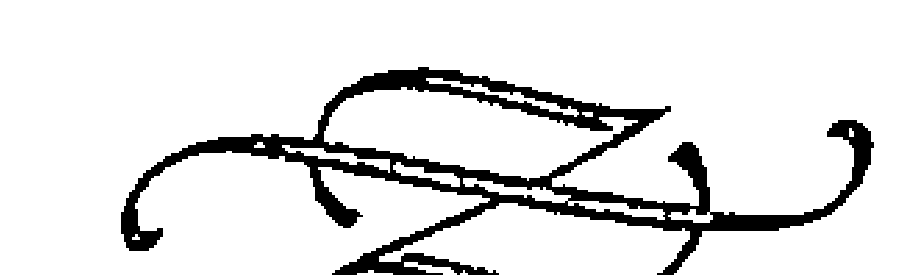

-   如何挑选塔罗牌
    P14
-   预测前的准备
    P16
-   预测时的禁忌
    P18
-   塔罗牌预测规则
    P17
-   塔罗牌洗牌、切牌、选牌、解牌说明
    P18

Standard Tarot Entry

#### 如何挑选塔罗牌

要选喜欢的牌

首先，选择自己“有感觉”的牌是最重要的。塔罗牌是一种工具，也是一种美丽的收藏品，当你不喜欢你的塔罗牌时候，你的心情必受影响，用着自己不喜欢的工具，为自己指引方向，其准确性能有多少？就算不把塔罗牌当成工具，而是当成艺术品收藏，试问你会收藏自己不喜欢的东西吗？所以一定要选择自己“有感觉”的牌。

注意牌的外观

纸牌的一些外在形式要斟酌，如纸质的感觉与牌的大小，甚至背面图案都要考虑。

1.  纸质的感觉要软硬适中：若纸质不好、经过长期多次使用，纸牌容易受损，尤其是纸牌的四个牌角。厚度最好不要太薄，但也不要太厚，影响洗牌与切牌动作。
2.  牌的大小要配合用途：主要是配合携带性与易读性的需要，若您是经常使用，必然随时带着塔罗牌，那最好选小一点的牌；若要方便求问者观看，则可选大一点的牌。但是，太大或者太小的牌也会造成洗牌时的不方便，请注意。

要买标准的塔罗牌

购买的塔罗牌应该是标准的 78 张塔罗牌，也就是除了有 22 张大阿尔卡那，还拥有 56 张小阿尔卡那，虽然一般书上都从大阿尔卡那教起，但是小阿尔卡那的使用属于大阿尔卡那的进阶运用。在学习到塔罗牌较高阶段时，还是建议大家一定要试着去用78张塔罗牌。若您现在买22张的塔罗牌，对于初学者是够用了，但是，您若开始学习小阿尔卡那的时候，又要买另一副牌，可能又要重新习惯这副牌，并且又增加了一笔花费，不如现在就直接购买78张的标准塔罗牌，先用22张主牌大阿尔卡那，56张小阿尔卡那先收藏备用。除此之外，小阿尔卡那的样式也要考虑，虽然56张小阿尔卡那目前标准的统一样式，但主要分成三种：

1.  马赛牌的数量型，图画只画有几个星币、被子。
2.  托特牌的隐喻型，构图类似马赛牌，但用的颜色、排列方式来隐喻解释。
3.  韦特牌的人物型，利用人物的动作，来带出解释。

建议初学者最好买有人物图形的韦特牌，一般来说比较易懂，而且容易从牌得到直觉。不要买一些图画太恐怖的牌，比如吸血鬼塔罗牌，图画太过灰暗，容易让自己心中产生负面想法，若自己帮别人预测的时候，对方看到这种塔罗牌，通常会有防御心态，无法对您敞开心胸，这样很容易影响解牌的进行与沟通互动的程度。

##### 其他注意事项

1.  选择普及的牌：在学习塔罗牌的过程中，有共同爱好的朋友在一起研究切磋可以事半功倍。而塔罗牌首重图像，图像不同，解释也不同；因此版本相异，解释也随之不同。比方说，目前全世界最通行的塔罗牌应是韦特(Rider-Waite)牌，关于教学韦特牌的书籍、网站、学校也最多，资源也最多，使用过程中也不愁没人问。遗憾的是，韦特牌的解释并不能完全套用在其它版本上，因此，其他版本塔罗牌使用者在学习过程中，就不像韦特牌使用者那样顺利了。
2.  选择塔罗大师设计的牌：塔罗牌的设计极为精密。牌上任何一个图像、颜色、版面配置都有它的象征意义，马虎不得。因此只有研究塔罗多年的大师才有资格设计塔罗牌，设计出来的牌才优秀，而不是随便一个漫画家就有资格设计塔罗牌。
3.  选择不需要背景知识的牌：塔罗牌毕竟是西方的产物，有许多版本需要具有西方神秘学或者是神话的背景知识才能使用。初学者在背景知识尚有欠缺前，应尽量避免使用这类的牌。

## 预测前的准备

使用塔罗牌前，确认自己的身体和心灵都在良好、平静的状态。解读塔罗是一件需要费心力的工作，必须集中精神，才能了解塔罗牌所呈现的意义。最好挑选安静的地方，避免干扰；若是求问者希望隐秘、注重隐私，更应注意选择推测的地方。预测时要严肃，要提前洗手，环境要清净整洁。

## 预测时的禁忌

预测时要以尊重的态度，不可以在同一日内推测同一个问题两次。塔罗牌是你借以窥探命运一隅的工具，可说是命运旅程上的伙伴，因此，你必须对它寄予绝对的信任。如果它告诉你的不尽如意，还是应该保持着尊重的态度。千万不要有“算到好的结果出来为止”的心态——命运并不是一种尝试的游戏。如果一意孤行，那么你的塔罗牌以后便不会再向你显示任何正确的答案了。

不要遗失任何一张牌。一套牌就像手足一样，有其完整性，无论遗失哪一张，对牌本身而言都是一种伤害。所以务必要小心。

避免洗牌时的意外状况，如：洗着洗着一张牌突然翻过来正面朝上；要不就是把一些牌洗掉到地上；或者在切牌的时候放错堆等等。你应该尽量避免这些意外。这些现象都在说明一件事：你的精神不够集中，这会对推测的结果造成最严重的影响。此时要么集中精神重来一次，要么今天就到此为止，不能无所谓地继续洗下去。

## 塔罗预测规则

预测方法原则上没有一个公定的规则，各人有各人的习惯与偏好，只要熟练都能够使用。而塔罗牌在长期演变下，发展出各式各样琳琅满目的仪式，令人眼花缭乱。其实，绝大部分花哨的仪式都可以省略且不会影响准确度，而只要不装神弄鬼，玩家可以依据自己的偏好选择地实行，甚至自行创造。在这样的情况下，仪式变得比较像是个人的习惯，能够使人感到自在。不过，使用仪式有个小缺点：一旦养成实行仪式的习惯之后可能导致玩家太依赖仪式，如果没有实行，就觉得浑身不对劲而影响解牌的准确度。事实上，仪式可有可无不会影响准确度，这点可以牢记在心。

在正式说明之前，为避免初学者混淆，有两个名词需要先加以解释。第一是求问者，指的是问问题的人；第二是解牌者，指的是解牌的人。如果自问自解，那么求问者与解牌者是同一个人。当然，名词并不是限定这两种，求问者也可称作当事人，解牌者也可称作分析师。

虽说预测方法没有一定的规则，然而我们仍然可以归纳出几点必须遵循的基本步骤：

### 要问恰当的问题

在接触牌之前，首先要确认的是你的问题是什么。怎么问一个好问题恐怕没有想象中那么简单。有个方法可以参考，就是要有改变的余地。与其问：“他会不会离开我？”而束手待毙，不如问：“我该如何改善我们的关系？”或是：“照目前这个状况看来，我跟他未来的发展如何？”要知道塔罗牌提供的答案不是唯一的结果，而是“照这个情势演变下去而不加人力改变所得到的结果。”打个比喻来说，我们可以将人生看成一个多重结局的计算机游戏，玩家做的每个选择都导向不同的结局，而塔罗牌就是作弊的工具，可以偷偷告诉玩家照他目前的选择走下去会得到何种结局。玩家如果对结局不满意，随时可以改变。真正的结果还是掌握在玩家手中。

### 安静的环境和平和的心情

在环境方面并没有严格的限制。安静的地方可以帮助我们放松心情，集中精神，但若有能力在嘈杂的环境中集中精神，又有何不可呢？当然，最基本是要有一张干净的桌子，桌面不要太小，以免洗牌或使用大型牌阵不方便。讲究一点的可以拿块绒布铺在桌上以保护塔罗牌，而绒布以深色素面为理想，才不会眼花缭乱。特别推荐黑色绒布，因为黑色会使图像显得特别清晰、鲜明又美观。

前面的步骤都完成后，请集中精神，放松身心，不要紧张，也不要想到负面的事，尽量保持心情宁静，就可以准备下一步了。

### 关于牌阵使用

依据问题选择适合的牌阵。千万注意，牌阵最好在洗牌前决定好，否则会本末倒置。在决定牌阵的同时，使用指示牌及如何切牌的问题也会一并被解决。

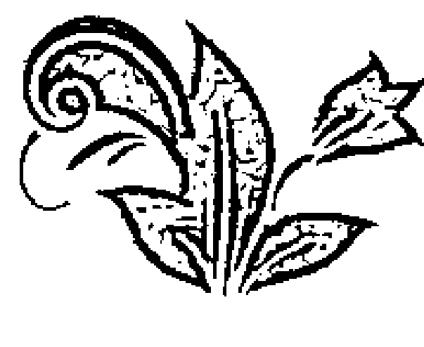

### 如何洗牌

#### 扑克牌式

这个扑克牌式洗牌法可不是花哨地将两叠牌放在桌面上，噼里啪啦交错刷下来。那样绚丽的方式还是留给扑克牌用，除非有钱把牌当消耗品使用，否则这样方式很容易把牌弄旧弄坏（特别警告：如果把别人的塔罗牌拿来这样洗的话，他很可能会翻脸）。在这里的扑克牌式洗牌法指的是一般洗牌的方式，玩过牌的应该不用教就会。如果硬要用文字来描述的话，那就是把整副牌背面朝上放在右手，用左手随意抽出一叠置于其上，如此反复进行（对惯用右手的而言）。假如不想分正逆位置，可以用这个方式洗牌；若要使用正逆位，必须每隔一会将部分的牌旋转180度。

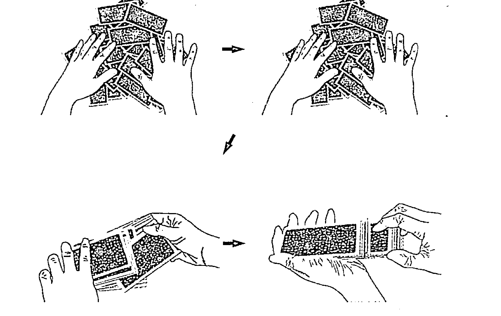

#### 麻将式

把整副牌背面朝上置于桌面，像洗麻将一样的搓洗。顺时针或逆时针都可以。这个方式洗得干净，正逆位也都有，唯一的缺点是对于桌面环境的要求高，最好有布垫着。当然洗牌并不限以上这两种方法，但无论使用什么方式，洗牌的时间都不限，只要确定洗干净就行；眼睛张开或闭着也不限；让求问者洗牌或是解牌者洗也不限；洗牌的目的是取得随机数。如果分正逆位置，那么在收牌时，请记住一个原则：不管帮别人算或是自己算，右手这一边就是待会排牌的下方。所以自己帮自己算时，只要将牌顺时针转90度，就是正确的方向了。而帮别人算的时候，将牌顺时针转90度就是以自己为准的方向。将牌逆时针转90度，就是以对方为准的正逆位置了。

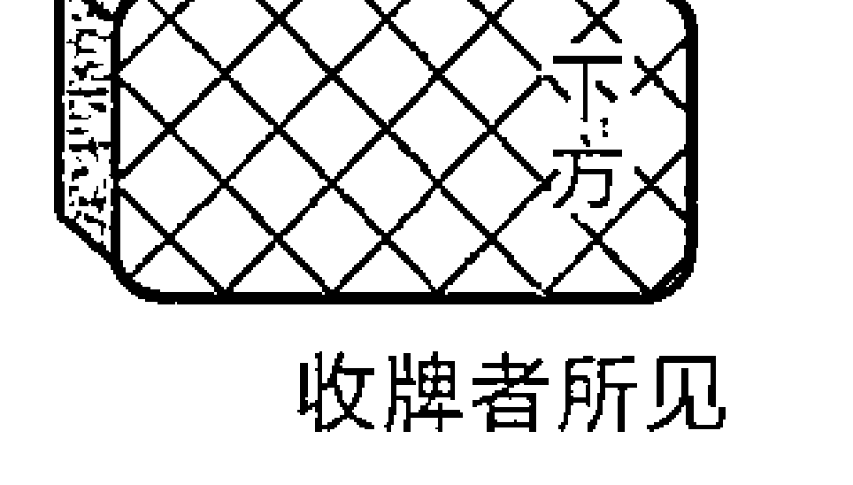

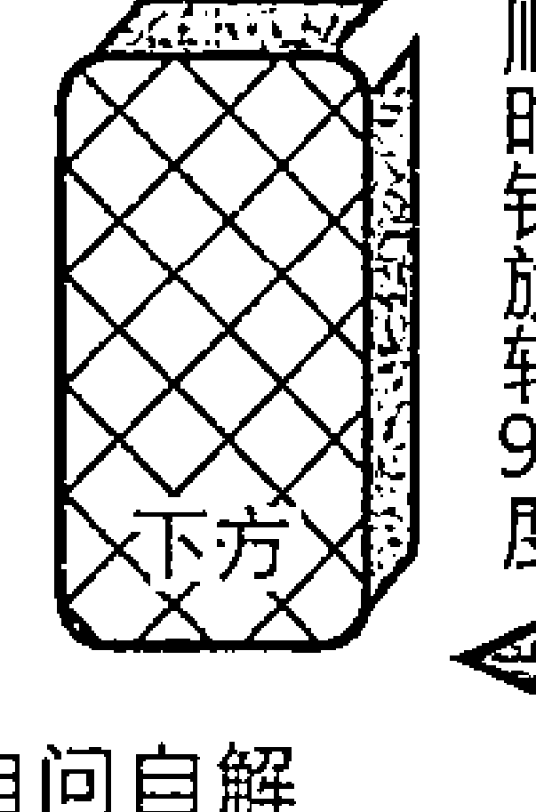

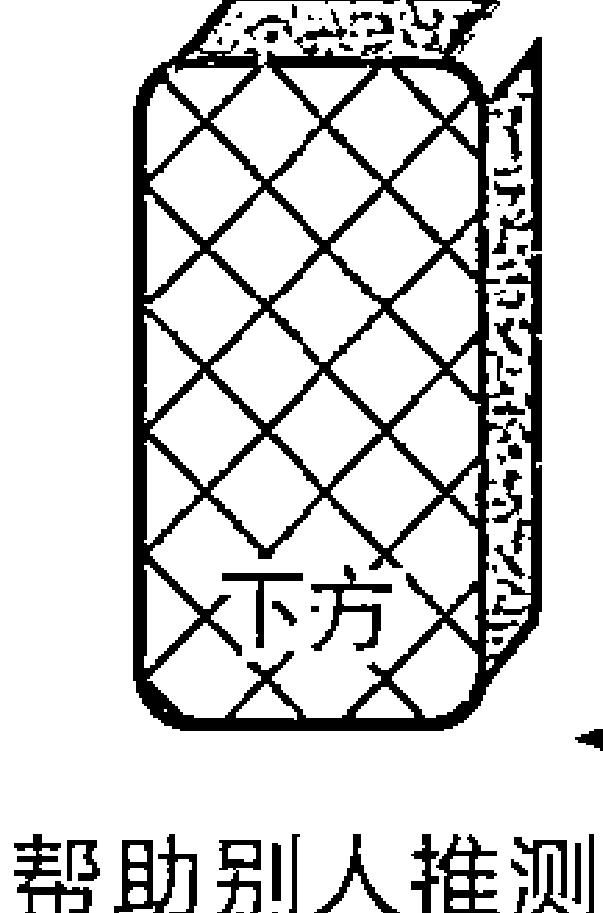

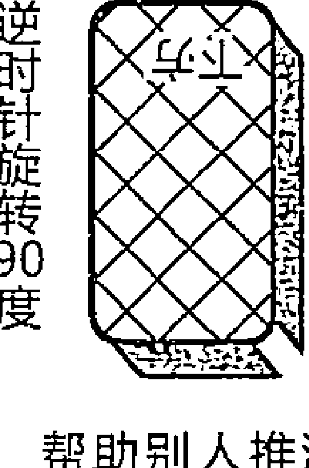

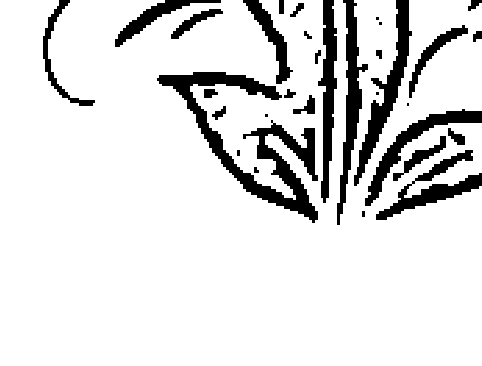

### 如何切牌

洗完牌、牌面朝下叠成一叠放好之后，就要请求问的人来切牌。当然，如果求问的人就是你自己，就要自己来切牌了。

首先，请对方集中精神，从牌叠的上方，依照自己的意志拿起一叠牌（绝对不可以不拿），把这一叠牌放在原先牌叠的下方（也就是靠近你的这个方向），变成两叠。

再来，从第二叠的上面再拿一叠牌放到第一叠的上方，现在你们面前已经有三叠牌了。

接下来，由你来把牌叠回去。先把第一叠拿起来，放到第二叠的上方；再把这第一叠和第二叠的合体拿起来，放到第三叠的上方。如此，便恢复为一叠牌了。

我们还剩下最后一个切牌动作。在刚刚的过程里，牌面都是横面朝下的。我们现在要把牌转为直向朝下。这个动作千万不可以搞错；如果是为对方推测，你的旋转方向是逆时针的；也就是说，你要把塔罗牌的左端朝下旋转90度，变为直向。如果你是为自己推测，则是顺时针把牌旋转90度。一旦搞错，整个牌面的意义会完全颠倒，所以务必要谨慎哦！

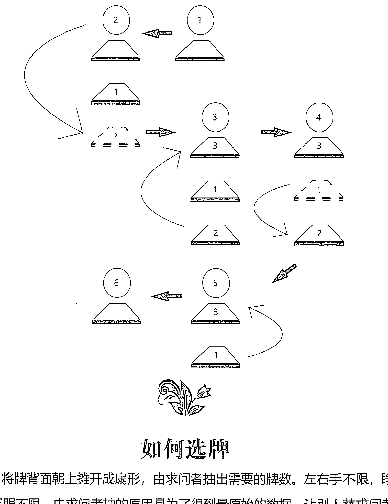

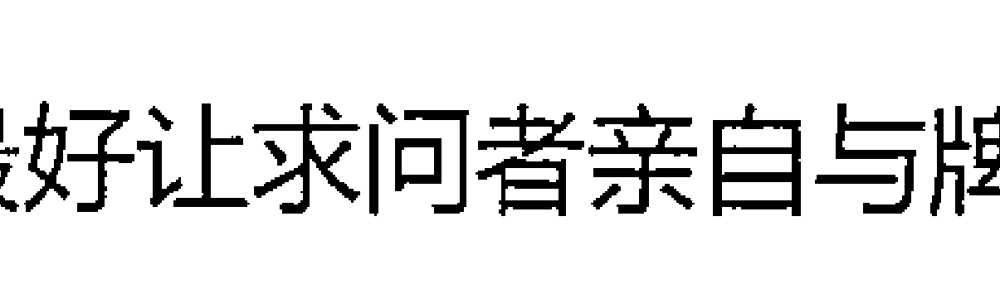

### 如何选牌

将牌背面朝上摊开成扇形，由求问者抽出需要的牌数。左右手不限，睁眼闭眼不限。由求问者抽的原因是为了得到最原始的数据。让别人替求问者抽牌，总是二手数据。因为最好让求问者亲自与牌接触，他所抽出的才是最能反映事件本身的第一手资料。

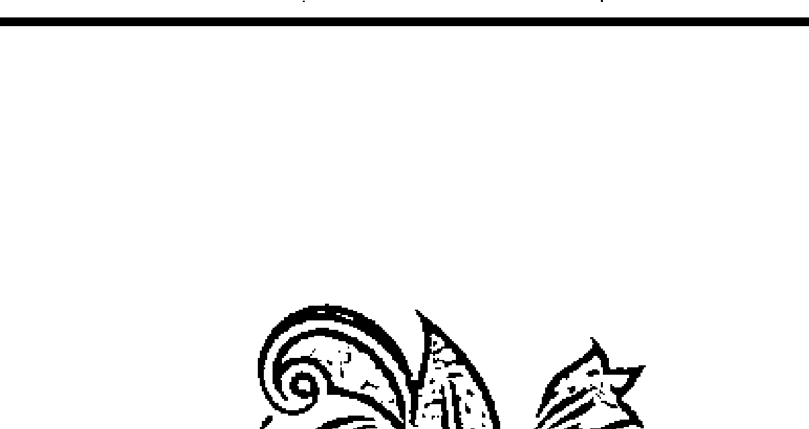

### 如何解牌

将牌排成牌阵要有一定的顺序。将求问者抽出的第一张牌放在牌阵位置1，依次类推。排完之后，就大功告成，可以开始解牌了！

解牌没有什么规律可循，每个解牌者都有自己的一套方法，而不同的牌型也适合不同的解法，需要解牌者细细选择。基本的方法包括：

-   释义——按照书本上的解释来阐释牌阵所传达的意思。
-   感应——凭个人的天资来定。
-   图解——塔罗牌的图会互相关联，尤其韦特牌，在这方面做得相当好，但一些漫画牌，那些漫画家对塔罗的研究还远远不够，画出来的牌自然也就无法图解。
-   数字——数字也会有关联，如果读过《易经》，这种方法比较合适。
-   宗教——塔罗在希腊神话和生命之树方面都有特殊意义。如果了解这些，这样解的正确度还是很高的。这也是高级预测师常用的方法。

一般人通常会选择几种适合自己的方法混合使用。你也不妨试试。

每张塔罗牌都隐藏正反两种意义。当牌翻出来图案是正位，就代表正面意义。当牌翻出来图案是逆位，则代表反面意义。如果牌是横放的，则人头在左为正，右为逆。不过你千万不要用倒吊人来看，大家都知道，倒吊人的图案刚好是反的。

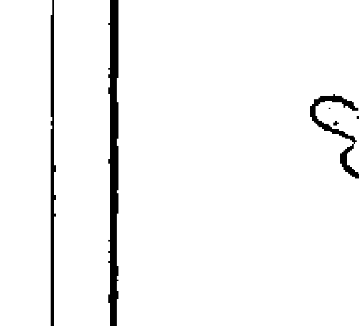

### 解牌时的注意事项

牌阵排好之后，按顺序把每一张牌掀开，掀牌的方式是由左往右翻，注意不要弄乱牌的正逆位，然后就可以开始解牌了。

解释牌义的时候，首先要注意避免断章取义。

“死神的正位、坏牌，你绝对会倒大霉！” “世界的正位，全世界最好的牌，你鸿运当头啦！”这些话，都是刚开始使用塔罗牌的人容易说出来的，如果以牌义来说，好像也没什么错误，但是太草率了。就预测而言，死神只是描述事情的某些过程，或是某些心理层面的东西，很少真正代表肉体的死亡。

而且，预测要统揽全局。

塔罗告诉了你一件事情的整个过程，如果单凭一张牌来判断，多半是对不了的。一定要贯通整个牌阵，才能发现其中的缘由。所以要注意培养自己的串联能力。

在帮助别人预测的过程中，你等于是在训练自己的串联能力。这种能力是很重要的，因为解牌不能只靠单张牌的解释，自由联想能力在这里非常重要，你必须是一个想象力丰富的人。

还要注意，不要使用过于耸动的字眼。

和《易经》一样，任何一张塔罗牌都有阴阳两面，即积极面和消极面。因此，拿到好牌不要太得意，应把握机会，采取行动，才不会丧失良机；拿到坏牌也不必气馁，只要能够提高警觉就可以化险为夷。正确的态度是不管所显示的征兆是凶是吉，都一样坦然处之。

因此，在回答求问者的问题时，切忌使用太多负面的字眼。即使所出现的牌真的非常不好，也不可以说出一些会让求问者感到惊吓的话。解牌者应该始终站在求问者的立场，尽量寻找一些解决的方法，或是给予一些正面的警告。

最后，要重视灵感和直觉。

除了对于牌义的掌握和对牌的熟悉程度之外，还必须依靠解牌者当下的灵感和直觉，这点是非常重要的。即使是同样的牌阵与牌，不同的问题和不同的人，都会引发解牌者不同的灵感和直觉。抓住一瞬间的感悟，才是塔罗预测真正的诀窍。所以千万不要拘泥于别人怎么说，书上怎么说，一定要把自己的心灵完全打开，才可以找到真正的启示。

一开始固然要尽量把牌的意义记下来，可随着运用逐渐熟练，这时应该慢慢跳出塔罗本身的束缚，找出自己的见解，这才是练习塔罗牌的重点。

解牌时可以参照本书第三章对牌面的详尽解释，也可参照本书附赠的塔罗牌上的画面及文字解释。

例一 某女在问与 A 男和 B 男间的感情时，两次都切到圣杯四。我们可以猜测，她在感情生活方面，虽然同时有两个选择，但是她仍有强烈的不满足感。这两个选择对她来说都不完美。

例二 某女问考试，切到星币八，很明显的，她曾经相当努力用功。

例三 经商的男子问事业，切到节制。此时我们可以大胆猜测他目前为止可能从事跨国贸易，与外国人在生意上有往来。

例四 某男问学业，切到愚人。他可能太爱玩，游手好闲，或者缺乏计划。此猜测可以在后面的牌阵中证实。

例五 某男问与女朋友的感情，切到圣杯八。不太妙，他可能想离开他的朋友。

## 第三章
### 塔罗牌解读

-   大阿尔卡那 P26
-   小阿尔卡那 P72

## 大阿尔卡那解读

塔罗牌的二十二张大阿尔卡那牌所描述的是有关有形事件背后的精神原因，或在所经历过的事件中应学习的教训。例如，你最近这三桩生意之所以失败的原因？为什么你对那些不付出感情的伴侣特别有吸引力？你皮肤过敏、偏头痛的主要原因是什么？

这些是威力很强的牌，而且如果你在“七张牌的牌阵”当中发现了四张或四张以上的大牌，那么你就可以在进行分析之前，在每张大牌上各加一张牌，来强化分析的准确度。在相当罕见的案例中，我曾发现摊在桌面的七张牌有六张大牌，而我总是要求受占者再选六张牌，以进行精确的分析。

七张牌里有六张是在详述原因，而事件本身却很少被谈及，这将使分析本身带有神秘论的色彩，或高度精神性。当然，如果你或你的当事人对这种形态的分析，能保持接受的态度也是不错的，不过对于一般人而言，神秘论的分析可能会带来混淆。遇到上述的情形，再外加六张牌就可以让我较具体地告诉我的当事人，到底会发生什么事，不是只告诉他事件的精神原因。

大阿尔卡那牌是在告诉你，事情为什么（why）会发生，而小阿尔卡那则告诉你会发生什么事（what）。在进行一个整体的分析时，两者均不可偏废。

当摊牌之后有一半以上的牌是大牌时，要求你的受占者在每一张大牌上各加一张牌是个不错的主意。

如果你的受占者选出四张额外的牌，而其中又有一张主牌的话，那么在分析当中，自应将它的含义列入解读。偶尔你会碰到当事人，在他额外选出的四张牌里面，有三、四张牌都是主牌。假设碰到这样的案例，恐怕你就别无选择的要进行一个高度的精神性解读。因为既然你的当事人选择了这样的牌，或许他早有心理准备要听你说这些了。

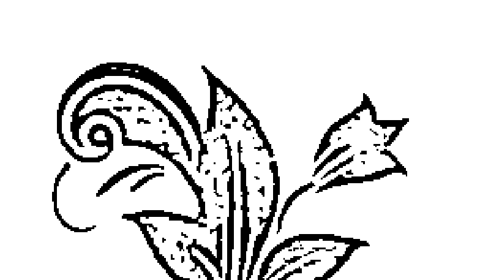

### 二十二张大阿尔卡那牌面展示

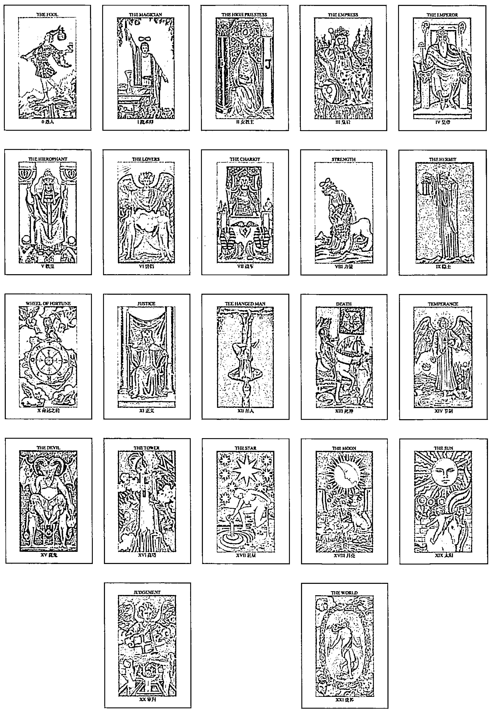

## 愚人
The Fool

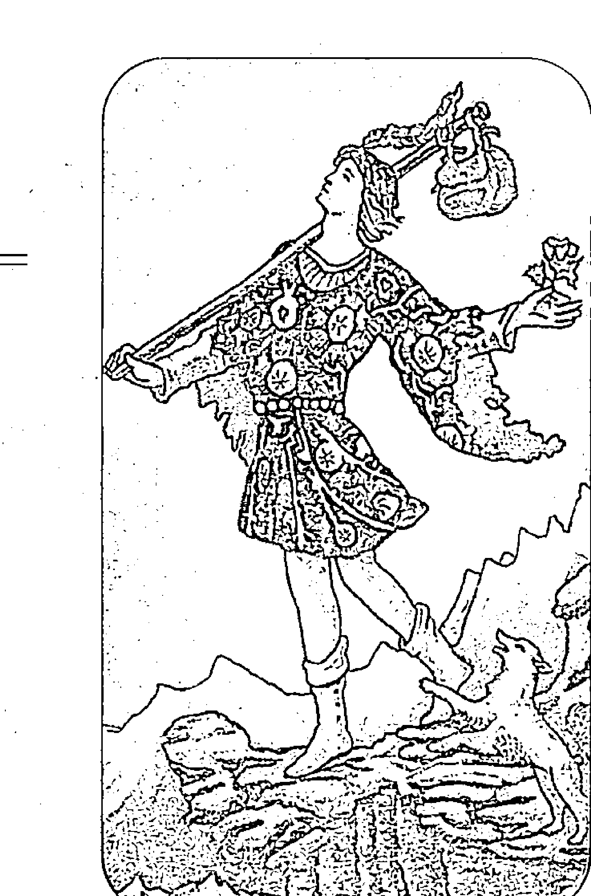

基本意义关键字
开始、自由、天真、流浪

### 牌面解读

愚人穿着色彩斑斓的服装，无视前方的悬崖，昂首阔步前行。他脚边的小白狗正狂吠着，似乎是在提醒他要悬崖勒马，又好像是在跟他一起无忧无虑的嬉戏。总之，愚人仍旧保持着欢悦的神色，望向遥远的天空，对于脚下的悬崖视而不见，就好像悬崖边上有一座透明的浮桥一样。

在愚人的左手握着一朵白玫瑰，象征愚人内心的纯洁和火一般的热情。而愚人右手系着包袱的木棒正是魔术师手中的魔杖，相传拥有操控世界的魔力，但此时却成了愚人手中的一个玩物。或许是因为愚人并不知道他的威力，又或许是大智若愚无视力量的存在，除了愚人自己，恐怕不会有第二个人知道愚人包袱里面装满了他的经验，所以愚人并不愚蠢，只是不为经验所控，求一糊涂罢了，这可能就是我们常说的难得糊涂。放眼远望，连绵起伏的山脉，那便是愚人未知的旅途，有太多的故事等着愚人去经历，有太多的知识等着愚人去感悟，就韦特说的那样“愚人是一个追寻经验的灵魂”。

### 释义

#### 正位释义

#### 《人物》
做事没有任何逻辑而接近疯狂的状态，有时甚至会有暴力倾向，常常搞不清楚自己在做什么，也不能为自己负责。

#### 《工作》
你正在面对很危险的状况，这时候最重要的是考虑如何明哲保身，其他的一切都不是那么重要，千万不要玩火自焚。

#### 《爱情》
你们两个人之间还不太了解，虽然还有一些发展的潜力，但也可能在更了解之后选择分开，并不是很紧密的关系。

#### 《友情》
其实你并没有什么真心的好朋友，也觉得内心十分空虚，如果还是维持你原本的行为模式，就很难交到新的朋友。

#### 逆位释义

#### 《人物》
不喜欢与别人接触，总是活在自己的世界当中，对于四周的事情漠不关心，常会自己一个人没有目标地到处闲逛。

#### 《工作》
现在工作上面碰到极大的不确定性，几乎没有什么是你能掌握得住的，除了随波逐流之外，也许该考虑另谋高就。

#### 《爱情》
两个人即使还没到形同陌路的程度，关系也已经降到冰点了，彼此之间已经没有谈恋爱的感觉，也无法分享心情。

#### 《友情》
基本上你并没有很认真地在经营自己的人际关系，也很讨厌一群人在一起时的喧闹，一个人单独行动也比较自在。

## 魔术师
The Magician

**基本意义关键字**
- 观察
- 开始
- 创造

### 牌面解读
魔术师高举紧握权杖的右手直指苍穹，低垂左手且食指指向地面，将自身化作天地沟通的桥梁。在他身前的桌上放着象征西方物质构成的四要素——权杖（火元素）、圣杯（水元素）、宝剑（风元素）和星币（土元素），同时也代表塔罗牌小阿尔卡那的四个牌组。魔术师身着红袍，象征着主动与激情，白色的内衣则展现了其内心的纯净和睿智。在魔术师的腰间隐约还盘着一条银蛇，以头吞尾，预示着循环和启迪。而头上横躺的8字光环，则表明其法力的无边。魔术师在塔罗牌中的编号是1，预示着一切的开始，同时也扮演着大阿尔卡那与小阿尔卡那之间的沟通桥梁。

### 释义

#### 正位释义

#### 《人物》
十分聪明又有主见的人，通常想法灵活、口才又好，常常能在人群之中脱颖而出，对于新鲜的事物有着强烈的好奇心。

#### 《工作》
你面对一个新的工作状况，因为所有条件都十分充足，所以只要你能把握机会主动去做，就会得到你想要的东西。

#### 《爱情》
在感情当中充满热情，也有主动表达与沟通的能力，再加上在动机上十分单纯，应该会是一段富有创造性的时期。

#### 《友情》
你面对到新的人际关系结构，但当中还有很多空间是你可以去参与和创造的，所以要把握机会和新朋友打好关系。

#### 逆位释义

#### 《人物》
意志力薄弱而无法坚持自己的意见，但又常常会找各种的借口帮自己辩解，有时候会给人狡猾而不可信任的感觉。

#### 《工作》
你面对一个新的工作状况，但是很多条件并不充足，所以最好先确定自己所能做到的程度，把份内的事完成就好。

#### 《爱情》
在感情当中充满热情，但有时显得过于冲动，这时若是遇到沟通不良的状况，可能就会引发隐瞒或是欺骗的行为。

#### 《友情》
你面对新的人际关系结构，以往的一切都不再可靠，所以要把握机会和新朋友处理好关系，这对你只有好处没有坏处。

## 女教主
The High Papess

**基本意义关键字**
- 等待
- 智慧
- 理性
- 消极
- 静止

### 牌面解读
女教主相传是月亮的使者，虔诚、静默却又透着十分的警觉和睿智，是智慧与直觉的象征。相对于魔术师的激情和主动，女教主只是在深夜中手捧经书默默地祈祷着，就好像中国传统文化中的阴阳。如果说魔术师散发着阳刚的话，那么女祭司则是阴柔的代表，于静寂中凸现沉稳，于寡言中凸现睿智。也有人说，女教主内心是矛盾的，就像其坐在两根黑白分明的廊柱之间那样，静默却又波涛汹涌，在黑与白、日与夜、正义与邪恶的徘徊中体味生存的意义、感悟人世沧桑。或许也是因此让她变得睿智而富有洞察力吧！

### 释义

#### 正位释义

#### 《人物》
受过良好的教育并拥有丰富的知识，但会有些孤僻而不太爱说话，对于事物有自己的意见，给人比较冷漠的感觉。

#### 《工作》
工作状况十分稳定，也不会有什么变化，这个时候不宜太过积极，只要把事情依照原来的方式按部就班地完成即可。

#### 《爱情》
感情进入到稳定的阶段，两个人都不积极地处理感情事情，虽然表面看起来是冰冷的，实际上还是有很深的感情在。

#### 《友情》
你并不积极参与各种社交活动，所以可以保持比较完整的自我空间，人际关系上保持现状对你来说是最好的选择。

#### 逆位释义

#### 《人物》
受过良好教育但并没有相应的实力，常有自以为的固执，虽然表面上看起来平静，但是实际上有很大的情绪起伏。

#### 《工作》
虽然工作看似已经很长一段时间都保持稳定，但是在台面下却是暗潮汹涌，一个不小心可能就会死无葬身之地。

#### 《爱情》
两个人的感情整体来看还算是稳定，但是仍然有很多分歧见还没化解，如果无法好好沟通，也有变成冷战的可能性。

#### 《友情》
喜欢你的朋友很爱你，但是讨厌你的人则恨你入骨，整体来说是比较有争议性的人物，应该好好把握欣赏你的朋友。

## 皇后
The Empress

**基本意义关键字**
- 高贵
- 热情
- 丰收

### 牌面解读
如果说女教主给人的感觉是位身具智慧的文静淑女，那皇后就是热情与高贵的体现，舒适的坐垫和雍容华贵的服饰无疑都表明了她的富贵与权威。皇后和魔术师一样，右手高举权杖，但不同的是皇后的权杖与魔术师相比少了几分锐气，却多了几分生机，因为皇后手中的权杖是天地间掌管生命的法器。在皇后的法杖下，脚下金色的麦田和远处茂密的森林都呈现一派生机盎然的景象。在皇后红色的座椅下还有一个心形标记，上面刻着金星的符号，预示着母爱天性，象征女皇的包容，以及带给子民的富足。

### 释义

#### 正位释义

#### 《人物》
重视生活享受、喜爱美的事物，在人际关系上很有天分，在主动与别人交往时并不会带来压力，反而更受人喜爱。

#### 《工作》
现在工作正要进入丰收的阶段，之前付出的努力已经开始看到不错的回收，只要继续努力就可以达成预定的目标。

#### 《爱情》
这是一段重视享乐的关系，两个人都十分重视生活的享受，会从对方身上得到很多快乐，也可以保持和谐的关系。

#### 《友情》
现在你正处于人际关系的高峰，受到其他人的欢迎，也可以随心所欲地达成自己的目的，与人为善是你最好的策略。

#### 逆位释义

#### 《人物》
过于重视别人的看法，有时会因此而变得犹豫不决；重视物质生活的享受，但又经常缺乏主动追求的意志和决心。

#### 《工作》
工作上开始有不错的成果，但是本身对于工作并没有足够的冲劲，也可能因为自己的怠惰而使工作陷入停滞状态。

#### 《爱情》
这是一段热情的关系，两个人都深爱着对方，但是也因此而变得盲目，常常会忽略了客观的限制和其他人的意见。

#### 《友情》
你的人际关系不错，也可以好好享受与大家的欢乐时光，但是因为太过讨好其他人，所以有一点失去自我的中心。

## 皇帝
The Emperor

**基本意义关键字**
- 权力
- 威严
- 支配

### 牌面解读
一国之尊的皇帝头戴皇冠，身着红袍，足蹬象征严格纪律的战靴，自信满满地端坐在宝座上。他左手拿着一个水晶球，象征秩序严谨有条，右手则握着一个法杖，象征生命与权力。在王座上有四个白羊头浮雕，强调了皇帝牌所对应的星相——白羊座（火星），作为十二星座之首，这里的白羊头像也象征着勇敢、积极、野心和自信，并与全牌呈现的红色的主色调不谋而合。背景严峻的山峦预示着权力背后的风险，这与女皇牌中的富饶相比，难免让观者多了几分担忧。

### 释义

#### 正位释义

#### 《人物》
比较理性而偏向务实的人，对事情有自己的看法，能够尽量把自己的理想实现，但是有时候会热衷于权力的追求。

#### 《工作》
工作当中有许多困难，但是当中也有许多晋升的机会，虽然受到很多规则的限制，但是仍然可以完成自己设定的目标。

#### 《爱情》
在感情关系当中存在控制与被控制的关系，也算是一个稳定发展的感情，只是当中好像缺乏了热情及浪漫的感觉。

#### 《友情》
由于你待人太过于严肃，而且太过重视利害关系，因此很难交到知心朋友，建议你应该要放松心情去与别人交往。

#### 逆位释义

#### 《人物》
对于事情有自己的看法，但是其实并不成熟，常常因为任性的决定而遇到严重的问题，同时也有伟大的理想抱负。

#### 《工作》
工作上遇到不好相处的主管，不仅对你没有帮助，反而常害你累个半死，事情往往超出你的预料，还要努力收尾。

#### 《爱情》
感觉是被对方所控制的感情关系，虽然对方也提供了很多的照顾和保护，不过总觉得缺乏某些自由和平等的感觉。

#### 《友情》
你对人际关系的想法太过单纯，往往落入别人的陷阱当中而不自知，应该要小心防范身边的小人，不要再被骗了。

## 教皇
The Hierophant

**基本意义关键字**
- 宗教
- 传统
- 援助
- 仪式

### 牌面解读
教皇身着红袍，端坐在信众面前，头上戴着象征权力的三层皇冠，分别代表物质、精神、道德三种层次的世界认知，耳边的白色挂饰，则代表他聆听信众心声的使命。他的右手食指和中指指向苍穹，象征宗教中的赐福，而左手的令牌则预示了神圣且至高无上的权力。在教皇的脚下有一对交叉摆放的钥匙，一金一银，分属阴阳，据说那是日月之匙，可任意开启智慧与神秘之门。教皇面前的两名信众，左边的身着红色的玫瑰袍，代表热情与爱心，右边的则穿着一身白百合外衣，代表内心的圣洁和灵性的成长。教皇与女祭司都是代表有关宗教精神与内心世界的塔罗牌，然而与女祭司不同的是，女祭司恪守既有的律法和知识，将宗教精神中的智慧融入自身的修为，可谓深藏不露、独善其身，而教皇则代表耶稣传教的精神，将智慧视为真理并广为传播。他关怀世间一切疾苦，身体力行，以引导一切事物的智慧帮助愚昧的世人。

### 释义

#### 正位释义

#### 《人物》
比较重视灵性成长的人，通常有虔诚的宗教信仰或是心灵上的依归，因此而培养出慈悲心，也有乐于助人的习惯。

#### 《工作》
在工作当中有很多贵人在帮助你，所以即使自己仍然有不足的地方，也会得到很多支持，是你可以发挥的地方。

#### 《爱情》
宗教或灵性的因素对这段关系有很大的影响力，有时候也表示两个人已经结婚，或是这段关系正向婚姻方向发展。

#### 《友情》
现在你的人际关系算是稳定，也许会因为宗教信仰或是心灵成长的兴趣交到不少知心的好朋友，应该要好好把握。

#### 逆位释义

#### 《人物》
特别心软的人，习惯于不顾一切地帮助别人，而没有考虑到自己的状况，也常常因为意志不坚定而被别人所陷害。

#### 《工作》
工作中充满各种繁复的规则，还有一些是没有明文规定的，一不小心就会犯到禁忌，要花很多时间才能进入状况。

#### 《爱情》
是有一方付出比较多的状况，两个人的关系并不平等，如果能够心甘情愿地付出，也算是一段稳定发展中的关系。

#### 《友情》
你的人缘还不错，但是太容易受到别人的影响，反而失去自己的主体性，有时也会因为要帮助朋友反而自己受害。

## 情侣
The Lovers

**基本意义关键字**
- 选择
- 爱情
- 性
- 结合
- 罗曼蒂克

### 牌面解读
情侣牌以伊甸园为背景，以亚当夏娃的爱情故事为背景，阐述了爱的真谛。牌中亚当夏娃分列两边，在天使的祝福声中感受着爱的浪漫与温馨。天使身着紫袍，据说代表爱的忠贞，而微张的双臂则预示了沟通在恋爱中的重要地位。右侧的亚当目不转睛地注视着夏娃，而夏娃却仰望天使，再加上天使俯视亚当与夏娃，这种视觉上的循环，象征了潜意识、意识、超意识与物质、精神、道德之间的层次变化，也暗示了理性与感性之间的传导。

### 释义

#### 正位释义

#### 《人物》
比较单纯的人，喜欢用最简单直接的方法来处理事情，大都可以顺利完成，是受到上天眷顾和保佑的幸运儿。

#### 《工作》
基本上是一个单纯顺利的工作，本身并不困难，也没有什么大问题，只是要小心避免当中的陷阱以及不当的诱惑。

#### 《爱情》
两个人是很情投意合的热恋状态，彼此也有很强的吸引力，不论任何的理由或是阻碍，都很难把这段关系拆散。

#### 《友情》
你的知心好朋友不多，但是对你都是有重要意义的好朋友，所以要好好把握这些好朋友，其他的事就不必太在意了。

#### 逆位释义

#### 《人物》
容易受到别人影响而改变心意的人，遇到挑战时往往会犹豫不决，即使自己已经决定也不愿意为自己的决定负责。

#### 《工作》
工作当中出现很多的困难以及不当的诱惑和陷阱，一不小心就会犯下严重的错误，再想要回头就已经来不及了。

#### 《爱情》
两个人对彼此的感情都很深，但是也觉得有很多的不满和抱怨，如果把问题强压下来不说，反而会累积成为大问题。

#### 《友情》
基本上你的人际关系还不错，但是大家都是比较表面的交往，想要找到比较好的知心朋友，在这段时间比较困难。

## 战车
The Chariot

### 基本意义关键字
- 意志
- 自律
- 胜利
- 旅程
- 空虚

### 牌面解读
一位头戴八芒星战盔、身着盔甲的勇士驾着一辆由两只狮身人面兽拉着的战车，向着胜利勇往直前，气势无人可挡。车前左侧的黑色狮身人面兽代表严厉，而右侧的白色狮身人面兽则代表慈悲，双手并行，恰恰预示了阴阳调和，即追求胜利的前提——平衡。蓝色的车篷和上面的六芒星图案，象征了天体对战士成功的影响，也预言了希望对于获得胜利的重要性。勇士右手紧握长矛，表明了他内心对胜利的渴求，胸前的正方形则代表土元素，象征意志的力量。战车前方的一对翅膀相传是古埃及图腾，代表灵感，而翅膀下面的小盾牌中的红色图案则相传为古印度预示阴阳结合的图腾。作为塔罗牌中的第7号牌，战车似乎预示走过了三分之一旅程的愚人已经变成了一名成熟、勇敢的战士，在追求胜利中披荆斩棘、奋勇向前。

### 释义

#### 正位释义

#### 《人物》
有理想抱负的人，凡事都想要追求成功与卓越，为了达成自己的目标不择手段，即使与别人发生冲突也在所不惜。

#### 《工作》
工作上正遇到一些困难和挑战，但是对你来说都是力所能及的事情，只要你再打败竞争者，最后的胜利者一定是你。

#### 《爱情》
现在感情当中不可避免地会遇到某种冲突或竞争，有赖于你主动积极地处理和改进，千万不要在这个时候放弃希望。

#### 《友情》
你在人际关系当中充满了竞争性，常常对别人有防卫性，反而无法放开心胸交到好朋友，有时也觉得高处不胜寒。

#### 逆位释义

#### 《人物》
心中不时充斥悲愤的情绪，觉得都是别人对不起自己，但是很少检讨自己，常因为意志力不足而无法坚持到最后。

#### 《工作》
工作现在遇到一些困难和挑战，同时也会造成一些人际关系的问题，如果不够小心应付可能会变成无辜的牺牲品。

#### 《爱情》
现在的感情当中面对着很大的危机，这时候应该以家庭或家人的意见作为考虑的基准，否则到头来可能是一场空。

#### 《友情》
你在朋友之间感觉上比较弱势，常常无法主张自己的意见，反而会被朋友的意思所支配，是属于被动交朋友的人。

## 力量
Strength

**基本意义关键字**
- 力量
- 勇气
- 信心
- 耐心

### 牌面解读
与魔术师一样，力量女神的头顶也有一个无限大符号，预示其无穷无尽的力量。但与魔术师不同，女神的力量似乎没有魔术师的凌厉，而是透着一丝怜悯和包容。她带着怜悯的目光，用看似柔弱的双手轻轻合上雄狮的嘴，轻而易举地压制了百兽之王狮子的兽性。女神眼中的怜悯，似乎是在同情狮子的兽性，而象征征服的百兽之王在女神冷静慈悲的目光下也变得温顺可亲。或许，一颗宽容的心才是力量真正的来源吧！

### 释义

#### 正位释义

#### 《人物》
具有英雄特质的人，有勇气去面对任何挑战，即使有时候会比较冒险一点，仍然愿意负责任把事情从头到尾完成。

#### 《工作》
工作的状况其实还算顺利，也有不少可以表现的机会，你应该把握不断出现的机会，才可以在工作上更上一层楼。

#### 《爱情》
现在的感情状况还算稳定，应该要主动付出更多的爱，才能让人感觉到这段关系的成长，为彼此带来更多的欢乐。

#### 《友情》
因为你对别人都还不错，所以在人际关系上并没有什么大问题，为别人的付出越多，你就会得到更多朋友的帮助。

#### 逆位释义

#### 《人物》
考虑事情常常以自我为中心，也算是自负的人，在做决定的时候不太会考虑到别人的立场，容易滥用自己权力。

#### 《工作》
现在工作当中遇到比较专横的上司，每天光是要应付他就很累了，虽然也会有不少表现的机会，但都是听命行事。

#### 《爱情》
现在的感情状况好像有点失控了，虽然两个人都想要让这段关系更和谐，但是因为某些事情无法配合而陷入僵局。

#### 《友情》
在人际关系方面你要小心注意，可能会有人想要利用你去达成他的目的，即使对你不一定有害，你也会觉得不舒服。

## 隐士
The Hermit

**基本意义关键字**

内敛、自省、孤独、引导

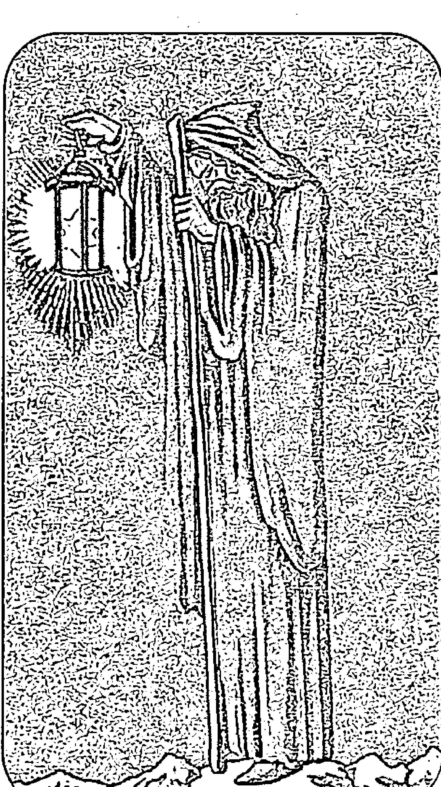

### 牌面解读

一位老者身披灰色斗篷站在冰天雪地的山巅，手提一盏油灯，好像是在低头沉思。那看似微弱的灯光，在渺无人烟的暗淡雪夜中，显得有些无助，但对老者而言，那是真理、也是希望。手中的拐杖正是愚人手中戏耍的木棒、魔术师手中沟通天地的法器和战车手中追求胜利的长矛，而此时，经过无知、热忱、繁华之后，变得如此的普通，正应了中国那句“返璞归真”的老话。老者守着这独处的孤寂，反省着自己的过去，跟随真理之灯的指引，暗示了寻求真理道路上的艰辛、朴素，预示了只有以开阔的胸怀认知世事，以不断反省的态度探知真我，方能求得正果。

### 释义

#### 正位释义

**人物**
十分小心谨慎的人，对于事情有自己独到的看法，通常习惯独自一个人做事情，也不喜欢参加团体的聚会或活动。

**工作**
你已经达到工作的顶峰，但是高处不胜寒，你也会觉得有一点寂寞，应该开始思考如何把工作经验传承下去。

**爱情**
现在感情的发展到达一个瓶颈，即使两个人在一起仍然会觉得寂寞，也许是该好好重新思考这段感情的时候了。

**友情**
你是属于有一点孤僻的人，所以并不会树立什么敌人，朋友也不是很多，但是别人遇到问题又常会想要找你帮忙。

#### 逆位释义

**人物**
过于小心谨慎的人，甚至会让人觉得有一些胆小，习惯于隐藏自己，对某些事情有强烈的研究精神，会追根究底。

**工作**
是自己要努力学习的状况，也还在摸索当中，没有什么人可以教导你该怎么去做，常会觉得是在孤军奋战。

**爱情**
感情的状况有点不明，现在究竟是何种关系也还不是很确定，如果不找个机会谈清楚，也许两个人就会渐行渐远。

**友情**
你在人际关系当中比较被动，所以并不会有很多朋友，如果想改善你的人际关系，就要改掉自己过于胆小的习惯。

## 命运之轮
Wheel Of Fortune

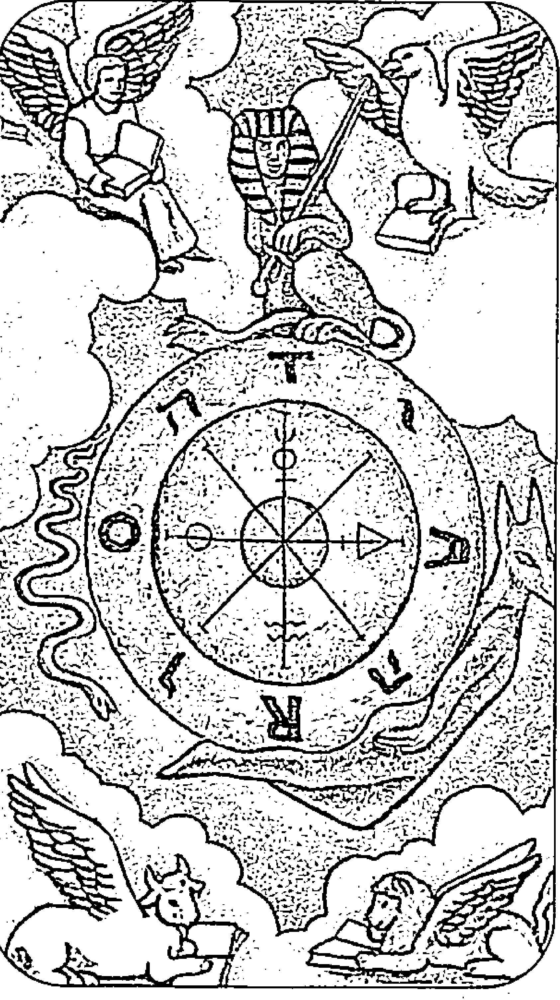

### 基本意义关键字
- 契机
- 转变
- 进展
- 运气

### 牌面解读

蔚蓝的天空中悬挂着命运之轮，与圣职者的三层头冠相通。命运之轮也是由三层组成，最里面的圆中没有任何符号，代表空无，象征万物的创造。中间的圆上有四个炼金符号，对应西方物质构成的四要素，象征了万物的形成。最外面的圆中上刻着“TAROT”字样，象征已经创造的世界。轮盘的左侧是埃及神话中的邪恶之神，蛇头朝下预示着人生中的沉沦。而背负着命运之轮的阿努比斯，则预示了背负命运的渴望。至于命运之轮顶部的狮身人面像，据说是智慧的象征。其手中的宝剑则代表思考，或者是在说面对人生，思索真谛才是获取顺境的方法。牌图的四角分别是狮子、飞鹰、天使、神牛，恰恰对应了命运之轮中间那个圆上的符号，即四要素的火、水、风、土。

### 释义

#### 正位释义

**人物**
一个心胸宽大的人，相信很多事情上天自有安排，采取顺其自然不强求的生活态度，反而感觉上比其他人更幸运。

**工作**
在工作上处于一段还满幸运的时期，即使自己不是非常努力，但在工作上的表现也还不错，是很得心应手的事情。

**爱情**
现在感情的发展即将进入到下一个阶段，应该放下不需要的顾虑和担心，与对方共同去面对接下来要发生的事情。

**友情**
你是属于朋友很多的人，而且每换一次环境又会有新的朋友出现，久而久之就会累积很多好朋友，成为你的贵人。

#### 逆位释义

**人物**
一个心胸狭窄的人，对于很多事情都怨天尤人，但是自己并不积极去处理问题，总觉得自己的命运比别人更坎坷。

**工作**
目前在工作上遇到了重大的变化，这也不是你自己可以控制的事情，这时候应该处变不惊地面对，千万不要慌乱。

**爱情**
在感情上面对很大的变化，你觉得在当中两面不是人，也很难做出选择，这时候的决定对未来会有很大的影响。

**友情**
现在的人际关系状况有点复杂，有些朋友好像没有那么熟，但是仍然会找你出来玩乐或是帮忙，让你有点难以应付。

## 正义
Justice

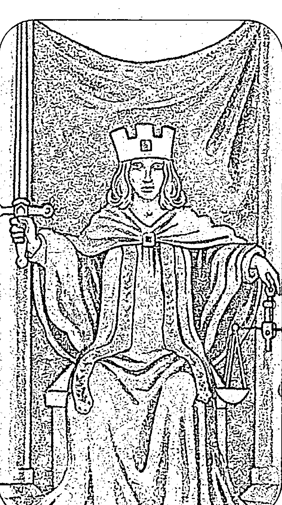

### 基本意义关键字
公正、均衡、责任

### 牌面解读

冥想中的正义女神，身着红袍、头戴金冠，端坐在石凳上。她左手提着天秤象征能对一切是非做出公正的裁决；右手高举利剑则寓意矫正世间一切歪曲与虚伪的能力。女神左脚微微向外踏出，似乎想要站起，但右脚却还隐匿在袍中，似乎是在为做出公正裁决而犹豫不决，预示想要维系公正的判断绝非易事，只有适当的协调他人与自我的对立，时时洞察反省自我，利剑与天秤才能发挥其真正的意义。

### 释义

#### 正位释义

**人物**
有很强的正义感，对事情讲究公平及平衡，很重视自己的原则，但是同时也能兼顾到别人的反应并以理性来判断。

**工作**
现在工作正在一个稳定的时期，大部分的事情都有明确的规则可循，也是自己可以胜任的状况，没什么大问题。

**爱情**
两个人之间正在寻找一个平衡点，也有很多地方要相互配合，如何在不同的观点和需要中平衡要靠双方的共同努力。

**友情**
你的人际关系很好，但有时候会为了一些小事与朋友争论，只要你能改掉这个坏习惯，应该会交到更多的好朋友。

#### 逆位释义

**人物**
自己觉得正义感很强的人，但是有时对别人过于苛刻，或者是流于主观的判断，常会不顾别人的想法而一意孤行。

**工作**
工作当中可能遇到与法律或规则有关的问题，并不是自己可以解决的，其实法律问题应该要用法律途径解决才对。

**爱情**
两个人之间出现不平衡的状况，可能有一方觉得自己付出太多，又得到太少的回报，因此而产生一些问题和冲突。

**友情**
由于你对人比较严苛，所以只有极少数好朋友可以容忍你，大部分的人对你是敬而远之，人际关系并不是很好。

## 吊人
The Hanged Man

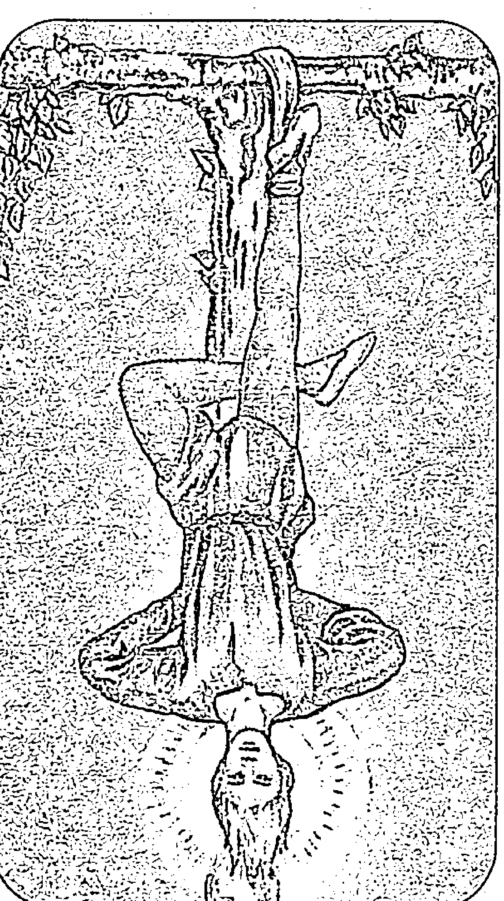

### 基本意义关键字
牺牲、等待、换位思考、以退为进

### 牌面解读

一名男子双手反绑，被人倒吊在T字型的树干上。男子反绑的双手呈三角，双腿交织成十字，拼在一起恰恰形成了西方炼金术中的一个炼金符号，预示着伟大事业的完成，同时也暗含了由底层欲望向道德升华的过程。由上至下色彩的变幻（红色的外裤、蓝色的上衣和金色的光环）与圣职者的三层头冠以及命运之轮中的三个同心圆相呼应，依次对应身、心、灵三层境界，只是顺序导致的视觉，强调了换位思考的意义。而脚上金色的鞋子不仅表明了倒吊者崇高的牺牲精神，也预示了灵（即道德）的地位，即便是换位思考，道德永远是第一位的。

### 释义

#### 正位释义

**人物**
能从不同的观点来看事情，因此具有远见及卓越的看法，遇到问题时有绝佳的耐力，也可以适应各种不同的状况。

**工作**
现在工作上面对一个重大的挑战，也许并不是你一个人可以解决的，如果时机还不成熟，应该要先等待再做决定。

**爱情**
在感情当中两个人的观点似乎不同，但是仍然有交集的地方，不要被表面的差异所蒙蔽，其实对方还是有很多优点。

**友情**
在人际关系上你比较退缩，并不太会主动与别人交往，因此朋友就会比较少一点，但是大部分都是很知心的朋友。

#### 逆位释义

**人物**
属于比较随和的人，遇到问题也能逆来顺受，有很大的包容性，但是有时候会过于忍耐而造成自己不必要的损失。

**工作**
工作上有事情悬而未决，也许会需要你的付出和牺牲，如果不能妥善处理的话，可能会演变成无法收拾的大事情。

**爱情**
感情上正面临重大的挑战，如果不能有正确的认识和行动，可能会使感情陷入破裂的危机之中，反而会更痛苦。

**友情**
你是比较容易被别人欺负或者是被占便宜的人，虽然朋友们都会想要对你有所要求，但是你仍然要有自己的原则。

## 死神
Death

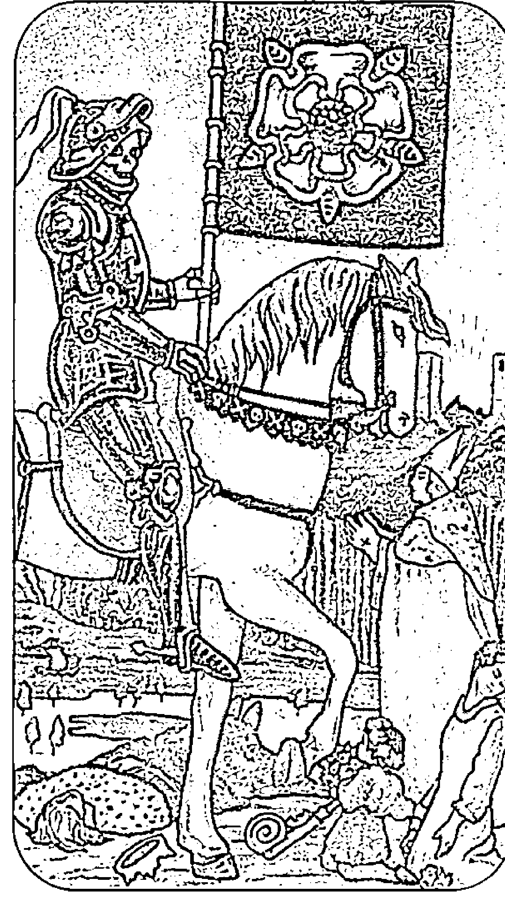

### 基本意义关键字
结束、转变、新生

### 牌面解读

死神坐骑白马，高高在上，俯视地上的生灵，在他的手中高举一面绘有蔷薇十字会图腾的黑色旗帜。有人说这个图腾代表死后获得新生的过程，也有人说这个图腾与火星相应代表不朽生命力。在死神的马下，分别是国王、圣职者、妇女和儿童，代表终生对死亡的四种看法。国王抗拒死亡，最终被践踏于死神的马蹄之下；圣职者将令牌置于地上，崇敬死亡，并双手合十祈祷主的引领以求步入天堂；妇女跪在地上，因对死亡的恐惧而昏厥过去；只有那个天真可爱的孩子因为无知而满脸稚气好奇地看着死神。四个人，四种心态，无论是抗拒、崇敬、恐慌还是无知，都在阐述着相同的道理——无论是富贵还是贫穷、无论是男女老少，死亡都是一种不可抗拒的自然现象，无法逃避，也无需逃避。

### 释义

#### 正位释义

**人物**
曾经经历过重大的变故，已经能很平静地面对各种状况，外表看起来十分冷酷，其实是以坚强的意志力在控制情绪。

**工作**
工作上遇到重大的转变，而且你没得选择就必须要接受，甚至面临到被迫离职的状况，这个时候要做最坏的打算。

**爱情**
现在该是要放手的时候了，如果不能放掉不适合的人，怎么会有可以找到自己的幸福呢？应该放开胸怀接受改变。

**友情**
在人际关系上你属于比较孤立的一个人，也许会让人家觉得你有点自傲，你的敌我意识很强，不是朋友就是敌人。

#### 逆位释义

**人物**
缺乏意志力的人，面对各种困难的状况常会觉得自己无能为力，即使事情发生到不可收拾的状况仍然不想做处理。

**工作**
可能面对被迫离职或是工作上极大的变化，这个时候离开对你来说反而是一种解脱，既然这么辛苦就不要再撑了。

**爱情**
也许你自己还不是很清楚，但是两个人真的是不适合，继续下去只会对你造成更多伤害，应该当机立断做出改变。

**友情**
其实你并不太努力经营人际关系，如果有好朋友也就是那几个，大部分的人都跟你不熟，也不知道你发生了什么事。

## 节制
Temperance

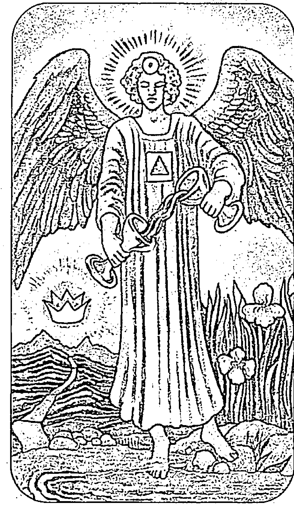

### 基本意义关键字
- 协调
- 配合
- 节制
- 净化
- 治疗

### 牌面解读

一名天使正在将代表灵魂与生命的水从一个圣杯倒向另一个圣杯。有人说，右手圣杯中的水代表意识，而左手中的代表无意识，也有人说它们分别代表物质与精神。但是无论如何，至少我们在牌图中看到了一种交互，无论水从哪里来，到哪里去，水都在流，而流动不正是一种调和与净化吗？天使一只脚站在水中，一只脚站在岸上。按照西方文化，水代表内心的精神世界，土地则代表着外界的物质世界，那么天使如此站立恰恰预示了我们在物质与精神两个世界徘徊的人生，而以水中之足为实，岸地为虚，则恰扣主题，暗示人们节制欲望、净化心灵。

### 释义

#### 正位释义

**人物**
有良好的生活习惯同时对人温和有礼，可以容纳不同的意见整合成自己的看法，并且能严守不偏不倚的中庸之道。

**工作**
你需要用更有效率的方法去管理和调控，若是能够节省更多的成本和资源，在减少花费方面也算是另一种的获利。

**爱情**
两个人之间的关系已经很紧密了，彼此的沟通也很好，该到了可以开始讨论下一步的时候，正在朝向正面发展中。

**友情**
你的人际关系很好，是属于大家都很喜欢的那种人，不过因为一般的朋友太多，使你没有时间和你的好朋友相处。

#### 逆位释义

**人物**
容易受到别人的影响而失去自己立场，遇到无法解决的问题时容易有情绪化的反应，或者会以主观的直觉作判断。

**工作**
你的工作当中涉及到不同方面的利益冲突，你在当中比较像是夹心饼干，不论偏向哪一边都会带来一些新的问题。

**爱情**
感情上现在面对沟通不良的状况，很多事情无法了解彼此的想法，也开始有一些争执，也有很多事情还没想清楚。

**友情**
你常觉得无法与别人合作，也很难融入人群之中，也许是因为对环境还不习惯的关系，你与别人都保持一些距离。

## 魔鬼
The Devil

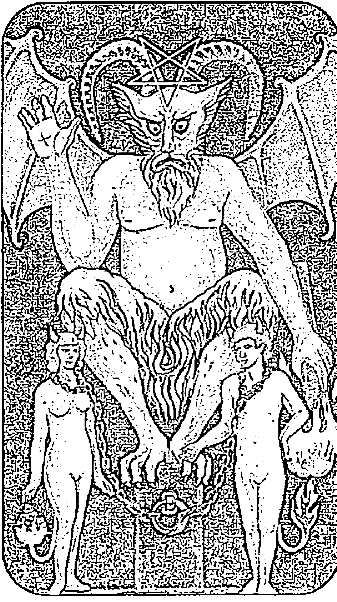

### 基本意义关键字
欲望、束缚、沉溺、物质

### 牌面解读

魔鬼在沟通和内容上与第6张恋人相互辉映，只是天使变成了恶魔，浪漫的爱情沦为彼此对欲望的沉迷。此时亚当和夏娃由于对欲望的沉迷，再也无法听到天使的祝福，耳边只有来自地狱魔鬼的诅咒，原有的浪漫与温馨也已变成了彼此的束缚，就像彼此颈上的枷锁，将彼此牢牢地拴在魔鬼的脚下。亚当一如既往的注视着夏娃，而夏娃则低垂粉颈，无奈地看着颈上的铁条。原有物质、精神、道德的循环已被颠覆，剩下的仅是对物质和欲望的沉迷；原有感性与理性之间的交流也已被阻断，变成了彼此的枷锁。

### 释义

#### 正位释义

**人物**
个性比较激烈，常会因为一时激动而犯错，遇到不顺利的状况可能会有暴力倾向，为了达成目的往往不择手段。

**工作**
现在工作遇到了严重的破坏，大部分的状况都超出你的控制之外，事前无法防范，甚至可能为了这件事丢了工作。

**爱情**
两个人的关系已经走到尽头，再撑下去也没有什么意义，还不如早一点分手，免得继续下去对大家都再造成伤害。

**友情**
人际关系的状况并不好，别人都不想和你交往，如果你不改变自己的脾气及怪罪别人的习惯，这种状况会继续下去。

#### 逆位释义

**人物**
意志不坚定的人，容易受到其他人、事、物的诱惑而改变了自己的想法，甚至也可能执迷于酒、色或是毒品当中。

**工作**
你被利欲熏心，而忽略了正当的手段和道德的界线，即使在短期能有一些利益，长期看来反而会造成不利的影响。

**爱情**
两个人之间有太多的错综复杂的情感纠结，也历经了欺骗和激烈的争吵，也许两个人是为了利益结合而没有感情。

**友情**
你常常会想控制别人，但是你越是如此别人就越会躲你，想办法放开自己的心胸，自由自在的交往友情才会长久。

## 高塔
The Tower

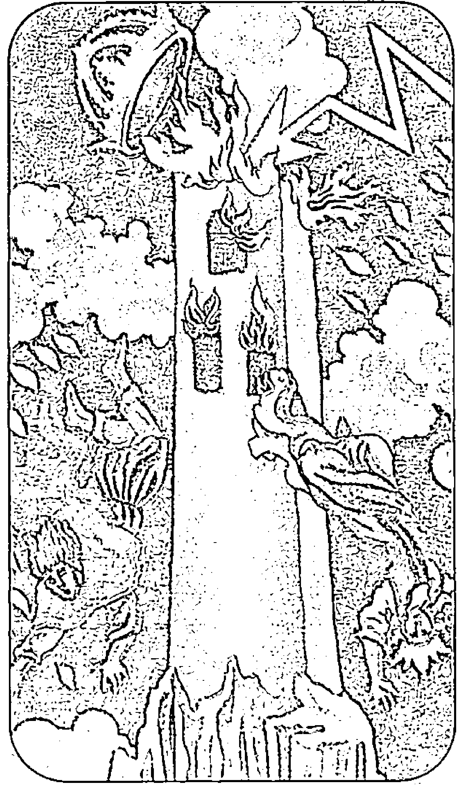

### 基本意义关键字
- 骤变
- 灾难
- 破坏
- 意外

### 牌面解读

原本巍然屹立的雄伟高塔，却被一道突来的闪电击中而崩溃燃烧起来，而这雷鸣电闪正是神的愤怒与制裁。塔顶上的金冠也被惊雷击落，预示着权力、财富和成就都在这骤变中荡然无存。高塔代表着毁灭，即突如其来的灾难。塔中坠落的两名男子似是前面的皇帝和圣职者，他们头向下的姿势和惊恐的表情，预示着面对突如其来的灾难，无论阶级、财富，谁也都很难幸免于难。如果说这个世界有运气这种东西的话，那么厄运降临的几率对任何人都是平等的，好运亦是如此。

### 释义

#### 正位释义

**人物**
自视甚高的人，也会为了面子而坚持自己的做法，即使明知道自己是错误的仍然不愿意改过，因此常常遇到困难。

**工作**
工作上遇到了突发的重大意外，这并不是你可以控制的状况，但是又要由你来负责任，让你觉得很无辜又很倒霉。

**爱情**
感情上遇到重大的挫折，但这并不是你们可以控制的，也许会面临重大的反对压力，使得这段感情无法继续下去。

**友情**
你在人际关系上遇到重大的困难，这都是因为你坚持错误的做法导致受到大家的排斥，应该快点调整自己的做法。

#### 逆位释义

**人物**
比较胆小害怕的人，常常觉得自己过着悲惨、痛苦的日子，也会因此而自怨自艾，还不时地会有杞人忧天的担心。

**工作**
有可能是突然被解雇，或是因为莫名其妙的原因被处罚。与其每天过着提心吊胆的日子，还不如快点把工作辞了。

**爱情**
这段感情已经无法继续下去了，即使再怎么努力也无法使关系改善，应该快点选择离开这段令双方都痛苦的关系。

**友情**
你在人际关系方面过于保守，又无法适应环境调整自己的做法，以至于无法交到新的好朋友，而旧朋友又离你而去。

## 星辰
The Stars

### 基本意义关键字
希望、祝福

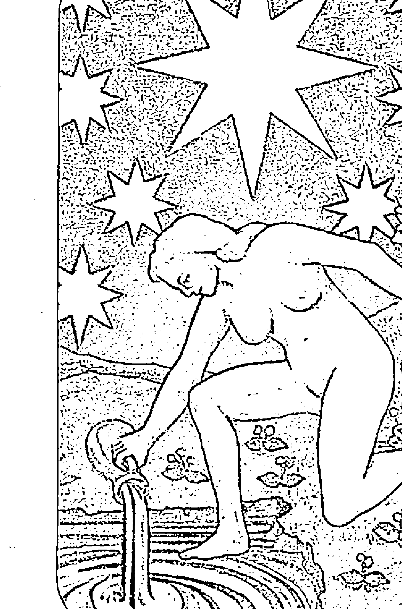

### 牌面解读

夜空中一大七小八颗星星，那颗大的据说是天狼星，可以为那些寻求帮助的人带去希望和信心。在闪烁的星空下，是一个全裸的女人。她左腿单膝跪在池边，右脚则踏入水中，正在将两壶生命之水倾倒在池中和岸上。女人倒出的水正是节制中圣杯中的水，只不过这次是将它浇灌于大地和池中，而非在两个杯子中传递。在池边不远的枝头，落着一只不死鸟，预示着生命的不朽。大地代表意识，水代表无意识，不死鸟则是精神的升华，而裸女则寓意真实的自我。可以说，星辰是一张给人们带去希望的牌，预示着寓言的兑现和灵感与精神的互动，暗示人们不应放弃希望，只有自信、自尊、自强才能有所成就。

### 释义

#### 正位释义

**人物**
对人生充满希望的人，能够信任他人并与他人分享自己的想法，十分爱好自由自在的生活，也带有高度的理想性。

**工作**
现在工作上有一个明确的目标，你应该要紧抓住与这个目标有关的所有机会，不要让其他的事情分散了你的心力。

**爱情**
感情上进入平稳的阶段，也开始在计划长远的未来，两个人的关系不只是情人也像是朋友，常常会彼此分享心情。

**友情**
你的朋友很多，彼此之间也能够互相帮助，不过有时候因为你的付出太过没有保留，反而会被朋友的问题所拖累。

#### 逆位释义

**人物**
属于天真浪漫的人，但有一些不切实际，以过度美化的角度来看事情，以至于无法发现事情的真相，也容易受骗。

**工作**
工作上遇到目标不明确的状况，应该要谋定而后动，搞清楚上面的想法是什么，不要任意解读随自己的意思乱搞。

**爱情**
两个人对于这段感情的看法过于理想化，而且彼此之间的认识还不够深，如果想更进一步的话应该更务实地评估。

**友情**
你与朋友之间的关系还不错，是一种交流互惠的关系，不过若是你只想要好处而停止付出，他们也会这样对待你。

## 月亮
The Moon

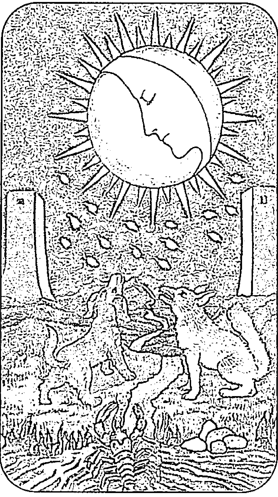

### 基本意义关键字
- 不安
- 多变
- 忧郁
- 刻薄

### 牌面解读
月亮高挂在夜空之中，圆缺不定。月中隐约有一张愁苦的面容，带给人忧郁不安的感觉。月下有两只狗（也有人说是一只狼、一只狗）正在仰望月空低吠，似乎是体会到月亮的愁苦而报以同情，又或是向月亮问着什么。池中的蝎子似乎很向往月宫的样子，努力爬出水面，正准备沿着黄色弯曲的小路前往自己向往已久的地方。整个牌图除了月亮和蝎子外，基本成对称结构，由一条蜿蜒的小路分开，据说代表人生理想与现实两个层面，蝎子为了实现自己的梦想，必须在理想与现实中徘徊前行，稍有偏差便很难达成目的。月亮中那张愁苦不安的面孔，似乎是对前行中蝎子内心的映照吧！

### 释义
#### 正位释义
- **《人物》**：十分善变的人，有些时候连自己也搞不清楚自己的想法到底是怎么样，常常兴之所至随自己当下的直觉做决定。
- **《工作》**：你面对很大的风险和不确定性，到处充满了陷阱和骗局，这时你应该要防止被自己的幻想误导做出错误的决定。
- **《爱情》**：感情仍然在变化当中，也还有很多未知的影响因素，这个时候应该保持开放的想法，而不要急着做任何大的决定。
- **《友情》**：你常常遇到会欺骗你的人，因此在友情方面就不太愿意付出，要小心不实的谣言对你产生伤害以及暗箭伤人的小人。

#### 逆位释义
- **《人物》**：很容易紧张的人，常觉得风声鹤唳草木皆兵，不容易信任别人，也很少与人谈起自己的状况，但内心有很多情绪。
- **《工作》**：你常在工作上犯一些小错误，虽然不见得会造成什么实质上的伤害，但是对你的形象有很大的影响，要小心一点。
- **《爱情》**：彼此可能有一些事情互相隐瞒，虽然不是有意欺骗但也不知如何开口，有的时候也会因此而引发比较情绪化的争吵。
- **《友情》**：你虽然有不少好朋友，但是其中也有很多虚情假意的人，是为了不单纯的目的和你交往，要小心分辨两者的差别。

## 太阳
The Sun

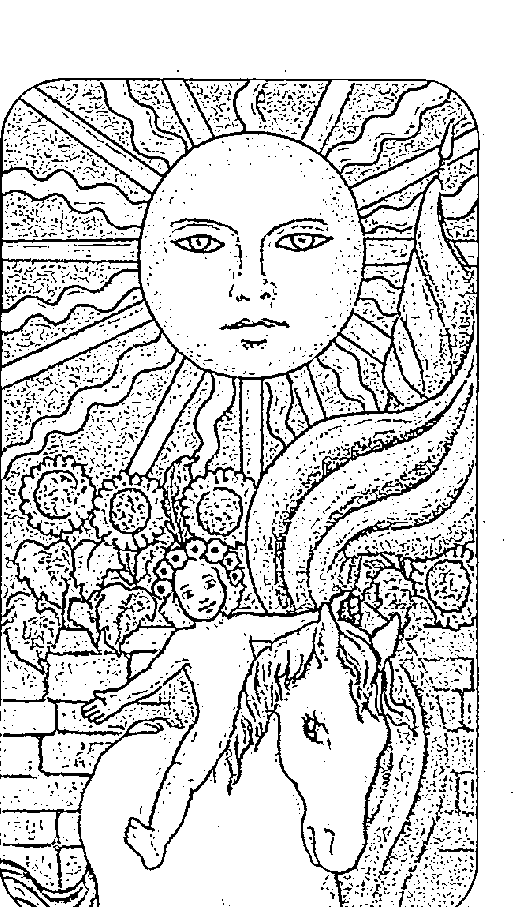

### 基本意义关键字
- 成功
- 自由
- 喜悦
- 阳光

### 牌面解读
一名满脸稚气、面带笑容的孩子骑在马背上，从灰色的围墙中一跃而出，预示着逃脱束缚、奔向自由。孩子的头上有一个雏菊花环和一根似曾相识的羽毛，与愚人和死神头上的那根一模一样，据说象征超越死亡和重获新生。在灰色的围墙后面种满了金灿灿的向日葵，似乎是一座人造花园。但孩子似乎对这些人造的美景并无兴趣，而是选择了奔向那天然毫无修饰的世界，就像是他裸露的身体一样，真实、自然、纯真。四朵向日葵都面向孩子而非太阳，似乎是在告诉我们纯净、自然、真实的个体凌驾于太阳之上，是一种远远超越权力和财富的境界，同时也是快乐的源泉，就像孩子脸上洋溢出的喜悦。

### 释义
#### 正位释义
- **《人物》**：乐观而有自信的人，常常会从光明面去观察和思考事情，对人总是会表现出热情的一面，也可以作出理性的决定。
- **《工作》**：你在工作上的表现如日中天，也带给你很大的满足感，但要注意是否自己表现得太耀眼，反而刺伤或干扰到别人。
- **《爱情》**：两个人的感情处于十分令人满意的状况，恨不得分分秒秒都和对方在一起，只要看到彼此就会觉得是最大的幸福。
- **《友情》**：你在朋友之间很受欢迎，你也喜欢与朋友相处的时光，由于你与朋友真心相待，所以也会交到许多知心的好朋友。

#### 逆位释义
- **《人物》**：十分聪明而理性的人，但有时候会表现得比较自我中心一点，自视甚高而且有一点骄傲，对人还算是亲切和热情。
- **《工作》**：现在在工作上的表现十分亮眼，自己也觉得满意，虽然有一点遇到瓶颈的感觉，但是其实都还是可以克服的状况。
- **《爱情》**：两个人感情的发展很顺利，并没有遇到什么困难或是障碍，即使当中有时会遇到一些小误会，通常也会很快就被解决。
- **《友情》**：你现在处于人际关系的高峰，可以交到不少的新朋友，即使与朋友发生什么误会，也会有其他的好朋友帮你澄清。

## 审判
Judgement

### 基本意义关键字
- 复活
- 觉醒
- 回忆

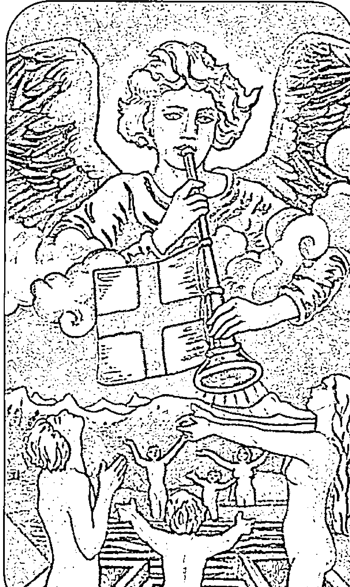

### 牌面解读
天使吹响了号角，传播着上天的福音。在声声催人振奋的号角中，沉睡已久的灵魂一个个走出了自己内心的坟墓，或者说是内心的困惑，站立在天使的翅膀下，满怀感恩的心，细心聆听着上天的福音。审判是大阿尔卡那的倒数第二张牌，可以说是对大阿尔卡那前二十张人生旅程的一个回顾和自省，在超越自我、认知最终世界之前，反省自己的过去，进行自我剖析，认清并且洗涤自己曾经的错，坚信曾经的对，才能最终走向成功之门。

### 释义
#### 正位释义
- **《人物》**：对于事情有主见而且果决的人，内心具有高度的理想性，也善于对别人传达自己的理念，经常路见不平拔刀相助。
- **《工作》**：现在遇到一个重要的判断，决定会有极大的影响，所以一定要保持头脑清楚，千万不要因为时间的压力而随便决定。
- **《爱情》**：在感情上遇到了重大的决定，这件事情的处理状况将会对两个人都造成很大的影响，两个人必须齐心协力地面对。
- **《友情》**：你在朋友之间很有影响力，但也因为你好恶分明，以至于喜欢你的人和讨厌你的人会很极端，彼此之间很少交集。

#### 逆位释义
- **《人物》**：有点优柔寡断的人，也容易受到别人的影响，受到别人鼓动的时候也许会做出不理智的反应，有时也比较情绪化。
- **《工作》**：事情即将出现重大的转机，原本已经被放弃的计划也会起死回生，你应该抓住这个东山再起的机会更努力地奋斗。
- **《爱情》**：在感情上即将出现大的变化，很多以前的事情都将在这个时候重新浮现出来，如果处理得好的话将会有重大进展。
- **《友情》**：你其实并不擅长于人际关系的经营，好朋友就是那几个，也很难扩展生活圈，应该好好珍惜你与知心好友的感情。

## 世界
The World

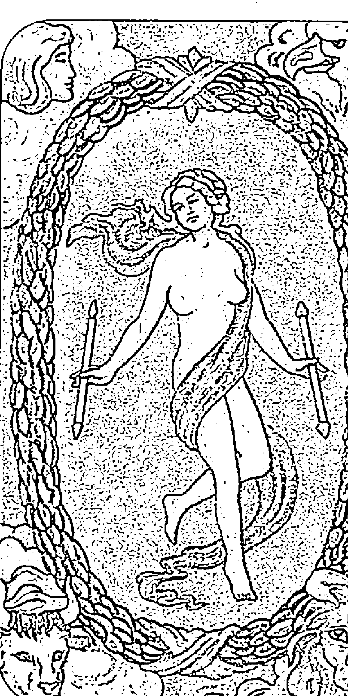

### 基本意义关键字
- 整合
- 成就
- 投入
- 实现
- 满足

### 牌面解读
世界代表宇宙的中心，与大阿尔卡那的第10张命运之轮相呼应，四方依然是狮子、飞鹰、天使和神牛，只是中间不再是命运之轮，而是一个在月桂花环中跳舞的少女。她一手拿着一个魔杖，又好像是一把钥匙，正在为步入世界的人喝彩，又或是一种召唤，在引导胜利者走到智慧之门面前，接过他手中开启幸福的钥匙。世界是大阿尔卡那人生旅途的终点，也是一个新的开始，因为进入智慧之门，你又会变回愚人，为找寻新的智慧或是人生目标而奋斗。

### 释义
#### 正位释义
- **《人物》**：想法十分单纯，面对任何事情只会顺势而为，因此能够避开失败的危险把握成功的机会，同时在内心充满了喜乐。
- **《工作》**：你在工作上十分成功，大部分的事情也都可以如期完成，这是一份很适合你的工作，你也会从当中得到很大的成就。
- **《爱情》**：只要依照原本的状况继续交往下去，这段关系应该是十分稳定而不会有什么变化，应该也是正在朝向婚姻的方向。
- **《友情》**：你周围的好朋友很多，也都是真心在和你交往，由于长久以来累积的各种革命情感，都会使你们的友情更加坚定。

#### 逆位释义
- **《人物》**：比较不知变通的人，对于事情就只有一种观点、一种做法，即使环境变化仍然以同样的方法应对，完全没有弹性。
- **《工作》**：一直都是在做相同的事情，没有任何变化也无法得到成长，感觉自己有点被困住了，虽然不满意但仍然可以接受。
- **《爱情》**：现在感情进入稳定的阶段，但是也让人觉得有一点无聊，两个人之间的责任多于感情，平淡的相处也使热情消失。
- **《友情》**：你的朋友其实还蛮固定的，而且都是很久的老朋友，你不太喜欢去接触新朋友，有时候甚至也会觉得一个人更好。

## 小阿尔卡那解读

塔罗共78张牌，其中大阿尔卡那牌22张，用来解释命运的大致运势，小阿尔卡那牌56张，可占卜更详细的情况，以弥补前者的不足之处。一共有四个牌组：圣杯、权杖、宝剑、星币，分别对应构成事物最基本的四个元素：水、火、风、土。

### 五十六张小阿尔卡那牌面展示

#### 权杖组

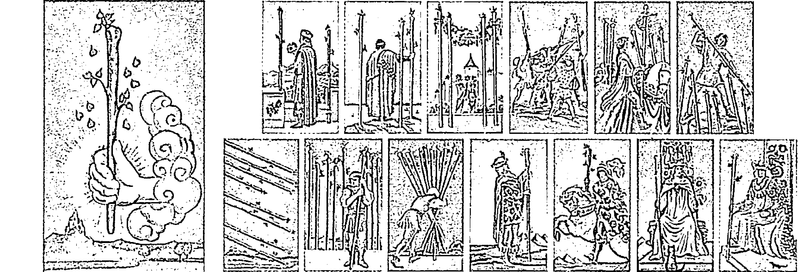

#### 圣杯组

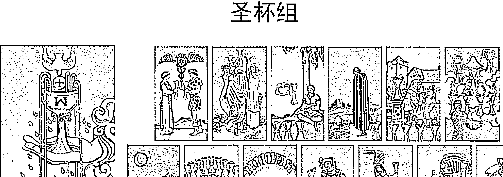

#### 宝剑组

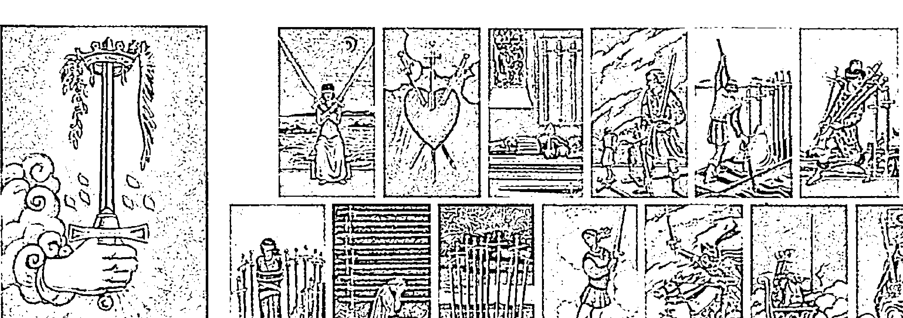

#### 星币组

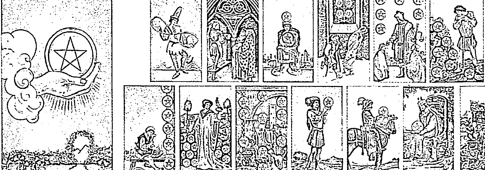

## 权杖王牌
Ace Of Wands

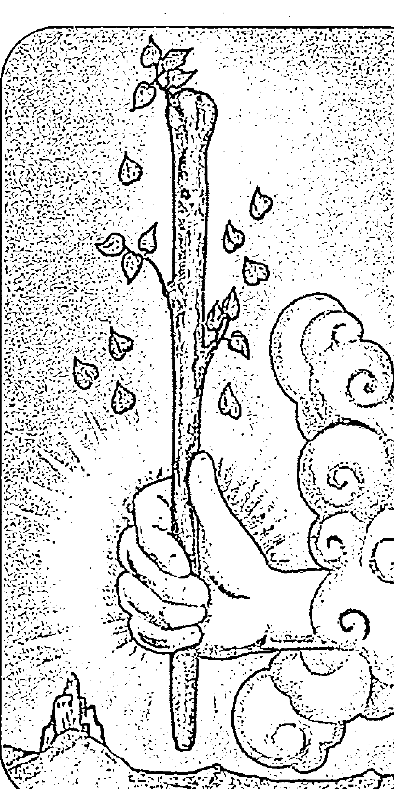

### 基本意义关键字
- 行动的开始
- 新行动
- 创造
- 灵感

### 牌面解读
权杖王牌象征一个有计划的，强而有力的开始。手代表着新计划的渴望、力量与勇气。这张牌暗示已经开始的行动一定会产生具体的结果，与纸上谈兵完全不同。

王牌出现在采取行动的时候，他们不是指所有形式的计划，而是专指发现新事物的具体行为。

从云里探出一只手，握住了权杖。权杖被画成一种活的、成长的东西，在背景里的城堡表示目的地，反映权杖面对各种日常事务的活力与热情。

权杖朝着目标茁壮成长，不惧挑战，狂热地追求潜在的胜利，迸发出强烈的归属感。纸牌上，晴朗的天空表示这一刻，你的前景无限光明。王牌不是要你去思考或感觉，而是去做。它可以表示力量、权力，充沛精力。它是一张代表旅行与移动的牌，也常常表示一种对生活的热爱。

### 释义
#### 正位释义
- **《工作》**：你面对新的工作状况，或是工作当中出现了新的挑战，这是一个还在发生中的状况，所有事情也都还没有定论。
- **《爱情》**：现在很可能有新恋情发生，或是原本的恋情有了新的变化，你应该要好好把握现在的机会，快点把感情稳定下来。
- **《友情》**：这是刚开始经营人际关系的阶段，要主动与别人伸出友谊的双手，多一点主动去关心别人，才会建立起新的关系。
- **《亲情》**：因为新成员加入的关系，使得家中有与以前不同的气氛，应该要快点适应这个新的结构，不要再怀念以前的状况。

#### 逆位释义
- **《工作》**：你面对到新的工作状况，但是在工作当中处处都充满了挑战，这是适合向下扎根学习的时刻，没有太多的表现机会。
- **《爱情》**：感情很自然地处在发展当中，或是有新的恋情出现，但是并不完全在你的掌握当中，两个人之间还是有很强的吸引力。
- **《友情》**：现在开始面临到人际关系的一点波动，虽然不太顺利但是还可以过得去，可以利用这个时间多多去认识新的朋友。
- **《亲情》**：家中面对着新的挑战，因此可能有不同的变化和调整，在这个状况之下还是保持现状比较好，等待事情慢慢发生。

## 权杖二
Two Of Wands

### 基本意义关键字
- 分析
- 掌握
- 权力
- 胆识
- 计划
- 决定

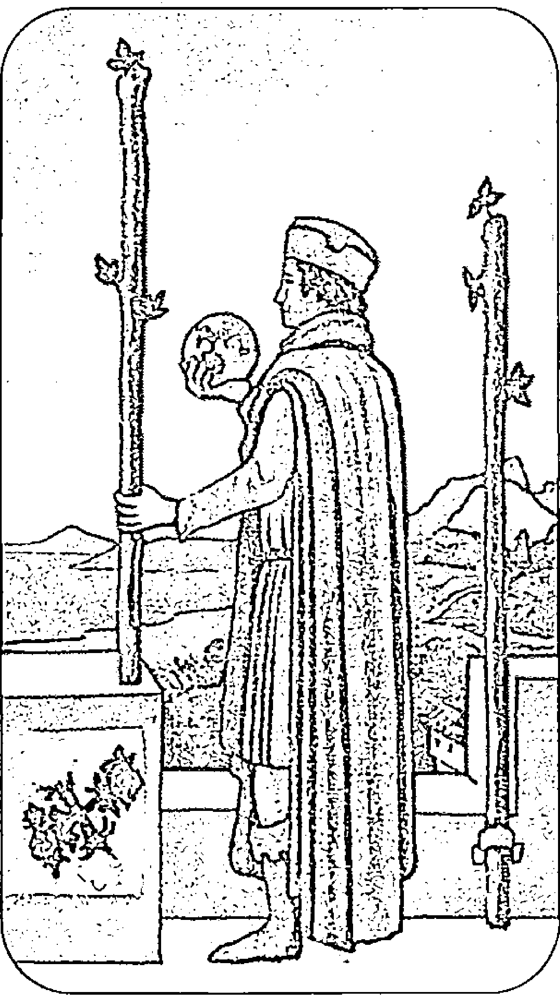

### 牌面解读
一位身穿领主服装的男子，站在他的城墙上，俯视他的辽阔领土，遥望远方海洋。他右手拿着一颗类似地球仪的球体，左手扶着一根权杖。右边的权杖则是被铁环系在墙上。城墙上有个白百合与红玫瑰交叉的图案，白百合象征纯洁的思想，红玫瑰象征热情，暗示两者之间必须取得平衡。

乍看之下，权杖二与权杖三颇有相同之处，都是男子遥望远方海洋的构图，而且权杖二的领主与权杖三的商人，都是成功的领袖人物，拥有相当的权力，但请注意他们姿态的差异。权杖三的商人遥望远方出海的船，他刚刚成功的实现一项伟大的交易，而权杖二领主的视线却复杂许多，他看似俯瞰他所拥有的傲人领地，又看似默默低头研究球体，仿佛在盘算什么，思索什么。

韦特将其比喻成亚历山大大帝，站在世界的顶端，却难免悲伤折磨。

### 释义
#### 正位释义
- **《工作》**：你在工作当中面临重要的选择，你不知道该更进一步地发展，还是守住现在已经有的成果，因而陷入两难的局面。
- **《爱情》**：你对于感情的状况并不满意，但是又不想要放弃，所以只能卡在这个不上不下的阶段，也有很多事情是你不能控制的。
- **《友情》**：你并不是很在意自己的人际关系，也没有很用心地经营，所以常常会觉得自己没有什么朋友，是一个很孤独的人。
- **《亲情》**：现在家中面临重要的抉择，处理得不好可能就会有天壤之别，但是现在并不是适当的时机，应该等一阵再决定。

#### 逆位释义
- **《工作》**：现在工作上出现了意料之外的发展，你必须在这个时候做出选择，即使无法掌握住所有的因素，还是要勇于负责。
- **《爱情》**：感情当中还有很多的问题需要去突破，现在已经开始踏出第一步，其实两个人都不知道这段关系究竟会如何发展。
- **《友情》**：你平常算是一个很受到大家注目的人，但是其实你并不是很喜欢如此，你总是会和朋友之间保持一个适当的距离。
- **《亲情》**：现在家中遇到了意外的事件，重要的是保持镇静不要慌乱，这个时候应该要有一个人出来领导大家重要的决定。

## 权杖三
Three Of Wands

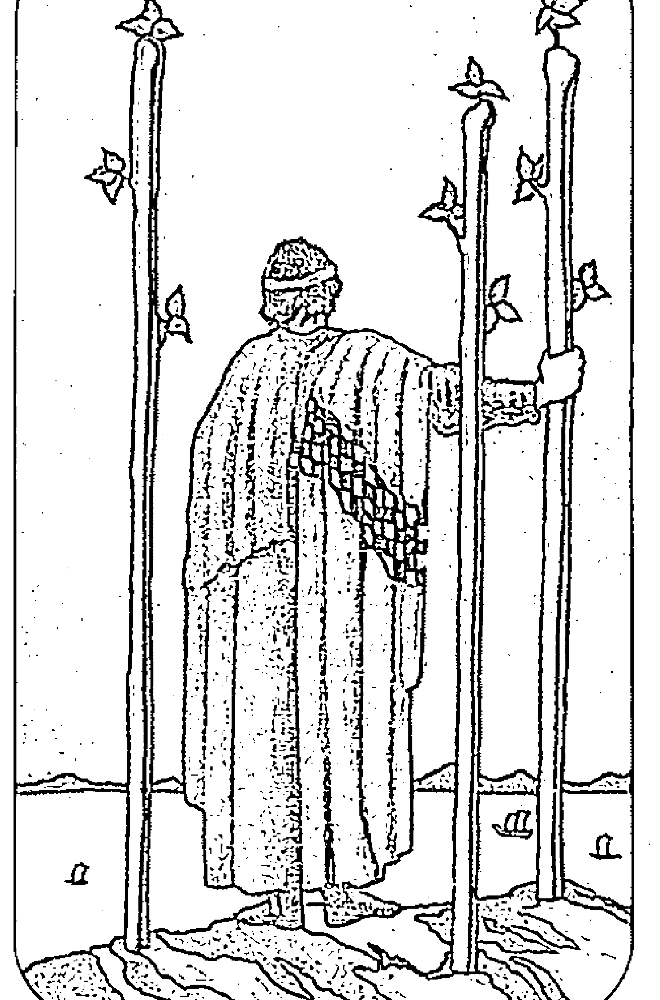

### 基本意义关键字
- 远见
- 旅行
- 重新开始
- 贸易
- 领导

### 牌面解读
权杖三里的人物是静止的，在休息中，他眺望海面，看着船进港卸货。这些船装载他的补给品，也可能是些原料或在其他国家卖出货物的款项。

虽然渴望继续前进，但他了解先送走船而自己留滞原地的利益。他以这种方式，一边探索人生的机会，一边掌控既有的成就。权杖三显示行动使得计划朝完成的阶段走了一小步，他现在正依其在权杖二中所作的决定采取行动，权杖三可以表示成就。他为即将出现在权杖四中的稳定性预留权杖空间时，他会感情用事，表示出急切性的。急切性乃是权杖三的特色。

它常常是代表旅行的一张牌，特别是当它与倒立的宝剑侍卫、权杖王牌或权杖八出现在同一副牌中时。在纸牌上的人物穿着旅行的斗篷，背对我们站着，从背后察看这一景象，我们可以同样感受到他对船抵达的期待。权杖三因为预期目标的实现而茁壮。

现在耐性是需要的，因为这个处境中有足够的动力来促成改变和成长。

### 释义
#### 正位释义
- **《工作》**：在工作当中已经建立起初步的成果，未来还会有更好的发展，这时候应该把握各种表现机会，趁胜追击更上层楼。
- **《爱情》**：两个人的关系已经确立，也已经建立起很好的感情基础，接下来的发展将会是很正面的，彼此也会有很好的分工。
- **《友情》**：你目前的人际关系很不错，但并不完全取决于感情，有时候也是因为有共同的利益存在，这种关系反而会更稳固。
- **《亲情》**：现在家中的状况十分稳定，也有很好的发展机会，这个时候应该要有一个人出来领导大家，共同合作才会有益处。

#### 逆位释义
- **《工作》**：现在工作上的麻烦已经被解决，各种状况也渐渐回到轨道当中，应该好好把握这个机会，不要那么快就放弃希望。
- **《爱情》**：两个人终于克服了障碍，重新确立彼此的感情，虽然好像看到了一线曙光，其实两个人的状况也还不是很稳定。
- **《友情》**：你目前的人际关系还不错，但有时候会因为自己傲慢无礼的表现而使朋友不高兴，这个时候应该要亲自向他道歉。
- **《亲情》**：家里刚刚渡过一个难关，大家也都还在恢复元气当中，所以不宜做什么大的变化，让大家休养生息才是最重要的。

## 权杖四
Four Of Wands

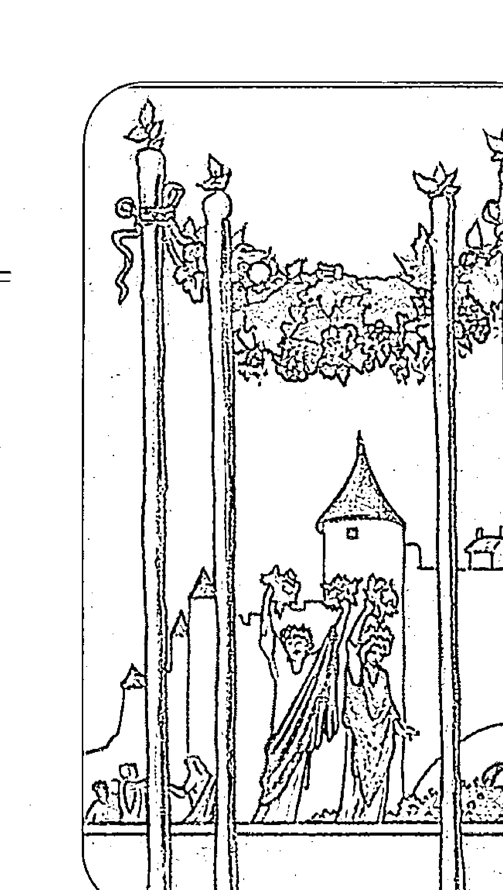

### 基本意义关键字
- 到达
- 完成
- 回家
- 稳固
- 欢庆
- 和谐

### 牌面解读
权杖四描出一个坚固的家庭或工作环境，欢乐与分享是每天生活的一部分。在这张牌上，人们自由来去，带着渴望、热情和乐观，在阳光下跳舞、庆祝。

迎宾花圈穿在四支权杖的顶端，跳舞的人们在庆祝时挥动着更多的花朵。城堡是坚固的暗示，有时它也表示权杖四的热情正被导引进入家园。例如，你可能重新装修或粉刷房屋，使它更适合你现在的需要。

这张牌对搬入温暖又充满支持的家或工作环境是正面的指示。已经在那环境中的人觉得呆在那里很舒适，并且欢迎及支持新来的人。当权杖四出现在圣杯三的旁边时，它表示一个欢庆，或志同道合的人聚集起来，显示生气勃勃与喜悦。

### 释义
#### 正位释义
- **《工作》**：现在工作的努力已经有了成果，也是应该好好享受自己成果的时候，这个时候应该要放松心情，在稳定中求发展。
- **《爱情》**：两个人的感情十分稳定，也已经找出相处的最佳模式，每天在一起的时光都非常愉快，算是令人安心的和谐关系。
- **《友情》**：你的人际关系很好，也很努力在经营自己的人际关系，你可以多多参加朋友们的聚会，甚至会常常遇到庆祝活动。
- **《亲情》**：现在家中充满了欢乐的气氛，也许是正在庆祝某些事情，大家都可以在安全的环境之下自由地分享自己的心情。

#### 逆位释义
- **《工作》**：现在工作的状况很顺利，也是在稳定当中持续发展，因为自己很喜欢这份工作，所以除了薪水之外也有很多收获。
- **《爱情》**：这段感情对彼此来说都是快乐的，也是非常稳定的一段关系，现在保持现状不要做任何改变，是最好的相处模式。
- **《友情》**：你的朋友很多，在朋友当中也很受到欢迎，有空可以多参加朋友间的聚会或是庆祝活动，可以带动欢乐的气氛。
- **《亲情》**：现在家庭的生活对你来说十分幸福，你也很享受这样的气氛，你应该好好把握这个机会，花更多时间和家人相处。

## 权杖五
Five Of Wands

**基本意义关键字**
- 冲突
- 混乱
- 无序
- 竞争
- 模仿

### 牌面解读
权杖五描绘五个人有五种行动方向的情景。每个人相信他们自己拥有最佳的方法，不愿听从他人。

这张权杖五代表冲突。虽然冲突不至于伤害任何人，但却是所有人全盘卷入。只是权杖五的天性，总是把生活看成战争，因为如果没有障碍，就没有冒险了。

权杖五的人以规则观念和公平竞争的方式来寻求行动的快乐，他们往往喜欢体育与竞赛活动。权杖五涉及身体上的较量，宝剑王牌则涉及心智上的较量，这是二者不同之处。

权杖五表示你卷入不必要的较量比赛，这会延迟或干扰你达到目的。另一方面，目标远离或难以达成，对权杖类型的人来说行动往往更有吸引力。

### 释义
#### 正位释义
#### 《工作》
这个工作当中充满了冲突和斗争，每天必须很努力地工作还不一定有成果，所以工作不但很累也很难会有好心情。

#### 《爱情》
两个人之间的争吵不断，甚至可能会上演全武行，打到头破血流的地步，两个人的冲突已经是举世皆知的事情了。

#### 《友情》
你在朋友当中常常与人起争执，而且他们也很爱和你吵，大家真的是不打不相识，但是你也没有什么真心的朋友。

#### 《亲情》
现在家里发生了严重的冲突，由于大家都还在气头上，所以没有办法理性地讨论事情，因此问题也很难获得解决。

#### 逆位释义
#### 《工作》
这个工作当中充满了内部的矛盾，对于同一件事情存在很多不同的说法，常常会让你觉得混淆甚至有点无所适从。

#### 《爱情》
两个人之间常常有意见不合，彼此也有很多观念上的矛盾，这些差异并不是很快就可以化解，需要两个人共同努力。

#### 《友情》
你常会与朋友起争执，而且大多是为了事情的意见不合而吵架，与其如此还不如放宽心，其实并没有什么好争的。

#### 《亲情》
现在家庭的成员之间发生严重的争吵，甚至还动用到法律程序告来告去，在诉讼当中也会对彼此的感情造成伤害。

## 权杖六
Six Of Wands

**基本意义关键字**
胜利、英雄、进展、自信、好消息

### 牌面解读
权杖六描绘一个胜利的游行，英雄头上戴着花环（在庆功会上，个人权利展现的象征），被他的支持者所围绕着。

在这张牌中，火的乐观主义使其欲求和期望得到成功。这不是错误的乐观主义或虚无的期待，而是来自过去的成功及自信的一种真正的信仰。

当我们有了真正的信仰，便会有力量去完成想要做的事情。我们的成功又能激发别人协助或跟随我们，因此在权杖六的牌里，其他人跟随着胜利的人。

权杖六表示可能会成功的一段时间，这是由于自信以及对能力适当的管理。他表示这时候你要相信自己，并且是凭个人的能力去完成你的目标。正立的权杖六显示，如果你努力将会获得成功。

### 释义
#### 正位释义
#### 《工作》
你目前的工作进行得相当顺利，也已经得到很不错的成果，如果能朝着这个方向继续努力，将会得到更多人的肯定。

#### 《爱情》
现在感情的状况十分顺利，这是长久以来努力累积的成果，两个人的配合相当良好，相处的时光也感觉非常快乐。

#### 《友情》
你在朋友当中很受到欢迎，也是朋友之间自然的领袖，你有很高明的社交手腕，很多朋友也会因此受到你的影响。

#### 《亲情》
现在家里的状况很好，长久以来的问题终于被解决，让人有一种扬眉吐气的感觉，家中的成员也会觉得与有荣焉。

#### 逆位释义
#### 《工作》
你十分担心自己工作的状况，因为问题已经大到不是你自己可以解决的了，也可能是有其他人在背后扯你的后腿。

#### 《爱情》
在这段感情当中可能会出现强有力的竞争者，对于两个人的关系造成不小的影响，也开始感觉到不太对劲的气氛。

#### 《友情》
你的人际关系状况并不好，因为你太过高傲看不起其他人，而别人也受不了你歧视的眼光，彼此之间就没有交集。

#### 《亲情》
现在家中出现令人担心的状况，问题也不是那么容易解决的，这个时候应该要大家团结起来，共同渡过这个难关。

## 权杖七
Seven Of Wands

**基本意义关键字**
- 勇气
- 挑战
- 暗敌
- 防御
- 对立

### 牌面解读
如同权杖五，权杖七是一张代表冲突的牌。所有可见的活动的目的本身可能就是战争，纸牌上的人，带有一种决心和激情的表情保卫他的领土。虽然很艰辛，但仍在他的掌握之中，而且他也许喜爱这样的挑战。别忘了，权杖类型喜欢搏斗，而且倾其所有，这会令那些火性的人们感到振奋。这种争斗让权杖类型的人觉得自己活着。权杖七可能暗示你周围的人反对你的想法或计划，但你继续努力、不放弃一定会成功。

塔罗牌中所有的七都有“不要放弃”的意义。虽然挑战比以前更大，权杖七表示你会更投入眼前的工作。

### 释义
#### 正位释义
#### 《工作》
现在工作上遇到很多挑战，但是大部分都在你可以处理的范围之内，只要你能坚持下去，就可以得到最后的成功。

#### 《爱情》
现在感情上可能会出现竞争者，或是有许多外来的压力和挑战，这时应该把问题摊开来谈，两个人共同解决问题。

#### 《友情》
你在朋友当中是属于比较有优势的一个，因此大家常常会以你的意见为主，但是你也要为朋友们出比较多的主意。

#### 《亲情》
现在家中遇到一个挑战，应该齐心协力共渡难关，如果你是站在领导者的角色，也要勇敢地把事情的真相说出来。

#### 逆位释义
#### 《工作》
你在工作上遇到很多问题，往往让你十分为难不知如何决定，常常会陷入左右为难的状况，最后变得里外不是人。

#### 《爱情》
现在感情遇到很多外在因素干扰，甚至出现众多的挑战者，如果不能坚定自己的意志，这段感情也可能就此结束。

#### 《友情》
你在朋友当中是属于比较弱势的一个，常常会受到大家的意见影响，但也是常会在不同朋友的意见之间左右为难。

#### 《亲情》
家中现在遇到一个重要的选择，应该要仔细冷静地分析评估，才能做出一个对大家都有利的决定，千万不要冲动。

## 权杖八
Eight Of Wands

**基本意义关键字**
- 迅速
- 骤变
- 抵达
- 旅行
- 讯息

### 牌面解读
在权杖八中，描绘的权杖并没有植入土地，也没有被人握住。这象征自由流动的火的能量，很少或没有限制。它代表当你恋爱或旅行时，你可以体验到对生命的热情和挚爱。

权杖八表示你的目标清楚可见，正轻松地向它们迈进。这点可以从八根权杖自由而无约束的掠过天际看出来。权杖越过水上，暗示海外旅行，是权杖类型的人十分喜爱的。

权杖八代表健康的人际关系、跨海旅行和计划达成令人满意的结局。它表示你能轻松地完成目标。权杖八出现时，你的计划会碰到的阻碍是微小的，既定的目标无需太多的努力也能达成。

“八”是代表力量的数字，纸牌的数字是八，显示这一组牌的力量所在。在权杖八里面，你可以看到火的元素呈现自然状态，一种无所限制的、狂热的行动。

### 释义
#### 正位释义
#### 《工作》
现在工作上非常忙碌，而且也很要求速度，如果自己不够努力的话，很快就会被别人追赶过去，所以常需要拼命。

#### 《爱情》
感情上的发展十分快速，两个人也是真心相爱，但是若欠缺长久经营的各种配合计划，也有可能只是短暂的火花。

#### 《友情》
你在这段期间的朋友很多，但大多都只是你生命中的过客，彼此之间会有很好的感情，但是大家都有不同的理想。

#### 《亲情》
现在家中的成员有一个共同的目标，大家都能同心协力地朝向这个目标去努力，也都希望这件事情能尽快地达成。

#### 逆位释义
#### 《工作》
现在工作当中发生了严重的争吵，大家的意见不合已经抵消了彼此的力量，即使想要进行改革或和解也无能为力。

#### 《爱情》
两个人彼此有严重的不和，也常常会为了各种的事情发生争吵，有时候争吵反而成为两个人之间沟通的主要途径。

#### 《友情》
你的人际关系遇到很多问题，常常会和朋友们吵个没完，其实你现在的状况并不好，还是要自己去做自己的事情。

#### 《亲情》
现在家庭成员彼此之间发生争吵，甚至引起激烈的对立而不愿意妥协，这个时候最需要的是互相沟通和彼此理解。

## 权杖九
Nine Of Wands

**基本意义关键字**
审慎、小心翼翼、警觉、固执、防御

### 牌面解读
权杖九描绘的是一个强壮、力气大、警觉性高的人。当权杖九出现时，它暗示你生活在一种冲突的模式。

一连串的争斗已经发展成身体与情绪上的模式，他现在需要另外的冲突去满足他对刺激的渴求。这种渴求会上瘾，所以他需要花更多的时间来思考过去的行动，以便决定哪些行动是有效的，哪些行动是浪费的。

他到处寻找冲突，却看不出冲突的来源是内在的。你可能会将自己不受欢迎、不被接受的部分强加于别人身上（这种现象在大阿尔卡那的魔鬼牌中显得更清楚）。如此一来，你将会有一个摸得到、也看到的敌对来源，而不只是一种想法、一种恐惧或一种感觉。然而，如果你继续寻求冲突，你将无法和问题的根本原因达成和解。

### 释义
#### 正位释义
#### 《工作》
你在工作上遇到了一些障碍，但现在并不是硬拼的时候，在心境上你可以让自己暂时休息一下，之后再重新出发。

#### 《爱情》
这段感情本身遇到很多的障碍，而且也不是轻易可以解决的问题，如果不小心处理的话这段关系也可能因此而破裂。

#### 《友情》
你在人际关系上遇到很多的障碍，主要是因为你自己之前树敌太多，以至于现在即使想要改善也很难交到新朋友。

#### 《亲情》
现在家庭成员彼此之间有一些心结，彼此之间的沟通也出现了问题，这个时候应该要增加大家相处和沟通的时间。

#### 逆位释义
#### 《工作》
你在工作上遇到了发展的瓶颈，已经变成在原地踏步的状况，这个时候即使再怎么努力，也看不到任何实质进展。

#### 《爱情》
现在感情上变成僵持的状况，两个人都不愿意让步，因此也无法解决问题，这个过程当中已经伤害了彼此的感情。

#### 《友情》
你对于大多数人都采取过度防守的态度，所以很难交到知心的朋友，你应该放下自己的心结和其他人好好交朋友。

#### 《亲情》
现在家中遇到了很大的挑战，因此也造成了家人彼此之间的猜忌，如果不能齐心协力处理，问题就很难彻底解决。

## 权杖十
Ten Of Wands

**基本意义关键字**
压迫、负担过重、疲累、压力、努力

### 牌面解读
权杖十描绘一个人带着十根权杖。他被这些压弯了腰，而且它们也遮住了他的方向（即远方的房子）。他急切地想要涉入这么多的情况当中，结果因为种种承诺和问题而不堪重负。

这张牌显示出你想要自由，以便从事一切想要的自由或兴奋刺激之事。然事与愿违，你发现自己负担着许多责任。这些责任是你自己制造出来的，因为你对很多机会说“好”，却没有了解到其中包含了多少承诺。这张牌表示了未三思而后行的结果。这些情况和问题在你开始对他们厌烦时，它们并没有离开，而是似乎向你要求更多的时间、注意力和热诚。权杖十暗示着该是将这些负担或责任委托给最能妥善处理好它们的人。

牌上所画的这个人，并不需要以这种能遮住视野的方式携带这些权杖。假如他看得见，他就能发现一个更容易、更有效率的方法了，目前的挑战是简化情况，这可能意味着把部分的权杖留在身后。

### 释义
#### 正位释义
#### 《工作》
你现在的工作非常忙，工作的压力也很大，可能会有过劳的倾向，太多的工作已经让你无法看清楚事情的真相了。

#### 《爱情》
你有很多事情在忙，同时谈感情也带给你很大的压力，在内外交迫的状况之下，无法花很多时间去经营感情生活。

#### 《友情》
因为你每天忙于自己的事情，反而常常都会忽略了朋友，如果再不重视人际关系的经营，你的朋友将会越来越少。

#### 《亲情》
家中的成员大都忙于自己的事情，以至于没有时间分享彼此的心情，在没有情感交流的状况之下自然会比较疏远。

#### 逆位释义
#### 《工作》
你现在负责的工作非常多，而且因为没有人可以帮你，所以只好全部自己来，你的表现可能会引起其他人的忌妒。

#### 《爱情》
你在感情方面遇到很多的困难，每件事情都要你花很多时间去解决，即使如此你仍然坚持下去，不愿意就此分手。

#### 《友情》
你对别人的控制性太强，反而会使得大家很害怕被你利用，如果不能改变自己的做法，你会发现朋友都离你而去。

#### 《亲情》
现在家中有很多的事情要处理，也不是短时间之内可以解决的，应该要多留一些时间给家人，才能把问题处理好。

## 权杖侍从
Page Of Wands

**基本意义关键字**
- 认真
- 着手去做

### 牌面解读
权杖侍从意味着一个崭新的人生局面或新方案的开始。它通常是由身体上的行动来开始做某事的。塔罗牌的侍卫可形容孩子或任何二十二岁以下的人。

牌阵中出现的侍从可能是象征透过信件、电话或讯息带来新消息，然而它通常是形容一项新计划或人生新方向的开始。

侍从代表牌组中空气的部分，权杖牌代表火。权杖侍从象征火中的空气元素。就一般观点来看，这意味理念和行动结合而展开新方案或迎接新挑战，或者换句话说，对你打算做的事进行计划。它代表思想先于行动，一个理念或计划正在形成。这张牌表示你正在梦想或思考你将会达到的目标，及置于面前的挑战。也可以形容展开一项方案的行动，因为权杖类型的人不喜欢怠惰。如果这张牌代表一个小孩，他通常是情绪高昂、精力充沛、热情洋溢、积极而经常吵闹的。

### 释义
#### 正位释义
#### 《人物》
属于天真纯洁的人，通常是以最简单直接的方式思考，并且能常保赤子之心，也喜欢去尝试各种新鲜有趣的事情。

#### 《工作》
工作还在刚开始的起步阶段，也还有很多东西可以去探索和学习，整体来说是愉快的经验，应该把握机会多看看。

#### 《爱情》
感情还不是非常稳定，而是有一点在互相探索和熟悉的阶段，这个经验对你来说很新鲜有趣，关系也会渐渐成熟。

#### 《友情》
你刚进入一个新的环境，也会认识不少的新朋友，这时应该放开心胸去接受各种不一样的人，才能扩展你的人脉。

#### 逆位释义
#### 《人物》
个性善变而不稳定的人，喜欢去尝试各种事物，但是常常只有三分钟热度，处理事情往往不够成熟或是流于肤浅。

#### 《工作》
工作上出现了一些不好的消息，但也可能只是谣言，这个时候应该要沉着，在正式发布结果前最好不要轻举妄动。

#### 《爱情》
两个人之间常常为了很小的事情争吵，也会把争吵当成主要的沟通方式之一，随时都觉得这段关系有可能会结束。

#### 《友情》
你要避免给别人不好的第一印象，否则你就要花很多时间才能去改变大家对你的看法，记得在朋友之间言多必失。

## 权杖骑士
Knight Of Wands

**基本意义关键字**
积极、强烈

### 牌面解读
比圣杯骑士更专注，热情，冲动且激烈，他被内在的热情与冲动所驱动，性急。这张牌显示求问者可能要远行，又或是搬迁，也有可能是有朋自远方来。若代表人，那么这人是好交友及很受欢迎的，虽然他偶尔叫人难以捉摸，但确实带给很多人欢乐。

### 释义
#### 正位释义
#### 《人物》
对于事情非常主动积极，而且对生命充满了热情，虽然有时候比较容易冲动，但是会很用心于自己想要做的事情。

#### 《工作》
在工作上有很多的挑战，但同时也是你可以磨练进步的机会，应该勇敢地冲破这些困难，你将会得到更多的回报。

#### 《爱情》
现在感情上遇到某些挑战，也有可能是相隔两地或是聚少离多的状态，如果想要保持这段感情，就要更主动地付出。

#### 《友情》
你与朋友的关系都还不错，也常常会认识新的朋友，你与大家都能保持良好的关系，也喜欢和朋友们一起出去玩。

#### 逆位释义
#### 《人物》
由于心直口快的性格，容易与别人起冲突，也很难与别人合作，对于自己的理想非常狂热，会不顾一切地去完成。

#### 《工作》
工作上的状况已经不是你可以掌握的了，太多外在的因素打乱了你原有的计划，即使勉强可以支持也是十分辛苦。

#### 《爱情》
在感情当中常常发生争吵，但是仍然非常爱对方，也无法下定决心分手，所以只能在这个不满意的状况中撑下去。

#### 《友情》
你会与朋友因为理念不合而发生冲突，因此如何找到志同道合的朋友才是最重要的，其他不合的人就不用理会了。

## 权杖王后
Queen Of Wands

**基本意义关键字**
- 开朗
- 热心

### 牌面解读
热心、温暖、忠心、热情、独立、精力充沛、有时三分钟热度却不缺乏决心。她活力四射，容光焕发，却不安定。她好比蒸汽火车头一样，不过不一定会在引擎激活之前就决定好路线。她比圣杯王后踏实，比星币王后活泼。她不遵守社会规范或习俗，有叛逆倾向，有可能是个革命者（而如果是，必是出于感情或经验，而非理性思考）。她活力充沛，不但可把家务处理得井井有条，更能同时发展多方面兴趣。正因为她懂得很多，又活泼善心，许多人都愿意与她交朋友。不过不要试图利用她或讨她便宜，她发现后会毫不留情地直斥其非。

### 释义
#### 正位释义
#### 《人物》
待人十分直接而亲切，带有光明而愉快的特质，所到之处都会充满欢乐的气氛，常常会不经过思考依照直觉做事。

#### 《工作》
在工作上有很不错的发挥空间，也掌握了特定的权力，只要你能按部就班好好工作，将会得到金钱上的实质回报。

#### 《爱情》
这段感情是很朴实而真诚的，虽然没有太多的热情，也进入了十分稳定的状态，彼此之间的相处也觉得十分快乐。

#### 《友情》
你是大家眼中的开心果，也可以带给大家很多的快乐，所以整体来说人际关系算不错，你的付出都可以得到回报。

#### 逆位释义
#### 《人物》
对别人经常都用比较严格的标准去评量，因此会容易羡慕甚至忌妒别人，也会把自己主观的想法强加在别人身上。

#### 《工作》
工作上有很多的规则限制，自己可以发挥的地方并不多，但只要把例行性的工作做好，也还算是一个不错的地方。

#### 《爱情》
这段感情外表看起来十分美满，但是其实当中有很多的冲突和问题，只是两个人都因为面子问题不愿意公开出来。

#### 《友情》
你与大家只能维持表面的关系，很难建立深厚的友谊，你对于别人的付出太过计较，别人也很难对你全心付出。

## 权杖国王 King Of Wands

**基本意义关键字** 稳重、坚毅

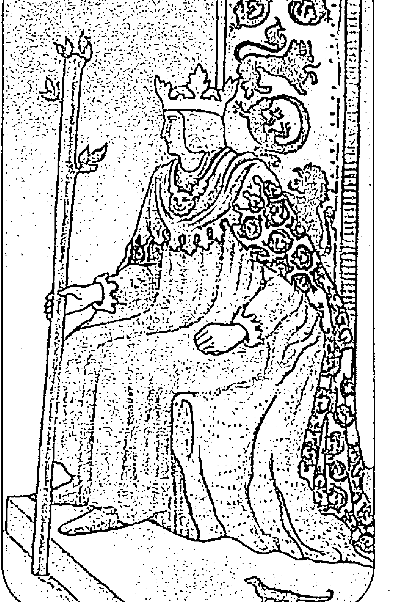

### 牌面解读

力量强大而遵从本能的统治者。具有本能与热情，但成熟度与智能足以控制他的冲动。他是开国者与建国者（星币国王则是治国者与改善者）。有强烈的决心，是四个国王中行动力最强的。这张牌显示男性是喜欢谈天说地及充满幽默感，而且他的诚实及正直赢得了众人的尊敬。工作上他充满创意及构思，但欠缺实际的计划，而且他做事不会很投入。

### 释义

#### 正位释义

**《人物》**
诚实而友善的人，看待人、事、物有自己的主见，并且会谋定而后动，对于自己有强烈的信心，同时也很有创造力。

**《工作》**
工作的状况十分稳定，也是你所熟悉的一个领域，正是你可以好好发挥的时候，要把握这个机会争取最好的成绩。

**《爱情》**
经过各种的大风大浪考验之后，这段感情已经十分稳定了，若是没有其他重大的阻碍，也会建议朝向结婚去计划。

**《友情》**
你在朋友之间的口碑还不错，大家也都很重视你的意见，若是能用心经营人际关系，也很容易成为大家的意见领袖。

#### 逆位释义

**《人物》**
天生善良但是对他人比较严厉，常常表现出严肃不可侵犯的样子，对事情的看法十分固执，像是顽固的老人一样。

**《工作》**
工作当中常遇到不确定的变化，但是大致上是你可以掌握的状况，这个时候应该在稳定中求发展，不要操之过急。

**《爱情》**
感情上趋向稳定，但也有可能开始觉得无聊，即使不满于现状也无力去改变，若是提出新的要求反而会造成争吵。

**《友情》**
你总是以别人为中心来看待事情，若是朋友间的关系很好，你也会因此而受益，但是若交了损友也会被害得很惨。

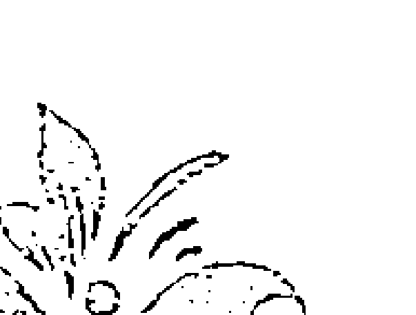

## 圣杯王牌 Ace Of Cups

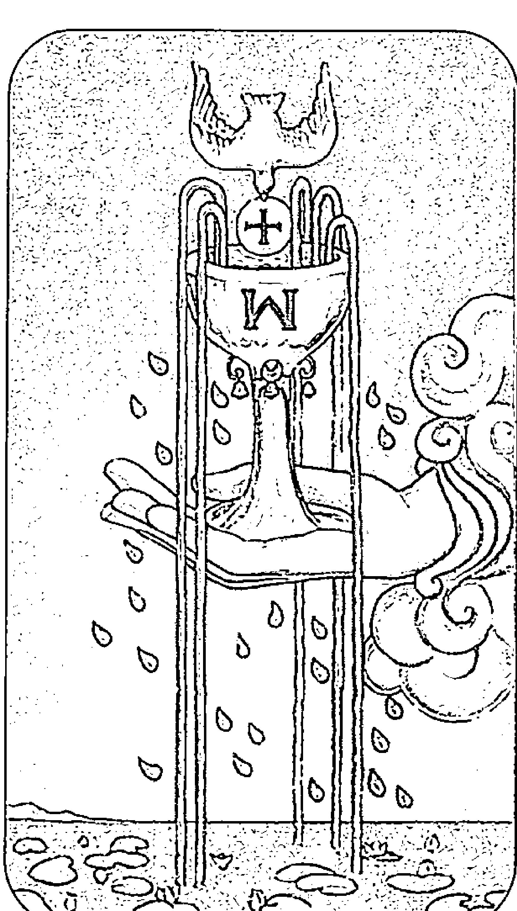

### 基本意义关键字

- 情感的付出
- 新感情
- 爱
- 喜悦
- 感受

### 牌面解读

圣杯王牌代表一个开始。当牌局中出现王牌时，暗示生活当中存在着快乐、爱和喜悦的机会。它可能意味着你正要进入情感满足的一段时期。

这张牌上面的白鸽和圣餐代表心灵上的基础，这基础赋予情感真正的意义。如果没有这个心灵上的基础，情感的满足无法包含于你的灵魂，或你生命的贺礼中，而原本可能成为持久的满足的东西则变成仅是一些新奇之物而已。

王牌不只意味一个情感满足的时间，也是你心灵持续发展的一个机会 - 通过爱，这个最令人振奋、有用的方式。牌中的手从云（心灵）中伸出，握着一个圣杯，水自其中溢出，流进了一方池塘。这象征情感满足的来源是心灵，而且当你与心灵越加契合时，你就能享受更多的爱以及更丰盛的感情。当心灵在我们生活的许多瞬间契合了，即使是一些小小的事情也能让你充满喜悦。而当你失去这种契合时，你会在挑战中寻求满足。

### 释义

#### 正位释义

**《工作》**
你对于现在的工作状况十分满足，而且也觉得是一种享受，不但可以有很多表现的机会，也可以激发出新的灵感。

**《爱情》**
这是一段完美的感情，不但彼此之间的相处状况很好，也会受到大家的祝福，也许已经开始准备两个人共同生活。

**《友情》**
你与朋友之间的感情都很好，也能与大家建立起真心的关系，你对于朋友都能主动地付出，因此大家也会信任你。

**《亲情》**
现在家中是很完美的状况，家庭成员之间很真心地相处，过着幸福快乐的日子，感觉上是很无忧无虑的家庭生活。

#### 逆位释义

**《工作》**
你现在的工作即将发生很大的改变，也不是任何人可以预料到的，你只能摸着石头过河，不要有任何的预设立场。

**《爱情》**
这段感情渐渐发生了质变，也许是两个人准备要结婚，或是转变为像是朋友的关系，这都需要两个人共同去面对。

**《友情》**
最近你可能因为换环境的关系而认识了很多新的朋友，你可以慢慢开始适应这个状况，也许会建立起良好的友谊。

**《亲情》**
现在家中发生一些新的变化，大家都还在适应当中，这个时候重要的是无私的付出，而不是让大家彼此斤斤计较。

## 圣杯二 Two Of Cups

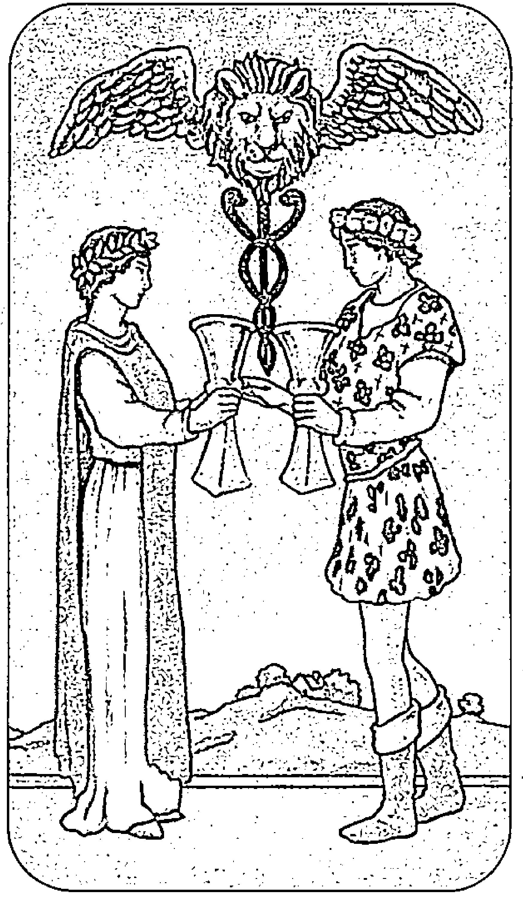

### 基本意义关键字

- 真爱
- 平等
- 恋情
- 友谊
- 合作
- 结合

### 牌面解读

圣杯二是形容一种合伙、朋友或亲密关系。牌上画着一男一女面对面，手中各持一个杯子。天空相当晴朗，身后的树当中有一间房子。

两人把杯子举在同一个高度，意味着平等互信。这可能是在暗示一种平等的爱或生意关系，或任何密切的团队努力或有利的合作关系。

由棒子上的两条蛇和张开翅膀的狮子显示出，这男人和女人有一种心灵上的契合。棒子象征人类的脊椎，蛇则代表由能量中枢传达能量到脊椎的管道。就男人而言，这能量中枢位在脊椎底部，而女人则介于两个卵巢之间。

这对男女上方长翅膀的狮子代表能量中枢的顶端，其间充满了心灵和爱的能量。就是这种能量导引你去形成各种人际关系，并可能让你对爱有更深入的了解，经由结合男性在行动、力量、活动方面的特质，以及女性在情感、想象及直觉上的特质，他们可以互相学习。

### 释义

#### 正位释义

**《工作》**
你很喜欢现在的工作，也会为这个工作主动付出很多，由于在工作当中常常需要与别人合作，所以沟通也很重要。

**《爱情》**
这段感情仍然在热恋的状态，两个人之间有很强烈的热情和吸引力，彼此之间相处也很和谐，是一个平等的关系。

**《友情》**
你在人际关系方面的表现非常好，也能与别人建立起坚固的友谊，你常常会照顾自己的朋友，和他们相处也会很愉快。

**《亲情》**
现在家中是很和谐的状况，家庭成员之间有良好的沟通，也可以共同去合作事情，大家的相处充满了欢笑和喜悦。

#### 逆位释义

**《工作》**
这个工作会要求你付出很多，但是有时候并没有给你相对等的报酬，你需要主动去要求改善，不要傻傻地被压榨。

**《爱情》**
两个人彼此都是真心交往，但是也会为了一些小事情而争吵，这个时候应该加强沟通，以免误会累积就更加难解。

**《友情》**
你的人际关系还不错，也常常会和朋友们出去玩，但是有时候太过在意朋友的看法反而会使你失去自己的立场。

**《亲情》**
现在家中保持在和谐的状况，但是有一些观念上的问题仍然无法沟通，这个时候需要有人出来当和事佬解决歧见。

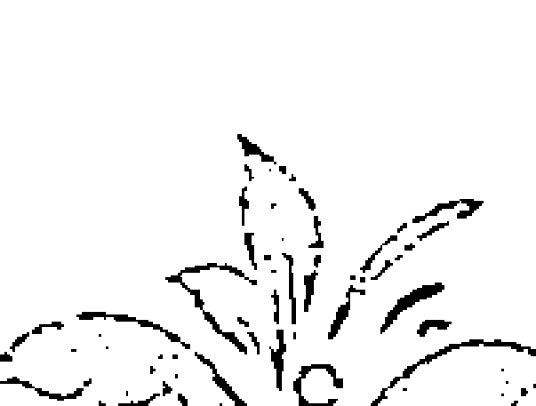

## 圣杯三 Three Of Cups

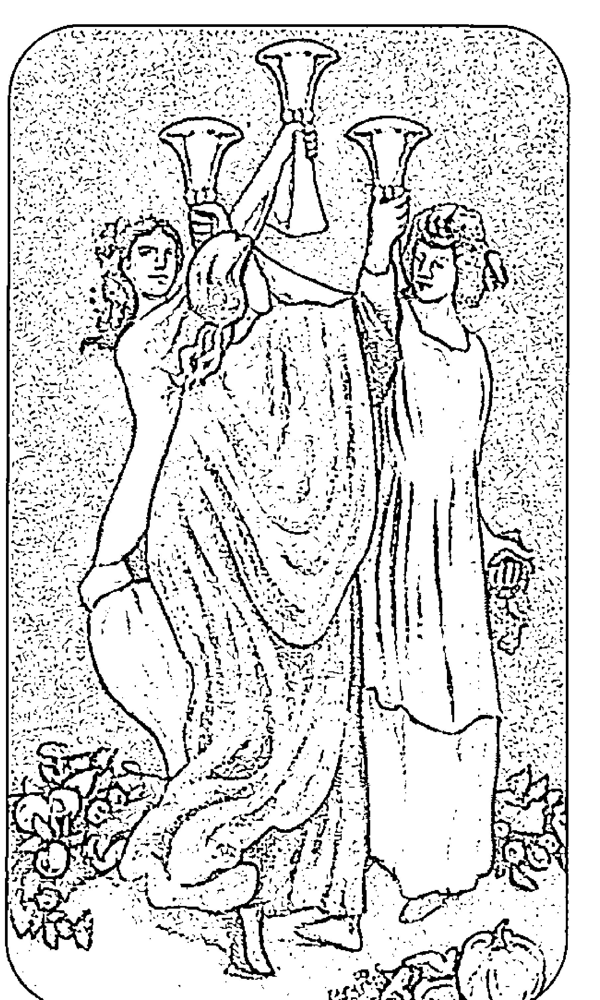

### 基本意义关键字

- 喜悦
- 庆祝
- 丰收
- 欢庆
- 结盟
- 团体

### 牌面解读

圣杯三意指欢乐、分享或庆贺。这张牌通常会出现在重大节日之前的几个星期中，因为大多数人即将举行祝贺。这张牌上所画的三个女人正在庆祝丰收，他们辛勤的成果就展示在他们的脚边。

圣杯三通常指一次出现了若干个机会，有时也指一种不是“充满机会就是完全缺乏机会”的状态。换句话说，当你得到一次机会时，一定还会有其他的选择机会。

牌面上所画的三个女人，被周遭成熟的果实包围着，而其中甚至有一人的左手拿着一串葡萄。这意味着努力已产生成果，或工作已经得到了报偿。开牌若出现这张圣杯三，即表示报偿或经验的分享。正立的圣杯三亦可指团体、聚会和开会。

### 释义

#### 正位释义

**《工作》**
你对于现在的工作十分满意，每天都能高高兴兴地去上班，你在工作当中学到很多东西，也可以得到丰硕的成果。

**《爱情》**
这是一个充满欢乐气氛的关系，两个人可能常常会一起出去玩乐、用餐等等，也让双方都感觉到十分丰富和美好。

**《友情》**
你的人际关系很好，也会和朋友们互相帮忙，你觉得由朋友身上得到很多的快乐，有时候甚至会让友情超过爱情。

**《亲情》**
现在家中充满了欢乐的气氛，因为发生了一件值得大家高兴和庆祝的事情，这时候应该要和大家分享你们的喜悦。

#### 逆位释义

**《工作》**
现在的工作已经到了结算成果的时候，之前的努力在这里会得到应有的报偿，但是表现不好在这里也会受到惩罚。

**《爱情》**
两个人该摊牌的时候到了，之前所种下的各种前因，在此都会出现其后果，同时也暗示了会有翻旧账的情况发生。

**《友情》**
你的人际关系开始亮起了红灯，但是状况还不是很糟，只要你从现在开始补救，还是可以和大家维持良好的关系。

**《亲情》**
现在家里的状况还不错，之前的努力也在此得到应有的回报，事情能够有一个好的结局，大家也可以松一口气了。

## 圣杯四 Four Of Cups

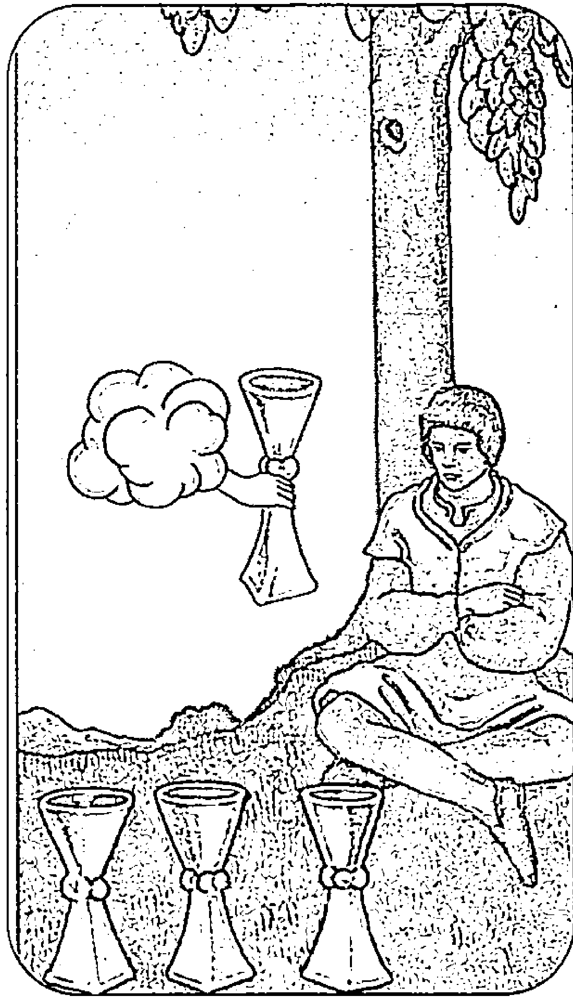

### 基本意义关键字

- 选择
- 观望
- 不满
- 冷淡
- 退缩
- 外遇

### 牌面解读

圣杯四可以说是一张代表冷漠无情或不满足的牌。牌上所画的这个人无法从三个杯子中得到满足，或无法满足于他眼前的机会，不过只要他准备好向自己的内心寻找，他还是有很多可得到满足的机会。这张牌告诉我们，你必须将自己和心灵的目的结合起来，如此才能确实掌握住满足的泉源。

男子的旁边，一只心灵之手拿着一个杯子。当他梦想杯子王牌时，他的眼睛紧闭以拒绝肉体上的机会。在圣杯四当中所必须学习的课题是和心灵维持联系或汲取在王牌中所得到的经验，同时也要和肉体的世界保持联系。

此人是以冥想的姿态席地而坐，打开心灵之门，准备好迎接到来的一切。如果他准备好追寻外在的东西，那么他很快就会对他生活中的事物感到厌烦，但是他如果只打算探索自己的内心世界，也可能会失去肉体世界清晰呈现出来的爱。在他面前的三个杯子可说是他内心世界的直接反映。

### 释义

#### 正位释义

**《工作》**
你对现在的工作感到疲倦，很想要停下来休息一下，你的内心对于现状十分不满，但是却有一种无能为力的感觉。

**《爱情》**
基本上这是一段还不错的感情，但是你仍然不是很满意，也许你应该好好把握现在的快乐，最好不要自己想太多。

**《友情》**
目前你有一些亲近的朋友，这个状况并不让你觉得满足，你常会想要去交其他的新朋友，但是又缺乏实际的行动。

**《亲情》**
其实现在家中的状况还蛮稳定的，只是成员彼此之间有一些不满的情绪出现，如果能主动把问题化解就会更和谐。

#### 逆位释义

**《工作》**
即将发生重大的变化，也会有新的机会出现，你可以好好把握住这个机会，就可以脱离你所不满意的状况。

**《爱情》**
这段关系即将进入到新的发展，双方其实都有能力改善彼此的相处模式，除了愿景之外应该要提出更具体的做法。

**《友情》**
你目前的人际关系还不错，但是最近还会认识不少新的朋友，如果你可以好好与他们交往，也会带给你很多快乐。

**《亲情》**
现在是重新开始的新契机，可以利用这个时间让大家更团结，应该多花一些时间和家人相处，大家好好培养感情。

## 圣杯五 Five Of Cups

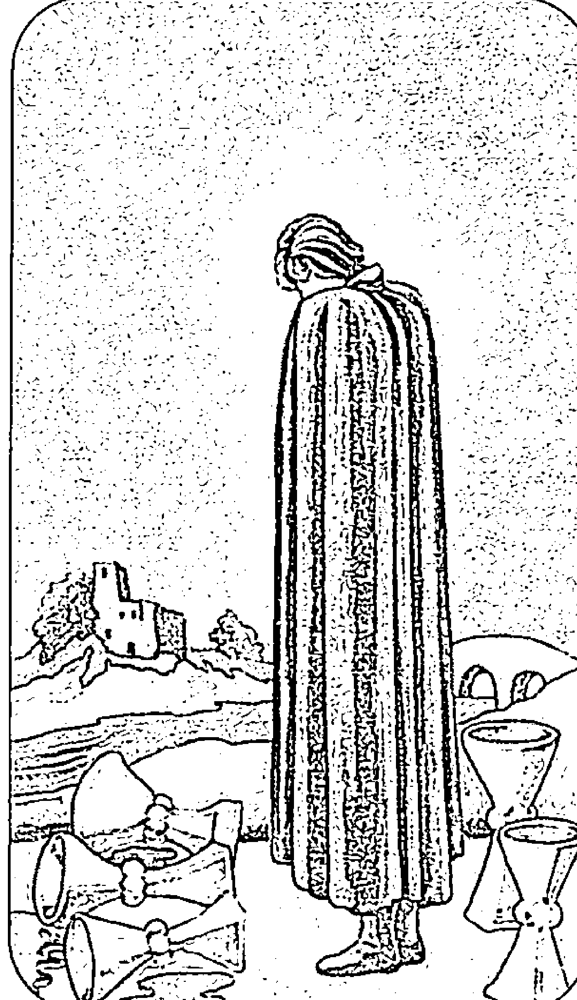

**基本意义关键字** 失望、悲观、止步不前、悲伤、失落

### 牌面解读

圣杯五是一张代表悲伤、失落与失望的牌。在灰暗的天空下，有一个人（性别不固定）身着黑色斗篷，低头哀悼地上三个倾倒的杯子，里头五颜六色的酒流了出来。他的前方是一条河，河上有座桥通往远处的村落。灰暗的天色反映牌中人沮丧的内心世界。

这张牌与宝剑三的意义都是悲伤与失落，它们之间有什么差异呢？首先，很明显的，圣杯五没有宝剑三那样令人难以忍受。三个杯子倒了，但仍有两个留下。画面中的人物只要转过身，就知道他并非孤立无援，并非一无所有。等他哀悼够了，他可以拾起剩下的两个杯子，跨过通往外界的桥，继续他的生活。远处的房子象征稳固安全的生活，而桥一直都在，他随时可以回去。

### 释义

#### 正位释义

**《工作》**
你在工作当中有很强烈的失落感，也可能是有同事不和的状况发生，你失去了工作的动力，只是看到不好的一面。

**《爱情》**
这段感情让你十分难过，原先的快乐现在已经完全被痛苦所淹没，你很容易看到对方的缺点而无法欣赏他的优点。

**《友情》**
你最近可能失去了好朋友，因此在朋友关系当中让你觉得悲伤和失落，但是实际上你还是有一些很好的知心朋友。

**《亲情》**
最近可能因为家中发生不顺利的事情，甚至是亲人的离逝，所以感觉上气氛十分哀伤，大家的脸都失去了欢笑。

#### 逆位释义

**《工作》**
在工作当中一直发生各种问题，而且还不断地有新的问题接踵而来，之前的计划完全失去作用，通通都是坏消息。

**《爱情》**
这段感情已经慢慢由爱生恨，所有的不满也已经爆发出来，两个人之间的冲突不断，觉得很痛苦但是又无法分开。

**《友情》**
其实你并没有什么好朋友，也已经习惯了一个个人独来独往，不要对友情有太大的期待，以免反而带来更大的失望。

**《亲情》**
家中可能因为生意失败或是其他的意外，以至于家道中落，感觉上还有很多问题没有解决，也不知道该怎么解决。

## 圣杯六 Six Of Cups

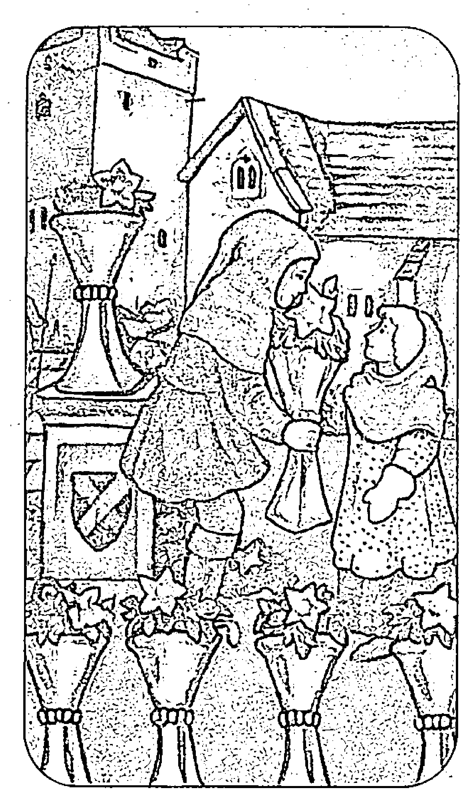

### 基本意义关键字

- 依靠
- 安全
- 稳定
- 童年
- 回忆
- 思乡

### 牌面解读

圣杯六有时代表思乡情怀，家乡就像圣杯六中的庄园，在里头有欢笑，有回忆，有家人的悉心照顾，让你无忧无虑。看着男孩将花送给女孩的可爱模样。圣杯六也可以表示照顾以及馈赠，或者是得到遗产。你可能获得某人的特别关照，也可能收到别人赠送的礼物，或是遇到其它类似的行为。圣杯六的快乐很简单，就像儿时一般天真，有时只是好友帮你泡的一杯咖啡，就能感到无上的喜悦。

在经过圣杯五的悲伤之后，有时我们需要回忆来重新发觉自己，才能继续向前走。藉由省思过去的经验，可以获得灵感，以及再生的力量。

圣杯六在感情方面，可能代表一方照顾另一方的关系。对照圣杯二，可以发现这样的关系其实不平等，而且照顾与控制只是一线之隔。一方替另一方构筑一座安全的庄园，但却使他失去探索世界的机会，逆位时尤为可能。另外，圣杯六也可以代表如初恋般单纯的恋情，或者与旧日情人重逢。

### 释义

#### 正位释义

**《工作》**
你现在的工作算是稳定，但是当中也充满了一成不变的内容，让你觉得很无聊，在这里你有很多愉快的过往经验。

**《爱情》**
这是一段不平等的关系，可能是其中一方保护另外一方，而另一方又过分依赖的状况，两个人的关系会很紧密。

**《友情》**
你的老朋友比较多，但是很难交到新朋友，其实你只要好好珍惜每个和你有缘的朋友就可以了，有很多事情是强求不来的。

**《亲情》**
你处在一个温馨和谐的家庭环境当中，长辈对于大家都有很好的照顾和保护，从以前到现在相处方式都没什么变化。

#### 逆位释义

**《工作》**
工作上会有一些新的变化，之前稳固的状况也会被打破，你需要花一些力气去适应这个状况，这对你来说是新的经验。

**《爱情》**
虽然这段关系已经很稳定了，但是仍然可能出现一些不同的刺激，因此两个人的感情即将进入一个不同的新阶段。

**《友情》**
除了老朋友之外，也许你现在会比较需要新朋友，所以有机会你可以开拓出新的生活圈，找到各种不同的新朋友。

**《亲情》**
家中即将发生重大的变化，也许会有预期之外的正面力量，让人觉得家里可以重新振作起来，也会有很好的发展。

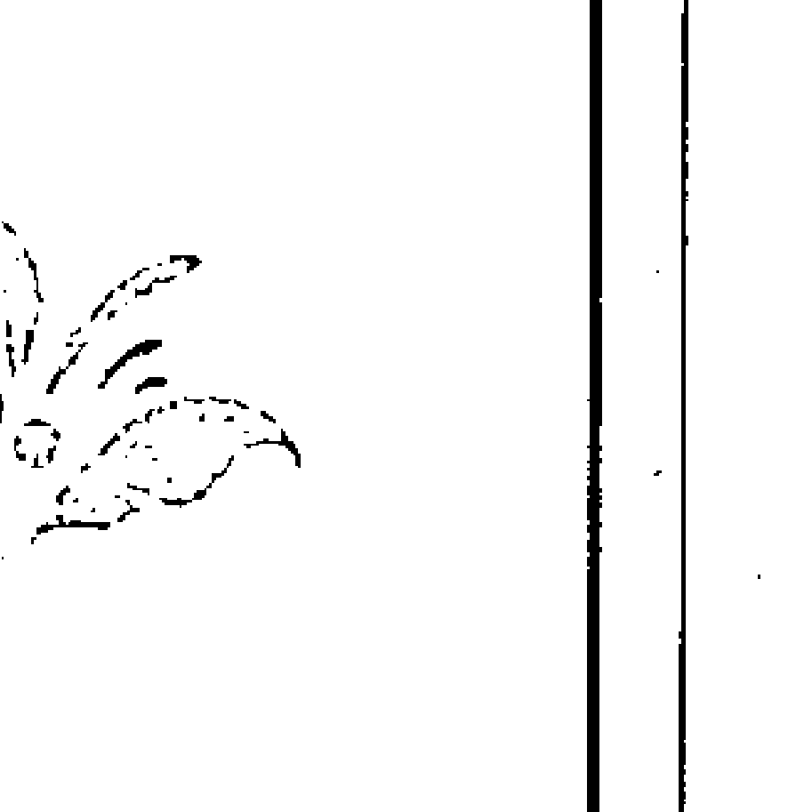

## 圣杯七 Seven Of Cups

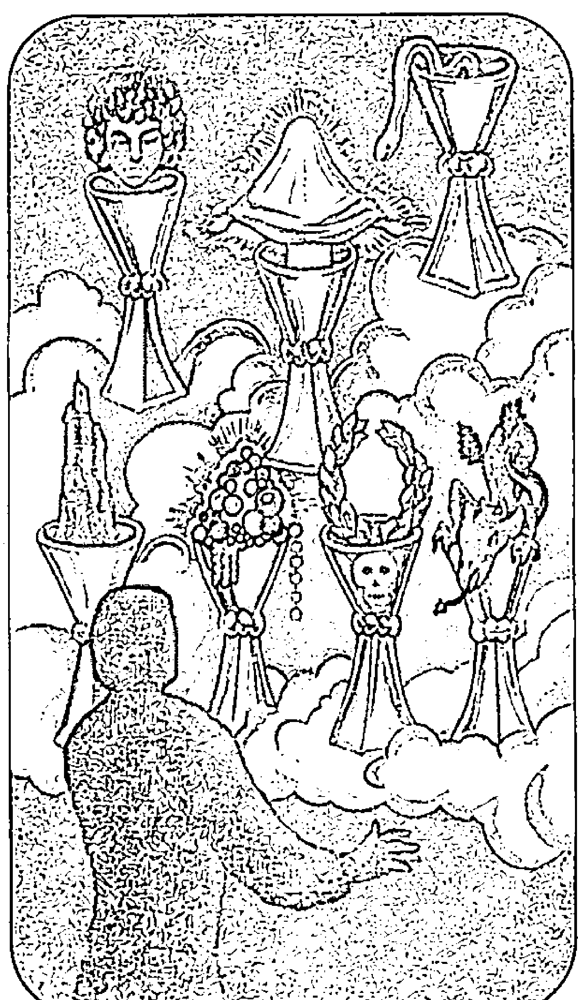

### 基本意义关键字

- 梦想
- 欲望
- 白日做梦
- 迷惘
- 梦境

### 牌面解读

七个圣杯飘浮在云雾弥漫的半空中，杯中分别装着城堡、珠宝、桂冠、龙、人头、盖着布发光的人以及蛇。请注意桂冠的下方有颗骷髅头。一个人面对着这些圣杯，不知该如何选择，他的身体姿态似乎流露出稍微恐惧。

圣杯七代表的是生活中的非现实层面，包括我们的梦境、幻想与白日梦，或是偶而异想天开的点子。我们通常不会真的把这些幻想付诸行动，因此圣杯七不是一张代表行动的牌，而只是一种想象而已。如果当事人目前有很想进行的计划，感觉未来前景一片大好，圣杯七警告：这可能只是自己虚拟的想象罢了。如果在恋爱占卜中，当事人觉得对方似乎对他有意，圣杯七出现，代表这恐怕只是一场一厢情愿的白日梦。

太多选择，往往令人无所适从，圣杯七中的男子就是面对这样的窘境。因此适当的幻想与做梦是有益的，但终日沉浸于幻想世界中，终将一事无成。

### 释义

#### 正位释义

**《工作》**
也许你觉得自己的工作非常成功，但那只是虚幻的假象，你对工作会有很多理想和抱负，只是绝大部分并不可行。

**《爱情》**
这段感情当中很多部分都是你自己想象出来的，实际上并不是那么一回事，你只是和自己虚构出来的对象谈恋爱。

**《友情》**
其实你的朋友很多，但是大部分只是泛泛之交，不要轻易地把别人当成知心朋友，否则很可能会被他们给出卖了。

**《亲情》**
家中成员相处的时间很少，因此彼此之间的感情也比较疏远，如果能够加强关心常常联络，对大家都会很有帮助。

#### 逆位释义

**《工作》**
你的工作非常用脑，也需要做很多的计划以及解决各种的问题，所以虽然不用在外面跑，也还是很累人的工作。

**《爱情》**
经过一段不太稳定的期间，现在感情已经慢慢步入正轨，也算是一种新的开始，很多状况都要重新去计划和适应。

**《友情》**
其实你的朋友并不多，所以大多数状况你都是单独行动；但是由于你待人真诚，因此大部分的朋友都会真心相待。

**《亲情》**
也许家中面对着不同选择而无法决定，其实很多事情需要从长计议，这时候只适合计划不适合行动。

## 圣杯八 Eight Of Cups

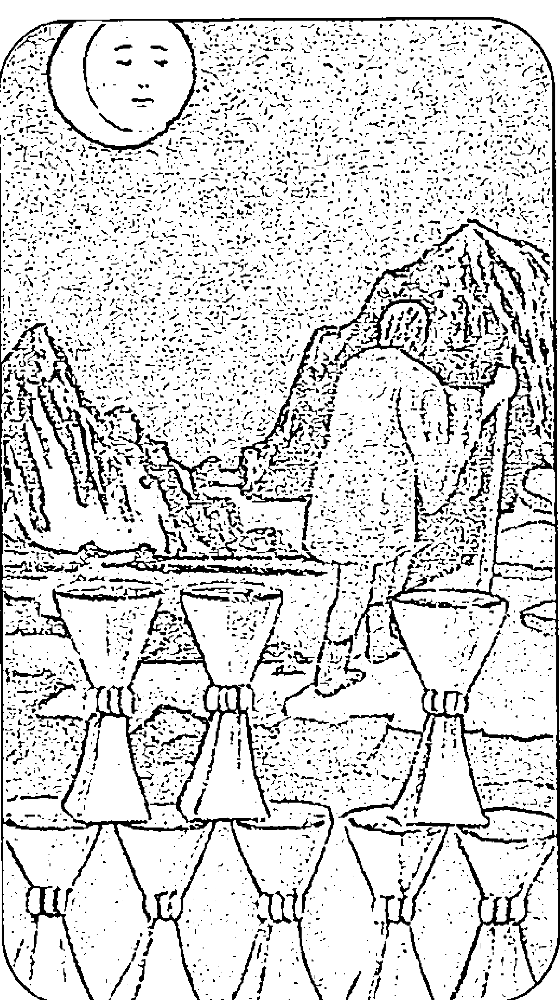

### 基本意义关键字

- 找寻
- 安宁
- 抛弃
- 不满足
- 行动

### 牌面解读

在圣杯八当中有八个正放的杯子，而且留了一个空间给第九个杯子。牌上有一个人正走离这些杯子，朝向更高处而去。这八个杯子代表快乐的机会，而且还可以容纳过去快乐的事物。

你知道的，不论如何，远离你所拥有的以追寻更多事物的时候已经到了，这点我们可由牌上留给另一个杯子的空间看出来。圣杯七中的内在追寻使人理解到必定还有更多的东西，八则显示肉体上的追寻已经开始。这是水的元素真正的意义。在某种处境枯竭或倒塌之前，它使你有能力去感知此状况即将结束。那个人朝高处走去暗示着进步，而且可能会产生一个更好的视野。这张牌和隐士牌类似——要达到更高的地方，或者获得更好的视野，必须先将日常生活中的寻常事物置于身后。月亮正移过太阳，这暗示两件事情：内在的认知比外在的行动更重要，而且这追寻将是夜以继日的。而“醒着”的状态可包含阅读书籍、治疗、上课或聊天。

## 圣杯九
Nine Of Cups

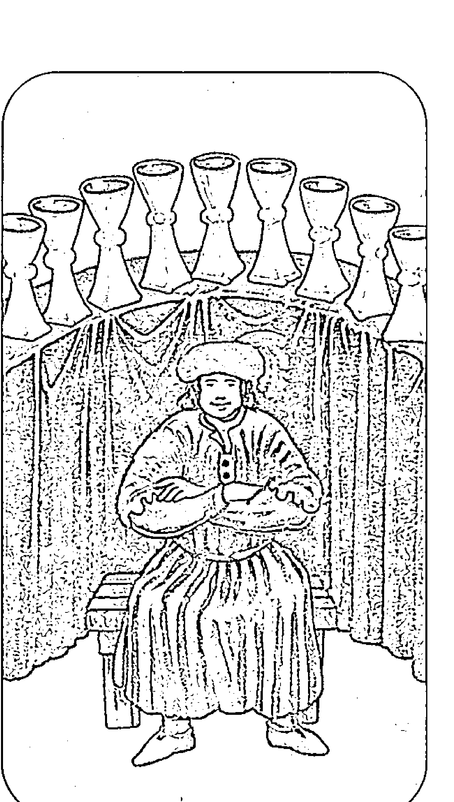

### 基本意义关键字
满足、愿望达成、物质的享受、愿望

### 牌面解读
一个财主装扮的的男子坐在小凳上，双手抱胸，神情怡然自得。他身后的高桌上，覆盖蓝色桌布，九个圣杯排排站。背景则是一片鲜黄。

圣杯九也代表当事人的愿望极有可能实现，无论是精神或是物质方面。

财主非常满意于他的现状，他洋洋得意的抱胸姿态，显示出某种程度的自负。

这张牌也可以与星币六做个比较，在星币六中，我们看到手心向下的财主，与手心向上的乞丐；圣杯九的财主抱胸端坐，则显示一种单纯的满足，而与外界隔绝。

如果将桌子的摆设看作一场饮宴。不难推测出圣杯九也代表享乐，而且通常是物质感官上的享受。

相较于与大自然亲近的星币九，有人认为圣杯九代表的享受很肤浅，但是有时候在身心疲惫之余，没什么能比圣杯九更让人放松的了。

### 释义

#### 正位释义

《工作》
你对于自己现在的工作并不满意，因此常会想要做一番改革或是干脆离职算了，再多的金钱也填不满内心的空虚。

《爱情》
你对这段感情的状况并不满意，也常常会想做些什么来改变，也许两个人之间已经没有刚开始在一起的那种感觉。

《友情》
虽然你的朋友还不少，但是其实你常常想要一个人就好，你应该勇敢地去做自己想做的事情，不要太被朋友牵绊。

《亲情》
现在家中可能有人会离家发展或是远行，大家应该要尽量地关心和帮助他，同时也要自立自强，让他没有后顾之忧。

#### 逆位释义

《工作》
你现在的工作费力而且不稳定，但是在工作当中还蛮愉快的，因此有时候会自己想要离开，同时又会感觉舍不得。

《爱情》
这段感情已经走到了重要的转折点，即将进入到下一个阶段，如果两个人没有准备要结婚，很可能就会走向分手。

《友情》
你在朋友之间还蛮受欢迎的，也会在人际关系当中得到很多快乐，只是你常常觉得这种关系并不是太深入和稳固。

《亲情》
现在家中遇到一些令人高兴的事情，但是也许并不是很稳固，要看到事情背后的真相，不可以太盲目地相信别人。

### 释义

#### 正位释义

《工作》
你对于自己的工作相当满意，你本身在工作当中的表现也非常好，你常常会以自己的工作为傲，并且向别人炫耀。

《爱情》
双方对于这段感情都觉得很满意，彼此之间也保持着良好的关系，两个人之间的和谐相处常常会带来更多的欢乐。

《友情》
你的人际关系还不错，但是有时候会太过于主观和自负，常常就在不知不觉当中得罪人，也许可以稍微修饰一下。

《亲情》
现在家中充满了快乐的气氛，也有很令人满意的生活，大家都在自己的岗位上表现得很好，也常常会彼此称赞。

#### 逆位释义

《工作》
你在工作上非常追求完美，但是总是很难达到自己的理想，有时候也因为对自己太有信心，以致犯了严重的错误。

《爱情》
两个人在感情当中都各执己见，又不愿意彼此体谅，因此常常会发生不愉快的状况，但是又不知道该如何才能解决。

《友情》
你最近在人际关系上很挫折，常常会觉得受到欺负，也许你应该打听一下自己到底是哪里做错了，以免受到排挤。

《亲情》
现在家中遇到一些挫败，实在是该要好好研究找到解决方案的时候，最好能多参考别人的意见，别再闭门造车了。

## 圣杯十
Ten Of Cups

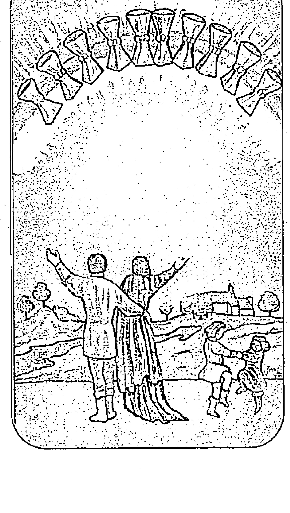

基本意义关键字：幸福、家人、情感团体、家庭、满足

### 牌面解读
在图中我们看到一家四口其乐融融，父母亲拥抱对方，各举一只手迎向圣杯彩虹，两个孩子快乐的手牵手跳舞，背景是清翠的树木河流，和一栋房屋。圣杯十主要表现情感联系的团体，例如家庭、社团、感情很好的班级、几个知交好友、良好的亲子关系、合作关系、结盟关系。在这其中我们可以得到充分的情感交流与支持，就像是在背后支撑我们的力量，我们知道自己并不孤独。欢乐、喜悦和满足充满在四周，我们还可将这些幸福与所爱之人分享。不再敌对，和谐与宁静取而代之。

在感情方面的占卜，圣杯十代表两人已经越过圣杯二的热恋阶段，寻求更稳定更恒久的关系，共组家庭是很有可能的决定。这张牌显示求问者会有一时期过得很开心及满足，尤其是与家人一起时。同时这张牌也显示求问者将达成目标或心愿。若求问者正打算结婚，这绝对是好兆头。

### 释义

#### 正位释义

《工作》
是一个很完美的工作，不但工作环境的气氛很好，也能够同时兼顾家庭生活，你本身在工作当中的表现也非常好。

《爱情》
现在两个人的相处十分和谐，就像是家人一样的感觉，只要大家能真心地对待，未来仍然会保持很好的感情状况。

《友情》
你和大家的关系都已经很稳定了，也建立起固定的人际网络，你对朋友就像家人一样，朋友们常可以一起出去玩。

《亲情》
现在家中的状况十分和谐，家庭成员彼此之间的感情很好，大家对这个状况十分满意，也是人人称羡的模范家庭。

#### 逆位释义

《工作》
你很喜欢你的工作，但却不太被家人所理解和接受，你希望能在两者之间取得平衡，但是常会影响到工作情绪。

《爱情》
这段感情开始时太过于理想化，以至于忽略了很多实际上的困难和问题，到现在即使想要回头，也已经来不及了。

《友情》
你对大家都还不错，但是在人际关系中却不太受欢迎，主要是因为你常常表错情，让别人觉得你不是很真心在付出。

《亲情》
现在家中充满了欢乐的气氛，但是却没有人发现潜在的问题，也许在表面的和谐之下，其实是存在着很多的危机。

## 圣杯侍从
Page Of Cups

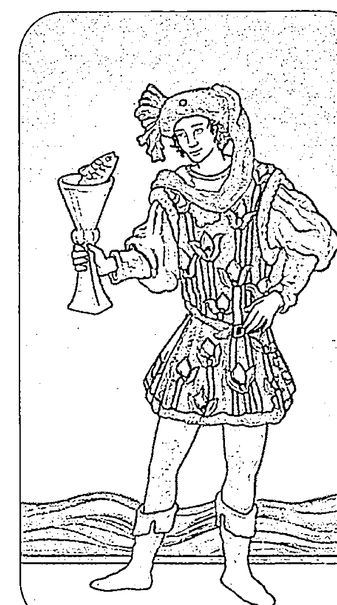

### 基本意义关键字
柔弱、情窦初开

### 牌面解读
他是温暖、有创意而敏感的孩子。你可以把他想象成害羞的小白兔或是含苞待放的小诗人。他可能过度敏感，会把事情看得太正经。他是你身边的快乐源头，因为他是那么的敏感、慷慨、温暖而充满爱。他好比是对你有益的小精灵，纯真而善良，随时与你一同欢笑、哭泣与游戏。若这牌意是与人有关的话，这人对求问者无时无刻都会是友善及关怀的，给求问者很多安慰。又或是求问者会以一个较灵性的角度去重新审视生命。

### 释义

#### 正位释义

《人物》
待人诚恳而有礼貌，对于新鲜的事物有强烈的好奇心，不只认真好学，而且能独立思考，同时具有丰富的想象力。

《工作》
你对于本身的工作还不是很熟悉，应该要快点学习让自己进入状况，整体来说会是愉快的，也可以学到很多东西。

《爱情》
现在感情还在刚开始的阶段，对双方来说都需要一段时间去适应，未来的发展还有很大的潜力，也有各种可能性。

《友情》
你的人际关系还不错，和大家都能保持良好的互动关系，也可以与大家打成一片，你常在聊天当中学到很多东西。

#### 逆位释义

《人物》
喜欢幻想而不切实际，因此对于事情常常没有正确的认知，缺乏明晰的判断力，也会比较没有实际去做的行动力。

《工作》
工作上没有明确的规则和制度，因此必须边做边学摸着石头过河，但是又存在着很多可能会失职或违法的陷阱。

《爱情》
现在感情还算是暧昧期，双方也没有真的认定对方就是唯一的情人，可能还有其他备胎人选，没有下最后决定。

《友情》
你在人际关系方面的状况还不错，由于你很擅长讨好和巴结别人，所以即使不喜欢你的人也不会和你正面冲突。

## 圣杯骑士
Knight Of Cups

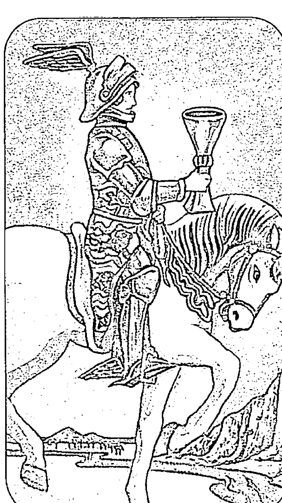

基本意义关键字：体贴、美男子

### 牌面解读
浪漫，重直觉，有创意，聪慧，情感丰富。他很冲动，把自己全部贡献给艺术或爱情，像是莎士比亚笔下的罗密欧。这张牌显示求问的事情不久便有新机会。若与人有关，这个人非常友善可亲、感性、富创意及理想，不过他却不知从何做起。

### 释义

#### 正位释义

#### 《人物》
在思考上敏锐而富有理想性的人，喜欢对别人宣扬自己的理念，也有很好的口才，但是在执行力方面就比较不足。

#### 《工作》
现在工作的状况很有挑战性，要花很多脑筋去想办法解决问题，还要努力去说服别人，上下班时间没有明显界线。

#### 《爱情》
其实两个人都很享受这段感情，也在这个关系当中开发很多感情方面的能力，整体来说是一段浪漫而热情的关系。

#### 《友情》
你在人际关系上的表现很不错，不但各式各样的朋友很多，也可以与大家保持不错的关系，你很喜欢和朋友聊天。

#### 逆位释义

#### 《人物》
口才很好但是没有真材实学，因此常常让人觉得流于诡辩，表面上看起来谈吐温文有礼，其实常常都是口蜜腹剑。

#### 《工作》
这个工作可能本身就是一个骗局，或者是用不正当的方法赚钱的工作，如果能够早点离开的话或许可以全身而退。

#### 《爱情》
其实在这段感情当中充满了虚伪的谎言，双方都不是真心在和对方交往，甚至两个人都已经有私底下出轨的状况。

#### 《友情》
你在人际关系上的评价很两极化，喜欢你的人觉得你很好，但是讨厌你的人则是恨你入骨，其实你常觉得很孤独。

## 圣杯王后
Queen Of Cups

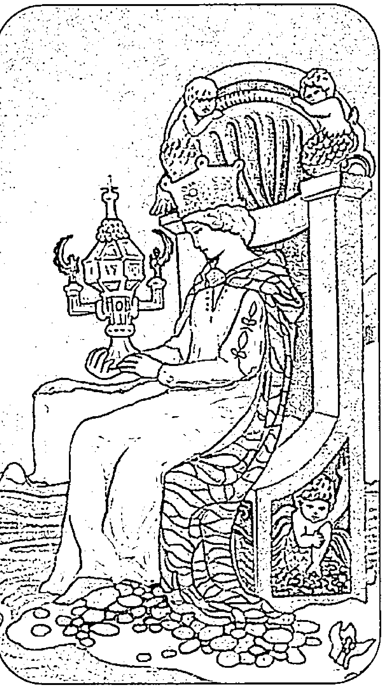

### 基本意义关键字
- 温柔
- 聆听

### 牌面解读
想象力强、重视直觉、浪漫。当你想要算塔罗牌，或是想要情感上的安慰，你会找圣杯王后。她是那种会让年轻小伙子爱上的成熟女人，不是因为美貌，而是因为她的同理心。她是梦想家。这牌中喻示的女性温柔仁慈，因此永远有一群敬爱她的朋友包围着她。她的直觉及感应力非常敏锐，她可给予求问者一些安慰及支持。

### 释义

#### 正位释义

《人物》
对于人及情绪非常敏锐，也能够以同理心去看待事情，重视心理分析和情绪管理，在心灵及神秘学方面很有天分。

《工作》
现在工作的状况十分稳定，你可以全心全意地专注于工作，任何问题都很难令你分心，你也会在工作当中学到很多。

《爱情》
现在两个人感情十分稳定，彼此之间相处的时间也非常快乐，在这段感情当中双方都学习到如何去经营一段感情。

《友情》
现在你的人际关系不错，与朋友的相处也都很快乐，你常常能帮助朋友处理很多事情，因此他们也会努力回报你。

#### 逆位释义

《人物》
想象力很丰富但也比较情绪化，常常会陷入自己的幻想当中无法自拔，有时候不经思考就会随着自己的感觉说话。

《工作》
现在工作的状况其实很不稳定，甚至不知道明天会不会有工作，即使偶尔有不错的表现，也常会引来更多的麻烦。

《爱情》
这段感情缺少实际相处的经验，很多事情都是自己想象出来的，其实两个人都是在和自己想象出来的对象谈恋爱。

《友情》
你在人际关系上是属于比较喜欢独处的类型，同时因为你常常会说话得罪其他人，所以也很少会有知心的好朋友。

## 圣杯国王
King Of Cups

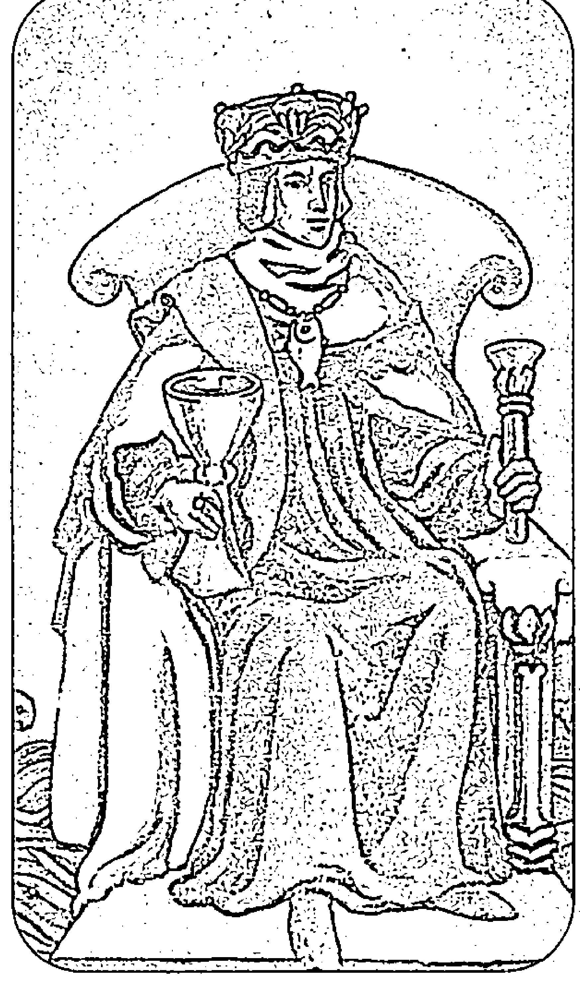

### 基本意义关键字
仁慈、亲切

### 牌面解读
无论对于家庭，爱情还是财产，都付出爱与关怀。圣杯国王具有前瞻性，愿意为他心中所爱付出一切，是四个国王中最善良的。这张牌显示的男性是友善仁慈并替人设想，但他却不太愿意显露个性。他很得大家的尊重，是一位专业人士。另一方面，这张牌叫求问者多留意自己的内心感受。

### 释义

#### 正位释义

《人物》
慈悲宽容的一个人，通常都很乐于助人，在经验和学识上很丰富，对于婚姻及家庭等传统价值也十分坚持和重视。

《工作》
工作上虽然遇到很多的变化，但是你都可以安全度过，若是遇到无法解决的问题，也都会有人对你及时伸出援手。

《爱情》
现在两个人之间感情的状况非常稳定，有可能是正在计划结婚，彼此的相处像家人一样，也会受到大家的祝福。

《友情》
你的人际关系很好，大家都很喜欢来找你帮忙，在能力范围之内你也都热心地帮助他们，所以会很受朋友们敬重。

#### 逆位释义

《人物》
空有伟大梦想但是本身并没有去实现的能力，常常会觉得自己怀才不遇，有时满口仁义道德实际上却是个伪君子。

《工作》
工作上的起伏让你感觉窒息，各种压力也几乎超过你的负荷，表面上看起来光鲜亮丽，其实是金玉其外败絮其中。

《爱情》
现在这段感情当中是波涛汹涌，充满了各种情绪性的冲突，彼此之间的关系也岌岌可危，随时都有破裂的可能性。

《友情》
你的人际关系状况很不好，大家都不能信任你。你应该要改过自新，想办法重新做人，慢慢重建朋友对你的信心。

## 宝剑王牌
Ace Of Swords

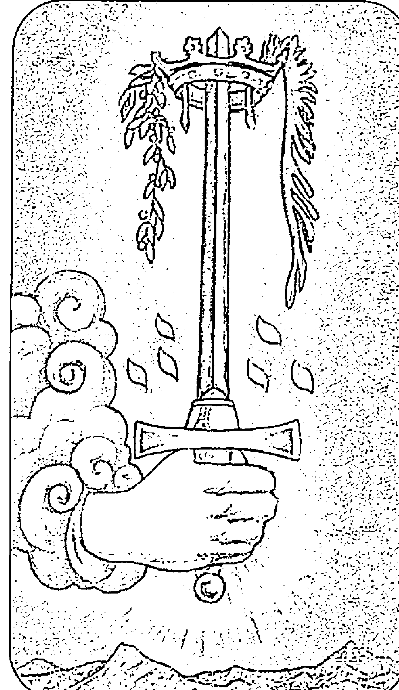

基本意义关键字：梦想、理智、唯我独尊、新挑战、极端

### 牌面解读
宝剑王牌描绘的是一只从云（或是精神）中伸出的手，掌中握着一把剑，剑端由一顶黄金皇冠的中间穿过。背景是一系列的淡灰色，而剑本身则是鲜明的蓝色。剑代表的是通澈的思想。

这把剑是朝上的，而且双刃都看得到，表示说状况的两面都清楚的呈现在眼前。它表示注意到了生命的二元性。

皇冠代表的是物质世界，而剑刺穿了这个世界。由精神层面来看它暗示你的心智可以看透物质世界，而看到事件的精神层面，以及思想在物质世界中所造成的结果。这是一种理解，理解到宇宙中既没有奖赏，也没有惩罚，只有结果。

这张王牌告诉我们的是，计划或开始一项新的冒险行为。生命提供你一项新的可能，而你必须谨慎的评估任何所采取的行动可能带来的后果。

### 释义

#### 正位释义

#### 《工作》
你现在的工作面对着全新的挑战，对你来说也是很好的表现机会，不论到最后的结果是什么，都值得你全力一拼。

#### 《爱情》
这段感情进入了一个新的阶段，也面对与之前不同的挑战，两个人要小心处理这个状况，以免因此发生新的争吵。

#### 《友情》
你在朋友之中很受重视，也可能成为大家的领导者，但是记得要用同理心与大家相处，太过主观只会帮你树立敌人。

#### 《亲情》
现在家中面对新的状况和挑战，需要非常理性地去分析和面对，掌握到主导权的一方，一定会是最后的胜利者。

#### 逆位释义

#### 《工作》
你现在的工作面临到很大的困难，处理得不好还可能会造成无法弥补的损失，严重的话甚至会让你丢了这份工作。

#### 《爱情》
这段感情遇到了极大的问题，也可能因为外力的介入使得这段关系变质，你觉得无法承受这样的压力而几乎崩溃。

#### 《友情》
你在朋友之间常常受到排挤，也很难交到新的朋友，你应该要找和你比较接近的人当朋友，而不是想要攀权附贵。

#### 《亲情》
现在家中面对着很大的困难甚至灾难，需要大家齐心协力去解决，如果这时候不能保持冷静，甚至可能会家破人亡。

## 宝剑二
Two Of Swords

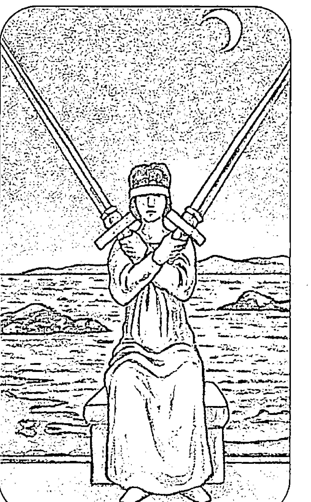

基本意义关键字：执着、虚拟与现实、逃避、抗拒、对立

### 牌面解读
身穿浅灰长袍的女人坐在灰石凳上，背对着澎湃汹涌、暗礁满布的海洋。她眼蒙白布，双手持剑，在胸前交叉不动。天际高挂一轮新月。

女人身后的水面代表感情，她不仅背对感情，还布蒙双眼，表现出全然的逃避与困惑。此举如同掩耳盗铃，其实后面的汹涌海面、密布礁石与多变新月，早已彻底显露她的内心情感，而她选择蒙上眼睛，背对不看。宝剑二也是一张有关决定的牌，表示当事人做不出决定，或拒绝决定。

她双手持剑，交叉在胸前，形成一种抗拒的姿态。这也意味着她有颗封闭的心灵。无论遇到何人何事，她总会两手交叉，大声说 No ！她宁愿否定一切，也不愿打开心扉。女人静坐不移，两把宝剑亦斜立不动，互相对立，形成僵局。这两把剑好象两股势力，彼此对峙许久，却毫无动静，没有一方率先打破沉默。因此，宝剑二经常表示双方闹僵、对峙与冷战，有点像是两个国家都有核武，却没人先动手的这种「恐怖平衡」与「假性和平」。

### 释义

#### 正位释义

#### 《工作》
你现在的工作陷入僵局，或是与别人发生对峙的状况，表面上看起来似乎没有什么问题，但是其实问题很难解决。

#### 《爱情》
现在这段感情陷入冷战当中，两个人都各自坚持自己的立场不肯妥协，同时也关闭了协调的大门，无法看见真相。

#### 《友情》
你很重视与朋友的人际关系，但是陷在两派朋友之间不知如何选择，所以只好采取逃避的策略以免得罪任何一方。

#### 《亲情》
现在家庭内部产生了严重的对立，双方都各执己见无法妥协，这时候应该要看清状况调整，而不是陷入意气之争。

#### 逆位释义

#### 《工作》
现在你的工作状况陷入两难，也很怕被别人给出卖，所以无法相信任何人，但是自己又没有能力单独去解决问题。

#### 《爱情》
你可能在感情上遇到两个不同的选择，不论选择谁都不能让你完全满足，但是你自己又不愿意陷入三角关系当中。

#### 《友情》
你目前很少参加朋友们的聚会，也很少主动去交新朋友，你可能因为之前受过朋友的伤害，所以常不自觉地防御。

#### 《亲情》
现在家中还能保持表面平静，但是事实上内部有严重的歧见，甚至会发生互相欺骗的状况，因此你很难看清真相。

## 宝剑三
Three Of Swords

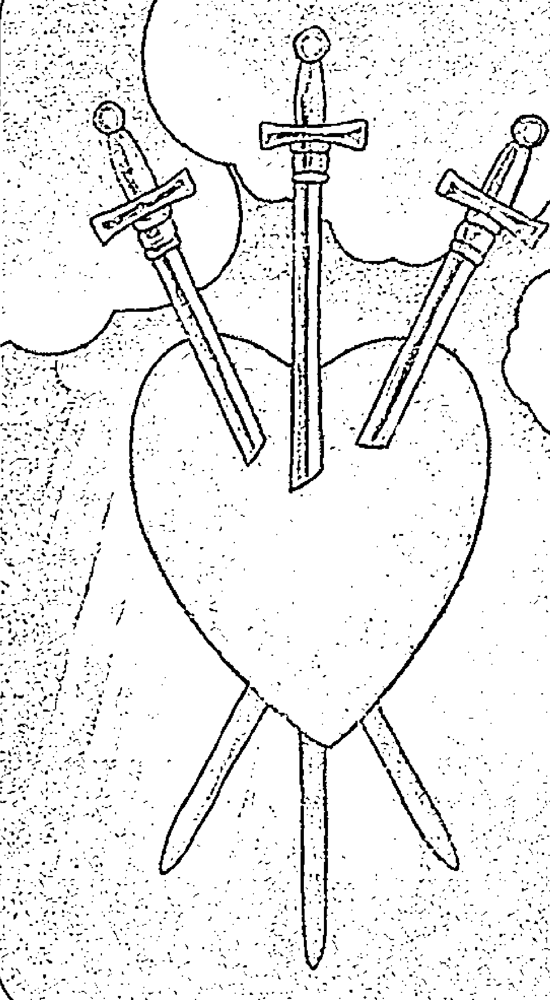

基本意义关键字：悲伤、痛苦的回忆、失落、延迟

### 牌面解读
宝剑三画的是，一颗心被三把交叉的剑刺穿过去，而背景则是风暴肆虐。这颗心是鲜红色的，和灰蒙蒙的云形成强烈对比。宝剑三暗示着悲伤、失落和哀痛。绝望和失望通常会伴随着这张牌。有些人觉得这张牌说得太赤裸了，然而我们在生命的某些时候都曾经经历悲伤和痛苦，这可以使我们变成熟、怜悯和包容别人。

当宝剑三出现时，可以预期你将遭遇某些痛苦。不要拒绝这份痛苦，因为如果你拒绝了，可能会导致感情上的停止或沮丧。如果你从内心的痛苦中退却的话，可能有脱离生活，脱离周遭环境的危险。

许多疾病的根源可以追溯到拒绝痛苦。某些慢性的健康上的问题都可能和回避正常的痛苦，或不愿坦然接受生命中的种种伤心有关。当这张牌出现时，你要知道：去体验你的悲伤是很重要的，因为在这么做的同时，你也扫除了障碍，让即将到来的机会可以接近你。记住，悲伤是会过去的。

### 释义

#### 正位释义

#### 逆位释义

#### 《工作》

这个工作本身让你伤心难过，当中充满了对你不利的各种因素，不只让你有志难伸，还会伤害你的人格和自信心。

#### 《爱情》

你对于自己在这段感情当中的状况感到悲伤，也许是对方做了让你伤心的事情，或者是自己真心的付出不被接受。

#### 《友情》

现在你没有什么朋友，也有可能被朋友所出卖或欺骗，因此就很难再信任其他人，你还在伤心的气氛中走不出来。

#### 《亲情》

现在家里发生了令人伤心难过的事情，也许是有亲人过世或是离婚，在这种抑郁的气氛下，应该先把自己照顾好。

#### 《工作》

你现在工作的状况十分混乱，也常常会发生各种错误，让你觉得自己快要精神错乱，甚至会造成无可弥补的损失。

#### 《爱情》

现在这段感情已经变得混乱失控，也常发生一些误会让彼此伤心，在这个状况下你很想离开，但是又怕对方难过。

#### 《友情》

你现在的人际关系很差，常常在不知不觉当中说话得罪人，事后也不知道如何补救化解，因此朋友就会越来越少。

#### 《亲情》

现在家里陷入了混乱不清的新局面，这个时候你应该要扮演稳定的力量，把问题的来龙去脉搞清楚才有可能解决。

## 宝剑四

### Four Of Swords

### 基本意义关键字

- 休息
- 卸下包袱
- 消极
- 沉思
- 准备

### 牌面解读

宝剑四画的是一个男人以闭目沉思的姿态，躺在教堂内的棺木上。有一把剑横置在他的下方，另三把剑则是剑尖朝下放在他上面的位置。透光的彩绘玻璃上生动地描绘一名使徒，正接受他所敬重的某个人的祝福。

这张牌暗示的是消极的思想、退却或沉思。黄色前景意味着使用中的智慧。因为黄色在传统上暗示对生活的知性态度。这牌暗示为了重获力量及理解力而离群索居。该是退下来，好好把事情想清楚，好好养病，或暂时隐居一段时间的时候了。

在四这张牌中，这个人为了想通事情而暂告退隐。假设他想清楚事情以后，就会再返回生活当中，这将是一个很有意义的过程；而假设他没有再回来，他就会冒着让所有事情停滞不前的危险。

宝剑四代表他经由连结或组合他对人生思想及信仰来强化他自己。在反思过他以往的行为和经验之后，他终于对人生有了更深层的领悟了。

### 释义

#### 正位释义

#### 逆位释义

#### 《工作》

目前在这份工作当中暂时取得了喘息的机会，可以稍微放松自己一下，但是未来仍然有很多的挑战等着你去解决。

#### 《工作》

这个工作当中有很多潜在的危机，应该要小心预防各种可能的问题发生，即使外表看起来很悠闲，其实是外弛内张。

#### 《爱情》

两个人在争吵之后已经恢复平静，但也可能只是暴风雨前的宁静，现在应该好好思考这段感情的下一步该怎么走。

#### 《爱情》

两个人之间的关系很平静，但是也可能有一点冷漠，现在双方都不想引发任何冲突，所以会想尽办法去预防争吵。

#### 《友情》

基本上你的朋友很少，即使是很好的朋友也不太常联络，你早已经习惯一个人独来独往，也不觉得这有什么不好。

#### 《友情》

其实你的朋友并不多，但是每个都是精挑细选的知心好友，即使已经很长一段时间没联络，彼此的感情也不会变。

#### 《亲情》

家里已经从混乱的局面当中脱离出来，现在是应该要休养生息的时间，这个时候不宜有大动作，让大家好好恢复。

#### 《亲情》

可能有年老或病重的家人需要别人照顾，所以大家应该要分担责任轮流负责，交由其中一个人去处理会把他累死。

## 宝剑五

### Five Of Swords

### 基本意义关键字

- 纷争
- 短暂的胜利
- 恶化
- 无谓的胜利

### 牌面解读

在宝剑五这张牌中，有五个人在争吵，而牌面上我们可以看到三个人。在前面位置的这个人赢得了这场战役，然而整个战争究竟鹿死谁手还未定，因为事情还没有真正的解决。画面上的云反映出一种充满愤怒、恐惧的气氛。

这张牌意味着争辩、冲突和失落。虽然打赢了这次战役，却失去了更多东西，包括学习和成长的机会。这场战斗可能是两性关系、合伙关系，或是工作环境中，两个或两个以上的人的战斗。关于事情该如何进行，彼此之间的意见不能协调，而使紧张的气氛上升。当冲突越来越强烈时，某一方通过武力、胁迫或技巧性的操作来得到他们想要的东西。他们可能会因此小胜一回合，但却失去了其他与此事有关者的尊敬和合作意愿。

宝剑五暗示妥协而非解决。没有解决的问题还是有再回来的可能，它可能会以不同的面貌降临，而且有持续出现的可能，直到整个事件解决为止。

“要是我能掌握这一切的话，该有多好！”正是这张牌所代表的态度。

### 释义

#### 正位释义

#### 逆位释义

#### 《工作》

这是一份痛苦的工作，当中充满激烈的斗争，无时无刻都要武装自己，如果你不打倒别人，就会有别人来打倒你。

#### 《爱情》

现在两个人陷入了激烈的争吵当中，而且是完全没有建设性的意气之争，即使表面上吵赢了也不会得到任何好处。

#### 《友情》

你有时候会在朋友之间挑拨离间，造成大家都不能互相信任，你不但无法得到任何好处，还会留下一些负面印象。

#### 《亲情》

家中现在可能为了很不重要的事情吵成一团，甚至还会有暴力相向的状况，这个时候大家应该各退一步冷静一下。

#### 《工作》

你在工作当中遭遇到严重的挫败，甚至可能弄到自己声名狼藉快要待不下去，即使你再怎么努力也很难挽回劣势。

#### 《爱情》

你在这段感情当中居于劣势，一切都只能让对方予取予求，你完全没有反击的能力，因此自己也会变得虚弱无力。

#### 《友情》

你在人际关系当中很怕与别人发生冲突，也缺乏自己的主见，因此常常会被别人欺负，但是又不知道该如何反击。

#### 《亲情》

现在家中发生了重大的危机，不是任何一个人可以单独应付的，这个时候应该先收拾震惊的心情，理性冷静面对。

## 宝剑六

### Six Of Swords

### 基本意义关键字

- 平和
- 海运
- 探索
- 忧郁
- 疗伤
- 痊愈

### 牌面解读

宝剑六的牌描绘的是一名男子驾着一艘平底船，从激流处驶向平静的水面，另有一个女人和一个小孩也陪着他度过这段旅途。船上有六把剑，代表过去和现在对生活的信念。他们的重量使得船身下沉，进展显得格外困难，但如果把他们移开的话，船上会留下六个洞，而且船也会沉没。

这张牌暗示你对生活的信念使你行动迟缓，不过也别尝试急切的改变，因为进步本来就是缓慢而稳健的。急切的改变可能会导致更多的问题，而非带来解决的良方。

宝剑六这张牌也可能是一张哀痛的牌。它暗示一个宁静的转移，例如：生病之后的死亡，或慢慢地接受某种状况的结束。平静的水面指向前方的陆地，是这张牌在告诉我们，更多和平的时光即将到来。这张牌上面倒立的剑暗示，你的思想已经回到真实情况中了，换句话说，生活正反映着你的信念。

### 释义

#### 正位释义

#### 逆位释义

#### 《工作》

你的工作还要再过一阵子才会看到成果，这段时间应该要低调以对埋头苦干，等到时机成熟之后自然就会达到成功。

#### 《工作》

现在工作当中发生了重大的风波，你若是不想被卷入其中就要低调以对，只要把自己的事情做好，其他的都不要说。

#### 《爱情》

两个人之间存在很多问题，但是因为双方都在努力去解决，所以状况就会渐渐改善，应该会朝向有利的状况发展。

#### 《爱情》

两个人在这段关系当中共同克服了很多问题，也算是患难夫妻或苦命鸳鸯，在这种状况之下累积了深厚的感情。

#### 《友情》

你不是很重视社交的人，但是仍然会有几个不错的死党可以聊天，大家也许是因为有共同的兴趣爱好而聚在一起。

#### 《友情》

你的朋友很多都是可以共患难的朋友，但是这些人很难共享乐，即使共同经历一些苦日子，后来还是可能会翻脸。

#### 《亲情》

之前家中可能遇到不好的状况，但是现在已经渐渐恢复正常，你应该扮演稳定者的角色，快点把过去的伤痛抚平。

#### 《亲情》

现在家中面对着比较大的变化，这时候应该要自立自强一致对外，采取实际的行动，不要想会有别人来帮忙你们。

## 宝剑七

### Seven Of Swords

### 基本意义关键字

- 突发奇想
- 与众不同
- 欺诈
- 孤立

### 牌面解读

塔罗牌中所有的七有着共同的意义：不要放弃。而宝剑牌的七则意指在精神上不要放弃。此时正是另觅途径，以不同的解决之道来应对眼前问题的时刻了。这张牌画的是一个军营。牌中这个人正在偷取敌人的武器。他拒绝投降，所以在还有时间的情况下，他做任何可能扭转局势的事。

在早晨，这些剑的主人打算利用它们来杀死画面上这个人，然而他可还没放弃呢。他知道偷走部分的武器，就能增加生存的机会。他是一个穷则变、变则通的人。他正在找寻心目中认为可达成生存目标的方法。这张七暗示经由审慎评估各种可能，你就能找到有效的解决之道。

### 释义

#### 正位释义

#### 逆位释义

#### 《工作》

你目前正在进行一个不可能的任务，事情的困难程度早已经超出你的能力范围，但是你仍然对这个工作充满信心。

#### 《爱情》

两个人之间存在欺骗或隐瞒的状况，有时只是对方有些事情没有对你讲，但是严重的也有可能会出现外遇的情况。

#### 《友情》

你的人际关系表面上看起来还不错，但是其实常与朋友发生争执，你会太主观地发表自己的意见而引起别人不满。

#### 《亲情》

现在家中可能正在进行一个庞大的计划，但是实际上却是超出本身的能力之外，这个时候应该思考如何安全收尾。

#### 《工作》

现在你的工作处于非常时期，也许需要发挥你的创意，用比较特别的方法才能突破困境，墨守成规只会坐困愁城。

#### 《爱情》

你在感情当中似乎有难言之隐，无法向对方完全坦白，应该快一点把不好的状况结束掉，这段关系才能维持下去。

#### 《友情》

你在朋友当中属于比较聪明机灵的人，但是聪明反被聪明误，反而会常和朋友吵架，有时候装糊涂一点会比较好。

#### 《亲情》

现在家中可能遭遇小偷或是遗失了什么东西，会造成一些不便和影响，这个时候最好能先及时补救，再回头找东西。

## 宝剑八

### Eight Of Swords

### 基本意义关键字

- 限制
- 束缚
- 停止
- 划地自限
- 坏消息

### 牌面解读

一个女人眼睛被布蒙住，上半身被捆绑着，身处八把宝剑群中。地上满是象征羞辱的泥泞，而远方是座矗立于峭壁之上的城堡，象征权威。很明显的，女子眼盲手缚，四周又都是宝剑，使其受到重重的限制与压迫。但请注意，女子的脚并未被绑住，宝剑也没有将她完全困住，四周更无人看守，只要她肯跨出脚步，自由就在伸手可得之处。因此，宝剑八代表的限制不全是外界给予的压力，更常见的状况反而是当事人划地自限。关键即在于蒙住她双眼的布条，因为对四周的无知，所以害怕，所以迷惑，不敢跨出第一步。

我们在生活中常常固步自封，认为自己做不到，或者是单纯出于对陌生事物的恐惧，因而畏缩退却，殊不知事情根本没有想象的那么困难。如果你经常感到压力，觉得受到束缚，请仔细想想，这些压力是不是多半自己找来的？如果你觉得对未来很不确定，心慌意乱，宝剑八告诉你：请把眼罩取下，走出泥泞与剑阵。其实很容易，不是吗？

### 释义

#### 正位释义

#### 逆位释义

#### 《工作》

你在这份工作当中受到很大的限制，以至于无法发挥出你原有的实力，这个时候每一步都要很小心以防自己犯错。

#### 《工作》

你在这个工作当中遇到很多的困难，但是有很多是你没有办法去处理的，也常常为了处理意外状况花费很多时间。

#### 《爱情》

这段感情被四周亲朋好友们反对，对你们造成非常大的压力，各种不利的消息不断出现，渐渐消磨了你们的信心。

#### 《爱情》

这段感情当中存在着许多的问题，两个人也常为了这些无解的问题而不断争吵，可以说是进入了一段混乱的时期。

#### 《友情》

你在朋友当中并不受欢迎，甚至还有可能会受到排斥，你常常因此而感到不满，但是也没有办法去解决这样的问题。

#### 《友情》

你在朋友当中常常觉得不安，但是也许并没有什么具体的事情发生，你应该放开心胸，不要为了小事情就闹脾气。

#### 《亲情》

现在家中面对着很大的外在压力，而且也不是短时间之内可以解决的，所以这时候大家应该要团结一致共同对外。

#### 《亲情》

现在家中可能有人遇到了意外的事故，或是发生了重大的变故，这时候应该要冷静以对，而不是一味地逃避问题。

## 宝剑九

### Nine Of Swords

### 基本意义关键字

- 担心
- 梦魇
- 绝望
- 痛苦
- 失眠

### 牌面解读

宝剑九是一张焦虑不安的牌。画面背景为黑色，九把宝剑依次横在黑夜之中，床上的男人从睡梦中突然惊醒，恐惧和忧伤让他痛苦地捂住脸庞，而他的头发和衣衫都是灰白颜色，显得没有活力和生机。床下的抽屉上隐约可见两人战斗的局面，而上方的宝剑在方位上横贯男人的头部和身体，更增加了紧张和伤痛的附加含义。让人略表欣慰的是，男人的被子上开满红色的花朵，代表着希望，也可以看出所有的担惊受怕都会过去的。

如果看关系的话，宝剑九是一段充满着怀疑的关系，双方对彼此缺乏信任，太过紧张，因为对方的一举一动胡思乱想，导致心情不好或者引起不必要的争执。

牌面上可以看出，恐惧来自于梦中。宝剑九的种种表现是来自潜意识，多数时候宝剑九的烦恼是不必要的，是自己强加给自己的，或者是夸大了想象。如果出现这张牌，要注意调整好自己的心理状态。

### 释义

#### 正位释义

#### 逆位释义

#### 《工作》

现在的工作让你觉得沮丧和绝望，不但看不到任何的希望，自己也完全无能为力，在这个时候也许只能任人宰割。

#### 《工作》

这个工作每天都在担心害怕中度过，出状况的时候也只能够走一步算一步，即使再怎么努力也无法把问题完全解决。

#### 《爱情》

这是一段没有未来的感情，而且对彼此都造成很大的心理压力，当中有太多的问题存在，大部分都是无法克服的。

#### 《爱情》

两个人在感情当中彼此猜忌，但是又不愿意面对现实，常会为了不存在的问题争吵，因此也算是完全无解的状态。

#### 《友情》

由于之前被朋友伤害的经验，使你对于友情完全绝望，也完全无法再相信任何人，因此也很难交到新的知心朋友。

#### 《友情》

你对于交朋友这件事情有点害怕，也会有很强的心理障碍，筑起很重的心防，常常宁愿一个人也不愿意和朋友出去。

#### 《亲情》

现在家中发生了重大的问题，而且看起来完全没有好转的迹象，这个时候你应该要耐心等待，千万不要慌了手脚。

#### 《亲情》

现在家中陷入了一个困境，大部分的人也因此而担心害怕，这时你应该要先冷静下来，找到问题发生的真正原因。

## 宝剑十

### Ten Of Swords

### 基本意义关键字

- 失败
- 结束
- 极端
- 苛责
- 危险
- 死亡

### 牌面解读

宝剑十的牌描绘的是一个难以忘怀且不吉利的意象。有一个人脸朝下地躺在地上，而且背部和颈子共插了十把剑。天空是一片漆黑，只有远方隐约地透露出一点象征日出的光线。那一池水沉静如玻璃，而周遭杳无人踪。

这张牌暗示在某种情况下，你已到了最低潮的时刻，但远方微弱的阳光暗示着，尾随这艰困时刻的将会是新的以及更好的事物。你对人生的思想或信念导致你此刻的境遇，从这里，你的思想将会带领你到任何你认为能够去的地方。它或许能帮助你从物质环境、对生命的信念中抽离，以便能巨细靡遗地检视它们。你也可能是被一些无用的事物，或对生命具破坏性的信念给绊住了。通常，在这种低潮的时刻，你会设法去抓住那些你平日弃而不用的事物及态度。要让你自身与这些事物分离，理论上听起来是简单的，但是真要做起来可能会有很多危险性，在真实生活及想象上均然。这里所教导的是屈从，并且容许改变发生。

### 释义

#### 正位释义

#### 逆位释义

#### 《工作》

对你来说这是一份十分痛苦又折磨人的工作，你在当中的表现很差，也觉得不快乐，甚至会影响到你的身体健康。

#### 《工作》

这份工作对你来说没有什么发挥的空间，即使现在看起来有点起色也只是回光返照，短暂得利并不是真正的成功。

#### 《爱情》

现在两个人的相处只剩下痛苦，对你来说是一种很可怕的折磨，你恨不得快一点离开这段关系，但是又无能为力。

#### 《爱情》

你在这段感情当中并不快乐，也觉得无法满足于现状，但你若主动去做很大的改变，反而会带给彼此更大的痛苦。

#### 《友情》

现在的你其实没有什么朋友，总是孤单一人的时间比较多，你常觉得朋友造成很重的负担，有时甚至会带来伤害。

#### 《友情》

你常在人际关系当中刺伤别人，所以没有什么人想和你做朋友，如果你不改变自己的做法，这种状况会持续下去。

#### 《亲情》

在家中发生了令人伤心难过的事情，也许并不是你一个人可以处理的状况，这时候关心和陪伴会胜过千言万语。

#### 《亲情》

在家中出现了重大的转变，这个时候自保是最重要的，如果能把自己的状况先稳住，才有能力去帮助其他的人。

## 宝剑侍从

### Page Of Swords

### 基本意义关键字

- 机警
- 小心谨慎
- 沟通

### 牌面解读

宝剑侍从是信息管理者与分析家。他负责探测并研究新领域，提供信息给其他人。他很注意细节，会用简易的方式解决问题。遇到难解的谜题，他不会紧张。他也代表开始新兴趣或新学问。牌中显示求问者将收到一份重要的文件、合约或信件，求问者宜小心阅读，因字里行间可能有些会牵引起很多麻烦的错误。若这张牌暗喻一个人，这个人是一个聪明、意志坚强却对人冷漠的人。

### 释义

#### 正位释义

##### 人物
十分细心和敏锐，能够收集与区别各种不同的信息，对于新奇的事物有强烈的好奇心，但是有时比较缺乏行动力。

##### 工作
这份工作当中有很多不确定的变化因素，因此并不是一个很稳定的状况，随时都要保持警觉去处理突发的问题。

##### 爱情
在感情关系当中两个人都很在意对方，随时都会想要掌握彼此的行踪，感觉上这段关系仍然还在不太稳定的阶段。

##### 友情
你的朋友很多，但是大部分都是点头之交，大家也许聊天吃饭还可以，无法到谈心的程度，更难提供实质的帮忙。

#### 逆位释义

##### 人物
喜欢刺探别人的秘密，或是讨论别人的八卦，对于很多事情只会空想，但是完全没有规划，也没有实际的行动。

##### 工作
在这份工作当中的流言特别多，而且各方面的消息混乱，不容易做出正确的判断，即使不想理会它们也会受影响。

##### 爱情
在感情上可能会出现其他的挑战者，或是自己也受到外在的诱惑，如果不小心处理，这段关系也可能很快就结束。

##### 友情
你的朋友以酒肉朋友居多，而且都是喜欢传言八卦之流，即使只是一件小事情，也可以被大家添油加醋广为流传。

## 宝剑骑士
Knight Of Swords

基本意义关键字
强势、急躁、言行合一

### 牌面解读

宝剑骑士描述一位年龄介于二十一和三十之间的人，有着敏捷的思想和身体，他喜欢行动甚于审慎规划或深思熟虑。这个人对复杂的事很不耐烦，而较喜欢行动、新鲜事物以及改变。

这个骑士可以选择变成权杖国王或宝剑国王。若要变成权杖国王，他必须规范自己的热情，而若想成为宝剑国王，则必须约束自己的思想。

### 释义

#### 正位释义

##### 人物
具有英雄气质，为人豪爽又讲义气，判断事情明快果决，但是也比较急躁一点，同时会对自己的能力很有信心。

##### 工作
在这份工作当中十分匆忙，工作量也会很大，但是若一不小心也会发生严重的错误，所以一定要维持精神专注于工作。

##### 爱情
在感情当中两个人都十分直接，有什么不高兴就会直接表达出来，甚至以吵架作为沟通方式，其实都很重视对方。

##### 友情
你对大部分的朋友都很好，所以大家也都能投桃报李，虽然其中的酒肉朋友不少，但是也会交到不少的知心好友。

#### 逆位释义

##### 人物
十分急躁而冲动的人，常因为一言不合而与别人起冲突，在盛怒之下就很有可能使用强制手段，甚至会有暴力行为。

##### 工作
这是一份吃力不讨好的工作，每天忙个半死但是又没有实质的报偿，若是发生错误还要被处罚，实在没什么意思。

##### 爱情
两个人常常因为一时的冲动而发生严重的口角冲突，但是在事后又不愿意认错，所以累积了很多不满及愤怒的情绪。

##### 友情
由于你对朋友的脾气都很大，所以很难交到好朋友，你应该要修改自己冲动的习惯，这对你的人际关系会很有帮助。

## 宝剑王后
Queen Of Swords

基本意义关键字
道德、裁定、措辞锐利

### 牌面解读

她是战神雅典娜，随时准备穿上盔甲，上阵守卫与防御。她会排除所有阻碍她计划成功的事物。她是帮助他人分析内心的心理学家。她是导师、领导者、鼓励者与心理分析师。她对于复杂情况的洞见是无与伦比的，因为她同时具备水的直觉和风的智力。她洞察力强，眼光锐利。她是绝佳的沟通者，能够理清所有混乱。她通常单身，有独立的事业与价值观。这是张强烈的牌，同时代表智慧与经验、悲伤与孤独，有时会被当成宝剑国王的配偶或姊妹。有点接近女教皇，也与正义牌有相似之处。这女士既严厉又孤僻，她独断独行，不喜接受他人协助，但她充满耐性及力量，终有一日幸运会降临在她身上。若求问者与她共事，便需好好忍受一下。

### 释义

#### 正位释义

##### 人物
可能因为亲友离逝或其他的感情伤害而变得自我封闭，内心充满悲伤的情绪但又不表现出来，以理性来武装自己。

##### 工作
这是非常需要集中精神独立去完成的工作，也不允许你带有任何私人的情绪，只要犯了一次错误可能就无法翻身。

##### 爱情
两个人都过于理性地面对这段关系，有时候会觉得缺乏真正的感情，太过于计较或者精打细算反而会对感情有害。

##### 友情
你对于其他人无法信任，所以只能和大家保持表面的关系，很难交到知心朋友，因此生活圈也可能会不断地缩小。

#### 逆位释义

##### 人物
无法面对自己内心真正的想法，只好以虚伪的表现来自欺欺人，常自己一个人生闷气，但是又不告诉别人为什么。

##### 工作
这个工作表面上看起来还不错，但是其实当中充满了内斗的危机，如果不小心发生错误，可能就会成为替罪羔羊。

##### 爱情
两个人对彼此的心机都很重，千方百计地想要占对方便宜，虽然表面上看起来很和谐，其实两个人常在勾心斗角。

##### 友情
你对大家太过于冷漠，本身的脾气又不是很好，所以很少有人可以和你成为好朋友，你常常就只能一个人独来独往。

## 宝剑国王
King Of Swords

基本意义关键字
严肃、公正

### 牌面解读

经历丰富的战士，智力极高的学者，交际手腕高明的外交官。持着剑的皇帝代表着男性拥有聪明才智及分析力强，能作出正确的判断，绝对是求问者遇上困难时的一盏明灯，听取这人的意见能帮助解决问题。

### 释义

#### 正位释义

##### 人物
判断力很敏锐的人，对事情会先以理性去分析，而不会被感情所左右，重视公平与正义的价值，常与人保持距离。

##### 工作
现在的工作常需要多年的专业能力，如果在专业上不足很有可能就会被淘汰，随时都要保持专注以便做出理性的判断。

##### 爱情
两个人都很理性地面对这段感情，也很重视彼此的付出是否平衡，如果发生不公平的状况，会很正式地谈判解决。

##### 友情
你与大家都保持一定的关系，所以也没有特别亲近的好朋友，如果能不那么理性地看事情，也许就会交到好朋友。

#### 逆位释义

##### 人物
对自己及别人都十分严格，不容许发生任何错误，只相信自己而不能信任其他人，同时会为了达到目的不择手段。

##### 工作
现在的工作环境十分严苛，不但工作时间长，也没有什么好的福利，常常无法正常休假，可能会影响到身体健康。

##### 爱情
对方在感情上过于强势，让你觉得每天都生活在很大的压力下，如果无法符合对方的要求，两个人又会吵个没完。

##### 友情
你对大家太过强势了，所以常常让朋友感觉到很大的压力，知心朋友也会少一点，应该试着用同理心去交新朋友。

## 星币王牌
Ace Of Pentacles

基本意义关键字
- 物质
- 地位
- 财富
- 享乐
- 安全
- 实质

### 牌面解读

星币王牌代表一个开始。它可能是一个崭新的开始，或某种状态中新局面的开端，这可由和其他牌的组合印证。

这张牌中，一只手自云端伸出，捧着一颗星币。这颗有五个角的星星（代表人体的五个部分：头、双手、双脚）指向上方，并有一个圈圈围绕着它。而方形的大拇指指甲象征着务实的本质。

在它之下有一个繁花盛开的庭院，被篱笆包围起来，避免受风害。有一条道路延伸到庭院之外，通向远方的山丘。这庭院象征它和自然的连接，通向群山的道路。暗示着你所投资的金钱、时间或精力可能会带来极大的回馈。这安全的捧起星币的手暗示着，此时此刻你足以掌握住你的财富。

#### 正位释义

##### 工作
现在的工作让你觉得满足，同时也带来丰富的收入，你现在已经掌握到一些具体的成果，未来还有无限的可能性。

##### 爱情
这是一段很愉快的感情，但是在这个关系当中可能比较重视物质层面的享乐，而且常只看到现在而没有规划未来。

##### 友情
你的人际关系还不错，也会有很多可以一起吃喝玩乐的朋友，你在朋友关系当中觉得很快乐，是令人满足的关系。

##### 亲情
现在家中的状况十分幸福而美满，也有良好的财务基础去支持物质生活的享受，你应该尽情享受这段美好的时光。

#### 逆位释义

##### 工作
现在工作的状况还不错，但是有时候会让你觉得不太踏实，很多地方都只是表面功夫，甚至是金玉其外败絮其中。

##### 爱情
这段感情本身并没有稳固的基础，两个人只是基于一时的激情就选择了在一起，一段时间之后各种问题就会浮现出来。

##### 友情
你的身边充满了酒肉朋友，但是少有真心可以交往的好朋友，你常常觉得内心空虚，又需要出去和大家逢场作戏。

##### 亲情
现在家中太过重视物质生活的享受，可能会因此而影响到财务的稳定，你应该要提醒大家，不要乱花钱。

## 星币二
Two Of Pentacles

基本意义关键字
波动、弹性、平衡、娱乐、流通、投资

### 牌面解读

星币二画一个杂耍艺人。他正在耍弄他的金钱、体力或才华。以便在那些他必须去做，以及他所想做的事之间找到一个平衡点。他的手里绕着两颗星币的环，形成一个无限大的符号，暗示钱是能量的一种形式，会不断地运转着。
波浪上面的船只象征生命的浪潮。当属于你的浪进来时，金钱和机会就会很轻易的流向你；而当你个人的潮退了，这些物质上的机会就没有那么明显了。
他身着橘红色的衣服，而两脚在不停地动着。这证实了他赚取他的星币和花掉它们所付出的体力。
星币二描述着权衡各种机会的轻重，而这次它们是属于身体或物质的层面上。这象征着介于两个选择之间的决定。你有没有办法现在就抉择，再等一会儿会不会比较好呢？

### 释义

#### 正位释义

##### 工作
现在的工作有很大的起伏，也会发生重大的变动，你在这个过程当中可能有得有失，就看你如何把握最好的机会。

##### 爱情
现在两个人的相处变得很情绪化，这是因为两个人都想得很多，但是又没有沟通解决问题，所以不满会爆发出来。

##### 友情
你和朋友的关系时好时坏，即使你很想要维持稳定的朋友关系，也很难找到知心朋友，有时候是自己的付出不够。

##### 亲情
现在家中发生了意见不合的状况，也许是为了投资或是做生意等等，大家无法好好理性沟通，反而会变得情绪化。

#### 逆位释义

##### 工作
现在的工作环境上发生了很大的变动，你只能被动地去应付出现的状况，但是又有很多的规章让你觉得碍手碍脚。

##### 爱情
这段感情当中出现了很大的起伏，甚至可能出现了第三者，两人关系因此发生了重大的改变，也会引发很多情绪。

##### 友情
你的人际关系变动很大，当你换了环境又会交新的朋友，旧的朋友就很少联络，所以与朋友间的感情也不会很深。

##### 亲情
现在家中面对着重大的改变，甚至有可能是搬家或移民，大家应该要开始认真思考，并且试着开始适应新的环境。

## 星币三
Three Of Pentacles

基本意义关键字
- 合作
- 协调
- 计划
- 荣誉
- 才干
- 讨论

### 牌面解读

在一座修道院里，有位雕刻师正在工作，旁边两位修士（或修女）拿着草图，似乎正在和雕刻师讨论工作的进度。

建造一座修道院需要多人合作，图中三人各司其职，修士（或修女）提供建议，雕刻师凭着一双巧手刻出想要的样子。合作的期间需要多次协调沟通，才能确保工程顺利进行。因此星币三在占卜上经常代表团队协作，通常是只有某个特定任务要完成的团队，队中每个人目标一致。

星币三表现的是工作的初步成果，这名雕刻师已经雕出了初步的花纹，他的鬼斧神工已经赢得大家的赞赏。所以星币三也代表因专业能力与努力而获得的成就与荣誉。星币三是一个鼓励，鼓励当事人不管在进行什么样的工作，都可以制定计划，然后放手去做，因为他具备完成工作所需要的专业能力，他具有充足的才干来达成任何任务。星币三的成功不是偶然，他不仅有专业能力，还有刻苦的精神。

### 释义

#### 正位释义

##### 工作
现在的工作很需要专业的技能，但同时也要能和别的团队合作，如果能有好的表现，也会得到应有的报酬和荣誉。

##### 爱情
这段感情现在相当稳定，也已经建立起长久发展的基础，两个人在这段关系当中有着良好的分工，未来也十分看好。

##### 友情
你的朋友都是和你程度或地位相当的人，也会形成很有向心力的小团体，但是除了这些人之外你也没有其他朋友。

##### 亲情
现在家中的状况十分稳定和谐，大家也都可以分工合作发挥所长，家族的传统和名声也可能会带给你很大的帮助。

#### 逆位释义

##### 工作
现在的工作还在起步的阶段，也有很多东西需要学习，这个时候你的实力仍然不足，还要向上司或前辈多多学习。

##### 爱情
这段感情才刚刚开始，是互相试探和打基础的时间，你应该在这个时候多多观察和学习，才能知道两个人是否适合。

##### 友情
其实你的朋友不是很多，但是也有一些可以谈心的好朋友，你与比你年纪小的人容易成为朋友，也很会照顾他们。

##### 亲情
现在家中的状况还算稳定，但是也许大家会为了一点小事斤斤计较，甚至发生一些争吵，其实是很幼稚又无聊。

## 星币四
Four Of Pentacles

基本意义关键字
获利、控制、占有、遗产、坚守、固执

### 牌面解读

星币四是在描述，一个只有自己十分富有才会踏实安稳的人。塔罗牌所有的四号牌都有一个意义：巩固。而星币四所指的就是财务上的巩固。换句话说，它是指使财务坚固或实现的行动。

这张牌上的人都有点喜欢独处的性格，但是为了金钱或事物的缘故，他必须要小心不让自己和其他人疏离了。对安定和安全强烈需求，使他难以离开金钱，投入生活。

星币四代表占星学上的金牛座，尤其是和教皇或星币国王一起出现的时候。金牛座的部分人生课题是：认清在人与财富的关系中，人真正的价值是什么。

就做生意的角度来看，它代表一种稳固而有力的状态。它可能暗示着财务大体上稳定。在协调谈判的情况中星币四暗示这个人对于新意见或改变的接受度不高。

### 释义

#### 正位释义

##### 工作
现在的工作有丰足的收入，也会有一定的支配权力，你已经得到了很好的成就，同时努力固守成果不被别人夺走。

##### 爱情
在这段感情当中两个人都会想要控制对方，也会利用对方来完成自己的目的，其实两个人都对这段关系感到满意。

##### 友情
由于你太过固执己见，所以并没有太多好朋友，你应该要珍惜仅有的少数知心朋友，这些人才是真正关心你的人。

##### 亲情
现在家中的状况很稳定，也有足够的财力让大家过好日子，或是因为继承了遗产，使得家中的状况突然有了改善。

#### 逆位释义

##### 工作
现在的工作已经脱离了你的控制，甚至出现了你无法处理的阻碍，你只能发挥微弱的影响力，希望事情渐渐好转。

##### 爱情
现在两个人都不愿意付出，所以也造成彼此之间的障碍，如果太过固执己见而造成对立，对彼此都没有任何好处。

##### 友情
你的人际关系其实不太好，因为你常常都想要利用朋友，但是又不愿意付出，是不可能有人愿意一直被你利用的。

##### 亲情
现在家中遇到了一些财务的问题，或是因为继承的问题使得大家闹得不愉快，这个时候太过计较反而会失去更多。

## 星币五
Five Of Pentacles

基本意义关键字
贫穷、疾病、艰困、爱侣、贫困、伤残

### 牌面解读

冰天雪地中，两个乞丐蹒跚前行，又瘸又驼背，身上的衣服破烂不堪。他们经过一间教堂，却视而不见，径自赶路。而其中一位瘸子乞丐，也象征身体上的疾病。星币五通常代表一段艰困的时光，无论是在物质或精神上的。星币五也代表爱情，虽然贫穷，但两个人不离不弃。

星币五出现，显示某方面的欠缺，可能是缺乏精神支持，或者是没有财务支持，也可能是没有贵人相助。再仔细看图面，我们可以发现教堂有窗却没有门，这是个很值得思考的问题：是乞丐忽略了门的存在吗？还是其实他们看见了，却自己拒绝进入？教堂理应是个温暖的处所，提供人们精神或物质上的支持，但这两个乞丐却无缘得到，其原因值得深究。如果是第一个情形，我们可以说其实有支持，是当事人没去找，或根本没注意到。如果是第二个，也许有人愿意帮助他，他却自己拒绝了。从这个议题，我们可以发现，塔罗牌的牌义可以是很丰富，很自由发挥的。

### 释义

#### 正位释义

##### 工作
你在这个工作当中可能被架空或是削减了权力，使你有心想要振作也很难改变现状，也可能是工作的薪水非常少。

##### 爱情
现在这段感情陷入了危机，两个人没有足够的物质基础去支撑共同的生活，即使仍然在一起也会是贫苦的日子。

##### 友情
其实你的朋友很少，只有几个好朋友可以谈心，你无力去处理太复杂的人际关系，所以也很难扩展自己的生活圈。

##### 亲情
现在家中遇到了严重的财务危机，甚至可能因此而家破人亡，现在你只能先求自保，否则可能会连自己也赔进去。

#### 逆位释义

##### 工作
现在的工作表面上看起来也许光鲜亮丽，其实是金玉其外败絮其中，整个公司内部一片混乱，已经完全失控了。

##### 爱情
这段感情常常因为金钱或财务的问题而陷入争吵，两个人的价值观也有很大的差异，其实在一起对彼此都很痛苦。

##### 友情
你的人际关系状况很糟，也很少有好朋友可以谈心，你应该快点把自己的生活稳定下来，才会有机会交新的朋友。

##### 亲情
现在家中可能为了金钱的问题发生严重的争吵，或是遇到了严重的财务危机，如果想要解决问题就要先看清问题。

## 星币六
Six Of Pentacles

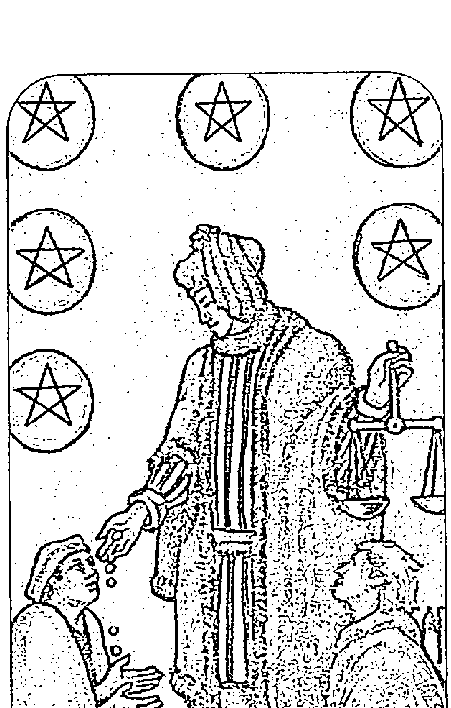

### 基本意义关键字

慈善、慷慨、理财、施与受、施舍

### 牌面解读

星币六是一张有很多层面的牌，而它的意义又会随着问题或周遭的牌而改变。在这张牌中，我们看到一个富翁把他的钱分给两个乞丐。这看似公平和正当，不过，请注意，两个乞丐是跪在富翁的面前。在这个关系里，他是处于有权力的地位。星币六是在形容一种关系：一个人支配另外一个人。

在事业或工作的情况中，星币六表示为了换取一份酬劳，便同意付出时间及努力。这是一项公平的安排。富翁手上的天平处于平衡状态，暗示双方都会对此安排感到满意。或许是一个人想要支配别人而另外一个人则愿意顺从。稳定而舒适使这项安排显得公平。例如，在职场上，员工对于一个方案的成败并不付最终的责任，而资方也不必逐日的盯着他们的方案执行进度。在一个尽可能朝互利局面的管理中，每个人都有他们自己的角色要扮演。

### 释义

#### 正位释义

#### 《工作》

你的工作状况很好，也有很不错的收入，但要分享才能造就更大的利益，所以在成功之余也不要忽略了帮助别人。

#### 《爱情》

现在这段感情非常甜蜜，两个人对这段关系都感到满足，但是在当中可能会不太平等，或是想要以金钱控制对方。

#### 《友情》

你的人际关系很不错，因为你常常会帮助别人，也能接受别人给你的建议，你也会很努力地维持人际关系的和谐。

#### 《亲情》

现在家中的财务状况很好，也有钱去完成很多理想，应该要做好财务的规划，同时把握这个机会清偿债务。

#### 逆位释义

#### 《工作》

你的工作虽然有很好的收入，但是总觉得被别人控制，你有非常大的欲望和野心，不过也许太过遥远而不切实际。

#### 《爱情》

两个人在这段关系上都要求很多，但是也许并没有那么努力地付出，因此可能会造成彼此欲求不满，或是其他争执。

#### 《友情》

你在人际关系上的表现还不错，但是因为常常都是接受其他人的帮助，偶尔也要回礼一下，否则可能会被别人排斥。

#### 《亲情》

现在家中可能被之前的成功冲昏了头，反而会开始有很多不切实际的期待，这个时候应该要快点认清事情的真相。

## 星币七
Seven Of Pentacles

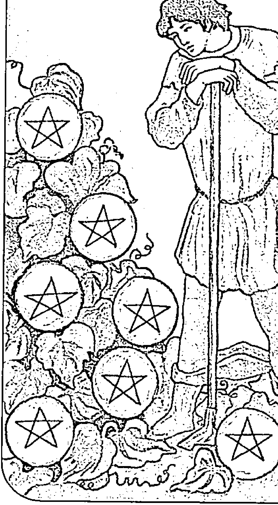

基本意义关键字
收成、暂停、思索、待机

### 牌面解读

星币七画了一个人，盯着一棵覆盖了许多星币的灌木（他的发财树），而脚边也有一颗星币。他斜倚在棍棒上，正思考或梦想着他将如何处理他的这棵树。他是以钱的角度来看它的。他已经采收了一颗星币，并且照顾其他星币的生长，他的努力就是为了孕育果实。

星币七代表一个十字路口。在这里看不到伟大的梦想或急切的决定，因为平稳务实的努力已经可以确保农作物的丰收。星币七代表的是行动，不过现在是思考过去行动和未来计划的时候了。望着他的农作物，他可以看出来哪些行动是有用的，哪些是白费力气的。

如果他的行动是明智的，从现在开始他就会进入丰收期了。农作物可以自己生长得很好，而他也不必再像以前一样去细心呵护它们了。这可能象征一个两性关系或一桩生意已经够稳定，不再需要不懈的努力了。现在你有机会退后一步，以较宽广的角度来看整个事情的状况了。

### 释义

#### 正位释义

#### 《工作》

现在工作已经看到初步成效，但是还不到功成名就的时候，这时候你应该考虑下一步的做法，以获取最大的利益。

#### 《爱情》

现在双方的感情算是蛮稳定的，但是仍然会去思考下一步该怎么办，也许是遇到了瓶颈而希望有一些不同的做法。

#### 《友情》

你平常不太重视人际关系的经营，也已经习惯了独来独往，只有在有需要的时候会想到朋友，朋友之间也很少联络。

#### 《亲情》

现在家中面对一个重要的决定，需要小心理性地去考虑，除了评估利害得失之外，也要想到实际上完成的可行性。

#### 逆位释义

#### 《工作》

你对于现在的工作有一些焦虑，可能会担心自己的努力得不到应有的成果，但是又无法下定决心去做重大的改变。

#### 《爱情》

目前双方的感情遇到了瓶颈，因此两个人常会感到担心或焦虑，你应该提出可行的计划，把对方的情绪稳定下来。

#### 《友情》

你在人际关系上受过一些伤害，因此很难再信任别人，其实你还是靠自己会比较好，不要对朋友们有太大的期望。

#### 《亲情》

现在家中可能出现了资金缺口或是发生了财务危机，这个时候应该要务实地考虑如何渡过难关，而不是置之不理。

## 星币八
Eight Of Pentacles

### 基本意义关键字

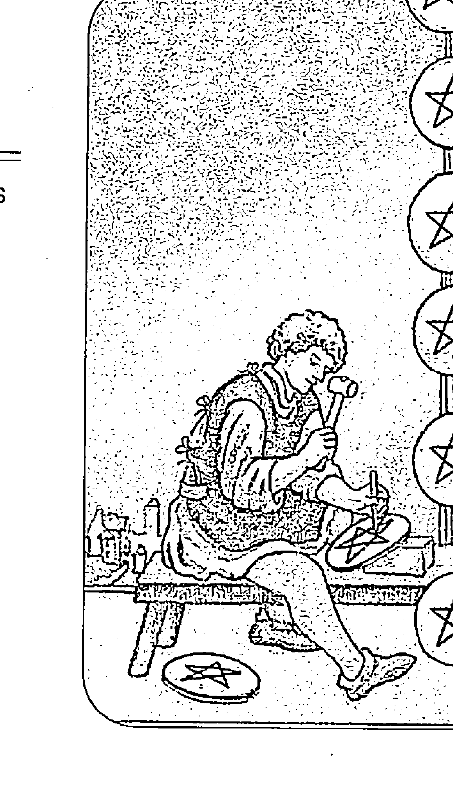

- 技能
- 勤劳
- 工作
- 专业
- 修炼
- 技艺

### 牌面解读

一位雕刻匠坐在长板凳上，专注而勤劳地刻着星币，他前面已经完成六个了，脚边还有一个未完成。有一条黄色的道路连接远方的市镇与雕刻匠，连接工作与社会，无论什么工作，目的都是服务人群，雕刻匠并未忘记这一点。首先我们可以比较星币八的雕刻「匠」与星币三的雕刻「师」。在星币八中，男子是个辛劳工作的工匠，他一丝不苟，注重细节，很努力的刻着相同的东西，而星币三的雕刻师已经累积足够的经验与资历，成为一位真正的艺术家了。这不代表雕刻匠是比较低下的，重点是他专注于工作的过程中，这才是最珍贵的美德，能够使他更快速获得所需的技能或学问。

星币八是认真念书的学生、用心工作的雇员、心灵手巧的匠才。他们对于学业或事业上的付出绝对比旁人多。在爱情上可能表示猛烈追求，细心经营。问求者表示工作马上就要到手了。问投资表示稍有斩获。

### 释义

#### 正位释义

#### 《工作》

这是一份高度技术性的工作，同时你需要十分专心才能把工作完成，如果你越努力工作的话，就会得到越多报酬。

#### 《爱情》

现在两个人都在工作上打拼，比较少有单独相处的时间，但是也绝不可能发生外遇，所以未来还是有努力的空间。

#### 《友情》

其实你并不太重视人际关系的经营，若是有一些朋友也都是因为实际的功能，很少有可以真诚分享心事的好朋友。

#### 《亲情》

现在家里每个人都忙于自己的工作，很少有时间可以聚在一起，你常以自己的家人为荣，大家都有很好的收入。

#### 逆位释义

#### 《工作》

这是一份高度专业的工作，但是也需要经过很长时间的磨练和学习，如果想走偏门快捷方式的话，反而容易导致失败。

#### 《爱情》

其实两个人之间早已经没有什么感情，但还是会为了面子问题维持着表面的关系，其实这段关系已经岌岌可危了。

#### 《友情》

其实你的人际关系还不错，但是大部分都不是真心的朋友，甚至有些人就是为了想要利用你，对这些人不可不防。

#### 《亲情》

现在家中的状况还算稳定，但是要避免不切实际的高远计划，可能会使家中付出惨重代价，一定要小心地理性考虑。

## 星币九
Nine Of Pentacles

### 基本意义关键字

- 富足
- 成功
- 信心
- 享受
- 自律
- 魅力

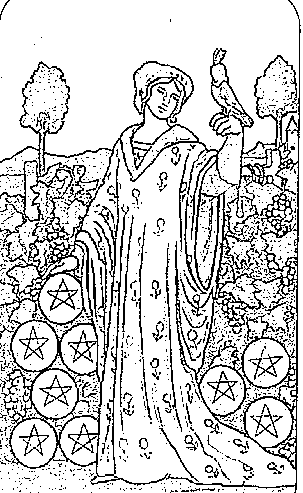

### 牌面解读

星币九画了一个女人，被她辛勤耕耘得到的果实所围绕。她的右手停放在几颗星币上，大拇指扶着一串葡萄。一只带着头罩的小鸟栖在她的左手上。在她为小鸟移开头罩巾后，它就可以得到自由。然而小鸟一旦还带着罩巾，还是会乖乖的服从她。

这女人的服饰暗示她物质生活的优越。她脸上有一种宁静沉着的表情，而晴朗的天则是预测持续的成功，因为她安详自在的置身于大自然当中。从王牌的开始，到二的下决定，三的学习，四的报偿，五改变的讯号，表示责任的六，重新评估的七，以及进一步承诺的八，现在我们到达了收获的九。

她成功并非偶然，透过承诺、劳动、纪律、学习以及重新评估，它已经稳固的建立起某种具体的事物，并且也为将来打下良好的根基。她投入生活，并与它密不可分。经由谨慎的规划及对目标的不断投入她掌控了周遭的一切。

### 释义

#### 正位释义

#### 《工作》

现在工作的状况一切进行顺利，你对于现在的职位与工作内容也驾轻就熟，但是仍然要小心谨慎以防止发生错误。

#### 《爱情》

这段感情带给彼此很多的快乐，也可以共同去体验很多感官方面的享受，两个人都愿意为这段关系投入很多时间和金钱。

#### 《友情》

你在朋友当中很受到欢迎，你也喜欢和朋友们相处的感觉，但是因为你本身的标准比较高，所以好朋友不是很多。

#### 《亲情》

现在家中的状况很好，大家都过着悠闲享乐的生活，彼此之间的相处也很愉快，应该要小心地经营保有这种成果。

#### 逆位释义

#### 《工作》

现在的工作十分烦琐，但是实际上并不一定有意义，甚至很多是不必要的步骤，即使了解了仍然需要按照规定去做。

#### 《爱情》

在这段感情当中两个人都过得很优渥，但是也许这只是表面现象，不要陷入自己的想象当中，否则就会被物质金钱所迷惑。

#### 《友情》

你在朋友当中常常都是独来独往，专心于自己有兴趣的事情，也不会主动去关心别人，所以很难找到朋友谈心。

#### 《亲情》

表面上看起来家庭的状况还不错，但是其实大家各怀鬼胎，也一直在算计着其他人，彼此之间相处的关系并不真诚。

## 星币十
Ten Of Pentacles

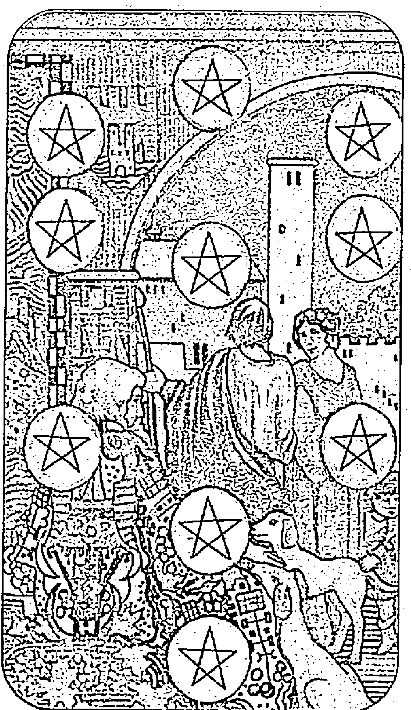

### 基本意义关键字

- 富裕
- 事业
- 团体
- 物质
- 成功
- 家产

### 牌面解读

星币十画的是一个安稳而舒适的居家环境。从墙上盾形家徽看得出这是一个富裕而巩固的环境。这里有动物、小孩、果实累累的果树，以及作为隐秘和保护之用的高墙。天空是蔚蓝的，而城镇则紧邻于旁。简单的说，这个家庭拥有能提供舒适物质环境的一切条件。

那么，为什么每个人都没有面对着别人呢？这老人是坐着的，他的注意力放在动物们的身上，年轻人背对我们，而女人也没有面对他却稍稍侧着脸继续和他谈话。小孩子被忽略了，这些人彼此之间也没有真正的关联。它们得到别人所渴望的物质世界，不过很显然，这也使他们感到沉闷，并陷入公式化的生活中，一旦这种公式消失，将无所适从。

星币十是整组牌可能性的充分显示。它缺乏权杖的热情、宝剑的理想以及圣杯牌的情感。在这里可以找到物质上的安全感和稳定，但也付出了代价。

### 释义

#### 正位释义

#### 《工作》

你可能在家里工作，或是在很大的企业中工作，现在工作已经在很稳定的状态，很多事情只要照规定去完成就好。

#### 《爱情》

这段感情的状况十分稳定，但是因为太过稳定也会有点无趣，两个人都想先建立良好的物质基础，再进一步发展。

#### 《友情》

你有形形色色各种不同的朋友，但是其中比较多是酒肉朋友，并不是真心和你交往，所以也可能缺乏谈心的对象。

#### 《亲情》

现在家中的财务状况很富有，也有可能是新居落成大家应该把自己分内的事情做好，一起享受这个愉快的时刻。

#### 逆位释义

#### 《工作》

你在工作当中可能会经手大笔的金钱，只要一个不小心就一辈子赔不完了，但若是把握机会也可以有很好的发展。

#### 《爱情》

两个人是因为看上对方的金钱而在一起，但是也会因为金钱的事情而争吵，其实彼此之间并没有坚实的感情基础。

#### 《友情》

现在你的身边有很多的坏朋友，很可能会带坏你，或让你花很多不必要的钱，其实你应该快点脱离这些人的影响。

#### 《亲情》

现在家中的财务状况开始走下坡，应该要节省一点减少浪费，至少要留下基本的生活费，才不会到最后流落街头。

## 星币侍从
Page Of Pentacles

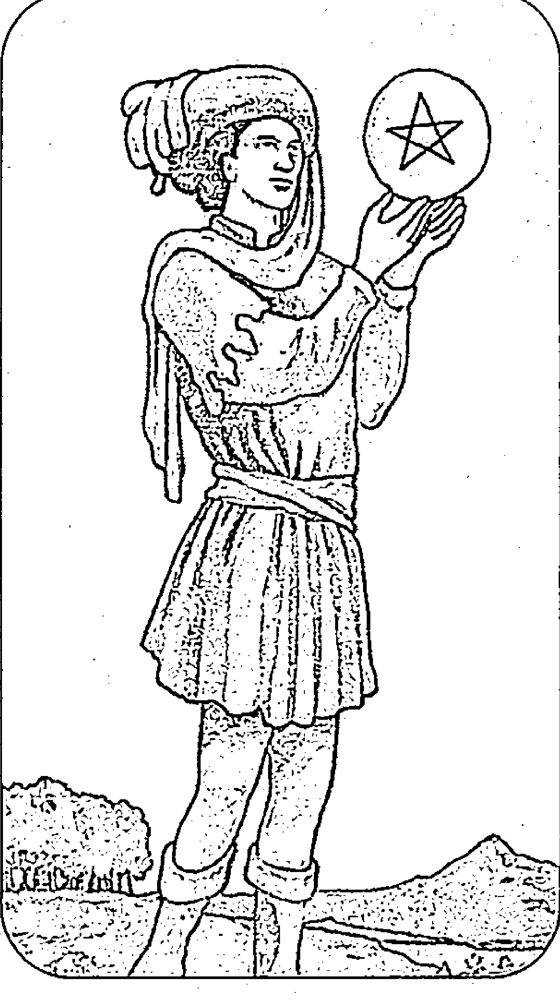

### 基本意义关键字

- 运用
- 上进
- 吸引

### 牌面解读

星币侍从是牌中正式的学生，与宝剑牌组中的学者不同。他学的是实质的有组织有系统的课程，而非宝剑牌组中的理论性无组织的学问。他也代表财务上的接触、一个有稳定性格的新朋友，或是对工作的着迷。你可以想象他是童年时期的爱迪生或华盛顿。他有很好的想法，不过不一定是个领导人物。他冷静、稳健而常识丰富。假若这张牌是隐喻求问者的情况，即表示求问者的财务有机会缓和，不过需要辛勤工作才得到些微报酬；若牌意与人有关，这人是诚实可信的，而且做事负责及效率高，得此助手或合伙人必事事顺利。

### 释义

#### 正位释义

#### 《人物》

对于任何事情都务实并且细心观察学习的人，做任何事情之前一定会经过深思熟虑，而且会专心一致小心谨慎地完成。

#### 《工作》

你在工作当中还有很多东西需要学习，同时你也充满活力想要把事情好好完成，这段期间需要你努力付出和投入。

#### 《爱情》

也许双方在感情上的经验都不是很多，但是彼此都可以在这段关系中学到很多，也是可以互相主动付出并体贴对方的。

#### 《友情》

你的人际关系状况还不错，别人对你好你也会真心地回报，所以可以交到不少的知心朋友，也能得到朋友的帮助。

#### 逆位释义

#### 《人物》

做事情常漫不经心没有节制，任性而不理会别人的意见，因此会粗心大意做错事情，或者是不负责任地半途而废。

#### 《工作》

现在工作的状况有点混乱，事情千头万绪又没有规则可言，完全要自己从头开始摸索，也算是吃力不讨好的工作。

#### 《爱情》

这段感情一直没有确定下来，两个人都不喜欢对方管制自己，也没有给彼此什么承诺，所以一切都还在观察当中。

#### 《友情》

你现在人际关系的状况还不错，但是大部分都是属于酒肉朋友，真心的朋友反而不多，也很少能得到朋友的帮助。

## 星币骑士
Knight Of Pentacles

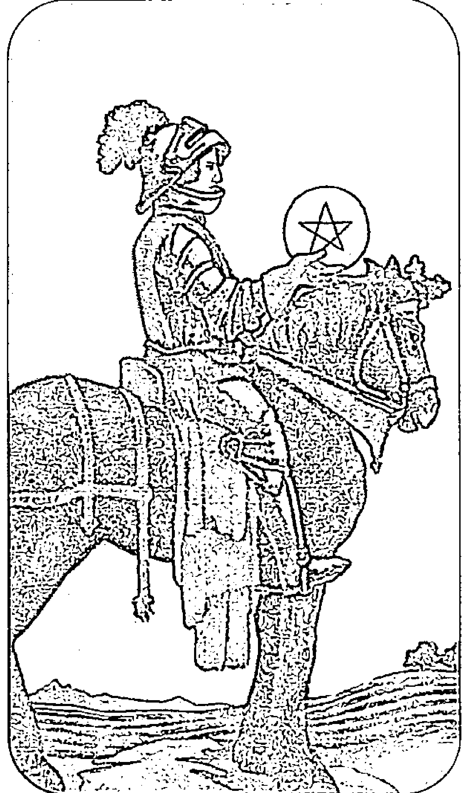

### 基本意义关键字

- 努力、积累、安定

### 牌面解读

最稳健坚定的骑士。值得信赖（尽管有些无趣）。不过，在他外表之下，也有微微燃烧的煤炭，随时可能爆出火花，所以不要低估他，或是把他外表上的冷静视为理所当然。当他生气时，就像火山爆发。他是卓越的组织者，讲究效率。他是把事情完成的人。他是计划者与幕后的主事者。如果你要快速精准的完成工作，找星币骑士准没错。他不华丽却值得信任。他是骑士中最像国王与王后的。他有强烈的责任感，他会保护家庭。有时会被别人认为古板，难应付。事情已拉锯了好一段时间，又或看似陷入危机中，不过这张显示事情快有好转。若求问的事与人有关，这个人虽然做事有时太小心谨慎，令求问者有点不耐烦，但十分值得信赖，而且还很负责及努力。

### 释义

#### 正位释义

#### 《人物》

是一个比较严肃的人，有非常远大的志向，同时又能够理性而务实地按部就班达成，做任何事情都很有责任感。

#### 《工作》

你目前的工作量很大，负的责任也重，常常需要加班超时工作，但是如果能得到相对应的报偿，你也会心甘情愿。

#### 《爱情》

双方在感情上十分忠诚，对彼此也有忠诚和责任感，但是两个人的考虑都非常务实，较偏向体贴而不浪漫的关系。

#### 《友情》

你的人际关系只集中于工作上相关的人而缺少真心的朋友，你如果不能对其他人多付出关心，就很难交到朋友。

#### 逆位释义

#### 《人物》

对于很多事情只是冷眼旁观，不会努力去争取，认为多一事不如少一事，常给人一种没有生气和活力的停滞感。

#### 《工作》

你现在的工作状况出现停滞，做的事情也都是例行公务，不只是你自己觉得无聊不想做，随时也有被裁员的可能。

#### 《爱情》

这段感情当中只剩下例行事物，没有新鲜热情的刺激，也缺乏体贴浪漫的用心，所以算是进入了停滞无聊的时期。

#### 《友情》

你的人际关系并不很好，因为你完全无心于人际关系的经营，只想要一个人静一静，其实一个人也比较适合你。

## 星币王后
Queen of Pentacles

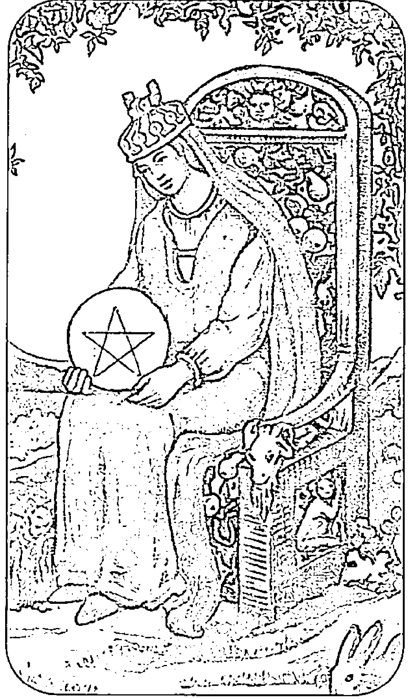

基本意义关键字
- 母爱、繁荣、安定

### 牌面解读

这张牌是显示这女性善于营商，而她的职业有机会涉及经商方面，例如地产。她能干可靠，而且努力工作，以换取从金钱而得的物质安慰。不过这位女强人难于显露任何情绪，但她极重视家人。

### 释义

#### 正位释义

#### 《人物》

十分善良又很会照顾别人，会很理性务实地去考虑事情，待人亲切又体贴入微，同时很会经营自己的人脉关系。

#### 《工作》

你现在的工作状况非常稳定，是可以专心经营努力的时候，你在当中可以充分发挥自己的才能，同时又乐在其中。

#### 《爱情》

这段感情现在已经很稳定，两个人彼此付出了很多，也能感受到对方的真心，而且双方都有长久交往下去的打算。

#### 《友情》

你的人际关系很好，因为你常常能主动关心和照顾大家，所以也会得到大家的帮助，你有很多长期交往的好朋友。

#### 逆位释义

#### 《人物》

天性多疑因此很难信任别人，对于很多细节都斤斤计较，具有实事求是的科学精神，但也常会让人觉得不近人情。

#### 《工作》

你的工作需要非常专注，细心检查所有的步骤是否正确，当中可能存在很多错误的陷阱，一不小心就会粉身碎骨。

#### 《爱情》

在这段感情当中彼此不太能信任，所以会有很多的试探和争吵，其实怀疑的心态才是两个人交往受挫的原因。

#### 《友情》

由于你无法信任朋友，所以你的人际关系状况并不好，你应该多花一点时间和朋友相处，才有机会真正了解他们。

## 星币国王
King Of Pentacles

基本意义关键字
- 踏实、富有、保守

### 牌面解读

成功的经营管理者，他理想，而且总是实际的看待它。牌中喻示这个人是非常信实，又重诺言，极可能是个做事谨慎却不失慷慨的生意人，这人非常满意现在的生活状况。

### 释义

#### 正位释义

##### 人物

拥有丰富的常识和商业的天分，同时也很重视生活的享受，行事上十分稳重务实，会用最有效率的方式达成目的。

##### 工作

你现在的工作状况非常好，也算是得到空前的成功，你开始可以享受之前工作的成果，进入一段稳定发展的时期。

##### 爱情

现在这段感情十分稳定，也已经打下深厚的感情基础，两个人都很重视生活质量，而且有不错的经济基础来享受。

##### 友情

你在朋友当中很受到欢迎，也是大家喜欢询问或是求助的对象，如果你能多多帮助别人，就可以交到真心的朋友。

#### 逆位释义

##### 人物

重视自己的利益甚于一切，非常工于心计且精于算计，为了达到目的会不惜牺牲别人，甚至还趁人之危借机打劫。

##### 工作

你的工作出现了很大的漏洞，之前的问题也慢慢地浮现出来，也许必须要投入更多的资源，才能安全度过这个危机。

##### 爱情

现在这段关系本身就索然无味，两个人只是在利用对方，并没有任何感情的成分在，甚至对方只是在贪图你的财产。

##### 友情

其实你并不是很在意人际关系，所以你的朋友并不多，你应该要放下心中的利害和算计，才可能交到真心的好朋友。

## 第四章

## 90 种塔罗牌阵法解读

塔罗牌阵法大全

P187

## 塔罗牌阵法大全

### 1. 一张牌展开法（Simple One Card Spread）

塔罗用牌：二十二张大阿尔卡那、五十六张小阿尔卡那、全套七十八张塔罗牌

取牌方法：随意抽取 1 张牌，放在 1 处。

解释方法：所求问题的答案。

### 2. 把握未来展开法（The Next Step Spread）

塔罗用牌：二十二张大阿尔卡那、五十六张小阿尔卡那、全套七十八张塔罗牌

取牌方法：随意抽取 1 张牌，放在 1 处。

解释方法：你现在应该将焦点、力量集中在此。

### 3. 因何而爱展开法（I Love Because... Spread）

塔罗用牌：二十二张大阿尔卡那、五十六张小阿尔卡那、全套七十八张塔罗牌

取牌方法：随意抽取 1 张牌，放在 1 处。

解释方法：爱的缘由。

### 4. 是否抉择展开法（Yes Or No Spread）

塔罗用牌：二十二张大阿尔卡那，小阿尔卡那的圣杯九以及四张小阿尔卡那首牌，共计27张。

取牌方法：随意抽取1张牌，放在1处。

解释方法：若是出现小阿尔卡那 Ace 的任何一张，代表你必须等待时间的安排。

若是出现圣杯九，则代表明确的“是”。

若出现大阿尔卡那牌则依据如下解释：

—愚人、魔术师、皇后、皇帝、战车、正义、星星、太阳或世界，代表明确的“是”；

—女教主、命运之轮、恋人、教皇、月亮或审判不分是否，依解读师直觉解答；

—力量、高塔、节制、隐士、吊人、死神、魔鬼，代表明确的“否”。

### 5. 每天展开法（Everyday Spread）

塔罗用牌：二十二张大阿尔卡那、五十六张小阿尔卡那、全套七十八张塔罗牌

取牌方法：随意抽取2张牌，依次放在1、2处。

解释方法：
1. 事件：今天可能发生的事件。
2. 感受：受所发生事件的影响。

### 6. 双关展开法（Not Only But Also Spread）

塔罗用牌：二十二张大阿尔卡那、五十六张小阿尔卡那、全套七十八张塔罗牌

取牌方法：随意抽取2张牌，依次放在1、2处。

解释方法：
1. 不但………
2. 而且………

### 7. 工作心情展开法（Task & Mood Spread）

塔罗用牌：二十二张大阿尔卡那、五十六张小阿尔卡那、全套七十八张塔罗牌

取牌方法：随意取出2张牌，依序放在1、2处。

解释方法：
1. 今日的工作状况。
2. 今日的心情变化。

### 8. 今日工作展开法（Today & Task Spread）

塔罗用牌：二十二张大阿尔卡那、五十六张小阿尔卡那、全套七十八张塔罗牌

取牌方法：随意取出2张牌，依序放在1、2处。

解释方法：
1. 今日的身心状况。
2. 今日的工作状况。

### 9. 今日压力展开法（Today & Stress Spread）

塔罗用牌：二十二张大阿尔卡那、五十六张小阿尔卡那、全套七十八张塔罗牌

取牌方法：随意取出 2 张牌，依序放在 1、2 处。

解释方法：
1. 今日的身心状态。
2. 今日可能面对的压力。

### 10. 得失展开法（Gain And Loss Expansion Method）

塔罗用牌：二十二张大阿尔卡那、五十六张小阿尔卡那、全套七十八张塔罗牌

取牌方法：随意取出 2 张牌，依序放在 1、2 处。

解释方法：
1. 我将失去什么？
2. 我将获得什么？

### 11. 得失展开法2 (Letting Go in Order to Gain Spread 2)

塔罗用牌：二十二张大阿尔卡那、五十六张小阿尔卡那、全套七十八张塔罗牌

取牌方法：随意取出 2 张牌，依序放在 1、2 处。

解释方法：
1. 这星期中潜在的影响力。
2. 这星期呈现的主要情势。

### 12. 优先原则展开法 (Prioritising Spread)

塔罗用牌：二十二张大阿尔卡那、五十六张小阿尔卡那、全套七十八张塔罗牌

取牌方法：随意取出 2 张牌，依序放在 1、2 处。

解释方法：
1. 你当前应该优先处理的事情。
2. 你可以暂缓处理的事情。

### 13. 安妮金工作展开法 (Annikin Work Spread)

塔罗用牌：二十二张大阿尔卡那、五十六张小阿尔卡那、全套七十八张塔罗牌

取牌方法：随意取出 3 张牌，依序放在 1、2、3 处。

解释方法：
1. 我选对工作了吗？(必需深思熟虑)
2. 这份工作稳定吗？(可以做多久)
3. 我应该做哪些改变？(我应该继续作，还是稍作调整，或者申请辞职)。

### 14. 安妮金关键展开法 (Annikin Issue Spread)

塔罗用牌：二十二张大阿尔卡那、五十六张小阿尔卡那、全套七十八张塔罗牌

取牌方法：随意取出 3 张牌，依序放在 1、2、3 处。

解释方法：
1. 问题的关键。
2. 关键的重点。
3. 在你前方的、你将面对的。

### 15. 聚散离合展开法 (Separating and Bonding Spread)

塔罗用牌：二十二张大阿尔卡那、五十六张小阿尔卡那、全套七十八张塔罗牌

取牌方法：随意取出3张牌，依序放在1、2、3处。

解释方法：
1. 我将要或者想要摆脱的。
2. 我需要留意的一些事情。
3. 最终的结果。

### 16. 过去、现在、未来展开法 (Past, Present And Future Spread)

塔罗用牌：二十二张大阿尔卡那、五十六张小阿尔卡那、全套七十八张塔罗牌

取牌方法：随意取出3张牌，依序放在1、2、3处。

解释方法：
1. 过去发生过的事情或状况。
2. 现在正发生的事情或状况。
3. 未来可能发生的事情。

### 17. 今日事件展开法 (Events Of The Day Spread)

塔罗用牌：二十二张大阿尔卡那、五十六张小阿尔卡那、全套七十八张塔罗牌

取牌方法：随意取出 3 张牌，依序放在 1、2、3 处。

解释方法：
1. 今天的重点事件。
2. 这事件会如何发展。
3. 你如何开始或你该为这事件做些什么。

### 18. 今日工作展开法 (Tasks For The Day Spread)

塔罗用牌：二十二张大阿尔卡那、五十六张小阿尔卡那、全套七十八张塔罗牌

取牌方法：随意取出 3 张牌，依序放在 1、2、3 处。

解释方法：
1. 今天的状况。
2. 今天特别的工作、目标。
3. 今天中唯一、独特的机会。

### 19. 快速解答展开法（Fast Solution Spread）

塔罗用牌：二十二张大阿尔卡那、五十六张小阿尔卡那、全套七十八张塔罗牌

取牌方法：随意取出3张牌，依序放在1、2、3处。

解释方法：
1. 问题的类型。
2. 问题的原因。
3. 问题的解决方法。

### 20. 了解自己展开法（Know Myself Spread）

塔罗用牌：二十二张大阿尔卡那、五十六张小阿尔卡那、全套七十八张塔罗牌

取牌方法：随意取出3张牌，依序放在1、2、3处。

解释方法：
1. 我是谁。
2. 我的需求。
3. 我如何达成我的要求。

### 21. 目标展开法 (Goals Spread)

塔罗用牌：二十二张大阿尔卡那、五十六张小阿尔卡那、全套七十八张塔罗牌

取牌方法：随意取出 3 张牌，依序放在 1、2、3 处。

解释方法：
1. 今天的目标。
2. 达成目标的力量。
3. 阻碍。

### 22. 知道展开法 (What you Know Spread)

塔罗用牌：二十二张大阿尔卡那、五十六张小阿尔卡那、全套七十八张塔罗牌

取牌方法：随意取出 3 张牌，依序放在 1、2、3 处。

解释方法：
1. 你已经知道的。
2. 你尚不知道的。
3. 你需要知道的。

### 23. 日常展开法 (Daily Spread)

塔罗用牌：二十二张大阿尔卡那、五十六张小阿尔卡那、全套七十八张塔罗牌

取牌方法：随意取出 3 张牌，依序放在 1、2、3 处。

解释方法：
1. 今日对你较为显著的影响或能量。
2. 你将如何感知这种能量或者其他可能影响你的人或事物。
3. 这种能量可能对你产生的影响。

### 24. 三张便捷展开法 (Quickie Three Spread)

塔罗用牌：二十二张大阿尔卡那、五十六张小阿尔卡那、全套七十八张塔罗牌

取牌方法：随意取出 3 张牌，依序放在 1、2、3 处。

解释方法：
1. 事情的关键或者问题的本源。
2. 过去的状况。
3. 将来可能的发展趋势。

### 25. 浪漫情怀展开法（Three Cards Romance Spread）

塔罗用牌：二十二张大阿尔卡那、五十六张小阿尔卡那、全套七十八张塔罗牌

取牌方法：随意取出3张牌，依序放在1、2、3处。

解释方法：
1. 面对这份恋情你心中的问题。
2. 你面对的挑战或者阻力。
3. 你可能获得哪些助力。

### 26. 身体、意识、精神展开法（Body, Mind And Spirit Spread）

塔罗用牌：二十二张大阿尔卡那、五十六张小阿尔卡那、全套七十八张塔罗牌

取牌方法：随意取出3张牌，依序放在1、2、3处。

解释方法：
1. 身体机能或者在身体机能方面应该做的。
2. 意识形态或者在思维模型方面应该做的。
3. 精神状态或者在精神状态方面应该做的。

### 27. 三张是否抉择展开法 (Yes Or No Spread)

塔罗用牌：二十二张大阿尔卡那、五十六张小阿尔卡那、全套七十八张塔罗牌

取牌方法：随意取出 3 张牌，依序放在 1、2、3 处。

解释方法：解读时不考虑牌面内容及相互关联，仅关注牌位的正逆。

如果出现三张正位，则代表肯定的“是”；如果出现三张逆位，则代表肯定的“否”；如果出现两种牌位都存在，则代表不确定，或依据数字对比代表“是”与“否”的倾向性，此时建议使用其它展开法。

### 28. 天份与机遇展开法 (Talent and Chance Spread)

塔罗用牌：二十二张大阿尔卡那、五十六张小阿尔卡那、全套七十八张塔罗牌

取牌方法：随意取出 3 张牌，依序放在 1、2、3 处。

解释方法：
1. 问题的关键所在。
2. 可能面对的挑战或困难。
3. 自身的天赋或者可能出现的机遇。

### 29. 意识形态展开法（New Values Spread）

塔罗用牌：二十二张大阿尔卡那、五十六张小阿尔卡那、全套七十八张塔罗牌

取牌方法：随意取出 3 张牌，依序放在 1、2、3 处。

解释方法：
1. 未来可能获得重要地位的。
2. 未来可能失去重要地位的。
3. 当前需要重视的。

### 30. 安娜金目标展开法（Annikin Goal Spread）

塔罗用牌：二十二张大阿尔卡那、五十六张小阿尔卡那、全套七十八张塔罗牌

取牌方法：随意取出 4 张牌，依序放在 1-4 处。

解释方法：
1. 问题的发生原因。
2. 我的缺点。
3. 我内在的力量。
4. 我的目标。

### 31. 恋爱指导展开法 (Niki's Lovers Guide Spread)

塔罗用牌：二十二张大阿尔卡那、五十六张小阿尔卡那、全套七十八张塔罗牌

取牌方法：随意取出 4 张牌，依序放在 1-4 处。

解释方法：
1-3、你对于你爱人的感觉。
4、路的前方（未来）。

### 32. 内在力量展开法 (Inner Strength Spread)

塔罗用牌：二十二张大阿尔卡那、五十六张小阿尔卡那、全套七十八张塔罗牌

取牌方法：随意取出 4 张牌，依序放在 1-4 处。

解释方法：
1、我的责任。
2、我喜爱什么。
3、我内心的声音告诉我什么。
4、我的决定。

### 33. 目标设定展开法 (Setting A Goal Spread)

塔罗用牌：二十二张大阿尔卡那、五十六张小阿尔卡那、全套七十八张塔罗牌

取牌方法：随意取出 4 张牌，依序放在 1-4 处。

解释方法：
1、我的目标。
2、我的哪一项特质可以帮助我达成目标。
3、我的哪一项缺点会阻碍我达成目标。
4、我如何达成我的目标。

### 34. 事情进展展开法 (Evolution Spread)

塔罗用牌：二十二张大阿尔卡那、五十六张小阿尔卡那、全套七十八张塔罗牌

取牌方法：随意取出 4 张牌，依序放在 1-4 处。

解释方法：
1、持续发生的情况。
2、未来四周内，这情况将如何发展。
3、将影响这情况的一些人或一些事。
4、结果。

### 35. 四方的风展开法（Four Winds Spread）

塔罗用牌：二十二张大阿尔卡那、五十六张小阿尔卡那、全套七十八张塔罗牌

取牌方法：随意取出4张牌，依序放在1-4处。

解释方法：
1、你必须舍弃过去的什么，让自己解放。
2、你必需面对的。
3、你必需知道的。
4、你会获得的、达成的。

### 36. 安娜金灵魂配偶展开法（Annikin Soul Mate Spread）

塔罗用牌：二十二张大阿尔卡那、五十六张小阿尔卡那、全套七十八张塔罗牌

取牌方法：随意取出5张牌，依序放在1-5处。

解释方法：
1、我的灵魂伴侣的类型。
2、我的灵魂伴侣已经走入我的生命之中了吗？
3、将会有困难产生吗？
4、什么样的改变是需要的？
5、我将相信什么？

### 37. 东西共舞展开法（East West Dance Spread）

塔罗用牌：二十二张大阿尔卡那、五十六张小阿尔卡那、全套七十八张塔罗牌

取牌方法：随意取出5张牌，依序放在1-5处。

- 1. 开始、起点。
- 2. 内在的自我。
- 3. 外在的自我。
- 4. 完成、结果。
- 5. 高层次的自我。

### 38. 法式展开法（French Spread）

塔罗用牌：二十二张大阿尔卡那、五十六张小阿尔卡那、全套七十八张塔罗牌

取牌方法：随意取出5张牌，依序放在1-5处。

- 1. 正在发生的事情。
- 2. 希望与梦想。
- 3. 有力的与确信的。
- 4. 援助或阻碍。
- 5. 未来一些会让你惊奇的事。

### 39. 联合处理展开法（Annikin Soul Mate Spread）

塔罗用牌：二十二张大阿尔卡那、五十六张小阿尔卡那、全套七十八张塔罗牌

取牌方法：随意取出5张牌，依序放在1-5处。

- 1. 我的伙伴
- 2. 我自己
- 3. 哪些事情对于我的伙伴是重要的
- 4. 哪些事情对于我是重要的
- 5. 合伙解决方法

### 40. 检验爱情展开法（Testing Love Spread）

塔罗用牌：二十二张大阿尔卡那、五十六张小阿尔卡那、全套七十八张塔罗牌

取牌方法：随意取出5张牌，依序放在1-5处。

- 1. 这段时间，我的爱情关系传达了什么东西给我
- 2. 在爱情关系中我真正爱什么
- 3. 在爱情关系中我不喜欢什么
- 4. 什么可以赋予爱情新的能量
- 5. 对于爱，我仍不了解的，或是我应该学习的

### 41. 解决方案展开法（The Solution Spread）

塔罗用牌：二十二张大阿尔卡那、五十六张小阿尔卡那、全套七十八张塔罗牌

取牌方法：随意取出5张牌，依序放在1-5处。

解释方法：
1、目标。
2、已经产生的问题。
3、解决方式。
4、新的想法、见识。
5、结果。

### 42. 简易凯尔特十字展开法（Simple Celtic Cross Spread）

塔罗用牌：二十二张大阿尔卡那、五十六张小阿尔卡那、全套七十八张塔罗牌

取牌方法：随意取出5张牌，依序放在1-5处。

解释方法：
1、现在。
2、未来。
3、肯定的因素。
4、否定的因素。
5、最终结果。

### 43. 金钱展开法（Money Spread）

塔罗用牌：二十二张大阿尔卡那、五十六张小阿尔卡那、全套七十八张塔罗牌

取牌方法：随意取出5张牌，依序放在1-5处。

解释方法：
1. 财富的根基。
2. 财富如何快速的来到你的生活当中。
3. 有助增加财富的有利条件——你应该好好考虑的。
4. 暗示某些人或某些计划会带来新的财富。
5. 结果。

### 44. 决策展开法（Questions About Decisions Spread）

塔罗用牌：二十二张大阿尔卡那、五十六张小阿尔卡那、全套七十八张塔罗牌

取牌方法：随意取出5张牌，依序放在1-5处。

解释方法：
1、3、阻碍。（3-你目前的处境：包含危险与机会。）
2、4、帮助。（4-你目前的处境：包含危险与机会。）
5、决策、解决方式。

### 45. 决策因素展开法（Reasons for the Decision Spread）

塔罗用牌：二十二张大阿尔卡那、五十六张小阿尔卡那、全套七十八张塔罗牌

取牌方法：随意取出5张牌，依序放在1-5处。

- 1. 关键或主要的观点。
- 2. 会驱使你的。
- 3. 外界的影响。
- 4. 危机、风险。
- 5. 要如何解决、完成。

### 46. 李维之轮展开法（Eliphas Levi Wheel Spread）

塔罗用牌：二十二张大阿尔卡那、五十六张小阿尔卡那、全套七十八张塔罗牌

取牌方法：随意取出5张牌，依序放在1-5处。

- 1. 现在的情况。
- 2. 渐渐减弱的影响：已经清除的障碍，过去的改变之产生的效果。
- 3. 隐藏的或无意识的影响。
- 4. 显著的影响。
- 5. 综合分析：将四张牌一起做综合解说。

### 47. 车轮展开法（Wheel Spread）

塔罗用牌：二十二张大阿尔卡那、五十六张小阿尔卡那、全套七十八张塔罗牌

取牌方法：随意取出5张牌，依序放在1-5处。

解释方法：
1、现在的情况。
2、渐渐减弱的影响：已经清除的障碍，过去的改变之产生的效果。
3、隐藏的或无意识的影响。
4、显著的影响。
5、综合分析：将四张牌一起做综合解说。

### 48. 新关系展开法（New Relationship Spread）

塔罗用牌：二十二张大阿尔卡那、五十六张小阿尔卡那、全套七十八张塔罗牌

取牌方法：随意取出5张牌，依序放在1-5处。

解释方法：
1、你本身为这新关系带来什么。
2、其它人为这新关系带来什么。
3、你会因为这新关系而高兴吗？
4、其它人会因为这新关系而高兴吗？
5、这新关系最后的结果会有什么变化？

### 49. 信仰展开法（Belief Spread）

塔罗用牌：二十二张大阿尔卡那、五十六张小阿尔卡那、全套七十八张塔罗牌

取牌方法：随意取出5张牌，依序放在1-5处。

- 1. 你的愿望。
- 2. 一直阻碍你有所成就的根本想法。（阻碍、负面）
- 3. 连接第2张牌与第4张牌的想法。（应该是4出现前的想法）
- 4. 即将出现在你生命中的新想法。
- 5. 新想法所带来的结果。

### 50. 行动展开法（Action Spread）

塔罗用牌：二十二张大阿尔卡那、五十六张小阿尔卡那、全套七十八张塔罗牌

取牌方法：随意取出5张牌，依序放在1-5处。

- 1. 问题的本身。
- 2. 过去的事件。
- 3. 反作用——问题如何对当事人的响应，或是当事人的个性造成的相关影响。
- 4. 环境、外在条件。
- 5. 问题的解决方式。

### 51. 元素五芒星展开法（Elemental Pentagram Spread）

塔罗用牌：二十二张大阿尔卡那、五十六张小阿尔卡那、全套七十八张塔罗牌

取牌方法：随意取出5张牌，依序放在1-5处。

解释方法：
1、灵魂：代表求问者如何与内在世界互动。
2、风：代表求问者的理解力。
3、水：代表求问者的情感与愿望。
4、地：代表求问者如何与外在世界互动。
5、火：代表求问者的强烈的情感与能量。

### 52. 元素展开法（Spread of the Elements）

塔罗用牌：二十二张大阿尔卡那、五十六张小阿尔卡那、全套七十八张塔罗牌

取牌方法：随意取出5张牌，依序放在1-5处。

解释方法：
1、你、当事人。
2、东：知性的或精神的生活。
3、南：肉体的与（或）本能的生活。
4、西：情感的生活。
5、北：直觉的与（或）灵魂的生活。

### 53. 再见展开法（Good-bye Spread）

塔罗用牌：二十二张大阿尔卡那、五十六张小阿尔卡那、全套七十八张塔罗牌

取牌方法：随意取出5张牌，依序放在1-5处。

解释方法：
1. 我最初想要什么。
2. 目前的情况（第一张牌延续）。
3. 我正跟什么道别（正失去什么）。
4. 我一直得不到的。
5. 我如何得到它（第四张牌所指的）。

### 54. 直线展开法（Line Spread）

塔罗用牌：二十二张大阿尔卡那、五十六张小阿尔卡那、全套七十八张塔罗牌

取牌方法：随意取出5张牌，依序放在1-5处。

解释方法：
1-2. 过去。
3. 现在。
4-5. 未来。

### 55. 指定问题展开法（Naming the Problem Spread）

塔罗用牌：二十二张大阿尔卡那、五十六张小阿尔卡那、全套七十八张塔罗牌

取牌方法：随意取出5张牌，依序放在1-5处。

- 1. 我的问题或计划。
- 2. 我不能改变的。
- 3. 我可以改变的、去做的。
- 4. 其它的选择。
- 5. 此牌阵的精华卡片：现在这些事情将如何发展。

### 56. 沙迪诺之星展开法（Shaldiors Star Spread）

塔罗用牌：二十二张大阿尔卡那、五十六张小阿尔卡那、全套七十八张塔罗牌

取牌方法：随意取出6张牌，依序放在1-6处。

- 1. 代表求问者与他们的感觉。
- 2. 疑问、问题、状况。
- 3. 隐藏在问题底下的影响因素。
- 4. 将求问者与问题纠缠的过去的事件。
- 5. 要注意的、指示你的，必须深思熟虑的。
- 6. 可能的结果。

### 57. 勘探展开法（Exploration Spread）

塔罗用牌：二十二张大阿尔卡那、五十六张小阿尔卡那、全套七十八张塔罗牌

取牌方法：随意取出6张牌，依序放在1-6处。

解释方法：
- 1、现在的状况。
- 2、从过去到现在所确信的。
- 3、应该学习的课题。
- 4、它如何帮助你。
- 5-6、新的计划，以及你对这新计划的感觉。

### 58. 幸运展开法（Luck Spread）

塔罗用牌：二十二张大阿尔卡那、五十六张小阿尔卡那、全套七十八张塔罗牌

取牌方法：随意取出6张牌，依序放在1-6处。

解释方法：
- 1. 你的幸运状况大概的分析。
- 2. 你的幸运状况是如何影响你的生活。
- 3. 可能产生幸运的地方。
- 4. 某人或事物将走入你的生命之中并带来幸运的效果。
- 5. 第4张牌带来的幸运将如何帮助你达成你的愿望。
- 6. 较幸运的季节。

### 59. 最终幸福展开法（Ultimate Happiness Spread）

塔罗用牌：二十二张大阿尔卡那、五十六张小阿尔卡那、全套七十八张塔罗牌

取牌方法：随意取出6张牌，依序放在1-6处。

解释方法：
- 1、你将摆脱的。
- 2、你将实现的。
- 3、将随第2张的实现而失去的。
- 4、此牌所指的将勾起你的回忆。
- 5、你仍需面对的。
- 6、达到幸福的方法。

### 60. 宝剑展开法（Sword Spread）

塔罗用牌：二十二张大阿尔卡那、五十六张小阿尔卡那、全套七十八张塔罗牌

取牌方法：随意取出7张牌，依序放在1-7处。

解释方法：
- 1. 问题中心。
- 2. 你从何处出发。
- 3. 将会支持你的。
- 4. 你的机会——将会为你加分的。
- 5. 问题的解决方式。
- 6. 将会实现的愿望。
- 7. 新的信息或见识。

### 61. 孩童展开法（Child Spread）

塔罗用牌：二十二张大阿尔卡那、五十六张小阿尔卡那、全套七十八张塔罗牌

取牌方法：随意取出7张牌，依序放在1-7处。

解释方法：
- 1. 那位孩童曾经学习过什么。
- 2. 在她的生命中目前的处境。
- 3. 她与众不同的地方。
- 4. 你所必需知道一些有关那位孩童的事。
- 5. 她应该朝向那边发展。
- 6. 某些将影响那孩童的事情。
- 7. 她将可以实现、达成什么。

### 62. 金字塔展开法（Pyramid Spread）

塔罗用牌：二十二张大阿尔卡那、五十六张小阿尔卡那、全套七十八张塔罗牌

取牌方法：随意取出7张牌，依序放在1-7处。

解释方法：
- 1-2，周围、环境的影响。
- 3-4，近未来。
- 5-6，较久的未来。
- 7，结果。

### 63. 直接结果展开法（Immediate Consequences Spread）

塔罗用牌：二十二张大阿尔卡那、五十六张小阿尔卡那、全套七十八张塔罗牌

取牌方法：随意取出7张牌，依序放在1-7处。

解释方法：
- 1. 你的优点。
- 2. 你的缺点。
- 3. 援助。
- 4. 阻碍。
- 5. 你应该做个决定的事。
- 6. 当你做出决定之后，会发生的事。
- 7. 你的解答、解决问题的方法。

### 64. 灵魂循环展开法（Spirits of the Circle Spread）

塔罗用牌：二十二张大阿尔卡那、五十六张小阿尔卡那、全套七十八张塔罗牌

取牌方法：随意取出7张牌，依序放在1-7处。

解释方法：
- 1. 求问者本身。
- 2. 祖先的灵魂：家庭中长辈的影响。
- 3. 种族的灵魂：文化的影响。
- 4. 时间的灵魂。
- 5. 地方的灵魂：故乡与住所的影响。
- 6. 旅程的灵魂：先前生活的影响。
- 7. 上天或大自然给予的天赋、祝福、恩典。

### 65. 七张魔法之星展开法（Magic Stars Spread）

塔罗用牌：二十二张大阿尔卡那、五十六张小阿尔卡那、全套七十八张塔罗牌

解释方法：
- 1. 过去：问题的根本。
- 2. 现在：与过去有关的，你目前的问题。
- 3. 未来：有可能发生的事情。
- 4. 问题的中心：你对于问题真正的感觉。
- 5. 无意识的影响：隐藏在内心深处的动作力量。
- 6. 自我意识的愿望：想法、期待，对外表现的感觉。

### 66. 问答游戏展开法（The Question Game Spread）

塔罗用牌：二十二张大阿尔卡那、五十六张小阿尔卡那、全套七十八张塔罗牌

取牌方法：随意取出7张牌，依序放在1-7处。

解释方法：
- 1. 我的情况/我的问题。
- 2. 情况/问题是怎么发生的。
- 3. 我现在的感觉。
- 4. 我所害怕的。
- 5. 未来会发生的事。
- 6. 提防发生这张牌所指的事。
- 7. 建议让这张牌所指的事成真。

### 67. 问答展开法（Question and Answer Spread）

塔罗用牌：二十二张大阿尔卡那、五十六张小阿尔卡那、全套七十八张塔罗牌

取牌方法：随意取出7张牌，依序放在1-7处。

解释方法：
- 1. 问题。
- 2. 你询问的原因。
- 3. 问题的根本。
- 4. 需考虑的因素。
- 5. 指示。
- 6. 你目前行动所产生的一种可能结果。
- 7. 你目前行动所产生的另一种可能结果。

### 68. 我是谁展开法 (Who I Am Spread)

塔罗用牌：二十二张大阿尔卡那、五十六张小阿尔卡那、全套七十八张塔罗牌

取牌方法：随意取出7张牌，依序放在1-7处。

解释方法：
- 1. 我感受的。
- 2. 我知道的。
- 3. 我相信的。
- 4. 我该坚持下去的。
- 5. 我不知道的。
- 6. 可能只是怀疑的。
- 7. 我是谁。

### 69. 拉动展开法（Karmic Pull Spread）

塔罗用牌：二十二张大阿尔卡那、五十六张小阿尔卡那、全套七十八张塔罗牌

取牌方法：随意取出7张牌，依序放在1-7处。

解释方法：
- 1. 在过去生命中业力所带来的循环、影响。
- 2. 必须学习的业力课题。
- 3. 在现在生命中业力所带来的循环、影响。
- 4. 来自高层次灵魂的指引，一种能将心中负面想法转换的强大力量。
- 5. 从外界所产生之广大无边的影响。
- 6. 并非命运所注定的事，或是容易改变的。
- 7. 命中注定的结果。

### 70. 一周展开法（Weekly Spread）

塔罗用牌：二十二张大阿尔卡那、五十六张小阿尔卡那、全套七十八张塔罗牌

取牌方法：随意取出7张牌，依序放在1-7处。

解释方法：
- 1. 第一天。
- 2. 第二天。
- 3. 第三天。
- 4. 第四天。
- 5. 第五天。
- 6. 第六天。
- 7. 第七天。

### 71. 法兰克斯展开法 (Frankish Spread)

塔罗用牌：五十六张小阿尔卡那

取牌方法：随意取出9张牌，依序放在1-9处。

解释方法：
- 1-3、前卫：现在。
- 4-6、中卫：近未来。
- 7-9、后卫：远未来。

### 72. 二选一展开法 (Choice Spread)

塔罗用牌：二十二张大阿尔卡那、五十六张小阿尔卡那、全套七十八张塔罗牌

取牌方法：随意取出5张牌，依序放在1-5处。

解释方法：
- 1. 本人的情况、心情。
- 2. A的状况、心情。
- 3. B的状况、心情。
- 4. 选择A后的未来。
- 5. 选择B后的未来。

### 73. 爱情十字展开法（Love Cross Spread）

塔罗用牌：二十二张大阿尔卡那、五十六张小阿尔卡那、全套七十八张塔罗牌

取牌方法：随意取出5张牌，依序放在1-5处。

解释方法：
- 1. 代表你的心，说明现在的心境。
- 2. 代表对方的心，说明对方对你的感觉。
- 3. 代表你们现在的状况，说明目前你们之间处于何种情况。
- 4. 代表阻碍，说明你们之间的问题。
- 5. 代表最终的结果，说明这段恋情关系未来的发展。

### 74. 安娜金爱情三角展开法（Annikin Love Triangle Spread）

塔罗用牌：二十二张大阿尔卡那、五十六张小阿尔卡那、全套七十八张塔罗牌

取牌方法：随意取出10张牌，依序放在1-10处。

解释方法：
- 1. 我现在的处境。
- 2. 我期望爱人A吗？
- 3. 我相信爱人A吗？
- 4. 我知道我自己已经爱上爱人A吗？
- 5. 我与A的情况。
- 6. 我期望爱人B吗？
- 7. 我相信爱人B吗？
- 8. 我知道我自己已经爱上爱人B吗？
- 9. 我与B的情况。
- 10. 我的未来。

### 75. 意识状态展开法（Conscious Dynamic Spread）

塔罗用牌：二十二张大阿尔卡那、五十六张小阿尔卡那、全套七十八张塔罗牌

取牌方法：随意取出9张牌，依序放在1-9处。

解释方法：
- 1. 指示：自我，求问者的观察、感觉，求问者所知道的问题现况。
- 2. 过去的影响：事件，所分析的问题在过去时有什么力量与关键影响它。
- 3. 过去的强化：强化第2张牌的相关人物，另一种可能是延迟求问者的进展，以便客观公平的认清当前状况的人。
- 4. 道德观对于事件的影响，或内心超我的想法。
- 5. 潜意识的影响：累积的习惯、情绪、事件，这些都会影响求问者现实方面的判断力。
- 6. 假如求问者不做任何改变，不对现况做任何努力，情况会如何发展。
- 7. 有可能的未来结果，假如求问者正如第6张牌的指示一样就有可能发生。
- 8. 求问者可以做的改变，或是援助与原因，也有可能是一种让你偏离目标的诱惑。
- 9. 更多可能的结果，假如求问者听从第8张牌的指示时就有可能发生。

### 76. 心理学展开法 (The Psychological Spread)

塔罗用牌：二十二张大阿尔卡那、五十六张小阿尔卡那、全套七十八张塔罗牌

取牌方法：随意取出9张牌，依序放在1-9处。

解释方法：
- 1. 个性。
- 2. 双重、二元性。
- 3. 稳定性。
- 4. 固执。
- 5. 潜力。
- 6. 有利的。
- 7. 灵性、精神性。
- 8. 消极性。
- 9. 实效性、正向性。

### 77. 宇宙展开法 (Cosmic Spread)

塔罗用牌：二十二张大阿尔卡那、五十六张小阿尔卡那、全套七十八张塔罗牌

取牌方法：随意取出10张牌，依序放在1-10处。

解释方法：
- 1. 遥远的过去。
- 2. 最近的过去。
- 3. 目前的争议、关键。
- 4. 未来可能产生的影响。
- 5. 带来决议、解决方式的事件。
- 6. 现在的心态。
- 7. 提供帮助、有用的影响。
- 8. 让人困扰的影响。
- 9. 旧的焦点。
- 10. 新的焦点。

### 78. 十张转折点展开法 (Turning Point Spread)

塔罗用牌：二十二张大阿尔卡那、五十六张小阿尔卡那、全套七十八张塔罗牌

取牌方法：随意取出10张牌，依序放在1-10处。

解释方法：
- 1. 根本、本质：最高潮。
- 2. 恐惧：安全。
- 3. 外力作用：援救。
- 4. 解脱点、转折点。
- 5. 痛苦：烦恼减轻。
- 6. 欣喜：长时间的未来。
- 7. 测试：完成。
- 8. 外国土地：在家乡。
- 9. 担心：安心。
- 10. 主要的冒险：主要的工作。

### 79. 幸运卡片展开法 (Lucky Cards Spread)

塔罗用牌：二十二张大阿尔卡那、五十六张小阿尔卡那、全套七十八张塔罗牌

取牌方法：随意取出10张牌，依序放在1-10处。

解释方法：
- 1-2、现在。
- 3-4、今后的发展。
- 5-6、没考虑到的、意想不到的事。
- 7-8、周围的情况。
- 9-10、未来、在你前方的。

### 80. 前进展开法 (Moving On Spread)

塔罗用牌：二十二张大阿尔卡那、五十六张小阿尔卡那、全套七十八张塔罗牌

取牌方法：随意取出10张牌，依序放在1-10处。

解释方法：
- 1-2、你从哪个地方出发、开始移动。
- 3-4、你正朝什么方向前进。
- 5-6、行动前需要考虑的事。
- 7-8、往前的理由。
- 9-10、结果。

### 81. 正在发生展开法 (What's Going On Spread)

塔罗用牌：二十二张大阿尔卡那、五十六张小阿尔卡那、全套七十八张塔罗牌

取牌方法：随意取出10张牌，依序放在1-10处。

解释方法：
- 1-2、现在正发生的事，包含你可能没注意到、没看到的事。
- 3-4、两个即将发生的事件，而且它们将影响结果。
- 5、那事件（3-4两张牌）当前的情况。
- 6-7、现在你所能期待的情况。
- 8-9、假如你不喜欢（6-7两张牌所指情况），你可以如何改变它。
- 10、最终结果。

### 82. 三位一体展开法（Trinity Spread）

塔罗用牌：二十二张大阿尔卡那、五十六张小阿尔卡那、全套七十八张塔罗牌

取牌方法：随意取出10张牌，依序放在1-10处。

解释方法：
- 1. 情感、本能、灵感、直觉的现在状况。
- 2. 思考、理智、逻辑判断的现在状况。
- 3. 行动、思考与情感的外在实际反映的现在状况。
- 4. 情感、本能、灵感、直觉的过去状况。
- 5. 思考、理智、逻辑判断的过去状况。
- 6. 行动、思考与情感的外在实际反映的过去状况。
- 7. 情感、本能、灵感、直觉的未来状况。
- 8. 思考、理智、逻辑判断的未来状况。
- 9. 行动、思考与情感的外在实际反映的未来状况。
- 10. 整合分析：前面九张牌的整合分析。

### 83. 浪漫诱惑展开法（A Romantic Attraction Spread）

塔罗用牌：二十二张大阿尔卡那、五十六张小阿尔卡那、全套七十八张塔罗牌

取牌方法：随意取出10张牌，依序放在1-10处。

解释方法：
- 1. 有吸引力、让人诱惑的。
- 2. 那个人正在恋爱吗？
- 3. 我们能相处愉快吗？
- 4. 我们可以一起工作以及相互支持对方吗？
- 5. 我们的性生活能配合吗？
- 6. 我们的家族能融洽相处吗？
- 7. 我们宗教信仰是否不同、有冲突吗？
- 8. 我们将会有权力与金钱方面的问题吗？
- 9. 这将是一段长时间的关系吗？
- 10. 结果。

### 84. 关系进行曲展开法（Ongoing-Relationship Spread）

塔罗用牌：二十二张大阿尔卡那、五十六张小阿尔卡那、全套七十八张塔罗牌

取牌方法：随意取出10张牌，依序放在1-10处。

解释方法：
- 1. 这关系的过去历史。
- 2. 在这关系中你过去的经验、体验。
- 3. 在这关系中你的伙伴过去的经验、体验。
- 4. 在这关系中你现在的经验、体验。
- 5. 在这关系中你的伙伴现在的经验、体验。
- 6. 这关系目前的情况。
- 7. 在这关系中你未来可能的经验、体验。
- 8. 在这关系中你的伙伴未来可能的经验、体验。
- 9. 这关系当前的处境。
- 10. 结果：未来在这关系中可能发生的事。

### 85. 金字塔展开法（Pyramid Spread）

塔罗用牌：二十二张大阿尔卡那、五十六张小阿尔卡那、全套七十八张塔罗牌

取牌方法：随意取出10张牌，依序放在1-10处。

解释方法：
- 1-4、过去。
- 5-7、现在。
- 8-9、未来。
- 10、结果。

### 86. 安娜金关系展开法（Annikin Relationship Spread）

塔罗用牌：二十二张大阿尔卡那、五十六张小阿尔卡那、全套七十八张塔罗牌

取牌方法：随意取出10张牌，依序放在1-10处。

解释方法：
- 1. 这关系是如何开始的？
- 2. 这关系过去如何发展的？
- 3. 这关系目前的处境。
- 4. 这关系现在如何成长的？
- 5. 这关系最后的发展。
- 6. 这关系是如何开始的？
- 7. 这关系过去如何发展的？
- 8. 现在：这关系目前的处境。
- 9. 这关系现在如何成长的？
- 10. 这关系最后的发展。

### 87. 安娜金财务展开法 (Annikin Finance Spread)

塔罗用牌：二十二张大阿尔卡那、五十六张小阿尔卡那、全套七十八张塔罗牌

取牌方法：随意取出10张牌，依序放在1-10处。

解释方法：
- 1-4、我与金钱方面有关的，并且需小心注意的。
- 5-7、我如何让我的财务方面稳定安全？
- 8-9、谁能提供我所需要的帮助？
- 10、我财政方面的未来规划。

### 88. 恋人展开法（Lovers Spread）

塔罗用牌：二十二张大阿尔卡那、五十六张小阿尔卡那、全套七十八张塔罗牌

取牌方法：随意取出10张牌，依序放在1-10处。

解释方法：
- 1、我的爱人关心我吗？
- 2、我们稳定吗？
- 3、我们有相似的梦想与目标吗？
- 4、我的爱人是忠诚、可靠诚实的吗？
- 5、我们互相吸引对方只是因为性感的因素吗？
- 6、我的爱人有考虑结婚吗？
- 7、我的爱人是高水平与高评价的人吗？
- 8、我们能分享彼此的金钱与个人财富吗？
- 9、我的爱人将为我停留，还是离开我？
- 10、最终结果。

### 89. 作家展开法（Writers' Spread）

塔罗用牌：二十二张大阿尔卡那、五十六张小阿尔卡那、全套七十八张塔罗牌

取牌方法：随意取出8张牌，依序放在1-8处。

解释方法：
- 1-2、过去有关于这计划的。
- 3-4、目前你必需知道一些事，尤其这些事在这计划中是不明显、不容易看到的。
- 5-6、这计划的驱动力。
- 7-8、这计划中的一些个人意见。

### 90. 应该不应该展开法（Should You OR Shouldn’t You Spread）

塔罗用牌：二十二张大阿尔卡那、五十六张小阿尔卡那、全套七十八张塔罗牌

取牌方法：随意取出9张牌，依序放在1-9处。

解释方法：
- 1-3、你依心中打算去做的话，可能会发生的事。
- 4-6、你维持目前状况的话，可能会发生的事。
- 7、假如你做了任何改变所可能产生的结果（1-3张牌的结果）。
- 8、假如你不做任何改变所可能产生的结果（4-6张牌的结果）。
- 9、下决心前，你所必须知道的一些事。