# 塔罗解读指南
Tarot Interpretation Guide

不须为未知感到迷茫

# 前言

近年来，一种神奇的西方占卜术——塔罗，开始在我国广泛流传。那一张张玄幻、精美的图画下面，似乎隐藏着巨大的魔力，令许多人热衷、迷恋，爱不释手。而通过塔罗占卜得出的预测如此之准确，更令人为其博大精深的内涵和神秘莫测的原理叹服、倾倒。

塔罗对我们的读者来说也许是陌生的，然而在西方世界，塔罗却是人们再熟悉不过的东西，从中世纪开始，塔罗就在欧洲的王公贵族和平民百姓当中流传。虽然曾经塔罗一度被作为神秘占卜的工具，然而随着时间的推移，人们不断从塔罗当中发掘出深邃的哲学智慧和优美的艺术内涵，于是越来越多的人开始研究塔罗，塔罗也成为一种拥有众多分支的学术研究。尽管如此，塔罗也没有失去它的大众性和娱乐性，它依然是一种人们喜闻乐见的牌类预测游戏。

早期的塔罗都是手工绘制的，因而发行量不大，流传有局限。15世纪后，随着印刷术的广泛运用，塔罗牌的传播跨入了一个飞跃的时代。它被传到了欧洲各国，并形成了一些分支，影响也越来越大。我们现在经常用做娱乐的扑克牌，就是由塔罗牌演变而来的。

19世纪末，神秘学组织“金色阳光”在伦敦成立。他们将塔罗、占星术、古埃及的卡巴拉密教以及炼金术相结合，融入塔罗中，使塔罗理论得以大成。后来，“金色阳光”的成员爱德华·韦特在20世纪初与他人合作出版了“莱德·韦特塔罗牌”，这就是我们现在看到的，由大阿尔卡那和小阿尔卡那共78张组成的现代标准牌塔罗。

近几年，塔罗开始被介绍到我们当中，引起了人们极大的兴趣。可是作为读者认识塔罗、接触塔罗的媒介的几本书，却由于种种原因。存在很大的缺憾。有的内容不成体系，没有把塔罗的精要体现出来；有的对牌面意义阐释不清，使得读者无法对塔罗乐在其中。更重要的是，由于塔罗已经成为西方文化重要的一部分，种类繁多，并不是每一种都适合介绍给初学者。尤其是目前还没有一本书采用欧美最流行的国际标准版莱德·韦特塔罗牌，而一些漫画家绘制的塔罗虽然精美，却更适合于收藏而不适用于预测。并且，塔罗牌之所以具有娱乐性，就在于它有流传下来的经典牌阵以及许多爱好者和专家创作的实用牌阵，能够变化出各种各样丰富多彩的玩法。目前我们能见到的介绍塔罗牌的书籍中，罗列的牌阵种类都过于单一重复，数量也不够丰富。这就大大降低了塔罗牌的娱乐性。

本指南列出了122个既好玩又实用的牌阵。这是我们从300多个牌阵中精心挑选编译的，按照基础、实用和经典的顺序编排，使读者能够由浅入深、由易到难地渐渐熟练掌握塔罗游戏，乐在其中。

总之，塔罗的世界广阔无边，我们为读者展现的也只是这神秘世界的一隅，想真正了解塔罗，还要读者自己去探索，我们正如牌中的隐士那样，只是为读者们点一盏心灯，那若隐若现的塔罗之路，要由读者去牌中慢慢找寻。

- 1. 初识塔罗.....................................1
- 2. 注意事项.....................................4
- 3. 占卜步骤.....................................5
- 4. 大阿尔卡那释义.............................8

# 小阿尔卡那释义

- 权杖........................................16
- 圣杯........................................21
- 宝剑........................................26
- 星币........................................31

# 预测入门·入门篇

- 天狼星的使者...............................36
- 贤者之镜...................................37

# 预测入门·实用篇

- 希望之星...................................38
- 六芒星.....................................40
- 法兰克斯.................................42
- 凯尔特十字...............................44

# 塔罗牌阵大全

## 基础牌阵

- 把握未来........................47
- Yes or no........................48
- 得失........................48
- 活力........................49
- 星期........................49
- 每天........................50
- 过去,现在,未来 .....................50
- 关键........................51
- 了解自己........................51
- 命运........................52
- 今日事件 .....................52
- 今天的工作 .....................53
- 今天金字塔 .....................53
- 目标........................54
- 新机会........................54
- 工作........................55
- 合伙........................55

## 爱情牌阵

- 分手........................56
- 恋爱前景........................56
- 一生的爱 .....................57
- 关系........................57
- 真命天子........................58
- 检验爱情........................59
- 爱已消失...........................59
- 新的恋情...........................60
- 再见...........................61
- 爱的新起点...........................61
- 秘密情人...........................62
- 爱情三角...........................63
- 爱的进行...........................64
- 爱人...........................65
- 爱情凯尔特十字...........................66
- 爱之路...........................67
- 浪漫诱惑...........................68
- 破镜重圆 ...........................69
- 别人的爱 ...........................71

## 财富牌阵

- 金钱...........................72
- 收获...........................73
- 财宝金库...........................74
- 阿拉伯的财富...........................75
- 财务...........................76
- 财富之路...........................77

## 家庭牌阵

- 搬家...........................78
- 宠物...........................79
- 小孩特征...........................80
- 家庭问题 ...........................81

## 事业牌阵

- 跳槽...................................................82
- 决策因素.................................................83
- 工作......................................................84
- 事业......................................................85
- 事业发展................................................86
- 此岸彼岸................................................86
- 事业的发展............................................87
- 工作二择一............................................88
- 合作关系的反映......................................89
- 转折点..................................................90
- 生意前景................................................91

## 生活牌阵

- 旅行......................................................91
- 窗户......................................................93
- 希望......................................................93
- 生日......................................................94
- 四个星期的开始......................................95
- 四季......................................................96
- 新年......................................................97
- 棒球场..................................................98
- 彩虹......................................................99
- 长柄勺子..............................................100
- 成功......................................................101
- 调节压力..............................................102
- 飞鸟 ....................................................103
- 人生 ……………………………………………………104
- 人际关系…………………………………………………105
- 何人、何事、何地 ……………………………………106
- 健康与幸福 …………………………………………107
- 理想 ……………………………………………………108
- 梦想 ……………………………………………………109
- 是或否…………………………………………………110
- 西方的风………………………………………………111
- 心的方向………………………………………………112
- 信念 ……………………………………………………113
- 幸运 ……………………………………………………114
- 遗失与找寻……………………………………………115
- 应该或不应该…………………………………………116
- 愿望 ……………………………………………………117
- 生活重心………………………………………………118
- 九宫命运………………………………………………119
- 关系之圣杯……………………………………………120
- 金色曙光………………………………………………121
- 精神目标………………………………………………122
- 你的一切………………………………………………123
- 炼金术…………………………………………………124
- 灵魂循环………………………………………………125
- 三择一…………………………………………………127
- 我的生活故事 …………………………………………128
- 五芒星…………………………………………………129
- 心灵的梦想家…………………………………………130
- 突破现状………………………………………………132

## 家庭牌阵

- 凯尔特十字.......................134
- 黄道12宫.......................135
- 星宫之书.......................142
- 生命之树.......................144
- 行星.......................146
- 波希米亚.......................147
- 鼓风炉.......................148
- 吉普赛人传统.......................149
- 金字塔.......................150
- 螺旋.......................151
- 陀螺.......................152
- 七行星.......................153
- 切割六芒星.......................154
- 沙迪若之星.......................155
- 两张六芒星.......................156
- 十三张凯尔特十字.......................157
- 意识动力.......................158
- 阴阳.......................159
- 愿望.......................160
- 马蹄铁.......................161
- 期望.......................162
- 桥墩.......................163
- 房子.......................164
- 四十九张七大行星.......................166

## ◇— 初识塔罗 —◇

易经被公认为东方智慧之书，塔罗则被认为使西方的智慧占卜，两者都是探讨宇宙和生命的变化，塔罗牌更充满了西方艺术和文化的风貌。它能预测你的人生、爱情和未来；也可以深入一个人的内心，挖掘其心理和精神的隐秘发展方向；还可以揭开神秘的精神层面，透过扑克牌的象征图案打开潜意识之门，一般人可以通过它的神秘暗示，找到自己的力量、超越或限制，指引自己的思想、行动朝着更积极的光明一面，使内心和外在世界充满和谐与平衡。

“塔罗”一词，是取自埃及语的TAR(道)和RO(王)两词，含有“王道”的意思。因此，“塔罗”本身也就是指身为王者，他应该具备的正确决断力，这也正是这种占卜方式的起源。

塔罗是一种古老的占卜工具，它的起源更是个神秘的传说，许多研究神秘学的专家都试着找出一点线索，各种说法众说风云……

- 有说来自埃及，在埃及语中意思为“神圣之旅”，“智慧、魔术之神”。
- 有说来自古罗马，在拉丁语中意思为“生命之轮”。
- 有说来自希伯来，在犹太语中意思为“法则”。
- 有说来自波斯，吉普赛语意思为“扑克牌”，将“塔罗”一词传入欧洲的便是吉普赛人。
- 有说来自古印度，印度神像手中即拿着塔罗牌的某些象征东西，如杯子、权柄、剑和戒指。
- 有说来自中国，在唐朝纸币上即印有纸牌游戏，相传纸牌为宫廷妻妾娱乐之用。

不论哪一种说法，有一点是肯定的：塔罗是智者将古老的智慧宝典绘成图案，流传下来。

> 据传，原本“塔罗”并不是以牌的形式来做占卜，它只是一本“叨忒(音同刀特)之书”，是专门用来传达天神旨意的神秘之书。每当古代的法老王有任何疑难问题需要解决时，就会打开这本“叨忒之书”，所有的问题便能迎刃而解了。(注：叨忒一为月乃文化教育之神)後来，埃及王朝惨遭消灭之时，为了防止这部神秘之书落入异民族的魔手，便将它用图画的形式绘在卡片上，交付在神官之中。後来经亚历山大之手传入欧洲。在中世纪左右的时候，就形成了现在我们所玩的塔罗。

塔罗风行在西方的中世纪，从很多当时的图画、书籍中都可以找到它的踪影，无论是王宫贵族或是平民百姓，塔罗牌无所不在。一直到教会的兴起，塔罗被视为异教的神秘魔法，从此遭到打压。在有心人士的保护下，塔罗还是存活了下来，在世人面前展现它的神秘气息。

塔罗是由22张图画牌(大阿尔卡那)与56张数字牌(小阿尔卡那)所组合而成，共有七十八张，每张精致的纸牌都有它独特的图案和意义。占卜的方法是以某种的形式将牌给排列好(在这里我们称之为“展开”)，然後再查看牌的所在位置来做判断。我们可以针对恋爱、健康、财运、婚姻等不同的需求来做占卜，不管是什么都可以藉由塔罗来得知，尤其是在不知应采取何种行动的时候，它是一项非常好的指标。另外，关於牌面的解释由牌面所传达出来的讯息，只有你来发现它，揭开塔罗古老的神秘面纱。

我们可以把塔罗当做一种地图，它用象征的图案和符号绘成，指出内心道路上的各种路标，正确的使用它，就能给我们任何未知状况的内在和崭新的透视。

传统的塔罗把78张牌分为22张主牌大阿尔卡那牌(从0到21)，56张副牌小阿尔卡那牌。

大阿尔卡那牌:给我们的答案或讯息是关于手上比较大的问题或主要情况。同时，为我们提供高层次的宇宙教诲。这些教诲为我们解答面对当前重要问题的答案。

22张大阿尔卡那主牌代表人生不同的阶段会经历不同的状况，这些阶段包括：

- 0、（Thefool）愚人：满怀天真、单纯没有恐惊的迈向人生旅途。
- 1、（Themagician）魔术师：学习沟通的艺术。
- 2、（Thehighpriestress）女祭司：充满自信和洞察力。

# 小阿尔卡那牌
属于手上那些比较小的答案和次要问题,它通常与更直接的日常生活有关。

它被分为四组，每组十四张牌，它们分别是：

- 1、权杖，受火元素所支配。这些牌表示能量普遍性，特别是本性力量（阳刚或者是雄性的一面），与知觉、直觉、洞察、行动有关。
- 2、宝剑，受气（风）元素所支配。它们反映了我们内在的情绪上的真实。它们的领域包括了爱、感觉、关系的交流和本能（阴柔或者是雌性的一面）。
- 3、圣杯，受水元素所支配。这一组通常反映出我们精神上或心灵上的状态，包括可能的、沉思的过程。我们的这一层次是最容易被外界打动的。这组也告诉我们什么样的能量可以用来塑造我们的生活。
- 4、星币，受土元素所支配。这些牌指出我们外在、物质、物理上的真实。这些外在反映内在。与土元素相关的包括健康、身体、营养、衣着、财产、贫穷和富裕。

每一张塔罗都有多重意义。比如情人既代表罗曼蒂克,又代表面临爱情的抉择;既代表实质的爱,也可代表精神上的爱,又如战车既代表胜利、征服,也代表势力、冲突。

同时,每一张塔罗也隐含正、反两面不同的含意,这要取决于牌摆设的位置是正向或颠倒的。比如月亮向代表理想,反向代表迷惑、魔鬼正向代表诱惑、堕落、反向则代表挣脱束缚。

## ◈—注意事项—◈
- ◇纸牌推测所显示的牌是一种象征意义，每张塔罗都隐藏正、反两种意义，当牌翻出来是正面,代表正面意义;当牌翻出来是颠倒面,则代表反面的意义。
- ◇和易经一样,任何一张塔罗都又阴、阳两面,即积极面和消极面。因此,拿到好牌不要太过得意,应把握机会,采取行动,才不会丧失良机;拿到坏牌也不必气馁,只要能够提高警觉,就可化险为夷。
- ◇塔罗意义非常丰富,当牌翻出来的时候,可以就图案印象先“感觉”一下,它会出动你心灵的深处,给你很多启示。
- ◇塔罗推测所问的问题必须很明确、直接、不要笼统。一次只问一个问题。
- ◇同样的问题,不必问两次。若想进一步了解心中疑惑,可以改变问话方式再推测一次,以作印证。
- ◇好好的珍惜、爱护你的塔罗。你愈珍惜它,和它愈又感情,就愈能体会牌中的含义。
- ◇最好挑选安静的地方,避免干扰;尤其若是发问者希望隐秘、注重隐私,更应注意选择推测的地方。
- 让发问者拿牌、洗牌，使他有充分的时间构思问题，并可放松心情。
- 塔罗是一种媒介、一种感应，透过牌显示一种征兆，因此可以用第六感和直觉来诠释牌的意义。

具体归纳为：
- 1. 时间:塔罗推测时间不限定时间，也不一定要在晚上，但要在安静的时候，但一天一次为佳。
- 2. 地点:选择一个隐秘的地点，最好不要在公众场合，才能保持宁静的气氛。
- 3. 对象:推测者可以是本人，也可以为他人推测。
- 4. 洗牌:每一次推测前必须先由求问者执行洗牌的动作，随意将牌混合。洗牌可以将牌面朝下，放在桌面上两手搓牌；也可拿在手上像玩桥牌一样洗牌。
- 5. 切牌:洗完牌后，将牌叠好，请求问者切两次牌，再放会桌面。
- 6. 抽牌:根据求问者要问的问题选择推测的牌型，让发问者开始抽牌，一次只能抽一张。
- 7. 排牌:将求问者所抽出的牌依牌型顺序排好，此时牌面向下全部盖起来。
- 8. 看牌:把排好的牌一张一张打开，等全部的牌都打开之后，再开始解牌。
- 9. 解牌:不管是自己推测或是为他人推测，解牌之前先感受一下此牌型给你的感觉、代表什么样的意义；然后再从每张牌的讲解和整个牌型的前后关系做一全盘的分析。

## ◇—占卜步骤—◇
## 第一步：事先准备与禁忌
在哪里推测？找一个不会干扰你的地点。理想中的好地点：和朋友到你宁静的小窝，泡杯红茶，一起来解读你拉的命运吧！

用什么来进行推测?当然用塔罗!基本上,塔罗需要一张足够空间的桌子来排牌型,准备一块干净的布铺在桌面上,以免牌直接和桌面接触,容易变脏。

忌讳些什么东西?不可以在同一于内推测同一个问题两次。塔罗是你籍以窥探命运一隅的工具,可说是命运旅程上的伙伴,因此,你必须对它寄予绝对的信任。如果它告诉你的结果不尽如意,还是应该保持着尊重的态度。千万不要有“算到好结果出来为止”的心态一一命运并不是一种尝试错误的游戏。如果一意孤行,那么你的塔罗以后便不会愿意再向你显示任何正确的答案了。

务必信任自己的塔罗。不要遗失任何一张牌。一套牌就像手足一样,有其完整性,无论遗失了哪一张,对牌本身而言都是一种伤害。

避免洗牌时的意外状况。在第三步为你说明的洗牌过程中,会有如下的状况出现:洗着、洗着一张牌突然翻过来正面朝上;要不就是把一些牌洗掉到地上;或者在切牌的时候放错堆等等。你应该尽量避免这些意外,因为这些现象都在说明一件事:你的精神可能不够专注。这会对推测的结果造成最严重的影响。

### 第二步:确认问题与推测方式
一切准备就绪之后,接下来便是确认想要问的问题。千万记住:问题必须在进行下一个步骤——“洗牌”之前确认清楚。一旦开始洗牌,就不可以更换问题。

### 第三步:洗牌
洗牌一共有两种不同的动作。每推测一次,都要重复这两种洗牌。

我们先来进行第一种洗牌。把二十二张大塔罗正面朝下,叠齐放在自己的手中。集中精神,不要想任何事物。然后,开始顺从自己的意志,从牌叠中间抽出一落,放在牌叠的最上方。重复进行同样的动作几次,次数的多少依的意志而定。

接下来,把牌放在平面上,准备第二种洗牌。同样的,你的精神仍必须集中把牌以圆圈的方式摊开,并且以两手依顺时针的方向开始洗牌。一边洗牌时,要一边在心中默述即将推测的问题,以及思考即将采用的牌型。

倾听你内在的声音,你会感觉出来何时可以停止;这时,把牌慢慢的聚拢(不要忘了还是要以顺时针的方式进行),最后把它恢复成一叠牌,以横的方向放好。

另外,有一些推测法则需要求问的人本身意志集中,默念自己的问题。这时,你只需保持心无杂念就可以;何时停止洗牌,是由求问的人来决定的。

### 第四步:切牌
切牌是让求问者大显身手的时刻。当你洗完牌、牌面朝下叠成一叠放好之后,就要请求问的人来切牌。当然,如果求问的人就是你自己,就要自己来切牌。

首先,请对方集中精神,从牌叠的上方,依照自己的意志拿起一落牌(绝对不可以不拿),把这一落牌放在原先牌叠的下方(也就是靠近你的这个方向),变成两落。

再来,从第二落的上面再拿一落牌;这将要放到第一落的上方。现在,你们面前已经有三落牌了。

接下来,由你来把牌叠回去。先把第一落拿起来,放到第二落的上方;再把这个第一落和第二落的合体拿起来,放到第三落的上方。如此,便恢复为一叠牌了。

我们还剩下最后一个切牌动作。在刚刚的过程里,牌面都是横向朝下的。我们现在要把牌转为直向朝下。这个动作千万不可以搞错了:如果是为对方推测,你的旋转方向是逆时针的;也就是说,你要把塔罗的左端朝下旋转90度,变为直向。如果你是为自己推测,则是顺时针把牌旋转90度。一旦搞错,整个牌面的意义会完全颠倒,所以务必要谨慎喔!

### 第五步:排牌阵
洗牌和切牌是整个过程里最关乎准确与否的步骤。接下来的排牌就简单许多。你只需要按照刚刚决定要用的排法,把牌阵排出来就可以了。记住一点:

所有塔罗在排牌的过程里,都要维持着牌面朝下的状态。通常只有一部分的牌会用在牌型上,其他剩下的牌,就仍维持直向朝下的状态,叠好放在一旁。

### 第六步:开牌、解读
牌阵排好之后,按顺序把每一张牌掀开。掀牌的方式是由左往右翻。等全部牌翻出来之后,便是你解读的时候了。

## ◆一 大阿尔卡那释义 ◆
标准的塔罗由78张牌组成，分为两部分：主牌（大阿尔卡那）和辅牌（小阿尔卡那）。“阿尔卡那”意为“深奥的秘密”。对于中世纪的炼金术士们来说，阿尔卡那是大自然的秘密。其中“大阿尔卡那牌”有“秘密房间”的含义。要以塔罗开启神秘的命运之门时，首先就得先进入这房间内进行探险。以下将会较详细地介绍大阿尔卡那的每一张牌。

### □0 愚人□
大阿尔卡那中第一张是“0”的愚人，0表示没有，就好像一无所知，牌中这个拖着小狗的青年，看来是为着实现一个动人的宏大构想，而展开旅程，可是我们从图中看，他正走在悬崖边！真叫旁人为他抹把汗，可是他却仿佛并不察觉自己身处险境，还是那么游然自得。莫非他真的相信“傻人有傻福？”如果是，他就是一个真正的大傻瓜。
正位解释:指明知是毫无意义的冒险,错误的选择及失败的结果,却一意孤行,盲目地追求梦想而完全忽略现实。
逆位解释:冒险的行动,追求可能性,重视梦想,无视物质的损失,离开家园,过于信赖别人,为出外旅行而烦恼。

### □1 魔法师□
第一张有正数的牌就是魔法师。看看这个魔法师，似乎拥有无限的能力，台面上放着剑、杯、星和杖，但他却手持魔杖，作势像祈求上天赐与力量，唤起魔法似的。他到底能从这虚无之间，变化出甚么来呢？
正位解释:事情的开始,行动的改变,熟练的技术及技巧,贯彻我的意志,运用自然的力量达到野心。
逆位解释:意志力薄弱,起头难,走入错误的方向,知识不足,被骗和失败。

### #2 女祭司#
一个聪明的人或者女人，好可能作出一个好决定。这个圣洁的女祭司，端正的坐着，手中还拿着一卷书，证明她充满智慧，放心交给她去决定好了。
- 正位解释:开发出内在的神秘潜力，前途将有所变化的预言，深刻地思考，敏锐的洞察力，准确的直觉。
- 逆位解释:过于洁癖，无知，贪心，目光短浅，自尊心过高，偏差的判断，有勇无谋，自命不凡。

### #3 女皇#
美丽的女皇坐在优雅舒适的椅子上，四周一片茂密森林，令人有种无忧无虑，游闲自在的感觉，椅子旁还放着一颗心，似乎是她有心赐给你这些丰沃的土地和果子，圆满的爱，应该好好的谢恩了。
- 正位解释:幸福，成功，收获，无忧无虑，圆满的家庭生活，良好的环境，美貌，艺术，与大自然接触，愉快的旅行，休闲。
- 逆位解释:不活泼，缺乏上进心，散漫的生活习惯，无法解决的事情，不能看到成果，担于享乐，环境险恶，与家人发生纠纷。

### #4 皇帝#
坐在宝座上的皇帝，看来充满威严，当然，他能生杀与夺，权倾朝野，领导大众走向富强。作为一国之君，更是父亲的榜样，否则如何教化他的子民？
- 正位解释:光荣，权力，胜利，握有领导权，坚强的意志，达成目标，父亲的责任，精神上的孤单。
- 逆位解释:幼稚，无力，独裁，撒娇任性，平凡，没有自信，行动力不足，意志薄弱，被支配。

### #5 教皇
教皇是宗教和精神上的权威。它总会为我们找到心灵上的出口，他的慈悲与德行，必能指示我们不会误入歧途，踏上认清良心，觉今是而昨非的道路。尤其当你感到内心愧疚的时候，他总会乐于静听你的忏悔。

正位解释：援助，同情，宽宏大量，可信任的人给予的劝告，良好的商量对象，得到精神上的满足，遵守规则，志愿者。

逆位解释：错误的讯息，恶意的规劝，上当，援助被中断，愿望无法达成，被人利用，被放弃。

### #6 恋人
地上有一对男女，天上的天使都为他们祝福，要撮合这对男女的姻缘，连上天都帮上一把，相信他们的恋情会是非常幸福美满。

正位解释：撮合，爱情，流行，兴趣，充满希望的未来，魅力，增加朋友。

逆位解释：禁不起诱惑，纵欲过度，反覆无常，友情变淡，厌倦，争吵，华丽的打扮，优柔寡断。

### #7 战车
勇士坐在战车上，前面由两头猛兽拉着，看上去是准备出征。战场是一个充满危机、满布陷阱的地方，要有坚强的意志，懂得运筹帷幄，才能决胜千里之外。不过，主动出击准会获得胜利。

正位解释：努力而得成功，胜利，克服，行动力，自立，尝试，自我主张，年轻男子，交通工具，旅行运大吉。

逆位解释：争论失败，发生纠纷，阻滞，违反规则，诉诸暴力，顽固的男子，突然的失败，不良少年，挫折和自私自利。

### #8 力量
一个看来温柔并且充满无限智慧的少女，竟然驯服了狮子！她的勇气和胆色实在使人敬佩。比着是普通人，连走近狮子半步都不敢想象，这可真算是“勇者无惧”了。
- 正位解释: 大胆的行动，有勇气的决断，新发展，大转机，异动，以意志力战胜困难，健壮的女人。
- 逆位解释: 胆小，输给强者，经不起诱惑，屈服在权威与常识之下，没有实践便告放弃，虚荣，懦弱，没有耐性。

### #9 隐士
这个手持木杖和灯，满脸胡子的隐士，站在山顶之上，一派苍凉孤独的感觉。他提着灯子，垂头下望，似是在找寻着甚么似的。莫非在黑暗不明的地方，隐藏着甚么东西？
- 正位解释: 隐藏的事实，个别的行动，倾听他人的意见，享受孤独，有益的劝戒，年长者。
- 逆位解释: 无视劝告，憎恨孤独感，自卑，担心，幼稚的思想，过于谨慎导致失败。

### #10 命运之轮
天上的轮子不停地转动，表示命运也如同轮子般的转变，正所谓“十年河东，十年河西”“风水轮流转”，转机似乎已经在你眼前。
- 正位解释: 关键性事件，新机会，新潮流，环境变化，幸运的开端，问题解决。
- 逆位解释: 连续的不幸，挫折，计划泡汤，障碍，无法修正方向，往坏处发展，恶性循环。

### #11 正义
一个王子模样的人，一手握着宝剑，另一手提着秤子。他木无表情，发出冷静且威严的气势，一种为衡量对错曲直、制裁恶人、维护道德、主持正义的架势。
- 正位解释：平衡，光明正大，明理，重视道德，友好的态度，帮助弱者，和平，强烈的正义感。
- 逆位解释：偏袒，不公正，偏心，鲁莽行动，对人过于严厉，败诉，不平衡。

### #12 倒吊人
他是奥丁的化身，为了追求知识，面对试练，自我牺牲，把自己倒挂在树上，他没有感到痛苦，只是在这糟透了的状况下默默反省，只要忍耐，他的献身终会得到回报。
- 正位解释：自我牺牲，试炼，顺从，献身回报，脱离最糟的状态，反省，清心寡欲。
- 逆位解释：没有意义的牺牲，自我中心，计划失败；垂死挣扎，不能解决问题，不安，焦躁，徒劳无功的努力。

### #13 死神
死神披着铠甲，在黑夜时来到人们面前，许多人和事物都难逃一劫。幸亏日光一出，皇帝出来请死神离去，人们才能抛却已经失去生命力的一切，重新展开生活。
- 正位解释：事件的结束，激烈变化，残局，与过去告别，绝交或败北，惯用的想法或技俩不合时宜，暂时别离。
- 逆位解释：新的开始，重新再来，挣脱窘境，焕然一新，改变想法，重生。

### □14 节制□
学懂掌握轻重份量是很重要的。我们不能让欲望和情绪，好像杯子里的水，随便让它溢出，若果真的是积累得太满，不妨找些东西来分担一下。

正位解释：自我控制，中立立场，良好家庭，控制得宜的态度，重视实际，克制欲望便能达成愿望。

逆位解释：无法压抑情感，丧失信用，失去朋友，浪费时间和金钱，欲望过多，没有看清世界险恶，不长进。

### □15 恶魔□
恶魔总会设下种种阴谋来欺骗人，使那些意志薄弱的人误入歧途。恶魔更喜欢用美色来诱惑人，让你产生妄想，变得堕落，这样就会轻易跌进恶魔设下的枷锁中。

正位解释：表示事情严重阻滞，误入歧途，意志薄弱，沈迷情欲，遭人欺骗，犯罪，被朋友出卖，圈套和阴谋，堕落，妄想，诅咒。

逆位解释：解脱束缚，离开坏朋友，拒绝邪恶的诱惑，情况好转，忘掉仇恨。

### □16 高塔□
风起云涌的晚上，耸立在山顶上的高塔，因为过于突出，好容易被雷电击中。若然一个人过于表现自己，骄傲自大，往往容易成为别人攻击的目标。由于你的高傲自满，也很容易忽视身边环境，而意外，就会在这时侵袭你。

正位解释：意外的灾难，危险，失败，名誉受损，意想不到之事，骄傲，自大，情况急转直下，失去一切。

逆位解释：事故或麻烦轻松地解决，解决问题，小灾难，背黑锅，事故或麻烦留下后遗症。

## ◇—占卜步骤—◇
## 第一步：事先准备与禁忌
在哪里推测？找一个不会干扰你的地点。理想中的好地点：和朋友到你宁静的小窝，泡杯红茶，一起来解读你拉的命运吧！

用什么来进行推测?当然用塔罗!基本上,塔罗需要一张足够空间的桌子来排牌型,准备一块干净的布铺在桌面上,以免牌直接和桌面接触,容易变脏。

忌讳些什么东西?不可以在同一于内推测同一个问题两次。塔罗是你籍以窥探命运一隅的工具,可说是命运旅程上的伙伴,因此,你必须对它寄予绝对的信任。如果它告诉你的结果不尽如意,还是应该保持着尊重的态度。千万不要有“算到好结果出来为止”的心态一一命运并不是一种尝试错误的游戏。如果一意孤行,那么你的塔罗以后便不会愿意再向你显示任何正确的答案了。

务必信任自己的塔罗。不要遗失任何一张牌。一套牌就像手足一样,有其完整性,无论遗失了哪一张,对牌本身而言都是一种伤害。

避免洗牌时的意外状况。在第三步为你说明的洗牌过程中,会有如下的状况出现:洗着、洗着一张牌突然翻过来正面朝上;要不就是把一些牌洗掉到地上;或者在切牌的时候放错堆等等。你应该尽量避免这些意外,因为这些现象都在说明一件事:你的精神可能不够专注。这会对推测的结果造成最严重的影响。

### 第二步:确认问题与推测方式
一切准备就绪之后,接下来便是确认想要问的问题。千万记住:问题必须在进行下一个步骤——“洗牌”之前确认清楚。一旦开始洗牌,就不可以更换问题。

### 第三步:洗牌
洗牌一共有两种不同的动作。每推测一次,都要重复这两种洗牌。

我们先来进行第一种洗牌。把二十二张大塔罗正面朝下,叠齐放在自己的手中。集中精神,不要想任何事物。然后,开始顺从自己的意志,从牌叠中间抽出一落,放在牌叠的最上方。重复进行同样的动作几次,次数的多少依的意志而定。

接下来,把牌放在平面上,准备第二种洗牌。同样的,你的精神仍必须集中把牌以圆圈的方式摊开,并且以两手依顺时针的方向开始洗牌。一边洗牌时,要一边在心中默述即将推测的问题,以及思考即将采用的牌型。

倾听你内在的声音,你会感觉出来何时可以停止;这时,把牌慢慢的聚拢(不要忘了还是要以顺时针的方式进行),最后把它恢复成一叠牌,以横的方向放好。

另外,有一些推测法则需要求问的人本身意志集中,默念自己的问题。这时,你只需保持心无杂念就可以;何时停止洗牌,是由求问的人来决定的。

### 第四步:切牌
切牌是让求问者大显身手的时刻。当你洗完牌、牌面朝下叠成一叠放好之后,就要请求问的人来切牌。当然,如果求问的人就是你自己,就要自己来切牌。

首先,请对方集中精神,从牌叠的上方,依照自己的意志拿起一落牌(绝对不可以不拿),把这一落牌放在原先牌叠的下方(也就是靠近你的这个方向),变成两落。

再来,从第二落的上面再拿一落牌;这将要放到第一落的上方。现在,你们面前已经有三落牌了。

接下来,由你来把牌叠回去。先把第一落拿起来,放到第二落的上方;再把这个第一落和第二落的合体拿起来,放到第三落的上方。如此,便恢复为一叠牌了。

我们还剩下最后一个切牌动作。在刚刚的过程里,牌面都是横向朝下的。我们现在要把牌转为直向朝下。这个动作千万不可以搞错了:如果是为对方推测,你的旋转方向是逆时针的;也就是说,你要把塔罗的左端朝下旋转90度,变为直向。如果你是为自己推测,则是顺时针把牌旋转90度。一旦搞错,整个牌面的意义会完全颠倒,所以务必要谨慎喔!

### 第五步:排牌阵
洗牌和切牌是整个过程里最关乎准确与否的步骤。接下来的排牌就简单许多。你只需要按照刚刚决定要用的排法,把牌阵排出来就可以了。记住一点:

所有塔罗在排牌的过程里,都要维持着牌面朝下的状态。通常只有一部分的牌会用在牌型上,其他剩下的牌,就仍维持直向朝下的状态,叠好放在一旁。

### 第六步:开牌、解读
牌阵排好之后,按顺序把每一张牌掀开。掀牌的方式是由左往右翻。等全部牌翻出来之后,便是你解读的时候了。

## ◆一 大阿尔卡那释义 ◆
标准的塔罗由78张牌组成，分为两部分：主牌（大阿尔卡那）和辅牌（小阿尔卡那）。“阿尔卡那”意为“深奥的秘密”。对于中世纪的炼金术士们来说，阿尔卡那是大自然的秘密。其中“大阿尔卡那牌”有“秘密房间”的含义。要以塔罗开启神秘的命运之门时，首先就得先进入这房间内进行探险。以下将会较详细地介绍大阿尔卡那的每一张牌。

### □0 愚人□
大阿尔卡那中第一张是“0”的愚人，0表示没有，就好像一无所知，牌中这个拖着小狗的青年，看来是为着实现一个动人的宏大构想，而展开旅程，可是我们从图中看，他正走在悬崖边！真叫旁人为他抹把汗，可是他却仿佛并不察觉自己身处险境，还是那么游然自得。莫非他真的相信“傻人有傻福？”如果是，他就是一个真正的大傻瓜。
正位解释:指明知是毫无意义的冒险,错误的选择及失败的结果,却一意孤行,盲目地追求梦想而完全忽略现实。
逆位解释:冒险的行动,追求可能性,重视梦想,无视物质的损失,离开家园,过于信赖别人,为出外旅行而烦恼。

### □1 魔法师□
第一张有正数的牌就是魔法师。看看这个魔法师，似乎拥有无限的能力，台面上放着剑、杯、星和杖，但他却手持魔杖，作势像祈求上天赐与力量，唤起魔法似的。他到底能从这虚无之间，变化出甚么来呢？
正位解释:事情的开始,行动的改变,熟练的技术及技巧,贯彻我的意志,运用自然的力量达到野心。
逆位解释:意志力薄弱,起头难,走入错误的方向,知识不足,被骗和失败。

### #2 女祭司#
一个聪明的人或者女人，好可能作出一个好决定。这个圣洁的女祭司，端正的坐着，手中还拿着一卷书，证明她充满智慧，放心交给她去决定好了。
- 正位解释:开发出内在的神秘潜力，前途将有所变化的预言，深刻地思考，敏锐的洞察力，准确的直觉。
- 逆位解释:过于洁癖，无知，贪心，目光短浅，自尊心过高，偏差的判断，有勇无谋，自命不凡。

### #3 女皇#
美丽的女皇坐在优雅舒适的椅子上，四周一片茂密森林，令人有种无忧无虑，游闲自在的感觉，椅子旁还放着一颗心，似乎是她有心赐给你这些丰沃的土地和果子，圆满的爱，应该好好的谢恩了。
- 正位解释:幸福，成功，收获，无忧无虑，圆满的家庭生活，良好的环境，美貌，艺术，与大自然接触，愉快的旅行，休闲。
- 逆位解释:不活泼，缺乏上进心，散漫的生活习惯，无法解决的事情，不能看到成果，担于享乐，环境险恶，与家人发生纠纷。

### #4 皇帝#
坐在宝座上的皇帝，看来充满威严，当然，他能生杀与夺，权倾朝野，领导大众走向富强。作为一国之君，更是父亲的榜样，否则如何教化他的子民？
- 正位解释:光荣，权力，胜利，握有领导权，坚强的意志，达成目标，父亲的责任，精神上的孤单。
- 逆位解释:幼稚，无力，独裁，撒娇任性，平凡，没有自信，行动力不足，意志薄弱，被支配。

### #5 教皇
教皇是宗教和精神上的权威。它总会为我们找到心灵上的出口，他的慈悲与德行，必能指示我们不会误入歧途，踏上认清良心，觉今是而昨非的道路。尤其当你感到内心愧疚的时候，他总会乐于静听你的忏悔。

正位解释：援助，同情，宽宏大量，可信任的人给予的劝告，良好的商量对象，得到精神上的满足，遵守规则，志愿者。

逆位解释：错误的讯息，恶意的规劝，上当，援助被中断，愿望无法达成，被人利用，被放弃。

### #6 恋人
地上有一对男女，天上的天使都为他们祝福，要撮合这对男女的姻缘，连上天都帮上一把，相信他们的恋情会是非常幸福美满。

正位解释：撮合，爱情，流行，兴趣，充满希望的未来，魅力，增加朋友。

逆位解释：禁不起诱惑，纵欲过度，反覆无常，友情变淡，厌倦，争吵，华丽的打扮，优柔寡断。

### #7 战车
勇士坐在战车上，前面由两头猛兽拉着，看上去是准备出征。战场是一个充满危机、满布陷阱的地方，要有坚强的意志，懂得运筹帷幄，才能决胜千里之外。不过，主动出击准会获得胜利。

正位解释：努力而得成功，胜利，克服，行动力，自立，尝试，自我主张，年轻男子，交通工具，旅行运大吉。

逆位解释：争论失败，发生纠纷，阻滞，违反规则，诉诸暴力，顽固的男子，突然的失败，不良少年，挫折和自私自利。

### #8 力量
一个看来温柔并且充满无限智慧的少女，竟然驯服了狮子！她的勇气和胆色实在使人敬佩。比着是普通人，连走近狮子半步都不敢想象，这可真算是“勇者无惧”了。
- 正位解释: 大胆的行动，有勇气的决断，新发展，大转机，异动，以意志力战胜困难，健壮的女人。
- 逆位解释: 胆小，输给强者，经不起诱惑，屈服在权威与常识之下，没有实践便告放弃，虚荣，懦弱，没有耐性。

### #9 隐士
这个手持木杖和灯，满脸胡子的隐士，站在山顶之上，一派苍凉孤独的感觉。他提着灯子，垂头下望，似是在找寻着甚么似的。莫非在黑暗不明的地方，隐藏着甚么东西？
- 正位解释: 隐藏的事实，个别的行动，倾听他人的意见，享受孤独，有益的劝戒，年长者。
- 逆位解释: 无视劝告，憎恨孤独感，自卑，担心，幼稚的思想，过于谨慎导致失败。

### #10 命运之轮
天上的轮子不停地转动，表示命运也如同轮子般的转变，正所谓“十年河东，十年河西”“风水轮流转”，转机似乎已经在你眼前。
- 正位解释: 关键性事件，新机会，新潮流，环境变化，幸运的开端，问题解决。
- 逆位解释: 连续的不幸，挫折，计划泡汤，障碍，无法修正方向，往坏处发展，恶性循环。

### #11 正义
一个王子模样的人，一手握着宝剑，另一手提着秤子。他木无表情，发出冷静且威严的气势，一种为衡量对错曲直、制裁恶人、维护道德、主持正义的架势。
- 正位解释：平衡，光明正大，明理，重视道德，友好的态度，帮助弱者，和平，强烈的正义感。
- 逆位解释：偏袒，不公正，偏心，鲁莽行动，对人过于严厉，败诉，不平衡。

### #12 倒吊人
他是奥丁的化身，为了追求知识，面对试练，自我牺牲，把自己倒挂在树上，他没有感到痛苦，只是在这糟透了的状况下默默反省，只要忍耐，他的献身终会得到回报。
- 正位解释：自我牺牲，试炼，顺从，献身回报，脱离最糟的状态，反省，清心寡欲。
- 逆位解释：没有意义的牺牲，自我中心，计划失败；垂死挣扎，不能解决问题，不安，焦躁，徒劳无功的努力。

### #13 死神
死神披着铠甲，在黑夜时来到人们面前，许多人和事物都难逃一劫。幸亏日光一出，皇帝出来请死神离去，人们才能抛却已经失去生命力的一切，重新展开生活。
- 正位解释：事件的结束，激烈变化，残局，与过去告别，绝交或败北，惯用的想法或技俩不合时宜，暂时别离。
- 逆位解释：新的开始，重新再来，挣脱窘境，焕然一新，改变想法，重生。

### □14 节制□
学懂掌握轻重份量是很重要的。我们不能让欲望和情绪，好像杯子里的水，随便让它溢出，若果真的是积累得太满，不妨找些东西来分担一下。

正位解释：自我控制，中立立场，良好家庭，控制得宜的态度，重视实际，克制欲望便能达成愿望。

逆位解释：无法压抑情感，丧失信用，失去朋友，浪费时间和金钱，欲望过多，没有看清世界险恶，不长进。

### □15 恶魔□
恶魔总会设下种种阴谋来欺骗人，使那些意志薄弱的人误入歧途。恶魔更喜欢用美色来诱惑人，让你产生妄想，变得堕落，这样就会轻易跌进恶魔设下的枷锁中。

正位解释：表示事情严重阻滞，误入歧途，意志薄弱，沈迷情欲，遭人欺骗，犯罪，被朋友出卖，圈套和阴谋，堕落，妄想，诅咒。

逆位解释：解脱束缚，离开坏朋友，拒绝邪恶的诱惑，情况好转，忘掉仇恨。

### □16 高塔□
风起云涌的晚上，耸立在山顶上的高塔，因为过于突出，好容易被雷电击中。若然一个人过于表现自己，骄傲自大，往往容易成为别人攻击的目标。由于你的高傲自满，也很容易忽视身边环境，而意外，就会在这时侵袭你。

正位解释：意外的灾难，危险，失败，名誉受损，意想不到之事，骄傲，自大，情况急转直下，失去一切。

逆位解释：事故或麻烦轻松地解决，解决问题，小灾难，背黑锅，事故或麻烦留下后遗症。

## ◇—占卜步骤—◇
## 第一步：事先准备与禁忌
在哪里推测？找一个不会干扰你的地点。理想中的好地点：和朋友到你宁静的小窝，泡杯红茶，一起来解读你拉的命运吧！

用什么来进行推测?当然用塔罗!基本上,塔罗需要一张足够空间的桌子来排牌型,准备一块干净的布铺在桌面上,以免牌直接和桌面接触,容易变脏。

忌讳些什么东西?不可以在同一于内推测同一个问题两次。塔罗是你籍以窥探命运一隅的工具,可说是命运旅程上的伙伴,因此,你必须对它寄予绝对的信任。如果它告诉你的结果不尽如意,还是应该保持着尊重的态度。千万不要有“算到好结果出来为止”的心态一一命运并不是一种尝试错误的游戏。如果一意孤行,那么你的塔罗以后便不会愿意再向你显示任何正确的答案了。

务必信任自己的塔罗。不要遗失任何一张牌。一套牌就像手足一样,有其完整性,无论遗失了哪一张,对牌本身而言都是一种伤害。

避免洗牌时的意外状况。在第三步为你说明的洗牌过程中,会有如下的状况出现:洗着、洗着一张牌突然翻过来正面朝上;要不就是把一些牌洗掉到地上;或者在切牌的时候放错堆等等。你应该尽量避免这些意外,因为这些现象都在说明一件事:你的精神可能不够专注。这会对推测的结果造成最严重的影响。

### 第二步:确认问题与推测方式
一切准备就绪之后,接下来便是确认想要问的问题。千万记住:问题必须在进行下一个步骤——“洗牌”之前确认清楚。一旦开始洗牌,就不可以更换问题。

### 第三步:洗牌
洗牌一共有两种不同的动作。每推测一次,都要重复这两种洗牌。

我们先来进行第一种洗牌。把二十二张大塔罗正面朝下,叠齐放在自己的手中。集中精神,不要想任何事物。然后,开始顺从自己的意志,从牌叠中间抽出一落,放在牌叠的最上方。重复进行同样的动作几次,次数的多少依的意志而定。

接下来,把牌放在平面上,准备第二种洗牌。同样的,你的精神仍必须集中把牌以圆圈的方式摊开,并且以两手依顺时针的方向开始洗牌。一边洗牌时,要一边在心中默述即将推测的问题,以及思考即将采用的牌型。

倾听你内在的声音,你会感觉出来何时可以停止;这时,把牌慢慢的聚拢(不要忘了还是要以顺时针的方式进行),最后把它恢复成一叠牌,以横的方向放好。

另外,有一些推测法则需要求问的人本身意志集中,默念自己的问题。这时,你只需保持心无杂念就可以;何时停止洗牌,是由求问的人来决定的。

### 第四步:切牌
切牌是让求问者大显身手的时刻。当你洗完牌、牌面朝下叠成一叠放好之后,就要请求问的人来切牌。当然,如果求问的人就是你自己,就要自己来切牌。

首先,请对方集中精神,从牌叠的上方,依照自己的意志拿起一落牌(绝对不可以不拿),把这一落牌放在原先牌叠的下方(也就是靠近你的这个方向),变成两落。

再来,从第二落的上面再拿一落牌;这将要放到第一落的上方。现在,你们面前已经有三落牌了。

接下来,由你来把牌叠回去。先把第一落拿起来,放到第二落的上方;再把这个第一落和第二落的合体拿起来,放到第三落的上方。如此,便恢复为一叠牌了。

我们还剩下最后一个切牌动作。在刚刚的过程里,牌面都是横向朝下的。我们现在要把牌转为直向朝下。这个动作千万不可以搞错了:如果是为对方推测,你的旋转方向是逆时针的;也就是说,你要把塔罗的左端朝下旋转90度,变为直向。如果你是为自己推测,则是顺时针把牌旋转90度。一旦搞错,整个牌面的意义会完全颠倒,所以务必要谨慎喔!

### 第五步:排牌阵
洗牌和切牌是整个过程里最关乎准确与否的步骤。接下来的排牌就简单许多。你只需要按照刚刚决定要用的排法,把牌阵排出来就可以了。记住一点:

所有塔罗在排牌的过程里,都要维持着牌面朝下的状态。通常只有一部分的牌会用在牌型上,其他剩下的牌,就仍维持直向朝下的状态,叠好放在一旁。

### 第六步:开牌、解读
牌阵排好之后,按顺序把每一张牌掀开。掀牌的方式是由左往右翻。等全部牌翻出来之后,便是你解读的时候了。

## ◆一 大阿尔卡那释义 ◆
标准的塔罗由78张牌组成，分为两部分：主牌（大阿尔卡那）和辅牌（小阿尔卡那）。“阿尔卡那”意为“深奥的秘密”。对于中世纪的炼金术士们来说，阿尔卡那是大自然的秘密。其中“大阿尔卡那牌”有“秘密房间”的含义。要以塔罗开启神秘的命运之门时，首先就得先进入这房间内进行探险。以下将会较详细地介绍大阿尔卡那的每一张牌。

### □0 愚人□
大阿尔卡那中第一张是“0”的愚人，0表示没有，就好像一无所知，牌中这个拖着小狗的青年，看来是为着实现一个动人的宏大构想，而展开旅程，可是我们从图中看，他正走在悬崖边！真叫旁人为他抹把汗，可是他却仿佛并不察觉自己身处险境，还是那么游然自得。莫非他真的相信“傻人有傻福？”如果是，他就是一个真正的大傻瓜。
正位解释:指明知是毫无意义的冒险,错误的选择及失败的结果,却一意孤行,盲目地追求梦想而完全忽略现实。
逆位解释:冒险的行动,追求可能性,重视梦想,无视物质的损失,离开家园,过于信赖别人,为出外旅行而烦恼。

### □1 魔法师□
第一张有正数的牌就是魔法师。看看这个魔法师，似乎拥有无限的能力，台面上放着剑、杯、星和杖，但他却手持魔杖，作势像祈求上天赐与力量，唤起魔法似的。他到底能从这虚无之间，变化出甚么来呢？
正位解释:事情的开始,行动的改变,熟练的技术及技巧,贯彻我的意志,运用自然的力量达到野心。
逆位解释:意志力薄弱,起头难,走入错误的方向,知识不足,被骗和失败。

### #2 女祭司#
一个聪明的人或者女人，好可能作出一个好决定。这个圣洁的女祭司，端正的坐着，手中还拿着一卷书，证明她充满智慧，放心交给她去决定好了。
- 正位解释:开发出内在的神秘潜力，前途将有所变化的预言，深刻地思考，敏锐的洞察力，准确的直觉。
- 逆位解释:过于洁癖，无知，贪心，目光短浅，自尊心过高，偏差的判断，有勇无谋，自命不凡。

### #3 女皇#
美丽的女皇坐在优雅舒适的椅子上，四周一片茂密森林，令人有种无忧无虑，游闲自在的感觉，椅子旁还放着一颗心，似乎是她有心赐给你这些丰沃的土地和果子，圆满的爱，应该好好的谢恩了。
- 正位解释:幸福，成功，收获，无忧无虑，圆满的家庭生活，良好的环境，美貌，艺术，与大自然接触，愉快的旅行，休闲。
- 逆位解释:不活泼，缺乏上进心，散漫的生活习惯，无法解决的事情，不能看到成果，担于享乐，环境险恶，与家人发生纠纷。

### #4 皇帝#
坐在宝座上的皇帝，看来充满威严，当然，他能生杀与夺，权倾朝野，领导大众走向富强。作为一国之君，更是父亲的榜样，否则如何教化他的子民？
- 正位解释:光荣，权力，胜利，握有领导权，坚强的意志，达成目标，父亲的责任，精神上的孤单。
- 逆位解释:幼稚，无力，独裁，撒娇任性，平凡，没有自信，行动力不足，意志薄弱，被支配。

### #5 教皇
教皇是宗教和精神上的权威。它总会为我们找到心灵上的出口，他的慈悲与德行，必能指示我们不会误入歧途，踏上认清良心，觉今是而昨非的道路。尤其当你感到内心愧疚的时候，他总会乐于静听你的忏悔。

正位解释：援助，同情，宽宏大量，可信任的人给予的劝告，良好的商量对象，得到精神上的满足，遵守规则，志愿者。

逆位解释：错误的讯息，恶意的规劝，上当，援助被中断，愿望无法达成，被人利用，被放弃。

### #6 恋人
地上有一对男女，天上的天使都为他们祝福，要撮合这对男女的姻缘，连上天都帮上一把，相信他们的恋情会是非常幸福美满。

正位解释：撮合，爱情，流行，兴趣，充满希望的未来，魅力，增加朋友。

逆位解释：禁不起诱惑，纵欲过度，反覆无常，友情变淡，厌倦，争吵，华丽的打扮，优柔寡断。

### #7 战车
勇士坐在战车上，前面由两头猛兽拉着，看上去是准备出征。战场是一个充满危机、满布陷阱的地方，要有坚强的意志，懂得运筹帷幄，才能决胜千里之外。不过，主动出击准会获得胜利。

正位解释：努力而得成功，胜利，克服，行动力，自立，尝试，自我主张，年轻男子，交通工具，旅行运大吉。

逆位解释：争论失败，发生纠纷，阻滞，违反规则，诉诸暴力，顽固的男子，突然的失败，不良少年，挫折和自私自利。

### #8 力量
一个看来温柔并且充满无限智慧的少女，竟然驯服了狮子！她的勇气和胆色实在使人敬佩。比着是普通人，连走近狮子半步都不敢想象，这可真算是“勇者无惧”了。
- 正位解释: 大胆的行动，有勇气的决断，新发展，大转机，异动，以意志力战胜困难，健壮的女人。
- 逆位解释: 胆小，输给强者，经不起诱惑，屈服在权威与常识之下，没有实践便告放弃，虚荣，懦弱，没有耐性。

### #9 隐士
这个手持木杖和灯，满脸胡子的隐士，站在山顶之上，一派苍凉孤独的感觉。他提着灯子，垂头下望，似是在找寻着甚么似的。莫非在黑暗不明的地方，隐藏着甚么东西？
- 正位解释: 隐藏的事实，个别的行动，倾听他人的意见，享受孤独，有益的劝戒，年长者。
- 逆位解释: 无视劝告，憎恨孤独感，自卑，担心，幼稚的思想，过于谨慎导致失败。

### #10 命运之轮
天上的轮子不停地转动，表示命运也如同轮子般的转变，正所谓“十年河东，十年河西”“风水轮流转”，转机似乎已经在你眼前。
- 正位解释: 关键性事件，新机会，新潮流，环境变化，幸运的开端，问题解决。
- 逆位解释: 连续的不幸，挫折，计划泡汤，障碍，无法修正方向，往坏处发展，恶性循环。

### #11 正义
一个王子模样的人，一手握着宝剑，另一手提着秤子。他木无表情，发出冷静且威严的气势，一种为衡量对错曲直、制裁恶人、维护道德、主持正义的架势。
- 正位解释：平衡，光明正大，明理，重视道德，友好的态度，帮助弱者，和平，强烈的正义感。
- 逆位解释：偏袒，不公正，偏心，鲁莽行动，对人过于严厉，败诉，不平衡。

### #12 倒吊人
他是奥丁的化身，为了追求知识，面对试练，自我牺牲，把自己倒挂在树上，他没有感到痛苦，只是在这糟透了的状况下默默反省，只要忍耐，他的献身终会得到回报。
- 正位解释：自我牺牲，试炼，顺从，献身回报，脱离最糟的状态，反省，清心寡欲。
- 逆位解释：没有意义的牺牲，自我中心，计划失败；垂死挣扎，不能解决问题，不安，焦躁，徒劳无功的努力。

### #13 死神
死神披着铠甲，在黑夜时来到人们面前，许多人和事物都难逃一劫。幸亏日光一出，皇帝出来请死神离去，人们才能抛却已经失去生命力的一切，重新展开生活。
- 正位解释：事件的结束，激烈变化，残局，与过去告别，绝交或败北，惯用的想法或技俩不合时宜，暂时别离。
- 逆位解释：新的开始，重新再来，挣脱窘境，焕然一新，改变想法，重生。

### □14 节制□
学懂掌握轻重份量是很重要的。我们不能让欲望和情绪，好像杯子里的水，随便让它溢出，若果真的是积累得太满，不妨找些东西来分担一下。

正位解释：自我控制，中立立场，良好家庭，控制得宜的态度，重视实际，克制欲望便能达成愿望。

逆位解释：无法压抑情感，丧失信用，失去朋友，浪费时间和金钱，欲望过多，没有看清世界险恶，不长进。

### □15 恶魔□
恶魔总会设下种种阴谋来欺骗人，使那些意志薄弱的人误入歧途。恶魔更喜欢用美色来诱惑人，让你产生妄想，变得堕落，这样就会轻易跌进恶魔设下的枷锁中。

正位解释：表示事情严重阻滞，误入歧途，意志薄弱，沈迷情欲，遭人欺骗，犯罪，被朋友出卖，圈套和阴谋，堕落，妄想，诅咒。

逆位解释：解脱束缚，离开坏朋友，拒绝邪恶的诱惑，情况好转，忘掉仇恨。

### □16 高塔□
风起云涌的晚上，耸立在山顶上的高塔，因为过于突出，好容易被雷电击中。若然一个人过于表现自己，骄傲自大，往往容易成为别人攻击的目标。由于你的高傲自满，也很容易忽视身边环境，而意外，就会在这时侵袭你。

正位解释：意外的灾难，危险，失败，名誉受损，意想不到之事，骄傲，自大，情况急转直下，失去一切。

逆位解释：事故或麻烦轻松地解决，解决问题，小灾难，背黑锅，事故或麻烦留下后遗症。

## ◇—占卜步骤—◇
## 第一步：事先准备与禁忌
在哪里推测？找一个不会干扰你的地点。理想中的好地点：和朋友到你宁静的小窝，泡杯红茶，一起来解读你拉的命运吧！

用什么来进行推测?当然用塔罗!基本上,塔罗需要一张足够空间的桌子来排牌型,准备一块干净的布铺在桌面上,以免牌直接和桌面接触,容易变脏。

忌讳些什么东西?不可以在同一于内推测同一个问题两次。塔罗是你籍以窥探命运一隅的工具,可说是命运旅程上的伙伴,因此,你必须对它寄予绝对的信任。如果它告诉你的结果不尽如意,还是应该保持着尊重的态度。千万不要有“算到好结果出来为止”的心态一一命运并不是一种尝试错误的游戏。如果一意孤行,那么你的塔罗以后便不会愿意再向你显示任何正确的答案了。

务必信任自己的塔罗。不要遗失任何一张牌。一套牌就像手足一样,有其完整性,无论遗失了哪一张,对牌本身而言都是一种伤害。

避免洗牌时的意外状况。在第三步为你说明的洗牌过程中,会有如下的状况出现:洗着、洗着一张牌突然翻过来正面朝上;要不就是把一些牌洗掉到地上;或者在切牌的时候放错堆等等。你应该尽量避免这些意外,因为这些现象都在说明一件事:你的精神可能不够专注。这会对推测的结果造成最严重的影响。

### 第二步:确认问题与推测方式
一切准备就绪之后,接下来便是确认想要问的问题。千万记住:问题必须在进行下一个步骤——“洗牌”之前确认清楚。一旦开始洗牌,就不可以更换问题。

### 第三步:洗牌
洗牌一共有两种不同的动作。每推测一次,都要重复这两种洗牌。

我们先来进行第一种洗牌。把二十二张大塔罗正面朝下,叠齐放在自己的手中。集中精神,不要想任何事物。然后,开始顺从自己的意志,从牌叠中间抽出一落,放在牌叠的最上方。重复进行同样的动作几次,次数的多少依的意志而定。

接下来,把牌放在平面上,准备第二种洗牌。同样的,你的精神仍必须集中把牌以圆圈的方式摊开,并且以两手依顺时针的方向开始洗牌。一边洗牌时,要一边在心中默述即将推测的问题,以及思考即将采用的牌型。

倾听你内在的声音,你会感觉出来何时可以停止;这时,把牌慢慢的聚拢(不要忘了还是要以顺时针的方式进行),最后把它恢复成一叠牌,以横的方向放好。

另外,有一些推测法则需要求问的人本身意志集中,默念自己的问题。这时,你只需保持心无杂念就可以;何时停止洗牌,是由求问的人来决定的。

### 第四步:切牌
切牌是让求问者大显身手的时刻。当你洗完牌、牌面朝下叠成一叠放好之后,就要请求问的人来切牌。当然,如果求问的人就是你自己,就要自己来切牌。

首先,请对方集中精神,从牌叠的上方,依照自己的意志拿起一落牌(绝对不可以不拿),把这一落牌放在原先牌叠的下方(也就是靠近你的这个方向),变成两落。

再来,从第二落的上面再拿一落牌;这将要放到第一落的上方。现在,你们面前已经有三落牌了。

接下来,由你来把牌叠回去。先把第一落拿起来,放到第二落的上方;再把这个第一落和第二落的合体拿起来,放到第三落的上方。如此,便恢复为一叠牌了。

我们还剩下最后一个切牌动作。在刚刚的过程里,牌面都是横向朝下的。我们现在要把牌转为直向朝下。这个动作千万不可以搞错了:如果是为对方推测,你的旋转方向是逆时针的;也就是说,你要把塔罗的左端朝下旋转90度,变为直向。如果你是为自己推测,则是顺时针把牌旋转90度。一旦搞错,整个牌面的意义会完全颠倒,所以务必要谨慎喔!

### 第五步:排牌阵
洗牌和切牌是整个过程里最关乎准确与否的步骤。接下来的排牌就简单许多。你只需要按照刚刚决定要用的排法,把牌阵排出来就可以了。记住一点:

所有塔罗在排牌的过程里,都要维持着牌面朝下的状态。通常只有一部分的牌会用在牌型上,其他剩下的牌,就仍维持直向朝下的状态,叠好放在一旁。

### 第六步:开牌、解读
牌阵排好之后,按顺序把每一张牌掀开。掀牌的方式是由左往右翻。等全部牌翻出来之后,便是你解读的时候了。

## ◆一 大阿尔卡那释义 ◆
标准的塔罗由78张牌组成，分为两部分：主牌（大阿尔卡那）和辅牌（小阿尔卡那）。“阿尔卡那”意为“深奥的秘密”。对于中世纪的炼金术士们来说，阿尔卡那是大自然的秘密。其中“大阿尔卡那牌”有“秘密房间”的含义。要以塔罗开启神秘的命运之门时，首先就得先进入这房间内进行探险。以下将会较详细地介绍大阿尔卡那的每一张牌。

### □0 愚人□
大阿尔卡那中第一张是“0”的愚人，0表示没有，就好像一无所知，牌中这个拖着小狗的青年，看来是为着实现一个动人的宏大构想，而展开旅程，可是我们从图中看，他正走在悬崖边！真叫旁人为他抹把汗，可是他却仿佛并不察觉自己身处险境，还是那么游然自得。莫非他真的相信“傻人有傻福？”如果是，他就是一个真正的大傻瓜。
正位解释:指明知是毫无意义的冒险,错误的选择及失败的结果,却一意孤行,盲目地追求梦想而完全忽略现实。
逆位解释:冒险的行动,追求可能性,重视梦想,无视物质的损失,离开家园,过于信赖别人,为出外旅行而烦恼。

### □1 魔法师□
第一张有正数的牌就是魔法师。看看这个魔法师，似乎拥有无限的能力，台面上放着剑、杯、星和杖，但他却手持魔杖，作势像祈求上天赐与力量，唤起魔法似的。他到底能从这虚无之间，变化出甚么来呢？
正位解释:事情的开始,行动的改变,熟练的技术及技巧,贯彻我的意志,运用自然的力量达到野心。
逆位解释:意志力薄弱,起头难,走入错误的方向,知识不足,被骗和失败。

### #2 女祭司#
一个聪明的人或者女人，好可能作出一个好决定。这个圣洁的女祭司，端正的坐着，手中还拿着一卷书，证明她充满智慧，放心交给她去决定好了。
- 正位解释:开发出内在的神秘潜力，前途将有所变化的预言，深刻地思考，敏锐的洞察力，准确的直觉。
- 逆位解释:过于洁癖，无知，贪心，目光短浅，自尊心过高，偏差的判断，有勇无谋，自命不凡。

### #3 女皇#
美丽的女皇坐在优雅舒适的椅子上，四周一片茂密森林，令人有种无忧无虑，游闲自在的感觉，椅子旁还放着一颗心，似乎是她有心赐给你这些丰沃的土地和果子，圆满的爱，应该好好的谢恩了。
- 正位解释:幸福，成功，收获，无忧无虑，圆满的家庭生活，良好的环境，美貌，艺术，与大自然接触，愉快的旅行，休闲。
- 逆位解释:不活泼，缺乏上进心，散漫的生活习惯，无法解决的事情，不能看到成果，担于享乐，环境险恶，与家人发生纠纷。

### #4 皇帝#
坐在宝座上的皇帝，看来充满威严，当然，他能生杀与夺，权倾朝野，领导大众走向富强。作为一国之君，更是父亲的榜样，否则如何教化他的子民？
- 正位解释:光荣，权力，胜利，握有领导权，坚强的意志，达成目标，父亲的责任，精神上的孤单。
- 逆位解释:幼稚，无力，独裁，撒娇任性，平凡，没有自信，行动力不足，意志薄弱，被支配。

### #5 教皇
教皇是宗教和精神上的权威。它总会为我们找到心灵上的出口，他的慈悲与德行，必能指示我们不会误入歧途，踏上认清良心，觉今是而昨非的道路。尤其当你感到内心愧疚的时候，他总会乐于静听你的忏悔。

正位解释：援助，同情，宽宏大量，可信任的人给予的劝告，良好的商量对象，得到精神上的满足，遵守规则，志愿者。

逆位解释：错误的讯息，恶意的规劝，上当，援助被中断，愿望无法达成，被人利用，被放弃。

### #6 恋人
地上有一对男女，天上的天使都为他们祝福，要撮合这对男女的姻缘，连上天都帮上一把，相信他们的恋情会是非常幸福美满。

正位解释：撮合，爱情，流行，兴趣，充满希望的未来，魅力，增加朋友。

逆位解释：禁不起诱惑，纵欲过度，反覆无常，友情变淡，厌倦，争吵，华丽的打扮，优柔寡断。

### #7 战车
勇士坐在战车上，前面由两头猛兽拉着，看上去是准备出征。战场是一个充满危机、满布陷阱的地方，要有坚强的意志，懂得运筹帷幄，才能决胜千里之外。不过，主动出击准会获得胜利。

正位解释：努力而得成功，胜利，克服，行动力，自立，尝试，自我主张，年轻男子，交通工具，旅行运大吉。

逆位解释：争论失败，发生纠纷，阻滞，违反规则，诉诸暴力，顽固的男子，突然的失败，不良少年，挫折和自私自利。

### #8 力量
一个看来温柔并且充满无限智慧的少女，竟然驯服了狮子！她的勇气和胆色实在使人敬佩。比着是普通人，连走近狮子半步都不敢想象，这可真算是“勇者无惧”了。
- 正位解释: 大胆的行动，有勇气的决断，新发展，大转机，异动，以意志力战胜困难，健壮的女人。
- 逆位解释: 胆小，输给强者，经不起诱惑，屈服在权威与常识之下，没有实践便告放弃，虚荣，懦弱，没有耐性。

### #9 隐士
这个手持木杖和灯，满脸胡子的隐士，站在山顶之上，一派苍凉孤独的感觉。他提着灯子，垂头下望，似是在找寻着甚么似的。莫非在黑暗不明的地方，隐藏着甚么东西？
- 正位解释: 隐藏的事实，个别的行动，倾听他人的意见，享受孤独，有益的劝戒，年长者。
- 逆位解释: 无视劝告，憎恨孤独感，自卑，担心，幼稚的思想，过于谨慎导致失败。

### #10 命运之轮
天上的轮子不停地转动，表示命运也如同轮子般的转变，正所谓“十年河东，十年河西”“风水轮流转”，转机似乎已经在你眼前。
- 正位解释: 关键性事件，新机会，新潮流，环境变化，幸运的开端，问题解决。
- 逆位解释: 连续的不幸，挫折，计划泡汤，障碍，无法修正方向，往坏处发展，恶性循环。

### #11 正义
一个王子模样的人，一手握着宝剑，另一手提着秤子。他木无表情，发出冷静且威严的气势，一种为衡量对错曲直、制裁恶人、维护道德、主持正义的架势。
- 正位解释：平衡，光明正大，明理，重视道德，友好的态度，帮助弱者，和平，强烈的正义感。
- 逆位解释：偏袒，不公正，偏心，鲁莽行动，对人过于严厉，败诉，不平衡。

### #12 倒吊人
他是奥丁的化身，为了追求知识，面对试练，自我牺牲，把自己倒挂在树上，他没有感到痛苦，只是在这糟透了的状况下默默反省，只要忍耐，他的献身终会得到回报。
- 正位解释：自我牺牲，试炼，顺从，献身回报，脱离最糟的状态，反省，清心寡欲。
- 逆位解释：没有意义的牺牲，自我中心，计划失败；垂死挣扎，不能解决问题，不安，焦躁，徒劳无功的努力。

### #13 死神
死神披着铠甲，在黑夜时来到人们面前，许多人和事物都难逃一劫。幸亏日光一出，皇帝出来请死神离去，人们才能抛却已经失去生命力的一切，重新展开生活。
- 正位解释：事件的结束，激烈变化，残局，与过去告别，绝交或败北，惯用的想法或技俩不合时宜，暂时别离。
- 逆位解释：新的开始，重新再来，挣脱窘境，焕然一新，改变想法，重生。

### □14 节制□
学懂掌握轻重份量是很重要的。我们不能让欲望和情绪，好像杯子里的水，随便让它溢出，若果真的是积累得太满，不妨找些东西来分担一下。

正位解释：自我控制，中立立场，良好家庭，控制得宜的态度，重视实际，克制欲望便能达成愿望。

逆位解释：无法压抑情感，丧失信用，失去朋友，浪费时间和金钱，欲望过多，没有看清世界险恶，不长进。

### □15 恶魔□
恶魔总会设下种种阴谋来欺骗人，使那些意志薄弱的人误入歧途。恶魔更喜欢用美色来诱惑人，让你产生妄想，变得堕落，这样就会轻易跌进恶魔设下的枷锁中。

正位解释：表示事情严重阻滞，误入歧途，意志薄弱，沈迷情欲，遭人欺骗，犯罪，被朋友出卖，圈套和阴谋，堕落，妄想，诅咒。

逆位解释：解脱束缚，离开坏朋友，拒绝邪恶的诱惑，情况好转，忘掉仇恨。

### □16 高塔□
风起云涌的晚上，耸立在山顶上的高塔，因为过于突出，好容易被雷电击中。若然一个人过于表现自己，骄傲自大，往往容易成为别人攻击的目标。由于你的高傲自满，也很容易忽视身边环境，而意外，就会在这时侵袭你。

正位解释：意外的灾难，危险，失败，名誉受损，意想不到之事，骄傲，自大，情况急转直下，失去一切。

逆位解释：事故或麻烦轻松地解决，解决问题，小灾难，背黑锅，事故或麻烦留下后遗症。

## 17 星星

看到星星，就明白我们身处夜晚，星星会为旅途中的人们引路，顺利地到达目的地，星星这张牌同时代表了母性和美丽。
正位解释：光明的未来，希望，满足，所有东西都能健康地成长，事情进展顺利，美丽，丰收，母性，幸运的夜晚。
逆位解释：事情过度发展，唠叨，失望，脱离现实，计划更改或停止，不守信用，厌倦，厌世。

## 18 月亮

一说到月亮，就会令人联想到“变化”。变化总会使人感到迷惘、不安、动摇和不诚实等等。潮汐是因为月亮影响而成，甚至人的情绪也有关系，所以反复无常正是这张牌的一个特点。
正位解释：迷惘，不安，动摇，背叛，暗算，改变心意，泄密，恶意中伤，闲言闲语，敷衍，不安定，暧昧，恐怖，不好的预感。
逆位解释：解开误会，反复无常，除去困难，适时解决问题，遭受报应，遭到惊吓，被揭穿谎言，不必要的操心。

## 19 太阳

太阳是万物能量之源。它为人们带来喜悦、幸福、繁荣、活跃、热情等等，一切积极的因素。
正位解释：喜悦，幸福，活跃，结交良友，热情，充满活力，成功，完成，得到满意的结果，受人欢迎，成长，信赖，积极。
逆位解释：任而招致失败，过于相信幸运而导致失败，孤独，开始有麻烦，嫉妒他人的成功与才能，意志消沉，绝交，计划或预定延迟，自以为是。

## 20 审判

天使吹起了号角，宣告审判的时刻来了。死去的人从棺木里爬出来，欢欣地等待这次审判带来的复活。重新寻回失去的灵魂，死去的精神得到觉醒，再次踏上新生命。
正位解释：全新的出发，复活，发展，下决定会有好结果，找回遗失的重要物品，精神上的觉醒，遇见旧朋友，和好。
逆位解释：幻灭与失望，优柔寡断，勇气不足，自欺欺人，暧昧，缺点浮现，恐惧，懦弱。

## 21 世界

这是大阿尔卡那中最后一张牌，牌的四角包含了地水火风四元素，表示事情非常圆满，亦象征事情的完成，图中女神带给我们的是光明的未来。
正位解释：完成事情，非常幸运，光明的未来，希望与美好，名誉，胜利，国外旅游，成功，人格高尚。
逆位解释：未完成，滞碍难行，计划中止，或遭受挫折，不得已的结果，准备不足，不完全，迟来的帮助，无法履行约定，留恋，半途而废，徒劳无功。

# ◇─小阿尔卡纳释义─◇

小阿尔卡那牌是用来补足大阿尔卡那牌的不足之处的。若是我们想更进一步知道命运的真相或是对方的事情，或者是更想了解事情发生的地点与时间，就必须借由小阿尔卡那牌才能得知了。
小阿尔卡那牌分成权杖、圣杯、宝剑、星币四个种类，它们分别由侍从、骑士、王后、国王以及1到10牌面所构成。如果要得心应手地运用这些牌，就必须对这些宫廷人物有详尽的认识。总之，小阿尔卡那牌与大阿尔卡那牌是息息相关的，请将它们互相对照再下判断。

## 权杖

权杖象征着创造事物的意志与欲望。要是少了它，那么人类的生活便会无法运行。相对的，也就会缺少爱的滋润了。因此，这张牌正象征着力量的来源，它与精神上的活力来源有着密不可分的关系，具体的解释起来，它与生活的所有状况，人生基础等，皆有着密切的关联。就火、地、风、水四大元素来讲，与火相对应代表着精神性。权杖原本指的是年轻的嫩枝，后来则是以树枝或是以棍棒来象征。在后来的扑克牌当中，权杖便是梅花。

**«权杖1»**
象征一个计划而有力的开始。不是任何计划，而是具体行动。从云里探出一只手，握住了生命树。它是一种成长的东西，背景的城堡代表目的地。代表旅行和移动，事物的开端、坚强地成长。代表创造与挑战的精神。
**正位解释：** 创造发明，重大事件的开始，幸运的出发，冒险。
**逆位解释：** 错误的开始，不见曙光，取消，心痛，失败。

**«权杖2»**
梦想一步步实现。人生一切理想都将达成但是别忘了，冷静下来，分析形势。
**正位解释：** 目的达成，勇气，支配力富裕，与名誉随成功而来的烦恼。
**逆位解释：** 意外麻烦，悲叹，穷困，生病，拘束。

### 权杖3

载满货物的商船，正要扬帆出发，一副神气活现，迎风出港远航的样子。象征事物安定、成功。
正位解释：事业成功，实际知识，贸易，协调大吉，有援助。
逆位解释：财运下降，事件终止，旅行意外，状况不佳，失去援助。

### 权杖4

拥有美丽自然而平和的心，从朴素纯洁的心灵中，散发出罗曼蒂克的享受，享受着悠闲舒适的生活。小小的幸福与喜悦，表示和平的状态。
正位解释：罗曼蒂克，深入交往，和平繁荣，悠闲的生活，休息。
逆位解释：失去平静，没结果的恋情，容颜减衰，不确实，懒惰。

### 权杖5

恋爱到最后会反目。有工作上的敌人，如果你想逃脱就会失败。想办法赚钱、纷争。
正位解释：将有激战，有强敌，克服障碍的斗志，劳苦，争吵。
逆位解释：诈欺，策略，受牵连，诉讼，问题复杂化的状况。

### 权杖6

努力改变状况，时日一长就能改变。因努力而获得成功。
正位解释：希望实现，胜利捷报到来，努力有了成果，幸运之旅。
逆位解释：恐惧，不诚实交易，进账较晚。内部有敌人，只是配角。

### 权杖7

不论敌人是谁，胜利的女神依然对你微笑。不要退缩，请拿出勇气前进。
正位解释：战斗的勇气，战胜挑战者，有利的立场，胜利，成功，反对。
逆位解释：怀疑自己的勇气，优柔寡断，踟蹰不前而失败，困惑，顺水推舟。

### 权杖8

对于停滞不前的问题，唯有快刀斩乱麻，才能突破困境。代表着情况急遽的变化与速度。
正位解释：行动，快速旅行，转移方向，决断，决行，一鼓作气，活泼。
逆位解释：争论，家庭不和，嫉妒，一蹶不振，延迟沉滞。

### 权杖9

要养精蓄锐才能有充分的胜算。提醒我们面对困难时要有万全的准备。
正位解释：等待，接受试验。隐藏实力，看不见的敌人，因气势强而胜利，不知为何而做。
逆位解释：有妨碍，逆境，厄运不断，不愉快的经验，气势衰弱，不健康。

### 权杖10

肩上承受重大的压力，连吐露心声都很难。过重的负担，代表吃苦的状态。
正位解释：过重的负担，压迫感，过度劳累。不安，为达目的而承受苦难。
逆位解释：不诚实，逃避各种责任，反叛者，阴谋，损失，密告，搬弄是非。

### 权杖侍从

惟有真实的人，才能获得值得信赖的信息。代表认真又令人有好感的少年。
正位解释：诚实的人，优秀的辅佐，使者，可供参考的信息，好消息。
逆位解释：不安定，缺乏决断力，祸从口出，流言中伤，坏消息。

### 权杖骑士

今天或许迟了，但骑士的心，如箭在弦上一般向前飞奔，寻求新的天地。有了变化，立刻行动。
正位解释：出发，变化，幸运，旅行和变迁，晋升，荣升，向未知的领域前进。
逆位解释：突发的状况，中断，喧哗，决裂，分居，分离，不一致。

### 权杖王后

十分纯朴的女性，可感受温柔及广阔的心思。代表可信赖的女性工作者。
正位解释：优雅的女性，家庭的，自然宽大，收获。
逆位解释：情绪不稳定、游移不定，妨碍、有阻力，嫉妒，没义气，傲慢。

### 权杖国王

国王拿着开花的生命树。过着稳定而充实生活的国王，心领神会人世间各种相处之道。象征稳重、宽宏大量的男性。
正位解释：有教养的人，诚实的绅士，有良知，极贤明的态度，优秀的父亲。
逆位解释：太过严格，独断，傲慢，太在乎面子而失败。

## 圣杯

圣杯掌管着创造事物的意志与意念，是一只神圣的杯子。以意志力装满这个杯子的话，它就会转变成创造力。因此，我们可以将圣杯牌解释成和感性相连，它可用来解答与感觉及情绪相关的问题。当然，恋爱和结婚问题也是圣杯所掌管的。在火、地、风、水这四元素当中，它与水相对应，支配着情绪与爱情。此外，为了要把水给装满，容易会有浪费的情形发生。由于圣杯代表着爱与感情，所以我们将它视为心脏，现今扑克牌中的红心，就是由它转变而来的。

**圣杯10**
丰盈的泉水将满溢而出，代表爱的果实与丰富的收成正接近中。代表爱的喜悦、心灵的满足。
- 正位解释：结果收成，滋生爱苗，结婚，丰富，一切顺利，幸福感。
- 逆位解释：不安定，虚伪的心，无爱意，单相思，喜悦中暗藏阴影。

**圣杯20**
两颗炽热的心，彼此相融而发光，因默契而使彼此结合，获得重生。
- 正位解释：狂热的爱，热情，结婚，美好的友情，关系和谐，相互了解。
- 逆位解释：虚伪的恋情，离婚，互相猜忌的友情，对立，无法满足的爱。

# ◇圣杯3◇

带着祝福的圣杯。杯中注满着各式各样的想法，然后带着喜悦的心，齐说干杯。问题解决、结论出现。
正位解释：事情获得解决，决定，幸福的婚姻，诞生，痊愈，和解。
逆位解释：过度了，快乐过头，快乐中带痛苦，暴饮暴食，延迟。

# ◇圣杯4◇

每天总觉得有什么不满足的，如同躲在象牙塔中，无法好好思考。不满现状、憧憬新世界。
正位解释：寂寞，疲劳、倦怠期，停滞，失望，厌恶感。
逆位解释：新的人际关系，发现新方法和机会，脱离低潮期，错过，做出决定。

# ◇圣杯5◇

不上钩的鱼才是大鱼，所想象的伤害并不会发生。请多开阔自己的视野。期待和结果相反，表示失望。
正位解释：后悔，部分损害、损失，无意义的交际，缺陷，幻灭。
逆位解释：希望，老朋友回来了，重拾情缘，重新再起，新同盟。

# ≡圣杯6≡

过去的人事，苦思无益，随着时光的流逝，让一切成为回忆。怀念往日快乐时光，乡愁。
- 正位解释：乡愁，伤感的，再会，过去的影响，幼时的体验，回忆。
- 逆位解释：新的展望，好机运即将到来，比过去更关心未来。阴影，没有安全感。

# ≡圣杯7≡

什么都想得到，这种贪欲本是人类的本性。但放肆你的欲望，将尝到海市蜃楼般永不可能实现的滋味。难以理解人生复杂的欲望。
- 正位解释：幻想、白日梦，非现实的态度，欺诈，反复无常，幻想成功。
- 逆位解释：愿望，下决心，坚强的意志，近期将达成目标，明智的选择。

# ≡圣杯8≡

你的情绪每况愈下，情况愈来愈不好。到目前为止，你有必要改变一下你的价值观。对物质满足的失望，代表着虚幻。
- 正位解释：放弃计划，疑心病，冷却的爱，停止努力，失去力气、衰弱。
- 逆位解释：幸福，喜事，舞会，努力达成目标，新恋情。

### 圣杯9

充满强劲的生命力，现状十分满足，是一张可以招来美好福气的幸运牌。可以得到希望拥有的东西。
正位解释：丰富的，物质丰富，幸福，有利的，有能量的，成功。
逆位解释：破财，错误，不完全，尽是不满。不节制而使体力减弱。

### 圣杯10

虽有财富和地位，但精神上无法获得爱。日渐贫乏的人生你觉得如何？精神充实才是幸福之道。事情平静地进行、生活平静地度过。
正位解释：内心平静、平和，美德，真实的幸福，幸福的家庭，爱的喜悦。
逆位解释：不安感，失去友情，家庭暴力，不和，对立。

### 圣杯侍从

川流之中，一个冥想的年轻人。他的深思熟虑和细腻的心思，让人们对他寄予无限的信赖。柔弱纤细的少年。
正位解释：深思熟虑型，爱好冥想，新闻，辛劳努力者，热心。
逆位解释：脱线，阿谀奉承的人，疑惑，手工细致，散心。

# «圣杯骑士»

追梦的骑士。带来幸福的美男子。
正位解释：机会接近了，预约，有诱惑，做计划，招待。
逆位解释：行为不正，乖巧的人，欺诈，阴险的手段，不检点的生活。

# «圣杯王后»

优秀的洞察力。显示出一位兼具知性和感性的女性，是完美女性的代言人。拥有爱与美的女性。
正位解释：感受性丰富的女性，献身的爱，善良公平的人，幸福，成功。
逆位解释：品行不良，性情乖戾，不名誉，干涉太多，无法信赖的。

# «圣杯国王»

深思熟虑头脑清晰的国王。端起圣杯，祈求能在独创性与社会性中达成平衡。温和的中年男子。
正位解释：公正的支配者，亲切而值得信赖的人，创造性，博识，专家。
逆位解释：表里不一的人，欠缺道德感，不端正，不正当的行为，损失。

## 宝剑

宝剑与圣杯代表着对事物的创造力，它们象征着对欲望与野心的觉醒，也就是对美丽舒适及爱等事物引发独占的情绪。宝剑代表了伸张正义除暴安良。因此，宝剑牌便是主宰了对立、纷争、麻烦等事件。除此之外，它也警示着对战争的悲惨与心智的颓废。在火、地、风、水这四元素中，它与风相呼应，代表着知识与技术。这是因为战争有促进知识与技术的功能，在王牌之中，宝剑往往是最大的一张。

### 宝剑1

这是一把双刃剑，可以保护人获得胜利，但如果使用方法错误，也会招致毁灭。
正位解释：征服，力量的胜利，超越困难而成功，主导权，具攻击性。
逆位解释：失败而逃走，破坏，引起麻烦争端，障碍很多，因逞强而招来灾难。

### 宝剑2

什么是谎言？什么是实话？此时需要一双睿智的眼睛，快刀斩乱麻。
正位解释：保持均衡，协调力，坚决的意志，彼此相残，理智与真相，行至尽头。
逆位解释：虚伪，双重人格，注意损友，就此结束，不名誉，不诚实。

### 宝剑3

纵使不断地等待，失去的东西也无法再回来了。所以下定决心，早些愈合受伤的心。代表众多的苦难与不幸。
正位解释：不在了，失去的爱，口角，离散、分居，失意的眼泪，对立。
逆位解释：过失，不安感越来越重，不和，致命的损失，混乱，无法放开。

### 宝剑4

太过贪心，已拥有太多事物，问题逐渐浮出台面上，是该放手休息的时候了。代表暂时的休息。
正位解释：必须休息，静养、补给，延期，暂时让步，引退。
逆位解释：重新再行动，用心慢慢地前进，拾回以前失去的东西，不顾疼痛，看不见终点。

### 宝剑5

怎么会这样呢？纷争使事态越来越恶化。受到伤害的人将会对你失去信心。
正位解释：破坏，免职，不名誉，堕落，对人产生迷惑。
逆位解释：很大的损失，无法预测，暗示熟人将发生不幸，吊唁，被打败，不甘心。

### 宝剑6

乘风渡舟，目光朝向远方。风也好，雨也好，到此为止，一切的不安已经结束。突破困难，获得平静及安慰。
- 正位解释：旅行，历尽艰辛后万事太平，渡过难关，需要中介者，平静。
- 逆位解释：无路可走，现在没有好对策，爱的告白，无望的提案，问题显现。

### 宝剑7

模糊不清，总觉得好像被奇怪的云笼罩着。似乎被当成攻击目标，但不知道是什么。暗地的敌人。
- 正位解释：计划失败，疏忽大意，有隐藏的敌人，泄露秘密，失窃。
- 逆位解释：意想不到的好运，参考意见，好的忠告和指导，过于固执，局势有利。

### 宝剑8

四面楚歌，敌人正向你接近，让你有压迫感，动弹不得。导致危险的行动。
- 正位解释：危机，孤立，责难，中伤，争执，坏消息，被束缚。
- 逆位解释：危机解除，挣脱束缚，全新开始，刷新一切，离开，放慢速度。

## 宝剑九

所依赖的钢绳突然绷断，陷入悲伤的状况。但严禁自寻苦恼，时间可以解决一切。代表事物的失败、悲伤和深深的叹息。

正位解释：绝望，苦难，因恋人引起的不幸，流产，绝交，生病。

逆位解释：疑惑，耻辱，拥有许多秘密的人，犹豫不决，恐怖，谣言，中伤。

## 宝剑十

不断受到践踏，而倍感生命辛酸。伤口越来越深，正等待救援之手。

正位解释：破灭，惨败，苦恼，希望绝灭，孤寂的、悲惨的命运。

逆位解释：一时的利益，瞬间成功的机会，东山再起的希望，改善的可能性，隐藏的危机。

### 宝剑侍从

可预知危险的年轻人，有如一只嗅及血腥味的猎犬，不得不做。机敏的处置。

正位解释：警戒信号，事情有变异前已察觉，调查，间谍，学习沟通的方式。

逆位解释：没预期到事态的变化，没有准备，生病，无力对付强劲的对手，有漏洞。

## ★宝剑骑士★

因为太喜欢冒险，而不顾危险。全心全意想成为一个英雄人物，但有可能反叛。代表粗暴的青年。

正位解释：勇敢奋战，强力压制反弹，行动力，具手腕，挑战的勇气。

逆位解释：无能，自负，轻率，英雄气短而失败，不和，没神经的人。

## ★宝剑王后★

如利剑般给人犀利的感觉。人居高位，似乎一切都就绪了，但其身影似乎显现出孤独和哀愁。代表知性、自尊心强的女性。

正位解释：看似有恶意，气势强盛却很孤单，有洁癖的倾向，离别，失落感。

逆位解释：心中有恶意，相当困扰，顽固的敌人，不公平，气势过于强盛。

## ★宝剑国王★

因为有丰富的经验和智慧，而充满自信。浑身充满活力的表情，似乎赋予那把剑一股正义之气。代表大权在握的男性。

正位解释：发挥实力，权威，有统率力，专业领域，很冷静且思想丰富。

逆位解释：破灭的，冲突，恶劣的手段，很残酷且自私的男人，起骚动。

## 星币

星币在希腊神秘的毕达哥拉斯宗教团体里象征着完全的恩宠。它综合了宝剑、圣杯、权杖等财富，暗示着恩宠与享乐。富裕的生活、物质的享受与精神的满足，这世间上最大的幸福，都是星币所象征的。此外，它还有集结众力、同心合作与维持社会秩序的含义。在火、地、风、水四大元素当中，它主管物质，与地相对应。因为星币能为人们带来幸福，所以在现代，它也被视同钻石，而扑克牌中方块就是由它转变而来的。

### 星币1

带来富裕与地位的牌，可使经济基础越稳固，生活越稳定。代表幸福洋溢的乐园，过着富裕的日子。

正位解释：繁荣，充足，富裕，物质丰富，获得利益，安泰。

逆位解释：欲望太深，浪费，因金钱导致身败名裂，物质富裕却精神空虚。

### 星币2

在空转情况下，是最容易一下子丧失自我。但切勿自暴自弃，朝安逸堕落的方向而去。

正位解释：金钱流通，投资，借贷，利息，交流，掌控金钱流向。

逆位解释：表面爽朗内心阴霾，玩疯了，用钱过度，浪费成瘾。

### 星币3

沉迷在用灵魂所作成的美好艺术作品当中，燃起心中新欲望，誓言将更精益求精。

正位解释：十分熟练，一流水准，名声一艺术家，有才能，完成。

逆位解释：水准不高，平凡的想法，技术不足一不成熟损失钱财，不听他人劝告。

### 星币4

甘于清贫的生活。一点也不在乎金钱方面的问题，视其如过眼烟云，过个清闲的人生。

正位解释：物质欲望，对财富很执着，累积财富，遗产问题。

逆位解释：因物质欲望招致失败，入不敷出，金钱运差，奢侈无度的人。

### 星币5

没什么目标，无法脱离困难，请注意避免无谓的消耗，静待时机的来临。物质上发生困难。

正位解释：身处于困境，心情低落，连续失败，失业，有金钱方面的烦恼。

逆位解释：无秩序，不和，崩坏，荒唐的心，混乱，担心居住问题。

### ☆星币6☆

总是无法忘记对周遭事物的顾虑，非常敏感。会以送礼物来表达感谢之心。分享幸福，劝人向善。

-   宽大的
-   送礼
-   满足
-   利益
-   繁荣
-   亲切
-   慈善

-   贪欲
-   自私自利
-   嫉妒心很强
-   羡慕
-   负债
-   使用来路不明的钱

### ☆星币7☆

虽然已经是如此的努力，但人们还是给予过度的期望。绝不可与虎谋皮。

-   等待时机成熟
-   勿太着急
-   老做不划算的事
-   达不成目的
-   无法得到预期成果

-   担心
-   生产过剩
-   无知
-   轻率
-   金钱损失
-   愚笨的投资

### ☆星币8☆

越早学习、做准备，将来才会更轻松愉快。现在千万不要慌张，为你的未来打基础，请多精打细算。因技术或策略的运用而成功。

-   向下扎根期
-   上进心
-   见贤思齐
-   研究学习
-   磨研技术
-   有条有理

-   野心受挫
-   胡乱使用技术
-   虚荣心作崇
-   无真本事
-   放高利贷
-   不够专业

### 星币9

面对到手的收获和幸福的鸟，你将如何是好？先冷静、理性地分析判断后，再明智地下判断。受幸运女神的眷顾而成功。

正位解释：获得财富和地位，蓄财，成就，有眼光，安全策略，持续不断的有利条件。

逆位解释：背信，失窃，计划中止，没有管理能力，失去信用和财产。

### 星币10

教导训诫孩子的家训和家风。这是一张祭祀祖先来求家族繁荣的牌。生来便可继承财产。

正位解释：一家繁荣，旧家，继承家业，祖先或继承事宜，家风良好。

逆位解释：损失，失窃，失去遗产，与亲戚对立，偏袒自己的家人。

### 星币侍从

年轻人一心一意求上进，任谁对他都有好感，并觉得他将来一定有希望。头脑优秀且老成的少年。

正位解释：认真的学习态度，集中力—热心研究，求知欲，好消息。

逆位解释：精力和金钱浪费，反抗，认识不足，视野狭窄，恶报。

## ✧星币骑士✧

骑着独角兽的骑士。胸前有闪闪发光的钱币。这是要累积无数的努力，才能赢得的宝物。代表前途光明的有为青年。

正位解释：现实的考量，具业绩，有能力的人，保守派，有责任感。

逆位解释：不振作，很倦怠，因惰性而使热情冷却，思想过于保守，停滞。

## ✧星币王后✧

居住在富裕、安泰如王后般的生活。颇有心机的她，似乎总是知道他人和自己获致富裕的手段。代表着知性、自立与成熟的女性。

正位解释：富裕，繁荣，丰富，母爱，温柔善解人意，气派，安定性。

逆位解释：表面的繁荣，虚荣心，下流的态度，盘算，浪费的，怠慢。

## ✧星币国王✧

手握着代表收获的象征物，拥有广博的知识和人缘，这全是受惠于其经营管理的技巧。代表知性、有身份地位的中年男性。

正位解释：兼顾商业手段与学识，踏实，经营手腕，信赖关系，投资。

逆位解释：危险关系，对人感到迷惑，厚颜无耻的行为，没有经济观念，花费大。

## ◇— 预测入门 —◇

牌阵的使用是一个较复杂的问题，为了让读者对塔罗有更直观的感觉，我们先列举6个预测范例，供大家参考。

## 入门篇

### 【天狼星的使者】

这是一个会对你最想知道的问题做出非常简洁明了的回答的预测方法。在此呈现出答案的就仅有一张牌，是古埃及的法老们祈祷之后，“天狼星”再将它的回答表达在这张牌上。倾听天狼星给予你的预言吧！

##### △牌阵展开方法

首先，将塔罗中的22张大阿尔卡那牌充分的洗过，牌面朝下，由上往下数到第13张牌，将此牌取出，把这张牌保持着牌面朝下的方式神圣地放在你面前，朝着这张牌问出你想要问的问题，然后再将此牌静静的翻过来，这时候天狼星的使者将会一针见血的道出你要的答案。

##### △实例

例如，你目前正好有单恋的对象，我们就来看看这个恋爱是否能成功。

首先依照上述步骤，选择一张牌，并且将这张牌放在你的前面，再将你的右手食指轻轻碰触该牌的背面。这时心中默念着：“天狼星的使者啊，请你现在告诉我，我的希望的是否能够实现呢？”之后请将这张牌翻过来。这张牌所开出的是“月亮”的正位置。天狼星使者的回答是：“这个恋情，有躲在暗处的敌人在干扰着，而你所仰慕的对象，对于你的诚意也抱着不诚实的心来回应你。即使你与他的交往成功，这段恋情，也会如同月亮的阴晴圆缺一般，呈现不安定的情况。”

虽然仅是一张牌，但是所给的启示却是相当全面的。因此，塔罗的专家们常常使用这种方法来预测事物。

### 【贤者之镜】

这种预测方法也被称为“水晶预测法”或“小金字塔预测法”，这是自古以来就有的预测方法。

首先，在1牌上想着你要预测问题的“肯定的答案”，再在2牌上想着“否定的答案”，然后再选一张能够聪明地使得1与2相互配合的第3张牌，知道肯定和否定的意见之后，第3张牌就是问题的正解。这解答就是“贤者的智慧”，同时也是“能够发现真实的镜子”。牌虽然只有3张，但能发现真实，也有其严肃的一面。

##### ▲牌阵展开方法

此法只使用大阿尔卡那牌。

照既定的程序洗过塔罗，牌面朝下，将整叠的牌放在手掌上，然后由上而下数到第7张，将该牌放在1的位置。此时，把整叠牌翻面，再从刚刚取出的第7张牌的位置开始数到第7张牌，再将此牌放到2的位置。完成这些动作之后，依照相同要领，再数到第7张牌拿出，放到3的位置。

牌面朝上，从1开始开启。

这时已经完成了小金字塔了。此时便可手按着1牌心里默念着你想预测事物的“肯定的答案”来开启1牌。了解1牌的意思之后，在2牌的位置默念着“否定的答案”来开启2牌。之后开启调和的3牌。好好地考虑1与2不同的意见之后，如果你能够知道3牌所告诉你的“取得协调言语”的深沉含义，你的问题便会有如被朝阳照到的晨雾一般，迅速消失不见。

##### ▲实例

例如，你目前正被“应该换工作吗”这个问题困扰着，现在就用这个方法来为你的前途预测一下。首先照着预测方法，将1、2、3牌配置完成。

1牌开出了“恋人逆位”，此处原本应该是要配置肯定意见的地方却出现了“逆位”，实在是有点累人。其实真正应该解释为“虽然可以换工作，不过你应该清楚地认识到，其实是对于目前工作实力不足，这才想换工作”。

1牌的位置，虽然常对所提示的问题给予肯定的答复，不过当开出逆位，在肯定的意见上，会给予你“必须注意的重点”忠告。

继续打开2牌，开出了“星星正位”。2牌传达给你的意思是“你要引燃希望的做法是可以理解的，但是如果不考虑清楚就行动的话，将会招致无法预期的不良结果”。虽然是张“肯定的牌”，不过遗憾的是没有很清楚地支持我们的想法。再开出第3张牌。开出的是“力量正位”，这是张代表力量全开的牌。根据现实状况所给予你的解答是：“询问过1与2的意见，进而将之调和后所得到的考量是，你应该还是一位能力尚未开发的人，相对地还隐藏着许多的可能性，比起你轻率地决定转换工作，还是留在目前的职场上更加努力会比较好，毕竟到社会上去也必须具备一定的实力才行。”要听从贤者的智慧，或者是照着自己的心情去做，那就是你的自由了。

## 实用篇

### 【希望之星】

这个预测法被称为“五星预测法”或是“希望之星预测法”。芒星五角形在神秘学里被称为“保留的力量”，是一种具有相当强力量的魔法阵。这种预测法用于“人际关系”、“交际的进行方式”等，应用在对手的应对、攻略等，特别有效。

##### △牌阵展开方法

使用大阿尔卡那牌。首先照着程序先将牌洗过，牌面向下，将整叠牌放在手中。上面第1张牌就放在1的位置上。然后依序放在2、3、4、5。注意在你配置牌的时候，请将牌面朝下，排好之后再将牌翻过来(见后面图示)。

+   ☆1-自己的运气
    ☆2-对方的运气
    ☆3-应该排除的事情
    ☆4-战略方法
    ☆5-成功的可能性

#### 实例

例如，你有喜欢的人时，这会是单相思吗？会有结果吗？将你的牌一一摆好之后，1的位置是“正义的正位”；2的位置是“教皇的逆位”；3的位置是“月亮的正位”；4的位置是“力量的逆位”；5的位置是“倒吊人的正位”。我们就照着牌的顺序来解释。

☆1-你的运气是：沉稳及平顺的状态，对事物能做仔细的判断。因为对于事情的想法太过于钻牛角尖，所以很难与人沟通，这一点是有点令人担忧的。

☆2-对方的运气：你想念的人，并没有将你放在心上。也就是说，目前并没有马上要进去恋爱层次的打算。

☆3-应该排除的事情：对方根本就不太知道你这个人，更不用说要把你当成恋爱的对象了。对你的警戒心相当强。因此为了要使这个单恋能有结果，首先必须要排除的是对方的“警戒心”以及“不关心”。

☆4-战略方法：比起用强迫的手段，还是沉着地花点时间让他能够感受到你的存在比较好。除了恋爱以外的问题，你的人际关系方面看起来需要再加强。

☆5-成功的可能性：这个单相思成功的可能性就目前的情势看来是很小的。但只要发挥你的耐性，好好研究对方的生活方式，抱着一步一步接近的心态，虽然会花点时间，但是应该能打动对方敞开心胸接纳你。你的奉献态度以及诚意是必要的。这是个焦急就没有结果的恋情。

### 【六芒星】

所谓的“六芒星预测法”就是“芒星六角形”的意思，也称为“所罗门王的玉玺”或者是“大卫之星”。芒星六角形象征着天界和地界的调和。

想获得清楚、明白的结果时，“六芒星预测法”是很有效的。正中央的那张牌就是结论，不过如果你不需要结论，只要状况分析的话，那就不要放置中央的那张牌，仅使用六张牌来推算也没关系。

##### △牌阵展开方法

将大阿尔卡那牌，照着既定的程序充分地洗过，牌面朝下放在手中。从第1张牌开始，往下数的第7张牌放在1的位置。照着顺序，将下一张牌按图所示，依序放到2、3、4、5、6的位置。最后，将第7张牌，牌面朝下放在中央7的位置。整个牌局就仅有此牌是以牌面朝下的方式配置的。

-   ☆1-代表过去的姻缘。
-   ☆2-代表目前的状况。
-   ☆3-代表不久将来的预测。
-   ☆4-代表问题的对应方法。
-   ☆5-代表自己和他人影响力(相互关系的密切程度)。
-   ☆6-代表隐藏的问题。
-   ☆7-代表结论或是解答。

当做完各式各样的分析之后，该问题的结论刚好是在7的位置，所以说这是个清楚明白的预测法。

##### ▲实例

我们现在以“是否应该和交往3年的情人分手”来作为假设问题，使用“六芒星预测法”来预测看看。

将开出的牌如图放在它的位置上。

-   ☆1-开出的是“魔术师的正位”。
-   ☆2-开出的是“恋人的逆位”。
-   ☆3-开出的是“隐士的正位”。
-   ☆4-开出的是“世界的逆位”。
-   ☆5-开出的是“战车的正位”。
-   ☆6-开出的是“命运之轮的正位”。
-   ☆7-开出的是“女皇的逆位”。

-   ☆1-解读：当你们两人刚在一起的时候，因为你的好奇心与热情，又加上他的反应也很好，所以交往非常顺利。但是，现在回想起当初的情形，或许开始时，只是一时的好奇心才交往的，根本就没有爱意或欣赏就开始这段恋情。
-   ☆2-清楚地说明对彬彬有礼的人已经厌倦了。相互表达出最大诚意的心已经变淡了。那是因为在他的心中，已经有了另外一个人的缘故。
-   ☆3-热情变淡了，合理的结局就是让这段恋情结束。
-   ☆4-不管如何，这段恋情已经渐渐地走向终点，如何能够使双方不受伤害，完美结束这段恋情才是正确的抉择。
-   ☆5-虽然当初热情还在的时候，你们曾相互吸引、相互爱慕，不过目前在你们的心中，已经慢慢产生对对方的不满了。
-   ☆6-命运之轮已经开始朝着新的未来转动了，目前表面上虽然还很平静，但是想要分手的这股力量已经开始运作了。
-   ☆7-目前的状况是，虽然告诉你分手会比较好，不过分手之后可能会有一段日子，因为暂时内心无处寄托，所以会有点后悔。分手虽简单，但是再给自己一次考虑的机会才是重要的。这个结果依然是要你将分手的想法摆在优先的位置上，纵观每一张牌的忠告，看来还是分手比较好。

注：当你不使用中央牌7时，就分析到6牌为止，结果由你自己去判断。

### 【法兰克斯】

此种预测法只需要使用56张小阿尔卡那牌。

所谓“法兰克斯”就是“密集枪兵阵”的意思。许多士兵拿着枪向着前方行进，形成一整个区域朝着敌阵前进的一种集体作战方式。当你将牌阵摆好之后的图形，有点类似于“法兰克斯”阵式，所以才被称之为“法兰克斯”。这个阵式由9张牌构成。

此预测法用来作“胜或负”的预测。预测现在或不久的将来(6个月至1年后)、未来(3至10年后)胜负的运气。在前卫、中卫、后卫三组牌中各有一张关键牌。从牌面朝下的牌中，选出一张你喜欢的牌，每一组牌剩下的两张则作为辅助牌。当你选择喜欢的牌来开启却得到不好的答案时，再从其余的两张牌中选择一张开启也可以。

##### △牌阵展开方法

先将塔罗照着既定的顺序充分洗过，整理成一叠，牌面朝下放在手上，然后再依图所示，按照顺序一一放在位置上。摆好之后，再从“前卫”中选一张，从“中卫”中选一张，从“后卫”中选一张，将你选的牌翻面过来。这就是“决定你遇到事情时的运气”。不过，如果选到不好的牌，觉得在这场输赢中你能获胜的机会很少时，也可以在同一组牌中另选一张看看。因为“法兰克斯”是一种相互援助的阵型。所以如果当你选的第2张牌还是不满意的时候，也可以去开启剩下的一张牌。

## ▲实例

例如你目前正想与朋友合资开一家小型精品店，这时正担心着是否能成功，我们就用这个预测法，来算算“开业是否有利可图”。

在此你选取的牌是“前卫”的2号牌、“中卫”的4号牌以及“后卫”的9号牌。牌依序开出之后，2开出的是“圣杯10逆位”，4开出的是“权杖8的正位”、9开出的是“星币国王的正位”。

以目前的状况看：“基础尚未稳固，你想要开店的愿望虽然强烈，但是如果马上进行的话会有问题产生。”因为这是个不好的答案，所以我们就开启该牌左边的1号牌来寻求援助，而1号牌开出的是“宝剑3的正位”，意思是说：“在工作的进行上，会和你的伙伴发生口角”。不过由于你开店的意愿极强，所以我们再开启右方的第3号牌试试。开出的是“星币2的正位”，这张的意思是“暗示会有金钱方面的问题发生”。

如果现在不做的话，在不久的将来再从事可以吗？在“中卫”之上选取的牌是4号，该牌的意思是：“如果你能听听长辈的意见后再去做的话，会有成功的可能。”这也正是说明，再过一阵子，经过再次研究后，再和有经验的长辈商讨后会比较好。

然后是关于未来的“后卫”9号牌，此牌的意思为“经过了二三年艰苦奋斗之后，好不容易会有资助者出现”，这是个好的答复。现在就只剩下你对于将来的决心是否能够保持不变了。

### 【凯尔特十字】

“凯尔特十字”是塔罗预测法中最普遍的一种预测方法。

虽然一般大都只使用大阿尔卡那牌，不过我们在此将大阿尔卡那牌和小阿尔卡那牌混在一起使用。该预测法能针对问题给予各种角度的分析和推理，所以也可以当成头脑体操。对于特定问题此预测方法特别有效。

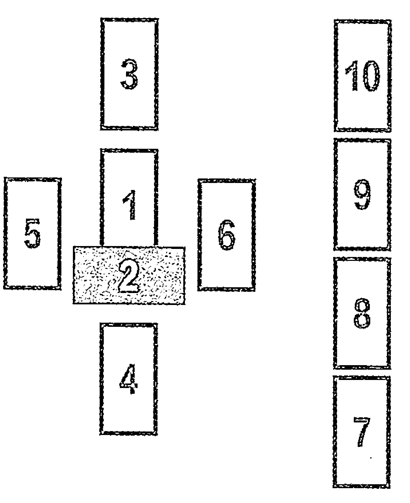

## △牌阵展开方法

将78张牌按照既定的程序洗过，牌面向下放在左手上。然后从上往下数到第7张牌，翻面过来放在桌子的中心位置。这张牌为1。然后再从该牌的位置往下数到第7张牌拿出，把这张牌放置在1的上方，将牌面设计成十字的模样。这张牌定为2号。再根据相同要领，数到第7张牌拿出，如图所示放置于3至10的位置之上。将牌以凯尔特十字的方式摆好后，每张牌的位置代表的意思。如以下所示：

- ☆1-表示你的现状（你所要问的问题）。
- ☆2-表示阻碍你的事物。
- ☆3-表示你的意志方向。
- ☆4-表示你害怕的事物。
- ☆5-表示发生此问题的过去缘由。
- ☆6-表示因为这个问题而产生的一些事情。
- ☆7-表示解决该问题的方法。
- ☆8-表示在你周围的一些人际关系。
- ☆9-表示你的愿望。
- ☆10-暗示可能的结果，总结全部。
- ☆1至6的牌表示问题起因的现状分析。
- ☆7至10的牌表示对未来所做的暗示。

### ▲实例

例如你目前正想挑战有点困难的国家考试，我们就用这个预测方法看看情况如何。

- ☆1-开出的是‘女皇的正位’。
- ☆2-开出的是‘圣杯5的逆位’。
- ☆3-开出的是‘权杖骑士的正位’。
- ☆4-开出的是‘愚人的逆位’。
- ☆5-开出的是‘宝剑9的正位’。
- ☆6-开出的是‘恶魔的逆位’。
- ☆7-开出的是‘星星的正位’。
- ☆8-开出的是‘星币王后的正位’。
- ☆9-开出的是‘宝剑3的逆位’。
- ☆10-开出的是‘皇帝的正位’。

现在一一来做推理与分析。

- ☆1-表示目前的你有个很大的愿望，而且你也很有冲劲。虽然现今的状况很艰巨，但是你想要有一番作为的意愿非常强烈。

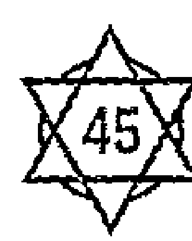

- ☆2-阻碍你的事物就是“时间的浪费”。你该好好地分配利用时间。
- ☆3-不管如何，你想达成目的的意志必须要坚持下去。
- ☆4-如果你会感到些许不安的话，那是因为读书的方式以及重点太过于粗糙，没有条理的缘故。
- ☆5-也许是因为你没有“信心”。
- ☆6-与其说你没有时间，还不如说是因为你对你应该做的事，抱着得过且过的心，越来越不认真。可能会很想玩吧。
- ☆7-但是目前的你，不能就这样过下去，应该重新调整步伐，以“胜利”当作你奋斗的目标。应该要打败其它诱惑以及精神疲劳。
- ☆8-因为你周围的朋友诱惑你玩乐，所以这些诱惑就成了你的阻碍。努力认真念书是不可以输给诱惑的。
- ☆9-你的愿望当然是“成功”，但是由于没有自信，所以常会受到外在环境的影响。简单地说就是不够认真。
- ☆10-就结论来说，抱着坚定的意志，以不屈不挠的心态朝着目标前进的话，胜利一定可以手到擒来。不过克己之心看起来是有锻炼的必要。

以上就是这个预测的结果。

## ◇──塔罗牌阵大全──◇

牌阵是问题呈现的一个形式。在预测时，选对牌阵，可得事半功倍之效。因此，如何为问题选择一个适当的牌阵是相当重要的一个步骤。牌阵少则使用一张牌，多则数十张不等。简单的牌阵应付简单的问题，复杂的牌阵则处理重大的问题，依据不同的问题而选择不同的切入点。没有绝对的优劣之分，合适、恰如其分即可。

在使用牌阵时，有一点需要特别注意：选择牌阵的重点是有效呈现问题、解决问题，而不应被不适用的牌阵所牵制。有时候，甚至可以不使用牌阵。举例来说，我们时常要面对一些鸡毛蒜皮的问题，像是：“明天要去吃大餐，还是郊游？”此时使用大型牌阵只是大而无当。我们可以利用小巧的二择一牌阵。或者是更简单的，抽一张牌代表吃大餐，再抽一张代表郊游。不使用牌阵的“与牌对话”有时反而更加直接明了。

讨论牌阵有多少种是毫无意义的，因为牌阵有无数多种，其中变化万千，任何人都可以自创牌阵。以下列举的是我们为初学者准备的最简单的基础牌阵和一些方便的实用牌阵，以及一些经过时代考验的经典牌阵。下列牌阵中，标明22张的，只使用22张大阿尔卡那牌；标明56张的，只使用56张小阿尔卡那牌；标明78张的，则要使用整副牌；同时标明22张、56张、78张的，则可任选其一。

## 基础牌阵

### [1]把握未来

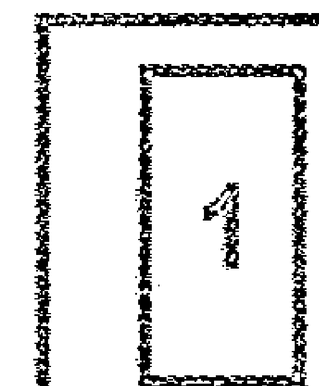

- 适用于：22张大阿尔卡那、56张小阿尔卡那、78张塔罗
- 取牌方式：随意抽1张牌，放在1处。
- 如何解释：你现在应该将焦点、力量集中在此。

### 【2】Yes or no

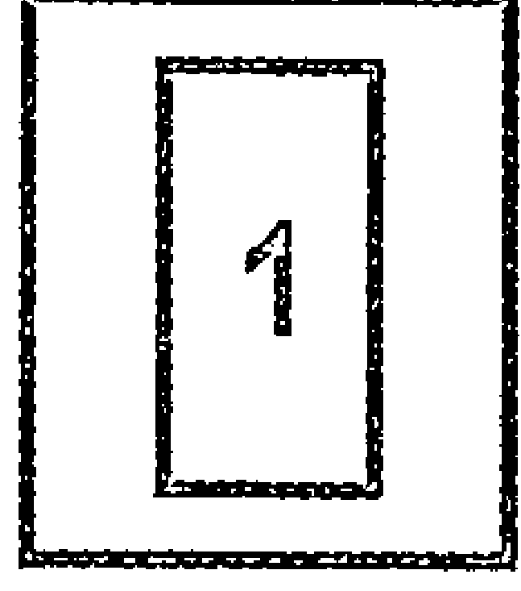

- 适用于：78张塔罗，使用大阿尔卡那22张，以及小阿尔卡那的圣杯九、4张Ace牌，共27张牌。
- 取牌方式：随意抽取1张牌，不考虑正逆位，以出现的牌面来解释。
- 如何解释：
  - ☆1-若是出现小阿尔卡那首牌（Ace）的任何一张，代表你必需调整自己的动作，或等待时间的安排。
  - ☆2-若是出现圣杯九，则代表明确的“是”。
  - ☆3-若出现大阿尔卡那牌请查阅下面所列。
    - 是：愚人、魔术师、女皇、皇帝、战车、正义、星星、太阳、世界。
    - 是或否都可以：女祭司、命运之轮、恋人、教皇、月亮、审判。
    - 否：力量、高塔、节制、隐士、倒吊人、死神、恶魔。

### 【3】得失

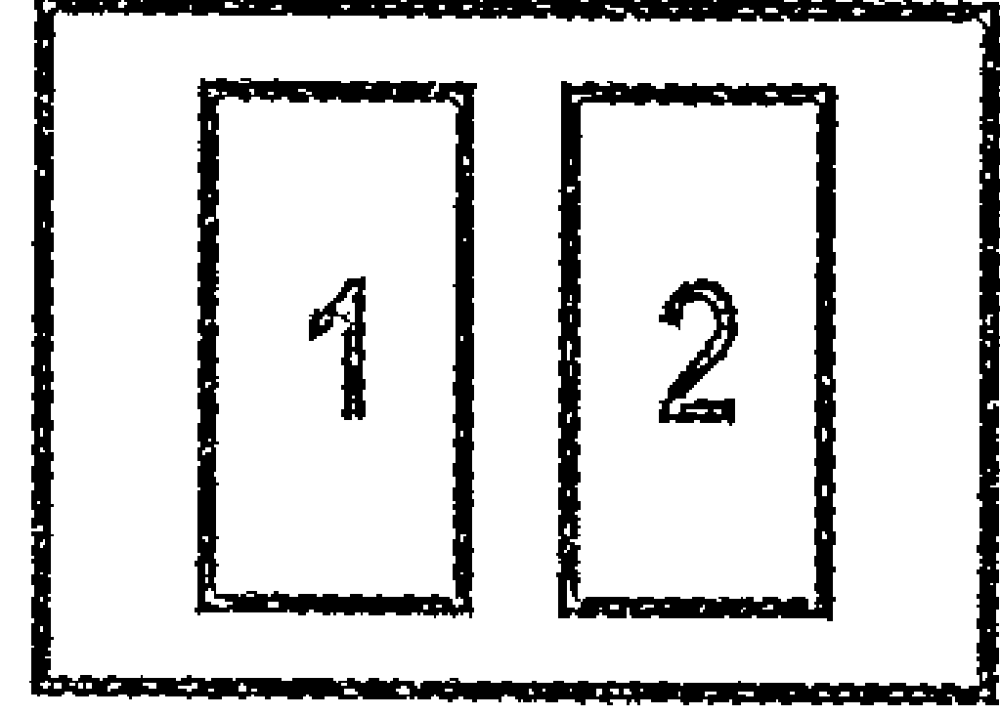

- 适用于：22张大阿尔卡那、56张小阿尔卡那、78张塔罗
- 取牌方式：随意抽2张牌，依序放在1、2。
- 如何解释：
  - ☆1-我将失去什么。
  - ☆2-我将获得什么。

### 【4】活力

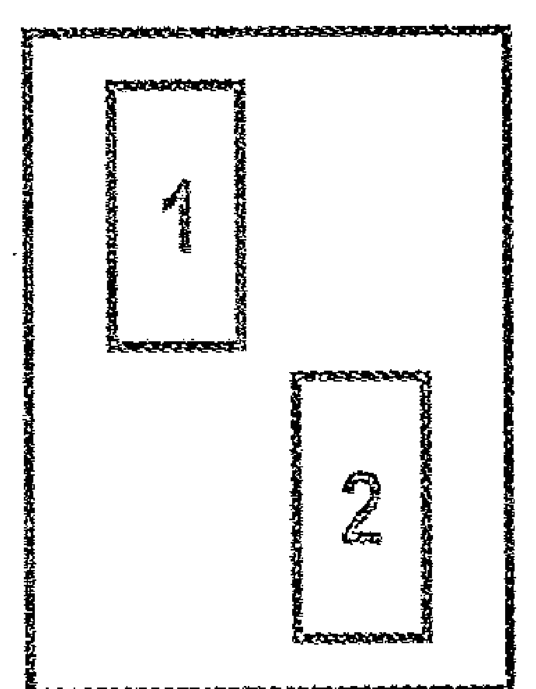

- 适用于：22张大阿尔卡那、56张小阿尔卡那、78张塔罗
- 取牌方式：随意抽2张牌，依序放在1、2。
- 如何解释：
  - ☆1-今天会影响你的能量（也有可能是明天或下星期发生效力）。
  - ☆2-你如何将此能量提升，进而成为帮助你的力量。

### 【5】星期

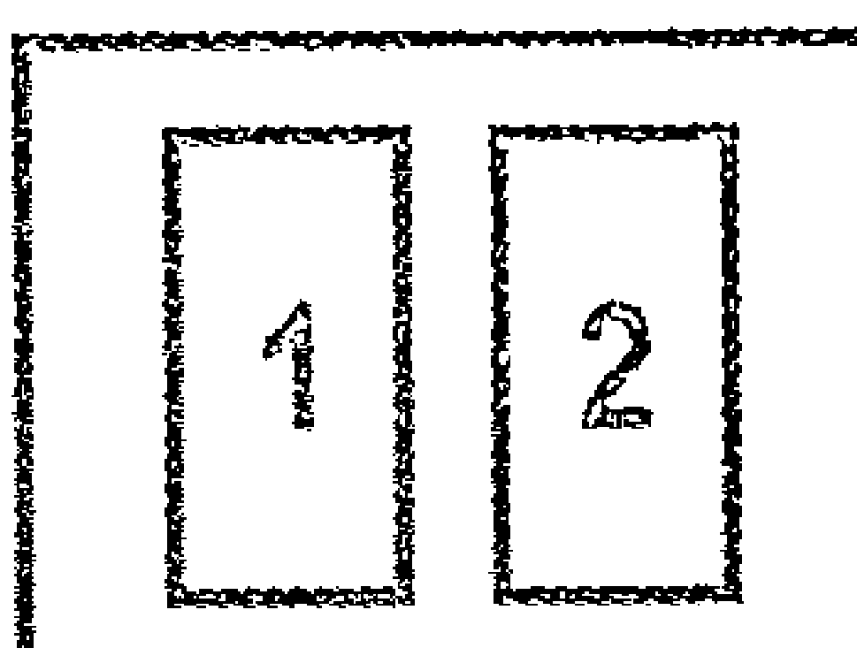

- 适用于：22张大阿尔卡那、56张小阿尔卡那、78张塔罗
- 取牌方式：随意抽2张牌，依序放在1、2。
- 如何解释：
  - ☆1-这星期中的潜在影响力。
  - ☆2-这星期呈现的主要情势。

### 【6】每天

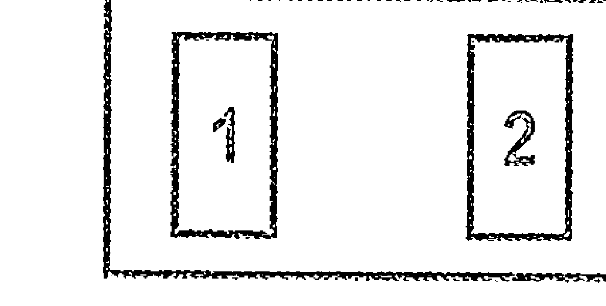

- 适用于：22张大阿尔卡那、56张小阿尔卡那、78张塔罗
- 取牌方式：随意抽2张牌，依序放在1、2。
- 如何解释：
  - ☆1-事件：今天可能发生的一些事。
  - ☆2-感受：你的感受或是对所发生事情的反应。

### 【7】过去、现在、未来

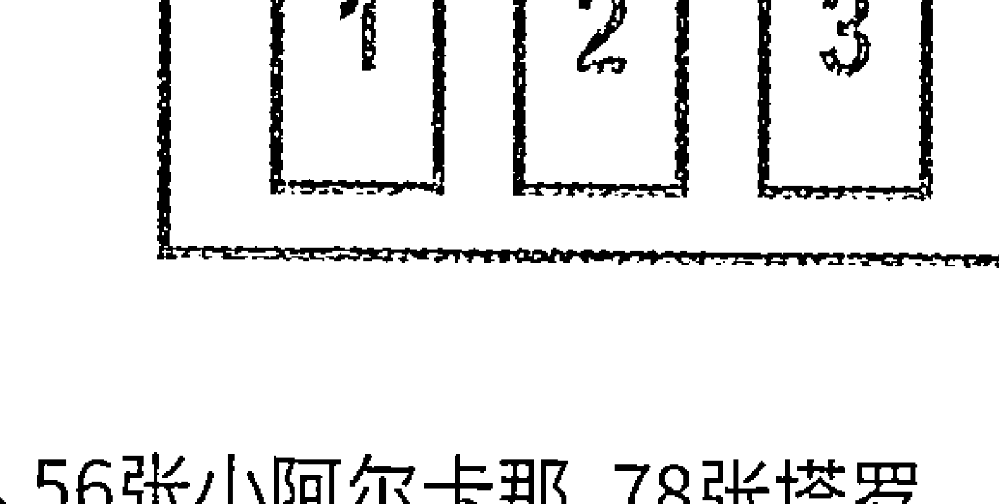

- 适用于：22张大阿尔卡那、56张小阿尔卡那、78张塔罗
- 取牌方式：随意抽3张牌，依序放在1、2、3。
- 如何解释：
  - ☆1-过去发生过的事情。
  - ☆2-现在正发生的事情。
  - ☆3-未来可能发生的事情。

### 【8】关键

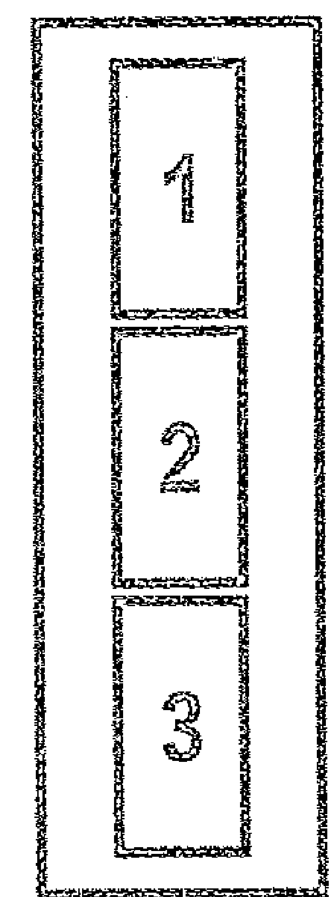

- 适用于：22张大阿尔卡那、56张小阿尔卡那、78张塔罗
- 取牌方式：随意抽3张牌，依序放在1、2、3。
- 如何解释：
  - ☆1-问题的关键。
  - ☆2-关键的重点。
  - ☆3-在你前方的、你将面对的。

### 【9】了解自己

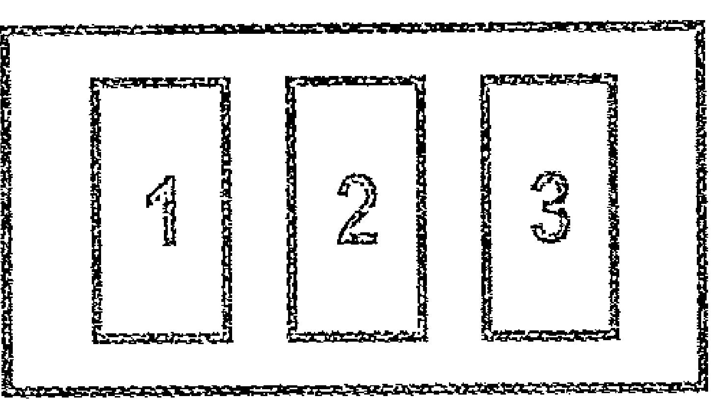

- 适用于：22张大阿尔卡那、56张小阿尔卡那、78张塔罗
- 取牌方式：随意抽3张牌，依序放在1、2、3。
- 如何解释：
  - ☆1-我是谁。
  - ☆2-我的需求。
  - ☆3-我如何达成我的需求。

### 【10】命运

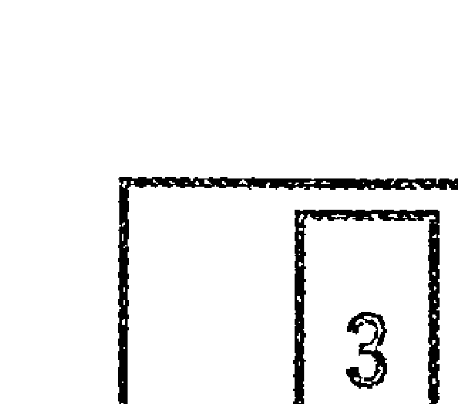

- 适用于：22张大阿尔卡那、56张小阿尔卡那、78张塔罗
- 取牌方式：随意抽3张牌，依序放在1、2、3。
- 如何解释：
  - ☆1-某年某月某日将发生什么事。
  - ☆2-为何发生此事。
  - ☆3-此事将如何发生。

### 【11】今日事件

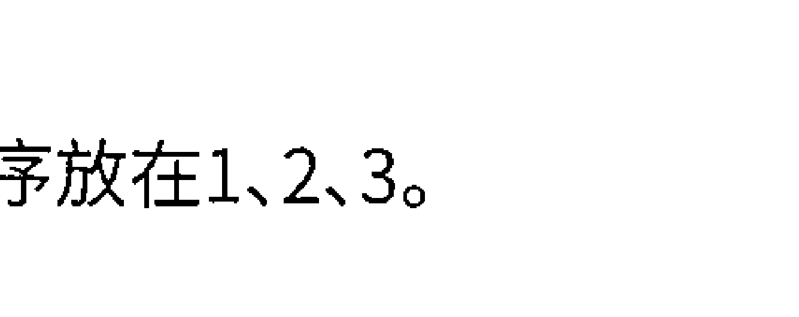

- 适用于：22张大阿尔卡那、56张小阿尔卡那、78张塔罗
- 取牌方式：随意抽3张牌，依序放在1、2、3。
- 如何解释：
  - ☆1-今天的重点事件。
  - ☆2-这件事会如何发展。
  - ☆3-你如何开始或你该为这事件做些什么。

### [12]今天的工作

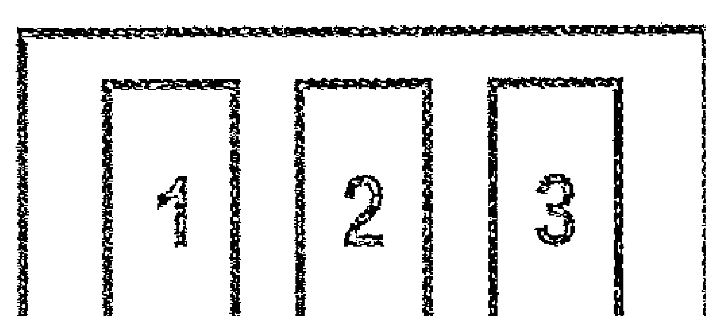

- 适用于：22张大阿尔卡那、56张小阿尔卡那、78张塔罗
- 取牌方式：随意抽3张牌，依序放在1、2、3。
- 如何解释：
  - ☆1-今天的状况。
  - ☆2-今天特别的工作、目标。
  - ☆3-今天中唯一、独特的机会。

### [13]今天金字塔

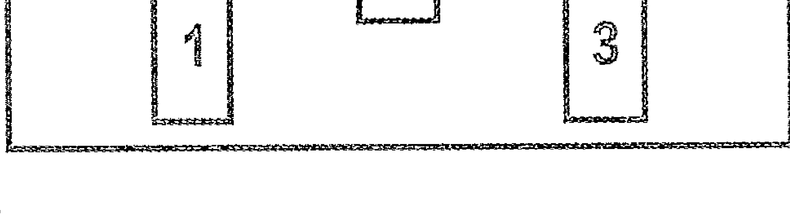

- 适用于：22张大阿尔卡那、56张小阿尔卡那、78张塔罗
- 取牌方式：随意抽3张牌，依序放在1、2、3。
- 如何解释：
  - ☆1-天的开始。（白天必须专注什么）
  - ☆2-天的最高潮。（今天最主要的事）
  - ☆3-天的结束。（结束）

### 【14】目标

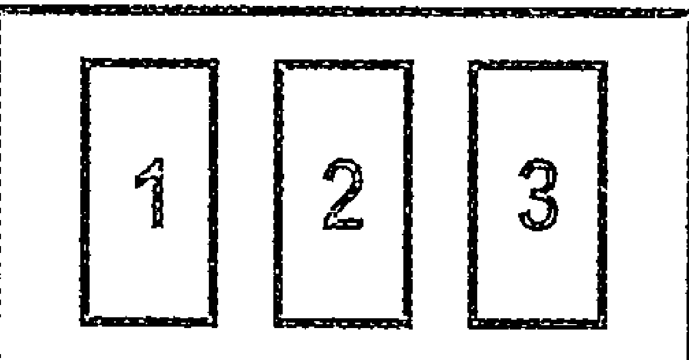

- 适用于：22张大阿尔卡那、56张小阿尔卡那、78张塔罗
- 取牌方式：随意抽3张牌，依序放在1、2、3。
- 如何解释：
  - ☆1-今天的目标。
  - ☆2-达成目标的力量。
  - ☆3-阻碍。

### 【15】新机会

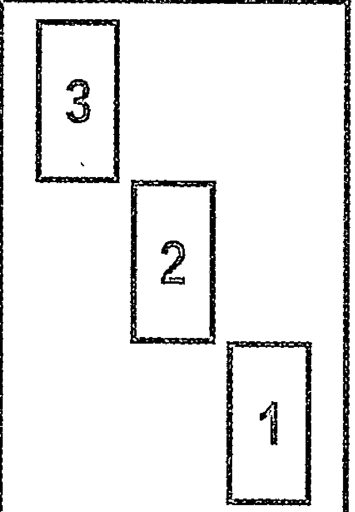

- 适用于：22张大阿尔卡那、56张小阿尔卡那、78张塔罗
- 取牌方式：随意抽3张牌，依序放在1、2、3。
- 如何解释：
  - ☆1-这些将变成不重要的。
  - ☆2-这些将变成较重要的。
  - ☆3-这些是现在必要的。

### 【16】工作

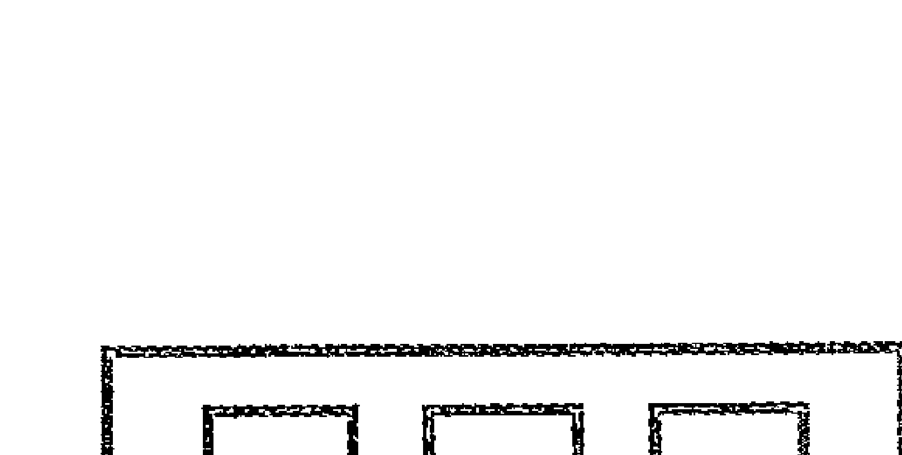

- 适用于：22张大阿尔卡那、56张小阿尔卡那、78张塔罗
- 取牌方式：随意抽3张牌，依序放在1、2、3。
- 如何解释：
  - ☆1-我选对工作了吗？（必须深思熟虑）
  - ☆2-这工作稳定吗？（可以做多久）
  - ☆3-应该做些改变吗？（我应该继续做，还是稍作调整，甚至离职）

### 【17】合伙

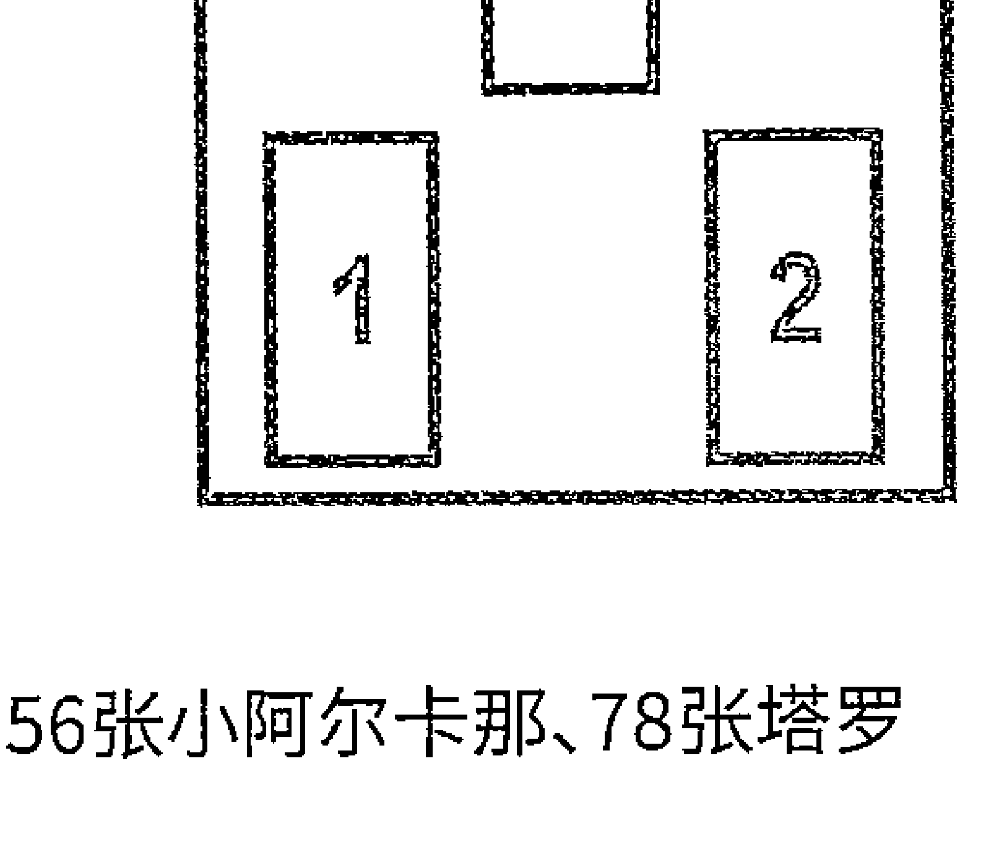

- 适用于：22张大阿尔卡那、56张小阿尔卡那、78张塔罗
- 取牌方式：随意抽3张牌，依序放在1、2、3。
- 如何解释：
  - ☆1-我的伙伴。
  - ☆2-我自己。
  - ☆3-合伙工作的状况或是风险。

## 爱情牌阵

### [18]分手

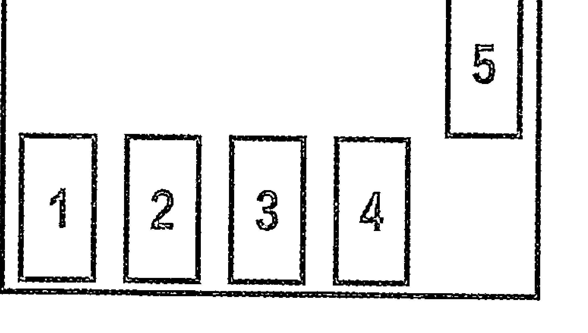

- 适用于：22张大阿尔卡那、56张小阿尔卡那、78张塔罗
- 取牌方式：随意抽5张牌，依序放在1、2、3、4、5。
- 如何解释：分手预测法主要是告诉你一些你必须取舍的事。第5张牌主要告诉你如何去调整自己对爱的感觉。
  - ☆1、2、3-我为什么要放手？为何要放弃的隐藏原因。
  - ☆4-为何要放弃的最主要或唯一的原因。
  - ☆5-最终结果：如果你放手了，会造成怎样的结果。

### [19]恋爱前景

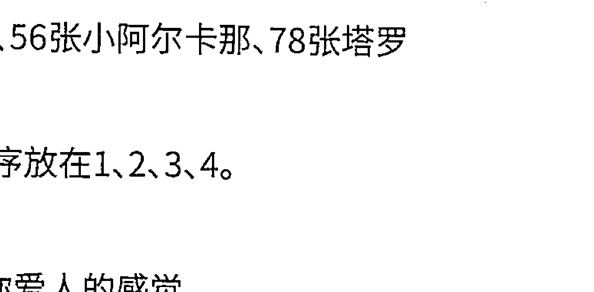

- 适用于：22张大阿尔卡那、56张小阿尔卡那、78张塔罗
- 取牌方式：随意抽4张牌，依序放在1、2、3、4。
- 如何解释：
  - ☆1、2、3-你对于你爱人的感觉。
  - ☆4-路的前方（未来）。

### [20]一生的爱

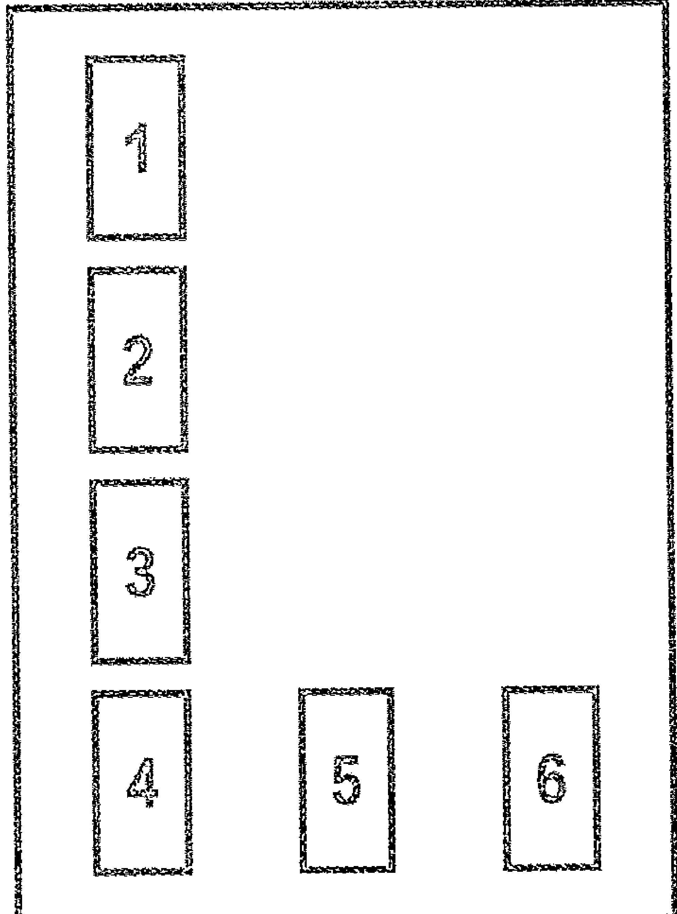

- 适用于：22张大阿尔卡那、56张小阿尔卡那、78张塔罗
- 取牌方式：随意抽6张牌，依序放在1、2、3、4、5、6。
- 如何解释：
  - ☆1-你过去对爱的经验。
  - ☆2-你目前对爱的经验。
  - ☆3-在爱情关系中你想得到什么。
  - ☆4-在爱情关系中你需要什么。
  - ☆5-你对你的爱人付出了什么。
  - ☆6-未来有可能得到的爱的经验。

### [21]关系

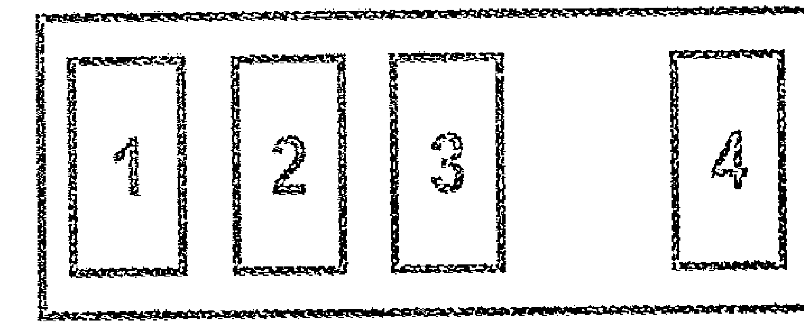

- 适用于：22张大阿尔卡那、56张小阿尔卡那、78张塔罗
- 取牌方式：随意抽4张牌，依序放在1、2、3、4。
- 如何解释：
  - ☆1-在这关系中你付出的。
  - ☆2-在这关系中你得到的。
  - ☆3-在这关系中你的爱人付出的。
  - ☆4-在这关系中你的爱人得到的。

### 【22】真命天子

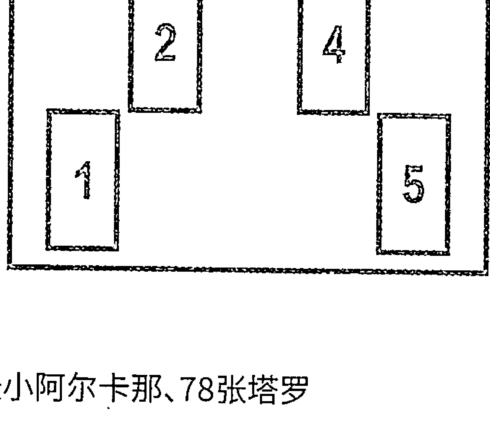

- 适用于：22张大阿尔卡那、56张小阿尔卡那、78张塔罗
- 取牌方式：随意抽5张牌，依序放在1、2、3、4、5。
- 如何解释：
  - ☆1-我真正的伴侣的类型。
  - ☆2-我真正的伴侣已经走入我的生命之中了吗？
  - ☆3-将会有困难产生吗？
  - ☆4-什么样的改变是需要的？
  - ☆5-我将相信什么？

### [23]检验爱情

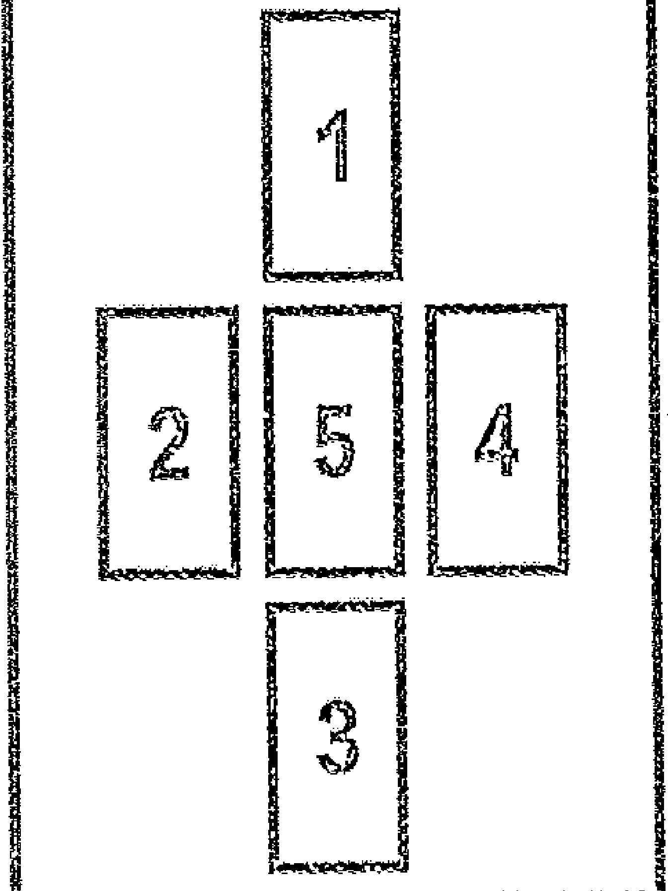

- 适用于：22张大阿尔卡那、56张小阿尔卡那、78张塔罗
- 取牌方式：随意抽5张牌，依序放在1、2、3、4、5。
- 如何解释：
  - ☆1-这段时间，我的爱情关系传达了什么东西给我。
  - ☆2-在爱情关系中我真正要什么。
  - ☆3-在爱情关系中我不喜欢什么。
  - ☆4-什么可以赋予爱情新的能量。
  - ☆5-对于爱，我仍不了解的，或是我应该学习的。

### [24]爱已消失

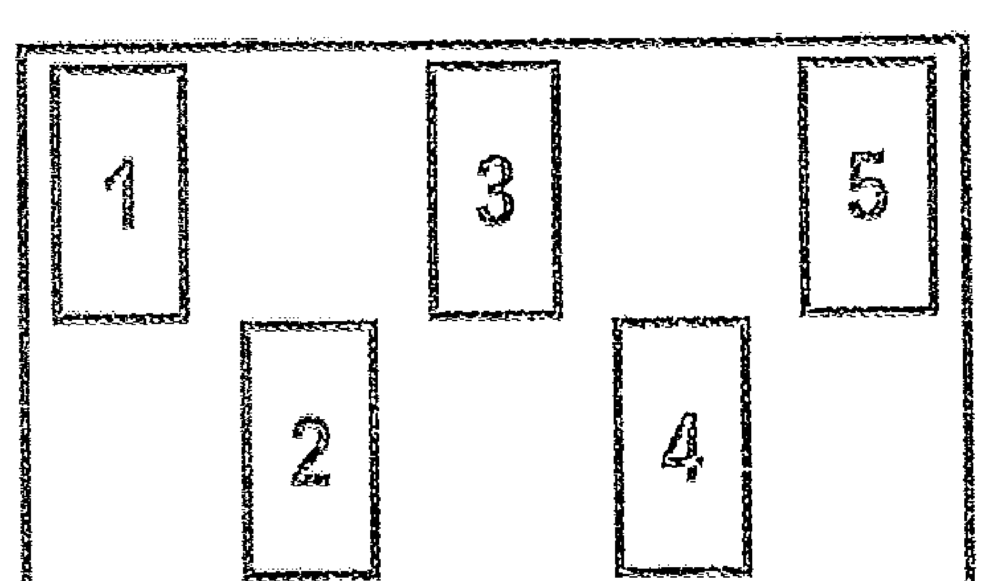

- 适用于：22张大阿尔卡那、56张小阿尔卡那、78张塔罗
- 取牌方式：随意抽5张牌，依序放在1、2、3、4、5。
- 如何解释：分手预测法主要是告诉你一些你必须取舍的事。第5张牌主要告诉你如何去调整自己对爱的感觉。
  - ☆1、2、3-我为什么要放手？为何要放弃的隐藏原因。
  - ☆4-为何要放弃的最主要或唯一的原因。
  - ☆5-最终结果：如果你放手了，会造成怎样的结果。

### 【25】新的恋情

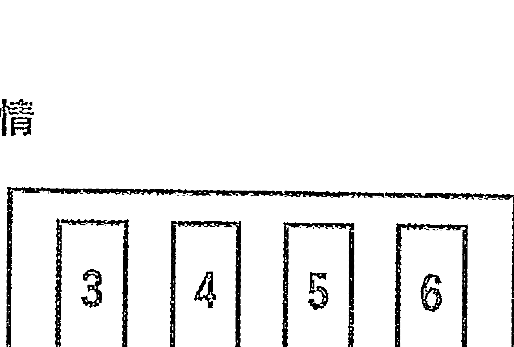

- 适用于：22张大阿尔卡那、56张小阿尔卡那、78张塔罗
- 取牌方式：随意抽6张牌，依序放在1、2、3、4、5、6。
- 如何解释：
  - ☆1-我马上会有一段新恋情、新关系吗？
  - ☆2-那个人是什么星座？
  - ☆3-我们会相处融洽吗？
  - ☆4-这将会是一段持续的关系吗？
  - ☆5-那个人将会是我的灵魂伴侣吗？
  - ☆6-我愿望的结果。

### 【26】再见

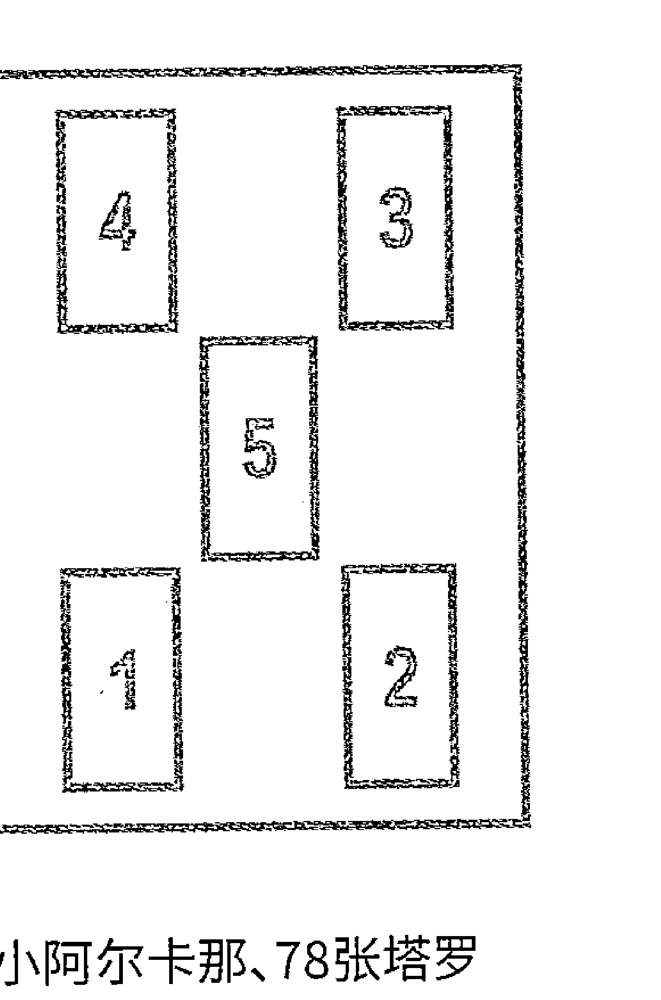

- 适用于：22张大阿尔卡那、56张小阿尔卡那、78张塔罗
- 取牌方式：随意抽5张牌，依序放在1、2、3、4、5。
- 如何解释：
  - ☆1-我最初想要什么？
  - ☆2-目前的情况（第一张的延续）。
  - ☆3-我正跟什么道别（正失去什么）。
  - ☆4-我一直得不到的。
  - ☆5-我如何得到它（第4张牌所指的）。

### 【27】爱的新起点

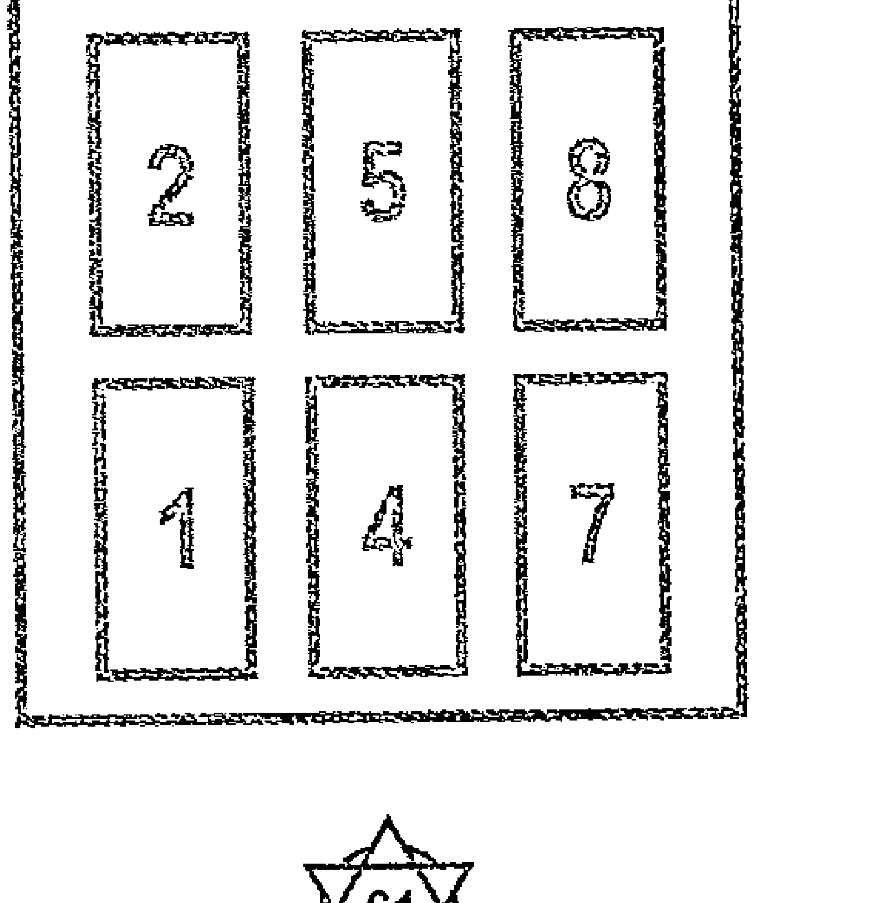

### Δ适用于：
22张大阿尔卡那、56张小阿尔卡那、78张塔罗

### Δ取牌方式：
随意抽9张牌，依序放在1、2、3、4、5、6、7、8、9。

### Δ如何解释：
- ☆1-这是一个新起点吗？
- ☆2-将会有新的爱人吗？
- ☆3-会有什么惊喜产生？
- ☆4-这将令人安心吗？
- ☆5-过程将会如何？
- ☆6-相处融洽吗？
- ☆7-内心所想的是真的吗？
- ☆8-将设定怎样的目标？
- ☆9-一切都会好吗？

### 【28】秘密情人
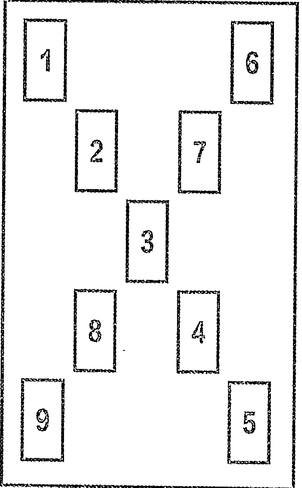

### Δ适用于：
22张大阿尔卡那、56张小阿尔卡那、78张塔罗

### Δ取牌方式：
随意抽9张牌，依序放在1、2、3、4、5、6、7、8、9。

### Δ如何解释：
- ☆1-你的爱情过去的状况。
- ☆2-你现在的处境。
- ☆3-你前任伴侣现在的处境。
- ☆4-你对于与前任伴侣复合的真正感觉。
- ☆5-你的前任伴侣对于与你复合的真正感觉。
- ☆6-阻碍你的。
- ☆7-帮助你的。
- ☆8-一些你可能不知道的事。
- ☆9-结果或决定。

### 【29】爱情三角
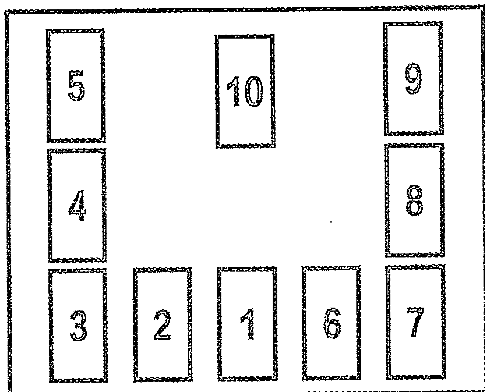

### Δ适用于：
22张大阿尔卡那、56张小阿尔卡那、78张塔罗

### Δ取牌方式：
随意抽10张牌，依序放在1、2、3、4、5、6、7、8、9、10。

### Δ如何解释：
本牌阵应在陷入三角恋时使用(同时有两人爱上你), 必须先设定爱上A与爱人B是谁。

- * ☆1-我现在的处境。
- * ☆2-我期望爱人A吗?
- * ☆3-我相信爱人A吗?
- * ☆4-我已经爱上了爱人A吗?
- * ☆5-我与A的情况。
- * ☆6-我期望爱人B吗?
- * ☆7-我相信爱人B吗?
- * ☆8-我已经爱上了爱人B吗?
- * ☆9-我与B的情况。
- * ☆10-我的未来。

### 【30】爱的进行
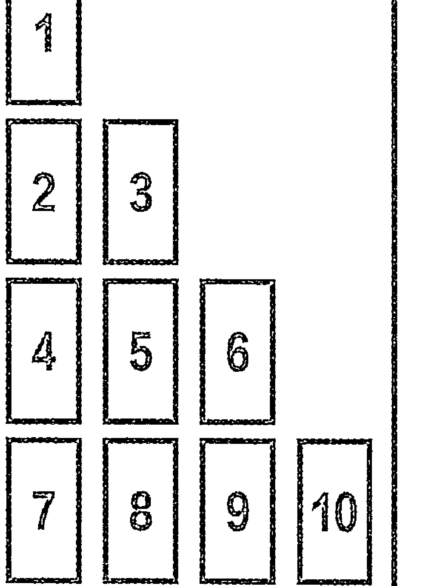

### Δ适用于：
22张大阿尔卡那、56张小阿尔卡那、78张塔罗

### Δ取牌方式：
随意抽10张牌, 依序放在1、2、3、4、5、6、7、8、9、10。

### Δ如何解释：
- ☆1-爱情关系的历史。
- ☆2-在这关系中你过去的经验、体验。
- ☆3-在这关系中你的爱人过去的经验、体验。
- ☆4-在这关系中你现在的经验、体验。
- ☆5-在这关系中你的爱人现在的经验、体验。
- ☆6-这关系目前的情况。
- ☆7-在这关系中你未来可能的经验、体验。
- ☆8-在这关系中你的爱人未来可能的经验、体验。
- ☆9-这关系当前的处境。
- ☆10-结果:未来在这关系中可能发生的事。

### 【31】爱人
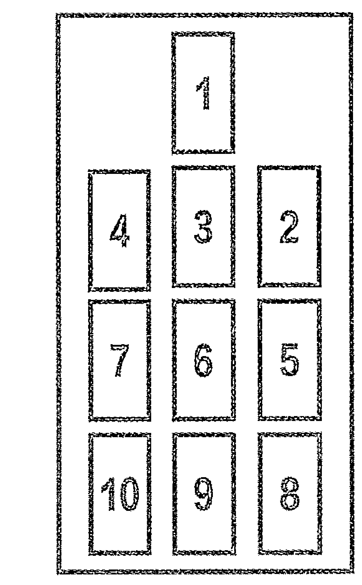

### △适用于：
22张大阿尔卡那、56张小阿尔卡那、78张塔罗

### △取牌方式：
随意抽10张牌,依序放在1、2、3、4、5、6、7、8、9、10。

### △如何解释：
- ☆1-我的爱人关心我吗？
- - ☆2-我们稳定吗？
- - ☆3-我们有相似的梦想与目标吗？
- - ☆4-我的爱人是忠诚、可靠的吗？
- - ☆5-我们相互吸引对方只是因为性感的因素吗？
- - ☆6-我的爱人考虑过结婚吗？
- - ☆7-我的爱人是高水平与高评价的人吗？
- - ☆8-我们能分享彼此的金钱与个人财富吗？
- - ☆9-我的爱人将为我停留，还是离开我？
- - ☆10-最终结果。

### 【32】爱情凯尔特十字
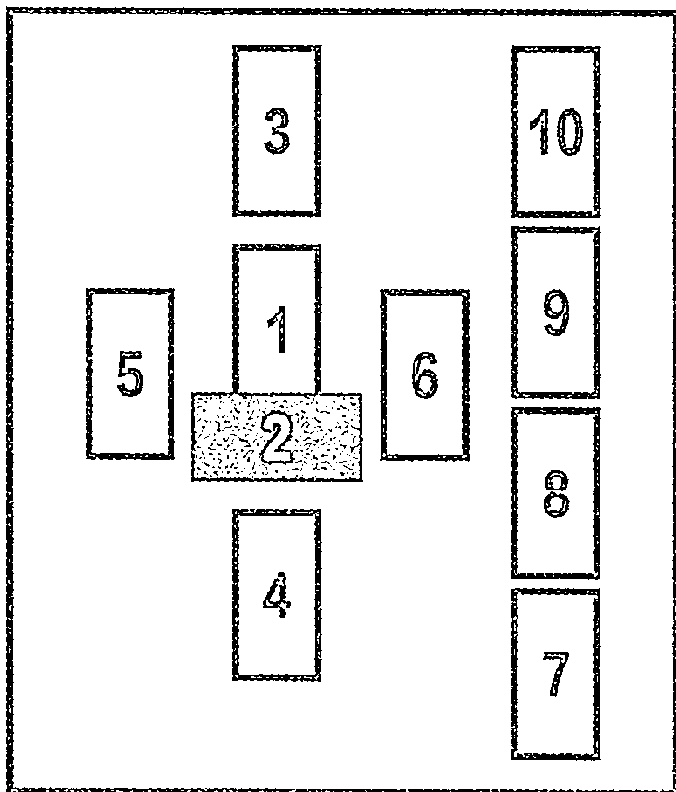

- - △适用于：
  22张大阿尔卡那、56张小阿尔卡那、78张塔罗
- - △取牌方式：
  随意抽10张牌，依序放在1、2、3、4、5、6、7、8、9、10。
- - △如何解释：
- ☆1-你现在的情况:你感受到的信任或伤害。
- ☆2-与你幸福有关的,你应该开始改变的。(此牌在第1张牌底下不显示)
- ☆3-这恋爱如何发展:你已经在进行的部分。
- ☆4-你的愿望或需求:你如何面对目前已经明朗的状况。
- ☆5-问题的中心:你必会碰触到的。
- ☆6-你必须的步骤:必走的一条路。
- ☆7-下一步该做的:你必须去改变的。
- ☆8-有用的影响:你越来越了解的、察觉的。
- ☆9-怀疑与恐惧:此牌是要告诉你任何可能发生的失败、挫折。
- ☆10-你目前的状况所产生的结果:你未来的梦想。

### 【33】爱之路
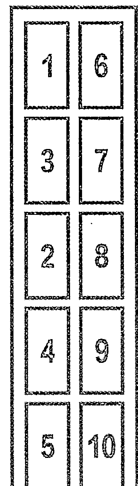

### Δ适用于：
22张大阿尔卡那、56张小阿尔卡那、78张塔罗

### Δ取牌方式：
随意抽10张牌，依序放在1、2、3、4、5、6、7、8、9、10。

### Δ如何解释：
分析自己与两位朋友的关系（合伙、恋爱），请先设定对象A与对象B是谁。

- ☆1-关于对象A。
- ☆2-这将会是一个新开始吗？
- ☆3-我们将会相处融洽吗？
- ☆4-我可以相信我心里的声音吗？（对于A的想法）
- ☆5-应该选择A吗？
- ☆6-关于对象B。
- ☆7-这将会是一个新开始吗？
- ☆8-我们将会相处融洽吗？
- ☆9-我可以相信我心里的声音吗？（对于B的想法）
- ☆10-应该选择B吗？

### 【34】浪漫诱惑
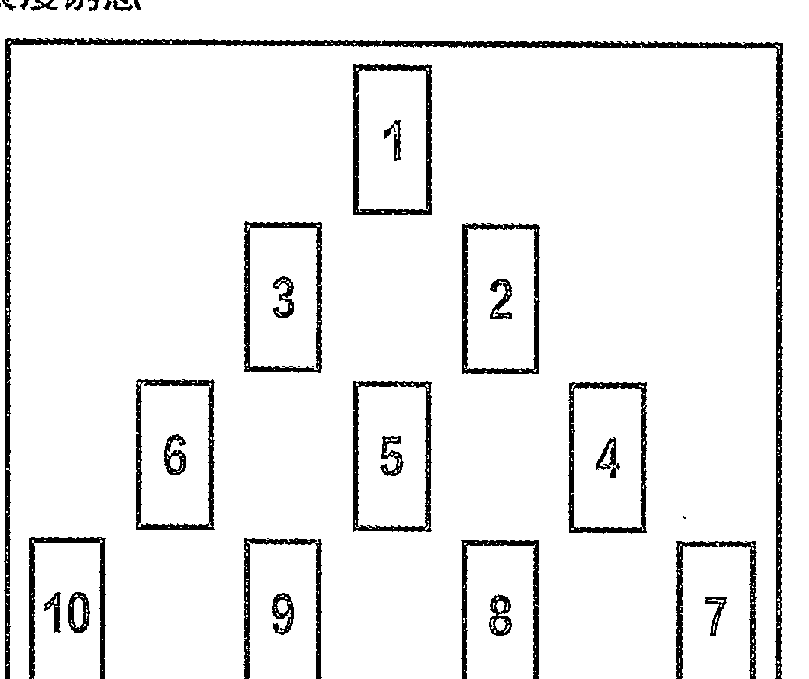

### Δ适用于：
22张大阿尔卡那、56张小阿尔卡那、78张塔罗

### △取牌方式:
随意抽10张牌，依序放在1、2、3、4、5、6、7、8、9、10。

### △如何解释:
- - ☆1-有吸引力的、诱人的。
- - ☆2-那个人正在恋爱吗?
- - ☆3-我们能相处愉快吗?
- - ☆4-我们可以一起工作以及相互支持对方吗?
- - ☆5-我们的性生活能配合吗?
- - ☆6-我们的家族能相处融洽吗?
- - ☆7-我们宗教信仰是否不同、有冲突吗?
- - ☆8-我们将会有权力与金钱方面的问题吗?
- - ☆9-这将是一段长时间的关系吗?
- - ☆10-结果。

### 【35】破镜重圆
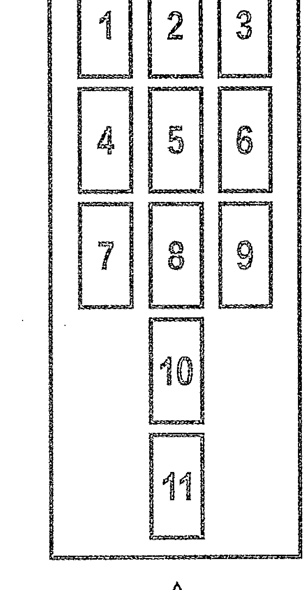

### △适用于：
22张大阿尔卡那、56张小阿尔卡那、78张塔罗

### △取牌方式：
随意抽11张牌，依序放在1、2、3、4、5、6、7、8、9、10、11。

### △如何解释：
分析自己与两位朋友的关系状况(合伙、恋爱)，请先设定对象A与对象B是谁。

- ☆1-你最近的及过去的情况。
- ☆2-你的现况或关键。
- ☆3-你若与之前爱人复合所产生的结果。
- ☆4-与你分手的爱人，过去的情况。
- ☆5-与你分手的爱人，现在的情况。
- ☆6-与你分手的爱人，未来的情况;或是指与你复合的可能性。
- ☆7-与你分手的爱人，他(她)新的恋人过去的情况。(你的情敌)
- ☆8-与你分手的爱人，他(她)新的恋人现在的情况。(你的情敌)
- ☆9-与你分手的爱人，他(她)新的恋人与你互动的未来的情况。(你的情敌与你的互动)
- ☆10-可能的结果一：会因为第3张牌而减弱或加强。(一同解释)
- ☆11-可能的结果二：会因为第9张牌而减弱或加强。(一同解释)

### 【36】别人的爱
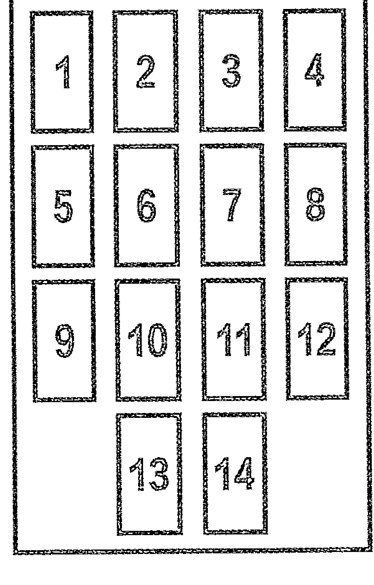

### △适用于：
22张大阿尔卡那、56张小阿尔卡那、78张塔罗

### △取牌方式：
随意抽14张牌，依序放在1、2、3、4、5、6、7、8、9、10、11、12、13、14。

### △如何解释：
- ☆1、2-在这关系中，他所喜欢的部分。
- ☆3、4-在这关系中，她所喜欢的部分。
- ☆5、6-在这关系中，他不喜欢的部分。
- ☆7、8-在这关系中，她不喜欢的部分。
- ☆9、10-在这关系中，他想要看见什么样的事情发生。
- ☆11、12-在这关系中，她想要看见什么样的事情发生。
- ☆13、14-结果：这关系当前的处境。

## 财富牌阵
### 【37】金钱
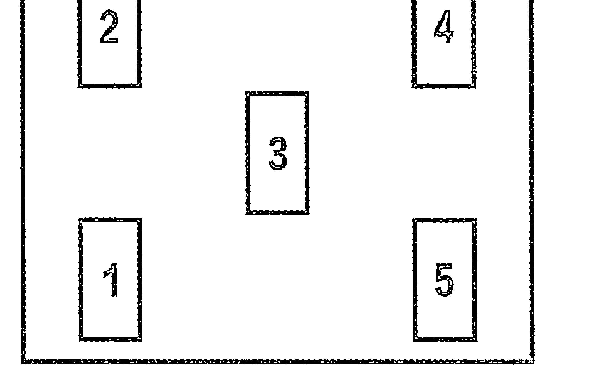

△适用于: 22张大阿尔卡那、56张小阿尔卡那、78张塔罗

△取牌方式: 随意抽5张牌, 依序放在1、2、3、4、5。

△如何解释:
- ☆1-财富的根基。
- ☆2-财富如何快速地来到你的生活当中。
- ☆3-有助增加财富的有利条件——你应该好好的考量的。
- ☆4-暗示某些人或某些计划会带来新的财富。
- ☆5-结果。

### 【38】收获
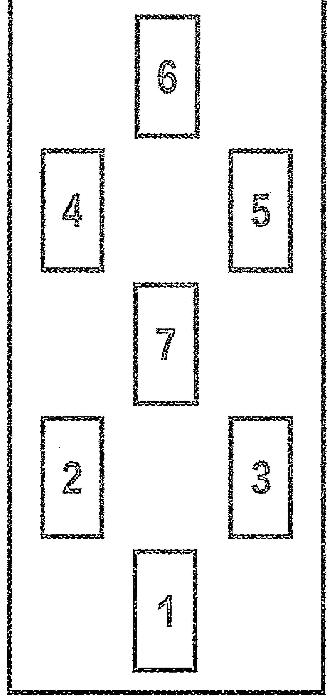

- - △适用于：22张大阿尔卡那、56张小阿尔卡那、78张塔罗
- - △取牌方式：随意抽7张牌，依序放在1、2、3、4、5、6、7。
- - △如何解释：
  - ☆1-你的愿望。
  - ☆2-如何播种你的愿望种子，并且得到成果。（该如何行动一种瓜得瓜，种豆得豆）
  - ☆3-在实现愿望的过程中所需要的新想法。
  - ☆4-某人或某些事物会帮助你。
  - ☆5-你面前的挑战。
  - ☆6-你将得到什么。
  - ☆7-实现未来远景的关键。

### 【39】金钱
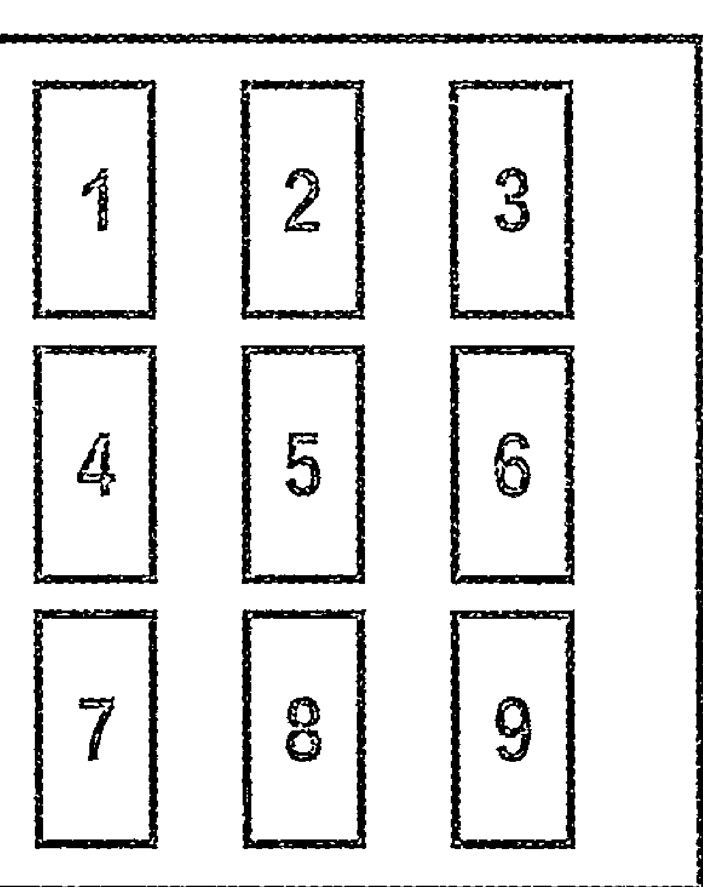

Δ适用于：
22张大阿尔卡那、56张小阿尔卡那、78张塔罗

Δ取牌方式：
随意抽9张牌,依序放在1、2、3、4、5、6、7、8、9。

Δ如何解释：
- ☆1-钻石:你出众的地方,主要的天赋、能力,你拥有的财富。
- ☆2-珍珠:你的知识,你将其融入生活中的知识与信息。
- ☆3-金币:你拥有的,金钱与目前你可以使用的物质。
- ☆4-翡翠:你认识的人,在你生命中新发生的关系。
- ☆5-白金链:阻碍你的,在你生命中你必须去解决、处理的人事物。
- ☆6-蓝宝石:你能够与众不同的地方,目前正脱颖而出的才能、财产、能力。
- ☆7-水晶:你正在学习的,你可以将其融入生活中的知识与信息。
- ☆8-红宝石:你可能马上要认识的人,那人正走入你的生命中。
- ☆9-未经琢磨的钻石:你尚未发挥的地方,你可以开发的财产、能力。

### 【40】阿拉伯的财富
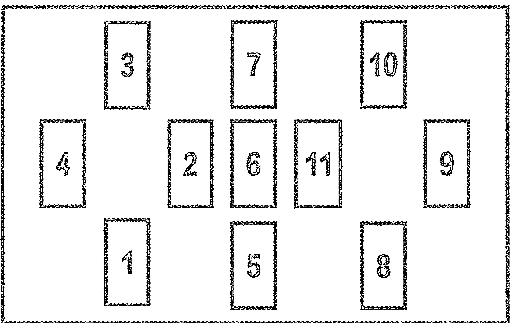

△适用于：
22张大阿尔卡那、56张小阿尔卡那、78张塔罗

△取牌方式：随意抽11张牌，依序放在1、2、3、4、5、6、7、8、9、10、11。

△如何解释：
- ☆1-你的愿望。
- ☆1-家庭、伙伴、环境。
- ☆2-教育、事业、工作。
- ☆3-关系、自尊。
- ☆4-以前的强力的影响，但现在仍有影响力。
- ☆5-求问者本身：求问者的现在状况，目前的心态，个性。
- ☆6-神殿：先前影响求问者的，例如：阻碍他们的。
- ☆7-祭坛：求问者目前的目标：也代表求问者的恐惧与不安。
- ☆8-工作领域与创造力。
- ☆9-社会领域与关系。
- ☆10-健康与家庭方面的领域
- ☆11-未来的强力的影响。

### 【41】财务
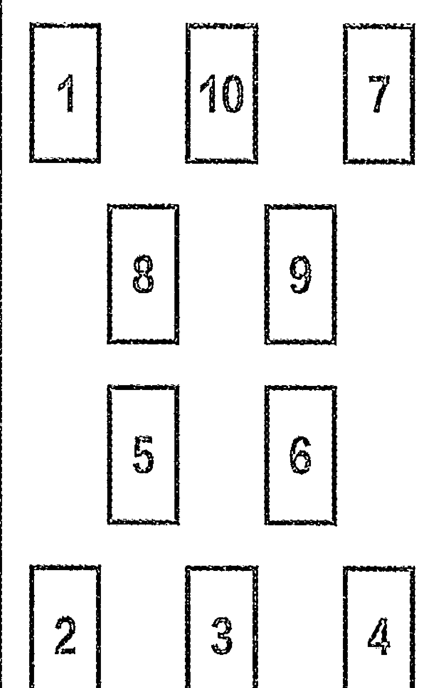

△适用于：
22张大阿尔卡那、56张小阿尔卡那、78张塔罗

△取牌方式：
随意抽10张牌，依序放在1、2、3、4、5、6、7、8、9、10。

△如何解释：
- * 1、2、3、4-与我金钱方面有关的，并且需小心注意的。
- * 5、6、7-我如何让我的财务方面稳定安全？
- * 8、9-谁能提供我所需要的帮助？
- * 10-我财政方面的未来规划。

### 【42】财富之路
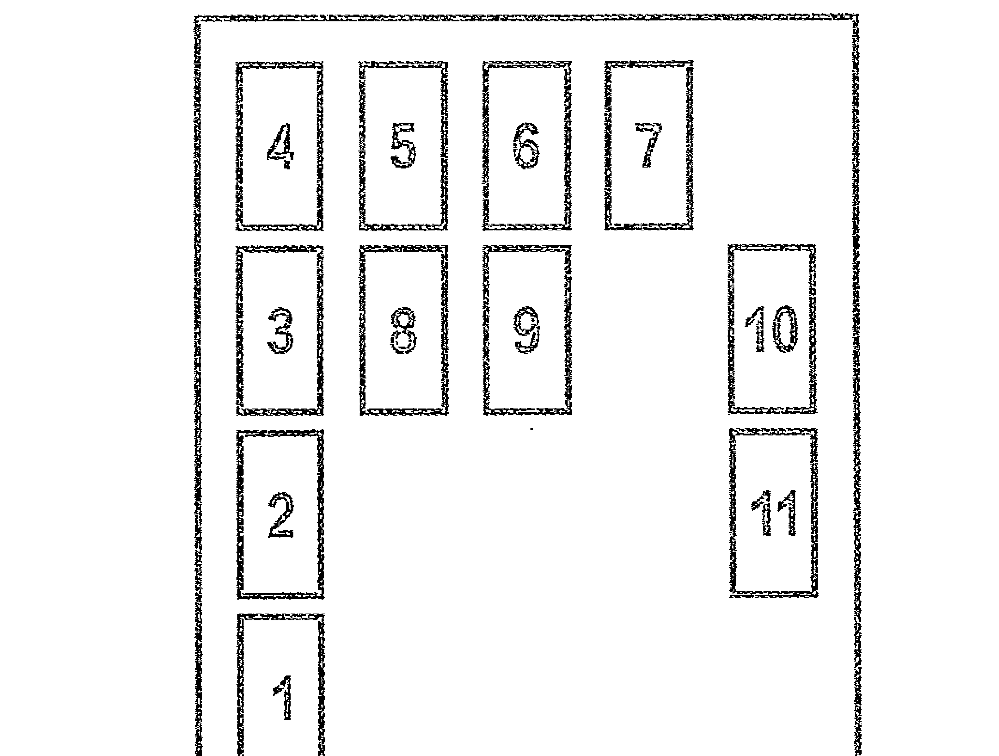

Δ适用于：
22张大阿尔卡那、56张小阿尔卡那、78张塔罗

Δ取牌方式：
随意抽11张牌,依序放在1、2、3、4、5、6、7、8、9、10、11。

Δ如何解释：
- - 1、2-现在的情况。
- - 3、4-隐藏的、你不知道的。
- - 5、6、7-在目前的情况下最有可能产生的结果。(维持现状不做改变)
- - 8、9-另一种可能发生的结果。
- - 10、11-你可以做的努力,以便创造出最好的结果。

## 家庭牌阵
### 【43】搬家
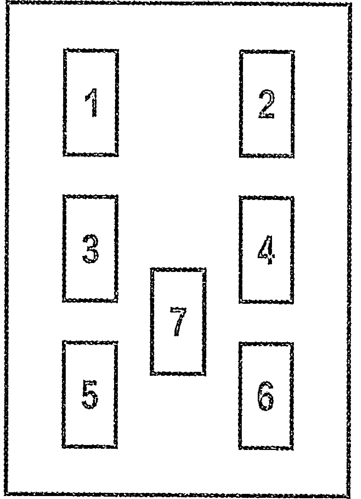

△适用于：
22张大阿尔卡那、56张小阿尔卡那、78张塔罗

△取牌方式：
随意抽7张牌，依序放在1、2、3、4、5、6、7。

△如何解释：
- * 1-什么样的地方对你福利、健康是有帮助的。
- * 2-下次搬家的机会。
- * 3-你如何找到属于你的特殊地方。
- * 4-关于这个地方你必须知道的事。
- * 5-你搬家前必须做的。
- * 6-关于这地方你必须考量的事。
- * 7-结果。

### 【44】宠物
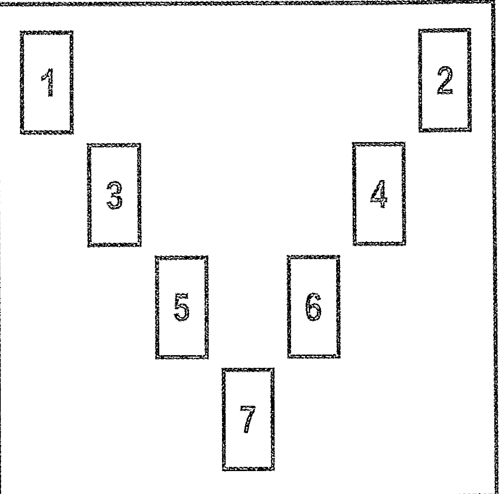

Δ适用于：
22张大阿尔卡那、56张小阿尔卡那、78张塔罗

Δ取牌方式：
随意抽7张牌，依序放在1、2、3、4、5、6、7。

Δ如何解释：
- ☆1-你的宠物试着要告诉你的。
- ☆2-你的宠物现在的感受，它的需要。
- ☆3-你如何帮助你的宠物。
- ☆4-此时你的宠物需要更多的是什么。
- ☆5-你的宠物整体的健康。
- ☆6-在最近的未来中你的宠物将所需要的。
- ☆7-你的宠物的整体分析。

### 【45】小孩特征
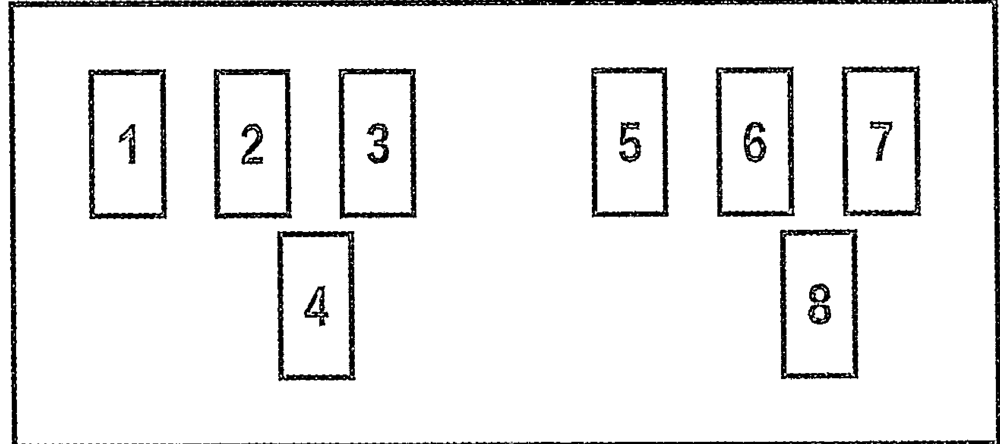

Δ适用于:
22张大阿尔卡那、56张小阿尔卡那、78张塔罗

Δ取牌方式:
随意抽8张牌，依序放在1、2、3、4、5、6、7、8。

Δ如何解释:
这牌阵专为有两个小孩的家庭所创，且此牌阵可以很容易增加其它牌与解释到牌阵里面。你可以沿用这个牌阵的格式或是增加一些牌来符合你的需要。

- ☆1、2、3-你最大的小孩的个性、人格与性向的特征。
- ☆4-你能做些什么事来帮助你最大的小孩。
- ☆5、6、7-你最小的小孩的个性、人格与性向的特征。
- ☆8-你能做些什么事来帮助你最小的小孩。

### 【46】家庭问题
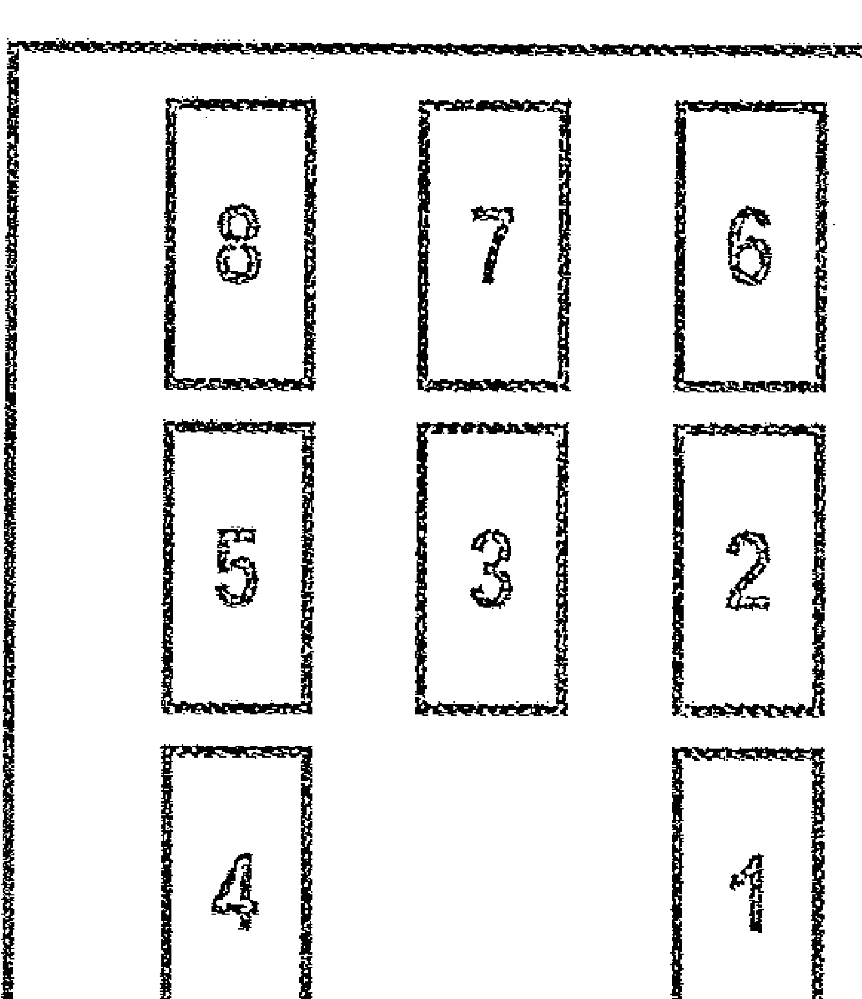

Δ适用于：22张大阿尔卡那、56张小阿尔卡那、78张塔罗

Δ取牌方式：随意抽8张牌，依序放在1、2、3、4、5、6、7、8。

Δ如何解释：
- ☆1-谁是造成问题的主要人物。
- ☆2-危及你的安全与保障之事。
- ☆3-在这问题中，(第1张牌所指之人)一些越轨的行为是如何造成危机的。
- ☆4-在过去，这个人(第1张牌所指之人)是否发生过同样问题。
- ☆5-如何解决这个问题。
- ☆6-需要避免哪些突发状况。
- ☆7-这个问题对你健康的影响。
- ☆8-最后结果。

## 事业牌阵
### 【47】跳槽
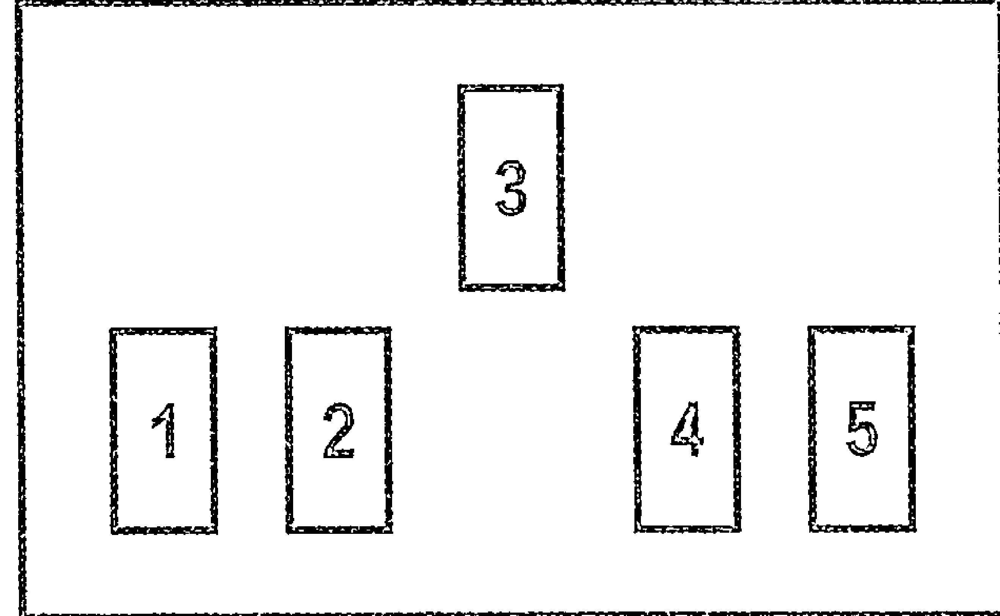

△适用于：22张大阿尔卡那、56张小阿尔卡那、78张塔罗

△取牌方式：随意抽5张牌，依序放在1、2、3、4、5。

△如何解释：
- ☆1-我将有一个更好的工作吗？
- ☆2-我拥有什么或是我该做些什么。
- ☆3-我将经历什么问题。
- ☆4-我可以期盼一个新环境的到来吗？
- ☆5-结果。

### 【48】决策因素
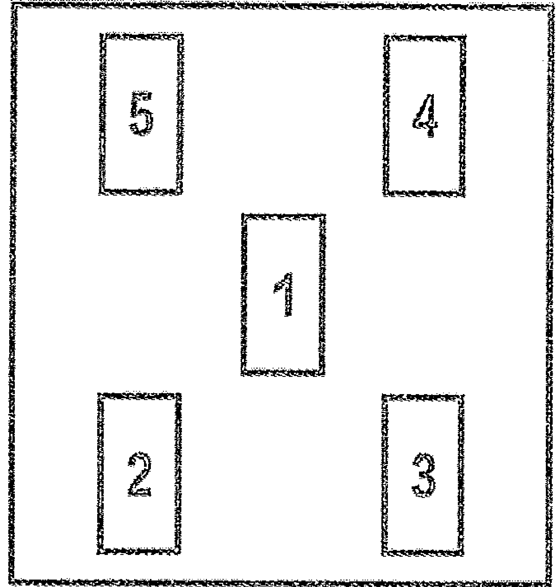

△适用于：
22张大阿尔卡那、56张小阿尔卡那、78张塔罗

△取牌方式：
随意抽5张牌，依序放在1、2、3、4、5。

△如何解释：
- - ☆1-关键或主要的观点。
- - ☆2-会驱使你的。
- - ☆3-外界的影响。
- - ☆4-危机、风险。
- - ☆5-要如何解决、完成。

### 【49】工作
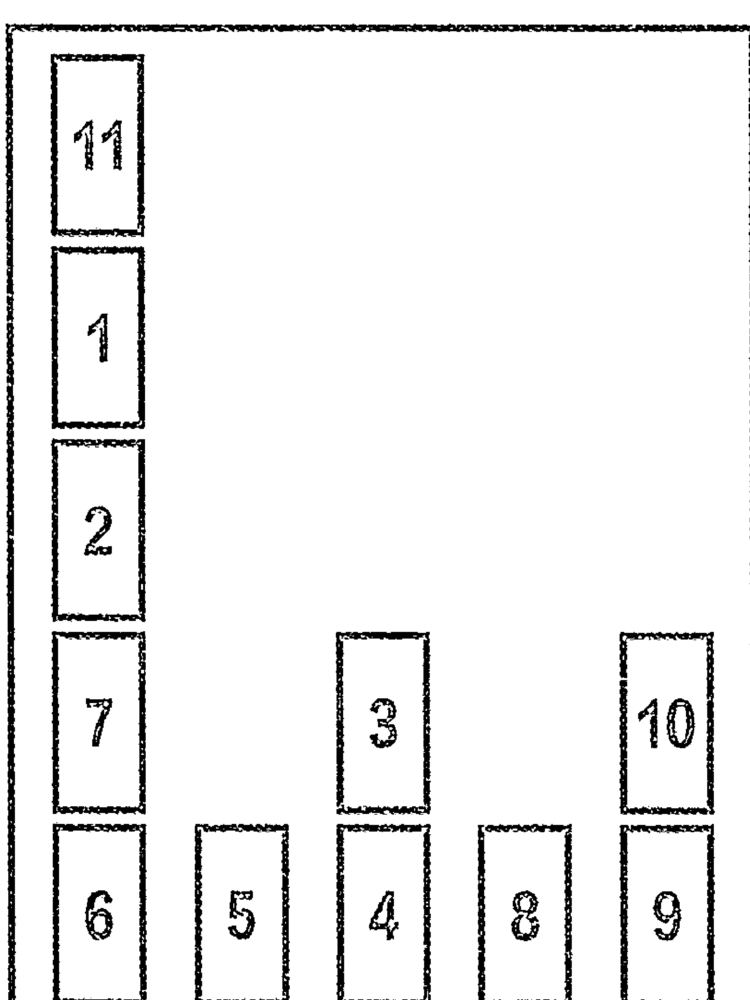

△适用于：
22张大阿尔卡那、56张小阿尔卡那、78张塔罗

△取牌方式：
随意抽11张牌，依序放在1、2、3、4、5、6、7、8、9、10、11。

△如何解释：
- - ☆1-你自己想要什么。
- - ☆2-某些人或某些事物将帮助你。
- - ☆3-你应该把焦点放在那边。
- - ☆4-转折点：改变情况的事情。
- - ☆5-在工作上一个可能的新发展。
- - ☆6-同时信号：在5这张牌所指的发展中一个重要的事件，当它发生时，你将会察觉到。
- ☆7-在5这张牌所指的情形下最后的成就。
- ☆8-在工作上另一个可能的新发展。
- ☆9-同时信号:在8这张牌所指的发展中一个重要的事件,当它发生时,你将会察觉到。
- ☆10-在8这张牌所指的情形下最后的成就。
- ☆11-为了满足自己的需求,在选择时你需要知道的事。

### 【50】事业
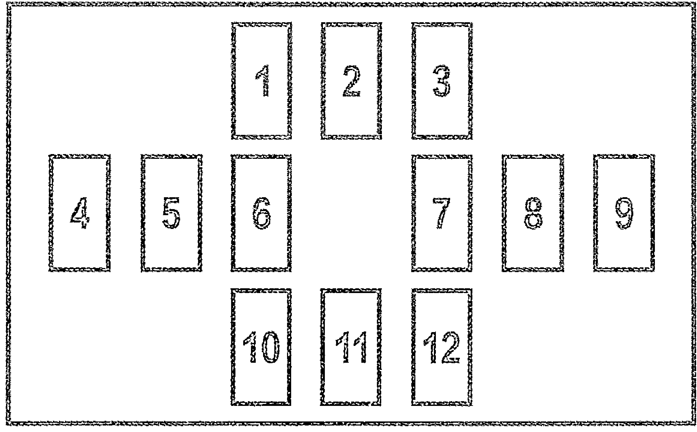

△适用于:
22张大阿尔卡那、56张小阿尔卡那、78张塔罗

△取牌方式:
随意抽12张牌,依序放在1、2、3、4、5、6、7、8、9、10、11、12。

△如何解释:
- ☆1、2、3-对于你目前的工作或失业情况的现状仔细分析。
- ☆4、5、6-过去造成目前情形的影响因素。
- ☆7、8、9-会帮助你改变目前现状的人和事物。
- ☆10、11、12-未来会为你带来什么情况。

### 【51】事业发展
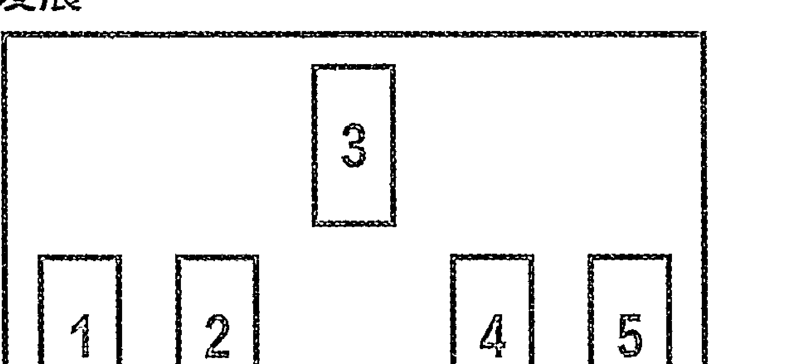

Δ适用于：
22张大阿尔卡那、56张小阿尔卡那、78张塔罗

Δ取牌方式：
随意抽5张牌,依序放在1、2、3、4、5。

Δ如何解释：
- * ☆1-我为何选择这份工作、事业。
- * ☆2-我选的路是对的吗？
- * ☆3-我面前主要的障碍。
- * ☆4-什么对我有益。
- * ☆5-如何让进展持续不断。

### 【52】此岸彼岸
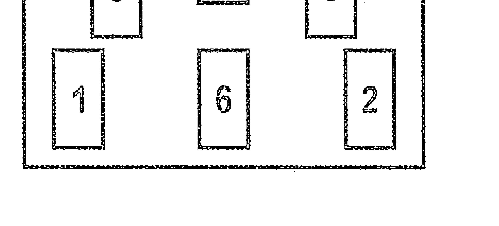

Δ适用于：
22张大阿尔卡那、56张小阿尔卡那、78张塔罗## 【53】事业的发展

△适用于：
22张大阿尔卡那、56张小阿尔卡那、78张塔罗

△取牌方式：
随意抽7张牌，依序放在1、2、3、4、5、6、7。

△如何解释：
- ☆1-对于我所选的事业，我真正想要从中得到什么。
- ☆2-什么行动可以改善我的事业。
- ☆3-事业中的哪些方面是我无法改变、改善的。
- ☆4-对于事业，我是否感觉到已经作出最棒的结果。
- ☆5-我可以去创造哪些属于自己的机会用来帮助我的事业。
- ☆6-虽是过去形成的阻碍，但现在仍影响我的事业。
- ☆7-最终的结果。

### 【54】工作二选一

△适用于：
22张大阿尔卡那、56张小阿尔卡那、78张塔罗

△取牌方式：
随意抽9张牌，依序放在1、2、3、4、5、6、7、8、9。

△如何解释：
请先设定工作A、工作B是指哪一份工作。
- ☆1-我自己：就个人而言，我在找寻什么类型的工作？
- ☆2-若要选择工作A，所给的指示。
- ☆3-若要选择工作B，所给的指示。
- ☆4-工作A：这工作对我有何吸引力？
- ☆5、6-工作A有什么优点与缺点。
- ☆7-工作B：这工作对我有何吸引力？
- ☆8、9-工作B有什么优点与缺点。

### 【55】合作关系的反映

△适用于：
22张大阿尔卡那、56张小阿尔卡那、78张塔罗

△取牌方式：
随意抽10张牌，依序放在1、2、3、4、5、6、7、8、9、10。

△如何解释：
请先设定工作A、工作B是指哪一份工作。
- ☆1-我自己。
- ☆2-我怎么看待我的伙伴。
- ☆3-我怎么看待这合作关系。
- ☆4-这将强化我们之间的合作关系。
- ☆5-这将减弱我们之间的合作关系。
- ☆6-我希望的。
- ☆7-我惧怕的。
- ☆8-在这合作关系中，我必须负担的责任。
- ☆9-在这合作关系中，我的伙伴必须负担的责任。
- ☆10-即将发生的事。

### 【56】转折点

△适用于：
22张大阿尔卡那、56张小阿尔卡那、78张塔罗

△取牌方式：
随意抽11张牌，依序放在1、2、3、4、5、6、7、8、9、10、11。

△如何解释：
第5张牌“转折点”是最特别的牌，它可能因为一件事、特定的人物、或是自我中心思想的突然改变而触发。假如圣杯九出现在位置9或10，它的效力会比其它位置出现的牌义不好的牌要为优先与重要。
- ☆1-周围的情况。
- ☆2-有关现在情况的一些你必须知道的事。
- ☆3-从现在到转折点时一直有的想法。
- ☆4-领导你到转折点的事件。
- ☆5-转折点。
- ☆6-身处转折点时意外的好处。
- ☆7-历经转折点后你所学习到的。
- ☆8-转折点所带来的发展。
- ☆9-意外的收获。
- ☆10-第一种可能的结果。
- ☆11-第二种可能的结果。

### 【57】生意前景

△适用于：
22张大阿尔卡那、56张小阿尔卡那、78张塔罗

△取牌方式：
随意抽10张牌，依序放在1、2、3、4、5、6、7、8、9、10。

△如何解释：
- ☆1-我可以开始属于自己的事业、自己做生意吗？
- ☆2-这生意需要别人合伙吗？
- ☆3-大家会接受我的产品吗？
- ☆4-这工作会很艰难吗？
- ☆5-现在的我该做哪些改变？
- ☆6-我忽略了哪些该做的事、应尽的责任？
- ☆7-我将会成功吗？
- ☆8-我将会因为这生意而赚钱吗？
- ☆9-我该做哪一类型的广告、宣传？
- ☆10-最后的结果。

## 生活牌阵

### 【58】旅行

△适用于：
22张大阿尔卡那、56张小阿尔卡那、78张塔罗

△取牌方式：
随意抽4张牌，依序放在1、2、3、4。

△如何解释：
- ☆1-周围环境对于你即将开始的旅行的影响。
- ☆2-关于这次旅行你所必须知道的事，而这些事有可能会被隐藏或忽略。
- ☆3-因为此次旅行，你将学到或领悟什么。
- ☆4-结果。

### 【59】窗户

△适用于：
22张大阿尔卡那、56张小阿尔卡那、78张塔罗

△取牌方式：
随意抽4张牌，依序放在1、2、3、4。

△如何解释：
- ☆1-现在的身体的状态。
- ☆2-现在的心智的状态。
- ☆3-现在的情绪的状态。
- ☆4-现在的身体的状态。

### 【60】希望

△适用于：
22张大阿尔卡那、56张小阿尔卡那、78张塔罗

△取牌方式：
随意抽4张牌，依序放在1、2、3、4。

△如何解释：
- ☆1-你拥有什么。
- ☆2-你的希望。
- ☆3-你需要什么。
- ☆4-你得到什么。

### [61]生日

△适用于：
22张大阿尔卡那、56张小阿尔卡那、78张塔罗

△取牌方式：
随意抽9张牌，依序放在1、2、3、4、5、6、7、8、9。

△如何解释：
- ☆1-你目前的处境。
- ☆2-下次生日的时候你希望能达成什么。
- ☆3-可以帮助你的。
- ☆4-完成你的目标前必须去做的。
- ☆5-你目前身体的状况。
- ☆6-你目前感情的状况。
- ☆7-你目前精神的状况。
- ☆8-对你的阻碍。
- ☆9-为了让梦想实现今年所必须去做的事情。

### 【62】四个星期的开始

△适用于：
22张大阿尔卡那、56张小阿尔卡那、78张塔罗

△取牌方式：
随意抽7张牌，依序放在1、2、3、4、5、6、7。

△如何解释：
- ☆1-现在的情况。
- ☆2-第一个星期。
- ☆3-第二个星期。
- ☆4-第三个星期。
- ☆5-第四个星期。
- ☆6-我将会如何。
- ☆7-新发展的指示。

### 【63】四季

△适用于：
22张大阿尔卡那、56张小阿尔卡那、78张塔罗

△取牌方式：
随意抽8张牌，依序放在1、2、3、4、5、6、7、8。

△如何解释：
- ☆1、8-春季：象征开始或行动开始、立定志向，可以说像是种下种子一样。
- ☆2、3-夏季：象征计划的持续进展，想法开花结果（计划完成）。
- ☆4、5-秋季：象征计划的决议，结果将会如何。
- ☆6、7-冬季：象征计划或行动完成后那一段的收获期，或是代表求问者想从这计划行动过程学到的东西。

### [64]新年

△适用于：
56张小阿尔卡那、78张塔罗

△取牌方式：
随意抽20张牌，依序放在1、2、3、4、5、6、7、8、9、10、11、12、13、14、15、16、17、18、19、20。

△如何解释：
- ☆1、2-你从去年带到今年的期望。
- ☆3-冬季概观。
- ☆4-一月展望。
- ☆5-二月展望。
- ☆6-三月展望。
- ☆7-春季概观。
- ☆8-四月展望。
- ☆9-五月展望。
- ☆10-六月展望。
- ☆11-夏季概观。
- ☆12-七月展望。
- ☆13-八月展望。
- ☆14-九月展望。
- ☆15-秋季概观。
- ☆16-十月展望。
- ☆17-十一月展望。
- ☆18-十二月展望。
- ☆19、20-你将从今年带到明年的期望。

### 【65】棒球场

△适用于：
22张大阿尔卡那、56张小阿尔卡那、78张塔罗

△取牌方式：
随意抽6张牌，依序放在1、2、3、4、5、6。

△如何解释：
- ☆1-本垒板：你目前的处境，一个计划或情况正要开始。
- ☆2-投手丘：即将发生在你身上的事，可能是一个事件或是一个人发生的事情与你生活有所牵连。
- ☆3-一垒：第一步，新计划开始的状况。
- ☆4-二垒：第二步，新计划再来的状况。
- ☆5-三垒：第三步，新计划最终的状况。
- ☆6-本垒板：最后的结果，新计划最后呈现的结果。

### 【66】彩虹

△适用于：
22张大阿尔卡那、56张小阿尔卡那、78张塔罗

△取牌方式：
随意抽6张牌，依序放在1、2、3、4、5、6。

△如何解释：
- ☆1-雨：阻碍你完成心中愿望的。
- ☆2-细雨：首先要做的，可以帮助你更进一步达到你想要的。
- ☆3-雨停：某些人事物将会帮助你。
- ☆4-阳光：你所能指望的最好状况。
- ☆5-彩虹：短期的指引。
- ☆6-金色苍穹：长期的结束。

### 【67】长柄勺子

△适用于：
22张大阿尔卡那、56张小阿尔卡那、78张塔罗

△取牌方式：
随意抽6张牌，依序放在1、2、3、4、5、6。

△如何解释：
- ☆1-问题的根本、忧虑、争议。
- ☆2-隐藏了些什么。
- ☆3-浮现了些什么。
- ☆4-目前明显可见的。
- ☆5-你察觉了什么、你发现的事实。
- ☆6-解决、决定；并且它将如何影响你。

### 【68】成功

△适用于：
22张大阿尔卡那、56张小阿尔卡那、78张塔罗

△取牌方式：
随意抽6张牌，依序放在1、2、3、4、5、6。

△如何解释：
- ☆1-你现在生命中最兴盛的领域。
- ☆2-你希望未来生命中也能兴盛的领域。
- ☆3-为了达到第2张牌的结果，你必须去做的、去培养的。
- ☆4-某些人、事物将会帮助或是阻碍你。
- ☆5-有些事你必须察觉到的。
- ☆6-你最终的成就。

### 【69】调节压力

△适用于：
22张大阿尔卡那、56张小阿尔卡那、78张塔罗

△取牌方式：
随意抽6张牌，依序放在1、2、3、4、5、6。

△如何解释：
- ☆1-问题的根本。
- ☆2-现在的情况、处境。
- ☆3-在某个阶段、某段时间、或某个步骤的情况、处境。
- ☆4-你在明白某些事情以前，对于所在处境的感觉。
- ☆5-相关的人。
- ☆6-结果。

### 【70】飞鸟

△适用于：
22张大阿尔卡那、56张小阿尔卡那、78张塔罗

△取牌方式：
随意抽8张牌，依序放在1、2、3、4、5、6、7、8。

△如何解释：
- ☆1、2-你目前的处境。
- ☆3-你如何前往你想要到达的地方。
- ☆4-你从何处出发。
- ☆5-你得到什么、发现什么（沿路上你会发现什么）。
- ☆6、7-你学习到什么、你会得到的经验。
- ☆8-结果（旅程的终点是如何的）。

### 【71】人生

△适用于：
22张大阿尔卡那、56张小阿尔卡那、78张塔罗

△取牌方式：
随意抽8张牌，依序放在1、2、3、4、5、6、7、8。

△如何解释：
- ☆1-家庭。
- ☆2-工作事业。
- ☆3-人际关系。
- ☆4-声誉与成就。
- ☆5-苦难、烦恼。
- ☆6-获得、取得。
- ☆7-限制。
- ☆8-整体分析。

### 【72】人际关系

△适用于：
22张大阿尔卡那、56张小阿尔卡那、78张塔罗

△取牌方式：
随意抽9张牌，依序放在1、2、3、4、5、6、7、8、9。

△如何解释：
- ☆1-你如何看其他人。
- ☆2-其他人如何看你。
- ☆3-你需要的。
- ☆4-其他人需要的。
- ☆5-目前的关系。
- ☆6-你希望这关系如何发展。
- ☆7-其他人希望这关系如何发展。
- ☆8-必须仔细考虑的因素。
- ☆9-最终结果。

### 【73】何人、何事、何地

△适用于：
22张大阿尔卡那、56张小阿尔卡那、78张塔罗

△取牌方式：
随意抽9张牌，依序放在1、2、3、4、5、6、7、8、9。

△如何解释：
- ☆1-目前你需要前往的地方。
- ☆2、3-你到达那个地方的时候，你需要去考量的某些人、事物。
- ☆4、5-某些人、事物将帮助、引导你。
- ☆6、7-你必须知道的：在未来四个礼拜内将发生的事。
- ☆8-（第6、7张牌所显示的事）它将如何影响你。
- ☆9-关于你问的问题，你可以完成怎样的结果。

### 【74】健康与幸福

△适用于：
22张大阿尔卡那、56张小阿尔卡那、78张塔罗

△取牌方式：
随意抽8张牌，依序放在1、2、3、4、5、6、7、8。

△如何解释：
- ☆1-你过去的健康状况。
- ☆2-你现在的健康状况。
- ☆3-你未来可能的健康状况。
- ☆4-某人或某些事物可以帮助你或加强你的幸福与健康。
- ☆5-过去什么事情让你快乐。
- ☆6-现在什么事情让你快乐。
- ☆7-未来什么事情可能会让你快乐。
- ☆8-某人或某些事物可以帮助你或加强你的幸福与健康。

### [75] 理想

△适用于：
22张大阿尔卡那、56张小阿尔卡那、78张塔罗

△取牌方式：
随意抽取21张牌，依序放在1、2、3、4、5、6、7、8、9、10、11、12、13、14、15、16、17、18、19、20、21。

△如何解释：
- ☆1、2、3、4-现状、争论、关键。
- ☆5、6、7、8-你心中真正的愿望。
- ☆9、10、11、12-你的真正想法与你的愿望是如何契合或冲突。
- ☆13、14、15、16-当你准备好了以后，你应该去做的。这步骤是必需的。
- ☆17、18、19、20-如何让你感到满足。
- ☆21-当你觉得满足后，会发生的事情。

### 【76】梦想

| 1 | 4 | 7 | 10 |
|---|---|---|---|
| 2 | 5 | 8 | 11 |
| 3 | 6 | 9 | 12 |

△适用于：
22张大阿尔卡那、56张小阿尔卡那、78张塔罗

△取牌方式：
随意抽12张牌，依序放在1、2、3、4、5、6、7、8、9、10、11、12。

△如何解释：
- ☆1、2、3-你的梦想的轮廓、想象。
- ☆4、5、6-这梦想的意义或计划。
- ☆7、8、9-这梦想如何影响你。
- ☆10、11、12-你如何将这信息（此次的预测所得知的）做最好的运用。

### 【77】是或否

△适用于：
22张大阿尔卡那、56张小阿尔卡那、78张塔罗

△取牌方式：
随意抽5张牌，依序放在1、2、3、4、5。

△如何解释：
此种牌阵看变化成使用5张、7张或9张来分析。排在中间的牌代表两点，其他牌代表一点。（5张牌——第3张，7张牌——第4张，9张牌——第5张）打开所有的牌，正位的牌代表“是”，逆位的牌代表“否”。把正逆位的牌所代表的点数相加，一般是一张牌一点，但中间的牌代表两点。比较两者的点数，若是“是”的点数较高，则代表答案是“是”。若是“否”的点数较高，则代表答案是“否”。若两者点数相同，则代表牌不愿意告诉你一个明确的答案。

### {78}西方的风

△适用于：
22张大阿尔卡那、56张小阿尔卡那、78张塔罗

△取牌方式：
随意抽4张牌，依序放在1、2、3、4。

△如何解释：
- ☆1-你必须舍弃过去的什么，让自己解放。
- ☆2-你必需面对的。
- ☆3-你必需知道的。
- ☆4-你会获得的、达成的。

### 【79】心的方向

△适用于：
22张大阿尔卡那、56张小阿尔卡那、78张塔罗

△取牌方式：
随意抽8张牌，依序放在1、2、3、4、5、6、7、8。

△如何解释：
- ☆1-与你潜意识的欲望有关的最主要关键。
- ☆2-在第1张牌所指的关键中最重要的因素（通常是指一种过去的情绪反应）。
- ☆3-对于阻挠你的因素，你可以如何改变它；对于帮助你的因素，你可以如何加强它。
- ☆4-你的行动将可能产生怎样的结果。
- ☆5-在最近的未来，你可能忽略、没考虑到的事情。
- ☆6-在最近的未来你可能面对的挑战。
- ☆7-它（第6张牌的挑战）可能会如何影响你。
- ☆8-结果。

## 18 你最后获得的。

## 第1、2、5张牌的范例：
- ☆1-你想要钱，那么如何赚钱就是你的最主要关键。
- ☆2-你过去对于如何赚钱的想法。
- ☆5-周转资金不够、市场饱和、你想要进修或休息。

若两者点数相同，则代表牌不愿意告诉你一个明确的答案。

## 80 信念

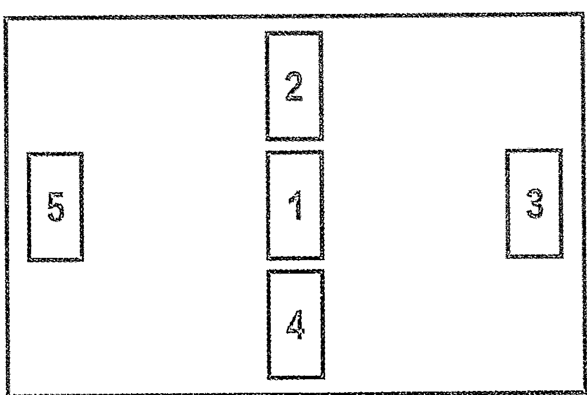

### 适用于：
22张大阿尔卡那、56张小阿尔卡那、78张塔罗

### 取牌方式：
随意抽5张牌，依序放在1、2、3、4、5。

### 如何解释：
- ☆1-你的愿望。
- ☆2-一直阻碍你有所成就的根本想法。（阻碍、负面）
- ☆3-连接第2张牌与第4张牌的想法。（应该是4出现前的想法）
- ☆4-即将出现在你生命中的新想法。
- ☆5-新想法所带来的结果。

## 81 幸运

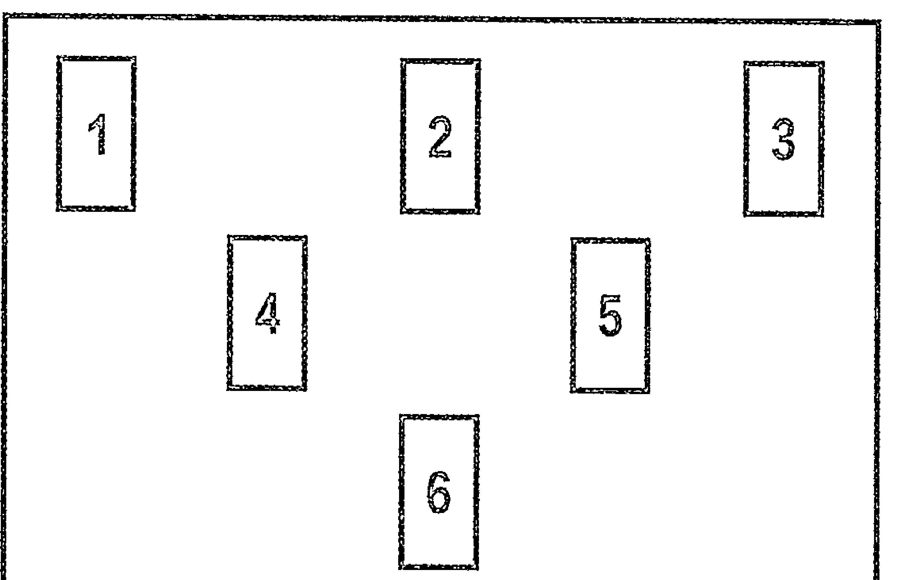

### 适用 于：
22张大阿尔卡那、56张小阿尔卡那、78张塔罗

### 取牌方式：
随意抽6张牌，依序放在1、2、3、4、5、6。从4张小阿尔卡那Ace抽出1张放在6。

### 如何解释：
- ☆1-你的幸运状况大概的分析。
- ☆2-你的幸运状况是如何影响你的生活。
- ☆3-可能产生幸运的地方。
- ☆4-某人或什么事物将走入你的生命之中并带来幸运的效果。
- ☆5-第4张牌带来的幸运将如何帮助你达成你的愿望。
- ☆6-较幸运的季节——只使用小阿尔卡那的4张Ace之一。
  - 权杖Ace-春天。
  - 圣杯Ace-夏天。
  - 星币Ace-秋天。
  - 宝剑Ace-冬天。

## 82 遗失与探寻

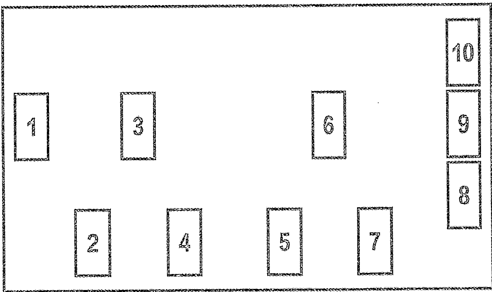

### 适用 于：
22张大阿尔卡那、56张小阿尔卡那、78张塔罗

### 取牌方式：
随意抽10张牌，依序放在1、2、3、4、5、6、7、8、9、10。

### 如何解释：
- ☆1-遗失的东西。
- ☆2-关于遗失的东西，你必须知道的一些事。
- ☆3、4-从哪个地方开始寻找。
- ☆5-某人或某些事物将会帮助你。
- ☆6、7-在寻找时，你必须仔细考虑、审视的因素。
- ☆8、9、10-结果。

## 83 应该或不应该

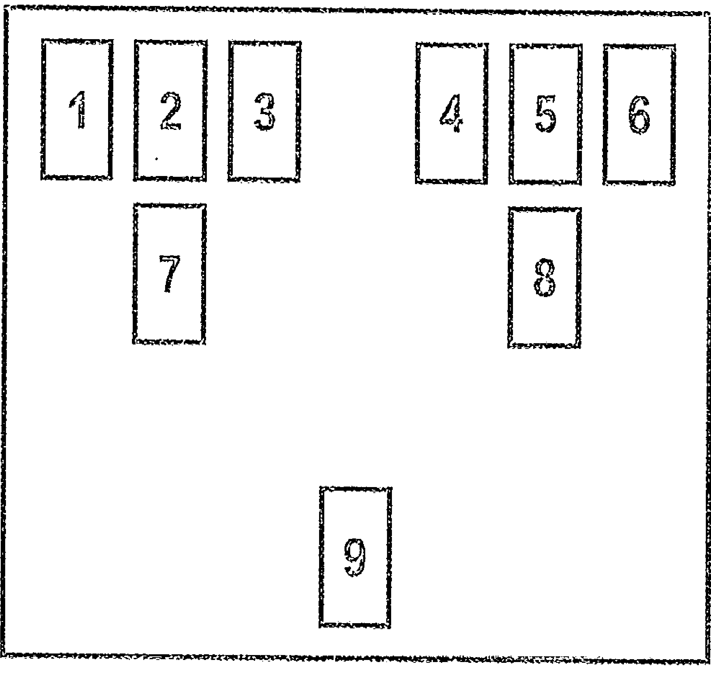

### 适用 于：
22张大阿尔卡那、56张小阿尔卡那、78张塔罗

### 取牌方式：
随意抽9张牌，依序放在1、2、3、4、5、6、7、8、9。

### 如何解释：
- ☆1、2、3-你依心中想法去做的话，可能会发生的事。
- ☆4、5、6-你维持目前状况的话，可能会发生的事。
- ☆7-假如你做了任何改变所可能产生的结果（1、2、3张牌的结果）。
- ☆8-假如你不做任何改变所可能产生的结果（4、5、6张牌的结果）。
- ☆9-下决心前，你所必须知道的一些事。

## 84 愿望

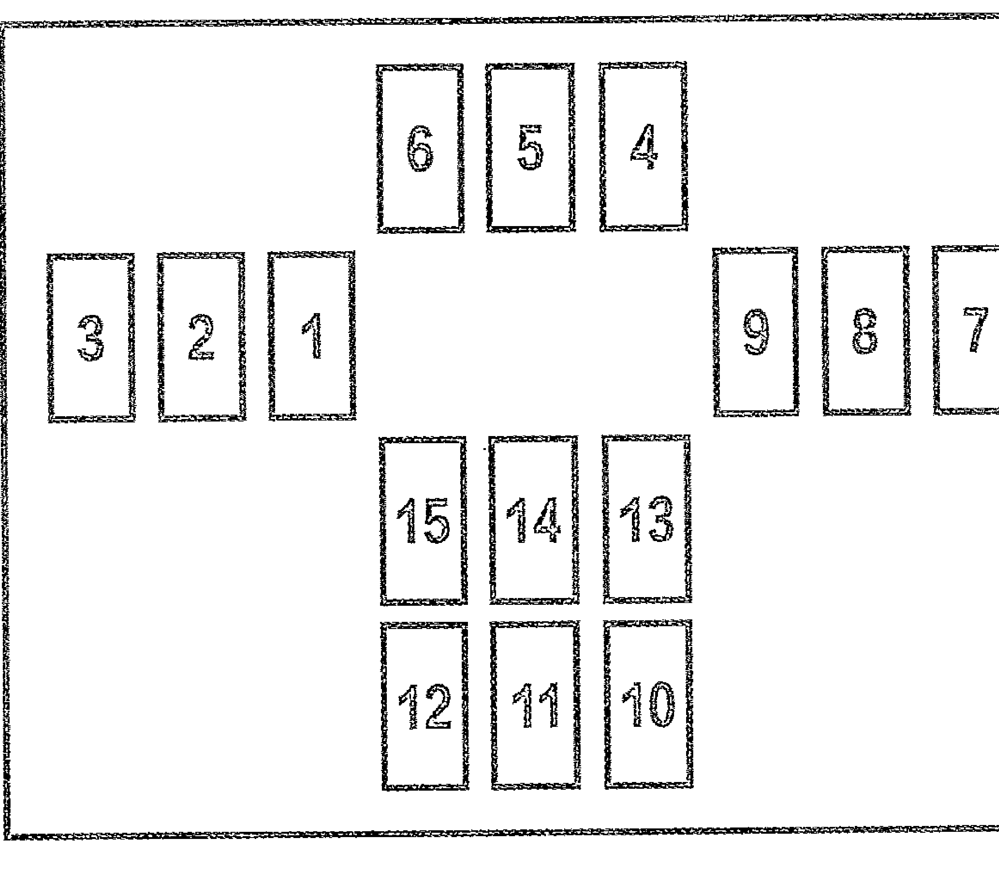

### 适用 于：
22张大阿尔卡那、56张小阿尔卡那、78张塔罗；15张以上的牌阵建议用“56张小阿尔卡那”、“78张塔罗”。

### 取牌方式：
随意抽15张牌，依序放在1、2、3、4、5、6、7、8、9、10、11、12、13、14、15。

### 如何解释：
假如代表愿望的卡片，也就是圣杯九出现在任何一个位置（除了第7、8、9位置，因为这三个位置是负面的），会至少让你的梦想实现了一部分。若圣杯九出现在第1个位置，代表你的梦想会完全实现。
- ☆1、2、3-围绕你的。
- ☆4、5、6-有关你梦想的描述。
- ☆7、8、9-阻碍你完成梦想的因素。
- ☆10、11、12-你的家庭即将发生的事。
- ☆13、14、15-你将获得实现的。

## 85 生活重心

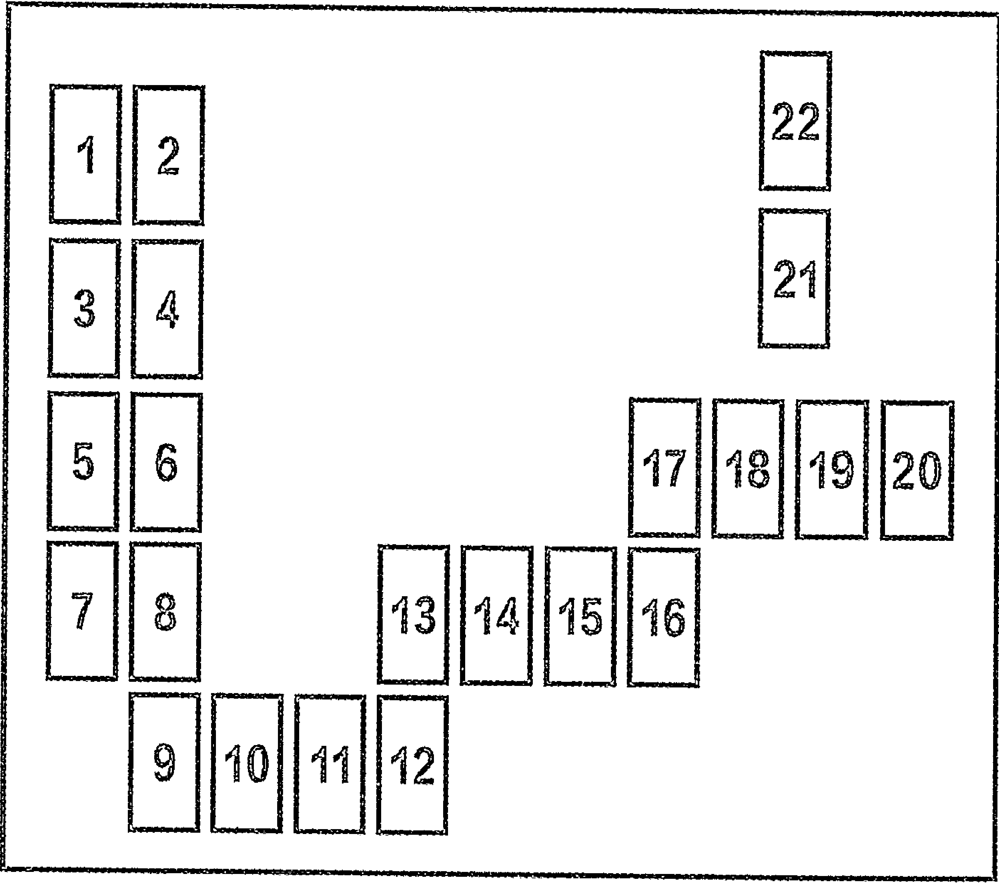

### 适用 于：
56张小阿尔卡那

### 取牌方式：
依序放在1、2、3、4、5、6、7、8、9、10、11、12、13、14、15、16、17、18、19、20、21、22

### 如何解释：
- ☆1、2-你目前的情况。
- ☆3、4-你最想要改变的。
- ☆5、6-某些人、事物将帮助你。
- ☆7、8-为了达成你的愿望所必须培养的信念。
- ☆9、10-从那些新的信念所衍生的第一种可能的事件。
- ☆11、12-你对那些第一种可能发生事件的感觉。
- ☆13、14-从那些新的信念所衍生的第二种可能发生的事件。
- ☆15、16-你对那些第二种可能发生事件的感觉。
- ☆17、18-从那些新的信念所衍生的第三种可能发生的事件。
- ☆19、20-你对那些第三种可能发生事件的感觉。
- ☆21-为了开创你想要的未来，你现在必须培养的力量。
- ☆22-你最终的成就。

## 86 九宫命运

| 3 | 6 | 9 |
|---|---|---|
| 2 | 5 | 8 |
| 1 | 4 | 7 |

### 适用 于：
22张大阿尔卡那、56张小阿尔卡那、78张塔罗

### 取牌方式：
依序抽9张牌，依序放在1、2、3、4、5、6、7、8、9。

### 如何解释：
- ☆1-我的生活将有何改变。
- ☆2-会有新关系或婚姻的产生吗？
- ☆3-我可以创造出成功的机会吗？
- ☆4-我将有金钱方面的保障吗？
- ☆5-我将有一个自由的旅程、旅行吗？
- ☆6-将会有什么问题发生？
- ☆7-我将会变得更聪明、更有智慧吗？
- ☆8-我将变得崇拜物欲吗？
- ☆9-我将变得更有价值吗？

## 87 关系之圣杯

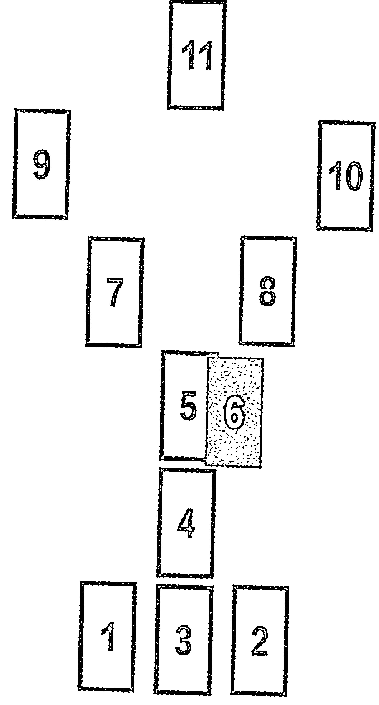

### 适用 于：
22张大阿尔卡那、56张小阿尔卡那、78张塔罗

### 取牌方式：
随意抽11张牌，依序放在1、2、3、4、5、6、7、8、9、10、11。（6压5的底下）

### 如何解释：
- ☆1-你自己。
- ☆2-你的伙伴。
- ☆3-你们关系的基础。
- ☆4-最近的过去。
- ☆5-这关系现在的情况。
- ☆6-你们共同的阻碍。（隐藏的）
- ☆7-你如何看待这关系。
- ☆8-你的伙伴如何看待这关系。
- ☆9-你希望如何看待这关系。（希望怎么发展）
- ☆10-你的伙伴希望如何看待这关系。（希望怎么发展）
- ☆11-最佳的结果。

## 88 金色曙光

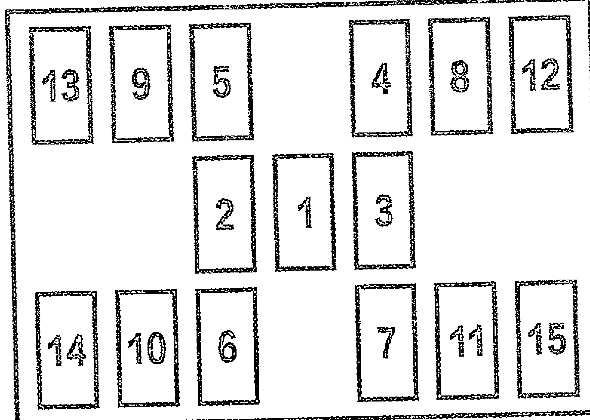

### 适用 于：
22张大阿尔卡那、56张小阿尔卡那、78张塔罗

### 取牌方式：
随意抽15张牌，依序放在1、2、3、4、5、6、7、8、9、10、11、12、13、14、15。

### 如何解释：
- ☆1-你自己。
- ☆1、2、3-你的个性、特质，以及针对这情况或问题，本身所拥有的相关知识。
- ☆4、8、12-若没有采取任何行动，这情况或问题会如何自然发展。
- ☆5、9、13-若采取任何行动，这情况或问题会产生怎样不同的发展。
- ☆6、10、14-一些对你下定决心、做出决定可能有帮助的信息。
- ☆7、11、15-超过求问者所能控制的一些力量（无法控制的）。

## 89 精神目标

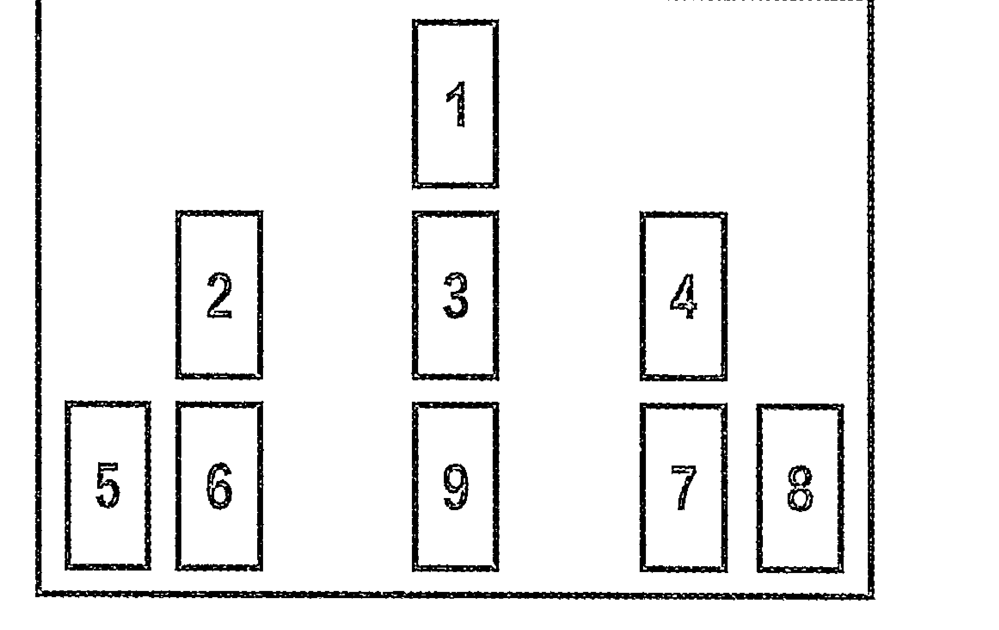

### 适用 于：
22张大阿尔卡那、56张小阿尔卡那、78张塔罗

### 取牌方式：
随意抽9张牌，依序放在1、2、3、4、5、6、7、8、9。

### 如何解释：
- ☆1-我应该对我的生活设定什么样的精神目标：我的精神目标或工作。
- ☆2、3、4-这精神目标将如何显示在我的生活中：它将如何影响我的生活。
- ☆5、6-可以帮助我的：哪些天赋与潜力可以帮我完成这目标。
- ☆7、8-阻碍我的：冲突与问题。
- ☆9-上帝的指示。

## 90 你的一切

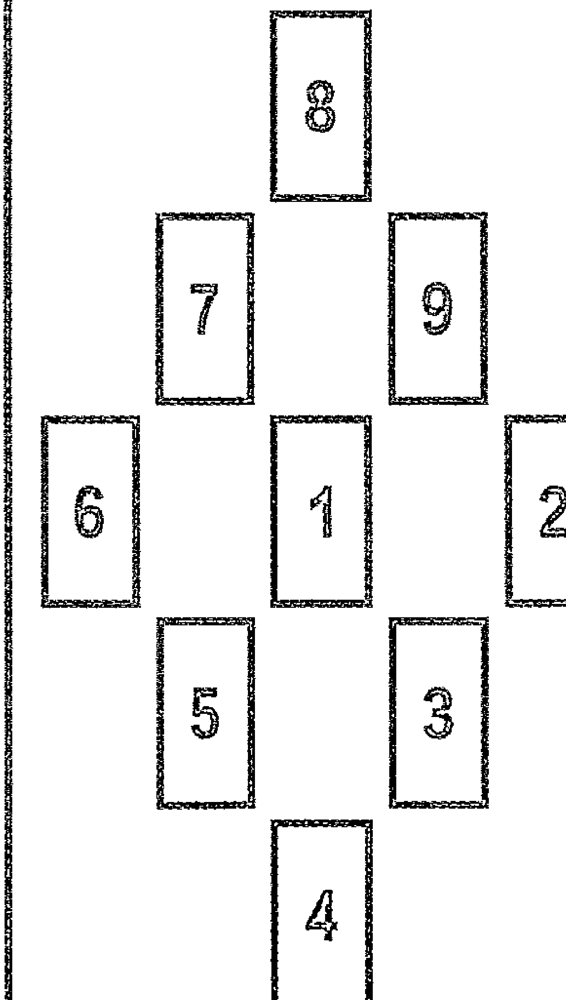

### 适用 于：
22张大阿尔卡那、56张小阿尔卡那、78张塔罗

### 取牌方式：
随意抽9张牌，依序放在1、2、3、4、5、6、7、8、9。

### 如何解释：
- ☆1-你或你目前的处境。
- ☆2-你的心理问题的因素。
- ☆3-你的人际关系。
- ☆4-你创作的灵感。
- ☆5-你的行动（你应该做的事）。
- ☆6-你潜意识问题的因素。
- ☆7-你情绪问题的因素。
- ☆8-在目前实际影响你的主要因素。
- ☆9-你内心的力量。

## 91 炼金术

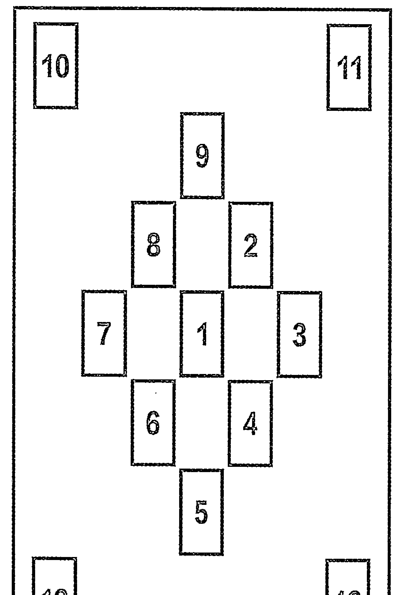

### 适用 于：
22张大阿尔卡那、56张小阿尔卡那、78张塔罗

### 取牌方式：
随意抽13张牌，依序放在1、2、3、4、5、6、7、8、9、10、11、12、13。

### 如何解释：
- ☆1-自己、自我意识。
- ☆2-愿望。
- ☆3-梦想：我们想要实现的。
- ☆4-追求：我们积极试着去实现的。
- ☆5-依恋：追求梦想时，让我们放不开的、抓着我们不放的。
- ☆6-特质：求问者的优点。
- ☆7-懊悔：求问者需要改进的缺点。
- ☆8-自我印象：求问者对自己的印象、想法。
- ☆9-精神动力：自己真正的目标与愿望。
- ☆10-地元素：黑暗面、神秘的、未知的。
- ☆11-风元素：精神启发、启蒙、悟性。
- ☆12-火元素：智力、理性、思考、愿望。
- ☆13-水元素：创造力、情感。

## 92 灵魂循环

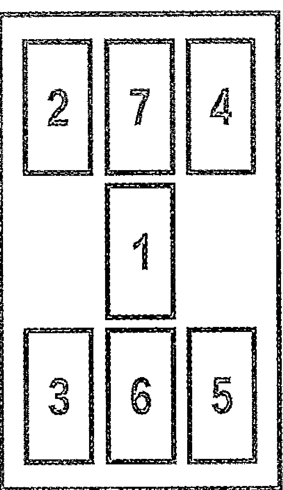

### 适用 于：
22张大阿尔卡那、56张小阿尔卡那、78张塔罗

### 取牌方式：
随意抽7张牌，依序放在1、2、3、4、5、6、7。

### 如何解释：
- ☆1-求问者本身。
- ☆2-祖先的灵魂：家庭中长辈的影响。
- ☆3-种族的灵魂：文化的影响。
- ☆4-时间的灵魂。
- ☆5-地方的灵魂：故乡与住所的影响。
- ☆6-旅程的灵魂：先前生活的影响。
- ☆7-上天或大自然给与的天赋、祝福、恩典。

## 93 灵感之门

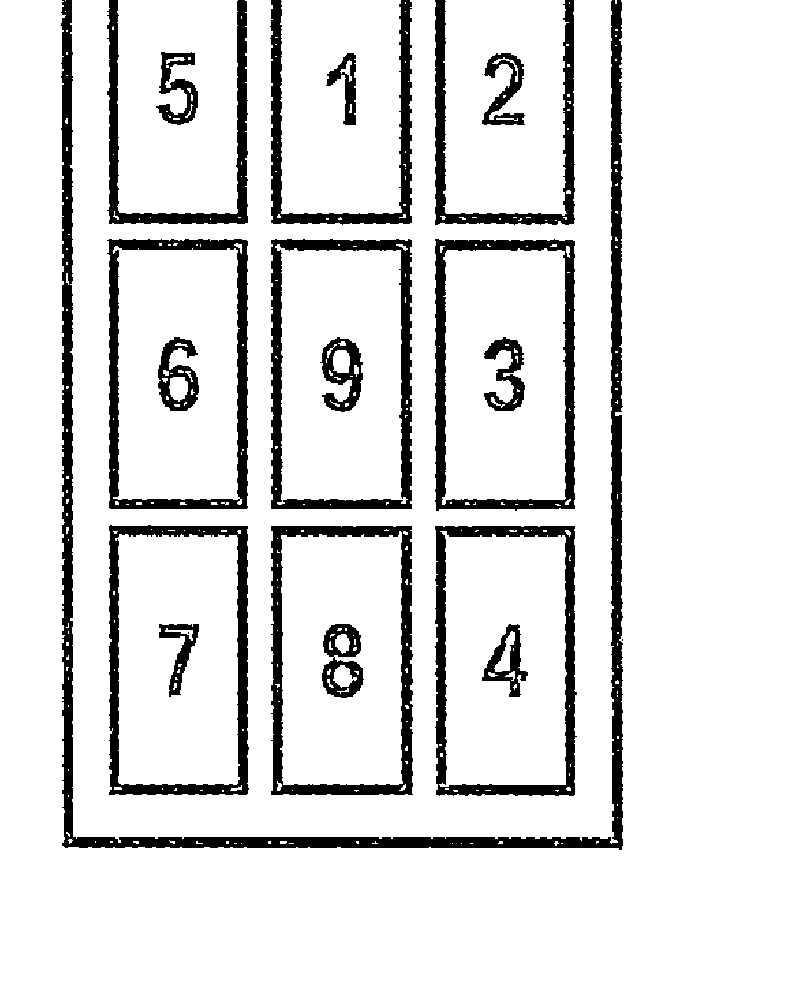

### 适用 于：
22张大阿尔卡那、56张小阿尔卡那、78张塔罗

### 取牌方式：
随意抽9张牌，依序放在1、2、3、4、5、6、7、8、9。

### 如何解释：
这牌阵基本的进行方式是先把1到8张牌排好，象征一道门，然后再将第9张牌放在中间，第9张牌象征新的刺激、力量，或是正要走进求问者生命的人。在这启发之门牌阵中，借由不同元素的比较，如冲突、和谐、矛盾、不安定来解读问题。此牌阵不但可以找出事件成功的原因（假如条件都符合），也可以显示事件的过程与结果。
- ☆9-在门口正在走进来的人。新的事件。
- ☆8-入口。进入的条件，一种现实生活中寻求突破现状的机会。
- ☆5、6、7-波阿斯（Boaz），力量的支柱，为维持力量所需的长时间条件。（让力量持续）
- ☆2、3、4-贾曲（Jachin），秩序的支柱，为了让新事物变得持久之长时间条件。（让瞬间变永恒）
- ☆1-顶点：事件结构中的关键。当事情发展到最高潮时，可能产生的现象。

注：Boaz Jachin，就是伟特牌中女祭司身后的两根柱子（B & J）。

## 94 三择一

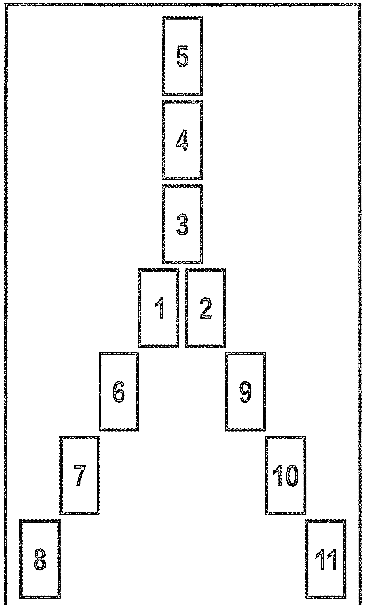

### 适用 于：
22张大阿尔卡那、56张小阿尔卡那、78张塔罗

### 取牌方式：
随意抽11张牌，依序放在1、2、3、4、5、6、7、8、9、10、11。

### 如何解释：
请先设定A、B、C三件事是哪三件事。
- ☆1、2-对策、心中所考虑的事情。
- ☆3-对于事件A，肯定的因素。（现在）
- ☆4-对于事件A，否定的因素。（对策、障碍）
- ☆5-事件A的未来。
- ☆6-对于事件B，肯定的因素。（现在）
- ☆7-对于事件B，否定的因素。（对策、障碍）
- ☆8-事件B的未来。
- ☆9-对于事件C，肯定的因素。（现在）
- ☆10-对于事件C，否定的因素。（对策、障碍）
- ☆11-事件C的未来。

## 95 我的生活故事

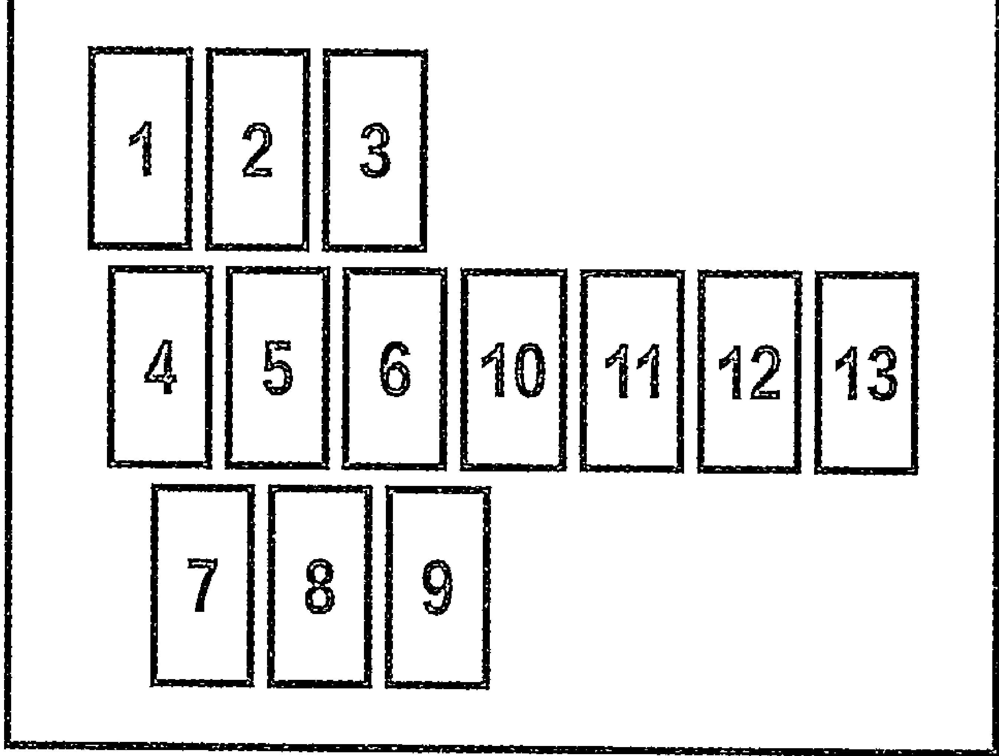

### 适用 于：
22张大阿尔卡那、56张小阿尔卡那、78张塔罗

### 取牌方式：
随意抽13张牌，依序放在1、2、3、4、5、6、7、8、9、10、11、12、13。

### 如何解释：
- ☆1、4、7-遥远的过去。
- ☆2、5、8-最近的过去。
- ☆3、6、9-现在：我目前的处境。
- ☆10-未来6个月的发展：我的直觉直接感受到我将面临的阻碍、挑战。
- ☆11-未来12个月的发展：明年将会发生在我生活中的主要事件。
- ☆12-我的生活即将面临的、未来的处境。
- ☆13-最终的结果：假如我维持目前的情况且不加以改变，会发生的结果。

## 96 五芒星

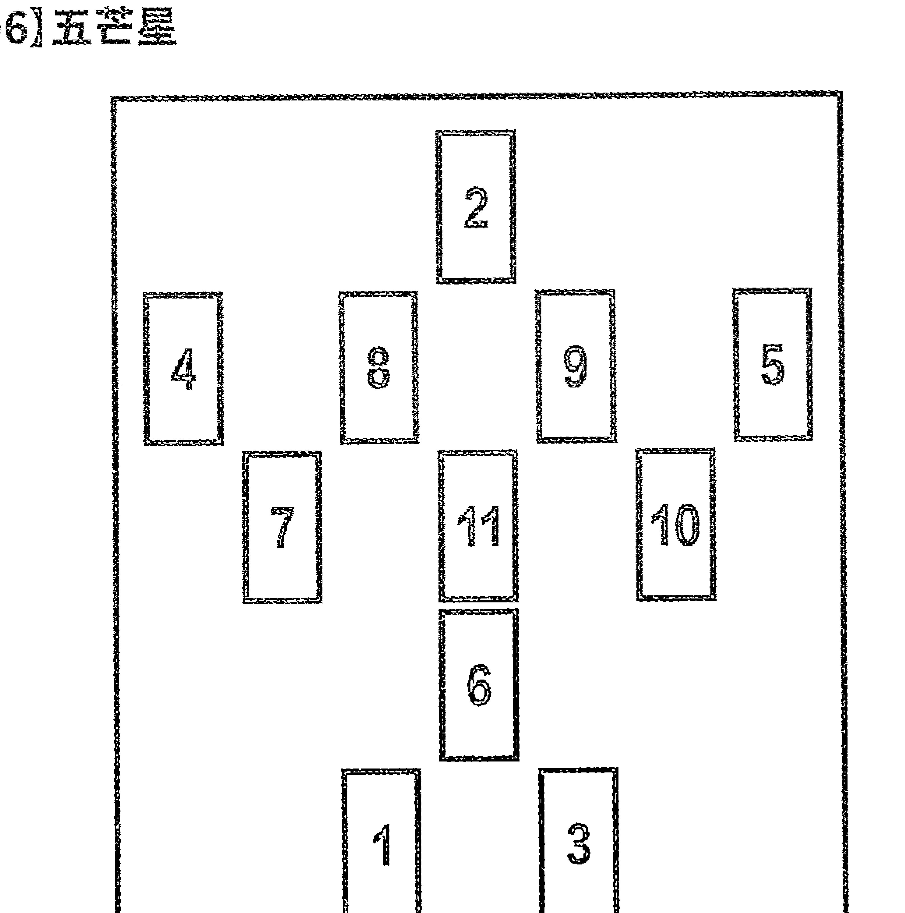

### 适用 于：
22张大阿尔卡那、56张小阿尔卡那、78张塔罗

### 取牌方式：
随意抽11张牌，依序放在1、2、3、4、5、6、7、8、9、10、11。

### 如何解释：
- ☆1-身体的观察。
- ☆2-情感的观察。
- ☆3-心智的观察。
- ☆4-问题、关键。
- ☆5-问题的根本原因。
- ☆6-需要去解决的问题。
- ☆7-你压抑了什么。
- ☆8-阴（女性）的特征方面。
- ☆9-阳（男性）的特征方面。
- ☆10-需要努力的方面。
- ☆11-解决问题的方法或指天赋、祝福。

## 97 心灵的梦想家

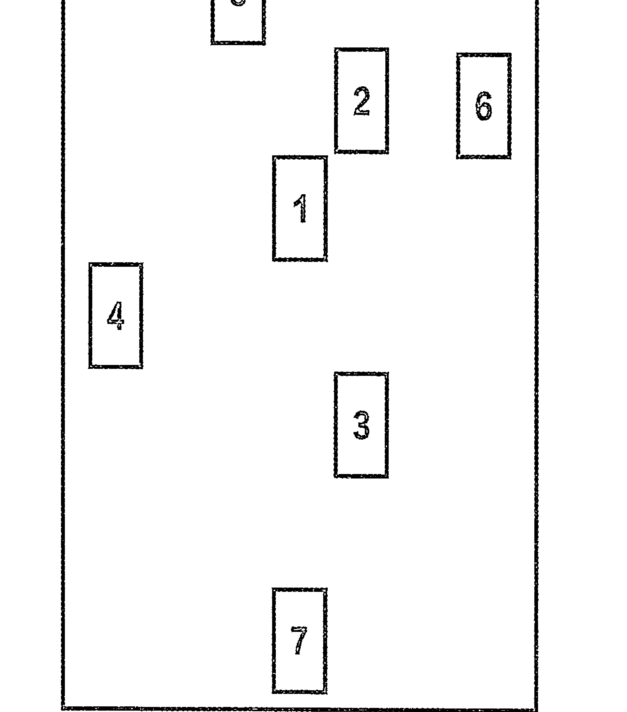

### 适用 于：
22张大阿尔卡那、56张小阿尔卡那、78张塔罗

### 取牌方式：
随意抽7张牌，依序放在1、2、3、4、5、6、7。

### 如何解释：
- ☆1-关键：象征此梦想的状况或你对于此梦想的感觉。
- ☆2-梦想状况：一些与梦想有关的事件，例如：何时、何地、如何、为何。
- ☆3-内部的能量：此梦想的主要能量。
- ☆4-表意识的想法：此梦想对你当前生命的意义。
- ☆5-潜意识的想法：此梦想在你心中的意义。
- ☆6-不易掌握的能量：假如你盼望梦想实现或想解决目前的窘境，你所需要的力量。
- ☆7-结果：此梦想将会如何呈现于它的影响效果。

## 98 突破现状

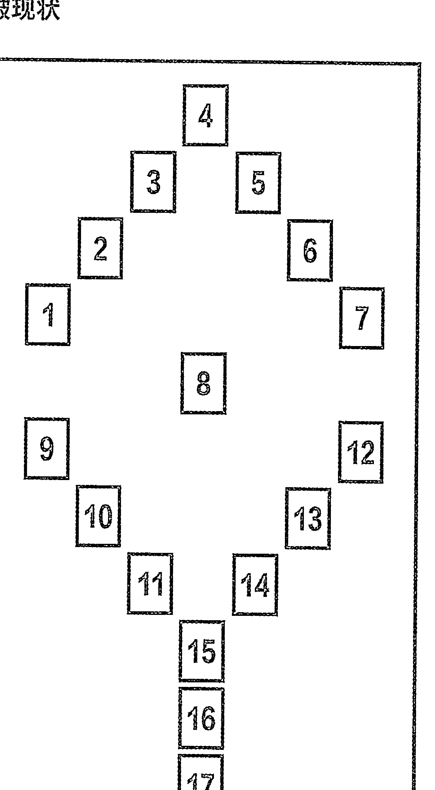

### 适用 于：
56张小阿尔卡那、78张塔罗

### 取牌方式：
随意抽23张牌，依序放在1、2、3、4、5、6、7、8、9、10、11、12、13、14、15、16、17、18、19、20、21、22、23。

### 如何解释：
- 1、2、3-你想要突破什么状况。
- 4、5、6、7-你想要突破的原因。
- 8-你需要去创造出的力量，一种可以让你在未来更加有利与坚持的力量。
- 9、10、11-突破这状况后你可以得到的。
- 12、13、14-突破这状况后你将损失的。
- 15、16、17-依你现在的个性、情况，最有可能你发生在你私人生活中的事。
- 18、19、20-依你现在的个性、情况，最有可能发生在你专业领域的事。
- 21、22、23-你如何感受它们（15-20张牌所指）与你如何改变它们。

## 经典牌阵
这里介绍的牌阵，是一些经过漫长时间考验的牌阵，有一些曾流传了数百年之久，所以牌阵的摆放相对复杂一些，使用的牌数也相对多一些，建议初学者要熟悉了简单牌阵和牌义后再来了解这些经典牌阵。

## 99 凯尔特十字

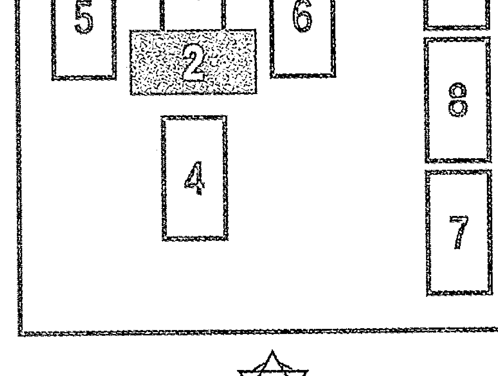

据说塔罗刚刚出现的时候，凯尔特十字预测法就已经成为塔罗预测的主要方法，它由流浪的吉普赛人从埃及传到爱尔兰，在凯尔特人中广泛流行，由于其形状与当时欧洲流行的中世纪武器十字剑相似，更添了几分神圣与庄严，成为战争或结婚前必用的预测仪式。

它流传至今，已有了多种分支牌阵，但十张牌的凯尔特十字仍是现今塔罗预测的主流牌阵，亦是很多预测师最偏爱的牌阵。

### 适用 于：
22张大阿尔卡那、56张小阿尔卡那、78张塔罗

### 取牌方式：
随意抽10张牌，依序放在1、2、3、4、5、6、7、8、9、10。

### 如何解释：
传统上对“古代凯尔特”牌形的诠释是这样的：
1. 第1张牌放在十字形的中央，代表预测者及其目前状况或是他现在的问题。
2. 第2张牌与第1张牌呈十字形交叉，代表阻碍或影响现在状况的困难。
3. 第3张牌放在头两张牌之上（十字形之首），代表短期的目标，即现在状况所能达到的目标。
4. 第4张牌放在头两张牌之下（十字形之脚），代表较远的过去影响了现在的情况。
5. 第5张牌在十字形的右臂，代表较近的过去对现在的影响。
6. 第6张牌在十字形的左臂，反映了最近的将来。如果其他因素不变的话，这个顺序可追溯至十字的赫尔墨斯牌或说是反向牌，形似数字4。

最后四张牌放在十字的右边，直线排列，由下而上。
7. 第7张牌代表内在的自我秘密愿望与欲望，及影响目前情况的基本人格。
8. 第8张牌代表环境或家庭的影响，包括现实或精神上的住所。
9. 第9张牌代表预期之外的好运或噩运。
10. 第10张牌像小阿卡娜的10号牌一样总结全部，暗示可能的结果。

“古代凯尔特”牌形有一首方便记忆的韵文，牌洗好之后可以念：“1找到你，2横过你，3加冕你，4在你下面，5在你后面，6在你前面，7是你的希望与恐惧，8是你的房子与家庭，9是你没有预期的，10是一定会发生的。”

请注意，当事人是指问题的主角，并不一定是求问者，例如求问者问：我男朋友考得上大学吗？我爸爸的病会好吗？这时候，问题的主角就不是求问者，请注意问题解释的角度不同，结果会差很多。

## 100 黄道12宫
这也是一个流传已久的预测法，因为塔罗大阿尔卡那22张牌都有其象征的星座（见下表），所以十二宫预测也是塔罗预测中很重要的一个分支。

| 左列 | 右列 |
|------|------|
| 00愚人……天王星/风 | 11正义……天秤座 |
| 01魔术师……水星 | 12倒吊人……海王星/水 |
| 02女祭司……月亮 | 13死神……天蝎座 |
| 03女皇……金星 | 14节制……射手座 |
| 04皇帝……白羊座 | 15恶魔……摩羯座 |
| 05教皇……金牛座 | 16高塔……火星 |
| 06恋人……双子座 | 17星星……水瓶座 |
| 07战车……巨蟹座 | 18月亮……双鱼座 |
| 08力量……狮子座 | 19太阳……太阳 |
| 09隐士……处女座 | 20审判……冥王星/火 |
| 10命运之轮……木星 | 21世界……土星 |## 【101】星宫之书

### △适用于：
22张大阿尔卡那、56张小阿尔卡那、78张塔罗

### △取牌方式：
随意抽14张牌，依序放在1、2、3、4、5、6、7、8、9、10、11、12、13、14。

### △如何解释：
类似十二宫预测法，解释也是用十二星座的象征解释。

- ☆1 - 第1宫：你的外貌与外显的个性，最容易被其他人了解的方式，例如：你如何打扮、着装。
- ☆2 - 第2宫：金钱、拥有物、价值观，你对于获得的东西要如何运用的想法，也代表自我的层次，你的价值与你如何设定你的目标。
- ☆3 - 第3宫：人际关系、短程旅行、兄弟姊妹，为了受人欢迎，与其他人沟通的最佳方式。依照所问的问题而定，短程旅行或兄弟姊妹等因素可能要加以考虑。
- ☆4 - 第4宫：家庭、根基、双亲之一，你的家庭状况，以及那些你需要去加强的（你在家中无法感受到的，并且是你一直想要的感觉却很难去获得的）。也代表你的双亲之一(父或母)能如何帮助你。
- ☆5 - 第5宫：罗曼史、小孩、创造力，通常是指将你的创造力用在外在的欲望上。依据你的情况，恋情或小孩等因素可能要加以考虑。
- ☆6 - 第6宫：工作与健康，你因为什么样的目标而工作，你的工作节奏如何，如何借你的工作扩展你的人际关系。也代表在这段时间中，你如何照顾好身体。
- ☆7 - 第7宫：婚姻与其它的人际关系，你的配偶、家庭、朋友、生意上的伙伴可以如何帮你实现你的目标。
- ☆8 - 第8宫：性、死亡、改革、其他人的金钱，你能如何激励自己，你需要放弃哪些东西，哪些部分需要革新，在金钱方面其他人能如何帮助你。
- ☆9 - 第9宫：高等教育、远距离的旅行、信仰、人生观，你需要学习的，你需要前往的地方，你能如何与你的灵性相结合并让你的人生观使你更加坚强。
- ☆10 - 第10宫：事业、身份地位、声望、双亲中的另一位，你的整体概观与生活经验，你应该要强化的部分，让某部分的能力、优点更加突出，你的另一位双亲(父或母)能如何帮助你，(与第4宫指的另外一位)。
- ☆11 - 第11宫：朋友、团体、抱负，个人接触、交往，对你的目标最好的憧憬。
- ☆12 - 第12宫：隐居、隔离、内在、秘密、下意识，当你单独一人时该做些什么，隐蔽而没有显示的事物，克服你的恐惧的最好方式、获得直觉的最好方式。
- ☆13、14 - 神秘知识之书的指示：最后两张牌包含来自神秘知识之书的特殊星体资料，虽然这两张牌没有对应任何的星体位置或是相关联的星座意义，但是在广泛的解读中，这两张正说明着每件事的光明面。解释上，这两张牌将告诉你最后必需知道而且非常重要的事。

### 【102】生命之树

### △适用于：
78张塔罗

### △取牌方式：
随意抽10张牌，依序放在1、2、3、4、5、6、7、8、9、10。

### △如何解释：
这个生命之树牌阵是将塔罗、哲学和冥想连接在一起的多种复合系统，此牌阵必须由底部解释到最上方（由第10张解释到第1张），通常使用这牌阵是用来分析生命的整个情况，并且它使用所有牌(通常为78张)来展开牌阵。

在完成解读之后，把没用到的牌展开成扇形，并再选出一张牌，这张牌称为 Daat Card-达卡。这张牌的位置在第1张与第6张牌所连成的直线中间，它象征一种隐藏的智慧，一种能帮你完成你最大愿望的智慧。

一个完整的生命之树牌阵解说，通常要花费数小时之久，并且包罗万象，所以通常建议预测之后一年内不要重复预测(因为这是长效型牌阵，而且算一次真的很累)。

- ☆1 - Malkut(王国)：结果、家、物质界、肉体、日常生活、实际的情况。
- ☆2 - Yesod(根基)：灵魂的中心、想像力、幻想、习惯、过去的生活、潜意识的根基。
- ☆3 - Hod(光辉、荣耀)：思想、判断真实与虚伪的知识、口语的表达与沟通、技能、技艺、科学与应用科学。
- ☆4 - Netzach(胜利、持续)：爱、性爱、本能、艺术、灵感、感受、美、欢乐。
- ☆5 - Tiferet(美)：个性、自我、特质、健康、对其他人的付出、目标、主要的目的或意图。
- ☆6 - Gievurah(严厉、力量)：力、征服、挑战、冲突、重新调整、障碍、不和谐、挑衅、力量的表现、领导能力。
- ☆7 - Chesed(慈悲、恩典)：善良、有利的机会、赋予、机智、救助者、援助、褒奖、力量。
- ☆8 - Bina(理解)：心灵的意识与理解力、母亲、心灵、阴、接近结束、企划能力。
- ☆9 - Chochma(智慧)：创造力、外在价值与思想、父亲、意图、阳、智能与知识、本质。
- ☆10 - Keter(王冠)：高层次的思想、目标与意图的正解判断力、和谐的状态、问题的根本或起因。

### 【103】行星

### △适用于：
22张大阿尔卡那、56张小阿尔卡那、78张塔罗

### △取牌方式：
随意抽15张牌，依序放在1、2、3、4、5、6、7、8、9、10、11、12、13、14、15。

### △如何解释：
- ☆1 - 太阳：生命力、愿望、男性本能。
- ☆2 - 月亮：感受性、感觉、女性本能。
- ☆3 - 水星：智力、人际关系、灵巧。
- ☆4 - 金星：爱、和平、美丽、和谐。
- ☆5 - 火星：性、战争、能量、勇气。
- ☆6 - 木星：成功、幸运、扩张、成长。
- ☆7 - 土星：责任、义务、限制、安全。
- ☆8 - 天王星：创造力、自由、独立自主、天赋。
- ☆9 - 海王星：理想主义、幻想、灵性、神秘。
- ☆10 - 冥王星：改革、转变、力量、研究。
- ☆11 - 北交点：合作、同盟、联结。
- ☆12 - 南交点：过去生命的联结。
- ☆13 - 上升点：个人的嗜好。
- ☆14 - 中天：事业、状态、工作。
- ☆15 - 天顶：上天赋予的角色、天命。

### 【104】波希米亚

### △适用于：
78张塔罗

### △取牌方式：
随意抽7张牌，依序放在1、2、3、4、5、6、7。

### △如何解释：
- ☆1 - 家庭环境。
- ☆2 - 希望与担心。
- ☆3 - 所有的关系。
- ☆4 - 愿望。
- ☆5 - 意外的援助(或虽是阻碍却意外帮助了你，或阻挡了企图影响你的)。
- ☆6 - 近期未来。
- ☆7 - 结果。

### 【105】鼓风炉

### △适用于：
22张大阿尔卡那、56张小阿尔卡那、78张塔罗

### △取牌方式：
随意抽8张牌，依序放在1、2、3、4、5、6、7、8。

### △如何解释：
- ☆1、2 - 东 - 感觉到的：求问者感觉到的争议、关键。
- ☆3、4 - 南 - 观察到的：其他人观察到的争议、关键。
- ☆5、6 - 西 - 渴望的：求问者希望的事情发展。
- ☆7、8 - 北 - 潜在的：这事件可能的发展。

### 【106】吉普赛人传统

| 1 | 4 | 7 | 10 | 13 | 16 | 19 |
|---|---|---|---|---|---|---|
| 2 | 5 | 8 | 11 | 14 | 17 | 20 |
| 3 | 6 | 9 | 12 | 15 | 18 | 21 |

### △适用于：
56张小阿尔卡那、78张塔罗

### △取牌方式：
随意抽21张牌，依序放在1至21的位置上。

### △如何解释：
- ☆1、2、3 - 自己的情况。
- ☆4、5、6 - 正接近你的、即将发生的。
- ☆7、8、9 - 你的希望与恐惧。
- ☆10、11、12 - 你预料到的、你盼望的。
- ☆13、14、15 - 出乎你预料之外、意外的。
- ☆16、17、18 - 近期未来。
- ☆19、20、21 - 长远的未来。

### 【107】金字塔

### △适用于：
22张大阿尔卡那、56张小阿尔卡那、78张塔罗

### △取牌方式：
随意抽10张牌，依次放在1、2、3、4、5、6、7、8、9、10。

### △如何解释：
- ★1、2、3、4 - 过去。
- ★5、6、7 - 现在。
- ★8、9 - 未来。
- ★10 - 结果。

### 【108】螺旋

### △适用于：
22张大阿尔卡那、56张小阿尔卡那、78张塔罗

### △取牌方式：
随意抽9张牌，依序放在1、2、3、4、5、6、7、8、9。

### △如何解释：
- ☆1 - 根基：求问者现在的情况建立在此牌所指的意义之上。
- ☆2 - 过去的行动：求问者过去的一些行动，并且促成目前情况的发生。
- ☆3 - 过去的情感：求问着过去的情绪状态。
- ☆4 - 过去外在的影响：已经影响求问者的过去的一些行动或者情绪。
- ☆5 - 现在的处境：求问者在这关系中目前的处境。
- ☆6 - 未来的外在影响：将会影响求问者的其他人的一些行动或情绪。
- ☆7 - 未来的情感：求问着未来要小心的情绪反应。
- ☆8 - 未来的行动：求问着未来可能会做的行动。
- ☆9 - 结果：在这情况下预见的结果。

### 【109】陀螺

△适用于：
22张大阿尔卡那、56张小阿尔卡那、78张塔罗

△取牌方式：
随意抽9张牌，依序放在1、2、3、4、5、6、7、8、9。

△如何解释：
+ ★1-自己、自我意识。
+ ★2-愿望。
+ ★3-梦想：我们想要实现的。
+ ★4-追求：我们积极试着去实现的。
+ ★5-依恋：追求梦想时，让我们放不开的、抓着我们不放的。
+ ★6-物质：求问者的弱点。
+ ★7-懊悔：求问者需要改进的缺点。
+ ★8-自我印象：求问者对自己的印象、想法。
+ ★9-精神动力：自己真正的目标与愿望。

### 【101】七行星

△适用于：
22张大阿尔卡那、56张小阿尔卡那、78张塔罗

△取牌方式：
随意抽7张牌，依序放在1、2、3、4、5、6、7。

△如何解释：
+ ☆1-代表月亮，指的是求问者的家人状况与家庭环境。
+ ☆2-代表土星，表示求问者的智能及精神状况。
+ ☆3-代表金星，表示情感方向。
+ ☆4-代表太阳，象征求问者的人际关系及社交魅力。
+ ☆5-代表火星，指的是求问者及其对手的竞争状态。
+ ☆6-代表木星，意味着物质的获得，或是任何人际关系、精神性物质的取得。
+ ☆7-代表水星，表示在贸易、商业、工作或学习等方面的状况。

## 【111】切割六芒星

△适用于：
22张大阿尔卡那、56张小阿尔卡那、78张塔罗

△取牌方式：
随意抽7张牌，依序放在1、2、3、4、5、6、7。

△如何解释：
+ - ★1-未知的精神方面强烈的影响。
+ - ★2-未知的精神方面微弱的影响。
+ - ★3-对于当事人的心灵指引。
+ - ★4-无意识的渴望。
+ - ★5-意识的渴望。
+ - ★6-实际的指示。
+ - ★7-最终的结果，这段时间内不做任何改变就会发生的结果。

## 【112】沙迦落之星

△适用于：
22张大阿尔卡那、56张小阿尔卡那、78张塔罗

△取牌方式：
随意抽6张牌，依序放在1、2、3、4、5、6。

△如何解释：
这牌阵适合当求问者不清楚状况，或正在深思熟虑目前情况时，给予当事人相关的忠告与消息。此牌阵虽然没有告知一个肯定的结果，但是在最后结论的地方，仍是告诉你一个相当可靠的事情发展情况。

+ - ☆1-代表求问者与他们的感觉。
+ - ☆2-疑问、问题、状况。
+ - ☆3-隐藏在问题底下的影响因素。
+ - ☆4-将求问者与问题纠缠在一起的过去的时间。
+ - ☆5-要注意的、指示你的，必须深思熟虑的。
+ - ☆6-可能的结果。

## 【111】两张六芒星

△适用于：
22张大阿尔卡那、56张小阿尔卡那、78张塔罗

△取牌方式：
随意抽12张牌，依序放在1、2、3、4、5、6、7、8、9、10、11、12。

△如何解释：
+ - ☆1-问题的过去情况。
+ - ☆2-问题的现在情况。
+ - ☆3-问题的未来情况。
+ - ☆4、5-问题的对策、障碍。
+ - ☆6-对方的过去情况。
+ - ☆7-对方的现在情况。
+ - ☆8-对方的未来情况。
+ - ☆9-你的过去情况。
+ - ☆10-你的现在情况。
+ - ☆11-你的未来情况。
+ - ☆12-最终结果。

## 13张牌凯尔特十字

△适用于：
22张大阿尔卡那、56张小阿尔卡那、78张塔罗

△取牌方式：
随意抽13张牌，依序放在1、2、3、4、5、6、7、8、9、10、11、12、13。

△如何解释：
+ - ☆1、2-问题现在的情况。
+ - ☆3-问题的对策、障碍。
+ - ☆4、5-你心中所想的、考虑的。
+ - ☆6-问题过去的情况。
+ - ☆7-问题未来的情况。
+ - ☆8、9-你目前的情况。
+ - ☆10-周围的情况。
+ - ☆11-期待与恐惧。
+ - ☆12-最后结果。
+ - ☆13-神的劝告（对策）。

## 【115】意识动力

△适用于：
22张大阿尔卡那、56张小阿尔卡那、78张塔罗

△取牌方式：
随意抽9张牌，依序放在1、2、3、4、5、6、7、8、9。

△如何解释：
此牌阵一般的目的在于测量意识、时间、结果的相互作用。尤其适合于决定、计划、自我评估相关的问题。

+ * ☆1-指示：求问者的观察、感觉，求问者所知道的问题现况。
+ * ☆3-过去的影响：事件，所分析的问题在过去时是什么力量与关键影响它。
+ * ☆4-道德观对于事件的影响，或内心超我的想法。
+ * ☆5-潜意识的影响：累积的习惯、情绪、事件，这些都会影响求问者现实方面的判断力。
+ * ☆6-假如求问者不作任何改变，不对现状作任何努力，情况会如何发展。
+ * ☆7-有可能的未来结果，假如求问者正如第6张牌的指示一样就有可能发生。
+ * ☆8-求问者可以做的改变，或是援助与原因，也有可能是一种让你偏离目标的诱惑。
+ * ☆9-更多的可能的结果，假如求问者听从第8张牌的指示时就有可能发生。

## 【116】阴阳

△适用于：
22张大阿尔卡那、56张小阿尔卡那、78张塔罗

△取牌方式：
随意抽12张牌，依序放在1、2、3、4、5、6、7、8、9、10、11、12。

△如何解释：
此牌阵针对心中冲突的方面做个衡量，如创造力与逻辑观念的冲突。

请先定义A方与B方是指你的哪种力量。

+ ☆1-问题相关的因素、形成的原因。
+ ☆2-不显示的、隐藏的。
+ ☆3-A方优势：B方如何察觉到A。
+ ☆4-B方优势：A方如何察觉到B。
+ ☆5-A方意识的想法与感觉：A方理想中的结果。
+ ☆6-B方意识的想法与感觉：B方理想中的结果。
+ ☆7-A方潜意识的想法与感觉：深层的心理动机。
+ ☆8-B方潜意识的想法与感觉：深层的心理动机。
+ ☆9-A方为了达成他的理想，应该做些什么。
+ ☆10-B方为了达成他的理想，应该做些什么。
+ ☆11-给两方的指引：了解冲突的关键与如何让两方妥协。
+ ☆12-若现状持续所可能产生的结果。

## 【117】愿望

△适用于：
22张大阿尔卡那、56张小阿尔卡那、78张塔罗

△取牌方式：
随意抽16张牌，依序放在1、2、3、4、5、6、7、8、9、10、11、12、13、14、15、16。

△如何解释：
圣杯九时常被称为愿望牌，假如他出现在7、8、9这三个位置以外的任何一个位置，这表示求问者的愿望将实现一部分，或是完整实现。

若圣杯九出现在越后面的位置如13、14、15，愿望将实现的越快。

假如圣杯九出现在7、8、9这三个位置上（这三个位置是阻碍），这表示求问者的愿望十之八九不会实现，而另外两张阻碍牌（除了圣杯九的另外两张牌）的影响力将比圣杯九的影响小（以圣杯九为主）。

假如圣杯九没有出现，将不会直接告诉你愿望会或不会实现，此时请你分析牌阵中所有出现的牌。借以了解此愿望是否有可能实现。

+ - ☆16-你自己。
+ - ☆1、2、3-环境。
+ - ☆4、5、6-求问者的愿望。
+ - ☆7、8、9-阻碍。
+ - ☆10、11、12-将对现今情况产生影响的一些相关因素。
+ - ☆13、14、15-求问者所实现的、获得的（通常是指未来情况）。

## 【118】马蹄铁

△适用于：
22张大阿尔卡那、56张小阿尔卡那、78张塔罗

△取牌方式：
随意抽9张牌，依序放在1、2、3、4、5、6、7、8、9。

△如何解释：
+ ☆1-你目前的状况。
+ *☆2-其他人如何影响你。
+ *☆3-你周围事物如何影响你。
+ *☆4-你内心对于外界的响应。
+ *☆5-你正在思考什么。
+ *☆6-你目前的感受。
+ *☆7-你一直确信的想法。
+ *☆8-近期的未来。
+ *☆9-遥远的未来。

## 【119】期望

适用于：
22张大阿尔卡那、56张小阿尔卡那、78张塔罗（超过12张的牌阵建议不要只用大阿尔卡那）

△取牌方式：
随意抽13张牌，依次放在1、2、3、4、5、6、7、8、9、10、11、12、13。

△如何解释：
+ ☆1、2-关于某方面（牌所指的），你过去的期望的情形。
+ ☆3、4-关于某方面（牌所指的），你现在的期望的情形。
+ ☆5、6-关于某方面（牌所指的），你未来的期望的情形。
+ ☆7、8-那些期望会怎样表现、展现出来。
+ ☆9、10-这些表现、展现出来的期望，会怎么样改变你的生活。
+ ☆11、12-最终的结果或成就。
+ ☆13-在最终的结果下，一条新的发展道路。

## 【120】桥墩

| 1 | 4 | 7 | 10 | 13 | 16 |
|---|---|---|---|---|---|
| 2 | 5 | 8 | 11 | 14 | 17 | 19 |
| 3 | 6 | 9 | 12 | 15 | 18 |

△适用于：
56张小阿尔卡那、78张塔罗

△取牌方式：
随意抽19张牌，依序放在1、2、3、4、5、6、7、8、9、10、11、12、13、14、15、16、17、18、19。

△如何解释：
注意：4、5、6、10、11、12、16、17、18等九张牌是横放的。

+ * 1、2、3-过去。
+ * 4、5、6-连接过去与现在的：可能是事件、信念、或者你根本就没觉察的某些事物。
+ * 7、8、9-现在。
+ * 10、11、12-连接现在与未来的：可能是事件、信念、或者你根本就没觉察的某些事物。
+ * 13、14、15-近期未来。
+ * 16、17、18-连接到结果的：一些介于隐藏与显现状况的事情，他会帮助或阻挠你。
+ * 19-最后的结果。

注：因为16、17、18是连接到最后结果的三张牌，所以这些事不一定已经发生（隐藏的未来事件）。

## 【121】房子

△适用于：
22张大阿尔卡那、56张小阿尔卡那、78张塔罗

△取牌方式：
随意抽11张牌，依序放在1、2、3、4、5、6、7、8、9、10、11。

△如何解释：
+ ☆1-客厅：朋友、社交关系、团体活动。
+ ☆2-家人休息室：最亲近的双亲、兄弟姐妹、配偶、孩子、宠物。
+ ☆3-厨房：健康、肉体。
+ ☆4-私人房间：工作、资金。
+ ☆5-洗衣间：你要留意的必须小心的。
+ ☆6-地下室：被隐藏的或是在你生命中不断积累的，但是你却没有意识到。
+ ☆8-卧室：连接第9、10两张牌的想法。（对于进入、离开你生命的人、事物的想法）
+ ☆9-后门：正离开你生命的某些事物或某些人。
+ ☆10-前门：正进入你生命的某些事物或某些人。
+ ☆11-阁楼：你最后的成就。

## 【122】四十九张七大行星

△适用于：
78张塔罗

△取牌方式：
随意抽49张牌，依次放在1-49的位置上。

△如何解释：
+ - ☆1至7，代表月亮，指的是求问者的家人状况与家庭环境。
+ - ☆1、2、3-求问者过去的家人状况与家庭环境。
+ - ☆4-求问者现在的家人状况与家庭环境。
+ - ☆5、6、7-求问者未来的家人状况与家庭环境。
+ ☆7-车库：停靠在你生命中且需要留意的状况。
+ ☆8、9、10-过去在贸易、商业、工作或学习等方面的状况。
+ ☆11-现在在贸易、商业、工作或学习等方面的状况。
+ ☆12、13、14-未来在贸易、商业、工作或学习等方面的状况。
+ ☆15至21，代表金星，意味情感方面。
+ ☆15、16、17-过去情感方面。
+ ☆18-现在情感方面。
+ ☆19、20、21-未来情感方面。
+ ☆22至28，代表太阳，象征求问者的人际关系及社交魅力。
+ ☆22、23、24-求问者过去的人际关系及社交魅力。
+ ☆25-求问者现在的人际关系及社交魅力。
+ ☆26、27、28-求问者未来的人际关系及社交魅力。
+ ☆29至35，代表火星，指的是求问者及其对手的竞争状况。
+ ☆29、30、31-过去求问者及其对手的竞争状况。
+ ☆32-现在求问者及其对手的竞争状况。
+ ☆33、34、35-未来求问者及其对手的竞争状况。
+ ☆36至42，代表木星，意味着物质的获得，或是任何人际关系。
+ ☆36、37、38-过去物质的获取，或是任何人际关系、精神性物质的获取。
+ ☆39-现在物质的获取，或是任何人际关系、精神性物质的获取。
+ ☆40、41、42-未来物质的获得，或是任何人际关系、精神性物质的取得。
+ ☆43至49，代表土星，表示求问者的智能及精神状况。
+ ☆43、44、45-求问者过去的智能及精神状况。
+ ☆46-求问者现在的智能及精神状况。
+ ☆47、48、49-求问者未来的智能及精神状况。