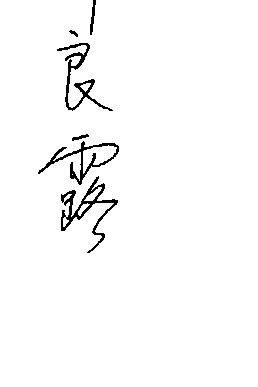
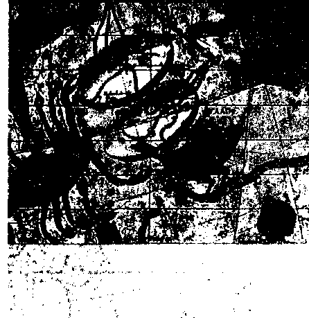
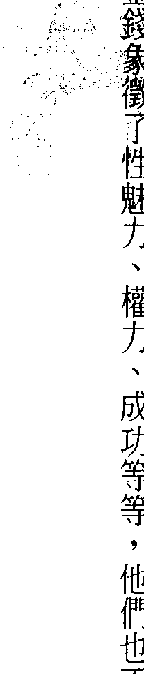
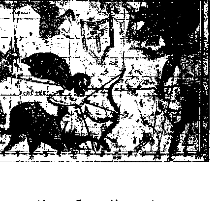
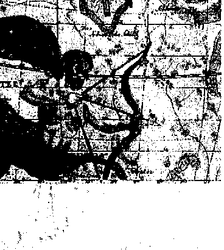
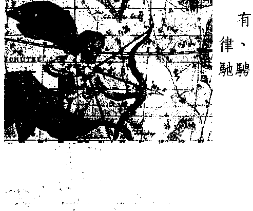
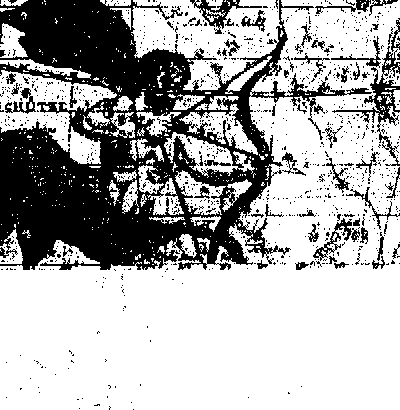
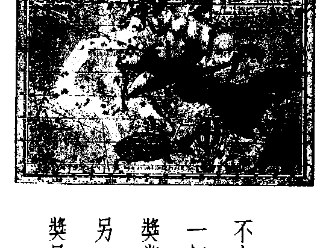
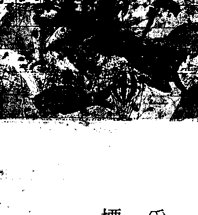

# 12原型星座

## 自我轉化的另一種面向

受到韓良露的影響，我從一九九八年起終於擺脫了在人們身上貼太陽星座標籤、良露所謂的「占星胡說」的惡習，而開始逐漸深入於占星學的研究。

由於長年譯介靈修與心理學的整合著作，所以在接觸求助者時，一向仰賴的都是直觀和心理經驗法則。但如同每一個專業或業餘諮商者所面臨的困境一樣，過於直接的語言總是或多或少激起個案的防衛機制，而身邊最親近的人對這種直觀語言反彈得最為明顯。

在偶然的機緣之下我觀察到，一張中性而抽離的本命星盤，竟然能輕易消融掉人與人之間的防衛性，以及因過度介入所造成的不當投射。於是我開始嘗試藉由星盤的象徵符號，來點出求助者的心理陰影層問題。

由於上述的機緣和驅力，我開始正式地拜師，廣泛閱讀占星書籍，和伴侶一起研究學員們的星盤。五年下來我驚訝地發現，良露的《人際緣份全占星》及《生命歷程全占星》，竟然可以取代靈學上所謂「宿命通」的功效，精確地看到人與人之間的因緣業力，個人業力能量所呈現出的生命循環模式，外行星帶來的生命挑戰及轉機，甚至可以藉由橫軸的相位和宮位的解析，提升靈修所強調的自我覺察。

這個發現使我注意到人本及超個人占星學家 Dane Rudhyar 及其弟子 Stephen Arroyo。這兩位心理占星學派重要的研究者，帶動了占星學界的超個人運動，將傳統占星學偏重事件預測的俗世性與宿命性，以及榮格占星學派根源於神話原型的擴大性解釋方法，轉化成以靈性進化為主軸的業力占星學。

這個學派有別於神智學會孕育出的玄秘占星學派，它以更為認真而嚴謹的態度，運用占星學做為心靈成長及自我轉化的工具。這是目前占星學的發展上，最令我感到好奇的一個面向。

《十二原型星座》是良露繼以往出版的幾本重量級占星著作之後，為仍在觀望、但是對此門學問有意一窺堂奧的讀者，所創作的一本有趣、好看、別樹一格，又能幫助人認識及轉化性格業習的入門書。

---

## 瞭解且勇於面對自己

第一次遇見韓良露是十幾年前的事了，而再遇見她，竟然就是十幾年後的現在。除了不勝唏噓之外，我不能說我認識她有如老友，但那天在風和日麗唱片行的地下室，她一個回身，我就喊了聲老師。她身旁的老公以為我是叫他，他們倆正琢磨熟的我是誰時，我們才更進一步地說上話。

韓良露可能不知道，這些年她對我的重要性真有如老師。我這麼喊她純粹是自然反應，因為從我父親過世、母親中風，我自己的事業也跟著停滯。一部分固然是我一向痛恨廣告業與唱片電影業界中某類虛偽的假文藝時尚腔。

另一方面，是我自己的個性與習性也出了很大的問題。我無法調整，也無意適應這個社會。就在偶然的某一天，我在書店的書架上再次遇到韓良露，讀她的書真是愉快。

她最大的特質是擅長使用現代生活的語言態度，讓我們容易把古老的占星跟我們現在的生活連結，而我也慢慢在她給的指導下重新理解自己。

盧宣明

（以下內容略去圖片頁標與頁碼後已順接）

……

---

## 認識自己的原型星座

> 「人的出生不過是一場遺忘與睡眠  
> 從我們體內升起的靈魂  
> 也是我們生命的太陽  
> 曾另居他方  
> 因此它來自遠方……」

—— 英國詩人 華滋華斯《永生頌》

在浩瀚的星空之中，有一條類似空中走廊的地方，太陽會以年為週期，月亮會以月為週期固定經過的一些形狀萬千的星座，這個地區就被古人稱之為黃道帶（Zodiac）。

古人觀測這些星群，發現如果以三十度為區分，整個三百六十度的天空，將會劃分出十二種具象形狀的星座。這十二星座即成為從巴比倫到希臘，再到文藝復興，乃至於今日人們朗朗上口的：

- 牡羊座  
- 金牛座  
- 雙子座  
- 巨蟹座  
- 獅子座  
- 處女座  
- 天秤座  
- 天蠍座  
- 人馬座  
- 魔羯座  
- 寶瓶座  
- 雙魚座  

在西方占星學中，每個人都擁有一張獨特的生命星圖，即他出生那一剎那天空星空的縮影。

在星圖中，離我們生存其中的地球之外，太陽、月亮、水星、金星、火星、木星、土星、天王星、海王星、冥王星，乃至於一些小行星及重要的恆星，都會以或長或短的速度經過黃道帶的星空走廊。而當這些星體停留在某個星座時，都會受到那個星座能量與電子信息的影響。

因此，每個人出生時所擁有的自體小宇宙之中，就隱藏著許多星座的信息。而這些信息在成長的過程中，又將和天上宇宙的信息互動。

屬於個人出生的小宇宙是命，小宇宙和大宇宙的互動則是運。

從希臘哲人蘇格拉底說「認識自己」是最重要的生命大事。但如何認識自己呢？

人們透過照鏡子，可以看到自己肉體的形狀，但人類要如何觀看自己精神的風景呢？最好的方式就是觀看自己的生命星圖。生命星圖有如人們靈魂的鏡像，瞭解自己的星圖，就是和自己的靈魂照鏡子。

瞭解生命星圖，必須徹底地瞭解十二星座的原型意義，才會知道不同的行星、衛星、恆星所攜帶的星座信息究竟有哪些涵義。

而本書就是從三種面向，分別從：

- 神話的源起  
- 愛情的動力  
- 宿命的奧義  

來探討十二原型星座的心靈風景。

這本書的成形，要謝謝《聯合報》副刊主編陳義芝先生。在一年多前某個深夜，在睡夢中的我接到了他邀稿的電話。原先我照「實的邏輯」拒絕寫只是十二星座的文章，因為台灣談十二太陽星座的文章太多了，也常失之於粗糙疏泛。

但陳主編一再強調，我應當用深入淺出的方式跟較多的讀者溝通。而這時我的靈光一閃，想到我應當從原型看——人類的心理、思想、文明的運作，本來就有原型的聚合性。

原型有如一口井，任憑不同的汲水人打出不同分量的水。

我希望這本《十二原型星座》的書，也可讓不同的讀者打出口可以灌溉自己生命、愛情、靈魂的活水泉源。

---

## 牡羊座  
(3/21-4/19)

敢说别人不敢说的话，敢做别人不敢做的事，因此不少牡羊星座子民成为极具原创性的艺术家、政治的异议分子、企业的先锋人士以及人生的冒险家。

## 牡羊星座的原型爱情

### 猎人的动情之爱

有一种人，我们且称他们为爱情猎人吧！他们往往能靠第一眼就看出谁是他们爱情的猎物。有这样强烈直觉的人，常常在他们的星图之中，会出现重要的牡羊星座的特质。

就像火星掌管着这个星座的生命能量，他们追求的人生是赴汤蹈火式的，而他们本能的爱情模式自然也要立即着火的才算数。

我有一个太阳牡羊星座的女性朋友，曾经告诉我，她这一生爱过四个男人，都是第一眼就决定的，她常说不能让我一见动情的人，不管日后如何培养感情，她都是不会爱上的。

牡羊星座的动情之火，燃烧得快。他们从来不会是柏拉图式的情人，只要有机会，他们不会让猎物白白地从他们眼前跑走。

另一个金星在牡羊座的男人也告诉我，他在二十多岁时，曾经在某个场合看过一个女子，他就觉得天旋地转，但当时他有女朋友，对方有男朋友，他并没有机会做什么，但十多年后，偶尔在路上与这个女子相遇，得知对方离婚，而这个已有配偶的男人却立即如火上身，完全不顾一切地追求起这个他拥有昔日深刻印象的女人。

牡羊星座的动情之火，燃烧得快，他们从来不会是柏拉图式的情人，只要有机会，他们不会让猎物白白地从他们眼前跑走，他们是大胆、勇敢、热烈的猎人，相信自己的狩猎技巧能赢得任何猎物。也的确，猎人虽然偶有运气不好失手的时候，但只要他瞄准，看上的猎物在还未消失前，猎人永远有他的机会。

就像猎人最有兴趣的，永远是还没有被捕获到的猎物，当牡羊星座的爱情猎人真正完成了追逐猎捕的游戏时，他不是那种会等到欲火焚身的人，他的怒火很难一直停留在他笼中的猎物身上，猎人其实很少去计算他到底捕猎了多少，他们关心的是下一场的狩猎何时开始。

而对于一个好猎人而言，他们最有兴趣的猎物绝不会是羊啊、马啊、牛啊之类温驯易捕的动物，他们需要挑战和刺激，那种越难捕捉的猎物，最能激起他最强的欲望本能。

这些牡羊星座的爱情猎人，从年少到老大都彻底地相信生命的本能是永不止境的追逐，他们绝不会轻易承认自己年老，就像最勇敢的猎人永远不会退休的。

做牡羊星座猎人的猎物，对于喜欢刺激的人而言，这是一场激烈、狂热的爱情追逐竞赛，有的猎物也颇能享受最好的猎人展现的猎捕技巧，只要猎物懂得如何在最重要的时刻逃脱。但如果不幸被捕猎了，之后又当成被遗弃的猎物，还不是最坏的下场，最坏的反而是变成那个不被重视、对方再也不放在心上的家畜了，猎人永远不会停留在他的家畜身旁太久的。

## 牡羊星座的原型神话

### 遇见什么战神

我做了一个梦。梦中，我在黄道上漫步，身旁群星闪烁，不时有小流星如花火般坠落在宇宙黑洞之中。然后，我遇见了宇宙战神 Aries，也可以叫他战神牡羊先生。他如传说般披着深红色的斗篷，手里拿着铁制的剑，正怒气冲冲地对着空无一人的夜空咆哮。

我必须走过他的身边，因此我试着和他沟通：“您在生气什么呢？”我问。

战神牡羊看到了我，迅速地分辨我是他的敌人还是同盟。非此即彼，没有中间地带。我露出温和的笑容，再度有礼地说：“战神先生，我从希腊神话中久闻您的故事，没想到在这遇到您，又不巧正遇上您心情不好。”

战神牡羊决定先把我当成同盟，反正他随时可以反悔翻脸，只要我不小心说错一句得罪他的话。他露出了热情的微笑（对了，当战神微笑时，那总是很大很大很感人的笑容）。他说：“我是在生气，但那并不代表我心情不好，我现在心情可好得很呢！但我永远都会生气，宇宙间太多令我不满的事了。就说最近好了，我很不满你们人类随便使用牡羊星座名称，玷辱了我的形象。”

我突然想起了我的朋友 A、B、C、D。的确，他们常常告诉我他们是牡羊星座。我谨慎地询问战神牡羊：“为什么您会不高兴呢？”

战神牡羊先生瞪我一眼：“因为他们只是凡人，凡人和神话人物是不一样的，他们只是我的一小部分，非常微小的一部分。”

战神牡羊突然拿着剑指着我，下令道：“我要你回去告诉世人我的事。”他昂起头，十分神气地继续说道：“当太阳来到我身边时，都必须听命于我。太阳向我学习至高无上的意志，永远不认输的意志。水星也和我合作无间，我借给水星我的剑，让水星在思想和语言时锋利无比。火星也是我的亲密战友，我们行动就是为了征服，把男人踩在脚下，把女人带到床上。”

我看着战神牡羊先生，想起了我那些朋友，的确有这些特质：“不少世人都模仿着您啊！难道这一点使您不悦吗？”

战神冷冷地看着我，说道：“我是独一无二的，他们模仿的不是我，只是太阳、水星、火星向我借去的面具。”

我看着孤独的战神牡羊先生，突然想到有人说过月亮和金星试了几十亿年都无法感动他的故事。我问道：“您和月亮、金星最近处得如何？”

战神牡羊终于露出了哀伤的神情，也蹙着眉，心烦意乱地说着：“还是一样。月亮遇到我，总说我太火爆，不懂得温柔；金星碰到我，也怪我是自私的小婴儿，只懂得自己的需要。他们都太麻烦了，我是个战神，有那么多战役要打……”

## 牡羊星座的原型宿命

### 愤怒或宁静的牡羊战士？

宇宙间每一年的轮回太空号，总是从春分开始的月份列车特别地拥挤，预定的座位早就客满了，因为这一整个月份的乘客都是那些等不及要去投胎重新做人的牡羊星座子民。

也许是因为喝足了冥界的忘川水，在星图中有强烈牡羊星座的人，尤其是太阳牡羊星座的，根本完全忘记了曾经为人和生生世世轮回的痛苦。

他们不仅肉体连灵魂都变回了初生的婴儿，不带任何恐惧地诞生人间。

他们唯一在乎的是如何活下去，而对一个初生的婴儿而言，活下去的关键就是让自我的欲望满足。就像婴儿饿了哭，不高兴就闹，谁有奶谁就是娘。

牡羊星座——向以敢于追求、实践自我的原欲著称，他们是天生的战士。凡是反对、压制他的力量，都是他要逐一打倒的对象。

他们不需要“只要我想做，有什么不可以”的广告口号，他们根本不会顾及别人说的“不可以、不应该……”种种世俗限制。

按照宿命轮回的平衡律，凡是选择以太阳牡羊星座身份投胎的灵魂，在过去的轮回中，都承受过自卑及懦弱的折磨。他们太了解软弱是无能和无力，因此他们的灵魂决定要在新的一世拥有自信、勇敢和胆量。

而这些在火星力量下加持的牡羊星座，也的确在人间做到这些。他们敢说别人不敢说的话，敢做别人不敢做的事，因此不少牡羊星座子民成为极具原创性的艺术家、政治的异议分子、企业的先锋人士以及人生的冒险家。

牡羊星座子民有极其巨大的自我，这个自我使他们能够一马当先、自立自强、超越别人，但也使他们妄自尊大、藐视他人、自私自利。

在亲密和重要的关系中，不管对家人、情人、配偶或同僚，牡羊星座子民素以“我优先、我至上、我做主”的态度著称。他们惯于把人划分为两种：一种是听他们的人，他们可以保持友善；但对不听他们的人，那就别想他们会好好和你相处了。

也因此，人际关系常常成为他们人生最大的盲点与危机所在。

牡羊星座子民的宿命功课，就在要弄清楚一件事：攻击和对立只是生命战士的武器，这些武器并不等于战士的自我。因此，好战士要懂得何时拿起武器以及何时放下武器。

就像古老的寓言所说的一样，战士最大的敌人往往不是世界，而是自己。

牡羊战士最大的敌人也正是他们的自我。他们必须分辨为自我而战和为生命而战是不同的两件事。如果他们坚持愤怒战士最终的目的只是把他们的自我越养越大，有一天当他们的灵魂离开人世时，这个膨胀的自我将阻碍灵魂的觉悟与演化。

但如果他们的灵魂及早觉醒，将会提醒这些牡羊星座子民：一个懂得尊重他人及合作的宁静战士，才能够在人生中打一场美好的战役。

## 金牛座  
(4/20-5/20)

由于对物质世界的认同，大部分金牛星座的人都能表现出某种笃定、沉稳的气质，却也培养出许多惰性，而因为不喜欢改变，而造成诸多限制。

## 领主的用情之爱

### 金牛星座的原型爱情

有一种人，即使站在人群之中，都会让人觉得那个人仿佛还置身在某座虚拟的城堡里。这种不轻易踏出领土的人，常常在星图中有重要的金牛星座特质。

这种我们可以称之为天生的领主的人，在爱情上也是不会轻易露出自己庄园的人。他们的爱情能量是深藏不露的，他们绝不肯轻易敞开庄园的大门，让各路人马进来探测他们爱情的矿脉，他们也不肯随便就为哪一个人走出庄园，去探访他人爱情的花园。

对这种保留、含蓄、缓慢、实际、耐心的爱情领主，要引起他的注意力，要用到一点斗牛的技巧。最有用的当然是挥动那块红手帕来引起他们的注意。

高明的斗牛士是不会匆匆忙忙地挥着红手帕往牛身上冲，他们要懂得慢拍的美学，懂得欲推还拒，在一阵游离不定、迂回的进攻中，最后一举逮住向他们奔来的牛。

由金星主管的金牛星座是感官的爱人，他们喜欢美好的性、好听的声音、甜蜜的相貌、柔滑的皮肤、舒服的床、典雅的家饰、愉悦的环境……这一切外在的氛围，都和他们的爱情反应相关。

这些感官的满足，都是会让他们兴奋的红手帕，而在所有的红手帕中，最有效的是性的诱惑和满足。

但就像挑食的美食家，这世界上能让金牛星座得到全然满足的并不多。他们不是饥不择食的饕客，如果没有让他们觉得美味的对象，他们宁可继续等待，或者转移感官的需要，转成欲求金钱、房地产、珠宝等物质的满足。

但如果一旦金牛星座找到能够完美回应他们感官需要的爱人时，他们可以变成最忠心的情人，因为他们崇尚安定和安全。

毕竟从一张床换到另一张床，不是懒惰、被动、优雅、迟缓的金牛星座爱人所能承受的混乱与折磨。

金牛星座的原型爱情是“用情”。他们喜欢别人主动对他们用情，他们也享受情人提供的各种实际的用处，从性生活到为他们做好饭、替他们整理家务等等，而他们也会提供有用的感情及事物回报。

当金牛星座爱人说他有一日会将他的小茅屋换成大城堡时，不要以为他在做白日梦，他通常会努力达成的。

而当他允诺你这一生会对你用情至深时，在绝大部分情况下，他都会遵守承诺，除非他不再享受和你的性，或你背叛了他，或他的钱。

## 金牛星座的原型神话

### 星空城堡中夏娃的爱神

关于爱恋爱神的故事，在宇宙中已经流传了好几千年了。据说七○年代还有个摇滚乐团架着齐柏林飞船，在星空中寻找她，却找不到她的身影。后来这个乐团还编了一首曲子纪念这一次的远征，他们唱道：曾经有一位女士，相信一切闪烁发亮的东西都是黄金，而她想着要买下通往天堂的阶梯。

也有人说，这位叫做 Taurus 金牛星座的爱神女士，的确住在天堂的一个角落中，她在那里建筑起了一座城堡，全部用闪闪发亮的黄金。

这位美丽而富有的女士的确让人着迷，可是她看起来却那么忧郁，她仿佛一点都不快乐。

我没有驾着齐柏林飞船上天，但是小王子从沙漠消失前，曾经答应我去寻找爱神金牛星座女士。其实小王子自己也很想见见她，他想问她是否可以拿着一支玫瑰花向他心爱的玫瑰花小姐求婚。

小王子消失了好多年了，毫无音讯。地球上许多人都组织了各种搜索队寻找他，却没有人知道他是否回到了玫瑰花小姐的身边。

我也早就不盼望小王子替我捎来忧郁的爱神的下落，没想到前几天我的网络上突然出现了各种星座的符号。我查遍了所有天文的秘密经典，终于解读出小王子的信，下面是小王子的报告……

我在地球绕日轨道的内侧，发现了爱神金牛星座女士的城堡，也发现了为什么她的行踪一直难以发现，因为她空中的城堡并不盖在固定的地方，而是浮在星空中，永远和黄道面成四十八度角的地方，不断漫游着。

爱神金牛星座女士很迷人、文雅、友善、衣着高贵。她的城堡的确闪闪发亮，但是不只有黄金，还有钻石、玛瑙、蓝宝、翡翠、珍珠、水晶。城堡里铺着闪闪发亮的波斯古董丝毯，挂着各个博物馆中的名画，像高更、塞尚、莫奈和张大千。

如果不是因为我心中还记挂着玫瑰花，这位美丽而富有的女士的确让人着迷。可是她看起来却那么忧郁，她仿佛一点都不快乐。我忘了你要我问的问题，只想问她为什么那么忧郁？

爱神金牛星座女士说，她只有在希腊时代才经过一段快乐的时光。那时她化身做过爱神阿芙萝黛蒂（Aphrodite）女神，整天弹琴唱曲、作画插花和恋爱，希望人们视她为爱和美的象征。

但到了罗马时代，罗马人说服了她化身成维纳斯（Venus），给了她无上的权力。除了爱与美之外，繁荣、财富、珠宝、享乐统统由她主管。

爱神金牛星座女士又说，她相信一切闪闪发亮的东西都是黄金，因此她指挥神秘的炼金师从爱和美中提炼出黄金，而她办到了。她提炼出如此多的黄金，淹没了地球上各国的金库和私人的保险箱。

可是有一天她却发现，这些闪闪发亮的黄金中却再也找不到爱和美的成分了。

从那一天开始，爱神金牛星座女士就成了忧郁的爱神了。

于是，她留下了地球上所有的黄金，隐身在她的城堡之中。可是，为什么星空中的城堡还是如此璀璨耀眼呢？这些钻石、黄金、宝石，又是哪里来的呢？小王子追问爱神金牛星座女士。

“这一切只是幻影，”爱神金牛星座女士答道。“关于我的神话，我的一切，都是人们欲望的幻影。印度的悉达多王子不也这么说吗？”

小王子没有再问任何问题就离开了，可是他知道，就算一切都是幻影，他的玫瑰花却不是。他决定不带任何礼物去向她求婚。

小王子走出了城堡，却看到太阳、月亮、水星、金星、火星、木星、土星、天王星、海王星、冥王星都派了使者在城堡外等候。他们手上都拿着闪闪发亮的黄金，等着送给爱神金牛星座的女士。

## 在色与空中轮回的金牛爱神

## 金牛星座的原型宿命

在浩瀚的星海中，最接近地球的星座就是金牛星座了，因此远古的神人在描述金牛星座的元素时，都会说这个星座的子民 down to earth（脚踏实地）。

在轮回的太空号中，金牛星座的子民由于动作一向缓慢，因此抢不过火急性子的牡羊，赶不了搭春分的第一班车。但慢动作的他们之所以能赶上每年投胎做人的第二梯次，是因为他们很早就预约排队等候了。

他们虽然慢，也是被喜欢插队、抢先的牡羊挤下来，但他们的耐性和坚持，还是使他们能早一步降落人世。

重回人间是金牛星座子民灵魂中强大的需求，他们总有各种大小割舍不掉的执著，使他们需要重返地球。也许是放不下灵魂记忆中曾经拥有的一方庭园、某个宠物、一些美丽的事物或人物，甚至也许是为了舍不得地球本身。

在十二种星座的能量图谱中，金牛星座的能量对应感官世界最敏感，因此凡是感官的色、声、香、味、触，都是他们专注的法界。

也因此他们容易执著于现世法。他们可以用极大的感官之爱去爱人、事物及一切，但偏偏爱的电波回荡在有形与无形世界之中。对于强调拥有的金牛子民而言，要他们爱色界不难，爱空界却很难。

由于对物质世界的认同，大部分金牛星座的人轮回做人后，不管年纪多小，都已经可以表现出某种笃定、沉稳的气质。

他们强大的五感知觉，使他们不会被五花八门的俗世现象所欺，但这份过早的成熟，却使他们培养出许多惯性，使他们在人生的成长过程中，因为不喜欢改变，而造成诸多限制。

尤其是那些自小就强烈知道自己在俗世中需要（Need）什么的金牛星座子民，当他们一旦得到他们需要的人、事物、财富、名望或安全感时，他们很容易就在生命进入中年时感到累了、倦了。

少年的沉稳转成了沉重，又因为容易受物质的地心引力影响，他们选择被惯性法则支配，因此也越来越懒得改变了。

他们自以为来人世的肉体躯壳的需要或多或少被满足后，轮回的目的就达成了。然而他们却忘了问自己的灵魂想要（Want）的是什么。

而这些被禁锢在肉体惯性中不快乐的灵魂，常常成为金牛星座人们莫名的悲哀所在。

許多金牛星座的宿命功課，都在於對物質生命資源過度地獨佔，而造成他們靈性自我的萎縮，但他們佔有的物質世界也成為他們的牢籠及鎖鍊，成為人生沉重的負擔。不過，有某些少數的金牛星座子民，卻因為人世的打擊，如生命中一些重大的人事物的喪失，讓他們開始覺察有形世界空的本質，也領悟了不管看起來多麼具象的物質資源，其實都是不同能量流動的狀態。

而一個人和資源的關係，可以因進化的不同階段，產生不同的變化。

這些有所覺悟的金牛星座子民，脫離了宿命的限制，有人從獨享資源的小愛，進化到分享資源；有人從對自我的感官之愛昇華到對全地球的感官之愛。這些人的大愛將成為社會或地球資源的保護者。但有人走得更遠，別忘了曾有一個金牛星座的子民，幾千年前就在菩提樹下，宣示了色不異空，空不異色的生命本體。

# 雙子座

(5/21-6/21)

許多不能自我對話的雙子星座，靈魂缺乏統一完整性，常給人分裂的感覺。

有些人批評他們是變色龍，見人說人話，見鬼說鬼話，就是源於他們的自我分裂。

## 雙子星座的原型愛情

### 小飛俠的調情之愛

據說義大利情聖卡薩諾瓦被幽禁在威尼斯的總督監獄時，每天都有許多威尼斯的女人川流不息地在他的牢房外，輕呼他的名字。

這些女人當然都知道她們不是卡薩諾瓦唯一的情人，但她們似乎都寬恕了他的不忠。最後，卡薩諾瓦還在某個有影響力的女子的幫助下越獄成功。

這個卡薩諾瓦，擔任雙子星座的原型愛情代表人物當之無愧；這種大眾情人的特質，一向是雙子星座最引以為榮的稟賦。

根據希臘神話，雙子星座是天神宙斯和凡女萊妲私通所生。他們誕生在一個巨大的天鵝蛋之中，出生時這對雙胞胎身上都長著豐滿的羽翼。

雙子星座是半人半鳥，因此同時具有人的理性和動物的官能性。他們又是天神和凡女之子，因此兼具了半神半人的特質。這些雙重性，都成了雙子星座愛情能量的分裂指標。

任何一個愛上、愛過星圖中有重要雙子星座特質的人，都會有這樣的經驗，就是你永遠不會知道你愛上的是不是一個完整的人。當雙子中的某一子熱烈地在和他的愛人在一起時，另外一子可能正遨遊在無人的天際，品嚐著神聖的孤寂；又或者另外一子正在對某個新認識的對象放電。

這樣的經驗，就是你永遠不會知道你愛上的是不是一個完整的人。

對於雙子星座而言，忠貞是非常困難的事。他們本來就不是一個完整的單體，如何只對一個人忠貞呢？但是，雙子星座也不能說是背叛的愛人。事實上，他們從不背叛。這是雙子星座愛情的最大弔詭，因為他們從不忠實於一人，因此他們也從不背叛。

主管雙子星座的水星，有大大的好奇心。對他們而言，所有的人類都有可愛之處。他們喜歡和每一個可能的對象談情說愛。別以為雙子星座是好色之徒或花癡，他們喜歡談勝過於做，性一向不是雙子星座最看重的事。誰說卡薩諾瓦迷倒威尼斯女人靠的是床上功夫？卡薩諾瓦最有名的是風趣的談吐及動人的情書。

雙子星座在神話中是永恆的兒童。揮展著雙翼的他們，就像個邱比特一般，不喜歡長大，也不喜歡責任。他們的戀情像玩具般輕巧好玩，他們除了保留摯愛的老玩具之外，還可以不斷地換新玩具。誰會責罵小孩子對玩具喜新厭舊呢？

在他們心目中，所有的玩具都是好玩的，都有一定的地位，而他們最希望可以同時和許多玩具在一起。

對某些雙子星座而言，同性戀、雜交、多夫多妻都不過是一種「玩的名詞」罷了。他們不懂世人為什麼要在有的玩具身上加上不道德的標誌，不道德的玩具是什麼意思呢？

但雙子星座也不會將這一切看得太嚴重。他們從來不想反抗大人，但也不想被大人管。

任何嚴肅、認真、專心的愛人，碰到了雙子星座，勢必會引發一場孤軍之戰。因為雙子星座不會陪你打這場仗，他們早就離開了，留下你一個人面對傷痕累累的愛情戰場。

但對於愛自由、不想被綁住的情人而言，雙子星座提供的調情之愛，卻是無聊生活中最有趣、甜蜜的刺激。就像一場夏日假期的邂逅，歡愉之外，何必要太多？

### 在人間滯留不歸的信息之神

## 雙子星座的原型神話

從我踏進洛杉磯蓋提美術館，在入門處看到了那一尊羅馬雕像開始，我就歷經了一連串奇幻的旅程。

首先，當我仔細注視著那尊叫麥丘里的水星雕像時，我看得十分入神。突然卻看到雕像的翅膀在空中閃動了一下。怎麼可能？這是一座鐵製的雕像。我想我是眼花了。我眨眨眼，再度凝視著雕像活龍活現的神情時，卻又再度看到雕像的嘴唇開了一笑……

從那一天起，我就有了幻覺。我在世界上各處的報紙、雜誌、電視的圖片或畫面上，都看到水星擺出各種姿勢，站在各種新聞事件的現場。不管是革命、遊行、談判、暴動、剪綵、記者會或派對。

我問我身邊的朋友，但卻沒人看到這樣的景象，讓我自己開始擔心起來。

> 受人歡迎是最重要的，原則並不重要，這是人間的規律。為什麼我可以到處活躍？因為我懂得善變之道。

那一天，在一位作家的暢銷書慶祝酒會上，我又看到了揮舞著翅膀的他。我不顧身邊人的注目，努力向他招著手，害人家以為我大概對那位作家太崇拜了，才不斷地跟他揮手示意。還好雕像看到了我，他飛到了我身旁。我快步走到長廊外，他也跟著。到了人較少處，我開始與他交談。

「為什麼我到處看到你？水星先生。」我問道。

「叫我小名雙子星座吧！地球上的人可能比較熟悉我的這個名字。」他接著回答我的問題：「你為什麼會看到我？因為我本來就是無處不在啊！地球人也應當都看得到我的才對。要看得到我很簡單，就像看3D圖片一樣，要先懂得兩眼放散，當眼球的焦距……」

雙子星座先生滔滔不絕地講著，這是他的著名特質：口才好，更擅長寫作。雖然他的長篇大論常常過於瑣碎。

為了打斷他的演講，我提出另一個話題：「你多久沒有回到你在天上的家了？聽說那是在離黃道二十八度角的地方……」

雙子星座先生也打斷了我。他插嘴說道：「我喜歡在人間。誰要住在那高處不勝寒的地方？我最懷念在羅馬時代人們為我蓋的神廟。那時，我是信息之神。現在，我雖然沒有了自己的神廟，可是人們還是一樣崇拜我。在電視台、新聞社、廣播電台裡，我變成了媒體之神。只是人們忘了我的名字。不過最近因為星座的流行，人們又開始熟悉我的名字了。」

「可是，你不覺得人們對雙子星座或你的了解有失膚淺嗎？」

「膚淺？你們地球人本來就是膚淺的，不是嗎？」雙子星座先生用生動的語調看著我，繼續說道：「通俗就是力量。不要忘了那位最善用雙子星座力量的阿嘉莎·克莉絲蒂，她書的銷售量只次於《聖經》……」

雙子星座先生突然壓低了聲音，小聲說道：「告訴你一個祕密，《聖經》其實是我寫的！」

「可是，這世界上還有那麼多的文字和語言，並不都是通俗的？」

「但它們賣不好，對不？只要不跟我低頭的作品，是不可能暢銷的。我是大眾的信息之神。從前我駐足在神廟、市集之中，今日在大眾媒體之中。我代表大眾的語言，我代表人間。」

我悄悄地走開了。想到那些寫人家看不懂的詩及小說的作家，他們總是仰頭望向天空，希望用文字搭建一座通天塔去尋找信息之神。然而他們的神卻在人間，正四處販賣著他的成功術。

「受人歡迎是最重要的，原則並不重要，這是人間的規律。為什麼我可以到處活躍？因為我懂得善變之道。」這是我臨走前，又聽到雙子星座先生的話，也看到他身邊環繞著一圈又一圈的人在聽他演說。

## 雙子星座的原型宿命

### 分裂或統一的雙子使者？

本來雙子星座子民是預定搭當年度第一班輪迴太空船的，但總是活動太多的他們，即使在投胎之前，當天還是排滿了各種行程。於是當他們又像往常一樣才結束上個行程，再匆匆趕往輪迴太空站時，遲到的他們看著前兩班車已經開走了，但快手快腳的他們還是趕上了年度第三班列次。

雙子星座子民急著重返人間是有原因的，他們一向愛湊熱鬧。人間的活動本來就多，又可以和各色各樣的人相遇，不像在天堂或地獄，同質的靈魂群聚一塊修行或試煉，每天的活動差不多，把喜歡多采多姿、變化萬千生活的雙子星座悶死了。

因此當修業暫告段落，個別靈魂要再回到人間磨練時，雙子星座子民早就訂好各種計畫，甚至和其他投胎的靈魂訂下了約會，只等來世相見。

轉世後的雙子星座子民，對適應地球毫無問題。畢竟他們一向擅長溝通資訊，對人間各種基本的知識熟門熟路。

對他們而言，世界是一張巨大的情報網，而他們有責任對這張網的連結無所不知。因此他們每天忙碌於八卦、小道消息、雜聞。

但有時，在夜深人靜的某一刻，這些暫時得了閒空的雙子星座，內心會突然感到隱約的不安，覺得他們似乎遺忘了什麼。

比較靈敏的雙子星座，就會覺察到生命之中一些嚴重的欠缺。譬如說，他們忙於知道事情，但是否只停留在事情的表面？而他們常常缺乏目標地東奔西走，表面上參與了很多活動，但這些活動中有多少能服務較高的人生目的？還是只是安撫他們靜不下來的心意？

再想想他們忙著來往的眾多人際關係，其中有多少只是膚淺地相識，而他們根本無心也無能和他人建立深刻溝通的知交。

雙子星座的宿命功課，就在於能讓他們自身的雙重性，即心靈和心智的個別自我能夠互相對話，而不是讓這兩個自我忙著和他人及世界交談。

許多不能自我對話的雙子星座，靈魂缺乏統一、完整性，因此常會給人分裂的感覺。有些人批評雙子星座是變色龍，會見人說人話，見鬼說鬼話，就是源於他們的分裂自我。

想想看，當雙子星座的兩個自我分別在人前出現，運用好時，人們會說這些有能力站在兩方看事情的雙子星座，適合宣合不同意見、勢力、派系的協調者及中介者；運用不好時，人們會發現，這些順應他人意見的雙子星座，是最會打兩手牌的投機份子和騎牆派。

雙子星座投胎人世，最重要的靈性課題，就在於如何明白自己是宇宙全像的使者。雙生但不分裂的自我，服務的是統一的宇宙心靈，而不是那一個人類、族群社會、國家，更不是狹隘的自身。

如果有這層認識，他們就能揚棄個人像鐘擺般搖擺的主觀，轉向協調的合鳴，也能懂得連結自身與他人的意識，和更大的宇宙意識共舞。這樣的雙子星座，將成為溝通宇宙低等和高等心靈的使者，而不再是那永遠不想成熟、不想負責、不願承諾的人間邱比特。

# 巨蟹座

(6/22-7/22)

大部分的巨蟹座終其一生，都很難完全適應水陸兩棲的生活，所以他們的靈魂常常感到巨大的飢餓，有些甚至會養成退縮、封閉的習慣。

## 巨蟹星座的原型愛情

### 聖母的溫情之愛

想要懂得巨蟹星座之愛的人，要先懂得好好觀看月亮。看過那滿月的光芒照在淡白的梔子花上的反光的人，一定相信人們所說的巨蟹星座的愛像聖母般溫暖，這樣的溫情最能安撫孤獨寂寞的靈魂。

但是，也有人看到月亮不同的形狀。有時她躲在烏雲背後，有時因為地球的關係，她成為孤伶伶的新月，甚至有時太陽的光完全反射不到月亮身上，月亮喪失了所有的光芒。

懂得月亮有各種隱身術的人，也會懂得有一些巨蟹星座，是最蒼白及渺小的星體。他們或許一直渴求著別人給予溫暖的光和熱，但他們自身卻沒有能力給予同等的回報。

處在月缺或月蝕狀態的巨蟹星座，常常是童年受苦的人。他們往往欠缺一個好母親及穩固的家庭支撐，讓他們成為只能反射部分太陽光芒或根本無法展現反光的人。

為了填補內心巨大的空洞，他們必須不斷尋找愛。但他們要的愛並非男女之愛，而是聖母之愛。他們需要凡人給予無條件的母愛，才能填補他們童年的失落。

我有一個女性巨蟹星座朋友，一直在人生的路上尋找有人愛她。但在她戀愛過無數回之後，她依然覺得男人從未給予過她真正的愛。她一直未能明白，她需要的不是一個把她當女人般愛的男人，而是一個把她當成女兒般愛的父親或母親。

沒有安全感的巨蟹星座，往往在現實生活中是家庭的守衛者，但他們守護的是對家庭、家人之愛。因此不少巨蟹星座以忠實的丈夫聞名，但當他們脫離了家庭的殼，尤其在旅行的無家狀態之中，某些巨蟹星座會變成非常不忠實的情人——他們很容易受到旅途中外遇的誘惑。

就像月亮受潮汐變動的影響，他們的感情也變化不定。

至於那些童年有著巨大溫情支撐的巨蟹星座幸運兒，他們的靈魂鏡像中一直會照見滿月的圓滿。因此，他們一直自許要成為那種永遠不斷釋出滿月光芒的人。

他們會是最溫暖的情人，卻絕不會是熱情的情人。因為他們能夠給予的光芒來自童年的反光，而非他們自身靈魂的火山。但對於渴望溫情和親情的人而言，這樣的巨蟹座之愛雖不激烈，但也不灼人。

有安全感的巨蟹星座的溫情之愛，不僅實踐在家庭之中，他們對人類大家庭也有一份親人之愛。因此參與慈善的人類組織，也成為不少巨蟹星座釋放溫情的出口。

巨蟹星座，不管是救贖的聖母或受難的棄兒，不管是付出或渴求溫情之愛，溫情都是他們的家，也是保護他們的殼。

而他們的盲點也在於此。他們的愛不能承受高溫，也不願走得太遠。他們從來不是愛情的探險者，而是守候者。安全感是他們至上的愛情生存哲學。

### 不安的月神

## 巨蟹星座的原型神話

當那位出生在七月巨蟹星座日子的王妃，和她的白馬王子坐上一輛現代馬車，奔馳進巴黎市中心的地下隧道時，她並不知道，一則古老的悲劇將要上演。

在羅馬時代，曾是月神兼獵神的黛安娜，追逐著黑暗之神路西弗。但在二十世紀末的現代神話中，黛安娜王妃卻被一群狗仔隊騎士追逐。彷彿月神從獵神變成了獵物，最後命運的詛咒攫住了她。

那天晚上，巴黎的月亮如此不安，迅速地隱藏起身影，躲在烏雲層裡。

正在塞納河邊散步的詩人，看見了一位穿著銀白色披風的女人，站在石岸邊哭泣。詩人站在女人身邊，關心地問道：「妳為什麼哭泣？」

女人抬起了頭，那是一張晶瑩如月光的臉。女人回答得很奇怪，她說：「為什麼月亮要有陰晴圓缺，人間要有悲歡離合呢？」

詩人看著眼前這位美麗的女人，心裡想著這個女人也許是瘋子，但詩人不怕瘋狂，又不能抗拒美麗的誘惑。詩人上前牽起了月亮女人冰冷的手，溫柔地說道：「今夜沒有分離，我會一直陪著妳。」

女人告訴詩人她的故事。從小害羞、膽小、怕生的她，一直渴望有個溫暖的家庭。可是她的父母失和，離家的父親把她丟給一個比她更脆弱、更神經質的母親。

她被迫成長，取代了母親的母性角色，來保護她無能的母親。她替自己築起了保護家人的殼，但只有她心裡知道，她多想逃離這一切。

但她一直隱藏著自己的情緒。只有大海知道她的祕密。每當海洋的潮汐起伏時，她體內的血液也激盪著，她的心情海洋從來不會平靜過。

她喜歡黑夜。每當皎潔的月光照射著她，她的內心就會聽到遙遠的召喚。

「去吧！去吧！」月光說道：「回到你靈魂的草原上奔馳吧！」

這時的她，就會欣然地沉沉睡去。在睡的無意識世界中，她不用再辛苦地向世人扮演她的角色。

她總是辛苦地扮演。日日裡，她扮演退縮的守候者，安靜地躲在人群的角落裡，從來不顯現自己的光與熱。

夜晚時，她戴上了各種不同的月光面具，讓別人依然無法拆穿她內心真正的意圖。

她不明白，為什麼人們總是歌頌月亮的母愛或巨蟹星座的母性。

人們難道不知道，那種想要保護的慾望是出於多麼巨大的恐懼和不安？母性其實有如月亮的盈虧，圓滿與欠缺的故事一直上演。有的母性還有自毀的焦慮，而有的母性會聽到狼人，在月圓夜時的哭嚎。

月神般的女人，對詩人訴說著她的不安、她的迷惘。訴說她曾經有過的產後憂鬱症，訴說她靈魂中分裂的自我。一個自我展現向世人靠近的聚合力量，另一個自我卻想遠離世人。

月神般的女人隱藏著她的祕密，只肯向詩人吐露。

在第二天的黎明破曉時，這位說自己叫巨蟹星座的月亮女人告別了詩人。在清晨的花草霧氣中，詩人看著女人銀灰色的披風消失在朦朧的微光中。

詩人想起了自己的母親。她的擁抱，她的哭泣，她的不安，她的憂鬱，她的堅強，她的神經衰弱……

詩人覺得他終於了解了母親的祕密。

## 巨蟹星座的原型宿命

### 泅泳在羊水或宇宙星海中的巨蟹孩靈

輪迴太空船前四批的旅客，搭載的都是年輕的靈魂。從充滿生命原始衝動的牡羊火之嬰，到與欲望糾纏不清的金牛土之兒，再到行動十足的雙子風之童，最後上場的是情緒強烈的巨蟹水之孩。

巨蟹星座之所以在第一梯次最後離開，和水象星座推推拉拉、猶豫遲滯的個性有關。他們太捨不得離開宇宙星海的保護了。他們希望自己永遠待在宇宙母親的子宮裡，不想明白，也不願意面對靈魂必須重返人間，以肉身姿態生生世世歷練演化的宿命功課。

重新誕生人間的巨蟹星座子民，有些人或許已經淡忘了宇宙子宮的溫暖，但都忘不了他們肉身母親子宮羊水的擁抱。

在羊水中，他們是如此地安全，但他們卻必須離開羊水，才可以呼吸到廣大的空氣。

大部分的巨蟹星座，終其人世的一生，都很難完全適應水陸兩棲的生活。來到陸上的他們，渴望父母的家、自己的家、社會的家、國族的家，能帶給他們像子宮羊水那般的安全感，但最後卻總覺得缺少了什麼，所以他們的靈魂常感到巨大的飢餓。

有的巨蟹星座，就會養成退縮、封閉的習慣。因為他們以為縮回自己精神的硬殼，也是一種回家的狀態。

也有的巨蟹星座，會把身邊遇到的每一種人，不管是朋友、同事、愛人、配偶……統統當成他們象徵的子宮，而他們希望能從這些人身上得到宇宙母親那種無條件的愛和保護。

關懷。然而，世界上沒有任何人類能夠擔當宇宙之母的，因此，命定要失望的巨蟹星座子民，有些卻不能面對這個事實。這些情緒不願意成熟、感情極度依賴、個性又極易受傷的巨蟹，沮喪或抱怨起來沒完沒了。他們之中有的很容易染上慢性憂鬱症，有的甚至會因負面的心想事成而製造出各種的身心病。

不管是心靈的或肉體的疾病，都是某些巨蟹星座子民對人揮舞的求救紅旗，提醒、呼喚人們注意他們、關心他們、愛他們。有時候，人們也確實注意到了他們的需要，也願意付出關懷和支持，但對於靈魂不能斷奶的這些巨蟹子民而言，世界上永遠沒有足夠的愛。就像母親的羊水比不上大地的海洋，大地的海洋又比不上宇宙的星海那樣浩瀚。

巨蟹星座子民的宿命功課相當艱難，因為他們是孩靈在歷經火、土、風、水的考驗後，進入青年靈魂前最後的關口；為了順利過關，他們必須學會丟開許多情緒的行李，並且使自己的靈魂趕快斷奶，學習成長。

至於有些少數生生世世已經接受足夠考驗、靈魂演化到了一定成績的巨蟹星座子民而言，重返人世的責任是在提供他人靈魂的滋養。對這些已不需要自保、自衛的巨蟹，由於他們太瞭解某些人類的脆弱，因此他們十分努力為人類建立各種精神和肉體的家。他們也不再渴求自私的愛，轉而追求無私的愛。他們也明白了母親子宮裡的羊水和大地之洋與宇宙之海，其實都是一體的，根本不分大小，而人世和地球也並不和生命海洋分離，水和陸本來就是連在一起的。對這些靈魂自足的巨蟹星座子民而言，水中陸上都是愛，而他們活在宇宙海的永恆愛中。

# 獅子座
(7/23-8/22)

驕傲的獅子星座慣於發號施令，支配、統馭他人。他們以為所有的人際關係，都一定有個太陽系，而他們就是那個系統裡光和熱的聚焦點。

## 獅子星座的原型愛情
### 騎士的純情之愛

太陽神崇拜，是地球上最古老的靈性活動。太陽的光和熱帶給地球生命的能量，在宇宙的每一個行星系統中，都有一顆太陽，象徵著那個行星系統的原力。

對於認同太陽的獅子星座而言，在他們每一個人的小宇宙中的太陽神，就是他們的自我，其他的人都是行星系統的眾星，環繞著他們運行。

獅子星座的愛情關係的本質，就是太陽和地球的關係。獅子星座需要一個地球愛人，以對太陽神崇拜的方式去愛他。他們必須被他們的愛人視為宇宙中心，而他們也將以無止境的光和熱的愛情能量回報他們的愛人。

在所有星座的愛情能量中，獅子星座擁有的是最浪漫、純情、理想化的原型愛情。獅子星座相信他們就像太陽一樣，還有幾百億年的熱力可以燃燒，在宇宙化為黑暗之前，太陽的光亮不會停止，就像只要愛情世界不會崩塌，獅子星座的熱情不會消失一樣。

獅子星座是最好的愛情人道主義者。不管男女獅子，他們都以愛上弱者聞名。獅子星座不像雙魚星座般視自己為弱者，所以同情弱者；獅子星座都認為自己是強者，有能力照顧、幫助他們的弱者愛人，而不像弱者雙魚會去找一個強者依靠。

在獅子星座的浪漫愛情神話中，充斥了王子娶舞女、公主嫁車夫之類的故事。只要獅子星座被愛情打動了，他們是最勇敢的騎士，願意為他們的愛人做一切的犧牲。他們可以比寶瓶星座的人更不在乎世俗的規範。

寶瓶星座的人會為了反抗制度而愛上不該愛的人，但獅子星座只是剛好愛上了地位、身分、環境都不如他的人。他們只為了人的因素，而不是為了對抗制度而我行我素。

這些喜歡給予的獅子星座愛人，對愛人相當慷慨。他們不是那種斤斤計較的情人，不管男女，他們都願意提供自己的資源讓愛人分享。但這些大方的獅子星座愛人，最怕自己失去了資源。

因為他們完全不能做接受者，他們永遠希望自己比他們的愛人強。他們相信付出是快樂的，但被別人施捨是痛苦的。

因為這種要強的習性，女獅子在愛情關係上遇到的困難，一向比男獅子多。畢竟很少的男人能夠長期臣服在自負、驕傲、慷慨、熱情的女人之下。當男人得到足夠的好處之後，他們會想要長大、獨立、超越他們的女獅子；因此不少女獅子的愛情史中，充滿了被背叛的紀錄。

獅子星座最不能接受情人的背叛，並非他們的佔有欲特別大，而是他們自尊心特別強。他們因自尊心而變成最天真的情人，根本不相信他們的愛人會騙他。因此當他們發現醜陋的真相時，他們的宇宙就崩潰了，受傷的獅子星座也許一生都不能恢復自信。

因此，愛上獅子星座的人，需要相信王子和公主從此快樂地在一起了那樣的童話。說真的，也只有獅子星座能活在那樣的童話之中。

對那些不再愛得了愛情殘酷真相的人，有時童話的確撫慰人心。

### 孤寂的太陽神
## 獅子星座的原型神話

傳說在宇宙劇場中，太陽劇場的表演一向是最受眾神歡迎的。根據一本希臘時代留下的古籍記載，在表演活動一開始，太陽神阿波羅會披上橘紅色鑲金邊的斗篷，駕著兩頭獅子拉著跑的戰車，登上了太陽劇場的舞台。

太陽神最喜歡演出的角色是宇宙之王。有一次，當真正的宇宙之王宙斯來看表演時，太陽神也不肯更改戲碼。這點使得宙斯不太高興，於是宙斯就拉著其他的神祇離開，剩下孤單的太陽神獨自站在舞台中央。

從那一次表演之後，太陽神就明白了他宿命的孤寂。即使日後再有更多的掌聲，都不能讓他忘記那一次他孤伶伶地站在舞台中央時感受到的寂寞。

後來，地球上也開始流行設立太陽劇場，一家又一家重新命名為獅子星座劇場。裡面的表演精彩極了，有唱歌、跳舞、演戲、演講、演奏等等，吸引了地球人的目光。

但有些去過獅子星座劇場的人發現了一個祕密，就是在每一次表演結束後，舞台上的黑幕剛拉起，都會有一個落寞的幽靈慢慢地站在那裡不知所措。

有一天，終於有人訪問到了那位幽靈。這位說自己叫獅子星座的幽靈，竟然是剛剛那位在舞台上光芒四射的演員除去表演面具後的本尊。當表演結束後，這位天才演員身上的自信、榮耀、勇氣就如灰姑娘的馬車在午夜十二點鐘聲響後一般地消失了。

幽靈告訴訪問他的人，他說，再多的掌聲也填補不了他內心的渴望。他一直渴望愛，但世人給的卻只是喝采的掌聲。他也習慣了把掌聲當成愛，但掌聲終究取代不了愛。

曾經有一個幽靈最忠實的觀眾，自以為愛上了他。她崇拜、敬仰他、歌頌他，她被他在舞台上的光和熱所吸引，她渴望靠近他。可是獅子星座幽靈要的不只是這樣的愛，他要的是愛人的呵護、溫柔和甜蜜。他希望自己既是愛人懷中的小貓小狗，又是愛人祭壇上的巨人，他要一份雙份的愛。

很少人知道，獅子星座幽靈自信的臉龐下的脆弱；也很少人明白，他的勇敢只是因為他努力扮演好勇敢的角色，並非他本來就是勇敢的。更沒有人瞭解，他對世人的慷慨之下隱藏了多少遭人傷害的委屈。

幽靈又說起了最近在其他的獅子星座劇場上演的一齣戲碼，一位獅子星座巨星又被愛人拋棄了，而這位巨星一如既往，保持著他的自尊，既不解釋也不抱怨，只是沉默以對。

「為什麼愛人與被愛，是這麼困難呢？」獅子星座幽靈嘆息著。

只有風在空中回答著：「愛是軟弱人的恩賜，堅強者的打擊。」

## 獅子星座的原型宿命
### 閃爍孤星之光或宇宙之光的獅子巨星

輪迴太空號第二梯次有四班直航機，搭載的都是從青年到成年的靈魂，相較第一梯次的幼年靈魂，投胎的生命任務將大為不同。

靈魂體的主要生命課題都和自我意識有關，例如牡羊的自我和原慾、金牛的自我和佔有、雙子的自我和溝通、巨蟹的自我和安全。

但第二梯次的成年靈魂的主要功課卻在強調自我和他人的關係。

火象星座的獅子，一向行動力驚人，當然由他們搶得先機搭上第二梯次的直班機。這班機還有個特色，就是只有頭等艙，沒有二等艙，因為這些自認靈魂不能低人一等的獅子星座子民，絕不能忍受屈居人後。

但這些靈魂轉世後未必都可以在世俗間佔到優越的位置。對於那些投胎後誕生在較卑微環境的獅子星座子民而言，他們卻仍然深信自己是高人一等的，畢竟他們從未完全忘記他們靈魂曾擁有的榮耀。

輪迴到地球上的獅子星座，基本上可以分成兩大類。有一種人會顯得很驕傲，另一種卻很謙卑（不要以為所有星座都可以分成這兩類，譬如說不會有不驕傲的牡羊，也不會有不謙卑的雙魚）。

但奇怪的是，驕傲的獅子其實有十分脆弱的內在。他們深怕被別人瞧不起。像他們不喜歡買打折的東西，就因為不喜歡別人挑剩的東西；而他們永遠要在人群中搶著站在聚光燈下，也是因為如果缺乏足夠的注意與掌聲，他們會根本無法面對空洞的自己。

另一種謙卑的獅子卻比較特別，他們其實比驕傲的獅子有更堅強的自我。他們是真的相信自己的獨特和不凡，因此他們根本不用誇張的姿態去贏取世人的注目。他們懂得什麼是貴族的低調。這樣的獅子即使受人傷害或打擊，也從不抱怨、從不解釋，因為不與一般人見識計較更能顯現他們崇高。

他們對自己優秀的品質太有信心了。即使凡人看不出，但他們卻深信上帝之眼是不會看錯他們的。

驕傲的獅子星座喜歡和人群靠得很近。他們傾向於發號施令，支配、統御他人。他們以為所有的人際關係，都一定會有個太陽系，而他們就是那個系統裡光和熱的聚焦點。

有時，他們這種喜歡變成人群中心的渴望發展成成功，確實會使他們較容易往上爬。這些人或許會成為政治、娛樂、運動的明星。

但是，當他們的光芒越熱力四射，他們的靈魂卻變得越冷寂。他們也發現，高高在上的他們，最終卻成為一顆孤星，陪伴他們的只有無邊的宇宙黑洞。

甚至於發展不好的驕傲型獅子星座，會是那種最不能忍受孤獨的人。因此他們無時無刻不在找人、找觀眾、找崇拜者。但不管置身在多少的人群中，他們卻永遠覺得寂寞，因為平凡人是治不了他們的寂寞的。對他們而言，配得上他們的只有王子與公主，但這些人他們卻碰不到。

謙卑型的獅子星座子民就比較可以忍受孤獨。他們會選擇和大部分的人保持距離。但這樣的獅子內心卻強烈渴望特別的人，他們願意等待他們的真命天子出現。他們也是十分浪漫的人，而他們的天真卻常常使他們受騙和受傷。

其實不管是哪一型的獅子星座，他們宿命功課的本質都是一樣的，只是用不同的面貌顯現。他們共有的弱點都在於只看得到地球的太陽系，而看不到宇宙之間有無數的太陽系和其他星辰；他們只想做光和熱的給予者，卻不甘做接受者或共鳴者。

獅子星座子民這一世靈魂之旅的進化，就是要學習從重視自己的肉身太陽，如相貌、身材、服裝、打扮等等的表象，進而專注發展自己的精神太陽，再進而領悟靈魂太陽和宇宙同源，根本無分別相。這時獅子星座的光芒，就會從個人孤星般光芒的投射，進化成與行星共輝，再進化回到宇宙一體的光源。

# 處女座
(8/23-9/22)

帶著工匠追求完美的靈魂轉世的處女星座子民，深信工欲善其事，必先利其器。他們重視健康、整潔、紀律、秩序，卻反而成為僵化規則的受害者。

### 精算師的隱情之愛
## 處女星座的原型愛情

有的人天生具有一雙利眼，可以從一大堆衣服、鞋子、飾品當中，挑出最沒有瑕疵、最具價值感、最帶得出去的貨品。這種天分，好聽的說法是獨具辨識的慧眼，刻薄的說法是天生的勢利眼。這樣的人常常在星圖中都有很重要的處女星座的特質。

能被處女星座看上的人，絕非等閒之輩。和獅子星座剛好相反，處女星座根本不喜歡弱者。他們心儀的對象一定是某方面的強者，但由於處女星座的高標準，他們看得上的強者，一定有真貨。

魚目混珠的贗品角色，騙不過處女星座的法眼。因為總是想挑好條件的人去愛，因此不少處女星座以暗戀聞名。有的星座的人如果自知條件不夠，絕不會偷偷喜歡那些看不上他們的人，但處女星座卻是善於等待的。他們會慢慢地讓自己條件改善，好讓暗戀多年的對象最後能看上他們。而即使最終他們的暗戀沒有了結果，但改善了自己條件的處女星座，仍然有機會找到其他夠格的人。

除了暗戀之外，處女星座也以做完美的第三者著稱。他們不會像雙魚、雙子、人馬一樣，稍有偷情，就鬧得天下皆知。他們也不常會為暗情爭風吃醋，搞到情人不好過。然而處女星座並不是沒有佔有慾，只是他們想佔有的不是名分，而是其他的事物。

通常會讓處女星座願意當第三者的人，絕對是不凡之輩。想想看，他們對沒結過婚的人都挑三揀四了，而為了補償對方已婚的「缺點」，那麼對方一定得有特殊的優點及長處讓挑剔的處女星座更無法抗拒，而這樣的人通常在人群中是很稀有的。

實際的處女星座，一旦在心中打好「算盤」做了第三者的買賣後，他們就不管後悔了。他們不像其他一些濫情的星座，老把感情至上的口號掛在嘴上，卻往往弄得情人雞飛狗跳。

處女星座對於他們看上、愛上的人，是很好的服務者。他們會真心關心對方的長進，因此不想讓情人身敗名裂，也常常是他們願意身在暗處的原因。

不少處女星座的晚婚，都跟沒碰上看得上的對象有關。但當處女星座結婚時，對象通常都不會太差，有的處女星座則在再婚時嫁得更好。

婚後的處女星座並不以忠實出名。要讓處女星座忠實，必須他的配偶一直能保持強者的地位，讓處女星座環顧四周找不到能和他匹敵的人。但只要他的配偶趕不上處女星座成長的速度，又有其他更好的對象對他示意時，處女星座的人常常拒絕不了外遇的誘惑。

畢竟對敏感、挑剔、細膩的處女星座而言，固定的婚姻狀態常使最不凡的人也變成粗糙平凡。這時，有點距離的外遇者常常像櫥窗裡另一雙品質更好的鞋子。

有的處女星座可能會為了一雙很好的涼鞋而有了隱情，但外遇中的他們很少會昏頭昏腦。因此如果對方提供的只是能在夏季穿的涼鞋時，通常在夏天過後，這些處女星座朋友又都會回到那些他們可以一年四季都穿的鞋子配偶身旁，好像什麼事都沒有發生過。

這樣的能耐，真的只有善於處理暗情的處女星座可以做到。

### 緊張的工匠之神
## 處女星座的原型神話

人們一直傳說有著一對輕巧雙翼的雙子星座先生有個孿生姊妹處女星座小姐。他們一直在分享太陽系中水星的遺產，但顯然是哥哥雙子星座先生佔了便宜。人們不管到哪，聽到的大聲卻輕浮的發言與議論都是雙子星座先生，只偶爾會聽到處女星座小姐細微但精闢的分析和挑剔的言語。

是不是這對先生小姐在分遺產時起了什麼差錯呢？有位研究希臘神話的占星家，決定到大英圖書館去一探希臘時代的文獻。

卻發現處女星座小姐本來該分到的遺產，極有可能是水星軌道內另一顆行星 Vulcan（伏肯）。這顆行星在希臘神話中是專門管理鍛冶、鐵工之神，擅長細節的研究與處理，又十分勤勞，不怕站在高熱的火爐旁所吃的苦，可以不斷地生產各種實用的器具，從一顆小螺絲釘、鐵釘、鋼管到各種美麗精巧的威尼斯玻璃。

但人們為什麼一直以為處女星座小姐繼承的是輕巧、變動不定、靈活但浮誇的水星遺產呢？那只可能是這顆希臘神話中存在的巫肯行星，一直隱藏在水星的軌道中，迄今仍未被人們發現。可憐的處女星座小姐拿到的遺產原來是未公證的秘密銀行戶頭。

找不到巫肯星帳戶的處女星座小姐，只好西瓜偎大邊地和雙子星座先生分享水星的遺產。但名不正言不順的焦慮，一直悄悄啃著處女星座小姐，生怕哪天老大的雙子星座先生把她踢出門。

因此處女星座小姐格外地小心翼翼、格外地努力勞動，因此贏得了工作狂的稱號。但經常靠著努力工作而有成的處女星座小姐，卻不瞭解自己內心為什麼永遠覺得空虛、欠缺與緊張，根本無法放鬆自己，好像生怕自己賺來的世界會在一剎那間又消失於虛無。

一向謹言慎行、服務他人、力爭上游、盡忠職守的處女星座小姐，人緣卻遠不如那位吃喝吹捧、風流倜儻，又善於逃脫責任的雙子星座先生。

為此處女星座小姐的心中一直十分怨懟。她不解為什麼塵世人總說她渾身是刺，愛找別人麻煩，要求完美而過分嚴格，又好趨炎附勢。

處女星座小姐終於決定去找一位頗富盛名的心理分析醫生為她解謎。至於為什麼要找有名的醫生，那是因為處女星座小姐一向相信大牌，她是實用主義者，相信最好的工具才能達到最好的用處。

經過了很長的療程，處女星座小姐終於明白了她問題的根源在於——她根本沒有得到自己該得的那一份巫肯星的遺產！

她怎麼能不勢利，她看慣了水星的臉色；她怎麼能不渾身有刺，她有被剝奪者的情結嘛！她又怎麼能放輕鬆，這個宇宙對她根本不公平嘛！

宇宙命運不佳的處女星座小姐，卻在人世間得到了或多或少的補償。地球是講怎麼收穫就怎麼栽。一生辛苦幸運的雙子星座先生有時老來一場空，但相信一分努力一分收穫的處女星座小姐卻常常兩手抓得滿滿的。

但抓得太緊的處女星座小姐卻還是得付出代價。除了看心理醫生外，她也是各種正規或非正規醫生的常客。雖然她十分注重健康，卻很少得到健康，因為她實在是太緊張了。畢竟受害者情結不是那麼容易克服的。

### 傾聽心機或天機的處女工匠
## 處女星座的原型宿命

搭上輪迴太空號第二梯次第二班機的處女星座，是最早預購好機票，也最準時到達太空站的一批人。對於這趟轉世之旅，他們早就做好了準備和安排，也明白了自己轉世的任務。

不像浪漫天真的獅子星座想靠自己贏得世人的崇拜和注意；世故而實際的處女星座卻決定要用工作去賺取世人的肯定和尊敬。

帶著工匠追求完美的靈魂轉世的處女星座子民，深信工欲善其事，必先利其器。他們重視身體的健康、環境的整潔、工作的紀律、組織的秩序。

但弔詭的是，許多發展不好的處女星座卻反而常常栽在這些事情上。有的處女星座最容易受各種疾病的侵襲；有的人變成病態的潔癖者；有的人工作老是不順利；還有的人總老是為組織秩序製造麻煩。

為什麼有些處女星座總想把事情做好，事情卻總是和他們背道而馳呢？這裡有一個重要的關鍵點，就在於處女星座總是用自己制定的客觀，去對抗系統的客觀。

不像總是用直覺的主觀兩面迎外在環境的雙子星座，處女星座卻早早建立了一套對外在現實客觀的分析。因為他們總是以為自己是理性的、實用的，他們反而容易變成僵化的規則的受害者。

譬如說他們總以為要身體健康一定要如何如何，卻忽略人的身體是一個小宇宙，天天變化無常，又和天地宇宙相互影響。因此有時某些自以為對身體好的療方反而造成身體的傷害。同樣的問題也出現在他們對工作的規則與生活秩序的理解之中。

他們的環境、工作、人際關係之中，因為他們過早就確定了規矩，然後就像一個死心眼的工匠，只顧及自己的技術，不肯因人因物因境而調整做法，反而弄巧成拙。當處女星座遇到困難時，他們不像某些直覺力較強的星座，馬上會改變自己去適應環境，他們反而會更堅定自己的邏輯，這種堅持也常常造成處女星座精神的耗損。有些人會把精神的緊張內化，造成身體器官慢性的失調；有些人則容易出現精神的衰弱和焦慮；有些人則會在工作場合出紕漏；有些人則成為社會的不適應者。這些處女星座的宿命難題，都是因宇宙的反作用力而起，宇宙本是一個變幻無常的混沌系統，過分強調個人單一系統秩序與邏輯時，反而容易引起內在或外在的混亂。在所有的生命困境中，對處女星座而言，最棘手的恐怕是婚姻問題。  

習慣把婚姻也當成一份工作的他們，卻總是發現他們的配偶根本不想也不願做他們的同事或上司、屬下。但一直努力對工作力求盡善盡美的處女星座，最終只好發現不管他們多認真，他們還是無法達成婚姻中愛和性的協調。  

處女星座輪迴的宿命功課，最重要的就是要在面對生命各種困境之後，懂得放下習慣的計算和分析的心機，不要總是見著一棵樹，以為研究盡了，就等於見著了天下的林。他們必須學習傾聽宇宙的天機；天機的梵音，用腦是聽不到的，必須用心聽。  

帶著服務的靈魂使命投胎的處女星座，不少人忘記了他們本人服務的對象並不是為自己，而是為宇宙天命服務。他們也不是個人心智的工具，而是宇宙天意的機器；當他們為他人服務時，他們彰顯的只是宇宙天意在無數他人身上的顯現。  

# 天秤座
（9/23–10/22）

天秤星座有種害怕強硬的膽小性格，使得他們有時變成很沒原則、不能擔當責任、遇事委過的人。  

一心追求平衡，卻常常陷入不平衡的關係。  

## 外交官的留情之愛  
## 天秤星座的原型愛情

會跟青梅竹馬或大學時交往的男女朋友結婚的人中，不少是天秤星座的人。除非他們是運氣不好被初戀的人甩掉的人，否則，天秤星座的人很難主動離開他們的對象。因此，天秤星座中有許多早婚者。  

太早結婚的天秤座，有些人根本涉世未深，因此很難判斷他自己喜歡上又或者以為被喜歡的對象，到底是不是可嫁、可娶之人。  

完全不像處女星座懂得挑人，天秤星座可能是最不懂挑人的。  

天秤星座以對配偶順從、聽話、妥協著稱。對他們而言，對別人生氣、發怒、翻臉、絕交是非常困難的事，他們是骨子裡的和平主義者。  

他們常常是被挑的對象，所以運氣好的人被好的人挑上，運氣壞的，被不好的人挑上。  

天秤星座以對配偶順從、聽話、妥協著稱。對他們而言，對別人生氣、發怒、翻臉、絕交是非常困難的事，他們是骨子裡的和平主義者，相信溫和外交是解決爭端之道，絕不能大動干戈。想想這樣的人，如果碰上一個自私自利、專斷跋扈、我行我素的配偶時，那該怎麼辦？所謂弱國無外交，天秤星座的溫和柔順，常被一些強悍霸道的配偶視為軟弱、好欺負。  

婚姻受害者中有不少天秤星座者，其中當然女性居多。男性的天秤星座，如果有社會、經濟的優勢，多半是被惡女騎在頭上；但那些被惡男欺凌的天秤星座女子的情況則嚴重多了。因此不敢據理力爭，許多凡事抱著息事寧人的天秤星座女子，後來都在婚姻中受到心理或身體暴力的威脅。  

對於受盡欺負的天秤星座，最幸運的反而是被配偶休了；因為若要很能忍氣吞聲、逆來順受的天秤星座主動離開最不好相處的配偶，都是難如登天的事。  

當然，並非所有的天秤星座都如此倒楣，也有不少天秤星座都很早就遇到了好對象，而他們也的確能比一般夫婦，更能過著相敬如賓、神仙眷屬般的好日子。天秤星座的溫柔、公正、好脾氣，遇上懂得欣賞、也能相應的好對象，自然琴瑟和鳴。  

但人間情愛之路畢竟漫長，不少太早結婚的天秤星座，在人到中年時，難免會遇上生命當中不可避免的其他緣分。在大部分的情況下，天秤星座是不會願意欺騙、背叛配偶的；但如果現實狀況又剛好讓天秤座和配偶不能長相廝守、隨侍左右時，這時若有某個剛好能打動他的對象天天在眼前出現時，這個溫柔多情的天秤星座一旦不小心墜入了情網後，要想再爬出來就非常困難了。  

天秤星座是那種舊愛新歡一樣重要的人，並非他想享齊人之福，只是在他的情愛天秤之上，他想對兩者都公平。雖然他的舊愛和新歡都希望他做個選擇，但他就是做不到，逼他也無用。這時，該他選擇的人，反而是舊愛或新歡中的一個人了。  

天秤星座對人、對事都有留情的習慣。對於懂得珍惜這種和煦之情的人，天秤星座的人是理想的伴侶；但對於喜歡狂風暴雨式愛情的人，天秤星座五月般和風的力道未免不足。這些狂暴的愛人，還是饒了天秤星座吧！  

## 天秤星座的原型神話  
### 飄泊的和諧之神

有一則古老的宇宙神話提到，太陽系中曾有一顆很大的行星，因為不明的原因爆炸了，散成了無數的小行星。這些小行星如今散落在火星和木星的軌道之間，組成了一個美麗光環帶，這就是現代天文學家所稱的小行星帶（Asteroids）。  

在十二個黃道宮之中，有個天秤星座，但翻遍希臘、羅馬的神話文獻，卻找不到天秤星座的神話淵源。沒有人知道天秤星座究竟和太陽系中哪一顆行星有關。但根據一代又一代占星家的研究，人們發現了天秤星座的原型是注重和諧、團結，擅長交際、高雅、喜歡平衡、面面俱到。這些特質彷彿和金星有點相像，因此有些占星家就把天秤星座交給了主管金牛星座的金星一起代管。  

我有一個占星家朋友，對失落的古代文明十分狂熱，經常在世界各國古老圖書館中尋找神祕的古代文獻。他在伊朗的圖書館，發現了天秤座的符號在巴比倫時代和生死有關，而在埃及的神話中，天秤的符號也和死後審判及靈魂的復活有關。  

這個占星家朋友曾告訴我，他在開羅到處尋找古老的天秤星座神話時，有個晚上，他在咖啡館中抽了好幾袋水煙，煙霧到處瀰漫。催眠式的埃及音樂正叮噹地響著，他突然眼皮十分沉重，就陷入了夢境。  

彷彿在夢中，有個十分高雅斯文的紳士，坐到了他的咖啡桌前，迷人地微笑著。  

「你是誰？」我的占星家朋友聽到自己虛弱的聲音。  

「你不是一直在尋找我嗎？」這位彬彬有禮的紳士回答著。  
「你不是一直在找天秤星座的神話人物嗎？」  

我的朋友睜大眼睛，看著眼前的紳士。他看到一張勻稱的臉，而在臉龐的前額，他的確看到了一個忽隱忽現的天秤。  

「我到處找不到你的來歷，你現在在哪一顆行星上呢？」占星家問道。  

優雅的紳士微微地蹙了一下眉，但仍然保持平靜的風度。他說：「我的家已經散落在各處了。你知道小行星光環帶吧？那裡算是我暫時的家吧！」  

占星家朋友終於恍然大悟了。怪不得他一直找不到天秤星座的行星，因為他一直在太陽系中找完整巨大的行星，卻忽略了那些微小的小行星群。  

「你的行星為什麼會毀滅呢？」占星家朋友問。  

天秤星座紳士輕輕地嘆口氣，他的眼光彷彿飄向遠方的虛空。他點點頭答道：「還不是因為爭吵和戰爭。我們毀了自己，從此我們只好四處飄泊了。這一切都因為找不到力量的平衡才發生的。所以現在我們的族人都謹記著教訓——  

> 寧可優柔寡斷也不要堅持己見；寧願妥協也不要爭執，與其強出頭還不如順其自然。  

我們一直教導世人和諧之美。看看我們這些爆炸後的小行星，想想你們的地球，如果你們的核子彈爆炸了……」  

占星家朋友突然看到了巨大的、爆炸的宇宙星雲。他驚醒了過來，但眼前空無一人。他回想著剛剛看到的星雲異象，不知道他看到的爆炸景象究竟是屬於過去的某顆行星，還是未來的地球。  

## 天秤星座的原型宿命  
### 魂隨著人性跳平衡舞步的天秤靈

天秤星座靈魂才坐上輪迴太空號，就開始哀愁起來。他們不明白為什麼他們得和他們的共靈分開旅行。  

他們和雙子星座有著很大的不同。每個雙子星座都包含了兩個靈魂，但每一個天秤星座卻只有半個靈魂，他們是一對半個靈魂組成的一體共靈。  

因為天秤星座和自己的共靈一向相敬如賓、和諧對待，所以讓他們以為天下的人際關係都該如此。他們習慣於把每一個他們遇到的人，都當成靈魂伴侶看待；而照他們過去和共靈相處的經驗，他們認定自己的笑臉一定換來笑臉，溫柔、和善、好心，也一定會換來好關係。  

但是，複雜的人間有太多不一樣的靈魂了。許多投胎為人的天秤星座發現，人們會把他們的溫柔當成軟弱，和善當成好欺負，好心當成有便宜可佔。慢慢地，他們發現自己常常在人際關係中成為受害者。  

自以為一心追求平衡的人際關係的天秤星座，卻常常陷入最不平衡的關係中。有的天秤星座十分軟弱，幾乎會被大部分較自我中心的人控制與利用。這些天秤星座由於靈魂中一直有著缺少伴侶的失落感，因此任何願意與他們為伴的人，都會成為他們一心討好的對象。  

他們肯被夥伴任意使喚，背後替別人大開方便之門，時時提供他人精神與物質的友情支援。他們如此付出，就是希望對方能回報他們最看重的友情，因為友情會讓他們想起他們和共靈在一起時的溫暖時光。  

然而，許多世人卻不懂、也不想玩公平的遊戲。天秤星座子民缺乏獨立的自我意識，反而讓一些人有機可乘，造成不少的天秤星座最後都成為他人的踏腳墊。  

有的天秤星座，如果在星圖中有其他較強勢的星座，就較不容易成為多數人的軟包，但還是會成為少數人，尤其是親密關係夥伴的弱勢一方。  

天秤星座之所以會陷入弱勢，有先天及後天因素。先天因素是他們本來就容易受較強勢的人吸引（例如牡羊、寶瓶、魔羯、獅子……）；而在人際關係中，如果雙方的靈魂都不夠進化，自然會呈現如正負電子一強一弱的狀態。  

後天的因素是天秤星座在關係中遇強則弱。別人越兇，他們越怕，他們只會一心配合、盡力討好，更造成助長他人氣焰，而自己必須更忍辱負重的處境。  

因為天秤星座有這種怕別人強硬的膽小性格，使得他們有時會變成很沒原則、不能擔當責任、遇事委過的人。他們不像雙子星座可以打兩手牌，他們要不兩面為難，要不變成兩面不是人。  

軟弱的天秤星座，常常不敢挺身為正義而戰。雖然他們以為自己的心中常存善念，但如果遇上強勢領導他們的人要作惡，他們竟然也會變成為虎作倀的人。  

天秤星座子民輪迴的生命功課，就在於要瞭解每一個靈魂都應當有自己的尊嚴和獨立性，不容他人的踐踏及侮辱。他們要學會分辨平等關係中的和諧和不平等關係的和諧根本是不同兩件事，也必須學習為自己負責、為別人負責的習慣。  

不要老是希望別人替他們做決定，更不可以在自己做了決定後卻不敢負責。更要記得天秤星座的靈魂使命是要帶給世人和諧、平衡、正義和美。如果不能負起這樣的責任，甚至因為畏懼劣勢而犧牲了自己的原則，就是天秤靈魂在人世的墮落了。  

但對一些少數懂得完美平衡的天秤星座，在尋求自我靈魂的獨立與完整之後，會將完美的愛帶給其他迷失的靈魂。  

# 天蠍座
（10/23–11/21）

天蠍的毒刺經常以性和金錢的形式出現。有的人藉著自覺或不自覺流露的強大性能量，去催眠或控制他們身邊的人們。  

## 催眠師的激情之愛  
## 天蠍星座的原型愛情

猶太哲學家史賓諾莎曾說，任何事物都可能成為激情的對象。這種說法對星圖中有重要天蠍星座特質的人，確屬至理名言。  

就像地底有豐富的礦產一樣，天蠍星座的神祕內在一向潛藏在幽冥之處，絕不輕易示人。在他們靈魂的礦脈之中，性愛的能量也許如同地底四處流竄、燃燒得火紅的熔岩。  

這些熔岩有的時候會以火山爆發的方式冒出，有的時候則可能永遠在地底活動。天蠍星座的人可能是活火山，也可能是休火山，但絕不會是死火山。  

天蠍星座可以愛得很強烈。他們是最容易嫉妒的情人，但自己卻不見得忠實。他們享受用性愛征服別人的樂趣，自己卻未必一定能得到滿足。  

他們內心底層永遠有著驚人的能量，而這些能量的出口，性愛或許是其中一項醒目的方式，但絕不只是唯一的方式。一般人都以為天蠍星座的人有很強的性愛能量，因此自然會從事較多的性活動，這其實是很錯誤的想法。就像火山不常爆發一樣，越成熟的天蠍座往往越懂得壓抑；因為對他們而言，性愛是很重要的事情，他們根本無法以遊戲人間的方式在床上換伴侶。  

不過，確實也有一些天蠍星座或有重要行星在天蠍宮的人，表面上會從事著混亂的、冒險的、大量的性活動。這些極不壓抑的天蠍星座，不要以為他們是無法自我控制性慾的人；剛好相反，這些天蠍星座極為冷靜，他們能用性愛能量和他們熱中的其他事物交換。  

對天蠍星座而言，金錢、權力對他們的誘惑常常勝過性愛。因此有的天蠍星座，便會以性愛去交換金錢和權力。  

願意用性愛交換金錢和權力的人絕不只天蠍星座，但其他星座都無法像天蠍星座做得那樣好。因為天蠍星座具有超強的自我控制及控制他人的能力，因此他們才能把性愛變成催眠的工具。  

被天蠍星座愛過的人都知道，天蠍星座可以愛得很強烈。他們是最容易嫉妒的情人，但自己卻不見得忠實。他們享受用性愛征服別人的樂趣，但自己卻未必一定能得到滿足。  

但要讓天蠍星座滿足是不容易的事，因為他們的性愛能量只有超強馬力的人才能碰到的開關。  

在天蠍星座激情的對象之中，最恆久的約束力來自他們有血緣的親人。天蠍星座願意為他們的親人犧牲，卻很少願意為情人犧牲。  

因此，外遇的天蠍星座是很少不回到親人身邊的。愛上天蠍星座不是一件容易的事情。有的天蠍星座終其一生，從不會把自己的內在和任何人分享；但對於少數懂得挖掘地道、直探他們靈魂奧妙的人，他們偶爾也會願意讓你看看他們豐富的內在礦物。  

但不要以為他們會一直敞開地洞。很快地，「芝麻開門」的咒語時間一過，這些神祕、黑暗、隱晦的天蠍星座愛人又會陷入他們永恆的孤寂之中。  

畢竟，他們最大的激情對象是他們自己。和天蠍星座談戀愛，就像和催眠師一起做夢。當你在愛的國度中迷離翱翔時，你的天蠍星座愛人可還在冷靜地觀察你。別忘了，局面仍在他的控制之中。  

## 天蠍星座的原型神話  
### 掌管生死循環的冥界之神

我的占星家朋友，在埃及的開羅夢到了奇異的星雲爆炸之後，憂心忡忡地來到了開羅的近郊基沙。他住進了面對著金字塔全景的西亞閣（Siag）大旅館。  

午夜時分，他坐在旅館的陽台上，看著南方天空中獵戶星座的三顆明星正緩慢地移動著。  

這位占星家朋友終於實地看到了他一直想看到的景象。這是由考古天文學者羅伯特·波法（Robert Bauval）在一九九四年提出的理論。他認為基沙高地上三座金字塔的配置，正和西元前一萬零五百年的星空圖相呼應。  

熟讀希臘神話的占星家朋友，看著獵戶星座，突然想到一則神話：有一次天蠍星座應天后赫拉之託，從陰暗的冥界爬出來，攻擊月神黛安娜的情人奧理安。奧理安死後升天化成獵戶星座，而從此天蠍星座在天空中，尾部的毒針永遠對準著獵戶星。  

如果說金字塔是地上的星座時鐘，獵戶星座就是天空的星座時鐘。以每一萬三千年為週期，如同生與死一般，在天空升起和降落。而守護著這個週期的天蠍星座，自古以來也一直代表死亡和新生的循環。  

若說獵戶星是宇宙命運的記號，那麼天蠍星座是否又代表了地球命運的記號呢？這一切是否又跟掌管天蠍星座的冥王星有關呢？  

這位占星家帶著滿肚子的疑問，匆匆回到了他居住的紐約市。一落地，他立即奔赴他的好友兼心理醫生——一位天蠍星座女士的家中。他急著要和她分享他自認為獨特而祕密的發現。  

這位天蠍星座女士不僅是心理醫生，也是業餘的天文愛好者。  

占星家說著：位於太陽系邊緣、九大行星最外面的冥王星，體積小得不像話，比地球的衛星還小。有的天文學家認為冥王星可能是一群小行星中最大的一顆。  

而冥王星繞日的方式也很奇怪，它像天王星一樣以傾斜的自轉軸橫躺航行；繞行的軌道也很離奇，有時在海王星內側，有時在外側，忽遠忽近，行蹤不定，讓世人一直無法發現它的蹤影。一直到一九三○年，天文學家才發現了冥王星，而當時剛好也發現了原子的分裂，因此冥王星也代表了巨大能源的再生與毀滅。  

這一切象徵絕不是巧合，占星家朋友說著：冥王星或許和上一次太陽系的大爆炸有關，而且爆炸的中心可能就在冥王星中央，才把冥王星炸成如今這麼渺小的體積。但就像核子彈一樣，不管再小，威力都是無比巨大的；而目前地球上也有那麼多的核子彈。  

當占星家朋友說到此，他抬頭看著他的好友兼心理醫生——那位天蠍星座女士。  

他突然岔開話題：「像你們這些有天蠍星座能量的人一樣，都有巨大的新生與死亡能量。你們愛人時，能讓垂危的人般復活；恨人時，又能置人於死地。又能像探礦般深入人性的地底，直探他人的幽微和複雜，但自己卻又隱藏起來，就好像冥王星般躲在太陽都照不到的星空最深處。」  

天蠍座女士微笑地看著她的病人兼好友，回答道：  

「我們每一個人的內心，都有自己的星空，說著不同星星的故事。我喜歡你說的關於我的故事，但你的故事之中仍然充滿了你自己的投射。這樣吧！明天到我的診所來，我們再慢慢分析，為什麼你會想說這樣的故事。」  

## 天蠍星座的原型宿命  
### 沉淪或升華的天蠍冥靈

天蠍星座的靈魂帶著恐懼登上了輪迴太空船。他們一向懼怕飛行，尤其這趟旅程是向人間墜落。然而宇宙是不賣靈魂保險的；不然，一向積極避險的天蠍星座，怎麼會沒買保險就上了輪迴班機呢？  

天蠍靈魂對危險極其敏感，這和他們曾歷經生生世世的毀滅有關。尤其對那些靈魂低度進化的天蠍星座而言，他們靈魂記憶中還帶著冥王星大爆炸帶來的死亡陰影。因此投胎為人後，他們的求生意念非常巨大，而他們也相信，唯有盡量控制住生命的狀況，他們才能存活。

天蠍星座的靈魂之旅只有大好或大壞、大成或大敗，沒有中間的選擇。每一個天蠍星座都有自己的靈魂三部曲，從自毀到重生，再到救贖。

然而，天蠍星座仍是黑暗的子民，求生像他們顯意識的趨光性，但他們潛意識卻有另一股一樣強大的避光性，令他們自我的靈魂朝向生命最黑暗的深淵下墜。低等開發的天蠍靈魂的精神象徵圖騰是毒蠍，躲在生命黑洞中的他們，嫉妒一切可以站在光之所在的人們，因此他們會逮住機會就用毒刺傷害那些蒙受恩寵的光之子，讓他們不得不接受黑暗世界的統治。

這些天蠍的毒刺，經常以性和金錢的形式出現。有的人藉著自覺或不自覺流露的強大性能量，去催眠及控制他們身邊的人們，而有些低等的天蠍會藉著性能源去交換他們對金錢的佔有慾。

和金牛座對金錢的在乎及執著有所不同，在於天蠍星座的子民並不像金牛子民那麼喜歡金錢的本身。天蠍喜歡的是金錢的象徵性：譬如金錢象徵了性魅力、權力、成功等等。他們也不像金牛肯腳踏實地，一步一腳印地賺錢、存錢去累積財富，他們最喜歡各種突然贏得、投機或繼承而來的意外之財。

有些天蠍星座一生和性及金錢的糾葛不斷，因為他們太想藉著控制這兩項人之大慾，好當命運的主人，但卻反而容易變成性和金錢的奴隸，而成了命運的傀儡。這些容易誤用性和金錢能量的天蠍，將使他們的自我受到很大的腐化，造成靈魂的墮落，最後更易受負面的邪惡能量的影響，以致必須面對命運各種殘酷的考驗。

天蠍星座的靈魂之旅只有大好或大壞、大成或大敗，沒有中間的選擇。每一個天蠍星座都有自己的靈魂三部曲，從自毀到重生，再到救贖。然而，如果只懂得停留在自利精神層面的天蠍，就根本無法朝向重生的靈魂旅程。

天蠍星座的靈性進化，必須先從毒蠍進化到飛鷹的境界。這時銳利的鷹之眼並非用來追捕獵物，而是透視自己靈魂的缺點，進而昇華自己的靈性。這些天蠍星座的子民，通常也會對精神世界的奧祕遠遠超過物質世界感興趣。他們或許會專研人類生命的黑暗內在，讓自己的靈魂得以淨化，卻絕不會利用人性的弱點去逞其私慾，更不屑用黑魔法的巫術控制他人。

天蠍星座的第三部曲是火鳳凰的靈魂之旅。這趟旅程是修煉之旅，天蠍靈魂必須懂得貢獻出自我，以完全無私的靈魂去探索人類靈魂的深淵，並以藝術、靈性、愛的表達為人類帶來轉化的能量，讓人類能對抗沉淪的黑暗勢力，而悟得救贖之道。這些極少數的天蠍靈魂，將把自身爆發性的靈魂能量和宇宙淨化的源力結合起來，進而回歸宇宙的大能。

# 人馬座
（11/22–12/21）

人馬星座的靈魂中有個小飛俠的圖騰，  
他們要來去自如，  
愛怎樣就怎樣地在生命之路上遊蕩。  
過度追求自由，卻可能成為自由的奴隸。

## 人馬星座的原型愛情

### 遊子的熱情之愛

生命星圖中有重要的人馬星座特質的人，往往很早就開始了他們愛情的旅程。我認識不少太陽、上昇、金星在人馬星座的朋友，都告訴過我，他們從小學、中學起就愛上了他們的老師、鄰居的叔叔、阿姨等等。

有著特大腦容量的人馬星座，很早就可以從宇宙磁場中收到愛的電波。他們從小就是早熟的愛人，敢於冒險、渴望新奇、追求變化。對他們而言，年長的對象意味著見識淵博，而人馬星座的愛情對象，心智能力絕不會差勁。當他們年輕時，他們願意向外界學習。

人馬星座是宇宙的遊子、人生的旅者，而遊子、旅者的天命就是不斷地向某處出發、探訪。

除了喜歡見多識廣的年長者之外，人馬星座也以容易愛上異國情人出名。對他們而言，異國情人絕不只代表一個有外國長相、身體、心智的人，而是代表一個迥然不同的、完全異國的世界。有時，人馬星座是通過和一個異國情侶交往，來宣達及證明他對某個異國文化的愛。

人馬星座是宇宙的遊子、人生的旅者，而遊子、旅者的天命就是不斷地向某處出發、探訪。因此，人馬星座也以愛換男女朋友著稱。但和雙子星座的腳踏兩條船不同，人馬星座喜歡一次只專心地和一個對象交往。畢竟沒有旅人可以同時到兩個地方去旅行。這並不意味著旅人不會重複過去的旅程，因此有的時候，人馬星座在不斷變換新的旅程愛人後，會突然出人意表地又踏上了舊情人的旅程。

人馬星座是誠實但不忠實的愛人。當他們有外遇時，他們通常肯老老實實承認他們在戀愛中。他們很少願意欺騙配偶，更不願意去編一些愚蠢的理由，像雙魚座愛用的什麼「身不由己啊！」、「被對方引誘啊！」之類的話。人馬星座自視甚高，說他們被騙是侮辱他們的智商。他們又一向把自由看得很重要，因此勇於告訴配偶實話，也是他們展示自己擁有靈魂自由的一種方式。

就像人們往往懷抱著較高的熱情態度去旅行，人馬星座的感情也一向熱度特高。畢竟新人、新事、新風景、新心靈，當然比日常生活來得刺激有趣。人馬星座愛人的熱情很出名，他們是那種在熱戀中會天天寫情詩、情書、打電話、約會的情人。對他們而言，熱戀就是全神貫注、全心參與、全程奉陪的生命之旅。

人馬星座的熱情，會讓最冷靜的情人也熱昏了頭。但對有些深謀遠慮、老成持重的星座而言，這種愛情卻像在赤道旅行染上了熱病一樣，急需要醫療。但當他們正想醫治人馬座時，有時他們的愛卻突然不藥而癒了。人馬星座的愛情熱病，有時來得快也去得快。當熱情消失時，人馬星座的旅人就一溜煙地不見了，這時反而讓人懷念起他來了。

## 人馬星座的原型神話

### 永遠注視遠方的改革之神

在希臘神話中，有個男人的上半身騎在四條腿的馬身上，雙手緊拉著一支永遠射向遠方的箭。這位叫做人馬星座的先生來歷不凡，是開闢天地的宇宙之神克羅諾斯的兒子，也是太陽系之神宙斯的父親。

出身顯赫的人馬星座先生，自然有著心高氣傲的氣質。而據說掌管他的木星，也是太陽系傳統行星中體積最大的，而人馬星座先生也一向自以為自己的腦容量是人類中最大的。

有一顆大腦袋的人馬星座先生，自然喜歡思考。舉凡法律、道德、哲學、神學、宇宙學等等，都是他跳躍的腦子馳騁的廣大空間。

有一顆大腦袋的人馬星座先生，自然喜歡思考。舉凡法律、道德、哲學、神學、宇宙學等等，都是他跳躍的腦子馳騁的廣大空間，而他的言語也像箭一般地射向無涯。但他的思緒常常深入無人之境，所以他並不像也愛玩心智遊戲的雙子星座先生那麼廣受世人理解及歡迎。但人馬星座先生本來就不屑平凡人，他關心的是神的語言，只有超凡入聖的哲人才是他要傾訴的對象。

有一回，一群占星家到法國南部普羅旺斯的一個小鎮聖瑞米，去那裡尋找歷史上最有名的先知、宇宙預言詩的作者諾斯特拉達姆斯。這位誕生在十二月寒冬的先知先生，據說在十六世紀就預告了法國大革命、希特勒的上台，以及紐約的九一一慘劇。

有一位占星家，在一個月黑風高的晚上，走在聖瑞米郊外遠古廢墟留下的殘破塔樓下，身旁都是古希臘人在此種下的橄欖老樹根。他突然看到一棵五百多年的橄欖老樹幻化成了一個滿臉鬍鬚的先知先生。這位一生探索未來奧祕的先知、黑死病醫生、占星家、預言家，卻用著悲傷的語氣說道：

「沒有用的，世人只愛聽他們想聽的預言，不想聽的預言，他們都會拋在腦後。但是，最重要的預言卻往往是那些人們不願意相信的。」

這位先知先生，一向代表高貴、智慧、多才多藝、思想開明、喜愛自由的人馬座精神。他也曾是個真先知，但世界上的假先知卻也不少。可憐的人們也許誤解了真先知的傳道，卻不見得逃得過假先知的玩權弄術。

就說人生充滿偶然與巧合吧！也有一位東方的占星家，在一個星月皎潔的夜晚徜徉於北京近郊的圓明園廢墟中，竟然遇到了一個鬼魂，自稱是當年大肆建造圓明園的雍正皇帝。這個也誕生在十二月寒冬的雍正，一生行事極端，堅持自己的無上自由，卻絕不容別人反對；大力推行改革新政，卻無法改變自己。心情好時對臣子親疏不分，心情壞時翻臉如翻書。

這位在世時極端孤僻、自大、反覆無常、偏激的雍正，死後卻變成了一個惡氣難消、不甘心的鬼魂。他向占星家抱怨世人對他的誤解。

「可是三百年已經為你說了不少好話啊！」這位東方占星家解釋著，「更何況，《雍正王朝》的連續劇那麼受歡迎，你在世時恐怕沒有那麼受歡迎吧！」

雍正的鬼魂嘆口氣，說道：「朕哪裡在乎這一切，朕關心的是國家民族未來的榮枯。但一代又一代，總是改革的人少，墨守成規、封建保守的人多。就連如今在鬼界，老人、老九、老十、老十三那一黨人的勢力還是大得很。」

唉！東方占星家想著，這位已逝的人馬星座皇帝總是想改變世界或鬼界，但他自己卻還是一點也沒變。

## 人馬星座的原型宿命

### 人馬靈魂的自由與限制

輪迴太空號的火象列機，每年最後開出的班次都坐滿了人馬星座的靈魂。這些一向自來熟的宇宙遊子一上了機，都紛紛打開話匣子，大談特談他們在星際荒漠的各種旅程。每個靈魂都爭著發表意見，最後機內一片喧嘩，似乎都沒有靈魂在聽對方說些什麼。

人馬星座靈魂本來就擅長於對他人演講，而不是和別人溝通。但即使這些人馬靈魂並未完成什麼溝通，卻也沒有靈魂在意。發表完意見的人馬會突然陷入沉思，而露出一副若有所悟的哲學性皺眉。

輪迴太空號抵達地球後，這些一向不講客套、不守禮節的人馬都自顧自地起身離開。不像上回愛社交的雙子星座靈魂那樣紛紛留下來打通訊密碼，人馬可是連再見都懶得說。他們要順其自然，後會有期。如果哪天大家又在哪條輪迴的路上遇到，他們肯定又能一見如故。

投胎的人馬星座靈魂，如果是用馬腳著地，那這一輩子的動物性原靈就會顯得較強。他們會喜愛各種刺激的把戲，像開飛機、駕快艇、飆遊艇等，也喜歡各種能讓身體活動的事，像打網球、爬山、游泳等等。

這些人類意識開發較淺的人馬，即使不是很熱中閱覽，但卻都對求取新知很有興趣。而且一旦他們對那些知識開了竅，就算是日常生活裡的雜學，他們也會一股腦地鑽研下去。

也因此，原本再膚淺的人馬星座靈魂，都有可能在生命的某個階段變得高深起來。因為這些有著翅膀的飛馬，總是會想飛高點，讓他們脫離群眾，與眾不同。

至於用人頭落地投胎的人馬星座靈魂，就是天生曲高和寡的思想家。他們靈魂深處的記憶是宇宙的曠野，因此他們靈魂的野性一點都不肯向人間妥協。對他們而言，懂得順風轉舵的雙子靈魂或隨波逐流的雙魚靈魂都太媚俗了，他們偏不變，也絕不肯順應任何社會的規範或限制。

這些靈魂在象牙塔裡的人馬星座，通常都有著極發達的頭腦。他們用心智的隱形雷達和宇宙溝通，但對人間或一般人卻只肯發布訊息。他們極少同意別人的觀點，除非別人對事情的看法剛好和他一樣。

他們不太需要知音。這些崇高孤絕思想的人馬，深怕任何牽絆。偶然的知音唱和還可以，太固定的知音聯盟會讓他們渾身不自在。

不管是馬性強或人性強的人馬星座靈魂，他們共同痛恨的字眼都是「正式」和「不自由」。因此千方百計地要激勵他們參加一些要穿正式服裝的正式場合。他們也害怕各種不自由，所以不喜歡被迫待在一個地點等人，也害怕朝九晚五等等的規律作息，當然也害怕負起為人子女、為人妻、為人父母等等的家庭責任。

這些人馬星座的靈魂中有個小飛俠的圖騰，他們要來去自如，愛怎樣就怎樣地在生命之路上遊蕩。但奇怪的是，這些崇尚自由的人馬星座靈魂，卻常常宿命地自己替自己蓋起一座動彈不得的牢籠。

常常對別人說「我不想，我不肯，我不幹」的人馬，最後終於發現太多的否定反而限制了自己的隨緣應變。過度地追求自由的他，反而成為自由的奴隸。

輪迴轉世回到人間的人馬星座靈魂，必須瞭解他這一生的宿命，就是要重回人間社會的熔爐，去讓他靈魂中自由的破銅爛鐵萃取成自由之金。自由之金不是光憑意氣、脾氣的否定就可完成的。

以為全世界像一座不自由的監獄的人馬，卻活在自己過度地思索、過度地閱讀、過度地談話、過度地吃喝、過度地活動的心牢之中。只有能自己找到限制的人馬靈魂，除了集中自己的心智外，再加上靈性的能量，去回應人馬靈魂轉世最重要的宿命課題——

「人為什麼要活在世上？」

能夠解答這個宇宙大哉問的人馬星座靈魂，就將在自由與限制之間架起和生命溝通的彩虹橋。

# 魔羯座
（12/22–1/19）

不太討人喜歡的魔羯星座從小就知道這個世界有兩套遊戲：一個是兒童的世界，獎賞由大人決定；另一套是大人的世界，獎品要自己賺。

## 魔羯星座的原型愛情

### 強人的愛情之愛

生命星圖中有重要魔羯星座的人而言，國家、社會、組織、企業、家庭等等，都絕對比個人重要；而政治、傳統、生意、倫理、責任又遠比感情重要。

因此，從魔羯星座的小我來看，他可能是非常寡情之人。譬如說為了國家的目標而不顧民生的幸福；為了社會的發展而犧牲某些族群的利益；或者為了組織、企業的好處而壓榨員工的福利；以及為了家庭的安全而貶抑家人的自主等等。

為了找到理想的、合適的人選一起組成家庭，魔羯星座的人絕不會慌慌張張、盲目成婚。他們要的是婚姻的合夥人。

深信「吃得苦中苦，方為人上人」的魔羯星座，絕不是只許州官放火、不准百姓點燈的那種人。所有犧牲小我、完成大我的計畫，他一定率先執行，並且切實做到。因此，他可能是公司中那個天天最早上班、最晚下班的員工，也可能是那個終年無休、從不陪家人或情人度假的老闆。

每個魔羯星座心中都會有某個他個人認同、效力的大我。對他們而言，在這個不管大小的組織裡慢慢往上爬，再到更大的組織，再在全社會階層中往上爬都是很重要的事。他們自然絕不願意為了任何感情阻礙他們實際、功利的目標。

這樣的魔羯星座，為什麼又會談戀愛或結婚呢？通常他們不會是為了愛而愛，更不會是為了浪漫而浪漫。他們心中一定有具體的目標：戀愛是為了結婚，組成家庭及繁衍子孫。

為了找到理想的、合適的人選一起組成家庭，魔羯星座的人絕不會慌慌張張、盲目成婚。他們要的是婚姻的合夥人，因此對方一定要具備某些條件。

但不像處女星座只喜歡比她強的人，魔羯星座要的卻是性格軟弱、但卻有某些用處、又能聽話的伴侶。例如一個魔羯星座妻子可能不斷鞭策本來很愛玩、但卻有些才氣的丈夫，讓他為他們一起打造的事業做牛做馬；或者某個魔羯星座丈夫，不讓讀到碩士的妻子出去工作，而希望她好好撫養教育三個兒子。

由土星主管的魔羯星座，不少人都有童年情感受到剝奪，以及早年生活特別困苦的集體經驗。對他們而言，感情是他們早年吃不到的昂貴糖果，所以他們也養成了不吃糖的習慣。

而他們長大後，理性也告訴他們，不吃糖是好習慣。因為糖會消耗人的精力，就像感情常常讓人變得軟弱。魔羯星座的人學會了只相信「一分努力，一分收穫」的哲學。

而感情是什麼？感情跟努力無關。感情會讓你想天天和情人泡在一塊；感情會讓你勤苦的丈夫不要再加班了；感情會讓你捨不得小孩承受太大的課業壓力；感情會讓你對自己自戀，想在五十歲就退休，從此悠哉過日子。

感情是弱者的藉口，而魔羯星座的人要做任何一方面的強者及領袖。但事實上，他們卻絕不寡義。只要你和他的利益站在一起，魔羯星座的人絕不會離開他的配偶及小孩，當然你離開他也會特別困難。

魔羯星座的人也會好好照顧他的員工，因為他還需要有一群人和他一起為大我打拼。

魔羯星座的人，絕不會是好情人，卻未必是壞配偶。至少他肯負責，又有家庭觀念。但對於那些充滿浪漫幻想、覺得婚姻是童話的人，那麼魔羯星座的人絕不是你們的好對象。

## 魔羯星座的原型神話

### 教導責任與重擔的宿命之神

魔羯星座女士召集了一群朋友，在家中舉辦降靈大會。首先登場的人自稱是泰瑞莎修女，她戴著魔羯星座符號的修女帽。這位消失人世多年的女聖人談起她的近況，原來她一點也沒閒著，仍在努力工作。她請求上帝派她去修羅界，那裡有許多心靈生病的人。

泰瑞莎修女組織了龐大的心靈治療團體，就如同她在世時在印度為肉體生病的人組成的身體醫護大隊一般。

> 「為什麼死了還要這麼累？你在人生時過得已經那麼辛苦了。」

在場的一位雙魚星座女士問道。

泰瑞莎修女抬起她嚴肅的臉龐答道：「不工作才辛苦，我可不要做一個沒用的人。不管活著或死後，責任就是我的存在，我的責任就是要管理世人，不管他們活著或死了。」

「你是不是太喜歡權力呢？」獅子星座先生好奇地問著泰瑞莎修女。

泰瑞莎修女銳利的眼神掃向問話的人，接著以她一向很有權威的方式沉穩地回答：

「你不也喜歡權力？只不過你是唯小我獨尊，我是唯大我而尊。我的小我就是大我，但最後大我也是小我。」

獅子星座先生陷入沉思。他想到了拿破崙將軍，又想到了中國近代史上有名的魔羯星座先生毛澤東。

這時，降靈會現場突然來了一陣狂風，吹得水晶球與羅盤指針東搖西晃，略略作響。原來毛先生降臨了。

看到毛先生，泰瑞莎修女立即告辭。不管是宗教或政治，她在的山頭和毛先生是勢不兩立的。

毛先生來到，好奇而膽大的人馬星座立即問道：「你在哪裡啊？是不是地獄？」

毛先生展開他那有名的低沉而溫柔的微笑，慢慢地回答：「地藏王菩薩都說我不入地獄，誰入地獄。我是在餓鬼道，沒錯，我在那裡有很重要的工作。」

「你在那裡做什麼呢？」愛發問的人馬星座先生又問道。

「我在號召這些永遠吃不飽、被剝削的餓鬼起來革命。只要他們改變意識形態，不再相信上帝那一套，他們就可以據地為王，而我當然是他們的地獄之王。我一直是個生死榮辱於度外的人，我關心餓鬼大眾的福祉。」毛先生回答。

大夥都沉默了。毛先生一向善於用言詞蠱惑人心，畢竟大我都是最關心的政治和宗教的語言。

降靈大會結束後，在場一位占星家說道：

「今天真巧，來了兩位守護魔羯星座的土星之子。在太陽系中，土星一直以擁有神祕的土星環著稱；這個土星環就代表了土星帶給人間的責任和重擔。在希臘神話中，土星是時間之神，象徵了宿命的考驗。東方占星家都視土星為凶星，因為土星是人類不可避免的宿命功課啊！」

「那到底土星是善的，還是惡的呢？」關心平衡的天秤星座先生問道。

占星家嘆口氣，答道：

「至善教化人類，至惡轉化人性。執著至善或至惡，都是我執，不論小我或大我。」

## 魔羯靈魂的野心與恐懼  
## 魔羯星座的原型宿命

輪迴太空號的土象列機，在每年夜比日長的地球時間從星空啟航；機上坐的都是自認輩分最長、最德高望重的魔羯星座靈魂。這些魔羯靈魂並不知道，他們往往是帶著土星的考驗重返人間的。土星的邏輯是「天欲降大任於斯人也，必先苦其心志，勞其筋骨」，或「吃得苦中苦，方為人上人」等等。這些靈魂中深藏著自負的魔羯，卻往往投胎於最不堪的處境中。

凡是太陽、上昇或月亮星座中有魔羯的人們，在生命的早期，一定都會經驗到某種形式的剝奪或喪失。有的人可能是喪父、喪母，或因為某種緣故無法與親人住在一起；或父母特別嚴厲，或反而過度照顧與關愛子女。總之，這些魔羯的童年常會出現缺乏親情滋養的現象。也有人誕生於物質條件特別缺乏的家庭，從小就強烈感受到金錢的不足；也有人可能有先天身體或智能的殘障，或後天的缺陷。總之，種種形式的困苦與艱難，都會讓童年的魔羯對人生产生強烈的不安全感，逼使他們提早成熟。

許多魔羯都覺得自己是沒有童年的，因為他們從小就變成了小大人，需要照料自己甚至照顧別人。這樣的小孩自然不容易顯現赤子天真、調皮、可愛的一面。也因此許多魔羯，即使小時候長得人模人樣，卻容易被大人忽視。而習慣不太討人喜歡的他們，卻也從小就知道這個世界有兩套遊戲：一個是兒童的世界，獎賞是由大人決定；另一套是大人的世界，獎品要自己賺。不少魔羯在知道自己在兒童世界贏不到什麼之後，就提早下定決心，要在大人世界加倍賺回一切。

人世中有三種魔羯星座的象徵圖騰。

第一種是較為可悲的蝸牛。他們生而卑微，一輩子吃苦耐勞，克服萬難地在地上爬。他們對人生悲觀、謹慎、節制，從不相信享樂的價值。這些魔羯努力一生但絕不會毫無所獲，最後都會有自己的小土丘，其中心裡藏著一生辛勤節儉的所得。這些魔羯比上不足，比下有餘，他們永遠過得去，不像一些曾在他面前翩翩飛舞的美麗蝴蝶般挨不過寒冬。

第二種魔羯是可憐的山羊。他們心中都有自己想攀登的山頭與地位。這些功名利祿之山頭，激起了他們強烈的世俗野心。但他們和想衝鋒陷陣的牡羊，或一躍爬上山頂的獅子不同，他們會自己挖掘、搭建山路。他們不相信別人建立的山頭，因為你可能隨時被趕下山。他們相信一步一腳印，要從低層爬起做起，藉著工作、婚姻和一切社會活動，慢慢堆積自己的人脈、錢脈、權脈。終有一天，他們辦有了自己的公司、政壇或宗教組織。

看看那些在山頭上爬的山羊吧。他們可以不吃不喝，默默地、孤獨地、緩慢地往目標前進。這些有著山羊角的魔羯靈魂，在社會底層往上爬時，也是低著頭，把角縮起來。他們胃口不大，只吃自己腳下一丁點的草。他們懂得忍辱負重，會對強人強勢退讓。但等到有一天站上了自己的山頭後，他們會有「小媳婦熬成婆」的權力情結。這時他們代表了強人強勢，該輪到他們發號施令了。

有山羊角的魔羯長於權謀，會鑽法律及行政的漏洞。他們也十分現實，從不對人抱幻想，因此深知人性最真實的一面，也懂得如何利用別人的弱點。他們只有沒用的敵人，但會收藏有用的敵人。這一點也是天蠍星座最自傲之處，也是蔣中正之所以輸給毛澤東的重要原因之一。

山羊魔羯代表的是靈魂的暗夜。但世間本來就是由日與夜輪替，地球、社會及現實有一半的能量屬於土星，也屬於撒旦，而山羊魔羯也常常能贏得一半的戰役。

然而，勝負是一時的。山羊魔羯最怕風向改變、牌局翻面的時候。因此再成功的山羊魔羯都還是很沒有安全感。他們太聰明，知道自己沒有全贏。害怕失敗的他們常常把恐懼轉移到身體上，因此很容易神經緊張或全身筋骨酸痛。

能克服土星魔咒的魔羯，是那些能悟得「執著是最大的惡」的靈魂。是非成敗轉頭空，但業力果報卻生生世世。這些靈性有所開悟的魔羯將幻化成獨角神獸，不再濫用人世資源，也不再獨佔有形的社會資源，而轉為保護與創造無形的資源。他們的靈魂將從地球的黑夜轉向宇宙永恆之光，在那裡他們脫離了物化的三部曲——從物化自我，到物化社會，到物化地球，最終回到「本來無一物」之中。

---

## 寶瓶座  
(1/20–2/18)

寶瓶星座有本事讓自己的情緒和外界斷路。由於他們可以保持做個情緒的絕緣體，身邊的人有時甚至會忘記他們的存在，就像隱形人一般。

### 寶瓶星座的原型愛情  
### 革命家的薄情之愛

如果一杯濃縮咖啡加入一百杯水，那麼就會有一百杯淡淡的咖啡水可以喝了，雖然這樣的咖啡味道極薄。

對生命星圖中有重要寶瓶星座的人來說，愛也像某種可以稀釋的溶劑。寶瓶星座的人看重博愛，因此他們心中會有兩種不同的愛：一種是濃縮的愛，給全人類；另一種是淡淡的、薄薄的愛，給某一個特定的人。

有些寶瓶星座的人在博愛與薄愛之間平衡得很好。他們常常是那種你十分景仰的人——為了流浪狗、動物保護、世界展望會、紅十字會、國際和平組織等公益團體而奔波勞碌的人。每當他們為某個愛的目標努力一段時間後，偶爾也會想休息一下。這時他們會渴望有某個知音等著他，可以一起在寒夜分享體溫，同時分享對世界的烏托邦夢想。

由天王星主管寶瓶星座的人，是骨子裡相信分偶制度、開放婚姻的人。他們不相信愛只等於朝朝暮暮、長相廝守。他們不喜歡黏答答的愛情關係，深怕束縛、責任與限制。他們理想的對象不是伴侶或配偶，而是「同志」。因此兩個同志愛人可以相愛而不必同居；即使結婚，也不必同住一個屋簷下。

有些寶瓶星座的人卻在博愛與薄愛之間搞得一團糟。他們可能是那種自以為愛人類卻不愛人的人。腦中充滿各種烏托邦的念頭，看既成的社會、家庭、人群都不順眼，但只會批評，從不採取行動。因為他們看不上世界上現有的人道組織。有時或許會努力成立某個非主流、非正統的宗教、政治或文化團體，但多數時候，他們只是坐在搖椅上的烏托邦者。

因為看不上任何人、任何事，他們也看不上身邊的人——不喜歡家人，不喜歡鄰人，也不喜歡情人。

這種目空一切、眼高手低的寶瓶星座，博愛無行動；薄情時卻可以非常絕情。有的人可以一個星期都不跟家人說話，或棄妻子、子女不顧而上山求道，也可以突然離開情人而不給任何理由。

由於寶瓶星座有反傳統、反倫理、反制度的傾向，因此不少寶瓶星座會成為「怪胎家族」的一員。好的怪胎常常是思想、科學、宗教、人文與藝術的發明天才。他們可能終生不婚，或過著奇特的婚姻生活，把精神投注在創造之上，而他們帶給人類的成就也成為他們特殊的愛的回應。他們的愛是非個人的，是向人類、地球、宇宙發射的愛的電波。

但有的怪胎也可能變成怪物。有些寶瓶星座者會不斷實驗各種人際關係；若發展不好，可能變成對別人進行心靈控制的專制上師，或對未成年幼童進行性侵害的性慾異常者，或對社會安全進行恐怖活動的政治激進分子。這些人可能對特定的一個人非常絕情，但仍然相信自己是在推動宗教、性愛或政治的進化。

---

### 顛覆定數的無常之神  
## 寶瓶星座的原型神話

我有個寶瓶星座的朋友，在矽谷研究人工智慧。他從七年前突然迷上占星學。雖然占星學至今仍只是科學的一個庶出兄長，年齡較大卻沒有正統地位與身分，但對這位一向走在科學尖端的知識菁英來說，他卻在占星學中發現了最複雜、最深奧、最顛覆世俗價值的超自然知識系統。他認為，占星學是一套超人的人工智慧系統，掌管著宇宙超級電腦最神秘的語言。

有一天，我和這位寶瓶先生約在矽谷一家名為「克普勒」（Kepler）的書店見面。從店名就知道，這裡一定收藏不少天文學與占星學的書。當時我正在寫《寶瓶世紀全占星》，在書中大膽預測一九九九年的全球地震與火山活動，以及二○○○年的全球金融危機。我需要聽聽他的意見。

我們在克普勒的咖啡室裡打開電腦，看著液晶螢幕上的宇宙星圖。那兩年正是天王星在寶瓶座、土星在金牛座，同時兩者形成九十度衝突相位。寶瓶先生笑著說：「天王星又要吃掉土星了。」這是一種象徵說法，意思是地球運行的定數法則將被變數打破。

我卻笑不出來。雖然我理解他那種事不關己的疏離態度，看來有些冷漠，但也許正因為他更能看透宇宙無常的本質。他既是科學家，也是天道主義者，只對人類的大進化旅程感興趣。至於這過程中的個人悲劇，他認為都是進化中不可避免的功課。唯有全然接納變化，才可能活出「天道無常」。

他一直是我心智上的好朋友，但在感情上我始終與他保持距離。我也很慶幸如此。看看他與妻子的關係就知道了。他雖然結了婚，卻仍過著一個人加上一群朋友的生活。他需要大量個人空間獨自思考，也需要朋友交換知性刺激，但最不需要的，就是與另一個人緊密相連。對他而言，親密就是束縛。

在占星學上，寶瓶星座由希臘神話中的天王星（Uranus）所主管。這顆星雖然在古埃及宇宙奧義書中早已提及，但人類直到一七八一年才由一位音樂家兼業餘天文觀測者偶然發現。當年正好爆發美國獨立戰爭，因此天王星一直象徵獨立自主的精神。

天王星追求自由時，根本無視他人的存在。他可以在人群中不受干擾地做自己想做的事，但同時也容易被別人干擾，因此往往需要離群索居。

寶瓶星座的人鄙視一切既定秩序，他們唯一的秩序就是自己，而且還可能隨時改變。他們可能是天才，也可能是最難相處的怪人。可能把所有薪水捐給紅十字會，卻不養自己的妻子。

我的寶瓶朋友常覺得自己像外星人投胎。在他眼中，地球上大多數人類都太尋常平凡。因此他特別喜歡科幻小說，覺得只有外星人才是他的知音。

---

### 寶瓶靈魂的疏離和整合  
## 寶瓶星座的原型宿命

要湊齊足夠的寶瓶靈魂搭乘固定班次的輪迴太空號，其實不是件容易的事。有些寶瓶靈魂忙於各種宇宙計畫，根本不願輪迴；太空號只好派飛碟去抓人。還有的寶瓶靈魂是宇宙恐怖分子，老是揚言輪迴太空號是宇宙封建餘孽，想發明星光炸彈把它炸掉，讓各星座靈魂在太空自由飄蕩，不必回人間完成輪迴淨化之旅。因此每當要搭載寶瓶靈魂時，太空號都格外謹慎。

終於，寶瓶靈魂的輪迴列車還是啟航了。上了機後，他們很快分成兩類。

一類是極不合群又特立獨行的古怪分子。他們總是坐得遠遠的，不想和任何人打交道；即使在人群中，也顯得疏離冷漠，彷彿完全置身事外，沉浸在自己抽象的思維世界。這些寶瓶有一種本事，就是讓自己的情緒和外界斷路，成為情緒的絕緣體。坐在他們身邊的人有時甚至會忘記他們的存在。但其實，他們正用冷靜的放大鏡觀察身邊的人。

另一類寶瓶靈魂則喜歡群聚。他們會迅速組成各種機上俱樂部：有人談地球雨林保護計畫，有人號召南極開發計畫。這些忙於溝通理念的寶瓶和同樣喜歡社交的雙子不同——雙子的興趣在於「人」，而寶瓶熱衷的是「理念」。

投胎人間後，寶瓶也可粗分為兩類。

第一類常出生在家庭功能不佳的家庭。他們從小缺乏良好的父母人格模型，但與魔羯不同，他們不覺得被剝奪，反而慶幸沒人管。這些寶瓶靈魂裡藏著「哪吒」原型，心理狀態是無父無母。

在負面環境中成長的寶瓶，也容易形成負面人格。他們可能變成社會適應不良的怪胎，不喜歡與人溝通，像被關在瓶中的巨人，在自己的寶瓶腦袋裡思索各種自以為是、卻完全不顧現實與人情的想法，因此常誤解人性，卻又深信自己是對的。

和這樣的寶瓶做朋友很累，做親人很苦，做情人是折磨，做夫妻則像天譴。有些寶瓶會把顛覆能量投向社會，可能成為冷血的智慧型罪犯，也可能是為正義殺人的恐怖革命家。

如果人格較平衡、智性發展較高，寶瓶則常成為天才型人物。他們的顛覆並非為破壞而破壞，而是有清晰的原創結構。他們推翻傳統是為了進步，推翻制度是為了進化。

但不論是適應不良或社會成功的寶瓶，內心都保留著孤絕性。前者把自己關在社會隔離器中，後者則把靈魂藏在無人能觸及的玻璃罐裡。

基本上，不論哪一種類型的寶瓶，都不喜歡流露情緒。這些風象的子民，不是雙子的急風，也不是天秤的和風，而是飄忽不定的風。疏離，是他們的存在方式與美學。

有些無法與人親密的寶瓶，卻能與人類意識與宇宙意識建立親密。他們心中沒有小寫的 human，只有大寫的 Human。因此他們在乎的不是人與人之間的友情，而是「同志之情」。

寶瓶靈魂的宿命課題，在於如何不讓疏離變成人際與社會參與的障礙。如果他們能把小寫的 one 變成大寫的 One，再透過寶瓶心智偶爾的靈光一現，他們將成為人類與宇宙意識之間的溝通者，也將揭示宇宙演化的步驟與秩序。

社會制度的演化、林肯的人權革命、達爾文的物種演化、伽利略的宇宙觀革命——這些人物都帶有寶瓶靈魂。在未來的寶瓶世紀，地球將上昇寶瓶。我們每一個人都會受到寶瓶能量的正負影響。宇宙意識的正面與負面力量，將成為全人類必須面對的宿命課題。

我們究竟是選擇繼續與宇宙疏離，還是走向整合？

---

## 雙魚座  
(2/19–3/20)

經常為別人製造麻煩的雙魚，卻往往是許多人的「好」朋友。他們並不覺得人一定要用真心過日子，因此總能擺出最和善的臉孔，說最甜蜜的話，提供情緒的撫慰。

### 雙魚星座的原型愛情  
### 夢遊者的迷情之愛

對生命星圖中有雙魚星座的人而言，輪迴是一件痛苦的事。因為這些古老的雙魚靈魂始終不明白，為什麼他們生生世世都學不會一件最簡單的事——把重回人世當成一場遊戲，而不是永恆的受苦儀式。

完全不同於可以同時擁有兩個以上愛人的雙子星座，雙魚星座一旦陷入愛的兩難情境，就會非常矛盾、非常痛苦。就像他們靈魂的標記——兩條向九十度不同方向游去的魚。他們對兩個愛人的渴求常常不同，但同樣重要。

通常，一個愛人提供的是世俗之愛，而另一個提供的是迷幻之愛。

骨子裡的雙魚其實更偏愛迷幻之愛。他們最容易陷入的情網往往最麻煩，例如愛上已婚者、愛上無法回報的人、愛上酒鬼、賭徒、罪犯或心理異常者。其實雙魚愛上的，往往不是某一個人，而是這些人共同具有的某種失落、受苦、軟弱的靈魂氣質。

雙魚從不認為自己是堅強的人。不論地位多高，他們總以柔軟低姿態聞名。這和他們一直覺得難以適應社會有關。旁人或許以為他們適應得很好，但只有他們自己知道，他們從未真正接受人間「物競天擇、適者生存」的邏輯。

他們彷彿一半在夢遊，因此行走人間時總是膽小、畏怯、缺乏安全感。雙魚是永遠的夢遊者——人在人間，靈魂卻飄忽不定。

### 雙魚星座的人情

雙魚星座的人一向以自欺欺人的特質著稱。但什麼是自欺？其實是因為他們的靈魂只有一半裝滿，另一半仍然空洞。

因此這些矛盾不安的雙魚知道：自己對強者情人的愛並不是全部；所謂愛的諾言也不可能在現實中完全實現。他們知道自己的愛只是一半裝滿，另一半仍然空著。

某種程度上，他們是虛無主義者。他們不完全相信人、不完全相信自己，也不完全相信愛。

當雙魚找到強者情人後，問題其實只解決了一半。不同於務實的處女座，只要對方維持某種標準就能長久安心，雙魚卻容易不斷自我懷疑與動搖。

有時他們也會情迷一時，愛上那些依賴他們的弱者，但這樣的關係通常維持不了多久。最終雙魚真正想找的，是可以讓他們依靠的愛。

只有像雙魚這樣不斷自我懷疑的人，才可能看見靈魂的真相。但他們不願把自己夢遊般的心靈公諸於世，因此選擇自欺。

至於欺人？雙魚在愛情中常是最溫柔、最浪漫、最願意與情人一起進入幻夢世界的人。問題是，能讓他們這樣做的人太多了。雙魚似乎能聽見人類無意識中最微弱的愛的電波，這些電波都會被輸入他們的愛情接收器。

而在人與人之間，愛的電波其實遠比一般人想像得豐富。

雙魚是多情之人。因為多情，所以迷情。和寶瓶星座「愛全人類」不同，雙魚是想用愛個人的方式去愛全人類。這種愛來自無意識世界中靈魂的召喚，但對活在人間的人而言，這種召喚往往像迷幻之音。

### 神在精神與物質間遊走的虛無之

雙魚星座小姐坐在酒館裡，玩著手中的塔羅牌。她已經玩了一下午，卻仍解不開心中的迷惑。

她知道自己的毛病。在巴比倫神話中，這隻有兩個魚頭的人魚，永遠以九十度角向不同方向游去。這兩個方向象徵宇宙的物質法則與精神法則，而九十度相位代表矛盾與衝突。

她現在正陷入這樣的兩難局面。她有兩個情人，一個是執業…在還不能脫離輪迴之前，一向怕吃苦的雙魚星座小姐是不會在人間給自己找苦頭吃的，她們知道要妥協。

她有一位醫生情人，人雖然有點無趣，但個性踏實，再加上經濟基礎很雄厚，讓她跟他在一塊很有安全感。問題是，她還有另一個情人，是個畫家，目前還沒成名，但她卻相信他可能終成大器。雙魚座小姐常常幻想著窮酸畫家情人有一天變成了畢卡索，但同時愛憂慮的她也會擔心自己到時會被拋棄。

不過，目前她還不必想得太遠，眼前的焦慮是這個浪漫而不實際、風趣卻壞脾氣的畫家根本沒有娶她的打算。就算對方開了口，她恐怕也不敢嫁給他過吃苦的生活。然而，她的醫生情人卻開口向她求婚，她應該答應嗎？

大部分情況下，不用算塔羅牌，雙魚座小姐多半會嫁給這位醫生、工程師或生意人。常常活在虛無縹緲的夢境中的人魚公主，對投胎至俗世，有著完全不能適應的焦慮和迷失感。她們的老靈魂渴望脫離人世，回到太初的蒼茫之中。在那裡，她們可以化身為宇宙的無意識，她們隱沒於無我之中，再也不必逃避她們的自我了。

在還不能脫離輪迴之前，一向怕吃苦的雙魚星座小姐不會在人間給自己找苦頭吃的，她們知道要妥協。於是，她們會去找最強的、最可靠的、最穩定的、最實際的力量攀附。

雙魚星座小姐嫁給了醫生情人，但就像她的一個靈魂游向了現實，她的另一個靈魂卻正以更快的速度游向了夢想。在現實中，她扮演一個軟弱、散漫、不專心的妻子；在夢想中，她成為一個為家庭、子女犧牲而放棄了自己才藝的母親。

少數的雙魚星座小姐，如果她們星圖中還受到火星或天王星的影響，會突然在中年危機時，從人生的悔悟中覺醒過來，決定要重新活出另一個人魚公主的形象。她們也許就拋夫棄子，和另一個藝術家情人私奔了；又或者她們會開始寫作、畫畫、跳舞，或去學塔羅牌、修行密宗等等。

不管是追求現實或追求夢想的雙魚星座小姐，都難逃受難的命運。當她們向現實低頭時，她們的靈魂受苦；但當她們投身夢想時，她們的人生卻常常受挫。

雙魚星座小姐最後向占星家求救，占星家用了催眠術，讓她看到掌管雙魚星座的海王星。她在幻境中看到了海王星從巨大的光球變化成混沌的星雲，之後又歸於虛無。

醒了過來的雙魚星座小姐流下了淚，她明白了自己的宿命。不管她是理想家，還是蠱惑者；是藝術家，還是商人；是中立者，還是牆頭草；是殉道家，還是投機分子……其實這些身分都只是宇宙的星塵，最後一切終歸虛無。不管她選擇了精神還是物質，最終她其實什麼也沒選擇。

### 雙魚靈魂的枷鎖與救贖

輪迴太空號最後的列機，搭載的是不情不願上機的雙魚星座靈魂。這些在宇宙星海中隱退了許多光年的老靈魂，想到這趟旅程就累。他們打靈魂底，就不願意放棄早已習慣的寧靜、緩慢、虛無的宇宙隱私空間，而人間對他們而言是一個充滿苦痛和折磨的地方。

「回人間幹嘛呢？」這些雙魚靈魂在輪迴班機中默默地哀歎著。

古老的雙魚星座圖騰是兩隻魚以九十度角向不同的方向游去，一隻順著水平線游，一隻向上逆流。這些投胎到人間的雙魚靈魂也會顯現出這兩隻魚的特質，但別以為雙魚靈魂選定了哪一隻魚就選定了方向。所有的雙魚靈魂都像圖騰中的雙魚般被一條光束繫住，而他們靈魂的游泳永遠掙扎在逆流而上或順流而下之間。

有時，有的雙魚靈魂會展現較顯性的順流而下的特質。他們通常也是最不甘心返回人間的靈魂，但既然投胎了，他們也只好混過這一生。反正他們的老靈魂知道所有的生命都是 born into death——誕生即死亡，因此他們遲早可以重返混沌的宇宙無意識之中。

這些靈魂還睡在宇宙之夢中的雙魚星座，墜落人間後，因為他們把靈魂的自性留在無意識中，只用最低層的自我面對人間煉獄。但他們的自我又特別脆弱及敏感，因此造成許多雙魚們必須用暴食、酗酒、嗑藥、雜交來逃避人世的痛苦和混亂。

對順流而下的雙魚而言，活著就是枷鎖。他們常以自我離棄的方式過日子，遠離人群，逃避工作，忽視健康。有的雙魚總是有氣無力、病懨懨的；有的雙魚活在各種白日夢中；有的雙魚總是想盡方法、用盡手段，以情緒勒索或物質需求的方式依賴身邊的人；有的雙魚則忙於替別人、也出乎自己意料地製造出許多混亂與災難。

這些經常為別人製造麻煩的雙魚，卻常常是許多人的「好」朋友。他們並不覺得人要用真心過日子，因此總是能擺出最和善的臉孔，說最甜蜜的話。而的確因為他們對痛苦了解至深，他們也很願意對受苦的人提供情緒的撫慰。不過在說到付出實質或吃苦耐勞的支持時，他們卻常常比不上比較實際的處女座。

至於顯性的向上逆流的雙魚，則是較有勇氣與力氣的躍魚。但別忘了，他們靈魂中仍有那條隱性的、脆弱的魚，會在他們的午夜夢迴或生命低潮中浮現。也因此，他們會在生命中花很大的力氣去圈住自己靈魂中的另一條魚，以免影響他們的現實。

這些逆流而上的雙魚通常都受較好的教育，也非常努力工作。他們是會努力讓夢想完成的魚，但奇怪的是，不管他們實現了多少現實願望，他們卻老覺得靈魂的夢想未曾真正地實現。

這些逆流而上的雙魚不喜歡明白地表現他們的依賴性，他們會發展出非常有技巧的被動式侵略性。他們的靈魂磁場十分巨大，因此懂得用最不著痕跡的情緒磁力去掌控他們的環境、家人和朋友。

這些表面較強的雙魚，卻有著更脆弱的自覺。他們知道自己有過分敏感的星光體，不管和對或不對的人接觸，他們都會受波及，尤其是不對的人更讓他們難受。因此他們會發展出一套人際過濾術，盡量減低和人群的互動。

但他們又並非真正疏離。不同於某些靈魂即使和人們靠近卻仍不投入的狀態，這些逆流而上的雙魚靈魂其實不敢太靠近人。但奇怪的是，即使他們刻意保持距離，人們卻依然會覺得他們很近。

不管是順流或逆流的雙魚靈魂，都有著巨大的吸力和融力。他們同時容易捲入人群中，或把人群捲入他們之中。因此他們靈魂的課題常是「怎一個情字了得」。他們常分不清楚同情、移情、天涯共此情的差異。有的雙魚對小寫的 love 不太忠實，是因為他們傾向在每一個人身上尋找大寫的 Love。

不管是順流或逆流的雙魚座，骨子裡都是同情弱者、憐憫少數的人。但是他們又極需強者做依靠，因此他們的情感與價值常陷於兩難的處境。他們喜歡接近權貴，但內心又偷偷排斥他們；一心想幫助卑微的人，卻又不敢負起真正的責任。

雙魚星座靈魂的宿命課題，是必須學習如何在人世連結靈魂的高等自性和低等自我。如此，他們才能區分在人間「自我犧牲」和「自我救贖」的不同：犧牲是自我枷鎖，救贖卻是自我完成。

但要達到雙魚靈魂的救贖，這些靈魂必須先勇於面對人世，停止逃避，接受人世的痛苦。這些痛苦是用來淨化並結晶靈魂的。當雙魚靈魂像星辰般結晶時，他們將和宇宙之光共輝。

---

《十二原型星座》是韓良露的重要著作之一。本書內容有趣、好看、別樹一格，同時也能幫助人理解並轉化性格缺陷，是一本兼具深度與可讀性的入門書。  
——胡因夢

就我們而言，解除宿命的態度不是迷信，而是理解並看清自己。這是一種持續的自我成長訓練，更是一種自我的心理治療與潛能開發。  
——奚明

神秘學的魅力來自永恆的信仰感受，美麗、自信，以及如父母般溫暖的滋養。榮格更是透過洞察人性的敏銳智慧，揭示了人類心靈深處的原型力量。  
——郝建成

希臘哲人蘇格拉底說：「認識自己，是最重要的生命大事。」但是要如何認識自己呢？又如何觀看自己精神的原型呢？

作者認為最好的方式，就是觀看自己的生命星圖。生命星圖有如人們感受的鏡像，了解自己的心靈，就能理解自己的星象經驗。在廣闊宇宙裡，每個人都擁有一張獨特的生命星圖；而每個人同時也擁有自己的小宇宙，其中隱藏著許多生命的訊息。

本書以愛情、事業、健康三種面向，分別從愛情的動力、神話的隱喻、宿命的意義來探討十二原型星座的心靈奧秘。讀者可藉由本書汲取滋養自己生命、愛情與事業的源泉。