破译性格密码，探索爱情真谛  
把握事业走向，预测人生运势  

清淮 培培 ◎编著  

# 12星座人大全集  
## 科学解读人的血型与星座的秘密

- 白羊座  
- 金牛座  
- 双子座  
- 巨蟹座  
- 狮子座  
- 处女座  
- 天秤座  
- 天蝎座  
- 射手座  
- 摩羯座  
- 水瓶座  
- 双鱼座  

你的星座，取决于你的出生日期；你的血型，取决于你的父母遗传。两者结合，会影响你人生的各个方面。

## 12星座大全集  
科学解读人的血型与星座的秘密

## 图书在版编目（CIP）数据

12星座人：星座与血型大合集 / 清淮，培培编著.— 北京：新世界出版社，2011.9  

ISBN 978-7-5104-1991-1  

I.①1…  
Ⅱ.①清… ②培…  
Ⅲ.①星座—关系—性格—通俗读物 ②血型—关系—性格—通俗读物  
Ⅳ.①B848.6-49  

中国版本图书馆CIP数据核字（2011）第142176号  

## 12星座人：星座与血型大合集

- 作者：清淮 培培  
- 责任编辑：王道庆  
- 排版设计：赵雪  
- 责任编辑：李一鸣 黄厚清  
- 出版发行：新世界出版社  
- 地址：北京市西城区百万庄大街24号（100037）  
- 发行部：(010)6899 5968  (010)6899 8733（传真）  
- 总编室：(010)6899 5424  (010)6832 6679（传真）  
- http://www.nwp.cn  
- http://www.newworld-press.com  
- 版权部：+8610 6899 6306  
- 版权部电子信箱：frank@nwp.com.cn  
- 印刷：廊坊市华北石油华星印务有限公司  
- 经销：新华书店  
- 开本：787×1092  1/16  
- 字数：500千字  
- 印张：25.5  
- 版次：2011年9月第1版  2013年3月第4次印刷  
- 书号：ISBN 978-7-5104-1991-1  
- 定价：29.00元  

版权所有，侵权必究。  

凡购本社图书，如有缺页、倒页、脱页等印装错误，可随时退换。  

客服电话：（010）6899 8638  

## 前言

星座到底是什么？又是如何划分的？这些问题千百年来一直没有统一的答案。但是天体运行对人类生活的影响则有规律可循。我们每个人的成长都或多或少地受星座的影响。

太阳在一年之中所运行过的路径称为“黄道”，所通过的12个星座称为“黄道十二宫”。星相学认为，十二宫与人体的特定部位相应，直接影响人的性格与命运。根据日月五星坐标和黄道十二宫的位置，以及它们之间复杂的几何关系，再利用占星天宫图，可以找出天人之间的对应关系。

在当今的世界各地，尤其是欧美国家，有很多报纸每天都在专栏里谈星座当天的命势图。而在日本，除了星座之外，流行的还有血型。据日本社会事务调查小组透露，在政党竞选、商业招标等重大活动中，候选人首先都要标明自己的血型。在近年来的各种社会表格中，85%的表格都有“血型”一栏，可见血型对于人的重要性。

大千世界，人各有异。即使是同一个星座的人，可能因血型不同也会有各种各样的性格特征；即使同一血型的人，也许又因星座不同，还会有各种各样的性格特征。所以说，要想了解自己、掌握他人，星座、血型一个都不能少。

本书分为三大板块：

- **12星座的人**：根据太阳在黄道上所处的12个星座的位置，揭示每个人在出生之际及尔后一生中所受到的太阳印记的影响，由此将人划分为12个星座类型，并逐一对每一星座类型的孩子、女人、男人的性格、心理、行为、情感等特征分别进行分析、介绍。  
- **4种血型的人**：根据人类的4种血型，揭示每个人一生中所受到的血型影响，并逐一对每一血型类型的孩子、女人、男人的性格、心理、行为、情感等特征分别进行分析、介绍。  
- **星座·血型**：星座分析主要侧重人的性格和后天命运，血型分析主要侧重人的内心感受与行为方式。将4种血型与12星座相组合，则能更加全面分析、准确定位一个人的性格、情感、行为、命运、智慧与未来。

每个星座、每个血型都有其特点。在你与陌生人打交道的时候，如果你知道他的星座或血型，可能更有助于你了解他的性格和内心，对你的人际交往也许有一定帮助。所以说，本书既可以让你认识了解自己，又可以帮助你打开社交的局面。

爱情会让人疯狂，但本身也有规律可循。了解一些星座和血型的知识，还会让你更了解你的另一半，让你们的相处更融洽，不至于那么让人发疯。

虽然星座与血型对人有很大的指导意义，但是对于星座和血型绝不能迷信。即使是有史以来最著名的星相学家诺查丹玛斯，在其经典著作《星相学宝鉴》中也说：“所有星相学家都相信，天体主宰着地球上的事情，但亚里士多德却说，只要谨慎，还是可以避开星座带来的厄运。人需要神灵的保佑，但更要依靠自己的明智……本书最大的秘密是：要活得好，才能活得好。如果既要活得好，又要睡得好，就得有最好的身体……”  

诚如诺查丹玛斯所言，本书也只是休闲之作。

# 第一部分 12星座的人

揭开星座的秘密，了解未知的自己。在星相学上，星座是宇宙方位的代名词。一个人出生时，各星体落入黄道上的位置，说明一个人的先天性格及天赋。

## 第一章 星座的那些事儿

### 第一节 星座的探索之旅 …… 2
- 一、星座的起源 …… 2  
- 二、12星座的黄道位置 …… 2  

### 第二节 12星座的分类及特征 …… 3
- 一、星座的分类 …… 3  
- 二、星座特征 …… 4  

## 第二章 白羊座的人

### 第一节 白羊座的人 …… 5
- 一、白羊座传说 …… 5  
- 二、白羊座概况 …… 6  

### 第二节 白羊座的孩子 …… 8
- 一、孩子的星座秘密 …… 8  
- 二、孩子的学业 …… 8  
- 三、孩子的特殊才能 …… 9  

### 第三节 白羊座的女人 …… 10
- 一、坚强独立，不失温柔 …… 10  
- 二、忠实的伴侣，出色的主妇 …… 11  
- 三、好胜自我，自尊心强 …… 12  
- 四、具有英雄主义情结 …… 12  
- 五、怕被伤害，武装自己 …… 13  
- 六、火气发作得快，消失得也快 …… 13  

### 第四节 白羊座的男人
- 1. 激情满怀，知难而进  
- 2. 表面潇洒自在，内心孤独寂寞  
- 3. 喜欢女强人也喜欢小女人  
- 4. 不喜欢调情，喜欢迅速进入状态  

### 第五节 白羊座的名人

## 第三章 金牛座的人

### 第一节 金牛座的人
- 1. 金牛座传说  
- 2. 金牛座概况  

### 第二节 金牛座的孩子
- 1. 孩子的星座秘密  
- 2. 孩子的学业  
- 3. 孩子的特殊才能  

### 第三节 金牛座的女人
- 1. 稳重、温和的女人  
- 2. 美好、淡然的女人  
- 3. 喜欢安稳平和的生活  
- 4. 干净整洁的母亲形象  
- 5. 勤奋的工作者  

### 第四节 金牛座的男人
- 1. 稳重实际的金牛座男人  
- 2. 脚踏实地的爱情  
- 3. 金牛座爸爸  
- 4. 虽然大男子主义，但个性温和  
- 5. 喜好安静，细心真诚  

### 第五节 金牛座的名人

## 第四章 双子座的人

### 第一节 双子座的人
- 1. 双子座传说  
- 2. 双子座概况  

### 第二节 双子座的孩子 …… 36
- 一、孩子的星座秘密 …… 36  
- 二、孩子的学业 …… 36  
- 三、孩子的特殊才能 …… 37  

### 第三节 双子座的女人 …… 37
- 一、富有异国情调魅力 …… 37  
- 二、爱情绚烂，热情如火 …… 38  
- 三、不虚伪，真性情 …… 38  
- 四、外表热情，内心孤独 …… 39  
- 五、双重性格的双子女 …… 39  

### 第四节 双子座的男人 …… 40
- 一、才华横溢，但很善变 …… 40  
- 二、爱情中的两面性 …… 40  
- 三、样样精通的双子座爸爸 …… 41  

### 第五节 双子座的名人 …… 41  

## 第五章 巨蟹座的人

### 第一节 巨蟹座的人 …… 45
- 一、巨蟹座传说 …… 45  
- 二、巨蟹座概况 …… 45  

### 第二节 巨蟹座的孩子 …… 48
- 一、孩子的星座秘密 …… 48  
- 二、孩子的学业 …… 48  
- 三、孩子的特殊才能 …… 49  

### 第三节 巨蟹座的女人 …… 50
- 一、性格温情、宁静 …… 50  
- 二、温柔体贴，但很敏感 …… 51  
- 三、温柔天真是她的特点 …… 51  

### 第四节 巨蟹座的男人 …… 52
- 一、体贴、善解人意、富同情心 …… 52  
- 二、喜欢收藏 …… 52  
- 三、热爱美好的生活 …… 53  
- 四、健康的金钱观 …… 53  
- 五、浪漫但很实际的梦想家 …… 53  

### 第五节 巨蟹座的名人 …… 54  

## 第六章 狮子座的人

### 第一节 狮子座的人
- 一、狮子座传说 …… 56  
- 二、狮子座概况 …… 57  

### 第二节 狮子座的孩子
- 一、孩子的星座秘密 …… 59  
- 二、孩子的学业 …… 59  
- 三、孩子的特殊才能 …… 60  

### 第三节 狮子座的女人
- 一、善解人意但有个性 …… 60  
- 二、可爱但爱面子 …… 61  
- 三、热爱金钱的女人 …… 61  
- 四、爱收藏小东西 …… 62  

### 第四节 狮子座的男人
- 一、王者风范的狮子男 …… 62  
- 二、狮子男的爱情观 …… 63  
- 三、狮子男的求爱攻略 …… 63  
- 四、喜爱孩子的狮子男 …… 64  

### 第五节 狮子座的名人 …… 65  

## 第七章 处女座的人

### 第一节 处女座的人
- 一、处女座传说 …… 68  
- 二、处女座概况 …… 69  

### 第二节 处女座的孩子
- 一、孩子的星座秘密 …… 71  
- 二、孩子的学业 …… 71  
- 三、孩子的特殊才能 …… 71  

### 第三节 处女座的女人
- 一、需要安全感的女人 …… 72  
- 二、细水长流的感情观 …… 73  
- 三、含蓄但不失浪漫 …… 73  
- 四、完美主义者 …… 74  
- 五、过日子高手 …… 74  

### 第四节 处女座的男人 …… 75
- 一、温柔细腻的感情 …… 75  
- 二、真诚细致的爱 …… 76  
- 三、干净利落的感情方式 …… 76  
- 四、严厉的父亲 …… 77  
- 五、忠实于自己的情感 …… 77  
- 六、完美且忧伤 …… 78  

### 第五节 处女座的名人 …… 78  

## 第八章 天秤座的人

### 第一节 天秤座的人 …… 81
- 一、天秤座传说 …… 81  
- 二、天秤座概况 …… 82  

### 第二节 天秤座的孩子 …… 84
- 一、孩子的星座秘密 …… 84  
- 二、孩子的学业 …… 85  
- 三、孩子的特殊才能 …… 85  

### 第三节 天秤座的女人 …… 86
- 一、性格有点偏执 …… 86  
- 二、事业上的好帮手 …… 87  
- 三、择偶标准 …… 87  
- 四、温柔娴静是她的气质 …… 88  

### 第四节 天秤座的男人 …… 89
- 一、喜欢安静的事物 …… 89  
- 二、天秤座男生的性格 …… 89  
- 三、时而冷酷的天秤座男人 …… 90  
- 四、对异性的好奇心 …… 90  
- 五、骄傲的父亲 …… 91  

### 第五节 天秤座的名人 …… 91  

## 第九章 天蝎座的人

### 第一节 天蝎座的人 …… 94
- 一、天蝎座传说 …… 94  
- 二、天蝎座概况  

### 第二节 天蝎座的孩子
- 一、孩子的星座秘密  
- 二、孩子的学业  
- 三、孩子的特殊才能  

### 第三节 天蝎座的女人
- 一、低调的天蝎女  
- 二、理智且感性的天蝎女  
- 三、对爱情的执着  

### 第四节 天蝎座的男人
- 一、散发魅力眼神的天蝎男  
- 二、坚韧不拔的天蝎男  
- 三、神秘的天蝎男  
- 四、严厉的天蝎父亲  

### 第五节 天蝎座的名人  

## 第十章 射手座的人

### 第一节 射手座的人
- 一、射手座传说  
- 二、射手座概况  

### 第二节 射手座的孩子
- 一、孩子的星座秘密  
- 二、孩子的学业  
- 三、孩子的特殊才能  

### 第三节 射手座的女人
- 一、乐观率性，心直口快  
- 二、性情率真，敢爱敢恨  
- 三、性格独立，追求自由  
- 四、理智射手女  
- 五、热爱自由的射手女  
- 六、热爱工作，懂得合作  

### 第四节 射手座的男人
- 一、乐观向上，有远大理想  
- 二、热爱自由，追求独立  
- 三、感情真诚，情感丰富  

## 第十一章 摩羯座的人

### 第一节 摩羯座的人 …… 120
- 一、摩羯座传说 …… 120  
- 二、摩羯座概况 …… 121  

### 第二节 摩羯座的孩子 …… 123
- 一、孩子的星座秘密 …… 123  
- 二、孩子的学业 …… 124  
- 三、孩子的特殊才能 …… 124  

### 第三节 摩羯座的女人 …… 125
- 一、对未来严格要求的摩羯女 …… 125  
- 二、性格固执，观念传统 …… 125  
- 三、好的家庭主妇，但更热爱事业 …… 126  
- 四、勤俭节约的模范 …… 126  

### 第四节 摩羯座的男人 …… 127
- 一、稳健固执的摩羯男 …… 127  
- 二、喜好安静，重视家庭 …… 128  
- 三、挥霍习惯 …… 128  
- 四、缺乏热情，内心孤独 …… 129  
- 五、威严的父亲 …… 130  

### 第五节 摩羯座的名人 …… 130  

## 第十二章 水瓶座的人

### 第一节 水瓶座的人 …… 134
- 一、水瓶座传说 …… 134  
- 二、水瓶座概况 …… 135  

### 第二节 水瓶座的孩子 …… 137
- 一、孩子的星座秘密 …… 137  
- 二、孩子的学业 …… 138  
- 三、孩子的特殊才能 …… 138  

### 第三节 水瓶座的女人 …… 140
- 一、淡淡的爱 …… 140  
- 二、敏感而细腻的水瓶女 …… 140

## 目录

- 二、隐藏在疯狂下的冷静 …… 141  
- 四、热爱生活，追求自由 …… 141  
- 五、理想的模范妻子 …… 141  
- 第四节 水瓶座的男人 …… 142  
  - 一、高度理性、客观的男人 …… 142  
  - 二、理想主义男人 …… 143  
  - 三、温柔理智地谈恋爱 …… 143  
  - 四、激励你进步的男人 …… 144  
  - 五、让你又爱又恨的男人 …… 145  
  - 六、先做朋友后做情人 …… 146  
  - 七、孩子心中的好爸爸 …… 147  
- 第五节 水瓶座的名人 …… 147  

## 第十三章 双鱼座的人

- 第一节 双鱼座的人 …… 150  
  - 一、双鱼座传说 …… 150  
  - 二、双鱼座概况 …… 151  
- 第二节 双鱼座的孩子 …… 153  
  - 一、孩子的星座秘密 …… 153  
  - 二、孩子的学业 …… 153  
  - 三、孩子的特殊才能 …… 154  
- 第三节 双鱼座的女人 …… 155  
  - 一、专一的双鱼座女生 …… 155  
  - 二、忠于爱情的双鱼女 …… 155  
  - 三、柔情似水的女人 …… 156  
  - 四、快乐的家庭主妇 …… 157  
- 第四节 双鱼座的男人 …… 157  
  - 一、上帝的宠儿 …… 157  
  - 二、聪明的双鱼男 …… 158  
  - 三、多情多恋 …… 158  
  - 四、浪漫温柔的双鱼男 …… 159  
- 第五节 双鱼座的名人 …… 160  

# 第二部分 4种血型的人

人难以改变的是秉性，始终不变的是血型。不同血型的人具有不同的生理特征和心理状态。一个人的血型与其性格、事业、婚恋、健康都有着密切的关系。

## 第一章 血型的那些事儿

- 第一节 探索血型之谜 …… 164  
  - 一、血型的发现 …… 164  
  - 二、血型的遗传规律 …… 165  
  - 三、血型的地理、种族和人口分布 …… 166  
  - 四、人类血型的形成 …… 166  

- 第二节 血型与人的性格 …… 169  
  - 一、A型血人的性格分析 …… 169  
  - 二、B型血人的性格分析 …… 171  
  - 三、O型血人的性格分析 …… 173  
  - 四、AB型血人的性格分析 …… 175  

- 第三节 血型与人的一生 …… 176  
  - 一、不同血型人的生活习性 …… 176  
  - 二、不同血型的爱情特征 …… 181  

## 第二章 O型血的人

- 第一节 O型血的人 …… 185  
  - 一、O型血人的性格 …… 185  
  - 二、O型血人的爱情观 …… 187  
  - 三、O型血人的事业观 …… 187  

- 第二节 O型血的孩子 …… 188  
  - 一、O型血孩子的性格 …… 188  
  - 二、O型血孩子的学习特点 …… 188  
  - 三、适合O型血孩子的学习方法 …… 189  

- 第三节 O型血的女人 …… 190  
  - 一、性格特征 …… 190  
  - 二、单纯的O型女 …… 190  
  - 三、意志坚强的O型女性 …… 191  
  - 四、模仿性强 …… 191  

- 第四节 O型血的男人 …… 192  
  - 一、英雄气概的O型男 …… 192  
  - 二、强烈的自信心 …… 192  
  - 三、真诚对待朋友 …… 193  
  - 四、热爱工作 …… 193  
  - 五、爱情模式 …… 194  
  - 六、逻辑强理智型 …… 195  

- 第五节 O型血的名人 …… 195  

## 第三章 A型血的人

- 第一节 A型血的人 …… 197  
  - 一、A型血人的性格 …… 197  
  - 二、A型血人的爱情观 …… 199  
  - 三、A型血人的事业观 …… 200  

- 第二节 A型血的孩子 …… 201  
  - 一、A型血孩子的性格 …… 201  
  - 二、A型血孩子的学习特点 …… 201  

- 第三节 A型血的女人 …… 202  
  - 一、心思缜密且敏感 …… 202  
  - 二、A型血女人的爱情 …… 202  
  - 三、恋爱特点 …… 203  

- 第四节 A型血的男人 …… 203  
  - 一、任性但诚实 …… 203  
  - 二、缺乏安全感 …… 204  
  - 三、痴情男 …… 205  

- 第五节 A型血的名人 …… 205  

## 第四章 B型血的人

- 第一节 B型血的人 …… 207  
  - 一、B型血人的性格 …… 207  
  - 二、B型血人的爱情观 …… 208  
  - 三、B型血人的事业观 …… 209  

- 第二节 B型血的孩子 …… 210  
  - 一、B型血孩子的性格 …… 210  
  - 二、B型血孩子的学习特点 …… 210  

- 第三节 B型血的女人 …… 211  
  - 一、美容攻略 …… 211  
  - 二、自制力弱，花钱大手大脚 …… 211  
  - 三、理智客观，但易动摇 …… 212  

- 第四节 B型血的男人 …… 212  
  - 一、心软浪漫 …… 212  
  - 二、“傻”男人 …… 213  
  - 三、豪饮好酒，还有点“懒” …… 213  
  - 四、可怜的B型血男人 …… 213  
  - 五、冷漠孤傲但心直口快 …… 214  
  - 六、特殊的处世态度 …… 214  

- 第五节 B型血的名人 …… 215  

## 第五章 AB型血的人

- 第一节 AB型血的人 …… 217  
  - 一、AB型血人的性格 …… 217  
  - 二、AB型血人的爱情观 …… 218  
  - 三、AB型血人的事业观 …… 219  

- 第二节 AB型血的孩子 …… 219  
  - 一、AB型血孩子的性格 …… 219  
  - 二、AB型血孩子的学习特点 …… 220  

- 第三节 AB型血的女人 …… 220  
  - 一、冷静理智的气质型女人 …… 220  
  - 二、有罗曼蒂克的心，无罗曼蒂克的能力 …… 221  
  - 三、独来独往，但能和人和睦相处 …… 221  
  - 四、注重健康的合理搭配  
  - 五、AB型女人的美容攻略  
  - 六、会理财，会持家  

- 第四节 AB型血的男人  
  - 崇尚简单，讨厌复杂  
  - 行动迅捷，工作出色  
  - 复合气质的幽默男  

- 第五节 AB型血的名人  

# 第三部分 血型·星座

> 你的星座，取决于你的出生日期；你的血型，取决于你的父母遗传。两者结合，会影响你的方方面面。

## 第一章 血型·白羊座

- 第一节 O型血白羊座  
  - 最富活力的白羊座  
  - 容易冲动，喜欢冒险  
  - 有领导风范，有优越感  
  - 热烈的追求，积极的行动派  
  - 一触即发的激情  
  - 不易早婚，适合晚婚  
  - 重视事业多于家庭  

- 第二节 A型血白羊座  
  - 行侠仗义的白羊人  
  - 矛盾且传统的作风  
  - 热情洋溢，敢于表达  
  - 热情的爱情，冷静的婚姻  
  - 对婚姻慎重但不失罗曼蒂克  
  - 性格决定职业  
  - 节制浪费，储蓄财富  

- 第三节 B型血白羊座  
  - 阳光心态，脑筋灵活  
  - 二、积极热忱地对待爱情 …… 236  
  - 三、容易闪婚，积极面对婚姻 …… 236  
  - 四、适合有挑战性的工作 …… 237  
  - 五、花钱大手大脚，但会积极地赚钱 …… 238  
  - 六、简单单纯，温暖活泼 …… 238  

- 第四节 AB型血白羊座 …… 239  
  - 一、矛盾犹豫但不失浪漫 …… 239  
  - 二、具领导气质，冷静理性 …… 239  
  - 三、大胆火辣的爱情 …… 240  
  - 四、目标远大，财运甚佳 …… 241  

## 第二章 血型·金牛座

- 第一节 O型血金牛座 …… 242  
  - 一、从容不迫，忍耐力强 …… 242  
  - 二、马拉松式的爱情 …… 243  
  - 三、喜欢温暖平静的家庭生活 …… 243  
  - 四、发挥才能，大器晚成 …… 244  
  - 五、执着于金钱，财运好 …… 244  

- 第二节 A型血金牛座 …… 245  
  - 一、从容不迫，不愿冒险 …… 245  
  - 二、不轻易动心，一旦动心就很专心 …… 245  
  - 三、适合婚姻并拥有幸福美满的家庭 …… 246  
  - 四、忠实稳健，努力勤奋 …… 247  
  - 五、开源节流，累积财富 …… 247  

- 第三节 B型血金牛座 …… 248  
  - 一、我行我素的特立独行者 …… 248  
  - 二、有自己的天空翱翔 …… 248  
  - 三、平淡且浪漫的爱情 …… 249  
  - 四、安定美满的婚姻 …… 249  
  - 五、对家庭有强烈的责任感 …… 250  
  - 六、争取机会，努力工作 …… 250  
  - 七、钱财运旺盛，拥有不动产 …… 251  

- 第四节 AB型血金牛座 …… 251  
  - 一、冷静理智，较为现实 …… 251  
  - 二、甜蜜的爱情，如沐春风 …… 252  
  - 三、既要爱情也要面包 …… 252  
  - 四、选择适合的行业发展 …… 253  
  - 五、财运亨通，善于储蓄 …… 254  

## 第三章 血型·双子座

- 第一节 O型血双子座 …… 255  
  - 一、多面性格，多面行动 …… 255  
  - 二、恋爱是一种颇具意义的体验 …… 256  
  - 三、热情的婚姻易早结束，冷静的婚姻易长久 …… 256  
  - 四、坚定目标，立长志 …… 257  
  - 五、在存钱方面缺乏耐心 …… 257  

- 第二节 A型血双子座 …… 258  
  - 一、由双面性格导致的爱情矛盾 …… 258  
  - 二、保守与善变集于一身 …… 259  
  - 三、安定又怕束缚 …… 259  
  - 四、信息的传播者 …… 260  
  - 五、控制支出，储蓄金钱 …… 261  

- 第三节 B型血双子座 …… 261  
  - 一、开朗明快与优柔寡断兼具 …… 261  
  - 二、理智地谈恋爱，易厌烦一段感情 …… 262  
  - 三、慎重选择结婚对象 …… 262  
  - 四、有才华，适合灵巧的工作 …… 263  
  - 五、广结善缘，财运旺盛 …… 263  

- 第四节 AB型血双子座 …… 264  
  - 一、好奇心强，性格行为多面性 …… 264  
  - 二、时而疯狂，时而冷漠的恋爱表现 …… 264  
  - 三、不牵制对方，不束缚对方的婚姻观 …… 265  
  - 四、热爱自由，喜欢有创意的工作 …… 266  
  - 五、多多从事副业，好运不断 …… 266  

## 第四章 血型·巨蟹座

- 第一节 O型血巨蟹座 …… 267  
  - 一、保护意识强，属于自我防卫型 …… 267  
  - 二、渴望家庭，善于维持家庭 …… 268  
  - 三、职业及成功的可能性 …… 268  
  - 四、有很强的洞察力，擅长积蓄 …… 269  

- 第二节 A型血巨蟹座 …… 269  
  - 一、圣洁、珍贵的爱情观 …… 269  
  - 二、敏感且情绪化，结婚是恋爱的前提 …… 270  
  - 三、感情丰富，但多分守己 …… 270  
  - 四、尽责照顾家庭，好妻子、好丈夫 …… 271  
  - 五、天生细腻的工作更能发挥他的才能 …… 272  
  - 六、勤俭节约，精打细算 …… 272  

- 第三节 B型血巨蟹座 …… 273  
  - 一、感性并跟着感觉走 …… 273  
  - 二、热情和冷淡兼具的性格 …… 273  
  - 三、特殊的约会方式，特别的恋爱观点 …… 274  
  - 四、家庭观念强的好丈夫、好妻子 …… 275  
  - 五、适合大众的职业，不适合自己创业 …… 275  
  - 六、储蓄的好习惯为他带来财富 …… 275  

- 第四节 AB型血巨蟹座 …… 276  
  - 一、注重家庭，也很现实 …… 276  
  - 二、不脱离现实的现实主义者 …… 277  
  - 三、学会储蓄，稳当聚财 …… 277  
  - 四、单纯和气，敏锐细腻 …… 277  

## 第五章 血型·狮子座

- 第一节 O型血狮子座 …… 279  
  - 一、自信阳光的狮子座 …… 279  
  - 二、高贵典雅的狮子座 …… 280  
  - 三、豪爽义气，喜好肯定和赞美 …… 280  
  - 四、不受家庭束缚，追求浪漫 …… 281  
  - 五、适合从事新兴行业 …… 281  
  - 六、运气绝佳，财运亨通 …… 282  

- 第二节 A型血狮子座 …… 282  
  - 一、具有王者风范 …… 282  
  - 二、浪漫华丽的爱情 …… 283  
  - 三、平淡、平凡的婚姻 …… 284  
  - 四、非凡的气质决定了他的职业 …… 284  
  - 五、挥霍过度，任意浪费 …… 285  

- 第三节 B型血狮子座 …… 285  
  - 一、个性坦率，性情中人 …… 285  
  - 二、瞬间绚烂的烟花 …… 286  
  - 三、选择伴侣时会考虑彼此的性格 …… 287  
  - 四、为自己的事业奋斗 …… 287  
  - 五、有生财之道，有赚钱的头脑 …… 287  

- 第四节 AB型血狮子座 …… 288  
  - 一、表现欲强，自尊心强 …… 288  
  - 二、光彩夺目的爱情 …… 288  
  - 三、自由恋爱，梦幻婚礼 …… 289  
  - 四、野心大，领袖级的人物 …… 290  
  - 五、以钱滚钱的致富方式 …… 290  

## 第六章 血型·处女座

- 第一节 O型血处女座  
  - 一、干净利落，严于律己 …… 292  
  - 二、纯情式的恋爱 …… 293  
  - 三、认真有责任心的顾家好男人、好女人 …… 293  
  - 四、适合朴实的工作 …… 294  
  - 五、控制收支，储蓄金钱 …… 295  

- 第二节 A型血处女座  
  - 一、纯洁善良，谨慎怯懦 …… 295  
  - 二、真心诚意，善解人意 …… 296  
  - 三、强烈的家庭观念，全心全意地奉献 …… 296  
  - 四、小康生活，十分稳定 …… 297  
  - 五、脚踏实地，一丝不苟 …… 297  

- 第三节 B型血处女座  
  - 一、乐观直率，行动积极 …… 298  
  - 二、向往柏拉图式的恋爱 …… 299  
  - 三、慎重的性格容易导致他们晚婚 …… 299  
  - 四、适合实物方面的工作 …… 300  
  - 五、勤俭致富，固定储蓄 …… 300  

- 第四节 AB型血处女座  
  - 一、应变力强，求知欲强 …… 301

- 二、被动式的爱情火苗 …… 302  
- 三、谨慎地考虑婚姻 …… 302  
- 四、适合富于理性、知性的工作 …… 303  
- 五、财运不佳，日子稳当 …… 303  

## 第七章 血型·天秤座

### 第一节 O型血天秤座 …… 304
- 一、唯美意识，和平主义者 …… 304  
- 二、不主动追求爱情，但富有魅力 …… 305  
- 三、适合的时候结婚，但不热衷于家庭 …… 305  
- 四、善于运用交际手腕，适合发挥美感的职业 …… 306  
- 五、喜好奢侈，不擅长储蓄 …… 307  

### 第二节 A型血天秤座 …… 307
- 一、卓越的审美观，厌恶世界的丑陋 …… 307  
- 二、条件极佳，吸引异性 …… 308  
- 三、婚后的好丈夫、好太太 …… 308  
- 四、工作缺乏冲劲，不积极主动 …… 309  
- 五、财运平平，花钱大方 …… 310  

### 第三节 B型血天秤座 …… 310
- 一、乐观积极，爱好和平 …… 310  
- 二、恋爱高手，易移情别恋 …… 311  
- 三、对结婚伴侣会仔细挑选 …… 311  
- 四、大器晚成，稳定发财 …… 312  
- 五、合理的经济计划，一定程度的积蓄 …… 312  

### 第四节 AB型血天秤座 …… 313
- 一、从容镇静，追求平等 …… 313  
- 二、对待爱情理智并现实 …… 313  
- 三、照顾家庭，婚姻幸福 …… 314  
- 四、灵活的社交手段，飞黄腾达的事业 …… 315  
- 五、金钱欲望薄弱，无大富大贵 …… 315  

## 第八章 血型·天蝎座

### 第一节 O型血天蝎座 …… 316
- 一、诚实善良，注重承诺 …… 316  
- 二、埋藏在心底的爱情 …… 317  
- 三、不怕寂寞，也不怕婚姻 …… 317  
- 四、强烈的责任感，坚强的意志力 …… 318  
- 五、花钱方式合理，有适当的储蓄 …… 319  

### 第二节 A型血天蝎座 …… 319
- 一、安静孤独，嫉妒心强 …… 319  
- 二、爱得疯狂，干柴烈火 …… 319  
- 三、谨慎选择结婚对象，全力维护爱情 …… 320  
- 四、与众不同的思考方式决定了他的职业方向 …… 321  
- 五、量入为出，懂得致富 …… 321  

### 第三节 B型血天蝎座 …… 321
- 一、志向远大，有神秘主义倾向 …… 321  
- 二、对爱情认真，专情 …… 322  
- 三、依恋家庭，爱家顾家 …… 323  
- 四、专心事业，努力工作 …… 323  
- 五、财运不济，但会好转 …… 324  

### 第四节 AB型血天蝎座 …… 324
- 一、平静冷漠，冷静理性 …… 324  
- 二、浓烈的爱情，热恋的柔情 …… 325  
- 三、疯狂的恋爱，理智的婚姻 …… 326  
- 四、选择稳当可靠的职业 …… 326  
- 五、大器晚成，切勿急躁 …… 327  

## 第九章 血型·射手座

### 第一节 O型血射手座 …… 328
- 一、乐观热情，热爱自由 …… 328  
- 二、热情的爱恋，有共同的理想 …… 329  
- 三、不喜欢被家庭束缚，喜好自由 …… 329  
- 四、具有语言天分，适合自由的职业 …… 330  
- 五、花钱大方，易得贵人相助 …… 330  

### 第二节 A型血射手座 …… 331
- 一、新潮奔放，知性与野性的结合 …… 331  
- 二、对爱情百分之百地投入 …… 332  
- 三、拥有快乐的家庭仍不失自我 …… 332  
- 四、适合充满刺激性和趣味性的工作 …… 333  
- 五、慷慨大方，无储蓄习惯 …… 333  

### 第三节 B型血射手座 …… 334
- 一、直爽诚实，积极大胆 …… 334  
- 二、熊熊烈火的恋爱，易喜新厌旧 …… 335  
- 三、不被婚姻束缚，易晚婚 …… 335  
- 四、适合多元化的工作 …… 336  
- 五、花钱无计划性，但是有赚钱的潜力 …… 336  

### 第四节 AB型血射手座 …… 337
- 一、不拖泥带水的实践家 …… 337  
- 二、爱情有爆发力，热情如火 …… 337  
- 三、有活力、有气氛的家庭 …… 338  
- 四、适合从事有变化、有冲动、自由发展的工作 …… 339  
- 五、有赚钱的非凡才能 …… 339  

## 第十章 血型·摩羯座

### 第一节 O型血摩羯座 …… 340
- 一、脚踏实地，天生的幽默感 …… 340  
- 二、追求真爱但内心隐藏着好色心态 …… 341  
- 三、责任心强，维护家庭 …… 341  
- 四、具有优异的潜能，充沛的耐力，适合稳定的职业 …… 342  
- 五、合理地花钱，财运平平 …… 342  

### 第二节 A型血摩羯座 …… 343
- 一、自尊心强，不怕孤独 …… 343  
- 二、细水长流式的细腻情感 …… 344  
- 三、典型晚婚型的现实主义者 …… 344  
- 四、工作的出色源于勤奋努力 …… 345  
- 五、勤于储蓄，积累财富 …… 345  

### 第三节 B型血摩羯座 …… 346
- 一、刻苦耐劳，果断积极 …… 346  
- 二、追求永恒的爱情，但拙于表现热情 …… 346  
- 三、晚婚型，慎重对待婚姻 …… 347  
- 四、事业运旺盛，但不要经常更换目标 …… 348  
- 五、知识带来财富，年长财旺 …… 348  

### 第四节 AB型血摩羯座 …… 349
- 一、坚持到底，顽固不化 …… 349  
- 二、爱情长跑选手 …… 349  
- 三、稳定是结婚的前提 …… 350  
- 四、适合稳定的工作，不宜勤换工作 …… 351  
- 五、善于储蓄，积累资本 …… 351  

## 第十一章 血型·水瓶座

### 第一节 O型血水瓶座 …… 352
- 一、性格爽朗，感情丰富，重友情 …… 352  
- 二、爱情上不分贵贱，能带给对方浪漫 …… 353  
- 三、注重维护家庭，崇尚理性自由的生活 …… 354  
- 四、讨厌束缚的工作，适合自由的职业 …… 354  
- 五、不执著于金钱，不热衷于储蓄 …… 355  

### 第二节 A型血水瓶座 …… 355
- 一、古板的A型血遇到前卫的水瓶座 …… 355  
- 二、追求爱情的专一者，天生的冷静派 …… 356  
- 三、自由自在的婚姻，不受家庭的束缚 …… 357  
- 四、不适合有严格纪律的职业 …… 357  
- 五、好的财运，财运不断 …… 358  

### 第三节 B型血水瓶座 …… 358
- 一、豪放乐观的性格，丰富的创造力 …… 358  
- 二、淡如水的爱情，博爱的人道主义 …… 359  
- 三、崇尚自由恋爱结婚，以朋友的方式相处 …… 359  
- 四、适合自由发挥才能的职业 …… 360  
- 五、舍得为朋友花钱，不重视物质生活 …… 360  

### 第四节 AB型血水瓶座 …… 361
- 一、与众不同，有理想主义气质 …… 361  
- 二、埋得冷静的爱情，前卫及知性 …… 361  
- 三、自由开明的好丈夫、好妻子 …… 362  
- 四、适合有兴趣的工作，不受团体束缚 …… 363  
- 五、独特的赚钱方法，但花钱无节制 …… 363  

## 第十二章 血型·双鱼座

### 第一节 O型血双鱼座 …… 364
- 一、温驯柔软，心地善良 …… 364  
- 二、甜蜜的恋爱，多情的种子 …… 365  
- 三、婚姻使他变得自信，更享受幸福感 …… 366  
- 四、适合从事浪漫和有艺术气质的工作 …… 366  
- 五、奢侈成性，无储蓄习惯 …… 367  

### 第二节 A型血双鱼座 …… 367
- 一、善解人意，冰与火的双重性格 …… 367  
- 二、不舍得伤害人，被动且认真的爱 …… 368  
- 三、理智的婚姻，好丈夫、好妻子 …… 368  
- 四、敏锐和丰富的灵感适合从事艺术性工作 …… 369  
- 五、不善于储蓄，但财运旺盛 …… 369  

### 第三节 B型血双鱼座 …… 370
- 一、易喜新厌旧，感情重于理智 …… 370  
- 二、执著认真的爱情态度，愿意为爱献身 …… 371  
- 三、爱得如痴如狂，感性大于理性 …… 371  
- 四、适合从事艺术创造表演 …… 372  
- 五、花钱大方，无储蓄习惯 …… 372  

### 第四节 AB型血双鱼座 …… 373
- 一、较情绪化，缺乏自信心 …… 373  
- 二、爱情至上主义者 …… 373  
- 三、爱情是婚姻的前提 …… 374  
- 四、不适合从事竞争性强的工作，适合艺术类工作 …… 374  
- 五、生活稳定，有偏财运 …… 375  

## 附录：12星座之最 …… 376

## 第一部分  
## 12星座的人

揭开星座的秘密，了解未知的自己。在星相学上，星座是宇宙方位的代名词。一个人出生时，各星体落入黄道上的位置，正说明一个人的先天性格及天赋。

## 第一章  
## 星座的那些事儿

### 第一节 星座的探索之旅

#### 一、星座的起源

星座起源于四大文明古国之一的古巴比伦。巴比伦人在公元前1000年前后已提出30个星座。那里有底格里斯河与幼发拉底河从西北流向东南，注入波斯湾，所以又叫“两河流域”地区。

两河流域文化传到古希腊以后，推动了古希腊的文化发展。古希腊天文学家对巴比伦的星座进行了补充和发展，编制出了古希腊星座表。公元2世纪，古希腊的天文学家综合了当时的天文成就，编制了48个星座。

中世纪以后，欧洲资本主义兴起，需要向外扩张，航海事业得到了很大的发展。船舶在大海上航行，随时需要导航，星星就是最好的指路灯。而在星星中，星座的形状比较特殊，最容易观测，因此星座受到了普遍关注。16世纪麦哲伦环球航行时，不仅利用星座导航定向，而且还对星座进行了研究。

1922年，国际天文学联合大会决定将天空划分为88个星座，其名称基本依据历史上的名称。1928年，国际天文联合会正式公布了88个星座的名称。这88个星座分成3个天区：北半球29个，南半球47个，黄道附近12个。而我们平时所讲的星座也就是黄道上的12星座。

#### 二、12星座的黄道位置

牡羊座，又名白羊座，为黄道12星座的第一个星座，守护星为火星，位于黄经0°～30°的区间，相对星座为天秤座。

金牛座，黄道12星座的第二个星座，守护星为金星，位于黄经30°～60°的区间，相对星座为天蝎座。

双子座，黄道12星座的第三个星座，守护星为水星，位于黄经60°～90°的区间，相对星座为人马座。

巨蟹座，是黄道12星座的第四个星座，守护星为月亮，位于黄经90°～120°的区间，相对星座为摩羯座。

狮子座，黄道12星座的第五个星座，守护星为太阳，位于黄经120°～150°的区间，相对星座为宝瓶座。

处女座，黄道12星座的第六个星座，守护星为水星，位于黄经150°～180°的区间，相对星座为双鱼座。

天秤座，黄道12星座的第七个星座，守护星为金星，位于黄经180°～210°的区间。

天蝎座，黄道12星座的第八个星座，守护星为冥王星、火星，位于黄经210°～240°的区间。

人马座，又称射手座。黄道12星座的第九个星座，守护星为木星，位于黄经240°～270°的区间。

摩羯座，又名山羊座，黄道12星座的第十个星座，守护星为土星，位于黄经270°～300°的区间。

宝瓶座，又名水瓶座，黄道12星座的第十一个星座，守护星为天王星，位于黄经300°～330°的区间，相对星座为狮子座。

双鱼座，黄道12星座的第十二个星座，守护星为海王星，位于黄经330°～360°的区间，相对星座为处女座。

### 第二节 12星座的分类及特征

#### 一、星座的分类

##### 二分法

星座可按阴性和阳性分为两类。

阴性：金牛座、巨蟹座、处女座、天蝎座、摩羯座、双鱼座。阴性星座的人大多性格内向，做事虽不太主动但有谋略。

阳性：白羊座、双子座、狮子座、天秤座、射手座、水瓶座。阳性星座的人大多积极进取，做事主动，是理想主义者。

##### 三分法

将星座按本位型、变通型、固定型分为三类。

本位型：白羊座、巨蟹座、天秤座、摩羯座。此类星座的人适于做领导者。  
变通型：双子座、处女座、射手座、双鱼座。此类星座的人适于做传播者。  
固定型：金牛座、狮子座、天蝎座、水瓶座。此类星座的人适于做组织者。

##### 四分法

将星座按火、土、风、水分为四类。

- 火相星座：白羊座、狮子座、射手座。  
- 土相星座：金牛座、处女座、摩羯座。  
- 风相星座：双子座、天秤座、水瓶座。  
- 水相星座：巨蟹座、天蝎座、双鱼座。  

火相星座的人精力旺盛，做事干净利索，感情豪放而热情，但持久性稍差，有时较欠稳重，有些粗心。

土相星座的人慎重、理智，做事稳重可靠，对待感情较为执著，但有时会放不开而缺乏自信。

风相星座的人思维发散，有较强的想象力，语言表达能力强，擅长社交，但性格不太稳定，有时会有情绪化倾向。

水相星座的人宁静如水，情感细腻，有敏锐的直觉和洞察力，但有时想法会不太现实，容易受情感左右。

#### 二、星座特征

| 星座 | 属性 | 形态 | 守护行星 | 关键性格 | 出生日期 |
|---|---|---|---|---|---|
| 白羊座 | 阳性 | 火 | 火星 | 独立性极强，性急 | 3月21日—4月20日 |
| 金牛座 | 阴性 | 土 | 金星 | 占有欲持久 | 4月21日—5月21日 |
| 双子座 | 阳性 | 风 | 水星 | 善交际，适应力强 | 5月22日—6月21日 |
| 巨蟹座 | 阴性 | 水 | 月亮 | 敏感，做事稳重 | 6月22日—7月23日 |
| 狮子座 | 阳性 | 火 | 太阳 | 标新立异，勇猛 | 7月24日—8月23日 |
| 处女座 | 阴性 | 土 | 水星 | 细致，分析能力强 | 8月24日—9月23日 |
| 天秤座 | 阳性 | 风 | 金星 | 公正团结 | 9月24日—10月23日 |
| 天蝎座 | 阴性 | 水 | 冥王星 | 专一、热情、执著 | 10月24日—11月22日 |
| 射手座 | 阳性 | 火 | 木星 | 独立性强，常创新 | 11月23日—12月21日 |
| 摩羯座 | 阴性 | 土 | 土星 | 审慎，有理想，工心计 | 12月22日—1月20日 |
| 水瓶座 | 阳性 | 风 | 天王星 | 个性独立，仁爱 | 1月21日—2月19日 |
| 双鱼座 | 阴性 | 水 | 海王星 | 易受外界影响 | 2月20日—3月20日 |

## 第二章  
## 白羊座的人

（3月21日－4月20日出生）

典型特征：单纯、直接、勇敢、爱冒险，有冲锋精神，是12星座中最具男性气概的英雄型。

### 第一节 白羊座的人

#### 一、白羊座传说

在一个古老的国度，国王和皇后因性格不和而离婚，并再娶了另一名女子。可惜这位新皇后天生喜欢嫉妒，无法忍受国王对前妻所留下的一双子女的百般疼爱，于是邪恶的阴谋逐渐在她脑中形成。

春天来临，又到了播种耕种的季节，新皇后将炒熟了的麦子发送给全国不知情的农夫。已经熟透了的麦子，无论怎样浇水、施肥，当然都无法发出芽来。被蒙在鼓里的农夫百思不得其解。

新皇后就在此时散播有关麦子的谣言，称麦子之所以无法发芽，是因为这个国家受到了诅咒，而受到诅咒完全都是因为王子和公主的邪恶念头，引起了天怒，才导致天神对国家的处罚。

个性淳朴的农民们一听，天啊！这还得了！因为邪恶的王子和公主，全国的人们都将陷于贫穷饥饿的深渊中，这是多么可怕的事啊！很快，全国各地不论男女老少，都一致要求国王一定要将王子与公主处死，国家才能解开这个诅咒，平息天怒，人民的辛苦耕种才会有收获，国家也才能恢复过去的安定富足。

国王虽心有不舍，但为了平息众怒，只好无奈地答应了人们的要求，准备将公主与王子处死，以换得人民的信任。

这个消息传到了王子、公主的生母耳中，当然是又惊又怕，赶紧向伟大的天神——宙斯求助。宙斯当然知道这是皇后搞的鬼，于是就答应帮忙。在行刑的当天，天空突然出现一只有着金色长毛的公羊，将王子兄妹救走。就在飞跃大海的途中，这只公羊一不小心，让妹妹掉下海中死掉了。后来宙斯为了奖励这只勇敢但又有些粗心的公羊，就将它高挂在天上，也就是今天大家所熟知的白羊座。

#### 二、白羊座概况

- 出生日期：3月21日—4月20日  
- 诞生石：钻石、红宝石、蓝宝石、猫眼石、紫水晶  
- 幸运物：凤凰、扑克牌、冰激凌  
- 诞生花：木槿  

### 外在形象

白羊座给人精力旺盛和办事能力很强的印象。脸部特征为轮廓深刻鲜明，额头和颧骨高耸，下巴结实有力，唇形紧闭。眉毛浓密，眼光锐利、直接，鼻子较长。性格善变，是个天生的斗士，身手矫健。

### 性格特征

做事易走极端、爱激动、好斗，有暴力倾向和缺乏纪律观念。总喜欢把生活这根弦绷得紧紧的。内心的激动常常自发地表现在行动上，很少顾及后果。这是不满足于平淡无味生活、渴望出人头地和奋力拼搏的人。休息会使你感到疲倦，而困难会给你增添力量。随时都准备重整旗鼓，继续前进，即使在彻底失败的情况下亦是如此。

有强烈的自信感，高傲支配着一切。需要钦佩和赞扬，不允许自己落后于他人。内心燃烧着炽热和激情的火焰，只有在行动中才能感到坦然自若。人生之途需要有勇气才能前进。无论是工作、事业还是其他方面，总希望走创新之路。有火热的激情和一股不可抵抗的拼搏力。从不吝惜自己的气力、感情和财富。但是，你往往缺乏生活的现实感。

### 工作事业

白羊座的人无法忍受一成不变的事业，喜欢从事竞争性的工作，喜欢在富有变化的环境里挑战自我，发挥过人的精力。

白羊座的人事业心很强，即使是女性，也不甘心做家庭主妇，而是要开创自己的事业，很多女强人都是白羊座的。

理想职业：记者、律师、警察、消防员、探险家。

## 爱情模式

对白羊座人来说，对方的纵容与关注是他们最需要的。因为他们需要得到一个答案：他们在你心中，永远是第一位。他们喜欢在爱情中主动追求对方，而对那些反过来追他们的人，总有些提不起兴趣。而一旦他们真的决心跟随你，那么你用再过分的示爱方式，他们也不会觉得过分。

他们本身是充满忠心和占有欲的，但他们却要求他们的伴侣不能这样。正像他们的象征白羊一样，他们需要被放养在广袤的草原上，可以让他们纵情游荡。不要被白羊座的紧张声势与外表所迷惑，他们有一颗童心，只想不停地探索周围的世界，只想被他们爱的人称赞、珍惜。请不要吝惜你对他们的鼓励。

## 最佳配对星座

射手座。大家都是属于火相星座，非常合拍的一对，往往会一见钟情，继而开始恋爱。而且相处下来，越来越合拍。双方各为各所追求的幸福而努力，大家都给予对方适度的自由，不会太主观地将自己的意愿加在伴侣身上，堪称天生一对。

白羊座。如果两个白羊座人相爱并结婚，就永远不会感到无聊和时间冗长。他人眼里的争吵，对你们两个当事者而言只是生活的调剂，顽皮的嬉闹而已。两个白羊座人的性格能够产生互补，所以能促成美满姻缘。

水瓶座。水瓶座配偶可以弥补你所欠缺的进取性，为你拓展活动领域，他（她）将与你携手一同前进。只要能够忍受彼此性格中的差异，你们就会享受充实的爱情，缔结美满的姻缘。

## 最差配对星座

摩羯座。如果你与价值观大相径庭的摩羯座异性结合，可能会因为感情交流不畅，难以理解对方而导致不合。摩羯座异性会对你提出过分要求，而你也毫不示弱，但是婚姻并不是满足自身要求的一种途径。摩羯座人的沉默和生硬会使性格截然相反的你感到难以忍受。

巨蟹座。直截了当、有些不合情理的白羊座如果与个性严谨细致甚至苛刻的巨蟹座人结合，将拥有非常浪漫的生活，但也容易陷入混乱。巨蟹座人会对你评价过高，而你则会对他（她）评价过低。当所有的一切被揭去面纱而水落石出时，你们都可能产生强烈的被欺骗感。

金牛座。你会仅凭金牛座与众不同这一点而对他（她）深深敬佩、深深吸引，但你们性格相近的一面却使你们很难和睦相处。你们两人都固执任性，强调自我，有随心所欲的倾向。

### 第二节 白羊座的孩子

### 一、孩子的星座秘密

你在家里如果渐渐发现这种方式的特殊效果，赶紧悄悄透露给学校老师听。他会喜从中来。如果他的班上白羊座学生不止一个，可能还会给你献上5公斤糖块。请你记住，没有哪门乏味无趣的课程是火相星座孩子学不会的，如果他们愿意，会一帆风顺，轻易拿下学业。但并非所有的父母都懂这一窍门。

他们年复一年地生闷气，搞不明白为什么自己的孩子智商那么高，成绩却那么差。不过，你无须担忧孩子的前程。因为白羊座孩子走出家庭之后，看到那么多人比自己能干，立即就会奋发图强，像出膛的炮弹一般迅速赶上来。只要对火相星座的孩子激上两激，他们就会猛烈发作，说不定还会连跳几级。

你的4月出生的孩子想象力将会异常丰富，他会如同童话故事一般异想天开，情感天然，与此同时还能学会如何将想象化为现实。假如世上真有这么一个自相矛盾的人——脾气刚烈强势的同时却又爱想入非非——那么一定长得像白羊座孩子了。其实天真与坚强并存，温柔敦厚与进取活力共进。所有这些针锋相对的特殊气质全部融合混杂，集中于他既火热而又玲珑小巧的身躯之内。

你会惊叹上帝造物的神奇。在你的发现之后，如此感叹的还包括你的亲朋好友、他的上司同事、故友仇人，以及他未来的配偶。

白羊座孩子必将成为孩子王。他会替大伙儿出谋划策，还会发明新式游戏。他们自行其是，反感家长的干涉，所以你最好早定规矩，从小管教。从不受管制的白羊座孩子，成年之后定会碰得头破血流、伤痕累累。

请你记住，白羊座孩子的心是软弱的，尽管外表蛮勇好斗，实际上无数忧虑埋藏于心底：怕别人不喜欢，怕别人不待见。他的梦幻光彩夺目，他的热情惊世骇俗，但若有人背后否定、当头泼冷水，他将满脸泪水地跑来告诉你。此时，你应该给予他热情的拥抱，并细心地安慰。

虽说他毛躁冒失、趾高气扬，但那种白羊座特有的理想信念却使其极其敏感。就算他容易摔倒，轻轻一碰就是全身青紫，但他这一辈子也将永不退缩、乐观始终。因而必然无数次地摔倒、身上伤痕不断，所以他所需要的保护远比你预料的要多。

### 二、孩子的学业

火相星座的特质使白羊座孩子非常自信。白羊座孩子比较喜欢的科目偏向于科学性及文学性的创作。如果喜欢音乐的话，将来可能会是一个非常好的指挥。

不够专心是白羊座孩子最大的缺点，需要不断有新的刺激才会保持他们的兴趣。机智而且相当诙谐，回答问题时快速、聪明而巧妙，经常会想出一些冒险、大胆、创新的计划。

读书方式是自我和创新的。白羊座孩子认为学习不能墨守成规，应该具有拓展性，因此常有独树一帜的阅读方法。考试时只要能完全看懂题目再写答案，不要粗心大意，成绩就一定能名列前茅。

### 三、孩子的特殊才能

可爱“小鬼”的白羊座孩子好动，反抗精神强，很难教育。他发起脾气来会闹得天翻地覆，但瞬间便会云消雾散。孩子的父母需要用权威来引导他，千万不要对他听之任之，否则他很快就会使你焦头烂额。要注意培养他的组织纪律观念，启发孩子的尊严感。

让孩子多活动筋骨，有助于他均衡发展。然而最重要的是，教会他不时地回顾静思，保持客观距离；除此之外，发展并发挥领导能力，培养白羊座孩子成为真正具有原创性、有理想的领袖，而不要成为自私自大、无恒心的自我主义者，这才是作为父母最大的骄傲。

### 一针见血的艺术家

白羊座孩子可是天生的艺术家。这个小家伙在语言方面是很有天分的，他们说话会很早，而且最重要的一点是他们对事物总是直言不讳。这也是初为父母者最不放心的一点——一针见血地点出事物的关键。虽然说明孩子有着超强的分析判断能力，但太直截了当地表达并不见得是好事，初为父母者要在孩子的语言表达方式上多下功夫才行。

### 天生的探险家

白羊座孩子通常都有一双漂亮的大眼睛，而且他们对事物有着敏锐的观察力，任何细微的变化都逃不过他们的眼睛。再加上天性中的不安分因子，他们的双眼就成了天生探险家的“探测器”。不介意孩子是个冒险家的父母就顺其自然地培养他们的观察力吧；要是担心的话，孩子的父母要对孩子的言行方面多加留心。

### 有一双好奇的耳朵

白羊座孩子天性好奇，有艺术天分，其“好奇的耳朵”是作为一个音乐家的必要条件。他们的好奇心驱使着他们的眼睛不停地观察。他能听见花开的声音，听见小草在说话，不要对他在这方面的特异表现嗤之以鼻，要鼓励和引导他。

### 生来就是行动派

四月出生的白羊座孩子活力四射，就是爱动，不愿停下来，是天生的行动派。白羊座的孩子可以从事体力方面的活动，这样可以让好动的他们把精力释放出来。

白羊座孩子的父母在运动和锻炼方面要做好保护和引导工作，让他们尽量在运动中免受伤害，尽量不要做过于危险的运动。父母还可以想办法引导孩子从其他方面来释放旺盛的精力。

### 掌握数字像玩游戏一样

很早就能数出“1、2、3、4、5……”白羊座孩子热爱数字，源于他们对财富的追求。虽然白羊座孩子并不一定热爱学习，但他们对数学还是蛮精通的，所以孩子的爸妈不必太为孩子的数学操心，不过父母们也不要执意追求孩子成为数学天才。

### 乐于助人

白羊座孩子有很强的自理能力，当然除了天分，还要靠父母教养。由于白羊座孩子天生活泼好动，可以在新手爸妈的赞扬和鼓励下快乐地学会自理，这也源于孩子的天生好人缘和他的慷慨大方。

刚刚入园时，白羊座孩子安放好自己的东西后，会很乐于帮助其他小朋友。活泼好动的白羊座孩子在生活中是个助人为乐的好孩子。

### 勇敢的革命派

白羊座孩子一直爱听英雄、勇士的故事，他们天生无畏，很是勇敢，而且不愿意循规蹈矩，是强烈的革新派，但又确实出了名地缺乏耐心。在今后的岁月里，在教育白羊座孩子成为一个真正勇敢的革新家的同时，白羊座孩子的父母要注意锻炼和培养孩子的耐心，使孩子拥有足够坚韧的性格。

### 天生的好人缘

白羊座孩子是天生的好人缘，他们的外交能力是一流的。刚跟小朋友见面的白羊座孩子，没一会儿就会得到其他小朋友的好感。除了天生的人缘魅力之外，白羊座孩子还是个十分慷慨的馈赠者，这源于他们对金钱并不是十分看重。白羊座孩子的父母可以注意培养孩子的社交能力。

### 第三节 白羊座的女人

### 一、坚强独立，不失温柔

个性奔放的白羊座女性热情、直率、独立。身为天生的领导者，她总能迅速达成目标，并且以自己和伙伴的表现为傲。她喜欢有刺激感的事物供自己期盼，凡事都尽可能用自己的方式去做。永远需要新挑战来激发兴致，唾手可得的奖品常令她感到无趣。对她而言，对未来的小小焦虑是无害的。

争辩精神很强的白羊座女性酷爱自由，她喜欢针锋相对和竭力维护自己的看法，是一个富有战斗精神的解放女性，直言不讳，敢于进击，不怕挫折。但其性格中有时会缺少温柔的成分。

白羊座女性是激情荡漾的。她的信念像圣泰雷丝·阿维拉；她的思想像萨罗拉·梵里斯康；她对生活的热情像伊莎贝拉·邓肯。她还是一个个性很强的女性，当激情满怀时便无法自控，甚至会毫不犹豫地去追求自己所钟情的男性。一般来说，她不喜欢处于被男性追求的地位。

白羊座女性不愿充当家庭主妇，即便成了家庭主妇，也要听她发号施令。她希望生活的脉搏能按照她的节奏跳动。她总是想做一些令人难以置信的事情。如果不让她到实践中去“折腾”，她的情绪和身体就会受到影响。

在强有力的外表之下，白羊座女性内心潜藏着渴求爱恋的幼稚自我。所有的恐惧与焦虑来自对白羊座自身的怀疑：怀疑对方是否肯定和接受自己。不过，在自己欲结交的男性面前时，别忘了看清形势，站稳脚步。

### 二、忠实的伴侣，出色的主妇

白羊座女子很好强，她们无法容忍自己在对方的心目中没占最重要的地位。同样，她也会把你摆在她心中最重要的位置。白羊座女子忠实、大方，她愿意和你分享她的一切。当然，她也会认为你应该与她分享一切，包括你的秘密。

如果你欺骗了白羊座女人，那就惨了，有如犯了欺君之罪一样严重。这一点你切记，她情愿听你令她心碎的忏悔，也不要接受美丽的谎言。所以，你最好少在她面前夸奖其他的女孩，尤其是那种由衷的赞美，这对她来说也是致命的伤害。

由于这种积极坚强的个性，使得许多白羊座女子都会给人一种尖锐、爱挑剔的印象。在表面上，她们是不舍得让别人占便宜的。很多人会认为白羊座女人总是尖嘴利牙、得理不饶人。正因为如此，她们常常会吃些暗亏，受到挫折，她们总是比其他女孩活得辛苦一些。

其实你应该明白，她们的内心多半正直、善良、脆弱。只要你真心关怀她，在她受了委屈时给她一个温暖的怀抱，她会成为你一生忠实可靠的伴侣。

虽然她坚强好胜，但是白羊座的女人仍然会成为一名出色的职业女性。事实上，让她拥有自己的事业对你们的婚姻是有帮助的。当她尽量在工作上发挥了她的好胜心和征服欲之后，回到家里当贤妻的机会就比较大了。

如果要一个精力旺盛的白羊座女子把心思全放在“你”的身上，恐怕男人会无福消受。至于家庭，男人大可放心，她虽然对油盐之类的琐事不是那么感兴趣，但好强的她不会让自己成为一个失败的主妇。

### 三、好胜自我，自尊心强

白羊座女人自尊心强，似乎可以追溯到远古的神话时期。在希腊神话中，火星是白羊座的守护星，而主宰火星的则是战神亚雷斯。白羊座女人继承了亚雷斯冲动、热情及坚强不屈的秉性，强烈的自尊心使她在各方面都表现出争强好胜的特质。

好胜的白羊座女人独立性强，喜欢无拘无束的生活，追求自由浪漫的恋爱。她并不柔弱，非常坚强，也十分自信。她认为，一般女人在事业上无法与男人竞争的主要原因，并不是能力不及，而是女人往往以家庭为第一、事业为第二。就因为缺乏进取心，所以不易成功。

在白羊座女人的生活中，她从不放过迎接挑战的任何机会，哪怕是稍纵即逝的机会。她认准的目标绝不放弃，不管那个目标看上去多么难以到达。

好胜的白羊座女人总爱表现自己。孔祥熙之女孔二小姐孔令仪，就是个天不怕、地不怕的好胜女人，她整天女扮男装，腰插双枪，到处惹事生非，使其母宋霭龄、干妈宋美龄常常被气得哭笑不得。蒋介石一见她就翻白眼，而美国总统则戏称她为“小男生”。

性格即命运。好胜的白羊座女人虽也渴望温柔、浪漫的恋情，然而强烈的自我倾向往往让人受不了。她的内心深处总觉得“男人该主动向女人献殷勤”。明明喜欢他，却碍于面子不敢挑明，甚至还装出一副讨厌他的样子，使他望而却步。同时，强烈的自尊和嫉妒，使她在挑选对象时，要求自己的另一半在各方面都应该超过同伴的男友。

### 四、具有英雄主义情结

绝大多数白羊座女子都很坚强，她们坚持要在对方的心目中保持最重要的地位。当然她也会把你摆在她心中最重要的位置。而且她很忠实，很大方，愿意与你分享她的一切。当然，她也会认为你应该与她分享一切，包括你的秘密。

白羊座女子有英雄主义情结。她会倾心于一个令她佩服的男人。她要嫁一个让她引以为傲的丈夫。她或许会比较欣赏事业有成的男人，但这并不表示她是拜金主义者。家财万贯的花花公子不会让她心动，满腔理想的热血青年反而更容易获得她的青睐。

因此，如果你爱上了一个白羊座女子，首先不必展开热烈的追求。哈巴狗一样的男人会让她既讨厌又害怕，她生怕给你一个礼貌的微笑之后，你就会死缠着她不放。你最好先让她了解你的才干和魅力，引起她对你的好奇。等你感受到她对你确有好感之后，再诚恳地表达爱意，那么就大有前途了。

### 五、害怕被伤害，武装自己

白羊座女人总是不知道自己想要的是什么，但她一直都很清楚自己不想要的是什么。她有时喜欢做幕后的看客，冷冷地、静静地看着一切。在她眼里，一切似乎都在意料之中，并不觉得有什么新奇。

不要责怪她的冷漠，这是她保护自己的方式。她像一只刺猬，随时竖起自己身上的刺，但那些刺并不是用来伤人的，只是用来武装自己。她不敢要太多的爱，她害怕享受完爱之后，剩下的只是加倍的痛苦。

所以当别人对她过度宠爱时，她不但不会欣喜，反而会惊慌地逃走。她不知道怎样回报别人的爱。如果你得到她的喜爱，那是因为她已经学会如何面对、如何回报了。

她追求那种“君子之交淡如水”的境界。她懂得爱人，但也不习惯爱人。她知道爱往往伴随着恨，而恨是一种沉重而令人疲倦的感情。为了防范恨与痛的到来，她宁愿选择不爱；即使爱，也可能是淡淡的、冷冷的。

她有时也会显得虚伪。这往往是因为别人勉强她去做她不愿做却又拒绝不了的事情。她不习惯承诺，也不懂得拒绝，她最擅长的是为难自己。她不想你难过，只好自己难过。

白羊座女人比任何人都敏感、细腻，但她不会让你知道。她的心像一阵无法抓住的风，她渴望像风一样单纯而自由。她一生都在寻找自己真正的方向。如果她找到了，就会毫不犹豫地停下来。但遗憾的是，她往往永远不会完全满足，她的追求也不会停止。

### 六、火气发作得快，消失得也快

白羊座女人时不时会大发脾气，搞出一幕幕撒泼耍赖的场面。不过她们火气发作虽然猛烈，但消失得也很快，恰如夏日冰雹，骤然来势汹涌，顷刻间又冰消云散。她不会与人结怨，也不会寻机报复，更不会自怜自艾、心生恶意。

如果你能把这只白羊变作一头绵羊，你就会获得一位理想的伴侣——诚恳而又缠绵，忠实而又动人心弦。白羊座女人会帮你找回失去的梦想，对你向往自由的梦想更会全力支持。她对你毫无保留地信赖，如果你能同样信赖她，你们也许能共同创造出许多奇迹。

### 第四节 白羊座的男人

### 一、激情满怀，知难而进

白羊座的男性可视为“超人”。他总是被一种渴望得到敬佩和标新立异的狂热所驱使，喜欢表现出压倒一切的精神。他不相信失败，总是激情满怀、知难而进。

他喜欢长驱直入、速战速决。他的生活节奏紧迫，行动近乎狂热。在家里喜欢推行自己的情趣和意志；而在外面，则不轻易失言或做越轨之事。在一些重大的事情上，他会挺身而出，竭诚相助。

白羊座男人的爱情生活常常波浪起伏。他用激情去赢得女性。如果他所倾慕的女人有所回避，或者求爱遇到了阻力，反而会激发他不惜任何代价去征服她的决心。

天秤座女性对他有很大的吸引力，她们会认为他出类拔萃、才貌出众，并向他倾注无限的钦佩之情。双鱼座女性会用她特有的魅力拨动白羊座男性的心弦，激情与幻想将成为他们生活的主旋律。狮子座女性能理解他的激情，支持他永恒拼搏的欲望。若与射手座女性结为伉俪，他的生活会充满别具一格的浪漫色彩。

### 二、表面潇洒自在，内心孤独寂寞

风流不羁的白羊座男人，似乎活得潇洒、过得自在。他们从不担心明天的天气是阴还是晴，也不去考虑明天是否还有米下锅。仿佛天塌下来也有人替他撑着。

事实上，这种风流不羁有时只是为了掩饰他们内心的孤独。白羊座男人富于正义感，敢于面对人生，但强烈的自我倾向使他们我行我素、独断独行，往往听不进别人的劝告，从而把自己孤立起来。

他们有时做事显得拖拖沓沓、草率随意，好像缺乏实干精神。其实这只是表象。一旦遇到自己真正喜欢的事情，他们体内爆发出的拼劲往往会让人吃惊。

白羊座心中理想的爱情带有浓厚的童话色彩，他喜欢感觉自己像个白马王子。他的爱带有征服意味，往往更重视追逐本身，而不太在意对方的情绪。

很多白羊座男人会给人一种花心的感觉。他始终在寻找梦中的“白雪公主”，但在冲动坠入情网之后，又常常感到失望。每一次爱情的破灭都会给他带来不小的伤痛。

至于失恋的原因，一方面可能是对方个性与他差距太大；另一方面也可能是他过于以自我为中心，让人难以忍受。

你可能常常会觉得他很自私，一点也不为你着想。其实并不是他故意如此，而是他根本没有想到。他天生就不是那种心思细密的人。

当你们吵架时，他可能会说一些让你伤心的话。这往往只是白羊座的直觉反应——吵架就是要吵赢。很多时候话一出口他就已经后悔，但却很难拉下脸来道歉。

当你真正成为他的妻子，你会发现你所付出的感情是有回报的。白羊座男人很有责任感，一旦结婚，他会把照顾你当成终生职责。他也许不够细腻，但通常不会在家庭事务或金钱上对你加以限制，而且除非你执意离开，否则他很少会主动离弃自己的妻子。

### 三、喜欢女强人也喜欢小女人

白羊座男人不喜欢女人主动对他示好。如果你爱上一个白羊座男人，在你还没有确定他已经爱上你之前，不要过于主动。因为对这个“火星之子”来说，世上最有趣的事情莫过于“挑战与征服”。如果你太主动，他反而会失去兴趣。

白羊座男人并不难了解。只要稍微冷静观察，你会发现他喜欢什么样的打扮、什么样的气质。你可以投其所好，让他的目光自然停留在你身上。让他感觉你对他有些好感，但又不要让他太自信地以为你的一切都是为了他。

很多白羊座男人就像喜欢炫耀玩具的小男孩，希望身边的女人美丽动人。丽、温柔、聪明、可爱、大方，集所有优点于一身。就好像要比拼谁的机器人功能多一样。你不必担心自己太能干会把他们吓跑，多数白羊座的男人会以自己的女朋友或老婆的成就为傲。他很可能会当着大家的面夸奖你，把你优异的成就告诉众人。不要觉得不好意思，你应该高兴才对，这表示他重视你，开始把你当作自己的人了。在别人面前你可以尽量做一个独立、能干的女强人，在他面前才显露出传统的小女人本色。

白羊座的男人始终在寻找梦中的“白雪公主”，可是天真的他往往冲动地闯入情网之后，又觉得失望，而每一次爱情的破灭都会给他带来伤痛。至于他失恋的原因，一来可能是这个女孩的个性和他距离太远；二来是因为他太自我中心，让人受不了。

## 四、不喜欢调情，喜欢迅速进入状态

在性方面，白羊座的男人保持了自我本位和孩子气，他的性欲通常很强。当他有要求，而你却拒绝时，他会非常生气。他不会很喜欢调情，希望立刻进入战场。白羊座的男人多半在这一方面很有自信，他始终在等待你的赞美。他的性爱方式是激烈的，或许你会觉得他不够有情调，因为女性总是喜欢事前的调情和事后的枕边细语。为了你们的性生活愉快，建议你不妨让他负责主戏，而前后的调情由你主导。

白羊座男人很享受“性”，所以你不要仅仅配合而已，自己也可以去好好体验。对白羊座的男人来说，“性”是有趣的，如果你让他觉得索然无味，他很可能会在外面寻求满足。不过，这不表示他变心了，他通常不会把“爱情”和“性”混为一谈。

### 第五节 白羊座的名人

### 达·芬奇

列奥纳多·达·芬奇（1452—1519），意大利文艺复兴三杰之一，也是整个欧洲文艺复兴时期最完美的代表。他是一位思想深邃、学识渊博、多才多艺的画家、寓言家、雕塑家、发明家、哲学家、音乐家、医学家、生物学家、地理学家、建筑工程师和军事工程师。他是一位天才。他一面热心于艺术创作和理论研究，研究如何用线条与立体造型去表现形体的各种问题；另一方面他也同时研究自然科学。为了真实感人的艺术形象，他广泛地研究与绘画有关的光学、数学、地质学、生物学等多种学科。他的艺术实践和科学探索精神对后代产生了深远的影响。

### 拉斐尔

拉斐尔·桑西（1483—1520），意大利杰出的画家，和达·芬奇、米开朗基罗并称文艺复兴三杰，也是三杰中最年轻的一位。拉斐尔谢世时年仅37岁，但由于他勤勉的创作，给世人留下了300多幅珍贵的艺术作品。他的作品博采众家之长，形成了自己独特的风格，代表了当时人们最崇尚的审美趣味，成为后世古典主义者不可企及的典范。其代表作有油画《西斯廷圣母》，壁画《雅典学院》等。

### 左拉

左拉（1840—1902），法国作家，自然主义创始人，1872年成为职业作家。左拉是自然主义文学流派的领袖，19世纪后半期法国重要的批判现实主义作家，自然主义文学理论的主要倡导者，被视为19世纪批判现实主义文学发展的组成部分。左拉从28岁到53岁，勤奋写作了25年，终于写完了一部巨著《鲁贡—玛卡一家人的自然史和社会史》，其中包括20部长篇小说。

### 安徒生

汉斯·克里斯蒂安·安徒生（1805—1875），丹麦作家、诗人，因为他的童话故事而闻名世界。他最著名的童话故事有《小锡兵》《冰雪女王》《拇指姑娘》《卖火柴的小女孩》《丑小鸭》和《红鞋》。安徒生生前得到皇家的致敬，并被高度赞扬为给全欧洲的一代孩子带来了欢乐。他的作品已经被译为150多种语言，成千上万册童话书在全球陆续发行出版。他的童话故事还激发了大量电影、舞台剧、芭蕾舞剧以及电影动画的制作。

### 梵高

文森特·威廉·梵高（1853—1890），荷兰后印象派画家。他是表现主义的先驱，并深深影响了20世纪艺术，尤其是野兽派与德国表现主义。梵高的作品，如《星夜》《向日葵》和《有乌鸦的麦田》等，现已跻身于全球最昂贵的艺术作品的行列。1890年7月29日，梵高终因精神疾病的困扰，在美丽的法国瓦兹河畔结束其年轻的生命，年仅37岁。

### 高尔基

马克西姆·高尔基（1868—1936），前苏联无产阶级作家，原名阿列克赛·马克西莫维奇·彼什科夫。社会主义现实主义文学的奠基人。高尔基幼年丧父，11岁即为生计在社会上奔波，当过装卸工、面包房工人。贫民窟和码头成了他的“社会大学”的课堂。他与劳动人民同呼吸共命运，亲身经历了资本主义残酷的剥削与压迫，这对他的思想和创作发展具有重要影响。

## 第三章

## 金牛座的人

（4月21日—5月21日出生）

典型特征：沉稳，较保守，内心仁厚，令人信赖；行事谨慎，讲求理性，多大器晚成。

### 第一节 金牛座的人

### 一、金牛座传说

腓尼基公主欧罗巴是个非常美丽的少女，传说她的容貌艳冠群芳。欧罗巴每天醒来之后，就会提着黄金花篮到海边的鲜花草坪去，与同龄的贵族少女游戏嬉戏，或沐浴或摘花。

宙斯对她一见倾心，但惧内的他实在害怕天后赫拉会对欧罗巴不利，于是他化身为一只公牛，一只一看便知其出身不凡的公牛。这只公牛有着浅栗色的外表，牛角弯弯好似新月，额上有着银圈标记。

欧罗巴见这公牛十分温驯，便上前抚摸它。公牛舒服地躺了下来，宽阔的牛背仿佛在召唤欧罗巴坐上。欧罗巴好似受到了蛊惑，骑上公牛的背，还来不及跟朋友们说些什么，公牛突然一跃而起，跳过爱琴海。这时海中众神也都现身致意。

眼前不可思议的一切，让欧罗巴猜到这公牛肯定是天神。她请求天神垂怜，不要将她遗弃在这离家千里的陌生之地。这时，公牛才将自己的身份告知欧罗巴，并向她求爱。

最后，欧罗巴在克里特岛与宙斯完婚，为他生下三名子嗣。为了纪念这一切，宙斯将公牛的形象升到天上，成为了金牛座。

#### 二、金牛座概况

- 生日：4月21日—5月21日
- 诞生石：祖母绿（改运、避灾、增强学习力）
- 守护石：粉水晶（强化想象力、镇定情绪）
- 吉祥物：圣甲虫像

### 外在形象

身体比例匀称、线条优美；眼睛美丽；嘴唇性感；少有身材高大者，大多数金牛座人有一副好嗓子，头颈较短；眼神温和深远，有无法抵挡的魅力；容易患慢性高血压、喉部、头部、腿部或慢性疾病；最有魅力的区域是眼睛。

### 性格特征

金星是金牛座的守护星，金牛座是保守型的星座，不喜欢变动，安稳是他们的生活态度。金牛座的人不会急躁冲动，只会忍耐。“吃得苦中苦，方为人上人”正是他们的写照，而且他们非常顽固，一旦决定的事，不愿意作任何改变。

由于缺乏安全感，失业是金牛座人最怕面对的问题，这代表他们失去生活的重心。金牛座男性有潜在的大男子主义倾向，在家中不会多发言，但对尊严非常重视；金牛座女性一方面讲求实际，一方面也喜爱打扮自己，因为金牛座的守护神就是爱与美的化身维纳斯。他们通常属于慢热型，会花一段时间去经营一份感情、一份工作、一个环境，但适应之后，他们很少会改变自己，除非是迫不得已。

金牛座的人常常被人说是忽冷忽热，但是平常他们都是温和待人的。当他们真正生气的时候，绝对不会和任何人说原因。他们不愿勉强别人，也讨厌被勉强。他们在人前是一副憨厚、有点迟钝的模样，但其实他们很聪明，心思细密，所有的事情其实心里都明白。他们很讨厌针对某件事情的争论，所以别人总是误以为金牛什么都不知道。

都说金牛座人贪吃，但贪吃与追求美食是不同的。金牛座人很挑剔，只喜欢精致美味的东西。喜欢出入高档餐厅，也对烹饪很有研究。而且在吃的方面，他们的洁癖常常很明显。

他们通常有着善意的外表，却又有着超强的野心。但这种野心从不被轻易察觉，他们擅长运筹帷幄，对待事物喜欢掌控全局。他们很容易看穿一个人的内心，但却依然保持良好的风度。

### 工作事业

思维可能过于跳跃，兴趣多变，怪异而不符合常理，有些缺乏耐性和定性。学习的时候蜻蜓点水。理想职业：经济、地理、金融、法律或与艺术相关的行业。

### 爱情模式

金牛座的人有个特点，他们对谁都很温柔。但这绝不是因为对你有好感才对你温柔体贴，而是因为他们本身就是那样的人。因此，总是会产生很多误会，所以追求者往往一堆，还死不变心。一般喜欢上金牛座的人都不是一见钟情型，而是在跟金牛座人慢慢接触后才喜欢上的。接触之后就会发现，金牛是个非常有魅力的星座。

金牛座的爱情看上去不温不火，好像很平淡，而实际上，他们是以感情为中心的，占有欲非常强。如果发现对方不忠，会采取激烈的报复行动。他们会疯狂发泄积压已久的怒气，毁掉自己苦心经营的一切。

### 最佳配对星座

- 摩羯座：两人都是土象星座的成员，容易彼此吸引，但他们的爱情缺乏激情，是属于细水长流型的。
- 处女座：处女座的人温柔贤淑，信守约定，是金牛座的梦中情人。而金牛座的沉稳性格也能给处女座带来很大的安全感。他们的爱情不会一开始就热情似火，但会缓慢而平稳，是个不错的组合。
- 巨蟹座：金牛座的人渴望家的温暖，并且他们喜欢贤惠、性格温和的人做妻子。巨蟹座善解人意，又顾家，完全符合他们的要求。而金牛座的勇敢沉着、安稳、愿意为家庭付出的优点也是巨蟹座最倾心的。

### 最差配对星座

- 天秤座：金牛是阴性，天秤是阳性，虽然两人的守护神都是维纳斯，可是却很少出现交点。
- 狮子座：两个星座之间有巨大的差异。金牛座的人朴实，他们的理想是要一个实在、顾家的小女人。可惜狮子座的女人不符合金牛男的要求，狂妄的狮子女在家也想当女皇，一般人满足不了她们的盛气凌人。
- 水瓶座：这两个星座的个性都不算强，基本上没有多少来电的关系。他们不能相互吸引，而且两个人之间好像总隔着什么，让彼此无法融入对方的世界。

### 第二节 金牛座的孩子

### 一、孩子的星座秘密

金牛座的孩子其实很聪明，但是容易沉浸在自己的世界里，甚至可以说，金牛座的人在幼年时期是有些自闭的。金牛座的人很有野心，虽然不喜欢变化，但是变化出现的时候还是能够适应。金牛座孩子的工艺能力十分高，一旦着迷，总是喜欢琢磨和做些小玩意儿，思考实实在在的问题，因此在这方面往往有得天独厚的优势，所以从商对他们来说是一个不错的选择。坚韧、野心、冷静、完美的双重人格特征，都是在商界成功的必要条件。

他们也很喜欢大自然，因为大自然代表着宁静。其实金牛座的孩子，如果发展得当，从政也是很好的选择。但是务必克服他们的惰性才行。

金牛座的孩子是个慢性子，他做事和想问题时，不要太催促他，否则他会变得消极或固执起来，以至被人误认为愚笨。一旦他步入正轨，情况就大不一样了，他会表现出顽强的刻苦精神。所以，对于这一星座的孩子，关键是要以极大的耐心把他引导到正确的轨道上来。以后，他会自觉地埋头苦干，永不偏离自己的目标。

### 二、孩子的学业

学业可说是除了孩子的健康之外，新手父母们最关心的问题。因为家庭教养方式对孩子的影响最大，新手父母当然想知道孩子们究竟哪方面最强，哪些方面才是孩子的天才所在，只有这样才能好好挖掘和培养孩子的天生才智，激发孩子的内驱动力。

地象星座的特质让金牛座稳重并具有脚踏实地的能力。金牛座孩子在学习方面相当有耐心，是死背型的学生，只会接受既定的事实及被人尝试过而成功的方法。他虽然拥有很好的智慧，但大多是由实际经验中获得。不慌不忙及稳健的学习态度，使金牛座孩子学得更多、更好。当遇到障碍时，会不断前进并排除它。也许反应慢一点，但是他们的经验会弥补这个缺点。

要注意的是：太过于墨守成规，有时会使金牛座孩子的眼光过于短视，而忽略更长远的目标。由于顽固，使他对于不喜欢的老师或科目更有成见，所以应该努力学习与人相处。金牛座孩子的读书方式是按部就班型的，他认为要学以致用，一定要深思熟虑。

### 三、孩子的特殊才能

金牛座孩子最喜欢依偎在爸妈怀中享受抚触、拥抱和亲吻。他老成持重，有时候看起来会消极或固执，以致被人误认为愚笨。其实他比其他孩子更能干，感情更稳定，很少陷入深度沮丧中，而且会安静地做好自己的事。一旦步入正轨，就会表现出顽强的刻苦精神。

金牛座孩子厌恶被强迫，唯有绝对的友善与温柔，才能化解他与生俱来的倔强和固执。对于这一星座的孩子，新手爸妈要以极大的耐心把他引导到正确的轨道上来。以后，他便会自觉地埋头钻研下去，永不偏离自己的目标。但是，先决条件是要给他充裕的时间，使他能够心平气和。

### 体贴的关怀者

金牛座孩子虽然很顽固，但却是个很会体贴别人的关怀者。他很善良，虽然不善表达，却很能理解他人的痛苦。他最不忍心看到别人伤心，这比他自己不开心更让他觉得难受。

### 体能小超人

金牛座孩子安静、强壮，是个名副其实的体能小超人。他们健康、好动且运动神经发达，生机勃勃、活力四射，尤其是男孩子。有金牛座孩子的新手爸妈不妨让孩子顺其自然地运动，虽然孩子够坚强，但一定要做好保护工作，免得孩子受伤。

### 从0开始

金牛座孩子对数字的态度就像他们的性格一样，很扎实很稳重，会从0开始，一点一滴慢慢学起。他可能不是十二星座中最快能数出“1、2、3、4、5……”的，但他们一定是记得最扎实、一旦学会就绝不会数错的那个。可能金牛座孩子在数学方面不会表现出太多的天分，但新手爸妈也不必担心，孩子这种扎实的态度一定能学好每一门功课。

### 生活小当家

金牛座孩子是个自理小当家，从小就会把自己收拾得妥妥当当，不让爸妈操心。他们很能干，像个小大人，尤其是金牛座的女孩子。所以，金牛座孩子将来有可能会成为爸妈的得力小帮手，帮助大人操持一些家务。

### 沉默是金

金牛座孩子沉静、安逸，不愿意说话，是个典型信奉“沉默是金”的孩子。他们有着深厚的感情，但是却很少表达出来，多数都是靠自己的行动来表示。喜欢有规律的生活节奏和静谧安然的生活环境。即使受了委屈，也不会轻易发脾气或者说出自己的不满，所以新手爸妈要时刻注意观察孩子的情绪变化。

### 固执的孩子

金牛座孩子通常都很固执，不会轻易改变自己的立场，所以他们往往会坚持第一印象。尽管他们也有着敏锐的观察力，但是他们的固执常常使观察停留在第一印象当中。因此，作为金牛座孩子的新手爸妈，就要和孩子多沟通，多培养他们进一步深入观察的能力，帮助他们摆脱只认定第一印象的局限。

### 音乐天才

金牛座孩子虽然有点闷，不爱说话还很固执，但他们在金星的映衬下往往是天生的乐手。他们对音乐有着强烈的感觉和理解力。这也许是因为他们沉默，所以更乐于倾听；他们不善表达，所以能将情感倾注于音乐。因此，金牛座的人常常会选择艺术或戏剧的生活。如果突然发现孩子迸发出音乐天赋，那就不要遏制，尽力鼓励他们认真投入其中，找到自己的表达方式。

### 固执的恋家孩子

金牛座孩子恐怕是十二星座里最固执的了。他安静、温顺、彬彬有礼，长大后会是最恋家的孩子。无论他在外面玩得多么尽兴，他都会记得天黑了就回家，也不会忘记爸妈的生日。父母要让这个相信诚实、平实、不虚娇的孩子，在温馨体贴的环境中接受教育，健康成长。

### 第三节 金牛座的女人

### 一、稳重、温和的女人

金牛座的女人应该是属于社会中流砥柱型的人物。她们的性情稳定、温和，做起事来踏实而努力。她们几乎不可能是个爱闹脾气的娇纵大小姐，更不会哭哭啼啼。她们讲实际，懂得预算，所以你大可放心，她绝不会是个挥霍无度的少奶奶。还有让很多男人羡慕的一点，那就是你的金牛座女人不是个醋坛子，她不会因为你看了哪个女人一眼，或是多说了一句赞美的话就大发脾气。多数时候，她真的非常有肚量。不过，如果你随心所欲、轻率造次的话，后果恐怕就不堪设想。

“忠实”应该算是金牛座女子对感情的第一要求。我说过她并不会小气地在意你的一举一动，但是你可得有个限度。她对感情的占有欲望极高，千万不要背叛她。对于很多金牛座的女子来说，这几乎是她们律法中的唯一死刑。你得切记：不要吃定了她脾气温和、性情稳定！当你真的触怒她的时候，你会深切体会到什么叫“雷霆”大火，奉劝你别试为妙。

其实金牛座的女人不只是对爱情的占有欲很强，对友情也同样有这种倾向。对于她的好朋友，她忠实而慷慨，有时甚至到了溺爱的地步。但是她也会要求朋友对她绝对忠诚，否则她就会失望、愤怒。有时候，她的标准甚至有点盲目。

你的金牛座女人绝对不会在你遭遇困难的时候离你而去。她会坚强地陪着你度过难关。在面对痛苦挫折时，金牛座的女人往往勇敢得令人佩服。她们很少看起来像一副精明干练的样子，但却有一股坚毅的气质。

像这样的贤妻良母，你怎么能不花点工夫把她娶回家呢？首先，你必须记得，实际的金牛座女子追求的是实实在在的感觉。我不是说她不浪漫，事实上在爱情中的金牛座既浪漫又性感。只是你必须用看得到、听得到、闻得到、触摸得到的实际观感享受，引导出她的浪漫气质才行。

千万不要一嘴蒜味地去跟她约会，最好刷个牙保持口气清香。穿一套色调协调的衣服。在金星守护下的金牛座女子非常重视美感。衣料的质感也很重要，她喜欢触感很好的质料。你看大多数金牛座的女人，总是穿着式样简单但质感舒适的服装。她们几乎不太可能选择时髦却看起来廉价的衣服。因此，你自然不必穿得太哗众取宠。

有机会的话，不妨带她去听一场音乐会，邀请她去吃一顿味道可口、气氛优雅的晚餐。饭后，在月光下散散步。你很快就会看见一头温柔浪漫的小母牛了。金牛座的女人都很喜欢大自然，因此有时候请她到郊外走走，也是非常好的提议。

### 二、美好、淡然的女人

金牛座女人是个非常有趣的星座女。为什么用“有趣”这两个字呢？因为她是一个需要你去发掘的女人。她们是那种喜欢躲在人群里的人，不喜欢喧哗和混乱。如果你不够细心，一定会错过她们。

很多时候，她们就是那样安静地坐着，看着周遭的一切。有人讲到开心的事情，她们会配合着欢笑，但不张扬，也轻易不发表自己的真实看法。然而当你停下来，注意到她，接近、搭讪，你突然发现原来她们的世界并不枯燥，甚至与你想象的完全不同，让你惊奇，让你看到一个未知的世界，于是你只剩下一种感觉——有趣。

金牛座女人不是爱情高手。爱情中的高手往往缺乏真正的感情。试想，一个感情丰富、每次都投入的人又怎么能全身而退、总是故作勇敢呢？所以，金牛女不是爱情高手，却最懂得爱情是什么。

是的，爱情使我们疯狂，使我们痛苦，使我们受伤也不后悔，就是因为爱情本身很美好。金牛座女人觉得，不管她们经历了什么，在她们的内心深处，她们始终相信爱情，相信爱情是美好的。

于是，你去看看金牛女生的特征：一个对美如此敏感的星座，怎么会不懂得爱情的美好呢？一个金牛座女生在追求期热情，相处期间更像伙伴关系，重视安全感，讨厌背叛，一旦分手就不回头，却会偷偷伤心。她们对于爱情的整个过程，就是最标准的爱情范本。她们用自己的一言一行告诉人们：如果爱，就该如此。

很多人不知道金牛女对感情有着如此深邃的理解，就是因为他们常常被金牛女生的淡然所欺骗。淡然的性格会随着金牛座的人生阅历增加而越发明显。为什么淡然？对什么淡然？没有人知道，金牛座女人身上最神秘的地方就在这里。

### 三、喜欢安稳平和的生活

金牛座女人的性格就像牛一般，态度平稳，有毅力和耐力。这也是为什么有人说金牛座在社会上是属于中流砥柱型的人物。她不愿意毫无意义地说教，无缘无故地行动或失去理智，也没有强烈的紧迫感。

金牛女喜欢安静的家居生活。对于异性之间的爱情，开始时是积极热情，渐渐地会转变为温暖诚挚的友情关系。而这种脾气是很适合婚姻的，所以金牛通常会是一位忠实而知足的婚姻配偶。

好食物、好家具、好孩子以及一条好狗或好猫——这就是许多金牛女生对于温馨家庭的向往和想象。简简单单，知足常乐。

### 四、干净整洁的母亲形象

金牛座女人的气质与性情是平和、实际和令人愉快的。与她相处的人都会得到一种直率、融洽的感觉，仿佛在洗一个热水澡。

金牛座女人不喜欢遭人反驳，尤其是在公众场合。请记住，她喜欢慢慢地完成一切事情。如果你把她惹急了，她会生气，而且让一位金牛座女人生气是一件极不明智的事情。

她讲话的速度与节奏缓慢而深思熟虑，富有坚定性。她的语气很少显得冲动而不能自控。然而当她真的被激怒时，她的语气会变得异常激烈，甚至像狂风暴雨一般。

做母亲对金牛座女人来说是一件很称心如意的事情，可以对她宁静的气质和牛一般的天性起到一种完美的调和作用。她常常会抱着婴孩入睡，对蹒跚学步的孩子也会关怀备至。

随着孩子一天天长大，她也会变得越来越要求严格，甚至对孩子期望过高。由于金牛座女人有着持久而顽强的特点，因此她们很难理解青春发育期间孩子们的叛逆心理和复杂变化。当她所注重的那些原则被孩子破坏时，她就会动怒。她对于违背其意志的行为是不能容忍的，也很难容忍懒惰或邋遢的行为。孩子们应该学会把房间打扫得干干净净，有条不紊。

金牛座女人对美与和谐的热爱，使她们无法接受不整洁、不卫生的生活习惯。脏乱的生活环境会使她感到极不舒服。除了这些不悦的事情之外，她堪称一位好家长。随着岁月的流逝，孩子们会渐渐将这位母亲的形象转变成一位朋友的形象。金牛座母亲的孩子在长大成人后，都会把他们幼年记忆中那个热情、充满母性温情的形象转变为一个随和并富于幽默感的好友的形象。也许在孩子们的成长过程之中，由于少年气盛与金牛座性格中坚定不移成分的冲突，会留下数次不愉快的记忆，然而她时常都会拼命地、忠实地保护孩子们，使他们不受外界的任何伤害，她也希望孩子们会继承她的这种勇气与精神。

## 五、勤奋的工作者

金牛座女人从来都不会显出弱女子的气质，她们很少发牢骚或抱怨什么。这种女人为了自己丈夫的事业可以去干任何杂役。假如发生财政危机，她可以把活儿带到家中来做。尽管她的行动迟缓、审慎，并需要经常休息，但在她的身体中没有一根骨头是懒惰的。

金牛座女人都是勤劳的工作者。她会像一个男人那样爬到梯子上去粉刷墙壁，但是如果整天都干这种重体力活，她就需要睡个午觉来恢复一下体力。她会在生命的旅途上很自豪地陪伴着自己的丈夫，不会想到去超越他或者完全依附他。许多金牛座妻子都会主动在工作上帮助自己丈夫，或打印、抄写丈夫从办公室带回的材料，堪称绝佳的贤内助。金牛座女人不喜欢任何形式的软弱，她们从未想过一种依附别人的生活。

金牛座女人对于痛苦和感情创伤的那种无动于衷的态度极富有神奇性，她的这种淡然视之的精神甚至超过了天蝎座女人。我还记得我在医院见到过这样一个场景：一位金牛座女人正准备接受一个大型手术，手术的成功率极小，她本人也清楚这一点。当她的丈夫挤进病房拉住手术室外的护士时，她看到了丈夫眼中噙满了泪水，对此她什么都没有说，只是同丈夫和护士们开着玩笑，直到把他们都逗得哈哈大笑。当护士将手推车上的她推进电梯之前，全家人听到她讲的最后一句话是典型的金牛座人的语言。她对着推车的护士坚定地说：“在你用这玩意儿把我推回来之前，最好给这些鬼轮子加点油。”金牛座女人从不将情感与现实对立起来。

一个与金牛座女人结婚的男人会发现，他的妻子不是一个只会撒娇的孩子，或者一个只爱钱财的财迷。她会期待丈夫合理地为她和整个家庭安排好收入与支出。至于食物与家庭摆设，她总是盯着那些质量最好的，当然她在讨价还价中从来不会甘拜下风。

发横财对金牛座女人来说并不具有什么吸引力，她喜欢看着你细心地设计并建设着未来，因此给她留下一个好印象是至关重要的。一位金牛座妻子是热情好客的，为了丈夫稳定的未来，她会与丈夫一道去宴请那些有影响力的人物。

无畏而坚定的行动为他的胸中重新注入希望的甘露。她就像老爷爷留下的传家宝那样可靠，那样让人放心。在她的心中，对于陌生人或者亲友总是有足够的空间和深厚的情谊。如果你刚从暴风雨中归来，她的家庭会为你提供温暖，就像我的那位朋友描述的一样，一位金牛座女人是一位“高大的女人”。

### 第四节 金牛座的男人

### 一、稳重实际的金牛座男人

金牛座的男人做事向来不急躁，谈恋爱当然也不会喽！他不会见你一面，就莽莽撞撞地投进爱情的陷阱。当他看中一个女孩子之后，他会观察很久再决定到底要不要追求。我有个高中同学嫁了个金牛座的老公，他们是大学同学。其实早在大一的时候他就对她很有好感，却硬是整整观察了三年才展开追求。那时候他已经对她从小到大的经历，以及家庭背景，有相当了解了。

如果你因此而以为金牛座的人太实际、太不罗曼蒂克了，那你可就错喽！当他一旦打定主意，他将采取一切温柔又甜蜜的方式。高级的餐馆、精致的礼物、送你上下班，这些一样都不会少。

金牛座的浪漫既不空洞，也不会太过激情。他不是那种满嘴甜言蜜语，实际上什么都不曾为你做的男人。他不是那种整天粘着你，一分钟也不肯离开你的男人。金牛座男人的浪漫方式会让女生很有安全感，那是一种介于情人与父亲之间的感觉，像是一副可以依靠的肩膀，让人觉得温暖而舒适。怎么样？很令人向往吧？那么你得先通过他的审核才行！

金牛座的男人绝不会喜欢一个高谈阔论、行为开放的女子。他要的是一个端庄的淑女，一个贤妻良母。他可不想浪费时间玩刺激的恋爱游戏。如果你是一位新女性主义者，你就可能不太适合他了。你是不是总想忘了爱情而收敛一点呢？跟他在一起时，尤其在他的朋友面前，不要不停发表意见。不到必要的时候，最好少开口，保持微笑，端庄地坐在他的身旁。他会不时回头看看你，而且以后他会很喜欢带你一起出席社交场合。

当他向你求婚时，他一定已经对你们的未来做了完整的计划。至于怎么买房子、如何存钱，以及他目前的财务状况，他都会让你有所了解。你不会惶恐不安，通常金牛座的男人会让你很有安全感地走进婚礼殿堂。从结婚的第一天开始，请不要再做风花雪月的爱情梦，金牛座的婚姻生活是稳重而实际的。

定而实际的，请你把时间花在为他准备一个温暖舒适的家，而不是做梦和闹情绪上面。

金牛座男人的个性是实际而勤勉的，他不会被情绪左右得太久。至于你的情绪，你最好也能学着自己处理。婚后的他可能会把心思都放在工作上，而无法细心体会你的心情。不要孩子气地认为他不爱你了，想一想，他一切的努力不全是为了你们美好的将来吗？女人总不能一辈子追求浪漫的爱情！

### 二、脚踏实地的爱情

这是一个喜欢安定的生活和具有田园诗人性格的人。感情节奏的变化比较缓慢，然而一经触发将会身不由己，无法自拔。稳定而持久的生活环境，对他至关重要。他不喜欢素不相识或萍水相逢的人来扰乱他的生活。

无论在爱情上，还是在物质的追求，他都是以可靠和安全作为权衡的主要标准，这甚至是他性格和思想的基础。

对待婚姻，金牛座的人首先考虑的是这种结合是否对双方都有利，喜欢根据对方的家境及其工作能力作为选择的主要条件。因为你需要的是一个既能承担家庭生活的责任，又能帮你料理财政的妻子。你希望美好的爱情中充满清新的芳香。你十分欣赏能烧一手好菜的妻子。和谐的爱情生活是你们感情的基础，生理上的平衡在你的生活中占有极其重要的地位。金牛座的人对新生事物适应较慢，不愿意轻易改变自己的生活习惯。

家庭和孩子是他生活的中心，是他欢乐和自豪的资本。尤其孩子是他终生夙愿的寄托。金牛座人的性格比较平稳，很少发脾气。不过，一旦发作则非同小可，会使人毛骨悚然。与生辰星位在天蝎座的女性会情投意合，但这两个个性很强的人又不常相逢。

### 三、金牛座爸爸

当你的金牛座男人做了爸爸以后，他会是一个温暖又有耐心的父亲。他对小孩慷慨极了，而且他会尽一切努力安排孩子的未来。大概小孩两三岁的时候，他就开始为孩子进入名校小学铺路了。

金牛座很重视物质，你要小心他在这一方面会把孩子宠坏。当然你还要教会小孩尊重他是一家之主，这样父子关系才会永远和谐。当他发脾气的时候，千万记得要告诉孩子，不要顶嘴。

金牛座爸爸相当具备理财头脑，聪明、温和、有自我主张。他们对小孩的爱心和耐心有时候甚至比妈咪还要多。他们不光擅长美食烹饪，所以有一个金牛座爸爸，你可有福了，他们的烹饪手艺可是一流的哦！他们在行动上对你们是近乎宠爱的，给你们的一切都是最好的。

尽管他们有时候有些固执，做事不喜欢征求小朋友的意见，从来不愿意用动听的语言表达对孩子的爱，所以小朋友们可能有时候不会那么明确地感到金牛父亲的关爱。但是只要你稍微细心点观察就会发现，你的金牛老爸给你的总是最好的，对你总是最温柔的，对你基本是有求必应！

面对这样的老爸，只要小朋友不要太挑战金牛老爸传统守旧的底线，做事不要一意孤行，相信金牛老爸总是站在你这一边的！

### 四、虽然大男子主义，但个性温和

金牛座是潜在的大男子主义，这一点常为人所忽略。个性温和的金牛老公，对尊严却相当坚持。在孩子、亲戚面前，别忘了让他成为一家之主。嫁个金牛老公，虽然有时候呆板无趣，不过他们就好像龟兔赛跑里的乌龟，起步迟缓，但是一定会坚持到终点。

对待金牛座男人，其实最容易不过。他们很容易被美食和美女吸引，所以不时烧些好吃的菜，花些小钱让自己亮丽一番，保证老公开开心心。

金牛座的男人，动如脱兔的时候少，大部分时间他们都是静若处子，堪称“非常好养”。但是牛脾气一发作的时候，如同排山倒海，令人叹为观止。

金牛座男人像乌龟一样，吃苦耐劳，缓慢温和。造成乌龟翻脸的原因，是缺乏安全感。安全感之于金牛座，就如同壳之于乌龟，没有壳的乌龟难以生存。没有安全感，金牛座男人会变得不可理喻。那么安全感究竟包括哪些呢？有时候是物质，诸如工作、薪水、房子；有时候是精神，像妻子不在家，还有失去尊严。所以金牛座男人是最怕失业、最黏妻子的星座！

### 五、喜好安静，细心真诚

金牛座男人工作勤奋努力，因而需要充足的休息。请注意让他在工作后得到完全的恢复，否则的话，当他感到疲倦的时候或是忙得不可开交之际会变得非常易怒。不要喋喋不休地催促金牛座男人，或是当面指责他做错。因为那样他就像是在斗牛台上面对红布一样。他有自己安稳的生活节奏，对人们的压迫感反感。他行动的速度总是在一个档上——慎重。想让金牛座男人卷入旋风一般的社会活动与交往中是徒劳的。

他喜欢在自己家里款待来宾，但更喜欢举行由少数志同道合的朋友组成的小型晚会，而对人数太多的聚会则不感兴趣。邀请那些亲朋好友，或那些具有远大抱负与野心勃勃的人来家里做客，他会非常友好、愉快地接待他们。假如你常常邀请那些思想空洞、夸夸其谈的人来访，他即会从你面前消失掉，甚至一去不复返。

怎样让金牛座男人开心呢？给你的金牛座男人买一张可以斜躺的沙发，不要让嘈杂的声音充溢他的家庭，不要把收音机或电视机的音量开得过大，让他的家庭时刻都有音乐、美与宁静——因为世界上不会再找得到这样好的丈夫了，不会有人对待自己的妻子能像他那样通情达理、宽厚仁慈。为此他理应得到尊敬。

他的爱情是明了、直率、纯朴和真诚的。对于你的那些小缺点和小过失，其他的男人也许会批评个没完没了，而金牛座男人那博爱的天性与令人欢欣的细心关怀则会让你时刻觉得你是被深深地爱着的。金牛座男人将永远给予持久的忠诚与奉献，因为他有一颗忠诚的心。这一点足以给你一种情感上的安全感，加上前面提及的财富上的安全感与他浪漫的情爱，你还要奢求什么呢？当然他是倔强的，但是请记住，倔强的另一面就是耐性，而这却是一个难得的美德。

当他坐在那张可斜靠的沙发里时，为他盖上一块质地柔软的毛毯，为他读读当天的市场行情报道；尽量让他回家后能够愉快地洗个热水澡，以解除一天工作的疲劳，再为他准备上一大碗营养丰富的麦片粥，那么出现在你面前的将是一位强壮而温柔的男子。他会陪伴你度过任何风险恶浪。只有一个字能恰当地形容这一切——“美满”。

### 第五节 金牛座的名人

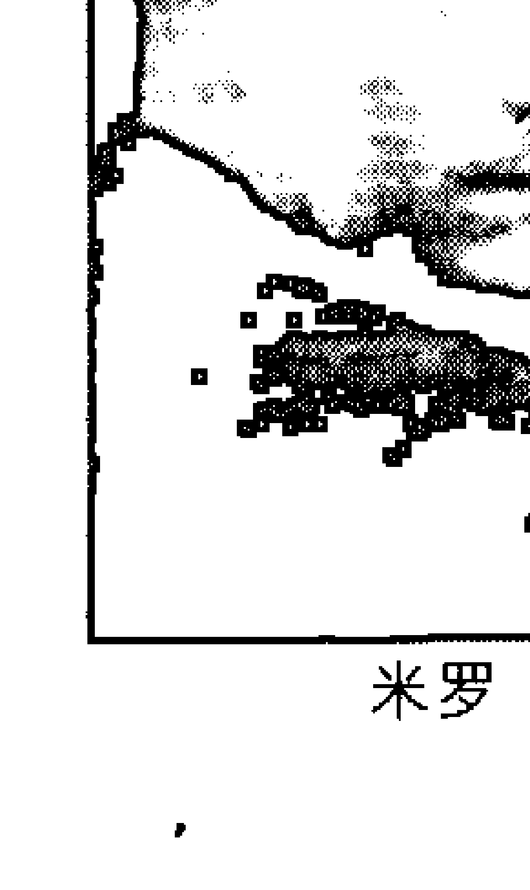

### 米罗

琼安·米罗（1893—1983），出生于西班牙巴塞罗那附近塔拉戈纳的蒙特罗伊格。那里是东西方文化交流的桥梁，是产生罗马风格的摇篮，深受意大利文艺复兴的影响，又是最先接受现代艺术的地方，是诞生毕加索和达利的国家。早期深受梵高和立体派的影响，作品呈明显的具象、干巴巴的素描、土色调的分面和明亮而富有力量的色彩。但是米罗的秉性、直觉具有根本的反理性主义。他生来就是个无政府主义者，本能地反对一切传统、一切对自然和博物馆的迷信，于是他参加了达达主义艺术运动。

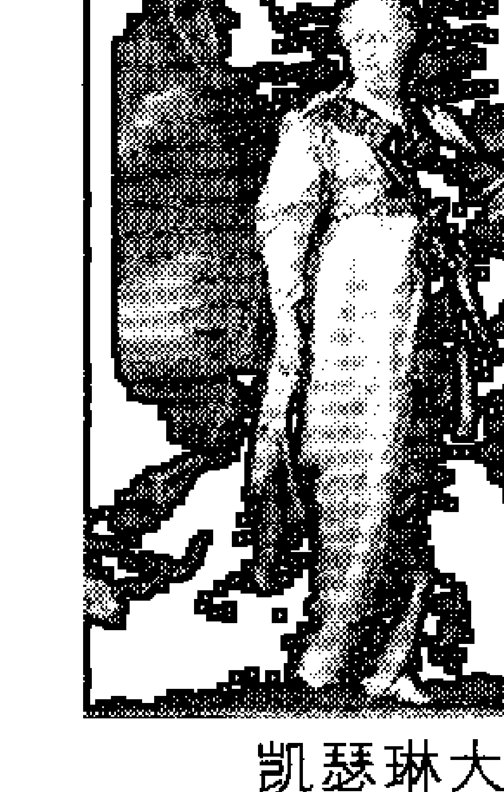

### 凯瑟琳大帝

原名索菲娅·奥古斯塔·弗雷德里卡（1729—1796），俄罗斯帝国女皇，在位时间为1762—1796年。在俄国历史上，凯瑟琳大帝与彼得大帝齐名，她建立了人类历史上空前绝后的庞大帝国。她的政绩卓越，一段段令人目不暇接的情史更成为一代代历史学家津津乐道的话题。虽然政绩卓越，但后人最关注的还是她那一段段令人目不暇接的情史。

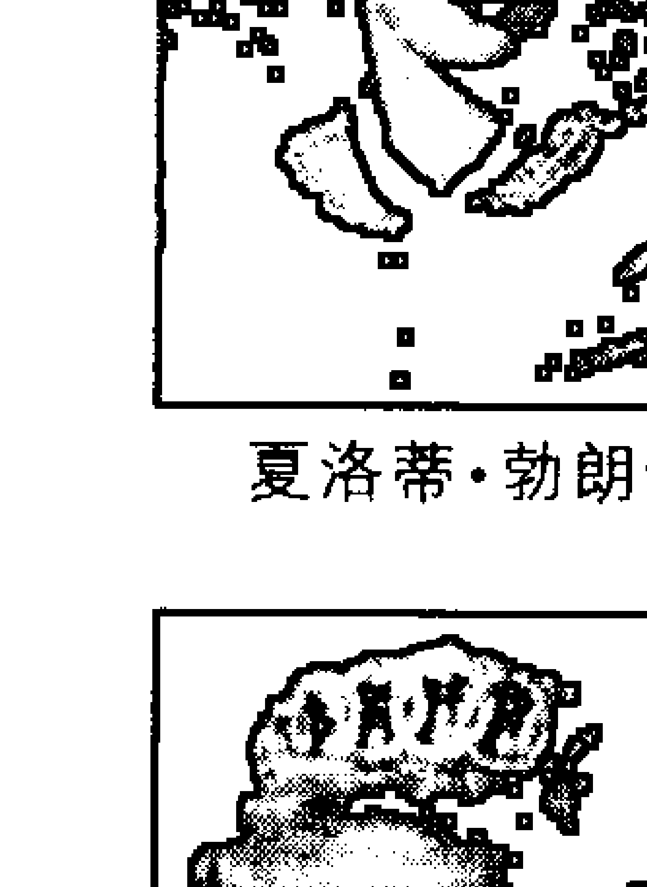

### 夏洛蒂·勃朗特

夏洛蒂·勃朗特（1816—1855），英国女作家，1816年生于英国北部约克郡豪渥斯的一个乡村牧师家庭。母亲早逝，八岁的夏洛蒂被送进一所专收神职人员孤女的慈善性机构——柯文桥女子寄宿学校。在那里，她的两个姐姐玛丽亚和伊丽莎白因染上肺病而先后死去。后来她曾作家庭教师，最终她投身于文学创作。代表作品有：《教师》《简·爱》《谢利》和《维莱特》。《简·爱》是举世闻名的文学名著，萨克雷称赞它是“一位伟大天才的杰作”。

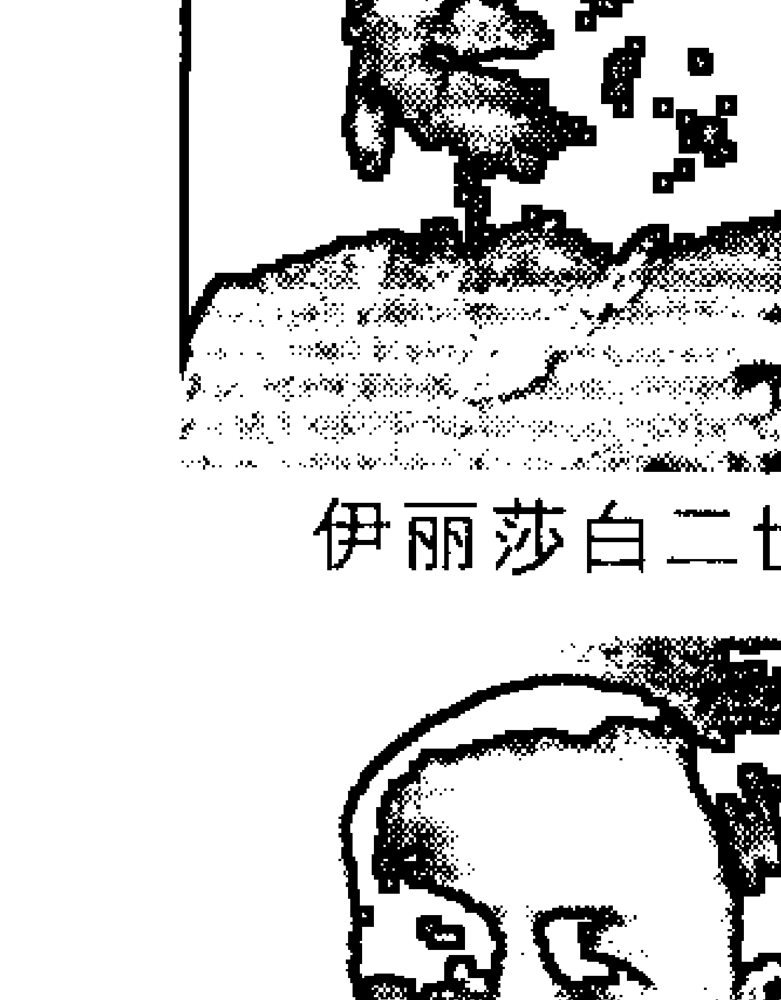

### 伊丽莎白二世

伊丽莎白二世（1926—），原名伊丽莎白·亚历山德拉·玛丽·温莎，全称为“承上帝洪恩的大不列颠及北爱尔兰联合王国及其他领土和属地的女王，英联邦元首，国教（圣公会）的捍卫者伊丽莎白二世”。

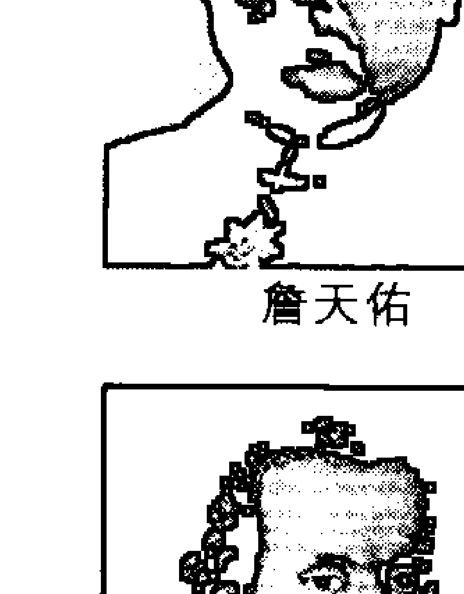

### 詹天佑

詹天佑（1861—1919），享年58岁。字眷诚，号达朝，汉族，广东南海人，原籍安徽婺源（今属江西）。他是中国首位杰出的爱国铁路工程师，负责修建了京张铁路（北京—张家口）等铁路工程，有“中国铁路之父”“中国近代工程之父”之称。

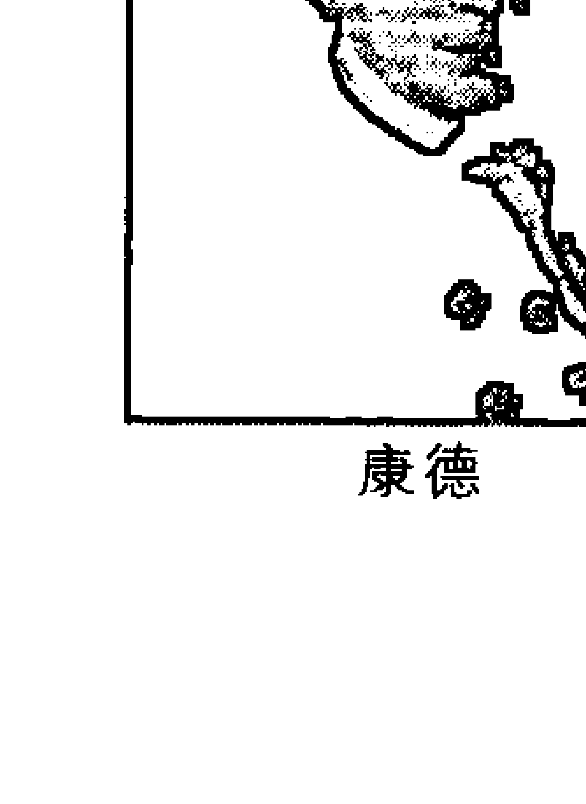

### 康德

伊曼努尔·康德（1724—1804），德国哲学家、天文学家，尤其是星云说的创立者之一、德国古典哲学的创始人、唯心主义者、不可知论者、德国古典美学的奠定者。康德的“三大批判”著作构成了他的伟大学术体系，它们是《纯粹理性批判》《实践理性批判》和《判断力批判》。

## 第四章 双子座的人

（5月22日—6月21日出生）

典型特征：灵活、善变、反应快、善沟通、喜欢新事物，是12星座中好奇心最强的。

### 第一节 双子座的人

### 一、双子座传说

丽达王妃生了许多可爱的孩子，其中有两个兄弟，不光是感情特别要好，长相也几乎一模一样，很容易让人以为他们俩是一对双生子。

其实，在这两兄弟中，哥哥是丽达王妃与天神宙斯所生的儿子，弟弟则是与巴斯达国王所生的，两人为同母异父的兄弟。而且哥哥的身份是“神”，且有永恒的生命，弟弟则是一介普通人。

有一天，希腊遭到了一头巨大的野猪攻击。王子们召集许多勇士去追杀野猪。当野猪顺利地被解决后，勇士之间却因为互争功劳而彼此结下了仇恨。

在一次市集的热闹场合，两边互看对方不顺眼的勇士不期而遇，当然又免不了一番争吵。在争吵中，有人开始动起武来，于是场面变得一发不可收拾，许多人都在这场打斗中受伤，甚至死亡。很不幸地，两位王子当中的弟弟也是在这一场混乱之中被杀身亡。

一向与这个弟弟特别要好的哥哥，完全无法接受弟弟已经死亡的消息，抱着弟弟的尸首不停痛哭，希望弟弟可以死而复生，让两人可以一起重享以前手足情深的快乐日子。

他表示，弟弟只是个普通的人，本就会死。若是真的要让弟弟复活，就必须把哥哥剩余的生命分给弟弟。

感情深厚的哥哥当然毫不犹豫地马上答应了。从此之后，兄弟俩又可以一起快乐生活了。

#### 二、双子座概况

- 出生日：5月22日—6月21日
- 守护石：红蛋白石
- 吉祥日：星期三
- 吉祥物：三角形

### 外在形象

双子座多半身材高挑，肩膀结实，肌肉均匀；女性胸部较为突出；手指修长灵活，近视眼比例较大；皮肤很白，但有点粗糙，而且很敏感，容易晒黑；椭圆的脸形，线条柔和；眉毛弯弯的，眼睛机灵好动；鼻梁瘦长，颧骨高，嘴唇略大，下颚有点尖；神情淡然，目光明亮，说话速度快，敏感机智。

### 性格特征

双子座的朋友最多，但仍有很强烈的孤独感。双子座人很能说话，他们跟任何层次的人都可以天南地北地聊，可以聊得很八卦，也会聊一些很严肃的话题，比如今天又有某个明星怎样怎样了、隔壁班有多少美女帅哥、今年服饰的流行趋势之类。可是他们都只是跟你聊一些不关自己的事。无论他们跟你说些什么，跟自己有关的都只是些皮毛而已。关于自己的事，他们几乎是不说的，就算说，也只是说一些无关痛痒的事情。

双子座是被众人所指的最花心、最冷酷无情的星座。对于双子座人的花心，完全是误传。但双子座人的这一生似乎注定被感情牵绊，跟爱情纠缠一世。用一句话给双子座人的花心做个总结：花心的极端就是痴心的可怕。该懂的人应该会懂。

双子座人的想法通常是很简单、很单纯的。当他们做了某件事之后，人们就会认为他们就是那个样子了。双子座人会很清晰地说，不被人了解很好，也懒得去解释——因为就算解释也不一定有人会了解。可是内心却非常希望别人能够支持。

### 工作事业

双子座追求变化，喜欢沟通，具有语言天分，适合从事与新闻相关的职业，比如报纸、广播或电视。他们擅长交际，喜欢到处走，所以也适合从事业务工作。他们还能成为很好的教师，因为他们能够迎合时代潮流，与学生打成一片，不会产生代沟。

所以双子座的人也适合从事销售、文字、公关、大众传播等工作。同时因为缺乏耐心，双子座的人应该避免从事单调的工作。

### 爱情模式

从爱情方面来说，说双子座人花心的人是不够了解双子的，至少你看到的双子太少了。双子座人对异性从来就有一种亲切友好的感觉，但并不代表他就喜欢她们。可能有人觉得这样是花心，关键在于双子座人并不这样认为。如果双子座人的情人不喜欢这样，只要说一下，他就可以改变。

都说蝴蝶恋人专一，其实他们做不到那种一段时间只和一个人在一起。他有很多对象，一直寻找着他要找的人，才会专一。双子座不会说不合适，除非他是在开玩笑。不然每一个都是唯一的。双子座人找到真爱后一样是专一不变的，甚至刻意克制自己不能有一丝差错，整天显得神经兮兮的。

更难得的是，双子座人爱上一个人是为了能给她幸福，而不是一定要和她在一起。他为爱放弃，从来不会后悔。双子座专一起来非常可怕，天蝎也比不上，因为双子座人连玩笑都不想开，很认真的样子。爱的深沉又不会让你感到压抑。你要深沉的或轻松的爱情，双子座人都可以满足你，因为双子座人有一颗敏感而聪明的心，但他自己的难过从不让你感受到。

当双子座人遇到真爱，就是另一副模样。你会发现他失去了以往的随意，开始小心翼翼。面对你，甚至沉默，不敢说过激的笑话，虽然这是个视幽默为生命的星座。他变得贴心，变得患得患失，因为他不愿意失去唯一的真爱。

是的，在双子座人心中，真爱就是唯一，不是某一类，而是某一个人。当双子座人真的在爱的时候，他的忠心和痴情是其他11个星座都无法相比的。请相信这一点，不要被伪装嬉笑下的双子座人所迷惑，他们不是情场高手。

### 最佳配对星座

- 水瓶座。两人性格投合，都善于言谈，同属智力型、前卫型的人物，思想上比较容易相通。
- 天秤座。这是一个完美的组合，这两个星座的人往往会一见如故。两个人都是乐天派，双子座人把爱情当游戏，而天秤座人也不是省油的灯，喜欢新鲜刺激又善变。但要注意的是，两个人对日常琐事都没有耐心，容易为一些小事发生口角。要幸福长久还得相互体贴、互相包容。
- 白羊座。这是很有默契的一对，性格相近，又都追求新鲜刺激。他们更像朋友，双方都想要自由，也都不会给对方束缚，但两个没有约束的人总感觉少了点温暖。

### 最差配对星座

- 天蝎座。在阴暗世故的天蝎座人面前，活泼善变的双子座人没有一丝胜算。如果想要维持彼此的恋情，只好努力再努力！
- 金牛座。这是两个感情观念大相径庭的星座。爱情至上、重视家庭的金牛座女子，恐怕打死也受不了双子座人游戏感情、视婚姻如儿戏的态度。想好好地维持感情。情，双方都需要付出很多努力。  

双鱼座。两个人的世界对对方来说完全陌生，很难融入。唯一的共同点是两个人都善变，但立足点却完全不同。双鱼座人的悲天悯人让双子座人很难理解，双子座人的不稳定会让双鱼座人没有安全感。不过双鱼座人的个性不强，好好处理两人的关系，还是有机会往好的方向发展的。

### 第二节 双子座的孩子

### 一、孩子的星座秘密

双子座的孩子还在妈咪肚子里时就不太安分，常会给妈咪假情报，好像等不及要出生似的。常不按理出牌，妈咪可能会觉得不太好掌握；而十分贪玩、爱好自由的双子孩子也极不喜欢受约束，所以当你与孩子有冲突时，最好以沟通的方式来解决。只要掌握以上的特性，你就可以轻松搞定你的双子座孩子了。

面对好奇心满满的双子座孩子，你得当一个博学的妈咪，才不会被孩子的“为什么”给考倒了。你可以尝试多下一点阅读的功夫，藉以满足孩子旺盛的好奇心。此外，双子座的孩子还有喜新厌旧的特点，所以当孩子不高兴的时候，妈咪可以给他玩具或是说些好笑的事，来转移他的注意力及情绪，孩子的情绪会马上就好转！妈咪不妨试试。但这也暴露出双子座孩子专心度及责任感不够的缺点。

建议妈咪教导孩子时，可以从培养责任感开始。最简单的方式，就是从收拾自己的玩具着手；或是遇事让他自己做决定，并自己承担后果。也可换一种方式，让孩子自己设计积木，试着一点一滴累积孩子的责任心。妈咪还需时常提醒孩子，得为自己说过的话负责，别每次都信口开河。

你的双子座孩子会用他那明亮、快乐的双眼望着你，让你忍不住笑起来，因为你知道，他的脑子里闪着很多鬼点子。如果他很早就会说话了，就更容易表现这种天性。

### 二、孩子的学业

风象星座的特质让双子座的孩子具有沟通能力、智慧和速度。双子座的孩子聪明，长大后适合成为语言学家及数学家，其理性观念比较好。唯一要特别注意的是：有时会忽略最基本的东西而妄下断论。

双子座的孩子多才多艺，经常在一瞬间改变想法，所以思维活跃、极富创意。有拼命追求知识的欲望，但要多注意精神上的压力。口才很好，会是个很好的演说家。缺点是受双重性格的影响，使得他容易改变想法。

因为好学，双子座的孩子会是老师心目中的好学生。他们也许心中也有不喜欢的老师或功课，家长要教孩子摒除成见，客观地面对事情。

### 三、孩子的特殊才能

双子座孩子的脑袋里经常会有些古怪的想法。这个星座的孩子兴趣相当广泛，什么都想试一试。他还善于学习、沟通，能在同一时间内做好许多事情。此外，他可能在文学、绘画与工艺方面都十分在行。

双子座孩子容易喜怒不定，让新手爸妈总是摸不着头脑。他是个明亮、有趣又热情的孩子。因此，教导双子座的孩子必须让他发挥自己的想象。

### 健谈的双子座孩子

双子座的孩子往往健谈、有魅力，爱与人交往。就算你的双子座孩子属于不太爱说话那种，他也会很机智，充满好奇心，不断思考着周围的世界。你一定要让他的周围充满书籍和拼图玩具，以刺激他的思维。你也要给孩子多一点空间和资源，让他实践各种奇思妙想。

### 喜新厌旧的人

双子座的孩子热爱新事物，一发现新东西，就会迫不及待地扔掉手上的，去尝试新的。一旦他们掌握了一种新技能，就会马上厌倦，转而去学习别的。他们的情绪也可能会在眨眼间起变化。

### 优柔寡断

很多双子座孩子都优柔寡断，或者三心二意。好的方面是，他们适应性会比较强。双子座的孩子更乐意去广泛经历，而不愿意深入探究事物。作为双子座孩子的父母，你可以帮他集中精力，在某个特定领域着重发展。

### 头脑灵活

双子座的孩子更擅长动脑的活动，比如读书、写作、辩论，以及所有需要手指灵活性的活动，像弹钢琴。由于兴趣广泛，双子座孩子往往会有很多朋友，并且会成为他朋友圈里的中心人物，天生就擅长我们大人所说的人际交往。

### 第三节 双子座的女人

### 一、富有异国情调魅力

这是一个富有异国情调和魅力的女性。思想境界开阔，内心充满着美好的幻想，她的情感就如一部优美的随想曲。聪明伶俐，有些神经质。内心总是闪耀着美好、欢乐、幸福、爱情和理想的火花。她希望自己永远置身于无忧无虑的乐园中，喜欢用紧张的工作、频繁的活动来驱散自己的烦恼。

很容易唤起别人的倾慕，但她的感情并非唾手可得。一句话就可能触动她的心弦，一点小事也会使她扬长而去。如果有人能很好地掌握她的性格特点，预测她的反应，那么不难使她倾心相许。

双子座女人比较有思想深度，善于运筹错综复杂的形势，并能在关键时刻做出自己正确的抉择。她期待美好的爱情所带来的欢乐。一般说来，双子座的女性会有丰富的爱情生活，尤其是当金星在双子座的时候。

双子座女性不喜欢平淡无味的家庭生活，她希望生活的内容丰富多彩、千变万化，经常出去散步、旅游或旅行，开阔一下眼界，换换生活环境，结识些新的朋友和陶冶一下性情。这些是她生活中不可缺少的一部分，也是她保持高昂情绪的基础。她开朗的性格会感染周围的人。

过度的勤奋、劳累或烦恼常会使她疲惫不堪、力不从心。处女座、射手座的男性会给她的生活带来新的气息。她们之间建立起来的家庭将是充实的、自由的、浪漫的。

### 二、爱情绚烂，热情如火

双子座女人对爱情充满向往，相应地也会有丰富的爱情生活。如果在她的星座图上带有金星的痕迹，那么她的爱情将更加艳丽多彩。她思维广阔，对一切事物都有美好的幻想，她的情感也如春天般绚丽。她期待着美好、欢乐、幸福的爱情生活，时刻充满着希望。

双子座女人特有的才思敏捷、新颖观点和高明意见，使她那双子座的大脑能够洞若观火、纤毫毕现，而且还会提出独到见解，使事情锦上添花。只要你不强求她始终如此，她定会让你觉得魅力无穷。

双子座女人既会坚信自己爱你至深，同时又会认为其他男人对她有心。除非她每时每刻都离你很近，否则会比任何女人都更容易忘掉自己的丈夫。她的天性就是接受变化，甚至追求变革。她总是热情如火、社交活跃，从来不肯培养耐心、稳定情绪。

双子座女人在学会控制自己之前，很有可能搞得天翻地覆，让你的生活乱成一团。与她们结婚成家的男人可以引以自豪的是，大多数双子座女人在事情发展到不可收拾的局面之前，就会对自己性格有了较深的理解，因而愿意安分守己，重新开始。

### 三、不虚伪，真性情

双子座的女人不喜欢计划，也不喜欢虚伪，她们是真性情的人。不管她做什么都是性情所致，所以从来没有绝对讨厌双子座的星座。即使她们在性格上有很大偏差，也会被双子座的真性情所打动。

但是这种带有负效应的真性情往往会不小心伤害别人，她们自己也很容易受伤。只是她们太好动，当伤害到来的时候很容易转移注意力。她们以为这样伤害很快过去了，其实它只是隐藏在某个角落，随时会跳出来让人感到心痛窒息。

她们对朋友有很大的宽容度，对于真正爱上的人却很在意，一点小细节都很容易让她们受到伤害。她们对于爱人的态度跟她们对事业的态度一样，只有选到自己真正喜欢的东西才会坚持到底，否则就似蜻蜓点水。

还好她们懂得判断哪些是自己骨子里喜欢到永远都不会厌倦的，所以她们可以一直维持自己的婚姻。如果你让一个双子女放弃她的自由和你结婚，可见她是多么爱你。

### 四、外表热情，内心孤独

双子女的孤独只有双子女自己知道，那是没有可能治好的绝症。因为双子女的所思所感都是双倍的。这是一个天生残缺的星座，天生在找寻能与自己契合的另一个人。但谁能找到一个相同的自己，所以她们注定孤独而劳碌地用一个人的身体承受着两个人的快乐与伤悲。

双子不想孤傲，不愿独来独往，但她们的敏感和天生的优越感使她们无法妥协。双子，有很多人羡慕她，很多人嫉妒她，很多人厌恶她，几乎没有一个星座能有这样大的争议性。

双子座人的一生都注定要去寻找他的另一半。为了找到她的另一半，她会尝试着和各种不同的人相处、相恋。在众人的眼里，双子女都是花心的，花心却不会脚踏两船，而是经常换船。然而没有人知道这是为了找寻真爱！

只要找到了她的另一半，双子就不会再换了。双子的痴情与专一只会给一个人。双子的痴情是让人惊讶的，就像他们的花心一样让人吃惊。

然而双子座人是可悲的，因为那另一半并不是每个双子座人都能找到的，因此双子座人总在茫茫人海中寻寻觅觅，找寻真正的爱情，同时在无意之中伤害了身旁的追随者。然而事实却是，与双子座的人谈一场恋爱是会让人终生难忘的，这段爱情绝对充满了惊喜。所以，喜欢经常换船的双子女总能轻易找到另一条船来换。

### 五、双重性格的双子女

双子座女人具有开朗明快的气质，反应灵敏，行动迅速，要她安静下来不动很难。对于突发事件的应变能力很不错，而且她的观察力相当敏锐，不会钻牛角尖。

别人或许会觉得这个人整天穷忙，不知道她葫芦里究竟卖的什么药，可是她能乐在其中。她最大的优点是能屈能伸，绝不因一时受挫而灰心丧志，虽然常因不同的事件表现不同的反应态度，不过她所坚持的原则及本质不变。

在她的内心深处，随时都保持着冷静、理智。遇到重大的事件或行动，仍能客观分析。她的性格可说是知性重于感性，理解胜过情感。如果深究双子女的内心，将会发现奇妙的一件事：在她如此矛盾的个性中，竟然也隐藏了优柔寡断的一面。原因可能在于她过于客观，在分析事情时很少流于偏颇，也正因如此，往往难以决定取舍。

双子女可以说具有双重人格，能够非常巧妙地运用两种原本是两个完全极端的事情，帮助自己达到目标，并且掌握得当。同时，双子女的处事方式十分圆滑，又不失原则，确实是无人可及的“双面人”。

双子女是个好奇心特别重的人，探险欲望非常强烈。只要她感兴趣的事情，非得亲自参与不可，而且她的兴趣非常广泛。即使是道听途说，她也要打破砂锅问到底。她的头脑相当不错，学得快也记得牢。

双子女拥有得天独厚的口才和文采，常可以把所学融会贯通，再以不凡的口才传达给别人，往往比原来事物本身更加生动精彩。而且富于幽默感及机智，是个很受欢迎的演说者。有人形容双子女如果当推销员，甚至能说服爱斯基摩人购买冰箱，其口才之一流，由此可见一斑。

### 第四节 双子座的男人

### 一、才华横溢，但很善变

双子座的男人大多才华横溢，大脑思维开阔，点子多。很多人还是多才多艺型，但往往都是初通而不精。在艺术方面有独特之处。你今天发现他会画画，弹得不错；明天你又发现他歌喉很好；后天你又发现他能仿做一架好货出来教你给头发造型；而后你又发现他能给你讲解关于恐龙怎么灭绝的、宇宙有没有外星人。

每天他都让你有惊叹不已的地方。他很幽默。他喜欢的人很多，会让人觉得他很花心，但真正爱的人却很少。一旦有一个爱的人，他会对她很好，很懂得浪漫，对钱财看得比较轻。他很容易被喜欢的人骗，而且就算被骗了，他也不会恨别人。

双子座的男人喜欢自由，别想把他绑在身边，这样你会失去他。放任他自由，或许你们会走得长久些。但对你和他的关系不要抱太大的希望。他可以当着一街的人说爱你，但单独的时候他却有点害羞。

不善交谈的双子座男人十分罕见。典型的双子座男人，每个家庭主妇都会喜欢。他们喜欢热闹，人越多他越高兴。他趣味高雅，妙语连珠。他能随时夸奖别人，并且表现得诚恳得体。他的举止无可挑剔，反应及时敏捷。他一向方法多样，让人愉快，使聚会办得很出色。

### 二、爱情中的两面性

对于爱情，双子男往往不能直接表达，而是用外表的不在意使自己免受伤害。成家之后，对于家庭生活中的责任，他重视程度不够，喜欢“无事一身轻”。家庭将更多地成为他发表议论和朋友相聚的场所。

双子座人的心中还有一个位置，只属于他自己，从来不肯向人展现，即使对他的女朋友也是如此。冷眼旁观，把心放淡，既不要过于热情，也不要使他厌烦，总是逗他微动，又不过分渲染。因此，与双子座男人的爱情生活必将举世无双，人人赞叹。

他一变再变，请你不要逆言反驳，而应跟着他变。像他一样好奇心强，并且情趣盎然。无论发生什么事情，都要注意情感的交流。交往对象应该与他棋逢对手，偶尔摩拳擦掌，积极应对。他最不耐烦的就是逆来顺受的人，或了无趣味的事。

性生活方面，双子座男人很容易给人一种花花公子的印象。他的性伴侣可能很多，其实他一直很想寻找一个心灵和肉体完全与他相融的女性。只是很少有一个女人能完全满足他丰富多变的思想，因此他的思想和肉体经常是分开的。当他身体燃烧时，内心却能保持冷静。

双子座的男人在“性”方面是很有技巧的。如果你想要求他忠实，必须先在思想上征服他，然后给予他完全的信赖。他的猜疑往往会成为他偷腥的借口。

### 三、样样精通的双子座爸爸

兴趣广泛、十八般武艺样样都懂一些的双子座爸爸，会是小孩子仰慕的对象，也会是孩子们的好朋友。只是依照他自己的个性，他很难自己订下一些规矩让孩子们遵守。

他的父爱不会给小孩压力，也不会给孩子太多约束，他们通常会相处得很好。不过要记得，“扮黑脸”的责任可能要落在妻子身上了。如果把教育孩子的工作全部交给爸爸，那小孩很可能会被宠坏。

### 第五节 双子座的名人

### 普希金

亚历山大·谢尔盖耶维奇·普希金（1799—1837），俄国伟大的诗人、小说家，现代俄国文学的创始人。19世纪俄国浪漫主义文学的主要代表，同时也是现实主义文学的奠基人，现代标准俄语的创始人，被誉为“俄国文学之父”“俄国诗歌的太阳”。主要代表作品有《叶甫盖尼·奥涅金》《鲍里斯·戈都诺夫》《黑桃皇后》。

### 但丁

阿利盖利·但丁（1265—1321）。13世纪末，意大利文艺复兴前夜的佛罗伦萨诞生了一位伟大的诗人，这就是恩格斯誉为“中世纪的最后一位诗人，同时也是新时代的最初一位诗人”的阿利盖利·但丁。

但丁是意大利诗人、现代意大利语的奠基者，欧洲文艺复兴时代的开拓人物之一，以长诗《神曲》留名后世。恩格斯评价他是：“中世纪的最后一位诗人，同时又是新时代的最初一位诗人。”

### 加西亚·洛尔卡

加西亚·洛尔卡（1898—1936），西班牙戏剧家、诗人。他大学毕业后从事戏剧和诗歌创作，同时参加组织反法西斯联盟，并曾率剧团赴各地演出。西班牙内战爆发后，在格拉纳达的比斯纳尔镇遭法西斯分子杀害。

早期诗作《诗篇》和《歌集》多借鉴谣曲民歌，富于乡土气息。1927年发表成名作《吉普赛谣曲》。其诗作常采用谣曲形式，或自由奔放，或哀婉凄美，脍炙人口，动人心弦。

### 约翰·斯图尔特

第三世布特伯爵约翰·斯图尔特（1713—1792），乔治三世的老师和英国首相。他结束了七年战争。有人指责他在政治上怯懦，特别是指责他抛弃陷于困境的朋友。

比较肯定的评价是，他缺少一个政治家在任何时候都需要的、敢于向方兴未艾的权势集团挑战的韧性。他在反对那些认为权力本应属于他们的辉格党贵族时，与太子妃奥古斯塔和乔治三世建立了友谊。

### 肯尼迪

约翰·菲茨杰拉德·肯尼迪（1917—1963），通常被称作约翰·F·肯尼迪或杰克·肯尼迪，美国著名的肯尼迪家族成员，毕业于哈佛大学，美国第35任总统。

他的执政时间从1961年1月20日开始，到1963年11月22日在达拉斯遇刺身亡为止。1946—1960年期间，他先后担任众议员和参议员。在国会中，他对内重视社会救济和平民福利，对外反对共产主义，支持冷战政策。

1956年他写成《勇敢者的画像》一书并出版，获得普利策奖。1960年当选为美国总统，成为美国历史上最年轻的总统，也是第一位信奉天主教的总统。他执政1037天。任职开始就遇到美国入侵古巴失败的事件。他提出的大量削减所得税的立法以及扩大人权的立法，却推迟到他死后才得以通过。

### 乔治五世

乔治五世（1865—1936），全名乔治·弗雷德里克·恩斯特·阿尔伯特·温莎。1917年取消萨克森—科堡—哥达王朝姓氏，改用温莎，英国国王、印度皇帝。

英国人普遍认为乔治五世是一位“水手国王”。这个称谓准确抓住了他性格中的一个重要方面，即：乔治五世早年接受的是海军职业军人的训练，而不是作为国王培养的。他的举止谈吐，都带有早年在舰艇上生活留下的痕迹。

### 乔治·布什

乔治·赫伯特·沃克·布什（1924—2018），中国大陆译作布什，台湾译作布希，港澳译作布殊，美国第41任总统。由于美国历史上有两位布什总统，因此他常被称为“老布什”，以便与其长子乔治·沃克·布什区别。

老布什任内最为人所知的政绩是1991年发动海湾战争，在任内击败伊拉克，并对其实施经济制裁。

### 罗伯特·安东尼·艾登

罗伯特·安东尼·艾登（1897—1977），第一代亚芬伯爵，英国政治家。第二次世界大战期间作为丘吉尔的副手担任外交大臣，后出任英国首相。

他相貌英俊，在第二次世界大战前强烈反对绥靖政策，深得英国民心。但在1956年的苏伊士运河危机中，他试图强硬对待埃及总统纳赛尔，却招致世界一片反对，最终辞职下台。在2004年的一项调查中，139位英国学者把他评为20世纪英国最差首相。

### 安德烈·马尔可夫

安德烈·马尔可夫（1856—1922），1874年进入圣彼得堡大学，深受切比雪夫思想影响。1878年毕业，并以《用连分数求微分方程的积分》一文获金质奖章。两年后取得硕士学位，并任圣彼得堡大学副教授。

1884年取得物理—数学博士学位，1886年任该校教授。1896年被选为圣彼得堡科学院院士。1905年被授予功勋教授称号。马尔可夫是彼得堡数学学派的代表人物，以数论和概率论方面的工作著称，主要著作有《概率演算》等。

### 亚当·斯密

亚当·斯密（1723—1790），经济学的主要创立者。1723年出生于苏格兰法夫郡的寇克卡迪。

他的父亲也叫亚当·斯密，是律师，也是苏格兰的军法官和寇克卡迪的海关监督，在亚当·斯密出生前几个月去世；母亲玛格丽特是法夫郡斯特拉森德利大地主约翰·道格拉斯的女儿。亚当·斯密一生与母亲相依为命，终身未娶。

1768年，亚当·斯密开始着手著述《国民财富的性质和原因的研究》，简称《国富论》。1773年时《国富论》已基本完成。《国富论》一书技巧高超，文笔清晰，拥有广泛读者。书中提出反对政府干涉商业活动、主张低关税和自由贸易的观点，对整个19世纪的政府政策产生了深远影响。《国富论》对政府政策在经济领域的影响至今仍然存在。

## 第五章  
## 巨蟹座的人  
（6月22日—7月23日出生）

典型特征：温柔、细腻，关注自身感受，喜欢回忆，需要永恒的爱与安定，非常恋家，是12星座中最具母性的。

### 第一节 巨蟹座的人

### 一、巨蟹座传说

敏感多情的巨蟹座是母性的象征，双臂环绕着胸前，表现母亲护子女的天性。不过，就另一种象征意义而言，怀中婴儿代表了无助脆弱的自我，而环绕的双臂，则说明了巨蟹座浓厚的自我保护意义。

希腊神话里的一段故事正强调了巨蟹座特有的攻击性。这先得从赫拉克勒斯说起。赫拉克勒斯是宙斯与凡人生的儿子，天后赫拉三番两次要置他于死地；他也是希腊最伟大的英雄，世间最壮的人。世上没有他办不到的事，连神明们都是靠着他的协助才征服了巨人族，当然，赫拉克勒斯也为神明立下许多汗马功劳。有一天他来到了麦西尼王国，正准备接受英雄式的欢迎，国王却因受到赫拉的指使，给他出了一道难题——杀掉住在沼泽区的九头蛇。这件事很难办，因为每砍掉一个头便会马上生出无数个头。

赫拉大失败了，但对巨蟹不顾一切的牺牲，却感到心有戚戚。为了感佩巨蟹如此忠于使命，即使没有成功，赫拉仍将它放置在天上，也就成了巨蟹座。

#### 二、巨蟹座概况

出生日期：6月22日—7月23日

- 守护星：月亮  
- 幸运石：黄玉  
- 幸运花：向日葵  

### 外在形象

巨蟹座人皮肤细腻，胸部宽厚，大多属于丰满型；脸形比较圆，眉毛紧锁，眼睛又大又圆，鼻角略微下垂，嘴唇宽厚，牙齿不是非常整齐就是非常不整齐；眼神明亮，笑声奇特，表情丰富，情绪变化大。

### 性格特征

巨蟹座的人具有不屈不挠的意志，一旦拟定计划，必然付诸实际行动。为了私人利益，有时会过于大方，应避免不必要的奢侈。巨蟹座的人情绪阴晴不定，常会没来由地大发脾气，对别人的问话，也会随自己的高兴予以反驳或故意拒绝回答；兴致好的时候，他却变成最佳的听众，充分发挥体谅、设想周到的优点。巨蟹座的人热爱事业，同时重情爱家，珍惜爱情，并真诚待友。

巨蟹座的人生性多愁善感，有忧郁和作白日梦的倾向。他常会为过去那段美好的日子而缅怀不已，并容易生活在过去的阴影中（水星的位置在巨蟹座时会加强这种性格，不过他也能充分掌握现在）。

巨蟹座的人有包容心，一般不会为了一点芝麻小事而耿耿于怀，具有容人的雅量，很少拒人于千里之外，再加上其有礼貌、善交际、富幽默感的迷人个性及对人道主义的尊崇，会有许多朋友。事实上巨蟹座的人经常会在强悍的外表下，隐藏着一颗柔弱的内心。他就像这星座的表征——螃蟹，用硬如铁甲的外壳将自己密密地武装起来，保护自己最柔弱醉人的部分。但当你成为了他亲近的人，你将会感受他坚硬伪装下无尽温柔和默默付出所带来的温暖。

### 工作事业

巨蟹座的人很有耐心、认真、有韧力，很少半途而废。他们对事物有很强的观察力，有与生俱来的超群记忆力，又天生喜欢怀旧思古，考证和研究历史的工作很适合他们。

巨蟹座的人喜欢稳定，他们对没有保障的单位或者有很大挑战性的工作敬而远之。这倒并不是因为他们胆怯，而是因为性格喜欢安定，对自己的职业也希望能平稳发展。巨蟹座的人容易情绪化，但聪明的他们清楚地了解自己的缺陷，所以他们会选择一个稳定的环境来控制自己的情绪。

巨蟹座的人和善亲切，有很强的洞察力，会是个优秀的老师或心理专家。他们有艺术特质，喜爱文学，有灵性，作家、艺术家之类的职业对巨蟹座的人来说是很有发展前途的。当然，巨蟹座的人爱吃又恋家，像室内装潢、室内设计、烹调等都是巨蟹座的人可能胜任的工作。

工作上，巨蟹座的人很恋旧，对公司忠心耿耿。他们总能设身处地为别人着想，他们务实，不喜欢争斗邀功，在职场上有很好的人缘。巨蟹座的人恋家，他们努力奋斗的动力也来自家庭，因为他们都想努力让家人过好一点。

### 爱情模式

巨蟹座的人喜欢优越和成功的对象，故伴侣必须是他所尊敬或景仰的人。他们生性浪漫热情，性生活上能充分发挥敏锐的官能感觉。不过巨蟹座的女人容易为繁忙的家务缠身，即使情势允许，也无法享受生活的情趣。因其天生的拘谨、审慎，使其成为最佳主妇，却对情妇的角色无法胜任。巨蟹座的夫妻绝不会完全恩爱，但须注意控制其感情的过度发展而忽略平衡。另外他和巨蟹座的妻子都应该避免将自己的情绪带入家庭生活当中，以免由于自我中心和固执的观点而导致夫妻不和。

在恋爱中，巨蟹座的人没有安全感，所以总躲在坚硬的外壳里，不轻易让别人靠近自己。刚开始一段感情时，他们往往小心翼翼，怕被伤害，怕感情充满不确定性。即使接受别人的感情，他们也会经过很长一段时间才让对方走进自己的内心。不过，只要巨蟹座的人敞开心扉完全接受对方，就对感情绝对忠贞，一旦爱上对方就能爱到底。这是一个对感情很执著的星座，他们身上有着丰富的浪漫气息。在面包与爱情面前，他们中大部分人都会选择爱情。也许他们的感情不会轰轰烈烈，但肯定既浪漫又坚韧无比。

由于巨蟹座的人对感情很认真，所以他们绝不允许自己的恋人朝秦暮楚。对于游戏感情的情场浪子他们会坚决放弃。爱情都是自私的，巨蟹座的人对爱情有很强的占有欲，绝不能容忍和别人分享爱情。再加上敏感而又容易情绪化的特点，会为一点小事而神经质地质问恋人，这有时候也容易让恋人崩溃。

### 最佳配对星座

天蝎座。巨蟹座与天蝎座是一对羡煞旁人的甜蜜鸳鸯，他们有一种惺惺相惜的默契。虽然开始谈情说爱时未必是缠绵热恋，但时间越久，热情的态度日渐升级，绝对是好情侣。

金牛座。因为金牛和巨蟹都是内向型的星座，而且都是以家庭为人生最终目标，所以两个人一旦擦出火花是颇理想的一对，互相爱得很深很深。唯一的问题是双方的嫉妒心都很重，只要有什么风吹草动，马上变得敏感起来，不懂得控制自己的情绪。加上内敛的性格，往往变成冷战的局面。

巨蟹座。巨蟹座与巨蟹座是爱得又美又温暖的一对，这是因为大家都有相同的特质，非常合拍的一对。要注意的是你俩都是阴性水相星座，很内向，太多感情藏在心里，敏感性高，很容易因为小事情估计错误，使自己不开心，也因此影响到另一个又是情绪易波动的人不开心，所以须尽量避免。

### 最差配对星座

白羊座。两人要长久相处，必须双方都付出努力，因为白羊座人以自我为中心，对工作的观念重于家庭，恰巧和巨蟹座人以家庭为中心的态度完全相反。他那种视家为酒店的生活方式，会令感情上极端敏感的巨蟹座人更加不安，产生猜忌。

双子座。这个组合，巨蟹座人感性，双子座人理性，似乎能互补，但意见不合就易发生是非。一个恋家，一个总想离开家的束缚。善变的双子座的人让巨蟹座的人很没有安全感，而敏感的巨蟹座人总想紧紧抓住爱人，但有时候抓得越紧对方越想逃。

天秤座。开始的时候，可能会被对方的一个眼神吸引，好像他就是你正在寻找的一种温柔。但相处后就发觉要长久在一起一定要付出加倍努力。原因在于天秤座的性格，令一直追求安全感的巨蟹座好迷惘，不停在想究竟他喜欢我有多少。所以巨蟹需要的安全感和稳定的生活，是性格外向、天马行空的天秤座很难给予的。

### 第二节 巨蟹座的孩子

### 一、孩子的星座秘密

巨蟹座的孩子有着超群的直觉和敏感，感情真挚、坦诚，但性格却比较脆弱。经常忧心忡忡，即便将来长大之后也始终和家庭，尤其是和母亲保持密切的关系。在工作中，他们的敏感常给自己带来麻烦，他们经常无意识地寻觅着保护，寻找一个可遵循的典范。巨蟹座孩子有音乐、绘画、小说、电影方面的天赋。在幻想中他们喜欢扮演一个角色，并从中去确认自身的价值和寻找所需要的自信心。

巨蟹座是夏天开始的第一个星座。夏天把深居简出、思想保守和敏感的性格带给了这一星座的孩子，这是一个需要自我保护的孩子。出生在这一星座的孩子有强烈的热情和很强的自制力。最大的希望是：使自己和别人都幸福如愿。他们对自己用双手创造出来的有限幸福心满意足，但总担心有人会夺走这一幸福。因此，会过分地抓住精神和物质上所拥有的一切。

### 二、孩子的学业

巨蟹座是水相星座，水是情感的象征，水的特点是给予和接受。巨蟹座孩子的记忆力很好，尤其是对细节的专注力，良好的记忆力是他们与生俱来的天赋。想象力相当生动，可惜太过消极，思想倾向于怀旧，而过于漠视未来。直觉很强，但千万别用在猜题或猜答案上。太过讲求感觉而不去逻辑思考，只会使他学得不多。

巨蟹座孩子喜欢历史、法律等科目。他对于周围的人或环境相当敏感，所以只要气氛有点不对，学习能力马上就会降低；若是气氛好了，他将会学得比一般人更快。但无理由的担忧、恐惧，却会使他常常陷入消极。

不要太过固执，否则只会加深对他人的成见，最好试着从客观的方面多衡量。

学校开学入学的时候，巨蟹座孩子一边伤心地流眼泪，一边写上长长的家书，饿着肚子给远方的爸爸妈妈打长途电话，这些都是巨蟹座孩子入校之初的每日必修课。巨蟹座人属于室内型人物，轻易不踏出校门，终日躲在自己的小床上自娱自乐。

巨蟹座孩子的读书方式是记忆型的。感受性丰富的他，文科的表现当然喜人一等，但他在数理方面就会比一般人逊色。因此，在考试时，如何提高数理科的分数，是巨蟹座孩子金榜题名的关键。

### 三、孩子的特殊才能

情感丰富的巨蟹座孩子，有好记性，对绘画、造型设计极具才华，创造更是他一辈子也玩不腻的游戏。他的情绪比任何一个星座都敏感丰富而易受伤害，他最需要来自小家庭温暖的呵护。他喜欢独自玩耍，极富想象力，巨蟹座孩子喜欢弄吃的和玩扮家家。但新手爸妈绝不要嘲笑他，一定要鼓励他，否则他敏感的心灵受挫折时是不会说出来的。

### 灵敏的直觉者

有着超群直觉的巨蟹座孩子，他们的耳朵异常灵敏。新手爸妈对于这样一个善感的孩子，唯有用爱心呵护，才能使他顺利成长。他可以凭着直觉对你说“天上的星星在唱歌”，“床边的花朵在哭泣”。他的直觉异常准确，所以这一星座的艺术家也特别多。

### 天才的美食家

巨蟹座孩子对吃很感兴趣，从小他就愿意跟着妈妈到厨房去，并且很快成为妈妈的小帮手。他简直就是个天才的美食小厨师。他们不论是男孩子还是女孩子都喜欢玩扮家家的游戏，喜欢厨房里的锅碗瓢盆。因为有着惊人的记忆力，所以他们对美食入口不忘。

### 未来的舞蹈家

巨蟹座孩子很少会把精力放在运动上，他们更热爱那些不激烈的安静活动，尤其是音乐、美术、戏剧等艺术。所以新手爸妈为了孩子的健康一定要多带着他去做一些身体方面的运动，为他们的活力创建另一个释放点。巨蟹座孩子并不好动，但是因为他非常优雅，所以动起来的时候都像是在跳舞，一举手一投足都散发出跳芭蕾舞般的雅致，所以我们不得不称巨蟹座孩子为小小的舞蹈家。

### 乖巧的发言人

巨蟹座孩子很爱说话，像是家里的发言人，总要表达让大家都了解他的意思时才会停止，直到大家都同意他的说法才甘心。这时候他会露出欣然满足、乖巧而又温和的笑脸。家中有这样一位话多的发言人，新手爸妈不妨同他多辩论，让他在表达上的说服力更强。

### 敏锐的观察家

有着敏锐观察力的巨蟹座孩子，用那双灵动的眼睛不停地捕捉周遭一切新奇、新鲜的事物。家里有巨蟹座孩子的新手爸妈在这一点上要格外注意了，也许是因为受了月亮的影响，他们注定成为一个敏锐的观察家。这样能够给他们带来充沛的艺术天赋，但是如果引导不佳，可能给这个孩子带来许多悲观的思想。

### 对数字敏感的理财师

巨蟹座孩子对数字相当敏感，而且从小便很会理财，知道该怎样利用自己的零花钱。源于对财富的追求，使他成为一名精打细算的理财师。这个善解人意的孩子早早就理解家长的辛劳，他的记性特别好，尤其面对数学这样的科目就像一面镜子一样，会反射得一模一样。所以孩子的爸妈不必为孩子的数学操心，在这方面他可是个有天才。

### 想象力丰富

巨蟹座孩子的想象力极为丰富，从小就喜欢沉浸在自己的世界中，而且也喜欢独自玩耍很长时间。在他的脑袋里甚至有一个假想的玩伴，永远温文尔雅地陪伴着他。面对这样的孩子，新手爸妈要在他成长的岁月里，给予全心全意的照顾，要多付出心血去照顾他善良、聪慧、又善于想象的心灵。

### 强烈的自我保护意识

天生就有很强的自我保护意识的巨蟹座孩子爱心无限、敏感纤细，甚至可以说是个天才。但是这种自我保护也有缺点，就是常常使他们过于自我封闭，不愿意将自己的真实心表露出来。表面上看起来温和、有礼貌，但是感觉与别人会有距离。其实巨蟹座孩子很有爱心，也很渴望和朋友交流，只不过怕受伤害而使他把真实的自己藏了起来。孩子的爸妈对孩子要充满爱心，不断鼓励他，给他打气，使他勇敢地和别人交往。

### 第三节 巨蟹座的女人

### 一、性格温情、宁静

巨蟹女子的感官只有在触及想象的窗口时才会苏醒。她是个心境永远年轻，思想深处常常有朦胧意识的“姑娘”。她非常钟情，但往往不知道真正令她心醉的人到底是谁。

当人们信任她时，她会充满温情、幽默和诗意。但是，她敏感的神经动辄就会失控，她在无声无息中积累了不满和怨怒。

她总是怀恋过去的某一件事：她的童年或没能如愿的婚姻；她喜欢明朗而深邃的柔情音乐；她欣赏简单而流畅的艺术；她追求深沉而婉约的理想。她经常自我反思和剖析，因为她觉得对自己不甚了解。

她需要宁静、和谐与安全；她渴望一个可以触发想象的愉快生活环境；她喜欢像胎儿附着在石头上一样待在她的小天地里。忧郁的气氛、混凝土建筑及装饰会使她无法忍受。她喜欢把她的住所变成陶冶心性的圣殿。

### 二、温柔体贴，但很敏感

温和又体贴的巨蟹座女子，很容易给人“恋爱”的感觉。如果你是一个追求“爱的感觉”的人，选择她，你肯定不会失望。巨蟹座的女人通常会给男人一种“如果失去你的爱，我的人生便毫无意义”的信心，这真是很多男人梦寐以求的感受。

不过，如果你只是个把恋爱当游戏的人，请千万不要去招惹她。第一，这对一个真情真意的巨蟹座女子来说太残忍了，巨蟹座的女人是玩真的，感情绝不是她们轻易表演的东西；第二，对于某些巨蟹座的女子来说，如果她爱上你，想要摆脱她可没这么容易。你应该知道被螃蟹钳住想脱身有多难，是不是？她的缠斗精神会让你非常惊讶。我看过一个背叛巨蟹座女子的男人的下场。当然，只有极少数的巨蟹座女子会有如此杀伤力，不过你还是别心存侥幸为妙。

她的温柔体贴，以及全心全意的爱会让你感动得不得了，很少有女人会让你觉得自己是那么重要。但是她的情绪化也很可能弄得你几乎疯掉。她非常没有安全感，敏感而且容易受伤。你的一句无心之言，就会弄得她泪流满面。

巨蟹座的女人有两种。当然正常的时候都如温暖的太阳一样，但是闹起情绪的时候，一种是梨花带雨型，另一种就是定时炸弹型。如果你遇上的是前者，情况比较幸运，平常多带两包面纸就好了；若是后者，恐怕精神压力就比较大了。

让她心情阴晴不定的原因有千百种。可能是因为她忽然觉得你好久不曾拥抱她了，也可能是你刚才对她女朋友说话的语气太温柔了，甚至可能是你刚才开玩笑，说她新烫的头发像鸟窝。对了，忘了提醒你，最好不要随便批评或挖苦你那巨蟹座的小女人，她经不起爱人对她的一丝丝挑剔。

总而言之，包括月亮的阴晴圆缺、海水的潮汐，都可能是影响她情绪的原因。而她最大的隐忧，就是她始终在担心——担心自己不够好，担心你不再爱她。她经常需要你的证实。所以我认为，对你而言，最简单的方法就是直接告诉她吧。

### 三、温柔天真是她的特点

巨蟹女对一切充满幻想，本性天真而温柔。她们很开朗，童心不泯，有时会显得不够成熟。她们大都很专情，但有时会分不清到底哪一位更应该珍惜。她们渴望别人的信任，在人前柔情似水，风趣幽默，充满诗情画意。

巨蟹女在青年时代，比别人更多地受家庭影响，有时会因此而影响到婚姻。她们对往事总是难以忘怀，经常反思自己，以便更加清醒地认识自己。她们喜欢明朗而深邃的音乐，崇尚简单而流畅的艺术，追求深沉而婉约的理想。

但是，她们的神经过于敏感，有时难以自控。在无声无息的生活中，她会形成忧怨哀愁的性格。她渴望宁静、和谐与安全的生活，会时常陶醉在自己的小天地里。凡是死气沉沉的气氛、枯燥的生活都是她不能接受的。她希望她的住所能够陶冶性情，并会为之努力。她们渴望从一个年长的男性那里得到父爱。

### 第四节 巨蟹座的男人

### 一、体贴、善解人意、富同情心

巨蟹男对人有敏锐的观察力，且内心蕴藏着丰富的情感。巨蟹座的男人不难成为人际沟通的桥梁，这座桥堪称柔情之桥，但一次只限三人通过，否则极易崩裂。巨蟹座人可以不厌其烦、反复为一件事奔走疏通，但这件事必须是他自认为可以胜任的。也就是说，热心助人应量力而为。

你可以去找一个巨蟹座的朋友倾吐心事，他可以听上三天三夜而始终保持体贴的笑容，你会为此大受感动。不过你可能更惊讶于他付出同情心的超人耐力。愈是不幸的人，愈能得到一只巨蟹座人的照顾。通常巨蟹座人给不出特效药般的忠告，但药性温和，无副作用。

### 二、喜欢收藏

巨蟹男的记忆力极佳，尤其是那些别具特殊含义的辛酸往事。他习惯将眼前的事物拿来和过去比较，这个“比较”做得很细腻，别人往往认为过于琐碎。如果人生没有甜蜜的回忆，巨蟹座人会活得没什么信心。至于不愉快的回忆，他会努力遗忘，即使一再失败，也会不断努力。

如果你是他的女朋友，你要多替他记东西了，不然他会忘记一些事情。巨蟹男喜欢收藏任何古老、有价值的东西，就算他在金钱上不算富足，他也绝不会在精神上流露出穷酸模样。不过真正穷酸的巨蟹座人倒不多见。

要注意，回忆与收藏都是他不愿与别人分享的秘密，即使是最亲密的人，也只允许作局部性的参观。

### 三、热爱美好的生活

低劣的生活品质与紊乱的生活秩序，会使先天体质较弱的巨蟹座人不堪忍受。稳住自己的生活节奏、提升生活水准，才是他们人生所追求的重点。

从事与衣、食、住、行相关的工作，他们便颇满足，也可有所发挥。即使职位不高，只要薪水不少，也能从中寻得深远的意义。从事服务业和公益活动，能使一只多愁善感的螃蟹获得较多快乐的机会。

而一旦拥有舒适美满的家庭时，巨蟹座人可以放弃一切，全心投入。螃蟹对家庭的责任感，一向无与伦比。

### 四、健康的金钱观

巨蟹座的男人认为开源节流是理财的不二法门。他们开源的普通方法是兼职，通常副业为他们带来的收入可能更多些。即使如此，他们仍不会轻率放弃主要的工作。

节流又比开源重要。在这方面，巨蟹座人很容易给人一个“吝啬鬼”的初步印象，但他不会在乎你下这种判断，因为他认为你不懂“节俭的真谛”。“节俭的真谛”不是一毛不拔抠到致富，而是精确地运用口袋里的钱，并重视任何物品的最后一滴利用价值。

他们能在很多原则上显得保守，但绝不会顽固得愚蠢。比如说他也许喜欢请客的气氛，但不会随便在小吃摊上打发你，宁可存一笔钱再请你上高级餐厅。其精打细算是为了实现体面的享受。虚荣？也许有那么一点吧。起码这虚荣的代价使他觉得划算。

总之，金钱使巨蟹座人感到无助，也最能让他们得到安全感。

### 五、浪漫但很实际的梦想家

如果你认识一只螃蟹是在幻想世界里的，请别推论所有巨蟹座的人都爱幻想。他们也许看起来很会幻想，总有一种神秘的气质，但那不表示他喜欢不可理解、无从掌握的幻梦。

不错，螃蟹的确喜欢梦想这个、梦想那个，具有梦想家的浪漫活力，但是也很实际。他会沉醉在一座美丽的沙滩上，像艺术家那样驰骋想象的美景，但他受不了未来往往近在眼前的游客，心里很快就盘算起来：“我必须要比现在更努力赚钱，老年时才可能拥有一座私人海水浴场，只有我信得过的人在这里出现。”

基本上，螃蟹爱好艺术。当他同时具有艺术天分与商业头脑时，这个梦想家积累更多财富的欲望将更为显著。螃蟹在具有文化气息的环境中会流露出高贵的风度，所以很难把他归入附庸风雅之流。不过要他为保存优良文化去抗议清除，或为艺术捐纳尽力，是强人所难的。毕竟，螃蟹对不切实际和遥不可及的梦想是不会盲目地去效忠的。

## 第五节 巨蟹座名人

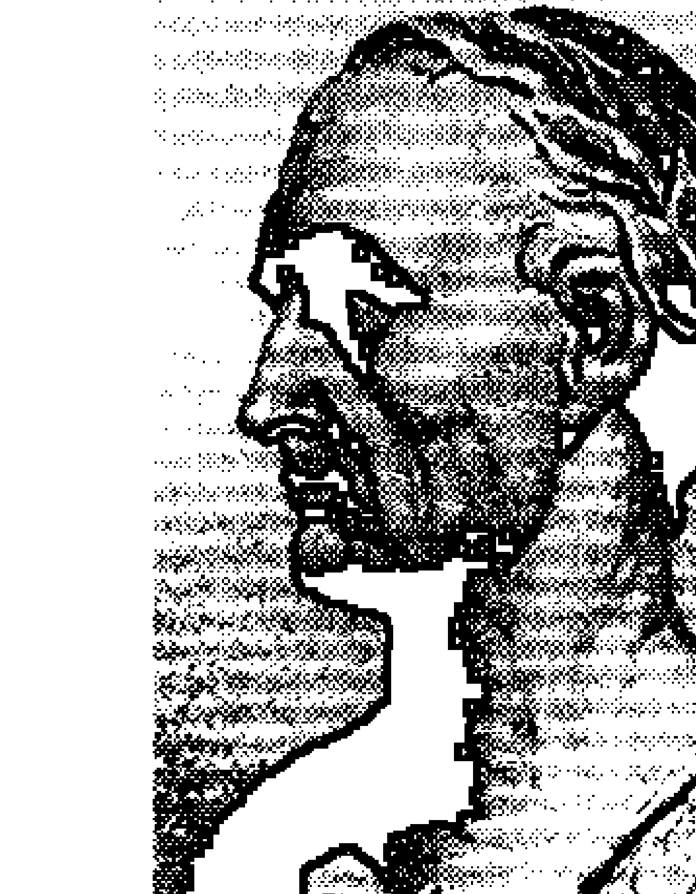

### 恺撒

恺撒大帝（前102—前44），罗马共和国末期杰出的军事统帅、政治家。他公元前60年与庞培、克拉苏秘密结成前三巨头同盟，随后出任高卢总督，花了八年时间征服了高卢全境（大约是现在的法国），还袭击了日耳曼和不列颠。前49年，他率军占领罗马，打败庞培，集大权于一身，实行独裁统治并制定了《儒略历》。

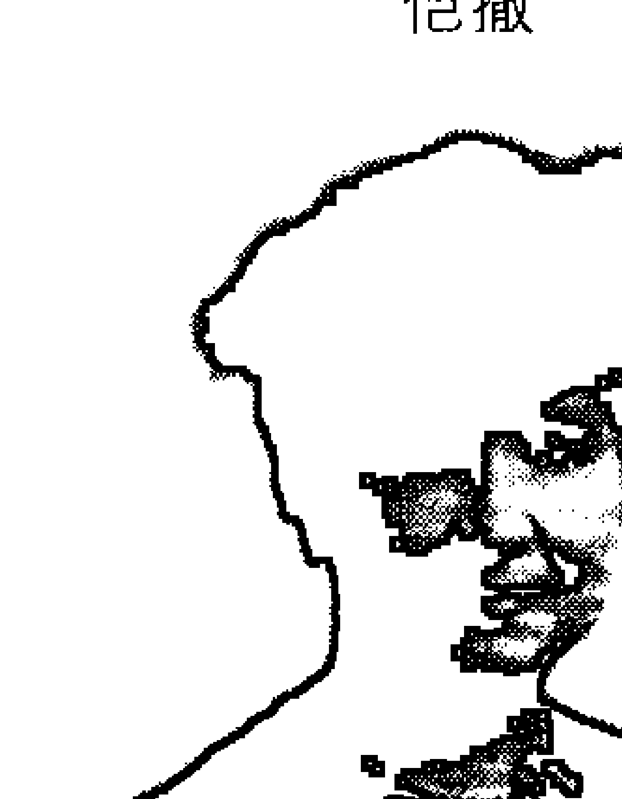

### 海伦·凯勒

海伦·凯勒（1880—1968），美国盲聋女作家、教育家、慈善家、社会活动家。她以自强不息的顽强毅力，在安妮·莎莉文老师的帮助下，掌握了英、法、德等五国语言，完成了一系列著作，并致力于为残疾人造福，建立慈善机构，被美国《时代周刊》评为美国十大英雄偶像，荣获“总统自由勋章”等奖项。主要著作有《假如给我三天光明》《我的生活》《我的老师》等。

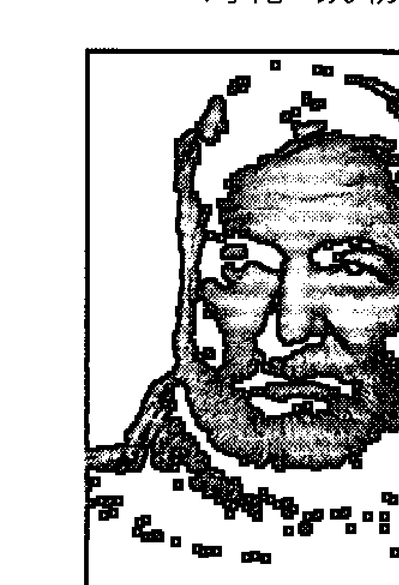

### 厄内斯特·米勒尔·海明威

厄内斯特·米勒尔·海明威（1899—1961），美国小说家。一向以文坛“硬汉”著称，是美利坚民族的精神丰碑，1954年度诺贝尔文学奖获得者，“新闻体”小说的创始人。代表作品有《太阳照样升起》《乞力马扎罗的雪》《永别了，武器》《老人与海》《丧钟为谁而鸣》。

1926年发表成名作《太阳照样升起》，作品表现战后青年人的幻灭感，成为“迷惘的一代”的代表作。生于美国芝加哥市郊橡树林小镇。享誉世界文坛的海明威最终却像他的祖父和父亲一样选择了自杀。

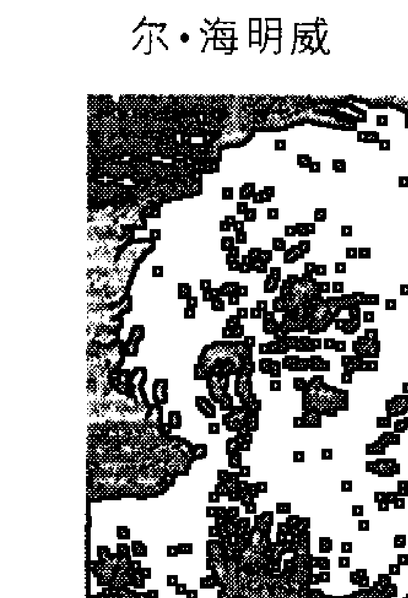

### 亚历山大大帝

亚历山大大帝（前356—前323），生于马其顿王国首都派拉城，曾师从古希腊著名学者亚里士多德，十八岁随父出征，二十岁继承王位。是欧洲历史上最伟大的军事天才，马其顿帝国最著名的征服者。他雄才伟略，勇于善战，率军驰骋欧亚非大陆，使得古希腊文明广泛传播，是世界古代史上最著名的军事家和政治家。

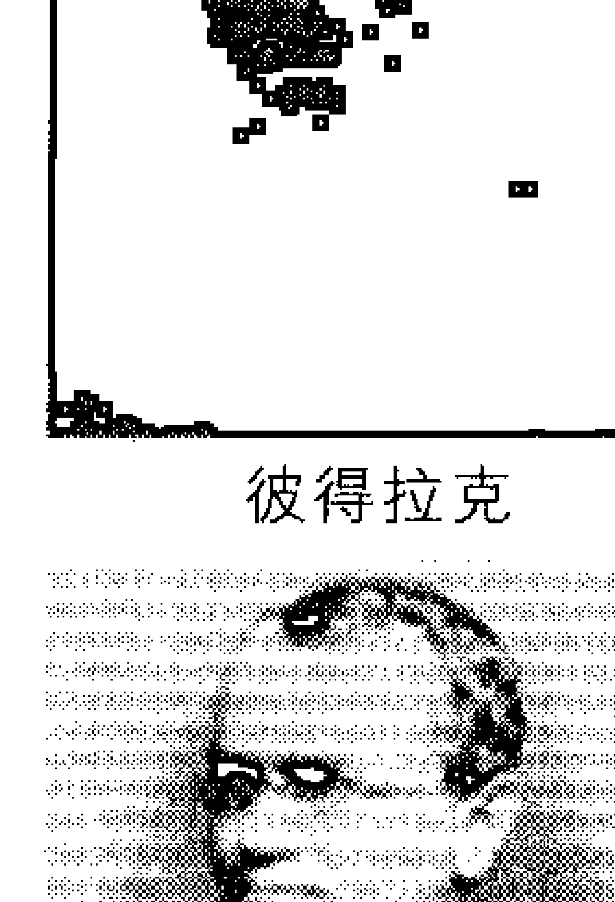

### 彼得拉克

弗朗西斯科·彼得拉克（1304—1374），意大利早期文艺复兴时期的著名诗人和学者，人文主义的奠基者。早期资产阶级的艺术和道德观的建立与他是分不开的。

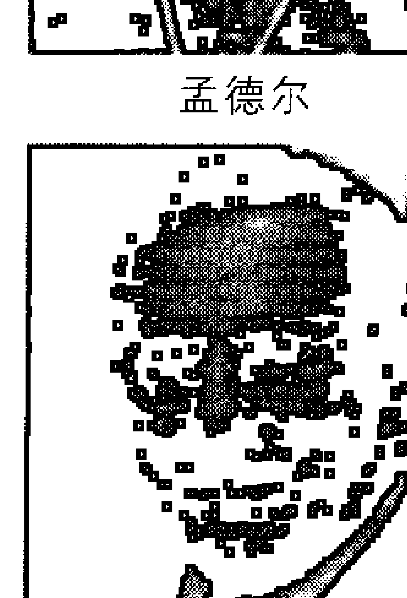

### 孟德尔

孟德尔（1822—1884），出生于奥地利西里西亚，是遗传学的奠基人，被誉为现代遗传学之父。孟德尔通过豌豆实验，发现了遗传规律、分离规律及自由组合规律，并得到了相应的数学关系式。人们分别称他的发现为“孟德尔第一定律”“孟德尔第二定律”。

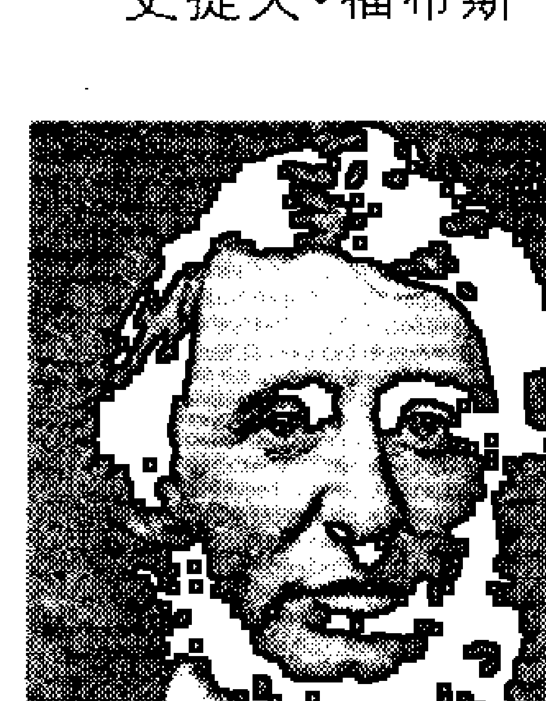

### 史提夫·福布斯

史提夫·福布斯（1947—），美国福布斯集团的总裁兼首席执行官以及《福布斯》杂志的总编辑。目前个人资产已超过4.4亿美元。高大的身材套着一件正统的黑西服，方脸上端正地架着一副眼镜，有些斯文，有些书生气。他的名字频频出现在《Forbes》“事实与评论”专栏上。他曾四次被USX公司评为“经济预测最准确的金融新闻从业人员”。

### 梭罗

亨利·戴维·梭罗（1817—1862），19世纪美国最具有世界影响力的作家、哲学家。梭罗在生前只出版过两本书：第一本是他在1849年自费出版的《康科德河和梅里麦克河上的一周》。

他强调亲近自然、学习自然、热爱自然，追求“简单些，再简单些”的质朴生活，提倡智者从人生困惑中寻求精神上的富足而臻于完美。他投入数十年的时间对野生果实、野草及森林灌木进行观察研究，写出了《种子的信念》一书，但直到梭罗逝世150多年后，这本耗费他数十年心血的书才得以出版。

---

## 第六章 狮子座的人

（7月24日—8月23日出生）

典型特征：追求气派，喜欢引人注目，享受被崇拜的感觉，霸气十足，是12星座中最威严的，有贵族气息和王者风范。

### 第一节 狮子座的人

### 一、狮子座传说

兰潮沙是兰之国度的领袖。兰之国度只是宇宙中最小的一种国度，而且常年处于混乱之中。兰潮沙雄心勃勃，与兰之国度的几大部落争斗，终于统一了兰之国度，并且在长期经营之下令兰之国度的规模和势力迅速扩大。天神对此很是忧虑，他知道在几千万年前彼此曾有旧情，于是令他让位于紫金家族，并守护银河的西北。

相传在几千万年前，宇宙的蓝色爱海中住着一种美丽的贝壳。这种贝壳的左边叫门玄，右边叫玄雅，是一对恩爱的夫妻。他们在美丽的爱海中紧紧相拥，这样不论潮起潮落，他们永远在一起。

美好的爱情本可以天荒地老、海枯石烂，但是嫉妒女神被双方那永不分离的爱情所伤害。终于有一天，她下海来到这美丽的贝壳面前，用神力强行分开了他们。于是电闪雷鸣，狂风卷地，蓝色的爱海一度变成红色。门玄只能眼睁睁看着爱妻渐渐远去，痛苦地等待美丽的玄雅女神。玄雅被撕裂，嫉妒女神看着门玄的悲伤突然觉得有愧，于是打算让这仅有的灵力烟消云散。

天神目观天象，知道发生变动，及时赶到，于是救出了处在危机中的门玄。嫉妒女神惧怕神威，立即闪开。门玄诚心感谢天神，请求天神让他们化成人形，这样就可以寻找失踪的玄雅。天神被他的深情所感动，于是同意了。

几千年来，门玄一直在不断寻找，天神也不知其所终。偶见兰潮沙时看到他脖子上挂着的贝壳，感知他就是门玄，又算知他命中属于权星，于是令他归位。

#### 二、狮子座概况

- 出生日期：7月23日—8月22日  
- 幸运花：金色、橙色  
- 幸运石：黄玉  
- 幸运物：帽子  

### 外形特征

狮子座人头发柔顺，头部占身体比例大，肌肉结实，骨架大；前额宽广，眉骨突出，眼睛圆，眼角上挑，鹰钩鼻较多，嘴巴宽，下巴线条清晰；双眼有神，表情开朗，仪表整洁，态度庄重而高贵。

### 性格特征

自尊心强，不谦虚，决不容忍别人的轻视。因为自信，所以能够包容别人，遇事不动声色。喜欢鼓舞别人，但如果把握不好，会显得自以为是，无意中损伤别人的自尊。她们人生目标明确，不会迷失方向。他们不善于接受新事物，有点顽固。

他们是天生的领导者，可以潇洒地支配一切，更好地为自己的理想而拼搏。如果把握不当，会变得独断专行，不容异己，丧失群众的信任和尊重。

狮子座人有乐观主义精神。他们有卓越的能力，虽然他们的路途也不可能一马平川，但他们有很强的复原能力，“永不言败”是他们的座右铭。他们有崇高的理想，而且能以乐观的心态克服前进道路上的困难。面对失败和挫折，他们不会一蹶不振，也不会寄希望于运气，而是用自己非凡的勇气和智慧开启通向成功的大门。

狮子座人说一不二，言必信，行必果。他们是有毅力、有野心的完美主义者，一旦确定了目标，就鼓足劲朝着目标往前冲去。他们有成就大事业的才干，是有使命感的领袖。

### 工作事业

狮子座的人野心勃勃，不容易驯服。不过，如果上司的能力和威严能让他心服口服，那么他们就会是最忠实勤勉的下属；如果上司能力不足，他们就会无法容忍，马上另谋高就。

他们还有财运，容易得到贵人的帮助。如果能充分利用天生的领导能力和冲劲，肯定可以成为优秀的企业家。他们需要一份可以充分发挥精力和才能的工作，特别适合需要高度创意与艺术性的职业。这不仅能引起他们的兴趣，还可以激起他们的成功欲望，满足其工作的需要。他们具有喜剧才华，也适合演艺工作。

狮子座的人有很强的领导欲，他们在不自觉中会表现出支配别人的倾向。他们大多自信，在决策方针上固执、武断，总认为自己是完全正确的，因此狮子座的人很应该学习怎样集思广益。他们态度往往不太谦逊，在工作上对元老也相当无礼，这种骄傲的态度对工作是不利的。

### 爱情模式

狮子座的人欣赏自信、有激情而又开朗乐观的异性。他们最不喜欢拐弯抹角的人，言辞闪烁的人也会让他们反感。狮子座的人对感情很忠诚，一旦爱上了对方，就会全心全意地付出。

他们往往很爱表现自己，喜欢被人注意和赞美。他们的爱情热烈而直接，喜欢浪漫的气氛，也很重视面子。在爱情中他们既热情又骄傲，希望对方欣赏自己，同时也愿意保护和照顾恋人。

一旦他们和别人相爱了，就会把自己全部的热情都投入进去。他们愿意把无限的真诚投入到爱情里，会尽力照顾、保护自己的恋人，也希望对方毫无保留地爱自己。

狮子座的人绝对不允许自己的恋人爱上别人，也不允许对方对自己的感情不忠。他们在感情受伤后很难恢复，而且容易记仇，爱得越深恨得越深。

### 最佳配对星座

- **白羊座**：这是一个完美组合。两个人的热情加起来能燃起烈火。白羊座的自信、乐观正是狮子座欣赏的，而狮子座的霸气也很吸引白羊座。  
- **射手座**：这两个星座的人很容易一见钟情，他们的感情与日俱增。射手座特别能理解狮子座直率坦诚的一面，并且用他们的爽朗乐观给狮子座很大的安慰。  
- **天秤座**：两人都很浪漫，也爱享受，喜欢奢华。天秤的风情万种正符合狮子的标准，而狮子的浪漫情怀与天秤为爱情而爱情的罗曼蒂克组合起来也非常合拍。  

### 最差配对星座

- **摩羯座**：这个组合在一起没有共同的人生观。摩羯座的女子实事求是，性格严谨，看起来近乎冷酷。她们重实际，既能看到近忧也能看到远虑，这是狮子座永远难以理解的。狮子座的人对感情非常热烈，而严谨的摩羯女子无法以同样的热情回应。  
- **天蝎座**：两人都很自我，都不愿意处于被支配地位。天蝎座无法忍受狮子座的吹嘘和粗心，而狮子座对天蝎的暗箭伤人也很反感。狮子座喜欢华丽的爱情，而天蝎座更注重感情的内在品质，平平淡淡，但刻骨铭心。  
- **金牛座**：金牛座的女生比较粘人，喜欢完美的家庭，但狮子座天生不喜欢被家庭束缚。慢性子的金牛座常不能及时感应狮子座的激情，这会让狮子男感到乏味。两个人都容易走向极端，一旦发生矛盾将难以调和。  

### 第二节 狮子座的孩子

### 一、孩子的星座秘密

狮子座的孩子很早就会感到自己有举足轻重的影响。在学校里不太听话，个性很强，像个小霸王。对于狮子座的孩子，千万不要刺伤他的自尊心，否则他会更加固执地高傲难管，不求进取。

要恰到好处地维护他的尊严感，及时赞扬他的优点。一旦他认定了方向和目标，他将认真地学习下去，成绩会名列前茅。这会为他打开通向美好未来的大门。事实上，许多有重要成就的人都出生在狮子座。

这一星座的孩子正义感与是非感相当强，爱憎分明。在他年少时，要谨防他上当受骗。在是非没有真正弄清之前不要责怪他。

狮子座的正义感会使孩子有一定的自发领导力，但同时也要教育他们，即使他们比别的孩子强壮，也要轮流当首领。

### 二、孩子的学业

狮子座的孩子有很强的能力和冲动，但却常常难以选定最佳的发力点，常会出现事倍功半的情况。所以孩子的父母要帮助孩子选好自己的理想奋斗目标。

人生有如赛场上的赛跑，选择好最佳的起跑点，将是事业成功的必要条件。常言道：志不立，天下无可成之事。古往今来，凡是有所作为的政治家、思想家、科学家，莫不具有远大的志向。

立志是人生的起跑点，反映着一个人的理想、胸怀、情趣和价值观，影响着一个人的奋斗目标及成就大小。孩子的父母一定要注意孩子的思想动态，帮助孩子找到自己的方向。

### 三、孩子的特殊才能

热情、忠诚和慷慨只是狮子座孩子诸多闪光点中的几个。狮子座的孩子热情洋溢、感情丰富，他们用宽广的心胸来迎接生活。

狮子座人的思想和见解不会局限一隅而具有狭隘的格局，经常面临智力上的考验和决策性的决定。虽然看来粗枝大叶，却是这个星座的性格特征。他们并非多愁善感的类型，所以很少闷闷不乐，但是一旦面临绝望时，精神容易崩溃。幸好他们的复原能力惊人，内在的热力会再度散发。思想具有建设性，虽然称不上心思敏捷，却往往能做出有力的结论。

### 王者风范

狮子座孩子的特性一目了然，毫无复杂或隐藏难解之处。在学校里就有王者风范，是小朋友的领头人。总之，在团体中他就是领袖，而且深知自己这种操纵和领导别人的能力。

这个星座不仅擅长领导，本身也能以身作则，努力工作。当太阳的位置在狮子座时，这种倾向更加明显。不过狮子座孩子偶尔也会有自大、武断、不容异己的缺点，因此父母要注意帮助他改掉这些缺点，才能将与生俱来的乐于助人、大方等优点发挥到最好。

### 戏剧天分

狮子座孩子天生具有戏剧天分，是舞台上众所瞩目的焦点。他们大多从小就热爱舞台表演，在学校里更是戏剧中的活跃人物。

他们天性热情、乐于助人、乐观进取。只要有狮子座孩子存在的地方，其他小朋友就会有阳光和欢笑。

### 倔强固执

狮子座孩子的态度有时会傲慢无礼，脾气倔强，顽固地认为自己是对的，即使错了也不愿意改正。狮子座孩子虽然是“太阳之子”，但是如果他的想法受到了限制，就会变得相当固执。

过分的自信会阻碍孩子的前进，所以父母要注意这一方面，随时引导孩子的想法，使其性格更加健康阳光。

### 第三节 狮子座的女人

### 一、善解人意但有个性

狮子座女孩绝不能忍受一个会对她发号施令的男人。我们虽然不能说她是个大女人主义的女人，但她绝不会让一个大男人主义的男人伤害她的女性尊严。

她喜欢你宠着她、顺着她。当然，我也建议你这样做。因为当一个狮子座女孩觉得自己受到公主一般的礼遇时，她会是个最可爱、最善解人意的小女人。你不用担心，你的温柔爱意绝不会让她变成蛮不讲理的女暴君。

你或许会觉得她有些喜欢支配你的时间、安排你的事情。多数狮子座女孩都有良好的组织和领导能力，很多时候在同性朋友中也扮演着领袖角色。对于狮子座女子来说，只有在她喜欢你的前提下，她才会这样做；若不是她真心关爱的人，她才懒得如此费神。

不过，她爱的是一个宠爱她的王子，而不是只会卑躬屈膝拍马屁的应声虫。在宠爱她的同时，你必须保持自己的尊严。

### 二、可爱但爱面子

骄傲的母狮子会坚持在你心目中排名第一，千万不要让她怀疑有任何人比她更重要，否则那张温柔可爱的猫咪脸，很可能就会变成河东怒吼的狮子。

一般来说，狮子座的女人都很有肚量，不会疑神疑鬼。因此你常会看到一对夫妻中，丈夫逢场作戏时，狮子座妻子往往睁一只眼闭一只眼。但前提是她必须确信那只是逢场作戏。对于感情出轨的情人或丈夫，狮子座女人是很难原谅的，因为那严重伤害了她的自尊。

狮子座女人极爱面子，因此最好不要在她面前随便跟别的女孩眉来眼去，也不要让什么花边新闻从她好朋友那里传到她耳里，否则你就准备接受一场风暴吧。

不过，当你和狮子座女子恋爱时，也常会有让你骄傲的场面，因为她迷人的微笑可能会吸引许多异性欣赏的目光。多数狮子座女子都喜欢并享受被异性喜爱和赞美的感觉，她们经常下意识地用甜蜜的微笑或妩媚的眼神鼓励别人这么做。

请不要因此恼怒或责备她的不贞，那只是小公主的孩子气而已。狮子座女子的爱情是很忠实的。

### 三、热爱金钱的女人

狮子座女性原本就有表现自我的欲望，单调的家居生活很快会令她焦躁不安。她需要接近人群，因为她需要听到掌声和赞美。

你的狮子座公主通常不太有金钱观念，但品味十分高贵。多数狮子座女人会喜欢简单舒适、质地很好的服饰，而且经常买一件运动衫就花了别人买一套西装的价钱，不过那些衣服穿在她身上的确气质不凡。

当然，也有些比较夸张的狮子座女人，喜欢把名牌衣服、饰品堆在身上，把自己打扮得像一棵活动的圣诞树。花钱对狮子座女性来说是一种享受，贫穷会使她觉得很沮丧。

不过你大可放心，狮子座女人多半都有良好的工作能力，能够赚取自己需要的金钱。整天向你伸手可不是她喜欢过的日子。她一点气都不能受，就算她花你的钱，你还得表现出无上光荣的样子。

### 四、爱收藏小东西

狮子座女人有收藏小东西的习惯。她们很少扔掉针线、纽扣、旧衣服、破罐子以及其他一些不值钱的东西。谁知道票根、往日的情书和用过的茶袋将来是否会有用处呢？也许不久的将来她会用上那烧断了的保险丝。

不要问她将如何利用那两百双长袜和手套，反正她迟早会用上。对她来说，每一种东西都有感情上的价值，包括1952年就已被宣布作废的支票和她昔日的纪念章。她很看重这些并精心照管。她的嫉妒心远不及她的占有欲强烈。

狮子座女人认为劝勉和鼓励无济于事。当事情不按她的预想发展时，她只会悄悄流泪，平静地袖手旁观，耐心等待事情的转机。忍耐是她最显著的美德。当她沮丧时，你要设法使她摆脱这种不良情绪以保持健康。

当然她也需要别人的体贴和关怀。有时她会竭力激发你对她的同情并要你尽力保护她。她会使你觉得没有她你就无法生活。不过不要被她那看似软弱的样子欺骗。她看上去似乎是一个需要照料的孩子，但如果必要，她能够自如地应付每一件事。

你们吵嘴时，你会发现她两眼充满泪花；当你离她而去时，她会自己擦去眼泪，打开收音机欣赏音乐，然后把餐橱打扫干净。当然，你确实很难判断她是真悲伤还是假动怒。夜晚，你最好待在家里，轻轻握着她的手臂听音乐。

### 第四节 狮子座的男人

### 一、王者风范的狮子男

狮子座的男生气度不凡，他的热情和威望能使他在事业上获得成功。没有忠诚、没有光辉和宏伟的计划，他就无法生存。他们心胸开阔、有远见卓识，有排除困难和驾驭形势的才能，因此人们很容易对他产生钦佩之情。高傲是他性格的突出特点。

狮子座男生为人宽厚，感情强烈。在爱情方面，愿意用自己无限的真诚去赢得异性发自肺腑和毫无保留的爱。对他所爱慕的人，他会竭尽全力予以呵护、关心、照顾，对你表现出近似母亲般的体贴，使你身心沐浴在幸福和舒适安宁的生活中。

此外，他还喜欢用华贵的首饰打扮你，使你成为他心中梦想的偶像。你会因为生活中遇到了这个钟情的狮子座男性，而成为最幸福、最光彩夺目的女性。你的婚姻生活将长久地充满幸福。

要怪也只能怪他自己太有魅力。狮子座男生对女生总是很有礼貌、点到为止，如果女生主动接近，他还会聪明地避开绯闻。

### 二、狮子男的爱情观

狮子座男生在爱情中会坦白表达、讲求公平竞争。他很大方，但还没有大方到没有原则。处事待人一向明朗的狮子，不喜欢暗地里来去，喜欢公平竞赛、君子之争，即使输了至少还能保住友谊。

狮子座的男人爱炫耀，但也有内涵，并注重异性朋友的内在美。尤其是狮子座男性，不会与完全没有内涵的人交往。他们往往会挑选外表稍逊，但内涵丰富的女性作为伴侣。

狮子男的恋爱来源是多方面的。交游广泛的他们，只要看上了眼就会小心计划。毕竟王者是不允许失败的。另外，爱好游乐的狮子们尤其喜欢与玩得来的朋友相处，在开心之余，感情的火花也特别容易出现。

狮子座基本上也是富有感情的类型。虽然他不会花心，但如果有别的女孩子对他表示好感，那就另当别论了。狮子需要喝彩来体现自身价值；只要恋人带出去有面子，狮子座通常也不会轻易出轨。

狮子座男生在追求女生时并不一定会在生活上特别铺张，他不一定会带对方去昂贵的餐厅，因为他觉得那样既贵又未必有价值。狮子男送礼物往往会力求正中对方心意。

狮子男热情、开朗，占有欲极强。狮子座的情人在大众面前总是焦点人物，又爱表现，常常吸引许多女孩子。他也可能给爱慕他的女孩一个灿烂的微笑和几句甜言蜜语。

不过不要小看他外表的酷，他孤独的时候往往需要一份温暖的感情来支持自己。其实他是很专情的，是爱得轰轰烈烈、奋不顾身的甜蜜情人。

狮子座男人是权力的象征。当然不可能所有狮子都成为时代的领袖，甚至很多狮子座也无法成为生活中的领导。然而，每个狮子男都希望可以完全征服自己的女人、统领她。

当这个女人不断做出一些挑战狮子座权威的事情时，你的狮子很可能会暴怒，而你们的爱情也可能亮起红灯。做狮子男的女人，要给足他的面子，尤其是在外面。当然，在两个人相处时最好也温顺一些。

### 三、狮子男的求爱攻略

爱听好话是狮子座男人最脆弱的一面。他喜欢你爱慕他、崇拜他，把他当作你的偶像，他就会快乐而热情地爱恋着你。但你也不要太虚伪，因为他无法忍受敷衍，很快会厌倦你的表面态度。他需要的是你真心的肯定。

不拘小节的他既迷糊又大而化之，不过他不是有心忘记，而是真的忘记了。你可以用你的细心和耐心，为他料理一些他常常忽略的生活琐事，照顾他生活上的细节，他会非常感动。

他总以标准的王者自居，无法忍受别人干涉或改变他。不过如果采用温柔、感性的方式，也就是“软功”，他可能狮子座男人柔情绵绵而又多愁善感，想让他坠入情网，让他向你求爱并不困难，无需过多周折。可以说狮子座男人有一种一触即发的情感，你所要做的只是给他创造机会——在悠悠的烛光中与他一起听那悠扬悦耳的小提琴音乐，那么你们爱情就会像盛开的玫瑰一样鲜艳夺目。实质上，没有蜡烛和音乐也不要紧，只要抓住他的特性就可以。

如果狮子男爱上你，你就是他的心肝宝贝了，你可以从中学到一些东西。他会带你到他的家，他那博大的心胸会给你带来温暖，但他的房子也会成为一座豪华舒适的监狱。你的肉体及灵魂都为他所有。他会告诉你应该穿什么样的衣服，留什么样的发式，读什么样的书，他会对你交什么样的朋友以及如何安排自己的一天指手画脚。如果买东西花一个小时就够了，可你过了两个小时才回来，那么他就会质问你为什么，问你路上遇到了谁，你们都讲了些什么。狮子座的男人决不允许自己的妻子有任何不检点的行为，更不能容忍你使他威信扫地。

## 四、喜爱孩子的狮子男

家庭是狮子座男生欢乐的王国，他们非常喜爱自己的孩子，很欢迎朋友之间的相互往来。凡事认真细致，总愿把每件事做得完美无缺，并希望通过自己的努力，使周围的人都能欢乐和幸福。

在狮子座爸爸的眼里，孩子是他心目中最可爱的小宝贝，值得自己付出一生的心力去呵护。在妻子面前狮子老公会摆出一副茶来伸手、饭来张口的大老爷模样，可是对孩子他就一点脾气都没有，孩子即便捣蛋、撒娇，狮子座爸爸都无所谓。

对孩子来说，他有时候严厉得很，有时候又极度宽容。狮子座的父亲当然一定会要求孩子们对他尊重。他会订下很多规矩，但是多数时候他都不会严格执行。他温暖而仁慈，总是尽可能满足孩子的要求。狮子座的爸爸往往会比较偏心那个最听话的孩子，其实就是最会拍马屁的那个。于是孩子们想要什么就会从他那里得到什么。因此，作为妻子你要对孩子们认真管教。孩子们也许对狮子座爸爸那傲慢的态度既敬畏又爱慕，可以预见，在以后年月里，每当想起他们的爸爸时，孩子们都会充满眷恋之情。

他喜欢带着孩子玩，对着孩子们演讲。但管教小孩的那些琐碎事情，他真的不会有什么兴趣，所以执行纪律的工作，到头来还会落到你身上。还有，可千万别因为有了小公主、小王子之后，而忽略你的国王哦！

### 第五节 狮子座的名人

### 拿破仑·波拿巴

拿破仑·波拿巴（1769—1821），原名拿破仑·布宛纳，人称奇迹创造者。拿破仑·波拿巴是法国近代资产阶级军事家、政治家，法兰西共和国第一执政，法兰西第一帝国皇帝。

### 珀西·比希·雪莱

珀西·比希·雪莱（1792—1822），英国文学史上最有才华的抒情诗人之一。其一生见识广泛，不仅是柏拉图主义者，更是个伟大的理想主义者。其创作的诗歌节奏明快，积极向上。1818—1819年，雪莱完成了两部重要的长诗《解放了的普罗米修斯》和《倩契》，以及不朽的名作《西风颂》。《解放了的普罗米修斯》与《麦布女王》相同，无法公开出版，而雪莱最成熟、结构最完美的作品《倩契》则被英国的评论家称为“当代最恶劣的作品，似出于恶魔之手”。

### 亚历山大·仲马

亚历山大·仲马（1802—1870），人称大仲马，法国19世纪积极浪漫主义作家。大仲马自学成才，一生写的各种著作达300卷之多，主要以小说和剧作著称于世。大仲马信奉共和政见，反对君主专政。由于他是黑白混血人的身份，其一生都受种族主义困扰。主要作品有《三个火枪手》《基督山伯爵》《黑色郁金香》。

### 尼古拉·加夫里洛维奇·车尔尼雪夫斯基

尼古拉·加夫里洛维奇·车尔尼雪夫斯基（1828—1889），俄国革命家、哲学家、作家和批评家，人本主义哲学的代表人物。1828年7月生于萨拉托夫一个神父家庭。18岁进入彼得堡大学文史系。从此经常接近先进知识分子团体并结识赫尔岑等人，潜心研究黑格尔唯心主义哲学和费尔巴哈唯物主义哲学，对法国空想社会主义也产生过浓厚兴趣。1850年大学毕业，次年重返萨拉托夫，在中学教授语文，宣传进步思想。主要作品有《艺术与现实的审美关系》《怎么办？》《序幕》等。

### 莫泊桑

居伊·德·莫泊桑（1850—1893），法国优秀的批判现实主义作家，与契诃夫和欧·亨利并列世界三大短篇小说巨匠，对后世产生极大影响，被誉为“短篇小说之王”。代表作品短篇小说《羊脂球》《我的叔叔于勒》《项链》，长篇小说《漂亮朋友》。

### 亨利·福特

亨利·福特（1863—1947），美国汽车工程师与企业家，福特汽车公司的建立者。他也是世界上第一个使用流水线大批量生产汽车的人。这种新的生产方式使汽车成为一种大众产品，它不仅革了工业生产方式的命，而且对现代社会和文化产生了巨大的影响。因此有一些社会理论学家将这一段经济和社会历史称为“福特主义”。

### 亚瑟·詹姆士·贝尔福

亚瑟·詹姆士·贝尔福（1848—1930），曾任英国首相，索尔兹伯里侯爵首相的外甥和政治继承人，被称为即使生活在马基雅维利时代也能游刃有余的政治家。少年时代因爱人早逝而终身不婚。1902—1905年出任首相，任内其政府因关税改革议题而陷入分裂，但他却跳出了政党圈子。一战中任海军大臣和外交大臣。1917年11月2日颁布了《贝尔福宣言》，提出在巴勒斯坦建立一个犹太家园的计划。1922年被封为第一代贝尔福伯爵。

### 贝拉克·侯赛因·奥巴马二世

贝拉克·侯赛因·奥巴马二世（1961—），美国第44任总统，出生于美国夏威夷州火奴鲁鲁，祖籍肯尼亚。奥巴马是首位拥有黑人血统，并且童年在亚洲成长的美国总统，与不同地方和不同文化背景的人共同生活过。2010年5月27日，美国白宫发布了“国家安全战略报告”，奥巴马在该报告中将军事作为外交无效时的最后手段。新国家安全战略认为世界充满了多种威胁，放弃了布什政府“反恐战争”的说法。

### 路易·德·菲奈斯

路易·德·菲奈斯（1914—1983），法国著名电影演员、导演、剧作家、喜剧大师。在他近40年的舞台生涯中曾塑造了无数个性鲜明的人物形象。他的表演滑稽、生动、幽默，塑造的人物形象令观众久久不能忘怀。其代表作有《虎口脱险》《吝啬鬼》《小泳者》等。

### 路易·威登

路易·威登（1821—1892），法国历史上最杰出的皮件设计大师之一。1854年在巴黎开设了以自己名字命名的第一间皮箱店。一个世纪之后，路易·威登成为皮箱与皮件领域数一数二的品牌，并且成为上流社会的象征。

如今路易·威登这一品牌已经不仅限于设计和出售高级皮具和箱包，而是成为涉及时装、饰物、皮鞋、箱包、珠宝、手表、传媒、名酒等领域的巨型潮流指标。

## 第七章 处女座的人

（8月24日—9月23日出生）

典型特征：谨慎、细致、挑剔、认真、负责、爱唠叨、完美主义、爱钻牛角尖。生活上、精神上都有些洁癖。

### 第一节 处女座的人

### 一、处女座传说

珀耳塞福涅是丰收女神得墨忒尔与宙斯之女。有一天，珀耳塞福涅正在与其他水湖仙女或者海仙女（在《荷马史诗》中她与雅典娜和阿尔忒弥斯）一起在恩纳采花，可是她一个人不经意地远离了朋友。美丽的草地上开满各种鲜花，然而在众花之中突然有朵花是王的圣花——水仙。当珀耳塞福涅去摘那朵看似无害的水仙花时，大地裂开了。四匹黑色的骏马拉着冥王的战车出现在珀耳塞福涅的面前。反抗是那么无效，冥王轻松地把她抱起来带往黑暗的死亡之国。得墨忒尔失去女儿后非常悲伤，离开奥林匹斯到处疯狂地寻找女儿，因此大地上万物停止生长。太阳神赫利俄斯看到了这一切，将珀耳塞福涅的下落告诉了得墨忒尔。

最后宙斯无法让大地上万物荒芜，因此向哈得斯商量能否将珀耳塞福涅还给得墨忒尔。他派赫尔墨斯去找珀耳塞福涅。但是在赫尔墨斯找到之前，哈得斯设计让珀耳塞福涅吃下了冥界的石榴籽（也有说吃了三颗），这迫使珀耳塞福涅每年有六个月的时间重返冥界（有的说是每年三分之一的时间在冥界）。后来宙斯为了预防不测，使处女座成为农业女神得墨忒尔的化身。

#### 二、处女座概况

- 出生日期：8月24日—9月23日  
- 幸运色：灰色  
- 幸运花：大丽花  
- 幸运宝石：紫水晶  

### 外在形象

处女座人头发柔软，骨骼突出，身体与四肢较长，容易驼背；额头宽广，眼睛有神，鼻子较尖，嘴巴很小；干干净净，伶俐过人，浑身上下散发着清新的气质。

### 性格特征

不容易接受他人的意见，不容易受到干扰，有时候显得固执己见。为了阐明自己的观点，可能会翻来覆去地唠叨。对没有把握的事，不会轻易尝试，更不会投机取巧。做事脚踏实地，但是缺乏爆发力，不能迅速开创新局面。

做人不招摇，也不自以为是，说话办事都比较有分寸，给人留下谦虚谨慎的好印象。但是做事不够干脆，爱犹豫，在遇到困难时会茫然无措，依赖性较强。对待事情要求完美，不能容忍瑕疵，对人对己都很严格。高标准、严要求，容易成事，敏锐而挑剔，能够注意到细节，但是如果过分挑剔，容易引起别人反感。

处女座的人乐于助人，在别人有困难的时候会伸出援手，帮助他们度过难关，并从中得到快乐。

### 工作事业

处女座的人不喜欢浮夸，他们总是少说多做，虽然不会太耀眼但也不可或缺。处女座的人拥有丰富的知识，根底扎实并有能力，是完美主义者，对自己要求严格，不会半途而废。他们好学勤奋，能通过不断学习来丰富自己，以更好地掌握工作技能。他们有强烈的责任心，而且做事一丝不苟，不需要别人监督。他们内敛、谨慎的性格很适合担任幕僚、助理、秘书之类的工作。

处女座的人缺乏安全感，注重经济基础，所以找工作的时候，首先考虑的是有没有稳定的收入。处女座的人有很强的分析能力，能轻松胜任相关工作。他们讲求完美，喜欢挑剔，也可以成为出色的文学评论家和艺术评论家。他们比较喜欢沟通，愿意从事和新闻相关的工作。

### 爱情模式

处女座的人要么不结婚，要么就会把自己的婚姻经营到最好。他们都是经过慎重考虑后才会步入婚姻殿堂的，所以婚姻状况很稳定。浪漫而又现实的他们，谈的是美丽梦幻的恋爱，结婚后又能很快适应现实的柴米油盐，把日子过得井井有条。他们忠于婚姻，会认真地为家庭奉献。但他们的精神洁癖表现在婚姻里，就显得格外明显。

得太小家子气，有时候男人说出异性的名字都会招致他们的不快。处女座的人比较害羞，总是将爱情藏在心里。即使表达出来也比较含蓄，不会直截了当，所以不容易与对方建立亲密的关系，恋情看起来会比较平淡。不过，如果对对方有深切的了解，确信对方就是自己的选择，那么处女座就会全心付出，释放被压抑的情感，积极主动地将对方追求到手。

在爱情方面，处女座同样追求完美，他们对环境要求整洁、干净，对自我要求也高。相对地，也要求家人满足他们的高要求。乱放的鞋子、乱扔的臭袜子可能都会让他们抓狂，有时候这样的苛刻和神经质会让家人不堪忍受。

### 最佳配对星座

金牛座。处女座能给追求稳定平和生活的金牛座安全感，而金牛座的一丝不苟也正好符合处女座的要求。这个组合不会一见钟情，其感情却会日渐深厚，稳步前进的爱情观念是两个人关系细水长流的有力保障。

摩羯座。谨慎不虚荣的摩羯女很容易让处女男一见倾心，而聪明的摩羯女对于处女座男子的苛求装聋作哑就过去了。两个人金钱观相似，有合理、恰当的消费，都不会嫌对方小气、世俗。两个人只要在一起，即使沉默不语都能觉得很充实，这是一个情投意合的组合。

巨蟹座。善解人意的巨蟹女子很得处女座欢心，恋家的巨蟹座人会把家里当作天堂，打理得井井有序，而这正符合处女座对完美的要求。只是两个人都被动等待，希望对方主动出击，这容易阻碍两个人的感情沟通。但能持家的巨蟹座人面对处女座人的缜密必定还是会感到尴尬，处女座人的苛刻会让敏感的巨蟹座人担心自己做得不好。

### 最差配对星座

狮子座。狮子座人是王，可是处女座人看到狮子座人不顺眼的地方会直言不讳，这可大大伤了这个王者。休闲地玩一阵，狮子座人喜欢热闹、好玩，而喜欢在家待着或者去进修的处女座会让他觉得闷死。最不能忍受的就是金钱态度，狮子座人的挥金如土可让处女座人大为光火。

白羊座。这个组合不太合适，处女座的男子有规划性和完整性，心思细腻，喜欢整洁，可惜白羊座人往往都不符合。她的粗心大意和混乱的生活方式让处女座男人大失望。或许这两个星座的人只能从另一些有交集的地方去好好经营。

水瓶座。处女座人想要踏实生活，注重现实，而好高骛远、不切实际的水瓶座不太符合要求。处女座人的过分啰嗦和传统固执也让水瓶座完全失去耐心。

### 第二节 处女座的孩子

### 一、孩子的星座秘密

温静洁净的处女小童，白白净净似清秀佳人（男生也很斯文）。自我管理能力较好，自尊天生超强，受不得一点委屈和挫折，但又不会轻易开口表达出来，孩子的爸妈要小心呵护，多给他尝试的机会。

处女座孩子有时会过度较真，期待他人说到做到。处女座孩子会提出沉默的要求，以为别人能心领神会。许多人误以为处女座孩子很难接近，其实他们不会自限地表达感受，也不会放弃传统道德立场。孩子的父母不必惊讶，处女座孩子只会在熟悉及他们所爱的人面前才表现得出众些。

### 二、孩子的学业

在学校里，处女座孩子更是老师的宠儿，因为他们最容易管教，且会努力用功。教导典型、聪明的处女小孩，只需用温柔的方式，尽量少批评，免得伤了他们的自尊心。太多的压力会使处女座孩子过度忧虑，甚至忧虑到生病。十二星座中，处女座和摩羯座最容易受挫，所以孩子的父母要注意时刻关怀他的内心，不要给他施加太大的压力。

如果处女座孩子犯了错，孩子的父母在角落轻轻地告诉他，且只需说一次就够了。他们会安静地记住、改正，而且会比爸妈、老师更在意自己的过错。通常懒惰且生活平庸的工作，处女座孩子会比其他星座的孩子更视为一种重要的责任，并有效率、可信赖地把工作完成。他们的态度友善、随和但敏感得很，最怕被同伴嘲笑。

### 三、孩子的特殊才能

说到模仿，处女座孩子打从一出生就有与生俱来的表演才华。处女座孩子警觉、敏捷，同时也很镇定、安详。这样的个性有时对周遭家人会起扰乱作用，有时又会使家人担忧。处女座的孩子虽安静乖巧，却极有脾气。如果你喂食他所不喜欢的食物，他可是会噘着嘴，一口也喂不进。处女座孩子会把头撇到一边，而带着迷人的微笑拒绝你。

每天开开心心。他在外人面前会很安静、腼腆，但在家人面前话匣子可关不住；处女座孩子说话早而流利。处女座孩子很少惹麻烦，是家人的良伴。他会很快乐地模仿妈妈做家事，而且通常交代的事只需讲一遍就懂，很少需要大人重复叮咛。

### 害羞文静的孩子

处女座人的腼腆及注意细节、巨细靡遗的态度，使他成为老师最爱的学生。品性优良又警觉迅捷的他适合做学长。但这平常害羞文静的小孩，却有可能出奇不意地指出老师的错处，因为他太爱问为什么，又喜欢知道事实的答案。他很少挑战权威，却喜欢知道书本上确切的知识。处女小童的心智都善探索且求知若渴，他们需要大量知识性的玩具，而且自小就会要爸妈尽可能多讲故事。如果他们未能接受充分的教育，长大后会成为很不愉快的成人；如果他们自认所知不足，会痛苦地为自己的匮乏感到羞愧。

### 需要很多的鼓励和温情

父母要能提供处女座孩子所需的温情。处女座孩子很少会表达他对拥抱的深层需求，但缺少爸妈的抚触、亲吻，却会强烈影响到他未来人际关系的发展。即使是漂亮又聪明的处女座女孩，以及非常优秀、机智的处女座男孩，都需要爸妈的称赞。他们不张扬的谦逊表达方式，需要大人们的肯定，才会增加信心。

### 需要感情维他命

处女座孩子能承受许多鼓励，不会过度自我膨胀，因此不要吝惜给予拥抱、亲吻、真诚的称赞以及拍肩鼓励。处女座孩子其实真正需要的是大量、每天的感情维他命，因为他们的神经系统很脆弱。

### 智慧早熟型

处女座孩子的智慧是早熟型的，所以孩子的父母要仔细倾听孩子说话。只要他确实知道你对他实际的期望所在，他会努力达成。他的成长需要许多鼓励。父母不必担心溺爱了处女座的孩子，他们比你想象的更加坚强。

### 第三节 处女座的女人

### 一、需要安全感的女人

现实可能不如己意而恐惧不已。她需要诚恳可靠的伴侣。由于处女座女性不能忍受方向不明的人生，她和诚实可靠的男性结伴同行时，内心会较有安全感和成就感，也因而能表现出巅峰水准。

处女座的女性有品味、聪明，而且善心待人。无论对朋友抑或对情人，她都会忠诚地照顾对方，尽量把自己最好的一面表现出来。不过有时她太过努力。放松心情，让自己的人际关系自然发展，是处女座顺应天应人的上策。

处女座女性若能让自己在爱情中享受乐趣，会获益良多。她应该培养较轻松、较没有顾忌的人生态度，把爱情看成一项学习的过程。最好多了解人际关系失败的原因，而非关注纠结的心理伤害。想要在情绪上成熟，找到更适合自己的伴侣，她就得学会这么做。记住：结束并不一定是终止。在她人生的旅程中，一切烦恼都只是暂时停止，最后仍会奔向更快乐的境界。

### 二、细水长流的感情观

处女座的女子是多愁善感的。只是这点并不会有太多人赞同，但她却真是如此。不过你也必须了解，像她这样小心谨慎的女子，怎可能会那么容易就让你看到她内心当中梦幻的一面。所以她不是不会多愁善感，只是一般人看不到而已。她的要求可是相当严格的，不管针对什么。当然，你也可以说她挑剔，这是每个处女座的人都有的特质；同时，处女座的人也可能会否认自己的这项特质。但你总会发现处女座的人在挑选水果和蔬菜时，会仔细得要命，而这只是其中一项会在无意中展现出来的特质而已。

处女座的女生不喜欢感情发展得太快。这会令她联想到“激情”。在她的心中，激情是恶心的、浮夸的、不正经的、不真实的。她认为感情要慢慢长久才可见到真情，所以绝大多数处女座的人都会晚婚。有许多处女座的人，都是与青梅竹马的玩伴结婚。

### 三、含蓄但不失浪漫

很多人对处女座的女人有着传统、纯洁、保守的印象，就像古时候深宅大院里的黄花闺女。其实并非如此。处女座的女性比较含蓄羞涩是没错的，你几乎无法看到一个处女座的女人在公众场合大声喧哗，或是做出夸张的粗俗动作。她们很细致，很像个大家闺秀的样子。至于是纯洁、传统、保守，那就得看你对这些形容词如何解释了。

处女座的女性对于爱情、婚姻当然十分尊重，同时也会尽心尽力地付出。但是当认定了这是一段不值得眷恋的感情之后，她会义无反顾地转身而去。平时的她，看起来总有一种宁静安详的气质，但请不要因此忽略她绝顶冷静、实际的头脑。处女座的女人虽然不会是女性运动的发起者，但也绝不会盲目接受一些不合理的安排。她虽然很少大声疾呼，但内心却很有自己的主张，而且很固执。

处女座的女子往往会传达出一股自我压抑的气氛。这对许多男性来说，反倒是一种特殊的吸引力。不过你千万不要用过度热情的方式追求她，粗俗的求爱行动会把她吓跑的。处女座的女人的确会压抑自己的情绪，但是她绝对不是没有情绪，只是你必须要有耐性罢了。寻找到理想中爱情的处女座女子，是非常热情而且浪漫的，这一点肯定值得你期待。

## 四、完美主义者

你一定听说过，她是个完美主义者，一切事情都要求尽善尽美。处女座的女人实在很难忍受一个粗心大意、笨手笨脚的人。还好，她不是个喜欢啰嗦别人帮忙的人。多数时候，她都会把自己的事情打理得妥妥贴贴，只是拜托你不要动不动就去打扰她。

至于你所做的事情，如果你要请教她，最好先有一点心理准备。处女座的女人总能在你认为一切完美的情况下挑出一大堆毛病来，她们往往有着与生俱来的分析与批评能力。

有一对夫妻，太太是处女座的，她的老公有一次跟朋友聊天说：“我们结婚快十年了，好像从来没有做过任何事情是完全符合她的标准的。她总会在我刚打扫完的浴室里找出一大堆头发，在我刚洗过的碗上面发现油渍，在我刚记完的账上挑出错误。我常聪明了，这些事儿干脆全拜托她了，省得自己挨骂！”这一招倒是挺管用的，也正因为如此，处女座的女人往往给人一种辛勤工作的印象。

不过，请爱上处女座的男人最好记得，不要随便批评一个处女座女人。关于这一点，她们的确是比较缺乏雅量的。在任何情况下，要她低头认错是很困难的。或许你会觉得不公平，但是你得了解，严苛的自我要求已经对自己造成很大的压力了，别人的批评她自然会受不了。虽然她嘴上不承认，但是她心里很清楚。

## 五、过日子高手

不要对你的处女座情人诉说一大堆遥不可及的梦想，她要的可是真真实实的人生。你那些不够实际的计划，会被她批评得满口是血，结果只是你自己讨没趣而已。但凭良心说，当你真的遇到问题的时候，处女座的女人是非常好的谈话对象。她会非常乐意为你分忧解难，同时以她冷静清晰的头脑帮你理出事情的头绪。处女座的女人总是能以理性而且温和的态度，扮演好一个贤内助的角色。

如果你娶了处女座的女人，你偷着乐去吧。你们的家会很干净，但也可能太干净了一些。小王最害怕请朋友到家里去了，因为他那位处女座的妻子总是五分钟倒一次烟灰缸，要不就是把客人喝了还剩小半杯的咖啡以迅雷不及掩耳的速度收走。只要是有人用过洗手间，她一定赶快进去清理一遍，弄得大家都十分尴尬。当然，你的那位处女座妻子应该不至于那么离谱，不过你还是要有心理准备。她可能每天得花一两个小时在浴室里，从头洗到脚，她可是一丝不苟，而且她讨厌你催她。

娶了处女座女人，你就相当于有了一个一流的会计师。你的账本会清清楚楚，分毫不差。她不会闹情绪，她会把自己打理得整整齐齐，不让自己变成黄脸婆。你每天下班回家，都会有热腾腾的晚餐。至于你的一切烦恼，她都会乐于分担，她会耐心听你诉苦，冷静为你分析。你知道她是个完美主义者，她会努力地做一个完美的妻子。

不要打乱她的生活秩序，处女座的女孩喜欢生活按部就班。如果你迟到、爽约，把她的时刻表弄得一团糟，她会非常生气。当一个处女座女生气的时候，她虽然不会张牙舞爪，但是她会一条一条地数落你的罪状，遣词用句精准有力。你唯一的办法就是诚心认错，别作无谓的辩驳。

### 第四节 处女座的男人

### 一、温柔细腻的感情

琼瑶式爱情小说中的男主角，绝对不会是处女座的男子。抽象的触电感觉，对一个典型的处女座男人来说实在是太不实际了。那种四目交接立即就会勾动天雷地火的事情，只会发生在《封神榜》之类的神话故事里。如果你遇上了一个处女座的男人，如果你爱上他，请不要期待一份激情澎湃的感觉，更不要一下子热情如火地把他给吓跑。处女座的男人不会喜欢这种戏剧化的情绪。

这绝对不表示他不懂得“爱”。从小，他对于家庭、父母、亲人、朋友都有着浓厚的感情，对于可怜的人更是深具同情心。他的感情必须慢慢累积，或是有明确出发点。对某些处女座的男性来说，追求爱情甚至是一种自私的表现。

许多有成就的单身汉都是处女座的。一方面可能是曾经有过爱的伤痕，因而从此专注于工作，服务于人群。处女座的男人在受过感情创伤之后会加倍小心，如果想再敲开他的心门，可能就难上加难。

### 二、真诚细致的爱

处女座的男人是很挑剔的，能够符合他要求的女性不太多。如果你不能合乎他的条件，他是不会爱上你的。所以，想要和一个处女座的男人建立男女关系，你必须先具备让他喜欢你的理由，然后再进一步培养你们之间的感情。

如果你爱上一个处女男，你一定要很洁净，无论是外表还是心灵。穿着邋遢、行为放肆的女孩几乎与他无缘（多数处女座的男子都有点洁癖）。同时，你还要有接受批评的雅量。他的分析批评虽然有点吹毛求疵，不过多半都很客观准确。不仅如此，你更要懂得上进，学习思考，因为他实在难以忍受一个无知又粗心大意的女人。发表任何言论前，请三思，不要常说些意气用事、不经大脑的话。处女座男人对于女人常说一些短视、不客观的话，感觉很不耐烦。他对你的批评可能会让你无法招架。

对处女座的男人来说，美丽的头脑要比美丽的脸蛋重要得多。当你慢慢习惯了他的个性，而他也愈来愈喜欢你，你们之间的爱火就开始慢慢燃烧了。处女座男子的爱火一旦真正被点燃，那将会烧得很久很久，甚至一辈子。你只要想到这一点，就会认为所有的努力都是有代价的了。

他可能会让你等待很久才向你表白。不过处女座的男人一旦认定你之后，他会很清楚地表达他对你的感情以及他未来的计划。很多处女座的男人都为了结婚订下三年或五年计划：存钱、买房子、买车子。他的爱很诚恳，很持久。

### 三、干净利落的感情方式

嫁给一个处女座的男子真的很幸福。处女座的老公有很多优点：他不像多数男人那么不爱整洁，他不会乱发脾气，他不会到处留情，让你担心。当你生病的时候他会给你细心的照料，他很勤劳，很踏实，你不必烦恼今天吃完牛排之后，明天会不会连青菜都没有了。

他的记性很好，几乎不可能忘记你的生日或是结婚纪念日。只要你记住自己做妻子的本分（把家弄干净，把他肚子喂饱），他不是个苛求的丈夫，而且他很愿意帮你的忙。你可以发展自己的事业，他会经常给你很好的建议，就算偶尔唠叨啰嗦，我想也应该是可以原谅的。

处女座的男人不会表现得像个醋坛子，但是其内心却有着强烈的占有欲，“忠实”才是最重要的。你的任何一点背叛的行为，他都不会原谅。处女座男人的妻子最好不要经常晚上出去游荡。当一个处女座男人决定与你斩断情缘时，他可是干净利落得让你心碎。

很多做妻子的人都会羡慕你拥有如此勤奋、细心、忠实又体贴的好丈夫。只要你保持着当初他选择你的那些“美德”，你的未来就是一片坦途。对了，最好不要随便邀请朋友到家里来玩，尤其是带着一串小孩或是抱着小狗的朋友。

### 四、严厉的父亲

一般说来，处女座男人并不急于做父亲，他们感情上的满足似乎并不取决于是否有孩子。然而一旦有了孩子，他将是一个很有责任感的父亲。他会不惜牺牲自己的嗜好，多花一些时间在孩子身上，并教他们如何做一个品德高尚的人。孩子们在他的教导下会非常乐意帮忙做家务。处女座的父亲通常也会给孩子很严格的管教。

一个处女座父亲会特别强调智力投资，并且在道德、礼貌和良好的公民意识方面严格地训练自己的孩子。即使是离了婚的处女座男人，也不会忽视做父亲的职责。不管他们的孩子在什么地方，他们都会设法使自己的孩子得到良好的照料和上学的机会。他们的孩子长大后通常都热爱读书、渴望知识。你很少看到处女座的父亲惯坏自己的孩子，他们总是有许多约束孩子的办法。

所有这些都不错，但是在父亲与孩子之间还需要加强感情方面的联系。一个处女座父亲，除非在孩子很小的时候就开始在这方面下一番苦功（处女座男人天生就不善于表达感情），否则有朝一日他很可能会发现在他与他挚爱的孩子之间有一道不可逾越的障碍。有了一个处女座的丈夫，你真的可以轻松做个母亲。你唯一要做的就是让孩子知道爸爸、妈妈都爱他，因为处女座求完美的个性可能给孩子压力太大，你得做他们之间的缓冲。

### 五、忠实于自己的情感

人们常说处女座男生很难有幸福感，因为他们太需要完美。只要一点点不完美就会不幸福。可当你真正走近处女座男性，你会发现和他在一起其实会很幸福。他们从不会追求幸福，因为他们认为幸福其实就是个陷阱。他们早就把自己放在这个圈里，无论发生什么，他们总是以一种幸福的姿态去活着，哪怕他们很伤心。你看不出他们有什么悲伤，这就是处女座。

在他们眼里，把幸福当作追求的目标是不理智的。其实幸福就在身边，不幸福也在身边，只要抓住一个幸福不要放手，对他们来说就足够了。

如果你仍爱着那个处女座男人的话，既然你已经知道了他的脾性，那么你就会有一个相当满意的将来了。如果你对他的毛病能泰然处之，那么他一定是个值得信赖和令人愉快的人。事实上，除非你要他每天晚上用手指在家具上摸来摸去寻找污点或裂缝，否则他不会有很多毛病的。无论他做什么事情，尽量不要唠叨或不休地责怪他。请记住，他生来就是批评家，而不是让人家来批评的。只要你认识到这一点，你对他的批评就会一笑置之了。一旦你不再怨恨他的毛病，你就可以全身放松了，你会因为有这样一位聪明、忠实的处女座丈夫而自豪。

### 六、完美且忧伤

处女座男生的内心是很孤独、很空虚的。每到夜晚来临，他们害怕回家，但又十分渴望回家。回家了虽然孤独，那也是自己的家，是自己可以倾诉心事的地方。他们会把灯关上，呆呆地坐在那里，什么都不去想，只是让自己呆坐着。但是一有电话他们会马上伪装起来，你根本不知道原来他在前一秒是那么悲伤那么难受。

你不能说他这样不好。他这样是不想让对方担心。对待家人、对待朋友、对待自己心爱的人，他都会这样。其实在所有星座当中，处女座是最希望有人来关心的，但他们知道只有他们去关心别人，别人无法关心自己。因为他们再怎么懦弱，也会比你更关心人。你做的事再完美也未必有处女座做得好，那是他们与生俱来的本能。

如果你身边有个对自己要求完美的处女座男生，那你就不要放手。他会让你省掉很多心，你在家可以什么都不需要操劳，什么都可以不过问。只要记住一条：给他鼓励。当他脆弱的时候给他一个拥抱，就足够使他为你付出一辈子，这就是处女座单纯的爱。处女座是唯一一个会用自己的洞察力保护自己和家庭的人。他会去乱猜，但不会去乱想。他会静静等待答案，而不去探寻答案。可以说处女座男生是很会装傻的，有时装得都可以把自己都骗过去。但你也不要过问太多，只要他是爱你的，装一阵又未尝不可。

### 第五节 处女座的名人

### 歌德

约翰·沃尔夫冈·冯·歌德（1749—1832），德国乃至欧洲最重要的剧作家、诗人、思想家。歌德除了诗歌、戏剧、小说之外，在文艺理论、哲学、历史学、造型设计等方面都取得了卓越的成就。代表作品有《少年维特之烦恼》《浮士德》《普罗米修斯》。

### 列夫·尼古拉耶维奇·托尔斯泰

列夫·尼古拉耶维奇·托尔斯泰（1828—1910），俄国作家、思想家，19世纪末20世纪初最伟大的文学家，19世纪俄国伟大的批判现实主义作家，是世界文学史上最杰出的作家之一。他被称为具有“最清醒的现实主义”的“天才艺术家”。主要作品有长篇小说《战争与和平》《安娜·卡列尼娜》《复活》等。他还创作了大量童话，是大多数人所崇拜的对象。

### 迈克尔·约瑟夫·杰克逊

迈克尔·杰克逊（1958—2009），世界极具影响力的流行音乐歌手、作曲家、作词家、舞蹈家、演员、导演、唱片制作人、慈善家、时尚引领者，被誉为“流行音乐之王”（King of Pop）。他的音乐曲风完美地融合了黑人节奏蓝调与白人摇滚，形成独特的MJ乐风。

### 伊丽莎白一世

伊丽莎白一世（1533—1603），1558年11月17日至1603年3月24日任英格兰王国和爱尔兰女王，是都铎王朝的第五位也是最后一位君主。她终身未嫁，因此被称为“童贞女王”。她即位时不仅成功保持了英格兰的统一，而且在近半个世纪的统治后，使英格兰成为欧洲最强大的国家之一。英格兰文化也达到顶峰，涌现出莎士比亚、弗朗西斯·培根等著名人物。英国在北美的殖民地也在此期间开始确立。在英国历史上，她在位时期被称为“伊丽莎白时期”，亦称“黄金时代”。

### 黑格尔

格奥尔格·威廉·弗里德里希·黑格尔（1770—1831），德国哲学家，出生于今天德国西南部符腾堡州首府斯图加特。1801年，30岁的黑格尔任教于耶拿大学。直到1829年就任柏林大学校长，其哲学思想才最终被定为当时德国的钦定学说，因此说他大器晚成毫不过分。

### 雅克·路易·达维德

雅克·路易·达维德（1748—1825），法国著名画家，古典主义画派的奠基人，画风严谨，技法精工。在资产阶级革命民主派雅各宾专政时期，曾任公共教育委员会和美术委员会委员。早期作品以历史英雄人物为题材，如《荷拉斯兄弟之誓》《处决自己的儿子布鲁特斯》等。1793年完成名作《马拉之死》。1794年雅各宾政权被反革命颠覆。

### 理查一世

理查德（1157—1199），继任英王后称“理查一世”，以穷兵黩武和凶狠残暴闻名于世，历史上称为“狮心王”。在10年国王生涯中，几乎全部时间都用来带兵打仗、征战，根本无暇顾及妻儿。据调查，理查德在英国的时间只有二十分之一。他曾说过，如果有合适的价钱，他将卖掉伦敦。

### 欧·亨利

欧·亨利（1862—1910），原名威廉·西德尼·波特，美国著名批判现实主义作家，世界三大短篇小说大师之一。曾被评论界誉为美国短篇小说之父。他的作品构思新颖，语言诙谐，结局常常出人意外。代表作有小说集《白菜与国王》《四百万》《命运之路》等。其中名篇如《爱的牺牲》《警察与赞美诗》《带家具出租的房间》《贤人的礼物》《最后一片藤叶》等，使他获得了世界声誉。

### 安德烈·波切利

安德烈·波切利（1958—），出生在意大利托斯卡纳，是一位盲人歌唱家，被称为“第四大男高音”。他在古典轻歌剧中拥有极具感染力的嗓音，在歌剧界也颇负盛名。作为最成功的流行抒情歌手之一，他曾与席琳·迪翁、莎拉·布莱曼、艾罗斯·拉玛佐蒂等著名歌手对唱歌曲。

### 西奥多·德莱塞

西奥多·德莱塞（1871—1945），美国小说家。他在公立学校接受早期教育，后来进入印第安纳大学学习。一生的大部分时间从事新闻工作，走遍芝加哥、匹兹堡、纽约等大城市，广泛深入地观察了解社会，为日后的文学创作积累了丰富素材。第一部小说为《嘉莉妹妹》。1911年，《珍妮姑娘》问世，接着又发表了《欲望三部曲》的前两部《金融家》和《巨人》，奠定了德莱塞在美国文学界的地位。

## 第八章 天秤座的人

（9月24日—10月23日出生）

典型特征：追求公平，举止优雅，富有小资情调，和蔼可亲，富有人情味。有艺术天分，但有时会把一切当作艺术游戏。

### 第一节 天秤座的人

### 一、天秤座传说

正义女神是宙斯的女儿，海神波塞冬是宙斯的弟弟。在极为遥远的年代，人类与神一起居住在地上，过着和平快乐的日子。而正义女神和波塞冬在长时间的相处中也产生了感情，他们彼此尊重，互相爱慕。正义女神有着男子一样的气质，坚毅而热情；波塞冬像海一样深邃、冰冷。宙斯有无数的妻子，因此也有数不清的儿女，而波塞冬是他唯一的兄弟。正义女神是他和天后赫拉用泪水造出来的。不仅宙斯和天后疼爱她，神殿里所有的神祇都视她如掌上明珠。正义女神却十分独立，有自己的思想。

人类很聪明，他们逐渐学会了建房子、铺道路，但与此同时也学会了勾心斗角和欺骗。战争和罪恶开始在人间蔓延，许多神无法忍受，纷纷回到天上居住，只有正义女神和波塞冬留了下来。女神没有对人类绝望，她认为人类终有一天会觉悟，回到过去善良纯真的本性。但是波塞冬却对人类失去了信心，他悲观地劝女神回到天上去。女神自然不听，于是两人生平第一次争吵。他们争执得很激烈，从人类的问题上不断升级，最后竟吵到了彼此的身世上。正义女神嘲笑波塞冬不过是一滩咸水，而波塞冬则抖落出宙斯的丑闻以及女神私生的事实。正义女神受到极大侮辱，便到父亲宙斯那里告状。

天后赫拉建议两人比赛，看谁能更让人类感受和平，谁输了谁就向对方道歉。赫拉偏爱波塞冬，又嫉妒正义女神的博爱，她知道水是生命的源泉，一定会让人类感到和平。

比赛的地点设在天庭的广场，由海神先开始。只见波塞冬挥起三叉戟，裂缝中就流出了非常美的水，晶莹剔透，让人看了以后感到无限清凉与舒适。这时正义女神变成了一棵树，这棵树有着红褐色的树干、苍翠的绿叶以及金色的橄榄，任何人看了都能感受到爱与和平。波塞冬败下阵来，他知道女神的心愿终于实现。人类认识到和平的重要，女神与波塞冬和好如初。宙斯为了纪念这样的结果，把随身带的秤往天上一抛，就有了今天的天秤座。

#### 二、天秤座概况

- 出生日：9月24日—10月23日  
- 幸运色：青蓝色  
- 幸运花：菊花、满天星  
- 幸运珠宝：贵橄榄石  

### 外在形象

天秤座的人头发柔软，颈部较短，胸部宽厚，臀部和大腿的曲线娇美，身材中等；五官轮廓比较精致，双眼灵活，鼻子略尖，嘴巴很宽，唇形优美；外观比较明朗、中性，口才和亲和力一流。

### 性格特征

天秤座人深知社交礼仪，总是面带微笑，气质优雅，给别人留下很好的第一印象；遇事冷静，善于避免摩擦和纠纷。在为人处事上，能灵活地考虑问题，接受各种意见，行事公正。在人际关系中喜欢保持中立，扮演仲裁者角色，擅长做“和事佬”，总是主动为人排解纷争。

天秤座的人不管对别人是尊重、爱慕，还是不满、厌恶，都能够直接表达出来，不会引起误会。他们开朗乐观，喜欢交朋友，不管是工作还是日常生活，都需要与人分享。顾全大局，协调能力强，能够得到大家的喜欢，在人际关系上游刃有余。

天秤座的人为了给别人留下美好的印象，凡事都采取中庸的立场，不喜欢和人争辩。当面临问题时，通常都不会立即作出回答，他们会尽量让自己的“天平”维持在最好的角度。

## 工作事业

天秤座的人工作能力不错，但是做事缺乏积极主动性，所以给人散漫的感觉。所以，找一份自己感兴趣的工作很重要。天秤座喜爱美，注重公正，这在选择职业的时候也有明显的倾向。劳力型的工作不适合天秤座的人，他们也会因工作的单调乏味而不停变换，无法安定下来。

天秤座的人善于运用高超、灵活的社交手腕，目光敏锐地搜集信息，并有异于世俗的审美观，这能够有助于弥补天性散漫的不足，帮助他们迈向成功之路。他们比较适合艺术家或设计师的职业。天秤座的人也适合在T型台工作，因为他们热爱视觉美。他们也可能是法官、律师或是社会工作者，为了自己的社会理想而奋斗。如果是具有非常明显的天秤座性格的人，也可能成为沟通国与国之间关系的外交官。因为他们不仅拥有绝佳的外交手腕和谈判技能，而且擅长寻找共通性。

天秤座对环境比较挑剔，不能忍受肮脏、气氛差的工作环境。只要环境没有问题，他们可以胜任所有工作。在医学和慈善事业方面，天秤座的人比较容易发挥才能，会取得卓越的成绩。他们有文艺天分，可以取得很深的艺术造诣。天秤座的人金钱观念淡薄，在金钱方面没有优势。

## 爱情模式

天秤座是唯美主义者，在爱情方面也是如此，一般都会选择俊男美女作为恋爱对象。他们的感情比较深沉，不会轻易向对方表白。一般情况下，他们的爱情都是被动的，因为抵抗不住诱惑，所以总是在毫无准备的情况下接受对方。

天秤座的人比较重视朋友，所以他们往往不会限制对方的人际关系自由。需要注意的是，由于天性敏感，他们可能会对自己的伴侣非常挑剔，并且丝毫都不理会对方的感受，容易产生矛盾。

遇到心仪的对象时，天秤座一般不会主动出击，一旦坠入情网，自己的理性又会消失殆尽。他们的感情世界一直被和谐与优雅占据着，他们可能永远体会不到“梁山伯与祝英台”式的爱情。在他们的感情世界里，只有美丽的恋情，没有所谓的苦命鸳鸯。天秤座的人往往追求浪漫的爱情，他们对不够浪漫的爱情不屑一顾，因此，他们会以不断追求新恋情来满足自己内心的需求。虽然天秤座的人比较花心，但他们能够把握尺度，不会将美丽的恋情变为畸形恋爱。天秤座的人认为谈恋爱的主要目的是让双方都快乐，不喜欢以悲剧收场的恋情，所以他们在这方面比较冷静和理智。

## 最佳配对星座

- 双子座  
他们都属于风象星座，比较喜欢新鲜的事物，双方往往一见钟情，一拍即合，很快坠入情网。相处时，两个人在人生观上轻微的差异会导致出现一点点磕磕碰碰。但是天秤座和双子座的配对毕竟是接近完美的组合，所以他们的爱情会永远保持新鲜与活力，还保持新鲜感，不会太兴奋，也不会很平淡，而且他们是交互式的关系，不需要谁领导谁。

- 金牛座  
天秤和金牛的守护神同为金星，是金星加金星的组合，双方都会被对方的美貌所吸引。如果是正在恋爱的一对，兴趣和思想都会很合拍，爱神也会眷顾你们。不过一旦步入婚姻生活，天秤座对金牛座的世俗和固执就会受不了，天秤座表面上逆来顺受，其实不满全都埋藏在心里，天长日久就会加深两个人之间的矛盾。如果两个人能够敞开心扉，会使婚后的生活更加和谐。

- 水瓶座  
由于这两个星座都会给人带来变化不定的感觉，所以要努力达成默契。在生活中，水瓶座和天秤座都能给对方留下足够的自由空间，因此会得到对方更深的爱。

## 最差配对星座

- 巨蟹座  
巨蟹座的人在感情上是比较被动的，因为他们性格内向，比较情绪化。他们不是那种心灵相通的组合，更不容易深交。即便是开始交往了，天秤座的人也会对巨蟹座人的唠叨感到烦闷。这时候，天秤座就要多体谅对方，巨蟹座的人是因为关怀才唠叨的，这也是巨蟹座母性的特质。

- 摩羯座  
沉稳的摩羯座和善解人意的天秤座互相吸引，但是在长久相处的日子里，摩羯座的循规蹈矩和天秤座的浪荡都使对方难以接受，矛盾也会由此产生。

- 双鱼座  
体贴的天秤座可以为双鱼座带来事业上的成功。然而，彼此之间在处理问题时不够坦率，因此容易产生误会。

### 第二节 天秤座的孩子

### 一、孩子的星座秘密

每当家里的气氛紧张起来时，你的天秤座孩子都会变成和事佬。天秤座的孩子希望每个人都能和平共处，害怕冲突。如果他生在一个吵闹、各执己见的家庭，他将不得不学会怎样让别人听到自己的声音，这对于天秤座孩子来说是非常困难的。

总的来说，和睦是天秤座孩子最关心的事，他们会尽力创造和维持和谐。因此，他们会和父母、兄弟姐妹和朋友保持亲密的关系。天秤座孩子天生就懂得甜言蜜语比尖刻的言词更有力量。他们性情可爱，很有礼貌，不过，他们想取悦每个人的愿望也有不好的一面。

他们可能会优柔寡断，担心做出任何决定都会得罪某个人，或者伤害到某个人的感情。他们也很难斩钉截铁地提出自己的主张，这就意味着朋友们也许会忽略他们的感受，因为他们总想让所有人满意。

所幸的是，他们与生俱来的社交能力和强烈的正义感，会让他们成为一个很好的朋友。此外，他们从很小的时候就开始有良好的平衡感和高雅的品味。

天秤座的孩子是天生的谈判家，善于让人们一起坐下来，达成和解，寻求合作，而不是挑起争端。作为天秤座孩子的父母，你的任务是以温柔的方式让他知道，偶尔的争执在生活中是不可避免的事。帮助他建立自信心，让他意识到，坚持自己的观点和立场并不代表没有礼貌。

### 二、孩子的学业

因为家庭教育方式对孩子影响最大，新手父母们当然想知道孩子们究竟哪方面最强，哪些方面才是孩子的天才所在，只有这样才能好好挖掘和培养孩子的天生才智，激发其内驱动力，让孩子为未来的成功打下良好基础，并学有所成。要是埋没了天才那可就糟糕透了。

天秤座是风象星座，比较外向和主动。天秤座孩子在学习态度上比较心浮气躁，但心智相当敏锐能干。学习的过程中，天秤座孩子比较容易分心，讲究看书的气氛。天秤座孩子很能读书，但往往不了解读书是为了什么。所以必须先确立自己的目标，虽然有些困难，但学问终究是自己的。

天秤座孩子基本上对任何学问都有兴趣，特别是推理、艺术或有关法则的科目，很适合干律师、艺术家、设计师。对于不喜欢的老师或科目，天秤座孩子则抱着无所谓的态度。

### 三、孩子的特殊才能

天秤座孩子温柔优雅，看起来像阳光一样和煦，讨人喜欢，心地善良，努力追求公平、公正。由于他的心灵永远在追求一个平衡合理的解答，会为某件事一直辩解，直到事情真相大白，就像个严肃的小法官。

天秤座孩子不用别人教就会保持干净与整洁，他充满了音乐性及艺术感，可能会是未来的指挥家，千万别忽视埋没了他的天分。孩子的爸妈可以鼓励他写作，这可以锻炼他的逻辑思辨专长。

### 甜甜的小嘴

天秤座孩子在婴儿时期就拥有甜美的笑容，是父母贴心的可人儿。这个孩子最大的特点就是有一张甜甜的嘴巴，最能拴住父母的心。很早孩子就会开口说话了，而且“爸爸”“妈妈”叫得最早，像个可爱的小精灵，让人无法拒绝他的要求，在众人的面前是个受宠的孩子。

### 美的发现者

天秤座孩子对美有着敏锐的感受力，他就像个唯美的观察员一样。他们喜欢妈妈的梳妆台、粉扑、耳环、香水，还爱泡浴缸，这些都说明他非常爱美。孩子的父母不要因此对孩子发脾气，可以培养孩子艺术方面的才能。

### 安静的艺术家

天秤座孩子优雅、沉静，喜欢情调，烛光、鲜花、巧克力及音乐都是他的最爱。但是孩子不喜欢剧烈的运动，只能是优雅的散步，悠然自得，别有一番情调。天秤座孩子的爸妈可以试着带孩子多活动，尽量去户外，增加他的运动兴趣。

### 数学天才

在数学方面，天秤座孩子有着卓越的能力，对数字的理解极强，就像站在云端的数学天才。在数学方面，他们很早就能无师自通，理解许多和数学相关的事物，偶尔也精于计算，孩子的爸妈可以多培养孩子数学方面的才能。

### 正义的使者

天秤座孩子有着非常合乎逻辑的思考习惯，他们天生努力追求公平、公正。他们不愿意伤害别人，心地善良。如果他认为自己的想法和行为是为了维护公平和正义，那么他就会毫不犹豫地坚持下去，把自己的意志强加给别人。虽然孩子总是在追求公平性，但孩子的爸妈还是要教孩子一些中庸之道，这样孩子才不会落入一味批判别人的模式。

### 第三节 天秤座的女人

### 一、性格有点偏执

天秤座女性不喜欢太过情绪化的人，当然她本身也绝不是爱闹情绪的人。因为她是那么“讲道理”。她喜欢跟别人讲道理，更时时刻刻跟自己讲道理。但是人总归是有情绪的，而世间的事，也不是每一件都有道理说得通的。在这样的时候，天秤座女子的秤臂就大幅度摇摆起来了。你不必紧张，更不必费尽唇舌地跟她讲道理，多一点温柔体贴，多一点甜蜜爱意，很快她就会恢复原本的均衡美感了。

很多天秤座女生在情绪不稳定时，会有暴饮暴食的倾向。天秤女小优，经常在她的朋友中扮演婚姻爱情顾问的角色，她的理性客观深得朋友们信赖。没想到有一天她竟然爱上了一个朋友们都反对、其人确实大有问题的男人。朋友的劝阻自然没多大用处，因为每次辩论起来大家都不是她的对手，所有的缺点都能被她说成优点。不料半年之后，那个男人竟然弃她而去，娶了个富家小姐。刚遭到这个打击的时候，她沮丧的样子让朋友都担心她会从此消沉下去。大家都自动轮流陪在她身边，两个月的暴饮暴食，她胖了十三公斤，但心情却渐渐平静下来了。不久后认识了现在的“他”，一切的一切，包括身材，就全都恢复了。

### 二、事业上的好帮手

天秤座的女子有着极佳的平衡感，在任何情况下，她总能找到让自己心理平衡的办法。这一点，对于她的男伴来说，实在是不可多得的优点。也正因为如此，许多天秤座女性在婚后都能成为丈夫事业上的好帮手。

天秤座女子极为重视“伴侣”的观念，所以她们不论在生活上，或是在事业上，都致力做一个好的合伙人。而且，天秤座女性绝不会跟你抢着做董事长。

如果你在事业上并不需要她的协助，我仍然建议你让她在婚后自由发展她的事业。一来，单纯的家庭主妇生活，对于聪明的天秤座女人来说似乎太无聊了一些，她恐怕会需要更多的玩伴来排遣孤单。二来，天秤座女人通常都需要一些“虚饰”金钱，去满足她追求“美”的欲望。不能说天秤座女子挥霍，但可以肯定绝大多数天秤座女子的品味都不“便宜”。所以，让她能够自给自足，你会轻松不少，更何况她们确实都是很有工作能力的。

她是个以夫为重的女人。她可以做一个温柔可爱的小妻子，也可以是陪你共创事业的伙伴。她可靠而不自夸，给你最好的建议，却永远不抢你的风采。她的稳定性很强，没有许多女人任性、骄纵、不可理喻的缺点。她是许多大男人又敬又爱的妻子典型。只要你偶尔有耐性，听她振振有辞地训你一小时——当然这种情形很少发生。当有人使她的秤臂强烈摇摆时，她会显得泪涟涟的委屈。尤其她在大吃大喝的时候，你就该意识到这是该你有所表现的时候了。对她来说，你的耐心关怀就是万灵丹，只要适时服下，她立刻就能恢复原本均衡优雅的形象。

### 三、择偶标准

天秤女要求你首先得是个很合乎逻辑的男人，太过固执、偏激、情绪化的人，都不是天秤座女子心目中的好伴侣。对于大多数天秤座女子来说，人生第一重要的事莫过于找个“好伴儿”。“孤单”是她的第一恐惧。所有美好的事物都因有人分享而有意义。天秤座女人对于选择她的“伴儿”，尤其是终生的伴侣，是很严谨的。

少有天秤座的女人会给人聒噪的印象，只是几乎所有的天秤座女性都拥有天生的辩才。她很会说话，很喜欢与人讨论，分析事情条条有理，而且很多时候的确能给你一些帮助。因为她往往喜欢从各种角度去分析事情，找出一个客观、公正的结论。所以她喜欢男人有足够的耐心倾听她的谈话，能读懂她的心。

### 四、温柔娴静是她的气质

天秤座的女人温柔、娴雅，喜欢欢乐快乐的生活，需要忠贞不渝的友谊和爱情。随和与顺从是性格上的主要特点。在她们身上可以看到许多难能可贵的女性品质：公平正直、平易近人，处处闪耀着人格魅力的光辉以及过人的艺术才华。

微不足道的事情就会使她们感到惊慌不安。她们总是在寻找内心的平衡，没有这种平衡就不能平静生活。她们是能够为生活中的矛盾开辟和解之路的人。

秋天出生的天秤女一生言行十分注意分寸。和她相处既不可急躁，也不可简单粗暴，因为她们的感情很难预测，喜欢起来有时忘乎所以。她们对周围发生的一切都兴致勃勃，不仅知道事情的来龙去脉，而且还知道什么时候对成功最有利。天秤女最善于发现哪些人与自己志趣相投。

她的优势是：富有魅力、温文尔雅、性格平稳、目光敏锐，具有合作精神。不足之处是优柔寡断、缺乏坦率、难于理解。过分追求高雅的生活，因循守旧、机会主义、注重琐事、不专心和缺乏坚定性。

天秤女需要别人的钦佩和赞扬，只有在感到欣然的环境中，她才能无忧无虑地生活。她们喜欢到商店中消磨时间，选购好玩和实用的小礼物，赠送给自己的知心朋友。她们不愿意在缺乏温暖和热情的环境中生活。她们烦闷时会感到异常不幸，并沉溺在失望之中。

她们需要有能使自己的风韵和娴雅得到表现和被鉴赏的机会，渴望生活在充满艺术和美好幻想的意境中，而回避生活中的各种矛盾、困难和烦恼。丑恶的行为会把她们吓跑，强暴会使她们的心灵受到创伤。只有当出生时火星或天王星对她们的影响力比较大的情况下，才能使这一倾向得到改变。

时装业是她们可以选择的理想职业。天秤座的人不善于安排物质生活，期望一切都轻而易举地得来，或者至少不要花太大力气。天秤女从不把钱放在心上，只有在想花的时候，钱的概念才会进入她的脑子里。她像一幅美好的装饰艺术品，吸引着善良而真心诚意的人们。她怀着一颗美好的心灵，任凭生活的抚爱和洗礼，同时也会把生活变得充满欢乐，并把精心创造的舒适安逸生活带给她所热爱的人。

### 第四节 天秤座的男人

### 一、喜欢安静的事物

天秤座男人喜欢一切美好的事物。拥挤、杂乱、压力都会破坏他内心的平衡感。所以不要老是让他陪你逛夜市，不要带他去跟你的一大堆三姑六婆的朋友吃饭，不要在他面前像个欧巴桑，也不要总是问他“你爱我吗？”否则他可能会变得更冷漠，却不抱怨。很可能一直到他弃你而去，你仍不明白问题出在哪里。

天秤座男人一般不会过着入不敷出的生活，他们总会有现金。他们不随便使用金钱，但愿为正义的事业投资。他很殷勤好客，所以你要准备做一个良好的家庭主妇。不要强迫他去拥挤嘈杂的地方，因为这会破坏他的心境，使他失去心理平衡。

天秤座男人愿与人交往，愿与有才华、有朝气的人共事、合作，但不愿和一大群人在一起吵吵闹闹、无所事事。他会在电影院或其他拥挤场所突然离你而去而不作解释，他不是不喜欢你，而是忍受不了刺耳的噪音。

如果妻子做事无条理，那么他会逐渐对家失去兴趣。你要记住音响和电视机音量适中，不要制造噪音；不要让煮菜的气味刺激他那敏感的嗅觉。如果你烧菜做得不可口，他会很恼火。他自己不修边幅，衬衣、袜子到处乱扔，不讲究卫生，但却希望你把房间布置得井然有序，把家具摆放得整整齐齐，把壁画挂在适当的位置。否则他会不高兴，郁郁寡欢，经常一个人出去并夜不归宿，最终你们将无法继续相处，不得不分手，各奔前途。

天秤座男人追求和平与安宁。他们要求自己的家必须是美丽而安宁的绿洲，是脱离尘世的桃花源，否则他们会焦虑不安，坐卧不宁。由于他不愿说出自己的心里话，所以你必须敏感，摸清他存在不适和睡眠不足的原因。他不善于自我反省，所以你必须对他的心理进行细微分析。

他从不怀疑自己的不愉快、不幸福，是因为他常看到家中多尘的花草和粉尘，或孩子们总是被粗鲁地对待。你不必问为什么他总是忘记在门口和你吻别，但他会发觉你们之间已经越来越不和谐，他为此也经常感到痛苦，暗暗流泪。如果你把屋子收拾得干干净净，洒一些香水，挂一些高雅的壁画，轻轻地关掉电视机，第二天清晨再梳理好头发，穿上合适的衣服，那么他会改变对你的态度，恢复对你的好感。

### 二、天秤座男生的性格

天秤座男生举止言行十分注意分寸。和他相处既不可急躁，也不可简单粗暴，因为他的感情很难预测，高兴起来有时忘乎所以。天秤座男生对周围发生的一切都兴致勃勃，不仅知道事情的来龙去脉，而且还知道什么时候对成功最有利。

天秤座男生最善于发现哪些人与他志趣相投。他的优势是：富有魅力、温文尔雅、性格平稳、目光敏锐，具有合作精神。不足之处是优柔寡断、不够坦率、难于理解。天秤座男生过分追求高雅的生活，因循守旧、机会主义、注重琐事、不专心和缺乏坚定性。

天秤座男生品格正直，和蔼可亲，闪耀着魅力的光辉。微不足道的事情就会使他感到惊慌不安。他总是在寻找内心的稳定与平衡，没有这种平衡他就不能平静地生活。天秤座男生有着女人一样的温柔、娴雅，他们喜欢欢乐的生活，需要忠贞不渝的友谊和爱情。随和与顺从是他性格上的主要特点。

他们喜欢独立自主、有自己价值观和生活态度，并且懂得营造美妙气氛的女孩。婚后，他是个很好相处的丈夫，会让你从事喜欢的工作，做你想做的事，交你想交的朋友。只要别让他觉得和你在一起有压力、不自在，就能和他愉快地生活。

### 三、时而冷酷的天秤座男人

天秤座男生不善于安排物质生活，期望一切都轻而易举地到来，或者至少不要花太大力气。天秤座男生从不把钱放在心上，只有在想花的时候，钱的概念才会进入他的脑子里。

他像一幅美好的装饰艺术品，吸引着善良而真心诚意的人们。他怀着一颗美好的心灵，任凭生活的抚爱和洗礼，同时也会把生活变得充满欢乐，并把精心创造的舒适安逸生活带给所热爱的人。

但是如果天秤座男人见你懒惰大方，那么他会断定你生活奢侈、花钱如流水，必会负债累累。他不赞同你以金钱来获取爱情的专一和家庭的稳固。他不了解你的内心世界、真实情感和真正意图。如果你不会管住他，他会说你持家有方、生活节俭，但他并不晓得你是如何害怕因为贫穷而失去独立自主的能力。

天秤座男人一般比较可靠，但他们有点冷酷无情。你可以信赖他，但当他不理解你时，你会很痛苦。他想使你高兴、喜悦，但却不能理解你此刻的心情，所以也无法使你满足。

在技巧上他是恋爱专家，但在感情上他不能与你共鸣，因为他在这方面观察不够细微，不理解你的心绪，而且也控制不了自己的情感。当别人伤害了你的感情，你很恼火、很痛心时，他不理解你，更不会同情你；他反而会先问你怎么惹了人家，然后指出你的过失，直到你哭得泪流不止。不管你怎么哭，他都不会站到你这一边，更不会以温柔的情感安慰你。由于不理解，可能产生许多误会和麻烦，甚至带来一些不堪设想的后果。

### 四、对异性的好奇心

天秤座的男生很容易脚踏多条船，通常他们也非常喜欢那种受欢迎的滋味。他非常喜欢去讨好每个人，在朋友当中也会是公认的好好先生。其实除了心地善良之外，还有另外一个特点，就是他不希望得罪任何人，也希望每个女生都喜欢他，因此很容易脚踏多条船。

当别人向他表示好感时，他不但不知道如何拒绝，还会怕伤害对方。在这样的结果之下，他非常容易形成花心的局面，也常常被人批评为花心大萝卜。而且遇上这样的麻烦时，他往往不知道该如何解决。基本上来说，他根本就不愿意解决，而采取逃避的方法，但是越逃避，别人只会追得更紧，最后东窗事发，他就很难收拾了。

天秤座男人的感情也会发生变化，反复无常。有时他们也会玩弄女人的感情，尤其是在年轻的时候。他们可能同时与三四个女人谈情说爱，以便优中选优，选择自己最爱的、最忠诚、最有情意的一个为妻。有时他们甚至搞不清友谊和爱情的界线。

令人惊讶的是，有些天秤座男人会很快忘却过去的不如意，不为单相思或风流韵事伤心流泪。通常过去的浪漫岁月只会给他们留下模糊的印象。不过也有一些天秤座男人心肠很软，容易被女人的柔情打动，而不忍心伤害她们的感情。他们认为抛弃真诚的女人是一种罪过，而一旦落入这种女人的情网，他们也就成了爱的囚徒。走这两种极端的天秤座男人只是少数，大多数天秤座男人都会轻松愉快地沐浴爱的阳光，欣赏浪漫交响曲。

### 五、骄傲的父亲

天秤座的父亲会是孩子心目中的“包青天”。他总是会以非常公正的态度处理孩子之间的争端。他不会是个容易发脾气的爸爸，当孩子犯错的时候，他会耐心听他们的理由。不过很多天秤座父亲喜欢辩论和演说的习惯，会让孩子们觉得很头疼。

他会是个好爸爸，但不会因为孩子而忽略你。天秤座男人会为做父亲感到自豪。随着岁月的流逝，家里的人口逐渐增多，他仍会专心致志、一往情深地爱你。

### 第五节 天秤座的名人

**奥斯特洛夫斯基**

尼古拉·阿列克塞耶维奇·奥斯特洛夫斯基（1904—1936），苏联作家。1929年，他用自己的战斗经历作素材，以顽强的意志开始创作长篇小说《钢铁是怎样炼成的》。小说获得了巨大的成功，受到同时代人真诚而热烈的称赞。1934年，奥斯特洛夫斯基被吸收为苏联作家协会会员。1935年底，苏联政府授予他列宁勋章，以表彰他在文学方面的贡献。

## 12星座人——星座与血型大全

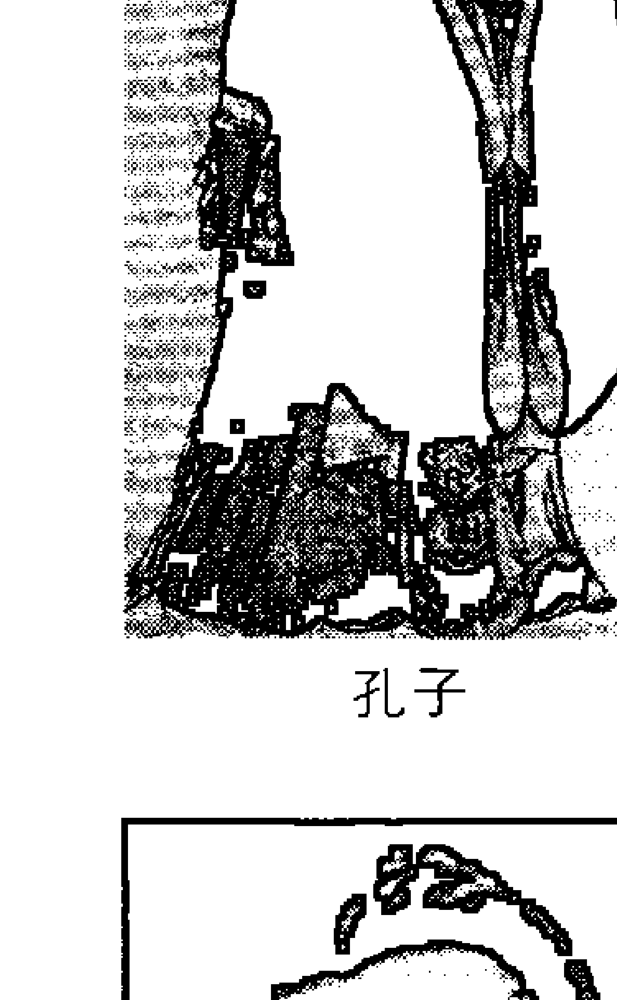

## 孔子

孔子（前551—前479），字仲尼。排行老二，春秋时期鲁国人。孔子是我国古代伟大的思想家和教育家，儒家学派创始人，世界最著名的文化名人之一。编撰了我国第一部编年体史书《春秋》。据有关史书记载，孔子出生于鲁国陬邑昌平乡（今山东省曲阜市东南的南辛镇鲁源村）。孔子逝世时，享年73岁，葬于曲阜城北泗水之上，即今日孔林所在地。孔子的言行思想主要载于语录体散文集《论语》及先秦和秦汉保存下的《史记·孔子世家》。

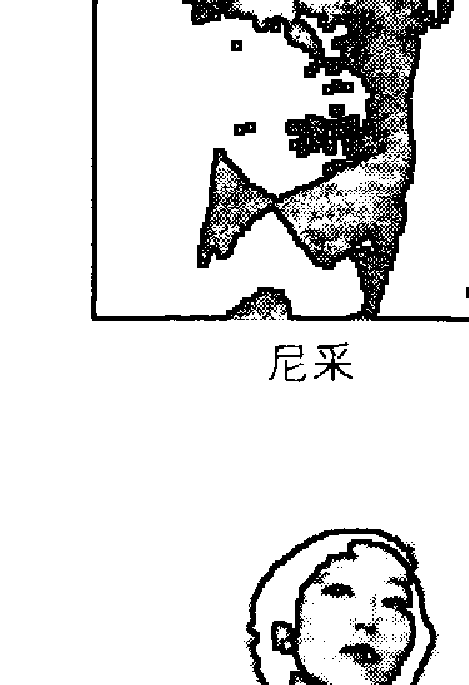

## 尼采

弗里德里希·威廉·尼采（1844—1900），德国著名哲学家。西方现代哲学的开创者，同时也是卓越的诗人和散文家。他最早开始批判西方现代社会，然而他的学说在他的时代却没有引起人们重视，直到20世纪，才激起深远的影响与各界的回响。后来的生命哲学、存在主义、弗洛伊德主义、后现代主义，都以各种形式回应尼采的哲学思想。

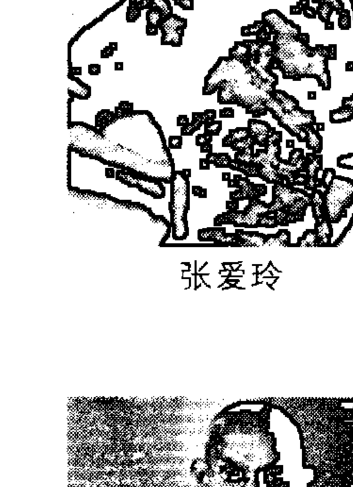

## 张爱玲

张爱玲（1920—1995），中国现代作家，本名张瑛，出生在上海公共租界西区的麦根路313号的一幢建于清末的仿西式豪宅中。张爱玲的家世显赫，祖父张佩纶是清末名臣，祖母李菊藕是朝廷重臣李鸿章的女儿。张爱玲一生创作大量文学作品，类型包括小说、散文、电影剧本以及文学论著，她的书信也被人们作为著作的一部分加以研究。1944年张爱玲结识作家胡兰成并与之交往。1973年，张爱玲定居洛杉矶。代表作品散文集《流言》，小说有《半生缘》《赤地之恋》《小团圆》。

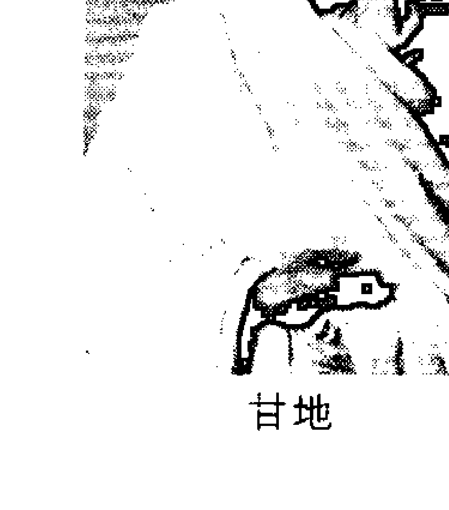

## 甘地

莫罕达斯·卡拉姆昌德·甘地（1869—1948），尊称圣雄甘地，是印度民族主义运动和国大党领袖。他既是印度的国父，也是印度最伟大的政治领袖。他带领国家走向独立，脱离英国的殖民统治。他的“非暴力反抗”的主张，影响了全世界的民族主义者和那些争取和平变革的国际运动。他在印度被称为“国家的父亲”，他的生日10月2日被定为甘地纪念日，是印度的国家法定假日，也是国际非暴力不合作运动的纪念日。

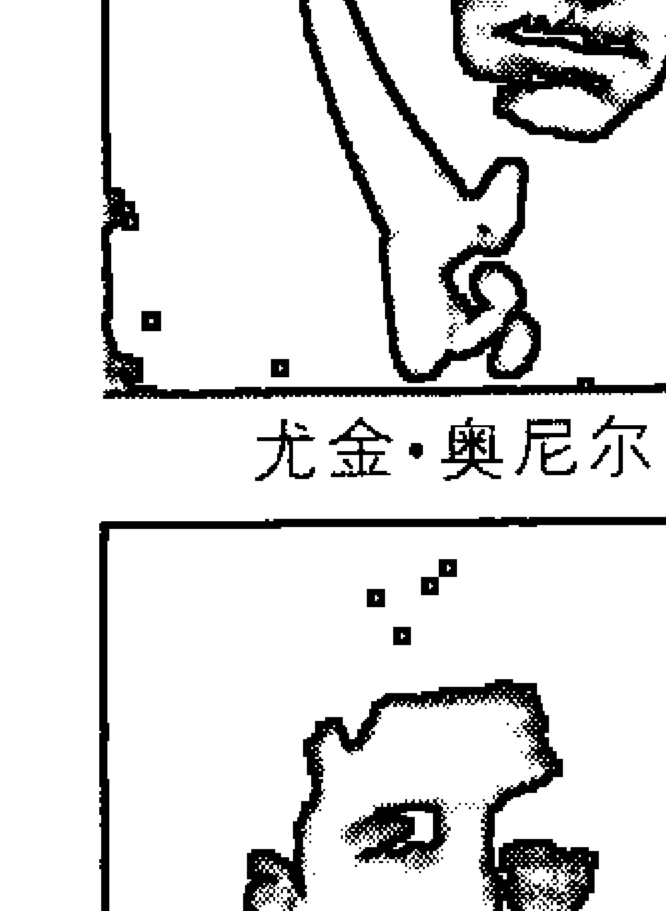

## 尤金·奥尼尔

尤金·奥尼尔（1888—1953），美国著名剧作家，表现主义文学的代表作家。主要作品有《琼斯皇》《毛猿》《天边外》《悲悼》等。尤金·奥尼尔是美国民族戏剧的奠基人。评论界曾指出：“在奥尼尔之前，美国只有剧场；在奥尼尔之后，美国才有戏剧。”一生共4次获普利策奖，并于1936年获诺贝尔文学奖。

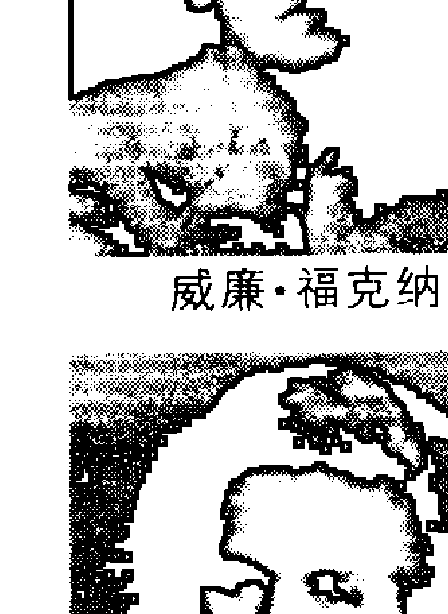

## 威廉·福克纳

美国作家威廉·福克纳（1897—1962）。他一生共写了19部长篇小说与近百篇短篇小说，其中15部长篇与绝大多数短篇的故事都发生在约克纳帕塔法县，称为约克纳帕塔法世系。其主要脉络是这个县杰弗逊镇及其郊区属于不同社会阶层的若干个家族几代人的故事，时间从1800年起直到第二次世界大战以后。世系中共600多个有名有姓的人物在各个长篇、短篇小说中穿插交替出现。其中最有代表性的作品是《喧哗与骚动》。

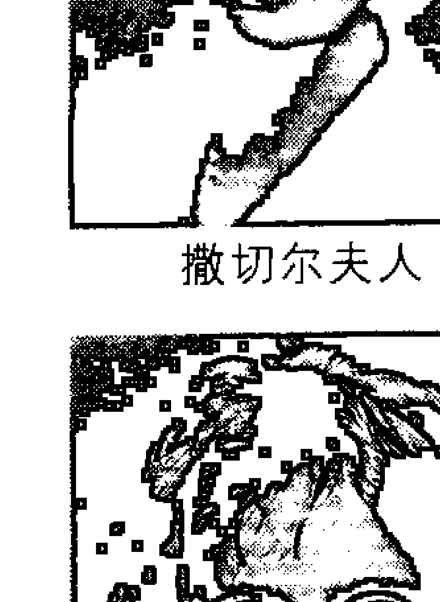

## 玛格丽特·希尔达·撒切尔

撒切尔夫人（1925—2009）。她是英国保守党这块“男人的天地”里的第一位女领袖，是英国历史上第一位女首相，而且创造了蝉联三届、任期长达11年之久纪录的女首相。英国自19世纪初叶利物浦勋爵连任二届共15年以后，再没有任何一个首相有过如此之长的执政时间。她是英国历史上第一个以其所推行的一套政策而被冠之以“主义”和“革命”的首相，也是20世纪优秀的首相之一。

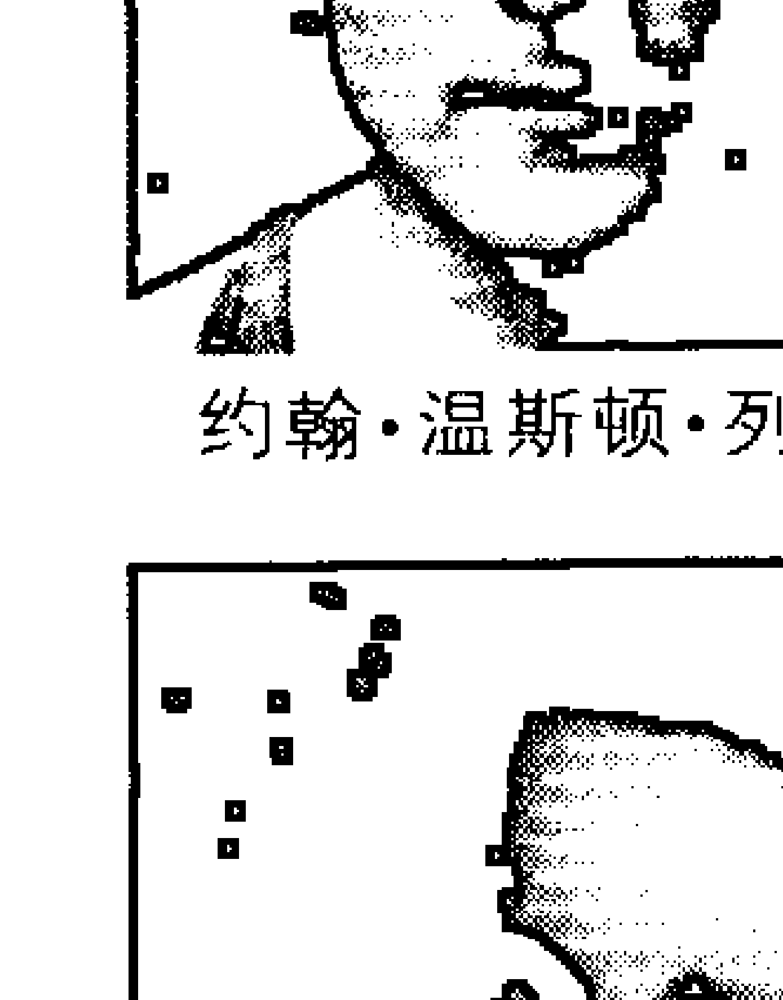

## 约翰·温斯顿·列侬

约翰·温斯顿·列侬（1940—1980），英国著名摇滚乐队“披头士”（The Beatles，也译作“甲壳虫”）成员，摇滚史上最伟大的音乐家之一，披头士乐队的灵魂人物，诗人，社会活动家，反战者。

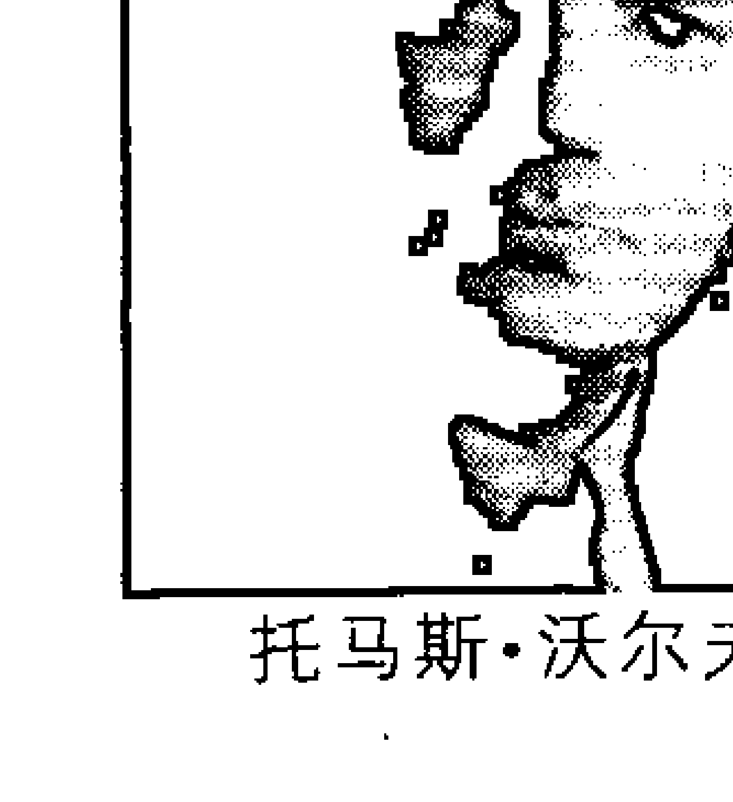

## 托马斯·沃尔夫

托马斯·沃尔夫（1900—1938），美国20世纪最伟大的作家之一。托马斯·沃尔夫是第一位超越地区而广受好评的美国作家。在20世纪30年代，很多评论都把沃尔夫看作少有的天才。代表作品有《天使，望故乡》《时间与河流》《网与石》《你不能再回家》等。

## 第九章 天蝎座的人

（10月24日—11月22日出生）

典型特征：神秘狡黠，强悍不屈，喜欢争强好胜，多疑，善妒，难以让人理解，有时会搞些小破坏。

### 第一节 天蝎座的人

### 一、天蝎座传说

太阳神阿波罗的儿子——巴野顿，天生美丽而性感，他自己也因此感到自负，态度总是傲慢而无礼。太过好强的个性常使他无意间得罪了不少人。

有一天，有个人告诉巴野顿说：“你并非太阳神的儿子！”说完大笑扬长而去。气得巴野顿直奔阿波罗问：“是真的吗？我到底是不是阿波罗的儿子呢？”但是不管母亲如何再三保证他的确就是阿波罗所生，他却另有目的——要求驾驶父亲的太阳马车，以证明自己就是阿波罗的儿子。

“这怎么行？”阿波罗大惊。太阳是万物生息的主宰，一不小心就会酿成巨祸。但拗不过巴野顿，阿波罗只得答应。

巴野顿一跨上车便得意忘形，结果当然很惨：地上的人们、动物、植物不是热死就是冻死，大地也因此陷入混乱。最后宙斯用雷电将他击落。众神为了遏止巴野顿，由天后赫拉放出一只毒蝎，咬住了巴野顿的脚踝，巴野顿因而丧命。为了纪念那只也被闪电击毙的毒蝎，这个星座就被命名为“天蝎座”。

#### 二、天蝎座概况

- 出生日期：10月24日—11月22日  
- 幸运色：暗红色  
- 幸运花：康乃馨  
- 幸运珠宝：红宝石  

### 外在形象

天蝎座的人头发黑亮、浓密，肤色较深，臀部特别丰满，身体重心集中在中间；额头宽广，眉毛粗浓，眼光锐利，颧骨平坦多肉，下巴线条有力；眼神深邃，能够让人产生压迫感，魅力独特，是12星座中最性感的。

### 性格特征

天蝎座的人口才好，能够与人打成一片，能够充分展现自己，而且能够轻松地说服别人，很受欢迎。他们很有谋略，能够洞察事物发展的关键所在，善于预见并解决问题，有时过于深沉，容易引起别人的戒心。

他们精力旺盛，在平静的外表下隐藏着过人的精力，这样不会让人产生防范意识，容易在竞争之中出其不意，脱颖而出。

他们的推理和分析能力很强，直觉更是敏锐非常，总是能一针见血地抓住关键，轻松愉快地解决问题。他们只要确定目标，就会非常投入，做到最好，能够充分发挥自己的能力。但过于追求完美，容易走极端，变得特别苛刻。

天蝎座的人不喜欢与别人商量，只要决定了的事情就会实施，不受别人影响，有时会一意孤行。但他们很自我，只在意自己的想法，丝毫不理会别人的感受。他们通常能够排除干扰，不走弯路，但是可能在不经意间伤害别人。

天蝎座的人非常有毅力，只要心中定下一个目标，便会坚持不懈地朝着既定目标前进。但是他们经常以自我为中心，别人提出的意见或建议根本听不进去。这样的性格非常容易树敌，应该学会宽容别人，学会接纳别人的想法和观点。

天蝎座的人眼光很犀利，能够洞察一切，但他们做事却未必仔细推敲、斟酌，因为他们的第六感很准，所以很多事情都是凭直觉去做的。

### 工作事业

天蝎座的人有敏锐的洞察力，善于捕捉机遇，加上他们的性格细心、固执，使得天蝎座的人在工作上无往不利，容易克敌制胜。他们体力充沛，适合从事有规律的工作，在大公司里工作成功的机会更大，所以在研究开发、律师、编辑、警察等领域能将才能发挥得淋漓尽致。

天蝎座的人不会为了名利而甘冒风险，“大树底下好乘凉”这句话比较适合他们。相对于自己创业而言，取得领导的信任、成为其心腹更有利于天蝎的发展。

天蝎座喜欢思考，有独到见地，能够找出问题的关键所在，所以他们适合从事有思想性的工作。他们能够把全部精力投入到长期的探索中，适合从事学术研究。另外，他们喜欢纪律和规范，能够严格遵守，因此也能够成为合格的军人或水手。

天蝎座愿意从事有成就感的工作，他们喜欢充分发挥自己的能力。为了满足自己对挑战的需要，他们可能会不停地变换工作，让自己重新开始奋斗。从少年时代起，他们就开始不断地取得一些小的成功，不过总体而言，他们属于大器晚成的类型，到了中晚年才能功成名就。

### 爱情模式

天蝎座的人比较内敛，不怎么会说海誓山盟的情话，却是12星座中感情最强烈的星座，能够专注而持久地面对爱情。他们希望可以爱一个人爱到底，也希望对方能够如此。

天蝎座的人在失恋后会保持冷静的态度，向他人诉苦也是让自己迅速消痛的方法之一。其实，在需要心与心相连的恋爱世界里，要想留住对方，与其采用各种技巧，倒不如直接表达自己的真实想法。

天蝎座的人对女性的态度像理解母亲的绅士，以男女平等主义者自居，但内心冷漠，精于算计。从性格上看不喜欢轻率的举动，对吃亏的事敬而远之，但对于已瞄准的目标决不会轻言放弃。一旦发现自己欣赏的异性，他会用满腔热情和不屈不挠的韧性打动对方，而且用情相当专一，所以也绝不容许对方变心。

天蝎座的人不善于把内心的真挚情感表达出来，表面上很冷酷，实际上内心深处却柔情似水，充满爱心。天蝎座的人在感情上的敏感和极端投入的精神，使得他们内心十分脆弱，害怕受到伤害，所以会非常小心地保护自己的感情世界。

### 最佳配对星座

巨蟹座。巨蟹座人可以真心相对，并分享彼此的感受。虽然对方遇上麻烦会有逃避的行为，常常令人反感，但还是应该给这只并不过分的蟹一个机会。巨蟹座人虽有遇事即逃的缺点，但巨蟹座的人颇具温柔品质。当你为创业失败、商机溜去而痛苦不堪时，真正能安慰你的可能就是那并不狡猾但是非常善良的蟹子了。

处女座。处女座实事求是，可能偶尔会忽略你的感受，但也并非那样不解温柔。你应该多体谅和迁就，感情才可有进展。你俩虽然都是完美主义者，但追求的方式不同：处女座按部就班，有些琐碎；天蝎座眼光较远，注重大结构，过程可能会有点跳跃，令处女座感到不能接受，这点得注意。

天蝎座。蝎子是12星座中最具神秘魅力的一个，也是深藏不露、有谋略的星座。两人在一起常会互相吸引、难分难解，也会互相观察、戒备；因为特质相似，一旦爱上就像天雷勾动地火。问题是：得踏出成功的第一步，才不会因彼此的防备而错失良缘。

### 最差配对星座

水瓶座。水瓶和天蝎都很聪明，直觉强，具有很独特的人格，并坚持自己的独立性。你们这对都是个性强硬的情侣，决策有力，行事突兀。除非你们性格圆滑些，否则爱情之路将会吃很多苦头。你们之间冲突的方式有点类似天蝎与狮子座的关系，都是权力的问题。此外水瓶座向往自由、不受规范的心态也会让天蝎痛心不已，因此在你心中又留下不少心结。

白羊座。你们俩一个是天王（蝎子），一个是孩子王（白羊），基本上除了好强好胜之外，个性及行为都是完全相反，一阴一阳。倘若果真受不了，不妨分手，也许是无法挽回的。当然最好三思而后行。

双子座。双子座精明，懂得关心人，在缠绵之际你专心致志，他情意绵绵。想抓住他的心，可以说既简单又很难。双子随时随地都希望爱人的出现。但是两人很容易吵架，双子的善变和蝎子的完美主义很容易让两人见面就争吵。

### 第二节 天蝎座的孩子

### 一、孩子的星座秘密

天蝎座孩子的听力在12星座中是最弱的，这使他们容易发呆。天蝎对音乐的鉴赏能力却相当强，很小就能理解古典乐的美妙之处，并为此爱上某种乐器。在学乐器的持久力上，天蝎座孩子是最有耐心的。

天蝎座孩子与生俱来的方向感在很小的时候就能显露出来。长大后，天蝎会是很棒的徒步旅行家，持久的耐力和空间感会帮助他走完全程。如果愿意，他还可以成为马拉松健将，孤独地走在跑道上，将对手甩得远远的。

受幸运色的影响，蓝色的服装会给天蝎座孩子带来好运。几乎所有的天蝎都不喜欢纽扣，纽扣会给他们带来束缚感，因此套衫可能是最适合他们的。天蝎座孩子不喜欢鞋带的束缚，松紧带或船鞋会深得他们的喜爱。

### 二、孩子的学业

水相星座的特质使天蝎座的人有些神秘。天蝎座的人对于事情真相的了解往往异于常人。精明、锐利的心智，使他们非常适合从事记者、科学家、医生、评论家的工作。由于喜欢神秘性的事物及善于观察细微的事物，所以也适合做警察、侦探或间谍。

天蝎座的人非常有自信，读书很有自己的一套方法。事实上，他们是别人眼中可怕的敌手，很能了解别人的弱点，知道如何去击败对手。对于不喜欢的老师总是非常憎恨，不管他是不是好老师；但不喜欢的功课却能设法突破。学习对天蝎座孩子来说从来都不是问题，他们只需要更多的自信。

### 三、孩子的特殊才能

天蝎座孩子是个奇特又充满魅力的孩子，他们具有犀利的观察力与超高的领悟能力，极富同情心与正义感。这个孩子的隐私权不能被侵犯，他们也比同龄孩子聪明。他有一双极其敏锐的眼睛，能洞察人的弱点。他们的神秘性、选择性、好斗性、狂热性和不妥协精神，常常给人们留下深刻的印象。

孩子的爸妈需要给予其坚定而明确的管教，教导他控制自己的脾气，否则会伤害他们自己。爸妈一定要相信他，别勉强他，总有一天他会达到自己的目标。

### 有自己的主见

天蝎座孩子的人生就是为了打赢一场胜仗。他们不会妥协，只会假装屈服，实际上是为争取时间获得有利于自己的形势。天蝎小童以犀利的目光著称，能看进你的灵魂。一旦他了解了你的心思，他将让爸妈听命于他。所以最好早点准备接受，或和他一起玩黑色的滑稽魔术吧。

### 坚定的意志力

天蝎座小童需要经常而坚定的管教。天蝎座小儿少见的勇气与诚实的个性，大大值得父母去教养，保护他们优越的自尊心免受摧残。当你用眼光表示孩子不得如何时，他会回瞪你一眼。此时请用温柔且坚定的眼光告诉孩子：他会表现得比你预期的更好。天蝎座小童只会向比他更优秀的人物学习，所以他会钦佩爸妈在管教他时的坚定意志。

### 注重自己的隐私

由于天蝎座小孩坦白，使他表面上看来相当直接；但实际上，他重视自己的隐私权。他的秘密是不能窥探的。他需要有一个百宝盒放自己的东西，还需要自己的衣橱，小女孩更需要一本带锁的日记本。

他会刺探每一个家人的秘密，也有本事发掘遗失的东西。他会用古老的魔法及冷峻的逻辑来解开所有的神秘事件。

### 天生的领导力

天蝎座小童有一种不可思议的忍受疼痛的力量。他们比同年龄的小孩聪明，天生的领导力有时候是种福气。当爸爸为财务问题所困扰时，小天蝎会适时出现表达对父亲的关怀；当妈妈生病不舒服时，小天蝎也会出奇不意地轻柔又安静地给妈妈一个吻来安慰她。天蝎小孩对他的朋友及心爱的人充满了无限的忠诚。

### 出色的领袖

天蝎座金童和玉女对事物明察秋毫，若有好的老师来引领，会成为班上的领袖。保持心智灵活及体能活跃，家长不妨多鼓励他以做一个航天员、航海家、救火员、部长、娱乐家，甚至总统为志向，还要信守给予他的长期承诺。

### 第三节 天蝎座的女人

### 一、低调的天蝎女

天蝎女分手后完全不会像处女座、巨蟹座的女生那样在人面前要死要活。她嬉笑怒骂，变得更加“开朗”。在听到有关他的消息时，从不刻意回避，她适当参与，淡然微笑。她的表现总会遭人怀疑这段感情的深浅，而人群中只有那些知道背后情节的人才看见她背后的眼泪和努力。

天蝎座的女人从来不会在情人面前大声哭泣，但她几乎每晚都躲在被窝里独自哭泣到天亮。天蝎座的伤不浓烈似酒，只是一杯白水，可是她们早已让它渗入生活的点滴。她们选择在其中淡定，在其中沉默。

天蝎座的女生就是这样：外表坚强，内心脆弱，孤傲只是用来保护自己，害怕被伤害。

天蝎不是一个平常的星座：最不会讨人欢心，最重自尊，最讲义气，最有保护欲，最没有秘密，灾难中最冷静乐观，最暴躁，最怕寂寞，最不被理解，最没耐心，最冲动。

天蝎座的女人也不是平常的女人。她充满阳光的气息，常喜欢指示别人。她的家庭不一定很富裕，但她习惯了养尊处优，她很优秀，也习惯了掌声。

她五官或许不是很精致，但却有一种让人想多看一眼的独到气质。她喜欢热闹，也享受孤独，静坐在一个人的房间里听着很伤感的音乐。

她总是习惯在人前伪装得很坚强，其实她很脆弱，也很善感。她经常会觉得孤独、寂寞，也常常想一个人。她从不轻言爱，她的爱很沉默。那并非因为缺少勇气，在她的心里有一道栅栏，那就是自尊，她看得比生命更尊贵。

如果有一天蝎女人对你说她爱你，那么请你好好珍惜她。因为当一个天蝎女人向你说她爱你的时候，就代表在她的心里你的分量胜过了她的自尊，甚至她的生命。其实天蝎座女生自尊心很强，是因为她们忍受不了别人对她的轻忽。

### 二、理智且感性的天蝎女

天蝎座的女人感性而理智。理智多半表现在工作上，在感情上，她们的EQ可能只有50分甚至更低，因为她们天生多疑，缺乏安全感，永远在寻找一个避风港，一个可以依靠的对象。

在家里，她们永远都是单纯任性的小女生，喜欢撒娇却又比较霸道的小可恶。她们从来不愿意认错，也不愿意主动表现自己的好。

对于爱情，天蝎座女生爱恨分明，容不下一丝背叛。她们外强内弱，因为强势和骄傲，因为不妥协和不善于表现，总是让自己的情人误会。他从来不曾看她对自己好过，从来不曾见她温柔过，她总是在数落他的不好。其实她悄悄为他做了很多事，只是太骄傲，不想当着他的面做。她一直在努力做个小女人，也一直很依赖他，只是喜欢反着来表现。

她们总是忽冷忽热，情绪变动比较快。而她们总是一副洞察天下事的表情，让你不敢说一句假话。事实上，以天蝎的敏锐和超强的第六感，没有人能逃过她的眼睛。

如果能经受住天蝎百般的考验和魔鬼式的训练，那么他会幸运地成为她的真爱。她们怕太认真，怕爱得太强烈。不爱的时候冷冷的像冰，爱的时候热情似火，让人无所适从。

她们的思想比较偏激，要么爱，要么彻底不爱。所以天蝎的爱往往轰轰烈烈。谜一样的天蝎女寻觅灵魂相属的伴侣，对爱情总是要求尽善尽美。她们不求轰轰烈烈完全完全的爱，对于未来却充满疑惑和猜测。想要寻找百分之百的爱情，但却因为倔强的个性而出现争吵、欺骗、信任危机，最后导致自己遍体鳞伤。

天蝎座女子渴望在激情中释放自我，忘记那些残酷冰冷的现实。天蝎座的女人是可敬的，是伟大的，是忠贞的，是唯美的，是可悲的，也是可畏的。就如同她们看似不够完美的脸孔一样，却显得妖娆妩媚、性感迷离。她们有着天生的独特气质，也有着一双隐逸而狡黠的眼睛。

天蝎女不容许自己犯错，也不容许失败。对于自己想得到的东西，她们会等待一个成熟的时机，然后全力以赴，即便是飞蛾扑火也在所不辞。假使她们失败了，便常常一蹶不振，甚至郁郁而终。

### 三、对爱情的执著

拥有神秘魅力的天蝎座女子，常被其他女性视为爱情的威胁者。她并不一定很美，但通常她的一颦一笑，就会让男人心里小鹿乱撞。她似乎有着一种激发异性内心深处原始欲望的力量。

有些天蝎座女子在外型和眼神中就传达出“勾魂摄魄”的气质。天蝎座女子尤其在年纪很轻的时候，常常会像一只纯洁可爱的小白兔，满眼无邪的性感。不过，如果你因此而有了浪漫一下又何妨的念头，那你可就打错如意算盘了。通常她敏锐的眼神立刻就能看穿你的心意。不过，就算你狡猾地骗到她的爱情，肯定会得到教训的。你多少总看过一两部女性复仇的电影吧！那些不顾一切报复负心男友的女主角非常像天蝎座的女人。

天蝎座女子都有着异于常人的坚强态度。她可以柔媚似水，也可以激烈似火。在很多情况下，天蝎座的女人表现出的勇敢令男人望尘莫及。假如她真心爱上你，即使全世界反对，都不会让她动摇。无论你们前途有多坎坷，她会陪你一起闯，而且绝不叫苦。她的坚忍会让你觉得自己好像拥有了百万雄师。当一个天蝎座女人对你承诺“至死不渝”的时候，她是认真的，而且她真的可以做到。

天蝎座女子还有一点令人佩服的地方是，她们抑制情绪的本事。你几乎看不到一个涕泪纵横、情绪崩溃的天蝎座女子。不是说她们不会，而是她通常不会让你看到。即使她的心情痛到自杀的边缘，如果她不想让你知道的话，你还是什么都看不出来。在遭遇强烈打击的时候，天蝎座的女人可以冷静似冰。

当然，想要拥有如此强烈而炽热的爱，你势必得忍受她一些个性上的小缺点。天蝎座的女子是有一点多疑的。她似乎想要探知你一切的秘密，她无法忍受你一丝一毫的隐瞒，更不要说是欺骗了。关于这一点，你最好不要自找麻烦。骗她可不是件容易事。天蝎座女人有刺探秘密的原始欲望和本事。不过，至于她的秘密，她可以守口如瓶。你最好不要好奇。她是那种可以守一辈子秘密的女人，极其沉得住气。

天蝎座女子在吵架的时候，可是句句话都像刀，杀得你遍体鳞伤。除非她发现你们彼此不再相爱，她或许会想别的办法修复你们。比如说“冷战”，这也是天蝎座女人的看家本领之一。总之，如果你激怒了她，或是你做错了事，她认为你该得到一些教训的话，她势必会找到惩罚你的方式，直到她认为你确实得到了你“应得的”，方可善罢甘休。

天蝎座的女子对自己的男人的确有一点支配欲，那是她事事都想参与的目的，绝不是为了凌驾于你，成为你的女王，她只是想要全力帮助你走向成功之路，因此才会事事都为你打算。如果你没有照她的意思去做，她会有一种恨铁不成钢的失望。她渴望你是一个坚强、勇敢又有智慧的男人，却又担心你会太过独立而离她太远。这一切的不信任、多疑，以及强烈的占有欲，全是因为爱你才如此啊！天蝎座的女人没有平淡的爱，若不是全部，就是没有。而她对你的要求也是如此。

### 第四节 天蝎座的男人

### 一、散发魅力眼神的天蝎男

天蝎座的男人是杯烈酒，即使有些外表看来温和淡然，他依然是一杯看起来像白开水的高粱酒，在你毫无防备地一饮而尽之后，马上醉得你分不清方向了。

他是无敌铁金刚，唯一免于被他打败的方式，就是永远不跟他作战。你有两种方式，一是无怨无悔地爱他，再不然就是把自己练成金刚不坏之身。

天蝎座的男人带有魔鬼般的魅力，让你有如被催眠一样被他吸引。他忽而热情如火，忽而冷漠像冰。如果你跟他挑起战端，倒霉的准是自己。吵架的时候，他会口不择言，每一句话都让你心碎，你一定会恨死他了。可是等他怒火平息，他弯下腰吻你滴血的心，那种甜蜜又立刻麻醉了所有的疼痛。他就有这种能耐，爱上他，就请准备强壮的心脏坐爱情云霄飞车吧！去问问那些曾经为天蝎座男人疯狂，又为他们心碎的女人，他的魅力究竟在哪里？在他的眼神。

天蝎座男人有一眼刺穿你的本领。他似乎一眼就看出了你渴望些什么、害怕些什么，在他面前你似乎不需要什么告白和辩解，伪装是没有什么用的。除非你对这个天蝎座的男人完全不来电，否则在你的眼光与他交会的刹那，你就注定难逃这场惊心动魄的爱情历险。

很多深谙世故的女人在天蝎座男人放肆的眼神下也会觉得羞愧，就好像是当众被剥去了衣服一样。他总能轻易掌握你的弱点，如果你不信邪，想要跟他斗法，最好的结果也顶多是两败俱伤。不过这种情况不太多，多数时候都是他冷冷地看着你遍体鳞伤地躲在角落哭泣。

想要躲避天蝎座的男人真的很难，因为真的很少有人比他能忍，比他不怕痛。想清楚了吗？如果想逃，请务必彻底消失。如果决心守着他，就请你最好心悦诚服，不要引起他任何对你挑衅的念头。

### 二、坚韧不拔的天蝎男

天蝎座的男人除了对异性有着难以解释的吸引力之外，他的个性的确也有着独特的优点。他坚强而有韧性，他勇敢面对失败，他坚持自己的主张，不怕所有的反对和阻挠。对于他所选择的工作，有着永不熄灭的热情。不管是看他，或是陪他做任何事都很过瘾。

他那种全情投入、势在必得的表情真的非常迷人。他在面对挫折时的坚强勇敢会让你觉得骄傲。虽然有时他故意找麻烦令人讨厌，但是你仍得承认他讨厌得很可爱。

天蝎座男人的醋劲，也跟所有其他的情绪一样强烈。这一点你可千万要小心，一旦燃起他嫉妒之火，你恐怕会很难收拾。不过，他引起你吃醋的机会可能多得不胜枚举，而你的愤怒、泪水，甚至寻死寻活，恐怕对他起不了什么作用。在这一方面你除了给他完全的信赖之外，就是让自己有十足自信。不过凭良心说，天蝎座的男人都挺有定力的，他诱惑别人很容易，别人想诱惑他恐怕没这么简单。不要光听他说得漂亮，想想他为你做的一切，其实他对你也挺好的，不是吗？只是坚持用他的方式爱你罢了！做一个成熟勇敢的女人，你才能真的体会到天蝎座男人的热情和刺激，无人可比。

如果你决定嫁给一个天蝎座的男人，请终生记得：绝不要有统驭他的欲望。

### 三、神秘的天蝎男

天蝎座的男人有着强烈的第六感，神秘的洞察能力及吸引力，做事常凭直觉；虽然有着敏锐的观察力，但往往仍靠感觉来决定一切。天蝎座男人个性强悍而不妥协，也非常好胜，非常有毅力。由于是水象星座的缘故，天蝎男在情感上亦属多愁善感型，以自我为中心，对别人的观点往往不予理会。通常他们是深情且多情的，虽然表面上看起来很平静，温文儒雅、沉默寡言，但内心却是波涛汹涌。他们在决定行动时会表现得大胆积极，属于敢爱敢恨的类型。

总之，天蝎座是一个有强烈责任感、韧性强、有概念、会组织（条理化）、意志力强、支配欲强烈，对于生命的奥秘有独特见解的本能，并且永远有着充满精力的复杂“混合体”。

天蝎男的神秘特质更是魅力四射。他是能对唯一情人钟爱不变的人。多年深爱一个人是他的特征，且很珍惜与对方亲密相处的时光，甜蜜型的人才能符合他的期望。一旦对他充满温柔、想和他黏在一起的情人，才能与他长相厮守。

他的才华深藏不露，以精神享受为荣。他的正义感强烈，隐藏着热烈的感情，莫让他生出优越感或沮丧的情绪。

### 四、严厉的天蝎父亲

天蝎座的父亲是个实际的教育家。他爱孩子，却不会把孩子宠坏。他不会允许小孩欺骗他。他会教育孩子现实生活的法则，帮助孩子独立。有的天蝎座父亲会显得太过严苛。虽然这一切都是为了孩子好，但多数时候孩子长大了都会感激他。不过你还是应该适时地提醒他，除了教育之外，孩子更需要温暖的父爱。成年后，孩子会为自己有这样的父亲而感到自豪、骄傲。孩子们从父亲的训导中得知生活的真谛。他们觉得父亲既严厉又滑稽，所以他们很尊敬父亲。天蝎座父亲有时会和孩子们说笑打闹，但有分寸，孩子们不敢越过这个边际。

天蝎座的男生外表给人的感觉很厉害，看起来很花心，不过其实那是因为老婆不在身边或者看不到的时候才会这样。天蝎男人选择结婚，一定是因为他很爱对方。如果双方之间出现裂痕，他一定会努力去搞清楚裂痕是怎么出现的。他不能接受人家误会他，因为他很清楚如果双方婚姻破裂，连朋友都没有办法做，所以能尽量维持他就会尽量维持。

### 第五节 天蝎座的名人

### 渡边淳一

渡边淳一（1933—），日本小说家，被誉为日本情爱小说大师。渡边淳一出生于日本北海道，毕业于札幌医科大学，随后任母校整形外科讲师。在做了10年的外科医生后，渡边淳一转而从事专业文学创作，著有50余部长篇小说及多部散文、随笔集。作为当今日本现代浪漫小说的著名作家，仍活跃于文坛。代表作品有《失乐园》《无影灯》《光与影》《钝感力》《遥远的落日》。

### 小约翰·施特劳斯

小约翰·施特劳斯（1825—1899），圆舞曲之父老约翰·施特劳斯的儿子。他的两位弟弟约瑟夫·施特劳斯和爱德华·施特劳斯也是著名的音乐家。不过小约翰是整个家族中成就最大、名望最高的一位，并为19世纪维也纳圆舞曲的流行作出了巨大贡献。他“圆舞曲之王”的称号是由于他把华尔兹这种原本只属于农民的舞曲形式提升为了哈布斯堡宫廷中的一项高尚的娱乐形式。此外，他的作品的艺术成就大大超越了他的前辈们（例如约瑟夫·兰纳和老约翰·施特劳斯），也更为人所熟知。

### 毕加索

巴勃罗·鲁伊斯·毕加索（1881—1973），西班牙画家、雕塑家，法国共产党党员。是现代艺术的创始人，西方现代派绘画的主要代表。他是西班牙人，自幼有非凡的艺术才能。他的父亲是美术教师，他又曾在美术学院接受过比较严格的绘画训练，具有坚实的造型能力。代表作品有《斗牛士》《拿烟斗的男孩》《费尔南德头像》。

### 希拉里·黛安·罗德姆·克林顿

希拉里·黛安·罗德姆·克林顿（1947—），美国政治人物，美利坚合众国第67任国务卿，为美利坚合众国第42任总统威廉·杰斐逊·克林顿夫人。2000年2月，尚未离开白宫的希拉里宣布竞选纽约州参议员，成为美国历史上第一位谋求公职的第一夫人。同年11月7日，她当选为国会参议员。2006年，她获得连任。在2008年美国总统民主党党内预选期间，希拉里作为强有力的竞争对手曾一度领先奥巴马，但最终以失利告终。

### 比尔·盖茨

比尔·盖茨（1955—），美国企业家、软件工程师、慈善家以及微软公司的董事长。他与保罗·艾伦一起创建了微软公司，曾任微软CEO和首席软件设计师，并持有公司超过8%的普通股，也是公司最大的个人股东。1995年到2007年的《福布斯》全球亿万富翁排行榜中，比尔·盖茨连续13年蝉联世界首富。2008年6月27日正式退出微软公司，并把580亿美元个人财产尽数捐到比尔与梅琳达·盖茨基金会。《福布斯》杂志2009年3月12日公布全球富豪排名，比尔·盖茨以400亿美元资产重登榜首。

### 朱莉亚·罗伯茨

朱莉亚·罗伯茨（1967—），原名朱莉亚·菲奥娜·罗伯茨，1967年10月28日生于美国佐治亚州斯迈那市。从未想过要当美国人气最旺的女演员。童年时候，曾因酷爱动物，产生过当兽医的愿望，但后来学的是新闻专业。在好莱坞演员的哥哥埃里克·罗伯茨小有成就之时，朱莉亚下决心前往好莱坞试试自己在表演方面的运气。1988年取得突破，在两部青春题材电影《现代灰姑娘》和《满意》中表现突出，迅速赢得一大批喜欢她的影迷。

### 夏尔·戴高乐

夏尔·戴高乐（1890—1970），法国将军、政治家。他曾在第二次世界大战期间领导自由法国运动，并在战后成立法兰西第五共和国并担任第一任总统。戴高乐支持发展核武器，制定泛欧洲外交政策，努力减少美国和英国的影响，促使法国退出北约，反对英国加入欧洲共同体，承认中华人民共和国，这一系列思想政策被称为“戴高乐主义”。

### 道格拉斯·诺斯

道格拉斯·诺斯（1920—），新经济史的先驱者、开拓者和倡议者。由于建立了包括产权理论、国家理论和意识形态理论在内的“制度变迁理论”，获得1993年诺贝尔经济学奖。曾任《经济史杂志》副主编、美国经济史学协会会长、国民经济研究局董事会董事、东方经济协会会长、西方经济协会会长等职务。历任华盛顿大学经济学教授、剑桥大学邱吉尔学院机构教授、圣路易大学普林斯顿与自由教授及经济与历史教授，现在为华盛顿大学经济系卢斯讲座教授。

### 玛格丽特·米切尔

玛格丽特·米切尔（1900—1949），美国现代著名女作家。她生于亚特兰大市，曾获文学博士学位，担任过《亚特兰大新闻报》记者。1937年获普利策奖，1939年获纽约南方协会金质奖章。1949年不幸在车祸中逝世。她短暂的一生并未留下太多作品，但只一部《飘》就足以奠定她在世界文学史上不可动摇的地位。

### 马丁·路德

马丁·路德（1483—1546），出生在日耳曼中部图林根州的艾斯莱本附近的艾斯莱本——撒克森伯爵（选侯）领地。16世纪欧洲宗教改革倡导者，新教路德宗创始人。

## 第十章 射手座的人

（11月23日—12月21日出生）

典型特征：热情，理想远大，狂热追求信仰，甚至不顾他人感受。好奇心强，什么都想尝试，爱好运动及旅行。

### 第一节 射手座的人

### 一、射手座传说

在古希腊的大草原中，驰骋着一批半人半兽的族群，这是一个生性凶猛的族群。“半人半兽”代表着理性与非理性、人性与兽性间的矛盾挣扎，这就是“人马族”。人马族里唯一的一个例外——喀戎。喀戎虽也是人马族的一员，但生性善良，对待朋友尤以坦诚著称，所以喀戎被推任为族人的首领。

有一天，希腊最伟大的英雄——赫拉克勒斯来拜访他的朋友。这位幼年即用双手扼死巨蛇的超级大力士，一听说人马族也是一个擅长酿酒的民族，想到香醇的佳酿，也不管这酒是人马族的共同财产，便逼迫他的朋友偷偷拿给他享用，否则就打死他。所有人都知道，赫拉克勒斯是世间最强壮的人，连太阳神阿波罗都得让他三分。迫于无奈，这个人马族人只得照着他的吩咐办。

正当赫拉克勒斯沉醉在酒的芬芳甘醇之际，酒的香气早已弥漫了整个部落。所有人马族都厉声斥责赫拉克勒斯。赫拉克勒斯愤怒地举起弓箭，拿着他的神弓奋力追杀人马族。人马族人仓皇地逃至最受人敬爱的族人——喀戎家中。

这时喀戎在家中听见屋外万箭齐发的惊慌求救声，连忙开门直奔出去。说时迟那时快，赫拉克勒斯拉满弓箭射出去，竟然射中了喀戎的心脏。善良无辜的喀戎为朋友牺牲了自己的生命。天神宙斯见了人马的牺牲，于是他双手托起喀戎的尸体，往天空一掷，喀戎瞬间幻化成数颗闪耀的星星，形体就如人马族。从此为了纪念喀戎，这个星座就称为“射手座”，也叫做“人马座”。

传说人马座呈现的是半人半马形态，具有动物和人类双重面目，是个著名的先知、医生和学者。他是希腊著名大英雄杰生、阿喀琉斯和亚尼斯的抚养者。传说他是克洛诺斯和斐莱拉之子。克洛诺斯在受惊吓后把自己变为马身，其母斐莱拉受不了儿子半人半马的怪模样，变成了一棵菩提树。

#### 二、射手座概况

- 出生日：11月23日—12月21日  
- 幸运花：蔷薇  
- 幸运色：花茶色、蓝紫色、天蓝色、纯白色  
- 幸运石：橄榄石  

### 外在形象

射手座的人头发浓密，头型饱满，大腿发达，重心较低；脸型椭圆，五官精致，前额高，眼神生动，鼻子修长，唇形优美，下巴较尖；眼睛明亮机灵，笑容自然，开朗率真，不固执。

### 性格特征

射手座的人喜欢一切空间广阔的户外活动，特别是骑马奔驰。此星座人无论精神上还是实际生活中都有对未知领域探索的倾向。他们认为生命是由一连串的挑战组合而成的，对任何事都满怀信心。在成长过程中，若发现可以狩猎之处必如满弦之箭般捕猎猎物。对射手座而言，生命过程中的理想和憧憬，往往比目的更重要。

射手座的人年轻时作风莽撞，开车喜欢超速的快感而很少顾及安全，有时过度追求刺激的倾向，且生性乐观，甚至有点盲目乐观。因此射手从犯错中受到教训的次数较其他星座频繁。年轻时常会有不合传统的举止，但年老时很容易忘记年轻时的莽撞而成为古板的人。虽然他终生不改崇尚个人自由的习性，但总能发挥与生俱来的智慧，很可能会涉及和哲学有关的领域。

射手座的人相当擅长思考，非常爱好追求真理及正义，喜欢探讨自己所不了解的领域。语言是他们拓展见闻的工具。他们常会着眼于自己能力所不及的事物，将之视为简单易得的目标而全力追求，总是在完成一件事情之前就会开始另一个计划。

射手座的人和双子座的人一样，天生多才多艺，经常从事一种以上的工作，具强烈的野心，是相当出色的执政人才，非常适于从事政治。因经常脑力劳动过重，故需大量运动来缓和压力。当他们感到疲倦时，多半是因为单调无聊所致，只要换个工作就能恢复一贯的生气。

### 爱情模式

射手座人浪漫多情，对世界充满好奇，尤其缺乏戒心，故常因冲动而受到伤害。幸而乐观的个性使他们不至被挫折击倒，反而有再试一次的勇气，所以常有人误以为他们游戏爱情。喜欢两性交往，所以常会有从友情转化成爱情的情况发生，事实上他们往往也不清楚这两者的区别。虽然渴望快乐，但异性朋友中可能有许多柏拉图式的精神恋爱。

他们在情感上需要有适度空间来容纳其所崇尚的自由。善妒或是占有欲过强都会使他们丧失热情。如果在婚姻中得不到适度的自由，连带日常生活也会受到影响——在双重束缚下，他们很可能会产生挣脱枷锁的念头。

射手座人的恋爱一般都会从知性的接触开始，所以他们通常会选择聪明、健康的对象。由于他们行动的范围非常广阔，因此心仪的对象也不会只是一个人。好奇的个性容易使他们喜新厌旧，只是日久生情，这对培养长久的爱情十分不利。而射手座的人在热恋阶段总是和对方腻在一起，导致他很快就会对这段感情产生厌倦。当然，射手座的人对待爱情从不拖泥带水。他们爱慕的对象是心胸开阔、喜欢冒险和精力充沛的异性，但是当他觉得彼此之间的爱情已经变质，甚至已经消失时，便会毫不犹豫地抽身离开，不会有任何留恋。所以，和射手座人恋爱时，要慎重选择恋爱对象，以免伤害彼此。

### 最佳配对星座

白羊座。他们都是火象星座，是一拍即合的一对。他们的恋情往往是从一见钟情开始的，而且相处的时间越久，感觉就越对。他们是热情大胆的组合，即使是在公众场合也情意绵绵，真让旁人羡慕。双方都愿为对方付出一切，在爱情的天平上，两个人的分量不相上下，大家都不会将自己的主观意识强加给对方，真是天生一对。

狮子座。这两个星座容易一见钟情，相互的热情可以将对方融化。狮子座女子被射手座的男子气概所吸引，射手座的心野迷恋狮子座的光芒。两个人都是活泼好玩的人，都不会去刻意控制对方，能够给对方充分的自由空间，所以两个人都不会感到对方带来的压力，是完美的一对。

双子座。他们都很外向，朋友很多，而且都有异性缘。正是由于这样，他们单独在一起的时间肯定会很少，没有时间享受二人的甜蜜世界。刚开始时，互相会觉得对方有魅力，但是时间长了就有麻烦了。结婚后最好不要两地分居。

### 最差配对星座

巨蟹座。射手座的人大大咧咧，从不着家，而巨蟹的人感情细腻，喜欢待在家里。开始的时候，是射手没心没肺的个性吸引了巨蟹，但是相处下来，巨蟹发现射手根本给不了她想要的安全感，而射手对于巨蟹的痴缠也很头疼。这样发展下去，两人将会终日吵架，射手往往不予理会，出去寻找自己的快乐，而巨蟹就只能一个人伤心。

天蝎座。喜欢胡乱猜疑的天蝎座人最无法忍受对手的热情、奔放，而习惯了自由的射手座也不习惯受到束缚。个性如此对立的两个人走到一起的一个原因可能是…性方面的吸引。但是如果想要长时期相处，那就要两个人一起努力了。摩羯座不管是对自己还是对别人都严格要求，所以他们不能忍受射手座那种游戏人生、玩世不恭的生活态度；同样，射手座男对于摩羯女不苟言笑的生活方式也嗤之以鼻。恋情刚开始的时候，摩羯座人的稳定踏实可以给予射手座人心灵上的慰藉，而摩羯也会受到射手的影响，跟随着射手追求生活的快乐。但时间一长，便发现两人思想上很难沟通，更不用说生活在一起了。

### 第二节 射手座的孩子

### 一、孩子的星座秘密

笑容可掬、生气勃勃，十分容易冲动。射手座的孩子需要自由和有益于健康的快乐。他喜欢骑马、骑摩托车、滑雪或坐上小艇去探险，或者到遥远的国度去旅行。

他的主要优点是忠诚和具独立精神。如果人们能正确对待和理解他，他会表现得十分理智，而且完全可以信任你；但是如果人们强迫他，就再也无法奈何他，他会躲避到另一危险的极端中去。

一般地说，外界生活要比学习更能吸引他。射手座的孩子特别有语言天才，他总是向往着遥远的地方，外国和旅行将是他命运中不可分割的一部分。他喜欢随心所欲的生活方式，而不愿意把自己锁在条条框框中，他也喜欢抛头露面的工作。

### 二、孩子的学业

因为家庭教育方式对孩子影响最大，孩子的父母一定想知道孩子们究竟哪方面最强，哪些方面才是孩子的特长所在，只有这样才能好好挖掘和培养孩子的天生才智，激发孩子的内驱动力。

由于思想非常直接，因此太过复杂的学业会使他们头痛不已，或是别人一下就了解的，他们却一直搞不懂。很少有不喜欢的老师，就算有，也不会持续太久。对于不喜欢的功课则保持放弃的心理，这对于他们是件不好的事。直觉能力很好，判断力通常也很正确。

射手座是火相星座，非常主动、外向。射手座孩子很难专心一致，因为他们的想象力太丰富，总以为把书垫在头下面睡觉，明天早上醒来就可以记得。他们猜题或猜答案都蛮准确的，但理解分析能力及记忆力稍差，他们思想上的稳定性及平衡性也有待加强。

射手座孩子一入学，放下书包的第一件事就是仔仔细细到校园里参观，从教学楼到图书馆，从饭堂到浴室，从运动场到林荫路，大到一棵树，小到一株草，不用一个星期，没有他不熟悉的地方。

射手座孩子的读书方式是好奇型的，他对于任何未知的领域都有兴趣研究，追求更真、更善、更美。在语文与专业科目上的表现，射手座孩子常常超越一般人。考试时，他会先将所有问题依重要性排序，依序作答是他们事半功倍的良策。

### 三、孩子的特殊才能

射手座孩子喜欢去旅行、探险，对于韵律、动作和旅游的喜好向来使他们富有传奇式的名声。外界生活要比学习更能吸引他们。虽然他们很独立，但更需要同伴，不喜欢孤独，不会为分享而争吵。然而他们绝不会顺从任何不公平的游戏与裁决。熟悉的人和事物才能给予他们安全感，最少不了的还是爸妈的拥抱。

射手座孩子性格开朗，思想活跃，对世界上发生的一切事情都有浓厚兴趣。他们非常好动，擅长体育，想象力丰富，好奇心强，能长时间地接触一项玩具。射手座孩子笑容可掬，一生勤劳，十分冲动，需要自由和有益于健康的娱乐。

### 未来的语言天才

有语言方面天赋的射手座孩子很健谈，他们喜欢光着脚到处爬，发出悦耳的声响，急切地咿呀学语，很快就会说话了，可能小小年纪就会说一口流利的外语了。也许他们将来从事的职业多数和他们的语言天分有关，孩子的父母要注意了，多多培养孩子的语言天分，比如律师、法官、教师等职业都是需要语言天分的。

### 敏锐的观察力

射手座孩子对事物有着敏锐的观察力，他们好动，一刻也不停闲，一双眼睛就像小挖掘机一样，不停地寻找着乐趣，任何事物的变化都逃不过他们的眼睛。他们总能在观察中找到自己的乐趣，似乎好奇心永无止境。

### 灵活敏捷的感官

射手座孩子的耳朵和眼睛一样灵活敏捷，善于发现，这是他们与生俱来的天分。就像他喜爱爵士乐和重金属一样，他们对音乐有一种非常敏感的直觉。对于这个倔强的孩子，孩子的爸妈千万不能随意呵斥，要耐心地引导他们。

### 活力四射的旋风小子

射手座孩子活力四射，运动细胞发达，非常擅长体育。不但如此，他们的速度还惊人地快，像一架空中的超音速飞机。从小就愿意骑在爸爸的脖子上，踩着爸爸的肩膀站在高处瞭望，刚刚学会走路就要跑，一出门就像一阵旋风一样跑到了远处。家里有这样一个速度超快的爱动孩子，新手爸妈也只能做好保护和引导工作，让他们尽量在运动中免受伤害。

### 缺乏自理能力

射手座孩子的自理能力没有金牛座孩子强，不喜欢拘束又好动，旺盛的精力使他看起来像个小魔怪。不愿意被束缚的他虽然能够接受公平的规则，但却不愿被捆住手脚，所以他不喜欢像金牛座或者其他星座的孩子那样争着做家事。射手座孩子总是把自己的衣服随便一脱，把被子、袜子扔在床上，这让孩子妈妈很是头痛。

### 好奇心强

爱追求完美的射手座孩子，源于他们有无止境的好奇心。他们有多方向的智能和伟大的好奇心，如果得不到满足的话，就会更加性子急、坐不住，到处乱动。射手座孩子的想象力丰富，对他们最有用的方法是多赞美，不断表扬和鼓励。

### 第三节 射手座的女人

### 一、乐观率性，敢爱敢恨

射手座的女人经常会爱上一个家人都反对、朋友们也不赞同的对象。因为热情又有正义感的她总会觉得——如果我都不了解、不支持他，他还能相信谁呢？射手座的女子往往对世界充满了好奇，缺乏戒心。尤其是在她们年纪尚轻的时候，她满心真诚地去找寻与她心灵契合的伴侣。结果经常是冲动地跳入爱河之后，才发现原来只是一条臭水沟。

射手座的女孩通常都有着天真乐观的个性。爱情的挫折不会轻易将她击倒。把眼泪擦干，她很快又有了再试一次的勇气。不过，江山易改，本性难移，失败的教训并不容易把她训练得世故一些。因此，失恋的故事可能会反复上演，直到有一天，那个真的懂得珍惜她的男人出现。

因此，或许你曾经听过射手座女子游戏爱情、逃避婚姻的传闻。这实在是大男子主义者曲解事实的说法。射手座女子的观念、行为，或许并不那么传统、守旧。但是，对于感情，她们的确是非常诚恳的。

如果你想要成为她的情人，你必须先成为她的好朋友，彼此要有许多相同的乐趣和看法。她的爱情往往是从友谊中滋生的，有时候连她自己也很难分清其中的差异。她的个性通常很独立，不是那种事事都愿意被你安排的女孩。她非常追求自由，不喜欢别人给她太多束缚。但这绝不表示她放荡不羁。射手座是一个具有贵族气息的星座，射手座的女孩通常自律性很高，崇尚人格高尚的情操。她相信人人生来平等、自由，人与人之间应相互信赖、尊重，因此她不喜欢任何人给她定下什么规矩。

### 二、性情率真，心直口快

射手座女子通常并不是长辈们心目中“标准媳妇儿”的典型。你很难教一个射手座女子信服“天下无不是的父母”，或是“孝就是顺”之类的道理。她当然认为对长辈要尊重、要敬爱，但绝不能到随便一味服从的地步。不论是什么人，都得讲道理，是非黑白总得弄清楚，不能含糊。合理的事，射手座女子愿意遵从；不合理的事，她会抗拒。

你不要寄望她因为爱你，就必须无条件接受你所有的亲戚。有时候表面上的亲热对她来说都很困难。射手座女子几乎都无法忍受“伪善”和“虚情假意”。她可不是个好演员，如果她不喜欢你，她肯定会让你看出来。

如果你是个大男子主义的男人，射手座女子可能不太适合你。再说，你恐怕也受不了她心直口快的毛病。她可能是个远近知名的直肠子，经常会在大庭广众之间问一些让你下不了台的问题。也许她是个比较内向害羞的射手座，当她听到你说了一些她无法赞同的话，她会极不给面子地抗议。

你最好记得，当你带着一个率直的射手座女孩应酬时，最好不要说一些太不接近事实的话。如果你硬要夸奖老板那个挂着两条鼻涕、又哭又闹的小孩可爱，她搞不好会跟你说：“你马屁拍得太过分了吧！”要不然她可能白你一眼掉头就走，拒绝与你这么虚伪的人为伍。请不要用一种世故的眼光去责备她，你应该懂得珍惜这难能可贵的率直天真。

射手座的女孩也渴望找到一个能够了解她、信赖她、珍惜她的伴侣，与她共度此生。射手座的女子是非常忠诚的，如果你让她发现了你对她的不忠，将会使她极为伤心和愤怒。

### 三、性格独立，追求自由

多数的射手座女子在婚后仍然会选择做个职业妇女。你该了解，一个追求自由的人，当然会希望拥有经济上的独立。而且，射手座女子对生活品质的要求通常也挺有贵族气，很少会是那种精打细算、省吃俭用的家庭主妇。

至于家中琐碎的事，凭良心说，她并不十分热衷。但是她会懂得尽自己的本分，通常她都能做个手脚利落的太太，只要你不摆出一副理所当然的大男人姿态。

射手座的女子真的很需要男人好好疼爱她。因为往往她受到伤害的机会很大。她的天真直率使她很容易相信人，而她的直言无讳又很容易得罪人，所以她总是在自己也不明就里的情况下吃些暗亏。

而她并不需要小心翼翼的呵护、时时刻刻的保护，她最需要的是你的尊重、了解和鼓励。对于乐观、独立的射手座女子来说，这就足以支持她继续用光明天真的人生观与现实社会抗争。

### 四、理智射手女

当射手遇到真心喜爱的人，虽然骄傲的射手嘴上不承认，却会在背后默默地为对方改变。她会很在乎对方的感受，很善解人意。射手女一旦真心爱上一个人，就希望可以和这个人一辈子相爱。只要可以容忍的事情，大度的射手一切都可以不去计较。

再让人伤心的事情，射手也会自我安慰地开导自己。其实此时的射手痴心得很委屈。可是射手就是这样，对真正的爱情总是有着一份绝对的执著。

射手女很专情，她们一旦遇到真正的爱情会忠心于对方，也要求对方同等的忠心。专情的射手不会爱上其他的人，也无法忍受爱人对自己有一丝背叛。比较特殊的是，射手座是一个非常注重精神世界的星座，相对于肉体上的背叛，精神上的背叛更是对她们的打击。

射手女不会有被爱情冲昏头脑的一天，因为理性同样是射手的本质。射手可以最大限度地包容自己的爱人，只是一旦发现对方伤透自己时，射手可以很快地不再爱对方。很多人都认为分手后的射手很绝情，很冷酷，更像是根本就不曾动过真情。其实，是因为射手在爱着的时候早已伤透心流下泪。可能射手在分手的半年前就在为分手疗伤了。

射手女如果感情受挫，即使再遇佳偶，心里那道疤仍然时不时会疼。射手会很容易相信别人，于是也很容易被骗。虽然很容易就原谅别人，却会在潜意识里留下很多伤疤。

也许射手会淡忘这些伤痕，不再提起。可是不提起不代表没有受过伤，不代表不会有疼痛。

### 五、热爱自由的射手女

射手座女酷爱自由，婚姻对她们来说永远只是一种形式。不过这并不代表她们不负责任，不喜欢尽配偶的义务。其实她们只是不喜欢“婚姻”这两个字带来的束缚感。一旦结婚，她们便会心甘情愿地遵守既定的伴侣关系，毫无怨尤。

而朋友和私生活是她们的两个至宝，谁都不能干涉，这一点可得记在心里。

不管已婚未婚，对于射手座而言，其心情永远是单身。真正要与她们厮守一生，就必须兼具独立和包容两项美德。因为抓得愈紧，她们就跑得愈远，所以不妨多给她们一点自由，让爱多一点呼吸的空间。

双子座、宝瓶座会是和射手座共处的好对象，双方能做一辈子伴侣，也能分享共同的兴趣。至于巨蟹座和摩羯座，由于相当具有责任感及好面子，因此善于打理家中大小事，不会让粗枝大叶的射手担心。土相星座如金牛座和处女座，和射手座也能结出甜美的果实，只要双方都有耐心熬过先前的考验，互补的性格将给予对方最好的成长机会和自省空间。

### 六、热爱工作，懂得合作

重视分享的射手座，在工作态度和喜好上，也倾向于“集思广益”、合作无间的类型。在人群中工作，射手座的人会感觉特别带劲，所以就算是自己当老板，也会愿意和下属打成一片，建立良好的合作关系。

射手座的人容易倾听，也乐于传授，因此和他们一起工作，所面临的压力很小。不过讲求原则的他们，虽不至于苛求到一丝不苟的地步，但如果要射手座的人放弃坚守的责任，他们会很不愉快，很难妥协。

射手座由于行事效率高，又是实践家，因此讨厌工作伙伴光说不练的态度。他们喜欢说一分话、做两分事的人，看不起夸夸其谈却不见工作效率的同事。

双子座、天蝎座、摩羯座、金牛座与处女座等，因为不会怠慢工作，而且不讲求个人主义，因此最受射手座的青睐。至于相同属性的白羊座和狮子座，则不适合同从事相同类型的工作，否则会出现令人尴尬的竞争情况。此外，一旦出现强势的工作伙伴，射手座的工作态度会显得冷淡和漠不关心，便很难再发挥实力了。

### 第四节 射手座的男人

### 一、乐观向上，有远大理想

射手座的乐观已经上升到了不可救药的层次。即使失业、失恋外加严重失财，换了别的星座，可能都熬不过下一口气了，射手座却能乐呵呵地顺应天意，美滋滋地把自己的不幸当成是“天将降大任于斯人也”。

射手男心中有无数远大的理想，却经常容易忽略眼前的问题，因此常在加速向前冲时，一不小心就栽到水沟里去了。在他身边的女人偶尔提醒一下他的粗心是很好的，但如果在他对你高谈阔论远大计划时泼他一盆冷水，那真是让他讨厌极了。

其实，你真的不必太过担心他的“安危”，因为乐观的射手座男子并不容易被一些小挫败击倒。反而事实的教训会帮助他成长，让他下一次更小心一点。

射手座对金钱也是一如既往地乐观。比如说射手座在淘宝开个服装店，射手座会疯狂地进一批货，毫无缘由地笃信每一件衣服都会卖出去，生意会越做越旺，财源滚滚，日子就像闪亮的珍珠，历久弥新。

当射手座和金牛座在一起时，射手座的如意算盘就会落空。因为深思熟虑的缘故，金牛座向来是慢人一拍，但就如同盲人最灵敏的是耳朵一样，金牛座也有速度奇快的一面。比如说在算计金钱方面，金牛座从不怠慢。早在射手座毫无计划地加大投资力度之前，金牛座已经把大部分积蓄投入到某项相对稳健、需要耐心的投资里去了。射手座蠢蠢欲动的烧钱之举，也只好被迫偃旗息鼓。

### 二、热爱自由，追求独立

很多人说射手座的男人花心，其实准确地说，他们是喜欢跟很多女人真心交往，花言巧语的欺骗并不是他们的方法。他们很容易与人发生交集，对女生当然也是一样。一旦他感觉跟某个女生有些投契，他就会很愉快，真诚地付出他的友谊和感情。

其实射手座的男人愈成熟，就愈希望找到一个真正与他心灵相投的伴侣。只可惜他们多半都不是细细观察、慢慢投入的类型，因此总是很容易开始，很容易失望，于是也很容易结束。射手座的男人很少会存心始乱终弃。

有时候他们就像一壶茶倒满了很多杯子，你能说哪一杯不是茶吗？对每一个人他都很真诚。如果要真正拥有他，只有把自己变成超级大杯子，让他把所有的茶全倒进来。

要想和射手男相处好，你要兴致勃勃地听他说远大的计划，偶尔提醒他一些细节，让他惊讶你的智慧。你要会陪他玩，多数射手座男子对户外运动都很有兴趣。当他带你去参加社交场合时，千万别摆一张臭脸。

射手座男人很爱跟朋友辩论，你要很感兴趣地听，然后在适当时机帮个腔，使他的理论立于不败之地。更重要的是，千万不要限制他的自由。对于多数射手座的男人来说，自由是他们的宝贝——“不自由，毋宁死”。

他爱你是真的，愿意和你厮守终生也是真的，但是他不会因此放弃他追求自由的权利。射手座的男人绝不是可以被拴在腰带上的丈夫，这一点你一定不要忘记。

有时候射手座男人的直率也会让人有点受不了。他的直肠子有时会伤你的心，有时会让你下不了台。如果想要愉快相处，你必须学习适应，并且欣赏他不会拐弯的坦率性格。

当然，你也可以自由发展你的世界。他通常忙得很少时间去限制你。想要欺瞒一个射手座的男人是件很容易的事，但是如果让他发现，将会造成无法弥补的裂痕。“真诚”是他最重视的相处之道。他会尊重你的自由，就像尊重自己的自由一样。你会有很大的空间发展自己的事业和兴趣。但是你也要多方面配合他，否则他什么时候掉进别人的情网你都不知道。

### 三、感情真诚，情感丰富

热情、乐观，总是满怀巨大的热忱。无论是在感情上，还是在思想上，他的视野总是朝着新的地平线，向往着遥远的国度。奇遇和冒险常常在生活中横生，美好的爱情也总是在等待着他。

他对自己所喜欢的人会表现得十分慷慨，并希望自己周围的每个人都能满意和幸福。

当他拿起酒杯的时候，他会对家庭和社会产生一种强烈的感情。他喜欢出主意，喜欢安排家人的生活，同时又尊重每个人的独立性和完全的自由行动。如果你的家庭生活特别幸福和满意，那么你的感情也是坚贞不渝的。他喜欢凡事都能一清二楚，不喜欢含糊其辞和模棱两可。

### 第五节 射手座的名人

**戴尔·卡耐基**

戴尔·卡耐基（1888—1955），被誉为20世纪最伟大的心灵导师和成功学大师，美国现代成人教育之父。戴尔·卡耐基利用大量普通人不断努力取得成功的故事，通过演讲和写作唤起无数陷入迷惘者的斗志，激励他们取得辉煌的成功。主要代表作有：《沟通的艺术》《人性的弱点》《人性的优点》《美好的人生》《快乐的人生》《伟大的人物》和《人性的光辉》。

**弗里德里希·冯·恩格斯**

弗里德里希·冯·恩格斯（1820—1895），德国哲学家，马克思主义的创始人之一。恩格斯是卡尔·马克思的挚友，被誉为“第二提琴手”。他为马克思提供了大量经济上的支持，在马克思逝世后帮助马克思完成了未完成的《资本论》等著作，并且领导国际工人运动。

**温斯顿·丘吉尔**

温斯顿·丘吉尔（1874—1965），英国政治家、画家、演说家、作家以及记者，1953年诺贝尔文学奖得主（获奖作品《第二次世界大战回忆录》）。曾于1940—1945年及1951—1955年期间两度任英国首相，被认为是20世纪最重要的政治领袖之一，带领英国获得第二次世界大战的胜利。据传为历史上掌握英语单词词汇量最多的人之一。被美国杂志《展示》列为近百年来世界最有说服力的八大演说家之一。2002年，BBC举行名为“最伟大的100名英国人”的调查，结果丘吉尔被选为有史以来最伟大的英国人。

**马克·吐温**

马克·吐温（1835—1910），原名萨缪尔·兰亨·克莱门，美国幽默大师、小说家、著名演说家，19世纪后期美国现实主义文学的杰出代表。代表作品有《百万英镑》《哈克贝利·费恩历险记》《汤姆·索亚历险记》等。

**伍迪·艾伦**

伍迪·艾伦（1935—），原名艾伦·斯图尔特·科尼斯伯格，1935年12月1日生于纽约布鲁克林一个贫穷的犹太家庭。伍迪在本地的米德伍德中学毕业。虽然也曾经在纽约大学和纽约市立学院读过几天书，但均被开除。15岁的时候，伍迪就开始写俏皮话，并用伍迪·艾伦的名字给一些报纸的专栏作家投稿，据说还为鲍勃·霍普当过“枪手”。后来被这些专栏作家推荐，担任专为广播电台与广告撰写俏皮话的作者。代表作品有《变色龙》《独家新闻》《小贼难缠》等。

**华特·迪士尼**

华特·迪士尼（1901—1966），美国著名导演、制片人、编剧、配音演员和卡通设计者，并且和其兄洛伊·迪士尼一同创办了世界著名的华特·迪士尼公司。华特·迪士尼是一个成功的故事讲述者，一个实践能力很强的制片人和一个很普通的艺人。他和他的职员一起创造了许许多多世界上最受欢迎的角色，包括那经常被提及、称得上是华特好友的米老鼠。

**柯克·道格拉斯**

柯克·道格拉斯（1916—），其父母是从俄国移民赴美的犹太农民。为了进入莎拉·劳伦斯大学研修戏剧，他曾干过侍者等工作。在20世纪五六十年代是著名的硬汉型巨星，戏路广阔，曾以1953年《玉女奇男》和1956年《梵高传》两度提名奥斯卡金像奖。20世纪50年代晚期成立自己的制作公司，拍摄《光荣之路》《万夫莫敌》等佳作。一直到90年代中期仍有演出。其子迈克尔·道格拉斯继承衣钵，获得奥斯卡最佳男主角称号，成为一代巨星。

**史蒂文·斯皮尔伯格**

史蒂文·斯皮尔伯格（1946—），生于美国俄亥俄州辛辛那提市，犹太人血统，美国著名电影导演、编剧和电影制作人。在四十年的电影生涯中，斯皮尔伯格曾触及多种主题与题材。

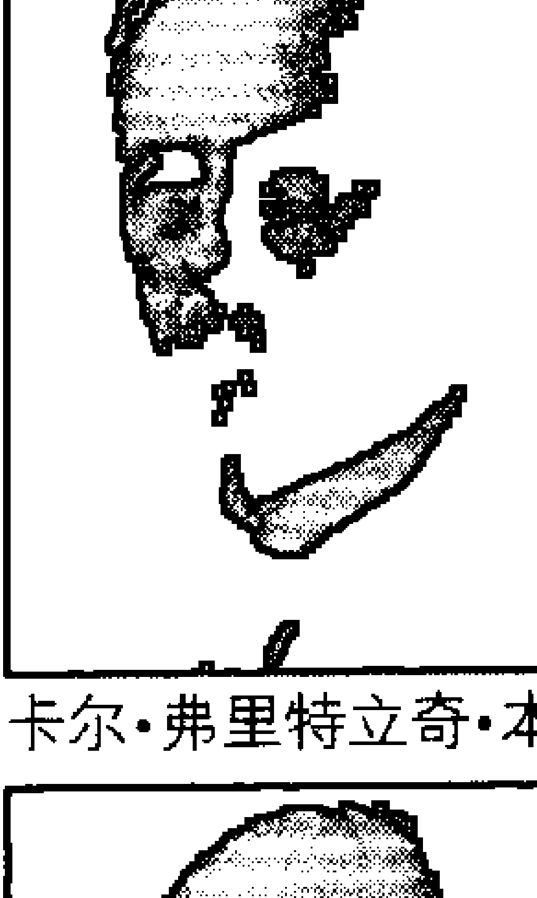

## 卡尔·弗里德里希·本茨

卡尔·弗里德里希·本茨（1844年—1929），德国著名的戴姆勒—奔驰汽车的创始人之一，现代汽车工业的先驱者之一，人称“汽车之父”“汽车鼻祖”。

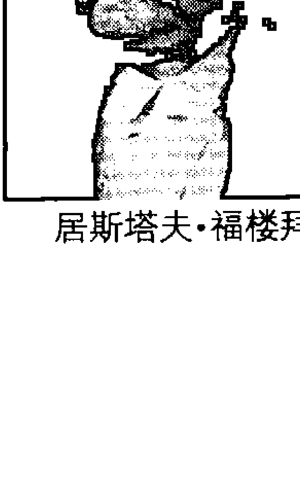

## 居斯塔夫·福楼拜

居斯塔夫·福楼拜（1821—1880），19世纪中叶法国重要的批判现实主义作家，莫泊桑就曾拜他为师。著名作品有《包法利夫人》《情感教育》等。

---

## 第十一章 摩羯座的人

（12月22日—1月20日出生）

典型特征：严肃古板，沉稳老练，控制欲强，有过人的毅力和耐力，很少表达真实的感情，但为人可靠。

### 第一节 摩羯座的人

### 一、摩羯座传说

牧神潘恩长得很丑。他日日看着宙斯的牛羊，却不敢与众神一起歌唱；他一直爱慕着神殿里弹竖琴的仙子，却不敢向她表白，这一切都只因为他丑陋的外表。潘恩害羞而自卑，也没有什么法力，在天界几乎不名一文。没有人了解他那丑陋的外表下掩藏着的炽热心肠，也没有人愿意走近他去聆听他那动人的笛声。

在天河的尽头有一个湖泊，是谁也不敢涉足的，因为它的水是被诅咒过的，任何人踏进河水一步都会变成鱼，永远也变不回来。但是潘恩无所顾忌，他知道即使自己在最热闹的地方也不会有人注意，还不如就在这湖泊边上吹笛，或许仙子可以听见呢！

然而有一天，正当众神设宴欢聚时，黑森林里的多头百眼怪兽却突然窜进了大厅！这只怪兽呼天号地，掀山倒海，所有的神都无法制服它，于是纷纷逃离。正弹着竖琴的仙子被吓坏了，她呆立在那里，不知道如何是好。眼看怪兽冲着仙子而去，胆小而善良的潘恩却猛地跳了出来，他抱起仙子就跑，怪兽紧紧追赶。

潘恩知道自己根本逃不过怪兽，情急之中忽然想起了天河尽头的湖泊，于是拼命向湖泊跑去。怪兽也知道那湖泊的厉害，它曾经是潘恩的居处，在那里跑也不是自寻死路！但是怪兽万万没有想到，潘恩竟义无反顾地跳进了那个湖泊，他把仙子高高举在手中，自己站在湖泊的中央。怪兽这下没了办法，只好放弃。

后来，潘恩才小心翼翼地把仙子送到岸边放下。仙子十分感激地把潘恩拉上来，但是潘恩的下半身已经变成了鱼！宙斯以他的形象创造了摩羯座，而摩羯座的人们也像潘恩一样，严谨而内敛，对于幸福有着自己的独特理解。

#### 二、摩羯座概况

- 出生日：12月22日—1月20日  
- 幸运物：化妆品、手表、项链  
- 幸运色：绿色  
- 幸运花：茉莉花

### 外在形象

摩羯座的人发质较粗，头部占身体的比例较大，肤色较深，骨架大，肌肉结实；额头上有皱纹，浓眉紧缩，眼神锐利，眼珠很黑；表情不多，有些忧郁，看起来比较严肃，难以接近。

### 性格特征

摩羯是个比较有城府的人，他们不会去得罪人，但是他们会计划着让这个人知道他所做的事情将会给自己带来多大的回报。摩羯的报复手段极其残忍，一旦有人伤害他，他会加倍还给你。

摩羯的人没有安全感，他们喜欢在任何人面前装傻，这可不是一般的装傻。摩羯人的聪明就在于这一点，他们认为只有傻子才不会牵扯到任何伤害。与其做一个聪明的人，不如当一个傻子，平凡而又随意。如果不是值得摩羯相依的朋友，摩羯永远不会让对方知道自己有智慧。而无论安全与不安全，摩羯对朋友都很认真，他们很珍惜这些朋友，最终获得朋友的信任。如果从一个朋友那里得不到信任，他不会再与这个朋友交往下去。

感情上很“白痴”的摩羯人傻得可怜，他们并不了解爱情，但是他们只知道爱的感觉。对于他们来说，任何感情的表达都是一种感觉，他们很认真地感受每一个感觉。傻傻的摩羯一开始会认为，爱你是我自己的事情，和你没关系，可是到后来越来越感觉不是滋味，于是开始对对方表白，表白成功后却不知道如何走下一步。

摩羯座的人可能会拿任何事情开玩笑，但是绝对不会拿感情开玩笑。“我爱你”或者谈到结婚的话题，那么他绝对不是在开玩笑。摩羯很物质，但是这点和金牛、处女不一样，他们的物质表现在爱上，他们认为给所爱的人带来无限的物质就是最大的幸福。

## 工作事业

摩羯座的人具有做事认真踏实、一丝不苟、严谨无比的特质，因此他们比较适合政治家、律师、公务员、会计、新闻工作者等职业。在事业上，他们年轻的时候可能要辛苦一些，不过随着年纪增长，他们的事业会越来越好。

工作上遭遇困难或是失败并不算什么，对向来能吃苦耐劳的摩羯座来说，努力去达成目标才是他们的目的。即便是在低处小职员的位置上，摩羯座的人也会时刻做好向上爬的准备。有时他们为了达到自己的既定目标，会不惜牺牲某些利益，即使这种牺牲只能为他们赢得很小的成功，甚至在别人看来有些不值，他们也会照做不误。不过，大凡这样的人，最后通常都能获得很高成就。

摩羯座的人一般会有很好的职业运，他们坚信“一分耕耘，一分收获”这句话。他们不期望飞跃式的发展，而是脚踏实地做好本职工作。他们一旦选定职业，就很少会变动。对他们而言，勤奋播种，必能大有收获。

摩羯座有旺盛的精力和雄心壮志，优越的组织能力与耐性，然而最令人瞩目的是摩羯座超强的自我控制能力，这是成功的必备条件。摩羯座的成功并非一朝一夕之功，他们善于确立目标，不管困难多大，都会坚持完成计划。

和其他星座比起来，摩羯座追求专业化，但是往往由于过于严肃认真，在年轻时常常会产生悲观、厌世的负面想法。工作是摩羯座的宿命，不管他们的生命里发生什么，最后都将回归工作，在工作中奋斗、成长。

## 爱情模式

摩羯座的人的爱情观是保守传统的，他们需要的是能在事业上、人生规划上一起努力的恋人，一个可靠的伴侣。

对爱情讲求爱与诚，坚信只要彼此有真心，就会心灵相通。但是，这并不意味着他们不向往浪漫的爱情。他们认为浪漫并不需要以金钱为基础，一起牵着手逛街、两人吃一个冰激凌等也一样浪漫。

摩羯座诚实且热心，但不善于用行动或语言表达自己的爱。有时好不容易遇到自己喜欢的人，却会在自己无法表达深深苦恼之时被他人捷足先登。摩羯座的人很晚才了解性，即便是结婚对象，也要在相处很久之后才会发生肉体关系。

但一旦品尝到其中滋味，懂得用身体感受彼此的爱惜，之前的禁欲倾向就会消失无踪。相反地，还可能陷入无法节制的欲望世界，因此应适当予以克制。

在爱情上，摩羯座的人过于追求完美，可能会给对方带去压力。他们的自尊心比较强，吵架之后，即使是自己的错，也不会主动认错。

摩羯座的人经营婚姻的原则是稳定至上。由于他们能够充分认识到婚姻的重要性，往往会把经济保障视为重中之重。通常他们结婚较晚，因为只有经过时间的考验，他们才会找到生命中的那个人。

## 最佳配对星座

- 金牛座：彼此目标相近，通常两人在一起都是为了未来而努力，追求安定生活。  
- 巨蟹座：势均力敌的组合，彼此同心协力，为未来努力，很少勾心斗角。  
- 处女座：稳定温馨的组合，感情逐渐加温，时间越久越深刻。

## 最差配对星座

- 白羊座：性格差异极大，容易产生激烈冲突。  
- 双子座：双子自由随性，而摩羯执着认真，摩羯往往较为辛苦。  
- 狮子座：一个乐观冲动，一个沉稳悲观，彼此固执，矛盾较多。

### 第二节 摩羯座的孩子

### 一、孩子的星座秘密

摩羯座孩子很现实，一切都从最现实的观点出发，脚踏实地，追求实实在在的结果。他不太容许自己降低自我的理想标准，讨厌自己的点子与别人雷同。他们往往喜欢追求更高的理想，洁身自爱，并且从幼年期便立志做第一流的人物。

摩羯座是象征着冬天开始的星座。摩羯座的孩子将是一个现实而有抱负的人，同时他又容易被热烈的感情征服，是一个有强烈忘我精神的人。

摩羯座孩子严肃认真，思想深沉，始终如一，忠诚可靠，正直廉洁，并富有献身精神，是一个有强烈责任感的、勤奋的劳动者和杰出的组织者。

### 二、孩子的学业

摩羯座的孩子热爱学习，有自己积累知识的方法和严格的组织纪律观念。喜欢收集和归类。这是个学习、工作和生活有条不紊、过分追求完美的孩子，无论任何事他都希望做得精益求精，这些优秀品质将会帮助他走上重要岗位。许多学者和政治家都诞生于这一星座。

摩羯座的孩子对于不喜欢的老师多半抱有成见，但仍旧会尊敬他；对于不喜欢的功课，会强迫自己学习，以达到一定水准。他的内心相当深沉、稳健、严肃，不易受影响，像个小大人。

摩羯座孩子脚踏实地，总是将基础打得很稳。但太过于实际反而容易使他们陷入悲观想法中。他应该乐观些，保持笑脸。对待同学要宽大为怀，不要太固执己见。

### 三、孩子的特殊才能

摩羯座的孩子思想成熟特别早，很小就进入成年人的行列，经常对人和事物产生防御心理。在学校时他有可能是一个孤独的孩子，这容易使他产生深刻的伤感情绪。为此，应该督促他到室外去和同学们在一起舒展心情，这样可使他身心不至沉重呆板。

摩羯座孩子平静而冷漠，不太容易接近，喜欢一个人独处。他很倔强而不喜欢受胁迫。

### 爱在心中口难开

摩羯座孩子内向朴实，不善言辞表达。内心却对深爱的人热情如火，渴望亲近。但如果遭到拒绝，很难再鼓起勇气，甚至会造成对其他人不信任或冷淡的个性。摩羯座孩子的父母要多注意他们的情绪变化，鼓励他们表达自己内心的情感。

### 追求完美

摩羯座孩子热爱学习，有自己积累知识的方法和严格的组织纪律观念，有深入的洞察力，因此更加追求完美。这个“小大人”会用敏锐的眼睛观察周围的一切。对于这样一个洞察力敏锐的孩子，新手父母要格外费心引导，以免他们陷入悲观的负面情绪。

### 爱用心聆听世界

摩羯座孩子的思想成熟特别早，很小就进入成年人的行列，经常对人和事物产生防御心理。就如同其他不善表达的星座一样，摩羯座孩子也很善于倾听。他可能是一个较孤独的孩子，这容易使他产生深深的伤感情绪，从而更愿意聆听广阔世界里的各种声音。

### 第三节 摩羯座的女人

### 一、对未来严格要求的摩羯女

在土星守护下的摩羯座女子，个性上多少会有一些抑郁倾向。她们很少轻易吐露心事。如果你爱上她，就必须用心体贴她的感受。大体上说来，她并不怎么乐观。你很难让一个摩羯座的女人相信“神话”和“奇迹”。

她不是不相信会有美好的未来，但是她肯定所有的未来必定要靠自己的努力去奋斗。她在潜意识中对自己有点缺乏信心，对环境没有安全感。因此摩羯座的女人很少完全信赖别人（尤其是男人），她没有依赖心，非常实际。因此有许多人说，摩羯座女人的“现实”居十二星座之冠。

很少有摩羯座女人有兴趣陪你玩爱情游戏。那种不食人间烟火、只羡鸳鸯不羡仙的爱情故事是感动不了她们的。摩羯座女子的爱情多数是在一切有了保障的情况下产生。

并不是说她一定要你家财万贯、位尊权高，但是你至少要有显而易见的光明前途。只要她认定你们是有前途的，摩羯座女子有的是陪你一起奋斗的恒心与耐力。所以，如果你想追求一个摩羯座女子，请千万不要做个游手好闲的懒惰虫，否则你几乎没有希望。

### 二、性格固执，观念传统

摩羯座女子的顽固和她的现实一样有名。想要改变她的观念，恐怕比登天还难。一旦她对你有了恶劣的印象，可望翻身的机会微乎其微。而对于她喜欢的朋友，她会在可以接受的范围之内尽量包容他们的缺点。

多数摩羯女子有着传统的家庭观念，对自己的家人非常忠诚。因此，能与她家人相处和谐的男性，获得芳心的机会大得多。千万不要随便批评她的家人，她极有可能因此与你翻脸。

你最好不要轻易跟一个摩羯座女子开玩笑，尤其是带有人身攻击意味的玩笑。她很可能当场就板下面孔，让你下不了台。摩羯座女子在冷静的外表之下，内心常受忧郁、悲观、压抑等情绪折磨，因此多数摩羯女性给人一种严肃且重视纪律的印象。

### 三、好的家庭主妇，但更热爱事业

一个摩羯座女人，就算生长在简陋的小木屋里，或者父亲是煤矿上开吊车的，除非她自己暴露家庭背景，否则你可能以为她出身名门、上过贵族学校。这就是摩羯座人天生的气质。

摩羯座女子绝不是缺乏女性魅力的“男人婆”。尤其是当她遇到一个能给她信心与安全感的男性之后，她会变得温柔而热情。

但在找到理想对象之前，多数摩羯座女子会努力成为成功的职业女性，为自己的事业奋斗。她们脚踏实地积累财富、社会地位以及生存实力，不会幻想白马王子的出现。

许多摩羯女子在各个行业中都十分成功。她们对于工作的承受能力很强，一旦立下目标，就有不达目的誓不罢休的决心和勇气。她们的态度不张扬，但往往带着一种难以解释的威严。

### 四、勤俭节约的模范

能够娶一个摩羯座女子回家，对男人来说是一件很有保障的事。首先，你会拥有一个整洁、有秩序的家。无论她是家庭主妇还是职业女性，她都会把家务安排得井井有条。

一旦她选择了你，她会勤劳不懈、吃苦耐劳地陪着你为理想奋斗。她不会随便唠叨，但也不会无限度地忍受错误。当她认清你们没有光明未来时，她也会果断离开。

摩羯座女人大多很有金钱观念，非常懂得预算。她们喜欢一切有价值的事物。即使手头的钱有限，也不会去买一大堆廉价商品，而是精挑细选买一件耐用又有价值的东西。

她们的家往往整洁干净，一尘不染。摩羯座女人还很重视对子女的教育，会教导孩子勤俭节约、尊重长辈、懂得利用资源。

### 第四节 摩羯座的男人

### 一、稳健固执的摩羯男

摩羯座男人是十二星座中最有耐心、凡事最脚踏实地的一类人。无论对事情的看法还是态度，一旦坚持己见，不到目的绝不会放手。

摩羯座男人的忍耐力和勤奋也是十二星座之最，同时他们也往往是最孤独的一群。一个典型的摩羯座男人最重视自己的面子，在外表上你很难看出他内心的想法。

受到土星影响，他们天生情绪压抑，总觉得自己背负着很多责任，因此别人很难理解他们。他们往往依靠自己，不会完全相信别人，凡事三思而行。

对稳健固执的摩羯座来说，浪漫的爱情深藏在内心。虽然外表坚强，但其实很需要温柔与鼓励。“缺乏真正的自信”是摩羯座的通病，因此经常赞美和鼓励会让他信心大增。

“坚忍”是摩羯座男子最大的魅力。他就像背着沉重包袱奋力爬山的山羊，传统、责任、理想以及对财富和社会地位的追求都在其中。

### 二、喜好安静，重视家庭

摩羯座男人基本上不喜欢社交，更愿意一个人安静地做事。他们喜欢的休闲活动往往也是静态的，比如看书、听音乐。

有些摩羯座男人因为环境需要必须参加社交活动，但他们通常不会成为场合中最活跃的人，而是沉默而低调。

摩羯男很少主动让别人了解自己，这与他保守的性格有关。开朗天真的女孩往往更容易让他打开心门。如果你懂得适时鼓励和赞美，他会信心大增。

摩羯座男人非常重视家庭，大多数不会娶一个不被家人接受的女人。如果让他在家人和恋人之间做选择，他通常会非常痛苦，而你赢的机会并不大。

### 三、择偶习惯

摩羯座男人是非常实际的人，对未来也有现实的野心。许多摩羯座男子会选择一个对他的事业或社会地位有所帮助的女人为妻。

因此即使你不是出身名门，至少也要举止得体、端庄优雅，能够给他的上司留下良好印象。叛逆型女孩通常不是摩羯座男人理想的“妻子类型”。你可以热情开朗，但行为举止仍然需要保有一定的传统气质。

会规范中。或许在某些场合，他会难得放松说些轻佻的话，但那绝不表示他将认同你这样的表现。尤其是在他的上司、老板或是员工面前，很少有男人比摩羯座男子更重视社会地位、社会评价的。你可不要做他的绊脚石。

摩羯男是闷执而传统的人，婚姻对他决非儿戏。一旦他决心娶你，他肯定已经对你细细观察过了，深入了解过了，实际评估过了。摩羯座的男人很少会冲动地决定一桩婚事。他对婚姻的忠实度是值得信赖的，对于家庭美好未来的努力是肯定的。你最好也要尊重这件婚事。婚后你最好也不要忘记，否则等他掉头而去，你很难有第二次机会。

嫁给一个摩羯座男人，就像买了终身保险，虽然不会常有甜言蜜语可听，但你会得到一切最实际的照顾。对多数摩羯座的男人来说，把妻子照顾好是他们的责任，愈能让妻子过得好，代表他们的事业愈成功，社会地位愈高。或许你的摩羯座男人会要求你把家庭开支算得清清楚楚，但事实上，摩羯座的男人常对妻子大方极了，只不过他要你时时记得“他”才是一家之主。

摩羯男很重视社会地位，同样也重视自己在家中的地位。等他的事业有了基础之后，他会把更多心思放在家里，你们的婚姻会像倒吃甘蔗一样愈嚼愈甜。一般应酬的帮助早已完成他的理想，你就是他心目中永远的贤内助。等你们金婚纪念日的时候，他说不定会用玫瑰花把你的床围起来，你会庆幸自己真是个有远见的女人。

摩羯座是象征着冬天开始的星座。冬天把绝对意识毫无保留地奉献给了摩羯座出生的人。他容易被热烈的感情征服。这是一个有强烈的忘我精神的人。

### 三、缺乏热情，内心孤独

摩羯男需要的爱，就是那么简单，没有拐弯抹角的相恋。摩羯男的需要简单至极，只是你们想得太复杂，越想得难，越难理解这样一个人。

摩羯座的人一般缺乏热情，不太容易接近。他害怕别人毫无意义的谈话会占据他宝贵的时间，也不能接受别人对他粗暴无礼。他严肃认真、思想深沉、始终如一、忠贞可靠、正直廉洁，并富有献身精神。另外，他坚如磐石、坚不可摧，不姑息宽容，也从不抱任何幻想。他深居简出，喜欢把自己关在象牙塔中，这对他而言，比去经历激情的洗礼要好得多。

摩羯座的男人，尤其当有几个行星同时处于他的星座时，他将是一个具有现实主义思想和理想主义抱负的人。他表情平静而淡漠，喜欢离群独处。谨慎可能会使他错过许多良机，于是他便会产生失望情绪。

雄心和权力欲望调动起来时，他总是在辛勤地耕耘，有着无懈可击的工作态度。他容易认为别人所做的一切都不理想，一定要自己亲自动手。

他有时不相信自己，也不相信别人，思想经常处于犹疑不定的状态中。他对女性保持着一定的距离，因为他怀疑她们的感情真诚程度。摩羯的感情是很难触及的。只有当他真心倾向一个女性的时候，深藏的爱才能迸发出来，而且这种爱是经久不衰的。

摩羯的情绪经常带有忧郁的成分，只有在知己之间或感到自己被人信任的时候，脸上才会露出笑容。否则，摩羯总是沉默不语和静静地观察。

### 四、威严的父亲

摩羯座的男人会是一个很有威严的父亲。可能还会有一点点独裁，他们重视纪律，以及孩子们对他的尊重。他很难成为小孩的“玩伴”，也是很会管教的父亲，而且是位负责、可靠且值得孩子们信赖的父亲。偶尔你或许有必要提醒他不要太过严格。当然，千万不要当着孩子的面做这件事。

他要求家人尊敬他、服从他；坚持办事要有条理、有纪律。他自己对家庭也忠心耿耿，即使吃苦也在所不惜。说不定他哪天还会赞成举行一个重大的生日晚会或一个隆重的圣诞节。摩羯座父亲很不喜欢娇纵孩子。他可以看着孩子们做作业，带孩子看牙医，但是必要的时候也会到旧木料间拿棍子教训他们一顿。你要时常提醒他，为人父母既有严肃的责任，也有不少乐趣。

绝大多数摩羯座男人的婚姻是毕生的，可是一旦他突然出走，妻子也就难得有第二次机会了。摩羯座男人憎恶离婚，离婚的事于他们而言有些不可思议。不过要是他们受够了配偶，就真的完了。

## 第五节  摩羯座的名人

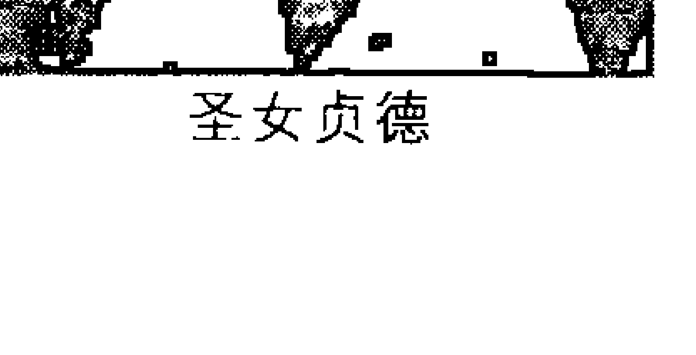

### 圣女贞德

圣女贞德（1412—1431），被称为“奥尔良的少女”，法国的民族英雄、军事家，天主教会的圣女，法国人心中的自由女神。她的成长时期正值英法百年战争（1337—1453）。她带领法国军队对抗英军的入侵，支持法国查理七世加冕，为法国胜利作出贡献。最终被俘，被宗教裁判所以异端和女巫罪判处火刑。

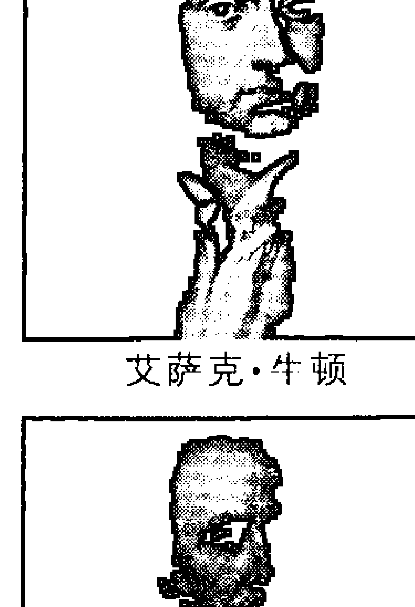

### 艾萨克·牛顿

艾萨克·牛顿（1643—1727），英国伟大的数学家、物理学家、天文学家和自然哲学家。牛顿的主要贡献是发明了微积分，发现了万有引力定律和经典力学，设计并实际制造了第一架反射式望远镜等。牛顿被誉为人类历史上最伟大、最有影响力的科学家之一。为了纪念牛顿在经典力学方面的杰出成就，后来成为衡量力的大小的物理单位以他的名字“牛顿”命名。

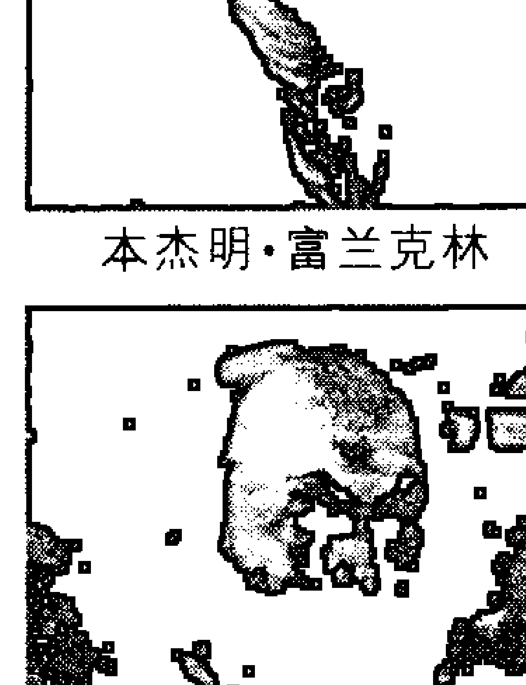

### 本杰明·富兰克林

本杰明·富兰克林（1706—1790），18世纪美国最伟大的科学家和发明家，著名的政治家、外交家、哲学家、文学家和航海家，以及美国独立战争的伟大领袖。他一生最真实的写照是他自己所说过的一句话：“诚实和勤勉，应该成为你永久的伴侣。”

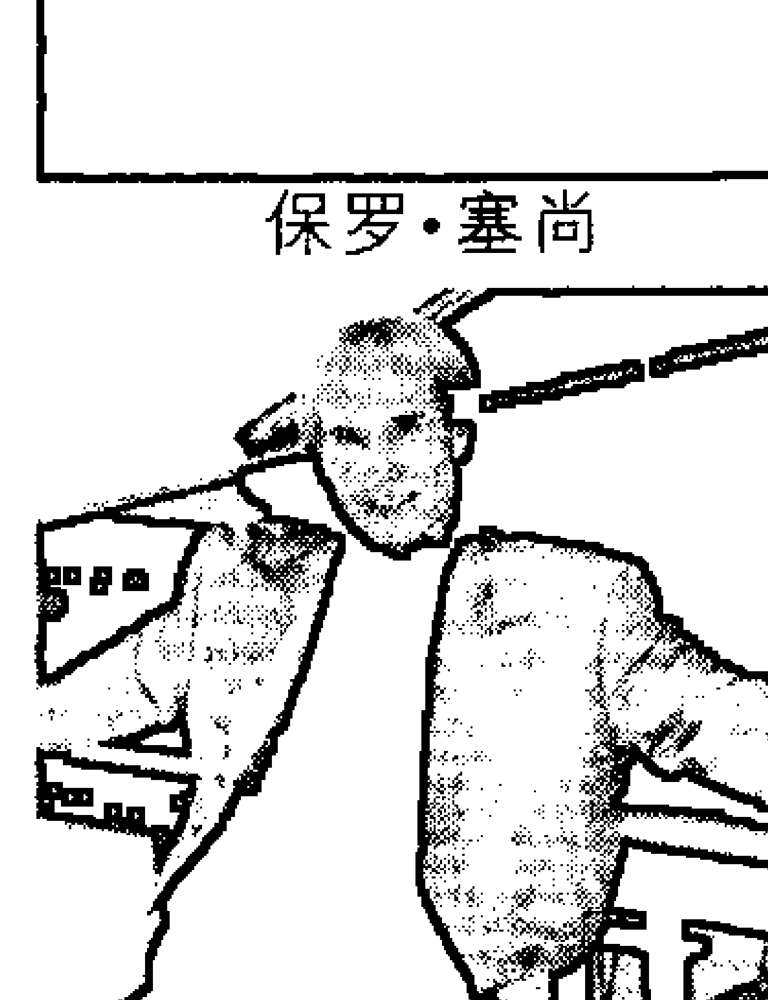

### 保罗·塞尚

保罗·塞尚（1839—1906），法国著名画家，是后期印象派的主将。从19世纪末起便被推崇为“新艺术之父”。作为现代艺术的先驱，西方现代画家称他为“现代艺术之父”或“现代绘画之父”。他对物体体积感的追求和表现，为“立体派”开启了不少思路，其独特的主观色彩大大区别于强调客观色彩感觉的大部分画家。代表作品有《坐在红扶手椅里的塞尚夫人》《四季》。

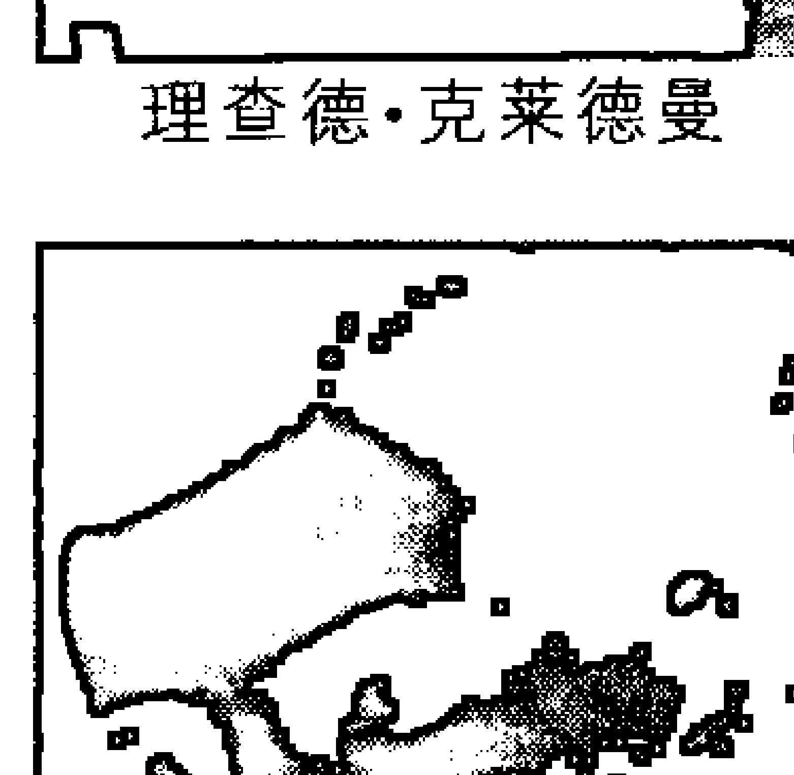

### 理查德·克莱德曼

理查德·克莱德曼（1953—），法国钢琴演奏家，本名菲利浦·罗贝·路易·帕杰斯。理查德·克莱德曼不是以古典钢琴曲见长，而是主要弹奏一些现代爱情曲目。

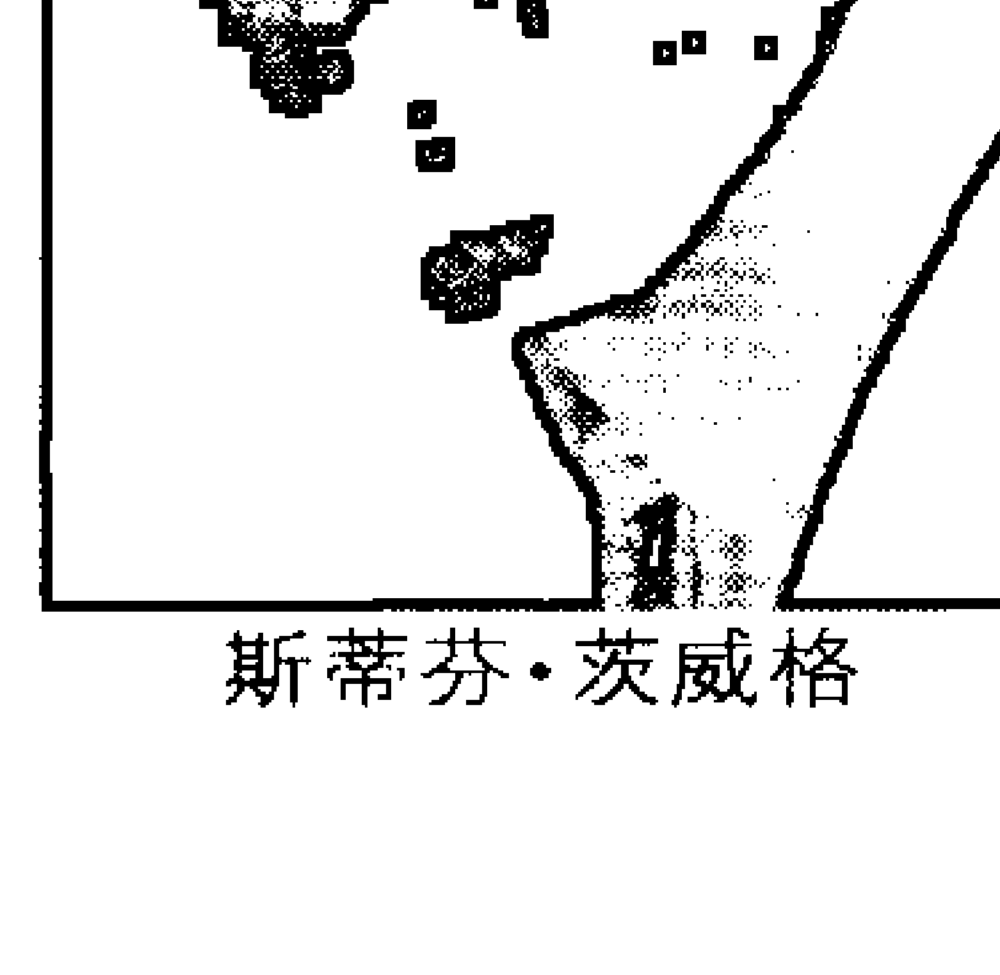

### 斯蒂芬·茨威格

斯蒂芬·茨威格（1881—1942），奥地利著名作家、小说家、传记作家。擅长写小说、人物传记，也写诗歌、戏剧、散文特写和翻译作品。以描摹人性化的内心冲动，如骄傲、虚荣、妒忌、仇恨等朦胧情感著称。他的小说多写人的下意识活动和人在激情驱使下的命运遭际。他的作品以人物的性格塑造及心理刻画见长，也比较喜欢并擅长戏剧性的情节。代表作品有《一个陌生女人的来信》《象棋的故事》《伟大的悲剧》。

## 埃德加·胡佛

埃德加·胡佛（1895—1972），美国历史上创造了FBI（美国联邦调查局）神话的传奇人物，曾担任美国联邦调查局局长近50年，是美国历史上最受争议的人物之一。

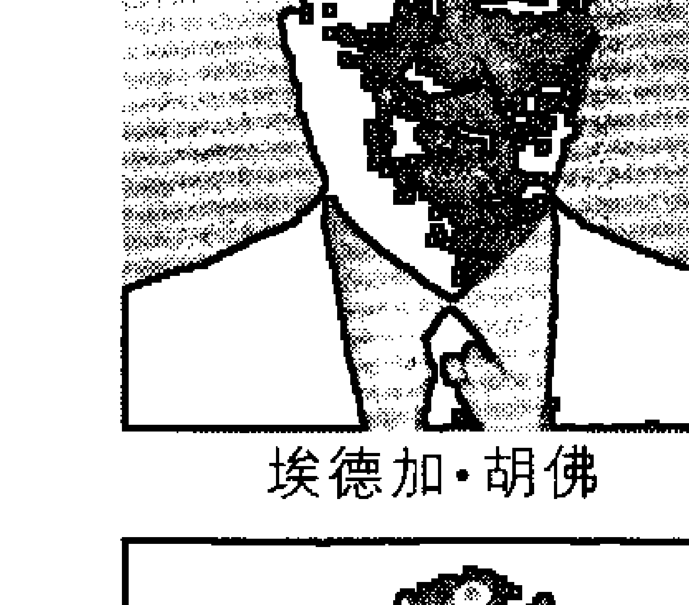

埃德加·胡佛

## 刘易斯·汉密尔顿

刘易斯·汉密尔顿（1985—），英国F1车手，毕业于剑桥大学艺术和科技学院。F1史上第一位黑人车手，也是F1历史上最年轻的年度冠军之一，并成为F1史上首位夺取分站冠军的黑人车手。到2008赛季结束共获得9次F1分站赛冠军、13次杆位，并在2008年夺得年度冠军。

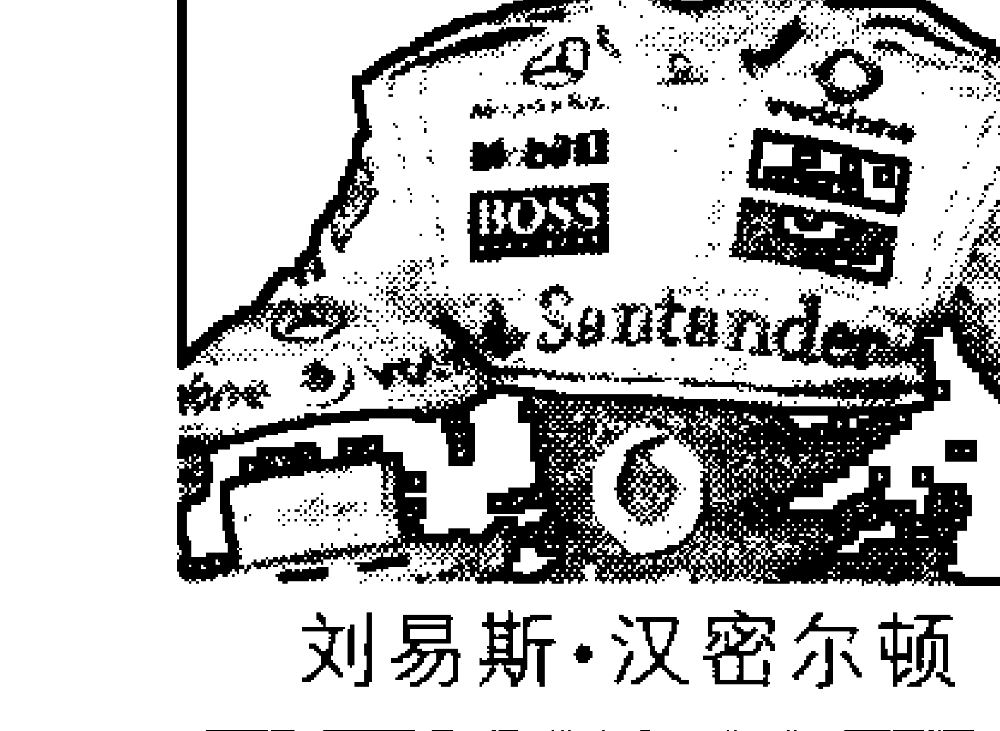

刘易斯·汉密尔顿

## 尼克松

理查德·米尔豪斯·尼克松（1913—1994），生于美国加利福尼亚州洛杉矶附近的巴林达镇，爱尔兰人后裔。父亲是汽车加油站和百货店老板。尼克松毕业于惠蒂尔学院和杜克大学。1934年获惠蒂尔学院学士学位。1937年至1942年在加利福尼亚州惠蒂尔镇执业律师。1968年当选美国第37任总统。1972年2月访华，打开了两国关系的大门。尼克松因1972年6月17日发生的水门事件被迫辞职。

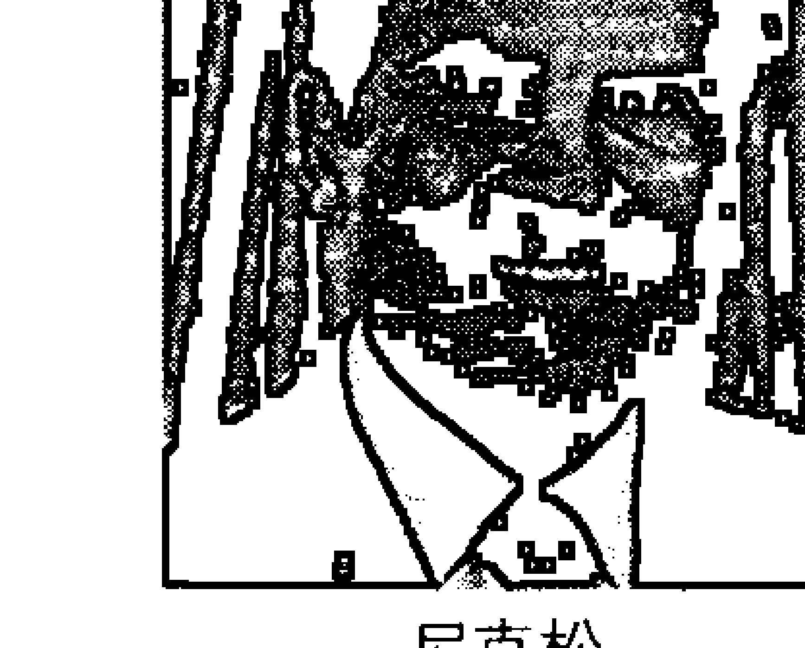

尼克松

## 蔡元培

蔡元培（1868—1940），字鹤卿，又字仲申，号民友、子民，乳名阿培，并曾化名蔡振、周子余。汉族，浙江绍兴山阴县（今绍兴市）人，原籍浙江诸暨。革命家、教育家、政治家。中华民国首任教育总长。1916年至1927年任北京大学校长，革新北大，开“学术”与“自由”之风；1920年至1930年，同时兼任中法大学校长。

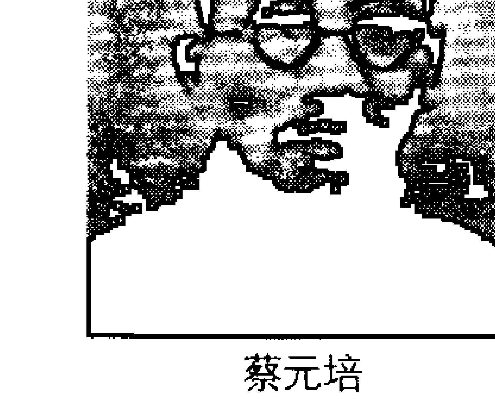

蔡元培

## 孟德斯鸠

孟德斯鸠（1689—1755），法国伟大的启蒙思想家、法学家。他不仅是18世纪法国启蒙时代的著名思想家，也是近代欧洲较早系统研究古代东方社会与法律文化的学者之一。他的著述虽然不多，但影响却相当广泛，尤其是《论法的精神》这部集大成的著作，奠定了近代西方政治与法律理论发展的基础，也在很大程度上影响了欧洲人对东方政治与法律文化的看法。其著作除此外，还包括《波斯人信札》《罗马盛衰原因论》。

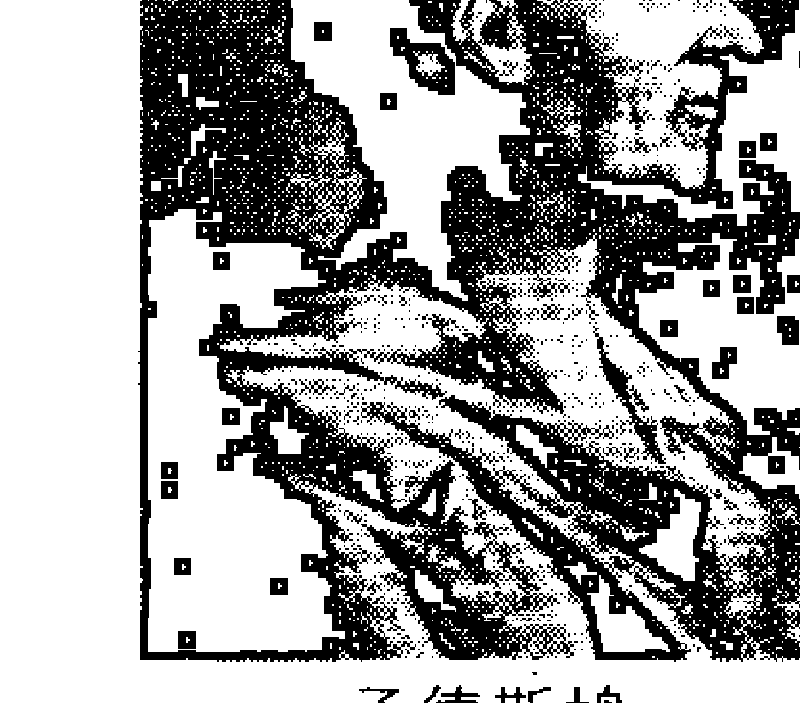

孟德斯鸠

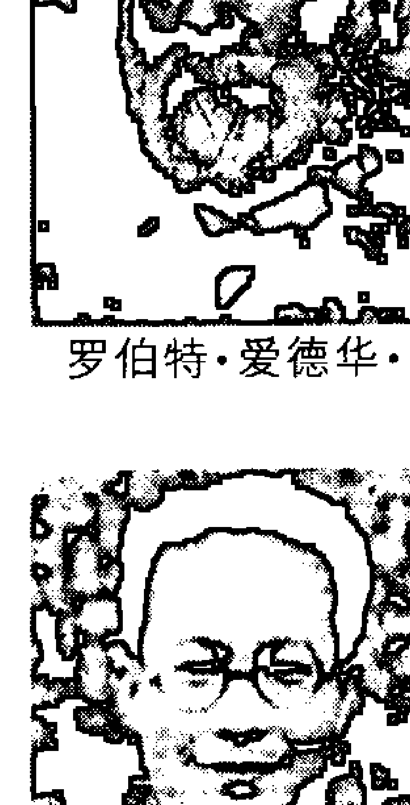

罗伯特·爱德华·李

## 罗伯特·爱德华·李

罗伯特·爱德华·李（1807—1870），美国职业军人，为南北战争期间联盟国最出色的将军。他最终以总司令的身份指挥联盟国军队，如同古代的汉尼拔与“二战”时期赫赫有名的沙漠之狐埃尔文·隆美尔一样，其以寡击众、以少胜多但最终不敌的情势为他赢得长久的名声。战后，他积极推动重建，在其生命的最后数年成为华盛顿学院校长。李将军至今仍被视为联盟国象征性人物之一，同时也是重要的教育家。

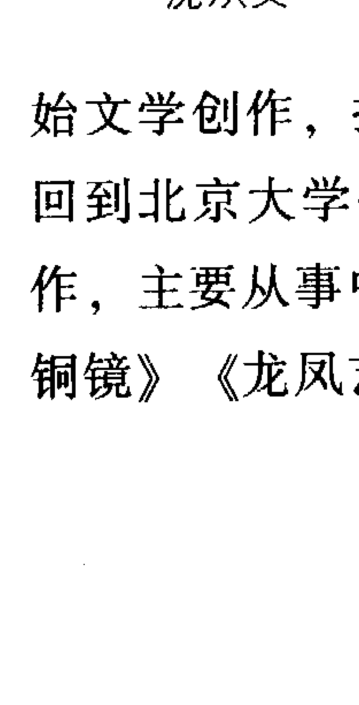

沈从文

## 沈从文

沈从文（1902—1988），原名沈岳焕，笔名休芸芸、甲辰、上官碧、璇若等，乳名茂林，字崇文，湖南凤凰人，苗族。其祖母刘氏是苗族，母亲黄素英是土家族，祖父沈宏富是汉族。沈从文是现代著名作家、历史文物研究家，京派小说代表人物。14岁时投身行伍，浪迹湘川黔边境地区。1924年开始文学创作，抗战爆发后到西南联大任教。1931—1933年在山东大学任教。1946年回到北京大学任教。1949年后在中国历史博物馆和中国社会科学院历史研究所工作，主要从事中国古代历史研究。代表作品有《边城》《中国丝绸图案》《唐宋铜镜》《龙凤艺术》。

## 第十二章

## 水瓶座的人

（1月21日—2月19日出生）

典型特征：理想主义，心怀仁爱；待人热情，直率且有亲和力；思想前卫，追求时尚的事物及生活方式。

## 第一节  水瓶座的人

### 一、水瓶座传说

伊是特洛伊城的王子，是一位俊美不凡的少年。他的容貌连神界都少有。伊不爱人间的女子，他深爱着的是宙斯神殿里一位倒水的侍女。这个平凡的侍女曾经在一个夜晚用曼妙的歌声捕获了他的心，也夺走了特洛伊城里所有女孩的幸福。

天界的那个女孩叫海伦，和特洛伊城里最美丽的女子海伦拥有同样美丽的名字。宙斯非常喜爱海伦，尽管她只是一个侍女。可是有一天，海伦无意中听到太阳神阿波罗和智慧女神雅典娜关于毁灭特洛伊城的决定。海伦不顾戒律赶去告诉王子伊。结果在半途中被发现，宙斯的侍卫们将海伦带回了神殿。宙斯不忍处死她，但决定好好惩罚她。在他的儿子阿波罗的提议下，宙斯决定将这份罪转嫁给与海伦私通的特洛伊王子身上。

这天，宙斯变作一只老鹰，降临在特洛伊城的上空。他一眼就看见在后花园中散步的王子。宙斯惊呆了，他见过许多美丽的女神和绝色的凡间女子，却从未见过如此俊美的少年。宙斯被伊特别的气质深深吸引，一个罪恶的念头油然而生。他从天空俯冲下来，一把抓起伊，将他带回了神殿。在冰冷的神殿里，伊见不到家人也见不到海伦，他日渐憔悴。而宙斯却通过伊代替海伦为他倒水，这样他就可以天天看见这个俊美的男孩。

宙斯的妻子女神赫拉是个嫉妒成性的女子，她看在眼里，怒在心头。她不仅嫉妒宙斯看伊那样无垠的眼神，更嫉妒伊有着她都没有的美丽光华。于是赫拉心生毒计，决定加害这个无辜的王子。她偷偷将海伦放走，海伦自然要与伊私逃下界，这时她再当场将两人捉住。雅典娜明白这是赫拉的计谋，但也无能为力。被激怒的宙斯决定处死伊。然而，就在射手弯弓搭箭射出那致命一箭的刹那，侍女海伦挡在了伊的胸前！

眼看奸计没能得逞，赫拉恼羞成怒之下，将伊变成了一只透明的水瓶，要他永生永世去做苦役。然而，水瓶中倒出来的却是眼泪！众神无不为之动容，于是宙斯将伊封在了天上，做一个忧伤的神灵。

#### 二、水瓶座概况

- 出生日期：1月21日—2月19日  
- 幸运物：红色石榴石  
- 幸运色：蓝色、黄色  
- 幸运花：樱花、茶花  

### 外在形象

水瓶座的人双手、双腿肌肉匀称，线条优美，大多具有模特儿般的身材，是典型的衣架子；轮廓分明，双眼分得较开，鼻子高耸，嘴唇较薄，下颌线条柔和，略呈圆形，耳朵较小；开朗妩媚，个性化十足，具有迷人的魅力。

### 性格特征

水瓶座的人比较理智，不管遇到什么问题，都可以保持冷静，能够多角度地看待问题，化繁为简，是12星座中处事最理智的人。善于克制冲动，避免不必要的麻烦，考虑问题很周全，不做无把握的事情。

水瓶座的人性格比较外向，对朋友非常热情，永远把人生重心放在家以外的地方，总是被一大堆朋友包围，能够在人际关系中找到自信。

水瓶座的人善于重新组织所有人的精神生活，是新思想的开拓者。追求属于“自己独一无二”的生活方式，是水瓶座的生活态度。但他又会偏向顽固，有时令人捉摸不定。不过注重人道主义的水瓶座对人友善，也很重视隐私，这一切皆受掌管水瓶座的天王星影响。创新、多变、独立、倔强、反叛的水瓶座究竟是怎么样的一个人？其实他们是很矛盾的一类人，不但外人这样看他们，连他们自己也能感受到这种矛盾。

水瓶座的人崇尚自由，讨厌受到约束，能够尊重别人的自由。不太在意物质方面的追求，重视精神层面的提高，不愿意背负责任，甚至会逃避责任，不能积极地面对现实困境。

## 工作事业

水瓶座的人有着一流的头脑和新颖的创意，最讨厌被规矩束缚。因此他们不适合在有着保守体制的企业里上班，也不适合在有严格规矩和限制的环境中工作。他们爱好自由，喜欢发挥创造力，组织纪律严明的工作会扼杀他们的创造力，使得英雄无用武之地。因此，能够容许他们自由行动的职业是再适合不过的了。

水瓶座的人比较擅长自由想象与独创设计，而且能够随时召集许多人来帮忙。因此，像组建个人工作室或从事富有想象力的工作都比较适合他们。他不适合在团队里做小螺丝钉，那样他的敏锐度就会很快被磨损。

水瓶座的人并不十分在乎金钱报酬，只要他们能够自由地施展自己的才华，他们就会表现得很快乐。水瓶座的人善于利用时机并创造发展的机会，在熟悉工作以后能够发挥独特的个人风格，因此可以在事业上得到意想不到的收获。

## 爱情模式

水瓶座的人绝对表里如一，不会耍心眼、使诡计。因此他们开始一段恋情之前，一定会将自己的需要坦诚告诉对方，从来不会说一套做一套。

水瓶座的人只有在充分拥有自由的前提下，才会感觉到爱情生活的舒适。因此，在交往过程中，崇尚自由的水瓶座不会约束对方的行动，而他们自己也不会用只属于一个人的刻板观念来约束自己。他们对人比较好，其实这本身不是坏事，只是有时候因为不太注意自己的言行，导致对方误解而引起严重的误会。

水瓶座的人选择对象时要求对方能够帮助自己成长。他们对恋爱最大的期望是建立能促进彼此成长的关系。因此，他们的对象一般都具有丰富的知识和独立的人格，只有和这样的人在一起，水瓶座才能维持长久的关系。

水瓶座的人会在爱情与友情中感到困惑，分不清什么是爱情、什么是友情，所以他们在朋友中选恋人的可能性很大。在彼此接纳人生看法以后，会有种相见恨晚的感觉，非常投缘，他们自然也会从朋友关系过渡到恋人关系。

## 最佳配对星座

- 白羊座。又一对非常情侣。变化快、感觉很相似，所以相识之初很容易被对方“电”到，迅速坠入爱河，彼此都不会落入对方的掌心。他们这种自由自然、开放豁达的态度，谈起情来比一般情侣来得潇洒，不会将爱情变成令自己不开心的压力。大家生活圈子又广阔，真是不用愁，两个人之间的关系可谓这么近又那么远，介乎友情和爱情之间，有什么都讲出来，不会有隔阂。  
- 双子座。天生一对！有名的才子佳人配对。因为两个人的人生态度很接近，对任何事物都像小孩子一般充满热情和好奇，彼此很容易沟通起来。要留意的是双子座的人缺乏耐性和持久力，而水瓶座的人变化多端，有时候连自己需要什么也不知道，两个人在一起一定要找到解决这个问题的办法。  
- 处女座。感情的开始通常是处女座觉得水瓶座这个朋友有意思，平易近人、见多识广，正是自己所欣赏的。而水瓶座也会因为贪新鲜觉得处女座的人很特别，和他以前有过的情人有不同之处，想试试在一起。两个人在一起默默无言时，那种“此时无声胜有声”的感觉很有浪漫色彩。这两种性格的人在一起可以互补，处女座细心、追求完美，而水瓶座渴望的也是完美，虽然他们明白事物永远都不可能真正完美，但这却是他们共同的目标。

## 最差配对星座

- 金牛座。金牛座会被水瓶座潇洒的态度所吸引，想试一试他们的生活方式。可惜一旦两人在一起，情况会相反，金牛座会害怕水瓶座这种太极端的思想和行为，太变化多端以及不按常规行事的个性。但想远离时，又会被水瓶座那种不甘心的压力弄得无力拒绝。  
- 巨蟹座。他们可能只是短暂情缘！因为巨蟹座与水瓶座的性格根本是两回事。巨蟹座这种渴望专一安全的爱情，在水瓶座眼中简直是无稽可笑。水瓶座绝不会为一棵树而放弃一片森林。巨蟹座想用柔情去捆绑他，他会很理性地跟你讲应该给他多一点自由；但当你放松不理他时，他又会认为你根本不关心他，巨蟹座那一套很难用在他身上。  
- 狮子座。不停翻新、不断进步的一对组合。因为在星座学上他们是对宫，所以很多事都是完全相反，只是大家都是外向乐观的星座。两者的固执和自我中心加在一起，就会出现“各持己见，不肯放手”的死局。最初可以将你俩拉在一起，主因可能是狮子座有自信，认为可以将这个冷漠的水瓶收服，将他古怪的脾性修正为正常人；而水瓶座的三分钟热度也会令他对霸道的狮子产生兴趣。只怕这种想法很快就会发现，一时冲动到谈婚论嫁的地步时，一定要想清楚，大家有没有信心坚持到白头到老。

## 第二节  水瓶座的孩子

### 一、孩子的星座秘密

水瓶座孩子的个性极强，他们向往人与人之间美好的情义，有着伟大的博爱精神，愿意用美好的心去看待世界。同时他也是个较为理性的孩子，很少感情用事，尽管他是相当重感情的孩子。他是个不听从社会规则的怪孩子，不容易改变自己的意见或主张，但另一方面却又极端讨厌和别人争执。在充满绝对意识的摩羯座孩子之后，是头脑中不断闪烁着新奇古怪念头的水瓶座孩子。

水瓶座孩子。他常常不考虑事情的某些具体方面，而只是一味地推动它们前进，是一个富有开拓精神的孩子。他的思维能力高过本能，是个先锋派人物。他感兴趣的不是昨天而是明天。他有着与生俱来的宽宏大量和高尚品德。

## 二、孩子的学业

受天王星控制的水瓶座简直就是天王星的缩影。水瓶座的孩子具有令人吃惊的智慧和沟通能力。他经常不按常理出牌，是个天才型人物。他对任何事都有极大的好奇心，但却总是三分钟热度。

学业可不仅是孩子健康之外新手父母们最关心的问题。因为家庭教养方式可是对孩子影响最大的，新手父母们当然想知道孩子们究竟哪方面最强。只有好好发展孩子的兴趣，激发孩子的内在潜能，才能让孩子有个美好的将来。要是埋没了天才，那可是糟糕透了。

他的思考总是有异于常人，常有疯狂的一面。对于不喜欢的老师，总是希望能够多去了解，并且不使自己对他们有成见；对不喜欢的功课，则提不起兴趣。所以家长应该多发掘他有兴趣的一面，他才会进步。信奉人道主义的他有很多好朋友，又有善于分析的洞察力及精致的内心，机智早慧，想象力丰富。

## 三、孩子的特殊才能

水瓶座孩子是个性极强的孩子，缺乏现实观念，是理想主义者，有着宽宏大量的高尚品德。他受不了任何约束，将来上学时会把学校当作禁锢他的牢笼，虽然上课效果一般，功课却一流。

有开拓精神、喜欢思考的先锋派水瓶座孩子的行为，在大人的眼里可爱而难以预料，总是带着点神秘的味道。水瓶座的孩子有着惊人的探询精神和对数理的理解能力，可是又常常期望落空。

新手爸妈是孩子将来成功的推手，要注意培养他的组织纪律观念，授以方法，使水瓶座孩子能在他抽象的世界中获得成功。

### 有天分的写作天才

水瓶座孩子不怎么爱说话，常常爱一个人独立思考点什么。可是这个灵慧的小家伙在语言方面是很有天分的，虽然他们并不常把自己的想法都说出来，而且有时候还有那么点沉默，但是他实在是一个运用语言的高手。这个很有写作天分的孩子，会把他的想法和情感写在纸上。新手爸妈不妨给他创造一个安静写作的环境。

### 眼见得知的发明家

造蜂蜜吧！所以新手爸妈不要惊讶，应该多和孩子讲讲他所看到的，使他能懂得其中的道理。

### 旋转的音乐家

水瓶座孩子是个缺乏现实观念的小家伙，当他沉浸在某一念头中的时候，就会废寝忘食，任凭妈妈怎么呼唤都不会离开，乖乖地去吃饭。也许是因为天性中的旋转因素，这个孩子的听觉会十分灵敏。他对音乐有着强烈的感情，不过他是个旋转的音乐家，会迷恋斯特劳斯优美的旋律，而可能不喜欢静静地倾听莫扎特的小夜曲。

### 好动的运动员

水瓶座孩子是个好动的孩子，虽然出生在寒冷的日子里，可他仍然不愿意待在家里。下雨了会拿着妈妈的汤匙去接雨水，下雪了会拿筷子去夹雪花。他最喜欢的活动就是去“寻宝”，一边像个小运动员一样跑跑跳跳，一边到处寻找新奇的玩意。无论多晚，哪怕是拿着一棵小草也绝不会空手而归。

### 数理一流的演算师

水瓶座孩子是个天生的小大人，对于数学来说，他可是个达人。虽然看来他常因为迷糊而把名字写错，经常迷路，有时会找错门铃，有时还会摔破膝盖，有时惹恼老师，但实际上他可是云端的小天才，功课一流，数理一流。这些奥秘对他充满着无名的吸引力，在这些面前他可一点都不迷糊。用起来俨然就是一个卓越的演算师，新手爸妈要鼓励孩子的这种学习态度。

### 坚决不要束缚

水瓶座孩子不喜欢被人约束，讨厌那些束缚人的条条框框，所以他常比任何人更能包容。因此，常认为别人也会同样接受他——可惜事实常常相反。他凡事希望快乐和谅解，如果事与愿违，遇到冲突或挫折，他会觉得委屈、沮丧。在这样的负面情绪之下，孩子的自尊心和自信心会受到伤害，这个不受约束的先锋派会退缩或者逃避。这时候，新手爸妈一定要站出来，在孩子的背后给予他支持的力量，直到他恢复自信，这样才能够锻炼他坚强的性格。

### 天生小大人

水瓶座孩子是个天生的小大人。虽然他不像金牛座孩子那样擅于家务，但他却和他们一样善于和他人交往。水瓶座孩子喜欢玩，愿意和朋友们在一起，而且作为朋友，他可关心别人胜过照顾自己。在他的命运中，朋友将起到重要的作用。他善良、活泼、古怪精灵，这些都会深深地吸引他人的注意力。

### 第三节 水瓶座的女人

### 一、淡淡的爱

水瓶座女生可能永远也不会知道自己想要的是什么，但是她一直都很清楚，她不想要的是什么。水瓶座女人总喜欢做幕后的看客，冷冷地看着一切。在她眼里，一切都在意料之中，她并不觉得有什么是新奇的。如果她表现得新奇，那是因为她觉得应该这样做。她像一个看戏的人，太远离事务。

你不要奢望她冷漠，这是她保护自己的唯一方式。她像一只刺猬，随时竖起自己身上的刺，但她的刺不会伤人，她只是用来武装自己。她不敢要太多的爱，她怕享受完爱之后，剩下的只是加倍的痛。所以当别人对她过度宠爱时，她不但不会欣喜，反而会惊惶地逃走。她不知道怎样回报别人对她的爱，如果你得到她的喜爱，那是因为她已经知道如何面对你，如何回报了。

她追求那种君子之交淡如水的境界。她懂得爱人，但她不习惯爱人。她知道爱往往伴随着恨，而恨，是太沉重的伤痛，也是太容易让人疲倦的感情。她不想痛，也就懒得去恨。于是，为了防范痛的到来，她只好选择不爱。即便爱，也是淡淡的、冷冷的。别怪她，她是真的不知道如何专注。

### 二、敏感而细腻的水瓶女

不要以为水瓶女很洒脱，很多时候，她其实是放不下的——她比任何人都要敏感，都要细腻，但她不会让你知道。她明白，即使你知道了，也是无济于事。

她的心是把握不住的风，她渴望像风一样单纯而自由。她不是不想平静，她只是找不到平静的理由。她一生都无法明确自己在人世要扮演的角色，她只有不停地寻找，寻求自己最终的目的。如果她找到了，她会毫不犹豫地停下来，从此放弃心灵的漂泊。

很遗憾，她永远也不会满足，她的追求永不停止。她的心再累，也无法逼迫自己放弃梦想，梦想是她唯一的支撑点。

千万不要让水瓶女失望。因为她学不会原谅。她非常渴求完美，虽然她知道世间没有绝对的完美，但她有绝对追求完美的执着。你若令她失望，她会不可挽回地离开。即使她的心在滴血，即使痛楚重重压垮她的生命，她也绝不回头。那个时候，你在她脸上所看到的，是让人寒心的决绝。

即使她还在你的身边，她的心也早就离你十万八千里。你看不到她的恨，但是你会感受到比恨还让人痛苦的冷淡。她的离开，是心灵的离开。

### 三、隐藏在疯狂下的冷静

她可以在前半分钟对你好得让你受宠若惊，也可以在后半分钟冷漠得让你不可接受。不要问她为什么这样善变，她也不知道。

当你看到她在疯狂地快乐或悲伤时，千万不要迷惑。不管她看起来是多么疯狂，她内心其实是冷静的。她比你们任何一个旁观者更知道如何处理快乐与悲伤。她只是习惯把一切都变得疯狂，因为她觉得这是义务，也是权利。

她是制造气氛的能手，她的一句话会让一切轻快起来，但她的一声叹息又会将一切都弄得很沉重。她总是不由自主地交错操纵着快乐与忧郁。她并不如你们看到的那么快乐，同样，也不如你们看到的那么忧伤。只是，她忧郁时喜欢带上快乐的面具，而当她快乐时，忧郁又不肯轻易放过她。

在她的宝瓶里，盛着的不是快乐的源泉，而是她不愿在人前滴下的泪水。你看到的她笑起来像一个孩子，你有时会认为她天真得像是童话里走出来的天使。但是，如果你有心，你会看到她沉静的脸上挥之不去的忧伤，还有她的眼底，竟那么凝重地积压着一种看破红尘的味道。

她只有在午夜无人的时候，才会完全地释放自己。她不会在众目睽睽之下表露她的无助、她的彷徨、她的沧桑。她瓶子里的水，是永远流不尽的泪。你所有看到的坚强，只是她在竭力掩饰的脆弱。

### 四、热爱生活，追求自由

水瓶座女子的守护星是天王星。她所追随的这颗星星，是我们（多数人）一生都不曾见到的。在你有了这一份概念之后，以后看到水瓶座女子做一些你无法理解的事情的时候，你就不应该那么意外了。

水瓶座的女子坚持追求自由。但这并不表示她们的行为大胆开放，拒绝接受传统教条的束缚。她所追求的自由是精神上、思想上的。她可能今天研究心理学，过两天去学爵士舞，下个星期到医院当义工。

她好像可以属于社会上任何一个族群，但又不是真正属于哪一个族群。她属于她自己，似乎没有任何人可以完全占有她。

但她也从来不会霸道地想要占有别人。对于所有的事情，她似乎都有自己的标准，不受传统约束和影响。她很有“她的”原则，而且忠于原则。一如恋爱中的她，绝对忠于自己的情人一样。

对许多水瓶座女子来说，人生都是一场无尽的探索。各阶层的人、各种五花八门的事，都应该被了解、被关怀。因此，如果你有个水瓶座的情人，你大可放心，她一定不会有太多时间粘着你。事实上，她或许还担心你会无时无刻粘着她呢。

### 五、理想的模范妻子

水瓶座的女人几乎都不是“金权主义者”。一个男人是否拥有财富、地位并不是那么重要，外表是否英俊潇洒也不是她最重视的条件。她要寻找的是（在她心目中）有智能、有胸襟，可以陪她一起追寻“人间道”的男人。喜欢吃醋、占有欲太强、太偏激、太保守的人，绝不是她心目中的理想伴侣。

你会发现她的朋友不少，而且各种类型都可能出现。因为水瓶座女子拥有自己的道德法则，同时也尊重别人的不同法则。她喜欢跟各种朋友相处，而且也都能相处融洽。但有时候她又会选择做个独行侠，远离家人、朋友，甚至远离你。

请大方一点，给她一些自我的空间和时间。霸占她的感情没有什么好处。不要疑神疑鬼，在她没有和你分手之前，水瓶座的女子会保持她的忠实，而且她相信自己的评价，别人的看法是无法左右她的。

不要寄望她会把一切的行踪、所有的想法，一字不漏地向你报告。水瓶座的女人不会喜欢说谎，但她坚持任何人都有“保留一点”的权利。当然，这样的女子也不会要求你交出行程表和自白书。水瓶座女子的“不多疑”，是她的另一项美德。

她的服装穿着可能经常令你目瞪口呆。有时候高贵典雅，有时候性感动人，有时候俏皮可爱。不过，她的打扮通常是凭感觉，而不是看场合。还有一项更了不起的本领：水瓶座女子会把所有你意想不到的东西组合在一起。

博爱开朗的水瓶座女性同时也是非常自我中心的妻子。她既不是大女人主义，也不是传统宿命女子。她懂得在婚姻之中保留自我、尊重别人。或许她常会在你们的谈话中冒出一句与主题完全无关的话。我相信你终究会习惯，那只是她的逻辑推演方式和你不太一样。久而久之，你反而会期待这种与众不同的乐趣。

### 第四节 水瓶座的男人

### 一、高度理性、客观的男人

水瓶男是十二星座中最理性、最有独创思想、最客观、最难以预测的男人。水瓶星座看起来超然，仿佛是一个心不在焉的教授。他聪明绝顶，有独特的思维。他的大脑里充满了稀奇古怪、让人震惊的思想和主意。你从不见他读书，但是无论什么问题，他都能够发表让你刮目相看的独到见解，好像他已经站在这个领域的高端。

他是一个生活在自己的大脑中的理想主义生灵。他高度理性、客观，能够从你想不到的各个不同角度看待人和事。对许多事物，他像是在观察一个客观、抽象的物体，而不是一个有血有肉的生命。

他的功利思想淡泊，追求独立自由。他带着强烈的反叛传统权威的思想，不但难以被束缚，还常常过于忽视上司，以至于他出众的才华不能够被充分利用。他独特、潇洒得让你尊敬，但是他过于脱俗，又让人为他的才华惋惜。

他的智商超常，执著地探索人性的秘密。他对于宇宙间未知事物的兴趣，甚至超出了对现实社会的理解。他的大脑可能真的能够与宇宙间其他的生灵交流。总而言之，他总是对那些不占世俗主流的知识情有独钟。

水瓶星座是个天生的心理学家。他想要揭开人们行为的原理，能够从任何人的身上发现人类共性的模式。他那超级发达的大脑永不停息地思索、探寻、分析、总结。他最大的乐趣是钻进别人的大脑，看他们在想什么，为什么这样想。新颖的经历让他愉快，与众不同的事物能激起他的兴趣。如果有可能，他甚至会和你交换性别。

### 二、理想主义男人

水瓶星座是十二星座中真正内心满溢、坦荡、无私无畏、让人敬重的男人。他的内心藏着慈善的使命，是博爱思想的源泉。他反对种族歧视、性别歧视、年龄歧视、动物歧视等等。他对于整个人类社会和其他生灵的关心，比对自己的还更有兴趣。

他没有高低贵贱的世俗观念，能够把任何阶层的人都当成自己的朋友。他喜欢形形色色的奇人怪物，能够客观地看到每个人的闪光点，也能够公正地看待每个人的相对价值。

虽然他感情淡然，却非常珍视友谊。他是个难得的好朋友，没有太多的私心和个人小算盘。水瓶座还可能为了集体、人类的利益牺牲自己。

他是每一个人的朋友，但却很难有人真正走进他的世界。即使与你在爱情的世界中，他也常常置身事外，好像一个观众在观赏一些令他陶醉的画面。

水瓶星座很难走进现实主义的群体。他更关心生活应该是什么样，而不是生活现在是什么样。他常常把生活理论化。他的理想在现实社会中常常被击得粉碎，但是他依然顽固不化。正是这些高尚的理想，造就了林肯、罗斯福这样的政治家。

尽管水瓶座男人看起来不是一个强权、霸道、充满支配欲的人，有时他甚至很温顺，但是这是最古怪、最难以预测的生灵。他如此合群、友好，却不畏惧孤独。他还强烈地享受属于一个人的时光。孤独让他与宇宙间奇妙的生命交流，让他获得各种正常大脑无法产生的稀奇古怪的思想。

### 三、温柔理智地谈恋爱

水瓶男不会狂热地追求你，也不会设置陷阱等待你自坠其中。在和他进行思想交流时，你会不知不觉被他的睿智所吸引，他也就理智、淡然地进入爱情。

水瓶星座会很快捕捉住你的兴趣和理想，让自己调节到与你“志同道合”的轨道上。他是一位如此好的朋友，他的友好性情让你轻松愉快地与他共同畅游在爱河中。他那超凡的大脑让你天天都可以学到东西。尽管他是一个有民主思想的男人，这些都不妨碍他在你们的关系中占主导地位。

水瓶星座会把你当成一个同性的朋友。他会毫无顾虑地与你谈论他过去的女朋友。不是他对旧情难以忘怀，而是他的大脑中不会理解女人的嫉妒是什么东西。他常常诚实地告诉你事实的真相，他相信诚实和交流是最重要的，为了真实他不惜伤害你的感情。

水瓶座会告诉你很多稀奇古怪的念头，他心中往来于性感的明星之间，以至于你会认为他是一个浪荡的坏男人。但是，他仅仅是不懂得什么是隐蔽。即使在你们热血沸腾、想要同床共枕的时候，他也可能友好而真诚地让你知道，他并不相信法定的约束是婚姻关系的保障。他不知道自己是否能够长久处于爱情之中。稳定、持久的爱情，在他看来更像是人们美妙的幻想。

水瓶男不会整天在你的耳边甜言蜜语，但他把关注和忠诚留给了你。他不把目光完全放在你的外表上，而是无时无刻不在研究你。他脚踏实地地观察你，可能分析你说的每一句话和每一个行为。他像观察实验室里的动物一样观察你。他会关心为什么你会喜欢这个颜色，而不是那个颜色。

他可能会问你一些更客观、科学、让你费心思的奇怪问题。即使在花前月下、春光怡人的花园，或灯红酒绿的酒吧，他也能与你探讨飞行物、天外来客等与浪漫毫不相关的话题。

水瓶星座不会天天和你腻在一起。他有广阔的朋友圈子，你只是其中的一个。与他的朋友相处，你会突然发现世界上有如此之多有趣、古怪的人。他有“恐近距离症”，很难被激烈、亲密的感情所束缚。他更喜欢保持一定距离的爱情关系。不是他冷淡，而是他需要自由的空间以及获取不同的经历。尽管他表现得好像很会调情、很不忠诚，但他可能更感兴趣的是发现别人的思想活动，而不是别人的感情。

### 四、激励你进步的男人

和水瓶座在一起，你永远不会感到乏味。他的大脑中的新花样和古怪念头会让你目瞪口呆。他的大脑永远不会停滞在现在，他的思想至少超越时代五十年。你会骄傲地感觉到，他具有获得诺贝尔奖的潜力。

他有无穷无尽的原创思想和主意。如果能够实现，你们甚至不用为生计担忧。

水瓶座善于理解形形色色的人和事。他毫无怨言地帮助你，也帮助任何需要他帮助的人。他不求回报地解决别人的实际困难。他宽宏、博大、无私、坦然。他不为世俗生活的目的和价值所困惑，也不受传统观念的限制。他有与众不同的生活观。他活得轻松、超然，是个真正懂得自我价值的男人。

水瓶座的男性也让你轻松、自由。他给你时间和空间，还帮助你发现自己的潜力。他分享你最野性的梦想，欣赏你最古怪的一面。他和你一起做最出格的事情。

和他在一起，你不用焦虑没有化妆，不用担忧不够美丽。他不在乎你变老了，体重增加了。他处处欣赏你，给你自信，让你感到做一个不同寻常的女人的骄傲和愉快。

他也是你最好的交谈者。他的任务和乐趣就是倾听你、观察你、研究你。他让你感到自己的重要性。

水瓶座不是一个把情种飞洒四方的男人。在内心深处，他并不是一个花花公子。他是你难得的好朋友，也是激励你进步的男人。

### 五、让你又爱又恨的男人

和水瓶男谈恋爱，有时会让你感觉仿佛没有关系一样。你无法真正走进他的世界。他不轻易展示情感，像一个冷血动物。

他不是那种亲密无间的男人。他常常冷落你，你不能天天和他见面。他不喜欢你有太多的要求和限制。

他还缺乏激情和浪漫。他仿佛把你当成一个同性的朋友。他喜欢你，但好像又超越了喜欢。他不懂得女人的弱点，对你的情绪变化毫无察觉。

他不会在你身边轻言细语、情话连篇，你感受不到爱情的陶醉。他有时候古怪到任性、不计后果的程度。他不可预测、莫名其妙，有时会突然像对一个路人一样对你冷淡。

他情感冷淡、缺乏敏感，事事都要经过理性的分析。他自以为是，事事都要做主。你永远琢磨不透他的大脑。他那高度智慧的大脑善于游戏，甚至会为自己的骄傲去操纵别人。

水瓶座难以被限制在你的生活之中。他有太多朋友，甚至和他的前女友还保持友好的关系，这常常让你嫉妒。

水瓶座是超越时代的思想先锋。诱惑他的身体远没有打开他的灵魂那么容易。触动他的思想，就是打开他灵魂的钥匙。他能够轻而易举地被思想丰富、睿智理性、性感独特的女人所吸引。你越超凡、越古怪、越与普通女人不同，他就越对你有兴趣。

他需要极大的自由，这是他能够理性生存的必要条件。在身体上的自由、思想上的空间和心灵上的距离，对他来说如同生命一样重要。

“生命诚可贵，爱情价更高。若为自由故，两者皆可抛。”这几乎是水瓶座男人的典型写照。

他需要过独立而不同的生活。人生短暂，对他来说，任何事情都值得试一试。他或许会像试验员一样，津津有味地去体验那些他认为值得尝试的人和事。

水瓶座最害怕没有进步、停滞不前、没有变化的生活。他害怕被限定在一个僵化的环境里。他必须感到自己拥有足够的自由和空间。他害怕自己的大脑无法飞翔，也害怕缺少对不同事物的实践与体验。

### 六、先做朋友后做情人

水瓶男渴望的女人，是他终身的朋友——一个能够让他的大脑闪亮、刺激他思想的有趣伙伴。他需要那种能够让他的思想空间不断增加新内容，同时又能够发现并承认他原创思想的女人。这个女人应该先成为让他陶醉的朋友，然后才是生活和性的伴侣。

他不是一个会被漂亮的绣花枕头或性感天使所奴役的男人。他更会迷恋那些睿智、独立、有着宽大胸怀和独特个性的女人。如果你能够打开他的思想大门，你就是他眼中最具诱惑力的美丽女人。他不为世俗眼光而生活，不在乎你的背景、教育或外貌。

在感情上，他天生就是一个淡然的生灵。他的理智不会让他像狮子座、天蝎座、白羊座或双鱼座那样被滔滔爱海淹没。不要渴望立刻就成为亲密无间、不可分离的情人。

水瓶星座几乎是十二星座中最具有人文思想、最愿意为女权而奋斗的男人之一。但他同时也是最难以被束缚的男人。要把他关进稳定爱情的鸟笼，其难度不亚于捕捉双子座或射手座。

完全把自己交给一个女人，对他来说无疑是一个挑战。大多数情况下，他不愿意过早地被关系束缚而失去自由。如果你想与他白头偕老，就应该慢慢来。

他渴望自己的女人是一个具有学习能力的人。她必须热爱探索未知，热爱尝试新思想，热爱新鲜事物，用开放甚至古怪的思维方式看问题。这样的女人才会与他有层出不穷的问题、做不完的事情和消耗不尽的兴趣。

水瓶座希望女人不要有强烈的嫉妒心，能够允许他与别的女人保持良好的关系。这并不是因为他情感多变，而是因为他需要更多的新概念来充实自己的大脑。只有一个有智慧、有知识、超越现实的女人，才能让他的情感真正稳定。

水瓶座不喜欢规律。他喜欢新奇的方式，喜欢大吃一惊，也喜欢让你震惊。不断地发明创造、制造难以预料的情景，才能长时间保持他的兴趣。

他不是一个作息正常的人。不受规制的生活对他来说反而绚丽而丰富。他可能突然头脑发热，每天都需要你；也可能突然消失。有时半夜醒来，他又会突然充满激情。

与他相处，你要准备接受他时冷时热、时松时紧的古怪习性。

他不是一个情绪化的人，也不是轻易被感情驱动的男人。他不一定会被你的深情厚意点燃，却常常会被你出乎意料的惊喜打动。

他也不是一个强烈受肉欲支配的男人，他的本能常常伴随着理性。他有一种实验人生的态度，当然也包括性的实验。如果他偶尔出格，并不是本能战胜了理性，反而常常是理性在指导本能，去体验不同的人生与关系。

## 七、孩子心中的好爸爸

你的水瓶座男人会是孩子心目中讲道理的好爸爸，他不会对孩子过分严格，也不会太过溺爱。他很像孩子们的“大朋友”，愿意听孩子们的心事和梦想，更愿意为他们排解纠纷。不过水瓶座的爸爸不会喜欢孩子太粘他，尤其是他需要独自思考的时候。这一点，你要注意，不要让孩子无时无刻地打扰他。

水瓶座男人对孩子的言谈举止尤感兴趣，孩子们发现他是他们最好的伙伴。他不仅对狼的独特呼吸节奏觉得新鲜，对小狮子也能产生特殊的感情，而且还会对老巫婆用有毒的糖苹果来坑害他人深感迷惑。作为父亲，水瓶座男人会对孩子倍加关怀。当儿子为某个游戏困惑不解、女儿因玩具娃娃摔破而哭泣时，他会主动上前排忧解难，耐心安慰。他还是计算复杂算数题的能手呢。

作为妻子的你就要注意了，关心他做些诸如缝纽扣之类的事。这些尽管是小事，但却不可忽视。注意别让你的同伴朋友躺在他的沙发上或占用他的电话。当他想让你帮忙找到顶楼掉落的钥匙，或找出他手指上扎的刺时，你不要只顾埋头看电视或小说。他向你结婚是有原因的，尽管其中不乏浪漫色彩，但最重要的原因是想让你成为他的“内务部长”，使他能过上“衣来伸手，饭来张口”的王子生活。于是就需要有人为他做饭、缝扣眼、找回丢失的东西、找出手中的刺。实际上，当他沉思于某个新问题而无暇顾及你的时候，你总是能够有机会与朋友聊天的。但是当他的手出现疼痛时，你必须立即回到他身边，因为他不能接受你忽视他。

### 第五节 水瓶座的名人

### 希尔伯特

希尔伯特（1862—1943），德国数学家，生于东普鲁士哥尼斯堡附近的韦劳。希尔伯特是对20世纪数学有深刻影响的数学家之一。他领导了著名的格廷根学派，使格廷根大学成为当时世界数学研究的重要中心，并培养了一批对现代数学发展做出重大贡献的杰出数学家。希尔伯特的著作有《希尔伯特全集》《几何基础》《线性积分方程一般理论基础》等，与其他人合著的有《数学物理方法》《理论逻辑基础》《直观几何学》《数学基础》。

### 安德烈·玛丽·安培

安德烈·玛丽·安培（1775—1836），法国物理学家，在电磁作用方面的研究成就卓著，对数学和物理也有贡献。电流的国际单位“安培”即以其姓氏命名。他曾研究过概率论和积分偏微分方程，显示出他在数学方面奇特的才能。他还做过化学研究，几乎与戴维同时认识到元素氯和碘。

### 莫扎特

沃尔夫冈·阿玛多伊斯·莫扎特（1756—1791），奥地利作曲家。古典主义音乐的杰出大师，有“音乐神童”的美誉。他短暂的一生为世人留下了极其宝贵和丰富的音乐遗产。莫扎特一共创作了22部歌剧、41部交响乐、42部协奏曲、一部安魂曲以及奏鸣曲、室内乐、宗教音乐和歌曲等作品。代表作品有《安魂曲》《牧人王》。

### 弗吉尼亚·伍尔夫

弗吉尼亚·伍尔夫（1882—1941），英国女作家，被誉为二十世纪现代主义与女性主义的先锋。两次世界大战期间，她是伦敦文学界的核心人物，同时也是布卢姆斯伯里派的成员之一。最知名的小说包括《戴洛维夫人》《到灯塔去》《雅各的房间》。

### 弗兰西斯·培根

弗兰西斯·培根（1561—1626），英国哲学家、思想家、作家和科学家。被马克思称为“英国唯物主义和整个现代实验科学的真正始祖”。他在逻辑学、美学、教育学方面也提出许多思想。著有《新工具》《论说随笔集》等。《论说随笔集》最能体现培根的写作风格，文笔优美、语言凝练并且寓意深刻。这本书从各个角度论述了他对人与社会、人与自己、人与自然关系的许多独到见解。

### 罗曼·罗兰

罗曼·罗兰（1866—1944），法国思想家、文学家、音乐评论家和社会活动家。长篇小说《约翰·克利斯朵夫》于1913年获法兰西学院文学奖金，由此罗曼·罗兰被认为是法国当代最重要的作家。1915年，为了表彰“他的文学作品中的高尚理想和他在描绘各种不同类型人物时所具有的同情和对真理的热爱”，罗曼·罗兰被授予诺贝尔文学奖。

### 伽利略·伽利雷

伽利略·伽利雷（1564—1642），意大利物理学家、天文学家和哲学家，近代实验科学的先驱者。人们争相传颂：“哥伦布发现了新大陆，伽利略发现了新宇宙。”主要成就是为牛顿理论体系的建立奠定基础。代表作品有《星际使者》《关于太阳黑子的书信》。

### 乔治·戈登·拜伦

乔治·戈登·拜伦（1788—1824），英国浪漫主义文学的杰出代表。拜伦一生为民主、自由、民族解放的理想而斗争，而且努力创作，他的作品具有重大的历史进步意义和艺术价值。代表作品有《唐璜》《异教徒》。

### 弗朗茨·舒伯特

弗朗茨·舒伯特（1797—1828），奥地利作曲家。他是早期浪漫主义音乐的代表人物，也被认为是古典主义音乐的最后一位巨匠。代表作品有《魔王》《鳟鱼》《菩提树》《美丽的磨坊少女》等。

### 富兰克林·德拉诺·罗斯福

富兰克林·德拉诺·罗斯福（1882—1945），美国第32任总统，美国历史上唯一一位连任四届的总统。罗斯福曾就读于哈佛大学和哥伦比亚大学。1910年任纽约州参议员，1913年任海军部副部长。1921年因患脊髓灰质炎（俗称小儿麻痹症）致残。1928年任纽约州州长。1932年竞选总统获胜。执政后，以“罗斯福新政”对付经济危机，颇有成效，因此在1936年、1940年、1944年大选中连续当选。罗斯福政府提出了轴心国必须无条件投降的原则并得到了实施。他还提出建立联合国的构想，并最终实现。在20世纪的经济大萧条和第二次世界大战中扮演了重要角色，被学者评为美国最伟大的三位总统之一，与华盛顿和林肯齐名。

## 第十三章 双鱼座的人

（2月20日—3月20日出生）

典型特征：善良、浪漫、感性、梦幻、软弱，常把自己放在自创的梦境中，是12星座中最多情的，柔弱而神秘，惹人怜爱。

### 第一节 双鱼座的人

### 一、双鱼座传说

有一天，大气极佳，众神在尼罗河畔举行盛大的宴会，所有神明都接到了邀请。美神维纳斯带着小儿子爱神丘比特也来参加。牧神潘和大家谈笑起兴，妙语连珠，美食美酒，一切都让人陶醉。

丘比特却被一个女孩吸引。她神情忧郁，在欢乐的气氛中显得与众不同。于是丘比特上前询问，原来她叫血石，是预言家所罗门之女。所罗门预言：这是一场灾难的宴会，所以她十分担心。丘比特劝血石别太担心，又和她聊起快乐的事。他对这位善良的女孩萌生了爱意。

突然，附近传来凶厉的吼声，一个几十丈高的妖怪蹿了出来。它有一百个头，向诸神狂吐烈焰。宙斯大惊失色，原来这是他的死敌——巨神提丰。众神一看不妙，纷纷化为动物逃走。

宙斯变为鸟，赫拉变为母牛，阿波罗变为乌鸦，赫尔墨斯变为朱鹭，阿尔忒弥斯变为猫，狄俄尼索斯变为山羊，潘格力斯变为小鹿，赫菲斯托斯变为公牛。纷纷变形，宴会也变成了动物园。

这时候，勇敢的血石却不顾一切，向提丰冲了过去，她一心想要击退提丰。丘比特来不及阻拦，慌忙中向提丰射出一箭。他竟忘了自己是丘比特。爱神之箭刺穿了血石，也射中了提丰。丘比特万分懊悔，奔向血石。

这时，维纳斯找到了他。她拉着丘比特向尼罗河纵身一跃，瞬间幻化为两只鱼遁入河底。丘比特只能在水中含泪望着血石被提丰带走，消失在远方。后来，雅典娜将维纳斯化身的鱼提到空中成为南鱼座，加上丘比特化身的鱼则称为双鱼座。

#### 二、双鱼座概况

- 出生日期：2月19日—3月20日  
- 幸运色：青绿和水色  
- 幸运花：兰花  
- 幸运宝石：海蓝宝石

### 外形特征

双鱼座的人头发浓密，头部占身体比例较小，四肢匀称而纤细。手掌和脚掌的指头不是很长就是很短；脸形椭圆，额头弧线优美，眼睛大，鼻子小巧，双颊丰满，下巴较尖，嘴唇比较性感，耳朵较小。

### 性格特征

双鱼座的人讨厌死板的生活方式和严肃的纪律，喜欢梦幻般美好的生活，容易被小事感动，是12星座中最浪漫多情的。能够注意到生活中感人的细节，总是保持乐观积极的心态。不重视现实，缺乏竞争力，过分注意细节。

双鱼座的人往往很在意外界的反应，能够捕捉到一些别人注意不到的细小变化，让自己做好充分准备。缺乏信心，过分在意别人的评价，容易失去真实的自己。总是心甘情愿地扮演一个弱者，容易引起别人的同情心，得到关爱。

双鱼座的人很仁慈、博爱，对家人温柔体贴，对朋友非常无私，对陌生人也能伸出援手，能够得到大家的尊重和信赖。但是由于不会拒绝别人的求助，容易结交一些不值得结交的朋友，甚至会被居心不良的人利用。他们善于察言观色，洞悉别人的喜怒哀乐，可以站在别人的立场为别人着想。善解人意，能够得到别人的信赖，但有时显得圆滑世故，容易引起别人的戒心。

### 工作事业

双鱼座的人具有丰富的想象力、敏锐的直觉和多愁善感的情怀，所以他们不适合竞争性强、讲究效率和技巧的工作。因此在择业时，最好不要选择竞争激烈的商业和服务业。即便进入这一行业，在工作中不仅要选择好搭档，还要有服务社会的精神。

双鱼座的人个性温和，有奇思妙想，不爱斤斤计较。他们不擅长逻辑推理和科学思考，不适合喧嚣的工作环境和有着严格规章制度的工作。他们身上散发着浓重的艺术气息，并且能够把自己的感情和工作结合起来。如果选择那些和创作有关的工作，会更容易发挥潜能。

自由职业能够合理地疏解和发挥他们爱幻想的天性。另外，双鱼座灵敏的第六感使得他们适合从事预测评估的工作。

双鱼座的人具有艺术天赋，能够在工作中融入自己的感情，适合从事与文学艺术相关的工作。他们不擅长逻辑思考，厌烦条理复杂的工作场合，所以在选择工作的时候应该尽量避免。

### 爱情模式

双鱼座的人会把爱情当成生活的全部，他们不会视爱情为儿戏。为了心爱的人，他们可以牺牲自己的一切，而且并不奢望对方给予同样的回报。

双鱼座的人在恋爱方面是矛盾的。一方面他们很专情，一旦谈起恋爱，绝对是那种为了爱而奋不顾身的类型，女性甚至会采用献身的极端做法来证明她的爱，至于对方能不能接受则另当别论。有时候他们还会表现出滥情的一面，这主要是因为他们非常容易接受感情，常使自己陷入感情的漩涡而无法自拔。再加上本身的意志力薄弱，就是对自己不喜欢的人也不懂得如何拒绝，从而让自己总是陷入情场纠纷当中。

双鱼座的人第六感非常灵敏，对那些抽象的、无形的、不可度量的事物的理解能力也很好。而一旦面对真实世界，他们会显得手足无措，因而往往给人一种不食人间烟火的感觉。在他们眼中，恋人即是完美的代名词，根本无法想象对方也会擦鼻涕或吃饭时吧嗒嘴。在和恋人交往的过程中，不需要语言交流，他们就能对对方的想法心领神会，因为他们的直觉让他们能够完全洞悉对方的心思。如果双鱼座的伴侣能够给他们幻想的权利，那么双鱼座将会为对方付出更多。

### 最佳配对星座

- 巨蟹座。巨蟹座的人感情细腻，女人味十足，能够让双鱼座的男性感觉很安定，而双鱼座男子的体贴温柔，也会深深地打动巨蟹座女子。很自然地两个人就在一起了，你们通常很快便会谈婚论嫁，是完美的一对。  
- 天蝎座。这两个人的关系可能是从肉体开始的，然后才慢慢地培养出了感情，是非常合适的一对情侣。  
- 金牛座。金牛座女子喜欢幻想的天性，与双鱼座男子的本性基本相符。金牛座女子很固执，但是你却可以通过自己的直觉感受予以巧妙的提醒，并给予影响。你们的关系就像兄妹一样亲切。

### 最差配对星座

- 狮子座。狮子座的青春活力和引人注目的个性，是吸引双鱼座的原因。他们身上有很多相同之处。如果他们想要组合，双鱼座男子就要接受狮子座女子的领导，做一个“妻管严”。  
- 天秤座。天秤座女子对人很体贴，能在你沉默不语、心绪异常时送来温暖。天秤座的人性格活泼、外向，和所有的人都能相处得来。这个优势能够帮助双鱼在事业上获得成功，然而他们的不足之处在于彼此之间在处理问题的时候不够坦率，很容易造成误会。  
- 射手座。双鱼座的人有着无边无际的想象力，多愁善感，而射手座的人崇尚自由，大大咧咧，有时不能及时察觉到鱼儿情绪的变化。由于缺乏及时沟通，把心事都藏在心里，天长日久便会生出质疑。

### 第二节 双鱼座的孩子

### 一、孩子的星座秘密

双鱼座是冬天和黄道带的最后一个星座。这一星座的孩子有自己独特的敏感方式。他们对世界上发生的一切，乃至虚无缥缈的事物都有浓厚的兴趣。这种捉摸不透的思想使这个星座的孩子变成一轮神秘的光晕，吸引着许许多多的人。人们觉得双鱼座孩子安静、温柔、真挚、全心体贴人，但又觉得他们的思想是那么深远莫测。他们的身上总保持着一种天真、忠厚的气质，是温情、灵活、神秘且善良的孩子。

双鱼座孩子就像水中的小鱼一样，有着超能力与第六感。他们可能终生都充满着幻想，并力图用幻想来逃避生活中的困难和烦恼。在人生旅途中，他们有时会因为怯懦、漫不经心、自由放任和模糊不清的思想而无所适从，也会因为自己的敏感和缺乏奔放的热情而悲观失望。他们希望自己的周围充满友爱的气氛。他们的一生需要有一个强有力的人来支持和帮助。

### 二、孩子的学业

双鱼座孩子的心智相当早熟、敏感，很容易受外界影响，不太专心，也常天马行空地幻想。对于不喜欢的老师则不太会去理会，而不喜欢的功课总是以借口去搪塞，这是不对的，如此永远学不到东西。

双鱼座是水相星座，受神秘的海王星所控制。双鱼座孩子非常善于接纳别人，富有同情心，并且很为别人着想。双鱼座孩子的记忆力也相当优秀，尤其是一些精微的细节，但内心却很难驾驭，尤其是潜意识。

常识很好，也比别人聪明，联想力强，分析能力也不错，领悟力更是出色。感情细腻，多才多艺，可如果不善利用和多加学习，永远不会成功。应及早确立人生观，也不要太过于牺牲自我。

### 三、孩子的特殊才能

浪漫、绮丽的梦想且颇具艺术家的气质，这就是矛盾又迷人的双鱼座孩子不可捉摸的个性。不过双鱼座孩子的思想中经常有些模糊不清的概念，作为新手爸妈最好要教他们一些逻辑思维的方法，培养他们专心致志的精神和能力，这样可避免他们以后误入空想。

丰富的创造性想象力会丰富双鱼座孩子的生活经历，让他的生活充满绚丽的色彩和各种可能性。你可能会发现他凝视着远处发呆，但实际上他深不可测的小脑袋里正闪过许多想法。他的感觉、他的印象，再加上一些直觉，交织在一起，形成了他丰富的感知能力。

双鱼座的孩子非常温柔，并富有同情心，他们需要父母更多的爱。你的小双鱼孩子可能希望一直像个小婴儿那样被你抱在怀里，在他长大的过程中也需要你多抱抱他、亲亲他、鼓励他。

双鱼座的孩子通常更依赖直觉，而不是理性。比起现实生活，他们对幻想或做梦更感兴趣。作为双鱼座孩子的父母，你可以帮助你的孩子更加现实一点。逃避现实是双鱼座孩子的显著特点。

### 不善言辞

双鱼座孩子实在是不善言辞，虽然他们那么纤细、敏感、温柔、善解人意，但是无论是高兴、悲伤还是失意，哪怕是受了委屈，他们也总是很少会把这些说出来。所以孩子常常看起来很安静。孩子的爸妈在语言方面要对孩子多下些功夫，要多和他交流，了解他的内心，鼓励他勇敢表达自己的心声。

### 浪漫梦幻的艺术家

浪漫梦幻的双鱼座孩子很多是大眼睛，温温柔柔的超级可爱。这类孩子特别善于观察并且发现事物中的艺术性。他可能很早就会给自己挑选衣服了，而且他的搭配还蛮合适。所以双鱼座孩子虽然自理能力不强，却会很愿意和妈妈一起来布置自己的家，使它感觉更温暖、更艺术、更亲切。

### 童话中的音乐

双鱼座孩子爱幻想、爱做梦，就像童话里的小王子和小公主一样，总是喜欢生活在自己幻想的世界里。所以那些婉转的音乐可能会更受到他们的喜爱。他们有着与生俱来的艺术天分，会在音乐的世界中寻找自己的梦想。所以你可能会看见双鱼座孩子安静地躲在自己的房间里，听着舒缓的音乐在想心事。

### 优雅的绅士或淑女

双鱼座孩子天生温柔、优雅，不喜欢剧烈运动。即便在运动时，你也会觉得他的动作十分流畅舒缓，像海里的美人鱼。由于天生不爱运动，他的身体发育较其他孩子晚一些，所以双鱼座孩子的父母应该带孩子多做运动，让孩子的身体更健康。

### 第三节 双鱼座的女人

### 一、专一的双鱼座女生

双鱼座女生没有安全感，她们爱得起，但是放不下，更怕伤害。双鱼座女生喜欢折磨人，一会儿对你好，一会儿又对你坏。双鱼座喜欢追问你的过去，但又害怕知道你的往事。

双鱼座喜欢自欺欺人，一直说以后会好，其实她自己心里最明白事情有多糟。她们的内心很悲观，世界末日也不会在乎。她们很少会在朋友面前大声哭泣，但她每次和爱人吵架几乎每晚都会躲在被窝里独自哭泣到天亮。如果你看到她的眼泪，请相信这绝不是她在博取同情，而是内心骄傲的她的无奈。

分手后的双鱼座还是那个追求和谐、理智的她。想利用时间的她甚至还想与你和好如初。即使你们有多么大的过节，一切都那么自然。你自以为她解脱很快，自认为她比你更洒脱，其实她只是为了减轻你的负担。分手之后，双鱼座女生从不选择遗忘，而是深深铭记这段恋情。

所以请你不要轻易给她们承诺和誓言。即使承诺和誓言很难相信，但双鱼还是会选择等待和坚持。哪怕相思得到结果，她也会选择认命。分开后，你会觉得双鱼周围的异性多了起来。可是你不知道，事实上曾经的她为了表示对你的专注，竟然傻到可以疏远那些朋友。现在的她只是想努力找回原来的自己，可是整个内心却充满了你的所有。

当然，你大可以放心，她需要很长很长的时间，一年、十年甚至一辈子，才会在提起你时内心不那么激动。

双鱼座女生的伤不像烈酒，只是一杯白水。可是它早已渗入生活的点滴。双鱼座选择在其中淡忘，在其中沉默。

### 二、忠于爱情的双鱼女

双鱼的一生是充满精神追求色彩的一生，其内心中经常映现出五彩缤纷的幻想，但她从不脱离现实生活，在生活中积极向上。

双鱼座女子不会孤单，她会很贴心，很温暖，总能为别人分担心事，毫无保留。双鱼女总希望身边有人陪，即使在喧闹的大街也会感到孤独，所以还是一个人做自己喜欢做的事：闭着眼睛靠在椅子上听轻音乐，想很多很多的事。双鱼座女生的思想是无极限的，她总会想很多很多的事情，多到数不清。

静的时候可以一天无语，疯的时候会和好朋友聊到通宵。双鱼很爱幻想，不够实际。有时候她会为人生画下理想蓝图，因而觉得生命充满希望，雀跃不已。她们的情绪常常因为一点点风吹草动而发生变化。朋友的遭遇、悲伤的电影，甚至于她们的幻想，都可能是影响她们情绪的原因。

### 三、柔情似水的女人

双鱼座女性容易钻牛角尖，个性强，有些时候又十分柔弱，尤其是在感情方面。敏锐的感性是神经质性格的根源所在，只因他人无关紧要的话就会伤心不已。想得比较多，应当培养静心善待生活的习惯。喜欢沉溺在幻想世界当中，憧憬着自己的未来，但也有非常现实的一面，具有双重人格倾向。双鱼座女性需要不被任何人打扰、享受孤独的时间和场所，以倾听自己内心的声音。有成为贤妻良母的潜质，但如果拥有自己的职业，将成为不依赖于男性的自由女人。

有人认为双鱼座的女人很缺乏自信。即使她们拥有了那么多的优点，她们依然经常觉得自己不够好。大部分双鱼座的女子有自我放逐的倾向，主要原因还是她们很容易陷入一种情绪之中无法自拔。伤心的遭遇加上她们丰富的想象力，很容易把自己变成被全世界遗忘的悲剧角色。双鱼座的女子几乎都不会有金钱观念，“预算”的概念很差。

若说“女人是水做的”，那大概指的是双鱼座的女子了，因为没有人比她更柔情似水了。“她是个标准的女人”，我相信你也一定会同意。典型的双鱼女子根本就是男性梦中情人的化身。即使她不是绝色美女，她的举手投足也都充满了女人味。

更重要的是，双鱼座女子的女人味绝对不只是外表的假象，她连骨子里都带着女人味。在十二星座的女子当中，双鱼座的女人是最没有统御男人欲望的。她总是用那双温柔的眼睛看着你，认真听你说话。不管你是在讲道理，还是在吹牛，她都不会泼你冷水，而且她的情绪也随着你的喜怒哀乐而起伏。

如果你正在和一个双鱼座女子交往，你会发现她几乎不会问你什么世俗现实的问题，也不会逼你去多赚一点钱。你不会感觉她给你任何压力。尤其在你饱受现实挫折时，听她温柔漫谈的言语简直是无上的享受。她的怀抱就是你的世外桃源。双鱼座的女子通常会让她的男人充满信心。她可以时时让你感觉到她欣赏你、信赖你、需要你。她愿意事事以你为主，她甘心依靠在你身边，受你的保护。

## 四、快乐的家庭主妇

多数的双鱼座女子都很愿意在婚后做个快乐的家庭主妇，在社会上与男人一争长短的双鱼座“女强人”实在少之又少。偶尔你或许会看到一个表面看来冷漠干练的双鱼座职业女性，但那纯粹是极度害怕受伤所做出的伪装。因为，没有哪个女人会比双鱼座的女人更需要被男人保护了。所以，对80%以上的女人来说，她们最害怕的第三者，就是双鱼座的女性。

她们个性上的一些缺点，其实都是“多一点爱”“多一点关怀”就可以解决的问题。不要在你心情不好的时候，对她大吼大叫，不要对她的情绪视若无睹，否则你会迫使她躲向另一个温柔的怀抱。你可要知道，在后面排队的人多得很呢！不要责备她不懂得预算，可以的话，你自己管账好了。要不，看到她那双泪汪汪的眼睛，你反而会觉得是自己赚得太少了。

她快乐的时候就像只活泼的小白兔，忧伤的时候又会像是受了惊吓的小鹿，总是让人觉得应该多疼爱她一点。最让人羡慕又嫉妒的是，双鱼座的女子永远可以保持那一派天真的女人味。即使她谈过八次恋爱，离了三次婚，生过两个小孩，饱经世故的沧桑却怎么也污染不到她。

### 第四节 双鱼座的男人

### 一、上帝的宠儿

双鱼座男人是一个来自天堂里的梦想家，带着诗一样的灵魂。他有一双扑朔迷离、水一样的眼睛，带着男人少有的浪漫期待和神秘的渴望。他不是生活在乏味、冷酷的现实中的人，只要有机会，他就会飘荡在云雾般的幻想天堂。

双鱼座男人富有博爱、宽容精神。他有着善良的心肠，他对落魄失意者充满了慈悲情怀。他看起来迷糊不清、没头没脑，没有目标。但是，他却有超人的敏感和神秘的第六感觉作导航，是富于幻想的创造天才。

他看穿了人生的悲欢和终极目的，看起来一副无动、柔弱、任人宰割的模样，但是他狡猾、诡秘。正是他软弱的逃避主义，人们忽略了他的能力，这也成了他制胜的秘密武器。这个狡猾的鱼儿实践经验多，他不斗争、不努力，但是什么幸运的好事都少不了他，好像上天宠幸他温柔的天性，他总是在上天的配合下麻醉了别人，不知不觉地、随波逐流地安排一切。

他像一面镜子看待生活，通过艺术、幻想的世界寻找自己的天地。有时，为了超越冷酷的现实，他寻求梦境中灿烂的光彩，沉湎于烟酒，女人也能将他拉到达梦想的世界。他的内在世界总是敏感、多情，无论感情还是行为，他都变幻无常，就像一个随着光线变化、色彩斑斓的变色龙。他的天才来自他的感觉，他根本不愿意用理智去分析，只要感觉不愉快，他就会立刻逃跑。

### 二、聪明的双鱼男

双鱼男的性格使他可能会升华到高尚的境界自我牺牲，也可能会沉到海底去自我堕落。一方面，他随波逐流，不愿意面对冷酷的现实，他很难逆水而游，在困难的处境中，他是一个臭名昭著的逃避主义者。另一方面，他没有强烈的功利主义，似乎他不容易在残酷的政治领域和商界中成功。但是，一旦他走入商界和政界，他有让人出乎意料的生存和取胜能力。这些却是来自他天生俱来的“太智若愚”的佛性。

他很少争私自利、自我为中心，他有宽阔、博大、仁慈的人生智慧。他用灵敏的直觉准确地把握方向，引导他在激烈的竞争世界不战而胜，走向杰出，那时候，他是浮出水面的鱼。

双鱼男不完全诚实，他总是扑朔迷离地让你琢磨不透，仿佛他是刻意欺骗你。但是连他自己也不明白自己，他到底要什么，他想干什么，他的出发点是什么，他也不了解自己，因为他的大量时间用来使自己更迷惑。他是现实生活中一个脆弱的“糊涂虫”，他不但容易被迷惑和欺骗，还善于自欺欺人，他最拿手的是迷糊他人的催眠术。

双鱼男没有强大的自我。他博爱、温顺、宽松、善良，有不可思议的结识新朋友的本领。他没有强悍男人的支配欲望，更没有不可侵犯的大男人作风，他对人视同仁，不计较小节，还能放弃自我，改变自己去符合别人的需要。

他缺乏辨别力，又不受现实和道德的约束和规范，常常不能坚持原则，经不起诱惑而变化无常。他是个随风而倒的“墙头草”和变幻不定的变色龙，再加上他迷迷糊糊的个性，这让他成为12星座中不可靠、最难以把握的人。当你得到这个“狡猾的双鱼”，你就明白自己“花了一分钱，得到了两条鱼”。

### 三、多情多恋

双鱼座的男人多情是出了名的。女人们都说，多情的男人必定多恋。双鱼座的男人往往多情也多恋，他们致命的弱点便是太放纵自己的心意，常常是见一个爱一个，并且对每一段情都是全心付出。他绝不会介意女孩子沉醉在他们的柔情蜜意中。

多情的男人，无非是使自己时常陷入感情的漩涡之中。多情的男人爱风流，多情的男人总喜欢女孩子们围着他转，多情的男人对婚姻始终抱着不肯定的态度。其实，所谓“不肯定的态度”，就是不喜欢负责任。一旦热恋中的女士向他表示想结婚时，他会找出种种理由加以拒绝，甚至逃之夭夭。“结婚是爱情的坟墓”，多情的男人振振有辞。

多情的双鱼座男人十分懂得如何讨取女孩子的欢心，更懂得用行动来表达爱意。在同女孩子打交道时，他最慷慨大方，最不吝惜花钱。他知道在什么时候需要向女孩子送花，或者给女孩子送上一份生日礼物。

然而，多情的男人天生就是个风流情种，多情的男人像一阵风来去匆匆。不过，在希腊神话中，海王星是双鱼座的守护神，也许受海王星的支配，双鱼座的男人活泼开朗、温柔多情，甚至有些多愁善感；多情的双鱼座男人天生具有艺术家的气质。

如果你是一位追求浪漫的女人，那么双鱼座的男人是不会让你失望的。清晨看日出、星光下划船，都可能是他采取的行动。他的温柔体贴和无比的想象力，会给你带来前所未有的甜蜜和欢乐。

双鱼座男人的爱情像一张柔软的床，让你很容易养成赖床的坏习惯。就好像很多爱情小说中的人物一样，每天什么事都不做，只要谈恋爱就能过日子一样。但是现实生活中，爱情毕竟不是全部。如果你运气好碰上了一条深谙水性的鱼，他懂得掌握每一次机会，发挥自己的才华及想象力，那你就安心享受他带给你的财富和名望吧！

若是你遇上的是条弄不清潮汐海浪、在沙滩上迷失的鱼，快点斩断情丝吧！否则你迟早会被他的幻想所困扰，就得面对现实生活的压力了！

双鱼座的男人是很浪漫的幻想家，很多双鱼座的男人也真的在梦想中度过了一生。因为他的梦想实在跟现实离得太远了，他大部分的时间都花在如何把他的梦做得更完美一点，而不是如何一步一步让梦想变成现实。许多机会就这样从他眼前溜走，注定一辈子搁浅在沙滩上。

他或许仍然觉得过得不错，因为他心中始终有梦。但是如果你要跟他相守一生，那就恐怕有一点凄惨了。不要责备他没有责任感，他的浪漫不正是令你心仪的原因吗？只不过你没料到他会“浪漫”到如此地步罢了。

### 四、浪漫温柔的双鱼男

双鱼男的确是温柔的，因为双鱼总能敏感地体会到对方的细微变化，时刻了解到对方心意的转变。表现在行动上，就是能尽快地知道什么时候应该为女孩子披上自己的外衣，什么时候应该停下手里的活，转过身去和女友好好说话。

双鱼座男人难免都有顽皮的倾向，经常需要别人的肯定和赞美。你的鼓励对他来说是很重要的，用冷酷或实际的言语打碎他的梦，将是失去他最快的方式。

温暖又有爱心的双鱼座男子，将是朋友们倾吐心事的好对象，其中当然也不乏异性朋友。收敛一下你的醋劲，加入他们的行列，才是避免外遇的好方法。

他经常需要独处的时间，以平衡他容易受到外界影响的心情。请不要在他心情低落的时候，对他喋喋不休、抱怨个不停，这很可能会让他从你面前消失好一阵子，甚至很久也不出现。

双鱼座男人的温柔本性，会让他收集到很多秘密。事实上，他敏感而机警的心灵，使他本能地能看穿别人的心。想要欺骗他可不是件易事。但是他如果想要欺骗你可就轻而易举了，以他的想象力，编故事实在太简单了。不过多数的双鱼座男人都很善良，少有恶意欺骗。

鱼儿是灵活却总也游不出海的怀抱。如果你有着海一般的胸怀，你就永远会是他梦境中的爱丽丝。有几个女孩能像你那么幸运，一辈子都能享受浪漫的爱情呢？

### 第五节 双鱼座的名人

**尼古拉·哥白尼**

尼古拉·哥白尼（1473—1543），40岁时提出日心说，并经过长年的观察和计算完成他的伟大著作《天体运行论》。1533年，60岁的哥白尼在罗马做了一系列讲演，但直到他临近古稀之年才终于决定将其出版。1543年5月24日去世的那一天，他才收到出版商寄来的一部他写的书。哥白尼是欧洲文艺复兴时期的一位巨人，他用毕生的精力研究天文学，为后世留下了宝贵的遗产。

**乔治·华盛顿**

乔治·华盛顿（1789—1797），美国独立战争大陆军总司令。1789年当选为美国第一任总统，1793年连任。在两届任期结束后，他自愿放弃权力不再续任，隐退于弗农山庄。华盛顿被尊称为美国国父，学者们将他与亚伯拉罕·林肯并列为美国历史上最伟大的总统。

**迈克尔·戴尔**

迈克尔·戴尔（1965—），1987年成立戴尔公司。戴尔公司于1992年进入《财富》杂志500强，戴尔因此成为其中最年轻的首席执行官。戴尔公司目前名列《财富》杂志500强第48位、《财富》全球500强第154位。自1995年起，戴尔公司一直名列《财富》杂志评选的“最受仰慕的公司”，2001年排名第10位。

**米开朗基罗·博那罗蒂**

米开朗基罗·博那罗蒂（1475—1564），意大利文艺复兴时期伟大的绘画家、雕塑家、建筑师和诗人，是文艺复兴时期雕塑艺术最高峰的代表人物，与拉斐尔和达·芬奇并称为文艺复兴后三杰。

**爱因斯坦**

爱因斯坦（1879—1955），德裔美国物理学家（拥有瑞士国籍）、思想家及哲学家，犹太人，现代物理学的开创者和奠基人，相对论和“质能关系”的提出者，“决定论量子力学诠释”的捍卫者（“上帝不掷骰子”）。1999年12月26日，爱因斯坦被美国《时代周刊》评选为“世纪伟人”。

**老约翰·施特劳斯**

老约翰·施特劳斯（1804—1849），受父亲影响从小学习小提琴，后来从师维也纳歌剧院提琴手施格拉茨·冯·惠利。1817年以后，他在米夏尔·帕默领导的新式舞蹈乐队里拉小提琴。1819年，他又到约瑟夫·兰纳的维也纳舞蹈乐队里演奏，有时担任指挥。老约翰·施特劳斯被称为“圆舞曲之父”，代表作品有《拉德茨基进行曲》。

**查理五世**

查理五世（1337—1381），法国瓦卢瓦王朝国王（1364—1381年在位）。他逆转了百年战争第一阶段的战局，使法国得以复兴。查理五世曾是巴黎大学的监护者。

**伊丽莎白·泰勒**

伊丽莎白·泰勒（1932—），被誉为世界影坛上不可多得的瑰宝，被看作是美国电影史上最具有好莱坞色彩的人物，素有“好莱坞常青树”和“世界头号美人”之称，尤其以一双蓝紫色眼睛闻名于世。她是史上第一个片酬达到百万美元的演员，两次获得奥斯卡金像奖，并获奥斯卡人道主义奖。1999年被美国电影协会评为百年来最伟大的女演员第7名。

**雷克斯·哈里森**

雷克斯·哈里森（1908—），出生于英格兰兰开夏。少年时代他的名字叫卡瑞·哈里森，后来得知Rex在拉丁语中有“国王”的意思，于是改名为雷克斯·哈里森。18岁开始在剧场工作，最初是在利物浦剧场。后来逐渐登上伦敦西区舞台。雷克斯在《窈窕淑女》中饰演的教授一角为他赢得了一座托尼奖，同名电影又让他获得奥斯卡奖。

**亚瑟·叔本华**

亚瑟·叔本华（1788—1860），德国哲学家。他继承了康德关于现象与物自身之间的区分，并将著名的极端悲观主义与这一学说联系在一起，认为意志的支配最终只能导致虚无与痛苦。他关于心灵、人类行为、欲望与冲动压抑的思想，预示了后来精神分析学和心理学的发展。他的文章流畅、思路清晰，后期散文式的论述对哲学著作的诗意化产生了较大影响。

**弗里德里克·弗朗索瓦·肖邦**

弗里德里克·弗朗索瓦·肖邦（1810—1849），波兰作曲家、钢琴家。1810年3月1日生于华沙近郊，父亲是法国人，母亲是波兰人。肖邦从小表现出非凡的音乐天赋，6岁学习音乐，7岁创作波兰舞曲，8岁登台演出，不到20岁已成名。他是历史上最具影响力和最受欢迎的钢琴作曲家之一，被誉为“钢琴诗人”。

**维克多·雨果**

维克多·雨果（1802—1885），法国19世纪前期积极浪漫主义文学运动的代表作家，被称为“法兰西的莎士比亚”。代表作品有《巴黎圣母院》《悲惨世界》《九三年》《海上劳工》。

# 第二部分 4种血型的人

人，难以改变的是秉性，始终不变的是血型。不同血型的人具有不同的生理特征和心理状态，一个人的血型与其性格、事业、婚恋、健康都有着密切的关系。

## 第一章 血型的那些事儿

### 第一节 探索血型之谜

#### 一、血型的发现

在血型被发现并作为输血依据之前，人们已经懂得给失血过多的人输入新鲜血液可以挽救生命。但在许多情况下，输血不仅不能带来生机，反而会加速死亡。当时的人们并不知道，这是因为血型物质不同而产生排异反应所致。

1901年，德国科学家兰德斯泰纳对22个健康人进行了抽血试验。他首先从试验者的血液中分离出血球和血清，当逐一将它们混合时发现，有的血球遇到某种血清会凝结，有的则彼此相溶，而且这种凝结现象并不是由于病变，而是一种生理现象。他随即对实验结果进行归纳分析，成功地将22个人的血液分为A、B、C三种类型，其中C型就是后来的O型。这就是人类最基本的三大血型。第二年兰德斯泰纳与斯塔利共同研究，又发现了一种与ABO三种血型完全不同的血型——AB型。这一发现随即在医学界引发了一场革命，人类从此告别了因失血过多而无法医治的历史。

ABO血型分类法至今仍是最常用的一种血型分类方法，但并非唯一的血型分类方法。随着对血液成分了解的深入，兰德斯泰纳又发现了MN血型分类法。之后科学家们又根据血液中不同成分，发现了MN、Q、E、T、RH等数十种血型系统。这些分类之间以及它们与ABO分类之间是交叉的。如果将不同分类标准下的血液类型进行排列组合，进一步细分，那么血型种类可达数十亿种，甚至比地球上的人口还多。

不过，ABO血型系统依然是最具有临床应用价值的基本分类标准。我们常说的稀有或特殊血型，就是在ABO血型分类基础上参照其他标准进一步细分的结果。

血型并非人类独有的生理现象。科学家在对马、猴子、猪等高等动物的血液进行检测后，也发现了血型。例如，日本猴子以B型为主，其余为O型；黑猩猩以A型居多，其余为O型；而猩猩只有A型、B型、AB型而没有O型。不仅如此，在植物和细菌中也发现了血型痕迹，如结核菌为B型，志贺氏痢疾杆菌为O型。正如血型物质在人体中无处不在一样，在生物界中血型物质也是广泛存在的。

人类的血型是与生俱来的，并且具有相当的稳定性。在人的一生中，血型几乎是唯一恒久不变的生理特征。不过在特定条件下血型也可能发生变化。例如A型白血病患者在晚期可能转为O型；某些非B型癌症患者在晚期可能变为B型血，A型患者甚至可能变为AB型血。这种现象在医学上称为“后天性B型”，已经引起科学界的关注。

另外，临床医生还发现血型与某些疾病的发生率存在一定对应关系：O型人较易患乙型肝炎和胃溃疡；A型人易患偏头痛和心血管疾病；B型人易患结核病和龋齿；AB型人易患精神分裂症。由此可见，血型不仅是输血的依据，也与人的生理状况密切相关。

#### 二、血型的遗传规律

在ABO血型系统中，根据四种血型都具有A或B物质这一特点，我们认识到所谓的A型实际上也可称为AO型，B型则为BO型。不过在血液中，A型物质或B型物质与O型物质的比例并非完全一致。当O型物质较少时，其血型更倾向于AA型或BB型；当O型物质较多时，其血型更倾向于AO型或BO型。因此更严格地说，人类血型可以分为六种。但为了研究和统计方便，仍然通常将其归为A型、B型、AB型和O型四种。

了解这一点之后，我们就能理解血型遗传规律。生活中有时会出现父母都不是O型而子女却是O型的情况，这常常让人疑惑。实际上，如果父母分别是AO型或BO型，就可能组合出O型孩子。例如A型与B型组合的夫妻，可以生出包括O型在内的四种血型的孩子。

当然，任何规律在特定条件下也可能出现例外。最新医学研究证明：AB型与O型组合的夫妻也可能生出O型子女。这是因为在AB型人群中还存在一种“姊妹AB型”的特殊类型。姊妹AB型与O型组合可以生出O型或AB型子女，但不会生出A型或B型子女。

#### 三、血型的地理、种族和人口分布

O型血人遍布世界各地，在非洲和美洲比例最大，占世界人口约43%。黑人中O型最多，其中尼格罗人（赤道系黑人和中西非黑人）O型比例约为50%。

A型血人大多分布于欧洲中北部、日本、韩国和中国，占世界人口约28%。白种人中A型较多，其中日本人的A型比例约为45%。

B型血人大多分布于亚洲中部草原地区、蒙古、中国北方和印度北部，占世界人口约23%。黄种人中B型比例较高，其中蒙古人种约为30%—34%。

AB型血属于次生血型，多分布在A型与B型分布区域的交界地带，如中国的山西、河南、江苏、湖北等地，占世界人口约6%。

如果将各血型为主的民族性格进行概括，可以发现：

- A型为主的民族往往具有含蓄、好静、保守、完美主义、团队精神强以及顽强民族性的特点。
- O型为主的民族则表现为热情、奔放、胆大、冲动、个人主义强、争强好胜。
- B型为主的民族通常淡泊、乐天、宽容、中庸、适应力强，但民族性较弱，缺乏冒险精神。

例如，与热情奔放、多动少静的黑人和拉丁人（O型比例约50%）相比，美国人显得更加含蓄、冷静和沉稳。但在胆大、冒险精神和反叛意识方面却丝毫不逊色。这种差异的原因之一，是美国人中A型血比例较高（约40%），甚至高于日本（约38.7%）。

此外，基因混合程度也会影响一个民族的性格与气质。一般来说，基因越混杂，民族性格越急躁、不稳定；而血统较为纯正的群体在性格与气质上往往更稳定。赛马比赛中血统纯正的马更受青睐，也与此有关。

#### 四、人类血型的形成

O型血的标志是红血球中含有岩藻糖，这种物质在A型和B型人的红血球中也存在。不过A型人的红细胞中除了岩藻糖外，其顶端还附着有N-乙酰半乳糖胺；B型人的红细胞中岩藻糖顶端则附着半乳糖。

从每种血型都含有O型物质岩藻糖这一点来看，O型血很可能是最基础的血型。根据这一规律，德国哥廷根大学教授F.贝尔斯泰认为：“人类的祖先——原始类人猿的血型起初应该是O型，后来随着人类的进化，逐渐从O型血中分化出了A型和B型。”

A型、B型、AB型中都存在O型物质，因此从逻辑上看，它们应该是在O型血基础上形成的。而从A型人的A物质不能与B型人的B物质相溶这一点来看，AB型人不可能是单独自然进化产生的，更可能是A型族群与B型族群通过婚配混血形成的。这一点也可以从A型与B型族群交界地区AB型比例较高的现象得到证明。在美洲大陆以A型或O型为主的原住民中，AB型几乎不存在，这也从侧面印证了这一推断。

在中国，山西和江苏是两个AB型人口较多的地区，因为这两个地方是历史上具有北上倾向的A型族群和具有南下倾向的B型族群交汇较为集中的地方，只不过山西更B型化而江苏更A型化而已。

为此，我们不妨提出以下假说：

大约10万年前，人类的祖先可能只存在一种血型，那就是O型。但随着人口的增加，不可避免地会导致斗争和食物的匮乏，于是O型族群中的一部分或几部分开始走出非洲，向北和东方迁移，最后逐步扩散到整个欧亚大陆以至世界各地。由于欧亚大陆的地理环境和非洲大不相同，而且自然内部也不尽一致，所以人类祖先在适应环境的过程中不仅形成了众多的种族群体。作为今天种族特征的一个组成部分，血型很有可能也是在这个时候形成的。既然人类的种族是适应地理环境、气候的结果（如日照最强的赤道附近形成了黑种人，日照较强的中纬地带形成了黄种人，日照较弱的中高纬度则形成了白种人），那么我们有理由相信，血型作为种族特征的一个组成部分也应该是适应环境而自然选择的结果。

与此同时，与各自的生存环境和生存方式相适应，不同种族逐渐形成了不同的性格特征。

一般来说，生活在开阔地带，如平原地区的人们，因为交流方便而频繁，在性格上一般比较外向、开放、热情；而生活在闭塞地带的，如山区的人们，因为彼此交流不便而不频繁，甚至老死不相往来，必然会造就保守、封闭、内向、含蓄的性格。

依据这一规律，我们可以想象：如果人类祖先居住在不同的地理环境中，久而久之就会形成与所处环境相一致、相适应、相和谐的性格特质。与广阔、开放的草原环境及草原游牧不定的生活方式相适应，必然会形成游牧民族粗犷、奔放、豪迈、直爽、灵活、乐观、适应变化多、乡土意识淡泊的性格倾向（这些特征与B型人的性格是一致的）；与闭塞、宁静、丰富、复杂的山林环境相适应，必然会形成山地民族保守、好静、小心、谨慎、含蓄、害羞、孤独、善思考以及细致的性格倾向（这又与A型人的性格是一致的）。当然，那些依旧留在非洲热带草原或分布于与非洲环境相似地区的族群，除了能够更多地保留人类祖先的一些柔性外，与他们所处的自然环境相适应，自然形成了热带民族热情、开放、胆大、冲动、勇猛、率直、多动少静、团结、团队意识强烈等性格倾向（这也是直到现在以O型为主的黑人所具有的特征）。

如果我们把这一假说和当今血型地理分布相对照的话，就会发现三大血型族群的地理分布与假说中的环境是一致的：O型族群多分布于非洲、拉美等热带地区；A型族群多分布于欧洲、日本等山林多的地带；而B型族群则集中分布于亚欧大陆、温带大草原及他们漫长历史时期频繁侵入的地区。以上分析可以看出，作为种族的外在性格，是与内在的血型物质以及种族的体质特征几乎同时形成而且相互对应的。这种惊人的一致性使我们有理由相信：体质和性格特质在形成的过程中也自然内化为基因密码，并通过血型物质稳定的遗传性一代一代遗传下来。现代科学对某种基因与某种性格倾向和某种疾病的关联性的发现，为人体内部无处不在的血型基因物质影响性格的科学性提供了更好的佐证。如果大家承认某种特殊的基因会影响甚至决定某种类型的行为倾向（性格的表现形式），那么我们没有理由怀疑某类血型基因物质不会对人的性格倾向产生任何影响。

事实上，我们也能通过血型的地理分布反过来证明人类起源于非洲，因为那里的O型比例显然要比欧洲、亚洲大得多。这和人类祖先血型的单纯性是一致的，而欧洲、亚洲的O型比例较小，则得益于他们在向北和东北方向迁移过程中血型基因适应不同环境而发生变异的结果。

正如地理环境在人类种族进化过程中所起到的决定性作用一样，地理环境也在很大程度上塑造了人的性格。由于这种影响是发生在人类进化的关键时期（就好比农民错过了种白菜的时节，就很难再种出像样的白菜一样），所以一经形成就会具有相当大的稳定性，内化为基因密码之后，就更具有了不可逆转性。就像白种人不会因为长期讲西班牙语而变成黑种人一样，碧眼白人也不会因为改变了草原的生活方式或迁入山林地带就变成A型血人。这种血型和种族所具有的稳定性，就为我们研究血型和血型性格规律提供了可能。

当然，还有另外一种可能，那就是在人类走出非洲之前，三大血型已经出现，并仍旧处于进化中。但因为性格的原因和性格决定的主观选择的倾向性，O型为主的部族或O型个体（因敢于冒险、敢于斗争、争强好胜）自然有意识地迁移到竞争激烈的文明“中心地带”——尼罗河流域、两河流域、印度河流域、黄河流域；而不爱冒险、回避斗争、喜好和平的A型为主部族或A型个体，则自然有意识地选择竞争不太激烈的“偏远地带”——斯堪的纳维亚、日本列岛、东西伯利亚、阿拉斯加半岛；而缺乏乡土观念、不恋家、好游荡、豁达大度的B型，则自然有意识地选择了游牧生活方式和开放平坦的“草原地带”。

这两种假说的可能性都是存在的，或者说是同时存在的。尤其在人类走出非洲之后，这两种因素（环境塑造人和人选择环境）一直在发生着作用：环境塑造人没有停止，人选择环境仍在进行。当今人类的血型分布，是人类生存环境和自身主观倾向性共同作用、交互影响的结果。

### 第二节 血型与人的性格

### 一、A型血人的性格分析

人生观比较复杂，对外界顾虑重重，既希望安定的局面，又渴望摆脱现状，对未来比较悲观。

其生活态度公私分明，遵规守纪；忍耐力强，能够以苦为乐；有时会因压力太大而突然爆发。

思考问题有条理，缜密细致，主张完美主义，讨厌机械的逻辑和教条的理论。看待问题黑白分明，是非有度，缺少调和，有些偏激。

资金管理严格，毫无差错；把金钱看作谋生的手段而不是目的。

性格含蓄、温和、拘谨、保守，女性化，喜欢冷色调和静态的事物，思想超前，有远见。

比起果断的行动，更多的是思考，但也因此睡眠较浅，易患神经衰弱。

酷爱大自然，爱护环境。他们追求宁静和谐的生活，尽管尘世繁杂，仍有潮涌般的心念。

属于慢性子，不喜浮华、粗糙；他们为人诚实、果敢，但疑心较重，不易受骗。

集体主义观念较强，有协作精神和社会责任感。

一般说来，A型血人不论身处什么环境，都能有意识地去适应以求安然相处。所以，他们做任何事情都小心谨慎，力争做到完美无缺。对待成绩和各种评价，他们能够谦虚忍让，功利思想较为淡泊；与此同时有较强的社会责任感。

A型血人是感情型的，易于打动他们的是色彩、声音、协调的美，以及有节奏的生活。A型血人在感情上的逆境也使他们较为恋旧和传统，并时常由此派生出莫名其妙的孤寂和忧伤情绪。正因为如此，他们有些放不开，难以融入这个日新月异的世界。

A型血人总是不时被两种情绪所控制：一种是消极的，一种是积极的。消极的时候，他们像被现实世界无情抛弃了一样，眼前一切都是灰色的，甚至连他们自己也认为自己是个无药可救的人。抑郁寡欢的日子可能会延续一段时间，这时的A型血人是需要鼓励的，外界对他们的无视和误解只会雪上加霜。当然，他们更需要反省自己，在剖析自己“渺小”的同时，也应看到自己的“伟大”。后者正是A型血人恢复自信、振作精神的源泉。对于A型血人而言，积极的情绪——自信，是至关重要的。

为了挽救民族的危亡，他们可以不考虑利害关系，随时作出牺牲。为了和他们所属的团队打成一片，A型血人一直在做着不断的努力，这正是A型民族的团队精神所在。

因为感情是易于波动的，A型血人有时显得对人忽冷忽热。尽管在外表看来，他们给外人的感觉始终是平和、稳定的。由于缺乏理性支持，以顽强著称的A型血人也会变成一个意志薄弱的人。为此，他们总是犹豫重重、优柔寡断，时常自我曲解，做出令人感到矛盾的行为。总之，他们很容易成为与社会不相往来的孤僻的人。

由于A型血人总是不能信任自己，总觉得自己不能像别人做得那么好。所以，我们可以想象，他们对自己不会有全面的认识。这样的话，他们对别人常常抱以自我掩饰的心态，生怕自己某些不足（事实上别人并不那么认为）会招致不好的评价而常自寻烦恼。A型血人的害羞正是基于对自己的不信任，于是他们就像一个“装在套子里的人”，不愿向别人敞开胸怀。对自己的不信任，常常也会派生出对别人的不信任，A型血人的疑心重也由此而来。

对于新事物，尤其是与世界观有关的新知识，A型血人是格外关心和感兴趣的。也许这种知识并不会给他们带来直接的好处，但对A型血人而言，却像如获至宝，兴奋不已。所以，在生活中我们常常会发现一些连手机都不会用的A型血人，却知道许多与实用技能无关的新知识、新思想，甚至在观念上已经走在了其他人的前面。不过，从他们传统的生活方式和保守的外表，人们也许不会相信他们会是站在时代前端的人。

A型血人不愿意与别人发生争执，也不善于表现自己。不到万不得已，A型血人不会向对手展开反击，即使在别人看来已经到了无法容忍的地步。他们有水一样的适应性和承受力，同时也因此缺乏个性，至少不那么鲜明。只是在非常情境下，A型血人才会做出令人惊讶的举动，几乎是长期压抑的感情不断积蓄突然爆发的缘故。如果打比方的话，A型血人就像一座长期积蓄能量的火山，到了一个限度就会突然爆发，打破周围的宁静，造成严重的后果。这时的A型血人不是依照常规就可以制止的。此外，也有这样一些A型血人，他们有意识掩饰自己的真实感情，甚至让他们身边最亲近的人也不能察觉。他们非常有耐心，时机成熟时就会“不鸣则已，一鸣惊人”。

A型血人判断事物一般靠直观的感受，并掺有很多个人感情的色彩。他们很少靠日积月累起来的理论去进行推理，而是从对事物瞬间的感知就得出结论。幸运的是，他们往往能够把握事物的本质。尽管他们的看法带有较多的主观因素，但并不是所有的新事物都适合用直觉来判断的，这就需要A型血人的敏感以及由此产生的飞跃。不过，由于性格上的原因，生性保守的A型血人未必会将观念上认同的新事物很快付诸实践。

A型血人是比较被动的，他们在选择职业或居住环境的时候，首先考虑的是它们适合不适合自己，而不是如何适应它们。即使某项职业非常具有诱惑力，某个住宅多么舒适、方便，但如果职业的内容和周遭的环境并不适合他们的性格，他们也会考虑再三，毅然放弃。总之，A型血人在进行人生重大选择的时候，不是从利害关系出发，而是从是否感兴趣、是否适合自己的性格出发。如果对一些职业感兴趣，即使是他们从未涉足的领域，A型血人也会接受挑战，并表现出极大的勇气。

虽然A型血人对世界上的常规和态势有顺应性，但并不是说他们向世俗妥协。事实上，他们纯粹是为了自己的感情或是出于社会责任感的考虑。假如A型血人身处与自己感情不合的环境中，他们的精神就会有很大的负担，容易引起波动和不安，甚至沮丧和绝望。这其中多数人会变成神经衰弱的人。即使不是神经衰弱，也会因不得不与常规态势妥协，无形中高傲变成完全失去信心或低声下气的人。与其他血型相比，A型血人不愿过漂泊不定的生活，他们更愿意而且也适合在自己有感情的地方——故乡生活、发展。

### 二、B型血人的性格分析

- 人生观豁达，对未来乐观，兴趣广泛，不太专一；多才多艺，实用技能丰富。
- 酷爱自由，向往流动、自由的职业，不拘泥于环境、常规和社会习惯。讨厌受束缚，敢于标新立异，也有不太合群、我行我素的一面。
- 处乱不惊，豁达、客观，但易被打动，男儿有泪也轻弹。
- 思维、判断伸缩性大，常留有余地，较为灵活，富于谋略。
- 生命力强，随遇而安，能够承受苦难；但平时较为散漫，干活有窍门。
- 思想有调和色彩，显得中庸、客观，不偏激。
- 法制观念淡薄，原则性不强，有时公私不分，不太遵守秩序。
- 重人情往来，好帮助别人，爱凑热闹；有差别待人倾向，能够很快向他人打开心扉，一处就熟的往往是B型。既敏感，又反应快，但方向感不强，易迷失。
- 有随大流倾向，既不前卫，也不古板。
- 有包容精神，不排外，易于接受新事物，同时也容易被异化。

B型血人对外界的刺激或变化十分敏感，而且反应迅速、敏捷。但他们不会像A型血人那样过于耿耿于怀，他们一般比较活跃、乐观，对任何事情都想得开。所以，年轻的时候，少白头的比率是极小的。从本质上讲，B型血人不太合群，时常我行我素，游离于集体之外，显得很孤傲。但同时，他们又无法忍受孤独，故而更喜欢热闹或围观。

虽然B型血人自我肯定的意识非常强烈，但遇事却容易动摇，尤其是在外界大气候发生变化的时候。这显然是因为随大流的心理在作怪。在他们看来，也许随大流未必会给他们带来好处，但不随大流就一定会带来坏处，他们深知“出头鸟”将面临的命运。所以，他们看上去不像O型血人那么意志坚强，而且带有某种无奈性，对任何事情都不会过分执著。在对未来充满乐观的同时，B型血人更注重眼前的生活，显得比较现实。他们比较爱说笑，常以此来调节沉闷的气氛。

由于大多数B型血人都带有A型血人和O型血人的一些特点，所以常让人误解和疏远。他们被人疏远的原因是：遇事不理智分析，而是凭感觉、印象进行判断，喜欢不喜欢，立时就决定好坏。所以，尽管他们能言善辩且有说服力，却常常得不到他人的认可，而且他们也不太在意别人的意见。说他们随大流，并不是说他们会全身心地融入现时的潮流，在这方面，他们既是盲目的又是冷静的。他们能够把社会和自己分开，始终保持旁观的自由。一旦因随大流遇到挫折，他们会立即抽身，变成一个与事件毫不相关的人，并可以保持沉默。总而言之，在许多天灾人祸之后，生存下来的以B型血人居多。

B型血人是天生的乐观派，相信困难总会解决。于是，比起关注未来，他们更关心如何提高自己的素质来适应眼下的环境。尽管他们因此缺乏长远目光，但眼下他们的确是一个可以应付任何挑战的多面手。在人际关系上，他们对谁都很热心，而且缺少戒心，但也常因此上当受骗。此外，B型血人无差别待人的倾向，让他们自己也分不清谁是他们真正的敌人和朋友。他们跟什么人都可以来往，朋友也不少，就是缺少知己。交际广泛的B型血人往往忽视礼仪上的细节，常给人留下冒失、不拘小节的印象。

不在乎别人看法的B型血人，往往因自己的情绪多变而导致言行不一。让他们办同样的事情，常常会出现不同的结果，这一点令人难以预料。他们的言行往往是无意识的，一旦冲动就会突然爆发，毫不在意行动的目的和后果。幸运的是他们一般不会闯下大祸。他们有实际能力，但兴趣多变，不专注。

由于缺乏一贯性，B型血人可以轻易将自己已有的职业、财产抛弃。一般人是不会因为丢了东西而高兴的，可B型血人有时会因很小的事情而失落许多。他们不保守，很开放，相信机会无处不在，在他们丢掉一个机会的同时，也许拥有了更多的机会。或许，一成不变并不符合他们的性格。只是他们对外界的防范意识太差，时常落入别人的圈套。

可相反，他们对地震、火灾等自然灾害或什么大事，却能在本能上敏锐感知。当他们感觉到危险时，会从混乱中逃脱出来。比如：生活中的B型血人常无视交通法则，但却可以敏捷地穿梭于纷乱的车流之中，有惊无险。B型血人最敏捷的地方就是手腕，他们甚至可以快出A型血人两倍的速度去扭转，所以不论是乒乓球还是肉搏战，B型血人都占绝对的优势。

在工作中，B型血人是实干派，办事利落、积极、适应快。作为领导，能够以身作则，与下属同甘共苦。只是他们一般不愿当官，更愿过自由自在的生活。由于工作中B型血人爱动脑筋，干活有窍门，所以显得悠闲自得，甚至会让人误解为懒散。即使站在领导的位置上，他们也能够与下属打成一片。

作为个人，B型血人的做事效率是很高的。但作为一个整体，B型血人则不善于协作，有随大流倾向，以致于影响到整体的效益。这倒不是因为B型血人不懂得团结的重要，而是组织纪律性极大地损伤了他们自由的天性。如果不懂得如何引导B型血人的这种天性，即使用高压政策也于事无补。

同A型血人相比，B型血人更适合做自由度高的职业，比如记者和推销员；而他们并不恋旧的心理也使他们更适合去远离故乡的地方生活和发展。

### 三、O型血人的性格分析

- 客观、理智、生性率真、豪爽、表里如一、雷厉风行，快人快语，敢为人先。生活态度较为现实，热爱生活，精力充沛，吃苦耐劳。
- 对外界防范意识重，不轻信于人，但对朋友胸怀坦荡，很讲义气。
- 天真、简单，注重经验，对未曾见过的事物，往往固执己见。
- 意志坚强，敢作敢为，善于表现自我，竞争意识浓厚，不愿服输。
- 崇尚个人英雄主义，注重力量对比，对于更强者会表现出意外的服从。
- 原则性强，心直口快，易与人发生争执，但心眼实，不记仇，“不打不相识”的情况常发生在他们身上。
- 团队意识较重，对外能够戮力同心；尽管O型血人有个人主义倾向，但一时一刻也离不开朋友。
- 非常自信，但易走极端，有的固守传统，有的领导潮流；总之他们不爱随大流。
- 思维逻辑性强，但较简单、直接，缺乏回旋余地。他们目的性强，做事抓重点，失去目标即会堕落。
- 对自身的健康较为关心，得病后精神负担过重，且有夸大倾向。

O型血人自信心十足，讨厌把自己的气质或性格作为话题谈论。他们的意志坚强，有原则性，不会因一般事物而动摇。他们能够以理智控制情感，一旦下定决心就果断行动，而且从不后悔。他们有魄力，精力旺盛，工作积极，而且桀骜难驯，争强好胜，属于男性化十足的类型；同时他们又很顽固，而且不肯轻易承认别人，他们始终相信自己会比别人做得更好。

易趋向冷淡、冷酷，甚至极端个人主义。

在判断事物时，O型血人非常重视常规和自己的经验，所以他们对于新事物、新文化不是凭借直观感受，而是习惯于依据长期积累起来的理论去分析并得出结论，因此往往被认为是保守的。这与他们创造性的社会实践形成巨大的反差。无论何种事物、现象或想法，只要它们尚未为一般常识被人们普遍接受，O型血人就很难认同。在认识新事物的过程中，O型血人缺乏飞跃，即便他们做出了很大的努力，也只是了解事物的表面。但如果这些新事物经过他们不断实践，证明是正确的话，那么率先将其付诸实践的也往往是O型血人。

O型血人的支配欲很强，并爱以指导性的口气对人说话。如果他们是领导，则更爱用命令的口气说话。这是O型血人和A型血人在气质上的一大差别，可能是O型血人强烈的自我肯定意识和某种不良意识共同作用的结果。而O型血人的原始性也使他们更多地保留了人类祖先类行动物的本能，那便是——即使弱小的动物在某些场合也会表现出一种令同类或天敌也感到意外的强硬。所以，在人际交往中，O型血人也常常采取强硬的姿态，从不示弱，尽管从内心讲他们也许很脆弱。有时他们也会因忍不住装腔作势而在行动上暴露自身，干脆扮演一个丑角。

也就是说，O型血人对自我控制力很强，而且有理性作支撑而不至于暴露真实的感情。但有时也会因强烈的冲动造成严重的后果。他们的色彩感比较突出，比较倾向于选择色彩鲜艳的暖色调。此外，O型血人的模仿能力很强，尤其擅于模仿他们所崇拜人物的言谈举止。换句话说，他们是演戏的天才，难怪影视明星多为O型血。但话又说回来，模仿固然可以使人进步，但也易于使人固步自封。成功的O型血人大多属于能够认识到自身个性的价值，充分施展这种个性的人。

客观而重理论的O型血人，虽然在要求发挥实践类的事物上并不擅长，但作为这一缺点的补充，他们具有好动好学和崇尚实践的素质。所以，一旦有了自己的新想法，他们就会率先用手去实践中，这样他们就可以用最小的代价换取更大的成功。

就这样，好行动的O型血人总是显得生气勃勃、活力四射。这样，他们的能力也能够得到充分发挥，并在实践中不断增强自信。他们是注重实际的，只是缺乏基于情感的精神上的动力。为此，他们不得不以一些实用主义的观点和一些目标为自己鼓劲，靠这些他们的确也诱惑了不少人。

## 四、AB型血人的性格分析

人生观较淡泊，有社会责任感，对生死能坦然相待。

喜欢合理、有效的生活，与周围人能友好相处，游刃有余，私生活随便，有趣味性。

行为特征是反应快、效率高；有时冷静、沉稳，有时好动、任性，比较伤感、脆弱，经不起挫折。

比B型血人更具原则性，比A型血人更具通融力，善从不同角度说明问题，但不够深入。

外表冷静、沉稳，但心急，不喜懒惰、拖沓。工作努力认真，但缺乏耐心。

传统意识浓重，比较保守，生活上不超前，不攀比，有主见。

业余爱好多，但大多脱离现实，不切实际的天真好奇，喜憧憬。

比较幽默、好说笑话，注意收集和利用多方面的信息。

对现实比较悲观，看问题透彻，入木三分，对社会不良风气批评尖锐、彻底。

金钱观念严谨，资金管理周到圆滑，善于经商，但不贪财。

对过去易伤感，对现实有顾虑；在面临重大抉择时，往往不知所措。

AB型血人具有其他血型所没有的特征。首先，在AB型血人身上同时存在着A型血人和B型血人的气质。他们在判断力、机敏和灵活方面与B型血人相比有过之而无不及；在对人热情方面，外表看也和B型血人差不多，但深入观察就会发现，他们思考问题的方式和A型血人完全一样。在遇事小心谨慎、有客观判断力，容易被感动，富有同情心及牺牲精神，经常自我反省方面与A型血人十分相似。

另外，AB型血人适应力强、有协调性、功利思想较淡泊、随和、稳重、有礼貌。这使得AB型血人无论走到哪里，都能和那里的人打成一片。

但如果觉得这里的工作并不太适合他们，或有更好的去处，他们也会毅然离开，显示出B型血气质随机应变的风格。

在很多方面和A型血人相近的AB型血人，有时也会表现出B型血人的气质。比如：有时他们爱闹情绪，又很急躁，干什么事都走不耐心。在情绪低落的时候，AB型血人也是孤独的，这时他们也不愿面对任何人，不想让任何人知道他们的行踪。

如果从事文职工作，将是个聪明的职员；若是艺术工作者，将是位天才的艺术家。但令人遗憾的是，他们缺乏综合分析的能力，所以，他们中间成就大的较少。

在事情接近最后阶段时，AB型血人往往会半途而废。有时，也会因为自己主张的错误而妥协。在受到挫折时，本来是自己的责任，也不愿独自承担，甚至有转嫁危机的倾向。可想而知，他们不会得到周围人的真正信任，正如他们和别人之间也很少有绝对的信任。别人也会和他们保持一定的距离。不过，AB型血人也不想得到周围人的绝对信任。

AB型血人对外界事物有非常客观的认识，同时十分合理地去行动。在改变行动之前，他们会从各个方面进行考虑，看有无错误；甚至连受反驳以后怎么办都考虑透彻。为此，他们常做出很大的努力。尽管AB型血人较重脸面，但却不像A型人易于退缩，有时他们会一反常态，做出令人吃惊的举措，而这在眼高手低的人们看来是不可思议的。

从本质上看，AB型血人的优越感也是很强的，而且也有一定的虚荣心。他们的确有实力，也常会对自己做出过高的评价，有自我夸耀的倾向。只是不太外露，他们更多的是表现在坚持自我主张和冷静的行动决断方面。有时他们又会变得毫无表情，少言寡语，别人真不知道他们在想什么。他们比较重感情，对于他们接近的人可以亲人般相待，但和一切行动受感情支配的A型血人不同，他们并不会忽冷忽热。因为在他们背后，客观、合理的精神始终发挥着重要的作用。

同B型血人一样，AB型血人不拘泥于现有的规定和形式，不在乎别人的评价。他们总是先计划好才干一件事情，而且要搞清楚如何超越现行的惯例。为冲破条条框框的限制，他们可以毫不懈怠地做出努力。一般说来，AB型血人还是很传统的，而且这种保守的倾向具有一贯性，较少受外界影响。如果说A型血人会因观念上的突变而采取行动，做出令人意想不到的举动，那么AB型血人则是很平稳的。尽管AB型血人不很古板，但在决定物品的取舍和喜恶的贯彻方面，始终是有主见和理性的。

### 第三节 血型与人的一生

### 一、不同血型人的生活习性

### O型血人的生活习性

O型血人的目的性强且崇尚个性，这一特性在他们的日常生活中可不同程度地表现出来。

在衣着方面，O型血人的个性较为明显。一般说来，O型血人在穿着上较为时髦、前卫。不过，这并不表现在O型血人追崇时尚，更多情况下只是为了凸显自己的个性。在O型血人看来，衣着只要自己喜欢，那就不管这衣着是否时髦，款式是否冒进，他们也会照穿不误。

对于简朴的生活，生命力旺盛的O型血人也具有良好的适应性。即便粗茶淡饭也能坦然处之，生活过得有滋有味。在饮食方面，O型血人注重食物的营养胜过食物的色香味，对饮食无明显好恶，只要对健康有益，他们都能吃得津津有味。即便是常人不敢问津的食物，例如生猛海鲜、珍禽异兽。所以，也有人把O型血人称为“无所不食者”。O型居多的广东人号称“什么都敢吃”就不言而喻了。

O型血人虽有不挑食的倾向，但对于不同地方的食物适应性较差。相对而言，他们更惯吃的是家乡风味小吃。甚至有的O型血人对幼时不食的东西，长大仍不问津。当然，这并不影响O型血人成为一流菜馆的常客。作为最原始血型的携带者，O型血人曾集中分布于人类的发源地——非洲等热带地区。这就使得O型血人形成了比起吃咸味的东西更乐于吃较甜食物的习惯。即使在世界各地生存了几万年的O型血人，仍在不同程度上保留了这种特性。比如广东的粤菜就是以甜、淡为特色，而O型为主的欧美人同样喜爱含糖量高的食物。

也就是说，O型人更容易发胖。与此同时，热衷于减肥瘦身的也以O型血人为多。这时候O型人常爱说的话就是：“我的胃不好。”由于O型血人有好走极端的倾向，他们可能变得很胖的同时，也可能成为很瘦的人。这要取决于他们对胖瘦的态度。

我们知道，O型血人的竞争意识强烈。当生活状况出于显示自身力量的需要时，他们也会不惜投资装饰住宅、购置汽车。此外，当某一东西是力量的象征时，O型也可能极力争取，反之就会不屑一顾。

日本大公司的老板O型居多，政界名人的比例也大大超出O型在日本人口中的比例。在我国也如此，尽管还没有这方面的统计，但从理论上讲，以B型血人为主的中国，O型血人为气质上的强者，更容易获得成功。O型血人精力旺盛，有时也会根据需要熬夜。他们有吃苦精神，尤其是在目的明确的时候。

O型血人对自己和家庭成员的身体健康较为关心，对医生的信任程度也较高。不仅生病治疗时态度积极，而且在疾病预防方面也较其他血型更为重视。很多人常把医生的忠告当做耳边风，O型血人却能够为了自己的健康痛改前非，就像变了个人一样。

### A型血人的生活习性

比起行动派的O型和好热闹的B型，A型血人具有特别重视生活的基础——家庭建设的倾向。他们总想把自己的生活安排得井然有序，并且具有不惜花费大量金钱和时间的倾向。

不少A型血人对家庭的装饰不满足于长期不变，他们希望家具和装饰总保持一点新意，因此在同等条件下，A型血人能够积攒下来的钱就相对比其他血型要少。

A型血人对饮食具有较为挑剔的倾向，而且对菜的摄取要多于主食。由于受完美主义气质左右，他们一般不愿在一天内吃同样的饭菜，这方面也喜欢常变常新。因此，有人认为A型血人在饮食上多少具有神经质的倾向。

一般说来，A型血人对强烈味觉刺激或有异味的食物往往不敢轻易问津，而且在感情上也不愿吃鲜活的动物性佳肴。即使极爱吃肉的A型血人，如果让他们在就餐前听到一次猪被宰杀时的惨叫，就可能使他们几天之内无法下咽那些最盛名的美味佳肴。比起什么都敢吃的O型血人，A型血人常会对一些食物，尤其是动物性食物，掺杂一些个人的感情色彩而富有选择性。

这种源于女性化特质的饮食心态，也使得以A型为主的欧洲国家对野生动物的保护达到前所未有的高度，成为文明世界人与自然和谐共处的典范。

此外，A型血人还喜欢和亲朋好友共同进餐，并希望借此联络和加深感情。在这种情况下，平素勤俭的A型血人也会意外地表现得很大方。但当他们独自用餐时，则不大讲究。

A型血人对自己的穿着较为精心，不仅对款式、色彩，还对服装的面料、质地、做工相当关注。只是A型有自我抑制的倾向，一般不会选择过于超前和显眼的衣服，表现得比较含蓄和传统。从某种意义上说，A型血人对衣着的讲究多半不是为了向人显示，而是为了满足自我欣赏的需要。换句话说，他们不爱赶时髦，在穿着上比较有主见。

A型血人也有爱喝酒的，而且有把酒作为排忧解愁工具的倾向。一般来说，A型血人在这方面能够克制，不爱喝烈性酒。如果是O型血人则比较极端，他们当中有的滴酒不沾，有的却酒量过人，并把酒当作是有力的交际手段。B型血人也有喝酒的，但在特殊场合下，即使一喝酒就脸红的B型血人，也能在酒量上令朋友们着实一惊。

有洁癖也是A型血人完美气质的一种体现。当然其他血型也有洁癖的倾向，只是在性质和内容上不尽相同。如果是O型，则表现得比较极端和机械，具有一贯性，甚至到了一尘不染的地步。而B型血人更注重外观和形式，对公共卫生则不以为然，不受外界影响。相比之下，A型血人的洁癖则重在内在和外在的协调、统一，而且会随着环境的不同而变化。如果外部大环境肮脏不堪，他们也不会过于注重表面的卫生。在他们看来，即使生活在尘土飞扬的沙漠地区，也比在表面看起来整洁的化工厂周围要好。正因为如此，我们能够在污染之都太原看到许多让O型和B型血人不可思议的、时常戴着口罩的A型血人。

A型血人对自己身体不适往往采取隐忍的态度，而且不愿向别人提及，不到万不得已，他们不愿求助医生。很多时候，他们的病情就这样被耽误了。但是A型血人对家庭成员及他人的健康却极为关心，简直无微不至，如叮嘱“该看病了”“该吃药了”，让人觉得过于唠叨。

### B型血人的生活习性

生活中，B型血人对自己关心的或感兴趣的事会表现得异常寻常的热情，显得周到、精心、一丝不苟。但超出这一范围，B型血人就可能变得漫不经心，即使是身边的事物和现象也可能混沌不清。在许多B型血人眼里，苦难和幽默并没有太大区别，久居市区的B型血人更是如此。

但这并不妨碍B型血人成为一个知识渊博的人。事实上，B型血人拥有的学识和常识也许比任何其他血型的人都要多，这从他们日常生活中无所不包的话题中可见一斑。用“见多识广”来形容B型血人可能恰当不过了。

虽然B型血人存在漫不经心甚至懒散的一面，但当他们对家庭事务发生兴趣时，或者当他们对家庭中另一半操持家务的能力有所不满时，他们很可能会一改大丈夫的形象，亲手操持家务，成为一名在成家之前做梦也没想到的“模范丈夫”。这时候B型血人所表现出来的细心和周到，甚至连女性化特质的A型血人也自叹不如。

一般说来，B型血人较会精打细算，将自己的家庭安排得井井有条。此外，B型血人常会是一名多面手，而且能够同时兼顾几项工作。比起善于协作的A型血人，独立作业的B型血人则更富效率。这也许就是对“一个中国人是一条龙”“一群日本人是一条龙”的实际诠释吧。

在饮食方面，B型血人不乏美食家。但对色、香、味，B型血人更看重味觉刺激。如果是美味食品，即使周围环境脏乱不堪、声音嘈杂，他们的食欲也较少受影响。比起在清静地方就餐，好凑热闹的B型血人更爱在人多的地方享受热闹的气氛。如果说辛辣食物的嚼咽可比作是A型人的食欲润滑剂，那么在B型血人看来就很可能是鲜美的信号。换句话说，B型血人更偏好原汁原味的食物。

由于适应力强的缘故，B型血人的饮食范围也相当广泛，较少受地区、风土的影响。虽不是什么都敢吃，但也是“什么都能吃”。据日本调查，将吃视为生活第一需要的人也以B型血人为多。对于源于北方温带草原的B型血人而言，他们更倾向于咸味食品，糖类摄取相对要少。

在穿着方面，B型血人较为马虎。但对于随大流倾向较重的B型血人而言，西装革履、油头粉面的也不在少数。尤其是从偏远山区出来的大学生，在穿着上甚至要比城里人还讲究。对于B型血人而言，这究竟是成熟，还是不成熟的表现呢？

B型血人往往给人一种坐立不安的印象。即使表面端坐不动，他们的头脑也会一刻不停地充满各种联想。他们思维敏捷、反应迅速、灵活多变。工作中也许不是很勤快，但却非常有窍门，解决实际问题的能力很强。如果B型血人因为工作受到赏识和重用，那么不是因为他们能干，而是因为他们会干。

须指出的是，善于捕捉机会的B型血人有时也可能以侥幸心理采取类似押宝式的行动，从而给自己造成损失。对于跟风入市的B型血人而言，他们应该认识到股票市场同样存在风险，“天塌大家死”的混账心理也许并不明智。

生活中，B型血人对身体健康的研究较为热心。作为常识的一部分，他们的保健知识也相当丰富。当B型血人发现身体不适或应该为健康采取措施时，他们能够制定一个周密的计划并付诸实施。如果早起锻炼、不再午睡……更为可贵的是，他们能把计划变成有始有终的习惯。但也有不少B型血人因为懒散而对自己的健康失之大意。不过要说抵抗能力，还当属B型血人最强。

### AB型血人的日常生活习性

AB型血人和A型血人一样都比较保守，但与A型人不同的是，AB型血人的保守由于受一贯理性的支持而显得相对稳定。而A型人则有可能受感情驱使，在适当的时候表现得意想不到的开放。

在日常生活中，AB型气质主导的家庭往往呈现出古色古香的氛围。AB型血人不愿把许多过时的家具和物品更新，不是因为他们太恋旧，而是他们合理性的气质使然。和许多爱赶时髦的人相比，AB型血人更看重物有所值和物尽其用。即使如此，看似保守的AB型血人还是能够与时代的节拍保持一致，至少在许多方面他们要比A型血人灵活。

由于AB型血人易感疲倦的特性，不少人表现出精力不济，甚至毅力不足、兴趣广泛但不能持久的倾向。但AB型血人多为勤奋者，对于投机取巧的行为往往嗤之以鼻。他们深知勤奋的重要，并可能长期坚持于某一单调的工作。在困难面前，AB型血人不轻易退缩，因为他们对自己的能力非常自信，而事实上他们的确非常有能力。

AB型血人在日常生活中表现出广泛的兴趣。受合理性的支持，他们比较擅长经营管理和家计安排，对组织晚会、旅游计划或聚会安排均得心应手。他们有挑食的倾向，而且对烹调的食物比较讲究，对于他们认为不合理或不好吃的食物总会抱怨不迭：“这汤太咸，那菜还该放点盐。”很少马虎了事。

不少AB型血人都有贪吃和好交友聚会的倾向。和A型人喜欢和朋友分享进餐快乐不同，AB型血人即使独自用餐也能自得其乐。虽然他们有贪吃的倾向，但他们的耐饥能力似乎又比其他血型的人更强一些。

对于穿着，AB型血人也较为重视。一般说来，AB型血人除注意服装的款式外，还对服装上下、内外及装饰品与服装的搭配较为注意。他们比较喜欢色彩对比强烈的衣服。但是，AB型血人在参加活动时，对服饰自我抑制的心理并不亚于A型血人，甚至不少人在家里穿着要比外面更华丽夸张。

此外，不少AB型血人女性多保留着一点童稚情趣。除喜好时髦外，还会有小摆设、小动物等玩物的爱好。

和善于编造故事的O型血人以及一说谎就别扭、心虚的A型血人不同，在适当的情况下，AB型血人也会编造一些善意的谎言。由于考虑周密，甚至不会露出马脚。他们同A型血人一样能够尊重社会风俗和社会秩序，但与A型不同的是，AB型血人更能够以合适的方式随机应变。例如：AB型血人既能够在大多数情况下排队上车，也能在特殊情况下合理地挤占座位。如果是排在前面的A型血人，则有可能成为最后上车的人。

由于体质的原因，AB型血人易感到疲劳，所以充足的睡眠对AB型血人意义重大。一般说来，AB型血人能够养成早睡早起的生活习惯。

## 二、不同血型的爱情特征

### O型血人的爱情特征

O型血人的爱情之火恰似煤气炉发出的火。一旦点燃，火势凶猛，火焰夺目。但这种火势易于调节，并且它的燃烧方向也比较集中，对他人影响较少。即使失恋，也可像关闭煤气炉开关似的将火熄灭，一般不会留下后遗症。热得快，冷得也快，如未点燃，则呈现出冰凉的面孔。

O型血人对爱情的态度是比较现实的。在选择对象时，一般比较注重对方的实力和生活能力。这在不少O型女性身上体现得尤为明显。如果对方的能力赢得了她们的好感，那么容貌和身高似乎并不让她们太介意。反之，当他们发现对方的能力并不能满足他们时，O型血人的求爱热情可能会很快冷却。

一旦O型血人选定了理想的恋爱对象，就会以大胆、直率的方式向对方表明自己的爱慕之心。尤其是情欲出现时，他们的斗志会更加高涨，具有不将对方占为己有绝不罢休的倾向。不过这种竞争意识有时也会冲昏他们的头脑，对原本并不十分喜欢的对象亦追求不舍。

一般说来，目的性强且积极行动的O型血人求爱的成功率很高。而且，O型血人的恋爱还常常表现出一见钟情的色彩。似乎这和他们现实的一面是矛盾的，不过这更能反映出O型血人较强的直觉力以及果断、自信的一面。至于婚后性情是否相合，那是另一回事了。也许是过于相信自己的眼力，O型血人总认为自己的选择是无可指责的。如果有人试图向他们提出忠告或者有意阻挠，反倒会更加坚定他们生死相依的决心。

此外，当对方的年龄和地位等方面处在自己之下时，O型血人的爱情又会带上强者保护弱者或母爱般的色彩。

不少O型血人追求浪漫主义的爱情，而且他们非常擅于制造一些浪漫情调。有的陶醉于情书的频递、细语缠绵；有的沉浸于烛光晚餐，相视无语，以至忘却了自己本是一个现实主义者。实际上，他们非常清楚自己在做什么，而且对O型血人来说，浪漫也是为现实服务的，可以说是对现实生活有益的补充和调节。

O型血人较受敬佩的一面在爱情过程中表现得尤为明显，他们的爱情热烈而不绵绵多情，而且具有专一性，能够将火力集中于一个目标，不沾惹四处。失恋会给O型血人带来沉重的打击，不过这种打击不会是持久的。当他们知道爱情已无法挽回时，会坦然处之。

### A型血人的爱情特征

A型血人的爱情之火好比煤球炉中发出的火，具有发火较慢、稳中渐进的特点。只要有充分的燃烧条件，其火也会很旺，以至把炉子烧得通红甚至烧毁。燃烧发出的热量也会无一定目标地向四周散发。并且，这种火熄灭较慢，而且熄灭后余热也会持续很久，直至留下阴冷的死灰。

A型血人对对方爱的表示一般不轻易作出反应，更不会贸然敞开自己的心扉。对于自己喜欢的人，也会有多次反复。他们在恋爱问题上非常谨慎，生怕看错对象、受骗上当。另外，A型血人自尊心很强，所以遭到拒绝或被抛弃，对他们来说是难以承受的。因此，对于恋爱，A型血人往往表现出消极、不够主动的倾向。

在择偶上，A型血人一般不是很注重外表，也不像O型血人那样重视对方的才智。他们首先考虑的是安全感，希望找到自己信得过的生活伴侣。所以，他们更多考虑的是对方的人品，喜欢诚实、单纯的性格。他们不会找一个会给自己精神上带来负担的人。不过，要是遇上能够理解自己的人，A型血人也会一见倾心。此外，追求完美、希望互补的A型血人，对有自己所不具备长处的人也格外倾情。

A型血人的恋爱关系大多是在双方关系逐渐亲密、互相照顾、互相体恤之中慢慢确立的，而且是以稳步渐进的方式发展的。在恋爱过程中，他们少有O型血人那样热烈的爱的表示。他们注重感情的自然流露，喜欢通过约会或是拉家常来表达对对方的关心和爱护。

如果A型血人对爱情的追求突破一定的限度，并出现爆发式倾向时，其面貌就会变得与恬静地爱时完全不同。在这种情况下，A型血人甚至会看不清对方的面目，对方的每一个动作、每一句话在他们眼里都是美好的，而且愿意从好的方面去理解，把对方看得完美无缺。结果往往使自己陷入失望的境地。当他们冷静下来，或是在关系确定之后，A型血人也许会因为某一件小事而觉得对方并不是想象中那么完美，进而变得烦躁不安，以至热恋的激情逐渐冷却。

“非他不嫁，非她不娶”的痴情之恋在A型血人身上表现得尤为明显，有时甚至会发生一同殉情的恋爱悲剧。《孔雀东南飞》《梁山伯与祝英台》所描绘的爱情悲剧，就带有鲜明的A型色彩。

失恋对于A型血人的打击虽然是深刻和持久的，即便是尚未开始就已经结束的“一厢情愿”。

## B型血人的爱情特征

B型血人的爱情之火好比荒山野火，一般不易起火，一旦起火就毫无方向，也无法调节，形成熊熊大火。既不顾给对方或周围会造成什么麻烦，也会弄得自己不可收拾。一旦失恋，还会余烟缭绕，稍遇轻风，又会死灰复燃。

B型血人的爱情与友谊十分相似，这是因为他们有依附他人的愿望。也许是B型血人无差别待人的倾向，导致他们的恋爱关系更具平等色彩，从某种意义上说，是双方友谊的延续。

实际上，B型血人追求的对象往往属于合得来、谈得拢的类型，并且常常有共同工作学习、居住相近等接触机会较多的特点，如果彼此有共同的兴趣和爱好，那就更情投意合了。在爱情和友情的界线上，B型血人不是很分明，而且他们也不会因为爱情而排斥与别人的友情。

B型血人善于理解别人的立场和心情，这在恋爱中也表现得相当明显。对对方来说，B型血人的这种与自己感情上的共鸣、和谐和同情心，是在其他血型那儿感受不到的“人情味”。只是B型血人有着不善于浪漫表达的一面，所以虽能给对方以温暖，却不易激发出爱的火焰。

当B型血人在恋爱发展到一定阶段时，就会对恋爱的对象产生长相厮守、常伴左右的欲望。为了能保持密切的接触，他们常爱打电话，而且一说就说不完。如果有必要，他们也会不辞劳苦前去探望。当然，这种恋爱方式有可能会给对方造成一定的麻烦，甚至引起对方的反感。事实上，由于不能保持一定的距离或把握一定的分寸，而造成的恋爱失败并不少见，尤其是在和O型对象交往的时候。

为了挽回败局，痛定思痛的B型血人也会竭尽全力，不惜放下架子，不要面子，充分体现出B型血人能屈能伸的一面。只是这种带有“亡羊补牢”性质的悔改，作用是有限的。

失恋的B型血人，无论男女都好哭泣，但如果处理得当的话，一般不会留下任何创伤。毕竟，他们是乐观主义者。

## AB型血人的爱情特征

AB型血人的爱情态度，常有极光的色彩。虽然美丽、壮观，但缺乏现实性。AB型血人对爱情的表达多富有幻想的色彩，当极光消失后，一切依然如故，连踪迹也无处找寻。

AB型血人对他人常有距离感，与人交往也留有余地，这一倾向在恋爱问题上也有所反映。

AB型血人的恋爱对象多是与其愉快相处的人之一。相比之下，此人是AB型血人最信赖、不会背弃自己、较为诚实的人。

相对而言，AB型血人在恋爱态度上较少有独占欲；同时，当对方有较强的独占欲时，他们也很难接受。表达方式上，AB型血人多倾向于含蓄，他们往往羞于甚至厌恶赤裸裸的表达方式。

基于上述恋爱特性，AB型血人和A型血人一样比较缺乏主动性和积极性，并可能对结婚等重大问题表现得举棋不定。据日本调查资料表明，AB型晚婚或不婚的倾向比其他血型更为明显。

和他们理性合理化的一面相反，AB型血人，尤其是女性常对恋爱婚姻持有梦幻般的憧憬态度，这使得AB型血人的恋爱往往带有戏剧性的味道。他们甚至把自己的幻想和现实中的某一个理想对象结合起来，并凭借自己的感情去推进其梦幻般的恋爱。他们比较重视对方的外貌，而且因倾心于对方的外貌而燃起爱情之火的现象也比较常见。

AB型血人在恋爱中寻求保障的心情是十分强烈的。女性表现为希望得到在各方面强有力且心胸豁达的男子保护；男性则希望自己的生活伴侣是一个不会欺骗自己感情、绝对忠贞可靠的女子。AB型血人的恋爱关系，除沉浸于“极光”中的之外，一般都显得较为平淡，有时较之B型血人更像朋友关系。在处理婚恋问题上，AB型血人不是凭直觉，而是始终追求合理，所以他们更愿意、也能够倾听周围亲朋好友的意见。

失恋也会给AB型血人带来一定的痛苦。不过注重理性的AB型血人还是能够把自己的痛苦控制在一定的合理范围之内，一般不会走极端。

## 第二章

## O型血的人

血型特征：有理智，思维判断逻辑性强，喜欢向着目标努力，耐性很强，但不做无谓的忍耐，发现不行则迅速作罢。金钱观念灵活，善于周转资金，创造财富。浪漫，富有诗意但又讲究实际。

### 第一节 O型血的人

### 一、O型血人的性格

**英雄气质**

O型血的人具有英雄型的气质，表现为富有开拓精神，敢于冒险；有理想，有雄心，有坚定的信念；争强好斗，死不服输；我行我素，刚愎自用；具有顽强的毅力，坚强的意志。

**理想主义者**

在O型血的人当中，有不少是抱着某种坚定信念的，属于理想主义者。有些O型血的人表面上不露声色，但心中却暗暗追求着自己的理想，为自己的信念无声地奋斗着。有些O型血的人则相反，他们能言善辩，一旦议论起什么事就显得异常兴奋，兴致勃勃，好像从这种侃侃而谈中找到了生命的乐趣。他们在讨论、发言中，始终坚持自己独立的主张，既不会受他人的影响，也不会修正自己的观点，更不会彻底改变自己的观点，去附和他人。

**好恶鲜明**

O型血的人好恶鲜明，只要自己认为是对的，就坚持下去，而且决不妥协。所以在别人看来，他们似乎是属于不善于反省自己的顽固的人。

这样的情景，他们的话一旦出口，便不再收回，不愿服输，不肯认错，这是O型血人的显著特征。其实，O型血人的自我反省心理非常强烈，他们总是不断地思考着如何训练自己，如何改造自己。

O型血的人对于别人对待自己的态度很敏感，无论是好意还是恶意，他们都能敏锐地分辨出来。他们非常渴望自己能够赢得别人的关注。对于O型血的人来说，最难忍受的莫过于受到别人的冷落，如果这种状态持续下去，他们就会感到很不愉快，想发脾气。正因为这样，他们喜欢做一些别出心裁、引人注目的举动，使自己显得与众不同。过分的自我显示，是O型血的人内在的一种气质特征。

### 自信心强

O型血的人自信心强，一经下定决心，从不反悔。这种特点也导致了O型血的人固执己见，性情偏强而不能正确评价他人，不善于与周围的人融洽相处。过于自信造成缺乏谦让的态度。此外，O型血的人以理智为主，很少受感情支配，其结果对人和事物态度冷静，易变得冷漠，逐渐走向极端个人主义。

一般地说，O型血的人意志坚定，勤奋努力，支配欲强。这是由于O型血的人在气质上的自卑意识和强烈的自我肯定要求矛盾作用的结果。O型血的人也存在自卑感，为了隐藏或克服自卑意识，常采取一种强硬的姿态。长期装腔作势，其实心里总摆脱不了自卑意识。然而，这却给O型血的人造成沉重的负担。一些在心理上承受不住压力的O型血人，则转而以一个“低能儿”的形象出现，在生活中扮演庸俗的小丑角色。

### 浪漫

浪漫，是O型血人的又一重大气质特征。O型血的人寻找朋友的愿望非常强烈，在小团体中最愿意处在领导者的地位，并借助这一地位对自己的亲信给予特殊照顾。

### 喜爱教诲

O型血的人还有一个喜欢教训别人的特性，这种情况在工作中表现得较多，但有时在日常谈话中，也经常夹杂着一些教训人的口气。这种做法虽然让人反感，但他们教训人绝非出于恶意或别有用心，而是性格所致。认真听取O型血人的训斥和教诲，或许会对自己有好处。当然，这就要求我们本身要有足够的涵养来承受这种训导。如果吃透了O型血人的这些特点，就能够和他们搞好关系，融洽地相处。

### 善于竞争

在性格表现上，O型血的人自我显示欲和竞争欲望非常强烈，既追求理想，又注重现实性、计划性、妥协性。具有英雄性、指导性，同时也表现出忍让随和的性格，但忍让随和是有一定限度的，决不会变为屈服。

### 自我表现欲强

O型血人的自我表现欲很强。如果表现得当，就会使自己更充分地发挥个性，而走向成功之路；但是一旦错走一步，反而会使人感到O型血的人只知一味表现自己，而令人讨厌。

### 意志坚强

O型血的人有很强的意志，做起事来只要下了决心就会毫不犹豫地去做。无论发展到怎样的地步，他们也要坚持到底。不管别人说什么或遇到多么大的障碍，他们总是锲而不舍，始终坚持自己的信念，坚信没有他们不能做到的事情。他们认为，在对人们认为不能做到、不可能得出结论的事物的挑战中，蕴含着无穷的魅力。他们决不会因为周围的环境或人情义理而改变自己的主张。

### 工作认真

涉及工作上的问题，O型血的人更是严格对待，就是一元钱的经济得失也毫不马虎。他们总是要求认真地签订合同，一旦合同生效，即使自己有所损失，也要按照章程行事。如果有谁不遵守合同，不管多么亲近的朋友也要严格追究责任。O型血的人往往表现出坚忍不拔的精神，决不会产生那种“好好好，只是是的”的退让想法。他们无论是对自己还是对别人都严格要求，而不允许放任自流。

### 二、O型血人的爱情观

O型血的人倾心于打扮得体、谈吐大方、乐观风趣的异性。他们对爱情的要求很高，虚荣心也很强，崇尚浪漫梦幻、富贵华丽的爱情，即使在爱情里花费过高而引发经济危机也无所谓。

但O型血的人很敏感，他们会确定对方对自己没有危险才有所行动。由于他们很自信，容易一见钟情。一旦O型血的人爱上某个人，他们就会投入自己的全部热情，容易被浪漫迷惑而不够理性。他们比较主动，不会等待爱情来敲门，而是积极寻找目标主动出击。当然他们的恋爱目标都是经过精挑细选的，出类拔萃的他们只会选择出类拔萃的人谈恋爱。

O型血的人能调动自己的所有优势来追求异性，总能让对方陷入他们的爱情攻势里。O型血的人重感情，他们的爱情也比较稳定，不会三心二意，坚信“衣不如新，人不如故”。

### 三、O型血人的事业观

O型血的人敢做敢当，嫉恶如仇，是个行动派，创业起来会比较“躁进”，所以他最理想的左右手，是心思细密的A型血人。

O型血的人有强烈的事业心，适合一些外向型的、竞争力强的或者有表现力的工作。

O型血的人好胜心强，有冒险精神，越是竞争激烈的职业越能发挥他们的才能。由于他们思维灵活，有创新精神，常常让他们在工作上取得新的发展。但O型血的人缺乏耐心，对于一些难度很大、需要持之以恒的工作通常会放弃。如果O型血的人从事一些文秘、财务工作，会让他们失去自己灵活、开朗的性格优势，还会让他们缺乏耐性、易怒的特点显现出来。

### 第二节 O型血的孩子

### 一、O型血孩子的性格

O型血的孩子口齿清晰、思路明快、看重自我、浪漫热情、具创意、不满现状、积极果断、志向远大、不服输、勇于冒险、急躁有斗志、自尊心强、有魄力正视现实、光明进取、自信坚强、干劲十足，具协调性、包容性，行动力强，即知即行，活泼外向有主见，直来直往，不易妥协、独断易怒，注意健康，时髦爱花钱，具领导欲。

O型血的孩子是彻头彻尾的自信小子，他们做事时只朝自己的目标努力，意志坚定，很有耐心，也就是说他不在乎是否会受到父母的责骂，也不在乎是否会受到其他小朋友的批评。在四种血型中，O型血的孩子社交能力最强，他们长大以后在接触新环境的过程中，头脑非常冷静，能把每件事处理得井井有条。但当这种性格走到极端时，就会显得非常任性、倔强与固执，而且他们有些言行过于标新立异，容易引起其他孩子的嫉妒。

O型血的孩子个性倔强，犯错时拒不认错。宝宝的父母应采取宽容关爱、后责备的方式，绝不可以用不适当的“报酬奖励”方式来表扬他，以免养成他过于精心设计、索要报酬的习惯。在责备宝宝之前，父母首先要肯定表扬他的长处与优点，然后再一针见血地指出其不对的地方，话不必太多，只要使他们明白即可。

### 二、O型血孩子的学习特点

O型孩子在学习中一般思想较集中，学习能力很强。尤其是其印刷似的记忆力常让其他血型的人羡慕。因此，考试前的“临阵磨枪”对O型血的孩子是十分重要的，尤其是在需要死记硬背的课程中更能取得好的成绩。但也正因为这种性格的缘故，有的O型血孩子可能产生只求死记、不求理解的倾向。尽管考试成绩很好，但知识的掌握却未必牢固，所以一旦面临重大的选拔考试，常常会变得无所适从。

过分看重分数的话，也会使知识的学习失去原有的意义。更为严重的是，在这些孩子当中很可能会出现一些高分低能的人。我们时常可以发现这样一些O型血尖子生，即使偶尔一次的排名靠后，也会令他们十分不满，怒形于色；而那些超过他们的人，与其说是他们的朋友和同学，倒不如说是他们的对手和敌人。虽然，O型血孩子的这种过分认真的态度，未必有利于他们健康成长。

此外，爱憎分明的O型血孩子也容易对老师产生好恶感，并由此产生对学科的好恶，以致偏废。所以在O型血孩子当中，我们经常可以见到不同课程成绩相差悬殊的情况。另外，O型血人的自制性很强，而且也能够为此付出巨大的代价。正因为如此，O型尖子生中的“少白头”现象才屡见不鲜。

虽然O型血人在学习上肯用功，基础也较牢靠、扎实，但在对课外知识的摄取上却显得“营养不足”。这很容易使O型血人成为除专业知识或实用技能之外，其他一无所知的人。所以，对O型血人而言，扩大自己的兴趣范围，汲取更多的课外知识，就显得十分必要。

### 三、适合O型血孩子的学习方法

对于注意力不易集中的O型血孩子来说，“分散学习”的读书方式无疑是一帖良方。“分散学习法”限定每一种目的读书时间，大约在20～30分钟左右，然后间隔休息10分钟就换读另一门课程，以训练孩子聚精会神的能力。同时让孩子将喜欢和不喜欢的科目交替轮流读，例如前30分钟读他喜欢的自然科目，后30分钟便读他不喜欢的社会科目，使注意力持续较长。

O型血孩子的记忆力不错，因此对于不擅长的科目，便可利用此项特点来弥补，以提高该科成绩。例如找出该科内容的重点，制成卡片，随时翻阅，借不断的反复练习让孩子彻底记住。不妨一个月做一次测试，以加深印象。

O型血孩子的自我约束力强，因此父母无需太限制他们的活动，不妨让他们自己订一天的计划表，将游玩与读书的时间划分清楚。你就可以放心让他们尽兴玩，等玩到一定程度后，他们自然会收起玩心，遵守计划专心读书。

读书环境的合适与否影响孩子的情绪及读书效率。因此，布置一个适合孩子的读书环境是很重要的。O型血孩子属外刚内柔，也具有稳定情绪的作用，所以书房色调以浅暗色最适合，可以在无形中适度抑制其浮躁情绪。如上所述，O型血孩子的自我约束力强，行动不太受家庭左右，即使全家人都在看电视，他们也会主动去念书，不会沉迷电视，且不用父母伴读，故父母无需多加督促。但是O型血孩子易受外界刺激影响而分散精神，注意力不易集中，因此尽量替他们安排一个独处而安静的房间，并且房间尽量避免靠近门口或客厅，以防止受干扰。

### 第三节 O型血的女人

### 一、性格特征

O型血的女性大都长得眉清目秀，整个脸能予人深刻的印象。她的表情顺应感情变化而丰富，是个魅力十足的个性派美人。皮肤颜色稍黑，看起来非常活泼。由于个性强，因此在行为举止方面都表现出独特的作风。O型血女性的体型大多比较粗枝大叶，属于筋肉质，看起来年轻而优美。这种人不容易发福，但由于骨骼较粗，也显得生硬。

O型血女性的特征是不喜欢全盘女性化，比较喜欢有个性的款式，不想受到外界影响而随波逐流，只凭自己的喜好来穿衣。

O型血女性凡事以行动为先，因此富有活力，而且做事干净利落。又由于善于借他人之力来成事，所以其领导能力不容忽视。但因缺乏耐心，不喜欢慢吞吞的做事方法。

O型血女性最喜欢人潮汹涌的热闹地方，一有庙会或游行时，一定无法乖乖待在家里，这是O型的本来个性。所以在运动场所或饮食店等热闹处，都是她们喜欢的去处。O型血女性的自我意识很强，即使对于周遭的人也会毫不顾忌地发表自己的意见，看来是个非常自立的时代女性。

O型血的人较少被环境所左右，无论处在何种情况下都能创出属于自己的天地，不会被逆境击倒，具有坚强的意志力。

### 二、单纯的O型女

O型血的人很单纯，只要受到大家承认便觉得心满意足，因此她认为名誉远比金钱重要，这是她的价值观。而且虽然是女性，但事业心很强。

O型血女性感情意识强烈，对亲近的人非常体贴，一旦受人所托即诚意地完成使命，仿佛一副“老大姐”的模样。虽然不是不擅于理财，但O型血女性对于金钱似乎不太执着，稍欠储蓄精神。

O型血女性非常重视兴趣，而且认为“独乐乐不如众乐乐”，只要有机会和很多人在一起一定不觉得无聊，这是O型血女性的兴趣特征。

O型血女性常为家庭或工作的选择而头痛，但一般而言，她们很难做个完全的家庭主妇。然而，由于做事较毅然了事而往往马虎省略，故一旦走入家庭后也会努力把家事做好。

### 三、意志坚强的O型女性

O型血女性意志坚强、充满自信、冷静、客观、现实、比较顽固、倔强、缺乏谦让心。

O型血女性富有干劲，一旦面对事情，往往很本能地把储蓄于体内的干劲发挥出来，在办事的时候会全力以赴，越是艰难越会劲头十足。

O型血女性是公认具有强烈意志的人，因为她对于别人对她的批评、责难一点也不在意，不会因此而挫折。一旦认为自己没错，就会一心一意贯彻其信念而达成目的。O型血的人很倔强，肯努力，支配欲强。明朗地反映出强烈的自我肯定，这是O型的心理特性。

O型血女性的包容力很强，每个人都怀抱着一个理想，O型血的人也不例外。然而不管是拥有宏大的目标，O型血的人绝对不会忽视现实生活而与之脱节。O型血的人所有的干劲也相当吸引人，而且那并非表面化的包容力，而是在充满干劲的言行举动中自然表现出来的包容力。

从表面上看，O型血的人常被认为能够克服现实困难、朝向自己道路迈进，是不折不扣的强者。O型血的人也常被这种评价所困扰，想维持其英雄式作风，结果反而使挫折感不断加深。一旦不能忍受现实生活，被烦琐事务压倒而感到挫折时，就会失去自信，甚至导致严重的精神问题。

### 四、模仿性强

O型血的人模仿别人，并非一成不变地接受，而是把从别人那里学来的事物加以消化吸收，变成自己的东西，以符合自己的需要。例如有某种新知识、新思想时，O型血的人就会慢慢反复地揣摩，从各种角度思考，加以充分应用，使之充分发挥。

O型血女性常会在瞬间改变对某个人的观念和态度。如以前从不放在眼里的人，一旦对自己有帮助时，她就会立即改变对此人的态度。因此，O型血的人在现实社会里，会表现出他的适应力和依赖性。对于利害关系向来非常敏感，所以她绝不会做出任何有违现实的事情。

### 第四节 O型血的男人

### 一、英雄气概的O型男

O型血男人具有英雄型的气质。表现为富有开拓精神，敢于冒险；有理想，有雄心，有坚定的信念；争强好斗，死不服输；我行我素，刚愎自用；具有顽强的毅力，坚强的意志。

如果我们认真考察一下历史，就会发现，那些在世界历史发展过程中起过重要作用的伟人、思想家、著名将领、探险家和大实业家等，有很多是O型血的人。

在O型血男人当中，有不少是抱着某种坚定信念的，属于理想主义者。有些O型血男人表面上沉默寡言，不露声色，但心中却暗暗追求着自己的理想，为自己的信念无声地奋斗着。有些O型血男人则相反，他们能言善辩，一旦议论起什么事就显得异常兴奋，兴致勃勃，好像从这种侃侃而谈中找到了生命的全部乐趣。他们在发言中始终坚持自己独立的主张，既不会受他人的影响，也不会修正自己的观点，更不会彻底改变自己的观点去附和他人。

O型血男人好恶鲜明，只要自己认为是对的，就坚持下去，而且决不妥协。所以在人们看来，他们似乎是不善于反省自己的顽固之人。事实上也常常表现出这样的情景：他们的话一旦出口便不再收回，不愿服输，不肯认错，这是O型血男人的显著特征。其实，O型血男人的自我反省心理非常强烈，他们总是不断思考如何训练自己、如何改造自己。

O型血的人对于别人对待自己的态度很敏感，无论是好意还是恶意，他们都能敏锐地分辨出来。他们非常渴望自己能够赢得别人的关注。对于O型血的人来说，最难忍受的莫过于受到别人的冷落，如果这种状态持续下去，他们就会感到很不愉快，想发脾气。正因为这样，他们喜欢做一些别出心裁的举动，使自己显得与众不同。

O型血的人在考虑判断某件事情的时候，首先重视客观常识。O型血的人不凭感觉，而是立足于客观的逻辑推理和科学事实进行思考。各种现象和观点，在未成为常识之前，O型血的人往往不轻易承认其真实性，固执地坚持自己最初的观点和态度，这是O型血人逻辑思维的特点。

### 二、强烈的自信心

O型血的人自信心强，一经下定决心，从不反悔。这种特点也导致了O型血的…人固执己见，性情倔强而不能正确评价他人，不善于与周围的人融洽相处，过于自信造成缺乏谦让的态度。此外，O型血的人以理智为主，很少受感情支配，其结果对人和物态度冷静，易变得冷淡，逐渐走向极端个人主义。

一般地说，O型血的人意志坚定，勤奋努力，支配欲强。这是由于O型血的人在气质上的自卑意识和强烈的自我肯定的要求矛盾作用的结果。O型血的人也存在自卑感，为了隐藏或克服自卑意识，故常采取一种强大的姿态。长期虚张声势、故作强大，固然能摆脱自卑意识，然而这种做法给O型血的人造成沉重的负担。一些在心理上承受不住压力的O型血的人，则转而以一个“低能儿”的形象出现，在生活中扮演怯懦的小丑角色。

O型血的人面对社会矛盾、精神上的压抑、与他人的摩擦和工作中的困难，他们极不善于通过心理上的麻痹和与自己妥协的办法去解决，而是极力掩饰自己的烦恼，偷偷努力，缄口不语，将秘密藏在心底。

## 三、真诚对待朋友

O型血的人寻找朋友的愿望非常强烈，在小团体中最愿意处在领导者的地位，并借助这一地位对自己的亲信给予特殊的照顾。

O型血的人能够清楚地分辨谁是朋友，谁是敌人。这是因为O型血的人缺乏互相沟通，这就促使他们具备了凭着感觉，而不是凭着了解来分清敌友的特殊本领。

非常富于浪漫色彩的O型血的人，一旦分清敌友，就会表现出两种截然不同的态度。他们对朋友以诚相待，用心照顾人；但对朋友以外的人却表现出令人惊讶的非常现实的态度。在和这些人接触的过程中，只想着自己的利益，处处为自己打算，警戒心很强，对对方总是抱着怀疑态度。

## 四、热爱工作

涉及工作上的问题，O型血的男人更是严格对待，就是一元钱的经济得失也毫不马虎。他们总是要求认真地签订合同，一旦合同生效，即使自己有所损失，也要按照章程行事。如果有谁不遵守合同，不管多么亲近的朋友也要严格追究责任。他们无论是对自己，还是对别人都严格要求，而不允许放任自流。

他们不愿意从事那些自己在技能上没有关联的工作，对于不担负什么责任的简单操作不感兴趣。他们还经常流露出不能发挥自己所有才能而产生的不满情绪。有时甚至厌倦工作，因为他们认为自己是为着更高的目标而存在的。

O型血的男人总是希望能够为别人做出努力，以此来显示自己的实力。想方设法也要搞出成绩，以此赢得别人对他能力的认识和赞许。当他们的能力得到别人的承认时，他们就越发显得干劲十足。他们十分重视评价，对于他们发挥了作用的地方，就是要给予准确评价。因而，如果得不到施展实力的机会，工作成果得不到一定评价，他们就会认为有自己参加也是白搭，倒不如索性休息或换个职业对自己更好。在这方面他们更强调一种合理精神。

尽管O型血人是行动型的，但不是随随便便地投入行动，而是慎重小心地做准备，只有在确定有成功的可能之后才行动起来。他们经常考虑的是怎样行动才能从全局上得到成功。行动一旦开始，就会不顾一切困难勇往直前。不过，O型血男人往往不把具体细节放在眼里，从而表现出一种“只见森林不见树木”的倾向，同时容易产生盲目乐观的情绪。

活跃于社会第一线的O型血男人很多都是通过不懈努力而赢得现在所拥有的地位和社会评价的。这方面O型血人更强调现实性，不会完全脱离现实生活而去追求梦幻一般的目标和理想，而是脚踏实地努力去做。他们还习惯于用全面的观点考察事物。

O型血男人无论多么努力、多么加油拼命，也不会从语言神情中表现出这种劲头来，他们经常显得很悠闲，在具体行动中总是若无其事。

## 五、爱情模式

O型血男人对人的基本态度是有强烈的同伴感，经常有需求同伴的意识，并希望彼此能够信赖。因此，对于亲朋好友和同事等和他有交往的人，他都能用一种长者的风度给予照顾，而且能敞开胸怀与人推心置腹地交谈。这些都是O型血男人具有的特点。

对自己亲密的人可以推心置腹。相反，对于他不了解或陌生的人，却有很大的戒心，而变成一个不容易敞开心扉的人。对于他认为与他不是很亲近的人，他会装出一副不关心的样子，甚至一问三不知。

这样说来，O型血男人岂不很难交往了吗？其实未必见得。只要把他对陌生人一开始那种戒心巧妙地解除掉，其直率、开放的个性就会表现出来。这样，他就变成了一个很好交往的人了。

由此可见，要与O型血男人交朋友，最快的办法是请一个O型血的人引见或介绍。在做生意方面，如果和O型血男人打交道取得他的信赖，是非常奏效的。

## 六、逻辑强理智型

O型血男人的这种强迫他人与之同步的思想倾向，有时也会表现在言语之中。一般说来，O型血男人说话的语气是平易的，富于逻辑性。但有时这种O型血特有的说教腔调也会令人感到厌烦。

对于O型血男人说话的语调，如果听的人不去帮腔，他也会统统把自己的话说出来。因为O型血人总是认为只要把自己所想的说出来就会没事了。

总之，要同O型血男人交往，对于细节小事大可不必去猜测多心。彼此要坦诚相见。要忌讳的是那种八面玲珑的态度和凡事都要讲道理的强辩作风。而且，O型血的人在与人相处时会经常有把话说过头或不当的情绪表现。所以和O型血男人交往时，要随时保持准确的判断眼光，不要被表面的激情左右。

此外，O型血男人属于为了自己目的而行动的“目的指向型人”。在人际交往中，这一点也会全部表现出来。也就是说，他们往往把交往对象按对自己得失的标准来分轻重。如果认为对方对他有益，他会使用各种手段使对方信任他。如果给他一个明显的工作目标，他会不顾组织整体的协调或周围的状况而一个人猛干下去。如果O型血男人认为对方对他无益，他就会有不重视与其交往的倾向。但是，如果对方不断向他表达诚意，直至获得他的信赖时，他就会真心地对待之。这种O型血男人在同别人争吵时，一旦他认为有胜利把握时，便会彻底干下去。

O型血男人和他人争吵以后，通常不会事后再起争端。所以和O型血男人争吵时，尽可以放心把态度表现得强硬一点，虽然O型血男人并不是那么容易就能用语言说服的。但是有些时候，他也会在事后偷偷修正自己的意见。

### 第五节 O型血的名人

李小龙

### 李小龙

李小龙（1940—1973），原名李振藩，乳名细凤，为美籍华人，祖籍中国广东省佛山市顺德区均安镇，身高173厘米，体重64公斤。他是一位武术技击家、全球范围内具有影响力的著名华人武打电影演员，UFC起源者，MMA之父，截拳道武道哲学的创立人。李小龙在香港的3部电影3次打破纪录，其中《猛龙过江》更是打破全球票房纪录，之后李小龙雄风威震东南亚。

迈克尔·舒马赫

### 迈克尔·舒马赫

迈克尔·舒马赫（1969—），出生于科隆旁的赫尔，著名德国一级方程式赛车车手，被称为“F1之王”。1991年8月25日第一次参加比赛，2006年9月10日退役。7届F1世界冠军，是当今世界F1车坛当之无愧的第一人。在2009年12月23日宣布复出，加盟梅赛德斯GP车队。

科比·布莱恩特

### 科比·布莱恩特

科比·布莱恩特（1978—），美国职业篮球运动员，自1996年起效力于NBA洛杉矶湖人队，司职得分后卫。科比·布莱恩特是前NBA篮球运动员乔·布莱恩特的儿子。科比是NBA最好的得分手之一，突破、投篮、罚球、三分球他都驾轻就熟，几乎没有进攻盲区，单场比赛81分的个人纪录就有力地证明了这一点。除了疯狂得分外，科比的组织能力也很出众，经常担任球队进攻的第一发起人。另外，科比还是联盟中最好的防守人之一，贴身防守非常具有压迫性。

## 第三章 A型血的人

典型特征：崇尚完美主义者，有牺牲奉献的精神，具协调性，积极服务别人。重视周遭气氛，喜爱孤独，易掩饰自己的真心，无法信任别人。善于照顾他人，个性老实。

### 第一节 A型血的人

### 一、A型血人的性格

#### 细心谨慎

待人接物细心谨慎，避免伤害他人的感情，也不给对方或周围的人带来不愉快。有克制自己、积极为人服务的一面和不肯轻易相信人——说得坏一点就是多疑的特点。我们可以把这看作A型人的两重性之一。

#### 重信义

A型血的人的优点是待人诚实，不轻易许诺，一旦应诺会全力以赴，决不失信。从这一点来说，A型血的人是可以信赖的合作者。但另一方面，他们在与人交往中有过分区别对待的倾向：自己人与外面人、本公司与他公司的人，他们划得一清二楚。

不过，A型血的人对为数不多的知心朋友是很重信义的。一旦结成莫逆之交，他就会无微不至地关心对方，情意殷切，感人肺腑。

#### 个性老实

A型血的人崇尚完美主义，有牺牲奉献的精神，具协调性，积极服务别人。重视周遭气氛，喜爱孤独，易掩饰自己的真心，难以信任别人。善于照顾他人。个性老实的A型，其实也是个老顽固。

#### 缺乏主见

A型血的人是一种认真向上的人，同时团体的归属感很强，非常尊重规则，忍耐心强，富有牺牲精神。但因此在团体行动中，常常否决或隐藏了自己的见解，去屈就别人。即使明知自己的想法是对的，也不敢和别人据理力争。A型血的人意志力较弱，对外界的变化会产生敏感反应，遇到不愉快的刺激后很容易崩溃，这也是A型血的人委曲求全的原因。

#### 重视家庭

A型血的人希望过着坚实、安定而稳固的生活，因此会很重视家庭生活，务使家庭上下井然有序，都过着安定生活。

#### 重感情

A型血的人很重感情，这也是他们重视家庭的原因，可是也因此常常被感情所困扰。A型血的人表面上很抑制自己感情的发展，但是内心却十分纯情。感情的起伏很大，创伤的复原很慢，但遭受打击时有时却会变得很冷静。

#### 保守性

A型血的人在做出一个行动时总是极端谨慎，恐怕这个行动会引起别人攻击与反感。他们对于事情常求无过，不愿冒险，是一个容易妥协的人。

在服饰上讨厌过分显眼的服饰，喜欢朴实的装扮，注重质料，偏好中间色。与人对立时，他会主动退却，谋求和平解决，让对方慢慢缓和下来，不致发生正面冲突。这是一种消极、谨慎地保护自己的方式，是潜意识中的保守个性，用以维持现状。

#### 胆小

A型血的人潜在的心理特性是不信任自己，因而产生对别人不信任的念头。这两种特性就是所谓的胆小。不管A型血的人处于什么环境，都能够适应、顺从而且看起来好像很温顺。他一心一意试着改变自己，以便调和自己与环境的关系。他对于周遭的反应非常在意，无论什么事情都非常慎重，常为他人的批评而感到不安。

#### 思想悲观

跟患精神症相似，自杀者中有很多是A型血的人。A型血自杀者最显著的特征是：以一死维护自己的尊严，以死来抗议逼迫他动弹不得的社会。A型血的人很敏感，富有直觉力，对于未来顾虑过多。在自己喜欢或敬重的人面前，会表现得不自然，心情显得不稳定而毫无信心。同时也很在意别人对自己的看法，对于任何事情往往会往坏处去想，也因此终日生活在怀疑和不信任的世界里。所以A型血的人会被视为意志薄弱、缺乏果断力、悲观的典型。

#### 神经质

总体而言，A型血的人比较内向，性格较为朴素，不爱说话，喜欢整洁，有责任感且心思细腻。表面上看来，A型血的人对一般事情和社会状态颇能适应，但从本质上看并非如此。因为A型血的人有自己的生活天地，不喜欢任何外来干扰。表面上很能适应环境，事实上心理很难和陌生环境妥协，因此常活在自己内心孤独的世界中，略带神经质。

### 二、A型血人的爱情观

#### 温柔爱

A型血人对对方爱的表示，一般不轻易作出反应，更不会贸然敞开心扉表示接受。对自己喜欢的人也会多次反复。A型血人在恋爱问题上最为小心谨慎，以提防受骗上当。另外，A型血人自尊心很强，所以遭拒绝或被抛弃，对他们来说是难以忍受的。

在择偶上，A型血人一般不是很注重外貌，也不像O型血人那样重视对方的聪明才智。因为他们最怕受骗，所以首先考虑的是“安全感”，希望找一个自己信得过的生活伴侣。他们一般喜欢诚实、单纯、直率的性格，喜欢寻找不使自己费神、精神上能得到快慰的人。A型血人不论男女似乎都有选择慢性子的人做爱人的现象。并不是他们刻意寻找慢性子，而是因为他们的择偶先决条件是宁要日后的平衡生活，也不要头脑灵活反应敏感的爱人。

而与此似乎矛盾的是，一旦遇上能理解自己的人，他们会立即倾心。这是因为A型血人希望自己尽善尽美，他们常为别人对自己的偏见和不正确评价而苦恼。世界上最难得的是理解人。由于在这方面过分敏感，他们很难心静。正因为如此，当A型血人一旦认为对方是能够理解自己的人时，他们的心立刻就会被吸引过去。

近来的恋爱倾向是男女双方都要求对方温柔体贴，而A型血人尤甚。这是因为温柔体贴一般被看作理解的象征。和具有这种秉性的人共同生活心安神逸，既可保持自尊的心理，又能依赖对方。

一般说，A型血人的爱是以稳步渐进的形式发展的。恋爱过程中没有O型血人那种热烈的爱的表示。他们注重感情的自然流露，喜欢通过约会，在拉家常中披露对对方的关心和爱护。A型血人讲究恋爱的气氛和情绪，喜欢在隐蔽的场所幽会。不过他们不会因此而轻易冲动。在幽静宜人的环境里交流感情、加深了解，逐步巩固相互间的爱；激动的时候，偶尔也会有亲昵的表示。

#### 好痴情

与O型血人的石油火相反，将A型血人的爱情火焰比作煤火。比起石油来，煤着火慢，通常是静静地燃烧的。我们小时候冬天最留恋的是教室里的煤火炉。课间休息时，同学们围着火炉一边烤手一边聊天，暖呼呼的，那气氛有点像A型人的爱。记得有几次因煤加得过多，熊熊的炉火竟将炉体也烧得通红。碰上整脚的炉子，早烧化掉了。

A型血的人的爱一旦喷发出炽焰，其火力远远超过石油燃烧，有烧毁一切的危险。

#### 平凡的爱

对于慎重的A型血的人来说，绝不从事任何冒险。恋爱以平凡的情况居多。如果依常规去追求对方的话，将会使他较容易接受。A型血的女性非常注意他人对自己的看法，因此并不太乐意置身喧嚣的团体中。A型血女性通常较喜欢那些受人尊敬的男性，并且仰慕那些较具知性的男性。

### 三、A型血人的事业观

A型血的人在工作中始终保持脚踏实地的作风，他们顾全大局，公私分明。A型血的人一旦进入一个自己觉得合适的企业，就会力求完美，责任心很强，会把集体的事情放在第一位。在处理外务时很有绅士风度，行事大方优雅，总能妥善处理工作上的难题。如果一个集体中A型血的人占多数，那么这个集体会有很强的凝聚力。

A型血的人有强烈的组织纪律性，加上他们一直信奉完美主义，所以总能出色地完成自己的工作。A型血的人有牺牲精神和服务精神，在工作中勇扛困难，有“我不入地狱，谁入地狱”的慷慨，在小事上一般不过多计较。

A型血的人原则性很强，墨守成规，是各种规章制度的拥护者和执行者。他们不徇私情，如果下属犯了一些原则上的错误，会毫不手软地按规定处理。

A型血的人工作态度踏实，不会出现虚报功绩的现象。他们有与生俱来的不安全感，对危险高度警惕，这个优势使得他们能从他人的失败中汲取教训，以免犯同样的错误。A型血的人未雨绸缪，考虑周全，因此在工作中很少犯严重错误。就算犯错，也由于他们事先做好了防范工作而能最大限度地减少损失。

A型血的人心思缜密，对待工作很认真，有团队合作精神及集体荣誉感。A型血的人做事非常可靠，对于别人委托的事情一般不会出现任何失误。由于他们善解人意、乐于助人、性格不尖锐，所以在职场中往往游刃有余。

A型血的人不善于与人争吵，容易迎合他人的意愿。由于他们对他人总是持有戒备心，不善于和别人沟通，这也会在一定程度上影响其工作技能的提高。

由于A型血的人对周围的事物或者人容易产生距离感，使得他们不能很快接受新事物，再加上他们遵守固定规律，创新能力相对较差。A型血的人很实在，不喜欢做虚假的面子工程。性格内敛，所以他们的才能在不显眼的行业中更能发挥出来。他们适合从事与电脑有关的工作或者严谨精细的工作。

此外，由于A型血的人对艺术的理解比较独特，也适合从事与文学或艺术相关的工作，如写作、艺术设计等职业。

### 第二节 A型血的孩子

### 一、A型血孩子的性格

A型血的孩子直觉很灵敏，是一群敏感的小天使，有倔强且按自己主观意愿做事的特点。他们多数胆子很小，经常躲在妈妈身后，不敢吭声，小心谨慎地观察周围动态，不喜欢复杂的人际关系，更喜欢独自一人做自己想做的事情。A型血的孩子较缺乏自信心，稍微受点挫折和打击，就会丧失自信。

他们另一大特点就是喜欢感情用事，对陌生人给予他们的评价非常敏感，所以会努力讨好别人，以免惹人讨厌。

A型血的孩子做事比较慢，一定要给他们以成功的勇气。在家里，父母应该让A型血的孩子独立完成某些事情，不过多干涉。父母还应为孩子创造一个良好的社交环境，可带着他们参加各种聚会活动。如果和一个小朋友约好一起出去玩，另一个小朋友又来找他，父母不妨给予适当暗示：“大家一块玩不是更好吗？”帮助他们树立自信心。

最有效的方式就是“夸奖”。如需惩罚，原则就是绝不能伤害他的感情。

A型血的孩子最大的优势是慎重、细心、规矩，他们在理工方面能学有所长。此外，还适合做事务性较强的工作，如教师、学者、工程师等。

### 二、A型血孩子的学习特点

A型血的孩子在学习上有循序渐进的倾向，显得比较踏实、认真。但因为缺少创新和灵活性，A型血的孩子在学习上的进步往往会慢于其他血型。如果一个问题得不到解决，他们往往不会去考虑第二个问题，所以许多宝贵的时间就在毫无意义的冥思苦想中浪费掉了。

不过，相对而言，A型血孩子学习的毅力是很强的，加之又很细心，往往能够通过自身顽强的努力获得较好的成绩。尽管不少A型血孩子都能感受到自己在学习技巧方面存在欠缺，而且有的也看过不少介绍学习技巧的书籍，但他们很难模仿，因为从性格上讲，他们太不善于投机取巧了，除了勤奋，别无选择。

既然如此，激发A型血孩子学习的欲望和树立他们的自信心就显得格外重要。如果因为他们偶尔成绩不理想而加以斥责，反而会适得其反。此时他们更需要的是鼓励。加之A型血孩子自觉意识较强，又有很强的自尊心，即使不加理会，他们也会发奋图强。

虽然A型血人在反应上较慢，对一些课程甚至很吃力，但由于他们一贯勤勉好学，往往能够以勤补拙。所以在学生时代，A型血孩子的成绩相对比较稳定，较少出现大起大落。同A型血人反应慢相对应的是，不少A型血名人都有大器晚成的倾向。

和B型血相比，A型血孩子对数学的学习比较吃力，尤其是碰上需要换个角度处理的难题时更是一筹莫展。但一般情况下，他们会首先从容易的试题着手，并确保其万无一失，以至取得令人羡慕的成绩。

只是有时A型血孩子对考试的畏惧感会影响到他们的正常发挥，因此培养他们良好的应试心理素质显得十分重要。

### 第三节 A型血的女人

### 一、心思缜密且敏感

优点是心思细密，能充分考虑到他人的情绪，重视小集团内部的团结与和谐，所以是人们公认的遵守约定和规则的人。从来都表现得彬彬有礼，很受长者的喜爱。

A型血的女人很敏感，对于将来的顾虑过多。在自己喜欢或敬重的人面前，会表现得不自然，神色显得毫无自信。同时她也很在意别人对其不雅行为的观感，对于任何工作往往会往坏处去想。因此，A型血的女人常被视为缺乏判断力和自信的典型。

### 二、A型血女人的爱情

A型血女人的皮肤大都细白。虽然表面上很倔强，其实她们并不喜欢与人争强斗胜，更愿意平安生活在自己的小世界里。对周围长辈谦恭有礼、守规矩，有时会逆来顺受。

A型血女人比较重视社会地位和金钱，同时内心又以拥有罗曼蒂克的爱情为最大价值。A型女人待人态度温和，在与人交往中很细心，虽然朋友不多，但能与特定的人深交，不喜欢毫无意义的社交关系。

她们讨厌随便浪费，善于积蓄，财政管理井井有条。年轻的A型女人会为自己的老年生活在金钱上做好充分准备，对相对安静的手工制作、绘画等活动有兴趣。A型血女人是典型的家庭型女性，以结婚、生子为人生终极目标。A型血女人较明显的弱点是爱认死理，有时过于固执。

求事物的合理性，在公众场合常表现得有点造作。

## 三、恋爱特点

A型血的女人对人的基本态度是希望和别人经常都能保持一种风平浪静的人际关系，因此，她的言行举止也都注意尽量不去刺激他人。而对于初次见面的人，她表面上礼数周到，甚至会有替对方服务的精神，但如果要她推心置腹地来谈的话，那就需要很长一段时间了。A型血人的这种特征在同外国人接触的时候会更加明显，即表面上显得很亲切，肯帮助人，但内心却筑着一道围墙。

在人际关系上，A型血的女人也有一个特征，那就是她所表现出来的言行，与内心不一定一致。她会很清楚地把自己的人际关系区分成家族亲人、家族以外的人，以及同一组织团体的同伴（如单位的同事）和与自己没有关系的集体或下属等三个层次，并分别用真心或原则性的招呼等不同的态度去对待。例如，她对真正的亲友或家族，就不会表现得过于小心谨慎，相反反倒甚至会达到坦率的程度。

A型血的女人说话的方法，与B型血的人把话讲在前面的方法正相反。她说话时大抵是小心翼翼、有条不紊。而这种慎重、采取谦恭的态度以及凡事不执拗的表现，也是A型血女人的特征。在交往时，A型血的女人一般注重对方的身份，所以她对人的态度也会因人而异。

对外人很有戒心的A型血女人，对对方的反应也是很敏感的，从不会听漏对方所说的话。因此，在进行商业谈判时，A型血的女人是可以安心委派出席的类型。

总之，A型血的女人很重视原则或形式，所以在人际关系上不但容易造成不必要的疲劳，而且有时看到对方有一点缺点，就否定对方的价值，甚至有认为对方不值得信赖的倾向。当她和别人熟识后，那种善于责备人的人格就会出现；但是一旦她自己被对方责备，她就会把自己和对方的关系加以否定。

最后要记住的是，尽量不要同A型血的人吵架。因为A型血的人最不会和人妥协，一吵起来，他的愤怒和憎恨等情绪会持久地持续下去。

总之，与A型血的女人长久交往下去的秘诀是，要耐心地向她表示诚心诚意，一步一步地去得到她的信任。

### 第四节 A型血的男人

### 一、任性但诚实

A型血的男人小时候比较任性，年轻时性格果断刚毅，时时处处要强。走向社会后，随着年龄的增长和社会经验的积累，他们开始克制自己的情绪，表现出稳重谦虚的态度，容易成为不愿过分表现自己的谦慎派。A型血人在老年时，则显得很固执。

与A型血男人初次见面，一般都觉得他们和蔼可亲；但是令人难耐的是，接触了多次，他们的态度仍像初见面时那样，不说一句心里话。正因为如此，A型血人的内心想与人交往的愿望比一般人强烈得多，但他们的这种愿望一般不外露；强烈的自尊心才是A型血人的招牌。被人小看对A型血人来说是莫大的侮辱，往往会因此而恼羞成怒；但反过来，也有不少A型血人喜欢嘲弄别人。

A型血男人的优点是待人诚实，不轻易许诺，一旦应诺便会全力以赴，决不失信。从这一点来说，A型血人是可以信赖、可以共事合作的对象。但另一方面，他们在人际交往中也有过分区别对待的倾向：自己人和外人、本公司和他公司的，他们划得一清二楚。

不过，A型血人对为数不多的知心朋友是很重情义的。一旦结成莫逆之交，他就会无微不至地关心对方，情真意切，感人肺腑。A型血人对对方的爱的表示，一般不轻易作出反应，更不会贸然敞开心扉表示接受。对自己喜欢的人也会多次反复考虑。A型血人在恋爱问题上最为小心谨慎，以提防受到伤害。还有一点，A型血人自尊心很强，所以被拒绝或被抛弃，对他们来说是难以忍受的。

### 二、缺乏安全感

在择偶上，A型血人一般不是很注重外貌，也不像O型血人那样重视对方的聪明才智。因为他们最怕受骗，所以首先考虑的是“安全感”，希望拥有一个自己信得过的生活伴侣。他们一般喜欢敦实、单纯、直率的性格，爱寻求稳固、在精神上能得到依靠的人。

A型血人不论男女，似乎都有选择像母亲般的人做爱人的现象。并不是他们刻意寻找像母亲一样的人，而是因为他们择偶的先决条件是：宁要日后的平衡生活，也不要头脑灵活、反应敏感的爱人。

而与此似乎有些矛盾的是，一旦遇到能够理解自己的人，他们会立即倾心。这是因为A型血人希望自己尽善尽美，是完美主义者，他们常常为别人对自己的偏见和不正确评价而苦恼。世界上最难的事情就是理解别人。在这方面过分敏感，就很难获得心满意足的感觉。正因为如此，当A型血人一旦认为对方能够理解自己时，他们的心立刻就会被吸引过去。

近来的恋爱问题是，男女双方都要求对方温柔体贴，而A型血人尤甚。这是因为温柔、体贴一般被看作理解的象征。和具有这种秉性的人共同生活心安神逸，既可保持自尊，又能依赖对方。

一般说来，A型血人的爱是以稳步渐进的形式发展的。在恋爱过程中，没有O型血人那种热烈的爱的表示。他们注重感情的自然流露，喜欢通过约会，在拉家常中逐渐披露内心。

### 三、痴情男

A型血人的爱若燃成熊熊烈焰，其面貌会变得与平时恬静地爱时完全不同。A型血人的爱一旦喷发出炽焰，其火力远远超过石油燃烧，有烧毁自己生活、烧毁一切的危险。

陷入热恋中的A型血人，在他们眼里，对方的一句话、一个动作都是美好的，什么都从好的方面去理解，对方的缺陷或坏的地方全然不见，成了名副其实的盲目之恋。

为什么会这样呢？原因之一恐怕是前面提到的“乞求理解之心”。当得不到他人理解而郁郁寡欢时，如果突然觉得有人同情自己，A型血人便会一往情深，相逢恨晚。有时仅仅觉得对方可能是自己的同情者，他们也会一下子燃起感情的火焰。这种心情在A型血人之间较易产生。

另一个原因是，A型血人对具有自己所没有的东西的人，怀有崇拜心，这样的人对他们具有很强的吸引力。这可能也是由于他们追求尽善尽美的愿望难以实现，从而产生急切的心理。他们往往抱着强烈的自尊心去矫正自己的行为，不想陷入另一种心境。这时，他们举棋不定，前后矛盾，有时会双双私奔，甚至可能发生一同殉情的恋爱悲剧。A型血人与其他血型，特别是A型血人与B型血人之间，较容易发生此类事件。

### 第五节 A型血的名人

### 普京

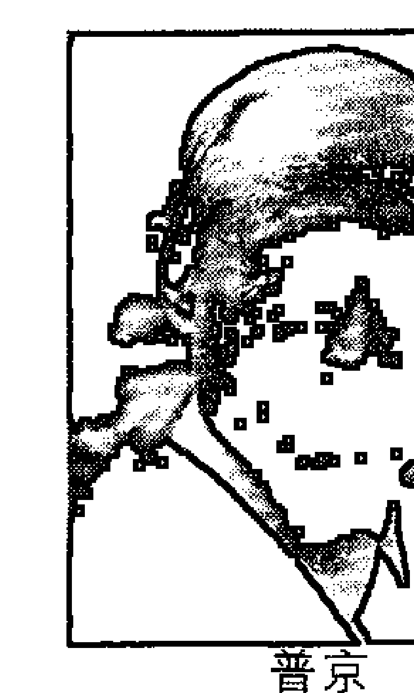

普京（1999—2000），前苏联列宁格勒人，俄罗斯前总统。普京在2000—2008年任总统期间，使俄罗斯在军事与政治实力上均有相当的提升，但他在民主方面也遭到很多争议，可说是一位名副其实的“铁腕总统”。然而，无可否认的是，普京在俄罗斯国内获得了极高的支持率。2007年，普京被美国《时代》周刊选为当年的年度风云人物。普京在当选总统前曾短暂担任过俄罗斯总理（1999—2000）。2008年普京卸任总统后，马上被继任总统梅德韦杰夫提名，再次出任总理。

### 吉米·卡特

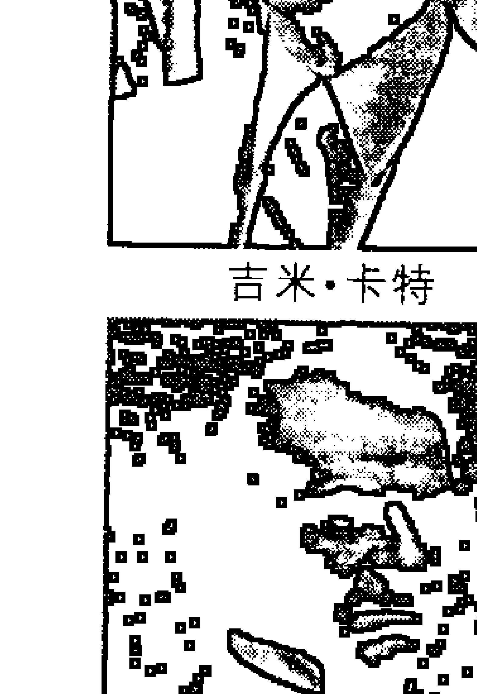

詹姆斯·厄尔·卡特（1924—），习称吉米·卡特。1955—1962年任佐治亚州萨姆特县学校董事会主席，1962—1966年任佐治亚州参议员。在此期间还先后担任过平原发展公司、萨姆特县发展公司总经理，佐治亚州中西部计划和发展委员会以及佐治亚州政治作物协会主席等职。1974年任民主党全国委员会竞选委员会主席。1977年任美国第39任总统。1980年争取连任落选。1982年起在亚特兰大的埃默里大学任名誉教授。

### 安德鲁·约翰逊

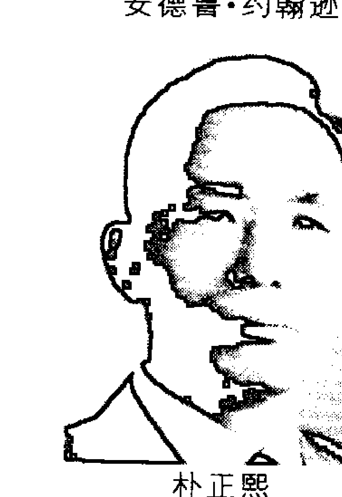

安德鲁·约翰逊（1808—1875），美国第16任副总统。在亚伯拉罕·林肯遇刺身亡后，继任为美国第17任总统。由于在南方重建问题上采取妥协立场（他曾两次担任田纳西州州长），又否决民权法案，与国会的激进共和党人矛盾很深，使他成为美国历史上首位被提出弹劾议案的总统（1868年）。最终在参议院以一票之微避免被罢免。

### 朴正熙

朴正熙（1917—1979），号中树，朝鲜族，韩国庆尚北道人，1917年11月生。他曾经用过“冈本实”和“高木正雄”两个日本名。他是韩国第3任、第5至第9届总统，自1961年上任至1979年逝世。

## 第四章 B型血的人

典型特征：充满感情的行动家。个性爽朗，开门见山，没心眼，心肠软，有同情心。爱好横向关系的拓展，全凭直觉及印象，容易不顾一切蛮干。不求结果，只在乎过程。

### 第一节 B型血的人

### 一、B型血人的性格

**健谈**

B型血人喜欢与这样的人交朋友：健谈，对自己的谈话感兴趣，能够产生共鸣，并能适当地给自己一些刺激。具备这种条件的游伴也更容易相处，如果既谈得投机，又有共同的兴趣爱好，那就更投其意了。

**善解人意**

B型血人善于理解别人的立场和心情。对对方来说，B型血人的这种情感共鸣，是在其他血型那里不容易感受到的“人情味”。

具有如此特点的B型血人的爱，形态最为多样。与其说像燃烧的火，不如将它比作温暖人心的火炉。B型血人偏向浪漫式的谈情说爱，所以虽能给对方温暖，却不容易爆发出炽烈的爱情之火。

**心肠软**

心肠软，容易动情。内心中凭印象判断的感情因素较多，容易按照简单的想法说话做事。当情绪真正爆发时，有时会有出人意料的举动。他们既能察人之情，也能察人之心，常以自己的情感基点去体谅别人的感觉和心情。

**有灵性**

有灵性，触类旁通。很多时候会凭借一时兴起的一点直觉，将两个看似不相干的事物联系起来。

**易害羞**

注重自我实现和自我认同，认为“我”的事情“我”承担，主张分清界限，谁的事情就归谁负责。感知性很强，内在情绪的辐射较多。注意力不太集中，感性大于理性。在交往中有羞怯、难为情、怕丢人、怕麻烦的倾向，有时会怯场或怕见人。

**爱讲道理**

总是想按照道理、公理做事，并认为这样做出来的事情最好，讲究均衡。有时又会多愁善感，情绪多变，心思细腻，甚至会很天真地认为：“我看青山多妩媚，青山看我应如是。”

**乐观**

B型血的人淡泊、乐观。乍看之下让人觉得冷淡甚至不太有礼貌，其实他们向来大而化之，不太注重交际手腕，属于个性爽朗的人。他们对人诚恳，有人情味，非常喜欢鼓励别人。B型血的人自我肯定意识很强，常会推翻别人的意见，但通常并没有恶意。

**活泼**

大多数B型血的人性格活泼、开朗、充满活力，精力充沛，思维活跃，常常具有与众不同的见解；他们独立性和自主能力很强，喜欢自由自在的环境，不愿受约束；灵活性强，也知道自己的局限；能够从容地应付烦恼，懂得寻找时间放松自己、减轻压力；自信心强，口才和反应能力较好，富有远见和创造性；对于自己感兴趣的事情会全身心投入，坚持完成。

**易疲惫**

另外，B型血的人对不适应的环境或不感兴趣的事情会缺乏动力，显得心浮气躁。因此，有时B型血的人看起来会显得很“懒”，长期如此甚至可能产生慢性疲劳感。此外，B型血的人主观意识较强，不够实事求是，有时还会给人好辩解的感觉。

### 二、B型血人的爱情观

B型血人的爱情之火有时像山火一样，一点火星就可能引起一场大火。可以肯定的一点是：B型血人对与自己接触越久、距离越近、见面次数越多的人，更容易燃起爱情之火。

B型血人的性行为中，生理因素往往大于精神因素。换言之，他们能够比较自如地将性关系与爱情分开。他们可能一面对张三燃烧着山火般的爱情，一面又在李四那里寻求纯粹的性满足。

如果把A型血人看作单纯的性关系对象，会伤害他们的自尊心；而B型血人则往往不太介意。而且，B型血人不太讲究气氛和情绪准备。不少B型血人只要有性的快乐就可以，也有人会想方设法尝试各种技巧。

另外，个性刚强的B型血人中，也有沉溺于性生活的，有的人在某一时期会表现得比较放纵。

不过总体看来，B型血人中真正好色的人并不多。这是因为他们较为害羞；另外，B型血人的兴趣也较容易偏向自然科学方面，因此津津乐道于淫秽话题的人并不多见。

### 三、B型血人的事业观

B型血的人反应敏捷，思维活跃，在团队中能出谋划策，也喜欢发号施令。但他们稳定性不强，所以即使做同样的一件事，今天能完美完成，明天也可能错误百出。

他们一般不以薪酬的高低作为工作的主要标准，而是以是否快乐为标准，不会为了钱去做自己不喜欢的工作。B型血的人事业心很强，对自己感兴趣的工作会投入极大的热情，并且十分努力。

他们有很强的爆发力，但因为兴趣不断改变，这种爆发力往往难以持久。虽然没有很强的定性，但求知欲极强，一旦对某件事产生浓厚兴趣，就能把其他事情全部抛开，像凸透镜一样把所有精力和能量集中在一个点上，因此往往能取得较大的成就。

不过，他们在工作中做事不够谨慎，常常边做边想，也不太愿意听取别人的意见，往往凭感觉处理事情，容易蛮干。

B型血的人性格洒脱，处理事情迅速，很有气魄。他们对工作乐观，不怕困难，而且这种乐观情绪很有感染力，能迅速影响周围的人。一个B型血的人领导的团队，精神状态往往十分活跃。

B型血的人责任心强，如果犯了错误，他们敢作敢当，勇于承认。他们不徇私，对所有人一视同仁，因此很受同事们尊敬。他们行动迅速，想到的事情会马上付诸实践。但由于性格较冲动，考虑不够周全，所以有时会显得行动有余、思考不足。

B型血的人性格奔放，讨厌古板，最不能忍受一成不变的安稳工作。他们不喜欢受拘束，因此自由度较高的职业往往更适合他们。B型血的人富有创造力，适合挑战性、创造性较强的工作，如节目主持人、业务员、外交官和设计师等。

他们兴趣广泛，没有特别固定的专长。如果跳槽，可能会选择一份与之前完全不同的工作。这既因为他们有自信、敢于尝试新事物，也因为他们理解能力强，对新事物能很快掌握。

B型血的人常常具备一心二用的能力，这一点常让别人难以理解。当然，这种不专一的特性也具有两面性：发挥得好，人生会丰富多彩；发挥不好，则容易半途而废，一事无成。

### 第二节 B型血的孩子

### 一、B型血孩子的性格

B型血的孩子乐观开朗，做事爽快，是典型的乐天派。他们总是悠闲自在，但容易冲动，做事随心所欲。不过，这种无拘无束的性格一般只在熟悉的环境和朋友面前才会表现出来。

B型血的孩子天生对人有一种距离感，他们不太愿意参加集体活动。他们对周围环境的变化也很敏感，会注意他人的脸色，但并不太在意别人对自己的评价。

B型血孩子的父母应以家庭为中心，逐渐扩大孩子的交往范围，让他们广泛接触各种各样的人。例如可以让他们和小朋友一起上幼儿园、一起回家、一起玩耍，逐步培养他们参与集体活动的意识。

B型血孩子最大的弱点是缺乏耐心，因此让他们懂得社会规则和常识、培养毅力非常重要。夸奖B型血孩子时，要先说明值得夸奖的原因，再给予奖励，切忌盲目夸奖。夸奖时不妨抱抱他们，或者用脸颊贴一贴他们的脸。责备B型血孩子时，最好的方式是直截了当。

B型血孩子最大的优势是性格开朗、思维活跃，因此从事艺术性较强的工作较为理想，如服装设计；其次是观光旅游、大众传播等领域。

### 二、B型血孩子的学习特点

一般来说，B型血孩子的理解能力和判断能力发展较早。也许因为神经敏感，他们对观察和了解客观事物常常怀有浓厚兴趣。因此，他们往往比同龄孩子见识更广，涉猎范围也更广泛。

不仅如此，B型血孩子在数理方面的特长，早在幼儿时期就有所体现。这或许也解释了为什么自然科学家中B型血较多。

由于B型血孩子在学习上受兴趣影响较大，他们有时会对不感兴趣的课程产生厌烦情绪，从而影响知识的全面掌握。不过，与爱憎分明的O型血孩子相比，B型血孩子较少因为喜欢或讨厌某位老师而决定是否学习某门课程。

此外，老师常常会称赞B型血孩子在某一方面特别聪明，尤其在数学、物理问题上，他们提出的解题方法甚至可能比老师更巧妙。

问题在于，他们较为粗心大意，这往往会导致他们在重大考试中发挥失常。再加上对其他课程掌握得不够牢固，因此一些一向被老师看好、寄予厚望的B型血学生，也偶尔会名落孙山。

此外，不少B型血孩子在学习时还喜欢一边看电视或听音乐。虽然这种习惯对具有多向思维能力的B型血人影响不算太大，但时间久了仍可能产生不良影响。

和O型血孩子相似，B型血孩子也有“记得快、忘得快”的倾向。虽然不像O型血那样依赖死记硬背，但对于政治等文科知识，他们往往不太感兴趣。相比之下，他们对数学公式和符号的记忆力更强。

### 第三节 B型血的女人

### 一、美容攻略

B型血的女生睡眠质量通常很好，往往是早睡一族，因此皮肤一般比较有弹性，气色也不错。

不过在寒冷的冬季，B型血女生容易因为脂肪堆积而出现单纯性肥胖，例如小肚子突出，脸蛋变得圆润。这主要是因为她们往往吃得香甜，又不太爱运动，平时除了坐在办公室，就是坐在家里的沙发上。

不一定要强迫自己参加高强度的体育锻炼，因为坚持下来的概率比较小。比较现实的方法是通过按摩促进消耗，例如洗完澡后进行适度按摩，也能帮助消耗热量。

B型血女生还要控制甜食和淀粉类食物的摄入。可以多吃新鲜黄瓜或饮用乌龙茶，它们具有防止糖分转化为脂肪的作用。

在购买护肤品时，B型血女生尤其要注意不要被广告或销售人员轻易影响，只购买真正需要的产品。虽然她们往往很喜欢网购，但涉及到护肤类产品时，一定要选择安全可靠的店铺。

### 二、自制力弱，花钱大手大脚

B型血的人在金钱态度上只有两个字：大胆。特别是女性，往往花钱大手大脚，只要看到喜欢的东西，就会立刻掏空口袋满足愿望。那些因为刷信用卡而欠债较多的人中，也常见B型血女生。不善于精打细算，是B型血女性的一个明显弱点。

B型血女生通常具有独特的个性和敏锐的洞察力，属于我行我素的类型，而且天生喜欢冒险。她们对周围的人或事往往不会过分操心，因此很少产生压力，总是积极挑战自己感兴趣的事物，并且能够紧跟时代潮流。

她们希望在工作中取得成就，在职场上像明星一样引人注目。她们才华横溢，善于随机应变，但由于情绪不够稳定，有时周围的人不愿追随她们，因此也可能因为过于随心所欲而吃亏。

### 三、理智客观，但易动摇

B型血女人比较爱流泪，也容易动摇。她们的思维判断具有很大的伸缩性，思考范围广，重视真实性、正确性和妥善性。

当B型血的人遇到问题时，常常会进行广泛而灵活的思考和想象，决断速度很快，并能迅速抓住重点，把事情处理妥当。然而遗憾的是，她们往往心志不够坚定，像脱缰野马般充满好奇心，同时又缺乏耐心和毅力。

时而懒散、时而细心，尤其健忘，这些都是B型血人的明显缺点。

B型血的女人常常依靠自己的直觉来判断一个人的好坏，对事物的看法也多以自己的判断为依据，而这种判断往往非常直接而深刻。

### 第四节 B型血的男人

### 一、心软浪漫

B型血的男人心肠柔软，虽然他们同时也具有刚毅和暴躁等特征。你若仔细观察，会发现B型血男人的眼神深处总藏着一种温柔的爱怜。

当他们注视马、羊、孩子或女人的时候，这种爱怜便会自然流露，仿佛在面对一件易碎的珍品。因此，他们常常赞美的对象是马、女人和土地。

在B型血男人眼里，马并不是普通牲畜，而是一种骄傲、速度神奇、外貌俊美的高等生物。当B型血男人抱住马宽厚的脖子时，眼中的神情往往令人感动。

他们的柔情中还包含着浪漫。当B型血男人发现令自己倾心的女人时，会毫不掩饰地注视对方。事实上，每个女人都知道，被人注视本身也是一种赞美。B型血男人的目光像火把一样炽热，仿佛能烧尽对方的羞涩。

在西方文化中，“浪漫”常被视为男性近乎伟大的品质。浪漫并不是好色，更不是在歌厅包房里对女性动手动脚。脚，浪漫是把情爱视为人生大事，赴汤蹈火，缠绵悲壮。这样的男人当然不是很精明。浪漫的人认为，只有傻瓜才会牺牲浪漫而追求财富。他们还认为，一个人掩饰对女人的态度实在愚蠢。因此，B型血男人不太理解虚伪是怎么一回事。

## 二、“傻”男人

B型血男人第二个特点是“傻”。当然我说的是生活在草原上的人们。说他们不工于算计已不准确，应该说工于不算计。他们认为斤斤计较是可笑的，他们很怕被别人认为是精明过头的人。以这么一种形象面世，在草原上就没法做人了。

当然，在这种心态笼罩之下，他们所处的环境必然是不发达的。他们中产生的优秀人士，大多是一些运动员、艺术家，靠体能和心灵表达优秀。不像犹太人，在精算和苦难中成为大商人、大科学家和大艺术家。当然，这种情形正在改变。

在B型血男人或者说在B型血人眼里，窃人财物是不可理解的一件事。偷窃不仅是极其可耻，而且匪夷所思。为什么要偷别人的东西呢？他们对此感到不解，就像牛顿当年对行星内部蕴藏的规律困惑不解一样。因此说，蒙古人在夏季睡觉夜不闭户。白天，倘若全家出牧的时候，也不闭户。有一个半截门是挡家畜的。他们的箱子不上锁，因为没有人会到别人家去翻箱子。对他们来说，那些盗窃、抢劫、贪污的行为简直就是魔鬼的行为。而楼房装防盗网，把金银首饰放入保险柜，在他们看来，这实在是非常有趣的笑话。这种笑话每讲一遍都可以引发听者开心的大笑。

## 三、豪饮好酒，还有点“懒”

B型血男人喜好饮酒。人们相信他们是最善饮的人，这其实有些误解。人对酒精的依赖程度以及化学处理能力，即肝脏的分解能力，B型血男人与其他血型的男人并无区别。事实上，随着体能和智能的递减，酒精会在遗传基因中把一个民族消灭掉。在成吉思汗亲手制定的《大扎撒》中，规定子民不得酗酒酗饮。但事实发现，对蒙古这样一个随时准备攻占、掠夺的民族来说，酒量太大反而不利。

B型血男人“懒”。早上起来，B型血男人要喝茶，这是一天重要的功课，喝两三个小时并不算长。而挤奶、做饭、烧茶、管牲畜、抚育老人孩子这些繁重的劳务，由女人担当。当女人做这些事情的时候，男人连哼也不哼。在牧区，会看到许多腰身佝偻的老年妇女，那是历经劳役所留下的印记。而男人倘若协助做一些家务，会被认为“不像话”，甚至妇女也会这样认为。

## 四、可怜的B型血男人

王磊今年24岁，是一名大学生，现在在找女朋友。他最担心的事莫过于女方问他的血型。在遗传学和通俗文化的共同影响下，王磊的爱情生活可谓相当悲惨。

王磊的血型是B型。

王磊说：“我追求过的女孩都直截了当地告诉我，她们不会与B型血的男孩约会。她们说B型血的男人自私、鲁莽。”最近几年，韩国杂志、电视节目和网络聊天室一直拿血型大做文章。但目前人们关注的话题只是与B型血男人交往是何等困难。尽管科学家一再表示，血型和性格之间没有任何联系，但这仍未阻止一些所谓的专家胡乱发表他们的观点，比如宣称A型血的女人应该避免与B型血的男人交往，原因是A型血的女人一般比较害羞，而B型血的男人则一般没有定性。

将血型与性格联系起来在东亚国家已经流行了几十年。这种思想最早源于20世纪早期的日本，最后逐渐向韩国蔓延。事实上，B型血的人有好几种性格，但在韩国，人们只把不好的一面与B型血的男人联系在一起，说他们自私、反复无常，不可能成为关心、疼爱女人的标准男朋友。而另一方面，B型血的女人似乎已成功摆脱了通俗文化的“诅咒”。

## 五、冷漠孤傲但心直口快

不了解实情的人，看到B型血人那傲慢而又冷漠的态度会误会其心怀歹意，可接触后会觉得很好相处。他们不计较小事，虽欠浪漫情怀，但心地善良，富有人情味。还有的B型血的人常以行动表示自己对人的同情和理解，他们助人为乐到了近乎管闲事的程度。难弄的倒是他们那好吹牛的脾气：你这么说，他偏那么说，不管别人的意见正确与否，上来就放一通炮，说的又都是无关宏旨的东西。

B型血的人爱与人相处，但与A型血的人有所不同。他们一般不愿积极配合别人，常常喜欢自行其是。可是若落伍，或遭到挫折，又会特别沮丧。人们都把B型血的人叫做“乖僻B”。从调查情况看，不少B型血的人待人冷若冰霜，而内心却希望别人能热情相待。

## 六、特殊的处世态度

B型血的人的爱与友爱十分相似，两者较难区分。这是因为B型血的人很少有占有欲和保护或依附的愿望，而这种欲望在男女之爱中通常是占中心位置的。B型血的人喜欢与这样的人交朋友：健谈，对自己的谈话感兴趣，能共鸣；还能适当地给自己以刺激。具备这种条件的异性也很好相处，既谈得投机，又有共同的兴趣爱好，那就更投其意了。

仅这些条件的话，与交同性朋友就毫无二致了。所以还有一条：你可以隐约地感觉到他们喜欢接触异性。对他们来说，异性完全不同于自己的言谈举止，是带来愉悦的一种刺激。此外，B型血的人有注重感觉的特点，所以喜欢欣赏异性朋友的容貌风姿和谈话的表情语调。

B型血的人善于理解别人的立场和心情。对对方来说，B型血的人的这种与己感情上的共鸣、和谐，是在其他血型的人那儿感受不到的“人情味”。具有如此特点的B型血的人之爱，形态最为多样。说它像燃烧的火，倒不如将它比作暖气之类的东西。B型血的人有着浪漫式谈情说爱的一面，所以虽能给对方以温暖，然而不易喷发爱的火焰。

不过，随着与对方接触次数的增多，B型血的人的爱会渐渐地出现过热的现象。B型血的人的爱的发热似乎与双方接触的时间、距离和频度等都是成正比例的，其爱的发热内容表现为希望接触的时间更长，距离更近，次数更频繁。核心是接触欲望。为了实现这种欲望，连平日里懒散的B型血的人也会突然向对方献起殷勤来。

### 第五节 B型血的名人

### 三毛

三毛（1943—1991），原名陈懋（mào）平，浙江舟山人，出生于重庆黄角桠。曾就读中国文化大学哲学系。婚后定居西属撒哈拉沙漠加纳利群岛，并以当地的生活为背景，写出一连串脍炙人口的作品。1981年回台后，曾在文化大学任教，1984年辞去教职，以写作、演讲为职业。代表作品有《倾城》《温柔的夜》《哭泣的骆驼》《梦里花落知多少》《雨季不再来》《撒哈拉的故事》。

### 田中角荣

田中角荣（1918—1993），日本政治家。原众议院议员、内阁总理大臣（第64、65任）。出生于新潟县。原以商人从政，在山崎拓通事件中发言替田茂解围，故被吉田茂刻意提拔。日本自民党第一大派田中派领袖。历任内阁大藏大臣、自民党干事长。1972年出任日本首相。因被指金权政治而下台，洛克希德事件爆发后受到判刑，但同时又以高票当选众议院议员。

### 布拉德·皮特

布拉德·皮特（1963—），美国电影演员及制片人。曾获得奥斯卡最佳男配角奖提名、金球奖最佳男配角奖，并于2007年凭《神枪手之死》一片一举拿下威尼斯电影节影帝。2009年凭《本杰明·巴顿奇事》一片首次提名奥斯卡最佳男主角。

### 黑泽明

黑泽明（1910—1998），日本导演，被称为“电影天皇”。最初据说具有讽刺意义，指他在指挥现场的执著强横和专制独裁，后来则成了彻头彻尾的尊称。美国商业上最成功的导演斯蒂芬·斯皮尔伯格曾说：“黑泽明就是电影界的莎士比亚。”代表作品有《罗生门》《七武士》《梦》《影武者》《乱》。

### 彼得·伊里奇·柴可夫斯基

彼得·伊里奇·柴可夫斯基（1840—1893），俄罗斯浪漫乐派作曲家。其风格直接和间接地影响了许多后来者。代表作品有《天鹅湖》《G小调第一交响曲》。

### 乌玛·瑟曼

乌玛·瑟曼（1970—），著名好莱坞女星。出生在美国波士顿，父亲是研究印度佛教学的专家，母亲来自瑞典，是心理分析医生。乌玛·瑟曼具有其他女演员难以匹敌的性感魅力，她的表演张扬而有张力，能在平淡中表现人性的深度。

### 莎士比亚

莎士比亚（1564—1616），英国文艺复兴时期伟大的剧作家、诗人，欧洲文艺复兴时期人文主义文学的集大成者。代表作品有四大悲剧《哈姆雷特》《奥赛罗》《李尔王》《麦克白》。

## 第五章 AB型血的人

典型特征：在性格表现上，AB型人既有协调性和开朗的一面，又有沉默寡言和拒绝他人的一面。实践能力和计划性都很强，但不喜欢做领导，容易疲劳。一般情况下厌恶争论，偶尔也会有些出于技术性考虑的争论。

### 第一节 AB型血的人

### 一、AB型血人的性格

### 表现欲强

AB型血的人在处理实务及待人接物方面，有一种出类拔萃的长处。同时富有个性，喜欢表现自己，好竞争。他能在团体中将复杂的人际关系处理得很好，充分发挥其高超的手腕。而且他的虚荣心很强，常对自己的能力评估过高，于是在某些行动上显得夸张和虚浮。

但是，AB型血的人冷静、慎重的时候较多，做事果断而有弹性，不会令人觉得刚愎自用，而且处理事物有条不紊，使别人对其表现欲不但不会产生反感，反而认为这是他的优点。

### 冷静

AB型血的人对事物的处理不会为感情所左右，一切以公平、公正为原则。在遇到挫折时，表面上若无其事，但在内心中会不断反省，寻求挽回办法，用冷静的态度解决棘手问题。

AB型血的人不会被感情所支配。当他发现处理上有偏差时，能立即恢复冷静，重新考虑，以较客观的态度去衡量得失、轻重。

### 优越感

AB型血的人很坚强、有自信，做事果断、迅速，为人乐观，是属于行动型的人。在团体中常站在指导地位上，而且能将大家的意向当成自己的意向，尊重大伙的决定，并将理想付诸行动。但在遇到挫折或失败时，就会推卸责任，将失败之责归咎于别人。只有在单独和别人相处时，他才会收敛自己的优越感，与人融洽交谈，尽量缓和气氛。

### 合理化

AB型血人的言行和潮流相随，总是走在时代的前端，往往让一般人难以完全理解。AB型血人对事物的观察能力和接受能力较一般人为高。

### 思虑欠周

AB型血的人对于规则、规定等形式不太容易接受，行为上也不拘小节，对别人的指正也不太理会，甚至产生强烈的反抗。在刚开始做某件事情之前，AB型血的人会细心调查，这并不表示他能尊重别人以往的经验，而是希望用自己的方法去尝试和处理。

### 天才型

AB型血的人做事能干，反应灵敏，起步快，进度也快。遗憾的是，其做事的成功率往往不高，这是因为他无法贯彻始终，常常到最后关头松懈下来，而且行事一有偏差就会与人妥协。其意志不坚，持续奋斗的精神也不够，这正是导致失败的根源。

### 二、AB型血人的爱情观

不喜欢与人过于亲密可以说是AB型血的人的最大特征。AB型血的人喜欢与一群知心好友闲聊，远胜于两人如胶似漆地独处，这也是该血型的一大特点。因此，即使是与男友的朋友相处，也能很快与人打成一片。如果自己的男友能喜欢自己所交往的朋友，会让她觉得十分高兴。

AB型血的人很冷静，对自己喜欢的人也表现得不冷不热，不会轻易流露感情，更不会主动表白。但如果对某个人有好感，会留意那个人的行为举止。AB型血的人爱情发展的速度不会特别快，一见钟情的事很少发生在他们身上。他们对外界保持距离感，也不会让恋人完全融入自己的世界，会与对方保持一定的安全距离，在这个距离之外观察对方。

AB型血的人喜欢博学多才、有艺术气质的人。他们欣赏有品味、时尚感较强、不奢华但精致优雅的异性。他们很理性，对爱情的理解很简单，就是“喜欢”或“不喜欢”，不相信有惊天动地的爱情。他们很冷静，很少沉溺于某一件事物中，因此不会被爱情冲昏头脑。

- 要与AB型血人亲近的秘诀，就是大胆让他做事，然后诚恳地表示谢意。凡是为人效劳的事，AB型血的人最感光荣。不过虽能亲近他，也难得其真心，需要长期相处。他厌恶伪善，必须诚实以对。

### 三、AB型血人的事业观

AB型血的人专长多，有天生的优越感，能在多方面有所建树，并且在任何时候都很自信。他们有很强的事业心，努力工作，但缺乏持之以恒的耐力。他们表现得很谦逊，不轻易显山露水。在工作中有时才华横溢，有时却又常犯错误。

AB型血的人有很强的创业能力。如果缺乏创业条件，他们往往倾向于任职于一些规模较大的企业，因为这样的环境更能满足他们的优越感。

AB型血的人往往表现出时而谦虚谨慎、时而自高自大的矛盾性格。他们很理智，绝不会头脑一热就盲目行动，而是会在仔细权衡利弊之后才决定是否付诸行动。他们没有固定的事业方向，但如果选准某个方向，就能充分发挥才能，创造出惊人的业绩。不过在面对重大问题时常常犹豫不决，在做决策时不够果断，以致错失最佳时机。

AB型血的人为人温和，行事低调，不爱出风头。他们有很好的调节能力，能处理各种矛盾。知识面广，有很强的办事能力，能适应不同职业。在政治、外交、设计、艺术等不同领域都不乏佼佼者。

### 第二节 AB型血的孩子

### 一、AB型血孩子的性格

AB型血的孩子纤细善变，略带神经质，孤傲、常感烦闷，精明却缺乏耐性，好奇心强、富想象力、理解力强、知性、喜思考，企划分析力强，警觉而疏离，批判性强烈，思而后行，喜完美主义，沉着审慎，重个人隐私，具经营能力。

温和的态度会使AB型血孩子的情绪稳定下来，鼓励性的语言会让他们接受父母的意见，并重新唤起自信心。当孩子出现错误举动时，父母应先询问他们犯错的理由，倾听他们的想法，在感情沟通之后再进行引导式教育。例如：“你的心情我理解，但这样做不太好，让我们试试其他办法，好吗？”还可以引导他们在别的小朋友生病时主动去看望，或者让他们多经历一些困难的考验。

AB型血孩子最大的优势是聪明，其求知欲望和独创精神强，能在文学或音乐等领域发挥优势。

### 二、AB型血孩子的学习特点

AB型血孩子在掌握要领和理解能力方面一般要胜人一筹，因此常给人聪明的感觉。此外，他们权力意识淡泊，能够避免因做班干部而给学习带来的消极影响。同时，他们常有的距离感也使他们能把更多精力投入到自我建设中。对于一些AB型血的尖子生来说，由于同样的原因，往往会有一种“高处不胜寒”的感觉。

但也有不少AB型血孩子学习成绩并不是很好，这显然与他们缺乏毅力和耐心的一面有关。对于需要死记硬背的课程，他们更是缺乏热情，再加上竞争意识淡泊，也让他们学习的积极性大打折扣。因此，对AB型血孩子来说，多加督促和鼓励是非常必要的。

和其他血型的孩子相比，AB型血孩子对学习的态度总体还是很认真的。即使是不太感兴趣或不太擅长的课程，也会认真做好笔记。这可能得益于AB型血人合理化的一面。

另外，AB型血人的体质不是很好，尤其不善熬夜。如果不能有效利用时间，提高学习效率，也会影响学习成绩。因此，AB型血孩子要安排好作息时间，做到有条不紊、循序渐进。

### 第三节 AB型血的女人

### 一、冷静理智的气质型女人

AB型血的女人常给人冷静的感觉，常以实际行动获得人们的好感，也常让人觉得可爱又可畏。她们办事简单干练，有强烈的正义感，对任何事物都特别追求合理性。

大部分AB型血女性在社会中属于容易相处的类型，与人为善，极力避免争吵。她们给人的第一印象多半是智慧、纤细、善变、略带神经质，富有企划性且分析敏锐。在谈话场合中，她们更像大企业家，总是沉着而审慎地筛选辞令。由于精于打算，不轻易表露真实想法，因此多少给人难以融合的印象。不过，她们具有良好的平衡能力和优秀的社交能力，博闻广识，话题新颖而丰富。

内心深处情感复杂，激情起伏，这一特点在极为亲近的人面前表现得尤为明显。

AB型血女人的婚姻态度非常现实。她们尊重自己的人生伴侣，信赖对方，并认为对方是“一起过日子的人”。她们也认为婚姻对象与浪漫情人是两回事。

### 二、有罗曼蒂克的心，无罗曼蒂克的能力

AB型血的女人不太执著于金钱和地位，但追求自身价值的合理性，不乱花钱，也乐于储蓄。兴趣爱好广泛，一旦喜欢某件事，能很快抓住重点，美中不足的是有点喜新厌旧。

她们不被感情所支配，当发现在问题处理上有所偏差时，能立即恢复冷静，重新考虑，以较客观的态度去衡量得失轻重。

AB型血女人给人的感觉有些矛盾，她们有时难以控制情绪，因此常显得烦闷或焦躁，也可能出现易怒的表现。不过，她们能一视同仁地与很多人保持友好关系，并通过逐渐了解来选择性地发展朋友。

她们办事简单干练，内心有强烈的正义感，对任何事物都追求合理性。她们对手续、规定等形式不太在意，行为上不拘小节，对别人的指责也不太理会。但一旦受到强迫，也会表现出强烈的反叛精神。大部分AB型血女人有罗曼蒂克的内心诉求，却缺乏罗曼蒂克的表达能力。

### 三、独来独往，但能和人和睦相处

AB型血的女人比较理智，但有时对于自己厌恶的人或事，也会毫不留情地批评。她们乐于助人，能及时帮助陷入困境的人，但同时也比较孤僻，喜欢独来独往，不太喜欢融入喧闹的集体。

她们待人接物温和，能与周围的人和睦相处，善于处理各种人际关系。她们既能认真对待做事认真的人，也能与人随意开玩笑。她们追求合理性，能够根据不同的人和不同的环境调整自己的态度，以满足自己对合理性的要求。但这种表现有时会被误解为“两面派”，这种误解会让她们生气。不过，她们有很好的隐忍能力，不会随意发泄不良情绪。

### 四、注重健康的合理搭配

AB型血的女人性格比较内敛。虽然她们很重视健康，但表面上却表现得若无其事。她们能发挥聪明才智来管理自己的身体，不会讳疾忌医。

由于结合了A、B两种血型的特点，AB型血女人的饮食范围比A型血女人更广。但由于AB型血人的血液红细胞上同时存在A、B两种抗原，而白细胞中既无A抗体也无B抗体，所以他们的消化系统比较敏感，也更容易感染一些引起呼吸道疾病的病毒。

AB型血的人在饮食方面适宜少吃多餐，食谱应以植物性食物为主。此血型的人血液中胆固醇浓度偏高，应多食用自然、新鲜、清淡的植物性食物，如蔬菜等，以净化血液、降低胆固醇。由于AB型血的人结合了两种血型的特点，因此A型血和B型血需要避免的一些食物，如小麦、西红柿、鸡肉等，也不太适合AB型血的人。

AB型血的人虽然性格上结合了A型血和B型血的特征，但其生理特征更接近A型血的人，更适合植物性食物。由于胃酸不足，他们对肉类的消化能力较弱，因此应限制肉类摄入。

### 五、AB型女人的美容攻略

AB型血女人的消化系统结合了A型和B型血人的部分特点。她们往往食欲旺盛、喜欢零食，但消化系统较敏感。她们能够很好地吸收乳制品和植物类食物，但由于具有A型血胃酸分泌不足的特点，对肉类食物的消化能力较弱。

在饮食上需要控制食欲，多喝水或花茶可以很好地抑制食欲。对于面包、肥肉等脂肪含量高的食物要适当避免。吃零食时可以选择高纤维、低热量的食品。饮食应遵循少吃多餐的原则，避免一次进食过多。鱼、蔬菜和豆腐都是AB型血人较适合的减肥食品。

导致AB型血女人肥胖的一个重要原因是摄入过多肉类，这些物质难以消化吸收，容易转化为脂肪并在体内堆积。因此，AB型血人减肥可以参考A型血和B型血的合理饮食方法。

在运动方面，AB型血女人的体质更接近A型血的人，因此适合A型血人的运动也同样适合她们。例如瑜伽、慢走等温和型运动。

AB型血女人的皮肤较白，肤质多偏油性。护肤以补水和控油为主，可以选用清洁力较强的洗面乳保持皮肤清爽，并配合补水控油类护肤品。

AB型血女人对时尚敏感，但不会盲从。她们有自己的品味，有时穿着正式，有时又显得随意，喜欢搭配反差较大的服装风格。这也与AB型血人矛盾而极端的性格有关。

### 六、会理财，会持家

AB型血的女人由于对合理性的要求较高，因此非常推崇AA制。有时会让人觉得有些小气，其实这是她们追求公平合理的一种表现，她们也不会无缘无故占别人的便宜。

她们热心公益事业，所以平时很节省的AB型血女人，有时也会突然捐出一笔钱帮助需要的人。

AB型血女人持家有道，往往能合理安排生活。对她们来说，储蓄是非常重要的，一定要有一笔存款。她们不会把钱全部存在银行里，也不会孤注一掷地全部拿去投资。

她们感觉敏锐，思维活跃，只要愿意学习，在任何领域都有可能取得发展。

能很快地掌握规则，所以她们的投资没有固定性，也许今天她们投资艺术品，下一次却投资股票了。对于投资她们会经过合理化的分析后再决定，像股票等有一定风险的投资行为，她们会充分分析，不会因头脑一热就盲目买入或抛出。令人惊奇的是，她们的投资能屡战屡胜，不过由于她们有矛盾的双重性格，偶尔又会犹豫不决，错失投资良机。

### 第四节 AB型血的男人

### 一、崇尚简单，讨厌复杂

AB型血男人非常擅长做事务性的工作。他们中的多数常待人和蔼可亲。如果注意观察，您或许就会发现，他们很少有显露出激动神态的时候。其次，AB型血男人不愿多谈及自己，这并不是因为没什么可谈的，而是苦于找不到与其他血型的人进行谈话所需要的共同语言。

譬如说，一般O型血的人认为，有条不紊表现了一种性格。可不具有该气质的AB型血的人却认为，有条不紊并不能表现性格。他们的理由是：所谓有条不紊，完全是在自己一时的思想支配下实现的，即当自己感到需要有条不紊的时候，就应该把事情做得有条不紊；不需要的时候，就不必非得强求自己那样去做。所以说，有条不紊仅仅是自己一时意志的反映而已，并不是什么性格的反映。

对“老实”的理解也是如此。AB型血的人认为，该老实的时候就老实，不该老实的时候就没有必要老实。也就是说，人可以老实，也可以不老实，这完全是由自己当时的意志所支配的，并非是什么性格。

所以，AB型血的人讨厌有关“人情论”“爱情论”一类的话题。对他们来讲，所谓“爱情”不过是“喜欢”与“不喜欢”的问题：今天我喜欢你了，就算我有了爱情；明天我不喜欢你了，爱情也就化为乌有了。问题就这么简单，远没有人们演绎的那么复杂缠绵。至于“人情”，对他们来讲，简直是令人讨厌的话题。

### 二、行动迟钝，工作出色

AB型血的男人看起来行动迟钝，说得具体些就是干什么事都磨磨蹭蹭、慢慢腾腾的。AB型血的人容易疲劳，表面上看常常显得疲惫不堪。事实上，他们并不是真正的身体上的疲倦，而是心理上正处于一种什么事也不想做的状态中。

AB型血的人除了工作和参加必要的社会活动外，很少有参加其他有趣活动的愿望。据调查，失业者中AB型血的人占多数，这与AB型血的人不愿多参加活动的情性有关。

典型的AB型血的人把合理性放在第一位，他们常常进行很现实的计算，做事情算计得很清楚，总是“非礼勿动、非礼勿视”。这让人感到，他们似乎是缺乏感情的人。实际上AB型血的人是有感情的，只不过他们不喜欢过分地表露自己的感情，他们非常讨厌那种做作的表现。

总的来讲，AB型血的人对“表里不一”的两面派非常愤恨。他们在受到别人的讽刺挖苦时，会立即变得怒气冲冲，因为在他们看来，这种讽刺挖苦正是表里不一的表现。可有趣的是，最讨厌“表里不一”的AB型血的人，有时却反而会做出看似口是心非的两面派行为，这是AB型血的人所不能接受的。事实上这种现象是委屈了他们。

不过，AB型血的人常常根据环境的不同而改变自己的态度，这倒是事实。但这并不是口是心非的表现，而是他们从合理性考虑，认为在不同环境适当地改变一下态度，也许会显得更合理，因此才对自己的态度做出修正。

### 三、复合气质的幽默男

由于AB型是A和B的复合气质，所以在他们身上常常突出地表现出单一的A气质或B气质。但是，同时作为复合气质，它和AO型、BO型不同。AB型的复合性，是为了使气质中既含有A气质又含有B气质，似乎也是为了合理性而组合的，一切体现了合理性原则。

AB型血的男人当感到自己的行为受到别人的蔑视时，或者当他们提出的自认为是正确的主张未被采纳时，就会感到非常伤心。但好在他们一般不会迁怒于人，因为他们不喜欢和他人争斗。所以，他们伤心时，也只是默默地将痛苦埋在心中。

在AB型血的人感到悲伤时，对他们表示同情是大有益处的。这样一来可以帮助他们解脱痛苦，另外还可以赢得他们的好感。

如果我们牢牢掌握住了AB型血男人的这些特点，那么，我们无须与他们进行深交，只凭和他们在治学方面、工作方面的接触，便能感觉到AB型血的男人是有能力、富于幽默感、开朗和不拘小节的朋友。

### 第五节 AB型血的名人

### 沃伦·巴菲特

沃伦·巴菲特（1930—），全球著名的投资商，生于美国内布拉斯加州的奥马哈市。在2008年的《福布斯》排行榜上财富超过比尔·盖茨，成为世界首富。在第十一届慈善募捐中，巴菲特的午餐拍卖达到创纪录的263万美元。2010年7月，沃伦·巴菲特再次向5家慈善机构捐赠股票，依当前市值计算相当于19.3亿美元。

### 鲁伯特·默多克

鲁伯特·默多克（1931—），出生于澳大利亚墨尔本以南30英里的一个农场，是美国著名的新闻和媒体经营者。他目前是新闻集团的主要股东、董事长兼行政总裁。以股票市值来计算，其新闻集团已是世界上最大的跨国媒体集团。

### 李嘉诚

李嘉诚（1928—），广东潮州人。1940年为躲避日本侵略者的压迫，全家逃难到香港。1958年，李嘉诚开始投资地产市场。1979年，“长江”购入老牌英资商行——“和记黄埔”，李嘉诚因而成为首位收购英资商行的华人。

### 玛丽莲·梦露

玛丽莲·梦露（1926—1962），美国20世纪最著名的电影女演员之一。她动人的表演风格和正值盛年的殒落，成为影迷心中永远的性感女神和流行文化的代表性人物。1999年，她被美国电影学会选为百年来最伟大的女演员第六名。艺术家安迪·沃霍尔创作的《玛丽莲·梦露双联画》是波普艺术的代表性作品。还有以玛丽莲·梦露为名字的鸡尾酒，这款酒将金巴利鲜红的色彩、微苦和甜味有机地融合为一体，似乎体现了玛丽莲·梦露那多彩又复杂的一生。

# 第三部分 血型·星座

你的星座，取决于你的出生日期；你的血型，取决于你的父母遗传。两者结合，会影响你的方方面面。

## 第一章 血型·白羊座

典型特征：最富活力的O型血白羊座，侠义之气的A型血白羊座，积极热忱的B型血白羊座，浪漫的AB型血白羊座。

### 第一节 O型血白羊座

### 一、最富活力的白羊座

O型血白羊座的人是充满活力、勇气和独立精神的，也因此吸引着周围的人。他们健谈、善辩、自信，同B型血白羊座人一样热情又开朗，充分发挥出白羊座人热情的特质。

但与B型血白羊座不同的特点是，他们更富于竞争力和现实性，不服输，不怕挫折的磨练，也更容易适应社会上各种约定俗成的规范。O型血和白羊座都有好胜的特点，所以O型血白羊座的人一旦认准了目标就不会轻易放弃努力，往往在事业上容易取得成绩。

相比AB型血白羊座人，他们显得比较有主见。从好的方面来说，O型血白羊座的人更容易充分发挥自身的能量，而不会因为左摇右摆的想法浪费时间和精力。但从不好的方面来说，他们对人对事易产生一些偏见，爱恨往往显得过于分明，也因为喜欢直言不讳的表达方式，有时会让旁人觉得有点好斗，这也是招致他们犯错的原因。

所以，学会如何理性冷静看待一些事情，有耐性地认真了解他人，学会低调和谦虚，是O型血白羊座的人生中的一个重要课题。

O型血白羊座的人对待爱情的态度是积极和自信的，但从另外一种角度来说，他们又是骄傲的。他们对于恋人的要求是近乎完美的，能够让他们觉得值得去喜欢、去付出的人不会很多。所以，一旦出现那个让他们心动的人，他们就会执着大胆地追求。如果最后没有得到那个人，那么爱有多深，恨就有多深。

### 二、容易冲动，喜欢冒险

O型血白羊座的人无论做任何事情都要仔细看清事实，慎重判断当时的情况，然后才付诸行动。不过在O型血人中，最积极且富有冒险精神的白羊座，却往往在时机未完全成熟之前，就毅然出发，说做就做。

O型血白羊座的人往往有冲动的行为，虽然也有马到成功的例子，但绝大多数总是因估计错误而失败，或是被迫回到原点。总的说来，O型血白羊座的人爽快、干脆，当他们遇到挫折时，并不会因此意志消沉，他们不会一直生活在悔恨中。

他们是积极行动型，难免给人好胜心过强而耐心不够的印象。他们的好胜心，可能是由O型血特有的浪漫意识，以及白羊座爽快的特质相融合产生的气质。他们不会因为害怕失败而丧失行动的勇气，也不会因为好胜而拒绝接受失败的事实。

### 三、有领导风范，有优越感

O型血白羊座的人，人际关系虽好，却不喜欢情理不分、啰嗦叨叨、死缠追逼的关系。无论做什么事，都喜欢干净利落，讨厌拖泥带水。

O型血白羊座的人虽然没有以自我为中心，但是自我意识却很强，不会轻易服输，最讨厌在别人后头做一只应声虫。如果无法时刻走在别人前面，其心中便会不舒服。诚如俗话所说：“宁为鸡首，不为凤尾。”野心勃勃、雄心万丈正是他的最佳写照。

O型血白羊座的人富有人情味，虽然不喜欢暧昧的人际关系，但很重视人情世故，尤其是路见不平、帮助弱小的意识更明显，勇于挺身拔刀相助。

总而言之，O型血白羊座的人虽然不喜欢依赖别人，却容许别人来依赖自己。这种心态，或许可以说是强烈优越感的表现。他的领袖气质，使四周的人群深为着迷、崇拜，容易被推举为团体的领导者。

### 四、热烈的追求，积极的行动派

O型血白羊座的人，如果喜欢上一个人，就会毫不犹豫地积极展开行动，因此对方很容易感受到他的热情。但他的行为仍有一定分寸，而不会采取唐突猛烈的方式。

恋爱时，他会细心观察对方的心理及态度，并思考作战方式。但由于充满了激烈的情绪，所以往往会使冷静的估计有所偏差。换句话说，自认为已经深思熟虑，总觉得稳操胜券，但热情过度的结果，却每每失去客观的判断，最终尝到失恋的苦果。

“拿得起，放得下”是O型血白羊座人的恋爱原则。一旦点燃了爱情的火花，他会倾注全部的精力，以期能在短时间内得到结果。

那种一拖数年的爱情长跑方式，是O型血白羊座的人最厌恶的恋爱方式。即使是短暂的邂逅，他也希望能完全表达自己热烈的情意。同样的道理，当O型血白羊座的他失恋时，也不会长久闷闷不乐。他也许会大醉一场，或者换个新发型，然后一切便随风而逝。画下休止符，等伤心期结束了，他又会回到原有的生活轨道上。

### 五、一触即发的激情

O型血白羊座的人，在感情的表达上既积极又敏锐，常以热烈的激情来影响对方的动向。对于男女之间的亲密关系，他虽认为是极其自然的事，却绝不会强求对方。

由于O型血白羊座人的恋情多半是在短暂的激情下产生的，所以由爱情到发生性行为也是迅速惊人的。但是，O型血白羊座的人并不会把爱情视为游戏，只不过从爱的自觉到性的结合的过程，似乎比别人快了一些。

在他的观念里，有了爱而发生肌肤之亲是理所当然的事。因此，他不会拘泥于一些世俗的观念。这种特殊的想法及做法，并不能为每个人所接受。所以，有时O型血白羊座的女人也会被误解为水性杨花。

O型血白羊座的人并不是欲望特别强的人，也不是生性轻佻的人。由于天生喜欢浪漫的气氛，所以他会很重视地点的选择和气氛的营造。不顾一切、只求达到目的的行为，是他不屑去做的事。

### 六、不易早婚，适合晚婚

早婚对O型血白羊座的人来说是不利的，或许晚婚是比较适合的方式。因为有过年轻时代的恋爱经验后，O型血白羊座的人对异性的认识愈来愈成熟，这时结婚才会长久。

大多数O型血白羊座的人，不分男女，往往在二十岁左右就因刹那间的激情而终身相许，以致在不犹豫地踏上婚姻殿堂之后，才发现对方的缺陷。

毕竟婚姻生活是现实的，只因年轻时被热情冲昏了头脑，以致产生“情人眼里出西施”的错觉。一旦朝夕相处，许多以前未注意的缺点便原形毕露了。所以，O型血白羊座的人因婚前认识不清而导致婚姻失败的例子屡见不鲜。

对O型血白羊座的人来说，经由相亲方式结婚并不适合。因为相亲是一种被动的形式，而O型血白羊座的人都是属于积极行动的类型。无论男女，有95%以上的人是自由恋爱而结婚的。

### 七、重视事业多于家庭

O型血白羊座的人，在二十五岁之后到三十岁左右，可以选择理想的终身伴侣，但男性并不是所谓的顾家型，女性也不是贤妻良母型。因此，婚后虽能组织一个欢乐洋溢的家庭，但也不会是个整天和家人厮守在一起的家庭。

O型血白羊座的男性是事业重于家庭的人。有了这股强烈的事业心，对于家庭的责任感自然就被冲淡了。婚后更会放纵自己在外面拈花惹草，因其自认为逢场作戏是免不了的。但除非特殊情况，他绝不至于沉迷其中而破坏家庭生活。

O型血白羊座的女性具有相当浓厚的社会性，所以家中出入的朋友特别多，家里自然就成为热闹的社交场合。虽不乏有扮演好主妇的例子，但成为一名职业妇女，或拥有自己的收入来源的比例也相当高。

由于个性外向，若是自觉被家庭的抑郁气氛所窒息，心中就会积累许多不满。所以O型血白羊座的女性，即使结婚了，多半仍不愿放弃追求自我的事业心。

O型血白羊座的人，子女数不会很多，两个孩子最适合。他们对孩子不会过于宠爱，通常采取开明的方式来教育孩子。

### 第二节 A型血白羊座

### 一、行侠仗义的白羊人

A型血的白羊座人身上有着A型血人的恒温感，完全不像人们一般对白羊座较为热情冲动的认知。但当你和他们走近之后，才会发现，在他们恒温的外表之下，同样有着白羊座人那一颗火热勇敢的心，并也有着活跃跳跃的奇趣思维。

从某种角度来说，A型血的白羊座人最大程度地发挥了白羊座人的纯洁感，他们总是显得比实际年龄年轻。也因为有种发自内心的纯洁，对于错综复杂的社会，他们始终不能也不愿完全圆滑地去适应。

无论一个A型血白羊人的年纪多大，经历过多少挫折，他（她）的个性中还是带有初生牛犊的倔强和率真。他们爱打抱不平，看不得不公平的现象，爱为弱者出头。

但绝大部分情况下，A型血白羊座人并不会四处惹是生非。他们是温和、谦让、低调的，说话不多，但亲近的朋友才能了解他们活泼的一面。

A型血的白羊座人同样有着A型血人勤奋工作的一面，他们是值得信赖和富有上进心的员工。A型血白羊座人有着亦动亦静的特点，他们适应的工作也是多种多样的。

对于爱情，A型血白羊座人常会有类似阴差阳错的感觉：不是他（她）爱的人不爱他（她），就是爱他（她）的人他（她）不爱。年少时候的A型血白羊座人很难体察出爱情中种种必须领悟的细腻之处，于是总会发生“货不对板”的情况。

A型血白羊座人真正的爱情之花往往要到一定年纪之后才会盛开。那时他们的人生经验较为丰富，更容易抓住真正的缘分。

### 二、矛盾且传统的作风

A型血白羊座的人非常重视事物的原则性，且具有克制感情的能力。任何一件事情吸引了他，他都会以全部的热情及努力投入其中。

白羊座的特征却是行动果决、勇于前进，对于任何事情都抱着超越他人的进取心。因此，当他表现出白羊座的性格时，便拥有冒险精神，凡事不会退缩，并且有勇往直前的魄力。

于是，其内心便经常产生剧烈的冲突：有时勇敢果决，有时优柔寡断。总之，A型血白羊座的人经常处于冲突与矛盾之中。

要化解此种矛盾与冲突，最理想的方式便是以A型的优点来弥补白羊座的缺点。把两方面的优点集于一身，必能获得极大的成就。

A型血白羊座的人重视传统的生活方式，十分慎重踏实地追求人生的目标。因此，当他表现出A型血的一面时，对于事情的想法会趋于保守，行动也较消极。即使大家认为他必须改革或超越的事，他也会迟迟不前，不轻易突破现状。

A型血白羊座的人善于防守，却拙于进攻，而白羊座的人恰好相反。如果进攻，便可发挥卓越的能力，但防守却显得懦弱无能。因此，如果能结合两方面的优点，则堪称攻守俱佳，可以攻无不克，成为常胜将军。

但是，如果不幸结合了两方面的缺点，便注定要以悲剧收场。无论他做任何事情都不可能成功，一辈子都无法出人头地。

实际上，能幸运地结合两方面优点且无往不胜的人毕竟是少数，而完全结合两方面缺点的人也不多见。大部分A型血白羊座的人都融合了A型血及白羊座的优缺点，因此经常在迷惑及浮浮沉沉的境遇中挣扎，矛盾万分。

### 三、热情洋溢，敢于表达

A型血白羊座的人在爱情方面充分表现出白羊座的性格，热情洋溢。一旦喜欢上某位异性，便显得非常冲动，几乎无法自我控制。

但是，此时A型血特有的抑制力会适时产生作用，因此终究不会贸然行动。那份热情便在心中澎湃着，有如《少年维特的烦恼》一书中的主角，恋情在心中一天天滋长，却不敢把感情勇敢地表达出来，而终日为情所苦。

A型血白羊座的女性个性也很倔强，绝不会把主权交给男性。一旦鼓起勇气表达爱意后，也会倾注所有的热情。

A型血白羊座的女性在性欲方面也十分强烈，但并非纠缠不休的类型，因此进行性行为时可能速战速决，很快便结束。

而A型血白羊座男性的性生活，刚开始可能不会配合对方的步调，这是因为A型血白羊座的人原本就没有从容的心情。他在爱情方面虽然轰轰烈烈、惊天动地，但却无法持久。那是因为A型血白羊座的人并不是一点一滴将热情释放出去，而是有如狂风暴雨，来得快，去得也快。

A型血白羊座的人谈恋爱通常不超过一年，甚至短短不到数月便告分手。分手后彼此也毫不眷恋，不带一点感情，这份恋情自然也没有值得回味之处。

A型血白羊座的人内心的压抑与临界的热情不断交战并煎熬着自己。终有一日，当他再也按捺不住心中澎湃的热情时，才会鼓起勇气向对方表达浓浓爱意。

如果对方在他表达之后接受了他的爱意，他会欢天喜地，感觉飘飘欲仙；但若是对方拒绝了他，则仿佛世界末日来临，无法承受如此打击，变得自暴自弃，沮丧不已，仿佛生命也不再有任何意义。

正因为他如此极端，受感情的冲击如此巨大，因此他对恋爱十分慎重，视爱情为生命中第一大事。表白绝非一时的感情冲动。

他属于缺乏目标便无法活下去的人。当他爱上一个人，对方的生命便远胜过自己的生命。其他的目标已置之脑后，转而把爱情的目标当作人生的目标，而对方的目标也就成了他奋斗的目标。

一般而言，A型血白羊座的人恋爱都是一见钟情。其他血型的白羊座人可能立刻展开攻势，只有A型血的他极力压抑自己，听任热情在心中澎湃。一旦彼此表明爱意，这股热情便仿佛洪流一泻千里，把对方卷入激情的旋涡之中。

### 四、热情的爱情，冷静的婚姻

A型血白羊座的人陷入恋爱时，虽然有些盲目，但一旦谈到结婚，却又出乎意料地冷静，凡事都优先考虑现实的生活，丝毫也不马虎。

但这并不是绝对的，早婚者即是例外。因为早婚者大部分因热恋时被冲昏了头，随随便便未经深思便步入结婚礼堂。结果婚后才发现彼此有许多地方无法协调配合，并且在现实的逼迫下，婚姻往往产生裂痕，最后走上分手之路，令人遗憾。

除了少数年轻时盲目结婚之外，大部分A型血白羊座的人都会冷静思考后才决定结婚。除非年轻时被热恋冲昏了头，否则A型血白羊座的人一定会把恋爱和婚姻分开考虑。

除非A型血白羊座的人肯定对方在精神及物质上对自己都有益，能同时获得满足，否则绝不会和对方谈婚论嫁，即使对方是他的心上人。

总而言之，他认为恋爱是个人的、暂时的，而结婚是属于社会的，是终身大事，想法相当实际。A型血白羊座遵守社会秩序与习惯的品性在其身上表露无遗。

因为他认为结婚和社会息息相关，为了社会的和谐安定，结婚之事便不得不慎重考虑！

## 五、对婚姻慎重但不失罗曼蒂克

由于具有慎重的婚姻态度，所以当A型血白羊座的人在选择配偶时，便按照自己的标准列出条件，一一考核，唯恐有些微不慎造成日后婚姻的危机，往往终身遗憾。

但过于严谨、冷静，容易错失良缘。在一直不满意的延误下，晚婚的情形相当普遍。

尽管他在婚姻的看法上非常现实，但他却不喜欢以媒妁之言的相亲方式认识对方，因此，他在结婚之前通常会经历多次恋爱。他渴望拥有一个稳固牢靠的婚姻，却依然期望增添一些罗曼蒂克的色彩，这便是A型血白羊座的人的婚姻观。

婚后的他，在家庭生活上绝不属于朴实、安静的一类。他家的大门永远为朋友敞开。朋友们来往之间，轻歌曼舞，荡漾着欢乐的气氛。其太太会成为标准的贤妻良母，而他每每有大男子主义作风，颇为独裁专制。

A型血白羊座的女性不会愿意把一生埋在厨房里，她企图外出工作，通过自己挣钱来肯定自己的能力。因此，她会兼顾自己的家庭及工作，即使事业非常成功，她也不会忽略家庭。对孩子的教育方面，A型血白羊座的人要求相当严格，不会太溺爱而宠坏了他们，而是尽职尽责地扮演好为人父母的角色。

## 六、性格决定职业

A型血白羊座的人才华洋溢，但他是否能在事业上平步青云、获得成功，与他的性格有密切的关系。如果控制得宜，凭他不错的职业运及优异的才能，成功的胜率非常大；但如果他无法改变性格上的缺陷，便会破坏他得天独厚的才华及运气，可能就永无成功之日了。

A型血白羊座的人工作时目标意识十分强烈，充满了活力，干劲十足。但是，在机会未来临之前，或是陷入进退两难的境地时，便会显得非常焦躁不安，甚至会自暴自弃，容易浪费精力。这是由于他缺乏耐心的急躁性格所致，因此他无法安心地等待。

在他朝着目标前进时，若没有遇到任何特别重大的阻碍，他还可发挥其出类拔萃的能力，干劲十足。但若是他转攻为守，或是运气不好，遇到难以克服的障碍时，他会很快丧失耐性及毅力，无法自我坚持，这是他最大的弱点。如果他能弥补这一缺陷，善于控制他的双重性格，将会获得财富、地位及声望。

## 七、节制浪费，储蓄财富

A型血白羊座的人的财运相当不错。对于储蓄方面，他喜欢积少成多的踏实方式，此点与他的性格也有相当密切的关系。A型血白羊座的他，在潜意识中总幻想着会有一笔横财，因此他在事业上会有大笔投资，想因此大捞一笔，一夜致富。

虽然也有少数踏实派一点一滴地积累财富，但那是因为A型血的特征压抑白羊座的特征的缘故。因为这类型的人总是以安全第一为优先考虑，不像白羊座喜欢高报酬高风险的投资。虽然这种人一向置身于安全地带，但由于对钱缺乏野心，因此金钱上也没办法更上一层楼，事业上也就平淡无奇了。

事实上，他只要把全部的精力投注在他的事业上，就能赚取可观的财富。但仅仅是物质上的满足是不够的，他更想去获得名誉、地位或声望。为了赢得这些，即使投入大笔金钱亦在所不惜。

他还有另外一个缺点，就是当工作或生活不如意时，便会随便挥霍金钱，一点也不心疼。而且在运气不好的时候，无法耐心等待契机，不谙明哲保身、何机而行之道，所以经常惹祸上身。

### 第三节 B型血白羊座

## 一、阳光心态，脑筋灵活

B型血白羊座出生在阳光和煦的三月及四月，因此他的性格也一如和煦的太阳，明朗而活力十足。脑筋灵活，做事迅速敏捷。因此，如果他碰上做事拖泥带水的伙伴时，那他就苦不堪言了。他直率了当的性格，往往会毫不顾忌地把不满和愤怒表现出来。直白的行动及迅速的决断力，是B型血白羊座的特征。当别人还在设想、不明就里时，他早已精神焕发地朝目标前进了。他一旦下定了决心就会立即付诸行动，行动每每引导着思考的方向。

他做事不拘小节，经常只顾向前冲刺，而忽略了细微的支持，因此他在奋斗的过程中，弄得头破血流的场面屡见不鲜。因为他脑筋过于灵活，没有做周密的思考和完整的规划，挫折当然也在所难免了。在现代这个竞争激烈的社会中，明快的决断力及果断的冲刺精神，反而远比别人容易掌握住机会脱颖而出，即使不刻意追求，也能成为焦点人物。

太过直率，会刺伤别人的心。虽然没有恶意，可是太过爽朗的性格，如果控制得不合适，无形之中会树立许多敌人，这是需要改进的地方。

出生于百花盛开的春天，性格也就像太阳一样明快果断。因此，凡是B型白羊座的人都有一句座右铭，即“不管结果是否失败，总比没有去尝试过好”。他对人对事都有永不停息的热情，一旦确立了目标，便会勇往直前。不达目的，绝不罢休，对自己的能力有绝对的自信，是位勇敢的前线战士。他拥有与生俱来的求知欲，比任何星座更具有向上心。在有限的生命中，尽量让自己活得健康、活得有朝气。他厌恶维持现状，拼命地向未知领域挑战，努力开创更具前景的未来，丝毫不放松人生的任何可能，是个热爱追求刺激及梦想的冒险家。

## 二、积极热忱地对待爱情

B型血白羊座的他，对于爱情的付出，就像夜空里耀眼的烟火那般灿烂夺目，又像樱花盛开一样，匆匆开花，匆匆凋落，来得快去得也快，属于一见钟情式的爱情。一个微笑，一个回眸，就可能使他毫无前兆地坠入爱情的火焰。这种激烈的情感态度，着实令某些人不敢领教。因为他是那么积极、热忱，被他青睐的异性往往会受宠若惊而不知所措。因此，他如果能稍微含蓄一些，那么成功的机率也能相对增加。

但是，当他满怀一腔热情却被对方一口回绝时，会像被泼了一桶冷水似的，使他心灰意冷。虽然对方太过无情，可是他绝不会死皮赖脸地纠缠对方，这也缘于B型血白羊座的人自尊心过于强烈。要对一个曾经拒绝过自己的人展开热烈的追求，对自信无疑是一种打击，所以他宁可放弃。

对于B型血白羊座的他来说，白羊座性情使得细水长流式的爱情未免过于迟钝了。可是如此一来，也失去了很多获得真爱的机会。

所谓“情人眼里出西施”，在他的身上得到最佳的印证。他一旦陷入热恋，就会失去理智，到了最后竟无法看清真相、正视事实。而且他完全看不见对方的缺点，甚至把对方的缺点看成是优点，完全失去了理性，对爱人产生过分理想化的倾向。

虽然他拥有美丽的恋情，可一旦发现了爱人的真面目，便会陷入迷惑之中，接着很可能就为这段美丽的恋情画下休止符。B型血白羊座的人，虽然明知对方是个大恶之人，无论是不当行为或不良嗜好，周围的强烈反对也好，他都可能不顾一切地去爱对方，想尽办法跟他厮守在一起，甚至做出私奔、离家出走等惊世骇俗的事情。困难及阻碍对他们来说无疑是火上加油，只会使他们更加相爱。

但是，他的爱情充满了奉献精神，使爱他的人感到热情如火、温柔多情。他对他的爱人毫不吝惜地付出，只要相爱，会毫不犹豫地为爱人作出巨大的牺牲。

## 三、容易闪婚，积极面对婚姻

从一见钟情到闪电结婚，是B型血白羊座的人最常见的婚姻类型。旁人也许对他的这种旋风式速度感到不可思议，可是B型血白羊座的男性或女性，对于寻找伴侣从不喜欢假手他人，诸如相亲、朋友介绍等一概谢绝，一定会自己寻找合适理想的对象。

他的结婚日期会决定得十分唐突，或许跟对方见面不到几礼拜，便宣布了佳期。可是对于正沉浸在热恋之中的他来说，谁也阻止不了他想早一点走上红地毯的决心。对于结婚，他并不觉得需要先有什么经济基础，因为他打算结婚之后一切再从头努力即可。

由于这种自我意识极强烈的个性，如果能遇到一个个性不是很温和的对象，那么这段婚姻可能就无法长久了；若是丈夫过于柔顺，她反而觉得丈夫太软弱，而处处压迫他。

B型血白羊座的女性，并不会向往安定的家庭生活。即使结婚之后，也不会平静地待在家里料理家务，一定会积极到外面找工作，想证明自己的能力。她以被丈夫养活为耻，不愿终日无所事事，一天天老去。她热爱紧张忙碌的生活。

B型血白羊座的男性富有责任心，十分顾家，堪称可靠丈夫。虽然他是家庭支柱，却同时也是一位不折不扣的独裁者，凡事都以自己的主见来决定，听不进妻子的意见。一句“跟我来”就主宰了全家大小的行动，是十分典型的大男人主义型的丈夫、父亲。

总之，B型血白羊座的人对婚姻十分积极，一定会演出一场惊天动地、轰轰烈烈的闪电式婚姻，让家人震惊不已。但值得注意的是，B型血白羊座的人，大多数的离婚期在二十岁到三十岁之间，所以结婚之前最好全面衡量对方的优缺点，谨慎考虑，切勿冲动行事，以免铸成大错。

## 四、适合有挑战性的工作

B型血白羊座的人就像一个活跃于人生舞台的斗士，较适合做挑战性的工作。在现代竞争激烈的商业社会中，他显得十分出色。愈困难、愈有挑战性的工作，愈能发挥他工作上的独特能力；而在平静无波的状态下，他特有的大胆、积极的行动力反而显示不出来。

因此，他必须寻找具有挑战性、能自由发挥的职业。国际事务可以充分发挥他的才能，像先进的精神及积极的行动力，足可应付这项工作。此外，大众传播、市场开拓、公关、宣传等冲锋陷阵性质的工作，都非常适合他。还有讲求速度的赛车运动，也十分适合他。

如果他觉得工作有压迫感，一直屈居人后，无法取得领先地位时，就应趁早改行，以免耽误一生、埋没自己的才华。

不过，这类型的人对上级和长辈偶有傲慢无礼的倾向，不要因为一时的失态留下把柄，自毁前程。

## 五、花钱大手大脚，但会积极地赚钱

B型血白羊座的人会积极地追求财富，犹如一个疯狂的赌徒一般，把人生视为一场赌局大胆下注。如果成功了，就可因此获得大笔财富；但是不幸失败了，也可能连本输得精光，变得一无所有，波动可谓十分巨大。

此外，他对待朋友非常慷慨，吃饭时总是自告奋勇地埋单。他这种举动绝非故意做作，对大把花钱一点也不心疼。可是，这种老大式的付款方式，很快就会把他的钱掏尽，钱财就在不知不觉中流失。

此外，B型血白羊座的人十分不懂得节制金钱开销，看到喜爱的东西，会不择手段、倾家荡产地买下来，从不考虑物品的实用性及长久性。

B型血白羊座应利用交际手腕开启良好的人际关系。人缘良好，对他的财运将有莫大的帮助。上了年纪之后，他还可能为了金钱而冒险，步入中年以后最好有点节制。

## 六、简单单纯，温暖活泼

B型血白羊人最恐惧的莫过于各种形式的束缚，而他们兴趣的转移也是非常迅速的，很难专注于某一件事物。因B型血天性中的乐观和白羊座简单的思维方式，所以在绝大部分时间里，他们是无忧无虑的，总是能够处于一种快乐的心境。

但因白羊人的火爆特质和B型血的感性相结合后，B型血白羊座人也会有容易急躁和冲动的弱点，这是需要他们去克服的。

B型血的白羊座人，将B型血的不拘小节和白羊座开朗的特质自然地结合在一起。他们常给人以温暖活泼的感觉，随和、好相处。人们最喜欢的莫过于他们开朗通达的个性，似乎像个长不大的孩子。

他们的情绪表达比较直接，想哭就哭，想笑就笑。也因为孩子气的特点，B型血白羊人非常喜欢受到鼓励和表扬，但也容易因轻信他人而造成一些失误。他们渴望自由奔放的生活，有点好动。

B型血白羊座人对于爱情是感性和勇敢的。感情充沛的他们一生中可能会遇到多次恋情。陷入爱河的B型血白羊座人是热情洋溢的，愿意付出和牺牲，也会带有一定的盲目。

如果遭受拒绝或恋爱失败，并不会对他们造成太大的阴影，属于越挫越勇型的人物。B型血白羊座人真正需要的是一个成熟可靠、品质优秀的伴侣，来引导和安定他（她）的生活。

### 第四节 AB型血白羊座

## 一、矛盾犹豫但不失浪漫

AB型血的白羊座人身上充满了矛盾的感觉。因AB型血的特质是冷的，而白羊座的特质是热的，所以他们的个性中总是有着冰与火的冲突。

AB型血的人思考问题的方式是理性客观的，对于一件事情往往喜欢思前想后，但白羊座的思考特点却是主观和简单化的；AB型血的人比较在意他人的看法，在意自己与环境是否和谐，而白羊座却不会在意外在环境如何变化；AB型血的人冷静且喜欢与他人保持一定距离，而白羊座则冲动热情。

诸如此类的矛盾，在AB型血白羊座人的生活中不断上演。所以他们也不像其他的白羊座人那么干脆直白，旁人很难了解他们内心究竟在想些什么。

AB型血白羊座人需要的是，在不断的矛盾摇摆之后达到一个个性上的平衡点：以AB型血的客观合理来弥补白羊座的盲目冲动，以AB型血的沉稳来抵消白羊座的躁进；或以白羊座的乐观来弥补AB型血的忧郁，以白羊座的积极来弥补AB型血易出现的躲闪和逃避。

同所有AB型血的人一样，AB型血白羊座人对于爱情充满了浪漫的憧憬，他们在爱中表现冷静，内心却充满深刻的情感。

## 二、具领导气质，冷静理性

AB型血白羊座人属于“领导者型”。AB型血特有的理性、冷静的判断力，再加上白羊座别具特征的行动力，一边发号施令，一边勇往直前，这就是AB型血白羊座的一般倾向。

用之不竭的前进意志、拓荒者的精神、永不妥协不退后的魄力、责任感等，只要具备其中一项，就可称得上是“领导者”的典型。

AB型血白羊座人和他人一同行动时，常常握有领导权。在多数人当中，AB型血白羊座的人常是一枝独秀，独揽大权。即使不发一语，也是不怒而威，足以震慑全场。

AB型血具有公正无私的操守和懂得照顾旁人的长兄气质，在团体中被依赖、被仰望。

他们对别人的命令与指挥常视若无睹或置若罔闻，在团体中、伙伴中很容易自居于“领导者”的地位。他们对于地位高高在上的人，常不自觉显露出挑战的态度。

AB型血白羊座的人因感情过激，虽在短程的战役中扮演强者的角色，但长期的抗战力却非常薄弱，其缺乏耐性是一项莫大的致命伤。无论接手任何事，都要抢先拔头筹，可惜他们对善后的处理常常无能为力，令人扼腕。

愿望之下隐藏的是急切与焦躁；状似直爽且受欢迎的明快作风，其实正显现出他缺乏恒心……所以，在难能可贵的性格表现下，AB型血白羊座的人潜伏了可能失败的因子，这并非言过其实的断语。

AB型血白羊座的人愈登上顶点，精力愈旺盛，是个好大喜功的热情家。在旁观者眼中，可能以为他的权力欲十分薄弱，只是个风趣的家伙。但事实上，他内在的热情并不亚于任何人。一旦确立了目标，他的斗志便势如泉涌。在理性的掩盖下，AB型血白羊座具有强烈的野心。

AB型血白羊座的人有力争上游的进取精神，遇事勇往直前、快马加鞭。这样的特质在竞争日益激烈的今日社会，无疑占有相当优势。不过，这也难免利弊互见。急先锋式的积极行动模式，须因时、因地、因事制宜，否则弄巧成拙也在所难免。

## 三、大胆火辣的爱情

AB型血白羊座的人谈恋爱一向采取单刀直入的方式闯入对方的心扉，不给对方犹豫的时间。

AB型血白羊座的他最讨厌有爱不肯表明的扭捏作态，或因此闷闷不乐的不干脆。他的一生中会有不少次热恋，不过最后总是让人跌破眼镜，选择与外表看似普通却相处融洽的异性结婚。由于长时间的相处有了充分了解，彼此进入对方的心中而不自知，一旦有意外的事件，反而促使他们缩短距离，进而了解什么是真情。

AB型血白羊座的人十分热情大胆，对于爱情抱着不怕失败的勇气，愿意全心付出，毫无怨言。他不会把自己的感情隐藏起来，一定要让对方明了他的爱意。

AB型血白羊座的人经常在一见钟情的情况下展开猛烈的攻势，也不管别人是否已有家庭或早已心有所属，只要他情有独钟，就不惜一切要得到所爱。他常做出违反世俗礼教的行为，这是很惊世骇俗的作风。

如果他这份热情投射对了对象，那么这段感情必定灿烂夺目；可是这份热情在对方没有心理准备的情况下，常会吓走对方，造成一厢情愿的遗憾。

不过话说回来，即使两情投合，很快落入爱的漩涡，但是抽身也很快，一旦热情消退，什么也不会留下。

事实上，AB型血白羊座的人都是先有情念，才有欲念，情欲只为了证明爱的存在。AB型血白羊座的人在拥有爱情以后，才会进入肉体世界。

一般来说，他对性的观念并不保守，甚至有时会表现出非常开放的一面。通常从追求异性到发生肉体关系，AB型血白羊座的人都会采取主动、积极的态度，这类血型星座的女性也是如此，只要认定一个对象，就会主动追求自己的所爱。

不过，并不能因此断定AB型血白羊座的人性欲强烈，只能说热恋开始后，才会激起他或她感官世界的反应。

AB型血白羊座的人年轻时会尝试不只一次的恋情，这些恋情经验能带给他莫大的帮助，因为要明了如何跟异性相处、什么样的性格才是最适合他的伴侣等，往往是在多次经验之后才能明白。

所以，二十五岁到三十岁是他的适婚年龄。太早结婚对AB型血白羊座的人不利，最好到适婚年龄再考虑结婚，此时他的性格已成熟，本身条件不坏，必能有一个美满的婚姻。

大约有80%的AB型血白羊座的人，由自由恋爱而走上婚姻红地毯。其余由其他方式结婚者，多半是形势所逼。

通常他的恋情在谱出前几个章节之后便走入礼堂，算是闪电结婚的类型。这种可能受早熟恋情的影响，也与他的积极行动有关。他只要决定结婚，便不再考虑其他条件，甚至连父母反对也不在意，私奔是常有的事。

他们相信自己的选择，认为婚姻是自己的事。在这种情形下，很多问题都没有好好考虑，导致不幸福的例子也有所闻。

但是绝大多数的AB型血白羊座的人仍能一秉初衷，继续维系婚姻。总之，被爱情冲昏头的情形，与他冷静理智的性格甚为不符。他在恋爱和婚姻上显得不够理智，有时甚至非常盲目。

抱独身主义的AB型血白羊座的人，多半是因为与已婚者交往，或是精力集中在事业上不想结婚，而这种单身贵族又以女性居多。

如果他是AB型血白羊座的男性，那么他会善尽一家之主的责任，是个可靠的丈夫；而此型血座的女性，则是干净利落的贤内助。

此型座的人喜好一手包办家中大小事情，一副一家之主的姿态，任何小事都要插手过问，有时不免有唠叨嫌疑。如果双方能够选择正确的伴侣结合，那么他们的家庭就是再幸福不过的了。

## 四、目标远大，财运甚佳

AB型血白羊座的人喜欢自己创业，往往会确立一个比较远大的目标，独自奋勇前进，这样成功的机会比较大。若是屈居他人之下，要想一展才干的可能性微乎其微。

如果自己创业不成，他最好还是选择规模较大的企业工作，因为优越感极强的他，在规模较大的企业工作，才会产生工作意愿。

AB型血白羊座的人财运甚佳，原因是他的理财观念不错，再加上善于抓住赚钱的机会。所以AB型血白羊座的人生活水准都在一般水准以上，很少有穷困潦倒的情形。

他们不会为了金钱而终日辛苦奔波，也不可能日进斗金，财运总是能维持一定的水准，相当平衡。平心而论，他的财务状况算是宽裕的。

让AB型血白羊座的人一分一毫辛苦地花钱是不可能的，因为吝啬、不干脆的作风有违他的本性。他喜欢在众人面前阔绰，抢着付钱，交际应酬的开销占支出中的一大半。

尤其他有强烈的购物欲，见到喜欢的东西会不惜巨资购买，娱乐费用的开销也很大。所以在购买一件东西之前，最好能衡量一下财务状况，再决定开支。唯有如此，他才能节省下不必要的花费。

如果想在中年以后有一笔可观的财富养老，最稳当的方法是量入为出，不要随便花钱。

## 第二章 血型·金牛座

典型特征：耐力强的O型血金牛座，爱冒险的A型血金牛座，我行我素的B型血金牛座，冷静理智的AB型血金牛座。

### 第一节 O型血金牛座

### 一、从容不迫，忍耐力强

如果把人生比喻成一场赛跑，即使落后，他也会尽力跑完全程，极富有运动家的精神。O型血金牛座的人，即使是最后一名，也要跑到终点。

O型血金牛座的人是从容不迫的实践者，凡事不焦躁，既不想走在别人的前面，也不会有依靠别人一步到达目的地的欲望。他认为，与其冒着跌倒的危险领先别人，倒不如安全地抵达目的地。

但这并不表示他缺乏行动的意念，也不是不想付诸实行，只是行动时过于谨慎，所以行动迟缓，犹如老牛拉车一样。

这种个性常被周围人误认为消极不振，而性急的人则常在紧要关头为他们感到忧虑，正是所谓“皇帝不急，急死太监”。

他这种保守的行为模式，在事业方面可能产生正面的作用，但也可能产生反面的作用。由于判断力迟缓，所以常常错失良机。

在今天发展迅速的社会，凡事讲求效率，O型血金牛座的人往往是吃亏的角色。耐心及毅力是O型血金牛座者特有的优点，而一般人认为成功的基本条件，不外乎是运气、耐心及毅力，运气则无法强求。

既然如此，他成功的机率是否特别高呢？答案是否定的。因为运气并非不请自来、天赐必得，所以他必须主动掌握稍纵即逝的运气。O型血金牛座的人所缺乏的，就是把握运气的敏锐反应，这也是他最大的致命伤。

由于他欠缺把握时机的特征，最后只好白白错失良机。反过来说，因过于焦躁而作出错误的判断，这样的事也不会发生在O型血金牛座的身上。他用缓慢的步调，以耐心毅力朝目标迈进，绝不半途而废。

O型血金牛座的人做事从容不迫。O型血的意志力和执行力，加上金牛座的细心和从容不迫，往往能发挥及时煞车的作用。

## 二、马拉松式的爱情

O型血金牛座的人，个性笃实认真，恋爱的基本模式是以结婚为前提。所以，恋爱的过程自然是百般小心，唯恐“所嫁非人，所娶非人”。

O型血金牛座的人并不擅长交际，但能维持人际关系的协调。如果跟异性交往达到了一定程度，他就会立刻表现出小心翼翼的样子，因此，他无法轻松自在地谈恋爱。他谈起恋爱来耐心胜过一般人，只要确定目标，便以爱情长跑的姿态，以时间和耐心为基础。虽然他们也有感情充沛的时候，却不会因一时冲动而做出伤风败俗的事。严格说来，正是他天生的缓慢步调和谨慎，使他能及时收敛脚步。

一见钟情的方式，不会发生在O型血金牛座的人身上，闪电式婚姻更加不可能出现。由于他缓慢的步调，往往在自己才由好感转为爱慕之意时，对方早已被人捷足先登了，或者经过交往情人却突然移情别恋。在如此情况下，任凭他有多大耐心也无济于事。所以，O型血金牛座的人在谈恋爱时，不妨稍微加快步调！

对于O型血金牛座的人来说，把爱情看作游戏，或为贪图一时快乐而跟异性发生关系，是绝不可能发生的事。这倒不是基于所谓道德观念的自我约束，而是自己的个性所致。他的爱情可以维持很长的时间，天长地久的爱情正是他追求的理想。他通常很少主动提出分手的要求，有时明知彼此个性不合，但为了避免伤害对方，加上本身非常有耐性，多半会忍耐到极限。

在性生活方面，O型血金牛座的人不太富于技巧变化，但性欲却极为强烈。尽管他的步调永远如此缓慢，却能清楚地表达出心中浓烈的爱意，并且充分使对方感到满足。如果他的配偶是个急躁型的人，那么，他就必须耐心和对方沟通，以免造成困扰。

## 三、喜欢温暖平静的家庭生活

O型血金牛座的人婚姻顺利最重要的条件，就是夫妻生活的步调能够协调一致。在这样的前提下，尽管夫妻间对事情的想法及价值观有或多或少的不同，透过理性的沟通，仍能解决感情上的问题。如此一来，他的婚姻逐步迈向完美的境界。“只羡鸳鸯不羡仙”不仅是他婚姻生活的指标，也是成功婚姻生活的最佳注解。

他结婚之后绝不会闹花边新闻。如果他和性急又喜好刺激的人结婚，在长久的婚姻生活中，只要一出现问题就要及时解决，否则拖延战术只会对双方的感情造成莫大的伤害。以O型血金牛座的性格来说，幸福的定义便是拥有一个欢乐而且温馨的家。

特别需要注意的是，O型血金牛座的人具有外柔内刚的性格，在家庭生活中常会显出顽固不易妥协的个性，这一点常成为夫妻不睦的原因。而O型血金牛座的女性，对家庭、事业很难兼顾得宜，面面俱到。如果有必要借工作来减轻家庭的经济负担，最好能选择在家中可做的家庭副业。

O型血金牛座的人不属于早婚型。对待婚姻，金牛座的人首先考虑的是，这种结合是否对双方都有利，喜欢根据对方的家庭及其工作能力作为选择的主要条件。因为他需要的是一个既能承担家庭生活责任，又能帮他料理好家务的妻子。他不想追求变化太多或刺激多的生活方式，只希望婚后能组织一个温暖、平静的家庭。

O型血金牛座的人，如果太早结婚，多半不会幸福，因为年轻人的人生经验尚浅，对异性的鉴赏能力不够，加上自己又属于不轻易改变意志的类型。在这种条件下结婚，对任何人来说都极为不利，对诚实的O型金牛座人更可能造成遗憾。

相反地，若是迟迟没有结婚，直到年华老去才暗自焦急，也容易犯下和前面相同的过失。因此，他对婚姻虽然应以谨慎的态度来面对，但也要相信自己的判断力。若一再地踌躇不前，只会让到手的机会无声无息地溜走。

## 四、发挥才能，大器晚成

O型血金牛座的人，如果找到适合自己的工作，往往会充满干劲，全力以赴，所以成功的机率较大。但是，如果工作不适合他，他就好像蜗牛一样，行动更为缓慢。总之，能否找到适合的工作，便成为他人生的转折点。

那么，O型血金牛座的人究竟适合什么样的职业呢？一般来说，需要耐性及毅力的工作是最适合的。对于变化激烈、流动性强的工作，以及需要敏捷果断的工作，从工作性质到工作环境，都和他的性格恰好相反，如此工作又怎么会快乐呢？

由于O型血金牛座的人作风平稳踏实，对于财务部门及金融机构来说，他是最理想不过的职员了。他虽有大器晚成的倾向，但只要能得到适合的工作，发挥他的才能，多半能成功，或者在某一个领域中声名大噪。

## 五、执著于金钱，财运好

就占星术来说，金牛座是主宰金钱的星座，因此属于这个星座的人，对于金钱特别有概念且执著，其财运也就特别好。再就O型血来说，O型血的人并非与钱无缘。所以O型血金牛座的人，财运可谓得天独厚。

虽然他无法在短期内顺利赚进大把钞票，但是他擅长积蓄。聪明的他深知，存下来的钱既不会减少又有利息可拿，是最安全可靠的赚钱方法。

然而，若过度自信而忽略风险，也可能抹煞这种个性优势，所以其偶然冲动所从事的投资事业，极有可能遭到失败。

O型血金牛座的人，如果在顺利的情形下，到了中年就可拥有相当的财富，而且他很懂得深谋远虑、未雨绸缪。所以，旁人不需要时时刻刻提醒他金钱的重要性。

### 第二节 A型血金牛座

### 一、从容不迫，不愿冒险

A型血金牛座人性格上的特征，就是慢半拍型。这种性格使他不愿冒险，即使绕远道也要选安全的路走。行动之前，往往需要好几天的工夫来筹谋考虑，直到有万全准备才开始行动。

由于如此，A型血金牛座的人从决定某件事到开始实行，总要经过好长一段时间，因此给人一种十分迟缓的感觉。急性子的人多半不喜欢跟这种人交朋友。不过，就因为他的性情缓慢，做事显得特别慎重小心，所以犯错、失败的情形很少见，获得成功的机率也就相对提高。

他认为事情要做得成功，必须像盖房子一样，地基打得稳，才能在上面垒砖盖瓦。也唯有稳扎地基，将来房子才不易动摇。所以他尽量培养坚强的毅力和耐力，以作为日后努力奋斗的根源。

A型血金牛座人很有恒心，今日的事一定要在今日办完。纵使怎么引诱他，他也不会放下工作跟朋友出去游玩。他为人正派，对人反应亲和，不故弄玄虚；态度诚恳，不喜欢夸张及唯唯诺诺式的谈话；责任感很强，别人拜托他的事一定如期完成。同时也明礼重义，知恩图报，这些是其性格上的优点。缺点是固执，欠缺通融。

### 二、不轻易动心，一旦动心就很专心

A型血金牛座的人并不是一种多情型的人。他不会随便、轻易地爱上别人，也不会任意和异性交往。因此，尽管他的交际圈子非常广泛，但多半是同性朋友，异性朋友少之又少。相对地，他的恋爱机会便因此受到影响。

不过，一旦他碰到喜爱的人，谈起恋爱时又是认真专情，心如磐石般坚贞，对感情非常执著，历久不衰，热情亦不易冷却，而且时间愈久，爱意愈深浓。只要对方不变心，他会终其一生厮守着对方，确实十分专情。

他常会为情所苦，常因思念对方而茶不思饭不想，无心做其他事情。当面对他的意中人时，他又会很含蓄，不敢当面倾吐自己的爱意，而且脸红心跳，说话结结巴巴，手脚也不知道该往哪里放。所以，他常会一个人痴痴呆呆地想着对方，陷入单恋的情况。

既然不敢当面表达，那么也可以用电话或书信的方式来传情。谁知道连如此简单的方式仍然不行，不知如何下笔或开口。最后只有摇头叹气说：“算了，放弃吧！”然后眼睁睁地看着自己所爱的人与别人结婚了，伤心懊悔一番，但已经后悔莫及了。

倘若当时他能鼓起勇气，向对方吐露爱意，同时也获得对方的回应时，那么通常可有幸福的结果，步入礼堂，白首偕老。

A型血金牛座的人，有了理想的对象后，一定会把对方介绍给家人认识，让家人有进一步了解。在受到众人的肯定与接纳后，便准备结婚。因此，他是一个把恋爱跟婚姻结合在一起的人，恋爱的对象必定考虑未来结婚的可能性。

由于他是一个很专情、深爱对方的人，所以对方的一颦一笑都影响着他的情绪起伏。爱人是他生活的重心，生命的一切。这种人也容易形成强烈的嫉妒心，只要对方跟异性开个玩笑，或说些比较轻浮的话，他的醋坛子必定立刻打翻，甚至会进一步干涉对方的行动。因此，当对方背叛了他，他便可能丧失理智，做出令人意料不到的行为，最后双方都痛苦至极，不知如何是好。

另外，他即使恋爱成功了，但由爱进入性的过程却相当漫长。虽然他对性有兴趣，但他谨慎保守，不会轻易品尝禁果。

### 三、适合婚姻并拥有幸福美满的家庭

A型血金牛座的人，结婚要比恋爱更为适合。因为恋爱虽然美好，充满罗曼蒂克的幻想与遐思，但却没有安全感。不像结婚，可以获得法律的保障，如磐石般踏实稳固。因此，对于稳重的他来说，结婚将有莫大的喜悦，而且会努力去建立一个幸福美满的家庭。

A型血金牛座的人不太可能早婚，但也不会到了适婚年龄还孤家寡人一个。此外，他的结婚方式通常是透过相亲而促成。虽然他会向往罗曼蒂克的恋情，但他认为经由别人介绍安排的婚姻较为可靠，而且有保障，所以相亲往往促成一桩美满的姻缘。

A型血金牛座的人始终觉得结婚是人生另一个新的起点，因此他对婚礼非常慎重，喜欢盛大的婚礼，希望让所有亲朋好友都能分享他的喜悦，也期待在众多亲友的祝福声中踏上新的旅程。这种认真诚恳的态度将一直持续到婚后，扮演一个好妻子或好丈夫的角色，使婚姻更加美满。

A型血金牛座的人，无论是男性或女性，做事都极有条理。为了使家人的生活无后顾之忧，凡事都能未雨绸缪，将家庭安置得很妥当，绝不会使家人发生三餐不继的情形。因此其家庭生活非常幸福富足，晚年更能享受到家庭的温暖。

A型血金牛座的男性是一个顾家的人，对家庭极有责任心。为了维持家计，在外奔走努力，再劳累也无所谓。他对妻子很忠实，不会拈花惹草，伤害家人的心，是一位标准丈夫。不过他有一点男尊女卑的观念，不喜欢妻子抛头露面，也不常帮妻子分担家务，主张夫唱妇随，十分保守。

A型血金牛座的女性，比较适合做一个贤妻良母型的家庭主妇。通常在结婚之后，就会把工作辞掉，专心在家料理家务、养儿育女。除此之外，凡与家庭有关的事情，她都能处理得妥妥当当，绝对不让家人操心。

由于她办事精明能干，对自己信心十足，认为整个家庭是属于自己的领域，因此她不喜欢别人插手管事。一旦她的丈夫干涉她做这件事，或者责怪她做那件事，她就会很不高兴，二人因而闹得很不愉快。

### 四、忠实稳健，努力勤奋

A型血金牛座的人在选择职业时，会考虑这份工作是否稳定、能否长久，以及是否能从容不迫地工作，否则他便不会考虑。此外，由于他略欠开拓精神，维持现状方面的能力尚可，因此比较不适合外交方面的工作。但在会计、人事、总务等实务工作上则可一展才华，会有忠实稳健的表现。

他对数字的反应颇为灵敏，在金融界的成就会比较高。此外，他的嗅觉及味觉也十分敏锐，对于美的事物、愉快的事物感受能力很强，因此也适合担任厨师、雕刻家、画家、设计师等艺术性工作。

他的歌喉也很不错，嗓音优美，感情丰富。如果朝声乐家或歌手的目标努力发展，也会有辉煌的成果。

### 五、开源节流，累积财富

A型血金牛座的人，对金钱非常有概念，理财时一分一厘都不会浪费，但他并不是节衣缩食、一毛不拔的铁公鸡。平日必要的生活消费仍会顾及。在精神生活方面，他较舍得花钱，若有一本好书或一场高水准的音乐会，必定会掏腰包满足自己。

A型血金牛座的人因为注重礼节，所以对于赠送给别人的礼物也十分讲究，会选择品质非常优良的东西，不显得小家子气。

A型血金牛座的人有定期存款的习惯，所以他们的财务相当稳定。由于平日生活简朴，因此从年轻时就一点一滴地储蓄金钱，到了年老时便拥有一定可观的财富。如此未雨绸缪，使得他金钱宽裕，即使年老也无需为金钱烦恼，担心生活没有着落。

A型血金牛座的人会选择最安全、风险性最低的投资或储蓄途径，而银行正是风险最小的投资或储蓄途径，是最理想的地方。除了守财致富之外，他也准备了足够的金钱以备急需。若投资不动产，从事土地买卖，其财运将会大有改观。

### 第三节 B型血金牛座

### 一、我行我素的特立独行者

B型血金牛座的人是个悠然自得的乐观主义者。尽管身处竞争激烈的社会，他依然不为所动。人生的道路上，他悠游自在，在生活上过着“随其本性”的日子。反正对他来说，“赚得多是他，赚得少是我，争什么”，就是他奉行的一句座右铭。

如果读过梭罗的《湖滨散记》，或是爱默生的散文，相信B型血金牛座的人都会感同身受，因为他本身就带有那么一点超越主义的味道和主张。虽然他与世无争，只对自己感兴趣的事情全身心投入，但是一旦降临在自身上的事情与原则相违背，或外在压力加身，一股愤怒的反抗便会油然而生。这正是悠然自得、与人无争的金牛座顽固的一面。

在思考或行动方面，他总是比别人慢了半拍。所以金牛座的人不适合，也不喜欢从事需要立即作出反应的工作或活动。一旦有突如其来的变化，他将方寸大乱而不知所措。

全体一致的集体生活也是他无法忍受的。他早已习惯我行我素，或者应该说，他是天生的特立独行者。

### 二、在自己的天空翱翔

B型血金牛座的人不会去追求天方夜谭式的梦幻，对超自然之类无法了解的神秘事物不感兴趣。唯有亲眼所见、亲耳所闻的事，他才会深信不疑。唯有按部就班达到目标，才是他所追求的。

换句话说，他是个脚踏实地、能认清方向、看透自己的人。不过，在思想行动上的小心翼翼，使他常给人一种消极的印象。

虽然他行事小心翼翼，但却很欣赏行事利落、思想果断的人。久而久之，对自己不够积极、缺乏决断力，也会油然产生批判的心理。对于行动积极的人，他自然流露出羡慕之情，对节奏明快的生活也产生了憧憬。

B型血金牛座的人过慢的生活步调常常令人感到焦躁。缺乏协调性以及对突发事件的应变能力，将有损他在工作上与他人一较高低。因此，好好训练自己，加快步伐，不求超越别人，但至少要和他人并驾齐驱。

毕竟，梭罗最后也走出瓦尔登湖畔，离开森林，重返人间，只因内心的超越比形式上的超越更有价值。

### 三、平淡且浪漫的爱情

B型血金牛座的人在表面上给了对方十分宽大的自由空间，但实际上他的内心却十分在意对方的一言一行。他的独占欲很强，不能忍受一丝杂质。

在性爱方面，B型血金牛座的人属于晚熟型。但只要双方情投意合，欲火便会不由自主地燃烧起来，如一把熊熊烈火。一般来说，B型血金牛座的人性欲都相当强烈。

金牛座的女性对性抱持谨慎态度，而B型血金牛座的女性则不然。奉父母之命步入结婚礼堂者不在少数。大致而言，B型血金牛座的人是个相当不错的情人。如果真要挑毛病，大概就是他的善妒与顽固吧。

B型血金牛座的人凡事谨慎细心，在恋爱这件事上也不例外。除非他已十分了解对方的内涵及性格，否则不会轻易坠入情网。因此，一见钟情这种爆炸式的爱情，不可能发生在他身上。不过爱情这东西，太过冷静客观，又会完全抹煞它的浪漫及美妙。

即使察觉到异性的爱意，他也不会立刻向对方示爱。除非双方都已默许，而且十分确定这份爱情，否则他不会轻易付出真爱、立下山盟海誓。他过分慎重且不善言词，在表达爱意时经常显得笨拙滑稽。不过很多时候，他正是因为这种纯真的爱而打动了对方。

B型血金牛座的爱情既诚实又现实。他不喜欢甜言蜜语，但嘴上不说，心里却十分认真诚恳。虽然B型血金牛座的男人会向往逢场作戏的恋爱游戏，但由于个性所致，往往容易在游戏中动了真情。正因如此，在与异性交往时，他会警告自己要三思，不可陷入没有结局的爱情旋涡中。

通常，当他遇到有交往机会时，首先涌上心头的不是罗曼蒂克的约会，而是这个人是否理想对象，你们是否能成为一对佳偶，过上幸福的日子。而且，B型血金牛座的人对爱情也追求平稳。他害怕情变伤害双方，在没获得对方肯定承诺之前，心里总是时刻感到不安。一旦双方有所承诺，爱情便如细水长流，不因时间而变质。

### 四、安定美满的婚姻

对于B型血金牛座的人来说，低调的婚姻大都是幸福美满的。在安定的婚姻生活中享受家庭的乐趣，分居与离婚的比例可以说是微乎其微。

在B型血金牛座的人看来，人生最大的幸福莫过于拥有一个温馨的家。对于婚姻，他抱着十分执着的态度。结婚之前，他相当谨慎地选择伴侣；婚后，则十分珍惜这份情缘。

虽然年轻时的他因为过分谨慎小心而视婚姻为畏途，甚至口出狂言要独身，但是他天生对家庭的依恋，以及期望保护别人、顾家的心理，终究会促使他走上婚姻的道路。

B型血金牛座的人大都早婚，很少人超过适婚年龄仍未婚。选择伴侣时他有自己绝对的主张。即使遭到家人阻挠，他也坚持到底，甚至跟情人私奔、离家出走，绝不会听从任何长辈的摆布。

B型血金牛座的人经由相亲而结婚的例子也不少。不过除非他完全了解、满意对方，否则不会轻易点头。

### 五、对家庭有强烈的责任感

B型血金牛座的人最大的优点是具有强烈的责任感，尤其是对家庭。他非常努力使自己的家庭安定而幸福，相当注重“家”的感觉及气氛。

不过他偶尔会因为过于理想化而流于空洞。例如，他对未来生活的设计就常显得不够周密。碰到小问题时，他经常会手足无措、焦躁不安；而面对大问题时，他却又是另一种姿态。有时出人意料地作出决策，有时则认为船到桥头自然直，一副事不关己的样子。

B型血金牛座的人对别人总是温文有礼、和蔼可亲，对家人却大不相同。心情好时表现得令人惊讶的温和，可是一旦发起脾气，则与前者判若两人。打个比方，他就像个孩子，会无缘无故闹别扭，破坏家庭气氛。然而事情过去之后便雨过天晴。他没有记仇心，也不阴沉，只是身边的人必须随时应付他情绪的波动。

B型血金牛座的男性可能略带暴君的倾向，凡事以“一国之君”自居，极少采纳别人的意见。不过这是对别人而言，对妻子他却绝对百依百顺，爱护备至。而且非常体贴妻子，时刻为她着想，从她的立场出发，大小事情多由妻子做主，是个可靠的丈夫。

而B型血金牛座的女性，对家人的照顾可说无微不至，特别是家人的健康问题，她格外关心。不过她对于做家务不怎么擅长，也不怎么热衷，但至少能烧出一些像样的好菜，因此仍不失为一位好妻子。

### 六、争取机会，努力工作

B型血金牛座属于晚成型。但由于他不喜欢变动的个性，一生职业变动不会太大。在一个工作岗位上，他往往奉献毕生精力，努力认真。由于长时间的表现，终能获得上级的肯定。

与其说他是凭才华赢得成功，不如说是持之以恒的努力使他得以展露才华。

B型血金牛座的人由于个性上不喜与人争，加之爱好悠闲自在的生活，因此不适合需要辩才和协调能力的外交工作。要求一流口才并说服别人的推销活动当然也不适合他。

由于个性沉稳内敛，如果他在经济、金融方面发展，将大有可为。从事与不动产相关的职业，也会有相当不错的成绩。

此外，经常从事美术品买卖通常也能争取广大顾客。如果能定下心来专攻艺术事业，将会有一番佳绩。在美术方面，他可朝雕刻、工艺方面发展。至于音乐，学习声乐可能比演奏乐器更容易出人头地。此外，从事烹饪工作，也有可能使他成为一流的美食专家。

### 七、钱财运旺盛，拥有不动产

B型血金牛座的人经济观念非常发达，而且有很强烈的赚钱欲望。在十二星座之中，金牛座与钱结缘最深，这就是此星座之所以称为“金牛”的原因。

不过，B型血的人认为钱财乃身外之物，并不十分在意赚到手的钱财。因此，如果B型血金牛座的人在这方面是“B型”的气质胜过“金牛座”的话，也就是血型与星座互补作用中B型血较强时，那么他赚钱的动力便会因此削弱，反之亦然。

但总体来说，B型血金牛座的钱财运还是相当旺盛的。

然而，B型血金牛座的人并不是守财奴。他平日颇懂得储蓄，但若看到自己想要的东西，还是会不惜巨资买下。不过由于他要求生活安定平稳，花费巨资购物的举动还不至于使生活陷入困境。

到了晚年，由于经历和智慧的增长，他比较情绪化的个性会逐渐被磨平，财富的累积也随之增加。他的置产运不错，可能会拥有不少不动产。

### 第四节 AB型血金牛座

### 一、冷静理智，较为现实

金牛座的人多半倾向现实，重视实际利益，而AB型血则属于理性主义至上型。两者配合起来，使他沉着而思考周密，绝对不容许自己有任何轻率、意气用事的行为发生。

他外表看起来很理性，难以亲近，但事实上却可以称得上是面恶心善、人情味十足的人。由于他丰富而敏感的心思，他对美及艺术也有自己独特的鉴赏力。

他对任何事情都有兴趣去了解、学习，不过这些兴趣大都与现实利益有关，这是金牛座现实性格的表现。

AB型血金牛座的人就像戴着神秘面纱的人。与他初识时，人们往往会觉得他既严肃又难以接近。凡事思考过于周密，让别人觉得无法跟他深交，进入他的内心世界。

正因为如此，别人也无法明了他的内心是如何温暖而又多情，这是相当令人遗憾的。若因此错失交朋友的机会，与许多原本可以成为知交的人失之交臂，那岂不是很可惜？所以，建议AB型血金牛座的人收起他那类似扑克牌般毫无表情的面孔，多表现出亲切的一面。

脸的表情，多多微笑，让别人走进他的心扉。

AB型血金牛座的人，是个很崇尚和平的人。无论在何时，他都会微笑着面对这个世界，他最厌恶的事，就是以暴怒迎人。不过别因此就认定他是个不易动怒的好好先生。若是扰乱到他内心的平静，他也会据理力争，绝不轻易屈服。他的经济观念发达，对事物的占有欲很强，这些心态大概是由于金牛座的人时时要求自己的生活安定和平。而经济的稳定，是使生活安定的一大要素，也难怪他会有如此心态。所以，如果AB型血金牛座的人在经济上出了问题，那么，他的情绪就会变得冷漠，显得任性而情绪化。为了避免这些状况发生，AB型血金牛座的人才会如此思虑周密，从事都想得十分仔细。不过坦白说，他也不能太死脑筋，许多事不妨变通一下。

## 二、甜蜜的爱情，如沐春风

AB型血金牛座的人，他所追求的爱情是两人在情人路上并肩漫步，细细品尝那一份爱的甜蜜与苦涩。所有的风风雨雨，他都甘之如饴。一般的爱情模式是，彼此因相识而长久相处，从中观察了解之后进而更深一层交往，而这时彼此已无需客套，不用伪装，只要用一颗心真诚相待。唯有在这种和谐的气氛下，两颗心才能真正结合，为携手进入婚姻礼堂奠定深厚的基础。

AB型血金牛座的人，排斥过于激动的热情或是盲目的爱恋，因为这有违他追求平和的本性。他喜欢细水长流式的感情，不相信一见钟情。由于害怕过于激烈的变化，他会选择已经非常了解的熟人作为恋爱对象，唯有如此，他才能确保关系稳定。由于他无法接受过于激烈的爱情方式，所以他很少积极主动地展开攻势。在这种有情却似无情的情形下，对方可能会以为他是个冷淡而疏远的人。可是事实上，他嘴上虽说不在意，其实内心是相当认真的。如果因此失恋，他通常会装出不在乎的样子，而实际上，他真诚易感的心却早已碎得一片片，再也难弥补了。有些AB型血金牛座的人，因占有欲过强，爱人离他而去的时候，将会出现愤怒不平的情绪，并萌生报复之念，导致悲剧。

一般来说，要求安定的AB型血金牛座人，不会自找麻烦去爱上有家庭的人，发生畸恋的机会可算寥寥无几。虽然对性抱有好奇之心，也有许多憧憬，但若是感情不够成熟稳定，他也就不会轻易去碰它。而一旦有了深厚的感情基础，他也会愿意去享受激烈、深情的性生活。

AB型血金牛座的人在性方面表现得特别谨慎，在献身之前必须一番深思熟虑。但是要注意，不要流露出这种心思，否则表现得太明显，只会让人远远离开。

## 三、既要爱情也要面包

AB型血金牛座的人会尽力保持家庭的明朗气氛，其实简单来说，不外是因为他不愿家庭有任何不快。为了保证家庭的完整，他会和对方紧密结合至死不渝。当有任何裂痕产生时，他便极力弥补，寻求沟通的可能。

AB型血金牛座的性格中，原本就存有理智和情感相互冲突的因子。他虽倾全力维持家庭的和谐，但却又无法克制自己想要出轨一下的念头，不过终究仅止于“念头”而已，他的理智仍会阻止。在子女逐渐长大成人之后，或许他觉得该尽的责任都已圆满完成，所以想风流一下的念头又油然而生。此时若是不能一一妥善安排家庭的权责，维持原本幸福美满的家庭，便有可能发生一生努力毁于一旦的悲剧。仔细追根溯源看来，这种情况的发生是来自他性格中任性的因子在作怪，所以AB型血金牛座的人应多加小心预防，别轻易受诱惑，陷入万劫不复的地步。

AB型血金牛座的人，其一生可以说是都在为伴侣、为自己追求精神、物质双方的安定富足而努力。能够与AB型血金牛座的人联姻，无论男女，都会是个幸福的丈夫或幸福的妻子。AB型血金牛座的人，不失赤子之心，即使婚后数年，已为人母或人父，仍不改新婚时的深情，并且时间愈久，反而愈见他的真情。

AB型血金牛座的人，在经过爱情的洗礼之后，并不因此对婚姻怀有过分美丽的憧憬。相反，他会更实际地去考虑婚后的生活计划。盲目为爱情结婚而导致一生不幸的情形，很少会发生在AB型血金牛座的人身上。如果说有人能在爱情的漩涡中保持众人皆醉我独醒的态度，那么那个人必是AB型血金牛座。他在结婚之前会为婚姻做各方面的客观评估。简单地说，他是个既追求爱情，也觉得面包重要的人。不过别因此就断言AB型血金牛座的人都是势利鬼，只注重现实生活。事实上，他很能把罗曼蒂克的情调带入现实生活中。毕竟，空着肚子谈情说爱，编织虚幻的美梦，并不是一件浪漫的事。通常，他会把爱情和婚姻看成两回事。他也有过爱的迷惑，但终究会选择朴实无华的婚姻，平静地走完一生。

## 四、选择适合的行业发展

AB型血金牛座的人，虽然能力超群，但并非每种事业都适合他。大致来说，有关“美”的行业，可以让他有所发展，例如音乐家、画家、庭园设计、厨师、装饰品销售等，都很值得一试。此外，他重视经济的性格，能让他在金融机构中有所发挥。由于他很有经济头脑，总是使他在工作上游刃有余，血汗得水。他如果能拿出魄力从事投资、实业等，成功的希望也相当大。只要眼光正确，必能为他带来可观的财富。如果能善加利用敏锐的判断力，再加上吸收知识的卓越能力，从事专门技术的工作，或是发展特殊技能，必能一展才华，大有作为。

一旦让他达到目标之后，那么他就能一直维持不败的运势，而AB型血金牛座的人成功的最大利器，便在于能持之以恒。要避免中途更换行业，尤其是中年之后，更不可有懈怠的举动。

## 五、财运亨通，善于储蓄

AB型血金牛座的人，财运一向佳。能否成为大富大贵的人另当别论，不过他绝无贫困的可能。只要善于利用他的钱财，一样也可以拥有稳定的财富。

说他财运佳并不代表他有发横财的命，或是像暴发户那样一夕致富，而是说他财运稳当。假如能及时储蓄，他便能致富。相反，如果恣意浪费，则注定难逃贫穷的命运。事实上，他的财运之所以不错，还有一个颇有趣的原因。如果有人问他，他的嗜好是什么，他大概会说是收集。至于收集什么，那当然是值钱的东西，比如说钞票、金条之类。

财运不错也不代表AB型血金牛座的人有偏财运。所以，他绝对不能从事投机事业，更要戒除赌博的习惯。天下没有不劳而获的事，实实在在努力才是最重要的。

## 第三章

## 血型·双子座

典型特征：多重性格的O型血双子座，保守善变的A型血双子座，开朗明快的B型血双子座，好奇心强的AB型血双子座。

### 第一节 O型血双子座

### 一、多面性格，多面行动

O型血双子座的人，在性格特征上，简单地说就是多面行动型。O型的行动性及双子座的多面性相结合，形成他活泼、开朗的个性。他无论何时都有两个自我，一个沉静，一个好动，一个逞强，一个懦弱。而他容易被这种情形所迷惑，尤其在作重要决定时，这种矛盾甚至分裂的性格，会使他无所适从，结果往往草率地下决定。

这种独特的双面性格，使O型血双子座的他常做脚踏两条船的事，同时追求两个目标，精力自然会分散。在如此的情况下想做出正确的抉择，无疑是难上加难。本来，O型血的气质及双子座的个性就有许多共同特点，当O型血双子座相融合时，这些共同点就显得更强烈了。因此，O型血双子座的他，好奇心颇重，求知欲也很强，兴趣更是广泛。加上他活泼的个性，只要对一件事物产生兴趣，立刻就会展开行动。同时追求二、三个目标，对他来说一点也不稀奇。当然，主要还是他具有博学多才的条件。但是，他对事往往只有五分钟的热度，热度一退，事情完成与否就忘得一干二净，毫不在乎了。

O型血双子座的人，对流动的信息相当敏感，掌握情报的速度也比其他人快，而且他接受新的知识能力强。他无论在何时何地，总是见多但见解不够精辟。所以，他虽然博学多才，但是最难有一个特别而完整的个性。

O型血双子座的人，表现在外是爽朗型，不拘小节，个性大而化之。但从另一个角度来看，就是缺乏意志及毅力。举例而言，他虽然有达成目标的强烈意识，但是在处理事情的过程中，一旦稍遇挫折，就容易放弃目标，或者立刻改变目标，这便是他性格上的缺陷。

O型血双子座的人，无论在任何情况下，都具有通融性，想法、行事富有弹性，在任何环境中都能适应。由于他本身有广泛的才能，对于事情的反应比一般人都来得敏锐，所以对他人耀眼的表现难免会显露出不满的情绪。

### 二、恋爱是一种颇具意义的体验

O型血双子座的人，恋爱时不会热衷到放弃一切，反而会冷静地处理一切。尽管如此，他追求恋爱的意愿及精力还是很强烈。只是他比较不喜欢轰轰烈烈的恋爱方式。正因为他恋爱时也能保持冷静，所以能把对方的一切看得清楚，犹如水晶球一般，明白地显示出双方的个性。这样的相处方式，并不会带来日后的痛苦。

他谈恋爱时，常会表现出忽冷忽热的态度，让人摸不清他的情绪。这是因为兼具两个自我的极端个性，时刻在此消彼长的变化中，于是产生一时像热情地燃烧，一时又冷静地结束的情形。这种善变的心理，常使他同时爱上两个人。这并非代表O型血双子座的他用情不专，只是他内心存在的本性在作祟罢了。

O型血双子座的人，善于表现自我，并且能冷静地约束自己的感情。即使身旁有许多异性围绕，他也不会随便陷入爱的旋涡。由于个性如此，年轻时的他和异性交往的态度大都是非常明朗、自由的。但是，他在年轻的时候，由于情绪和心情容易转变，恋爱便很难成功。冷静的态度使他不易和异性陷入热恋。即使发生了性关系，他仍能和对方保持平淡如水的交往。这种恋爱方式，不仅双方不会因此而伤心，日后也不会发生纠纷、牵扯不清。

他如果能在年轻时就找到一位情投意合的对象，也许会产生天长地久的感情。只要双方的想法及对事物的价值观能互相沟通，在一起相处便不会感觉无趣了。对O型血双子座的人来说，恋爱是一种颇具意义的体验。

O型血双子座的人，对异性及性爱的好奇心极为旺盛，并且毫不拘泥于两性间的亲密行为。所以，只要有了爱意，由爱慕之意而发生肌肤之亲是相当自然的转变。即使在发生性行为时，他也不会因激情而忘却自我，因为他往往把这一切看成是他性知识的实验。

### 三、热情的婚姻易早结束，冷静的婚姻易长久

O型血双子座的人，是经过冷静分析，直到看清对方的性格及态度，熟悉对方的身世及背景，才会心甘情愿地和对方携手步入礼堂，相伴一世。如此的婚姻虽然缺乏戏剧性，但是理性的思考却足以使它顺利维持下去。经过深思熟虑才结婚的他，一切都在他自己的掌握中，他会尽力组织一个开放的家庭。因此，O型血双子座的人很少有婚姻失败的例子。

另外，O型血双子座的人，极具卓越的判断力及理解力，极少做出愚蠢荒谬而不自知的行为。什么人适合当情人，什么人适合当伴侣，他已了然于胸。但是，在人生体验不足的时期，因热恋的激情而结婚，这种过程虽然充满戏剧性，但如此的婚姻形态往往也潜伏了危险性。因为热情会逐渐冷却，一旦热情降到了冰点时，一切便来不及了。也就是说，对方的洒脱，现在看在眼中倒成了黑斑，结果世界上便又多了一对怨偶。

为了不使婚姻因为了解不够而导致失败，他在二十五岁以前，对于婚姻还是多加考虑为妙。其实，他对婚姻并不是特别慎重，对婚姻生活也不太用心去经营。如果O型血双子座的人，只因年轻时刹那间的激情而结婚，或者因为被对方的热情所迷惑而结婚，那么这样的婚姻当然容易亮起红灯。

### 四、坚定目标，立长志

O型血双子座的人，具有完全处理一切的才能，并且他们行动机灵、敏捷。有了这样的优秀条件，他无论从事任何行业，生活都不致于发生困难。多才多艺的他，具备了广泛的知识及敏捷的行动力，最适合富于变化的职业。需要应对能力及判断能力的工作，对O型血双子座的人来说，无疑是如鱼得水般轻松自在。假以时日，他将会赢得成功。

努力、耐性及运气是O型血双子座的人一生成功的三大要素，而多才多艺的他，偏偏只有运气，而缺乏努力和耐性。O型血双子座的人，如果想要在事业上有所成就，首先就应加强自己的耐性和毅力，然后再加上百分之百的努力。

### 五、在存钱方面缺乏耐心

O型血双子座的人，不仅在工作上缺耐性，在金钱方面也是如此。他在赚钱的方式上缺乏耐性及努力，即使已经有了完整的计划方案，在实际行动中仍不免会遭到失败。大致说来，他不适合独立经营某种生意，但却适合跟别人合作。

O型血双子座的人，可以运用他多方面的才能，同时经营多项副业。但是要切记一点，在经营副业时，千万不可抛弃本行，把副业所赚的钱积蓄起来，到了中年才能拥有一定程度的财富，这也算是一种成功。

同样的道理，O型血双子座的人对积少成多、储蓄致富的事最不感兴趣了。他一旦存钱到了某种程度时，心中便开始打那笔钱的主意，想用来尽情享受一番。所以，尽管他也存钱，但并不会使存款急速增加，而且存款总是在增减之间徘徊。

### 第二节 A型血双子座

### 一、由双面性格导致的爱情矛盾

A型血双子座的人动作敏捷，活动量大并喜爱具有刺激性的事情，他能从中发挥他优异的能力。他不喜欢在固定的场所做固定的工作，这令他觉得拘束。他也是一个爱交朋友的人，交际范围广泛，在团体之中总是显得鹤立鸡群，非常突出。喜欢生活于热闹人群中的他，不能忍受固定的人际关系及缺乏变化的生活环境，长期置身其中，他觉得自己就像一只笼中鸟，无法突破自我。

然而，A型血双子座的人，又具有保守的性格。所以有时爱好自由奔放的生活，有时又期待着平静安定的日子，是标准的双重性格，常使人有捉摸不透之感，不知道他的真正面目究竟是什么，有时也会给人没有原则的印象。

不过，别人的不同眼光，并不会带给他任何困扰，他不会把别人的看法放在心上，依然我行我素。有时带点处女般的矜持，有时如烈焰一般热烈，非常自在随意地过自己想过的日子。这是因为他天生便不拘小节，适应力极强。

从另一个角度来说，如果他在A型方面的性格比较显著时，将可获得较为安定的生活；若双子座的性格较为强烈，即使表面上看似安定，他的内心仍会像栏中兽、笼中鸟一样，想要挣脱枷锁，去过无拘无束的生活。

A型血双子座的人堪称一位精力充沛的活动家，对自己充满信心，感受性也很强。对于一件事情不会一味地盲目服从，有任何不满时，为了顾全大局，也不做破坏者。

他经常是众人瞩目的焦点，或是传闻中的主角人物，人们茶余饭后闲谈的话题中心。但由于他经常对自己的行为不太有责任感，胆大妄为之后又不愿收拾烂摊子，因此有时他很难取得别人的谅解。但他也很担心自己是否被别人所排斥，所以一旦周围的人际关系有了新变化时，他会仔细观察，掌握原因，借此建立新的人际关系。

他的好奇心非常强烈，居十二星座之冠。他对于任何事情都感兴趣，想作进一步的探索。他也有不错的理解力，但很可惜的是他缺乏耐心，凡事只有三分钟热度，一下子便厌倦了，缺乏追根究底、贯彻始终的精神。因此，尽管他懂得不少，却都粗浅不深。这样的性格，不仅做事时如此，交朋友时也如此。即使他只见过一次面的人，也能像已相交数十年的老友一样，热情地称兄道弟、无所不谈，但不用多久即形同陌路。

一般而言，A型血双子座的人都善于交际、行动敏捷、交游广阔，但大都只是泛泛之交，很少有推心置腹的知己。不仅交朋友如此，他在家庭中与亲人的关系上也十分冷淡，好像自己是一个寄居蟹，暂时寄居于家中。他一方面害怕孤独，一方面又跟人保持距离。

### 二、保守与善变集于一身

对于感情他同样拥有双重特性，一个具有A型的保守与自我压抑，一个具有双子座的轻率善变。这两种特征结合在一起，使他的恋爱有如善变的天气一样，晴时多云偶阵雨。一会儿他是满口甜言蜜语的花花公子，一会儿他又摇身一变成为文质彬彬、十分稳重的绅士，令人永远捉摸不定，猜不透他的庐山真面目是什么样子。

不过，大部分A型血双子座的人在谈恋爱时，大都表现出双子座的特性，也就是说典型“玩世不恭”及“游戏人间”的恋爱态度，比较轻浮，对感情不是很专注。

A型血双子座的人，把感情看得很淡薄，很单纯。即使谈了恋爱，也不懂得所谓嫉妒是什么，更谈不上相思，也极少有私奔这一类激情的剧情演出。因此，如果有一天他被对方“淘汰出局”了，他不会怎么在乎，也不会特别伤心难过，心想“分手就分手，没什么大不了的事”。

然后，他仍摆出那副玩世不恭的态度，继续去追求新的对象。终其一生，他不知道如何真心对待他所爱的人，也不易坠入爱河，了解真正的爱是什么滋味。

恋爱情节宛如“一场游戏一场梦”，即是A型血双子座的写照。没有所谓轰轰烈烈、刻骨铭心，而像一曲轻快而曼妙的华尔兹，曲终人散之后，彼此挥一挥衣袖，不带走一片云彩。

这种态度与表现，来自他喜爱自由自在、无拘无束的生活，认为一旦跟对方真心相爱，就像身上被套上枷锁或宣判了无期徒刑一样，永远没有脱身的日子，而这一点正是他所不愿意的。所以他就像一个花花公子，很少对一位异性着迷而专情如一。即使他正在谈恋爱，也能以旁观者的角色清楚地观察当事者的自己。从好的方面来说，是冷静，是客观，但却掺杂了虚伪及自私。

“一双脚同时踩两条船”是他常有的现象。他甚至拥有众多的情人，把她们视为无聊任由自己玩弄。这种不专一的心态，如果不加以控制，终有一天会玩火自焚，受到报应。他的性欲不算很强，但他的好奇心强，在其驱使下，他会尝试各种花样让对方欢喜。总之，他的恋爱不会轰轰烈烈，倒是小插曲时有所闻。

### 三、安定又怕束缚

喜欢安定的A型血性格与害怕受束缚的双子座特征，在A型血双子座的人的婚姻上又形成了矛盾与挣扎，对他的婚姻会有很大的影响。如果他的A型血特征较强，他会有早婚的倾向，而且生活的基础奠定得较为稳固；但若他是双子座的特征较强，可能终身都沉浸在恋爱游戏之中，而且以此为乐，没有一些成婚的念头，打算当个单身贵族，一辈子无牵无挂。然而，即使他结婚得很早，当时结婚的动机也只是为了求稳定。他认为婚姻是生活的一部分，和爱并没有什么关系。

双子座的人，事实上不太相信所谓的真爱，反抗家庭的意识较为强烈。男性往往“谈婚色变”，唯恐避之不及；女性也是唯恐之不及，报以冷笑，一副不以为然的模样，因此独身主义者大有人在。所以婚姻对于A型血双子座的人来说，可谓恋爱的坟墓，欢乐的休止符。由于这种心理的作祟，所以他的婚姻生活容易枯燥，一旦新婚燕尔的甜蜜爱情消失，他便会在外寻找刺激，外遇事件层出不穷，婚姻生活因此不得安宁。因此，他还是适合单身生活或是同居关系，如此对他来说会来得惬意一些。

A型血双子座的人，就像一阵风似的飘浮不定。即使结婚了，也一天到晚搬家，不会在同一个地方久留。唯有他和家人相处时才能寻找出生活的价值，所以婚后他在家附近工作，才能使自己的心情稳定下来，不适合出外到远地工作。此外，因为他很喜欢交朋友，所以比较适合住在热闹市区，而且他家里经常有许多朋友登门，热闹非常。

他和另一半的关系就像朋友一样淡薄，在亲密之时仍保持着某种程度的距离，因为他们都想保有自己的隐私权。即使他察觉到对方有了外遇，他也不会去揭发或吵闹不休，希望自己也拥有随心所欲地行动的自由，以同样的方式让对方难过，达到报复的目的。

如果他是为人丈夫者，表面上他似乎对妻子温和亲切，但内心深处却是诡计多端，不知随时会有什么主意出现；如果是为人妻者，虽然聪明能干，非常贤慧，但缺乏可爱的一面。女性多半是职业妇女，生活刻板而忙碌，一有空闲，便会找些朋友相聚，或是到外面去学些才艺，不会呆在家中。不过如此活跃的女性会把她的孩子带入本身生活圈，使孩子多增加一些见闻，相当不错。

### 四、信息的传播者

A型血双子座人行动敏捷，应变能力十分迅速。这种与生俱来的能力，如果不好好发挥，他最多只能谋个跑腿的差事，不会有太大的出息。又因为他的性情善变，意志不坚定，从事一般普通的工作不容易成功。

但是，他拥有最大的能力，那就是对情报的搜集及运用的能力。他的守护神又被称为“传播之星”，赋予双子座的人有关通讯及传达的能力。他搜集情报的正确性及迅速性，真是无人可及。生活在这个情报化的时代中，正需要有这样一位人才来传达最新消息，因此他称得上是位“媒体宠儿”。

A型血双子座人的成功与否，关键在于职业选择得当与否。由于他性格上缺乏耐心及毅力，所以并不适合从事需要耐性的单调工作，以及笨重的工作。即使他从事了这些行业，也无法维持长久，更不会有超水准的表现了。适合他的职业是新闻、电视、杂志等有关舆论的工作，在广告、宣传、交通、教育方面也可能展露特殊才能。他在商业上的适应能力颇强，由于他的口才良好，律师、外交官等工作也挺适合他。

## 五、控制支出，储蓄金钱

大多数A型血双子座的人，都是花钱如流水的类型，不懂得量入为出，作风非常海派，出手也相当阔绰。没钱的时候，他的运气尚可，有亲朋好友可资助他度日子。

一般而言，他在青年期到中年期这一段时间财运最为旺盛，此时，如果他能善于把握机会，耐心一点，控制一下支出，他将很有可能成为一位大富翁。

A型血双子座的人在尖端知识方面特别擅长，无论做任何事情，他都把满足自己的求知欲摆在第一位，至于物质则列为次要。

事实上，他的财运基本上蛮不错的，而且他具有丰富的理财知识，应该可以在这方面有一番成就。不过，他无法专注于一事的善变个性及耐性不足，常使即将到手的财富，又从手边飞走了。

### 第三节 B型血双子座

### 一、开朗明快与优柔寡断兼具

B型血双子座的人具有双重人格，能够非常巧妙运用两种原本是两个完全极端的事情，帮助自己达到目标，并且掌握得当。同时，他的处事方式十分圆滑，又不失原则，确实是无人可及的“两面人”。如果他是典型的B型血双子座，那么，他一定是个好奇心特别重的人，他的探险欲望非常强烈。只要他有兴趣的事情，他非得亲自参与不可。而且，他的兴趣非常广泛，不限于学校所学，即使是道听途说，他也要打破砂锅问到底。

他的头脑相当不错，学得快记得牢，是个博闻强记的人。他拥有得天独厚的口才和文采，常可以把所学融会贯通，再以不凡的口才传达给别人，往往比原来事物本身更加生动精彩。而且，他善于临机应变、机智，是个很受欢迎的演说者。有人形容B型血双子座的人如果当推销员，甚至能说服爱斯基摩人购买冰箱，其口才之一流，由此可见一斑。

B型血双子座的人性格开朗明快，反应灵敏，行动迅速，要他安静下来不动，比登天还难。他对突发事件的应变能力很不错，而且，他的观察力相当敏锐，不会钻牛角尖。别人或许会觉得他这个人整天穷忙，不知道他葫芦里究竟卖什么药，可是他能乐在其中。

他最大的优点是能屈能伸，绝不因一时受挫而灰心丧志，虽然常因不同的事件作出不同的反应，不过，他所坚持的原则及本质不变。在他的内心深处，随时都保持着冷静、理智，无论遇到多么重大的事件，仍然能保持客观的分析能力。

他的性格可说是知性重于感性，理智胜过情感。如果探究B型双子座的内心，将会发现奇妙的一件事，在他如此果断的个性中，竟然也隐藏了优柔寡断的一面。原因可能在于他过于客观，在分析事情时，很少流于偏颇，肯定一事的正反两面，也正因此，他往往难以决定取舍。

### 二、理智地谈恋爱，易厌烦一段感情

B型血双子座的人，独立而且理智，谈起恋爱也是如此，但他的独占欲不强，更少吃醋。在他的观念中，每个人都有选择最适合自己的情人的权利，更换情人，根本无需向对方说抱歉。即使他的情人在跟他交往的同时，还有其他异性朋友，他也不介意。当然，他也允许自己有这样的行为，同时跟几位异性交往。自由恋爱、无牵无挂是他谈恋爱的最高宗旨。

B型血双子座的人由于具有双重性格，在他的内心深处，可以同时存在着热情与冷淡这两种截然不同的情绪。即使在热恋期，他也能冷静地分析这段感情，绝不盲目行动。他完全以旁观者的立场去透视自己的爱情，是属于理智型的情人。

或许正因为理智的缘故，他常把恋爱当游戏。一方面由于敏锐的观察力，他会容易洞察对方的心理；再加上天生的好奇心，让他觉得跟多位异性交往、尝试不同的爱情滋味是件愉快的事。因此，他的爱情很难持久，激情过后便觉厌烦，其目光也很快转移到其他异性身上。其实，说起来，他还真算得上是个无情的人呢。

他似乎很厌恶黏腻的爱情，如果交往的对象是个粘人的“橡皮糖”，他一定会吓得拔腿就跑。对于爱与不爱，他的决定总是极为爽快。即使失恋了也很难有刻骨铭心的伤感，因为他的下一个目标立刻会来到他的眼前。B型血双子座的人转变实在太快，令人难以捉摸，但一切的转变，都是为了寻找一个理想的伴侣。

B型血双子座相当早熟，甚至在小学高年级阶段便已对关于“性方面的知识”有所了解，并颇有兴趣。一般而言，B型血双子座的人，年纪轻时便有过性经验。很多时候，B型血双子座的人把性爱分得很清楚，不会因为性关系的发生而丧失理智。

### 三、慎重选择结婚对象

B型血双子座的人，以晚婚为宜。等到他的感觉较为安定时，他的婚姻因他的人格渐趋成熟，更为美满而长久。对于B型血双子座的人来说，结婚并不是他一生中必须经历的过程，婚姻对他而言无疑是一种羁绊。只要有个真心的异性朋友，他便已觉得甚为满足，此生无憾，不会在意形式上的一纸结婚证书。

因此，他一旦接受婚姻，在选择伴侣上，他会考虑能接受他生活方式的对象。而且，他会要求不要对两个人的未来存有太多的期待，否则他会觉得有违本性，而且感觉承受压力很重，甚至有喘不过气的感觉。如果他的对象也是B型血双子座，两人可要多加协调，以免不是生活秩序大乱，就是日子过得无法喘息。

B型血双子座的人的家庭生活，可能洋溢着一股自由的气氛。在自己拥有完全自由的大前提下，他的对象绝不会是那种依赖性强的人。因为B型血双子座的人对待孩子如朋友一般，而且非常爱结交朋友，与朋友相处表现得十分宽容，善于为他人着想。

他们夫妻之间的情意并不深，做丈夫的以工作为生活重心，做妻子的也少是个纯粹的家庭主妇，多半是有事业心的女性。

B型血双子座的女性在跟婆婆相处时需特别花费心思，虽不至于需要处处刻意讨婆婆欢心，但避免跟婆婆发生冲突则绝对有必要。为了一个家的和谐，做某种程度的忍让是值得的。在生活上，她应格外留意，千万不要居住在交通不便、行动不自由的地方。

### 四、有才华，适合灵巧的工作

B型血双子座的人，如果能在本业之外再从事一些副业，则不仅副业能做得不错，甚至连本业也能跟着发达起来。如果他拥有多种工作，他都能以灵巧的方式应付得宜。但是，他不适合从事刻板的工作。

举例来说，手工艺人、公务员、银行员等这些保守、无趣的职位，绝对无法充分让他发挥其才华。

B型血双子座的人吸收能力极强，新闻记者、广播、公关及业务推销，都是不错的选择。和语言有关的职业也可以考虑，如广告方案设计、编辑、律师、播音员，甚至翻译工作都相当适合。不过千万要记住，选择更好的工作环境可以，但是任性地转换职业则有碍成功。

### 五、广结善缘，财运旺盛

B型血双子座的财运特征是：从事副业将可招致财富，甚至副业所赚的钱比本业还多，这是一种很奇怪的现象。

B型血双子座的人赚钱容易，花钱又快。在本质上，他厌恶吝啬小气的人，在他看来，钱财根本是身外之物，过分重视无疑是一种俗气的表现。不过，挺幸运的一点是，他天生会精打细算，虽然出手大方，但还算懂得节制，不致倾了老本，让安定生活的基本条件都丧失。

值得一提的是，他喜欢广结善缘。赚钱的机会增多，财运也跟着旺盛起来。因此，珍惜朋友之间的情缘，保持良好的人际关系相当重要。聪明的他，处处都很灵通，可以试着投资股票，相信能大有收获。

### 第四节 AB型血双子座

### 一、好奇心强，性格行为多面性

由于AB型血双子座有A型气质与B型性格互相左右着，所以AB型血双子座的人性格非常复杂。因此，他的性格善变，且趋向多样化，时常呈现不同的面貌，每个时间地点所表现出来的态度都不尽相同，有时甚至南辕北辙，大相径庭。他可能像个千面女郎，让人无法理解。

在任何情形下，他内心都在挣扎、冲突，其实这是很辛苦的一件事，也使他令人感到难以捉摸。尽量求得内心跟外表的一致，是他在做人处事上的首要之处。有任何意见尽量发表出来，多跟人沟通，以免给人阴沉高深莫测的印象。

AB型血双子座的人对许多事情都有好奇心，而且念头一旦产生便付诸实行，通常都能做得有声有色。不过，如果他的兴头一过，热情便立刻冷却，即使原先投入了极大的心力，也会在所不惜地放弃。

总之，需要耐心去等待结果的事情，AB型血双子座的人绝对不会轻易尝试。他宁可做自己有把握的事，也不愿尝试冒险的事。过分好奇，会让人觉得他多管闲事；太过于聪明，又让人觉得他随便；过于谨慎，更让人觉得他居心叵测。

AB型血双子座的人十分有头脑，学东西记得快，做起事来只要一开头便能抓住要领，而且现学现用是他的一大本事。任何经验只要一经他吸收，通常都能融会贯通，成为自己肚子里的“墨水”。

随机应变是他的一大本事，任何状况都难不倒他，因为他在任何条件下都有本事变出一个适应环境的自己，以应付环境的改变。新点子不断在脑子里萌芽，一旦有必要，他会一个个加以利用，甚至变成巧妙多变的言辞或积极的行动，给敌人措手不及。攻其不备也是他的本事之一，他往往因此有出奇制胜的结果。

他似乎每个时间都异常忙碌，忙着动脑筋也忙着动手，常使旁人极想探知他心中的秘密，不知他下一步又要出什么奇招了。

### 二、时而疯狂，时而冷漠的恋爱表现

AB型血双子座的人，对待爱人，前一刻可能甜蜜地相依偎，后一刻却冷淡得像陌生人。事实上，理智在他心中永远居于主导地位，他不会盲目陷入爱情的漩涡。

虽然他机智的谈话内容能使爱情保持一定的新鲜度，但他却一直觉察不到热恋的爱情和燃烧的官能感受。他的恋爱方式，其实称之为游戏可能会更恰当一些。他并不十分在意双方是否有感情，也不排斥你追我躲的爱情游戏。

他对对方的交往方式是冷淡且公开的，不同于一般人私订终身的浓情蜜意。他的行为之所以会如此，却是个无人能解的谜。

在性方面，AB型血双子座的人的态度是忽冷忽热，不十分渴望，但也不会刻意排斥，只不过视为恋爱中的一小部分罢了。他之所以尝试性生活，多半是出自好奇心理，希望借此观察人生的百态。他并不把性关系视为爱情的保证，也不认为它是感情的维系。总之，他在性方面给人一种对爱情不负责任的印象。

AB型血双子座的人，通常都不会追求长久的爱情，仿佛蜻蜓点水，又有如采蜜的蜜蜂，永远在寻寻觅觅之中。因为AB型血双子座的人的爱情观，是冷漠而又无情，这种态度经常让对方心灰意冷、扫兴至极，也因此为爱情埋下阴影。

虽然他并不是故意要对爱情如此玩世不恭，但他所表现出来的态度确实令人不敢恭维。他觉得守住一份固定的爱是件相当无聊的事，而受婚姻束缚更是愚不可及。虽然他并不十分专注于爱情，但他谈恋爱的次数不会只有一次，同时交往两个以上的对象也是常有的事，容易给人轻浮的感觉。

他并不想让深情缠绵的对方留住他，也不期望稳定的爱情，他宁可要短暂刺激的爱情生活。他并不认为谈多次恋爱有什么不对，他从不因此感到不快乐，反而能自在地享受恋情。

### 三、不牵制对方、不束缚对方的婚姻观

AB型血双子座的人大概觉得结婚让自己不再自由是件无聊的事。AB型血双子座的人不认为结婚是人生必经的过程，也不觉得结了婚就能得到幸福。与其让自己落入婚姻的坟墓，不如选择单身日子来得潇洒自在。

不过，性格有些矛盾的他，并不排斥婚姻，总觉得两人如果能像朋友一样，只是彼此开心但不互相牵制，倒也是美事一桩。

对于所谓婚前的考虑、计划，他并不在意。一想到要开始为如何赚钱、存钱、花钱，如何养家活口，如何教育孩子而费脑筋，他就头痛，觉得不如不结婚，继续享受一个人吃饱、全家不饿的单身生活。

他的思想怪异而又前卫，不是常人所能接受的。所以，如果要防止婚姻失败，最好的办法就是慎选结婚对象，否则婚姻会重重地伤害两个原本无辜的人。当然，其中一人就是他自己。

AB型血双子座的人结婚之后，会向伴侣提出“给彼此自由，不要成为彼此的束缚”的原则，作为两人的相处之道。如果有一方做不到，违背了约定，那么这段婚姻必然会破裂。

而AB型血双子座无情的个性，此时会使他断然决意分手，而无一丝踌躇。所以选择伴侣对他来说是件非常重要的事，除非对方能完全接受他的观念，否则他是不会结婚的，以免造成终身遗憾。

婚后的他，不会停止婚前的一切社交活动，家里犹如单身的小窝，不会特别有家的气氛，一切都以舒适、自在为主。

尽管如此，由于AB型血双子座的人对感情抱持着处之泰然的态度，只要彼此不束缚对方，不妨碍、不干涉、不牵绊，就不会做出伤害家庭的行为。的确，如此任性的他，还是在婚前谨慎一些，寻觅一位能完全了解他的人。只要两人真心相爱，同样可以拥有幸福美满的婚姻。

### 四、热爱自由，喜欢有创意的工作

AB型血双子座的人若是从事副业则会大有发展，如果他加强人际关系，则会更有帮助。广交朋友可以为他建立丰富的人际关系，带来更为美好的生活，以及源源不断的财运。

AB型血双子座的人选择职业的第一个条件是自由，如果没有自由，则万事免谈。而在自由的要求下，即使需面对波动与浮沉，他也在所不辞。

AB型血双子座的人适合变化多端的工作，只要能依照自由自在的个性工作，他通常都能愉快胜任，发挥最大的潜能。举例来说，记者、编辑、作家、播音员等这些不受拘束的工作，很适合具有独特辩才与思维敏捷的他。

而需要运用语言的工作，他也能愉快胜任，例如翻译、书记、律师、推销员等，都可以让他一展才干，获得相当的成就。

但是，即使他找到了适合的职业，也并不代表一定能成功。他的定性不够，使得成功率只有50%，成功和失败之间，其实只在一线之隔。

假如他从事一生不变的公务员生涯，那更是不明智之举。早已注定型的人生，使他能够出人头地的机会几乎为零。他将在既定的路途上无声无息地老去，对他而言并非心中所愿。

### 五、多多从事副业，好运不断

AB型血双子座人的财运呈中下之势，并不是很好，但这也不代表他会被财神永远抛弃。他之所以家无资产、两袖清风，原因多半是由于他本身对钱财淡薄而无欲念；另一方面，不擅长赚钱也是原因之一。

如前面所说，AB型血双子座人并不是可怜的人。事实上，他有不错的偏财运，经常从事副业所赚的钱，比正业的收入还要丰富。当然，他不可能赚进一大笔一大笔的钞票，但是也会有持续不断的好运。

## 第四章

## 血型·巨蟹座

典型特征：自我防卫型的O型血巨蟹座，敏感的A型血巨蟹座，热情且冷淡的B型血巨蟹座，现实主义的AB型血巨蟹座。

### 第一节 O型血巨蟹座

### 一、保护意识强，属于自我防卫型

O型血巨蟹座的人，自我防卫意识很强，就是说保护自己的意识很强，想要保护家庭及亲人的意识也很强。这种自我防卫的意识，成为他们行动的准则。

O型巨蟹座的人是典型的执着生活的一类人，绝对不会产生与现实生活脱节的想法。尽管他们的感情很丰富，却不会流于空洞的理想主义，这或许是由于O型血气质的缘故，所以O型血巨蟹座的人倾向于务实主义。

O型血巨蟹座的人平日表现出温和被动的姿态，可是一旦遇到问题，他们就会表现出激烈的自我防卫性格。他们具有强烈的嫉恶之心，感受性特别敏锐，能清楚地区分敌人或伙伴，这就是O型血巨蟹座与生俱来的特性。

O型血巨蟹座的人，价值观及行为准则是一致的，在现实生活中他们的适应能力极佳，绝不会反抗现实。换句话说，现实生活情况改变，他们也会随之改变；如果现实生活没有改变，他们也不会主动改变现状。总之，O型血巨蟹座的人绝不会因环境所产生的变化，而感到无所适从。

O型血巨蟹座的人，地区意识很强烈，很讨厌他人突入自己的生活圈。他下意识将自己的生活圈划出一定的势力范围，自己就成为那个势力范围内的主宰。

### 二、渴望家庭，善于维持家庭

O型血巨蟹座的人，极有可能因相亲而结婚，因为他认为结婚是两个人共同生活一辈子的事。用现代的眼光来看，这样的想法未免过于古板，然而他却坚持着这个原则。无论是相亲结婚，或是自由恋爱结婚，结婚都是其最终目的。

O型血巨蟹座的人寻求安定环境的愿望很强，而这种观念表现在家庭里，就成了顾家型；表现在婚姻上，就会有极力维持家庭完整的妥协型婚姻。

一旦过了适婚年龄仍未婚，他和普通人一样会焦虑。由于渴望安定美满的家庭生活，再加上亲朋好友们的压力，往往会和并不十分满意的对象结婚。

有了这样的想法，只要结了婚，他为了家庭会更加倍地努力。虽然他的想法传统，但是他的家庭却比传统的家庭更为活泼、开朗。基于这种传统观念，他绝对不会做出破坏家庭的行为，即使夫妻双方发生难以沟通的纠纷，他也不会轻易离婚。

对他来说，离婚所代表的意义，就是要放弃好不容易才建立起来的家庭，这是—生中最大的损失。因此，O型血巨蟹座的人即使有一个整天吵闹的婚姻，也绝不轻易离婚。

O型血巨蟹座的女性是贤妻良母型，她擅长理家，是典型的家事天才。但家事做得再好，并不代表就能拥有一个成功的婚姻。努力地忍耐，也不见得就能维持婚姻生活的幸福。已经没有感情的夫妻关系，对双方而言都是一种痛苦。只用忍耐来维系名存实亡的夫妻关系，这种做法只会加深双方的痛苦，并且只是延长不幸的时间罢了。

只因为爱惜家庭，便舍不得放弃不幸的婚姻，这无疑是一种愚笨的执着。无论结婚或建立家庭，都可以从头做起，最重要的是要避免再犯下类似的错误。没有付出忍耐便随便离婚，这当然是错误的行为。

尽管如此，O型血巨蟹座的人往往是别人羡慕的对象。他辛苦建立起来的家庭，也会成为别人眼中的模范家庭，幸福洋溢。O型血巨蟹座的人具有浓厚的家庭主义。由于O型血外向气质的缘故，他善于为家庭创造开朗的气氛。他把温馨甜蜜的家庭作为自我中心的精神堡垒，而他自己则是这座城堡的主人。

### 三、职业及成功的可能性

O型血巨蟹座的人，本身就具备对任何环境的适应性及调和性，所以他对任何职业都有广阔的适应能力。也就是说，他能处理任何工作，但是，这样的才能对事业的成功还是有很大差距的。

O型血巨蟹座的人如果能找到发挥能力的领域，便可以一展雄才，发挥巨蟹座对事物的适应性。O型血巨蟹座的人不适合从事脱离现实的学术研究工作，在企业方面最适合担任总务及会计工作。

在工作上最不利的因素，便是人际关系容易发生偏差。因为他缺乏知人之明，只凭初次印象来判断人，往往有出入。再者，他对事情的看法往往过分注重实际，毫无远见。

如果能尽量避免这些缺点，便能朝成功迈进一步。O型血巨蟹座的人天生具有得天独厚的能力，只要后天不断努力，成功便是指日可待的事情。但在成功之后，还需要特别注重人际关系的培养，尤其工作与待人应谦和敦厚，如此才能避免树敌太多。须知，敌人正是你日后成功的绊脚石。

### 四、有很强的洞察力，擅长积蓄

O型血巨蟹座的人，只要以自己的意志来运用金钱，便不会失败。O型巨蟹座的人天生在不动产方面有特别的好运气。与其说他很会赚钱，倒不如说他对金钱运用得当。

O型血巨蟹座的人擅长把积蓄下来的钱加以巧妙利用，使金钱有如滚雪球一般愈来愈多。假如他在金钱上有了损失，必定是因为中途有人介入。

他对于钱财具有强烈的洞察力，对于人却疏于鉴察，过分信赖别人，甚至委托别人对他的金钱进行管理，因此他常有受骗的可能。

如果O型血巨蟹座的人多总结经验，能知人善任，在年老之后，事业必定会有一定的成就。对他们而言，投机性的事业最好少碰，除非他对某种投机性事业有深入的了解，并且有成功的把握。同时，在投资具有风险的事业之前，必须先彻底分析自己所获得的资料。有了正确的资料，才能增加自己的胜算。

### 第二节 A型血巨蟹座

### 一、圣洁、珍贵的爱情观

A型血的巨蟹人认为爱情是珍贵、圣洁的，他们渴望着温暖人心、长长久久的爱情。他们最不欣赏言行举止轻浮的异性，而风头太足的异性也会使他们没有安全感。

有点弱势的、貌似需要他们保护和照顾的、易于亲近且人品端正的异性，更能令他们付出真爱。A型血巨蟹人不喜欢用引人注目的方式来表达情感，很害怕被拒绝，因此表现爱的方式通常较为含蓄、迂回。他们喜欢暗恋，不一定要获得结果。

A型血的巨蟹座人往往给人的感觉是有点清高，保护意识很强且难以接近。但在他冷冷的外表背后，却有着深刻而丰富的情感和敏感细腻的内心。

## 12星座人——星座与血型大全集

渐渐熟悉了，会发现他兼具有A型血人富有责任感的特质和巨蟹座充满人情味的特点，是非常可靠的。A型血的巨蟹座人在学业上或工作上是模范人物，总是循规蹈矩地做好社会赋予他的各种角色。他对自己有着近乎完美主义的要求，一旦选择了努力的方向，会一直不懈地认真坚持下去。不过无论他再怎么努力，也总是会担心自己做得还不够好。但也正因为A型血巨蟹座的人对人对事都太认真谨慎，所以他对于发生在周围的事情总会想太多，时不时钻牛角尖，陷入忧郁的情绪。A型血巨蟹座的人大多也是念旧的，是常常不时在回忆中沉淀一下的人物。他们对于用过的旧物总不会舍弃，看见故人也总是分外开心，如果你听到一曲多年之前流行的老歌，也会久久不能自己。

## 二、敏感且情绪化，结婚是恋爱的前提

由于受到守护星月亮的影响，A型血巨蟹座的人相当敏感，甚至情绪化。当他受到伤害时，防卫的本能使他很容易躲进自己的蟹壳里，或以歇斯底里的态度驱逐任何想侵犯他的人。

A型血巨蟹座的人相当重视社会法规及生活规范。他们喜欢过踏实的日子，这种特性表现在社会上，是他们对国家特别忠诚；在日常生活中，则表现出对家庭的热爱。A型血巨蟹座是以家庭为后盾来帮助他发挥自己的才能，如果没有一个和谐的家庭生活，他就如失去武器的战士，很快就会被击碎。

A型血巨蟹座的人谈恋爱都是为了结婚，不像双子座把爱情当做游戏，也不像天蝎座总是觉得惊天动地、奋不顾身。因此，A型血巨蟹座的人在交往时，会把对方当成是未来结婚的对象来考虑。如果他们认为对方不适合自己，即使心中万分喜欢，也会打消念头，完全不给对方机会。A型血巨蟹座在爱情上的特点是占有欲强烈。他们因为爱得深，所以总是希望对方能完全属于自己。因此，应慎重选择交往的对象，否则对方的背叛将会为自己带来无法弥补的伤害。

A型血巨蟹座的人，在性生活上亦如此，他们视向对方奉献自己的身体为爱的最高表现。所以，他虽然对性爱的兴趣相当浓厚，不过，他们只会在爱情确定之后才愿寻求肌肤之亲，不会有冲动行为发生。因此，在这方面他们有些洁癖，而且爱情、气氛、技巧缺一不可，否则便无法满足他们。

## 三、感情丰富，但安分守己

情绪若控制不好，情形会愈加恶劣。其实，他只要稍微控制一下自己的情绪，便会是一个很受欢迎的人物。

巨蟹座的人感情十分丰富，做一项决定时很容易感情用事，无法冷静地正确判断。如果他身为一个领导者便需注意此点，否则就会有失职的可能。此外，他具有母性般的爱，无论是男女，感情都极细腻，尤其对家人，更是关怀备至。不过，他的爱很深，恨也同样很深，对他的人际关系有莫大的影响。

A型血巨蟹座的人是一个遵守社会法则及重视生活常识的人，安分守己地过着踏实的日子。可是，他也是一个相当保守、念旧的人，要他改变原有的生活方式，或创造新的事物，对他来说是很困难的。他永远忠心耿耿，矢志不变，非常富于团体精神。

无论他置身在任何集团之中，他只和将来的人交往，于是他的人际关系便显得稍微封闭了一些，对他产生不利的影响。他应多加留意，以免形成闭锁的小圈子，使人际关系受到阻碍。

巨蟹座的支配星是月球，主掌人类的感情，象征着母性的爱，这在A型血巨蟹座的人身上，可以明显看得出来。

## 四、尽责照顾家庭，好妻子、好丈夫

A型血巨蟹座的人通常早婚，而且很快有了孩子，全家大小过着和乐融融的安定生活。因为A型血巨蟹座的人恋爱通常是以结婚为前提，所以他不会花很长时间在谈恋爱上，只要对方符合自己的条件，而且对方也愿意和自己组织家庭，在家人也不强烈反对的情形下，他和他的爱人将很快步入结婚礼堂。

尽管A型血巨蟹座的人对结婚的观点很现实，但他对家庭负责尽职的认真态度却赢得了另一半的信赖和孩子的爱戴。而且他会为未来立下正确的计划，未雨绸缪。在善于储蓄及节俭的特性下，他的经济生活安定，物质不会匮乏。

巨蟹座的人，是12星座中最家庭化的一个类型。做丈夫的人，凡事以家庭为第一优先，不仅会帮助太太做家务，就算为小孩儿换尿片、洗澡，也会心甘情愿，减轻不少太太的负担。而碰到休假日时，他也会整理一下庭院，修剪花草，做一些太太平日疏忽或是粗重而做不来的工作，也经常陪孩子玩耍，可说是典型的“标准先生”。而为人妻者，则是贤妻良母，一心一意照顾自己的家庭。

好女儿、好媳妇、好妈妈、好妻子几乎集中于A型血巨蟹座女性的身上。她终其一生都会为了儿女操心，也极宠爱他们。然而一旦孩子到了学龄期时，就会充分发挥父母重视教育的功能，以身作则，一心一意盼望孩子能够成龙成凤。这种“母性的光辉”不仅表现在母亲的身上，在父亲的身上也可见到。因此，她的家庭中心必定以孩子为中心，即使夫妻的感情有了裂痕，为了孩子的幸福着想，她仍然会继续忍受下去，维持婚姻。

不过，他们对孩子的百般呵护，有可能变成溺爱，反而使孩子依赖大人成为习惯，没有培养出独立人格。一旦脱离了父母庇护的羽翼，就不会独自飞翔，更不可能了解身为父母的是多么殷切期望他们出人头地。

## 五、天生细腻的工作更能发挥他的才能

A型血巨蟹座的人，凡事总以家庭为重。男性热爱家庭、牺牲自我，女性则是贤妻良母，为家庭奉献。因此，他适合从事的职业，以能发挥本身天生细腻的感情及关心的工作为主，例如护士、保姆、小儿科医生等等。

顾家的A型血巨蟹座对家庭特别关怀，所以他也适合从事有关建筑或室内设计的工作。他就像居住在沙滩的螃蟹一样，喜欢一个舒适、安全的居住环境，而寻找稳固的岩石洞为依靠。

讲究饮食也是巨蟹座的特征之一，因此有关食品的工作，例如厨师、烹饪师等，他也可以表现得很称职。他的忍耐力很强，无论从事什么工作，都能坚持到底，贯彻始终，很少会有半途而废的情形发生。尤其如果他和志同道合的朋友合作，一起搭伙，更是如虎添翼，格外卖力。他的才能也更能发挥。

所以，他不适合独当一面经营事业，他需要一位帮手来协助他，才能出人头地，获得成功。不过，感情用事、拖泥带水、主观意识强都是他的致命伤，务必改进。

## 六、勤俭节约，精打细算

A型血巨蟹座的人绝不会浪费自己一分一厘的钱，只要决定了生活开支的大概数目，便会从每个月的薪水中拨出来，其余便全部存入银行，而他便在这个预定的额度内控制开支，绝不会透支。而那些不到月底就四处向人借钱的人，他更觉得不可思议，认为他们一定是太浪费了。

他很会精打细算，就像一位量入为出、锱铢必较的家庭主妇，买一件东西都需货比三家，考虑很久，认为合算便宜才会购买，而且还详细地记录每一毛钱的收支情形。这种节俭的作风，正是他致富的原因。

由于他们不随便浪费，具有节俭的精神，加上他喜欢收藏的性格，他的储财能力将会不错。而且他对于子女的疼爱，对家庭的未雨绸缪，将使他更加努力地积蓄钱财，以使他们生活无后顾之忧。因此，他的储财方式也是最不具风险的。在踏踏实实、安安稳稳的存钱方式下，愈到晚年，财富愈丰富，经济愈富裕，生活得也愈加舒适。

不过，这样也有个缺点。由于他太注重金钱了，有时朋友会认为他是一毛不拔的铁公鸡，太小气了，无形中疏远了朋友，缩小了交际范围。

### 第三节 B型血巨蟹座

### 一、感性并跟着感觉走

B型血巨蟹座的人带给人们的感觉是快乐又开朗的。B型血的乐天特性中和了许多巨蟹座人多愁善感的气质，但B型血也加重了巨蟹座人凡事喜欢凭感觉的特质。

B型血巨蟹人的气质往往是复杂的。有的时候他们似乎更趋于理性一些，显得大而刚强甚至有点笨拙；但在其他一些时候，他们往往又会意外发现自己异乎常人地灵敏和迅捷。他们总有着温暖人心的笑容，爱说笑、爱搞笑。在团体活动中，不一定是主角或领导者，但一定是会服务大家的那个人。

B型血巨蟹人对人并不设防，纯朴又憨厚，并不会追求太精致的生活，对于穿着打扮等往往不以为意。他们具有纯洁的心灵，充满了巨蟹座人的母爱精神，喜欢帮助别人且不分亲疏。

不过B型血巨蟹人虽然有着B型血特有的乐观开朗，但内心深处却常常有一点小小的不自信，对于来自他人的善意或者敌意很敏感，十分在意他人对自己的看法，也希望能够经常得到周围人的肯定和赞扬。

B型血巨蟹人非常感性，决定了他们的爱情是跟着感觉走的，不会过多衡量对方的客观物质条件。只要看上眼，穷光蛋他们也爱；看不上眼的话，王子公主都不会要。

刚开始一段恋爱的B型血巨蟹人，会表现得非常热情、健谈。但一段时间以后他们又会表现出有点漫不经心的样子，甚至会有点忽冷忽热、若即若离的情绪化表现，和前面的热情大方判若两人。这往往是他们开始有点患得患失了，希望对方也能够更热情地对待自己，让他们确定自己的付出不是单方面的。当B型血巨蟹人感到安全之后，就又会恢复成那个热情贴心的样子了。

### 二、热情和冷淡兼具的性格

在B型血巨蟹座人的性格中，兼具了热情和冷淡两种截然不同的情绪，一方面看似有情，一方面又冷淡得很，有时使人难以理解。B型血巨蟹座的人可说是相当具有个性的人，对于家人和所爱的人关怀备至。

在帮助别人时，他通常比较关心对方的健康状况。他对环境的适应性比较强，确实是一位充满爱心的人。

由于感情极为丰富，他在考虑事情时难免缺乏理性，做起事来也不够利落。对于两种不同的意见，他会试着去了解、分析，但到最后总是分不清情况，迷迷糊糊。

但是，对于生存的现实环境，B型血巨蟹座的人又相当重视，无论在任何状况之下都有坚强的生存意志，不会被现实所压倒。

如果她是B型血巨蟹座的女性，那么她要时刻提醒自己，改正不让别人亲近的自我保护心态。因为心胸过于狭窄，会有孤独迷人的风采。（原意应为“孤独迷人的风采”，语义略显矛盾，但保留原意）

质朴的B型血巨蟹座的人，不喜欢华而不实，也不喜欢摆架子。跟人交往，往往快人快语，毫不忸怩作态。对待周围的事他都十分关心，不忍心看到别人遭受不幸。

典型朴实主义的B型血巨蟹座，在表现对别人的关心时，不见得会表露在脸上。他是个嘴硬心软、口是心非的人。跟人相处时，他经常会要求彼此推心置腹，而且亲密得像一家人一样。他觉得自己时刻需要友谊的滋润，否则便觉孤单难受。

喜欢寂寞的B型血巨蟹座的人，还是要试着感受孤独，因为别人有时会受不了他那种要求契合如一的亲密关系。毕竟，再亲密的朋友也需要有一点自由空间。他是个对友情要求很高的人，但是除非是相知已久的老朋友，他不会轻易对陌生人敞开胸怀，接纳新的友谊。

### 三、特殊的约会方式，特别的恋爱观点

贤妻良母型的传统女性是B型血巨蟹座的男性所欣赏的对象，他渴望爱的温暖，而谈恋爱的方式也与其他星座大异其趣。

别人喜欢的约会方式，大多是小两口找个清幽的地方谈心，但是他却喜欢带着情人四处拜访亲朋好友，希望得到亲友的肯定祝福。或者邀请对方到家里与他的家人共享天伦之乐，彼此认同对方的家人，成为家中的一分子。跟情人约会时，到餐馆点的也多是家常菜。

如果她是B型血巨蟹座的女性，基本上她的心态跟同血型、同星座的男性相同。到情人家中作客，她必定很自然地挽袖下厨做菜。

大致说来，B型血巨蟹座的人谈恋爱从不玩心眼儿，也不会抱着游戏态度。他之所以谈恋爱，其动机无非是基于结婚。

B型血巨蟹座的女性一旦擦亮眼睛挑选对象，她会努力找到一个家庭观念跟她一样的对象。或许是由于个性的缘故，B型血巨蟹座的人谈起恋爱，总是处于被动的地位。虽然她很多情，但因为她性格小心谨慎，所以别人也无法轻易得到她的感情。

她或许会喜欢上历经沧桑的人，或许是追求安定吧，她总觉得历尽沧桑、感情经验丰富的人，一定更加懂得珍惜得之不易的感情。

往往B型血巨蟹座的人都有单恋的倾向，心中虽有一股情意，但却不敢表达出来，总是以为对方已经明了自己的情意。结果，盼过朝朝暮暮，终究是幻梦一场，梦想中的爱情像泡影消逝而去，更有甚者，眼睁睁看着他的梦中情人成为别人的丈夫或妻子。

B型血巨蟹座的人不会接受没有爱情的性行为。唯有自己深爱的人才值得他献身。唯有彼此相爱，他才会在性上变得大胆而热情。

### 四、家庭观念强的好丈夫、好妻子

B型血巨蟹座的男性，是个很浪漫的人，嫁给他会很幸福，因为他在任何值得纪念的日子里，一定不会忘记表达他的情意。

B型血巨蟹座的男性是个典型的好丈夫、好爸爸。不管多忙他总是会赶回家吃饭，虽然他有些好玩，但总是在一定的限度内。当然，夜不归宿是很少见的。若是不得已出差无法回家，他也会每日通一次电话问候家人，身上永远少不了一张家庭生活照，逢人便诉说家庭种种温馨。

同样，能娶到B型血巨蟹座的女性，也是男性的幸福。她非常顾家，婚后多半会辞去工作，专心在家相夫教子，家中一定井然有序。她做家务事更是棒极了。她跟邻人处得很好，很亲切，不是主动帮助他人，就是排解邻人夫妻间的争吵。在丈夫的心目中，她是一个以和为贵的好妻子。

B型血巨蟹座的人到了中年之后，也会有尝试外遇的冲动，但由于他的家庭观念强，很少会付诸行动冒险一试。

### 五、适合大众的职业，不适合自主创业

B型血巨蟹座的人的创造力和策划能力稍嫌不足，所以他如果要选择职业，最好不要自己组织公司当老板。他比较适合从事公司里实务方面的工作，例如人事经理就很适合他。

他在选择职业时，不妨尝试跟大众有直接接触的工作，表现会特别突出。比如说，他经营商店时，商店的性质最好是兼顾各种年龄层的顾客，例如食品业、服饰店、超级市场等。最忌讳的是开个高格调、专卖贵重物品的店。

从他的财运来看，他适合从事有关衣、食、住、行的行业，可以为他带来一笔财富。例如室内设计师、服饰店、食品公司等均可。

B型血巨蟹座的女性，可以选择美容美发业，开一间美容屋或化妆品专柜，都是不错的生财之道。另一个选择是以孩子为服务对象，例如幼儿园老师、童装设计师、玩具设计师等。如果她的外语能力不错，儿童外语也是个极佳的选择。

### 六、储蓄的好习惯为他带来财富

要求生活安定的B型血巨蟹座的人，会时刻为家庭生活打算。储蓄是他的习惯。他不会乱花钱，经济观念很发达。因此，大致说来，他的财富会和他的年龄成正比。愈上年纪，因为有储蓄的习惯，积累的财富也愈多。晚年的生活有不少人过得富裕而安定，不用为钱发愁。

由于他们太节省了，反而起了反作用。他平日舍不得花大钱买好货，碰到拍卖便贪图便宜买了一大堆用不着或根本没有价值的东西回家，形同浪费，这种行为实在是得不偿失。

还有一个缺点是，由于太过节省，平常舍不得的消遣娱乐因压抑过久，有时会由于一时冲动把好不容易节省下来的钱一股脑全花光。

如果有此倾向，他积累的财富可能到了一定程度便不再增加。他的运势中没有投机、冒风险的好运，所以没有一夕致富的可能。他的生财之道还是选择风险小的方式较为稳当。

### 第四节 AB型血巨蟹座

### 一、注重家庭，也很现实

以家庭为生活重心的AB型血巨蟹座的人，一旦走入婚姻，便会一心一意为了家而奋斗。一旦失去家庭，他往往不知道以什么为主。

在考虑结婚之前，AB型血巨蟹座的人会好好考虑对方是否符合他的家庭条件，而不仅仅是只符合恋爱条件而已。他更希望获得周围亲朋好友的肯定及祝福。

他心目中理想的婚姻模式，是一场平凡的恋爱，在得到众人的祝福下步入结婚礼堂，然后一生毫无波澜地过完。或许别人觉得这样的恋情索然无味，但这却是他理想中最踏实、最幸福的归宿。

当然，除了结婚对象必须符合他顾家的期望外，对方还必须能符合一些现实条件，例如有稳定的经济基础，有一份前途远大的工作，还要懂得开源节流。严格来说，这些条件只不过是他追求“安定”的一贯原则罢了。

如果无法建立一个安定幸福的家庭，AB型血巨蟹座的人便无法维持爱情，甚至会放弃原有的对象，另觅合适的终身伴侣。所以婚前是他发挥理智的最佳时机，宁可多花一点时间寻找婚姻对象，也不要因一时冲动陷入错误的婚姻，造成一生的悔恨。

AB型血巨蟹座的男性通常工作都非常勤奋，是个不遗余力保护妻子儿女的好丈夫、好父亲。而AB型血巨蟹座的女性，则是相夫教子、照料家庭无微不至的贤内助。

所以，选择他作为终身伴侣，将会成就一桩幸福的婚姻。他的家庭十分和谐，一家人相敬如宾。但由于他有时太重现实，很多事情便以理性方式解决，因此家庭虽然表面和谐，却未必十分亲密。

如此，家庭中所发生的一切争执、摩擦，他都能以和谐为重要原则，让大事化小、小事化无。即使像外遇这样严重的问题，他也可能因为要给孩子一个完整的家庭而忍气吞声，寻求各种方法努力解决。

他大概也很清楚，如果要结婚的话自己该如何选择了。他很少会选错对象，除非是因为盲目的恋情冲昏了头，否则通常都能以美满的婚姻证明自己眼光的正确性。

### 二、不脱离现实的现实主义者

AB型血巨蟹座的人，一切都以现实为主，绝对不会脱离现实去做空洞不切实际的美梦。他不愧是个典型的现实主义者。

所以，AB型血巨蟹座的人在选择职业时，倾向于找一些跟生活密切配合的工作。举例来说，服饰生意、食品业、房地产买卖等这些有关民生的职业，他都会有所作为。

如果不从这些行业着手，也可以找跟大众直接接触的工作。例如公共事业、服务业、顾问、创意等领域，都非常适合他。

假如是AB型血巨蟹座的女性，则上述职业只适合在婚前从事。一旦结婚之后，她会完全以家庭为重，只要工作妨碍到家庭生活，她一定会毅然决定辞去工作，专心做个家庭主妇。

### 三、学会储蓄，稳当聚财

AB型血巨蟹座的财运相当稳定，可是也不会有一夕致富的机会，因为没有偏财运，所以最好能杜绝一切空中楼阁式的发财大梦。赌博、投机事业只会给他带来坏运道。

一心一意追求生活安定的他，绝对承受不起这种起起落落所造成的刺激。而且他也没有魄力去又狠又准地投资，所以一旦跟投机事业沾上边，多半会损失惨重，蚀了老本。

AB型血巨蟹座的人致富的唯一途径是储蓄，量入为出是他最稳当的聚财方法。有一定的储蓄，晚年生活必可高枕无忧。此外，定期存款、选择信誉良好的股票投资以及投资不动产，也都是不错的致富之道。他的投资渠道不够宽广，但至少属于稳定成长型。

在投资股票和不动产时应擦亮眼睛，不要随便听信别人的话，以免受骗上当、得不偿失。在投资之前最好先下一番工夫进行调查研究。

### 四、单纯和气，敏锐细腻

AB型血巨蟹座人是为爱而生的。对他们来说，爱情应该像电影故事一样轰轰烈烈、浪漫美好，甚至为此放弃名利也无所谓。

但如童话中完美的公主或王子其实是不存在的，往往只有很少的AB型血巨蟹座人能够幸运地找到那份理想中的无限爱情。也许是因为开始的时候设想得太好，而幻想破灭后的现实则令人难以接受，大部分的AB型血巨蟹座人会在一段又一段恋情失败之后感到受伤。

不过，成熟之后的AB型血巨蟹座人会开始慢慢懂得，真正珍贵的感情存在于朴实和平淡之中，于是就会成为非常平和踏实的伴侣。

AB型血巨蟹座人是单纯又和气的，感知力非常敏锐细腻，内心情绪多变，却并不会太自我，和谁都可以相处得很好，不会轻易发脾气。不过他们虽然和气，还是会和他人在心理上保持一定的距离，时常也会因缺乏安全感而羞怯，对不熟悉的人会表现得很内向。

他们尤其害怕和讨厌粗鲁暴躁的人，对于不喜欢的人会选择躲避而不会针锋相对。

当与信任的人相处时，AB型血巨蟹人会感觉非常安全自在，颇具幽默感，甚至有时也会像小孩子一样任性。他们是有才华的，也是充满想象力和创造力的，往往可以成为出色的专业人士。

通常而言，AB型血巨蟹人并没有太强的竞争性和好胜心，个性平和，懂得谦让。不过对于某些非常喜欢的东西，他们还是会表现出巨蟹座人占有欲强烈的一面，不会轻易放手。

## 第五章  
## 血型·狮子座

典型特征：自信阳光的O型血狮子座，王者风范的A型血狮子座，个性坦率的B型血狮子座，自尊心强的AB型血狮子座。

### 第一节 O型血狮子座

### 一、自信阳光的狮子座

O型血狮子座的人身上充满了积极的能量，善于创新，敢于突破，也以他们的行动给予身边的人以信心和勇气。狮子座人是积极自信的，他们很有主见，遇到问题从不退缩。O型血直率明朗的特质正好和狮子座非常吻合，因此O型血狮子座人的个性十分出众，喜欢直言直说，行事果断干脆。O型血狮子座的人是慷慨大方的，爱讲气派和排场。他们喜欢华丽高贵的感觉，需要他人的注目与赞誉，也不惜为此花费大量金钱。对他们来说，人生信条就是能赚会花，过守财奴般的日子是他们不能忍受的。

争强好胜的O型血狮子座人，非常渴望成功，希望成为大人物，也因此充满了竞争性和表现欲。O型血的现实性将狮子座人的强烈能量转移到对事业或财富的专注追求上。以O型血狮子座人的本质而言，并不会自私，也绝无斤斤计较的阴暗心理，但他们考虑问题的方式较为主观，容易在无意间忽略他人的感受而引起不满，有时也会表现得易怒和好斗，故应多学习站在他人的立场思考问题。

O型血狮子座人对待爱情和婚姻也较为谨慎，也有着自己独特的标准。O型血狮子座的男性喜欢崇拜他们并需要他们保护的温柔女性。有了爱情之后的他们，会为心爱的人生活更好而在事业上努力拼搏。O型血狮子座的女性则喜欢体面、条件出众的对象，她们深深明白良好的客观物质环境才会是培养浪漫爱情的温床。

### 二、高贵典雅的狮子座

O型血的沉稳使他们避免了狮子座人易犯的浮夸和虚荣，比其他血型的狮子座人更善于在逆境中隐忍。一旦明确了目标的O型血狮子座人，是有主见和坚定的，行事利落干脆。他们也很正直，注重承诺，爱惜名誉，具有强烈的人格魅力。

狮子座人往往带有一种高雅的贵族气质，仪态出众，内心有着强烈的自尊和骄傲，不容他人随意侵犯。因为O型血带有内敛的特点，一定程度上也收敛了O型血狮子座人的外放能量。有时他们喜欢保持一点神秘感，举止矜持，甚至会显得有点严肃，以得到他人的敬畏。谨慎、含蓄的O型血特质和奔放热情的狮子座个性是有冲突的，他们也常常会在自信和不自信之间徘徊。

O型血狮子座的人很乐意走奢华路线，讲究生活品质，穿最好的，吃最好的，只是相对较为低调。他们买个什么东西，会追求独特的品位，最好是要有历史文化内涵，并不喜欢太流行和大众化的东西。别人看得懂或者不懂，对他们来说倒是无所谓。

对待爱情，O型血狮子座的人是非常认真的，不喜欢轻浮地表达感情，面对喜欢的人甚至显得有点严肃。O型血狮子座的男人在遇到心仪女性的时候，会一反平日里的内敛，大方直接地表达自己的爱意。而O型血狮子座的女人在面对他人的追求时，则会有一个较长的考察期，以了解和考验对方。无论是O型血狮子座的男人还是女人，一旦确立了恋爱关系，都会是忠诚和负责任的伴侣。

### 三、豪爽义气，喜好肯定和赞美

O型血充分发挥了狮子座人的特质，因为性格豪爽，不喜与人计较，往往在朋友圈中很受欢迎，因此他们不吝啬表现自己，总是在他人面前坦露一个最真实的自己。他们讲义气，人情味重，对弱者有恻隐之心，会全力帮助对方。他们的纯真和慷慨，总是如阳光般温暖着周围的人。

性格豪爽热情的O型血狮子座的人也是比较容易动情的，他们在爱情中的致命伤是遇到擅长甜言蜜语的异性，令他们感觉自己终于被关注、被欣赏。O型血狮子座的男人有点小花心，期望能拥有丰富多彩的恋爱经历，以证明自己的魅力。O型血狮子座的女人则需要被浓烈、如胶似漆的爱所包围，只有这样的爱情才能令她充满自信，容光焕发。

在O型血狮子座人粗犷的外表之下，藏着一颗敏感脆弱的内心。他们其实十分在意他人的看法，希望时时得到他人的肯定和赞美，并不像其他狮子座人那么有主见，对人对事的态度也往往不甚坚定，时常动摇，也因为容易听信旁言而受人摆布。因此，对于O型血狮子座人来说，人生的一大课题便是如何摆脱这种人云亦云的个性，做回真正的自己，并学会带眼识人，让生命真正掌握在自己的手中。

对金钱概念不是很强的O型血狮子座人，容易受情绪或他人的影响而乱买东西。随性的他们也很少去考虑什么品位或价值之类的问题。对O型血狮子座人来说，只要购买的过程高兴就可以了，购买的结果好坏并不重要。

### 四、不受家庭束缚，追求浪漫

O型血狮子座的人，对婚姻观及恋爱观的看法迥然不同。恋爱时热情澎湃，但对于婚姻却不会特别感兴趣。也就是说，只想谈恋爱，而不愿结婚。这是由于O型血狮子座的气质使他在追求浪漫时情绪一直非常高亢，一旦面对现实问题，就不会再热情洋溢了。因此就产生了恋爱是一回事，结婚又是一回事的观念。他认为恋爱是一生中最美丽的时刻，但婚姻却是现实的。对于婚姻，他抱着不折不扣的现实态度。只要一谈到结婚，O型血冷静的特征就逐渐加强了。狮子座所选择的配偶，必须是各种条件都极佳的人，如此才能使自尊心强烈的他感到满足。

O型血狮子座的人，对于现实生活可以说是个脚踏实地的人。如此一来，恋爱对象和结婚对象很少有相同的，但也有部分情形是由情人变成配偶。在旁人的眼光看来，这两种情形都是荒唐的：前者是容易变心的负心型，后者则是恋爱故事的续集。前者的缺点是不负责任，后者的缺点是不切实际。总之，O型血狮子座的人，在恋爱及结婚的观念方面，很难被人接受。

O型血狮子座的人，在步入婚姻之后仍会追求浪漫的生活，不受家庭束缚。因此，男性便可能成为不问家事的丈夫，且会表现出大男人主义，给妻子带来莫大的困难。女性不擅长处理琐碎家务，想争取外出工作的机会或和丈夫一起外出交际应酬，这种想法不免使丈夫烦恼不已。O型血狮子座的女性虽不喜欢琐碎家务，但依然有一个优点，那就是很喜欢小孩子，不仅对教育孩子很热心，而且喜欢抽空和孩子一起玩耍。

如果婚后无法接受现实生活，依然沉醉在恋爱时期浪漫的梦想里，如此一来，会使他的另一半有挫折感，甚至引起家庭风波。幸好他天生具有活泼开朗的个性，所以即使夫妻吵架，也不会轻易走到离婚的地步。

一般而言，他在家庭中的人际关系都十分明朗，可是如果他过于任性，就会引起对方的不悦。所以即使在家里，面对自己最亲爱的家人，还是要稍微压抑一下任性的性格。

### 五、适合从事新兴行业

O型血狮子座的人，自我表现欲很强，喜欢充满华丽色彩的生活，适合从事新兴行业，不适合朴实无华的生活，也不适合呆板的职业。建议最好能从事演员、歌手、模特儿这一类的工作，这些工作都能吸引众人的注意力。如果他想充分发挥其优秀的领导才能，选择做一个创业者，应是最适合不过了。

假如这些工作他都没有兴趣，那么不妨考虑做设计师、画家等。这一类工作都较为自由，不会使他有拘束感，而且他本身便具有得天独厚的艺术气质，从事与艺术有关的工作，必能愉快胜任。

无论如何，O型血狮子座的人运气总是远胜他人，只要运用本身旺盛的精力，无论从事何种职业，成功的可能性都相当大。不过，O型血狮子座的人原本就是个喜欢卖弄手腕的人，如果过于显眼引起别人的嫌恶，无形中就会被其他人孤立。

### 六、运气绝佳，财运亨通

O型血狮子座的人运气绝佳，财运亨通，往往不费吹灰之力财源便滚滚而来。由于他人品不错，在筹措资金时常能获得朋友的赞助。遗憾的是，他常会浪费好运，过于受到狮子座气质的影响。若是能充分发挥O型血冷静及敏捷的行动力，就不会让好运白白溜走了。

O型血狮子座的人储蓄观念淡薄，所赚的钱总是迅速地花光，他即使借钱也要愉快地到处游玩，然后才拼命工作来填补亏空。

切记，好运来临时，如果不及时把握住，等到失掉运气时，或许会陷入穷困潦倒的生活中。假如仅有自己的好运气而沉溺于赌博，将会使他自己陷入无底的深渊，难以自拔。

### 第二节 A型血狮子座

### 一、具有王者风范

A型血狮子座的人格外开朗活泼，往往压抑朴实安静的A型血个性，尤其是表现在行动上，更显出狮子座的特征。狮子座的人自信心极为强烈，但往往会因过于自信而流于自大。在热爱名誉和荣耀的心理下，凡事自以为是，无法忍受别人对他的冷落，且喜欢骑在别人的头上，以满足自己高高在上的虚荣心态。

外表上看来，A型血狮子座的人具有“王者之风”，有领导者及指挥官的威仪。事实上，他也是一个喜欢指挥别人，希望成为一个位高权重、受人称许的领导人物。这种“王者之风”在孩提时代早已显示出来。尽管他在课业上没有特别突出的表现，但在各种课外活动、游戏之中，能发挥出他的领导才能，使他大出风头，成为老师、同学瞩目的焦点，而且个性开朗，很受欢迎，人缘极佳。这种情形直到长大以后依然如此，他永远是站在顶点的领导人物。

A型血狮子座的人，也有少数人是A型特征较为显著的。很多时候他会把野心藏在心里，给人以保守的印象。心胸广大、个性开朗是他的优点，也是他的弱点，因为这种性格使他容易受到周围人的煽动及诱惑，无法抗拒别人的奉承和巴结。如果他有这个弱点，再加上A型血强烈的自我保护倾向，便很可能成为一个残暴的独裁者，以弱肉强食的姿态去欺凌那些无力抵抗的善良人士，然后摆出一副得意洋洋的模样，只是为了满足一时的欲望。

事实上，他本来的面目并非如此可憎。他是憎恨卑劣、崇尚光明的人，但他很容易受到奉承的怂恿及谄媚，给了别人借刀杀人的机会，而他自己可能往往浑然不知，任由别人利用、摆布。

如果他同时兼具A型血狮子座的优点，则他将会以积极的精神去开创一番轰轰烈烈的事业，也能尊重社会的秩序及传统礼教，从而赢得大众的支持，成为脚踏实地在人生道路上顺利前进的人。总括来说，无论气质如何，他的成就源自人群支持的力量，越多的支持，成功的机会越大。

### 二、浪漫华丽的爱情

大多数的狮子座男性基于传统的恋爱观，对女性都有强烈的追求本能，且能保护对方的安全，是一个不错的护花者。由于他开朗、慷慨又热心，以及注重女性容貌的性格，一旦他碰到一位漂亮且狡猾的女子，在被对方玩弄于股掌之间时，竟仍沾沾自喜，心甘情愿地付出一切。

A型血狮子座的女性甚为自负，自尊心也极强，平日绝不会轻易向男性低头。但一旦谈起恋爱，却愿意抛弃自尊及倔强，表现得十分热情，同时也柔情万千。但能使她动心的人绝非一般的凡夫俗子，而是绝对适合她自己、在社会上拥有相当声望及地位的人。如果对方条件不够好，只有满心纯真的爱，她将不会接受他。

A型血狮子座的人的恋情热闹华丽、明朗愉快，犹如演戏一般，引人注目。如果他有A型血人较强的自制力，或许恋爱过程就不至于戏剧化或夸张过多。但是他一旦谈起恋爱，表现出的多半是狮子座天真浪漫的特征，喜欢华丽的气氛，喜欢引人注目。即使在众人面前，也会毫不顾忌地表现亲热，非常大方，甚至会有演戏般的举动出现，不在乎别人惊讶或嘲笑的眼光。

因此，他约会时不会限定场所，也不会特意选择不显眼的地方。阳光之下、月光之下，随时随地都可以大谈恋爱。无论是否有人，他一样可以抱着心爱的人，拥抱过市，尽享爱情的快乐。这一点和金牛座及巨蟹座的人喜欢在家约会不太相同。

他经常会为一时的享乐及满足而浪费大量金钱，没钱就向人借，因此负债累累。由于这种个性，会使他的恋爱过程充满趣味及狂喜。他在选择恋爱对象时，重视表面的容貌甚于品德，也充分显露了他的个性。

在性方面，他的要求并不强烈，不至沉溺于性爱。对于感情的处理和他的性格如出一辙，十分爽快。无论男女，只要觉得对方不适合自己，便会立刻挥剑斩情丝，分手时表现得十分坦然，丝毫没有伤感之情。

### 三、平淡、平凡的婚姻

A型血狮子座的人在恋爱时的绚丽多姿、浪漫甜蜜，在结婚之后都将归于平淡，生活十分平凡，这就是A型血狮子座的人。事实上事情本来就是如此，因为恋爱只是一种憧憬，充满幻想，而结婚却是现实。

A型血狮子座男性热衷于追寻美梦的热情，无论任何年龄都不会改变，终生持续。婚姻对他来说并不具有任何特殊意义，一旦婚姻的新鲜感逐渐消失，他对妻子的热情也会随之一天一天减低。当妻子不再对他产生吸引力时，他便会在外面的世界发展，寻找新的猎物、新的恋情。

A型血狮子座男性对失败婚姻的解释是：妻子只要把家庭照顾好就可以了。而在孩子的心目中，由于父亲的漠不关心、不闻不问，只会偶尔带他们出去玩，所以他仅是个“很会玩的爸爸”而已，也唯有此刻他才会有父亲的架子。

他对婚姻如此不负责任、玩世不恭。如果他的妻子是一个很有主见且独立的人，通常忍受不了他，不得不和他分开。不过双方分手之后，仍能维持朋友关系，时有往来，也算难得。

狮子座的女性婚前享受恋爱，婚后却多半会待在家中。不过她想当家庭中的“女王”，厌恶琐碎的家务。无论丈夫是否经常雇佣佣人帮忙，她始终不愿操持家务，不像巨蟹座的女性，会为了家庭而彻底奉献自己。

对于子女教育方面，由于她平日并没有十分细心照顾他们，所以孩子偶有过错，她也不忍心多责备孩子，也不会整天管东管西。因此，在她较为自由的管教方式之下，孩子往往无拘无束地成长，对孩子的性格也会产生相当深远的影响。不过总体而言，她仍不失为一个好母亲，也能培养孩子独立自主的性格。

### 四、非凡的气质决定了他的职业

狮子座的人天生喜欢站在众人之上，扮演一个指挥若定的领导者。但因为他不善于与别人沟通协调，所以不会跟随别人的脚步，只会站在最前头发号施令，领导众人向前迈进。因此，他适合能够施展特殊才能、并且受众人欢迎的职业，才能成为这些行业中的佼佼者。

A型血狮子座的人表演细胞丰富，又有得天独厚的创造力，举手投足之间颇具架势，很适合演员、歌手、模特儿等工作；但如果A型血的气质较浓厚，则幕后策划工作会比幕前工作更适合他。

A型血狮子座的人过于独断独行，要想成就一番大事业，必须发挥A型血气质加以控制，才可发挥卓越的领导才能，成为企业中的首领。

### 五、挥霍过度，任意浪费

A型血狮子座的人有时会对自己的好运过于自信，而将所有财富孤注一掷于投机事业或赌博上。然而十赌九输，运气不佳的时候，所有财产都会一去不返。

A型血狮子座的财运在十二星座之中算是不错，甚至还能不劳而获发一笔横财。但是由于他挥霍成性，无法守住财富，所以终究可能两袖清风，再多的钱也会转眼成空。

他对金钱的浪费，是由于性格所致。他最厌恶小心眼及吝啬的人，无法忍受别人把他看成这样的人，于是无形中养成花钱过分大方、任意浪费的习惯，反而被视为挥霍无度。

狮子座的人绝不会为了省钱或储蓄而克制自己的购买欲。只要看到想买的东西或好吃的食物，无论价格多贵，都会去购买，有钱没钱都先享受一番再说。不过，如果A型血特征比较浓厚，也有可能稍微储蓄一点，但基本上仍是为了花费而储蓄，而非为了生活保障。因此钱往往很快又被花掉，不容易累积财富。

### 第三节 B型血狮子座

### 一、个性坦率，性情中人

狮子座的人不欣赏平凡的人生，也具有排斥平凡的行动力。这是因为B型血狮子座人的自我意识很强，情感也十分激烈。

B型血狮子座的人思想极富弹性，行事总是锋芒毕露，相当耀眼，在人群当中经常引人注目。他对于未来很具企图心，重视权力与名誉，野心很大。不过或许也正因为如此，B型血狮子座的人通常都能出人头地，在各种事业竞争中也往往出类拔萃。

B型血的人多半具有广泛的兴趣，而狮子座则不是这样。因此B型血狮子座的人在奔向成功的路上，兴趣和目标范围会逐渐缩小。一旦决定目标之后，B型血狮子座的人会朝着目标奋勇向前，不畏惧任何困难与阻碍。即使失败，也有再度站起来的信心与勇气。

B型血狮子座的人通常度量很大，极少为小事发脾气，是个表里如一的人，不掩藏自己的真情，相当坦率，可以说是性情中人。他很能照顾别人，在人群中经常扮演领袖角色。看似独立坚强，但细究之下，也有害怕孤独的一面。

值得一提的是B型血狮子座的赤子之心。从看似倔强的个性中，常可发现天真顽皮的一面，这甚至可以说是他最具魅力的一面。不过狮子座的一大忌是纯粹的自我中心，其中掺杂了任性与骄傲的成分。如果稍有不如意的事发生，便一发不可收拾地放纵自己，这类B型血狮子座的人便会失去最珍贵的赤子之心。

### 二、瞬间绚烂的烟花

B型血狮子座的人谈起恋爱来轰轰烈烈，可是一旦热情消失，在心中甚至不留下痕迹。从热恋到结束，往往如烟火般瞬间绚烂。他们因为心中充满热情和爱意，促使自己去寻找恋爱对象，而不是因为特别钟情某个人才产生感情。

他的交际广阔，认识的人很多，因此接触异性的机会也相对增加，恋爱经验相当丰富。

在热恋阶段，他经常觉得自己时刻都在思念对方，到了魂牵梦绕的地步。但即使思念，他也不会因此感到烦恼。他总认为既然爱慕对方，就应该勇敢表达自己的心意。

B型血狮子座的人绝不会因为追求伴侣而卑躬屈膝，男性更是奉行“男儿膝下有黄金”的信条，不会为了求婚而向女性下跪，那是他的自尊心绝对无法容许的。在他的观念中，恋爱是两个人的事情，是彼此付出关怀的表现，不应只停留在单方面乞求对方的施舍，因此两人完全站在平等的地位。

如果求爱被拒绝，他并不会因此丧失信心，反而会更加坚定追求对方的决心。

B型血狮子座的男性如果认为自己的感情还有一丝希望，一定会设法打动对方的心。原因之一是他对自己的条件颇为自信，认为不应轻易失败；另一个原因则是越难追求的对象越具有神秘吸引力。

通常在双方正式交往之前，男性就可能不惜花费巨资购买礼物送给对方，显得有些盲目冲动。一旦真正赢得对方芳心，他们便会频繁约会，而且多半选择气氛好、消费高的餐厅。

B型血狮子座的人无论男女，在恋爱时都希望能支配对方。尤其是男性，在热情仍在时会非常宠爱对方，但一旦热情消退，便可能显得无情无义，抱持“只要我喜欢，有何不可”的态度，此时几乎无人能够挽回他的心。

在性方面，B型血狮子座的人无论男女都较为开放，有些男性甚至把性当作一种游戏。

### 三、选择伴侣时会考虑彼此的性格

在选择结婚对象时，他可能会把“性格是否相合”作为最优先考虑，其余问题则不太重要。在他的观念中，如果两人对人对事的看法不同，很容易产生意见分歧，沟通不良，再加上脾气不够温和，婚姻就难以幸福。

这些情况很容易导致离婚或分居。另外一个导致离婚的原因是B型血狮子座的人通常独立而坚强，一旦双方性格不合，便会果断离婚，不会过分留恋。

无论是男性还是女性，在婚前多半过着相当自我的生活，但一旦结婚之后便会表现出责任感。男性希望成为好丈夫，给妻子一个安全而幸福的生活保障；女性则希望成为丈夫事业和精神上的得力助手，不仅把家务处理好，也能在工作上给予建议。

B型血狮子座的已婚女性自主性很强，认为生活中的事情最好亲自处理，不愿假手他人。换句话说，她喜欢掌握家庭大权。如果和婆婆性格相合还能相安无事，但若遇到顽固的婆婆，她往往难以忍受被他人干涉，家庭关系也容易因此变得紧张。

### 四、为自己的事业奋斗

B型血狮子座的人个性外向，又富有创造力，能够掌握时代前沿的信息。因此在选择职业时，可以考虑大众传播、广告策划等新兴行业。如果艺术天赋得到发挥，演艺事业也是不错的选择。

由于他们的策划和组织能力很强，再加上大胆的作风，很难长期满足于普通职员的工作。因此很适合经营属于自己的公司，发展个人事业。

他的职业运势不错，虽然起伏较大，但成功机会仍然相当可观。除了创业之外，从事能够发挥个人才能与技术的自由职业也很适合他。

因此，B型血狮子座的人应尽量避免从事事务性强或一成不变的工作，因为那会抹杀他的才干，阻碍成功机会。在经营事业时，也要避免因过度扩张而导致失败。

### 五、有生财之道，有赚钱的头脑

B型血狮子座的人具有强烈的赚钱欲望，擅长策划大规模的赚钱行动，对于生财之道反应敏捷。他成功的机会很大，但赚到的钱很少会想到储蓄，总认为应该让钱继续生钱。

通常他会把赚来的利润再投入新的事业之中，是典型的投资型人物。不过在赚钱方面运气往往时好时坏：也许上一笔生意大赚，但当把利润继续投入时，却可能败得一塌糊涂，甚至亏损严重、债务缠身。这也是B型血狮子座的人在理财方面需要特别注意的问题。

做生意时经常碰到的情况。

总的来说，B型血狮子座的人算是很会花钱的人，经常会有大笔的开销。不过，即使是把钱花个精光，他还是有本事把它赚回来。他之所以热衷于追求财富，最主要的原因，不是为了攒下钱财，而是为了追求由钱财带来的地位及权势。总的来说，如果为家庭着想，他的所得最好购置不动产。他的财运虽佳，但是却没有投机的好运。

### 第四节 AB型血狮子座

### 一、表现欲强，自尊心强

AB型血狮子座的人表现欲强，自尊心更强。他一向认为，自己所做的事，应该得到众人的赞赏及喝彩。如此的心态，如果能掌握得当，经常能提高自己的身份；假如无法掌握分寸，反而会弄巧成拙，使他受到别人的嘲笑，终于导致没有知交朋友。如果不幸不为众人接受，AB型血狮子座的人仍会保持风度，绝不跟他人正面冲突。他会把不满的情绪隐藏得很好，这是他圆滑的一面。但是，在内心他可不是这么镇定，他的内心经常是暗潮汹涌，对自己的意见从不承认有错，十分主观，也因此常令人有自以为是的感觉。他的内心世界，若是无法像表面上的冷静、理智、开朗大方，那么碍于自尊，他可能就成了天下最寂寞的人了，有点孤芳自赏的嫌疑。如果人生是一出戏，那么AB型血狮子座的人永远活在自己的舞台上，演着一出独角戏。

AB型血狮子座的人给人的感觉就像一头巨狮，威严而不可侵犯，这也是他的性格特征：做事勇猛过人，昂首阔步。在人群中，他永远是最活跃醒目的。他独特的魅力，能以开朗大方的态度打入社交界各流的圈子，有一套使自己大出风头的哲学，而这些多半是靠着天生的气质所造成的。

AB型血狮子座的人虽然给人威严的感觉，但却不是傲慢不可接近的。他跟别人相处总是显得和蔼可亲，有时也能谈笑风生，显得天真又开朗。但是，该严肃时他会收敛起笑容，令人望而生畏。如此的个性气质，通常会让人有值得依赖之感。他对别人的请求从不轻易拒绝，而且能耐心帮助别人，不负所托。整体来说，他甚至具有绅士风度、善心人士的风范。不过，若是自己的付出得不到别人的回报，他会收起和气的态度，虽然表面平静，但内心却很不是滋味，难以释怀。

### 二、光彩夺目的爱情

AB型血狮子座的人拥有盛夏般的恋情，眩目而炽热。而他要求的爱情也是如此光彩夺目，永远处于主动出击，不但不会空等爱情降临，还会积极为自己争取。他谈恋爱的对象，必定是经过精挑细选，因为他凡事都要求面子为重，自然要求恋人是众人中的佼佼者，否则他会觉得带不出去，面子挂不住。

AB型血狮子座的人有野性的感情，但是绝不因此疏忽了人间至真至情的追求。在享受性带给自己的快感时，亦不忘追求感动与真情。他一旦爱上某个人，就会爱得很深，说起来也算是个很多情的人。如果觉得这段恋情值得继续，一定会投注所有心力，向世界发出爱的宣言。不过，如果得不到对方相同的回报，那就天下大乱了，因为他最重视自尊心受到伤害。如果爱人变心更是无法忍受。性格激烈的他，非要为挽回自尊而采取一些手段不可，甚至会产生报复之心，伤害对方，造成无法弥补的憾恨。在一切烟消云散之后，他很快就会恢复常态，把过去的不愉快都抛置脑后。这种激烈的恋爱方式，很容易使他在失去理智的情况下铸成大错。所以，AB型血狮子座的人绝对不要因为恋爱失败，就赌气做出傻事，这是得不偿失的，要小心为妙。爱情并不只要求，也不一定要得到回报。

野性的AB型血狮子座的人谈恋爱的方式，是竭尽所能地装饰爱情，将华丽、高级，一切体面的事情都拿来向世界宣告他的爱情。他求爱的技巧也是一流的，擅长制造气氛，在最令人激动的时刻，以甜言蜜语让恋人答应他的要求，使对方陷入他编织的爱情网里。

在恋爱的过程中，AB型血狮子座的人十分有技巧，经常时而冷淡，时而热情，紧紧抓住对方的心。说起来，他算是恋爱高手，随时都有异性陪伴。总之，犹如对人生的要求，他的爱情也必须是足以傲人的。他要求对方完美无缺，和他的外型相称，同时也必须有足够的默契，能做精神上的沟通，如此才能受到众人的赞美与祝福。

### 三、自由恋爱，梦幻婚礼

AB型血狮子座的人，由于性格所致，恋爱方式当然是采取自由恋爱。而结婚的目的，不在追求生活的安定或是为了父母之命，可以说，他是为了使美丽的恋情有个最完美的结局而结婚，这是很浪漫的结婚方式。如果得不到亲人的祝福，他为了爱情会不顾一切，甚至可能私奔。这种坚贞的感情相当动人，最后都能有情人终成眷属，跟他心爱的人结合。

AB型血狮子座的人通常不会考虑很多，更不会想到婚后的生活计划。他眼里所看到的，只是为了美丽的爱情演出高潮的喜悦。华丽的婚礼，才是他结婚的重心，他向往一场梦幻式的婚礼。

如果婚姻生活中出现不快，尤其是有外遇情形被发现，更是家无宁日。他不会轻易原谅对方，因为AB型血狮子座的人视婚变为平生的奇耻大辱。即使真的发生了，他也会极力掩饰它，避谈此事。可是反过来说，若是双方能谨守本分，互相体谅，那么这桩婚姻将是无人可及的，他们两人会过着只羡鸳鸯不羡仙的生活，犹如神仙眷侣一般。

AB型血狮子座的人的婚姻最好是由自己慢慢选择，别人给他做媒的成功率，不如自由恋爱来得高。

对待婚姻，虽然AB型血狮子座的人可能草率步入礼堂，但是一旦婚姻有所起伏变化，他会拿出化解危机的本事，尽力想出办法，下定决心去实践，一定不会让恋人在婚后有任何不满。他这种心态，说起来也许是源于自尊心不容受损的原则。婚姻失败便是有违此一原则，他绝不会让这缺憾成为众人笑柄。为了维持苦心经营的婚姻，AB型血狮子座的男生会成为一个好丈夫，而女性则是忠实的好妻子。

### 四、野心大，领袖级的人物

AB型血狮子座的人野心大，对自己要求甚严。本着自己不凡的实力，他希望在任何自己所选择的职业上争得一席之地。他所向往的职业多半是领袖级的，如经理、经营者、实业家、议员等。这些职业比较适合他，可以让他一展所长。像模特儿、演员、明星、设计师及各类事业的负责人等，都是他能愉快胜任的工作。尤其是演艺事业，更是属于他的领域，假以时日，必可成为一颗闪亮的超级巨星。

开始创业时的起伏在所难免，而AB型血狮子座的人正好不畏失败，勇于挑战。在一波又一波的变化中，他总会找到属于自己的机会和发展空间。在大公司里，当个名不见经传的小人物，是他无法忍受的事情，迟早他会抽身，重新为自己闯出一片新天地。

如果AB型血狮子座的人能掌握良好的人际关系，对他的事业有莫大帮助。若能在严以律己的同时，宽以待人，将会维持和谐的人际关系，建立广泛人脉。

### 五、以钱滚钱的致富方式

AB型血狮子座的人财运变化相当特殊，经常呈现两个极端：不是大富大贵的财主，就是三餐不继的穷光蛋，而这两者完全要看他的努力和手段而定。一般来说，他的财运要看一波又一波的运势是否被他掌握。抓住机会与没有抓住机会的结果，有天壤之别。

AB型血狮子座的人是否能发大财，全看他的意愿。如果他只要求平淡地过一辈子的生活，财运便会淡落；假如他积极争取，凭他的聪明才智，成功的机会可说是非常大。他并不拘泥于眼前的小利，以钱滚钱的方式可以使他致富，但若是一点一滴地存钱，则一定没有什么势头。也许是他命该如此吧，倒霉透顶的事情从不会发生在他的身上，真令人好生羡慕。所以，只要好好努力，他会有一笔稳定的财富。

总体来说，AB型血狮子座的人的财运属于中上，再怎么欠发达，也能维持一定的生活水准，除非他抱着赚一分花一分的态度，否则应不至于出现经济拮据的情形。

## 第六章

## 血型·处女座

典型特征：严于律己的O型血处女座，纯洁善良的A型血处女座，乐观直率的B型血处女座，求知欲强的AB型血处女座。

### 第一节 O型血处女座

### 一、干净利落，严于律己

O型血处女座的人做事喜欢清爽爽快、干干净净及明明白白的感觉。他不愿纠缠不清，对事情认真的态度，常带给周围的人强硬而直截了然的感觉。然而，他诚实、不马虎的表现，却也能赢得欣赏他的人真诚的赞美，因而得到别人信赖。这种信赖，就是周围的人对他所产生的认同。

O型血处女座的人有严以律己的倾向，对待别人偶尔也抱着严厉的批判精神，很能用言语来评价别人的行为。但他会睁大眼睛，仔细观察别人的行为，然后在自己内心冷静判断。由于他的判断是经过冷眼旁观的证明，所以他的分析相当具有客观性。他对事情认真的态度，如果表现得强硬，就会被别人认为是难以取悦、难缠的家伙。而且处女座略带神经质，经常会显露出不容别人有过失的挑剔心理。若是能够发挥O型血人的圆滑特性，就可将处女座的神经质隐藏起来，如此一来，人际关系才能处理得更加圆满、和谐。

O型血处女座的人是老老实实的纯情派，具有勤劳的本色和极强的责任感，天生具有循规蹈矩的理性态度。他脑筋灵活，能正确处理任何突发事件，对人生有扎实的规划，绝不浪费他与生俱来的才能。由于他充满智慧，也许会给别人冷漠的印象。其实，他本来也有直爽的一面，只是在行动之前总会三思而行，所以他的行动才会给人无懈可击的感觉。基于这种心态，他有不做犯法行为的强烈意识，因此才会给人冷淡而严肃的印象。

O型血处女座的人，无论男女，都是清纯而且浪漫的人。他内心的清纯仿佛一股源源不断的清泉，无论置身于任何环境，都能保持泉水般的洁净。那些被看作心胸狭窄的行为，不过是想保持自己内心的清纯，不使它受到污染罢了。但是反过来说，只注意细节部分，拘泥于繁枝末节，难免会使他忽略整体局面，顾此失彼。所以，唯有发挥O型血的积极行动性，才能弥补这项缺点。

### 二、纯情式的恋爱

认真及纯情的O型血处女座，在恋爱时显得有些笨拙可爱。无论他的人生经验是多么丰富，也无论他的命运是如何多舛，深藏在心中的清纯永远也不会被舍弃。即使他长大了，谈起恋爱仍是一丝不苟。当然，这种恋爱方式如果一直保持在相思的程度而没有任何行动，就成了单恋。这种保守态度在现实行动上总难免吃亏一些，挫折、失败或许是免不了的。由于他害怕受到伤害，所以对那种没有结果的恋爱，或阻碍很多的恋爱，他打从心里排斥着。

O型血处女座的人不分男女，都有着重梦想的性格。并不是恋爱时没有热情，只是他抱着谨慎的态度，对坦白而且激烈的恋爱缺乏兴趣。也唯有如此小心翼翼，才能保护纯情的他。玩恋爱游戏及以身相许，对他来说是远不可及的事。因此，即使他未能如愿地将自己的心意传达给对方，他仍在心中继续思慕着对方，并且祈祷自己所钟爱的人能幸福、快乐。

O型血的人好恶分明，不在意旁人的眼光，全心全意投入恋爱中。然而O型血处女座的人却截然不同，一般而言给人一种神秘莫测的印象。

在性方面，O型血处女座的人表现得更为明显。她极尊重对方的心情，因此对是否要发生关系反而忽略了。尤其是O型血处女座的女性，更是典型的清纯派。她不仅讨厌粗暴的行为，甚至连想象的念头都没有。即使有了感情也不会随便发生超友谊的关系，那种只求一时感官快乐的露水姻缘关系，更是连做梦也不会出现。因为处女座擅于理性分析，即使发生了肌肤之亲，理性的分析也会淹没感官的快乐。但是，只要内心深处的爱意苏醒，在浪漫的气氛下跟他所爱的人发生亲密关系，经过充分的理解后，丰富的想象会带他走进另一个更完美的世界。

### 三、认真有责任心的顾家好男人、好女人

O型血处女座的人在选择配偶时，一定会深思熟虑，多方探索，从各种不同的角度来观察对方。经过冷静分析，如果仍无法充分认可，他就不会贸然下决定。对于家庭生活，他有过于慎重的倾向。无论经济方面、居住环境方面、教育孩子方面，他都会加以充分计划。他不向周围妥协，即使要花费一段很长的时间，也一定要维持他心目中理想的标准。

O型血处女座的人相当保守，与其说他介意世俗的道德观，倒不如说他重视精神层次的安定。他认为结婚是一种深具意义的事，不会为情势所逼，迷糊地走入结婚礼堂。

在O型血处女座的人的观念中，社会生活的准备必须具有可靠的配偶和基础坚固的家庭，如此才算是成熟的人。他认为结婚代表着人生另一处出发点，婚后的人生才是真正属于自己的人生。无论如何，他希望自己的婚姻能被社会大众认可，而且他会竭尽全力建设一个基础稳固的家庭。

O型血处女座的人是个既认真又有强烈责任心的人，一丝不苟地做好本职工作是他的座右铭。所以，可以充分地信赖他、依靠他。一般地说，这种人不喜欢到独立的事业中去发挥才智，而愿意在专家、教授或领导者的身边做助手工作。因此，他所得到的利益与他所付出的辛苦往往并不相称。然而尽心尽责地完成本职工作，是他的信条，也是他引以为豪的最大心愿。婚后，他会把家庭生活安排得相当有条理，各项家庭计划都预先周密考虑，从来不打无准备之仗。

拥有家庭的O型血处女座女性，会全力发挥天赋本能，展现天生家庭主妇的才能，建立最温馨的家庭。从另一方面来看，她过于重视家庭，容易把自己局限在狭窄的生活范围内。她原本是个冷静而且纯情的好伴侣，但如果她坚持事情的任何细节，就会变得优柔寡断。

O型血处女座的人有钻牛角尖的倾向。如果家中起了一点小风波，顿时就会觉得心理负担加重许多，整日闷闷不乐。遇到这样的情形，假如能豪爽地一笑置之倒也无妨。然而，他天生认真的态度，却不容许他忽略任何小细节，于是自然而然就越来越想不开了。如果O型血爽朗的个性能给予些许协助，也许会形成令人意外的圆满、宽容的个性。这样性格所组成的家庭，必定美满快乐。为了追求幸福美满的家庭，O型血处女座的人必须敞开心胸，使自己的度量更宽大。

### 四、适合朴实的工作

O型血处女座的人头脑甚好，处理事情态度冷静沉着，思维周密，而且颇具韧性。具备了这些优异的条件，无论从事任何行业，只要努力耕耘，总能获得某种程度的成就。他并不适合自己创业当老板，或是独立经营小本生意，倒是适合朴实的工作，比如大公司的一员。

O型血处女座的人具有卓越的能力，最适合担任财务员、资料处理员、秘书、采购员等。这些工作性质虽然并不显眼，却是一个公司中最重要的一环，是成败的关键。由于他充满耐性，而且对事认真，即使是单纯的作业也绝不马虎。这种特质也适合从事打卡员、校对员等工作。如果他能巧妙地发挥本身优秀的头脑，再加上认真的态度，必能获得良好的成绩。

如果进一步培养认真的研究态度，也许就能成为赫赫有名的学者、专家了。

无论从事何种行业，都不会惹出大麻烦，这就是O型血处女座的职业运。不过，若是想要获得更进一步的成功，就必须突破自己保守固执的个性，以宽宏的度量和眼光来衡量事情。选择一位具有崇高理想及爽朗个性的人做他的事业伙伴，更能有助于他的成功。

### 五、控制收支，储蓄金钱

财运平平的O型血处女座的人，一生中很难遇到意料不到的好运而一夜间成为暴发户。不过，他拥有特殊的计算能力，以严格控制金钱的收支。他把生活收入和支出区分得清清楚楚，不但不奢侈浪费，而且还把部分收入谨慎地储蓄起来，以备不时之需。或许他会被周围的人批评为吝啬鬼、守财奴，可是他本身绝非一毛不拔的铁公鸡。O型血处女座的人认为金钱应该用在正途上，该花的时候就应该支出。按照他的想法，花一分钱就应该有一分钱的效果，对那种无谓的浪费，他是绝对不干的。

不过，O型血处女座的人总是十分神经质，而且自尊心非常强烈，总会担心别人的批评，顾及面子的好看与否，因此也许会有突然挥金如土的情形出现。

如果只是一味计算每天金钱的收支情形，而忽略了全盘计划，这种短视近利的做法不仅储蓄不了大笔钱财，反而会导致长期计划的失败，务必小心这一点。

### 第二节 A型血处女座

### 一、纯洁善良，谨慎怯懦

A型血处女座的人，是一个纯洁而善良、谨慎而怯懦的人，且有洁癖，不喜欢别人乱动他的东西，侵犯他的生活空间。但有时如果过度坚持，别人会认为他很小气、心胸狭窄。另外，他的自尊心极强，非常自负，同时又具有对事物超强的观察力和判断力，所以对人、对事总爱批评一番，而且往往一针见血，难免会得罪一些人，对人颇不以为然，使他多少有些受到排斥。

A型血处女座给人的印象是文静、有礼。如果他不太挑剔其他人或事，应是受欢迎的。他完全没有急功好利的毛病，因为他能清楚地了解自己的能力所在，懂得做好分内的事，选择一个适合自己的立场，所以显得安静而淡薄名利，颇有君子风度。

但是，A型血处女座的生活态度相当严谨，行事慎重而踏实，不会马马虎虎行事，也不会不按牌理出牌，是一位循规蹈矩、细心谨慎的完美主义者。但他过度洁癖、凡事想得太完美的缘故，眼里容不下一点污秽或丑陋的事情。尤其是当亵渎了他圣洁的王国时，一定会被他逐出“国境”。他对事情的看法过分固执，往往会给人不通情达理的感觉，容易被敬而远之。而事实上，他颇具同情心，看到需要帮助的可怜人，会尽力去援助、关心他们，而不求任何回报。但如果看到不顺眼的事，他的完美主义性格又会出现，会毫不留情地加以批判，因此又会给人尖酸刻薄的感觉。

### 二、真心诚意，善解人意

A型血处女座的人谈恋爱绝对都是出自真心诚意，十分专情，会关怀对方的一切，为对方做真诚的奉献。他温柔体贴的心意令对方感动不已。不过，在对方未表明心意之前，他会因独自揣摸对方的心理及想法而苦恼不已。

A型血处女座的人个性胆小，过分担心自己会承受不住挫折而受到伤害，所以遇到喜欢的人时，往往因不敢表达自己的感情而错过许多机会。这一点和狮子座的大胆热情可说是大异其趣，和双子座则颇为类似。

但是，如果他一旦有机会谈恋爱，他会真心诚意地爱着对方，设身处地为对方着想，关怀照顾可说是无微不至，期望以某种形式来帮助对方。他非常善解人意，永远不会变心，实在是找不到比他更忠实、更专情的伴侣了。他生性恬静，不喜欢热闹喧哗的场所或冒险的活动，所以他的约会地点常避开人群，选择安静的地方来谈情说爱。

在性方面，他并非如字面上“处女”那般圣洁。他好奇心颇重，喜欢尝试各种技巧，充分享受性爱的乐趣。

### 三、强烈的家庭观念，全心全意地奉献

A型血处女座的人无论男女，都认为婚姻是人生中的一件大事，所以对结婚相当慎重。这个人在决定结婚对象时，会考虑得非常周到。除了反复观察对方是否适合自己之外，连对方的家世以及家人的个性等，都要一一详细调查，待完全清楚、确定没有问题之后，才会着手准备结婚的一切事宜。

A型血处女座的人过于谨慎甚至有些神经质的性格，使他的婚姻比恋爱更加困难。不仅结婚对象难以寻觅到合乎各方面条件的人选，即使好不容易找到了，对方往往也会望而却步，不敢与他共结连理。所以，要等到他步入结婚礼堂的那一天，可是难上加难。这种情况的出现是由于性格所致。他平素行事既认真又勤勉，绝对遵守礼教的约束，不会逾越传统规范。如果他的行为有丝毫越轨，良心就会不安，并且立刻表现在他的举止上。

A型血处女座的人有很强的家庭观念，并散发出温馨的气氛。一旦结婚之后，他对家庭的感情会更加深厚，也喜欢待在家里做自己喜欢的事，而不愿到外面去。对他而言，家不仅是生活、休息的地方，更是他精神的寄托所在。唯有家庭，才能使他的心灵获得安宁。他秉性忠厚而善良，对家庭又有特别的责任感。因此，做丈夫的绝不会在外面拈花惹草，做妻子的也不会红杏出墙，发生伤风败俗的丑闻或引起家庭风波。他会成为一个不折不扣的忠实丈夫或贤慧妻子。

他的婚姻生活很单纯。除了到公司上班之外，他极少外出，只在家里看书或者看电视，陪家人聊天，生活规律而平静。由于他认为没有爱情是不能结婚的，同时又必须加入许多现实因素的考虑，所以他在决定结婚时就相当慎重，自然他的婚姻也会非常稳固踏实。

A型血处女座的男性，因为具有一丝不苟且神经质的个性，经常喜欢干涉家务事，凡事都要自己动手才放心，对家庭开销支出也要一一过目。夫妻之间往往就因为一些小事而闹得不愉快，而且反感妻子成天往外跑，喜欢加以阻挠，造成妻子不满。不过，大致上说来，A型血处女座的男性是值得尊敬的。他会为了这个家而全心全意地辛勤操劳，总在吃穿住用之后才会考虑到自己。而且为了使日后生活无忧虑，他小心地控制开支，储蓄财富。这种爱护家人和亲友的心意，委实令人感动。

### 四、小康生活，十分稳定

A型血处女座的人财运尚可。虽然没有突然发财横财成为巨富的机会，但绝不至于穷困潦倒、三餐不继。生活堪称小康，十分稳定。虽然他的收入不多，但他会量入为出，控制家庭开支，每个月储蓄一定金额的钱，为家人和自己的生活打算。因此他不会任意浪费，每一块钱都能做最妥当的安排。

这种作风使人误认为他是一个一毛不拔的守财奴、吝啬鬼，但真正了解他的人知道，他并不是见钱眼开的吝啬鬼。只要有充分的理由，就会用得其所，大开“钱”戒。

此外，A型血处女座的人多半喜欢找个符合自己兴趣的副业，以增加家庭收入。因为他个性勤勉认真，所以正业及副业两者他都能兼顾得很好，使家庭生活更宽裕。

### 五、脚踏实地，一丝不苟

A型血处女座的人天生具有卓越的办事能力，而且做事一丝不苟，具有谨慎踏实的作风，很适合秘书、会计等工作；又因为他具有把一切工作全部完成的毅力，所以公务员、园艺家或钟表修理等技术性工作，他都能愉快胜任。

A型血处女座的人外表沉静，能冷眼旁观周围的一切，且具有锐利的批判眼光。如果当一名评论家，只要胆子够大，一定可以达到权威的地位；如果胆量不够，当个学者或思想家也能称职。他工作绝不马虎行事，做事有始有终，甚得上司的首肯及同事的公认。在团体里，他属于那种默默耕耘的人，虽不耀眼，但却是不可缺少的角色，且周围的人都非常敬重他。

由于A型血处女座的人过于慎重，可能行动较不积极，阻碍了成功。而且他安于现状又保守，野心不大，一辈子只守着一个小小的志向，恐怕很难有辉煌的成就。

### 第三节 B型血处女座

### 一、乐观直率，行动积极

B型血处女座的人常常为没有达到尽善尽美而感到不安。处女座的人总是试图将自己的激情和冲动置于理智的控制之下。B型血与处女座可以说是具有截然不同的特征，而B型血处女座的人，拥有的也就是这种矛盾冲突的性格。B型血的性格具有乐观及直率的特征，行动非常积极，不过略微缺乏预先周密计划的谨慎态度。处女座的特征，则一般一板一眼而略带神经质，他做事非常有条理、有计划而且谨慎，最厌恶半途而废的人。所谓的矛盾冲突性格，就是指这些对立的性格，时而在他的心中激荡，使他做事时经常会对自己的行动怀疑，不断瞻前顾后，往往造成心烦意乱、犹豫不决的情况。

与B型血处女座初相识，可能会觉得他这个人很乐观，快人快语，容易相处，而事实上，他的内心深处却隐藏了过分谨慎而不为人所了解的一面。试想，他是否常常会向同学朋友倾诉一些内心话，却极少把自己的事告诉别人，尤其是关于感情方面。对于工作他绝不会偷工减料，一定会很规矩地完成它，而且如果没有亲自看着它做好，便觉得不放心。但日常生活中的事，就大不相同了，他经常会丢三落四，要不就迷迷糊糊，而显得有点儿懒散。他对事情的态度也是相当矛盾，有时在一秒钟前觉得难以取舍，而一秒钟以后却又豁然开朗，有时的确有“天下本无事，庸人自扰之”的嫌疑。虽然他常告诉自己要过自由自在的日子，不受任何牵绊，可是事实上他内心里在意的东西实在太多了，他也不肯被形式和传统束缚。平心而论，他并没有得到自己预期的心灵解放。

他的另一个特征是求知欲旺盛，是个用功的学生，对问题总是用心研究。他在求学态度上也不偏执，对很多事情都有兴趣学习，也可能会特别喜好分析性的研究。他对小事情能够掌握得很好，在需要抓住纲领的大问题时，就显得心有余而力不足。有时，他对事情的看法会因分析过度而拘泥于细枝末节，十分放不开。“好辩”可能是他的缺点之一，由于他对事情的分析能力甚强，因此遇事动辄分析、批评，对于不同的事往往批评得头头是道。所以，他应注意常怀感恩珍惜的心情，对别人别过于苛刻，否则因此失去朋友，就得不偿失了。另外值得一提的是，处女座的人多半都有相当严重的洁癖，爱干净的程度到了一尘不染的地步，这也会让身边的人疏远他。

如果他出生的时候没有受到太阳、木星或火星的影响，那么处女座的人将会满足于一般但可靠的成功状态，而不太愿意高瞻远瞩、奋勇拼搏，因为未知的一切都会使他感到担心。他要求自己的工作做得无懈可击，需要别人感到他是不可缺少的，这些在他看来要比雄心壮志更为重要。

### 二、向往柏拉图式的恋爱

B型血处女座的人所希望的恋爱方式是属于柏拉图式的精神交流。在选择伴侣时，他的首要条件是能跟对方深入谈心、沟通心灵，至于对方的外表，更不是十分重要了。他一旦觉得跟对方彼此能够分享知识及人生观，就会感到相当满足。通常他们两人约会时，极少亲密地携手漫步或亲切地交谈，他希望多了解对方的内涵及学识，因此他会把话题引向这方面，然后大谈议论。虽然他的这种精神恋爱不太现实，但他并不因此觉得有了爱情就可以不顾现实，他还是相当重视实际利害关系。他要求对方给他安定、幸福的保证，而他也十分珍惜他和对方的这段姻缘。B型血处女座的他，应改变自己的观念，不要完全排斥性，其实当与所爱的人结合为一体，也是一种完美的爱。

一般来说，B型血处女座的女性，对男人有畏惧的倾向，很难忍受男性肌肉发达的身体及气味。在她的观念中，认为一个人应纯净如天使，干干净净、清清爽爽。若是无意间跟男性肌肤相触，通常都会令她觉得恶心，久久无法适应。B型血处女座的人之所以会如此排斥异性，究其原因，或许是过于神经质。由于有洁癖，B型血处女座的人对于肉体的接触及性欲觉得难以接受，再加上小心谨慎的天性，更加害怕跟异性发生肉体关系之后自己受到伤害。他之所以无法积极地享受恋爱的快乐，便是受到上述观念的影响。

其实，在他的心中充满了情意。B型血处女座的女性在少女时更是经常在梦中编织纯纯的恋情，但是一旦自己谈起恋爱，却怎么也没法跟对方自然相处，而且态度消极。他的恋情最后多半都是以单恋而结束，可能一辈子都没有向对方倾诉爱慕之意，很令人遗憾。

### 三、慎重的性格容易导致他们晚婚

B型血处女座的人属于晚婚型，不过他的婚姻生活极少有波动，算得上是相当稳定。

他之所以晚婚，跟他慎重小心的性格及洁癖有关。若不是十分合意，他不会贸然决定，那与他要求完美的性格不相符。在决定结婚之前，他会十分多虑，顾及很多方面而显得闷闷不乐，可是一旦突破了这层心理障碍，整个人就变得积极而且快乐。他在结婚之后，会尽力维持婚姻的安定及幸福。即使对方有些行为令他不满，他也会压抑自己，造成这种情形的主要原因在于他害怕婚姻的失败。不过，虽然处女座的人害怕离婚，但是如果他的不满升高到极点，无法忍受对方片刻，那么他就不会再试图沟通、协调，甚至委曲求全来寻求其他解决之道，因为他觉得你破坏了他完美主义的梦。此时，他会不加思索便决定离婚。如果他的B型血气质较为浓厚，在断然离婚之后，有可能再找到生命的第二个春天。

B型血处女座的人再婚后能使家庭充满朝气，他会把家里整理得井然有序。任何事情他都要按照处女座的模式循规蹈矩地处理好，他觉得未来需要细心规划，他的婚姻可说是朝着整齐划一这个目标而努力。但是有时B型血任性的因子会作怪，便影响了上述规则。

B型血处女座的人，有时又擦又洗地把家里弄得非常整齐洁净，可是有时候他又什么都不管，只顾沉迷于一件自己感兴趣的事。有时他为家务精打细算地记账，可是一会儿又嫌麻烦，把账本丢在一边。B型血处女座的男性也是如此，有时很勤劳地帮太太整理许多家务，有时却又以工作为借口故意躲避家务。因此，从这样的矛盾个性看来，他的家庭生活还不失为多姿多彩。不过有一点要提醒他的是，碰到不如意的事时，千万别把孩子当出气筒。

### 四、适合实务方面的工作

B型血处女座的人比较适合从事实务方面的工作。他的数字观念很好，税务、稽查、会计、银行等工作会很适合他。他能胜任非常精细的职业，如有关语文方面的工作，也就是理性文化的范畴。有不少B型血处女座的人有相当不错的文笔，像这类的人便能胜任新闻杂志、出版业、评论或是写作。上述的理性文化类中，尤以评论家最适合B型血处女座的人，因为他面对不很符合他理想的世界，就忍不住希望它变得完美。他希望大家知道它的缺点何在，希望能一一改进。面对他人的文学作品时，他的态度亦然。因此，如果他能从事学术研究，或是教育机关、医疗、社会福利等工作，也可能有很大的发展。

不过，如果B型血处女座的气质较弱，那情形又有不同了。他的身体状况并不适合从事过于劳累的工作，需要耗费过多体力以及细微繁琐的工作最好能避免。年纪渐长之后，他的职位会愈趋稳定，不过到了一定的程度时，便不再往上升迁，相当可惜。

### 五、勤俭致富，固定储蓄

B型血处女座的人比较重视精神，所以对于钱财并不是十分看重，不过他的金钱运势算是相当稳定而可靠的。对于每个月的固定花费及固定储蓄，他都有一定计划，很少出现透支情形。

可以说他是勤俭致富型的。由于这种良好习惯的保持，他的财运随着年龄的增加而显得更加旺盛，将近晚年的时候，生活会更富足。

B型血处女座的人生性谨慎小心，所以他大概不会去从事投机的事业，至于赌博就更不可能了。因此，他的财运不会出现危机，目的仅是为了确保生活的安定。由于他对金钱的欲望很淡薄，所以他的储蓄不会太多，也很少拿金钱去娱乐一番。到了晚年，他会有一处不动产，但是由于个性所致，他很难成为巨富，拥有自己的财富王国。

### 第四节 AB型血处女座

### 一、应变力强，求知欲强

处女座人的批判精神，加上AB型血独特敏锐的分析能力，等于AB型血处女座。他们对于任何事情都有周详的计划，一切的发展都在他的预料之中，也在他的控制之下。

AB型血处女座的人，表面上冷漠、尖锐。独处时他有着属于自己的梦，喜欢把自己的房间装饰得漂漂亮亮，成为个人的小天地。他喜欢不同的房间摆设，也常常把家里粉刷成色彩丰富的童话王国，这些都是外人不易发现的。原来，他也是个注意精神享受、生活品质的人。跟他深交，不难发现他有一股来自家庭的温馨感。其实只要他把内心世界稍微呈现出来，综合一下他刚硬的外表，他会显得更迷人，别人会惊叹他竟是一个如此有内涵的人。

对事情的应变能力颇强的AB型血处女座人，处理事务的能力是一流的，对于突发的状况他通常能应付得当，不留破绽。不过由于过分执着于自己的原则，他总给人一种严肃古板、不通人情的印象，对别人要求严厉，常会让别人承受不了，因此得到的批评自然也不少。所以他应注意自己批评事情时的态度，千万注意要客观公正，否则会变成一个小心眼的人，说别人的坏话，论人是非，引来“长舌妇”之讥，或者陷入口舌之争。

AB型血处女座人的求知欲极强，对任何事情都很认真，非要弄个清楚、明白，绝不允许有一丝一毫的不清楚，有时显得有些吹毛求疵，令人不敢恭维。如果跟他共事的人是个爱打马虎眼的人，他一定很受不了，因为他是那种做事不能有一点疏失、遗漏的人，否则就会觉得良心不安。总之，他是个心细如丝、凡事小心的人，工作的态度总是那么敬业，几乎是个接近完美的人。

### 二、被动式的爱情火苗

AB型血处女座人的爱情属于被动型，似乎永远守候着心中那株等待萌芽的爱苗，希望有人来灌溉滋润它，只是这份感情一直隐藏在心底。即使喜欢上某个人，他也不会轻易表现出来。有时甚至手握一枝玫瑰，自怜自叹地问自己，对方究竟爱不爱我，独尝相思之苦，但表面上他却又装作若无其事的样子，或是刻意回避对方，一副毫不在乎的样子。他不但不愿意表现出自己喜欢某一个人，还暗中观察对方的一举一动、一言一行，一定要在确定对方确实喜欢自己的时候，才能表达爱意。双方经过沟通之后，爱的故事并不因此更加热烈、达到高潮，他们仍然是经过一段青涩岁月之后，维持精神恋爱一段相当长的时间，才能有更深一层的认识，交往逐渐热起来，进入热恋阶段。

在恋爱过程中最常见的事，便是随时求证爱情是否合乎自己的理想，所以他会给对方许多考验，而且这些考验都是无形的。严格说来，能成为他的终身伴侣，必是经过千锤百炼，两人的结合堪称曲折。

处女座的人多多少少都有些洁癖，而崇尚精神恋爱的AB型血处女座，由于理性胜于情感，更难以坦然接受肉体上的接触。一般来说，AB型血处女座的人从精神恋爱到发生肉体关系，都必须经过很长一段时间。少女的矜持、羞涩会一直持续到婚前。容易害羞的人，在和异性相恋一些时日之后，有时仍会莫名其妙地脸红心跳。由于他向往精神恋爱的关系，再加上他总是把爱情幻想成童话中的故事，就更不可能和现实世界的感情联系起来。

性生活方面，AB型血处女座的人总是十分好奇，但是或许因为保守性格所致，总不会轻易去尝试。很多时候，AB型血处女座的人会找不到对象，原因通常只有一个，那就是现实的感情原本不如童话般美丽，而执着的他便因此一等数年。

### 三、谨慎地考虑婚姻

AB型血处女座的人，对于结婚对象挑选得非常严格。在选择对象时，他会把批评事情的能力发挥到极致。从经济能力到社会地位，从日常生活细节到为人处事，都是他列入考虑的范围。可以说不合有所顾虑，别人若想中选，可得经过一番慎重的准备才行。如果他是经由相亲而结婚，那么相亲过后必定会多方面考验对方能否经得起大小考验，否则很早就会被淘汰出局。决定结婚后，婚前准备的工夫必定十分周到，从订婚到结婚之间也必须有一段计划。假如正在此时他发现对方有不可原谅的毛病时，即使已走入礼堂中，他也会毅然退婚，不顾家人及朋友的劝阻，也不给对方改过的机会。

AB型血处女座的人如果没有意外，会很顺利地走上地毯的那一端，且能享有幸福的婚姻，生活得非常美满。AB型血处女座的男性，婚后会是个体贴顾家的好丈夫，而女性则能尽妻子的义务，照料好家庭的大小琐事，温柔地对待丈夫，重视孩子的教育。他的婚姻生活会因自己的努力，犹如少年时代所幻想的那般美丽。

即使上了年纪之后，AB型血处女座的人仍不改初衷，一心维系婚姻。夫妻之间的感情甜蜜有如新婚燕尔，令人羡慕不已。不过有一点值得忧虑的是，他有专属于处女座好批评的性格，有时候一些鸡毛蒜皮的事，他都会想要和别人辩出个输赢。这种性格难免会煞风景，破坏了团体和谐的气氛，而且好辩给人的印象通常都会流于尖酸刻薄、度量狭窄。夫妻之间的裂痕也常因此而起，宜多加小心。

### 四、适合富于理性、知性的工作

AB型血处女座的人最好选择可以用自己冷静的分析力，以及富于理性、知性的工作，而且最重要的先决条件是要能够独立作业。他可以选择需要动脑的工作，如翻译、通讯、速记者、评论家、制片人等，都能有所发展。适合他的职业有经理、税务员、会计师、银行职员、秘书等。AB型血的人大都能兼顾副业，不妨找些有兴趣的工作，相信必能有意外的收获。

由于他的步调较快，想和别人配合时往往会觉得碍手碍脚、伸展不开，成功的机会也相对降低很多。更重要的是，他是个很怕吵的人，一旦受到干扰，就真的成不了事，所以应尽量避免处在嘈杂的环境中工作。

### 五、财运不佳，日子稳当

对任何事情都有洁癖的AB型血处女座的人，财运并不佳。他甚至认为金钱是不干净的东西。在这种情形下，财运当然旺盛不起来。AB型血的人多半还有着一种观念，认为钱财乃身外之物，花那么多时间去追求简直是愚蠢的行为，他宁可把金钱花在精神生活的享受上。而处女座的人最讨厌别人不务正业，只想靠赌博发财。他认为每个人都应凭真本事去赚钱，投机取巧所得来的不义之财，是最污秽不过的事了。这两种性格综合起来，的确也就只适合规规矩矩从事一项工作。一般来说，他给人的印象清廉耿介、公私分明。

AB型血处女座的人一生虽不会大富大贵，但维持基本生存的条件还是有的，因为他多少也具有赚钱谋生的本事，从不梦想有朝一日能过着荣华富贵的生活，只想拥有简单安逸的日子。年轻的时候，他会预先储蓄作为养老基金，而踏踏实实工作存钱正是日子稳当的办法。他的理财方式可说是相当稳健。财运不佳的他，应谨防小人的陷害，因为一旦掉入陷阱、出了问题，很可能使他陷入万劫不复的地步，背负上巨额的债务。

## 第七章 血型·天秤座

典型特征：和平主义的O型血天秤座，有卓越审美观的A型血天秤座，乐观积极的B型血天秤座，从容镇静的AB型血天秤座。

### 第一节 O型血天秤座

### 一、唯美意识，和平主义者

O型血天秤座的人，性格及气质上最大的特征，便是优异的唯美意识。无论任何事情，他都想追求美好的一面。以服装来说，即使是细微的部分，他也会考虑到美的条件，如此严格挑选出来的服装，必定会令人惊叹。自古以来，社交界的名流中，就有许多是O型血天秤座的女性。他除了优异的审美观念之外，还具有高度的谈话技巧，使接触他的人不会感到厌烦。他是美的追求者。

他特别厌恶和别人争吵，那种被人激怒后在大庭广众下露出难看的怒容，是他所无法接受的。天秤座原来就是“均衡”的星座，属于天秤座的人绝对不会走极端，也不会拘泥于固执的想法。况且，O型血的人本来就富有弹性而且冷静。因此，可以说O型血天秤座的人是温柔的和平主义者。

O型血天秤座的人往往给人的第一印象相当好，初次见面就被人讨厌的情形很少发生在他的身上。这是因为O型血天秤座的人天生就知道取悦别人的方法，而且他本身也很懂得待人接物的礼节。O型血天秤座的人对事情决不会拖泥带水、犹豫不决，这是O型血天秤座的人最明显的特征。正因为如此，他的周围随时都聚集了许多人。和社交界的绅士、淑女们一样，热爱快乐而和谐的生活，但是聪明的他明白急流勇退的时候，不会一直沉溺其中。

不过，一味注重唯美，就容易变成粗俗浅薄、只注重外在形式的人。O型血天秤座的人厌恶劳苦的事，以致逐渐形成好逸恶劳的性格。如果这种性格强烈地显露出来，就会使自己变成令人讨厌的轻佻型人物。

由于他在做某一件事情的时候，只想平稳地完成，所以显得缺乏积极性，甚至会出现草率马虎的态度。另一方面，正因为他不愿使别人不快的想法非常强烈，这种意念经常在他心中存在，所以在有意无意间都会讨好别人。即使他不是故意要说违背心意的奉承话，他潜意识里还是表现出讨好的一面。

O型血有许多是黑白分明的，但这种极端性对天秤座来说就很棘手了。因此，O型血天秤座的人大约可分为两种：一种是老牛拉车型，犹豫不定型；另一种则是是非分明型。这两种处世态度也有并存的情形，在这种情形下，他会根据当时的情况来选择自己的反应。

### 二、不主动追求爱情，但富有魅力

O型血天秤座的人具备吸引异性关心的特性，这是O型血天秤座的人很大的特色。他既有丰富的话题，又有生动的谈话技巧，还会巧妙地安排约会时间，抓住时机表现自己的社交能力和魅力，这其中的任何一项都能轻易引起异性的关心。

O型血天秤座的人在表达内心感情时，也可分为两种类型。当O型血是非分明的气质较强时，就会单刀直入地进攻；若是犹豫不决、缺乏果断的天秤座气质较强，就会表现出若即若离的态度，使对方意乱神迷。

总的来说，O型血天秤座人的爱情是“等待爱的爱情”。他很少主动追求异性，他相信自己的魅力，只要点燃了对方感情的火苗，就能使它燃烧起来。O型天秤座的人无论男女，对自己都有十足的信心。

在性爱方面，O型血天秤座的人有些保守。他们既重视平衡又担心迷失自己，深怕被别人束缚住，因此那种缠绵悱恻的亲密关系，对他来说反而是精神上的负担。

也许，在秘密的小房间里好好享受两人世界的温存，与他的性情并不相符。他与生俱来的唯美意识，使他无法忍受没有气氛而粗暴的性行为。这种肉体的接触，在他的观念里是兽性的发泄，令人感到毛骨悚然。但如果跟心爱的人在罗曼蒂克的气氛下，也许就不会矜持了。例如，在海边的豪华餐厅共进烛光晚餐后，和情人在现代的旅馆狂欢相聚一夜，他会尽情地享受性爱的乐趣。

### 三、适合的时候结婚，但不热衷于家庭

对于O型血天秤座的人而言，结婚是一件意义非凡的事。单身时代的他沉醉在爱情的乐趣中，最喜欢和异性在情场上玩弄战术。但是面对结婚的问题，他就会认真思考。一旦到了适婚年龄，他就会有强烈的结婚意愿，并不是他早已有了对象，或是因恋爱成熟而结婚，他只是在意长时间的单身会引来异样的眼光，这是为了摆脱单身生活而结婚罢了。这种为结婚而结婚的情形，在O型血天秤座人中相当普遍。

天秤座的人特别重视均衡，所以无法接受同居，因为如此一来就会破坏了自身和社会的均衡状态。天秤座的人最怕受到舆论指责，至于私奔一事，更是绝对不会发生在O型血天秤座的人身上。

O型血天秤座的人有极为丰富的常识，并且又是传统社会的服从者。他会利用现实的条件来选择最好的配偶，所以当他看似平和已经订下婚约的人闪烁不定时，脑中却往往在盘算着对方的未来发展。他所选择的婚姻多半不会遭到亲朋好友的反对，相反地他大都是带着众人的祝福才走进礼堂。他对自己的婚姻相当笃定，信心十足。

O型血天秤座的人婚后也许会成为热爱家庭、热爱工作的丈夫或妻子。婚后的他也会留意自己的装扮，并且活用他与生俱来的美感来装饰家庭用品。就周围的人来看，他擅长建设美丽而具有现代感的家庭。事实上，O型血天秤座的人对家庭的意识很强。

O型血天秤座的男性，即使结婚好几年了，也会想继续追求年轻的女孩，甚至还有金屋藏娇的例子。O型血天秤座的女性，她绝对不愿做个满身铜臭味的老板娘。虽然她本身没有职业妇女的才干，可是直到生了孩子之后，她依然保持着千金小姐的脾气。若丈夫的友人到家里来拜访，她会热情地给予招待，表现出为人妻的另一面。

O型血天秤座的人无论男女，依赖心都很强，因此能成为独裁的老板及能干的妻子的可能性也许不多。若是你的配偶属于神经质的类型，也许很难忍受O型血天秤座的人的感情。但是正因为具有极大的均衡感，所以夫妻间很少会产生决定性的严重分裂。再者，又因为他很重视别人的批评，倘若错在己，有时也会天真地低头认错。

### 四、善于运用交际手腕，适合发挥美感的职业

O型血天秤座的人并不是拼命三郎。如果成功的秘诀是努力的话，也许他将永远没有成功的机会，他的努力总是不足。尽管如此，他却不会一直停留在失意的路上，只要能掌握周围的情况，充分发挥自己天赋中的敏捷性，如此就不会成为落伍者了。

由于O型血天秤座的人深谙运用交际手腕之法，因此消息非常灵通。只要正确处理情报，就可以减少错误的发生。能够做到这种地步，才能弥补努力不够的缺点。无论从事何种职业，站在何种岗位，都能巧妙地运用交际手腕及爽快的个性，这样很受人欢迎。

O型血天秤座的人很适合能充分发挥美感的职业。例如设计师、美容师、流行顾问；因为擅长计算，税务人员、会计师也能胜任；担任公务员、程序设计员等职业也较为合适。

等也很理想。如果能善加利用社交能力，也可尝试外交官、推销员。

## 五、喜好奢侈，不擅长储蓄

财运平平的O型天秤座，没有得天独厚的好运，却也不至于被穷困的生活压得喘不过气来。这种不强也不弱的运势，恰好可维持一般水准的生活。

由于O型天秤座的人不太会经营金钱，所以生活上总难免会有经济拮据的时候。但是，即使在这种情况下，他那根深蒂固的审美意识，也不容许他为了赚取微薄的金钱，而弄得狼狈不堪。由于虚荣心作祟，即使他的生活十分勉强，他仍想有一流的穿着打扮。假如天秤座喜好奢侈的气质强烈地表现于外，生活也就变得痛苦不已了。

储蓄虽然是最平凡的生财之道，但是只要能够确实控制每天的收支，多少能收到一些效果。不要好高骛远，若花费尽量控制在能力范围之内，就会有充裕的生活。

### 第二节 A型血天秤座

### 一、卓越的审美观，厌恶世界的丑陋

具有平衡感、潇洒自在的A型血天秤座的人，具有卓越的审美观，十分厌恶人世间丑陋的一面。因此无论何时何地，他都不忘记留给别人美好的印象。保持优雅的仪态，待人接物和谐有礼。由于圆滑的交际手腕，他很快便能获得别人的信任及重用。

A型血天秤座的特性，也有许多普通而矛盾的地方。A型血的人相当重视平时认真的努力所获得的成果，不喜欢无目标的生活，认为只有按部就班往人生的目标前进，生活才会充实、安心，才能肯定人生的价值。但是天秤座的人，却有热爱自由、不喜拘束的特征。

在悠闲自得的生活中，他安于享乐的生活，如一阵风一样，想到哪里就到哪里，不被周密的计划所拘束。拥有如此不同的两面性格，就看他是哪一方面较突出。如果他兼有A型血的踏实稳健，及天秤座的优雅自然，则他将表现出有教养、有魅力的形象，令人十分着迷。在社会中，不仅有高明的社交技巧，还有一颗开朗的心，赢得人们对他的敬仰及推崇。

自尊心极强，有任何缺点一经别人指出，立刻会恼羞成怒，态度十分不好，更别说接受别人的忠告了。因此，他给人任性而不讲理的感觉，也缺乏人情味。

很少有人能完全拥有A型血及天秤座的优点，也很少有人能同时表现A型及天秤座的缺点，通常都会形成微妙的组合。所以，即使是同样的A型天秤座的人，所表现出来的性格也有不同的气质。当他踏踏实实地逐步实现他的完美主义时，他会很有充实感，但他的意志稍嫌薄弱，容易受人影响，需多注意才能有所成就。

### 二、条件极佳，吸引异性

由于具有天秤座的优越感，A型血天秤座的人无论做什么事都不会太热衷，完全采取淡然处之的态度，在恋爱上他也不例外。即使对方很令他动心，他也装成一副若无其事的样子，掩饰自己的真情，让对方着急，捉摸不透他的情感，这都是因为他具有A型血的自制力。

尽管如此，他也并非一个像冰块般冷酷无情的人，只要一进入恋爱，他会流露出他的感情，并明了如何让情人满足，快乐地谈恋爱。

此外，他的服装搭配十分讲究，言谈举止也相当得体。跟他谈恋爱，会有很大的满足感。

A型血天秤座的人外在条件极佳，颇能吸引异性的注意，所以他的恋爱运气不错。即使你自己不去主动追求，喜欢他的人仍会找机会接近他，让容貌平庸的人十分羡慕。他的交际手腕灵活，到了二十岁左右，无论男女，身旁都会有一群异性围绕着他。

对于异性，他有充分的自信，但是他不会把自信表现出来，只是快乐而优雅地享受恋爱，接受异性对他的倾慕。他对情人的表现也不够积极，甚至显得有些冷淡，但却让对方迷恋不已，茶不思饭不想，对他的感情愈炽烈，愈难按捺住那份如火的热情。

A型血天秤座的人虽然早熟，但对“性”的体验并不算早。尽管对性的好奇心很强，但具备A型血的自制力，不会被热情冲昏头脑，而随随便便由恋爱发展到性爱。不过，以金星为支配星的天秤座，对性的观念开放而自由。所以，他不会将性视为污秽之事，反而会去了解有关的性知识。

### 三、婚后的好丈夫，好太太

A型血天秤座人的恋爱机会虽然不少，身旁围绕着一群倾慕他的异性，但他抱着非常谨慎的选择态度，或是过高的自我评价，往往使他错失了许多良缘。但是，无论是自由恋爱或是经由媒妁之言，他都能找到很好的终身伴侣，缔结美满姻缘，颇令人羡慕。

A型血天秤座的人，将会有罗曼蒂克的恋情和平实的婚姻。他对婚姻生活怀着相当高的期望，憧憬着美丽的远景。在单身的时候，他浑身洋溢着浪漫的气息，享受着恋爱的快乐。

他希望能以从容而优雅的态度来生活，也很重视未来另一半的学识、品性、容貌等，各方面条件都需要很优秀才会考虑。如果对方的条件令他不满意，他绝不可能和对方携手踏上结婚礼堂。尤其是众多条件之中，容貌最为重要。只要对方长相不错，成功的机会便大增。

一旦谈及婚嫁，他就变得十分慎重与现实，会以敏锐的眼光及优异的审美观挑选未来的另一半，绝不会被爱情所迷惑，盲目完成终身大事。因此，他的婚姻少有失败的例子。A型血天秤座的人早婚并不多见，大部分人都会到了适婚年龄才结婚。

由于A型血天秤座的人对结婚对象的谨慎挑选，因此结婚之后，他和另一半都会是好丈夫或好太太，拥有一个温馨、有趣又富于变化的家庭生活，犹如沐浴在春风里，给人轻柔曼妙而十分舒服的感觉。这种气氛往往也感染了左邻右舍，大家都喜欢跟他们打交道，邻里之间十分和睦。

他对家庭环境相当重视，不喜欢暮气沉沉的感觉，所以家里布置得生意盎然，使他一踏入屋子里，就觉得浑身舒畅。

但A型血天秤座的女性不太喜欢做家务，希望丈夫能为她分担。而男性除了能体谅年轻貌美妻子的辛劳之外，也会卷起袖子帮忙整理家务、照顾孩子，使家庭气氛更为和谐融洽。

有时，为了证明婚后的自己仍具有魅力，或是在感情亮起红灯时，他会到外面留下一些风流韵事，但大都适可而止，不会伤害对方过深。除非对方对他彻底心灰意冷，否则家庭绝不会出现无法挽救的危机，也不会轻易离婚。

### 四、工作缺乏冲劲，不积极主动

A型血天秤座的人工作能力相当不错，但他的个性一向缺乏冲劲，凡事不会积极主动、全力以赴去做，以至于给人散漫、消极的感觉，造成失败。

因此，他在选择职业时，一定要找一个与自己兴趣相合的工作，如此他才会稍微积极一些，并保持工作热忱，增加办事的干劲。

由于A型血天秤座的人十分注重服饰及仪态的优雅，所以并不适合劳力型工作，以免破坏他的形象。他对工作环境的要求也相当高，必须置身于清静优雅的环境，他才能如鱼得水，愉快工作。

从职业的种类来说，他较不适合担任策划性质的工作，最好能稍微感性一些，例如广播、娱乐业、服装等工作都很适合他。

在运势方面，他的工作还算稳定，少有波折，在事业上的发展属于中等运势。

三十岁之后是他成功与否的关键，同时也影响他晚年的成功与安定，这个时期对他来说十分重要。二十岁左右时如果能全力以赴冲刺一番，将会有一番成就。但如果不幸踏错路，或者努力不够，就可能平平淡淡度过一生。

### 五、财运平平，花钱大方

A型血天秤座人的财运，与他的职业、人生运势一样极为平凡而安定，不会因突然发一笔横财而一夕之间成为巨富，也不可能突然破产，落到穷困潦倒的地步。总之，他的财运起伏不大。

虽然他的能力不错，对金钱也挺有概念，懂得如何妥善运用金钱，但他天生没有积聚广阔财源的本能，也不愿让别人认为他是一个小气鬼，所以赚钱后几乎没有什么积蓄。只有等到中年之后，如果事业有成，状况会好一些。

不过，他还懂得量入为出，虽然舍得花钱，但总在自己经济许可范围之内。他仍会发挥A型血的自制力，保持收支平衡。但是，A型血天秤座的人绝不会为了储蓄而节省开支，只要手头稍微宽裕一些，就想去好好享受一番，如逛街买衣服、添购家具等，往往出手很大方，花费也颇为可观。此外，他花在交际应酬上的金钱也不少。

### 第三节 B型血天秤座

### 一、乐观积极，爱好和平

B型血天秤座的人处世相当圆滑，不轻易得罪别人，希望跟每个人都成为朋友，不愿树立任何敌人。不过，要小心别过分圆滑，免得被误认为处心积虑地讨好别人，相当不值。

B型血天秤座的人行动虽然积极，但是并不会十分努力去实践。有时因顾虑太多，考虑别人的看法，会出现优柔寡断的一面。事实上，偶尔尝试一下稍具挑战性的事物也极富意义，可为他一成不变的生活带来一点冲击力，使他更具活力。

B型血天秤座的人很乐观，极少出现忧愁的情绪。即使生活不很顺利，他也不会因此阴沉下来，一副愁眉苦脸的样子。他性格爽朗，对于未来具有充分的信心及美丽的憧憬。

身边所发生的事，通常由于他的应变能力相当不错，而能得以顺利解决。他喜欢悠闲生活，对于过于辛苦的工作绝不会去插手。在他的观念中，劳心劳力地去做辛苦事，有违他对美的定义，甚至觉得以劳力求生存有伤自尊。

B型血天秤座的人是个和平主义者，极少因为某事而跟人争吵。在不得已必须跟人对立的情形下，也能采取冷静的商谈方式寻求解决之道。他不易动怒，也不会表现出强硬的态度要别人屈服。大致说来，他行事有弹性，情绪极平稳，予人成熟理性的印象。

B型血天秤座的人对事情的看法始终保持冷静、理智、不偏颇的态度，而且能很正确地判断事物的好坏善恶。他有相当独特的眼光，肯辨别是非，是个适合从事协调工作的执法者。他的判决绝对公正无私。

他具有相当程度的理性，对于自私利己的心以及无穷的欲望感到十分厌恶及不屑，甚至会挺身而出告诫世人放弃对物质及名利的追逐。他最瞧不起受物欲支配的人，因为他是个美丽心灵的拥护者，不容卑俗的事物污染了他的心灵。

### 二、恋爱高手，易移情别恋

B型血天秤座的人很懂得修饰及装扮自己，天生具有十分卓越的社交手腕，气质高雅，很有风流倜傥之人的气质。这些条件相加起来，使他成为偶像般的人物。

他给人的印象非常良好，也因此吸引不少异性的眼光。再加上他对追求异性相当积极，所以他的恋爱机会很多，在恋爱的道路上并不寂寞。

在追求对方的时候，为了获得对方的心，B型血天秤座的人会十分热情，而且懂得运用许多恋爱的手段和技巧。但是一旦对方完全屈服之后，热情却立即冷却，而想重新寻找爱情的热度。总之，他经常移情别恋。

无论在为人处事或是谈恋爱方面，自尊心经常被他放在第一位。因此，在恋爱的过程中，即使有出人意料的状况出现，例如爱人移情别恋等，他也不会将嫉妒心或不满表现出来。他认为丧失理智去做一些疯狂的事，会有损身份及自尊。

因此，如果恋情结束、决定分手时，天秤座的人并不会采取激烈至不留余地的态度和对方说再见，总觉得自己在任何时候都必须表现出一流的风度及胸襟。

B型血天秤座的人不会盲目地陷入爱的旋涡。他的恋爱观是：谈恋爱只是人生的点缀，应使它快快乐乐，如游戏般愉快，而不是一旦有情有意便要全心全意。可说是游戏人间的类型。

他的爱情观很开放，会同时跟两位以上的异性交往。自己的恋人如果跟其他异性朋友交往，他也不会在意。不过，圆滑的他会小心处理这类事，不会让任何一方受到伤害。

天秤座的爱情里少不了性的成分，否则他们会觉得无趣。当然，并不是所有天秤座的人都重视肉体关系，而是认为有了感情，就很自然地该有肉体上的接触；感情一旦消失，这层关系也就终止了。

### 三、对结婚伴侣会仔细挑选

B型血天秤座的人经常东挑西拣，总是不尽如人意，结了婚又觉得受到束缚，这些都是B型血天秤座常有的矛盾。因此天秤座的人多半由恋爱而结婚居多，这大概跟前面所说的恋爱态度很有关系。另一个原因是认为相亲过于保守死板而拒绝接受。

通常，他以安定为首要条件，在适婚年龄时都会步入结婚礼堂。婚姻运很安定，如果不是因为对方不够好，或彼此性格差异太大，B型血天秤座大都会继续维持生活的安定，很少会轻率地离婚。这种性格可能与他的自尊有关，总觉得婚姻不美满并不是一件光彩的事。

B型血天秤座的人对婚姻对象的选择相当严格，达不到自己的标准时绝对不会轻易点头答应，可以说是宁缺勿滥原则的奉行者。他认为自己的结合对象必须具有相当的知识水准及教养。若非如此，他也不愿娶或嫁一个外出时上不了场面的对象。

B型血天秤座的女性会要求对方有经济能力且工作要有前途，而男性则要求新娘要有气质而且美丽。

B型血天秤座的人是个人主义者的典范。结婚之后多半都有一个平稳的家庭生活，同时经济状况也不错，遇到困难都能顺利解决，有时则借助外来的帮助。

他相当尊重个人独立自主的权利，认为家中的每个成员都应拥有自己的空间。因此，他不会强迫家人奉行所谓的“三纲五常”。事实上，这点也是因为他本身就不喜欢家庭的束缚，不希望阻碍个人的发展。

B型血天秤座的女性在结婚之后会继续发展自己的兴趣，热衷于社交活动，不喜欢做家务，会稍微忽略家庭。不过，大概正因为如此，她不必操劳家务事，所以能常保青春美丽，这点很令她的丈夫满意。她的另一个特征是，无论在家或在外面，一定会保持风度与礼貌，相当重视孩子。

### 四、大器晚成，稳定发财

B型血天秤座的职业运是大器晚成、稳定发财型，只要机会适时，都可发挥才干。B型血天秤座的人应善加利用他的社交手腕及冷静的判断力，从事服务业，在这方面他大有可为。

不过，他最大的本钱是对美的感觉和艺术才能。运用这些特点，从事设计师、美术监督、广告撰文、服饰设计、发型设计、电视节目制作等工作都有大发展，也较易成功。

三十岁之后，他的职业运开始走上坡路，可以一直持续到晚年。

在选择职业上，B型血天秤座的人最好能选择自己有兴趣的行业。单调的工作，需要耗费过多精力及耐心的工作并不适合他，最好能够避免。如果工作环境或内容过于刻板、保守，都会令他感到不耐烦，结果往往因此离职。

### 五、合理的经济计划，一定程度的积蓄

B型血天秤座的人一生大概很少为钱烦恼，到了晚年多半能过上富裕的生活。他对赚钱并没有太大的野心，也不会想累积巨额财富，有时甚至觉得金钱与地位会带给人某种程度的束缚。

他对钱从不贪求，但有较强的花钱欲望。不过，由于他谨慎的个性以及对生活品质的要求，他仍会拟定经济计划，为家庭积蓄财富。

三十五岁之前，他会利用金钱为自己寻找惬意的生活方式；三十五岁之后，他会考虑现实状况及年老时的依靠而开始存钱，而且通常都能如愿以偿地达到目标。

### 第四节 AB型血天秤座

### 一、从容镇静，追求平等

在排解纠纷时，AB型血天秤座的人通常能扮演好一个和事佬的角色。因为大家都认为他形象端庄，有资格来说公道话，而当事人通常也愿意接受他的调停。

天秤座的平等精神，在此时确实发挥得淋漓尽致。他擅于担任“法官”的角色，判断世间的不公和不义，而且往往能获得当事者的信服。

他最厌恶别人粗俗无礼的行为，因为这有违他追求平等、和平的本心。在他的眼中，世界的一切都应该是和谐美好的，所以他不容许丑陋的事情发生。

AB型血天秤座的人无论在任何时候，都能表现出从容、怡然的神态，态度总是优雅得无懈可击。在人群中来去自如，谈笑风生，给人温文儒雅又成熟的印象。

他的理性绝对胜过感情，所以很难看到他慌慌张张、手足无措的模样。无论何时何地，他都能冷静面对。即使被卷入纠纷的漩涡，他也会出淤泥而不染，并努力与别人沟通协调，尽量息事宁人，希望大事化小，小事化无。

AB型血天秤座的人绝对要求平和、均衡的心态，有时会演变成怕事，处处讨好别人以求和谐。对于这些批评，他确实需要小心检讨，以免不正确的情形出现。

他应避免别人所谓的“没有主见”“过于世故”“过分虚伪”“不够坦诚”等评价。也许这些评语并不完全正确，但如果因此招来别人对他不悦，甚至排斥他，那就得不偿失了。

有的时候，与别人的一些小摩擦、小冲突，反而是生活的“调剂剂”，也可能增加沟通的机会，促进彼此的感情。因此，别过于紧张急着协调，也别太在意别人的说法，或为别人改变自己太多。

凡事一味替别人着想，累的是自己。只要觉得自己是对的，又何必太在乎别人会不会认同呢？总之，切记勿让温文儒雅变成优柔寡断。勇于表达自己的意见，让别人真正了解你，也不要受他人的批评左右，相信自己的看法。

### 二、对待爱情理智并现实

有时有人会戏称天秤座的人都是“花心萝卜”，这并非毫无道理。他的标准定得太高，稍有不合意的对象，便会被他剔除于理想人选的名单之外。

不过，他花心归花心，还不至于发生畸恋，卷入感情纠纷。因为收拾畸恋后果的狼狈情景，实在有违他优雅高尚的原则。所以，即使暗恋的对象非常符合他的标准，他也会敬而远之。他并不是那种为了爱可以牺牲一切的人。

AB型血天秤座的人感情世界同样以和谐、优雅为原则。他大概永远无法体会苦命儿女的情怀，在他的世界里只有美丽的恋情，没有所谓的悲情爱情。

他一心只想追求浪漫、美丽的爱情而获得快乐与满足。无法刻骨铭心的爱情，他是不屑一顾的。由于这个因素，他会不断追求新的恋情。毕竟美丽是短暂的，也可能只是表象。一旦深入了解后发现对方内在的缺点，他便难以忍受，往往选择离去。

AB型血天秤座的人是“性爱合一”的拥护者。在他的观念中，性也是表达感情之美的一种方式。他认为爱情到了某种程度，两人就应灵肉合为一体。

不过，这并不代表AB型血天秤座的人都是肉欲主义者，只是懂得追求肉体欲望的满足。他既能享受其中的快感，也能冷静地恢复平常心。

在他的观念中，谈恋爱最大的目的在于把快乐带给对方，因此应尽量避免以悲剧收场的恋情。在这方面他显得冷静而理智。华丽的爱情游戏，才是他衷心盼望的。

虽然他谈起恋爱来热情奔放，但理智会调和他年轻的心，使他不会沉溺于爱情游戏而无法自拔。理智和现实有时是一种伤人的毒药，如果加一点想象与浪漫，爱情将更加灿烂多姿。

### 三、照顾家庭，婚姻幸福

AB型血天秤座的人由于凡事息事宁人的态度，婚姻多半能够幸福和顺。即使夫妻吵架，教养甚佳的他也不至于出现过于激动的场面。

他的家庭生活是和平而富民主精神的，因为他很懂得尊重别人、采纳不同意见。他不会摆出一家之主的架子，凡事独断专行。

讲究体面的AB型血天秤座，在选择终身伴侣时非常严格。人格、外貌衣着、经验、内在涵养等，无一不在考核之列。若气质不合，他宁可不结婚，也不愿随便迁就对象。严格来说，他的婚姻讲究“品质第一”。

在决定结婚的时候，别人的意见往往会成为关键因素。这或许与他性格上重视他人看法有关。如果这样的婚姻也会失败，那就未免太不可思议了。

AB型血天秤座的人很多都会成为爱情的俘虏，走入婚姻的殿堂。因为人缘甚佳的他风采迷人、长袖善舞，恋爱机会一定不少。到了恋爱成熟的阶段，自然会和中意的对象订下婚约。

而最主要的原因，则是他的理智会帮助他找到适合的结婚对象。通常他寻找对象都需要经过一段较长的时间。

行为方面，在他的观念里，不搓被子、不收拾碗盘、偷懒、疏于修饰自己等等，都是没有教养的人才会做出的行为。他不屑与此种人为伍，说穿了也是为了顾及自己的“面子问题”。

在感情出现裂痕之后，有不少人会因而寻求外遇的刺激。虽然有时只是为了暂时发泄，但婚外情的阴影已经存在于婚姻之中。

其实，婚姻生活需要互相体谅、时时自省。不要太苛责对方，在要求对方的同时也应先要求自己，多一点付出，才能拥有更完美的婚姻。

### 四、灵活的社交手段，飞黄腾达的事业

由于AB型血天秤座的人往往追求快乐而美丽的人生，在找工作时他也常以这个原则为标准。需要大量体力或过度费神的工作，他通常会尽量避免。

他比较适合的职业是与众人一起工作，在集体中发挥合作精神。他有不错的交际手腕，可以选择与大众直接接触的工作。动脑筋的工作也很适合他，因为良好的人际关系和广泛的人脉网络可以使他无往不利。

他与生俱来的美感也能发挥与众不同的创意，在工作中屡屡缔造佳绩。例如贸易公司外务员、公关代表、接待员、大使、外交官、律师、调解委员等，都是可以一展才干的职业。

善用他对美的天赋也能使他有所作为，例如影剧明星、演员、设计师、模特儿、艺术家等，都是不错的选择，也许有朝一日他就能成为炙手可热的明星。

AB型血天秤座的人如果能充分运用性格上的优势，将有助于事业飞黄腾达。这些特质可以说是他最大的财富。例如善于交际、个性随和、乐观向上的人生态度等，都是他在人生发展中最有利的资本。只要善用自己的优点，必定能够有所成就。

### 五、金钱欲望薄弱，无大富大贵

AB型血天秤座的人不太可能有获得意外之财的机会，因为他没有偏财运，而且也很没有耐心去赚钱。他认为那会剥夺自己享受人生的机会。

何况他并不觉得钱财是多么重要的东西。可以说他对金钱的欲望比较薄弱，只要能够维持生活条件的平衡，大富大贵都与他无关。

他不会因为财富而迷失自己，也不会因为穷困落魄而丧志。其实，上天赐予他不凡的条件，如果能善加利用，完全可以把平凡的财运转变为更好的运势，一切只在于是否愿意行动。

AB型血天秤座人的财运属于平稳型，没有大起大落，不必为生活担忧。同样地，想成为大富翁的机会也相对较少。

最好避免从事投机事业，例如地下投资公司、炒股票、期货买卖等。此外，应注意不要过于奢侈。讲究生活享受虽无妨，但必须在预算之内，避免过度支出，以免形成财务危机。

## 第八章  
## 血型·天蝎座

典型特征：诚实善良的O型血天蝎座，嫉妒心强的A型血天蝎座，志向远大的B型血天蝎座，平静冷漠的AB型血天蝎座。

### 第一节 O型血天蝎座

### 一、诚实善良，注重承诺

O型血天蝎座的人骨子里是一个诚实而心地善良的人。他注重信诺，一旦说出口的话，无论如何都会遵守自己的诺言。凡是跟O型血天蝎座的人做朋友的人，必定会对他产生绝对的信赖。不过，他因为很担心会暴露自己的心情，于是便故意隐瞒，有把自己封闭在内心世界里的倾向。他的独占心也相当强，一旦到手的东西，绝不轻易松手，因此，很容易卷入因为个性所带来的纠纷中。基于强烈的意志力，O型血天蝎座的人极容易形成顽固、倔强的性格，他不会明显地显露在行为上。但是，内心的自信及自尊绝不输给任何人。对于别人的意见、建议，依然会依照自己的理念来行动。总之，他在别人眼中是一位十分顽固的人。

O型血天蝎座的人想象力丰富，他不会是会积极跟人交往的类型，但当他找到适合的人，就会完全地依赖对方，并且坦诚地跟对方交往，运用他敏锐的第六感觉及丰富的想象力，把握住对方的心思。他对个性不合的人表现可能稍微冷淡，不会说些奉承别人的话。因为，他沉默寡言而不善逢迎，也许会给人一种难以接近的感觉。

天蝎座比较具有决断力，这是不容怀疑的。他个性的特征可以以他的意志力为代表。他平时很少谈论自己，跟人初见面时，给人软弱无能的印象。事实上，他的个性深沉，并且拥有强硬的意志力，这种强硬的意志力就如磐石般稳固得令人吃惊。

O型血表现在外的气质是具有弹性的冷静态度，而且对时间、地点、场合的反应极为灵敏。天蝎座本身就具有下列特征：个性顽强，信念坚定，固守自我领域。这种截然不同的性格结合在一个人的身上，于是就会有冲突发生。所以，同样是O型血天蝎座的人，亦因人而异。即使同一个人也会根据时间、地点的不同，而表现出全然不同的个性。但经过仔细分析，还是以天蝎座强烈个性的色彩浓些，O型血的气质只是给了他部分的辅助罢了。

### 二、埋藏在心底的爱情

O型血天蝎座的人的恋爱没有一定之规。唯一的特点便是，对爱情有相当的耐力，可以像藤蔓一样紧紧缠绕着对方。如果恰巧他和对方是同事关系，那就会如橡皮糖般黏住对方不放。无论如何，双方若是没有达到彼此认定的程度，爱情是无法令他满足的。当他展开了恋情，便会全心全意陶醉在爱河里，无论付出多少代价都想成功。

他并不像狮子座、白羊座一样，喜欢华丽而浪漫的恋情。他总是把激烈的感情埋藏在心底，一旦感情爆发出来，他也会以细水长流的方式来传达他的爱情。这种表白方式使内心的热情持续不断地汇流而出。

O型血天蝎座的人拥有热情如火的恋情，谈起恋爱来常会出现正反不同的两种倾向。当O型血气质较强烈时，就会对喜欢的人清楚地表达爱意；假如天蝎座的气质较为明显时，在表达感情时，就会采取爱情长跑的姿态。天蝎座的气质在恋爱的时候表现得更为强烈，态度会显得强硬无比，此时就需要O型血的冷静理性来加以调和。

O型血天蝎座的人一旦被点燃了感情的火焰，便希望能得到对方全部的感情。因此，经常有婚前就发生超友谊关系的例子。天蝎座的人性行为的能力很强，而且很关心对方的反应，无论男女都是一样。所以O型血天蝎座的人容易给人一种贪图享受的印象。他这种爱的形态，和处女座只重视精神的形态正好相反。

O型血天蝎座的人在谈恋爱时，总带有一些嫉妒，行为上也容易变得轻浮。尽管恋爱时带有绮丽色彩，可是O型血天蝎座的人是诚实地爱上对方的，所以当他被对方欺骗时，他内心愤怒的程度超过一般人的想象。嫉妒、留恋及复仇的情绪可以积压很久，然后再一次爆发出来。不过，若是O型血冷静思考的特征较强时，就能使他悬崖勒马，如此一来他失恋的程度就不会太严重了，此时他的反应也和其他人一样。

### 三、不怕寂寞，也不怕婚姻

O型血天蝎座的人认为一个人也可以活得很好。由于本身强烈的责任感，他对婚姻绝不会采取草率的态度，而且他对家庭的热爱也绝对不输给其他人。只要他结婚了，他绝对不会忽略家庭的一切。无论男女，他都是非常宠爱孩子的，一有了小孩就会更添加几分责任感。

O型血天蝎座的人尽管是亲密如夫妻间的关系，也渴望拥有自己的世界。即使夫妻在一起，他也会没法缺少一点时间做片刻的小憩，借以面对内心深处的自我。虽然这种想法并没错，不过如果实行方法不是很适合，就会造成夫妻间微妙的裂痕，形成双方感情上的一道鸿沟。

O型血天蝎座的人常会有深思甚至发呆的倾向，假如夫妻间出现了一些小问题，便可能钻牛角尖，于是造成夫妻间长期的不信任。此时只有发挥O型血冷静而周密的分析能力，才能解决问题。不过他本性善良，除非是犯了很严重的过失，否则他不会轻易断绝夫妻的情分。

有人说孩子是夫妻间的牵挂，况且O型血天蝎座的人十分疼爱孩子。为了孩子，他就更有耐心，绝对不会随便离婚。

O型血天蝎座的男性，不会一味地过自己的快乐，而不顾及妻子儿女的生活。他不仅会善于物质上的享受，更重视妻子精神上的享受。O型血天蝎座的女性，无论如何都不会做出红杏出墙的事情，她对丈夫将一直保持忠实的态度。对夫妻间事务的分担也能恰到好处：男性对家中事不会过问，女性对丈夫的工作也不会干涉，正是“男主外，女主内”的典型。夫妻互相信赖，共同建设美好的家庭。

他对孩子的教育也很热心，但他绝不会以世俗的名誉来压迫孩子。对教育孩子，他自有一套独特的价值观。

### 四、强烈的责任感，坚强的意志力

无论如何，诚实且具有高度责任感的O型血天蝎座的人，做起事来绝对不会含糊，因此比较容易获得某种程度上的成果。又由于他内心深处藏有相当大的野心，若是能够确实地朝着固定的目标前进，发挥不怕困难的坚强意志力，就会有成功的可能性。

O型血天蝎座的人成功的要诀是人际关系的好与坏。他虽然有肯拼的精神，可惜不太和别人协力合作，往往有太过依靠自己的缺点。所谓集思广益、众志成城，一个人的力量是有限的，唯有发挥集体力量才能把工作做得更好。他需在心中时时提醒自己注意发扬集体主义精神，如此便能朝成功的境界跨近一步。

O型血天蝎座的人对工作具有强烈的责任感，较适合从事敏锐性及洞察力强的职业，例如心理学家、医生、作家、企业产品研究开发人员。其次，也可以利用他与生俱来的强健体力，从事船员、导游、警察、职业运动选手等职业。

### 五、花钱方式合理，有适当的储蓄

O型血天蝎座的人有相当不错的财运，因为他不会怠惰，把工作做得很好。固定收入之外，他还可能有遗产及赌博等意外之财的收入。

O型血天蝎座的人花钱的方式也十分合理，所以也会有盈余可以储蓄。况且他的性格原本就很慎重，对于未来总有一些防备心，因此他在金钱方面不必辛苦卖命，也不会使生活匮乏。尽管他懂得防患于未然的道理，但是他并不是一毛不拔的铁公鸡。

他对于投资事业方面很有魄力，说做就做，不太深思熟虑。在这种情形下能获得幸运之神的眷顾，实在是一件不可思议的事。

当天蝎座的独占欲十分强烈时，他也许会出现视财如命的现象。在他有了相当成就之后，容易犯以下毛病：一是为了达到自己的目的而走后门；另一种是为了抓住钱财，有时也接受不义之财。这些都是因为太注重金钱的缘故。

### 第二节 A型血天蝎座

### 一、安静孤独，嫉妒心强

天蝎座的人的性情内向、保守而安静，沉着、温和而从容，不热衷于交际，有自己的一片小天地，不愿外人闯入他的内心世界，是一个极富神秘色彩的人。

然而隐藏在他内心的热情，往往不逊于任何人。他多愁善感，很容易触景生情，强烈好胜又不乏勇气与坚韧，与外表是截然不同的两种风貌。一旦面临挑战，他就会立刻表现出令人意想不到的另一面，发挥他的机智与果敢，将事情处理得毫不含糊。

A型血天蝎座的人最无法忍受平凡一生的生活，喜欢凭着自己丰富的想象力描绘未来理想的景象。他充满罗曼蒂克的情绪，但并非一味沉醉于梦幻中。当他内心被激起激情时，对于比自己优秀的人，会产生疯狂的嫉妒心，而且他的嫉妒心很容易转化成憎恨，在没完全打倒对方之前绝不肯善罢甘休。同样地，他也绝不容许信赖的人背叛自己。

因为一只毒蝎表面上安静地躲在角落里，体内却含着剧毒。如果去触犯它，它便会以尾部的钩子蜇人，并将毒液注入人体内，是一种相当危险的毒物。这种特征也很明显地表现了A型血天蝎座的双面性：在追求浪漫的心理之下，又经常会不由自主地激起强烈竞争的心理，好像一只嫉妒心强烈的毒蝎。

### 二、爱情疯狂，干柴烈火

A型血天蝎座的人在恋爱时，会以强烈的占有欲来确认对方是自己的最亲密伴侣。这一点与双子座把爱情视为游戏而享乐的观点是截然不同的。

A型血天蝎座的人一旦开始恋爱，便会全心投入，发挥他特有的观察力去发现情人内心的变化，并使之完全属于自己。在他不顾一切追求对方的同时，也期望所爱的人永远忠于自己，不会做出背叛自己的行为。他具有天蝎座特有的强烈嫉妒心，在恋爱时也会很明显地表现出来。

他能疯狂地去爱一个人，也能疯狂地去恨一个人。只要他喜欢的人跟其他异性接触密切，他的情绪就会立刻失控而难以收拾。如此疯狂的嫉妒心，完全是由于他有很强独占欲的缘故。尤其是当发现所爱的人背叛了他时，那种激烈的恨意几乎到了可以毁灭对方的地步。

A型血天蝎座的人的爱情往往是干柴烈火。他的恋情经常是以性爱为出发点，没有性的吸引，他就不会疯狂地爱上对方。什么卿卿我我、游山玩水，仅仅是精神上的爱，永远不能满足他的欲求。除了拥有对方的心之外，更想占有对方的身体。唯有在对方的身心都属于自己之后，才认为自己的恋爱成功了。

他极具有魅力，尽管一向沉默寡言，却能吸引异性的注意。同时自己也会受对方和性的魅力所吸引。在他的恋爱过程中，动作多于言语，因为他认为这种方式最直接、也最适当。由于这种观念所致，使他迷恋着对方的身体，还甚于欣赏其思想、才华及品德。一旦占有异性之后，他并不会就此满足，反而希望经常幽会，而且无论男女，他的精力都极为旺盛。

### 三、谨慎选择结婚对象，全力维护爱情

从恋爱到结婚，A型血天蝎座并不需要浪费太多的时间。他的感受性十分敏锐，想象力也很丰富，所以他的婚姻生活十分富有情趣。由于他希望婚姻能带给对方幸福，他会尽力扮演好为人夫或为人妻的角色，而且结婚的对象也必定是能认真接受他爱情的人。

只要对方全心全意地爱着他，夫妻之间会更加珍惜对方。因此，如果没有第三者的破坏，他们婚后的生活将依然热情如初恋，过得幸福而美满。不过长期这种眼中只有爱的生活，也容易使对方生厌。有时过重的爱情，也会妨碍婚姻生活。甜食吃久了，也需要榨菜来换换口味。

从天蝎座的性格加上A型血的特征来看，他对结婚的态度十分认真，对结婚对象的选择也非常谨慎，所以有可能会因此晚婚。但事实上，由于他一旦心有所属，就会抱着非君不嫁、非卿不娶的固执态度。当他与所爱的人精神与肉体结合为一体，结婚就成了理所当然的事，被爱情所燃烧的他们会很快步入结婚礼堂。

A型血天蝎座虽然倾注全力去追求爱情，有时也会出现负面效果，那就是嫉妒之心。这是因为度量较小的A型血特征在作祟，经常会导致夫妻之间的问题丛生。例如，当妻子发现丈夫衬衫上的香味时，或丈夫发现妻子书中仍夹着过去男朋友的照片时，满腔的炉火便会炽烈地燃烧起来，此时任何辩解都无异于火上加油。

A型血天蝎座夫妻两人不会以打架、吵闹来发泄不满的情绪，只会以沉默的冷战来表现自己内心的愤怒。这种情形在他们拥有了孩子以后可以逐渐改善，因为他们彼此为了保护家庭、宠爱孩子，都会尽量克制自己，发挥与生俱来的责任感。

### 四、与众不同的思考方式决定了他的职业方向

A型血天蝎座与众不同的思考方式及卓越的逻辑能力，使他具备了考古学家、推理作家及精神科医生的条件；他灵敏的感应能力及对灵异界强烈的探索欲望，又很适合做一位宗教思想家或占卜师。

天蝎座的运动神经也很发达，加上天生的敏捷、坚毅、高度的意志力及韧性，经过适当训练并加强奋斗精神，则不难造就出一流的职业拳击手、棒球选手、网球选手。

A型血天蝎座有着异常敏锐的直觉，加之A型血细心固执的个性，使人感觉他与生俱来便具有一股强大的力量，如一支蓄势待发的利箭般所向披靡。特有的勇气与坚韧使他具有非凡的实践能力，无论对任何工作都能有始有终、贯彻到底。而且他一旦发挥潜在的野心，即将绽放出人意料的锋芒。

他的财运不错，拥有绝佳直觉力的他，除了固定收入之外，还经常从事其他投机事业，也能有所收获。

### 五、量入为出，懂得致富

A型血天蝎座人的收入不菲，又懂得量入为出，所以很容易集腋成裘，迅速致富。他虽然有着勤俭节约的好习惯，不肯做不必要的浪费，但也决不是守财奴。必要的开销，只要有价值、有意义，他仍会毫不吝惜地拿出大笔的金钱来。尤其是对于亲近的人，他经常会无条件地施以援助。

他有可能成为人人羡慕的大富翁，但即使他发了一笔横财，也不会呼朋引伴、大宴宾客来炫耀自己的财富。他向来是一个喜怒不形于色、决不轻易向他人吐露自己内心情感的人。

总而言之，收入比支出多的天蝎座财运，加上A型喜欢储蓄的个性及周密的计划，必能使财富愈积愈多。

### 第三节 B型血天蝎座

### 一、志向远大，有神秘主义倾向

B型血天蝎座的人，多半属于贯彻始终型，志向远大。通常对于已定的目标都能专心一意地努力，锲而不舍，很少有心猿意马的情形出现。不达目标绝不终止，是个相当执著的人，而且耐心、毅力不差。即使失败了，也毫不气馁，很快便能重新站起来继续努力，这点相当令人敬佩。

他们的求知欲极强，而且思想深刻。对于神秘的世界、死亡的真义、人的心灵、社会的最深层结构，都十分有兴趣一窥究竟。换句话说，他们的性格对于愈难理解的事情，愈有好奇心去探索。

更特别的一点是，对于人体的奥秘，他们情有独钟。因此，B型血天蝎座的人在医学方面发展的机会很多。此外，B型血天蝎座的人对于研究宇宙之秘也甚感兴趣，会投入许多心力去研究。不管他们是否发现以上所说的兴趣，都需要相当持久的耐力才能有所成就。所以可以说，耐心、毅力及意志力，是B型血天蝎座的重要性格特征。

思想深刻的B型血天蝎座是神秘主义的典型，具有相当犀利的洞察力。无论别人如何伪装，都无法瞒住他们的眼睛。不过他们不会因此而揭发别人心中黑暗的一面，相反地，他们常冷眼旁观这个世界。虽然沉默，但反应敏锐，能清楚地看穿别人的心思，而自己却经常封闭内心深处最隐蔽的地方，厌恶被别人看穿心思。

即使是至亲好友，他们也不会任意打开心扉，让别人进入他的内心世界。虽然他们的性格如此特别，但看起来并不阴沉。他在众人面前谈笑自如，但一个人时却十分欣喜能享受那一份独处的宁静。

由外表看来，他是个相当随和的人，但事实上他的内心世界非常复杂。外表虽不刚硬，但内心却潜伏着一股强劲的爆发力，是个深沉不露的人。

### 二、对爱情认真，专情

B型血天蝎座的人一旦开始谈恋爱，会觉得天地之间唯有爱人活在他心中，他的眼中只有爱人一人。他无时无刻不思念着对方，恨不得能每天形影不离。如果两人分别过久，他便会焦躁不已，无法安心做好任何事情。

也正因如此，B型血天蝎座的人给人占有欲极强的印象，觉得两人既然彼此相属，便不应有任何间隙。如果对方违背了他，必定在他心中造成很深的伤害，而且心中燃烧着妒火。

失恋之后的B型血天蝎座，并不会独自慢慢疗伤，等待时间来治愈伤痕。反而因为深爱着对方，而陷入悲痛万分、无法自拔的境地，的确是个痴情种。

由于深藏不露的性格，B型血天蝎座经常表现出一种吸引异性的神秘气质而不自觉。更巧的是，这种吸引别人的魅力往往来自他自然的态度，又更加增强了他们不少魅力。

他是个相当有原则的人。即使他的魅力吸引了异性，而对方又因此热烈地爱上他，如果他对对方并没有爱意，那么就绝不会动情。他谈恋爱时绝不会仗着自己的魅力而随意玩弄别人感情，可说是个正人君子。

他们一旦找到了心目中的对象，就会对对方投入深深的关切，很严肃地看待这份感情，绝不轻视。而恋情的开始通常是埋藏心中的爱苗逐渐滋长，在此期间，他只给对方热情的眼神与默默的关注。一旦时机成熟，便会发挥他锲而不舍的精神去追求。

当表明情意之后，便是甜蜜而长久的恋情了。他是个很令人欣赏的情人，在感情上颇为用心。

对于性的态度，B型血天蝎座可说是非常慎重。除非两人已浓情蜜意且爱情坚定，否则不会轻易献身。没有爱情的纯性交易，更不可能发生在B型血天蝎座身上。

在性方面，B型血天蝎座的人也抱着与爱情相同的态度，希望完全地占有对方。不是依靠技巧或大胆的行为，而是以旺盛的精力及浓浓的爱意，使两人的精神与肉体合二为一。

在此提醒B型血天蝎座：适度地给予对方自由的空间，醋劲不要太大。

### 三、依恋家庭，爱家顾家

B型血天蝎座的人之所以步入结婚礼堂，是因为想获得爱情最甜蜜的果实。他们会绝对摒弃现实利害的因素，或许是过于缺乏现实的考虑，有许多例子显示，B型血天蝎座的人都是婚后才发现自己的爱情是盲目的。

毫无准备的婚姻，失败离婚率极高。为了爱情他们会坚持自己的主张，即使对象得不到亲友的肯定，也不会有所动摇，反而心意更为坚定。因此，他们是只重爱情、不顾面包的爱情至上论者。只要有爱情他们便觉得心满意足，再差的结婚条件也不会放在心上。

B型血天蝎座年轻时的热情，常在婚后被现实生活浇熄之后，才发现两人个性根本不合。再缠绵悱恻的爱情也成为过往云烟，只留下满腹怨恨，令人遗憾。

B型血天蝎座的人比较有激情，如果能多尝试几次恋爱经验再做选择，必能找到更合理的结婚对象。随着年龄增长，积累了一些经历之后，有助于他改正自己的恋爱观念，如此一来婚姻生活必然改变而趋于幸福。

B型血天蝎座的人对家庭十分依恋，一心只想使家庭更温暖、更幸福。而且他似乎有把家庭与外界隔离的倾向，不喜欢家庭生活受到别人干扰，希望家中每一个成员都能紧密结合，对家庭有向心力。因此，他们多少给人一种自私的印象。

不过他虽然爱家，但奇怪的是，在外面时他总是表现得随和又亲切，让人觉得开朗、风趣；而在家中却不苟言笑，十分沉默。如果遇到不称心的事，还可能连续好几天一言不发，这是他令人难以理解的一面。

或许是慎重的个性所致，他并不会轻率地发脾气。即使心情再恶劣，也还是会为家庭尽心尽力，负起责任。B型血天蝎座的男人是顾家、责任感强的好丈夫；女性则是顺从丈夫的好妻子。

### 四、专心事业，努力工作

B型血天蝎座的人，与其做个上班族，不如学习一项专门技术，拥有一技之长，然后从事专门职业。如此一来，对有事业心的他来说，成功的机会将大为增加。

不过，他最好能得到贵人相助，才能逢凶化吉。所以，B型血天蝎座的人最好能找个稳当的环境，专心发展所长。如果自己创业，并不十分可行，可能会有重重阻碍。

B型血天蝎座的人适合的职业有：科学研究、技术开发、医生、检察官或刑事干部等。他们最好从事可以独立作业的职务，因为他们不太适合与同事合作。研究工作往往比竞争激烈的商业环境更适合他们。

之所以适合这些职业，是因为他们对事情往往有独特的见解以及深刻的思考，调查能力也很强。不仅精神毅力惊人，就连身体也有超人的耐力。因此，从事需要体能训练的职业也不错。

### 五、财运不济，但会好转

B型血天蝎座的人，尤其在年轻时往往守不住钱财。赚钱能力并不是十分强，甚至会陷入经济拮据的困境。

B型血天蝎座的人其实懂得储蓄致富之道，但由于热衷于爱情，女性可能把金钱全部交给男朋友，而很遗憾的是，男性往往会沉迷于投机事业，把女性的积蓄挥霍一空。

B型血天蝎座的人投机运势很差，所以最好避免此类行为。但这并不表示他们缺乏经济概念。只要女性不为恋爱任性花钱，男性不沉迷赌博与投机事业，那么擅长储蓄的他们仍然可以把小钱一点一滴地积累成一笔财富。

B型血天蝎座的人大约在三十岁之后财运会逐渐好转。如果能把握这个时机，努力储蓄或进行安全性较高的投资，都有助于开辟财源。总之，B型血天蝎座的人很少有一夕致富的侥幸，唯有一点一滴地储蓄才有可能致富。同时，也有不少B型血天蝎座的人因贵人相助而获得财富。

### 第四节 AB型血天蝎座

### 一、平静冷漠，冷静理性

AB型血天蝎座的人，对凡事除非有绝对的把握，否则不会透露半点形迹。不鸣则已，一鸣惊人，是他最佳的写照。

他保持长时间的冷静和无时无刻的谨慎，不做没有把握的事情，不说没有根据的话，不交俗不可耐的朋友。因此，他周围的气氛总是显得冷淡，来往的人不多，知己也很少。

但是，一旦能够突破层层障碍，他就会成为最值得信赖的朋友。遇到朋友的背叛，是他最无法忍受的事情。

AB型血的优越理性与天蝎座的顽固执着相混合，使他变得更加沉默寡言，宛如一座冰冷的雕像，对陌生人不轻易表露任何辞色。这样的人，真可谓火与冰的融合。

AB型血天蝎座的人外表看来是平静而冷漠的，但蕴藏在内心的却是从表面无法窥测的巨大智慧与力量。他不爱多管闲事，沉默寡言，保持一贯温和而平稳的举止。止，似乎是什么事都不知道的局外人，独自生活在自己的一片天地。无论任何时候，他总是在安静的角落里独坐着，保持跟一切事物无关的悠闲态度，仿佛连地球的运转、日月星辰的上升和下落都跟他无关。其实，他的内心却隐藏了容易被人遗忘的力量，当每个人都忽略他的存在时，他正在发挥锐利的洞察力及敏感的直觉。

AB型血的冷静、理性、孤芳自赏的气质在AB型血天蝎座的人身上表现无遗。直到重要关头来临，他才开始出场，或提出一针见血的言论，或是做出一鸣惊人的举动，扫除别人对他原有的错误印象。之后，又恢复他之前的自我世界。他不喜欢居功，也不争夺胜利的果实。就像一位披着神秘面纱的先知，让别人看不清他，也猜不透他，而他喜欢这种退居幕后、冷眼旁观的角色。有时，难免给人心机沉重、狡猾的感觉。

AB型血天蝎座的人，最弱的一环就是个人和为人处事方面，因为他是个标准的独行侠，向来不靠别人的帮助而完成工作。由于自己跟外界之间，一道沉默的高墙挡住了了解的通路，缺点、错误不易为人所知，同时，他对于长处和功绩更是绝口不提。他经常被认为是“冷漠”“骄傲”的一类，成为被敬而远之的对象，甚至极有可能被误会，永远得不到别人的欢迎。

## 二、浓烈的爱情，热恋的柔情

爱情，对AB型血天蝎座的人来说，是神圣且庄重的，唯有在陷入情网之后，他才会卸下重重保护自己的甲胄，让心仪的人看见自己真正的自我，由此可见爱情在他心中所占的分量。由于平常神秘惯了，AB型血天蝎座的人拥有恋情时更是遮遮掩掩，凡是约会必定选择比较隐秘的地点，悄悄避开别人耳目。唯有如此，才能让两人的真情在黑暗及沉默中做出充分沟通，越是脉脉含情、无言相对，越可以看出他用情之专。

AB型血天蝎座的人，拥有截然不同的外表及内在，几乎可以说，他的个性有分裂为两个极端的危险，使他呈现矛盾的一面。当爱情闯入寂寞的心扉，冲突无可避免地会更加明显，若没有AB型血强烈理性的支持，他极可能因爱而疯狂，过于冲动时伤害了对方。

这种浓烈的感情被对方接纳之后，原本的不愉悦及煎熬立刻就化成浓如蜜糖般的柔情蜜意，紧紧维系对方的心房，彻底融化对方和自己，形成一个完整的个体。因此，热恋的两人因爱情发展成夫妻般的亲密是可以理解的，旁人反而要因此大吃一惊呢！恋爱时如此，离别时的痛苦更加深刻，不仅酸甜苦辣都尝尽了，有时还会转变成憎恨及报复，天真地误以为天下的异性都和离自己而去的异性一样，只不过要玩弄欺骗自己罢了。被偷走隐藏在冷漠下的真心之后，要经过很长的时间，理智才会促使他从过去的阴影及创伤中找回自我，开始正常的生活。

AB型血天蝎座的人选择对象的标准是迥异于一般人，较好的容貌、身材、气质等都有可能是缺一不可的条件，但也可能全部被置之脑后。也许仅凭一点心灵沟通的默契，甚至是会心的一笑，就能决定终身厮守。这样的爱情基础并不算牢固，尤其常会发生单恋的悲剧，使得AB型血天蝎座的人更加无法向别人倾诉心中的痛苦，只好变得异常冷漠，让岁月去治愈心中的伤痕，而对方可能浑然不知。

## 三、疯狂的恋爱，理智的婚姻

AB型血天蝎座的人，通常结婚的对象都不是自己梦中的典型，因为一旦他的爱情之火燃尽了，剩下的灰烬是再也点不起任何星火的。他最后还是会选择理智型的婚姻，所以即使出现破镜重圆的伤痛，也很难发展到离婚的边缘。两人彼此的眼神之中虽然没有初恋的灿烂火花，可是总会多次失败经验所寻找的对象，总是远比姻缘来得结合的例子更加可靠。婚后的幸福因人而异，但假如不死心，继续在人海中漂泊，那就难免要一次又一次掉入失败的深渊。

大概是老天有意让这对爱情畏惧的人，接受更多次失恋的痛苦，因此，在临踏入结婚礼堂之前，往往会有很多次恋爱失败的经历。AB型血天蝎座的人，不仅可能陷入单相思、三角恋爱等爱情陷阱里，甚至不正常的畸恋亦不是新鲜的特例。这些痛苦的教训，终于使他明白白头偕老上一厢情愿的爱情根本不可靠。由于他的婚姻是慎重计划的结果，经过理智合理的决定，因此，这个新家庭建立在坚实的基础之上，可以经历时间的考验。无论任何一方，都以安定作为唯一的理想。家庭成了停泊的地方。无论男女，婚后都只会把家庭放在首位，婚后同居而退隐江湖，原因乃在于个性上对陌生人抱有戒心，不愿随意扩大交际圈，以避免招惹是非。

为了回报对方的信赖，AB型血天蝎座的男性是值得依靠的丈夫，以家庭作为事业之外的第二生命，绝大多数的人都会就此收起风流的天性，不再轻易掉入爱情的情绪陷阱，品尝爱情的苦果，所以可靠。而AB型血天蝎座的女性，则是忠贞的妻子，不会在家庭中争夺地位，安分地守住这个避风港，任凭岁月来去也不后悔。

AB型血天蝎座的人，婚前婚后的改变，和个性里反复出现的热情以及冷漠有着相互关联的作用。婚姻如同镇静剂，使他理性的一面明显起来，而无法自我控制的冲动则逐渐淡化了。

## 四、选择稳当可靠的职业

AB型血天蝎座是第一流的专业好手，稳当可靠的职业是他的最佳选择。太富于挑战性或是非得借助人际关系来发展的职业对他并不理想，而工作活动性大、弹性空间广的事业，诸如设计及艺术创作之类，也都不适合他的性格。高深的专业领域比较适合他的发展，不但可以拥有稳定的收入，发展的潜力也充足，例如医师、心理学家、天文学家等，都属于此类。其次，像一般艺品鉴定或侦探，也是不错的选择。

除了独当一面的工作之外，担任领导工作也是他步向成功的最佳途径。跟人合伙事业时，他适合担任技术及规划指导。

对AB型血天蝎座的人来说，长程的规划是个很好的建议。基于他有先做好计划再付诸行动的优良本能，若能认清自己的努力和能力，配合适当的工作，想出人头地必然会收到事半功倍的效果。由于他有性格沉稳的优点，所以应尽量避免跳槽转行，坚持在同一个岗位，假以时日，他必能有所成就。

## 五、大器晚成，切勿急躁

偏财运集中在继承方面的运气。AB型血天蝎座的人很适合长辈的继承条件，精明、机警、有自信，这些特征往往使长辈愿意将财富交给他管理，使他有一步登天的境遇。耐心找到他的财神，耐心付出，迟早会有收获。

“大器晚成”是AB型血天蝎座的人财运的走向，因此耐心等待便成为致富与否的关键。机会并不会一夜之间降临在他身上。他的财运是由心理的潜伏时期决定。换句话说，当他仍然决定与外界保持有限度的隔离时，想拥有财富并非易事，唯有敞开胸怀，才能开门纳福。而在这段隐忍蕴蓄的时期，再多的盼望和追求也是徒劳无功的。所以，不如收拾起急躁不安或自暴自弃的情绪，冷静看待周围的暂时失败，等待下次机会的来临，这也可说是他人生中的磨练。

## 第九章

## 血型·射手座

典型特征：乐观热情的O型血射手座，新潮奔放的A型血射手座，积极大胆的B型血射手座，实践主义的AB型血射手座。

### 第一节 O型血射手座

### 一、乐观热情，热爱自由

O型血原本就具有敏捷且实际的行动力，而射手座更是充满了机动性。因此，O型血射手座的人就成了果断型。他本身就拥有极优越的判断力，所以他行动方向很少会发生错误。最令人惊讶的是，他能比别人的行动快上两倍，甚至三倍。

O型血射手座的人，无论工作、游乐、恋爱，都很容易表现出热情。他喜欢用尽自己的精力，热烈地燃烧起来，甚至不管燃烧的程度是否合理，因此他也许会被看做是个轻佻的人。同时，他经常昨天还非常热情的事情，今天已经完全冷却，转而对其他事情产生兴趣。这是因为射手座具有忽冷忽热的特征。当他热情的时候，就会对别人表示诚实且信赖的态度；若是冷淡的时候，就会伪装成一副事不关己的态度。他这种若即若离的个性，常把周围的人弄得不知所措。无论他表现的个性是冷是热，他都会保持朴实天真的态度，这种态度往往能够引人发笑，所以他无理的行为总是会受到宽容，而不会被别人憎恨。这种单纯的性格对他的人际关系极为有利，但由于他的心思过于纯洁，对心术不正的行为立刻就会爆发激烈的愤怒。

射手座的象征就是一支被射出去的箭，这支箭只顾往前飞去，不在乎风雨的阻挡。他爱好自由，态度落落大方且心胸开朗。性格开放且富于适应性的O型血射手座，如同射向天空的一支箭。他全身洋溢着南国儿女特有的明朗气质，即使跟人初次见面，也不会有一副拘谨的表情，他能在短时间内便和别人如老友般融洽相处。

O型血射手座的人最讨厌别人束缚，无论如何都梦想自己能任意遨游太空。因此，他也非常重视别人的自由。他最大的优点便是能设身处地为别人着想，所以他很少会对别人唠叨，或干涉别人的立场。

由于O型血射手座的人具有O型血的唯美意识及射手座的艺术性，所以他对美的感觉比一般人更敏锐，尤其很注重精神上的追求，并且注意培养自己的内在美，特别喜欢探究真理、哲学及宗教。

### 二、热情的爱恋，有共同的理想

O型血射手座的人，无论男女，都不会陶醉在甜言蜜语中。他在表达爱时，有相当的热情，仿佛射出的箭，直向对方的心进攻。在表达自己心意的同时，也不忘努力使对方产生好感。他谈起恋爱有极端的倾向，或是追求优雅的精神关系，或者追求明快的快乐关系。这是因为他尊重对方的立场，同时又想保有自己的自由。这里所谓的明快关系，是指一开始就能彼此取得自由的默契，而且明确地表现在行动上。

一旦分手，即使彼此曾有过海枯石烂的山盟海誓，也会彻底死心，挥剑斩情丝，分手后便成为一般的普通朋友了。他不喜欢纠缠不清的爱情方式，即使在热恋中，也会出现浓情蜜意的样子，一旦分手了，也不会依恋对方。

O型血射手座的人，恋爱比较重视精神方面，属于柏拉图式的恋爱。他恋爱的基本原则便是追求生存方式相同的人。他认为跟所爱的人追求理想，便是实现自己理想的行动，这种行动才具有充实感，而且借着行动的过程更能拉近双方的距离。所以他选择恋爱对象时，多半是以性情相近和知识能力相当的人。他不喜欢完全依赖某一方的关系，更讨厌双方之间出现如胶似漆般密不可分的关系，那将会使他爱好自由的天性受到束缚。

在性行为方面，O型血射手座的人也是开放而不拖泥带水的。他很少会沉溺在性爱中，而且也不会借肉体上的关系延长双方不正常的关系。在他的观念中，性行为就如同运动，洋溢着健康的气氛。

### 三、不喜欢被家庭束缚，喜好自由

O型血射手座的人在恋爱时爱得天昏地暗，也许一直陶醉在热情的氛围中，所以通常都能迅速地走入结婚礼堂。但是，他生性洒脱，结婚之后往往会感叹：“结婚是恋爱的坟墓，所谓家庭无非就是终生的枷锁！”婚后的他，也许并不是理想的丈夫或妻子。他对孤独并不在乎，尽管偶尔也想跟人维持稳定的关系，但是那种被人束缚的感觉立刻会让他难以忍受。因此，与其关在家中，他宁愿驰骋自己的生活世界。总之，他竭尽所能地追求着更充实的美好世界。

向往自由的O型血射手座的人，并不适合结婚或组织家庭。无论男女，都不太在意世俗社会观念，所以他并不在意自己到了适婚年龄仍然是单身，凡事一切顺其自然。而且，即使是在恋爱之后结婚，不久就会逐渐感到家庭是束缚自己行动及精神上的负担。关于此点，O型血射手座的人本身十分了解，所以不会勉强结合。

O型血射手座的人婚后若是对生活缺乏热爱，并没有特别想追求的目标，就会使自己迷失在日常生活里。由于他有爱厌倦人的个性，所以无法忍受平凡的夫妻生活，而喜欢追求新发现的关系。如果稍有不慎，就会变成夜不归宿的丈夫或妻子。由于他深切感受自由的可贵，因此也不想剥夺配偶的自由。基于这种观念，他组成的家庭多半是开放型的家庭。尽管如此，追求幸福仍是人类共同的本能。此时，配偶一方最好以坚定的态度来表示自己的意见，千万别存有“睁一只眼，闭一只眼”的观念，那只会更加放纵对方罢了。

虽然O型血射手座的人没有家庭观念，经常不爱回家，讨厌做家务事，在他心中仍然具有强烈的责任感。即使配偶常埋怨，仍然还是可以保持夫妻间互敬、互谅的关系。由于他对一成不变的事情感到厌倦，所以夫妻间偶尔的一次小争吵，可以增进双方的感情。夫妻俩若是有携手并进的共识，相信必能有一个快乐、健康的家庭生活。

### 四、具有语言天分，适合自由的职业

天生爱好自由、不愿受人约束的O型血射手座的人，即使在对自身有保障的原则下，他也拒绝成为大公司的职员，也喜欢按照自己的意志行事。具备丰富的创造力，所以不能忍受重复做同一件工作，而且他还具有旺盛的精力及上进心，只要做自己想做的事，也许就有可能在短期内名利双收。

射手座的人还具有得天独厚的语言天分，再加上O型血多方面的社会性，他也很适合从事空中小姐、观光导游、语言教师、翻译员等职业。强烈的上进心及高度的工作热忱，使O型血射手座的人不致在经济上过于拮据。他最适合有创造性的自由业，例如律师、作家、诗人及教师等。

当O型血射手座的人出现了厌倦情绪时，他也许会对一项工作半途而废，这是O型血射手座的人最易患的毛病。当工作出现倦怠的情形时，如果能耐心来完成它，如此才能走上成功之路。

### 五、花钱大方，易得贵人相助

从射手座的性格来看，他也许天生注定和钱无缘，甚至没有固定的收入。他不会为了赚钱而四处劳累奔波。在他的观念里，有钱没钱不重要，只要保持精神上的愉快就好。这种观念对他反而有利，他不但不会为了钱而做出犯罪的行为，甚至会有贵人来相助。但O型血对现实利益的重视，使他不至于做出没有带钱就到处玩乐的荒唐行径。

外表看来，他生活看似很宽裕，但事实上，他不会存钱，也没有任何存款。O型血射手座的人是有一分钱就花一分钱的类型，尤其是跟人交往时，无论如何，他宁愿自掏腰包，也不愿别人破费。

O型血射手座的女性，一定会得到富人的赞助。虽然不主动开口，对方却会毫不吝啬地给予各种礼物；男性则有可能遇到有力的投资者，所以才能专心从事自己喜爱的工作。

### 第二节 A型血射手座

### 一、新潮奔放，知性与野性的结合

射手座本身是一复体星座，具有双重性格，即理性及本能、神性及魔性都同时出现在他的身上。有时大胆，有时拘谨；有时爱追求真理，有时又沉迷于玩乐之中。凡此种种复杂的双重性格，加上重视现实的A型气质，便可想而知其性格之难以理解的程度。

A型血的特质和射手座的神秘融合起来，往往令人捉摸不透，是个难以理解的人物。A型血的他相当注重传统道德及社会规范，无论任何事情都能以沉着冷静的态度去对待，极少超出常规，过循规蹈矩的生活。因此，他虽具有独特的思想及高尚的理想，但不会草率行事，多半隐藏于内心之中。

然而，射手座的性格却恰巧相反。由于射手座性格上的特征是爱好自由、奔放生活，忠于自己欲求。为了满足自己永无止境的好奇心，即使违背道德伦理也在所不惜。此外，他对理想的追求十分执着，行动捷敏又迅速，不达目的誓不罢休。

新潮、奔放的A型血射手座的人，令人不敢恭维。然而开朗、亲切的态度，又颇讨人喜欢。了解他的人对他的直率不免之言，不仅能够体谅，反而觉得这正是他的可爱之处；但不了解他的人，常会为了他的口无遮拦而生一场闷气，并发誓从此以后绝不再跟他这种人来往。

A型血射手座的人对知识和理想有很高的追求欲望。为了达到目的，即使费尽千辛万苦，也认为绝对值得。此外，他对被歪曲的事实及不正常的事的拒绝反应也很强烈，是个为了追求真理不惜劳苦，且希望以自己的力量来改变一切，以达到尽善尽美的人。

他的头脑反应非常灵敏、迅速，颇令人捉摸不定。凡是与他接触过的人，都能感受到那股犀利力量。他的出神射手般的箭，又快又准地正中目标。不过，有时他也可能被误认为缺乏耐性。只有对自己有兴趣的事，他才会付出高度的精力及如箭般的速度，结果必然比别人更容易对一件事产生厌倦之感。

射手座是知性及野性的结合，但A型血射手座的人思考多于行动，对事情抱有强烈的探索欲，却缺乏冒险的勇气。不过，他的人生过程虽有失败，却能看得开，着重于未来的成功。

### 二、对爱情百分百地投入

A型血射手座的人对爱情也有很高期望，对方如果并非死心塌地爱他，他宁可舍弃不要，不希望有一丝勉强。由此可知，他的爱情是知与情的交织，灵与肉的结合，是一种刻骨铭心的爱情。

A型血射手座的恋爱是由知性的接触开始。他对性持爽朗而坦然的态度，忠于自己的想法，并切实去做，这是A型血射手座的一贯作风。如果他觉得自己真心爱着对方，便会大大方方、诚恳恳切地去追求对方，率直而大胆地沉浸于其中，享受心与心合一的喜悦。

在爱情的进展上，完全以彼此精神的鼓励，以及学业、事业的切磋琢磨为上。如果对方缺乏求知的精神及积极的行事态度，纵然有万般风情，他也不可能和对方深入交往。可见他的择偶态度异常冷静。

A型血射手座的人认为，在热情如火的时候，灵与肉的结合是很自然的事，绝不会有败坏风俗及道德之感。虽然热情所激发出来的是动物般原始的性，但他的热情及技巧，很能得到对方的共鸣，也懂得营造气氛，彼此谱出美妙而和谐的乐章。

当爱情由浓转淡时，甚至消失了，他们之间的性关系亦宣告结束，绝不会纠缠不清，或是有丝毫的心理负担。他对任何事情同样收放自如，有时缺乏责任感，因此常在不经意的情况下伤害了对方，也为自己带来烦恼。

射手座的恋爱过程清醒而明朗，绝非懵懂的盲目投入。因此他在约会时，谈话的内容、动作、语调都极诙谐有趣，不致令对方感到沉闷无聊。因此，他的对象须同样具有相当程度的知性，懂得幽默的人较为合适，否则容易陷入千篇一律的低潮气氛之中。

所以，他在谈恋爱时必须慎重选择交往的对象，对方的性格是否和他一样开朗。否则遇到保守的人，就很麻烦了。他的求知欲极强，对于有关性的事物一定会积极地去探索，直到完全了解为止。恋爱也不例外。凡是令他心仪的对象，他必定会全心全意地去追求。追求到手之后，也会努力地了解对方，直到熟悉对方的一举一动、一颦一笑才心满意足。

### 三、拥有快乐的家庭仍不失自我

A型血射手座的人在单身的时候通常都有多次的恋爱经验，而且私生活也很风流浪漫。不过，一旦面对婚姻问题，他又会变得十分认真，绝不会是一个唯唯诺诺的人，而且一改以前风流作风，做个正正经经的人。尽管如此，他仍非常渴望自由，但也会设法在不影响家庭生活的范围内，尽量想办法满足自己的求知欲与好奇心。

由于A型血射手座人的感情有忽冷忽热的倾向，如果太早结婚，彼此的感情不稳定，加上他的适应力不强，婚姻容易遭致失败。所以不妨等到他能以体贴的心为人设想，打消了四处留情的疯狂念头时，再安心地建立自在的家庭。丰富的人生经验使他的思想成熟，将会有美满的婚姻。

他喜欢过自由自在的生活，婚姻对他来说无疑是一种无形的束缚。尽管周围的人为他过着幸福美满的生活而羡慕不已，事实上他正为家庭的羁绊所苦恼，不知如何摆脱。虽然他有想要获得解脱的念头，但因为婚姻赋予他的责任感，使他仍会尽到做丈夫的本分，不敢弃家庭于不顾。

在漫长的婚姻过程中，A型血射手座的人常以不同的姿态，使另一半目不暇接、不知所措。所以对他来说，寻找一位个性温和、适应力很强的伴侣相当重要，如此才能配合他这种多元化的生活方式。事实上，只要不选择一味压抑欲望、不容易坦然相处的对象，他多半可以维持一个和平而充满朝气的家庭，享受家庭乐趣。

A型血射手座的人的家庭气氛明朗而和谐，夫妻双方的地位平等。然而他较为情绪化，夫妻容易产生误解而导致双方失和。但如果他能自我检讨并心平气和地沟通，他们相爱的心灵将更为靠近，可说是借由错误彼此获得成长的典型。

A型血射手座的女性，是个平凡的家庭主妇，却相当快乐地参与社会活动，或做一些自己喜爱的事。一面把家里整理得有条不紊，一面又能发挥才能。因此，A型血射手座的女性是一个健康而活泼的人。就像注入一股清新的空气一样，孩子得以自由自在地成长，丈夫也能感染她的青春及活力。

A型血射手座的男性虽不愿受家庭的束缚，但也不会为了逃避而整天沉溺于应酬及玩乐。对于家庭，他相当具有责任感。

### 四、适合充满刺激性和趣味性的工作

A型血射手座对充满刺激性和趣味性的游戏极感兴趣，使生活能够获得平衡。对于富有挑战性与变化性的职业，便能愉快胜任。他对单调的工作也很有耐心，但由于他在占星学上属于支配“精神宫”的一个星座，充满知性、富于挑战的工作更能发挥其才华，获得成功的可能性也相对提高。

同时，他富于冲动，有丰富的知识，工作态度也相当认真，只要从事适合的职业，都可赢得别人的信赖。但若是没有选择适合自己的工作，也无法发挥所长。在经历几种职业之后，他就能找出真正适合自己的职业，根据兴趣及能力发展下去，必能在社会上出人头地。

能发挥他才华的职业有宗教家、律师、法官、大学校长等。此外，与文学相关的小说家、诗人、翻译家等工作也极适合他。如果他具有运动细胞，也可以当一名职业田径选手。

### 五、慷慨大方，无储蓄习惯

A型血射手座人的交际手腕很高明，只要有心利用广泛的人际关系，多跟有才…干的人交往，便可因此带来财运，使事业成功。除此之外，如何控制他热情又多变的极端性格，能适时地表达喜、怒、哀、乐，也是他获得成功的关键。他在股票、不动产、古董方面如果能发挥才能，将可为他带来一笔财富。

A型血射手座的人对金钱的态度是慷慨大方的，但在赚得巨额财富之前，他必须忍耐一些，养成节约的习惯。这对于爱好自由、不愿受束缚的他来说，可说是困难重重。把精神生活摆在第一位的他，对金钱的支配并没有花费很多心思，也不喜欢学致富之道。但为了达到某种目的时，则不惜熬夜工作，赚取金钱，以满足自己的欲望。当他开心地花钱享乐时，绝不会想到当初赚钱的辛苦。他的人生态度即是：工作时好好工作，玩乐时尽情玩乐，及时行乐。在“钱财散尽还复来”及“留得青山在，不怕没柴烧”的观念下，他极少会有储蓄的习惯，他的经济状况也起伏不定，变化很大。

### 第三节 B型血射手座

### 一、直爽诚实，积极大胆

B型血射手座的人，对金钱、名利没有野心和欲望，所以，对这些世俗之物也就不会过分执著。他热衷于追求知识和汲取人生的经验，但绝不只是出于好奇或兴趣而已，他更有心去亲身体验。因此，他的人生经验相当丰富多姿。他在人际关系上显得不够积极，也不懂得如何掩藏、保护自己。他最讨厌行动受到限制，或是不能随自己的意志行事，这一点是B型血射手座相当与众不同的特征之一。

B型血射手座的人对每个人都采取开放的胸怀，直爽而且诚实，这点倒是给人相当不错的印象。由于他极少隐藏内心的想法，所以做起事来往往积极而大胆，不过也因此要注意：虽然大胆却要心细，行事谨慎对他将更为有利。除了许多优点之外，他当然也有一些缺点。由于他的思考和行动都非常敏捷，再加上崇尚自由意志的心态，他做事经常随兴所至，不太有持续性。虽然他做事非常集中精神，但就是缺乏耐心及毅力。通常，他做事总是半途而废，以致功败垂成。有时，他对辛苦换来的成果，一旦感到厌倦，便毅然决定舍弃，令人惋惜。

他的行动敏捷，往往比别人要早一步，加上头脑灵活、才华出众，成功的机会总是比别人多一倍。但是，他应注意性急和容易厌烦所带来的伤害。

B型血射手座在B型与射手座两者的组合之下，可说是这类血型加上这类星座的典型代表，其共同点有下列几点：

- 两者都是自由意志的拥护者，随兴所至地由天马行空式的思想引领人生。
- 两者好奇心都甚强，对任何事都有一探究竟的兴趣。
- 对于好奇的事物，并不会十分执著地深思细究，也不会沉溺其中，属于爽直的个性。
- 两者都具有应变能力，也就是行事具有弹性，能屈能伸，绝不偏执。

如果勉强要把B型血与射手座之间的差异点指出，大概只能说：射手座比B型更自由奔放且热情，而B型则比射手座更重实际。

### 二、熊熊烈火的恋爱，易喜新厌旧

B型血射手座的人，一旦谈起恋爱，便有如熊熊烈火一般。他的恋情经常会让周围的人为他捏一把汗，因为他拥有不计现实利害的爱。一旦产生情愫，便会热情地奉献出自己的身心，毫不犹豫。他不管对方的身份是否合适，例如已婚、年纪悬殊等问题，都不在考虑之列。一旦喜欢上对方，就会穷追不舍。但是如果遭拒，他绝对不会再留恋，可以潇洒地离开。即使失恋了，也不会恋恋不舍，大多能以出外旅游的方式为这段恋情写下句号，而过去的回忆和失恋带来的伤，也不曾对他造成无法弥补的裂痕。

由于B型血射手座的人无法从一而终，在爱情路上他总是寻寻觅觅，经常因为发现新目标而忘却旧爱，有些喜新厌旧的倾向。虽然如此，却不能说他是个轻浮的情人，因为他不会同时跟多位异性交往，每一次恋情他都会全心全意。

他的每一次恋情通常由他主动展开攻势，他不会因为对方的外表容貌来判断是否值得交往，多半时候他会因为发现对方美丽的内在而萌生爱意，这是颇令人欣赏的一面。但是，有时因过于率直，让许多异性从他的身边溜走，相当可惜。

很令人意外的是，在如此强烈的爱欲下，他的独占欲和嫉妒心却出奇地淡。他不想完全占有对方，也要求自己拥有绝对的自由空间。

B型血射手座的人，无论男女，对性均持开放态度，而且绝对不会把性与爱混为一谈。因此，即使你的心中没有爱的成分存在，也能享受肉体的欢愉。而B型血射手座的女性尤其明显地表现出这种性格，她不想以对方为依靠或避风港，也不会成为爱情的奴隶，是拒绝成为第二性的现代女性。

### 三、不被婚姻束缚，易晚婚

B型血射手座的人，通常是由自由恋爱而步入结婚礼堂的，相亲的传统形式与B型血射手座崇尚自由意志的性格并不相符。B型血射手座的结婚时期，不是极早，便是极晚。

他之所以早婚，原因在于年轻时热情的性格，一旦轻率地选择婚姻，这类婚姻通常会以失败收场，因为双方并不是十分了解，离婚的概率偏高。而造成他晚婚的原因，则是因为害怕婚姻成为束缚的心态所影响了正常的恋爱，因此一拖多年造成晚婚。

一般而言，经过多次恋爱，能够更了解爱的真谛之后再谈婚姻，成功率较高。B型血射手座的人，无论男女，都认为婚姻是两人互相为伴、白头偕老，而非互相牵制、束缚对方。

B型血射手座女性的家庭观念一般不是十分浓厚。大致来说，这是因为她的事业心强，或是由于她热衷于自己的兴趣。她的独立性很强，对丈夫不依赖，也不会想把丈夫牢牢拴住，即使他有拈花惹草的风流事她也不会很在意。总之，要获得幸福，最好能保持一小片属于自己的天空。

事实上，B型血射手座的人婚前婚后的生活方式并没有太大的差异，即使有了孩子也是如此。他对待孩子犹如朋友，家庭的气氛开朗且富有朝气。

B型血射手座男性在婚后仍不会改变追求自由的意愿。男性讨厌被妻子控制，女性则厌恶成为家务事的奴隶。因此，男生只要能够保证自己的自由，他对待妻子会十分宽大而且明理。妻子如有工作，他会主动帮忙做家务事。但是他唯一的缺点便是太过于热衷自己的生活，有时会忽略妻子的想法。

### 四、适合多元化的工作

B型血射手座的人适合多元化的工作。选择职业时，最好能够选择以才能取胜的工作，也可以从事两三种性质类似、可以相辅相成的工作，而且必须是自己感兴趣的工作，如此才能提高成功的机会。

他不妨考虑作家、旅行家、摄影师等这些职业，想必都会有不错的发展。其他有关学术方面的工作，他也大有可为，只要努力必能有所成就。

B型血射手座的人在职业方面可说是充满变数，这多半是由于他自己的性格所致，极少能从一而终。不过，由于他的才能颇高，所以成功的机会不小。但要注意的是，稍微克制一下自己轻率的脾气，否则成功的机运将远离而去。

### 五、花钱无计划性，但是有赚钱的潜力

B型血射手座的人，赚钱的欲望并不强烈，也不想储蓄一大笔财富。他赚钱的原则只是为了应付自己起码的开销。他看重的是精神生活，希望能够为自己的生活增添高雅的色彩，所以既不愿为了赚钱而过分劳累，也不想为日后的生活储蓄。

不过，他赚钱的本事还是不小。由于他的脑筋敏捷、能力也很强，这些都成为他致富的利器。他有一夕之间赚进大把钞票、成为巨富的机会，问题在于他是否有这个心。

他用钱很大方，不在乎花费多少，只要能满足自己的需求也在所不惜。可以说他是个花钱没有计划，也不热衷于赚钱的乐天派。总括来说，他的财运并不是十分稳定，工作所得以及投机带来的利润，都会因为他花钱如流水的个性而无法留住。

有鉴于此，建议他不妨将金钱花在购买有价值并且能保值的宝石或艺术品上，这样反而更划算。

### 第四节 AB型血射手座

### 一、不拖泥带水的实践家

AB型血射手座的人拥有一个冷静的头脑，思考敏捷，方式正确，也有“一根直肠子通到底”的直爽性格。他认为“对就是对，错就是错”，不喜欢拐弯抹角，违背良心说话。

AB型血射手座的人是即知即行的实践家。听到一些新奇的事情，往往会忍不住立刻去尝试一下，以便亲身体验其中滋味。凡是不属于自己经历过的事情，都抱有强烈的尝试冲动。这样的性格加上AB型血的理智及“以自我为中心”，便形成富有冒险与尝试错误精神的特质，以及像哲学家一样能够果断舍弃已经证明失败实验的决断力。

此外，AB型血射手座的人有立刻付诸行动及“做了就知道”的精神。他厌恶拖泥带水及任何不干净利落的事情。在前一刻才决心把某件事弄明白清楚，下一秒钟却又毫不犹豫地开始新的事物，朝另一个新目标前进。

他有既可爱又富于魅力的独特气质。虽然不太有耐心及毅力，也没有很好的自我控制力，但仍不失为让别人乐于相处的伙伴。

AB型血射手座的人又具有迅速行动的爆发力，干劲十足，斗志旺盛。勇往直前的时候，连天塌下来都挡不住他的决心。只要是他想做的事情，都会持之以恒，坚持到底。他具有许多迷人的优点，与生俱来更拥有迅速的集中力，做一件事不会分心、想东想西，以致成不了大事。

AB型血射手座的人最大的缺点就是做事虎头蛇尾，持续性不强。他平生最怕的就是清理善后之类的麻烦事情。要他好好地把一片混乱整理恢复原来的样子，他必定会唉声叹气，心不甘情不愿地替自己闯下的祸事收拾烂摊子。这样的人自然容易因冲动太快而失败，只知道猛踩油门却忘了适时踩刹车减速，挫折自是难免。

但有趣的是，对他来说，失败并不代表结束，也不会使他沮丧消沉。AB型血射手座的人认为失败也是一种艺术，在其中也有独特的滋味。所以他永远不怕失败，不向一时没有达成目标的失意低头。他的座右铭便是：“失败，只是为了下一次的成功铺路！”任何人都会欣赏一个击不倒、打不败的强人。

### 二、爱情有爆发力，热情如火

无论是男性或女性，在爱情的追逐游戏里，他通常扮演主动的角色，大胆向对方倾吐心中无数炽热的话，轻易捕获对方的心。然而，温柔哄骗及甜言蜜语并不是他的专长，向目标做直线式的表白，以及开朗爽快的行动，才是他求爱的特色。

因此，无论痴迷狂恋到什么程度，他始终能保持风度。即使被当面拒绝或得不到回音，他也不会恼羞成怒。此时，AB型血特有的理性及射手座的豁达，便成为保持这份精神的因素，使他能顾及礼貌向对方致歉，退出战局，回复原本爽朗愉悦的心境。

他的每一次恋爱正因为基于好奇心的试探，反而成为成长过程中不可或缺的历练。不过，仍必须防止这种“来得快，去得急”的旋风式爱情。一旦考虑不够周密，很可能造成终身遗憾的不幸。

爱情的经历是他追寻人生意义的另一个里程碑，也是他心智第二次成长的开始。经过不断尝试、不气馁地继续追求，他的风采及气质必定会吸引对方成为伴侣。

由于他的直率，可以使爱情的进展十分迅速。事实上，射手座所编织的恋情往往会不由自主地卷入爱情的旋涡里，没有任何一方能主动停止。此时，也没有主动与被动的区别，两个人都是相互追逐的狂热恋人。

### 三、有活力、有气氛的家庭

AB型血射手座的婚姻同典型的现代男女结合模式，与传统形式完全不同。结婚并不足以改变他心中追求自由的想法。对天生自由惯了的他来说，家庭绝不是束缚或枷锁，而是他奔波于天涯海角之后，最想回来的甜蜜窝巢。

在他的观念中，并不认为养家是丈夫的义务或照顾家庭是妻子的义务。尤其是“男主外，女主内”或“丈夫为主，妻子为辅”这些传统观念，更引不起他丝毫兴趣。他认为夫妻应把家庭视为两个人的共同财产，双方没有高下之分，也没有谁赚钱谁管钱的分配。

他和伴侣一起持家，共同养家，责任轮流承担，薪水各自保管。婚姻的条件完全以两人的感觉为第一，将现实的金钱财产问题置于次要位置。这样的婚姻是一种绝对自由的结合，也是热情奔放的另一种展现。

AB型血特有的尊重他人与射手座的自由天性，使他婚后必须与配偶充分沟通。他尊重配偶，不愿以奴役的方式要求对方事事服从；他热爱自由，因此也不愿被对方束缚或控制。自由、平等、互助是他建立家庭的原则。

如果无法做到这一点，其它所谓的幸福美满也只是空谈。他不可能享受每天上班打卡、回家看电视的单调生活。

AB型血射手座男性经常保持朝气与活力，婚姻使他更加充满干劲。AB型血射手座女性则会把青春气息带进家庭，婚后仍可能拥有一份充满挑战性的工作，夫妻两人共同建立一个新时代的家庭。

### 四、适合从事有变化、有冲动、自由发展的工作

AB型血射手座拥有多方面的兴趣，因此发展也往往是多方面的。在选择职业时，仍以个人意愿为最重要的因素，只要符合自己的兴趣，终有一天能闯出一片属于自己的天地。

更换职业对AB型血射手座来说已成为家常便饭，但不一定是由于某些特殊原因，很可能只是因为一时感到倦怠，或想转换心情。不过，转业的次数越多，他的成功率反而越高。

以他的个性来看，不合性情的工作绝对是对心灵和肉体的双重折磨。如果不能激发他对事业的兴趣和成功欲望，他就不会投入心思和聪明才智去争取成就感。因此，他对职业选择有相当程度的坚持。

AB型血射手座适合从事有变化、富于冲动、自由发展的工作。与他最有缘的职业大多与海外、旅行有关，例如国际贸易、国际谈判、文化交流等。这些职业不仅充满挑战和刺激，也能满足他的野心。

此外，在运动领域从事职业运动员，如网球等注重个人发挥的项目，也可能取得杰出成绩。或者从事出版、服务业，甚至自行开班教授才艺等。

### 五、有赚钱的非凡才能

AB型血射手座的人在赚取财富方面具有非凡的才能。凭借灵活的手腕及高超的商业直觉，在国际市场或股票市场纵横驰骋，赚取大笔金钱并非难事。

由于金钱对他而言本身并没有太大意义，他更看重拥有财富后所带来的生活享受。因此，一掷千金、花钱如流水是他不易改变的本性，往往需要依靠配偶或朋友的帮助才能守住钱财。

AB型血射手座的财运往往走向两个极端：不是大富翁，就是等待救济的穷光蛋。不过，大多数人其实处于两者之间的中产阶级水平，拥有中等收入。

如果不幸既没有好运气，又缺乏控制花钱欲望的自我约束力，即使赚得再多的钱，也可能抵不过账簿上的赤字。

## 第十章  
## 血型·摩羯座

典型特征：幽默的O型血摩羯座，自尊心强的A型血摩羯座，刻苦耐劳的B型血摩羯座，意志力强的AB型血摩羯座。

### 第一节 O型血摩羯座

### 一、脚踏实地，天生的幽默感

O型血摩羯座的人，由于天生就是默默耕耘的实践家，因此难免给人冷漠的印象，使人不敢很快接近。况且，他原本就是相当遵守规律的人，更会让人感觉严肃过分。

一般而言，他给人难以接近的感觉。若是O型血富于弹性的气质适时发挥作用，就能给人一种平易近人的好感。他虽不会怨天尤人，但是身上却洋溢着一种难以言喻的悲剧色彩，似乎平时总是闷闷不乐。此外，他的个性保守又任性，不容易改变自己的倾向。

但是，他还有一颗充满热情的心和天生的幽默感。他外表行为稍嫌死板，却不失迷人的魅力。他强烈的自我要求和表现出来的自我约束，使他看起来道貌岸然，令人敬畏三分。

O型血摩羯座的人是脚踏实地、努力不懈的人，逐步朝既定目标前进。即使是一般人可能放弃的艰难工作，他也毫无怨言地完成。他对逆境有极强的忍耐力，无论处境多么艰辛，都不会只在表面上坚持主张，而是以实际行动表达意见，奋斗不懈，直到别人完全接受他的建议为止。

O型血摩羯座的人做事非常谨慎，不会有冒失冲动的行动。他就仿佛坐在金字塔前的狮身人面像斯芬克斯一般，以不变的稳重态度应付瞬息万变的世界。

他比一般人更重视规律，并严格限制自己的行为，使自己成为中规中矩的人。因此，他最厌恶那些行为不检的人；至于那些做人没有原则、生活没有规律的人，他更不愿随便亲近。也正因为如此，中规中矩的O型血摩羯座往往能获得旁人的信赖。只要他点头答应的事，即使是“上刀山，下油锅”，他也会完成自己的承诺。

O型血摩羯座的人有时也会做出令人扫兴的举动。他不习惯和一大群人一起笑闹，如果出现在那种场合，往往显得孤独寂寞，因此原有的热闹气氛也可能被他破坏。他并不是有意扫兴，只是生性严肃，使他很难和别人打成一片。

### 二、追求真爱但内心隐藏着好色心态

O型血摩羯座所追求的是真正的爱情。他会摒弃虚伪，认真观察对方的真实面貌，并考虑双方的将来。因此，他喜欢的对象必须能够满足他的野心与自尊。对于只有美丽外表却内心软弱的人，他不会多看一眼。

总之，他希望自己的配偶与自己条件相当，并且具备充分的能力与上进心，还必须懂得尊敬周围的人。当他谈恋爱时，既不是守株待兔的消极型，也不是积极进攻型。他没有挣脱一切羁绊的勇气，总是在爱与不爱之间徘徊不定。

O型血摩羯座的人恋爱时相当谨慎，是那种认真诚实的类型。他小心翼翼地把情意藏在心里，不愿让别人知道自己内心澎湃的感情，因此常常伪装出一副毫不在乎的样子。他非常珍惜缘分，打从心底不屑于那种游戏人间的态度。

摩羯原本就是一种好色的动物，所以O型血摩羯座的人，在严肃的外表下往往隐藏着贪婪、好色的灵魂。他当然不会把这种好色心态坦率地表现出来，但常常会以眼神偷偷窥视异性。

O型血摩羯座的人喜爱浓烈的爱情，对于感情的表达往往十分直接。这使得外表严谨高贵的他，在性欲表现上反而显得相当奔放。由于他本身拥有旺盛的精力和野心，所以对性有相当浓厚的兴趣。若是O型血的气质与摩羯座结合，也可能出现直爽且清纯的恋爱方式，使恋情显得轻松自然。

### 三、责任心强，维护家庭

O型血摩羯座的人，通过热恋而步入婚姻的可能性不大。他不会被爱情冲昏头，总会反复思考：“自己和对方相称吗？”“要组成怎样的家庭？”等等问题。经过详细而周密的考虑之后，他才会决定结婚，绝不会因为一时冲动而作出错误决定。

无论如何，他的婚姻观相当现实。因此，一旦结婚，他就会发挥独特的忍耐力和上进心，使建立起来的家庭绝不输给任何人。

摩羯座男性通常会选择贤妻良母型的女性做妻子，使自己能够专心工作而无后顾之忧；女性则会选择能带给她信赖感与利益保障的丈夫，使自己全心全意守护家庭。

由于O型血摩羯座的人责任心很强，而且相当独立，因此他不会对配偶撒娇。一旦发现对方有缺点，便会直率指出。虽然态度有时不太客气，但他也可能为了一些细微的小事唠叨半天。

无论男女，婚后都会成为好丈夫或好妻子，因为他们对自己的能力有十足信心，不会为了小事大吵大闹，引发家庭冲突，因此他们的婚姻也往往令人羡慕。总的来说，在婚姻中他扮演的是相当理性的角色。

此外，O型血摩羯座的人会尽可能给孩子一个良好的成长环境，但绝不会溺爱孩子。由于他生性喜欢遵守纪律，也会对孩子提出同样要求，因此有时会成为孩子眼中严厉的父母，使孩子不太敢亲近。

再者，由于他体力充沛，往往胜过他人，因此容易把别人看成弱者。在这种心态影响下，他对体弱的人可能显得有些冷淡。如果以漠不关心的态度对待家人，家人自然难以忍受。

尽管他内心也充满人性的温暖，但他非常顾及作为丈夫、妻子或父母的面子，往往难以收回自己说过的话。然而他的自尊又不允许争吵，因此一旦出现问题，往往会憋在心里很久，久而久之双方的感情便可能逐渐疏远。

### 四、具有优异的潜能、充沛的耐力，适合稳定的职业

O型血摩羯座的人不仅具有优异的潜能，还拥有充沛的耐力与斗志。他深藏不露的野心，是推动他成功的重要动力。

即使目前只是普通职员，他内心也会不断计划如何向上发展。为了达到目标，他不惜牺牲部分眼前利益。他不会只顾眼前利益而忽略未来的发展机会，即使只能前进一步，也绝不会轻易放弃。

O型血摩羯座的人目标踏实而稳定，因此在选择职业时，也最好选择基础稳固的行业，例如公务员、教师、会计师等。

此外，像数学家、测量技术人员、电脑程序设计师等需要精密计算能力的职业也很适合他。如果想发挥天生的音乐才能，也可以立志成为音乐家或作曲家。

### 五、合理地花钱，财运平平

O型血摩羯座的人在经济方面具有一定能力，他懂得合理地花钱。不过，如果过分强调“合理”，有时也可能变成守财奴。

他也很重视赚钱的方式，讲究“君子爱财，取之有道”。在他的观念中，工作就应该获得相应的报酬。他从不会唱那种“只要有工作，即使没有合理待遇也无所谓”的高调。对于不愿给予合理待遇的老板，他绝不会替其卖命。

虽然这样，他却不是个见钱眼开的人物，只是他赚钱、用钱力求合理，因此不会造成财力上的浪费。虽然他并没有特别好的财运，却有可能在不知不觉中赚进大笔财富，使他成为大财主。

如果摩羯座强烈的自尊心及O型血的唯美意识同时产生作用，也许就会使他成为一个好面子的人。为了面子，他可能会讲求豪华的排场，如此一来，便要浪费不少钱财。在这关键时刻，假如他能发挥特有的反省习惯，也许就能看紧他的钱包。总之，他算得上是个善于理财的人，财运虽平平，却能保持一定的财富。

### 第二节 A型血摩羯座

### 一、自尊心强，不怕孤独

从占星学上来看，摩羯座是属于“地的标志”，象征此座的他，如同大地一般坚实、稳固及包容。加上A型本身也具有这种特征，因此他不易跳出常轨，就像行驶在正常轨道的列车一样，平稳而顺畅地往前奔驰而去。他凡事认真，因此将所有阻碍前进的享乐，视为不值得的行动，只有努力不懈地迈向未来，才能让心里感觉充实。

A型血摩羯座的自尊心极强，如果一旦稍微遇到困难，便停步不前，无异先承认了自己的失败，这是他所无法忍受的事。为达目的对于挫折不屈不挠的坚毅个性，正是他特有的优点。但若过于呆板，缺乏灵活性，将使他的人际关系发生障碍，反而成了阻力。他愈是身处逆境中，愈能发挥他的潜力，使他成为人人所信赖和尊敬的人。但严于律己的他，也别忘了宽以待人，做事有弹性一些，不要不知变通，让人以为他是老顽固，这样会更有助于人生。他天生便具有努力的精神，因此最后极有可能登上胜利的宝座，接受别人的掌声欢呼。

A型血摩羯座的人凡事只相信自己，认为这个世界上最靠得住的就是自己，不易对别人敞开胸怀，去相信别人，甚至去接纳别人。这种认真、谨慎的个性可以从他朴素、踏实的外表看出来。虽然表面上他与世无争，但他并不消极，在他心中追求名利的野心，正如星星之火在心底燃烧起来，愈来愈炽烈。对别人不信任的A型血摩羯座的人，很少有知心的朋友，生活相当孤独，但是他对未来充满了信心，相信今日的孤独奋斗定能换取将来的辉煌成就。当别人遇到挫折，就会心灰意冷而退却不前，他却不易为环境的困顿所压倒。他会以与生俱来的韧性，默默承受，继续以坚定、踏实的步伐，逐步朝成功的目标迈进。不过，他得胜的决心并没有那么明显，他所要的技术也没有那么高超，他完全凭着自己的真才实学，比别人更卖力地去从事工作。他坚信以他坚韧不拔的精神和孜孜不倦的工作态度，终有一日，他会爬得比别人高，做得比别人更好。成功掌握在他自己的手中，这一点他非常清楚，也愿意努力向前迈进。

### 二、细水长流式的细腻情感

由于A型血摩羯座的人不太相信别人，对异性更是采取消极的排斥，因此他的恋情多半迟迟地开花结果。即使他很喜欢对方，他也不会直接表达，只是默默地注视，直到有一天被对方察觉，才会向对方倾吐他的爱慕之意。如此富于诗意的恋情，绝不同于瞬间燃烧的爱情，也不像一对花蝴蝶一样穿梭于花丛中，以汲取爱的蜜汁为乐。

他不会向往甜蜜的爱情故事，只求以真实朴实的感情来滋润彼此的心灵。因此，他对爱情的期望，不是急风暴雨般的激情，而是细水长流式的细腻情感。结婚是恋爱的延续，爱情长跑的终点既是步上红毯的那一端。如果他知道双方没有结婚的可能，无论他如何喜爱对方也不会投入感情。他在恋爱上的最大缺点是不擅于表达，加上过强的自卑心理，往往不易出现美好的结果。如果能放松心情，勇敢而巧妙地表达出自己的感情，他的爱情将不会遭受挫折。

A型血摩羯座人的爱情，如同在黑暗中悄悄绽放的山野小花，没有华丽娇艳的色彩，也没有浓郁的香气，因此很少会有人采摘回家。但他没有一丝怨意，在遇到理想的伴侣之前，他默默等待。对任何事情都很谨慎的他，对于爱情也是相当慎重。

步入婚姻殿堂后，他的爱意愈来愈浓烈，绝不会随着岁月的消逝而变薄。一旦结婚后，以前的顾虑就可以抛开，被压抑的欲望也可获得缓解，他充分享受到爱的快乐及满足。他原本把性视为禁忌，极力压抑，但跟真心相爱的人结合之后，以前任何的束缚都解除。

在性生活方面，他的体验较晚，因为他精神上虽然和对方已紧密地结合在一起，但要发生性关系，则需一段颇长的时间。并非他缺乏性欲，而是他的保守观念及强烈的抑制心，使他不敢贸然而为，因一时的性行动而与对方发生关系。

### 三、典型晚婚型的现实主义者

A型血摩羯座的人，无论做什么事情都非常谨慎，因此他的恋爱过程极为漫长，多半进入三十岁之后才结婚，是典型的晚婚型。他对婚姻的慎重，可从他计划之详尽、费时之久远看出端倪。

他不会以爱情为结婚的先决条件，对方如果无法符合他现实生活的种种条件，他绝对不会考虑婚姻。他虽不怎么重视对方的外表，但对于对方的教养、学识、经济能力等十分重视。

内涵重于外表，实际重于虚伪可说是择偶的条件，他是不追求罗曼蒂克的现实主义者。男性尤其想娶到一位掌管家务、维持家庭和谐的贤妻良母。因此，他择偶的眼光很少发生偏差，离婚的情形也很少出现。

在婚前他或许给对方难以沟通的印象，但一旦组成家庭之后，就会努力做个诚实、负责任的伴侣，非常顾家，任劳任怨，绝无微词。他对孩子也极为疼爱，只要家人快乐，他也就觉得安慰了。

为人妻子的她，应留意自己的装扮及家庭的气氛，把自己的家里装饰得较为柔和、舒适，使辛苦工作一天回家中的先生，能在她偶尔撒娇的女性温柔中得到慰藉。

作为丈夫的他由于过于严肃，往往会给子女带来拘束感，使孩子不敢跟他亲近，家庭的气氛也因此十分沉闷。其实，家庭应是全家人休息的场所，最好能充满自由舒畅的气氛，否则，有谁愿意待在如牢笼般的家中呢？但因他生活呆板、不擅表达，所以有时必须多对家人说些温柔体贴的话，改变家中的气氛。

### 四、工作的出色源于勤奋努力

A型血摩羯座的人工作能力极为杰出，无论是实务方面的工作，或是艺术方面的工作都能有优异的表现。但这种成就并不是来自天赋，而是他自己勤奋不懈。因此，A型血摩羯座的人也适合选择如数学家、化学家、教师、药剂师等职业。

他所从事的工作都需要活用头脑，而且必须具备高超的智慧及不屈不挠的精神。此外，当宗教家、律师、插花教师、音乐家也颇能称职。

像外交官、设计师或与大众传播有关的工作并不适合A型血摩羯座的人，因为这些职业都需经常交际应酬，跟他的个性不符，且容易为虚华不实的环境所影响，故宜避免。总之，如果能专心一致致力于工作，就能有卓越的表现，这也是获得成功的关键。

### 五、勤于储蓄，积累财富

A型血摩羯座的人属于大器晚成的类型，所以年轻时或许为金钱愁苦，但三十岁之后，尤其是过了中年，他的财运会一直上升。虽不致一举致富，但他的耐性及毅力终能迎头赶上。

A型血摩羯座的人，并不会一夕之间成为人人惊羡不已的暴发户，但由于他对金钱的运用，从年轻时代便会选择一个最稳当的方法，加上自己勤于储蓄，在守财方面绝没问题。

A型血摩羯座的人与生俱来对金钱的感觉便很灵敏，一旦获得钱财，绝不会轻易付出。这种涓滴成河的积财方式，就如滚雪球一样，确实为他累积了财富，不知不觉间他就成为一位大财主了。

他不喜欢以不正当的手段来赚取巨额财富，同时他从事赌博及投机事业的运气也不佳。只要他不涉足其间，维持一个小康的生活应不成问题。有时他会想增加一些收入，而投资其他副业，但通常都会丧失一些财运，甚至连本都亏损。因此，他还是安分地在他的本业上尽力发挥，财运自然会随之而来。

### 第三节 B型血摩羯座

### 一、刻苦耐劳，果断积极

B型血摩羯座的人属于刻苦耐劳型的人，他珍惜每一分钟的时光，时时刻刻在鞭策自己向上。在学校求学时，他是个可以用功而废寝忘食的好学生，即使搭公共汽车、吃饭、临睡前这些零星而短暂的时间，他也不会轻易放过，必定手不释卷，口中念念有词地背诵着。

B型血的特征则是果断、积极，一旦决定去做，便抱定虽“千万人吾往矣”的态度。摩羯座的人交际手腕不够高明，很少会主动扩大交际圈。B型血的人则是广结善缘，人际关系非常良好，有助于自己的事业、婚姻、财运等各方面的成功。

B型血摩羯座的人一旦执著于某个目标，就仿佛忘了别人的存在，别人很难接近他。无论做任何事情，他都必定探究究竟，不会只了解表面便罢了。打破砂锅问到底是他做学问、做事的根本态度。他集中力之强、耐心及毅力之强，都不是一般人所能理解的。

他可能比较缺乏休闲活动，因为他觉得玩乐、休闲是件既浪费时间且耗费金钱的无聊事。B型血摩羯座的人所追求的只是工作目标的完成，因此由于欣赏友谊世界的时间太少，他会变得冷漠无情。应小心别因为追求理想，而忽略了许多有价值的事情，毕竟人生中值得追求的东西太多了。

B型血摩羯座的人，如果要形容其性格与气质，必须把血型与星座分开来谈，因为这两者是不同的因素，可是却又互相影响。B型血摩羯座的人善于评估各种条件的利弊，但有时过分慎重，反而碍手碍脚，最终一无所获。

### 二、追求永恒的爱情，但拙于表现热情

B型血摩羯座的人对爱情抱着谨慎的态度，害怕一旦付出感情，却不能永久相好。一时的热情，在他看来并不是永恒的真情。因为怕受伤害，于是他远离了爱情。

不过，并不能因此说B型血摩羯座的人不需要爱情，或根本拒绝爱情。他追求的是能够真正陪伴他一生的终身伴侣，而不是沉溺在爱情游戏中。唯有通过婚姻的保证，爱才是值得珍惜的。

正因如此，他的恋爱观谨慎得近乎严肃，一辈子的伴侣岂能草率为之！虽然他经常对异性产生爱意，但理智告诉他不能随意付出，因此他的恋爱运并不旺盛。在尚未全面了解对方的性格和气质之前，他不会轻易做出选择，更不会打开心扉或奉献身心。

B型血摩羯座的人虽然对异性拙于表达热情，但是他却是一个最忠实的情人。虽然他心中充满了爱意，但是在所爱的人面前，他却表现得很笨拙，甚至惹人讨厌，这些都不是他所希望的。但是碍于放不开的拘谨，这些行为却一一呈现。

他可能常会因此而懊丧，此时不妨请个朋友帮忙，充当他的恋爱顾问，效果必定十分良好。即使知道了朝思暮想的人，他也不会因此开始享受甜美的爱情，而是只想尽早结婚，否则便不会安心。

他谈恋爱时谈的问题多半是未来的种种，例如生几个孩子、生活计划、什么时候买房子等等，有时令人感到相当扫兴，但平心而论他非常直诚。

由于他一旦恋爱便要求自己真诚地付出，所以一旦失恋，他便无法接受这个打击。虽然表面上装出毫不在乎的样子，但是心中却悲伤难抑，仿佛世界末日来临。千万别因一次失恋就否定这世界上的真情，甚至从此排斥爱情。

在性生活方面，B型血摩羯座的人通常抱有保守而慎重的观念，尤其女性更是如此。不过，一旦结婚还是会表现出热情的一面，并非全然淡漠。

### 三、晚婚型，慎重对待婚姻

择偶慎重的B型血摩羯座的人属于晚婚型。他虽属晚婚，但一旦结婚组成了自己的家庭，将会非常安定。原因是他在慎重考虑之后才做的决定。

他十分相信自己的眼光，认为对方应是最佳人选，因此也就格外值得珍惜。他非常注重家庭的欢乐，对妻子或丈夫非常忠实，可以说是不错的结婚对象。

有不少B型血摩羯座的人是经由相亲而结婚的，因为唯有如此，才能获得婚姻的保证。也就是说，不但事前对对方有所认识，而且有家人的意见作为参考。

如果他喜欢某人，便一定对待忠诚、相当认真；若对方并非诚实之人，则绝不会勉强自己与对方交往。摩羯座的女性在考虑结婚前会细心注意对方的经济状况，以及事业是否能够有所发展。

换句话说，现实的想法驱使着B型血摩羯座的女性去结婚。所以即使对方的人品再好，若是不能功成名就，她也不会考虑结婚。至于B型血摩羯座的男性，则着重在女性的持家能力，外表是否美丽倒是其次。

B型血摩羯座的人结婚的最大心愿，便是要拥有一个完全属于自己的家，努力使家人过得好。因此他的生活非常朴实，工作也相当认真，所赚来的钱会非常有效地利用，绝对不会浪费。

B型血摩羯座的女性非常善于处理家务，家庭收入也十分有效地开支。在厨房中她是个调理高手，能抓住家人的胃口，可以说是个称职的家庭主妇。

但是过分重视实际，会让她显得缺少一点女人味。她对丈夫也少有亲密的言语，话题多半围绕生活中的琐事打转，有时会让丈夫感觉乏味，这是她必须注意的一点。另外要提醒的是，有了孩子之后，别因此忽略了丈夫。

### 四、事业运旺盛，但不要经常更换目标

B型血摩羯座的人事业运十分旺盛，在通往成功的道路上，他的用心与勤奋帮助他披荆斩棘，这是他致胜的最佳利器。

但是努力必须经过很长时间的累积才能有所成果，所以他应注意不要经常更换目标，否则所有努力都将白费。因此选定方向之后奋力前进，时间会带给他最公正的评价。

B型血摩羯座的人因为力求弥补先天条件上的不足，所以适合从事各种工作。由于有自制力，肯苦做事，且勤能补拙，而他的最大特征便是努力。

B型血摩羯座的人比较容易成功的职业，多半属于扎实的研究活动，以及能够磨练技术的职业，从事实务性的工作也不错。切记年过三十之后就不要再更改方向，否则将会一无所成。

此外，不要同时追求两个目标，意志不坚的结果将使他两头落空。虽然他适合多种事业，但最好不要选择变动性大且需迅速完成的工作，否则会令他很快心灰意冷。

### 五、知识带来财富，年长财旺

B型血摩羯座的人不宜从事投机事业，无论是赌博或股票，都可能使他蒙受相当大的金钱损失。

他对金钱的态度非常执著，甚至觉得金钱是人生存下去的最佳保障。有时这种金钱至上的观念，会自然表现在他的言谈中，从而给别人留下不好的印象，因此应该逐渐加以改正。毕竟金钱固然重要，但友谊更是无价的，别太吝惜交际费用。

B型血摩羯座的投资方法最好是存款生息，或从事艺术品及珠宝金饰的收藏与买卖，这是较稳当的投资渠道。知识会为他带来财富，如果年轻时努力吸收新知，多阅读书籍，对他的财运会有所助益。

B型血摩羯座人的财运和他的爱情及事业一样，属于大器晚成型。他年纪愈长财运愈旺，年轻时的努力工作，再加上储蓄的习惯与成熟的经济观念，综合的结果是在晚年能够积攒不少财富。

### 第四节 AB型血摩羯座

### 一、坚持到底，顽固不化

AB型血摩羯座的人温驯、小心翼翼，极有耐性。他的生活原则是踏实谨慎，宁可步步为营，绕几个大圈子抵达终点以求平安，也不愿意走捷径冒任何危险。

无论别人如何炫耀，他们都像龟兔赛跑里的憨厚乌龟，靠自己的耐性及毅力走到最后一步。在没有结束比赛之前，连大气也不敢多喘一下。

因此他是个绝对可靠的人，无论处在任何困难的环境里，永远那么慎重而且勤勉，拥有别人望尘莫及的毅力。只要拟定好目标，就不可能灰心退缩或半途而废。“坚持到最后一秒”便是他成功的保证。

在别人眼中的他，永远带着一副亲切的笑脸，似乎和激动、轻浮这些个性上的缺陷绝缘。事实上，他正是一个小心翼翼、不轻易暴露任何缺点的人。

AB型血摩羯座的人天生缺乏安全感，害怕完全坦白自己会受到别人无心的伤害，因此他秉持摩羯座赋予他的谨慎严格的个性，将自己保护起来，有如披上坚固的盔甲一样。

AB型血摩羯座的人对别人和气、友善，但却不会轻易吐露心事，直到完全确定对方是忠心诚意与他做朋友后，才会敞开心扉接纳别人。因此偶尔他会被批评成一个死脑筋的老顽固，这正是他过于谨慎小心的缘故。

但是别忘了，保护自己固然重要，千万不可因为害怕无心的伤害而拒绝真挚的友谊，这是得不偿失的做法。

### 二、爱情长跑选手

AB型血摩羯座的人极为平实，也极为认真，向来拙于向意中人表达爱情，因此其恋爱也是属于“长跑晚成”型。

他的爱情一开始往往是在无形中产生的爱意，暗恋对方。谦虚成性的他往往需要很长时间才能认清自己心中的感觉是爱情，之后又要很长时间才能鼓起勇气向对方表白。

他的恋爱对象多半来自平日熟悉的人，例如同学、同事等。不需讲求客套及交往技巧，逐渐由信任而相依，谱出自由和谐的恋曲。

至于含有很高投机成分或一见钟情的大胆恋爱方式，他是毫无兴趣的。双方交往一段时间之后，彼此的熟悉并不会使他们之间的关系变质，冷静而不沉溺于激情，是他们之间默契的最佳表现。

永久的耐性孕育日后坚贞的爱情花朵。长跑型的爱情最耗费时光，但同时也最能考验彼此坚贞的感情。经过这段试炼淘汰的情侣，正是他最理想的意中人。

在这段漫长的等待中，他经常扮演“踩煞车”的角色。道德感及社会习俗使他始终保持柏拉图式的纯洁爱情。往往双方在气氛的撮合下准备更进一步时，他总能及时清醒过来。

这种个性虽然会带来暂时的尴尬，但却更能赢得对方的信赖。经过漫长的爱情长跑，最后终能享有甜蜜的爱情果实。

AB型血摩羯座的人对性方面的好奇心其实高于常人，只是比一般人更有自制力而已，而且常在爱情中扮演重要角色。

总而言之，他的爱情既符合一般人的想象与社会习俗，又不失稳定。只要克服天生被动与消极的障碍，勇敢去爱，他的爱情必定会有光明的未来。

### 三、稳定是结婚的前提

AB型血摩羯座的人认为婚姻是不折不扣的终身大事。他的态度是宁可不嫁不娶，也不愿草率盲目地结婚。

他的选择标准除了爱情之外，还有许多现实条件。稳定第一是他经营婚姻的原则。因为充分认识到婚姻的重要性，所以经济保障被他看作择偶的首要条件。

他也不会一味追求所谓“白雪公主”或“白马王子”型的对象，大部分此星座的人都相当重视对方与自己在相貌、学识、社会地位及职业上的匹配程度。

AB型血摩羯座的人也常把自己的期望寄托在别人身上，尤其是女性。婚后往往成为标准的贤妻良母，为丈夫的升迁和前途操心，帮助他争取更高成就。

对于子女也会用心督促，希望他们出人头地，以完成自己未能实现的愿望。

晚婚对AB型血摩羯座的人来说是明智的选择。为了找到真正有内涵的伴侣，通过爱情的考验，三十岁以后结婚并不算晚。

“愈陈愈香”是他婚姻的特色，“白头偕老”则是最常见的结局。这正是婚前经过慎重选择与正确判断后的回报。

争执和吵架在所难免，偶尔他甚至会与配偶大吵一架，说出气话，或出现情绪失控的行为。

### 四、适合稳定的工作，不宜频繁更换

AB型血摩羯座人的个性属于安定型，因此比较适合坚守工作岗位，在稳定中求发展。再加上他坚毅的本能，无论从事任何行业，都可以获得不错的成就，至少也能谋得中上级主管职位。

他具有十足的自信，对自己的能力也有正确的估计。只要意志坚强，终有一天可以获得证明自己能力的机会。

在做任何事情时，刚开始他或许无法达到自己心目中的目标。例如在求学阶段，他的成绩大概只能达到中上的程度。但这并不表示他的能力不如别人，因为他是马拉松好手，而非短跑健将。

政治、经济方面的工作最适合他。这些工作都需要坚定的毅力、专门的学识，以及百折不挠的精神。加上他向来行事有条不紊，在逆境中也能保持稳定，从政或从商都相当适合。

此外，他还可考虑不动产、土木营建、科学家、医师等行业。

### 五、善于储蓄，积累资本

AB型血摩羯座的人由于运势所致，较少有依靠遗产或横财致富的机会。三十岁左右通常仍处于白手起家的创业阶段。

他的财运会随着年龄的增长而逐渐上升，甚至有可能成为大资本家，至少也能拥有一份可以传给子孙的财富。至于中年之后仍一贫如洗的人，是极为罕见的。

培养储蓄习惯是他成为富翁的第一步。有些人天生不善理财，花钱如流水，想要存钱简直比登天还难，但这种问题几乎不会出现在他身上。

他可以依靠细水长流的小额积蓄，逐渐累积自己的资本。

投机事业并不适合他。炒股票或期货买卖这类高风险事业并不合他的性格。他更适合以稳妥的方法赚取真正属于自己的钱。

千万不要不满足于小本经营的范围，这种以少聚多的生财之道，正是他致富的秘诀。

## 第十章  
血型·水瓶座

典型特征：性格爽朗的O型血水瓶座，古板又前卫的A型血水瓶座，豪放乐观的B型血水瓶座，与众不同的AB型血水瓶座。

### 第一节 O型血水瓶座

### 一、性格爽朗，感情丰富，重友情

性格十分爽朗、个性圆滑的O型血水瓶座的人，天生有关心别人的特征，所以很少和人发生格格不入的情形。人缘甚佳，很容易跟人交往。对真实的敏感度极强，他的行事作风比较特立独行，对于形形色色的人，O型血水瓶座的人都能与之坦诚相交，轻松融洽地相处，这对他的人生将有莫大的助益。O型血的人原本不会使周围的气氛显得沉闷，再加上个性派的水瓶座，他的人际关系自然不会太差。他富有创意，爱动脑筋，能注意到别人没有注意到的地方，所以往往有令人吃惊的发现。和他相处，每日的生活都很快乐并且变化多，可是，有些时候，别人会被他古怪的行动吓一大跳。

O型血水瓶座的人，感情丰富，尤其重视友情。跟人交往时，他会注意对方的立场、个性及结识情况，总是尽量使对方感到自由自在。反过来说，他也希望自己能随时保持自由的心情。性格爽朗的他常给周围的人良好的印象，所以，跟他分开时会感到依依不舍，离开后更想念他。重感情的他珍惜每一个接近自己的人。

无论处于任何情况下，现实主义的O型血人都保持着“实事求是”的原则，绝不打马虎眼。他虽然外表看起来容易激动，内心却能保持冷静，以理性来约束自己的行为和言行举止。但他并不一定要完全依照自己的标准来生活，在不破坏自己跟别人和谐关系的前提下，追求实际的一面，就是O型血水瓶座的特征。

同时，水瓶座又是理想主义者，他追求理想的意念极强，无论在多么不利的情况下，也不会轻易妥协。虽然他言论激烈，但却不至于被人憎恶，这是因为他除了容易激动之外，还能以冷静的眼光注视自己的言行。所以，他即使随心所欲地过日子，也绝不会浪费生命。他只是要更毫无遗憾地度过现在，并且正确地展望未来，所以O型血的现实主义与水瓶座的理想主义能在矛盾的融合中相处。

### 二、爱情上不分贵贱，能带给对方浪漫

O型血水瓶座的人在选择对象时，不会盲目行事，重视对方的兴趣及快乐。O型血水瓶座认为在爱情上没有贵贱之分，因此他们不会在意对方的外表不佳、职位不高，他们比较看重的是对方的人品和内涵。他认为只要有了爱，其他一切便会迎刃而解。音乐会、剧场、美术馆都是不错的约会地点，而且欣赏艺术品有助于提高两人的爱情生活品味。

O型血水瓶座的人大多拥有自由自在的恋爱。恋爱时极为浪漫，并且经常希望自己能沉浸在自由的气氛里。他对爱的表现很巧妙，往往有别出心裁的点子，而且关心约会时的装扮和选择有趣的话题谈天。和他谈恋爱绝对不会感到沉闷。他在向对方表达的时候，会直截了当地说出喜欢或不喜欢。他最无法忍受的便是和讨厌的人拖拖拉拉交往很久。若是他被对方拒绝了，为了不让人看见自己悲伤的一面，他总是伪装成无所谓的样子。

O型血水瓶座的人，恋爱时并非缺乏浪漫的梦幻故事。他除了重视对方给予自己的感觉以外，也会考虑到对方是否有利于自己、彼此是否谈得来。是“讨厌”还是“喜欢”对方，他都能清楚地表达出来。

在性欲方面，O型血水瓶座的人并不强烈，态度比较淡薄。外表看似充满激情，但内心却格外清醒。他尤其讨厌那种粗野而本能的性。在他的意识里，性应该是优雅而理性的，因此他们很少主动要求。然而他重视床笫之间的情趣，善于使用爱的技巧以取悦对方。在彼此相逢的那一刻，他就已经找出双方的共同感，所以不必借助生活来提高爱情。

O型血水瓶座的人即使在床笫之间，也希望保持冷静的态度。这是因为他同时拥有热情的一面及冷静的一面，所以才会如此。对于床笫之间的甜言蜜语和发生关系之后的情形，他都感到满足。他十分注意房间的灯光，希望尽量营造出罗曼蒂克的气氛。因此，在性爱方面，他算不上是个勇敢的冒险家。但水瓶座具有极端的反抗性，如果表现在性爱方面，则O型血水瓶座的形象就会遭到破坏。综合O型血及水瓶座两者的特征，使他在性爱上表现得十分神秘，他既热情又冷静并注重情趣，是个不错的情人。

### 三、注意维护家庭，崇尚理性自由的生活

O型血水瓶座的人，在恋爱时就已经冷静地观察对方了，所以一旦论及婚嫁就不会迷迷糊糊了。只是，他往往过于理性，因此婚后双方的感情仍没达到沸点，甚至会对婚姻形式的繁琐及婚姻生活的现实感到厌烦。他的婚姻观念是两个独立的成人站在平等的立场上共同生活。双方都喜欢把精力放在工作上，因此像家务活和照顾小孩子的事情不会落在一个人的肩上，总是共同分担。在人格上也是彼此尊重，属于很前卫的家庭。

O型血水瓶座的婚姻，必须像朋友之间的感情，平平淡淡的，才能维持长久。但是，在过于理智的情况下，对婚姻形式的繁琐和婚姻生活的现实可能会略感不安。他除了重视对方目前的情况之外，也很在乎双方的将来，因此必须经过各种角度考虑之后，才会真正做决定。如此婚姻，也许因为看清对方而减少了错误，但重视现实的结果使婚姻少了那么一点热情。

由于O型血水瓶座人理性的态度，总使他倾向于重视现实生活方面，例如：“配偶将来会有出息吗？”“他真的是我最适合的伴侣吗？”诸如此类的问题。事实上，婚姻是由两个人共同建立起来的，无论何时两个人都能配合，婚姻就算成功了。婚姻成功的关键，主要在于恋爱时期两人共同的爱好，是否能在婚后继续维持不变。所以，结婚之前两人应培养共同的爱好，由此发展出深厚的感情基础，在现实的柴米油盐酱醋茶之下，才能拥有一片心灵的净土。

重感情的O型血水瓶座的人，家庭运气甚佳。他会尊重配偶及孩子的人格，由于他随时都会考虑并处理好的人际关系，这种性格如果能淋漓尽致地表现在生活中，就能形成和谐的夫妻关系及人际关系。假如家庭内发生纠纷，O型血水瓶座的人也会充分发挥他的第六感及判断力，果断而成功地处理一切，他很少会把家庭问题拖延着不处理。

思想自由而奔放的O型血水瓶座人，婚姻生活绝不呆板，他时时都想翻新生活的花样。基于这种心情而组成的家庭，必定随时都保持着一定的新鲜度。他的家庭天天都有快乐的气氛，毫不沉闷，夫妻及子女之间的关系非常和谐，是个令人羡慕的模范家庭。

但是，他也可能偶尔突发奇想，使家人不知所措。例如，他忽然开始热衷于某种事物，变得不太顾家，甚至离家数日方归，使家人感到不安。事实上，家人用不着为他担心，重感情的天性使他热爱家人，只要想到这一点，就会主动回家了。所以，总括来说，他是个标准的丈夫或妻子。

### 四、讨厌束缚的工作，适合自由的职业

无论何时，O型血水瓶座的人都能带动周围人的情绪，使气氛更为活泼，甚至让别人感到生存是极具价值的。因此，O型血水瓶座的人周围随时都聚了许多人，可以做他的帮手，使他在工作上或事业上更容易施展才华。他最擅长自由的想象及独创的设计，旁人眼中平凡的事物，在他看来可能是十分新鲜的，他往往能组合许多小东西，成为一项大发明。

O型血水瓶座的人适合从事艺术家、作家、医生、发明家、节目主持人、科学家、律师、飞机驾驶员等职业，作词家、天文学家也很适合他。只要他发挥特有的想象力及独特的设计，成功总是轻而易举的。

O型血水瓶座的人厌恶受到束缚，不但讨厌独裁的上司，更讨厌“为五斗米而折腰”的职业。对于公务机关等必须一板一眼服从规定的工作，他会感到厌烦难耐。

### 五、不执著于金钱，不热衷于储蓄

O型血水瓶座的人不会执著于金钱，也不热衷于储蓄。对于金钱和社会地位，并不向往，也不汲汲于追求物质的享受，因此O型血水瓶座的人颇能安贫乐道。

从外表看来，他似乎是毫无计划地乱花钱，但事实上，一经手的钱财将来一定能获得回馈。虽然他的手头并不宽裕，但他却有卓越的技术和知心好友，这些都比金钱更可贵。他对亲朋好友从不吝啬，甚至还可以倾囊相助。另一方面，如果是为了工作或兴趣，他也会毅然不惜花费巨资，只求更完美的成果。

他不必为了钱而发愁，倒是应该担心自己的人际关系是否良好。反正钱财乃身外之物，总是在四周流动着，唯有利用它广泛投资，才是致富之道。年轻时期，他不必过分注意储蓄金钱，应有效地使用金钱。如此一来，等到上了年纪之后，无论在工作上或是人际关系上，都能收到好结果，拥有一笔稳定的财富。对他说，想获得丰富的财富，只有靠这种手段了。他的财富运并不是顶好，但却有两项赢得财富的本钱——技术和朋友。

### 第二节 A型血水瓶座

### 一、古板的A型血遇到前卫的水瓶座

水瓶座的人极不欣赏平淡无奇的思想，对于声望及地位的期望也不高，喜好如春风般自由自在的生活。他的行动基本在于求新，天生便具有合理化的思考方式，甚至具科学家的特征。

而A型血的特征与水瓶座相反，思想古板且墨守成规，完全过着遵照社会规范的生活，不轻易突破现状，重视沟通，是合群守法的典范。兼有这两种特质的A型血水瓶座，一般对他的看法是缺乏连贯性，难以理解。

有时他虽持有独特的见解及思想，但是在行动上却无法突破，依然照着旧步调走。有时他选择了安全的路线，却又突然改变了想法。这种迹象表明，他在思想及行为上极不协调，呈两极分化。

A型血水瓶座的人拥有水瓶座潜在的顽固性，但平日不易表露出来。他外表给人的感觉是柔和、舒服。而A型血水瓶座的配合使他具有客观的观察力、积极的求知欲、坚定的意志力及正确的判断力。

他具有创立不凡的个性，极为厌恶逢迎阿谀的小人，具有公正无私的一面，而且除了关心周围的一切之外，还懂得关怀大众。他最大的缺点，就是过于重视理想，可能会被误认为是个冷酷的人。因为过分冷静及理智，重视知性及才能的个性，使他很容易成为轻视平凡的人，这对于他的人际关系来说影响甚大。

他的优点及缺点差距很大。如果能加强好的一面，他知性的自由作风将可获得很大的赞赏，同时赢得众多的友谊，使人际关系更为良好。

他对爱充满了幻想，这也是水瓶座的人一个永远不变的梦。发挥博爱情神及追求美好的事物，正是他生存的最大目标。

### 二、追求爱情的专一者，天生的冷静派

A型血水瓶座的恋爱过程，通常是由友情逐渐发展成爱情，很少有被对方俘虏的。对于不纯净的感情，他不屑于接受。即使是在谈恋爱，他所谈论的话题也不超出人生、宗教、学问之类的内容，很少牵涉儿女私情或过分的举动。

把恋爱看得如此淡薄的人，一旦找到爱的对象，他会付出自己最深厚的感情去关怀他所爱的人，成为一个包容对方的理想伴侣。但他仍极厌恶思想或行动受到异性的束缚，只要对方有干涉自己的行动，他便会显得闷闷不乐。在旁观者看来，他近乎霸道，甚至无情。

但这只是他性格的一面。其实，他渴望获得尊重个人行为的爱情，而不是随时随地紧逼盯人的爱情，为自己带来无形的束缚。

A型血水瓶座是追求永恒爱情的专一者。他将男女关系看得既神圣又纯洁，绝非是自爱找快乐的放情者，也非一个爱憎随心所欲的享乐者。对于爱情，他是天生的冷静派。由于慧眼独具，能透视潜伏在爱情之中的利己主义及独占欲，所以他绝不轻言爱情。他对人类一视同仁的态度，反映在爱情上也是如此。

在性方面，A型血水瓶座没有随便的作风，但他也不会以传统的眼光来看待它。在他的想法里，性是自由的。然而，他绝不会照此行事。思想归思想，做与不做则是另外一回事。思想的开放，并不代表行为的开放。他对性的欲望也很淡薄，绝不会被肉体的欲望所俘虏。虽然他并不反对适度的性行为，但绝不会跟一个自己不爱的人发生关系。

### 三、自由自在的婚姻，不受家庭的束缚

A型血水瓶座的人认为婚姻是在男女双方自由的意志下，彼此情投意合，为了共同生活所举行的一项公开仪式。而在许多结婚方式中，一般人都是遵循传统的方式来举行婚礼。尽管他非常向往不拘形式的结婚方式，但他多半依照传统的方式举行婚礼。毕竟结婚是终身大事，想要跳脱形式、自创一格，可是需要莫大的勇气。

由于他这种摆脱形式的意识作用，因此他仍认为自由自在的婚姻较好，甚至认为夫妻不必同床共枕，分居的状态反而较能保持婚姻的和谐。但是，他在追求个人自由的过程中，也会考虑周围的情况，行为不致跟现实生活差距太大，最后达成妥协。

他极厌恶精神无法沟通的人际关系，因此对于相亲的结婚方式也很反感。他很清楚，一旦受到大家庭的束缚，或者被迫违背自己的意愿，将来两人都会非常痛苦，毫无幸福可言。

家庭发生问题时，他抱着宽大的胸襟去原谅犯错的那一方，希望能大事化小，小事化无，和平地解决。即使有外遇之类的事情，也未必会危及家庭的和谐。最后离婚的原因，往往并非真正做了不可原谅的事，而是周围的压力所造成。

对他而言，只要能找到具有共同婚姻观及人生观的好伴侣，便可维持稳固的家庭。彼此的性格需要相互配合，才能成为善解人意的好丈夫或好妻子。对于子女来说，也将成为凡事好商量、值得信赖的父母。

他和家人最理想的关系，就是如朋友般相处，但又能维持家庭的秩序。因此，他通常不会摆出一家之主的架子。女性会进入社会工作；男性则经常帮忙家务。彼此分担，即可维持自由、平等的家庭生活。

### 四、不适合有严格纪律的职业

对于有着一流头脑和十足创意的人来说，A型血水瓶座不适合组织严密或官僚主义盛行的大型公司的工作环境。A型血水瓶座爱好自由，喜欢发挥创造力，在组织纪律严明的环境中工作很可能会扼杀他们的创造力，使得英雄无用武之地。

聪明过人，并且有敏锐正确的观察能力是他最引以为傲的优点。在工作上是创意十足的鬼才，再加上他散发出来的冷静沉着和体谅别人的同情心，很快地成为大家眼里的好伙伴。不过因自律甚严，对部属的要求也很高，常常会给人带来喘不过气的压力，因此有人对他又爱又恨，产生一些怨言。

他通常有非常敏锐的观察力，逻辑观念很强，因此对事情均能分析透彻且归纳得清清楚楚，直觉力很好，能透视别人的动机。这可以说是他的天赋之一。所以在职业上不妨选择需要与人接触的工作，例如推销员、组织召集人，或者从事探险、研究试验的工作也会有很好的收获。此外，他与人合伙做生意也是不错的选择。因为他很合作且具上进心，与人合作将较一人独力奋斗来得更为有利。

### 五、好的财运，财运不断

A型血水瓶座人对精神层面的东西比较重视，而在物质方面的欲望则比较淡薄，因此他们绝对不会成为守财奴。有时遇上自己感兴趣的事物，他们甚至会有些不计后果。

但是有天王星守护的水瓶座通常都会有很好的财运，再加上A型血头脑精细的特点，相信在不久的将来，他们总会财源不断。

## 第四节 B型血水瓶座

### 一、豪放乐观的性格，丰富的创造力

B型血水瓶座拥有水瓶座喜欢与众不同的特点和B型不凡、豪放与乐观的特质。因此，在他的人生字典里绝对不会出现“害怕”一词。他具有超强的适应能力，因此无论他身处何种环境，总能给人一种随和、可亲的印象，因而人缘很好。

但是，有时因为过于豪放的风格，不能及时对周围人的情绪作出恰当反应。有时他还会表现得很自恋，觉得世界似乎是为他而存在的，因而总会把别人对他言听计从视为当然。

B型血水瓶座人过于丰富的创造力及奇特的构想，有时因忽略现实而脱离常规。因此，他会觉得自己所说的话别人好像听不太懂，那是因为他的思想太过先进，别人无法追赶之故。

他的另一项特征是追求自由。他厌恶任何会成为羁绊、束缚他的枷锁。B型血水瓶座的人不仅要求形式上的自由，在思想上也追求一个毫无限制的想象空间，不受牵制的思考方式更是他的理想。

但是，能够支持以上论点的先决条件，就是他必须具备相当独立的人格，以及能够承受寂寞的人生观。否则，人生这条路他将走得既艰辛又漫长。因此，正视事实，将现实的主客观条件都列入思考范围内，对他会更好。

B型血水瓶座的人是一个不凡同响的人。他一点也不拘泥于现实利益，时刻注意的焦点便是全人类世界的未来及发展。他很明白，每个个体都微渺如沧海之一粟，同时宇宙于人相比，个人的一切欲望显得微不足道。真正对他有意义的事，大概就是如何为全体付出，因此他非常具有博爱精神。

对于许多充满谜团的问题，他都怀有极高的研究兴趣。在他的头脑里，容不下一丝暧昧不清的问题存在。对于所有的事情，他都希望经由理性、科学的方式求得解答。

### 二、淡如水的爱情，博爱的人道主义

B型血水瓶座的人拥有淡如水的爱情。他不会有疯狂的热恋期，也不会出现决裂式的大争吵。他对求知与学习有绝对的热忱，往往倾注全部的精力，对感情却恰巧相反，态度十分淡然。

在他心中，最渴望的不是儿女私情，也不会想保护某个特定对象，而是博爱型的人道主义。

B型血水瓶座的人和人相交态度总是十分豪爽大方，因为珍惜每一份友情，所以他的朋友颇多。由于并不想占有一个特定的对象，所以与其说是直接追求的方式找到伴侣，倒不如说是由细水长流的友谊逐渐演变成爱情。

他们两人在一起，如同朋友一般地交往、谈心，不拘泥于现在的儿女私情。他并不排斥由肉体关系发展出来的爱情，但是他并不因此认为有了这层关系，便和对方彼此相属。相反地，他毫无独占情人的欲望。

他对别人采取这种态度，当然也期望别人如此。如果他的情人想要完全占有他，他必定会感到相当不满，甚至因为受不了束缚而想离开对方。由于他自认为不属于任何人，和他相交的情人，大概必须和他一样独立自主。

他不排斥性，所以有可能跟对方相识不久便发生肉体关系。不过肉体关系并不能因此拴住他。或许正因为如此，他即使和对方分手了，也不会感到悲伤，绝不会依恋不舍。

他对感情的事相当冷淡。他十分早熟，而且对于B型血水瓶座的人来说，对性的态度大多如此，通常在年纪轻轻时便有过性经验，不过并不因此沉迷于其中。

### 三、崇尚自由恋爱结婚，以朋友的方式相处

B型血水瓶座的人比较适合恋爱结婚，这跟他崇尚自由的本质甚为相符。相亲的方式在他看来也不过是一种束缚。

他通常会晚婚，而且太早结婚只会让自由放任惯了的他，因为受不了拘束而导致家庭悲剧。B型血水瓶座的人不愿被家庭所束缚，在他的观念中，丈夫不一定必须是经济的供给者，妻子也不一定就是养育孩子、料理家务的服务者。

同时，B型血水瓶座期盼自由的婚姻。两人在一起，各自发展各自的理想，除非必要，否则绝不彼此干涉。也唯有如此，才是他追求的真正幸福。

在充分享受过无忧无虑的单身生活之后，把想独立完成的事情都做好之后再结婚，是最合适不过了。

B型血水瓶座的人选择结婚对象时，最好能避免过于保守古板型，否则两人的生活步调将永远无法协调。特别是女性，要求自由的心常会被丈夫误解，而产生嫉妒心，甚至导致决裂，这是择偶时必须慎重考虑的。

B型血水瓶座的人，如果一旦寻觅到合适的伴侣，决定步入结婚礼堂，那么他的婚姻大概就不会再有变化了。不但似水平浪静，而且持久。

他比较向往相当平稳的生活方式。B型血水瓶座的男性不会摆出大男子主义的作风，但是并不希望妻子因此过分干涉他。家庭中琐碎的小问题，他会交给太太去决定。

而B型血水瓶座的女性心胸非常宽大，而且也赞成自由的生活。她通常会外出找工作实现自己的理想，肯定自我，对于专心做一个全职的家庭主妇并不感兴趣。

对待家人，他采取朋友般的态度，互相尊重，彼此之间都有极大的自由空间。而且，当有问题产生时，他不会用争吵解决，而是以十分民主的方式来进行沟通。

因此，他的家庭充满朝气，因为他乐观开朗的性格感染了家庭中的每个成员。他对现实生活并不十分在意，不会努力去追求大富大贵的生活。不过，由于他颇具聪明才智，即使有变故发生，也不会因此陷入困境。

### 四、适合自由发挥才能的职业

B型血水瓶座的人最好选择能自由发挥才能的工作环境。过于刻板或保守的工作最好敬而远之。当然，别人设计规划好的工作也不要去做，否则必定扼杀了他的才干。

他最好从事自由职业，自己创业公司的前途也不会错。总之，一定要选择能够利用他的策划、构思及独创才能发展事业的领域，必定有一番作为。

例如技术开发、策划制作、艺术文化都是他活跃的领域。此外，较适合他的职业有计划未来与立案，如科技研究、广告、大众传播、出版业的策划与制作等。而评论家、广告撰文、设计师、美术、音乐等也都大有可为。

B型血水瓶座的人不适合从事事务性工作或手工艺等工作。这些需要长时间专心投入的工作会剥夺他的创造力。

他遇到失败时的反应，通常都是很快便灰心，或是干脆放弃。有时候再坚持一下，可能就因此突破瓶颈而获得成功。

### 五、舍得为朋友花钱，不重视物质生活

B型血水瓶座的人财运并不差，但是他并不重视物质生活，也不会想要赚大钱。所以他不会十分吝啬，不过他的赚钱能力很强。

在他的观念中，赚钱只为追求快乐和自由，因此会毫不吝惜地花掉大笔金钱，而较少想到储蓄，有浪费的倾向。他对朋友很慷慨，会不惜巨资请客或邀宴。交际、应酬对他来说是一项庞大的开销。

他之所以不会成为金钱的奴隶，或许是因为他很明白：金钱是追求理想的手段而非目的。别人可能对他的豪爽有些不满，但他并不在乎，而了解他的人会赞许他的作风洒脱。

别人带给他的财运，可能比他本身拥有的财运更强。因此，如果能扩大人际关系，充分发挥才能，一旦为人赏识，财源便可因此滚滚而来。

### 第四节 AB型血水瓶座

### 一、与众不同，有理想主义气质

AB型血水瓶座的人的性格经常带有与众不同的倾向，所思考的方法往往超越一般的范围，而所从事的事业也往往具备创造的精神。他通常被视为不平凡的人，又因为个性中的理性气质，AB型血水瓶座在想法及做法上总是比别人早个一步，走在时代的前端。他常利用合理的推断能力去预测未来，同时要求别人有相同的看法，可说是属于“先知”型的人。在别人之前，早已看清某个事件的脉络。AB型血水瓶座的人，就像一部井然有序的电脑，在12星座中堪称是“智多星”。

“理性”是他个性上的特征，任何时候都保持着冷静及客观的态度。他的生活原则是对周围的事情保持敏锐的感觉，但同时也确立超然的立场，不断变换角度，对复杂问题加以巧妙分析，并做出准确判断，这是他的专长。他自然而然会因脑筋优秀而成为别人羡慕及求助的对象。同时，由于他具有自由的思想以及独特的见解，经常会使周围的人大吃一惊。

AB型血水瓶座的人，具有强烈的理性倾向及科学化的处事习惯。当别人领教他的处事原则时，刚开始往往会极不习惯。一般人总是难以接受太合理化、太冷静而又要求完美的人，因此他经常遭到误解，被视为缺乏感性的人。不过，所幸在一段时间的相处之后，AB型血普遍和蔼可亲的特质，以及水瓶座天生的友善和人缘，会帮助他克服困难，逐渐打破别人对他的误解及隔阂。在付诸实际行动时，往往会有突破一般惯例的独创性做法，这也是他与生俱来的优点，但也有可能成为后天的缺点。

值得注意的是，千万不要过分强调自己意见的重要性，而忽略别人可能提出的建议。当他表现出自己的优雅风度，善用活络的人际关系及充满亲和力的公众形象时，往往能无往不利，事事如意。再强调一次，他是个不折不扣的智慧型人物。

### 二、理智冷静的爱情，前卫及知性

AB型血水瓶座的前卫思想及知性想法，在恋爱观中最能表露无遗。所谓的异性相爱，对他来说是基于广大爱情精神的一部分，不会造成爱情牺牲的轰轰烈烈情节，但是一旦决定了对象，却会发展出彼此相亲相依的忠贞情愫。他不会过于在意社会标准或关于择偶条件的劝告，他认为爱情最重要的是彼此心灵的契合及愉快，因此也不期望对方必须符合某些传统条件，只希望彼此在相处时能够享受那种若有若无的朦胧美感。

AB型血水瓶座的人谈恋爱，可以说是理智而冷静。例如，有些人的恋爱起因于一见钟情，有些人的恋爱充满山盟海誓，更有的人是一场又一场的爱情追逐，而他和他们完全不同，往往陷入一个分不清是爱情或是友情的漩涡里。开始时往往是不自觉的，他们两人原本是很好的朋友，彼此经常交换人生的看法，谈论自己的抱负和理想，或是工作上的合作，而后才发觉彼此都无法找到更投缘的对象，于是展开一段安静但却绵长的恋情。

他并不欣赏把一切爱意都表现出来的浪漫情怀，但这并不表示他不重视爱情，也不是拒绝别人的爱意。相反地，他是个把爱情看得十分神圣的人，因此不会轻易坠入爱河。

在性方面，AB型血水瓶座的人看法甚为开明，不会被性欲的冲动所支配，也不会刻意追求感官及肉体上的欢愉。对他来说，这种事是自然而然的奉献，不能有丝毫勉强或人为的设计。对于一味注重享受的人，他会嗤之以鼻，但也不会拘泥于道德或古老的社会想法而故意装作是个君子。

AB型血水瓶座的人，拥有远远超越一般爱情游戏水准的爱情观。爱情是双方在仔细分析和思考之后的抉择，不会有所谓的牺牲配合或痛苦折磨。这样开始的爱情极为自然，加上他独特的个人魅力，以及时给予对方可以信任的安全感，即使没有高潮起伏的过程，没有如胶似漆的热恋或月下烛光的罗曼蒂克，仍然可以获得圆满的结局。

### 三、自由开明，好丈夫，好妻子

自由开明的AB型血水瓶座，对媒相亲、父母催促，以及附加太多条件的婚姻，一概不会接受。他的婚姻是男女双方共同分享自由的结合，不需要任何形式。个人意志在他的婚姻中占有极重要的部分，他绝不会找一个看不顺眼的人作为终身伴侣，也不会因为需要一个人作伴而草率结婚。

结婚对他来说只是一种形式，因此他不会在意彼此共同生活的束缚。婚姻中最重要的是精神共鸣，彼此坦诚相待。当然，这并不代表他是个不负责任的人。相反，在走出结婚礼堂之后，他的理智会立刻提醒自己身为丈夫或妻子的责任。除了极度重视个人自由之外，他也会很诚恳地担起应尽的本分，做一个理想的伴侣。

拥有婚姻关系后的生活不会有巨大的转变，对待对方仍和婚前一样保持彼此平等，不会成为大男人主义的丈夫或撒娇依赖的妻子，更不会有“原形毕露”的毛病。他的婚姻不会影响彼此的社交生活及交友圈子。特别是AB型血水瓶座的女性，更不会因此放弃职业而成为家庭主妇。

至于事业跟家庭生活的矛盾，大部分可以靠他的聪明才智一一解决。唯一的问题，是必须随时提醒自己不可对事业过于热衷，而使婚姻关系趋于冷淡。AB型血水瓶座的婚姻大部分是成功的，若不幸酿成家庭悲剧、夫妻失和，此时想强迫自己忍耐或彼此妥协是不太可能的事。他的理智会使他勇敢面对现实，而他的自尊与原则会使他和对方平和地分手。要预防这样的结局，最好的办法便是夫妻拥有共同的朋友及社交圈子，遇到问题可以共同面对，才能预防因为过度强调个人自由而导致婚姻问题。

### 四、适合有兴趣的工作，不受团体束缚

AB型血水瓶座的人对金钱的报酬往往不十分计较，唯一的要求是能够自由施展抱负，不受组织或团体的过分束缚。但是在埋头事业之后，金钱、名声及头衔自然会随之而来。只要能够持之以恒，获得成功并非难事。

一般职业对他都很适合，因为他会利用时机创造成功的机会。同时，在熟悉工作之后，往往更能发挥独特的个人风格，为事业带来意想不到的发展。最适合他的职业，也是他唯一能够长久持续下去的职业，通常是富有艺术气息或不受太多约束的自由职业。

作家、记者、大众传播以及处理流行资讯的工作，是他最能全力发挥才能的职业。切记，他是个无法轻易委屈自己的人。如果找不到符合兴趣的工作，不必太留恋一时的安定及收入。即使不断转业，只要最后能够成功，暂时的付出终究是值得的。

### 五、独特的赚钱方法，但花钱无节制

良好而且广阔的人际关系，往往为他带来意想不到的财富。所以尽管他不是个勤于积蓄的人，也不至于陷入贫穷，并且他对于赚钱也有独特的方法，能够依照个人的才能及独创力化解金钱方面的危机，例如靠发明或事业上的成绩得到金钱资助等。

他不太可能因事业成功而成为富翁，也绝不会成为守财奴。他的收入会高过一般人，但是相形之下，为了享受生活，支出也会随之增加。因为他不重视金钱，所以得到财富容易，失去也很容易。

AB型血的人一向只求衣食不缺，能够温饱即可；加上水瓶座的人最没有金钱概念，花起钱来毫不节制，因此钱财常常在不知不觉中很快消失。解决之道是必须存一笔救急存款，以备不时之需。所幸，他从不会因为金钱而烦恼，有钱没钱对他的生活没有太大的影响。

## 第十二章

## 血型·双鱼座

典型特征：温驯善良的O型血双鱼座，善解人意的A型血双鱼座，喜新厌旧的B型血双鱼座，情绪化的AB型血双鱼座。

### 第一节 O型血双鱼座

### 一、温驯柔软，心地善良

O型血双鱼座的人拥有浓厚的同情心，若是看到不公之事必定会挺身而出，见人落难也绝不会袖手旁观，待人一视同仁，非常具有博爱精神。如果站在他的身旁，自然会有一种温暖的感觉。他仿佛是散发光和热的源泉，那种充满柔情的眼神使人每每感到心平气和，颇具安定人心的作用。他感受敏锐，会将细腻的感情表现出来，毫不掩饰。这也是他的特色之一，但不会令人产生厌烦感。总之跟他相处，会有一种如沐春风的感觉。

O型血双鱼座的人很温柔。O型血气质的多面性，使他能以充满弹性的态度来对待人，而双鱼座的气质却比O型血更柔和。尊重别人的程度，几乎令人怀疑他是否有自己的主见。双鱼座的人拥有恍如流水般柔软的性格。水是最具弹性的物质，随着容器的外形而方圆，所以双鱼座的适应力简直好到令人瞠目的地步。

O型血双鱼座的人不仅是好好先生，也是个浪漫派。他相当情绪化，时刻都在内心描绘着罗曼蒂克的梦想。无论男女，都具有一颗超乎名利、朴素而纯洁的心。即使明知自己会吃亏，仍会一秉初衷地坚持下去。

由于他心地善良、性情温和，所以在现实社会里也比其他人更容易受到伤害。他的个性温驯柔顺，容易被别人牵着鼻子走而迷失自己的方向，这就是他最大的缺点。若是能遇到可靠的人，依靠他或许可以减少自己受伤的机会。

O型血的人冷静、理性的气质较强，也会意外出现爽快型的人物。但是一般来说，O型血双鱼座的人多半脆弱而容易受感情左右。因为他总是过分担心别人的事，因而忘了自己的步伐，在不知不觉中主动配合别人的步调，这或许是缺乏主见、对自己没有信心的缘故。由于这种性格，使他在决定小事情时也往往拖拖拉拉花费很长一段时间。如此缺乏果断力且意志薄弱，更是他的致命伤。

因此，O型血双鱼座的人要多培养果断力，才是减少伤害的最佳方法。毕竟，亦步亦趋地活在别人的阴影下，有失人生的意义。又因为他喜欢追求浪漫的梦想，所以在现实生活中总是摇摆不定，经常改变主意。他绝对不是故意要如此，只是这种态度总是令人难以接受，有时会被批评为没有原则。现实生活虽需一点理想，但过于理想化则流于浮浅，如何在两者之间取得平衡，全靠他智慧的选择了。

### 二、甜蜜的恋爱，多情的种子

O型血双鱼座的人喜欢幻想，心中总是怀着模糊而甜蜜的憧憬。若是真有对象出现在眼前，白马王子或白雪公主的形象就会更具体而耀眼。这种感觉使他误以为自己恋爱了，实际上这只能算是恋爱的前奏曲罢了。

生活中充满罗曼蒂克气氛的O型血双鱼座，很容易掉入爱情的漩涡里，所以他的恋爱经验也比别人丰富。每当身旁出现条件不错的人，或者有人对他表示好感，他很容易产生爱慕之意。

O型血双鱼座的人与生俱来具有格外丰富的感情。然而，多情并不意味着滥情。他不是无法专情，只是他很脆弱，只要有人稍微表示一下好感，他很快便陷入感情的漩涡。

O型血双鱼座的人对每一次恋爱态度都十分认真。至少在爱情的火焰燃烧时，一定会完全奉献自己，沉醉在浪漫的世界里。他是个多情的种子，每当遇到令他倾心的对象便付出热烈的感情。

他一旦谈起恋爱，就会一反平日毫不生气的模样，如鱼得水，十分活跃，甚至连周围的人也会感染他的快乐，都忍不住为他雀跃一番。对于恋人，他能无条件地奉献自己，尤其是女性，更是百依百顺，遵从所谓的三从四德，要求自己做个最完美的情人或妻子。

恋爱中的O型血双鱼座男性，会放弃主见来迁就对方，也有可能因此变得女性化，成为对方手中操纵的傀儡。因此，虽然向往罗曼蒂克的恋情，但也显得脆弱，很容易误入粉红色陷阱，使自己受到严重伤害。总之，无论如何他都会赤裸裸地把自己投入爱情之中。他注重罗曼蒂克的气氛，和他谈恋爱颇能享受恋爱的情趣，是个极佳的情人。

如果O型血双鱼座身上O型血冷静理智的气质较为突出，而他缺乏主见、随遇而安的气质又较为明显时，一旦别人向他展开追求攻势，他就会迷失自己。此时虽然他自己可能并不爱对方，但当对方直率地向他表示好感时，他便难以抗拒而逐渐陷入其中。

在性生活方面，O型血双鱼座的人很容易被批评为“花花公子”或“不守妇道的女人”。问题就在于他软弱的性格上。只要别人的态度稍微强硬一些，他就会投降并顺着别人的意思去做，在性方面完全处于被动地位。

### 三、婚姻使他变得自信，更享受幸福感

他的结婚对象必须温柔体贴，而且能在重要地方指导自己。如果能选择一位可靠又值得信赖的对象，建立一个安定的家庭，或许在情绪上他就能渐趋稳定。如此一来，便可一改婚前软弱的样子，也能诚实地面对工作的挑战。

所以，他婚姻幸福的关键便是寻找一位可靠的对象。若是选择了和他一样柔弱又容易受伤的人作为对象，那么碰到困难时大概只有面面相觑、不知所措了。

O型血双鱼座的人无论男女，与其说是以双手支撑家庭的人，倒不如说是个被扶持的人。这种态度表现于外表就是不负责任。基于此理由，即使是很恩爱的夫妻，只要一出现第三者，就有可能引起一场家庭风波，甚至破坏夫妻间原有的感情基础。因此，他的婚姻需要比别人更用心维护。

O型血双鱼座的男性比较适合年龄较长的女性，而O型血双鱼座的女性则可能会喜欢父亲般保护自己的人。总括来说，只要选择了好伴侣，O型血双鱼座的男性便会成为诚实可靠的好丈夫，而O型血双鱼座的女性在拥有家庭之后，也能获得相当的自信，逐渐舍弃过去太多愁善感的性格。

对于O型血双鱼座的人来说，婚姻和家庭都深具意义。在一般家庭生活中，他有时也会显得焦躁不安，甚至莫名其妙地歇斯底里。他渴望被保护，同时也喜欢配偶在许多事情上顺从自己，否则便会认为对方自私。

有时候，O型血双鱼座的人对“家庭”的观念十分淡薄。若是O型血唯美意识的精神表现很强烈，便可以约束他不负责任的行为。最低限度也会使他不至于被人指指点点。如此一来，他便能自动自发地为家庭建设而努力。

当婚姻生活一旦破裂，可能会造成悲剧。加上他天生多愁善感，也许会在哀伤中过日子。在这种情形下，很可能把原本已经破碎的家庭弄得乌烟瘴气、不可收拾。

### 四、适合从事浪漫和有艺术气质的工作

O型血双鱼座的人在工作的态度上虽然并非不敬业，但最好能积极一些，让别人了解他的决心。O型血双鱼座适合从事的职业有老师、护士等。此外，从占星学来说，双鱼座原来是和水有关的星座，因此他也很适合从事海洋学家、公共关系、水产养殖业等职业。

由于充满艺术气质，他如果成为舞蹈家、作曲家或作词家，必定有所成就。不过，O型血双鱼座的人在选择适当职业之前，应先对职业有一套完整的计划，然后更要检讨自己对工作的处理方法。

### 五、奢侈成性，无储蓄习惯

财运并不差的O型血双鱼座的人，由于奢侈成性，一看到喜欢的东西就无法克制购买的欲望，所以多半不会有太多积蓄。他偶尔会追求虚荣，也会有挥金如土的情形出现，或者基于同情心而借钱给朋友。这些借出去的钱通常有去无回。由于太容易相信别人，被陌生人诈骗钱财的事情也屡见不鲜。

对金钱并非看得很重的O型血双鱼座，即使生活拮据，仍能保持愉快的心情。这种态度常被周围的人认为太傻，但意外的是，他常能得到贵人相助。由于长期漂浮不定，使他学会圆滑处世，久而久之便会累积许多宝贵经验。一旦发生事情，判断也会更加敏锐。

这种改变可以减少钱财损失。虽然他命中有贵人相助，但最好还是自己多培养判断能力，以免最后落得两袖清风。

### 第二节 A型血双鱼座

### 一、善解人意，冰与火的双重性格

善解人意、心地仁慈的A型血双鱼座的人，只要看到别人有困难，必定会伸出援手，即使因此受到牵连，也绝不后悔。他具有“人溺己溺，人饥己饥”的胸怀，愿意用自己的心去温暖大地、照顾弱者。

由于双鱼座受到守护星海王星的影响，所以他的心胸如大海般宽广，再加上A型血本身具有服务精神，使他表现出来的风范更让人倾慕。

他的感情起伏非常激烈，喜、怒、哀、乐的表现也十分明显。他感情细腻，待人真诚，是其他星座的人所不及的。然而这样的人也最容易受到伤害，因为在他付出真情之前，很少考虑对方值不值得自己付出。因此，一旦发现自己热爱的对象是个无情无义的人，他所受到的打击往往难以言喻。

事实上，他除了给人善良慈悲的印象之外，还带有十足的神秘感。因为他独特的想法常常让人摸不着边际，即使别人如何努力探索他的想法，也很难真正理解。

双鱼座的人一方面崇拜“灵”的圣洁，对崇高的事物容易感动；另一方面又渴望“肉”的行动，对低俗的事物也能有所感动。一心倾慕“圣人”的风范，又眷恋“小人”所灌的迷汤，并且经常努力把君子和小人放在同一水平上理解。由于这种双重性，使他的性格愈发复杂。不过，基本上他仍然期待平实的生活方式，因此在现实生活中，他并不会完全沉迷在梦幻般的想象之中。

### 二、不舍得伤害人，被动且认真的爱

双鱼座的爱情正如他的性格，是一种如大海一般深不可测的爱情。他就像不知人间丑陋的天使，但也隐藏着迷惑人心的恶魔特征。他在清纯的灵魂与现实的情欲之间徘徊，在不知不觉中把身心都献给对方，属于那种会亲身体验对方悲伤与喜悦的人。

A型血双鱼座绝不是玩世不恭的人。他的爱永远是被动而认真的。在对方明确表达情意之前，他往往把思慕之情埋藏在心底，默默等待。

大致来说，A型血双鱼座的人多半缺乏反抗环境的能力，也缺乏向困难挑战的勇气。一旦面临困境，他柔弱的一面就会显现出来，甚至放弃爱情的努力。此外，他又因为不愿伤害别人，所以往往无法抗拒对方的引诱与追求。

因此，他必须特别注意，过分为别人着想可能使自己受尽委屈，最后却一无所有。总之，与生俱来便能吸引异性的他，只要认清爱的真谛并适时表达感情，获得对方的爱其实并不困难。

### 三、理智的婚姻，好的丈夫、妻子

热情十足又容易陷入各种爱情形式的他，在婚姻道路上往往显得十分辛苦，可能经历一连串没有结果的爱情，因而饱尝失恋的痛苦。但是他经常怀抱理想与乐观的态度，并不会因此消沉，反而把这些痛苦的经历当作充实自己的经验。

因此，他最好不要急着结婚，才可能拥有美满的婚姻。在恋爱上极具耐心的他，一旦面对婚姻大事，会变得十分重视原则，也很在意别人的评价。年轻时只有爱情、在一时冲动下的婚姻，大多不会有美满的结果。

他应明白一点：家庭不仅是让人休息的场所，更是考验人性的地方。只有感情而缺乏理智的婚姻，会使他很快对现实失望。他最好多与异性交往，培养识人的眼光之后再谈婚姻。如果想在年轻时就建立家庭，采取相亲方式反而较为可靠。

总而言之，他最好在恋爱与婚姻之间划清界限，否则一旦受到对方感情的牵制，过着没有主见的婚姻生活，必然会带来许多痛苦。

他一旦找到情投意合的对象结婚之后，就会全力以赴做一个理想的丈夫或妻子。不但会享受新婚燕尔的甜蜜，也会为家庭奉献自己。悲伤也好、欢乐也罢，都希望与另一半共同承担。

A型血双鱼座的女性，会成为善于处理家务的能干妻子，也是孩子们心灵依靠的温柔母亲。刚结婚时，她可能对家务感到无趣，一心想做个内外兼顾的职业妇女，但由于行动力不足，结果往往还是成为贤妻良母。

A型血双鱼座的男性则喜欢妻子留在家里，把家庭整理得井井有条，一尘不染，一回家就能看见妻子亲切可爱的笑容，这正是他们最满足的家庭生活。

在性生活方面，他经常保持新鲜而快乐的心情。但如果另一半不像以前那样爱他，甚至背叛他，他也可能到外面寻求刺激。而如果另一半能够以诚相待，他的婚姻则会十分幸福而平静。

### 四、敏锐和丰富的灵感适合从事艺术性工作

在现实的激流中，A型血双鱼座的人常常身不由己地被冲离原定方向，形成变化多端的人生。如果他想顺利沿着原定路线前进，立足点是否稳定就显得十分重要。因此，他应及早确定方向，寻找适合自己的工作，才能尽情发挥专长。

A型血双鱼座适合从事的工作包括画家、小说家、诗人、音乐家、歌唱家等。此外，主导流行的职业，例如美容师、服装设计师、模特儿等也很适合他。如果具有敏锐的反应与丰富的灵感，从事算命师或心理学者的工作也可能发挥所长。

如果他拥有自己喜爱的工作，无论在什么环境下都能有杰出的表现。

### 五、不善于储蓄，但财运旺盛

A型血双鱼座的人并没有得天独厚的财运，加上本身赚钱能力有限，因此发大财的机会屈指可数。在日常生活中，他又喜欢抢着付钱，还常常出于同情而掏钱救济别人，因此经常感到经济拮据。

如果他的经济状况出现转机，大多来自生活事业上的成功。由于赞助者或支持者的热烈支持，使他的声望不断提升，身价也随之上涨，从而带来较好的财运。

A型血双鱼座若想获得更好的财运，关键在于让大家肯定他的才华。这正是成功与否的重要因素。

A型血双鱼座的人容易把自己关在梦幻的象牙塔中，陶醉在自我的天地里，这种与世隔绝的孤立作风，无疑与财运背离。如果他想在人际关系上保持圆满的互相往来，跟他人交流，使他自己的魅力成为财运的桥梁，就必须活跃在社会上，把自己的才华发挥得淋漓尽致，让大家对他有深刻的认识。

### 第三节 B型血双鱼座

### 一、易喜新厌旧，感情重于理智

B型血双鱼座的人的兴趣多元化，涉猎面甚广泛，不过由于朝三暮四、喜新厌旧的个性，使他在学习及兴趣上都无法始终如一。情绪异常化，心情左右工作效率，心情好时，万事都可商量；心情坏时，一事无成，仿佛所有人都得罪了他。对待特别的人，他采取开放的心胸，一旦有心事，很少隐藏起来。

他心地善良，热心助人，不会自私地为自己打算，可以说是相当温和。但是，他的缺点是无法拒绝别人的请求，有时会因此为自己增添不少麻烦，宜小心衡量，勿使自己吃亏而不自知。

通常，B型血双鱼座的人对失败的可能十分在意，也可能看得很开。前者是B型双鱼座性格的呈现，而后者则是B型血气质的显露。还有，他们面对一件事时，可能前一刻还因害怕而显得阴沉，后一刻却又表现出非常豁达的态度。所以，B型血双鱼座的人内心是高深莫测的。

B型血双鱼座的人，可说是感情重于理智的人，对所有周围的事情都异常敏锐易感。对于别人的心意，即使是再细微之处，也能观察得入木三分。他很在乎别人的感情，一些细小的动作，就可能让他思索很久。事实上，对方并没有特殊的含义，或许正因如此，他经常觉得容易受伤害。

另外，他是典型的“近朱者赤，近墨者黑”的人，在他周围的人对他有绝对的影响，经常无法了解哪一个才是真正的他。如果他的周围换了一批新的人，他的性格可能又会有所变化。不过，过分迎合别人对他来说，会是相当辛苦的一件事。

B型血双鱼座的人比较重视精神生活，不是物质生活的奴隶。他对美及艺术有很敏锐的感觉能力及表达能力，但他对现实生活却采取漠视的态度，是追求美与梦想的艺术家。

有部分B型血双鱼座的人，会对神秘的宗教世界十分着迷，对灵异现象也有特殊的关切及感情。他的好奇心极为旺盛，对周围所发生的事都有兴趣知道，追根究底的习惯也很强烈。

### 二、执著认真的爱情态度，愿意为爱献身

对于每一次爱情，他都非常执著、认真，甚至是个为爱而献身的“勇士”。在恋爱的过程中，他只付出，不求回报。即使对方再任性无理，他还是一再地包容对方，真心对待，而且希望能时时刻刻与对方在一起，一刻也不愿分离。

严格来说，他的感情是浓得化不开的黏糊型，就像前面所说的，如胶似漆。可是，如果不幸失恋，他的伤心竟是那么短暂，而且只是轻微的，相当不可思议。旧的恋情消逝，新感情立刻来到，旧爱与新欢不断交替在他的爱情故事中，所以，他是个时常走桃花运的情场高手。

对B型血双鱼座的人来说，恋爱并不是为了走入结婚礼堂。他更不会因为觉得生活无聊而想找个伴，因为他的观念是：爱情是神圣的，是精神上全然的沟通。在恋爱的道路上，他往往不只拥有一位爱侣相伴，通常别人一个回眸，便能引来一场甜蜜恋情。不过，这样的恋曲，多半来得快，结束得也快，因为他实在是一个多情且敏感的人。

一般来说，无论B型血双鱼座的男性或女性，都非常有异性缘。尤其是女性，经常被异性追求。对于别人的爱情宣言，很少能拒绝，她是个感情充沛的多情种子，常常不知道该如何拒绝别人的好意。

通常，她的恋爱模式是等着别人来向她求爱。可是在众多的追求者之中，她总是不知该如何下决定，而接连不断的爱情故事便源源而来。不过，如果要她主动对别人表示好感，她会感到困难万分。

对于B型血双鱼座的人来说，性是帮助人体会美妙爱情的催化剂。他觉得如果缺少性爱，恋爱情绪便会索然无味。

此外，他有过分沉迷于性的倾向。如果不懂得把持自己，将迷失在官能逸乐的国度里，造成无可弥补的遗憾。

### 三、爱得如痴如狂，感性大于理性

一般而言，B型血双鱼座的人一生中会有不止一次的恋爱经验，或许是他很受异性欢迎的缘故。很少B型血双鱼座的人是经由相亲而结婚的，不过他并不排斥这种方式。

他是个感性的人，在谈恋爱时也是如此，经常会因爱而如痴如狂，因此缺少理智的分析和考虑，便决定结婚。对于婚后所必须面对的现实，总是不会去注意。婚后原本甜蜜的爱情，却因为逐渐发现对方的缺点而失去意义，现实的压力终于使他认清现实。

大致来说，B型血双鱼座的人婚姻之所以失败，多半都是由于上述原因。因此，婚前一定要谨慎小心，多观察对方的优缺点。如果觉得真正适合再决定也不迟，千万别意气用事，影响一生的幸福。

B型血双鱼座的人若是选对了对象，会过上很愉快的婚姻生活。即使是婚后数年，仍能过着如新婚般的甜蜜生活。他在婚后若是与伴侣不合，通常不会忍气吞声，可能会断然决定离婚，相当令人遗憾。但即使离婚之后，他也多半不会孤独一生，再婚的机会非常大。

B型血双鱼座的男性在结婚之后会很顾家，妻子儿女在他心目中永远是精神上的支柱。年轻时他可能是个不太安分的人，可是婚后就大不相同了。有了家庭之后，他会变得安分守己，非常耐心地守护着自己的家。

最值得一提的是，B型双鱼座的人婚前虽然有多次恋爱经验，可是在婚后不会到外面偷腥，外遇当然更不可能发生。

B型血双鱼座的男性通常不太能认清现实，而且年轻时稳定性不够。因此，在选择对象时，最好能选个善于理家的妻子。而B型血双鱼座的女性，虽然在婚前锋芒甚盛，或偶有绯闻传出，可是婚后一定是个贤淑的好妻子，而且是个很会照顾孩子的好妈妈。不过她不太擅长家务事，应注意别让家里太乱而影响家庭气氛。

### 四、适合从事艺术创造表演

B型血双鱼座的人适合从事的行业，最好是能够把他独有的幻想力、直觉、敏锐性发挥得淋漓尽致。例如音乐家、画家、设计师、诗人、作家、演员、舞蹈家、占卜师等等，都是他可以一展才干的选择。

他的音律感、节奏感相当不错，非常适合音乐和舞蹈方面的创作与表演。

他很能善用自己的感觉，如果能依照艺术才华来选择职业，并不需要限定目标，甚至随兴地发挥，对他的职业生涯来说都是极佳的选择。

B型血双鱼座的人并不适合从事过分实际的工作，尤其是与金钱直接挂钩的职业必须避免。他最好不要做生意，容易亏本。如果只是负责接待客人的工作，由于他不错的人缘和气质，绝对可以愉快胜任。

### 五、花钱大方，无储蓄习惯

B型血双鱼座的人不重视金钱，对数字没有任何概念，也没有赚钱的欲望。他只要觉得有收入足够生活就感到满足了。有得花当然最好，没得花也无所谓，这就是他的金钱观。

### 第四节 AB型血双鱼座

### 一、较情绪化，缺乏自信心

个性温和及诚挚的AB型血双鱼座人，不轻易得罪别人，容易得到“好好先生”的称号，赢得众人的好感。他有着谦卑的美德，不会过于表现自我，也不会给人一种与别人争强斗胜、相互较劲的感觉，是个天生的仲裁纠纷者。

AB型血双鱼座的人性格像流浪的吉普赛人，情绪变幻不定，极重感情。可因阳光而满心欢喜，也可以因落叶而满心伤感，随时随地都会因为情绪的改变而做出不同的反应。

对于置身的环境，他不会有改变它以符合自己愿望的想法。对待朋友也不希望站在他们面前扮演领导人的角色。他的处事原则是“受人之托，忠人之事”，很能将心比心，往往秉持宽宏大量的态度原谅别人的错误，即使因此蒙受伤害也无怨无悔。

他虽极富情绪性，却偏向文弱稳重，神经向来敏感，同时也具有察言观色而知人喜怒的本能。对朋友来说，他是个很好的倾诉对象。

AB型血双鱼座的人有时也会无法坚持己见，甚至受到环境压力而退缩，失去自己的原则。这种遇事缺乏果断的个性，往往错失良机，给别人“懦弱”“言行不一”的印象。

他最大的弱点是缺乏自信心，经常怀疑自己的能力，因此过度依赖别人给自己的意见，显得畏首畏尾。

### 二、爱情至上主义者

AB型血双鱼座的人是个爱情至上者，只愿奉献自己的高贵情操，而没有占有或夺取的强烈欲望，只希望一心一意地爱人与被爱，不愿任何杂质或欲望掺入感情。

对AB型血双鱼座的人来说，玩弄感情或对爱情不忠，是不可饶恕的错误。一旦坠入爱河，他会整个投入其中，用温文尔雅的方式表达自己浓烈的感情。

遗憾的是，由于生性内向，他缺乏表现自己的勇气。即使是倾心痴恋某位异性，也绝对不会主动追求对方，企图吸引意中人的注意力。

也由于他惯于将心比心，所以对于别人的爱情同样难以拒绝。因为害怕伤害别人而不敢向自己不喜欢的人说“不”，是AB型血双鱼座经常陷入三角恋爱的主因。

爱情是他生命中的转折点。为了爱，他往往会发生盲目牺牲的错误。爱慕对方而不敢说出口，是他受伤的最大来源；而无法拒绝别人，则是他带给别人痛苦的原因。

当初次接收到爱情讯号时，他多半会有些惊喜、有些怀疑，然后表面上保持冷淡，刻意与对方保持距离，以免自己因为判断错误而使彼此受到伤害。

进入恋爱关系之后，他才会敞开胸怀，接受对方的爱情。他们在人群面前因为羞涩而不敢有所表示，但只要抓住两人独处的机会，精神上的满足往往成为两人进一步结合的动力。

### 三、爱情是婚姻的前提

AB型血双鱼座的人在婚姻基础及择偶条件上非常简单，就是“爱情”两个字。没有爱情，即使对方是潘安再世，又有万贯家财，他仍然不会满足。

这种主观的想法，自然容易造成不切实际的结合。尤其是婚姻之后，许多柴米油盐酱醋茶的繁琐家事，需要的不是爱情，而是耐心及责任感。

到了这个阶段，婚姻的情趣及甜蜜会被生活中解决不完的烦恼所取代。偏偏AB型血双鱼座的人又大多不重视生活挫折所带来的磨炼，这段婚姻的恋情很容易转化成另一种痛苦的形态。

晚婚并非这类人的特征，但却有助于他们看清事实。当年纪与人生经验累积到一定程度时，AB型血双鱼座通常能够建立白首偕老的稳固恋情，不因年华老去而使爱情褪色，这是其他血型星座较少见的优点。

AB型血双鱼座的男性在结婚之后，大多是温柔体贴的好丈夫；女性则会因家庭而成为贤妻良母。日常生活即使缺乏起伏变化，夫妻两人也能在平淡的几句话中体会出深浓的柔情。

一旦儿女出生，爱情的结晶无疑会使婚姻进入更美丽的世界。这段蜜月期可以持续很长一段时间，如果没有意外发生，他的婚姻往往是旁人羡慕的对象。

不过，AB型血双鱼座的人比其他血型星座更容易发生婚外情。主要原因在于，中年之后他的风度气质正是令人欣赏的典型，再加上天生优柔寡断，对刻意的甜蜜缺乏抗拒的力量。即使明知是陷阱，也往往无法克制，从而造成不幸。

在面对伤心欲绝的伴侣时，他又因为歉疚而想自我惩罚，于是局面往往变得难以收拾。爱而受伤害，便是他在多数时候的结局。

### 四、不适合从事竞争性强的工作，适合艺术类工作

对AB型血双鱼座的人来说，竞争性强、讲究效率速度及手段技巧的工作，是最危险的选择。他的天性安于现状，只求一个平淡平实的未来，厌恶勾心斗角，因此一般商业及部分竞争激烈的服务业并不适合他。

如果因为环境限制，在毫无选择余地的情况下进入竞争性强的工作领域，慎选工作伙伴是重要的先决条件，而且必须在起步之前便立定志向，学习不轻易妥协和绝不放弃的精神。

AB型血双鱼座的人比较适合与文化及社会服务有关的工作。在这些行业中，工作压力较小，而且符合他们的气质及浪漫慧心的天分。例如美术、音乐、自由创作，以及各种设计工作，这些职业可以在自由的环境下逐渐发展才能，最适合他内敛的性格。

又如医生、护士、慈善工作等，这些角色正符合他善良温柔、愿意奉献自我的本能，也能从中获得人生的乐趣。

无论从事任何工作，他都必须培养对自己的信心，才能使别人也对他产生信心。

### 五、生活稳定，有偏财运

掌握他一生财运的要素，便是他平日的人际关系。人际关系愈好的AB型血双鱼座，财富的数字也随之增加。

一般而言，他对金钱很容易满足。丰衣足食、全家温饱是他的愿望，而且通常都能顺利实现。但是，若想进一步获得更多的金钱，加之AB型血挥霍无度的倾向，往往会成为致富的最大障碍。若想拥有偏财运，唯有依靠自己个性上的优点，形成朋友和事业伙伴的后援助力。

# 附录

## 12星座之最

- 水瓶座——最怕没有心灵自由  
- 双鱼座——最怕现实压力  
- 白羊座——最怕输给别人、怕失败、怕无聊  
- 金牛座——最怕改变、怕饿  
- 双子座——最怕落伍、怕别人有自己没有  
- 巨蟹座——最怕没安全感  
- 狮子座——最怕没面子  
- 处女座——最怕犯错、怕被批评  
- 天秤座——最怕孤单、怕没朋友  
- 天蝎座——最怕别人背叛他、怕没权威  
- 射手座——最怕失去行动自由、怕被叮咛  
- 摩羯座——最怕没钱、怕出糗、怕面子没地方挂  

## 最受男生欢迎的女生

1. 天秤座：你的美貌和成熟的举动很能吸引异性。  
2. 双鱼座：你会散发无依无靠感，旁人会不由自主地想保护你。  
3. 射手座：他们认为和你很好相处，因此你很受男孩子欢迎。  
4. 水瓶座：你很会打扮，反应又快，因而受到他们的爱戴。  
5. 双子座：风趣的言谈和爽朗的形象是你受欢迎的原因。  
6. 处女座：你清纯的气质很能打动男孩子的心。  
7. 金牛座：你稳重温和的个性很受欢迎，就是缺少点女人味。  
8. 巨蟹座：爱撒娇使你大受欢迎，但是你却不懂察言观色。  
9. 牡羊座：你缺少女女人味，活力太过充沛，使男孩对你退避三舍。  
10. 狮子座：高傲的你令男孩子望而却步，怕将来被你骑在头上。  
11. 天蝎座：你浑身散发的神秘气息，让男孩子觉得你难以接近。  
12. 摩羯座：你冷酷又我行我素，让他们觉得向你示好就会被你轻视。  

### 谁最容易成为爱情奴隶

**第1名——天蝎座**  
对于爱情，最令人无法想象的是其直接又热烈的专一感情，堪称12星座之最！如果可能的话，相信蝎子们会不惜掏出自己的心肺，只为了博君一笑，所以第一名非其莫属。

**第2名——巨蟹座**  
敏感又谨慎的螃蟹啊！虽然可能会谈过不少恋爱，但在其内心深处，永远只会有一位最初也是最终的恋人。只要爱上了，就会全心全意地尊重与服从，并献上所有的赤诚，故荣登第二名宝座。

**第3名——双鱼座**  
双鱼的浪漫与善解人意是有口皆碑的，而且非常在意恋人所有大大小小的事情。即使恋人做了她不喜欢的事，也不会加以反驳或恶言相向。乖乖地当条鱼，随着恋人这条河到天涯海角，才是她心中的梦想。

**第4名——金牛座**  
虽然有一副牛脾气，却是一个超级恋家狂，母性本能更是强烈。基本上，只要不惹火金牛，平时可是相当顺从。为了爱情，专情的金牛可以放弃一切，只为了与心爱的人共组一个充满温情的家。

**第5名——摩羯座**  
有原则但心肠太软，一旦谈起恋爱更是热情如火。摩羯看上的人实在很幸运，凡事以恋人为中心，无怨无悔地照顾对方，让恋人无后顾之忧。这种把情人的事当做自己事的精神，真是无人可及。

## 超值套版——家庭珍藏经典畅销书系

《细说万事万物由来大全集》  
29.00元 16开

《历史不忍细看大全集》  
29.00元 16开

《推荐图和按销量的历史》  
29.00元 16开

《人生成功的五项核心技能》  
29.00元 16开

《成功人生的九商修炼》  
29.00元 16开

《哲学常识1000问》  
29.00元 16开

《中华鉴人术大全集》  
29.00元 16开

《心理控制术大全集》  
29.00元 16开

《中国名人传记速读大全集》  
29.00元 16开

《世界名人传记速读大全集》  
29.00元 16开

## 12星座人大全集

认识真实的自己，打开社交的大门，促进人际的沟通。

**本书共分为三部分：**

1. **12星座人。** 揭开星座的秘密，了解未知的自己。在占星学上，星座是宇宙方位的代名词。一个人出生时，各星体落入黄道上的位置，正说明一个人的先天性格及天赋。  
2. **4种血型人。** 人难以改变的是柔性，始终不变的是血型。不同血型的人具有不同的生理特征和心理状态。一个人的血型与其性格、事业、婚恋、健康都有着密切关系。  
3. **星座 + 血型。** 你的星座取决于你的出生日期；你的血型取决于父母的遗传。两者结合，会影响你人生的各个方面。