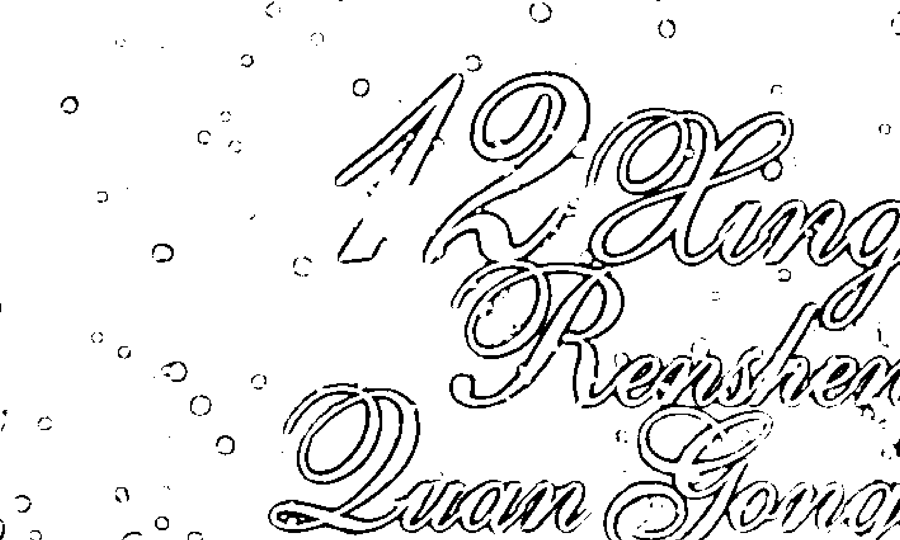
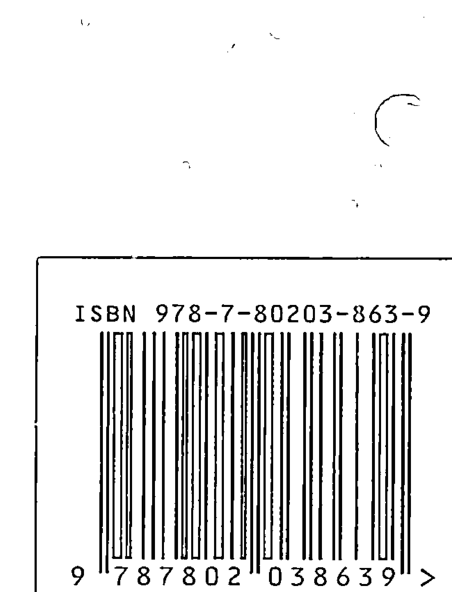
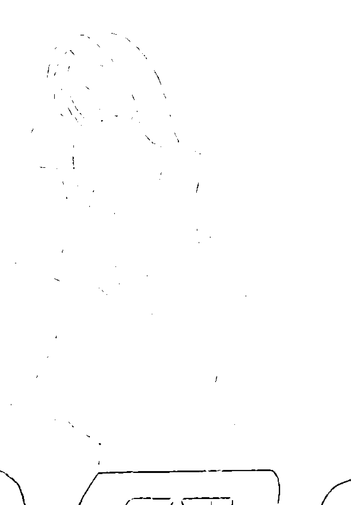

时尚·娱乐·预测·解析

- 恋爱攻略  
- 事业攻略  
- 时尚攻略  
- 健康攻略  

12 Xingzuo Rensheng Love Guide

天启◎编著

# 12星座人生全攻略

了解人生的幸运宝典  破译性格密码  解析人生命运

中国华侨出版社

# 12星座人生全攻略

- 白羊座（3.21～4.20）  金牛座（4.21～5.20）  双子座（5.21～6.21）  
- 巨蟹座（6.22～7.22）  狮子座（7.23～8.22）  处女座（8.23～9.22）  
- 天秤座（9.23～10.22）  天蝎座（10.23～11.21）  射手座（11.22～12.21）  
- 摩羯座（12.22～1.19）  水瓶座（1.20～2.18）  双鱼座（2.19～3.20）

看看你属于哪个星座，在书中你会找到属于自己的人生预言！

定价：26.00元

## 时尚·娱乐·预测·解析

- 恋爱攻略  
- 事业攻略  
- 时尚攻略  
- 健康攻略  

# 12星座人生全攻略

了解人生的幸运宝典  
破译性格密码  解析人生运程

中国妇女出版社

## 图书在版编目（CIP）数据

12星座人生全攻略 / 天启编著. — 北京：中国妇女出版社，2009.12

ISBN 978-7-80203-863-9

Ⅰ. ①1… Ⅱ. ①天… Ⅲ. ①占星术—通俗读物 Ⅳ. ①B992.2-49

中国版本图书馆CIP数据核字（2009）第205270号

# 12星座人生全攻略

- 编著：天启  
- 责任编辑：陈元、晓春  
- 装帧设计：天之赋设计室  
- 责任印制：王卫东  
- 出版：中国妇女出版社出版发行  
- 地址：北京市东城区安定门外大街甲24号  邮政编码100010  
- 电话：（010）65133160（发行部） 65133161（邮购）  
- 网址：www.womenbooks.com.cn  
- 经销：各地新华书店  
- 印刷：三河市祥达印装厂  
- 开本：170×245  1/16  
- 印张：14  
- 字数：185千字  
- 版次：2010年1月第1版  
- 印次：2010年1月第1次  
- 书号：ISBN 978-7-80203-863-9  
- 定价：26.00元  

版权所有 侵权必究（如有印装错误，请与发行部联系）

## 前言

如今，星座学已经成为都市男女谈笑间的时尚话题。星座学能够让大家更好地了解自己，了解他人，具有一定的科学性。当别人问你是什么星座时，如果你还一无所知，说明你已经落伍了，需要好好地给自己充充电了。

那么，什么是星座，怎样才能从星座中了解自己，了解他人呢？我们不妨先从占星术开始神秘的星座之旅。占星术，顾名思义，就是通过对星象的观测，来推断现在或近期的生活、运势、健康等与自己息息相关的一种占卜方法。占星术的最初目的，是根据人们出生时行星和黄道十二宫的位置，来预测人一生的命运。它后来发展为几个分支：一种专门研究重大的天象（如日食或春分点的出现）和人类关系的，叫做总体占星术；一种选择行动吉祥时刻的，叫做择时占星术；另一种叫做发问占星术，则是根据提问时的天象来回答问题。

星相学家认为，天体尤其是行星和星座，都以某种因果性或非偶然性的方式预示人间万物的变化。星相学的理论基础存在于公元前300年至公元300年大约600年间的古希腊哲学中，这种哲学将星相学和古美索不达米亚人的天体“预兆”结合起来。占星术起源于古美索不达米亚人的天体预兆。公元前18世纪至公元前16世纪的古巴比伦王朝，出现了第一本分门别类论述天体预兆的楔形文字书籍。公元前6世纪至公元前4世纪，天体预兆学说传入埃及、希腊、近东地区和印度，后来又经由印度传到中亚。希腊占星术也曾传入印度、伊朗，并进入伊斯兰文化。17世纪后，随着日心说的确立和近代科学的兴起，星相学逐渐失去了科学上的支持。但近年来，星相学又在西方开始抬头，有人还试图将近代发现的外行星引入占星术中，并试图找出行星位置和人类生活的统计关系。

星相学虽然和我们的日常生活有着紧密的关系，但我们也要用正确的观念来对待星相学。就目前的占星术来说，要想比较准确地分析一个人的性格命运，首先需要知道他的星宫和行星都处在什么位置。

理论认为，一个人最少有22个代表星座，分别是第1至第12宫及太阳、月亮、水星、金星、火星、木星、土星、天王星、海王星和冥王星所代表的星座。各宫位和行星分别代表着不同的信息意义，所以，一个人的代表星座越多，对性格特征的分析才会越准确。如果单以1/22的代表星座来占卜一个人的性格特征，准确性相对较低。因此，我们分析一个人的性格特征时，一定要尽可能多地了解他的星宫和行星所处的位置，也就是他的出生日期，这样才能更加准确地判断那个人是“敌”还是“友”。

众所周知，在地球上没有任何生物能够独自生存，人类也是一样。那么，如何才能拥有良好的人际关系呢？“知己知彼”可以说是相当重要的一环。在这方面，星座学能在一定程度上帮助我们。知道对方的出生日期，便可以大致了解对方的性格特征，从而缩短我们适应一段新的人际关系的时间。当熟悉了自己和身边人的性格特征后，再加以适当调节，人际关系自然可以得到改善。需要指出的是，尽管星座学具有一定的参考价值，但并不具有严谨的科学性，更不是全能的预测学，尤其不应将其作为占卜术来盲目运用。

本书分为13篇：第一篇为12星座的总述，其余12篇分别介绍各个星座。从第一篇开始，详细介绍每个星座的历史起源、基本性格特征、恋爱观，在工作中如何表现自己，以及各星座的健康与时尚，并提供一些有针对性的建议和有趣的测试题。本书语言轻松活泼，内容通俗易懂，时尚性与娱乐性兼具，方便读者随时查阅。通过此书，读者可以更好地了解自己、了解他人，做到“知己知彼”，从而在纷繁复杂的人际关系中如鱼得水，更好地指导自己的生活和工作，创造更加幸福美满的人生。

## 目录 Contents

# 第一篇 神奇的12星座

在每一个晴朗的夜空，当月亮不再是主角的时候，星星们也会掀开它们神秘的面纱，通过或明或暗的闪烁节奏，向居住在另一颗星球上的我们传递信息。那么，我们每一个人的人生又是怎样与那些远在天际的星星扯上关系的呢？

### 12星座的来源

- 12星座的划分 3  
- 什么是“黄道” 3  
- 具体12星座 3  
- 有趣的星座现象 3  

### 星座基础知识概要

- 基本占星知识 4  
- 个人星盘 4  
- 上升星座 5  
- 相位角度 5  
- 内行星 5  
- 外行星 5  
- 基本特质 5  

## 12星座的分类方法

- 按阳性和阴性分类（二分法） 7  
- 按本位型、固定型、变通型分类（三分法） 7  
- 按水、火、土、风四种自然元素分类（四分法） 7  

### 不可不知的12星座经验

- 12星座的代表意义及格言 8  
- 12星座经典爱情独白 9  
- 12星座经典之最 10  

## 星座小测试

从偏爱的颜色看看你会走什么运 11

## 第二篇 风风火火的白羊座

白羊座（3/21～4/20）的人冲动、爱冒险，慷慨，天不怕地不怕，而且一旦下定决心，就不到黄河心不死，排除万难也要达到目的，并且最喜欢争第一。

### 星图里的白羊座

- 白羊座起源的美丽传说 17  
- 白羊座的性格特点 18  
- 白羊座的优点和缺点 18  
- 白羊座的处世方针 19  
- 白羊座的幸运宝典 19  

### 激情澎湃的白羊座

- 白羊座的爱情总述 20  
- 白羊座男子的爱情观 20  
- 白羊座女子的爱情观 20  
- 白羊座的爱情配对 21  

## 工作中的白羊座

- 白羊座的EQ（情商）指数 21  
- 白羊座的工作态度 22  
- 白羊座适合的工作 22  
- 白羊座最佳办公室星座组合 22  
- 白羊座工作小窍门 23  

## 白羊座的健康与时尚

- 适合白羊座的健康之道 23  
- 白羊座的健康状况 23  
- 白羊座的饮食禁忌 24  
- 健康减肥大作战 24  
- 白羊座的时尚宝典 24  

## 给白羊座的一些建议

- 成功需要做的 25  
- 失败时要注意的 25  
- 给白羊座的爱情建议 26  
- 职场上的人际交往 26  
- 给白羊座的忠告 26  

## 星座小测试

- 测试一：什么样的另一半才适合你 27  
- 测试二：你的他容易变心吗 28  

## 第三篇 刻苦耐劳的金牛座

金牛座（4/21～5/20）是一个慢条斯理的星座，凡事总是考虑后再决定，属于大器晚成型，情感也比较晚开。但他固执而稳定，一旦下定决心，就会坚持到底。

## 信守诺言的金牛座

- 金牛座起源的美丽传说 33  
- 金牛座的性格特点 34  
- 金牛座的优点和缺点 34  
- 金牛座的处世方针 35  
- 金牛座的幸运宝典 35  

## 谈情说爱的金牛座

- 金牛座爱情总述 36  
- 金牛座男子的爱情观 36  
- 金牛座女子的爱情观 37  
- 金牛座的爱情配对 37  

## 工作中的金牛座

- 金牛座的EQ指数 38  
- 金牛座的工作态度 38  
- 金牛座适合的工作 38  
- 金牛座最佳办公室星座组合 39  
- 金牛座工作小窍门 39  

## 金牛座的健康与时尚

- 金牛座的健康状况 39  
- 金牛座的饮食禁忌 40  
- 健康减肥大作战 40  
- 金牛座的时尚宝典 40  

## 给金牛座的建议

- 成功需要做的 41  
- 失败时要注意的 41  
- 给金牛座的爱情建议 42  
- 克服一下自己的惰性 42  
- 职场上的人际交往 42  
- 给金牛座的忠告 42  

## 星座小测试

- 测试一：一道很准的爱情心理测试题 43  
- 测试二：看你的暧昧恋情指数有多高 44  

## 第四篇 多才多艺的双子座

双子座（5/21～6/21）个性敏锐又快捷，具有强烈的好奇心和求知欲，对于新观念和新流行十分敏感。聪明机智，富有辩才，是一个谋略家和演说家。遇事能够灵活应对、冷静观察、勇敢担当，并且常常会有一些突发奇想的点子，具有大胆假设、小心求证的个性。

## 聪明机智的双子座

- 双子座起源的美丽传说 47  
- 双子座的性格特点 48  
- 双子座的优点和缺点 48  
- 双子座的处世方针 49  
- 双子座的幸运宝典 49  

## 谈情说爱的双子座

- 双子座爱情总述 50  
- 双子座男子的爱情观 50  
- 双子座女子的爱情观 51  
- 双子座的爱情配对 51  

## 工作中的双子座

- 双子座的EQ指数 52  
- 双子座的工作态度 52  
- 双子座适合的工作 52  
- 双子座最佳办公室星座组合 53  
- 双子座工作小窍门 53  

## 双子座的健康与时尚

- 双子座的健康之道 53  
- 双子座的健康状况 54  
- 健康减肥大作战 54  
- 双子座的饮食禁忌 55  
- 双子座的时尚宝典 55  

## 给双子座的一些建议

- 成功需要做的 56  
- 失败时要注意的 56  
- 给双子座的爱情建议 56  
- 择业中的注意事项 56  
- 职场中的人际交往 57  
- 给双子座的忠告 57  

## 星座小测试

- 测试一：哪种爱情兵法更适合你 58  
- 测试二：从偏爱的颜色判断他（她）爱你的程度 59  

## 第五篇 敏感多情的巨蟹座

巨蟹座（6/22～7/22）的人天生具有聪慧的精神和敏锐的感觉，道德意识强烈，对欲望的追求也能适度控制。他们具有深刻的洞察力，自尊心很强，同时生性慷慨，感情丰富，乐于帮助需要帮助的人，并喜欢被爱与被保护的感觉。

## 感情细腻的巨蟹座

- 巨蟹座起源的美丽传说 63  
- 巨蟹座的性格特点 64  
- 巨蟹座的优点和缺点 64  
- 巨蟹座的处世方针 65  
- 巨蟹座的幸运宝典 65  

## 谈情说爱的巨蟹座

- 巨蟹座爱情总述 66  
- 巨蟹座男子的爱情观 66  
- 巨蟹座女子的爱情观 67  
- 巨蟹座的爱情配对 67  

## 工作中的巨蟹座

- 巨蟹座的EQ指数 68  
- 巨蟹座的工作态度 68  
- 巨蟹座适合的工作 68  
- 巨蟹座最佳办公室星座组合 69  
- 巨蟹座工作小窍门 69  

## 巨蟹座的健康与时尚

- 巨蟹座的健康之道 69  
- 巨蟹座的健康状况 70  
- 巨蟹座的饮食禁忌 70  
- 健康减肥大作战 70  
- 巨蟹座的时尚宝典 71  

## 给巨蟹座的一些建议

- 成功需要做的 72  
- 失败时要注意的 72  
- 给巨蟹座的爱情建议 72  
- 不要让自己变成“工作狂” 73  
- 职场上的人际交往 73  
- 给巨蟹座的忠告 73  

## 星座小测试

- 测试一：你是不是一个容易变心的人 74  
- 测试二：从抽烟的动作看得出他的想法 74  
- 测试三：你会爱上什么样的人 75  

## 第六篇 具有王者风范的狮子座

狮子座（7/23～8/22）的人正如神话故事中描绘的国王一样，威严、宽厚、仁慈而又高傲。他的内心洋溢着强烈的激情，浑身充满活力和生机，具有王者风范。

### 离奇浪漫的狮子座

- 狮子座起源的美丽传说 79  
- 狮子座的性格特点 80  
- 狮子座的优点和缺点 81  
- 狮子座的处世方针 81  
- 狮子座的幸运宝典 81  

### 激情澎湃的狮子座

- 狮子座的爱情总述 82  
- 狮子座男子的爱情观 83  
- 狮子座女子的爱情观 83  
- 狮子座的爱情配对 84  

## 工作中的狮子座

- 狮子座的EQ指数 84  
- 狮子座的工作态度 85  
- 狮子座适合的工作 85  
- 狮子座最佳办公室星座组合 85  
- 狮子座工作小窍门 86  

## 狮子座的健康与时尚

- 狮子座的健康之道 86  
- 狮子座的健康状况 86  
- 健康减肥大作战 87  
- 狮子座的饮食禁忌 87  
- 狮子座的时尚宝典 88  

## 给狮子座的一些建议

- 成功需要做的 88  
- 失败时要注意的 89  
- 给狮子座的爱情建议 89  
- 工作中要确立最佳起跑点 89  
- 职场中的人际交往  
- 给狮子座的忠告  

## 星座小测试

- 测试一：你的他是一个爱撒娇的人吗  
- 测试二：你最适合什么样的示爱方式  
- 测试三：测测你对家有什么样的概念  

## 第七篇 追求完美的处女座

处女座（8/23～9/22）常常需要面对许多现实生活中的琐事，这时的处女座不得不在决策中面对周围的世界：要么说话做事显得不自然，带有做作的痕迹；要么被感情淹没，被冲动所驱使。其实处女座的人很清楚自己的状态，但往往难以改变和控制情绪，只能选择逃避。

## 温文尔雅的处女座

- 处女座起源的美丽传说  
- 处女座的性格特点  
- 处女座的优点和缺点  
- 处女座的处世方针  
- 处女座的幸运宝典  

## 谈情说爱的处女座

- 处女座的爱情总述  
- 处女座男子的爱情观  
- 处女座女子的爱情观  
- 处女座的爱情配对  

## 工作中的处女座

- 处女座的EQ指数  
- 处女座的工作态度  
- 处女座适合的工作  
- 处女座最佳办公室星座组合  
- 处女座工作小窍门  

## 处女座的健康与时尚

- 处女座的健康之道  
- 处女座的健康状况  
- 健康减肥大作战  
- 处女座的饮食禁忌  
- 处女座的时尚宝典  

## 给处女座的一些建议

- 成功需要做的  
- 失败时要注意的  
- 给处女座的爱情建议  
- 完美很重要，但不要太苛刻  
- 处女座的人际交往  
- 给处女座的忠告  

## 星座小测试

- 测试一：你的吸引力如何  
- 测试二：小痘痘暴露你的性格秘密  

## 第八篇 理性又浪漫的天秤座

天秤座（9/23～10/22）的人温柔、娴雅，品格正直，平易近人，拥有迷人而不俗的友谊与爱情。无论男性还是女性，都闪耀着人格魅力的光辉，并蕴藏着艺术灵感与才华。

### 公平稳重的天秤座

- 天秤座起源的美丽传说  
- 天秤座的性格特点  
- 天秤座的优点和缺点 110  
- 天秤座的处世方针 110  
- 天秤座的幸运宝典 111  

## 谈情说爱的天秤座

- 天秤座的爱情总述 111  
- 天秤座男子的爱情观 112  
- 天秤座女子的爱情观 112  
- 天秤座的爱情配对 113  

## 工作中的天秤座

- 天秤座的EQ指数 113  
- 天秤座的工作态度 114  
- 天秤座适合的工作 114  
- 天秤座最佳办公室星座组合 114  
- 天秤座工作小窍门 115  

## 天秤座的健康与时尚

- 天秤座的健康之道 115  
- 天秤座的健康状况 115  
- 健康减肥大作战 115  
- 天秤座饮食禁忌 116  
- 天秤座的时尚宝典 116  

## 给天秤座的一些建议

- 成功需要做的 117  
- 失败时要注意的 117  
- 给天秤座的爱情建议 117  
- 用实际工作证明自己 118  
- 天秤座的人际交往 118  
- 给天秤座的忠告 118  

## 星座小测试

- 测试一：各种密码泄露你的感情弱点 119  

## 第九篇 具有神秘色彩的天蝎座

天蝎座（10/23～11/21）的人出生在深秋季节，喜欢安静清幽的环境。他们敢爱敢恨，轻视名利，却拥有成名得利的天赋，追求灵与肉的完美结合。直觉非常敏锐而准确，行动潇洒而独特，这种性格常常令虚伪之人嫉恨。

### 隐秘孤傲的天蝎座

- 天蝎座起源的美丽传说 125  
- 天蝎座的性格特点 126  
- 天蝎座的优点和缺点 126  
- 天蝎座的处世方针 127  
- 天蝎座的幸运宝典 127  

## 谈情说爱的天蝎座

- 天蝎座的爱情总述 128  
- 天蝎座男子的爱情观 128  
- 天蝎座女子的爱情观 129  
- 天蝎座的爱情配对 129  

## 工作中的天蝎座

- 天蝎座的EQ指数 129  
- 天蝎座的工作态度 130  
- 天蝎座适合的工作 130  
- 天蝎座最佳办公室星座组合 130  
- 天蝎座工作小窍门 131  

## 天蝎座的健康与时尚

- 天蝎座的健康之道 131  
- 天蝎座的健康状况 132

- ☆健康减肥大作战 132  
- ☆天蝎座饮食禁忌 132  
- ☆天蝎座的时尚宝典 133  

## 给天蝎座的一些建议

- △成功需要做的 134  
- △失败时要注意的 134  
- △给天蝎座的爱情建议 134  
- △持之以恒是天蝎座最需要的 134  
- △天蝎座的人际交往 135  
- △给天蝎座的忠告 135  

## 星座小测试

- 测试一：从你喜欢的小动物看你的爱情观 136  
- 测试二：婚后你是否会成为“受气包” 137  

## 第十篇 自由豪放的射手座

射手座（11/22～12/21）注重精神生活，喜好哲学性的思想，热衷于远在个人之上的全人类福祉及世界性的进步，但也容易流于松散的乐观主义。大胆而富有冒险精神，热爱自由，无论在何种环境下都希望保持精神与行动的独立。

## 热心肠的射手座

- ◇射手座起源的美丽传说 141  
- ◇射手座的性格特点 142  
- ◇射手座的优点和缺点 142  
- ◇射手座的处世方针 142  
- ◇射手座的幸运宝典 143  

## 谈情说爱的射手座

- ※射手座的爱情总述 143  
- ※射手座男子的爱情观 144  
- ※射手座女子的爱情观 144  
- ※射手座的爱情配对 145  

## 工作中的射手座

- ◎射手座的EQ指数 146  
- ◎射手座的工作态度 146  
- ◎射手座适合的工作 146  
- ◎射手座最佳办公室星座组合 147  
- ◎射手座工作小窍门 147  

## 射手座的健康与时尚

- ☆射手座的健康之道 147  
- ☆射手座的健康状况 147  
- ☆健康减肥大作战 148  
- ☆射手座饮食禁忌 148  
- ☆射手座的时尚宝典 149  

## 给射手座的一些建议

- △成功需要做的 149  
- △失败时要注意的 149  
- △给射手座的爱情建议 150  
- △不要忽略细小问题 150  
- △射手座的人际交往 150  
- △给射手座的忠告 151  

## 星座小测试

- 测试一：糖果测验你靠什么虏获人心 151  
- 测试二：什么人能当你的知己 152  
- 测试三：从你喜爱的冰激凌看你在职场中的表现 153  

## 第十一篇 保守稳定的摩羯座

摩羯座（12/22～1/19）充满智慧，思绪周密。有高度的耐力，在严苛的现实环境下仍然能够耐心等待。个性严谨踏实，容易孤独。从不掩饰自己之心，但是大致上仍能获得领导者的信赖，也颇具社会使命感，而且懂得趋吉避凶，为自己规划出一个立身处世的蓝图。

## 固执坚强的摩羯座

- ◇摩羯座起源的美丽传说 157  
- ◇摩羯座的性格特点 158  
- ◇摩羯座的优点和缺点 158  
- ◇摩羯座的处世方针 158  
- ◇摩羯座的幸运宝典 159  

## 谈情说爱的摩羯座

- ※摩羯座的爱情总述 159  
- ※摩羯座男子的爱情观 160  
- ※摩羯座女子的爱情观 160  
- ※摩羯座的爱情配对 161  

## 工作中的摩羯座

- ◎摩羯座的EQ指数 161  
- ◎摩羯座的工作态度 162  
- ◎摩羯座适合的工作 162  
- ◎摩羯座最佳办公室星座组合 162  
- ◎摩羯座工作小窍门 162  

## 摩羯座的健康与时尚

- ☆摩羯座的健康之道 163  
- ☆摩羯座的健康状况 163  
- ☆健康减肥大作战 163  
- ☆摩羯座饮食禁忌 164  
- ☆摩羯座的时尚宝典 164  

## 给摩羯座的一些建议

- △成功需要做的 165  
- △失败时要注意的 165  
- △给摩羯座的爱情建议 165  
- △不要过于小心谨慎 166  
- △摩羯座的人际交往 166  
- △给摩羯座的忠告 166  

## 星座小测试

- 测试一：你会为爱情付出怎样的代价 167  
- 测试二：你们在一起的幸福指数是多少 167  

## 第十二篇 古灵精怪的水瓶座

水瓶座（1/20～2/18）思想超前，理性自重的星座。不愿受到约束，博爱，但他还不同于射手座，他较着重于精神层次的提升，是很好的启发对象。

## 理性慎重的水瓶座

- ◇水瓶座起源的美丽传说 171  
- ◇水瓶座的性格特点 172  
- ◇水瓶座的优点和缺点 172  
- ◇水瓶座的处世方针 173  
- ◇水瓶座的幸运宝典 173  

## 谈情说爱的水瓶座

- ※水瓶座的爱情总述 174  
- ※水瓶座男子的爱情观 174  
- ※水瓶座女子的爱情观 175  
- ※水瓶座的爱情配对 176  

## 工作中的水瓶座

- ◎水瓶座的EQ指数 176  
- ◎水瓶座的工作态度 177  
- ◎水瓶座适合的工作 177  
- ◎水瓶座最佳办公室星座组合 177  
- ◎水瓶座工作小窍门 177  

## 水瓶座的健康与饮食

- ☆水瓶座的健康之道 178  
- ☆水瓶座的健康状况 178  
- ☆水瓶座的饮食禁忌 179  
- ☆健康减肥大作战 179  
- ☆水瓶座的时尚宝典 179  

## 给水瓶座的建议

- △成功需要做的 180  
- △失败时要注意的 180  
- △给水瓶座的爱情建议 180  
- △在工作中不要得罪上司 181  
- △职场上的人际交往 181  
- △给水瓶座的忠告 181  

## 星座小测试

- 测试一：你的爱情自私吗 182  
- 测试二：你能将爱情与事业分开吗 183  

## 第十二篇 柔情似水的双鱼座

双鱼座（2/19～3/20）多愁敏感，爱做梦、爱幻想的星座。天生多情，使他常为“情”字挣扎，情绪的波动起伏也跟感情脱不了关系；但他生性善良，很喜欢奉献，也不会随意伤人。

## 浪漫多情的双鱼座

- ◇双鱼座起源的美丽传说 187  
- ◇双鱼座的性格特点 188  
- ◇双鱼座的优点和缺点 188  
- ◇双鱼座的处世方针 189  
- ◇双鱼座的幸运宝典 189  

## 激情缠绵的双鱼座

- ※双鱼座的爱情总述 190  
- ※双鱼座男子的爱情观 190  
- ※双鱼座女子的爱情观 190  
- ※双鱼座的爱情配对 191  

## 工作中的双鱼座

- ◎双鱼座的EQ指数 192  
- ◎双鱼座的工作态度 192  
- ◎双鱼座适合的工作 192  
- ◎双鱼座最佳办公室星座组合 193  
- ◎双鱼座工作小窍门 193  

## 双鱼座的健康与时尚

- ☆双鱼座的健康之道 193  
- ☆双鱼座的健康状况 194  
- ☆双鱼座的饮食禁忌 194  
- ☆健康减肥大作战 194  
- ☆双鱼座的时尚宝典 195  

## 给双鱼座的一些建议

- △成功需要做的 195  
- △失败时要注意的 196  
- △给双鱼座的爱情建议 196  
- △工作应努力勤奋 196  
- △职场上的人际交往 196  
- △给双鱼座的忠告 197  

## 星座小测试

你的爱情心理年龄是几岁 197  

## 第三篇  
### 光年的星空

在每一个晴朗的夜空，当抬头仰望星空的时候，我们也会被那些闪烁的星星和神秘的闪光所吸引。星星在夜空中像宝石一样闪耀。那么，我们在另外一个人的人生中又是怎样那颗远在天际的星星呢？我们又是怎样的呢？

## 12星座的来历

### ○12星座的划分

现在我们常说的12星座，通常指的是西方占星术里所划分出来的星座类别。12星座最早来自希腊罗马神话，直到17世纪，天文学家才把太阳运行的轨道（黄道面），以每30°为一个单位，依序划分为12等份，因而产生了12星座。

### ○什么是“黄道”

天文学把太阳在天球上的周年运动轨迹，称为“黄道”，也就是地球公转轨道面在天球上的投影。太阳在天球上沿着黄道一年转一圈，为了确定位置的方便，人们把黄道划分成了12等份（每份相当于30°），每份用邻近的一个星座命名，这些星座就称为“黄道星座”或“黄道12宫”。这样，相当于把一年划分成了12段，在每段时间里太阳进入一个星座。在西方，一个人出生时太阳走到哪个星座，就说此人是这个星座的。

### ○具体12星座

黄道经过88个星座中的13个，除了蛇夫座的一小部分之外，它们是白羊座（3/21～4/20）、金牛座（4/21～5/20）、双子座（5/21～6/21）、巨蟹座（6/22～7/22）、狮子座（7/23～8/22）、处女座（8/23～9/22）、天秤座（9/23～10/22）、天蝎座（10/23～11/21）、射手座（11/22～12/21）、摩羯座（12/22～1/19）、水瓶座（1/20～2/18）、双鱼座（2/19～3/20），统称为黄道12星座。

### ○有趣的星座现象

有趣的是，由于我们只有白天才能看到太阳，而这时是看不到星星的。所以太阳走到哪个星座，我们就恰好看不见这个星座。也就是说，在我们过生日时，却恰恰看不到自己所属的星座。

## 星座基础知识解释

### ▽ 基本占星知识

大家知道星座分为12种，但看一个人的个性时不能只看他的星座。当一个人是摩羯座时，表示的是他的太阳星座是摩羯座；而要真正分析一个人的个性，还要看其他所有行星，而且每个行星也都掌管着某些特质：

- 太阳：为一切行星光的来源，每个星都要受到它的影响，是影响人的性格的重要方面。  
- 月亮：主宰人的情绪为主。  
- 金星：主宰人的感情（恋爱的人应该要知道对方的金星）。  
- 水星：主宰人的思考倾向、表达能力。  
- 火星：主宰人的意志表现方式。  
- 木星：主宰人的“福气”、精神生活状况。  
- 土星：主宰人的受损方式（如防御、抑制、延长等概念）。  
- 天王星：影响人的神经系统。  
- 海王星：主宰人的想象力。  
- 冥王星：影响人神志的部分。  
- 上升星：主宰人的命运。  

以上这些星星皆要查阅才能知道，而且要将出生年月日及时辰，甚至出生地点也要加上，才能算得准确。除了上升星是“命运”外，其他是影响性格的行星。

### ▽ 个人星盘

个人星盘是指每个人出生时天上的星体，包括太阳、月亮等十大行星的位置图。从占星学的角度来说，个人星盘可说是个人的生命地图，通过这张蓝图，可以了解每个人的人格、潜在个性，甚至还能看出他未来的各种可能性。

### ▽ 上升星座

上升星座就是每个人出生那一刻，从东方天空升起的那一个星座，它也是个人星盘中第一宫的起始点所在的星座。一般来说，上升星座会影响一个人的外貌、气质以及给人的第一印象，甚至与他人互动的方式。上升星座对个人影响很大，尤其是30岁以后，它会主宰个人的价值观及生活态度。

### ▽ 相位角度

相位角度是指行星间形成的角度，例如某人出生时，天上的太阳正与土星形成90°，或今天天空上的土星正跟某人的本命太阳形成0°。它可以用来解析命运，也可以用来分析运势，是一项非常重要的占星工具，重要性远大于一个人的太阳星座。

### ▽ 内行星

内行星是指离地球较近的行星，如太阳、月亮、水星、金星和火星，它们对个人短期运势的影响很明显。

### ▽ 外行星

外行星是指离地球距离较远的行星，如：木星、土星、天王星、海王星与冥王星。外行星因为离地球较远，而且运行周期长，通常对个人长期运势的影响较明显。例如，木星在一个星座运行的时间大约是一年，所以它对个人的影响时间会长达一年。

### ▽ 基本特质

由于太阳和月亮两大星球的影响，每个星座都会有“正”“负”的特质，但表现出正面或负面特质则需看“相位”如何，当然这也不是绝对的，但一般情况下是会表现出这些特质的。下面就是12星座的基本特质。

- 白羊座正面：心思单纯，有正义感，勇敢不怕困难，积极。  
- 白羊座负面：以自我为中心，不顾他人，急躁。  
- 金牛座正面：有耐心，脾气温和，脚踏实地，坚持到底，有艺术气息。  
- 金牛座负面：固执，占有欲强，不知变通。  
- 双子座正面：反应快，机灵，足智多谋，口才好，多才多艺。  
- 双子座负面：不专心，容易矛盾，见异思迁。  
- 巨蟹座正面：感情真挚，念旧，懂得体贴，善解人意。  
- 巨蟹座负面：情绪起伏不定，多愁善感，过度保护自己。  
- 狮子座正面：热情，大方慷慨，同情弱小，有领导力。  
- 狮子座负面：自我意识太强，好面子，喜欢浪费，喜欢被奉承。  
- 处女座正面：守秩序，勤劳，追求完美，做事有条理，会服务别人。  
- 处女座负面：吹毛求疵，唠叨，人际关系不好，杞人忧天，神经质。  
- 天秤座正面：追求公正，喜爱美丽事物，优雅，浪漫，会交际，善谋略。  
- 天秤座负面：犹豫不决，好辩，好逸恶劳，爱找借口。  
- 天蝎座正面：执行能力强，意志坚定，情感忠贞，沉稳内敛。  
- 天蝎座负面：报复心重，爱恨分明，占有欲强，有疑心病。  
- 射手座正面：乐观，爱好自由，坦白率真，和平友善，活泼大方。  
- 射手座负面：太过直言，粗心大意，做事冲动，喜怒形于色，没耐心。  
- 摩羯座正面：重传统，不畏艰难，谦逊有礼，重纪律。  
- 摩羯座负面：只顾自己，不够浪漫，不会变通，太现实。  
- 水瓶座正面：乐于助人，有创意头脑，感情忠实，有前瞻性。  
- 水瓶座负面：怪异行为，喜欢多管闲事，对人冷淡，不切实际。  
- 双鱼座正面：慈悲，会体谅别人，想象力好，温柔，善解人意，重直觉。  
- 双鱼座负面：太情绪化，逃避现实，不会理财，爱说谎，有滥情倾向。  

## 12星座的分类方法

黄道12星座代表了12种基本性格原型，一个人出生时，各星体落入黄道上的位置，正说明着一个人的先天性格及天赋。黄道12星座象征心理层面，反映出一个人行为的表现方式。每个星座均有其象征意义，但认识星座最好的方法就是了解星座是如何分类的。

### ☆ 按阳性和阴性分类（二分法）

地球依着黄道运行，产生寒暑变化，也有阳变阴、阴变阳的变化。

以阳奇阴偶的法则：

- 阳性星座：白羊座、双子座、狮子座、天秤座、射手座、水瓶座。  
- 阴性星座：金牛座、巨蟹座、处女座、天蝎座、摩羯座、双鱼座。  

阳性星座通常都带有阳性的特质，有主动的特性，大多是外向进取心强的、积极主动的理想主义者；而阴性星座则与阳性星座相反，通常都带有阴性的特质，大多是性格内向的、被动的战略家。

### ☆ 按本位型、固定型、变通型分类（三分法）

这种分类法跟四季有关，在此把星座分为本位型、固定型、变通型三类，分别象征着一季的开始、发展和结果。

- 本位型：白羊座、巨蟹座、天秤座、摩羯座，这类星座属于领导者型。  
- 固定型：金牛座、狮子座、天蝎座、水瓶座，这类星座属于组织者型。  
- 变通型：双子座、处女座、射手座、双鱼座，这类星座属于传授者型。  

本位型星座，是季节的开始，代表一个新的开始，是事情的成因，因此有影响结果之作用，具有影响他人的特质。接下来的固定型星座，是季节的中间，代表承续的发展，受成因的限制并影响结果的发展，因此有承前启后的特质，具有遵守规范的性质而被认为是固执和守旧，所以容易满足而显得顽固。最后变通型的星座，是季节的最后，代表最后的结果，完全受成因及过程的影响，毫无自主地必须接受其他成因的影响，因此极易被影响，具有适应变化的特质，所以容易受影响。

### ☆ 按水、火、土、风四种自然元素分类（四分法）

- 火象星座：白羊座、狮子座、射手座；  
- 土象星座：摩羯座、金牛座、处女座；  
- 风象星座：天秤座、水瓶座、双子座；  

水象星座的人温柔宁静，感情细腻，对事物的洞察力极强，直觉也很敏感，但有时想法却不切实际而且喜欢感情用事。火象星座的人精力充沛，感情奔放激烈，有十足的行动力，但来得快去得也快，有时较草率和粗心。土象星座的人慎重、冷静，对待感情真诚持久，做事也脚踏实地，但有时过于保守和自信心不强。风象星座的人思维发达，想象力丰富，有思想家的倾向，擅长社交，语言表达能力强，但性格变化多端，有喜新厌旧和情绪化的毛病。

一般来说，水、火、土、风四种类别中，火和风相处较好，土和水相处不错。俗话说：风助火势。风象星座的人冷静、理性，火象星座的人热情、冲动，这两种人在一起时，风象星座的人往往以理性辅助火象星座的人，在行动上也经常给予指导。土象星座的人在感情方面稳重持久，水象星座的人在感情方面由于过分敏感而情绪波动较大，因此土象星座的人往往能够关怀、安慰水象星座的人，在感情上就形成了一种辅助关系。

## 不可不知的12星座经典

### ○12星座的代表意义及格言

白羊座代表“繁荣”，这个星座的格言是：“神按照他的形象造人，所以有志者事竟成”。

金牛座代表“丰富”，这个星座的格言是：“一棵草，一点露，老天必不使你匮乏”。

双子座代表“互补”，这个星座的格言是：“人际关系是使自己快速提升的最佳途径”。

巨蟹座代表“爱”，这个星座的格言是：“有爱一切没问题，没爱一切有问题”。

狮子座代表“快乐”，这个星座的格言是：“快乐永远是对的，做人快乐最重要”。

处女座代表“完美”，这个星座的格言是：“对世界之批判，乃是对于神之批判，因老天所造之物无不完美”。

天秤座代表“公平”，这个星座的格言是：“真布施不怕假和尚”。

天蝎座代表“火凤凰”，这个星座的格言是：“失败为成功之母”。

射手座代表“变与常”，这个星座的格言是：“变是不变的道理”。

摩羯座代表“成功”，这个星座的格言是：“成功并非不可及，成功乃是不可免”。

水瓶座代表“分享”，这个星座的格言是：“你给生命的，就是生命给你的”。

双鱼座代表“奇迹”，这个星座的格言是：“生命的诞生和运作就是奇迹，但要人类相信奇迹却比奇迹发生还困难”。

### ○12星座经典爱情独白

- 白羊座：“我爱你”三个字不够，应该是“我超爱你”四个字才对。  
- 金牛座：等一下啦！我再观察一下？我们到底能不能成为情人。  
- 双子座：谁说我花心，我只是不知道怎样学会不变心。  
- 巨蟹座：不要考验我的“敏感”，我会让你觉得自己像一个透明人。  
- 狮子座：当我喜欢你时，你不必装腔作势，只要请我吃一顿饭就是最好的表现了。  
- 处女座：我一点也不啰唆和挑剔，真的！只要你懂得洁身自爱的生活……  
- 天秤座：我不要求“美感”，吃的穿的都一样，情人就更不用说了。  
- 天蝎座：静静地躺在黑幕做成的床上，想象着有充满魅力的人来陪我。  
- 射手座：我喜欢说笑话给“大家”听，所以当我的情人很快乐，也很痛苦。  
- 摩羯座：要约会嘛，我先看一下行程表，因为我的爱情和工作一样需要计划。  
- 水瓶座：如果你是一个可以和我谈天说地的朋友，或许我们有机会成为情人。  
- 双鱼座：浪漫是我的天职，柔情是我的本性，爱情则是我珍贵的养分。  

### ○12星座经典之最

- 最心细者：天蝎座男生、巨蟹座女生。  
- 最粗心者：白羊座男生、白羊座女生。  
- 最会做梦者：巨蟹座男生、双鱼座女生。  
- 最实际者：金牛座男生、天秤座女生。  
- 最会调情者：天蝎座男生、双鱼座女生。  
- 最不会调情者：天秤座男生、摩羯座女生。  
- 最善解人意者：巨蟹座男生、双鱼座女生。  
- 最大头者：处女座男生、摩羯座女生。  
- 最好色者：金牛座男生、天蝎座女生。  
- 最不好色者：天秤座男生、摩羯座女生。  
- 最有女人味者：双鱼座男生（意指有女性化表现）、双鱼座女生。  
- 最有男子气概者：摩羯座男生、白羊座女生（意指有男性化表现）。  
- 做事最有计划者：天蝎座男生、水瓶座女生。  
- 做事最没有计划者：双鱼座男生、双鱼座女生。  
- 最会写情书者：双鱼座男生、巨蟹座女生。  
- 最不会写情书者：白羊座男生、金牛座女生。  
- 最有理财观念者：天秤座男生、巨蟹座女生。  
- 最没有理财观念者：白羊座男生、狮子座女生。  
- 最受异性欢迎者：双子座男生、双鱼座女生。  
- 最有领导欲望者：狮子座男生、射手座女生。  
- 最甘心被人领导者：处女座男生、双鱼座女生。  
- 最有家庭观念者：巨蟹座男生、巨蟹座女生。  
- 最没有家庭观念者：双子座男生、射手座女生。  
- 用钱最节俭者：金牛座男生、处女座女生。  
- 用钱最奢侈者：射手座男生、狮子座女生。  
- 最不受异性青睐者：处女座男生、摩羯座女生。  
- 最懂得罗曼蒂克者：双子座男生、双鱼座女生。

- 最不懂受愚蠢者：处女座男生、摩羯座女生。  
- 做事最有条理者：金牛座男生、双鱼座女生。  
- 做事最虎头蛇尾者：射手座男生、狮子座女生。  
- 做事最贯彻始终者：天蝎座男生、摩羯座女生。  
- 反应能力最佳者：双子座男生、处女座女生。  
- 反应能力最差者：金牛座男生、金牛座女生。  
- 用情最浪费最多者：狮子座男生、双子座女生。  
- 用情最深最无私心者：巨蟹座男生、双鱼座女生。  
- 对异性有征服欲望者：狮子座男生、白羊座女生。  
- 对异性无征服欲望者：处女座男生、双鱼座女生。  
- 做事最上进积极者：白羊座男生、白羊座女生。  
- 智力测验平均分最低者：双鱼座男生、摩羯座女生。  
- 智力测验平均分最高者：水瓶座男生、天蝎座女生。  

## 星座小测试

### 从偏爱的颜色看你会走什么运

一个人对色彩的偏爱往往会体现在日常的穿着上，而你所选的色彩往往又会透露出你内心的困惑、疑虑和企图。现在，请你在下列11种颜色中选出你这段时间最常穿的颜色。看看服装的色彩会给你带来什么样的运气。

1. 红色  
2. 黑色  
3. 白色  
4. 黄色  
5. 橙色  
6. 绿色  
7. 蓝色  
8. 灰色  
9. 紫色  
10. 咖啡色  
11. 深蓝色  

### 答案解析

### 1. 红色

- 健康分数：60分。会因为过于急躁而导致胃肠疾病或运动损伤。  
- 事业分数：98分。虽然企图心旺盛，也很积极，但是“心急吃不了热豆腐”。  
- 人缘分数：50分。会因为你的过度强势和霸道而使某些人疏远你。  
- 生财分数：90分。如果是合适你的模式，它确实是个财运色；如果不在你的磁场范围内，它也许是你的破财色。  

### 2. 黑色

- 健康分数：-30分。无法让其他有利于自己的色彩能量进入。  
- 事业分数：20分。看起来似乎是领导级的人物，其实也不尽然。  
- 人缘分数：-70分。企图用黑色把自己封闭起来，人缘可想而知。  
- 生财分数：-100分。很不幸，财运是不可能到来的。  

### 3. 白色

- 健康分数：100分。有最高的透光率，能接受大量的能量，健康有保障。  
- 事业分数：50分。能搭配上适合个人的色彩，事业会更上一层楼。  
- 人缘分数：20分。由于你的过度挑剔和洁癖，让不太了解你的人敬而远之。  
- 生财分数：0分。不要只指望单调的色彩，若能结合自己的财运色，则会收到意想不到的效果。  

### 4. 黄色

- 健康分数：90分。善于沟通的人是比较长寿的。  
- 事业分数：80分。能把自己的想法适时地表达出来，当然容易成功，但小心高处不胜寒。  
- 人缘分数：90分。一个对自己和他人都不错的人，人缘当然也不错，不要一味地毫无保留。  
- 生财分数：80分。如果再提高一下自己的沟通能力，财源更是源源不断。  

### 5. 橙色

- 健康分数：80分。热情和生命力旺盛，健康状况当然不错，但切记不要太急。  
- 事业分数：70分。冲劲十足但后劲不足，通常是“雷声大雨点小”。  
- 人缘分数：80分。开朗的笑容吸引着一些有活力的人。  
- 生财分数：90分。偏黄的色彩一直是荣华富贵的代表色，只要运用恰当，确实有生财的功能。  

### 6. 绿色

健康分数：100分。不喜欢和人争长短，淡泊名利，一切都想得开，当然会长寿。  

事业分数：50分。率直的个性往往被人利用，成为替人家打天下的人。  

人缘分数：100分。和善可亲，又不排斥不喜欢的人，因此每个人都喜欢你。  

生财分数：100分。善于理财，节俭持家，当然财源滚滚了。  

### 7. 蓝色

健康分数：80分。虽然冷静是你的优点，但忧郁的性格是你要注意的。  

事业分数：80分。如果能够使想象力和创造力齐头并进的话，那将是如虎添翼。  

人缘分数：40分。悲观和情绪化会让身边的人越来越厌烦。  

生财分数：30分。往往考虑得太多，等你行动时，钱都已经不在了。  

### 8. 灰色

健康分数：20分。不透明的灰色虽然比黑色好，但也好不到哪儿去。  

事业分数：70分。如果你想功成名就，它还是适合的。  

人缘分数：-50分。只比黑色好一点而已。  

生财分数：30分。因为由灰色而成功，当然利益也会随之而来。  

### 9. 紫色

健康分数：40分。自视过高，不容易得到满足，容易患精神衰弱。  

事业分数：20分。有些让人捉摸不定，虽然你们要的只是精神上的寄托。  

人缘分数：20分。装腔作势会让你失去想要的东西和你亲近的朋友。  

生财分数：100分。虽然是很好的财运，但也要搭配得当，才能发挥超强的赚钱能量。  

### 10. 咖啡色

健康分数：90分。虽然有些欠缺年轻气息，但规律的生活使你还算健康。  

事业分数：90分。冷静沉稳是搞好事业的根基。  

人缘分数：98分。是一个不错的好朋友，人缘自然好得不得了，可是异性会说你是在装酷。  

生财分数：30分。虽然看起来有富贵气息，但由于太过压抑，难以顺利伸展。  

### 11. 深蓝色

健康分数：5分。因为你经常深思熟虑而废寝忘食，使精力严重透支。  

事业分数：90分。你将会是一个好的领导者，但不一定是一个好老板。  

人缘分数：40分。你周围的人都非常敬重你。  

生财分数：80分。你自身的能力加上周密的计划，使你颇有“钱途”。  

## 第二篇

## 白羊座的意志

生于3/21—4/20的人个性积极，喜欢冒险，性格直爽，不怕挫折，不易气馁，而且一旦决定了目标，就不轻易改变，除非改变会更容易达到目的，而且喜欢当第一。

## 爱冒险的白羊座

### 白羊座起源的美丽传说

传说一

在一个遥远而古老的国度里，国王和王后因为性格不合而离婚，国王又娶了一位美丽的王后。可惜，这位新后天性善妒，她看到国王对前妻留下的一对儿女百般疼爱，非常恼火。日积月累，她决定除掉王子和公主，夺回国王的爱。

春天来的时候，新后将发放给百姓的麦种全部炒熟，这样农民们无论怎么浇水施肥都不可能使麦子长出新芽。这时，新后开始散布谣言，说庄稼颗粒无收是因为国家受到了诅咒，而受到诅咒完全是因为王子和公主邪恶的念头！因为邪恶的王子和公主，全国的人民都将陷于贫穷饥饿的深渊中，这是一件多么可怕的事情！善良而淳朴的百姓轻易地相信了王后的话，很快地，全国各地不论男女老少，都一致要求国王将王子与公主处死，国家才能解开这个诅咒，平息天怒，人民的辛苦耕种才会有收获，国家也才能恢复过去的安定富足。国王众怒难犯，虽心有不舍，但还是下令处死王子和公主。

这个消息传到了王子和公主生母的耳中，于是她便向宙斯求救，日夜祈祷。宙斯很快知道了这件事情，就在行刑的当天，他派出一只长着金色长毛的公羊将王子和公主救走了。王子一直没有感到恐惧，因为他的天性乐观；然而公主却胆小，就在飞跃大海的时候，一不小心掉下羊背摔死了。宙斯为了奖励公羊，将它高高悬挂在天上，也就是今天大家熟知的白羊座。

传说二

传说特沙里亚国王阿塔玛斯与王后妮菲蕾离婚后，另娶伊娜为妃。伊娜虐待前妻的子女，视他们为眼中钉，必欲除之而后快。妮菲蕾获知后，向天神借了一对金色的白羊，要救两兄妹逃出苦海。但在逃亡过程中，妹妹经受不住海涛声的惊吓，不慎坠入海中溺死。最后，白羊因救人的善行，被宇宙之神宙斯放置在天上，成为白羊星座。

传说三

菲利塞思是奈波勒之子，因蒙上奸污波阿蒂斯的不白之冤而被判处死刑。临刑之前，一只金色的公羊及时将他和妹妹海勒一起背走。不幸的是，妹妹因不胜颠簸一时眼花而落下羊背，菲利塞思则安然获救。他将公羊献给宙斯祭礼，宙斯将它的形象化为天上的星座。后来伊阿宋为了夺走这只金羊的羊毛，还展开了一段精彩的冒险故事。白羊座也被称作“牧羊座”。

### 白羊座的性格特点

大部分属于白羊座的人的脾气都很差，不过只是炮仗，只会发泄一下，绝对不会放在心上，所以很快便会没事了。白羊座是黄道第一宫，因此它是最喜欢成为第一的强者星座。另外，火星掌管白羊座，他们必须燃烧起熊熊的烈火，否则人生黯然无光。白羊座的男人都是典型的大男子主义者，他们不会要别人的同情或帮助，一定要靠自己来获得成功；而白羊座的女人不会甘心当全职的家庭主妇，她一定要有自己的事业，许多女强人都是白羊座的。外表上行动匆忙，步伐急速，说话自信，做事不拘小节，绝不拖泥带水。

白羊座的人令人觉得他开朗而热情。即使他内心有那么点害羞，但表面上仍可以很自在。当一头白羊愁眉苦脸时，也只会出现在他家里的镜子中。就算他再伤心，他也不会在别人面前摆出一副苦脸。好强？可以这么说。谁不强呢？其实白羊座的人仍会向朋友吐苦水，但他真正的眼泪，你是看不到的。一群朋友开开心心地在阳光下嬉耍，是白羊座最怀念的美好时光。悲郁的人生绝不是白羊座的人所向往的；不幸陷入时，他也会极力设法让自己不要太相信会就这么过一生，他全心希望有一个新生活。

### 白羊座的优点和缺点

优点：做事积极，热情，有活力，敢担当，讲义气，乐观进取，有自信，勇于接受新观念，有明快的决断力，坦白率真，爆发力强，勇于接受挑战，不畏权势。

缺点：自我中心太强，急躁缺乏耐性，粗心大意，说话欠考虑，做事瞻前不顾后，只有“三分钟热度”，容易恼羞成怒，缺乏时间观念，不懂得照顾身体。

### 白羊座的处世方针

有独特的构想，迅速的行动，充满创造力和活力，但太过性急。喜欢追求速度及刺激的白羊座，讨厌多次练习后才会有效的事务，所以在工作时应该多培养耐心，并且时时与优秀的对手为友，彼此互相切磋，以开发过人的能力，为自己创造良好的机会。不屈不挠、自信十足的你，能抓住及时出现在眼前的工作机会，但是当你在工作上的努力表现没有受到上面的肯定，或者你觉得自己的潜能已经发挥之时，你会对这个工作产生排斥而产生离职的念头。如果你想离开这份工作，最好以理性的方式重新思考你的得失，更不要冲动地爆发出你对公司或同事的不满，这样只会让你树立更多敌人，也会把你之前的工作表现一起抹杀掉。

### 白羊座的幸运宝典

- 守护星：火星（象征能量与精力）。  
- 守护神：希腊—阿瑞斯，罗马—马尔斯。  
- 属性：火象星座。  
- 幸运数字：9。  
- 幸运日期：9号、18号、27号。  
- 幸运星期：星期二。  
- 幸运时间：6:00～8:00。  
- 幸运方向（约会方向）：东、北。  
- 幸运场所：大都市。  
- 诞生石：钻石（改运、避灾、增强信心）。  
- 守护石：红宝石（强化战斗意志、化解冲突）。  
- 幸运宝石：红宝石。  
- 幸运材质：铁、石、棉。  
- 幸运花卉：小雏菊、紫苑。  
- 适合服饰：引人侧目、强调野性、帅气、热情的服装。  
- 流行敏感度：尖端潮流。  
- 每月最需注意的日期：6号、15号、24号。  
- 适合职业：政治、医学、演艺、法律、大众传播等行业。  
- 适合定情饰品：胸针。  

## 谈情说爱的白羊座

### 白羊座的爱情总述

白羊座大都希望早婚。他看似粗枝大叶，却喜欢做家事。他们是有实干力的大自信家。白羊座的爱是宫廷式的爱，而穿着闪亮盔甲的骑士是不会草率或不认真地爱一个人的。然而他们所爱的通常是那些美丽的理想，而不是那位可能有些激动地坐在那里，旁观着骑士们为了她而展开竞技的公主。

对白羊座而言，爱的乐趣来自于追求的过程。对许多白羊座的人来说，爱就是追求，而不是到达终点或获得芳心。一旦他们得到了猎物，要不就是吃掉它，要不就是做成标本挂在墙上。从获得成功的那一刻起，捕猎的过程就已经结束。

白羊座就像另外两个火象星座——狮子座以及射手座一样，是天生的浪漫主义者。平凡的爱无法吸引他们。就好比围坐在火堆旁烤鱼，除非那火堆是他们被困在积雪的山里三天后才拥有的火堆，除非那鱼是他们历尽辛劳才捕得的，否则这样的活动一点意思也没有。只要事情落入俗套了，白羊座的人——无论男女，便开始打哈欠了。

### 白羊座男子的爱情观

白羊座的男子绝对热情，但是却有着童话般的感情模式：把自己想象成王子或骑士，对方就会被想象成公主或是城主的女儿。换个角度来看，既然你有着这样壮心动人的想象身份，那你就得为这个身份而保持形象。他的脾气不是很好，很容易就暴躁。在感情中，他必须要站在主导的地位，否则他会生气，气起来有时会像孩子般蛮横不讲理。他不会不负责任，只是对很多事情“三分钟热度”，所以保持他对这段感情的乐趣及热情就很重要。保持你的淑女风范，像是照顾孩子似的照顾他，听他说话，让他掌权，别破坏他的男子气概。

### 白羊座女子的爱情观

白羊座的女子走自己的路。你要来追她，就得先跑得过她，并且在她面前先架好一面精心设计、不被她察觉的网，但是谁能跑得过她？她有梦中情人，她甚至期待着梦中的“白马王子”，或是那个解救她离开满是荆棘栅栏的城堡阁楼的骑士，但这个在现实中所出现的人，却得强过她！虽然她霸道蛮横，但却期待能被真正的强者所征服，跪倒在她的膝前；用充满柔情蜜意以及自信的眼神看着她的爱人。别想要这个女人放弃骄傲及自信，也别想强迫她，更别想把她放在幕后。她要求绝对的自由！而你必须信任她，就像她也信任你一样。她不会用骗人的那一套，而且对你的一见钟情，到现在仍让她感到甜蜜，更何况她是那么勇敢。

### 白羊座的爱情配对

白羊座有刚强、倔强、固执而不服输的天性，所以适合找一个能肯定他的人。因此，能巧妙地安排生活的狮子座是最适合的对象；个性明朗乐观的射手座能以最宽厚的态度谦让白羊而采取同一步调；有共同目的又能互相勉励的白羊座也是相称的对象。而像性情易变的巨蟹座、优柔寡断的天秤座、古板的摩羯座都不宜相配。

最来电的星座：射手座，配对指数100分（白羊座居上风）。同属火象星座，两人都是热情如火；恋情发展快速而浓烈，性格观念接近，所以是耀眼的一对。

最不协调的星座：处女座。配对指数40分（白羊座居下风）。豪放大气的白羊座跟敏感细致的处女座，很难找到交集点；若想爱情长长久久，需要祈求老天爷多多帮忙！

## 工作中的白羊座

### 白羊座的EQ（情商）指数

- EQ指数为70～96。在四季的时序中，白羊座占领“早春”这个令人愉悦的季节，而天生领导者的白羊座在人际相处时所展现出来的魅力，正如这个季节一般令人乐于接近。白羊座积极的性格一如奔腾翻涌的波涛，可以击退任何可能横置在面前的阻碍。但只看见梦中和眼前的事，太过勇往直前是白羊座的缺点，要知道偶尔停下来环视生活周遭的美景，往往才是下一次冲刺的活力源头。  

### 白羊座的工作态度

白羊座的人天生具有很好的突击精神和精力，再加上积极努力的魄力，当灵感一闪、脑中产生了构想及做法时，就会马上采取行动，做任何事都喜欢跑第一，立在最前端，充分地发挥领导的能力。但在性格上耐性却不够，容易生气动怒，讨厌别人唠唠叨叨，但有着创新的活力，意志力坚强，是个能够争、能战斗、能征服的人。

在工作方面，勇于冒险、不吝啬、有领导能力是白羊座最大的魅力，然而一心想做英雄，不管别人的看法，攻击过度、好斗性强也是缺点所在。尤其是不管工作喜不喜欢，比较倾向以金钱来衡量工作的意义。因此，白羊座的人在性格上的缺陷就是不踏实去思考人、事、物，有时对于心仪的工作或对象，往往会产生偏见，甚至过于美化，因此容易自我欺骗。

### 白羊座适合的工作

白羊座是最活泼好动的星座之一，要他安安静静地坐着那简直是一种虐待！他常像孩子一样充满了好奇心和活力，所以不适合做太死板的工作。最好的方式就是让白羊们去发挥他们冲锋陷阵的长处。例如一些基层的领导和管理者、充满热情的行销人员都是很适合白羊座的工作。除此之外，白羊座也擅长机械的修理和操控，很容易成为这方面的佼佼者；同时正义感超强的他们，也可以尝试军警之类的工作，这样不仅可以发挥掉白羊座的火气，还可以在打击犯罪时得到很大的成就感。白羊座的运动神经是很优秀的，所以也有不少白羊座成为运动场上的健将，为国家赢得了许多荣誉。

### 白羊座最佳办公室星座组合

个体性质：热血每天洒，义勇先锋就是我！

这个人可以当开路先锋，尤其是你今天要是有难言之隐或是不方便开口的地方，白羊座的同事都会当仁不让地帮你。他的热情绝对是“送佛送到西”型的，不仅世间少有，还是一个不惧强权的开路先锋。不过前提是，你也要是个开朗的人，或是能和他一起乐天的人，否则会对于这个乐观同事感到吃不消；他就像是一个对世界充满好奇的宝宝，可爱又天真——但是哭闹也是他的本事，这点可别忘了哦！

最佳办公星座组合：天秤座、狮子座、双子座、射手座、水瓶座。

### 白羊座工作小窍门

白羊座：避免冲动急躁

白羊座做事有魄力，行动力强，这是优点。但是有时往往显得过于冒进，恨不得所有事情都在第一时间完成，见不得别人浪费时间。但一定要知道，在别人眼中，做事太快，有时往往和做得不够仔细联系起来。况且，并不是所有人都有你这样的高效率，给别人留下一点时间，也是给自己多留下一些好感。

## 白羊座的健康与时尚

### 适合白羊座的健康之道

热心、不畏艰难的白羊座，只要专注在一件事情上便会埋头努力去做，而且在做事当中自信满满是他的特质。像减肥塑身的美容大事，一旦下定决心，用尽各种方法也会坚持完成它。建议你上医院，经医生或营养师评估过的健康营养食谱相当有用，按照食谱所规定的来实行。另外再配合适当的运动，如：打羽毛球、跑步、游泳、上健身房等。唯一需要提醒的是，白羊座的人对金钱观念很薄弱，切忌上美容院或瘦身中心做全身上下要花钱去脂的塑身方法，怕是在减去脂肪的同时，也瘦了荷包。因为白羊座的意志力强盛，不妨用自己心仪或崇拜的偶像照片作为自己追逐的目标，想象自己瘦下来的样子，或是用一套漂亮的衣服来鼓励自己早日用更合身的身材来展现它，做一个漂亮迷人的健美女郎。

### 白羊座的健康状况

白羊座性急的个性，其实和肾上腺素有关。遇到紧急状况时，白羊座往往反应迅速。白羊座是黄道带的第一个星座，掌管人体的第一个部位，也就是大脑。大脑是思考的器官，也是人体最重要的器官。白羊座的人，无论男女，都十分注意体形的健美和外表的呈现所带给外界的感觉。因此只要是以体力或智慧表现的活动，都非常容易拔得头筹。

### 白羊座的饮食禁忌

白羊座生于春天，天生热情好动，运动神经发达，拥有坚实的骨骼、发达的肌肉。爱好美食是白羊座的天性，所以肠胃系统不是很强壮的白羊座，其他部位很少有问题。如果容易长出难看的小肚子，这时及时排出肠道内的毒素就很关键了。如果有消化不良、食欲不佳、手脚酸麻、倦怠等病状，可食用黑枣、甘蓝、苹果、梨子等。

### 健康减肥大作战

瘦身必杀技：生菜食疗法。每天两餐，并且只吃生的蔬菜和糙米粉，连续七天。如果你能坚持下来，通常在第四天时就会排出大量的宿便，效果非常明显。

具体三餐如下：

- 早餐：不吃。  
- 午餐：生蔬菜500克，包括叶类蔬菜250克，根茎类蔬菜250克，捣成泥或榨汁均可；生糙米粉70克；食盐4克。  
- 晚餐：与午餐相同。  
- 每天饮用两升水或绿茶。  

在日本，有很多人正在用这种方法改善健康状况，其主要功效是能够很快将人体内的毒素排出，净化身心，达到成功减肥的目的。

另外，白羊座可以找个人来比赛减肥。白羊座的竞争意识非常强，很不愿意输给别人，所以可以先找出一个竞争的对象，在心中告诉自己：“我才不要输给他！我一定要比他更瘦！”然后再开始进行减肥计划。这种激将法用在白羊座身上是非常有用的。

### 白羊座的时尚宝典

不花钱就难受的白羊座属于及时行乐型，他对金钱没有什么概念，有钱就想花。所以在物欲横流的社会中，他不太在意财富的累积，而更注重梦想的实现。

白羊座MM勇敢的心也在期待爱情。对于白羊座MM来说，最微妙的心情莫过于渴望征服对方而又渴望被对方所征服了。她喜欢惺惺相惜所带来的那种快感，这样的爱情会使她焕然一新。所以清朗的条纹发卡，简练如白羊座MM平日的处事态度，简单而不失活力。白羊座的你不畏艰辛，酷爱自由，有坚强的忍耐力，充满激情，建议采用红色作为主色调，如红宝石戒指和项链、红色的唇彩等。在配饰风格上，高雅大方的首饰是你的正确选择。

白羊座的男生对于自己很有期待，总是表现他最好的一面给大家看。由于他的脾气比较烈，所以可以用比较轻松的香水来削弱一些霸气，给人比较温和的味道；建议使用东方甜香类的香水，它们虽然味道较为浓烈，但是能给人较为缓和的感觉，在需要协调的场合里，很适合抹这类香水。适合的香水有东方甜香类原料的香草、蜂蜜、龙涎香等。

## 给白羊座的一些建议

### 成功需要做的
- 力求表现，争取有主导性的工作。
- 多加发挥积极进取的个性。
- 提高工作效率与加强判断力。
- 记得制订工作的计划表，确实按表来执行。
- 做事务必沉稳，切勿草率急躁。

### 失败时要注意的
- 容易冲动，乱发脾气。
- 做事没有耐性，沉不住气。
- 思考欠周详，缺乏通盘的计划。
- 喜欢表现出敌对的态度及攻击性。
- 做事只往前冲，没有考虑到后果。

### 给白羊座的爱情建议

关于爱情，白羊座的人格特质及绝佳的幽默感能轻易吸引别人靠近你，但冲动式的热情却让你每一回合的恋情都会认为对方就是你的白马王子（白雪公主）了。白羊座应该学会懂得，爱情应当是日渐成长才能持续长久的，不要激情一消失就觉得无聊。

你充满自信，对想做的事因自信而成功。你会朝目标全力以赴，这种个性不能忍受懦弱的人，唯有能力强、具有领导特质、受人信赖、有实力且充满自信的人才能与你相配。你的理想情人是威风、自信的人。

有些热情奔放的你，很容易有一见钟情式的恋情，但是当两人的爱情趋于稳定之后，你可能会渐渐忽略当初他吸引你的优点，假如他在各方面的成就或成长追赶不上你时，你可能会忘记当初对他的一往情深。

### 职场上的人际交往

白羊座的人服务精神旺盛是一件好事，但是他往往会做得太过。白羊座的人对喜欢的人会发挥出惊人的亲和感，对不喜欢的人和对自己不礼貌的人动不动就会生气，丝毫没有一笑置之的气量，如果又不受到重视的话那可就不得了了。最需要注意的是白羊座的人有吹牛的习惯，明明有责任感的白羊座的人会因为这样而使对方不信任自己，使自己的世界缩小了。此外，自己的反应快没关系，但却不可以因为对方反应慢而大吼大叫。

### 给白羊座的忠告

天生具有领导才能的白羊座，像颗爆发的火球，对工作的要求是个标准的完美主义者。对生活上的一些小细节，虽然偶尔会粗枝大叶，但在工作时却会努力将工作做到尽善尽美，但较缺乏耐力和毅力将事情完整地做完。长期面对工作的压力，白羊座会常态性地紧绷得像一根弦一样，所以极需适度自我的放松休息。由于工作上的竞争需要，白羊座女子的积极性格可采用含香橙、柠檬、乳香、麝香、迷迭香和薰衣草等组合的香精精油，除了可增加工作的自信外，也可透过芳香来提神，使工作更有效率。

## 星座小测试

### 测试一：什么样的另一半才适合你

有一个条件非常吸引你的工作机会正等着你，这个使你心动、做下换工作决定的条件是什么呢？

- A. 容易结识男或女朋友的公司。
- B. 能够拓展人际关系。
- C. 工作轻松。
- D. 可以发挥所长。
- E. 高薪。
- F. 工作内容有趣。

### 测试结果

A：你很乐观，而且是一个非常随缘、跟着感觉走的人。对你来说，爱情是没有条件的，婚姻更不应该用条件来取决，缘分才重要。你认为即使一个条件再好的人，如果没有缘分或感觉不对，都不具有意义。这样的一个你，对将来的结婚对象没有什么特别的条件与要求，只要有缘，谁都好。

B：你非常重视外在环境。因为你很关心别人对你的评价，所以身份、地位对你来说挺重要的。这样的你一定很爱漂亮，时时注意自己的言行举止、穿着打扮，不让自己有失礼、出糗的机会。另一半当然是要长得好看，身材比例要好，上得了台面，能与你匹配的人。

C：你是一个自由惯了的人，不喜欢束缚，当然也就绝不会做出会让自己有负担的事。如果结婚不会让你的生活及人生更美好，你倒宁可选择单身。所以，要成为你的结婚对象的人，一定非长子或独子。因为你希望让自己沉浸在幸福的两人世界中。

D：你是一个蛮保守的人。你认为要有好的生活、好的人生，就一定要有相当的学识。只有靠它，你的未来才会安定。你需要的就是安全感。能够给你将来家庭一个安定生活的人，才是你理想中的结婚对象。因此，你觉得嫁给一个高学历的人至少是安全的，即使不会大富大贵，却能安心地过日子。

E：或许你认为薪水是对自己能力的肯定，或许你其实是拜金主义。金钱于你，确实是很重要，因为它会让你有安全感。这样的你当然希望你的结婚对象是一个多金或是拥有高收入工作的人。对你来说，钱很好用，可以为你带来很多很多的东西，钱绝对是万能的。

F：你是一个很注重气氛的人，如果在一起让你不开心，你绝对不会委屈自己去配合参加各项聚会。所谓“话不投机半句多”，与谈不合的人相处在一起，对你来说是非常痛苦的一件事。很清楚了吧！你理想中的另一半，是一个和你“臭味相投”的人。

### 测试二：你的他容易变心吗

每个女孩总是希望自己的另一半能够安分守己，不会在外头拈花惹草，只是有时等到的却会是让人不堪的结果。你知道你的另一半是不是个容易变心的人呢？从日常生活中，就可看出一些端倪，本测试也适用于自己。

请问你的另一半换手机的速度快吗？

- A. 其实很快，大概只要一有钱就换了。
- B. 平均大概两三个月就换。
- C. 大概半年换一次。
- D. 不常换，频率大概是一年左右。
- E. 可能用到很破旧时才有可能换。

### 测试结果

A：他是个很容易喜新厌旧的人，对于女朋友似乎也是一样。不是你不好，而是他很容易就被不同优点的女生所吸引。如果你不幸爱上了这样的人，除了尽量避免他受诱惑、控制他的金钱、好好监督之外，其实没有什么好办法。

B：他是个好奇宝宝，就算他不愿意，也可能因为朋友的怂恿或是环境的诱惑而去做。他对道德是非的尺度拿捏不是很明显，所以好好掌握他的行踪吧。也让他知道你有多爱他，多不希望他背叛你。对他而言，温情攻势是非常管用的。

C：基本上他应该是个可以信任的人，只要你们的爱情没有危机的话。他还是喜欢享受，也喜欢享受爱情。所以真的爱他就别拿一些鸡毛蒜皮的事情来烦他，他喜欢你撒娇，并不喜欢无理取闹。让爱情维持在甜蜜的状态，你不需担心他会出轨。

D：他是个明理的人，道德感也很强，所以他不会随便在外面跟女生乱来。只是，在他身边跟他朝夕相处的异性朋友可得提防小心，因为平常不设防却又朝夕相处，很容易发展出特殊的情谊。虽然他能够克制理智，但一旦爆发出来却仍是丑事。

E：他是个比较传统、保守的人，很容易受传统的道德所约束，你自然无需担心他会在外头有什么外遇。只是他可能也不浪漫，很多事情也会后知后觉。跟他相处，除了保持理性，也不要做谜语让他猜，只要方法运用得当，你们一样能相处愉快。

## 第三篇

## 剖析你的金牛座

金牛座 4/21–5/20 是一个比较保守的星座，凡事喜欢安定后再行动，属于大器晚成型。你虽然也比较晚开，但也有超人的稳定性，一旦下定决心，就有把握成功。

## 信守诺言的金牛座

### 金牛座起源的美丽传说

在非常遥远的古希腊时代，欧洲大陆还没有名字，那里有一个王国叫腓尼基王国，首府泰乐和西顿是其富饶的地方。国王阿革诺耳有一个美丽的女儿叫欧罗巴。

欧罗巴常常会梦到一个陌生的女人对自己说：“让我带你去见宙斯吧，因为命运女神指定你做他的情人。”那时候宙斯还只有赫拉一个妻子，而且宙斯并不爱他的妻子，他整日处在郁郁寡欢之中。命运女神克罗托觉得应该帮助宙斯找到幸福。她知道火神有一件长袍薄衣，淡紫色的薄纱上用金丝银线绣了许多神奇的生活画面，价值连城，而且美不胜收。克罗托把这件衣服要过来，让宙斯去送给欧罗巴。起初宙斯兴致不大，但当他见到欧罗巴时，不禁为她的美色深深吸引。宙斯无可自拔地爱上了这个欧洲大陆上的公主。他以一位邻国王子的身份去提亲，并把神衣送给了欧罗巴。

一天清晨，欧罗巴像往常一样和同伴们来到草地上嬉戏。正当她们快乐地采摘鲜花、编织花环的时候，一群膘肥体壮的牛来到这片草地上。欧罗巴一眼就看见牛群中那一头高贵华丽的金牛。牛角小巧玲珑，犹如精雕细刻的工艺品，晶莹闪亮，额前闪烁着一弯新月形银色的皎洁。它的毛是金色的，一双蓝色的眼睛燃烧着深情。那种无形的诱惑让欧罗巴难以抗拒，她欣喜地跳上牛背，并呼唤同伴一起上来，但是没有人敢像欧罗巴一样骑上牛背。正在这个时候，金牛从地上轻轻跃起，渐渐飞到了天上。同伴们惊慌地喊着欧罗巴的名字，欧罗巴也不知所措。金牛飞跃沙滩，飞跃大海，一直飞到一座孤岛上。这时，金牛变成了一个俊逸如天神的男子。他告诉她，他是克里特岛的主人，如果欧罗巴答应嫁给他，他可以保护她。但是欧罗巴没有答应他，她心里一直想着命运女神的承诺。

一轮红日冉冉升起，欧罗巴被一个人撇在了孤岛上。她向着太阳的方向怒喊道：“可怜的欧罗巴，你难道愿意嫁给一个野兽的君王做妻子吗？复仇女神，你为什么不把那头金牛再带到我面前，让我折断它的牛角！”突然，她的背后传来了浅笑。欧罗巴回头一看，竟是梦中那个陌生的女人。美丽的女人站在她面前说道：“美丽的姑娘，快快息怒吧，你所诅咒的金牛马上就会把它的牛角送来让你折断的。我是爱神维纳斯，我的儿子丘比特已经射穿了你和宙斯的心，把你带到这里来的正是宙斯本人。你现在成了地面上的女神，你的名字将与世长存。从此，这块土地就叫做欧罗巴。”欧罗巴这才恍然大悟，终于相信了命运女神的安排。而十二星座中的金牛座也由此得名，成为爱与美的象征。

### 金牛座的性格特点

金牛座个性温和而坚实，性情沉着而踏实。对事物虽然犹豫不定，但是一旦决定下来，就能以坚忍不拔的精神执着向前。忍耐力强，行事谨慎，但也有顽固的一面。受人之托必能忠人之事，绝不会中途放弃。占有欲强，比较追求物质上的满足，而且坚持事物的完美度，是一个在艺术设计及园艺方面非常有才气的人。为人幽默、风趣，常能得到朋友的青睐。

金星是金牛座的守护星，所以金牛座是保守型的星座，他不喜欢改变，安稳是他的生活态度。金牛座的人不会急躁冲动，只有忍耐，“吃得苦中苦，方为人上人”是他们的写照，而且还非常顽固，一旦决定了的事他不喜欢去改变。由于缺乏安全感，失业是金牛座最怕面对的问题，代表他的生活失去重心；男的金牛座有潜在的大男人主义，在家中他们不多发言，但对尊严很重视，而女的金牛座除了实际之外，会喜爱打扮自己，因为金牛座的守护神就是爱与美的化身维纳斯。他通常都是慢热的，要花一段时间才会适应一份感情、一份工作、一个环境，但适应了之后，他甚少会改变，除非迫不得已。金牛座的人有艺术细胞，具有高度欣赏任何艺术的品位和能力。

### 金牛座的优点和缺点

- 优点：耐性十足，一往情深，有艺术天分，脚踏实地做事，有计划能坚持到底，固执，追求和平，生活有规律，值得信赖。
- 缺点：占有欲太强，善妒，顽固的死硬派，缺乏协调性，不善于分工合作，做事态度过于严肃，缺乏幽默感，不知变通，过于坚持自己的步调，规矩太多，太过谨慎，缺乏求新求变的勇气。

### 金牛座的处世方针

金牛座的主星是金星，爱好和平，能朝目标一步一步迈进，因此金牛座的人都有着重视规律和稳定的共同点。虽然外表看起来柔和、优雅，但其实内心具有很强的信念，所以只要一投入工作，就会很努力去做。由于金牛座属于较女性化的星座，所以稍带内敛的气质，有时面对新事物会很消极，但只要下定决心就不会再改变，具有很强的耐力与持久力。占有欲很强的金牛座，能精力充沛地工作，大部分都是靠头脑来取胜，而且非常善于理财，即使收入少的时候也能量入为出，可以存下一笔可观的钱财。不过为了存钱，看到想要的东西，一定得花长时间的思考才能做出决定。虽然本性很喜欢存钱，却不会显得太吝啬，该花的时候也会大笔地花钱，这也是金牛座最占便宜的地方之一。

### 金牛座的幸运宝典

- 守护星：金星（象征爱与美的结合）。
- 守护神：爱神维纳斯。
- 属性：土象星座。
- 幸运数字：6。
- 幸运日期：6号、15号、24号。
- 幸运星期：星期五。
- 幸运时间：13:00—16:00。
- 幸运方向：东北、东。
- 幸运场所：静谧处。
- 诞生石：祖母绿（改运、避灾、增强学习力）。
- 守护石：粉晶（强化想象力、镇定情绪）。
- 幸运宝石：祖母绿。
- 幸运材质：铜。
- 幸运花卉：玫瑰。
- 适合服饰：高雅、朴素，不做作，重品位。
- 流行敏感度：实用性流行。

每月最需注意的日期：1号、10号、19号。  
适合职业：社会、经济、地理、金融、法律或与艺术相关的行业。  
适合定情饰品：项链。

## 谈情说爱的金牛座

### 金牛座爱情总述

金牛座是非常重视生理感知的星座，很少有不具强烈占有欲的金牛座。他是享受型的，有些简直就是爱奢侈享乐的人。他不属于禁欲主义者的星座，除非他是个狂热的宗教分子。他一旦决定结婚，则属于无论如何也非要达到目的不可的类型。然而诚实的金牛座也会骗人，而且不觉得有罪恶感。对于金牛座来说，安定的环境才会让他有幸福的感觉。

金牛座常受火象特质的人所吸引，因为对方拥有他不敢表达的特质：大胆、孩子气、爱冒险、想象力及速度。金牛座的人需要这种特质来温暖他，帮助他放松，让他知道真实存在的另一面。他需要对方坚持信念、理想的熊熊烈火，因为他自身的信念大多建立于银行存款的数目上。他也需要激发创意的火花。而对那些善变的人而言，他需要的是金牛座稳固的支持、保护与珍惜。

### 金牛座男子的爱情观

他会花费所有思考的时间，只为了做出正确无误的决定，就像他也会花时间来思考及观察你，以确定你会不会是那个与他共度一生、享受他准备好的一切事物的那个女孩子。他很浪漫，这不是开玩笑；只是要看得出他的浪漫，需要一定的训练，而他是教练——慢工出细活的教练。标准的金牛座对感受相当敏感，他若是愿意付出感情，而你就是那可以与他共度未来的人，那么你一定可以感觉出他的浪漫。他了解浪漫的感受有多迷人，就像他一样。

受金星主宰的金牛座，有其独具的浪漫。他的浪漫不如天秤座的潇洒，或双鱼座的沉溺，以及天蝎座的热情。他的浪漫是属于古典式的，因为他有遵循惯例的倾向。一个真正的金牛座会坚守其承诺，不会轻易许诺，除非他有把握。或许你会说，这听来并不怎么浪漫。不过他的浪漫有时虽然笨拙，却是真诚的。他真的相信订婚戒指及白纱的象征意义，这些东西代表着他的感情。金牛座的人会倾向以礼物的赠与来表达情感。

### 金牛座女子的爱情观

金牛座的女子大多很安静，而且也很坚强。她总是静静地接受生命中的考验及挫折，甚少抱怨。当其他星座的女子抱怨时，她却不会浪费空气而继续向前走。她有处理一切事物的能力，别小看她。她要找个真正的男人，把这辈子交给他，所以别小看自己，至少她就不会小看你，如果你是可以让她觉得依靠终身的话。她可能很固执，并且又有强烈的自制力，所以在一般不会影响她价值观的判断上，她大多不会与你做太强烈的争辩。金牛座的女子相当重实际，而且她很浪漫，只是她不喜欢让情绪来干扰实际。每只牛都有占有欲，她真的不喜欢失去她所拥有的事物，尽管她很认命，但总是会尽力保有一切。

### 金牛座的爱情配对

金牛座的人重视安全与舒适。最佳的对象就是对家族和家庭有责任感、坚韧不拔的摩羯座；有正确周密的人生设计并努力于建设和平家庭的处女座；和你兴趣及嗜好相投、同属金牛座的，也都是适合的对象。不适合的对象如：爱慕虚荣的狮子座；具有深沉及顽固性格的天蝎座；叛逆怪异的水瓶座。

最来电的星座：摩羯座。配对指数100分（金牛座居上风）。两个土象家族的成员，性格思想都蛮接近，会互相吸引也不是什么意外的事；但恋情属细水长流型，不会有令人喘不过气的激情现象。

最不协调的星座：天秤座。配对指数40分（金牛座居下风）。虽然两人都归在维纳斯旗下，但是金牛是阴性，天秤则属于阳性，因此也没有太多交集点。

## 工作中的金牛座

### 金牛座的 EQ 指数

EQ 指数为 74～82。

沉稳、迟缓又固执的金牛座，守护神却是女神维纳斯，这正是老实的“新好男人”的特点，是女性青睐的新宠时代潮流。不过，顽固不屈，甚至有点“闷”的个性却着实会让身边的情人或朋友的脑细胞多死好几万。金牛座痛恨纠纷，他希望能确定对方不是以什么诡计来利用他，他需要各种形式的安全感。在爱情方面，金牛座不习惯逢场作戏。无论金牛座性格的人来自何方，无论他过着何种生活形态，在他内心都相信婚姻的神圣性。务实的个性也会让他努力地完成心中的理想。

### 金牛座的工作态度

金牛座是稳重、默默做事的踏实者，但是跟其他星座比起来，物质欲望显得比较强烈。因此，会把金钱看作有形财产，把爱情当作无形财产，两者缺一不可，而且双方一定要取得平衡，不能只偏重金钱或爱情任何一方。如果只能获得其中之一，不但无法满足，还会觉得生活无趣。个性温和、诚实，想法可靠，是个可以信赖的金牛座。对于工作能全心投入，讨厌随随便便的做事态度。不过再怎么努力，对金牛座的人来说，“拥有”才是一生中最大的幸福。如果在工作中不能获得金钱或物质等物欲上的满足，也会觉得有所欠缺，无法专心工作。

### 金牛座适合的工作

金牛座是个很爱美又对美感有着独特见解的星座。对于服饰或者有关美容美体方面的事物，金牛座都会相当关心，加上他的品位相当高，所以很适合成为服饰方面的工作者或者美容师，这些职业可以让金牛座的美感发挥得淋漓尽致，得到很大的成就感。当然，除此之外，金牛座的理财能力也是众所周知的。一向精打细算的他，对于钱看得特别重，很适合经手一些和财政、金融有关的工作。凭着金牛座对钱的执着，什么问题都可以在他的处理下获得解决，所以也有很多金牛座会成为银行人员或者从事会计方面的工作。虽然这种工作比较呆板，却很符合金牛座所需要的稳定。

### 金牛座最佳办公室星座组合

如果想找一个能够默默工作的人，金牛座绝对可以胜任。他的耐性颇高，接受程度也不错，换句话说有一点照单全收的感觉；但是和他熟络了起来，他也会有适当的建议以及计划。所以要找个可靠又值得放心的对象，金牛座绝对是不错的对象。不过有个良心的建议：千万别与他为敌，他可是办公室的好人好事代表，惹到他，你就等于惹到公司一半的人。

最佳办公室星座组合：天蝎座、巨蟹座、处女座、摩羯座、双鱼座。

### 金牛座工作小窍门

金牛座：避免顽固不灵。

金牛座有着充足的耐心和良好的鉴别能力，在内心深处，对于自己所从事的事情也有着相当的自信。但是随着自己积累的增加，金牛对一些事情容易形成自己的“成见”，容易对别人的建议置若罔闻。变通能力对于这个日新月异并且注重交流的社会是非常必要的，对于金牛座来说，多注意一下为妙。

## 金牛座的健康与时尚

### 金牛座的健康状况

温文、慎重、耐力超强的金牛座，是标准的美食主义者，对于食物的要求较注重口欲。其个性原本就属于行动缓慢型，因此在运动方面稍欠缺弹性与活力，但持久性的耐力与不怕吃苦的个性却弥补了这方面的不足。在运动方面可以选择类似游泳、慢跑等运动。天天量体重，做一个标准的统计表，然后再为自己设定一个长、中、短期的目标，循序渐进。

超耐力的金牛座，不走捷径的个性，应当很容易达成瘦身的美梦。在运动健身守则中，还有一项要叮咛的是要放松心情，避免过度劳累。在肝肾、循环系统方面的保健，是金牛座必须注意的。而水是绝佳的美容圣品，每天多喝水，既健康又美容。

## ☆金牛座的饮食禁忌

金牛座的人，对于体重的控制，可要多花一点心思。金牛座掌管的腺体是甲状腺，如果甲状腺失调，则会产生浮肿和体重增加的困扰。太阳于4月21日进入金牛座，5月20日离开。金牛座是黄道带上第二宫，由金星管辖。主宰颈部及喉咙的金牛座，也是这两个部位最容易出问题。

情绪化的金牛座，困扰又不知节制欲望，尤其在饮食上的放纵，最容易出问题。轻则体重上下起伏，使体形改变；严重一点的还会影响到健康及体质，引发许多疾病。芹菜可解除金牛座疲劳带来的后遗症。金牛座身体虚凉，复原力差，易感染呼吸道的疾病及精神不济。食用猪肝、洋葱、菊花茶、马铃薯可有助益。

## ☆健康减肥大作战

生来四平八稳的金牛座，喜欢把任何事情都贯彻得很彻底，并且讨厌浪费，所以吃饭时，金牛座总会把自己的那份吃得干干净净，无论分量多少。正因为如此，如果金牛座女孩子有个爱给女儿添饭的老妈，那胖起来也就不是什么新鲜事了。

### 瘦身必杀技：每天少吃一点

首先，金牛座的人应该给自己换一套小一点的餐具，并且坚持每顿饭到最后剩下一口在碗里，即使看着再难受也一定要忍住。对于嫁为人妇的金牛座女人，更要加注意，千万不要吃掉盘子中剩下的最后一点饭菜。虽然浪费了一点儿，但是和保持一个曼妙的身材相比，哪个会更划得来，计算一下吧！

其次，一定要提醒爱吃甜食的金牛座，少吃一块巧克力等甜食。最后，因为金牛座的人天生属于体形比较粗大的类型，所以只有靠努力地瘦一点，才能让身材看起来修长、苗条。平时多选择低卡食物是个不错的主意，而所谓的低卡食物，就是食物的热量低于你所消耗的热量。相信这对精于计算的金牛座不是什么难事。

## ☆金牛座的时尚宝典

当一个金牛座MM掉进爱情的深渊时，她的触觉、味觉乃至所有感官都变得异常丰富，平日所蛰伏着的浪漫情怀倾泻而出。她不容置疑的真实、温和而有分寸，忠实而慷慨，她只对有深厚情谊的人慷慨。一个马蹄莲花般卡轻插发间，金牛座MM静谧清凉的气息便扑面而来。

金牛座的着装大多是清爽大方的。近些年来流行的个性，几乎击倒了每一个时尚的女子，但在街上那些充满趣味的个性小店里，你永远不会觅到金牛座女子的芳踪。金牛座女子从不认为规矩的穿着会束缚思想，无论气温有多高，你从来不会看到金牛座女子把无袖的上衣穿进办公室。

她的衣服并不流行，但款式永远简洁大方，做工上乘。只是一袭普通的蓝色衬衫和暗色中裙，穿在只戴一挂白金项链的金牛座女子身上，你立刻会觉得，你面对的女子绝对有让人安静的亲和气质。

金牛座的人性格温柔、乐观，优雅细腻的神情和亲切的笑容最能吸引异性。金牛座MM应多多采用铜制饰品，它会给你带来源源不断的好运气。此外，一些几何形状的首饰，最能凸显你恬静、仪态万千的气质！

## 给金牛座的建议

### △成功需要做的
1. 下定决心，找份自己真正喜欢的工作。  
2. 为自己及同事创造愉快的工作环境。  
3. 在工作表现上应采取主动。  
4. 做任何事应加强耐心及毅力。  
5. 随时吸收新观念及新技术，充实自我。

### △失败时要注意的
1. 为了安全感而勉强做不喜欢的工作。  
2. 过于固执而不知变通。  
3. 喜欢要求别人照着你的方式来处理。  
4. 缺乏改变，工作形成一种例行公事。  
5. 承受太多工作压力而让自己过于劳累。

## △给金牛座的爱情建议

对于金牛座来说，舒畅的心情、宽裕的空间让你心满意足，平静安定的环境才能带给你幸福。所以心平气和、稳重的人与你最相配。除外表温和外，不鲁莽行事、成熟踏实的人是你的最爱。能与你共享实际性话题，才具备完美情人的条件。

美丽而性感的金牛座美女，谈恋爱通常是重质不重量，人品、经济能力都兼而有之的男性最容易吸引你。善用柔情攻势是你最大的利器，但是必须控制嫉妒心和强烈的占有欲，黏得太紧有时会把对方吓跑的。

## △克服一下自己的惰性

金牛座的人工作起来，总是那么慢条斯理、脚踏实地，让人十分放心。但由于缺少较强的进取精神，对新事物的接受比较迟缓。因此，金牛座人要克服这一弱点，积极增长才干，提高自己各方面的素质，以适应现时代的新要求。

金牛座人应注意具备独立的人格和修养：要坚持自己的个性；要自我鼓励；要诚实、正直；不要因为缺陷而灰心。人有缺陷固然是终身遗憾，而自知有缺陷却能以缺陷自我激励的人，是可以让一切健康的心质依附的。

## △职场上的人际交往

由于金牛座的人会羡慕人家，所以金牛座的人常拿别人和自己来比较，也常为此而感到难过。金牛座的人不会将自己的虚荣心和好强的心理表现于自身，而是透过他周围的人或事物来与别人一较长短。

只要是金牛座的人得到的东西，他们绝对不会放弃。金牛座的人有令人毛骨悚然的占有欲，包括所有的东西、人或金钱。金牛座的人视野狭窄，对自己未曾亲身经历过的事情完全不了解，也无法接纳。

由于金牛座的人比较实际，对自己没有接触过、没有看过的事情，都没办法相信。这种性格是很糟的。对不知道的事情便会和世界产生抗拒的心态，要想个办法改一改才是。

## △给金牛座的忠告

金牛座不爱喧哗的场合，更不要说废话，他宁愿在一家人不多的咖啡馆和你聊一些对真实人生的感受。金牛座一直有个目标：“我们很快就会有足够的黄金，连家里的地板都要用它来铺。”

第一眼的印象决定了很多事。一头牛对你的好恶，他不会轻易掩饰这第一印象。即使是成见，他也不会认为自己看错了你。金牛座的人会吃亏，便是由于他太相信自己对别人的论断。

金牛座非常有金钱观念，他很爱钱却不拜金。钱所带来的安全感，会让他觉得人生是可以期待的。

## 星座小测试

### 测试二：一道很准的爱情心理测试题

按以下步骤做，用3分钟完成。不要作弊，否则你的希望将会落空。注意：一定要按顺序往下读，不能跳着读，准备一张纸和一支笔。

- 首先，在一列中写下1至11的序号；  
- 在序号1和2的旁边，写下你所想的任意两个数字；  
- 在序号3和7的旁边，写下任意两个异性的名字（凭第一直觉）；  
- 在序号4、5、6的旁边，写下任意亲戚的名字；  
- 在序号8、9、10、11的旁边，写下4首歌曲的歌名；  
- 现在，许一个愿，只要你去努力，你的愿望一定能成为现实。

### 答案解析

- 序号3是你所爱的人；  
- 序号7是你所喜欢的但又不能与之相伴的人；  
- 序号4是你最关心的人；  
- 序号5是非常了解你的人；  
- 序号6是你的幸运之星；  
- 序号8的歌适合序号3的人；  
- 序号9的歌适合序号7的人；  
- 序号10的歌代表你的看法；  
- 序号11的歌是你生活的感受。

最后，把这个游戏告诉序号2旁的数字代表的人。（如：你在2旁写了7，而在7旁写了英儿，那么就告诉英儿吧。）如果序号2旁边的字不代表人，那么，把秘密永远珍藏在心里吧——你是一个守得住秘密的人。

### 测试二：看你的暧昧恋情指数有多高

从印度来了一位修行非常高的高僧，如果他要帮你算命，你的反应会是什么？

- A. 前世修来的机缘。  
- B. 天下有这么好的事吗？  
- C. 倒想听他说什么。  
- D. 死乞赖脸想骗人。  
- E. 难道我是救世主。

### 答案分析

A：属于爱就爱，不暧昧型：搞暧昧恋情指数0分。这类型的人内心深处非常传统，会相信前世今生的人，内心深处很喜欢安定的感觉或是稳定的关系，叫他搞暧昧的关系或是灰色的地带，对他来说是很无聊的事情。

B：属于看对象才暧昧型：搞暧昧恋情指数55分。这类型的人头脑很清楚，知道什么人可以搞暧昧，什么人不可以搞暧昧，所以事先他会想得很清楚。

C：属于假暧昧变真恋情型：搞暧昧恋情指数80分。这类型的人是很爱面子，觉得直接表白也许会受到伤害，所以弄一点小暧昧。就算对方不喜欢自己或拒绝自己，也可以以开玩笑带过；如果对方有回应时，就会觉得可能会变成真。

D：属于人越多越暧昧型：搞暧昧恋情指数99分。这类型的人觉得暧昧是很好玩的事，他只是让气氛更融洽一点，或让生活更增加一点乐趣。

E：属于暧昧会让恋情变质型：搞暧昧恋情指数20分。这类型的人想得太多，对感情相当小心谨慎，认为乱放电或搞暧昧不会变成真的，这会让他觉得很烦恼，所以干脆不要搞暧昧，尽量低调。

## 第四篇

## 多变多艺的双子座

双子座（5.21—6.21）个性敏锐又快捷，有强烈的好奇心和求知欲，对于新观念和新流行的触觉十分敏锐，聪明机智，有辩才，是一个策略家和演说家，遇事都能妥善应付。不过，有时缺乏持久力，而且常会有一些不安定的倾向。不过大体来说，这是一个积极正面的个性。

## 聪明机智的双子座

### ◇ 双子座起源的美丽传说

#### 传说一

在遥远的希腊古国，有一个美丽动人的传说。温柔贤惠的丽达王妃有一对非常可爱的儿子，他们不是双生，却长得一模一样，而且两兄弟的感情特别深厚，丽达王妃觉得十分幸福。

但是有一天，希腊遭遇了一头巨大的野猪的攻击，王子们召集了许多勇士去猎杀这头野猪。其间，勇敢的哥哥杀死了野猪，但是也受了伤。凯旋举国欢庆的时候，丽达王妃为了安慰受伤的哥哥，偷偷向他吐露了实情。原来，哥哥并不是国王与王妃所生，而是天神宙斯的儿子。所以，他是神，拥有永恒的生命，任何人都伤害不了他。哥哥知道以后再三保证不会告诉任何人这个秘密，哪怕是他最亲爱的弟弟。

然而，不幸的是，勇士们因为争功而起了内乱，竟形成了两派，彼此看对方不顺眼。后来他们开始打了起来，场面一发不可收拾。两位王子立刻赶去阻止，但是没有人肯先停手。

就在混战之中，有人拿长矛刺向哥哥，弟弟为了保护哥哥，奋勇扑上去，挡在哥哥的身前。结果，弟弟被杀死，哥哥痛不欲生。其实，哥哥有永恒的生命又怎么会被杀死呢？只怪不知道的弟弟太爱他的哥哥了。

哥哥为此到天上请求宙斯让弟弟起死回生。宙斯皱了皱眉头，说道：“唯一的办法是把你的生命力分一半给他，这样，他会活过来，而你也将成为一个凡人，随时都会死。”但是哥哥毫不犹豫地答应了。他说：“弟弟可以为了哥哥死，哥哥为什么不能为了弟弟死呢？”

宙斯听了非常感动，以兄弟俩的名义创造了一个星座，命名为“双子座”。

#### 传说二

传说孪生兄弟卡斯特和波吕克斯英勇善战。哥哥成为马术专家，弟弟精于射箭、拳击，威名远扬。两人在诸多战争中密切配合，出生入死。

一次战斗中，哥哥受伤身亡，弟弟悲痛欲绝，恳求宙斯要用自己的生命换回哥哥。宙斯深受感动，将他们都安置在天空成为双子座，永不分离。冬天的黄昏到夜晚，可以在天顶的位置看到它。

#### 传说三

在埃及，它的名字称为“孪子星”，是以这星座中最明亮的两颗星卡斯特和波鲁克斯命名的。这两颗星另外还有两组名称，分别为赫尔克里斯和阿波罗，特里普托勒摩斯和艾拉。埃及人观念中的孪子座为幼童，而非一般常见的成人形象。

### ◇ 双子座的性格特点

双子座的人活动力强，可惜欠缺耐性，职业转换频繁。所以，双子座的人不要设定太多的目标，最好一次选定一两个努力行动，才不致半途而废。

行星所在的位置同样具有加强或减弱的功能。假如太阳和水星的位置同在双子座的话，不安分的特征会更为明显；水星在金牛座时，这种不安分的特质会减弱，外表较为稳重、实际，思想也能日趋深入，做事较能贯彻始终。

双子座的人通常都有一两个显著的优点及一两个特大号的缺点。这使得你在赞美或批评双子座时，都容易流于夸张与情绪化。要得体地描述双子座人的性情，其实真的需要花费一些时间与他朝夕相处，这样才能收集充分的“证据”，一针见血地说出他是怎么样一个人。

一般人认为双子座是双面人，具有双重性格。这是因为一般人在观察人的时候，欠缺变化观察角度的能力所致。一个“见人说人话，见鬼说鬼话”的双子座，一定具有相当强的语言技巧及沟通能力。他同时了解人和“鬼”，却不能因此论断他“既是人又是鬼”，或“一会儿是人一会儿是鬼”，甚至把他说成“不是人不是鬼”的。

他只对存在于宇宙之间的事物，比常人多一分因好奇而得来的理解力。因此，要了解双子座，你的好奇心与理解力都不能太差。

双子座是所有星座中最能保持青春和活力的星座。他经常处于行动的状态，而且往往同时进行好几件事情。天生具有双重性格，对于呆板及枯燥的事物容易感到厌烦，而导致半途而废。

双子座的人喜欢不断地动脑筋，所以对神经系统要多加留意，因为压力过大时容易导致崩溃。

### ◇ 双子座的优点和缺点

- 优点：多才多艺，见人说人话，见鬼说鬼话，足智多谋，反应灵敏，八面玲珑，善于交际，懂得随机应变，充满生命力，擅长沟通，知进退，有分寸，适应力强，风趣幽默。  
- 缺点：“三分钟热度”，善变，处世缺乏原则，过于神经质，做事蜻蜓点水不深入，过于圆滑，容易紧张，意志不坚定，让人觉得不可靠，不专心。

### ◇ 双子座的处世方针

双子座的人动作机敏，能适应任何环境，表达能力强，懂得处世之道。而且他们大多才思敏捷、反应快、善于谈吐。对原本赞同的事，可能在一瞬间产生相反的意见。

性格阴郁且稍带神经质，偶尔会冒出下流话。与之相处甚密的人，在这种情况下若不予理会，他会立即沉默下来，易使人误认为他是精神分裂者。

### ◇ 双子座的幸运宝典

- 幸运数字：5  
- 幸运日期：5号、14号、18号  
- 幸运星期：星期三  
- 幸运时间：20:00～22:00  
- 幸运方向（约会方向）：北北东、西北西  
- 幸运场所：高地  
- 诞生石：珍珠（改运、防灾，增强性格稳定与圆融）  
- 守护石：玛瑙（增加想象力，落实梦想）  
- 幸运宝石：玛瑙、水晶、黄玉  
- 幸运材质：铜、铝、玻璃  
- 幸运花卉：洋蔷薇、小百合  
- 适合服饰：柔和中间色系，有质有款的智慧成熟、高雅格调的服饰，女生露肩尤佳  
- 流行敏感度：先进流行  
- 每月最需注意的日期：9号、18号  
- 适合职业：行销、文学、资讯、公关、创意设计、交通运输、大众传播相关行业  
- 适合定情饰品：手链

## 谈情说爱的双子座

### ※ 双子座爱情总述

机灵的双子座会因为遇不到合意的人，在无奈中等待婚姻。别看他好像冷漠，但会躲在无人之处流泪。双子座的好奇心强，会要求很多。

双子座的人看起来冷冷的，在感情上不会太热情，不过必须配合出生图上各行星的位置，才能作深入的了解。例如金星的位置在巨蟹座时，待人比较热情、友善。

双子座的人对爱情的表达能力很强，尤其擅长编织情调的情书。他善于取悦他人之道（金星的位置在双子座时，这种倾向更加明显），因而使爱情或婚姻生活显得多彩多姿。不过由于其双重性格所致，他需要两个以上不同类型的情人。

### ※ 双子座男子的爱情观

双子座的男子需要两种爱情。虽然如此，并不代表他也要求要有两个女子来供应他两种爱情。如果你可以一次供给他两种爱情，那他恐怕早早就被你吸引住了。

双子座的男子相当神奇，他可以用一种方法说“我爱你”，而且随时可以再发明另一百种。所以你需要有足够的心智来跟上他的脚步；但是有时你也别跟得太紧，聪明的你实在应该知道何时又该离他远一些。

“改变”是他的一个代名词。双子座的人几乎都有好几个名字，他变得很快，不管是态度、心情、想法还是服饰。别忘了，他是“两个人”。不是你眼花了，而是你把他当两个人来看，一切才会比较正常。

有趣，尤其是当他对你冷言冷语时。双子座的感情需要时间与空间来纠缠。不要太接近他的内心世界，他心中有块地方是不准任何人接近的。你最好要入境随俗，别犯了他的忌讳。

不管你在婚前或婚后，他都不会安定下来，包括他的言谈方式。你必须一直都有想象力，就算与他一块儿到七老八十了，也必须如此，否则你会活得很无趣。

### ※ 双子座女子的爱情观

双子座的女子常会令你眼花缭乱，有时更会使你思考打结。这类女子比一般女子要多好几倍的变化，她根本就是由一大堆不同的性格所组成的，所以她一向令你难以预测。

她的速度快极了。但这并不是要你和她赛跑或竞走。如果她真的要和你比赛速度的话，你甚至还没站在起跑点上就已经输了。

和她在一块儿，会令你感觉到生命中充满了乐趣。你会有各种各样的感觉：悲伤的、快乐的，一切的一切的感觉。和双子座的女子谈恋爱是需要用想象力的。你真的得用力去想想哪个才是真正的她，然后一直到最后，你才恍然大悟：原来哪个都不是她，真正的她根本就没出现过。

### ※ 双子座的爱情配对

双子座不喜欢单调的生活，所以水瓶座能给家庭带来新鲜的变化，这是最理想的对象。水瓶座的人能带给你年轻及活力。还有聪明活泼、温柔可爱的天秤座，以及知识水准相当的双子座也适合你。

相反的：处女座会是一个无法相处的对象；射手座是使你成为神经过敏的主因；双鱼座空洞乏味的人生，也会使你无法与他沟通。

最来电的星座：水瓶座。配对指数100分（双子座居上风）。两人同属智慧、前卫型的人物，个性思想的共通性，可以使你们水乳交融；好言论与好辩的性格也颇契合，所以爱情对你们而言是多彩多姿的。

最不协调的星座：天蝎座。配对指数40分（双子座居下风）。恐怕心思细腻的天蝎座要完全掌控双子座的一举一动了。活泼多变的双子座遇上浮沉尖锐的天蝎座时，你会一败涂地。想要维持恋情，只好让自己加油，再加油了！

## 工作中的双子座

### ◎ 双子座的EQ指数

EQ指数为74～82。

随着季节的交替，双子座的想法也是易变的。他时而冷静观察红尘之事，时而任思绪纷飞于浪漫的梦中。他们具有复杂的双重性格，正如他的名字“双子”一般，也因此，这个星座的EQ商数落差相当大。

双子座讨厌呆板和一成不变，所以周遭的人也喜欢和你亲近，乐意享受你源源不绝的生活创意。因此，对于双子座的人而言，学着跟别人好好相处绝不是问题。但正因为你多变的性格，使得身旁的人偶尔会怀疑你的诚意。

双子座的象征是一对双胞胎，而曾被双子座这种双重性格冒犯的人会描述他是“双面人”，有时甚至指为精神分裂。这是因为他们的朋友还不完全了解双子座的性格之故。其实，在他的内心深处，也和其他人一样，希望有个能体贴他、关心他的长期伴侣。

### ◎ 双子座的工作态度

双子座的人生观念，是一面努力工作，一面尽情享受，是属于会玩也会学的人。他精力充沛，随时都抱着理想，能够积极行动。

基于这种个性，双子座的人在享乐时会让周围的人知道他的存在。游乐的品位当然跟一般人不同，不光是肤浅的玩乐而已，其实是借着玩乐而不断地自我充实，以此来作为学习与享乐的目的。

旺盛的好奇心及强烈的求知欲是双子座与生俱来的魅力。不但脑筋动得快，反应更是一流，所以本身就像情报传播的媒体一样，能源源不断地提供丰富的话题，在工作中也能受到很多同事的欢迎。

### ◎ 双子座适合的工作

双子座是最灵活的星座了，加上他天生对流行的敏感与对资讯的喜爱，最适合在五花八门的传播事业中发展，凭着他聪颖的资质很容易就……可以在这个行业中脱颖而出。除了传播以外，喜欢发表高论的双子座还有着很好的文笔，在文字的经营上，他相当有创意和天分，所以成为作家或编辑的也比比皆是。另外，双子座也是商业上的好手，对于贸易和行销他也都有一套特别的看法，也可以在这方面获得很大的利益。至于其他和双子座有关的行业，还有交通与通讯产业，在双子座的传播影响下，这些产品很快都会变成人们生活中的必需品。

## ◎双子座最佳办公室星座组合

双子座的个体性质：聊天我最行，工作照样在进行。

他是办公室的天之骄子，拥有一流的头脑和一嘴的甜言蜜语。双子座是办公室人缘好得出名的中坚分子，想和他平起平坐得要花一些工夫，除了要有一点聪明的头脑，还得要投其所好。这种感觉就好像消费一样，你一定要付出一点让对方看得到的利益，否则双子座是不可能成为你的长久同伴的。

最佳办公室星座组合：白羊座、双子座、天秤座、射手座、水瓶座。

## ◎双子座工作小窍门

双子座：避免浅尝辄止。

双子座是最机灵反应最快的星座，但是这样也往往带来兴趣变化快、不容易对一件事情保持长久兴趣的弱点。虽然双子座可以通过从事变化快、节奏强的职业来发挥自己的优势，但是任何职业都可能因为在具体环节再多下一点工夫，而获得更大的收获，双子座在这一点上一定要多多加强。

## 双子座的健康与时尚

### ☆双子座的健康之道

多才多艺的双子座，喜欢追求新的人或事物，对于各种各样新的文化和资讯都勇于尝试，因此，对于许多奇珍异果，自然是双子座人常常在减肥食谱中意外的脂肪来源。再加上双子座的定性不是很强，所以，必须在例行的减肥运动中做规律性、阶段性的更改，如在一星期内抽出两三次时间上健身房，在一些固定假日中出外做健身或登山的计划，在平时的餐饮上，约束自己晚上过了八点不再吃东西。

### ☆双子座的健康状况

双子座的肺部很容易受到感染，包括支气管等呼吸器官，都要好好保养才行。如果说白羊座的人擅长脑力运动，金牛座的人强调实践的行动力，双子座则是以实验精神著称。容易担心的双子座，也要慎防神经紧张和过分劳累的问题，睡眠尤其重要。双子座掌管支气管、肺、肩膀、手臂、手掌和手指这些被视为身体分支的器官部位。

双子座的人易患上呼吸道病症、支气管炎和哮喘。双子座掌控着神经系统，因此这个星座的人经常是容易兴奋且十分敏感的。双子座的守护星水星，与呼吸相关的系统、大脑以及整个神经系统有着密切的联系。在头脑和不同的身体部位之间，水星也起着重要的连接作用。因此双子座的心境如何将决定着他的健康状况。忧虑和神经质的双子座容易患病。

### ☆健康减肥大作战

麻烦的减肥食谱，对他而言是天敌，不妨改以高纤维的食物作为主食。每天一个苹果，对神经系统较弱的双子座亦有健康、美容的效果。总之，双子座的减肥之途，须靠耐心与不断地变化来加强塑身美容的理念基础。

- 瘦身必杀技：一周式视觉身法。
- 第一天：你要注意千万不要过多摄取碳类，糕饼、零食万万不能碰！饭、面包与面类食物不要连续吃两餐。
- 第二天：恢复平日进食，但仍不宜过量，这一天要勤做瘦身操。
- 第三天：正常进食。
- 第四到第七天：若体重未降则需再做主食调整，或以蔬果代替。
- 注意事项：每餐后喝杯茶；每天都要做瘦身操，而且生活作息一定要正常，谨守“早餐吃得饱，午餐吃得好及晚餐吃得少”的用餐方式。这样坚持一个月，你会发现不仅体重下降，连精神也会好很多。

### ☆双子座的饮食禁忌

双子座可能会有身体忽冷忽热的病症，另外会出现头胀痛、性功能障碍。食用肉桂、西红柿、甘蔗、藻类食品可防治。芦荟、菜花可帮助双子座的人克服支气管的毛病。另外，氯化钾的缺乏可能导致血液和循环问题。如果这种矿物质充足的话，能保持肺和支气管畅通。富含这种矿物质的食物有芦笋、青豆、菠菜、橘子、桃子、李子、芹菜、西红柿、胡萝卜、杏和水梨。

适合双子座保持稳定心绪的食物包括葡萄柚、杏仁、烤的鱼和贝类、葡萄汁、苹果和葡萄干。芦荟和花椰菜也助于抵抗支气管炎。双子座还需要补充钙以保持骨质健康；牛奶、酪乳和酸奶干酪都是不错的选择。许多双子座无法一次吃那么多食物；少吃多餐，一天四顿的饮食方法也许最适合你。

尽量少服用咖啡和兴奋剂。草本茶具有镇定作用。双子座往往喜欢边跑边吃，也是垃圾食物上瘾者。因此，想要有充足的能量和饱满的精神，必须要有健康的饮食。

### ☆双子座的时尚宝典

多才多艺的双子座，富有朝气、精力过人，虽然喜欢喋喋不休，却是个受欢迎的人物。

彩妆重点：利用眼影在上下彩妆处制造量感，并以黑色眼线笔勾勒出具知性的眼眸。  
整体造型：让波浪式卷发装饰发型两侧，并以米白底色、碎花点缀的服装来强调捉摸不定的个性。

社交似乎是双子座的特征。在外出时，长裤加外套是适合的打扮；日常服饰可以粗犷的牛仔裤搭配衬衫或T恤，流露出一股帅气。由于约会、上班的正式套装有时可随意变换各种组合，让你在百忙中还是一样靓丽赴约，这就是令人羡慕的随机应变能力。

适合双子座的颜色是宝蓝色、亮绿色与黄色等。一套粗斜纹棉布搭配色彩鲜丽的黄色T恤，帅气十足；T恤换成鲜明的绿色，给人清新的印象。洋装也最适合不受约束个性的双子座。亮蓝色让人感受到你身上的活力，宽松的上衣搭配紧身裤也能表现你修长的双腿。

短发最能表现出你的知性风格，偶尔剪个不对称造型的发型，流露出一股独特的个性美。由于有修长体型，手臂最适合不过了，把你修长的双臂衬托得更有魅力。形状新奇的配件都很适合你的个性。

精力丰富，活泼开朗，善于交际。建议你不妨挑选一件简单的首饰，配合你简朴的衣着，像一些三角形、方形的项链、耳坠等。此外，条纹或是灰色的饰品会给你带来幸运哦！

## 给双子座的一些建议

### △成功需要做的
1. 不要太好奇，尽快专心面对工作及适应环境。  
2. 多培养注意力，该放松时别绷得太紧。  
3. 发挥你求知欲的精神，让工作变得新鲜有趣。  
4. 多利用备忘录，提醒自己每天该做的事。  
5. 做事切勿急促，等想清楚及规划完善后再行动。

### △失败时要注意的
1. 工作容易心不在焉，被与自己无关的事分心。  
2. 玩心太重，喜欢贪图享乐。  
3. 常做跟工作无关的事情。  
4. 交际应酬过多，耽误该办的正事。  
5. 做事无法贯彻始终，半途而废。

### △给双子座的爱情建议

你懂得浪漫一生的爱情，又害怕从此被绑得死死的。要与你共度一生的人，一定要充满智慧，能包容并欣赏你的善变与慧黠。你适合晚婚，尤其是那种越洋婚姻、远距离恋爱，都颇适合你。你对一切要求都多，因为好奇心太强，所以会一下子想做这个，一下子想做那个，并以此为乐。那种话题丰富、兴趣广泛、交游广阔的人尽管是大众偶像，但唯有这种类型才能令你动心。

### △择业中的注意事项

双子座的人由于比较喜欢新鲜，常常将一些本来很不错的工作丢掉了。所以，双子座的人在择业时注意不要太追求新鲜感。择业如同择偶，它对双子座的人的事业，甚至对双子座的人一生的前途、命运，有举足轻重的作用。

选择了一个合适的配偶，可以奠定一辈子幸福生活的坚实基础；选择了一个不合适的终身伴侣，会给双子座的人带来无穷无尽的烦恼，不仅没有和睦温馨的家庭生活可言，而且双子座的人的事业也将受到影响。

择业最重要的一条原则是：先弄清楚自己最适合从事哪些职业，再去寻找最适合自己事业发展的公司。不是看现在社会上什么公司、什么职业最热门，自己也去“凑热闹”。要知道，经济气候瞬息万变，今天“热销”的行当，说不定几天就一文不值了。盲目跟着热门走，最后会无所适从，迷失自己。

### △职场中的人际交往

双子座的人是很个人主义的，这样是不妥当的。加上双子座的人太善于言辞，有时玩起文字游戏，会脱离现实失去信用。双子座的人感觉敏锐、想象力丰富，即使只经历过一次的事情，就好像已经身经百战一样，所以双子座的人和别人讲话的时候，经常会夸大其词。

而且双子座的人很容易受到别人影响，把别人说的事和自己说的弄混，无法分辨。当双子座的人在人际关系不顺时，也不判断情况，就到处发脾气地乱喊乱叫，然后又马上停止，接下来讲一些无关痛痒的事情，结果造成无法预料的后果。

### △给双子座的忠告

依双子座的经验看来，没有恶习的人也必有美德。他对于存在于宇宙间的事物，比常人多一分因好奇而得来的理解力。察言观色是双子座的看家本领，再加上他的口才，他总是很快便能有效掌握住别人的心思，并说服别人。以“双重性格”形容双子座是不公平的，因为双子座的处世观是“穷则思变，变则思通”。

献给双子座男性的话：“见人说人话，见鬼说鬼话的你，可以陪皇帝说笑，也能陪贩夫走卒发牢骚。”

献给双子座女性的话：“你的育儿观是‘用大自然的日精月华养育孩子’。”

## 星座小测试

### 测试一：哪种爱情兵法更适合你

经常参加各种聚会，如果其中有情投意合的异性，聚会将会非常有意思；但是也不乏遇到一些无聊的聚会。遇到这样的情况，你会找什么借口离开呢？

- A. 无聊，我回去了。  
- B. 对不起，我家教很严。  
- C. 我身体有些不舒服。  
- D. 哦，差点儿忘了，我还要赶赴一个约会。

### 答案解析

A：你无须使用什么招数，只需要堂堂正正地参与竞争就可以获得爱情。但是美中不足的是，直线出击往往容易失败。当恋爱不能如愿时，尽管有些失落，你也应该果断结束。喜欢你这种率直个性的男性肯定另有其人，何必在不属于自己的东西上浪费自己的光阴呢？

B：你的优点是能够灵活地改变自身的形象。你善于观察对方，轻易地把自己变成对方所喜欢的女性。因此，你可以不必主动接近他，他会主动向你表白的。但是，开始交往后，他也许会因为你“原来是这种女人”而失望，所以切忌极端地改变自己。

C：似乎含蓄的恋爱战术更适合你，比如说与对方眉目传情什么的。你比较害羞，明明喜欢对方，却碍于面子难与对方主动搭讪，这在对方眼里显得十分可爱，于是会产生想保护你的心理。

D：对于你而言，似乎采用下述方法比较奏效，即暗示对方“虽然我也喜欢你，但另外有一个人也让我动心”，以此诱发对方的嫉妒心理。即使对方并不怎么看重你，他也会因此而萌生竞争意识。

### 测试二：以偏爱的颜色判断他（她）爱你的程度

宇宙中颜色的波长是各种能量感应的密码，我们感知最原始的光波所认识的颜色，也透露出自我能量的秘密。通过颜色的分析，你可以挖掘自己潜意识的秘密，也会知道自己在某些问题上显示的能量。你对自己的魅力没有自信吗？想知道自己在异性眼中的魅力指数吗？透过“灵性色彩”的颜色来了解自己，就知道如何对症下药了。

你最喜欢什么颜色？

- A. 蓝  
- B. 黄  
- C. 红  
- D. 紫  
- E. 粉红

### 答案解析

A：在异性眼中的魅力指数：20分

你是一个非常平静的人，甚至有点“冷”，要不就是“冰霜美人”，抑或是“酷哥一族”，让人觉得有点难以接近。虽然不会有一窝蜂的“苍蝇”黏着你，可是暗地里讨论你的人非常多。他人觉得你的“完美”指数很高，但不敢亵渎你。

B：在异性眼中的魅力指数：40分

你给众人眼中的感觉像领导，有主见，善于表达自己，也乐于开导他人。因此他人都把你视为“老师”或是“教导他人”的主管，信任你的能力。只不过，有时会觉得你距离大家太遥远。如果你能主动亲近他人一点，那就是最完美的了。

C：在异性眼中的魅力指数：60分

你真是够火热的！对异性而言，你仿佛就是散发香味的盛开的花，是开屏的孔雀，主动地提醒他人你已经准备好与人共舞，是舞池中绝不能错过的佼佼者。不过还是要提醒你，热情不要太过外显，毕竟有点神秘空间可以增加想象。

D：在异性眼中的魅力指数：80分

仿佛是“抒情诗人”的你，有种无穷的吸引力，尤其是带着神秘感以及灵性气质的你，给人无比的想象空间。你仿佛是灵性的水莲，可以闻到香气，却不会让人直接碰触，更让人欣赏的是你深层的智慧。有别于裸露，你是高雅的雅典娜！

E：在异性眼中的魅力指数：90分

仿佛有新鲜而青春的气息，你散发着年轻的吸引力，这是最让人无法抗拒的，并且愉悦地展现你的自信和风采。就像18岁的少女一样，任何族群都欣赏你。这不只是性的魅力，因为觉得接近你能带给自己新鲜的活力、光明的感受。

## 第五宫

## 感受与爱的宫位

巨蟹座（6/22－7/22）的人天生具有丰富的想象力和敏锐的感觉，通过意识及学习，对欲望的追求能够敏锐地体会。有情绪的洞察力，自我意识也很强，同时产生慷慨的情感，喜欢帮助需要的人，并喜欢被需要与被保护的感觉。

## 感情细腻的巨蟹座

### ◇ 巨蟹座起源的美丽传说

#### 传说一

在很久很久以前，赫五力大战蛇妖的时候，从海中升出一只巨蟹为帮助蛇妖咬了赫五力的脚踝。后来这只巨蟹被赫五力打死，落在了爱琴海的一座小岛上。巨蟹没有完成女神希拉的任务，因而被诅咒，这诅咒便波及到雅典王后的身上。

在雅典公主美洛出生的时候，就有一位预言家预言：公主结婚的时候就是王后死亡的时候。为了这个预言，王后一直没有让公主嫁人。

直到美洛20岁的时候，雅典城来了一位王子，名叫所顿。所顿是慕名而来，他一心想要美洛为妻，而美洛在第一眼见到所顿时也深深地爱上了他。然而诅咒是可怕的，公主也不希望只为了自己的幸福去牺牲母亲的生命。于是她想尽办法阻止所顿，也阻止自己的爱情。她定下了九关，就如同九个不可能完成的任务一样，除非所顿一一做到，他才可以迎娶美洛。

然而英勇无比的所顿竟然一一做到了！公主陷入了两难的境地。伟大的母亲为了女儿的幸福，毅然决定把美洛嫁给所顿。

在美洛和所顿举行婚礼的这一天，王后并没有到场，她不希望宴会上出现什么意外来破坏气氛。王后一个人悄悄走向海边，迎接着爱琴海的浪涛，踏水自尽了。当人们怎么也找不到王后时，在海上发现了一只巨大的蟹，它的双臂环绕在胸前，仿佛缺乏安全感，又像是一位善于保护子女的母亲。

希拉知道这件事情以后也有些后悔，于是让那温柔而敏感的母亲在天上成为一个星座，它的形象就是一只巨蟹。

#### 传说二

赫拉克勒斯是希腊传说中的英雄，他受命除掉伤害人畜的九头水蛇许德拉。在激烈的战斗中，许德拉有一只巨蟹助战，被赫拉克勒斯用大棒将蟹壳击碎而亡。神后赫拉非常悼恨这位英雄，把巨蟹放在天上成为星座。在二三月的夜晚，在南方天空可以看见巨蟹星座。

#### 传说三

巨蟹座最早脱胎于巴比伦的传说。在埃及，这星座的象征为两只乌龟，有时被称为“水的星座”，有时又被称为“阿璐儿”（一种不明的水中生物）。可见这星座和水关系之密切，但详尽的传说却已散佚。

### ◇ 巨蟹座的性格特点

敏感多情的巨蟹座是母性的象征，双臂环绕着胸前，表现母亲护卫子女的天性。不过，就另一种象征意义而言，怀中婴儿代表了无助脆弱的自我，而环绕的双臂，则说明了巨蟹座强烈的自我保护意义。

巨蟹座人的情绪和情感是受月亮支配的，他的一生不断会有周期很短的起伏，但这些起伏的幅度未必真能组合成颠簸的风浪。因为巨蟹座的人很少凭一时冲动做事，总会在事前有周密的计划，加上他特有的防范灾难的直觉，使他经常巧妙而适时地避开可怕的不幸。

他天生是一种非常敏感的生物，但你却不太容易发现一只会歇斯底里的螃蟹。行为的“失控”会让他选择逃避。压抑不住的修饰性格与害羞，使螃蟹在表现自己的优雅与和谐上费尽力气。因此，陌生人会让巨蟹座人感到紧张，并有着难以改变的疏离感。

巨蟹座的人对自己用双手创造出来的有限幸福心满意足，但总担心有人会夺去这一幸福，因此过分地抓住他在精神和物质上所拥有的一切。

这一星座的人的优点是：热情、正直、谦虚、谨慎、头脑冷静、感情细腻、为人真诚、忠心耿耿、富有组织才能，既有耐心又有毅力。

巨蟹座的弱点是：性格被动、思想保守、依赖性强、多疑多虑、容易制造惊慌不安的气氛，而在真正危险面前往往不知所措。另外，固执、疑虑和沙文主义也是夏天出生的巨蟹座的人的主要缺点。

### ◇ 巨蟹座的优点和缺点

- 优点：情感真挚深切，想象力丰富，念旧，重情义，有包容力，直觉敏锐，懂得体贴、关怀，亲切温暖，善解人意，有同情心。  
- 缺点：跟着情绪走，提不起放不下，太过多愁善感，不知适可而止，缺乏理性思考，经不起打击，说话拐弯抹角、不直接，过度保护自己，沉溺于往事，无法面对事实，心肠太软。

### ◇ 巨蟹座的处世方针

感情脆弱、个性温和的巨蟹座，喜欢过踏实的生活，但同时也爱做梦。在金钱方面喜欢投资，更善于存钱。虽然外表给人一种漫不经心的感觉，其实内心却很会精打细算。不过算盘虽然打得很精，用起钱来却不免有点浪费。

至于选择工作时，也会以金钱作为考量的要素，可以说是个金钱至上者。

### ◇ 巨蟹座的幸运宝典

- 幸运数字：2  
- 幸运日期：2号、11号、29号  
- 幸运星期：星期一  
- 幸运时间：2:00～3:00  
- 幸运方向（约会方向）：北、西  
- 幸运场所：近水处  
- 诞生石：红宝石（改运、增强内在力量）  
- 守护石：月光石（平衡多变的情绪）  
- 幸运宝石：月光石、银、翡翠、珍珠  
- 幸运材质：白金  
- 幸运花卉：百合、夜来香  
- 适合服饰：宽大、有变化、舒适的服饰  
- 流行敏感度：功能性流行  
- 每月最需注意的日期：3号、12号、21号  
- 适合职业：与食、衣、住相关的服务、买卖业或社会服务、教育、艺术工作  
- 适合定情饰品：项链坠子

## 谈情说爱的巨蟹座

### ※巨蟹座爱情总述

巨蟹座感情丰富，对事物的感受性强。对外亲和谦恭，颇有公意意识，但是对内则有强烈的防卫本能，不愿私生活受到干扰。大体上是一个温和内向的人，但是决不向恶势力低头。热心参加爱家、爱乡、爱国的团体，自我意识很强，尊敬能够保护自己立场的人，带着怀旧的心情，是一个十分传统的人。

对巨蟹座的人而言，爱的成分里包含着许多的安全感、仁慈及怜悯。巨蟹座的人可以像天蝎座的人一样痴情，但因为他容易受伤害的特质，往往会选择含蓄地表达其深情。要他给你承诺，你得等上好久，因为彼此间的互信对他而言是相当重要的一件事。

巨蟹座的人在开始堕入爱河时，所表现出来的行为是极为相似的。对巨蟹座而言，他的爱里还多了一份母性的迷失。他既需要被无微不至地照料，同时也会这么回报对方。如果你表现出痛苦、无助、虚弱和需要，就能引起巨蟹座的人对你的兴趣。记住，他需要“被需要”的感觉。

此外，别期望他会将每件事都说清楚，很少有巨蟹座的人会把他的心意公开展示。当你与他相处时，你必须学着去解读他的信号及情绪。不愉悦的表现是因为他感觉被拒；紧黏着你则意味着他需要安心；发牢骚表示他感到焦虑；易怒则意味着他感到不被肯定。

但如果你试着去将问题挑明了讲，巨蟹座的人则会从你身边溜开。巨蟹座的人通常是忠诚的，因为安全对他们而言颇为重要。但巨蟹座又是个变动星座，因此他的忠诚会受到一些考验。巨蟹座的人善于持家而且喜欢收藏。换句话说，如果他感到安全的话，他通常会意识到自己的其他需要。

### ※巨蟹座男子的爱情观

巨蟹座的男子是恋家的。他会花很多的时间在处理自己的心情上，而且又被动得要命；他坐在那儿一整晚，可以静静地不发出任何声响，除非你是敏感的，敏感到可以感受到他深藏心中的多情，否则你一定会觉得是跟木头在一块儿，一点情趣都没有。巨蟹座的男子是多变的，只是多变的是他的情绪，而不是他的个性。他在寻求安全感，在任何事物上他所要求的就是不受伤。他的心太敏感了，任何的风吹草动都会令他紧张，令他担心他所拥有的一切会离他而去。所以你必须了解，他要的是安全感，但并不表示他不能保护一个家。他需要一个家，需要一个令他有安全感的家。

他是好好先生，他相当恋家，这是许多女孩梦寐以求的典型；而且他会在家受到威胁的时候，勇敢地挺身捍卫家庭。他珍惜所有的事物，所以千万别在巨蟹座的人面前浪费。你必须要好好地照顾他，否则影响你们婚姻的不会是外遇，可能会是他的母亲。

### 巨蟹座女子的爱情观

巨蟹座的女子是相当优雅的。其实不只如此，她有时也会歇斯底里，她可以很忧愁，也可以很快乐；当然有时也会很悲伤，很疯狂。她是很温柔的，羞怯的，但是她仍是水做的女人，而且只要开始落泪了，就很难停得下来，你得多带几条手帕才行。

有时你会发现，她自己会有情绪上的问题，时好时坏，因为巨蟹座的守护星是月亮，所以你会发现她的情绪就像月亮般，有着阴晴圆缺的变化。她需要有安全感，她害怕失去，她需要个能避难的地方。她是个好太太，她会烧一手好菜，而且她会把小孩照顾得很好。她温柔地照顾她所有的一切事物，其中当然也包括你。

她关心许多事情，像金钱、食物、家庭、母亲、秘密等。

### 巨蟹座的爱情配对

巨蟹座是一个多情的人，喜欢“爱情长跑”，一旦恋爱则会奉献到底。所以，充满罗曼蒂克并且重视爱情的双鱼座，同样能献出生命的天蝎座，还有同是巨蟹座的对象，都是最理想的搭配。

不相称的对象如：爱静爱美但生活方式完全不同的天秤座，冲动莽撞的白羊座，都会使你感到不能适应而心生厌恶。

最来电的星座：双鱼座。  
配对指数100分（巨蟹座居上风）。

巨蟹座与双鱼座都是水象星座，一个充满母爱的光辉，一个迫切地需要着爱。相遇的那一刻，天旋地转，世上只剩下你们两人，从此甜甜蜜蜜，羡煞旁人。

最不协调的星座：射手座。  
配对指数40分（巨蟹座居下风）。

秀才遇到兵，有理说不清。这是巨蟹座与射手座的最佳写照。两个个性截然不同的人怎么有可能是最佳拍档呢？

## 工作中的巨蟹座

## 巨蟹座的 EQ 指数

EQ 指数为84～92。

水象星座的三个星座性格均具有浪漫的特质，温暖而富同情心，他们个个都是人际关系高手，而且是发乎内心地想与人亲近，这项特质在巨蟹座尤其明显。光是看他的守护神月亮，不同于其他行星，就可以看出端倪。

巨蟹座的人喜欢将自己的家及工作场所整理得干干净净，并井井有条，并且把它们当成是自己的王国。他欢迎任何想要进入这个领域的人做客，可是千万别想做“不速之客”，否则你会领教到他的“排他性”。

巨蟹座的男人会为了建筑自己的“爱巢”而付出一切努力，成为他的朋友甚至他的家人，可以感受到他源源不绝的保护关怀之意。不过，可千万不要尝试在他的王国做个“另类”，不然你会“很累”。

### 巨蟹座的工作态度

巨蟹座喜欢模仿，手艺又很精巧，可以为了创造与发明，用掉自己一生宝贵的时光。具有上天赋予才能的巨蟹座，如果能在工作中好好发挥模仿、创造的优异本能，未来前途一定会充满光明。

性情温和、想象力丰富、适应能力佳，这些都是巨蟹座的优点。但对自身情绪的掌控稍有不足，在工作中非常容易太急躁，偶尔不顺时容易一下子就生起气来，长久下来会产生歇斯底里的倾向。

对于工作虽然能确实去执行计划，但做事不够完美，又缺乏持久的战斗意志，常常做到一半就半途而废。

### 巨蟹座适合的工作

巨蟹座是一个重视生活细节的星座，只要和生活有关的事物都会引起他的重视，所以他最适合服务业，尤其是有关餐饮、旅游之类的相关行业，与人们生活密切相关的行业。

同时巨蟹座也是一个喜欢房子的星座，对于不动产或者是房屋装潢之类的工作也是很能发挥他们长处的领域。巨蟹座的体贴与细心总是能完全抓住客户的心意，让业绩蒸蒸日上。

除此之外，巨蟹座的爱心一向是不容置疑的，所以像教师或者是保姆之类的工作，都是巨蟹座的人常常从事的行业。

### 巨蟹座最佳办公室星座组合

个体性质：平日寡言多做事，遇到难题变英雄。

巨蟹座在办公室男女差别颇大，不过他们都很和善，平常没事会专心在自己的工作上，可以说是标准的好员工，也是大家觉得不具杀伤力的良好伙伴。不过别看他们人缘好或是不具伤害力，一旦和他们本身有关的事情，他们会特别敏感，甚至会特别保护自己，而不管别人怎么想。

所以要跟这个人做好朋友要从朋友做起，等他把你当做好朋友之后，在你遇到困难时，他绝对会是第一个站出来帮你的人。

最佳办公室星座组合：金牛座、巨蟹座、处女座、天蝎座、双鱼座。

### 巨蟹座工作小窍门

巨蟹座：避免感情用事。

巨蟹座是很重视情感互动的，即使在工作中，也往往比别的星座更看重是否与同事、老板合得来。如果一份工作虽然薪水很优，但是人际关系很冷漠，会让巨蟹座的人分外难受，试图离开。而有时，也容易因为这一点而被其他人滥用了好心。

巨蟹座的人尽量要把生活的态度和工作的态度分开，这样才会有更大的成就。

## 巨蟹座的健康与时尚

### 巨蟹座的健康之道

顾家爱家的巨蟹座，敏感、富有想象力，对他人有强烈的防卫心，个性柔和，爱干净，在用钱上相当有计划，有节制，是个具有母爱的星座。

所以，在健身减肥功课上，不妨采取以家的活动范围为主，如：将做家事排成一周的规律活动，排定在七天内做截然不同的生活作息。另外，安排个人的运动，如：跳绳、摆呼啦圈或室内脚踏车，都是可以减肥的高强度运动。

大多数巨蟹座的人身体属于丰满型，容易吸收营养的体质，食欲旺盛，应注意不可暴饮暴食。尤其是吃饭时，切忌收拾剩菜剩饭，一旦体重形成，要再减下来就辛苦很多。因此，饮食亦是巨蟹座必须要注意的项目。

### 巨蟹座的健康状况

巨蟹座由于天性容易沮丧、杞人忧天，因此经常导致消化不良和胃溃疡等疾病。肠胃功能弱，吸收力通常不是太差就是太好，所以消化器官和胃部的保养很重要，有赖固定的饮食习惯和正常的起居作息来调理。

巨蟹座主星月亮，掌管人体的胸部、乳房和消化系统等。

### 巨蟹座的饮食禁忌

巨蟹座的人随着年龄的增长体重容易增加。紧张、忧虑和情绪化是他患病的症结所在。他往往会遇到胃病和消化问题，经常引发溃疡、恶心和胃炎等。

由于受水星掌控，他时常沉溺于酒精中不能自拔。缺乏氯化钙可能造成静脉曲张、齿龈老化、脊椎弯曲和视力问题。含有氯化钙的食物有蛋黄、干酪类、绿叶、鱼和牡蛎。

缺乏氯化钙，巨蟹座的人还易患皮肤病。他应该摄入含钙丰富的食物，如牛奶、奶酪、莴苣和西红柿。包含钙的秋葵，也有助于抵抗胃炎。

新鲜蔬菜、水果、精瘦的蛋白质也应是巨蟹座每日必须摄取的食物。少吃淀粉、糖和盐，前两种物质会引起便秘，盐过多将导致浮肿。

巨蟹座的人尽量少吃辣和过季的食物，还应抛弃辣椒调味汁和辣根。过量的甜点只会加剧你的胃病。要想有一个健康的消化系统和一个可以控制的体重，巨蟹座的人需要非常慎重地调节他的饮食。

### 健康减肥大作战

巨蟹座和双子座恰恰相反，巨蟹座的人都非常迷恋居家生活，属于能坐着决不站着的类型。工作和外出对于他来说往往是种折磨，躺在家里面睡觉是最好的选择。

不过幸运的是，巨蟹座的人大多精于计算和计划，所以即使发胖了，好好制定一下自己的食谱，就可以很快瘦下来。

瘦身必杀技：卡路里计算法。

所谓卡路里计算法，就是严格计算每餐所摄入的热量，每天的摄入量以低于1500卡为准。

那么，如何计算卡路里呢？下面介绍一种简易的计算方法，用起来很方便。

- 主食：用普通大小的碗，1/4碗米饭，半碗稀饭或半碗面的热量，相当于80卡。  
- 蔬菜：600克蔬菜的热量，相当于80卡。  
- 水果：300克西瓜或两个橘子的热量，相当于80卡。  
- 肉类：37克瘦肉或20克肥肉的热量，相当于80卡。  
- 海鲜：100克左右的海鲜的热量，相当于80卡。  
- 鸡蛋：1个煮鸡蛋的热量相当于80卡；一个煎荷包蛋的热量相当于120卡。

需要指出的是，每天摄入的能量一般以不少于800卡为宜，否则人体会通过降低身体机能来弥补能量摄入不足的情况，通常会造成头晕、乏力的状况，而且基础代谢消耗的减少也会影响到减肥的效果。

### 巨蟹座的时尚宝典

巨蟹座的人善解人意又体贴，对艺术、音乐、大自然有一份欣赏能力，所以他具有浪漫和感性的气质。缺点是情绪多变，略带神经质。所以，甜美的装扮会让巨蟹座更显清新妩媚。

巨蟹座的女性体格多健美，她拥有令人羡慕的细致肌肤，洋溢自然美。一件大领子朴素的洋装，令你更添纯真可爱。

日常服装可以用休闲服表现你自然的风格，轻薄质料和雪纺纱、蕾丝等较能让你穿出浪漫气息。适合巨蟹座的颜色有粉红色、银色等。一件珊瑚粉红衬衫配利落绿色长裙，充满青春的魅力。

沉静的粉橘色也能表现出你喜爱的浪漫格调，偶尔穿去上班，漂亮一下又何妨。深茶色的套装配上粉红衬衫，也能呈现轻快的感觉。

盛装时不妨选择高雅的银灰色洋装，搭配亮丽的紫色披肩，也能表现浪漫、华贵的气息。短发、直发都很适合你，配件可选用可爱的造型。色彩明亮的皮包，更能衬托你亲切的个性。

巨蟹座的MM虽然外表强硬冷漠，但实际上内心却非常柔弱，她待人热情友善，富有幽默感。所以建议巨蟹座MM佩戴珍珠质料的饰品，典雅的设计款式最适合你。此外，浅色系的眼影及唇彩更能衬托你的清高个性。

## 给巨蟹座的一些建议

### 成功需要做的

- 工作中充分表现积极进取的态度。  
- 多发挥丰富的想象力和细腻的心思。  
- 散发母性的光辉，多多照顾同事。  
- 学着接纳别人善意的批评。  
- 善加运用惊人的记忆力。

### 失败时要注意的

- 太过于依赖情绪及感觉。  
- 处理事情太过于固执与抗拒改革。  
- 在工作中过于敏感。  
- 容易让私生活影响公事的处理。  
- 会有自卑感，觉得自己不如别人。

### 给巨蟹座的爱情建议

巨蟹座的人虽然把爱情及家庭生活看得很重要，但在交往过程中往往过于保护自己，缺乏勇往直前及付出的精神，显得有一点点自私。

巨蟹座的MM十分感情用事，只要是被她认定的对象，哪怕是还不太了解，她也会想着要固定这段关系。所以巨蟹座的MM有可能早婚，而且她还是很重视婚姻关系是否完美的女人，因此离婚对她来说是很不可思议的事情。

所以，要建议巨蟹座的MM必须要有良好的判断力，以免遇人不淑。

### 不要让自己变成“工作狂”

“工作狂”是用来形容那些全身心投入工作而不顾休息的人士。为了成功而努力工作没有什么不对，但是最大的错误就是不懂得在工作与休息两者之间取得平衡，这会带来意想不到的恶果。

巨蟹座的人就常常为工作而顾不上休息，结果由于精力不济，导致工作效果欠佳，因而不能因此工作积极而得到上司的赏识。

其实，适当的休息并不代表懒散。休息是为再进一步工作做好心理上及生理上的准备。休息帮助一个人尽快恢复消耗的体力和精神，令他工作得更起劲。

所以当你发觉自己无法集中精神工作，时常不小心犯错，脾气暴躁，缺乏幽默感，心绪不宁，小题大做，动辄跟同事或客户发生争执，这就表明你需要暂且放下工作，好好休息一下，跟朋友一起出外走走，尽情享受生命中无牵无挂的一刻，达到身体与精神完全放松的效果。

### 职场上的人际交往

巨蟹座的人很没有责任感，甚至可以说巨蟹座的人绝对不会担负起责任，让人觉得凡事绝不可以对巨蟹座的人掉以轻心。

巨蟹座的人做好事情非常希望人家夸奖，可是别人做好的事，巨蟹座的人却连看都不会看，甚至表现出一副嫌人家麻烦的样子。

巨蟹座的人注重细节的事物，可以看清事物大致的结构，但欠缺组合的能力。每当发生事情时，也都是先觉得很害怕，只想着要避开，不肯面对事实。

对于没有办法完成的事，也都把责任推给别人，自己想方设法逃避责任，一点也不思改进，更不想是不是因为自己的缘故。

### 给巨蟹座的忠告

“二十床垫子加二十床鸭毛被下的一粒豌豆，你居然还能感觉出来。”

巨蟹座天生是一种非常敏感的生物，因为他的情绪和感情是受月亮摆布的。巨蟹座体贴、善解人意且富同情心，很容易成为人际沟通的桥梁。

巨蟹座爱家，且将美好的生活列为第一优先。他的记忆力佳，如果人生没有足够多的甜蜜回忆，巨蟹座会活得没什么信心。

巨蟹座认为节流比开源重要，所以很容易给人一个“吝啬鬼”的初步印象，但他却认为这是一种不错的节俭美德。

献给巨蟹座男性的话：

> “对你而言，珍藏青梅竹马送的毛线球并不是你忘不了她，你不过是想保存在童年的玩具罢了。”

献给巨蟹座女性的话：

> “在无助的时刻，你希望有一位勇士来保卫你，但却要小心他会哄你，也可能骗你。”

## 星座小测试

### 测试一：你是不是一个容易变心的人

这个测验可以知道你是不是个容易变心的人。假设你面前有四款蛋糕，而你只能选一块蛋糕吃，你会选哪一种形状的蛋糕？

- A. 三角形的蛋糕。  
- B. 正方形的蛋糕。  
- C. 椭圆形的蛋糕。  
- D. 圆形的蛋糕。

### 测试结果

- A：选三角形蛋糕的人很花心，会脚踏多条船，说变心就变心。  
- B：选正方形蛋糕的人很会自我保护，不会轻易坠入情网。  
- C：选椭圆形蛋糕的人基本上很专情，但如果第三者是你喜欢的类型，你还是会变心。  
- D：选圆形蛋糕的人外表看似专情，事实上，一旦条件成熟，你会相当花心。

### 测试二：从抽烟的动作看得出他的想法

生活中如何判断你的爱人是什么性格，你在他心目中的位置如何？现在介绍一个简单的方法，就是观察男子的抽烟姿势。抽烟时手指的位置是多样的，把这些抽烟方式分类，大约分为五类：

- A. 把大拇指放在旁边而抽烟的人。  
- B. 把手指都摊开，而使大拇指按着下巴或放在嘴边。  
- C. 用中指和食指拿着烟。  
- D. 把烟放在中指和食指的骑缝口上。  
- E. 把手反过来拿着烟，在抽烟的时候别人看得到他的手掌。

抽烟的方式有这样五种，而各种方式都有其意义。

### 结果分析

A：意志坚强，富有独立性，自负心很强，讨厌接受别人的命令。无论什么问题，如果自己不表示一点意见，总觉得不能放心。最讨厌清闲无事而特别喜欢忙碌，有男性力量，是能够成为领导人物的人。不过有遇事太性急的缺点，而且因为好大喜功，有时也不免遭到失败。如果具有冷静的态度，会对其有帮助。

B：这是一种敏感而神经又很纤细的人，情绪不稳定，而且非常任性，因为太会逞强，所以不容易使人亲近他。事实上他是一个很随和而又喜欢亲近别人的人。如果在一般的时候，他抽烟时并不是这样拿的，到了心里一有点不高兴或精神紧张的时候，才会这样拿着烟。

C：这个人性情温和，做事总要为别人留有余地，对各种问题抱有消极态度，不喜欢大胆的冒险，做事总要选择一条安全而可靠的道路，这类男子很会体贴人。

D：为人诚实，是一个毫不含糊的可以信任的人。从表面看去，好像为人和善老成，但也会突然下决心出乎意外地大干一场。C型是一个很顾家的人，而D型可以说是一个不顾家、而专门在社交圈中活动的人。此人健康，对自己的生活方式有自信，是靠自己的力量干一番事业的人。

E：这是一种很活跃、说得来，在社交方面很得一帮朋友的人，喜欢与各种各样的人接触。多少有点同C型相似的地方，有时虽然会遇到一点挫折，但生性快活，所以不管在成功还是失败的时候，人缘总是很好的。

### 测试三：你会爱上什么样的人

原本一个好好的大晴天，当你逛街逛得正高兴时，突然下了一场大雨。当你正焦急之际，后方伸出了一只手，手上拿了一把雨伞。你回头一看，他（她）正是你最中意的那一类型。他（她）告诉你，他（她）就住在前面的那栋四层楼的公寓，然后就把雨伞留给你了。

你希望他（她）是住在那栋公寓中的第几层呢？

- A. 第一层。  
- B. 第二层。  
- C. 第三层。  
- D. 第四层。

### 答案解析

A：就女性而言，你欣赏的是自信、稳重而有男子气概的情人，能沉稳地面对困难，具有不屈不挠、坚韧毅力的男性，才是最吸引你的。至于男性，你喜欢的可能是深具母性的女子，一个能为你漂泊的心灵提供一个温柔港口的女人。

B：这是给人颇“舒服”和“好感”的楼层。所以无论是男性或女性，你最倾心的是那种温柔体贴、拥有一份好性情，而且幽默、爽朗、平易近人的情人。你最需要的是一份心灵上的默契。

C：第三层由于是危险中的位置，给人一种很稳定、安全却又不会高不可及的形象。所以一个认真、踏实，却又不过分虚荣的情人是你所要的。

就女性而言，你要的是一个有经济基础和能力的标准青年；就男性而言，你要的可能是一个朴实、不花哨、肯为你持家安家的传统女性。

D：这是一个从表面看上去比较无特性的楼层，因此给人一种“隐晦”“秘密”的感觉。所以，你心中理想的异性该是那种特别具有神秘感的人，甚至看起来有点“坏坏”的浪子。那种越令你捉摸不定的情人，你就会爱得越深。

## 第六篇 具有王者风范的狮子座

狮子座（7/23－8/22）的人生就像神话故事所描绘的国王一样，威严、慷慨而且高贵。他的内心充满热情，洋溢着活力和生机，具有王者风范。

## 高贵有魅力的狮子座

### 狮子座起源的美丽传说

- 传说一

尼密阿是巨人堤丰和蛇妖厄格德的儿子。当人与妖相爱的时候，尼密阿就从月亮上掉了下来，是上天赐给这对夫妇的一个漂亮的宝贝，家人都叫他阿尼。

阿尼实际上是个半人半妖的怪物。白天他是一头凶猛的狮子，全身的皮毛闪着太阳的颜色；到了晚上，他才变成人形，是一个金发蓝眼的少年。

阿尼的妹妹许德拉是一个九头蛇妖，她的上半身和人一样，而且十分美丽；下半身是蛇，月光一样的银色。

阿尼从小就深深爱着许德拉，他们虽然有同样的父母，但阿尼是从天上掉下来的，而许德拉却是母亲厄格德所生的。许德拉一直认为阿尼是天上的某颗星星，终归是要回到天上去的，而阿尼说，在回到天上以前，愿意为许德拉做任何事情，包括死。于是他们相爱了。

然而幸福的日子很快被厄运撕碎。英雄赫五力按照神谕启示，接受了国王的十项任务，其中两项就是杀死阿尼和许德拉。阿尼不明白为什么神界的争斗要波及他们，苦难犯下的错要他们来承担。

阿尼本不愿与赫五力为敌，但为了保护心上人许德拉，他决定将赫五力挡在尼密阿大森林外。许德拉想要阻止他前往，阿尼安慰道：“除了你，没有人能杀死我！你放心吧，我一定可以战胜这个宙斯与凡人的儿子。”说完，他只身前往去会赫五力。

许德拉很爱阿尼，她不会让阿尼去送死。她决定在阿尼之前击退赫五力，哪怕是同归于尽。许德拉来到阿密玛纳泉水旁迎战赫五力。

然而，尽管她可以变出九个头形成喷吐毒液之势，但赫五力毕竟是一个伟大的英雄，他勇敢而果断地杀死了蛇妖许德拉，并把随身带的箭全部浸泡在剧毒蛇血里。

赫五力猛扑过来。赫五力拔剑与狮子战在一处，但狮子的皮毛似乎任何利器也穿不透，赫五力根本没法杀死他。暮色渐渐暗了下来，赫五力想到那些受害的箭，于是瞄准狮子射了过去。

一支、两支没有射中，第三支箭射中了狮子的心脏。那浸着毒蛇血的箭一下子射进了阿尼破碎的心。狮子倒在地上变成了人。赫五力惊讶地看着阿尼，而阿尼一句话也没有说就死去了。

后来宙斯让阿尼回到了天上变成了星星，就是那个灿烂如太阳的狮子座。而属于狮子座的人类也被赋予了勇于为爱情而牺牲的性格。面对挑战者，直来直往、单打独斗的王者风范，是狮子座的象征。

- 传说二

传说海格列斯是天神宙斯的私生子，刚出生时就遭到好嫉妒的天后赫拉的诅咒，因此一生要面临12项艰苦危险的考验。第一项就是与刀枪不入、力大无比的狮子搏斗。

几经厮杀，英勇无畏的海格列斯最终将狮子杀死。于是宙斯把狮子升上天空，以炫耀海格列斯的战绩。人们可在四月下旬南方的天空中看到它。

- 传说三

传说中和这个星座有关的象征，是位于希腊尼米安谷地的一头狮子，在一次斗争中被海格列斯杀死。

### 狮子座的性格特点

为人正直，颇具威严。喜欢以自己的魅力和才能开创出一片天地，并热衷于权力地位。处理事务时采取光明磊落、全力以赴的做法，厌恶卑劣的小人行径。

有演戏的才华，对自己充满自信，近乎自恋。另一方面，由于心胸宽大，自能吸引群众。不过，容易被自己的情绪左右，经常觉得孤独。

人生如“秀”，既然要秀，就要秀得漂亮、秀得痛快、秀得令人难忘。狮子座人把生活的每个角落都当成自己表演的舞台。他看起来好像非常爱“现”，殊不知他只是活得太认真、太讲究罢了。

凡有人在之处，他便无法完全松弛。借助于表演性质的沟通方式，使他可以了解在场的人是否相处得来，这类狮子才会慢慢从警醒状态解放出来。

接下来如果他还继续在“现”，那便是他把你当自己人看，他喜欢娱乐朋友。当然，最重要的是他真的很能“现”，可以从中获得人生至乐。在他秀过之后，记得给他掌声或献上玫瑰花。他会表现得很不在乎这些，但心中其实非常开心。

正暗喜的是：“很好，没有人在我表演结束之前离席！”“啊，那头狮子又在自我陶醉了！”

狮子座善于渲染自己的情感，但不会自虐，他很爱自己，他的方式是自我解嘲和自我陶醉。他认为这是一种相当优秀、毋庸置疑的生活哲学。他受不了自己一个人欣赏这套哲学，不过他也不愿意你太明显地欣赏，你最好拿一个高倍望远镜，躲在草原的另一端偷窥，他会装作没这回事，但偶尔做一个鬼脸给你看。如果你为他精彩的鬼脸鼓掌，即使他听不到，他也会敏感地弯腰鞠躬答谢你的。

## ◇狮子座的优点和缺点

优点：有领导能力，具有激励人心的气质，组织力强，热情开朗，对人慷慨大方，心胸宽大，懂得宽恕，一言九鼎，有信用，乐观，不多疑，诚恳，正直。

缺点：死要面子活受罪，好大喜功，莫名的优越感，喜欢接受奉承，过于怕失去美德，喜欢指挥别人，缺乏耐性，刚愎自用，自以为是，缅怀过去，能伸不能屈。

## ◇狮子座的处世方针

个性外向开朗，对别人宽容是狮子座独特的魅力，而内心孤寂是最大的弱点。尽管狮子座的人容易动怒，做事没耐性，情绪会不稳定，天生却是个乐天派，最大的毛病是禁不起别人的奉承，喜欢听到赞美的言辞。对自己有信心很好，但小心过度自信会对自己造成更大的伤害。如果能获得人缘，让周遭的人为你喝彩，你会愿意做出任何牺牲，来满足自己的虚荣心。拥有像火一样热情的狮子座，由于具有强烈的自尊心，不轻易受伤，心中大都承受着很大的工作压力，外表热络，内心却很寂寞。不过有很好的意志与上进心的狮子座，在想法上从没有“金钱胜过一切”的念头，所以花钱大方，绝不会小家子气，而且非常讨厌吝啬，看到有困难的人，会毫不犹豫地伸出援手，富有强烈的正义感，因此拥有很好的人际关系。

## ◇狮子座的幸运宝典

- 守护星：太阳（象征热情和活力）。
- 守护神：阿波罗神。
- 主宰星：太阳。
- 属性：火象星座。
- 幸运数字：1。
- 幸运日期：1号，10号，28号。
- 幸运星期：星期日。
- 幸运时间：11：00～13：00。
- 幸运方向（约会方向）：北北西、西南西。
- 幸运场所：宽阔处。
- 诞生石：橄榄石（改运、防灾、增强定力）。
- 守护石：黄玉（舒缓心理压力）。
- 幸运宝石：黄玉。
- 幸运材质：金。
- 幸运花卉：向日葵。
- 适合服饰：高级名牌、醒目、独一无二的服饰。
- 流行敏感度：高级流行。
- 每月最需注意的日期：4号，13号，22号。
- 适合职业：演艺人员、官吏、政治家、企业家。
- 适合定情饰品：项链坠子。

## 谈情说爱的狮子座

### ※狮子座的爱情总述

狮子座看似潇洒，其实暗中注意着每个人。由于相信婚姻使人幸福，婚期适中。狮子座爱众人瞩目，会感觉幸福。

对狮子座而言，爱可以让世界转动，就像其他生命的经历一样，是神话般、必须极致地戏剧化的。爱必须勇敢而丰富，如高潮迭起，否则就不是狮子的风格。他喜欢“爱上”，也喜欢扮演爱人的角色。如果你恰好是那位接受者，你将经历的可能是前所未有的。

狮子座的人就是有适时地展现戏剧性姿态的才能。他是浪漫而慷慨的，而他展现爱的方式之一就是送礼物。这些礼物可不是常见的巧克力，它们可能是比较昂贵的，来自异国或是难以形容的，并且通常是可以穿戴在身上展示的。所以，如果你是狮子座的人的爱人，就大胆地表现出你的感激之情吧。对狮子座的人而言，如果他的爱人不喜欢或不愿接受这份礼物的话，他可能会生气地将礼物给毁掉。与接受者相较，狮子座的人宁愿担任给予者的角色。但他不会随便草率地给出礼物——他可能精心策划许久，而且还会为对方会不会接受自己的礼物而担心呢。

### ※狮子座男子的爱情观

狮子座的男子是要被崇拜的。他总是那么强壮，令人觉得如此有安全感，而又是那么温暖、体贴，只是偶尔有些“霸道”；不过你可千万别这样对他表示，那可是会令他伤心的，他认为他只不过是喜欢让大家知道谁是主人而已。他的守护星是太阳，这就如同他的个性一般，那么显而易见，一点也无法隐藏。他同时是热情的，而且是那么外放。他会有点张牙舞爪般地爱表现，而这不过是他表达爱情的方法之一罢了，你应该会喜欢才对，这可不是每个星座的男人都会的把戏。

他真的需要被你真心地崇拜，你很少会看到像他这样能干的男人。更何况他喜欢把大把的金钱花在你身上，使你看起来高贵、大方，能完全配合他的身份。别对他调情，他永远知道男人该做什么事。狮子座的男人必须要像个国王，让他感觉到尊贵，是很重要的。尤其是在婚后，别让他觉得是在宅第中当个佣人，那会很沮丧的。有些事情你得知道，你在他心中永远是那唯一的皇后，只是他也还会看着别的年轻女孩在做些什么事；不过他自己也很清楚地知道：只要能睁一只眼闭一只眼就很棒了。

### ※狮子座女子的爱情观

狮子座的女子是多愁善感的。不过通常很少有人会有这样的机会看到她的愁情面貌；平常的她可是很“三八”的，但是也非常美丽出众。天下没有任何星座的女子可以像她那样富有贵族的气质，如果你是狮子座女子，那你真够幸运！

狮子座的女子是向日葵，永远明艳动人，受到人们对她的注意及羡慕。别想要驯服她，她除了有个漂亮的外表，还有个智慧的脑袋。这也难怪她为何总是那么骄傲、有自信，还有一些虚荣了。她很坚强，从不畏惧强权，但是对自己的影子却怕得要命。她不喜欢比她柔弱的男人，至少在面对男人该处理的事情时，不可以退缩，要勇敢向前。她不在乎你是否成功（当然，成功也是重要的），只要你像个男人般地照顾她，有强壮的肩膀及担当。别想叫你的母狮在婚后不去工作，她热爱拥有自己的事业。她会为你的成就而感到光荣及骄傲，同样的，你也必须如此对她。别把她当作狮子，她只不过是一只“大号的猫”。

### ※狮子座的爱情配对

狮子座好表现，喜欢受人恭维，理想的对象是可以和你分忧、同甘共苦的白羊座；有自由、进步思想，开朗，愿和你享受人生，实现理想的射手座；还有同属狮子座的人，均为相称的对象。不相称的对象如：过于自私、坚持而阴沉的天蝎座；能打破你一切理想的水瓶座；像岩石般顽固使你感到委屈的金牛座。

狮子座的爱情最来电的星座：白羊座。配对指数100分（狮子座居上风）。

两人同属火象星座，本来就容易产生超强的吸引力，再加上两人对感情的态度直来直往，姿态都蛮高的，所以当眼光一旦交会，眼里再也容纳不下别人了。

最不协调的星座：摩羯座。配对指数40分（狮子座居下风）。

一只是狮子王，一只是老山羊，两者都是王，两个人都很有企图心，一下子明争，一下子暗斗，但是浮躁的狮子终究还是会败在沉稳的老山羊手里。

## 工作的狮子座

### ◎狮子座的EQ指数

EQ指数为88～96。

在炙热的阳光笼罩下，狮子们流露出一股自傲和自信，总是期待众人的喝彩，期盼绽放出生命的光华，难怪演艺圈里有众多“狮子”们。

提到领导这回事，所有人都不能否认狮子可是天生好手，而且浑身上下充满着与生俱来的魅力。在一场宴会中，狮子会是个完美称职的女主人或男主人；会是个古道热肠且慷慨的朋友，也会是热情如火的情人，难怪他们的EQ商数位居12星座之首。不过，狮子们必须要注意一下他们那种蛮横不讲理的态度，尤其如果你是只母狮子的话，很可能一下子就吓走了那个你一心想要攀附的男人。另外，狮子的金钱观念也令人摇头，这一点，狮子们自己应该心知肚明吧！

### ◎狮子座的工作态度

狮子座的特点是拥有不服输的心理，越是困难的事，越想去尝试并征服。这股钢铁般的意志以及贯彻始终的决心，能化腐朽为神奇。因此，狮子座对具有挑战性的工作都能全心投入，随时表达自己的看法。由于其喜欢领导别人，所以常会在工作中跟同事或主管发生意见上的冲突。因为理想过高，对于事情不如自己想象中的完美或达不到设定的目标时，就会显得焦躁而失去信心。大胆、有信念、天生宽厚的狮子座，具有斗志、开创的性格，同时拥有自由与高贵的情操。做任何事能竭尽全力以赴，努力不懈，毫不畏惧，一旦决定去做的事，绝对贯彻到底。个性虽然有些性急、好大喜功，但不失为狮子座成功的主因。

### ◎狮子座适合的工作

狮子座天生就具有王者之风，有与生俱来的领导魅力，所以最适合成为领导者，或者从事一些管理与决策性的工作。重要的是狮子座的人绝对不能做太没有地位的事，这会严重地损伤他的自尊心！狮子座是属于公众人物的星座，所以狮子座的人很容易就成为家喻户晓的角色，可能是政治人物，也可能是闪亮的明星。同时狮子座也是个有创造力的星座，在舞台表演和艺术能力上，他都有着绝佳的天赋。最好是能够及时找到自己的兴趣和目标，再凭着狮子座超人的努力，不论是哪方面的事物，他都可以成为其中的佼佼者，得到最大的成功。

### ◎狮子座最佳办公室星座组合

个体性强：格调高低很重要，不屑旁门左道。

狮子座的工作方式相当光明磊落，同时他需要别人尊重他的意见，尤其最喜欢办公室的同事向他发出求救讯号，那时的他意气风发，真是得意得不得了！所以要笼络这个星座的人并不难，因为他天生藏不住秘密，正义感十足，而且又有责任感。如果有了他的帮助，将会使你的办公室生涯相当精彩而有趣。

最佳办公室星座组合：白羊座、狮子座、射手座、水瓶座。

### ◎狮子座工作小窍门

狮子座：避免过分自信。

狮子座的确是非常有创意，同时愿意把事情做到最好的星座。但是一旦在某一方面取得一定成绩之后，就容易过高地评价自己以及相应的处理能力。这一方面容易为狮子座的人招来嫉妒，也容易被冠之“狂妄”。其实，狮子座的人不要太担心自己的努力不被别人认可，适当时候表示谦虚，反而会为你加分不少。

## 狮子座的健康与时尚

### ☆狮子座的健康之道

极为自信的狮子座，是个能将兴趣化为工作的人，天生具备卓越的创造力，活动范围很广，又具有洞察他人潜在欲望的能力，适合活跃于人群之中。狮子座的人通常属于体格较为健硕之人，在身体健康方面应较注意心脏、循环系统方面的毛病。在健康方面，可以进行循序渐进的运动，再加上饮食方面的控制。但由于狮子座的人天生喜欢带动人群，生活在大家以他为中心的活动中，因此不妨集体参加舞蹈或减肥课程，一起参加调节体重的课程。另外，再依个人的局部重点减肥来按摩推脂，塑造窈窕的每一寸肌肤，肯定会让狮子座女人骄傲不已！

### ☆狮子座的健康状况

由于狮子座的人做起事来事必躬亲，抱持着全力以赴的态度，因此容易加重心脏的负荷，应该要特别注意。狮子座由太阳主管，除了心脏、脊椎及背部之外，循环系统和肾上腺等也和狮子座有密切的关系。

狮子座的男女经营事业、生活不遗余力，因此到了中年时，就应该将步调放慢，吃喝玩乐方面更应该有所节制，以减少身体的负担。像高血压、发烧、心脏病、中风及风湿等疾病，狮子座的人应特别当心。

### ☆健康减肥大作战

狮子座天生的贵族气质成就了他死要面子的个性，所以狮子座对减肥这件事总是不愿意正面接受。但是狮子座的人一般都非常喜欢吃肉，对于青菜有一点不屑一顾，这为脂肪的堆积创造了很好的条件。那么，怎样让狮子座不动声色又气质优雅地减肥呢？

#### 瘦身必杀技：糙米咖啡瘦身法

糙米咖啡可以在市面上买到，也可自己动手制作。方法是将等量的糙米与咖啡豆放于磨豆器中一同磨碎，再以煮咖啡壶煮制便可。糙米本身含有丰富的矿物质及纤维，对人体非常有益，而且能够帮助排除体内积存的酸性毒素，解决狮子座爱吃肉留下的问题。每天喝糙米咖啡可消除便秘、水肿，长远来说可令体重下降。优雅地喝杯特制咖啡就能解决体重问题，狮子座的人一定会很满意吧！

注意事项：患有失眠及精神容易紧张的人士不适宜饮用过多，因为当中的咖啡因会令心跳加速，刺激神经系统。普通人每日亦不应饮用超过四杯，否则容易引致焦虑、恐慌及心肌梗塞等症状。

### ☆狮子座的饮食禁忌

狮子座人有着健壮的体魄，极强的柔韧度和协调性。他通常是优秀的舞蹈家和运动员。但背部比其他人更容易感到疲倦，易患心脏病。不过，狮子座的人还是以长寿而闻名的。太阳是狮子座的守护星，因此它与心脏、后背和脊髓有着紧密的联系，影响着脾脏和人的整个生命力。狮子座的人以身体好和极强的生命力而著称。概括来说，狮子座身体健康，不过也必须学会好好保养，避免今后心脏病发作。

磷酸镁形成血液蛋白，能维护血液的流动和激活消化酶。含有这一物质的食物有向日葵种子、无花果、麦子、黑麦、杏仁、核桃、柠檬、苹果、桃子、椰子、米、海鲜、甜菜、芦笋和蛋黄。促进血液循环的食物包括牛肉、奶酪、禽畜、肝脏、新鲜水果、全脂牛奶和酸奶。富含铁质的食物，如菠菜、葡萄干和桑葚，对狮子座的人也大有裨益。李子、梨和橘子能帮助减少心脏压力。学会正确饮食，减少油腻食物。

### ☆狮子座的时尚宝典

狮子座的女性大方，具有靓丽的气质，但是往往又带一点阳刚味，会给人一种孤傲感。不过狮子座的女性在男性群体中是被宠的，因为你爱撒娇、娇嗔、哭泣，往往令他们对你是又恨又爱。快乐时，你会自然发出光彩，让人觉得你漂亮极了；心情不好时，沉重的表情会令你黯然失色。

狮子座的女性通常都很健美，她们是不错的运动员，网球、游泳、打高尔夫球，她们都很在行，因此身材非常匀称。裤装能表现你的个性美，深褐色套装搭配对比色的绿色衬衫，让你显得华丽耀眼。

适合狮子座的颜色有橙色、金色和深红色等。爱炫耀的天性，可选择亮丽组合。深红色和亮蓝色搭配，华丽中又能流露一股朝气；橙色、黄色和绿色的混合搭配，明亮、愉悦，真是挡不住的热闹。波浪型的卷发能衬托你开朗、活泼的个性，任何金属配件、鲜艳而大的造型都很适合你。鞋子和皮包也可以华丽色彩为原则，但要记得搭配服装的颜色，鲜艳的颜色才能表现出你爱热闹、活泼的本质。

狮子座的MM能力很强，十分自信。假如你的愿望受挫或努力失败，更会激发你的权欲思想。因此设计简单又不失高雅、显得大方又能烘托你高贵气质的首饰较适合你。所以，建议你佩戴艳黄、浅黄、褐色钻石饰品，一定会给你带来意想不到的惊喜。

## 给狮子座的一些建议

### △成功需要做的

- 发挥高超的领导能力及自信。
- 独立又迅速地完成工作。
- 随时鼓舞自己并激励他人。
- 做事干脆利落，积极行动。
- 多与人沟通，不要刚愎自用。

### △失败时要注意的

- 不自觉会太过自夸或表现傲慢。
- 喜欢被赞美与重视。
- 容易强调特权。
- 欠缺思考，轻信每一个人。
- 具有过于强烈的竞争性。

### △给狮子座的爱情建议

狮子座的人热情、冲动、诚实而忠心，很有幽默感，会吸引许多异性的眼光，但骄傲霸道的天性却使人感受不到你的爱意，因而阻碍了感情的发展。和狮子座一样热情的情人，能让彼此在事业、爱情上擦出亮丽的火花。

狮子座最理想的情人：像国王般受众人注意时是你最愉快的时刻，你很清楚自己有吸引人的能力、才干与外貌，但除了受你的吸引之外，还要有出众的能力、外表、不拘小节、大方、开朗、自信等性格的人，才能获得你的青睐。

### △工作中要确立最佳起跑点

狮子座的人有很强的能力和冲动，但却常常难以选定最佳的发力点，所以常会出现事倍功半的情况，这是狮子座在人生刚起步时应特别注意的。人生犹如田径场上的赛跑，选择好最佳的起跑点，将是事业成功的必要条件。

常言道：志不立，天下无可成之事。古往今来，凡是有所作为的政治家、思想家、科学家，莫不具有远大的志向。立志是人生的起跑点，反映着一个人的理想、胸怀、情趣和价值观，影响着一个人的奋斗目标及成就的大小。

### △职场中的人际交往

狮子座的人是不善于奉承别人，却时常想要别人捧自己的人。如果只和重视自己的人交往的话，狮子座的人的世界会变得十分狭窄，会使狮子座的人变得很孤独。好恶分明，绝对不会相信不按照自己的想法去做和自己生活方式不一样的人。狮子座的人视野狭窄是造成痛苦的根源，就像是个“一无所有的国王”。

狮子座的人的态度傲慢无礼，脾气倔强、顽固，一直都认为自己是对的，即使错了也不道歉。狮子座的人虽然是太阳之子，但是如果狮子座的人的想法受到了限制，他会像半闭的月亮一样，变成乖僻的个性。另外，要记住，过分的自信会阻碍自己前进。

### △给狮子座的忠告

“你需要强力聚光灯、很多的玫瑰与掌声和一点点的‘宠’，自我解嘲和自我陶醉是他疼爱自己的方式。狮子座的人喜欢明朗的人际关系，即使神秘如爱情，他都受不了自己搞不清楚状况就跟别人眉来眼去。挫折感会使狮子有着更年期般的尴尬。狮子喜欢人更甚于物，生活面广，结交人多。独处时，总觉得自己孤零零的，像只被人抛弃的小猫。而且，狮子座被人群抛弃或被人群后，自我价值感便迅速滑落。”

> 献给狮子座的男性的话：“其实你心里最想说的是：你们以为我是什么？我……我只是一只猫啊。”

> 献给狮子座的女性的话：“你是温暖的阳光，但任何人都无法私自拥有。”

## 星座小测试

### 测试一：你的他是一个爱撒娇的人吗

他平时都有什么小动作呢？

- A. 头歪向一边，用手托住头。
- B. 按住脸颊、头、头发。
- C. 用指尖拨弄双唇。
- D. 双手交叉。
- E. 自己握紧自己的手。

### 答案解析

A：托住脸颊的手，就是代表想念自己的母亲，或恋人柔软且温暖的臂膀或胸膛，总之托住头就是希望得到爱人的拥抱和安慰。

B：当发现自己造成错误的时候，想也没想就用双手用力压住双颊，这是表示希望所爱的人能给予爱抚，并且得到安慰。

C：用食指及拇指的指尖摸弄双唇，一面克服不安，一面得到安定的表现。指头是母亲乳头的象征意义；同样地，为了稳定情绪，就会用指头接触唇部。

D：用双手环抱胸部有两种意义，一种好像婴儿时期被吓哭，母亲就会边哄边摇，而在成年时感到挫折时，身边却没有人，就会产生这样的动作；另外一种意义是有防卫意识时，比如不想跟他说话的人见面，想拒绝某些事情，也会用这个动作来切断与对方的关系。

E：自己握紧自己的手时，其中一只手代表自己，另一只手代表心目中所仰慕的人的手。有时紧张的时候，也会不自觉握紧自己的手，就是表示希望有一双握紧自己的强而有力的手。

### 测试二：你最适合什么样的示爱方式

假如你在一间精品店里看到一件自己十分喜欢的摆设，但价钱实在太贵了，你会怎样跟老板讲价呢？

- A. 请朋友也在此买东西，一起付款叫老板算便宜些。
- B. 直接请老板卖便宜点。
- C. 来来回回好多次，待老板自动减价。
- D. 算了，忍痛以贵价买下来。
- E. 站在对象前面按兵不动，直至老板主动减价。

### 答案解析

A：你太依赖朋友了，谈情说爱是两个人之间的事。虽然平时可以找朋友帮你说好话，但到了表白时，最好单独行动。

B：你是那种想做就去做的人，直接跟对方说反而干脆利落。小动作做得太多会适得其反，但是你表白时千万不要太紧张，以免吓怕对方。

C：欠缺自信的你，要你坦白示爱实在令你难以启齿，反而写情信更有效。你能在信中真挚地表达自己的情感，对方看完后将深深被感动。

D：你是那种期待对方明白你的心情，然后主动向你示爱的人。胆小的你，如果你是男性便太被动了，拿出勇气向她示爱，是男性的基本动作嘛！

E：你做事有点无赖，但胜在有耐性。示爱时要多加诚意，发觉对方面有难色，你就要有耐性，好让对方能够慢慢了解你，接受你。

### 测试三：测测你对家有什么样的概念

当你回到家时发现身上没带钥匙，你会怎么办？

- A. 找锁匠开门。
- B. 找可能的入口翻进去。
- C. 等家人回来开门。

答案解析：

- A：对家没什么依赖度。
- B：对家人的态度有时会很不耐烦，但事后又会很后悔，但你还是会想家的。
- C：家庭一定很美满，你跟家人相处得很好，彼此会互相照顾，是个很顾家的人。

## 第七篇  
## 追求完美的处女座

处女座 8.23-9.22  

冷静务实、严谨的态度去面对世界。你从头到尾都显示出深沉、细致的大脑思考世界。你公允客观、实事求是，有极佳的分析能力、组织能力和洞察力，对琐碎不在行。其实，处女座的人很难接受自己现在的样子，但也无力改变和控制自己的情绪，只能选择疯狂地逃避一切。

## 温文尔雅的处女座

### ◇ 处女座起源的美丽传说

传说——

泊瑟芬是一个纯洁的女神。她是人间的大地之母、谷物之神狄蜜特的独生女儿，是春天的灿烂女神，只要她轻轻踏过的地方，都会开满娇艳欲滴的花朵。

有一天，泊瑟芬和同伴们在山谷中的草地上摘花，她惊奇地发现一朵银色的水仙，美得光彩照人。她渐渐远离了同伴，伸手去采摘那朵水仙。就在她摘下它的一瞬间，水仙化作一团紫色的烟雾，一股浓烈的阴间香气弥漫开来。烟雾渐渐散去，眼前出现了一个一身黑色、有着紫色眼眸的俊逸非凡的男子。

泊瑟芬惊恐地后退了一步，只见那男子嘴角流露出一丝可怕的笑，说道：“女神，你应该属于我，那就履行我的誓言嫁给我吧！”泊瑟芬还没有弄明白是怎么一回事，地上就裂开一道缝，一股强大的力量把她卷了进去……

泊瑟芬的呼救声回荡在山谷里，狄蜜特抛下手中的谷物，飞跃千山万水去寻找女儿。人间没有了大地之母，种子不再发芽，肥沃的土地结不出成熟的麦穗，人类面临巨大的灾难。这一切很快传到了宙斯的耳中，他知道劫走泊瑟芬的是冥王海地士，便下令让他再一次见她。

海地士终究敌不过宙斯的法力，但他是真的爱着泊瑟芬。他知道自己马上就会再次陷入长长的睡眠，于是对泊瑟芬说：“我身上的香气应该属于人间，请你把它带走吧！”说完，海地士闭上眼睛，再也看不见心爱的春天女神泊瑟芬了。

泊瑟芬从地府回到人间的时候正是春天，她把百花的香气洒在大地上，把灿烂的阳光带给每一个人。然而，她却忘不了在地府长眠的海地士，那双紫色的眸子在女神的心里挥之不去。夏天，女神疲惫地思念着；秋天，女神又何尝不思念着；到了冬天，女神终于忍不住跑到地府看望海地士。这时，海地士就会奇迹般地醒来，等到春天泊瑟芬一离开，他又陷入睡眠。年复一年，这个纯洁美丽的处女发现自己是真的爱上了阴郁的冥河幽灵。

于是宙斯便规定一年之中有四分之一的时间可以让他们相会。从此以后，大地结霜、寸草不生的冬天，就是泊瑟芬到地府去见海地士的日子。宙斯感动于这份特别的爱情，将天上的一个星座封为处女座，以纪念泊瑟芬为人间所做的一切。

#### 传说一

传说雅斯德莱是宙斯与正义女神的女儿。当时世事纷乱，恶行猖獗，众神厌恶这个世界，纷纷远离。但雅斯德莱仍抱着一线希望，四处奔走，但仍无进展。只好遗憾地离开人间，升到天上成为处女星座。五六月的傍晚，在南方的天空，你可以看到她仍眷恋地俯视着人间。

#### 传说二

根据罗马神话，处女座又名阿斯特里亚，为天神朱庇特和维纳斯女神的女儿，是正义女神。黄金时代末期，人类触犯了她，于是她大怒之下回到天庭。

### ◇ 处女座的性格特点

处女座的人，一般都对学识渊博的人怀着崇敬和想亲近的心。他认为知识是很重要的，丰富的知识可以使人通达于天地之间，不会被命运中不可解的谜团困扰不前。当命运之谜阻挡在他面前时，反而更能激起他强烈的求知欲，并使他兴致勃勃地从各种角度去解释它。因此，处女座的人很懂得如何去安慰一个失意的朋友。

他的思考力很强，他的收集、分析、归纳、重组和整合的思想，一贯的作风和独力承担的勇气，都是非常令人佩服的。

遗憾的是，这种知识强人在生活常识方面，总是显得过于简单，甚至常常叫人觉得他是低能的。他可能说不出自己所在城市重要的影院或餐厅的正确位置，但是他对自己书房里的任何一本书、一支笔，却能了如指掌。

对知识的偏执，使得处女座的人打心眼里认定：智慧是人生幸福的钥匙。他在精神上总是有一种高尚的气质。秩序与伦理，是他存在于社会的必然条件。你也许觉得他拘谨，其实还不如说他内心严肃，因为处女座的人在外表上不愿意成为一个笑料，他会乐意你从这类笑料中体会出一些意义。

处女座的人拒绝臣服于权威，却又敬畏不可掌握的智者。他适合做学者工作，作为领袖人物则违背天性，会吃力不讨好。

### ◇ 处女座的优点和缺点

优点：  
- 追求完美  
- 永不气馁  
- 脚踏实地  
- 事事谨慎小心  
- 善于收集资料  
- 勤奋努力  
- 守本分  
- 靠得住  
- 谦逊不夸大  
- 有精确的观察力  
- 有耐性  
- 对爱情忠实  

缺点：  
- 太过吹毛求疵  
- 唠叨琐碎  
- 杞人忧天  
- 自扫门前雪  
- 有洁癖倾向  
- 缺乏接受批评的雅量  
- 不够浪漫  
- 不尊重他人的梦想  
- 人际关系有待加强  
- 太过实际  
- 缺乏远见  

### ◇ 处女座的处世方针

虽然生性认真、勤奋好学，但基于善变星座的宿命，处女座的魅力与缺点可说是一体两面。一方面，做事一板一眼，略带洁癖，喜欢当面指出别人的错误与缺点；但另一方面，在处理事情上又不够成熟且有神经质，考虑不够周到。

虽然讨厌半途而废，但过分要求完美，在思想上常会因过于固执而不知变通，会让周围的人觉得很受不了。对处女座的人来说，工作是一种理想，而金钱却是生活必需品，比任何事都来得重要。因此对金钱会很关心，希望能赚更多的钱。如果是为了赚钱而工作，就算工作再辛苦也无所谓。

由于生活理想很高，不管是食、衣、住都要求很好，不但不善于存钱，而且容易浪费金钱。

### ◇ 处女座的幸运宝典

- 守护星：水星（象征知性和工作）  
- 守护神：传令之神墨丘利  
- 幸运数字：5  
- 幸运日期：5号、14号、23号  
- 幸运星期：星期三  
- 幸运时间：21:00—23:00  
- 幸运方向（约会方向）：西北西、南南西  
- 幸运场所：小城市  
- 诞生石：蓝宝石（改运防灾，增强信心与行动力）  
- 守护石：紫水晶（降低心中的烦扰）  
- 幸运石：紫水晶  
- 幸运材质：白金  
- 幸运花卉：风信子、大波斯菊  
- 适合服饰：清爽简单的天然质料服饰、剪裁大方的白衬衫、蓝色碎花洋装  
- 流行敏感度：耐久性流行  
- 每月最需注意的日期：6号、17号、24号  
- 适合职业：绝佳的幕僚人才、大众传播工作者、服务业、出版界、会计、科学研究  
- 适合定情饰品：发簪  

## 谈情说爱的处女座

### ※处女座的爱情总述

处女座的人大多看起来温文尔雅，而且有洁癖（可能表现在精神方面）。处女座的爱情藏在内心深处，一旦你通过考验，他决定付出时，压抑的情感都将爆发出来；他会忽然变得积极大胆，那时只有应不应该，而不会考虑委不委屈，也没有任何条件。

所以，能被处女座选中的人是很幸福的。只要你是真的诚实、知性、负责，那么即使处女座的要求很高，那也都是正面的提醒。要知道处女座愿意去疼爱你，也不会去勉强所爱的人。处女座是喜欢罗曼蒂克气质的人。

### ※处女座男子的爱情观

处女座的男子是细腻的。不只是对事或对物，就连对感情也是如此，只是一般人很难了解他感情层面的看法；但是感情一定要实际，不可以有任何的矫情。

他是分毫不差的，在任何事物上都是如此。他如此要求完美，也就难怪他在感情上会那么慎重地处理了。他对细节非常注意，任何小事也都在他的计算之内，他对任何事物也是挑剔的。所以你不要觉得意外，就算是对你也是如此，你必须要快些习惯。

他有时没什么耐性。他通常会是个好先生，对感情忠实。不过他是有洁癖的，所以家中至少要保持干净、整齐。

他非常重视成长，因此学习仍旧是重要的，否则你会发现“距离”将越来越远。

### ※处女座女子的爱情观

处女座的女子是多愁善感的，只是这点并不会有太多人赞同，但她确实如此。她的要求可是相当严格的，不管是针对什么。当然，你也可以说她是挑剔，这是每个处女座的人都有的特质；同时，处女座的人也可能会否认自己的这项特质。

但你总会发现处女座的人在挑选水果和蔬菜时会很仔细，而这只是其中一项会在无意中展现出来的特质而已。

她不喜欢感情发展得太快，这会令她联想到“激情”，所以绝大多数处女座的人都会晚婚，也会来个爱情长跑。别忘了处女座的人可是有洁癖的，所以身为一家之妇的她，非常注重整洁。

当她的另一半，自然得要注意整洁及卫生习惯，比如经常洗澡和洗手、刷牙，物有定位、定时定量。不过换个角度来看，这不都是为了你好吗？尽管有时她可能会吹毛求疵地批评你周遭的人，但若是你能被她爱上，绝对是幸福的，因为她宁可牺牲一切，也不会勉强她所爱的人。

### ※处女座的爱情配对

最来电的星座：金牛座  
配对指数：100分（处女座居上风）

金牛座隐藏式的才华与热情，只有细心的处女座能够发觉。两人同属土象星座，所以更容易产生相知相融的感觉。

最不协调的星座：水瓶座  
配对指数：40分（处女座居下风）

属于未来星座的水瓶座，在与处女座经过一段时间的相处后，可能会发现处女座没有创意；而处女座则可能觉得水瓶座实在像外星人，两人很难沟通。

## 工作中的处女座

### ◎处女座的EQ指数

EQ指数为80—84。

处女座有天生纤细的心思，这可能与他的守护星水星有关。处女座向来是个“为人服务的星座”，这个特质使得他的人缘虽不见得好到哪里，却也不会太差，成为十二个星座中EQ高低落差最小的星座。

处女座大概是黄道十二个星座里最自制、最修养到家的星座。但他习惯性的“自我批评”常使人误会处女座的人有点冷漠。完美主义者的个性又常使他身边的人喘不过气来。

处女座通常适合做会计、影评人、看护等，而且往往会在同一工作岗位上待好几年。即使别人可能觉得无聊乏味，他却能乐在其中。

### ◎处女座的工作态度

处女座拥有丰富的知识，喜欢阅读，有商业才能和精辟的批判能力，是不折不扣的完美主义者。对工作热心，为了不辜负周遭人的期望，在工作上相当认真努力。

由于很讨厌虚伪与不正当的事，所以对每件事情都喜欢追根究底，然后将它分析、判断，一定要归纳整理出结果才肯罢休，决不会半途而废。

对自己分内的事一定认真完成。擅长把握良机的处女座，因为理想过高，会为达成目的而全力以赴。虽然处事还算务实，不过却喜欢吹毛求疵。

如果想获得个人的幸福，必须具备面对现实的适应力、协调力及宽容力。要是不能同时具备这些因素，处女座的人可能会变成欲求不满的人。

### ◎处女座适合的工作

处女座是最有办事能力的星座之一。喜欢追求完美的他，总是可以把事情做到尽善尽美，但也会因为太注重细节而忽略整体，所以不太适合做决策，反而比较适合成为秘书或者幕僚人才。

尤其是一些需要专注和细心的工作，都是处女座最常从事的行业，如统计分析等职业。除此之外，处女座的人也适合从事医疗和药剂方面的职业，尤其在护理方面，颇有服务精神的他，总是能够给予病人最好的照顾。

其他还有编辑和咨询的工作也是处女座的专长之一。

### ◎处女座最佳办公室星座组合

个性性质：慢工终究出细活，等你等到我心痛。

办公室里需要最长时间完成一件事的，绝对是处女座的人，因为他细心、观察力敏锐。其实不适合坐办公室，但是如果你在办公室遇到他，可千万要记得：他是惹不得的，因为他对于钻研细目相当在行。

如果你的工作需要这样的人才，处女座倒是不错的人选。

最佳办公星座组合：  
- 巨蟹座  
- 天蝎座  
- 处女座  
- 金牛座  
- 双鱼座  

### ◎处女座工作小窍门

处女座：避免陷入细节。

处女座的人在处理复杂问题的时候很有一套，而且做事往往很有体系，不慌不忙。但是唯一一点不好的就是，总是难以容忍别人不完美的处理方式，因此往往把所有事情都抓在手里，事必躬亲。

这样的态度，对于想要晋升到管理岗位的人来说是非常不利的。有时要大胆放手让别人去做，自己把握全局，这样才能成大事。

## 处女座的健康与时尚

### ☆处女座的健康之道

一般来说，对自我要求甚高的处女座，在体形上多属于瘦长型，在消化系统上较弱。正因他们个性上处处要求完美，有些压力是内加的，因此在身材比例上，较少见横向发展或很肥胖型的处女座。

对健康而言，打球、慢跑、有氧运动等属于弹跳力方面的运动较适合他。但有些不喜欢与大伙一起活动的人，不妨采取游泳方式，一来可以借助水力按摩全身及腹部；再者，在水中的松弛可使处女座的人舒解工作及生活上的压力。

就饮食方面而言，若饮茶不要太热，容易伤肠胃；过量也容易造成胃下垂，切记。

### ☆处女座的健康状况

这个星座的人经常会为自己的身体状况担心。一遇到问题，他就会感到身体不适，症状通常表现在肠道上。

处女座有一个挑剔的消化系统，容易引起消化不良、溃疡、肝脏不适、大肠炎等问题。因此他很担心自己的健康，也容易得抑郁症。

一般来说，他的体质都不是很好。一点小病痛如果不好好调理，就会变得很严重，因此平日的保养工作，对处女座的人来说有绝对的必要性。

### ☆健康减肥大作战

处女座的人温柔、安静，喜欢独处，就连在饮食上也喜欢清淡。和狮子座不同的是，处女座的人对肉、蛋、奶之类的东西没有太大兴趣，平时喜欢吃青菜、米饭为主食，常年如此也不觉得单调。

可这并不会给他带来苗条的身材，原因就是缺钙。

瘦身必杀技：补钙瘦身法

如果你是一个正在为身上脂肪烦恼的处女座，不妨试用补钙法，说不定会步入“柳暗花明”的新天地。科学家的解释是：人体血钙升高后，可增加一种称为降钙素的激素分泌。

而降钙素这种激素可以降低人的食欲，减少进食量；另外，足量的钙，特别是离子钙，在肠道中能与食物中的脂肪酸、胆固醇结合，阻断肠道对脂肪的吸收，使其随粪便排出。

用这种方法，每日摄入200毫克的钙质，一个月下来，就可以足足减掉3公斤，而且全部都是脂肪。

### ☆处女座的饮食禁忌

硫酸铜能保持皮肤毛孔畅通。在饮食中缺乏这种物质可能导致头屑过多、掉头发、湿疹、粉刺和头发分叉，还会引起极端疲劳和便秘。

含有这种物质的食物多为绿色叶状蔬菜，如麦子和五谷面包、燕麦、杏仁、奶酪、橘子、香蕉、柠檬、瘦牛肉等。容易消化的健康食物包括玉米面面包、酸奶、棕色米、鸡蛋和酸奶干酪。

瓜、苹果、梨和番茄对处女座的人也非常有益，而柠檬汁可以缓和皮肤病暴发和头屑问题。处女座的人爱吃巧克力，但巧克力会导致皮肤和消化系统的不适。

正确的饮食是保持身体健康的根本。另外，不应摄入过于辛辣、味道重或油煎的食物。

### ☆处女座的时尚宝典

处女座有一种内在魅力和不受“新潮”干扰的特有浪漫气质，愿意把自己的幸福置之度外，而为别人贡献出全部精力。因此那些不张扬但又有个性的饰品是你的最爱。

温润的碧玉是你配饰的最佳选择。此外，含蓄、内敛的灰色也可以凸显你的低调个性。温柔的处女座是很在意自己外表的，她不追求流行，但以整齐为原则。

处女座的女性有纤细的腰和修长的双腿，因此紧身裤、裙装都很适合你。外出时，紫红色的裙子配上白色上衣和黑外套，相当利落。学生式的清纯打扮很适合你。

处女座的女生适合学生头，长发可编成传统的麻花辫，这样更能呈现你清纯的形象。各式花形饰物、蝴蝶结都很适合你。使用质感好的皮包与非常女性化的鞋子，能够让你更有女人味。

适合处女座的颜色有深蓝色、紫罗兰色和象牙色等，酒红色也是不错的选择。这种颜色不容易穿得好看，可选择轻软、柔和的质感，才能穿出品位。

处女座的人也适合清爽优雅的装扮，例如紫罗兰色的套装与银灰衬衫的组合，高雅而恬静。

## 给处女座的一些建议

### △成功需要做的

1. 找一份稳定的工作尽情发挥专才。  
2. 做事有效率和系统。  
3. 能朝着计划循规蹈矩前进。  
4. 心思敏锐、富有观察力。  
5. 多发掘想象力，增加创意。  

### △失败时要注意的

1. 容易低估自己的能力。  
2. 喜欢批评别人，言辞过于犀利。  
3. 工作压力过重，会有倦怠感。  
4. 做事吹毛求疵，一丝不苟。  
5. 太过注重小细节，缺乏远见。  

### △对处女座的爱情建议

处女座的人天生保守又敏感，很难表露自己的真感情。对于爱情显得理智，但内心深处其实很怕失去所爱。拙于表达情感以及缺少柔情蜜意，容易使你的恋情触礁。

所以最好找个热情、主动、包容力大的情人取长补短一下。凡事精打细算，也很善于理财，一旦被你锁定的恋爱对象，多半能结成良缘。

你最大的弱点是经不起恋爱失败的打击，很容易精神崩溃、失去信心。最好能嫁给一位年长于你的对象，除了要具经济实力外，也比较能呵护心思细密的你。

### △完美很重要，但不要太苛刻

处女座的人很细心，十分适合做办公室的工作，对事情的处理一般都十分得体。但是有时会过于琐碎，对别人的过错不肯轻易原谅，容易惹出是非。

所以不管同事怎样看待处女座的人，或者处女座的人之间产生什么矛盾，总之“得饶人处且饶人”。多一事不如少一事，凡事能够忍让一点，日后处女座的人有什么差错，同事也不会做得太过分。

### △处女座的人际交往

处女座的人很重视事情的正确性，是个完美主义者。虽然处女座的人讨厌做事随随便便，可是绝对不能以同样的态度要求别人。

而且处女座的人很神经质，对周围所有的事物都很在意，一定要讲出来才甘心。处女座的人平时会马上注意到细小的事情，情绪焦躁不安，而且变得很啰唆，所以有时会让周围的人疲惫不堪。

处女座的人爱操心、小心眼，对所有的事都太在意。就算没有什么好担心的时候，也爱钻牛角尖，找出什么事情来评判是非。如此下去，会使处女座的人自己也筋疲力尽。

### △给处女座的忠告

“你们像是电子显微镜下一株水草里的原住民。”

通常，凭一时冲动做下的事，他多半要后悔，所以凡事要三思而行。不该奢望自己能做出一劳永逸的事。或许是太过坚持完美，使得处女座的人常给人喋喋不休、太过挑剔的印象。

献给处女座男性的话：  
“你最不能容忍的是：别人用轻蔑的言语和你说话。”

献给处女座女性的话：  
“完美固然重要，但何妨让自己的神经轻松一下呢？”

## 星座小测试

### 测试一：你的吸引力如何

有一天，你来到传说中的许愿池塘。听说在那里许下的任何愿望都能实现。在这样的许愿池，你第一眼会看到的是什么？

- A. 美丽的天鹅  
- B. 漂亮的荷花  
- C. 绿色的浮萍  
- D. 平滑如镜的水面  

### 答案解析

A：你不自觉地就会引起异性的注意。因为天生的好条件，也让你对自己的外貌和魅力深具信心。习惯被众人的眼光簇拥、宠爱，也知道随时在适当时机放电。经过你身边的人，很少有不回头多看你几眼的，真是上帝恩宠的宠儿。

B：你善于等待。因为倔傲的个性，不容许自己主动向人示好。你就像沉静优雅的粉荷，相信真正的有识者才能了解你的优点。所以你看起来有点冷峻孤傲，不过偏偏有人会疯狂爱上你这一点。

C：你压根儿就没想过吸引力这回事，因为你从来没把这当回事，不会特意修饰自己。你只专注于眼前的目标，不在乎别人的看法。你喜欢爱人甚于被爱，因此你总是化被动为主动，去追求更有吸引力的人和事物，这对你而言是更实际的行动。

D：你的心情十分矛盾，因为你确实很在意自己在别人眼中会是什么样子。所以你一方面怯于表露自己的优点，显得有点保守矜持；可是另一方面，又觉得愤愤不平，认为没有人能欣赏你的好，然后又将自卑情绪转为自恋自满的防卫机制。

### 测试二：小痘痘暴露你的性格秘密

脸上长痘痘是一件让人讨厌的事情，尤其是隔天就要出席重要场合，或是将要和情人见面，扰人的青春痘更是最大忌讳。你最怕痘痘长在哪儿？

- A. 脸颊  
- B. 下巴  
- C. 鼻子  
- D. 额头  

### 答案解析

选择 A 的人：  
你的观察力很强，可以很快地看出环境的变化以及别人情绪的起伏。所以，在你的脑中储存了不少数据，一笔一笔的档案都很清楚。想要套你的话很困难，因为你的信息多半是只入不出的，除非是碰到你觉得可以深谈的对象，或是对方有交换情报的价值，你才会将自己收集来的信息告诉对方。

选择 B 的人：  
你的善恶分明，不过都会闷在心中，很少说出你的想法。那些纷争看起来都很复杂，你也觉得自己可能应付不来，干脆不闻不问，少听那些风声。只有当你觉得有人口上太缺德，专门制造一些纷乱，便会出来讲几句公道话，或是提醒旁人注意一点，但还是会尽量维持中立。

选择 C 的人：  
在利益关系的考量下，你尽量不去得罪别人，希望能保持不错的情谊。不过顺应环境的变化，好像总会出现一些小圈圈，结党集派的事情既然难以避免，你也得快点选边站。属于你这一派的伙伴，当然可以得到一些有用的信息，而能趋吉避凶。你是团体中最重要的消息来源，有问题找你准没错。

选择 D 的人：  
你做事好像挺冲动的，谁敢惹到你的火爆脾气，可就有罪受了。这使得你这直肠子的个性也让别人看得很清楚，只要涉及情绪，把事情讲清楚，也就没事了。你也不会事后去多说是非，或在别人背后动手脚。不过这样光明正大的作风，不太容易发现陷阱，可能会不小心中了其他人的暗算，这一点可得小心了。

---

## 第八届

在本校 9/23—10/23 的展期，顺着一路平常却不平凡的体验，无论是平实严谨的罗……以及所蕴藏的艺术上的灵感和可能。

---

## 公平客观的天秤座

### ◇ 天秤座起源的美丽传说

正义女神是宙斯的女儿，海神波塞冬是宙斯的弟弟。在极为遥远的年代，人类与神一起居住在地上，过着和平快乐的日子。而正义女神和波塞冬在长时间的相处中也产生了感情，他们彼此尊重，互相爱慕。正义女神有着男子一样的气质，坚毅而热情；波塞冬像海一样深邃、冰冷。  

宙斯有无数的妻子，因此也有数不清的儿女，而波塞冬是他唯一的兄弟，是他和天后赫拉用泪水造出来的。不仅宙斯和天后疼爱他，神殿里所有的神祇都视他如掌上明珠。正义女神却十分独立，有自己的思想。

人类很聪明，他们逐渐学会了建房子、铺道路，但与此同时也学会了钩心斗角和欺骗。战争和罪恶开始在人间蔓延，许多神无法忍受，纷纷回到天上居住，只有正义女神和波塞冬留了下来。女神没有对人类绝望，她认为人类终有一天会觉悟，回到过去善良纯真的本性；但是波塞冬却对人类丧失了信心，他悲观地劝女神回到天上去。  

女神自然不听，于是两人生平第一次争吵。他们争执得很激烈，从人类的问题上不断升级，最后竟吵到了彼此的身世上。正义女神揭露波塞冬不过是宙斯的私生子，而波塞冬则抖落出宙斯的丑闻及女神私通的事实。正义女神受到极大的侮辱，找到父亲宙斯评理。  

天后赫拉建议两人比赛，看谁能更让人类感受和平，谁输了，谁就向对方道歉。赫拉偏爱波塞冬，又嫉妒正义女神的母亲，她知道水是生命的源泉，一定会让人类感到和平。

比赛的地点设在天庭的广场，由海神先开始。只见波塞冬朝墙上一挥，裂缝中就流出了非常美的水，晶莹剔透，让人看了以后感到无限的清凉与舒适。  

这时正义女神变成了一棵树，这棵树有红褐色的树干、苍翠的绿叶以及金色的橄榄，任何人看了都感受到爱与和平。波塞冬朝女神微笑着，他知道女神的心愿终于实现了。人类认识到和平的重要，女神与波塞冬和好如初。宙斯为了纪念这样的结果，把随身带的秤在天上一抛，于是就有了今天的天秤座。

### ◇ 天秤座的性格特点

天秤座个性稳健而理智，有优秀的平衡感和公正的判断力，善于协调，在相反的意见中往往能担负起调停的责任。凡事讲求逻辑和策略，绝对不以暴力解决事情，而是以巧妙的手腕，在对等的权利和利益中找出平衡点。八面玲珑，颇有社交才华，容易博得上司的眷顾和礼遇。

天秤座的人有着相当明显的个性。他良好的领悟力、理解力及逻辑观念使天秤座人的成绩虽不名列前茅亦不至于垫底；若说到恋爱方面，这更是他的强项。与生俱来的优雅风度能让异性的目光总是久滞不去，因事制宜、能屈能伸的个性更使每个人对他好评不断，若称呼他为“浪漫的恋爱高手”亦不为过。不过缺乏自省能力，经常不经意地“乱放电”，也会让你的对象颇为抱怨。

天秤座大多目光柔和，鼻子略尖，嘴巴宽阔但唇形优美，头发柔而细软，颈部线条优雅，五官细致，整体长相给人协调的印象。

### ◇ 天秤座的优点和缺点

优点：公平客观，有正义感，适应力强，对美感有鉴赏力，逻辑强，善分析，天生的优雅风采，浪漫的恋爱高手，有外交手腕，因事制宜，能屈能伸。

缺点：优柔寡断，犹豫不决，意志不坚定，容易受人影响，一厢情愿，怕得罪人，不能承受压力，过分要求公平，吃不得亏，治标不治本，总是自圆其说，借口太多，喜欢享受，好逸恶劳，常不经意地乱放电，缺乏自省能力。

### ◇ 天秤座的处世方针

天生属于社交型人物的天秤座，喜欢跟每个人保持和谐的关系，而且举止优雅，不会随便伤害他人的感情。对于自己的言行举止很合宜，绝少用激动的言语或行动来表现喜怒哀乐等各种情绪，因此给别人的建议相当中肯，可以用巧妙的理论和温和的言语说服对方，不过遇到自己的事却显得有点优柔寡断。  

外表看起来很悠闲、做事不急不徐的天秤座，其实对金钱方面很机灵。为了获得更好的收入，会拼命地工作赚钱，坚持的原则是“没有支出便没有收入”。因此不会一元、五元地死存钱，而是利用投资来赚进更多的钱财。虽然擅长运用金钱，但不知合理地投资，所以无法拥有大笔财富，也没有天生的大财运。

### ◇ 天秤座的幸运宝典

- 主管行星：金星  
- 守护神：爱神维纳斯  
- 属性：风象星座  
- 幸运数字：6  
- 幸运日期：6号、24号  
- 幸运星期：星期五  
- 幸运时间：17:00～19:00  
- 幸运方向（约会方向）：西、南  
- 幸运场所：社交场合  
- 诞生石：蛋白石（改运、防灾、启发潜能、解决难题）  
- 守护石：玉（降低心中的烦扰）  
- 幸运宝石：蛋白石、玉  
- 幸运材质：铜  
- 幸运花卉：天竺罗兰  
- 适合服饰：高级彩色、粉色系列及轻软布质衣饰、蓝色碎花洋装  
- 流行敏感度：领先流行  
- 每月最需注意的日期：9号、18号、27号  
- 适合职业：法律、哲学、评论、科学、物理、音乐、贸易、艺术创作和流行时尚行业  
- 适合定情饰品：戒指  

---

## 谈情说爱的天秤座

### ※ 天秤座的爱情总述

天秤座的人，心中有个天平，他常在心中拿捏谁轻谁重；到最后，却总是把自己也弄糊涂了，不知道这段感情是爱情还是游戏？他的爱情，总是别人进时，他就退，像是在玩躲猫猫一样。多给他一点时间吧，他终究能找到平衡点的。

天秤座的人喜欢人群，不爱孤单，终生都追求着心灵的归宿，一个永远的避风港。只是他容易把简单的事正面看又反面看，越看越复杂；对爱情也是如此。表面看来虽温和、有人缘，跟人相处大方坦然，但是心中的天平却时常在拉扯不定，常使人有忽冷忽热之感。其实他的挣扎是在考虑，在找有力的证据来支持，以求慎重。一旦他确定，就会毫不犹豫奉行到底。只不过要想得到他的爱，必须很有耐心，别被模棱两可给吓跑了。

### ※ 天秤座男子的爱情观

天秤座的男子都有着良好的气质，先不管他的长相是不是标准的天秤帅脸，很少人能不被他的优雅气质所吸引。他就像一只花蝴蝶，穿梭在人与人之间，而且重要的是每个人都喜欢他。  

他很爱跟人接触，这使他可以充分地展现出自己的社交风范，但这并不表示他爱热闹，他只是把朋友关系看得很重要。如果你真的能吸引他，他也会希望能和你一块儿涌出人群，但即使如此，他还是一只花蝴蝶；重点不在他会不会随便乱采蜜，而是在多少朵花里唯一可爱慕你或惹恼你。  

在感情上，他要常常有爱的感觉，他的生活甚至呼吸，他的一切都在爱中。很少会发现天秤座的男子不爱布置家中的一切。在他的布置下，家会变得温暖，令人感到舒适；这是因为他随时可能会在家中来个小小的聚会或社交活动。他爱人群，也爱当主人，这跟虚荣无关；别忘了他是那只花蝴蝶，他爱极了这种感觉，因为会令他自觉魅力十足。

### ※ 天秤座女子的爱情观

天秤座的女子是美丽多情的，但是她在理性与感性间的平衡也挺折磨人的。最有趣的是，你常会看到她一个人在和自己玩辩论的游戏。希望你不会加入她的辩论战中，虽然你会很想发表自己的意见，但在你试过之后就会明白，你不是插不进嘴，就是辩不赢她。  

她绝不会因为你没有滔滔雄辩，或是看起来不够与众不同而对你有意见。不过你若是不怎么好看或是没什么气质，那她可能会尽可能地远离你。天秤座的守护星是与“爱”和“美”有关的金星，同时守护神又是希腊爱神维纳斯，她的审美观自然要求很高。

天秤座的女子非常喜欢恋爱的感觉，不管是在婚前或婚后，她都希望能沉浸在爱中。若是没有，她也会用想象来弥补。别误会，她绝对是很忠诚的女子，她只是爱幻想而已。所以，如果你是个没什么生活情趣的人，那你要不就给她精神思考的空间，要不就别找天秤座的女子而去伤她的心。

最后就是天秤座无论男女都蛮会花钱的，只是女人恐怕又更明显一些。当你遇到这个问题时，不妨想想：她是对爱与美有着极度需求的天秤座，而这些需求中可能大部分还是为了你，那么她随兴花钱的习性就不会令你难以忍受了。

### ※ 天秤座的爱情配对

最来电的星座：双子座。  
配对指数 100 分（天秤座居上风）。两人同属风象星座，本来就很容易看对眼；再者，天秤爱交际，双子爱交友，所以会来电是非常自然的。

最不协调的星座：双鱼座。  
配对指数 40 分（天秤座居下风）。两个人都是外表温和柔顺的人，但是容易爱人也容易被人爱，谈恋爱时内心常充满了不安，所以说你们的爱情是很没有保障的。

---

## 工作中的天秤座

### ◎ 天秤座的 EQ 指数

EQ 指数为 86～94。天秤温和的个性就像绵绵白云，悠悠行过碧蓝如洗的晴空，给人爽朗亲和的感觉。属于社交型的天秤座，无论做任何事情，都能受到周围人的喜爱。因为这个特性，使他成为风象星座中唯一高 EQ 的星座。  

不过，这并不意味着天秤座就能够摆脱风象星座摇摆不定的特性，相反的，这反倒成为天秤唯一的致命伤。天秤座的人重视和平与和谐，对于争执的场面宁可早点走开，也不愿找个容易引起口舌之战的伙伴。他喜欢具有艺术性质的工作，虽然并不是每个天秤座的人都能成为艺术家、画家或诗人，不过他往往会以一项艺术才能作为嗜好。

### ◎ 天秤座的工作态度

冷静沉着的天秤座，做任何事都保持中庸，很重视平衡的感觉，凡事都不会太过度。对于他人的实力，有正确的评价能力，而且还拥有宽容、圆滑的社交手腕。主要魅力来自平易近人、爱好和平的天性。这份友善的态度能让周遭气氛缓和，在不知不觉中将人的心思引导进入自己的想法中。  

天生聪颖的天秤座，对于喜欢的工作会朝着目标积极行动，全身充满斗志。不但具有高度的智能，还有敏锐的观察力，能巧妙地和对方愉快交谈。在待人处事方面，没有种族或社会阶级的差别，不管是三教九流、哪一种地位的人，只要诚心交往都能成为好朋友，因此很容易拓展人际关系。

### ◎ 天秤座适合的工作

天秤座有与生俱来的优雅与美感，对他来说，美与和谐才是人生最重要的事。所以只要是关于美感的工作，都很适合天秤座去从事。再加上他对于流行文化的敏锐度，在服饰和美容方面都会有很好的发展。  

当然，天秤座也是很有艺术天分的，内敛的艺术家性格也很适合从事艺术创作。除此之外，喜欢和平的天秤座也是一个外交人才，在他讲求公平以及和谐的原则下，任何关系都可以保持在良好的互动与了解上，所以不论是在外交或者公共关系领域，都是天秤座能够一展长处的地方。  

其他适合他的职业还有演艺界或模特行业，在法律、行销及投资方面，因为天秤座理性谨慎的习惯也可以让他得到成功。

### ◎ 天秤座最佳办公室星座组合

个性性质：卖笑卖艺术不卖命，你好我好大家好。  

堪称办公室里最爱搞暧昧男女关系的天秤座，在办公室里像一朵花一样，需要人养，也就是需要有人围绕在他身边。不过可别把他当做花瓶，他也是会很努力地工作的。说到天秤座，人缘在 12 星座中排名第一。虽然他偶尔也现实得可以，不过当你要他帮个人情上的小忙倒也可以，只是最好也让他看到一点好处。

最佳办公室星座组合：白羊座、双子座、狮子座、射手座、水瓶座。

### ◎ 天秤座工作小窍门

天秤座：避免过于懒散。  

天秤座对美感的准确把握以及良好的沟通技巧，可以为他带来不少人缘。但天秤座同时也是一个相对比较懒散的星座，容易睡懒觉，不喜欢太快抢位子。对于工作的态度，往往是不要影响自己的生活爱好为妙。加班加点更是让他困扰。不过要相信有得必有失，一分辛劳换取一分收获。

---

## 天秤座的健康与时尚

### ☆ 天秤座的健康之道

理性又浪漫的天秤座，虽有极佳的人缘及社交活动，在平时生活中不属于会委屈自己的族群，但外表的光鲜亮丽却是他常常必须注意的。尤其是看到美丽的事物或中意的东西，都会兴起想要拥有的欲望。所以，当下流行的美丽塑身信息或美容用品，天秤座一族都会跃跃欲试。  

在减肥健身方法上，不妨先在自己家里放置一面大镜子，好好审视自己，把自己的肥胖重点来整治。腰部及神经系统是天秤座必须注意的部位。睡前摇三十分钟呼啦圈，在慢节奏的音乐下进行，对塑造纤细腰线有不错的效果。而多喝水或果汁也是天秤座健康美容必须加强的习惯。

### ☆ 天秤座的健康状况

天秤座的人习惯平衡而规律的生活，生活中的秩序和安定，是身体健康的一大来源。因此任何扰乱生活的事物，都会造成天秤座人士肾功能的负担。良好的心理平衡和健美的体魄，是天秤座幸福的基石。  

喜欢甜食和精致的菜肴，会使天秤座的人发胖；不喜欢运动也会使身体囤积过多脂肪或使体力减退。因此天秤座的人每天务必要饮用大量的水，以保证身体健康。

### ☆ 健康减肥大作战

天秤座也属于星座中的“懒人一族”，平时最大的乐趣就是吃饱了睡觉。天秤座的人天生拥有不错的身体，不过最薄弱的地方就是微循环系统，再加上平时并不注重身体锻炼，因此天秤座最大的烦恼就是难看的橘皮组织。

#### 瘦身必杀技：红酒奶酪瘦身大法

起司和红酒可产热，能有效提高代谢率及燃烧脂肪，抚平橘皮组织。另外红酒还有助于入眠，二者搭配在一起食用，自然减重效果更佳。

### ☆ 天秤座饮食禁忌

总体来说，这个星座的人身体都不错。天秤座的守护星是金星，与皮肤、头发、脉络、喉咙、肾脏和腰部都有重要关系。天秤座的人以健康的骨骼而闻名，但是后背下部是容易受伤的部位，一旦用力过猛就可能受伤。另外也容易患肾病和皮肤病。  

保持平衡是天秤座拥有健康的关键，无论是饮食的均衡，还是娱乐与工作之间的平衡。  

对天秤座最重要的矿物质是磷酸钠，它可以调节酸碱平衡并清除体内不需要的废物。含磷酸钠的食物有草莓、苹果、杏仁、芹菜、豌豆、玉米、菠菜、甜菜、萝卜、麦子、西红柿、胡萝卜、葡萄干、糙米和燕麦粥。  

天秤座的人可以多食用降低油脂和糖分的高蛋白食物，如烤鱼、海鲜、禽类、低脂奶酪、酸奶、新鲜水果、蔬菜和面包。多喝水可以清除体内杂质避免生病。天秤座的敏感皮肤往往是因为缺乏睡眠和饮用过多高酒精饮料造成的，因此应尽量避免饮用有损肾脏的高酒精或碳酸饮品。

### ☆ 天秤座的时尚宝典

天秤座的人随和，容易交朋友，富有强烈的好奇心，点子多，可以边行动边思考，缺点是三心二意。天秤座的人外表看来沉着稳重，其实内心充满热情，因此优雅的装扮中可加入明亮的色彩，让你更加迷人。

天秤座的女性身材高挑，常常脸带笑容，给人柔和、优雅的形象，穿任何款式的衣服都很适合。日常生活以轻松舒适为主，即便随意的搭配也能衬托出你的特殊气质。天秤座女性十分重视外表，会打扮，而且很会把流行融入自己的风格。  

黄色上衣搭配黑色裙子，再穿一双黄色鞋子，醒目又耐看，也能表现你开朗的个性。你也适合帅气的打扮，一件优雅的绣花衬衫配上热裤，也能令你神采飞扬。

适合天秤座的颜色有深蓝色、绿色与黄色等，你的打扮可以优雅又时髦。深蓝色的套装为基本色，可随兴搭配衬衫，能穿出自我风格。带点浪漫气息的优雅印花长裙搭配素色衬衫，也十分典雅。记得做优雅打扮时，最好选用明亮一点的颜色，例如亮黄色衬衫搭配蓝色，会让整体显得轻快并流露出春天的气息。  

天秤座女性天生发质柔软，适合容易梳理的短发；如果是长发，可以梳成公主头，秀丽中带有民俗风味的饰品也很适合你。

天秤座有惹人注目的魅力，优雅的风姿会触动人的心弦，使人对你产生深情和好感。因此建议你选择充满浪漫感觉的心形饰物，同时搭配梦幻海蓝色的彩色妆容。在饰品方面，那些造型新颖、能够展现艺术气质的小饰品最能打动你的心。

---

## 给天秤座的一些建议

### △ 成功需要做的

1. 充分发挥优雅与魅力的自信。  
2. 找一个真正有兴趣的工作。  
3. 遇到不喜欢的工作分配也要尽力完成。  
4. 与别人共事时态度要认真负责。  
5. 培养坚定与果断的个性。

### △ 失败时要注意的

1. 不要忽视别人的想法。  
2. 不要因小事拖延时间。  
3. 不要只凭外表评断别人。  
4. 不要逃避棘手难缠的工作。  
5. 避免过于理想化而缺乏实际考量。

### △ 给天秤座的爱情建议

天秤座的女性社交圈广，所以会有很多异性朋友，凡事都要求完美，因此对男朋友的要求也一样。太多的选择反而会让你不知如何决定。  

你有可能和背景、条件都与你相反的人谈恋爱，也有机会“麻雀变凤凰”，嫁给外在条件好且家世背景优越的对象。不过要注意不要恃宠而骄，吝于付出真爱。适合结婚的年龄大约在 24 岁或 33 岁。遇到条件不错的对象时，千万不要举棋不定而错失良机。

### △ 用实际工作证明自己

天秤座的人若想让自己的能力获得他人的认同，关键是把积极能干的形象展现出来，用工作成绩证明自己的才能。天秤座的人不轻言放弃，他认为实践就是实力。凡是有事业心的上司，都赏识聪明、机灵、有头脑、有创见的下属，这样的人往往能很快完成工作。  

因此天秤座必须明白一个简单的道理：有了成绩，才能表现出才能；有了才能，才可能不断升迁。任何上司都不会晋升一个他认为毫无才能的人。所以如果想尽快升迁，“以绩显才，以才升迁”是最根本的一条道路。

### △ 天秤座的人际交往

天秤座的人经常举棋不定，为了把事情做得完美，常常精神紧张、筋疲力尽。即使是小小的失败，也会让他们忧心忡忡。他容易活在幻想的世界中，与现实生活的差距过大，也容易受到别人的影响。  

由于天秤座的人会为了配合别人而改变自己的态度，因此常被认为善变或不够可靠。

### △ 给天秤座的忠告

“左边加一只蝴蝶会和右边那朵花等重吗？或者你应该再多加一点花粉？”不要说天秤座神经质，就连和他在一起的人也可能被感染得很神经质。  

平常他会压抑自己真正的感情，但若显出歇斯底里的状态，一场风暴就在所难免。他不爱做决定，常常犹豫不决，总摆出正在做重要决定的模样。思前顾后是天秤座的一大特质，他常被自己想出来的一大堆旁枝末节弄得烦躁不堪，结果什么事也没有做好。  

一群好朋友开开心心地聚在一起，是天秤座最喜欢的娱乐。懂得顾虑别人的感受是他的优点，而不懂得拒绝的艺术，则常常让天秤座的人吃闷亏。

献给天秤座的男性的话：“天知道，要用多精细的砝码才测得出你有多灵敏。”

献给天秤座的女性的话：“可惜即使是最轻的微风，还是会大大地摇动你的决心。”

## 星座小测试

### 测试一：各种密码泄露你的感情弱点

现在社会，处处都少不了密码。每个人都有密码，取款不能没有密码，手机也有密码，每天用的电脑更有密码。忘记了密码就好像通行证失效，无法行使某些权利。然而这些密码可是会泄露你的感情特征哦。你是如何“制造”出你的密码的呢？

- A. 生日或自家电话号码。  
- B. 身份证号码。  
- C. 三天两头随心情而更换。  
- D. 精心设计，谁也猜不出的奇怪组合。

### 答案解析

A：是很好搞定的爱人，不难追，挑战性也不强，因为他们心里在打什么主意，相处一段时间，就可以掌握到八九分，剩下那一两分，也是虽不中，亦不远矣。

B：这类爱人戒心很重，所以建立在二人情感关系上的信任，将是最重要的关键。喜欢观察对方，甚至出些测试来考验对方，不时考虑双方的适合程度，如果没有得到信任，两人的关系就无法有进一步的突破。

C：连他们自己都不知道要的到底是什么，要对付这种爱人，最好的对策就是以不变应万变。管他们如何变，反正总有一天又会变回来，而你的不变，就巧妙地创造了安全感。

D：这类人内心较为复杂，想得很多。想要追上他们，最佳的方法是：有时要能一针见血；有时即使知道，也要装傻，总之欲擒故纵就对了。

### 测试二：从喜爱的鞋子看她有什么样的个性

人们常说“婚姻如鞋子”，可见鞋子对于一个人来说是多么的重要。观察一下自己或身为女子的她，喜欢穿什么样的鞋子，从而能更好地了解自己或她。

- A. 凉鞋。  
- B. 高跟鞋。  
- C. 运动休闲鞋。  
- D. 短筒靴子或长筒马靴。  
- E. 学生样式、造型简单的鞋。  
- F. 厚底前卫的鞋或造型特殊的鞋。

### 答案解析

A：喜欢穿凉鞋的女子对自己相当有自信，喜欢将自己美好的一面表现出来。一般而言她的人缘不错，朋友也不少，对异性也很有兴趣。不过有时会对男友要求较多，希望对方意见与自己一样，而且个性颇为固执，不易说服。如果要当她的男友，可能要有耐心及多费些精力。

B：喜欢穿高跟鞋的女子，个性成熟大方，喜欢思考，头脑聪明。在生活及工作上都相当尽责与努力，对周围的人事物要求会比较高，但是因为想要的东西太多，有时会因为无法满足而脾气不佳。一般来说，这样的女子比较适合坦诚相对。如果你想要追求她，就大方地对她好，关心她。如果她觉得你是一个值得交往的对象，通常也不会故意摆架子刁难你。

C：喜欢穿运动休闲鞋的女子，表面上看来大而化之，容易相处，但是她非常会保护自己，警觉心很强。外表好像很容易和男生打成一片，其实她们都把这些男生当成同性朋友一般，反而对于心里喜欢的那一位，会保持距离，敬而远之。一般朋友比较难看出她的心事，在坚强的防卫之下，其实她有非常脆弱的情感。

D：喜欢穿短筒靴子或长筒马靴的女子，爱好自由，个性独立，不喜欢受拘束，勇于表现自己。一般来说，这种女子不是外表出众，就是相当聪明、有能力，容易成为异性倾慕的对象。虽然看起来好像不难亲近，但是要成为她的男友，必须具备某种才华，并且了解她，才能赢得她的芳心。

E：喜欢穿学生样式、造型简单鞋子的女子，个性单纯敏感，家庭教育严谨，容易压抑自己的情感。一般来说，爸妈可能管得比较紧，或是学校、工作场所风气较为保守，所以平时言行比较内敛。但是这样的女子其实内心会想尝试一些冒险的经历，要小心旅行时容易受骗。

F：喜欢穿厚底鞋或造型特殊鞋子的女子，注意时尚并且追逐流行，喜欢成为大家注目的焦点。外表看来作风大胆，其实内心相当保守。她可能对自己本身不是很足够的信心，所以会希望成为流行的一分子，让别人也注意到她的存在。想要追求她的人，必须多多肯定她的优点，给予鼓励，会让她更加有自信。

## 窥见蟹

具有他色彩的姿态

于10月23日（周日）下午，本次展览在艺术空间举办。参展的艺术家通过绘画与多种媒介呈现关于“蟹”的观察与想象，尝试将严肃与幽默感结合，以非常规的视角进行表达。行走其间，观者仿佛在熟悉的形象中发现新的姿态与意义。

## 静默孤僻的天蝎座

### ◇ 天蝎座起源的美丽传说

世上原本是没有沙漠的，没有沙漠也没有琥珀。太阳神的宫殿，用华丽的圆柱支撑着，镶着闪亮的黄金和璀璨的宝石，飞檐挑着雪白的象牙，两扇银质的大门上雕着美丽的花纹，记载着人间无数美好而又古老的传说。

太阳神阿波罗的儿子法厄同，女儿赫莉就居住在这个美丽的宫殿里。法厄同天生美丽性感，冲动自负；妹妹赫莉温柔善良，却没能得到父亲的恩赐，不能拥有一张像太阳神那样美丽的面孔，这使得她很无奈，因为她深爱着的是法厄同。同样喜欢法厄同的还有绝美的水泉女神娜伊德。

日复一日，年复一年，在无尽的相思与失望之中，赫莉渐渐变得忧郁而敏感。自负的法厄同并不理解她，依旧与娜伊德成双成对地出现在赫莉面前。每当赫莉有所表示，法厄同总是以他们是同一个父亲为由将赫莉拒之门外。

赫莉再也无法忍受他的绝情和冷漠，终于，一个无知的谎言在她的脑海中诞生了。有一天，她找到法厄同，对他说：

“亲爱的哥哥，我不能再隐瞒你了。虽然她是我们的母亲，我本不该嘲笑她什么，但我不得不告诉你，你并非天国的子孙，而是克吕墨涅，也就是我们亲爱的母亲，和一个不知名的凡人所生。”

冲动的法厄同轻易地相信了一向不说谎的妹妹，跑到父亲阿波罗那里问个究竟。但是无论阿波罗怎样再三保证，他就是不相信自己是父亲的亲生儿子。最后太阳神无奈，指着冉冉升起的太阳发誓，为了证明法厄同是自己的儿子，无论他要什么，他都会答应。

然而，法厄同选择的却是太阳神千万没有料到的——太阳车！要知道法厄同根本不会驾驶太阳车，如果不按照规定的航线行走，势必将酿成大祸。可是自负的儿子完全听不进劝告，跳上太阳车，冲出了时间的两扇大门。

星星一颗颗隐没了，金色的太阳车，长着双翼的飞马，无尽的天空，魔鬼一样的幻象……法厄同根本控制不了太阳车，任由它在时空里毁灭性地穿梭。草原干枯了，森林起火了，庄稼烧毁了，湖泊变成了沙漠！地上的人们不是冻死就是热死，天昏地暗，人世间充斥了无数的怨气。

赫莉静静看着惨剧的发生，知道这一切都是自己的错。她无奈地叹着气，狠心地放出一只毒蝎，咬住了法厄同的脚踝，众神这才趁机阻止他。但是一切都为时太晚了，燃烧着的法厄同和太阳车一起从天空坠落，落进了埃利达努斯河里。

水泉女神娜伊德含泪将他埋葬；而赫莉绝望地痛哭了四个月，最后变成了一棵白杨树，她的眼泪变成了晶莹的琥珀。宙斯为了警示人类自负的弱点，以那只立了大功的蝎子命名了一个星座，叫天蝎座。

### ◇ 天蝎座的性格特点

这一星座的人对互不相同和互不相融的事物有着特殊的兴趣，善于利用自己性格反差较大的特点。他是一个喜欢探究事物真相并加以区别的人。

在萧瑟的秋风中降生到这一星座的人粗犷而倔强，他紧张的生活节奏会使接近他的人感到迷惘。他的爱情心理常常充满矛盾。感情上的背叛对他是绝对不能忍受的，而且会使他对爱情产生原来相对立的看法。

他有一双极其敏锐的眼睛，能洞察人的弱点和机遇的利弊。另外，他的神秘性、选择性、好斗性、狂热性和不妥协精神，也常常给人们留下深刻的印象。无法摆脱的烦恼常常纠缠着他，使他感到精疲力竭。

强烈是天蝎座的人的突出性格表现。巨大的耐力使他敢于迎接艰难险阻，并能征服之。无论生活中还是情感方面的错综复杂问题，非但不会使他厌烦，反而会给他的生活增添乐趣。

天蝎座的人由于不愿把对方拱手让人，可能会相识不久就结婚。他虽然猜忌、谨慎，但也会被浓烈的激情所感动。天蝎座会对唯一的情人钟爱不渝。多年深深爱一个人是天蝎座的特征，而且很珍惜与对方亲密相处的时光。甜蜜型的人符合天蝎座的期望，一直对天蝎座的人充满温柔、想和天蝎座的人黏在一起的情人才会与他们长相厮守。

### ◇ 天蝎座的优点和缺点

优点：深谋远虑，恩怨分明，直觉敏锐，对决定的事有执行力，不畏挫折，坚持到底，对朋友讲义气，天生的性感魅力，坚持追求事情的真相，善于保守秘密，对人生有潜在的热情。

缺点：太过好强，占有欲过高，善妒，爱吃醋，疑心病重，报复心太强，得理不饶人，感情用事，明知故犯，口是心非，城府太深，爱恨的感觉太强烈。

### ◇ 天蝎座的处世方针

在12星座中，天蝎座可说是最具神秘色彩的星座。不论男女都流露出不可抗拒的迷人魅力，让人很想了解他们又怕受到伤害。

由于天生有敏锐的观察力，变得容易防备别人，但应该注意不要太过火，以免被误会心怀不轨、胡思乱想或防卫心过重。虽然拥有天生的惊人力量及坚韧不拔的毅力，但适可而止而不可太狂妄，以免变成一个爱报复、死心眼的人。

拥有坚强的毅力与沉着冷静的个性，好奇心很强，能把逆境转为顺境。外表虽然看起来忠厚老实，其实内心隐藏着激情，这正是天蝎座的基本性格。

喜欢观察的天蝎座学习欲望强烈，但是反抗心也强，容易做出冲动的举止。不过天生具有坚韧不拔的耐力，对于下定决心的事就不会轻言改变，可以面对目标积极行动，一直努力去达成愿望。

### ◇ 天蝎座的幸运宝典

- 守护星：冥王星（象征着转变）  
- 守护神：地狱之王普鲁托  
- 幸运数字：9  
- 幸运日期：10号、20号、30号  
- 幸运星期：星期二  
- 幸运时间：1:00～2:00  
- 幸运方向（约会方向）：西南西、南南东  
- 幸运场所：近水处  
- 延性石：黄玉（改运、防灾、化解难题）  
- 守护石：红宝石（降低心中的烦扰）  
- 幸运宝石：红榴石、血石  
- 幸运材质：钢  
- 幸运花卉：金银花  
- 适合服饰：深色调、线条简单、材料好、干净合身的装扮  
- 流行敏感度：敏锐保守型  

每月最需注意的日期：7号、11号、23号。  
适合职业：医学、宗教、艺术、科学研究及破产处理专家。  
适合定情饰品：项链。

## 谈情说爱的天蝎座

### ※ 天蝎座的爱情总述

天蝎座的人对你有多少爱情，就有多少性欲；他有多么想占有你，就有多么为你节制他的情感。他的确是一个爱恨分明、性格激烈的人。

爱上你，他便义无反顾，奉献热情与百分之百的忠诚。他也会牺牲自我的享受，淋漓尽致地把疯狂与爱情紧密结合。他处处为你设想，时时提着一颗护卫你的心，以你的快乐为他的快乐。

但是天蝎座的人不愿轻易将自己的情感曝光，也不为什么，他就是不愿意。这跟他的情人见不见得了人没关系。直到已经论及婚嫁，才会把情人介绍给亲朋好友。

忠实与完全的爱，是天蝎座的人最在乎的。他受不了背叛，自己也极少有背叛别人的事迹。一旦背叛了他，等于抹杀了他所有的忠诚、爱、奉献和牺牲，这样会激怒他，逼他走上复仇的道路。

### ※ 天蝎座男子的爱情观

天蝎座的男子是个强者，不管他看来是不是很凶悍的样子。你绝不可以他的外表来看这个男人，他内心的强悍绝对是你前所未见的。

你很难再看到这样的男子了。他是那么有自信、冷静，虽然仍旧是热情的，不过这一点却很少人能够看得出来，更没有多少人知道他是多么渴望爱情，就像在撒哈拉沙漠上等待水一般。

他的火气很大，占有欲让人受不了，他的眼睛更容不进半粒沙子。别指示他应该要做什么，要用暗示的，他可不受你随意的支配。

要记住，千万别伤了他的心。虽然他很坚强，但却很敏感；他还是一个有破坏力的“复仇者”。

### ※ 天蝎座女子的爱情观

天蝎座的女子是具有危险性的，但偏偏就是有些不畏生死的男人想去招惹她。天蝎座女子的爱具有毁灭性，不过你若知道如何游走在毁灭与重生之间的秘密，那就准备让所有想得到天蝎座女子的爱却又无法如愿的男人来嫉妒你吧，那是件极具挑战性的荣耀。

如果你非常害怕天蝎座女子强烈的热情会使你受伤，那么最好还是快点离开，别被后头其他等着冲上来的男子给踩伤了。

虽然天蝎座的女子从外表看不出她的热情，或看不到她内心真正的激情，但她绝对有真正的热情。她一直在找寻真正的男人。男人应该是要当家的，虽然她可以做许多男人的工作，甚至做得比男人好，但她仍旧希望能被保护。

“怀疑”是她生活中不能缺少的，她有着强烈的占有欲。她想要知道你的一举一动，好使她自己放心。所以跟她一块儿生活，最好不要留下任何不良记录，否则她就更有怀疑你的理由了。

另外，千万不要心存戏弄，她的复仇心态可是在12星座中数得着的。

### ※ 天蝎座的爱情配对

最来电的星座：巨蟹座。配对指数100分（天蝎座居上风）。  
两人都是水象星座，敏锐、感性，个性及思想都很接近。独占欲、支配欲都很强的天蝎座，碰上爱以大钳子钳住人的巨蟹座，两人在这方面沟通一下，恋爱应该会谈得很顺。

最不协调的星座：白羊座。配对指数40分（天蝎座居下风）。  
天蝎座的人一向是外冷内热，但白羊座却如孩子般直言不讳，因此两个人相处起来有些费力。

## 工作中的天蝎座

### ◎ 天蝎座的 EQ 指数

EQ指数为80～90。

天蝎座受到代表战神的火星及象征冥王之府的冥王星支配，可怜的天蝎座总是被视为黄道中最居心不良、甚至心狠手辣的星座。事实上这并不公平，天蝎的内心潜藏着对朋友忠诚、同甘苦的善心。当然，他的“朋友”是有选择性的。

天蝎座是12星座中本能与第六感最强的星座。“无友不如己者”，恐怕是许多天蝎座奉为圭臬的一句话。想要成为天蝎座的朋友，可得要好好加强自己的能力哦。

### ◎ 天蝎座的工作态度

大部分天蝎座的人都拥有超感应的能力，对于宗教、医学、神学、艺术、运动方面都会有很大的贡献，同时也很喜欢探索未来宇宙的奥秘。

在情感上比较多愁善感，容易受外界影响。由于感性中带有强烈的第六感，做任何事比较依赖灵感行事，常会变得顽固。

沉着稳定、诚实，不善与人交际的天蝎座具有强烈的责任感，而坚韧的意志很少能被动摇。可是过于沉默寡言或保护自己，会让人误解为老谋深算，使人不得不与他保持距离。

为了改正这个观念，对于别人给予的赞美或建议应该虚心接受，试着让自己变得开朗、乐观，并且多与人群接触。

### ◎ 天蝎座适合的工作

天蝎座是一个和金融或投资有关的星座，他对于这些事物有着特殊的直觉和天分，很适合在瞬息万变的金融市场中做判断和决策性的工作。

此外天蝎座对于保险业也有很深刻的认识，在规划上更是一等一的能手，也很容易从事这方面的工作。

也有不少天蝎座会从事医生、心理学家等职业，因为他相当了解人性，再加上天生的专注与洞察力，会使他在这些方面得到很大的成功。

除了这些以外，适合天蝎座的工作还有命理师、侦探、调查人员等等，因为这些行业的隐秘性以及其中包含的刺激与挑战性，完全合乎天蝎座的胃口，所以也有不少天蝎座会选择从事这些方面的工作。

### ◎ 天蝎座最佳办公室星座组合

个性性质：很有个性，在办公室内没有人能与之争锋。把办公室当战场，把自己当武器的天蝎座，冷静、沉着是他表面的样子——实际上也是。他总是各行业里的小奇葩。

为什么说“小”奇葩？这跟他的性格有很大的关系。他也许是精英，是栋梁，但是脾气个性上都显示出他有领地性的看法，所以他适合独立作业，也适合有利益的合作关系。对于自己，他永远觉得是最好的。

最佳办公室星座组合：金牛座、巨蟹座、处女座、摩羯座、双鱼座。

### ◎ 天蝎座工作小窍门

天蝎座：避免盲目树敌。

天蝎座睿智而富有洞察力，善于捕捉稍纵即逝的商机。但是天蝎座同时也是多疑善妒的人，有时别人一个简单的做法，就能让他思考很多天其背后的含义。

而一旦视某个人为敌人，则更是不惜一切代价报复，甚至不惜同归于尽。这种不理智的行为，真的是有害无益。在职场上学会宽容一点、大度一点，当然更好。

## 天蝎座的健康与时尚

### ☆ 天蝎座的健康之道

天蝎座位于人体的生殖器，因此常被人误认为有纵情声色之嫌。其实天蝎座的人尚有多种其他面貌。天蝎座在许多方面可以算是最强势的星座，具有惊人的活力和能量。

让自己的心灵充满力量、体能维持在最佳状态，这是天蝎座在生活上必须努力的两个方向，应该寻求适当的途径抒发自己的活力。

性格安静、具有深度而成熟的天蝎座，个性正直，讨厌迂回不正、受束缚的事物。精神与体力都十分充沛，适合进行各项运动。

塑身运动上喜欢和人结伴来做，实践力便会十分明显。在固定运动上可以采取跳韵律舞、打网球，或是上健身房与同好者做运动，在愉快气氛下来达到健康美的效果。

在饮食上，因天蝎座在循环神经系统上较弱一点，不妨吃一些较为清淡的食物。另外像每天入睡之前，取一茶匙蜂蜜用温水搅拌饮用，具有安定脑部、舒缓神经的功效，可以改善失眠，也可以达到美容养颜的双重妙用。

### ☆ 天蝎座的健康状况

天蝎座在性方面有过人的精力，但是一旦受到挫折或压抑，就会作不正常的发泄。如果有滥交的倾向出现，还有可能造成疾病。

天蝎座患的疾病多和喉咙、鼻骨、心脏、背部和性器官有关。在饮食习惯上，天蝎座经常过量地食用肉类与辛辣味料，因此在体内累积了无数毒素。

如果有饮酒和吸烟的习惯，就会很快地将身体弄垮。因此调适生活，过着简朴单纯和节制欲望的日子，是迈向健康的一个大方向。

### ☆ 健康减肥大作战

天蝎座是完美主义者，他想减肥并不是因为真的胖，而是想让自己体态更棒。所以天蝎座的人除了经常做运动保持身材以外，经常做按摩也很不错。从饮食上调整，多吃些能让血液循环加快的食物就会达到很好的效果。

瘦身必杀技：黑醋瘦身法

每天早上喝1杯黑醋，可以加快人体的新陈代谢，还容易达到瘦身的目的，能够帮助爱美的天蝎座保持美丽的身材。但是需要注意的是，黑醋味道很酸，所以要用开水稀释后饮用。

注意事项：有胃病人士不宜食用，以免酸性令胃部不适。

### ☆ 天蝎座饮食禁忌

天蝎座的人喜欢炫耀他的能量和想象力，他的生殖器官容易感染或出现问题。像阴道发炎的皮肤病、尿道膀胱炎和因性生活而感染的病症都是天蝎座的致命伤。

另外天蝎座强烈的嫉妒心也会给他的身心带来伤害。天蝎座受冥王星控制，它与细胞和身体的再生作用有很大关系，因此天蝎座的性再生能力也很强。

概括来说，天蝎座的人有强壮的身体并且恢复能力强。一直有这样一种说法：天蝎座是年轻的时候衰老得早，而在年老的时候看起来年轻的那类人。

硫酸钙是对天蝎座有重要影响的物质，它在抵抗传染病上起着重要的作用。鼻子、嘴、喉咙、食道和小肠等器官都需要这种矿物来维持健康。

富含硫酸钙的食物包括芦笋、花椰菜、萝卜、葱、西红柿、无花果、黑樱桃和柑橘，还有牛奶、奶酪、酸奶和酸奶干酪。

天蝎座的饮食里最好有高蛋白、新鲜的水果、蔬菜和面包。像鱼和海鲜、蔬菜色拉、甜菜、扁豆、杏仁、核桃、柑橘、苹果、香蕉和菠萝都是不错的选择。

天蝎座的人不应该吃大餐，而且晚上要少吃。瓶装矿泉水比自来水更适合天蝎座的人饮用。贪杯则是他在饮食上最大的毛病。在所有12星座里，酒精对天蝎座的气色和皮肤影响最大。

### ☆ 天蝎座的时尚宝典

天蝎座的MM始终有着自己的主见，天生就具有吸引力的她懂得如何引发人们的好奇心，从而展现自己让人捉摸不透的神秘魅力。

一旦你跌入天蝎座MM的魅力旋涡，必将无法自拔。她细致敏锐的洞察力会从内心将你紧紧抓住。

白色蕾丝面料的短裙和白色花朵的修饰包围着腰间和肩带，有一种淡雅的神秘。优雅的体态将性感的美解释得恰到好处，安静的眼神中同样具有莫名的挑逗力。

天蝎座MM天生有一种神秘感，白色在这里的解释并非单纯，而是神圣，有一种让人不可亵渎的美，却又勾起人们强烈的好奇心。

纯黑色丝质顺滑的长裙展现着完美的身体曲线，高耸的发髻，微敞的领口，晶莹的琥珀，腰间游动的丝带，优雅的气质和冷艳的眼神让这一切升华。

如此打扮的她俨然一个“蝎子精”，让你想不被吸引都很难。黑色无疑是天蝎座的最爱，没有比黑色更能体现性感和神秘的了。不管是黑色长裙、长裤或T恤，再加上适当的金属装饰，相信都会有好的效果。

不管是眉头微蹙还是轻露浅笑，都能在第一时间抓住你的视线。色彩斑斓的长衫显示出内心的复杂和细腻，透明的丝质面料又将这一切蒙上一层神秘的面纱；而性感贴身的长裤更透露出让你无法抵挡的诱惑。

身材是展示魅力的关键，怎样把好的身材更好地诠释出来，让人有着探寻的欲望，就要在穿着上好好下一番工夫了。

天蝎座的MM能够经受生活不幸的洗礼和考验，魅力会帮助她在人生道路上畅通无阻地前进。因此，富有激情的红色应该成为天蝎座MM的首选。红色的宝石项链和绚丽的眼影会为生活增添更多的活力。那些设计独特、有丰富内涵和个性的饰物更会吸引天蝎座MM的目光。

## 给天蝎座的一些建议

### △ 成功需要做的
1. 发挥控制场面的能力。  
2. 加强社交能力及保持愉快心情。  
3. 适当地发泄压抑的情绪。  
4. 多尊重上司与同事的意见。  
5. 善加利用神秘的超感应力。  

### △ 失败时要注意的
1. 对权力的欲望过于强烈。  
2. 工作时具有野心。  
3. 与同事相处不和谐。  
4. 具有报复的心理。  
5. 容易产生猜疑与嫉妒。  

### △ 给天蝎座的爱情建议

意志力坚强的天蝎座，对感情相当专注，相对的占有欲及嫉妒心也超强。在找寻伴侣的过程中，天蝎座的人必须花很多时间确认对方是否真的属于自己，一旦感情稳定了，就会展现深情的一面，整个人也会沉浸在爱情的喜悦里。

你的感情发展及变化是很极端的，你的深情会展现出迷人的魅力，但要稍微控制强烈的占有欲和嫉妒心，否则爱人很快会被你吓跑的。

### △ 持之以恒是天蝎座最需要的

天蝎座人在向理想目标挺进的过程中，难免会遇到各种阻力和重重困难，在这种情况下，持之以恒则是最难能可贵的。天蝎座的人在12星座中是最具有这一特质的星座。所谓“持之以恒”，是做自己命运的主宰时，不朝秦暮楚，不被眼前的困难吓倒，不半途而废，不浅尝辄止，不功亏一篑。

生命就是一场马拉松竞赛，最大的敌人不是别人，而是自己。天蝎座的人在向事业迈进的历程中，唯有依靠持之不移的恒心、持续不断的毅力，才能成为一个真正的成功者。假使在途中遇上了麻烦或阻碍，天蝎座人就去面对它、解决它，然后再继续前进，这样问题才不会越积越多。时间能消除许多问题，只需坚持到底，一个一个来，不要操之过急，也不要全部放弃，天蝎座的人便会有回报的。

## △ 天蝎座的人际交往

天蝎座的人从不接受任何失败，如果遭到了挫折，将会产生强烈的心理反应，然后他会从零开始，凭着顽强的意志和坚韧不拔的精神，重新奔向成功。天蝎座的人喜欢戏剧性的场面，会不时地在前进的道路上导演一幕。人们最好不要成为天蝎座的人前进道路上的障碍。天蝎座的人是一个危险的竞争者和一个可怕的对手，将永远不会忘记失败的教训和自己所受到的伤害。

天蝎座的人需要经常不断地处于忙碌之中。喜欢亲自动手去做；喜欢改善自己的工作和生活环境；喜欢更新自己的想法，而不喜欢无所事事和庸庸碌碌的生活，那会使天蝎座的人丧失生机和活力。

## △ 给天蝎座的忠告

> “蝮虫想躲在灌木丛里，却不知其实早已暴露了自己的行踪。”

天蝎座是一个爱恨分明、性格激烈的人。他自尊心强，忍受不了别人对他的忽视。在一个新环境里，他看来十分沉默，但仍会让人感到他的蓄势待发，隐约觉得他具有出奇制胜的攻击性，让人觉得有压迫感。思考与实践能力俱佳的天蝎座，不容易相信别人，事必躬亲，所以即使出了错，也会由他一人扛起责任。

献给天蝎座的男生的话：“除非亲身一试，否则她无法想象你有多爱她。”

献给天蝎座的女生的话：“你的爱真的很深很深，但有时会把人熏得透不过气来。”

---

## 星座小测试

### 测试二：从你喜欢的小动物看你的爱情观

很多小动物都非常可爱，你最喜欢哪一种小动物呢？从你对小动物的喜欢就可以看出你的爱情观呢！不信？就看看下面的测试吧！以下小动物，如果作为宠物，你最喜欢哪一种？

- A. 小兔子  
- B. 小狗  
- C. 小猪  
- D. 小猴子  

### 结果分析

A：你心思细密，温柔体贴，是一个极具柔和气质的人。你向往温柔浪漫的爱情，但生性内敛，在爱的表达上非常含蓄，常常会令人产生错觉，很容易让人去猜意。即使有喜欢的对象也会把爱意隐藏起来，不轻易表现出来。如此，你很容易为爱而默默付出、牺牲，也很容易吸引异性的目光，但你也很容易压抑自己。这可不好，其实你有着丰富的情感，何不把它释放出来，真正享受罗曼蒂克呢？

B：你生性淳朴正直，待人真诚友善，让人极有安全感。在爱情方面较为保守，喜欢顺其自然，不会刻意追求。其实你是一个很容易被感动的人，只要对方稍微关心你，你就会一点点地沉醉，觉得那是无比幸福的事，也是一种爱，就这么简单而快乐着。但你不太善于表达，少了点浪漫因子。你可以主动一些，有意识地培养生活情趣，这对你很有益。不过你对爱人十分忠心，一旦爱上，就会全身心地付出，永不变心。

C：你率真憨厚，而且天真烂漫，与你相处会觉得很愉快，没有压力。你懂得崇尚美好、浪漫的爱情，在心里编织着很美很美的梦，常常一个人想着想着就会美滋滋地笑起来。不过，在爱情面前，你又会显得自卑，没有信心，心里总觉得自己不如对方。虽然感情丰富，但你对爱情不太容易表现出来。你生性乐观，也就容易受到伤害，但你没有一丝抱怨，还很愿意与对方成为好朋友。其实你很出色，自信大胆地表达情感，爱情并不遥远。

D：你活泼好动，极富机智，而且还是个交际高手。在你身旁总是围绕着一拨又一拨的追求者，很容易成为群体中最亮的那颗星。你喜欢沉浸在爱情的甜蜜当中，但你向往自由，讨厌受到束缚。即使喜欢对方，也不会一门心思放在对方身上，一旦对方要你许下诺言，你就会逃之夭夭。你常常把恋爱当作玩乐，似乎总在更换着恋人。即使婚后，也不愿过着单调的生活，喜欢寻求刺激。随心所欲固然是好，但真爱需要现实以对，真心真意爱惜才会持久。要知道情趣生活是可以创造的，爱情生活需要用心经营。

---

### 测试二：婚后你是否会成为“受气包”

婚姻中不是双赢就是双输，不过在输赢之间还是会有一个人在默默地当“受气包”。

假如，当你回家的时候，惊讶地看到另一半正在翻跟斗，你的第一个直觉反应会是什么？

- A. 怎么了？你还好吧？  
- B. 哇！怎么这么厉害！  
- C. 神经病！你在干什么？  

### 答案解析

A：在感情的世界上，你会为了爱，甘心当“受气包”被踩踏。你天生就是个“受气包”。这类型的人只要爱上对方，就会无止境地忍受另一半，不管对方怎么说他或做什么事情惹得他不开心，他还是会忍耐下来。他觉得可以跟对方在一起其实就是个缘分，要好好珍惜。

B：你会为了让另一半在外人面前有面子，偶尔吃亏忍耐当“受气包”。这类型的人在感情中会觉得要在外人面前给另一半面子，表现自己很有风度、很有修养，也会让另一半很开心。不过这就是他的聪明之处，因为回家之后，另一半会对他更好，是一个真正懂得经营感情的人。

C：你常常惹对方生气，让另一半当“受气包”而不自知。对方才是你的“受气包”。这类型的人很直，没什么心眼，而且有大男人或大女人主义的倾向。他觉得自己是在教导对方，认为自己讲得非常有道理，可是对方会觉得非常委屈，觉得自己这么努力了，还没有达到对方的标准。

---

## 第十五篇  
## 自由豪放的射手座

射手座：11/22—12/21。注重精神生活，好奇并尝试新的事物，关注远方、个人之上的人生、幸福感及世界性的进步。但是容易冲动和轻率的乐观主义，大胆而富有冒险精神。热爱自由，喜欢在任何环境下都能保持精神与行动上的独立。

---

## 热心肠的射手座

### ◇ 射手座起源的美丽传说

在遥远的古希腊大草原中，驰骋着一批半人半马的族群，这是一个生性凶猛的族群。“半人半马”代表着理性与非理性、人性与兽性间的矛盾挣扎，这就是人马部落。部落里唯一的例外射手奇伦，是一个生性善良的男子，他做人坦诚宽厚，谦逊有礼，因此受大家的尊敬与爱戴。

有一天，英雄赫五力来拜访他的朋友奇伦。赫五力早就听说人马族的酒香醇无比，便要求奇伦给他拿来享用。可是，他喝光了奇伦的酒仍不尽兴，执意要喝光全部落的酒。奇伦非常耐心地解释给他听：酒是部落的公共财产，不是任何一个人可以独自占有的，希望赫五力不要因为一时的兴致而犯众怒。赫五力向来脾气暴躁，怎么能听得进奇伦的话，他把这个善良的朋友推到一边，就闯进了人马部落。果不出奇伦所料，暴躁的赫五力和凶猛的人马族混在一起，冲突不可避免地发生了。

赫五力天生力大无穷，幼年即用双手扼死巨蟒，他完成国王的十项不可能完成的任务都游刃有余，连太阳神阿波罗都惧他三分。人马族虽然厉害，也并不是赫五力的对手，他们纷纷落荒逃走。赫五力手持神弓紧紧追赶，借着酒劲大肆进攻。人马族被逼得走投无路，只好逃到了奇伦的家中。人们惶惶不安，赫五力站在门口大声叫斥，如果再没人出来，他就把这个部落毁掉。奇伦听到这里，为了部落、为了朋友、为了解决这场争斗，他奋不顾身地推开门走了出来。就在那一刹那，赫五力的箭也飞了过来！

赫五力惋惜又痛心地看着自己的朋友被神箭射穿心脏，而奇伦则用尽最后的力气说道：“再锋利的箭也会被软弱的心包容；再疯狂的兽性也不会泯灭人性。”

这时，奇伦的身体碎成了无数的小星星，飞到了天上。它们聚集在一起，好像人马的样子，那只箭还似乎就在他的胸前。为了纪念善良的奇伦，人们就把这个星座叫做射手座。

### ◇ 射手座的性格特点

这个星座出生的人崇尚自由、无拘无束及追求速度的感觉，生性乐观、热情，是个享乐主义派。射手座的守护神是希腊神话中的宙斯——宇宙的主宰和全知全能的众神之王，所以是个神圣的完美主义者，有阳刚的气息、宽大体贴的精神，重视公理与正义的伸张。

射手座的人忠心、爱国、守法，大方而无拘无束，精力充沛，好争论，脾气急躁，对权位有野心，对受磨难及压迫的人有慈悲的心肠。在性格方面，是诚实、真心、坦白和值得信任的；在脾气方面，对自己的朋友仁慈大方，在许多事情上都很圆滑，很懂得外交手腕。

爱冒险的射手座，不喜欢生活秩序遭到破坏。自由豪放、热情洋溢的射手座，对自认为正确的事会全力以赴，且此时最感幸福，所以不能全力以赴的人不够资格做射手座的情人。冒险心旺盛，对生活、恋爱都充满热情的活力型的人是射手座理想的选择。

### ◇ 射手座的优点和缺点

- 优点：天生乐观，对人生充满理想，正直坦率，丰富的幽默感，酷爱和平，待人友善，行动力强，有自己的处世哲学，经得起打击，有救世人的热情。  
- 缺点：粗心大意，心直口快，容易得罪人，缺乏耐性，不懂人情世故，做事冲动，不懂三思而行，不信邪，不听劝告，过度理想化，不切实际，缺乏按部就班的计划，喜怒太形于色。  

### ◇ 射手座的处世方针

射手座的人热心，很讲义气，处处为朋友着想，非常外向，很快能交到新朋友。由于充满爱心，所以有数不尽的朋友。

射手座的人对事物的了解能力很强，喜欢尝试新的及多变化的东西。一旦找到自己感兴趣的事，就会像射出去的箭一般迅速又有活力地全心投入。即使遇到强大的阻挠，也不会轻易妥协，是个在任何情况下都不会失去梦想与希望的信心者。

喜欢追求，却不喜欢被追逐的射手座，一贯的风格是讨厌束缚、喜欢自由奔放的生活方式。在感情上，射手座的人有着令人无法抗拒的魅力。不论是在少年或中年时期，永远都是异性追求的目标。由于心中想到什么就说什么，率直的个性很容易伤到别人而自己却不知道，在人际关系上会常与人起冲突。

### ◇ 射手座的幸运宝典

- 守护星：木星（象征智能及变量）  
- 守护神：众神之王宙斯  
- 幸运数字：10  
- 幸运日期：3号、12号、30号  
- 幸运星期：星期四  
- 幸运时间：3:00～5:00  
- 幸运方向（约会方向）：南南西、东南东  
- 幸运场所：户外  
- 诞生石：土耳其玉（改运、避邪、防止意外灾难）  
- 守护石：紫水晶（降低心中的烦扰）  
- 幸运宝石：土耳其玉、紫水晶  
- 幸运材质：锡  
- 幸运花卉：康乃馨、水仙  
- 适合服饰：休闲式、活泼明亮的便装或运动装  
- 流行敏感度：流行敏感型  
- 每月最需注意的日期：6号、15号、24号  
- 适合职业：法律、医学、哲学、语文、广告、行销、国际贸易、公共关系、买卖经纪人或大众传播等相关行业  
- 适合定情饰品：手链  

## 谈情说爱的射手座

### ※ 射手座的爱情总述

射手座的人凡事乐观豁达，个性爽朗大方，喜欢旅游，但常因太过正直诚实，没有考虑到后果。不受任何人控制，戒指、婚约、恐吓都没用，除非他心甘情愿，不然你是拴不住这样的人的。

射手座的情人很奇怪，如果让他来喜欢你，他会不错过一切地追求你、倒贴你，就算你不绑他，他也甘心黏在你身边。因此，当你有一种越来越约束不了他的感觉时，十之八九是射手座情人对你的感觉已经转淡，正逐渐远离你的爱情势力范围。到了那种地步，似乎只有认命的份儿。

不过到底要怎么样才能让他永远都不会越逃？道理其实很简单，就是他花心，你表现得比他更花心。一旦你不想去抓住他，他自己就会贴过来。总而言之，追得越快、捉得越紧，射手座的情人通常跑得越快。射手座讨厌没有自由空间和不信任的束缚，当他问你什么的时候，如果你的回答有所保留，他最不喜欢。扭捏、放不开的人会令他倒尽胃口，习惯直来直往的射手座情人最受不了迂回的沟通方式。摆臭架子、自以为是或乱发小姐脾气，都会令他快马加鞭地离开你。

### ※ 射手座男子的爱情观

很多人觉得射手座的男子像是个童子军，但是他除了会助人之外，也充满了危险。射手座的人都爱冒险，他寻求刺激的生活，同时以乐观的态度面对各种挑战，只不过他的乐观有些过于盲目而已。

他常会兴高采烈地将你抛向空中去，然后又被其他漂亮女生吸引转过身去，而忘了接你下来。他热爱自由，就像山林草原中的野马；他会很高兴和你接触，但别想用缰绳套住他，你越想，他就越会远离。

其实他比较喜欢去征服有智慧又有点野性的女子。越让他捉不到的，他就会觉得越刺激。他做任何事情都很直接。很多射手座男子都在追寻偶然的关系，虽然有时会太过偶然，不过野马在未驯服之前，不也都是如此吗？对待他最好的方式，就是别对他过度依赖或太想占有他，让他明白：你永远是他最好的朋友及伴侣，尽管他心里仍不时会燃烧起浪迹天涯的梦。

### ※ 射手座女子的爱情观

射手座的女子开朗，喜欢旅行，是个乐天派的人。做事干脆，有点冒险性，对于爱情也是很主动的，一看到喜欢的男孩就会展开倒追攻势，不过有时会让人感觉三心二意，常常换男朋友，不怕旁人指指点点。

射手座的女子是活泼好动的，虽然她看来文静，可是一旦那个开关被打开，她就会无止境地令你烦扰不已；别以为只要把开关关掉就行了，因为那个开关根本就是坏的。

不管做任何事情，她都是相当直接的。如果你觉得她太不拘小节，她会觉得你有点奇怪，甚至认为你不够大胆。这有什么关系，只不过是挽着你的手而已，又不是要跟你结婚；她也会这样对待她的男性朋友，所以你无须太大惊小怪。

基本上，她对于双关语是免疫的。她常会搞错感情，错把友情当作爱情，爱情当作友情，这会令她相当困惑。所以如果你喜欢她并想和她交往，可以不用费尽心思用委婉的话表达，只要直接告诉她就行。然后你可能会听到她一阵娇笑，告诉你别开玩笑；或者露出她美丽的浅笑，豪爽地回答：“好啊！”好像没什么浪漫可言。

她不会喜欢绵羊型的男人，因为她喜欢那种被保护的感觉，但要了解：被保护并不代表可以被左右。她相当独立，而且像头野马，要想驯服她可没那么容易。她不会随随便便就一头冲进热恋之中，除非你一开始就向她证明：你绝不会非要她“定”下来不可。

### 射手座的爱情配对

射手座是个在精神及言行上憎恨束缚的自由者，应找一位宽大而可以共享快乐、互相安慰的对象。光明磊落、明朗快活、慷慨大方、生活观一致的狮子座；具崇高理想及目的，又能积极创造机会的白羊座；同属乐天性格的射手座，都会带来幸福。不相称的如：消极悲观的双鱼座会使你难以实现理想；肤浅而神经质的双子座最后只会分离；过于细腻严谨的处女座会使你有束缚感。

最来电的星座：狮子座。配对指数100分（射手座居上风）。  
两个火象星座的人很容易互相吸引，爱玩又爱热闹，初次见面的陌生感很快就会消失，两个人一下子就可以打得火热。不过相投时可以爱得死去活来，相背时也容易吵得天翻地覆，最后一拍两散。

最不协调的星座：金牛座。配对指数40分（射手座居下风）。  
如火锅对冷菜，完全不搭配。

## 工作中的射手座

### ◎ 射手座的EQ指数

EQ指数为70～92。受到木星这个“幸运行星”的支配，射手座的确有超过原本应有的“额外”好运，就像中国人所说的偏财运。射手座永远是个乐观主义者，而且也最积极、最自信，具有很棒的幽默感。不过这种星座的缺点就是心直口快，有什么讲什么，“不够圆滑”对他而言是最贴切的形容词。因此，射手座的EQ指数在三个火象星座中的落差最大。当他迷人时绝对可以吸引周遭的朋友，但经常无意间激怒别人的个性却又犯了人际关系的大忌。

### ◎ 射手座的工作态度

热爱自由与追求快速是射手座基本的精神，喜欢从事富有挑战性的工作，最好能满足旺盛的好奇心及求知欲。不管任何挫折，都不能打击他的信心。这种积极向上的做事态度，不但有勇敢的冒险心，还有很好的宽容性。

率直、动作迅速的射手座，对任何事都很有信心，可以接受任何发生在身上的事，同时也是全知全能的天才型人物。不但热爱自由，更喜欢追求速度感，而且开朗大方，能积极面对未来，很讨厌磨磨蹭蹭的做事态度。旺盛的精力与饱满的体力，遇到事情会立刻付诸行动，因此也会比别人花更少的时间完成。

### ◎ 射手座适合的工作

射手座是一个和学术有关的星座，对于不了解的事物都喜欢探索。加上他爱好自由的天性，所以大部分射手座的人都很适合学术研究工作，很容易成为学者、教授或老师等。

同时射手座热爱旅游，因此旅游业或航空业也都很受他的喜爱。加上他自身的博学多闻，当个导游也是相当称职的。射手座的人常常怀抱理想，会相信“人因梦想而伟大”。因为这种满腔热血的个性，也常从事演说、宗教等方面的工作。其他适合射手座的行业还有国际贸易或自由职业者。

### ◎ 射手座最佳办公室星座组合

个性性质：综合思考能力强，在同侪中常有主管命。如果办公室有食物链，这个星座的人大概属于最顶端或第二层的人。他仿佛把工作当作一种乐趣，而且思考能力清晰，加上有组织能力。如果想让他成为你团体中的一员，恐怕你得是老板或是有才能、有志向的人，他才愿意与你“靠近一点”。

射手座的人在公司的地位通常都是你的主管，或是同侪中出色的一位，所以多靠近这些人，对你的职场生涯会有很大的帮助。

最佳办公室星座组合：白羊座、双子座、狮子座、天秤座、水瓶座。

### ◎ 射手座工作小窍门

射手座：避免自由散漫。

射手座有着良好的直觉和慷慨的个性，善于结交朋友，为他积累不少人脉，通常也是幸运的人。不过因为受到守护星木星的影响，往往容易对一些规章制度持漠视态度，显得自由散漫、不服管束。要知道任何行业都有自己的规范，如果想要身居高位，就要以身作则。

## 射手座的健康与时尚

### ☆ 射手座的健康之道

行动力十分活跃的射手座讨厌受人差使，自主力强，富有知性的一面，能全心投入工作，但也有享乐的野性面，是个热情洋溢的星座。爱好旅行、运动，对于篮球、网球、羽毛球都有涉猎。家里有空间的地方都可以成为健身所在，例如在家做仰卧起坐、跳舞等。

射手座的健身方式是兴趣至上，旅行应是他最喜欢的休闲与运动项目之一，而充足的睡眠和休养则是射手座在消耗过大时最佳的恢复方式。

### ☆ 射手座的健康状况

变得迟钝和臃肿。生理保健方面，应该多注意肝、肾、腿及心脏血管组织、冠状动脉等部位。过分丰盛的食物，对射手座并没有好处，只会令他精神萎靡，失去办事效率。过分喧闹的性格，会增加意外伤的几率，这些因素加上情绪起伏的影响，都会直接影响到健康，不可掉以轻心。

## ☆健康减肥大作战

在身材方面，四肢发达是射手座大多数人的特性，他们多半也是属于吃不胖的幸运一族。

#### 瘦身必杀技：可可瘦身法

可可，是制造巧克力的主要原料。所含的咖啡因类似物质被称为可可碱，具有安定自律神经的作用，并且有扩张毛细血管、改善血流及安定血压的功能。你可以把可可当作营养辅助食品，4克的可可和100毫升的牛奶，其中脂肪量只有10.37毫克，每杯卡路里才72卡，即使添加了6克砂糖也才141卡。一天中适时地喝上一两杯可可饮料，能让你摄取到适量的营养，并且精力充沛地轻松减肥。

## ☆射手座饮食禁忌

体育锻炼对于射手座来说是必不可少的，如果不运动，他会感到全身不自在。尽管年轻的时候他偏瘦，一旦年纪大了，他的体重就会跟着上升。不幸的是，女性射手座易在臀部和大腿堆积脂肪，还可能患上臀部和大腿的慢性病，像坐骨神经痛、痛风、大腿疾病和跛足。木星是射手座的守护星，它影响着脑下垂体。射手座的肝脏非常脆弱，所以要注意的是，饮用大量的酒精容易让射手座的人患上肝炎。硅酸是射手座的重要物质，它可以加强神经系统，维持脑组织连通性健康，并能防止手指、腿和脚的麻木。

缺乏硅酸将会导致头发稀少、皮肤粗糙和牙龈脆弱。富含这种物质的食物有水果和蔬菜，像未加工的色拉、绿色胡椒、无花果、草莓、梨、苹果、土豆、燕麦、五谷、蛋黄。射手座的人应该吃含高蛋白的烤鱼或禽类，新鲜蔬菜和水果，像甜菜、西红柿、李子、樱桃、橘子、柠檬、酸奶、蛋、脱脂乳、棕色米和麦子。多喝纯净水，一天四顿的少食多餐绝对好过一日三餐的狼吞虎咽。特别不适合吃的食物包括油脂高的食物，以及浓汤、奶油、黄油和糖果。

## ☆射手座的时尚宝典

射手座的女性通常高挑，拥有匀称的好身材，她擅长剧烈的运动，如骑马、冲浪、打篮球等。身材比例都很匀称，臀部线条优美，穿什么都好看。牛仔裤加T恤，或是横条T恤加狩猎外套，都能穿出潇洒的风格，她不喜欢有束缚感的服装，比较偏爱轻便服装，来强调率直的个性。

适合射手座的颜色有紫色、深蓝色和亮红色等。明亮的蓝色牛仔装，配上色彩鲜艳的T恤，令人觉得帅气十足。同样的牛仔装，改换颜色明亮的橘色T恤，让人感觉十分灵活、俏皮。黄色与紫色外套的对比组合，十分抢眼，让你具有青春气息。穿裙子非常适合露出骨感线条，清爽的发型最适合你，羽毛剪发型能令人觉得精神清爽。

射手座有天生纯真的素质，如同一阵清新的风，一种无法抑制的活力和一股奔向自由的激情，这就是射手座的MM。因此充满浪漫气息和富有梦幻色彩的蓝色和紫色饰品较适合射手座的MM。

## 给射手座的一些建议

### △成功需要做的
- 专心做一件事，建立目标的稳定性。
- 善用洞察力及相信灵感。
- 找一份可以真正自由发挥的工作。
- 控制容易浮动的心。
- 多加强外交的能力以及有效地运用策略。

### △失败时要注意的
- 做事缺乏计划，容易杂乱无序。
- 拘泥于烦琐的细节，忽略整体。
- 工作时粗心大意，欠缺思考。
- 没有耐心，喜欢凭感情冲动行事。
- 容易浪费无谓的时间和精力在无意义的事情上。

## △给射手座的爱情建议

射手座那种时而冷淡、时而热情如火的个性常令人无所适从，甚至受到伤害。不安定的心正是射手座的恋情经常告吹的原因。想成为射手座的情人，一定要具备一颗宽宏大量的心，并且和他一样对很多事情充满好奇及兴趣。若还有着共同的嗜好，和射手座一起生活绝对非常有乐趣。

射手座的你也是非常幸运的，有谈不完的恋爱。活泼热情的你能快速而准确地锁定你的猎物，并善用你的魅力，让目标手到擒来。一见钟情似的恋情，对你而言也是轻而易举的事情。热爱自由的你，很能享受浪漫的恋情，却不想受到约束。

## △不要忽略细小问题

射手座的人由于精力充沛，总是忙于应付对他有吸引力的事，却常常会忽视一些小事情，这对他的成长是不利的。不要因小而忽略任何事情，很多事都是因小而失大的，疏忽一时则可能造成终生的遗憾。能够注重小的问题，仔细调查研究，才能够发现大的问题，防止出现严重的后果。

凡事要防患于未然，我们在日常生活和工作中，也应注意观察周围发生的事情，由细微的变化来决定自己发展道路的选择。防微杜渐，才能在事变突然发生之时，思想上有一个准备，不至于事到临头手足无措。

所以对细小问题不疏忽，对成就大事业是很有帮助的。无论在什么情况下，射手座的人都应克制自己偷懒、取巧的心理，要勤于观察思考，戒除松懈、疏忽的想法，才能全面地处理问题，不至于有太大的失误。

## △射手座的人际交往

如果射手座的人预见到会失败，就觉得很扫兴。不管别人如何阻止射手座的人，他还是会很干脆地放弃。和人交往时，不懂情趣，过于木讷，有时让人觉得很累。尽管射手座的人是个怕羞的人，可是别别扭扭、不坦率地表达意见，会造成相反效果。

即使射手座的人有瞬间的爆发力，但也没办法持续太久。情绪多变，假如早上受到挫折的话，整天都会不对劲。逃避速度快，只要有一点困难或麻烦，一下就逃得无影无踪。情绪善变、急性子、啰嗦唠叨，所以和人家合不来。很讨厌麻烦、拖泥带水的事，所以和人交往的时候常常前后矛盾，有条理的事情也都变得没有条理了。

射手座的人一有事就会大吵大叫，引起周围人的担心，可是没有多久他就忘得一干二净，恢复原来的样子，常让周围的人目瞪口呆。射手座的人借此发泄心中的不满，觉得很舒服，可是周围的人可受不了哦！记住：不论什么事，射手座的人都不应以自我为中心。

## ✧给射手座的忠告

“你为妻子打造一间没有窗户的卧室，以防范她梦中的海盗闯进来。”

射手座做事愿意去行动是好的，因为他一旦三思，便会做出错误的判断而后悔；但太信任直觉，依赖预感，常造成他神经紧张。他的竞争性格是激烈的，但却隐藏在温和的外表下，自尊心又相当强，最怕和好朋友在同一项竞赛项目中相遇，一旦受挫，可能连带损坏了自信。所以，他不爱比赛其实是怕失败。

射手座的人不喜欢琐碎的事物，也没有能力去处理。他思考频繁，却不知为了什么在思考。

献给射手座的男性的话：“因为得到好运气而乐极生悲，可是你的兵家大忌哦。”

献给射手座的女性的话：“你很容易有恋爱的感觉，但要小心被爱情给震伤了。”

## 星座小测试

### 测试一：糖果测验你靠什么虏获人心

假设你现在心情不好，情绪低落，想要吃一颗美丽的糖果，那你会选下列哪一颗糖果呢？请依照你的第一直觉来挑选。

- A. 红色糖衣 + 紫色糖心  
- B. 黄色糖衣 + 绿色糖心  
- C. 红色糖衣 + 黑色糖心  
- D. 紫色糖衣 + 蓝色糖心  
- E. 粉色糖衣 + 橙色糖心  

### 答案解析

A：红色糖衣 + 紫色糖心——你能虏获人心的指数是40分，代表你是一个很慷慨、讲求义气的人。你平常就是以大方、坦率的人格特质来吸引他人，你无须伪装自己来讨好他人，因为这就是你最大的魅力。

B：黄色糖衣 + 绿色糖心——你能虏获人心的指数是60分，代表你在他人眼中是个又可爱又亲切的人，所以大家都觉得你“无害”，也就很喜欢来亲近你哦！

C：红色糖衣 + 黑色糖心——你能虏获人心的指数是20分，建议你要重新开始你的人生。选到这个答案的人通常是内心有重大创伤或对人性采取不信任态度的，也因为你内心产生的自卑和怀疑，使你无法吸引到他人的靠近与喜爱！

D：紫色糖衣 + 蓝色糖心——你能虏获人心的指数是80分，你个性温和，而且有点害羞，但因为你美丽的内在，自然地吸引别人向你靠近。

E：粉色糖衣 + 橙色糖心——你能虏获人心的指数是100分，代表你内心是温暖、体贴的，很会照顾他人，温和的一面虏获了不少身边人的心。

### 测试二：什么人能当你的知己

你从小就是一个很会找麻烦的人，小时候让你的父母和家人头疼，长大后让你的朋友很伤脑筋。你觉得你身上最让人受不了的麻烦是什么？

- A. 容易受骗。  
- B. 脾气暴躁。  
- C. 总是糊里糊涂。  

### 答案解析

A：你发脾气的机会很少，凡事都会先考虑别人，不会计较太多。所以要当你的知己，一定也要有你的胸怀，甚至比你多一点理智，就更完美了。

B：你做什么事都有自己的原则，不喜欢的事，别人勉强你也没有用；喜欢的事，费尽心思都要做到，是一个脾气很倔、很固执的人。你的知己必须能接受你的个性。

C：你的人缘基本上还不错，因为你的想法单纯，所以和你相处不会觉得有什么负担。你的朋友很多，但真正称得上知己的人却不多，而且他们多和你一样，凡事不会想太多。

### 测试三：从你喜爱的冰激凌看你在职场中的表现

冰激凌通常有各种口味，个性不同的人会选择购买不同口味的冰激凌。信不信由你，现在就来测一下吧！你最喜欢下面哪一种冰激凌？

- A. 草莓冰激凌  
- B. 香蕉冰激凌  
- C. 香草牛奶冰激凌  
- D. 有大块巧克力的冰激凌  
- E. 有香脆巧克力粒的冰激凌  

答案解析

A：你是一个随和而又慷慨的人，个性诚实正直，具有很好的适应能力，无论在哪里都能迅速找到自己的位置，不会轻易被外界因素影响心情和表现。

B：你是一个完美主义者，凡事讲究条理分明、有条不紊，为人谨慎，不会忽略任何细节。你富有正义感，凭良心做事，在理财方面则持保守态度，稳妥是第一原则。你喜欢竞争激烈的体育项目，一心要用自己的实力和别人一较高低，渴望成为把握决定权的领导者。

C：你的个性丰富多彩，具有冒险精神，常常不假思索就凭一时冲动作出决定。你为自己设立了远大的理想，对自己寄予很高的期望，相信自己最终可以达到目标，出人头地。你希望家庭成员保持密切联系，带给你安全的依靠，让你毫无后顾之忧。

D：你充满活力和创造精神，富有魅力，热情洋溢，是人群当中的注目焦点，只是有些喜怒无常，旁人难以预测。当然，你很享受成为众人注目的焦点的感觉。循规蹈矩的生活很快就会让你感到厌倦不堪，热切寻求突破，向往五光十色的绚丽派对和都市生活。

E：你为人宽容大度，而这种宽容的基础在于自信，因为你知道自己很能干、富有才华，深得他人赏识。你在社交场合显得信心十足，洒脱自如，具备令人仰慕的魅力。在事业方面，你充满雄心壮志，积极进取，一心要胜过别人、保持领先地位，而且你也确实可以做到这一点，因为你有能力胜任你的工作。

## 第十一篇 保守稳定的巨蟹座

巨蟹座 6/22—7/22：个性多愁善感，具高度的耐力。在严苛的现实环境下仍然能够耐心等待。个性坚强，情感丰富，容易感动，从不掩饰利己之心。但是大致上仍能获得领导者的信赖，也颇具社会使命感，而且能够担当重任，为自己规划出一个五彩又出色的蓝图。

## 固执忠实的摩羯座

### 摩羯座起源的美丽传说

牧神潘恩长得很丑。他日日看管着宙斯的牛羊，却不敢与众神一起歌唱；他一直爱慕着神殿里弹竖琴的仙子，却不敢向她表白……这一切都只因为他丑陋的外表。潘恩害羞而自卑，也没有什么法力，在天界几乎不名一文。

没有人了解他那丑陋的外表下掩藏着的炽热的心，也没有人愿意走近他去聆听他那动人的笛声。在天河的尽头有一个湖泊，是谁也不敢涉足的，因为它的水是被诅咒过的，任何人踏进河水一步都会变成鱼，永远也变不回来。但是潘恩无所顾忌，他知道即使自己在最热闹的地方也不会有人注意，还不如就在这湖泊边上吹笛，或许仙子可以听见呢！

然而有一天，正当众神设宴欢聚的时候，黑森林里的多头百眼兽却突然闯进了大厅！这只怪兽大声咆哮，排山倒海，所有的神都无法制服它，于是纷纷逃离。正弹着竖琴的仙子被吓坏了，她呆立在那里，不知道如何是好。眼看怪兽冲着仙子而去，胆小而害羞的潘恩却猛地跳了出来，他拉起仙子就跑，怪兽紧紧追赶。

潘恩知道自己根本跑不过怪兽，情急之中忽然想起了天河尽头的湖泊，于是拼命地向湖泊跑去。怪兽也知道那湖泊的厉害，它暗笑潘恩的愚蠢，往那里跑岂不是自寻死路？

但是怪兽万万没有想到，潘恩竟义无反顾地踏进了那个湖泊。他把仙子高高举在手中，自己站在湖泊的中央。怪兽这下没了办法，只好放弃。等到怪兽离开以后，潘恩才小心翼翼地把仙子送到岸边。仙子十分感激，想把潘恩拉上来，但是潘恩的下半身已经变成了鱼！宙斯以他的形象创造了摩羯座，而摩羯座的人也像潘恩一样，严谨而内敛，对于幸福有着自己独特的理解。

山羊座也叫摩羯座，但事实上又不是纯正的羊，而是羊头鱼身的一种动物，复杂性可见一斑。

### ◇摩羯座的性格特点

摩羯座的人属于慢半拍的，就是因为他太谨慎了，所以凡事都要经过思考才行动。不过一旦决定的事，一定会切实进行。摩羯座的人也很认真、诚实，如果你有事需要他帮忙，他一定会负责到底。

不过，这个星座的人并不喜欢别人不了解，因为他多半是渴望被了解的。问题往往出在他从不认为别人可能了解他这一点上。所以，你常可见摩羯座的人摆出孤寂、冷漠的脸孔。

摩羯座的人天性都略带羞怯，尤其在人际关系上，他绝不是“交际花”型的人物。他通常喜欢默默观察别人对他的表现。如果你的表现和他期望的相符合，他就向你靠近一步，但仍持戒备状态；如果你们聊上几句，他觉得感觉很“对”，才可能进一步与你交往。当他开始把心中的苦恼（包括失恋的过去）告诉你时，才算把你看成是正式的朋友。

### ◇摩羯座的优点和缺点

优点：有实际的人生观，做事脚踏实地，意志力强，不容易受影响，处处懂谨慎，有克服困难的毅力，坚守原则，重视纪律，有家庭观念，对人谦逊。

缺点：太过现实，固执，不够乐观，个人利己主义，缺乏浪漫情趣，过于压抑自己的欲望，太专注于个人的目标，缺乏对人群的关怀和热情，不善于沟通，不能随机应变。

### ◇摩羯座的处世方针

外表看起来很谨慎，总是摆出一副冷漠的样子，让人觉得不易亲近。其实摩羯座的人很随和，只是不愿将自己的感情流露出来，同时缺乏幽默感，不苟言笑，也是让人不想接近的地方。

努力、勤奋、踏实是摩羯座的特性，具有上进心和充沛的体力，能一步一步往理想前进。但是忧郁的消极性则是潜在的弱点。换句话说，摩羯座的魅力是可以忍受长期的逆境，以追求自我的发展，但另一方面为了掩饰自己的缺点，容易表现出轻率的感情。

### ◇摩羯座的幸运宝典

- 守护星：土星（象征狂热与力量）。
- 守护神：农神撒旦。
- 幸运数字：8。
- 幸运日期：8号、17号、26号。
- 幸运星期：星期六。
- 幸运时间：9:00～11:00。
- 幸运方向（约会方向）：南、东。
- 幸运场所：隐蔽处。
- 诞生石：石榴石（解运、消灾、增强信心与耐力）。
- 幸运宝石：缟玛瑙。
- 幸运材质：铅。
- 幸运花卉：常春藤、紫丁香、子母叶、康乃馨、桃花、雏菊、紫色郁金香、银柳。
- 适合服饰：简单朴素、雅致大方的整体搭配性服饰。
- 流行敏感度：成熟稳重型。
- 每月最需注意的日期：5号、14号、23号。
- 适合职业：法律、政治、宗教、金融、管理、教育、房地产、生理卫生、研究或计划性的相关行业。
- 适合定情饰品：戒指。

## 谈情说爱的摩羯座

### ※摩羯座的爱情总述

摩羯座用外表的冷漠来掩饰内心的脆弱，就算多么渴望，也不会表现出来。静静地期待，只为最终那个懂得他璞玉之心的人。等到了，是幸运；等不到，是宿命。

### ※摩羯座男子的爱情观

摩羯座的男子是保守的，但他的野心却令你很难相信他是保守的。不过他通常会把自己的野心隐藏起来，他隐藏的功夫相当独到，就像他轻易地混入人群中而不被发现一般。可是绝大部分的摩羯座男人不大会在感情上浪费太多时间，除非你的家世有助于他的事业。

不过，他毕竟还是忠实的，不管是在事业上还是感情上、生活上。为了能够早些成功，到达那山的巅峰，他把握任何可以使他成功的机会。他在事业完成时，就算你有助于他的事业，你也会发现他希望你早些进入状况，别再浪费生命。

摩羯座的男人其实很浪漫，只是你要了解，他的浪漫只是常被他的纪律给困住了。因此绝大部分的时间里，他是严肃而安静的。虽然他看起来如此持重、认真、实际，但在他的内心中却期待着赞美。

他会期待你是个贤妻良母，而且和他的家人们都能愉快相处。当然你也必须博得他家人的喜爱才行；任何对他家人批评的言语，他都会听成是你在要求“分手”。他珍惜任何事情，当然也包括你在内。你要晓得：他是那种花开得比较晚的种类，但花期却是很久的。

### ※摩羯座女子的爱情观

摩羯座的女子文静，不像双子座或天秤座那样喜欢交朋友，在社交上往往是被动的。对于爱情也会过于拘谨、保守，往往要花一点时间来观察，注意他的一举一动，才会慢慢地自我培养爱情之苗。当然啦，你是不会主动，而是等他发现你为止，所以恋爱总是比别人迟。

摩羯座的女子不管她的外表给你什么样的感觉，你都不要认为她是柔弱的。她是个很清楚自己能做什么、又在做什么的女子。她总是很小心地处理自己的事；对于你的事，她不是不关心，只是她太清楚自己的立场了，更何况你又是个男人。

她也许会把感情放在第二位，而工作永远是第一位。但这并不代表她不需要感情，只是她对于浪费时间不感兴趣罢了。

她对于有着优秀背景或好家世的人比较有兴趣，重点并不在于钱；因为她可能赚得比你快、比你多，她比较在乎的是社会地位。她是个相当传统的人，并且很坚持己见。她也许很保守，但她也很女性化；她也许很安静，但她也可以很冷淡地接受挑战。

她有着独特的优雅、保守、传统、风范、礼仪、顽固、忧郁、悲观及沮丧等特质。她其实很富有变化，只是她自己困住了自己的本性，因为她知道前头的路还很长。在那个能够让自己依靠的男人出现之前，还有很多事得自己做；更何况，有哪个男人能够比她更看得清楚未来的路呢？

### ※摩羯座的爱情配对

最来电的星座：处女座。配对指数100分（摩羯座居上风）。  
只要能稳住处女座的神经，让他不要紧张兮兮的；摩羯座一定可以抓住处女座的心。又因为同样属于土象星座，所以在许多方面，两个人都很契合。

最不协调的星座：双子座。配对指数40分（摩羯座居下风）。  
土象星座的摩羯座和风象星座的双子座，本来就是两个极端的人；双子座的爱情哲学是“只在乎天长地久，只要求曾经拥有”，这也让严父型的摩羯座无力招架。

## 工作中的摩羯座

### ◎摩羯座的 EQ 指数

EQ指数为68～82。

寒冬季节出生的摩羯座，具有一股坚韧的生命力。脚踏实地是摩羯座的美德，很有耐心和责任心。但由于封闭的个性，使得摩羯座不能随意与人交往。其实，偶尔让自己解放一下，随和一点，不至于对自己造成什么伤害。你的人生的确需要一点浪漫。

试着对人生多发挥幽默感，别老是一副悲观论调，常常以乐观的态度去看待事情。这个星座的象征是“山羊角”，所以亦称为山羊座。有不少相当令人惊叹的名人是摩羯座，包括化学及细菌学家巴斯德、史怀哲、毛泽东及美国的金恩博士（黑人民权运动领袖），他们均是经过一番逆境而终至成名的人物。

## ◎摩羯座的工作态度

摩羯座的人，为人诚实可靠，有很强的忍耐力和处事能力，不但拥有强大的责任感，而且具有强韧的生命力与精神。虽然做事的步调有点迟缓，不过稳重平实的态度能够有效地顺利达成目的。喜欢帮助人也是摩羯座的特点，因此可利用这份特殊能力，同时帮助自己与帮助别人，充分享受助人为乐的成就感。性情纯真的摩羯座，对于任何事都有强烈的责任心与义务感。虽然个性保守，在面对新事物时往往会踌躇不前，但只要经过慎重的考虑后，也具备很好的随机应变能力，并吸收专门的知识，可以掌握良好的时机。但为了保护自己拥有的一切，独占欲非常强烈，绝不容许他人侵犯他的势力范围。

## ◎摩羯座适合的工作

摩羯座是一个比较保守、稳定的星座，不喜欢受到太多的波动，会从事一些稳定而没有风险的行业，例如公职、幕僚等。不过摩羯座也是一个喜欢土地和建筑的星座，所以和这些有关的工作，例如不动产、土木、营造、建筑等都是他常常从事的工作。除了这些，重视实业和功用的摩羯座在机械和工业上都能够有很好的发展。此外，摩羯座是个重视历史的星座，对文物古迹有特别的感情，所以也很适合从事和考古有关的职业。此外，还有基础的农林牧业，也是他们可能会选择的职业。

## ◎摩羯座最佳办公室星座组合

个体性质：运筹帷幄一把抓，独裁世界我最大！这个星座的人也是属于主管级的料。当然他如果还是你的同侪的时候，多和他接近也会得到不少的经验——不过他通常会留一手给自己，也就是他私心会比较重。在当同事时，他是认真负责的人，而且深受老板的信任，对于自己工作上的事也很少出状况，是个完美的工作者。

最佳办公室星座组合：金牛座、巨蟹座、天蝎座、处女座、双鱼座。

## ◎摩羯座工作小窍门

摩羯座：避免僵化保守。摩羯的整体大局观和坚定的执行能力，往往会为其职业道路打下沉稳而坚实的基础。但是注重传统价值的摩羯座，对新事物的接受能力往往较慢，往往远远落后于其他星座。因此，虽然坚持到底终有收获，但也浪费了很多可以走捷径的道路。适当时候学习些技巧，事业前途不可限量。

## 摩羯座的健康与时尚

### ☆ 摩羯座的健康之道

生性节俭，有“工作狂”倾向，甚至会因公忘私的摩羯座，在体形上大多以娇小玲珑为多。在压力之下，消化系统并不是很好，因此建议在美容瘦身上，不妨从有益身心健康的方向来调整。

固定的生活作息及充足的睡眠是养颜美容的第一课。若能在一周内抽出两三天做游泳运动，可以让人精力充沛。每天晚上睡觉前三小时不可再进食，定时一杯柠檬汁可补充维生素C，既自然又健康。

在每天上班途中，若时间许可，不妨让自己悠闲散步半小时，一来使自己全身的细胞做好调适的功能，“多运动多健康”的原则不可忘。

平日需多注意牙齿和骨骼的健康，多摄取一些维生素D则是你不能疏忽的养身之道；多吃甘蓝菜，还可以帮助你抵抗风湿症。

### ☆ 摩羯座的健康状况

摩羯座要预防患牙齿及骨科方面的疾病。这些疾病有许多是因为消化功能不良所引起的。食物在胃肠发酵，其中的酸性物质积聚在关节处；尿酸代谢的过程缓慢，也经常造成关节的肿胀和疼痛。

摩羯座因为有储食的习惯，容易造成食物营养摄取不均衡。一般来说，摩羯座并不特别挑食，但遇上自己喜欢的食物，则会毫无节制地食用，这可是健康的一大隐患。

### ☆ 健康减肥大作战

天生的急脾气让摩羯座的人总是处于匆忙的状态下，即使是吃饭的时候，也和上战场打仗一样，而且不是吃得太快，就是吃得太多。这样时间长了，想不发胖都难了。

#### 瘦身必杀技：喝水瘦身法

多喝水能让摩羯座瘦身的效果加倍。你知道吗？没有卡路里的水，可以改变摩羯座因为太过专注工作而忽略的饮食习惯，能够让你的胃在饭前因水而充满饱足感，不再让你那么饿，这是饭前喝水能让你瘦身成功的原因。

一天喝足1800毫升的水，除了能够清洗你体内的毒素，亦能抑制食欲中枢，还能冲刷舌头上的味蕾，让味觉更发达。味觉一旦发达，饮食就会变得较清淡，如此即可降低对卡路里的摄取。

## ☆ 摩羯座饮食禁忌

与狮子座和射手座的人一样，摩羯座是以长寿而闻名的。不过，摩羯座人的骨头、关节和膝盖易出现风湿、关节炎、神经痛和畸形等问题。摩羯座的守护星土星，就是控制胆囊、脾脏、骨头、皮肤和牙齿的行星。

由于饮用过多的酒精，他的皮肤会很干燥和敏感。而且他是“工作狂”，一工作起来连吃饭也省略了，这样往往会一次吃很多。

磷酸钙是对摩羯座起着重要作用的矿物质，也是骨骼形成中最重要的因素。缺乏磷酸钙可能导致骨病、脊髓曲度、牙齿参差不齐和关节疼痛等。富含这种物质的食物包括椰子、柠檬、芹菜、菠菜、甘蓝、玉米、豌豆、土豆、核桃、杏仁、燕麦、无花果、圆白菜、蒲公英和糙米。

想要拥有健康的骨骼、皮肤和牙齿，摩羯座的人应摄入含蛋白质和高钙的食物，如新鲜的水果和蔬菜、鱼、鸡蛋、面包、奶酪、酸奶和酸奶油。尽量让饮食多样化，尝试不同的蔬菜、水果、肉和鱼等。因为摩羯座的人每天经常吃同样的东西，巧克力和精炼糖会对皮肤造成伤害。

## ☆ 摩羯座的时尚宝典

摩羯座的女性身材适中、瘦长，不适合华丽的色调。装扮应以朴实、高雅为原则，才能凸显你的风格。邻家女孩味道的服饰、条纹式的休闲洋装会让你有一份亲切感。简单剪裁、质感优良都能凸显你的高品位。

适合摩羯座的颜色有黑色、褐色与骆驼色等。黑色很适合文静的你，让人对你保持距离，不妨用黑白组合，再利用深绿色领结点出优雅风采。黑色套装、白色翻领，再加上桃红领结也是不错的搭配。骆驼色的格子长裤和金褐色的上衣，是自然、素雅的搭配，非常耐看。

摩羯座的女性适合清爽利落的发型，长发可以分线或微卷，俏丽迷人。适合小巧可爱的配饰，不适合佩戴过多配饰，只要做重点式的点缀就好。

帽子也适合简单的款式。

摩羯座的女性是个很有自知之明的人，她总是力图用理智去支配自己的行动，是一个很有事业心的女强人。因此，那些富于激情、能够彰显野心的饰品适合她的口味。建议佩戴成熟的黑色或海蓝色饰品，在彩妆的选择上也应以深沉的色彩为主，让她更具成功女性的味道。

## 给摩羯座的一些建议

### △ 成功需要做的

- 做事持之以恒，具有耐心。
- 充分运用活力及才能。
- 保持谨慎的态度及强烈的责任感。
- 往设定的目标勇往直前。
- 多培养交际手腕，力求自我表现。

### △ 失败时要注意的

- 容易产生悲观的想法。
- 对环境欠缺安全感。
- 不知变通，墨守成规。
- 坚持己见，做事保守。
- 拒绝改变与接受新知。

### △ 给摩羯座的爱情建议

摩羯座是值得信任的伴侣，但是在感情上常因太敏感而产生强烈的嫉妒，而过分的保守则让人觉得无动于衷，容易造成彼此的误会，应试着去了解如何面对自己及接受你所爱的人。

结婚会让摩羯座更有感受力，并拥有更正面的人生观，不过一定要选择与你心智相合的对象。

感情内敛，就算遇到心仪的对象，也很难有热情如火的表现。务实的摩羯座很重视另一半的成长，尤其是经济方面的。你很清楚你要的是安定而聪明的对象，你会步步为营，悄悄地规划一切，但聪明的男士知道你绝对是值得等待的。

### △ 不要过于小心谨慎

摩羯座的人一般比较缺乏自信，凡事过于小心谨慎，不太敢冒险，因此在工作上少有惊人之作。要取得大的成就，摩羯座的人必须努力培养自己的冒险精神。勇于冒险求胜，就能比想象的做得更多更好。

### △ 摩羯座的人际交往

摩羯座的人爱唠叨，不论什么，他都要做指示；只要摩羯座的人认为是合理的，他就决不让步；别人怎么想的，要放弃什么，一定要照着摩羯座的人自我的意志去做；所做出的东西，也一定要以其他形式要回来；总是把别人当作傻瓜，这些都是摩羯座的人需要改正的地方。

端庄稳重、内心固执己见、敏感甚至有些神经质的摩羯座，最好能稍微修正有点胆怯的天性。凡事既然有精密的策划，就不妨大胆去实践。由于在团体中很难显露出个性，应避免遭人误解。

摩羯座的人认真地努力工作，不是为了别人，而是为了自己。努力工作，能让摩羯座的人证明自己有能力。摩羯座的人视野狭窄，只强调自己的借口，只能照着自己的主张来考虑事情。

### △ 给摩羯座的忠告

你坚信：“如果上帝真的存在，你迟早会拍到他的照片，否则便可以断然推翻他存在的假定。”

摩羯座的人天性都略带悲观，保护自己的能力很强，却又容易忽略人性恶的一面，于是常会被暗箭所伤。摩羯座的人待人处世是温和而有距离的。如果太过于亲密，他就会显得焦躁、紧张。他不容易放松神经，但也会以幽默的方式来疏解自己的情绪。然而，在自嘲的范围之外，他是不能接受别人开他的玩笑的。

> 献给摩羯座的男性的话：“虽然实验是检验真理的唯一标准，但也别太过认真。”

> 献给摩羯座的女性的话：“华丽浪漫的爱也可以不着痕迹，只要你有足够的诚意即可。”

## 星座小测试

### 测试一：你会为爱情付出怎样的代价

一个小偷溜进了王宫，从你对他偷走的东西中，能判断出你的爱情观。从深层心理学的角度而言，这正暗示着你愿意为生存和爱情付出的代价。不信？那就来试试吧！

- A. 钥匙  
- B. 皇冠  
- C. 宝镜  
- D. 古董茶壶  

### 答案解析

选 A 的人：就精神分析学而言，钥匙代表着朋友。所以选它的人可能认为自己是为了爱情宁愿失去知心朋友的类型。或许你会抗议：“我决不会这么做。”一旦有一天，你因为爱上某位异性朋友而与朋友发生争执时，还会记得你曾说过的话吗？

选 B 的人：王冠是名誉和地位的象征。所以选它的人会为了爱情抛弃富裕的生活以及令人尊敬的荣誉和地位。虽然这种为爱而付出的代价可能非常大，但多半会过得很快乐。

选 C 的人：镜子中可以反映出自己的影像，也就是说它是未来的象征。所以选它的人属于愿意为爱情放弃大好前程的人，同时也是比较注重把握眼前幸福的人。

选 D 的人：茶壶是包容力的象征，也就是说暗示着你的家人。选它的人为了爱情，是不惜给自己和家人带来不幸的。这类人很容易陷入危险的爱情之中，甚至会和有妇之夫发生恋情。

### 测试二：你们在一起的幸福指数是多少

你和朋友本来计划在这个周末一起去看电影，结果那个让你心仪的人却突然邀你周末一起出去玩。面对两难的冲突，你会选择：

- A. 跟朋友出去玩，再找时间跟他约会。  
- B. 跟朋友推说有事，陪他一起出游。  
- C. 跟他说明原因，因为先答应朋友了。  
- D. 先不做决定，时间到了再做决定。  
- E. 先不做决定，看看他的诚意再说。  

### 答案解析

A：你们的感情持续稳定进展。不管发生什么事，你都对他有一定的信心，现在的你可以说是全世界最幸福的人了。多加把劲，相信再过不久，你们的恋情会有更圆满的结果。  
幸福指数：90分。

B：现在的你其实正为情所困呢。为了追求幸福而让自己身陷情感牢笼的你，相信也一定筋疲力尽了吧？与其徘徊不定，倒不妨停一下脚步，看看他是否真是值得你付出的人，才不会最后成了一场空。  
幸福指数：50分。

C：你跟他的关系其实已经够明朗化了，相信旁人也都看在眼里。只是碍于面子，彼此都不愿先开口表白，好像只差一步却又那么遥远。还是坦诚爱情比较好，不然小心拖太久就再也没有下文了。  
幸福指数：70分。

D：现在的你其实对爱情并不会特别期待。一切以平常心看待，也能比较冷静地处理感情上的事。不过爱情如果太过理智就不叫做爱情了，有好的机会也要适时把握。一段感情的维系是需要两个人共同去经营的。  
幸福指数：40分。

E：桃花绽放的你，现在正有追求者。不管暗恋或是明恋，爱情的感觉确实让你如沐春风。不过也别把自己给宠坏了，该你付出的还是得付出，不然小心对方心灰意冷转移目标，造成反效果。  
幸福指数：50分。

## 第十三篇 古灵精怪的水瓶座

水瓶座 1/20—2/18  
思想超前，喜欢白日做梦的星座，不太会受到约束，但他还不属于那种开垦型。他追求的是安静却有层次的感觉，是很好的启发对象。

## 理性博爱的水瓶座

### ◇ 水瓶座起源的美丽传说

在特洛伊城里，有一位俊美不凡的少年，他的容貌是连神界都少有的，他就是特洛伊城的王子伊。宙斯不爱人间的女子，他深深爱着的是宙斯神殿里一位倒水的侍女。这个平凡的侍女曾经在一个夜晚用曼妙的歌声捕获了伊的心，也夺走了特洛伊城里所有女孩的幸福，那个女孩叫海伦。

宙斯非常喜爱海伦，尽管她只是一个侍女。可是有一天，海伦无意中听到太阳神阿波罗和智慧女神雅典娜关于毁灭特洛伊城的决定。海伦不顾戒律赶去给王子伊报信，结果在半途中被发现，宙斯的侍卫们将海伦带回了神殿。

宙斯不忍处死她，但决定好好惩罚她。在他的儿子阿波罗的提示下，宙斯决定将这份罪责嫁祸给与海伦私通的特洛伊王子。

这天，宙斯变成一只老鹰，降临在特洛伊城的上空。他一眼就看见在后花园中散步的王子伊。宙斯惊呆了，他见过许多美丽的女子和绝色的凡间女子，却从来没见过如此俊美的少年。宙斯被伊特别的气质深深吸引了，一个罪恶的念头油然而生。他从天空俯冲下来，一把抓起伊，将他带回了神殿。

在冰冷的神殿中，伊见不到家人，也见不到海伦，他日渐憔悴，而宙斯却逼迫伊代替海伦为他倒水，这样他就可以天天看见这个美丽的男孩。宙斯的妻子赫拉是个足够成熟的女神，她看在眼里，怒在心头。她不但嫉妒宙斯看伊时那痴迷的眼神，更嫉妒所有宙斯都没有的美丽光华。

于是赫拉心生毒计，决定加害这个无辜的王子。她偷偷将海伦放走，海伦自然要与伊私逃下界，这时她再当场将两人捉住。雅典娜明白这是赫拉的计谋，但也无能为力。被激怒的宙斯决定处死伊。然而，就在射手将射出那致命一箭的刹那，侍女海伦挡在了伊的胸前。

眼看奸计没能得逞，赫拉恼羞成怒之下，将伊变成了一只透明的水瓶，要他永生永世为宙斯倒水。然而水瓶中倒出来的却是眼泪。众神无不为之动容，于是宙斯便将伊封在了天上，做了一个忧伤的神灵。

伊在遥远的天际流泪，人们抬头看时，只见一群闪光的星星仿佛透明发亮的水瓶悬于夜空，于是叫它水瓶座。

### ◇ 水瓶座的性格特点

水瓶座在精神表现方面具有人人道精神，并具有贯通一切事物真理的能力。正面的特性是理想主义、直觉力强、关心他人、独立、博爱、风趣、聪慧，会运用权力并适于社会生活。

负面的特性是过度自我、思想偏激、自我膨胀、思绪紊乱、滥用权力、有控制欲、不安定、无耐性、易激动、好争辩、古怪、残忍、无情以及好管闲事等。

这个星座常被称为“天才星座”或“未来星座”。因为它的守护星是天王星，而希腊神话中上通天文、下知地理，并有预知未来能力的智慧大神乌拉诺斯是它的守护神。所以他具有前瞻性、独创性、聪慧、富有理性，喜欢追求新的事物及生活方式。

他的心胸宽大，爱好和平，主张人人平等，不分贵贱贫富，不但尊重个人自由，也乐于助人、热爱生命，是个典型的理想主义者和人道主义者。他深信世上自有公理，所以常有改革（或革命）的精神。

另外，他也很重视理论和知识，有优秀的推理力和创造力，客观、冷静、善于思考，思想博大，讲求科学、逻辑和概念，价值观很强，是一个对超能力、超自然现象会积极求证、人缘及辩才均佳、忠于自己信念又令人难以捉摸的星座。

水瓶座虽是个理想主义者，但他一旦碰上爱情，就会变得非常实际。

水瓶座的人非常有头脑，在朋友中常出尽风头，成为出色的领导者。水瓶座的人一向有崇高的理想，而且会勇于实行。他敏锐，理解力好，跟任何人都能打成一片，对自己的父母也能像朋友一样交谈。

### ◇ 水瓶座的优点和缺点

优点：崇尚自由，充满人道精神，兴趣广泛，创意十足，乐于发掘真相，有前瞻性，拥有理性的智慧，独立，有个人风格，乐于助人，对自己的感情忠实。

缺点：缺乏热情，想法过于理想化，不按牌理出牌，打破砂锅问到底，太相信自己的判断，思想多变，没有恒心，对朋友很难推心置腹，过于强调生活的自主权，喜欢多管闲事，太过理智，情趣不足。

### ◇ 水瓶座的处世方针

水瓶座个性独立而执著，经常有一些激进、革新式的见地，属于新时代的人物。有丰富的同胞爱和民主意识，能够打破社会阶级和人种的差异，培育真正的友情。

对于一些既成的观念，为了忠于自己的信念，会激动地试图反抗。

### ◇ 水瓶座的幸运宝典

- 守护星：天王星（象征智慧及变数）
- 守护神：乌拉诺斯
- 幸运数字：4
- 幸运日期：4号、13号、22号、31号
- 幸运星期：星期四
- 幸运时间：22:00～1:00
- 幸运方向（约会方向）：南南东、东北东
- 幸运场所：繁忙处
- 诞生石：紫水晶（护身，增进处世能力）
- 守护石：蓝宝石（避灾，增强智慧及人情世故）
- 幸运宝石：蓝宝石
- 幸运材质：铀
- 幸运花卉：水仙
- 适合服饰：自行搭配个性、知性感的服饰
- 流行敏感度：个性表现型
- 每月最需注意的日期：5号、13号、23号
- 适合职业：科学家、发明家、推理小说家、音乐演奏者等
- 适合定情饰品：耳环

## 谈情说爱的水瓶座

### ※ 水瓶座的爱情总述

水瓶座很个性化，不爱出风头。他不拘泥于婚姻的形式，所以是和情人以同居形式生活在一起最多的一个星座。

水瓶座的人无法容忍别人一厢情愿地喜爱着他，他更不可能一厢情愿地缠着别人。当他吸引你时，你最好不要太快表现出你对他的好感或好奇，更千万要保留你对他的赞美之词。因为万一你并不吸引他，他会觉得你对他的评价不值得采信。

如果水瓶座的人吸引了你，而你也能吸引住他的目光和心神，这样你们之间愉快而平等的关系才有望建立，尤其表现在爱情上。但这并不是说水瓶座的人都是骄傲或势利的，他只是善于控制流入自己生命的外物品质。

他的“质检”工作做得不错，就像吃白米饭时舌头自然会敏感地察觉到夹杂在饭粒中的小石子一样。至于那些流入别人生命的坏东西，水瓶座的人就不会太计较。不过如果是他的朋友，他还是会忍不住想帮忙做品质检验、过滤淘汰的工作。

“合则聚，不合则散。”这是水瓶座的人对人的看法。这“合”指的正是“我吸引你，而你也得吸引我才行”。

### ※ 水瓶座男子的爱情观

水瓶座的男子体内蕴藏着极大的活力，向往自由，兴趣广泛。求知欲很强，但往往满足于一知半解。常爱突发奇想，对世界与人生的认识往往理想色彩较重。古道热肠，乐于解人之难。

做事情喜欢追根究底，颇有打破砂锅问到底的劲头。头脑灵活，有创意。不太遵守规范，喜欢随心所欲，人称“不按牌理出牌”。

水瓶座的男子内心世界极为错综复杂，很难理解。他给人的表象是朴实、直爽，但内心总是在悖论和矛盾的境界中徘徊。

一般来说，他对人热忱，愿意帮助人。但在某些特殊的情况下，他也会表现得异常冷漠和不近人情。他既有个性，又富有魅力，这是个能使他所爱的人神情荡漾的男人。

他是个潇洒的人，不愿按规章制度办事，也忍受不了任何约束。实际上，他更喜欢友谊，而不是爱情，因为爱情会妨碍他形而上学的沉思：我是谁？我从哪里来？我到何处去？

但他也会疯狂地投入到爱情的怀抱，或者把一切都理想化。由于土星的影响，水瓶座的男性性格比较冷漠、孤僻，思想富有哲理性。如果天王星影响力大，则会使这一星座的男性变得很幽默，喜欢与人交往，并对所有新事物充满好奇心。

水瓶座的男性在40岁左右的时候，常常会出现不可避免的人生转折。他会改变自己的生活，抛弃过去，奔向新的未来。

与生辰星位在狮子座的女性会情投意合，他们都有成为强者的欲望，是同样有才干的人。双子座的女性是他和睦相处的伴侣，她会从精神和事业上不断地给他以激励；优雅和富有魅力的天秤座女性，能给他以艺术创作的力量。

### ※ 水瓶座女子的爱情观

水瓶座的女子不拘小节，是个自由主义者，所以在爱情观上也主张自由，不会以爱来束缚对方。她很有理智，决不会为情所困。她认为男女应该互相帮助，一视同仁，身为女人不一定要依赖男人。

水瓶座的女子独立不倚，我行我素，聪颖睿慧，才华洋溢。注重精神享受，内心比较充实。爱如轻风，很似微雨，天远地宽，很少有感情负担。谋求个人发展和自我保护意识较强。

乐于助人，事无巨细，有求必应。思想常变常新，但缺乏持之以恒的精神，有时好主观臆断。

水瓶座的女子好奇心强，常常把强烈的愿望和独立精神融合在一起。她是一个反习俗、不愿随声附和的人，说话和做事完全凭自己的兴趣。她希望凡事都能自己自由选择和行动。

然而她的反应难以预料，有时甚至会使人怀疑她的理智程度，在爱情问题上尤其如此。她的情感与她的想象紧密相联，她不是喜欢现实的人，而且也喜欢从她的幻觉中走出来的人。

实际上，她的心常常停留在爱情上，尤其当金星或月亮处在她的生辰天宫图中时。她容易走极端，可能有一颗最纯洁的心、最理想的爱情，也可能变得完全冷漠无情。

一定不要使她失望，否则将无法挽回地失去她。但是，一旦她真正发现了自己的爱，她会把自己全部的智慧、全部的真诚和自己所拥有的一切都毫无保留地献给自己所热爱的人。

她的爱情生活是浪漫的，她希望在友谊的基础上去发展永恒持久的爱情关系。对于她来说，独立自主比单纯爱情生活的满足要珍贵得多。因此，水瓶座女子的爱人一定要注意尊重妻子的这一性格，这样他们的爱情才会得到健康发展。

生辰星位在狮子座的男性会对她产生好感，他们对事业有共同的愿望和共同的追求。双子座男性的求知欲和真诚的友谊，会触动她的心弦，他们会在志趣相投之中和谐地生活。天秤座男性的灵感和对美的向往会唤起水瓶座女性的爱情。

### 水瓶座的爱情配对

与水瓶座相称的对象应该是个很优秀、有才华而不在乎你过去的人。故具融通性又能尊重他人的双子座最为适合；能够和你保持和谐及关怀的天秤座；具有深邃洞察力又富人道精神的水瓶座，这些都是最适合的星座。不适合的星座如：不知变通的金牛座；阴沉坚持的天蝎座，则会使双方陷入冷战之中。

最来电的星座：天秤座。配对指数100分（水瓶座居上风）。同是风象星座的水瓶座跟天秤座，性格好坏皆相似，像恋人，又像朋友，情与理都兼顾，是完美的组合。

最不协调的星座：巨蟹座。配对指数40分（水瓶座居下风）。巨蟹座那种感性、脆弱、缺乏自信的态度实在让水瓶座的人感到非常不耐烦。水瓶座是理性得有点过头的星座，两个人之间过于缺乏共通性。

## 工作中的水瓶座

### 水瓶座的EQ指数

EQ指数为72～84。

水瓶座的人是怀抱自由的理想主义者，有许多闪耀如诗般的才华，在文学与美术方面，可以尽情发挥。由于处事过于明快干脆，反而容易给人留下冷漠的感觉，只有懂得欣赏他的人，才能成为水瓶座的好朋友。他并不会花太多时间在与人打交道上，如此一来，水瓶座的人的EQ指数当然不高。

### 水瓶座的工作态度

聪明敏锐的水瓶座，对任何事的看法是客观的，会尊重每个人精神的自由。因此，水瓶座有个特征，就是对无法用事实或道理证明的事情不感兴趣，比较强调科学依据，所以不会被人情世故或世俗感情所束缚，容易让人误认为是个不懂世故的冷漠人物。

对知识的好奇心强烈，喜欢学各种技能的水瓶座，永远按照自己的步调行事，不会被周遭的人或事物所影响。在金钱方面，他并不属于守财奴之类的人。他觉得有必要的东西会不吝花费也会去购买。他在该享受的时候也是很注重享受的，就算开销已超出这个月的预算，他也不在乎，所以水瓶座的人实际上很难存到什么钱。

### 水瓶座适合的工作

水瓶座是个适合新兴行业的星座，特别适合高科技的产业，例如电脑、电子通信，甚至是航天产业。同时，水瓶座也是一个创意星座，适合从事有关设计企划或者需要发明创作的职业。其他属于水瓶座的职业还有自由职业者、社会工作者、学者等。

### 水瓶座最佳办公室星座组合

个体性质：动脑动手不动嘴，知人知面不知心。

12星座中最难捉摸的就是水瓶座。在办公室中他是个怪人，也是个奇葩。他很少出现在办公室里，因为他不适合朝九晚五的生活；他也很少在家，那他到底在哪里呢？只有他自己知道。不过只要他是办公室的一员，大概都会提早完成工作，然后做自己想要做的事。他会把办公室当做一个基地，而且他独来独往，实在是不适合拉帮结派的对象。

最佳办公室星座组合：白羊座、双子座、狮子座、天秤座、射手座。

### 水瓶座工作小窍门

水瓶座：避免个性过强。

水瓶座有着良好的创造力和创新能力，时常走在潮流的前端。但是水瓶座也往往是最叛逆、最爱追求个性的星座。即使在工作场合，水瓶座也潜藏着奇装异服的冲动；而对于事情的见解，也容易一鸣惊人。要适当考虑别人的内心感受和接受程度，这样才不至于在危险到来时成为“出头鸟”。

## 水瓶座的健康与时尚

### 水瓶座的健康之道

水瓶座的身体适应力极强，除非长时间累积，否则很容易顺应许多环境的变化，内在如此，外在亦然。尤其在社交生活上，水瓶座男女人人缘极佳，对于自己及他人的打扮、服装之类的事情，他都可以成为最好的咨询师。

正因为水瓶座天生爱美的个性，即使一颗小痘痘常常都会被视为障碍物，所以他经常会注意许多美容的流行信息。只要是他能够尝试的，不管从上到下，还是从里到外，都不会遗漏。所以要建议水瓶座应该以自然健康为主，如果用偏食或压抑食欲达到塑身的效果，恐怕都不是好的做法。水瓶座还是应该遵循均衡守则，在运动中保持自己的健美体形。

对于水瓶座来说，爵士舞、瑜伽都是很好的运动项目。另外，出手大方的水瓶座切忌使用非法性的药物或偏方，千万不要为了美丽而不顾一切。毕竟，身体健康才是最重要的。

### 水瓶座的健康状况

水瓶座的人最怕冬天的严寒，因此在冬季时要注意保暖，不然手脚会经常感到冰冷难耐。腿和脚踝是水瓶座身体上的弱点。周期性的神经质、忧虑不安的情绪，则会影响水瓶座人的睡眠，并且使他易怒。

由于胃口随情绪时好时坏，因此用餐很少能定时定量，这一点值得注意。容易患的疾病如血液循环不良，会导致静脉曲张、血压过高或过低、动脉硬化、精神方面的疾病等，也要特别留心。他在生理保健上要注意的是循环系统、小腿、脚踝以及甲状腺等部位。

针灸对他是极为有效的治疗方式。此外，充实的精神生活，沉思、冥想、瑜伽术等，都有助于他身体能量的补充和再生。

### 水瓶座的饮食禁忌

水瓶座人的胃口时好时坏，这主要取决于他的情绪。喜欢有特色的风味菜肴，喜欢吃温热带盛产的水果，如芒果、凤梨、木瓜和鳄梨等；石榴能补充水瓶座所缺乏的碱性。以上植物对水瓶座的健康特别有益，可酌情食用。

水瓶座的人工作起来不遗余力，以致精神和体力常常会有很大的变化。血液循环若趋于缓慢，就会经常感到冷，所以需要补充钠盐。钠有助于尿酸的排泄，可以促进血液循环，因此可以多吃草莓。水瓶座的人还需要补充磷质，可常吃蘑菇、杏仁、葡萄、扁豆和洋葱。对他来说，吃鱼要比吃肉更有益，而谷物也是他不可缺少的营养品。

### 健康减肥大作战

特立独行的水瓶座，时常不是忘了吃饭，就是没有时间吃饭。其实，吃饭有时候对水瓶座来说，是件麻烦的事，不但不知道今天该吃什么，而且忙的时候不仅吃得更快，而且连上厕所的时间也不想浪费，小号憋完憋大号，这样不胖才怪。

瘦身必杀技：喝蜂蜜瘦身法。

建议水瓶座可以选择在星期天强化瘦身意念。在星期一到星期五的工作日里，选择一两天来实行蜂蜜瘦身法。请记得实行的当天，无论走到哪里，都要随身携带蜂蜜在公文包里，只要能够将蜂蜜溶解在白开水里就可以喝了。

蜂蜜营养丰富，香甜又好喝。建议你选择最长的一天来实行蜂蜜瘦身法，根本不须勉强自己，既能创造出更多的工时，又可以达到健康的瘦身。

蜂蜜瘦身法可以不必选择连续实行，但要有一定的周期。若你每星期一最忙，就以每星期一为蜂蜜瘦身日，一整天都喝蜂蜜。你还可以买些花果茶来搭配喝，真是轻松又惬意。

### 水瓶座的时尚宝典

水瓶座的女性大部分不高，但双腿修长，热裤、马裤和长筒袜都能表现出双腿的优美线条。因为水瓶座女子敢于尝试，常常可以在流行中穿出属于自己的风格。所以外出时可穿俏丽的玫瑰红迷你裙与短夹克，黑色高领衫与丝袜，玫瑰红的帽与鞋，再配上一对大耳环，这样大胆的搭配真的很抢眼，既体现了俏皮感，又可以让你美丽出众。

水瓶座的女性适合羽毛剪发型或是不对称的立体造型。你最喜欢有个性的饰物，新潮、特殊款式的饰品都适合衬托你的个性。那些造型奇特的皮包是你的最爱。适合水瓶座的颜色有黄色、绿色与白色等。大胆的几何图案衬衫，搭配亮丽的黄绿色长裤，耀眼迷人。生机盎然的黄绿色夹克，搭配浅浅的黄色背心裙，有春天的气息，让人觉得俏丽、有精神。

水瓶座的MM属于理想主义者，富于同情心，可是脾气有些无常，令人难以捉摸。建议你采用冷色调的饰物，可以尽显你酷酷的性格，如紫色或蓝黑色水晶饰品和眼影。一些新颖、独具一格的设计样式较适合水瓶座的MM。

## 给水瓶座的建议

### 成功需要做的

- 展现过人的才智、创造力及洞察力。  
- 做事有计划，能深思熟虑。  
- 对事情有高度的敏锐感及判断力。  
- 友善的天性能跟同事相处愉快。  
- 找个具有挑战性、创造性及多样性的工作。

### 失败时要注意的

- 强烈的叛逆性及过度固执。  
- 喜欢跟同事唱反调。  
- 个性难以捉摸，做法太过前卫。  
- 容易承担太多的工作压力。  
- 三心二意，容易被其他事分心。

### 给水瓶座的爱情建议

水瓶座的人道精神和艺术品位以及丰富创意，使他有着略带神秘的特质。同时，他聪慧乖巧的生活态度让人不由得喜欢他。对于他的爱情和友情，别人永远也摸不透，只有他自己最清楚。

简单地说，水瓶座是知性派，唯有智能型的人才能与他匹配，特别是知识水准高、会说话、应酬技巧高的类型。

水瓶座的人是一个相当有弹性又很开放的人，能与各式各样的人结交朋友，并能顺理成章地谈起恋爱。他虽崇尚自由，但也十分固执，喜欢标新立异，有点特立独行的味道。但要注意的是，他对朋友一视同仁的态度，容易使爱情流于柏拉图式的恋爱。

### 在工作中不要得罪上司

水瓶座的人要明白，每个单位和部门的工作都是一个整体，分工是工作的需要。下属要把自己置于上司和组织之间才行。试图抬高自己、显示自己的才干，是很不明智的。所以水瓶座的人尤其要注意这一点，不要轻易得罪上司。

作为下属，重要的一点是给自己准确定位。既不能有意贬低自己，让上司看不起自己；又不能故意抬高自己，给上司造成心理和精神上的压力。

### 职场上的人际交往

由于水瓶座的人不善于应付礼教，对所有的人都用同一种态度应对，所以会变得不协调，从而招致别人的误解。所谓社会秩序虽然是必要的，但是水瓶座的人却嘲笑着平等，这在成人的世界里是行不通的。

因为有差别待遇是不可避免的，划分清楚也是必要的。水瓶座的人过分憎恨歧视，所以连区分的能力也都丧失了。因此水瓶座的人要知道，这样做只会让他对事物的判断丧失标准而已。

### 给水瓶座的忠告

水瓶座最大的本领是高度的自我认知能力。如果水瓶座在年轻时即展现过人的天赋，那么他势必爱自己胜过一切。水瓶座很少会做疯狂的事，但是若看见一只试图挣脱自己的“水瓶”，则企图拼凑它。要知道，它若真的裂开碎了，也只能期待“瓶子”的碎片浴火重生。

献给水瓶座的男性的话：“宁为玉碎，不为瓦全之后，你真的一点都不后悔吗？”

献给水瓶座的女性的话：“虽然你考虑得很远，但请你学会与现实妥协。”

## 星座小测试

### 测试一：你的爱情自私吗

有人说每个小孩都是艺术的精灵，如果现在让你选择从事艺术工作，你的选择是？

- A. 画家  
- B. 雕刻家  
- C. 摄影家  
- D. 作家  

### 答案分析

A：你是个很自我中心的人，想做就做，想笑就笑，向来只为自己而活，不想遵守社会所订立的规范。爱人想要改变你是不可能的事，因为你向来我行我素，另一方面也可以说是自私。独断专行的作风，让对方觉得很辛苦。所以和你谈恋爱的人，的确是有点累。自私指数90%。

B：在爱情中，你是个认真的人，总是采取主动，不甘于爱情命运被人操纵。你用双手去塑造你想象中的爱情形态。爱人要能配合你的想象，如果可以，两人就相安无事，你也是一个好爱人；如果有所差距，你那不能掌握一切的不安感就会发作。自私指数75%。

C：你喜欢爱情中的互动感，只要你爱的人给你快乐，你就会回报。你在乎对方，也给予尊重，总是喜欢默默观察对方的需求，例如爱人的喜好，再用特别的方式，在特别的时刻给予对方惊喜，让爱人觉得很贴心。自私指数15%。

D：在爱情战场上，你最在乎的不是对方的外貌，也不是金钱，你最在乎的是有没有得到对方的真感情。你讨厌自私的人，所以你推己及人，在爱情中你是会为对方着想的人。只是在技巧上多注意会更好，如果强迫对方接受你自以为是的好意，不也是一种自私吗？自私指数40%。

### 测试二：你能将爱情与事业分开吗

有位健美先生使劲拉着一条绳子，由于围观者太多，以致看不见绳子那端。猜猜绳子那端到底是什么？

- A. 绑在一棵大树上  
- B. 拖着一辆车  
- C. 绑着一只大象  
- D. 也是一位健美先生  
- E. 好几位美女  

### 答案分析

A：不管是在职场上还是情场上，你都能够很专注，不但不会造成负面影响，反而会因为爱情顺利、幸福，进而在工作上更加努力；而工作圆满时，又使你变得光鲜靓丽、充满自信。这样的你绝对能将事业与爱情之间的微妙关系处理得很好。就算其中一样不是很顺心，你也会把所有的不愉快都埋进心里的角落去，当然也就没有负面影响产生的可能性了。

B：你是一个事业心很重的人，凡事以工作为优先。尤其是面对极具挑战性的任务时，宁可全心投入，推掉情人的邀约。当然，你一定常因为这样而与另一半发生争执吧？对于这样的你来说，最好是能选择一个能尊重你工作的异性交往，才有可能让爱情与事业兼顾。

C：你是非常感性的人，只要有爱，其他的好像都不重要了。这样的你即使是在工作中，脑子里想的也是“下次碰面时要穿什么啦”“他现在在干什么呀”……这样挺甜蜜的！不过你在工作上可是会常出错的，而且还有可能在职场上失去信用。男人呀，千万不要对他好过了头，收些心回来。借工作填补无法相见的日子，专心投入。相信你的爱情和事业不能兼顾，但还能更上一层楼。

D：对你来说，要将爱情与事业分开来，基本上是可以做得到的。但是你在和男友缠绵时都非常热情地投入，激情过后的疲倦往往让你早上爬不起来，上班不是迟到，就是病假半天。而如果你和他之间持续没有时间或机会在一起的话，你就会变得浮躁不安，在工作上错误百出。这样的你一定要学会控制自己的欲望，千万别让情欲影响工作。

E：你非常努力地在爱情和事业间找寻平衡点，也积极地想要兼顾事业与爱情。但是你常常在工作异常忙碌时推掉约会去加班，然后在加班时满脑子装的都是他。因此你经常得不到你想要的圆满。其实现在的你只要做好时间管理，将约会和工作彻底区分开来，约会时抛开工作尽情享受甜蜜，工作时集中意识全心投入，就能让事业和爱情都如意了。

## 第十三篇  
## 柔情似水的双鱼座

双鱼座 2/19—3/20。多愁善感、爱做梦、爱幻想的星座。天生多情，感情细腻、丰富、善良、敏感，喜欢帮助别人，富于牺牲精神。虽然内心脆弱，但他非常善良，只要改变一点点，就不会伤人。

## 浪漫多情的双鱼座

### 双鱼座起源的美丽传说

听过爱神丘比特的故事吗？爱神丘比特也有自己的爱情呢。只不过，那是一段很遥远很遥远的往事了。

故事要从爱神维纳斯说起。当维纳斯还很年轻的时候，她爱上了大卫——古罗马传说中最美的男子。大卫是完美的，而维纳斯是残缺的，她是一个断臂美女。她的残缺在大卫眼中却是如此的完整。他们的结合是神界里最伟大的爱情。正因如此，上天赐给他们一件最能象征爱情的礼物，那就是他们的孩子丘比特。

丘比特是一个长着双翼的可爱男孩，他有一把玲珑的神弓，凡是被他的箭射中的人都会相爱，而且会永远幸福。但是，同样渴望爱情的丘比特却不能带给自己幸福，因为他无法用箭射中自己。

在一次神的宴会上，维纳斯带着心爱的儿子丘比特前去参加。一个神情特别的女孩闯进了丘比特的心。这个女孩很漂亮，却一脸的黯然神伤。丘比特走上前询问原因，原来这个女孩是预言家所罗门的女儿血石。所罗门曾经预言这是一场灾难的宴会，而她将成为这场灾难的祭献。丘比特听后非常伤心，因为他不仅同情女孩的遭遇，而且已经不知不觉地爱上了她。

就在这时，可怕的百眼怪出现了！它呼风唤雨，将宴会搅得一塌糊涂。百眼怪是专门与众神为敌的，它本领很大，众神除了拼命地逃离，都拿它没有办法。血石说：“不能再这样下去了，我们终究要除掉这个恶魔。”她似乎忘记了父亲的预言，勇敢地冲向了怪物。

而丘比特在万分担心血石的情况下，慌慌乱地朝怪物射了一箭。他只想逼退怪物，却忘了自己的箭是做什么用的。不幸的是，这只箭不仅射中了怪物，还射中了奔向怪物的血石！

与此同时，维纳斯找到了心爱的儿子，拉起他跳进河里，他们变成两条鱼来脱险。丘比特无法挣脱母亲的手，他含泪回头望着血石和怪物一起离开，消失在茫茫的宇宙中……

后来，天上就有了一个星座叫双鱼座，可是丘比特不在上面。他一个人孤独地坐在木星上，有时会向着地球的方向射上一箭。于是，漫漫的双鱼座女孩就会在世界末日与陌生人共舞，爱上他，然后移民到另一个星球去结婚生子……

### 双鱼座的性格特点

双鱼座是古老轮回的结束，这种古老轮回后的灵魂，是一种透彻。也许正因如此，他总深陷在灵和欲之间，退缩在一种自创的梦幻之境里。他爱做梦，也无时不在幻想，也常将这种情结搬到现实环境中，而显得有些不切实际。但他是善良的，有绝对舍己助人的牺牲精神；他敏感、仁慈、和善、宽厚、温柔、与世无争、多愁善感，是个纯情主义者，也是十二星座中最“多情”的一个。

双鱼座是个古老复杂的星座，包含了太多的情绪，所以在情绪方面起伏非常大。矛盾、敏锐的感性、知性、诗情和纤细的触觉，在种种冲击之下便产生了无与伦比的艺术天才。这是一个充满神性与魔性、理解力和观察力强，却又优柔寡断、缺乏自信、神经质、自制力不强、善变得像谜一般的星座。

双鱼座的星座象征正是两条鱼各往相反的方向游，一只向上，一只向下，没有什么比这幅画面更能正确形容双鱼座复杂的性格。

双鱼座机敏，有智慧，有生活情趣，对自己和别人都同样关心。善于处理问题却犹豫不决，优柔寡断，有悲天悯人的情感和浪漫的艺术家气质。悟性颇高，善解人意，细心周到，乐于谈论精神生活中的话题。

双鱼座会把结婚想得太美好，在憧憬下结婚。不过温驯的双鱼座也有冷酷的一面。双鱼座有着一股挡不住的魅力，丰富的想象力和同情心，略带羞怯、隐蔽、神秘的特质，叫人不由得爱他。

### 双鱼座的优点和缺点

双鱼座的优点：

- 感情丰富  
- 心地仁慈  
- 舍己为人  
- 不自私  
- 具有想象力  
- 善解人意  
- 直觉力强  
- 懂得包容  
- 温和有礼  
- 容易信赖别人  
- 不多疑  
- 浪漫  

双鱼座的缺点：

- 不够实际  
- 幻想太多  
- 没有足够的危机意识  
- 太情绪化  
- 多愁善感  
- 意志不坚定  
- 缺乏面对现实的勇气  
- 容易陷入沮丧而不能自拔  
- 很容易养成说谎的习惯  
- 不善于理财  
- 容易受环境影响  
- 缺乏理性  
- 感情用事  

### 双鱼座的处世方针

双鱼座才华横溢，喜欢幻想，能适应不同的环境和立场。有丰富的创造能力和艺术才华，沉溺于诗般的情节和梦想，认为真正的幸福是身灵合一的世界。选择远离俗世的生活，在物质上不会有太大的成就。富于同情，有自我牺牲的精神，尤其同情社会上的弱者和不幸的人。

### 双鱼座的幸运宝典

- 守护星：海王星（象征着高超的幻想力）  
- 守护神：波西顿  
- 幸运数字：7  
- 幸运日期：7号、16号、25号  
- 幸运星期：星期四  
- 幸运时间：12:00—15:00  
- 幸运方向（约会方向）：东南东、北北东  
- 幸运场所：近水城市  
- 诞生石：海蓝宝石（保护自身、消灾、增加勇气）  
- 守护石：绿柱石（激励士气、控制情绪、调和激情）  
- 幸运色：各种色度的薄荷色  
- 幸运宝石：绿柱石  
- 幸运材质：合金  
- 幸运花卉：水百合、莲花  
- 适合服饰：质地柔软的绅士淑女风格服饰，重点在足部  
- 流行敏感度：创造流行  
- 每月最需注意的日期：9号、18号、27号  
- 适合职业：医师、教师、作家、演员、广告从业者、社会工作者、慈善家  
- 适合定情饰品：耳环

## 谈情说爱的双鱼座

## ※双鱼座的爱情总述

双鱼座的人善解人意，非常体贴，亲切可人，因此深得朋友和家人的喜爱。双鱼座的人直觉很敏锐，做事很喜欢靠灵感。缺点是没耐性，一遇到挫折时，就想一走了之。双鱼座的女性细心、优雅，对爱情常常怀着浪漫的憧憬，喜欢陶醉在幻想的爱情世界中。

对于双鱼座的女性来说，爱情是生命，一生中会有无数次的恋爱机会。在恋爱中，她经常会迷失自己，看不见对方的缺点。双鱼座的人神秘，有些不可思议，人们无法知道他在想什么或希望什么。这一星座的人有点乌托邦的思想倾向，生活上也经常得过且过。

## ※双鱼座男子的爱情观

双鱼座男子在爱情方面，如果对方不主动向他倾诉衷情的话，他从不考虑去付诸行动。他需要一个能指导他言行的精明强干的生活伴侣。由于在恋爱问题上缺乏主动性，任人选择和追求，容易促成并不随他心愿的结合。

他不能忍受孤独，本能地受到团体的吸引和影响。周围的一切都会在他的思想中打上烙印，有时是很深的。他的思想有时会飞到虚无缥缈的世界中，有时也会陶醉在音乐、绘画、诗歌和幻想的美妙意境中。

他很有可能成为男性中品德高尚的楷模，也可能成为不专一的、迷恋桃色的或不可思议的人。这将取决于他所接触的环境及所受的教育和影响。

双鱼座的男子一般都缺乏实际感，比较爱挥霍。对于环境中的朋友有强烈的同情心，会毫不犹豫地慷慨解囊，真诚相助。生辰星位在处女座的女性是个严谨而能干的好主妇，她能辅佐他的事业，照管好他的财产，主动地承担家庭的责任；他与温情的巨蟹座女性或乐于欢娱的天蝎座女性也会相处融洽。

## ※双鱼座女子的爱情观

双鱼座女子性情温柔，易于相处，她的身上有一种令人难以抵御的奇异魅力。她是一个浪漫而富于幻想的人，对生活充满热望，但缺乏应变的能力，因此她十分需要有人保护。她喜欢别人把一切都替她安排就绪。

这一星座的女性多半像天真可爱的孩子，希望自己是丈夫的掌上明珠。在激动人心的大事面前或令人沮丧的情况下，她的情绪变化并不是很激烈，相反会趋于平稳和冷静。

她的性格比较脆弱，有些反复无常，别人很容易用感情融化她，使其听凭别人的支配。她要学会说“不”，这是她最好的自卫方法。

她的一生是充满想象和富有色彩的一生。她钟情的人也许与她想象中的偶像截然不同，但她还是会热情、真诚地投入他的怀抱。她忠于爱情并愿意为爱情而献身。她的爱情生活充满神秘色彩，或者会听天由命，或者追求柏拉图式的意境。

双鱼座女子的兴趣面比较集中。物质或金钱对她吸引力不大，甚至对其缺乏必要的概念。在管理家政和经济方面，她需要有人协助。生辰星位在处女座的男性真诚而审慎，能够理解她、支持她、尊重她；巨蟹座的男性在性格上与她有许多共同之处，他们彼此心照不宣，自然和谐；天蝎座的男性对她会产生好感，并会用富有激情的爱打动她的心，而她也喜欢他的男性气质和力量。

## ※双鱼座的爱情配对

男性：为人谦和随意，极有人缘。富有献身精神和想象力，对工作会尽职尽责，全心全力地去做。为人慷慨，多有同情心，极受异性喜爱。对周围环境的变化比较敏感，多爱和自己联系起来，有时多思多虑，无端自忧。受他人影响，可能沾染不健康的癖好。

女性：温柔可人，充满幻想，处事谨慎，为人谦和。不爱抛头露面，不显山不露水地做好自己的事情，心里就十分满足。处事优柔寡断，尤其在情感问题上更是当断不断。好追求浪漫多彩的生活。

最来电的星座：天蝎座。配对指数100分（双鱼座居上风）。双鱼座跟天蝎座都比较倾向为爱而谈恋爱，因此两人会互相吸引，全心投入爱情的比例可说是“旗鼓相当”。不过一旦爱上了，举止有时会有一些疯狂。

最不协调的星座：狮子座。配对指数40分（双鱼座居下风）。双鱼座很容易迷恋上狮子座，狮子座也容易爱上娇柔的双鱼座，但狮子座的粗枝大叶总是容易伤到敏感、需要怜爱的双鱼座，这形成了问题的开端，然后就会渐渐扩散开来。

## 工作中的双鱼座

### ◎双鱼座的EQ指数

EQ指数为80～90。双鱼座堪称最浪漫、也最富创造力的星座。由于在他身边没什么压力，双鱼座的人缘也是一级棒。他总能以一种非常独特的方式来表达内心的浪漫情感。

不过，双鱼座的情绪有时也会令人难以忍受，这大概是艺术家的特性吧！双鱼座与生俱来的同情心让他看到别人有困难时愿意倾心去帮助，却也因为和蔼的特质易受人利用，应该好好学习清楚地说声“不”，别成为永远的好好先生或好好小姐。

### ◎双鱼座的工作态度

不讲究证据及注重研究精神的双鱼座，喜欢凭自己的感觉行事。不管别人如何建议，只要认为可行就会一意孤行，不愿采纳别人的劝告，这种个性往往带来不幸的后果。

尤其在工作中，如果双鱼座的人想要事业有成，就必须放弃自己的主观意识，多多接受别人的意见和想法。不管喜欢或厌恶，都要增加一些理性的判断，才不会只是一条爱幻想的“鱼”。

容易受到周围环境影响的双鱼座，服务精神旺盛，能体贴他人，待人温柔有礼。因为本质就像水一样具有流动性，对于外界刺激一有敏感反应，就会依环境转换成正直或邪恶的个性，是属于光明与黑暗并存内心的人。

所以，如果凡事遂愿，就不会表现出自私的一面；可是一旦遇到挫折，就会手足无措，逃避责任。因此，能不能在社会上成功，完全取决于所在的环境及个人的因素。

### ◎双鱼座适合的工作

双鱼座是最像艺术家的星座，所以对他来说，和艺术有关的职业都很适合。例如画家、诗人或舞蹈家等。同时，善良的他也很适合从事社会福利和慈善事业，这些对于发挥他悲天悯人的天性倒是一个不错的方式。

除此之外，对于宗教和玄学，双鱼座都有着特别的天分，能够发挥他敏感而神秘的特质，感受到别人所忽略掉的事物。另外，双鱼座也适合从事航海业、渔业等工作。

### ◎双鱼座最佳办公室星座组合

个体性质：制造业绩我不行，制造浪漫我最行。

想要让双鱼座好好地专心在工作上是一件困难的事。他常常一拿起电话筒就说个不停，等到放下话筒的时候，看看墙上的钟——它不是坏了，而是已经转了两圈半了。

知道他的特质之后，如果你觉得需要他帮忙，再找他也不迟，因为他有一颗随时待命、牺牲奉献的心。他不会分彼此，只要你装得够可怜、够落魄，他的大门随时都会为你打开。

最佳办公室星座组合：金牛座、天蝎座、处女座、巨蟹座、摩羯座。

### ◎双鱼座工作小窍门

双鱼座：避免被人利用。

双鱼座不管外表多么坚强，内心都是最容易被别人控制的类型。一两句好好话，也许就会让善良心肠的双鱼座心甘情愿地被别人利用了。

尤其当所在工作岗位有强势领导或强势同事时，你就容易成为其牺牲品。双鱼座需要学会适当地坚持自己的主张，学会不退让。

## 双鱼座的健康与时尚

### ☆双鱼座的健康之道

双鱼座的人一碰到自己有兴趣的事情，常常会一头栽进去，忙到废寝忘食的地步，这样对健康真的会有影响。

双鱼座最容易出现的健康问题在心血管和精神系统方面。由于自身敏感的个性，使得精神容易出现异常反应，以致造成忧郁或焦虑倾向，不稳定的情绪也会引发内分泌失调，导致脸上长出恼人的痘痘。

双鱼座的人淋巴腺不太流通，体内废物无法排出体外，所以体质很虚弱，又容易水肿。

最适合双鱼座减肥的方式是：多喝茶达到利尿效果，做做按摩，泡澡。“鱼”一定要多泡在水里，让自己的新陈代谢好起来，身体自然就会健康起来。

### ☆双鱼座的健康状况

体质敏感的双鱼座，对药物经常会产生不良反应，因此在用药时千万要特别小心，尤其应该慎防副作用。

在生理保健方面，应该注意调节神经系统和心脏的健康。双鱼座的人容易有贫血的毛病，所以在饮食方面应该多食用鱼类，少吃肉类。

食量不大的双鱼座喜欢以少吃多餐的方式进食。如果能尽量少吃零食，多吃新鲜的蔬果，会对身体健康产生正面作用。

### ☆双鱼座的饮食禁忌

感情细腻、个性敏感的双鱼座还易遭受情感上的创伤。五光十色的生活让双鱼座沉醉其中，大吃大喝、夜不归宿是常有的事。

因此，要想拥有健康的关键在于良好的饮食习惯、适当的锻炼和休息。

磷酸铁在双鱼座的饮食里发挥着重要作用。缺乏铁可能导致贫血、低血压、炎症等问题。富含这种物质的有：动物内脏、葡萄干、瘦牛肉、羊羔肉、蛋黄、牡蛎、大麦、干豆、甜菜、菠菜、莴苣、葱、枣、杏、桃子、葡萄、苹果、柠檬和橘子。

少食精制盐，以免引起肿胀；有刺激作用的咖啡也应少喝；最忌酒精含量高的饮品。双鱼座的人对药物十分敏感，所以千万不要用减肥药来摧残自己。尽量以少食多餐的方式进食。

饮食最好清淡不油腻，如谷类、蔬菜、低脂食物等；至于狂欢畅饮、暴饮暴食，最好能免则免。

### ☆健康减肥大作战

瘦身必杀技：蔬果瘦身法

双鱼座比较纤弱的身体只能用温和一些的方法进行减肥。多吃一些天然含有瘦身成分的水果和蔬菜是最好的办法，又瘦又健康。

水果如：葡萄柚、猕猴桃、苹果、香蕉；蔬菜如：冬瓜、芹菜、苦瓜、黄瓜等。把手边的零食扔掉，努力吃这些既健康又有营养的蔬菜和水果，是双鱼座最好的减肥秘方。

极富感性的双鱼座，温柔善良的个性，加上极其丰富的想象力，唯美浪漫是他对生活的追求。相对地，在自我身材上的要求亦是如此。

选择不激烈的方式最适合双鱼座的个性，如瑜伽、游泳等都是有益身心的运动项目。或者在沐浴时做做瘦身操，在香喷喷的泡泡浴内亦能美化自己。

当然，水是最重要的养颜圣品，水分多的水果可以多多食用，既可以瘦身健体，又有美容养颜的功效。

### ☆双鱼座的时尚宝典

双鱼座的女性体态优雅，有一头乌黑的秀发，柔和的双眸，纤细的腰，因此非常适合女性化的装扮。紧身、成熟的装扮反而会减损你的魅力。

蕾丝、蝴蝶结、花色洋装都很适合你，你就如幻想中的公主一样可爱俏丽。一袭连身洋装强调腰部的柔美线条，细腰带、轻柔的材质，更能表达女性的美，散发无限魅力。

适合双鱼座的颜色有宝蓝、胭脂红与紫红等。可爱的你也适合吊带裙，搭配卡通图案的上衣或T恤，衬托出活泼、年轻的风采。

碎花裙或上衣都很适合你。灯笼袖的碎花衬衫搭配紫红圆裙或长裤，增添了几分轻快感。

双鱼座女性适合可爱发型，头发可自然干，乱中有序的样子很讨人喜欢。长发可编成辫子后盘在头上，用缎带装饰，会显得古典俏丽。

凡是有娃娃式卡通图案的饰品都很适合你，选择小型的背带式皮包较为适宜。

双鱼座感情丰富，性格温驯甜美，且包容力强。因此建议此星座的MM采用一些低调、充满浪漫气息的色彩，如海蓝色、青绿色等为主色调的饰品和化妆品。简单、古典的设计更能彰显你温柔、婉约的性格。

## 给双鱼座的一些建议

### △成功需要做的

- 1. 有很多权威感、判断力。
- 2. 善加发挥想象力及第六感。
- 3. 增强自己的记忆力。
- 4. 多培养适应能力。
- 5. 做事要有信心。

### △失败时要注意的

- 1. 工作中不要过于敏感。
- 2. 做事容易迷迷糊糊。
- 3. 记得守时，别太被动。
- 4. 喜欢拖时间，不够积极。
- 5. 过分相信别人，为自己带来麻烦。

### △给双鱼座的爱情建议

敏感又感性的你，谈起恋爱来相当投入，会无私地奉献自己。如果碰上情场浪子会死得很惨。有点任性的你，在分手时容易有牵扯不清的现象，旧情复燃是有可能的。

所以分手时不要把什么恶毒的话都说出来，造成不可收拾的结局。

你即使被骗，仍会是为对方牺牲自己的“有自我牺牲精神”者。所以诚实且忠心是做你恋人的第一条件，花心、巧言令色的人要敬而远之。

对方要有包容力，才能容忍动不动就发脾气的你，最好是能让你撒娇的人。

### △工作应努力勤奋

双鱼座的人容易陷入虚幻的空想，或希望能通过一些“省力”的巧功夫得到想要的东西，这是不可取的。只有勤奋，人才走好人生的路，获得事业的辉煌。

在生命的寻常事务里，勤奋可以使双鱼座的人更充分地发挥自己的聪明才智，获得很大的成功。

懒惰者缺少的是行动，他往往沉于幻想。他是思想的巨人，行动的矮子。他的信条是：幸运、等待。

其实，幸运只给勤奋者，等待只会浪费时间，而等不来生命。懒惰其实就是否定自己，把自己的生命一点点送入虚无。懒惰也是一种浪费，它浪费的是宝贵的生命。

### △职场上的人际交往

双鱼座的人不擅长拒绝别人，经常让问题不断地延长下去。双鱼座的人有这样的性格：他不会说“不”，但是却会边做边发牢骚，要么就是半途溜走。

如果是这样，倒不如最开始的时候就明明白白地拒绝别人，双方的心情都来得轻松。

由于双鱼座的人很好，所以经常被卷入很麻烦的问题当中，甚至被骗。所以平时还是要让自己的脑袋清醒一些，别老是迷迷糊糊的。

### △给双鱼座的忠告

双鱼座在12星座中排行第12，受到掌管隐蔽、秘密、不可见、不可触的神秘之物的第12宫所支配，会表现出一些神秘特质，也就是所谓的第六感。因此对事物有敏锐的观察力，也喜欢依自己的观点判断。

只是有时意志很坚强，有时又很薄弱，情绪变化很大，所以双鱼座的人要切记不要感情用事。

双鱼座很会存钱，但是个浪费家。只要想买的东西就会冲动买下来，对金钱并不执着，皮包里有多少钱就花多少钱，没有节制，而且受不了诱惑。

对于金钱缺乏概念，没有执着心，是不能存钱的原因。但这并不表示对金钱没有欲望，反而会为了钱拼命工作也在所不惜。

因此，双鱼座的人要多多向一些善于理财的人学习，不要把钱花在没什么大用处的地方。

## 星座小测试

### 你的爱情心理年龄是几岁

我们常听人说：年龄不是问题。但这指的是实际的年龄。我们经常忽略的，其实是爱情本身的年龄。

20岁的人，爱情年龄可能只有15岁，也可能已经35岁了。知道彼此的爱情年龄，会让我们更懂得如何对待彼此。

- 1. 如果朋友临时取消约会，你会怎么安排自己的时间？  
  - A. 去逛逛早就想逛的地方。  
  - B. 赶快打电话找别的朋友出来。  
  - C. 无所事事，心情很闷地到处乱晃。

- 2. 在网络聊天室里遇到陌生人跟你搭讪，你会作何处理？  
  - A. 先试着聊天看看，如果还不错就留下E-mail。  
  - B. 保持暧昧空间地跟对方谈话。  
  - C. 立刻跑掉或是完全不回应他。

- 3. 如果你收到情人送你的戒指，你会戴在哪只手指上呢？  
  - A. 中指。  
  - B. 无名指。  
  - C. 小指。

- 4. 若是情人讨厌你的某位朋友，你会……  
  - A. 从此跟那位朋友断绝关系。  
  - B. 瞒着情人跟那位朋友联络。  
  - C. 完全不理情人的抱怨。

- 5. 当情人要求你当街亲吻他，你会……  
  - A. 拥吻有何不可，立刻热烈地回应。  
  - B. 表示自己会害羞，亲吻对方的脸颊或手作为让步。  
  - C. 断然拒绝。

- 6. 白雪公主的故事中，你最喜欢哪一幕？  
  - A. 白雪公主在小矮人家睡着。  
  - B. 小矮人们为公主制作玻璃棺。  
  - C. 王子扶起公主使毒苹果掉出，而公主醒来。

- 7. 一出演出夫妻外遇的连续剧，你最容易认同哪个角色？  
  - A. 外遇的一方。  
  - B. 苦情守候的一方。  
  - C. 第三者。

- 8. 你看到路边有个人一边等候一边不停地看表，你认为他是？  
  - A. 跟情人约会，但对方迟到了。  
  - B. 等公车，车再不来他就会迟到。  
  - C. 朋友或情人进银行去办事，他在想对方何时才能把事情忙完。

- 9. 你和情人约在一家新餐厅共进晚餐，你会挑选哪个座位？  
  - A. 窗边的座位。  
  - B. 最能欣赏到钢琴演奏的位置。  
  - C. 最角落的位置。

- 10. 你走过一家店，传来一阵香味，你觉得那是？  
  - A. 刚烤好的面包香。  
  - B. 带有果香味的香水。  
  - C. 咖啡香。

- 11. 你看到两个人正在说悄悄话，你觉得听的那个人会有何反应？  
  - A. 皱着眉头不说话。  
  - B. 强力忍着笑意。  
  - C. 到处东张西望。

- 12. 如果你可以选择一个梦境，你会选择什么样的梦？  
  - A. 梦到自己是个“万人迷”，每个人认识的人都想向自己表示爱意。  
  - B. 梦中自己是个亿万富翁，能够呼风唤雨。  
  - C. 梦见自己是个平凡的人，有平凡的家庭，一家人和乐融融。

- 13. 你将在三个你喜欢的对象中挑选一位交往，但他们各有缺点，你会选择谁？  
  - A. 样样都好，就是非常穷。  
  - B. 有钱、体贴、风趣、年轻，但是很花心。  
  - C. 平凡却老实，有点年纪。

- 14. 你打翻了一个杯子，你觉得里面装的是？  
  - A. 葡萄酒。  
  - B. 满满的白开水。  
  - C. 空的。

- 15. 你睡得正熟时，突然地震了，你的第一个反应是？  
  - A. 赶快找个地方躲。  
  - B. 赶快逃出去。  
  - C. 先继续睡，如果摇得厉害再作反应。

计算方法：

| 题号 | A | B | C |
|---|---|---|---|
|1|5|3|1|
|2|3|5|1|
|3|1|5|3|
|4|1|3|5|
|5|1|5|3|
|6|3|5|1|
|7|5|1|3|
|8|1|3|5|
|9|1|5|3|
|10|3|5|1|
|11|5|3|1|
|12|3|5|1|
|13|1|3|5|
|14|1|5|3|
|15|3|1|5|

### 答案解析

◇15～22分

我猜你自己不会承认，不过，你确实还处在爱情的青少年期，不论你现在的年龄多大。你大概是爱情小说或连续剧的爱好者，面对爱情真正的困境处理起来非常生涩。

如果你遇到一个爱情老手，你可能总是摸不透他的心意，甚至觉得对方忽冷忽热。不过，那其实只是你欠缺经验而已。

如果你跟一个爱情年龄与你相仿的人恋爱，你们大概可以共享轰轰烈烈的爱情。

无论如何，如果你的爱情并不顺利，也无须灰心；更不必觉得这是我一生的最爱。因为再多谈几次恋爱你就会发现，现在的你实在是太年轻，太容易感伤了。

◇23～36分

你的爱情大概是20～29岁的年纪，青春正好，有冲动，也比较懂得进退。不过你最常犯的毛病是高估自己，以为自己可以不顾一切，以为自己想要的是自由。

正确地说，你还不够了解自己爱情的长相，还需要一点历练来使你的爱情发光。

你很容易被为你倾倒的爱情青少年所吸引，他们以你为生活重心的虚荣感使你飘飘欲仙。

但是你可得记住，你并没你自己想象中那么有办法。一起成长当然是好的，千万不要悲剧英雄似的自己一肩扛下所有情绪重担，到时候你可能反而是最先逃跑的人。

◇37～44分

你的爱情年龄已经进入成熟期，就像人说：“三十而立”。你开始有种“老了”的感叹，认为自己可以把爱情的分寸拿捏得当，却无法像年轻时那么尽兴地相爱。

你偶尔会感到疲倦，有时会有些寂寞。虽然你可以很快把它们都处理好，但是心里还是有个遗憾很难被抚平。

你跟爱情年龄比你小的人交往，总是从他们身上感受到年轻的魅力，却也经常会冷眼旁观他们爱情岁月的增长。

你大概只能在爱情年龄比你年长的人身上找到安慰，虽然你不见得会爱上对方。不过有时刚放弃给自己年轻一下的机会，就算是老年期的河川，也是有回春的机会的。

◇45～65分

你的爱情不但成熟，而且沉淀。有种境界叫：“见山又是山，见水又是水。”

你大概就是如此吧。你终于可以很温柔地看待不同爱情阶段的人，并且可以很温柔地陪伴和对待对方。

你不企求长相守的承诺，因为你深知其中的难处；你不会残忍地打破爱情中年轻人的梦想，你只会微笑地等他看见当中的平淡。

如果有个人能真正地爱你，也真正被你所爱，那么一定是件幸福的事。不，不只是幸福，应该说，这才是最浪漫的事。