## 2022人類圖覺察日誌

回到內在權威與策略的日日練習

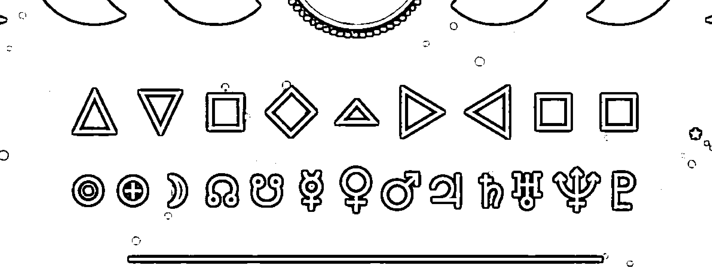

---

## 日誌使用說明

### 流日太陽的閘門與爻

| 項目 | 內容 |
|---|---|
| 上一個閘門 | 26.1 |
| 下一個閘門 | 60.4 |
| 流日閘門的關鍵字 | 內在真理 |
| 流日爻的關鍵字 | 探究 |
| 日期（年月日）、爻的起始時間（24h） | 2022/01/14 02:54 TWN |
| 農曆日期（星期） | 農曆12/12（五） |
| 流日接通的通道 | 魅力 20–34；覺察 24–61 |
| 流日行星過境，爻的關鍵字 | 探究 61.4；苦行主義 62.4；獨立 16.3 |
| 橢圓形箭頭 | 行星逆行標記 |
| 行星逆行標記 | ♂ |

▽ 人類圖新年始於 41 號閘門

60 41 19 13 49 30 55 37 63 22 36 25 17 21 51 42 3 27

> △ 人類圖四等分的轉換，會在人面獅身的閘門下方標記小圓點

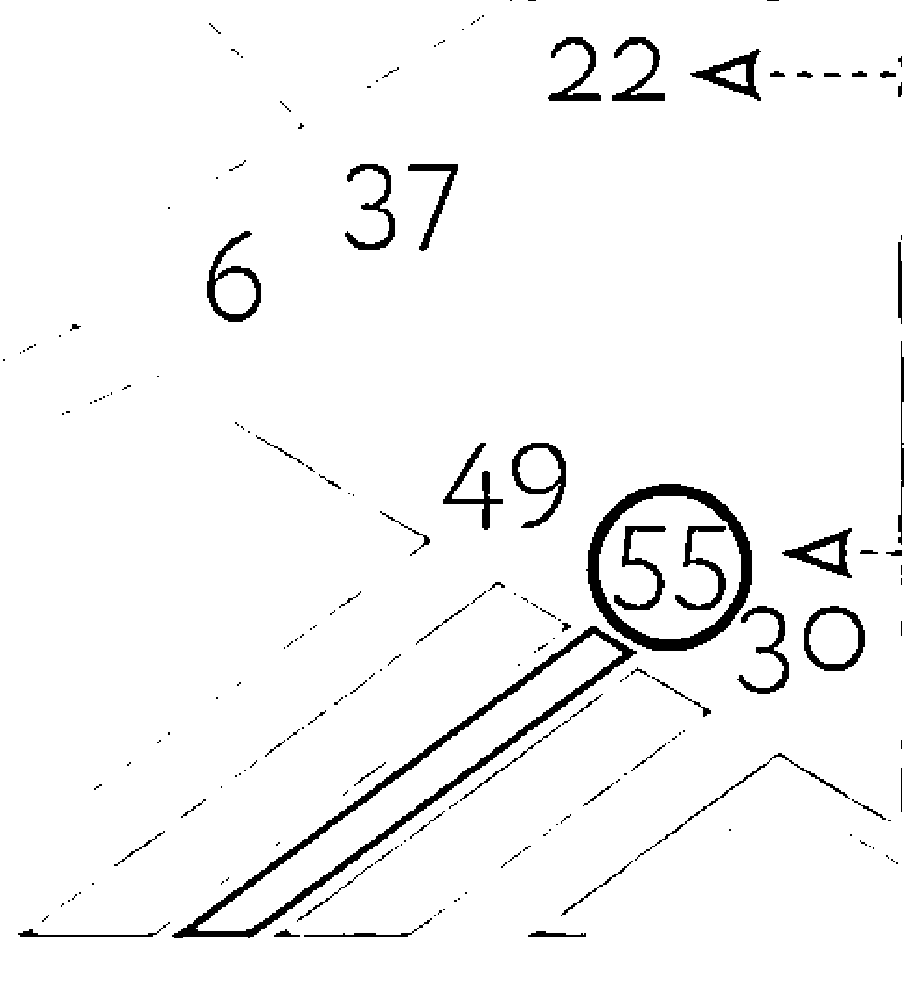

◁ 閘門的爻沒有固定的相位  
◁ 閘門的爻有固定的相位（上升、下降或並列）

---

## 日誌使用說明

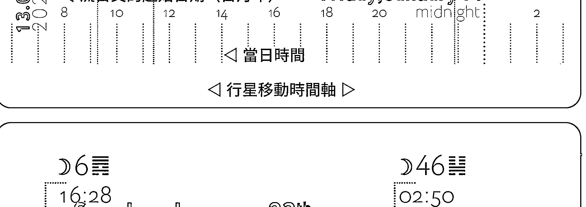

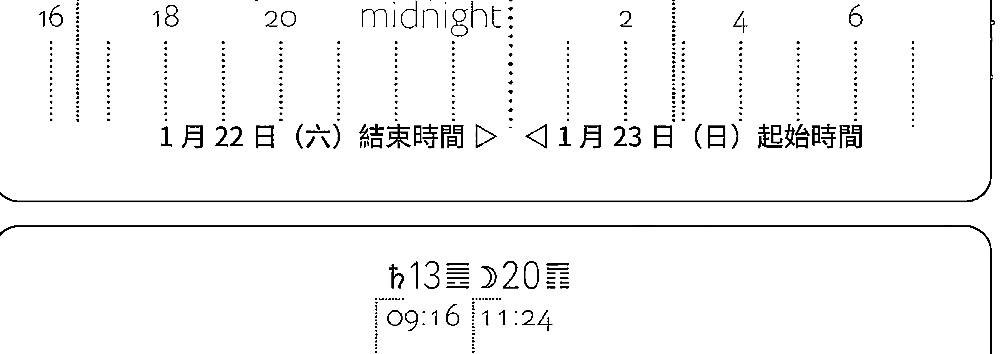

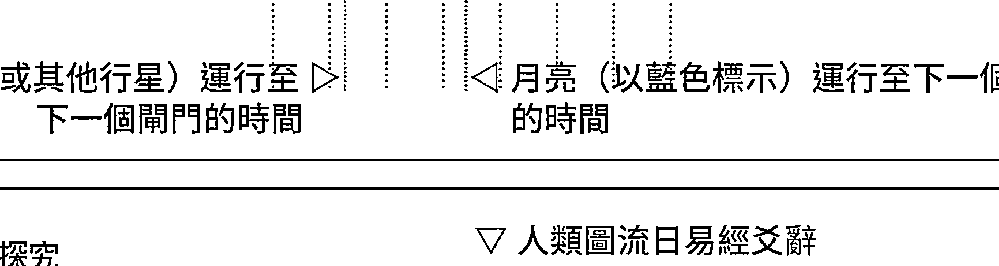

### 61.4 探究

♄ 專注的能力，深入探究內在的真理，盡可能運用在基本準則上。  
歷力來自於永恆清澈，想知道基本準則。

♃ 擴大、擴展與整合，將他人納入研究的範疇，最後衍生出各種運用方式，引發混亂。以為與人合作當然容易，是否？

> ▽ 點陣空白筆記

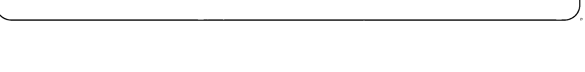

---

## 《人類圖易經》作者簡介

拉・烏魯・胡（Ra Uru Hu）

人類圖創始人，人類圖系統的傳訊者與教師。

## 日誌概念發想設計者簡介

安娜・查里科娃（Anna Charykova）

俄羅斯人類圖第一階課程引導師、輪迴交叉分析師、個人解讀分析師、生命循環解讀分析師、關係解讀分析師、兒童發展分析師。

尼奇塔・潘克維奇（Nikita Pankevich）

俄羅斯人類圖個人解讀分析師、BG5 解讀分析師。

## 譯者簡介

喬宜思（Joyce Huang）

人類圖分析師。亞洲人類圖學院負責人，人類圖一到七階課程認證講師、人類圖專題工作坊老師。研究人類圖十五年，解讀個案與教學經驗近十二年，翻譯人類圖相關教材與相關著作十餘本。

除了人類圖，最喜歡並擅長即席口譯。對於文字相關工作，一生著迷。接下來的目標是培養更多專業的人類圖分析師與講師，讓更多人能運用人類圖了解自己、善待自己、愛自己。

著有：《活出你的天賦才華》、《看見你的內在權威》、《人類圖氣象報告1：愛自己，別無選擇》、《人類圖氣象報告2：愛的祕密》、《圖解人類圖：認識70張圖，看懂你的人生使用說明書》。

審譯：《人類圖：區分的科學》（人類圖國際總部 Jovian Archive 唯一授權定本）。  
審定：《人類圖，愛，關係與性》。

---

## 專屬我的人類圖

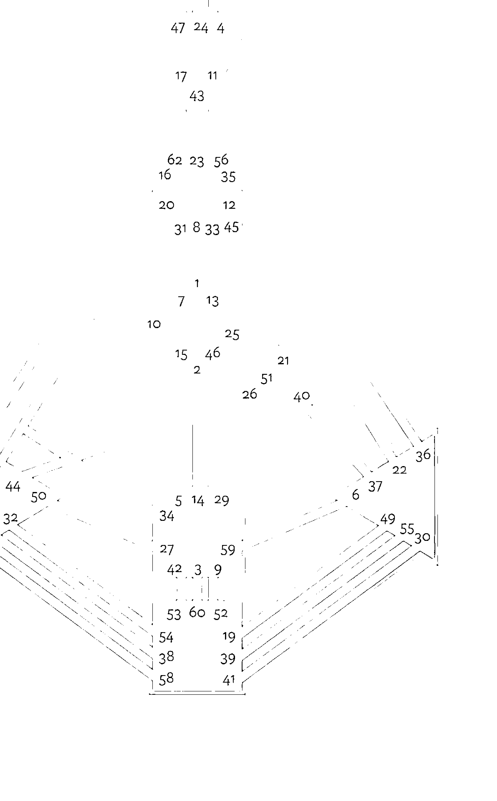

## 設計 / 個性

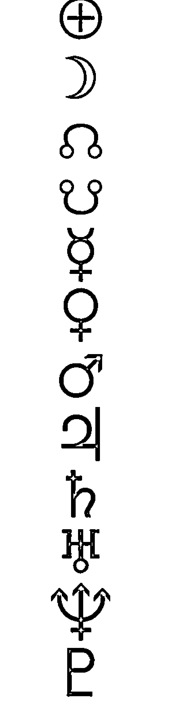

- 姓  
- 名  
- 類型  
- 內在權威  
- 策略  
- 黑太陽 / 黑地球  
- 紅太陽 / 紅地球  
- 我的輪迴交叉

---

| 設計 | 個性 |
|---|---|
| 日 | |
| 地 | |
| 月 | |
| 北交 | |
| 南交 | |
| 水 | |
| 金 | |
| 火 | |
| 木 | |
| 土 | |
| 天 | |
| 海 | |
| 冥 | |

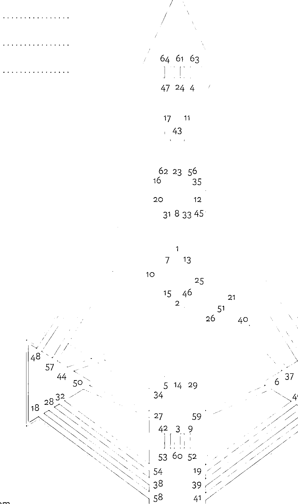

prolinerhd.com

---

## 設計 / 個性

- ☉
- ⊕
- ☽
- ☊
- ☋
- ☿
- ♀
- ♂
- ♃
- ♄
- ♅
- ♆
- ♇

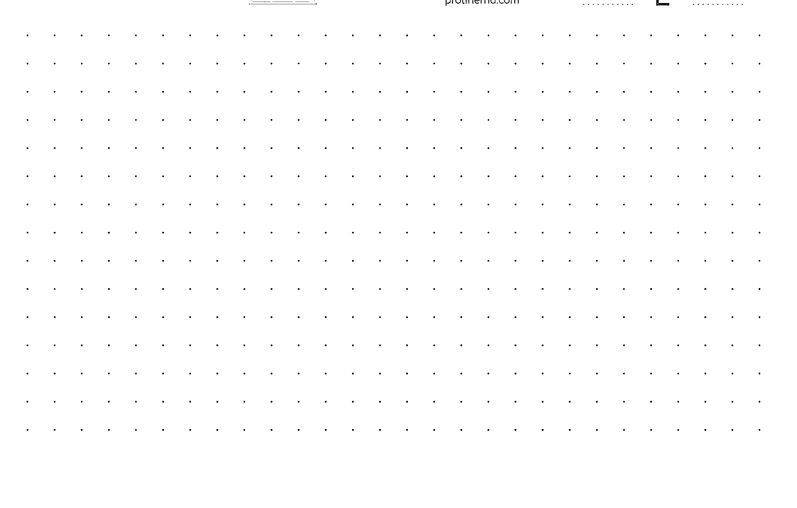

---

## 2022

## 1月

- 1 六  
- 2 日  
- 3 一  
- 4 二  
- 5 三  
- 6 四  
- 7 五  
- 8 六  
- 9 日  
- 10 一  
- 11 二  
- 12 三  
- 13 四  
- 14 五  
- 15 六  
- 16 日  
- 17 一  
- 18 二  
- 19 三  
- 20 四  
- 21 五  
- 22 六  
- 23 日  
- 24 一  
- 25 二  
- 26 三  
- 27 四  
- 28 五  
- 29 六  
- 30 日  
- 31 一  

## 2月

- 1 二  
- 2 三  
- 3 四  
- 4 五  
- 5 六  
- 6 日  
- 7 一  
- 8 二  
- 9 三  
- 10 四  
- 11 五  
- 12 六  
- 13 日  
- 14 一  
- 15 二  
- 16 三  
- 17 四  
- 18 五  
- 19 六  
- 20 日  
- 21 一  
- 22 二  
- 23 三  
- 24 四  
- 25 五  
- 26 六  
- 27 日  
- 28 一  

## 3月

- 1 二  
- 2 三  
- 3 四  
- 4 五  
- 5 六  
- 6 日  
- 7 一  
- 8 二  
- 9 三  
- 10 四  
- 11 五  
- 12 六  
- 13 日  
- 14 一  
- 15 二  
- 16 三  
- 17 四  
- 18 五  
- 19 六  
- 20 日  
- 21 一  
- 22 二  
- 23 三  
- 24 四  
- 25 五  
- 26 六  
- 27 日  
- 28 一  
- 29 二  
- 30 三  
- 31 四  

## 4月

- 1 五  
- 2 六  
- 3 日  
- 4 一  
- 5 二  
- 6 三  
- 7 四  
- 8 五  
- 9 六  
- 10 日  
- 11 一  
- 12 二  
- 13 三  
- 14 四  
- 15 五  
- 16 六  
- 17 日  
- 18 一  
- 19 二  
- 20 三  
- 21 四  
- 22 五  
- 23 六  
- 24 日  
- 25 一  
- 26 二  
- 27 三  
- 28 四  
- 29 五  
- 30 六  

## 5月

- 1 日  
- 2 一  
- 3 二  
- 4 三  
- 5 四  
- 6 五  
- 7 六  
- 8 日  
- 9 一  
- 10 二  
- 11 三  
- 12 四  
- 13 五  
- 14 六  
- 15 日  
- 16 一  
- 17 二  
- 18 三  
- 19 四  
- 20 五  
- 21 六  
- 22 日  
- 23 一  
- 24 二  
- 25 三  
- 26 四  
- 27 五  
- 28 六  
- 29 日  
- 30 一  
- 31 二  

## 6月

- 1 三  
- 2 四  
- 3 五  
- 4 六  
- 5 日  
- 6 一  
- 7 二  
- 8 三  
- 9 四  
- 10 五  
- 11 六  
- 12 日  
- 13 一  
- 14 二  
- 15 三  
- 16 四  
- 17 五  
- 18 六  
- 19 日  
- 20 一  
- 21 二  
- 22 三  
- 23 四  
- 24 五  
- 25 六  
- 26 日  
- 27 一  
- 28 二  
- 29 三  
- 30 四  

---

## 7月

| 日 |
|---|
|1|
|2|
|3|
|4|
|5|
|6|
|7|
|8|
|9|
|10|
|11|
|12|
|13|
|14|
|15|
|16|
|17|
|18|
|19|
|20|
|21|
|22|
|23|
|24|
|25|
|26|
|27|
|28|
|29|
|30|
|31|

## 8月

| 日 |
|---|
|1|
|2|
|3|
|4|
|5|
|6|
|7|
|8|
|9|
|10|
|11|
|12|
|13|
|14|
|15|
|16|
|17|
|18|
|19|
|20|
|21|
|22|
|23|
|24|
|25|
|26|
|27|
|28|
|29|
|30|
|31|

## 9月

| 日 |
|---|
|1|
|2|
|3|
|4|
|5|
|6|
|7|
|8|
|9|
|10|
|11|
|12|
|13|
|14|
|15|
|16|
|17|
|18|
|19|
|20|
|21|
|22|
|23|
|24|
|25|
|26|
|27|
|28|
|29|
|30|

## 10月

| 日 |
|---|
|1|
|2|
|3|
|4|
|5|
|6|
|7|
|8|
|9|
|10|
|11|
|12|
|13|
|14|
|15|
|16|
|17|
|18|
|19|
|20|
|21|
|22|
|23|
|24|
|25|
|26|
|27|
|28|
|29|
|30|
|31|

## 11月

| 日 |
|---|
|1|
|2|
|3|
|4|
|5|
|6|
|7|
|8|
|9|
|10|
|11|
|12|
|13|
|14|
|15|
|16|
|17|
|18|
|19|
|20|
|21|
|22|
|23|
|24|
|25|
|26|
|27|
|28|
|29|
|30|

## 12月

| 日 |
|---|
|1|
|2|
|3|
|4|
|5|
|6|
|7|
|8|
|9|
|10|
|11|
|12|
|13|
|14|
|15|
|16|
|17|
|18|
|19|
|20|
|21|
|22|
|23|
|24|
|25|
|26|
|27|
|28|
|29|
|30|
|31|

---

## 38.1 對抗  
素質

- 20–34 魅力  
- 24–61 覺察  
- 39–55 情緒  

- 日 38.1 素質  
- 地 39.1 脫離  
- 月 34.1 霸凌  
- 北交 20.2 獨斷者  
- 南交 34.2 氣勢  
- 水 60.1 接受  
- 金 61.4 探究  
- 火 5.2 內在的和平  
- 木 55.1 合作  
- 土 19.5 犧牲  
- 天 24.4 隱士  
- 海 22.4 敏感度  
- 冥 61.6 感染力  

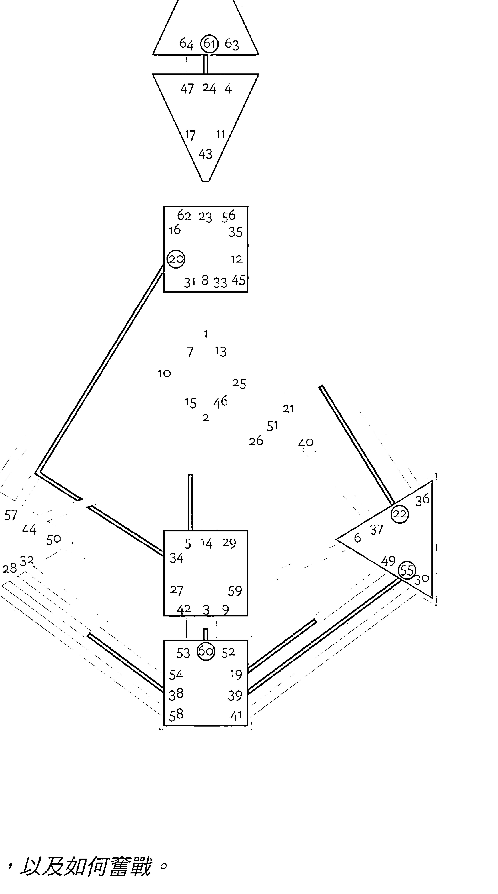

38.1 素質  
基於情勢，決定對抗的強度。

♆ △ 與超自然力量合頻，確保行動合宜。  
有如通靈般的天賦，知曉何時該奮戰，以及如何奮戰。

♂ ▽ 傾向對抗，視反對為通則。  
奮戰是理所當然的準則。

---

## 對抗

彬彬有禮  
2022/01/01 05:51 TWN  
農曆 11/29（六）

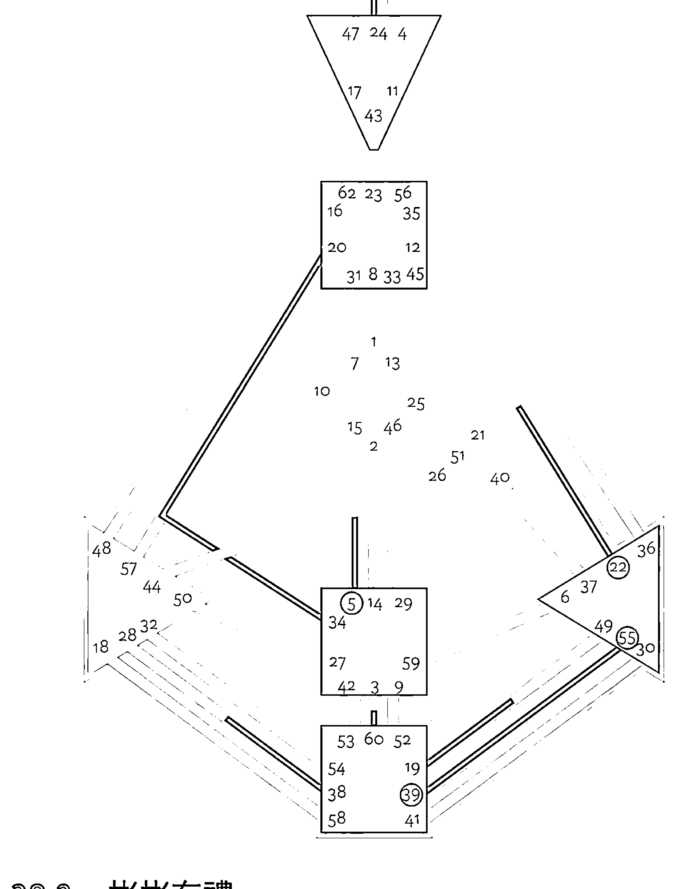

- 魅力 20–34  
- 覺察 24–61  
- 情緒 39–55  

- 彬彬有禮 38.2  
- 對抗 39.2  
- 強迫症 5.3  
- 獨斷者 20.2  
- 氣勢 34.2  
- 果斷 60.2  
- 相互依存 61.3  
- 內在的和平 5.2  
- 合作 55.1  
- 惰性 19.5  
- 隱士 24.4  
- 敏感度 22.4  
- 感染力 61.6  

### 38.2 彬彬有禮

對抗，卻不逾矩。

- △ 睿智謹慎。  
  來自直覺的本能，謹慎以對。  

- ▽ 遮蔽。  
  身體的本能明顯流於表面，違背了本意。  
  以嚴守邊界的形式，與之對抗。

---

## 38.3 對抗  
結盟

2022/01/02 03:55 TWN  
農曆 11/30（日）

- 20–34 魅力  
- 24–61 覺察  
- 39–55 情緒  

- 日 △38.3 結盟  
- 地 ☆39.3 責任  
- 月 11.6 適應力  
- 北交 20.2 獨斷者  
- 南交 34.2 氣勢  
- 水 △60.4 足智多謀  
- 金 61.3 相互依存  
- 火 5.3 強迫症  
- 木 △55.1 合作  
- 土 19.5 犧牲  
- 天 24.4 隱士  
- 海 △22.4 靈敏度  
- 冥 △61.6 感染力  

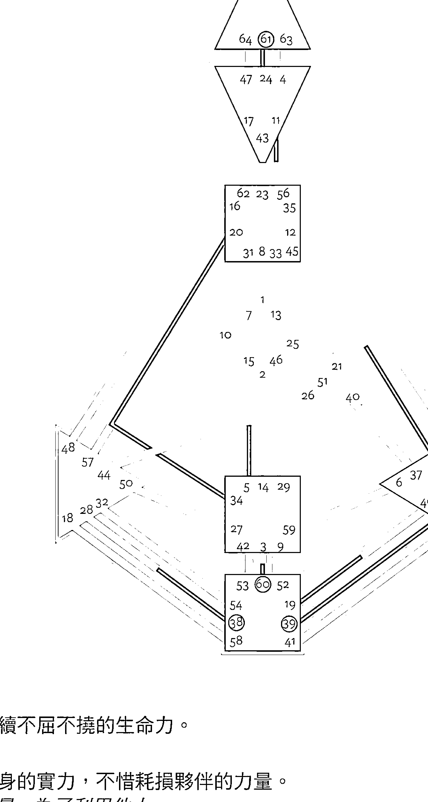

### 38.3 結盟

☉ △ 能整合志同道合的力量，延續不屈不撓的生命力。  
整合他人，共同奮戰。

⊕ ▽ 基於自私而結盟，為保有自身的實力，不惜耗損夥伴的力量。  
暫時的非常時期，自私的能量，為了利用他人。

---

## 對抗

### 38.4 調查

2022/01/03 01:59 TWN  
農曆 12/1（一）

- 魅力 20–34  
- 覺察 24–61  
- 情緒 39–55  
- 調查 38.4  
- 節制 39.4  
- 結盟 38.3  
- 獨斷者 20.2  
- 氣勢 34.2  
- 領導力 60.5  
- 天生耀眼 61.2  
- 獵人 5.4  
- 合作 55.1  
- 機性 19.5  
- 隱士 24.4  
- 敏感度 22.4  
- 感染力 61.6  

**38.4 調查**

分析，只是為了強化對立。

♇ △ 若信任的基礎穩固，就像偵探在調查，或當局者加入反對陣營。面對荒謬的局面，足以辨識出每個人的價值。

♂ ▽ 激烈反對，對調查結果充滿偏見，可信度驟降。腎上腺素引發侵略性。

---

## 38.5 對抗

2022/01/04 00:03 TWN  
農曆 12/2（二）

- 20–34 魅力  
- 24–61 覺察  
- 39–55 情緒  

- 日 38.5 疏離  
- 地 39.5 專心致志  
- 月 △61.6 感染力  
- 北交 20.1 表面化  
- 南交 34.1 霸凌  
- 水 ▽60.6 剛硬  
- 金 △61.2 天生耀眼  
- 火 5.4 獵人  
- 木 ▽55.2 不信任  
- 土 19.5 犧牲  
- 天 24.4 隱士  
- 海 △22.4 敏感性  
- 冥 △61.6 感染力  

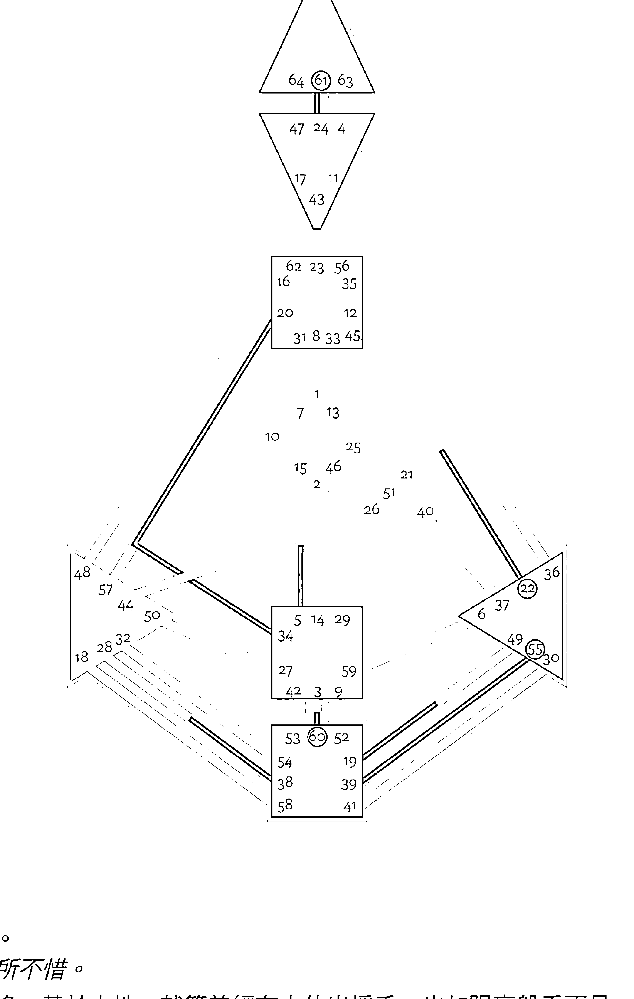

### 38.5 疏離

獨力對抗，孤身對決。  
充滿野心與抱負，持久到底。  
頑固，就算孤軍奮戰，也在所不惜。

疏離的體驗，如同痛苦的分娩。基於本性，就算曾經有人伸出援手，也如眼盲般看不見。非常固執，身處掙扎抗爭之中，看不見有誰會給予援助。

---

- 魅力 20–34  
- 覺察 24–61  
- 情緒 39–55  
- 誤解 38.6  
- 解決麻煩者 39.6  
- 服務 19.2  
- 表面化 20.1  
- 霸凌 34.1  
- 謹慎 41.2  
- 奧祕知識 61.1  
- 喜悅 5.5  
- 不信任 55.2  
- 犧牲 19.5  
- 隱士 24.4  
- 敏感性 22.4  
- 感染力 61.6  

### 38.6 誤解

毫無根據的反對。

當水落石出，誤解就會澄清。  
引來誤解，面對反對的聲浪，全面以對。

明白反對是來自誤解，卻堅持是對方誤解。  
因為誤解而掙扎反抗，卻頑固地苦守立場，繼續堅持下去。

---

## 少女出嫁  
影響

農曆 12/3（三）小寒

- 19–49 整合綜效  
- 20–34 魅力  
- 24–61 覺察  

- 日 54.1 影響  
- 地 53.1 累積  
- 月 △49.5 組織  
- 北交 20.1 表面化  
- 南交 34.1 霸凌  
- 水 41.3 效率  
- 金 ▽61.1 奧祕知識  
- 火 5.6 屈服  
- 木 55.2 不信任  
- 土 19.6 通世者  
- 天 24.4 隱士  
- 海 22.5 直接  
- 冥 △61.6 感染力  

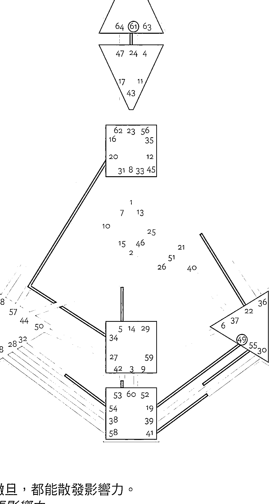

### 54.1 影響

- △ 透過各種祕密管道，從私家偵探到撒旦，都能散發影響力。野心勃勃，經由祕密的人際網絡擴張影響力。  

- ▽ 誤判，堅持將關係公開，削弱影響力。野心暴露，要求正式承認關係，影響力因而受限。

---

## 少女出嫁  
謹慎

2022/01/06 18:15 TWN  
農曆 12/4（四）

### 54.2

- 魅力 20–34  
- 覺察 24–61  
- 謹慎 54.2  
- 氣勢 53.2  
- 母親／父親 37.1  
- 表面化 20.1  
- 霸凌 34.1  
- 修正 41.4  
- 選擇性 54.6  
- 屈服 5.6  
- 不信任 55.2  
- 通世者 19.6  
- 隱士 24.4  
- 直接 22.5  
- 感染力 61.6  

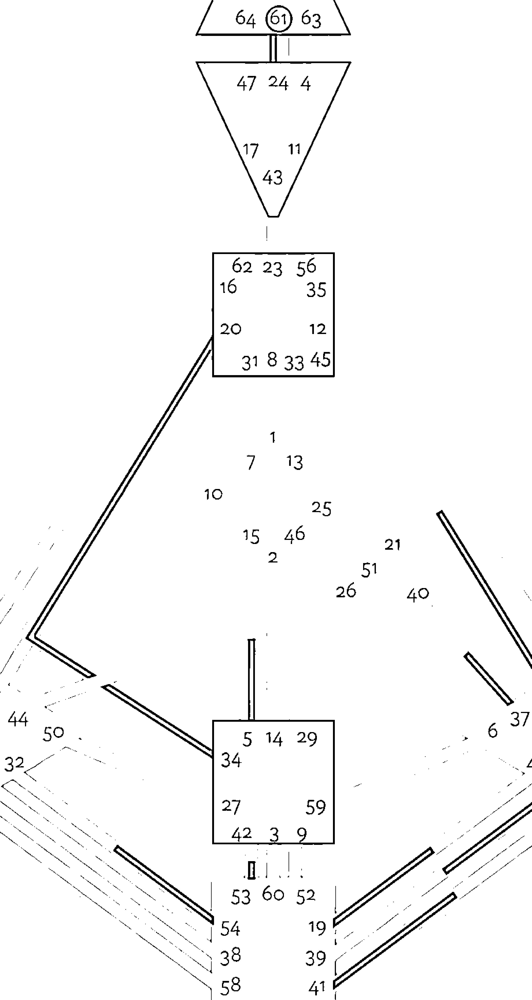

**54.2 謹慎**

深具智慧，清楚關係曝光後，無法沿用既定的互利模式，克制激進的野心。

獲得正式認可之後，利用之前私下互動時所獲得的資訊，從中獲利。缺乏成就野心湧動的能量，毫無忠誠可言。

## 54.3 少女出嫁  
動用關係  

2022/01/07 16:19 TWN  
農曆 12/5（五）

- 20–34 魅力  
- 24–61 覺察  
- 日 ▽54.3 動用關係  
- 地 53.3 實際  
- 月 22.2 禮儀學校  
- 北交 20.1 表面化  
- 南交 34.1 霸凌  
- 水 41.5 授權  
- 金 △54.5 寬大  
- 火 ▽26.1 一鳥在手  
- 木 55.2 不信任  
- 土 19.6 適世者  
- 天 24.4 醫士  
- 海 22.5 直接  
- 冥 △61.6 感染力  

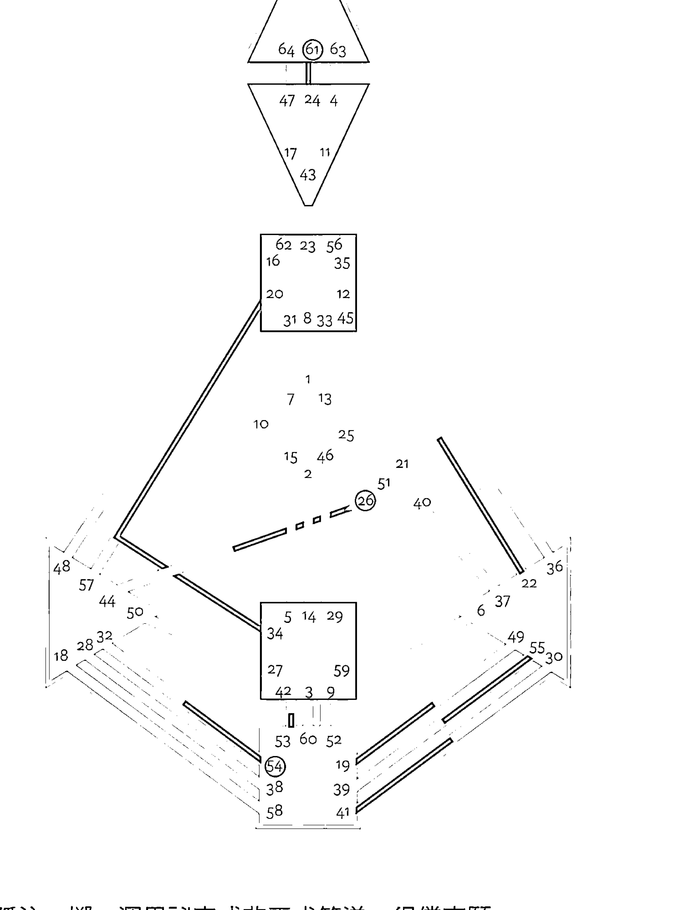

### 54.3 動用關係

P △ 若無法經由正式管道晉升，將孤注一擲，運用祕密或非正式管道，得償宿願。即便受阻，依然充滿野心，轉由祕密手段來推動，動力十足。  

♀ ▽ 堅持經由正式管道來解決，不管遭遇多少挫折，皆以吸引力來克服。若野心受阻，就會散發吸引力，克服途中障礙。  

## 少女出嫁  
啟蒙／無明  

2022/01/08 14:24 TWN  
農曆 12/6（六）

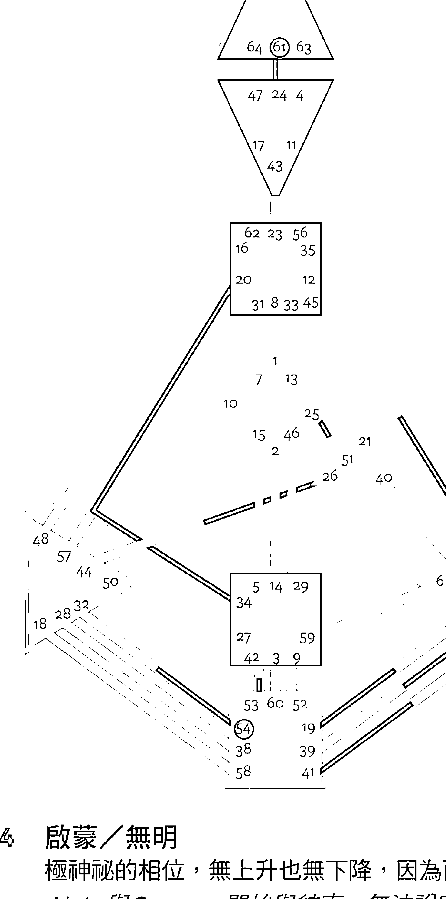

- 魅力 20–34  
- 覺察 24–61  
- 啟蒙／無明 54.4  
- 確保 53.4  
- 感性 25.3  
- 表面化 20.1  
- 霸凌 34.1  
- 感染 41.6  
- 寬大 54.5  
- 歷史的教訓 26.2  
- 無罪 55.3  
- 遁世者 19.6  
- 隱士 24.4  
- 直接 22.5  
- 感染力 61.6  

### 54.4 啟蒙／無明

極神祕的相位，無上升也無下降，因為兩者並無不同。  

Alpha與Omega，開始與結束，無法說明。每個星星皆以獨特的方式閃爍，以各自的方式彰顯能量，無人知道努力能否被看見，而潛力始終蘊藏其中。無庸置疑，純然引發蛻變、無極性，無特定行星帶來影響。  

## 54.5 少女出嫁  
寬大

- 20–34 魅力  
- 24–61 覺察  
- 日 △54.5 寬大  
- 地 ▽53.5 主張  
- 月 21.3 無力  
- 北交 20.1 表面化  
- 南交 34.1 霸凌  
- 水 19.1 相互依存  
- 金 54.4 啟蒙／無明  
- 火 26.3 影響  
- 木 55.3 無罪  
- 土 19.6 遁世者  
- 天 24.4 賢士  
- 海 22.5 直接  
- 冥 △61.6 感染力  

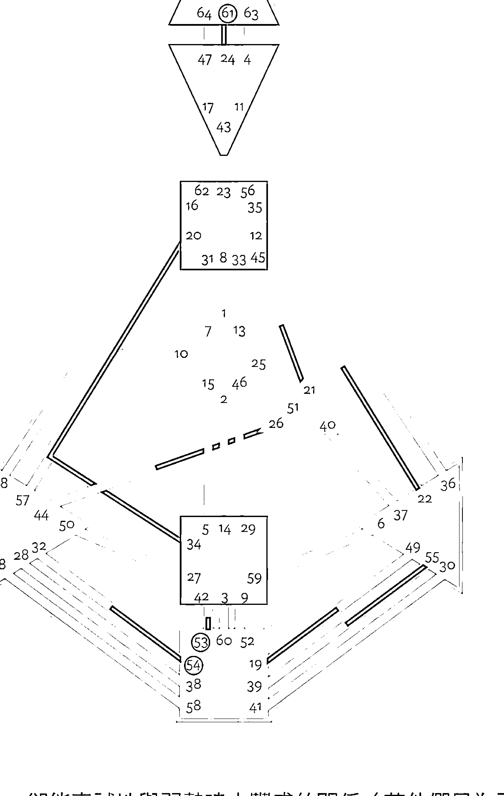

### 54.5 寬大

- ◎ △ 天生的權威，落實的靈魂，手握權力，卻能真誠地與弱勢建立豐盛的關係（若他們只為了貢獻服務，除此之外別無所求）。  
- 能屈居於實踐，同時擁有豐盛的人際關係。  
- ▽ 無極性。無下降階位。  

## 少女出嫁  
選擇性  

2022/01/10 10:33 TWN  
農曆 12/8（一）

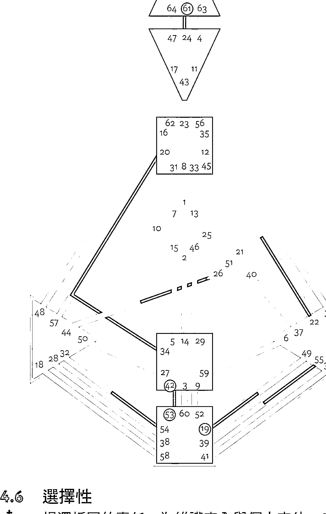

- 魅力 20–34  
- 覺察 24–61  
- 成熟 42–53  

- 選擇性 54.6  
- 逐步進行 53.6  
- 中間人 42.4  
- 表面化 20.1  
- 霸凌 34.1  
- 服務 19.2  
- 啟蒙／無明 54.4  
- 影響 26.3  
- 無罪 55.3  
- 遁世者 19.6  
- 隱士 24.4  
- 直接 22.5  
- 感染力 61.6  

### 54.6 選擇性

根深柢固的責任，為維護安全與個人定位，自然而然對關係設限，僅與互利的對象往來。若關係網絡對其野心造成阻礙，在能量上會形成限制。  

大致來說，善良與開朗的本性，認為自己能補足合作夥伴的缺失。浪費精神保有心懷不軌的人際網絡，是浪費能量的行為。  

## 內在真理  
奧祕知識

- 20–34 魅力  
- 24–61 覺察  

- 日 61.1 奧祕知識  
- 地 62.1 例行程序  
- 月 27.4 憐憫  
- 北交 20.1 表面化  
- 南交 34.1 霸凌  
- 水 19.2 服務  
- 金 54.3 動用關係  
- 火 26.4 審查  
- 木 55.3 無罪  
- 土 19.6 造世者  
- 天 24.4 醫士  
- 海 22.5 直接  
- 冥 61.6 感染力  

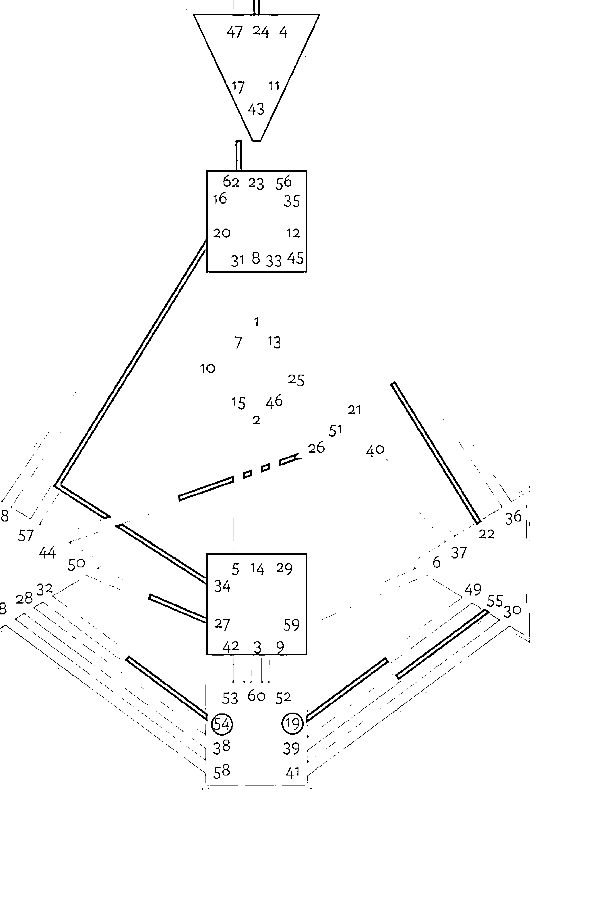

### 61.1 奧祕知識

> 天生的通靈能力，強化普世原則。  

內在渴望經由祕傳之道，知曉奧祕。  

仰賴神祕知識，要求抽離先行，最後終究隨處離開。渴望知曉奧祕帶來極大壓力，最後無法應付現實的世界。  

## 內在真理  
天生耀眼

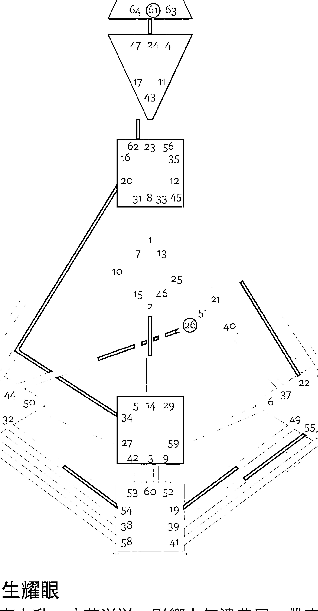

- 魅力 20–34  
- 覺察 24–61  
- 天生耀眼 61.2  
- 抑制 62.2  
- 耐性 2.3  
- 表面化 20.1  
- 霸凌 34.1  
- 奉獻 19.3  
- 謹慎 54.2  
- 適應力 26.5  
- 無罪 55.3  
- 遁世者 19.6  
- 隱士 24.4  
- 直接 22.5  
- 感染力 61.6  

### 61.2 天生耀眼

月亮上升，才華洋溢，影響力無遠弗屆，帶來滋養，無須任何花招，就能散發強大吸引力。敏銳迷人的天賦，散發吸引力的同時，也利益眾生。  

太早發現自己的影響力，流於浮誇而自戀。充滿幻覺，認為任何啟發都值得肯定。  

## 內在真理  
相互依存

- 20–34 魅力  
- 24–61 覺察  
- 日 61.3 相互依存  
- 地 62.3 探索  
- 月 △8.3 虛假  
- 北交 20.1 表面化  
- 南交 34.1 霸凌  
- 水 19.3 奉獻  
- 金 54.2 謹慎  
- 火 △26.5 適應力  
- 木 △55.4 同化  
- 土 19.6 遁世者  
- 天 24.4 醫士  
- 海 22.5 直接  
- 冥 △61.6 感染力  

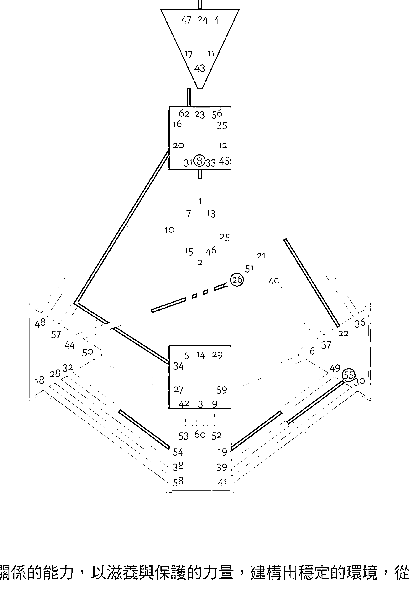

### 61.3 相互依存

真理若無人能懂，極為困難。  

△ 為求真理得以實現，具備建立關係的能力，以滋養與保護的力量，建構出穩定的環境，從中持續成長。經由合作，求知的壓力更為迫切。  

♂ 濫情的能量，確實掌握真理，傾向將他人拋諸腦後，或者被抗拒、被排擠。對他人缺乏耐心，放棄繼續經營這段關係。  

## 內在真理  
探究  

2022/01/14 02:54 TWN  
農曆 12/12（五）

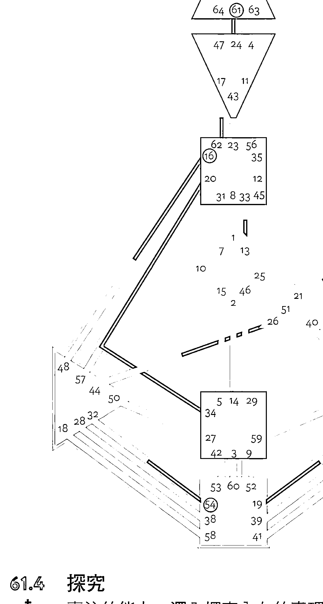

- 魅力 20–34  
- 覺察 24–61  
- 探究 61.4  
- 苦行主義 62.4  
- 獨立 16.3  
- 表面化 20.1  
- 霸凌 34.1  
- 奉獻 19.3  
- 影響 54.1  
- 權威 26.6  
- 同化 55.4  
- 同理 13.1  
- 隱士 24.4  
- 直接 22.5  
- 感染力 61.6  

### 61.4 探究

♄ ▲ 導注的能力，深入探究內在的真理，盡可能運用在基本準則上。壓力來自於求知若渴，想知道基本準則。  

♃ ▼ 渴求擴展與整合，將他人納入研究的範疇，最後衍生出各種運用方式，引發混亂。認為與人合作必然帶來靈感，是幻覺。  

## 內在真理  
影響  

農曆 12/13（六）

- 20–34 魅力  
- 24–61 覺察  

- 日 61.5 影響  
- 地 62.5 質變  
- 月 45.2 共識  
- 北交 20.1 表面化  
- 南交 34.1 霸凌  
- 水 19.3 奉獻  
- 金 54.1 影響  
- 火 11.1 和諧  
- 木 55.4 同化  
- 土 13.1 同理  
- 天 24.4 隱士  
- 海 22.5 直接  
- 冥 60.1 接受  

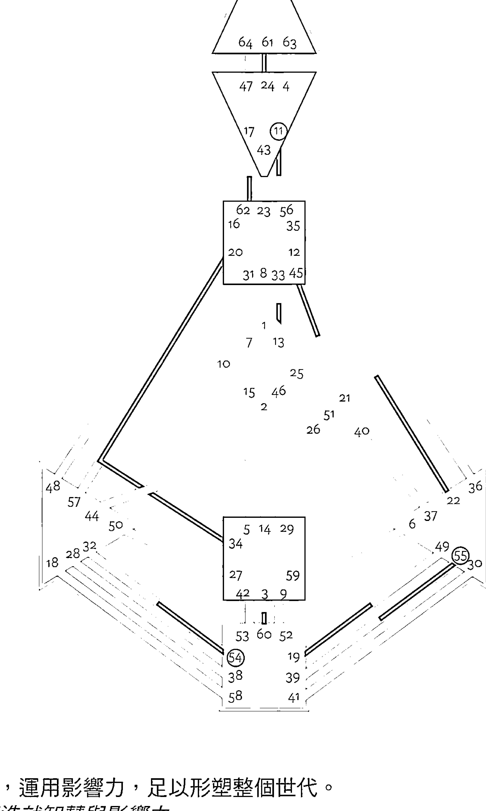

### 61.5 影響

開明的父親，具有公認的智慧，運用影響力，足以形塑整個世代。求知的渴望帶來壓力，也因而造就智慧與影響力。  

掌權的傾向，強制眾人遵從，確保獲得長久的影響力。伴隨覺知而來的壓力，對挑戰心懷憎恨，要求全盤接受。  

## 內在真理  
感染力  
61.6  

2022/01/15 23:05 TWN  
農曆 12/13（六）

- 魅力 20–34  
- 覺察 24–61  
- 感染力 61.6  
- 自律 62.6  
- 影響 15.2  
- 表面化 20.1  
- 霸凌 34.1  
- 奉獻 19.3  
- 誤解 38.6  
- 嚴格 11.2  
- 同化 55.4  
- 同理 13.1  
- 隱士 24.4  
- 直接 22.5  
- 接受 60.1  

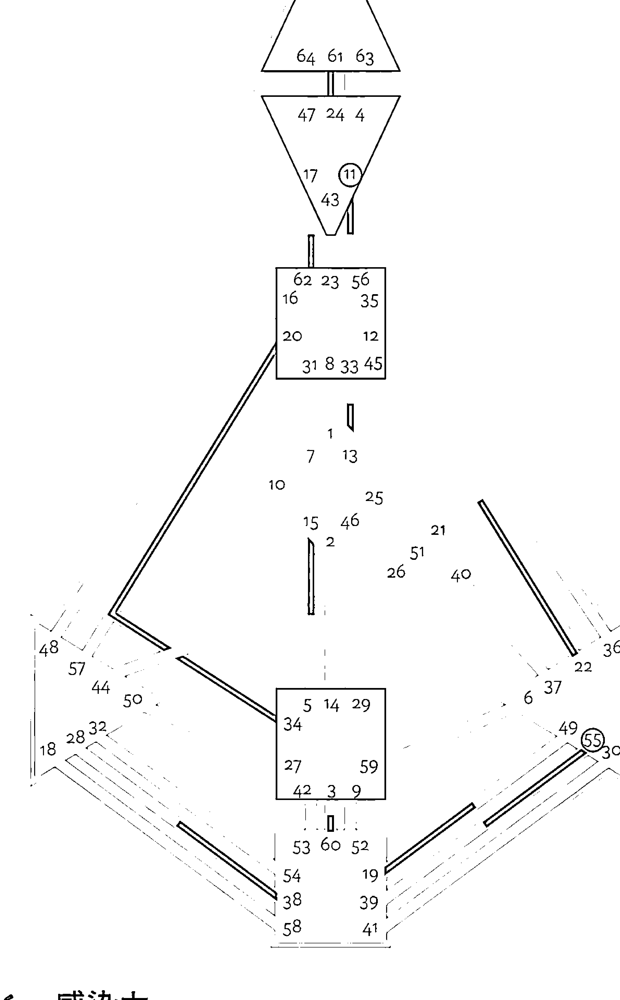

### 61.6 感染力

P △ 點化群眾，意義深遠，引領眾人走向真理。  

啟迪眾人，為群體帶來清明。  

♂ ▽ 邏輯陳腔濫調與口號，對他們的同溫層來說或許很新鮮，但是群眾卻充耳不聞。  

妄想能啟迪眾人，帶來清明。  

## 限制  
接受  

2022/01/16 21:11 TWN  
農曆 12/14（日）

- 11–56 好奇  
- 20–34 魅力  
- 39–55 情緒  

- 日 60.1 接受  
- 地 ▽56.1 質量  
- 月 39.1 脫離  
- 北交 20.1 表面化  
- 南交 34.1 霸凌  
- 水 19.3 奉獻  
- 金 38.6 誤解  
- 火 ▽11.2 嚴格  
- 木 △55.4 同化  
- 土 13.1 同理  
- 天 24.4 隱士  
- 海 22.5 直接  
- 冥 60.1 接受  

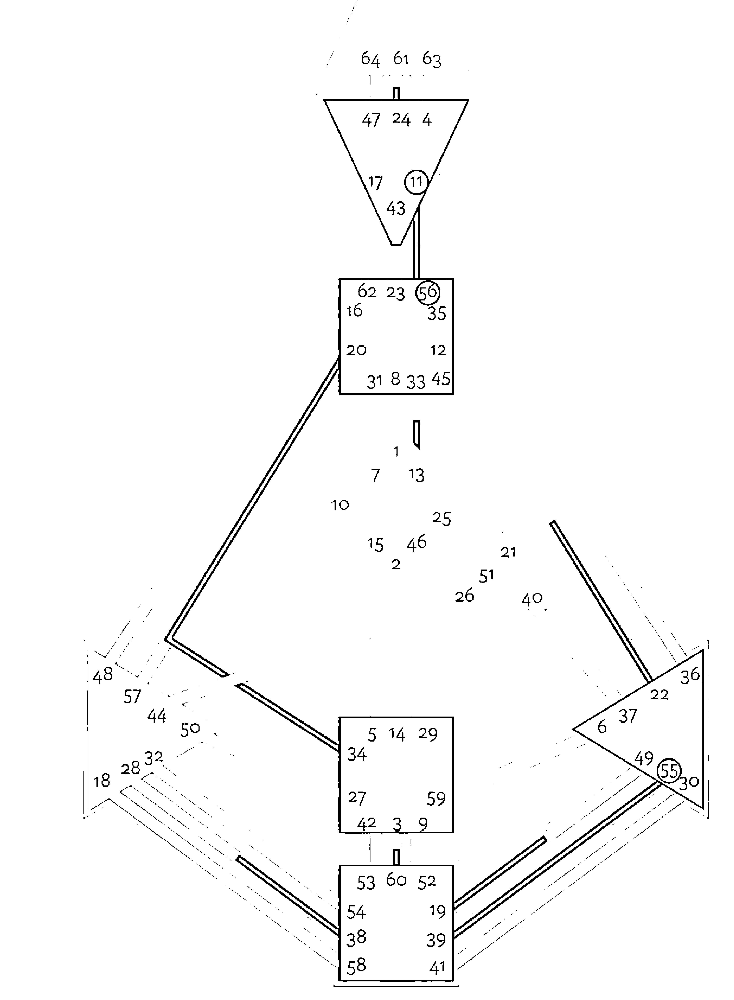

### 60.1 接受

> ♀ △ 面對外界限制的衝擊，保有內在和諧的能力。  
以和諧的能量，來處理外來的種種限制。  

> ☿ × 處處受限，渴望追求多樣化的驅動力，令人焦躁不安及激動。  
面對外在限制，產生焦躁的能量。  

## 限制  
果斷  

2022/01/17 19:17 TWN  
農曆 12/15（一）

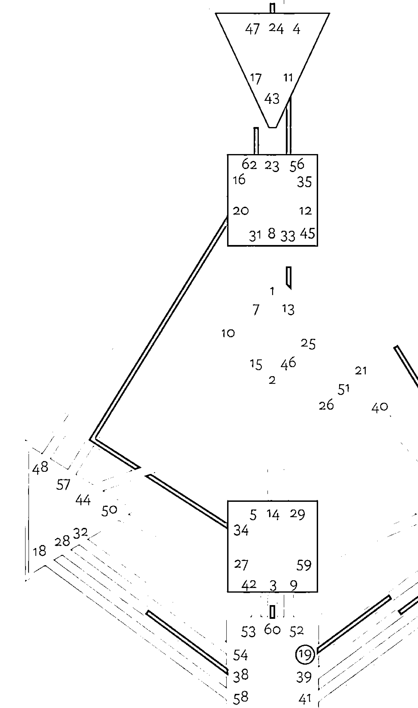

- 好奇 11–56  
- 魅力 20–34  
- 果斷 60.2  
- 連結 56.2  
- 例行程序 62.1  
- 表面化 20.1  
- 霸凌 34.1  
- 服務 19.2  
- 疏離 38.5  
- 現實主義者 11.3  
- 成長 55.5  
- 同理 13.1  
- 隱士 24.4  
- 直接 22.5  
- 接受 60.1  

### 60.2 果斷

▴ 理解限制的本質，必要時能接受約束，當機會來臨，能及時把握。帶有適應限制的能量。  

⊕ 在限制下屈服已成習慣，當限制消失，依舊延續既定的習性。能量用於適應，反倒成為桎梏，最終未能蛻變。  

## 60.3 限制  
保守主義  

2022/01/18 17:23 TWN  
農曆 12/16（二）

- 11–56 好奇  
- 日 60.3 保守主義  
- 地 56.3 疏離  
- 月 31.1 顯化  
- 北交 8.6 交誼  
- 南交 14.6 謙遜  
- 水 19.2 服務  
- 金 38.5 疏離  
- 火 11.4 老師  
- 木 55.5 成長  
- 土 13.1 同理  
- 天 24.4 醫士  
- 海 22.5 直接  
- 冥 60.1 接受  

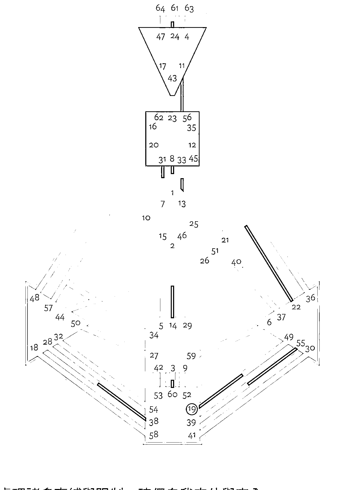

### 60.3 保守主義

♄ △ 開悟之後明白唯有利己，才能處理諸多束縛與限制，確保自我定位與安全。儘管面對限制，還是能保有自我定位與安全。  

♂ ▽ 為了滿足我執，面對限制視而不見，可預見將為此受苦。面對限制，選擇忽略，將為此付出代價。  

## 限制  
足智多謀 60.4

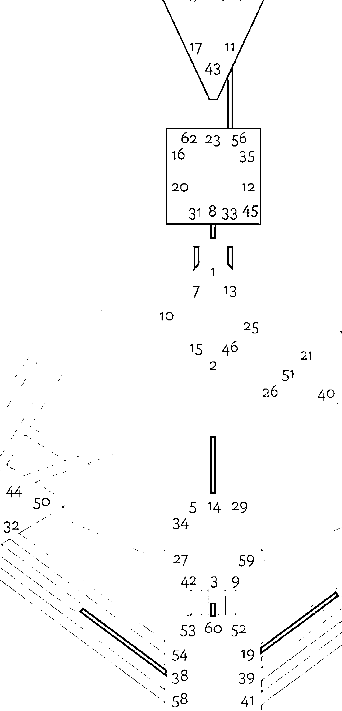

- 好奇 11–56  
- 足智多謀 60.4  
- 權宜 56.4  
- 獨裁主義者 7.1  
- 交誼 8.6  
- 謙遜 14.6  
- 相互依存 19.1  
- 調查 38.4  
- 老師 11.4  
- 成長 55.5  
- 同理 13.1  
- 隱士 24.4  
- 直接 22.5  
- 接受 60.1  

### 60.4 足智多謀

在有限的框架內，保有理性，並且將聰明才智極大化。在限制內，將潛力極大化。  

面對諸多限制，反而去尋求框架存在的意義，而非善用天賦找出限制之下的變通方式。不願接受限制，反倒為了理解耗損能量，失去突破的可能，抑鬱而終。  

## 60.5 限制  
領導力  

2022/01/20 13:36 TWN  
農曆 12/18（四）大寒

- 日 60.5 領導力  
- 地 ▽56.5 吸引注意力  
- 月 29.2 評定  
- 北交 8.6 交誼  
- 南交 14.6 謙遜  
- 水 41.6 感染  
- 金 38.4 調查  
- 火 11.5 慈善家  
- 木 55.5 成長  
- 土 13.1 同理  
- 天 24.4 賢士  
- 海 22.5 直接  
- 冥 60.1 接受  

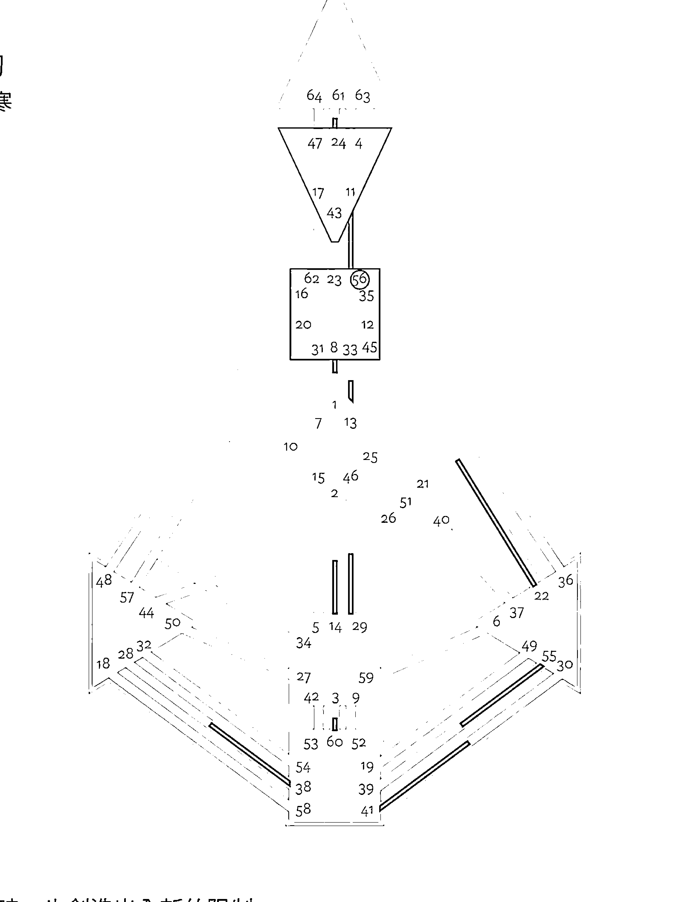

### 60.5 領導力

突破拆解既定限制的同時，也創造出全新的限制。有能力在人生中掌握並處理限制，完整經歷這一切。  

天生渴望向外擴展，然而限制有其必要性；否則一開始就會衝往困惑。向外擴張的能量，無法處理各種限制。  

## 限制 60.6  

2022/01/21 11:43 TWN  
農曆 12/19（五）

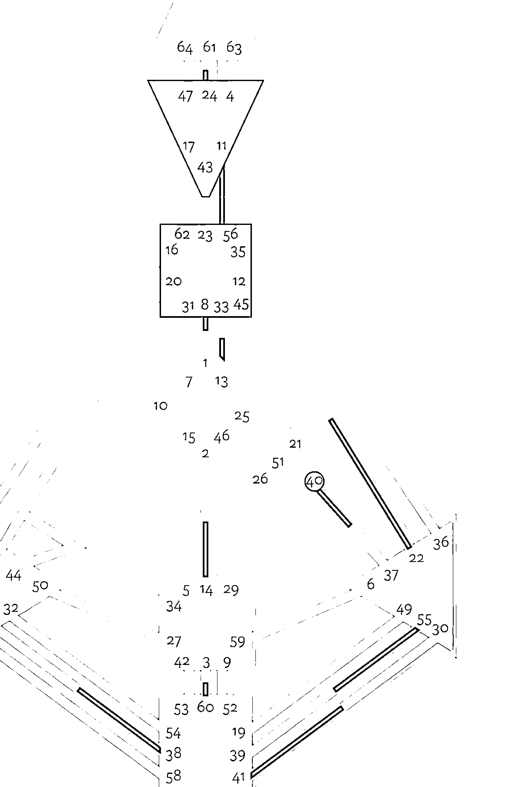

- 好奇 11–56  
- 剛硬 60.6  
- 謹慎 56.6  
- 堅定 40.2  
- 交誼 8.6  
- 謙遜 14.6  
- 授權 41.5  
- 調查 38.4  
- 適應力 11.6  
- 成長 55.5  
- 偏執 13.2  
- 隱士 24.4  
- 直接 22.5  
- 接受 60.1  

### 60.6 剛硬

明朗的直覺足以辨識出何時該強硬、堅持到底，但若能搭配創新的做法，就能減輕嚴峻的程度。一般穩定的能量，具有不尋常的約束力。  

以教條、有原則的方式，加上縝密合理的理解，嚴謹的程度不容置喙。在執行與運作層面冷酷嚴峻，面對限制秉持嚴苛的態度，毫不妥協。  

以嚴苛的態度接受限制，但絕不妥協；面對限制感到無法忍受，導致長期憂鬱。  

## 41.1 減少  
合理  

2022/01/22 09:50 TWN  
農曆 12/20（六）

- 日 ▽41.1 合理  
- 地 ▽31.1 顯化  
- 月 47.3 自我壓抑  
- 北交 8.6 交誼  
- 南交 14.6 謙遜  
- 水 41.4 修正  
- 金 38.3 結盟  
- 火 11.6 適應力  
- 木 55.6 自私  
- 土 13.2 偏執  
- 天 24.4 隱士  
- 海 22.5 直接  
- 冥 60.1 接受  

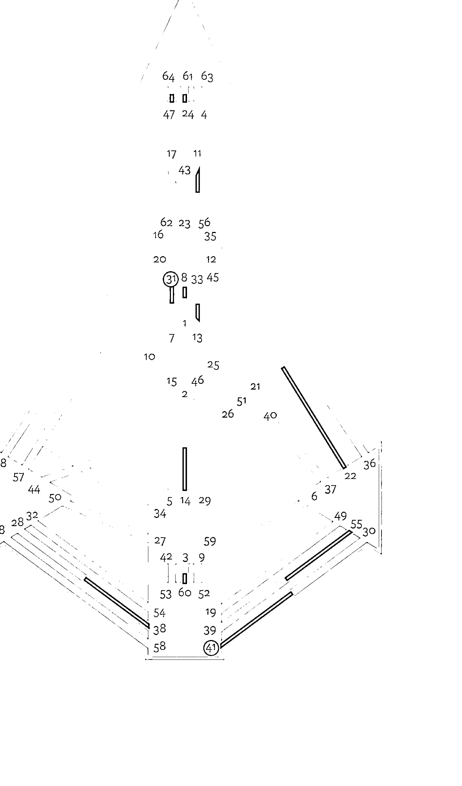

### 41.1 合理

分層富貴，合理授權。  

將最少化為最好的想像力。  
冷靜，選擇性地釋放情感的能量。  

基於理解而接手承擔，導致勞損。  
一頭熱，衝動之下投注情感。  

## 減少  
謹慎  

2022/01/23 07:58 TWN  
農曆 12/21（日）

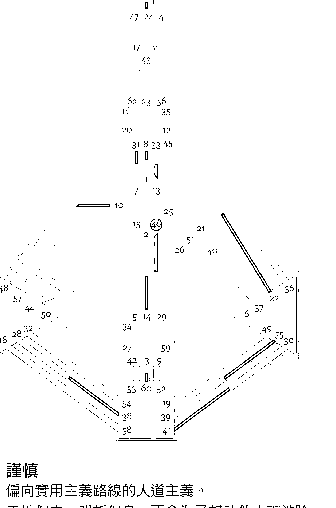

- 謹慎 41.2  
- 傲慢 31.2  
- 投射 46.3 △  
- 交誼 8.6  
- 謙遜 14.6  
- 效率 41.3  
- 結盟 38.3  
- 謙遜 10.1  
- 自私 55.6  
- 偏執 13.2  
- 隱士 24.4  
- 直接 22.5  
- 接受 60.1  

### 41.2 謹慎

向實用主義路線的人道主義。  

天性保守，明哲保身，不會為了幫助他人而涉險。僅專注於自身的情感，與他人無關。  

為了避免認同而不再謹慎，導致資源耗損，因小失大。盡情展現自己的感受，只為取得認同。  

## 41.3 減少  
效率  

2022/01/24 06:05 TWN  
農曆 12/22（一）

- 日 41.3 效率  
- 地 31.3 選擇性  
- 月 48.4 重建  
- 北交 8.6 交誼  
- 南交 14.6 謙遜  
- 水 41.1 合理  
- 金 38.3 結盟  
- 火 10.2 隱士  
- 木 55.6 自私  
- 土 13.2 偏執  
- 天 24.4 隱士  
- 海 22.5 直接  
- 冥 60.1 接受  

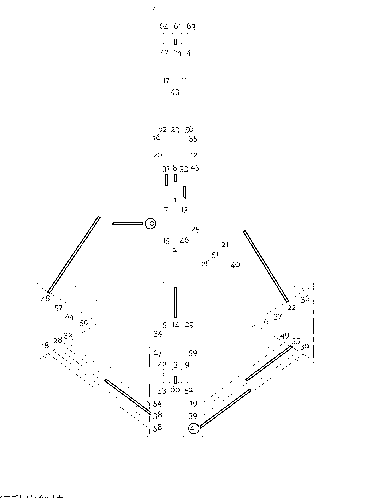

### 41.3 效率

減損之際，自私很合理。  

> 物質層面的野心，就算獨自行動也無妨。  
為了個人野心，應堅強到像火在燒。  

> 如此強勢而伸出援手，令人欽佩，但位於誤導的相位，以致兩人快速加倍耗損資源。  
渴望分享的動力。  

## 減少  
修正  
41.4  

2022/01/25 04:12 TWN  
農曆 12/23（二）

- 修正 41.4  
- 意圖 31.4  
- 安然以對 32.6  
- 交誼 8.6  
- 謙遜 14.6  
- 剛硬 60.6  
- 結盟 38.3  
- 烈士 10.3  
- 自私 55.6  
- 偏執 13.2  
- 隱士 24.4  
- 直接 22.5  
- 接受 60.1  

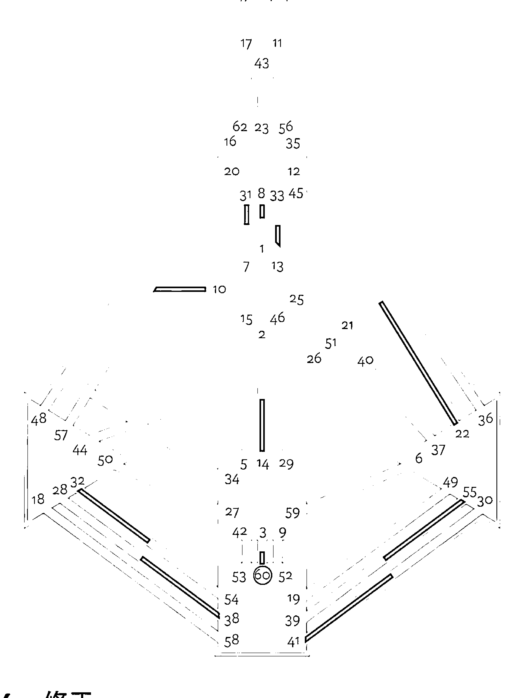

### 41.4 修正

成功適應限制。  

- 適者生存，步向興旺的樂景。  
- 適應，關於求存有深刻感受。  
- 重視關係的維繫，而非修正。當資源有限，與弱者相連結要付的代價過高，不管吸引力有多強烈，還是避免。  
- 所有能量都用於感受，而非適應。  

## 41.5 減少  
授權  

2022/01/26 02:20 TWN  
農曆 12/24（三）

- 日 41.5 授權  
- 地 31.5 自以為是  
- 月 44.1 制約  
- 北交 8.6 交誼  
- 南交 14.6 謙遜  
- 水 60.5 領導力  
- 金 38.2 彬彬有禮  
- 火 10.3 烈士  
- 木 37.1 母親／父親  
- 土 13.2 偏執  
- 天 24.4 賢士  
- 海 22.5 直接  
- 冥 60.1 接受  

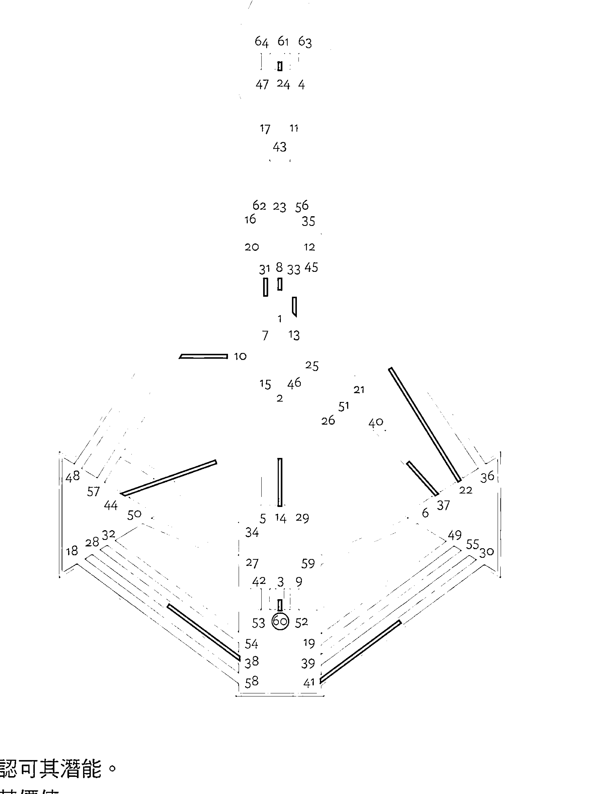

### 41.5 授權

就算有諸多限制，外界依然認可其潛能。  

♂ 若成為適當的管道，能量有其價值。  
為接收的感應添加燃料，不願限制。  

♀ 已獲得支持，若這是對限制感到不滿，將對發展造成阻礙。  
諸多限制點燃負面情緒。

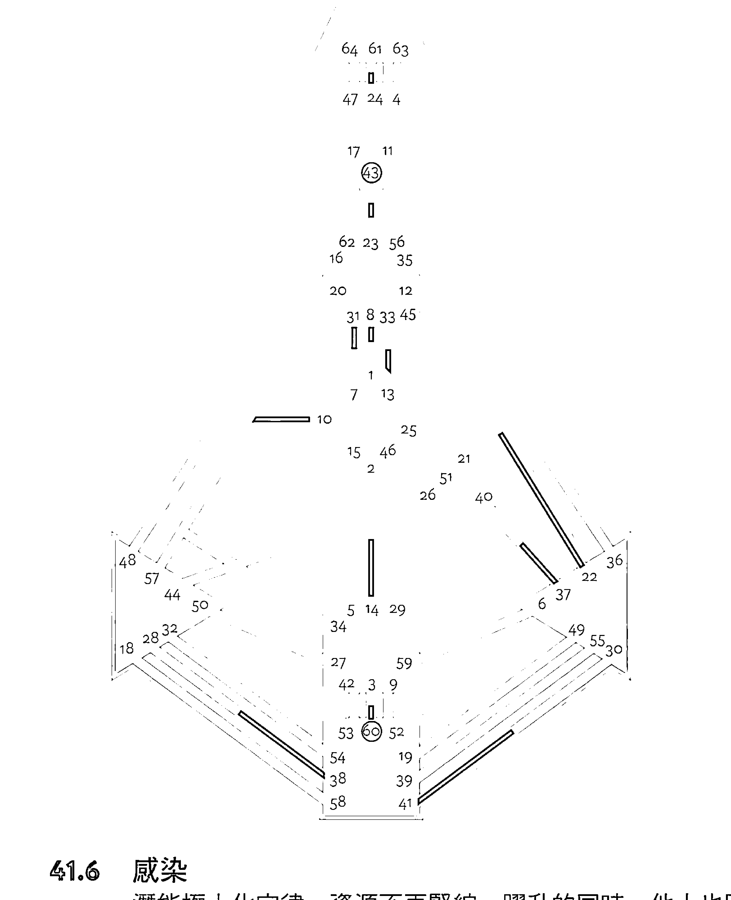

## 減少

感染 **41.6**

- 感染 41.6
- 應用 31.6
- 權宜 43.3
- 交誼 8.6
- 謙遜 14.6
- 足智多謀 60.4
- 彬彬有禮 38.2
- 機會主義者 10.4
- 母親／父親 37.1
- 偏執 13.2
- 隱士 24.4
- 直接 22.5
- 接受 60.1

### 41.6 感染

潛能極大化定律，資源不再緊縮，躍升的同時，他人也因而獲益。

將現有的潛能極大化。父親積累的成功，將庇蔭他的孩子。

透過感覺，激起認同。

傾向自然，潛能失去獨特優勢，因而保密。

保密，或感到自卑感受。

---

## 靠攏
相互依存

- 10–34 探索
- 13–33 足智多謀

- 日 △19.1 相互依存
- 地 33.1 逃避
- 月 ☆34.5 瀕滅
- 北交 8.6 交誼
- 南交 14.6 謙遜
- 水 60.3 保守主義
- 金 38.2 彬彬有禮
- 火 ▽10.5 異端者
- 木 37.1 母親／父親
- 土 13.2 偏執
- 天 24.4 隱士
- 海 22.5 直接
- 冥 ▽60.1 接受

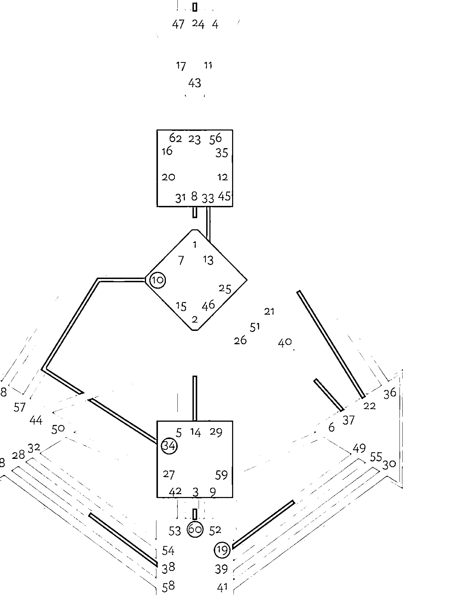

### 19.1 相互依存

成功的拉攏，無須為了融入而放棄個體性。  
為了滿足需求，難免會感到壓力，但不必為了取得認同而失去自我。

加入之後，為求持續發展，反覆思量，深陷其中無法自拔。  
獲得認同，為了滿足各方需求而感到壓力，但不會失去自我。

---

## 19.2

- 足智多謀 13–33
- 服務 19.2
- 臣服 33.2
- 一鳥在手 26.1
- 交誼 8.6
- 謙遜 14.6
- 果斷 60.2
- 彬彬有禮 38.2
- 異端者 10.5
- 母親／父親 37.1
- 偏執 13.2
- 隱士 24.4
- 直接 22.5
- 接受 60.1

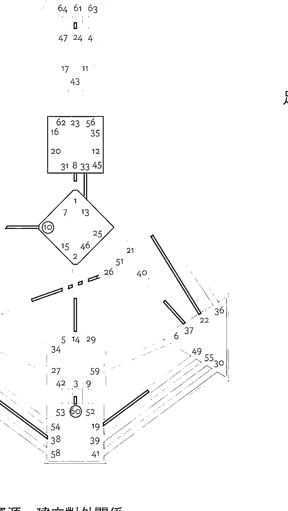

### 19.2 服務

貢獻個人資源，建立對外關係。

♃ △ 為最高價值而服務，專心致力。想提供服務的能量。

☿ ▽ 優柔寡斷，無法決定。在此位置，最後變成服從。想要被需要，將能量轉化為服務。

---

## 19.3 靠攏

奉獻

13–33 足智多謀

- 日 19.3 奉獻
- 地 33.3 精神
- 月 ▽10.3 烈士
- 北交 8.5 達摩
- 南交 14.5 傲慢
- 水 ▽60.1 接受
- 金 38.2 彬彬有禮
- 火 10.6 人生典範
- 木 37.1 母親／父親
- 土 △13.3 悲觀主義
- 天 24.4 隱士
- 海 22.5 直接
- 冥 ▽60.1 接受

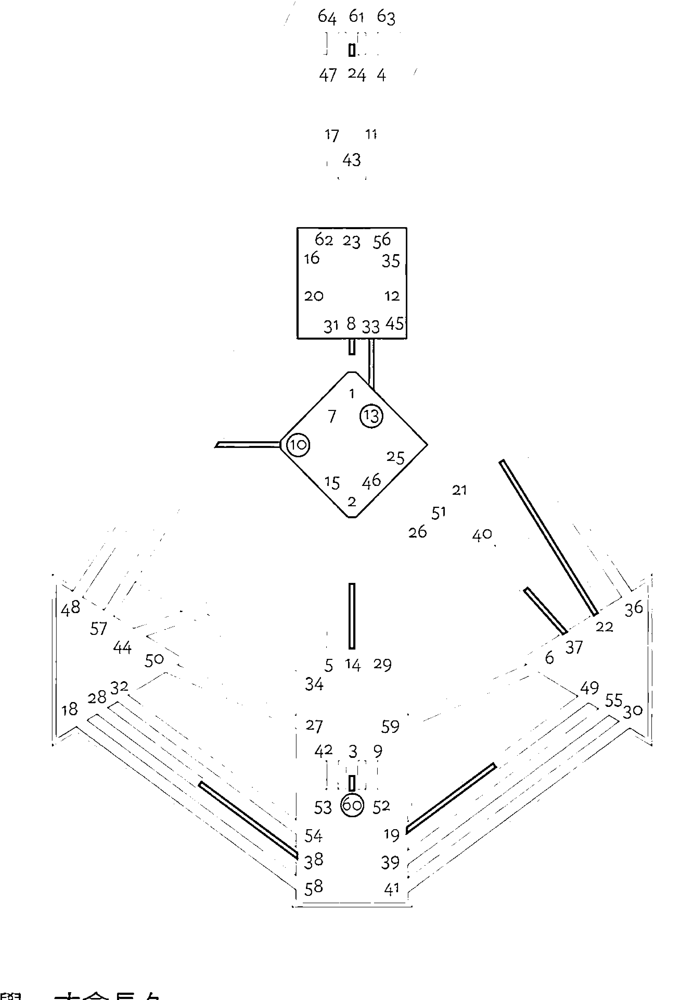

### 19.3 奉獻

接受靠攏之後，須時時保持警覺，才會長久。

- ♀ △ 持續往來，自然自在。  
  被他人接受，引發內在的感性與自在。
- ☽ ▽ 情緒化的傾向，可能會導致粗心大意。  
  由於過度敏感，封閉自己被需要的需求。

---

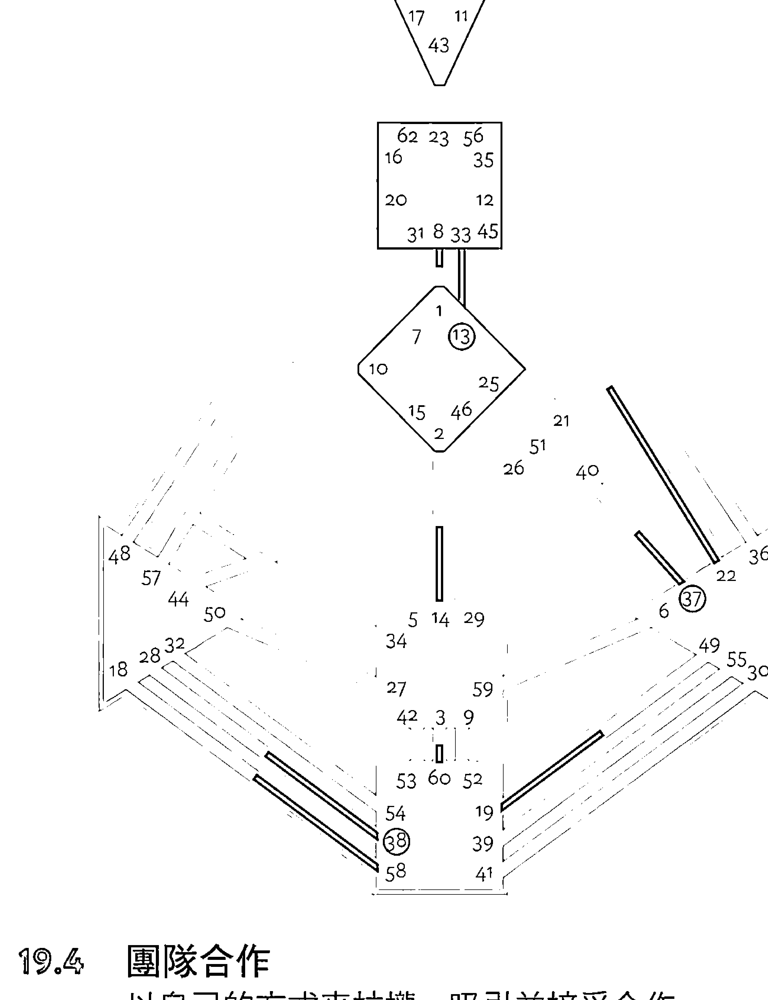

- 足智多謀 13–33
- 覺察 24–61
- 團隊合作 19.4
- 尊嚴 33.4
- 誤解 38.6
- 達摩 8.5
- 傲慢 14.5
- 感染力 61.6
- 彬彬有禮 38.2
- 生命之愛 58.1
- 責任 37.2
- 悲觀主義 13.3
- 隱士 24.4
- 直接 22.5
- 接受 60.1

### 19.4 團隊合作

以自己的方式來拉攏、吸引並接受合作。

- ♂ △ 對外運作的活動力強，充滿能量，只要對方能夠跟上並持續前進，就會接受他們。讓團隊獲益的驅動力。  
  在團隊中注入能量，向外追求也向上提升。
- ♀ ▽ 有吸引力，配合度高，但是往往對他人的貢獻度感到不滿。因為別人的限制，而引動敏感的神經。

---

### 19.5 靈性

- 13–33 足智多謀
- 24–61 覺察

- 日 19.5 靈性
- 地 33.5 時機
- 月 60.3 保守主義
- 北交 8.5 達摩
- 南交 14.5 傲慢
- 水 61.5 影響
- 金 38.2 彬彬有禮
- 火 58.2 變態
- 木 △37.2 責任
- 土 △13.3 悲觀主義
- 天 24.4 隱士
- 海 22.5 直接
- 冥 60.1 接受

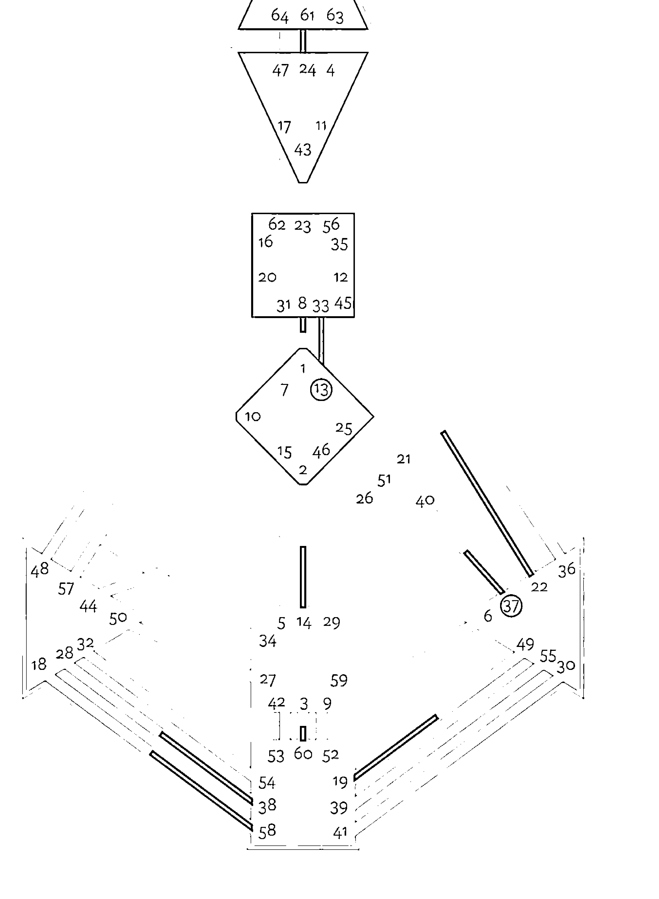

### 19.5 靈性

需要犧牲小我，才能完成大我。

- ⊕ △ 自我束縛的天性。  
  限制個人的感性面。
- ♃ ▽ 傾向犧牲，卻感到不值。  
  犧牲久了，可能會導致麻木。

---

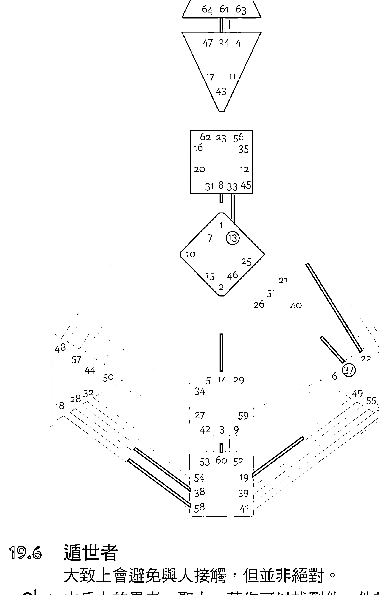

### 19.6 遁世者

大致上會避免與人接觸，但並非絕對。

山丘上的隱者。聖人，若你可以找到他，他就會與你對話。毫不顧忌的能量。

牛圈裡的孩子，自我放逐，唯有得到撫慰，才會結束這樣的行為。面對拒絕過於敏感，引發躁進的行為。

- 足智多謀 13–33
- 覺察 24–61
- 遁世者 19.6
- 離異 33.6
- 犧牲 19.5
- 達摩 8.5
- 傲慢 14.5
- 影響 61.5
- 彬彬有禮 38.2
- 變態 58.2
- 責任 37.2
- 悲觀主義 13.3
- 隱士 24.4
- 直接 22.5
- 接受 60.1

---

## 13.1 夥伴關係
同理

農曆 1/2（三）

- 日 13.1 同理
- 地 7.1 獨裁主義者
- 月 30.2 實用主義
- 北交 8.5 達摩
- 南交 14.5 傲慢
- 水 61.5 影響
- 金 38.2 彬彬有禮
- 火 ▽58.3 電流
- 木 △37.2 責任
- 土 13.3 悲觀主義
- 天 24.4 隱士
- 海 22.5 直接
- 冥 60.1 接受

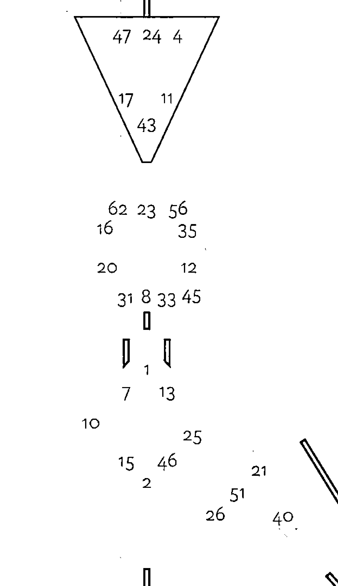

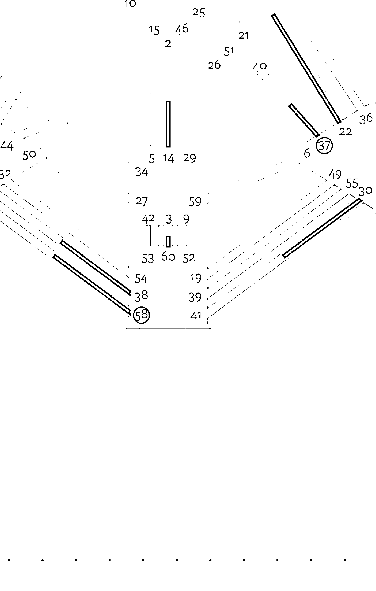

### 13.1 同理

鎖定與人聯繫並交流的能力。

- ♀ △ 真情流露，帶來和諧。  
  帶有情感照顧他人，開放的角色。
- ☽ ▽ 親吻嬰兒的政治家。  
  貌似開放，另有所圖。

---

### 13.2 偏執

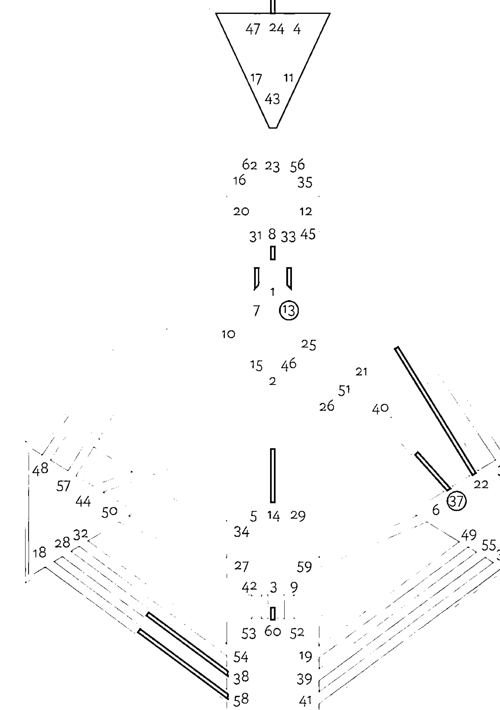

- 覺察 24–61
- 偏執 13.2
- 民主主義者 7.2
- 以身作則 37.4
- 達摩 8.5
- 傲慢 14.5
- 探究 61.4
- 結盟 38.3
- 調焦 58.4
- 平等對待 37.3
- 悲觀主義 13.3
- 隱士 24.4
- 直接 22.5
- 接受 60.1

風險總是存在，夥伴關係能否建立，考量雙方能否在特定層面達成共識，例如：種族、宗教、國籍或智識層面。

- △ 偏執，明白惟有容忍，才不會冒犯別人。  
  以容忍的方式來扮演調解的角色。
- ▽ 堅信最高的理念，無法與低下的形式結合；極為困難的處境，有時立意甚高，只是謹慎隱藏企圖。
- 曲高和寡，開放友誼，認為無人值得聆聽。

---

## 13.3 夥伴關係
悲觀主義

農曆 1/4（五）立春

- 24–61 覺察
- 日 13.3 悲觀主義
- 地 7.3 無政府主義者
- 月 22.5 直接
- 北交 8.4 尊重
- 南交 14.4 安全
- 水 61.4 探究
- 金 38.3 結盟
- 火 58.4 調焦
- 木 △37.3 平等對待
- 土 13.3 悲觀主義
- 天 24.4 隱士
- 海 22.5 直接
- 冥 60.1 接受

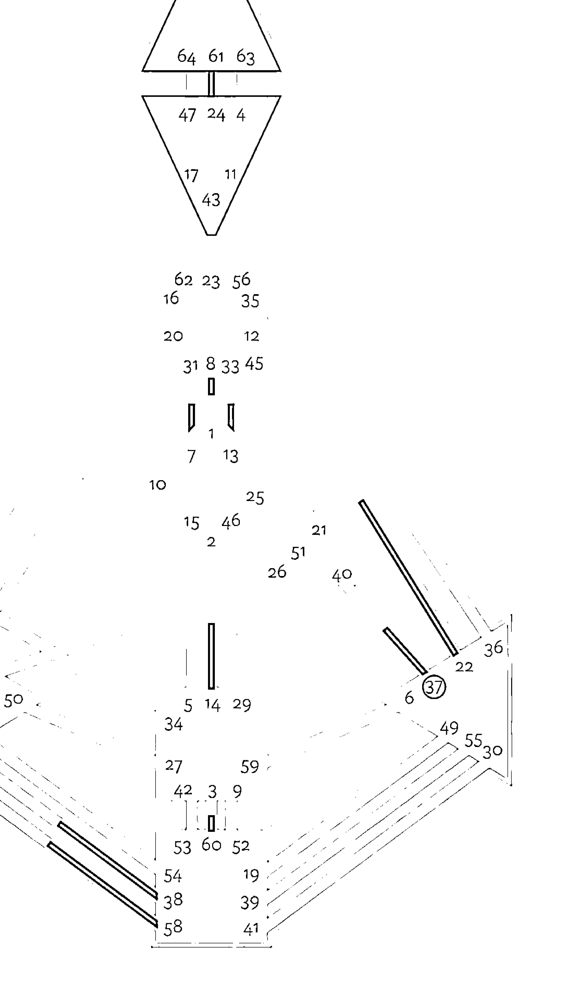

### 13.3 悲觀主義

> 深信最好的永遠無法達成。

⊕ △ 不信任，除非提出絕對有力的證據，否則不會轉換。多疑導致無法開放，不斷尋求證據。

♀ 將悲觀昇華為藝術的某種形式，而藝術有可能產生相反的效果。諷刺。將疑慮與悲觀視為理所當然，擅長嘲諷。

---

## 夥伴關係

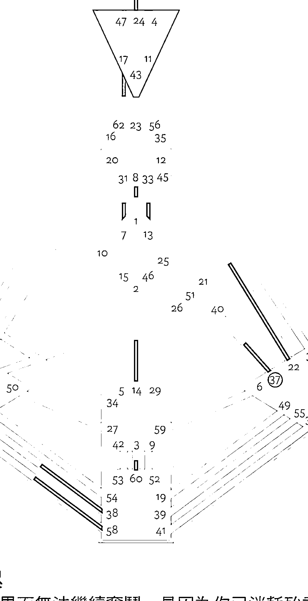

- 覺察 24–61
- 疲累 13.4
- 退位者 7.4
- 開放 17.1
- 尊重 8.4
- 安全 14.4
- 探究 61.4
- 結盟 38.3
- 防禦 58.5
- 平等對待 37.3
- 悲觀主義 13.3
- 隱士 24.4
- 直接 22.5
- 接受 60.1

### 13.4 疲累

若太累而無法繼續奮鬥，是因為你已消耗殆盡。

♇ △ 休戰後得以再生，最終才能振興。

> 伴隨開放而來的結果是精疲力竭，需要靜一靜。

♀ ▽ 情感乾涸，暫息並退縮。

> 在此開放是弱點。

---

## 13.5 夥伴關係
救世主

農曆 1/8（日）

24–61 覺察

- 日 13.5 救世主
- 地 7.5 將軍
- 月 51.1 參考
- 北交 8.4 尊重
- 南交 14.4 安全
- 水 61.5 影響
- 金 38.3 結盟
- 火 58.6 忘形
- 木 37.3 平等對待
- 土 13.4 疲累
- 天 24.4 隱士
- 海 22.5 直接
- 冥 60.1 接受

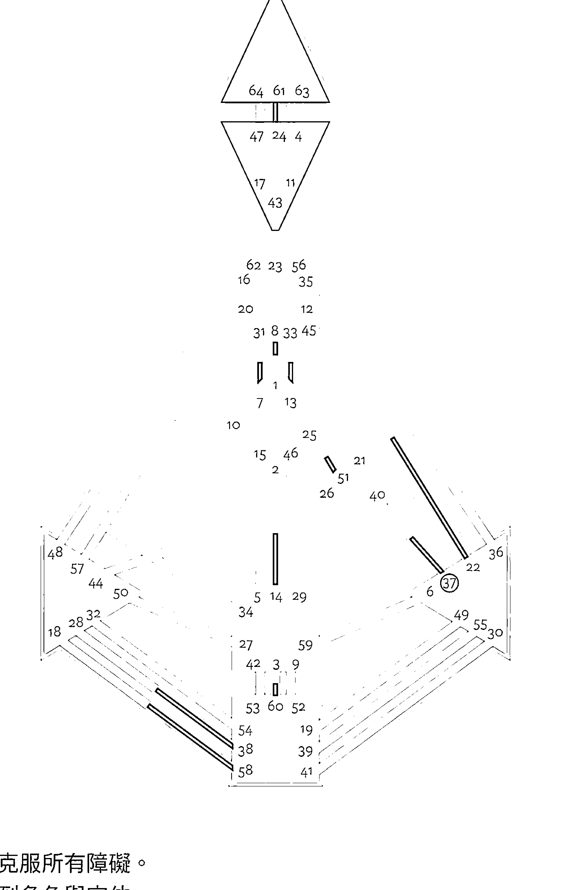

### 13.5 救世主

為了整體人類的福祉，有能力克服所有障礙。

充滿魅力的天才，為每個人找到角色與定位。聆聽者，為人找到定位是天賦。

有為的管理者，天性極端正直，難運用於執行面。天生聆聽者，能使人盡其才，適於管理。

---

## 13.6 夥伴關係
樂天派

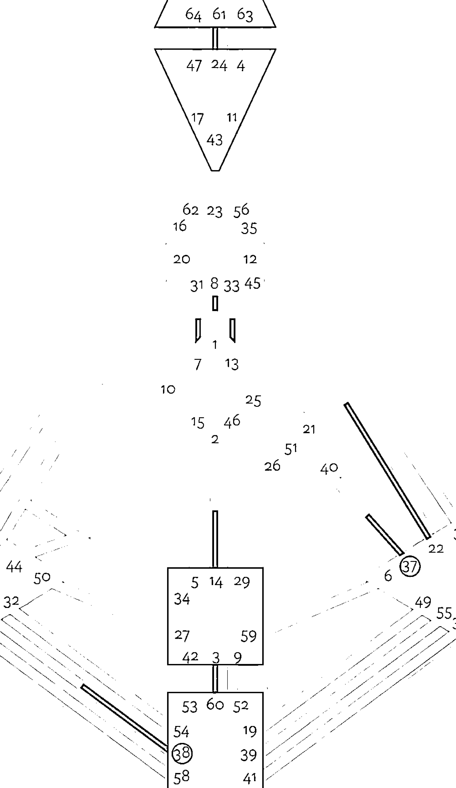

- 突變 3–60
- 覺察 24–61
- 樂天派 13.6
- 管理者 7.6
- 未成熟 3.2
- 尊重 8.4
- 安全 14.4
- 影響 61.5
- 調查 38.4
- 素質 38.1
- 平等對待 37.3
- 疲累 13.4
- 隱士 24.4
- 直接 22.5
- 接受 60.1

### 13.6 樂天派

接受人與人之間的互動無法盡善盡美，總會有所限制，將此視為聯盟的必經階段。

- ♂ △ 堅持的能量，無限的希望。希望開放能讓關係變得更好。
- ☿ ▽ 天真，將俗世的利益轉化，進而利益眾生。相信互利也適用於他人。

---

## 49.1 革命

2022/02/08 00:35 TWN 必要性法則  
農曆 1/8（二）

24–61 覺察

- 日 ▽49.1 必要性法則
- 地 ▽4.1 愉悅
- 月 △24.2 認可
- 北交 8.4 尊重
- 南交 14.4 安全
- 水 61.5 影響
- 金 ▽38.4 調查
- 火 ▽38.1 素質
- 木 37.4 以身作則
- 土 13.4 疲累
- 天 24.4 隱士
- 海 22.5 直接
- 冥 60.1 接受

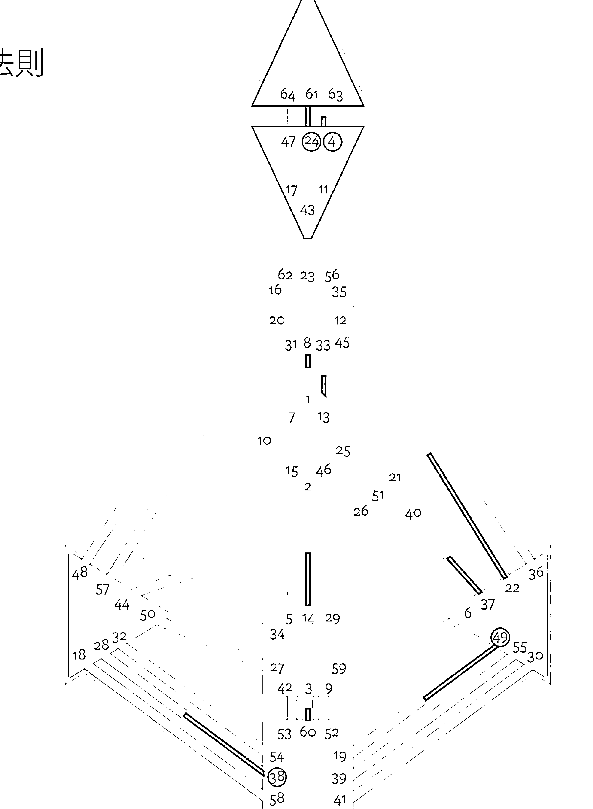

### 49.1 必要性法則

革命必須師出有名，否則無法獲得支持。

- 理解並運用此法則，盡其所能擴散出去，獲得最多支持，確保可行性。意識到革命是否必要，取決於群眾的態度。

> 濫用影響力，認定採取行動就會創造需求。「螺旋滑梯症候群」（Helter Skelter Syndrome，來自美國罪犯查爾斯・曼森的案例），為了證實失序而採取失序之舉。面對拒絕憤怒，將原則轉化為改革聖戰。

---

## 革命
最終手段

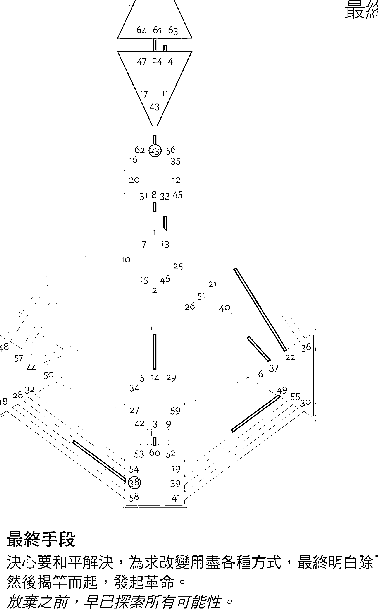

- 覺察 24–61
- 最終手段 49.2
- 接受 4.2
- 自我防衛 23.2
- 尊重 8.4
- 安全 14.4
- 感染力 61.6
- 調查 38.4
- 彬彬有禮 38.2
- 以身作則 37.4
- 疲累 13.4
- 隱士 24.4
- 直接 22.5
- 接受 60.1

### 49.2 最終手段

決心要求平和解決，為求改變用盡各種方式，最終明白除了革命別無他法，於是詳加計畫，然後揭竿而起，發起革命。  
成事之前，早已探索所有可能性。

消極害怕熟悉，對於調解與談判興趣缺缺，傾向改變，卻欠缺群眾支持。  
對調解失去耐心。

---

## 49.3 革命
民怨

- 24–61 覺察
- 日 49.3 民怨
- 地 4.3 不負責任
- 月 20.2 獨斷者
- 北交 8.4 尊重
- 南交 14.4 安全
- 水 61.6 感染力
- 金 38.5 疏離
- 火 38.3 結盟
- 木 37.4 以身作則
- 土 13.4 疲累
- 天 24.4 隱士
- 海 22.6 成熟
- 冥 60.1 接受

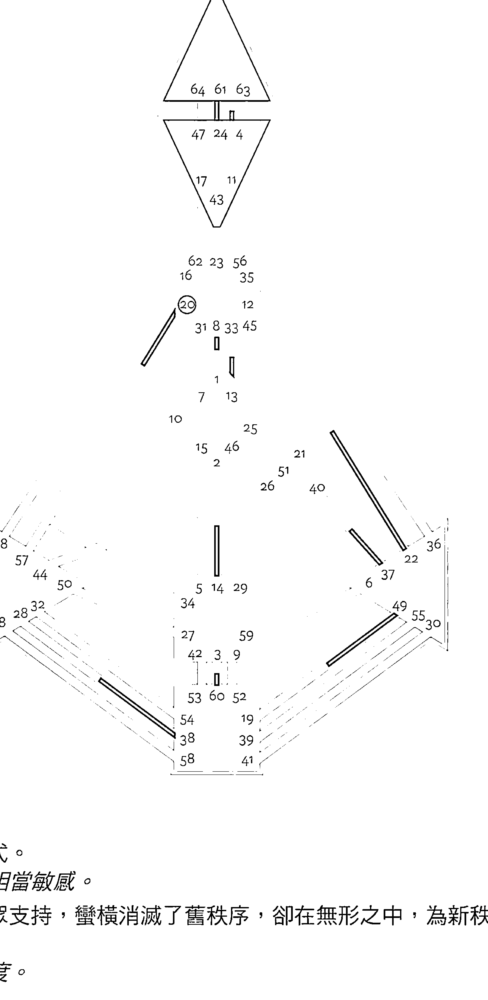

### 49.3 民怨

海王 △ 當限制一消失，就能摧毀舊有的形式。深厚潛力，對不適用的原則或關係相當敏感。

冥王 ▽ 冥王星位於下降相位。雖然獲得大眾支持，繼續消減舊秩序，卻在無形之中為新秩序帶來永久的創傷。對於被拒絕或拒絕別人，缺乏敏感度。

---

## 革命
平台

2022/02/10 19:14 TWN  
農曆 1/10（四）

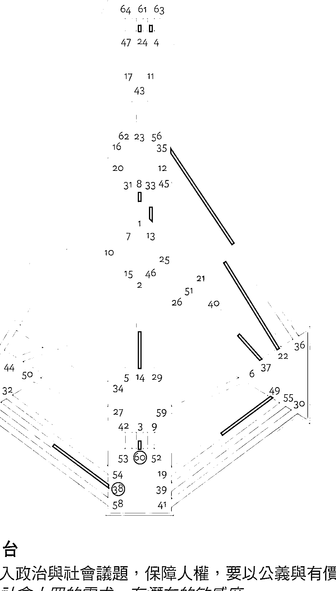

- 平台 49.4
- 騙子 4.4
- 謙遜 35.1
- 尊重 8.4
- 安全 14.4
- 接受 60.1
- 疏離 38.5
- 調查 38.4
- 以身作則 37.4
- 疲累 13.4
- 隱士 24.4
- 成熟 22.6
- 接受 60.1

### 49.4 平台

投入政治與社會議題，保障人權，要以公義與有價值的方式來取代舊秩序。  
對社會大眾的需求，有潛在的敏感度。

承諾、承諾、再承諾，卻都是空頭支票，毫無可能執行。  
有可能無意識地利用社會需求。

---

## 49.5 革命
組織

12–22 開放

- 日 49.5 組織
- 地 4.5 誘惑
- 月 12.1 修道士、僧侶
- 北交 8.4 尊重
- 南交 14.4 安全
- 水 ▽60.1 接受
- 金 38.6 誤解
- 火 ▽38.4 調查
- 木 37.5 愛
- 土 13.4 疲累
- 天 24.4 隱士
- 海 22.6 成熟
- 冥 ▽60.1 接受

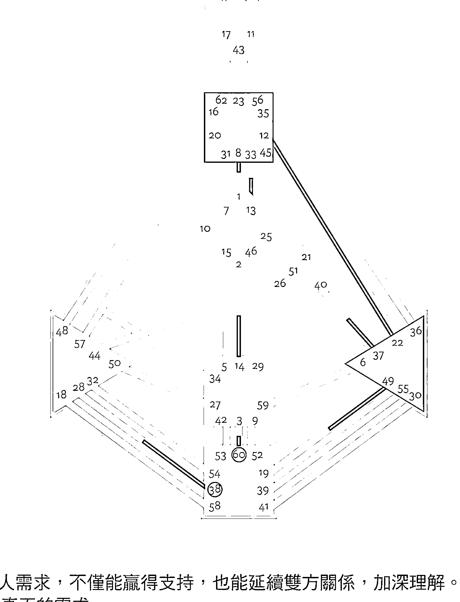

### 49.5 組織

> ☽ △ 生命之時，很實際地供應他人需求，不僅能贏得支持，也能延續雙方關係，加深理解。相當務實，能敏銳察覺他人真正的需求。

> ♂ ▽ 在意組織中權力如何分配，想明確劃分主權，卻因此而捨棄了更高原則。背棄更高原則，只在意如何形成組織。

---

## 49.6 革命

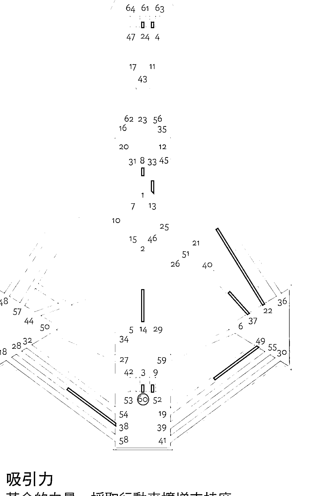

- 吸引力 49.6
- 超越 4.6
- 先思而後言 52.1
- 尊重 8.4
- 安全 14.4
- 果斷 60.2
- 誤解 38.6
- 疏離 38.5
- 愛 37.5
- 疲累 13.4
- 隱士 24.4
- 成熟 22.6
- 接受 60.1

### 49.6 吸引力

革命的力量，採取行動來擴增支持度。

天生令人印象深刻，能感化原本的騎牆派，進而承諾。深具感性與潛能，能包容並且為人帶來蛻變。

固執、武斷，拒絕主義者。過度敏感，對各種原則與他人採取否定的態度，以此為準則。

---

## 燃燒的火焰
沉著

- 日 △30.1 沉著
- 地 29.1 徵召
- 月 53.1 累積
- 北交 8.4 尊重
- 南交 14.4 安全
- 水 60.3 保守主義
- 金 38.6 誤解
- 火 38.6 誤解
- 木 37.5 愛
- 土 13.4 疲累
- 天 24.4 隱士
- 海 22.6 成熟
- 冥 60.2 果斷

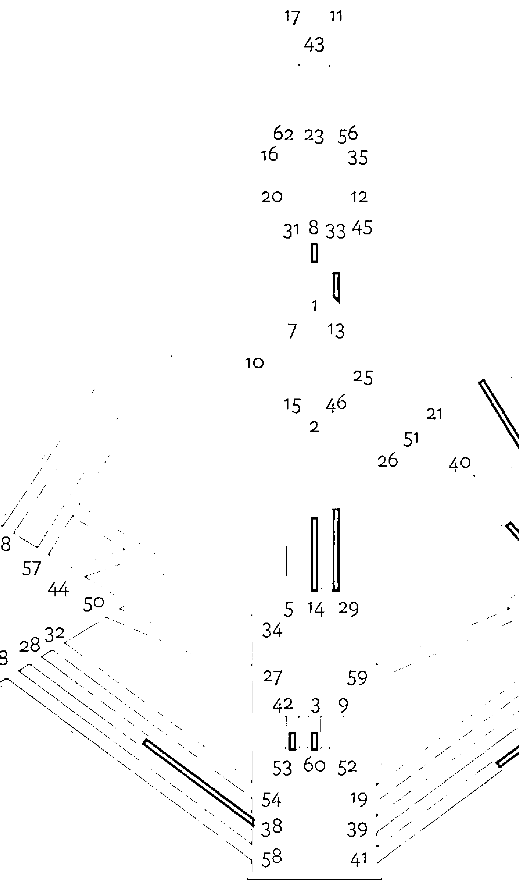

### 30.1 沉著

泰山崩於前，而面不改色。

- ◎ △ 面對所有情況，都將限制放大。  
  不管面對任何狀況，透過虛驚而穩定下來。
- ♃ ▽ 有能力保持鎮定，卻耽誤了進展。  
  透過感覺獲得平衡，卻無法放下。

---

## 燃燒的火焰
實用主義

2022/02/14 12:15 TWN  
農曆 1/14（一）

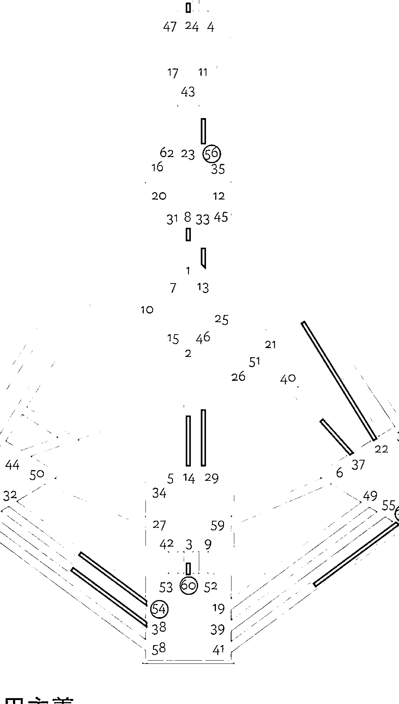

- 實用主義 30.2
- 評定 29.2
- 質量 56.1
- 尊重 8.4
- 安全 14.4
- 足智多謀 60.4
- 影響 54.1
- 誤解 38.6
- 愛 37.5
- 救世主 13.5
- 隱士 24.4
- 成熟 22.6
- 果斷 60.2

### 30.2 實用主義

在各種極端間取得平衡。

- ☉ △ 運用能量，達成有效產值，毫不浪費。  
  不會浪費力氣去感覺。
- ♂ ▽ 過於信心，與限制對抗，擦槍走火。  
  感受，需要能量。

---

## 30.3 燃燒的火焰
順從

13–33 足智多謀

- 日 30.3 順從
- 地 29.3 評估
- 月 33.1 逃避
- 北交 8.4 尊重
- 南交 14.4 安全
- 水 60.5 領導力
- 金 54.1 影響
- 火 54.1 影響
- 木 37.6 目的
- 土 13.5 救世主
- 天 24.4 隱士
- 海 22.6 成熟
- 冥 60.2 果斷

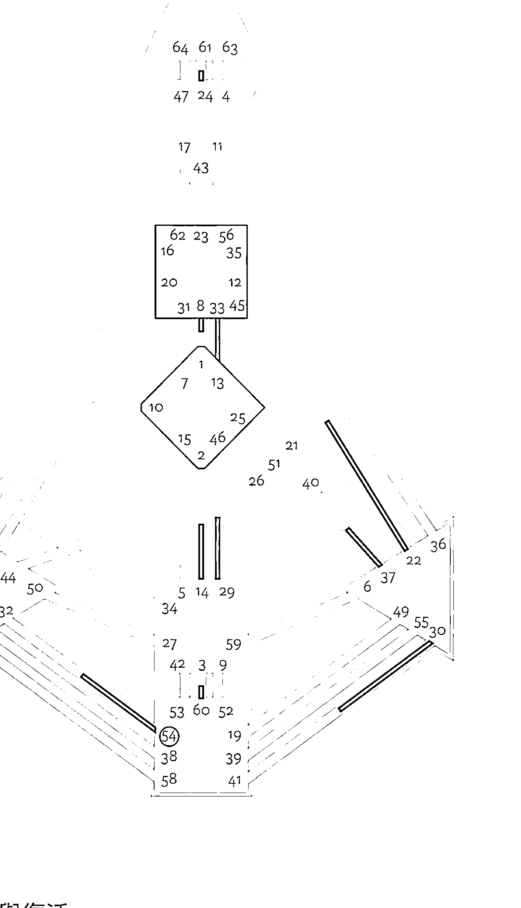

### 30.3 順從

接受如是。

- P △ 再生定律的覺察與顯現。因果論、輪迴與復活。接受如是的感受。
- ʖ ▽ 傾向以特定的知識，來鼓勵或避免絕望的感受。面對正面或負面的感覺，都接受如是。

## 燃燒的火焰  
### 精疲力竭

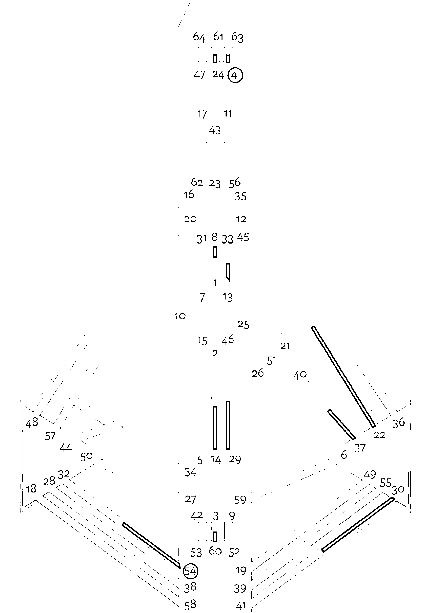

- 精疲力竭 30.4  
- 直接 29.4  
- 愉悅 4.1 △  
- 虛假 8.3  
- 服務 14.3  
- 領導力 60.5  
- 謹慎 54.2 ▽  
- 謹慎 54.2 ▽  
- 目的 37.6  
- 救世主 13.5  
- 隱士 24.4  
- 成熟 22.6  
- 果斷 60.2  

### 30.4 精疲力竭

不切實際的節奏，招致不幸。

♇ △ 強迫與好動的個性，相當容易走到最後精疲力竭。雖說未必都是如此，若輔以分析，往往能獲得正面的結果。喜歡高能多種感覺，導致情緒崩潰。

♃ ▽ 失控地擴張，不可避免最終會幻滅。無法控制各種感覺，情緒一發不可收拾。

---

## 燃燒的火焰  
### 30.5 調和

2022/02/17 07:05 TWN  
農曆 1/17（四）

- 日 30.5 調和  
- 地 ▽29.5 過度擴張  
- 月 59.2 害羞  
- 北交 8.3 虛假  
- 南交 14.3 服務  
- 水 ▽60.6 剛硬  
- 金 ▽54.3 動用關係  
- 火 ▽54.3 動用關係  
- 木 37.6 目的  
- 土 13.5 救世主  
- 天 24.4 隱士  
- 海 22.6 成熟  
- 冥 60.2 果斷  

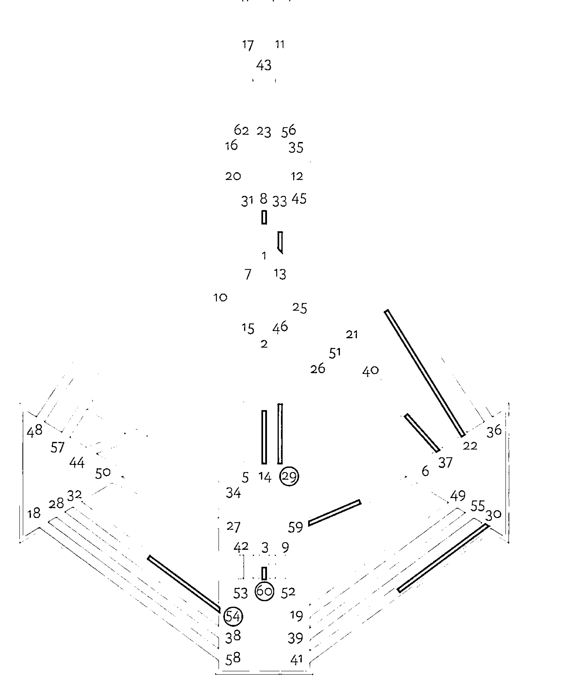

### 30.5 調和

認知並致力於短暫的目標。

從知識與經驗中獲得力量，明白就算前進兩步後退一步，仍有進一步的發展。當一切有所進展，將體驗全新的感受，也會重溫舊有的感覺。

有引誘資源，面對各種限制感到挫敗，渴望毀掉一切。當你開始去體驗，舊情緒裡所隱藏的挫敗與憤怒，都轉變為情緒層面的察覺力。

---

## 燃燒的火焰  
### 30.6 強制

2022/02/18 05:23 TWN  
農曆 1/18（五）

- 夢想家 30–41  
- 強制 30.6  
- 困惑 29.6  
- 過度膨脹 64.3  
- 虛假 8.3  
- 服務 14.3  
- 合理 41.1  
- 動用關係 54.3  
- 動用關係 54.3  
- 目的 37.6  
- 救世主 13.5  
- 隱士 24.4  
- 成熟 22.6  
- 果斷 60.2  

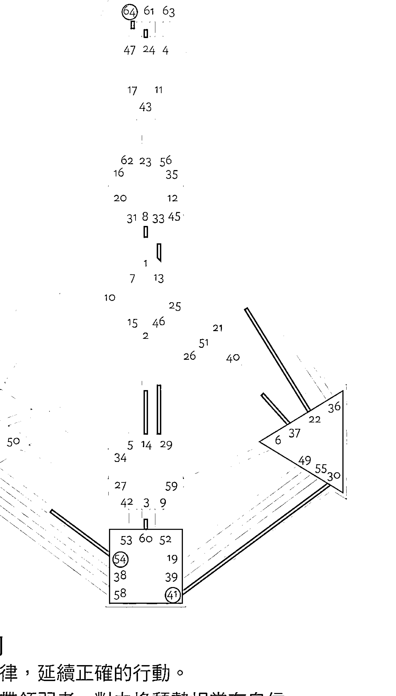

### 30.6 強制

有紀律，延續正確的行動。

♂ △ 同意帶領弱者，對力挽狂瀾相當有自信。充滿力量，消滅負面感受。

☽ ▽ 天生內在平和，常常會容忍惡劣的能量。無力消除負面的感覺。

---

## 55.1  
## 豐盛  
### 合作

6–59 親密

- 日 55.1 合作  
- 地 59.1 先發制人  
- 月 6.4 勝利  
- 北交 8.3 虛假  
- 南交 14.3 服務  
- 水 41.3 效率  
- 金 54.4 啟蒙／無明  
- 火 54.4 啟蒙／無明  
- 木 63.1 沉著  
- 土 13.5 救世主  
- 天 24.4 懷土  
- 海 22.6 成熟  
- 冥 60.2 果斷  

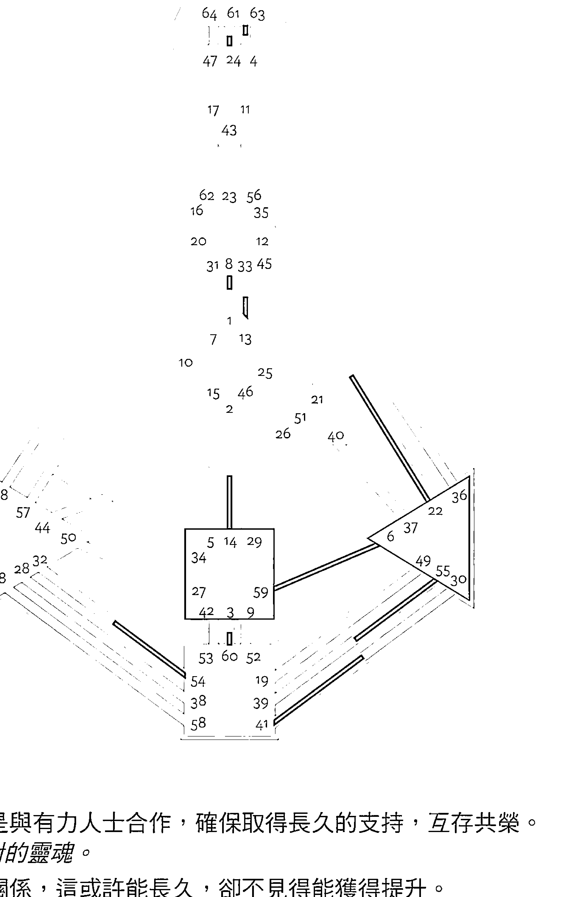

### 55.1 合作

♃ △ 透過合作向外擴張。秉持的原則是與有力人士合作，確保取得長久的支持，互存共榮。與強大的力量合作，有可能會找到對的靈魂。

♀ ♥ 聚焦於與強大的力量建立和諧的關係，這或許能長久，卻不見得能獲得提升。與強大的力量和諧共生，卻不一定能在精神層面帶來好處。

---

## 55.2  
## 豐盛  
### 不信任

2022/02/20 02:01 TWN  
農曆 1/20（日）

- 不信任 55.2  
- 害羞 59.2  
- 治療 18.5  
- 服務 8.2  
- 管理 14.2  
- 修正 41.4  
- 啟蒙／無明 54.4  
- 寬大 54.5  
- 沉著 63.1  
- 救世主 13.5  
- 隱士 24.4  
- 成熟 22.6  
- 果斷 60.2  

### 55.2 不信任

毀謗或流言蜚語攻擊之下，豐盛不再。

長袖善舞，有效展露天分，天生有能力能進入核心，取得真誠的信任。若能夠被人信任，情緒層面越趨穩定，具有精彩層面的力量。

如果向毀謗者下戰帖，對方就上鉤。他們會引用誣陷醜聞的名句：「我認為他故意誣蔑。」需要持續提供實證，才能克服不信任的問題。在情感層面迫切想證明自己值得信任，對方不一定會接受，在精神層面也沒什麼好處。

---

## 55.3  
## 豐盛  
### 無罪

2022/02/21 00:20 TWN  
農曆 1/21（一）

- 日 55.3 無罪  
- 地 59.3 開放  
- 月 57.6 使用  
- 北交 8.2 服務  
- 南交 14.2 管理  
- 水 41.5 授權  
- 金 54.5 豐盛  
- 火 54.6 選擇性  
- 木 63.1 沉著  
- 土 13.5 救世主  
- 天 24.4 賢士  
- 海 22.6 成熟  
- 冥 60.2 果斷  

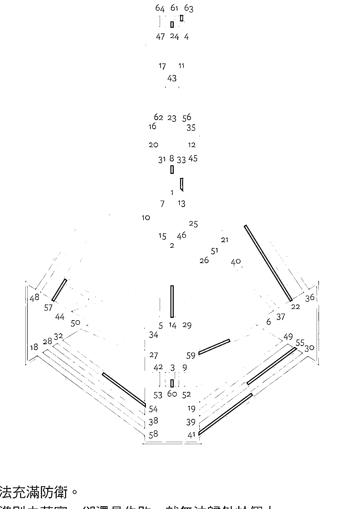

### 55.3 無罪

「我不過是依命行事。」這說法充滿防衛。

若程序正確，也有紀律，遵照準則去落實，卻還是失敗，就無法歸咎於個人。在情感上或許能了解，就算認為有所能，還是有可能失敗，很精確可靠。

火星位於下降相位，奮戰到底不用畏懼。但若個體性發起宣戰，對上位者而言就是崩毀，所以他們會安全地躲在防護罩裡。

在精神層面先自私地保護自己，別人卻為此付出代價。

---

### 55.4 同化

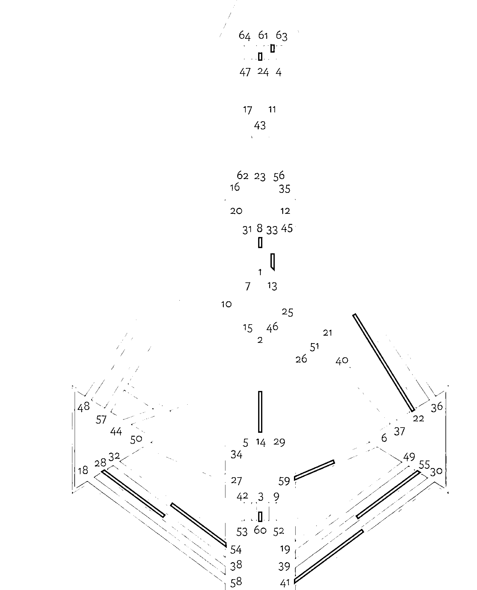

- 同化 55.4  
- 手足情誼 59.4  
- 與魔鬼握手 28.2  
- 服務 8.2  
- 管理 14.2  
- 感染 41.6  
- 選擇性 54.6  
- 選擇性 54.6  
- 沉著 63.1  
- 樂天派 13.6  
- 隱士 24.4  
- 成熟 22.6  
- 果斷 60.2  

建立架構，在原則與能量間取得平衡，進而迎向必然的擴展與富足。當情緒的察覺與能量相互平衡，遵循原則，就能喚醒潛在的靈性。

能量無邊界，不知節制。能量無邊界，若忽略自我察覺，可能失去原本的精神。

---

## 55.5  
## 豐盛  
### 成長

2022/02/22 21:01 TWN  
農曆 1/22（二）

- 日 ▽55.5 成長  
- 地 59.5 蛻變美人或大眾情人  
- 月 1.3 持續創作的能量  
- 北交 8.2 服務  
- 南交 14.2 管理  
- 水 19.1 相互依存  
- 金 54.6 選擇性  
- 火 61.1 奧秘知識  
- 木 63.1 沉著  
- 土 13.6 樂天派  
- 天 24.4 騷士  
- 海 22.6 成熟  
- 冥 60.2 果斷  

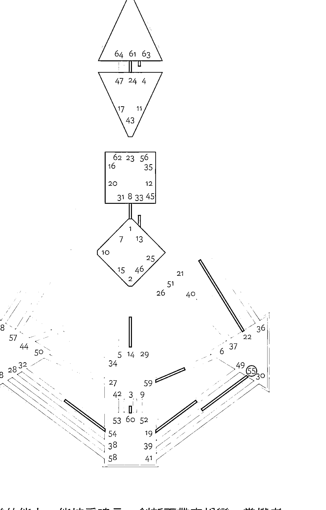

### 55.5 成長

位居要位，握有權力，也具備不尋常的能力，能接受建言，創新而帶來改變。掌權者天生要領導他人，而非跟隨者。

擁有力量，引發權威的威力與精神。

廣納各種意見，集結並整合。雖然有可能破局，還是抱持著開放的態度。情感層面呈現開放的狀態，而在精神上則面臨被制約的風險。

---

### 55.6 自私

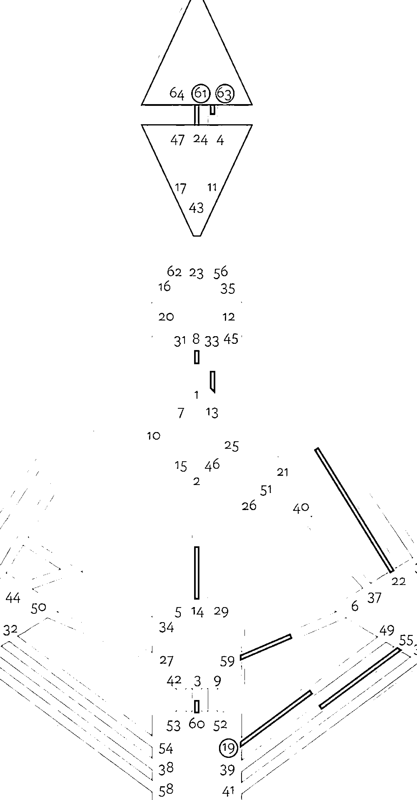

- 覺察 24–61  
- 自私 55.6  
- 一夜情 59.6  
- 傲慢 14.5  
- 服務 8.2  
- 管理 14.2  
- 服務 19.2  
- 奧秘知識 61.1  
- 天生耀眼 61.2  
- 結構 63.2  
- 樂天派 13.6  
- 隱士 24.4  
- 成熟 22.6  
- 果斷 60.2  

物質層面的強烈占有欲，近乎痴迷，間接使人獲益。唯物主義，通往靈性的可能路徑。

擁有物質層面的豐盛富足，卻無人可分享。唯物主義者過於執迷，有可能會淪落為「吝嗇的靈魂」，不願分享。

---

## 家庭  
### 母親／父親

農曆 1/24（四）

- 24–61 與家  
- 37–40 經營社群  

- 日 37.1 母親／父親  
- 地 △40.1 休養  
- 月 5.1 毅力  
- 北交 8.2 服務  
- 南交 14.2 管理  
- 水 19.4 國際合作  
- 金 ▽61.2 天生耀眼  
- 火 ▽61.3 相互依存  
- 木 △63.2 結構  
- 土 13.6 樂天派  
- 天 ▽24.5 自省  
- 海 22.6 成熟  
- 冥 60.2 果斷  

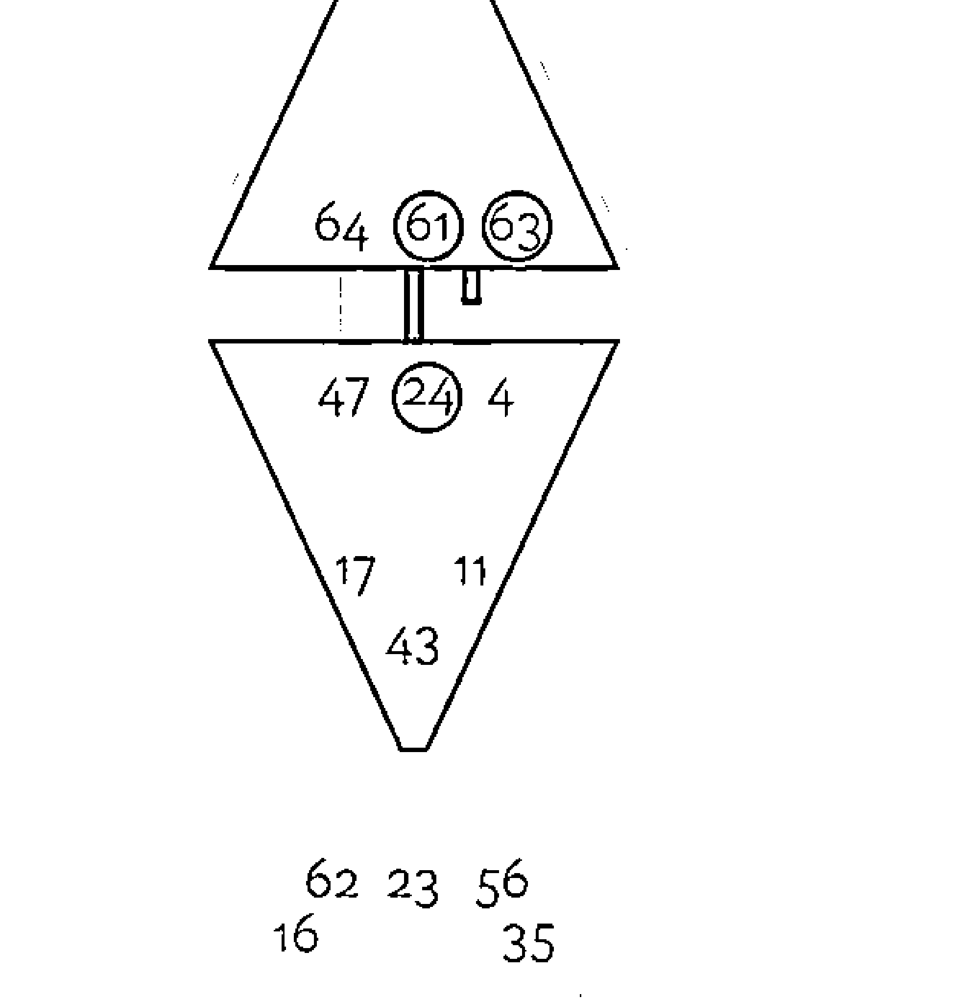

### 37.1 母親／父親

天生受人尊敬，確保焦點放在發展準則。

♀ △ 維持關係的關鍵在於和諧。家和萬事興，和諧才能讓家庭的美好與價值得以延續。友誼也是如此，相互體諒、體貼彼此，才能確保和諧。

▽ 沒有行星處於下降相位。

---

### 37.2 責任

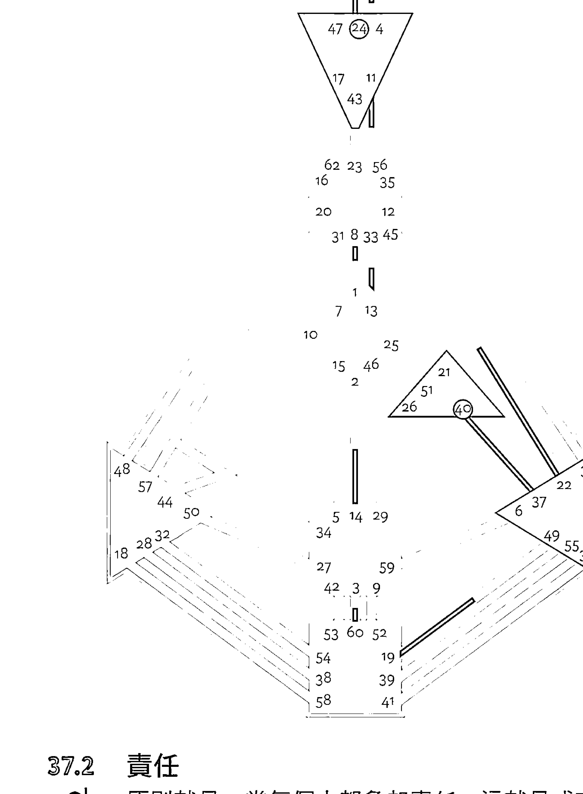

- 覺察 24–61  
- 經營社群 37–40  
- 責任 37.2  
- 堅定 40.2  
- 現實主義者 11.3  
- 服務 8.2  
- 管理 14.2  
- 懶性 19.5  
- 相互依存 61.3  
- 相互依存 61.3  
- 結構 63.2  
- 樂天派 13.6  
- 自省 24.5  
- 成熟 22.6  
- 果斷 60.2  

△ 原則就是，當每個人都負起責任，這就是成功合作的基礎。若每個人都負責，才有可能建立友誼。

▽ 傾向指出別人的責任。有可能基於友誼，而指出別人的責任所在。

---

## 家庭  
### 37.3 平等對待

2022/02/26 14:26 TWN  
農曆 1/26（六）

- 24–61 與眾  
- 37–40 經營社群  

- 日 37.3 平等對待  
- 地 40.3 謙遜  
- 月 △58.5 防禦  
- 北交 8.2 服務  
- 南交 14.2 管理  
- 水 19.6 適世者  
- 金 ▽61.3 相互依存  
- 火 61.4 探究  
- 木 △63.2 結構  
- 土 13.6 樂天派  
- 天 ▽24.5 自省  
- 海 22.6 成熟  
- 冥 60.2 果斷  

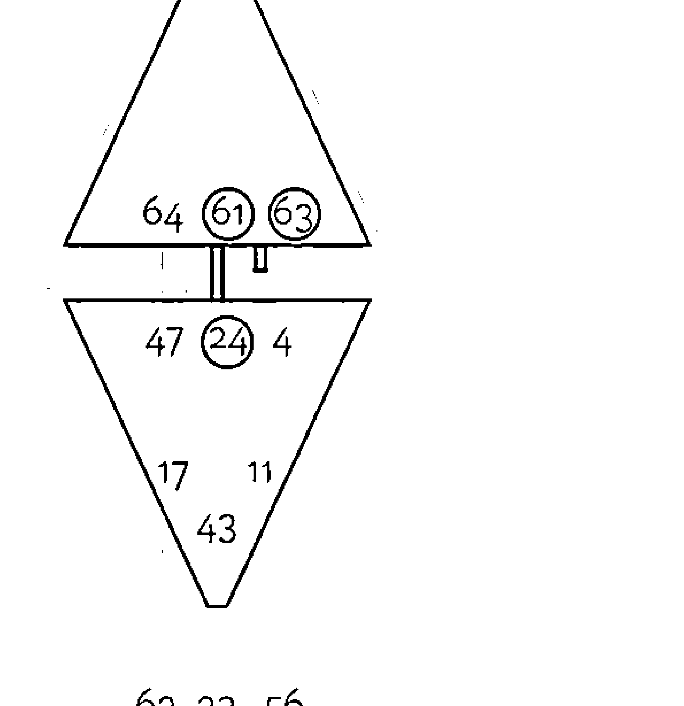

### 37.3 平等對待

任何團體要成功，以遵循秩序為準繩。

♃ △ 有能力去評斷行為是否合宜，以和諧的舉止對應通知。極有可能相當敏感，了解在關係中該如何應對才適當。

♂ ▽ 傾向讓別人跨越、測試對方能接受的底線，但若面對有同樣傾向的人，卻嚴厲以對。對於行為是否適當，缺乏敏感度。

---

## 家庭  
### 37.4 以身作則

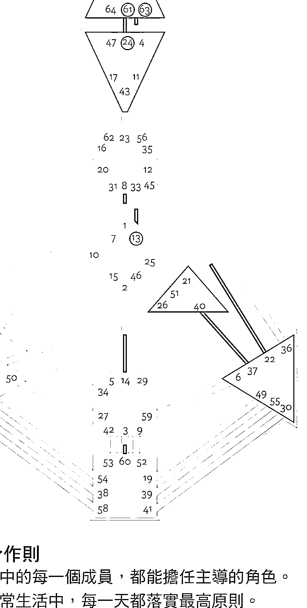

- 覺察 24–61  
- 經營社群 37–40  
- 以身作則 37.4  
- 組織 40.4  
- 天生耀眼 61.2  
- 服務 8.2  
- 管理 14.2  
- 同理 13.1  
- 探究 61.4  
- 影響 61.5  
- 持續 63.3  
- 樂天派 13.6  
- 自省 24.5  
- 成熟 22.6  
- 果斷 60.2  

家庭中的每一個成員，都能擔任主導的角色。

- 在日常生活中，每一天都落實最高原則。在所有關係中，盡可能依循最高原則來運作，最後成為領導的角色。  
- 只管主義，只能接受父親來負責領導，但是父親不見得能成為榜樣。除了傳統認定的角色，對其他人的領導並不買單。

---

## 家庭  
### 37.5 愛

農曆 1/28（一）

- 24–61 與家  
- 37–40 經營社群  

- 日 37.5 愛  
- 地 ▽40.5 剛硬  
- 月 41.4 修正  
- 北交 8.2 服務  
- 南交 14.2 管理  
- 水 13.3 悲觀主義  
- 金 ▽61.5 影響  
- 火 ▽61.5 影響  
- 木 △63.3 持續  
- 土 ▽13.6 樂天派  
- 天 ▽24.5 自省  
- 海 22.6 成熟  
- 冥 60.2 果斷  

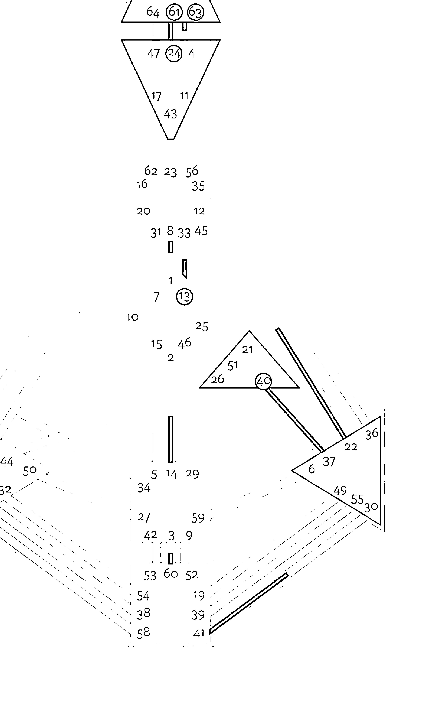

### 37.5 愛

自然並真摯地展現出對家庭的愛。

♀ △ 自然和諧，完美共享。友誼就是自然和諧地相處，共同分享。

♂ ▽ 情感層面的依賴，往往由愛轉恨。依賴的結果，可能由愛轉恨。

---

## 家庭  
### 37.6 目的

2022/03/01 09:36 TWN  
農曆 1/29（二）

- 覺察 24–61  
- 經營社群 37–40  
- 目的 37.6  
- 撤職 40.6  
- 樂天派 13.6  
- 服務 8.2  
- 管理 14.2  
- 疲累 13.4  
- 感染力 61.6  
- 感染力 61.6  
- 持續 63.3  
- 樂天派 13.6  
- 自省 24.5  
- 成熟 22.6  
- 果斷 60.2  

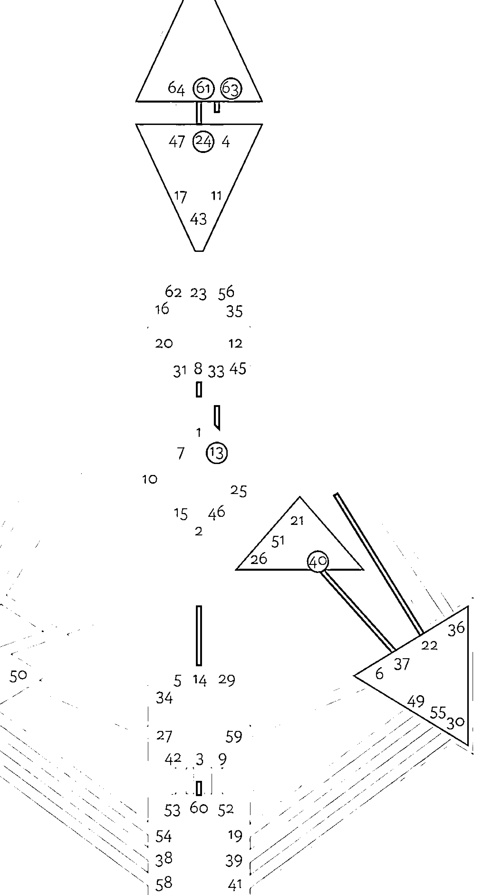

明白家庭的價值，才會用心維持家庭。

♀ △ 不但能明白家庭的核心意義，也珍惜家庭的價值。維繫友誼是因為珍惜並看重情誼。

☿ ▽ 多元化的需求，於是忽視家庭的功用，寧願抽離。多元化的需求，儘管珍惜，卻難守君子之交淡如水。

---

## 63 完成之後  
### 63.1 沉著

- 日 △63.1 沉著  
- 地 64.1 制約  
- 月 55.2 不信任  
- 北交 8.2 服務  
- 南交 14.2 管理  
- 水 ▽13.6 樂天派  
- 金 △60.1 接受  
- 火 △60.1 接受  
- 木 △63.3 持續  
- 土 49.1 必要性法則  
- 天 24.5 自白  
- 海 22.6 成熟  
- 冥 60.2 果斷  

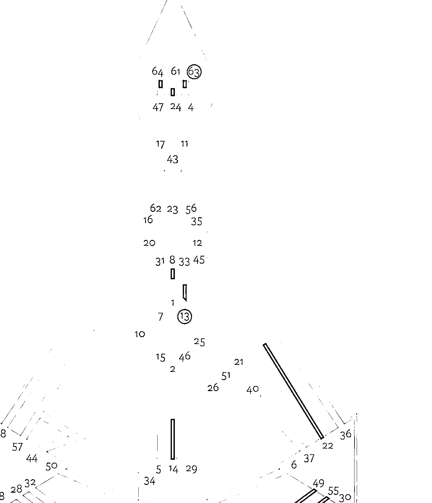

☉ △ 個性使然，淡定接受既有的成就，順其自然，任其發展延續。接受既定的成果，但接下來能否持續發展，心存懷疑。

♂ ▽ 有所成就之後立即尋找新目標。如此做的風險是，有可能動搖既定的根基。雖然已經有所成就，卻仍然質疑自己的能力，內在形成壓力，才會立即尋求新目標。

---

## 完成之後  
### 63.2 結構

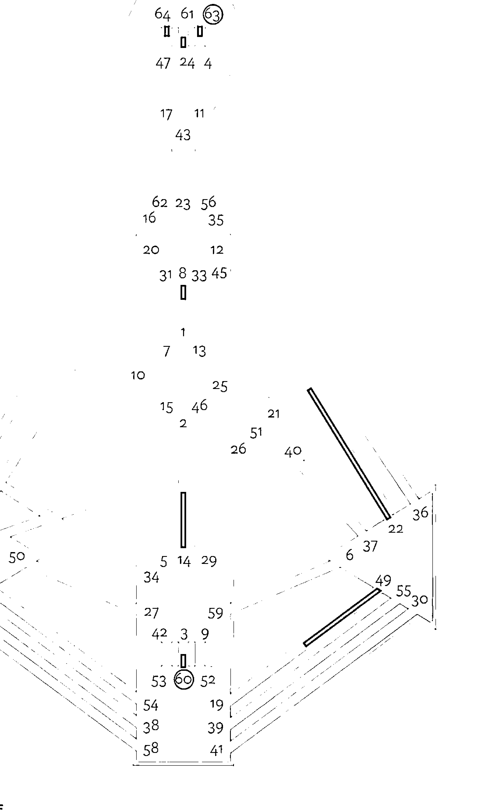

- 結構 63.2  
- 素質 64.2  
- 記憶 63.4  
- 誠實 8.1  
- 金錢非萬能 14.1  
- 必要性法則 49.1  
- 接受 60.1  
- 果斷 60.2  
- 記憶 63.4  
- 必要性法則 49.1  
- 自負 24.5  
- 成熟 22.6  
- 果斷 60.2  

擴展並分享既定的成就，以此建構出更龐大的架構。如此一來，就能回報他人的貢獻，同時仍能掌控方向。

感到壓力，與他人訴說自己的疑惑，但還是將方向掌控在手中。

在低階值時，傲慢，想要其他人遠離權力核心，為既定的成果增添不確定性因素。質疑既定的成就，引發別人猜疑。

---

## 完成之後  
### 63.3 持續

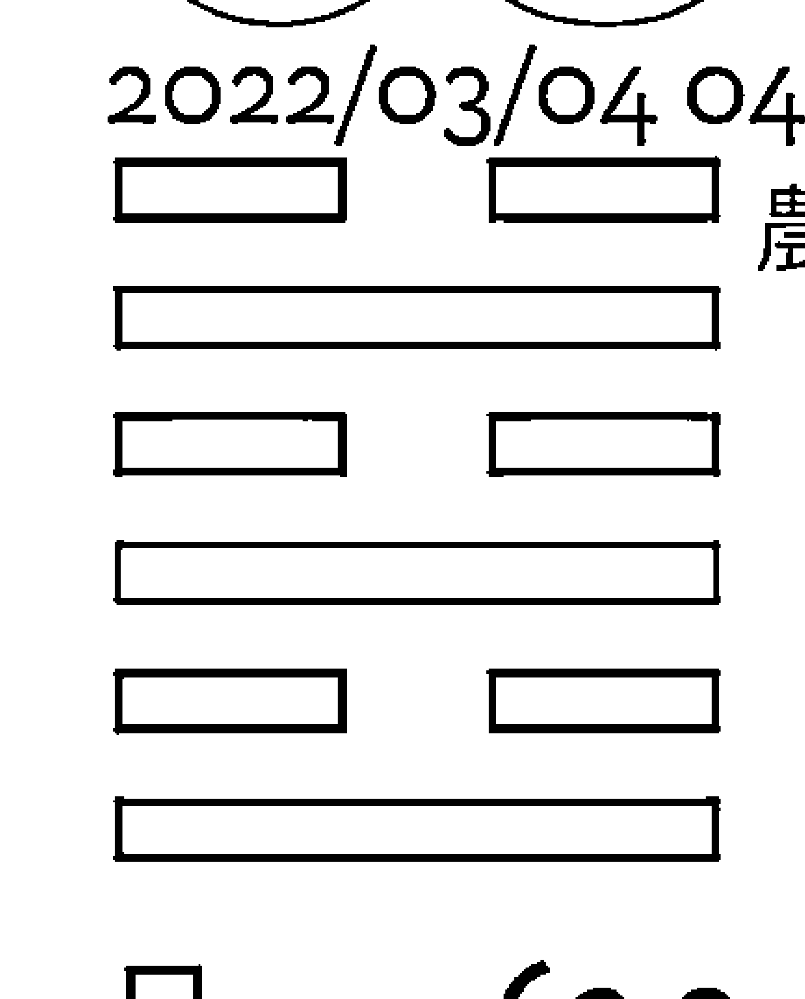

- 日 △63.3 持續  
- 地 64.3 過度膨脹  
- 月 36.6 正義  
- 北交 8.1 誠實  
- 南交 14.1 金錢非萬能  
- 水 49.2 最終手段  
- 金 60.2 果斷  
- 火 60.2 果斷  
- 木 63.4 記憶  
- 土 49.1 必要性法則  
- 天 24.5 自白  
- 海 22.6 成熟  
- 冥 60.2 果斷  

63.3 持續

♃ △ 專心致力於新開始，堅持延續已定下的原則。儘管這樣做，需要與一些尚未進入狀況的人互動。

質疑與人互動時，是否還能保有個人原則。

♄ ♥ 不計代價要成功。不惜任何代價，都要消除質疑。

---

## 完成之後  
### 63.4 記憶

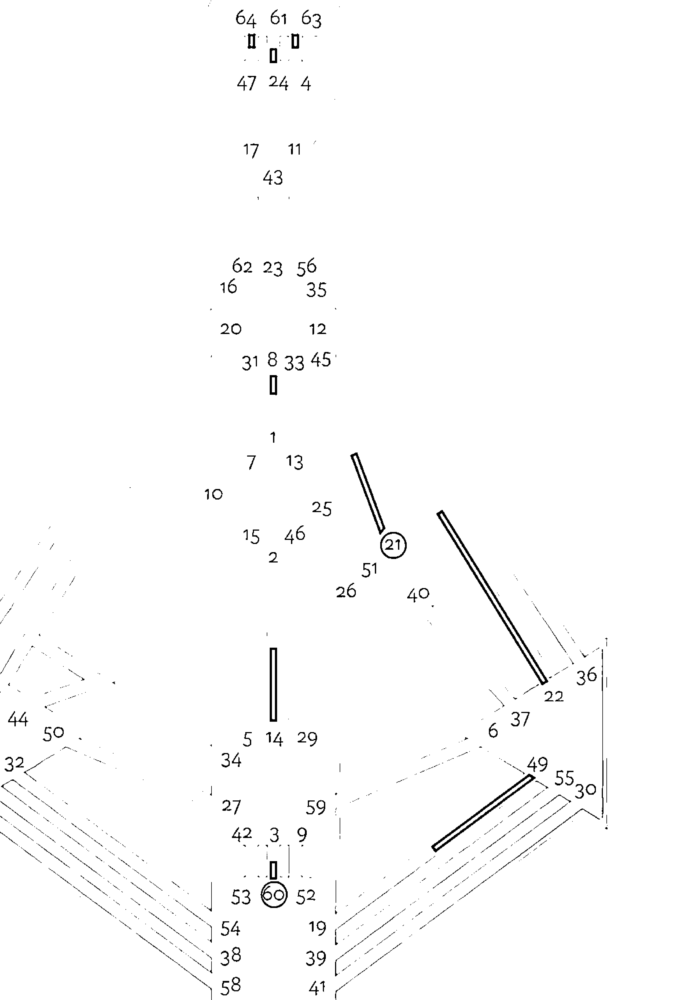

- 記憶 63.4  
- 信念 64.4  
- 警告 21.1  
- 誠實 8.1  
- 金錢非萬能 14.1  
- 平台 49.4  
- 保守主義 60.3  
- 保守主義 60.3  
- 記憶 63.4  
- 必要性法則 49.1  
- 自負 24.5  
- 成熟 22.6  
- 果斷 60.2  

在實現的過程中精打細算，所有資訊都與未來的新秩序有關。解惑的過程備受壓力，卻能奠定基礎，最終找出行得通的運作公式。

願意忘記勝利的榮光，儘管接下來可能為此付出代價。壓力與風險來自於，當疑惑獲得解答，細節卻被遺忘。

---

## 完成之後  
### 63.5 肯定

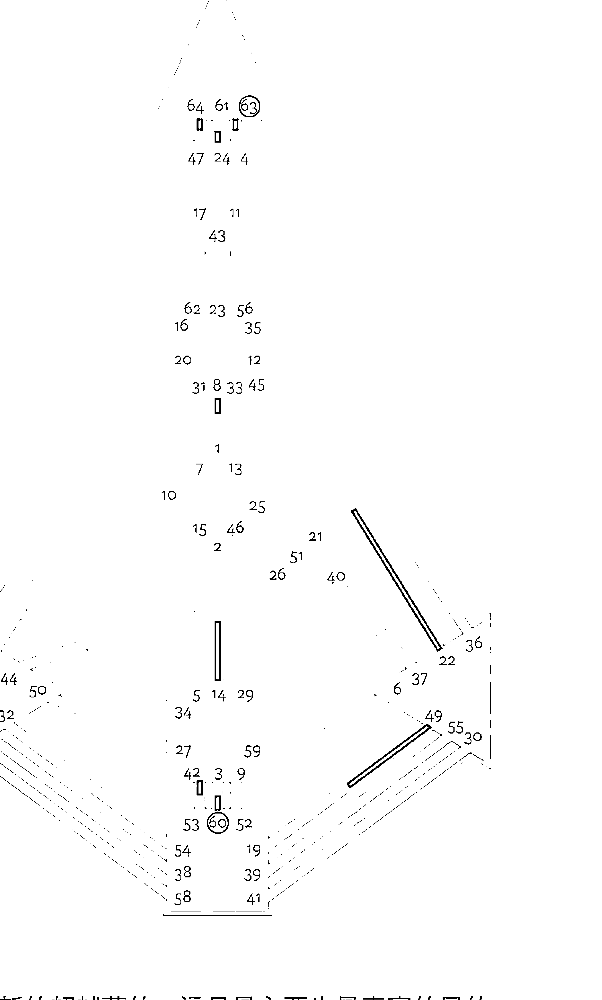

- 日 △63.5 肯定  
- 地 64.5 承諾  
- 月 42.2 識別  
- 北交 8.1 誠實  
- 南交 14.1 金錢非萬能  
- 水 49.5 組織  
- 金 ▽60.4 足智多謀  
- 火 ▽60.4 足智多謀  
- 木 63.4 記憶  
- 土 49.1 必要性法則  
- 天 24.5 自白  
- 海 22.6 成熟  
- 冥 60.2 果斷  

☉ △ 每次新開始都在追求同樣的價值，允許新的超越舊的。這是最主要也最真實的目的。理解懷疑是必要的，有其價值。

♂ ▽ 很愛逞口舌之快。若用來領導，價值降低，徒留形式。尚未理解就開始質疑。

---

## 完成之後  
### 63.6 懷舊之情

2022/03/07 00:11 TWN  
農曆 2/5（一）

- 懷舊之情 63.6  
- 勝利 64.6  
- 貪婪 27.3  
- 誠實 8.1  
- 金錢非萬能 14.1  
- 沉著 30.1  
- 領導力 60.5  
- 領導力 60.5  
- 肯定 63.5  
- 必要性法則 49.1  
- 自白 24.5  
- 成熟 22.6  
- 果斷 60.2  

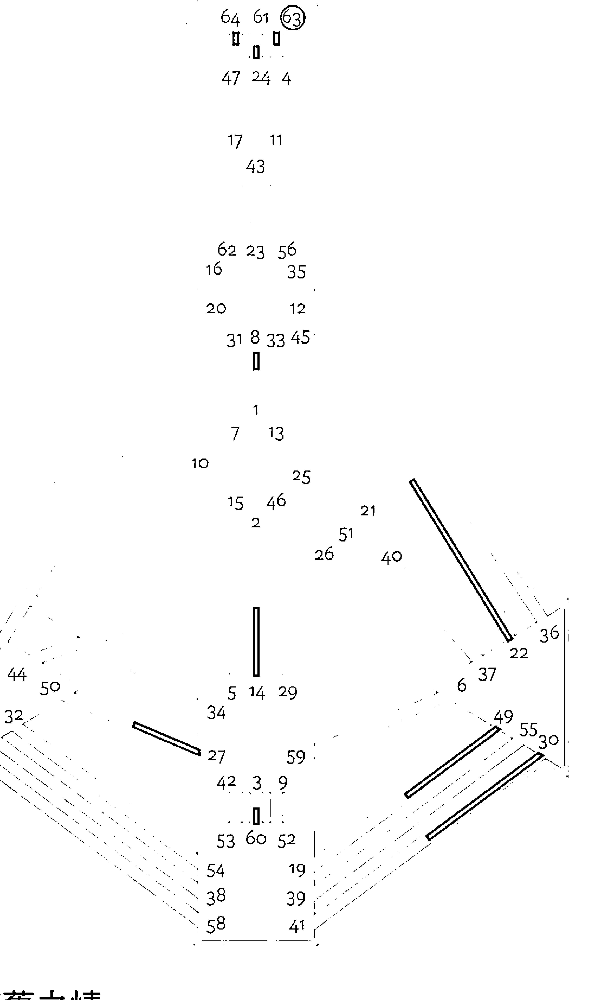

♃ △ 相當清楚要避免將之前的掙扎轉為執著，將舊有的懷疑拋諸腦後的邏輯。

♇ ▽ 懷舊的革命情感。缺乏邏輯，深陷在過往的猜忌與懷疑中，無法自拔。

## 優雅  
### 次等艙

- 2–14 脈動  
- 日 22.1 次等艙  
- 地 47.1 盤點  
- 月 2.3 耐性  
- 北交 8.1 誠實  
- 南交 14.1 金錢非萬能  
- 水 30.2 實用主義  
- 金 60.6 剛硬  
- 火 60.5 領導力  
- 木 63.5 肯定  
- 土 49.1 必要性法則  
- 天 24.5 自省  
- 海 36.1 抗拒  
- 冥 60.2 果斷  

### 22.1 次等艙

△ 能接受也享受部屬的位置。情感層面，察覺自己喜愛當下屬。  

♂ 喜歡次等艙的機票，卻聲稱要坐在頭等艙，不可避免招來羞辱。以情緒來挑戰現有愛好，導致在社交上帶來屈辱。  

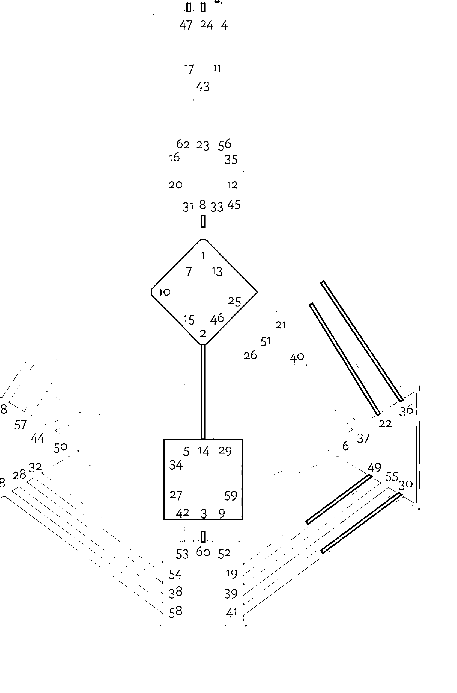

---

## 優雅  
### 禮儀學校

2022/03/08 21:09 TWN  
農曆 2/6（二）

- 夢想家 30–41  
- 禮儀學校 22.2  
- 野心 47.2  
- 虛假 8.3  
- 誠實 8.1  
- 金錢非萬能 14.1  
- 精疲力竭 30.4  
- 合理 41.1  
- 剛硬 60.6  
- 肯定 63.5  
- 必要性法則 49.1  
- 自負 24.5  
- 抗拒 36.1  
- 果斷 60.2  

### 22.2 禮儀學校

相信風格能遮掩本質。

- ☉ △ 成功愚惑他人與自己的能力。  
  必須充滿感情的風格，有可能會吸引他人。  

- ♃ ▽ 可用形式掩蓋本質。  
  強化風格，缺乏察覺。  

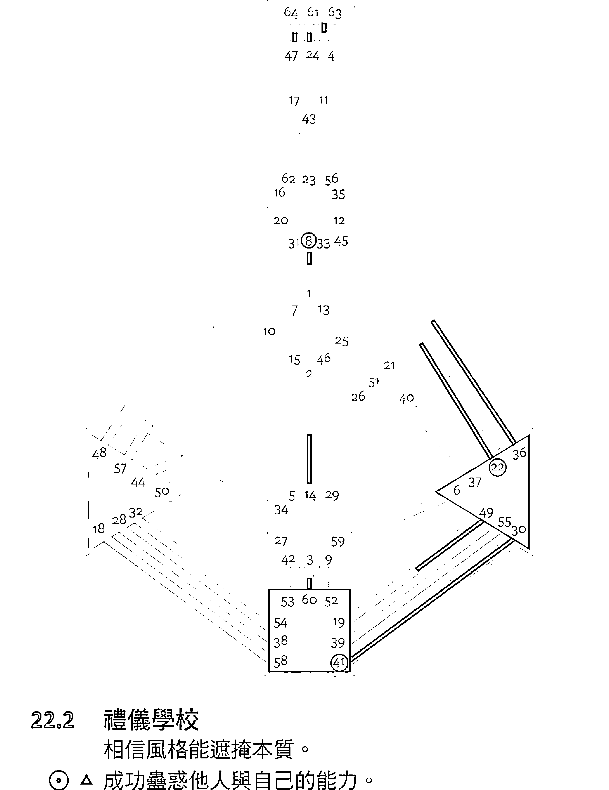

---

## 22.3 優雅  
### 魔法師

2022/03/09 19:38 TWN  
農曆 2/7（三）

30–41 夢想家

- 日 22.3 魔法師  
- 地 47.3 自我壓抑  
- 月 16.3 獨立  
- 北交 8.1 誠實  
- 南交 14.1 金錢非萬能  
- 水 30.5 調和  
- 金 41.1 合理  
- 火 41.1 合理  
- 木 63.5 肯定  
- 土 49.1 必要性法則  
- 天 24.5 自白  
- 海 36.1 抗拒  
- 冥 60.2 果斷  

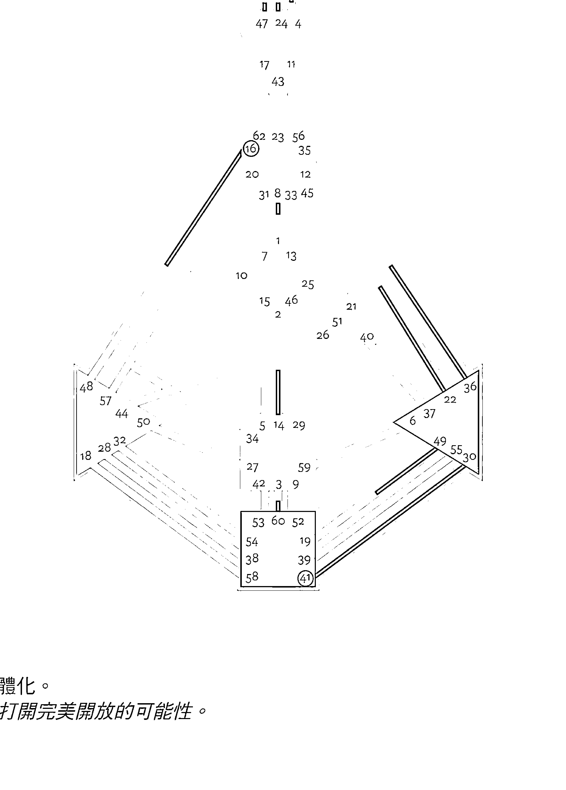

### 22.3 魔法師

完美的優雅。

♄ △ 形式能定義，並將本質具體化。結合情緒的能量與察覺，打開完美開放的可能性。  

♂ ▽ 無意識的優雅。與生俱來的開放性。  

---

## 優雅  
### 敏感度

### 22.4

2022/03/10 18:09 TWN  
農曆 2/8（四）

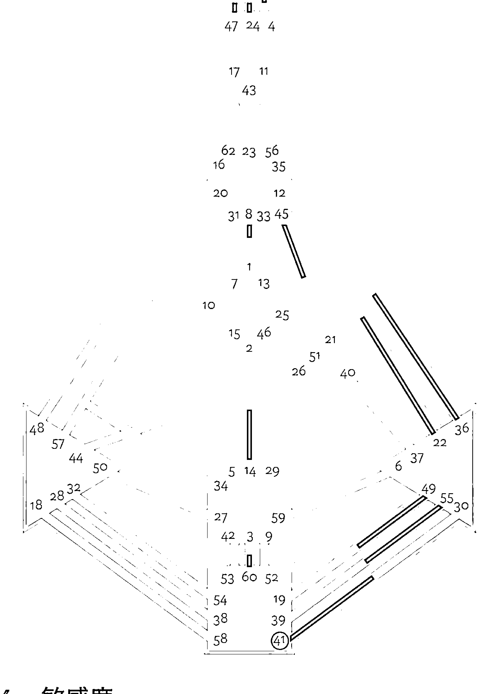

- 敏感度 22.4  
- 鎮壓 47.4  
- 排除在外 45.3  
- 誠實 8.1  
- 金錢非萬能 14.1  
- 合作 55.1  
- 謹慎 41.2  
- 謹慎 41.2  
- 懷舊之情 63.6  
- 最終手段 49.2  
- 自白 24.5  
- 抗拒 36.1  
- 果斷 60.2  

### 22.4 敏感度

修正行為，使互動更精彩。

♆ △ 直接成為靈性的媒介，拒絕繁複的儀式。  
打破枷鎖的模式，打開社會開放的可能性。  

♂ ▽ 偏重風格與形式，因而失去關鍵的人脈網絡。  
拘泥於形式，社交的開放性因而受限。  

---

## 22.5 優雅  
### 直接

農曆 2/9（五）

- 日 22.5 直接  
- 地 47.5 聖人  
- 月 15.3 自我膨脹  
- 北交 8.1 誠實  
- 南交 14.1 金錢非萬能  
- 水 55.3 無罪  
- 金 41.3 效率  
- 火 ▽41.2 謹慎  
- 木 △63.6 懷舊之情  
- 土 49.2 最終手段  
- 天 24.5 自省  
- 海 36.1 抗拒  
- 冥 60.2 果斷  

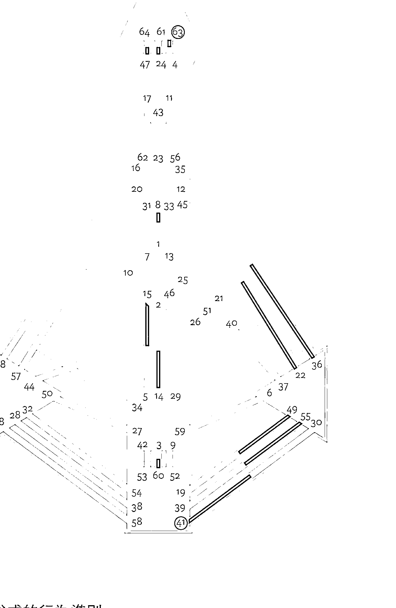

### 22.5 直接

必要的時候，不再拘泥於形式。

♃ △ 依循更高原則帶來力量，超脫約定俗成的行為準則。有可能透過情緒面的察覺，在形式上展現個體性的行為。  

♂ ▽ 經驗出現尷尬的場面，最後不可避免地被歸類為粗魯失禮。個人行為存在社交層面，有可能引來負面的投射。  

---

## 優雅  
### 成熟 22.6

2022/03/12 15:12 TWN  
農曆 2/10（六）

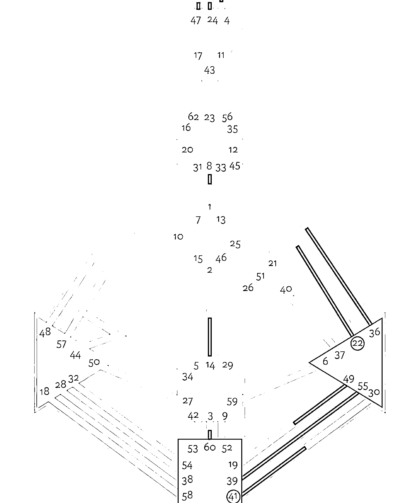

- 情緒 39–55  
- 成熟 22.6  
- 徒勞無功 47.6  
- 責任 39.3  
- 誠實 8.1  
- 金錢非萬能 14.1  
- 同化 55.4  
- 修正 41.4  
- 效率 41.3  
- 懷舊之情 63.6  
- 最終手段 49.2  
- 自白 24.5  
- 抗拒 36.1  
- 果斷 60.2  

### 22.6 成熟

形式與實質，在體驗上是一致的。

☉ △ 天生耀眼的領導力與權威感。累積社交層面的經驗，有機會可以培養出領導人的特質。  

♂ ▽ 不再渴求成規，傾向表現自我。在社交層面的經驗，引發開放的可能性，表達方式跳脫約定俗成的規範。  

---

## 幽暗之光  
### 抗拒

- 日 36.1 抗拒  
- 地 6.1 隱退  
- 月 62.3 探索  
- 北交 8.1 誠實  
- 南交 14.1 金錢非萬能  
- 水 55.6 自私  
- 金 ☆41.5 授權  
- 火 ▽41.4 修正  
- 木 △63.6 懷舊之情  
- 土 49.2 最終手段  
- 天 24.5 自省  
- 海 36.1 抗拒  
- 冥 60.2 果斷  

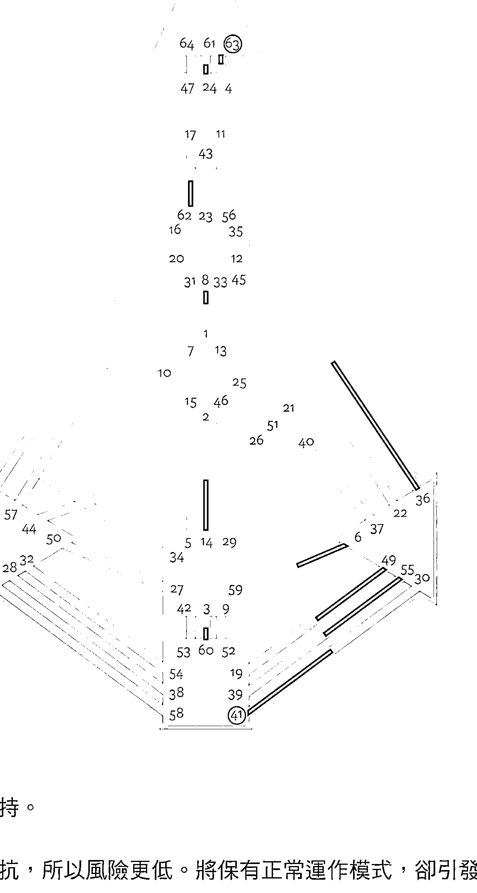

### 36.1 抗拒

♂ △ 面對阻力，充滿能量與決心，依然堅持。  
處理危機，情緒的力量。  

♃ ▽ 堅守原則而抗拒，並不是選擇性的抵抗，所以風險更低。將保有正常運作模式，卻引發反對聲浪。  
抗拒改變，總是會帶來危機。  

---

## 幽暗之光  
### 支持

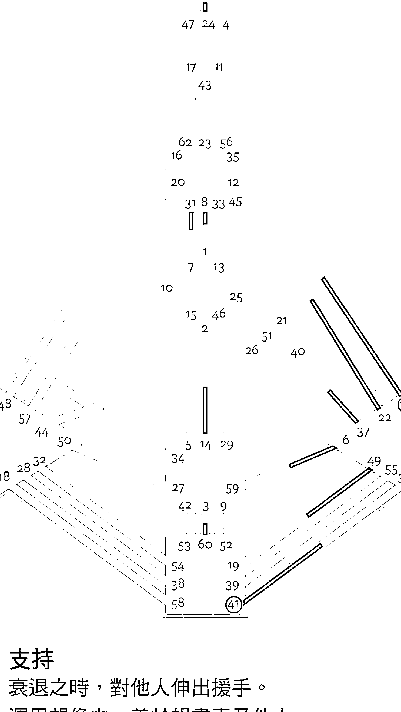

- 支持 36.2  
- 游擊隊 6.2  
- 選擇性 31.3  
- 誠實 8.1  
- 金錢非萬能 14.1  
- 母親／父親 37.1  
- 感染 41.6  
- 授權 41.5  
- 次等艙 22.1  
- 最終手段 49.2  
- 自白 24.5  
- 抗拒 36.1  
- 果斷 60.2  

### 36.2 支持

衰退之時，對他人伸出援手。

運用想像力，善於規畫惠及他人。  
在危機之時，感覺能夠深入滋養。

提供的並不是放諸四海皆準的原則，而是在不得不的情況下，提供更實際、更個人化的支持。  
在危機時，提供選擇性的援助。  

---

## 36.3 幽暗之光  
### 過渡

農曆 2/13（二）

- 日 36.3 過渡  
- 地 6.3 忠誠  
- 月 7.4 退位者  
- 北交 23.6 融合  
- 南交 43.6 突破  
- 水 37.3 平等對待  
- 金 19.1 相互依存  
- 火 △41.5 授權  
- 木 22.1 次等艙  
- 土 49.2 最終手段  
- 天 24.5 自省  
- 海 36.1 抗拒  
- 冥 60.2 果斷  

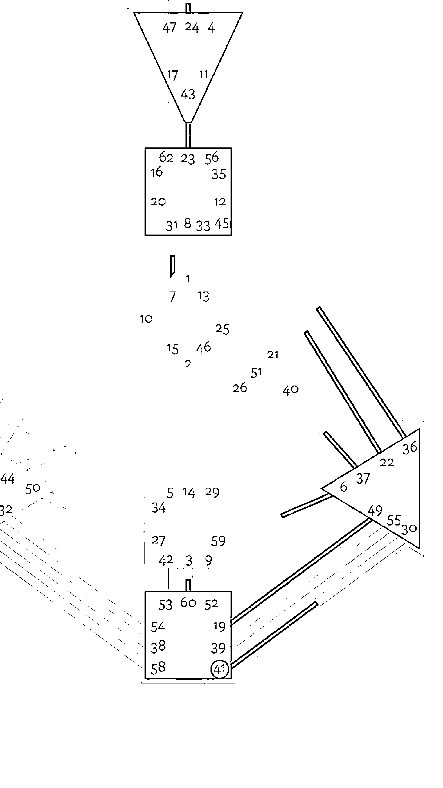

### 36.3 過渡

谷底，衰退已然走至盡頭。

能自陳舊的灰燼中，建立起全新的秩序。具備情感面的深度，能承受危機並接受改變。

更新，傾向吸取舊秩序的精華，試圖融入新秩序。風險在於若有朝一日舊勢力再起，將與新秩序分庭抗衡。

接受改變，卻無法放下過去。  

---

## 幽暗之光  
### 間諜活動

2022/03/16 09:28 TWN  
農曆 2/14（三）

### 36.4

- 整合綜效 19–49  
- 架構 23–43  
- 間諜活動 36.4  
- 勝利 6.4  
- 直接 29.4  
- 融合 23.6  
- 突破 43.6  
- 愛 37.5  
- 服務 19.2  
- 感染 41.6  
- 次等艙 22.1  
- 最終手段 49.2  
- 自省 24.5  
- 抗拒 36.1  
- 果斷 60.2  

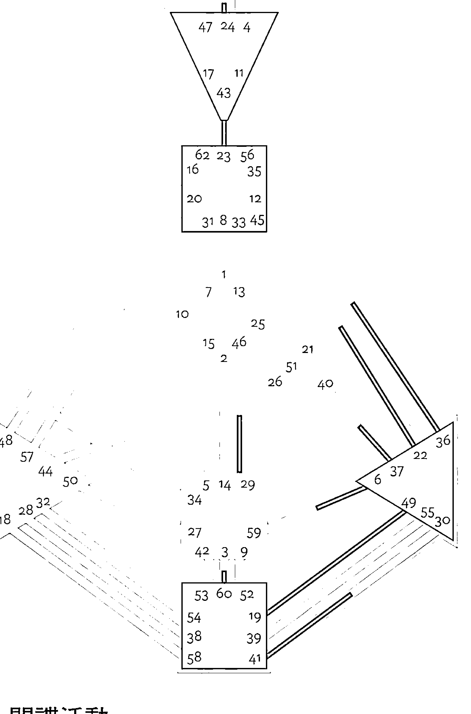

### 36.4 間諜活動

P △ 從各種秘密或情報的能力，預先為衰退做準備。  
為危機與改變做好準備，不論是隱晦或神祕的知識，都有存在的必要性。

J ▽ 傾向質疑反對的力量。既然衰退不可避免，與其抗拒，不如接受。既然接受了，何不提供服務，確保生存無虞。

雙重暗黑：危機處理是極具價值的資訊，能提供給他人作為參考。  

---

## 36.5 幽暗之光  
### 秘密的

2022/03/17 08:04 TWN  
農曆 2/15（四）

- 19–49 整合綜效  
- 23–43 架構  
- 37–40 經營社群  

- 日 36.5 秘密的  
- 地 6.5 仲裁  
- 月 40.5 剛硬  
- 北交 23.6 融合  
- 南交 43.6 突破  
- 水 ▽37.6 目的  
- 金 △19.3 奉獻  
- 火 19.1 相互依存  
- 木 22.1 次等艙  
- 土 49.2 最終手段  
- 天 24.5 自省  
- 海 36.1 抗拒  
- 冥 60.2 果斷  

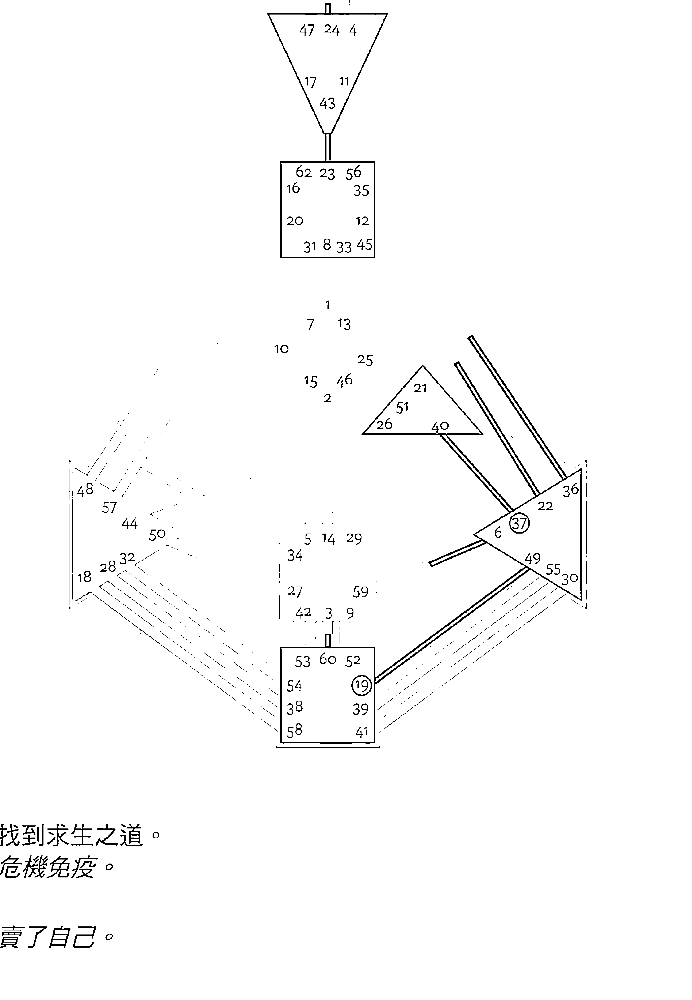

### 36.5 秘密的

P △ 無論任何情況，都能完美地找到求生之道。既是生產者也是倖存者，對危機免疫。  

☿ ▽ 過於緊張，背叛自我。面對危機時，因為緊張而出賣了自己。  

---

## 幽暗之光  
### 正義

2022/03/18 06:41 TWN  
農曆 2/16（五）

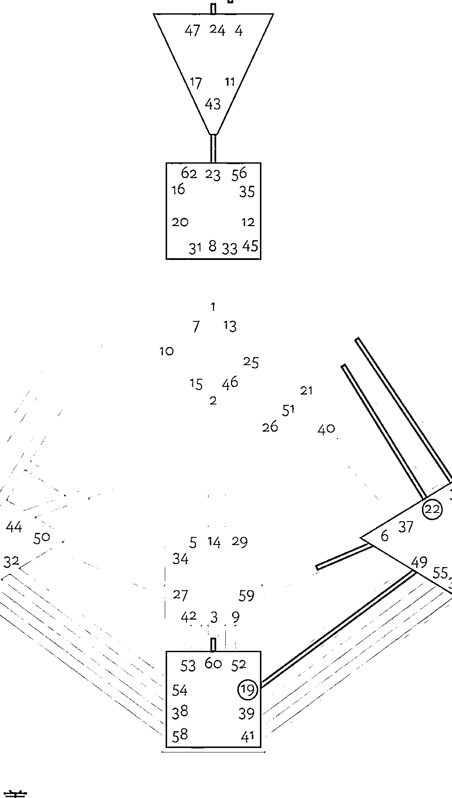

- 正義 36.6  
- 調停者 6.6  
- 隱退 6.1  
- 融合 23.6  
- 突破 43.6  
- 結構 63.2  
- 團隊合作 19.4  
- 服務 19.2  
- 禮儀學校 22.2  
- 最終手段 49.2  
- 自白 24.5  
- 抗拒 36.1  
- 果斷 60.2  

### 36.6 正義

正義終將留存，無庸置疑。

不管是知識或信念層面，都堅信黑暗的力量最終將自我毀滅。「上帝要毀滅一個人，必先使其瘋狂。」若來自於純粹的情感，危機的存在是正確的。

就算理解黑暗終將毀滅，憤世嫉俗的本性，也無法抹去底層的悲傷。就算明白任何感覺都是正確的，危機還是一直存在，悲傷原本也就是情緒的源頭。  

---

## 天真  
### 無私

農曆 2/17（六）

- 19–49 整合綜效  
- 23–43 架構  

- 日 25.1 無私  
- 地 46.1 在發現的過程中  
- 月 ▽18.2 絕症  
- 北交 23.6 融合  
- 南交 43.6 突破  
- 水 △63.4 記憶  
- 金 19.5 犧牲  
- 火 19.2 服務  
- 木 ▽22.2 禮儀學校  
- 土 49.3 民怨  
- 天 24.5 自省  
- 海 36.1 抗拒  
- 冥 60.2 果斷  

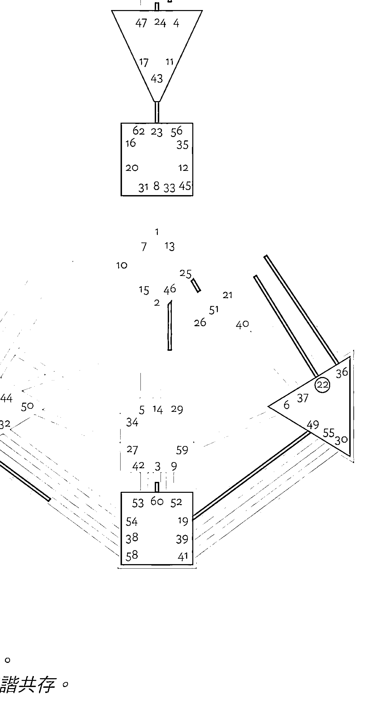

### 25.1 無私

無所求的行動。

- ♆ △ 活動的普及化。心靈和諧共振就是獎賞。  
  若能回歸個人的中心點，就能對挑戰和競爭共存。  

- ☿ ▽ 宣揚自己的無私。  
  面臨挑戰時，顯露出不安全感。  

---

## 天真  
### 存在主義者

2022/03/20 03:56 TWN  
農曆 2/18（日）春分

### 25.2

- 整合綜效 19–49  
- 架構 23–43  
- 存在主義者 25.2  
- 自命不凡 46.2  
- 指導者 57.4  
- 融合 23.6  
- 突破 43.6  
- 懷舊之情 63.6  
- 進化者 19.6  
- 奉獻 19.3  
- 禮儀學校 22.2  
- 民怨 49.3  
- 自省 24.5  
- 抗拒 36.1  
- 果斷 60.2  

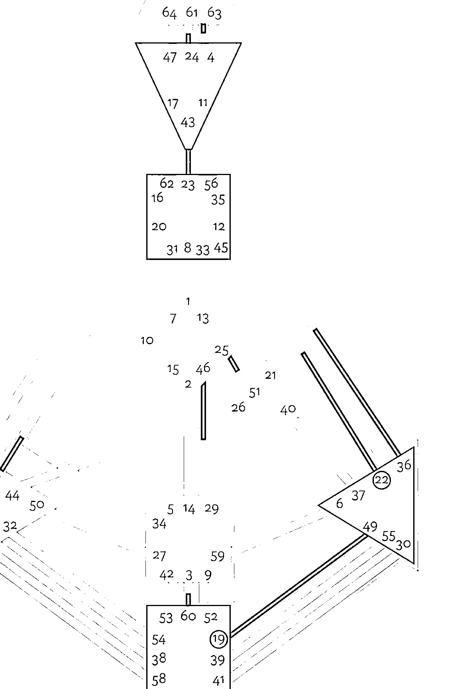

### 25.2 存在主義者

全心全意致力於當下。

△ 完美的聰明才智，是聚焦於當下，接受如是，而非執著於可能，或曾經是如何。延續自我的純真，以及如何保存純真，唯有活在當下。  

▽ 奉獻：難免讓人動機，也會出現各種臆測。當下若非純真，外來的投射會危及原本的保護層。  

---

## 25.3 天真  
### 感性

19–49 整合綜效  
23–43 架構

- 日 25.3 感性  
- 地 46.3 投射  
- 月 ▽50.6 領導力  
- 北交 23.6 融合  
- 南交 43.6 突破  
- 水 22.1 次等艙  
- 金 △13.1 同理  
- 火 △19.4 團隊合作  
- 木 ▽22.2 禮儀學校  
- 土 49.3 民怨  
- 天 24.6 挑撥  
- 海 36.1 抗拒  
- 冥 60.2 果斷  

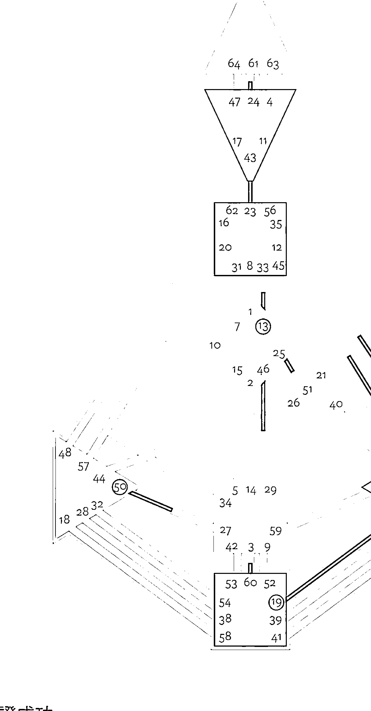

### 25.3 感性

憑直覺的純真行為，無法保證成功。

- ♂ △ 意志力的力量，能承受失敗，依然保有本性。精確層面的力量，可以承受失敗與磨練。  

- ♇ ▽ 有可能遭遇不幸，而失去原有的純真。若走至極端，可能引發犯罪或自殺等行為。因為失敗或過於震驚，而失去靈魂的本質。  

---

## 天真  
### 生存

2022/03/22 01:14 TWN  
農曆 2/20（二）

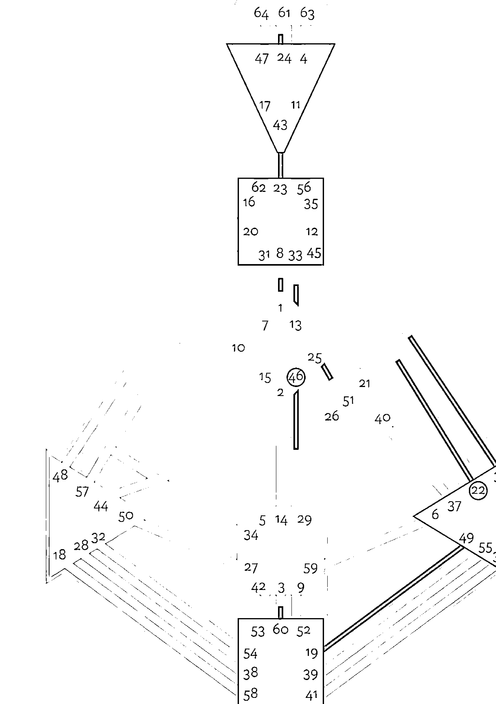

- 整合綜效 19–49  
- 架構 23–43  
- 生存 25.4  
- 影響 46.4  
- 愛是光 1.2  
- 融合 23.6  
- 突破 43.6  
- 魔法師 22.3  
- 偏執 13.2  
- 犧牲 19.5  
- 禮儀學校 22.2  
- 民怨 49.3  
- 挑撥 24.6  
- 抗拒 36.1  
- 果斷 60.2  

### 25.4 生存

純真的本質是無人而不自得。

♀ △ 玫瑰插在垃圾場，依然美麗。  

♃ △ 木星位於上升相位，就算處於最壞的時代，就算一切都在崩毀，仍然保有最高原則。  

真正的戰士，不管在任何狀態下，都能保有純真。  

▽ 無極性。沒有行星位於下降相位。  

---

## 25.5 天真  
### 休養

2022/03/22 23:54 TWN  
農曆 2/20（二）

- 19–49 整合綜效  
- 23–43 架構  

- 日 25.5 休養  
- 地 46.5 步調  
- 月 ▲14.4 安全  
- 北交 23.6 融合  
- 南交 43.6 突破  
- 水 ▲22.5 直接  
- 金 ▼13.3 悲觀主義  
- 火 19.5 犧牲  
- 木 22.3 魔法師  
- 土 49.3 民怨  
- 天 24.6 挑撥  
- 海 36.1 抗拒  
- 冥 60.3 保守主義  

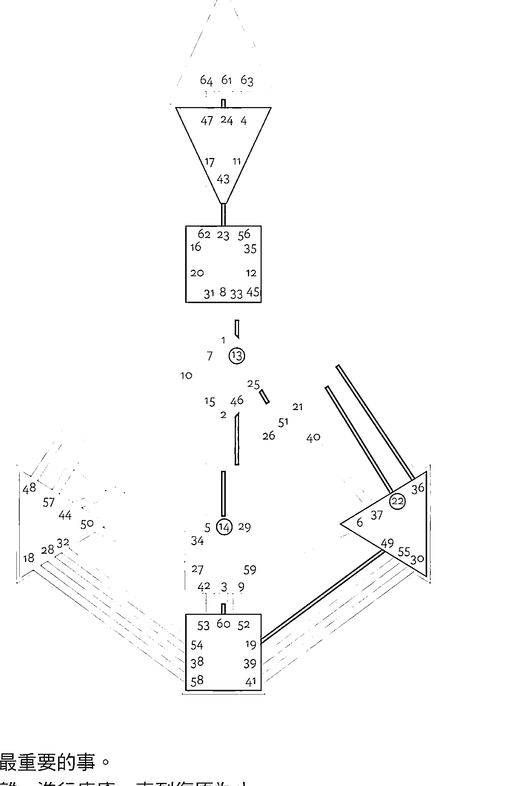

### 25.5 休養

當純真不再，活力盡失，療癒是最重要的事。

- ♀ △ 能深入了解痛苦的內在意涵，抽離，進行療癒，直到復原為止。治療與復原的精神力量。  

- ♃ ▽ 疑病症，需要別人來治療自己。精神上的弱點在於，渴望療癒別人的需要。  

---

## 天真  
### 無知

**25.6**

2022/03/23 22:35 TWN  
農曆 2/21（三）

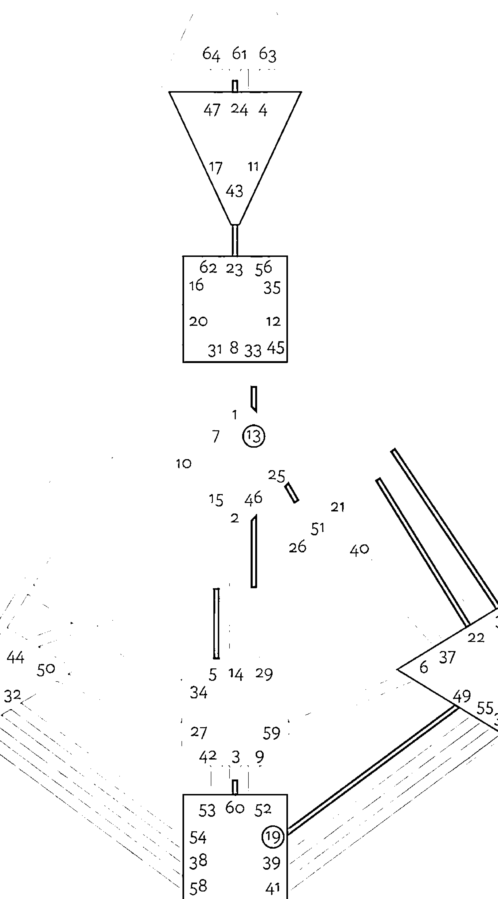

- 整合線路 19–49  
- 架構 23–43  
- 無知 25.6  
- 誠信 46.6  
- 毅力 5.1  
- 融合 23.6  
- 突破 43.6  
- 抗拒 36.1  
- 疲累 13.4  
- 進世者 19.6  
- 魔法師 22.3  
- 民怨 49.3  
- 挑撥 24.6  
- 抗拒 36.1  
- 保守主義 60.3  

### 25.6 無知

行動浪漫化了虛假的天真。

最不溫和的負面立場，不適當的行為將遭受非難。  
因不適當的行為，而失去純真。

經常採取不合時宜的行動，欠缺穩定性，不具產值。  
純真的假象崩毀，面對挑戰時，經常展現出不當行為，失去純真。  

---

## 17.1  
### 跟隨 — 開放

農曆 2/22（四）

- 日 17.1 開放  
- 地 △18.1 保守主義  
- 月 11.3 現實主義者  
- 北交 23.6 融合  
- 南交 43.6 突破  
- 水 36.3 過渡  
- 金 13.5 救世主  
- 火 △13.1 同理  
- 木 22.3 魔法師  
- 土 49.3 民怨  
- 天 24.6 挑撥  
- 海 36.1 抗拒  
- 冥 60.3 保守主義  

23–43 架構

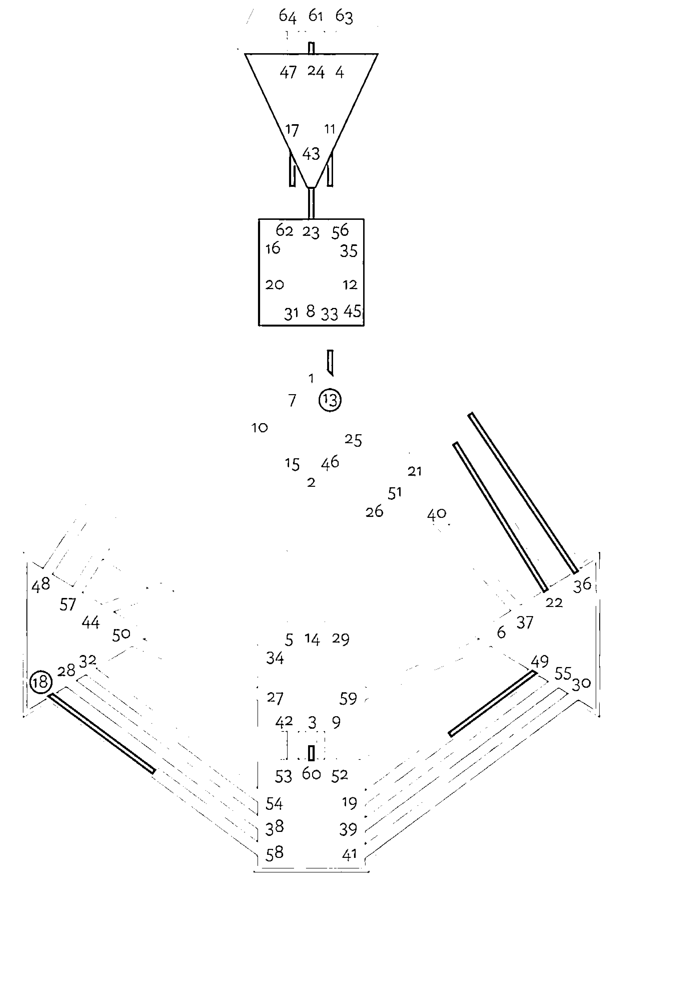

### 17.1 開放

♂ △ 能接納各種刺激的能量。有可能接受許多觀點。  

♀ ▽ 傾向接受有美感、令人愉悅的刺激就好。有限的開放。想法僅限於自己喜好的領域。  

---

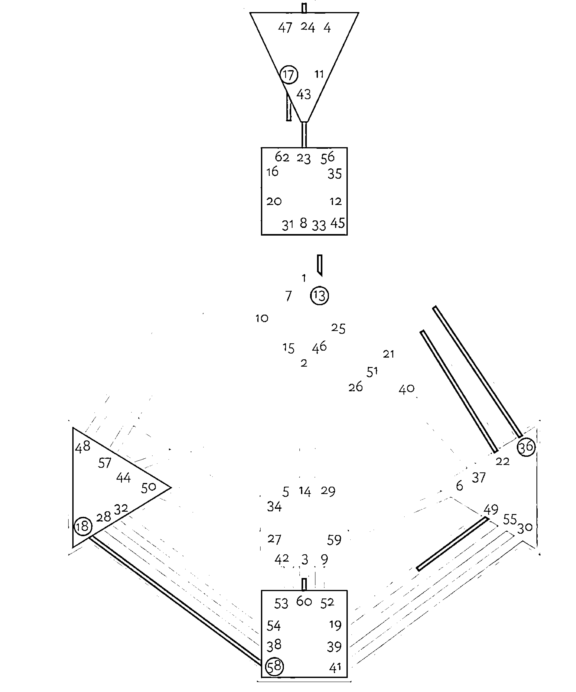

- 批評 18–58  
- 架構 23–43  
- 歧視 17.2 △  
- 絕症 18.2 ▽  
- 防禦 58.5 △  
- 融合 23.6  
- 突破 43.6  
- 秘密的 36.5 ▽  
- 樂天派 13.6 △  
- 偏執 13.2  
- 魔法師 22.3  
- 民怨 49.3  
- 挑釁 24.6  
- 抗拒 36.1  
- 保守主義 60.3  

### 17.2 歧視

基於最高的價值，從結交中獲得好處。

- △ 經由適當的結盟，成功達成目的。  
- 透過各種關係，落實可能的想法。  

- ▽ 過度歧視，導致實質上的孤立。  
- 有可能太自以為是，關係不再就是代價。  

---

## 17.3 跟隨  
### 理解

農曆 2/24（六）  
2022/03/26 18:41 TWN

- 23–43 架構  
- 24–61 覺察  
- 日 17.3 理解  
- 地 18.3 狂熱分子  
- 月 61.1 奧祕知識  
- 北交 23.6 融合  
- 南交 43.6 突破  
- 水 ▽25.1 無私  
- 金 49.1 必要性法則  
- 火 13.3 悲觀主義  
- 木 22.4 敏感度  
- 土 49.3 民怨  
- 天 24.6 挑撥  
- 海 36.1 抗拒  
- 冥 60.3 保守主義  

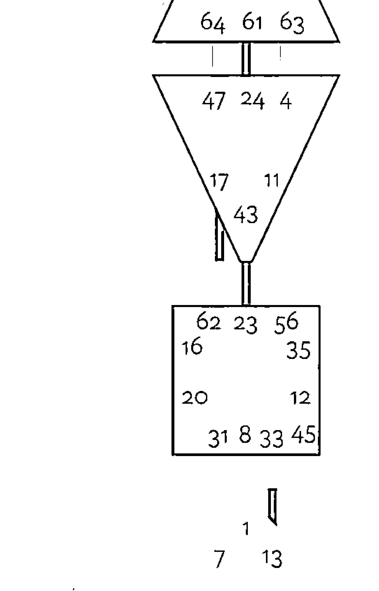

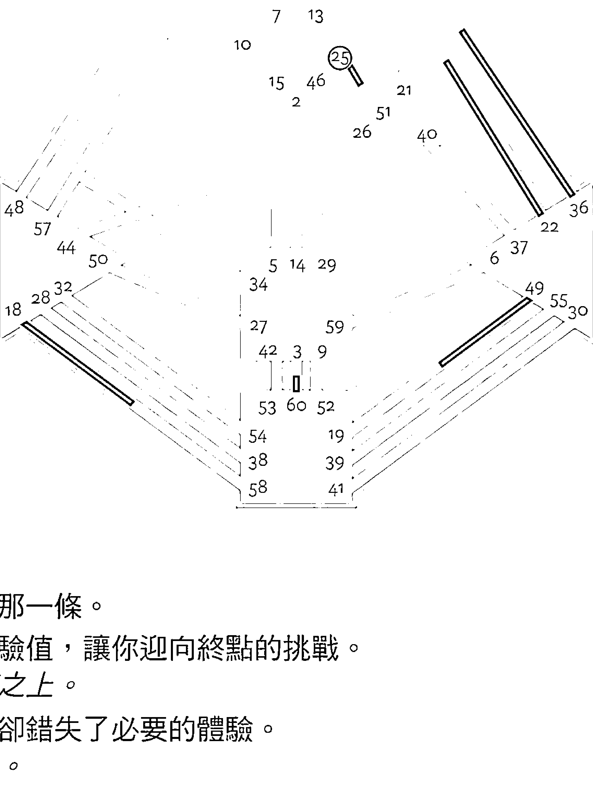

### 17.3 理解

察覺最好的道路，未必是最有趣的那一條。

▸ 最好的道路，會讓你累積必要的經驗值，讓你迎向終點的挑戰。  
理解最好的想法，往往建構於細節之上。

⊕ 若走捷徑，也許能快點到達終點，卻錯失了必要的體驗。  
若忽略細節，提出的意見價值有限。

## 跟隨

人事經理  
2022/03/27 17:24 TWN  
農曆 2/25（日）

## 17.4

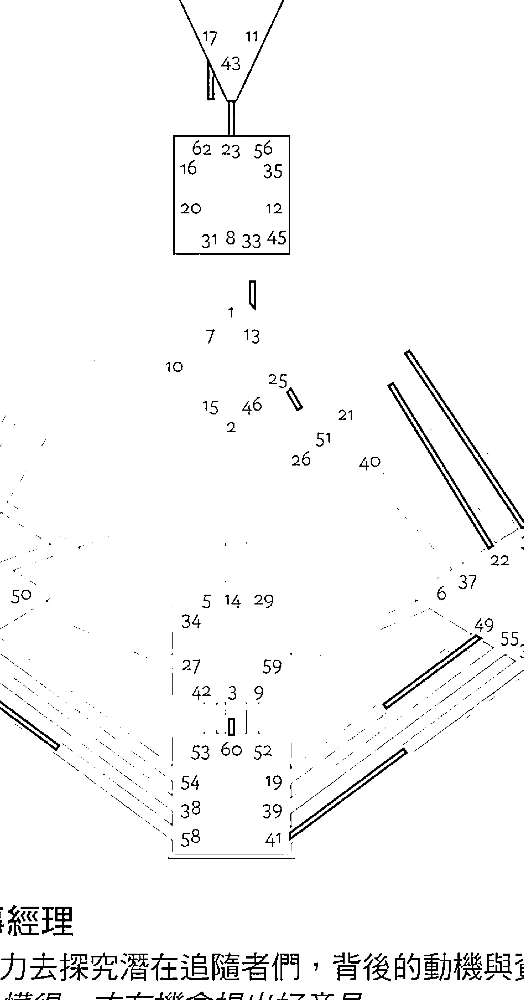

- 架構 23–43
- 人事經理 17.4
- 無能 18.4
- 修正 41.4
- 融合 23.6
- 突破 43.6
- 感性 25.3
- 最終手段 49.2
- 悲觀主義 13.3
- 敏感性 22.4
- 民怨 49.3
- 挑惕 24.6
- 抗拒 36.1
- 保守主義 60.3

### 17.4 人事經理

P △ 有能力去探究潛在追隨者們背後的動機與資源。  
因為懂得，才有機會提出好意見。

J ▽ 過於傾聽因而誤判，納入「以為可能的」追隨者；往往招來災禍。  
有可能會以意見來吸引別人。

---

## 跟隨

無人是孤島  
農曆 2/26（一）

23–43 架構

- 日 17.5 無人是孤島
- 地 18.5 治療
- 月 13.6 樂天派
- 北交 23.5 同化
- 南交 43.5 進展
- 水 25.4 生存
- 金 49.3 民怨
- 火 13.4 疲累
- 木 22.4 敏感性
- 土 49.4 平台
- 天 24.6 挑撥
- 海 36.1 抗拒
- 冥 60.3 保守主義

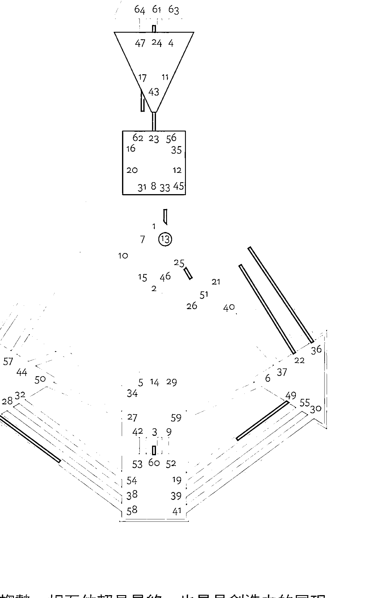

### 17.5 無人是孤島

理解，然而也明白階級無盡頭。

- 不論是神的旨意，或是全球化整合的趨勢，相互依賴是最終，也是具創造力的展現。不論在物質或靈性層，有能力傳達整體組織的價值。
- 做假。無視所有證據論述，劃清界線。有可能會提出論點，否認組織架構的價值。

---

## 跟隨

菩薩  
2022/03/29 14:52 TWN  
農曆 2/27（二）

## 17.6

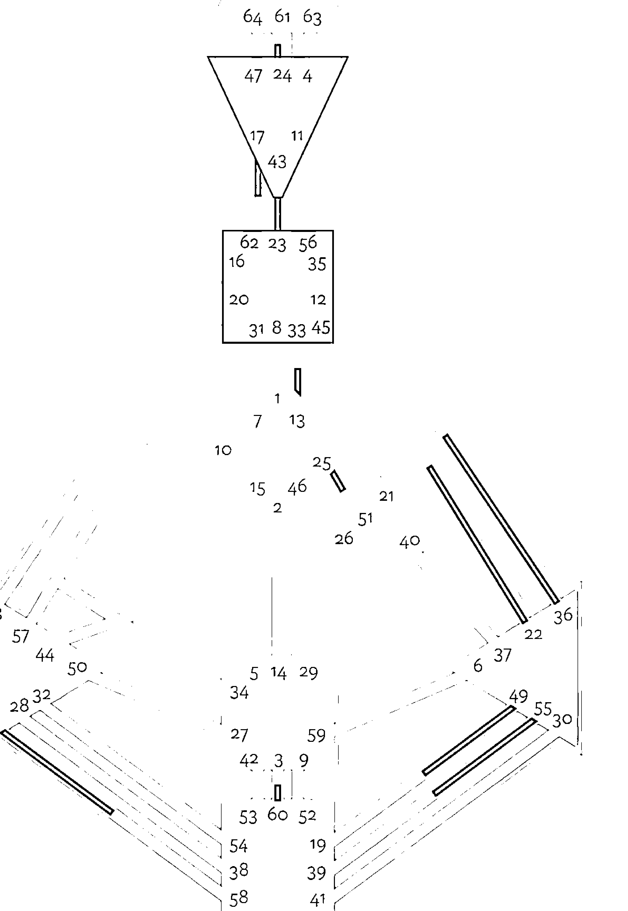

- 架構 23–43
- 菩薩 17.6
- 成佛 18.6
- 不信任 55.2
- 同化 23.5
- 進展 43.5
- 無知 25.6
- 平台 49.4
- 救世主 13.5
- 敏感性 22.4
- 平台 49.4
- 挑戰 24.6
- 抗拒 36.1
- 保守主義 60.3

### 17.6 菩薩

完全跟隨與完滿領導，一體之兩面。

> 偉大的培育者。位於此，本質正面。  
> 有可能因為相互依存，獲得啟發，對他人傳遞有用的洞見。

> 認為完善的途徑是一條直線，而非一個圓。  
> 當你明白這些，可能會認為再也無事可學。

---

## 蠻勇前進

警告  
農曆 2/28（三）

23–43 架構

- 日 21.1 警告
- 地 48.1 微不足道
- 月 63.4 記憶
- 北交 23.5 同化
- 南交 43.5 進展
- 水 17.2 歧視
- 金 49.5 組織
- 火 △13.6 樂天派
- 木 △22.5 直接
- 土 49.4 平台
- 天 24.6 挑撥
- 海 36.1 抗拒
- 冥 60.3 保守主義

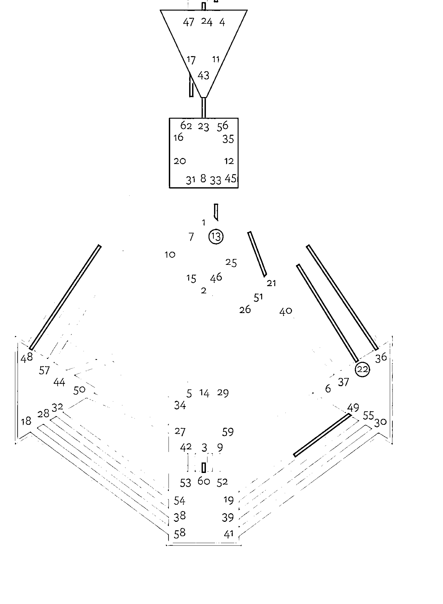

### 21.1 警告

- 以孤注一擲的方式使用力量。
- ♂ △ 沒做事，也強烈認為應被尊重。似願意盡力與自尊心，亟需被尊重。
- ☽ ▽ 天生平和，原本應該要警告，卻講成懇求。欠缺意志力，被迫要求對方尊重自己。

---

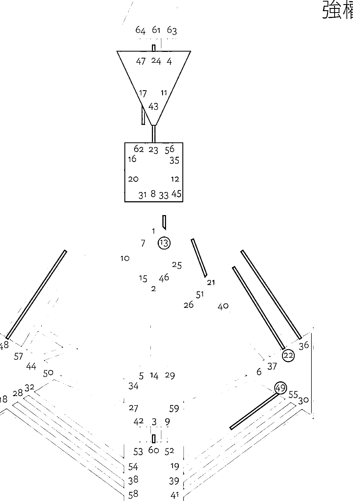

- 架構 23–43
- 強權即公理 21.2
- 退化 48.2
- 秘密的 36.5
- 同化 23.5
- 進展 43.5
- 人事經理 17.4
- 吸引力 49.6
- 樂天派 13.6
- 直接 22.5
- 平台 49.4
- 挑釁 24.6
- 抗拒 36.1
- 保守主義 60.3

### 21.2 強權即公理

對於公然介入的情況，採取合法行動作為回應。

強而有力的激烈回應。在此，最嚴厲的回應最成功。拒絕物質層面的介入，是正常的行為。

不管多麼合理，內在感到非常後悔。對激進擴展的做法，感到不適當。

---

## 奮勇前進

無力  
2022/04/01 11:09 TWN  
農曆 3/1（五）

23–43 架構

- 日 21.3 無力
- 地 48.3 單獨監禁
- 月 21.1 警告
- 北交 23.5 同化
- 南交 43.5 進展
- 水 17.6 苦難
- 金 30.1 沉著
- 火 49.1 必要性法則
- 木 22.5 直接
- 土 49.4 平台
- 天 24.6 挑惕
- 海 36.2 支持
- 冥 60.3 保守主義

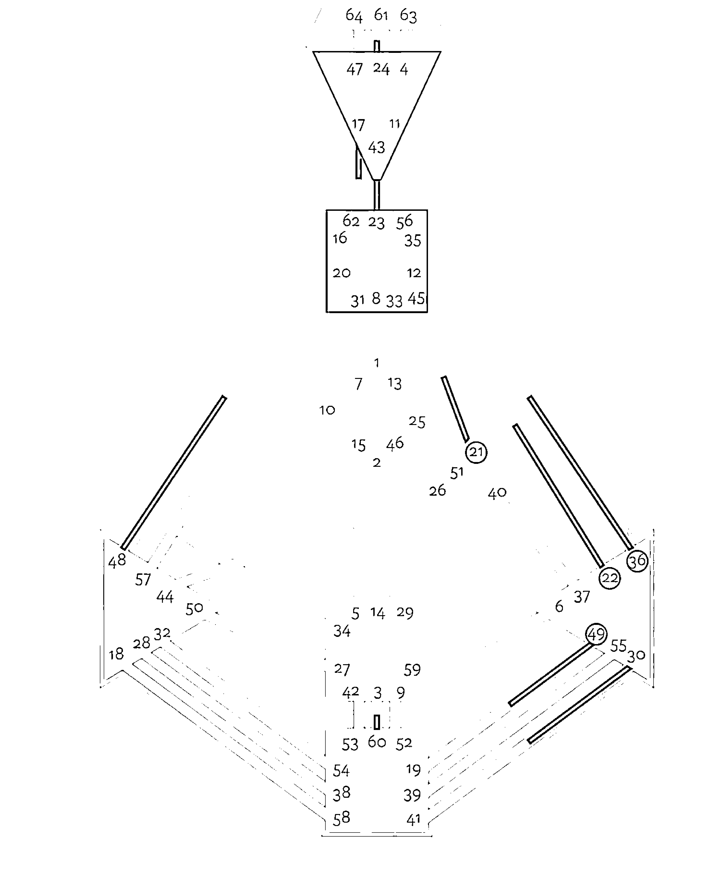

### 21.3 無力

正義注定要與占盡優勢的力量，進行徒勞無功的對抗。

將失敗視為致命的屈辱，藉由毒品或酒精來逃脫。  
除非遵循自己在物質世界的路徑，否則自尊心很容易被占優勢的人所擊碎。

完全抽離。  
為了維護自尊心，對於物質世界的一切興趣缺缺。

---

## 奮勇前進 策略

2022/04/02 09:57 TWN  
農曆 3/2（六）

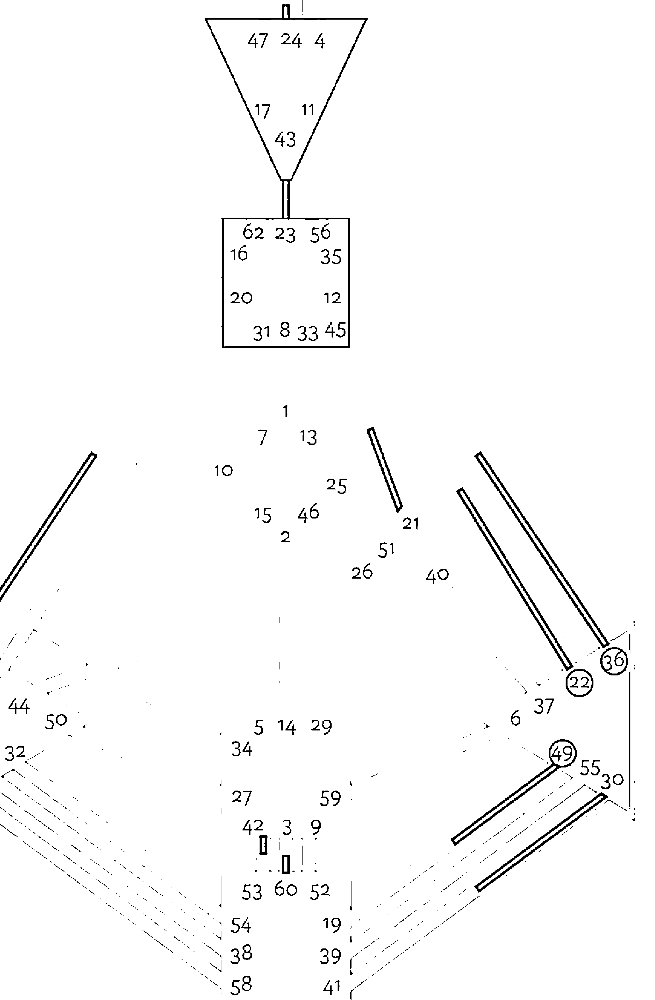

- 架構 23–43
- 策略 21.4
- 重建 48.4
- 識別 42.2
- 同化 23.5
- 進展 43.5
- 無力 21.3
- 實用主義 30.2
- 最終手段 49.2
- 直接 22.5
- 平台 49.4
- 挑戰 24.6
- 支持 36.2
- 保守主義 60.3

### 21.4 策略

謹慎評估反對勢力，給予適當回應。  
清明的狀態下，行動才會成功。

有效運用意志力，如同本能般，可以回應任何狀況。  
或自認有理，有誤判對手實力的傾向。  
得理就容易驕傲自用，而忘了遵循本能。

---

## 奮勇前進

客觀性  
2022/04/03 08:45 TWN  
農曆 3/3（日）

23–43 架構

- 日 21.5 客觀性
- 地 48.5 行動
- 月 27.3 食慾
- 北交 23.5 同化
- 南交 43.5 進展
- 水 21.5 客觀性
- 金 30.3 順從
- 火 49.3 民怨
- 木 22.6 成熟
- 土 49.4 平台
- 天 24.6 挑釁
- 海 36.2 支持
- 冥 60.3 保守主義

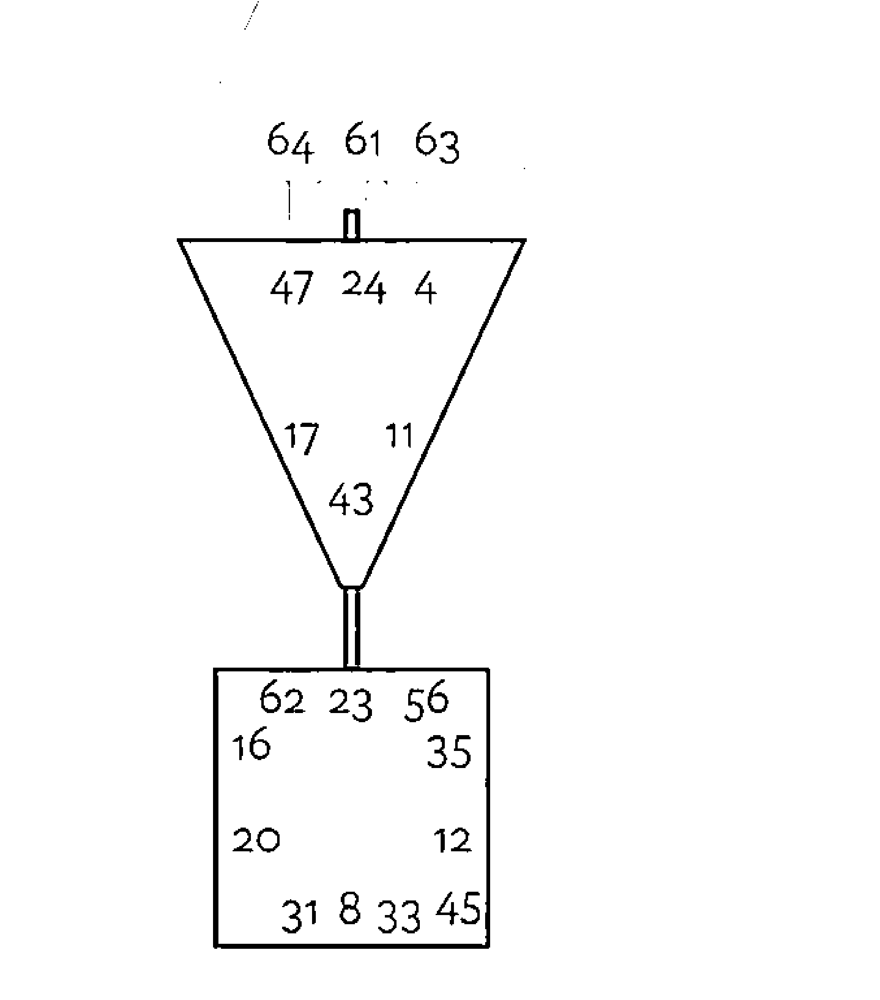

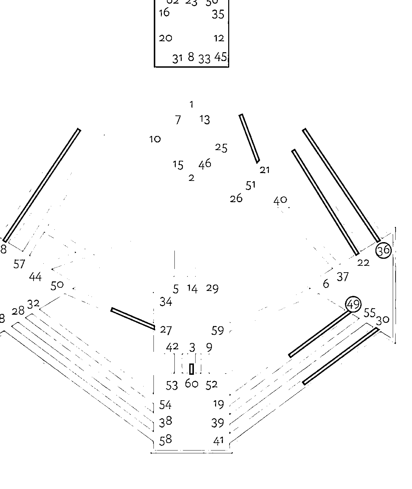

### 21.5 客觀性

運用權力必須基於公正，而非感情用事。

- △ 堅持原則，堅持合理，確保自己是客觀的。當意志力平衡時，能客觀運作。
- ▽ 消極的驅動力非常強大，會以客觀的角度找出原因，卻無法客觀看待所造成的影響。主觀地運用意志力。

---

## 奮勇前進

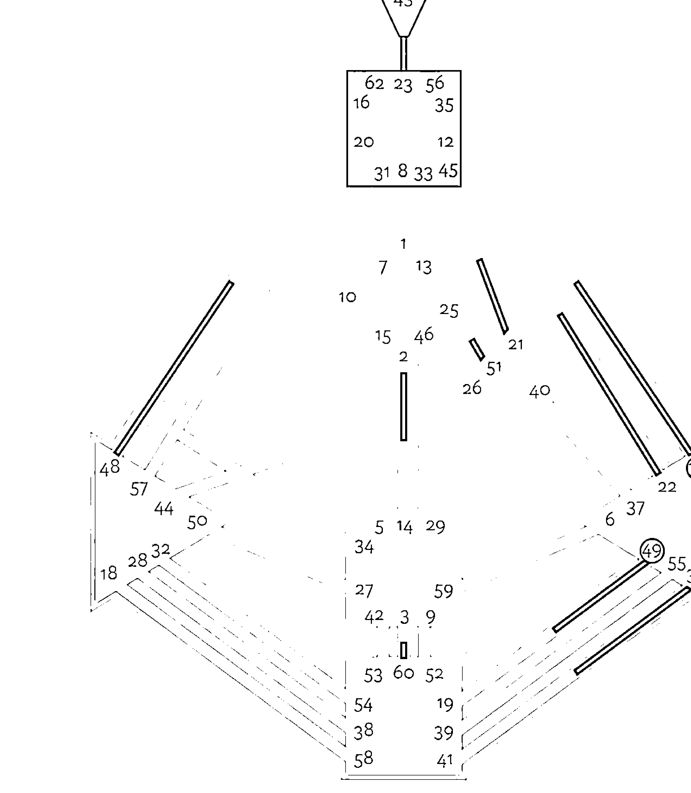

- 架構 23–43
- 混亂 21.6
- 自我滿足 48.6
- 耐性 2.3
- 同化 23.5
- 進展 43.5
- 參考 51.1
- 精疲力竭 30.4
- 民怨 49.3
- 成熟 22.6
- 平台 49.4
- 挑戰 24.6
- 支持 36.2
- 保守主義 60.3

### 21.6 混亂

無效的行為導致失序。

P △ 消耗戰。抱持希望，認為最終必然會成功，不顧險阻，也不管失序越演越烈，還是會持續正常的行動。

戰略願景，展現意志只會引發失序。

♀ ▽ 在混亂的局面下，選擇抽離，回歸內在的秩序。

當物質層面的方向混亂，自我會先抽離，以自己的力量，找到內在的秩序。

---

## 激起

參考  
農曆 3/5（二） 清明

23–43 架構

- 日 51.1 參考
- 地 57.1 困惑
- 月 8.4 尊重
- 北交 23.5 同化
- 南交 43.5 進展
- 水 △51.3 適應
- 金 30.6 強制
- 火 ▽49.4 平台
- 木 22.6 成熟
- 土 ▽49.4 平台
- 天 24.6 挑撥
- 海 △36.2 支持
- 冥 60.3 保守主義

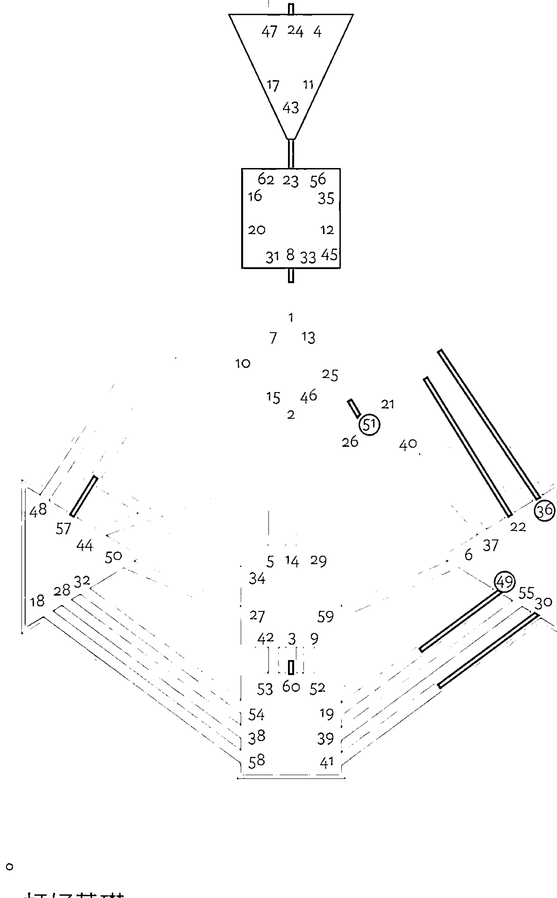

### 51.1 參考

之前處理危機的經驗，成為優勢。

P △ 重複檢驗是天賦，可以預作準備，打好基礎。  
意志力的力量，被經驗所制約。

♀ 震驚之後，在情緒層面呈現退縮的傾向。  
缺乏完整因應衝擊的能力。

---

## 激起

退縮  
2022/04/06 05:14 TWN  
農曆 3/6（三）

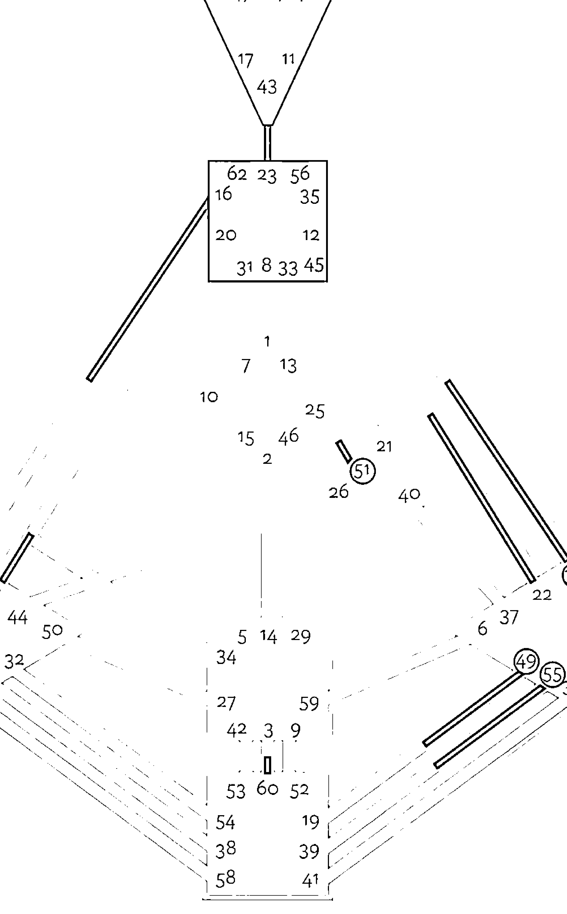

- 架構 23–43
- 退縮 51.2
- 淨化 57.2
- 領導者 16.4
- 同化 23.5
- 進展 43.5
- 對稱 51.5
- 合作 55.1
- 組織 49.5
- 成熟 22.6
- 平台 49.4
- 挑戰 24.6
- 支持 36.2
- 保守主義 60.3

### 51.2 退縮

♂ △ 對驚嚇的運作機制了然於心，而抽離是唯一合乎邏輯的舉動。  
當自我受到威脅，抽離退縮是本能反應。

☿ ▽ 聰明反被聰明誤，太過自滿相信人定勝天，拒絕抽身。  
拒絕抽離的利己主義者，失敗可能就此降臨。

---

## 激起

適應  
農曆 3/7（四）

23–43 架構

- 日 △51.3 適應
- 地 57.3 敏銳
- 月 45.4 方向
- 北交 23.5 同化
- 南交 43.5 進展
- 水 42.1 多樣化
- 金 △55.2 不信任
- 火 ▽49.6 吸引力
- 木 ▽36.1 抗拒
- 土 ▽49.4 平台
- 天 24.6 挑釁
- 海 △36.2 支持
- 冥 60.3 保守主義

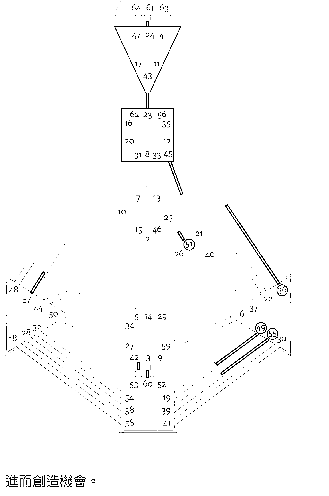

### 51.3 適應

☉ △ 延續生命的意識，能夠獨立思考，進而創造機會。面對挑戰時，自發的力量。

♃ ▽ 當一個人的日常作息被擾亂，呈現不穩定的狀態，會傾向退縮，而非適應。面對挑戰時，自我可能就此動搖。

---

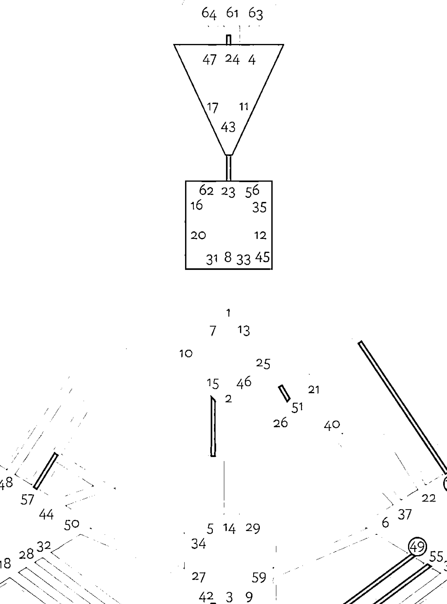

- 架構 23–43
- 極限 51.4
- 指導者 57.4
- 壁花 15.4
- 同化 23.5
- 進展 43.5
- 嘗試錯誤 42.3
- 無罪 55.3
- 吸引力 49.6
- 抗拒 36.1
- 組織 49.5
- 挑釁 24.6
- 支持 36.2
- 保守主義 60.3

### 51.4 極限

純然的創造力，有時能在毀滅性的衝擊中找到機會點，宛如天才。戰士的意志，總會找到某種方式來回應挑戰。

凡事合理化，依命令行事；若面對重大衝擊時，完全失效。膚淺的自我，欠缺回應挑戰時所需的資源與深度。

---

## 激起

對稱  
2022/04/09 01:50 TWN  
農曆 3/9（六）

23–43 架構  
39–55 情緒

- 日 △51.5 對稱
- 地 57.5 進展
- 月 △39.4 節制
- 北交 23.5 同化
- 南交 43.5 進展
- 水 42.5 自我實現
- 金 55.4 同化
- 火 30.1 沉著
- 木 ▽36.1 抗拒
- 土 49.5 組織
- 天 2.1 直覺
- 海 △36.2 支持
- 冥 60.3 保守主義

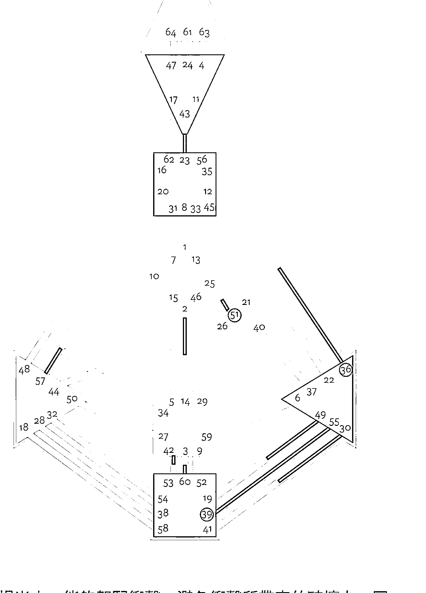

### 51.5 對稱

☉ △ 充分掌握衝擊的本質，完美地發揚光大，能夠駕馭衝擊，避免衝擊所帶來的破壞力，回歸正常模式來蛻變，進而衍生出相對稱的適應方式。依循本能找到適應之道，身為第十的完美展現。

♂ ▽ 傾向回歸核心，雖經歷過的衝擊和諸共存，卻再度被重創，不堪負荷。利己主義者，沉浸於勝利中得意忘形，不知警惕。

---

## 激起

分割  
2022/04/10 00:44 TWN  
農曆 3/10（日）

- 突變 3–60
- 架構 23–43
- 分割 51.6
- 使用 57.6
- 苦行主義 62.4
- 同化 23.5
- 進展 43.5
- 綜合 3.1
- 成長 55.5
- 實用主義 30.2
- 抗拒 36.1
- 組織 49.5
- 直覺 2.1
- 支持 36.2
- 保守主義 60.3

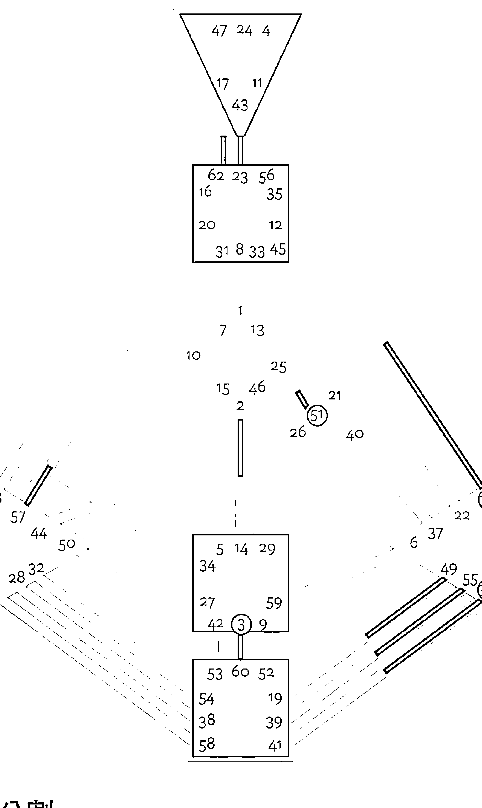

### 51.6 分割

面對危機之際，當眾人皆因恐慌而失序，有能力處變不驚，同時秉持意志力與活力，獨自找到生存之道。

意志力的力量，以一己之力迎向挑戰。

令人好奇的是，同樣的天賦，有些人的態度反倒引來非難，甚至更極端的狀態，無法成功抽離。

獨自面對挑戰的自我主義者，反倒激發或鼓動更多挑戰者。

---

## 42.1 增加  
多樣化

2022/04/10 23:38 TWN  
農曆 3/10（日）

3–60 突變  
23–43 架構

- 日 ▲42.1 多樣化
- 地 32.1 保存
- 月 ▼31.5 自以為是
- 北交 23.5 同化
- 南交 43.5 進展
- 水 ▼3.3 生存
- 金 55.6 自私
- 火 30.3 順從
- 木 ▼36.1 抗拒
- 土 49.5 組織
- 天 2.1 直覺
- 海 △36.2 支持
- 冥 60.3 保守主義

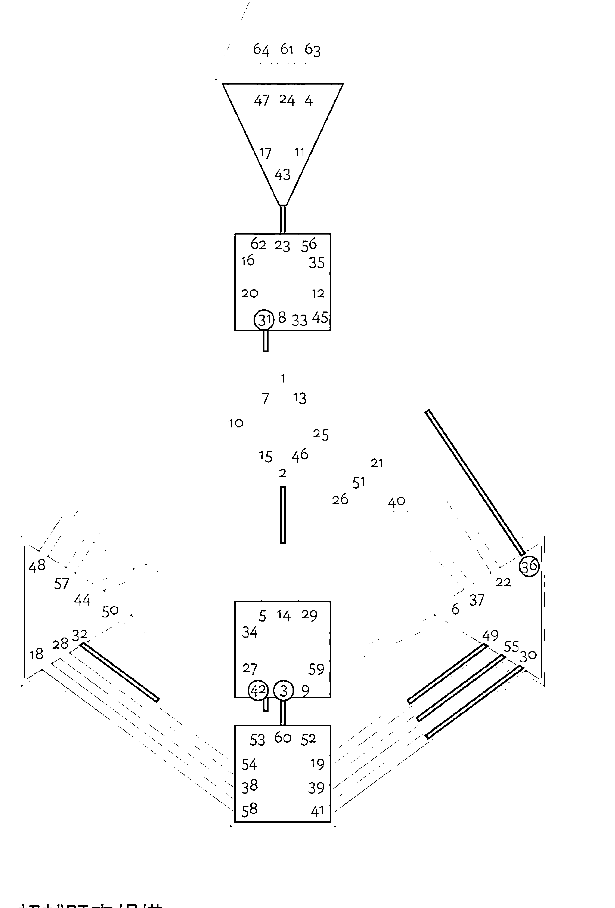

### 42.1 多樣化

☉ △ 有能力善用剩餘資源，採取行動，超越既定規模。  
透過擴展而成長，尤其是連接核心動力時更顯著。

♀ ▽ 缺乏核心思想，散亂投注剩餘資源。  
衰弱，太過激進的擴展，可能趨向衰弱。

---

## 增加

識別 42.2

- 突變 3–60
- 架構 23–43
- 識別 42.2
- 抑制 32.2
- 將軍 7.5
- 同化 23.5
- 進展 43.5
- 受害 3.5
- 母親／父親 37.1
- 精疲力竭 30.4
- 支持 36.2
- 組織 49.5
- 直覺 2.1
- 支持 36.2
- 保守主義 60.3

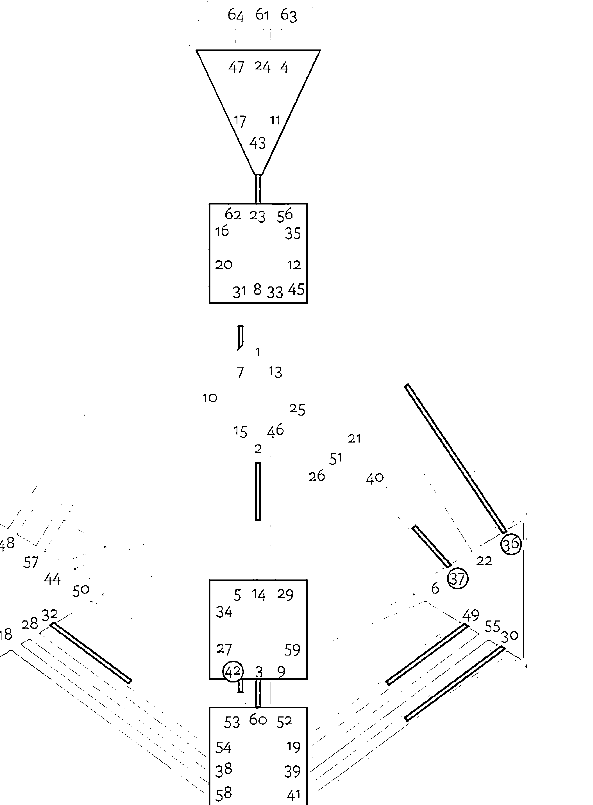

### 42.2 識別

- △ 判別趨勢，敏銳從中獲益。  
- 投入未來趨勢，從中成長獲得力量。  
- ▽ 漸進變革之際，以苦行僧之姿抽離。  
- 不再回應潮流改變，不再成長。

---

## 42.3 增加

嘗試錯誤  
農曆 3/12（二）

23–43 架構

- 日 42.3 嘗試錯誤
- 地 32.3 缺乏連續性
- 月 29.6 困惑
- 北交 23.5 同化
- 南交 43.5 進展
- 水 27.2 自給自足
- 金 37.2 責任
- 火 30.4 精疲力竭
- 木 △36.2 支持
- 土 49.5 組織
- 天 2.1 直覺
- 海 △36.2 支持
- 冥 60.3 保守主義

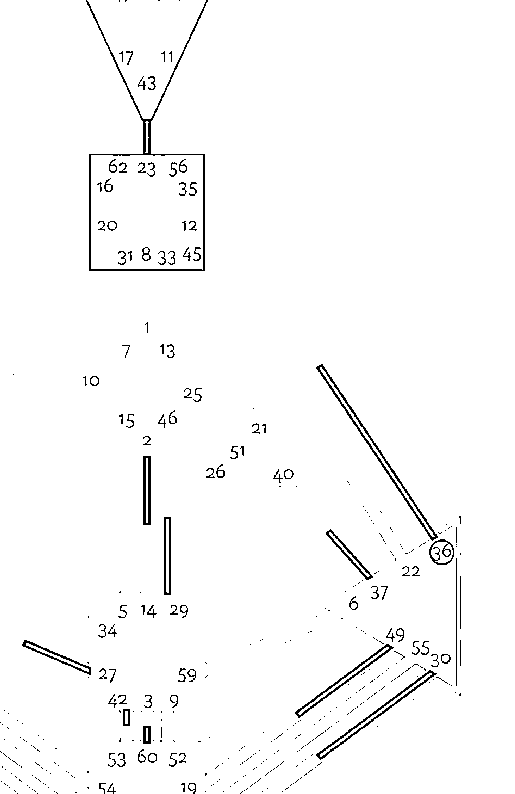

### 42.3 嘗試錯誤

向外擴張時，犯錯是必經過程。

- ♂ △ 充滿能量與定見，將錯誤轉化為優勢。能夠接受錯誤是成長的一部分。
- ☽ ▽ 喜怒無常，面對錯誤陷入沉思，過於謹慎如履薄冰，其實並不必要。錯誤會讓人更清晰化，也更謹慎小心。

---

## 增加

## 42.4

中間人  
2022/04/13 20:27 TWN  
農曆 3/13（三）

- 架構 23–43
- 中間人 42.4
- 公理即強權 32.4
- 制約 64.1
- 同化 23.5
- 進展 43.5
- 慷慨 27.4
- 平等對待 37.3
- 調侃 30.5
- 支持 36.2
- 組織 49.5
- 直覺 2.1
- 支持 36.2
- 保守主義 60.3

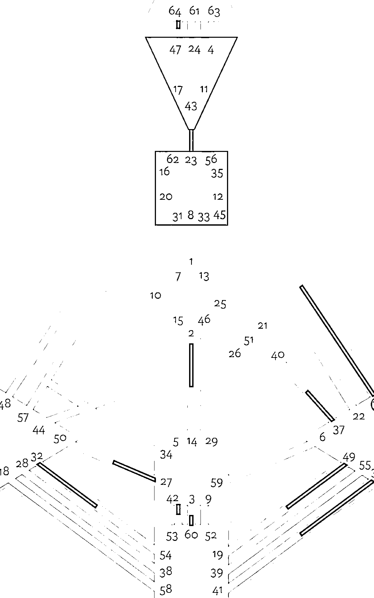

### 42.4 中間人

- ☽ △ 調停者的典型。  
- 成熟地居中調解，帶來成長。  
- ♀ ▽ 建立與維持關係的長才，並不適用於此，在此以實用為主，和諧不是最主要的考量。  
- 不夠成熟，所以力求和諧，曲解了調停的本質，成長受限。

---

## 42.5 增加

自我實現  
2022/04/14 19:25 TWN  
農曆 3/14（四）

23–43 架構

- 日 ▲42.5 自我實現
- 地 32.5 彈性
- 月 6.3 忠誠
- 北交 23.5 同化
- 南交 43.5 進展
- 水 27.6 警惕
- 金 ▲37.5 愛
- 火 ▲30.6 強制
- 木 ▲36.2 支持
- 土 49.5 組織
- 天 2.1 直覺
- 海 ▲36.2 支持
- 冥 60.3 保守主義

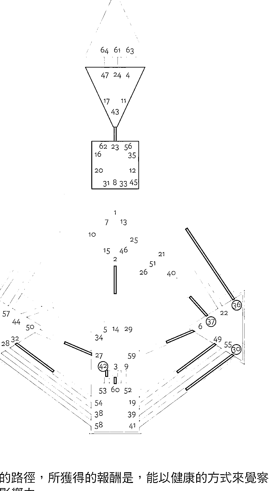

### 42.5 自我實現

目標的履行與實現，是一條自然顯現的路徑。所獲得的報酬，是能以健康的方式來覺察自我，而非在過程中所取得的權力與影響力。自我實現帶來成長，自然而然帶來影響力。

自我實現完全是內在的體驗，需要獨自體會。成長源自於內，賦予力量後，能邁出而獨立。

---

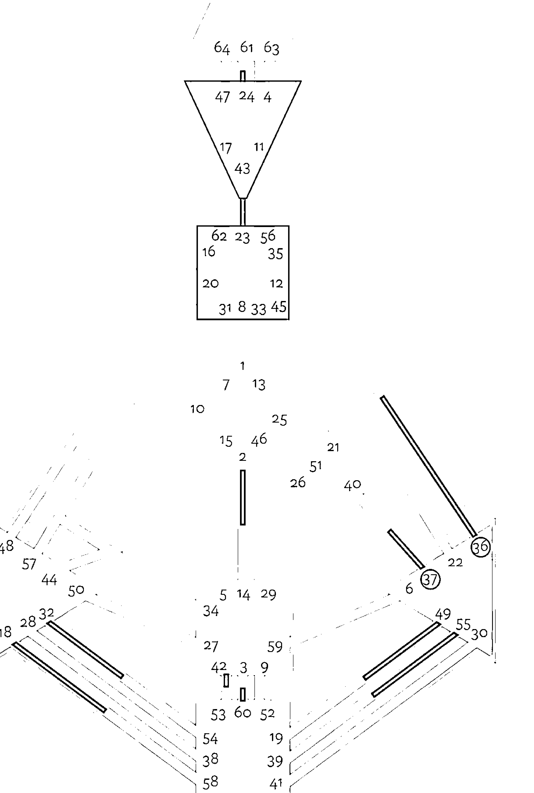

- 增加
- 培育
- 架構 23–43
- 培育 42.6
- 安然以對 32.6
- 治療 18.5
- 同化 23.5
- 進展 43.5
- 認可 24.2
- 目的 37.6
- 合作 55.1
- 過渡 36.3
- 組織 49.5
- 直覺 2.1
- 支持 36.2
- 保守主義 60.3

### 42.6 培育

- △ 是天性也是直覺，培育他人。與他人分享成長過程，從中獲得力量。
- ▽ 具限制性、有害的物質主義，自我疏離並引發好戰的行為。拒絕與人分享自己的成長過程。

## 3.1 凡事起頭難  
綜合  

2022/04/16 17:24 TWN  
農曆 3/16 (六)

- 3–60 突變  
- 23–43 架構  

- 日 3.1 綜合  
- 地 50.1 移民  
- 月 32.1 保存  
- 北交 23.5 同化  
- 南交 43.5 進展  
- 水 24.4 隱士  
- 金 63.1 沉著  
- 火 55.1 合作  
- 木 36.3 過渡  
- 土 49.5 組織  
- 天 2.1 直覺  
- 海 36.2 支持  
- 冥 60.3 保守主義  

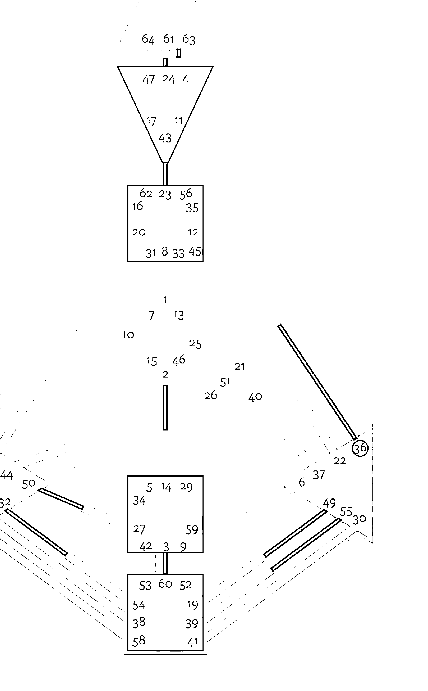

### 3.1 綜合

分析過所有相關因素之後，才能克服困難。

- 本來就會困惑，獲得清明之前，必然會感到困惑。天生就知道，混亂之中，新秩序於焉產生。  
- 培養直覺與聰明才智，導致不必要的挫折。不知道秩序終將出現，反而在別處尋找慰藉。

---

## 凡事起頭難  
未成熟  

農曆 3/17 (日)

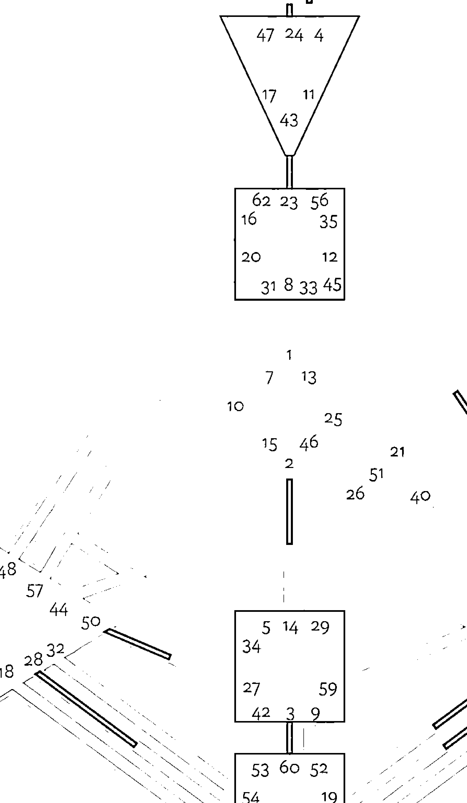

- 突變 3–60  
- 架構 23–43  
- 未成熟 3.2  
- 決斷力 50.2  
- 冒險主義 28.3  
- 分裂 23.4  
- 死腦筋 43.4  
- 自由 24.5  
- 結構 63.2  
- 不信任 55.2  
- 過渡 36.3  
- 組織 49.5  
- 直覺 2.1  
- 支持 36.2  
- 保守主義 60.3  

### 3.2 未成熟

無節制地接受引導。

- ♂ △ 為了成長，不屈不撓，終將勝利。個體迎向突變的能量與潛能。  
- ♅ ▽ 面對權威，想接受又想對抗，內在並不穩定。能量與潛能皆受制於人，導致不穩定。

---

## 凡事起頭難  
生存  

農曆 3/18 (一)

- 3–60 突變  
- 23–43 架構  
- 日 ▽ 3.3 生存  
- 地 50.3 適應力  
- 月 1.6 客觀性  
- 北交 23.4 分裂  
- 南交 43.4 死腦筋  
- 水 2.1 直覺  
- 金 63.3 持續  
- 火 ▽ 55.3 無罪  
- 木 ▽ 36.3 過渡  
- 土 49.5 組織  
- 天 2.1 直覺  
- 海 △ 36.2 支持  
- 冥 60.3 保守主義  

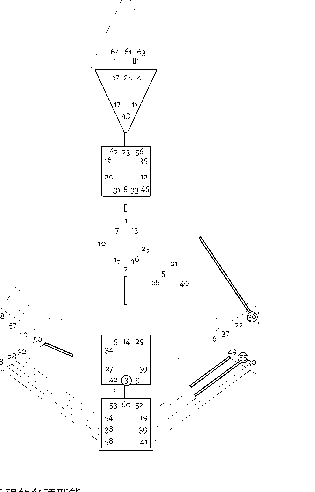

### 3.3 生存

有能力識別並區分，肥沃與貧瘠所呈現的各種型態。

- ♀ △ 在繁衍的過程中，有能力選擇最好的伴侶。並對生理層面的突變，取決於與誰合作，天生知道肥沃與貧瘠之別。  
- ♇ ▽ 乖張違背演化的標準。天生反叛，拒絕突變。

---

## 凡事起頭難  
魅力  

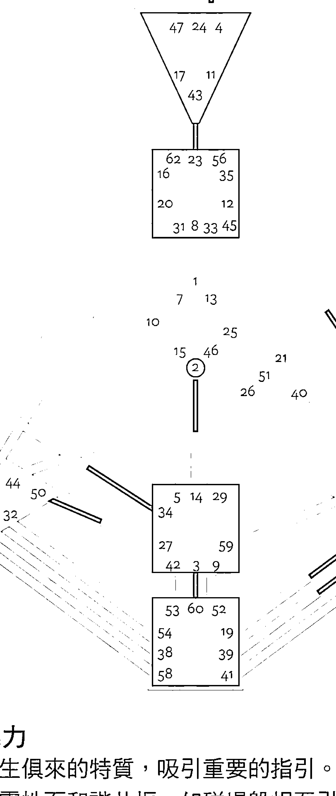

- 突變 3–60  
- 架構 23–43  
- 魅力 3.4  
- 腐敗 50.4  
- 男子氣概 34.3  
- 分裂 23.4  
- 矛盾 43.4  
- 耐性 2.3  
- 記憶 63.4  
- 同化 55.4  
- 閒談活動 36.4  
- 組織 49.5  
- 直覺 2.1  
- 支持 36.2  
- 保守主義 60.3  

### 3.4 魅力

與生俱來的特質，吸引重要的指引。

- 在靈性面和諧共振，如磁場般相互引發，獲得滋養。如氛圍靈的能量取得滋養，確保一切井然有序。  
- 人生位於下降軌位，來自我執的要求被拒。困惑的能量需要滋養，但往往被拒絕。

---

## 凡事起頭難  
受害  

農曆 3/20（三）穀雨

- 3–60 突變  
- 23–43 架構  

- 日 3.5 受害  
- 地 50.5 一致性  
- 月 5.6 屈服  
- 北交 23.4 分裂  
- 南交 43.4 死腦筋  
- 水 △ 2.5 靈活應用  
- 金 63.5 肯定  
- 火 ▽ 55.4 同化  
- 木 36.4 間諜活動  
- 土 ▽ 49.6 吸引力  
- 天 2.1 直覺  
- 海 △ 36.2 支持  
- 冥 60.3 保守主義  

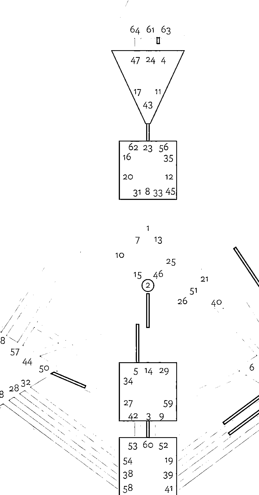

### 3.5 受害

用來穿越困惑的行動，就是與人疏遠。

- ♂ △ 捍衛個人信念的勇氣。以個人的獨特能量，來對抗困惑。  
- ⊕ ▽ 地球位於下降相位，受害導致窒息與痛苦。若被他人認定的秩序所支配，充滿困惑的能量。

---

## 凡事起頭難  
臣服  

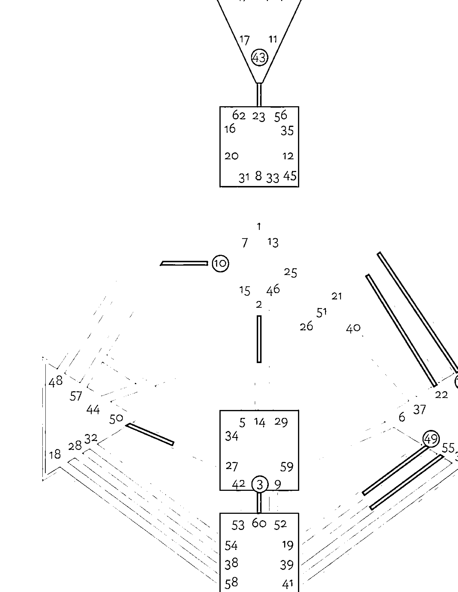

- 突變 3–60  
- 架構 23–43  
- 臣服 3.6  
- 領導力 50.6  
- 烈士 10.3  
- 分裂 23.4  
- 死腦筋 43.4  
- 傳教 23.1  
- 次等艙 22.1  
- 成長 55.5  
- 閒談活動 36.4  
- 吸引力 49.6  
- 直覺 2.1  
- 支持 36.2  
- 保守主義 60.3  

### 3.6 臣服

最終的成熟是分辨出，那些掙扎是徒勞。

- ☉ △ 只要光芒一直閃耀，人生就會繼續。天生就能接受秩序是過程，而非問題。  
- ♇ ▽ 曾經當權掌控一切，人生可能毫無價值，感受到沮喪和絕望。困惑是一股壓倒性的能量，導致沮喪。

---

## 滋養  
自私  

農曆 3/22 (五)

- 23–43 架構  
- 28–38 奮力掙扎  

- 日 ▲ 27.1 自私  
- 地 28.1 準備  
- 月 ▽ 38.6 誤解  
- 北交 23.5 同化  
- 南交 43.5 進展  
- 水 23.2 自我防衛  
- 金 22.2 禮儀學校  
- 火 55.6 自私  
- 木 36.4 閒談活動  
- 土 ▽ 49.6 吸引力  
- 天 2.1 直覺  
- 海 △ 36.2 支持  
- 冥 60.3 保守主義  

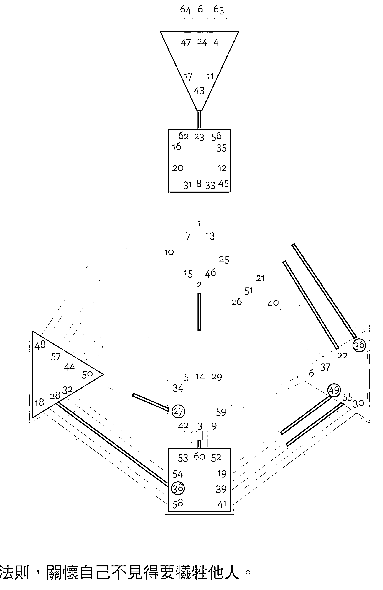

### 27.1 自私

> ☉ △ 自我驅動，關懷自己的第一條法則；關懷自己不見得要犧牲他人。若不關懷自己，就不會有力量。  

> ⊕ ▽ 忌妒，伴隨而來的不幸。自私的力量，透過忌妒的方式來展現。

---

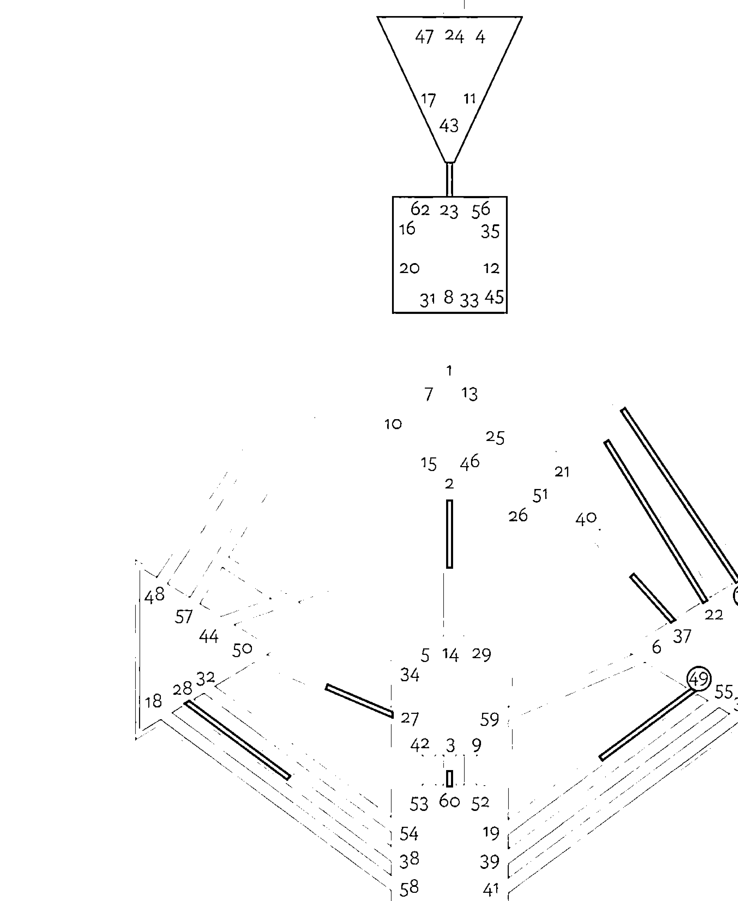

- 架構 23–43  
- 自給自足 27.2  
- 與魔鬼握手 28.2  
- 果斷 60.2  
- 同化 23.5  
- 進展 43.5  
- 分裂 23.4  
- 魔法師 22.3  
- 母親／父親 37.1  
- 閒談活動 36.4  
- 吸引力 49.6  
- 直覺 2.1  
- 支持 36.2  
- 保守主義 60.3  

### 27.2 自給自足

顯而易見的準則，先擁有，才給予。

- ☽ △ 母親，偉大的滋養者。滋養的耐力與關懷的能力。  
- ♂ ▽ 消耗他人資源的孩子。處於弱勢時，會耗損別人的精神與力量。

---

## 27  
滋養  
貪婪  

農曆 3/24（日）

- 19–49 整合綜效  
- 23–43 架構  

- 日 27.3 貪婪  
- 地 28.3 冒險主義  
- 月 19.4 團隊合作  
- 北交 23.5 同化  
- 南交 43.5 進展  
- 水 23.5 同化  
- 金 22.4 敏感性  
- 火 37.2 責任  
- 木 36.5 秘密的  
- 土 49.6 吸引力  
- 天 2.1 直覺  
- 海 36.2 支持  
- 冥 60.3 保守主義  

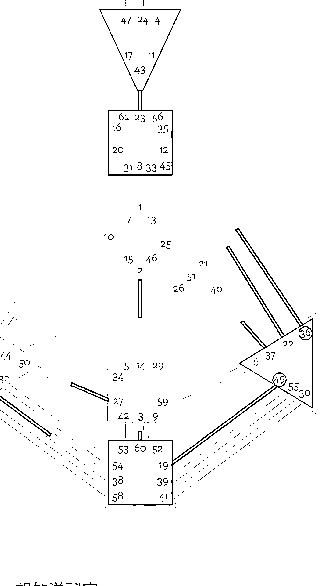

### 27.3 貪婪

執意要擁有，遠超過自己所需要的。

> ♇ 在此指的是心理上的狀態：著迷、依賴、想知道祕密。祕密警察，不論在精神或物質層面，由於渴望擁有，想要的遠比真正需要的多，使你萌生力量。  

> ♂ 平凡，完全不具救贖的價值。貪婪與慾望不可避免會讓人衰敗，也會成癮。對權力的慾望，到手的遠多過真正的需求。

---

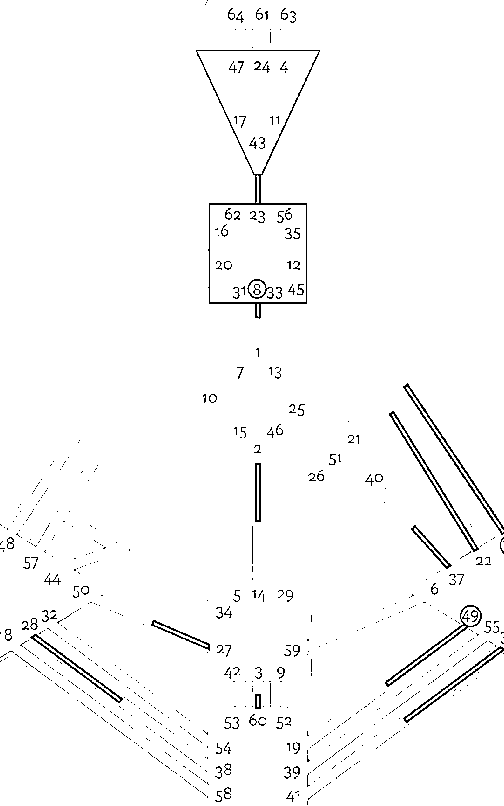

## 滋養  
慷慨  

2022/04/25 08:50 TWN  
農曆 3/25（一）  
27.4

- 架構 23–43  
- 慷慨 27.4  
- 堅持 28.4  
- 沉著 30.1  
- 同化 23.5  
- 進展 43.5  
- 誠實 8.1  
- 直接 22.5  
- 責任 37.2  
- 祕密的 36.5  
- 吸引力 49.6  
- 天才 2.2  
- 支持 36.2  
- 保守主義 60.3  

### 27.4 慷慨

自然而然將所獲得的豐盛，與人分享。

- ♃ △ 優渥有質感的分享。天賦在於能針對不同的人，適當給出獎勵。慷慨分享的力量與影響力。  
- ♂ ▽ 隨意分享。若無區分而隨意分享，有可能會帶來損失。

---

## 27  
滋養  
執行者  

2022/04/26 07:56 TWN  
農曆 3/26 (二)

### 23–43 架構

- 日 27.5 執行者  
- 地 28.5 背叛  
- 月 ▽ 37.3 平等對待  
- 北交 23.4 分裂  
- 南交 43.4 死腦筋  
- 水 8.2 服務  
- 金 22.6 成熟  
- 火 ▽ 37.3 平等對待  
- 木 36.5 秘密的  
- 土 ▽ 49.6 吸引力  
- 天 2.2 天才  
- 海 △ 36.2 支持  
- 冥 60.3 保守主義  

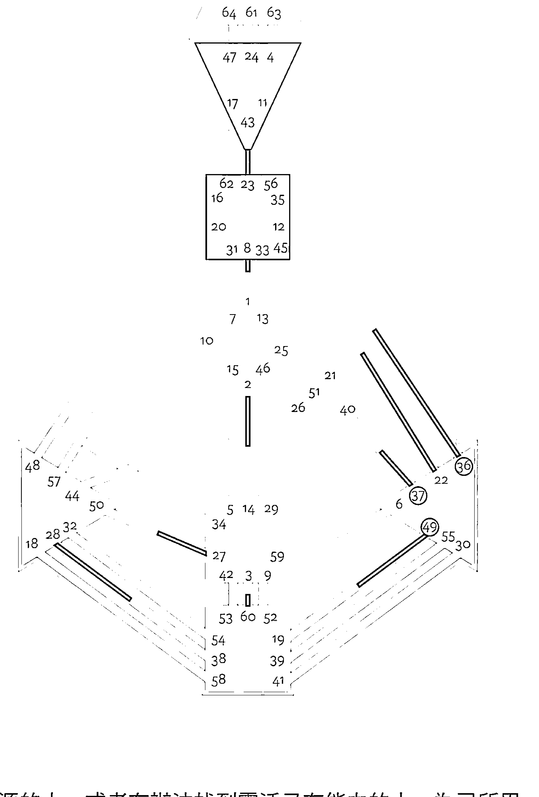

### 27.5 執行者

能有效分配他人資源。

- ♃ △ 是個有原則，天生就擅長分配資源的人。或者有辦法找到靈活又有能力的人，為己所用。有才能也有力量，可以管理他人的資源。  

- ♄ ▽ 難以跳脫本性的限制，以至於分配的過程出現阻礙，想尋求建議與支持。弱點：失去力量的風險，關懷受限。

---

## 滋養  
警惕  

農曆 3/27 (三)

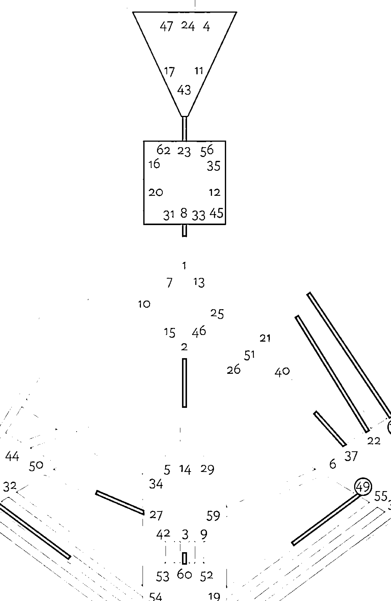

- 架構 23–43  
- 警惕 27.6  
- 榮耀之光 28.6  
- 敏感性 22.4  
- 分裂 23.4  
- 矛盾 43.4  
- 虛假 8.3  
- 抗拒 36.1  
- 以身作則 37.4  
- 祕密的 36.5  
- 吸引力 49.6  
- 天才 2.2  
- 支持 36.2  
- 保守主義 60.3  

### 27.6 警惕

避免揮霍無度，有所防護。

- 月 △ 面對教養，採取務實的態度。以感受與本能來引導，決定是否合宜。  
  具備關懷與教養的能力，對一切了然於心，相當務實，充滿力量與影響力。

- 冥 ▽ 回復到疑問的傾向。  
  充滿不滿，限制了關懷。

---

## 24.1 回歸  
疏忽之罪  

2022/04/28 06:10 TWN  
農曆 3/28（四）

23–43 架構

- 日 ▲ 24.1 疏忽之罪  
- 地 44.1 制約  
- 月 25.6 無知  
- 北交 23.4 分裂  
- 南交 43.4 死腦筋  
- 水 ▽ 8.4 尊重  
- 金 ▽ 36.3 過渡  
- 火 ▽ 37.5 愛  
- 木 △ 36.6 正義  
- 土 ▽ 49.6 吸引力  
- 天 2.2 天才  
- 海 △ 36.2 支持  
- 冥 60.3 保守主義  

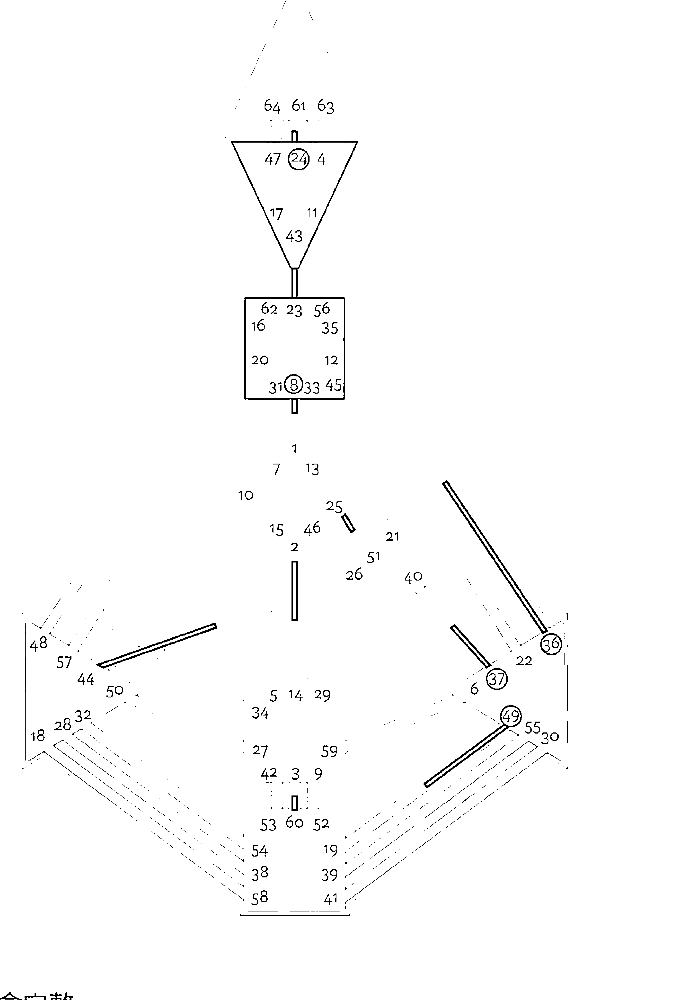

### 24.1 疏忽之罪

蛻變須經歷一段退行期，更新才會完整。

- △ 求勝的意志，相信為達目的可以不擇手段。確立理性概念之前，重新評估過往思維是必要的，可以從中獲得啟發。  
- ▽ 自我欺騙，刻意曲解，合理化過去的狀態。為了獲得靈感，默然於無謂的過往。

---

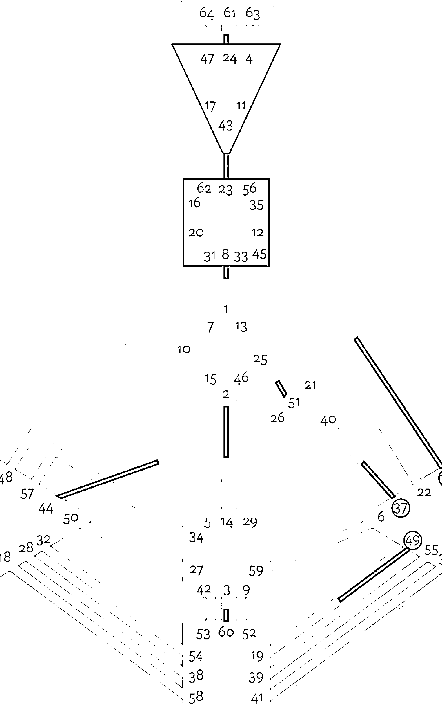

| 項目 | 數值 |
|---|---|
| 架構 | 23–43 |
| 認可 | 24.2 |
| 管理 | 44.2 |
| 參考 | 51.1 |
| 分裂 | 23.4 |
| 死腦筋 | 43.4 |
| 達摩 | 8.5 |
| 間諜活動 | 36.4 |
| 愛 | 37.5 |
| 正義 | 36.6 |
| 吸引力 | 49.6 |
| 天才 | 2.2 |
| 支持 | 36.2 |
| 保守主義 | 60.3 |

### 24.2 認可

- △ 認知其分，自發性適應新型態。自發性地將一切概念化，是潛藏的天賦。  

- ▽ 虛榮：認為蛻變是個人成就，無須社會群體的支持，或自然發生的現象。虛榮的心理，認為自己隨興概念化的天賦，有其產值。

---

## 24.3 回歸  
上癮者  

2022/04/30 04:26 TWN  
農曆 3/30 (六)

- 3–60 突變  
- 23–43 架構  

- 日 24.3 上癮者  
- 地 44.3 干預  
- 月 3.2 未成熟  
- 北交 23.4 分裂  
- 南交 43.4 死腦筋  
- 水 8.6 交誼  
- 金 36.5 秘密的  
- 火 37.6 目的  
- 木 △ 36.6 正義  
- 土 ▽ 49.6 吸引力  
- 天 2.2 天才  
- 海 ▽ 36.3 過渡  
- 冥 60.3 保守主義  

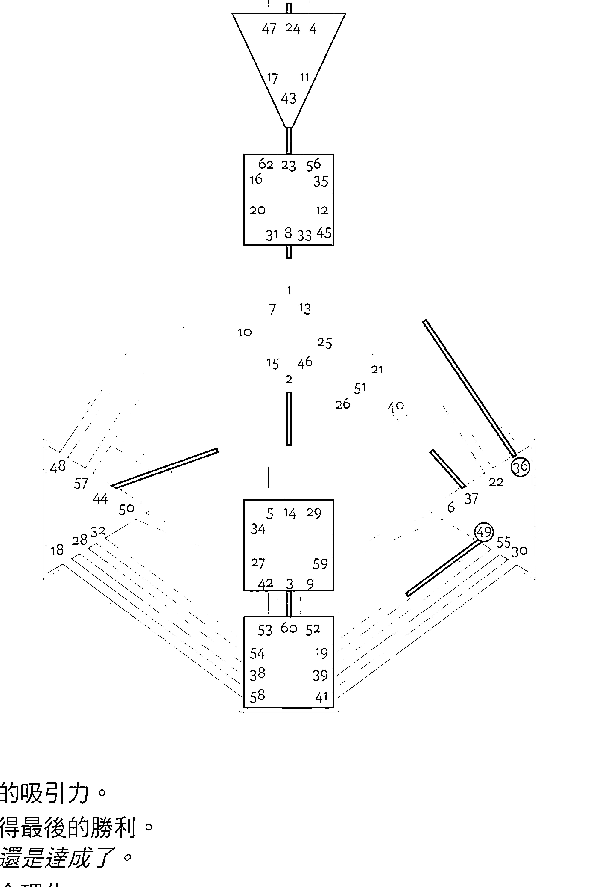

### 24.3 上癮者

各種運行的形式，都具有強大的吸引力。

- ♀ 退行過後，雖然困難，還是取得最後的勝利。不理解是難以克服的任務，但還是達成了。  

- ♃ ▽ 面對上癮及退化，都以成功來合理化。以成功來合理化一切，非理性得以延續。

---

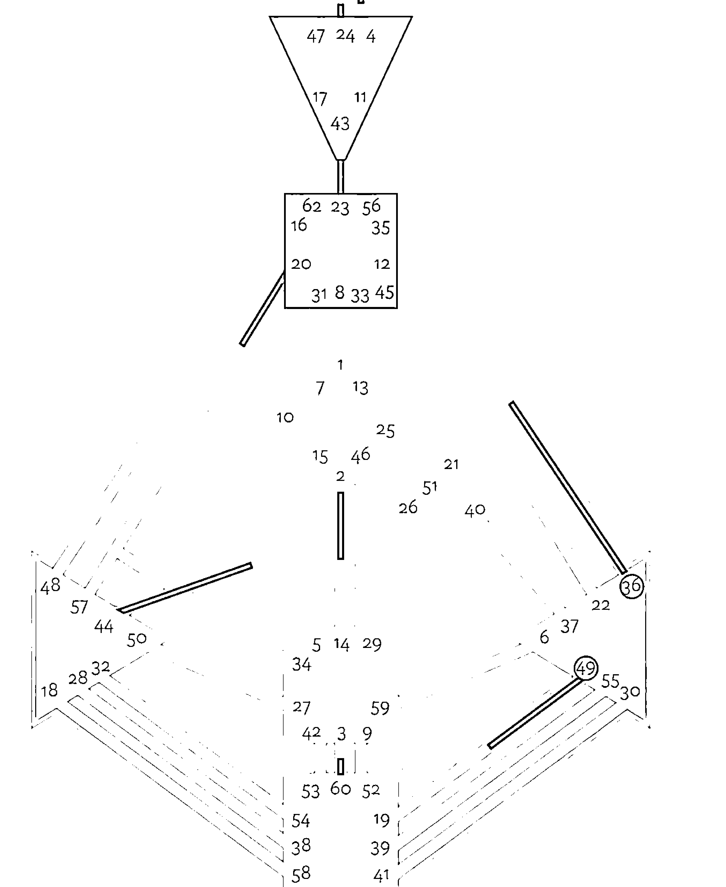

- 架構 23–43  
- 隱士 24.4  
- 誠實 44.4  
- 上癮者 24.3  
- 分裂 23.4  
- 死腦筋 43.4  
- 表面化 20.1  
- 正義 36.6  
- 沉著 63.1  
- 正義 36.6  
- 吸引力 49.6  
- 天才 2.2  
- 過渡 36.3  
- 保守主義 60.3  

### 24.4 隱士

唯有隔絕在一切之外，蛻變才會發生。

- ♄ △ 自律專注，才能確保重生。孤獨將意識提供思維的潛能。  

- ♆ ▽ 傾向與世隔絕，活在幻想的世界裡。孤獨助長了潛藏的幻覺與妄想。

---

## 24.5 回歸  
自白  

2022/05/02 02:46 TWN  
農曆 4/2 (一)

23–43 架構

- 日 24.5 自白  
- 地 44.5 操作  
- 月 23.4 分裂  
- 北交 23.4 分裂  
- 南交 43.4 死腦筋  
- 水 20.2 獨斷者  
- 金 25.1 無私  
- 火 63.2 結構  
- 木 △ 36.6 正義  
- 土 ▽ 49.6 吸引力  
- 天 2.2 天才  
- 海 ▽ 36.3 過渡  
- 冥 60.3 保守主義  

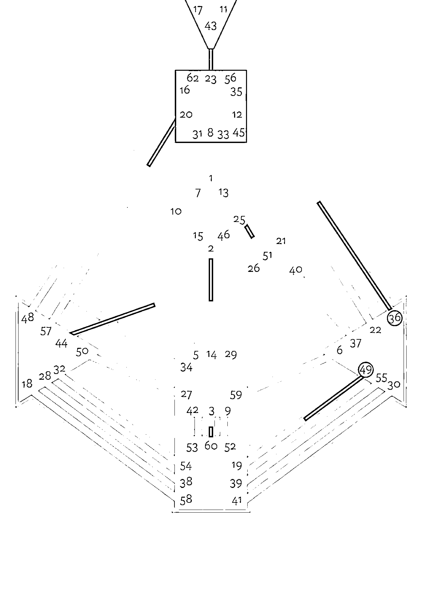

### 24.5 自白

有勇氣承認過往的錯誤。

- ☽ △ 清空再開始，有實質上的價值。以新月為象徵，合理的修正能找到出路，通往全新的可能性。  

- ♂ ▽ 刻意以合理化的方式淡化過往的錯誤。將扭曲的對錯當成藉口，成為合理化的理由。缺乏理性，不斷合理化過去的錯誤。

---

## 回歸 24.6  
挑剔  

2022/05/03 01:56 TWN  
農曆 4/3（二）

- 架構 23–43  
- 挑剔 24.6  
- 超然 44.6  
- 應用 20.4  
- 分裂 23.4  
- 死腦筋 43.4  
- 自我覺知 20.3  
- 存在主義者 25.2  
- 持續 63.3  
- 無私 25.1  
- 吸引力 49.6  
- 天才 2.2  
- 過渡 36.3  
- 保守主義 60.3  

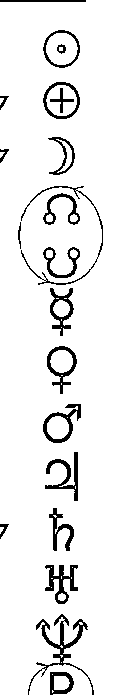

### 24.6 挑剔

獲得禮物時，莫挑剔。否則機會敲門時，很容易因為耳聾而錯失良機。

- △ 有意識地參與整體過程，你才會準備好自己，看見其中的機會。以理性思維為本，認定並聚焦。  

- ▽ 天生猜忌，以至於錯失良機。無理的猜疑混淆了焦點，導致機會擦身而過。

---

## 接觸  
直覺  

- 23–43 架構  
- 35–36 無常  
- 日 2.1 直覺  
- 地 1.1 創意獨立於意志之外  
- 月 35.5 利他主義  
- 北交 23.4 分裂  
- 南交 43.4 死腦筋  
- 水 20.3 自我覺知  
- 金 △ 25.4 生存  
- 火 63.3 持續  
- 木 25.1 無私  
- 土 ▽ 49.6 吸引力  
- 天 2.2 天才  
- 海 36.3 過渡  
- 冥 60.3 保守主義  

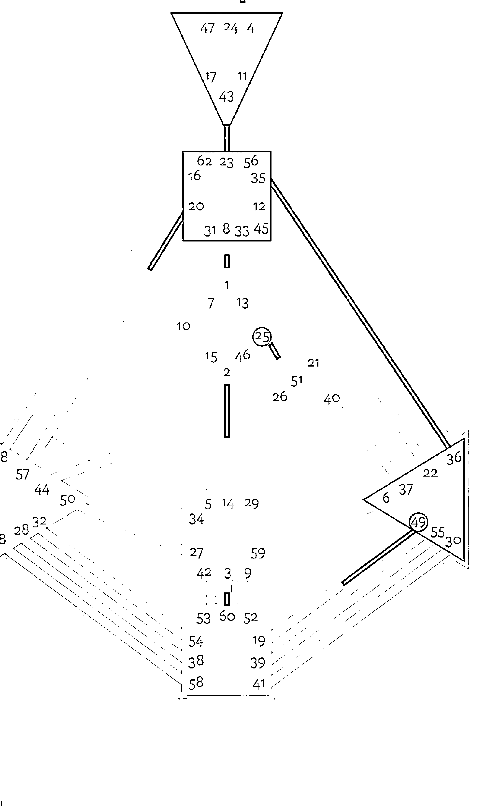

### 2.1 直覺

敏銳察覺不和諧與委縮。

- ♀ △ 不論是先天或後天，美學有其重要性。透過美，獲得更高層次的覺知。  
- ♂ ▽ 閉鎖智慧的判斷，堅持我執的主張。衝動採取行動，忽略高我的智慧。

---

## 接納  
天才  

2022/05/05 00:19 TWN  
農曆 4/5 (四) 立夏

- 架構 23–43  
- 天才 2.2  
- 愛是光 1.2  
- 實用主義者 12.5  
- 分裂 23.4  
- 死腦筋 43.4  
- 應用 20.4  
- 休養 25.5  
- 記憶 63.4  
- 無私 25.1  
- 吸引力 49.6  
- 天才 2.2  
- 過渡 36.3  
- 保守主義 60.3  

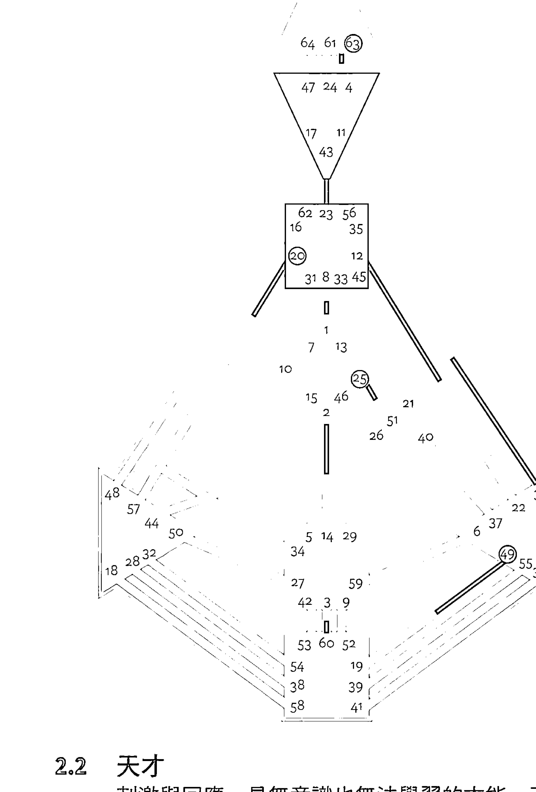

### 2.2 天才

刺激與回應，是無意識也無法學習的本能，天生自然。

- ♄ △ 內在的力量，聚焦與實踐。覺知就是覺知，無法學習，是與生俱來的天賦。  

- ♂ ▽ 天才本應瘋狂，將知識當成力量，用來誇耀自我。衰退為「知識就是力量」。

---

## 接納  
耐性  

- 日 ▽ 2.3 耐性  
- 地 ▽ 1.3 持續創作的能量  
- 月 52.5 解釋  
- 北交 23.4 分裂  
- 南交 43.4 死腦筋  
- 水 ▽ 20.4 應用  
- 金 25.6 無知  
- 火 ▽ 63.5 肯定  
- 木 25.1 無私  
- 土 30.1 沉著  
- 天 2.2 天才  
- 海 36.3 過渡  
- 冥 60.3 保守主義  

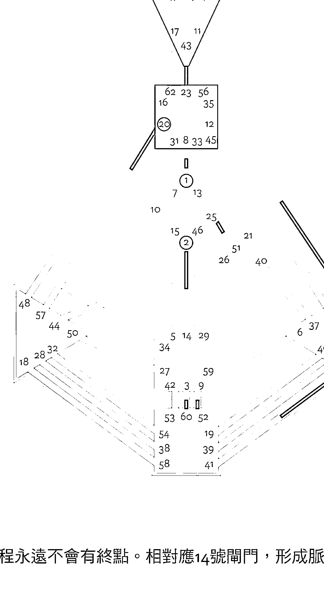

### 2.3 耐性

老師是永不停止學習的學生。

一生專心致力，成就接受這段過程永遠不會有終點。相對應 14 號閘門形成脈動的通道，服務會獲得報酬。

認知到，接受是一輩子的事。

為了革命，需要耐心的層次。更高層次的覺知無法等待，亟需表達。

## 接納  
隱匿  

農曆 4/6（五）

- 架構 23–43  
- 隱匿 2.4  
- 孤獨為創造力之媒介 1.4 △  
- 主張 53.5  
- 分裂 23.4  
- 矛盾節 43.4  
- 現實主義 20.5  
- 開放 17.1 ▽  
- 懷舊之情 63.6  
- 無私 25.1  
- 沉著 30.1  
- 天才 2.2  
- 過渡 36.3  
- 保守主義 60.3  

### 2.4 隱匿

除了謙遜，還加上謹慎、細心、維護和諧的能力。

♀ △ 有更高的目標，凌駕於個人體譽之上。團隊合作，被視為領袖，卻從來不會是酋長。表達更高層次的覺知，並非常了解其認可。

♂ ▽ 輸出受阻。難以抑制的烈火，源自我執，滋生怨恨。一有機會就無法保持沉默。

---

## 接續

2022/05/07 22:00 TWN  
靈活應用  
農曆 4/7（六）

- 23–43 架構  
- 日 2.5 靈活應用  
- 地 1.5 吸引社會大眾的能量  
- 月 56.6 謹慎  
- 北交 23.4 分裂  
- 南交 43.4 死腦筋  
- 水 20.5 現實主義  
- 金 17.2 歧視  
- 火 63.6 懷舊之情  
- 木 25.2 存在主義者  
- 土 30.1 沉著  
- 天 2.2 天才  
- 海 36.3 過渡  
- 冥 60.3 保守主義  

### 2.5 靈活應用

- ☿ △ 水星上升，策略家。合理管理資源。更高層次的覺知是天賦，得以運籌帷幄。  
- ⊕ ▽ 無法與人一起承擔責任，無法辨識他人能力。更高層次的覺知，僅限於個人自私的過程。

---

## 接納

定格  
2022/05/08 21:15 TWN  
農曆 4/8（日）

- 架構 23–43  
- 定格 2.6  
- 客觀性 1.6 △  
- 離異 33.6  
- 分裂 23.4  
- 矛盾節 43.4  
- 現實主義 20.5  
- 人事經理 17.4  
- 次等艙 22.1 ▽  
- 存在主義者 25.2  
- 沉著 30.1  
- 天才 2.2  
- 過渡 36.3  
- 保守主義 60.3  

### 2.6 定格

不能或不願看到全貌。

△ 水星位於上升相位，並不負面，自溺於其聰明才智，不斷合理化。待恢復意識後，逐漸矯正。

▽ 安全感的需求，可能在意識層面扭曲，最終轉為變態。破壞性，高我沉溺於世俗與安全感的需求。

---

## 裂開 23.1  
傳教

2022/05/09 20:30 TWN  
農曆 4/9（一）

- 日 23.1 傳教  
- 地 43.1 耐性  
- 月 29.1 微召  
- 北交 23.4 分裂  
- 南交 43.4 死腦筋  
- 水 ▽20.6 智慧  
- 金 17.5 無人是孤島  
- 火 22.2 禮儀學校  
- 木 25.2 存在主義者  
- 土 30.1 沉著  
- 天 2.2 天才  
- 海 36.3 過渡  
- 冥 60.3 保守主義  

### 23.1 傳教

企圖以另一套價值觀，替換既定的體系。

> 聖哲走至極端，能為邪惡辯護。就算是邪惡，也歸屬於更偉大的良善。  
> 以強而有力的方式表達洞見，足以摧毀原有的價值觀。

♂ 傳教士們傳遞的光明，也同時帶來黑暗。表達洞見強而有力，同時也引發負面效應。

---

## 裂開 23.2  
自我防衛

2022/05/10 19:47 TWN  
農曆 4/10（二）

- 架構 23–43  
- 自我防衛 23.2  
- 奉獻 43.2  
- 堅定 40.2  
- 分裂 23.4  
- 死腦筋 43.4  
- 智慧 20.6  
- 菩薩 17.6  
- 魔法師 22.3  
- 存在主義者 25.2  
- 沉著 30.1  
- 天才 2.2  
- 過渡 36.3  
- 保守主義 60.3  

### 23.2 自我防衛

當生存受到威脅，無須再忍耐。

面對緊要關頭，首要保護原則。當個人的表達被壓迫，勢不可忍。

力量要處於本性，所以防衛的最佳方式是攻擊。而月亮則是排除敵意，保護自己即可。面對敵意，戒慎防衛，表達中有所保留。

---

## 裂開 23.3  
個體性

2022/05/11 19:04 TWN  
農曆 4/11（三）

- 23–43 架構  
- 日 △23.3 個體性  
- 地 43.3 權宜  
- 月 47.3 自我壓抑  
- 北交 23.4 分裂  
- 南交 43.4 死腦筋  
- 水 ▽20.6 智慧  
- 金 21.1 警告  
- 火 ▽22.4 敏感性  
- 木 25.2 存在主義者  
- 土 30.1 沉著  
- 天 ▽2.3 耐性  
- 海 36.3 過渡  
- 冥 60.3 保守主義  

### 23.3 個體性

個體的表達，本質上對他人無害。

- 個人的活力與力量容易招來妒忌，但尚不足以構成威脅。充滿個性的表達，引來注意力而非威脅。  
- 個體的神祕性招來猜疑與威脅。怪癖。充滿個人色彩的表達方式，引發猜忌與威脅。

---

## 裂開 23.4  
分裂

2022/05/12 18:22 TWN  
農曆 4/12（四）

- 架構 23–43  
- 分裂 23.4  
- 死腦筋 43.4  
- 步調 46.5  
- 分裂 23.4  
- 死腦筋 43.4  
- 現實主義 20.5  
- 強權即公理 21.2  
- 敏感性 22.4  
- 感性 25.3  
- 沉著 30.1  
- 耐性 2.3  
- 過渡 36.3  
- 保守主義 60.3  

### 23.4 分裂

分化，看不到綜效的潛能。

- 宿命論、利己主義，最後對結果充滿謊言。各自表述，欠缺社會整體價值。  
- 虛無論與偏執狂。極具個人色彩的表達方式，產生孤立與恐懼。

---

## 裂開 23.5  
同化

2022/05/13 17:40 TWN  
農曆 4/13（五）

- 日 23.5 同化  
- 地 43.5 進展  
- 月 ▽57.1 困惑  
- 北交 23.4 分裂  
- 南交 43.4 死腦筋  
- 水 20.5 現實主義  
- 金 21.3 無力  
- 火 ▽22.5 直接  
- 木 25.3 感性  
- 土 30.1 沉著  
- 天 ▽2.3 耐性  
- 海 36.3 過渡  
- 冥 60.3 保守主義  

### 23.5 同化

- 實際接受別條路也有其價值。  
- ♃ △ 透過同化，擴展與貢獻。天賦是與群體溝通，傳遞個人洞見。  
- ▽ 位居弱勢，更加渴望同化，以滿足保護或滋養的需求。為了能被群體接納而受到保護，使同化的動機更強烈。

---

## 裂開  
融合 23.6

2022/05/14 17:00 TWN  
農曆 4/14（六）

- 架構 23–43  
- 融合 23.6  
- 突破 43.6  
- 適應力 50.3  
- 分裂 23.4  
- 矛盾節 43.4  
- 現實主義 20.5  
- 客觀性 21.5  
- 成熟 22.6  
- 感性 25.3  
- 沉著 30.1  
- 耐性 2.3  
- 變遷 36.3  
- 保守主義 60.3  

### 23.6 融合

透過合縱連橫，逐步調諧各種多樣性。

- ♂ △ 經由融合，本身的能量加上其主張所產生的力量將遞增。透過整合，個體的覺知會帶來多樣性。  
- ♃ ▽ 有原則，卻無法融合而退縮，最後萎縮。個體的覺知具有多樣性，卻在表達時失去力量。

---

## 凝聚在一起  
誠實

2022/05/15 16:20 TWN  
農曆 4/15（日）

- 2–14 脈動  
- 23–43 架構  

- 日 8.1 誠實  
- 地 14.1 金錢非萬能  
- 月 44.6 超然  
- 北交 23.4 分裂  
- 南交 43.4 死腦筋  
- 水 20.5 現實主義  
- 金 21.6 混亂  
- 火 36.1 抗拒  
- 木 25.3 感性  
- 土 30.1 沉著  
- 天 2.3 耐性  
- 海 36.3 過渡  
- 冥 60.3 保守主義  

### 8.1 誠實

> 真實接受限制，知道唯有透過分享，才能超越。

意識到團結力量大。了解創意的表現，必須奠基於誠實溝通與分享的基礎上。

抽離：恐懼在團體中會失去個體性。其設計為了分享創意，而犧牲個體性。

---

## 凝聚在一起  
服務

2022/05/16 15:40 TWN  
農曆 4/16（一）

- 脈動 2–14  
- 架構 23–43  
- 發起 25–51  

- 服務 8.2  
- 管理 14.2  
- 安全 14.4  
- 分裂 23.4  
- 死腦筋 43.4  
- 應用 20.4  
- 參考 51.1  
- 抗拒 36.1  
- 感性 25.3  
- 沉著 30.1  
- 耐性 2.3  
- 過渡 36.3  
- 保守主義 60.3  

### 8.2 服務

- ◎ 最高的善行，無私的服務。展現無私，成為典範的潛能。  
- ⊕ ▽ 地球位於下降相位，報酬是服務的先決條件。願意付出代價，成為典範。

---

## 凝聚在一起  
虛假

2022/05/17 15:01 TWN  
農曆 4/17（二）

- 2–14 脈動  
- 23–43 架構  
- 25–51 發起  

- 日 8.3 虛假  
- 地 △14.3 服務  
- 月 5.1 毅力  
- 北交 23.4 分裂  
- 南交 43.4 死腦筋  
- 水 ▽20.4 應用  
- 金 51.2 退縮  
- 火 △36.2 支持  
- 木 △25.4 生存  
- 土 3.1 沉著  
- 天 ▽2.3 耐性  
- 海 36.3 過渡  
- 冥 60.3 保守主義  

### 8.3 虛假

可以接受集體行動的風格，而非內容與本質。

- △ 看似完美，難以被察覺只是表面親密。空有形式、無實質內容的範例。  
- ▽ 淺薄。低估別人，同時高估自己。不斷自欺而缺乏覺察能力。極度重視外在，對自己的超然來由充滿自信。

---

## 凝聚在一起  
尊重

2022/05/18 14:23 TWN  
農曆 4/18（三）

- 脈動 2–14  
- 架構 23–43  
- 發起 25–51  

- 尊重 8.4  
- 安全 14.4  
- 慈善家 11.5  
- 分裂 23.4  
- 矛盾節 43.4  
- 自我覺知 20.3  
- 適應 51.3  
- 過渡 36.3  
- 生存 25.4  
- 沉著 30.1  
- 耐性 2.3  
- 過渡 36.3  
- 保守主義 60.3  

### 8.4 尊重

一眼就能看出別人的貢獻，這是天賦。對於能以身作則的人，讚賞有加。

- 面對同質化，拒絕妥協的衝動。  
- 以身作則的貢獻動力，成為眾人的典範。  
- 在不能超越限制的團隊中，個人價值無法合理衡量。例如：田徑隊裡公認的隊長，不一定是最有才華的選手。  
- 貢獻的天賦，不受限制束縛。

---

## 凝聚在一起  
達摩

- 2–14 脈動  
- 23–43 架構  
- 25–51 發起  

- 日 ▽8.5 達摩  
- 地 14.5 傲慢  
- 月 ▽38.2 彬彬有禮  
- 北交 23.4 分裂  
- 南交 43.4 死腦筋  
- 水 20.3 自我覺知  
- 金 51.5 對稱  
- 火 36.4 間諜活動  
- 木 △25.4 生存  
- 土 30.1 沉著  
- 天 ▽2.3 耐性  
- 海 36.3 過渡  
- 冥 60.3 保守主義  

### 8.5 達摩

聚在一起到最後終將分離。成功的結合，意味著聚散終有時；幼鳥長成之後會離巢，這是正確的，無損於結合的本質。

♃ 老師。

接受並了解限制所在，在教學中驗證並分享這個過程，貢獻就是其中的一部分。

> 對孩子無法放手的父母，會覺得自身權威被挑戰。  
> 貢獻本身就是目的，而非接受或預見限制。

---

## 凝聚在一起  
交誼

- 交誼 8.6  
- 謙遜 14.6  
- 影響 61.5  
- 分裂 23.4  
- 矛盾筋 43.4  
- 獨斷者 20.2  
- 分割 51.6  
- 秘密的 36.5  
- 生存 25.4  
- 沉著 30.1  
- 耐性 2.3  
- 過渡 36.3  
- 保守主義 60.3  

### 8.6 交誼

源於和諧的確定性。

- △ 明辨模式如何運行，就能把握正確時機。與生俱來的天賦，知道何時該貢獻創意。  
- ▽ 懷疑。即使在最理想的狀態下，也會產生遺憾。因不確定時機點而感到後悔。

---

## 注視  
表面化

- 20–34 魅力  
- 23–43 架構  

- 日 20.1 表面化  
- 地 34.1 霸凌  
- 月 19.2 服務  
- 北交 23.4 分裂  
- 南交 43.4 死腦筋  
- 水 20.2 獨斷者  
- 金 ▽42.1 多樣化  
- 火 36.5 祕密的  
- 木 △25.4 生存  
- 土 30.1 沉著  
- 天 ▽2.3 耐性  
- 海 36.3 過渡  
- 冥 60.3 保守主義  

### 20.1 表面化

依附於淺薄。

- ♀ △ 將膚淺提升為藝術形式。創作標語與口號的人。表達僅止於表面，以此作為藝術。  
- ▽ 僅表現出表面的個性。膚淺人格的展現。

---

## 注視  
獨斷者

2022/05/22 11:53 TWN  
農曆 4/22（日）

- 魅力 20–34  
- 架構 23–43  

- 獨斷者 20.2  
- 氣勢 34.2  
- 組織 49.5 △  
- 分裂 23.4  
- 死腦筋 43.4  
- 表面化 20.1  
- 識別 42.2 ▽  
- 正義 36.6  
- 休養 25.5 ▽  
- 沉著 30.1  
- 耐性 2.3 ▽  
- 過渡 36.3  
- 保守主義 60.3  

### 20.2 獨斷者

限制，特意局限認知。

> ♀ △ 限制被個人化且具排他性。透過苦行抽離，可降低負面，當下的限制得以緩和。

> ☽ ▽ 引導他人走向狹窄路徑的力量。天賦在於透過表達，帶領他人走向狹窄的道路。

---

## 注視  
自我覺知

- 20–34 魅力  
- 23–43 架構  

- 日 20.3 自我覺知  
- 地 34.3 男子氣概  
- 月 37.1 母親／父親  
- 北交 23.4 分裂  
- 南交 43.4 死腦筋  
- 水 8.6 交誼  
- 金 ▽42.4 中間人  
- 火 25.1 無私  
- 木 ▽25.5 休養  
- 土 30.1 沉著  
- 天 ▽2.3 耐性  
- 海 36.3 過渡  
- 冥 60.3 保守主義  

### 20.3 自我覺知

分析個人的行動與成效，從而理解。

- 透過個人意識，適當調整並發展個性，表達當下的自我意識。  
- 以極端方式表達自我，阻礙發展。以極端方式展現自我意識。

---

## 注視  
應用

2022/05/24 10:41 TWN  
農曆 4/24（二）

- 魅力 20–34  
- 架構 23–43  

- 應用 20.4  
- 勝利 34.4  
- 魔法師 22.3  
- 分裂 23.4  
- 矛盾節 43.4  
- 交誼 8.6  
- 自我實現 42.5  
- 存在主義者 25.2  
- 休養 25.5  
- 沉著 30.1  
- 耐性 2.3  
- 過渡 36.3  
- 保守主義 60.3  

### 20.4 應用

與知行合一的人合作，才能將認知與覺察轉化為行動。

- ♃ △ 被學生超越的老師。唯有透過他人，才能將覺知轉化為行動。  
- ☿ ▽ 傾向理論而非實踐。以理論方式表達覺知，對如何運用缺乏興趣。

---

## 注視 20.5  
現實主義

2022/05/25 10:06 TWN  
農曆 4/25（三）

- 20–34 魅力  
- 23–43 架構  

- 日 20.5 現實主義  
- 地 34.5 磁滅  
- 月 25.5 休養  
- 北交 23.4 分裂  
- 南交 43.4 死腦筋  
- 水 8.5 達摩  
- 金 42.6 培育  
- 火 25.2 存在主義者  
- 木 25.5 休養  
- 土 30.1 沉著  
- 天 2.3 耐性  
- 海 36.3 過渡  
- 冥 60.3 保守主義  

### 20.5 現實主義

沉思，無法保證成功。

- ♄ △ 專注於細節，才能完美呈現。透過細節成功傳遞覺知。  
- ♅ ▽ 現實充滿不滿，增添不確定性。看見現實中令人不滿之處，並傳遞當下的覺知。

## 注視　智慧 20.6

2022/05/26 09:31 TWN  
農曆 4/26（四）

- 突變 3–60
- 魅力 20–34
- 架構 23–43

- 智慧 20.6
- 常識 34.6
- 混亂 21.6
- 分裂 23.4
- 死腦筋 43.4
- 達摩 8.5
- 綜合 3.1
- 感性 25.3
- 休養 25.5
- 沉著 30.1
- 耐性 2.3
- 過渡 36.3
- 保守主義 60.3

### 20.6　智慧

沉思，帶來運用理解的能力。

♀ △ 基於社會面向、價值、理想與大眾的既定模式，創立體制，以大眾能理解運用的方式來溝通。有能力能轉化個人覺知，將之普及、運用，讓大眾能理解。

☿ ▽ 與上述相反，只是出發點是為了挑戰心智，從中獲得滿足，而非利他。智識層面的挑戰，轉化個人覺知，為大眾所用。

---

## 熱忱　妄想

- 突變 3–60
- 架構 23–43

- 日 16.1 妄想
- 地 9.1 威力
- 月 3.1 綜合
- 北交 23.4 分裂
- 南交 43.4 死腦筋
- 水 8.4 尊重
- 金 3.2 未成熟
- 火 25.4 生存
- 木 25.5 休養
- 土 30.1 沉著
- 天 2.3 耐性
- 海 36.3 過渡
- 冥 60.3 保守主義

### 16.1 妄想

虛假的熱情。

- 做白日夢的人。
- 透過做白日夢來展現才華。

- 向大眾傳播未能實現的主張。
- 將幻想說成事實的傾向。

---

- 突變 3–60
- 架構 23–43
- 憤世嫉俗的人 16.2 △
- 同病相憐 9.2 ⊕
- 認可 24.2 △
- 分裂 23.4
- 烈喉筋 43.4
- 尊重 8.4 ▽
- 魅力 3.4
- 休養 25.5 ▽
- 無知 25.6
- 沉著 30.1
- 隱匿 2.4
- 過度 36.3
- 保守主義 60.3

### 16.2 憤世嫉俗的人

尖銳戳破別人的諸大謬誤。

- ☉ △ 無視花言巧語，憑一己之力，能客觀評論一切。表達客觀理論的技巧。
- ☿ ▽ 反正的憤世者，憤世嫉俗的評論，是熱情的來源。以嘲諷來表達客觀。

---

## 16.3 熱忱　獨立

- 突變 3–60
- 架構 23–43
- 日 16.3 獨立
- 地 △ 9.3 壓垮駱駝的最後一根稻草
- 月 23.3 個體性
- 北交 23.4 分裂
- 南交 43.4 死腦筋
- 水 8.3 虛假
- 金 3.5 受害
- 火 25.6 無知
- 木 25.6 無知
- 土 30.1 沉著
- 天 2.4 震電
- 海 36.3 過渡
- 冥 60.3 保守主義

### 16.3 獨立

發自內心，延續燃燒的熱情。

△ 在對的時機點，才能保有韌性，避免過度膨脹。  
具備個別技能，擁有潛藏才能，在適當的時機與節奏得以展現。

♂ 過度自信的孩子，容易感到挫敗，必須依賴他人，才能重新點燃熱情，產生不必要的依賴。  
需要別人來肯定其技能或才華。

---

- 突變 3–60
- 架構 23–43
- 領導者 16.4
- 奉獻 9.4
- 應用 20.4
- 分裂 23.4
- 死腦筋 43.4
- 虛假 8.3
- 臣服 3.6
- 無知 25.6
- 無知 25.6
- 沉著 30.1
- 隱匿 2.4
- 過渡 36.3
- 保守主義 60.3

### 16.4 領導者

真誠支持；辨識出別人的才能。

△ 具備熱忱；服務於更高的目標。  
有技巧能辨識，並支持他人發揮天賦。

▽ 投機者。  
拒絕支持或辨識他人的才能。

---

## 熱忱　聖誕怪傑

- 架構 23–43
- 無常 35–36
- 日 16.5 聖誕怪傑
- 地 9.5 相信
- 月 35.4 渴望
- 北交 23.4 分裂
- 南交 43.4 死腦筋
- 水 8.3 虛假
- 金 27.1 自私
- 火 17.1 開放
- 木 25.6 無知
- 土 30.1 沉著
- 天 2.4 懷疑
- 海 36.3 過渡
- 冥 60.3 保守主義

### 16.5 聖誕怪傑

拒絕熱情分享。

P △ 能讓一切不僅是激情，最後轉換成強大且持久的熱情，如同狄更斯筆下的小氣鬼那樣。對表達自己的技能缺乏自信，需要他人的鼓勵。

▽ 熱情分享時，難免感到諷刺，牽制了個人當面的發展。  
「當……時，為什麼我該高興……。」  
對於鼓勵別人所帶來的價值，缺乏自信。

---

- 架構 23–43
- 輕信 16.6
- 威勢 9.6
- 先知 12.4
- 分裂 23.4
- 死腦筋 43.4
- 服務 8.2
- 貪婪 27.3
- 歧視 17.2
- 無知 25.6
- 沉著 30.1
- 隱匿 2.4
- 過度 36.3
- 保守主義 60.3

### 16.6 輕信

對傳播的敏感度。

♆ △ 經由體驗與研究，濃縮環境所引發的激情。嶄新的才華，對別人的表達進行評估。

♃ ▽ 相同原則，但海王星位居此相位，所以先破壞，再尋求新型態。無法評估他人傳遞的訊息。

---

## 35.1 進展　謙遜

- 架構 23–43
- 無常 35–36
- 日 ▽ 35.1 謙遜
- 地 ▽ 5.1 毅力
- 月 52.5 解釋
- 北交 23.4 分裂
- 南交 43.4 死腦筋
- 水 8.2 服務
- 金 27.4 憐憫
- 火 17.3 理解
- 木 △ 17.1 開放
- 土 30.1 沉著
- 天 2.4 靈感
- 海 36.3 過渡
- 冥 60.3 保守主義

### 35.1 謙遜

接受拒絕的能力。

- 人生是藝術，接受拒絕也是過程中的一部分。
- 改變與拒絕都是過程，但仍然接受。
- 面對拒絕，產生自我毀滅的反應。
- 要求自我價值，將改變與拒絕視為屈辱。

---

## 進展　創意空窗期

2022/06/03 05:06 TWN  
農曆 5/5（五）

### 35.2 創意空窗期

- 架構 23–43
- 無常 35–36
- 創意空窗期 35.2
- 內在的和平 5.2
- 主張 53.5
- 分裂 23.4
- 死腦筋 43.4
- 服務 8.2
- 執行者 27.5
- 理解 17.3
- 開放 17.1
- 沉著 30.1
- 隱密 2.4
- 過渡 36.3
- 保守主義 60.3

缺乏靈感，毫無進展。

♀ △ 靈感變化莫測，與之調諧，認知到創意是能量，如浪潮般起落。創意與靈感總是來來去去。

☽ ▽ 為了克服挫敗感，認為要採取行動，然而行動卻很一般。平庸的行動無法帶來進展。需要改變，恐懼停滯。

---

## 35.3 進展　合作

2022/06/04 04:35 TWN  
農曆 5/6（六）

- 架構 23–43
- 無常 35–36

- 日 ▽ 35.3 合作
- 地 5.3 強迫症
- 月 56.5 吸引注意力
- 北交 23.4 分裂
- 南交 43.4 死腦筋
- 水 8.2 服務
- 金 27.6 警惕
- 火 ▽ 17.4 人事經理
- 木 △ 17.1 開放
- 土 30.1 沉著
- 天 2.4 懷疑
- 海 36.3 過渡
- 冥 60.3 保守主義

### 35.3 合作

團結就是力量。

- △ 有效鼓舞眾人，能使個人與團體向外延伸。能為大眾帶來演進的變化。
- ▽ 需要成為核心人物，而忽略他人的重要性。需要成為前進的主軸。

---

## 35.4 進展　渴望

2022/06/05 04:04 TWN  
農曆 5/7（日）

- 架構 23–43
- 無常 35–36
- 渴望 35.4
- 獵人 5.4
- 離異 33.6
- 分裂 23.4
- 矛盾筋 43.4
- 服務 8.2
- 疏忽之罪 24.1
- 無人是孤島 17.5
- 開放 17.1
- 沉著 30.1
- 隱匿 2.4
- 過渡 36.3
- 保守主義 60.3

### 35.4 渴望

貪求進步，永不滿足。

△ 較不嚴峻。月有陰晴圓缺是最佳的比喻，驅動力宛如月盈月缺，逐步轉變，滿月時是執迷，隨著月亮變化，執迷也將逐步退卻。  
樂觀而改變，隨著長期累積的學習。

▽ 濫用地位，累積額外的好處，而這些不公平的奪取，必然會招來報應。不斷前進的驅動力，終將得罪他人，導致交相指責。

---

## 35.5 進展　利他主義

農曆 5/8（一）芒種

- 架構 23–43
- 無常 35–36

- 日 35.5 利他主義
- 地 5.5 喜悅
- 月 4.6 超越
- 北交 23.4 分裂
- 南交 43.4 死腦筋
- 水 8.2 服務
- 金 △ 24.3 上癮者
- 火 ▽ 17.6 苦難
- 木 △ 17.1 開放
- 土 30.1 沉著
- 天 2.4 震盪
- 海 36.3 過渡
- 冥 60.3 保守主義

### 35.5 利他主義

犧牲小我，完成大我。

為了成就整體利益，並維持互動與和諧溝通的諸多原則。不斷進步的溝通方式，能為整體帶來有效的變化。

木星位於下降相位，雖然強調利他而且合作，互動過程中，個人卻因此而失去擴展的可能，暗自懊悔。雖然在溝通層面一直進步，卻在個人層面常常感覺自己失去發展的可能性。

---

## 進展 35.6　矯正

2022/06/07 03:05 TWN  
農曆 5/9（二）

- 架構 23–43
- 無常 35–36
- 矯正 35.6
- 屈服 5.6
- 休養 40.1
- 分裂 23.4
- 矛盾 43.4
- 虛假 8.3
- 隱士 24.4
- 警告 21.1
- 開放 17.1
- 沉著 30.1
- 隱匿 2.4
- 過渡 36.3
- 保守主義 60.3

### 35.6 矯正

修正的能量。

♄ △ 宛如結晶的過程，充滿野心，確保修正及時並有效。修正帶來漸進式的變革。

♂ ▽ 破壞性的傾向。如此嚴厲的方式，或許對個人來說是必要的，但若想普及，將引發抗拒，反倒強化現況，而無法矯正。  
若想以嚴苛甚至拆解的形式改變，必然招來抗拒。

---

## 45.1 聚集在一起　遊說

2022/06/08 02:35 TWN  
農曆 5/10（三）

- 金錢線 21–45
- 架構 23–43

- 日 ▽ 45.1 遊說
- 地 26.1 一鳥在手
- 月 47.2 野心
- 北交 23.4 分裂
- 南交 43.4 死腦筋
- 水 8.3 虛假
- 金 24.5 自白
- 火 △ 21.1 警告
- 木 17.1 開放
- 土 30.1 沉著
- 天 2.4 震驚
- 海 36.3 過渡
- 冥 60.3 保守主義

### 45.1 遊說

♃ △ 教化還未效忠的人，擁有推廣與發展能力，集結眾人。物質層面的發展方向，旨在教育。

♂ ▽ 過度熱心，將遊說變成傳教，換來的是疏遠，而非凝聚力。物質層面的驅動力，帶來激進的教育。

---

## 聚集在一起　共識

2022/06/09 02:07 TWN  
農曆 5/11（四）

- 金錢線 21–45
- 架構 23–43
- 共識 45.2
- 歷史的教訓 26.2
- 影響 46.4
- 分裂 23.4
- 死腦筋 43.4
- 虛假 8.3
- 挑釁 24.6
- 強權即公理 21.2
- 歧視 17.2
- 沉著 30.1
- 隱匿 2.4
- 過度 36.3
- 果斷 60.2

### 45.2 共識

利益共享，能強化凝聚力。

若彼此有共識，能一起評估，就有機會創新，建立新技術。  
為了利益他人，提供技術，指出物質層面的方向。

天生叛逆，拒絕墨守成規。  
在物質層面，拒絕他人的作法。

---

## 45.3 聚集在一起　排除在外

2022/06/10 01:38 TWN  
農曆 5/12（五）

- 金錢線 21–45
- 架構 23–43
- 日 ▽ 45.3 排除在外
- 地 26.3 影響
- 月 ▽ 48.6 自我滿足
- 北交 23.4 分裂
- 南交 43.4 死腦筋
- 水 ▽ 8.4 尊重
- 金 2.2 天才
- 火 21.3 無力
- 木 17.2 歧視
- 土 30.1 沉著
- 天 △ 2.4 靈感
- 海 36.3 過渡
- 冥 60.2 果斷

### 45.3 排除在外

當被排除在外，有能力採取必要措施，來中止老舊形式。為求被納入內圈，不惜受辱。憑藉本能，在物質層面找到路徑，再度成為圈內人。

若被排除在外，會出現激進，並且往往是爆裂的反應。在實質層面未能被納入時，所表現出來的挫敗感。

---

## 聚集在一起　方向

- 金錢線 21–45
- 架構 23–43
- 方向 45.4
- 審查 26.4
- 決斷力 50.2
- 分裂 23.4
- 死腦筋 43.4
- 尊重 8.4
- 耐性 2.3
- 策略 21.4
- 歧視 17.2
- 沉著 30.1
- 隱密 2.4
- 過渡 36.3
- 果斷 60.2

### 45.4 方向

♃ △ 祈求一呼，能聚眾為更高原則而服務。  
在實質層面展現更高原則。

♂ ▽ 基於個人利益，試圖左右群眾的行動與方向。  
在實質層面，欠缺更高原則的具體展現。

---

## 45.5 聚集在一起　領導力

- 金錢線 21–45
- 架構 23–43
- 投降 26–44

- 日 45.5 領導力
- 地 26.5 適應力
- 月 44.5 操作
- 北交 23.4 分裂
- 南交 43.4 死腦筋
- 水 8.5 達摩
- 金 △ 2.4 隱密
- 火 21.4 策略
- 木 17.2 歧視
- 土 30.1 沉著
- 天 △ 2.4 隱密
- 海 36.3 過渡
- 冥 60.2 果斷

### 45.5 領導力

聚集群眾要有核心意義，並且要能聚焦。

- 具有直覺的智慧，以及創新的天賦，能強化團體功能，推崇核心價值，永續經營。在實質世界展現領導力的天賦。
- 知道何謂正確的行動，卻尚未贏得應有的尊重。具有領導力，還未被賦予重任。

---

## 聚集在一起　重新審視

2022/06/13 00:16 TWN  
農曆 5/15（一）

- 脈動 2–14
- 金錢線 21–45
- 架構 23–43
- 重新審視 45.6
- 權威 26.6
- 管理 14.2
- 分裂 23.4
- 死腦筋 43.4
- 交誼 8.6
- 靈活應用 2.5
- 客觀性 21.5
- 歧視 17.2
- 沉著 30.1
- 隱匿 2.4
- 過渡 36.3
- 果斷 60.2

### 45.6 重新審視

- 承認之前拋棄局外人是錯誤，重新接受並納入群體。
- 對於局外人的心態、他們的古怪，以及常被人誤解的邏輯，天生就能同理。
- 為局外人服務，在物質層面帶來新變化。
- 天王星是創新，為局外人找到定位。木星在此則要求服從。
- 焦點放在如何制約局外人，意圖使其順從，這就是現實的趨勢。

---

## 靜止不動　修道士、僧侶

- 架構 23–43

- 日 12.1 修道士、僧侶
- 地 11.1 和諧
- 月 △ 9.6 感激
- 北交 23.4 分裂
- 南交 43.4 死腦筋
- 水 8.6 交誼
- 金 23.1 傳教
- 火 21.6 混亂
- 木 17.2 歧視
- 土 30.1 沉著
- 天 2.4 驚懼
- 海 36.3 過渡
- 冥 60.2 果斷

### 12.1 修道士、僧侶

避世，需要社群的支持來維持。

♀ △ 美與和諧，超越誘惑的可能性。若能得到他人支持，就能脫離世俗並展現簡樸價值。

♃ ▽ 敘利亞苦修者西蒙．斯泰萊特（Simeon Stylites），在一根高柱上生活三十七年，徹底抽離，往往近乎荒誕。在社交上表現出荒誕的方式，情感的連結近乎抽離。

---

## 靜止不動　淨化

2022/06/14 23:23 TWN  
農曆 5/16（二）

- 架構 23–43
- 淨化 12.2
- 嚴格 11.2
- 老師 11.4
- 分裂 23.4
- 瓦解筋 43.4
- 表面化 20.1
- 自我防衛 23.2
- 參考 51.1
- 歧視 17.2
- 沉著 30.1
- 靈活應用 2.5
- 過度 36.3
- 果斷 60.2

### 12.2 淨化

嚴謹地從負面的影響力中抽離。

♄ △ 自律，保有單純的狀態。  
嚴守分際，謹慎遵循社會規範。

☿ ▽ 缺乏刺激，感覺無聊。  
謹慎小心最終變得無趣，表達對刺激的渴望。

## 靜止不動

### 自白

- 日 12.3 自白  
- 地 11.3 現實主義者  
- 月 38.2 彬彬有禮  
- 北交 23.4 分裂  
- 南交 43.4 死腦筋  
- 水 20.2 獨斷者  
- 金 23.3 個體性  
- 火 51.1 參考  
- 木 17.3 理解  
- 土 30.1 沉著  
- 天 2.5 靈活應用  
- 海 36.3 過渡  
- 冥 60.2 果斷  

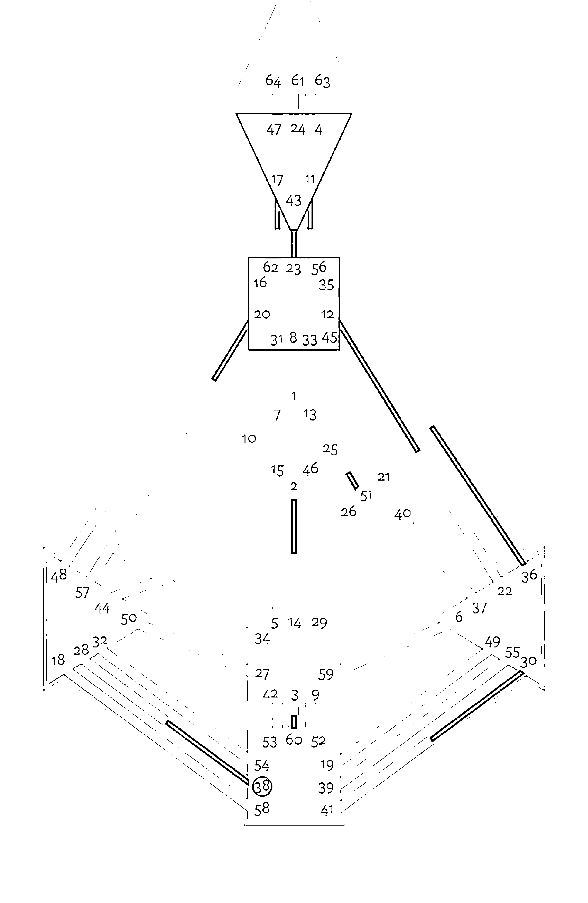

### 12.3 自白

自我分析的過程。

- 承認不足，放下不必要的虛榮。  
- 在社交上表現得不得體，引發自我檢視，也導致小心謹慎的傾向。  
- 有停滯期，常常陷入極大的懊惱。  
- 社交互動層面深度不足，感覺自我增長。

---

## 靜止不動

### 先知 12.4

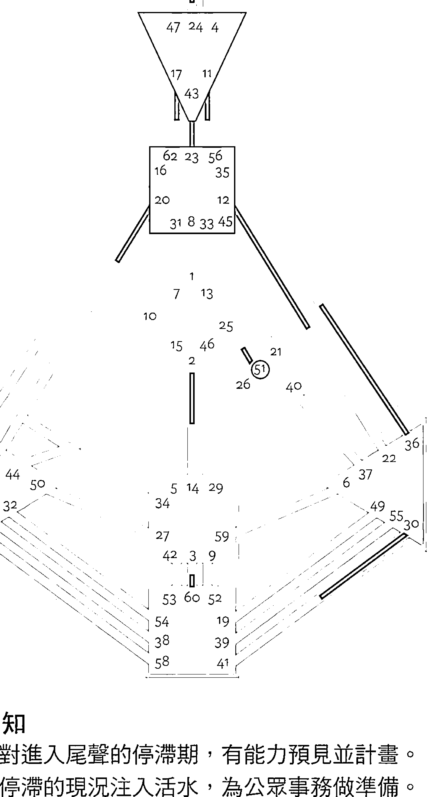

- 架構 23–43  
- 先知 12.4  
- 老師 11.4  
- 感染力 61.6  
- 分裂 23.4  
- 死腦筋 43.4  
- 自我覺知 20.3  
- 分裂 23.4  
- 退縮 51.2  
- 理解 17.3  
- 沉著 30.1  
- 靈活應用 2.5  
- 過渡 36.3  
- 果斷 60.2  

### 12.4 先知

面對進入尾聲的停滯期，有能力預見並計畫。

⊕ △ 替停滯的現況注入活水，為公眾事務做準備。能預知社交的需求，並且有能力充分表達，一直到句點都讚嘆以對。

☿ ▽ 來自腹部之聲（上喉無人理會的改革之聲）。表達社交的需求，卻無法振奮啟發。

6月

---

## 12.5 靜止不動  
### 實用主義者

- 23–43 架構  
- 日 ▲12.5 實用主義者  
- 地 11.5 慈善家  
- 月 ▼19.3 奉獻  
- 北交 23.4 分裂  
- 南交 43.4 死腦筋  
- 水 ▼20.4 應用  
- 金 23.5 同化  
- 火 51.3 適應  
- 木 17.3 理解  
- 土 30.1 沉著  
- 天 2.5 靈活應用  
- 海 36.3 過渡  
- 冥 60.2 果斷  

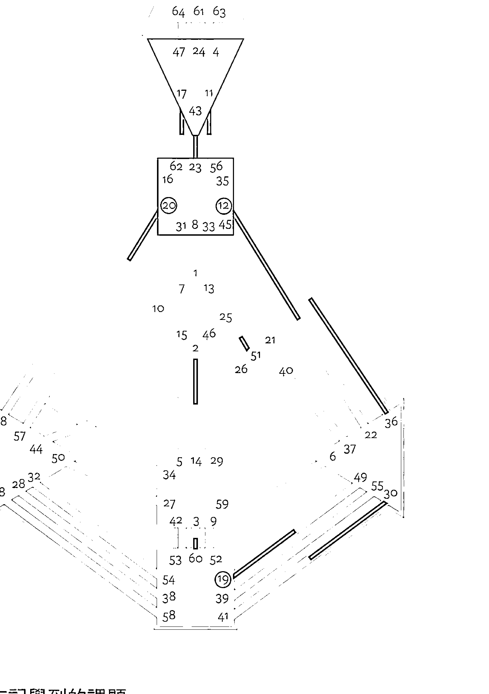

### 12.5 實用主義者

- 成功自制，當某個階段結束，不會忘記學到的課題。  
- 光明，總會意識到黑暗存在。  
- 社交經驗的累積，懂得凡事要謹慎以對。  
- 傾向只記得最痛苦的教訓。  
- 謹慎是制約，來自於最痛苦的社會歷練。

---

## 靜止不動

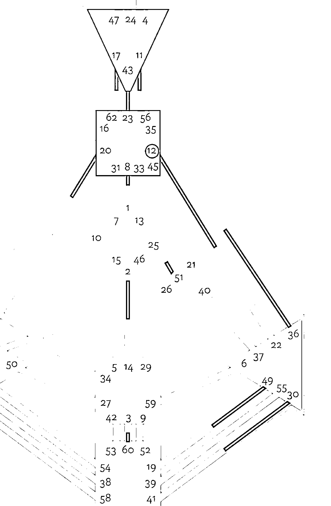

- 架構 23–43  
- 質變 12.6 △ ☉  
- 適應力 11.6 ⊕  
- 吸引力 49.6 ☽  
- 分裂 23.4 ☊  
- 矛盾結 43.4 ☋  
- 現實主義 20.5 ☿  
- 誠實 8.1 ♀  
- 極限 51.4 ♂  
- 理解 17.3 ♃  
- 沉著 30.1 ♄  
- 靈活應用 2.5 ♅  
- 過渡 36.3 ♆  
- 果斷 60.2 ♇  

### 12.6 質變

有信心，運用能量朝改變邁進，從停滯中開展。

- 若與22號閘門相連，接通開放的通道，將帶來創意的全面進化，成功引發突變，產生新的社交型態。  
- 突變的能力，表達全新社交型態。  
- 退行性變態：面對靜止，演化出全新的適應模式。  
- 完美調整，靜懸以對，可以接受社交面的諸多限制。

---

## 15.1 謙遜  
### 職責

- 10–20 覺醒  
- 23–43 架構  
- 日 15.1 職責  
- 地 10.1 謙遜  
- 月 37.3 平等對待  
- 北交 23.4 分裂  
- 南交 43.4 死腦筋  
- 水 ▽20.6 智慧  
- 金 8.2 服務  
- 火 51.4 極限  
- 木 17.3 理解  
- 土 30.1 沉著  
- 天 2.5 靈活應用  
- 海 36.3 過渡  
- 冥 60.2 果斷  

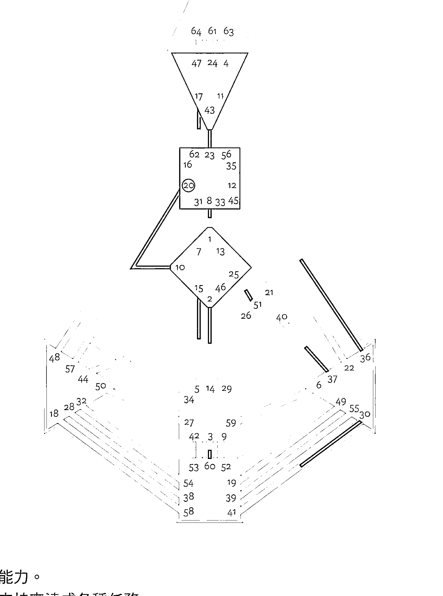

### 15.1 職責

為所期待，處理各種挑戰的能力。

♀ 和諧的人際關係，足以提供支持來達成各種任務。  
經由各種極端與和諧的關係，能夠方方面對任何挑戰。

♂ 提出各種激進的主張，造成疏離。  
透過自身的極端，與人疏離。

---

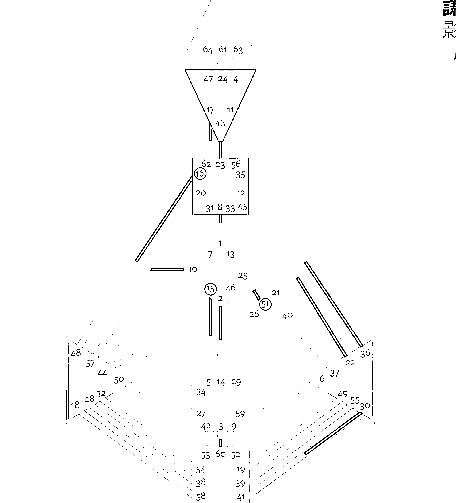

- 架構 23–43  
- 影響 15.2  
- 隱士 10.2  
- 成熟 22.6  
- 分裂 23.4  
- 死腦筋 43.4  
- 妄想 16.1  
- 虛假 8.3  
- 對稱 51.5  
- 理解 17.3  
- 沉著 30.1  
- 靈活應用 2.5  
- 過渡 36.3  
- 果斷 60.2  

## 15.2 影響

◎ ▲ 態度謙遜加上行動正確，會帶來持久的標準。能接受自己，觀自身的極端是正確的。

⊕ ▼ 太陽座落的位置通常都是天生的，而地球在此則屬於人為；但無損於其力量，還是能獲得預期中的效果。善用本性的極端之處，來影響他人。

---

## 15.3 謙遜  
### 自我膨脹

農曆 5/23（二）夏至

- 日 15.3 自我膨脹  
- 地 △10.3 烈士  
- 月 17.1 開放  
- 北交 23.4 分裂  
- 南交 43.4 死腦筋  
- 水 16.3 獨立  
- 金 8.4 尊重  
- 火 51.6 分割  
- 木 17.3 理解  
- 土 30.1 沉著  
- 天 2.5 靈活應用  
- 海 36.3 過渡  
- 冥 60.2 果斷  

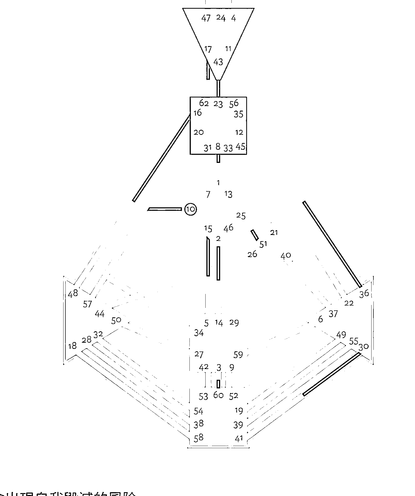

### 15.3 自我膨脹

被認定為謙虛自持，將會出現自我毀滅的風險。

- 為了持續獲得認同，故作謙虛，就算顯得負面做作，也是有效的策略。將自己的極端當成策略，操控生命之流。  
- 抱持「我早就說過了」的心態。能直指別人的極端之處。

---

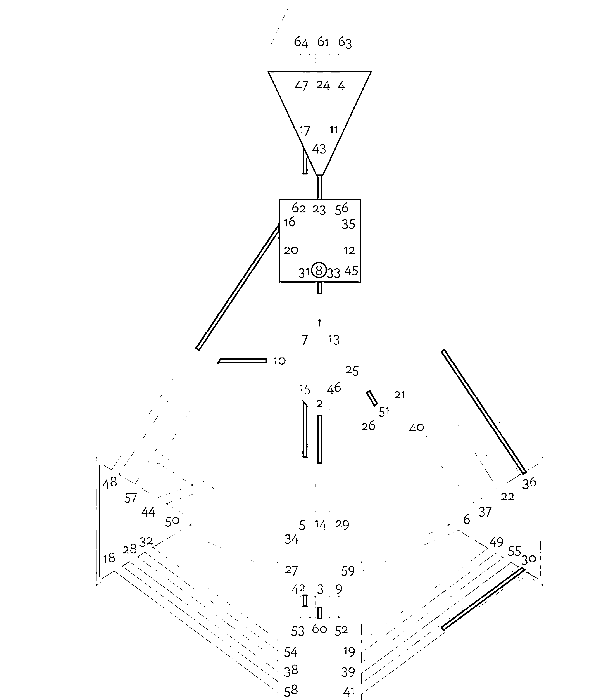

- 謙遜  
- 壁花 2022/06/22 19:58 TWN  
- 農曆 5/24（三）  
- 架構 23–43  
- 壁花 15.4  
- 機會主義者 10.4  
- 適應 51.3  
- 分裂 23.4  
- 矛盾結 43.4  
- 領導者 16.4  
- 交誼 8.6 △  
- 多樣化 42.1  
- 理解 17.3  
- 沉著 30.1  
- 靈活應用 2.5  
- 過渡 36.3  
- 果斷 60.2  

## 15.4 壁花

將謙遜當成外殼，免得暴露自身的不足。

真誠的狀態，或許可以（或不可以）掩蓋不足。  
彷彿生命之流動，自己感到不自在。

最終薄弱的辯護，只會自曝其短，招來屈辱。  
極端主義會使自我無法流動。

---

## 15.5 謙遜  
### 敏感性

2022/06/23 19:32 TWN  
農曆 5/25（四）

- 3–60 突變  
- 10–20 覺醒  
- 23–43 架構  

- 日 15.5 敏感性  
- 地 10.5 異端者  
- 月 3.4 魅力  
- 北交 23.4 分裂  
- 南交 43.4 死腦筋  
- 水 16.5 聖誕怪傑  
- 金 △20.1 表面化  
- 火 42.1 多樣化  
- 木 ▽17.4 人事經理  
- 土 30.1 沉著  
- 天 2.5 靈活應用  
- 海 36.3 過渡  
- 冥 60.2 果斷  

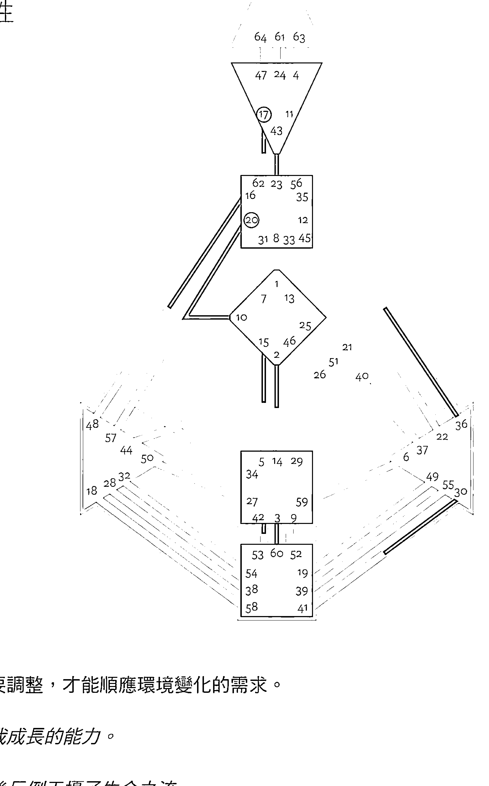

## 15.5 敏感性

察覺原本平衡的行為需要調整，才能順應環境變化的需求。

- 成長的力量。  
  透過各種經驗，展現自我成長的能力。

- 過度補償的傾向。  
  內在不斷補償，過度之後反倒干擾了生命之流。

---

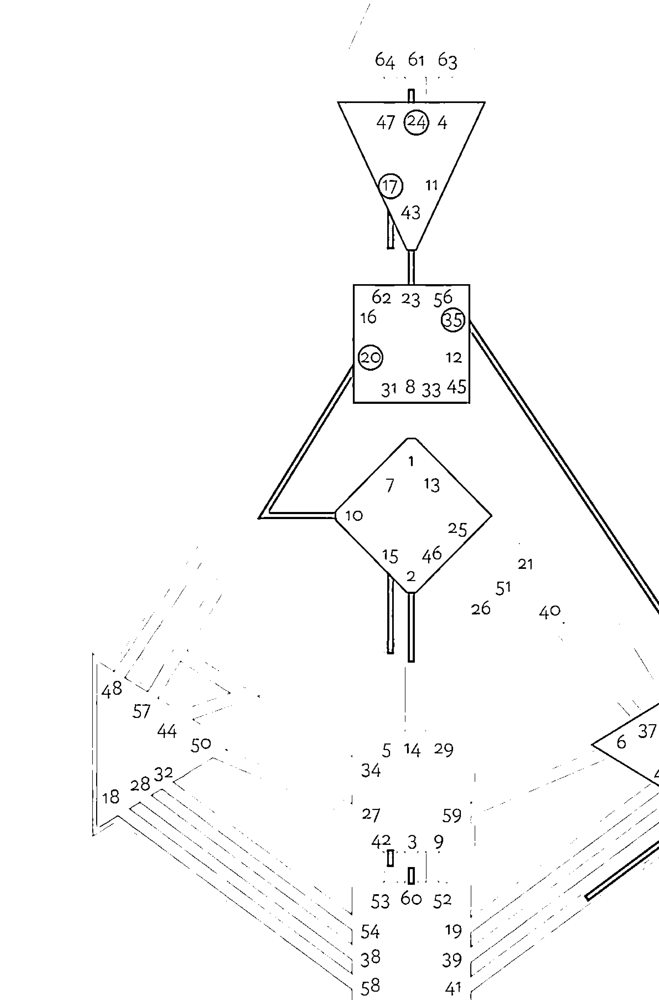

- 覺醒 10–20  
- 架構 23–43  
- 無常 35–36  

- 自我防衛 15.6  
- 人生典範 10.6  
- 自白 24.5  
- 分裂 23.4  
- 死腦筋 43.4  
- 謙遜 35.1  
- 獨斷者 20.2  
- 識別 42.2  
- 人事經理 17.4  
- 沉著 30.1  
- 靈活應用 2.5  
- 間諜活動 36.4  
- 果斷 60.2  

## 15.6 自我防衛

謙遜並不會被當成軟弱。

♇ △ 不斷重複檢驗，排除最弱的環節。  
運用自我的力量探索極端，找出最大的弱點。

♀ ▽ 將和諧當成武器，傾向以求解決問題，而非聚焦於治本。  
為了和諧，對弱點視而不見，自我的力量傾向以和為貴。

---

## 52.1 維持不動（山）  
### 先思而後言

2022/06/25 18:42 TWN  
農曆 5/27（六）

- 23–43 架構  
- 35–36 無常  

- 日 52.1 先思而後言  
- 地 58.1 生命之愛  
- 月 23.6 融合  
- 北交 23.4 分裂  
- 南交 43.4 死腦筋  
- 水 35.2 創意空窗期  
- 金 20.3 自我覺知  
- 火 △42.3 嘗試錯誤  
- 木 ▽17.4 人事經理  
- 土 30.1 沉著  
- 天 2.5 靈活應用  
- 海 36.4 閒謀活動  
- 冥 60.2 果斷  

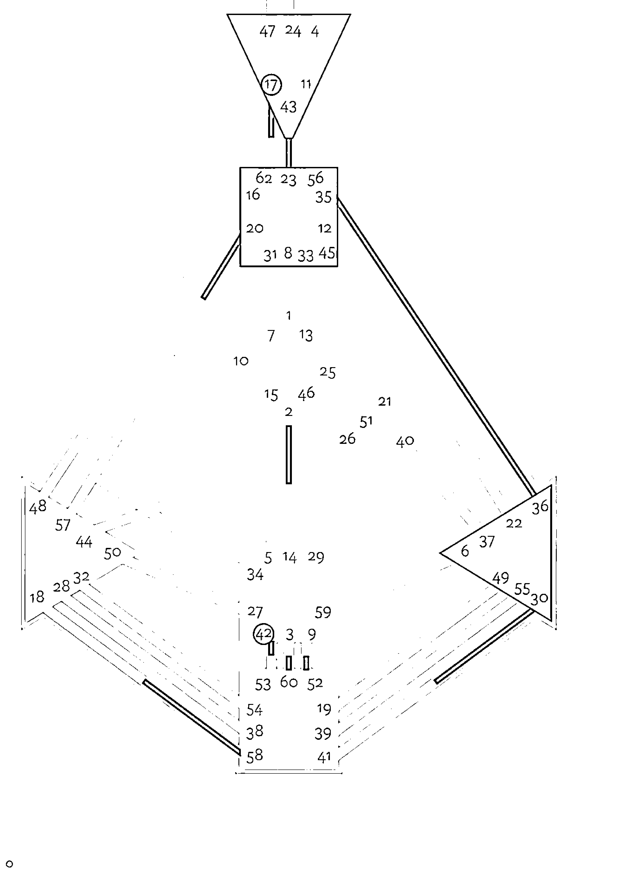

## 52.1 先思而後言

- ⊕ △ 暫停的片刻讓意識深化，引發沉默。安靜的能量，帶來靜止。  
- ♂ ▽ 先止為快，之後卻要承擔後果。無法靜下來的能量。

---

## 維持不動（山）  
### 52.2

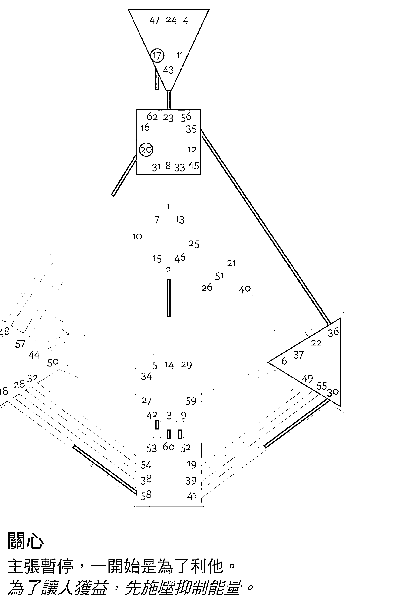

- 架構 23–43  
- 無常 35–36  
- 關心 52.2  
- 變態 58.2  
- 智慧 20.6  
- 分裂 23.4  
- 死腦筋 43.4  
- 渴望 35.4  
- 現實主義 20.5  
- 中間人 42.4  
- 人事經理 17.4  
- 沉著 30.1  
- 靈活應用 2.5  
- 間諜活動 36.4  
- 果斷 60.2  

### 52.2 關心

♀ △ 主要暫停，一開始是為了利他。為了讓人獲益，先施壓抑制能量。

♂ ▽ 自私唐突地暫停，別人可能因而莫名受害。被迫自私地抑制能量，別人卻付出代價。

---

## 52.3 維持不動（山）  
### 控制

- 23–43 架構  
- 35–36 無常  

- 日 52.3 控制  
- 地 58.3 電流  
- 月 45.1 遊說  
- 北交 23.4 分裂  
- 南交 43.4 死腦筋  
- 水 35.6 矯正  
- 金 △20.6 智慧  
- 火 42.4 中間人  
- 木 ▽17.4 人事經理  
- 土 3.1 沉著  
- 天 2.5 靈活應用  
- 海 36.4 閒談活動  
- 冥 60.2 果斷  

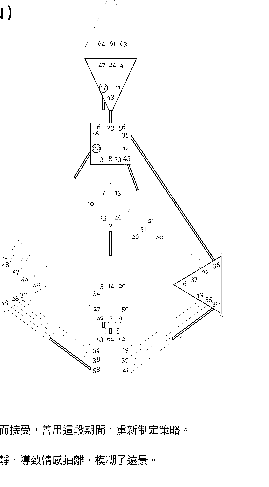

## 52.3 控制

向外展露無為。

♄ △ 基於本性，能了解限制，或許能進而接受，善用這段期間，重新制定策略。接受無為的能量。

♀ 面對限制強烈不滿，擾亂原本的平靜，導致情感抽離，模糊了邊界。限制所帶來的壓力，擾亂平靜。

---

## 維持不動（山）

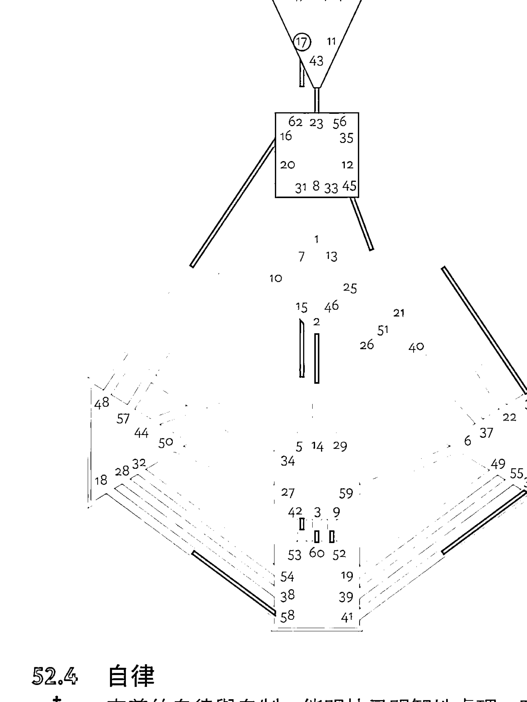

- 架構 23–43  
- 自律 52.4  
- 調焦 58.4  
- 職責 15.1  
- 分裂 23.4  
- 死腦筋 43.4  
- 遊說 45.1  
- 妄想 16.1  
- 自我實現 42.5  
- 人事經理 17.4  
- 沉著 30.1  
- 靈活應變 2.5  
- 閒談活動 36.4  
- 果斷 60.2  

## 52.4 自律

♄ ▲ 完美的自律與自制，能明快又明智地處理一時衝動，輕而易舉。  
自制力，體會到靜止與專注相當有價值。

♃ ▼ 基於對現況的理解，明白控制也有準則，這是必然的結果。儘管早有應對之道，但基於向外擴展的天性，仍然質疑又焦慮。  
面對限制，湧現抗張的能量與疑慮。

6月

---

## 52.5 維持不動（山）  
### 解釋

2022/06/29 17:02 TWN  
農曆 6/1（三）  
23–43 架構

- 日 52.5 解釋  
- 地 58.5 防禦  
- 月 39.1 脫離  
- 北交 23.4 分裂  
- 南交 43.4 死腦筋  
- 水 45.3 排除在外  
- 金 16.2 憤世嫉俗的人  
- 火 42.6 培育  
- 木 17.4 人事經理  
- 土 30.1 沉著  
- 天 2.5 靈活應用  
- 海 36.4 閉關活動  
- 冥 60.2 果斷  

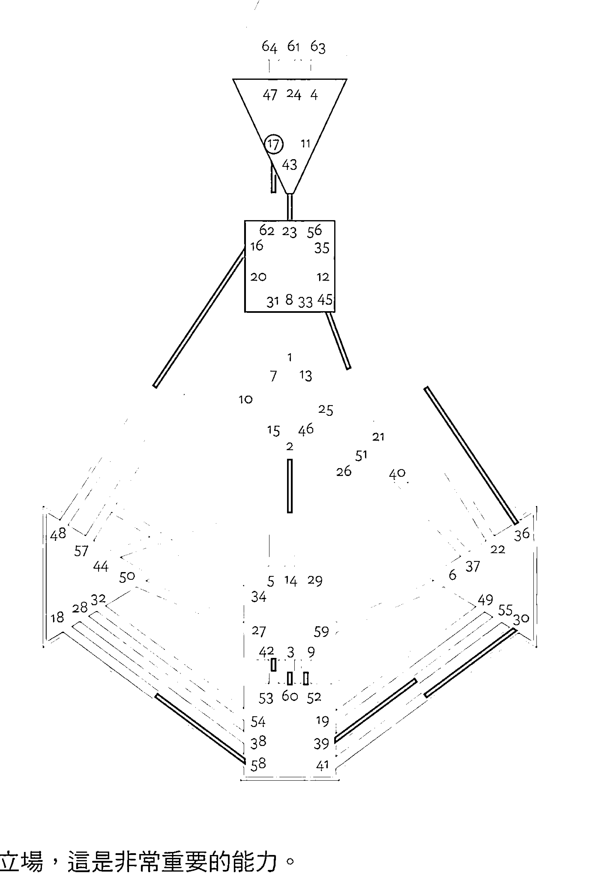

## 52.5 解釋

若是無為，要好好解釋自己的立場，這是非常重要的能力。

⊕ 常說出簡要精確的說法。  
無為與專注，才能指向細節。

P 由折迴旋，揭露神祕的本質；出乎意料之外，通常招致誤解。  
若無為太久，容易失焦而無法顧及細節。

---

## 維持不動（山）  
### 52.6 平和

2022/06/30 16:38 TWN  
農曆 6/2（四）

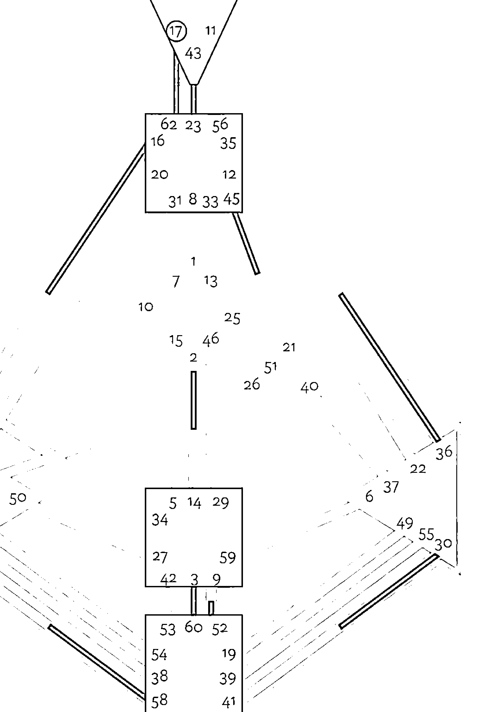

| 項目 | 數值 |
|---|---|
| 平和 | 52.6 |
| 忘形 | 58.6 |
| 抑制 | 62.2 |
| 個體性 | 23.3 |
| 權宜 | 43.3 |
| 領導力 | 45.5 |
| 領導者 | 16.4 |
| 綜合 | 3.1 |
| 人事經理 | 17.4 |
| 沉著 | 30.1 |
| 靈活應用 | 2.5 |
| 間諜活動 | 36.4 |
| 果斷 | 60.2 |

### 52.6 平和

♀ △ 調頻為和諧與平衡的狀態，無人而不自得。靜下來，沒有壓力。  

♆ ▽ 以妄想來取代真正的寧靜。在此代表正面的本質，就算是妄想，彷彿也會帶來真實的效果。平衡極端，不論是真實或幻想所帶來的壓力，都不會干擾寧靜的狀態。

---

## 阻礙  
### 脫離

- 3–60 突變  
- 23–43 架構  
- 日 39.1 脫離  
- 地 38.1 素質  
- 月 31.2 傲慢  
- 北交 23.3 個體性  
- 南交 43.3 權宜  
- 水 12.1 修道士、僧侶  
- 金 16.5 聖誕怪傑  
- 火 3.1 綜合  
- 木 17.4 人事經理  
- 土 30.1 沉著  
- 天 2.5 靈活應用  
- 海 36.4 閒話活動  
- 冥 60.2 果斷  

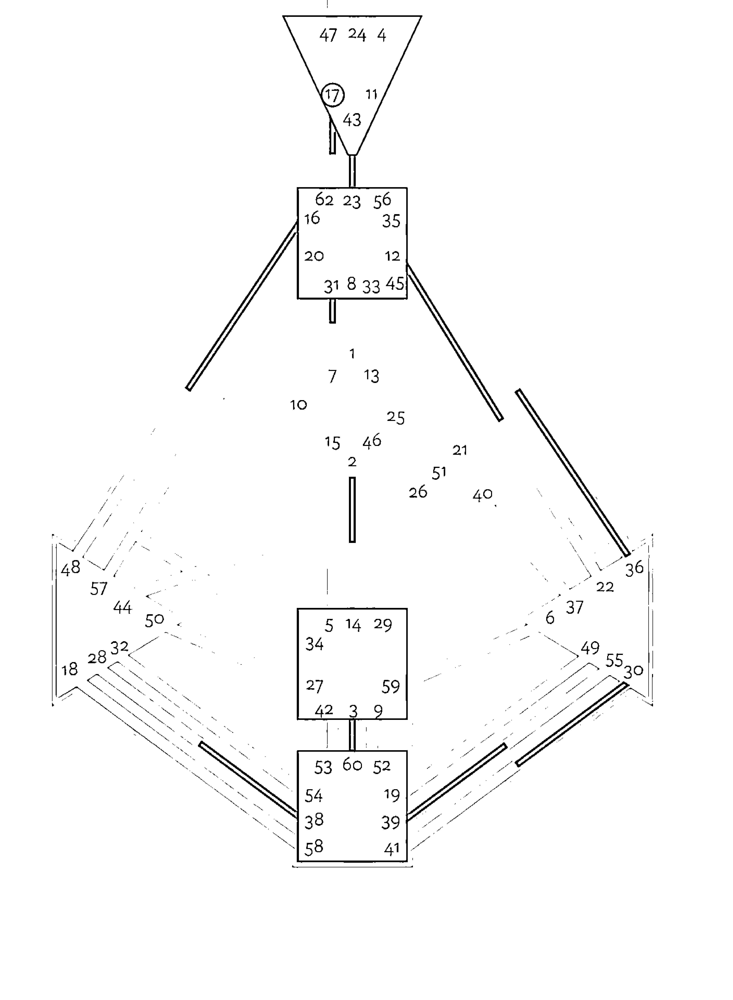

### 39.1 脫離

♂ △ 面對阻礙時，決定暫時撤退。挑釁的能量，拒絕面對阻礙。

☿ ▽ 脫離。優柔寡斷，思考何時能再重建關係。若不確定如何重新投入，不想面對阻礙。猶豫不決也是激怒的形式。

---

## 阻礙  
### 對抗

農曆 6/4（六）

### 39.2  
2022/07/02 15:48 TWN

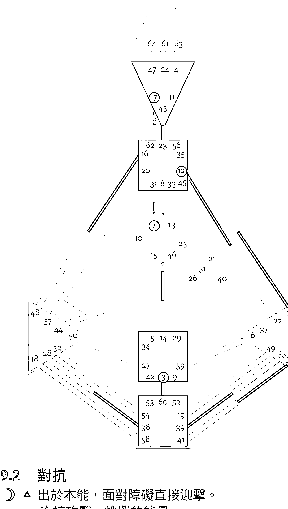

- 突破 3–60  
- 架構 23–43  
- 對抗 39.2  
- 彬彬有禮 38.2  
- 無政府主義者 7.3  
- 個體性 23.3  
- 權宜 43.3  
- 淨化 12.2  
- 輕信 16.6  
- 未成熟 3.2  
- 人事經理 17.4  
- 沉著 30.1  
- 靈活應變 2.5  
- 閒談活動 36.4  
- 果斷 60.2  

### 39.2 對抗

月亮 △ 出於本能，面對障礙直接迎擊。直接攻擊，挑釁的能量。

木星 ▽ 為求保全，面對本應處理的障礙，傾向繞道而行。就算直接攻擊是必要的，依然在情感上帶來衝擊。

---

## 39.3 阻礙

- 3–60 突變  
- 23–43 架構  
- 35–36 無常  

- 日 39.3 責任  
- 地 ▽38.3 結盟  
- 月 29.4 直接  
- 北交 23.3 個體性  
- 南交 43.3 權宜  
- 水 ▽12.4 先知  
- 金 ☆35.1 謙遜  
- 火 ▽3.3 生存  
- 木 17.5 無人是孤島  
- 土 30.1 沉著  
- 天 2.5 靈活應用  
- 海 36.3 過渡  
- 冥 60.2 果斷  

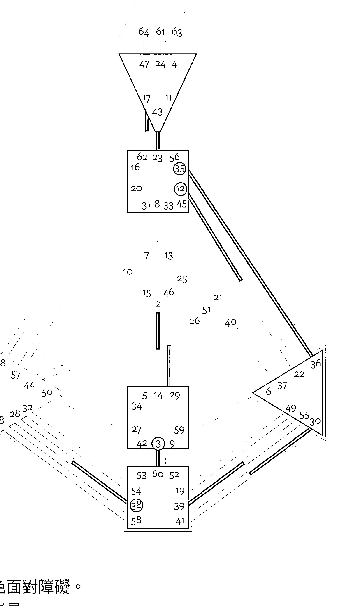

### 39.3 責任

若失敗會讓別人身陷險境，就會避免面對障礙。

♃ △ 著眼於誰獲益，以整體架構為首要考量。  
透過自我犧牲，展現挑釁的能量。

⊕ ▽ 常常預設會發生災難，擔憂著沒有面對到困境，他人將陷於更大的險境之中。  
並未犧牲，行為依然散發挑釁的能量。

---

## 39.4 阻礙  
### 節制

2022/07/04 15:00 TWN  
農曆 6/6（二）

- 突變 3–60  
- 架構 23–43  
- 無常 35–36  

- 節制 39.4  
- 調查 38.4  
- 組織 40.4  
- 個體性 23.3  
- 權宜 43.3  
- 質變 12.6  
- 合作 35.3  
- 魅力 3.4  
- 無人是孤島 17.5  
- 沉著 30.1  
- 靈活應用 2.5  
- 過渡 36.3  
- 果斷 60.2  

### 39.4 節制

採取行動之前，仔細評估衡量。

☽ △ 確立適當的時機，善用感受與本能。  
在最正確的時機點，施力挑釁。

☉ ▽ 錯誤的信念，不顧環境因素，只須憑藉意志力就能克服阻礙。  
忽視環境因素，挑釁的能量。

7月

---

## 39.5 阻礙  
### 專心致志

2022/07/05 14:35 TWN  
農曆 6/7（二）

- 3–60 突變  
- 23–43 架構  
- 35–36 無常  

- 日 39.5 專心致志  
- 地 38.5 疏離  
- 月 47.5 聖人  
- 北交 23.3 個體性  
- 南交 43.3 權宜  
- 水 15.2 影響  
- 金 35.4 渴望  
- 火 3.4 魅力  
- 木 17.5 無人是孤島  
- 土 30.1 沉著  
- 天 2.5 靈活應用  
- 海 36.3 過渡  
- 冥 60.2 果斷  

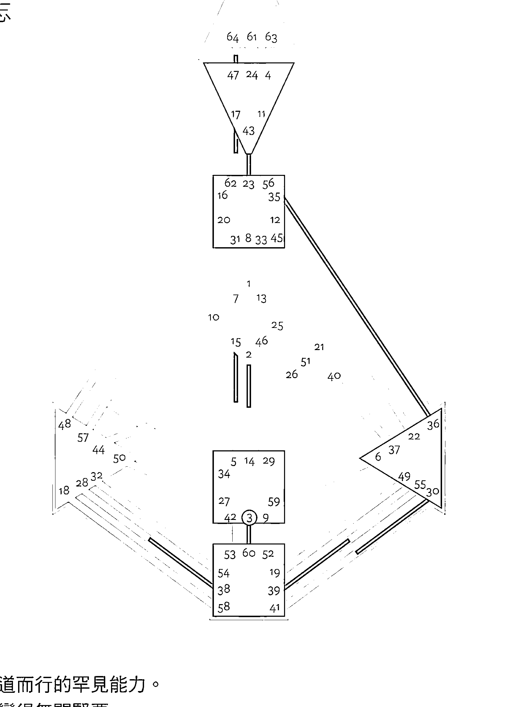

## 39.5 專心致志

面對阻礙不去克服，而是繞道而行的罕見能力。

- ♆ △ 想像建立全新模式，讓阻礙變得無關緊要。繞過障礙，運用充滿想像力的能量來引發。  
- ♂ ▽ 冷靜又實際，雖然並非上升相位，卻常常以決心而贏得支持，最後迎向成功。冷靜自持，引發的能量。

## 阻礙

解決麻煩者

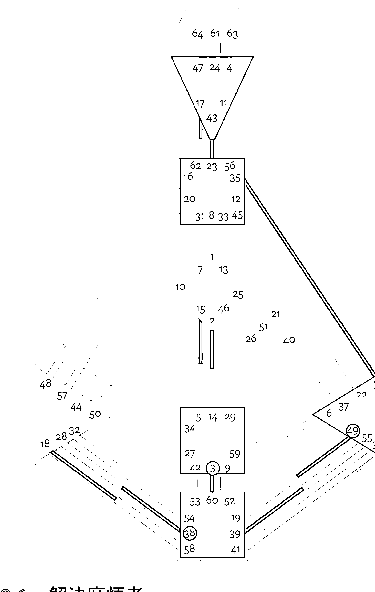

- 突變 3–60  
- 架構 23–43  
- 無常 35–36  
- 解決麻煩者 39.6  
- 誤解 38.6  
- 保守主義 18.1  
- 個體性 23.3  
- 權宜 43.3  
- 壁花 15.4  
- 利他主義 35.5  
- 受害 3.5  
- 無人是孤島 17.5  
- 吸引力 49.6  
- 定格 2.6  
- 過渡 36.3  
- 果斷 60.2  

## 39.6 解決麻煩者

生來具備解決問題的天賦。

- 務實，引導與滋養他人的能力。  
- 試圖解決對方的問題，此舉讓自己經常充滿挑釁的能量。  
- 找碴，並非為了謀求他人福利，而是因為自我擴張，或試圖滿足個人的野心，以情緒為驅動力來主導，激怒他人。

---

## 53.1 發展
累積

2022/07/07 13:47 TWN  
農曆 6/9（四）小暑

- 3–60 突變  
- 23–43 架構  
- 35–36 無常  

- 日 53.1 累積  
- 地 54.1 影響  
- 月 57.2 淨化  
- 北交 23.3 個體性  
- 南交 43.3 權宜  
- 水 52.1 先思而後言  
- 金 35.6 矯正  
- 火 3.6 臣服  
- 木 17.5 無人是孤島  
- 土 49.6 吸引力  
- 天 2.6 定格  
- 海 36.3 過渡  
- 冥 60.2 果斷  

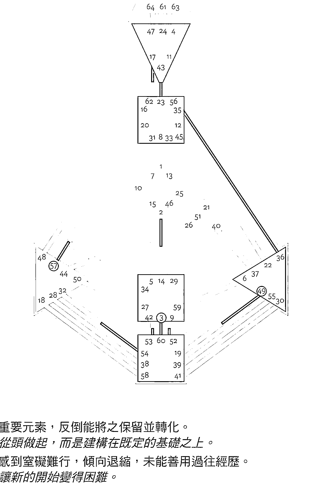

### 53.1 累積

總結舊有形式，並不會捨棄重要元素，反倒能將之保留並轉化。相較於創新事物的壓力，不必從頭做起，而是建構在既定的基礎之上。

發展的過程中，備受批評而感到窒礙難行，傾向退縮，未能善用過往經歷。舊有人事物所帶來的批評，讓新的開始變得困難。

---

## 發展
氣勢 53.2

2022/07/08 13:23 TWN  
農曆 6/10（五）

- 架構 23–43  
- 保存 27–50  
- 氣勢 53.2  
- 謹慎 54.2  
- 腐敗 50.4  
- 個體性 23.3  
- 權宜 43.3  
- 控制 52.3  
- 共識 45.2  
- 自私 27.1  
- 無人是孤島 17.5  
- 吸引力 49.6  
- 定格 2.6  
- 過渡 36.3  
- 果斷 60.2  

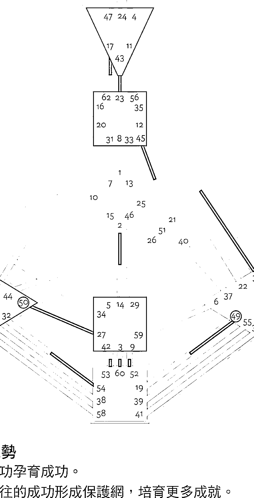

### 53.2 氣勢

成功孕育成功。

過往的成功形成保護網，培育更多成就。  
過往的成功也是壓力，需要開展新事物。

急於將志向付諸行動，造成急促率性的傾向。  
過往的成功形成壓力，對新事物缺乏耐性。

---

## 53.3 發展
實際

2022/07/09 12:59 TWN  
農曆 6/11（六）

- 日 53.3 實際  
- 地 54.3 動用關係  
- 月 △ 1.1 創意獨立於意志之外  
- 北交 23.3 個體性  
- 南交 43.3 權宜  
- 水 52.5 解釋  
- 金 45.3 排除在外  
- 火 27.1 自私  
- 木 17.5 無人是孤島  
- 土 ▽49.6 吸引力  
- 天 2.6 定格  
- 海 36.3 過渡  
- 冥 60.2 果斷  

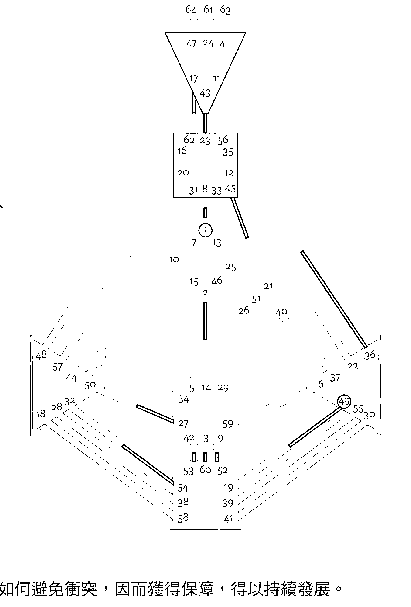

### 53.3 實際

☽ △ 在最自然的狀態下，著眼點是如何避免衝突，因而獲得保障，得以持續發展。為了發展，消弭衝突的壓力。

♂ ▽ 無意識引發衝突，在選擇上將會危及安全，影響後續發展。激發衝突能量，發展備受威脅。

---

## 發展
確保 53.4

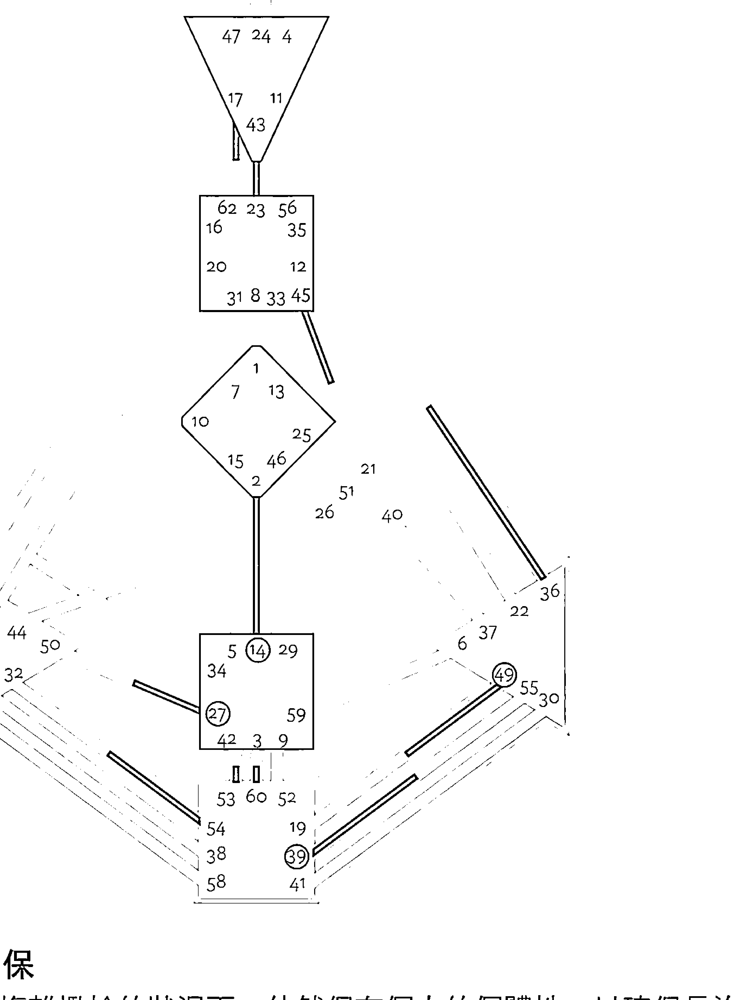

- 確保 53.4  
- 啟蒙／無明 54.4  
- 安全 14.4  
- 個體性 23.3  
- 權宜 43.3  
- 脫離 39.1  
- 方向 45.4  
- 自給自足 27.2  
- 無人是孤島 17.5  
- 吸引力 49.6  
- 定格 2.6  
- 過渡 36.3  
- 果斷 60.2  

### 53.4 確保

在複雜尷尬的狀況下，依然保有個人的個體性，以確保長治久安，順利發展。面對混亂的開始，對於如何保有個人的個體性，備感壓力。

不斷面對困窘或尷尬的狀況，感覺為難，反倒不能以平常心來對應，造成不好的影響。獨立的個體往往備感壓力，迫切想開始，卻創造出尷尬甚至困窘的處境。

---

## 53.5 發展
主張

- 23–43 架構  
- 日 53.5 主張  
- 地 54.5 寬大  
- 月 5.1 毅力  
- 北交 23.3 個體性  
- 南交 43.3 權宜  
- 水 39.3 責任  
- 金 45.6 重新審視  
- 火 ▽27.3 貪婪  
- 木 17.5 無人是孤島  
- 土 ▽49.6 吸引力  
- 天 2.6 定格  
- 海 36.3 過渡  
- 冥 60.2 果斷  

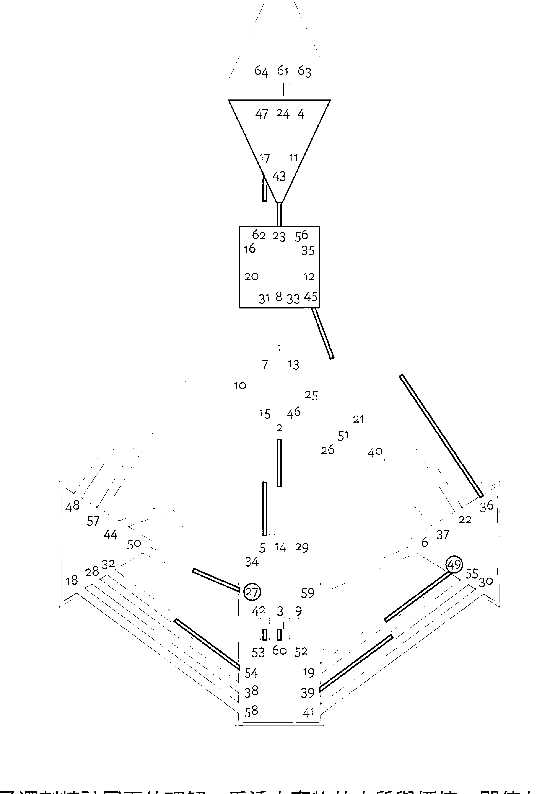

### 53.5 主張

看待從事發展的角度，常賦予深刻精神層面的理解，看透人事物的本質與價值觀。即使在孤立的階段，仍保有決斷力，堅守方向。這股獨特的力量，足以匯集來自四面八方的支持，達成對整體的影響。

內在的壓力，想搞清楚發展是否有價值，以及不管任何情況之下，是否都具有開始的動力。

▽ 太過自信，面對反對與孤立，未顧及如何保有支援，這樣的態度讓反對勢力更盛。開創的能量，同時也會吸引特定的能量，試圖阻止這一切。

---

## 發展
逐步進行 53.6

- 架構 23–43  
- 逐步進行 53.6  
- 選擇性 54.6  
- 慈善家 11.5  
- 個體性 23.3  
- 權宜 43.3  
- 解決麻煩者 39.6  
- 修道士、僧侶 12.1  
- 貪婪 27.3  
- 無人是孤島 17.5  
- 吸引力 49.6  
- 定格 2.6  
- 過渡 36.3  
- 果斷 60.2  

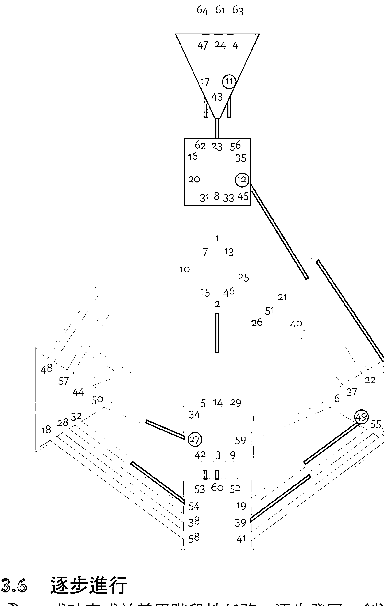

### 53.6 逐步進行

成功建立並善用階段性任務，逐步發展。創造價值與成果，作為成功例證，接下來將贏得更多支持。

基於過往成功經驗，在新階段開始時，會吸引眾人支持。

另一方面也有隱藏成功的傾向。基於反常的恐懼，認為成功就會引發更多要求，也擔憂到最後將失去原來群眾的支持。

備感壓力，恐懼失去過往長久以來的支持，面對新開始，採取謹慎的態度。

---

## 處理細節的優勢
例行程序

- 17–62 接受  
- 23–43 架構  
- 日 62.1 例行程序  
- 地 61.1 奧祕知識  
- 月 38.3 結盟  
- 北交 23.3 個體性  
- 南交 43.3 權宜  
- 水 53.2 氣勢  
- 金 12.2 淨化  
- 火 27.4 慷慨  
- 木 17.5 無人是孤島  
- 土 49.6 吸引力  
- 天 2.6 定格  
- 海 36.3 過渡  
- 冥 60.2 果斷  

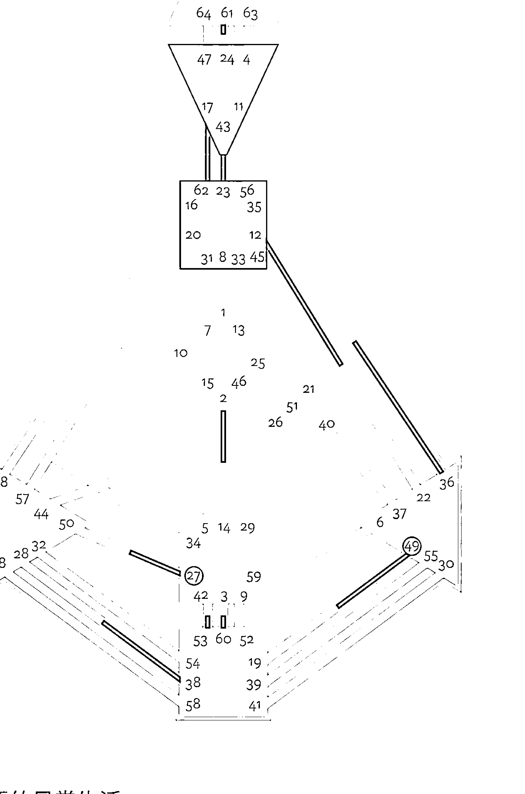

## 62.1 例行程序

透過豐富大腦的奇幻人生，超脫無聊的日常生活。有能力透過幻想，重組細節。

叛逆的虛擬大腦能量。表達的需求，卻忽略了細節。

---

## 處理細節的優勢
### 62.2

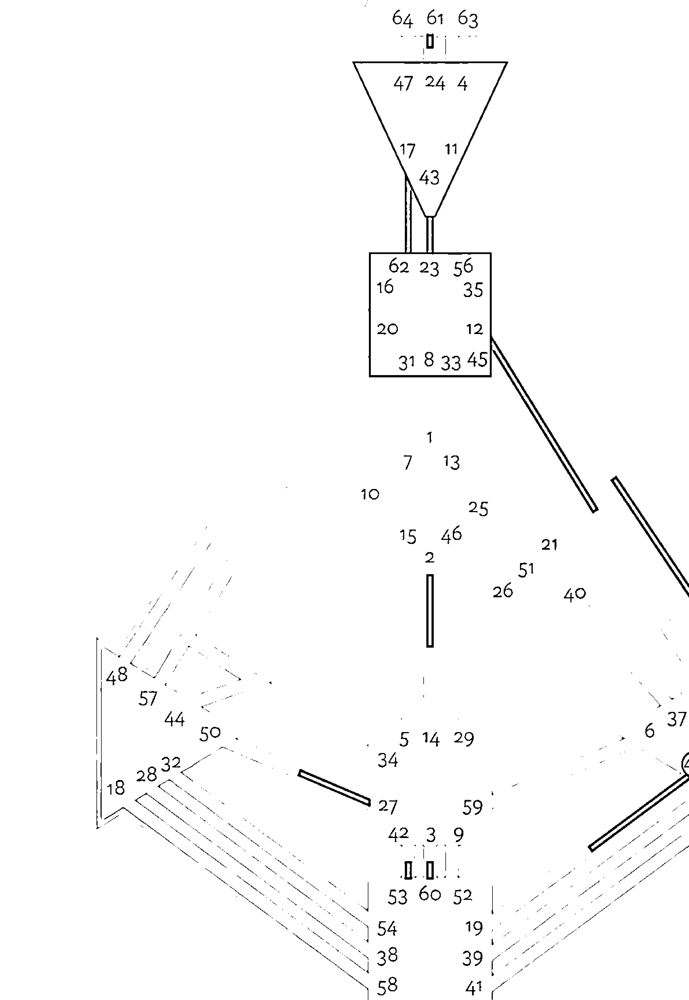

- 接受 17–62  
- 架構 23–43  
- 抑制 62.2  
- 天生耀眼 61.2  
- 接受 60.1  
- 自我防衛 23.2  
- 奉獻 43.2  
- 確保 53.4  
- 自由 12.3  
- 執行者 27.5  
- 無人是孤島 17.5  
- 吸引力 49.6  
- 定格 2.6  
- 過激 36.3  
- 果斷 60.2  

### 62.2 抑制

先天的限制與自律，願意遵從，彰顯克制的本質。工作需要處理大量細節，必須自律。

在嚴格限制下，聰明才智被壓抑，轉向焦慮不安。面對充滿細節的工作時，表現出焦慮不安。

---

## 62.3 處理細節的優勢
探索

農曆 6/17（五）

- 17–62 接受  
- 19–49 整合綜效  
- 23–43 架構  

- 日 62.3 探索  
- 地 61.3 相互依存  
- 月 19.5 纖性  
- 北交 23.2 自我防衛  
- 南交 43.2 奉獻  
- 水 53.6 逐步進行  
- 金 12.5 實用主義者  
- 火 27.6 警惕  
- 木 17.5 無人是孤島  
- 土 49.6 吸引力  
- 天 2.6 定格  
- 海 36.3 過渡  
- 冥 60.2 果斷  

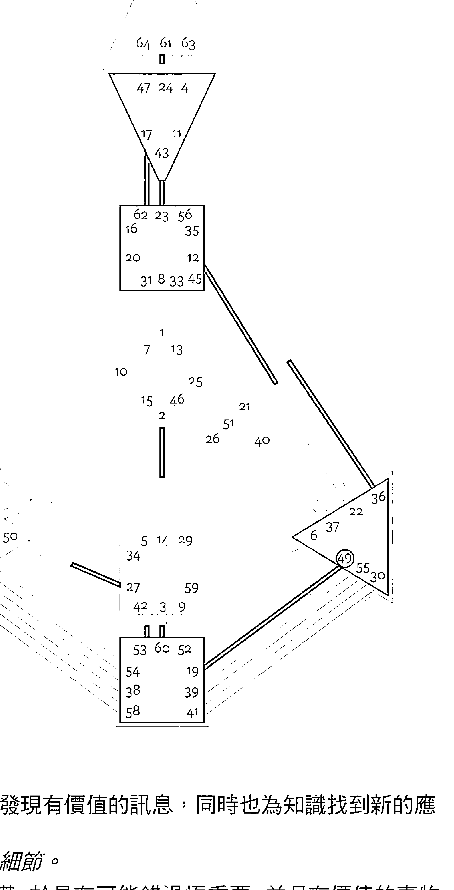

### 62.3 探索

不尋常的天才。能在充滿細節的工作中，發現有價值的訊息，同時也為知識找到新的應用方式。

不尋常的天賦，有能力掌握並表達重要的細節。

認為處理細節的工作很單調，容易心生不滿，於是有可能錯過極重要且有價值的事物。對細節導向的工作不滿，覺得無聊。

---

## 處理細節的優勢
苦行主義 62.4

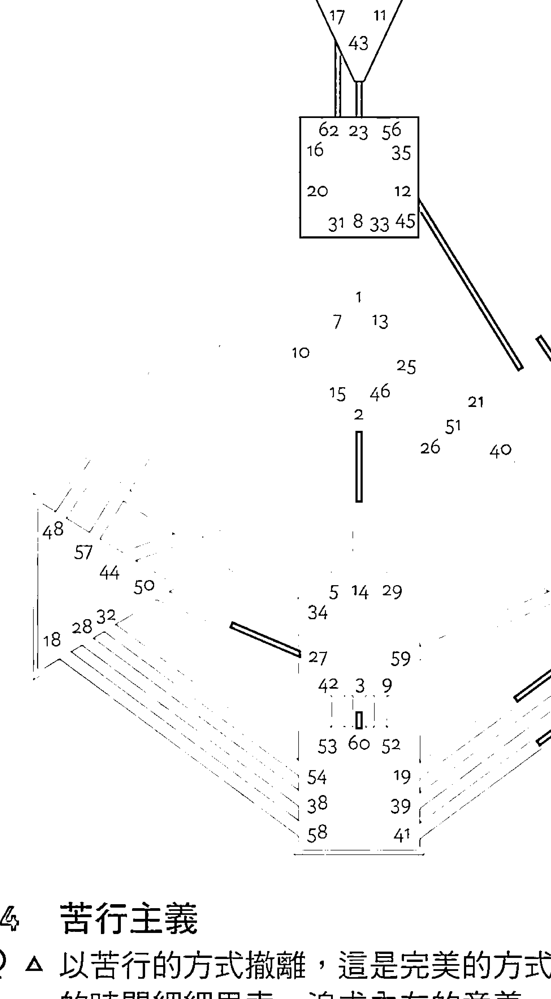

- 接受 17–62  
- 架構 23–43  
- 苦行主義 62.4  
- 探究 61.4  
- 實用主義 30.2  
- 自我防衛 23.2  
- 奉獻 43.2  
- 探索 62.3  
- 質變 12.6  
- 警惕 27.6  
- 無人是孤島 17.5  
- 吸引力 49.6  
- 定格 2.6  
- 過渡 36.3  
- 果斷 60.2  

### 62.4 苦行主義

以苦行的方式撤離，這是完美的方式回歸和諧與簡單。當外界的危險消失後，才有充裕的時間細細思索，追求內在的意義。

所謂的細節，需要花時間，經歷抽離與反思的過程，才能真實表達出來。

為了對抗既定的價值觀，想要有所行動，卻受限於環境因素，於是轉為退縮以等待時機。靜待細節變得完整，而孤立其實是策略，等待表達的正確時機。

---

## 62.5 處理細節的優勢
質變

- 17–62 接受  
- 23–43 架構  
- 24–61 覺察  

- 日 62.5 質變  
- 地 61.5 影響  
- 月 37.6 目的  
- 北交 23.2 自我防衛  
- 南交 43.2 奉獻  
- 水 62.5 質變  
- 金 15.1 職責  
- 火 24.1 疏忽之罪  
- 木 17.5 無人是孤島  
- 土 49.6 吸引力  
- 天 2.6 定格  
- 海 36.3 過渡  
- 冥 60.2 果斷  

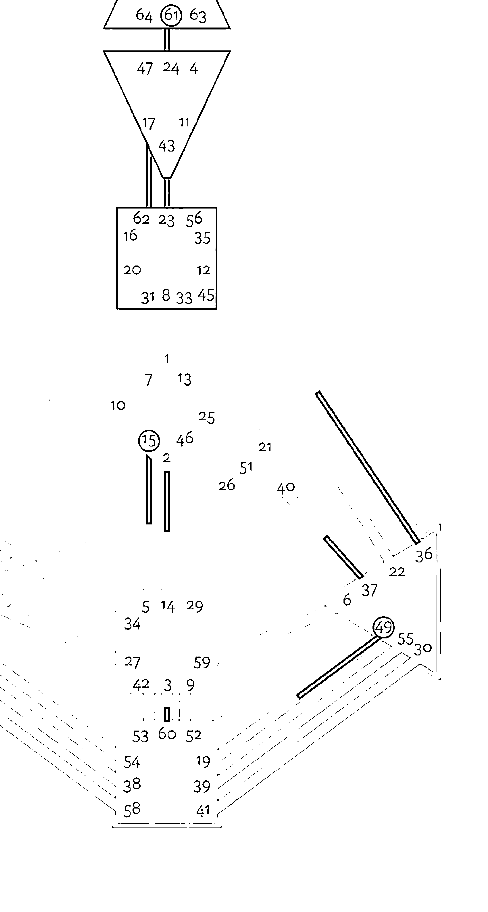

### 62.5 質變

簡單一旦已達成，行動便是必須。

向外延伸、與人分享。以月亮為象徵，起始是黑暗，最後能好好分享光亮。理解到唯有凝縮細節的空間，才能付諸行動並表達出來。

經歷節奏的過程，傾向透過戲劇化的呈現來博得好評。將細節整理好之後，需要吸引注意力，因此必須表達。

---

## 處理細節的優勢
自律

2022/07/18 09:23 TWN  
農曆 6/20（一）

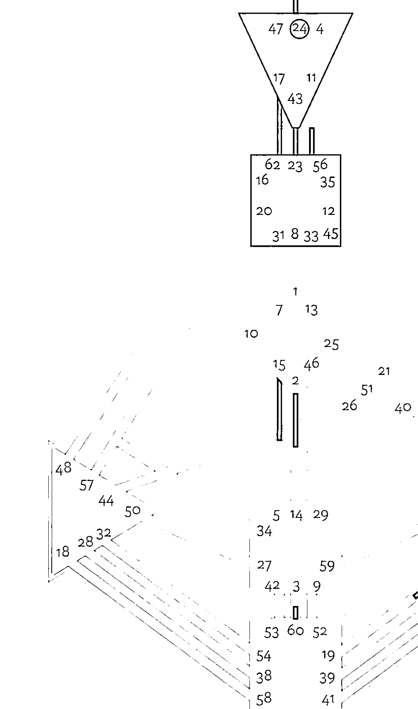

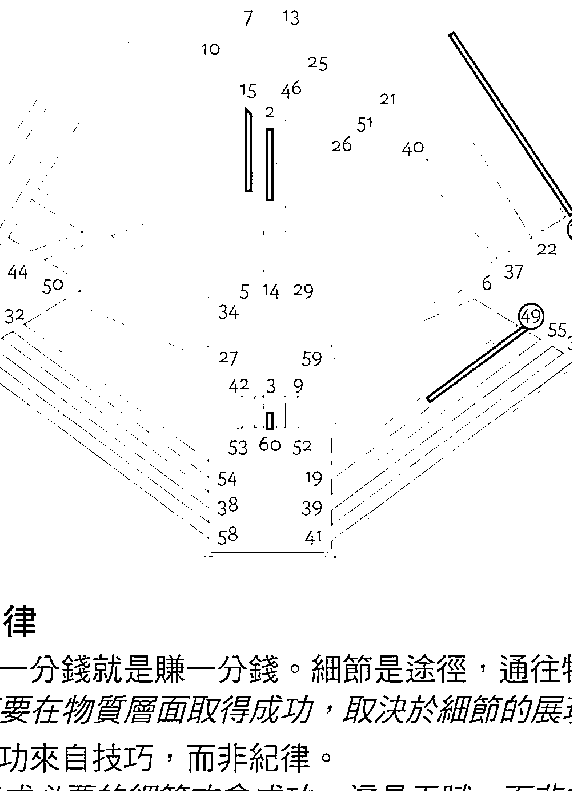

- 自律 62.6  
- 感染力 61.6  
- 支持 36.2  
- 自我防衛 23.2  
- 奉獻 43.2  
- 質量 56.1  
- 影響 15.2  
- 認可 24.2  
- 無人是孤島 17.5  
- 吸引力 49.6  
- 定格 2.6  
- 過渡 36.3  
- 果斷 60.2  

### 62.6 自律

♄ △ 恰一分錢就是賺一分錢。細節是途徑，通往物質層面的成功。  
若要在物質層面取得成功，取決於細節的展現。

☿ ▽ 成功來自技巧，而非紀律。  
完成必要的細節才會成功，這是天賦，而非紀律。

---

## 尋道者
質量

- 日 56.1 質量  
- 地 60.1 接受  
- 月 17.5 無人是孤島  
- 北交 23.2 自我防衛  
- 南交 43.2 奉獻  
- 水 △56.3 疏離  
- 金 15.4 壁花  
- 火 ▽24.2 認可  
- 木 17.5 無人是孤島  
- 土 ▽49.6 吸引力  
- 天 2.6 定格  
- 海 36.3 過渡  
- 冥 ▽60.2 果斷  

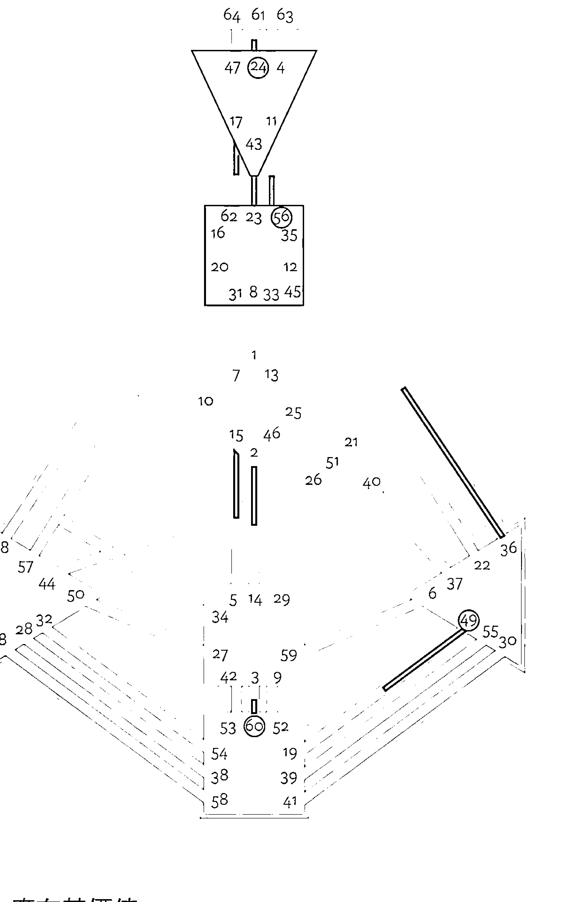

## 56.1 質量

從務實面考量，即使短期的行動，也應有其價值。  
表達有用又有價值的點子。

若為了證明自己，就會誤用能量；刻意為了讓人印象深刻，而追求枝微末節。只想帶來刺激，以至於任何點子，不管多麼微不足道都不放過。

---

## 56.2
尋道者・連結

2022/07/20 08:33 TWN  
農曆 6/22（三）

- 架構 23–43  
- 連結 56.2  
- 果斷 60.2  
- 分割 51.6  
- 自我防衛 23.2  
- 奉獻 43.2  
- 吸引注意力 56.5  
- 敏感性 15.5  
- 上癮者 24.3  
- 苦難 17.6  
- 吸引力 49.6  
- 定格 2.6  
- 過渡 36.3  
- 果斷 60.2  

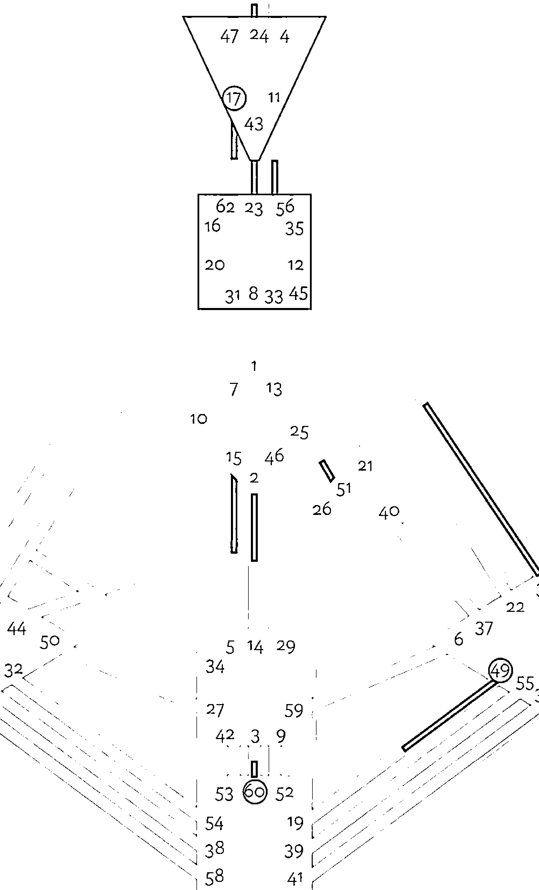

## 56.2 連結

孤立的天才，終將獲得關注與支持，得以延續。帶來啟發的天才，經由歲月的淬鍊而成熟，需要眾人肯定。

空有其表，原本眾所矚目，卻無法滿足期待，最終被迫另做打算。具備溝通的天賦，但深度不足。

---

## 56.3 尋道者
疏離

2022/07/21 08:08 TWN  
農曆 6/23（四）

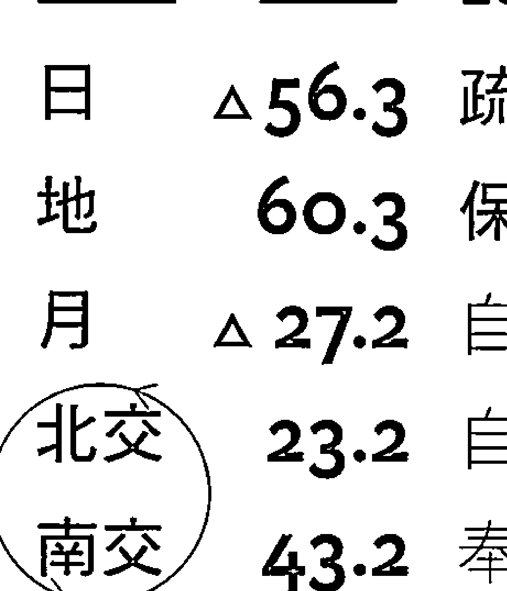

- 架構 23–43  
- 日 △56.3 疏離  
- 地 60.3 保守主義  
- 月 △27.2 自給自足  
- 北交 23.2 自我防衛  
- 南交 43.2 奉獻  
- 水 ▽31.2 傲慢  
- 金 ▽15.6 自我防衛  
- 火 24.4 隱士  
- 木 ▽17.6 苦難  
- 土 ▽49.6 吸引力  
- 天 2.6 定格  
- 海 36.3 過渡  
- 冥 ▽60.2 果斷  

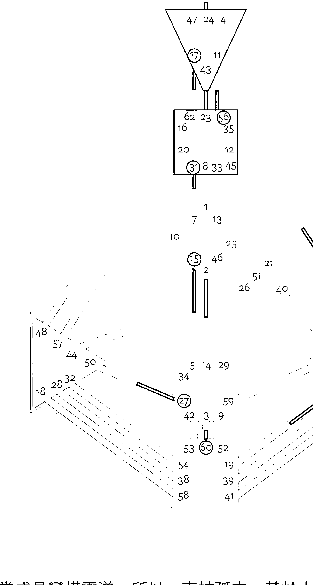

## 56.3 疏離

下定決心自給自足。

- ☉ 強大的意志與自大傾向，常被當成是蠻橫霸道，所以一直被孤立。基於太陽在此代表內在動力，因此仍可能被接受。  
- 掌控的動力，成為表達的焦點。  
- ♀ 反向的美學，常冒犯他人，導致孤立無援。  
- 強力控制表達的型態，反而無法帶來啟發。

---

## 尋道者
權宜 56.4

2022/07/22 07:42 TWN  
農曆 6/24（五）

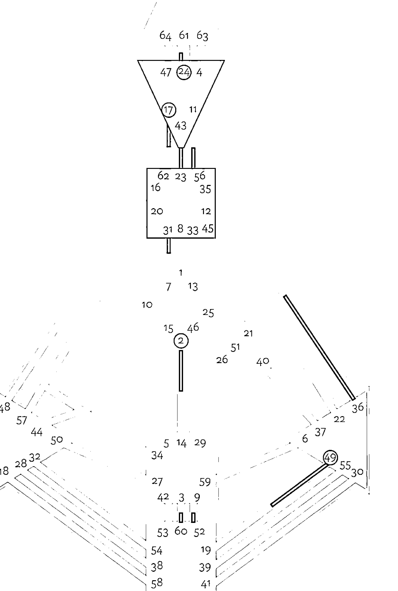

- 架構 23–43  
- 權宜 56.4  
- 足智多謀 60.4  
- 耐性 2.3  
- 自我防衛 23.2  
- 奉獻 43.2  
- 意圖 31.4  
- 先思而後言 52.1  
- 自白 24.5  
- 苦難 17.6  
- 吸引力 49.6  
- 定格 2.6  
- 過渡 36.3  
- 接受 60.1  

## 56.4 權宜

月亮 △ 月亮的個性也很完美，必要的時候能掩蓋真實的感受，保護自己、確保安全。天生就能帶來啟發，也適合扮演這樣的角色，因此獲得保護。

水星 ▽ 權衡輕重、選擇利己，但代價是常處於緊繃狀態，緊張、焦慮，時時警戒，擔憂會失去已經獲得的一切。  
現實的角色，害怕沉默，也害怕被揭露。

---

## 56.5 尋道者
吸引注意力

2022/07/23 07:16 TWN  
農曆 6/25（六）大暑

- 架構 23–43  
- 日 56.5 吸引注意力  
- 地 60.5 領導力  
- 月 8.3 虛假  
- 北交 23.2 自我防衛  
- 南交 43.2 奉獻  
- 水 31.6 應用  
- 金 52.3 控制  
- 火 24.5 自白  
- 木 17.6 苦難  
- 土 49.5 組織  
- 天 2.6 定格  
- 海 36.3 過渡  
- 冥 60.1 接受  

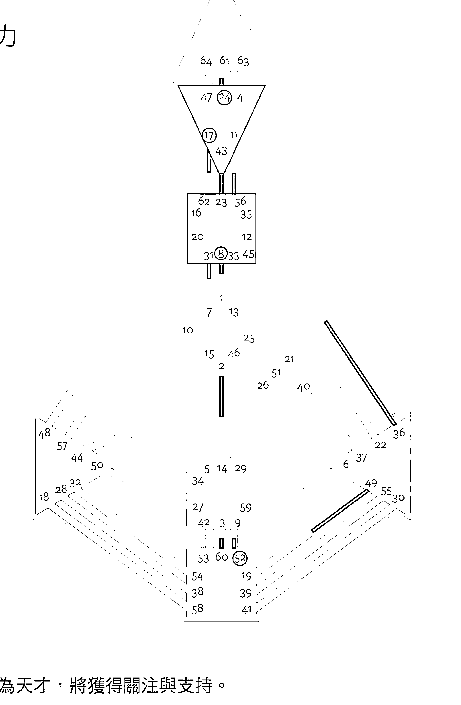

### 56.5 吸引注意力

♅ △ 不尋常、改革與創新，有時極為天才，因此獲得關注與支持。帶來創新且不尋常的刺激。

♂ ▽ 刻意吸引注意力，反而弄巧成拙，引發刺激與挑釁，帶來不安的能量。

---

## 56.6 謹慎

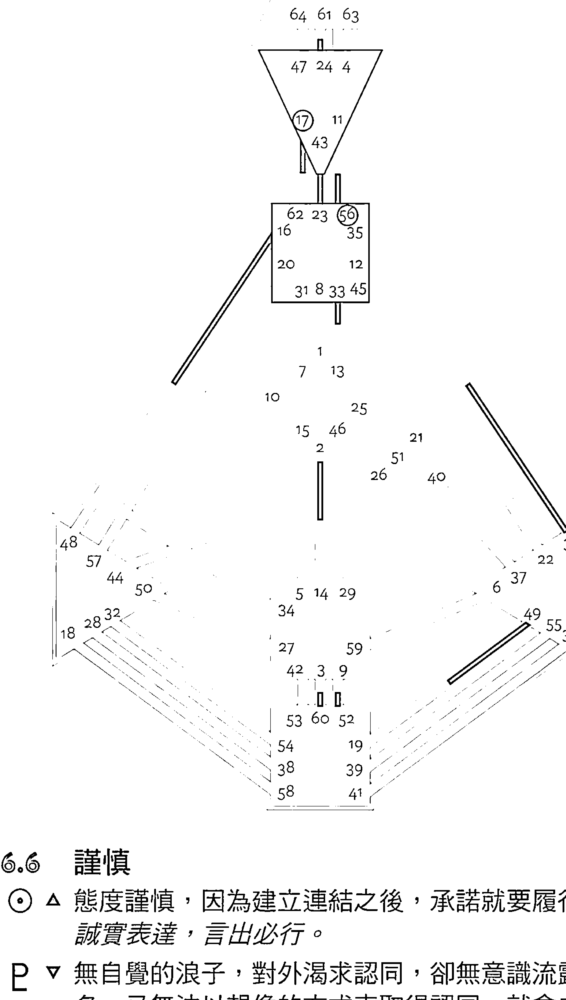

△ 成長需要謹慎。建立連結之後，承諾就要履行，根基才不會動搖。

誠實表達，言出必行。

▽ 無自覺地對外渴求認同，卻無意識流露出需求的能量，因此總是被拒絕。若默默無名，又無法以想像的方式取得認同，就會處境艱難。

遊蕩一生，不斷以各種方式展現自己，卻找不到此生的志業。

- 尋道者  
- 謹慎 56.6  
- 剛硬 60.6  
- 領導者 16.4  
- 自我防衛 23.2  
- 奉獻 43.2  
- 臣服 33.2  
- 自律 52.4  
- 挑釁 24.6  
- 苦難 17.6  
- 組織 49.5  
- 定格 2.6  
- 過渡 36.3  
- 接受 60.1  

---

## 影響力
顯化

農曆 6/27（一）

- 日 31.1 顯化  
- 地 41.1 合理  
- 月 45.4 方向  
- 北交 23.2 自我防衛  
- 南交 43.2 奉獻  
- 水 33.4 尊嚴  
- 金 52.5 解釋  
- 火 2.1 直覺  
- 木 17.6 菩薩  
- 土 49.5 組織  
- 天 2.6 定格  
- 海 36.3 過渡  
- 冥 60.1 接受  

23–43 架構

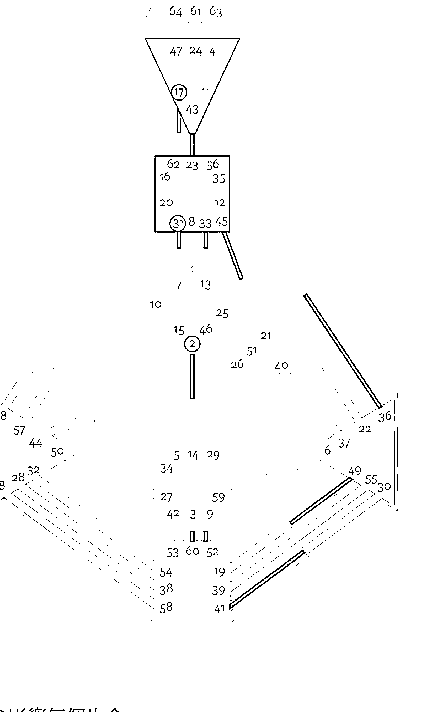

### 31.1 顯化

真空狀態下，影響力無法顯現。

- 太陽不會也不能隱匿光芒，其存在會影響每個生命，這是自然展現的領導力。  
- 吸收，在黑暗中只能顯化，是非自然展現的領導力。

---

## 影響力
傲慢

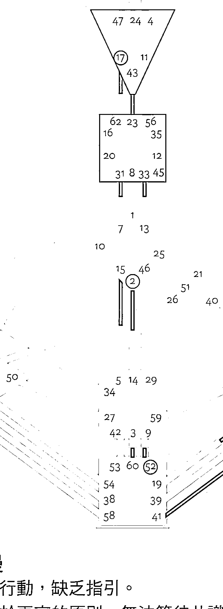

- 架構 23–43  
- 傲慢 31.2  
- 謹慎 41.2  
- 壁花 15.4  
- 自我防衛 23.2  
- 奉獻 43.2  
- 離異 33.6  
- 平和 52.6  
- 直覺 2.1  
- 苦難 17.6  
- 組織 49.5  
- 定格 2.6  
- 過渡 36.3  
- 接受 60.1  

### 31.2 傲慢

獨立行動，缺乏指引。

致力於更高的原則，無法等待共識產生。  
無法等待取得共識的領導型態。

有理的傲慢，往往因為神經緊繃而倉促行動，導致擦槍走火。  
等不及、迫不及待要表態，對其領導力造成傷害。

## 影響力  
選擇性

- 7–31 創始者  
- 23–43 架構  

- 日 ▲31.3 選擇性  
- 地 41.3 效率  
- 月 39.5 專心致志  
- 北交 23.1 傳教  
- 南交 43.1 耐性  
- 水 ▼7.2 民主主義者  
- 金 ▲39.2 對抗  
- 火 ▼2.2 天才  
- 木 ▼17.6 苦難  
- 土 49.5 組織  
- 天 2.6 定格  
- 海 36.3 過渡  
- 冥 60.1 接受  

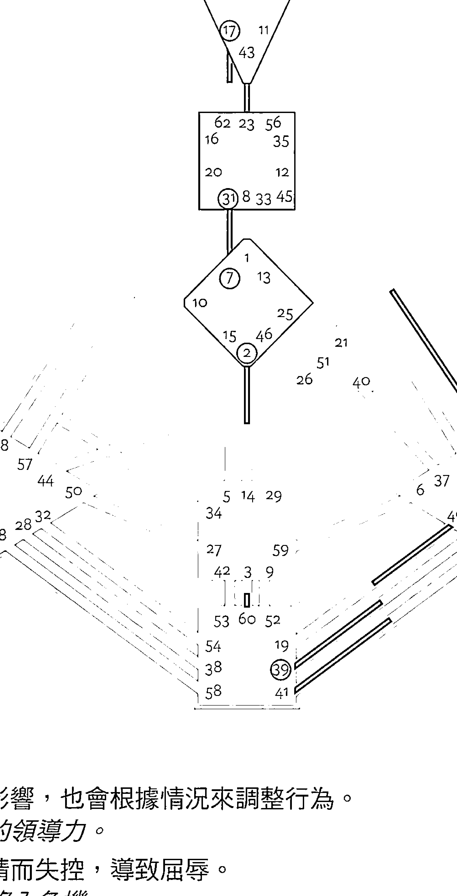

### 31.3 選擇性

能作評估，選擇合適的方式帶來影響，也會根據情況來調整行為。與合適的影響力相連結，強化自身的領導力。

根據本性來選擇，風險是會過於熱情而失控，導致屈辱。渴望展現領導力，所以來者不拒，陷入危機。

---

## 影響力

意圖　2022/07/28 05:00 TWN  
農曆 6/30（四）

- 創始者 7–31  
- 接受 17–62  
- 架構 23–43  

- 意圖 31.4  
- 修正 41.4 △  
- 質變 62.5 △  
- 傳教 23.1  
- 耐性 43.1  
- 退位者 7.4 △  
- 責任 39.3  
- 耐性 2.3 ▽  
- 菩薩 17.6 ☆  
- 組織 49.5  
- 定格 2.6  
- 過渡 36.3  
- 接受 60.1  

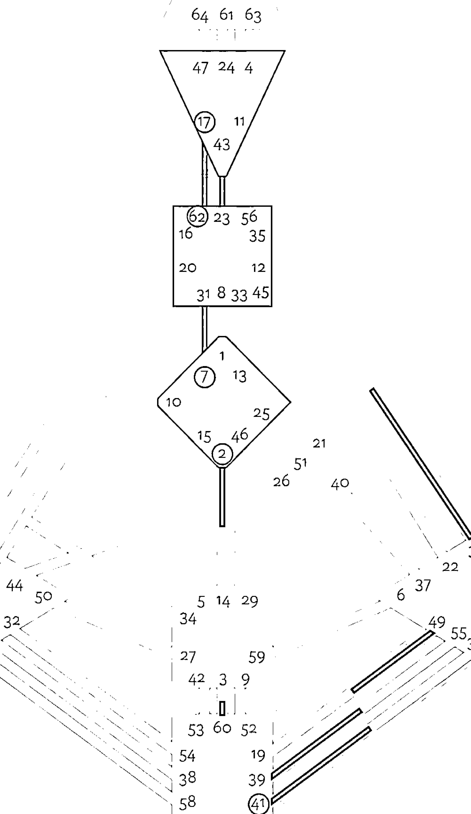

### 31.4 意圖

影響力的成功與否，取決於人們的看法。

- ☽ △ 獲得大眾贊同的影響力，帶來滋養與保護。外界對其影響力保持正面肯定的態度。  
- ♂ ▽ 過度強調自我、意圖操控。外界對其影響力帶有負面的投射。

---

## 影響力

### 31.5 自以為是

農曆 7/1（五）

- 7–31 創始者  
- 23–43 架構  
- 日 31.5 自以為是  
- 地 41.5 授權  
- 月 31.6 應用  
- 北交 23.1 傳教  
- 南交 43.1 耐性  
- 水 △ 7.6 管理者  
- 金 39.4 節制  
- 火 ▽ 2.3 耐性  
- 木 ▽ 17.6 菩薩  
- 土 49.5 組織  
- 天 2.6 定格  
- 海 36.3 過渡  
- 冥 60.1 接受  

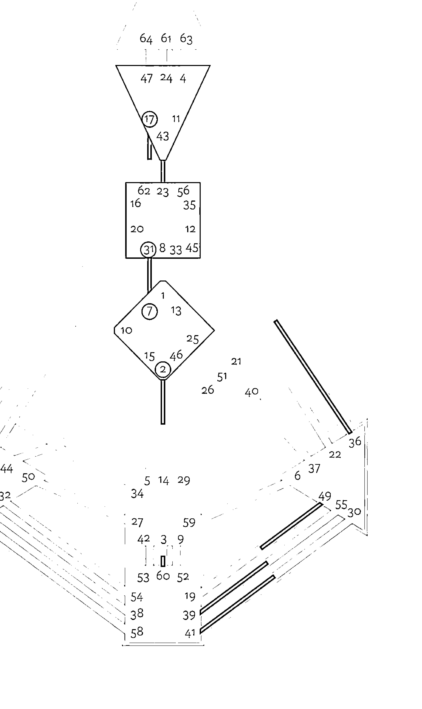

所抱持的態度，缺乏對外的影響力。

在天生專精的領域，只能獨自發展，而學成後，要拓展影響力卻極度困難，幾乎是不可能的任務。其專業要求自我領導。

深入聚焦在自我實驗，為此感到滿足，沒有向外的野心。缺乏抱負，能夠引領自己，已經感到滿足。

---

## 影響力 應用 31.6

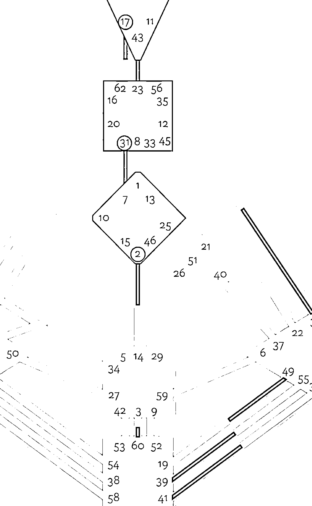

- 創始者 7–31  
- 架構 23–43  
- 應用 31.6  
- 感染 41.6  
- 管理者 7.6  
- 傳教 23.1  
- 耐性 43.1  
- 接受 4.2  
- 解決麻煩者 39.6  
- 隱匿 2.4  
- 苦難 17.6  
- 組織 49.5  
- 定格 2.6  
- 迴路 36.3  
- 接受 60.1  

### 31.6 應用

☉ △ 言行一致，保證會成功。  
言行一致的領導力。

☽ ▽ 在應用上流於表面，近於偽善，只求合理相對應。  
只認不做，虛偽的領導模式。

---

## 33.1 隱退

逃避

2022/07/31 03:36 TWN  
農曆 7/3（日）

- 19–49 整合綜效  
- 23–43 架構  

- 日 ▲33.1 逃避  
- 地 19.1 相互依存  
- 月 59.1 先發制人  
- 北交 23.1 傳教  
- 南交 43.1 耐性  
- 水 4.4 騙子  
- 金 ▼53.1 累積  
- 火 2.5 靈活應用  
- 木 ▼17.6 菩薩  
- 土 49.5 組織  
- 天 2.6 定格  
- 海 36.3 過渡  
- 冥 60.1 接受  

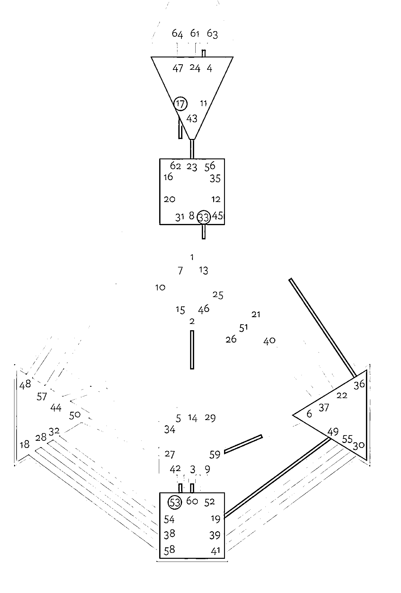

### 33.1 逃避

- ☉ △ 處於弱勢的智慧，認知到求存需要完全撤退。  
  了解自己處於弱勢，於是隱退。  

- ♂ ▽ 所謂勇氣，在此只不過是愚蠢的行為。  
  來自外在的刺激過多，無法隱退。

---

## 33.2

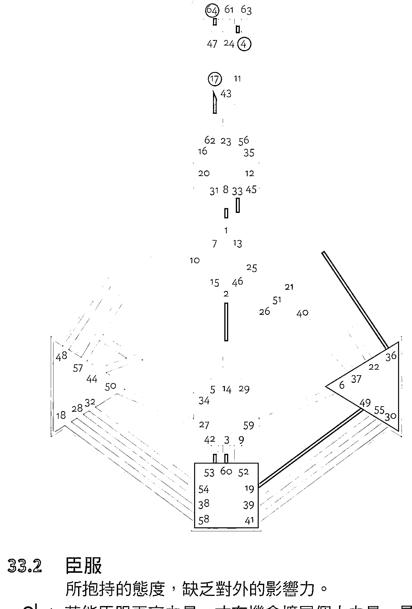

- 整合綜效 19–49  
- 臣服 33.2  
- 服務 19.2  
- 素質 64.2  
- 定格 2.6  
- 客觀性 1.6  
- 超越 4.6  
- 氣勢 53.2  
- 靈活應用 2.5  
- 苦難 17.6  
- 組織 49.5  
- 定格 2.6  
- 過渡 36.3  
- 接受 60.1  

### 33.2 臣服

所抱持的態度，缺乏對外的影響力。

- △ 若能臣服更高力量，才有機會擴展個人力量，最終會獲得勝利。順從強大的力量，為未來的勝利奠定根基。  
- ▽ 與上述位置合理、已經計算過的投降不同，在此是更深層、個人內在層面的臣服。感覺原本的位置是幻覺一場，才會認為強權是公理。公開接納各種強大的勢力，私下卻心生怨懟。

---

## 33.3 隱退

精神

- 日 33.3 精神  
- 地 19.3 奉獻  
- 月 6.3 忠誠  
- 北交 2.6 定格  
- 南交 1.6 客觀性  
- 水 29.2 評定  
- 金 53.3 實際  
- 火 2.6 定格  
- 木 17.6 菩薩  
- 土 49.5 組織  
- 天 2.6 定格  
- 海 36.3 過渡  
- 冥 60.1 接受  

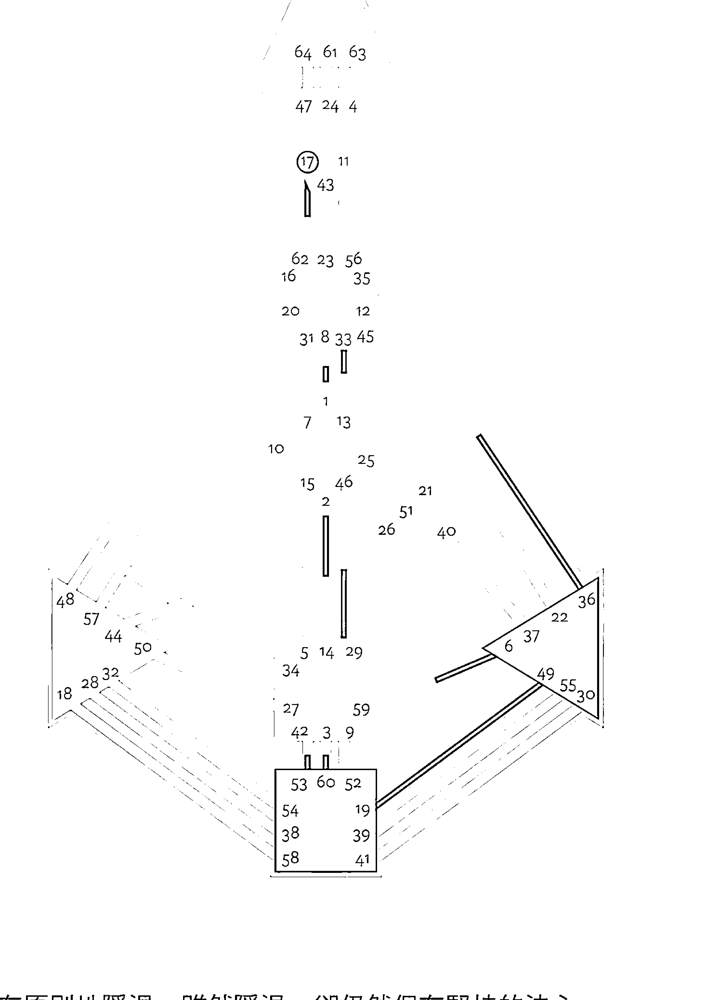

### 33.3 精神

以退為進的態度。

有所保留，所以選擇負責任；有原則地隱退，雖然隱退，卻仍然保有堅持的決心。保有隱私是成功之道。

不負責任地隱退，過河拆橋。為保有隱私，衝動之下瞬間切斷關係。

---

## 隱退

尊嚴　2022/08/03 02:08 TWN  
農曆 7/6（三）

### 33.4

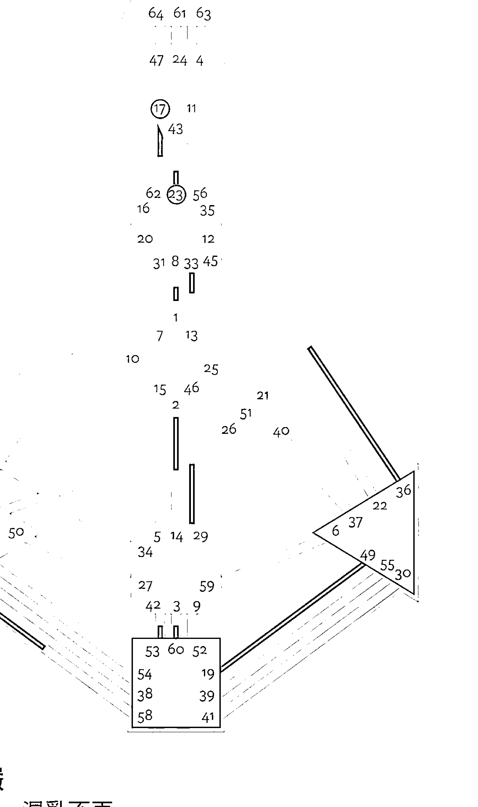

- 整合綜效 19–49  
- 尊嚴 33.4  
- 團隊合作 19.4  
- 無能 18.4  
- 定格 2.6  
- 客觀性 1.6  
- 直接 29.4  
- 主張 53.5  
- 傳教 23.1  
- 苦難 17.6  
- 組織 49.5  
- 定格 2.6  
- 過渡 36.3  
- 接受 60.1  

### 33.4 尊嚴

退隱，混亂不再。

- △ 底層對復甦的信念深信不疑，將退隱視為機會，得以革新並再生。為了再生，退隱是健康的。  
- ▽ 若缺乏指引之光，無法復甦重建，不可避免將崩壞，就此衰退。被迫撤退，無法看見內在更新的那一面。

---

## 隱退

### 33.5 時機

- 19–49 整合綜效  
- 日 33.5 時機  
- 地 △19.5 犧牲  
- 月 57.6 使用  
- 北交 2.6 定格  
- 南交 1.6 客觀性  
- 水 29.5 過度擴張  
- 金 53.6 逐步進行  
- 火 23.2 自我防衛  
- 木 ▽17.6 菩薩  
- 土 49.5 組織  
- 天 2.6 定格  
- 海 36.3 過渡  
- 冥 60.1 接受  

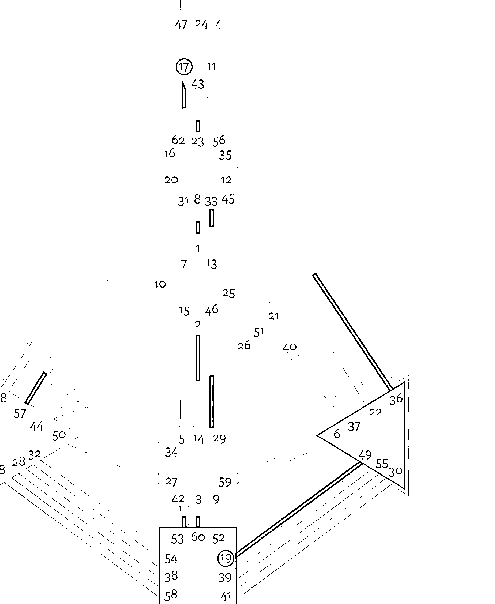

P △ 有時候你的意圖要秘而不宣，這與時機一樣重要。等待正確的時機到來，才能揭露。能夠隱藏自己的意圖並保密。

J ▽ 若期待他人參與，一起選擇適當的時機點，會導致困惑。不僅難以擇選時機，也可能在時局尚未成熟時就已洩密，結局充滿困惑。

---

## 33.6 隱退

離異  
2022/08/05 01:09 TWN  
農曆 7/8（五）

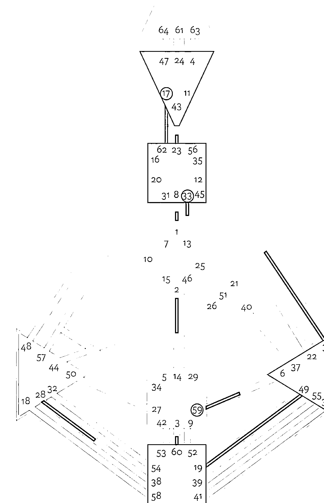

- 接受 17–62  
- 整合線 19–49  
- 離異 33.6  
- 通世者 19.6  
- 與魔鬼握手 28.2  
- 定格 2.6  
- 客觀性 1.6  
- 先發制人 59.1  
- 例行程序 62.1  
- 自我防衛 23.2  
- 苦難 17.6  
- 組織 49.5  
- 定格 2.6  
- 過渡 36.3  
- 接受 60.1  

### 33.6 離異

放手的能力。

☉ △ 意念專注於復興，而非一直相互指責、彼此牽制。有能力放下，然後隱退，享受隱私。

♃ ▽ 在隱退中沉澱，才能擺脫框架，放下喋喋不休的質疑，不再阻礙更新的過程。無法徹底放下。

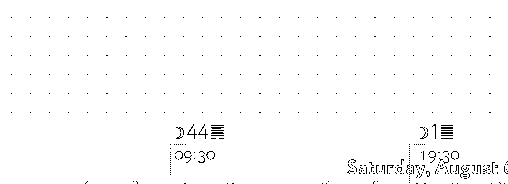

---

## 軍隊

2022/08/06 00:39 TWN  
獨裁主義者  
農曆 7/9（六）

- 17–62 接受  
- 日 7.1 獨裁主義者  
- 地 13.1 同理  
- 月 1.4 孤獨為創造力之媒介  
- 北交 2.6 定格  
- 南交 1.6 客觀性  
- 水 59.3 開放  
- 金 62.2 抑制  
- 火 23.3 個體性  
- 木 17.6 菩薩  
- 土 49.4 平台  
- 天 2.6 定格  
- 海 36.3 過渡  
- 冥 60.1 接受  

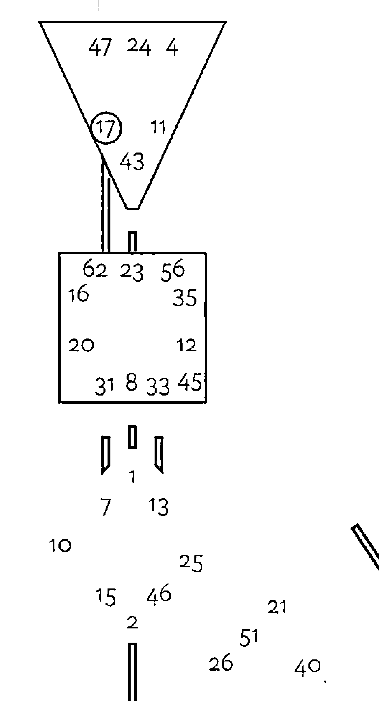

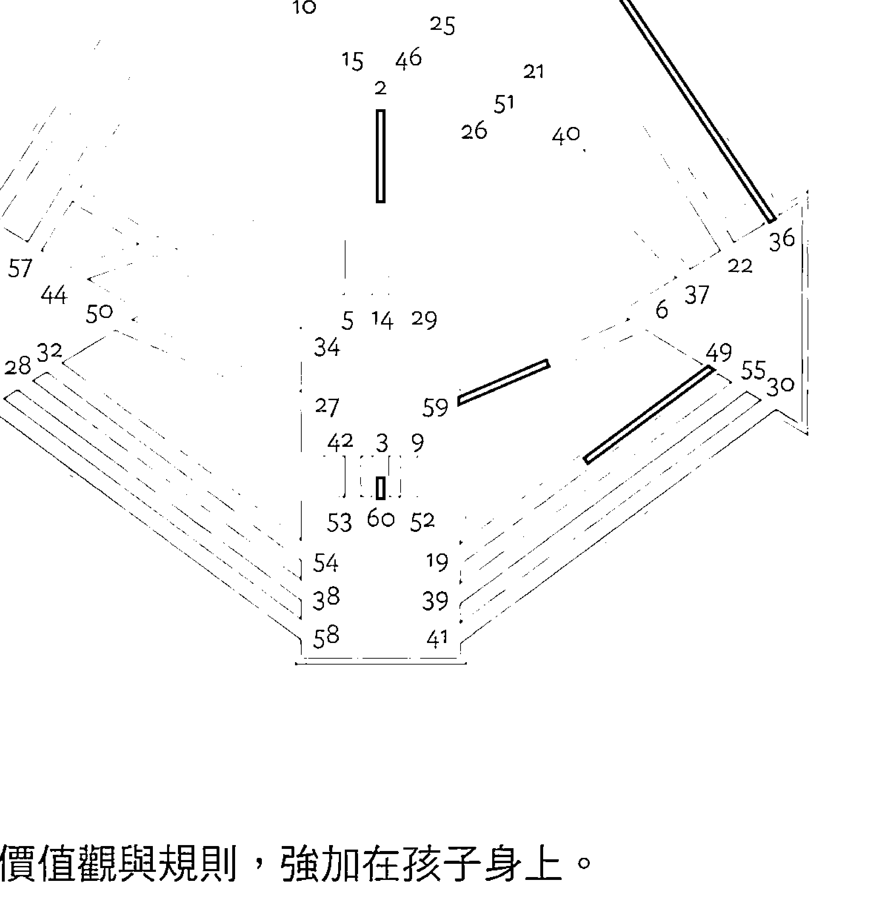

### 7.1 獨裁主義者

同時具備明君與專制的鐵腕。

- ♀ 金星位於上升相位，就像將基本價值觀與規則強加在孩子身上。以權威自居的指導能力。  
- ☿ 扭曲的認知，自認最懂。堅持自己最棒，自認是權威的能力。

---

## 軍隊

民主主義者　2022/08/07 00:08 TWN  
農曆 7/10（日）

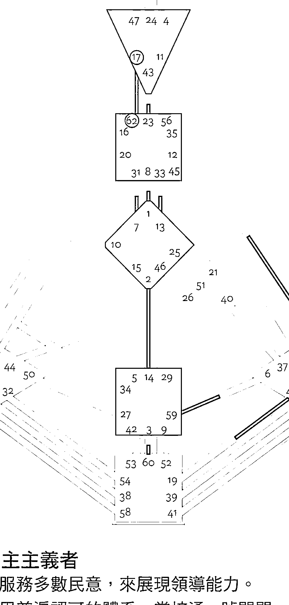

- 民主主義者 7.2  
- 偏執 13.2  
- 謙遜 14.6  
- 定格 2.6  
- 客觀性 1.6  
- 蛇蠍美人或大眾情人 59.5  
- 苦行主義 62.4  
- 個體性 23.3  
- 菩薩 17.6  
- 平台 49.4  
- 定格 2.6  
- 過渡 36.3  
- 接受 60.1  

### 7.2 民主主義者

以服務多數民意來展現領導能力。

- △ 應用普遍認可的體系。當接通31號閘門形成「創始者」通道，就有可能對社會帶來廣泛且革命性的影響。被選出來展現領導力。  
- ▽ 菁英主義：否定民主的民主主義者。有能力的人被選出後，認為自己高人一等，比選出來的人更優越。

---

## 軍隊

無政府主義者  
農曆 7/10（日）立秋

- 日 7.3 無政府主義者  
- 地 ▲13.3 悲觀主義  
- 月 ▼5.3 強迫症  
- 北交 2.6 定格  
- 南交 1.6 客觀性  
- 水 ▼59.6 一夜情  
- 金 62.5 質變  
- 火 23.4 分裂  
- 木 17.5 無人是孤島  
- 土 49.4 平台  
- 天 2.6 定格  
- 海 36.3 過渡  
- 冥 60.1 接受  

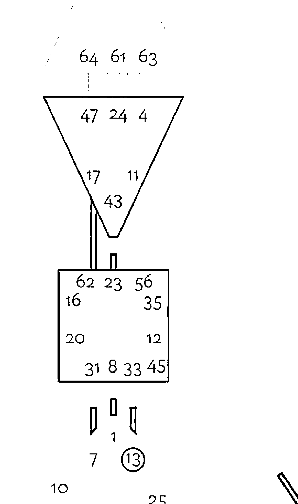

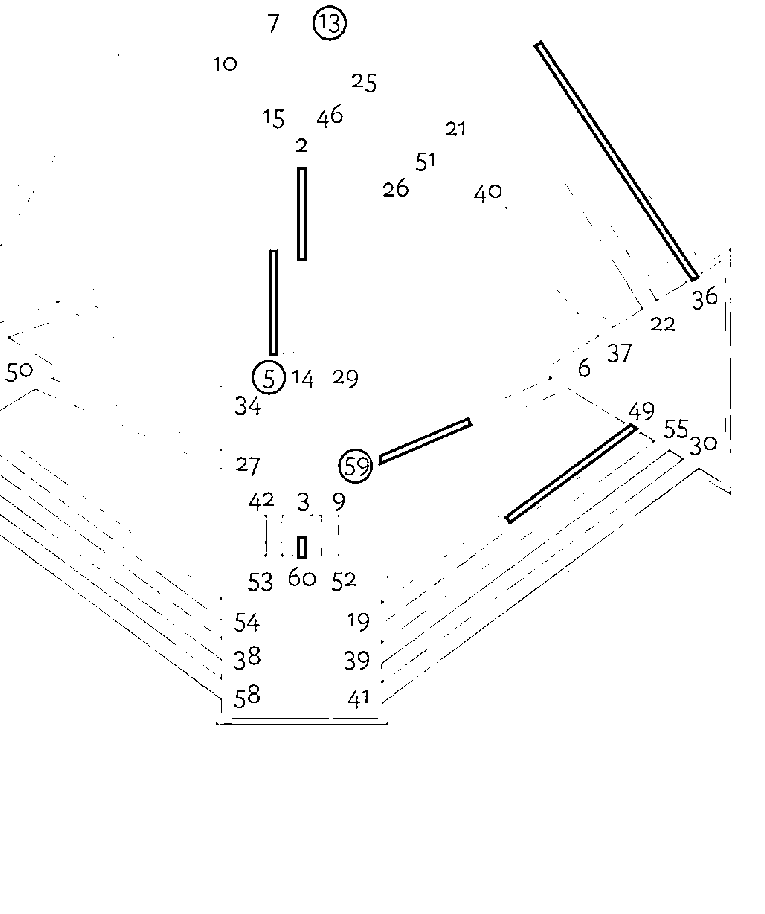

### 7.3 無政府主義者

不相信任何確立的制度。

☽ △ 不論現況如何，始終都有想改變的需求。充滿動力，渴望一人嘗試許多角色。

☿ ▽ 虛無主義者。否定各種角色的能力。

---

## 軍隊

退位者　2022/08/08 23:06 TWN  
農曆 7/11（一）

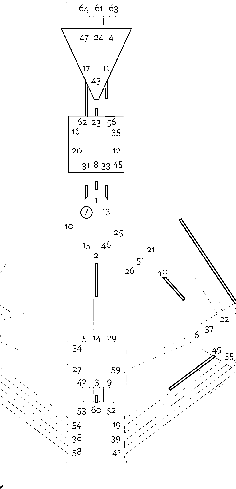

| 項目 | 數值 |
|---|---|
| 接受 | 17-62 |
| 退位者 | 7.4 |
| 疲累 | 13.4 |
| 適應力 | 11.6 |
| 定格 | 2.6 |
| 客觀性 | 1.6 |
| 堅定 | 40.2 |
| 自律 | 62.6 |
| 同化 | 23.5 |
| 無人是孤島 | 17.5 |
| 平台 | 49.4 |
| 定格 | 2.6 |
| 迴路 | 36.3 |
| 接受 | 60.1 |

### 7.4 退位者

- 應當接受群眾公評，或法律裁定。  

- △ 考量整體利益，優雅轉身，選擇下台的智慧。  
  - 接受他人評斷的雅量。  

- ▽ 一面倒的反對聲浪，被迫釋出權力。  
  - 拒絕接受他人的評斷。

---

## 軍隊

將軍  
農曆 7/12（二）

- 日 7.5 將軍  
- 地 13.5 救世主  
- 月 38.4 調查  
- 北交 2.6 定格  
- 南交 1.6 客觀性  
- 水 40.4 組織  
- 金 56.2 連結  
- 火 23.5 同化  
- 木 17.5 無人是孤島  
- 土 49.4 平台  
- 天 2.6 定格  
- 海 36.3 過渡  
- 冥 60.1 接受  

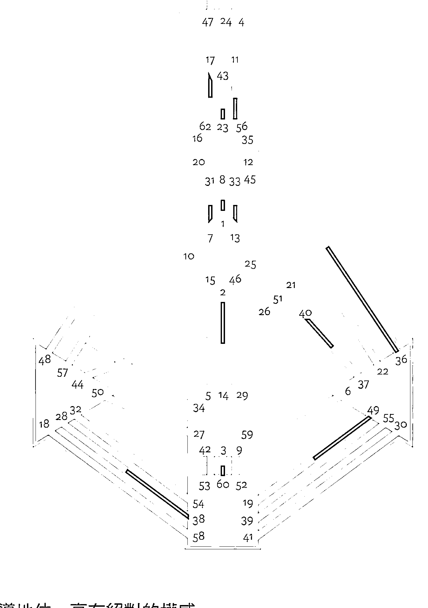

### 7.5 將軍

危急之際，由社會群體賦予領導地位，享有絕對的權威。

- ♀ △ 為了讓計畫發揮潛能並和諧運作，引發眾人效忠的天賦。透過自身角色，引發眾人效忠的能力。  
- ♆ ▽ 被部隊孤立的指揮官，為求勝利不惜任何代價。剛愎自用，將無人效忠。

---

## 軍隊

管理者  
2022/08/10 22:03 TWN  
農曆 7/13（三）

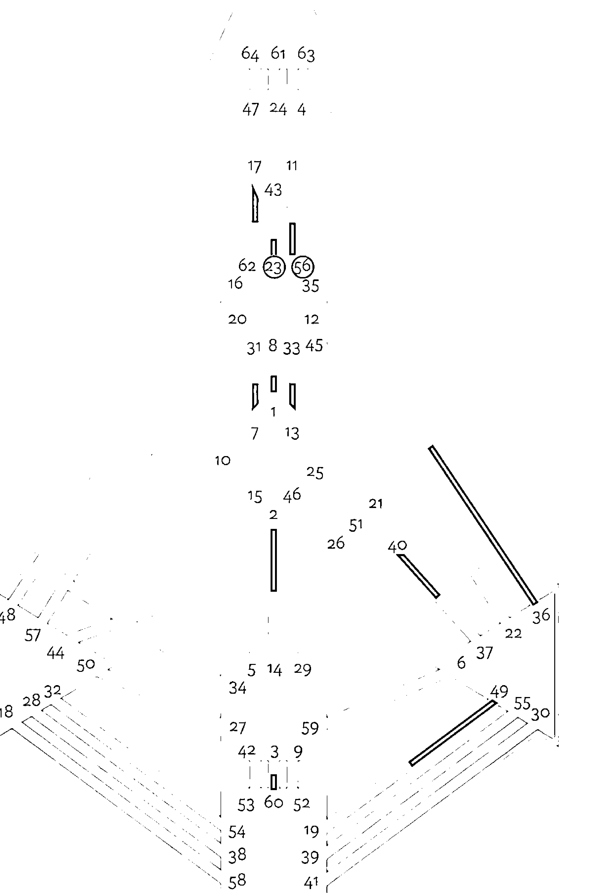

- 管理者 7.6  
- 樂天派 13.6  
- 接受 60.1  
- 定格 2.6  
- 客觀性 1.6  
- 剛硬 40.5  
- 疏離 56.3  
- 融合 23.6  
- 無人是孤島 17.5  
- 平台 49.4  
- 定格 2.6  
- 過渡 36.3  
- 接受 60.1  

### 7.6 管理者

能分享，也能公正地分配權力。

- △ 溝通責任組織架構的權力。  
  - 透過所扮演的角色，溝通如何劃分責任。  

- ▽ 負面聲勢的官僚，最後動搖國本。  
  - 透過自身角色，經由分配責任而謀取權力。

---

## 血氣方剛的愚者

愉悅  
2022/08/11 21:31 TWN  
農曆 7/14（四）

- 1–8 啟發  
- 19–49 整合綜效  

- 日 4.1 愉悅  
- 地 49.1 必要性法則  
- 月 △19.5 犧牲  
- 北交 2.5 靈活應用  
- 南交 △1.5 吸引社會大眾的能量  
- 水 64.1 制約  
- 金 56.4 權宜  
- 火 8.1 誠實  
- 木 17.5 無人是孤島  
- 土 49.4 平台  
- 天 2.6 定格  
- 海 36.3 過渡  
- 冥 60.1 接受  

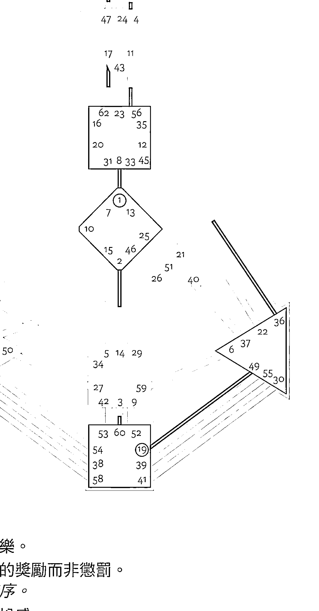

### 4.1 愉悅

若還不到完美的時機，無法獲得終極的快樂。

- △ 基本本能來判斷對的時機與情勢，獲得愉悅的獎勵而非懲罰。  
  有潛質能明白，理解的過程有其正常的時序。  

- ▽ 時機不是紀律的產物。通常的自律反而毀壞愉悅感。  
  具備理解的潛能，卻因衝動而擾亂節奏。

---

## 血氣方剛的愚者

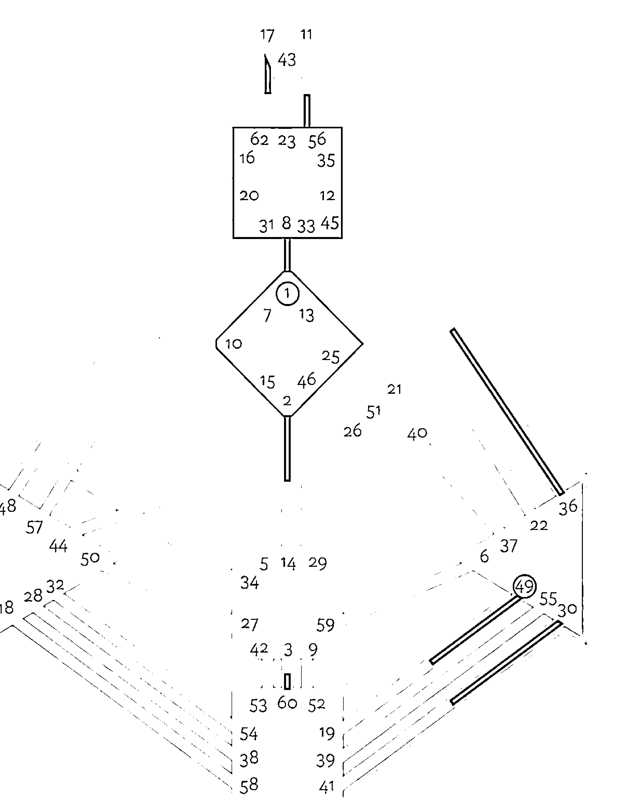

- 啟發 1–8  
- 接受 4.2  
- 最終手段 49.2  
- 順從 30.3  
- 靈活應用 2.5  
- 吸引社會大眾的能量 1.5  
- 素質 64.2  
- 吸引注意力 56.5  
- 誠實 8.1  
- 無人是孤島 17.5  
- 平台 49.4  
- 定格 2.6  
- 過渡 36.3  
- 接受 60.1  

### 4.2 接受

理解自己與他人皆有限制，寬容以待，暫不評斷。

- △ 憐憫情感。面對誤入歧途的孩子，永遠懷抱寬容的母親。或許能知道「不是每個人都能理解」。  
- ▽ 以別人的失敗為例，做出自以為是的斷言。利用他人的無知，有可能因此而獲得好處。

---

## 血氣方剛的愚者

不負責任  
1–8 啟發

- 日 4.3 不負責任  
- 地 49.3 民怨  
- 月 37.6 目的  
- 北交 2.5 靈活應用  
- 南交 △1.5 吸引社會大眾的能量  
- 水 64.4 信念  
- 金 31.1 顯化  
- 火 8.2 服務  
- 木 17.5 無人是孤島  
- 土 49.4 平台  
- 天 2.6 定格  
- 海 36.3 過渡  
- 冥 60.1 接受  

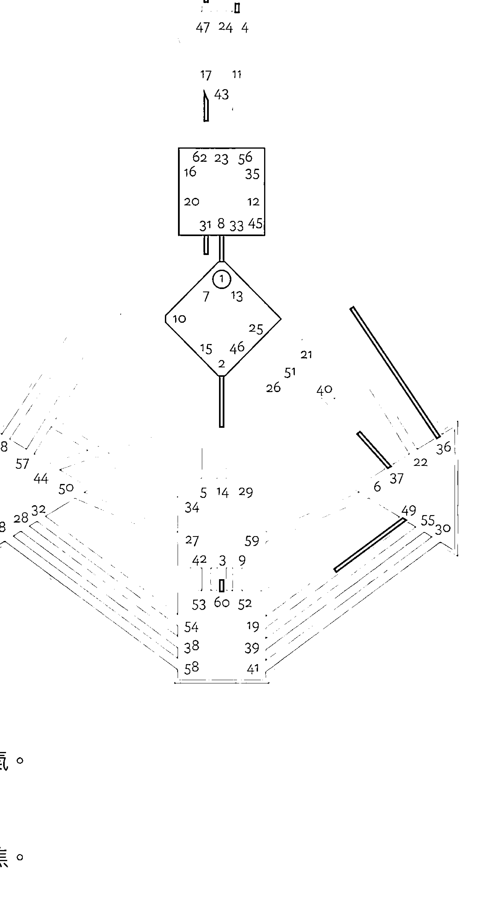

### 4.3 不負責任

只要能省事省力就好，不必多花力氣。

♀ △ 藝術比藝術家更有價值。  
有公式就好，不管實際如何應用。

♇ ▽ 將不負責任合理化，說成是重新聚焦。  
為了維持現況而合理化的能力。

---

## 血氣方剛的愚者

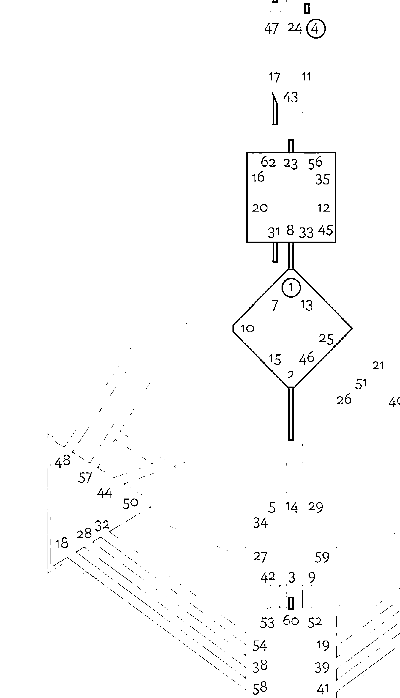

- 啟發 1–8  
- 騙子 4.4  
- 平台 49.4  
- 過渡 36.3  
- 靈活應用 2.5  
- 吸引社會大眾的能量 1.5  
- 承諾 64.5  
- 傲慢 31.2  
- 虛假 8.3  
- 無人是孤島 17.5  
- 平台 49.4  
- 傳教 23.1  
- 過渡 36.3  
- 接受 60.1  

### 4.4 騙子

將角色扮演當成藝術表現。演員。

☉ △ 不論如何被誤導，只要能幻想，就能保有使命感與理由。  
透過幻想，尋找延伸公式的可能。

♄ ▽ 時間總會帶來清算。  
將幻想變成事實，就是隱藏的危機。

---

## 血氣方剛的愚者

誘惑  
農曆 7/18（一）

- 日 4.5 誘惑  
- 地 49.5 組織  
- 月 17.5 無人是孤島  
- 北交 2.5 靈活應用  
- 南交 △1.5 吸引社會大眾的能量  
- 水 47.1 盤點  
- 金 31.3 選擇性  
- 火 8.3 虛假  
- 木 17.5 無人是孤島  
- 土 49.4 平台  
- 天 23.1 傳教  
- 海 36.3 過渡  
- 冥 60.1 接受  

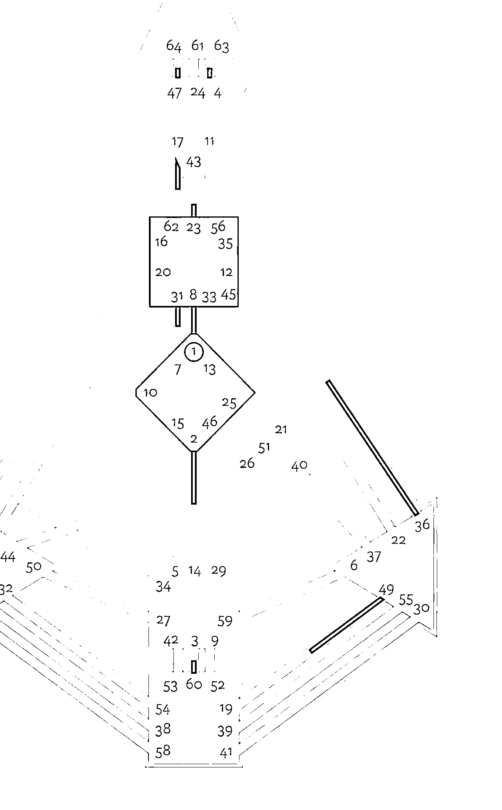

### 4.5 誘惑

讓別人承擔責任，以此作為擋箭牌，避免責罰的可能。

- ♃ △ 不勞而獲的獎賞與認可。  
  有可能因為理解他人，而獲得成功。  

- ♇ ▽ 滿嘴都是過時、令人不滿意的價值觀，慣性嫉俗。  
  慣性嫉俗的底層，是不得不承認自己其實能理解他人。

## 血氣方剛的愚者

超越  
2022/08/16 18:43 TWN  
農曆 7/19（二）

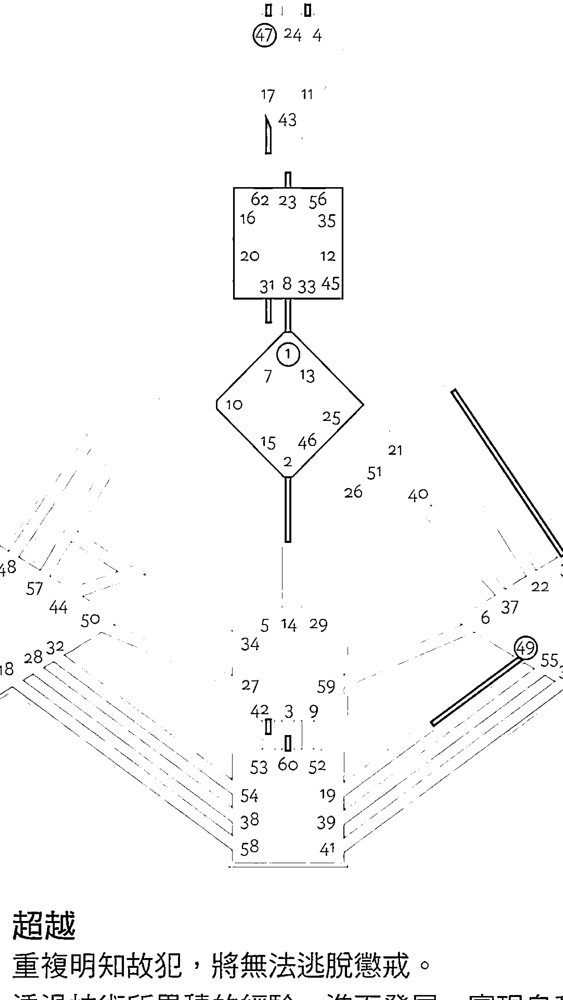

- 啟發 1–8
- 超越 4.6
- 吸引力 49.6
- 多樣化 42.1
- 靈活應用 2.5
- 吸引社會大眾的能量 1.5
- 野心 47.2
- 意圖 31.4
- 尊重 8.4
- 無人是孤島 17.5
- 平台 49.4
- 傳教 23.1
- 過渡 36.3
- 接受 60.1

### 4.6 超越

重複明知故犯，將無法逃脫懲戒。

透過技術所累積的經驗，進而發展，實現自我約束。

邏輯推演的過程蘊藏潛能，必須要能區辨是否完全理解；若尚未理解，要有耐性等待。

就算接受懲罰，也有膽識去承受，這就是超越的代價。

已經認知到這一切並不完美，卻對過程缺乏耐性。

---

## 深淵

### 徵召

- 日 29.1 徵召
- 地 30.1 沉著
- 月 27.3 貪婪
- 北交 2.5 靈活應用
- 南交 △ 1.5 吸引社會大眾的能量
- 水 47.3 自我壓抑
- 金 31.6 應用
- 火 8.5 達摩
- 木 17.5 無人是孤島
- 土 49.4 平台
- 天 23.1 傳教
- 海 36.3 過渡
- 冥 60.1 接受

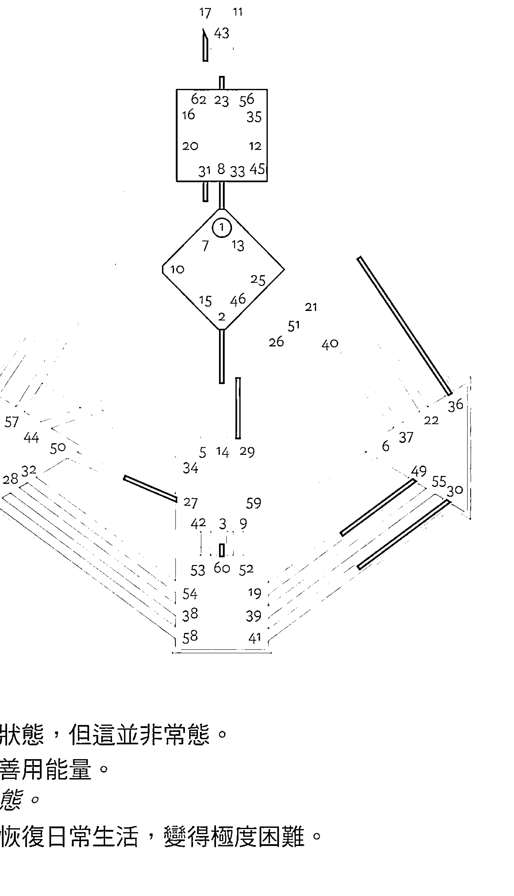

### 29.1 徵召

若是必要，有能力適應，進入抗爭的狀態，但這並非常態。

♂ △ 無論面對戰爭或和平之時，天生懂得善用能量。必要時展現堅持的力量，但並非常態。

♆ ▽ 揮筆揭開門下的深刻烙印，使得恢復日常生活變得極度困難。基於過往經驗，對承諾有所遲疑。

---

## 深潛

### 評定

## 29.2

2022/08/18 17:32 TWN  
農曆 7/21（四）

- 啟發 1–8
- 評定 29.2
- 實用主義 30.2
- 隱匿 2.4
- 靈活應用 2.5
- 吸引社會大眾的能量 1.5
- 聖人 47.5
- 逃避 33.1
- 達摩 8.5
- 無人是孤島 17.5
- 民怨 49.3
- 傳教 23.1
- 過渡 36.3
- 接受 60.1

### 29.2 評定

能否堅持，謹慎以對。

- ☉ △ 持續的力量，宛如指路明燈，充滿堅持的力量。
- ♀ ▽ 過度謹慎的傾向，當堅持被認定為多餘，又無法為不和諧的狀態劃下句點。堅持引發更多不和諧，對於是否要答應，更加謹慎小心。

---

## 深淵

### 評估

1–8 啟發

- 日 29.3 評估
- 地 30.3 順從
- 月 8.5 達摩
- 北交 2.5 靈活應用
- 南交 △ 1.5 吸引社會大眾的能量
- 水 47.6 徒勞無功
- 金 33.2 臣服
- 火 8.6 文詰
- 木 17.5 無人是孤島
- 土 49.3 民怨
- 天 23.1 傳教
- 海 36.3 過渡
- 冥 60.1 接受

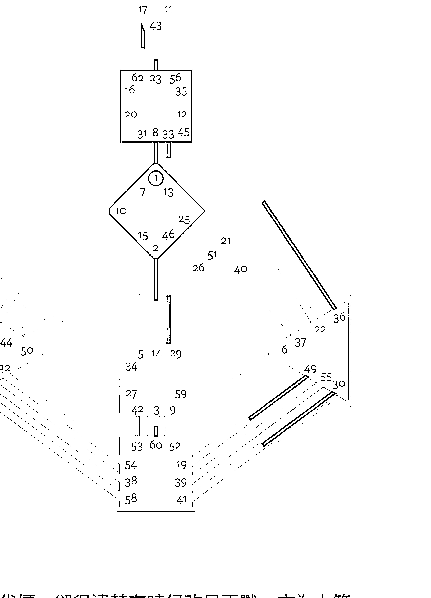

### 29.3 評估

在這樣的狀況下，仔細評估無為。

- ♂ △ 儘管很衝動，儘管不採取行動也要付出代價，卻很清楚何時候改日再戰方為上策。等待的力量。
- ♃ ▽ 原則上傾向退縮，卻沒有考慮這會帶來什麼樣的影響。謹慎的力量。

---

## 深淵

## 29.4

直接  
2022/08/20 16:19 TWN  
農曆 7/23（六）

- 啟發 1–8
- 直接 29.4
- 精疲力竭 30.4
- 聖誕怪傑 16.5
- 靈活應用 2.5
- 吸引社會大眾的能量 1.5
- 隱退 6.1
- 尊嚴 33.4
- 交誼 8.6
- 無人是孤島 17.5
- 民怨 49.3
- 傳教 23.1
- 過渡 36.3
- 接受 60.1

### 29.4 直接

兩點之間最短的距離是一條直線。

♄ △ 運用智慧，以最簡捷直接的方式來解決困難。  
力量來自於投注一己之力，運用在最簡單、最直接的流程。

♀ ▽ 簡單和直接往往被視為不錯，但在美學層面極為粗糙。  
直白的力量，常常冒犯他人。

---

## 深淵

### 過度擴張

- 日 △ 29.5 過度擴張
- 地 30.5 諷刺
- 月 45.6 重新審視
- 北交 2.5 靈活應用
- 南交 1.5 吸引社會大眾的能量
- 水 6.3 忠誠
- 金 33.5 時機
- 火 20.1 表面化
- 木 17.5 無人是孤島
- 土 49.3 民怨
- 天 23.1 傳教
- 海 36.3 過渡
- 冥 60.1 接受

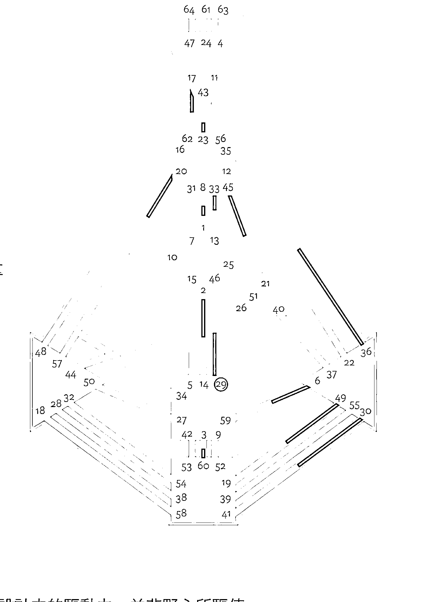

### 29.5 過度擴張

貪多嚼不爛的傾向。

- ☉ △ 太陽位於上升相位，這是本身設計中的驅動力，並非野心所驅使。無法控制的驅動力，不由自主會答應。
- ♀ ▽ 失敗，野心告終。雖然答應了，卻因為過度使用既有的資源，而無法延續。

---

## 深淵

### 困惑

29.6  
2022/08/22 15:02 TWN  
農曆 7/25（一）

- 困惑 29.6
- 強制 30.6
- 自我防衛 15.6
- 靈活應用 2.5
- 吸引社會大眾的能量 1.5
- 勝利 6.4
- 離異 33.6
- 獨斷者 20.2
- 無人是孤島 17.5
- 民怨 49.3
- 傳教 23.1
- 過渡 36.3
- 接受 60.1

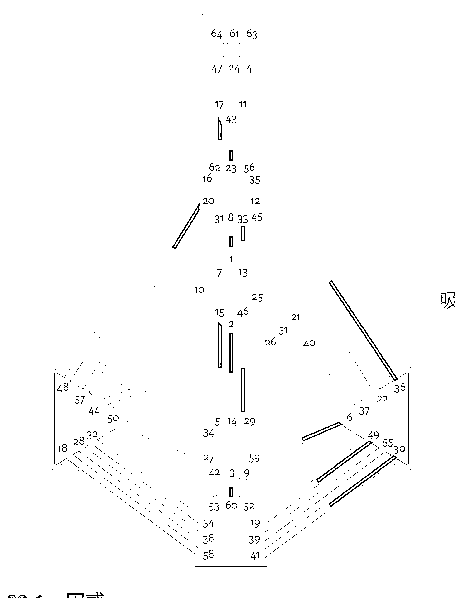

### 29.6 困惑

存在的狀態，局勢蒙蔽了覺知。

- ♂ △ 火星帶來能量與決心，形成盲目的驅動力，往往莫名帶來好運。堅持的力量毫無窮盡。
- ♃ ▽ 在逆風中傾向抽離，而非接受制約並持續堅持。能在混亂中保持警覺，而非說出承諾。

---

## 59.1 分散

先發制人  
農曆 7/26（二）處暑

- 6–59 親密
- 39–55 情緒

- 日 ☆ 59.1 先發制人
- 地 55.1 合作
- 月 ▲ 39.6 解決麻煩者
- 北交 2.4 隱匿
- 南交 1.4 孤獨為創造力之媒介
- 水 6.5 仲裁
- 金 ▲ 7.1 獨裁主義者
- 火 20.2 獨斷者
- 木 17.5 無人是孤島
- 土 49.3 民怨
- 天 23.1 傳教
- 海 36.3 過渡
- 冥 60.1 接受

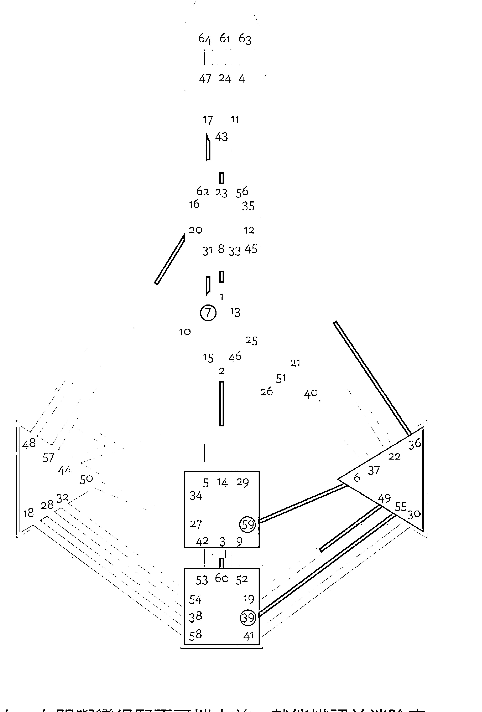

### 59.1 先發制人

△ 握有權威與活力，了解目的與方向，在阻礙變得堅不可摧之前，就能辨認並消除它。愛孕的生育力。

☿ 在此位置，具備能力與聰明才智，足以理解何時該行動以及如何行動，但也可能猶豫不決。繁衍的潛力受制於不確定性。

---

## 59.2 分散

### 害羞

2022/08/24 13:44 TWN  
農曆 7/27（三）

- 親密 6–59
- 接受 17–62
- 害羞 59.2
- 不信任 55.2
- 自律 62.6
- 隱匿 2.4
- 孤獨為創造力之媒介 1.4
- 調停者 6.6
- 無政府主義者 7.3
- 自我覺知 20.3
- 人事經理 17.4
- 民怨 49.3
- 傳教 23.1
- 過渡 36.3
- 接受 60.1

### 59.2 害羞

自我設限。

♅ △ 天生偏好隔絕的狀態，為了避免聯盟之後各種難以避免的不穩定性。約束對性的衝動，以保存其獨立性。

♇ ▽ 官僚主義中的一部分，深植於心靈的心理障礙。即使是充滿活力的個體，也總在與人互動時感到限制。源於心理或生理因素，制約了分離的動力。

---

## 59.3 分散

### 開放

2022/08/25 13:03 TWN  
農曆 7/28（四）

- 日 59.3 開放
- 地 55.3 無罪
- 月 33.1 逃避
- 北交 2.4 隱匿
- 南交 1.4 孤獨為創造力之媒介
- 水 46.1 在發現的過程中
- 金 7.4 退位者
- 火 20.3 自我覺知
- 木 17.4 人事經理
- 土 49.3 民怨
- 天 23.1 傳教
- 海 36.3 過渡
- 冥 60.1 接受

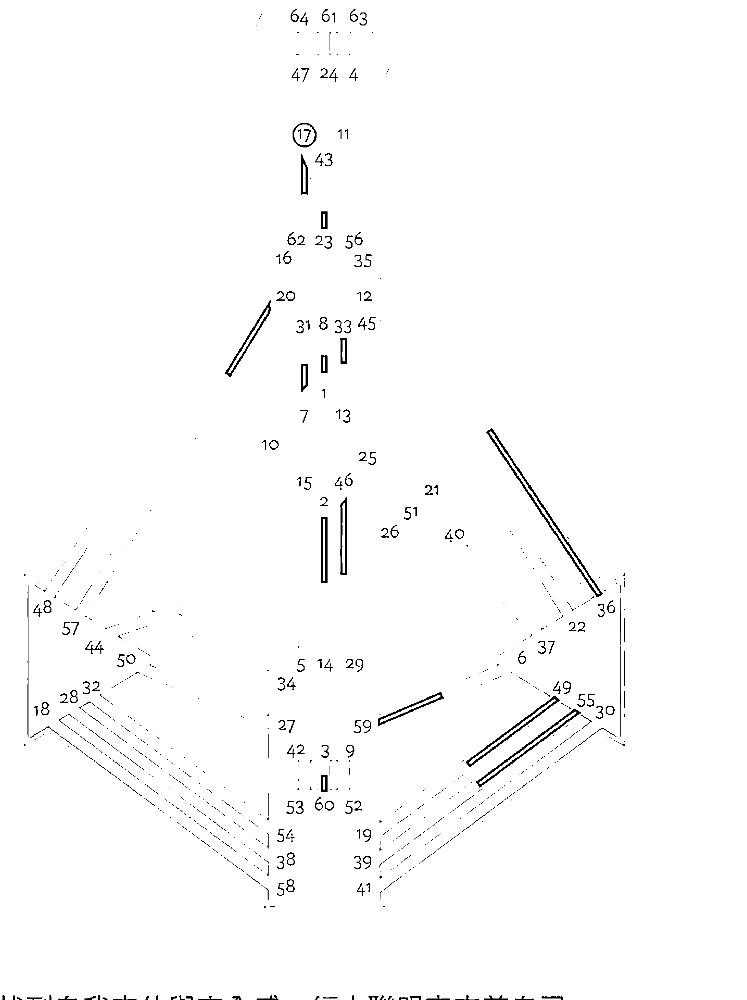

### 59.3 開放

土星上升，唯有卸下防備，才能找到自我定位與安全感，經由聯盟來定義自己。透過聯盟與人親密而獲得力量。

開放變成濫交，伴隨而來許多問題。透過聯盟與親密，渴望被激勵，可能會導致濫交。

---

## 分散

### 手足情誼

2022/08/26 12:22 TWN  
農曆 7/29（五）

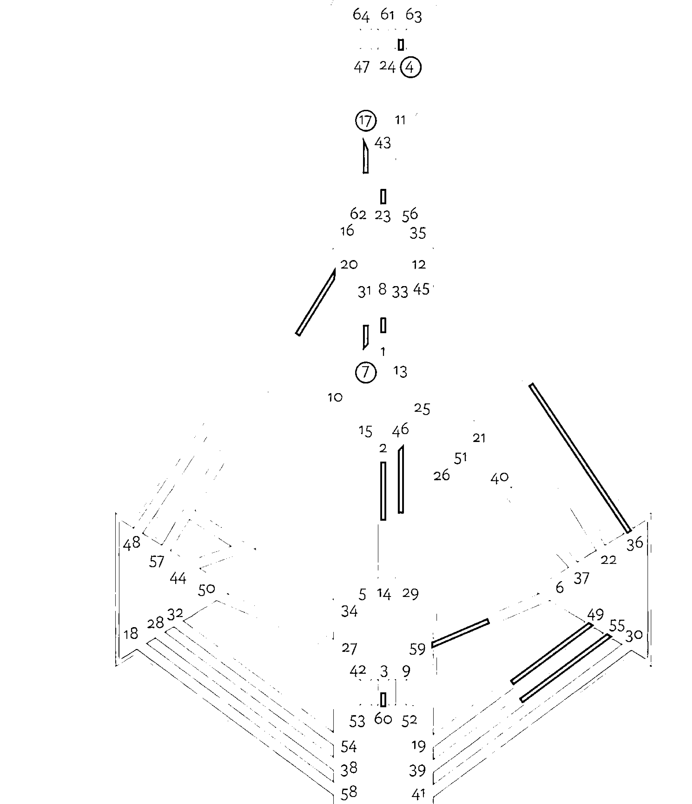

- 手足情誼 59.4
- 同化 55.4
- 愉悅 4.1
- 隱匿 2.4
- 孤獨為創造力之媒介 1.4
- 投射 46.3
- 將軍 7.5
- 應用 20.4
- 人事經理 17.4
- 民怨 49.3
- 傳教 23.1
- 過渡 36.3
- 接受 60.1

### 59.4 手足情誼

撤除藩籬，聯合起來，建立普及而廣大的聯盟。  
力量源於親密，在此親密與性無關。

它有智慧面的理解，卻從未付諸行動。  
想法無法克制性慾。

---

## 59.5 分散

### 蛇蠍美人或大眾情人

2022/08/27 11:41 TWN  
農曆 8/1（六）

- 日 △ 59.5 蛇蠍美人或大眾情人
- 地 55.5 成長
- 月 59.2 害羞
- 北交 2.4 隱匿
- 南交 1.4 孤獨為創造力之媒介
- 水 46.4 影響
- 金 7.6 管理者
- 火 20.5 現實主義
- 木 ▽ 17.4 人事經理
- 土 49.3 民怨
- 天 23.1 傳教
- 海 36.3 過渡
- 冥 60.1 接受

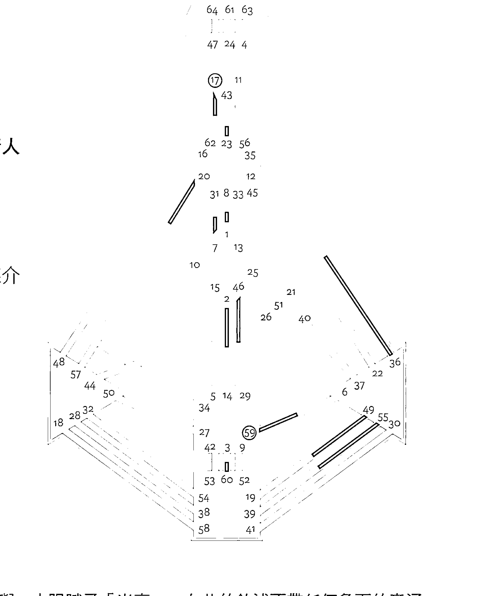

### 59.5 蛇蠍美人或大眾情人

☉ △ 運用愛的力量突破任何障礙。太陽賦予了「光亮」，在此的敘述不帶任何負面意涵，以強大的力量吸引他人。

♅ ▽ 天王星下降：這股力量的負面表現很明顯。小白臉、女騙子，將性慾表達為權力的力量。

---

## 分歧 — 一夜情

## 59.6

2022/08/28 10:59 TWN  
農曆 8/2（日）

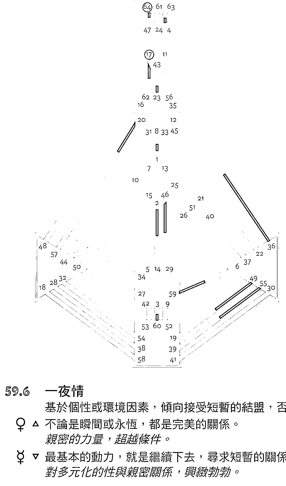

- 一夜情 59.6
- 自私 55.6
- 過度膨脹 64.3
- 耐性 2.3
- 持續創作的能量 1.3
- 步調 46.5
- 接受 4.2
- 現實主義 20.5
- 人事經理 17.4
- 民怨 49.3
- 傳教 23.1
- 過渡 36.3
- 接受 60.1

### 59.6 一夜情

基於個性或環境因素，傾向接受短暫的結盟，否則關係可能無法繼續，甚至帶來危險。

♀ △ 不論是瞬間或永恆，都是完美的關係。  
親密的力量，超越條件。

☿ ▽ 最基本的動力就是繼續下去，尋求短暫的關係並視為理所當然，對環境因素不做回應。

對多元化的伴侶與親密關係興緻勃勃。

---

## 40.1 遁逸

### 休養

農曆 8/3（一）

- 日 △ 40.1 休養
- 地 37.1 母親／父親
- 月 6.4 勝利
- 北交 2.3 耐性
- 南交 1.3 持續創作的能量
- 水 46.5 步調
- 金 △ 4.3 不負責任
- 火 20.6 智慧
- 木 ▽ 17.4 人事經理
- 土 49.3 民怨
- 天 23.1 傳教
- 海 36.3 過渡
- 冥 60.1 接受

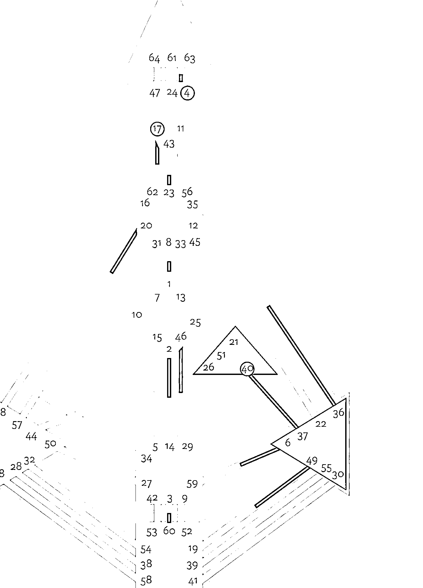

### 40.1 休養

☉ △ 能夠放鬆，享受個人努力的成果。意志力的力量，享受獨處。

☽ ▽ 月亮不會沒有陰晴圓缺。若勞碌得太久，意志力也會感到不自在。

---

## 40.2

- 經營社群 37–40
- 堅定 40.2
- 責任 37.2
- 治療 18.5
- 耐性 2.3
- 持續創作的能量 1.3
- 誠信 46.6
- 騙子 4.4
- 智慧 20.6
- 人事經理 17.4
- 民怨 49.3
- 傳教 23.1
- 過渡 36.3
- 接受 60.1

### 40.2 堅定

從獨處中獲得力量與權威，徹底擺脫不自由的元素。經由獨處而得到力量，因而認知到他人的重要性，也能感受到他們所帶來的滋養與破壞性。

為了在獨處中回歸本性的平和，基於同情而試圖滋養他人，反而阻擋了自由。孤獨的力量遮蔽了意志力，對於他人可能帶來的破壞視而不見。

---

## 40.3 謙遜

2022/08/31 08:49 TWN  
農曆 8/5（三）

37–40 經營卦群

- 日 40.3 謙遜
- 地 37.3 平等對待
- 月 32.1 保存
- 北交 2.3 耐性
- 南交 1.3 持續創作的能量
- 水 18.1 保守主義
- 金 4.6 超越
- 火 16.1 妄想
- 木 17.4 人事經理
- 土 49.2 最終手段
- 天 23.1 傳教
- 海 43.6 支持
- 冥 60.1 接受

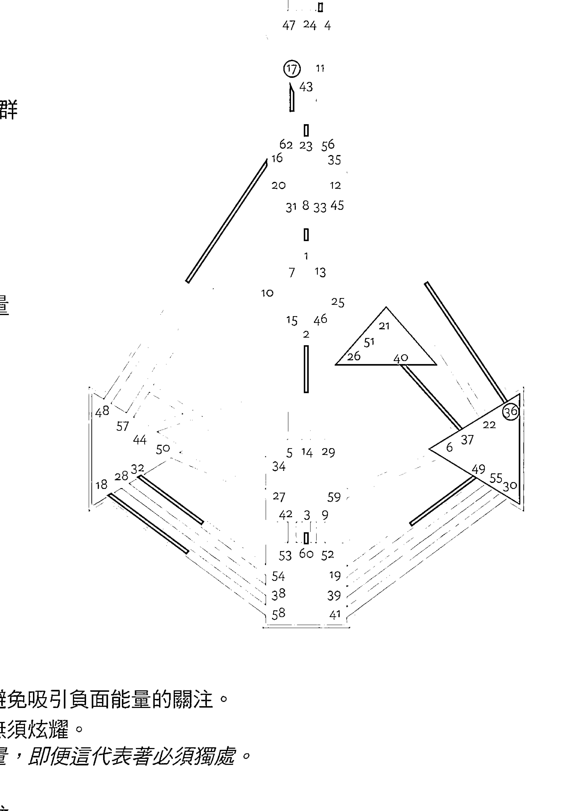

### 40.3 謙遜

仔細盤算的付出模式，避免吸引負面能量的關注。

- 默默享受付出的過程，無須炫耀。
- 意志力能避免被收割能量，即便這代表著必須獨處。
- ♂ 做慢，需要獲得關注。
- 能量藉意志力傳取關注。

---

## 40.4 組織

- 組織 40.4
- 以身作則 37.4
- 與魔鬼握手 28.2
- 耐性 2.3
- 持續創作的能量 1.3
- 絕症 18.2
- 徵召 29.1
- 妄想 16.1
- 人事經理 17.4
- 最終手段 49.2
- 傳教 23.1
- 支持 36.2
- 接受 60.1

### 40.4 組織

螞蟻的力量。為了持續供給，運用直覺的智慧來選擇並管理。意志力的力量來自於全權管理，同時又能保有機動性，適時抽離。

無法控制其熱忱，大量投注支持，卻忽略了支持的品質，以至於長期累積下來供需極易失衡。

經由管理與組織他人，賦予自己力量。

---

## 40.5 叛逆

### 剛硬

- 日 ▽ 40.5 剛硬
- 地 37.5 愛
- 月 1.4 孤獨為創造力之媒介
- 北交 2.3 耐性
- 南交 1.3 持續創作的能量
- 水 18.3 狂熱分子
- 金 ▽ 29.2 評定
- 火 16.2 憤世嫉俗的人
- 木 ▽ 17.4 人事經理
- 土 49.2 最終手段
- 天 23.1 傳教
- 海 △ 36.2 支持
- 冥 60.1 接受

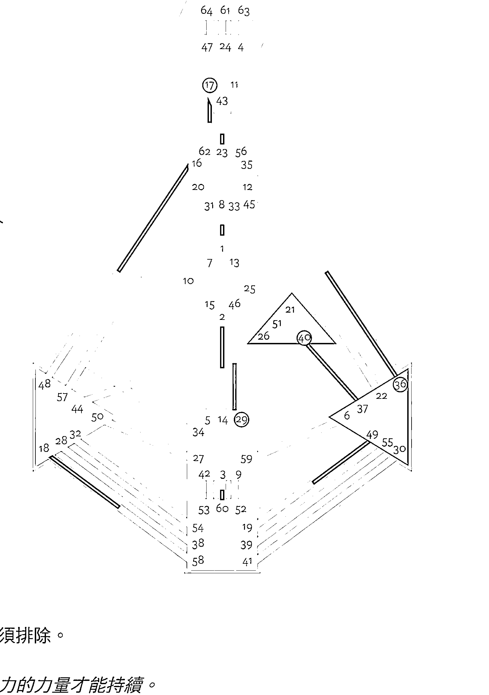

### 40.5 剛硬

若要解脫，所有負面力量都必須排除。

要求絕對勝利的革命者。拒絕與負面的關係接觸，意志力的力量才能持續。

較能接受在革命的過程中必然會出現相當程度的偏差，而這些偏差往往都能成功清除。意志力的弱點在於孤軍奮戰，為求保全，無法對負面的關係說不。

---

## 40.6 撤職

- 脈動 2–14
- 經營社群 37–40
- 撤職 40.6
- 目的 37.6
- 謙遜 14.6
- 耐性 2.3
- 持續創作的能量 1.3
- 狂熱分子 18.3
- 評估 29.3
- 憤世嫉俗的人 16.2
- 理解 17.3
- 最終手段 49.2
- 傳教 23.1
- 支持 36.2
- 接受 60.1

### 40.6 撤職

解放之前，對手握權力的低等勢力進行摧毀。

權威中帶有寬厚，只針對需要激烈對待之人撤除其力量。以正常防衛群體為前提，以意志力為權威，拒絕某些特定的個體。

以強大革命的恐怖行為為例，將罪有應得的想法殘酷地擴展到整個階級。透過權力與權威，扭曲自我。

---

## 完成之前

### 制約

- 日 64.1 制約
- 地 63.1 沉著
- 月 5.3 強迫症
- 北交 2.3 耐性
- 南交 1.3 持續創作的能量
- 水 18.4 無能
- 金 29.5 過度擴張
- 火 16.3 獨立
- 木 17.3 理解
- 土 49.2 最終手段
- 天 23.1 傳教
- 海 43.6 支持
- 冥 60.1 接受

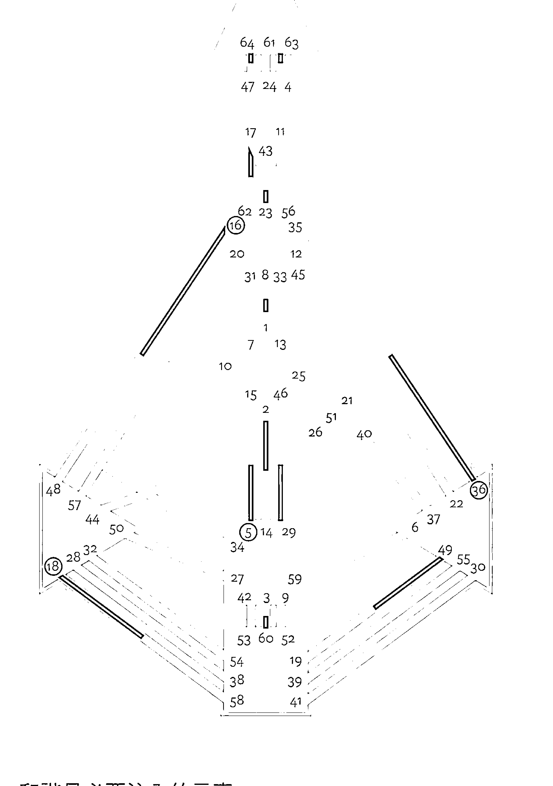

### 64.1 制約

♀ △ 滲透核心，體會在失序中存活，和諧是必要注入的元素。在迷惘中發現靈點，相對困難。

♂ ▽ 轉變出現時散發強大誘惑，導致倉促行動。自認已解開謎團，會有衝動想即刻行動。

---

## 完成之前

### 素質 64.2

2022/09/05 05:01 TWN  
農曆 8/10（一）

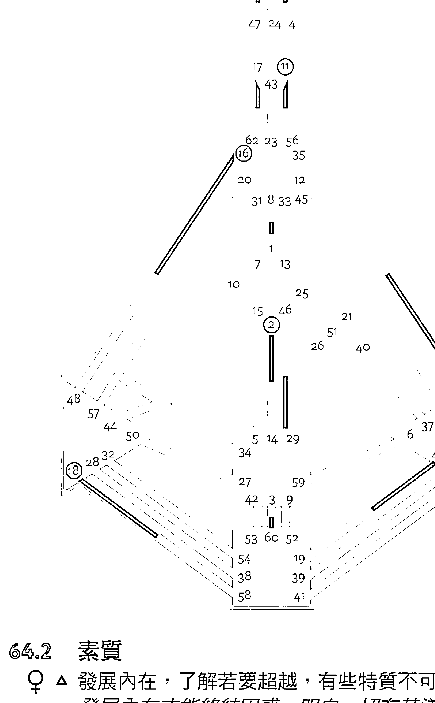

- 素質 64.2
- 結構 63.2
- 慈善家 11.5
- 耐性 2.3
- 持續創作的能量 1.3
- 無能 18.4
- 困惑 29.6
- 領導者 16.4
- 理解 17.3
- 最終手段 49.2
- 定格 2.6
- 支持 36.2
- 接受 60.1

### 64.2 素質

♀ △ 發展內在，了解要超越，有些特質不可或缺。察覺若缺乏內在素質，行動只會失敗。發展內在才能終結困惑，明白一切有其道理。

☽ ▽ 若不斷取得行動，只不過是耗損，同時也浪費未來所需資源。在困惑中迷失，加重心理負荷。

## 64.3 完成之前  
### 過度膨脹

- 日 64.3 過度膨脹  
- 地 63.3 持續  
- 月 ▽38.2 彬彬有禮  
- 北交 ▽2.3 耐性  
- 南交 1.3 持續創作的能量  
- 水 18.5 治療  
- 金 59.1 先發制人  
- 火 ▽16.4 領導者  
- 木 17.3 理解  
- 土 49.2 最終手段  
- 天 2.6 定格  
- 海 △36.2 支持  
- 冥 △61.6 感染力  

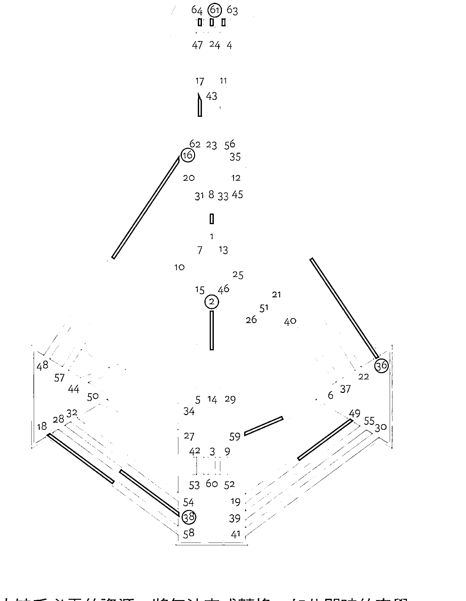

## 64.3 過度擴張

♄ △ 有足夠的智慧，認知到當一個人缺乏必需的資源，將無法完成轉換，如此即時的察覺力，可能就此帶來機會，得以尋求支持。  
有智慧，能接受恩惠是重要的，能適時說明或滲透他人，將即時獲得解決。

☽ ▽ 對於廣泛及自滿的個性，其風險就是，當轉變的過程結束之後，無人可求援。  
過度自信，認為命運將仁慈以待。

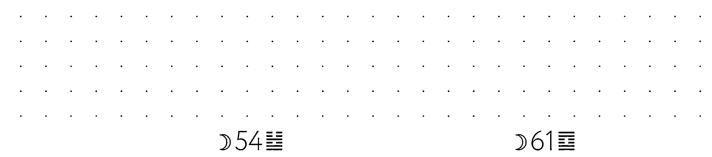

---

## 完成之前 64.4

信念 2022/09/07 03:26 TWN  
農曆 8/12（三）自靈

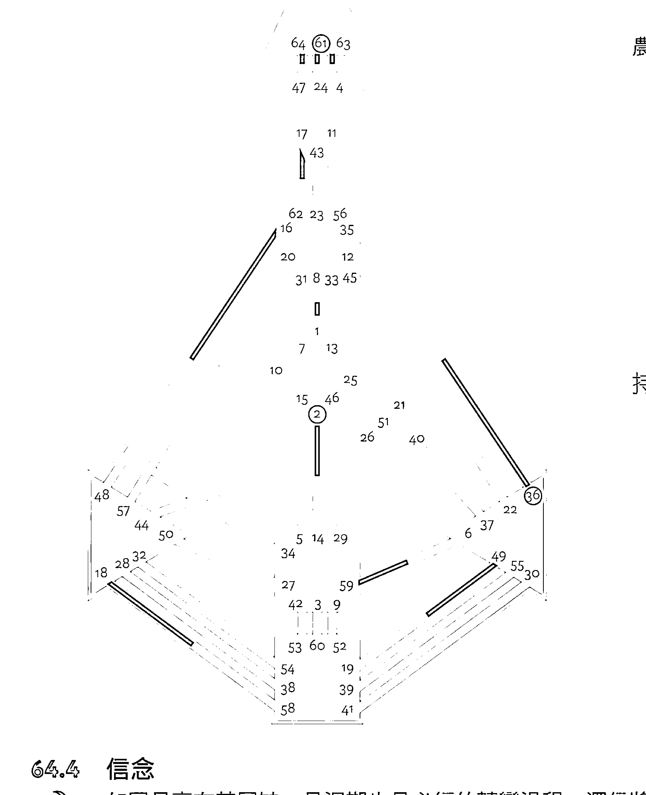

- 信念 64.4  
- 記憶 63.4  
- 影響 61.5  
- 耐性 2.3  
- 持續創作的能量 1.3  
- 治療 18.5  
- 開放 59.3  
- 聖潔 16.5  
- 理解 17.3  
- 最終手段 49.2  
- 定格 2.6  
- 支持 36.2  
- 感染力 61.6 △  

### 64.4 信念

☽ △ 如同月亮有其圓缺，是週期也是必經的轉變過程，深信將贏得成功。  
困惑是過程，最終會帶來理解的結果。

♂ ▽ 單靠力量與能量，無法戰勝勝局。  
困惑如此強烈，就算確認再三，依舊無法緩解。

---

## 64.5 完成之前

2022/09/08 02:38 TWN 承諾  
農曆 8/13（四）

- 日 64.5 承諾  
- 地 63.5 肯定  
- 月 19.2 服務  
- 北交 2.3 耐性  
- 南交 1.3 持續創作的能量  
- 水 18.6 成佛  
- 金 59.4 手足情誼  
- 火 16.5 聖潔  
- 木 17.3 理解  
- 土 49.2 最終手段  
- 天 2.6 定格  
- 海 36.2 支持  
- 冥 61.6 感染力  

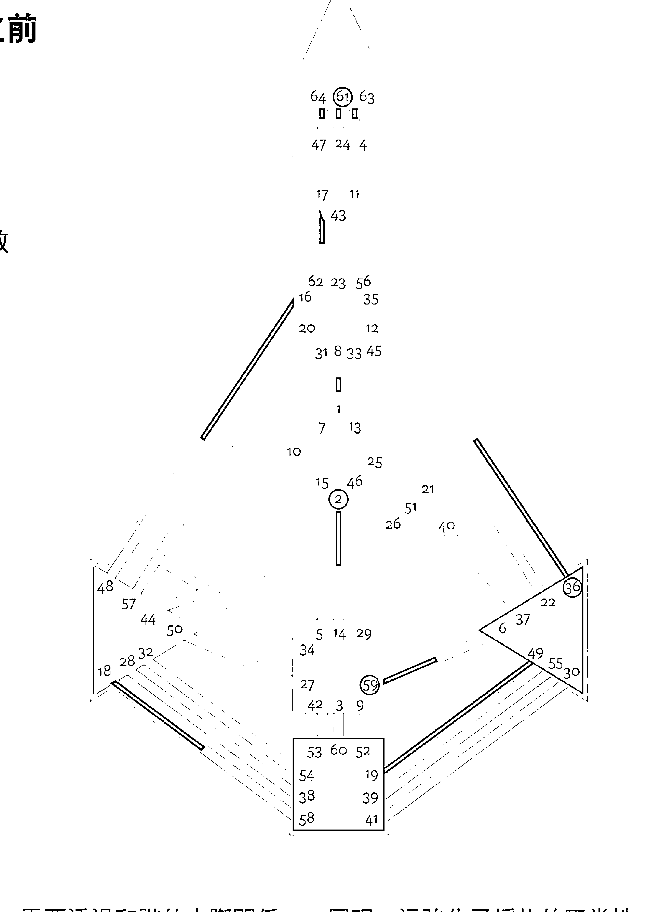

### 64.5 承諾

> 任何新秩序所施允的價值，需要透過和諧的人際關係一一展現。這強化了掙扎的正當性。對於仍存價值與關係才能帶來和諧，深感困惑。

> 聚焦於舊秩序的失敗，企圖將掙扎合理化，卻無力以新秩序來提升品質。焦點放在過往的價值與關係上，為此困惑。

---

## 完成之前

勝利 2022/09/09 01:49 TWN  
農曆 8/14（五）

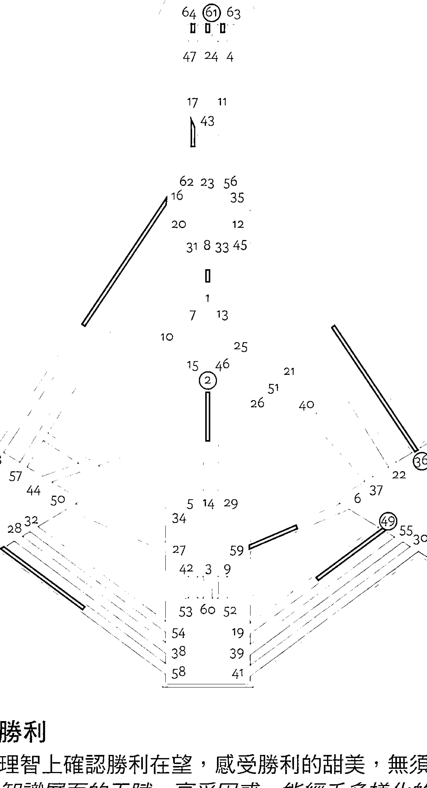

- 勝利 64.6  
- 懷舊之情 63.6  
- 組織 49.5 △  
- 耐性 2.3 ▽  
- 持續創作的能量 1.3  
- 成佛 18.6  
- 蛇蠍美人或大眾情人 59.5  
- 輕信 16.6  
- 理解 17.3  
- 最終手段 49.2  
- 定格 2.6  
- 支持 36.2  
- 感染力 61.6 △  

### 64.6 勝利

☿ △ 理智上確認勝利在望，感受勝利的甜美，無須更多理由。  
智慧層面的天賦，享受困惑，能經手多樣化的資訊。

♀ ▽ 就像木馬屠城記的故事，慶祝到得意忘形很危險，會讓人放鬆戒備，並失去洞察力。  
面對大量多元化的資料，容易模糊觀點。

---

## 47-1 壓抑  
### 盤點

2022/09/10 01:00 TWN  
農曆 8/15（六）

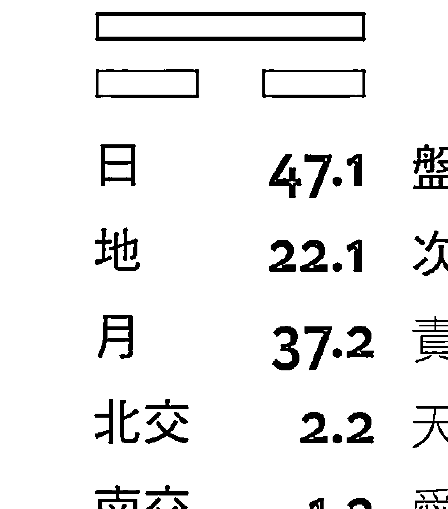

- 日 47.1 盤點  
- 地 22.1 次等艱難  
- 月 37.2 責任  
- 北交 2.2 天才  
- 南交 1.2 愛是光  
- 水 18.6 成佛  
- 金 △59.6 一夜情  
- 火 16.6 輕信  
- 木 17.3 理解  
- 土 49.2 最終手段  
- 天 2.6 定格  
- 海 △36.2 支持  
- 冥 △61.6 感染力  

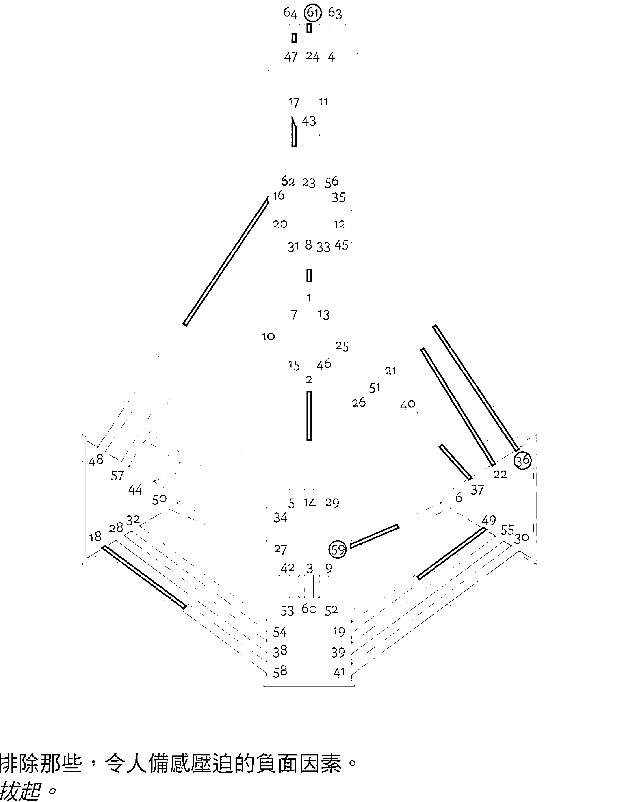

### 47.1 盤點

面對困難時，能先聚焦在排除那些令人備感壓迫的負面因素。  
了解真正的問題，必須被連根拔起。

出現幻覺，認為壓迫感來自外在的種種現象，最後導致災難的結果。  
認為全世界都跟你作對。

---

## 壓抑 47.2

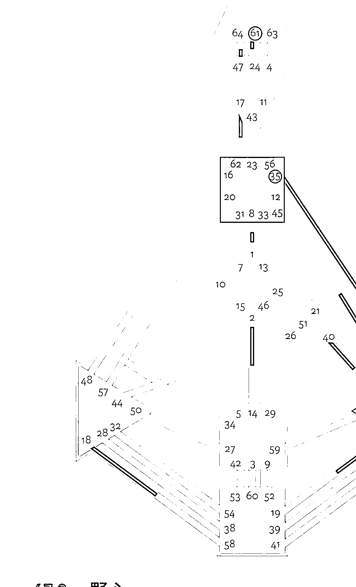

- 無常 35–36  
- 野心 47.2  
- 禮儀學校 22.2  
- 直接 22.5  
- 天才 2.2  
- 愛是光 1.2  
- 成佛 18.6  
- 堅定 40.2  
- 謙遜 35.1  
- 理解 17.3  
- 最終手段 49.2  
- 定格 2.6  
- 支持 36.2  
- 感染力 61.6  

### 47.2 野心

為求安全，有野心也有動力想克服個人的疑問。  
意識到忙碌有益心理健康。

面對自己的苦惱，優柔寡斷，猶豫不決，無法決定該運用智慧而釋懷，還是善用可能會稍縱即逝的優勢，接受這份苦惱的重擔。  
無法分辨何時該採取何種行動，是否為健康的舉動。

---

## 47.3 壓抑  
### 自我壓抑

2022/09/11 23:19 TWN  
農曆 8/16（日）

- 35–36 無常  
- 日 47.3 自我壓抑  
- 地 22.3 魔法師  
- 月 ▽17.2 歧視  
- 北交 2.2 天才  
- 南交 1.2 愛是光  
- 水 18.6 成佛  
- 金 40.3 謙遜  
- 火 ▽35.1 謙遜  
- 木 ▽17.2 歧視  
- 土 49.2 最終手段  
- 天 2.6 定格  
- 海 △36.2 支持  
- 冥 △61.6 感染力  

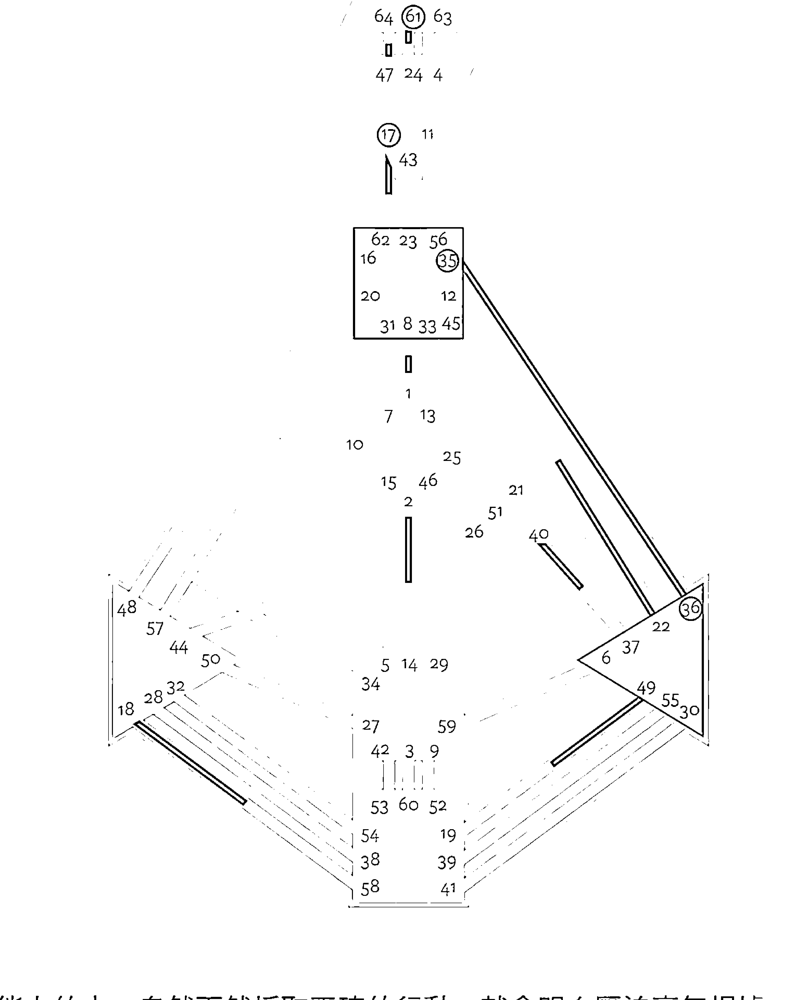

## 47.3 自我壓抑

♃ △ 一個健全發展、具有察覺能力的人，自然而然採取正確的行動，就會明白壓迫其實毫無根據。終究會理解自己真的沒有問題。

♂ ▽ 極度自我壓抑，力道如此強勁，能證明一切不可逆轉，具毀滅性。要實現自我價值，極為困難。

---

## 壓抑  
### 鎮壓

2022/09/12 22:28 TWN  
農曆 8/17（一）

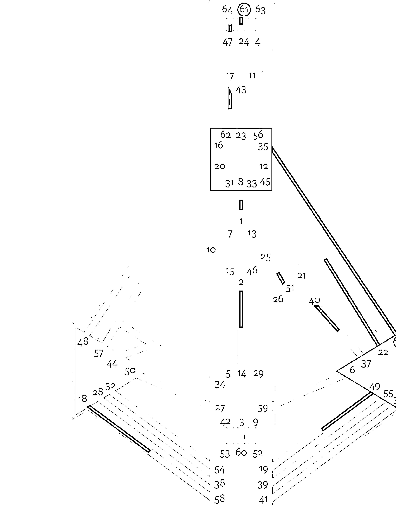

- 無常 35–36  
- 鎮壓 47.4  
- 敏感性 22.4  
- 極限 51.4  
- 天才 2.2  
- 愛是光 1.2  
- 成佛 18.6  
- 組織 40.4  
- 創意空窗期 35.2  
- 歧視 17.2  
- 最終手段 49.2  
- 定格 2.6  
- 支持 36.2  
- 感染力 61.6  

### 47.4 鎮壓

約束來自外在的壓迫。

♄ △ 有力人士，即便面對最強大的壓迫，也能保有資源。在一定程度上，為了他人的利益，更要確保自身生存無虞。  
儘管外在存有制約，還是對於自己的身分有認同感。

☽ ▽ 若失去光亮，宛如月亮退隱於暗夜，勉強能滋養自己，無暇顧及他人。  
外在的制約，壓制其身分與定位。

---

## 47.5 壓抑  
### 聖人

2022/09/13 21:35 TWN  
農曆 8/18（二）

- 日 47.5 聖人  
- 地 22.5 直接  
- 月 3.5 受害  
- 北交 2.2 天才  
- 南交 1.2 愛是光  
- 水 18.5 治療  
- 金 40.5 剛硬  
- 火 35.2 創意空窗期  
- 木 17.2 歧視  
- 土 49.2 最終手段  
- 天 2.6 定格  
- 海 △36.2 支持  
- 冥 △61.6 感染力  

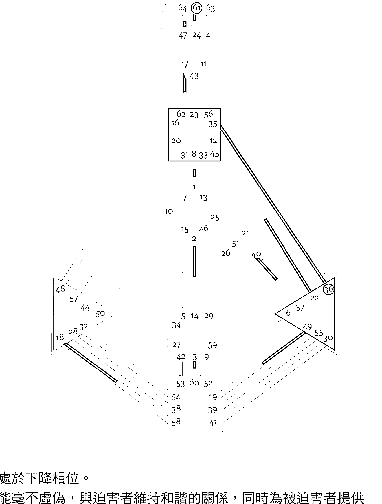

### 47.5 聖人

此位置意義重大，無行星處於下降相位。

♀ △ 即使被壓迫的時候，依舊能毫不虛偽，與迫害者維持和諧的關係，同時為被迫害者提供援助與救濟。  
最崇高的實踐。接受體驗是沉重的過程，恩典自然會降臨。無相對極性。

▽ 沒有任何行星處於下降相位。

---

## 壓抑  
### 徒勞無功

2022/09/14 20:42 TWN  
農曆 8/19（三）

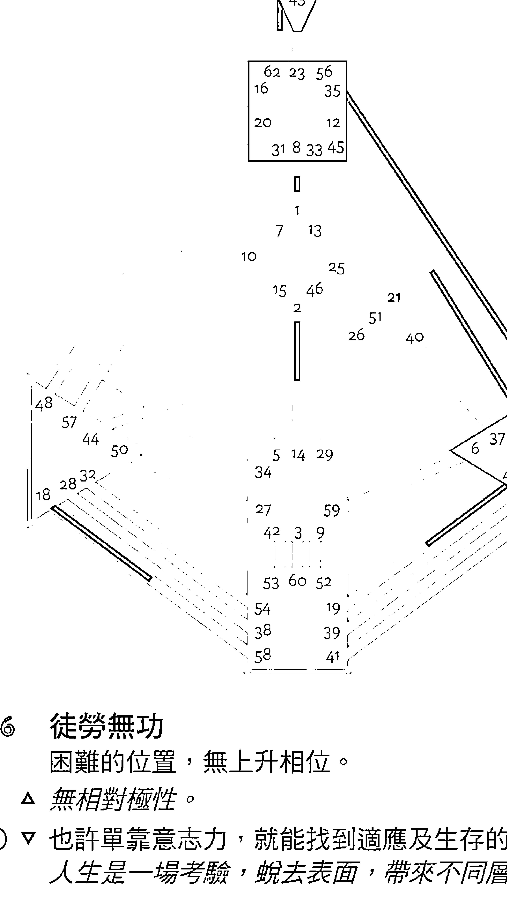

- 無常 35–36  
- 抽象 47–64  
- 徒勞無功 47.6  
- 成熟 22.6  
- 直覺 2.1  
- 天才 2.2  
- 愛是光 1.2  
- 治療 18.5  
- 制約 64.1  
- 合作 35.3  
- 歧視 17.2  
- 必要性法則 49.1  
- 定格 2.6  
- 支持 36.2  
- 感染力 61.6  

### 47.6 徒勞無功

困難的位置，無上升相位。

△ 無相對極性。

◎ 也許單靠意志力，就能找到適應及生存的方法，但對於克服抑鬱，全然無望。人生是一場考驗，蛻去表面，帶來不同層次的體悟。

---

## 衝突  
### 隱退

- 1–8 啟發  
- 35–36 無常  

- 日 6.1 隱退  
- 地 △36.1 抗拒  
- 月 8.2 服務  
- 北交 2.2 天才  
- 南交 1.2 愛是光  
- 水 ▽18.4 無能  
- 金 △64.2 素質  
- 火 35.3 合作  
- 木 17.2 歧視  
- 土 49.1 必要性法則  
- 天 2.6 定格  
- 海 △36.2 支持  
- 冥 △61.6 感染力  

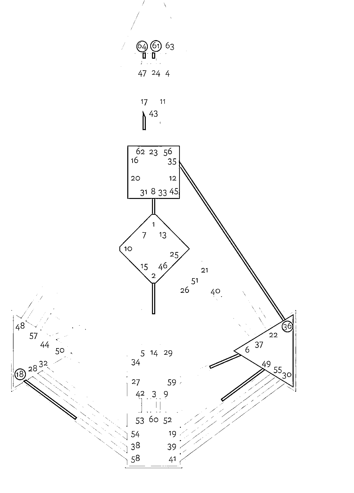

### 6.1 隱退

退讓——以資源對抗壓倒性的優勢，並非勇敢，而是愚蠢。

♇ 再生的力量，接受隱退只是現階段的狀況，而非失敗。以穩定的情緒面對衝突。

☿ 自我的情緒，將隱退當成是個人的弱點。面對衝突時，情緒不穩定。

---

## 衝突  
### 遊擊隊

2022/09/16 18:54 TWN  
農曆 8/21（五）

- 無常 35–36  
- 遊擊隊 6.2  
- 支持 36.2 △  
- 憤世嫉俗的人 16.2  
- 天才 2.2  
- 愛是光 1.2  
- 無能 18.4 ▽  
- 過度膨脹 64.3  
- 渴望 35.4 ▽  
- 歧視 17.2  
- 必要性法則 49.1  
- 定格 2.6  
- 支持 36.2  
- 感染力 61.6 △  

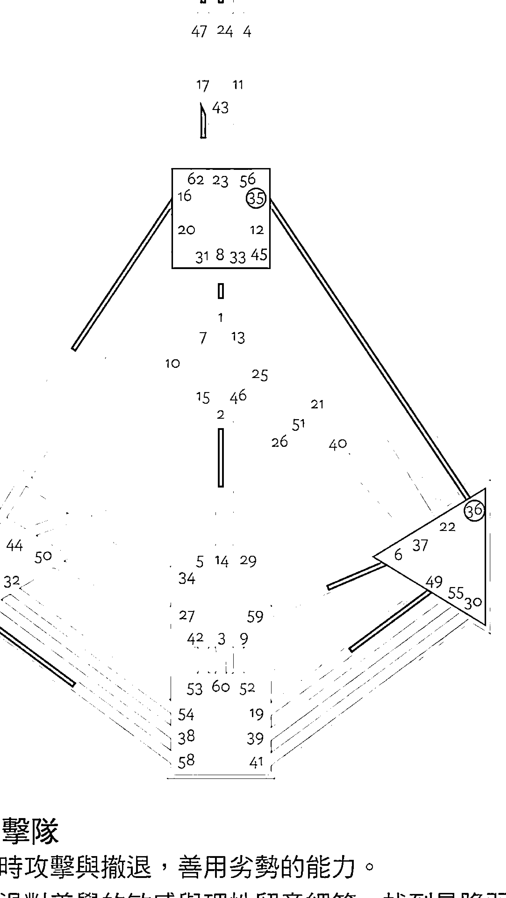

### 6.2 遊擊隊

及時攻擊與撤退，善用劣勢的能力。

♀ △ 透過對美學的敏感與理性留意細節，找到最脆弱的關鍵點。善於在衝突中找到最大的弱點，並在情緒層面好好利用。

♂ ▽ 伸展性攻擊，引人注目但缺乏實質意義。粗線條，一不小心就會造成衝突。

---

## 6.3  
### 衝突

2022/09/17 17:58 TWN  
農曆 8/22（六）

- 35–36 無常  
- 日 6.3 忠誠  
- 地 36.3 過渡  
- 月 45.3 排除在外  
- 北交 2.2 天才  
- 南交 1.2 愛是光  
- 水 18.3 狂熱分子  
- 金 △64.5 承諾  
- 火 ▽35.4 渴望  
- 木 17.2 歧視  
- 土 49.1 必要性法則  
- 天 2.6 定格  
- 海 △36.2 支持  
- 冥 △61.6 感染力  

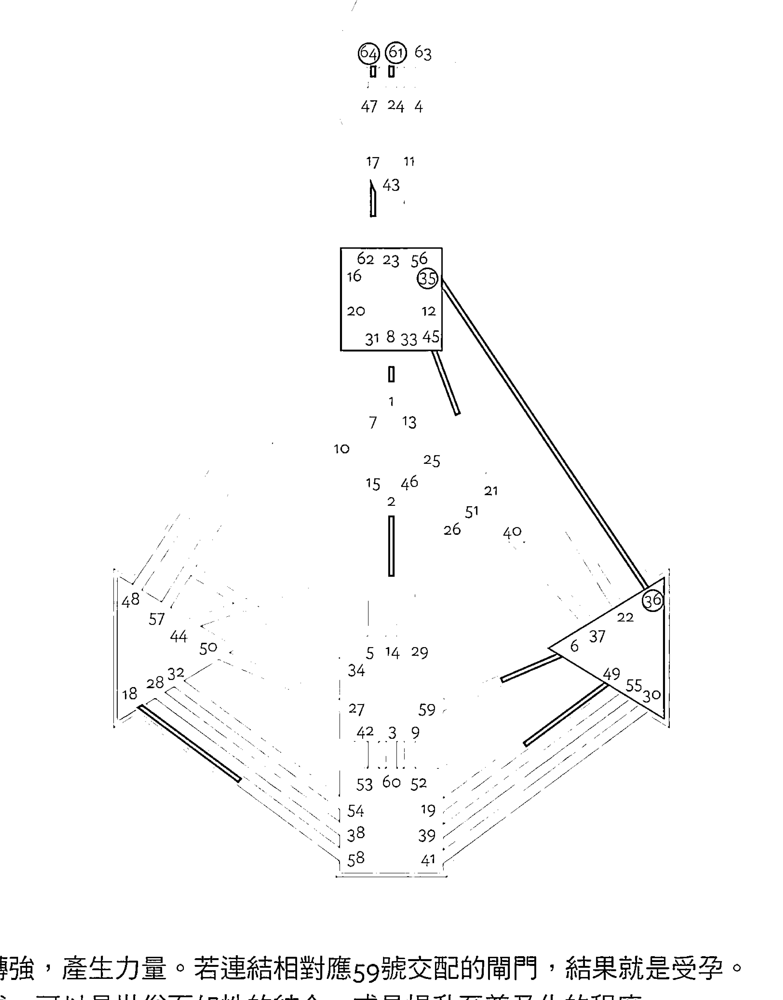

### 6.3 忠誠

確保能獲得支持，從弱轉強，產生力量。若連結相對應59號交配的閘門，結果就是受孕。

透過聯盟來拆解舊有形式，可以是世俗面如性的結合，或是提升至普及化的程度。情感的深度，讓連結能親密穩定得更緊密。

拒絕效忠，不願服從既有的秩序。  
對控制很敏感，最後可能為此而拒絕忠誠。

---

## 衝突  
### 勝利

2022/09/18 17:02 TWN  
農曆 8/23（日）

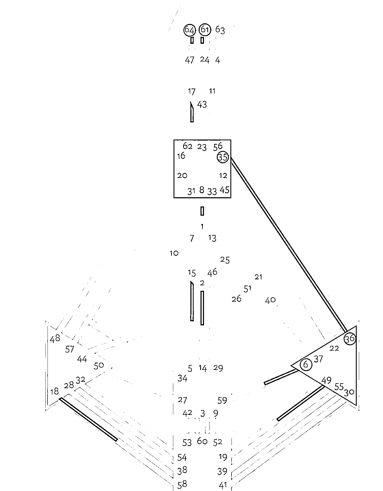

- 無常 35–36  
- 勝利 6.4  
- 間諜活動 36.4  
- 自我膨脹 15.3  
- 天才 2.2  
- 愛是光 1.2  
- 絕症 18.2  
- 勝利 64.6  
- 渴望 35.4  
- 歧視 17.2  
- 必要性法則 49.1  
- 定格 2.6  
- 支持 36.2  
- 感染力 61.6  

### 6.4 勝利

天生具備不容挑戰的力量。

☉ △ 慈善與智慧，必定將伴隨勝利及全新的視野而來。  
主宰關係的情緒力量。

♇ ▽ 征服者與煽動者。  
無法控制情感，導致關係毀壞。

---

## 衝突  
### 仲裁

2022/09/19 16:05 TWN  
農曆 8/24（一）

- 日 6.5 仲裁  
- 地 36.5 祕密的  
- 月 39.3 責任  
- 北交 2.2 天才  
- 南交 1.2 愛是光  
- 水 18.1 保守主義  
- 金 47.1 盤點  
- 火 35.5 利他主義  
- 木 17.1 開放  
- 土 49.1 必要性法則  
- 天 2.6 定格  
- 海 △36.2 支持  
- 冥 △61.6 感染力  

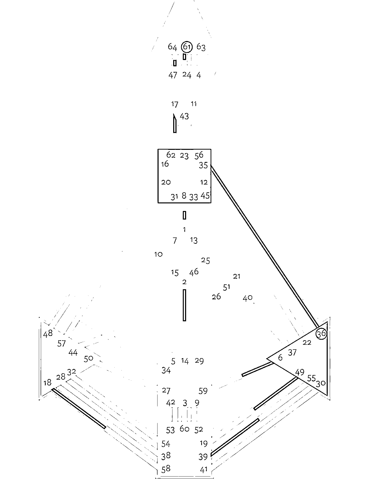

### 6.5 仲裁

相信要透過詳細的分析，以及適當控制情緒，才能讓更高權威來評斷衝突。

- 避免直接衝突，才會進一步走向和諧。  
- 對衝突極為敏感，逃避強硬。  
- 面對仲裁時，自認是最好的法官，只接受自己獲勝的判決。  
- 面對衝突時，對他人的顧慮並不敏感。

---

## 衝突  
### 調停者

2022/09/20 15:07 TWN  
農曆 8/25（二）

- 接受 17–62  
- 無常 35–36  
- 調停者 6.6  
- 正義 3.6.6  
- 探索 62.3  
- 天才 2.2  
- 愛是光 1.2  
- 誠信 46.6  
- 野心 47.2  
- 利他主義 35.5  
- 開放 17.1  
- 必要性法則 49.1  
- 定格 2.6  
- 支持 36.2  
- 感染力 61.6 △  

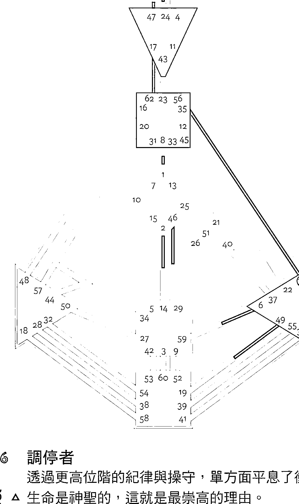

### 6.6 調停者

透過更高位階的紀律與操守，單方面平息了衝突，容許敵方投降，留下活口。

☿ △ 生命是神聖的，這就是最高的理由。  
感同身受，淬鍊成情緒的力量，終止衝突。

♀ ▽ 調停者採取公正的行動，但所提出來的和解條件，難以接受。  
先滿足條件，情感的力量才能終止衝突。

---

## 46.1 推進  
### 在發現的過程中

- 35–36 無常  
- 日 46.1 在發現的過程中  
- 地 25.1 無私  
- 月 31.3 選擇性  
- 北交 2.2 天才  
- 南交 1.2 愛是光  
- 水 46.5 步調  
- 金 47.4 鎮壓  
- 火 35.6 矯正  
- 木 17.1 開放  
- 土 49.1 必要性法則  
- 天 2.6 定格  
- 海 △36.2 支持  
- 冥 △61.6 感染力  

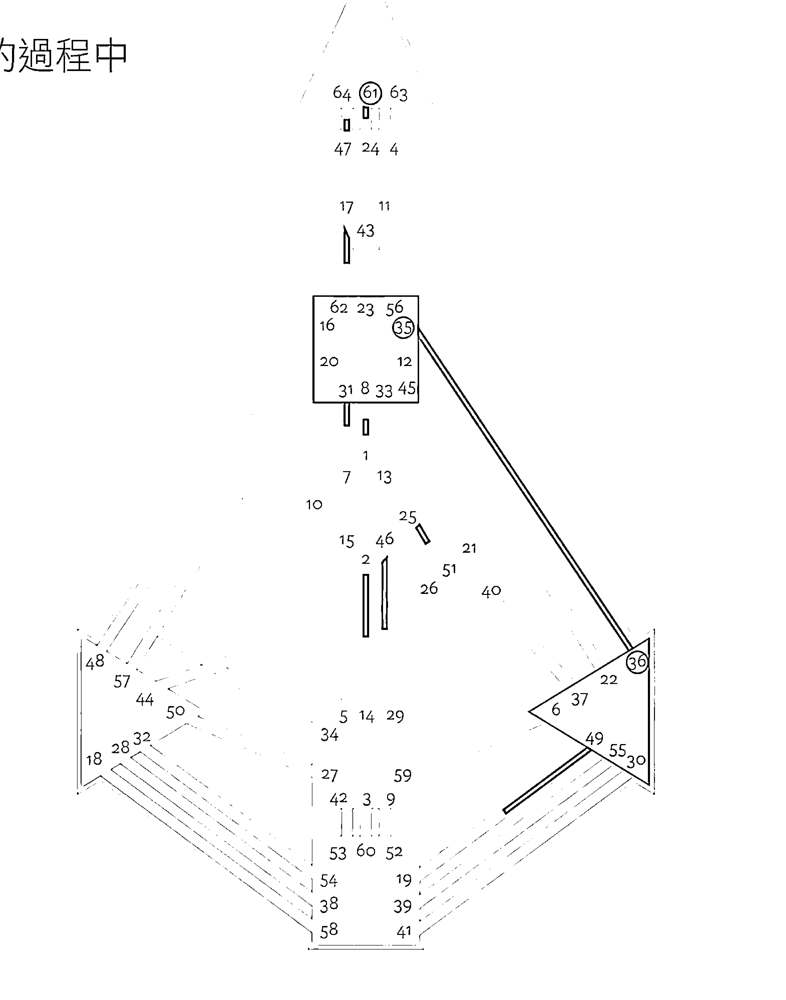

### 46.1 在發現的過程中

跌跌撞撞，仍投身其中，意外有所得。

為藝術而藝術。任何實現自我、充滿創造力的實踐，遲早會被看見。全心投入，充滿創造力並獲得成功的潛能。

面對芸芸眾生，有能力評斷其潛能，出發點卻往往只為利己。辨識出他人的成功，並從中獲益的決心。

---

## 推進 46.2  
### 自命不凡

2022/09/22 13:08 TWN  
農曆 8/27（四）

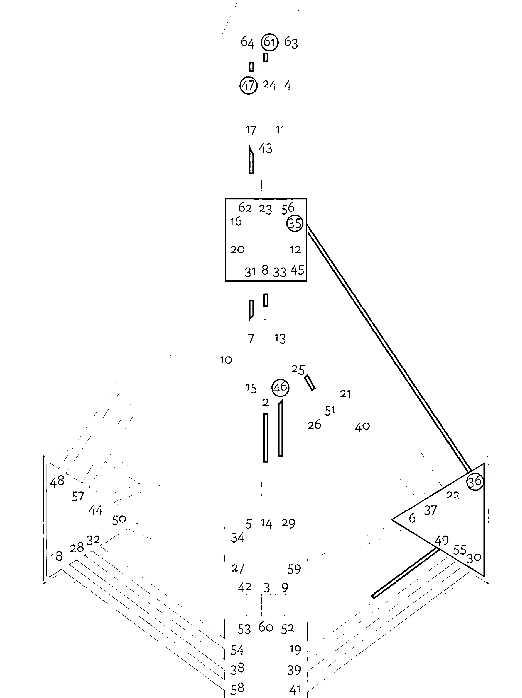

- 無常 35–36  
- 自命不凡 46.2  
- 存在主義者 25.2  
- 退位者 7.4  
- 天才 2.2  
- 愛是光 1.2  
- 影響 46.4  
- 聖人 47.5  
- 矯正 35.6  
- 開放 17.1  
- 必要性法則 49.1  
- 定格 2.6  
- 支持 36.2  
- 感染力 61.6  

### 46.2 自命不凡

☉ △ 天生難以駕馭，但由於才華洋溢，不管行為如何，還是能獲得成功。立志要成功的決心，容易得罪他人。

♂ ▽ 才能平庸卻又自我中心、攻勢猛烈，常有不切實際的要求。在獲得認可之前，決心以成功者自居。

---

## 46.3 推進  
### 投射

農曆 8/28（五）秋分

29–46 發現

- 日 △46.3 投射  
- 地 25.3 感性  
- 月 29.4 直接  
- 北交 2.2 天才  
- 南交 1.2 愛是光  
- 水 △46.3 投射  
- 金 47.6 徒勞無功  
- 火 ▽45.1 遊說  
- 木 17.1 開放  
- 土 49.1 必要性法則  
- 天 2.6 定格  
- 海 △36.2 支持  
- 冥 △61.6 感染力  

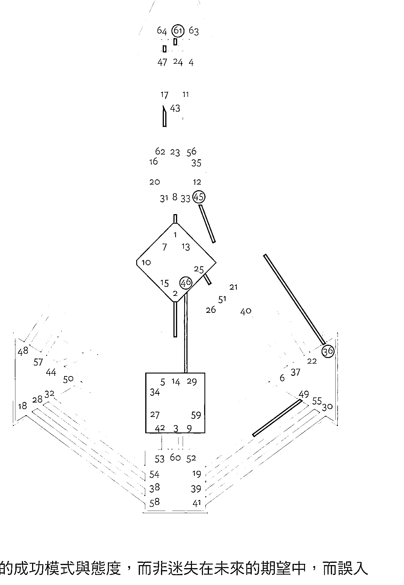

### 46.3 投射

> ☽ △ 獲得好運的實際作法，是延續既定的成功模式與態度，而非迷失在未來的期望中而誤入歧途。

決心，堅持既定的成功要素。

> ♂ ▽ 基於投射的傾向，將未來有可能發生的一切當成現實，導致偏頗的利己主義，會逐步失去原有的動能與支持。

決定要將預期中的成功，當成現實。

---

## 推進 46.4  
### 影響

2022/09/24 11:07 TWN  
農曆 8/29（六）

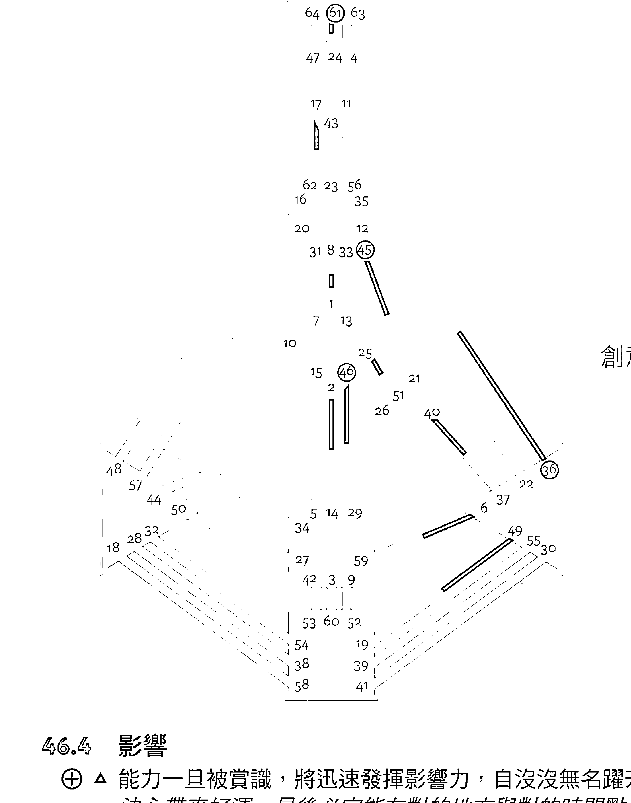

- 影響 46.4  
- 生存 25.4  
- 剛硬 40.5  
- 直覺 2.1  
- 創意獨立於意志之外 1.1  
- 自命不凡 46.2  
- 隱退 6.1  
- 遊說 45.1  
- 開放 17.1  
- 必要性法則 49.1  
- 定格 2.6  
- 支持 36.2  
- 感染力 61.6  

### 46.4 影響

⊕ △ 能力一旦被賞識，將迅速發揮影響力，自然沒必要迴避舉足輕重的地位。決心帶來好運，最後必定能在對的地方與對的時間點，得到應得的肯定。

⊖ ▽ 達成目的之後，傾向恩將仇報的反噬。渴求成功、勢在必得，不願記得曾經協助自己成功的人。

---

## 46.5 推進  
### 步調

2022/09/25 10:05 TWN  
農曆 8/30（日）

- 日 46.5 步調  
- 地 25.5 休養  
- 月 47.6 徒勞無功  
- 北交 2.1 直覺  
- 南交 1.1 創意獨立於意志之外  
- 水 46.1 在發現的過程中  
- 金 6.3 忠誠  
- 火 ▽45.1 遊說  
- 木 17.1 開放  
- 土 49.1 必要性法則  
- 天 2.6 定格  
- 海 △36.2 支持  
- 冥 △61.6 感染力  

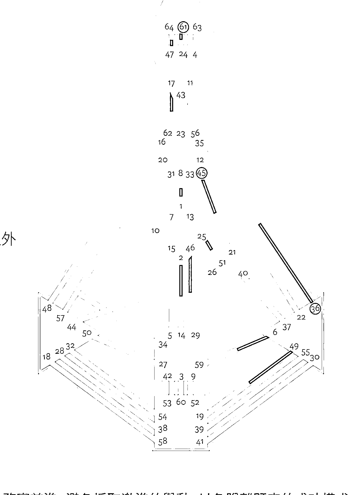

### 46.5 步調

- ☽ △ 保有適當的節奏，順其本能，務實前進，避免採取激進的舉動，以免脫離既定的成功模式。維持帶來成功的節奏，繼續堅持下去。  
- ♆ ▽ 不理性，排除已證明可行的既定模式。面對帶來成功的節奏，堅決說不。

## 46.6 誠信

- 誠信 46.6  
- 無知 25.6 △  
- 保守主義 18.1  
- 直覺 2.1  
- 創意獨立於意志之外 1.1  
- 調停者 6.6  
- 勝利 6.4  
- 共識 45.2 ▽  
- 無知 25.6 △  
- 必要性法則 49.1  
- 定格 2.6  
- 支持 36.2  
- 感染力 61.6 △  

### 46.6 誠信

- ♄ △ 作為承諾而來，是潛在的約束力，須審慎考量，保有自身誠信的智慧。若承諾之後會帶來限制，堅決拒絕。  
- ♆ ▽ 欺騙自己與他人，過度擴張其資源，最後迫不得已而背棄承諾。渴望成功的強大動力，無法誠實展示，最終卻打破承諾。  

## 找出錯誤之處  
### 保守主義

- 日 18.1 保守主義  
- 地 17.1 開放  
- 月 57.3 敏銳  
- 北交 2.1 直覺  
- 南交 1.1 創意獨立於意志之外  
- 水 △ 6.5 仲裁  
- 金 △ 6.5 仲裁  
- 火 ▽ 45.2 共識  
- 木 25.6 無知  
- 土 49.1 必要性法則  
- 天 2.6 定格  
- 海 △ 36.2 支持  
- 冥 △ 61.6 感染力  

### 18.1 保守主義

保守情勢如何改變，嚴守傳統模式。

- ⊕ 逐步調整，避免最後顛覆性的轉變。  
  將暫時變化為逐步調整的過程，才有可能修正。  
- ♃ ▽ 食古不化的族長，必定招致衰退。  
  拒絕修正的可能性。  

## 找出錯誤之處

- 絕症 18.2  
- 歧視 17.2  
- 腐敗 50.4  
- 直覺 2.1  
- 創意獨立於意志之外 1.1  
- 勝利 6.4  
- 在發現的過程中 46.1  
- 排除在外 45.3  
- 無知 25.6  
- 必要性法則 49.1  
- 定格 2.6  
- 支持 36.2  
- 感染力 61.6  

### 18.2 絕症

覆水難收；認知到崩毀難以復回。

- ♇ △ 深信精神層面將獲得新生，接受並從中獲得力量。接受已無糾正的可能。  
- ☽ ▽ 憤怒對抗，徒勞無功。拒絕接受，認為總有糾正的可能。  

## 18.3 找出錯誤之處

2022/09/29 05:50 TWN 狂熱分子  
農曆 9/4（四）

- 日 18.3 狂熱分子  
- 地 ▽ 17.3 理解  
- 月 44.6 超然  
- 北交 2.1 直覺  
- 南交 1.1 創意獨立於意志之外  
- 水 6.3 忠誠  
- 金 46.2 自命不凡  
- 火 ▽ 45.3 排除在外  
- 木 25.6 無知  
- 土 49.1 必要性法則  
- 天 2.6 定格  
- 海 △ 36.2 支持  
- 冥 △ 61.6 感染力  

### 18.3 狂熱分子

精力旺盛，對打掃房子充滿執念。

- ♆ △ 以可接受的代價，解散舊形式。  
  對於糾正，以及糾正所帶來的潛力，充滿痴迷。  

- ♃ ▽ 嚴格評斷，造成的問題與解決的一樣多。  
  熱中修改，永遠不會滿意。  

## 找出錯誤之處

- 脈動 2–14  
- 無能 18.4  
- 人事經理 17.4  
- 管理 14.2  
- 直覺 2.1  
- 創意獨立於意志之外 1.1  
- 忠誠 6.3  
- 投射 46.3  
- 排除在外 45.3  
- 無知 25.6  
- 必要性法則 49.1  
- 定格 2.6  
- 支持 36.2  
- 感染力 61.6  

### 18.4 無能

力有未逮而導致困境，由於不足而無法解決。

- ⊕ △ 在此是負面的相位，透過受苦而求存。  
  無能力糾正，為此而受苦。  

- ☿ ▽ 魯莽決定、焦慮，陷入不幸無處可逃。  
  渴求糾正，衍生焦慮。  

## 18.5 找出錯誤之處

2022/10/01 03:38 TWN  
治療  
農曆 9/6（六）

- 日 18.5 治療  
- 地 17.5 無人是孤島  
- 月 △ 9.4 奉獻  
- 北交 2.1 直覺  
- 南交 1.1 創意獨立於意志之外  
- 水 6.2 游擊隊  
- 金 46.4 影響  
- 火 ▽ 45.4 方向  
- 木 25.6 無知  
- 土 49.1 必要性法則  
- 天 2.6 定格  
- 海 △ 36.2 支持  
- 冥 △ 61.6 感染力  

### 18.5 治療

強項是發現問題，同時也接受這一切無法以一己之力解決。

- 需求與提供指引的智慧。  
- 透過關係，帶來修正與更新的潛能。  
- 精神病人。長期不穩定，潛藏著瘋狂。  
- 如何糾正精神層面隱藏的不穩定性，對人際關係並無助益。  

## 找出錯誤之處

> 創意獨立於意志之外

- 成佛 18.6  
- 菩薩 17.6  
- 權威 26.6  
- 直覺 2.1  
- 創意獨立於意志之外 1.1  
- 游擊隊 6.2  
- 誠信 46.6  
- 方向 45.4  
- 無知 25.6  
- 必要性法則 49.1  
- 定格 2.6  
- 支持 36.2  
- 感染力 61.6  

### 18.6 成佛

最完善的形式。

佛性，永保赤子之心，避免停滯，尋找新視野的能量。透過校正，成就最佳形式的潛能。

以恰當的方式應用，表現出上述特質。深具潛力，能與別人分享真正的價值。

## 48.1 微不足道

2022/10/03 01:24 TWN  
農曆 9/8（一）

- 18–58 批評  
- 21–45 金錢線  
- 日 48.1 微不足道  
- 地 △ 21.1 警告  
- 月 58.2 變態  
- 北交 2.1 直覺  
- 南交 1.1 創意獨立於意志之外  
- 水 6.2 游擊隊  
- 金 18.1 保守主義  
- 火 ▽ 45.4 方向  
- 木 ▽ 25.5 休養  
- 土 49.1 必要性法則  
- 天 2.6 定格  
- 海 △ 36.2 支持  
- 冥 △ 61.6 感染力  

### 48.1 微不足道

- ☽ △ 憑藉本能，區分出何者具實用價值並值得關注。  
  懂得分辨何者具實用性，值得關注。  

- ♂ ▽ 傾其意志、能力並關注微小的事物。  
  熱中於瑣事。  

## 48.2 退化

2022/10/04 00:16 TWN  
農曆 9/9（二）

- 金錢線 21–45  
- 退化 48.2  
- 強權即公理 21.2  
- 寬大 54.5  
- 直覺 2.1  
- 創意獨立於意志之外 1.1  
- 游擊隊 6.2  
- 絕症 18.2  
- 領導力 45.5  
- 休養 25.5  
- 必要性法則 49.1  
- 定格 2.6  
- 支持 36.2  
- 感染力 61.6  

### 48.2 退化

- ♇ △ 若要成功建立新模式，不能只顧著配合不利因素，而忽視最正面的部分，如此只會導致一切惡化。  
  對自己的察覺力有信心，不會被不利因素所影響。  

- ♀ ▽ 若誤入歧途拚命追求，與不入流的價值並存，將退化至衰敗的地步。  
  若對自身的察覺缺乏自信，就會引來干預與衰敗。  

## 48.3 單獨監禁

- 日 48.3 單獨監禁  
- 地 21.3 無力  
- 月 41.1 合理  
- 北交 2.1 直覺  
- 南交 1.1 創意獨立於意志之外  
- 水 6.3 忠誠  
- 金 18.3 狂熱分子  
- 火 45.5 領導力  
- 木 25.5 休養  
- 土 13.6 樂天派  
- 天 2.6 定格  
- 海 36.1 抗拒  
- 冥 61.6 感染力  

### 48.3 單獨監禁

- ☽ △ 以「朔月」作為此階段的象徵，潛在光明尚不可識別、不可用、不可知。此階段轉瞬即逝，有其救贖的價值，能讓那些備受折磨的人重新獲得力量。品味與深度，來自於長期的養成。  

- ☿ ▽ 若具有深度的智慧卻散佈於荒野，將引發出深層焦慮。  
  面對長期過程（品味與深度的養成）時，容易感到焦慮。  

## 48.4 重建  
井

2022/10/05 21:57 TWN  
農曆 9/10（三）

- 金錢線 21–45  
- 重建 48.4  
- 策略 21.4  
- 疲累 13.4  
- 直覺 2.1  
- 創意獨立於意志之外 1.1  
- 忠誠 6.3  
- 治療 18.5  
- 領導力 45.5  
- 休養 25.5  
- 樂天派 13.6  
- 定格 2.6  
- 抗拒 36.1  
- 感染力 61.6  

### 48.4 重建

- △ 長遠的判斷力，善用短程活動，以有限規模先行測試，評估情勢後做調整，為長期目標奠定基礎，有助於未來推行活動時一切更順利。  
  要學習深度本身與其中蘊藏的各種可能，考慮未來限制，退而求其次先執行短期計畫。  

- ▽ 對於在不確定下重建心生抗拒，抱持「船到橋頭自然直」的想法。  
  執行長期計畫時因經歷限制而感到挫敗。  

## 48.5 行動

2022/10/06 20:47 TWN 行動  
農曆 9/11（四）

- 21–45 金錢線  
- 日 48.5 行動  
- 地 21.5 客觀性  
- 月 ▽ 30.6 強制  
- 北交 2.1 直覺  
- 南交 1.1 創意獨立於意志之外  
- 水 6.4 勝利  
- 金 18.6 成佛  
- 火 45.6 重新審視  
- 木 ▽ 25.5 休養  
- 土 13.6 樂天派  
- 天 2.6 定格  
- 海 36.1 抗拒  
- 冥 △ 61.6 感染力  

### 48.5 行動

- ♂ △ 與生俱來的衝動，渴望將能量化為具體行動。  
  熱愛採取行動。  

- ▽ 極度需要被保護，對此過於依賴，導致面對社會變革時往往執著於計畫細節而未能採取行動。  
  對於自身是否具備足夠深度感到不安，因此裹足不前。  

## 48.6 自我滿足  
井

- 金錢線 21–45  
- 自我滿足 48.6  
- 混亂 21.6  
- 持續 63.3  
- 直覺 2.1  
- 創意獨立於意志之外 1.1  
- 勝利 6.4  
- 微不足道 48.1  
- 重新審視 45.6  
- 休養 25.5  
- 樂天派 13.6  
- 定格 2.6  
- 抗拒 36.1  
- 感染力 61.6  

### 48.6 自我滿足

資源永不耗損。

- ♀ △ 重要的中心，給予的同時也接收，有來有往才能持續給予。  
  具備深度與潛在天賦，為人帶來價值。  

- ☽ ▽ 淺薄的傾向，即使天性慷慨、想幫助更多人，但缺乏鼓舞人心的特質，無法將天賦轉化為眾人利益。  
  深度有限、品質膚淺，影響潛在天賦。  

## 57.1 困惑  
溫和

2022/10/08 18:25 TWN  
農曆 9/13（六）寒露

- 日 57.1 困惑  
- 地 51.1 參考  
- 月 36.5 祕密的  
- 北交 2.1 直覺  
- 南交 1.1 創意獨立於意志之外  
- 水 6.5 仲裁  
- 金 ▽ 48.2 退化  
- 火 45.6 重新審視  
- 木 ▽ 25.5 休養  
- 土 13.6 樂天派  
- 天 2.6 定格  
- 海 36.1 抗拒  
- 冥 △ 61.6 感染力  

### 57.1 困惑

- ♀ △ 具有穿透內在意識的天賦，確保及時行動。  
  直覺的滲透力直達內在覺知。  

- ☽ ▽ 月亮在下降相位，情感無法替代清晰，導致無法做出決定。  
  困惑可能過於強烈而遮蔽直覺。  

## 57.2 淨化  
溫和

2022/10/09 17:13 TWN  
農曆 9/14（日）

- 發起 25–51  
- 淨化 57.2  
- 退縮 51.2  
- 警告 21.1  
- 直覺 2.1  
- 創意獨立於意志之外 1.1  
- 調停者 6.6  
- 重建 48.4  
- 修道士、僧侶 12.1  
- 休養 25.5  
- 樂天派 13.6  
- 定格 2.6  
- 抗拒 36.1  
- 感染力 61.6  

### 57.2 淨化

具備清晰度，建立適當的價值與理想，必須抱持破釜沉舟的決心，使一切得以延續。

- ♀ △ 透過內在理解達到完美淨化。  
  經由直覺可能找到適當的價值與理念。  

- ☽ ▽ 傾向將深層腐敗埋藏地下，只停留於表面淨化。  
  可能將直覺的深度視為膚淺。  

## 57.3 敏銳  
溫和

2022/10/10 16:00 TWN  
農曆 9/15（一）

- 日 57.3 敏銳  
- 地 51.3 適應  
- 月 42.3 嘗試錯誤  
- 北交 2.1 直覺  
- 南交 1.1 創意獨立於意志之外  
- 水 46.2 自命不凡  
- 金 48.5 行動  
- 火 12.1 修道士、僧侶  
- 木 25.4 生存  
- 土 13.6 樂天派  
- 天 2.6 定格  
- 海 36.1 抗拒  
- 冥 61.6 感染力  

### 57.3 敏銳

- △ 藉由完美的聰明才智，清晰能消除疑惑，確保事物得以顯現。  
  完美直覺的可能。  

- ▽ 無行星在下降相位。  

## 57.4 指導者  
溫和

2022/10/11 14:47 TWN  
農曆 9/16（二）

- 發起 25–51  
- 指導者 57.4  
- 極限 51.4  
- 懷疑 27.4  
- 直覺 2.1  
- 創意獨立於意志之外 1.1  
- 投射 46.3  
- 自我滿足 48.6  
- 修道士、僧侶 12.1  
- 生存 25.4  
- 樂天派 13.6  
- 定格 2.6  
- 抗拒 36.1  
- 感染力 61.6  

### 57.4 指導者

- △ 處理關係的大師，具備清晰度，能將生產力極大化，同時敏感地確保關係和諧。  
  運用直覺的清晰成為人際關係的大師。  

- ▽ 在此位置傾向獨裁而非指引。  
  雖具洞察力與人際處理能力，但可能依直覺而獨斷獨行。  

## 57.5 進展  
溫和

2022/10/12  
農曆 9/17（三）

- 25–51 發起  
- 日 57.5 進展  
- 地 51.5 對稱  
- 月 2.5 靈活應用  
- 北交 2.1 直覺  
- 南交 1.1 創意獨立於意志之外  
- 水 46.4 影響  
- 金 △ 57.2 淨化  
- 火 12.1 修道士、僧侶  
- 木 △ 25.4 生存  
- 土 13.6 樂天派  
- 天 2.6 定格  
- 海 36.1 抗拒  
- 冥 △ 61.6 感染力  

### 57.5 進展

- ♇ △ 建立新形式是與生俱來的才能，同時擁有重新評估與檢驗的力量。  
  具備清晰度，能檢測資料並評估整體過程。  

- ☽ ▽ 傾向不斷前進，最後可能只是一場子彈亂飛。  
  採取行動時直覺被覆蓋，無法評估或衡量發展方向。  

## 57.6 使用  
溫和

2022/10/13 12:17 TWN  
農曆 9/18（四）

- 啟發 1.8  
- 發起 25–51  
- 使用 57.6  
- 分割 51.6  
- 交道 8.6  
- 直覺 2.1  
- 創意獨立於意志之外 1.1  
- 步調 46.5  
- 敏銳 57.3  
- 淨化 12.2  
- 生存 25.4  
- 樂天派 13.6  
- 定格 2.6  
- 抗拒 36.1  
- 感染力 61.6  

### 57.6 使用

接受清晰是一把雙面刃，有些情況就算理解仍無法矯正。在此天王星開創性的特質，總能在非常態困境中起死回生。

沒有解答。在困境中可能只能依靠直覺做出最好的決定。

從原本清明的狀態指出問題，卻因環境因素無法解決，而傾向憤怒與挫敗，接下來引發更多徒勞無功的行動。由於直覺可能無法解決每個問題，極有可能呈現出挫敗與憤怒的傾向。

## 32.1 保存  
持久

2022/10/14 11:01 TWN  
農曆 9/9（五）

- 日 △ 32.1 保存  
- 地 42.1 多樣化  
- 月 16.6 輕信  
- 北交 2.1 直覺  
- 南交 1.1 創意獨立於意志之外  
- 水 18.1 保守主義  
- 金 △ 57.4 指導者  
- 火 12.2 淨化  
- 木 △ 25.4 生存  
- 土 13.6 樂天派  
- 天 2.6 定格  
- 海 36.1 抗拒  
- 冥 △ 61.6 感染力  

### 32.1 保存

終其一生尊重並重視一個過程中的各個層面。  
細緻嚴謹地關注整體過程，引發潛藏的本能。

過於心急而失控、省略必要因素，將無可避免中斷這種連續性。恐懼自己落後，反而失去用心。

## 32.2 抑制  
持久

- 抑制 32.2  
- 識別 42.2  
- 修道士、僧侶 12.1  
- 直覺 2.1  
- 創意獨立於意志之外 1.1  
- 絕症 18.2  
- 進展 57.5  
- 淨化 12.2  
- 生存 25.4  
- 樂天派 13.6  
- 靈活應用 2.5  
- 抗拒 36.1  
- 感染力 61.6  

### 32.2 抑制

控制力量，為了獲益並促進和諧。  
能使他人獲益，充滿蛻變的潛能。

有感到挫敗的傾向，尤其在處於強勢位置時，寧願自社交中抽離，也不願持續控制下去。因為控制或被控制，而深感挫折。

## 32.3 持久  
### 缺乏連續性

- 日 32.3 缺乏連續性  
- 地 42.3 嘗試錯誤  
- 月 52.1 先思而後言  
- 北交 2.1 直覺  
- 南交 1.1 創意獨立於意志之外  
- 水 ▽18.4 無能  
- 金 △32.1 保存  
- 火 12.2 淨化  
- 木 △25.4 生存  
- 土 13.6 樂天派  
- 天 2.5 靈活應用  
- 海 36.1 抗拒  
- 冥 △61.6 感染力  

### 32.3 缺乏連續性

持續運用聰明才智來應對，導致猶豫不決，堅持再三評估。蛻變過程中猶豫不決。

過度依賴傳統延續之合理標準，倘若遇到變動期，很有可能徹底亂了手腳，同時也為突如其來的汗顏而受苦。在轉變時期，缺乏生存的本能。

---

## 持久 32.4  
### 公理即強權

2022/10/17 07:08 TWN  
農曆9/22（一）

- 成熟 42–53  
- 公理即強權 32.4  
- 中間人 42.4  
- 累積 53.1  
- 直覺 2.1  
- 創意獨立於意志之外 1.1  
- 治療 18.5  
- 抑制 32.2  
- 淨化 12.2  
- 生存 25.4  
- 樂天派 13.6  
- 靈活應用 2.5  
- 抗拒 36.1  
- 感染力 61.6  

### 32.4 公理即強權

即便在變化的時代，特定的基本規則仍適用。  
在變動時期，堅守個人原則的本能。

木星在此，將在更廣泛的社交領域，奠定正確的行動；土星只要不被外在所威脅，就能引發出內在的力量與持久力。

只要不危及個人安全，保有個人原則是天性。

---

## 32.5 持久  
### 彈性

- 日 32.5 彈性  
- 地 42.5 自我實現  
- 月 ▲56.1 質量  
- 北交 2.1 直覺  
- 南交 1.1 創意獨立於意志之外  
- 水 48.1 微不足道  
- 金 32.3 缺乏連續性  
- 火 ▼12.3 自省  
- 木 25.3 感性  
- 土 13.6 樂天派  
- 天 2.5 靈活應用  
- 海 36.1 抗拒  
- 冥 ▲61.6 感染力  

### 32.5 彈性

適應環境，不費吹灰之力。

△ 若曖曖內含光，能使人適應當時的環境，就算是膚淺的表面功夫，也會成為有價值的工具。在整體狀態下，適應環境的本能。

♂ ▼ 經由直接，並且通常是強烈的方式，迫切表達自己的立場，拒絕遵從。面對壓力時期，表示拒絕調整，也不再順從，這是本能。

---

## 持久  
### 32.6 安然以對

- 足智多謀 13–33  
- 安然以對 32.6  
- 培育 42.6  
- 逃避 33.1  
- 直覺 2.1  
- 創意獨立於意志之外 1.1  
- 單獨監禁 48.3  
- 公理即強權 32.4  
- 自由 12.3  
- 感性 25.3  
- 樂天派 13.6  
- 靈活度 2.5  
- 抗拒 36.1  
- 感染力 61.6  

### 32.6 安然以對

面對無常，必須安然以對。

P △ 底層對改變抱持接受的態度，不管最後能否平靜。  
出於本能的覺知，接受改變與蛻變。

♆ ▽ 以無常來認同這一切毫無意義，伴隨而來的表現是抑鬱、哀傷，以及走入極端、自我毀滅。  
若將改變的體驗認為無常，恐懼因而產生，有可能因而深陷沮喪之中。

---

## 熔爐  
### 50.1 移民

- 日 50.1 移民  
- 地 △3.1 綜合  
- 月 △4.1 愉悅  
- 北交 2.1 直覺  
- 南交 1.1 創意獨立於意志之外  
- 水 48.4 重建  
- 金 32.6 安然以對  
- 火 ▽12.3 自省  
- 木 25.3 感性  
- 土 13.6 樂天派  
- 天 2.5 靈活應用  
- 海 36.1 抗拒  
- 冥 △61.6 感染力  

### 50.1 移民

對自己的出身抱持謙遜之心，這並非命定的限制，而是底蘊。

♂ △ 對效率與成功的渴求，憑藉著最底層的實力，源自於本質，再逐步精進提升。察覺會促成長而精進，增進自我價值，將對這趟人生命定的旅程帶來啟發。

♀ ▽ 對其自身的價值形成，伺時（因而感到困窘，轉而精進自己，近乎偏執）。對出身的價值體系感到不滿，要求自己要更精進。

---

## 熔爐  
### 50.2 決斷力

2022/10/21 01:47 TWN  
農曆 9/26（五）

創意獨立於意志之外

- 決斷力 50.2  
- 未成熟 3.2  
- 先發制人 59.1  
- 直覺 2.1  
- 創意獨立於意志之外 1.1  
- 自我滿足 48.6  
- 移民 50.1  
- 自由 12.3  
- 感性 25.3  
- 樂天派 13.6  
- 靈活應用 2.5  
- 抗拒 36.1  
- 感染力 61.6  

### 50.2 決斷力

☉ △ 設定目標會帶來力量，享受克服逆境的過程，進而達標。  
面對反對與制約時，仍保有自我的價值，就會從中獲得力量。

♀ ▽ 對逆境深感不安，決意退縮。  
面對反對或制約，存在價值備感威脅，缺乏力量。

---

## 50.3 熔爐  
### 適應力

2022/10/22 00:24 TWN  
農曆9/27（六）

- 日 50.3 適應力  
- 地 3.3 生存  
- 月 ▽64.2 素質  
- 北交 2.1 直覺  
- 南交 1.1 創意獨立於意志之外  
- 水 57.2 淨化  
- 金 ☆50.2 決斷力  
- 火 ▽12.3 自白  
- 木 25.3 感性  
- 土 13.6 樂天派  
- 天 2.5 靈活應用  
- 海 36.1 抗拒  
- 冥 △61.6 感染力  

### 50.3 適應力

當無法獨自完成時，自然會與滋養或保護的力量結盟。  
為了維護個人原則及價值，必須得到他人的支持。

當智慧層面的天賦被漠視，為求生存被迫逢迎，而心生怨恨。  
令人不悅卻不得不承認，無法只為個人原則而活。

---

## 熔爐  
### 50.4 腐敗

- 腐敗 50.4  
- 魅力 3.4  
- 游擊隊 6.2  
- 直覺 2.1  
- 創意獨立於意志之外 1.1  
- 敏銳 57.3 △  
- 適應力 50.3  
- 自由 12.3 ▽  
- 感性 25.3  
- 樂天派 13.6  
- 靈活應變 2.5  
- 抗拒 36.1  
- 感染力 61.6 △  

### 50.4 腐敗

缺乏能讓人受惠的價值。

♄ △ 蘊含邪惡的天賦，能將原本處於劣勢的狀態大翻轉，從中獲得物質層面的成功。在此相位土星上升，其行動動機很強，會涉及自私與不道德，卻還不到犯罪的程度。富有擴充資源價值有限，仍能保有價值的力量。

♂ ▽ 擁有此能量，又缺乏傳統價值觀，可預見最糟的狀況。若忽略價值體系，可能導致腐敗，或整體防禦系統瓦解。

---

## 熔爐  
### 50.5 一致性

農曆 9/28（日）霜降

- 日 50.5 一致性  
- 地 3.5 受害  
- 月 18.3 狂熱分子  
- 北交 2.1 直覺  
- 南交 1.1 創意獨立於意志之外  
- 水 57.5 進展  
- 金 50.5 一致性  
- 火 12.3 自由  
- 木 25.3 感性  
- 土 13.6 樂天派  
- 天 2.5 靈活應用  
- 海 36.1 抗拒  
- 冥 61.6 感染力  

### 50.5 一致性

一以貫之若是成功作法，就不該輕易捨棄。

♄ △ 自律的保守主義者，避免不必要的改變。  
保守的原始模式，基本原則不該輕易捨棄。

♂ ▽ 對既定的成功模式，特意反其道而行。  
若出現強而有力的刺激，將衍生違反的驅動力，反抗基本的原則。

---

## 熔爐  
### 50.6 領導力

- 領導力 50.6 △  
- 臣服 3.6  
- 進展 57.5 ▽  
- 直覺 2.1  
- 創意獨立於意志之外 1.1  
- 保存 32.1  
- 領導力 50.6 △  
- 自由 12.3 ▽  
- 感性 25.3  
- 樂天派 13.6  
- 靈活應用 2.5  
- 抗拒 36.1  
- 感染力 61.6 △  

### 50.6 領導力

♀ △ 即使環境嚴峻，仍能手握權力維持和諧，這就是天賦所在。充滿力量，保存個人價值，活力四射，同時與他人維繫和諧的人際關係。

☽ ▽ 天性喜怒無常，以至於在處於權力高位時，時而與人疏離，時而冒犯他人，因而影響整體效率。有足夠力量能保存其價值，但代價是原有的和諧關係將不復以往。

---

## 28.1 偉大  
### 準備

2022/10/25 18:47 TWN  
農曆 10/1（二）

- 日 ▽28.1 準備  
- 地 ▽27.1 自私  
- 月 ▽50.6 領導力  
- 北交 2.1 直覺  
- 南交 1.1 創意獨立於意志之外  
- 水 △32.3 缺乏連續性  
- 金 ▽28.1 準備  
- 火 ▽12.3 自白  
- 木 25.3 感性  
- 土 13.6 樂天派  
- 天 2.5 靈活應用  
- 海 36.1 抗拒  
- 冥 △61.6 感染力  

### 28.1 準備

- ♂ △ 渴望能有效發揮能量，善用於細節上。善用直覺的潛能，在細節上運用。  
- ♀ ▽ 規畫得盡善盡美，專注計畫本身的美感，卻無法實際運用。面對細節充滿直覺，卻欠缺運用的潛能。

---

## 偉大  
### 28.2 與魔鬼握手

- 與魔鬼握手 28.2  
- 自給自足 27.2  
- 愛是光 1.2  
- 直覺 2.1  
- 創意獨立於意志之外 1.1  
- 公理即強權 32.4  
- 與魔鬼握手 28.2  
- 先知 12.4  
- 感性 25.3  
- 樂天派 13.6  
- 靈活應變 2.5  
- 抗拒 36.1  
- 感染力 61.6  

### 28.2 與魔鬼握手

令人反感的聯盟。

☉ △ 就算手段令人厭惡，到最後一切皆合理化。  
當遊戲變成掙扎，憑藉其本能，為了求勝可以接受任何結盟的可能。

♃ ▽ 無法保證成功時，犧牲高原則將衍生焦慮。  
無法保證勝利在望，犧牲原則有其風險。

---

## 28.3 偉大  
### 冒險主義

- 日 28.3 冒險主義  
- 地 27.3 貪婪  
- 月 △14.4 安全  
- 北交 2.1 直覺  
- 南交 1.1 創意獨立於意志之外  
- 水 32.6 安然以對  
- 金 28.4 堅持  
- 火 12.4 先知  
- 木 25.2 存在主義者  
- 土 13.6 樂天派  
- 天 2.5 靈活應用  
- 海 36.1 抗拒  
- 冥 △61.6 感染力  

### 28.3 冒險主義

意氣用事的冒險。

♄ △ 典型保守主義，即使採取冒險的行動，也必須謹慎。擁抱舊問題，保有直覺的敏銳，謹慎小心。

♃ ▽ 在此木星擴張帶來情緒化的表現，當冒險被合理化，失敗不可避免。掙扎奮鬥時，直覺要合理化冒險的行為。

---

## 偉大  
### 28.4 堅持

- 保存 27–50  
- 堅持 28.4  
- 懷疑 27.4  
- 毅力 5.1  
- 直覺 2.1  
- 創意獨立於意志之外 1.1  
- 決斷力 50.2  
- 背叛 28.5  
- 先知 12.4  
- 存在主義者 25.2  
- 樂天派 13.6  
- 靈活應變 2.5  
- 抗拒 36.1  
- 感染力 61.6  

### 28.4 堅持

不論使用任何手段，都緊抓不放的能力。

運用知識開拓機會，通常是為了更偉大的善行。  
拇指之時，最能展現真實的深度，也往往為他人帶來價值。

堅持的力量，堅持不懈，但僅限於自身利益。  
堅持的能力來自於頑固自私的意圖，有其深度。

---

## 28.5 偉大  
### 變節

- 日 ▽28.5 背叛  
- 地 27.5 執行者  
- 月 11.3 現實主義者  
- 北交 2.1 直覺  
- 南交 1.1 創意獨立於意志之外  
- 水 ▽50.3 適應力  
- 金 28.6 榮耀之光  
- 火 12.4 先知  
- 木 25.2 存在主義者  
- 土 13.6 樂天派  
- 天 2.5 靈活應用  
- 海 36.1 抗拒  
- 冥 △61.6 感染力  

### 28.5 變節

濫用信任。

P △ 操弄群體，設局讓派系互鬥，不直接表態，不支持也不反對任何一方。運用直覺，挑起眾人鬥爭的玩笑。

☉ ▽ 與原本信任的聯盟分裂，轉而與更強大的勢力結盟，顛覆既定局勢。  
「鬥爭之際，順應直覺的認知，清楚聯盟在何時必須崩盤，而接下來的動盪將如何影響他人。」

---

## 偉大  
### 28.6 榮耀之光

2022/10/30 11:29 TWN  
農曆10/6（日）

- 保存 27–50  
- 榮耀之光 28.6  
- 警惕 27.6  
- 防禦 58.5  
- 直覺 2.1  
- 創意獨立於意志之外 1.1  
- 一致性 50.5  
- 制約 44.1  
- 先知 12.4  
- 存在主義者 25.2  
- 樂天派 13.6  
- 靈活應變 2.5  
- 抗拒 36.1  
- 感染力 61.6  

10月

### 28.6 榮耀之光

寧願犧牲，也不願投降於退化的法則。

P △ 為了再生與更新，不計代價。  
來自直覺的深刻驅動力，不計代價就是要贏。

♆ ▽ 自我毀滅。  
由於深層本能，恐懼被擊潰，尤其在掙扎的過程中，容易湧現深刻的絕望感。

---

## 44.1 聚合  
### 制約

2022/10/31 10:00 TWN  
農曆 10/7（一）

- 24–61 覺察  
- 日 ▽44.1 制約  
- 地 24.1 疏忽之罪  
- 月 △61.2 天生耀眼  
- 北交 2.1 直覺  
- 南交 1.1 創意獨立於意志之外  
- 水 28.1 準備  
- 金 44.3 干預  
- 火 12.4 先知  
- 木 25.2 存在主義者  
- 土 13.6 樂天派  
- 天 2.5 靈活應用  
- 海 36.1 抗拒  
- 冥 △61.6 感染力  

### 44.1 制約

基於互動的結果，建立架構。

P △ 掌握群體，須針對其弱勢之處建構約束的條件，並且具備執行的能力。對於各種模式敏銳警覺，足以掌控群體。

♀ ▽ 極具吸引力的本質，與弱勢互動卻無法施加限制，恐將危及既定的和諧。渴求人和，而未遵循其本能。

---

## 聚合  
### 44.2 管理

- 覺察 24–61  
- 管理 44.2  
- 認可 24.2  
- 修正 41.4  
- 直覺 2.1  
- 創意獨立於意志之外 1.1  
- 與魔鬼握手 28.2  
- 誠實 44.4  
- 先知 12.4  
- 存在主義者 25.2  
- 樂天派 13.6  
- 靈活應用 2.5  
- 抗拒 36.1  
- 感染力 61.6  

### 44.2 管理

管理，發展健全的集體結構，創建合作模式。處於劣勢的不良層面需要被管制，才能與蓬勃發展的優質動力相結合。

能敏銳地察覺各種運作模式，帶有管理的潛能。

傾向目標導向的管理模式，忽略其他非主流因素，造成重數量不重品質。雖然最終數量達標，但品質堪憂。

依循本能找出相應的運作模式，直接省略發展管理能力的過程。

---

## 44.3 聚合  
### 干預

2022/11/02 06:59 TWN  
農曆 10/9（三）

- 日 44.3 干預  
- 地 24.3 上癮者  
- 月 13.6 樂天派  
- 北交 2.1 直覺  
- 南交 1.1 創意獨立於意志之外  
- 水 ▽28.4 堅持  
- 金 44.5 操作  
- 火 12.4 先知  
- 木 25.2 存在主義者  
- 土 13.6 樂天派  
- 天 2.5 靈活應用  
- 海 36.1 抗拒  
- 冥 △61.6 感染力  

### 44.3 干預

基於環境因素，無法互動。

♂ △ 了解干預所帶來的威脅，面對所帶來的影響做好準備。  
充滿警覺，憑藉本能來處理他人的狂熱。

♆ ▽ 面對干預，若以迷惑回應，易被投射所限，導致評價脫離現實，容易出錯。  
來自直覺的本能，恐怕無法處理他人的狂熱。

---

## 44.4 誠實

- 覺察 24–61  
- 誠實 44.4  
- 隱士 24.4  
- 不信任 55.2  
- 直覺 2.1  
- 創意獨立於意志之外 1.1  
- 榮耀之光 28.6  
- 超然 44.6  
- 先知 12.4  
- 存在主義者 25.2  
- 樂天派 13.6  
- 靈活應用 2.5  
- 抗拒 36.1  
- 感染力 61.6  

### 44.4 誠實

拒絕虛偽的互動模式。

▢ △ 事不關己，以最符合邏輯的方式切割。  
以本能與距離為準則，可能顯得冷漠。

◎ ▽ 若身處極端狀態下，為求維生，會期待能自過往的拒絕之中重新取得支援。  
真誠是最好的作法。

為了求存，不再冷漠。

---

## 44.5 聚合  
### 操作

2022/11/04 03:57 TWN  
農曆 10/11（五）

- 日 44.5 操作  
- 地 24.5 自白  
- 月 63.4 記憶  
- 北交 2.1 直覺  
- 南交 1.1 創意獨立於意志之外  
- 水 44.1 制約  
- 金 △1.2 愛是光  
- 火 12.4 先知  
- 木 25.2 存在主義者  
- 土 13.6 樂天派  
- 天 2.5 靈活應用  
- 海 36.1 抗拒  
- 冥 △61.6 感染力  

### 44.5 操作

♅ △ 有能力轉化原本與弱勢力量的互動模式，以漸進的過程注入動能，並帶來額外的好處，以活化並轉換其處境。雖然若有脆弱，仍有其位置。以本能來感受運作模式，也有可能因而操控他人。

♂ ▽ 操控形式帶有濫用與退化的傾向。  
憑藉本能所認定的模式，可能會虐待他人。

## 聚合 44.6

超然  
2022/11/05 02:25 TWN  
農曆10/12（六）

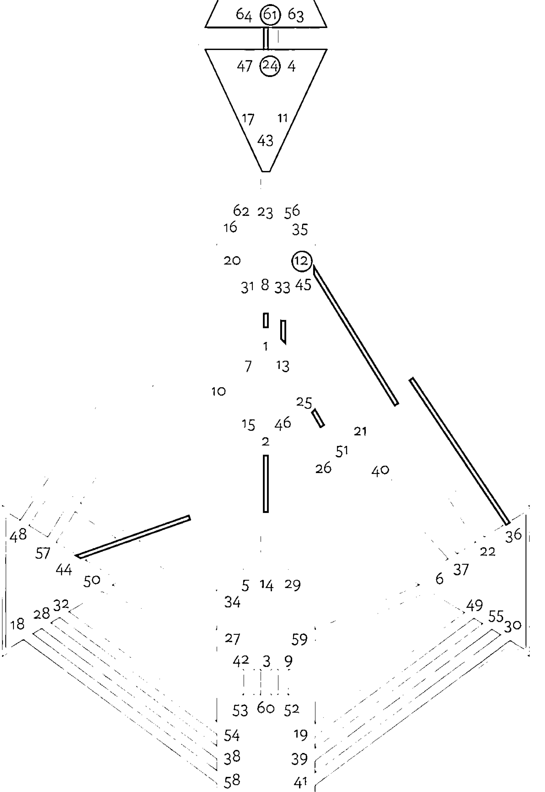

- 覺察 24–61
- 超然 44.6
- 挑惕 24.6
- 正義 3.6
- 直覺 2.1
- 創意獨立於意志之外 1.1
- 干預 44.3
- 持續創作的能量 1.3
- 自由 12.3
- 存在主義者 25.2
- 樂天派 13.6
- 靈活應用 2.5
- 抗拒 36.1
- 感染力 61.6

### 44.6 超然

寧願犧牲，也不願投降於退化的法則。

拒絕並譴責既定框架，革新是建立新模式，使一切趨於完善。對於各種模式如何運作，有所察覺，確保身心健康。

無法忍受去忍耐，心生傲慢。因了解模式，自覺高人一等，犧牲他人融洽。

---

## 創意

創意獨立於意志之外  
農曆10/13（日）

- 日 1.1 創意獨立於意志之外
- 地 2.1 直覺
- 月 21.1 警告
- 北交 2.1 直覺
- 南交 1.1 創意獨立於意志之外
- 水 44.5 操作
- 金 1.4 孤獨為創造力之媒介
- 火 12.3 自省
- 木 25.2 存在主義者
- 土 13.6 樂天派
- 天 2.5 靈活應用
- 海 36.1 抗拒
- 冥 61.6 感染力

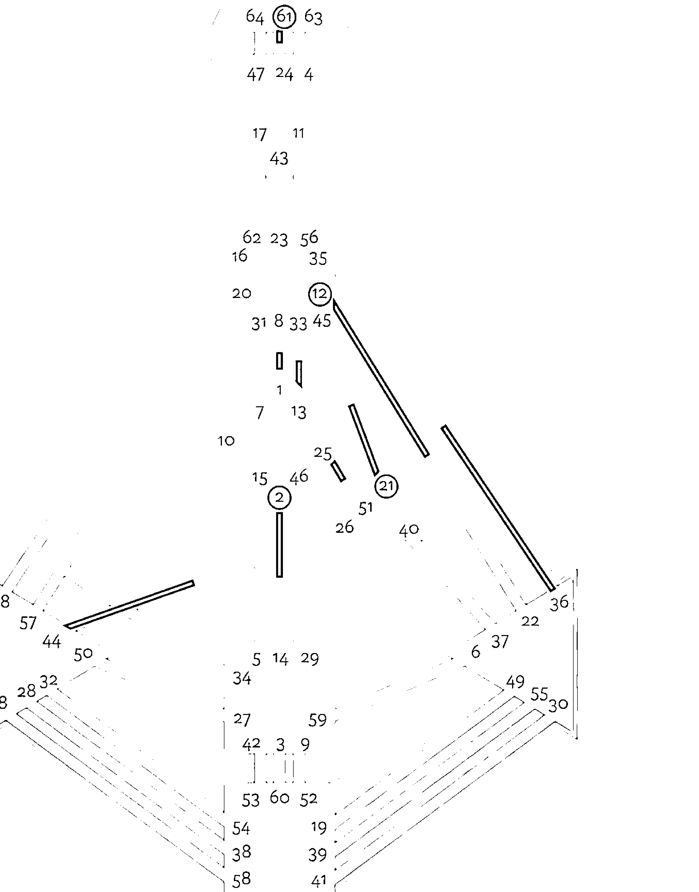

### 1.1 創意獨立於意志之外

月亮位於上升相位，象徵適應。時間決定一切。自我表達有其獨特的時間點。

不穩定導致孤獨，在此，耐心是美德，革命為惡行。創意不會穩定，要有耐心。

---

## 創意

## 愛是光

2022/11/06 23:19 TWN  
農曆10/13（日）

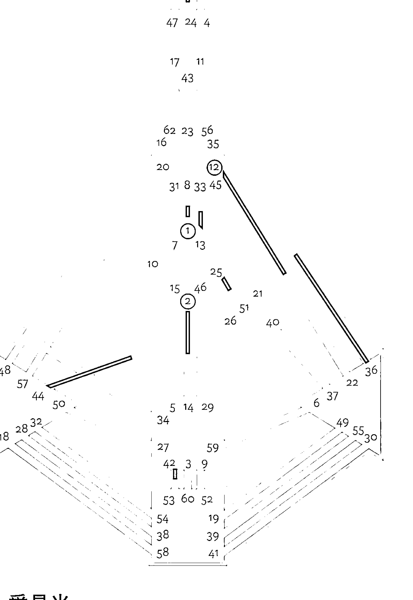

- 愛是光 1.2
- 天才 2.2
- 識別 4.2.2
- 直覺 2.1
- 創意獨立於意志之外 1.1
- 超然 44.6
- 吸引社會大眾的能量 1.5
- 自由 12.3
- 存在主義者 25.2
- 樂天派 13.6
- 靈活應用 2.5
- 抗拒 36.1
- 感染力 61.6

### 1.2 愛是光

♀ △ 金星在上升相位，象徵美麗。既定價值與激發靈感的理想之間，需要和諧。自我表達被理想與價值所制約。

♂ ▽ 欲望與熱情有其作用，但不能換來創意。欲望與熱情限制了自我表達。

---

## 創意

### 1.3 持續創作的能量

- 日 1.3 持續創作的能量
- 地 2.3 耐性
- 月 27.3 貪婪
- 北交 2.1 直覺
- 南交 1.1 創意獨立於意志之外
- 水 1.2 愛是光
- 金 43.1 耐性
- 火 12.3 自白
- 木 25.2 存在主義者
- 土 13.6 樂天派
- 天 2.4 驚嚇
- 海 36.1 抗拒
- 冥 61.6 感染力

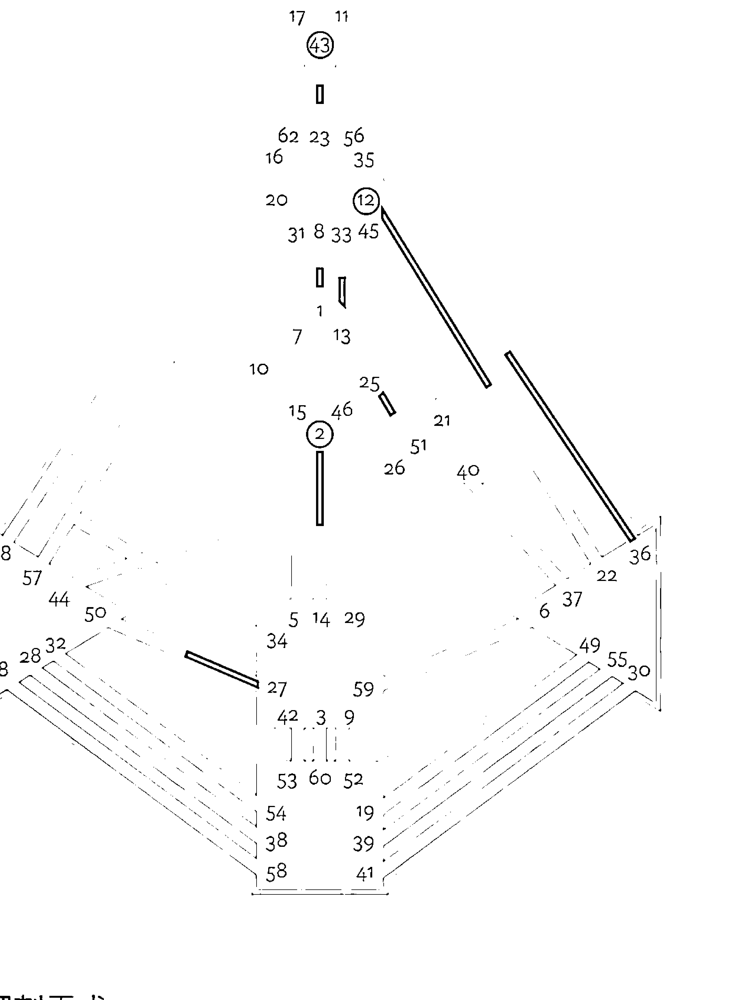

火星在上升相位，象徵自我表達的深刻需求。  
自我表達的深刻需求。

物質力量破壞創意，導致野心勃勃。  
物質主義破壞創造力。

---

## 創意

### 1.4 孤獨為創造力之媒介

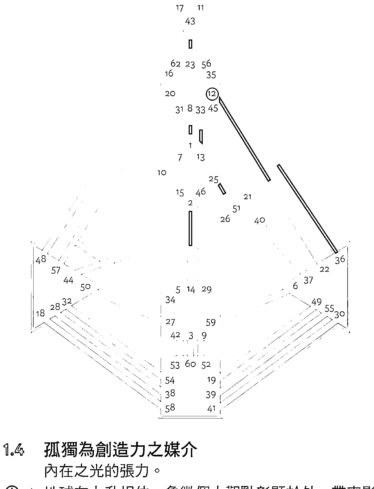

- 孤獨為創造力之媒介 1.4
- 隱匿 2.4
- 隱匿 2.4
- 直覺 2.1
- 創意獨立於意志之外 1.1
- 持續創作的能量 1.3
- 奉獻 43.2
- 自由 12.3
- 存在主義者 25.2
- 樂天派 13.6
- 隱匿 2.4
- 抗拒 36.1
- 感染力 61.6

內在之光的張力。

⊕ △ 地球在上升相位，象徵個人觀點彰顯於外，帶來影響力。發展創意，不能去想影響力。

▽ 稀釋了靈感所蘊藏的魔力。基於對影響力的需求，不甘寂寞，因而限制創造力。

---

## 創意

### 1.5 吸引社會大眾的能量

- 1–8 啟發
- 日 1.5 吸引社會大眾的能量
- 地 2.5 靈活應用
- 月 8.5 達摩
- 北交 2.1 直覺
- 南交 1.1 創意獨立於意志之外
- 水 1.5 吸引社會大眾的能量
- 金 43.3 權宜
- 火 12.3 自白
- 木 25.1 無私
- 土 13.6 樂天派
- 天 2.4 震盪
- 海 36.1 抗拒
- 冥 61.6 感染力

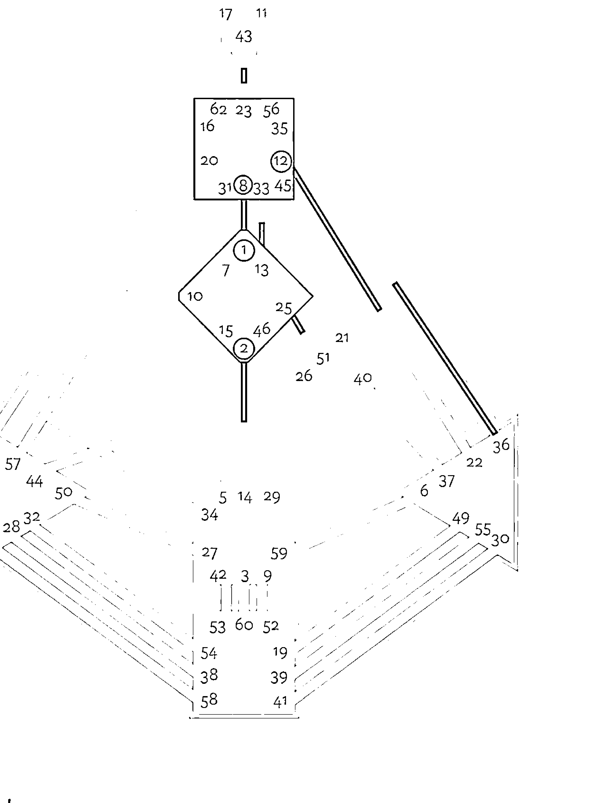

♂ △ 火星在上升相位，強大自我的頑強耐力。持續創作過程的力量與驅動力。

♅ ▽ 天王星在下降相位，怪誕困擾了耐力。儘管怪癖解開，卻限制了動力。

---

## 創意

### 1.6 客觀性

2022/11/10 17:00 TWN  
農曆10/17（四）

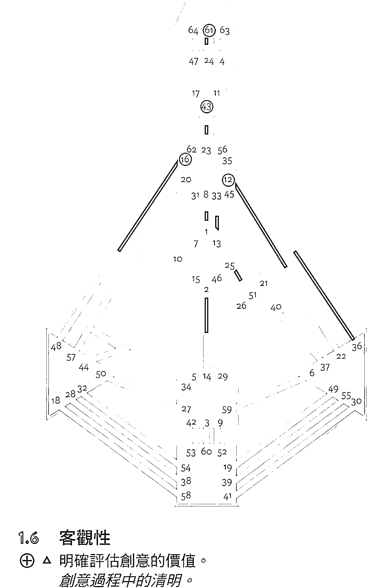

- 客觀性 1.6
- 定格 2.6
- 聖誕怪傑 16.5
- 直覺 2.1
- 創意獨立於意志之外 1.1
- 耐性 43.1
- 死腦筋 43.4
- 自由 12.3
- 無私 25.1
- 樂天派 13.6
- 隱匿 2.4
- 抗拒 36.1
- 感染力 61.6

⊕ △ 明確評估創意的價值。  
創意過程中的清明。

▽ 主觀評價所帶來的風險是失望，結果就是創意受挫。  
自我表達中的主觀意識，可能導致創意受挫。

---

## 43.1 突破

耐性  
2022/11/11 15:24 TWN  
農曆10/18（五）

- 日 ▽43.1 耐性
- 地 23.1 傳教
- 月 45.5 領導力
- 北交 2.1 直覺
- 南交 1.1 創意獨立於意志之外
- 水 43.2 奉獻
- 金 △43.6 突破
- 火 ▽12.3 自白
- 木 25.1 無私
- 土 49.1 必要性法則
- 天 2.4 震盪
- 海 36.1 抗拒
- 冥 60.1 接受

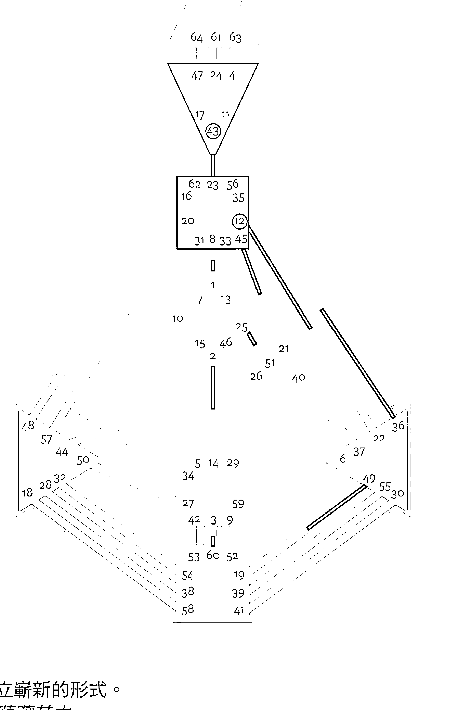

### 43.1 耐性

P △ 了解必須先消弭抗拒，才能建立嶄新的形式。形成個人洞見，必須要有深度蘊藏其中。

♀ ▽ 若缺乏耐心，強摘的果子不甜，徒留酸味。洞見本身帶來喜悅，卻缺乏建立洞見的深度。

---

## 突破

### 43.2 奉獻

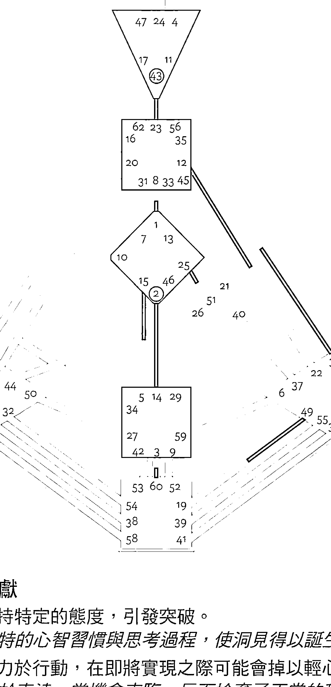

- 脈動 2–14
- 架構 23–43
- 奉獻 43.2
- 自我防衛 23.2
- 敏感性 15.5
- 直覺 2.1
- 創意獨立於意志之外 1.1
- 死腦筋 43.4
- 金錢非萬能 14.1
- 淨化 12.2
- 無私 25.1
- 必要性法則 49.1
- 隱匿 2.4
- 抗拒 36.1
- 接受 60.1

P △ 秉持特定的態度，引發突破。  
獨特的心智習慣與思考過程，使洞見得以誕生。

☽ ▽ 致力於行動，在即時實現之際可能會掉以輕心。  
急於表達，當機會來臨，反而擾亂了正常的程序。

---

## 43.3 突破

權宜

- 2–14 脈動
- 23–43 架構
- 日 43.3 權宜
- 地 △23.3 個體性
- 月 39.5 專心致志
- 北交 △2.1 直覺
- 南交 1.1 創意獨立於意志之外
- 水 43.5 進展
- 金 14.2 管理
- 火 12.2 淨化
- 木 25.1 無私
- 土 49.1 必要性法則
- 天 △2.4 驚雷
- 海 36.1 抗拒
- 冥 60.1 接受

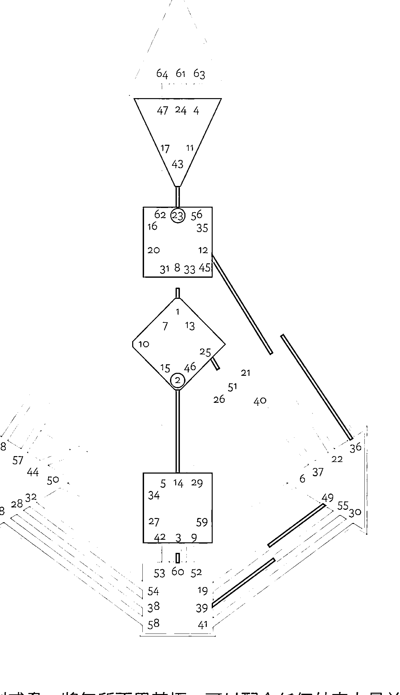

### 43.3 權宜

P △ 強烈渴望新生的驅動力，當突破受到啟發，將無所不用其極，可以配合任何外來力量並忍受各種譴責，只求達標。

確信自己的覺知，明白可以承受譴責。

☽ ▽ 若對譴責過度敏感，為此可能排除合理的權宜之計，導致失敗。

面對譴責時，背棄個人洞見。

---

## 突破

### 43.4 死腦筋

2022/11/14 10:31 TWN  
農曆10/21（一）

- 脈動 2–14
- 架構 23–43
- 死腦筋 43.4
- 分裂 23.4
- 質變 62.5
- 直覺 2.1
- 創意獨立於意志之外 1.1
- 金錢非萬能 14.1
- 服務 14.3
- 淨化 12.2
- 無私 25.1
- 必要性法則 49.1
- 隱匿 2.4
- 抗拒 36.1
- 接受 60.1

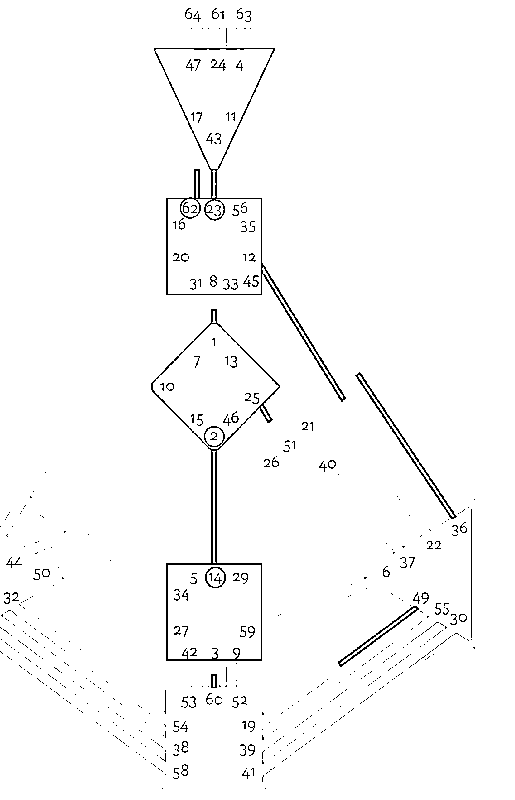

水星 △ 面對經常出現的阻礙，過度倚賴其心智的能力，頑固且執著。儘管水星在此賦予靈活的心智能力，也許會有成功的機會，雖然微乎其微。

堅持倚賴個人獨特的洞見，需要專注的心智能力，使概念得以完整成型。

♃ ▽ 當會以有限的知識為基礎，卻深信已採取正確的行動，不接受建議。缺乏深度卻試圖表現的自負。

---

## 43.5 突破

進展  
2022/11/15 08:52 TWN  
農曆10/22（二）

- 日 43.5 進展
- 地 23.5 同化
- 月 31.5 自以為是
- 北交 2.1 直覺
- 南交 1.1 創意獨立於意志之外
- 水 14.2 管理
- 金 14.5 傲慢
- 火 12.2 淨化
- 木 25.1 無私
- 土 49.1 必要性法則
- 天 2.4 震驚
- 海 36.1 抗拒
- 冥 60.1 接受

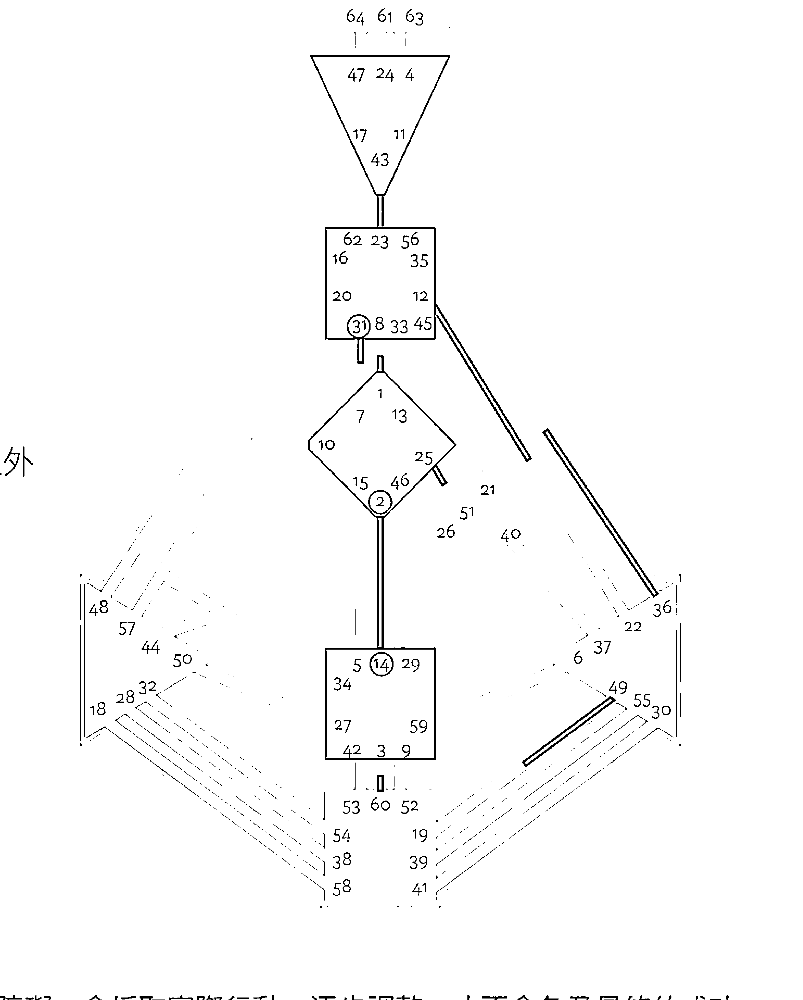

### 43.5 進展

☽ △ 若人際關係成為無法突破的障礙，會採取實際行動，逐步調整，才不會危及最終的成功。知道如何有效掌握對的時間點，與人分享自己獨特的洞見，就是天賦所在。

♀ ▼ 傾向專注心力以求人和，卻因此而強化了原本的約束力：無法獲得突破。過度在意他人觀感，和諧的關係反倒成為制約，限制個人化的表達。

---

## 43.6 突破

突破  
2022/11/16 07:13 TWN  
農曆10/23（三）

- 脈動 2–14
- 架構 23–43
- 突破 43.6
- 融合 23.6
- 將軍 7.5
- 直覺 2.1
- 創意獨立於意志之外 1.1
- 安全 14.4
- 謙遜 14.6
- 淨化 12.2
- 無私 25.1
- 必要性法則 49.1
- 隱匿 2.4
- 抗拒 36.1
- 接受 60.1

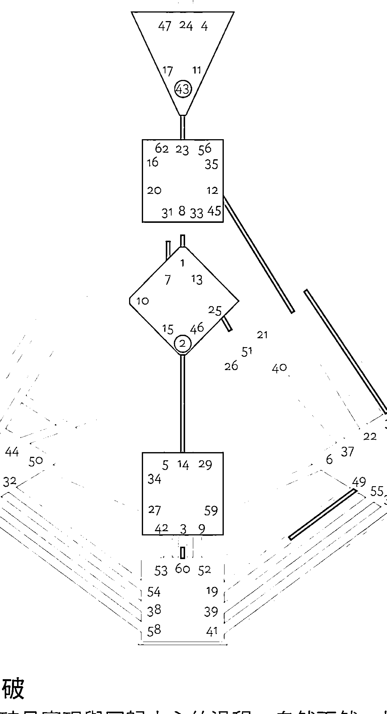

突破是實現與回歸中心的過程，自然而然，於內於外同時建構全新秩序。獨特的覺知，不論對個人與群體而言，極具價值。

關於突破：基於自我意識的傾向，看見次要因素也有存在的理由，轉化成新秩序。覺知的價值，重要性遠遠超過生活中的其他層面。

---

## 執著於衡量

### 14.1 金錢非萬能

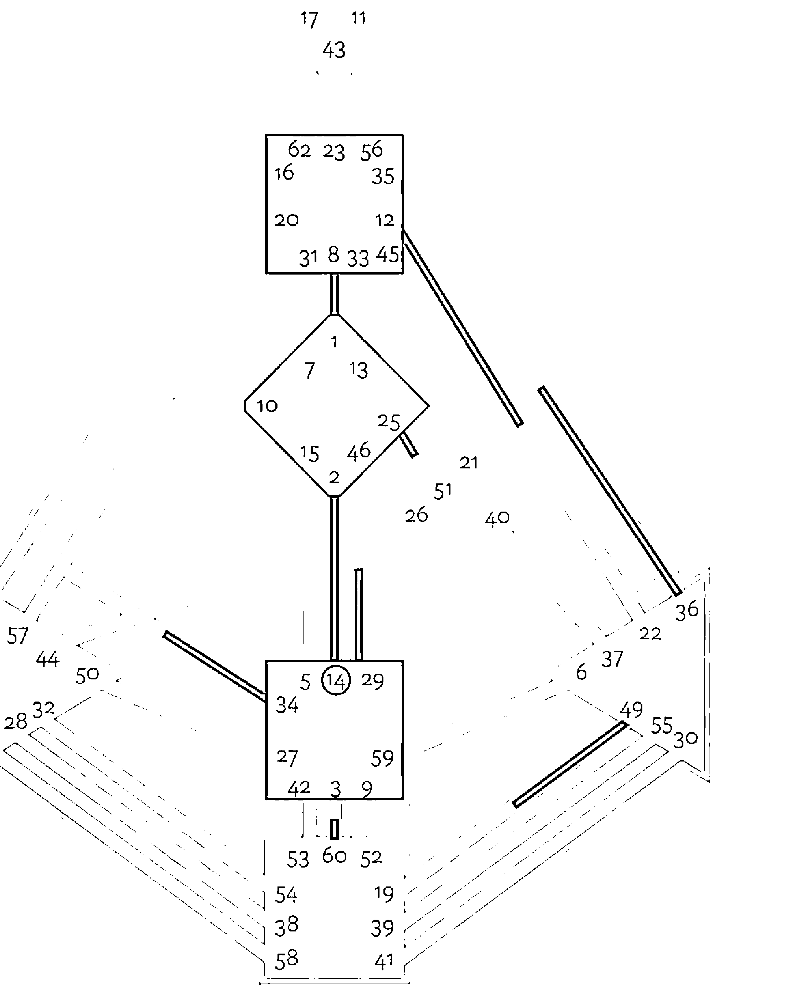

- 1–8 啟發
- 2–14 脈動
- 日 ▽14.1 金錢非萬能
- 地 8.1 誠實
- 月 29.4 直接
- 北交 2.1 直覺
- 南交 1.1 創意獨立於意志之外
- 水 △14.6 謙遜
- 金 34.1 霸凌
- 火 12.1 修道士、僧侶
- 木 25.1 無私
- 土 49.1 必要性法則
- 天 2.4 驚喜
- 海 36.1 抗拒
- 冥 60.1 接受

認知到財富也有財富的問題。

以更高的原則，淬煉對錢財的欲望。

彰顯力量的關鍵，來自更高原則。

有錢可使鬼推磨的影兒。

能量本身絕非關鍵。

---

## 執著於衡量

### 14.2 管理

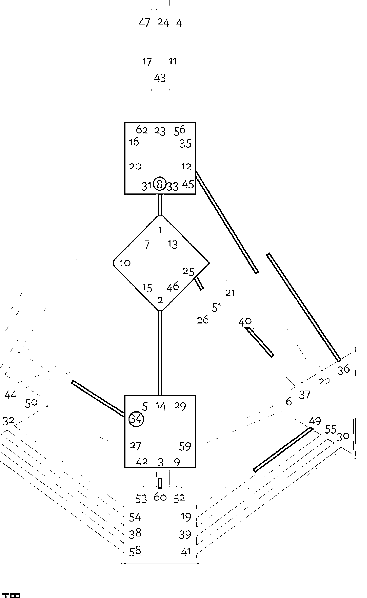

- 啟發 1–8
- 脈動 2–14
- 管理 14.2
- 服務 8.2
- 剛硬 40.5
- 直覺 2.1
- 創意獨立於意志之外 1.1
- 霸凌 34.1
- 氣勢 34.2
- 修道士／僧侶 12.1
- 無私 25.1
- 必要性法則 49.1
- 隱匿 2.4
- 抗拒 36.1
- 接受 60.1

投資在特定的專業知識的智慧，帶來報酬。

- △ 擴張，授權的能力。  
  力量的關鍵在於，不要試圖獨自去承擔一切。
- ▽ 阻礙自用，認為自己就是最厲害的專家。  
  力量的關鍵在於，獨立行事。

---

## 執著於衡量

### 14.3 服務

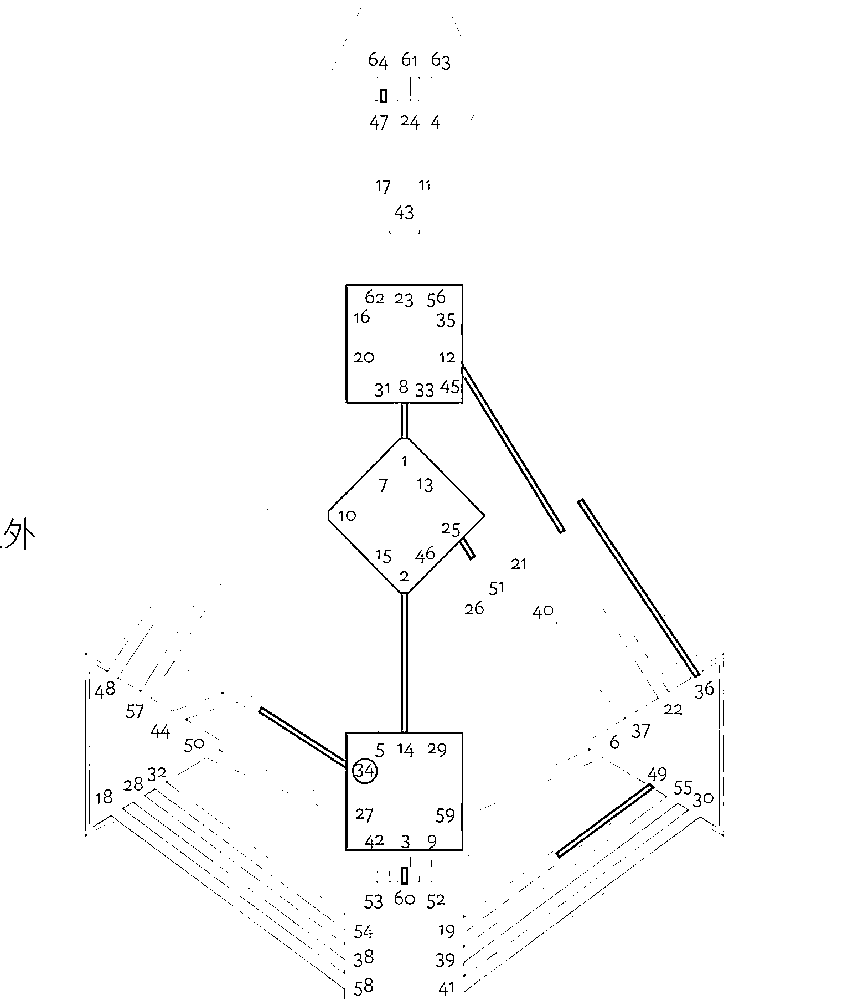

- 1–8 啟發
- 2–14 脈動
- 日 14.3 服務
- 地 8.3 虛假
- 月 47.5 聖人
- 北交 2.1 直覺
- 南交 1.1 創意獨立於意志之外
- 水 34.3 男子氣概
- 金 34.4 勝利
- 火 12.1 修道士、僧侶
- 木 25.1 無私
- 土 49.1 必要性法則
- 天 2.4 震盪
- 海 36.1 抗拒
- 冥 60.1 接受

充分運用才華與財富，為了最高層次的良善。

對社會無私奉獻。  
力量的關鍵，在於塑造人無私的奉獻。

貪婪與自我道德標準的毀滅。  
自私的力量引發貪婪。

---

## 執著於衡量

### 14.4 安全

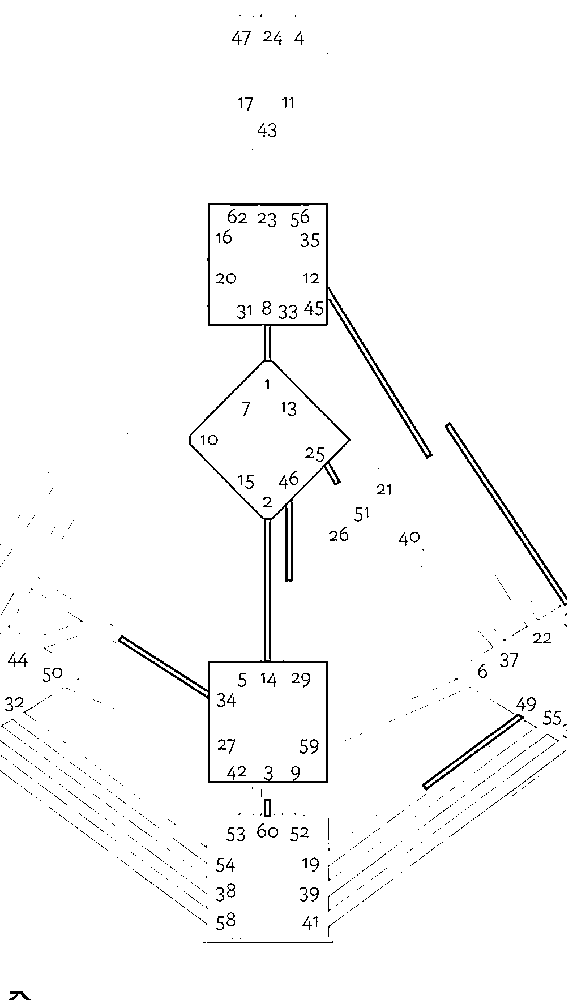

- 啟發 1–8
- 脈動 2–14
- 安全 14.4
- 尊重 8.4
- 誠信 46.6
- 直覺 2.1
- 創意獨立於意志之外 1.1
- 勝利 34.4
- 殲滅 34.5
- 修道士、僧侶 12.1
- 無私 25.1
- 必要性法則 49.1
- 隱匿 2.4
- 抗拒 36.1
- 接受 60.1

專注建立穩固的基礎。

- 為避免受到攻擊而防禦。  
- 取得力量的關鍵在於發展技能，確保建立強大的基礎。

- 盲目競爭與挑戰，過度自信，可能對最基本的安全造成威脅。  
- 缺乏健全技能，無法保障安全。

---

## 執著於衡量

### 14.5 傲慢

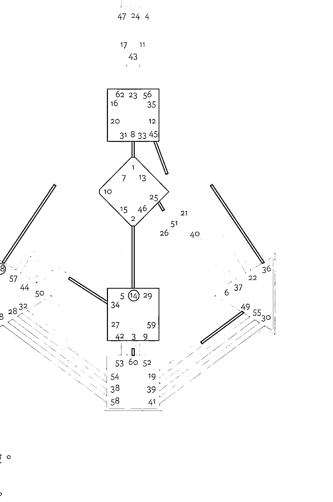

- 1–8 啟發
- 2–14 脈動
- 日 △14.5 傲慢
- 地 8.5 達摩
- 月 ▽48.6 自我滿足
- 北交 2.1 直覺
- 南交 1.1 創意獨立於意志之外
- 水 34.6 常識
- 金 34.6 常識
- 火 45.6 重新審視
- 木 25.1 無私
- 土 49.1 必要性法則
- 天 2.4 震盪
- 海 36.1 抗拒
- 冥 60.1 接受

位居權力核心，必然會有既定的風險。

☉ 與生俱來的尊嚴。  
與生俱來的尊嚴，就是力量的觀點。

♀ 對他人的天賦不滿意，因而產生優越感。  
生來就能分辨誰沒有權力，助長了優越感的幻覺。

---

## 執著於衡量

### 14.6 謙遜

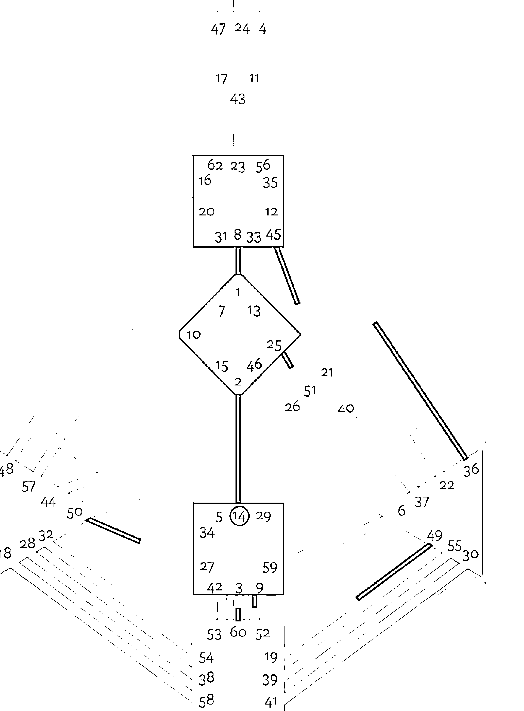

- 啟發 1–8
- 脈動 2–14
- 謙遜 14.6
- 交誼 8.6
- 決斷力 50.2
- 直覺 2.1
- 創意獨立於意志之外 1.1
- 感性 9.1
- 感性 9.1
- 重新審視 45.6
- 無私 25.1
- 必要性法則 49.1
- 隱匿 2.4
- 抗拒 36.1
- 接受 60.1

處於巔峰的財富與力量。

☉ △ 獲得啟迪，領悟能否獲得物質層面的成功，是天意。靈性是關鍵，通往終究之路，也是力量的泉源。

⊕ ▽ 在此地位的所有具體展現，實質上都是正向的。地球代表存在層面的認知，認為物質層面的成功是必然的；因為如此幸運，謙卑之心油然而生。存在土壤滋養接受為關鍵，力量為源頭。

---

## 34.1 強大的能量

霸凌

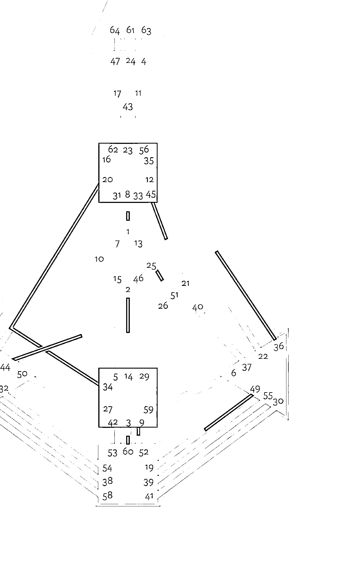

- 日 34.1 霸凌
- 地 20.1 表面化
- 月 44.3 干預
- 北交 2.1 直覺
- 南交 1.1 創意獨立於意志之外
- 水 9.3 壓垮駱駝的最後一根稻草
- 金 9.3 壓垮駱駝的最後一根稻草
- 火 45.6 重新審視
- 木 25.1 無私
- 土 49.1 必要性法則
- 天 2.4 懷舊
- 海 36.1 抗拒
- 冥 60.1 接受

力量未經區分，任意使用。

較不負面，力量的源頭來自挫敗。

回應挫敗，就是以充滿能量的方式，展現其力量。

恃強凌弱者，逆受報應將會是無可避免的命運。

展現力量之後，會不會引發報復？這是永遠將面對的風險。

---

## 強大的能量

### 34.2 氣勢

2022/11/23 17:35 TWN  
農曆10/30（三）

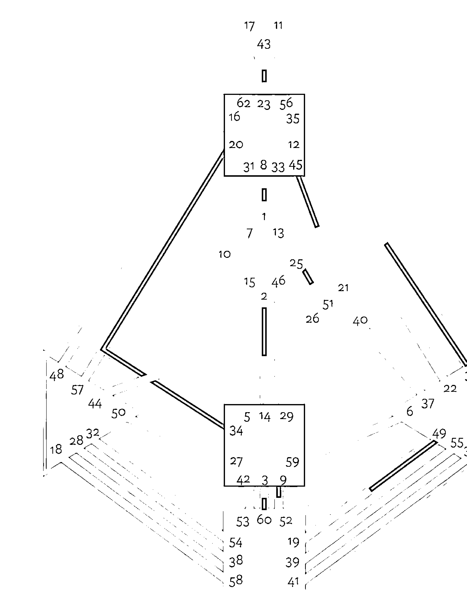

- 魅力 20–34
- 氣勢 34.2
- 獨斷者 20.2
- 突破 43.6
- 直覺 2.1
- 創意獨立於意志之外 1.1
- 奉獻 9.4
- 奉獻 9.4
- 領導力 45.5
- 無私 25.1
- 必要性法則 49.1
- 隱匿 2.4
- 抗拒 36.1
- 接受 60.1

♂ △ 就算勝利在望，也心有定見，不會得意忘形。  
當勝利在望，意發生出力量。

♀ ▽ 因小小的成功，就被情緒沖昏頭的傾向。  
因缺乏耐性，而限制其成長的力量。

---

## 34.3 強大的能量

男子氣概

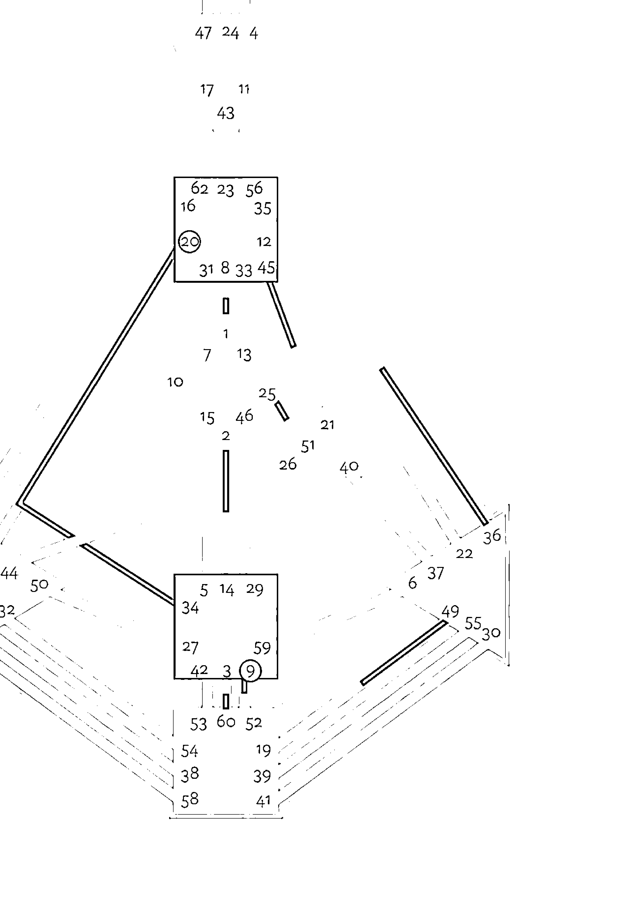

- 日 34.3 男子氣概
- 地 20.3 自我覺知
- 月 9.2 同病相憐
- 北交 2.1 直覺
- 南交 1.1 創意獨立於意志之外
- 水 △9.6 感激
- 金 9.5 相信
- 火 45.5 領導力
- 木 25.1 無私
- 土 49.1 必要性法則
- 天 2.4 震盪
- 海 36.1 抗拒
- 冥 60.1 接受

展現力量，無所差別。

♄ △ 若大男人主義依其本性，以既定方式展現出來，將造成極大的傷害。以展示力量為主軸，來定義每一個角色。

☿ 合理並且仔細盤算過後，再展現這點。為了賦予角色意義，以精心設計的方式來展現力量。

## 強大的能量

勝利  
2022/11/25 14:05 TWN  
農曆11/2（五）

- 魅力 20–34
- 勝利 34.4
- 應用 20.4
- 審查 26.4
- 直覺 2.1
- 創意獨立於意志之外 1.1
- 毅力 5.1
- 感激 9.6
- 領導力 45.5
- 無私 25.1
- 必要性法則 49.1
- 隱匿 2.4
- 抗拒 36.1
- 接受 60.1

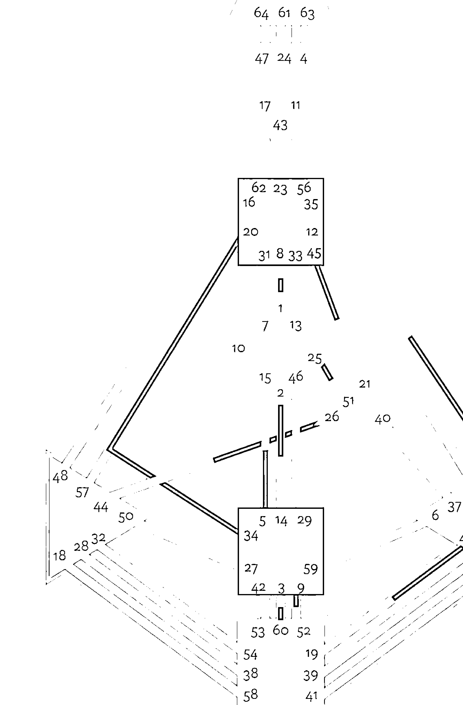

### 34.4 勝利

在絕對勝利的前提下，得以自由無限制地運用其力量。

面對勝利時，會刻意抑制，避免過度膨脹，以微妙且隱蔽的方式來展現力量。可以巧妙運用其力量，天生的自信。

濫用自我，肆無忌憚濫用力量，無可避免導致濫用。沒有自信，可能會導致濫用力量。

---

## 強大的能量

獻滅  
2022/11/26 12:19 TWN  
農曆11/3（六）

- 日 34.5 獻滅
- 地 20.5 現實主義
- 月 ▽58.1 生命之愛
- 北交 2.1 直覺
- 南交 1.1 創意獨立於意志之外
- 水 5.3 強迫症
- 金 △5.2 內在的和平
- 火 ▽45.4 方向
- 木 25.1 無私
- 土 49.1 必要性法則
- 天 2.4 震盪
- 海 36.1 抗拒
- 冥 60.1 接受

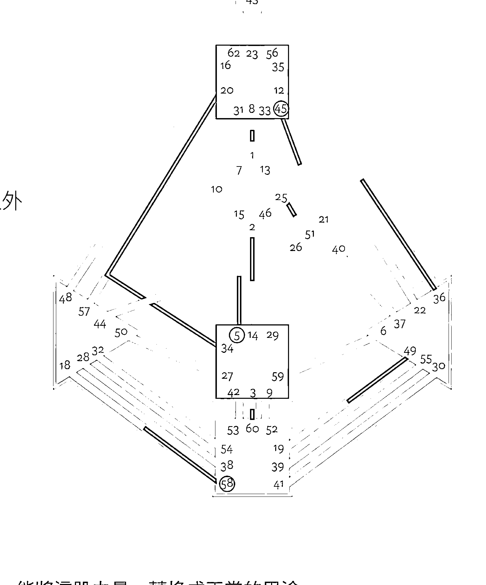

### 34.5 獻滅

將阻力徹底排除。

♂ △ 徹底摧毀的力量，完成之後，能將這股力量轉換成正常的用途。除非必要，否則對釋放力量有所防拒。

▽ 相當困難：面對阻力，要開闢已經獨立的模式，是不同階段的象徵，沒有什麼能被永遠消滅。

對於不時需要展現力量的狀態，並不自在。

---

## 強大的能量

常識  
2022/11/27 10:33 TWN  
農曆11/4（日）

- 魅力 20–34
- 常識 34.6
- 智慧 20.6
- 啟蒙／無明 54.4
- 直覺 2.1
- 創意獨立於意志之外 1.1
- 獵人 5.4
- 強迫症 5.3
- 方向 45.4
- 無私 25.1
- 必要性法則 49.1
- 隱匿 2.4
- 抗拒 36.1
- 接受 60.1

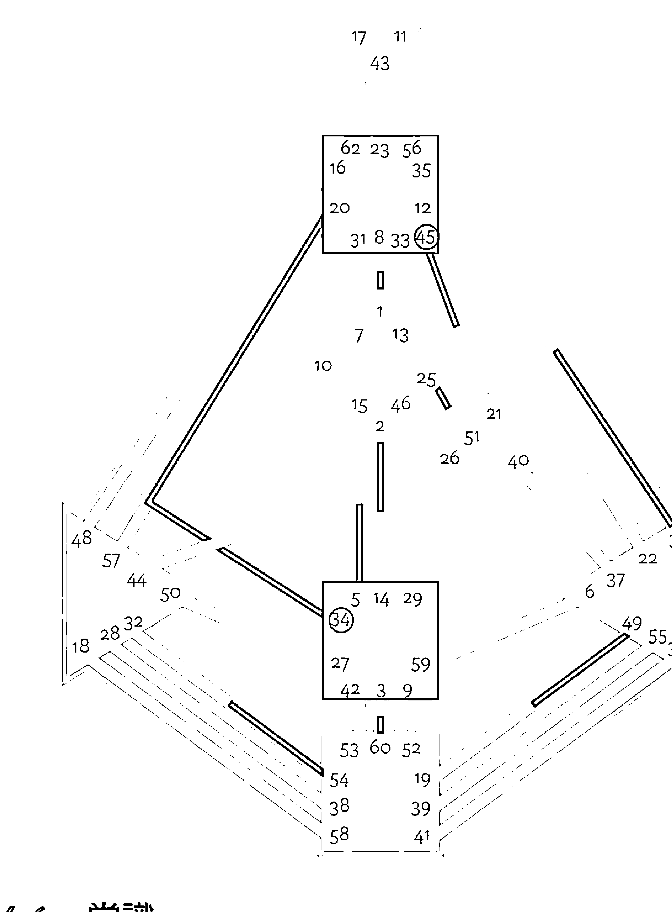

### 34.6 常識

知道適可而止。

⊕ △ 曾承受過多，懂得如何捨棄的智慧。  
無法維持、感覺後繼無力的時候，懂得管制並收回自身的力量。

♃ ▽ 熱心過頭，以致於無法判斷，不可避免將橫生枝節。  
若不知節制，力量會耗損。

---

## 處理細節的能力

感性  
農曆11/5（一）

- 日 9.1 感性
- 地 △16.1 妄想
- 月 60.6 剛硬
- 北交 24.6 挑釁
- 南交 44.6 超然
- 水 5.6 屈服
- 金 5.4 獵人
- 火 ▽45.4 方向
- 木 25.1 無私
- 土 49.1 必要性法則
- 天 2.4 震盪
- 海 36.1 抗拒
- 冥 60.1 接受

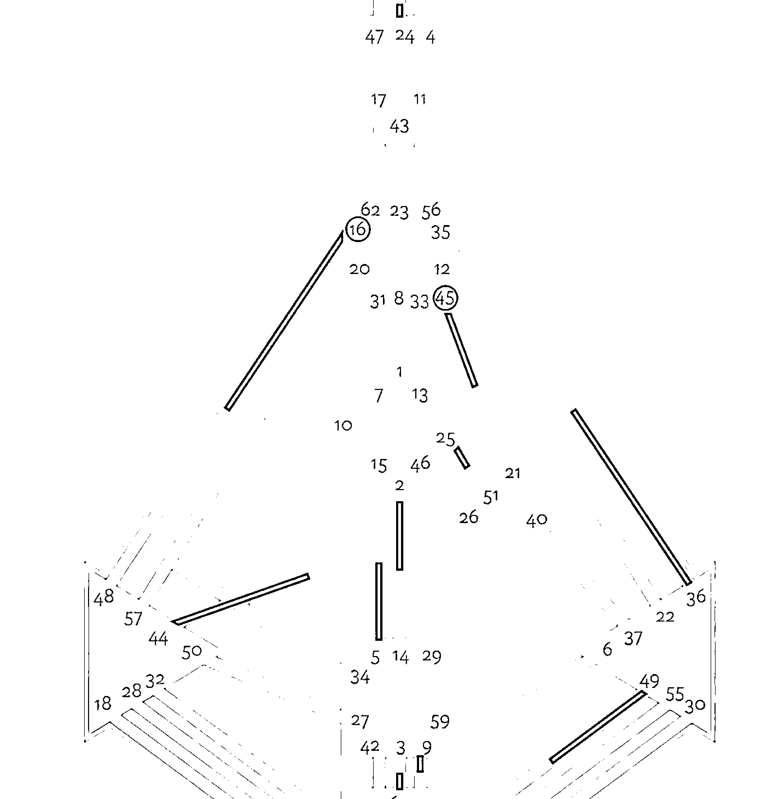

### 9.1 感性

以平衡與負責任的問題解決方式。

♇ △ 創造各種新的型態，避免挫敗的能力。專注就會有力量，致力創造新的形態。

♂ ▽ 四處找得無頭緒，幾乎衝動得快破門而入，其實鑰匙就在你的口袋裡。推進的動力常會失焦。

---

## 處理細節的能力

同病相憐

- 投降 26–44
- 同病相憐 9.2
- 憤世嫉俗的人 16.2
- 偏執 13.2
- 挑釁 24.6
- 超然 44.6
- 一鳥在手 26.1
- 喜悅 5.5
- 排除在外 45.3
- 無私 25.1
- 必要性法則 49.1
- 隱匿 2.4
- 抗拒 36.1
- 接受 60.1

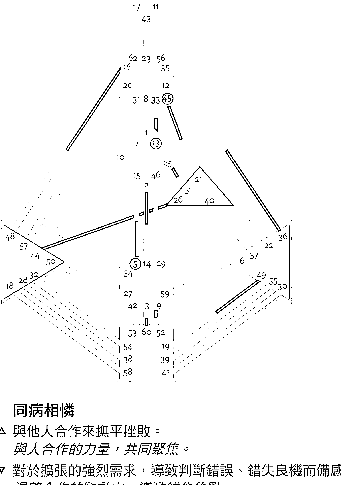

### 9.2 同病相憐

與他人合作來撫平挫敗。與人合作的力量，共同救贖。

對於擴張的強烈需求，導致判斷錯誤、錯失良機而備感沮喪。渴望合作的驅動力，導致錯失焦點。

---

## 處理細節的能力

壓垮駱駝的最後一根稻草

- 日 ▽9.3 壓垮駱駝的最後一根稻草
- 地 16.3 獨立
- 月 30.4 精疲力竭
- 北交 24.6 挑釁
- 南交 44.6 超然
- 水 26.3 影響
- 金 26.1 一鳥在手
- 火 ▽45.3 排除在外
- 木 25.1 無私
- 土 49.1 必要性法則
- 天 2.4 震盪
- 海 36.1 抗拒
- 冥 60.1 接受

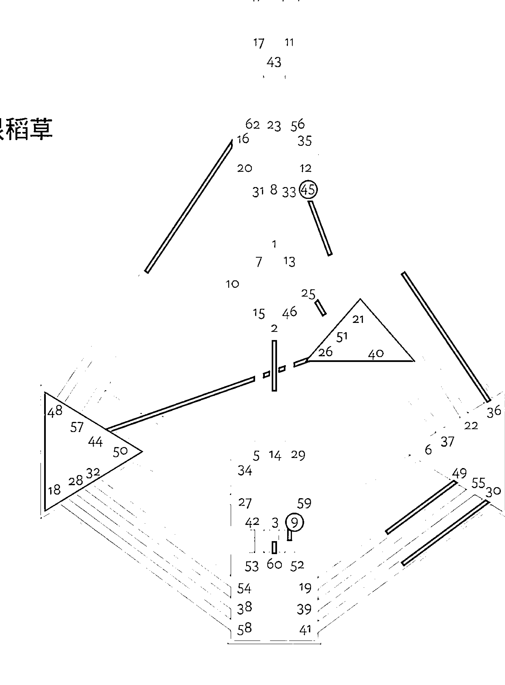

### 9.3 壓垮駱駝的最後一根稻草

忽略次要元素，可預見失敗的結果。

- 能力來克服一時障礙。
- 無濟於事，失去力量。
- 執著的力量耗損活力，小題大作。
- 將專注轉變為執迷的力量。

---

## 處理細節的能力

奉獻  
2022/12/01 03:25 TWN  
農曆11/8（四）

- 投降 26–44
- 奉獻 9.4
- 領導者 16.4
- 目的 37.6
- 挑釁 24.6
- 超然 44.6
- 適應力 26.5
- 歷史的教訓 26.2
- 排除在外 45.3
- 無私 25.1
- 最終手段 49.2
- 耐性 2.3
- 抗拒 36.1
- 接受 60.1

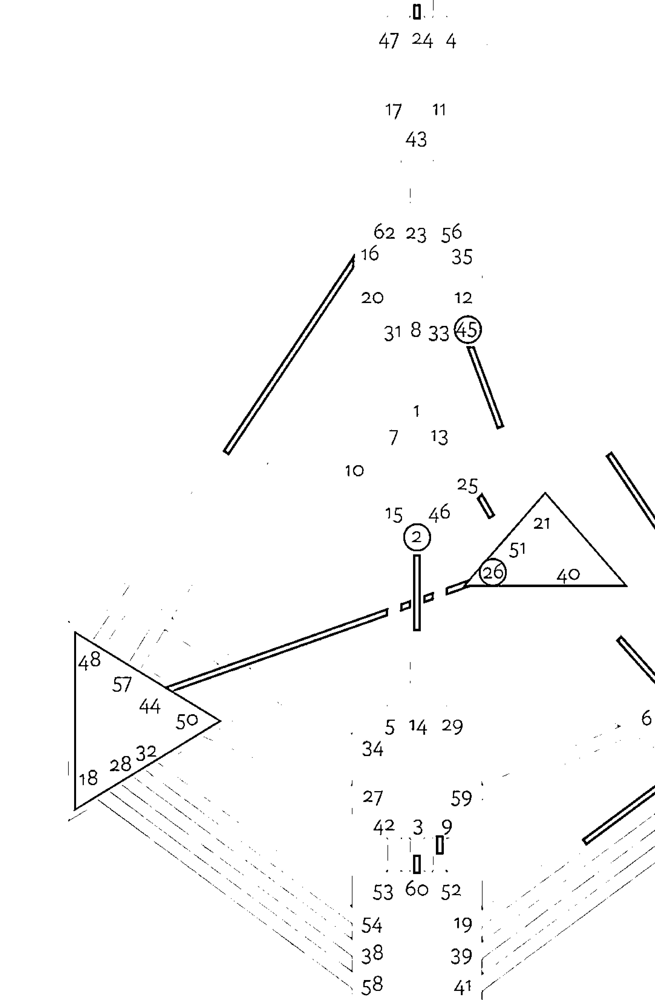

### 9.4 奉獻

無視於壓力或緊張，有紀律地關注細節。

採取正確行動，必能付諸實現。  
將專注的潛力，付諸行動的力量。

一直想跳過基本步驟的衝動。  
忽略細節，想付諸行動的驅動力。

---

## 處理細節的能力

相信

- 投降 26–44
- 日 9.5 相信
- 地 16.5 聖誕怪傑
- 月 ☆36.2 支持
- 北交 24.6 挑釁
- 南交 44.6 超然
- 水 26.6 權威
- 金 26.3 影響
- 火 ▽45.2 共識
- 木 25.1 無私
- 土 49.2 最終手段
- 天 ▽2.3 耐性
- 海 36.1 抗拒
- 冥 60.1 接受

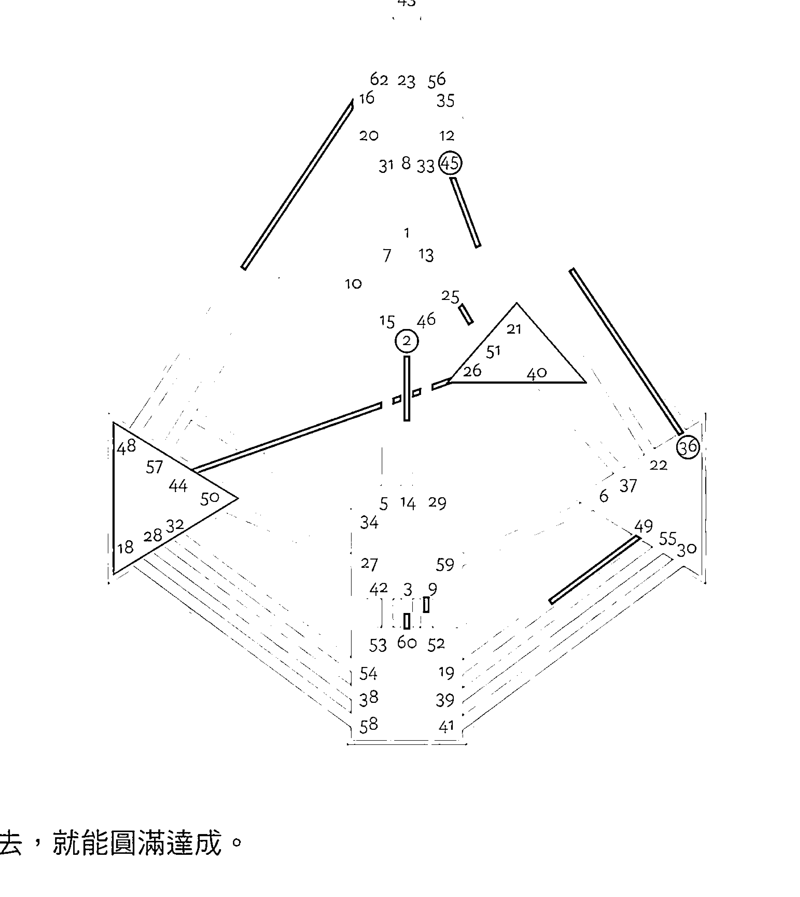

### 9.5 相信

相信只要鉅細靡遺堅持下去，就能圓滿達成。

- △ 忠於法律條文。專注的力量，認為專心有其價值。
- ⊕ 免於神的恩寵，當過程中遇到不合邏輯之處，產生質疑。缺乏專注的力量，心生懷疑。

---

## 處理細節的能力

感激  
2022/12/02 23:49 TWN  
農曆11/9（五）

- 投降 26–44
- 感激 9.6
- 輕信 16.6
- 理解 17.3
- 挑釁 24.6
- 超然 44.6
- 嚴格 11.2
- 審查 26.4
- 共識 45.2
- 無私 25.1
- 最終手段 49.2
- 耐性 2.3
- 抗拒 36.1
- 接受 60.1

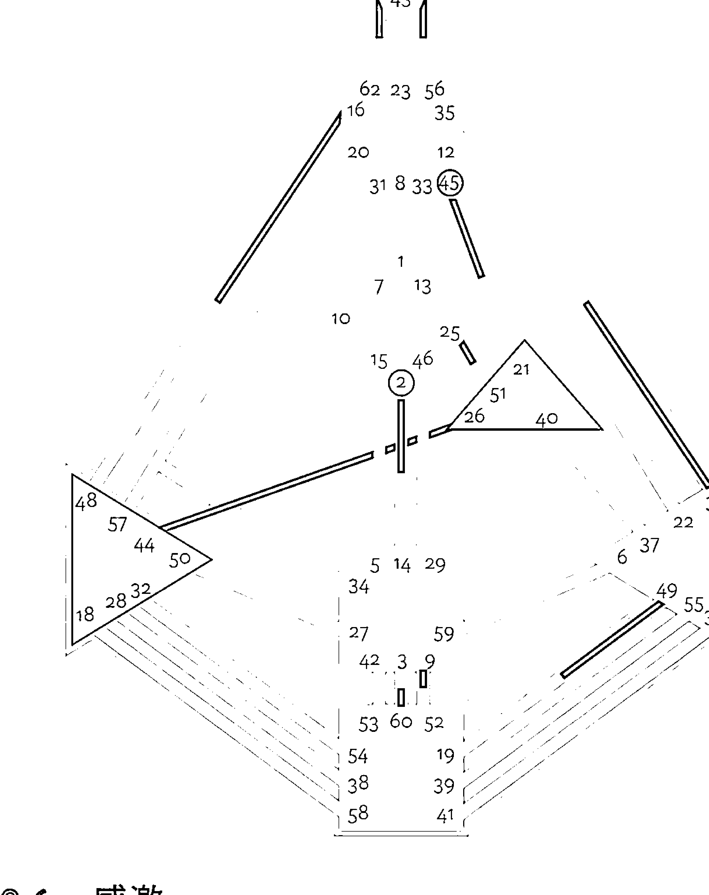

### 9.6 感激

接受每個微小勝利都會帶來些許回報，心生喜悅。

△ 月亮位於上升相位，就算力量微薄，也能孕育出正確的觀點。  
充滿力量享受這段專注的過程。

▽ 除非走完這趟旅程，否則每一步皆無價值。  
在完成之前，過程中缺少了喜悅的能量。

---

## 等待

### 5.1 等待／毅力

2022/12/03 22:01 TWN  
農曆11/10（六）

- 25–51 發起
- 26–44 投降
- 35–36 無常
- 日 5.1 毅力
- 地 ▽35.1 謙遜
- 月 51.4 極限
- 北交 24.6 挑釁
- 南交 44.6 超然
- 水 11.3 現實主義者
- 金 26.6 權威
- 火 ▽45.1 遊說
- 木 25.1 無私
- 土 49.2 最終手段
- 天 ▽2.3 耐性
- 海 36.1 抗拒
- 冥 60.1 接受

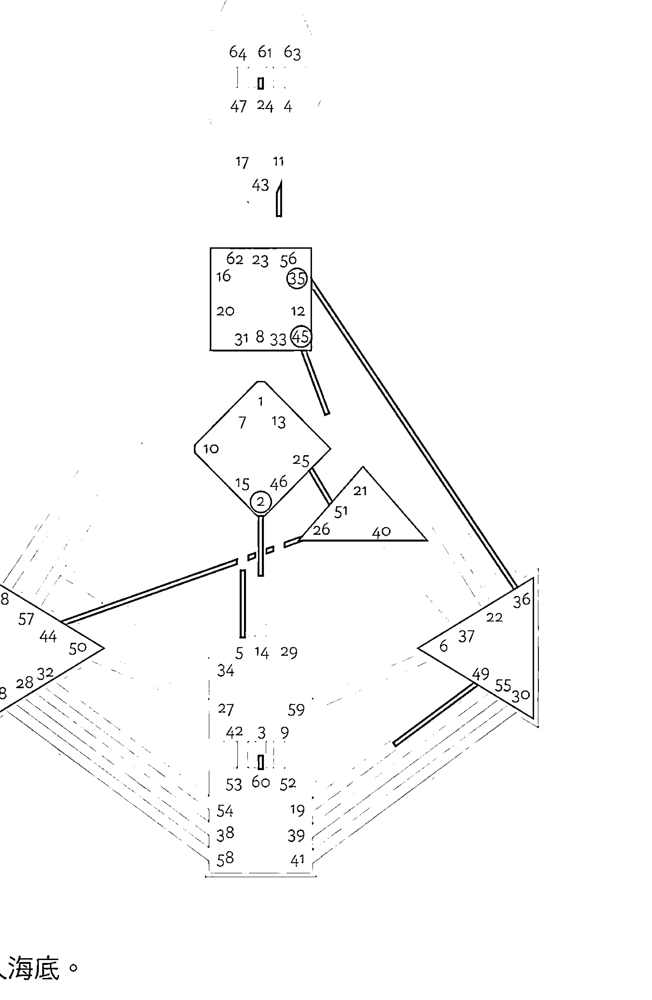

**5.1 毅力**

如果有必要，船長會跟著船一起沉入海底。

- ♂ △ 面對逆境的勇氣。  
  經驗個人韌性的力量。
- ⊕ ▽ 為了避免損失，通常過於衝動而提早放棄。  
  當挑戰來臨時，維持個人韌性的能力薄弱。

---

## 等待

內在的和平

- 突變 3–60
- 無常 35–36
- 內在的和平 5.2
- 創意空窗期 35.2
- 受害 3.5
- 挑釁 24.6
- 超然 44.6
- 老師 11.4
- 和諧 11.1
- 遊說 45.1
- 無私 25.1
- 最終手段 49.2
- 耐性 2.3
- 抗拒 36.1
- 接受 60.1

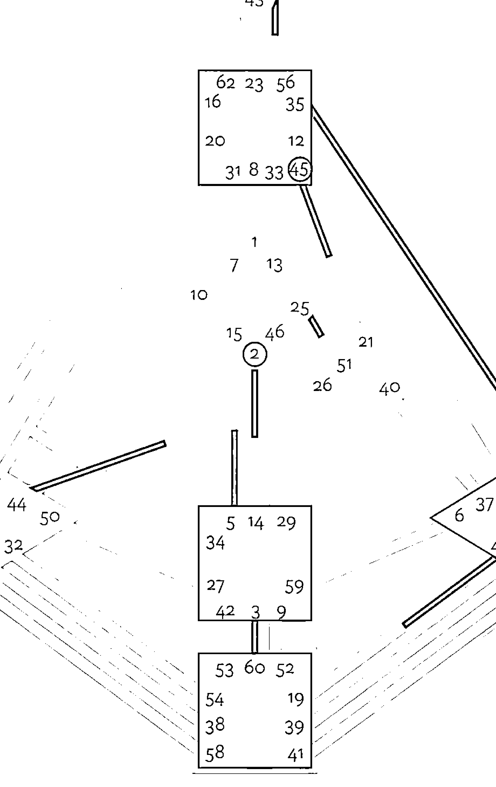

### 5.2 內在的和平

具有抑制衝動的能力，避免採取不成熟的行動。

- ♀ △ 透過理想的寧靜，維持沉著的天賦。自在順應內在韻律的力量。
- ♇ ▽ 將內在的平靜等同停滯的體驗。僵化的韻律，限制了充滿力量的驅動力。

---

## 等待

強迫症

- 35–36 無常
- 日 5.3 強迫症
- 地 35.3 合作
- 月 △24.5 自白
- 北交 24.6 挑釁
- 南交 44.6 超然
- 水 11.6 適應力
- 金 11.2 嚴格
- 火 ▽45.1 遊說
- 木 25.1 無私
- 土 49.2 最終手段
- 天 ▽2.3 耐性
- 海 36.1 抗拒
- 冥 60.1 接受

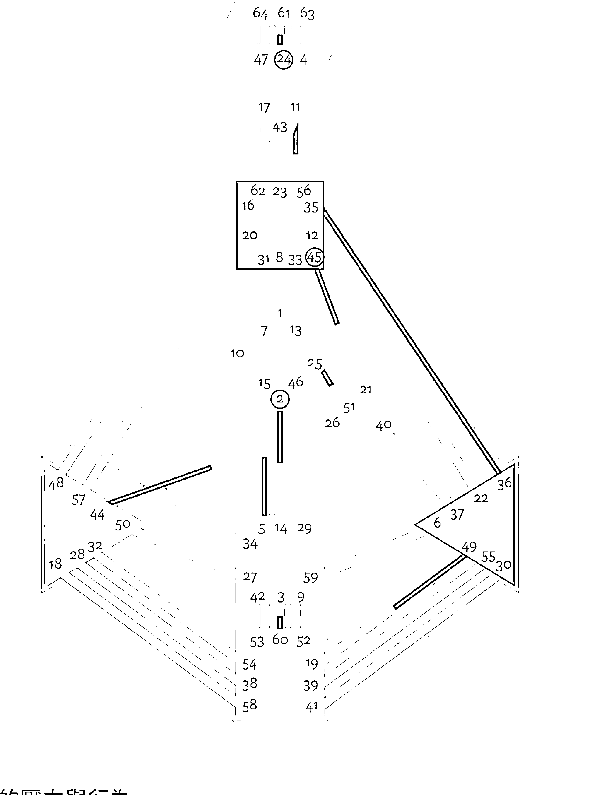

### 5.3 強迫症

無助感衍生恐懼，導致不必要的壓力與行為。

透過奔放的想像力，能限制強迫症所帶來的負面影響。雖然還是感到緊繃，卻不會輕舉妄動，臣服於既定規律的限制，透過想像力獲得力量。

月亮無法靜止不動，無法屈服，不符合自己的韻律。

---

## 等待

獵人  
2022/12/06 16:34 TWN  
農曆11/13（二）

- 無常 35–36
- 獵人 5.4
- 渴望 35.4
- 融合 23.6
- 挑釁 24.6
- 超然 44.6
- 謙遜 10.1
- 現實主義者 11.3
- 矯正 35.6
- 無私 25.1
- 最終手段 49.2
- 耐性 2.3
- 抗拒 36.1
- 接受 60.1

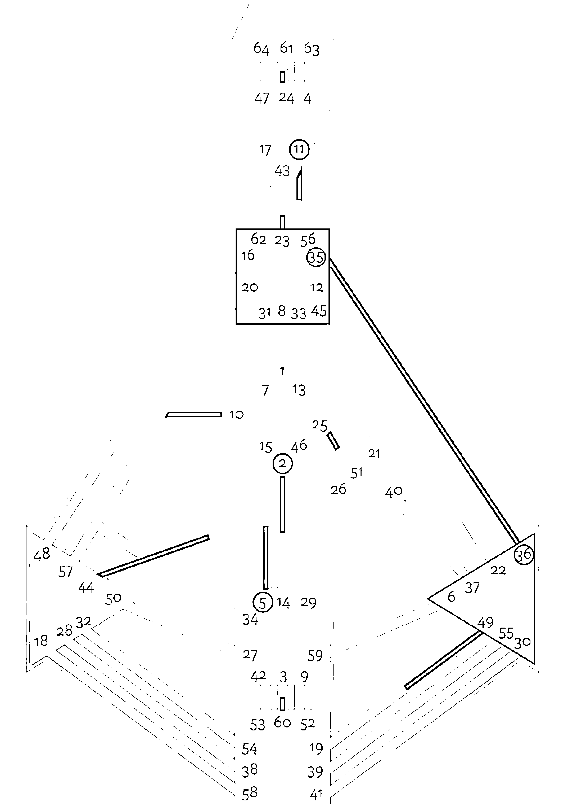

### 5.4 獵人

等待：生存的保證。

極具創意的天才，將最消極的經驗轉化為積極的成就。  
有力量將既定的韻律發揚光大。

個性中過度強烈的虛榮，不願屈居幕後，威脅其生存。  
以可預估的代價，衝動地否定特有的韻律。

---

## 等待

### 5.5 喜悅

2022/12/07 14:44 TWN  
農曆11/14（三）大雪

- 日 5.5 喜悅
- 地 35.5 利他主義
- 月 ▽20.6 智慧
- 北交 24.6 挑釁
- 南交 44.6 超然
- 水 ▽10.3 烈士
- 金 11.5 慈善家
- 火 ▽35.6 矯正
- 木 25.1 無私
- 土 49.2 最終手段
- 天 ▽2.3 耐性
- 海 ▲36.1 抗拒
- 冥 60.1 接受

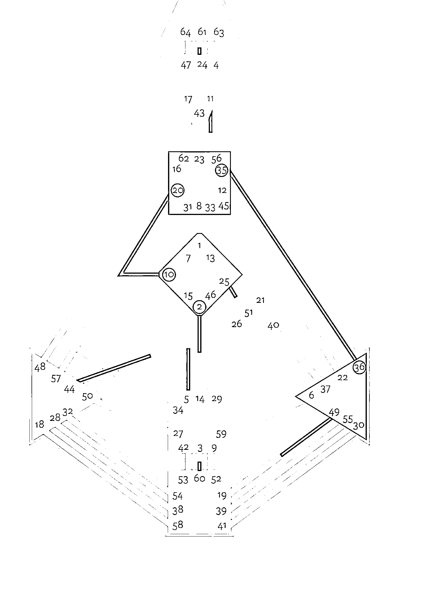

5.5 喜悅

等待宛如開悟的樣貌。

- ♀ △ 保持平靜宛如極致的美學，體悟出存在的蘊義。保持平靜的力量，在生命之流中找到個人的定位。
- ♇ ▽ 喜悅如幻象消散，視等待為失敗。看清自己於生命之流中的位置，因而幻滅。

---

## 等待

屈服  
2022/12/08 12:54 TWN  
農曆11/15（四）

- 無常 35–36
- 屈服 5.6
- 矯正 35.6
- 挑釁 24.6
- 超然 44.6
- 機會主義者 10.4
- 適應力 11.6
- 無私 25.1
- 最終手段 49.2
- 耐性 2.3
- 抗拒 36.1
- 接受 60.1

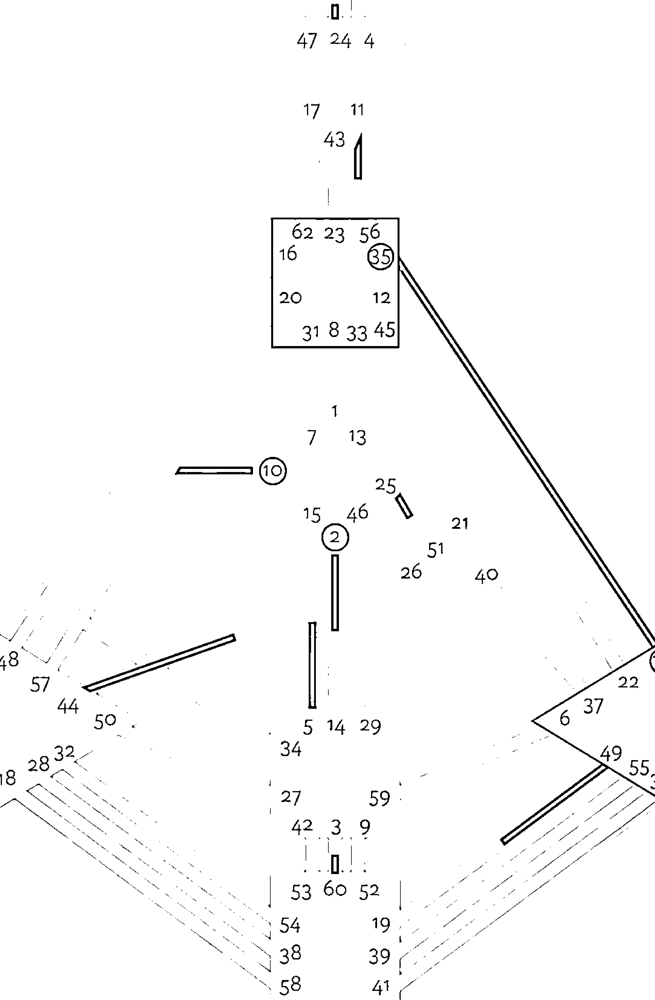

### 5.6 屈服

等待無法免除來自身體或精神上的壓力，常被不預期的事打斷。

順應宇宙之流，覺知有所成長。就算有壓力，還是接受自己既定的韻律，任其滲透不預期的一切，得到激勵而從中成長。

無礙性，在此下降相位繼續行星，每個行星都有其軌跡。根據此位置的力量，將順從其必然性，不可避免。

---

## 偉大的馴服力

一鳥在手

- 26–44 投降
- 35–36 無常
- 日 26.1 一鳥在手
- 地 45.1 遊說
- 月 12.6 質變
- 北交 24.6 挑釁
- 南交 44.6 超然
- 水 10.6 人生典範
- 金 10.1 謙遜
- 火 35.5 利他主義
- 木 25.2 存在主義者
- 土 49.2 最終手段
- 天 2.3 耐性
- 海 36.1 抗拒
- 冥 60.1 接受

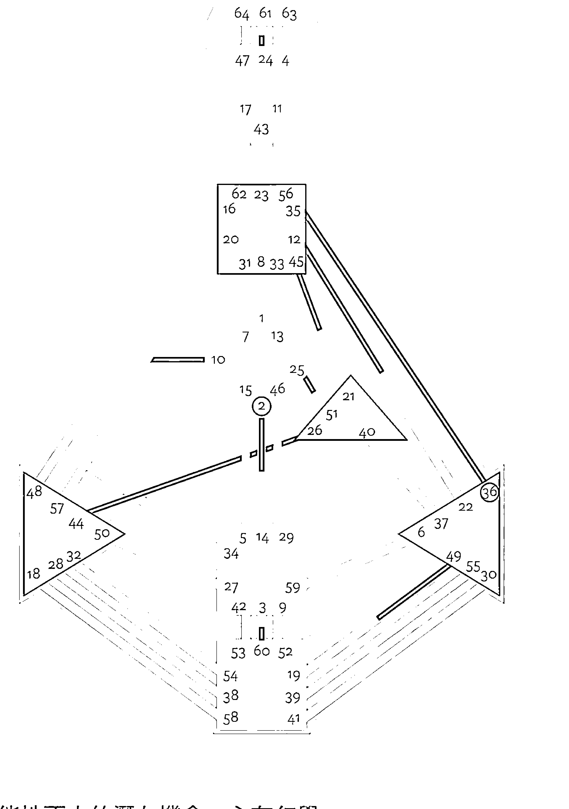

### 26.1 一鳥在手

海王 △ 享受跨越夢想的能力，避免對可能性不大的潛在機會心存幻想。自我能透過夢想，超脫限制。

火星 ▽ 成就是許可證，讓人能更魯莽地冒險。不會滿足的自我。

---

## 偉大的馴服力

歷史的教訓

- 投降 26–44
- 無常 35–36
- 歷史的教訓 26.2
- 共識 45.2
- 平和 52.6
- 挑釁 24.6
- 超然 44.6
- 生命之愛 58.1
- 隱士 10.2
- 利他主義 35.5
- 存在主義者 25.2
- 最終手段 49.2
- 耐性 2.3
- 抗拒 36.1
- 接受 60.1

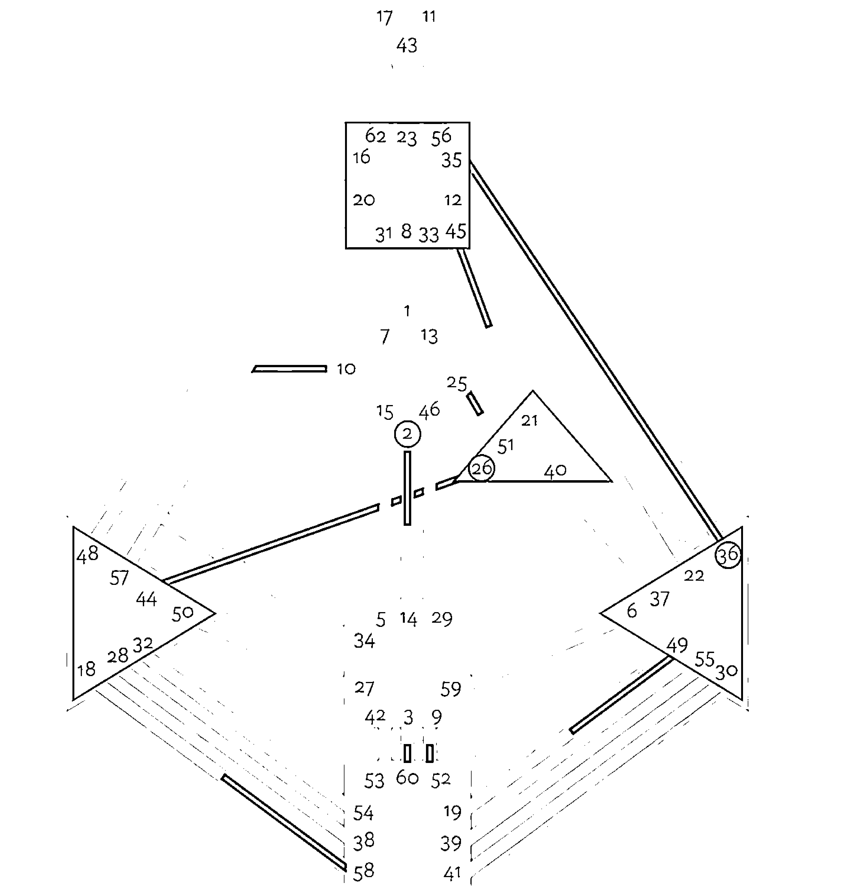

### 26.2 歷史的教訓

△ 歷史的教訓。反省的深度與能量，自過往學習，以展望未來。自經驗中學習，意志力的力量。

▽ 忘了殷鑑不遠，過於魯莽而行動。過於自我而導致失敗，尊重經驗。

---

## 偉大的馴服力

影響  
2022/12/11 07:22 TWN  
農曆11/18（日）

- 26–44 投降
- 35–36 無常
- 日 △26.3 影響
- 地 45.3 排除在外
- 月 53.5 主張
- 北交 24.6 挑釁
- 南交 44.6 超然
- 水 58.3 電流
- 金 10.3 烈士
- 火 ▽35.4 渴望
- 木 25.2 存在主義者
- 土 49.2 最終手段
- 天 ▽2.3 耐性
- 海 ▲36.1 抗拒
- 冥 60.1 接受

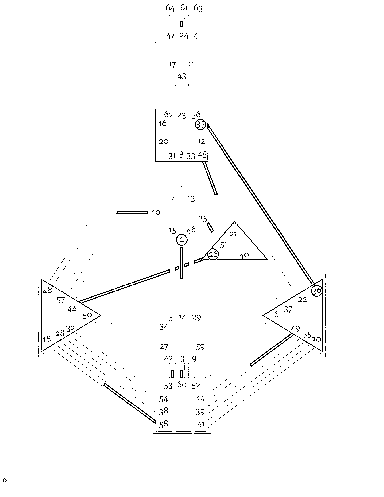

### 26.3 影響

有能力蓄勢待發，獲得支持。

☉ △ 得以集結眾人之力的權威。  
發揮意志力的力量，集結支持。

♄ ▽ 發揮領導力，卻在集結支持時低估潛在的挑戰。  
利己主義者，無法理解他人可能會帶來的挑戰。

---

## 偉大的馴服力

審查  
2022/12/12 05:31 TWN  
農曆11/19（一）

- 投降 26–44
- 無常 35–36
- 審查 26.4
- 方向 45.4
- 吸引注意力 56.5
- 挑釁 24.6
- 超然 44.6
- 調焦 58.4
- 異端者 10.5
- 渴望 35.4
- 存在主義者 25.2
- 最終手段 49.2
- 耐性 2.3
- 抗拒 36.1
- 接受 60.1

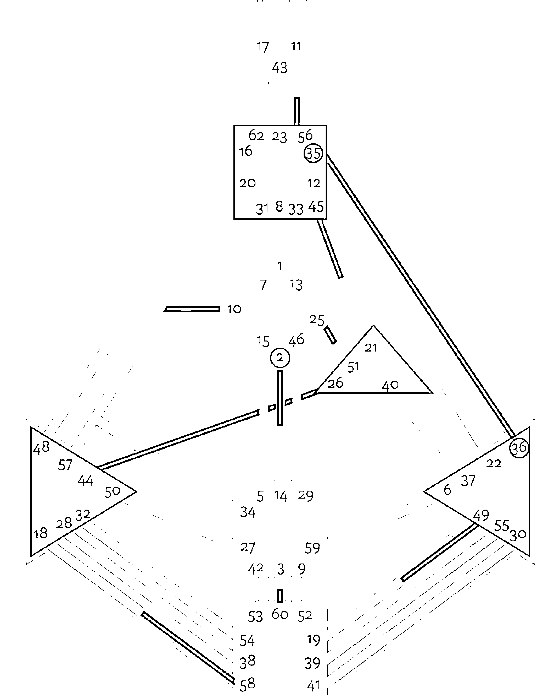

### 26.4 審查

經由消除的方式，改變記憶。

♇ △ 有能力經由審查，解救群體免於混亂。透過遺忘的方式，維持自我的力量。

♄ ▽ 運用審查維持現狀；恐懼產生挫敗的後果，因而採取選擇性的記憶。透過選擇性的記憶，維持自我的力量。

---

## 偉大的馴服力

適應力  
2022/12/13 03:39 TWN  
農曆11/20（二）

- 26–44 投降
- 35–36 無常
- 日 26.5 適應力
- 地 45.5 領導力
- 月 33.5 時機
- 北交 24.6 挑釁
- 南交 44.6 超然
- 水 58.6 忘形
- 金 10.6 人生典範
- 火 35.4 渴望
- 木 25.2 存在主義者
- 土 49.2 最終手段
- 天 2.3 耐性
- 海 36.1 抗拒
- 冥 60.1 接受

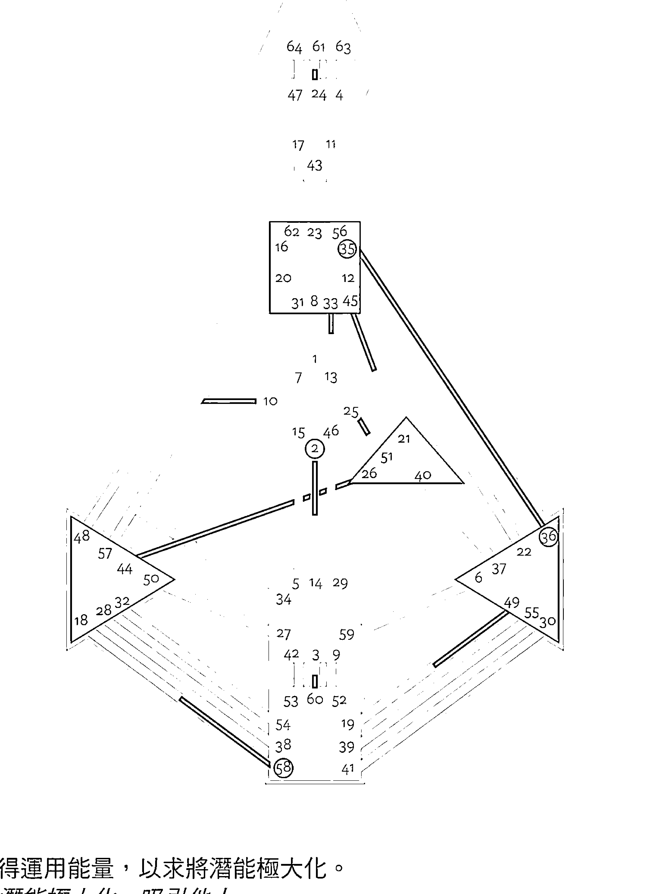

### 26.5 適應力

♂ △ 了解整體機制如何運轉，懂得運用能量，以求將潛能極大化。記憶的力量，能將意志力的潛能極大化，吸引他人。

♀ ▽ 當改變本質是必要的下一步，將引發抗拒與不滿。利己主義者對適應本身心生抗拒。

---

## 偉大的馴服力

權威

- 投降 26–44
- 無常 35–36
- 權威 26.6
- 重新審視 45.6
- 騙子 4.4
- 挑釁 24.6
- 超然 44.6
- 素質 38.1
- 生命之愛 58.1
- 合作 35.3
- 存在主義者 25.2
- 民怨 49.3
- 耐性 2.3
- 抗拒 36.1
- 接受 60.1

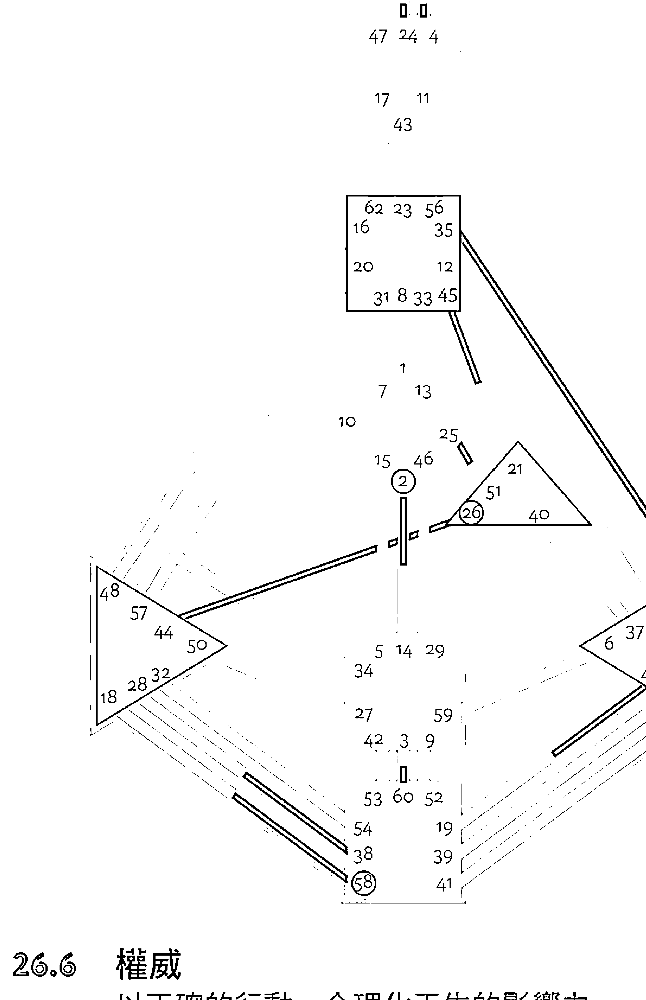

### 26.6 權威

以正確的行動，合理化天生的影響力。

☉ △ 通過時間的考驗，將理由與目的具體化。強大的自我影響力，基於所獲取的正確行動，因而獲得合理化。

☽ ▽ 權威是象徵也是焦點所在，卻不等同於具體實踐方案。若失去實體，就算卸下實權，但依舊象徵權威的延續。意志力的表現只剩角色影響，已非真正權威，徒留象徵意義。

## 和平  
和諧  

- 35–36 無常  
- 11.1 和調  
- 12.1 修道士、僧侶  
- 59.4 手足情誼  
- 北交 24.6 挑惕  
- 南交 44.6 超然  
- 水 38.2 彬彬有禮  
- 金 58.2 變態  
- 火 35.3 合作  
- 木 25.2 存在主義者  
- 土 49.3 民怨  
- 天 2.3 耐性  
- 海 43.6 抗拒  
- 冥 60.1 接受  

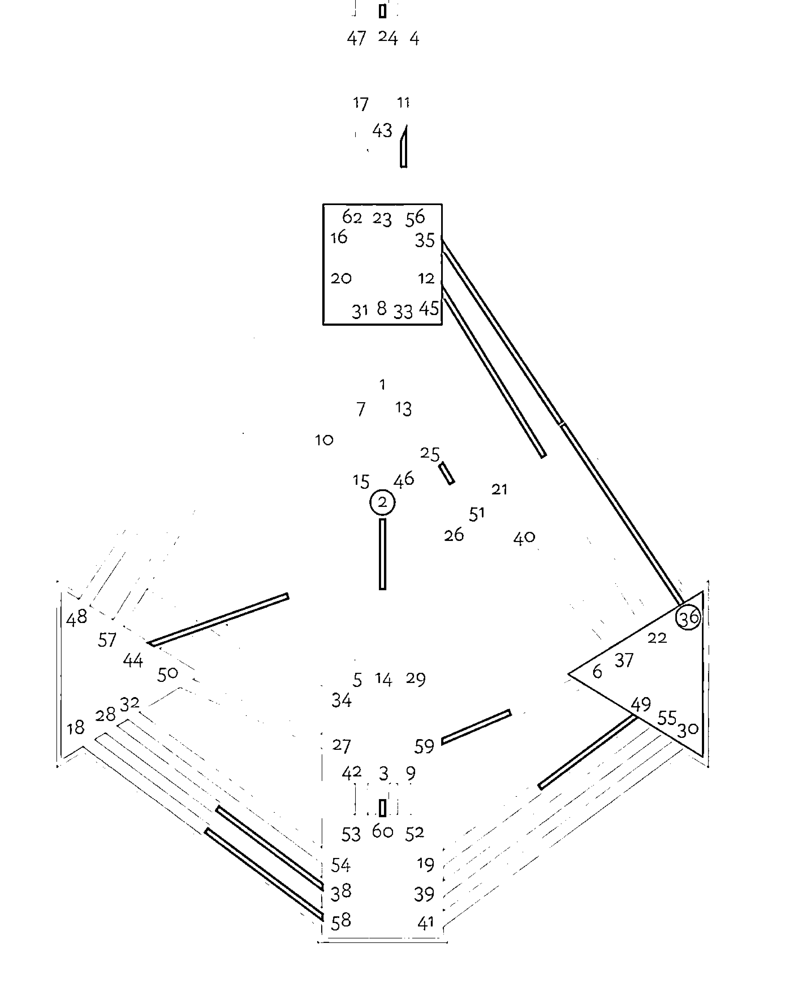

### 11.1 和調

在對的時間點、身處對的地方，因緣俱足的幸運。  

與相同目標與志向的人在一起，從中獲得滋養。找到看重你想法的人。  

♂  
恐懼默默無名。感到無人會重視他們的想法。  

## 和平  
嚴格  

2022/12/15 22:02 TWN  
農曆 11/22（四）

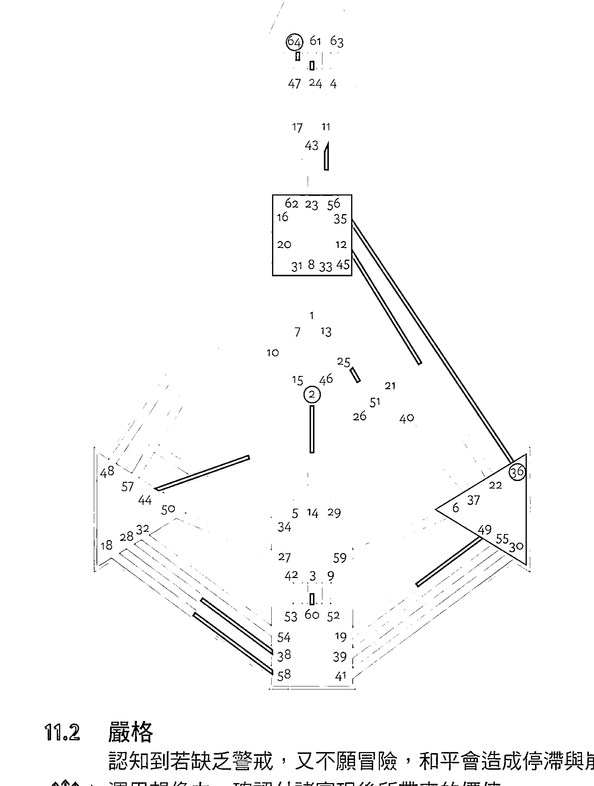

- 無常 35–36  
- 嚴格 11.2  
- 淨化 12.2  
- 信念 64.4 △  
- 挑惕 24.6  
- 超然 44.6  
- 調查 38.4  
- 調焦 58.4  
- 合作 35.3  
- 存在主義者 25.2  
- 民怨 49.3  
- 耐性 2.3 ▽  
- 抗拒 36.1  
- 接受 60.1  

### 11.2 嚴格

認知到若缺乏警戒，又不願冒險，和平會造成停滯與崩解。  

△ 運用想像力，確認計畫實現後所帶來的價值。運用想像力來克服無聊。  

▽ 訴諸激進之事，滿足自我渴望行動的需求。以想法來挑釁，才不會無聊。  

## 11.3 和平  
現實主義者  

35–36 無常  

- 日 11.3 現實主義者  
- 地 12.3 自白  
- 月 6.4 勝利  
- 北交 24.6 挑惕  
- 南交 44.6 超然  
- 水 38.5 疏離  
- 金 58.5 防禦  
- 火 35.2 創意空窗期  
- 木 25.2 存在主義者  
- 土 49.3 民怨  
- 天 2.3 耐性  
- 海 36.1 抗拒  
- 冥 60.1 接受  

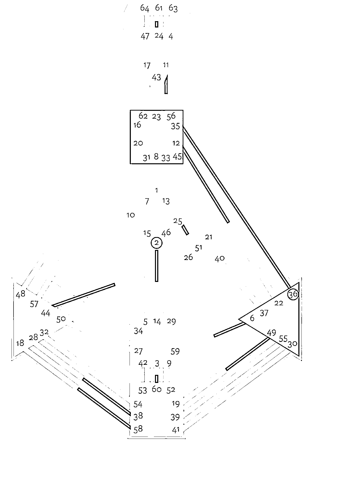

### 11.3 現實主義者

認知到和平有如曇花一現。  

- P △ 內在革新以維持力量與警覺。理解想法來來去去。  
- ♀ ▽ 重視問題的傾向，幾近妄想。相信美即是永恆。危急時刻卻無法分辨輕重緩急，只專注在無關緊要的事情上。  
- 從想法內獲取樂趣，無法實際運用。  

## 和平  
老師  

2022/12/17 18:16 TWN  
農曆 11/24（六）

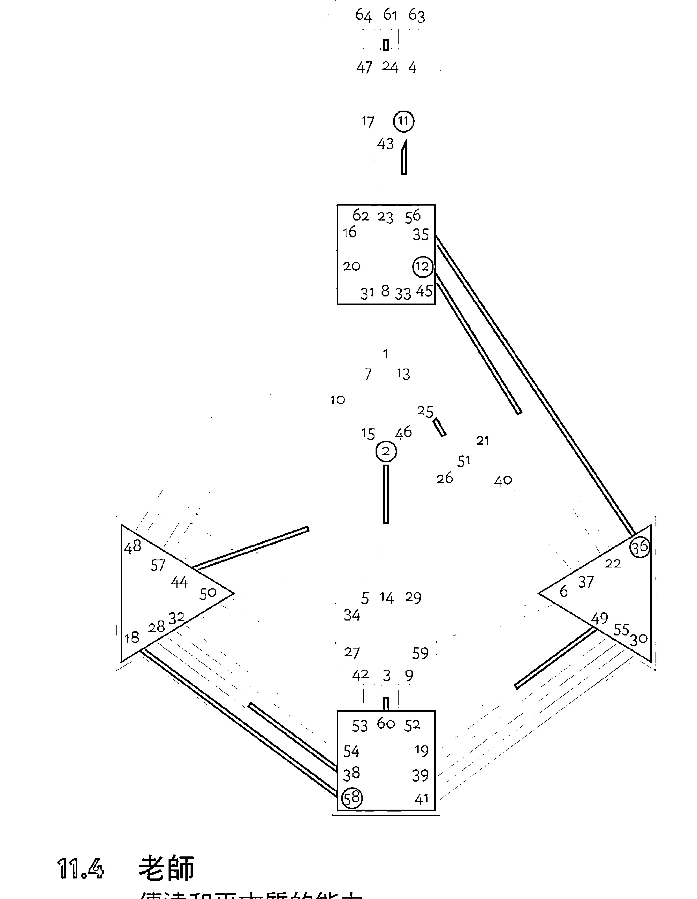

- 批評 18–58  
- 無常 35–36  
- 老師 11.4  
- 先知 12.4  
- 無能 18.4  
- 挑惕 24.6  
- 超然 44.6  
- 誤解 38.6  
- 忘形 58.6  
- 創意空窗期 35.2  
- 存在主義者 25.2  
- 民怨 49.3  
- 耐性 2.3  
- 抗拒 36.1  
- 接受 60.1  

## 11.4 老師

- 傳達和平本質的能力。  
- ☽ △ 智者：在極端的例子中，能教會對立律——該不通者如何和諧。  
- ♀ △ 金星同時也位於上升相位，有能力向外延伸，接觸特立獨行的人。  
- △ 無濟：易於傳達。他們有心可以吸引，並告知那些未受過教育的人。  
- ☉ ▽ 靈性上師，刻意地將其最有價值的智慧，只透露給少數人。只能被少數人理解的想法。  

## 和平  
慈善家  

- 日 11.5 慈善家  
- 地 12.5 實用主義者  
- 月 57.5 進展  
- 北交 24.6 挑惕  
- 南交 44.6 超然  
- 水 54.1 影響  
- 金 38.1 素質  
- 火 35.2 創意空窗期  
- 木 25.2 存在主義者  
- 土 49.3 民怨  
- 天 2.3 耐性  
- 海 36.1 抗拒  
- 冥 60.1 接受  

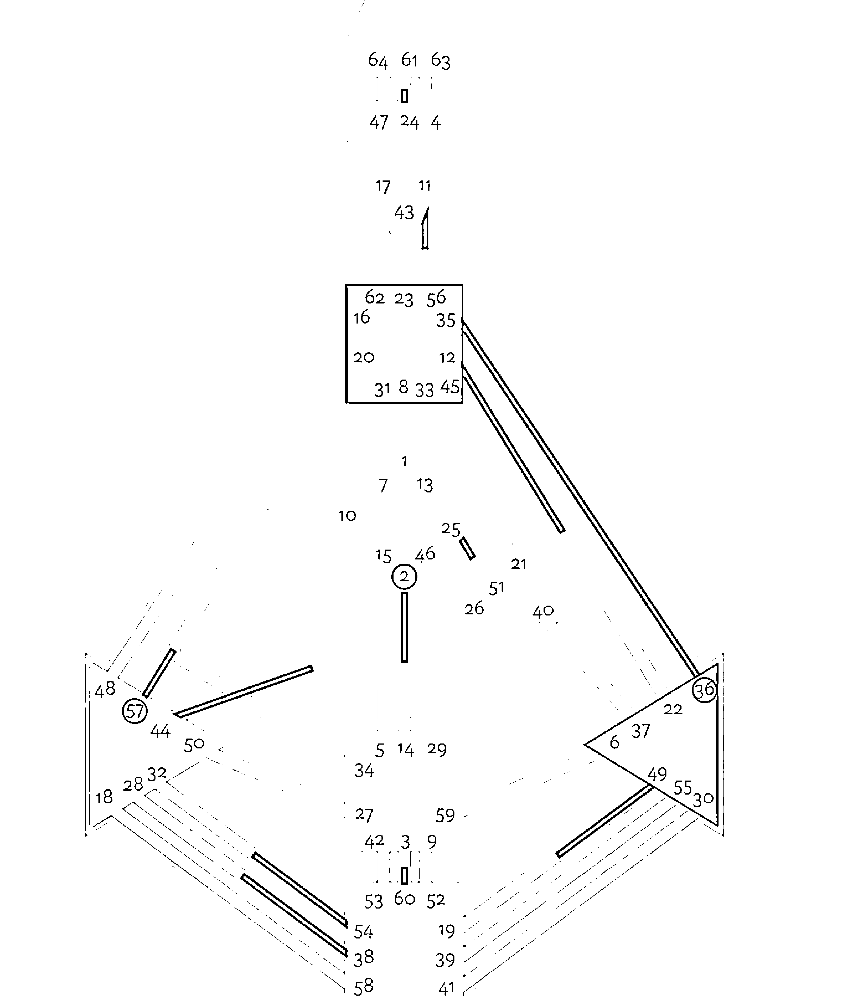

## 11.5 慈善家

☽ △ 不帶有任何目的，照顧被權威公權者以確保和諧。具有哲學性與人道精神的想法。  

☿ 抽離，避免直接接觸，給予只是防禦的形式。拋棄想法。  

## 和平  
適應力  

2022/12/19 14:29 TWN  
農曆 11/26（一）

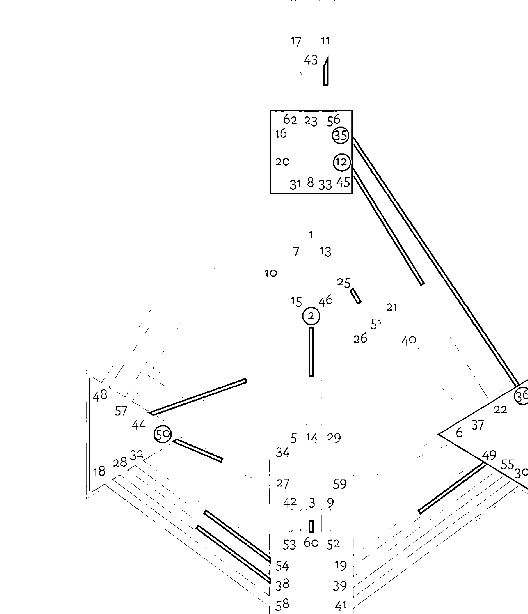

- 無常 35–36  
- 適應力 11.6  
- 質變 12.6  
- 領導力 50.6  
- 挑惕 24.6  
- 超然 44.6  
- 動用關係 54.3  
- 結盟 38.3  
- 謙遜 35.1  
- 存在主義者 25.2  
- 民怨 49.3  
- 耐性 2.3  
- 抗拒 36.1  
- 接受 60.1  

### 11.6 適應力

具備內在的平衡，接納過渡期。  

與生俱來的緊張力，接觸萬事萬物瞬息萬變。領悟到想法帶來改變，而想法本身也會改變。  

適應力最負面的展現，無論在和平或戰爭時期，投機者以犧牲他人的利益來獲利。不管在任何情況下，知道何謂有價值的想法。  

## 前進  
謙遜  

35–36 無常  

- 日 10.1 謙遜  
- 地 15.1 職責  
- 月 1.2 愛是光  
- 北交 24.6 挑釁  
- 南交 44.6 超然  
- 水 54.4 啟蒙／無明  
- 金 38.4 調查  
- 火 35.1 謙遜  
- 木 25.2 存在主義者  
- 土 49.3 民怨  
- 天 2.3 耐性  
- 海 36.1 抗拒  
- 冥 60.1 接受  

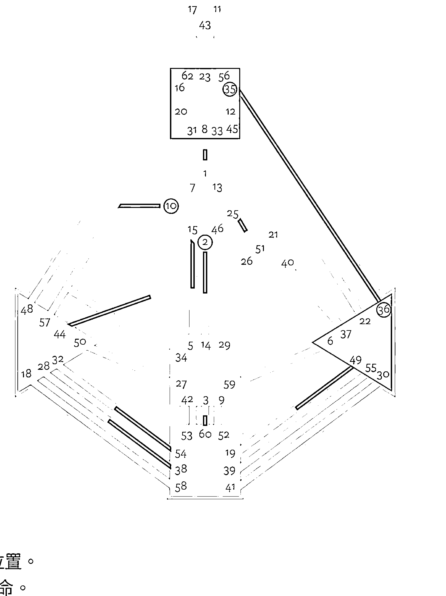

### 10.1 謙遜

內心很清楚，同時也接受自己的位置。  

- 不論處在什麼位置，皆看重其使命。  
- 不論環境因素如何，都清楚自己所處的位置，知道該如何應對。  
- 過於敏感而容易受傷，為此防衛。  
- 對來自於外在、行為層面的制約極敏感。  

## 前進  
隱士  

2022/12/21 10:40 TWN  
農曆 11/28（三）

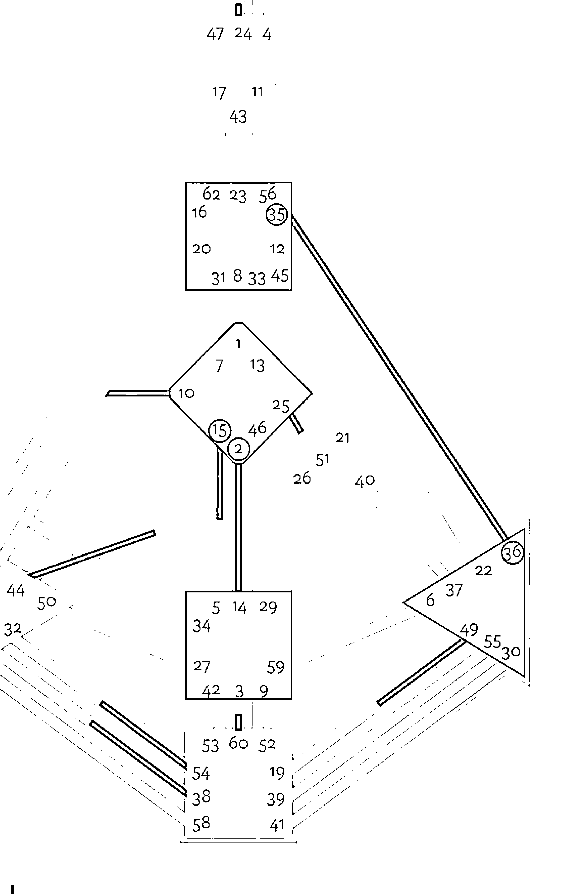

- 脈動 2–14  
- 無常 35–36  
- 隱士 10.2  
- 影響 15.2  
- 服務 14.3  
- 挑惕 24.6  
- 超然 44.6  
- 寬大 54.5  
- 疏離 38.5  
- 謙遜 35.1  
- 存在主義者 25.2  
- 民怨 49.3  
- 耐性 2.3  
- 抗拒 36.1  
- 果斷 60.2  

## 10.2 隱士

透過孤立，成功閃避特定的行為規範。  

水星位於上升相位，心智運作的方式，豐富獨處的品質。透過獨處而保有獨立的行為。  

憤怒的流亡者。面對制約，與世隔絕是為了保存獨立自主的行為。  

## 10.3 前進  
烈士  

農曆 11/29（四） 冬至  

- 日 10.3 烈士  
- 地 △15.3 自我膨脹  
- 月 △9.6 感激  
- 北交 24.6 挑惕  
- 南交 44.6 超然  
- 水 54.6 選擇性  
- 金 38.6 誤解  
- 火 16.6 輕信  
- 木 25.3 感性  
- 土 49.3 民怨  
- 天 ▽2.3 耐性  
- 海 36.1 抗拒  
- 冥 60.2 果斷  

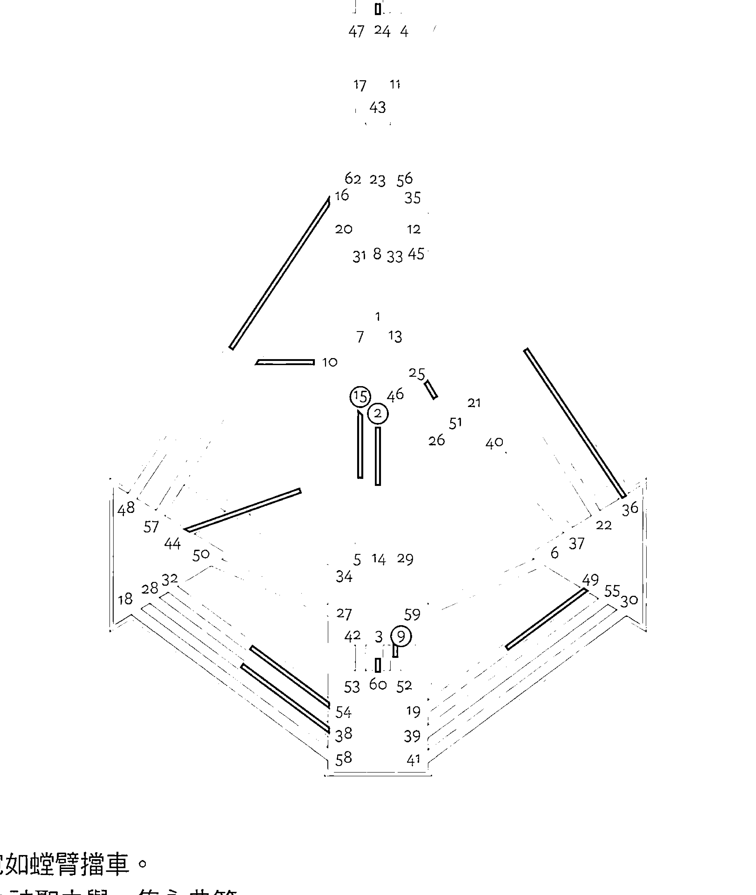

### 10.3 烈士

奮戰於公義，抵抗制度宛如螳臂擋車。  

- ⊕ 烈士，其行為最終被奉為神聖之舉，成為永恆典範。最終仍會被挑戰的行為。  
- ▽ 烈士情結。為了擴展自我、強化個人意識，積極追求殉道。行為是吸引注意力的方式。  

## 前進  
機會主義者  

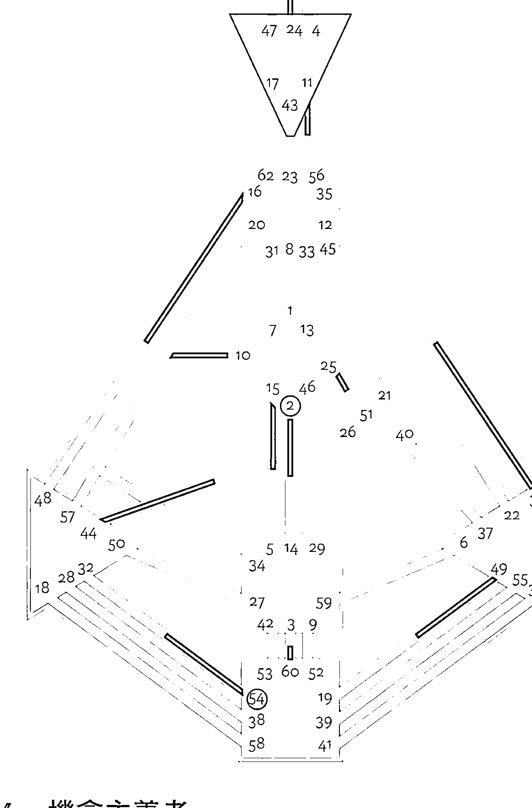

| 類型 | 數值 |
|---|---|
| 覺察 | 24.61 |
| 機會主義者 | 10.4 |
| 壁花 | 15.4 |
| 嚴格 | 11.2 |
| 挑惕 | 24.6 |
| 超然 | 44.6 |
| 奧秘知識 | 61.1 |
| 影響 | 54.1 |
| 輕信 | 16.6 |
| 感性 | 25.3 |
| 民怨 | 49.3 |
| 耐性 | 2.3 |
| 抗拒 | 36.1 |
| 果斷 | 60.2 |

## 10.4 機會主義者

直到成功蛻變轉型之後，才會接受規範。  

- 蛻變是為了躍進，跳到更高的規格。  
- 維持既定的行為模式，靜待對的時間點帶來蛻變的機會。  
- 將機會主義當成一場遊戲，頭腦的遊戲。  
- 為了充分利用機會，改變行為模式。  

## 10.5 前進  
異端者  

24–61 覺察  

- 日 10.5 異端者  
- 地 15.5 敏感性  
- 月 58.5 防禦  
- 北交 24.5 自白  
- 南交 44.5 操作  
- 水 61.2 天生耀眼  
- 金 54.3 動用關係  
- 火 16.6 輕信  
- 木 25.3 感性  
- 土 49.3 民怨  
- 天 2.3 耐性  
- 海 36.1 抗拒  
- 冥 60.2 果斷  

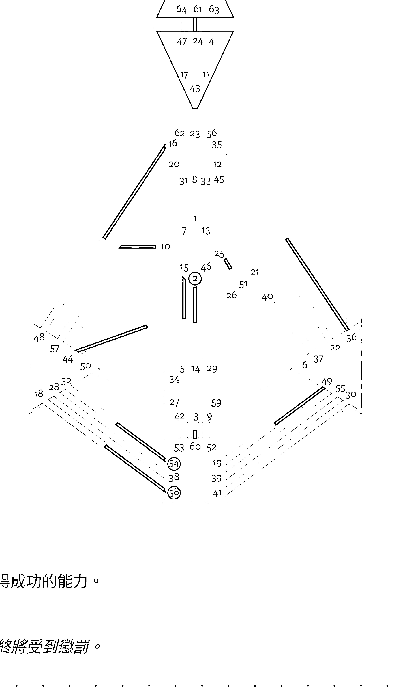

### 10.5 異端者

直接、公然挑戰規範。  

- 透過理解與傳達較高原則，獲得成功的能力。直接挑戰傳統的行為準則。  
- 火刑。直接以行為來挑戰其行為，最終將受到懲罰。  

## 前進  
人生典範  

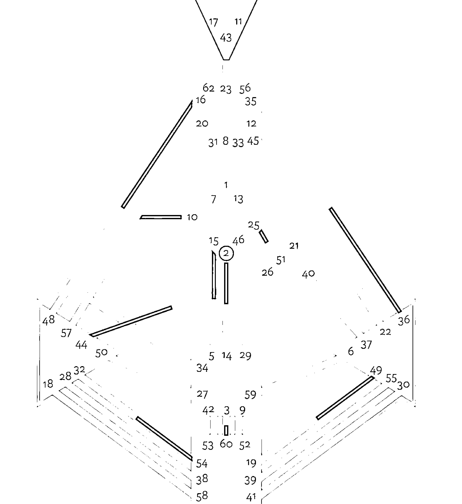

- 覺察 24–61  
- 人生典範 10.6  
- 自我防衛 15.6  
- 天生耀眼 61.2  
- 自由 24.5  
- 操作 44.5  
- 天生耀眼 61.2  
- 啟蒙／無明 54.4  
- 輕信 16.6  
- 感性 25.3  
- 平台 49.4  
- 耐性 2.3  
- 抗拒 36.1  
- 果斷 60.2  

## 10.6 人生典範

無須言語，身體力行才是展現準則最完美的方式。  

♇ △ 永遠的楷模，會透過重複把焦點放在維持一套行為模式的基本完整性，以此自滿。透過行動而非文字，來表達自我的永恆價值。  

♄ ▽ 偽君子。寧要別人去做，但自己並未行動。光說不練。  

## 58.1 喜悅  
生命之愛  

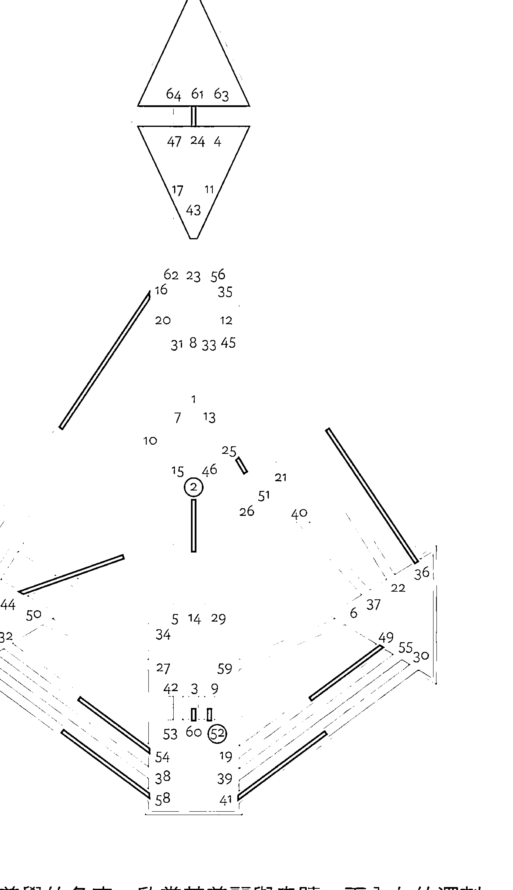

- 日 58.1 生命之愛  
- 地 52.1 先思而後言  
- 月 41.5 授權  
- 北交 24.5 自白  
- 南交 44.5 操作  
- 水 61.3 相互依存  
- 金 54.5 遠大  
- 火 16.5 聖歌怪傑  
- 木 25.3 感性  
- 土 49.4 平台  
- 天 2.3 耐性  
- 海 36.1 抗拒  
- 冥 60.2 果斷  

### 58.1 生命之愛

活在這個世界之中最特別的啟發，是基於美學的角度，欣賞其美麗與奇蹟。而內在的深刻領悟，不論獨自一人，或與他人分享，皆是在存在的過程中，充滿喜悅與和諧的關鍵。點燃生命之愛的能量。  

> 月亮有其盈缺，也有情緒，喜悅受限於此，而成為斷斷續續、周期性的體驗。周期性的能量，不定時點燃對生命的愛。  

## 喜悅  
變態 58.2  

- 覺察 24–61  
- 變態 58.2  
- 關心 52.2  
- 最終手段 49.2  
- 自由 24.5  
- 操作 44.5  
- 探究 61.4  
- 選擇性 54.6  
- 聖誕怪傑 16.5  
- 感性 25.3  
- 平台 49.4  
- 耐性 2.3  
- 抗拒 36.1  
- 果斷 60.2  

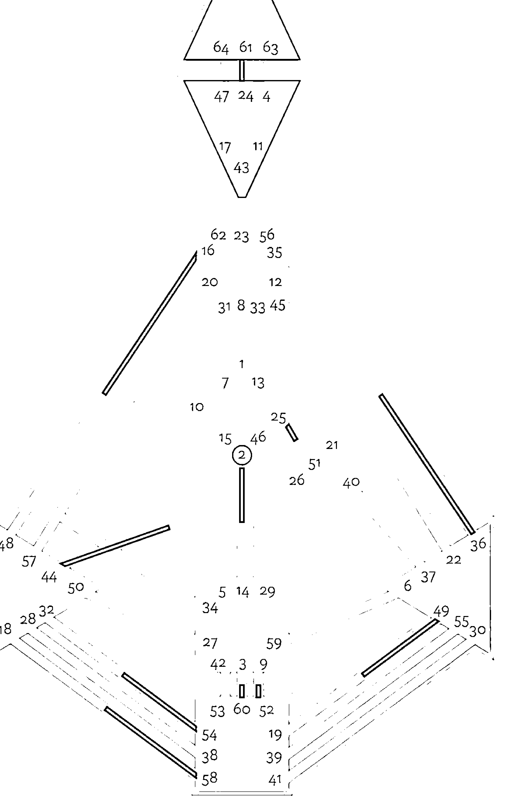

## 58.2 變態

△ 無極性，無上升相位。  

▽ 視變態為刺激的天才，引發墮落與腐敗。放縱頹廢，消減喜悅，折磨自己與他人。這股能量是驅動力，點燃變態的刺激。  

## 58.3 喜悅  
電流  

2022/12/27 21:14 TWN  
農曆 12/5（二）

- 24–61 覺察  
- 日 58.3 電流  
- 地 52.3 控制  
- 月 55.4 同化  
- 北交 24.5 自白  
- 南交 44.5 操作  
- 水 61.4 探究  
- 金 61.2 天生耀眼  
- 火 16.5 聖歌怪傑  
- 木 25.3 感性  
- 土 49.4 平台  
- 天 2.3 耐性  
- 海 36.1 抗拒  
- 冥 60.2 果斷  

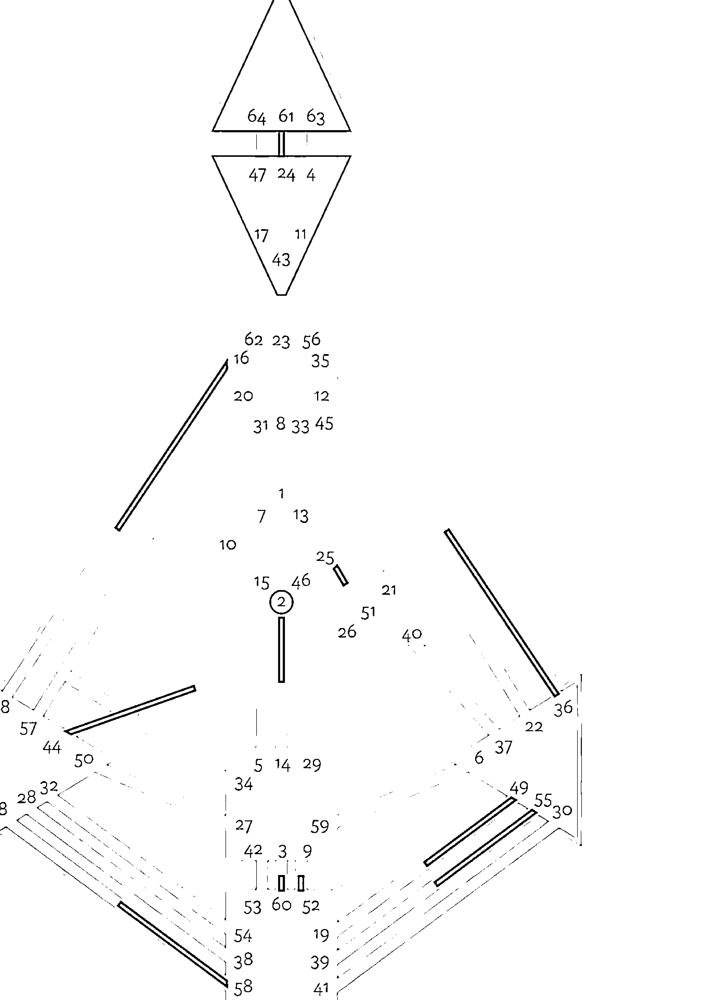

### 58.3 電流

充滿活力、電力十足的個體，能創造出激勵自己的獨特方式，無須外求。能量是為了點燃個人熱情。  

火如何燒，取決於燃料，無論好壞都受其影響。生氣蓬勃的能量，倚賴別人所帶來的引發。  

## 喜悅  
調焦 58.4  

- 覺察 24–61  
- 調焦 58.4  
- 自律 52.4  
- 懷舊之情 63.6  
- 自由 24.5  
- 操作 44.5  
- 探究 61.4  
- 相互依存 61.3  
- 聖誕怪傑 16.5  
- 感性 25.3  
- 平台 49.4  
- 耐性 2.3  
- 抗拒 36.1  
- 果斷 60.2  

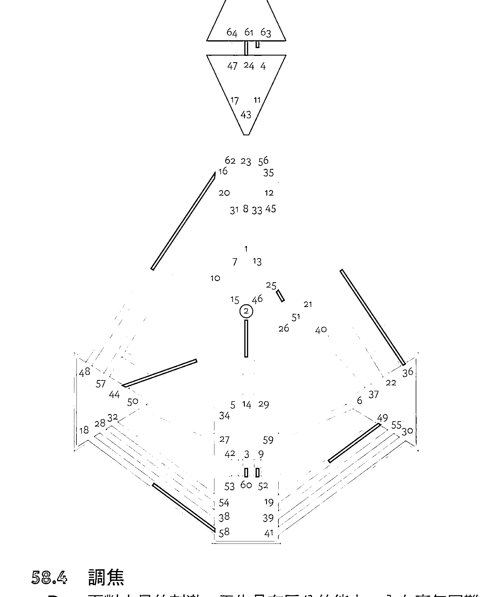

### 58.4 調焦

P ▲ 面對大量的刺激，天生具有區分的能力，內在毫無困難，能聚焦於適當的元素上，散發影響力。  

過濾注意力；強化辨識力，區分出有價值的刺激。  

♆ ▼ 面對多重刺激時，由敏感轉為困惑，試圖適應全部，卻導致不穩定的狀態。過度刺激會讓能量不穩定。  

## 58.5 喜悅  
防禦  

2022/12/29 17:23 TWN  
農曆 12/7（四）

- 日 ▽58.5 防禦  
- 地 △52.5 解釋  
- 月 25.2 存在主義者  
- 北交 24.5 自白  
- 南交 44.5 操作  
- 水 61.4 探究  
- 金 61.4 探究  
- 火 16.5 聖歌怪傑  
- 木 25.3 感性  
- 土 49.4 平台  
- 天 ▽2.3 耐性  
- 海 36.1 抗拒  
- 冥 60.2 果斷  

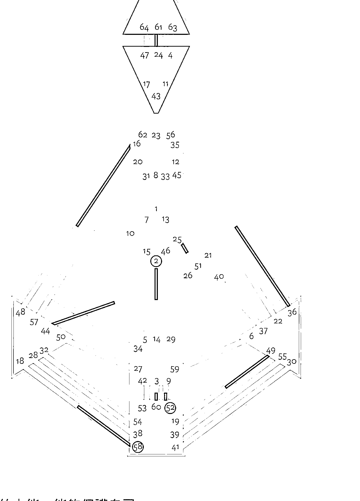

## 58.5 防禦

- △ 無意誘惑，具備天生自然且務實的本能，能夠保護自己。就算外在多刺激，仍具備自我防衛的原動力。  
- ▽ 認定最好的防守就是進攻，發揮骨子裡堅毅不屈服的性格。就算刺激本身帶有爭議，都能充分駕馭並終結在其中。充滿活力的能量，放下自我防衛，開放擁抱充滿不確定的刺激。  

## 喜悅  
志形 58.6  

2022/12/30 15:28 TWN  
農曆 12/8（五）

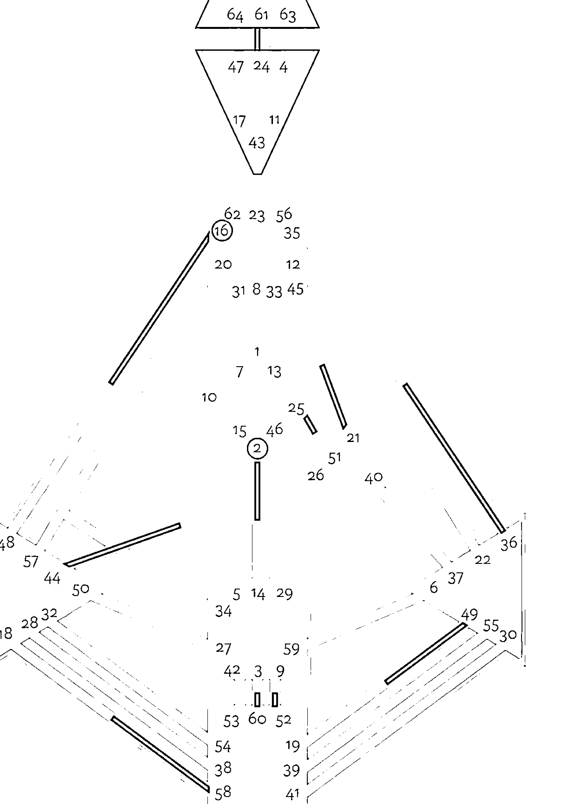

- 覺察 24–61  
- 志形 58.6  
- 平和 52.6  
- 無力 21.3  
- 自白 24.5  
- 操作 44.5  
- 探究 61.4  
- 影響 61.5  
- 領導者 16.4  
- 感性 25.3  
- 平台 49.4  
- 耐性 2.3  
- 抗拒 36.1  
- 果斷 60.2  

## 58.6 志形

實用性的傾向，雖然能夠全然享受外來的刺激，但若對自身的誠信造成威脅，將依循其本能而撤退。  

強化個人操守的能量，尤其是面對衝擊時，更能堅守其身分與定位。  

豐富的聰明才智，有效被激發出來，自然會渴望步向和諧，但這也容易對外來的刺激生出強烈的認同，而陷入失去自我定位的風險。  

面對刺激時，引發自我認同混濁的能量。  

## 38.1 對抗  
素質  

2022/12/31 13:33 TWN  
農曆 12/9（六）

- 日 38.1 素質  
- 地 39.1 脫離  
- 月 △42.4 中間人  
- 北交 24.5 自白  
- 南交 44.5 操作  
- 水 61.4 探究  
- 金 △60.1 接受  
- 火 ▽16.4 領導者  
- 木 △25.4 生存  
- 土 49.4 平台  
- 天 ▽2.3 耐性  
- 海 36.1 抗拒  
- 冥 60.2 果斷  

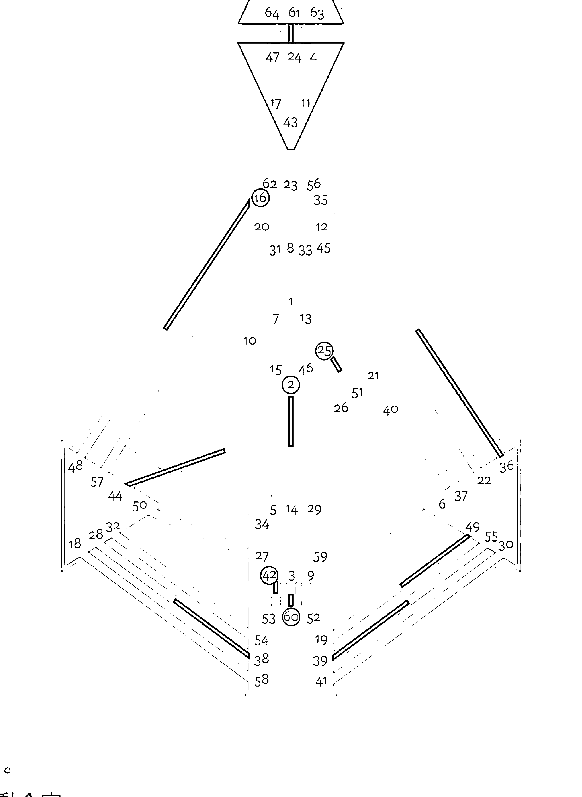

### 38.1 素質

基本情勢，決定對抗的強度。  

與超自然力量合頻，確保行動合宜。有如通靈般的天賦，知曉何時該警覺，以及如何奮戰。  

傾向對抗，將反對視為通則。警覺是理所當然的準則。  

## 對抗 38.2  
彬彬有禮  

2023/01/01 11:37 TWN  
農曆 12/10（日）

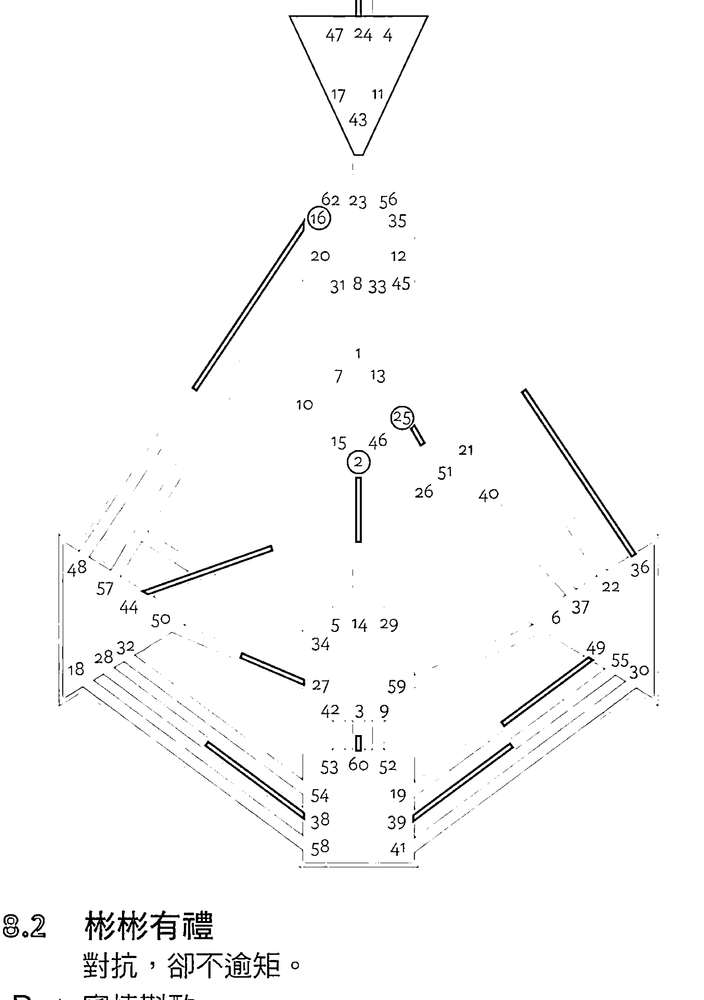

- 覺察 24–61  
- 彬彬有禮 38.2  
- 對抗 39.2  
- 懷疑 27.4  
- 自白 24.5  
- 操作 44.5  
- 探究 61.4  
- 果斷 60.2  
- 領導者 16.4  
- 生存 25.4  
- 平台 49.4  
- 耐性 2.3  
- 抗拒 36.1  
- 果斷 60.2  

### 38.2 彬彬有禮

對抗，卻不逾矩。  

♇ △ 奮戰與鬥。來自直覺的本能，謹慎以對。  

☽ ▽ 過度隱藏，卑躬屈膝且明顯流於表面，違背了本意。以嚴守禮數的形式，與之對抗。  

## 38.3 對抗  
結盟  

- 24–61 覺察  
- 日 △38.3 結盟  
- 地 ▽39.3 責任  
- 月 2.5 靈活應用  
- 北交 24.5 自白  
- 南交 44.5 操作  
- 水 61.3 相互依存  
- 金 60.3 保守主義  
- 火 ▽16.4 領導者  
- 木 △25.4 生存  
- 土 49.4 平台  
- 天 ▽2.3 耐性  
- 海 36.1 抗拒  
- 冥 60.2 果斷  

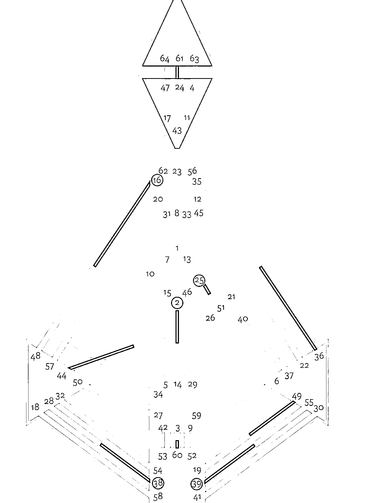

### 38.3 結盟

- △ 能整合志同道合的力量，延續不屈不撓的生命力。整合他人，共同奮戰。  
- ▽ 基於自私而結盟，為保有自身的實力，不惜耗損夥伴的力量。暫時的非常時期，自私的能量，為了利用他人。  

## 對抗  
38.4  

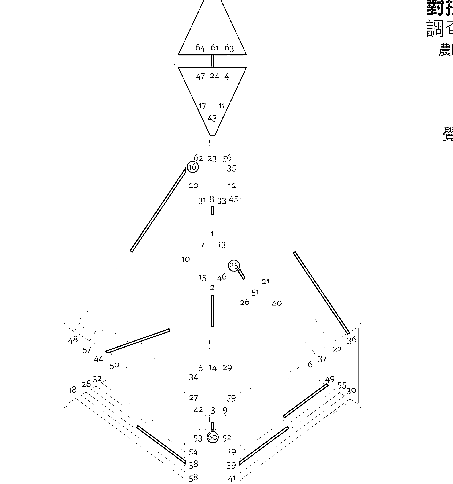

- 覺察 24–61  
- 調查 38.4  
- 節制 39.4  
- 達摩 8.5  
- 自白 24.5  
- 操作 44.5  
- 天生耀眼 61.2  
- 足智多謀 60.4  
- 領導者 16.4  
- 生存 25.4  
- 平台 49.4  
- 天才 2.2  
- 抗拒 36.1  
- 果斷 60.2  

### 38.4 調查

分析，只是為了強化對立。  

若信任的基礎穩固，就像偵探在調查，或當局者加入反對陣營。面對荒謬的局面，足以辨識出每個人的價值。  

激烈反對，對調查結果充滿偏見，可信度驟降。  
腎上腺素引發侵略性。

## 38.5 對抗  
疏離  

2023/01/04 05:52 TWN  
農曆 12/13（三）

- 日 38.5 疏離  
- 地 39.5 專心致志  
- 月 ▽16.5 聖誕怪傑  
- 北交 24.5 自白  
- 南交 44.5 操作  
- 水 61.1 奧祕知識  
- 金 60.5 領導力  
- 火 ▽16.4 領導者  
- 木 △25.4 生存  
- 土 49.5 組織  
- 天 2.2 天才  
- 海 36.1 抗拒  
- 冥 60.2 果斷  

38.5 疏離  
獨力對抗，孤身對決。

> △ 充滿野心與抱負，持久到底。  
頑固，或魯莽蠻幹，也在所不惜。

> ▽ 疏離的態勢，如痛苦的分娩。基本本性就算曾經有人伸出援手，也如眼盲般看不見。  
非常固執，身處掙扎抗爭之中，看不見有誰會給予援助。

---

## 對抗  
誤解 38.6  

2023/01/05 03:57 TWN  
農曆 12/14（四）小寒

- 誤解 38.6  
- 解決麻煩者 39.6  
- 領導力 45.5  
- 自由 24.5  
- 操作 44.5  
- 選擇性 54.6  
- 合理 41.1  
- 獨立 16.3  
- 生存 25.4  
- 組織 49.5  
- 天才 2.2  
- 抗拒 36.1  
- 果斷 60.2  

### 38.6 誤解  
毫無根據的反對。

當水落石出，誤解就會澄清。  
引來誤解，面對反對的聲浪，面面以對。

明白反對是來自誤解，卻堅持是對方誤解。  
因為誤解而掙扎反抗，卻頑固地苦守立場，繼續堅持下去。

---

## 少女出嫁

- 日 54.1 影響  
- 地 53.1 累積  
- 月 15.4 壁花  
- 北交 24.5 自白  
- 南交 44.5 操作  
- 水 △54.5 寬大  
- 金 41.2 謹慎  
- 火 ▽16.3 獨立  
- 木 △25.4 生存  
- 土 49.5 組織  
- 天 2.2 天才  
- 海 36.1 抗拒  
- 冥 60.2 果斷  

### 54.1 影響

P △ 透過各種祕密管道，從私家偵探到撒旦，都能散發影響力。野心勃勃，經由祕密的人際網絡擴張影響力。

♀ ▽ 誤判，堅持將關係公開，削弱影響力。野心暴露，要求正式承認關係，影響力因而受限。

---

## 少女出嫁  
謹慎  

2023/01/07 00:07 TWN  
農曆 12/16（六）

- 謹慎 54.2  
- 氣勢 53.2  
- 節制 39.4  
- 隱士 24.4  
- 誠實 44.4  
- 啟蒙／無明 54.4  
- 效率 41.3  
- 獨立 16.3  
- 生存 25.4  
- 組織 49.5  
- 天才 2.2  
- 抗拒 36.1  
- 果斷 60.2  

### 54.2 謹慎

♄ △ 深具智慧，清楚關係曝光後，無法沿用既定的互利模式。  
克制激進的野心。

♂ ▽ 獲得正式認可之後，利用之前私下互動時所獲得的資訊，從中獲利。缺乏忠誠。  
野心勃勃的能量，毫無疑問。

---

## 少女出嫁  
動用關係  

2023/01/07 22:12 TWN  
農曆 12/16（六）

- 日 54.3 動用關係  
- 地 53.3 實際  
- 月 62.4 苦行主義  
- 北交 24.4 隱士  
- 南交 44.4 誠實  
- 水 54.2 謹慎  
- 金 ▽41.4 修正  
- 火 ▽16.3 獨立  
- 木 ▽25.5 休養  
- 土 49.5 組織  
- 天 2.2 天才  
- 海 36.1 抗拒  
- 冥 60.2 果斷  

### 54.3 動用關係

P △ 若無法經由正式管道晉升，將孤注一擲，運用祕密或非正式管道，得償宿願。即使受阻，依然充滿野心，轉由祕密手段來推動，動力十足。

♀ ▽ 堅持經由正式管道來解決，不管遭遇多少挫折，皆以吸引力來克服。若野心受阻，就會散發吸引力，克服途中障礙。

---

## 少女出嫁  
啟蒙／無明  

### 54.4

- 啟蒙／無明 54.4  
- 確保 53.4  
- 選擇性 31.3  
- 隱士 24.4  
- 誠實 44.4  
- 影響 54.1  
- 感染 41.6  
- 獨立 16.3  
- 休養 25.5  
- 組織 49.5  
- 天才 2.2  
- 抗拒 36.1  
- 果斷 60.2  

### 54.4 啟蒙／無明

極端的相位，無上升也無下降，因為兩者並無不同。Alpha 與 Omega，開始與結束，無法說明。每個星星皆以獨特的方式閃燦，以各自的方式彰顯能量。無人知道努力能否被看見，而潛力始終蘊藏其中。無庸置疑，純然引發蛻變，無極性，無特定行星帶來影響。

---

## 54.5 少女出嫁  

2023/01/09 18:22 TWN  
農曆 12/18（一）

19–49 整合綜效

- 日 ▲54.5 寬大  
- 地 ▼53.5 主張  
- 月 ▲7.3 無政府主義者  
- 北交 24.4 隱士  
- 南交 44.4 誠實  
- 水 38.6 誤解  
- 金 19.1 相互依存  
- 火 ▼16.3 獨立  
- 木 ▼25.5 休養  
- 土 49.5 組織  
- 天 2.2 天才  
- 海 36.1 抗拒  
- 冥 60.2 果斷  

### 54.5 寬大

> 天生的權威，落實的靈魂，手握權力，卻能真誠地與弱勢建立豐盛的關係（若他們只為了貢獻服務，除此之外別無所求）。能量膨脹實踐，同時擁有豐盛的人際關係。

- 無極性  
- 無下降相位

---

## 少女出嫁  
選擇性  

### 54.6

- 整合綜效 19–49  
- 選擇性 54.6  
- 逐步進行 53.6  
- 評估 29.3  
- 隱士 24.4  
- 誠實 44.4  
- 疏離 38.5  
- 服務 19.2  
- 獨立 16.3  
- 休養 25.5  
- 組織 49.5  
- 天才 2.2  
- 抗拒 36.1  
- 果斷 60.2  

### 54.6 選擇性

h △ 根深柢固的責任，為維護安全與個人定位，自然而然對關係設限，僅與互利的對象往來。若關係網絡對其野心造成阻礙，在能量上會形成限制。

j ▼ 大致來說，善良與開朗的本性，認為自己能補足合作夥伴的缺失。浪費精神保有心懷不軌的人際網絡，是浪費能量的行為。

---

## 內在真理  
奧祕知識

- 19–49 整合綜效  
- 24–61 覺察  

- 日 61.1 奧祕知識  
- 地 62.1 例行程序  
- 月 ▽40.2 堅定  
- 北交 24.3 上癮者  
- 南交 44.3 干預  
- 水 38.3 結盟  
- 金 △19.3 奉獻  
- 火 ▽16.3 獨立  
- 木 ▽25.5 休養  
- 土 49.5 組織  
- 天 2.2 天才  
- 海 36.1 抗拒  
- 冥 60.2 果斷  

### 61.1 奧祕知識

- 天生的通靈能力，強化普世原則。  
  - 內在渴望經由祕徑之道，知曉奧祕。  

- 仰賴神祕知識，要求抽離些許行動；最後終究隔離難明。  
  - 渴望知曉奧祕帶來極大壓力，最後無法應付現實的世界。

---

## 內在真理  
天生耀眼  

2023/01/12 12:38 TWN  
農曆 12/21（四）

- 整合綜效 19–49  
- 覺察 24–61  
- 天生耀眼 61.2  
- 抑制 62.2  
- 野心 47.2  
- 上癮者 24.3  
- 干預 44.3  
- 彬彬有禮 38.2  
- 犧牲 19.5  
- 獨立 16.3  
- 休養 25.5  
- 吸引力 49.6  
- 天才 2.2  
- 抗拒 36.1  
- 果斷 60.2  

### 61.2 天生耀眼

> 月亮上升，才華洋溢，影響力無遠弗屆，帶來滋養。無須任何花招，就能散發強大吸引力。超強吸引的天賦，散發吸引力的同時，也利益眾生。

> 太早發現自己的影響力，流於浮誇而自戀。充滿幻想，認為任何啟發都值得肯定。

---

## 內在真理  
相互依存

- 19–49 整合綜效  
- 24–61 覺察  

- 日 61.3 相互依存  
- 地 62.3 探索  
- 月 46.2 自命不凡  
- 北交 24.3 上癮者  
- 南交 44.3 干預  
- 水 38.1 素質  
- 金 19.6 遁世者  
- 火 16.3 獨立  
- 木 25.5 休養  
- 土 49.6 吸引力  
- 天 2.2 天才  
- 海 36.1 抗拒  
- 冥 60.2 果斷  

### 61.3 相互依存

真理若無人能懂，極為困難。

- 為求真理得以實現，具備建立關係的能力，以滋養與保護的力量建構出穩定的環境，從中持續成長。  
- 經由合作，求知的壓力更為迫切。

- 豐沛的能量，確實掌握真理，傾向將他人拋諸腦後，或者被抗拒、被排擠。  
- 對他人缺乏耐心，放棄繼續經營這段關係。

---

## 內在真理  
探究  

2023/01/14 08:48 TWN  
農曆 12/23（六）

- 波長 16–48  
- 覺察 24–61  
- 探究 61.4  
- 苦行主義 62.4  
- 退化 48.2  
- 上癮者 24.3  
- 干預 44.3  
- 素質 38.1  
- 同理 13.1  
- 獨立 16.3  
- 無知 25.6  
- 吸引力 49.6  
- 天才 2.2  
- 抗拒 36.1  
- 果斷 60.2  

### 61.4 探究

專注的能力，深入探究內在的真理，盡可能運用在基本準則上。  
壓力來自於求知若渴，想知道基本準則。

渴求擴展與整合，將他人納入研究的範疇，最終衍生出各種運用方式，引發混亂。  
以為與人合作能帶來靈感，其實只是幻覺。

---

## 內在真理  
影響  

農曆 12/24（日）

- 覺察 24–61  
- 日 61.5 影響  
- 地 62.5 質變  
- 月 32.3 缺乏連續性  
- 北交 24.3 上癮者  
- 南交 44.3 干預  
- 水 58.6 忘形  
- 金 13.2 偏執  
- 火 16.3 獨立  
- 木 25.6 無知  
- 土 49.6 吸引力  
- 天 2.2 天才  
- 海 36.1 抗拒  
- 冥 60.2 果斷  

### 61.5 影響

開明的父親，具有公認的智慧，運用影響力，足以形塑整個世代。求知的渴望帶來壓力，也因而造就智慧與影響力。

掌權的傾向，強制眾人遵從，確保獲得長久的影響力。伴隨覺知而來的壓力，對挑戰心懷憤恨，要求全盤接受。

---

## 內在真理  
感染力  

2023/01/16 04:59 TWN  
農曆 12/25（一）

- 覺察 24–61  
- 感染力 61.6  
- 自律 62.6  
- 冒險主義 28.3  
- 上癮者 24.3  
- 干預 44.3  
- 忘形 58.6  
- 悲觀主義 13.3  
- 獨立 16.3  
- 無知 25.6  
- 吸引力 49.6  
- 天才 2.2  
- 抗拒 36.1  
- 果斷 60.2  

### 61.6 感染力

P △ 點化群眾，意義深遠，引領眾人走向真理。  
啟迪眾人，為群體帶來清明。

♂ ▽ 憑藉陳腔濫調與口號，對他們的同溫層來說或許很新鮮，但是群眾卻充耳不聞。  
妄想能啟迪眾人，帶來清明。

---

## 限制  
接受

- 日 60.1 接受  
- 地 56.1 質量  
- 月 1.5 吸引社會大眾的能量  
- 北交 24.3 上癮者  
- 南交 44.3 干預  
- 水 58.5 防禦  
- 金 13.5 救世主  
- 火 16.3 獨立  
- 木 25.6 無知  
- 土 49.6 吸引力  
- 天 2.2 天才  
- 海 36.1 抗拒  
- 冥 60.2 果斷  

### 60.1 接受

♀ △ 面對外界限制的衝擊，保有內在和諧的能力。以和諧的能量來處理外來的種種限制。

☿ × 處處受限，渴望追求多樣化的驅動力，令人焦躁不安及激動。面對外在限制，產生焦躁的能量。

---

## 限制  
果斷 60.2  

2023/01/18 01:10 TWN  
農曆 12/27（三）

- 脈動 2–14  
- 果斷 60.2  
- 連結 56.2  
- 謙遜 14.6  
- 上癮者 24.3  
- 干預 44.3  
- 防禦 58.5  
- 樂天派 13.6  
- 獨立 16.3  
- 無知 25.6  
- 吸引力 49.6  
- 天才 2.2  
- 抗拒 36.1  
- 果斷 60.2  

### 60.2 果斷

▲ 在理解限制的本質後，必要時能接受約束；當機會來臨，能及時把握。  
帶有適應限制的能量。

⊕ ▼ 在限制下屈服已成習慣，當限制消失，依舊延續既定的習性。  
能量用於適應，反倒成為桎梏，最終未能蛻變。

---

## 60.3 限制  
保守主義

- 日 60.3 保守主義  
- 地 56.3 疏離  
- 月 5.2 內在的和平  
- 北交 24.3 上癮者  
- 南交 44.3 干預  
- 水 58.5 防禦  
- 金 49.1 必要性法則  
- 火 16.3 獨立  
- 木 25.6 無知  
- 土 49.6 吸引力  
- 天 2.2 天才  
- 海 36.1 抗拒  
- 冥 60.2 果斷  

### 60.3 保守主義

在人格之後明白唯有利己，才能處理諸多束縛與限制，確保自我定位與安全。儘管面對限制，還是能保有自我定位與安全。

為了滿足我執，面對限制視而不見，可預見將為此受苦。面對限制選擇忽略，將為此付出代價。

---

## 限制  
足智多謀

- 好奇 11–56  
- 足智多謀 60.4  
- 權宜 56.4  
- 老師 11.4  
- 上癮者 24.3  
- 干預 44.3  
- 防禦 58.5  
- 最終手段 49.2  
- 獨立 16.3  
- 無知 25.6  
- 吸引力 49.6  
- 天才 2.2  
- 抗拒 36.1  
- 保守主義 60.3  

### 60.4 足智多謀

在有限的框架內，保有理性，並且將聰明才智極大化。  
在限制內，將潛力極大化。

面對諸多限制，反而去尋求框架存在的意義，而非常運用天賦，找出限制之下的變通方式。  
不願接受限制，反倒為了理解而耗損能量，失去突變的可能，抑鬱而終。

---

## 60.5 限制  
領導力  

2023/01/20 19:27 TWN  
農曆 12/29（五）大寒

- 日 60.5 領導力  
- 地 56.5 吸引注意力  
- 月 38.1 素質  
- 北交 24.3 上癮者  
- 南交 44.3 干預  
- 水 58.5 防禦  
- 金 49.4 平台  
- 火 ▽16.3 獨立  
- 木 17.1 開放  
- 土 30.1 沉著  
- 天 2.2 天才  
- 海 36.1 抗拒  
- 冥 60.3 保守主義  

### 60.5 領導力

♆ △ 察覺到拆解既定限制的同時，也創造出全新的限制。有能力在人生中掌握並處理限制，完整經歷這一切。

♃ ▽ 天生渴望向外擴展，然而限制有其必要性，否則一開始就會衝往困惑。向外擴張的能量，無法處理各種限制。

---

## 限制  
剛硬  

農曆 12/30（六）

### 60.6

- 覺察 24–61  
- 剛硬 60.6  
- 謹慎 56.6  
- 探究 61.4  
- 上癮者 24.3  
- 干預 44.3  
- 忘形 58.6  
- 組織 49.5  
- 領導者 16.4  
- 開放 17.1  
- 沉著 30.1  
- 天才 2.2  
- 抗拒 36.1  
- 保守主義 60.3  

### 60.6 剛硬

△ 聰明的直覺足以辨識出何時該強硬、堅持到底，但若能搭配創新的做法，就能減輕嚴峻的程度。  
一般穩定的能量，具有不尋常的約束力。

▽ 以教條、有原則的方式，加上缺乏合理的理解，嚴謹的程度不容置疑。在執行與運作層面冷酷嚴峻，面對限制秉持嚴苛的態度，毫不妥協。  
以嚴苛的態度接受限制，但絕不妥協；面對限制感到無法忍受，導致長期憂鬱。

---

## 減少  
合理

19–49 整合綜效  
30–41 競想家

- 日 41.1 合理  
- 地 31.1 顯化  
- 月 19.1 相互依存  
- 北交 24.2 認可  
- 南交 44.2 管理  
- 水 58.6 忘形  
- 金 49.6 吸引力  
- 火 16.4 領導者  
- 木 17.1 開放  
- 土 30.1 沉著  
- 天 2.2 天才  
- 海 36.1 抗拒  
- 冥 60.3 保守主義  

### 41.1 合理

分層富貴，合理授權。  
將最少化為最好的想像力。

冷靜，選擇性地釋放情感的能量。  
基於理解而接手承擔，導致勞損。  

一頭熱，衝動之下投注情感。

## 輪迴交叉索引

| 門 | 交 | 關鍵字 | 幾何軌跡 | 個性-設計 |
|---|---|---|---|---|
| 1 | 1,2,3,4 | 人面獅身(4) | 右角度 | 1\|2–7\|13 |
| 1 | 4 | 自我表達 | 並列 | 1\|2–4\|49 |
| 1 | 5,6 | 挑戰(2) | 左角度 | 1\|2–4\|49 |
| 2 | 1,2,3,4 | 人面獅身(2) | 右角度 | 2\|1–13\|7 |
| 2 | 4 | 駕馭 | 並列 | 2\|1–49\|4 |
| 2 | 5,6 | 挑戰 | 左角度 | 2\|1–49\|4 |
| 3 | 1,2,3,4 | 律法 | 右角度 | 3\|50–60\|56 |
| 3 | 4 | 突變 | 並列 | 3\|50–41\|31 |
| 3 | 5,6 | 希望 | 左角度 | 3\|50–41\|31 |
| 4 | 1,2,3,4 | 解釋(3) | 右角度 | 4\|49–23\|43 |
| 4 | 4 | 公式化 | 並列 | 4\|49–8\|14 |
| 4 | 5,6 | 革命(2) | 左角度 | 4\|49–8\|14 |
| 5 | 1,2,3,4 | 意識(4) | 右角度 | 5\|35–64\|63 |
| 5 | 4 | 習慣 | 並列 | 5\|35–47\|22 |
| 5 | 5,6 | 分離(2) | 左角度 | 5\|35–47\|22 |
| 6 | 1,2,3,4 | 伊甸園(3) | 右角度 | 6\|36–12\|11 |
| 6 | 4 | 衝突 | 並列 | 6\|36–15\|10 |
| 6 | 5,6 | 飛機(2) | 左角度 | 6\|36–15\|10 |
| 7 | 1,2,3,4 | 人面獅身(3) | 右角度 | 7\|13–2\|1 |
| 7 | 4 | 互相影響 | 並列 | 7\|13–23\|43 |
| 7 | 5,6 | 面具(2) | 左角度 | 7\|13–23\|43 |
| 8 | 1,2,3,4 | 傳染(2) | 右角度 | 8\|14–30\|29 |
| 8 | 4 | 貢獻 | 並列 | 8\|14–55\|59 |
| 8 | 5,6 | 不確定(2) | 左角度 | 8\|14–55\|59 |
| 9 | 1,2,3,4 | 計畫(4) | 右角度 | 9\|16–40\|37 |
| 9 | 4 | 聚焦 | 並列 | 9\|16–64\|63 |
| 9 | 5,6 | 指認(2) | 左角度 | 9\|16–64\|63 |
| 10 | 1,2,3,4 | 愛之船(4) | 右角度 | 10\|15–46\|25 |
| 10 | 4 | 行為 | 並列 | 10\|15–18\|17 |
| 10 | 5,6 | 預防(2) | 左角度 | 10\|15–18\|17 |

| 開門（卦） | 爻 | 關鍵字 | 幾何軌跡 | 個性-設計 |
|---|---|---|---|---|
| 11 | 1,2,3,4 | 伊甸園(4) | 右角度 | 11\|12–6\|36 |
| 11 | 4 | 想法 | 並列 | 11\|12–46\|25 |
| 11 | 5,6 | 教育(2) | 左角度 | 11\|12–46\|25 |
| 12 | 1,2,3,4 | 伊甸園(2) | 右角度 | 12\|11–36\|6 |
| 12 | 4 | 發聲 | 並列 | 12\|11–25\|46 |
| 12 | 5,6 | 教育 | 左角度 | 12\|11–25\|46 |
| 13 | 1,2,3,4 | 人面獅身 | 右角度 | 13\|7–1\|2 |
| 13 | 4 | 傾聽 | 並列 | 13\|7–43\|23 |
| 13 | 5,6 | 面具 | 左角度 | 13\|7–43\|23 |
| 14 | 1,2,3,4 | 傳染(4) | 右角度 | 14\|8–29\|30 |
| 14 | 4 | 激勵 | 並列 | 14\|8–59\|55 |
| 14 | 5,6 | 不確定(2) | 左角度 | 14\|8–59\|55 |
| 15 | 1,2,3,4 | 愛之船(2) | 右角度 | 15\|10–25\|46 |
| 15 | 4 | 極端 | 並列 | 15\|10–17\|18 |
| 15 | 5,6 | 預防 | 左角度 | 15\|10–17\|18 |
| 16 | 1,2,3,4 | 計畫(2) | 右角度 | 16\|9–37\|40 |
| 16 | 4 | 實驗 | 並列 | 16\|9–63\|64 |
| 16 | 5,6 | 指認 | 左角度 | 16\|9–63\|64 |
| 17 | 1,2,3,4 | 服務 | 右角度 | 17\|18–58\|52 |
| 17 | 4 | 意見 | 並列 | 17\|18–38\|39 |
| 17 | 5,6 | 動盪 | 左角度 | 17\|18–38\|39 |
| 18 | 1,2,3,4 | 服務(3) | 右角度 | 18\|17–52\|58 |
| 18 | 4 | 修正 | 並列 | 18\|17–39\|38 |
| 18 | 5,6 | 動盪(2) | 左角度 | 18\|17–39\|38 |
| 19 | 1,2,3,4 | 四方之路(4) | 右角度 | 19\|33–44\|24 |
| 19 | 4 | 需要 | 並列 | 19\|33–1\|2 |
| 19 | 5,6 | 精微(2) | 左角度 | 19\|33–1\|2 |

| 開門（卦） | 爻 | 關鍵字 | 幾何軌跡 | 個性－設計 |
|---|---|---|---|---|
| 20 | 1,2,3,4 | 沉睡的鳳凰(2) | 右角度 | 20\|34–55\|59 |
| 20 | 4 | 當下 | 並列 | 20\|34–37\|40 |
| 20 | 5,6 | 二元性 | 左角度 | 20\|34–37\|40 |
| 21 | 1,2,3,4 | 張力 | 右角度 | 21\|48–38\|39 |
| 21 | 4 | 控制 | 並列 | 21\|48–54\|53 |
| 21 | 5,6 | 努力 | 左角度 | 21\|48–54\|53 |
| 22 | 1,2,3,4 | 統領 | 右角度 | 22\|47–26\|45 |
| 22 | 4 | 優雅 | 並列 | 22\|47–11\|12 |
| 22 | 5,6 | 告知 | 左角度 | 22\|47–11\|12 |
| 23 | 1,2,3,4 | 解釋(2) | 右角度 | 23\|43–49\|4 |
| 23 | 4 | 同化 | 並列 | 23\|43–30\|29 |
| 23 | 5,6 | 奉獻 | 左角度 | 23\|43–30\|29 |
| 24 | 1,2,3,4 | 四方之路 | 右角度 | 24\|44–19\|33 |
| 24 | 4 | 體悟 | 並列 | 24\|44–13\|7 |
| 24 | 5,6 | 輪迴 | 左角度 | 24\|44–13\|7 |
| 25 | 1,2,3,4 | 愛之船 | 右角度 | 25\|46–10\|15 |
| 25 | 4 | 天真 | 並列 | 25\|46–58\|52 |
| 25 | 5,6 | 療癒 | 左角度 | 25\|46–58\|52 |
| 26 | 1,2,3,4 | 統領(4) | 右角度 | 26\|45–47\|22 |
| 26 | 4 | 魔術師 | 並列 | 26\|45–61\|36 |
| 26 | 5,6 | 衝突(2) | 左角度 | 26\|45–61\|36 |
| 27 | 1,2,3,4 | 不預期 | 右角度 | 27\|28–41\|31 |
| 27 | 4 | 照顧 | 並列 | 27\|28–19\|33 |
| 27 | 5,6 | 校準 | 左角度 | 27\|28–19\|33 |
| 28 | 1,2,3,4 | 不預期(3) | 右角度 | 28\|27–31\|41 |
| 28 | 4 | 風險 | 並列 | 28\|27–33\|19 |
| 28 | 5,6 | 校準(2) | 左角度 | 28\|27–33\|19 |

| 閘門（卦） | 交 | 關鍵字 | 幾何軌跡 | 個性－設計 |
|---|---|---|---|---|
| 29 | 1,2,3,4 | 傳染(3) | 右角度 | 29\|30–8\|14 |
| 29 | 4 | 承諾 | 並列 | 29\|30–20\|34 |
| 29 | 5,6 | 勤奮(2) | 左角度 | 29\|30–20\|34 |
| 30 | 1,2,3,4 | 傳染 | 右角度 | 30\|29–14\|8 |
| 30 | 4 | 命運 | 並列 | 30\|29–34\|20 |
| 30 | 5,6 | 勤奮 | 左角度 | 30\|29–34\|20 |
| 31 | 1,2,3,4 | 不預期(2) | 右角度 | 31\|41–27\|28 |
| 31 | 4 | 影響 | 並列 | 31\|41–24\|44 |
| 31 | 5,6 | 創始者 | 左角度 | 31\|41–24\|44 |
| 32 | 1,2,3,4 | 馬雅(3) | 右角度 | 32\|42–62\|61 |
| 32 | 4 | 保存 | 並列 | 32\|42–56\|60 |
| 32 | 5,6 | 限制(2) | 左角度 | 32\|42–56\|60 |
| 33 | 1,2,3,4 | 四方之路(2) | 右角度 | 33\|19–24\|44 |
| 33 | 4 | 隱私 | 並列 | 33\|19–2\|1 |
| 33 | 5,6 | 精緻 | 左角度 | 33\|19–2\|1 |
| 34 | 1,2,3,4 | 沉睡的鳳凰(4) | 右角度 | 34\|20–59\|55 |
| 34 | 4 | 力量 | 並列 | 34\|20–40\|37 |
| 34 | 5,6 | 二元性(2) | 左角度 | 34\|20–40\|37 |
| 35 | 1,2,3,4 | 意識(2) | 右角度 | 35\|5–63\|64 |
| 35 | 4 | 經驗 | 並列 | 35\|5–22\|47 |
| 35 | 5,6 | 分離 | 左角度 | 35\|5–22\|47 |
| 36 | 1,2,3,4 | 伊甸園 | 右角度 | 36\|6–11\|12 |
| 36 | 4 | 危機 | 並列 | 36\|6–10\|15 |
| 36 | 5,6 | 飛機 | 左角度 | 36\|6–10\|15 |
| 37 | 1,2,3,4 | 計畫 | 右角度 | 37\|40–9\|16 |
| 37 | 4 | 交易 | 並列 | 37\|40–5\|35 |
| 37 | 5,6 | 遷移 | 左角度 | 37\|40–5\|35 |

| 開門（卦） | 交 | 關鍵字 | 幾何軌跡 | 個性－設計 |
|---|---|---|---|---|
| 38 | 1,2,3,4 | 張力(4) | 右角度 | 38\|39–48\|21 |
| 38 | 4 | 對抗 | 並列 | 38\|39–57\|51 |
| 38 | 5,6 | 個人主義(2) | 左角度 | 38\|39–57\|51 |
| 39 | 1,2,3,4 | 張力(2) | 右角度 | 39\|38–21\|48 |
| 39 | 4 | 挑釁 | 並列 | 39\|38–51\|57 |
| 39 | 5,6 | 個人主義 | 左角度 | 39\|38–51\|57 |
| 40 | 1,2,3,4 | 計畫(3) | 右角度 | 40\|37–16\|9 |
| 40 | 4 | 拒絕 | 並列 | 40\|37–35\|5 |
| 40 | 5,6 | 遷移(2) | 左角度 | 40\|37–35\|5 |
| 41 | 1,2,3,4 | 不預期(4) | 右角度 | 41\|31–28\|27 |
| 41 | 4 | 幻想 | 並列 | 41\|31–44\|24 |
| 41 | 5,6 | 創始者(2) | 左角度 | 41\|31–44\|24 |
| 42 | 1,2,3,4 | 馬雅 | 右角度 | 42\|32–61\|62 |
| 42 | 4 | 完成 | 並列 | 42\|32–60\|56 |
| 42 | 5,6 | 限制 | 左角度 | 42\|32–60\|56 |
| 43 | 1,2,3,4 | 解釋(4) | 右角度 | 43\|23–4\|49 |
| 43 | 4 | 洞見 | 並列 | 43\|23–29\|30 |
| 43 | 5,6 | 奉獻(2) | 左角度 | 43\|23–29\|30 |
| 44 | 1,2,3,4 | 四方之路(3) | 右角度 | 44\|24–33\|19 |
| 44 | 4 | 警覺 | 並列 | 44\|24–7\|13 |
| 44 | 5,6 | 輪迴(2) | 左角度 | 44\|24–7\|13 |
| 45 | 1,2,3,4 | 統領(2) | 右角度 | 45\|26–22\|47 |
| 45 | 4 | 所有權 | 並列 | 45\|26–36\|6 |
| 45 | 5,6 | 衝突 | 左角度 | 45\|26–36\|6 |
| 46 | 1,2,3,4 | 愛之船(3) | 右角度 | 46\|25–15\|10 |
| 46 | 4 | 因緣俱足 | 並列 | 46\|25–52\|58 |
| 46 | 5,6 | 療癒(2) | 左角度 | 46\|25–52\|58 |

| 開門（卦） | 爻 | 關鍵字 | 幾何軌跡 | 個性－設計 |
|---|---|---|---|---|
| 47 | 1,2,3,4 | 統領(3) | 右角度 | 47\|22–45\|26 |
| 47 | 4 | 壓抑 | 並列 | 47\|22–12\|11 |
| 47 | 5,6 | 告知(2) | 左角度 | 47\|22–12\|11 |
| 48 | 1,2,3,4 | 張力(3) | 右角度 | 48\|21–39\|38 |
| 48 | 4 | 深度 | 並列 | 48\|21–53\|54 |
| 48 | 5,6 | 努力(2) | 左角度 | 48\|21–53\|54 |
| 49 | 1,2,3,4 | 解釋 | 右角度 | 49\|4–43\|23 |
| 49 | 4 | 原則 | 並列 | 49\|4–14\|8 |
| 49 | 5,6 | 革命 | 左角度 | 49\|4–14\|8 |
| 50 | 1,2,3,4 | 律法(3) | 右角度 | 50\|3–56\|60 |
| 50 | 4 | 價值 | 並列 | 50\|3–31\|41 |
| 50 | 5,6 | 希望(2) | 左角度 | 50\|3–31\|41 |
| 51 | 1,2,3,4 | 滲透 | 右角度 | 51\|57–54\|53 |
| 51 | 4 | 驚嚇 | 並列 | 51\|57–61\|62 |
| 51 | 5,6 | 號角 | 左角度 | 51\|57–61\|62 |
| 52 | 1,2,3,4 | 服務(2) | 右角度 | 52\|58–17\|18 |
| 52 | 4 | 靜止 | 並列 | 52\|58–21\|48 |
| 52 | 5,6 | 要求 | 左角度 | 52\|58–21\|48 |
| 53 | 1,2,3,4 | 滲透(2) | 右角度 | 53\|54–51\|57 |
| 53 | 4 | 開始 | 並列 | 53\|54–42\|32 |
| 53 | 5,6 | 循環 | 左角度 | 53\|54–42\|32 |
| 54 | 1,2,3,4 | 滲透(4) | 右角度 | 54\|53–57\|51 |
| 54 | 4 | 抱負 | 並列 | 54\|53–32\|42 |
| 54 | 5,6 | 循環(2) | 左角度 | 54\|53–32\|42 |
| 55 | 1,2,3,4 | 沉睡的鳳凰 | 右角度 | 55\|59–34\|20 |
| 55 | 4 | 情緒 | 並列 | 55\|59–9\|16 |
| 55 | 5,6 | 靈魂 | 左角度 | 55\|59–9\|16 |

| 開門（卦） | 交 | 關鍵字 | 幾何軌跡 | 個性－設計 |
|---|---|---|---|---|
| 56 | 1,2,3,4 | 律法(2) | 右角度 | 56\|60–31\|50 |
| 56 | 4 | 刺激 | 並列 | 56\|60–27\|28 |
| 56 | 5,6 | 分心 | 左角度 | 56\|60–27\|28 |
| 57 | 1,2,3,4 | 滲透(3) | 右角度 | 57\|51–53\|54 |
| 57 | 4 | 直覺 | 並列 | 57\|51–62\|61 |
| 57 | 5,6 | 號角(2) | 左角度 | 57\|51–62\|61 |
| 58 | 1,2,3,4 | 服務(4) | 右角度 | 58\|52–18\|17 |
| 58 | 4 | 活力 | 並列 | 58\|52–48\|21 |
| 58 | 5,6 | 要求(2) | 左角度 | 58\|52–48\|21 |
| 59 | 1,2,3,4 | 沉睡的鳳凰(3) | 右角度 | 59\|55–20\|34 |
| 59 | 4 | 策略 | 並列 | 59\|55–16\|9 |
| 59 | 5,6 | 靈魂(2) | 左角度 | 59\|55–16\|9 |
| 60 | 1,2,3,4 | 律法(4) | 右角度 | 60\|56–50\|3 |
| 60 | 4 | 限制 | 並列 | 60\|56–28\|27 |
| 60 | 5,6 | 分心(2) | 左角度 | 60\|56–28\|27 |
| 61 | 1,2,3,4 | 馬雅(4) | 右角度 | 61\|62–32\|42 |
| 61 | 4 | 思考 | 並列 | 61\|62–50\|3 |
| 61 | 5,6 | 朦朧(2) | 左角度 | 61\|62–50\|3 |
| 62 | 1,2,3,4 | 馬雅(2) | 右角度 | 62\|61–42\|32 |
| 62 | 4 | 細節 | 並列 | 62\|61–3\|50 |
| 62 | 5,6 | 朦朧 | 左角度 | 62\|61–3\|50 |
| 63 | 1,2,3,4 | 意識 | 右角度 | 63\|64–5\|35 |
| 63 | 4 | 懷疑 | 並列 | 63\|64–26\|45 |
| 63 | 5,6 | 支配 | 左角度 | 63\|64–26\|45 |
| 64 | 1,2,3,4 | 意識(3) | 右角度 | 64\|63–35\|5 |
| 64 | 4 | 困惑 | 並列 | 64\|63–45\|26 |
| 64 | 5,6 | 支配(2) | 左角度 | 64\|63–45\|26 |

## 閘門和爻的關鍵字索引

| 閘門 | 關鍵字 | 1爻 基礎 | 2爻 本質 |
|---|---|---|---|
| 1 | 創意 | 創意獨立於意志之外 | 愛是光 |
| 2 | 接納 | 直覺 | 天才 |
| 3 | 凡事起頭難 | 綜合 | 未成熟 |
| 4 | 血氣方剛的愚者 | 愉悅 | 接受 |
| 5 | 等待 | 毅力 | 內在的和平 |
| 6 | 衝突 | 隱退 | 游擊隊 |
| 7 | 軍隊 | 獨裁主義者 | 民主主義者 |
| 8 | 凝聚在一起 | 誠實 | 服務 |
| 9 | 處理細節的能力 | 感性 | 同病相憐 |
| 10 | 前進 | 謙遜 | 隱士 |
| 11 | 和平 | 和諧 | 嚴格 |
| 12 | 靜止不動 | 修道士、僧侶 | 淨化 |
| 13 | 夥伴關係 | 同理 | 偏執 |
| 14 | 執著於衡量 | 金錢非萬能 | 管理 |
| 15 | 謙遜 | 職責 | 影響 |
| 16 | 熱忱 | 妄想 | 憤世嫉俗的人 |
| 17 | 跟隨 | 開放 | 歧視 |
| 18 | 找出錯誤之處 | 保守主義 | 絕症 |
| 19 | 靠攏 | 相互依存 | 服務 |
| 20 | 注視 | 表面化 | 獨斷者 |
| 21 | 奮勇前進 | 警告 | 強權即公理 |
| 22 | 優雅 | 次等艙 | 禮儀學校 |
| 23 | 裂開 | 傳教 | 自我防衛 |
| 24 | 回歸 | 疏忽之罪 | 認可 |
| 25 | 天真 | 無私 | 存在主義者 |
| 26 | 偉大的馴服力 | 一鳥在手 | 歷史的教訓 |
| 27 | 滋養 | 自私 | 自給自足 |
| 28 | 偉大 | 準備 | 與魔鬼握手 |

### 3爻 整合

- 持續創作的能量
- 耐性
- 生存
- 不負責任
- 強迫症
- 忠誠
- 無政府主義者
- 虛假
- 壓垮駱駝的最後一根稻草
- 烈士
- 現實主義者
- 自白
- 悲觀主義
- 服務
- 自我膨脹
- 獨立
- 理解
- 狂熱分子
- 奉獻
- 自我覺知
- 無力
- 魔法師
- 個體性
- 上癮者
- 感性
- 影響
- 貪婪
- 冒險主義

### 4爻 傳訊

- 孤獨為創造力之媒介
- 隱匿
- 魅力
- 騙子
- 獵人
- 勝利
- 退位者
- 尊重
- 奉獻
- 機會主義者
- 老師
- 先知
- 疲累
- 安全
- 壁花
- 領導者
- 人事經理
- 無能
- 團隊合作
- 應用
- 策略
- 敏感度
- 分裂
- 隱士
- 生存
- 審查
- 懷疑
- 堅持

### 5爻 誘惑

- 吸引社會大眾的能量
- 靈活應用
- 受害
- 誘惑
- 喜悅
- 仲裁
- 將軍
- 達摩
- 相信
- 異端者
- 慈善家
- 實用主義者
- 救世主
- 傲慢
- 敏感性
- 聖誕怪傑
- 無人是孤島
- 治療
- 機械
- 現實主義
- 客觀性
- 直接
- 同化
- 自白
- 休養
- 適應力
- 執行者
- 背叛

### 6爻 超越

- 客觀性
- 定格
- 臣服
- 超越
- 屈服
- 調停者
- 管理者
- 交誼
- 感激
- 人生典範
- 適應力
- 質變
- 樂天派
- 謙遜
- 自我防衛
- 輕信
- 菩薩
- 成佛
- 遁世者
- 智慧
- 混亂
- 成熟
- 融合
- 挑釁
- 無知
- 權威
- 警惕
- 榮耀之光

| 閘門 | 關鍵字 | 1爻 基礎 | 2爻 本質 |
|---|---|---|---|
| 29 | 深淵 | 徵召 | 評定 |
| 30 | 燃燒的火焰 | 沉著 | 實用主義 |
| 31 | 影響 | 感化 | 傲慢 |
| 32 | 持久 | 保存 | 抑制 |
| 33 | 隱退 | 逃避 | 臣服 |
| 34 | 強大的能量 | 霸凌 | 氣勢 |
| 35 | 進展 | 謙遜 | 創意空窗期 |
| 36 | 幽暗之光 | 抗拒 | 支持 |
| 37 | 家庭 | 母親／父親 | 責任 |
| 38 | 對抗 | 素質 | 彬彬有禮 |
| 39 | 阻礙 | 脫離 | 對抗 |
| 40 | 釋放 | 休養 | 堅定 |
| 41 | 減少 | 合理 | 謹慎 |
| 42 | 增加 | 多樣化 | 識別 |
| 43 | 突破 | 耐性 | 奉獻 |
| 44 | 聚合 | 制約 | 管理 |
| 45 | 聚集在一起 | 遊說 | 共識 |
| 46 | 推進 | 在發現的過程中 | 自命不凡 |
| 47 | 壓抑 | 盤點 | 野心 |
| 48 | 井 | 微不足道 | 退化 |
| 49 | 革命 | 必要性法則 | 最終手段 |
| 50 | 熔爐 | 移民 | 決斷力 |
| 51 | 激起 | 參考 | 退縮 |
| 52 | 維持不動（山） | 先思而後言 | 關心 |
| 53 | 發展 | 累積 | 氣勢 |
| 54 | 少女出嫁 | 影響 | 謹慎 |
| 55 | 豐盛 | 合作 | 不信任 |
| 56 | 尋道者 | 質量 | 連結 |

### 3爻 整合

- 評估
- 順從
- 選擇性
- 缺乏連續性
- 精神
- 男子氣概
- 合作
- 過渡
- 平等對待
- 結盟
- 責任
- 謙遜
- 效率
- 嘗試錯誤
- 權宜
- 干預
- 排除在外
- 投射
- 自我壓抑
- 單獨監禁
- 民怨
- 適應力
- 適應
- 控制
- 實際
- 動用關係
- 無罪
- 疏離

### 4爻 傳訊

- 直接
- 精疲力竭
- 意圖
- 公理即強權
- 尊嚴
- 勝利
- 渴望
- 間諜活動
- 以身作則
- 調查
- 節制
- 組織
- 修正
- 中間人
- 死腦筋
- 誠實
- 方向
- 影響
- 鎮壓
- 重建
- 平台
- 腐敗
- 極限
- 自律
- 確保
- 啟蒙／無明
- 同化
- 權宜

### 5爻 誘惑

- 過度擴張
- 諷刺
- 自以為是
- 彈性
- 時機
- 滅絕
- 利他主義
- 秘密的
- 愛
- 疏離
- 專心致志
- 剛硬
- 授權
- 自我實現
- 進展
- 操作
- 領導力
- 步調
- 聖人
- 行動
- 組織
- 一致性
- 對稱
- 解釋
- 主張
- 寬大
- 成長
- 吸引注意力

### 6爻 超越

- 困惑
- 強制
- 應用
- 安然以對
- 離異
- 常識
- 矯正
- 正義
- 目的
- 誤解
- 解決麻煩者
- 撤職
- 感染
- 培育
- 突破
- 超然
- 重新審視
- 誠信
- 徒勞無功
- 自我滿足
- 吸引力
- 領導力
- 分割
- 平和
- 逐步進行
- 選擇性
- 自私
- 謹慎

| 閘門 | 關鍵字 | 1爻 基礎 | 2爻 本質 |
|---|---|---|---|
| 57 | 溫和 | 困惑 | 淨化 |
| 58 | 喜悅 | 生命之愛 | 變態 |
| 59 | 分散 | 先發制人 | 害羞 |
| 60 | 限制 | 接受 | 果斷 |
| 61 | 內在真理 | 奧祕知識 | 天生耀眼 |
| 62 | 處理細節的優勢 | 例行程序 | 抑制 |
| 63 | 完成之後 | 沉著 | 結構 |
| 64 | 完成之前 | 制約 | 素質 |

## 曼陀羅輪軸上，對向閘門和座落的等分

|  |  |  |  |
|---|---|---|---|
| 1/2 | 17/18 | 33/19 | 49/4 |
| 2/1 | 18/17 | 34/20 | 50/3 |
| 3/50 | 19/33 | 35/5 | 51/57 |
| 4/49 | 20/34 | 36/6 | 52/58 |
| 5/35 | 21/48 | 37/40 | 53/54 |
| 6/36 | 22/47 | 38/39 | 54/53 |
| 7/13 | 23/43 | 39/38 | 55/59 |
| 8/14 | 24/44 | 40/37 | 56/60 |
| 9/16 | 25/46 | 41/31 | 57/51 |
| 10/15 | 26/45 | 42/32 | 58/52 |
| 11/12 | 27/28 | 43/23 | 59/55 |
| 12/11 | 28/27 | 44/24 | 60/56 |
| 13/7 | 29/30 | 45/26 | 61/62 |
| 14/8 | 30/29 | 46/25 | 62/61 |
| 15/10 | 31/41 | 47/22 | 63/64 |
| 16/9 | 32/42 | 48/21 | 64/63 |

- □ 初始
- □ 文明
- □ 二元性
- □ 突變

## 閘門所屬的迴路群

| 編號 | 類型 |
|---|---|
|1|個體人 覺知迴路|
|2|個體人 覺知迴路|
|3|個體人 覺知迴路|
|4|社會人 理解迴路|
|5|社會人 理解迴路|
|6|家族人 防護迴路|
|7|社會人 理解迴路|
|8|個體人 覺知迴路|
|9|社會人 理解迴路|
|10|個體人 中央迴路／整合型|
|11|社會人 感知迴路|
|12|個體人 覺知迴路|
|13|社會人 感知迴路|
|14|個體人 覺知迴路|
|15|社會人 理解迴路|
|16|社會人 理解迴路|
|17|社會人 理解迴路|
|18|社會人 理解迴路|
|19|家族人 意志力迴路|
|20|個體人 覺知迴路／整合型|
|21|家族人 意志力迴路|
|22|個體人 覺知迴路|
|23|個體人 覺知迴路|
|24|個體人 覺知迴路|
|25|個體人 中央迴路|
|26|家族人 意志力迴路|
|27|家族人 防護迴路|
|28|個體人 覺知迴路|
|29|社會人 感知迴路|
|30|社會人 感知迴路|
|31|社會人 理解迴路|
|32|家族人 意志力迴路|
|33|社會人 感知迴路|
|34|個體人 中央迴路／整合型|
|35|社會人 感知迴路|
|36|社會人 感知迴路|
|37|家族人 意志力迴路|
|38|個體人 覺知迴路|
|39|個體人 覺知迴路|
|40|家族人 意志力迴路|
|41|社會人 感知迴路|
|42|社會人 感知迴路|
|43|個體人 覺知迴路|
|44|家族人 意志力迴路|
|45|家族人 意志力迴路|
|46|社會人 感知迴路|
|47|社會人 感知迴路|
|48|社會人 理解迴路|
|49|家族人 意志力迴路|
|50|家族人 防護迴路|
|51|個體人 中央迴路|
|52|社會人 理解迴路|
|53|社會人 感知迴路|
|54|家族人 意志力迴路|
|55|個體人 覺知迴路|
|56|社會人 感知迴路|
|57|個體人 覺知迴路／整合型|
|58|社會人 理解迴路|
|59|家族人 防護迴路|
|60|個體人 覺知迴路|
|61|個體人 覺知迴路|
|62|社會人 理解迴路|
|63|社會人 理解迴路|
|64|社會人 感知迴路|

## 通道與閘門索引

- 1 創意／自我表達  
- 2 接納／自我方向  
- 3 凡事起頭難／秩序  
- 4 血氣方剛的愚者／公式化  
- 5 等待／固定模式  
- 6 衝突／摩擦  
- 7 軍隊／自我角色  
- 8 凝聚在一起／貢獻  
- 9 處理細節的能力／專注  
- 10 前進／自我行為  
- 11 和平／新想法  
- 12 靜止不動／謹慎  
- 13 夥伴關係／聆聽者  
- 14 執著於衡量／強而有力的技能  
- 15 謙遜／極端  
- 16 熱忱／技能  
- 17 跟隨／意見  
- 18 找出錯誤之處／修正  
- 19 靠攏／想要  
- 20 注視／當下  
- 21 奮勇前進／獵人、女獵人  
- 22 優雅／開放  
- 23 裂開／同化  
- 24 回歸／合理化  
- 25 天真／自我精神  
- 26 偉大的剛毅力／利己主義者  
- 27 滋養／照顧  
- 28 偉大／玩家  
- 29 深淵／毅力  
- 30 燃燒的火焰／感覺  
- 31 影響力／領導  
- 32 持久／連續  

- 8 凝聚在一起／貢獻  
- 14 執著於衡量／強而有力的技能  
- 60 限制／接受  
- 63 完成之後／懷疑  
- 15 謙遜／極端  
- 59 分散／性  
- 31 影響力／領導  
- 1 創意／自我表達  
- 53 發展／開始  
- 20 注視／當下  
- 34 強大的能量／力量  
- 57 溫和／直覺的清晰  
- 56 尋道者／刺激  
- 22 優雅／開放  
- 33 隱退／隱私  
- 2 接納／自我方向  
- 5 等待／固定模式  
- 48 井／深度  
- 62 處理細節的優勢／細節  
- 58 喜悅／活力  
- 49 革命／拒絕  
- 10 前進／自我行為  
- 34 強大的能量／力量  
- 57 溫和／直覺的清晰  
- 45 聚集在一起／收集者  
- 12 靜止不動／謹慎  
- 43 突破／洞見  
- 61 內在真理／神祕  
- 51 激起／衝擊  
- 44 聚合／警覺  
- 50 熔爐／價值  
- 38 對抗／戰士  
- 46 推進／自我決心  
- 41 減少／收縮  
- 7 軍隊／自我角色  
- 54 少女出嫁／野心  

- 1-8 啟發／創意的典範  
- 2-14 脈動／掌管論點的人  
- 3-60 突變／能量開始與流動，脈搏  
- 4-63 邏輯／頭腦充滿疑惑  
- 5-15 音律／順流  
- 6-59 親密／繁衍於生產  
- 7-31 創始者／不論好壞，領導力  
- 8-1 啟發／創意的典範  
- 9-52 專心／專注  
- 10-20 覺醒／承諾去追尋更高真理  
- 10-34 探索／遵循自己的信念  
- 10-57 完美形式／求存  
- 11-56 好奇／追尋者  
- 12-22 開放／社交人  
- 13-33 足智多謀／見證者  
- 14-2 脈動／掌管論點的人  
- 15-5 音律／順流  
- 16-48 波長／才華  
- 17-62 接受／組織化的人  
- 18-58 批評／不知足  
- 19-49 整合綜效／敏感  
- 20-10 覺醒／承諾去追尋更高真理  
- 20-34 魅力／即刻行動  
- 20-57 腦波／滲透性的覺知  
- 21-45 金錢線／唯物主義者  
- 22-12 開放／社交人  
- 23-43 架構／個體性（天才到瘋子）  
- 24-61 覺察／思考者  
- 25-51 發起／想要成為第一人  
- 26-44 投降／傳遞訊息  
- 27-50 保存／監護人  
- 28-38 困境掙扎／頑固  
- 29-46 發現／好勝心強  
- 30-41 夢想家／充滿能量  
- 31-7 創始者／不論好壞，領導力  
- 32-54 蛻變／自我驅動  

| 閘門 | 閘門的關鍵字 | 對應門 | 對應閘門的關鍵字 | 通道 | 關鍵字 |
|---|---|---|---|---|---|
| 33 | 隱退／隱私 | 13 | 夥伴關係／與忠告 | 33-13 | 足智多謀／見證者 |
| 34 | 強大的能量／力量 | 10 | 前進／自我行為 | 34-10 | 探索／遵循自己的信念 |
| 34 | 強大的能量／力量 | 20 | 注視／當下 | 34-20 | 魅力／即知即行 |
| 34 | 強大的能量／力量 | 57 | 溫和／直覺的清晰 | 34-57 | 力量／人的原型 |
| 35 | 進展／改變 | 36 | 幽暗之光／危機 | 35-36 | 無常／雜而不精 |
| 36 | 幽暗之光／危機 | 35 | 進展／改變 | 36-35 | 無常／雜而不精 |
| 37 | 家庭／友誼 | 40 | 釋放／單獨 | 37-40 | 經營社群／凝聚與歸屬感 |
| 38 | 對抗／戰士 | 28 | 偉大／玩家 | 38-28 | 困境掙扎／頑固 |
| 39 | 阻礙／挑釁 | 55 | 豐盛／精神 | 39-55 | 情緒／多愁善感 |
| 40 | 釋放／單獨 | 37 | 家庭／友誼 | 40-37 | 經營社群／凝聚與歸屬感 |
| 41 | 減少／收縮 | 30 | 燃燒的火焰／感覺 | 41-30 | 夢想家／充滿能量 |
| 42 | 增加／成長 | 53 | 發展／開始 | 42-53 | 成熟／平衡發展 |
| 43 | 突破／洞見 | 23 | 裂開／同化 | 43-23 | 架構／個體性（天才到瘋子） |
| 44 | 聚合／警覺 | 26 | 偉大的馴服力／利己主義者 | 44-26 | 投降／傳遞訊息 |
| 45 | 聚集在一起／收集者 | 21 | 奮勇前進／獵人、女獵人 | 45-21 | 金錢線／唯物主義者 |
| 46 | 推進／自我決心 | 29 | 深淵／毅力 | 46-29 | 發現／好勝心強 |
| 47 | 壓抑／了解 | 64 | 完成之前／困惑 | 47-64 | 抽象／腦中充滿著疑惑與解答 |
| 48 | 井／深度 | 16 | 熱忱／技能 | 48-16 | 波長／才華 |
| 49 | 革命／拒絕 | 19 | 靠攏／想要 | 49-19 | 整合綜效／敏感 |
| 50 | 熔爐／價值 | 27 | 滋養／照顧 | 50-27 | 保存／照護 |
| 51 | 激起／衝擊 | 25 | 天真／自然精神 | 51-25 | 發起／想要成為第一人 |
| 52 | 維持不動（山）／靜止 | 9 | 處理細節的能力／專注 | 52-9 | 專心／專注 |
| 53 | 發展／開始 | 42 | 增加／成長 | 53-42 | 成熟／平衡發展 |
| 54 | 少女出嫁／野心 | 32 | 持久／連續 | 54-32 | 蛻變／自我驅動 |
| 55 | 豐盛／精神 | 39 | 阻礙／挑釁 | 55-39 | 情緒／多愁善感 |
| 56 | 尋道者／刺激 | 11 | 和平／新想法 | 56-11 | 好奇／追尋者 |
| 57 | 溫和／直覺的清晰 | 10 | 前進／自我行為 | 57-10 | 完美形式／求存 |
| 57 | 溫和／直覺的清晰 | 20 | 注視／當下 | 57-20 | 腦波／滲透性的覺知 |
| 57 | 溫和／直覺的清晰 | 34 | 強大的能量／力量 | 57-34 | 力量／人的原型 |
| 58 | 喜悅／活力 | 18 | 找出錯誤之處／修正 | 58-18 | 批評／不知足 |
| 59 | 分散／性 | 6 | 衝突／摩擦 | 59-6 | 親密／專注於生產 |
| 60 | 限制／接受 | 3 | 凡事起頭難／秩序 | 60-3 | 突變／能量開始與流動，脈搏 |
| 61 | 內在真理／神祕 | 24 | 回歸／合理化 | 61-24 | 靈察／思考者 |
| 62 | 處理細節的優勢／細節 | 17 | 跟隨／意見 | 62-17 | 接受／組織化的人 |
| 63 | 完成之後／懷疑 | 4 | 血氣方剛的愚者／公式化 | 63-4 | 邏輯／頭腦充滿疑惑 |
| 64 | 完成之前／困惑 | 47 | 壓抑／了解 | 64-47 | 抽象／腦中充滿著疑惑與解答 |

## 曼陀羅十六禪界

## 曼陀羅基因密碼子

心視界 心視野系列 086
