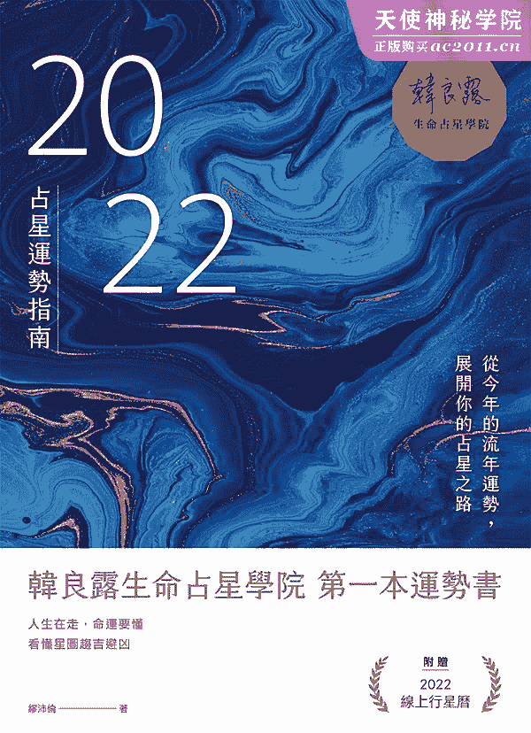

# 自序
看热闹也看门道

一年就是太阳走了一圈。一年到底是长还是短？生命一节一节往前走，今年你走到了哪一关？

多年来我一直是星座运势的热爱者，希望能藉由星座运势，在日常生活的黑暗隧道中，找到天光——但问题是我经常看不懂星座运势在写什么。即使后来学了占星，还是看不懂。

主要原因在于不少星座运势预设读者看不懂，而用了更复杂的文字来取代，我觉得这是很可惜的事，于是我希望写出一本看热闹也看门道的占星运势普及书，借用科普书的概念，试图用大家看得懂的方式，来为大家分析 2022 年的运势起伏。

为了介绍运势起伏的脉络，书中放入了一些行运的数字资料与角度，对已经有占星基础的读者来说，这些信息就象是参考书中的答案，可以增加阅读乐趣。但考量到许多读者不想被专业术语牵绊，于是我们将这些资讯以版面设计的方式予以区隔，让大家可以顺畅阅读，不受干扰。

大家常说「十年风水轮流转」，有时候你会遇到好运，有时候你会遇到坏运。但不管遇到的是好运或坏运，你还是你。好运与坏运只是这个世界藉由让我们比较舒服或比较不舒服的方式来雕琢我们的方式。所有的好运，都是让你累积资本，让坏运降临时可以安然度过，而所有的坏运，都是一个功课，让你学习生命更完善之道。行运的意义，是让我们藉由每一年、每一天行运带来的好运与坏运，让我们在不断的跟行运对话中，由外而内造成意识上的改变，成为一个更完整、更美好的自己。

多年来，我在写作或演讲时，都会预设一个人在我面前，对着他写、对着他讲。在撰写这本书的过程中，我看到 2022 年在我面前展开，大家在这一年有着这么多的难关，又有着这么多的希望，而我迫不及待的想要跟你聊聊。

# Landmarks

1.  Cover

# 从 2021 走到 2022

占星是一门「上天如是，地下亦然」的学问，想要了解 2022 年的大运，就得要先从星空中的木星、土星、天王星、海王星、冥王星看起，这五颗星都代表外在社会环境的变化，其中最令人有感的就是土星。

土星代表的是必须严肃以待的社会现实，它不容一丝过度乐观。土星大约三十年绕完一圈，平均每两年半进入不同星座，当土星进入不同星座，就会为这个星座相关的议题，带来最实际、最严苛的考验。2021 年跟 2022 年土星进入的是宝瓶，宝瓶代表了前卫与革新，这些听起来原本是最不受现实拘束的领域，这两年全都必须要变成大家日常生活中的现实，也因为它们走入了日常生活中，所以必须受到最严格的检视。也就是说，在土星进入宝瓶的这两年多，整个世界忽然变成了追求宝瓶的高科技、新思潮的偏执狂。

例如远距工作原本是一个相对少数人使用的高科技工作型态，但受到疫情影响，这两年很多人都有了远距、分流工作的经验。数字化与实名制也是一个争论已久的议题，从去年开始，也因为疫情的关系而进入了大家的生活中。疫苗也是一种新科技，这两年为了因应现实需求，整个世界对疫苗需求若渴，但疫苗不光是上市就可以了，上市之后，还得要面临副作用与效力等等严苛的现实考验。

除了土星进宝瓶的难题，这几年大家还得面对天王星进金牛的挑战。天王星代表的是世界级的突变与无常，这几年天王星进入了跟资产、资源有关的金牛，全球的贸易大战一定让大家很有感。

光从土星与天王星来看，土星的现实与稳定，很不适合进入前卫的宝瓶，而金牛的资产适合保守、恒定，也很不适合被天王星的突变打乱。而 2021、2022 最让大家痛苦的，是土星与天王星常常形成很紧密的 90 度克相。当两颗星形成 90 度克相，彼此就会因为互相冲突、内耗，引发出彼此的负面能量。当土星与天王星形成 90 度克相，整个世界就会陷入一种想要土星的保守、固执也不行，想要天王星的改变也做不到的窘境。

行星的克相会随着度数紧密程度而有差异，2021 年除了秋季的三个月之外，其他全年都处于土星与天王星的紧密克相状态，大家想必都在疫情的影响下，遇到了不改变不行，但想要彻底放手却也办不到的难题。2022 年情况明显好很多，除了 1 月上旬的紧密克相之外，就只有 8、9、10、11 月会遇到明显的土星、天王星的拉锯。如果说 2021 年全世界遇到的是打掉重练的冲击，到了 2022 年，全世界要面对的就是要从百废待举中站起来的艰难。也就是说，2021 年与 2022 年的年度困境颇为相似，还好 2022 年的难度比 2021 年低很多。

# 2022 年谁最辛苦

黄道十二个星座并不是东一个、西一个不相干的「东西」，黄道是一个 360 度的圆形坐标，而黄道上的十二个星座，分别代表了个体演化的十二个阶段（如下页图）。也因为黄道是一个 360 度的坐标，所以各个星座之间会形成各式各样的角度，这就是所谓的「相位」。其中 120 度和谐相是好相位，90 度与 180 度则是克相，90 度会互相内耗，而 180 度会因为对立而带来挑战。

###### 黄道是一个 360 度的坐标，每 30 度切成一个坐标，12 个坐标之间，都会形成不同的角度，因而形成了不同的影响力

想要知道 2022 年谁最辛苦，就要从这个圆形 360 度来看。

前一段已经提到，2022 年时，土星这个大魔王会进入宝瓶，太阳宝瓶自然首当其冲，而太阳金牛与太阳天蝎都跟土星宝瓶形成 90 度克相，太阳狮子则与土星宝瓶 180 度对立。

土星的麻烦之处，在于它会带来现实生活的严苛考验，它会带来紧缩的压力。而这四个星座受到的影响又略有不同，太阳宝瓶虽然必须直接面对土星宝瓶的考验，辛苦归辛苦，但这也可能会是一个土星三十年一度的功成名就、众望所归的时刻。太阳金牛与太阳天蝎跟土星宝瓶形成 90 度克相会造成内耗，太阳金牛与太阳天蝎会面临社会的现实压力，每天有如度小月般勒紧腰带过日子，除了咬牙苦撑，别无他法。而太阳狮子则遇到土星宝瓶的 180 度对立，180 度与 90 度的不同，在于 90 度是一种内耗的折磨，而 180 度的对立则会激起反弹，尤其太阳狮子很爱面子，当他们遇到土星的社会现实打压，很可能就会全力反抗，造成很大的冲突（如下页图）。

但有人辛苦，就有人得益。土星进入宝瓶就会对同属风象星座的太阳双子、太阳天秤产生现实上的帮助，不过土星是一颗现实之星，即使太阳双子、太阳天秤 2022 年得到土星之益，也都不会很轻松，都必须要付出很大的努力，才能得到社会现实的肯定。

# 2022 年社会资源到谁家

木星与土星都是社会星，相较于土星社会现实的压力，木星带来的就会是社会资源的乐观与正向。木星的社会资源包含了金钱、人脉、名声等正面价值，2022 年 1 月 1 日到 5 月 10 日木星进双鱼，然后进入牡羊，到年底 10 月 29 日到 12 月 20 日再度回到双鱼，在这段期间，木星的社会资源会直接灌注给太阳双鱼，太阳双鱼不但会觉得工作与生活顺心，身心状态也会很好。而同属水象星座的太阳巨蟹与太阳天蝎则受到木星双鱼 120 度和谐相之助，工作与生活会有许多幸运之处。前面提到太阳天蝎 2022 年受到土星 90 度的社会现实打压，日子都会过得有点闷，藉由木星社会资源之助，日子会好过许多。

而木星会在 5 月 11 日到 10 月 28 日木星进入牡羊，之后短暂回到双鱼，然后在 12 月 21 日到 12 月 31 日再度进入牡羊。这在段期间，太阳牡羊会直接得到木星的社会资源之助，工作、生活与身心都很愉悦，而同属火象星座的太阳狮子、太阳人马也会相对愉快。尤其对 2022 年备受土星打压的太阳狮子来说，大约半年的木星社会资源挹注，会让太阳狮子好过很多。

但在 5 月 11 日到 10 月 28 日与 12 月 21 日到 12 月 31 日木星进牡羊时，就会跟太阳巨蟹、太阳天秤、太阳摩羯形成负面相位，而 1 月 1 日到 5 月 10 日与 10 月 29 日到 12 月 20 日与木星进双鱼时，则会跟太阳双子、太阳处女、太阳人马形成负面相位，在这段期间，当事人都很容易误判社会风向且容易过度自大，因而千万不可在重大决议上高估自己的能力。

###### 2022 年太阳宝瓶、太阳狮子、太阳金牛、太阳天蝎会受到土星带来的大挑战

# 时代巨变的影响

木星与土星这两颗社会星之所以重要，原因在于木星、土星是很显著的社会风向、社会潮流、社会现状与社会事件，只要在社会中讨生活的人，都会明显的感知到木星与土星的影响。

而天王星的革命、海王星的梦想与冥王星的人类集体意识控制欲，虽然它们的力道也很大，却可能因为作用的时间实在太长，反而不像木星、土星的社会潮流这么明显的让人感受到它们的作用力。

2022 年天王星进入金牛，全世界都会在跟金牛的资产领域遇到天王星带来的翻天覆地变化，而其中又以太阳金牛、太阳狮子、太阳天蝎与太阳宝瓶受到的影响特别大（请见下页图）。

###### 2022 年太阳宝瓶、太阳狮子、太阳金牛、太阳天蝎同时受到土星与天王星的夹击

由此可见太阳金牛、太阳狮子、太阳天蝎与太阳宝瓶这两年真的很辛苦，不但遇到土星的现实压力，还得遇到天王星的无常，而且这两颗星经常在联手夹击。不过还好到了 2022 年年底之后，这两颗星就会渐行渐远，太阳金牛、太阳狮子、太阳天蝎与太阳宝瓶虽然得要面对土星与天王星各自的课题，但至少不会进退两难了。

不过天王星虽然对太阳金牛、太阳狮子、太阳天蝎与太阳宝瓶不利，但却对太阳处女、太阳摩羯有利。原因在于同属土象星座的太阳处女、太阳摩羯都具有一定程度的保守，这几年遇到天王星 120 度好相位的帮助，既不会太过于笼罩太阳，又很适度的推了太阳处女、太阳摩羯一把，让他们可以在合理的范围内改变。

2022 年海王星进入双鱼，对太阳双子、太阳处女、太阳人马形成负面相位，海王星是一颗梦幻之星，它的负面相位会让人过度不切实际，尤其前面提到，1 月 1 日到 5 月 10 日与 10 月 29 日到 12 月 20 日与木星也在双鱼，海王星负面相位带来的不切实际，混杂着木星负面相位的过度乐观，很有可能就会造成很严重的误判，这个时候很不适合做财务方面的重大决定。而太阳双鱼在这段时间受到木星与海王星同时进入的影响，都会有一点乐陶陶的愉悦，但也因为海王星具有不切实际的特质，所以如果是跟灵性、艺术有关的资源，可以全心拥抱，但如果是跟金钱、投资、作保有关的议题，最好回避。

不过虽然海王星对太阳双子、太阳处女、太阳人马有负面影响，却对太阳巨蟹、太阳天蝎有正面帮助，尤其是在 1 月 1 日到 5 月 10 日与 10 月 29 日到 12 月 20 日时，木星与海王星都在双鱼，意谓着海王星的灵性能量，能够结合木星的社会资源，让太阳巨蟹、太阳天蝎得到许多正面能量。

2022 年冥王星进入摩羯的尾端，冥王星会带来集体意识的占有欲，简单来说，对太阳牡羊、太阳巨蟹、太阳天秤与太阳摩羯来说，这几年经常会感受到自己陷入有如宫斗剧般的各式各样纷争中。

但也因为冥王星已经进入摩羯的尾端，2022 年受到重大冲击的会是 4 月 12 日到 4 月 20 日的太阳牡羊、7 月 15 日到 7 月 22 日出生的太阳巨蟹、10 月 16 日到 10 月 23 日的太阳天秤、1 月 13 日到 1 月 20 日出生的太阳摩羯，他们在 2022 年会感觉到身处于风暴的核心，而在这些日子前出生的太阳牡羊、太阳巨蟹、太阳天秤、太阳摩羯前段班，此时处于大破大立的清理战场阶段，重生的契机由此展开。

冥王星虽然对太阳牡羊、太阳巨蟹、太阳天秤与太阳摩羯造成很大的压力，却也同时对同属土象星座的太阳金牛、太阳处女很有利，尤其是对 5 月 13 日到 5 月 30 日的太阳金牛，以及 9 月 15 日到 9 月 23 日的太阳处女尤其有利，在这段期间都可以意志集中，用坚强的意志面对世界。而在这些日子之前出生的太阳金牛、太阳处女前段班，前两年应该都感受到意志集中带来事业上的帮助，现在虽然好相位已经离开，但如果能延续着前两年打下的基础，还会有一两年的好运。

# 上升星座与太阳星座

现在由于网络普及，只要知道自己的出生日期，要打出一张本命星图并非难事。同一天出生的人星图中的行星（除了月亮以外）都会在大致相同的位置，但随着出生时间与出生地点的不同，上升点就会有所差异。

想要知道正确的上升点，出生时间越精准越好，还好现在台湾户政系统相当方便，想要申请一份出生证明，只需要本人准备好身分证，去户政事务所申请，当场就可以拿到，非常简单。出生证明上都会有出生地点与出生时间，这样就能打出一张含有上升点的本命星图了。

俗称上升星座的上升点是每一张星图的起点，它代表每一个人经由原生家庭的环境而养成的一种基本上看起来的调调儿。而这个初始环境塑造成的样貌，会影响一个人这辈子在十二个不同的宫位领域展现出不同的基本态度。

一宫到十二宫各自代表不同的生命领域：

一宫：自我形象

二宫：金钱与资产

三宫：兄弟姊妹、基本教育、邻居、近距离沟通、大众媒体

四宫：家庭，包含原生家庭与长大以后自组的家庭

五宫：子女、恋爱、创作、游戏与赌博

六宫：工作与健康

七宫：伴侣，包含婚姻伴侣与工作伙伴

八宫：他人的资产

九宫：异国、高等教育、哲学、高等心智

十宫：事业舞台

十一宫：志同道合的公益舞台

十二宫：轮回业力

###### 十二个宫位本身也具有 360 度的好坏相位关系

大众媒体的星座运势往往为了迁就版面与读者程度，而将太阳星座预测与上升星座预测混合写在一起，一篇文章里面有的地方讲的是太阳星座，有的地方讲的是上升星座，夹缠不清。对出生于早上五六点日出时分的人来说（这个时间出生的人大多上升与太阳在同样星座），他们会觉得星座运势很准，但对其他时间出生的人来说，尤其是出生于中午或半夜的人，就会觉得有的地方准（讲太阳星座的地方准），有的地方很不准（讲上升星座的地方很不准）。

当然也有许多读者不想这么复杂，也可能没时间去找出自己的上升星座，这也无妨，但至少要能分辨出到底哪一个部分是在讲什么。因此本书将「太阳星座」与「上升星座」分开撰写，以利读者选择正确的内容来阅读。

上升星座与太阳星座要探讨的是不同的议题，上升点并没有能量，行星才有能量。

上升只是一个情境，它代表一个人出生时的初始状态，经由这个初始状态而养成的一种本能反应的性格面具，而这种本能反应会延伸到生活的各种面向，例如个人形象、金钱态度、沟通态度、家庭生活、恋爱观与创作观⋯⋯这就是经由上升点而画出的十二个宫位。

而太阳是一个人终生努力想要达到的人生目标，我们每个人的人生，都要致力于让自己的太阳尽情的发光发热，才能不枉此生。所以有些媒体说几岁要看上升，完全是一个牛头不对马嘴的说法，我们的太阳都需要发光发热，我们的人生也都必须要面对经由上升点而衍生出的十二个宫位情境。

# 关于分宫制

本书「上升星座」的篇章，可能会有一些程度不错的读者会发现，本书使用的分宫制跟大家常用的「普拉西德（Placidus）宫位制」略有不同，原因在于本书使用的是「整宫（Whole）制」 。这种分宫制是以上升点的星座为第一宫的 0 度，很工整的每 30 度为一个宫位，一个宫位为一个星座的一种分宫方式。

整宫制的最大好处是单纯、直观，它的运作原理是当一颗星进入这个宫位，就像打开房内的电灯开关，整个房间就亮起来。而这种单纯、直观是一种预测年度运势的良好态度。年度运势是一种展望未来的规画，就像我们想要规画一场旅行，我们会先想好一个大方向，想去日本还是法国，想要什么季节去，想要走一趟什么性质的行程？而这些就是简单明了的整宫制可以为我们指出的大方向。有了大方向，才不致于一开始就在小巷小弄中迷途。

也因为整宫制十分工整，在此列出十二个上升星座在整宫制下的十二宫位状况，提供大家参考。

上升牡羊：一宫牡羊、二宫金牛、三宫双子、四宫巨蟹、五宫狮子、六宫处女、七宫天秤、八宫天蝎、九宫人马、十宫摩羯、十一宫宝瓶、十二宫双鱼。

上升金牛：一宫金牛、二宫双子、三宫巨蟹、四宫狮子、五宫处女、六宫天秤、七宫天蝎、八宫人马、九宫摩羯、十宫宝瓶、十一宫双鱼、十二宫牡羊。

上升双子：一宫双子、二宫巨蟹、三宫狮子、四宫处女、五宫天秤、六宫天蝎、七宫人马、八宫摩羯、九宫宝瓶、十宫双鱼、十一宫牡羊、十二宫金牛。

上升巨蟹：一宫巨蟹、二宫狮子、三宫处女、四宫天秤、五宫天蝎、六宫人马、七宫摩羯、八宫宝瓶、九宫双鱼、十宫牡羊、十一宫金牛、十二宫双子。

上升狮子：一宫狮子、二宫处女、三宫天秤、四宫天蝎、五宫人马、六宫摩羯、七宫宝瓶、八宫双鱼、九宫牡羊、十宫金牛、十一宫双子、十二宫巨蟹。

上升处女：一宫处女、二宫天秤、三宫天蝎、四宫人马、五宫摩羯、六宫宝瓶、七宫双鱼、八宫牡羊、九宫金牛、十宫双子、十一宫巨蟹、十二宫狮子。

上升天秤：一宫天秤、二宫天蝎、三宫人马、四宫摩羯、五宫宝瓶、六宫双鱼、七宫牡羊、八宫金牛、九宫双子、十宫巨蟹、十一宫狮子、十二宫天秤。

上升天蝎：一宫天蝎、二宫人马、三宫摩羯、四宫宝瓶、五宫双鱼、六宫牡羊、七宫金牛、八宫双子、九宫巨蟹、十宫狮子、十一宫处女、十二宫天秤。

上升人马：一宫人马、二宫摩羯、三宫宝瓶、四宫双鱼、五宫牡羊、六宫金牛、七宫双子、八宫巨蟹、九宫狮子、十宫处女、十一宫天秤、十二宫天蝎。

上升摩羯：一宫摩羯、二宫宝瓶、三宫双鱼、四宫牡羊、五宫金牛、六宫双子、七宫巨蟹、八宫狮子、九宫处女、十宫天秤、十一宫天蝎、十二宫人马。

上升宝瓶：一宫宝瓶、二宫双鱼、三宫牡羊、四宫金牛、五宫双子、六宫巨蟹、七宫狮子、八宫处女、九宫天秤、十宫天蝎、十一宫人马、十二宫摩羯。

上升双鱼：一宫双鱼、二宫牡羊、三宫金牛、四宫双子、五宫巨蟹、六宫狮子、七宫处女、八宫天秤、九宫天蝎、十宫人马、十一宫摩羯、十二宫宝瓶。

# 2022 在线行星历

欢迎大家扫 QRCode 进入南瓜国际网站，将在线行星历加入常用的行事历，与自己装置上的行事历连动。

* * *

###### 延伸阅读

###### 《上升星座：生命地图的起点》：我们都是时间、空间的旅者，在时间与空间中特定的一点诞生在地球上。上升是每个人生命旅程的起点，从这个起点开始，我们展开了所有生命情节与人际互动的无限可能。

###### 《十二宫位》：十二个宫位是十二个不同生命领域，它决定了你的人生要演出什么类型的戏剧。

# 太阳牡羊

2022 年对太阳牡羊的考验与打击不太多，而且又逢十二年一度的社会资源好运降临，反而要小心的是别因为一意孤行与得意忘形而遭忌。

牡羊是黄道十二个星座中的第一个星座，它代表的就是「开创」，它代表了个体发展的第一个阶段—「自我意识的萌芽」。从这个脉络出发，我们会发现许多对太阳牡羊的形容词，出发点都是基于「自我意识的萌芽」的特质。太阳牡羊的原型就是战士，他们终其一生都是勇敢而强悍的人，一辈子都充满斗志，不会自暴自弃，他们想要成为强者，想要当领头羊，不喜欢跟在别人屁股后面听别人领导。

牡羊是个体发展的第一个阶段，也就是「我」的概念的诞生，他们最关心的是我是谁、我会怎样、我可以有什么成就，因此太阳牡羊都会是比较以自我为中心的人。但「以自我为中心」与「自私」是两回事，太阳牡羊不是自私，只是没有顾虑到别人—因为身为一个为生命奋战的战士，他们没有时间可以去理别人。太阳牡羊通常会是最有「被讨厌的勇气」的人，他们勇气十足却不温柔体贴，他们无法太关心别人。

### 十二年一度的社会资源加持

#### 5/11~10/28 行运木星进牡羊

#### 行运木星与太阳牡羊合相

#### 行运木星会用正面和谐的方式带来社会资源

太阳牡羊 2022 年会强烈感受到行运木星在今年夏天进入牡羊带来的利益。

木星是一颗社会星，而牡羊的核心价值就是「做自己」，木星的社会资源，其中包含了金钱、人脉、知名度、学历等等，当行运木星进入牡羊，整个社会风潮，就会鼓励大家做自己，越是能不甩别人眼光、越是不人云亦云的人，就越能得到社会资源。而最能发挥行运木星进牡羊的优点的人，就是最做自己的太阳牡羊。

太阳牡羊的人不体贴、不顾别人、冲动、冒进，这些原本可能是负面的特质，在这段期间全都变成了加分。这段期间做自己会得益—太阳牡羊最做自己；这段期间大胆冒进会得益—太阳牡羊最大胆、最冒进；这段期间被别人讨厌也没关系—太阳牡羊最不介意被人讨厌。但问题是行运木星走得很快，它在 5 月 11 日进入牡羊停留五个多月就又会退行回双鱼，前面提到行运木星进牡羊时，太阳牡羊的不顾别人，被人讨厌也没关系的优势就会消失。也就是说，太阳牡羊被人讨厌的勇气，会真的让他们被别人讨厌，这可就麻烦了。

由此可见，虽然 2022 年 5 月 11 日到 10 月 28 日的社会氛围有利于太阳牡羊做自己，但太阳牡羊反而应该有所节制，不能因为社会氛围对自己有利就太尽情的不顾别人，否则行运木星带来的运势不过只有五个多月，就得罪了一堆人，很不划算。

也因为行运木星的社会资源只在牡羊停留短短五个多月，太阳牡羊如果因为社会氛围鼓励冒进而真的太冒进，就有可能头洗到一半，行运木星的社会资源就走了，结果反而亏了很多钱。所以我们常说，行运木星的社会资源，适合收割而不适合播种，因为种子播下去，还没长出来，社会风向就已经转向了。所以这段期间最重要的是逢高收割，最晚请在 10 月下旬前获利了结，不要妄想继续赚更多钱。更麻烦的是很多太阳牡羊手上可能根本连种子都没有，想要播种还得先借钱买种子，就很可能会陷入种子都还没长出来，行运木星就已经走了，不但血本无归，还得要亏掉了买种子的钱。

### 社会风向改变带来缓冲

#### 10/29~12/20 行运木星逆行回双鱼

#### 行运木星与太阳牡羊没有相位

#### 行运木星造成的社会资源忽然消失

前几个月让太阳牡羊顺风顺水的社会风向，在 10 月底之后忽然消失。虽然也不至于逆风，但太阳牡羊会强烈感受到做事时没有那么得心应手，也不像前几个月那样容易赚到钱。

这短短的一个多月的社会风向改变，对太阳牡羊不啻为一个很好的提醒，大胆是一种美德，但冒进会造成损失，勇敢是一种美德，但得罪人则不必要。社会风向由顺转不顺（还不到转逆，只是不那么顺）也是一种契机，让太阳牡羊可以不被社会风向的春风得意而冲昏头，稍微调整一下上半年的步调。

社会资源、社会风向的来来去去，对太阳牡羊也不失为一个很好的提醒—成也牡羊、败也牡羊，太阳牡羊崇尚向前冲、崇尚大胆、崇尚做自己，这些都是很好的特质，但过度大胆而无法回本、一味的往前冲而忽略队友感受，这些太阳牡羊的缺点，也往往都是拖垮他们的包袱。

### 社会风向的二次机会

#### 12/21~12/31 行运木星再度进牡羊

#### 行运木星再度与太阳牡羊合相

#### 行运木星会用正面和谐的方式带来社会资源

太阳牡羊一辈子都是勇敢的人，所以当他们遇到社会风向朝着他们时，其实必须要更小心。社会资源、社会风向的应对方式会因人而异，对于比较保守、比较悲观的人来说，例如太阳巨蟹、太阳摩羯，当他们遇到社会风向朝着他们吹时，就应该要趁着风向，让自己不要那么紧绷，更勇敢做自己。但对一辈子都很敢做自己的太阳牡羊来说，当社会风向朝着他们身上吹时，就有可能会得意忘形。这也是对太阳牡羊的一种锻鍊：如何可以在做战士的同时，也不要过度树敌—如果不树敌，很多仗一开始根本就不需要打。

前面 10 月 29 日到 12 月 20 日社会资源忽然消失的时期，对太阳牡羊是个很好的缓冲，让他们好好的审视一下社会风向对自己的影响。等到 12 月 21 日行运木星再度回到牡羊，社会风向又正对着太阳牡羊吹时，经过了前面一个多月的盘整，这次太阳牡羊会做得更好。

### 外在环境的压制与操控

#### 全年行运冥王星进入摩羯 25~28 度

#### 行运冥王星与太阳牡羊之间形成 90 度克相

#### 行运冥王星的操弄让太阳牡羊绑手绑脚

行运冥王星带来强大的控制欲与激情，当行运冥王星与太阳出现 90 度克相，太阳牡羊就会明显感受到外界带来的斗争压力，让太阳牡羊不得不为了求生而奋力反击。

行运冥王星带来的重大压力，它有可能是社会氛围带来的窒息感，有可能是工作方面的沈重压力，也有可能会是人际往来中遇到控制欲很强的人，更有可能是以上所说的加总，而这些隐藏于表象之下的控制与权力操弄，会让最需要做自己的太阳牡羊感到疲累不堪。越是不能畅快的做自己，就越想要挣扎，偏偏外在的庞大压力压得动弹不得，结果把所有的精力用在对抗外界压力，而不是拿去做正事。

很多人误以为遇到这么庞大的压力，一定属于人生中的低谷，一定是在走楣运，但可能完全相反。一个人要遇到这么大的压力，很可能正是因为他站在浪头上。因为地位很高，所以压力很大，因为地位很高，众人羡慕、嫉妒，因而招致很多攻击。也因此，这个相位对三十岁到六十岁之间的太阳牡羊影响特别大，年纪太小或太大固然也都会遇到猜忌与压力，但因为通常不在事业舞台的权力高峰，受到的影响也就相对较小。

不过也因为行运冥王星走的速度很慢，一年大约只走三四度，2022 年受到影响最大的，会是出生于 4 月 15 日到 4 月 19 日的太阳牡羊后段班。至于出生于 3 月底与 4 月上旬的太阳牡羊前段班，前几年一定已经遭受过行运冥王星带来的台面下冲突，甚至有可能由台面下的暗斗，转为台面上的明争，但还好这一切都已经过去。行运冥王星虽然带来毁灭，但也会带来重生的契机，对于太阳牡羊前段班来说，前几年的毁灭性战争已经结束，现在是清理战场的时机。在一片焦土中，找到重生的新机，会是人生重新开始的一年。

### 身心活力带来自信

#### 1/1~1/24 行运火星进人马

#### 5/25~7/5 行运火星进牡羊

#### 行运火星带来身心活力让太阳牡羊充满自信

1 月 1 日到 1 月 24 日行运火星跟太阳牡羊形成 120 度和谐相，太阳牡羊会觉得自信满满、精力十足。也因为行运火星会带来性能量，尤其对男性的太阳牡羊来说，这会是一段因为充满自信而显得特别性感的时期。

5 月 25 日到 7 月 5 日行运火星跟太阳牡羊合相。这会是一段充满自信与活力，适合好好拚事业的时机。尤其前面提到，这段期间由于行运木星也在牡羊，太阳牡羊这个时候很容易得到社会资源。但也因为这个时候有活力又有资源，很可能会让太阳牡羊自信爆表，甚至到有一点过度自信的地步，所以要小心不要因此得罪人，以免日后引发不必要的纷争。

### 身心能量不协调而生闷气

#### 1/25~3/6 行运火星进摩羯

#### 行运火星与太阳牡羊形成 90 度克相

#### 行运火星克相让太阳牡羊气噗噗

在这段期间，太阳牡羊很容易心中充满一股无名火，很容易气呼呼的觉得别人在找自己麻烦，觉得面子挂不住而很容易跟别人吵架。但其实别人未必真的是想要找你麻烦，而面子也没有那么重要，稍微忍一忍，等到这段期间过去，也就没事了。

## 上升牡羊

上升星座代表一个人出生时的环境，透过出生时的外在环境，形塑出一个人在放松时自然呈现的一种调调儿。上升牡羊的人通常从小会生长在孤立无援的环境，因为孤立无援，所以必须一切靠自己，因而长大以后成为一个很勇敢、很直接，想要什么就直接去争取，不会扭扭捏捏思前顾后。

乍听之下上升牡羊好像容易生在贫困的环境，其实不然，所谓的孤立无援成长环境的原因有很多，最常见的是新手爸妈或父母正忙于创业，忽然降生了一个小婴儿，而这个成长在手忙脚乱家庭中的小孩，将来就会具有独特的性格，因而有了不同的生命走向。

一个人的灵魂之所以选择了牡羊做为自己的上升点，代表这辈子的功课，就是牡羊的「独立自主」，而早年的孤立无援，只是培养出独立自主的一种表象。童年时一切靠自己的生存本能，让上升牡羊长大以后勇于对命运出击，因此上升牡羊是一个很容易出成功人士的位置。

### 社会资源十二年周期的新开始

#### 5/11~10/28 行运木星进一宫自我形象宫

#### 行运木星带来各式各样社会资源与工作机会

#### 规画新一轮十二年社会资源的起承转合

上升牡羊的人今年会经历行运木星跨越上升点的重生契机。木星是一颗社会星，它代表的是社会资源，其中包含金钱、人脉、声量、口碑好评。行运木星走一圈需要十二年，每一次木星掠过我们的上升点，都代表我们的社会资源历经十二年的起承转合，又到了一个重新开始的时刻。

行运木星在 2022 年 5 月 11 日会由双鱼走进牡羊，也就是说，行运木星会在 5 月 11 日掠过上升牡羊的上升点，重新展开一个新的木星社会资源的十二年周期。在 5 月 11 日以前，上升牡羊会感觉到自己的社会资源忽然消失，原本有的口碑好评、人脉资源忽然都消失了，最糟糕的，是完全找不出造成衰退的原因。这是因为上升点是一宫的起点，而上升点之前是十二宫，十二宫代表业力轮回，十二宫之所以被称为业力之宫，就是因为它找不出原因，一切都是莫名其妙。当行运木星的社会资源走进十二宫，上升牡羊的种种社会资源就会忽然消失，也因为各种社会资源消失，一等到 5 月中旬开始，随着行运木星走进牡羊，上升牡羊们会感觉到社会资源的眷顾终于回来了。这个时候各种案子都会上门，不管是工作机会、人际往来、金钱收入都忽然变多了。也因为之前饱受社会资源消失之苦，上升牡羊此时不管遇到了什么社会资源，都会想要握在手中不放—但这种心态需要调整，什么都想抓，往往就什么都抓不到。

这也是上升牡羊的通病。前面提到，上升牡羊的人通常会出生在缺乏支援系统的环境，上升牡羊的人从小自己照顾自己，也因此养成上升牡羊强悍的生命力。上升牡羊的人就像一把种子撒在窗外，自生自养的杂草，缺乏支援的童年，让上升牡羊的人终生都很积极，面对任何机会，都会燃烧熊熊的求生欲，紧抓着不放。这种积极的人生态度，原本是上升牡羊的一大优点，问题是当上升牡羊在经历了一整年的社会资源被隐蔽之后，一旦社会资源冒出头来，上升牡羊就会先看到什么就先抓什么，而忽略了应该要选最好的。

### 社会资源失而复得

#### 12/21~12/31 行运木星再次进一宫

#### 行运木星带来各种社会资源与工作机会

#### 行运木星正式展开十二年新周期

行运木星进入一宫时，其实最应该做去思考的是未来十二年社会资源起承转合的规画，但对过度积极的上升牡羊来说，当 5 月 11 日到 10 月 28 日行运木星进入牡羊，各式各样的工作机会、人脉等社会资源涌现，很可能会让上升牡羊冲昏了头。

不过社会资源来来去去，10 月 29 日到 12 月 20 日社会资源会忽然消失，但这不啻为一个让自己冷静一下的良机，趁这个时机来想一想，到底真正想要的职场生涯或社会生活是什么。

木星掠过上升点，有可能会是一个转职或转换跑道的契机。如果上升牡羊能在 2022 年社会资源得而复失、失而复得的过程中想清楚，等到 12 月 21 日木星再度进入牡羊，就会更理解应该要使用怎样的社会资源，来展开接下来十二年的人生。

### 同道友侪的压力测试

#### 全年行运土星进十一宫志同道合之宫

#### 行运土星带来责任与压力

#### 行运土星让原本轻松的朋友圈变得压力很大

大家都很畏惧土星，因为土星既是业力星，也是现实星，凡土星走过，都会带来紧缩与匮乏。2022 年整年行运土星都在上升牡羊的十一宫。十一宫是志同道合的社交之宫，行运土星进入十一宫时，当事人都会觉得朋友处不来，尤其以前是志同道合的同道之人，现在跟他们相处时却压力很大，必须要扛负很多责任，经常觉得对这些朋友很失望。

十一宫的同侪团体，原本是设计来让我们在现实生活之余，能够有一个非营利、非功利的小圈圈，我们可以在这个小圈圈里面，共同对一件喜欢的或认同的议题谈天论地。但为什么行运土星进十一宫时，我们会对朋友圈感到压力很大？原因在于土星是一颗现实之星，当行运土星进入十一宫，行运土星就会想要在十一宫的非营利、非功利小圈圈中，找出到底这个小圈圈能够发挥怎样的现实效应—这不见得是坏事。将十一宫非营利性的同道领域具体化，有可能是基于责任感，也可能是基于功利心。如果是基于责任心，想要把原先竹林七贤式的空谈化为实际行动，这件事情本来就不轻松，但基于理念的实践，会很值得去做。但如果是基于功利心，想要把人脉换成金钱，就会惹出很大的问题。

### 金钱领域的大起大落

#### 全年行运天王星进二宫金钱宫

#### 行运天王星带来天外飞来的意外

#### 行运天王星造成金钱领域无可预料的波动

行运天王星带来无常与变动，当行运天王星进入二宫金钱宫，上升牡羊就会在金钱方面剧烈震荡，有很多无法预料的大起与大落。行运天王星平均每七年就会进入一个不同领域，在这个领域给予大家当头棒喝，让大家体验人世无常，但这不见得是坏事。

这几年行运天王星进入上升牡羊的二宫金钱宫，行运天王星就会用闪电般的方式去考验上升牡羊的金钱观念，不管以前建立了哪些习以为常的获利形式，这个时候都会被逼着不得不做出改变。例如去年受到疫情影响，很多实体工作形式无法进行，大家就必须要在最短的时间改用在线形式来取代，这就是一种非常行运天王星会展现的晴天霹雳。

行运天王星带来的剧烈改变，一方面要训练我们面对变动的能力，另一方面也是要逼使我们思考，到底旧有的模式是不是需要继续维持。去年疫情升温时，很多公司都不得不手忙脚乱的改为在线工作，不过大家也开始反思花这么多时间上班到底有没有必要，虽然后来疫情降温，生活也逐渐恢复正常，但也有很多人发现其实这种工作方式不是自己要的，因而离开了原来的工作，找寻自己的新人生—其实这才是行运天王星当头棒喝的真正意义。

不过比较麻烦的是行运天王星跟行运土星在这两年经常会形成紧密的克相，这代表了行运天王星想要的改变，经常会跟行运土星想要的不变与保守互扯后腿，让人进也不是，退也不是。前面提到行运土星这两年进入上升牡羊的十一宫志同道合之宫，当它跟二宫金钱宫形成克相，最麻烦的会是当事人听了十一宫的好友建议，因而跟朋友一起去做风险很高的金钱投资，尤其土星往往意谓着年高德劭的权威人士，乍看之下好像没问题，但行运土星与行运天王星的克相，会让现实瓦解，结果反而在金钱方面吃了很大的亏，很可能连朋友也做不成。

不过还好 2022 年行运土星与行运天王星互扯后腿的时间并不长，回顾 2021 年，除了秋季的三个月之外，其他全年都处于行运土星与行运天王星紧密克相的高压期，大家回想去年社会气氛的紧绷，应该余悸犹存。2022 年会好很多，比较明显的克相出现在 1 月、8 月、9 月、10 月、11 月，这个时候一定要小心金钱上的震荡，尤其不能听信人言贸然投资，一切都需要采取保守守势，尽可能将钱留在手边。到了 12 月上旬之后会稍微减缓，2023 年之后，行运土星跟行运天王星就会渐行渐远，虽然行运天王星依然会对上升牡羊造成金钱上的起伏，但至少不像这两年几乎都是负面影响了。

### 事业舞台桃花开

#### 1/25~3/6 行运金星与火星进十宫事业宫

#### 金星与火星的桃花点亮事业舞台

行运金星带来逸乐享受，行运火星带来身心活力，它们虽然并不足以影响运势，却能在生活中有滋有味的点燃生之喜悦。当行运金星的情感遇到行运火星的性能量，就会让大家明显的感受到一股特别愉悦的能量，这就是所谓的「桃花」。而桃花并不限于男欢女爱，它会随着落入不同的宫位，而在那个宫位中显现出行动力与好人缘。

从 1 月 25 日起，一直到 3 月 6 日，行运金星火星都在上升牡羊的十宫事业宫，这意谓着上升牡羊很适合将这个桃花用在十宫的事业领域，可以在事业舞台上一展金星的迷人与火星的活力。

### 社交领域舒缓压力

#### 3/7~4/5 行运金星与火星进十一宫社交宫

#### 金星与火星的魅力与活力让社交领域压力减轻

接下来在 3 月 7 日到 4 月 5 日的一个月期间，行运金星、火星同时进入上升牡羊的十一宫，十一宫是志同道合的社交之宫，这两年由于土星进入上升牡羊的十一宫，所以上升牡羊都会有一些社交生活的障碍与重责，金星加上火星进入十一宫带来的桃花，可以有效舒缓土星十一宫的社交压力。也就是说，虽然土星十一宫的社交压力依旧在，但是金星、火星进入十一宫就象是润滑剂一样，让原本的重担变得有趣。

### 收敛魅力活力专注于灵性

#### 4/16~5/2 行运金星与火星进十二宫轮回宫

#### 金星与火星的魅力与活力能量消退

从 4 月 16 日到 5 月 2 日，行运金星、行运火星进入上升牡羊的十二宫。十二宫是灵性轮回之宫，不管是行运金星的魅力、行运火星的活力，在这个时候都无法在现实生活上展现光芒，而将能量转向追求灵性，加上此时行运木星的社会资源与行运海王星灵性资源也都在上升牡羊的十二宫，这个时候很容易会有灵性上的感触，这些都是宇宙给予的启示，千万不要错过。

### 金钱领域的运筹帷幄

#### 5/29~6/13 行运水星与金星进二宫金钱宫

#### 水星的口才加上金星的魅力利于金钱谈判

下半年比较则有许多水星与金星合相的时段，水星代表了各种沟通，金星代表美感与情感，当水星与金星合相，就会在沟通上充满喜悦，讲话比较不容易得罪人，比较口角春风。

5 月 29 日到 6 月 13 日行运水星与行运金星都在上升牡羊的二宫金钱宫，这段期间特别适合跟别人讨论金钱相关事务，尤其特别适合跟他人做金钱谈判，就算是大砍对方价钱，也能够不伤和气。

### 沟通领域如鱼得水

#### 6/24~7/5 行运水星与金星进三宫沟通宫

#### 水星的口才与金星的魅力利于广结善缘

6 月 24 日到 7 月 5 日行运水星与行运金星都进入上升牡羊的三宫，三宫是沟通与媒体之宫，如果从事相关行业，这段期间会特别辩才无碍。即使没有从事相关行业，上升牡羊也会发现自己在这段期间比较亲切，比较愿意跟别人打招呼、聊天。

### 伴侣互动频繁

#### 10/11~10/23 行运水星与金星进七宫伴侣宫

#### 水星的口才与金星的魅力利于日常互动

10 月 11 日到 10 月 23 日行运水星与行运金星都进入上升牡羊的七宫，七宫的伴侣关系，包含了婚姻伴侣与事业伙伴，与所有的一对一平等关系，行运水星的口齿伶俐加上行运金星的讨人喜欢，这时各式各样的伴侣沟通，都会格外顺畅。对单身的上升牡羊来说，这个时候的口齿伶俐与魅力，很适合去认识一些新朋友，甚至不妨去安排一些相亲，主动为自己招来一些新桃花。

### 他人资产的运筹帷幄

#### 10/30~11/16 行运水星与金星进八宫共财宫

#### 水星的口才与金星的魅力利于金钱与资源谈判

10 月 30 日到 11 月 16 日行运水星、行运金星与行运太阳都在上升牡羊的八宫，八宫是他人资产之宫，上升牡羊在这段期间，如果会遇到一些跟保险、借贷之类的烦恼，就可以善加利用行运太阳的意志、行运水星的口才、行运金星的讨人喜欢，去好好的沟通这类事宜。

### 发表高论广受欢迎

#### 11/18~12/6 行运水星与金星进九宫高等心智宫

#### 水星的口才与金星的魅力利于说服群众

11 月 18 日到 12 月 6 日行运水星与行运金星都在上升牡羊的九宫，也就是社会道德与个人哲学之宫，受到行运水星的影响，上升牡羊在这段期间往往会好发议论，而受到行运金星的影响，这些言论都会很讨人喜欢。

### 工作领域的良好互动

#### 12/11~12/31 行运水星与金星进十宫事业宫

#### 水星的口才与金星的魅力利于事业领域运筹帷幄

从 12 月 11 日到年底，行运水星与行运金星都在上升牡羊的十宫，十宫是事业宫，行运水星带来的辩才无碍与行运金星魅力无法挡，很利于上升牡羊在事业上运筹帷幄。

### 身心活力与自信展现

#### 8/21~12/31 行运火星进三宫近程沟通宫

#### 行运火星会为沟通领域带来桃花与争端

最后值得多加留心的是行运火星。一般来说，行运火星在一个星座停留的时间不超过两个月，但 2022 年行运火星由于顺行、逆行、又顺行，所以在双子待了七个多月，从 2022 年 8 月 21 日开始一直到 2023 年 3 月 25 日才会离开。行运火星会带来活力与热情，但也会带来脾气与火气，当它持续在一个星座徘徊不去，就很容易会在相应的宫位领域中过度火爆而引发争端。在这七个多月时间，行运火星都在上升牡羊的三宫，三宫是近距离沟通之宫，其中包含了人与人之间的沟通，也包含了实质上的交通，当行运火星进三宫，上升牡羊就会有很多跑来跑去的机会，也有很多跟别人言语交锋的机会，因此引发很多口舌之争，也有可能因为慌慌张张的跑来跑去而引发车祸。建议这段期间，上升牡羊可以跟人辩论，但要适可而止，出入交通也要多加留意。

# 太阳金牛

太阳金牛都是务实的人，而太阳金牛今年面对的也都是很扎实的挑战。对太阳金牛来说，2022 年最需要烦心的，是社会现实带来的冲突。

太阳金牛的人天性保守，如果今天吃到一道好吃的菜，他们通常下次就会直接点这道菜，不会想要换别的东西来吃吃看。当保守的太阳金牛，遇到了讲求开放、创新的社会风向，就会被社会现实压得喘不过气来。

### 社会现实压力的重大考题

#### 全年行运土星进宝瓶

#### 行运土星与太阳金牛形成 90 度克相

#### 行运土星的压力造成太阳金牛现实损失

土星是一颗社会星，当土星进入不同的星座，社会整体就会依据这个星座的特质，并且形成现实的压力。2022 年行运土星进入宝瓶，意谓着社会整体对于宝瓶代表的新科技、新观念非常看重，而且不但是观念上的看重，更重要的是想要落实为生活中的实际事务，这件事会对太阳金牛造成很大的压力。

也因为社会的氛围对太阳金牛很不利，2022 年大部分的时候，太阳金牛都会觉得自己被社会打了一巴掌，甚至直接表现在收入减少等实际损失上—而太阳金牛最不能忍受的，就是实际收入的减少。这件事会让太阳金牛觉得自己很失败，成就感低落，因此经常会什么事都不想做，活力很低，每天都不想要起床面对现实生活。

行运土星大约每三十年绕一圈，每两年半进入不同星座，带来不同的考题。土星是现实星，也是业力星，任何人遇到行运土星的压力，都高兴不起来。尤其 2022 年行运土星的社会现实跟太阳金牛之间形成的是负面相位，这会让太阳金牛被行运土星带来的责任压得喘不过气来，觉得很不愉快、有志难伸。不过如前面所说，行运土星平均在一个星座停留两三年，之前已经熬过了 2021 年，再熬个一年多，社会现实的低迷就不会再继续困扰太阳金牛了。

占星学最美妙之处，就是还要熬多久是算得出来的。对太阳金牛来说，这一波行运土星带来的压力，最晚到 2023 年的 3 月上旬就会解除。虽然这段期间难免遇到巨大的现实压力，但太阳金牛本来就是很愿意一步一脚印、按部就班的人，只要熬过这一关，就可以迎接下一个人生坦途。

### 世代潮流带来的无常变化

#### 全年行运天王星进金牛 10~18 度

#### 行运天王星与太阳金牛合相

#### 行运天王星的无常逼迫太阳金牛改变

天王星是一颗走得很慢的世代星，它会用晴天霹雳的方式带来巨大的改变。2022 年行运天王星进入金牛，就会为太阳金牛的生活，带来天翻地覆的大变化—这件事对太阳金牛尤其难以接受。并不是每个星座都讨厌生活中的大变化，对很多星座来说，例如太阳人马或太阳宝瓶，他们平常就已经变来变去，遇到了行运带来的巨变，就算是再措手不及，至少心态上也都会抱持正面态度，但太阳金牛不行。金牛的核心价值就是守成，最注重实际，他们不喜欢没有实际收获的事。

太阳金牛通常不会是很爱玩的人，原因就在于「玩」不是一件实际的事，「玩」不能带来实际的收获。同理，太阳金牛讨厌变化，关键也在于变化未必能带来实际收获，但一个人可以控制自己不去玩，却没有办法控制外在环境不变化。面对宇宙的无常，想要以不变应万变是行不通的，这个时候必须要认清，「变」才是宇宙必然的道理。即使无法拥抱无常，至少应该要能理解无常，不要对无常视而不见，因为越是不想要改变，就越容易遭到无常当头痛击。

事实上无常与变动并不是坏事，因为有「破」才有「立」，透过无常的晴天霹雳，正好可以扫除陈旧的积习，这对太阳金牛来说尤其可贵。因为不喜欢变化的太阳金牛，自然会累积出很多早已不适用、拖累人生的包袱，藉这个机会正好一次全部打掉，让人重新来过。

太阳也代表生命中的重要男性，对女性的太阳金牛来说，行运天王星带来的变局，也有可能会投射在先生身上，再回到自己身上。我认识一个太阳金牛的女性企业家，她在行运天王星进金牛时，先生忽然生了一场重病，为了要全心照顾先生，事业几乎完全停摆。还好行运天王星来得快也去得快，在她全心照顾下，过了大半年之后，先生逐渐痊愈，她也重回工作岗位。经过了大半年的沈淀，她发现她的工作中，有许多是她并不想做的内容，这次事业意外停摆，等于是一个打掉重来的第二次机会，因此她重新厘清工作内容，删除了许多她原先不想做却推不掉的工作，重新出发的她，虽然不像以前那么声势惊人，但显然变得快乐许多。

行运天王星走得很慢，走完一圈需要八十四年，也就是说，绝大多数的人，一辈子顶多只能遇到一次行运天王星与太阳合相，虽然带来惊吓，但何妨藉由社会变局带来的变化，为自己找出一个新方向？

### 忍过压力高峰期

#### 行运土星与行运天王星 90 度紧密克相

#### 行运土星带来现实压力，行运天王星带来变化

#### 土星与天王星克相带来保守与创新的两难

前面提到 2022 年太阳金牛会遇到行运土星的现实打压，又遇到行运天王星带来的晴天霹雳。更麻烦的是这两颗星有很多时段彼此相克，行运土星要的是保守与权威，而行运天王星要的是反保守与推翻权威，当这两颗星互相形成克相，彼此扯后腿，又克到太阳金牛，压力真的很大。

首先在 1 月上旬，太阳金牛就会遇到行运土星与行运天王星的紧密克相，尤其是 5 月上旬出生的太阳金牛，会被压到喘不过气来，还好等到 1 月 20 日之后，随着土星与天王星的相位逐渐缓解，太阳金牛感受到的压力也就会小得多。

但到了 8 月 14 日到 11 月下旬，随着克相再度出现，再度太阳金牛承受巨大的冲击。这一波冲击的时间比较长，影响范围也比较大。而这一波压力大约会在 10 月上旬达到最高峰，而受影响最大的是 5 月 4 日到 5 月 15 日出生的太阳金牛，其他日子的太阳金牛也会感受到外在环境带来的压力，但压力不会那么直接迎面而来。还好再大的压力，都会随着克相的松绑，而在 12 月初逐渐消失。这一波持续了整整两年的保守与创新的两难，终于就此一去不再回。

### 强大意志力得以掌控权力

#### 全年行运冥王星进摩羯 25~28 度

#### 行运冥王星与太阳金牛形成 120 度和谐相

#### 行运冥王星的意志力让太阳金牛展现续航力

虽然太阳金牛 2022 年会遇到行运土星压制与行运天王星的惊吓，不过还好行运冥王星的和谐相，可以为太阳金牛带来强大的意志力，藉由强大的自制力，得以拥有足够的能量，来面对今年的变局。

冥王星代表的是社会集体意识中的占有欲，它跟大钱、大权有关。当行运冥王星跟太阳金牛形成和谐相，太阳金牛就会因为需要跟外界产生良性竞争，因而感觉到活力充沛。

2022 年行运冥王星走到摩羯座的尾巴，对于出生于 5 月 13 日到 5 月 21 日的太阳金牛，会特别感觉到行运冥王星带来的强大意志力。在这段期间，当事人很容易站到一个比较高的权威的位置，也比较意志力集中，有能力与体力去处理较为复杂、纠葛的人事物。如果事前布局得宜，这就会是一生一次的巨大好运。尤其因为冥王星代表的是具体的大钱与大权，所以它通常带来的都会是实际的权势，而不会只是单纯的心灵上的喜悦。

虽然太阳金牛会在 2022 年遇到行运土星的打压、行运天王星的惊吓，但藉由行运冥王星的意志集中，坚强的身心状态，可以让你惊涛骇浪也不怕。题外话是这段期间特别利于减肥—减肥如此难，如果你连减肥都做得到，天下又有什么事情可以难得倒你？

### 身心活力带来自信

#### 1/25~3/6 行运火星进摩羯

#### 7/6~8/20 行运火星进金牛

#### 行运火星与太阳金牛形成正面相位

#### 行运火星带来身心活力让太阳摩羯充满自信

1/25 到 3/6 行运火星跟太阳金牛形成和谐相，在这段期间，太阳金牛都会感觉充满活力，又不会脾气不好—有时候我们精力太过充沛时，会因为太过自信而容易跟别人起冲突，但这段期间，太阳金牛会感觉有活力，又不会被自信冲昏头。所以会是一段很适合拚事业的好时机，尤其适合跟别人进行各式各样的谈判。受到自信的加持，太阳金牛很容易在谈判时占上风。尤其对男性的太阳金牛来说，自信带来性魅力，这也会是一段很有桃花的好时机。

7 月 6 日到 8 月 20 日行运火星与太阳金牛合相，在这段期间，太阳金牛会因为充满身心能量，而变得自信满满。就算是平常再不想工作、再不想起床的太阳金牛，此时都会天一亮就醒来，心情很愉快的想着今天有什么任务要完成，进而开开心心的去完成既定的工作。也因为这是一年中自信最旺的时期，如果需要跟别人谈判时，也会因为充满自信而容易占上风，请太阳金牛千万不要错过这个好时机。

### 身心能量不协调而生闷气

#### 3/7~4/15 行运火星进宝瓶

#### 行运火星与太阳金牛形成 90 度克相

#### 行运火星克相让太阳金牛有气发不出来

在这段期间，太阳金牛的人经常会感觉到自己有一股无名火，经常莫名的发脾气。更要注意的是因为行动（行运火星）而产生的意外，包含了切菜切到手、煮饭烫到，甚至有可能会是出车祸，或在办公室跟别人吵架。这件事对太阳金牛来说很稀奇，因为如果是太阳牡羊发脾气、乱骂人，大家大概都觉得稀松平常，但对平常不太发脾气的太阳金牛来说，他们可能只不过跟别人吵个一两次架，大家就会觉得他们最近很暴躁。

## 上升金牛

上升星座代表了一个人的出生环境，以及经由出生环境而塑造出的基本性格，也因为有了上升点，就会经由上升点而分出十二个宫位，这也说明了一个人的出生环境（上升星座）形塑出基本性格，而上升星座养成的性格，或多或少都会影响命运。

金牛代表的是物质世界的丰饶，金牛是大地之母，当一个人上升落在金牛，通常他们会出生在物质环境相对宽裕的家庭，虽然日后家境有可能随着天时、地利、人和而有变化，但在上升金牛的潜意识中，他们都会对物质世界拥有一定程度的安全感。也因为上升金牛的潜意识对物质世界很有安全感，所以他们在选择职业上可以比较不顾世人眼光与经济考量，可以比较特立独行的做自己想做的事。也因为上升金牛在职业选择上，很可能由于潜意识上无后顾之忧，而选择非传统或冷门、小众，甚至相对来说比较不稳定的工作。而这种工作，很可能必须要付出更大的心力，只是外人未必看得出来。

### 事业领域的压力测试

#### 全年行运土星进十宫事业宫

#### 行运土星带来责任与压力

#### 行运土星让事业舞台责任艰巨

2022 年上升金牛遇到的最大困境，就是行运土星的现实压力，进入上升金牛的十宫事业宫。一般来说，上升金牛大多不像会是事业心很重的人—但他们并不是真的没有事业心。土星代表的是社会现实与权威的压力，当行运土星进入事业宫，代表上升金牛在事业领域进行压力测试的时间到了。

前面提到，上升金牛往往会选择非朝九晚五、非传统的工作，这类工作平常可能因为偏向非传统所以不易评量出好坏，但这两年行运土星进入了上升金牛的事业宫，代表社会的现实，会要求上升金牛交出成绩单。行运土星在一个宫位平均会停留两三年，行运土星在 2020 年 3 月进入上升金牛的事业宫，要一直等到 2023 年才会完全脱离，而其中又以 2021、2022 这两年特别辛苦。

一般来说，任何行运的行星进入一个宫位，都会带来正面影响，也会带来负面影响。但这两年有很多时间行运土星跟行运天王星出现了度数很紧密的 90 度克相，克相会引动出彼此的负面能量，尤其土星要的是保守、权威，而天王星要的是革命、创新，这两股力量相反的行星形成 90 度克相，会让大家感受到庞大的压力，而上升金牛会特别感受到行运土星进事业宫的负面影响，觉得事业压力很大。

土星代表的是社会现实带来的限缩，当行运土星进入任何宫位，土星的现实，就会让这个宫位领域浪漫不起来、乐观不起来，都必须要用最现实的考量，勒紧腰带过日子。很多上升金牛在这两年，或许直接或间接受到疫情或景气等社会因素影响，工作压力都会变得特别大，而行运天王星在此时进入上升金牛的一宫，一宫是自我形象之宫，这代表上升金牛会很想做自己，很想改变生活、重新开始。但行运土星进事业宫却让上升金牛陷在事业舞台，一方面想要展开新生，一方面又无法从既有的工作中脱身，可说是骑虎难下。2022 年会有几个时间点，土星、天王星的度数很接近，这些时间要请上升金牛稍微忍耐一下，等到克相远离，虽然行运土星依然在事业宫，但压力会减轻很多。

首先要注意的是 1 月会有一波压力很大的时期，之后稍微轻松半年，上升金牛应该趁着这半年好好盘整自己的事业，并且裁减不需要的支出，因为到了 8、9、10、11 月时又回到了度小月的阶段，如果之前规画得当，虽然 8 到 11 月得要度小月，但如果捱过这几个月，12 月以后行运土星与行运天王星就会互相远离，压力就不会那么大了。

### 社交领域与灵性领域的资源涌现

#### 1/1~5/10,10/29~12/20 行运木星进十一宫社交宫

#### 5/11~10/28,12/21~12/31 行运木星十二宫业力轮回宫

#### 行运木星来回在社交圈与灵性领域带来社会资源

2022 年行运木星会在上升金牛的十一宫（志同道合的同道之宫）与十二宫（轮回业力宫）来回，对上升金牛来说，可说是由门庭若市到门可罗雀的过程。

木星代表的是社会资源，其中包含了金钱、人脉、知名度等等，从 2021 年年底开始，行运木星进入上升金牛的十一宫社交宫，平常较为保守的上升金牛，会在这段期间多了很多跟朋友社交的机会，得以展现自己的好品味。

但从 5 月 11 日开始，行运木星进入上升金牛的十二宫（轮回业力之宫），所有行星进入十二宫就无法充分发光发热，前半年行运木星带来的热闹人脉，此时忽然消失，甚至有可能会令上升金牛担心自己是不是做错了什么—但其实这只是行运木星进十二宫的正常现象。行运木星进入十二宫带来的社会资源的隐退，正是要上升金牛息交绝游，藉此探索自己的内心，让自己归零，进而迎接下一个新的木星社会资源周期。

不过行运木星会在 10 月 29 日到 12 月 20 日短暂回到上升金牛的社交宫，这个时候上升金牛又会有一些社交生活，等到 12 月 21 日起，行运木星会再度进入上升金牛的轮回业力宫，凡是行星进入十二宫，都无法在现实生活中发光，必须要收敛能量转为灵性之用。因此接下来大半年的时间，上升金牛几乎所有的社会资源都会断绝，上升金牛不妨在这段缺乏资源的时期，仔细想一想自己在未来的十二年想要做什么样的工作、想要结交怎样的人脉，等到 2023 年 5 月，行运木星掠过上升点进入一宫时，不管是转职或是继续现在的生涯规画，都会有一个很好的新开始。

### 高谈阔论受欢迎

#### 1/25~3/6 行运金星与火星进九宫远程沟通宫

#### 金星与火星的桃花点亮高等心智的象牙塔

金星、火星都是桃花，金星代表的是奢华与享乐，火星代表的是活力与行动力，2022 年有好几个时段行运金星与行运火星会位在同一个星座，这两颗星碰在一起，就会随着进入不同的宫位，在这个宫位领域带来轻松、愉悦，甚至有如谈恋爱般的感觉，好好掌握行运金星、火星的能量，可以藉由这两颗行星带来的桃花，帮自己的日常生活好好加分。

首先是 1 月 25 日到 3 月 6 日，行运金星、行运火星都在上升金牛的九宫，九宫是个人哲学之宫，对上升金牛来说，在这段期间会很好发议论、口角春风，不管讲什么，都会很受人欢迎，加上这段期间行运木星在社交宫，不妨趁着这段期间好好跟朋友联络感情。

### 桃花魅力进驻事业舞台

#### 3/7~4/5 行运金星与火星进十宫事业宫

#### 金星与火星的魅力与活力让事业领域有所斩获

接下来 3 月 7 日到 4 月 5 日这一个月，行运金星、行运火星同时进入宝瓶，也就是上升金牛的十宫事业宫，前面提到，这两年由于行运土星进入事业宫，上升金牛在事业领域都会受到土星的现实考验，藉由行运金星、火星带来的桃花，虽然不至于减缓土星的压力，但有助于让土星的压力显得比较有乐趣。在这一个月间，不妨戴上金星、火星的粉红色眼镜来看一看自己的事业，找出工作中的乐趣所在，这对如何面对行运土星待在事业宫的压力，会很有帮助。

### 社交领域合纵连横

#### 4/16~5/2 行运金星与火星进十一宫社交宫

#### 金星与火星的魅力与活力利于合纵连横

4 月 16 日到 5 月 2 日行运金星与行运火星进入双鱼，也就是上升金牛的十一宫社交宫，刚好这段期间行运木星与行运海王星也都在社交宫，行运木星带来社会资源，行运海王星带来灵性启发，加上行运金星的社交好感度与行运火星的行动力，在这段期间会有很多社交生活的缘分。上升金牛应该要趁这段期间好好玩个够，因为 5 月中旬以后行运木星就要进入十二宫的灵性追求，玩兴就不会那么强了。

### 个人形象的耳目一新

#### 5/29~6/13 行运水星与金星进一宫个人形象宫

#### 水星的口才加上金星的魅力利于自我展现

下半年虽然行运金星与行运火星不再进入同样星座，但是却有很多时段行运水星与行运金星都同样的星座。水星代表了各式各样的沟通，当行运水星与行运金星进入同样的宫位，当事人就会在这个宫位领域耳聪目明，而且讲的话大家听起来都很顺耳，很利于沟通、谈判。

首先是 5 月 29 日到 6 月 13 日水星与金星都在上升金牛的一宫，也就是自我形象之宫。行运水星进一宫会让人很会讲话，行运金星进一宫会让人变漂亮—如果想要剪头发、烫头发、做一点简单的医美，就应该要趁着这个时候做。人变美，就容易快乐。

### 金钱领域运筹帷幄

#### 6/24~7/5 行运水星与金星进二宫金钱宫

#### 水星的口才与金星的魅力利于财务谈判

6 月 24 日到 7 月 5 日行运水星与行运金星都进入上升金牛的二宫，二宫是金钱宫，在这段期间，很利于去做跟金钱有关的谈判、攻防。行运水星会让上升很有金钱意识、头脑清楚，加上行运金星带来的人缘，会让上升金牛的金钱谈判很顺利。

### 工作与同事相处融洽

#### 10/11~10/23 行运水星与金星进六宫工作宫

#### 水星的口才与金星的魅力利于生活运作

10 月 11 日到 10 月 23 日行运水星与行运金星都在上升金牛的六宫，六宫是工作宫，行运水星与金星的进入，会让上升金牛在工作上博得好人缘，也因为六宫工作宫跟十宫事业宫之间有着 120 度和谐相，也就是说，六宫的日常工作，跟十宫的职涯发展，两者相辅相成。这两年行运土星进入上升金牛十宫，上升金牛都会在职涯发展上遇到沈重压力，而 10 月中旬起这一个多月，利用行运水星与行运金星进入六宫带来的好口才，好人缘，可以帮助上升金牛减轻行运土星进事业宫的重担，值得好好把握。

### 伴侣关系的愉悦沟通

#### 10/30~11/16 行运水星与金星进七宫伴侣宫

#### 水星的口才与金星的舒适利于伴侣互动

10 月 30 日到 11 月 16 日行运水星、行运金星与行运太阳都在上升金牛的七宫，七宫是伴侣之宫，其中包含了婚姻伴侣与事业伴侣。这两年由于行运土星进入十宫事业宫，上升金牛在事业上焦头烂额，不免怠慢了自己的伴侣。不妨利用这段行运水星与金星都在伴侣宫的时期，好好的陪伴侣谈一谈、约个会，这样可以让伴侣关系维系得更长久。对单身的上升金牛来说，这个时候的口齿伶俐与魅力，很适合去认识一些新朋友，甚至不妨去安排一些联谊活动或相亲，主动为自己招来一些新桃花。

### 共财领域的运筹帷幄

#### 11/18~12/6 行运水星与金星进八宫共财宫

#### 水星的口才与金星的魅力利于资源与金钱谈判

11 月 18 日到 12 月 6 日行运水星与行运金星都在上升金牛的八宫，也就是他人的资产之宫。八宫的他人资产，包含了性、金钱、权力的斗争，行运水星的口齿伶俐与金星的讨人喜欢，让上升金牛在跟别人攻防各种金钱议题—尤其是八宫相关的保险、借贷，甚至遗产议题上，都会无往不利。

### 发表高见广受欢迎

#### 12/11~12/31 行运水星与金星进九宫高等心智宫

#### 水星的口才与金星的舒适利于发表高见

九宫是个人哲学之宫，在这段期间，上升金牛会变得辩才无碍，不管讲什么，大家都会觉得他们讲得很有道理，上升金牛如果在此时从事学问研究、异国文化交流、国际贸易、教育、文教、宗教事务会特别有利。

### 身心活力与自信展现

#### 8/21~12/31 行运火星进二宫金钱宫

#### 行运火星为金钱领域带来活力与争端

一般来说，行运火星在一个星座停留的时间通常不超过两个月，但 2022 年行运火星由于顺行、逆行、又顺行，所以在双子待了七个多月，从 2022 年 8 月 21 日开始一直到 2023 年 3 月 25 日才会离开，这会对相应的宫位领域中注入活力，但也可能会因此带来纷争。在这七个多月中，行运火星进入了上升金牛的二宫金钱宫，所以这会是上升金牛很关心钱，也很努力赚钱的时机。但问题是行运火星会带来活力，也会带来麻烦。火星是一颗本能之星，它不太会用脑思考，行运火星进二宫虽然会让人努力赚钱，但也可能会很冲动的乱花钱。更麻烦的是它会让人很容易因为金钱而跟别人起冲突。要提醒上升金牛，赚钱固然好，但守财更重要，更不要为了钱跟别人起不必要的争执。

# 太阳双子

黄道的十二个星座代表了个体发展的十二个阶段。第一个星座牡羊，代表的是个体的诞生，所以太阳牡羊最想要当的就是领头羊；第二个星座是金牛，代表个体诞生之后，开始拥有了资产概念，所以太阳金牛最重视资产的拥有，他们都会注重质感，也都很务实，具有一定程度的资产观念。而当个体演化到了第三个阶段，就开始想要跟周遭环境互动，所以太阳双子终其一生都会是很喜欢跟别人沟通、交流的人。

太阳双子在 2022 年挫折与挣扎不算多，透过太阳双子最擅长的沟通，在这一年有可能可以经由一步一脚印而获得实际的提升。但这一年也有可能会因为自我感觉过度良好而被骗，要小心不要过度乐观，以免造成工作上、信誉上的损失。

### 加官晋爵带来的责任与压力

#### 全年行运土星进宝瓶

#### 行运土星与太阳双子形成 120 度和谐相

#### 行运土星带来的权威让太阳双子拥有声量

太阳双子 2022 年首先要关注的是行运土星进宝瓶，行运土星会跟太阳双子形成 120 度和谐相，这时行运土星代表的现实与权威，会透过正面的方式来协助太阳双子，让太阳双子得以在社会上获得稳固的资源。

2022 年太阳双子会感受到之前多年的努力，终于现在实力被社会所看见，也因为太阳双子得到了社会肯定，随之而来的就是必须肩负更多的责任。更重要的是太阳双子在 2022 年会变得很务实，充满现实感。太阳双子此时会很能意识到现实的重要，也明白应该怎么做能让事情做得更好，也因为很容易把事情想得很清楚，而且拥有足够的能力，因此可以全心全意、按部就班的完成实际的任务。在这段期间，太阳双子会感觉到内在能量良好，因而能够承担工作的重任，同时也意谓着你能在这段期间接到重要工作。行运土星会敦促太阳双子去规律的做正事，会让人很有责任感，却不至于被责任压垮。

双子代表的是心智活动的沟通，最厉害的双子可以将各种信息整理成易懂的懒人包，达到信息交流的目的，但低等的双子，很可能就会迷失、沈溺于各种信息中，每天可能忙着交换各式各样的八卦，流于浅薄与杂乱无章。太阳双子的人具有灵活应变的优点，也有没耐心、匆匆忙忙、变来变去的缺点，当太阳双子遇到行运土星的 120 度相位，正是一个好时机，将太阳双子原先的浮动甚至浮躁，藉由这段期间的务实与耐力，得以转化为实际用途。

很多人很讨厌行运土星，因为土星既是业力星，又是现实星，凡是遇到了行运土星，就开心不起来、轻松不起来。尤其太阳双子的人最讨厌严肃跟纪律，但人生之路想要走得可长可久，不能光靠着机灵善变，总有一些事情需要被认真看待，总有一些事情需要长程规划。藉由 2022 年行运土星进宝瓶的和谐相带来正面、积极的能量，最有利于太阳双子好好的深化双子的沟通功能，让双子的沟通不限于肤浅的八卦，而能有条有理、有意义，这才是太阳双子毕生想要追求的人生目标。

行运土星大约三十年走一圈，行运土星带来的不会是天上掉下来的好运，它需要你去努力争取才能获得。但也因为它需要你去争取，所以它会带来扎实的成果，而且可长可久。

在 2022 年期间，太阳双子会想要有纪律的去完成实际的任务，会想要过着有纪律的生活。这个时候最适合订一个具体的目标，然后按部就班的完成。从另一个角度来看，这是一段不适合、不想，也不应该去玩的时期—因为即使去玩，一颗心还是悬在工作上，玩也不容易玩得尽兴，不如干脆全心做正事。

行运土星带来的好相位，十年一遇，一次两年半，它的时间不长不短，最适合去规画、启动一个新计划，如果规画得宜，甚至有机会在行运土星离开之前，就看得到初步结果。即使启动得晚，至少也能藉由这个相位的力量，制定出一套可执行的流程，并且在相位结束之前，先将这个工作流程做到上轨道的程度，至少可以养成一种工作的习惯，这对后续的工作执行有很大的帮助。

行运土星走一个星座需要两年多，而 2022 年行运土星来到宝瓶的后段，也就是说，对于出生在 5 月 22 日到 6 月 2 日的太阳双子来说，去年你已经建立起了工作流程，今年的目标，是依循着去年已经建立起的流程，让这个计划可以往前继续推进；如果你是出生于 6 月 3 日到 6 月 21 日的太阳双子，今年你可以开启一个新计划，虽然这个新计划会带来一些压力，但它也会让你的生活变得很规律，你可能每天早上醒来就开始规画这件事，每天都去做一点，到年底时，你已经对这件事情熟能生巧，甚至搞不好已经看得到成效了。

### 住在愚人天堂

#### 1/1~5/10,10/29~12/20 行运木星进双鱼

#### 行运木星与太阳双子形成 90 度克相

#### 行运海王星也跟太阳双子形成 90 度克相

#### 行运木星的社会风向会让太阳双子过度乐观

木星又称岁星，代表的是社会资源与流行风向，它平均每一年都会走入不同的星座。当行运木星跟太阳形成 90 度克相时，当事人就容易对社会风向过度乐观，这就是我们常说的「住在愚人天堂」（living in a fool's paradise）。

但也因为木星是一颗吉星，就算它会让人过度乐观，但在当下都觉得很开心。不过太阳双子原本就有喜欢信口开河的毛病，当他们误判社会风向时，信口开河的毛病就会更严重，而且这个时候太阳双子有可能会把玩笑话当真，或者误以为自己的研判是正确的，误传了假消息，自己还振振有词，最后出了问题之后，就会对自己的名誉会造成很大的损伤。

更麻烦的是 2022 年的行运海王星也在双鱼，海王星本身就是欺瞒之星，它会带来梦想与幻灭，而太阳双子在 2022 年一方面不但要面临社会风向的误判，还会有很多时间陷入自欺欺人的泥淖。如果光是自己受骗也就罢了，但太阳双子很喜欢信息的传布，当太阳双子振振有词的将一些错误讯息传播出去，如果这些讯息牵涉到工作与金钱，就会让太阳双子的信誉受到影响。

要格外注意的是行运木星与行运海王星会在 3 月 27 日到 5 月 1 日形成合相，影响也加大，在这段期间，太阳双子千万不要因为过于自信而信口开河，更不能借钱给别人或帮人作保，因为这个时候越是你觉得绝对不可能错的事情，越有可能过于乐观或鬼遮眼。其中被影响最大的，会是 6 月 8 日到 6 月 21 日出生的太阳双子，而不在这段期间的太阳双子也需要谨言慎行，避免被流弹所及。其实 3 月 27 日到 5 月 1 日不过一个多月的时间，如果可以的话，太阳双子应该要避免在这段期间做重要决议、发表重要声明或做重要投资，拖过这一个多月，你会发现整个风向大变，并庆幸自己忍了一个多月。

幸好从 5 月中旬到 10 月下旬行运木星会离开双鱼，这段期间，虽然还是会有一点自欺欺人，至少太阳双子会比较谨慎一点，不再过度乐观。

但随着 10 月底行运木星再度逆行回双鱼，太阳双子的膨风也再度回来，这一波虽然不像上半年这么严重，但杀伤力依然很强，在 10 月 29 日到 12 月 20 日期间，太阳双子还是必须谨言慎行，以免不小心散播了假消息而损害自己的名声。

### 面对挑战大力反击

#### 1/1~1/24 行运火星进人马

#### 4/16~5/24 行运火星进双鱼

#### 行运火星与太阳双子形成负面相位

#### 行运火星的克相逼使太阳双子气呼呼

1 月 1 日到 1 月 24 日行运火星与太阳双子形成 180 度对立，在这段期间，太阳双子常常会感到火冒三丈，而且不得不采取行动，予以反击。行运火星会带来身心活力，但它也会带来脾气，所以在这段期间内，太阳双子会因为被人攻击而斗志高昂。不过如同前面所说，1 月到 5 月也是太阳双子容易搞错社会风向而不小心招惹口舌之争的时候，所以太阳双子在回击之前，最好再三沙盘推演，以免惹出更大的麻烦。

4 月 16 日到 5 月 24 日行运火星与太阳双子形成 90 度克相，这段期间太阳双子很容易会因为别人说了什么话而感到自己面子上挂不住，因而经常显得有点气噗噗—事实上太阳双子大可以不必这么快动怒，因为这些都只是小运带来的小事，随着行运结束，这些事情都会变得没什么大不了。

### 身心活力带来自信

#### 3/7~4/15 行运火星进宝瓶

#### 8/21~12/31 行运火星进双子

#### 行运火星与太阳双子形成正面相位

#### 行运火星带来活力让太阳双子充满自信

3 月 7 日到 4 月 15 日行运火星跟太阳双子形成 120 度和谐相，在这段期间，太阳双子活力十足，但不会那么容易发脾气。受到火星身心能量的正面影响，太阳双子此时体力特别好，充足的体力，会让太阳双子变得很有自信。尤其对男性的太阳双子来说，这也会是一个很有性感魅力的时段。

而从 8 月 21 日到 12 月 31 日，长达三个月的时间，行运火星顺行、逆行都会一直停留在双子，这会让太阳双子非常有活力、充满竞争心，再怎么喜欢赖床的太阳双子，在这段期间都会一早起床就神采奕奕，身心的活力会让太阳双子非常有自信与行动力，而且充满性能量与性魅力。如果想要跟别人谈判、斡旋，这段充满自信的期间，会让太阳双子先声夺人，靠着气势就先赢了一半。

## 上升双子

上升双子的人通常都很活泼，他们喜欢讲笑话逗人开心，喜欢参加各种宴会、活动，如果有机缘的话，他们都会喜欢接触异国文化与外国事物。原因在于双子的特质，就是信息交流，当一个人的上升落在双子，代表他们这辈子最想要的事，就是跟世界打交道。

上升代表的是一个人经由出生环境而养成的外在气质，上升双子通常会出生在比较有机会接触到外人的家庭中。比如家里办厂、家里开电绣学号、家里开诊所，甚至有可能家里每天晚上请客人来开宴会、打麻将，以致于家中经常有外人出入。

也因为家中经常人来人往，上升双子在童年会有一定程度的存在感危机，所以上升双子从小就很活泼，很敢在陌生人面前展现自己。从小这么长大的上升双子，长大以后就会喜欢到处交朋友—不管是实际的朋友，或者是各式各样的网友，他们会是热心跟朋友聚餐的人，也是会热心回覆网友留言的人。他们喜欢人，也喜欢世界，他们很喜欢热闹，甚至经常会做两份工作—因为只做一份工作实在太单调。

### 远程沟通的压力测试

#### 全年行运土星进九宫远程沟通宫

#### 行运土星带来现实压力

#### 行运土星会为国际贸易等相关工作带来压力

上升双子在 2022 年会遇到的最大危机，就是行运土星进九宫。行运土星平均每两年半走一个宫位，只要行运土星进一个宫位，它都会为这个宫位相关领域带来很大的现实考验。九宫代表的是远程沟通，其中包含了异国、旅游、文化、教育、宗教等等，行运土星 2021 与 2022 年都在上升双子的九宫，2021 年受到疫情影响，从事国际贸易可能会收不到钱，从事旅游业的很难出团，从事出版业的无法出国开书展，从事文化、教育、宗教领域的得要采用远距在线活动，而 2022 年即使解封，也必然会面临百废待举，必须重新出发的压力。

如果上升双子从事的是上述相关工作，就会在工作上面临巨大压力，即使不是从事相关工作，也会因为所有九宫领域事务的受限，因而觉得施展不开。在这段期间，玩不能出国玩，聚会不能随便聚会，话也不能随便讲—这对上升双子是一个重大考验。但这也正好可以让上升双子在行运土星的高压下，检视在九宫的个人哲学中，找到哪一个才是自己真正想要的，更重要的是，要学会在高压状态下，有什么可以变通、解决之道。我有个住在美国的上升双子朋友，本业是会计师，副业是制作小熊，每一年都要花很多时间飞到各地参加熊展与教学，去年受到疫情影响，熊展与教学课程纷纷取消，但也相应的推出了在线熊展，少了那些舟车劳顿，反而他参加了更多的熊展—但当然，上升双子还是喜欢人与人之间的接触，少了展览会场中的真实互动，还是让他怅然若失。

### 天外飞来的宿命业力

#### 全年行运天王星进十二宫业力轮回宫

#### 行运天王星带来天外飞来的意外

#### 行运天王星进十二宫会带来莫名其妙的奇怪事件

这几年行运天王星进入了上升双子的十二宫，十二宫是业力轮回之宫，当行运天王星进入十二宫，当事人就会发生许多莫名其妙的变故，也因为这些变故不但事出突然，而且找不到前因后果。例如这两年的全球疫情，对上升双子来说，就是一种天外飞来的变局。

不过行运天王星进十二宫也不见得都是坏事，它也很可能带来灵性的启发，藉由轮回业力莫名其妙的当头棒喝，反而找出了人生的新方向。但 2022 年最麻烦的地方，是行运土星同时与行运天王星形成了 90 度克相。土星与天王星的能量完全相反，土星要的是保守、紧缩，而天王星要的是革命、解放，当行运土星与行运天王星形成负面相位，就会让人想要选土星的保守也不行，想要选天王星的彻底解放也不行。

### 现实压力与意外突变的双重夹击

#### 行运土星与行运天王星 90 度克相

#### 行运土星的现实与行运天王星的无常造成两难

#### 1、8、9、10、11 月压力最大

行运土星与行运天王星形成克相的度数越接近，力量就越大，值得庆幸的是 2022 年克相的时间，远远低于 2021 年。2021 年除了秋季以外，几乎一整年行运土星与行运天王星都处于紧密相克的状态，九宫的异国与文化，也包含看电影，大家回顾 2021 年时，受到疫情波及，连电影都不太能上映的惨状，就会觉得 2022 年相较之下好多了。

2022 年除了一开始 1 月有点辛苦之外，接下来要小心的是 8、9、10、11 月，对上升双子来说，行运土星（九宫）与行运天王星（十二宫）的连动，往往会是行运天王星在十二宫发生了一个无法预期的意外，造成九宫领域（国际贸易、异国旅行、文化教育）遇到巨大的压力。九宫的异国、高等教育之宫的问题，对学者、研究生、从事国际贸易、教育、文化、宗教、出版相关事物有很大的影响。不管是从事国际贸易，或教育、文化、出版工作，都有可能会遇到取消、延迟赴款，甚至往来的厂商倒闭、收不到货款的困境。也因为预期到秋季会有几个月出现这类问题，最好春夏两季就先做好准备，让自己有余裕去面对秋季的困境。

### 事业领域资源进驻

#### 1/1~5/10 行运木星进入十宫事业宫

#### 10/29~12/20 行运木星再度回到十宫事业宫

#### 行运木星带来社会资源，让事业领域充满机会

上升双子 2022 年的事业运相当不错，因为行运木星带来的社会资源，在 2022 年会有大半年进入上升双子的十宫事业宫。行运木星每十二年走一圈，每一年走一个星座，也就是说，行运木星每一年都会依序进入不同宫位，来来回回在一年期间，点亮这个宫位。回顾去年，行运木星曾经在 2021 年的 5 月到 7 月短暂进入上升双子的事业宫，上升双子应该会在那段期间忽然在事业方面得到社会资源的挹注，颇为士气大振。

2021 年 5 月到 7 月行运木星进十宫只是一个小小的预演，2022 年从开年到 5 月上旬，这一波才是行运木星资源的主力。木星代表的是社会资源，其中包含了金钱、人脉、好名声，当行运木星进入十宫，上升双子就会感觉到受到社会拉拔，很容易出名、很容易成功。不过行运木星走得很快，它适合收割而不适合播种，否则还来不及收割，行运木星就已经远离。也因此，上升双子在 2022 年上半年不管是遇到了怎样的社会资源，都应该要秉持着落袋为安的心态，不可继续加码。

5 月到 11 日到 10 月 28 日行运木星会离开事业宫，直到 10 月 29 日到 12 月 20 日行运木星短暂又回到了上升双子的事业宫，之前 1 到 5 月尚未收割的事业好运，这是最后机会，错过就要再等十二年了。

### 社交与公益领域的社会资源

#### 5/11~10/28 行运木星进入十一宫社交宫

#### 12/21~12/31 行运木星再次进入十一宫社交宫

#### 行运木星带来社会资源，让社交与公益领域充满贵人

行运木星在 5 月 11 日到 10 月 18 日进入上升双子的十一宫，十一宫是社交、同道之宫，当行运木星进入十一宫，上升双子就会在这段期间有很多社交活动，而且通常会是有意义的、正向的、具有社会性质的社交活动。行运木星进入十一宫时，上升双子很容易结交贵人，也容易成为别人的贵人，这会是一段「谈笑有鸿儒，往来无白丁」的时段。

10 月 29 日到 12 月 20 日行运木星短暂逆行回十宫事业宫，上升双子也会因此把重心放回事业，等到 12 月 21 日起，行运木星正式回到十一宫的社交舞台，之前 5 月到 11 月结交的人脉，这时开始正式发挥作用，如果需要各式各样的合纵连横，这会是一个很好的时机。

### 他人资产运筹帷幄

#### 1/25~3/6 行运金星与火星进八宫他人共财宫

#### 金星与火星桃花利于集资募款

接下来我们来看看跟桃花、人缘、口才相关的小运。2022 年有不少时间行运金星与行运火星进入同样星座，金星与火星都是桃花，当这两颗星落在同样星座，彼此之间就会互相影响，让行运金星带来的美感、奢华与行运火星带来的活力的能量更强，而金星、火星的桃花，也不限于男欢女爱。

八宫是性、金钱、权力的他人共财宫，其中包含了借贷、集资、保险、遗产等等跟他人金钱有关的事务。行运金星带来的魅力与行运火星带来的活力与自信，会让上升双子格外适合谈判与运筹帷幄，在跟他人财务相关的议题中，谈判容易占上风，同时又不得罪人。

### 高等心智广受好评

#### 3/7~4/5 行运金星与火星进九宫远程交通宫

#### 金星与火星的魅力利于发表高论

九宫是国际贸易、学术、文化、教育、出版、宗教之宫，这两年由于行运土星进入上升双子的九宫，如果上升双子从事上述工作，都会觉得现实压力很大。而从 3 月 7 日起，行运金星、火星也双双进入九宫，这不失为一种润滑剂，行运金星、火星会带来很多乐趣，不但可以减缓行运土星的压力，更重要的是，行运金星、火星的乐趣，能让上升双子找回初心。

### 事业舞台展现魅力

#### 4/16~5/2 行运金星与火星进十宫事业宫

#### 金星与火星的桃花利于事业拓展

4 月 16 日到 5 月 2 日行运金星、火星进入上升双子的十宫事业宫，期间有半个多月的时间重叠了行运木星也在十宫，会让上升双子在跟事业有关的交际不断。这段期间行运木星的社会缘，加上行运金星、火星的个人魅力，会非常适合事业上的布局。如果运用得当，这段时间也最利于跟事业上的宿敌一笑泯恩仇，藉由社交场合的愉悦，好好的跟对方聊聊，把相互的心结解开，这才是充分运用行运金星、火星进十宫的最高招。

### 收敛能量追求灵性

#### 5/29~6/13 行运水星与金星进十二宫业力轮回宫

#### 水星的口才与金星的舒适用来追求灵性

相较于上半年的行运金星、火星位在同一个星座带来的桃花，2022 下半年带来的则是行运水星（跟沟通有关）与行运金星（与人缘有关）位在同样星座带来的好口才。

5 月 29 日到 6 月 13 日行运水星、金星进入上升双子的十二宫，十二宫是轮回业力之宫，凡是行星进入十二宫，都无法现实生活中发光发热，必须要将能量投注于灵性领域。在这段期间，上升双子不管看书、看戏剧，都很容易有灵性感应，如果有写日记习惯的人，应该要把握机会，把这些感悟好好写下来。

### 耳聪目明焕然一新

#### 6/24~7/5 行运水星与金星进一宫自我形象宫

#### 水星的口才与金星的魅力利于展现魅力

6 月 24 日到 7 月 5 日行运水星与行运金星会进入双子，也就是说，这两颗星会掠过上升双子的上升点，再进入一宫。任何行星掠过上升点，当事人都会被这颗星或大或小的撼动一下，会很明显的感觉到这颗行星的能量。上升双子原本就能言善道，当行运水星、金星掠过上升点，上升双子会很明显的感受到自己的口才变得更好，而且能够藉由讲话来讨人喜欢。此外，金星跟美感有关，由于这段期间行运金星进入一宫，如果想要换发型或做个医美，这会是一个很恰当的时机。

### 创作领域充满灵感

#### 10/11~10/23 行运水星与金星进五宫创作宫

#### 水星的口才与金星的魅力启发创作灵感

五宫是创作宫、恋爱宫、子女宫，行运水星、金星会带来玩兴，不管是跟子女玩、跟恋人玩，还是玩创作，这段期间都会有很好的成果。也因为五宫是恋爱宫，对单身的上升双子来说，藉由行运水星、金星的口才与魅力去认识新对象，有可能会带来一段新恋情。

### 工作领域运筹帷幄

#### 10/30~11/15 行运水星与金星进六宫工作宫

#### 水星的口才与金星的舒适利于工作表现

六宫代表的是维持生活运作的一切事物，包含了上班与健康。10 月 30 日到 11 月 16 日行运水星与行运金星都进入了上升双子的六宫工作宫，而此时行运木星正在上升双子的十宫事业宫，六宫的日常工作与十宫的社会舞台，两者本来就相辅相成、互相合作，行运水星、金星进入六宫带来的好口才、好人缘，搭配行运木星十宫带来事业舞台上的社会资源，这段时间会是上升双子努力工作的好时机。

### 伴侣生活良好沟通

#### 11/18~12/6 行运水星与金星进七宫伴侣宫

#### 水星的口才与金星的魅力利于伴侣沟通

七宫是伴侣宫，它包含了婚姻伴侣与事业伙伴，当行运水星、金星进入伴侣宫，这会是一个跟伴侣好好谈一谈的时机，如果彼此之间有什么误会，趁着行运水星、金星的好口才，可以让彼此的心结解开。对单身的上升双子来说，这个时候的魅力与活力，很适合去认识一些新朋友，甚至不妨去参加一些联谊活动或相亲，主动为自己招来一些新桃花。

### 他人共财的运筹帷幄

#### 12/11~12/31 行运水星与金星进八宫共财宫

#### 水星的口才与金星的舒适利于资产谈判

八宫是他人资产之宫，象是借贷、保险、集资、遗产等等，都属于八宫领域。也因为八宫涉及他人资产，问题都不简单。如果有相关问题，上升双子不妨趁着年底行运水星、金星进八宫带来的好口才、好人缘，好好的将这些问题解决。

### 身心活力与自信展现

#### 8/21~12/31 行运火星进一宫自我形象宫

#### 行运火星会为个人形象带来桃花与争端

一般来说，行运火星在一个星座停留的时间通常不超过两个月，但 2022 年行运火星由于顺行、逆行、又顺行，所以在双子待了七个多月，从 2022 年 8 月 21 日开始一直到 2023 年 3 月 25 日才会离开。行运火星会带来活力与热情，但也会带来脾气与火气，当它持续在一个星座徘徊不去，就很容易会在相应的宫位领域中过度火爆而引发争端。在这七个多月的时间，行运火星都在上升双子的一宫，一宫代表的是个人形象，当行运星进入一宫，上升双子就会变得很有活力、很开朗，体力也会变得比较好，常常会想要出门做点什么事。问题是凡事不经大脑的火星，也会害上升双子太过冲动，太过大头症，要小心别得罪人而不自知，避免跟别人产生不必要的争执。

# 太阳巨蟹

在十二个黄道星座中，巨蟹、天蝎、双鱼都是水象星座，它们分别代表了情感领域的三个位阶。巨蟹代表的是家人之间的亲情，天蝎代表的是亲密关系占有欲的激情，双鱼代表的是回归宇宙的共感、同情。

太阳巨蟹在一定程度上都是重感情、怀旧的人，他们最渴求的是亲情般的家人认同，而它并不限于血缘或姻亲的家人，还包含了工作与生活上被太阳巨蟹认可的「自己人」，而其中也包含了家族认同、政党认同、国族认同。巨蟹最重要的功能是「保护」，太阳巨蟹通常都会是情感上很敏锐的人，只要伤害到他们的感情，他们就会缩回保护壳中。

也因为太阳巨蟹追求的亲情不仅限于家人，还涵盖了政党与国族，所以只有他们可以抱怨自己的家庭、自己的政党、自己的族群，如果你也跟着他们一起骂的话，他们就会很不高兴，因为这就已经戳到了巨蟹的壳了，这会让太阳巨蟹缩回自己的壳内默默疗伤，而你也就会被他们视为外人，很难再走进被太阳巨蟹视为家人的圈内。

太阳巨蟹 2022 年依然会在工作中、生活中备受打压，会有许多来自于外在的争权夺利，让他们不得不奋力反击、求生，但还好也有大半年的时间会得到社会资源的挹注，让他们藉由金钱、贵人、名声之助，有足够的资源得以抵抗外界打压。

### 加官晋爵的好时机

#### 1/1~5/10,10/29~12/20 行运木星进双鱼

#### 行运木星与太阳巨蟹形成 120 度和谐相

#### 行运木星的社会资源让太阳巨蟹受益

2022 年有大半年的时间，太阳巨蟹会因为行运木星带来的社会资源而受益。木星是一颗社会星，它代表的是社会资源，其中包括了金钱、人脉、好名声、好学历等等，在这段期间，太阳巨蟹会因为受到比较多的社会肯定，因而比较积极、乐观，也因为心情比较乐观，身体也会比较健康。很多人会说行运木星带来的好相位很适合中奖，但中奖这种事可遇不可求，与其盼望「中奖」，不如期望「得奖」。行运木星的好相位会带来社会财，在这段期间，最是加官晋爵的好时机。不过行运木星的社会资源来得快也去得快，虽然它让当事人有上台领奖的可能，但想要上台领奖，得要好好事前准备、布局，否则社会资源转瞬即过。

但即使事前没有什么布局，太阳巨蟹在这段期间还是会过得很快乐，可能经济压力变得比较轻，工作上也比较容易被人称赞，大约三四个月都处于一种愉快的状态，但如果事前没有预作规画与准备，这三四个月乐完了也就结束了，相当可惜。

不过还好行运木星的社会资源虽然在 5 月就会离开，但到了 10 月底又会回来，再次跟太阳巨蟹形成好相位，如果上半年来不及善加运用社会资源，等到 10 月 29 日到 12 月 20 日，还有一次机会可以好好掌握。

### 社会资源与灵性资源相辅相成

#### 全年行运海王星进双鱼

#### 行运海王星与太阳巨蟹形成 120 度和谐相

#### 行运海王星带来太阳巨蟹的灵性成长

除了行运木星之外，2022 年一整年行运海王星也跟太阳巨蟹之间有着 120 度的好相位。海王星是艺术之星、灵性之星，当行运海王星跟太阳形成好相位时，都会让当事人变得比较心慈，也比较有共感，如果去从事艺术创作或灵性修持，会格外有利。尤其 2022 年的大半年行运木星也在双鱼，这代表太阳巨蟹在从事海王星的艺术、灵性工作时，会很容易受到木星的社会资源之助，如虎添翼。

所谓行运海王星的灵性透过行运木星的社会资源而嘉惠到太阳巨蟹的方式，有可能会显现在太阳巨蟹想要接触灵性已经好几年，而在 2022 年时，忽然有机会经过朋友介绍或在网络上看到一个有名的老师，觉得很投缘（名师也是一种社会资源）。从事艺术创作的太阳巨蟹，在这一年也很可能会透过补助款或辅导金申请，因而得到社会资源，太阳巨蟹请千万不要错过了这难得的好机会。

### 备受打压而全力反击

#### 行运冥王星进摩羯 25~28 度

#### 行运冥王星与太阳巨蟹形成 180 度对立

#### 行运冥王星的斗争让太阳巨蟹不得不全力反击

虽然太阳巨蟹在 2022 年会得到社会资源与灵性资源，但太阳巨蟹今年依然要持续的面对跟工作、生活有关的重大挑战，因为今年行运冥王星依然在摩羯尾端盘旋不去，摩羯跟巨蟹之间有着 180 度的南辕北辙，当毁灭与重生的行运冥王星跟太阳巨蟹形成 180 度的拉锯，就会太阳巨蟹感觉到彷彿处于殊死战般的生存危机。

行运冥王星走得很慢，它从 2008 年进入摩羯之后，太阳巨蟹就首当其冲，受到很大的挑战，其中最大的难关，当属 2018 年到 2020 年行运土星与行运冥王星同在摩羯的时期。行运土星的现实、限制、权威，加上行运冥王星的极权与操弄，让太阳巨蟹们前几年过得生不如死，但还好 2020 年底行运土星离开了摩羯，太阳巨蟹受到的打压就减轻了很多。到了 2022 年，由于行运冥王星已经走到了摩羯尾端，太阳巨蟹感受到的是战争即将结束，现在已经进入了要开始清理战场的尾声。太阳巨蟹原本个性虽然比较温和，但温和不表示可以随便打压，这几年受到外界有如宫斗剧般的猜忌与斗争，反而燃起太阳巨蟹的生存危机，因为如果不求生，就会被打死，也因此激起了太阳巨蟹的熊熊求生意志。

行运冥王星 180 度的对立，会反映在这几年太阳巨蟹往往都不是自己主动引战，却经常在生活上、工作上受到无辜牵累，甚至被人视为眼中钉。我有个太阳巨蟹的朋友，在这段期间经历了公司再三重整，每天上班都得要为部门互斗烦心不已，上面的主管三天两头走马换将，今天你斗垮别人，明天别人斗垮你，斗了两年以后，公司整个卖掉，大家斗了这些年，真是一场空。对 7 月 15 日到 7 月 22 日出生的太阳巨蟹，这场战争还没打完，还需要再熬一两年，但对出生于 6 月 22 日到 7 月 14 日的太阳巨蟹来说，之前打了好几年的仗，每天张开眼睛面临的就是战争，根本无暇顾及什么才是自己真正想要的生活，而现在战争已经到了尾声，该开始想想下一步要做什么了，该去想一下身为太阳巨蟹的你，什么才是你的太阳想要发光发热之所在，去想一下什么才是理想的生活。

### 面对挑战大力反击

#### 1/25~3/6 行运火星进摩羯

#### 5/25~7/5 行运火星进牡羊

#### 行运火星与太阳巨蟹形成负面相位

#### 行运火星的克相让太阳巨蟹十分火爆

前面提到，这几年太阳巨蟹都会卷入有如宫斗剧般的斗争中，而从 1 月 25 日行运火星开始进摩羯，跟太阳巨蟹 180 度对立，行运火星有如火上加油，会让太阳巨蟹觉得别人拿他们当出气筒，常常莫名其妙的被别人责怪。也因此，就算这段期间他们跟别人吵架，大家也会觉得太阳巨蟹是先受了委屈才回骂，不是他们主动引战。而这段冲突不断的日子，会一直持续到 3 月 6 日，其中火力最旺的时间，会在 2 月 27 日到 3 月 6 日之间，被影响得最严重的，会是 7 月 17 日到 7 月 22 日出生的太阳巨蟹。

到了 5 月 25 日，行运火星又跟太阳巨蟹出现 90 度克相，这时一反上个月的心平气和，到了 5 月 25 日之后转为急躁。尤其太阳巨蟹经常不会将怒火直接发出来—如果是太阳牡羊，当他们遇到火星克相时，早就破口大骂，但太阳巨蟹通常把一股无名火闷在心中，结果闷出了一肚子气，其中高峰期会在 6 月 24 日到 7 月 5 日，之后随着行运火星的克相消失，太阳巨蟹的无名火也就稍歇。

### 身心活力带来自信

#### 4/16~5/24 行运火星进双鱼

#### 行运火星与太阳巨蟹形成 120 度和谐相

#### 行运火星带来活力让太阳巨蟹充满自信

经历一个多月的行运火星对冲，到了 4 月 16 日时，随着行运火星进入双鱼，又再度跟太阳巨蟹出现 120 度和谐相，总算火爆冲突远离，开始充满和谐的身心能量。这个时候太阳巨蟹会觉得充满活力，但又不致于过度，尤其对男性的太阳巨蟹来说，会是一段充满男性魅力的时刻。尤其到了 5 月中旬，行运火星、行运木星、行运海王星都在双鱼，彼此的度数都很近，这是一个充满灵性与感性（海王星）、充满社会资源（木星）与行动力（火星）的大好时机，对 7 月 17 日到 7 月 22 日出生的太阳巨蟹特别有利。

## 上升巨蟹

巨蟹代表大地之母的慈爱，当一个人上升在巨蟹，意谓着这个人的灵魂在投胎前，决定这辈子在出生点，就想要获得家庭的亲情，所以上升巨蟹终生都会跟家庭（尤其是跟父亲）之间，有一条斩不断的情感纽带，对上升巨蟹来说，家庭的温暖是他们终生仰仗的保护壳。

上升巨蟹在 2022 年虽然得要打足精神面对跟他人之间的金钱纠葛，但事业方面相当顺利，很有机会加官晋爵。

### 他人共财的压力测试

#### 全年行运土星进八宫共财宫

#### 行运土星带来现实压力

#### 行运土星会对跟他人资源相关事务带来压力

2022 年上升巨蟹要面对的最大难关，就是行运土星进入八宫的考验。

八宫代表的是他人共财，其中包含了借贷、集资、保险、遗产等等跟他人金钱有关的事物，而土星是业力星，也是现实星，当行运土星进入八宫，往往就会带来性、金钱、权力的纷争。在八宫的纠纷中，不管是跟他人产生亲密关系的争执、金钱的争执，都不是表面的意义，背后其实都是权力的争执，因此特别难解。举例来说，一对夫妻离婚如果闹得很难看，都不会纯粹是因为金钱或性爱纠纷，往往都是因为背后的权力意识让人气难平，让人想要报复对方—而这也正是上升巨蟹这两年会面对的课题。

除此之外，行运土星进八宫，还有可能会遇到让人痛苦的生死难关。有些人会在行运土星进八宫时遇到生离死别之苦—这并不是说行运土星进八宫会让当事人过世，因为如果真的死了，倒也就一了百了，可惜行运土星的功课没这么简单。

想要学会八宫的功课，首先要能学会放手。八宫的性、金钱、权力，乃至于生死，都是大家最难看开的事物，当行运土星进入八宫，大家首先必须要能看开，要能领悟到钱没有那么重要、输赢没有那么重要、被人背叛没有那么过不去，然后要能学会不但问心无愧，还要能将这些事情处理得妥妥当当，这才算是学会了八宫的功课。

### 朋友关系的大起大落

#### 全年行运天王星进十一宫志同道合同道宫

#### 行运天王星带来无常的变化

#### 行运天王星会为同道友谊带来大起大落

2022 年上升巨蟹的另一个大考验，是行运天王星进入十一宫。

行运天王星带来无常，而十一宫是社交与公益舞台，当行运天王星进入十一宫，上升巨蟹就会遇到许多奇人异事，也会有许多朋友圈中的起落—朋友来来去去本来并不是坏事，问题是这两年行运土星刚好在八宫，八宫是他人财产之宫，十一宫跟八宫之间本来就有着 90 度克相，当行运土星与行运天王星同时在这两个宫位形成克相，当事人就会陷入一种要咬牙苦撑也不是，要干脆整个推翻重来又不能的困境。

十一宫是社交之宫，它原本是一个志同道合的公益舞台，它应该要超越世俗利益，但当八宫的他人之财与十一宫的同道关系出现，就会变成朋友与金钱牵扯不清，弄得两面不是人。更何况行运天王星进十一宫也可能反映在交到做人做事不稳定、甚至是反社会的朋友，单纯跟这些人交朋友未必会出问题，可是跟这些人一起集资或互相借贷、作保，就很可能会在金钱上蒙受很大的损失。

回顾 2021 年，除了秋天的三个月之外，几乎整年都处于行运土星与行运天王星紧密克相的压力，上升巨蟹不妨回顾一下去年遇到这些难关时的因应之道，今年再遇到时，就会比较有头绪，知道该怎么下手解决了。今年行运土星与行运天王星 90 度的时间比去年少得多，首先 1 月就会先遇到大约一个月的紧张期，接下来大半年都会轻松很多。接下来 8、9、10、11 月又会遇到一波挑战，如果能够好好因应固然好，如果问题太过棘手，尤其是生离死别之苦，也许可以选择不要正面交锋、正面迎击，就像大家常说，「逃避虽可耻但有效」，一路忍耐到 11 月之后，行运土星会跟行运天王星就会渐行渐远，虽然行运土星与行运天王星各自的功课仍在，但至少不会互相干扰，这一波的危机，到此也就接近尾声。

### 高等心智与事业领域资源进驻

#### 1/1~5/10,10/29~12/20 行运木星进九宫高等心智宫

#### 5/11~10/28,12/21~12/31 行运木星进十宫事业宫

#### 行运木星来回在高等心智与事业领域带来社会资源

2022 年从 1 月 1 日一直到 5 月 10 日行运木星都在上升巨蟹的九宫。九宫是异国、学术与个人哲学之宫，木星代表社会资源，它包含金钱、人脉、知名度与声量，以及学历与好名声，行运木星进入九宫带来的社会资源，有利于上升巨蟹拓展九宫高等心智相关工作。尤其上升巨蟹如果正在攻读学位，或从事文化、教育、出版、国际贸易相关工作会特别有利。

而行运木星会在 2022 年 5 月 11 日到 10 月底之间进入上升巨蟹的十宫事业宫。当一个人的上升落在巨蟹，意谓着当事人往往小时候享有丰厚的家庭温暖，所以外表看起来都比较温和，问题是每个人的人生都有许多面向，上升巨蟹的人事业宫落在牡羊，代表他们其实在事业上很有拚劲，但也因为他们给人的第一印象很温驯，在职场上却拚劲十足，就有可能会被解读成他们是两面人，而今年因为行运木星进入事业宫，上升巨蟹会在事业上催足油门，也因此必须特别小心不要树敌。

我们常说「产官学」界，九宫就是产官学界中的「学界」，而十宫就是产官学界中的「产业」或「官场」，当行运木星由九宫进入十宫，代表一个人在经历了九宫的学术领域之后有了好名声，因而被十宫的企业界甚至官场挖角，从九宫的学术象牙塔，迈入了一个更大、更实际的十宫社会大舞台，而这也会是上升巨蟹在 2022 年的写照。

从 10 月 29 日到 12 月 20 日，行运木星会短暂退回上升巨蟹的九宫。上升巨蟹会再度回到比较慵懒、比较知性的状态，这对上升巨蟹来说很重要，因为行运木星一进入十宫，上升巨蟹就会变成六亲不认的拚命三郎/三娘，很容易得罪人。今年从 5 月中旬开始，随着行运木星第一次进入十宫，可说是一个预演，让上升巨蟹初试水温。年底的两个月行运木星离开十宫，正好可以检视一下，看看自己是不是因为拚工作而得罪人，稍微调整一下步伐，等到 12 月 21 日起，行运木星再度进入十宫，就可以用更好的态度来全面拚事业。

### 伴侣关系中充满魅力

#### 1/25~3/6 行运金星与火星进七宫伴侣宫

#### 金星与火星的桃花点亮伴侣关系

看完了年度大运之后，我们来看一看 2022 年的桃花、人缘等小运起伏。

2022 年有好几个时段行运金星与行运火星落在同一个星座，金星代表讨人喜欢的能量，火星代表活力与性能量，当这两颗星落在同样的星座，就很容易在相应的宫位领域中有桃花，很容易在这段期间讨人喜欢。

1 月 25 日到 3 月 6 日期间，行运金星与行运火星都在上升巨蟹的七宫，也就是伴侣宫，其中包含了婚姻伴侣与事业伙伴。上升巨蟹的人七宫都会落在摩羯，这意谓着他们经常会找摩羯型的伴侣，也就是比较稳健、比较有社会资源，也比较可靠的伴侣。但稳重可靠的伴侣，往往会有情趣不足的问题，当行运金星与火星进入伴侣宫，正好可以找寻一些小小的情趣，好好的拢络另一半。事业伙伴也是，在这段期间不妨多多约事业伙伴吃饭、应酬，一起去参加一些社交活动，这些愉悦的活动，可以润滑原本保守、严肃的伙伴关系。对单身的上升巨蟹来说，这个时候在所有的一对一关系中充满魅力，很适合去认识一些新朋友，甚至不妨去安排一些联谊或相亲，主动为自己招来一些新桃花。

### 他人之财好好谈判

#### 3/7~4/5 行运金星与火星进八宫共财宫

#### 金星与火星的魅力与活力利于集资

3 月 7 日到 4 月 5 日之间，行运金星与行运火星双双进入上升巨蟹的八宫。八宫是性、金钱、权力的道场，前面提到，这两年行运土星进八宫，上升巨蟹都会在各种金钱与权力欲望，甚至生死大事中备受考验，趁着这一个月行运金星、火星进入八宫带来的桃花，好好斡旋、谈判，这对原先八宫的艰困处境，会有一定程度的帮助。

### 高等心智广受好评

#### 4/16~5/2 行运金星与火星进九宫远程沟通宫

#### 金星与火星的魅力与活力利于发表高论

4 月 16 日到 5 月 2 日之间，行运金星与行运火星进入上升巨蟹的九宫。这段期间刚好掌管社会资源的行运木星与掌管艺术、灵性的行运海王星也在九宫，行运金星与火星的桃花、行运木星带来的资源、行运海王星带来的灵感同时作用，这会是一个很利于沟通、发表意见、发表论点的时候，如果从事跟九宫相关的工作，例如国际贸易、异国文化、文化交流、教育、研究所、宗教会更有利。

### 社交领域的口才与人缘

#### 5/29~6/13 行运水星与金星进十一宫社交宫

#### 水星的口才加上金星的魅力利于社交的合纵连横

下半年虽然行运金星与行运火星没有再停留在相同星座，但有不少时间行运水星与行运金星在同一个星座，水星带来的好口才与金星带来的好人气，就会很利于在相应的宫位领域中谈判、沟通、斡旋。

5 月 29 日到 6 月 13 日行运水星与行运金星进入上升巨蟹的十一宫。十一宫是志同道合的社交之宫，行运水星、金星合相与前一段提到的行运金星、火星合相不同之处，在于行运金星、火星合相有利社交，而行运水星、金星合相有利谈判。如果上升巨蟹跟盟友之间有纠纷，趁着这段口才便给的时候，请盟友们吃顿饭，席间说说笑笑，就能解决彼此的心结。

### 收敛能量追求灵性

#### 6/24~7/5 行运水星与金星进十二宫轮回业力宫

#### 水星的口才与金星的舒适用来追求灵性

6 月 24 日到 7 月 5 日行运水星与行运金星进入上升巨蟹的十二宫，十二宫是轮回业力之宫，行运水星与行运金星进入十二宫时，上升巨蟹会收敛起水星的口才与金星的情感，专心投注于十二宫的灵性，这个时候不管看了电影、小说、绘画，都很容易有灵性的启悟，如果有写日记或写文章习惯的人，最适合在这段时间用文字来梳理自己的想法。

### 家人互动频繁

#### 10/11~10/23 行运水星与金星进四宫家庭宫

#### 水星的口才与金星的魅力利于家人的互动

10 月 11 日到 10 月 23 日行运水星与行运金星进入上升巨蟹的四宫家庭宫。上升巨蟹多半都会是很注重家庭的人，但他们也常因为害怕家人不和，导致很多家人之间的问题，都会宁可假装没看到，也不愿意端上台面来讨论。而行运水星、金星进入家庭宫时，会是讨论家庭问题的好时机，行运水星带来的好口才，加上行运金星带来的情感力量，能够让上升巨蟹跟家人谈问题时不会火气上升。

### 创作领域的灵光乍现

#### 10/30~11/16 行运水星与金星进五宫创作宫

#### 水星的口才与金星的魅力利于创作游戏

10 月 30 日到 11 月 16 日行运水星与行运金星进入上升巨蝎的五宫。五宫是恋爱宫、子女宫，它更是一个创造之宫，利用行运水星、金星的好口才、好人缘去跟小孩玩、去谈恋爱固然都很好，但更好的是拿去创作，留下令自己满意的作品。也因为五宫是恋爱宫，对想要谈恋爱的人，这个时候的口才与魅力，很适合去好好谈场恋爱。

### 工作领域的和谐沟通

#### 11/18~12/6 行运水星与金星进六宫工作宫

#### 水星的口才与金星的魅力利于工作沟通

11 月 18 日到 12 月 6 日行运水星与行运金星进入上升巨蟹的六宫。六宫是工作宫，在这段期间，上升巨蟹会觉得自己在工作上辩才无碍，而且讲出来的话与各种提案，都会很受欢迎，值得好好利用。

### 伴侣生活的良好互动

#### 12/11~12/31 行运水星与金星进七宫伴侣宫

#### 水星的口才与金星的魅力利于增进沟通情趣

12 月 11 日一直到年底，行运水星与行运金星进入上升巨蟹的七宫伴侣宫。前面提到，上升巨蟹通常倾向于选择比较可靠、稳定的伴侣（包含婚姻伴侣与事业伙伴），但稳定的伴侣就会有缺乏情趣的问题。利用行运水星、金星进七宫伴侣宫的时段，也许去看个电影、吃个饭，多多增加伴侣之间的谈兴，会为伴侣关系增加不少情趣。对单身的上升巨蟹来说，这会是一个很利于认识新对象的时机，藉由行运水星口才与行运金星的魅力，也许可以招来一段良缘。

### 身心活力与自信隐遁

#### 8/21~12/31 行运火星进十二宫业力轮回宫

#### 行运火星的活力消退，让位给灵性追求

一般来说，行运火星在一个星座停留的时间通常不超过两个月，但 2022 年行运火星由于顺行、逆行、又顺行，所以在双子待了七个多月，从 2022 年 8 月 21 日开始一直到 2023 年 3 月 25 日才会离开。行运火星在这七个多月的时间会进入上升巨蟹的十二宫，十二宫是轮回业力之宫，所有行星进入十二宫，都会无法在现实中发光发热，行运火星进入十二宫时，上升巨蟹都会觉得身心活力不振，甚至没来由的生一些怪病，无法应付正常生活。但正因为身心活力受限，透过身体不舒服的过程，有可能得到一些灵性的启发，甚至有可能检查出一些平时隐而未见的疾病，那也会是一种正向的结果。

# 太阳狮子

综观 2022 年的运势，最辛苦的恐怕首推太阳狮子。

在黄道十二个星座中，最爱面子的就是狮子。十二个黄道星座，代表了个体发展的十二个阶段，个体发展走过了前四个星座牡羊（自我意识萌芽）、金牛（资产拥有）、双子（沟通）、巨蟹（家庭观念）之后，就进入了想要自我表达的狮子。

太阳是一个人这辈子的人生目标，太阳狮子这辈子最想要得到的就是大众的掌声。2022 年太阳狮子会遇到社会环境的强力打压，不但很难得到掌声，而且动辄得咎，一不小心就会引来嘘声与责难，这会让爱面子的太阳狮子格外难受。

### 现实压力正面作对

#### 全年行运土星进宝瓶

#### 行运土星与太阳狮子形成 180 度对立

#### 行运土星带来的现实与权威，全力挑战太阳狮子的自信

太阳狮子人生的最大阻碍，往往是他们自己。太阳狮子素有「臭脸」的名声，原因就在于他们很禁不起被骂，而且因为自视甚高，没办法低声下气的去求别人。今天公司里如果四个实习生，老板进来把大家乱骂一通，其他人大概都会觉得事不干己，或者觉得被老板骂也是学经验，真的会很生气的恐怕只有太阳狮子。而且可能一被骂，就要臭脸两三天。其实他们可能倒也不见得是真的生气，主要还是要摆臭脸给老板看，让老板知道骂错人了—所以太阳狮子其实是很诚实、心机不重的人。

但太阳狮子的诚实，在行走江湖上就有点吃亏了。平常太阳狮子就已经很容易臭脸，当他们遇到现实世界跟他们作对时，就会更难以吞下被社会大环境压制的那口闷气，很容易因为逆风发言而惹出不愉快。很多星座的人不在乎逆风被骂，因为他们不太在乎别人怎么说，例如太阳双子、太阳宝瓶。但太阳狮子很在乎别人怎么看待他们，因为在乎，所以格外不容被别人挑战。

也因为太阳狮子在 2022 年会遇到社会现实的打压，180 度的对立格外令人想要回击。在这段期间，太阳狮子特别会感受到被大环境打压的愤怒，也特别会觉得很不甘愿。尤其很可能明明自己比较厉害，却因为情势所逼而矮人一截，这件事对特别爱面子的太阳狮子尤其不能接受。

为了熬过现实的打击，2022 年太阳狮子可能要稍微避免逆风发言，避免在这严峻的一年节外生枝，以免为自己惹出不必要的麻烦。

### 天外飞来的意外夹击

#### 全年行运天王星进金牛 10~18 度

#### 行运天王星与太阳狮子形成 90 度克相

#### 行运天王星逼着太阳狮子改变

在这段期间，太阳狮子会遇到许多巨变，而且不会是循序渐进的改变，而是像闪电般的极端手段，要来打开太阳狮子的自我意识与眼界。对于其他擅长面对改变的星座，例如太阳双子、太阳宝瓶，他们遇到变局时，也许还能见招拆招，但太阳狮子却不太能接受巨大的变局，原因在于太阳狮子并不是革命家，他们是国王。国王没有一天到晚变来变去的道理，国王通常是有一种既定模式，当这个模式广受大众好评，他们就会想用这个模式持续下去。

而 2022 年太阳狮子遇到的巨变，会让太阳狮子感觉到王位彷彿要被推翻的恐惧，但如果懂得从正面方式来看，这个重大变局不啻为一种大清扫，太阳狮子过去或许建立了一些旧形象，这些旧习在以往行得通，但显然也留下了许多旧包袱，不如趁着这段不得不改变的日子，将以往的旧形象、旧包袱丢掉，重新打造一个更为轻盈、更为灵活的自己。

### 忍过压力高峰期

#### 行运土星与行运天王星 90 度紧密克相

#### 行运土星带来现实压力，行运天王星带来变化

#### 行运土星与行运天王星克相让人遇到保守与创新的两难

对太阳狮子来说，这两年会遇到很多想要维持现状也不行，想要干脆推翻现状又不能，更麻烦的是不管怎么说、怎么做都逆风，但又没有空间让你不说、不做。不过还好这种保守与创新的两难，会随着克相的紧密程度而有所差异，去年是 7 月下旬的太阳狮子前段班受压力测试，今年轮到 8 月 1 日到 8 月 22 日的太阳狮子进入压力测试，不过值得庆幸的是 2022 年虽然也有好几个地雷引爆点，至少不像 2021 年几乎全年都是雷。

太阳狮子在 2022 年的第一个关口是 1 月 1 日到 1 月 19 日，这几天对 7 月 31 日到 8 月 9 日出生的太阳狮子的影响力非常大。第二个关口是 8 月 14 日到 11 月 23 日，这段期间对 8 月 6 日到 8 月 17 日的太阳狮子会觉得压力很大。

想要度过保守与无常的两难，好面子的太阳狮子应该要谨记：道歉并不等于示弱，退一步也不等于丢脸，在运势不好的时候，退一步反而柳暗花明又一村。

### 5 月到 10 月社会资源进驻

#### 5/11~10/28，12/21~12/31 行运木星进牡羊

#### 行运木星与太阳狮子形成 120 度和谐相

#### 行运木星会用正面和谐的方式带来社会资源

虽然前面说了很多 2022 年太阳狮子要吃的苦头，但也不是没有平顺的时候。

2022 年从 5 月 11 日到 10 月 28 日，以及 12 月 12 日起到明年初，在这些时段，太阳狮子都会明显的感觉到社会资源进驻，其中包含了金钱、人脉、知名度、好名声，会对太阳狮子有正面的提升。

但问题是社会资源来得快去得快，如果没有预先做好准备，等到这个时候才播种，一定会来不及收成。综观明年太阳狮子面临土星压制与木星好运的起起伏伏，我们不妨做个规画：1 月份受到现实与无常突变的双重夹击，此时适合韬光养晦，为 5 月的社会资源预作准备。等到 5 月 11 日社会降临时，一方面重新站到社会镁光灯下，开始受到社会的肯定与赞美，但要小心不要太得意忘形，因为从 8 月 14 日开始，又要再度遇到现实与无常突变的双重打击，虽然此时社会资源依然还在，声量仍高，但恐怕会是正面声量与负面声量齐扬，也因此，8 月中旬到 10 月间不能太过得意，否则等到 10 月 28 日社会资源消失，但现实环境却依然高压，此时声量就会变成负面声量居多—前面提到，太阳狮子特别不能被骂，因而这段期间会让太阳狮子感到格外难受。

11 月时太阳狮子会进入低谷，这段期间正好可以躲起来反省一下 5 月到 8 月社会资源进驻时，有哪些地方做得不够好，是否过度乐观，如果再来一次，你会怎么做。而等到 12 月 21 日时，社会资源再度降临，这就是第二次机会，好好的掌握第二次机会，一定会让你更加闪耀。

### 身心活力带来自信

#### 1/1~1/24 行运火星进人马

#### 5/25~7/5 行运火星进牡羊

#### 行运火星与太阳狮子形成 120 度和谐相

#### 行运火星带来身心活力让太阳狮子充满自信

前面提到 2022 年 1 月太阳狮子虽然受到现实的打压与天外飞来意外的打击，但还好 1 月 1 日到 1 月 24 日行运火星的是 120 度好相位，会带来活力与自信，也因为是好相位，所以带来的是活力而不是火爆的脾气，所以虽然压力很大，可是至少有了充沛的活力，面对现实的打击时比较不会被打倒。

5 月 25 日到 7 月 5 日行运火星再度跟太阳狮子形成 120 度和谐相，太阳狮子又会感觉到自信与活力回来了。而且此时现实压力减轻，又有社会资源相助，社会资源藉由活力与行动力加持，会让太阳狮子度过一个快乐的初夏。

### 身心能量不协调而生闷气

#### 3/7~4/15 行运火星进宝瓶

#### 7/6~8/20 行运火星进金牛

#### 行运火星与太阳狮子形成 90 度克相

#### 行运火星克相让太阳狮子气噗噗

3 月 7 日到 4 月 15 日由于行运火星与太阳狮子形成 90 度克相，太阳狮子容易生闷气，觉得大家都在跟自己作对，常常一言不合就发脾气。更麻烦的是到了 3 月 31 日到 4 月 9 日之间，受到行运火星与行运天王星双重克相的影响，这会让太阳狮子的脾气象是吃了火药般，突如其来、超乎常理的大爆炸，而其中被影响最大的，会是 8 月 8 日到 8 月 22 日之间出生的太阳狮子。

7 月 6 日到 8 月 20 日会是太阳狮子的年度难关，因为这个时候又遇到行运火星克相，造成容易生闷气的困扰，而且行运太阳也进狮子（7 月 23 日到 8 月 23 日），会让太阳狮子的自我意识更强，更麻烦的是如同前面所说，刚好这个时候同时遇到了巨大的现实压力与天外飞来的变动，四星互相攻击，会象是火上加油一样，让情势一发不可收拾，对 8 月 8 日到 8 月 22 日出生的太阳狮子影响尤其大。这时最好低调行事，别想要猛烈反击会比较有利。之后 9 月、10 月、11 月的情况稍好，如果调整得宜，等到 12 月社会风向再度对太阳狮子有利，太阳狮子就会声望再起了。

## 上升狮子

当一个人出生时上升点落在狮子，就意谓着他们这辈子选择了狮子座的尊贵、温暖、自重，做为这辈子的起点，他们一生就会抱持着这个印记，当他们在自然而然的放松状态下，就会展现出这种上升狮子的特质。

上升狮子通常出生在比较好的家庭，从小也都会比较受到家庭的重视。他们的家庭在社会上往往具有一定的地位，所以他们从小对自己的出身，都会有一定程度的尊贵感，有一种天生的自尊。也因为他们从小对自己的出身有着强烈的自傲，所以从小都会很自爱、很上进，知道必须要好好的扮演好自己的角色，必须要不愧于自己的出身。

### 伴侣关系的压力测试

#### 全年行运土星进七宫伴侣宫

#### 行运土星带来现实压力

#### 七宫代表的婚姻伴侣与事业伙伴等一对一关系

#### 行运土星会为一对一关系带来极大压力

上升狮子在 2022 年要面临的最大压力，就是行运土星进七宫，也就是伴侣宫，其中包含了婚姻伴侣与事业伙伴。土星每三十年走一圈，它是业力星，也是现实星，土星的业力会用社会现实压力的方式来展现，没有人可以逃开，而上升狮子这两年会在伴侣关系遇到了三十年一遇的大考。也就是说，不管上升狮子是否单身，2022 年都会遇到许多一对一关系中的困扰。

当行运土星进入七宫伴侣宫，不管原本是多轻松、愉快的伴侣关系，都会在此时接受现实的检视。行运土星带来的都会是现实问题，土星不会管你开不开心，也不给你做梦的空间，当行运土星进入七宫，它就会用最现实、最严酷的方式，来拷问你在伴侣关系中，「钱够不够」、「你的价值观跟我一不一样」，以及最重要的，「那我们还要继续走下去吗」？

对于单身的上升狮子来说，由于行运土星进驻伴侣宫，想要脱单也会变得相对困难。但这未必是坏事，因为在这段期间，上升狮子在面对任何伴侣关系，都会先用「不」为前提，要先过得了这一关，证明这段伴侣关系真的可行才会放行，否则宁缺勿滥。

### 事业领域的天翻地覆

#### 全年行运天王星进十宫事业宫

#### 行运天王星带来无常的变化

#### 行运天王星会为事业领域带来天外飞来的大起大落

上升狮子 2022 年要遇到的另一个难关，是行运天王星进入十宫事业宫，这意谓着今年上升狮子很有可能会在事业方面有很大的转变。

也因为这两年行运天王星持续的跟位在七宫的行运土星形成克相，所以上升狮子这两年的职涯转换，很有可能会跟伴侣有关。例如上升狮子很可能跟人组成一个伙伴关系，多年来双方的合作一直都很轻松愉快，但这两年由于行运土星进入七宫，行运土星往往带来最实际的考验，例如因为疫情而造成的经济压力，甚至可能会是因为疫情而让双方的政治立场差异端上台面而终究导致拆伙（七宫的压力），也因为离婚或拆伙，上升狮子必须要重新打造一个新的社会形象，找寻另一个新的社会舞台（十宫的突破）。

### 现实压力与意外突变的双重夹击

#### 行运土星与行运天王星 90 度克相

#### 行运土星的现实与行运天王星的无常造成两难

#### 1、8、9、10、11 月压力最大

更麻烦的是这两年有很多时段行运土星与行运天王星之间，有着紧密的 90 度克相，土星永远基于现实考量，想要采取保守策略，而天王星永远想要革命，想要打破现状，两者都有道理，但问题是当行运土星与行运天王星形成克相，就会形成保持现状也不是，打破现状也不是的窘境，它会让人不想这么做却又不得不为。如果光是行运土星进七宫伴侣宫，只要对方不要太伤上升狮子的自尊，好面子的上升狮子很可能会采取假装没看到的策略，忍个两三年，行运土星也就离开了七宫，但问题是这两年刚好行运土星与行运天王星形成 90 度克相，这会让问题尖锐的浮上台面，让人不得不正面迎击。

回顾 2021 年，除了秋天的三四个月之外，其余几乎全年都处于行运土星与行运天王星的克相中，还好 2022 年行运土星与行运天王星克相的时间并不像 2021 年这么长，一开始 1 月的时候会有一点辛苦，再来是 8、9、10、11 月会压力很大，之后这两颗星就会渐行渐远，虽然行运土星进七宫的伴侣压力与行运天王星进十宫的事业转化问题仍在，但至少不会互相干扰、互相牵制，压力会轻很多。

### 共财领域的膨胀与虚妄

#### 1/1~5/10 行运木星进八宫共财宫

#### 10/29~12/20 行运木星再次进八宫共财宫

#### 八宫包含集资、借贷、保险、遗产等他人之财

#### 行运木星带来社会资源，有利于他人之财的获得

上升狮子的致命伤是爱面子、爱当炉主，他们往往缺乏金钱概念。上升狮子的星图中最大的弱点，是他们的八宫落在双鱼。八宫是他人之财，也就是所有跟借贷、合资之类的事，都跟八宫有关，而上升狮子的八宫落在缺乏现实感的双鱼，就会造成他们对他人的钱财很不谨慎。八宫之财往往是大钱，而且金钱一牵扯到他人，就很容易引发争端，如果对八宫的他人之财掉以轻心，就会引发很多不愉快。

2022 年 1 月 1 日到 5 月 10 日，以及 10 月 29 日到 12 月 20 日，行运木星大半年都在上升狮子的八宫。木星包含了金钱、人脉、名气，它是一种正向的社会资源。木星一般来说都被视为吉星，但它的问题，在于它有可能会让人过度乐观。尤其 2022 年行运海王星也在双鱼，也在上升狮子的八宫，海王星是灵性之星，它会让人突破现实的桎梏—但在八宫的他人之财领域，过度乐观跟不顾现实都会带来灾难。尤其行运木星与行运海王星距离越近，上升狮子就越会对钱掉以轻心，其中又以 3 月 27 日到 5 月 1 日之间力量最大，在这段时间，上升狮子会对金钱方面耳根子非常软。请千万记住，不管是金钱借贷或集资，都应该尽量避开这段期间。

但如果不能贪他人之财、慷他人之慨，那么行运木星、行运海王星进八宫适合做什么？答案是—人类的智慧也是一种共财，在这段期间，如果能将目光投注于神祕学、哲学、心理学等等人类智慧，就能满载而归。

### 工作场域桃花开

#### 1/25~3/6 行运金星与火星进六宫工作宫

#### 金星与火星的桃花点亮工作领域

看完 2022 年的年度大运之后，我们来看看这一年的桃花会用在什么领域。

2022 年有好几个时段行运金星与行运火星会在同样的星座，行运金星带来的好人缘与行运火星带来的行动力结合，就会是我们常说的「桃花」。这里说的桃花，也不限于男欢女爱，它会随着落入不同的宫位，而在不同领域发光发热。

首先，从 1 月 25 日到 3 月 6 日行运金星与行运火星都在上升狮子的六宫。六宫是工作宫，它代表了日常生活中的劳务，也就是每天我们要做的工作，当行运金星、火星进入六宫，上升狮子就会觉得上班其实满有意思，这个时候可以好好的布置一下办公环境，更可以跟同事约去吃吃饭，或一起出去玩，这会对未来的工作布局帮助很大。此外，六宫也是健康宫，当行运金星火星的桃花落在健康宫，去做一个 spa，会让身心愉悦。

### 伴侣领域舒缓压力

#### 3/7~4/5 行运金星与火星进七宫伴侣宫

#### 金星与火星的魅力与活力让伴侣关系压力减轻

3 月 7 日到 4 月 5 日，行运金星与行运火星几乎同时进入上升狮子的七宫伴侣宫。前面提到，这两年由于行运土星进入上升狮子的七宫，又有很多时段同时又跟行运天王星形成 90 度克相，造成上升狮子在伴侣生活中很大的压力，而行运金星、火星进入上升狮子的七宫，恰好形成一个很好的缓冲作用，就算跟另一半（不管是婚姻伴侣或是事业伙伴）闹得水深火热，在这个月的时间，都会觉得对方毕竟有一点可爱，而对方也会觉得你有一点可爱。善用这段期间的小桃花，会对伴侣关系之间的僵局大有帮助。

对单身的上升狮子来说，这两年受到行运土星进七宫的影响，很难在伴侣关系中获得进展。不妨趁着行运金星、火星齐入七宫安排一些联谊或相亲之类的活动，也许可以藉由行运金星、火星之助，顺利开出一朵桃花。

### 他人共财领域合纵连横

#### 4/16~5/2 行运金星与火星进八宫共财宫

#### 金星与火星的魅力与活力利于集资

4 月 16 日到 5 月 2 日行运金星与行运火星进入上升狮子的八宫。八宫是他人资产之宫，其中包含了借贷、募资、保险、遗产等等项目。前面提到，这段期间行运木星、行运海王星也都在八宫，这会对上升狮子从事借贷、募款有很大帮助，尤其行运金星、火星的进驻，金星、火星的桃花可说是临门一脚，让事情很容易成功。不过也因为八宫本身是借贷之宫，虽然行运金星、火星加上行运木星与海王星进驻，会让借贷之类的事情容易成功，但这整件事到底是不是一件好事，就需要上升狮子自己去想清楚了。

### 事业领域的口才与人缘

#### 5/29~6/13 行运水星与金星进十宫事业宫

#### 水星的口才加上金星的魅力利于事业发展

下半年虽然行运金星、火星不再落入同样星座，但有很多时段行运水星与行运金星会落在同样星座。水星代表的是沟通能力，金星代表的是亲和力与美感，当行运水星与行运金星落在同样星座，就会很利于沟通、谈判与斡旋。

首先 5 月 29 日到 6 月 13 日行运水星与行运金星落在太阳狮子的十宫事业宫。前面提到，这几年由于行运天王星进入上升狮子的十宫，上升狮子都会在事业舞台上遇到很大的变动，而行运水星与行运金星的进驻，让上升狮子不管在事业上的谈判，或者在事业上表现自己，都会提供很大的助益。

### 社交领域运筹帷幄

#### 6/24~7/5 行运水星与金星进十一宫社交宫

#### 水星的口才与金星的魅力利于广结善缘

6 月 24 日到 7 月 5 日行运水星与行运金星进入上升狮子的十一宫，十一宫是社交与同道之宫，当行运金星、火星的桃花进入十一宫，上升狮子就能广结善缘，结交各路好友。更重要的是之前有什么得罪人之处，如果想要化敌为友，这会是一个最佳时机。

### 人际互动频繁

#### 10/11~10/23 行运水星与金星进三宫大众媒体宫

#### 水星的口才与金星的魅力利于日常互动

10 月 11 日到 10 月 23 日行运水星与行运金星进入上升狮子的三宫，三宫是近程交通之宫，其中包括实际的舟车劳顿，以及网络上的人际交流。如果上升狮子从事的是大众媒体或教学工作，因为口才流利且讨人喜欢，这段期间会很顺利。即使不是从事这类工作，这段期间也会是上升狮子在网络社交媒体上表现得特别好的一段时间。

### 家人之间的美好交流

#### 10/31~11/16 行运水星与金星进四宫家庭宫

#### 水星的口才与金星的舒适利于家人互动

10 月 30 日到 11 月 16 日行运水星与行运金星进入上升狮子的四宫家庭宫。这段期间最适合安排跟家人一起聚餐、出游，如果有一些需要讨论的家庭事务，也适合在这段期间谈判。行运水星的辩才加上行运金星的亲和力，可以让你谈判时不伤感情。

### 创作领域展现创意

#### 11/18~12/6 行运水星与金星进五宫创作宫

#### 水星的口才与金星的魅力利于展现玩兴

五宫是恋爱宫、子女宫，但五宫的核心精神是创作之宫、游戏之宫，在这段期间，固然可以好好的陪子女玩，或好好的跟情人玩，但最重要的，是让自己充分发挥创意，让自己玩得开心。对单身的上升狮子来说，这段期间行运水星与金星的口才与魅力，也很利于结交新恋情。

### 工作领域的良好互动

#### 12/11~12/31 行运水星与金星进六宫工作宫

#### 水星的口才与金星的舒适利于工作的运筹帷幄

12 月 11 日到年底，行运水星与行运金星进入上升狮子的六宫，六宫是工作宫，这又是一个拢络同事的好机会。在这个时候跟同事好好谈一谈、吃顿饭，做一些脑力激荡，会很有助于日后工作的推动。

### 身心活力与自信展现

#### 8/21~12/31 行运火星进十一宫社交宫

#### 行运火星会为社交舞台带来桃花与争端

一般来说，行运火星在一个星座停留的时间通常不超过两个月，但 2022 年行运火星由于顺行、逆行、又顺行，所以在双子待了七个多月，从 2022 年 8 月 21 日开始一直到 2023 年 3 月 25 日才会离开。行运火星这七个多月会待在上升狮子的十一宫，十一宫是志同道合的社交舞台，当行运火星进入十一宫，上升狮子就会在社交场合中热力四射，非常亮眼。金星与火星都是桃花，金星是静态的桃花，它会默默散发魅力，而火星是热桃花，但火星也会横冲直撞引起纷争，当行运火星进入十一宫，上升狮子在社交场合享受众人称赞之余，也要小心不要因为侵略性太强而找人吵架，否则一不小心跟别人结仇，就会很不划算。

# 太阳处女

黄道的十二个星座是个体演化的十二个阶段，彼此之间的顺序有其前后关系。处女是第六个星座，前一个星座是狮子，后一个星座是天秤。就占星学上的意义来看，狮子想要的是自我表达，他们想要藉由展现自我，得到大众的掌声。但如果整个宇宙都停留在狮子阶段，就会各说各话，每个人都在表达自我，宇宙就会大乱。所以狮子的后一个星座就是处女，处女追求的标准流程、标准规范的精神，就是要来修正狮子的大鸣大放。而经过处女的精算、修饰与统一规格，个体进程得以迈向天秤的一对一关系。由此可见，坊间常说太阳处女的人龟毛、难搞，都是去脉络化的说法，太阳处女追求的是精益求精，藉由不断的自我修正，进而达到完美的自我。

太阳处女在 2022 年会遇到一些社会上的变动，也会遇到一些权势上的争夺，所幸这些事情都会用和谐、正向的方式出现，虽然也同时会遇到社会资源的不牢靠与虚妄的灵性梦想—简单来说，就是容易被骗—但也都称不上迎面痛击，所以 2022 年对太阳处女来说，会是相对比较好过的一年。

### 社会潮流带来正向改变

#### 全年行运天王星进金牛 10~18 度

#### 行运天王星与太阳处女形成 120 度和谐相

#### 行运天王星用正向方式引导太阳处女改变

行运天王星会带来石破天惊的大改变，2022 年太阳处女会遇到行运天王星的好相位，太阳处女会遇到一些机缘，用比较正面、比较让人能接受的方式，促使太阳处女按部就班的改变。

处女是土象星座，土象星座都会具有一定程度的保守特质，他们喜欢一头钻进细节中，总是想用细节与实际的服务来取代面对大方向的未知。天王星会带来出乎意料的变化，当行运天王星与太阳处女形成好相位，行运天王星就会用温和的方式来启发太阳处女，让太阳处女可以抬起头来仰望宇宙意识，不再一味低着头闷声苦干。120 度好相位的优点，也在于它会带来启发与惊奇，但不会带来惊吓，不会让人吓到心神不宁，而会用正面的态度，让太阳处女愿意去尝试、跨足新领域。

行运天王星走得很慢，走一个星座大约需时七年，2022 年行运天王星走到金牛中段，也就是说它对出生在 8 月 31 日到 9 月 14 日之间的太阳处女影响最大，至于前半部的处女（也就是 8 月下旬出生的太阳处女），应该前两年已经多少受到天王星的激励，因而生命有了一些改变，此时不妨回顾前两年有什么跟新科技、新领域、新思潮相关的改变，今年可以延续着这些改变，不要改变一结束，就立刻缩回太阳处女见树不见林的状态。而对太阳处女的后段班（也就是 9 月 15 日到 9 月 21 日出生的太阳处女），你会在明后年遇到天王星带来的启发与改变，这个时候不妨先做一点课前准备，也就是让自己在生活中保持一点弹性，也不要太拘泥于工作中的细节，这么一来，明后年天王星来跟太阳 120 度时，你就能更从容的迎接天王星带来的改变。

### 过度乐观造成误判

#### 1/1~5/10,10/29~12/20 行运木星进双鱼

#### 行运木星与太阳处女形成 180 度对立

#### 行运木星的社会风向会让太阳处女过度乐观

木星代表了社会资源，其中包含了金钱、人脉、名望，也包含了乐观的态度。今年太阳处女遇到的最大问题，就是行运木星与太阳处女出现了 180 度的对立，导致太阳处女会在 2022 年会因为过度乐观而惹出一些麻烦。

一般来说，太阳处女都比较谨慎、保守，但当太阳处女遇到了行运木星的 180 度克相，太阳处女也会变得过度自大、过度轻忽，容易因为粗心大意而出问题。行运木星从今年一开年到 5 月 10 日都在双鱼，它会对太阳处女带来 180 度的冲击。行运木星往往会带来过度膨风、大胆，太阳处女一方面觉得自己的决定都是对的，另一方面想要博得更多的称赞，因而有可能误判情势。太阳处女在这段期间，最不应该太积极的想要信用扩张，不能自信满满的大张旗鼓，否则 5 月中下旬之后，就有可能会因为扩张过度而吃苦头。

行运木星在 5 月 11 日到 10 月 28 日会离开双鱼，这段期间太阳处女会有一种忽然醒转的感觉，忽然发现自己前阵子好像有一点太大胆。在这五个月中，太阳处女应该要好好的反省前阵子是不是承诺了自己做不到的事，并谋求补救之道，这么一来，等到 10 月 29 日到 12 月 20 日行运木星逆行回双鱼，再度跟太阳处女 180 度时，这一次，太阳处女就能用更恰当的方式来应对行运木星的 180 度克相了。

### 灵性能量过度发展造成虚妄

#### 行运海王星进双鱼 20~25 度

#### 行运海王星与太阳处女形成 180 度对立

#### 行运海王星的对立让太阳处女无法明辨事实

海王星是一颗灵性之星，但如果遇到海王星的负面相位，它就会变成虚妄与欺骗之星。行运海王星走得很慢，大约会在一个星座停留十二到十四年，2022 年行运海王星已经走到双鱼的尾端，它对 9 月 10 日到 9 月 22 日出生的太阳处女会有直接的冲击，而出生于其他日期的太阳处女，也会隐约感觉到自己容易迷迷糊糊的受骗。

尤其 180 度的对立，带来的不仅仅是自己不小心而受害，更有可能会是外界带来的影响，它有可能会反映在网络银行的密码外泄，或看病时医生开错药、药师给错药，这些都不是当事人自己因为贪心、软弱或迷糊而受害。

也因为这段期间太阳处女的能量都会被削弱，最佳的对策，就是将人生降速，不要在这段期间火力全开，不要接满档的工作，要将人生车速减慢，这样才有余裕去好好的检查自己的工作与生活，就算真的因为环境问题而受累，也有时间让自己恢复。

前一段提到，2022 年行运木星也进入双鱼，行运木星与行运海王星双双进入双鱼，双双与太阳处女 180 度对立，代表太阳处女很容易误判某一个具有高道德或高获利（行运海王星的虚妄）的事物，可以带来庞大的利益（行运木星的过度乐观），而两颗星最接近的时间，就是 3 月 27 日到 5 月 1 日，太阳处女千万要提高警觉、放慢车速，才能安度这个危机。

### 权势地位更上层楼

#### 行运冥王星进摩羯 25~28 度

#### 行运冥王星与太阳处女形成 120 度和谐相

#### 行运冥王星意志集中让太阳处女攀登高峰

行运冥王星在 2022 年与太阳处女形成 120 度和谐相，透过和谐相的帮助，行运冥王星会用和缓的方式，让太阳处女意志集中，得以攀登事业高峰。

行运冥王星走得很慢，绕一圈需时两百四十八年，因此，这会是太阳处女一生一次的难得大运。也因为行运冥王星会让太阳处女展现意志坚强、强势、具有领导力的特质，所以这个相位如果出现在一个人的盛年，力道会非常大，因为此时会是一个人可以呼风唤雨、坐大位的时机，而如果太阳处女的年纪还很轻，行运冥王星的好相位就有可能作用不大了。

也因为行运冥王星走得很慢，它每一年大约只走三四度，2022 年影响最大的是出生于 9 月 15 日到 9 月 24 日的太阳处女后段班，在这一年中，他们会感觉到大权在握，因此会有许多大破大立的关键决定。至于 9 月 15 日之前出生的太阳处女前段班，不妨回想一下前几年发生过哪些行运冥王星带来的翻转，虽然今年行运冥王星已经远离，但建树依然在。不妨好好的将这些建树延续下去，好好保持前两年行运冥王星带来的权位。

### 火气过大带来冲突

#### 1/1~1/24 行运火星进人马

#### 4/16~5/24 行运火星进双鱼

#### 8/21~12/31 行运火星进双子

#### 行运火星克相让太阳处女脾气火爆

1 月 1 日到 1 月 24 日行运火星与太阳处女形成 90 度克相，太阳处女在这段期间会经常心中一把无名火无处发。行运火星的克相，会让一向谨慎的太阳处女忽然过度大胆、失去冷静，甚至很容易跟别人意气之争，所以格外必须小心不要得罪别人。

4 月 16 日到 5 月 24 日行运火星进入双鱼，跟太阳处女形成 180 度克相，行运火星的克相，让太阳处女经常一把无名火，往上冒。要注意的是此时行运木星（到 5 月 10 日前）、行运海王星也都在双鱼，等于是行运火星（火气）、行运木星（过度乐观）、行运海王星（过度自欺欺人）三颗星都威胁到太阳处女，这段时间太阳处女千万不要太自以为是，不能觉得自己是对的而随便向别人发脾气，以免得罪了别人而不自知。

从 8 月 21 日到年底，行运火星会一直在双子来来回回顺行、逆行，也就是说，长达好几个月的时间，行运火星都会跟太阳处女形成 90 度克相。

在这段期间，太阳处女会经常生闷气，一把无名火无处发，尤其要注意的是 9 月下旬到 10 月上旬时，行运火星（在双子）与行运木星（在双鱼）、行运海王星（在双鱼）互相形成了度数紧密的克相，而且同时都跟太阳处女形成克相，这会让素来自制力强的太阳处女容易失控。在这段期间，太阳处女必须要特别小心不要乱发脾气，也不要一时冲动作出大决定。等到 10 月下旬之后，虽然还是经常一把无名火，但比较不会那么容易冲动。

### 身心活力带来自信

#### 1/25~3/6 行运火星进摩羯

#### 7/6~8/20 行运火星进金牛

#### 行运火星与太阳处女形成 120 度和谐相

#### 行运火星带来活力让太阳处女充满自信

1 月 25 日到 3 月 6 日受到行运火星好相位的影响，太阳处女在这一个多月的时间不但活力充沛，意志也会比较坚强，也因此太阳处女会感觉到自信充满。行运火星带来的身心能量也包含了性能量，尤其对男性的太阳处女来说，这会是一段因为充满自信而显得很性感的时期。

7 月 6 日到 8 月 20 日这一个多月的时间，由于行运火星再度与太阳处女形成 120 度和谐相，太阳处女会觉得精力充沛、大权在握，也因为身心能量充足，当事人会因而觉得自信满满，如果是男性的太阳处女，这段期间容易遇到一些大大小小的桃花。尤其这段期间太阳处女会觉得事情都能按部就班的完成，这对讲求秩序的太阳处女来说，有如吃了定心丸一样，可以稳定的朝向目标前进。

## 上升处女

上升处女的人通常对细节都很看重，遇到上升处女时，不妨立刻去看他们的鞋子，因为他们往往都会是连鞋子都擦得很干净的人。

上升处女从小多半生长在重视家教的家庭，从吃饭吃得干不干净、功课写了没，乃至于日常生活中的各种细节，都会被严格要求，以致于他们长大以后，面对工作都会很神经质。

### 工作与健康的压力测试

#### 全年行运土星进六宫工作宫

#### 行运土星带来现实压力

#### 行运土星会对工作与健康带来压力

2022 年上升处女会遇到的最大问题，就是行运土星进入了上升处女的六宫。六宫是工作宫，也是健康宫，它除了代表工作，还包含所有为了维持日常生活运作的各项劳务，生活严谨的上升处女，他们往往对工作、对日常生活的常规、对身体的健康都很神经质。但也因为他们过着有如闹钟般的生活，时时刻刻都神经紧绷，所以很多上升处女的人会有胃痛、下背痛、失眠等等问题，原因在于很多上升处女都是工作狂，他们的工作时间太长，结果就容易导致健康上的问题。也因此，2022 年上升处女必须面对的是工作与健康方面的双重问题，而这两个问题具有因果关系—工作越多，身体就越累；身体越提不起劲，工作就越做不完。

土星是一颗业力星，也是现实星，它会用严苛、紧缩的方式，在现实生活中带来考验。行运土星大约每三十年走一圈，平均在每个宫位停留两年多，也就是说，每隔两年多，行运土星就会进入不同宫位，为这个宫位带来大考。原本上升处女就有在工作上太焦虑、工作时间太长的问题，在行运土星进六宫工作宫这两年，问题只会有增无减。当行运土星进入六宫，上升处女每天的生活就会像个闹钟，不管做什么事情都战战兢兢，甚至会有点象是强迫症般，每天再三检查、重做各式各样的工作。本来就已经因为工作狂倾向而神经衰弱，这段期间身体就会更容易出问题。

### 高等心智的过度刺激

#### 全年行运天王星进九宫高等心智宫

#### 行运天王星带来无常的变化

#### 行运天王星会为异国事务与高等心智带来过度刺激

光是一颗行运土星进六宫已经够麻烦，偏偏又遇到这几年行运天王星进入上升处女的九宫，九宫是高等心智之宫，上升处女本来就很神经质，受到行运天王星进入九宫的刺激，就会变得更为神经质，结果就会干扰到六宫的生活作息，引发健康上的疑虑。行运土星要的是保守、紧缩、现实，行运天王星要的完全相反，它要的是革命、前卫、打破现状。当这两颗行星出现 90 度克相，就会形成互相拉扯的两难局面，让人想要土星的保守也不行，想要天王星的革命也不行。

前面提到，这两年行运土星进上升处女的六宫工作宫，如果只是单纯的行运土星，其实忍一忍也过得去，但刚好行运天王星同时跟行运土星形成克相，这就不会光是「忍」就可以忍得过的，例如受到疫情影响（行运天王星带来天外飞来的意外）因而生意变得很差（额外的工作压力与健康隐忧），就不是光靠忍就可以忍过的事。克相会随着两颗星度数而有差异，彼此度数越近，压力就越大。回顾去年，2021 年除了秋天之外，几乎全年都处于紧绷状态，而 2022 年会轻松许多，除了 1 月以外，还有 8、9、10、11 月要留心，之后行运土星与行运天王星就会渐行渐远，虽然行运土星与行运天王星各自有各自的问题，但至少不会碰在一起，让人要忍也不是，要变又不能。

### 伴侣关系的膨胀与虚妄

#### 1/1~5/10,10/29~12/20 行运木星进七宫伴侣宫

#### 5/11~10/28,12/21~12/31 行运木星八宫共财宫

#### 行运木星在伴侣关系与他人资产中带来社会资源

木星是一颗吉星，它代表社会资源，其中包括了金钱、人脉、名望、学历等等。2022 年行运木星会在上升处女的七宫与八宫来回摆荡。七宫是伴侣之宫，其中包括了婚姻伴侣与事业伙伴，八宫代表他人的资源，行运木星进入七宫与八宫，代表了上升处女的木星社会资源进入了七宫的伴侣关系与八宫的资产领域。七宫的伴侣关系是一种理性的同盟，八宫的共财关系则涉及利益纠葛，如果能利用木星这颗吉星带来的优渥资源，先处理好七宫的伙伴同盟，等到八宫的共同利益出现时，就不会争得你死我活。

行运木星会带来正向的态度，但也可能会变成盲目的乐观。行运木星进七宫伴侣宫，代表上升处女会从伴侣关系得利，在这段期间，伴侣会是上升处女的贵人，上升处女也会是伴侣的贵人—但这不代表不会出问题。

上升点的对面是下降点，而下降点是七宫的起点，上升（一宫）代表的是我们从原生家庭的环境培养出来的外在气质，而下降（七宫）代表我们常常会依据相反的特质（因为需要互补）去寻找我们的伴侣。七宫是伴侣之宫，它包含婚姻伴侣与事业伴侣。上升处女从小一直被原生环境塑造得规规矩矩—衣服不能乱穿、功课不能不写，而这一切的目标，就是「要当一个有用的人」，而下降双鱼，就代表极度有秩序的上升处女，面对一个混乱、柔软的人时会无法抗拒，很容易成为这种人的另一半—没有什么比跟一个没有章法的人一起过生活，更能显示出上升处女真的很有用了。2022 年 1 月 1 日到 5 月 10 日，以及 10 月 29 日到 12 月 20 日行运木星进入双鱼，也就是上升处女的七宫伴侣宫。木星代表的是社会资源，其中包含了金钱、人脉与好名声，当行运木星进入七宫，上升处女就容易在各种伴侣关系中获得木星的社会资源。且慢高兴得太快，2022 年行运海王星也在七宫，海王星是灵性之星，但它也是欺瞒之星，当行运海王星进入七宫，上升处女就会遇到伴侣有些话不愿老实说的处境。木星固然是一颗吉星，但它会有过度乐观的疑虑。当行运木星与行运海王星合相时，过度乐观加上欺瞒，就很可能会引发问题。其中又以 3 月 27 日到 5 月 1 日行运木星与行运海王星合相度数很近，影响特别大，在这段期间，不管是婚姻伴侣或事业伙伴，如果此时提案要一起做生意，最好都先缓一下，等到 5 月 1 日合相不再那么紧密以后，再重新考虑会比较好。

此外，5 月 11 日到 10 月 28 日行运木星进入牡羊，也就是上升处女的八宫，八宫是他人财富之宫，如果上升处女要在这段期间处理借贷、集资或遗产相关事宜，会非常有利。

### 创作场域桃花开

#### 1/25~3/6 行运金星与火星进五宫创作宫

#### 金星与火星的桃花创造乐趣

看完上升处女的年度大运之后，来看看跟桃花、人缘有关的小运，在 2022 年会怎样影响上升处女。

2022 年有好几个时段行运金星与行运火星会进入同样的星座，行运金星带来美感、愉悦、社交、享乐，而行运火星带来行动力，当这两颗星合相，就是所谓的「桃花」。而桃花并不限于男欢女爱，它会随着落入不同宫位，在不同的领域发光发热。

首先 1 月 25 日到 3 月 6 日行运金星与行运火星进入上升处女的五宫。五宫是子女宫、恋爱宫，它更是创造力之宫，当行运金星、火星进入五宫，不管是陪小孩出去玩，或者是跟情人出去玩，都会觉得特别开心。这段期间如果能从事一些创作，也会留下令自己非常满意的作品，是一段不容错过的开心时光。

对单身的上升处女来说，当行运金星、火星的桃花进入恋爱宫，当然会是一个非常适合好好谈场恋爱的好时机，多加留意，你会发现恋情就在你身边。

### 工作领域舒缓压力

#### 3/7~4/5 行运金星与火星进六宫工作宫

#### 金星与火星的魅力与活力让工作压力减轻

3 月 7 日到 4 月 5 日行运金星与行运火星进入上升处女的六宫工作宫。前面提到，对上升处女来说，这两年最痛苦的，就是行运土星的压力进入六宫，沈重的工作压力，几乎压垮上升处女的身心健康。当行运金星与火星带来的桃花进入六宫，上升处女会在沈重的工作压力中找到一丝玩兴，感受到工作中的乐趣，而这种乐趣，有助于减轻行运土星进六宫的压力。不过也要提醒经常会认真起来的上升处女，不要玩着玩着就认真起来，切记不要玩太累，不能把玩乐当成行军。

### 伴侣生活的情趣与沟通

#### 4/16~5/2 行运金星与火星进七宫伴侣宫

#### 金星与火星的魅力与活力利于伴侣交流

4 月 16 日到 5 月 2 日行运金星、行运火星进上升处女的七宫伴侣宫。前面提到，此时行运木星与行运海王星也都在七宫，这也意谓着这段期间，伴侣生活—尤其是陪伴侣去玩，会是一件很重要的事。在这两个多礼拜的时间好好善待另一半，很能促进伴侣生活的和谐。但也因为行运木星与行运海王星同在七宫，而且落在双鱼，这会让一向严谨的上升处女失去现实意识，所以要提醒上升处女，开心归开心，但不要乱花钱。对单身的上升处女来说，这个时候的魅力与活力，很适合去认识一些新朋友，甚至不妨去安排一些联谊或相亲，主动为自己招来一些新桃花。

### 学术领域的口才与人缘

#### 5/29~6/13 行运水星与金星进九宫远程沟通宫

#### 水星的口才加上金星的魅力利于发表高论

下半年虽然行运金星、火星不再落入同样星座，却有很多时段行运水星与行运金星落入相同星座，水星代表的是思考与沟通能力，金星代表的是讨人喜欢的社交能力，当这两颗星落在同样星座，就能带来好口才，不但辩才无碍，而且不会得罪别人。

5 月 29 日到 6 月 13 日行运水星与行运金星都在上升处女的九宫。九宫是异国与个人哲学之宫，它除了攸关能不能出国玩之外，对从事国际贸易、文化、教育、学术研究、宗教工作的人影响很大。前面提到，这几年行运天王星都在上升处女的九宫，在行运天王星的惊险起伏中，藉由行运水星加金星的耳聪目明与迷人，会很有利于上升处女在谈判、斡旋中占上风。

### 事业领域运筹帷幄

#### 6/24~7/5 行运水星与金星进十宫事业宫

#### 水星的口才与金星的魅力利于事业运筹帷幄

6 月 24 日到 7 月 5 日行运水星与行运金星进入上升处女的十宫事业宫。行运水星带来的口才与行运金星的亲和力，有助于上升处女在事业上谈判，能够让自己获得最大利益却又不得罪别人。尤其如果在工作上有一些主持或替公司发言的机会，行运水星、金星的能量会让上升处女更容易被世人所看见。

### 金钱谈判与议价

#### 10/11~10/23 行运水星与金星进二宫金钱宫

#### 水星的口才与金星的魅力利于金钱谈判与规画

二宫是金钱宫，当行运水星与行运金星进入二宫，上升处女就会很擅长金钱上面的谈判与议价，但也因为只有短短两个礼拜，稍纵即逝，千万不要错过。

### 人际互动频繁

#### 10/30~11/15 行运水星与金星进三宫近程沟通宫

#### 水星的口才与金星的魅力利于日常生活互动

三宫是近距离沟通之宫，它包含了基础教育与大众媒体，如果从事的是这类工作，在行运水星与金星进入三宫的时间，就会特别口齿伶俐、讨人喜欢。但即使不是从事这类工作，在这段期间，也很可能会比较愿意跟身边的人互动、打招呼，很适合敦亲睦邻。

### 家庭生活的沟通与玩乐

#### 11/18~12/6 行运水星与金星进四宫家庭宫

#### 水星的口才与金星的舒适利于家人互动

四宫是家庭宫，行运水星与行运金星上升处女的四宫，特别有利于家庭事务的沟通。尤其适合趁这个时候安排一趟旅行，全家一起出去玩，趁着大家心情都很好，顺便讨论一下家庭事务，可说是一兼二顾。

### 创造领域的良好互动

#### 12/11~12/31 行运水星与金星进五宫创作宫

#### 水星的口才与金星的魅力利于创意与玩乐

五宫是恋爱宫、子女宫，在这段期间，不管是谈恋爱（是真的「谈」恋爱，因为水星跟心智活动有关），或者陪子女去从事一些知性活动，双方都会收获很多。但五宫更是创造力之宫，在这段期间如果能去做一些创作活动，通常可以做出令人满意的作品。对单身的上升处女来说，这也会是一段寻找新桃花的好时机。

### 身心活力与自信展现

#### 8/21~12/31 行运火星进十宫事业宫

#### 行运火星会为事业舞台带来桃花与争端

最后，下半年行运火星动向也值得大家关注。一般来说，行运火星在一个星座停留的时间通常不超过两个月，但 2022 年行运火星由于顺行、逆行、又顺行，所以在双子待了七个多月，从 2022 年 8 月 21 日开始一直到 2023 年 3 月 25 日才会离开。行运火星这七个多月会停留在上升处女的十宫，十宫是事业宫，此时上升处女会在事业舞台上充满活力，而且野心十足，这段期间在工作上的强势作为，会很适合谈判与拚事业。不过行运火星也会因为火气太大而惹麻烦，上升处女在拚事业时，要注意小心别因为乱发脾气而惹怒别人，反而制造出很多敌人。

# 太阳天秤

黄道十二个星座代表的是个体演进的十二个阶段，它们彼此之间有着精准微妙的相互关联。双子、天秤、宝瓶这三个星座是风象星座，风象星座跟沟通有关，三个风象星座分别代表了沟通的由小而大的三个面向：双子代表的是近距离的、单向的沟通，天秤代表的是人与人之间的平等、理性沟通，而宝瓶代表的是高等心智的超脱凡俗的沟通。

太阳天秤终其一生追求的是完美的一对一关系，大众媒体常说太阳天秤犹豫不决、举棋不定，这些都只不过是太阳天秤的表象，逻辑、理性、和谐、人与人之间的黄金比例，这些才是太阳天秤终生追求的目标。

2022 年太阳天秤会因为到达一定的社会地位而感到压力，但权力越大责任越大，这也不失为太阳天秤学习运筹帷幄的好机会。此外，太阳天秤也会有几个月的时间容易误信社会风向而作出误判，不能过度轻忽。

### 位高权重带来的责任与压力

#### 全年行运土星进宝瓶

#### 行运土星与太阳天秤形成 120 度和谐相

#### 行运土星的权威为太阳天秤带来人望

2022 年行运土星会跟太阳天秤形成 120 度和谐相，这代表行运土星的稳固、保守、现实、权威的社会资源，会用和谐的方式来帮助太阳天秤，能够稳定的在社会现实生活中更上一层楼。

大家听到土星都会有一点害怕，因为土星是业力星、现实星，它会一定程度的为现实生活带来压力，但如果是 120 度的和谐相，它就会用和缓、正向的方式来显现出它的力量，与其说它是压力，不如说它会适度的带来现实感。原先再怎么样不切实际的人，当行运土星来形成 120 度时，都会变得比较懂得打算，也比较有能力脚踏实地、按部就班的完成必要的工作。

2022 年会是太阳天秤身心能量与精神能量俱佳的时候，这个时候太阳天秤会很明白自己为何而战，所以身心都会一致朝着目标前进，更重要的是外界环境也很配合，虽然未必呼风唤雨，但至少整个社会大环境都会朝着当事人想要的目标推着走。我们在社会上立足，社会的现实基础非常重要，因为当我们想要完成什么样的事情，最扫兴的就是遇到社会现实的当头棒喝或迎面撞墙。当我们遇到行运土星的好相位，虽然还是会有必须要实际完成的压力，但社会现实非但不会给予痛击，还会在每个略有小成的阶段给予实际的肯定，让当事人更有意愿继续往下走—这也是行运土星好相位的优点，首先它会让你有一个现实的目标，真的去做之后，又会不断的给予小小的肯定，即使继续做下去会很辛苦，但这些小肯定会让你继续做，日积月累就能累积出一个大成就。

也因为太阳天秤会在 2022 年遇到行运土星的好相位，再怎么贪玩的太阳天秤，在这段期间都会意识到应该要好好工作。行运土星进入一个星座的时间长达两年半，如果时机掌握得好，很有可能能够在行运土星的好相位结束前做出一定的成绩，得到一定程度的肯定。更重要的是太阳天秤有机会藉由行运土星的好相位建立起一个架构、一种模式。虽然行运土星的好相位会结束，已经建立的架构与模式仍在，照着这个架构持之以恒的继续努力，大约再过十年，太阳天秤就会再度遇到行运土星的好相位，到时就会是太阳天秤大丰收的时刻。

### 社会风向过度乐观的误判

#### 5/11~10/28,12/21~12/31 行运木星进牡羊

#### 行运木星与太阳天秤形成 180 度克相

#### 行运木星的膨胀会让太阳天秤过度乐观

木星是一颗社会星，它会带来金钱、人脉、声望等等社会资源。2022 年会有大半年行运木星与太阳天秤形成克相，木星本身是一颗吉星，即使遇到的是行运木星的克相，它带来的也不会是迎面痛击，而是过度自满、过度乐观，但木星的过度膨胀，很有可能会在日后造成难以收拾的后果—最麻烦的是当事人自己没发现。当行运木星跟太阳出现克相时，当事人往往会乐陶陶的戴着粉红色眼镜看世界，觉得一定没问题，但这就是最容易出现问题的时候。

更麻烦的是在这段期间，太阳天秤会过度自信，别人就算发现有问题，太阳天秤也未必听得进去。由此可见，当一个人遇到社会现实的打压时，虽然整天绑手绑脚施展不开，但很可能也只是每天成就感很低，未必会惹出什么大乱子，但是当一个人遇到社会风向的误导，自我感觉过度良好，反而可能会过度大鸣大放，或者把钱花在根本不该花的地方，更容易招惹出大麻烦。

行运木星会在 5 月 11 日起到 10 月 28 日跟太阳天秤形成克相，在这段期间，太阳天秤不管看到了什么「大好机会」，都应该要持保留态度，因为它很可能是木星克相带来的假象，越是大好的机会，越应该先缓缓—如果一个大好机会连几个月都等不了，那还不如不要。因为即使它是真的大好机会，错过了这个机会也不过是少赚了一点，机会总会再来，但如果它是错误的投资，把钱丢进去—尤其如果是跟别人借钱来投进去—它就会造成很大的伤害。而行运木星的克相会在 10 月底暂时离开，但又会在 12 月 21 日再度降临，请太阳天秤务必谨慎行事。

### 权势斗争的尾声

#### 全年行运冥王星进入摩羯 25~28 度

#### 行运冥王星与太阳天秤之间形成 90 度克相

#### 行运冥王星的操弄让太阳天秤感到不平

2022 年太阳天秤还会因为行运冥王星的克相，感觉到来自外界的专制、独裁、控制欲，它们会对自己的生活造成很大的压迫感。

太阳天秤经常会因为追求人际之间的和谐，而被视为好好先生、好好小姐，但太阳天秤最追求的核心价值，其实是人与人之间的公平。可惜很多人看到温和有礼的太阳天秤，往往将他们视为软柿子捏，这可就犯了太阳天秤的大忌了—太阳天秤虽然外表和气，但心中有一把尺，对于自己的立场绝不退让，这种内在与外在的冲突，很容易会让太阳天秤在生活中吃一些闷亏。尤其当他们遇到冥王星克相时，就更容易在生活中与工作中遇到很多压迫，甚至遇到许多仗势欺人的人事物，让他们感到很不平。

冥王星代表大钱、大权、大企业、台面下相关事物与占有欲，当行运冥王星与太阳出现克相，当事人就很容易被卷入金钱与人情的复杂处境中，很容易在工作与生活中感到很挫折，但这未必代表当事人此时很倒霉、很落魄—往往正好相反，所谓不遭人忌是庸才，太阳天秤之所以在这段期间遇到这么多金钱、人情上的冲突，很可能显示他们正处于权力的核心，才会有这么多人想要把他们拉下马。

行运冥王星走得速度很慢，有时候一年只走三四度，在 2022 年，行运冥王星会对出生于 10 月 16 日到 10 月 23 日的太阳天秤后段班造成很大的压力，而对于太阳天秤的前段班来说，前几年应该都已经经历了冥王星庞大的压力，现在进入了大战之后的清理战场阶段。行运冥王星会带来毁灭与重生，在太阳天秤的理想世界中，最好人与人之间，每个人都和谐美好，而行运冥王星的克相是要让太阳天秤学到一个功课：不和谐与不美好也是宇宙的常态，有些人与人之间的关系根本不值得维系，遇到不公平、不合理的人际关系，就算一刀两段也不可惜，委曲求全未必会有好结果。

### 身心能量不协调而生闷气

#### 1/25~3/6 行运火星进摩羯

#### 5/25~7/5 行运火星进牡羊

#### 行运火星与太阳天秤形成负面相位

#### 行运火星克相让太阳天秤有气无法发

1 月 25 日到 3 月 6 日行运火星与太阳天秤形成 90 度克相，在这段期间，太阳天秤都会有一种一把无名火无处发的不愉快，很容易想要跟别人发脾气—但太阳天秤不喜欢表现出失礼，一股气闷在心中非常难受。其中又以 2 月 27 日到 3 月 6 日是高峰，因为此时行运火星（代表火气）与行运冥王星（代表外界斗争）的距离非常近，两星一起克太阳天秤，会让太阳天秤压力很大，尤其对 10 月 15 日到 10 月 23 日出生的太阳天秤影响力最大。虽说太阳天秤应该要学习适度的发泄情绪，但在这段期间有可能火气太旺，如果拿捏得不好，有可能发完脾气以后反而觉得更不开心，还好这段压力期只有一个多礼拜，等到 3 月 7 日行运火星的克相结束之后，那股无名火就会逐渐消退。

5 月 25 日到 7 月 5 日之间，行运火星进入牡羊，牡羊与天秤之间有着 180 度的对立，180 度因为南辕北辙，所以会带来很巨大的压力，对太阳天秤来说，行运火星进入牡羊，可说是谁也不服谁，两者互相刺激、互相激化。更麻烦是这个时候的火气往往来自外界的挑战，在这段期间，很明显的会是有人把太阳天秤当出气筒，让太阳天秤不反击都不行。但太阳天秤真的很讨厌展现泼妇骂街的一面，可是不反击又会被人踩在脚底下，非常痛苦。

### 身心活力带来自信

#### 3/7~4/15 行运火星进宝瓶

#### 8/21~12/31 行运火星进双子

#### 行运火星与太阳天秤形成 120 度和谐相

#### 行运火星带来活力让太阳天秤充满自信

3 月 7 日到 4 月 15 日行运火星与太阳双子形成 120 度和谐相，在这段期间，太阳天秤的人会觉得精力充沛，充满自信，但不会过度强悍，也比较不会跟别人起冲突，这会是一个很利于工作推展的时间。

从 8 月 21 日起，一直到年底，行运火星都会在双子不断徘徊，双子与天秤之间有 120 度和谐相，所以年底的这三个多月，太阳天秤都会处于精力充沛，而且很有自信的状态，尤其是对男性的太阳天秤来说，这也会是桃花特别旺的时期。

## 上升天秤

在十二个星座中，天秤是最注重文明的一个星座，当一个人的上升落在天秤，代表他们会出生在彬彬有礼的家庭中，他们的原生家庭经济环境不会太差，父母往往会是跟子女说「请、谢谢、对不起」的人。受到这种童年环境的养成，上升天秤都会是很有礼貌、很优雅、很和善，绝对不会恶形恶状的人。

但在表面的风平浪静下，上升天秤过着暗潮汹涌的人生。

### 创造力的压力测试

#### 全年行运土星进五宫创造宫

#### 行运土星带来现实压力

#### 五宫涵盖创作、恋爱、子女、投机等创造领域

#### 行运土星会为创造力带来极大压力

2022 年上升天秤会遇到的最大危机，就是行运土星每三十年走一圈的压力，进入了上升天秤的五宫。土星代表现实的考验，它会藉由现实生活中的压力、紧缩、匮乏、悲观，来逼使大家扎扎实实的做好该做的功课。五宫是创造力之宫，它包含了子女、恋爱、赌博，以及其他各种跟创造力有关的事物。当行运土星进入五宫，所有跟五宫相关的事物，就会被行运土星逼着必须面对严峻的功课。

五宫的本质是游戏，当行运土星进入五宫，一切的游戏都变得很认真—一旦认真就有压力，游戏也就变得没有那么好玩了。在这段期间，创作人会遇到创作瓶颈，创意人会无法发挥创意。对家有子女的上升天秤来说，也许子女读书需要很多钱，也可能会遇到子女不服管教或适应不良，让父母很烦恼。对想要怀孕的上升天秤也很辛苦，因为这两年很难怀孕—其实这不是一件坏事，因为如果真的怀了孕，怀孕期间也会很辛苦，不妨再等一年，等到行运土星离开五宫再怀也不迟。

如果反映在恋爱层面，行运土星进五宫时，上升天秤就会用现实的考量来谈恋爱，把恋爱谈得很辛苦。受到行运土星进五宫的影响，上升天秤这两年也很不适合投资。五宫是游戏之宫，对很多人来说，投资就象是一种赌博游戏，而上升天秤这两年的赌运相当差。

### 共财领域的大起大落

#### 全年行运天王星进八宫他人资产宫

#### 行运天王星带来无常的变化

#### 行运天王星会为集资领域带来大起大落

行运土星进五宫原本就不利投机，而这两年又遇到行运天王星进八宫，很可能会造成更大的财务危机。八宫是共财之宫，举凡借贷、集资、保险、遗产等等他人之财，都跟八宫有关。天王星带来无常，当行运天王星进入八宫，上升天秤就会在共财领域变得很不稳定，在这段期间，上升天秤有可能会因为借贷或集资而忽然得到一大笔钱，又因为各种原因（有可能是正面或负面）而全部用掉，也有可能会花了很多钱去保险，或者忽然得到一大笔遗产或保险金。行运天王星有可能对上升天秤的八宫带来正面的资金，也有可能带来巨额的亏损。

当行运土星与行运天王星形成 90 度克相，两者就会互相扯后腿，让人陷入放手也不行，不放手也不行的僵局，而且互为因果。也许是一向稳固的投资人忽然收手（八宫的无常），造成五宫的投资紧缩，也有可能是五宫的投资失利，导致八宫共财投资方的收手。而行运土星与行运天王星克相度数越紧密，负面影响力越大，回顾 2021 年，除了秋天之外，其他几乎全年都处于紧密克相中，2022 年好多了，除了 1 月有紧密克相之外，还要小心 8、9、10、11 月，在这段期间理财必须力求保守，不要轻易跟人借贷，也不要轻易贷款给别人，才不会出大问题。

八宫的他人共财，其实也包含了人类共同的智慧，行运天王星进八宫，虽然不利于攫取现实生活中的财富，但很适合探索人类深层智慧。在这段期间打开心灵之窗，即使土星的业力与天王星的无常会带来现实生活的波动，如果懂得学习，这些波动反而有助于得到深层的智慧。

### 工作与伴侣生活中的资源进驻

#### 1/1~5/10,10/29~12/20 行运木星进六宫工作宫

#### 5/11~10/28,12/21~12/31 行运木星七宫伴侣宫

#### 行运木星在工作场所与伴侣关系中带来社会资源

木星是一颗吉星，它会带来社会资源。2022 年行运木星会在上升天秤的六宫与七宫来回，六宫是健康宫与工作宫，而七宫是伴侣之宫，当行运木星进入六宫、七宫，上升天秤就容易在工作上与伴侣关系中，得到金钱、人脉、名望等等社会资源。

六宫是健康宫与工作宫，2022 年 1 月 1 日到 5 月 10 日，以及 10 月 29 日到 12 月 20 日，行运木星进双鱼，也就是进入了上升天秤的六宫。木星是社会资源，其中包含了金钱、人脉、名声等等，也就是说，在行运木星进六宫的期间，上升天秤会在工作上遇到贵人、遇到好同事、获得比较好的资源、接到比较好的案子，加上此时行运海王星也在双鱼，行运木星的社会资源加上行运海王星的灵性，会让本来就很客气的上升天秤在工作方面变得更好说话，结果就不知不觉就接下了更多的工作，这也意谓着他们的身体会吃不消，当上升天秤发现自己开始长痘子时，就不能再当好好先生、好好小姐，得要学着在工作上对别人说「不」了。

而 5 月 11 日到 10 月 28 日行运木星进入上升天秤的七宫。七宫是伴侣宫，当行运木星进入七宫，上升天秤就会在各式各样的伴侣关系中遇到贵人，其中包含了婚姻伴侣、事业伙伴，甚至包含访问与受访者、心理医师与客户，这些都涵盖在七宫的一对一平等关系中。不过也因为接连不断的贵人运，会让上升天秤质疑自己会不会在别人面前得意忘形了—上升天秤永远很在意自己是不是在人前失礼。10 月 29 日到 12 月 20 日行运木星会短暂逆行回六宫，上升天秤不妨趁这段期间，好好的思考一下前几个月的人际攻防，仔细想清楚之后，等到 12 月 21 日行运木星再度进入七宫，就更能在伙伴关系中更如鱼得水了。

### 家庭生活充满乐趣

#### 1/25~3/6 行运金星与火星进四宫家庭宫

#### 金星与火星的桃花点亮家庭领域

看完年度大运之后，我们来看看上升天秤今年的桃花会出现在哪里，以及要怎么抓对时机好好运用。2022 年上半年有很多时段行运金星与行运火星会进入同样的星座，行运金星带来亲和力，行运火星带来活力，当这两颗行星进入相同星座，彼此就会互相激荡、增强，也就是大家常说的「桃花」。

首先，1 月 25 日到 3 月 6 日行运金星与行运火星进入上升天秤的四宫家庭宫。很多上升天秤的家庭生活（至少原生家庭）都偏向严肃，一家人聚在一起通常会是做正事，而行运金星、火星进入四宫，刚好提供一些玩乐的兴致，让上升天秤有意愿，也有行动力，想要跟家人一起去做些有趣的娱乐。在这段期间，好好的跟家人吃上几顿饭，就算贵一点也很值得，如果安排一趟小旅行，也会成为日后美好的回忆。

### 创作领域舒缓压力

#### 3/7~4/5 行运金星与火星进五宫创作宫

#### 金星与火星的魅力与活力在创作领域展现创意

五宫是创作之宫，也是子女宫、恋爱宫。如同前面所说，这两年行运土星进入上升天秤的五宫，所有五宫相关事物，不管是子女、恋爱，或创作、投资，都令上升天秤感到困难重重、压力很大，趁着行运金星与火星进入五宫，虽然行运土星进五宫的压力仍在，但至少可以藉由行运金星、火星来找些乐子。更重要的是藉由行运金星、火星的乐趣来找回初心，找到五宫创作的乐趣，这么一来，即使行运金星、火星离开五宫，至少上升天秤会知道重责背后的意义。对单身的上升天秤来说，这两年都深感桃花运不佳，不妨利用行运金星、火星进入恋爱宫的时机放松心情，也许可以因此招到新桃花。

### 工作领域领域充满愉悦

#### 4/16~5/2 行运金星与火星进六宫工作宫

#### 金星与火星的魅力与活力利于每日工作

4 月 16 日到 5 月 2 日行运金星与行运火星进入上升天秤的六宫工作宫。前面提到，今年有大半年的时间行运木星都在六宫，也就是说，上升天秤今年在工作领域，很容易得到行运木星的社会资源，其中包含了金钱、人脉、名声，尤其容易显现在同事是贵人这件事上。而行运金星、火星进入双鱼时，这段期间行运木星、海王星也在六宫，代表行运木星的社会缘在此时达到巅峰，2022 年大半年上升天秤的工作运都很不错，而行运金星、火星进入工作宫更可谓是临门一脚，利用行运金星、火星的桃花运筹帷幄，可以让工作更顺利—唯一要注意的是六宫也是健康宫，四星齐聚六宫，有可能会让上升天秤在工作上因为过度顺利而接下过多工作，也有可能会因为过度饮宴而造成健康的负担。

### 他人之财的运筹帷幄

#### 5/29~6/13 行运水星与金星进八宫共财宫

#### 水星的口才加上金星的魅力利于财务沟通

下半年虽然行运金星与行运火星不再进入同样的星座，但有很多行运水星与行运金星同星座的时段。水星代表思考与沟通能力，而金星带来讨人喜欢的人缘，行运水星与行运金星进入同样星座，就会在相应的工作领域带来好口才，特别适合谈判、斡旋。

5 月 29 日到 6 月 13 日行运水星与行运金星进入上升天秤的八宫。八宫是他人资产之宫，其中包含了借贷、集资、遗产等等。八宫之所以被称为共财之宫，就是因为八宫之财都会跟他人有关，而不是自己闷着头默默赚钱，前面提到，这几年行运天王星进入上升天秤的八宫，天王星带来无常与突变，所以这几年上升天秤都会在共财领域像搭云霄飞车般大起大落，如果上升天秤能好好掌握行运水星带来的犀利口才，与行运金星带来的迷人魅力，就有机会在行运天王星的变局中获得上风。

### 高等心智展露头角

#### 6/24~7/5 行运水星与金星进九宫远程沟通宫

#### 水星的口才与金星的魅力利于发表高论

九宫是异国、高等教育与理念之宫，当行运水星与行运金星双双进入九宫，如果上升天秤从事的是国际贸易、高等教育、出版、文化、宗教、旅游等相关工作，在这段期间都会口才与人缘倍增，很利于谈判、面试、签约。即使不是从事相关工作，这段期间多读几本好书，也能得到许多心智上的启发。

### 个人形象焕然一新

#### 10/11~10/23 行运水星与金星进一宫个人形象宫

#### 水星的口才与金星的魅力利于伴侣沟通

10 月 11 日到 10 月 23 日行运水星与行运金星进入天秤，它们会掠过上升点，进入上升天秤的一宫。上升点是一个人生命的起点，而一宫代表了个人形象，当任何行运行星掠过上升点进入一宫，都会让当事人有一种焕然一新的感觉。当行运水星、金星进入一宫，上升天秤就会变得很迷人，话也变得比较多。也因为行运水星会让人沟通顺畅，而行运金星会让人变漂亮，如果想要做一点医美小手术的话，此时会是一个绝佳的好时机。

### 金钱方面规画与谈判

#### 10/30~11/15 行运水星与金星进二宫金钱宫

#### 水星的口才与金星的魅力利于金钱谈判

10 月 30 日到 11 月 16 日行运水星与行运金星进入上升天秤的二宫金钱宫。在这段期间，凡是跟金钱有关的议题，上升天秤都会变得耳聪目明，如果想要跟别人做一些金钱上的谈判，藉由水星的机敏与金星的迷人，上升天秤很容易可以攻城掠地。

### 近距离沟通频繁

#### 11/18~12/6 行运水星与金星进三宫近程交通宫

#### 水星的口才与金星的魅力利于日常沟通

三宫是近距离交通、基础教育与大众媒体之宫，如果从事教育或大众传播相关领域的工作，这段期间会表现得很出色。三宫也是邻里之宫，上升天秤原本就很注重礼貌，俗话说「远亲不如近邻」，不妨趁着行运水星、金星进入三宫期间，好好的跟邻居或熟识的店员打好关系，让邻居也成为你的贵人。

### 家人之间的良好互动

#### 12/11~12/31 行运水星与金星进四宫家庭宫

#### 水星的口才与金星的舒适利于家人沟通

12 月 11 日到 12 月 31 日行运水星与行运金星进入上升天秤的四宫家庭宫。前面提到，上升天秤由于四宫落在现实而严格的摩羯，所以一般来说，他们跟家人之间的相处也比较严肃，趁着行运水星与行运金星进入家庭宫，除了饮宴之外，更适合一起出游或看表演之类，藉此增进家人之间的感情。

### 身心活力与自信展现

#### 8/21~12/31 行运火星进九宫高等心智宫

#### 行运火星会为高等心智方面带来刺激与争端

一般来说，行运火星在一个星座停留的时间通常不超过两个月，但 2022 年行运火星由于顺行、逆行、又顺行，所以在双子待了七个多月，从 2022 年 8 月 21 日开始一直到 2023 年 3 月 25 日才会离开。在这七个多月中，行运火星进入了上升天秤九宫，九宫是异国宫，其中包含了具象的出国旅游，也包含抽象的高等心智交流。行运火星进九宫时，上升天秤都会很想出国，但也要小心行运火星带来的躁动而受伤。除此之外，在这段期间，上升天秤很容易会因为宗教、党派、道德观的不同，而与别人产生太多纷争，让心智大受干扰。所以上升天秤此时应该避免过度跟别人争辩宗教观、党派理念等相关事务，以免花太多时间、精力在形而上的争辩中。

# 太阳天蝎

黄道十二个星座分别代表了个体发展的十二个阶段，每一个前后星座，都有其前因后果的关联性。天蝎的前一个星座是天秤，天秤代表的是人与人之间的平等关系，但人际关系不可能永远停留在天秤的理性平等，于是天秤下一个星座是天蝎。相较于天秤的理性平等，天蝎就是不分你我，玉石俱焚的激情。一般大众媒体常将太阳天蝎形容成个性激烈、有仇必报的人，但这些都是去脉络化的夸张说法，如果拉回占星的脉络，天蝎代表了亲密关系的火热交锋，因为有了占有欲，于是产生强烈的激情。

2022 年太阳天蝎会遇到的最大问题，就是外在现实环境与权威的打压，对许多比较温和的星座来说，例如巨蟹座、双鱼座，当他们遇到权威打压时，很可能会自欺欺人让自己忍一忍就过了，但对太阳天蝎来说，他们无法忍受权威的压制，完全无法假装没这回事，因此太阳天蝎的 2022 年并不好过。

### 不服权威全力对抗

#### 全年行运土星进宝瓶

#### 行运土星与太阳天蝎形成 90 度克相

#### 行运土星权威的打压让太阳天蝎很不服气

太阳天蝎从小就不会是一个好带的小孩，因为他们不受管，骨子里头都有一种反抗意识，而且软硬不吃，所以当太阳天蝎遇到了行运土星的权威来压制时，他们格外会不服气。固然没有人喜欢遭受权威的打压，可是有的人比较愿意服从权威，例如太阳处女、太阳摩羯，也因为他们本来就比较愿意接受权威的指导，所以就算被权威打压，他们也比较不会大力反弹。但有的星座就会反弹得很大力，例如太阳牡羊、太阳天蝎，而太阳天蝎的反抗又跟太阳牡羊很不同—如果以不听话的小孩来论，太阳牡羊的反抗其实很简单，哭累了闹累了，也就没事了，但面对太阳天蝎，打他也没用，哄他也没用，而且太阳天蝎不像太阳牡羊记性这么差，太阳天蝎反对一件事，可以永不遗忘，永不原谅。也因此，当太阳天蝎遇到行运土星来 90 度时，会有很强烈的反抗力道，但也因为他们不肯对现实与权威低头，所以会受到现实权威更大力道的打压。

在这段期间，太阳天蝎经常会感到活力很低，原因来自于对生活的无力感，因为不管做什么，不但无法得到赞赏，还会几乎无差别的得到负评，每天不知道自己到底为何而战，也不知道到底要怎样才能得到肯定，这会让人每天对生活缺乏斗志。行运土星的克相平均为两年半，2022 年的克相对 11 月 1 日到 11 月 21 日出生的太阳天蝎后段班影响尤其大。至于 10 月下旬出生的太阳天蝎前段班，想必已经在 2021 年一整年备受行运土星的打压，到了 2022 年会觉得轻松很多。

行运土星走一圈大约需要三十年，平均每隔七八年就会形成行运土星的克相，也就是说，我们大约每隔七八年，就会遇到行运土星负面相位带来的沈重压力，而这件事是有意义的。土星代表的是现实世界中的经验，就算是再聪明绝顶的人，也都需要行运土星带来的压力与考验，让我们不至于双脚离地。行运土星周而复始来来去去，坏运结束之后就是好运，虽然现在太阳天蝎遇到了现实的考验与权威压制，只要慢慢熬到 2023 年，就可以迎接世俗的功成名就，得到社会现实的赞赏。经历行运土星的现实考验，太阳天蝎有机会从躁动的、愤怒的蝎子，脱胎换骨成为成熟、世故、周全、洞察人心、深刻的火凤凰。

### 天外飞来巨变打乱步调

#### 全年行运天王星进金牛 10~18 度

#### 行运天王星与太阳天蝎形成 180 度克相

#### 行运天王星逼着太阳天蝎改变

对 2022 年的太阳天蝎来说，有一颗行运土星的业力星来打压已经够麻烦，同时还有一颗行运天王星来挑战，真是唯恐天下不乱。

行运天王星带来无常与变局，2022 年行运天王星会跟太阳天蝎出现 180 度克相，180 度的南辕北辙，会带来无处可躲的致命打击，就算太阳天蝎再怎么不想改变，为了生存也不得不回击，在这段期间，太阳天蝎必须面对来自外界的变局，这种变局往往不是当事人自己的问题，而这个大变局会逼使太阳天蝎不得不改变。

太阳代表了一个人最重要的自我意识，它往往会展现在生活中最重要的面向，例如工作。而行运天王星 180 度的变局往往都是从外而来，一发生就无法挽回，例如被炒鱿鱼，而且很可能不是跟老板大吵一架被炒鱿鱼，更不会是跟老板赌气很久而辞职，而常会是因为景气因素公司缩编或倒闭，这类既不是你做错了什么，又完全无能为力的重大变局。如果用车祸来比喻，有的时候车祸是因为当事人自己粗心大意，但如果是行运天王星 180 度的车祸，就会是当事人走在街上忽然被撞这类天外飞来的意外。

太阳也经常会反映在生命中的重要男性身上，对女性的太阳天蝎来说，2022 年的行运天王星的变局很可能会反映在父亲、丈夫或儿子（而不是女儿）身上，身边的重要男性出了一些意外，连带让当事人的生活不得不出现重大调整。我认识一个女生，她就在这段期间父亲忽然中风，她为了照顾父亲而不得不推掉原先已经接了满档的工作，生活有了很大的改变。不过行运天王星的晴天霹雳来得快也去得快，前面提到的例子，她父亲中风之后经过仔细复健，身体逐渐康复。但经过这一年行运天王星的震撼之后，她仔细思考了什么才是自己想要的生活，是不是非得要将工作与生活排得这么满？哪些人际往来是否没有那么重要？于是辞掉正职工作，改为兼职且远端的工作形式。

在这段克相期间，会逼使太阳天蝎在最极端的处境之下，审视自己的人生目标，进而察觉哪些才是人生中最重要的事。不管带来的是工作上、生活上、人际关系上的巨变，要考验的是你的应变能力。想要安度天王星的变局，最好就是事前先做好降载的准备，并且不要把人生的车速开到满。尽管行运天王星的 180 度克相都会带来意外，但意外发生时，你的车速是三十公里还是一百公里，差别会很大。

### 忍过压力高峰期

#### 行运土星与行运天王星 90 度紧密克相

#### 行运土星带来现实压力，行运天王星带来变化

#### 土星与天王星克相带来保守与创新的两难

2022 年对太阳天蝎会有很大的考验，原因在于有很多时间点是行运土星的 90 度与行运天王星的 180 度克相同时发生，更麻烦的是不管是行运土星的权威打压，或行运天王星的晴天霹雳，在 2022 年有很多时间是同时发生的，两星同时夹击，破坏力更大。不过也要庆幸 2022 年毕竟会比 2021 年好很多，回顾 2021 年，除了秋天的三个月之外，其他几乎全年都处于现实打压与晴天霹雳的巨大压力，2022 年的压力会小很多。首先是 1 月 1 日到 1 月 19 日，这对期间对 10 月 31 日到 11 月 9 日出生的太阳天蝎影响特别大。接下来从 8 月 14 日起，到 11 月 23 日结束，这次会对 11 月 6 日到 11 月 17 日出生的太阳天蝎影响很大，其他日子出生的天蝎也会受到波及。

太阳天蝎与其说是报复心重，不如说他们对情感有很深的掌控欲，面对现实权威与无常打击的双重克相，这会是太阳天蝎学习放手的时机。在这段期间，太阳天蝎会遇到很多冲突，如果能够客观的看待这些冲突，而不要将冲突看得跟天一样大，这种心态不但有助于安度这段危机，对日后的人生也有很大的帮助。

### 掌握社会资源挹注的时机

#### 1/1~5/10,10/29~12/20 行运木星进双鱼

#### 行运木星与太阳天蝎形成 120 度和谐相

#### 行运木星的社会资源让太阳天蝎受益

但除了上述各种打击之外，太阳天蝎在 2022 年也有行运木星与行运海王星的好运。木星是一颗社会星，当行运木星形成好相位，太阳天蝎就很容易得到社会的赞赏，也很容易享有社会资源，其中包含了金钱、人脉、知名度、好名声与网络声量。不过行运木星走得很快，它只能收割而无法播种，因为如果等到好运降临才开始播种，谷物都还来不及长出来，好运就已经走了，如果当初是跟别人借钱来播种，那可更是血本无归，所以好运何时降临、何时离开至关重要。首先是 1 月 1 日到 5 月 10 日，如果事前规画得宜，这段期间太阳天蝎会很受社会瞩目，知名度与声量大幅提升，大家会很愿意听太阳天蝎要说什么。接下来社会资源的好运会暂时消失五个多月，一直等到 10 月 29 日到 12 月 20 日会短暂再度回来，太阳天蝎上半年如果有什么未尽之处，可以利用社会资源短暂回来的这一个多月赶快收尾，让这一回合社会资源的获利功德圆满。

### 社会资源与灵性资源相辅相成

#### 全年行运海王星进双鱼 20~25 度

#### 行运海王星与太阳天蝎形成 120 度和谐相

#### 行运海王星带来太阳天蝎的灵性成长

2022 年行运海王星也跟太阳天蝎形成 120 度和谐相。在这个时候，太阳天蝎都会格外对艺术、灵性议题感兴趣。更重要的是前面提到，2022 年大半年行运木星也跟太阳天蝎有好相位，代表在这段期间，太阳天蝎会很容易因为得到社会资源而接触、跨足灵性、艺术领域。例如你可能想要学画很久了（海王星的灵性），今年忽然你发现一个有名的老师（木星的贵人）在你家附近开课，而且提早报名有早鸟价优惠（木星的金钱资源）。

行运木星、行运海王星在 3 月 27 日到 5 月 1 日之间距离最近，发挥的能量最强，尤其对 11 月 10 日到 11 月 22 日出生的太阳天蝎特别有利，对其他日子出生的太阳天蝎也受到一定程度的影响力，请太阳天蝎不要错过这难得的好机会。

### 身心能量不协调而生闷气

#### 3/7~4/15 行运火星进宝瓶

#### 7/6~8/20 行运火星进金牛

#### 行运火星与太阳天蝎形成负面相位

#### 火星能量冲突让太阳天蝎脾气火爆

3 月 7 日到 4 月 15 日行运火星与太阳天蝎形成 90 度克相，在这段期间太阳天蝎很容易一股无名火无处发，甚至有可能会莫名其妙的跟别人吵不必要的架。尤其 4 月 1 日到 4 月 12 日行运火星与行运土星都跟太阳天蝎形成克相，而且两颗星的度数很接近，行运火星的火爆、冲动，加上行运土星的权威压制，很容易让太阳天蝎的人大爆冲，甚至得罪了不该得罪的人，或者做出错误判断，对 11 月 9 日到 11 月 22 日出生的太阳天蝎影响尤其大，其他日子出生的太阳天蝎对此也不可小觑。其实这段高压期不到两周，请太阳天蝎不要小不忍则乱大谋。

7 月 6 日到 8 月 20 日行运火星与太阳天蝎形成 180 度对立，在这一个多月时间，太阳天蝎会有一种被外界压着打，不反击就活不下去的无奈。更麻烦的是此时行运天王星也在金牛，行运天王星往往带来不可理喻的情境，其中又以 7 月 27 日到 8 月 7 日，行运天王星与行运火星合相联手攻击太阳天蝎，尤其对 11 月 5 日到 11 月 17 日出生的太阳天蝎影响最大，而其他日子出生的太阳天蝎也都会受到影响。在这段压力最大的时期，太阳天蝎要行动的同时，又不能太生气，不能被气昏头，这样才能做出最理智的决定。

### 身心活力带来自信

#### 4/16~5/24 行运火星进双鱼

#### 行运火星与太阳天蝎形成 120 度和谐相

#### 行运火星带来活力让太阳天蝎充满自信

行运火星的好相位会带来身心活力，体力好，人就会有自信。太阳天蝎在这一个多月时间，都会觉得精力充沛，每天面对生活、工作时自信十足，对男性的太阳天蝎说，甚至还可能会有一些小桃花。

## 上升天蝎

上升天蝎的人通常都很机警、敏锐，原因在于他们通常出自于比较特殊的出生环境，或许是因为原生家庭中有些无法言说的祕密，也可能童年很早就因为家庭而接触到跟性、金钱、暴力、背叛有关的成人议题，以致于上升天蝎的人都比较早熟，他们很早就会用一双成人的眼睛来凝视这个世界。

上升天蝎的人不分男女，他们都在一定程度上会跟父亲有一些相处上的困难，但上升天蝎的人也常会意识到小时候跟父亲感情不好，并不是因为父亲不是个好人，以致于上升天蝎长大以后都多少会想要弥补、修复童年跟父亲不好的关系，但越想要压力就越大，压力越大就越难用平常心去对待父亲，甚至已经到了想要讨好父亲的地步，却依然很不快乐。而上升天蝎跟家人之间也有类似的困境。

### 家庭关系的压力测试

#### 全年行运土星进四宫家庭宫

#### 行运土星带来现实压力

#### 行运土星会为家庭生活带来现实难关

2022 年上升天蝎会遇到的最大难关，就是行运土星进入上升天蝎的四宫家庭宫，四宫要探讨的议题包含父亲议题、原生家庭与长大以后自己的家庭。行运土星大约每三十年走一圈，每两年半进入不同的星座，就会要求相应的宫位领域，面对一场三十年一遇的大考验，而 2021 年、2022 年，上升天蝎的遇到大考主题，就是父亲议题、家庭议题。尤其这几年行运天王星在金牛，跟行运土星宝瓶形成了 90 度克相，土星与天王星这两颗星本来性质就相反，土星要的是稳固、保守、权威，而天王星要的是大破大立的革命，当行运土星与行运天王星形成 90 度克相，就会形成两难局面，想要土星的绝对保守也不行，想要天王星的彻底革命也不行。克相会随着两颗星的度数是否接近而有差别，度数越近时压力越大。回顾 2021 年，除了秋季之外，其他全年都处于行运土星与行运天王星压力克相严重期，这也刚好是疫情较为严重的时期。对上升天蝎来说，平常还有机会一早跑去上班来躲避家人间的摩擦，而 2021 年受到三级警戒的影响，很多人改为在家上班，甚至有可能因为疫情直接被居家隔离，原本就跟家人关系紧张的上升天蝎，在这段期间的压力，就会像快要炸开的压力锅。对于父亲已经过世，或离家独居的上升天蝎来说，这两年也都会遇到一些跟家庭有关的议题，有可能是因为疫情而不方便经常回家，也有可能是家人身体状况不好，疫情期间不管是陪病或找看护都变得很困难，也有可能是必须协助负担家中经济。

2022 年相对之下就好很多，1 月会有一段紧张的时间，接下来是 8、9、10、11 月，这是行运土星三十年一遇考题的高峰，如果能趁着这个超高压挑战来看清楚家庭的本质与家人的真正意义，确定自己能为、应为家人付出什么现实的努力，也不枉这一回土星的大考了。无论如何，只要熬到年底，行运土星与行运天王星就会渐行渐远，虽然土星的压力与天王星的无常仍在，但至少不会再互相打架、互相激化了。

### 伙伴关系的大起大落

#### 全年行运天王星进七宫伴侣宫

#### 行运天王星带来无常的变化

#### 行运天王星会为伙伴关系带来大起大落

前面提到，2021、2022 年最大的困境，是行运土星与行运天王星形成 90 度相位，彼此互扯后腿，形成更大的压力。行运天王星这几年走进上升天蝎的七宫。七宫是伴侣宫，它包含了婚姻伴侣、事业伙伴，与其他各式各样的一对一平等关系，例如心理谘商师与客户，也是一种七宫关系。上升天蝎的七宫落在金牛，意谓着上升天蝎在选择各种伴侣关系上，倾向于选择保守、稳健的对象来合作。但也因为这几年行运天王星进入金牛，上升天蝎会发现一向能提供稳定经济援助的伙伴关系开始变得不那么稳定，再加上这两年行运天王星与行运土星克相的冲击，家庭关系的压力，加上伙伴关系的不稳定，会让上升天蝎经常涌起不如归去的念头。而这些困境最终的核心，还是要让上升天蝎藉由行运天王星带来的变动，来思索七宫领域自己要的是什么。是要继续依赖稳定的另一半？或者是强化自己，不要过度仰赖对方？这些都是上升天蝎这两年无可回避的议题。

而今年会有几个时段行运土星与行运天王星会形成紧密的克相，包含 1 月、8 月、9 月、10 月、11 月，这段期间会在伴侣关系中出现较大地震。上升天蝎一方面应该要藉由大地震来震出不稳之处，从中发觉伴侣关系中的缺漏，但也应该要避免在地震高峰期轻举妄动，以免造成无可挽回的伤害。

### 创作领域与工作领域资源进驻

#### 1/1~5/10,10/29~12/20 行运木星进五宫创作宫

#### 5/11~10/28,12/21~12/31 行运木星六宫工作宫

#### 行运木星为创作与工作中带来社会资源

2022 年行运木星大约有半年的时间在上升天蝎的五宫，半年的时间在上升天蝎的六宫。

今年 1 月 1 日到 5 月 10 日，以及年底的 10 月 29 日到 12 月 20 日，行运木星在上升天蝎的五宫。五宫是恋爱宫、子女宫，更重要的是，五宫是创作之宫，当行运木星的社会资源进入五宫，上升天蝎就很容易会在创作领域中得到资源。尤其这几年行运海王星也在上升天蝎的五宫，海王星是一颗艺术、灵性之星，当行运木星与行运海王星合相，行运木星的社会资源，就会带动行运海王星的灵性与艺术。有可能这几年上升天蝎都对艺术很有兴趣，而这一两年透过行运木星社会资源的带动，开始有机会、有人脉、有金钱资助，让上升天蝎可以真的去做一些跟艺术创作相关的机会。

唯一的问题是五宫也是游戏之宫，其中包含了金钱游戏，因为行运木星的乐观加上行运海王星的不务实，会让上升天蝎无法明辨真相。艺术上的豪赌很值得鼓励，金钱上的豪赌，最好敬而远之。其中又以 3 月 27 日到 5 月 1 日的合相力量最大，在这段期间，上升天蝎最好不要做任何跟投资有关的财务决定。

5 月 11 日到 10 月 28 日行运木星移到上升天蝎的六宫工作宫。当行运木星进入六宫，上升天蝎就会明显的感觉到因为社会资源的投注、因为好同事的贵人加持、因为工作本身带来的成就感，因而会愿意花更多时间在工作领域。而 10 月 29 日到 12 月 20 日行运木星暂时退回五宫，这也会是一个良机，让上升天蝎在工作方面喘口气，稍微反思一下前几个月是否因为行运木星的膨胀而过度乐观，在工作上过度一头热，想清楚之后，从 12 月 21 日起，行运木星再度进入六宫，这时就可以更稳当的在工作上卖力狂奔。

### 近距离互动频繁

#### 1/25~3/6 行运金星与火星进三宫近程沟通宫

#### 金星与火星的桃花点亮身边互动

看完了上升天蝎的年度大运走势之后，我们来看一看上升天蝎在 2022 年的桃花与人缘会在哪些生命领域与哪些时间点起作用。

2022 年有很多时段行运金星与行运火星会进入同样星座，行运金星带来奢华、享乐、社交，行运火星带来活力与自信，当这两颗星进入同样的星座，就会为相应的宫位领域带来桃花。所谓的桃花，并不限于男欢女爱，而是一种亲和力与魅力，并藉由这种魅力来推动不同的事物。

首先 1 月 25 日到 3 月 6 日行运金星与行运火星进入上升天蝎的三宫。三宫是近程沟通、基础教育与大众媒体之宫，当行运金星、火星的桃花进入三宫，平常很谨慎、不常跟不熟的人闲聊的上升天蝎，就会变得比较亲和。不妨利用这段期间跟身边的人，包含了邻居或熟悉的店员多多打打招呼，这会对邻里关系非常有益。

### 家庭关系舒缓紧张

#### 3/7~4/5 行运金星与火星进四宫家庭宫

#### 金星与火星的魅力与活力让家庭压力减轻

3 月 7 日到 4 月 5 日行运金星与行运火星同时双双进入上升天蝎的四宫家庭宫。前面提到，上升天蝎在 2022 年最大的困境来自于行运土星进四宫带来的家庭压力。当行运金星、行运火星进宝瓶，意谓着在强大的土星现实压力中，至少会有行运金星、火星带来一些家庭生活的乐趣。行运金星、火星的桃花，最大的意义，在于它们可以充当人际之间的润滑剂，行运土星进四宫时，上升天蝎很容易遇到一些家庭中的问题，因而跟家人会有一些不愉快，而家人之间的不愉快会让家庭问题更难解决。但毕竟家人之间通常没有深仇大恨，只有摩擦。趁着行运金星、火星进四宫，不妨安排一些家人之间的饮宴、餐叙或小小的出游，藉由金星、火星的喜悦来弥补之前的不愉快，就算不久之后行运金星、火星离开四宫之后，还是得要面对行运土星进四宫的家庭问题，但至少家人之间的气氛会好得多。

### 创作领域桃花朵朵开

#### 4/16~5/2 行运金星与火星进五宫创作宫

#### 金星与火星的魅力与活力利于各种创作

五宫是子女宫、恋爱宫，也是游戏与创造之宫，在这段期间，不管是陪子女玩、陪恋人玩，或者去创作一些作品，都能让上升天蝎玩得很开心。不过五宫也是投机、赌博之宫，要提醒的是此时行运木星与行运海王星也在五宫，行运木星会让人过度乐观，行运海王星则让人失去现实意识，再加上行运金星的玩兴与行运火星的行动力，就有可能会不小心把投机当投资，在金融市场太过大意而造成损失。如果真的想要投资，不妨等到 5 月 10 日以后，行运金星、火星、木星全部离开五宫再来考虑会比较安全。对单身的上升天蝎来说，行运金星、火星的桃花进入恋爱宫，会让人心情愉悦，因而会是一个寻找新恋情的好时机。

### 伴侣沟通好时机

#### 5/29~6/13 行运水星与金星进七宫伴侣宫

#### 水星的口才加上金星的魅力利于伴侣沟通

下半年行运金星与行运水星不再进入相同星座，但有很多时段行运水星与行运金星会进入相同星座，行运水星带来好口才与快速反应的能力，行运金星带来好人缘，当这两颗星进入同样的星座，就很适合在相对应的宫位领域中妙语如珠，可以因为口才与人缘而受益。

5 月 29 日到 6 月 13 日行运水星与行运金星进入上升天蝎的七宫。七宫是伴侣宫，其中包含了婚姻伴侣与事业伙伴。前面提到，受到行运天王星进入七宫的影响，上升天蝎这几年都会在伙伴关系中面临云霄飞车般的大起大落。趁着行运水星与金星进入七宫带来的好口才，不妨跟另一半好好谈谈，透过行运金星的亲和力，可以让双方在不伤感情的状况下更了解对方。对单身的上升天蝎来说，这个时候的口齿伶俐与魅力，很适合去认识一些新朋友，甚至不妨去安排一些联谊活动或相亲，主动为自己招来一些新桃花。

### 共有资产运筹帷幄

#### 6/24~7/5 行运水星与金星进八宫共财宫

#### 水星的口才与金星的魅力利于资产领域谈判斡旋

八宫是他人资产之宫，其中包含借贷、保险、集资与遗产等跟钱有关的事情。当行运水星与金星进入八宫，最适合跟人斡旋、谈判，不但有办法争取到对自己最有利的立场，还能够不伤感情。

### 探索内在灵性世界

#### 10/11~10/23 行运水星与金星进十二宫轮回业力宫

#### 水星的口才与金星的舒适用于探索灵性议题

十二宫是轮回与灵魂之宫，所有的行星进入十二宫，都会无法在现实生活中发光发热，转而投注于灵魂议题。当行运水星、金星进入十二宫，就会收敛起伶牙俐齿与迷人特质，这个时候应该暂时息交绝游，转向灵性世界，去看一些启迪人心的电影或书籍，如果有写笔记习惯，这个时候藉由记笔记来整理思绪会很有帮助。这段期间尤其适合写梦的日记，藉由梦境来打开十二宫的心灵之眼。

### 自我形象耳目一新

#### 10/30~11/15 行运水星与金星进一宫自我形象宫

#### 水星的口才与金星的魅力造就良好新形象

10 月 30 日到 11 月 16 日行运水星与行运金星会进入上升天蝎的一宫，也就是自我形象之宫。上升点是我们每个人星图的起点，任何行运的行星掠过上升点进入一宫，都会开启一个新的周期，让人感到耳目一新。前几个礼拜经过十二宫的隐遁，行运水星与金星一进入一宫，上升天蝎就会觉得自己忽然变得耳聪目明，而且变得更美、更迷人。所以这也会是一个很适合去做一点小小的医美微整型，让自己看起来更神清气爽的好时机。

### 金钱领域运筹帷幄

#### 11/18~12/6 行运水星与金星进二宫金钱宫

#### 水星的口才与金星的魅力利于金钱谈判斡旋

这段期间最利于做一些金钱方面的谈判与理财，诸如谈加薪，或开始记帐，行运水星带来好口才，让上升天蝎容易占上风，而行运金星带来好人缘，不会因为谈判而得罪人。

### 工作领域的良好互动

#### 12/11~12/31 行运水星与金星进三宫近程交通宫

#### 水星的口才与金星的舒适利于邻里关系

三宫是近程交通、基础教育与大众媒体之宫，如果上升天蝎从事的是相关工作，这段期间工作上的表现会特别好。三宫也是邻里之宫，大多数上升天蝎对陌生人都比较谨慎，不太会跟邻居打招呼，但俗话说「远亲不如近邻」，不如藉着行运之助，在这段期间多跟邻居打打招呼，跟邻居打好关系。

### 身心活力与自信展现

#### 8/21~12/31 行运火星进八宫共财宫

#### 行运火星会为他人之财领域带来活力与纷争

最后要请大家留意下半年行运火星的动向。一般来说，行运火星在一个星座停留的时间通常不超过两个月，但 2022 年行运火星由于顺行、逆行、又顺行，所以在双子待了七个多月，从 2022 年 8 月 21 日开始一直到 2023 年 3 月 25 日才会离开。行运火星这七个月进入了上升天蝎的八宫，这是一个很麻烦的位置。八宫是他人资产之宫，其中包含了性、金钱、权力，它原本就是一个最麻烦的宫位，当充满原欲的行运火星进入八宫，更容易惹出性与金钱的纠纷。在这段期间，除了要留意自己不要对他人之财（包含借贷、合资、保险、遗产）太过热衷之外，也千万不要借钱给别人，以免徒生纷争。

# 太阳人马

十二个黄道星座可说是社会化的不同进程。每一个星座前后之间都有关联，后一个星座往往正是前一个的解方。当黄道星座走到天蝎，进入了人性最黑暗、最深层、最纠结的死荫幽谷之后，下一个星座就进入了开朗的、膨胀的、乐观的人马。当个体演化走过了天蝎的人性贪嗔痴的种种看不开，经历了最不肯放手的性、金钱、权力的占有欲之后，就进入了人马的社会伦理、人生哲学、异国视野与正面思考—而这些全部都是太阳人马的人格特质。但一向开心、轻松、膨胀的太阳人马，2022 年很有可能会受到社会风向的误导，变得过度开心、过度轻松、过度膨胀，结果引发了大麻烦。

相较于太阳狮子、太阳宝瓶在 2022 年的惊涛骇浪，太阳人马今年真的轻松很多，虽然没有大的好运，但也没有大的坏运，其中几个月有小好运，几个月有一点粗心大意而招致损失，最重要的事情是小心不要被骗，小心不要因为过度乐观而花太多钱，也不要因为太自以为是而招人讨厌。

### 社会风向的误判

#### 1/1~5/10,10/29~12/20 行运木星进双鱼

#### 行运木星与太阳人马形成 90 度克相

#### 行运木星克相造成社会风向的误判

大多数太阳人马的人都具有慷慨、乐观的天性，他们相信凭着自己的乐天，大家都不会讨厌他们—但实情往往不是这样。太阳人马粗枝大叶且不懂得藏拙，所以大家往往还没来得及了解他们内心的善良、慷慨之前，就被太阳人马口无遮拦、自嗨、粗心大意给得罪了。

2022 年的 1 月 1 日到 5 月 10 日，以及 10 月 29 日到 12 月 20 日，行运木星跟太阳人马形成克相，行运木星代表了社会资源，其中包含了金钱、人脉、学历、名声与正面思考，行运木星的克相会让太阳人马在上述的领域中变本加厉的夸张、膨胀与盲目的乐观，这件事会让本来就容易过度乐观的太阳人马变得有点讨人厌。

如果光是讨人厌也就罢了，这段期间太阳人马很可能会误判社会情势，就像英谚所说「住在愚人天堂」，看到什么都觉得有机会、能赚钱，殊不知根本就是「愚人之金」，很容易反而亏了大钱。

### 灵性过度发展造成虚妄

#### 行运海王星进双鱼 20~25 度

#### 行运海王星与太阳人马形成 90 度克相

#### 行运海王星的克相让太阳人马不切实际

太阳人马多半是很有正义感的人，他们具有一种传教士性格，愿意对自己所信仰的各种事物大声疾呼，但他们并不以严谨见长。太阳人马面对事物的态度总是很夸张，喜欢东拉西扯，经常很自嗨而不顾别人，这也呼应了前面提到的传教士的布道性格—他们没有要听别人讲，结果一不小心就散布了假新闻。

这也就是太阳人马在 2022 年要面对的第二个问题—行运海王星克相。海王星代表了人类集体意识中的梦幻，其中包含了艺术、灵性，但如果是负面相位，就代表了欺瞒与梦碎。2022 年整年行运海王星都会跟太阳人马形成 90 度克相，这会让太阳人马很容易被骗，进而引发一连串的问题。太阳人马的传教士性格，让他们永远认为自己是对的。问题是这个世界上即使是真理，也有可能昨是而今非，何况是根本自己从一开始就搞错。对一些比较保守的星座（例如太阳处女、太阳摩羯）来说，社会风向误判或许还没那么严重，但对本来就已经很自我膨胀的太阳人马来说，当他们缺乏判断力、误信一些错误的讯息，还振振有词的想要鼓吹大家相信他们的理念已经够麻烦了，如果是跟金钱、工作、健康有关的事物，太阳人马的误判，就可能会造成很大的影响。

太阳人马都是乐天派，并不是说太阳人马的人一辈子都很顺遂，可是太阳人马的乐观天性，让他们就算遇到挫折，也能保持乐天的态度，相信一觉起来明天会更好。但这种乐天的个性，必须要在 2022 年稍微收敛，今年太阳人马不能太乐观，不能抱持不切实际的幻想，不要贸然相信各种太过美好的人事物，工作与财务方面尤然。

其中又以 3 月 27 日到 5 月 1 日之间最要小心，这段期间行运木星与行运海王星在双鱼度数很近，对 12 月 10 日到 12 月 21 日出生的太阳人马影响最大，而其他日子出生的太阳人马也不要掉以轻心。在这一个多月的时间内，不宜作任何重大的财务或工作上的决定，不管诱惑多大，等到一进入 5 月之后，你很可能会发现，之前的一个多月彷彿做了一场不切实际的美梦。

### 顺风与逆风之间的时机拿捏

#### 5/11~10/28,12/21~12/31 行运木星进牡羊

#### 行运木星与太阳人马形成 120 度和谐相

#### 行运木星的社会资源让太阳人马受益

其实 2022 年太阳人马遇到的最大危机，是社会风向顺风了五个月，又转为逆风，逆风了五个月又转顺风，然后顺风了一个月又转逆风，接着年底又转顺风。原本太阳人马就已经很粗枝大叶、疏于查证，在社会风向一下顺风、一下逆风、昨是今非、昨非今是反反覆覆的影响下，很容易犯下更多错误。

不过如果撇开这种反反覆覆的风向，在经历了 1 月到 5 月 10 日的逆风之后，2022 年 5 月 11 日开始，行运木星的社会风向终于吹向太阳人马，这个时候太阳人马会觉得社会风气一变，之前狂热的声嘶力竭忽然变为和谐，包含了金钱、人脉、声量、触及率与好感度等社会资源，在 5 月中旬以后都能稳定成长，不像前几个月这么暴起暴落、争议不断。

不过行运木星走得很快，虽然夏秋两季太阳人马会很顺利的得到社会资源，但到了 10 月 29 日又转为逆风，太阳人马又会回到上半年争议不断、暴起暴落的状态了。从这边我们可以看到，行运木星的资源总是来来去去，而且来去的速度很快，当太阳人马在夏秋两季遇到社会资源的好运时，如果依然照着自己的天性，大鸣大放、过度膨胀，等到 10 月 29 日社会风向丕变，就会吃大苦头。但如果太阳人马在夏秋两季的顺风期按部就班、稳定发展，并且藉着好相位休养生息，等到 10 月 29 日以后又转为逆风时，就不致于手忙脚乱。行运的好相位，就是宇宙让我们喘一口气的机会，利用好相位来晴天买伞、存粮，等到坏相位时才能安然度过。

也因为行运木星的社会资源来去很快，往往只能收获而不宜播种。2022 年夏秋行运木星跟太阳人马形成好相位，为太阳人马带来很多社会资源，但随着 10 月 29 日行运木星回到双鱼，这些社会资源也会迅速走样。可是到了年底 12 月 21 日，行运木星会重新跟太阳人马形成好相位，如果太阳人马规画得宜，这会是难得的二次机会，让太阳人马得以将夏秋的好运继续下去。

### 身心活力自信充沛

#### 1/1~1/24 行运火星进人马

#### 5/25~7/5 行运火星进牡羊

#### 行运火星与太阳人马形成好相位

#### 行运火星让太阳人马活力十足

1 月 1 日到 1 月 24 日行运火星与太阳人马合相，在这段期间，太阳人马会觉得精力充沛、充满活力，也因为身体状况很好，人也变得更为有自信，尤其对男性的太阳人马来说，这段期间也会比较容易有桃花运。不过很多太阳人马对谈恋爱的兴趣不大，所以很可能这三个多礼拜的时间，太阳人马会去到处游山玩水。

5 月 25 日到 7 月 5 日行运火星与太阳人马形成 120 度和谐相，这段期间活力与自信又回到了太阳人马身上，更好的是由于行运火星跟太阳人马形成的是和谐相而非合相，意谓着行运火星会从旁协助太阳人马，而不会整个笼罩太阳。所以太阳人马此时会充满活力却又不会太过急躁，最适合拚事业。尤其如果需要跟别人谈判，行运火星带来的自信，会让太阳人马先声夺人。

### 身心能量不协调而生闷气

#### 4/16~5/24 行运火星进双鱼

#### 8/21~12/31 行运火星进双子

#### 行运火星与太阳人马形成负面相位

#### 行运火星克相让太阳人马气噗噗

4 月 16 日到 5 月 24 日行运火星与太阳人马形成 90 度克相，在这段期间，太阳人马会觉得心浮气躁，整天想要找人吵架。但比较有趣的是 4 月 16 日到 5 月 2 日间，行运金星与行运火星都跟太阳人马形成 90 度克相，这会让太阳人马容易擦枪走火，冒出一些奇怪的桃花—不过也可能会显现在太阳人马会因为心浮气躁而乱花钱。

从 8 月 21 日一直到 12 月 31 日，长达四个多月的时间行运火星都跟太阳人马之间有着 180 度对立，180 度会带来互相对立、挑战，太阳人马在这段期间不只是焦躁，他们还会经常遇到无理取闹的挑衅。太阳人马本来就不以沈稳见长，在这段期间恐怕会一天到晚脾气火爆，经常会想要跟别人吵架。要提醒太阳人马，口舌之争其实是可以避免的，如果不要每天都自以为是正义的一方，不要每次遇到挑衅就非得要反驳的话，很多架其实根本不需要去吵。

## 上升人马

在十二个星座中，人马本身就具备一点幸运的本质，它代表了个体演化开始将眼光放诸四海，因为眼界开阔而心态乐观。上升人马的人一生奉行着「happy go lucky」的守则，原因在于他们的出生环境通常都有一定程度的宽裕，他们从小也会受到一定程度的放纵，所以养成了一种无忧无虑（或根本就是债多不愁）的个性。但即使是乐天派的上升人马，每一年也都会遇到行运土星进入不同宫位带来的不同功课，而对上升人马来说，今年行运土星带来的功课并不凶险，但不好做。

### 沟通环境的压力测试

#### 全年行运土星进三宫近程沟通宫

#### 行运土星带来现实压力

#### 行运土星会为近距离沟通带来极大压力

大家对上升人马有一个误解，就是上升人马个性通常开朗，也还算健谈，所以他们一定很喜欢聊天，其实不然，个性开朗跟喜欢聊天是两回事。上升人马个性虽然开朗，但未必喜欢看到什么人都打开话匣子，尤其现代社会大家都以社群媒体取代日常沟通，上升人马对社群媒体的兴趣，往往远大于跟身边人聊天。

而这两年上升人马会遇到的困难，就是行运土星进入三宫。三宫是手足宫，它除了兄弟姊妹之外，也代表基础教育、近距离交通、大众媒体与邻居，而在现代生活中，社群平台既是大众媒体，也取代了邻居的角色，大家可能在一栋大楼里住了好几年都不知道隔壁邻居是谁，可是大家每天都会上社群网络跟虚拟的邻居聊天。行运土星大约每三十年走一圈，在每一个星座停留两年半，也就是说，平均每两年半，行运土星会进入不同星座，为相应的宫位情境，带来一场三十年一度的大考。行运土星从 2020 年就开始进入上升人马的三宫，土星是一颗业力星，也是现实之星，当行运土星进入宫位，再怎么不务实的人，在这个时候都非得要考量现实环境，做最坏的打算以求生存。当行运土星进入三宫，如果上升人马从事的是教学、旅游、交通、邻里服务、大众媒体等相关工作，就有可能在这段期间遇到行运土星带来现实的严酷挑战，其中最显而易见的，就是疫情打乱了大家的布局与既定工作习惯。

当行运土星进入三宫，上升人马以前不在乎别人有没有听自己说话的习惯会受到挑战。举例来说，上升人马如果当讲师，平常或许可以藉由个人魅力来吸引听众，但这两年很多课程都改成在线课程，它更扎扎实实的考验着讲师，要能在隔着冰冷荧幕的状态下，依然能吸引住学生的注意力。这件事很难，但如果能度过这一关，就通过了土星的现实大考验。三宫也是基础教育宫，虽然这两年疫情期间，很多学校都不得不改为在线教学，对于还是学生的上升人马，行运土星进三宫造成的学习困境，会比其他人更严重。

### 工作与生活作息的巨大改变

#### 全年行运天王星进六宫工作宫

#### 行运天王星带来无常的变化

#### 行运天王星会为工作与健康带来大起大落

2021 年与 2022 年最大的困局，就是行运土星与行运天王星有很多时段形成了 90 度克相。土星要的是保守、传统、不变，而天王星要的是革命、创新、前卫，当这两颗星形成 90 度克相，就会让人陷入不能不变却又动弹不得的窘境。

这几年行运天王星进入金牛，也就是上升人马的六宫。六宫是工作宫、健康宫，它包含了所有维持生活正常运作的各种事物。当行运土星与行运天王星形成 90 度，可能意谓着行运土星进三宫带来的困局，例如因为疫情而不宜频繁出门、与陌生人面对面接触或举办大型公开活动，因而造成六宫工作宫的工作型态与生活型态的改变。六宫同时也是健康宫，行运土星与行运天王星的挑战，也可能会显示在因为工作上的改变而造成健康的损害，或者因为健康出问题，因而必须调整工作型态。

行运土星与行运天王星的克相，会随着两颗星度数越近，负面作用力越大。回顾 2021 年，除了秋天之外，其他几乎全年都处于克相严重的状态。相较之下，2022 会轻松许多，除了 1 月的相位比较紧张之外，8 月、9 月、10 月、11 月也需要特别注意，之后行运土星跟行运天王星就会渐行渐远，不再互相扯后腿了。

### 家庭生活与创作领域的资源进驻

#### 1/1~5/10,10/29~12/20 行运木星进四宫家庭宫

#### 5/11~10/28,12/21~12/31 行运木星五宫创作宫

#### 行运木星为家庭与创作带来社会资源

木星是一颗吉星，它代表的是社会财，其中包含了金钱、人脉、名气与乐观、积极的态度。2022 年 1 月到 5 月 10 日、10 月 29 日到 12 月 20 日行运木星都在上升人马的四宫，四宫是家庭宫，它代表的是原生家庭、自己长大以后组成的家庭，它的核心意义是内心之家。当行运木星进四宫，木星的社会资源，就会灌注于所有跟家庭有关的领域中。也因此，在占星教科书中会说，这是一个最适合购买房地产的时机。但也因为行运木星走得很快，而房地产也不是一个能说买就买的东西，所以与其说是利于置产，不如说是利于藉由置产（社会资源）来找到生命根源的安全感（四宫）。但如果上升人马本来这两年正好在找房子，不妨掌握今年 1 到 5 月上旬，如果错过了，也不妨等到年底 11 月、12 月，选在行运木星进四宫的时段来买房子，会更容易买到适合内心之家安居的好房。

但可以找到内心之家安全感的方式很多，当行运木星进入四宫时，上升人马会有各式各样天时、地利、人和来让自己挖掘生命的根源。举个简单的例子，有的人会在这段期间忽然发现很多家庭的老照片，一一整理之后，跟相关的家人、老友、亲戚、老邻居一起聚会，一起翻看老照片，也因而更理解了自己的生命之根，内心也变得更有安全感。

当行运木星进入四宫，大家就会比较愿意花时间陪父母、陪家人，行运木星的好运，绝对不只是金钱而已，在这段期间，最重要的是要跟家人建立起好关系，当你是家人的贵人，家人也会是你的贵人。

行运木星从 5 月 11 日到 10 月 28 日，有五个月的时间进入上升人马的五宫，五宫是恋爱宫、子女宫、创作宫、游戏宫，当行运木星进入五宫，上升人马就会变得很有桃花，原因在于这个时候的创造力特别强。也因此，行运木星进五宫的时期，最适合去创作一些作品。不过也因为这个时候玩兴很强，表面上说要创作，其实都在玩，什么都没做出来。但也不用担心，10 月 29 日到 12 月 20 日行运木星会暂时离开五宫，上升人马不妨反省一下，前半年是不是太贪玩，等到 12 月 21 日行运木星再度进入五宫时，就可以好好掌握行运木星给的第二次机会，全心投入五宫的创作领域。

### 金钱领域运筹帷幄

#### 1/25~3/6 行运金星与火星进二宫金钱宫

#### 金星与火星的魅力利于金钱谈判斡旋

看完 2022 年的年度大运走势之后，我们来看看上升人马今年桃花、人缘、口才会用在哪些领域，以及会在哪些时间点产生临门一脚的关键作用。

2022 年上半年有很多时段行运金星与行运火星进入同样的星座，行运金星很能讨人喜欢，而行运火星会带来行动力与活力，当行运金星与行运火星进入相同星座，就会在相应的宫位形成令人难以抗拒的魅力，也就是大家常说的「很有桃花」。

首先在 1 月 25 日到 3 月 6 日行运金星与行运火星都在上升人马的二宫金钱宫，在这段期间很适合去协商各种金钱相关事务，也很可能会有一些赚钱的机会，尤其适合做一些金钱相关的谈判，既容易占上风又不会得罪人、伤感情。

### 近距离沟通关系舒缓压力

#### 3/7~4/5 行运金星与火星进三宫近程沟通宫

#### 金星与火星的魅力与活力减轻沟通压力

三宫是手足、基础教育、近程交通与大众媒体之宫，这两年行运土星进三宫，上升人马会遇到日常生活的行不得也、兄弟姊妹的相处压力、基础教育资源窘困的问题之外，还有大众媒体的压力。当行运土星进三宫，所有以上提到的领域都会觉得压力很大，也都会有一些责任要负。而趁着行运金星、行运火星进入三宫带来的桃花，好好修补一下各式各样跟三宫有关的人际关系，并且重新发掘三宫对你的意义。此外，三宫也是邻里之宫，现代人通常都不注重邻里关系，但其实远亲不如近邻，不妨趁着行运金星、火星进三宫带来的魅力，多跟身边的邻居微笑、打招呼好好打好邻里关系。

### 家庭关系甜蜜增温

#### 4/16~5/2 行运金星与火星进四宫家庭宫

#### 金星与火星的魅力与活力让家庭生活更添情趣

前面提到，2022 年会有大半年的时间行运木星进入双鱼，行运木星带来的乐观态度、正面价值与金钱资助，有利于上升人马好好经营家人之间的关系，而行运金星、行运火星进入双鱼，正可说是临门一脚，藉由行运金星的亲和力与行运火星的行动力，让行运木星的正面态度实际的反映在生活中。不管是跟家人一起出游或饮宴，都能为家庭关系带来正面帮助。

### 工作领域的口才与人缘

#### 5/29~6/13 行运水星与金星进六宫工作宫

#### 水星的口才加上金星的魅力利于职场生活

下半年行运金星不再与行运火星进入相同星座，但有很多时段行运水星与行运金星进入相同星座，当行运水星的口才与行运金星的魅力相辅相成，就会很利于谈判、斡旋。

5 月 29 日到 6 月 13 日行运水星与行运金星进入上升人马的六宫。六宫是工作宫与健康宫，前面提到这几年行运天王星都在上升人马的六宫，行运天王星带来无常、变动与革命，这几年上升人马都会面临工作上、作息上的变动，而趁着行运水星与行运金星进六宫带来的好口才与好人缘，不管是好好的跟同事讨论、协商或谈判，都能让上升人马占上风又不伤和气。

### 伴侣关系好好沟通

#### 6/24~7/5 行运水星与金星进七宫伴侣宫

#### 水星的口才与金星的魅力利于伴侣关系增温

七宫是伴侣宫，其中包含了婚姻伴侣与工作伙伴，当行运水星与金星进入七宫，最适合跟另一半好好的吃个饭，坐下来谈一谈，藉由愉快的气氛，促进彼此的了解。对单身的上升人马来说，这个时候的口齿伶俐与魅力，很适合去认识一些新朋友，甚至不妨去安排一些联谊活动与相亲，主动为自己招来一些新桃花。

### 社交领域合纵连横

#### 10/11~10/23 行运水星与金星进十一宫社交宫

#### 水星的口才与金星的魅力利于日常互动

十一宫是志同道合的同道之宫，也是社交之宫，当行运水星、金星进入十一宫，就会很利于推动各式各样的社交活动，藉由行运水星带来的口才与行运金星带来的魅力，不管是为公益或为自己而合纵连横，都会带来很多帮助。

### 深入挖掘灵性智慧

#### 10/30~11/15 行运水星与金星进十二宫轮回业力宫

#### 水星的口才与金星的美好利于探索灵性

十二宫是轮回业力之宫，任何行星进入十二宫，在现实生活中的光芒都会减退，要把力量发挥在灵性用途。当行运水星与金星进入十二宫，水星的伶牙俐齿与金星的魅力都会隐遁，在这个时候最适合在家看看书、看看电影，将自己的心情写成笔记，尤其适合写梦境日记，藉此探索心灵最深处的祕密。

### 个人形象耳目一新

#### 11/18~12/6 行运水星与金星进一宫自我形象宫

#### 水星的口才与金星的魅力利于展现自我

11 月 18 日到 12 月 6 日，行运水星与行运金星双双掠过上升点，进入上升人马的一宫。上升点是一个人生命的起点，只要有行星掠过上升点，都会给人一种耳目一新的感觉，行运水星与金星掠过上升点，上升人马就会觉得忽然变得耳聪目明，而且变美不少—也因此，这会是一个做医美微整型的好时机。

### 金钱领域运筹帷幄

#### 12/11~12/31 行运水星与金星进二宫金钱宫

#### 水星的口才与金星的魅力利于金钱谈判斡旋

12 月 11 日到年底行运水星与行运金星进入上升人马的二宫金钱宫，这会是一个最适合跟别人做金钱相关的谈判、斡旋，或者研究财务信息的时候，行运水星的口才加上行运金星的亲和力，能让你有能力谈妥更佳的财务条件，请务必掌握这个理财好时机。

### 身心活力与自信展现

#### 8/21~12/31 行运火星进七宫伴侣宫

#### 行运火星会为伴侣关系带来活力与争端

一般来说，行运火星在一个星座停留的时间通常不超过两个月，但 2022 年行运火星由于顺行、逆行、又顺行，所以在双子待了七个多月，从 2022 年 8 月 21 日开始一直到 2023 年 3 月 25 日才会离开。行运土星在这七个月中会停留在上升人马的七宫。七宫是伴侣宫，其中不仅限于婚姻伴侣，还包含了事业伙伴，以及所有的一对一关系，诸如记者与受访者、心理医师与客户等等，都属于七宫关系。当行运火星进入七宫，上升人马就会在七宫领域遇到许多侵略性强、行动力强、脾气也很大的合作伙伴—其实这也反映出上升人马自己本身也在伴侣关系上十分火爆。因此在这大半年时间，上升人马一定要对各式各样的伙伴很有耐心，不要因为无谓的争吵而损害了伴侣关系的稳定。

# 太阳摩羯

黄道十二个星座，依序代表了个体演进的社会化进程，第十个星座摩羯是社会化的高峰，它代表的是社会上的功成名就，之后的宝瓶、双鱼，则代表个体发展已经经历了、学会了、享受到了社会上的功成名就，因而开始转向寻求志同道合的四海一家理念（宝瓶），以及回归宇宙的灵性议题（双鱼）。

也因为摩羯追求的是功成名就，太阳摩羯的人都会具有一定程度的成就导向，他们都会将自己的太阳主观意识，投注于摩羯的社会功名。摩羯是一只不断往山上走的山羊，牠不会走累了就滚下山。当太阳摩羯遇到重大困难，他们往往就地蹲下，等到有体力、有机会时再站起来，继续慢慢往山上走。他们的人生或许一路走走停停，但方向都是努力迈向社会认可的功成名就，不会走一步退两步。

太阳摩羯一辈子都在脱胎换骨。举个简单的例子，太阳摩羯喜欢穿「被社会认可」的衣服，他们不会毕了业，还穿着以前学生时期的衣服。当他们年薪五十万，就会穿着五十万年薪等级的衣服，当他们年薪一百万，就会穿着年薪一百万等级的衣服。如果中间忽然遇到挫折，又变回年薪五十万等级，他们还是会努力维持，穿着年薪一百万等级的衣服，也就是说，太阳摩羯的人生，只有努力向上，没有回头路可走。

2022 年太阳摩羯依然持续而缓慢的在走着大运，虽然中间难免有一些运势的高高低低，但延续着前几年大运，如果愿意加把劲，就有机会有所建树，成为人生的高峰。所谓的「大运」，需要持续比较长的时间，才会产生足够的作用力，让当事人可以藉由行运的力量，在一个行运的作用时间内完成一定的功绩，因此需要行进速度很慢的行运天王星、行运海王星、行运冥王星跟本命太阳形成相位，才能称得上是大运。

而这几年太阳摩羯同时遇到行运天王星与行运冥王星的好运，行运天王星、行运海王星、行运冥王星走的速度很慢，一个人一辈子遇得到的机会寥寥可数，尤其这些重大相位出现的时机如果太早或太晚，都不足以担任人生的重要推手，所以如果在壮年时期遇到天王星、海王星、冥王星的行运，往往都会是一生一次的重大机遇。

### 稳健而大刀阔斧做出改变

#### 全年行运天王星进金牛 10~18 度

#### 行运天王星与太阳摩羯形成 120 度和谐相

#### 行运天王星的无常推着太阳摩羯改变

2022 年行运天王星跟太阳摩羯形成 120 度的和谐相，天王星代表的是宇宙级的突变与无常，也是前卫与高科技，当行运天王星与太阳摩羯形成 120 度的好相位，宇宙级的高等心智，就会用和谐的方式太阳摩羯带来启发，又不致于太过暴冲。

太阳摩羯的最大缺点，是他们太保守、太谨慎，每天只盯着事物的现实面，以致于走得太慢，当行运天王星跟太阳摩羯出现和谐相，藉由行运天王星的力量，太阳摩羯就容易在生活中经常灵光乍现，能够以稳健为前提，大刀阔斧的做出改变。

不过也因为行运天王星的前卫与无常本来就是一把两面刃，尤其 2022 年的行运天王星有几段时间会以负面能量的方式呈现，要注意的是从 1 月 1 日到 1 月 19 日，此时的灵光乍现是对是错，都会受到社会大众的严厉批评与阻挠，所以就算有什么新想法，在这段期间都应该要先缓缓，等到克相没那么严重，阻力没有那么大的时候再来推动。其中又以出生于 12 月 29 日到 1 月 7 日的太阳摩羯压力最大，而其他的太阳摩羯也会感受到自己的想法遭受权威或社会打压而行不得也的滞涩。另一波的压力期会出现在 8 月 14 日到 11 月 23 日，而其中又以出生于 1 月 4 日到 1 月 15 日的太阳摩羯的压力最大，此时就算有很好的创意与想法，恐怕都需要考量社会观感，不要贸然推动。

### 权势地位更上层楼

#### 行运冥王星进摩羯 25~28 度

#### 行运冥王星与太阳摩羯合相

#### 意志集中让太阳摩羯攀登高峰

2022 年行运冥王星依然停留在摩羯。冥王星走一圈需要两百四十八年，行运冥王星合相太阳可说是一个人一辈子都未必遇得到的大运。冥王星代表了世代潮流集体意识的控制欲，冥王星进入一个星座的时间，从十三年到三十二年不等，当冥王星进入不同星座，跟这个星座相关的事物就会蓬勃发展，摩羯想要的是重大的政商关系与经济结构，从 2008 年冥王星进入摩羯以来，大家一定发现大公司、大企业的垄断，大国的集权与大国博弈的种种攻防，都已经成为我们每个人生活的一部分。而最深谙政治氛围的务实与残酷的人，就是太阳摩羯。也因此，太阳摩羯的人都会因为行运冥王星进摩羯带来的集体意识氛围，而变得更为如鱼得水。

由于行运冥王星进入一个星座的时间太长，如果没有特别注意，很有可能明明在走一生一次的大运，却因为好几年的状况都差不多而没有察觉，那就太可惜了。不过也因为行运冥王星走得很慢，所以会随着行运冥王星走到的度数而有力道强弱的差异，行运冥王星走到跟太阳的度数越近，力道就越大。2022 年行运冥王星走入摩羯尾端，所以对 1 月 14 日到 1 月 20 日出生的太阳摩羯力量很大，他们会在这一年充满大权在握的感觉，不管是对人生、对工作都充满了自信与掌握欲—我有个朋友在这段期间瘦了十公斤，连减肥都能成功，可见自制力有多强！至于 1 月 13 日以前出生的太阳摩羯，前几年大家应该都已经感受过社会氛围，一方面鞭策自己向上，一方面也在困苦中找出一条合理的生路。

行运冥王星会持续在摩羯停留到 2024 年，对太阳摩羯来说，一直到 2024 年，虽然期间必然会有高低起伏，但都还可以感受到社会大趋势的走向对自己有利。虽然行运冥王星的大运这几年已经到了尾声，但社会氛围仍在，还是可以努力趁着最后这两三年的时间，做出一点好成绩。

### 小心误判社会风向造成逆风

#### 5/11~10/28,12/21~12/31 行运木星进牡羊

#### 行运木星与太阳摩羯形成 90 度克相

#### 行运木星克相造成社会风向的误判

不过誉之所至，谤亦随之，2022 年大半年行运木星都跟太阳摩羯形成克相，木星代表的是社会资源与社会舆论风向，其中包含了金钱、贵人、曝光度与声量等等，如果遇到负面相位，往往带来的是过度乐观而造成的金钱浪费，过度相信别人而受骗，过度相信自己的直觉与信息而造成误判，连带影响到名声。

行运木星会在 5 月 11 日到 10 月 28 日这半年形成负面相位，在这段期间，太阳摩羯不管是讲话或做决定都必须特别谨慎、保守，千万不能过度乐观。10 月底会有一两个月太阳摩羯对现实的掌控感再度恢复，也不再过度自我膨胀，不过到了年底，从 12 月 21 日起，行运木星再度形成克相，太阳摩羯又得要谨言慎行，否则容易激起旁人的反抗。

### 自信心与桃花同时变强

#### 1/1~1/20 行运太阳与金星进入摩羯

#### 行运太阳带来自信，行运金星带来魅力

由于行运的太阳与金星同时进入摩羯，在这段期间太阳摩羯会感觉自信变强，桃花也变强，这是一段自己看自己很顺眼，别人也看你很顺眼的日子，最适合看表演、买一些昂贵的奢华品，更适合跟人饮宴、社交。太阳摩羯有时候太过死板，不太懂得社交对人际关系的润滑作用，不妨趁着这段期间好好运用一下社交的力量。

### 魅力与活力带来自信

#### 1/25~3/6 行运金星火星进入摩羯

#### 7/6~8/20 行运火星进金牛

#### 行运金星带来魅力，行运火星带来活力

1 月 25 日到 3 月 6 日行运金星、火星都跟太阳摩羯合相。太阳摩羯的人务实、稳重，但相较于其他星座，他们并不以魅力见长。但这段期间，透过行运的帮助，行运金星带来讨人喜欢的魅力，行运火星带来身心活力，当这两颗星一起进入摩羯，对太阳摩羯来说，会是一个非常难得的超级桃花期，在这段期间，太阳摩羯的活力很强，每天精神都很好，大家看太阳摩羯也特别顺眼，这会是一段每天醒来都觉得开开心心的日子。

7 月 6 日到 8 月 20 日行运火星与太阳摩羯形成 120 度和谐相，这段期间太阳摩羯会觉得自己体力很好，自信也充沛，但不会过度急躁，这会是一段很利于工作的好时机。行运火星本身是一种性能量，尤其对男性的太阳摩羯来说，这也会是一段魅力十足的时间。

### 身心能量不协调而生闷气

#### 5/25~7/5 行运火星进牡羊

#### 行运火星与太阳摩羯形成 90 度克相

#### 行运火星克相让太阳摩羯气噗噗

不过到了 5 月 25 日到 7 月 5 日，行运火星进入牡羊，牡羊与摩羯之间有 90 度克相，受到行运火星的负面影响，太阳摩羯容易经常感到气呼呼，每天心中都有一把无名火。更麻烦的是这段期间还重叠了行运木星牡羊，行运木星已经让太阳摩羯老是误以为自己是正义的一方，再加上行运火星来火上加油，就会让太阳摩羯很容易跟别人吵架。在这边要提醒太阳摩羯，最好先忍忍，因为这段期间很有可能你会错估情势，去发一些没必要发的脾气，结果造成了一些不必要的反弹。

## 上升摩羯

十二个黄道星座分别代表十二个不同的个体化进程，摩羯是第十个星座，它代表社会化的高峰，也就是事业舞台上的功成名就。想要功成名就，就得先要历经艰辛，因此星图中的摩羯都不轻松。上升代表一个人生命的起点，上升摩羯的人从小物质环境都不会太宽裕，他们往往成长于严肃的、辛苦的、保守的环境，但也因为成长环境让他们很懂跟大人相处，所以很有长辈缘。

### 金钱领域的压力测试

#### 全年行运土星进二宫金钱宫

#### 行运土星带来现实压力

#### 行运土星会为金钱领域带来现实考验

很多上升摩羯懂得各种机关行号的运作潜规则，可以自由游走于各种商业团体甚至政府机关中，所以他们反而会是最能多元、斜杠、资源共享、另类赚钱的人。但也因为这两年行运土星进入上升摩羯的二宫，土星代表的是现实生活中的紧缩与考验，所以上升摩羯一向可以游走于不同机关，一向比较不稳定的赚钱方式，这两年会受到很大的压力。虽然这两年上升摩羯的人都会觉得自己很穷，但行运土星进二宫的真正意涵，在于藉由行运土星的严格眼光，来审视上升摩羯在金钱领域是不是有任何不切实际之处。

不过虽然人人都讨厌行运土星，尤其行运土星进二宫的金钱匮乏，会让人立即感到现实生活的压力，但土星带来的压力，是每一个活在地球上的人都必须要学习的现实功课。行运土星进二宫不啻为一个压力测试，它要考验上升摩羯的人在财务方面的基石打得是否稳固，如果上升摩羯能善用这段期间，好好的检视、调整自己的金钱用度，会对未来的生活产生很大的提升。

### 投资与创作领域大起大落

#### 全年行运天王星进五宫创作宫

#### 行运天王星带来无常的变化

#### 五宫包含恋爱、子女、创作与投机财

#### 行运天王星会为以上领域带来大起大落

五宫是游戏之宫与创造之宫，其中包含了恋爱、子女、创作与投机的金钱游戏，行运天王星会带来无常与改变，这几年行运天王星进入上升摩羯的五宫，上升摩羯就有可能会有恋爱上的变动、出乎意料的怀孕生子、创作领域的突发奇想，而最麻烦的是在投资与赌博（很多人买股票的心态跟赌博差不多）的过度冲动而引发大起大落。

尤其这两年行运土星与行运天王星形成 90 度克相，分别落在上升摩羯的二宫与五宫，这两个宫位都跟钱有关，二宫是自己赚来的钱，而五宫是投机、投资赚来的钱。天王星代表突变、无常，当行运天王星进入五宫，如果有在从事投机或投资交易，就很可能会有如搭云霄飞车般大起大落，而这两年行运土星与行运天王星形成克相，就很可能会让上升摩羯因为投资失利，造成很大的金钱损失。

总之，受到行运土星与行运天王星互扯后腿的影响，从 2020 年 3 月开始，一直到 2023 年 3 月，上升摩羯都必须要有勒紧裤带度小月的打算。话虽如此，行运土星带来的压力还是会因为行运天王星 90 度克相的严重程度而有所差异，回顾去年，除了秋天的三个月之外，2021 年几乎全年都处于行运土星与行运天王星的 90 度紧密克相，上升摩羯很可能会遇到案子忽然接不到，或者接到了却收不到钱的窘境。相对之下，2022 年好很多，除了 1 月的压力比较大之外，就属下半年的 8、9、10、11 月需要小心突如其来的财务变动。熬过了这几个月，行运土星与行运天王星就会渐行渐远，行运土星进二宫带来的金钱压力虽然还在，但至少不会出现意料之外的损害。

### 近程沟通与家庭生活的资源进驻

#### 1/1~5/10,10/29~12/20 行运木星进三宫近程沟通宫

#### 5/11~10/28,12/21~12/31 行运木星四宫家庭宫

#### 行运木星为沟通与家庭带来社会资源

木星是一颗吉星，它代表的是社会资源，其中包含了金钱、人脉与名声。2022 年行运木星会先进入上升摩羯的三宫，年中开始进入上升摩羯的四宫，然后短暂退行回三宫之后，在年底时再度进入四宫。

三宫是手足宫，其中包含了基础教育、近程旅游与大众媒体，2022 年从 1 月 1 日到 5 月 10 日行运木星进入上升摩羯的三宫，如果上升摩羯是学生，尤其是大学以前的基础教育的话，这段期间一定会是念书念得很顺，而且考运很好。如果上升摩羯是从事大众传播工作，在行运木星进三宫的时期，也会有很多曝光机会，有可能会带来更多的收入，但更重要的是容易在这段期间遇到贵人，更可能会因为知名度的上升，可以为日后的职涯带来很大的助益。

但对于不是学生、也不是从事大众媒体的人来说，这段期间会是一个勤于跟兄弟姊妹（包含广义的兄弟姊妹，如同学、姊妹淘，甚至很亲近的网友）密切往来的好时机。举例来说，这个时候可能会有慷慨的亲友（或者你就是那个慷慨亲友）出资，招待大家一起出游，大家玩得很高兴，也因为这一趟出游，让彼此的感情变得更紧密，进而成为了彼此的贵人。

行运木星从 5 月 11 日到 10 月 29 日进入牡羊，也就是上升摩羯的四宫。四宫是家庭宫，它包含了原生家庭与自己长大以后建立的家庭，它的核心意义是内心之家。行运木星进四宫时，最利于跟家人一起探索内心之家的宝藏。不管是家人一起看看老照片，或者跟家人一起故地重游，这些都有利于让上升摩羯找回自己的生命根源。前面提到，上升摩羯的人童年环境都不会太宽裕，即使家中有钱，也很可能会因为父母比较年迈或类似的原因而比较孤寂。趁着行运木星进四宫的良机，好好的回到老家，跟自己的亲人与原生家庭环境和解，找回自己的童年片段，就有机会能让四宫的生命之根更加稳固，这对日后人生的发展很有帮助。此外，行运木星进四宫时，也会是置产良机。

10 月 29 日到 12 月 20 日行运木星会短暂退回三宫，这个时候上升摩羯可以思考一下，前半年行运木星进四宫家庭宫时，有哪些地方做得好，有哪些地方做得不好，等到 12 月 21 日行运木星再度进入四宫时，就可以再度专注于家庭事务，不管是跟家人团聚、自我寻根，甚至是购买房地产，这都会是一个最佳良机。

### 自我形象耳目一新

#### 1/25~3/6 行运金星与火星进一宫自我形象宫

#### 金星与火星的桃花点亮自我形象

看完了 2022 年的年度大运之后，我们来看看今年的桃花、人缘之所在，以及在什么领域容易跟别人产生争执，需要多加留意。

上半年有很多时段行运金星与行运火星会进入同样的星座，行运金星会带来好人缘，行运火星会带来行动力，当这两颗星进入相同的星座，就会彼此加强，形成大家常说的「桃花」。随着这两颗星进入不同星座，就会对相应的宫位领域提供临门一脚的助力。

1 月 25 日到 3 月 6 日行运金星与行运火星进入了上升摩羯的一宫。一宫是个人形象之宫，任何行星进入一宫，都会让当事人产生一种焕然一新的感觉，尤其行运金星与火星都是桃花，当这两颗星进入一宫，上升摩羯就会变得格外有自信、格外有活力。

### 金钱领域舒缓压力

#### 3/7~4/5 行运金星与火星进二宫金钱宫

#### 金星与火星的魅力与活力让财务压力减轻

二宫是金钱宫，前面提到，这两年受到行运土星进入二宫的影响，上升摩羯在金钱方面得勒紧裤带，还经常遇到金钱方面的意外，本来应该要进帐的钱进不来，本来不该支出的金钱却不得不付。还好 2022 年金钱方面的意外逐渐减少，而从 3 月上旬这一个月行运金星火星进入二宫期间，金钱方面会稍微宽松一些，也因为金钱上的宽松，心理压力也变得比较小，因而比较愿意花点钱犒赏自己—这是一件好事，人总是不能永远像橡皮筋一样紧绷，藉着 3 月金钱方面的宽松，让自己稍微花一点钱，稍微松弛一下，有助于面对接下来的金钱压力。

### 近程沟通充满魅力

#### 4/16~5/2 行运金星与火星进三宫近程沟通宫

#### 金星与火星的魅力与活力利于邻里关系

三宫是近程交通与大众媒体之宫，其中也包含了日常生活中的邻里关系。现代生活中，大家往往都很忽视邻里关系，所谓「远亲不如近邻」，不妨趁着行运金星与火星进入三宫的时间，多多对邻居与经常往来的店员、老板打点招呼，多对身边的人释出善意。

### 创作领域的口才与人缘

#### 5/29~6/13 行运水星与金星进五宫创作宫

#### 水星的口才加上金星的魅力利于创作发展

下半年行运金星不再与行运火星进入相同星座，但有很多行运水星与行运金星进入相同星座的时段。当这两颗星进入相同星座，彼此的力量就会互相协助，行运水星带来好口才，行运金星带来魅力，此时很适合在相应的宫位进行谈判、斡旋，很容易会让上升摩羯占上风，同时又不伤感情。

5 月 29 日到 6 月 13 日行运水星与行运金星进入上升摩羯的五宫。五宫是创作宫，其中包含恋爱、子女、创作等等相关事务，在这段间，利用行运水星的耳聪目明，加上行运金星的美学品味，不管是谈恋爱、带小孩或从事创作，都能带来愉悦好时光。尤其对单身的上升摩羯来说，这是一个很适合展开新恋情的好时机。

### 工作领域运筹帷幄

#### 6/24~7/5 行运水星与金星进六宫工作宫

#### 水星的口才与金星的魅力利于事业表现

六宫代表所有维持生活正常运作的活动，在这段期间，每天上班都会觉得辩才无碍，而且心情非常愉悦，会是一年当中工作状态最好的两个礼拜。六宫也是同事之宫，利用行运水星与金星带来的口才与魅力，好好的跟同事沟通，甚至约同事一起出去吃个饭，都会有利于下半年的职场生活。

### 事业舞台大展长才

#### 10/11~10/23 行运水星与金星进十宫事业宫

#### 水星的口才与金星的魅力利于事业展现

十宫是事业舞台，这段期间会很适合在社会大舞台上露脸，例如帮公司主持较大的会议，或者是参加比较大的正式活动，就能展现水星的好口才与金星的魅力，有助于事业地位的推进。

### 社交生活运筹帷幄

#### 10/30~11/15 行运水星与金星进十一宫社交宫

#### 水星的口才与金星的魅力利于社交谈判斡旋

十一宫是志同道合的社交之宫，这段时间会非常适合饮宴社交，更重要的是这是一年中交际应酬的好时机，好好趁着这个时间去参加社交活动，不但可以拢络各路人马的感情，如果之前有什么得罪人之处，趁着这段有利社交的时间，也可以藉由约别人出来吃饭，来让之前的误会冰释。

### 深入挖掘灵性智慧

#### 11/18~12/6 行运水星与金星进十二宫轮回业力宫

#### 水星的口才与金星的舒适利于探索灵性

十二宫是轮回业力之宫，当行运水星与金星进入十二宫，就会收起原有的伶俐与魅力，而将行星能量转为关注内在自我。趁着这段时间看看书、看看电影，并把心得整理成笔记，尤其适合写一些梦境笔记，对梳理自己的内在会很有帮助。

### 自我形象焕然一新

#### 12/11~12/31 行运水星与金星进一宫自我形象宫

#### 水星的口才与金星的魅力利于展现自我

一宫的起点就是上升点，也就是俗称的「上升星座」，任何行星掠过上升点进入一宫，都会让人感到焕然一新。当行运水星与行运金星掠过上升点，上升摩羯就会觉得自己忽然变得口齿伶俐、更加美丽，因此变得更有自信。也因为这个时候会觉得自己变得更美，所以也会是做一点医美或微整型的好时机。

### 身心活力与自信展现

#### 8/21~12/31 行运火星进六宫工作宫

#### 行运火星会为工作领域带来活力与争端

此外，8 月 21 日到 12 月 31 日行运火星进入双子，也就是上升摩羯的六宫，行运火星会在双子顺行、逆行待上长达七个月的时间，一直到 2023 年 3 月 25 日才会离开。

火星代表的是原始的性能量，它不见得跟性行为有关，它会带来活力，也常带来争端。六宫是工作宫，也是健康宫，它代表一个人维持日常生活运作的一切活动。当行运火星进入六宫，好处是每天上班都很精神奕奕，不太会懒洋洋的拖着不去上班，但缺点是有可能上班时脾气很坏、很不耐烦，因而惹恼了同事。在这长达七个月的时间，上升摩羯应该经常检视自己是不是在工作上太不耐烦，提醒自己不要随便得罪同事。很多人在行运火星进六宫时，会开始努力锻鍊身体，锻鍊身体绝对是一件好事，但火星是一颗有勇无谋之星，当行运火星进入六宫，就可能会让人明明加班到很晚，下班后还跑去运动，这样反而对健康有害无益。

# 太阳宝瓶

宝瓶是黄道第十一个星座。黄道的十二个星座，依序都是个体演进与社会化的历程，当个体演进走到摩羯，摩羯是最入世、最实际、最讲求功成名就的位置，如果整个宇宙继续摩羯下去就会僵化，因此摩羯的下一个星座就是宝瓶。如果说摩羯要的是社会化的结构，宝瓶要的就是打破摩羯的社会结构，要改变、要革命。

不过宝瓶的改革与叛逆也有可能只有他自己能懂。旁人往往认为太阳宝瓶不通人情世故，但其实他们只是不觉得这些生活中的老套有什么好遵守，太阳宝瓶有着超越一切社会规范的高等的心智思考能力，他们不是不理解，而是不觉得人情世故及生活常规有那么重要。

对太阳宝瓶来说，2022 年充满了重责大任，同时又充满变量，逼得太阳宝瓶不得不惊险过日子。但太阳宝瓶原本的性格中就不怕变动，面对着 2022 年的变局，虽然未必能全心拥抱，但至少无所畏惧。

### 现实重责的压力测试

#### 全年行运土星进宝瓶

#### 行运土星与太阳宝瓶合相

#### 行运土星的现实压力笼罩太阳宝瓶

太阳宝瓶有很多面向，其中固然有很多注重环保、高科技的标准型宝瓶，但也有一些宝瓶认为「反传统」也已经是一种既定形式，所以他们「反反传统」。但无论如何，太阳宝瓶在某种程度上都是固执的人—追求非主流是一件很辛苦的事，如果一个人追求的是主流价值，就算他三天打鱼两天晒网，也会被主流推着往前走，但太阳宝瓶追求的非主流价值，等于是时时刻刻都在跟主流社会对抗，如果个性不固执，三两下就会被主流社会带着走。因此虽然所谓的「宝瓶价值」听起来很创新、很开放、很自由，但其实太阳宝瓶在生活中往往有许多固执之处，这些坚持看在外人眼中无法理解，但对太阳宝瓶来说很重要。

而这两年太阳宝瓶的固执会更上一层楼，因为行运土星这两年又走回了宝瓶。土星代表这个世界的现实法则，行运土星走一圈大约需要三十年，也就是说，每三十年行运土星会回来同样的地方，花两年半的时间来好好的考一考地球上的人们，看看大家对现实世界的功课做得够不够好。土星是一颗现实之星、悲观之星、责任与权威之星，当行运土星跟太阳位在同样的星座，整个社会氛围就会用现实、悲观的角度来严加审视当事人。

乍听之下，大家会以为这大概是一个走楣运的日子，但其实更有可能是一个人黄袍加身的时刻，由于终于意识到这辈子应该要负的责任是什么，愿意认同权威，并且自己也肩负起担任权威的责任，脚踏实地的认清现实，脚踏实地的完成应该要有的功绩。在这段现实压力很重的时间，太阳宝瓶与其消极的认命，还不如积极的将土星视为一种责任感的检验，这样更容易度过现实带来的考验。更重要的是，如果肯正视这些现实生活中必须负起的责任，在这段压力很大的期间建立的典章制度，会成为接下来的工作、生活的重要依据。

### 天外飞来的变局

#### 全年行运天王星进金牛 10~18 度

#### 行运天王星与太阳宝瓶形成 90 度克相

#### 行运天王星的意外逼使太阳宝瓶改变

太阳宝瓶在 2022 年除了要遇到行运土星的重责磨难之外，还得遇到行运天王星的挑战。天王星代表出乎意料之外的巨变，当行运天王星与太阳出现 90 度克相，太阳的自我意识与面子，就会被行运天王星带来的意外而受到打击。一个人的太阳有可能被呈现在许多不同的面向，例如工作、事业，甚至先生、父亲等生命中重要男性身上。在这段期间，太阳宝瓶都遇到各式各样天外飞来的莫名其妙的意外，让人疲于奔命。如果一个人平常就对自己的工作不太满意，如果平常就跟老板处不太来，在这段期间会格外的想要一言不合就离职—但是且慢，这段期间之所以烧脑筋，是因为容易遇到意外波折，而去当 SOHO 族，本身就已经是一种不稳定的工作，如果你在这段期间想要炒老板鱿鱼去当 SOHO，一定会做得很辛苦，所以除非是已经有别的公司来挖角，否则最好不要小不忍则乱大谋—即使是真的有别的公司来挖角，也必须要先做好换过去也得要先辛苦一阵子的心理准备。

这段期间遇到的突变、改革，会让太阳宝瓶原本已经规画好的生命进程被整个打乱，但还好行运天王星有如闪电，来得快也去得快，只要处理得宜，虽然当时手忙脚乱，但可能结束之后也不会留下太多后遗症。这段期间除了工作上的意外，也可能会遇到身体或健康的突发事件。不过这些身体上的意外通常也是来得快去得快，如果能够保持着以万变来应付必然的改变，保持乐观而灵活的心态，才能有余裕安度难关。

### 现实压力与意外突变的双重夹击

#### 行运土星与行运天王星 90 度克相

#### 行运土星的现实与行运天王星的无常造成两难

#### 1、8、9、10、11 月压力最大

不过对太阳宝瓶来说，2022 年的麻烦之处，在于得要面对行运土星的现实、坚持，同时还得应付行运天王星的无常、解放，行运土星要太阳宝瓶不变，行运天王星逼着太阳宝瓶赶快改变，虽然太阳宝瓶本身是一个很能应变的星座，面临两颗性质完全相反的行星的夹杀，还是会经常感到很吃力。

但还好今年这两颗星彼此之间形成紧密克相的时间不像去年这么多，回顾 2021 年，除了秋季的三个月之外，其他全年都处于行运土星、行运天王星互扯后腿的痛苦。相较之下，2022 年只要在克相压力最大的期间稍微忍一忍，不难平顺的度过。首先是 1 月 1 日到 1 月 19 日，行运土星的现实考验与行运天王星天外飞来的意外同时降临，对 1 月 27 日到 2 月 5 日之间出生的太阳宝瓶影响最大，而其他的太阳宝瓶压力也不小。接下来的几个月，太阳宝瓶虽然有时候会感受到行运土星的现实、权威、紧绷、侷限，有时候则会遇到行运天王星的急速变化，还好彼此之间的时间点多少都有一点错开，但到了 8 月 14 日到 11 月 23 日这段期间，行运土星跟行运天王星的度数又开始靠近，这段期间最烦恼会是出生于 2 月 2 日到 2 月 13 日的太阳宝瓶，而其他的太阳宝瓶虽然压力没那么大，但也必须要灵活面对行运土星与行运天王星的冲击。

### 身心活力带来满满自信

#### 3/7~4/15 行运火星进宝瓶

#### 8/21~12/31 行运火星进双子

#### 行运火星与太阳宝瓶形成好相位

#### 行运火星让太阳宝瓶充满能量

看完 2022 年的年度大运之后，我们来看一看与太阳宝瓶的身心活力相关的小运起伏。首先值得期待的是 3 月 7 日到 4 月 15 日行运火星进入宝瓶，火星代表的是身心的活力与脾气，当行运火星合相太阳，太阳宝瓶的人就会觉得非常有活力—甚至有一种肾上腺暴增、活力过度的烦恼，假如本来就有失眠困扰的太阳宝瓶，这段期间可能会更感觉到晚上很难入睡。不过行运火星与太阳合相本身并不太算是坏事，既然睡不着，不如就拿来多工作、多运动，藉着这段火星进入宝瓶的时光，不妨去参加一些运动课程甚至请个教练来督促自己。不过也因为火星跟太阳合相很容易因为太亢奋而带来过动，所以反而要防止过度运动，否则很可能会造成运动伤害，或者因为过度亢奋而晚上更睡不着。

接下来是个好消息，3 月 7 日到 4 月 5 日行运金星正好也在宝瓶，也就是说，差不多从 3 月 7 日起，行运金星与行运火星同时进入了宝瓶，金星代表的是情感、情欲、美感与奢华，火星代表的是性欲与身心的行动力，当行运金星与行运火星都进入宝瓶，太阳宝瓶就会同时受到行运金星、火星的带动，因而变得桃花很旺。而且不只是一般人认知的跟性爱有关的桃花，而是更广义的商业的、工作的，以及生活各个层面的桃花。受到行运金星的加持，太阳宝瓶会更讨人喜欢，而受到行运火星的刺激，太阳宝瓶会很有行动力，得以达成他们想要的目标。

8 月 21 日起一直到年底，行运火星都在双子来回，都持续的跟太阳宝瓶形成 120 度和谐相，受到行运火星和谐相的帮助，太阳宝瓶会觉得精力充沛，却不会像 3、4 月间行运火星合相时那么过度躁动、过度亢奋。好好把握 8 月底到年底行运火星带来的和谐能量，让自己的生活、健康、工作都能恰如其分的好好完成。

### 身心能量不协调而生闷气

#### 7/6~8/20 行运火星进金牛

#### 行运火星与太阳宝瓶形成 90 度克相

#### 行运火星克相让太阳宝瓶气噗噗

当行运火星与太阳宝瓶出现冲突，太阳宝瓶就会经常一口闷气无处可发，彷彿挨打却无法还手一般，经常处于气呼呼的状态。

## 上升宝瓶

上升点（俗称「上升星座」）是一个人生命的起点，当上升点落在不同星座，当事人就会因为出生环境的不同，而被养成不同的性格，进而产生不同的命运。

十二个星座分别代表个体演化的十二个不同阶段，宝瓶是摩羯的下一个星座，摩羯要的是社会上的功成名就，而宝瓶相反，宝瓶要打破社会既定规范。一个人如果上升落在宝瓶，从小的生长环境就会比较异于常人，他们在童年往往会因为各种原因而被父母忽视，以致于他们得要靠自己去摸索出一套生存之道。也因此，上升宝瓶的人都比较我行我素，看在外人眼中，都觉得他们是很大胆、很前卫的人—从另一个角度来说，这也是因为他们从小不知道框架在哪里，所以成为了一个没有框架的人。

### 现实法则的重新定义

#### 全年行运土星进一宫个人形象宫

#### 行运土星带来现实压力

#### 行运土星会为个人形象带来极大压力

上升宝瓶的人往往都会是比较非主流的人，但他们通常不会主动挑衅主流，而是采取不与主流合谋的不合作主义。他们不愿意做很多主流社会该做的事，遇到不愿意做的事，宁可不去收该收的钱，宁可躲着不见人，因而遗世独立。

行运土星这两年进入宝瓶，也就是掠过上升宝瓶的上升点，进入了一宫。上升点是每一个人生命的起点，任何行星掠过上升点，都会是一个全新周期的开始。与其说土星是压力，是业力，不如说它是一个只要生存在这个世界上，都不得不去面对的现实法则。行运土星大约每三十年走一圈，平均每两年半进入一个宫位，对上升宝瓶来说，行运土星进入宝瓶，就等于是重新展开了一个三十年的大周期，行运土星进入一宫必然带来很大的现实压力，因为它要逼使一个人重新建立起自己在现实世界中的定位。我们每个人活在世界上，都不免咬紧牙关过日子，行运土星进入一宫带来的极大压力，是要让人好好的想一下，让你心很累的日子是否值得？面对行运土星进一宫，我们有两种选择，一种是待在原本的环境，一种是转身离开，不管选择的是哪一种，都会很辛苦，关键就在于你是主动做出这个选择，还是被动的被命运压着打。在这段期间，上升宝瓶要面对的最大议题，会是独立自主、有点犀利、有点酷的宝瓶一宫形象到底行不行得通？

而不管是要稍微调整，或者坚持己见，行运土星都会是一个最大的压力测试，如果连行运土星进一宫都捱得过去，以后就没有什么过不去的了。在这段期间，上升宝瓶几乎每天都要遇到「要更主流一点」、「不要那么主流」的拉锯，这也是行运土星的任务—藉由现实的磨难，帮上升宝瓶找出一个适当的物质世界定位，不要太过世俗，也不要因为太不世俗而饿死。

### 家庭生活的巨大变动

#### 全年行运天王星进四宫家庭宫

#### 行运天王星带来无常的变化

#### 行运天王星会对家庭领域带来难以预期的变化

光是一个行运土星进一宫已经够伤脑筋，更伤脑筋的是这几年上升宝瓶还得遇到行运天王星进四宫的困境。四宫是家庭宫，它包含了原生家庭与长大以后自组的家庭，行运天王星带来突变与无常，当它进入四宫家庭宫，就会为家庭生活带来动荡，例如家庭成员有一些生活上的改变，比如有人搬出去，或者家中有新成员，也可能是住家有一些问题，可能要考虑搬家之类。

上升宝瓶的早年生活比较动荡，所以他们长大以后都会很注重居家生活的舒适，也因此，他们往往一回到家就懒得动，能不出门就不出门—而当他们面对外在世界的动荡，由于不想跟世人争辩，家就成为他们现实生活中的最后堡垒。但行运天王星进入四宫，就会带来家庭生活中的变动，让他们无法懒散的待在家中不出门，或者是即使待在家中，也不得安宁。

上升宝瓶光是面对一个行运土星进一宫已经够难了，还得应付行运天王星进四宫的家庭变动来扯后腿，可说是陷入前无退路、后有追兵的窘境。不过两颗行星的克相，也会随着度数的紧密程度而有差别。回顾 2021 年，除了秋季的三个月之外，其他几乎一整年都处于行运土星与行运天王星的 90 度紧密克相状态，上升宝瓶一整年都会觉得心力交瘁。2022 年情况好很多，除了压力很大的 1 月之外，其他就只有 8、9、10、11 月的压力很大，之后行运土星与行运天王星就会渐行渐远，虽然各自都还有功课要做，但起码不会再互相牵制、互相扯后腿了。

### 面对灵魂深处的祕密

#### 全年行运冥王星进十二宫业力轮回宫

#### 行运冥王星带来巨大压力与重生契机

#### 行运冥王星藉由不可解的怪事带来灵魂的重生

十二宫是业力轮回之宫，只要有行星进入十二宫，就会引动出一些不符合现世逻辑的怪事。冥王星是一颗宿命星，它会带来巨大的改变，当行运冥王星进入十二宫，上升宝瓶都会感到很困顿而找不出原因，而这一切的目的，都是为了要藉由困顿来激发出潜能，找回灵魂在过去世就已经学会的智慧—而这个过程绝不轻松。

行运冥王星每两百四十八年走一圈，也就是说，并不是每个人都遇得到行运冥王星进十二宫。但也因为行运冥王星走得很慢，行运冥王星进十二宫的困顿渗透入日常生活中，就会变成了说不出来由的忧郁。对上升宝瓶来说，行运冥王星进入十二宫，意谓着他们选择在这辈子有缘分跟生生世世的灵魂对话，在这段期间，藉由许多生活中遇到的古怪而不可解的事物，用来转化生命、化解业力。做好了行运冥王星进十二宫的功课，等到行运冥王星在 2023 年进入上升宝瓶的一宫，你会觉得宛若新生。

### 金钱与沟通领域资源进驻

#### 1/1~5/10,10/29~12/20 行运木星进二宫金钱宫

#### 5/11~10/28,12/21~12/31 行运木星进入三宫近程沟通宫

#### 行运木星为金钱与沟通领域中带来社会资源

每十二年走一圈的行运木星，2022 年会在上升宝瓶的二宫与三宫来回。

2022 年 1 月 1 日到 5 月 10 日行运木星进入上升宝瓶的二宫。木星是一颗吉星，它代表社会资源，二宫是金钱宫，当行运木星进入二宫，上升宝瓶就很容易获得赚钱的机会，手头也会变得比较宽裕。不过如果只是因为赚钱机会变多，就庸庸碌碌的每天忙着赚钱，再忙着把赚来的钱花掉，就太浪费木星的好运了。木星的社会资源包含金钱、贵人、知名度与好名声，当行运木星进入二宫领域带来金钱，最重要的是可以拿这笔钱来投资自己，如果能趁着金钱宽裕的时期，去学一些日后受用的课程，才是行运木星进二宫的真义。金钱来来去去，而学到脑子里的智慧，才是别人永远夺不走的财富。有人会认为应该要利用行运木星进二宫之利来大做金钱投资，这个概念不完全正确，原因在于行运木星走得非常快，行运木星从 2021 年的 12 月 30 日进入上升宝瓶的二宫，而匆匆在 5 月 10 日离开，当你感觉到行运木星的丰裕才来投入资金，很可能还没有等到回收，行运木星就已经离开二宫了，由此可见，行运木星进二宫适合获利了结，但不利于加码投资。

行运木星从 5 月 11 日到 10 月 28 日进入上升宝瓶的三宫，三宫是基础教育与大众媒体之宫，很多作家都在行运木星进三宫的时候写出了好作品。但其实三宫可以是一种心智输出—也就是写作，也可以是一种心智的输入—也就是学习。对于不是作家的人来说，这也会是一个对学习有利的时期。而三宫的近程沟通，也包含了跟很多人聊天，行运木星带来的社会资源，很可能会让你天南地北的聊天，结果聊出了一条人脉。

10 月 29 日到 12 月 20 日行运木星再度回到上升宝瓶的二宫金钱宫，上半年如果还有什么尚未处理的财务问题，这时候得要好好做个结尾，等到 12 月 21 日起，行运木星就会再度进入三宫，又是一个在知识、沟通领域展开输入、输出的好时机了。

### 灵性资源的挹注与虚妄

#### 全年行运海王星进二宫金钱宫

#### 行运海王星带来灵性与梦幻

#### 行运海王星让上升宝瓶对金钱不切实际

前面提到上升宝瓶今年会遇到行运木星进二宫的金钱好运，但先不要高兴得太早，因为二〇二二年的行运海王星也在上升宝瓶的二宫。海王星是灵性之星，它也是非现实之星，当行运海王星进入二宫，上升宝瓶就会对金钱丧失现实感，容易妄想用不切实际的方式获得财富，结果导致很大的金钱亏损。

当行运海王星进入二宫金钱宫，上升宝瓶就必须在金钱方面事先立下一条分明的界线，绝对不能借贷、作保。尤其当行运木星与行运海王星都进入二宫，行运木星的资源就有可能跟行运海王星的虚妄夹杂不清，其中又以 3 月 27 日到 5 月 1 日特别严重，上升宝瓶千万不要在这段期间轻举妄动。毕竟乍听之下再好的投资机会，如果连这一个多月都不能等，它很可能就是一场人生的骗局。

### 收敛活力追求灵性

#### 1/25~3/6 行运金星与火星进十二宫业力轮回宫

#### 金星与火星的能量转向追求灵性

看完 2022 年的年度大运起伏，我们来细看今年比较小的运势起伏，包含了桃花、口才、活力与脾气应该要在哪些时间注意哪些事情。

上半年有很多时段行运金星与行运火星进入同样的星座，行运金星带来魅力，行运火星带来行动力与自信心，当这两颗星进入同样星座，就会形成大家常说的「桃花」，而行运金星、火星进入的宫位，就会很容易做事顺心，大家都很开心。

1 月 25 日到 3 月 6 日行运金星与行运火星在上升宝瓶的十二宫。十二宫是业力轮回之宫，行星只要进入十二宫，就无法在现实世界中发光发热，必须要将能量用在灵性世界。在这段期间行运金星、火星不再展现魅力与活力，上升宝瓶会觉得懒懒的，只想要在家躺着看书、追剧—事实上这些事情也可以对灵性有益，在这段期间写一些心得笔记，甚至开始写梦的日记，都有助于灵魂更了解自我。

### 个人形象耳目一新

#### 3/7~4/5 行运金星与火星进一宫自我形象宫

#### 金星与火星的魅力与活力让人焕然一新

3 月 7 日到 4 月 5 日行运金星与行运火星同时双双进入宝瓶，也就是说，这两颗星掠过了上升点，进入上升宝瓶的一宫。一宫是自我形象之宫，任何行星掠过上升点，都会令人耳目一新，展开新的周期。这两年行运土星进入宝瓶，让所有的上升宝瓶都感到苦不堪言，前面提到，行运土星进入宝瓶，是要让上升宝瓶在一向非主流的形象中，在现实生活中找到一个至少让自己饿不死的平衡点，找寻平衡点的过程一定都很辛苦，趁着行运金星、火星进宝瓶这一个月带来的乐趣，可以让上升宝瓶拾回一些自信，也找回身为上升宝瓶的初衷。

### 金钱领域合纵连横

#### 4/16~5/2 行运金星与火星进二宫金钱宫

#### 金星与火星的魅力与活力利于金钱谈判

4 月 16 日到 5 月 2 日行运金星与行运火星进入上升宝瓶的二宫金钱宫。刚好这段期间行运木星也在二宫，所以上升宝瓶会很有花钱的兴致，手边刚好也有一些钱。基于上升宝瓶这一两年的辛苦拉锯，很值得趁着这段期间花点小钱来好好犒赏自己一下。

### 家庭领域的口才与人缘

#### 5/29~6/13 行运水星与金星进四宫家庭宫

#### 水星的口才加上金星的魅力利于家人沟通

下半年行运金星与行运火星不再进入相同星座，却有很多行运水星与行运金星进入相同星座的时段，行运水星带来口才，行运金星带来魅力，很适合在相应的宫位领域进行谈判、斡旋。5 月 29 日到 6 月 13 日行运水星与行运金星进入上升宝瓶的四宫家庭宫。前面提到这几年行运天王星都在上升宝瓶的四宫，所以都会在家庭生活中有许多变动。利用行运水星的口才与行运金星的亲和力去跟家人好好沟通，有助于缓和行运天王星进四宫的家庭变动。

### 创作领域尽情享乐

#### 6/24~7/5 行运水星与金星进五宫创造宫

#### 水星的口才与金星的魅力利于发挥创意

6 月 24 日到 7 月 5 日行运水星与行运金星进入上升宝瓶的五宫。五宫是子女宫、恋爱宫，它更是创造力之宫，在这段期间不管是带子女去参加读书会、看电影，或者跟情人去参加一些艺文活动，都能带来很多收获。更重要的是，如果上升宝瓶在这段期间去从事各种创作，都容易得到成就感，因而也适合去参加一些创作课程。对单身的上升宝瓶来说，行运水星、金星在恋爱宫发光时，去安排一些约会，有机会展开一段新恋情。

### 发表高论畅所欲言

#### 10/11~10/23 行运水星与金星进九宫远程沟通宫

#### 水星的口才与金星的魅力利于发表高论

九宫是异国、哲学、文化、高等教育之宫，如果上升宝瓶从事的是国际贸易、文化、教育、旅游等相关工作，这段期间会特别适合跟别人谈判，很容易占上风，又不得罪人。如果不从事这些工作，这个时候也会喜欢发表高论，而大家也都会觉得上升宝瓶讲得很有道理。

### 事业领域运筹帷幄

#### 10/30~11/15 行运水星与金星进十宫事业宫

#### 水星的口才与金星的魅力利于事业谈判

长达一个多月的行运水星、金星进入事业宫，行运水星带来的口才加上行运金星带来的魅力，很容易在事业领域发挥临门一脚的作用。尤其如果工作上有机会站上舞台主持或发言、致词，或进行谈判，这会是让行运水星、金星大放光芒的好机会。

### 社交领域合纵连横

#### 11/18~12/6 行运水星与金星进十一宫社交宫

#### 水星的口才与金星的魅力利于社交生活

十一宫是志同道合之宫，也是社交宫。这会是一个人际往来频繁，社交应酬不断的半个月，透过行运水星、金星的口才与魅力，最适合在社交应酬场合运筹帷幄，化敌为友。

### 息交绝游追求灵性

#### 12/11~12/31 行运水星与金星进十二宫业力轮回宫

#### 水星的口才与金星的魅力转向追求灵性

十二宫是轮回业力之宫，行星进入十二宫，就会从现实世界中隐遁，无法充分发光发热，但这也正是一个修身养性的好时机，在这段感性的时间，不管是看书、看电影，都特别容易获得灵性上的感悟，尤其适合练习写梦的日记，藉此更深入内心，了解自己的灵魂。

### 身心活力与自信展现

#### 8/21~12/31 行运火星进五宫创造宫

#### 行运火星会为创造领域带来桃花与争端

除此之外，下半年需要特别注意的，是从 8 月 21 日到 12 月 31 日行运火星进入双子，经历顺行、逆行，一直持续待上七个多月，一直到到 2023 年 3 月 25 日才会离开双子。一般来说，行运火星在一个星座大约停留一个半月到两个月的时间，这次行运火星一口气待了七个月，就容易在相应的宫位领域造成较大的影响。双子是上升宝瓶的五宫，五宫是子女宫、恋爱宫，也是创作之宫、游戏之宫与赌博之宫，当行运火星进入五宫，就会在以上所有五宫领域中注入活力，此时不管是陪子女玩或跟情人约会，都会觉得兴致勃勃、玩兴高昂。不过行运火星也会带来火气与脾气，在这段期间要注意不要过于冲动而跟别人吵架，也不要因为不要玩过头或因为过度大胆而受伤。

# 太阳双鱼

今年太阳双鱼有一些明显的好运，虽然一年之间也有运势起起伏伏，却没有显著的大坏运。而且今年的好运都贴合著太阳双鱼喜欢的节奏，也就是不需要做什么，静静的就有好运—唯一的问题是，因为 2022 年对太阳双鱼相对平顺，所以很可能什么都没做就忽然过了大半年。太阳双鱼的心中都住了两条鱼，一条逆流而上的积极的鱼，一条顺流而下的消极的鱼，对于行运木星的好运，不管太阳双鱼是积极拥抱社会资源，或在家躺着静静享受好运，都会怅然若失。这就是太阳双鱼永恒的矛盾。

黄道的十二个星座，分别代表个体化完成的十二个进程，双鱼是最后一个阶段，当个体走过了摩羯的社会性功成名就、宝瓶的理想主义之后，就进入了双鱼的宇宙性的广泛大爱。太阳双鱼的人通常都很有同情心，性格也比较柔软，他们毕生追求的是人与宇宙之间的融合。而今年十二年走一圈的行运木星进入了双鱼，当行运木星进入双鱼，太阳双鱼的柔软与大爱，就会得到木星社会资源的奖励。

### 社会资源全面笼罩

#### 1/1~5/10,10/29~12/20 行运木星进双鱼

#### 行运木星与太阳双鱼合相

#### 行运木星的社会资源让太阳双鱼受益

2022 年行运木星大半年都待在双鱼，行运木星会为太阳双鱼带来社会资源，其中包含了金钱、人脉、名望等等跟社会有关的利益。行运木星最重要的意义，是藉由社会资源的餽赠，让当事人有余裕去拓展人生，不过撇开这些深沈的意义，当行运木星进入双鱼，太阳双鱼们都会觉得身心状况比较好，工作比较顺利，也因此每天都会觉得比较有活力，比较乐于面对每天的工作与生活，如果配合得好，这段期间还有可能反映在中奖或得奖、升官、得到学位之类的社会资源上。

不过不管是得奖或升官或成名，得到社会资源的灌注，固然都会带来喜悦与荣耀，但也有可能会因为获得很多资源、关注，而被社会资源给笼罩，觉得自己都是在为了社会而服务，都是因为被社会赞美了而努力去付出，虽然也很有面子，可是也有一点觉得自己因此而变得太忙，觉得自己好像忽略了自己真正的感受，觉得好像不是为自己而活，而是为了社会的赞美而活。

此外，行运木星的社会资源其实走得很快，以 2022 年来看，行运木星的社会资源从 1 月 1 日起，到 5 月 10 日就结束了，这意谓行运木星之利只适合收割，不利于播种。以做股票为例，太阳双鱼最适合在 5 月 10 日前获利了结，而不能被社会风向带来的荣景冲昏头而加码，否则等到社会风向一变，就有可能反而带来亏损—如果不加码，其实本来也没事，但在不对的时机加码，就可能会惹来麻烦。

行运木星的好相位匆匆在 5 月 10 日结束，太阳双鱼未免会有一些未完成的遗憾，还好行运木星会在 10 月 29 日到 12 月 20 日重回双鱼，如果太阳双鱼能趁着 5 月到 10 月底社会资源暂别的期间，仔细想好自己是否有一些应完成而未完成的愿望，好好的在这段期间播种、铺陈，等到 10 月底社会风向又往你这边吹时，应该就能欢呼收割。

### 灵性资源充满

#### 行运海王星进双鱼 20~25 度

#### 行运海王星与太阳双鱼合相

#### 行运海王星让太阳双鱼灵性成长

前面提到太阳双鱼今年会遇到行运木星带来的社会缘，但社会缘来来去去，终究只是一个中小型的好运，当我们遇到在一个星座徘徊很多年的行运天王星、行运海王星、行运冥王星，这才能算是遇到大运，而这几年行运海王星进入双鱼，海王星走完一圈需要一百六十五年，也就是说，在我们的有生之年，行运海王星跟太阳合相的机会顶多一次—而很多人甚至遇不到，所以它会是很重要的大行运。海王星是一颗灵性、慈善之星，它带来的是宇宙性的融合与共感，它会带来很大的感动，也可能让生活中发生很多跟灵性相关的事物，但它不见得会带来立即、显著的社会资源，作用时间又很长，所以很有可能明明从外人眼光中看来，这个人明显的变得柔软、变得温和，但太阳双鱼自己却未必能意识到自己正在行一个灵性的大运。

在这段期间，不管是再实际的人都会放慢脚步，这个时候当事人的心灵与身心能量都会因为灵性的进驻而被削弱，对原本过日子就比较闲散的太阳双鱼来说，这几年生活的步调会变得更慢。即使对工作、对生活有一些大梦与大计画，也都有可能想了一天，睡了一觉醒来，觉得不去执行也没关系。

所谓的灵性，当然会有正面影响与负面影响，当行运海王星与太阳双鱼合相，它会完全笼罩太阳，让太阳迷失方向。在这段期间，当事人都会变得比较心软、易感，藉由一颗柔软的心，来接收宇宙给我们的广大慈悲—问题是，当一个人卸下了铜墙铁壁般的心防，各种谎言、欺瞒，甚至连不当的饮食或环境中的不良因素，也很容易对当事人造成影响。也因为在这段期间，太阳双鱼特别容易受到周遭人事物的影响，其中有可能是好的影响，也有可能是坏的影响，所以这段期间，慎选往来的人事物，慎选好的食物，对太阳双鱼来说很重要。不过也因为这个时候太阳双鱼被灵性、感性笼罩，耳根子本来就比较软的太阳双鱼，特别容易接触到某些特别灵的补药或特别灵的修行法，结果反而对身体造成伤害。姑且不论这些补药或修行法本身是否有效，「积极的」进补或修行这些事原本就急不来，唯有放慢脚步，才能得到灵性之礼。

### 社会资源与灵性资源的结合

#### 全年行运海王星进双鱼 20~25 度

#### 行运海王星与太阳双鱼合相

#### 对灵性有益但要避免过度心软

前面提到，2022 年大半年行运木星在双鱼，全年行运海王星也在双鱼，对太阳双鱼来说，这会是一个社会利益与灵性利益结合的时机。举例来说，太阳双鱼很有可能本来早就想要学瑜伽或绘画（海王星的灵性议题），结果在这段期间忽然发现了一个知名的老师（木星的社会资源）有开课，而且在这段期间特价（木星的金钱利益），于是报名参加，藉由行运木星与行运海王星的帮助，让太阳双鱼收获了灵性的果实。但社会资源与灵性资源笼罩太阳双鱼，也有可能会显现在太阳双鱼忽然被怂恿某个投资很赚钱，此时由于太阳双鱼比较心软，如果看不清实情而一股脑投入，就有可能会破财。由此可见，对太阳双鱼来说，社会资源与灵性资源越是运用在灵性、艺术，就越有利，若是想要拿来换取现实利益，就有可能会有害无益。

### 火气过大带来冲突

#### 1/1~1/24 行运火星进人马

#### 8/21~12/31 行运火星进双子

#### 行运火星与太阳双鱼形成 90 度克相

#### 火星能量冲突让太阳双鱼脾气急躁

看完年度大运之后，来看看 2022 年太阳双鱼在身心活力与日常生活上的短期小运。首先从新年一开始到 1 月 24 日，行运火星跟太阳双鱼 90 度克相，在这段期间，太阳双鱼很容易一反平日的与人为善，变得很容易烦躁，也容易一不小心就暴怒、骂人，要小心避免跟别人产生无谓的口舌之争。

从 8 月 21 日到年底，行运火星都会一直在双子徘徊，会一直持续跟太阳双鱼形成 90 度克相，这个时候太阳双鱼很容易会因为心浮气躁而切菜切到手，或一不小心脚就踢到家具之类。尤其双子跟口舌有关，太阳双鱼很容易在年底的这四个月跟别人起口舌之争，其实这些口舌之争事后看来都是可以避免的，请尽量忍一时海阔天空。

### 身心活力带来自信

#### 4/16~5/24 行运火星进双鱼

#### 行运火星与太阳双鱼合相

#### 行运火星带来活力让太阳双鱼充满自信

4 月 16 日到 5 月 24 日行运火星进入双鱼，太阳双鱼虽然平常都会有一点懒洋洋，但当行运火星过来合相，太阳双鱼就会因为身心活力充沛而自信满满。更重要的是从 4 月中旬到 5 月初，行运金星与行运火星都在双鱼，行运金星带来的美感、逸乐，加上行运火星带来的身心性能量，会让太阳双鱼充满桃花。而这里所谓的桃花，并不仅限于性爱，而是更广泛的因为讨人喜欢又有活力，这在人际相处或日常生活上尤其受用，尤其此时行运木星与行运海王星也都在双鱼，四颗星都在双鱼的加持，会让太阳双鱼的身心充满愉悦。

## 上升双鱼

在黄道十二个星座中，双鱼是最后一个星座，它代表了回归宇宙的灵性。上升代表了一个人的外表样貌，它是一个经由出生环境而形塑出来的人格面具。当一个人上升落在双鱼，代表他们有一个老灵魂，他们向往宇宙的家乡，不情不愿的来到这世上。

很多上升双鱼的人小时候身体不好，常常进出医院，甚至有可能因为长期生病而缺课、休学，他们在灵魂深处并不想回到地球再展开一辈子人生，他们年幼时，灵魂经常在无意间想要逃离地球。也因为经历了脚底离地的童年，上升双鱼长大以后都会给人一种飘忽的印象，他们很有可能是不常回简讯，也常常会找不到人的那种人，不过上升星座只是一种气质、调调儿，上升双鱼虽然外表看起来很飘忽、朦胧，但他们对金钱、对工作，却非常执着。上升双鱼的人生中，永远象是同时有两条鱼，一条是爱梦想的随波逐流的鱼，一条是有梦想的逆流而上的鱼，他们有着不安的灵魂，永远怀疑现实。许多上升双鱼过着虚无的生活，但有不少上升双鱼会秉持着大难不死、必有后福的决心，认真过生活。

### 灵魂业力的沈淀与洗涤

#### 全年行运土星进十二宫业力轮回宫

#### 行运土星带来业力考验

#### 行运土星在现实生活中带来灵魂的不安

上升双鱼的人可能或多或少都会有一些奇怪的恐惧症，它们还是胎儿的时期，往往会遇到一些动荡，以致于出生之后，怀胎期的动荡，就变成了灵魂深处的不安。上升双鱼在 2022 年遇到的最大危机，首推行运土星进入上升双鱼的十二宫。土星是业力，也是现实，当行运土星进入十二宫，上升双鱼就必须在现实生活中面对灵魂的不安。

对任何人来说，行运土星进十二宫都不轻松。十二宫是轮回业力之宫，过去所有的伤疤与恐惧，都被我们锁进十二宫的灵魂深柜中。其中包含了过去生生世世的创伤，也包含了这辈子从出生以后就开始累积的创伤、阴暗面与负面能量。

对占星学有一些认识的人会知道六宫是健康宫，事实上十二宫也是一个健康宫，只不过六宫的疾病往往有迹可循，例如工作压力太大就容易得心脏病、神经紧绷就容易失眠、情绪过度起伏就容易内分泌失调。十二宫不同，相较于六宫的身体疾病，十二宫更常反映在身心症，以及找不出原因的怪病上。当一个人十二宫中各式各样的创伤经验无处发泄，其中还包含了过去世的业力累积，就会因为行运土星进十二宫而被启动，于是转化成身体的病痛。

所有行星进入十二宫，都无法在现实生活中发光发热，尤其行运土星这么一颗大家都恐惧的业力星、现实星，当它进入十二宫时，我们都会感到极大的痛苦，因为此时我们都会觉得自己很失败，觉得被世界遗弃，也遗弃了世界。但现实生活的失败、不安只是一种外在情境，它反而是一个良机，让我们有时间、空间去面对灵魂深处的恐惧。让我们趁着被世界遗弃的时间把灵魂洗涤干净，才能好好的迎接明年行运土星走进一宫，重新展开一个新的三十年土星周期。

### 近程沟通的巨大改变

#### 全年行运天王星进三宫近程沟通宫

#### 行运天王星带来无常的变化

#### 行运天王星会对沟通领域带来难以预期的变化

这几年上升双鱼还得面临行运天王星进入上升双鱼三宫的挑战。行运天王星带来突变、无常，而三宫是近距离的沟通之宫，它包含基础教育、近程交通、兄弟姊妹、邻里关系与大众媒体。当行运天王星进入三宫，以上所有的三宫领域事物都有可能会遇到翻天覆地般的大变动。最麻烦的是行运土星与行运天王星这两年有很多时间形成 90 度克相，90 度克相会让两颗星彼此激发出负面能量，常常会因为互扯后腿而带来更大伤害。行运天王星进入三宫，人就很容易在近距离沟通上发生意外，其中包括了口舌之灾，也包含了出车祸之类的意外。

也因为三宫是沟通、八卦之宫，如果从事的是教学、大众媒体的上升双鱼受到的影响尤其大。在这段期间沟通上遇到的口舌之灾，有的时候真的是自己造口业，但有的时候则完全是被天外飞来的流弹所伤。行运克相会随着克相的紧密程度而有差异，越紧密的克相力量越大。回顾 2021 年，除了秋季的三个月之外，几乎全年都笼罩在行运土星与行运天王星的紧密克相中，2022 年情况好转许多，除了 1 月的情势有点紧绷，再来就是 8、9、10、11 月的压力会有点大，在这段期间，上升双鱼最好多多谨言慎行，除了要小心不要出口伤人，万一真的被流弹所及，也最好避免过度发言，忍一时风平浪静，否则容易越描越黑。还好过了 11 月以后，行运土星与行运天王星就会渐行渐远，不再互相扯后腿了。

### 社会形象建立与金钱领域资源进驻

#### 1/1~5/10,10/29~12/20 行运木星进一宫自我形象宫

#### 5/11~10/28,12/21~12/31 行运木星二宫金钱宫

#### 行运木星为金钱与沟通领域带来社会资源

2022 年行运木星会穿梭于双鱼与牡羊，也就是上升双鱼的一宫与二宫。木星是一颗吉星，它代表的是社会资源，其中包含了金钱、人脉与名声，行运木星绕一圈需时十二年，平均每一年走一个星座。一宫代表的是个人形象，当行运木星掠过上升点进入一宫，也就是 1 月 1 日到 5 月 10 日，上升双鱼会很明显的感觉到社会缘忽然回来了。之前 2021 年大半年行运木星都在上升双鱼的十二宫，上升双鱼会感觉到各式各样的社会资源象是被锁住一样，不管是赚钱或工作都施展不开，一等到行运木星进一宫，很明显的各种案子、各种贵人忽然都找上门。但行运木星进入一宫，上升双鱼也可能会被忽然上门的各种资源冲昏头，不管来了什么资源都抓着不肯放，结果反而没有选到最适合自己的资源。这是很可惜的，行运木星进一宫最大的意义，在于透过行运木星带来的社会资源，让上升双鱼重新建立一个更适合自己的个人品牌，展开一个新的十二年行运木星社会资源的周期。

也因为行运木星会带来乐观的态度，俗话说「心宽体胖」，这也会是一个很容易发胖的时机。而且因为行运木星会让人过度乐观，所以上升双鱼在这段期间会觉得自己胖胖的也很可爱，这也是一种过度的自我感觉良好。

行运木星从 5 月 11 日到 10 月 28 日进入牡羊，也就是上升宝瓶的二宫金钱宫。前面提到，行运木星进一宫的重点，应该是建立自我品牌，而建立了自我品牌之后，就可以延续着良好的自我品牌，依此获利。行运木星进入二宫，都会是一段社会资源充足的时期，简而言之，都会是金钱比较宽裕的时期。不过金钱来来去去，最好利用这段金钱宽裕时期，去好好的充实自己或建立人脉—人脉与智慧也是一种社会资源—这些才是永远不会消失的真正资产。

10 月 29 日到 12 月 20 日行运木星再度回到上升双鱼的一宫，这一个多月的自我感觉良好时期，适合再度确认自己的个人形象与未来发展，等到 12 月 21 日起，行运木星就会再度进入二宫金钱宫，之前夏秋时如果有一些刚起步的财务规画，这时就可以接下来继续完成了。

### 社交领域合纵连横

#### 1/25~3/6 行运金星与火星进十一宫社交宫

#### 金星与火星的桃花点亮社交领域

看完 2022 年的年度大运之后，我们来看一看今年的桃花、人缘、口才与活力的起伏。

首先要注意的是上半年有很多时间行运金星与行运火星落在相同星座，当两颗星落在同一个星座，行运金星带来魅力，行运火星带来活力，这两颗星加在一起，就是大家常说的「桃花」。

1 月 25 日到 3 月 6 日行运金星与行运火星都在上升双鱼的十一宫。十一宫是志同道合的同道之宫，也是社交应酬之宫。当行运金星与火星进入十一宫，最适合跟朋友们出去应酬，更适合运筹帷幄，去想、去执行一些有意义的大计画—当然如果纯粹想要办派对，受到行运金星与火星的影响，也能办得特别盛大，玩得特别开心。也因为此时朋友运最佳，之前如果有得罪人之处，在此时趁着应酬机会，好好的跟对方谈一谈，就有机会化敌为友。

### 收敛活力追求灵性

#### 3/7~4/5 行运金星与火星进十二宫轮回业力宫

#### 金星与火星的魅力与活力转向追求灵性

3 月 7 日到 4 月 5 日行运金星与行运火星同时双双进入上升双鱼的十二宫。前面提到，行运土星这两年都在上升双鱼的十二宫，带来最深沈的无力感、挫败感。但在行运土星进入十二宫的日子中，当然还是会因为其他行星的进入而有高低起伏，行运金星、火星进入十二宫，就会是其中相对愉悦的日子。在这段期间，虽然依然是处于人生低潮，但比较会有一些玩兴—不是出去玩，而是可以用比较好的心情，去面对灵性议题。

### 个人形象焕然一新

#### 4/16~5/2 行运金星与火星进一宫个人形象宫

#### 金星与火星的桃花展现个人魅力

4 月 16 日到 5 月 2 日行运金星与行运火星进入双鱼，也就是上升双鱼的一宫。在进入一宫前，都会先经过上升点，并带来耳目一新的喜悦。虽然受到行运土星仍在十二宫的影响，人生依然处于低迷状态，但行运金星与火星进入一宫，会明显感觉到自己在日常生活中变得比较受欢迎，可藉此提振一下低迷已久的士气。

### 邻里关系的口才与人缘

#### 5/29~6/13 行运水星与金星进三宫近程沟通宫

#### 水星的口才加上金星的魅力利于沟通交流

下半年之后行运金星与行运火星不再进入相同星座，但行运水星与行运金星有很多时段会在相同星座，行运水星带来好口才，行运金星带来好魅力，最适合在相应的宫位领域中进行斡旋、谈判。

5 月 29 日到 6 月 13 日行运水星与行运金星进上升双鱼的三宫。三宫是手足宫，也是基础教育、近程交通与信息之宫，如果上升双鱼还在求学或从事大众媒体，这会是一段顺风顺水的时段。三宫也是邻里之宫，俗话说「远亲不如近邻」，不妨趁着行运水星、金星进三宫带来的亲和力，好好的打好邻里关系。

### 家庭生活增加情趣

#### 6/24~7/5 行运水星与金星进四宫家庭宫

#### 水星的口才与金星的魅力利于家人交流

四宫是家庭宫，其中包含了原生家庭与长大以后自组的家庭，当行运水星与行运金星进入四宫，可以跟家人一起从事一些知性、教育性的娱乐，例如一起去旅行、看展览，一定会收获很大。如果之前跟家人之间有一些不愉快，也可以利用这段期间把话谈开，解开彼此的心结。

### 他人共财运筹帷幄

#### 10/11~10/23 行运水星与金星进八宫共财宫

#### 水星的口才与金星的魅力利于金钱谈判

八宫代表他人之财，其中最常见的就是借贷、合资、保险、遗产，由于这些都是跟他人有关的金钱往来，很容易会有纷争，利用行运水星与行运金星的耳聪目明，可以让自己在谈判时占上风又不得罪人，值得好好把握。

### 高等心智的大鸣大放

#### 10/30~11/15 行运水星与金星进九宫高等心智宫

#### 水星的口才与金星的魅力利于发表高见

九宫是高等心智之宫，其中包含异国、旅行、高等教育、文化、宗教，如果从事相关工作，在这段期间会非常如鱼得水。尤其如果从事的是国际贸易相关工作，这会是一段最适合谈判的时机。

### 事业舞台运筹帷幄

#### 11/18~12/6 行运水星与金星进十宫事业宫

#### 水星的口才与金星的魅力利于事业谈判

十宫是事业舞台，对上升双鱼来说，如果下半年有一些需要上台讲话或主持重要会议，或跟事业有关的重要谈判，请尽量选在这个时段，因为你一定会技压全场，出尽风头。

### 社交领域的良好互动

#### 12/11~12/31 行运水星与金星进十一宫社交宫

#### 水星的口才与金星的舒适利于工作的合纵连横

十一宫是志同道合的社交舞台，在这段时间，上升双鱼都会口齿伶俐、舌粲莲花，如果之前跟别人有一些不愉快，最适合在此时藉着应酬场合跟人化敌为友，一笑泯恩仇。

### 身心活力与自信展现

#### 8/21~12/31 行运火星进四宫家庭宫

#### 行运火星会为家庭关系带来活力与争端

最后要注意的是行运火星。一般来说，行运火星进入一个星座的时间不到两个月，但这一次火星由于顺行、逆行，8 月 21 日到 12 月 31 日行运火星进入双子，也就是上升双鱼的四宫停留了七个多月，一直持续到 2023 年 3 月 25 日才会离开。行运火星会带来活力，但也会带来火气，当行运火星进入家庭宫，上升火星就会跟家人之间有很多互动，也连带会产生很多家人间的争执。想要化解因为相处而带来的家庭摩擦，除了要先心理建设，让自己别跟家人生气之外，还可以跟家人一起去从事体能活动，比如一起去爬爬山之类，一方面达到了联络感情的目标，另一方面爬完山大家都很累，也就没体力吵架了。

# 水星逆行的考验

在个人星图中，太阳、月亮、水星、金星、火星这五颗星各自代表了人格的一部分。太阳代表主观意识与人生目标，月亮代表情绪与安全感，水星代表思考与沟通能力，金星代表感情与美学品味，火星代表活力与脾气。而如果将整个世界视为一个个体，水星代表整个世界的沟通，会因为水星进入不同的星座，因而展现出不同的沟通模式。而水星逆行，就会反映在各式各样沟通不良的情境，其中包含了实体的水陆交通问题，也包含了网络断线、社交平台当机，也可能发生在人与人之间的沟通中的漏接。在这段期间，各种沟通都会像跑障碍赛一样，走着走着就忽然行不得也。

2022 年如果不算年底 12 月 29 日起的水星逆行摩羯，其他三波的水星逆行都在风象星座（宝瓶、双子、天秤），风象星座都跟沟通有关，它们分别代表了沟通的三个面向：双子是信息的沟通、天秤是人际的沟通、宝瓶是理念的沟通，当水星在这三个星座，社会氛围就会过度沈溺于意见的争执，反而造成纷乱。此外，这三波水星逆行，都会逆行回前一个星座，因而显得相对复杂。

首先 1 月 14 日到 1 月 26 日水星在宝瓶逆行，宝瓶代表了前卫的事物，水星在宝瓶时，整个世界在思想与沟通上，都会有很多在前卫理念或科技上的激辩，但因为逆行的关系，所以虽然吵得很激烈，但都超前现实太多，也许这些事情在五十年以后可行，现在讨论都还不切实际，对高科技产业的影响尤其大。这一波水星逆行对太阳宝瓶会有直接影响，很可能会让太阳宝瓶面临忙中有错的情境，而太阳狮子在这一波水星逆行期会觉得自己被人找麻烦。至于太阳金牛、太阳天蝎在这段期间会觉得跟别人电流不通，经常感到心智焦虑，跟别人也有沟通困难。

1 月 27 日到 2 月 3 日水星从宝瓶逆行回摩羯，这个时候整个世界在经历前两个礼拜太过前卫、不切实际的沟通之后，忽然转趋过度保守，首先会冲击到太阳摩羯，很多杂事会忽然落在他们身上，而太阳巨蟹则会觉得自己被别人言语攻击。至于太阳牡羊、太阳天秤会觉得跟别人之间很难沟通，跟别人的意识无法协调。

5 月 10 日到 5 月 23 日水星会在双子逆行，双子这个星座本来就有一点两面通吃的倾向，但水星在双子逆行，大家就会发现整个社会充满着一种没有立场的变色龙氛围，而且充满着信息焦虑，对信息、媒体业与交通业影响尤其大。首当其冲的当然是太阳双子，这段期间太阳双子会忽然多了很多忙不完的杂事，而太阳人马则变得很烦躁，多了很多吵架的机会。至于太阳处女、太阳双鱼在这段期间则会因为沟通的繁杂、纷扰而觉得昏头昏脑。

5 月 24 日到 6 月 2 日水星会逆行回金牛，这个时候社会氛围会忽然在资产、金融相关事务产生偏执，变得很小气、保守。首当其冲的会是太阳金牛，他们会因为缺乏安全感而将很多事情揽在手上，让自己变得很忙，而太阳天蝎对外界很不满，觉得大家都在找他们碴。至于太阳狮子、太阳宝瓶，则会因为跟别人有沟通障碍而感到焦虑。

9 月 10 日到 9 月 23 日水星会在天秤逆行，这个时候社会充满了举棋不定的氛围，原因在于大家都不想得罪别人，所以不想表达出自己真正的想法，谁都不肯说出真心话的结果，就是虚耗了很多时间精力，对公关、媒体相关行业影响特别大。首当其冲的会是太阳天秤，这段期间会有更多人际往来，让太阳天秤感到精疲力竭，而太阳牡羊则对反覆沟通感到很不耐烦，如果对别人发脾气，又得花更多时间收拾残局，很不划算。至于太阳巨蟹、太阳摩羯则会因为别人经常跟自己意见相左而感到困扰。

9 月 24 日到 10 月 1 日水星逆行回处女，在这段期间，社会氛围忽然变得见树不见林，大家讲究细节到了偏执的地步。其中首当其冲的是太阳处女，他们很容易会因为过度追求完美而出错，而太阳双鱼则难以承受细节的压力，感到精神耗弱。至于太阳双子、太阳人马，则会因为很多琐事上跟别人意见不合而感到焦虑。

最后年底 12 月 29 日到 2023 年年初，水星会在摩羯逆行，这个时候的社会氛围会过于重视权谋，有一种过度政治化的倾向，而且各政营之间难以沟通，这对政治相关领域的影响特别大。首当其冲的是太阳摩羯，各式各样的工作忽然涌现，有一点疲于奔命。而太阳巨蟹则觉得日常沟通经常被别人攻击，感到十分不愉快。至于太阳牡羊、太阳天秤则会因为常常被别人否定、拒绝，在日常沟通中觉得压力很大。

## 火星逆行的考验

2022 年的火星受到逆行、顺行的影响，在双子待了七个多月，从 2022 年 8 月 21 日开始一直到 2023 年 3 月 25 日才会离开。一般来说，火星在一个星座停留多半不到两个月，这次火星在双子停留七个多月，就会对大家造成一定的影响。火星代表活动力、性能量与脾气，火星在双子的期间，整个社会都在双子领域（包含媒体、交通、教育）都会显得活力充沛，但也会因为过度躁动而起冲突。尤其是在 10 月 31 日到 12 月 31 日（一直延伸到 2023 年 1 月 12 日）火星逆行期间，受逆行影响，社会会充斥着为了达到目的而不择手段的氛围，充斥着各式各样口舌辩论的火气，信息战的战火十分猛烈。

太阳双子在这段期间，都会感到斗志高昂，但受到火星逆行的影响，所以太阳双子的斗志，有可能会变成了一种一意孤行。而太阳人马则会因为坚持自己的理念而被穷追猛打，而他们不甘示弱又要打回去，以致于经常生气。至于太阳处女与太阳双鱼则有可能会因为心浮气躁而常常想要跟人吵架，工作效率变差，生活质量也受到影响。

* * *

###### **延伸阅读**

###### 《都是逆行惹的祸：灵魂的星座重修课》：这是一本本命星图中行星在不同星座中逆行的专书，从本书中，可以得知本命水星、金星、火星、木星、土星、天王星、海王星、冥王星逆行在十二星座的人生困境，以及让灵魂突围的安稳之道。

## 2022 在线行星历

除了以上的主要行星天文历之外，也欢迎大家扫 QRCode 进入南瓜国际网站，将在线行星历加入常用的行事历，与自己装置上的行事历连动。

# 查询星图网站

1.

Astrodienst: Horoscope and Astrology

网址：[`www.astro.com/`](http://www.astro.com/)

点选首页右上角的「My Asrto」免费注册，输入出生资料后就可以排出本命星图。

若需中文化，还可以点选首页右上角「中文」按钮。

2.

astrotheme.com

网址：[`www.astrotheme.com/`](http://www.astrotheme.com/)

在首页左侧的「Free Astrology」点选「Horoscope, Sign, and Ascendant」进入填写出生资料页面，输入资料后点选「next」，确定无误后再次点选「next」，就可以排出一张包含小行星的本命星图。

3.

占星之门

网址：[`astrodoor.cc/`](http://astrodoor.cc/)

全中文占星网站，进入首页后直接点选右上角「选单」，并选取「星座命盘」，就可以输入资料排出中文化星图。

## 学占星的入门书

很多人对占星很有兴趣，却不知道应该如何入门。其实很简单，首先需要出生时间、地点，现在只要持身分证，都可以在户政事务所申请到附有出生时间、地点的出生证明。如果只知道出生日期，也可以将出生时间设为中午，只不过如果不确定出生时间，宫位就会不准，就只能参考「行星的星座」与「行星与行星之间的相位」，不能参考「行星落在的宫位」了。

占星学有三个架构，就是「行星落在什么星座」、「行星落在什么宫位」与「行星与行星之间形成什么相位」。当我们打出一张星图，就会看到里面有太阳、月亮、水星、金星、火星、木星、土星、天王星、海王星、冥王星这十颗行星，这十颗行星分别会落在不同星座、宫位，行星也会跟其他行星形成特定角度，也就是星图上的那些红红绿绿的线——这就是所谓的「相位」。

想要入门学占星，就要从「星座」、「宫位」、「相位」这三个架构入手。行星落在什么星座（例如水星落在宝瓶），代表这颗行星会用这个星座的特质来发挥它的能量；行星落在什么宫位，就代表这颗行星会在这个宫位的相关领域发光发热；行星与行星形成相位，代表这两颗星的能量产生互动，当事人这辈子就会遇到许多相关的情节。

南瓜国际有四本书为大家介绍本命星图的星座、宫位、相位，书籍皆已出版，并且都有电子书，欢迎有兴趣的朋友至各大通路平台选购。

《十二星座：行星与星座互动的生命密码》：最适合占星初学者的第一本占星书。

透过太阳、月亮、水星、金星、火星、木星、土星、天王星、海王星、冥王星各自进入十二星座，深入简出为大家讲解十颗主要行星与十二个星座如何产生能量互动。从太阳、月亮、水星、金星、火星各自落入的星座，可以看到不同的个人特质，从木星、土星、天王星、海王星、冥王星各自落入的星座，看到社会集体意识造成的世代影响。

《十二宫位：生命格局的十二个舞台》：财富与资源、工作与健康、婚姻与爱情⋯⋯每个人一生中，都有十二个不同的舞台，你的生命，是否选对了舞台？十二个宫位是十二个不同生命领域，它决定了你的人生要演出什么类型的戏剧。

《成功做自己：太阳、木星、土星相位中的生命之旅》：这是一本讨论本命星图相位的书，书中为大家解释，当太阳、木星、土星跟其他行星形成相位时，会有的生命情节。一个人的人生之路是否平顺，本命星图中太阳的相位至关重要，一个人在社会大环境中，如何时势造英雄而不被时势所毁，会随木星、土星的相位有不同诀窍。

《情感的合唱：月亮、水星、金星、火星相位中的风景》：探讨本命星图月亮、水星、金星、火星相位，深入理解内在情绪、心智沟通与性爱的逻辑， 从容面对亲密关系的课题。

# 版权信息

占星生活指南 01

# 2022 占星运势指南：从今年的流年运势，展开你的占星之路

作者╱缪沛伦

撰述委员╱宋伟祥、李幸宜、曾睦美、缪沛伦、韩沁林、罗美华

特约主编╱缪沛伦

美术设计╱蔡怡欣、Bear 工作室

创办人╱朱全斌

董事长╱施俊宇

营运长╱李长轩

编辑出版╱南瓜国际有限公司

地址︰106 台北市大安区忠孝东路四段 325 号 9 楼

客服电话︰（02）2795-3656

传真︰（02）2795-4100

总经销╱红蚂蚁图书有限公司

地址︰114 台北市内湖区旧宗路二段 121 巷 19 号

电话︰（02）2795-3656

传真︰（02）2795-4100

网址╱[www.e-redant.com/](http://www.e-redant.com/)

ISBN 978-986-99379-6-2

EISBN 978-986-99379-7-9

初版一刷 2021 年 12 月 1 日

EPUB3.0 初版 2021 年 12 月

定价 380 元

版权所有‧翻印必究 Printed in Taiwan

（如有缺页或破损，请寄回更换）

网址╱ [韩良露生命占星学院 https://www.facebook.com/LuluAstrology](https://www.facebook.com/LuluAstrology)