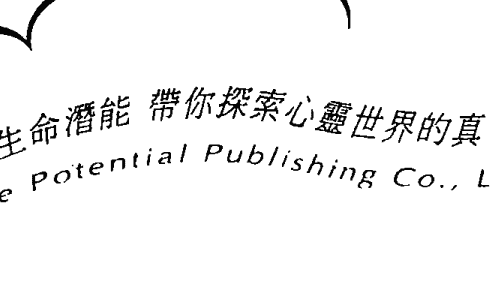
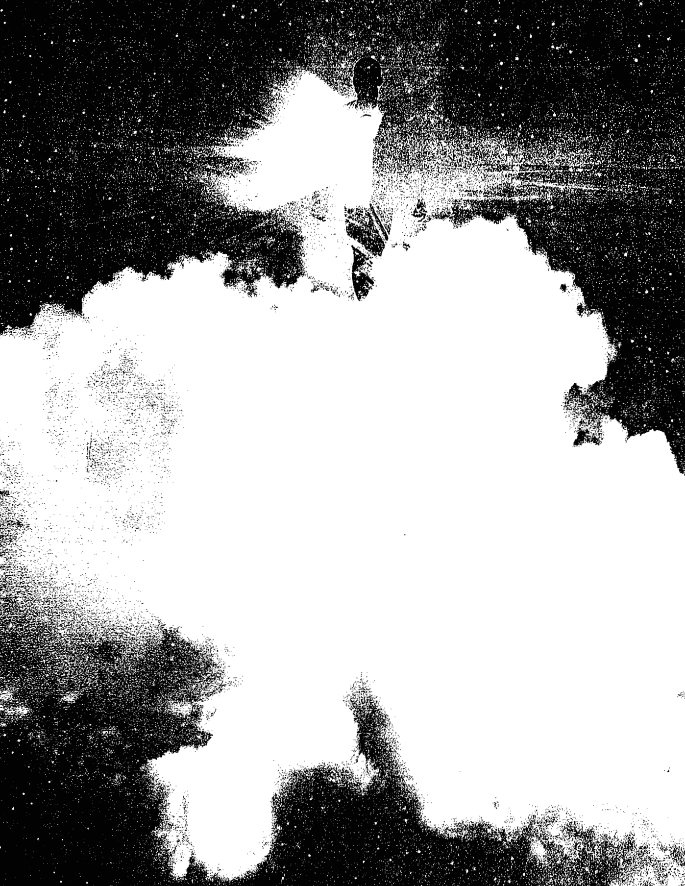
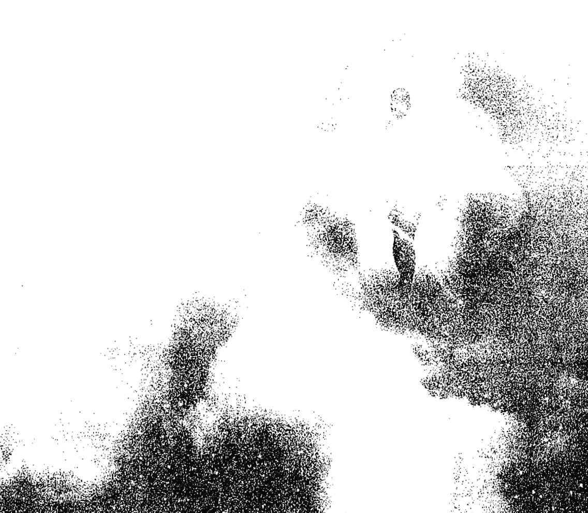
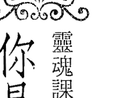
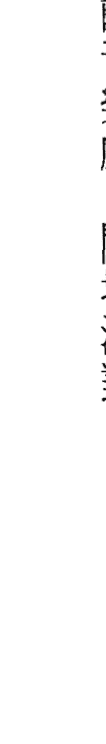
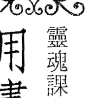
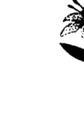
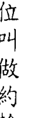

讓生命潛能 帶你探索心靈世界的真、善、美  
Life Potential Publishing Co., Ltd

## 22個今生靈魂課題

## Soul Lessons and Soul Purpose: A Channeled Guide to Why You Are Here

## 奉書獻給我那些崇妙的指導靈——

且把本書獻給所有我在這個次元與靈界慈愛的指引者與指導靈，尤其是優阿幸（Joachim）、艾勒菲利亞（Elephelia），以及第三道光的使者（Emissaries of the Third Ray）。

## 目錄

推薦序——選擇並體驗專屬你的靈魂課題  
陳盈君 7

序 9

來自第三道光使者的前言 13

## 第一部：學會運用你的創造力量 23

- 靈魂課題一：你是神聖不朽的存有 25
- 靈魂課題二：你是存在的共同創造者 35
- 靈魂課題三：創造由思想開始 47
- 靈魂課題四：投入感情 55
- 靈魂課題五：用畫面創造 65
- 靈魂課題六：活在當下 77
- 靈魂課題七：神聖能量流過你，而不是來自你 93
- 靈魂課題八：淬鍊理性 107
- 靈魂課題九：聽從內在的聲音 121
- 靈魂課題十：敞開心房 133
- 靈魂課題十一：不執著 147

## 第二部：運用神聖法則 161

- 靈魂課題十二：萬事萬物皆處於神聖秩序之中 163
- 靈魂課題十三：反轉觀點 177
- 靈魂課題十四：接受死亡 191
- 靈魂課題十五：擁抱人生的挑戰 205
- 靈魂課題十六：讓我執變得溫和
- 靈魂課題十七：面對錯誤
- 靈魂課題十八：積極冥想
- 靈魂課題十九：愛你的身體
- 靈魂課題二十：讓靈魂回春
- 靈魂課題二十一：粉碎負面模式
- 靈魂課題二十二：別再嗜吃

## 謝辭

## 推薦序｜選擇並體驗專屬於你的靈魂課題

靈魂功課，是每個人與生俱來的學習議題。不論你之前輪迴轉世過多少次的經驗，你總會在今生今世來到地球的時刻，帶著靈魂功課繼續前來學習。人生每個階段會遇到不同的功課，完成不同面向的靈魂議題，每個靈魂都是獨一無二的，當然每個人生為自己創造及選擇的靈魂藍圖也會有所不同！

在我教學的經驗裡，無論哪個領域與工具（OH卡、塔羅、原型卡、天使卡、奧修禪卡、開悟卡、指導靈訊息卡、曼陀羅……等等），都與探索靈魂功課的議題吻合。新時代賽斯思想提到，不論你遇到什麼樣的事件，你都不斷地在創造人生經驗與豐富靈魂經驗，在每件事情的背後看見慈悲性的本質，都在一件偉大的美好計畫中運作，因此所有的一切在本質上，並沒有意外、沒有巧合，只有創造！

很開心看到黎娅雅博士的新書在台灣出版，我感到十分雀躍！因為她的書籍與牌卡是我在教學、帶領工作坊及心理諮商的過程中常使用的工具，而最早期接觸的一套工具，就是《靈魂課題》（Soul Lessons & Soul Purpose Oracle Cards），它大大地幫助我在諮商工作中協助個案轉化，並帶來新的看見。

很開心這本書能夠出版，更完整地描寫與記錄了人生面對的二十二個靈魂功課。我自己閱讀時深受感動與啟發。在閱讀的過程中，彷彿來自內在智慧的高靈、指導靈伴隨著你，在你耳邊輕聲呢喃，溫柔慈悲而有力量地給予支持，告訴我們正走在靈魂覺醒的路上，沒有偏差！

在這個第三密度逐漸邁向第四密度的過程中，很開心我們都能參與其中，見證這個偉大時刻的到來，何等榮幸！當你開始翻閱這本書閱讀時，代表你已經準備好了，準備在這靈性覺醒的時刻起跑。書中的訊息將帶給你很好的提醒，在每一項靈魂功課的訊息中，慢慢地開展你內在神性，展現那個愛與光的時刻！你的靈魂將會引領你走向完善的計畫與人生道路，完成最適合也專屬於你的靈魂課題！

感謝所有在靈性成長途中一起同行的夥伴。

- 陳盈君  
- 高考諮商心理師、賽斯心靈輔導師、大學講師、國家文官培訓所推薦講師  
- 多年來在全台灣各地推廣教學，在大學開設新時代思想通識教育課程  
- 左西人文空間負責人  
- 盈君老師部落格：http://www.wretch.cc/blog/yinching1212  
- 左西人文空間：http://www.juicyeasy.com/

## 序

去年一月，我受邀在一艘沿墨西哥西岸航行的華美遊輪上，進行為期一週的講課。白天暖和的夜晚，我剛用完美味的晚餐，決定在回房之前先到上層甲板去，在滿天星斗下靜心。我無聲地向宇宙傳達：有這麼幸福的機會分享我的天賦，心中滿滿的感激；然後請求宇宙就人生的目標為我指引方向，也就是說：我工作的下一步怎樣是最好的？此刻我該如何服務別人？

一群叫做「第三道光使者」的光之存有，旋即突如其來地給了我頗為清楚的指示。他們主要的發言人是一位自稱為「優阿幸」的指導靈，祂至今已經與我交流四年多了。祂們要我通靈寫出一本名為《今生靈魂課題》的書。方向如此明確，讓我吃了一驚；但由於我當時已經承諾要寫另外一本書，便詢問使者這件事是否能緩一緩，至少先讓我完成手邊的工作。

祂們不置可否，只說要我通靈寫出一本名為《今生靈魂課題》的書。祂們會在這本書裡直接說明我們要如何實現在地球上的目標，而我很快就會開始。

## 今生靈魂課題

我第二天就把這件事告訴了我的出版商崔希，她的反應是：「如果祂們指引你這樣做，那就去做吧！」我便開始寫了。遊輪之旅結束後，我衝回家完成我正在進行的工作。雖然又多花了好幾個月的時間才完成，但這段期間我非常清楚我的指導靈就在一旁，很有耐心地等待我完成這件事，開始新的任務。

雖然我無法立即開始書寫，但使者並沒有打退堂鼓。祂們假裝沒有看見我正在做的事，開始把祂們要我寫的內容向我傳輸更多資訊。祂們明確地讓我知道祂們想要這本書如何編排：以二十二章一目了然的形式鋪陳。祂們說我會懂的。

我的直覺確實知道這個數字對我的意義：其一，我過去受的玄學訓練以及形上學的教育，都以靈數學為基礎。靈數學研究的是宇宙的數學秩序，而二十二在這個系統裡是一個神聖的數字，反映出物質世界如何顯化成形。其二，我也曾研究過西方的卡巴拉，他們認為二十二這個數字是萬事萬物的本源。

從我個人過去的研究中，我也知道數字一到二十二象徵萬事萬物顯化成形背後的宇宙法則。除了這二十二個數字在靈性上的重要性以外，希伯來文的字母表也是由二十二個字母組成，各自代表某些靈性法則，與數字相呼應。卡巴拉也是我的所學與背景裡很重要的一部分，二十二個原型構成了完整的系統。

## 序

因為在我所學的每一個靈性傳統中，二十二都是很重要甚至很神聖的數字，所以祂們指示這本書要用二十二個簡單明瞭的課題來鋪陳，我認為十分有道理。

祂們也要我用一種方式來組織章節，讓每一章都為下一章作準備，但沒有叫我堅持讀者必須按照書中的順序來閱讀，反而要我鼓勵讀者讓自己的內在引導，用自己的方式來閱讀。我只是透過通靈寫出這套課程，而讀者要如何吸收，端看各人內在聲音的引導。

最重要的是，使者告訴我，我準備寫出這些訊息已經有好幾年，甚至好幾世的時間了，而時候到了——當一個信使、分享這些訊息，是我生命目的的一部分；要完成這件事，就是現在。指導靈說，我只要允許祂們透過我書寫就可以了，寫書的是祂們。

我以前從來沒有得到要我通靈寫出一本書的指示，這次的經驗讓我大感興奮。使者讓祂們清楚確實的聲音流淌在這些書頁之間，明確而有力，沒有廢話。祂們很直率，給人忠告時不感情用事，但祂們的愛總是無條件的。祂們以迅雷不及掩耳的速度穿透自我的抵抗，對真我說話。

因此，你在一邊讀下去的同時，會一邊感覺到祂們的頻率以及祂們的存在，你也會知道，祂們對你有信心。

## 來自第三道光使者的前言

歡迎！這本書所涵蓋的教導，可幫助你通達身為人的經驗，活得像無窮無盡的靈性存有，從困於我執與痛苦的負面模式中解放出來。我們在這裡是要幫助你實現你在地球上的目標，也就是從一個被我執束縛的受限凡人，進化成一個體現靈性、沒有限制的永恆神聖存有。

地球是一間教室，是宇宙中唯一能讓你實質經驗你的創造的地方。地球也是一間實驗室，讓你學習、實驗——它是你宏偉本性的搖籃。你對這個星球最高的貢獻，就是按照大造物主的設計，通達愛與光。

這是一本指引手冊，告訴你如何迅速進化成一個體現光的存有，指出如何以二十二步驟通往活出更高頻率的大道，同時也給你一些方式來評估你的進展，讓你知道你正在進步。

如果你已經準備好著手開始你在地球上的真實目標，這本書會吸引你，它會和不抗拒通達生命的人產生共鳴。你在翻閱這些書頁的同時，可別被內容嚇到，或覺得內容太多而受不了。儘管有很多資訊和方向在等你吸收、整合，不過也有許多靈性的幫助在支持你。

手在幫助你成功，包括我們。雖然你活著是要通曉神聖的表達（Divine Expression），但你不是孤軍奮戰。你決定要展開靈魂目標的那一刻，你的天使和指導靈、像我們這樣的光之存有以及你的高我，就會立刻加入，給你幫助。

如果你能敞開心胸，你在這條路上的每一步都會收到慈愛的指引，遠遠超過平凡的自我所能想像。宇宙慈愛的力量要幫助你。

在你努力的同時，有一個重點：不要像很多以靈性為重心的學生那樣，認為你在地球上的生活好比住在化院，或覺得這是一個需要逃避的地方。你倒不妨把這裡看作是一間充滿機會的學校。地球是宇宙中唯一讓你所做的每一個選擇，都能直接看到反饋的能量之地，它能讓你看到你是否走對了路。

因為你是不朽的，所以你會一再回到地球上，直到你學會為止。所以說，沒有人會失去實現自己目標的機會，也沒有人會永遠落後。最終，所有的靈魂都會演進。

你們終有一天都將學會自己的靈魂課題，不管是用什麼方式。遺憾的是，人類這個種族整體而言，在這段時間課業做得並不好，從地球的情況正在惡化就看得出來。不管是環境或是你們人與人的關係都是如此。整個宇宙都感覺得到你們無法愛、無法表現光明。

我們是較高界域的存有，在光波中傳送下來，幫助你們跳脫迷惘的狀態。我們以神聖導師的身分，喚醒你們對神聖遺緒的集體記憶，幫助你們重新踏上靈魂課題與更高目標的軌道。

在我們超然的引導下，有愈來愈多的人正打開心房，也有愈來愈多的人重新拾起自己在地球上真正的目標：成為創造性生活的化身。

所有的人類都在這個教室裡同舟共濟，既是彼此的老師，也從彼此身上學習。當其中一個人不知所措，他可以從別人身上尋求指引。每個人就好比同一個生命體上獨立的細胞，個人的成長會為人類整體加分，人人都是不可或缺。一如每一個細胞都很重要一樣，每一個靈魂也都很重要。

雖然你們緊緊相連，可是每個人卻都不一樣。如同身體有很多器官、組織，由細胞構成整體一樣，每一個個體都會促進人類整體的創造。也一如身體的一個部分出狀況，其他部分也會跟著出問題一樣，當一個人靈魂的發展受困，整個種族都會受挫。

反之，當身體有一個地方活力蓬勃，其他地方也會跟著復甦，重新找回朝氣與青春，使整個身心系統一起恢復健康。

當你通過靈魂的課題，你個人的頻率就會跟著提升，與你接觸的每一個人也會找回氣息，恢復健康、倍增活力。你往前踏出一步，都會幫助這個星球得到療癒，促進地球的平衡，為別人的問題提供解決之道。

當你欣然擁抱你的靈性本質，成為別人眼中人類潛力的典範，就是在提供最高的服務。

在光界的我們被召喚來為你們服務。我們支持你們的努力，了解你們的挫折，為你們的成功而雀躍。因為要實現神聖計畫，就少不了你們的成長。

你的喜悅是所有人的喜悅，你的成功是所有人的成功，包括神的。除非你找回你的神聖本性，否則整個宇宙都會受苦。實現你的目標對每個人、萬事萬物都有助益，別人付出的心力也會反過來對你有所幫助。

在通達靈魂的過程中，宇宙萬事萬物最終都朝同一個目標前進：用愛和善行來服務生命之主（Lord of Life）。

我們支持你們，因為你們的成長對我們也有幫助。享受找回你的神聖本性吧！要知道你們有來自天界的協助。開口請求幫助，並以開放的心胸接受。

能為你們效力，是我們莫大的喜悅和榮耀。你是偉大造物主的神聖孩子，能得到你所需的一切援助和指引，你無須努力贏取，只要允許就行了。

你個人要做的，就是活在平靜與喜樂之中。你的目標是在萬事萬物中愛神、服務神。

我們的光與愛與你同在。

## 閱讀說明

通達靈魂的道路由二十二個靈魂課題鋪排而成。學會一個課題，將它完全整合到生命裡之後，就為理解、吸收下一個課題打下了基礎。這些課題觸及所有面向的意識，包括身體、心智、情感與精神，目的是讓你的覺知完全與你的高我及真實目標一致。

這些課題又分為兩個層次：前十一個課題主要是瓦解虛妄的概念，讓你從我執中解脫；後十一個課題則著重在提升你的覺知與頻率，好讓你完全與高我及地球上的神聖表達合而為一。

要完全通透每一個課題，每個靈魂都必須走過四個學習階段：新生、見習生、上路者、達人。

如果你是新生，這些資訊對你而言是全新的，它們將提供你一個與你目前在世界上的思考、感知與生活方式截然不同的觀點。你可以從你在生活中與每一課主題相關的部分感到困擾或有問題的程度，來看出你在這一課是否是新生。你感受到的挫折與痛苦愈深，就愈表明你是靈魂課題的新生。

如果在一個課題中你是見習生，這項任務就不是全新的了。你以前曾接觸過，你的理智也願意學習，說不定你還曾積極地尋找導師與典範，來幫助你對這個主題有更深的理解。

如果你經常講起某一項靈魂教誨，甚至想得比說得還多，那你就知道你是見習生了。你在這個課題中掙扎、努力克服。最重要的是，你願意學習（或多或少），心裡也隱約知道這正是你要做的事。你明白自己必須轉變，卻又不願做任何具體行動來改變。

當你進入靈魂課題的上路者階段，你的抗拒會開始退卻。你發自內心地欣然接受這些訊息，也確實開始付諸行動。這是一個一邊做一邊學的階段。

上路者階段和見習生相反。見習生雖然在理智上接受一個教導，但沒有實際行動；上路者則會全心投入，盡最大能力去實行。

靈魂課題的見習生會問生命：「為什麼你要這樣對我？」  
上路者則會琢磨：「我為什麼要這樣對待自己？」

成為一項靈魂課題的達人，表示你已經完全接受它並將它融入生活，它已不再為你製造問題。你發現學會這個主題在生活各層面帶來許多益處，你感到有力量也有信心。

一旦通達一門課題，你就會開始實現與這個課題有關的目標。你的成就會成為一個典範，讓仍處於新生、見習生或上路者階段的人深受啟發。別人得到你的鼓勵與引導，你也為他們帶來希望。

因為這些課題是按照順序鋪陳的，所以最簡單的學習方式，就是依序學習。第一課為第二課打下基礎，第二課為第三課作好準備，以此類推。你愈理解並整合一個章節，要學習下一章就愈容易。

不過，人類很少是這樣一氣呵成的。所以在回顧這些教導時，即使你發現自己好幾世以來都是零散地學習這些課題：學了一些、跳過一些，還有一些完全遺漏，使得現在的理解像一鍋大雜燴，需要重新整理，也不足為奇。

若是如此，就複習你已經知道的課題，按照你已學會的來生活，同時在你曾跳過或忽略的課題上下功夫。

為了幫助你了解每一課的進展，我們在每一章的最後都舉例說明新生、見習生、上路者與達人各自的表現，幫助你辨識自己在學習曲線上的位置，以及如何更上一層樓。

別為你目前的程度擔心。每個課題中人人所處的階段都不同。你可能在某個課題中是達人，卻在另一個課題中是新生。很少有人在二十二個課題中全部都頂尖或全部都落後。

當你在學習曲線上前進，你會被那些比你更早通達某項課題的人所啟發；而你付出的努力，也會鼓舞那些還在你後面的人。你的奮鬥會激發出他們最好的一面，而他們的努力也會激發出你最好的一面。

本書這一整套課程教授的是神聖法則，它統管宇宙所有活生生的意識。你會發現它既嚴格又縝密，也相當具有挑戰性。雖然這些法則並不是個人層次的，但一旦你開始運作它們，就會立刻得到回饋。

你的經驗會是你最好的老師，因為它會讓你看到自己是否正在學習。從你有多喜樂，就能看出你的成功程度。

每一課都要仔細閱讀，最好讀上幾遍。花一兩天時間靜思，讓這些訊息在你的意識與心裡沉澱。留意它是否對你有意義，也給自己時間去接納它。

我們在每一章最後都請桑妮婭提供一些簡單建議，幫助你在學習的路上更進一步。

因為每一小步都會讓你快速朝更高的頻率前進，所以學習的過程其實是溫和的。我們從不要求你做能力不及的事，只是邀請你稍微跨出習慣的舒適圈，嘗試一些新的方式。

這趟旅程不必充滿痛苦。事實上，這些指引的目的正是為了舒緩你的困頓與生活中的苦悶。

唯一需要避免的是拒絕學習。那其實是在阻擋你自己的神性。如果你向我執屈服，就會降低你自己以及全人類的頻率。

因為你也是人類集體意識的一部分，所以拒絕成長會傷害地球以及地球上的萬事萬物。

請相信，在靈魂的層次上，你對發展完全去愛的潛力的渴望，遠遠大過我執的抗拒。所以你才會經常感到宇宙在輕輕推著你，讓你卸下抗拒，向你的神性臣服，直到我執讓位給成長、接納與更高的頻率。

用輕鬆的態度、開放的心與頭腦，來接觸這些靈魂課題吧！要真正通達它們，確實是一項挑戰。

## 閱讀說明

戰，但我們跟你保證，要接納它們並不比忽略它們難。畢竟忽略這些教導，只會讓你的人生旅程愈發慘淡，缺少創造力而已。

別害怕靈魂課題，因為沒什麼好怕的。它們會讓你從沮喪與痛苦中解放出來，而不是讓你更慘。它們也不會讓你的自由受限，剛好相反：你愈接納你的靈性本質，就會得到愈大的自由。

接觸這些課題最好的方式，就是帶著好奇心和興趣。因為你會發現，其中有一些你已經學了，甚至有一些已經通了。你正把它當成你目標的一部分活出來，讓你又驚又喜。

你也不需要在這一世就把二十二個課題全部精通，因為在你的靈魂從一世流轉到一世的過程中，過去所有的學習都完整無礙。你已經在這些主題上下功夫好幾個輪迴了，不管是有意識還是無意識地，而且你也確實在進步中。在地球上旅居，每次都像走進教室，讓你在學習曲線上前進。當時機成熟，你就會達成所有的靈魂課題，沒有一次的學習是白費的。

雖然你不能完全跳過一些課題，但你在宇宙中有無限的時間去學習，因為偉大造物主給你的禮物是自由意志。你可以選擇迅速進步還是緩慢進步。地球和人類的經驗是一間靈魂的學校，沒有把二十二個課題全部精通，是畢不了業的呢！

## 今生靈魂課題

用開放的心智來接觸這些教導吧！遇到你已經精通的，不妨感到滿足，以自己為榮；遇到是挑戰的，就堅持不懈，在你成功之前勤下工夫、尋求協助。要記住，你是神聖的存在，除了你的思想之外，沒有什麼能限制你。這些指引的用意，是要引導你循序漸進，從阻礙你神性的模式與行為中解放出來。

等到二十二個課題全部精通，你完全整合你的高我，體認高我就是你真實的身分之後，你就實現了你靈魂的最高目標。到那個時候，你將隨時隨地感到自己與神聖意識和諧一致。你沉浸在幸福的狀態中，沒有限制，也沒有苦難。你內在的光會普及世界和彼岸，給萬事萬物帶來療癒與和諧。我們以謙卑之心，為宇宙慈愛的主效力，是祂召喚你的光往前進射；我們認得你的神性，能為你的進化效力，乃是我們的榮幸。

獻上滿滿的愛

寧靜的第二道光使者

## 第7部  
## 學會運用你的創造力量

## 靈魂課題一  
### 你是神聖不朽的存有

你是神聖不朽的存有，你是宇宙的寶貝孩子。你在地球上主要的目標，是認清你的真實本性——你就是創造力充沛的靈性存有。然而，與肉身有限生命相連的我執，一直想盡各種辦法與這個真實鬥爭，好繼續掌控你。它害你遺忘了你的真實身分，陷入迷惘與絕望之中。

待體認到你是神聖不朽的存有，你擁有創造及通達各種才能的力量後，所有的煩惱與痛苦都會平息。你身為人的體驗將帶給你喜悅、平和與安詳。如果沒有體認到神性，反而被我執牽著鼻子走，你就會一直過著恐懼、不快樂的生活，失落於在地球上的真正目標，無法表現你富含創造力的精神。

你是神聖不朽的存有，你目標最重要的一部分，就是找到你的創造力，並且精通它。地球及身為人的經驗給了你靈魂最棒的教室，你可以在這個教室發揮你的創造力，透過考驗來摸索學習，用各種方式進步。你們這個世界古老的神祕家把這個過程叫做「煉金術」：一種把「我執」的賤金屬轉變為「靈」的貴金屬的過程。

你可能會納悶，「神聖不朽的存有」到底是什麼意思？它的意思是：你不是你的身體、人格模式、我執，你也不是你的過去或未來。千萬不要用你過去的遭遇或處境來界定自己，因為這些只是你可以運用的工具，但不是你。

你是靈，神創造出來的超絕智慧，燦爛如火，本質是無窮無盡的。你不用像很多人相信的那樣，要變得「靈性」，好像你身上有什麼根本的缺陷，你必須修正或克服一樣。你就是靈，接納它，表現它吧！愛它，享受它吧！

你不用去外在世界取得接納或認同，沒有外在世界這種東西。人類是一家，人與人本來就緊緊相連，是神聖的一體。你既是這個共同體的一部分，也是愛的神聖化身——神的孩子。

唯一阻礙你發現這一點的，就是我執。你有一個轉瞬即逝的肉身載具，在地球上你就在這個身體裡學習，而我執是這個載具的一部分，試圖掌控一切，想讓你相信它是老大。我執充滿恐懼，它攪亂你、混淆你，用盡所能讓你無法認識你的靈，你的真我。

別被它蠱惑了。不過，我們也並不建議你嘗試擺脫我執，因為事實上那是不可能的。只要你活著一天，它也就活著一天。想把它連根拔起，就像跟它玩躲迷藏一樣，是在浪費時間。這會讓你無法活在你的靈裡。

相反地，去愛你這個令人苦惱的一面！接受它是你的一部分，它的本質就是會想要掌控一切。對我執一笑置之（當然是用深情溫馨的方式），別管它的觀點。它不是你本我的聲音，也不會傳達真理。當你聽我執的話，就會被負面的事物和恐懼吞噬。它永遠也沒有安全感，需索無度，老是威脅恐嚇，讓你的靈永無寧日；你一給它注意力，儘管只有一點點，它也會變本加厲。

與其專注在我執虛妄的建議上，倒不如與你神聖不朽的靈和諧一致。靈會引領你看見真相：你很珍貴。神、宇宙、你的指導靈及天使——我們這些使者——都熱愛你。你是神祝福的孩子，你全身上下都是由愛構成的。學會珍惜自己！就像神珍惜你一樣，全心全意，沒有限制，沒有條件。你在地球上，就是要接受並通曉這個事實。

（翠妮雅：如序中所言，用新細明體印刷的部分是第三道光的使者讓我書寫的，用標楷體寫的部分則是我個人的故事和省思，不是通靈而來。）

我還記得我第一次接觸到這一課時是什麼光景，是透過我最好的朋友蘇，她有通靈能力。當時我十一歲，我們在學校玩紙牌。那時正要輪到我，她俯向我，悄聲對我說：

「我有話告訴妳。」

我很好奇，便把頭轉向她，但還是繼續玩牌。她等我停下來，要我全心全意地聽，然後她低聲說：

「妳知道嗎？我們是神。」

她嚴肅的舉動讓我大吃一驚。我氣急敗壞地說：「什麼？妳說的『我們』是我和妳嗎？妳怎麼能這麼說！那是……那是錯的！」我立刻就反彈了。

雖然我當時已有通靈能力，和各種靈體也有強烈的連結，但我還是個很「乖」的天主教小孩，是宗教的滿分學生。我從來沒聽過這麼自然的話。我聽到的是：「我們是罪人，天生就是，除非受洗，否則連天堂也進不去。」蘇說「我們是神」簡直太過分了，這違背了我在學校學的所有神學，感覺是一種褻瀆。

我不讓她說：「別這樣說，更不可以大聲地說，噓！」

她冷靜地回答：「不管妳怎麼說，事實就是如此。」

她柔聲堅持，激起了我的興趣。她怎麼知道？她怎麼這麼大膽，這麼不怕？

「再怎麼說，我們都是天主教徒啊！」

她等到我靜下來，才輕聲跟我解釋，她一直都在公園圖書館的形上學區看一些書。她偶然翻到了何姆斯（Ernest Holmes）、布拉瓦茨基夫人（Madame Blavatsky）及其他神智學導師寫的書。

蘇說：「書裡頭的偉大導師說我們是神聖的。我相信他們說的話，妳也應該相信。」

當時她說的話讓我害怕，聽起來好像很……狂妄，至少我天主教的訓練會這麼覺得。可是，在直覺甚至本能的程度上，這些話和我骨子裡起了共鳴。我知道那是真的，感覺是對的，我無法置之不理。

當時我們停止了討論，因為我怕被別人聽到，惹上麻煩。不過她說的話在我心裡播下種子，這個想法揮之不去。我開始想弄明白，甚至還偷偷溜到圖書館，讀她說的那幾本形上學書籍。我找到了，就她說的那些真理。

過了我和她約十五歲時，個人神性的種子已經生了根。除了母親以外，我沒有跟別人說，不過她和我的指導靈都同意蘇的話——我們是神聖的。

不久，我認識了影響我最多的靈性導師圖利博士（Dr. Tully）。我第一次聽他說話時，他確認了蘇的話是對的。他整節演講都在講人人共有的神聖本性。我相信他，我的人生目標就此展開。

打從那時候起，我親眼目睹很多人用各種方式發現到這個根本的覺察。有些人很驚訝（如我當年），有些人興趣盎然，更有些人害怕。不過這一課基本上會讓人變得更有勇氣，而且愈來愈感覺如此。身體裡的細胞都知道我們是神聖的存有。大家愈早接受這一點，就能愈感覺到更深的平靜。

我們需要現在就了解這一點，才能停止因恐懼而行事，不再因為無法愛自己而拒絕自己與別人。人人有朝一日都要面對這個事實呈現在眼前的那一刻，這個祕密已經藏不住了。

當我們真的有了這個體察，對這一課就會產生使命感，展開目標的時候就到了。現在，你可以回應這一課。

如果你發現這些資訊是全新的，你很難相信自己或別人身上有什麼神聖的地方；你覺得這些話聽起來很狂妄；你大多數的時候自尊心低落……那麼，就這個教導的這部分而言，你是新生（student）。

不過，如果你發現你是靈魂，但不怎麼相信你是神聖的；你認為你是有可能變得神聖——那麼，你是見習生（apprentice）。

如果你控管你的想法，你的思想宏偉；你感到神愛你，也知道你是靈性的存在——那麼，你是在上路者（journeyman）的階段。

如果你接受你是神聖的，對你不朽的靈沒有抗拒，你正體驗神聖的生活，或是在探索如何把你想要的創造得更好——那麼這一課，你正歡欣鼓舞地朝達人（master）的方向前進。

### 如果你是上路者……

- 專注在你身上你愛而且欣賞的地方，並且大聲說出來。要常常這樣做。
- 花點心思肯定自己，並且大聲說出來。
- 注意什麼活動能讓你平靜，然後去做。
- 肯定你的造物者是愛你的。

### 如果你是見習生……

- 深呼吸，要知道是祂們給了你生命。祂們是你靈的根本。
- 讚歎你的靈，想想有什麼能用喜悅點燃你如火的熱情。
- 多注意人與人之間的共通點，少注意差別；看看人類有什麼很好甚至很棒的地方。
- 別再追求別人的肯定了，接受你是神聖的。

### 如果你是新生……

- 深呼吸，要知道是祂們給了你生命。祂們是你靈的根本。
- 讚歎你的靈，想想有什麼能用喜悅點燃你如火的熱情。
- 多注意人與人之間的共通點，少注意差別。
- 別再追求別人的肯定了，接受你是神聖的。

## 22個 Soul Lessons and Soul Purpose  
### 今生靈魂課題

你的靈魂課題：  
你是神聖不朽的存有。

- 對我執一笑置之，享受你的靈。
- 繼續培養你對自己的愛與接納。
- 敞開地接受你的神聖本性。
- 無條件地愛自己。

如果這一課，你走在成為達人的路上……

- 每天都提醒自己，你是神聖的。
- 看入別人的靈魂。
- 看見眾生身上的靈。
- 略過所有讓你懷疑自己價值的想法或感受，專心致志地活在靈裡。

## 靈魂課題一  
### 你是神聖不朽的存有

> 你的靈魂目標  
> 愛自己，如神愛你。

## 靈魂課題二  
### 你是存在的共同創造者

你是宇宙的共同創造者。你人生的每一件事物，包括健康、人際關係的品質、物質狀況、對生活的滿足與否、工作等，都直接反映出你目前如何運用你開創的力量。

要相信你的影響力可以這麼大，或許會讓你很震撼，不過這是真的。所有的情境都是你設計出來的，只不過你很少知道自己在設計而已。大多數的情況都是你無意識發展出來的，因為你不曉得要如何正確運用創造力來達成你真正的目標。

可是別以為這一課是在責備你。其實這就像把車子的鑰匙交給小孩，看著他讓十台車撞成一團，然後說他是故意製造車禍的。是的，或許因他而起，但他不是故意的。

你是神聖的存有，你擁有在地球界創造的力量。但要成功實現你真正的願望，你必須在所謂神聖法則的框架下來做。神立下了永恆不變的法則，主宰物質世界如何生成。如果你的作法與這些神聖準則一致，那你任何心願都能實現。

除非你能明白你是共同創造者，並接受是你選擇了今日這樣的生活——雖然或許是無意識的——否則你無法通曉你的靈魂課題，或是完成你的目標。

你愈快發揮你本來就有的創造力量，學會適當地運用它，你的人生就會愈快變成一場令人欣喜的經驗——它本來就應該是的。

我們聽見你問：「你們的意思是說，是我創造了貧窮、疾病、孤立、失業、社會上讓人不滿的事以及艱苦掙扎嗎？」

老實說，是的，是你創造的……不過同樣不是故意的。你只是從悲慘的例子上學到了如何濫用你與生俱來的神聖力量，你沒有學到如何正確地引導它。基本上你一直都按照你從別人身上觀察到的方法來做，通常你也沒有質疑他們的所作所為。

比方說，如果你母親在金錢這件事上胡亂運用她的創造力，搞出負債，那麼你也可能會做同樣的事。或許再上一代的父母親在這部分也有問題。

幾個月前，我和我的個案通話，她名叫蕾塔，自稱疑心很重。她女兒勸她打電話給我。她劈頭就告訴我她很難信任何事，特別是我說的話。

我掃視她的能量，在與我的指導靈確認後，我問她母親是否剛死於肥胖症。

蕾塔很震驚，她說事實上是的。她母親體重一百七十二公斤，但身高只有一百六十二公分，而且她胖了一輩子。

然後我又問她是否也苦於同樣的情況。她沉默了一陣子，然後說：「我想說我沒有，但我必須承認我有。我也嚴重過胖，但因為我比我母親高，所以說服自己沒有那麼糟。」

我接著問她女兒是否也過重。

她脫口而出：「沒錯！比我要嚴重！我告訴她得注意她的健康，但她叫我管好自己就好。把我給氣死了。不過從妳的觀點來看，我想她說得對。」

然後蕾塔突然陷入一陣絕望：「噢，老天哪！有時候我真想放棄算了。」

我等了一下讓她平復情緒，然後問她母親是否也曾說過同樣的話。

她說：「她沒有一天不這麼說。」

我問：「那妳女兒呢？她有沒有說過她不想再努力了？」

蕾塔答：「聽到妳這麼說，是的，她有——整天都掛在嘴上。」

我又問：「那妳呢？妳也是個悲觀的人嗎？」

「我從不認為自己是，但我想我必須說，我是。」

「妳心情不好的時候，就會大吃特吃，是嗎？」

「當然，那會暫時舒緩我的痛苦。」

我接著說：「我的指導靈告訴我，妳和妳女兒只不過是在創造妳母親塑造出來的模式。妳的體重問題是一個傳承而來的思考模式，然後妳又傳給下一代。」

她說：「我家族所有的女性都過胖。」然後她笑了：「我想我們學到的是同一件事吧！」

「是的，不過有好消息給妳。如果妳可以讓這個問題成真，那妳也可以創造別的事。但不是任性胡來，只用我執而已。妳要成功，就必須與宇宙一起創造。」

「妳擁有創造痛苦和悲慘的力量，或者妳想要創造健康和喜悅也可以。只要在設計人生的時候，請妳的神聖援助幫忙，一切就會好轉。」

蕾塔沉默了一分鐘，然後說：「我知道妳說得對。我之前說我是懷疑，但事實上，我的內在聲音——不管妳怎麼叫它——也給我同樣的訊息。我只是不想聽見罷了。」

我再次請她把體重的狀況純粹看做是無意識採取的模式，在存在的協助下，這個模式是可以改變的。我針對她的情況，推薦了暴食者互助協會（Overeaters Anonymous）。

這個協會提供一個絕佳的訓練場所，練習運用上天的力量來創造新的景況，而且是免費的。

她其實沒有像她說的那樣固執。她第二天就加入了暴食者互助協會。十個月後，她來信說她減了三十八公斤，還減掉了很多怨恨。她說她很享受創造一個新的身體，還有新的人生。

她還說最棒的是，她女兒喬琳最近也決定要改變思想。她們正一起努力，為自己和家族後代的女性開創新的傳統。

像這樣誤用創造力不是任何人的錯。那只是錯誤一再重演，只是模式一代傳過一代，人傳人，一世傳過一世。

你的課題是停止這些無意識的思考形式，讓它不再主宰你的生活，令問題不再延續。並立下運用想像力的新典範，讓別人追隨。

一旦理解，你就會知道這是你在這裡的原因：有意識地駕馭、引導你的神聖能量，而不是讓它處於自動駕駛模式，讓同樣的錯誤一再持續。

目前你不用擔心怎麼樣才能讓創造力更好地流過你，只要接受你擁有它就行了。因為你要先承認你是它的擁有者，才有辦法精通這項天賦。

雖然你生活中的某些領域——譬如你的原生家庭、你出生時的物質條件和狀況——看起來好像不是你個人所能影響的範圍，但你是沒有時間性的存在。

在你轉世為目前的形體之前，你曾經擁有漫長悠久的歷史。所以雖然你的我執可能會覺得這聽起來太扯，但確實是你的靈魂選擇了這些境遇，包括你的家族、身體、出生地。這都是為了幫助你好好地繼續進化。

每個新的一世都從上一世結束的地方開始。也就是說，你不只選擇了眼前這一世的情況，也從前世帶來一些特性。

比方說，如果你上一次在地球上的時候不事生產、過分依賴別人，沒有學習如何重新導引你的創造力、變得更自給自足一些，那麼你在地球上會繼續面對缺乏創造力的情況，直到你學會如何讓一些不同的事顯現為止。

我有一個個案名叫卡洛斯。他真的接受了自己的力量，並決定在存在的協助下做出重大的人生改變。

他是一個工程師，生於墨西哥。他想成為美國的永久居民，在德州尼爾索——他目前用短期簽證工作與生活的地方——創立一間超自然的治療中心。

他的律師告訴他，申請成功的機率只有百分之五十，而且就算成功，也可能要好幾年才會核可。

卡洛斯沒有理會這些話。他請求宇宙幫助他實現他的想法。幾個月後，他的居留卡寄來了。

他的律師不敢置信，因為這個過程通常曠日費時，一步驟接著一步驟。

他繼續與宇宙一起創造。他沒有自己去「搞定」，也沒有聽那些讓他喪氣的話。他請求神幫助他為他的治療中心顯化出一棟建築物。

短短幾個月，他就找到一棟價值五十萬美元、重新裝潢過的建築物。不僅如此，牆壁還剛好用他標誌上的顏色漆過，一模一樣。

他搬進去，幾週內就把中心開了起來。每個人都說這是不可能的任務。

他說：

「如果只有我獨力來做，我確實永遠也不會成功。但我是共同創造者。我請求宇宙這次支持我的目標，為我施展一些魔法。」

「過去，大多數人會告訴我該用什麼方式，我也看見別人甚至自己在做什麼。但這次我想來點不一樣的。我想向每一個說我無法實現夢想的人證明，他們錯了。」

可不是！他確實證明了。

若你去瓦爾巴索，隨時都可以去他的治療中心看看，叫做「智慧蝶」（Butterflies of Wisdom），說是蛻變人心的地方，當之無愧。

不要跳過任何順序，也不要用靈魂出竅來略過靈魂課題。相反地，在這個學習中要穩穩前行，循序漸進，朝在物質世界裡完全活出、表現並連接你神聖靈性的方向前進。

活在世界上的喜悅莫過於此。這也是你的靈魂選擇來到地球上的原因。

你可以創造無限可能的驚奇。你也能隨時隨地都在創造。一旦你學會用讓自己開心的方式創造，生活就會變成充滿奇蹟。

## 22課 今生靈魂課題  
*Soul Lessons and Soul Purpose*

現在你可以應用這一課。

如果你過去沒相信過，現在也不相信什麼都可以創造；你覺得世界很不公平，你氣憤又無助；你覺得這是要求你承擔你擔不起的責任；你心裡暗暗期待有一天，會有白馬王子或公主闖入你的生命，讓一切都不可思議地變輕鬆……那麼，這一課你是新生。

如果你以前曾經接觸過這樣的想法，你覺得興致盎然，甚至意猶未盡地玩味著，不過沒有太認真；你會看心理勵志的書籍（不過從沒有看完），雖然你得到鼓勵，但你不相信你能讓事情變得更好；那麼，你是見習生。

如果你知道你是宇宙的共同創造者，你等不及要增進顯化的技巧，你也密切注意自己做出的選擇；你完全為人生的各種情況負責；那麼，你是在上路者的階段。

如果你早上醒來，對於一起創造下一個讓人興奮的目標信心滿滿、聚精會神、充滿雄心壯志；你身體的每一個細胞都知道你會成功，你用樂觀輕鬆的態度看待生活，同時你有如鋼鐵般堅定不動搖的決心和自律；你從不讓失敗進入心靈；那麼，這個教導你已經來到達人的層次。

---

## 靈魂課題一  
你是存在的共同創造者

### 如果你是上路者……
- 把創造看作是施展魔杖。現在你想發展什麼樣的可能性呢？

### 如果你是見習生……
- 列出現在你想要達成的事，看看每一個目標激發你多少熱忱。
- 追求讓你雀躍不已的願望。暫時先忘掉別的。
- 講成功，閉口不談失敗。
- 把創造看作是施展魔杖。現在你想發展什麼樣的可能性呢？

### 如果你是新生……
- 將生活中目前你認同而且享受的情況全都列出來，告訴自己你做得很好。
- 把所有你不滿意的情況都列出來，觀察家裡是否有其他人也學到了同樣的負面模式。
- 讀好好想想——「你可以創造」這一類的想法，看看你下一件想做的事是什麼。
- 讀一些勵志書籍。

- 每天晚上睡覺之前，花一點點時間寫下你今天的創造。
- 寫兩行：一行是 A，列出成功、讓你滿足的顯化；一行是 B，寫出挫折。
- 在 A 行的成就旁邊，記下你做了些什麼讓它發生；在 B 行寫下你做了什麼或沒做到什麼才導致這次的失望。
- 列出能帶來更多幸福與成就的正面模式。
- 舉出你哪些地方創造力充沛，哪些地方你還在掙扎。
- 看看你有哪些負面習慣會讓你達成願望的努力受阻，而這些習慣是你在成功的時候不會存有的。

### 如果你走在成為達人的路上……
- 慶祝你的成功，別不好意思，也別低調。榮耀你的神性是很好、很神聖的一件事。
- 分享你實現的關鍵。
- 支持新生、見習生、上路者，在他們開口的時候幫個忙。
- 持續練習，明確說出你的夢想，好好享受過程。
- 永遠記得要專心致志，不減熱情。

---

## 靈魂課題二  
你是存在的共同創造者

你的靈魂目標  
全心接受你的創造力量，就是榮耀並尊重你的靈魂。提醒別人也這麼做。

你的靈魂課題  
你是神聖的共同創造者。

恭喜！你已經克服了阻礙你的靈魂接受你的靈性本質，以及你天生的共同創造力量最大的障礙之一。

---

## 靈魂課題三  
創造由思想開始

所有的創造都從念頭開始。顯化的過程不是隨機發生的，也不會雜亂無序。雖然在不知道這些法則、未受過訓練的人眼中看來，好像確實是這樣，但是你的想像力量以及所有這類的能量，都按照神聖法則在運作。神聖法則讓萬事萬物的發展都由頭腦啟動。你們世界的量子力學已經證實了宇宙的所有事物，包括你乃至我們，都由意識或思想組成。歸根究柢來說，存在的所有層面，包括你個人的世界，根本是由你的所思所想、信念、想法顯化而成的。

創造是一個相對單純的過程。若你選擇好的思想、信念、想法，就會引發正面的結果實現。你的課題就是在產生念頭的時候要謹慎，這樣你才會創造出你想要的結果。想想你今日生活怎麼樣，就可以檢查你到目前為止是怎麼樣在運用創造力的。你所觀察到的一切，都是你使用頭腦的方式而生。你的念頭會用下面兩種方式之一來創造：一種是有意識地與神聖法則一致，一種是被世界的混亂無意識地牽著鼻子走，忘我失神。

你可以想像得到，這兩種方法帶來的後果非常不同。當你的意念被我執主導，被表相迷惑，你會無意識地行動，把注意力集中在負面的自我形象、不安、懷疑、想像出來的災難、外在的影響、過去真或假的壓力模式、全球性的恐懼上，讓你顯化出疾病、壓力、混亂、失望和痛苦。

我有一個叫做琳恩的個案，她的注意力只放在她孤苦伶仃這件事上。她是獨生女，也是孤兒。她先是被丈夫離棄，然後又被男友拋棄。她的孤單寂寞把她的眼界縮得如此狹窄，使她破壞別人一切想用更親密方式連結她的努力。雖然她心急於創造親密，希望有夥伴，結果卻是活得孤孤單單。我認識她已經十年了，這段時間裡，她的人生沒有什麼改變。在她轉換心態之前，不會改變。

去看注意力停留何處，可能是一個很有挑戰性的任務。比方說，當我回顧我的生活，我可以一下就看到我把注意力集中在我和女兒的關係、與個案親近密切地工作、與朋友創造正面的連結，以及寫作、教學、與世界分享我的訊息上。如此這些領域會很順暢如意，也就不足為奇。我對我顯化出來的事物頗為滿意。

然而，讓我驚訝的是，我也注意到了我沒有給我先生足夠的注意力。我沒有給休閒和娛樂（至少最近沒有）、放鬆（簡直從來沒有）足夠的注意力。不用說，我和派崔克的距離感比以前都大。因為我的玩樂不多，所以我的脾氣比往常都要暴躁；也因為我很少停下來，所以我經年感到疲倦。

這讓我不滿意，我覺得我應該更深入一點。然後我發現到一層深埋的想法，這想法長久以來都是我的核心焦點。我一直都按照一個信念行事：我必須不斷地鞭策並驅使自己服侍上帝，我個人的需要沒那麼崇高，不用滿足。這是我三十七年前在天主教學校學到的態度（如果不是更早一點，來自世俗的話）。它一直留存著，從那以後，就為我創造出我負荷不了、未善待自己的經驗。

我還以為那已經過去了呢！說實話我很驚訝這些頭腦的習慣還在。我看到無意識的模式可以多麼固執。事實上，靈魂課題有很大一部分是要我們去覺察我們到底把注意力放在什麼上面，好好檢視，看它是否對我們有幫助。如果沒有，就改變它。如果我們把注意力放在正面、好的創造上，那就不用管它了。但如果注意力還困在古老、傳承而來的痛苦裡，我們就應該重新集中注意力在別的地方，好得到解脫。

意念展開以後，就會主導創造力的進程。宇宙屈服於不屈不撓的意念，因為這是神聖法則的本質。想一想你如何用各種方法主導你的念頭，並注意它們產生了什麼樣的結果。

最近我的大女兒索妮雅買了她的第一台車，還邀請她妹妹莎柏麗娜來慶祝首開。開到我們家外面三條街的地方，她就掉進了路上的坑洞，輪胎凹了，輪圈也爆了。她把車拖回經銷商那裡，說明剛才的情況。他們說是她運氣太背，不是他們的問題，要修要三百五十塊美金，把她氣死了。

她拒絕了這個說法，她要公平正義。她寫信給經銷商的經理、製造商、輪胎公司，態度堅決，要求受損的部分免費修復。她是這麼樣地專注於她想要的結果，完全不允許否定的空間。

她的願望勝利了。她不只在對方收到信的四十八小時內就得到回應，他們還給她新的輪胎及輪圈，一年免費的汽車美容，製造商也道了歉。

她很意外嗎？沒有，她心意堅定。我們可以從這個快速得到回覆的例子看到意念的力量。我從沒懷疑過她會成功，因為我看得出她多麼專注於她的目標。

沒有念頭是中立或沒有用的。所有的信念都有力量，不管是有意識地還是無意識地，只要你把注意力集中在某一股力量上，引導這股力量，它都必然顯化出一些東西，沒有例外。

你不必監控所有的念頭才能夠創造出你想要的結果，只要監控那些對你不利的念頭就行了。有些念頭帶來美好的結果，所以不用管它們；只要去注意有害的、腐蝕你生活的想法，把壞念頭改作有用的念頭，並把帶來反作用的念頭篩檢開來。把注意力集中在你想在生活中擁有的情況和經驗，神聖法則和你這個神聖的創造者天生擁有的力量，會讓這些夢想實現的。

現在你可以應用這一課了。

如果你十分迷惘，不知道要把注意力集中在哪裡；你過分憂慮，以致沒辦法專心在任何事物上；你把注意力都放在世界出錯的地方……那麼你在這一課，或是新生。

如果你同意——如何引導心智確實給你生活的一些領域帶來多或少的不同，但不是所有的領域；你偶爾練習正向思考，不過大多數的時候都會忘記；你很難長時間專注在一件事上；你相信甚至害怕你在新聞和電視上看到的……那麼，你是見習生。

如果你接受你的思想會創造；你很注意你的念頭，會注意它們何時給你帶來你生活中想要的結果、何時沒有；你很謹慎地做有益的思考……那麼，你是上路者。

如果你做有創造力的思考；你定期回顧你的信念；你大多數的時候都專注在正面、快樂的念頭上；你對於揭露無意識、帶來反效果或負面的心智模式不遺餘力……那麼，這個教導將正帶你踏上達人之路。

### 如果你是新生……
- 注意生活中那些讓你滿意、正面的結果，讚賞自己創造了它們。
- 看看你把注意力放在哪裡，包括你想什麼、說什麼、聽別人討論什麼。
- 把電視、收音機關掉，改變一下，擦亮你的念頭。
- 創造小成功，譬如找到合心意的停車位，或在工作上贏得賞識。
- 花心思去熟悉這股創造的力量。
- 看看你是否擁有目標，還是每天都漫無目的地飄盪。

### 如果你是學生……
- 如果你沒有目標，那就立下幾個小的，練習專注並達成。
- 把你記憶所及的成功創造全都列出來，回想當時你對它們的想法究竟是什麼。
- 把注意力從你不喜歡的人事物身上，轉移到你比較想要的、你渴望經驗的人事物上面。
- 說出、唱出、寫出、思考、夢想你所愛的，尤其是你自己身上的部分。

### 如果你是上路者……
- 花一個禮拜的時間，把所有的注意力都放在一件你所愛的事情上。
- 寫下生活中不順暢的部分。
- 記下每日生活中的成功，以及你的念頭、注意力、意念在裡頭扮演的角色。
- 寫下你給這一週什麼意念，每天至少花十五分鐘專注在這個意念上。

### 如果你踏上了成為達人的路……
- 專注在一個願望上的時候，計畫畫面的結果。
- 每天早上都用這個意念開始新的一日：我想創造出比昨天更好的一天！

---

## 今生靈魂課題

你的靈魂課題  
念頭會創造。

你的靈魂目標  
用意念有意識地創造。

- 立刻認出錯誤的信念，大聲說：「消失吧！」
- 經常擁抱美好的念頭。

---

## 靈魂課題四：投入感情

想創造，你必須也投入感情。光在理性的層面上欲求一個東西，是不足以讓它發生的。雖然念頭有助於統整這股力量，但念頭除非有情感推動，否則並沒有影響力或動力。而渴望是所有的感情中最具創造力的，它是靈如火般燎原的能量，驅使想法化為現實。

夢想是神給的禮物。當你深深渴望一件事物，你的頭腦會與心手牽手，促使這件事實現。要把創造的力量釋放出來，就必須連結頭腦與心。回想一下人生中讓你感到心滿意足的事吧！是否能找出內心深處讓這些好事實現的渴望呢？

我有一位個案，她叫黛西卡，她寫了兩部電影劇本，已經賣掉了，成功拍成電影。她創作這兩部劇本的時候，不只決心寫出絕佳的作品，也希望成功賣掉，並且能全心全意地享受過程與結果。我和她聊起這件事的時候，能切身感覺到她由衷這麼希望。她的創造力旺盛，過程中完全沒有因為對未來感到不確定而煩心，她就是知道她的願望會實現。她是如此肯定，我每次和她說話，都知道她的願望會實現。她達成願望的關鍵是：她所做的事是由她的心驅使的，而不是頭腦。她熱切地愛著她在努力的事，熱切到她每天都工作，而且熱忱終有增無減。

她的能量很強烈、興奮、有感染力，她的計畫一步步進展，過程中不斷得到鼓勵與支持。結果，不只一部，而且兩部劇情長片都想像力充沛，成了賣座熱門。換句話說，她的意念之所以成功，是因為她愛她的創作，她的熱情招來了別人無窮的鼓勵。

我還有一位個案叫做蘇珊。她一樣才華洋溢，也渴望做出充滿創造力的作品，想寫一齣戲。她寫過六本備受讚揚的詩集，現在轉移焦點，決心寫劇本。

旁觀她的進展是一個痛苦的過程。雖然她非常渴求成功，但是她專注在這個意念上的程度有限，她一路顛簸，偶爾得到一點支持——視她運用情緒能量的情況而定。

有一段時間，蘇珊感到目標清楚強勁，準備好完全享受過程的每一步，門打開了。她加入劇本創作比賽，她也贏了。顯然那時候她的頭腦與心完全融洽。這次的勝利鼓舞了她，她覺得非找一個劇院製作這齣戲不可。可是就在這個時候，她失去了決心，心意動搖。

她恨死了試鏡和朗讀劇本。人們說喜歡這齣戲，但沒有喜歡到要製作。這個計畫在創造的胎死腹中。被拒絕十次、十五次之後，她很絕望，把所有的注意力都放在失敗上。她的熱情不再，有五年的時間只想著被拒絕的痛苦。

終於有一天，她覺得不能再這樣下去。在這個過程中，她用的是她的心，而不是脆弱的我執。她贏了一個獎，正是把劇作搬上舞台。最後，這齣戲在芝加哥上演，廣受好評，然後搬演到紐約。

這之後，她對我說的第一句話是：「我不知道我的腦袋是否能接受這一切。」說得好。我建議她不妨問她的心。她容光煥發地說：「雖然發生了這麼多事，我還是很興奮，很確定。我會繼續往前的。」她做到了。

是你的感情，而不是我執或理性，在驅動這個創造的過程。如果你試圖只用意志力來顯化一件事，而不信任或不按照渴望去走，那你的頭腦會一直在原地打轉。試著把事情搞定，只會成功創造出焦慮與掙扎而已。要把一個想法推進成現實，你需要想像力之火，而這火焰來自心。

我有一位個案名叫湯姆。我認識他好幾年了，他的我執老是暗中阻撓他成功。他一直想辭去教職，離開芝加哥，去西部探險，住在山裡。可是每當願望要實現的時機到來，他就呆住了。他不願意讓心去發動改變，那太不舒服了。因為一點點的失控都會讓他很恐懼，所以他反倒很有創造力地讓自己癱軟、停擺。

他的頭腦根本不願意加入狂熱的能量，反而竭盡所能提出問題來阻止他：

「如果這是錯的呢？」  
「如果找不到客戶或工作怎麼辦？」  
「如果我放棄了現有的一切，卻後悔了，那該怎麼辦？」  
「會不會很寂寞、辛苦、不舒服，搞得我失望？」

他的注意力被禁錮了，意向脫軌了，心完全被忽略。結果成了惡性循環，持續不斷的挫折、憂慮、憂鬱與焦慮。

如果你也受同樣的憂慮折磨，那是因為最根本的頭腦與心、心智與靈魂的連結還沒有建立起來。頭腦手忙腳亂，想要供應你成功所需的燃料，卻徒勞無功，因為事實上你需要的能源和渴望只能來自情感。想要只在理智的層面上創造，就像想點火卻不用火柴。

我有一位個案名叫席維亞，她的情況就是這樣。她和她先生德瑞克想在工作上創造重大的改變，卻不願意讓他們的心參與。席維亞認為她應該待在家裡帶她九歲大的女兒，因為頭腦告訴她這樣做是對的。但其實她待在家裡很無聊，她想做一些有創造力的事，譬如美化環境或插花，就算只有兼職也好。她不願意聽從她的心去探索有哪些選擇，也不信任或許有兩全其美的方法。

她老公是個律師，也渴望做點不同的事。他想在家工作，卻不願意讓昂貴的生活方式改變，反而讓自尊與恐懼決定了他的選擇。他怨恨工作、妻子，甚至女兒。德瑞克和席維亞把心都封閉了，整天為了誰該照顧誰吵架，兩個人整天生氣，忽略了小女兒。

我最後一次聽到的消息是，他們靠信用卡過日子，結果不得不申請破產，婚姻也岌岌可危。他們一點也沒有在創造的過程中加入熱烈的情感，只用了他們愛控制、憤怒的頭腦。

另外一個例子是我朋友艾蕾卡。她是個棒極了的美容師，她熱愛做臉、微晶換膚，還有任何一種走在尖端的抗老療程。不過她也想獨力工作，遠離美容外科的辦公室，她認為那是充滿毒素的環境。因為她提供的療程所需的設備必須由醫生購買與督導，所以她想獨力工作的計畫難以實現。

雖然想到夢想可能不會實現，她就感到幻滅，但她還是繼續帶著熱情往前邁進，每年都努力不懈。她一步一步上課增進技巧，向每一個人說起她的願望，在她的客人之間慢慢建立支持，建立了口碑。

有一天，一位醫生聽說她的技巧與品德高超，打電話給她。他不只願意購買儀器提供給她，也願意與她合夥，給她許可證，讓她在家裡工作，成為他醫療事業的一部分。雖然這一切看起來都很神奇，簡直不可能，但她的成功遠遠超過她的夢想。

把頭腦想像成一台車，它可以把你載到你想要的東西那裡，而情感就像燃料。它發動汽車，讓車啟動。情感是意向背後的驅動力。如果你沒有完全投入感情，你的創造力就會漫無目的地閒置、冬眠。渴望是火花，讓創新的動力化為行動。

現在你可以應用這一課了。

如果你的恐懼、焦慮、擔憂如排山倒海而來；你經常獨來獨往；你不確定你渴望什麼；你太喜歡分析；你很少去感應你的心……那麼這一課，你是新生。

如果你同意心很重要，不過只有在情況輕鬆的時候它才有地位；你有一些擔憂，不過你仍然摸索往前，嘗試跟著你的渴望走；你希望能多注意你的心，但頭腦老是打斷你；你聽見你的感覺是什麼，又不確定它們是否能承擔責任……那麼，你是見習生。

如果你每件事都會詢問你的心；有事物觸動你的感受或創造力，你就會很興奮，你也不害怕表現出你的興奮；你知道擔憂和焦慮表示你想太多了，然後你會做一些調整……那麼，你是上路者。

如果你體會到心是靈的聲音；做每一件事都投入你的心，享受你的熱情；你毫不掩飾你熱愛什麼；你很少擔心，你對目前的生活感到興奮……那麼，這一課使你正穩定地走在成為達人的路上。

---

## 靈魂課題四  
投入感情

### 如果你是見習生……
- 想想什麼可能讓你的心愉快、驚喜，然後讓你的心投入。
- 輕鬆一點，多動，少想。去散步、跳舞、騎腳踏車，做個運動。
- 讀兒童故事，大聲唱歌，看好笑的電影，去動物園，或養隻寵物。
- 如果你已經有寵物了，就跟牠多玩一點。

## 今生靈魂課題

- 與別人握手要誠心，好好看著別人的眼睛；適合的時候，來個真誠的熊抱。  
- 不專注在問題上。說一說小時候的你愛什麼，現在的你珍惜什麼，你希望未來怎麼樣。  
- 擁抱小時候，大力敲一下你的心口，發出「哈！」的聲音，然後說：「神聖的靈啊，清除這個心結吧！」  
- 把過去所有用到創造力的努力都列出來，不管是否成功，並回想當初你在進行的時候，感到自己多麼鮮活。讓這個感覺隨時出現在你的意識中。

如果你是上路者……

- 尋找勇敢又熱情的同伴，幫你重新點燃內在的火焰。  
- 把過去沒有成功實現的熱情，看作是打下了很好的草稿。讚賞你的靈，對失敗一笑置之。  
- 做些勇敢的事。譬如上馬戲團的高空軟繩課、去山上健行，當義工幫助生病或垂死的人。  
- 每天做運動。

---

## 靈魂課題四  
### 投入感情

你的靈魂課題  
情感是創造力的燃料。

你的靈魂目標  
跟著心走。

- 讓別人知道你愛你的生命。  
- 聽從你的心，小心別讓外在世界凌駕於它之上。  
- 每個禮拜都做一件事讓你的熱情增溫。好好吃一頓，騎一段長途的腳踏車，看一部史詩電影，看一齣音樂劇，開場派對。

如果你正朝成為達人的路前進……

---

## 靈魂課題五  
### 用畫面創造

創造的過程由渴望啟動了之後，會用影像的方式進行。你要顯化一樣東西，就必須用到潛意識的心靈。潛意識的心靈對文字沒有反應，它的語言是符號和視覺畫面。你們有句話說：「一張圖勝過千言萬語」，這句話直接說明了潛意識的心靈參與的方式。

神聖法則說，只要經常觀想一個影像，這個影像就會化為實體。你只要看物質世界，就可以了解這個概念了。你坐的椅子、腳下踩的地板、你頭上的屋頂甚至身上的衣服，都是經過長期想像之後顯化才存在的。

比方說，你可以把全世界最好的建材放在一塊空地前，但如果沒有如何把建材組合在一起的畫面，木材和釘子就會繼續沉睡，不會創造。你想要的一切，不管是家、工作、感情、冒險甚至是和神的連結，也是一樣的。除非你心裡一直想著你想要的結果，想得很清楚而且前後一致，否則它不會化為實體。

如果沒有清楚的想像，你會陷在最低層創造力的共通特性之中，也就是困惑混亂。

---

## 今生靈魂課題

模糊的描繪，這會讓你的生活和大眾的心靈一樣混亂、痛苦與失望。你不只必須清楚地想像你想顯化的東西，也要持續穩定地想像它。只有這樣，這個描繪才能在潛意識刻得夠深，開始把你想要的體驗吸引到你這裡來。

舉個例子，你打算按照藍圖來蓋一間房子，但你每次要蓋的時候，都發現圖又變了，那你會很困惑，茫然不知所措，你的計畫將不會成功。因為你心裡並沒有具體的設計，所以你會創造不出你想要的。你或許試著用言語甚至感情來替代，以彌補你不清不楚的地方，但這是沒有用的，頂多讓事情更加混亂而已。

我們曾經把思緒比喻為創造力的載具，把情感比喻成燃料。如果你還記得這個譬喻的話，也可以把畫面視為目的地。如果心裡沒有這個畫面，你或許有啟動引擎，但引擎只是漫無目的地遊走，不是哪兒也沒到，就是在原地打轉。不然，就好比在人生的高速公路上開著一台沒有明確目的地的車，把你捲入日常的車流中，將你拉往你不想去的方向，或是讓你迷失路途。

有些人天生就很會想像畫面，也的確在用畫面創造。我媽媽就是。她每次一有點子或願望，不管是洋裝、攝影工作間、家族旅遊，甚至派對，她就畫在塗鴉上。她在心靈之眼「看到」一件事物，這件事物就會發生。我們家的地下室和洗衣間就是這樣。

有些人天生就很會想像畫面，也的確在用畫面創造。我媽媽就是。她每次一有點子或願望，不管是洋裝、攝影工作間、家族旅遊，甚至派對，她就畫在塗鴉上。她在心靈之眼「看到」一件事物，這件事物就會發生。

變成漂亮的工作間和暗房的布置也是這樣搖身一變，成了她七個小孩賞心悅目的外衣。她失去聽力這件事，變成在邀請她感應內心，聆聽高我、天使與指導靈。她想像一件事的時候，我們看見了，世界也看見了，因為她心裡的情景簡直就像把她的想法從空中抓出來，準確無誤地擺在她面前。

一個常見的情況是：雖然有強烈的願望，心裡卻同時有一個截然相反的畫面。雖然我們想創造出一些新的東西，卻常常卡在人生已經發展出來的畫面裡，跳不出來。

---

## 實話：

我的一個個案是很漂亮的服裝設計師，她做完第三次抽脂後，真的說了這樣的實話：「放棄算了。我在搞什麼呀？我就是個胖子，不管我短期內能變得多瘦，都不是事實。」

這可不是「事實」呀！這只是她的想像創造出來的「她的」事實。除非她改變心裡的畫面，否則她的身體還是會繼續胖下去的。

看見清楚而詳細的畫面會塑造物質的世界。

或許用創造力來想像的力量，可從兩本小書找到最讓人振奮的例子：《量子療癒場1》（Dream Healer）、《量子療癒場2》（Dream Healer 2）。這兩本書講的故事是青年亞當曾用他超凡的力量治癒身體。他想像的畫面是如此清晰，他不止可以看見他想要的，他也有能力真的看進身體裡，偵測出運作不佳的器官。他運用這項天賦，想像生病的器官和組織重新完好，效果好到他奇蹟般的療癒被人記錄下來。

最有名的一次治療，是治好了美國太空總署的太空人暨維科學研究院創辦人艾德嘉．米丘（Edgar Mitchell）的胰臟癌。他找亞當做密集的治療，按照亞當的指示做觀想（同時使用健康胰臟的真實照片）。四個月後，他的癌症徹底好轉，從未復發。

亞當不是靈性導師，甚至也沒有特別讀過自然哲學。他只是精通在心裡創造出強而有力的影像，接著想像人體恢復健康。

再回頭想想你目前的生活，哪些領域讓你滿足？哪些沒讓你滿足？你看到畫面的清晰程度和你成功的程度兩者之間有什麼相關性？有沒有注意到哪些領域你的想像模糊，或是與你的意向相反？

坐在這兒，寫到這裡，我忍不住檢視了一下我的想像技巧。我想創造的一個願望是：在我的領域成功。然而，不管我的工作進展到什麼程度，我還是覺得自己不夠有成就。現在我想到，我的成就藍圖完全是一片空白。顯然成就是一個想法，一個理念甚至一種感覺，也是真心誠意的願望，但它對我來講看起來像什麼，我並沒有清晰的畫面。所以，我發覺在這一課我要下一些工夫。

如果你想像的畫面很模糊，就不會創造出來。所以才會有這麼多人無法讓財富、豐盛甚至健康這樣的意念顯化成真。願望雖然有，意象卻不清楚。你心裡對財富的畫面是什麼？財運呢？可能你希望幸福洋溢，心裡有的卻是一個麻煩洋溢的畫面。有發現嗎？

如果你一直都很辛苦才能勉強維持基本生活，那你可能很難想像富足。如果是這樣的話，去想像你希望這個富足帶給你什麼會更有效。

派崔克和我剛結婚的時候，我們住在一間沒有洗碗機的公寓裡。派崔克是一個很懶的廚師，我要花幾個小時幫他清洗鍋盆。這是讓我天天晚上吃大餐的代價。這樣的安排過了幾個月之後，我開始質疑我在這個交易裡的角色。樂趣歸他，髒亂歸我。

我想要有一台便攜式洗碗機幫忙。當時我們可隨意支配的收入很少，買一台洗碗機根本連想都不用想，我們看上的型號要五百美元以上，這超出我們的能力。但我仍然繼續想像這個畫面，留心商店的動向。

有一天，我又跑去逛希爾斯百貨的電器部門，我看到我最愛的那一台便攜式洗碗機因為是展售的陳列樣品，所以折價出售。本來是美金五百八十九元，現在降到美金兩百五十元。雖然還是超過預算，但我不顧一切，繼續想像這個畫面。

我偶然遇到房東，我很少碰到他。他問我最近如何，我突然發現自己講起了那台便攜式洗碗機：大小多麼適合這間公寓，現在又打折。然後我問是否可以請他買一台。讓我震驚的是，他說好。兩小時後，它就到了我家。

要是我浪費時間想像有錢，我確定我永遠不會給自己創造出這台洗碗機。

你想像的畫面愈明確，結果就愈快顯化出來。物質上的願望是如此，情感上的願望亦然。這條法則適用於人類經驗的所有層面：頭腦、身體、情感，也包括愛。

愛或許是最不容易想像出畫面的創造，因為你們人類對愛的經驗太困惑了，常常沒有得到很好的範例，所以你對於愛是什麼並沒有一個清晰的畫面。如果很難想像什麼是愛，那倒不如想像你想經驗什麼。

比方說，如果你很寂寞，就在你的心靈之眼看到一個可靠而慷慨的伴侶，你們誠心盡力好好相待和彼此相處。你不用試著專注在「愛」這個抽象的概念，而是專注於你們誠心盡力好好相處、彼此相待的畫面。

---

## 靈魂課題五  
### 用畫面創造

概念上，如果你想要有人分享生活，只要想像這個就可以了，包括一起買生活必需品、吃飯、親密性生活、散步、聊天、歡笑。看你認為幸福在一起的畫面是什麼，就想像什麼。簡單但清楚的畫面比複雜卻模糊的畫面更有力量，也顯化得更快。

我有一個個案，她的父母雖然深愛她，但他們的控制慾很強，常常生氣，小時候他們會對她威嚇斥責，大吼大叫。我一點也不驚訝她想像愛的時候，會出現一個強勢、充滿敵意、和她父母很像的男人，還嫁給了他。她想像的是她以前經歷過的。

她不久就離婚了，問我將來的感情要如何才能成功。我建議她從想像愛自己的清楚畫面開始，包括耐心、平和的態度、疼愛、尊重，與她的靈做安詳、正面的對談。

她看起來很困惑：「我不知道那看起來像什麼。」

我答：「那就是妳的挑戰和課題了。先從形成一個想法、意象或清楚的畫面開始，然後你就會經驗到。」

過了五年的時間，她從錯誤中不斷摸索，但最後她成功了。她說：「我想像一個沒有恐懼的成年人，他就喜歡這樣的我。我讓畫面保持清晰，我以我最愛的高中老師為典範，最後終於吸引了我想像的人，一模一樣。而且你相信嗎？他是個老師！」

---

## 今生靈魂課題

你能創造出來的東西是沒有限度的，只要你能夠想像得出畫面。別管你想要的創造將如何實現，宇宙自會安排，把你心靈之眼的想法製造出來。這就是共同創造的協議，你的工作就是持續地想像畫面。

我執很難相信並接受這一點，因為它想主導這個過程，掌控一切。頑固的我執就會不參與，也會丟出抗拒來讓你分心。記住，我執什麼也不會創造，你的靈，你不朽的神性，才是創造者。對我執微笑，但別容許它干涉。

要顯化的事物有什麼清楚的範例？觀察別人、看電影、讀雜誌、甚至看電視，閱讀能幫助你促進心靈想像的書。注意你的構想哪裡比較弱，並下工夫改進。現在你可以應用這些教導了。

如果你無法持續地清楚想像你想要的事物的畫面，你花很多時間看電視（尤其是真人實境秀）、報紙，而且這些從媒體上看來的東西讓你焦躁；你憎世嫉俗；你只看見黑暗面、挫折、通往成功的障礙；你經常想像負面的畫面，尤其是過去的；你常常活在未來恐怖、擔憂的畫面裡嚇自己……那麼這一課，你是新生。

如果你偶爾會嘗試用創造力想像畫面，有時候會持續想像清楚的畫面；你很希望能和別人一樣有幸福快樂的生活經驗；你會看名人的新聞、電視節目《歡樂今宵》（Entertainment Tonight）；你會在商店較高檔的區域流連忘返；你會翻閱漂亮的雜誌，想像有朝一日你會過著裡面描繪的生活。你雖然想著恐怖的畫面，但你知道只是自己嚇自己……那麼，你是見習生。

如果你讓你想創造或經歷的事物保持一個歡喜、清晰的畫面；你會尋找過著你想過的生活的模範，激勵自己；你閒暇之餘會用你認為最確切的措詞，明確想像你想要的；你很謹慎，用具體、正面、有力量的影像灌輸你的心靈之眼……那麼，你是上路者。

如果你持續想像確切的畫面來支持你的意向；你心裡定期用一連串栩栩如生、美好又令人心滿意足的感受影像來滋養自己；你知道你的心靈之眼可以清楚地看見一個經歷，並持續想像這個畫面，你就會把它吸引過來；你總是想像最好的……那麼，你正在成為達人。

如果你是新生……

- 注意你心裡經常想像什麼樣的影像，你會向別人談到或傳輸什麼畫面。這些畫面符合你想要的還是你不想要的？  
- 更積極地界定出你想要的經驗，試著用視覺的畫面描繪出來。把你想要創造的事物剪貼出來、照下來、畫出來，在雜誌裡尋找範例。  
- 別再當負面的影像、想法、畫面、白日夢的無意識垃圾桶了。  
- 專注在美好的事物上，別聚焦在痛苦、毀滅、失望上。  
- 向別人描述你的展望，說到別人能清楚看見為止。

### 如果你是覺醒生

- 把生活中讓你氣餒挫折的地方列出來，注意你心裡對這些事物懷抱的是什麼樣的畫面。  
- 如果你一直保有負面、讓你事與願違的畫面，就把它改成和你真心想要的事物一致的影像。  
- 認清我執會用嘲諷、讓你分心、搗亂事情的方式，讓你脫離原有的畫面。對這些破壞你的伎倆視而不見。  
- 讓心靈充滿美好的影像，享受大自然，參觀充滿優美、鼓舞人心之作的博物館、藝廊、展示廳、店家。研究你想要的東西、經歷與結果看起來會是什麼，直到你對自己的打算知道得非常清楚為止。

如果你是上路者……

- 每天花二十分鐘的時間，在心靈之眼想像你想創造的願望。  
- 仔細檢查，找出妨礙你進展的負面意象，把這些意象丟掉，用覺知驅走它們。認識這些畫面和你的意向相反。  
- 把生活中你不想要的事物剪貼出來，拿出來看。省察你放在心裡的是什麼，直到你不再留著這張畫面為止。  
- 小心自己給別人傳達什麼樣的意象，就像控制電影播放機一樣。如果傳達的畫面不是你想要經歷的，就停止播放，剪輯或換掉影片。

如果你在成為達人的路上……

- 把你已經創造出來的成功照下來，貼在家裡顯眼的地方。  
- 在心中上演你想要的一天，以此展開你的早晨，甚至在張開眼睛之前就做。

---

## 今生靈魂課題

你的靈魂課題  
你想像的畫面會創造你的現實。

你的靈魂目標  
想像你看到你過著美好的人生。

- 演出、設計你的經驗。  
- 練習想像具體的畫面，譬如打電話、邀約、擁抱、親吻。當成創造練習，看看一天能夠顯化多少。  
- 每天都想像新的創造，讓它超越前一天的創造，當成一種樂趣。

---

## 靈魂課題六：活在當下

創造的力量只存在當下。你無法在過去或未來顯化任何東西，你只能在「現在」顯化。當你把焦點集中在當下這一刻，你就會釋放出一股能量，去發展你想要的事物。

這不是我執執著生活的方式。我執會在已過去很久的歲月和尚未來到的歲月之間跳躍擺盪，完全遺失在當下這一刻創造的力量。老想著當下以外的時刻會竊取你創造的能力。我執讓你相信那會保護你不受負面或失望傷害，但是謊言。用這樣的方式，它不會也不能護衛你，因為護衛自己的力量和創造的能力一樣，只能在「現在」找到。你必須訓練我執活在當下。

這讓我想起了每次幫個案做直覺解讀的時候，我都發現要活在此時此地是很難辦到的一件事。我不只觀察到人們困在這一世過去的哪些習慣，也看到他們不斷重演前世的模式，因為靈魂會把認知檔案從一世帶到一世。

剛巧就在今天，我用電話幫一位小姐做心靈解讀的時候，得到了一個戲劇化的提醒。我看到她有好多次靈魂的輪迴，都是女奴、妓女，或是後宮豢養的姬妾。大多數的時候，她都舌燦蓮花，諂媚強勢的男性自我，藉此得到舒適的生活。

我看得出來她的靈魂想要從這種負面倚賴中解放出來，活在當下，有自信地活出自己的力量，像個獨立自主的女性。然而，雖然有這樣的願望，她卻發現自己這一世還是處於同樣的狀況，和過去一樣，試圖再找一個有權有勢的男人照顧她。只不過這一次，她靈魂的能量反抗、掙扎了。

雖然有時候她體認到她在當下有力量，譬如當她專心發揮銷售和諮商的技巧，她的自主性讓她感覺很好的時候，不過大多數的時間，她都一心一意想創造以前的模式，心想要有人照顧她，她很害怕將來找不到依靠。

我微笑說：「妳最想要的就是再一次完全靠男人養活妳，這個欲望會讓妳不擇手段重新回到熟悉的情況。」

她開懷狂笑，我嚇了一跳。我曾經聽過人們在瘋狂的模式見光的時候，略略低聲說出實話。她平靜下來，她說：

「妳不知道，這句話說得有多對。我從小就知道我想給有錢的男人『包養』。不過，我生下來不是女的。」

---

## 靈魂課題六  
### 活在當下

「我生下來是男的——我不是同性戀，只不過是女孩生在男孩的身體裡。其實我剛做完一個四年的治療，想要擁有女人的身體，可是現在我有了，卻只有稍微快樂一點點而已。雖然我漂亮極了，但我好像還是沒找到一個對的男人來照顧我！」

當然，這是一個卡在過去的極端例子。不管她的靈魂住在什麼樣的身體裡，都想要活在當下；她的頭腦、情緒、過去的烙印，卻把她拉往回頭路。

活在此時此地是需要決心與自制力的，因為我們執著重演所有的侮辱與不公，各種習性（不論是好是壞）以及一切熟悉的東西，而且是一遍又一遍，為的是將你拉離當下。

我有一個叫做喬安的個案，她不只滿腦子想著過去，也想著未來，這讓她生活在混亂與毀滅之中。她被花心的男朋友粗魯地拋棄之後，突然有個深愛她的男人追求她。喬安雖然還在療傷，卻接受了追求，最後也嫁給了這個更關愛她的新男人（不過不甚情願）。

然而，她不願卸下心防，老想必須武裝起來，不動感情，保護自己，以防萬一才不會經歷同樣的屈辱。可是她目前的伴侶其實很厚道、誠實、心胸開闊，讓人敬愛。她困在過去自己曾經受過的委屈裡，過分擔心未來，想讓自己永遠不再受傷。

她對他生的愛完全視而不見，不理不睬。他花了半年的時間嘗試吸引她活在當下，敞開心胸接受他的愛、成長，但她眼中的焦點一直沒變。喬安擺脫不了，拒絕他一起創造新生活，最後他終於受不了了。

他在工作場合遇到一位女人，我一點也不覺得奇怪，這女人願意和他一起活在當下。有一天，他首先離開她，迎向下一段人生。喬安震驚極了。想著當下以外的時光不只讓她滿懷心事、無法享受今日，還確實重新創造出她被甩的遭遇。

幾年前，一位叫做約翰的男子來到我的辦公室，他沮喪得不得了；他的工作陷入困境。不管他做什麼工作，六個月內都一定會覺得受不了老闆和同僚，需要辭職。

他出生時臉上有幾處大小不一的胎記。念男校時其他男孩無情地嘲笑他，尤其年紀比他大的孩子。他們殘忍的嘲弄讓他簡直想死。

他三十歲那一年，找到一個整形醫師，成功除去這些胎記，發現自己其實是一個很英俊的男人。可是約翰還是走不出來，依然覺得自己很醜。結果，他繼續內向，戒心很強，動不動就懷疑別人，尤其是和異性相處的時候。

在以男性為主的營建工作裡，他自然成了獨行俠，不和同事打交道。等他再也受不了，他就辭職。這樣的模式持續了。

## 靈魂課題六  
活在當下

十六年之久。他困在起因來自過去的長期惡性循環，經常口袋空空，充滿憤怒。約翰不得不認真檢視自己一再出現的思考與做人方式，他了解到、體悟到：雖然他的外在改變了，他的內心依然深陷過去。在治療師的協助之下，他做了大量的寬恕工作和祈禱，最後終於來到當下。他決定自己開營建公司，好打破慣性。我最後一次聽到他的消息是他做得很不錯，三年後，公司還在繼續。

當你把注意力完全放在當下，你也可以療癒過去。

我在自己的母親身上觀察到聚焦當下的力量。她是二次世界大戰時期的孩子，在母國羅馬尼亞的一次撤退中迷了路，最後和其他十七歲的孩子來到德國納粹的集中營。她十五歲的時候被放了出來，不久嫁給我父親，我父親當時是美國軍人。她來到美國，開始新生活。她和其他年輕的新娘一樣，忙於這裡無數的活動，生了很多小孩，幾乎不曾談起或回想過去，因為太痛苦了，而且也沒有實質上的益處。

因為想要更了解她，所以我還是很想知道一些她的過去。我說服父母在他們結婚五十五週年時和我一起回德國。我們抵達的時候，我看得出她對過去的焦慮與恐懼，煎熬寫在她的臉上。在我們逗留的最初三天裡，這些感受愈來愈明顯。到了第四天，我們來到一個特別痛苦的地方。快到的時候，我走近她，可以感覺到她的心臟簡直就要跳出胸腔了。

但是，當我們走到大門，她突然注意到雖然有初冬的霜凍，卻還是有一群小花在入口處生長。她倒抽一口氣，抓住我父親的手，說：「看哪！保羅，這裡有花！」然後，淚水盈滿她的眼眶，她轉向我，激動地大喊：「索妮雅，沒有什麼可以讓生命停下來！沒有任何事！」

她緊握我的手，點點頭，又說：「這是一個我不想再看見的惡夢。當時的我沒有生命，不需要再創造一次。」她微笑，接著說：「我們走吧！去看看鎮上有什麼新鮮事。」

我們一起把那道門關上了。我們跑去逛街，度過了這輩子最棒的幾天。

我怎能爭辯呢？我知道她是對的。當下給她和給我們的，遠比過去多很多。我們離開了。

活在當下不只是從過去中清醒，也不是一味相信未來有神奇的力量會讓你的生活平順，而迷失在對未來的想法。這不是說你不應該期待或盼望有幸福快樂的前景，但只有在你能燦爛地活在此時此地之後，你才能讓將來有更好的品質。

當下總有寓意深遠、令人感動的事物，也是宇宙之主賜予的禮物。每一次的經歷，不管愉快還是痛苦，都會讓你的靈魂更有深度，讓你有更多學習。

---

## 靈魂課題六  
活在當下

我是一個目標導向的人，要活在當下、不活在未來，或許是我最大的挑戰之一。我喜歡計畫、設想各種可能、腦力激盪、做白日夢。我相信一切都會愈來愈好、愈來愈光明。

不過寫到這裡，其實我清楚，也略有點難為情，我可以多麼忙於未來。我甚至都想笑自己了！想著接下來要做什麼，讓我一天二十四小時不停奔忙，連睡覺的時候也是。這些念頭讓我心裡老有事情，總是緊張、沒耐性，我沒有時間給我所愛的人事物，其中主要是我的家人。

試著抓住未來讓我忙壞了。有那麼幾天，我幾乎感覺到未來就在我的指尖，我催促自己更快、更用力往前，也難怪我每日日將盡的時候都累壞了。我就是永遠也到不了自己忙著想創造的那個了不起的明天。

有趣的是，我的靈魂最近把我從這個我太過熟悉的頭腦遊戲中叫醒，把我帶回現在。我的大女兒索妮雅前不久打了一次手機給我，當時我正要衝出家門，為「未來」努力——我要去參加一場重要的會議。當我心裡辯論著是否該接起電話時，我的靈大叫：

「接！」

我一說「喂」，就知道出了大事。索妮雅一個字也還沒有說，電話線那頭就傳來一陣恐慌。她喘著氣、尖叫，說她最好的朋友剛才在她眼前被車撞到，躺在路邊。

她講電話的時候，她正在等救護車。她歇斯底里，遭受的創傷難以想像。這次的衝擊讓她痛苦不堪，是難以承受的驚嚇。她不停說：「差一公分就要撞到我了。」噢！怎麼會發生得這麼快！

這次事件立刻把我抓回了當下。生活不再是一波推一波、我簡直應付不過來的水流，反而瞬間凍結住了。我閉上嘴巴。這個情況太激烈了，沒空爭辯，甚至不容我發表評論。

我們很感激這個故事有美滿的結局。索妮雅的朋友是個體操選手，從這次的車禍中奇蹟般地復原，除了幾個小傷幾乎沒什麼大礙，恢復正常生活的時間不到一週。而我則在一分鐘內明白，這次的衝擊給了我的靈魂一個很大的禮物。可能會失去女兒或她的朋友，讓我在幾秒鐘之內就重新聚焦了焦點。

我活著，兩個年輕的女孩兒也活著。我驀然清楚明白這有多麼重要。我對未來的懸念事實上把我帶入了死亡區域——多麼迅速，那是一個完全沒有生命的世界。

我很感激能回到當下，得到這麼大的恩寵，讓我立即轉換了注意力。我仍然有目標，我仍然想創造，因為我喜歡，但我下定決心（目前）不要延緩任何快樂。要活在今日，把焦點放在現在，別管「未來」會怎麼。看看這次我是否能真正學會這一課吧！

這改變有一個有趣的地方：打從我做出這個改變以來，以前我不斷催促自己創造的東西，如今都朝我飛奔而來。彷彿我愈待在當下，我的生命就有愈多的空間，讓我欲想的美好事物自然而然地擴充了。

家庭是你建立價值觀、認識人際關係的地方，你也是在這裡首次得到探究世界的方法。可是，最後你必須明白家族的極限，認識到你覺得他們如何傷害了你，寬恕他們，往前走。

別困在童年未化解的事情裡。你之所以受原生家庭影響，是因為那是你第一個學習的地方。

記住：親人是你靈魂學校的一部分，是你選擇了他們。你不妨說他們創造出了一個保溫箱或溫室，讓你的靈魂盡快茁壯。他們事實上幫你把工作做得很好。可是，你真正的父母不在這裡。創造你的是神聖父親和神聖之母。你爸媽是神聖的通道，讓你通往地球的學校，他們同意這樣做，值得受到你尊敬與推崇，但他們不是你真正的源頭。

把家人看作是你靈魂課程的一部分吧！這會讓你有客觀的判斷力，使你心懷慈悲。這也有助你放下對他們的怨氣與怨恨。愛這些人，要知道他們和你一樣，也在地球這個學校裡跌跌撞撞。你們只要還在這裡，就是學生，你們一起學習，也從彼此身上學習。

如果你對家人以及任何人的期待切合實際，你就能幫自己從過去和未來解開，開始活在當下。

注意你的人生此刻真實的現狀是什麼——不管有多痛苦。如果你覺得受傷，去體察這種感覺其實有多麼活生生。如果你去注意，就會看到你絕大部分的痛苦都跟當下無關，只是因為你恐懼無法承受將來可能遭遇的苦難。

參考以前的一個案例。白天他是廣告公司經理，他充滿創造力的靈魂渴望透過音樂、寫作、作詩來找到表達的出口，這股渴望始終不願散去。雖然這些藝術形式在呼喚他，卻也嚇壞了他。

如果他順從心靈辭去工作會怎麼樣？如果害怕破產呢？如果太太生氣要離婚怎麼辦？如果她帶走小孩——這是想像中最大的痛苦——他就會支離破碎，無法創作，結果無家可歸，孤苦伶仃，流落街頭。太痛苦了！太難受了！

他被自己的想法嚇到，非常沮喪。他把不幸都推到太太身上，不和小孩互動。他把洋溢音樂的心封閉起來，整天在屋裡生悶氣，允許我執擊倒他充滿創造力的靈魂。

還好，我及時抓住了他。他家人當時準備要離開了，因為他把他們關在他的生活外面。我說服他不要老是想著未來，花一個月的時間嘗試與家人活在當下。

不顧一切想成長的他答應了。為了支持他的計畫，他脖子上掛著一支口哨，家人也人手一支。只要一發現他活在未來，就讓他聽見刺耳的哨音。

---

## 靈魂課題六  
活在當下

這方法很管用。他花了三個禮拜的時間重新訓練大腦。他厭倦了嘀咕，決定好好聚焦在當下，不再只是試試看而已。他做出這個決定，人生很快的大門便為他開啟。

他又開始寫作、作曲、演奏了。他還組了兩個團，一個和朋友組的，一個和他小孩組的。大人的這個團開始在當地的俱樂部演出，小孩這團在各種生日派對上演出。現在問他未來的事，他說：「沒空想，總之一片光明。」

以當下為中心是需要花時間練習的。注意看看現在你面前有什麼，感知有什麼色彩、氣味、光線、材質、地景、味道、聲音、能量。注意：你愈能待在當下，你的感官就愈能銳利地感知你的世界。感覺這一刻你握有的力量和自由。專注於現在，你就可以應用這些教導。

如果你滿腦子想著過去，老是擔憂未來，很容易分心，沒辦法專注在當下，或是很少覺察你面前有什麼，那麼這一課，你是新生。

如果你想活在當下，卻有過去未了的事、家裡的事、讓你失望的事或背叛揮之不去；你願意活在這一刻，前提是先得讓未來有安全感。你認定不管是現在、過去還是未來，都需要一些保障，那麼你仍在學習。

- 別再談論過去。  
- 把談話的重心放在當前。

### 如果你是新生……

如果你的座右銘是「順其自然」，你給這一刻的人事物全然的注意力；你從不讓自己忙過頭，也不會老想著過去、嘆息不已；你滿心期待每一天，認為每天都是嶄新的機會，你可以自由地創造你想要的一切……那麼，你正穩健地走在成為這一課達人的路上，享受一個比較沒有壓力的生活階段。

如果你完全相信以當下為重是最好的——要是你記得住的話；通常你讓自己也讓別人自由自在地活著，讓昨天與明天走出自己的路；你偶爾會擔憂，不過認為反正船到橋頭自然直；你以輕鬆慢活的態度面對生命，完全享受今天……那麼，你在上路者的階段。

如果你覺得：「未來光想就讓人受不了。只想用冥想或轉化心智的藥物跳脫出來，或許你想與神合一；你相信自己有注意力障礙缺陷，無法專注於當下的任何人事物，因為你身上老是像有螞蟻在爬。」這太難了……那麼，你是見習生。

---

## 靈魂課題六  
活在當下

避免談論「未來」，尤其是充滿苦難和灰暗的那一種。

一個小時一次停下來，大聲注意一件此時此地正在你眼前的人事物，例如日曆、時鐘、天氣、你身邊的人。然後說：「我在這裡，一切都很好。」

練習放慢呼吸。

每小時花幾分鐘的時間，專注在一件人事物上，譬如一杯好喝的茶、天氣、你坐著的那張椅子或你的對話。

### 如果你是見習生……

- 在抵達公司之前的幾條街就從大眾運輸工具下車或停車，用走的，注意街上有什麼。  
- 講電話時聚焦在當下，如果焦點游移到讓人沮喪的過去或令人害怕的未來，就別再多說。  
- 只談今天存在的人事物，不管在令人卻步的未來或讓人苦惱的過去面前，它們看起來多麼微不足道。  
- 請求你的創造者幫助你以今日為重心。

---

## 第2章 Soul Lessons and Soul Purpose  
今生靈魂課題

### 如果你是上路者……

- 每當你游移到過去或未來，就笑一笑，請神接手。  
- 全心活在當下。你正在做什麼？你的感受如何？更在當下一些。  
- 在你的答錄機或手機上錄下這樣的問候語：「給我一份禮物，告訴我『今天』有些什麼美妙的事。過去或未來就不用說了。」

有些機構的哲學是「一次只活一天」。尋求這類機構的支持與情誼，和他們密切聯絡。

### 如果你踏上了成為這一課達人的路……

- 慢慢享用早餐，細細品味這一天的開始。  
- 用溫和的步調度過一天，享受你遇見的人。  
- 深呼吸，慢呼吸，多呼吸。  
- 享受活在當下帶來的更多時間、內在與外在的空間。

---

## 靈魂課題六  
活在當下

你的靈魂課題  
活在當下。

你的靈魂目標  
顯現活在當下帶來的力量。

---

## 靈魂課題七  
神聖能量流過你，而不是來自你

創造的力量是流過你，而不是來自你。這股力量來自你的神聖高我，而不是你個人的我執。我執會阻礙顯化，本我會導引顯化。你內在的智慧是你力量的泉源，它會給你能量與能力去完全展現你的創造潛力。把我執放在一邊，連結你的神聖意識，這會讓你接上如湧泉般源源不絕的點子、可能性與豐盛。

這可能是一個很難懂的概念。幾年前我自己第一次接觸到它的時候，就很吃力。我對自己和我執有非常健康的概念。我不喜歡為了要實現最高層次的創造前景，就不再做我自己。

我的老師查理．古德曼（Charlie Goodman）是一位很棒的精神治療師，直覺很強。我說出自己的抗拒之後，他笑了。我沒好氣地問他哪裡覺得好笑，他走向一個衣櫃，拿出一盞漂亮的老檯燈，放在我面前的地板上。

他還在咯咯笑，問我：「妳覺得這怎麼樣？」

我不懂他為什麼這麼做，也不明白這和我的問題有什麼關係。我心不甘情不願地回答：「我覺得很漂亮。」我欣賞底座上鋼刻的裝飾，還有上面懸吊的水滴狀水晶。

他同意：「我也這麼認為。」

我問：「那它為什麼在你的衣櫃裡，而不是擺在客廳給大家看，讓它發揮作用呢？」

他答：「這是個好問題。妳何不幫它插上插頭，拿到那張桌子上面去放？」

我把它從地上拿起來，納悶他到底在搞什麼。我小心翼翼地把它放在我面前的茶几上，然後伸手去拿電線，卻發現沒有插頭。

我不確定他知不知道這件事，說：「等一下，查理，電線的這一頭沒有插頭，我開不了燈。沒有插頭，燈是不會亮的。」

他說：「一點也沒錯。不管這件物品多麼漂亮，除非接上電源，否則就不能表現它天生的作用，不是嗎？」

我說：「當然，它就沒用了。」

心想這麼精緻的一個古董，卻根本不能用，真是荒唐。

他解釋：「不管有多賞心悅目，它的設計都是要有電力流過它，它才能點亮，恰如其分地照亮這個房間。其實，我們和這盞燈也沒什麼不同。我們也是美妙的造物，把我們打造出來，就是要允許更高層次的能量源頭通過我們。

你之所以有能力顯化事物，是因為你是神聖力量的通道。你是宇宙的共同創造者，你有力量建立絕佳的景況，讓創造力流過。不過，這創造力是來自高我，而不是來自我或個人的意志。

想想大自然的力量吧！比方說，你決定栽種一座花園。你選了花和植物，揀好了地點，翻好了土，把種子灑在土壤上，在發芽時加以保護。但你個人並沒有讓什麼生長，是神聖的靈流過大自然，使這些花園繁花盛開。你提供植物茁生成長的環境，但這個過程要成功，接下來你就必須退到一邊，讓神聖智慧去運作。

把這些規則都應用到你的創造上。你可以運用你的智慧、情感和想像力來塑造和構成你想要的，但是要顯化它，接下來你就必須求助你的內在智慧。我執雖然可以旁觀、學習，卻無法導演這個過程。

或許你曾即興體驗過高我的創造力量透過你展現。當你不管是有意識還是無意識地退到一邊，允許這更大的意識接管，就會有一股不可思議的力量覺醒。這股力量比你還要大，它開始指揮。

每次我公開演講，就會經驗到高我的力量。我通常是個低調、冷靜、內向的人，但只要我一踏上講台或舞台，我就會完全消失，神聖本質開始發揮難以置信的力量。彷彿我有五十呎高，無畏無懼，焦慮統統消失，心中充滿了愛、熱忱、意念、喜悅。話語是從那裡流下來的，不是來自我的大腦，常常讓我又驚又喜。這是一個奇妙美好的經驗。

當我的神聖本性接管，我的直覺感知力會更加敏銳。我不只是對人說話，也會感覺到他們的心靈，直接與之連結。這類交流不可能事先排演或準備。我只是出現，接受內在的智慧，張開嘴巴，看看會說出什麼來。有時候，我事前會有一點緊張，但因為我信任靈魂的智慧在演講，所以沒有給我執著的焦慮太多的注意力。我學到我不用擔心，因為更高意識從沒讓我失望過。

我遇過其他講者也經歷過我有的那種連結。譬如偉恩．戴爾（Wayne Dyer），他也從高我之流來說話。我之所以知道，是因為他演講的時候「感覺得到」。人類學家及作家金．休士頓（Jean Houston）、喜劇演員羅賓．威廉斯（Robin Williams）（世界上我最喜歡的人之一），也是允許神聖的靈流通過他們。

我親愛的朋友藝術家茱莉亞．卡麥隆（Julia Cameron）有一次發現自己正在寫一齣探險家的音樂劇。她埋首寫了幾天後停下來休息，赫然聽見頭腦裡的我執大聲說：「茱莉亞，妳以為妳是誰啊？敢寫歌劇？妳做不到的啦！」

她的高我心平氣和地回答：「妳是音樂家，我正讓妳知道怎麼寫一部歌劇。」

很多大發明家和藝術家都說，他們最棒的點子根本就是降落在他們的頭腦裡的，彷彿是有人交給他們的一樣。愛迪生的燈泡第一次亮起來，是先亮在他的腦袋裡。愛因斯坦的相對論、達文西的飛機設計，也全都是神聖意識的恩賜。

音樂、藝術乃至科學等所有的重要創作，都是透過高我顯化的，而高我把你無限的神聖潛力和個人的潛能連結起來。當你發現這道光的力量，允許它流過你，你創造的可能性就無窮無盡了。

我女兒索妮雅最近和國際知名的搖滾巨星比利．寇根（Billy Corgan）吃午餐，他剛好是我們家的一個朋友。因為他平常是個低調、非常害羞內向的人，所以她想不通他怎麼能在舞臺上那麼銳不可擋。

索妮雅問他是怎麼做到的，他表演時是什麼樣的感覺。

他默然坐著，一會兒之後說：「我用平常的狀態和個性走出去，但我一看到觀眾，在吉他上彈出第一個和弦，就有另外一股力量降臨，整個接管了。那是我，但不是我。

不是『小我』的我，而是我最大的潛力完全釋放的我。在那樣的狀態中，我相信我什麼都能做到。等表演結束，這股能量退卻，我就回到那個安靜的我。」

我完全明白我的朋友在說什麼，因為每次我坐下來為別人做心靈解讀，也有同樣的經驗。即使已經過了十年，但我每次走進辦公室的時候，都還是不確定自己是否能給人一些洞見，擔心自己不知道能說出什麼來。我希望、祈禱自己能找到有價值的聯繫，但我不確定——至少那個小我不能。

可是，只要我一看見個案，或是在電話裡聽到他們的聲音，就會有很大的轉變：我執完全消失，只有高我存在並在做解讀。這個切換如此全面，我做完以後常常甚至不記得剛才說了什麼。我執不在，所以我沒有聽見那些訊息。

沒有神聖的內在存有，你的成就將少之又少，至少不會達成什麼真正有創造力的、帶來力量、充滿光明與宏偉的東西。如果沒有核心力量主導，你會繼續困在昨日的創造中，而不是實現今日的夢想。

我的案主傑瑞今年第三次來找我了，每次他都在同樣的問題與沮喪中掙扎。他工作不順，辭職自己出來做生意，例如開一間小咖啡館。他雖然老盤算著這件事，卻又害怕投入，擺脫不了恐懼。

雖然我肯定他的點子很棒，如果他著手會很成功，但他不願意相信我。或者更正確地說，他的小我——我執——不讓他信任自己的夢想。

我們見面的時間從頭到尾都為這個想法爭辯不休。

「如果我開一間，會花掉我所有的錢，我就完全沒有退路了。我甚至不會做菜，我能賣什麼？大家為什麼要來我的餐廳？這根本是個蠢想法。我不敢相信我竟然在問這件事。」

他所有的遲疑都清楚顯示，他不讓我在他的計畫裡有一席之地。我肯定地說：

「傑瑞，我已經說了很多次，你做得到的！只要開出一條路，讓你內在的智慧接管就行了。」

每次我這樣說，他臉上就會閃過一道微弱得不能再微弱的光，然後——碰！我執又把他擊倒在地。

他會爭辯：「沒牽涉到錢的時候，這樣說是很好，很不錯。但講到現實，就必須實在一點。」

嘗試說服傑瑞他可能成功，其實是在浪費時間。就他的情況而言，根本不可能成功。只要他繼續相信成功是我執創造的，就不可能。他的「小我」唯一創造的是痛苦和更多的不快樂，但他看不見。小我封鎖了他的每一個點子，大聲駁斥神聖本質是杜撰出來的想法：想想很好，但不是真的。

# 22個今生靈魂課題  
Soul Lessons and Soul Purpose

最後，我說：「傑瑞，我不能騙你，你說得一點也沒錯。用這樣的態度，你不管是要開咖啡館還是做別的事，都不會成功的，除非你明白你是靈，是具創造力的存在，邀請奇蹟進來，否則你不會有什麼進展。完全沒有。」

他聽到這些話，彷彿我當頭澆了他一盆冷水：「你是說，就這樣了嗎？我以為你會說我會實現夢想。」我說：「不會。」

你的更大意識關在門外，就不可能。所以你不妨放棄算了，去習慣痛苦吧。因為一切都不會改變的，你也知道。

傑瑞震驚得說不出話來。我只是微笑著，傳送愛給他。整整五分鐘的時間，兩個人都靜默地坐著。然後他起身，走向大門。

他又問一次：「不會有什麼改變嗎？」

「不會，除非你把事情交給高我。祝你好運。」

他若有所思地點了點頭，離開了。

我不知道傑瑞接下來會怎麼做。我們都用自己的步調在學習靈魂課題，這一課對他來講特別辛苦。我心懷慈悲，但我知道我不能再做什麼了。我們可以和彼此分享自己得到的領會、談論自己的成功、互相加油打氣，但每個人都必須自己去積極地通曉這些課題。

## 靈魂課題七  
### 神聖能量流過你，而不是來自你

我知道我告訴傑瑞該怎麼做（讓我執臣服，允許高我創造），是給了他一點小小的幫助，接下來他必須自己決定何時準備好跨出下一步了。

我執不會顯化任何新的東西，它只會反覆同樣的模式，沒什麼創意可言。你總是經驗到一樣讓人失望的親密關係、金錢問題、健康問題、沒出路的工作、無聊、不快樂、痛苦。這些全部是你早就知道的。我執很會重新創造出這種沒有愛、沒有生命的單調生活。要打破它，按照你的神聖力量，唯一的方法就是把每一個意向、展望，都立即交給你的靈性源頭，把它們放在源頭那裡。

每天都肯定地說：「高我，我把它交給你了。我是你忠誠的僕人。我敞開心胸接受你的路。」然後就允許、放輕鬆，放開來，敞開心胸，信任你這個神聖的部分會去做。你一旦學會，頭腦將永遠不再是你的負擔，你滿足願望的時候也不會跌跌撞撞或坐困愁城。你的內在智慧會找到方法來實現你創造的計畫，你只要聽從它的引導就行了。現在你可以應用這一課了。

如果你從沒聽說過什麼是高我，覺得把我執交給更大的力量這個想法很奇怪；你喜歡掌控一切，無法想像一點點臣服；你晚上頭腦不停打轉，想盡辦法搞懂一切，害你夜不成眠，可是又徒勞無功，那麼，這一課你是新生。

### 如果你是新生……

如果你曾聽說過神聖內在存有的概念，覺得這是個鼓舞人心的想法，不過不願意認真相信；你欣賞人擁有神聖力量的想法，可是你憂心神根本不願意讓它掌管；你接受你擁有更大的意識，不過在你信任它之前，必須先確定事情會如何進展……那麼，你是見習生。

如果你知道你的高我是真實可靠的力量，你曾偶爾經驗到由它接管的時刻；你覺得自己比較不會擔心、想太多，和你更信任內在智慧處理生活；你感受到靈感如泉湧；你發現你有擁抱直覺的願望和勇氣；你多有創造力讓你驚喜連連；你感覺到神聖源頭的存在，並且請求協助，那麼，你是上路者。

如果你對自己的遠景毫不懷疑，你肯定高我會實現你的遠景，這讓你有力量、勇氣、意願和喜悅；你心裡清楚不管你專注在什麼上面，只要交給神聖靈魂，都會發生；你感覺你創造的可能無窮無盡，也信任本質的智慧；你晚上安然好眠，帶著讓你雀躍、鼓舞的點子醒來；那麼，這一課你在成為達人的路上，享受著無拘無束的自由。

## 靈魂課題七  
### 神聖能量流過你，而不是來自你

- 記住你有一個高我。  
- 開始請求內在智慧接管。  
- 給你愛控制的我執一個寵物的名字，像是：「擔心鬼」、「小波」，溫柔地請它安靜。

### 如果你是見習生……

- 去逛博物館，研究有意義的建築，到植物園散步，聽感動人心的音樂，看看是否能在這些作品裡找到神聖的力量。  
- 請求更大意識繼續直接與你接觸，賜予你平靜之感。  
- 注意我執有多強大，練習對自己一笑置之（當然，是溫柔地），幫助我執鬆開掌握。  
- 每天都說這句肯定宣言：「高我啊，使用我的頭腦、心、身體為人類服務，創造出我最大的潛力吧！」或是自己寫一句類似的。

## 今生靈魂課題

### 如果你是上路者……

- 工作時，用腦力激盪、放鬆控制、玩耍、祈禱的方式，刻意讓高我接管。  
- 注意自己以及別人身上神聖靈魂散發的振動。  
- 花二十四小時的時間，細數那些讓你豁然而開、有力量的時刻，請求高我每天都讓這些次數加倍。  
- 變腰、活動一下，上瑜伽課、隨你最愛的樂團演奏的音樂起舞，只要能讓你動起來，讓我執的緊握更鬆開一點就行。

如果這一課，你在成為達人的路上……

- 每天都謝謝你的內在智慧給你持續不斷的支持與祝福之流，並注意你的感謝如何讓它的恩賜加倍。  
- 請求神聖本質每小時都給你新鮮有創意的想法，每次想法出現，就說出來。  
- 完全向自我臣服，讓愛幻想、愛控制、愛擔憂的頭腦永遠休假去。

## 靈魂課題七  
### 神聖能量流過你，而不是來自你

你的靈魂課題  
把一切都交給高我。

你的靈魂目標  
允許高我領導你的生活。

---

## 靈魂課題八  
### 淬煉理性

發展理性的能力吧！也就是邏輯思考、保持客觀的才能。用超越情緒與主觀的濾鏡來看生活，看看此刻眼前什麼是真實的。當你適當地運用智慧，它是很有力的覺知工具，能支持靈魂進化。智慧是你看待、詮釋世界的管道，沒有什麼比一顆敏銳清晰、善於分析、理性、能夠細心觀察、準確紀錄、將資訊去蕪存菁的頭腦，更能支持直覺意識和靈性發展的了。

當你把客觀的理性和沒有邏輯、在無意識狀態下自動得出的結論、偏見、斷章取義或別人的意見混淆在一起，問題就來了。這是一個常見的錯誤。

我有一位案主叫做喬，他的油漆店總是很難找到可靠、待得長久的員工。因為他主要是從多明尼加和尼加拉瓜移民的人才庫裡找人，他深信他們只會好好工作幾個月的時間，就會搞得一團亂，失去興趣、離開，或是不得不解雇他們。

他說：「每次都一樣，不到六個月就玩完了。一定是這樣。從來沒有人為我工作超過半年的。我是個明智的老闆，所以我善用這個認知。我總是在找新的員工來取代舊的，過半年的。這種作法讓我不會陷入困境。雖然很累，但很聰明。」

解雇的方法聽起來確實像個合理的計畫，至少表面上是如此。可能有些人會急著找工作，尤其是新移民，當然會急著有人雇用。可是等他們安定下來，生活穩定一點，好像懷疑自己是否喜歡這份工作，最後失去興趣，就成了無可避免的事。

但是，當我看得更深入一點，就可以看到背後所謂的明智，只不過是他自己的投射。不自覺地他讓員工灰心，進而辭職。雖然他沒有覺察到自己在用這樣的手段，但他卻是他們離開的原因。

剛開始他因為要幫他們成功，所以非常好心但嚴厲，他知道這是取得他們信任、平息他們恐懼最好的辦法。

然而，等他們工作四到五個月之後，也就是剛好該給他們加薪的前夕，喬就開始吹毛求疵，對未來的安排含糊其辭，延發薪水。他不再那麼體貼、尊重人，和剛雇用員工的時候比起來，他說話的語氣更刺耳，常常在不該吵的時候大吼大叫，也不再仔細記錄員工的工時。難怪他們會在這個節骨眼離職。

我告訴他要停止這種刺激高人員流動的行為，努力讓員工培養出自信與安全感，這會讓公司穩定下來。我建議他不要只因為心理覺得員工的時間到了，就對他們下判斷。

我的見解讓他開了眼界。他說：「你說的可能很有道理。我從沒想過問題竟會指向『我』身上。我會好好想想。」

他回家以後，研究了他對員工的行為，嘗試了一些新的作法。果不其然，離職人數少了百分之五十。

他說：「我開始經營公司的時候，有好幾個承包商告訴我高人事流動率是可以預期的，所以我以為他們知道我不知道的事。我以為他們是對的，所以沒有質疑這句話。我沒發覺的是，他們的看法影響了我的行為，我把他們的『變成』對的了。」

當你面對一個情況的時候感情用事，理性就受到阻礙。讓自己跟感受保持距離，在回應之前先研究一下事實。若有健全、確實的資訊作後盾，你可以改變任何一種情境，讓它進入新的方向。但若沒有這樣的資訊，你是沒有力量的。

要發展出健全的客觀思考技巧，就要仔細觀察你的世界，不帶偏見。去覺察自己在接觸一個情況或人的時候，是否有用強大的投射（雖然常是無意識的）扭曲事實，遮蔽理性的傾向。

## 今生靈魂課題

我有一位個案在國稅局工作，她很實在，心地善良，對錯誤寬宏大量。但每次有人聽到她在哪裡工作，就會立刻把她歸類為「敵人」，讓她受到差勁的對待。她的工作雖然讓她熱愛（而且她幫過很多人解決稅務問題），卻也讓她難過，因為大家對她有太多投射、討厭她。

要先擁有開明的心智，才能建立健全的理性。別人、高我或你的指導靈給你一個點子或解決問題的方法時，你常常因為那是不熟悉或不一樣的，所以不經理智的思慮，就把它丟在一邊。

去年我和一位正要在芝加哥市郊開一間都會SPA的個案談話，她想做一些有原創性的事，好吸引顧客，讓生意順遂。我得到的指引是建議她也提供直覺解讀、色彩治療、氣場平衡等服務項目。

她立刻舉手反對，說：「給我一些實際一點的吧！」儘管我向她保證這類療程在今日療癒態度中需求很高，還舉出國內幾處知名的地方也在提供這些療程。她卻面無表情地微笑，不再聽我說。她的腦袋把這項提議緊緊關閉在外，毫不鬆動。直覺解讀和另類治療對她來講太怪異了，風險太大，她的店不用考慮。

## 靈魂課題八  
### 淬煉理性

我最後的嘗試，又說了一次：「我只不過是在回答妳的問題，建議一些能吸引顧客的態度。」

她還是對這想法置若罔聞。她不想聽，我不再建議這類的服務。我說：「那麼，既然妳沒有廣告預算，就要靠口碑了。」

她搖頭走出了門，嘲笑說我那是「瘋狂的想法」，尤其是對高檔的北海岸而言。

八個月後，她打了一通緊急電話給我，問我是否能立刻見她。她到的時候，看起來很痛苦。她說在她的店一里之外，也開了一間SPA，搶走了她所有的生意。情況糟到她害怕可能不得不關店。我問她是否有研究那裡為什麼能吸引這麼多人，除了標準的SPA療程之外，這間店還提供各式各樣的新時代治療，像是氣場淨化、直覺解讀、靈氣治療。

她說：「顯然這些東西正夯。我要是早知道就好了。」

我不可思議地看著她。當時我建議她的店提供這些服務，她不只否定，而且否定得這麼徹底，甚至不記得上次和我做過的解讀了。

> 封閉的心智是創造力之死。我執可能會過分拘泥、執著於自己的觀點，不理性地這麼做，把眼前的事實和出現的資訊過濾掉。

在我目睹過的把事實真相加以裁剪編輯的行為中，最糟的一次是一位同志個案帶著他的愛人來找我。他愛人顯然病入膏肓，離死亡不遠了。他一走進我辦公室，就對我說：「我們完全不想聽到任何壞消息，我們今天只對好消息感興趣。當然，我很確定那是你今天唯一想給我們的。」

我尊重他的想法。我知道抗拒他不理性且封閉的頭腦乃是徒勞之舉，便避免談及他伴侶的健康日益衰退、接下來需要為往生做準備等主題，著眼在其他的話題上。雖然我覺得這彷彿是假裝屋子中間並沒有一頭巨象，但我必須在個案給我的範圍內工作。對我而言，專注在枝微末節的事上簡直荒唐，但這顯然是他們想要我做的事。

六個禮拜後，他愛人突然倒下，送進醫院。他又打電話給我，他很震驚，完全不能相信。

他生氣地問：「難道妳沒能預見這件事，先警告我嗎？要是妳有把工作做好，伴侶或許能夠逃過這一劫。」

人言行不一的程度真讓人難以置信，但人是言行不一的。我知道自己有時候也是那樣，你也是。每個人都有讓情緒凌駕理性的過錯。

## 靈魂課題八  
### 淬煉理性

高我會引導你，但如果你讓充滿情緒的偏差、粗劣的觀點、偏頗的想法遮蔽了通往高我的通道，你就無法連結到高我，而且還會淹沒在悶鬱的波折與困惑中。只有等你成為了冷靜的觀察者，你才能接收到來自內在智慧清楚、直接、直覺式的指引。

我最好、最親的朋友瓊安・史密斯，最近經歷了一次重大而且艱鉅的挑戰：從更高理性接收清晰的訊息。她去年秋天突然病重，緊急送到醫院，做了一系列的檢查之後，診斷出是腦瘤。不久後，她動了手術，醫生卻發現已經是癌症第四期了。醫生的診斷認為她沒有希望，留給她面對這個令人驚恐的情況。

瓊安做的第一件事，是立刻釐清並仔細了解她的情況，以及各種已知的治療方式，包括主流醫學療法以及另類與輔助治療。這種追查讓她踏實下來，沒有崩潰，被強烈的驚恐淹沒。有了最尖端的資訊之後，她逐步創造出個人的治療計畫。她對癌症的認識愈多，如何處理這個情況的直覺就愈清楚。

她說，關鍵在於要把事實與意見分開。有些醫生不認為她還活得下去，有些醫生的看法卻很不同。瓊安立刻就和不樂觀的醫生保持距離，因為她發現有證據指出負面的醫療照護者會扼殺癌患的生存機率。

她在了解放化療的好處和壞處後，決定放棄化療，改做另類治療，因為她的本能這樣告訴她。很多人受不了她的直覺主動做出的決定，認為太瘋狂魯莽，但也有人支持她。她的選擇最後如何呢？我今天寫這段文章的時候，她最後一次的臉部掃描顯示她已經沒有癌症了。

觀察並承認一切，包括感受，但別讓感受把你淹沒了。感受會很強烈，當你反應激動、痛苦掙扎時，什麼也看不清楚。可是感受最終還是會平息的，畢竟人很難一直處於這種高張力的狀態。身體會厭倦強烈的情緒以及強烈情緒輸送給全身的腎上腺素。等你來到飽和點，就會把強烈情緒關掉。千萬不要在撐不住的時候評估一個情況或當場決定要如何行動，你的觀點會不正確，你連結高我的通道會是堵住的。先讓情緒的波動過去吧！只有這樣你才能看得清楚，做出更有智慧、有創造力的行動。

因為過去的教養、社會條件甚至前世，所以你會有盲點，有時會看不到全貌。你靈魂的課題就是要穿越這些阻礙你保持理性的屏障。去看見你看不見的地方！你什麼時候會因為沒辦法或不願意盡量客觀、確實地看到事物的全貌，而妨礙了理性？有哪些慣性的情緒反應關閉了你與內在智慧的連結？去想想這些問題，更大意識會讓你看到答案的。

忽略我執的觀點，它充滿戒心、狹隘、主觀、自以為是、愛批判、沒安全感、滿懷憤怒又恐懼。反之，從高我的觀點來看待生命，它很平靜、客觀、有創造力，不批評、有愛心，能促使你解決問題。

哪一個是真實的？或許兩個都是吧！

這很難判斷。我一抬頭，就看到一疊紙、一個星巴克的空咖啡杯、桌上鋪滿了書，還有朋友莉莉給我的生日禮物拆剩的包裝紙。我的第一個情緒反應是：「我看到一個亂，必須清理一下。」我的第二個觀察是：「我看到一個舒適的工作空間，我很享受。」

發展不良的理性常常是視力不佳的結果。這裡的視力不只指眼睛的視力（雖然這確實有影響），也指你的洞察力與觀察力。有沒有聽過「你只看得見你想看的」這句話呢？不管你是戴上玫瑰色的眼鏡，把所有不愉快的事都過濾掉，還是把世界當成半空的杯子，只看到一個情況黑暗、負面的地方，這兩種態度都不讓你能正確地看到事實。

檢查眼睛的視力，讓自己看得清楚。如果你的視力不清晰，你的理智也不會把注意力集中在觀察上。這樣你在所有層面上都會有不受遮蔽的觀點。你愈能客觀地觀察眼前的情況，就愈容易和高我連結，這會把你帶往正面的解決之道和有效的創造。

## 今生靈魂課題

我有一位案主曾很不理性地指控太太外遇，要求離婚，因為他看到她在餐廳親吻一個男人。可是，她當時根本在家陪小孩。她否認、保證她真的沒有背叛他，但他拒絕接受，反而選擇相信他的眼睛。問題是，他的近視很深。雖然他以為他看見的是他太太，實際上卻是她妹妹。三個禮拜後，她妹妹向他介紹新未婚夫，結果發現他是那天餐廳裡的男人。他只是承認他看錯了，說聲對不起而已。聽來荒唐，但別騙自己——這種事整天都有。

過度激動的情緒反應會讓創造力的效益大打折扣。別沉浸在感受裡，不要讓情緒影響你的觀感。發洩情緒、感受、表達、順從你當時的衝動去做，然後就靜下來。等一切平息以後，重新用清明的頭腦研究這個情況，再決定要怎麼做。

偏見、盲點、封閉保守的見解，會讓你無法熟練地顯化你想要的東西。神聖的靈不會操縱，也不會批判。當你把理性調整到很穩定的狀態，正確地運用它，它會是你目前現存的一切和未來願望之間的橋樑。現在你可以應用這一課了。

如果你是一個容易激動的人，或是愛哭鬼；你很少正確記得有關人、地、事件的細節；你老是覺得別人針對你，不知道世界為何如此殘忍；你發現自己一而再再而三困在戲劇化的事件中，每次都是類似的恐怖主題；你的反應都未經大腦，你衝得太快；你經常做出倉促草率的批評……那麼這一課的學習，你是新生。

如果你對人事物非常敏感，很容易封閉；你常常覺得受傷；你把別人的觀感看得太重；雖然你試著先設想好再行動，在開口前會遲疑，不過你常常沒有看到別人的觀點；你寫日記，考慮找治療師讓自己有更透徹的觀點……那麼，你是見習生。

如果你從不匆忙決定，會先好好花時間蒐集資訊，再採取行動；你在思慮不清的時候會打電話給信任的朋友和能給予幫助的顧問，幫你透析問題；你密切注意人事物，對細節眼光銳利；你在反應之前會暫停一下，先思考；你比較喜歡在冷靜的時候談事情；你會先盡力了解一件事，然後等待答案出現……那麼，你是上路者。

如果你幾乎過目不忘；你的觀察會越過表象，感覺你彷彿可以洞悉事情；你會避免在取得所有必要資訊前就做出結論、決定或行動；你很開明，總是願意多學一點，尤其是在你自認已經見多識廣的領域；你祈禱、靜心、等待來自高我的指引……那麼，這個靈魂課題你已踏上成為達人之路。

### 如果你是新生……

- 請求高我讓你看到盲點，提升覺知。

### 如果你是上路者……

- 每天都努力觀察新事物，更仔細地觀察熟悉的人與地。  
- 去檢查視力，把眼鏡修一修，學一些能增強眼部肌肉的運動。  
- 在老師、治療師、沒有偏見的朋友的協助下，研究你老是出現的問題，找出盲點。  
- 敞開心胸，要願意超越自己的觀點來看事情。  
- 加入任何一種能給你支持的團體，讓別人給你意見以及新的觀點。

### 如果你是見習生……

- 放慢些，冷靜點。  
- 去取得更多資料，在下結論之前先確保資料來源客觀、可靠。  
- 當你與人來往或你人在新的地方時，儘量注意更多的細節。  
- 情緒過度激動的時候，就呼吸、散步或泡澡、放鬆。

## 靈魂課題八  
### 淬煉理性

- 讀書：讀與你最愛的老主題有關的新書。  
- 談話的時候，用腦和心接收所有細節，每當你的靈建議你尋求更多資訊，就去做。  
- 定期獨處，去沉思、消化、整理你已經知道的。  
- 最終把一切都交給高我去做最後的決定。

如果這一課，你在成為達人的路上……

- 每天花幾分鐘的時間，做運動和靜心的練習。  
- 遇到戲劇化事件和生活中的挑戰時，數到十，呼吸，別任憑自己掉進去。  
- 遇到狀況、反覆出現的問題、一個已讓你產生創造性興趣的領域時，就提出問題，做研究，去上課，盡量了解。  
- 找你信任，也願意聽你說話的生活顧問，幫助你透析所有你蒐集到的資訊，讓自己有最清楚、正確的理解。  
- 把手上的資料研究整理過後，請高我給你最後的答案或解決之道。

## 今生靈魂課題

你的靈魂課題  
發展並淬煉你的理性。

你的靈魂目標  
用更高理性在所有人身上看到真實的靈，即使這些人在不同的階段。

---

## 靈魂課題九  
### 聽從內在的聲音

聽從內在的聲音，也就是高我那沉靜的指引。你會在心裡找到它，因為神聖智慧就居住在你身體裡的心。內在的建言和我執的指令不同，它直接、平和、清楚，不只會讓你得到最大的利益，也為所有人好。它不會討好，不會譴責，從不告訴你要怎麼做，只是給你一些溫和的建議，支持你真實的道路。它是你這一世靈魂的指南針，讓你不致迷失在世界的混亂裡。

內在聲音是你與神聖之靈的私人連結，但它不屬於你個人，神聖之靈是人人共有共享的。它隨時可給你指引。要連結它的智慧，只要專注在你的心，並且聆聽就行了。

要真的聽見，你必須先擺脫其他的聲音。先從停止向別人索取意見開始。你完全可以從任何資源尋找方向和支持，但最後，讓高我成為你終極的權威。在諮詢高我之前，你什麼也別做。要諮詢高我，你要先讓頭腦安靜下來，把注意力全部放在心。有點耐心，允許它說話。直接請求指引，然後聽。高我的行蹤很不容易被發現，因為它不會打斷我執或世界上的聲音，所以你必須忽視外在的聲音、我執喋喋的話語，才能聽見它溫柔的指示。這樣，你就能永遠連結到你的源頭了。

在屋裡的時候，聽見不熟悉的聲音？你還記不記得當你警覺到可能有人侵入時，腦海中本能的直覺思緒如何戛然而止？這種整全的細胞注意力會讓你接通內在的聲音。一定要安靜地沉思、靜心、祈禱，這能培養你在這個層面的專注力。先從一天五分鐘開始，然後逐漸增加到二十分鐘，你會愈來愈容易上手。多多練習以後，你會愈來愈放鬆。

要知道你接收到的指引是否真的來自神聖意識，可以看看它對你產生什麼樣的影響。它是否讓你感到安然？祥和？沉穩？你的本質本是踏實、平靜的，你存在的每一個細胞都會感到那是真理，與之共鳴。

沒有人可以替你判斷你聽到的是內在聲音還是我執。雖然靠自己區別是你靈魂的工作之一，不過我們還是可以提供一些線索來幫你。

- 會肯定你的靈。  
- 會讓你感到有信心。  
- 會舒緩你的不安全感。  
- 會促使你對身邊的人懷慈悲與喜愛。  
- 會讓你更愛自己、接納自己。  
- 很誠實。  
- 會讓你更寬大、勇敢。

如果你沒有經驗到這些，就是我執在耍花招了。那就換個通道，因為你感應到的是對你的靈魂沒有幫助的東西。

當你接通內在靈魂之光，你會面臨必須質疑別人意見，或不管別人怎麼說的時候。別害怕。信任內在的聲音，不管怎麼樣，聽就對了。這樣，最終每一個人都會受益。

前不久，我完成一件差事後，開車返家，想著要如何寫書的這一部分。我轉開收音機，聽到全國公共廣播電台一項專訪的尾聲。記者和曾參與「人類基因組計畫」的科學家談話。這位科學家說，人類的基因組首次解碼時，專家可以了解所有基因構成資訊的大約百分之九十，而剩下的百分之十一直都是個謎。打從那時候起，這百分之十一直是大多數基因學家主要的研究領域。前不久，他們有了一個重大的突破。原先有一大部分人類基因結構被忽視，沒人理睬，被認為根本是廢料，結果卻發現是資料的寶庫，說不定甚至是完全了解 DNA 的關鍵環節。

受訪的科學家說，這部分基因組事關重大，但原先竟然被忽視，真是不可思議。各地的基因學家都問自己到底怎麼搞的，這根本就像沒看到房間裡有一頭又大又白的犀牛。記者很好奇地問：「那，到底怎麼回事？」

他答：「很簡單。科學家和大家一樣，只會看到我們被訓練要去觀察的東西，只會聽見教我們去聽的東西。沒有一代懷疑過前代傳下來的資訊，就直接接受那是事實了。至少在我們其中一個研究者產生懷疑之前，都是這樣。」

「審視那個資料，我就查了。」他說：「我內在的聲音叫我了解，有一個人把注意力放在高我而不是外在的專家上，讓大家都得到了人類基因一些極度寶貴的知識。」

這個人聽從了靈魂智慧，挖到了科學的寶藏。他的引導加深了我們對人類基因的了解。

我們的教育一直都要你忽視神聖智慧。對大多數人而言，接受別人給的資訊已經變成不假思索的事了，就連質疑也變得很難想像。小心這種教育，密切留心你聽從的是什麼、是誰，以及你給這些所謂的權威而不是給高我多少權力。你說不定甚至沒有發現別人的意見已經讓你內在的聲音沉默了。

我曾和一個很棒的年輕人見面，他當時正在芝加哥大學攻讀藝術與音樂史的博士學位。雖然他很敏捷、熱切、談吐十分清晰，但我和他說話幾分鐘之後，就感覺好像在跟機器人講話。他的話語簡短、冷淡，像罐頭語言，好像事先排演一樣。我聽得出幾千年來，一代又一代的教授透過他講話。我感到他只不過是把他們的理念和價值觀講一遍而已。從他嘴裡說出來的不是他的話、他的想法、他個人感受或他相信的事，而是別人的看法。他有一種學來的、矯揉造作的性格。

我說出我直覺觀察到的，問他是否在靈魂的層面上對他說的話有感覺或共鳴。這個問題讓他很驚訝，他結巴了，舌頭打結了。他笑出聲來，侷促不安地扭動，搖搖頭，彷彿在把這些聲音趕走。最後他終於安靜下來。

然後他說：「是的，沒錯。我是在模仿我學到的東西。那些都不是我的話、我的想法，根本就不是我的一部分。我之所以把這些話照樣說一遍，是因為我受的訓練是這樣。但我很討厭自己這樣做。我甚至不知道自己在想什麼了，因為我很努力要讓老師覺得我很棒。所以我才來見妳：我不知道我是否有自己的聲音。」

接下來幾分鐘，我陪他靜坐著，沉思他的困境，祈求指導靈幫助他接通他的高我。起初，我只得到沉默。然後建議突然來了，不是用語句，而是用音樂。他的內在用他靈魂的歌和我的心說話，真美。

我說：「你內在的聲音是用音樂和你說話，不是用文字。」

他看起來很震驚，然後也非常激動。一有眼淚流出來，他就抹掉。他尷尬地問：「我怎麼會哭了？真奇怪啊，我無法相信你竟然說出了音樂，那是我的祕密，是我唯一不會被別人的事業願望操控的地方。我很愛作曲、彈鋼琴，但現在很少了。」

我得到的指引是保持沉默。我相信如果我一語不發，他會聽見神聖源頭的聲音。之後，他放鬆了。

「謝謝妳，我得到了我來這裡想要的答案。」然後他離去。

你要學會區別高我的聲音和其他無形靈體的建議，譬如指導靈和自然力。雖然他們可能有幫助，但有些很調皮，或許會誤導你。尤其要小心奉承的話，因為這是他們取得你注意力和信任的方式。聽到這種話，就是警告你面對的是一個低階的存在，應該忽略。

一位叫做法蘭的案主打電話來，說她終於連結到了神聖本質，覺得不得了。她沾沾自喜地說：「妳知道嗎？高我說不是每一個人都像我一樣這麼進化，我是一個特別的靈魂。」

我問：「那妳覺得如何？」

她大叫：「太棒了！好像得獎一樣。」

我說：「那妳這麼特別，會得到什麼呢？」

她困惑了。她進入靈性實質俱樂部，我卻沒那麼興奮，她有點生氣。

我問：「妳想比大家好或與眾不同嗎？那不是讓自己有點孤單嗎？」

她承認：「我想是吧。」

我說：「妳不是一直在抱怨覺得被排擠，很寂寞嗎？當一個超凡絕俗的人會有幫助嗎？」

我說：「我只知道真正的內在聲音會讓事情更清楚，而不是更複雜，會帶給世界祥和與融洽，而不是孤單。如果是妳，我會先更小心一點檢查，才確定我收到的那些訊息來自高我。」

到目前為止，這些訊息好像沒有帶來對的結果。

法蘭說我只是嫉妒她，就走了。那次說話以後，我不曉得她的聲音把她帶向了哪裡。不過我聽說她宣稱自己很特別，把她生活中很多人都推開了。

指導靈的任務是要幫你連結高我，讓你聽從你的高我。指導靈不會讓你和高我分開，也不會用任何方法與高我相互矛盾。除了內在的聲音外，什麼也別聽。內在的聲音是你在靈魂的道路上最高、最可靠的顧問。

生活中的大小事情都請教它，因為它是你最親愛的朋友。把不要的聲音和外在影響清除掉，好讓你可以與它交流。不用分心，當你準備好要連結，你會連結上的。你的高我一直都在，只不過你沒有注意到。現在你可以應用這一課了。

如果你找不到內在的聲音；你需要電視、收音機、iPod 或網路不斷轟炸你，填補寂靜；你看數不清的報紙、雜誌、小報，從不懷疑裡面的資訊；你老等別人告訴你要怎麼做：那麼這一課，你是新生。

如果你會探求別人的意見，尋求「專家」的建議，但不見得會照做；你雖然會照家人和朋友的話做，但心裡仍希望能夠脫逃；你開始注意內在的感覺，會把這些感受說出來，但只和「安全」的人說，絕不和可能反對你的人說；你渴望有更多獨處的時候，但又不覺得那很重要……那麼，你是覺醒者。

如果你喜歡聽別人的，意見不同的時候會開口；就算需要為自己奮鬥才能有獨處的時間，你也會去爭取；你覺得有學習靜心、練習瑜伽、做靈修靜修、深入心靈沉澱課程的呼喚；你突然愛上了寧靜之聲，那麼，你是上路者。

如果你總是排出獨處的時間，你在做出任何決定或承諾之前，一定會聆聽內在的聲音；堅持聽從更高指引的作法，就算那會讓別人失望、不高興也在所不惜；你和你的靈自共處，你很有信心你會得到安全的引導，認出所有直覺的念頭或感受，每個相關的人一定會從中獲益……那麼，你成為這項靈魂課題的人路走得很好，你的人生正得到祥和的引導。

### 如果你是新生……

- 別再讓任何人對你的生活發表意見，尤其是你該怎麼做。  
- 聽你喜愛的音樂，看看你能辨認出多少種聲音和樂器。藉此提高你對高我的敏銳度。  
- 避免過多無謂的談話，尤其是當你希望從一個人那裡得到訊息的時候。

### 如果你是見習生……

- 戒掉報紙、收音機、電視——至少早上。享受靜謐的時光。  
- 和別人講話的時候，仔細觀察，小心不要只為了有歸屬感而去苟同別人。  
- 注意你說的話。你是真的在表達你的感受、你相信的事，或只是重複從別人那裡得來的想法、理念、觀點？  
- 請內在聲音開口說話，然後溫文、有耐心地注意聆聽。

### 如果你是上路者……

- 每天安靜祈禱。  
- 盡量讓每天的生活都固定創造出安靜的時間，用這段時間向內走。  
- 和別人說話的時候，偶爾不要說出自己的意見，只是聆聽。別表達自己的建議。  
- 在說出自己的觀點、承諾、決定之前，先向內在的聲音確認看看。  
- 別找人認同你的靈魂智慧。去旅行、祈禱，注視你的引導，好獲得更進一步的清明。

### 如果你在成為這一課達人的路上……

- 從傾聽高我開始你的一天，請求它排除所有與你靈魂道路不一致的訊息。  
- 用輕鬆的態度放掉外在世界的我執操控的樣子和意見。  
- 在家裡創造出一個安靜的殿堂，直接與你神聖的內在說話。  
- 努力提高辨識高我的能力。  
- 少說，多聽。

你的靈魂課題  
只聽高我說話。

你的靈魂目標  
讓生活與真實的靈一致，活出個人的優雅、力量和影響力。

---

## 靈魂課題十  
### 敞開心房

用敞開的心生活。如果心封閉了，你是無法在靈魂的層面上成長的。讓自己常保柔軟接納的心，這樣你會連結到你的靈、其他人和造物主，也就是生命之主。敞開的心會讓每一個人接通生命力，榮耀神。對身為神聖不朽存有的你來說，允許正面的情緒流動是很自然的。

如果你的心很敞開，你會暢通無礙地接受和給出愛。你不批評別人，善良厚道，對世界上所有人心懷慈悲。你珍惜生命，領略天堂對你的厚愛。你也充滿信任、寬大、有耐心。最重要的是，你會變得愈來愈勇敢，因為愛是恐懼的解毒劑。

要敞開心房，就要從愛自己開始。你是神的心肝寶貝。神用存在的形象和同類的東西創造了你，也就是純粹的愛，所以說，你也只是愛。知道並認同這一點，自然會讓你的心容易柔軟接納。我執的謊言以及你所有痛苦的來源，就是：你不是由這神聖之光造的，所以你不配擁有它。

當你了解事實剛好相反——你在這裡是要成為愛、體驗愛——那你就會開始卸下阻擋你活出這個目標的防禦、阻礙與屏障，超越不真實、個人執著的有限觀點，朝向能活出更廣袤、涵蓋萬事萬物的宇宙之愛進化。

敞開心扉並不需要你停止和人有熱烈、情感豐沛的關係，只是請你不要「有選擇地」愛，只鍾愛一些人，不理睬一些人。在所有人類身上認出善或神性，榮耀並擁抱每個人的神性，是你在地球上的基本目標。

如果你放下防禦，你自然就會向世界傳送正面、和諧、安詳、關愛的頻率，幫助這個星球穩定。這股能量也會終結別人的痛苦，因為這痛苦的原因總是缺少愛。

你需要有一個能量的防護罩。每當你遭遇極度的痛苦、焦慮、恐懼，你可以用它來保護你。它在你面臨創傷的時候很有用，不過它不是要永遠放在那裡的。當你升起這樣的武裝，就算是你自己召喚來的，也都會讓你的靈魂跟所有事物切斷連結，包括你的創造者、你的源頭。我們建議只在很嚴重的情況下把心關起來，就算真的要關，時間也愈短愈好。最好在遭逢傷害的情況下保持敞開的狀態，祈請神、天使、指導靈的幫助，原諒那些傷害你的人。放下指責比什麼都能護衛你的感受，療癒所有的傷痛。

安德魯和他妻子有一個孩子，名叫娜塔莉。她才七歲大，就被殘忍地強暴、殺害。

安德魯曾哀慟和憤怒得幾乎發瘋。他不只要忍受無法想像的喪女之痛，還要上法庭好幾次。沉重的絕望把他的婚姻壓垮了，他和妻子離婚。最後，他恨了很多年的那個被控謀殺的男人，結果發現是無辜的，DNA 證據證實他無罪。幾年後，有一個男人自首並被判有罪。

這一切的孤絕、痛苦、混亂，讓安德魯幾乎快死了。因為身邊的人幫助他、愛他，所以他鼓起勇氣原諒，重新把心敞開。他不再讓恨意與憤懣吞噬自己，反而選擇把他的痛苦交給神，回歸生活。他和妻子一直保持聯絡，兩人又結婚了，重新開始。這些十分重大的決定帶安德魯找回了生命。現在他向各地的人講述敞開心房和原諒的力量。這力量療癒了他和妻子，他們一起幫助別人。

地球上最有力量的療癒頻率，就是傾瀉而出的純粹之愛。當你有一顆敞開的心，生活裡的障礙最終都會讓路，因為世界上沒有東西可以無限期地抗拒這股能量。愛會從這個星球和宇宙的每一個角落源源不絕地支持與滋養。

這就是魅力的祕密：你愈愛，你的能量就愈有吸引力；你愈是能開始直接把你想要的東西吸引過來。你或許曾經有過那些愛得沒有保留的時刻——你的心欣然向你最親的人（家人、小孩、密友）敞開，你也樂於接受來自吸引你的人——那些吸引你外在感官（包括眼睛）、讓你心花怒放的人。這些經驗會鼓勵你愛得更深、更廣。

每次人與人正向的交會都讓你變得更敞開。最後你學會把全人類都當成家人接納。等到我執不再是人生中主要引導你的聲音，而是由愛帶領你，你會變得愈來愈柔軟、愈來愈能接納。

想一想純粹的、能柔軟接納的愛。比如想像一個剛出生的嬰兒吧！你的眼睛一看到新生兒，你的心就感動了，立刻敞開了。

你喜愛的寵物也有類似的效果。動物非常能夠卸下你的防禦，引你完全敞開情感中心，因為牠們給你無條件的感情和奉獻。這感情是這麼有力量，就算是鐵石心腸、防禦心強的人，也會軟化，變得溫暖。

幾年前，我體會到動物啟開人心的力量。我心愛的迷你貴賓狗 T 小姐把我先生派崔克給我的母親節禮物——法蘭克薄荷巧克力——整盒吃光。我們不得不把她緊急送到獸醫的急診室洗胃，因為巧克力對狗有害。

派崔克和我到的時候，候診室充滿了各式各樣憂心苦惱的人和生病的寵物。其中讓我印象最深刻的，是看到儘管大家的社會差異很明顯，還是有互動。

我們去的當時唯一有開的動物醫院，位於芝加哥西邊，離著名的流民出沒區不遠。

我帶著呼吸充滿薄荷巧克力味、病奄奄的寶貝狗進去。第一個遇到的人是一位年輕人，看起來很生氣，他留著鬍子，身上有刺青，左眼有一道疤。他抱著一隻在流血的牛頭犬。他身邊坐著一位年紀較大、衣著凌亂的女士，身上有一股強烈的尿騷和酒精味，她腿上坐著一隻無精打采的邊境波斯貓。隔壁兩張椅子是一對年紀較大的夫婦，他們有一隻幾乎沒毛的小獅子狗，一直喘氣，好像快不行了。

那晚只有一位獸醫值班。櫃檯的服務人員叫我們好好坐下來，要等很久。我們靜靜地坐著等了一會兒，每個人都為自己的寵物焦心恐懼不已。

最後，派崔克無聊了，開始和其他人說話。他問那個不修邊幅的男子他的狗怎麼了。他回答他的牛頭犬那天晚上和別的狗打架，左眼和左耳幾乎被咬掉了。隔壁那位帶著貓的女士敘述了她的貓如何吞下一支針，需要開刀取出來，否則會刺穿貓的小腸，致牠於死地。接著，那對年長的夫婦說他們的獅子狗年紀大了，氣喘，也許那天晚上就要安樂死了。

然後我們坦承了我們的小妞吃下一整盒薄荷巧克力。大家都笑了。大家說出對自己寵物的牽掛，表情和戒心都鬆下來了。這立刻把大家結合在一起。

接下來的三個小時裡，我們分享了個人和寵物的故事，交換姓名，關心每個人的遭遇。我們不再把彼此看作是不同的，因為除了外表，我們都是一樣的——都唯恐失去我們所愛，深愛我們毛茸茸的朋友，希望牠們好好的。

這一切結束之前，我們彼此之間也有了愛。最後我們都帶著寵物回家了，心安了，也如釋重負（當然，除了那對可能要為狗做安樂死決定的夫婦）。我們哭了，感謝我的幸運星，還好可能會安樂死的不是我們愛的狗伴。因為心很敞開，所以那幾個小時真正得到療癒的反而是我們。

若你曾在這一世或前世遭逢嚴重的喪親之痛、痛苦或虐待，要允許情感流動就不那麼容易。當一個人遭遇這些突如其來的創傷，靈魂可能會碎裂，在破碎的狀態中離開身體，所以才會有「我整個人都碎了」這種說法。這說法其實把神聖本質嚴重受創的情況描述得很準確：當靈魂散裂、離開身體，心就會關閉。

我的個案瓊倫小時候有一個很愛生氣、使用暴力的繼母，對她拳腳相向。這種折磨讓她的靈魂碎成片，把她的心完全封閉了。我第一次見到她的時候，覺得好像在跟一扇冰冷的鋼門說話；我的話從她的防護罩上彈落。她無動於衷地坐著，對世界視而不見。她好遙遠，連跟她說話都很難。

瓊倫完全把自己孤立起來，卻不能了解為什麼她的愛情運一直都不好。她不懂為什麼大家（不論男女）都這麼快遠離她，她很受傷，但她一直沒有發現她封閉的心。何影響了周遭的人。雖然她美麗動人，卻很少有人想接近她，因為她散發出來的氣息是這麼地了無生氣，沒有愛。她花了很多心思照顧自己，包括做治療、按摩、身體工作、靈性諮商、祈禱，才把裂開的靈魂叫回身體裡，願意重新接受別人。瑪倫甚至特別做了幾個案子找回內在的源頭，在它重新歸整之後，她又開始意識到她的心了。終於，一段時間的努力後，在神的恩寵下，她能量的核心開始痊癒，重新開啟。真正幫助她好轉的是加入一個支持受虐少女的網絡。她在引導少女走過創傷的同時，也療癒了自己，每一天她的心都更敞開了一些。幾週後，她就愛上了教導這些少女自我防護，發展出靈魂的智慧。瑪倫用她的親身經歷讓少女看到如何找回自己的感覺。

當一個人的心封閉了，心不在身體裡，很明顯就可以看得出來，因為眼睛會呆鈍無光。他們的能量感覺起來很僵硬、冰冷、遲鈍、空洞。他們沒有溫度。若是我執在掌控，下顎通常會咬得很緊，嘴唇緊繃，雙手抱胸或雙手僵硬，不看別人的眼睛。你可以用意念的力量把靈魂叫回身體裡，在周圍立下健康的界線，創造一個安全的載具，讓靈安駐。你也不妨用運動、身體的活動來找回你的本質，這會提高身體的頻率，清除沾附在身體上的負面能量，創造一個乾淨的空間讓靈魂回來。不過，要找回你失去的這一部分，最棒、最有力量的方式是愛自己。

## 今生靈魂課題

你內在的靈比你曾經遭遇過的任何創傷都還大。一旦你連結到你這本質的一面，認同那是真正的你，失落的碎片就會重新聚合，全部開始回來。要把靈魂當成你的家，連結你神聖的光，愛自己，行使平靜活在身體裡的權力，就要免於別人的侵擾。

因為細胞裡有過去傷害的記憶模式，所以像按摩治療、靈氣、具療癒性的觸摸、反射療法等身體工作，對於清除這些烙印，為神聖本質回來鋪路，有很好的效果。

要敞開心房，另一個有力的作法就是原諒曾經傷害你的人。這並不表示你不在乎。對假我和我執來說，好像是個不可能的任務。可是，這不是我執要做的事，而是靈的恩賜。你可曾聽過「人非聖賢，孰能無過」這句話？是的，當你寬恕一個人，就會連結到你神聖不朽的存有，將自己從你和別人我執的黑暗枷鎖中解放出來。

你愈連結到內在的智慧，你的靈魂就會變得愈強健。放下指責不只是可能的，也會是你想要的。原諒自己忘記了你是光的存有，你容許自己接受我執的投射影響和擺布，包括你遇到的投射，還有你在學習愛的時候給人的投射。

我們注意到你比較容易原諒別人，比較不容易原諒自己。批評自己是我執最後的一點殘跡，它想插手控制，讓你無法擴展靈魂。能讓自己從這種批評中解放出來，就表示你朝更高的覺知層次邁進了。祈禱和連結高我會讓你更容易原諒自己。當一個人有欣然放下、不易發怒的能力，這最直接地表示出你正在精通你的靈魂課題。

敞開心房的最後一步，是從造物主大意識的觀點來看所有的人事物，領悟到你們全都是學生，掙扎著讓自己從脆弱、沒有安全感的我執中解脫。因為這一課你們的等級、覺醒的程度各有不同，所以不要認為別人有任何事是故意針對你的。看見人類靈魂成長時一起經歷的掙扎和痛苦。用靈的眼睛來看人，千萬別用我執的濾鏡來看人。

用慈悲和愛看待所有的人事物，而且從你自己開始。把「我」和行為分開，愛他們，原諒他們的舉動。別再因為恐懼而抨擊、譴責、傷害別人。如果你有批評人的衝動，先讓自己從生氣的情況中退開，重新連結你的神聖本質。

我認識的人裡頭，啟發我最大、心胸最開闊的人，是我母親。她不是一直都這樣，但很多年前，她決心要用敞開的心活著。打從那時候起，她就不再批判任何人了，包括她自己。她在我們每一個人身上只看見靈。她是如此堅決，就算你跟她說你是連續殺手，我確定她還是會全心全意地愛你、擁抱你，毫不遲疑。

## 今生靈魂課題

最近我問她怎麼有辦法這樣生活，她回答這是她這輩子做過最自私的事。從她選擇向神所有的造物（包括她自己）敞開心房的那一刻起，她就在每一個人身上看到神性。她的痛苦消失了。她曾經長期忍耐的那些讓她夜不成眠的欺侮和痛苦先是減輕，然後消失了。她說：「我很平靜，所以我決定要這樣活著，儘管挑戰重重，是值得了。」

敞開的心是通往平靜的大門。有這種柔軟接受的能力，明顯表示你的靈魂有了長足的成長。你在這條路上跨出的每一步，對你和這個星球來說，都是很有意義、很有力量的療癒。現在你可以應用這一課了。

如果你的心淡漠、封閉，覺得自己不夠好、冷漠，和你的心沒有連結；你很會猜疑、善妒，喜歡競爭；你心理有很多怨恨；你會說別人的壞話；你會幸災樂禍；你會隱藏自己的感受、批評自己……那麼，這一課你是新生。

如果你太受傷、太生氣，從不願把握向任何人敞開心胸的機會；你感到很冷。

如果你想從過去走出來，想原諒並遺忘，但不太知道要從哪裡開始；你想善待別人，但很容易就覺得受威脅、沒有安全感；你開始減少一點批評、對自己的評價。

## 靈魂課題：敞開心房

- 如果你是新生……
  - 找一個從靈性著手的治療師，幫你透析人生的高潮、低潮與挑戰。
  - 每週一次，去找整體按摩治療師或靈氣師。

如果你覺得人生苦短，不想浪費在批評、批判或指責上；你真的很享受別人，你會去看每個人身上正面、美善的地方，並且說出來；當一個人行為不端、做出有害的事，你從不認為那是故意犯你的；你為那些嚴重偏離軌道的人祈禱；你總是先以慈悲和幽默來回應……那麼，你正穩穩地走在成為這一課達人的路上。

如果你積極地想與過去和解，放掉以前的傷痛；你決心學著對自己和別人更和善、更慈悲；你很有興趣也致力於看見別人身上最好的地方，以及誠實面對自己的過錯；你不會很快就生氣，反而很快就欣然原諒，並遺忘侮辱、怨恨、傷害、傷痛……那麼，你是上路者。

比較正面：你厭倦了老是用悲觀的態度面對生命，希望能更享受人生。對自己和別人，你會積極檢視你所鑑別的行為；那麼，你是見習生。

### 如果你是見習生……

- 祈請得到幫助，讓心變得柔軟，連結你的神聖本質。
- 加入以愛、原諒、不批判為核心的靈性社群。
- 做一些能滋養自己的事，譬如給自己時間喝茶、種花、做泡泡浴、聽古典音樂、去現場表演的娛樂。
- 過不批評的一天。
- 有意識地尋找讓人心情輕鬆的幽默，讓觀點輕鬆起來。

### 如果你是上路者……

- 把內在的神性看作一種純然的愛，每天早上都讓它充滿你的氣場。
- 每天練習靜心，如果可能的話，找老師學習。
- 尋求團體支持，譬如十二步計畫（12-step program），幫助你處理過去的問題，讓你可以解脫，喜歡今日的自己。
- 有意識地練習把愛與光（愛的頻率）傳送給每個你遇見的人，尤其是難相處的人或傷害你的靈魂的人。
- 帶著愛放下受挑釁、生氣、攻擊、有暴力的情況和人，快速離開。
- 不用言語譴責別人或自己，大聲笑一笑，每天都允許自己享受生命中你所愛的。

如果你在成為這一課達人的路上……

- 繼續善良。
- 用耐心和幽默感，帶著愛多多欣賞別人。
- 愛你內在那個神奇、美妙的靈，去看見、連結、享受每個人身上那個發光的神聖本質。

## 第六堂課題

你的靈魂課題：敞開心扉。  
你的靈魂目標：讓更多的愛透過你來到世界上。

## 靈魂課題十一

### 不執著

別執著於物質世界。成為生活日常活動的一部分，但別成為它的奴隸。別讓快樂或心靈的平靜仰賴靈以外的東西，像是得到物品、成就、讓人心滿意足的親密關係、得到別人的肯定或認同。只要信任你的心，聽從它，對你神聖的內在存在保持忠實就行了。不管你多相信你能說服別人，也不管你多盡力嘗試，你都沒辦法讓你周遭的世界或人按照你的意思做事、感覺或思考。

如果你因為想要開心、擁有幸福的感覺，所以很執著地努力控制你其實控制不了的事，那麼你注定永遠失敗。放掉這種控制的需要吧！別浪費時間為不如你意的事哀嘆或痛苦，也別老想著情況不應該是這樣。生命是怎麼樣就是怎麼樣。

雖然你或許有自己的好惡，如果你不喜歡你正經歷的事，你會選擇創造別的；但別浪費數不清的時間為不如你意的事苦惱。不執著是一種態度，選擇心靈的平靜，而非和世界對抗。不執著意味著接受，不浪費精神抵抗，希望事情不是現在這樣。

## 今生靈魂課題

不執著不是認命，而是安靜地接受眼前你創造出來的實況。當你很泰然、沉靜自若，你會把情緒保留起來，導向去創造你想要的，而不是抵抗你不要的。「不執著於世界」就算對最有抱負的靈修學生來說，也是個容易讓人困惑的靈魂課題，因為神聖道路之所以吸引你，最大的原因之一，就是你想要安身立命在世界上。要你放下這麼吸引你的願望，可能感覺起來就像帶你去了一間糖果店，卻告訴你不能買糖果吧！

然而，從強烈的渴望中解脫，並不是要你不能在物質世界裡享樂或什麼的，只是說不要讓一心一意想著糖果，或任何其他的東西、理念、願望，毀掉你內在的平靜。不執著的意思是：不管外在的情況是什麼，你都選擇擁有一個安靜、滿足的心靈。這不是要你退出、斷絕一切關係，不去經驗或拒絕任何一種喜悅，只是要你在生命往前展開的時候，用創造力而不是情緒反彈來回應生命。

這麼做很重要的一個理由是：因為身為靈性的存有的你，終將離開物質的世界，你什麼都得留在身後。所以你從不真的擁有什麼。不管你這一生累積了什麼，等死亡將你帶向另一個次元，這一世輪迴唯一真正值得追求的東西，就是愛的施與受。這是你從一個世界移轉到另一個世界時，在地球上的旅程唯一會和你一起超越的東西。你愈愛，你的靈魂就愈成長。

## 靈魂課題十一——不執著

就憑這點，不執著的根本在於純然的愛與接納。只要慾望來自我執，就不可能不執著。我執緊抓一切不放，想要全部掌控。只有你的靈，你那不朽的靈，才能讓你顯得輕鬆。記得你是神聖的會比較容易，因為你知道你是具創造力的存在，你什麼也不會失去。

從放掉不必要的物品開始。雖然讓自己舒適、安全是很重要，在地球上顯化並享受你渴望的各種美好事物和經歷也沒關係，但要記得，重要的是創造，不是擁有。別落入「需要」——緊抱你已吸引到生命中的東西不放，或是痛苦地恐懼你會得不到想要的東西等陷阱裡。因為一旦你平靜，就會知道自己真正需要什麼才會感到滿足、安心。我執喜歡不斷提高標準，永遠沒有滿意的時候。我執的執著會讓你永遠不得安寧；你愈能夠放下執著，把它們變成一種偏好而非需要，你就會愈自由，愈能長保恬靜、泰然。

我年輕的時候，老師查理曾經傳授我許多有關心靈藝術的知識。他是一個很簡單的人，只持有幾項基本需要。有一次他告訴我，他只有一套西裝、三件襯衫、兩條長褲、一雙鞋。他為一位住在養老院的老太太看家，不管去哪都用走的或坐公車，因為他沒有車。他只用兩間房間，一間是睡覺的臥房，一間是看書、接待朋友的小客廳。雖然他看起來衣著襤褸、很窮困，簡直像個流浪漢，但他似乎對那種無拘無束的生活感到極為自在。

此外，他還是我認識的人裡面最慷慨大方的。他完全不介意別人怎麼看他，這是因為他沒有花太多精神去追求物質，對一切都很淡然。他感謝他所擁有的，表現得好像他擁有全世界一樣，全都可以拿來分享。他不留戀物質，反而使他經驗到了富有。

反之，幾年後我遇到一位叫做克萊兒的女士，她來找我做解讀。她有錢到我的腦袋數不出來她到底有多少錢。她和她先生是房地產開發商，坐擁好幾棟芝加哥湖邊的豪宅和辦公大樓，以及六棟夏威夷的海邊旅館。這些地產的資產淨值大約美金六億元，而這只是他們投資總額的一部分。

他們還有幾千萬美金的其他財產。不用說，你想像得到的產品他們都有，包括各種顏色、造型、款式，更別提還有數不清的員工和傭僕把他們伺候得好好的。

你會以為，克萊兒的物質這麼富足，她的好運和福氣應該讓她高興得合不攏嘴了吧？沒有。相反地，她擔心她的物質王國，怕得快要瘋了：她能讓財產更多嗎？會失去嗎？會有人想要搶嗎？她可以信任她先生嗎？還是她應該雇用偵探監視他，確定他沒有竊取她的東西？

這些問題她都問了我。她的憂慮強烈、巨大到她在服用兩種藥物：一種是抗焦慮和憂鬱的，一種是抗失眠的。她已經好幾年的時間沒能好好睡上一覺或放鬆了。要護衛、監控她的財產是很大的壓力，她的健康出現了很多狀況。這次回來她終於察覺，不斷要我向她保證，甚至承諾她的財產會永遠安全，這我當然做不到，至少不足以安撫她的恐懼。

她執著於物質世界以及掌控物質世界的需要，這執著已經把她壓垮了。她不開心、不平靜、不滿足。我完全沒辦法緩解她的痛苦，因為我無法保證她會擁有經濟的安全感，所以她離開的時候仍然愁雲慘霧。

就像你應該避免過度執著於想法或信念一樣。在一個情況下有用的理念，換了一個環境說不定就派不上用場。這個時代地球上最大的痛苦之一，就是人因為信念對立，又想把自己的信條加諸他人，所以紛擾不斷。這種情況在個人和全球的層面上都有。可是，你認為對的，你隔壁的人不一定認為對，所以為這些各自支持的見解爭辯，是白費力氣的事。

這不是說有誰錯了。個體在集體創造力的學習上一直都有各自的階段。此刻對你來講覺得對的，別人或許不見得認為就是那樣。你認為對的也不是絕對的宇宙法則，一切都在進化、改變，它不是固定、一成不變。宇宙沒有對錯，只有愛。如果你要執著什麼，那就執著於愛這個神聖品質吧！無條件地愛自己、愛別人。鬆開對其他人事物不健康的緊握。當一個信念還給你想要的結果，你就繼續用它；如果結果已經不再讓你愉快，就放棄這個觀點，選擇別的。你可以從它在你生活中創造的經驗，來判斷它是否還對你有用。

我有一個好朋友有波蘭天主教的背景，她家人好幾代都因金錢匱乏而掙扎。她年幼的時候這種感覺尤其強烈。他們勉強維持溫飽，在二手商店尋找需要的物資，衣服、床，一切都是大家一起用。這讓我的朋友形成一個制約：她相信想要一個東西，尤其是物質上的，是靈性和道德上的缺陷。當然，這是一個讓大家在微薄資源中生存、減少浪費的合理方法。

她成長的過程不鼓勵她擁有強烈的渴望，用創造的精神去追求；她反而在控制自己的欲望時得到獎勵。但長大以後，她對匱乏意識的執著並沒有幫助她成長。比方說，她面臨現金短缺的時候，長期以來她解決的方法都是減少花費，而不是讓自己享受賺更多錢的樂趣。

這種克制自己的堅持讓她開創願景的動力停擺了，例如她其實有自己出來做生意的想法。

她夢想要當服裝設計師已有好幾年，她也是個很棒的裁縫師。可是她不敢冒險自立門戶，反而告訴自己這樣太狂妄。她認為她對靈性的執著是道德上的優點，這種認知讓她特別難改變這個心態。不過，最後她成功了。她開始幫一些人做衣服，然後開了一家店賣她自己的作品。現在她忙到必須雇用三個女裁縫師。她一放下老信念，錢就滾滾而來。

相反地，我生長的家庭認為運用想像的力量是家族認同的核心。如果我們想要一個東西，就會被鼓勵自己去創造，而且愈快愈好。這個想法在我心裡扎了根，主導我。我很早就學會讓東西憑空出現。我贏得電視、比賽、獎學金、旅遊，甚至是模特兒的工作，給我免費的衣服穿。我從沒休息過。我執著要馬不停蹄地成就，強迫自己不斷往前、夢想、做事，很少停下來休息或檢視我所追求的是否值得我這樣努力。

現在我發現，我需要讓自己不再這麼辛苦地工作。我沉迷工作，只不過是對一個老信念不健康地忠誠不二。這種狂熱讓我失衡，阻礙我連結真正的靈。我和我的朋友不同，她相信沒有欲望是高尚的，我則認定有愈多念頭愈好。現在我完全明白，兩種態度都不平衡。

雖然佛教以不執著為核心，但我常常覺得，佛陀真的強調過不執著於想法，比不執著於物質更重要。我和我的靈性導師圖禮博士研究靈性法則多年，我記得很清楚，他常常引用莎士比亞的一句話：「事物本無好壞之分，一切皆由心念決定。」

如果你需要贏得別人的敬佩，放下這個需要是很重要的。沒有人握有讚賞你或不讚賞你的權力。宇宙之主創造了你，凡神所創造的一切皆是美好而神聖的，包括你。

我為一位非常有天賦的光工作者、通靈者、靈療者做心靈解讀。她擁有用觸摸和祈禱讓人體病痛恢復、回歸健全平衡的能力。跟她在一起是件很棒的事，因為她治療的頻率如此強大。我向她肯定這個工作就是她的志業。

雖然她知道她有天份，或是按她的說法，她有「獨一無二的觸摸」，她卻不能接受這就是她的道路。原因很簡單：她沒有這個領域的學位——但靈療其實還沒有獲得學術上的認同。

她堅持只有學位能讓她合法地工作，拒絕相信其他的可能。此外，她有嚴重的讀寫障礙，在學校課業常常不好，所以就算有她可以上的課，她也因為閱讀困難而可能無法完成。

她固執地為她的情況苦惱。除了幫助少數幾個人以外，她無法運用她的天賦，令人遺憾。她常常因為害怕自己提供的治療無效而拒絕別人，她的信念讓她綁手綁腳，無法滿足。她目前暫時當夜班的警衛。這一切看在我眼裡都很愚蠢。可是話說回來，我又不是誰，何必執著於她的選擇呢？

不執著，就是放手。想像你手裡握著一個東西，你張開手，讓這個東西掉落。練習一下：真的在手裡握一個東西，比如湯匙、橡皮擦、鞋子。你用盡全力緊緊握住，然後把手放開。從不健康的執著中解脫，其實就是這樣而已。一旦你決定要做，是很容易的。

不執著不是要你不去愛、不去關懷，而是要你不再那麼愛控制。你讓宇宙去引導。再說，如果不這樣做的話，你的一切都可能被奪走。

我有一位個案名叫艾力克斯。他出生在一個酗酒的破碎家庭，經常受人欺侮。他不是在遠房親戚之間往返，就是被送到寄養家庭。最後，他在十六歲的時候流落街頭。此外他還吸毒、喝酒喝到生病，輟學，有不正常的感情生活。

在神的恩典下，他終於奇蹟似地清醒了。他定期參加十二步計畫，甚至逐漸建立起正常、穩定的生活樣貌。可是，因為童年和青年時期的創傷，他仍然對兩個想法執著不放：第一，他來自失敗的家庭，他自己本身也很失敗；第二，他永遠不能信任任何人。

這兩個錯誤的想法讓他逐漸遠離人群，把別人擋在外面。他在聯邦快遞工作，過著孤立的人生，愈來愈離群索居。他六十歲那一年死於胰臟病，三天後才有人發現他。

我和他一起參加十二步計畫的朋友非常哀痛，都說他不願意放掉負面的想法，讓他們一起分享他的生活，令人深感挫折。

所有的痛苦都來自這個執著：「要是他愛我就好了……要是我有多一點錢就好了……要是我的外表不是這樣就好了……要是我在學校得到更多讚賞就好了……要是我得到我想要的就好了。」

不執著讓你從我執的恐懼和需求中解脫，讓你重新連結高我。不執著會解除你的痛苦，讓你優雅地以平靜的心靈隨順眼前的事實走。

現在你可以應用這一課了。

如果你老是希望你的人生能擁有更多；你對世界哪裡錯了有強烈的看法；你嚴苛地批評別人和自己；別人和生活常常讓你十分失望——那麼這一課，你是新生。

## 靈魂課題十：不執著

- 從細數你的福氣開始新的一天。  
- 把已經不再需要的東西送走。

如果你是新生……

如果你無法對過去的錯誤釋懷；你對你擁有什麼、不擁有什麼過分憂慮；你雖然試著不去批評，但總之還是批評了。生命發給你的牌讓你生氣，你認為事情不應該這樣，不過還是可以一笑置之……那麼，你是見習生。

如果你無憂無慮，對你所擁有的慷慨大方；你相信「來得容易去得快」這句箴言；你不愛計較；你雖然有自己的道德標準和理念，但不會加諸別人，也不會譴責信念不同的人；你不用太嚴肅的態度看待生命，小事就讓你心存感激……那麼，你是上路者。

如果你幾乎不批判別人，很容易就釋懷；你曾經失去一些東西，但你不會老想著這些事；比較喜歡快樂就好；你對你所擁有的一切十分感謝；神對你這麼好讓你無法置信；你感到豐盛、成功，很有信心你的需要一定會被滿足……那麼，這一課你正穩穩地走在成為達人的路上。

## 今生靈魂課題

- 如果你覺得你沒有物質的東西可給，就給出讚美、微笑、感謝。  
- 注意你執著於什麼，以及這些執著帶給你多少痛苦。  
- 參加一場靜禪，幫助你記得什麼是重要的。

### 如果你是見習生……

- 撿一塊大石頭，整天帶著。  
- 這個石頭代表你的執著；注意它有多重，給你多少負擔。  
- 列出你執著的想法，貼在石頭上。  
- 等你準備好要減輕負擔，就放手丟掉它。

### 如果你是上路者……

- 每次你生氣、惱火、恐懼，就大聲說出「不執著」，想像你丟掉這個煩心的情緒。  
- 每次你與人爭執，就停下來，問問自己能放下什麼。  
- 去上高空繩索課、參加水療（aqua massage）的課程，或做一個深度按摩，釋放積壓在身體裡的執著。

## 靈魂課題十一——下載者

你的靈魂目標  
在人生中輕盈旅行。

你的靈魂課題  
不執著，放手。

- 擁有偏好，而不是需要。  
- 享受無憂無慮、無拘無束的生活帶給心靈的平靜與放鬆。  
- 注意別人因執著而受了什麼苦，並感激你已經走過來了。  
- 感謝你收到的恩賜，讓心更敞開一些，讓過去所有的傷痛釋懷。

如果這一課，你在通往達人的路上……

- 做十二奉獻，或是給出你所有收入的百分之十。

## 第2部  
## 運用神聖法則

## 靈魂課題十一  
萬事萬物皆處於神聖秩序之中

人類世界的萬事萬物一直都按照神聖秩序發生。不管發生什麼事，都是你的靈魂選擇要經驗的，因為它提供你一些成長的機會。你在地球上遇見的事，絲毫不差地反映出你們個人和集體按照自己的焦點和選擇創造出了什麼。你在外在世界看到的是秩序或混亂，純粹只是反映出你內在選擇的是秩序還是紊亂。靈性法則要你經驗：不管你有什麼念頭，你做出什麼決定、表現於外的行動，都會有相同的能量回到你身上。

沒有什麼是隨機、偶然、無規律的。每一個事件都是你們以前用個人或團體的方式做出了某種行動的後果，不管這行動是前世還是今生的。因為創造力是螺旋式的，會從一世延續到下一世。當人生很艱困，並不是神想要懲罰你什麼；造物主只認得你的神性，而是要讓你發覺你的神聖本質。你在這人類體驗的劇場裡學習。

這一課很有挑戰性，因為有時你所經驗到或觀察到的，看起來好像沒有任何邏輯或道理可言。可是，天界的真理依然存在。你是靈性不朽的存有，不管事情的表相看起來如何，都接受宇宙確實有一個堅如磐石的秩序是你可以信任的。最終，你們都會繼續存在，會學習、成長、療癒，和你的造物主團聚。至於這將怎麼進行，就由你決定了。要回到神的身邊，就要走過人生這間學校，你為了學習會需要走這條路多少次就走多少次。你的靈是永恆的。

最近，我和一個在奧地利當記者的案主講電話。她報導過很多巴爾幹半島、阿富汗和伊拉克的戰爭，讓她非常低落。這幾年來，她目睹太多苦難，讓她夜不能眠。在看到那麼多家庭支離破碎、小孩被地雷炸成殘廢、男女老幼被瘋狂的人折磨之後，告訴她宇宙運作得很完美，她憤怒極了。

當我告訴她神聖秩序的觀點，她了解的是——倒不如說，誤解了——這裡頭的教訓是：悲劇是神指定的，或更糟的說法，眾生活該經歷這樣的災禍。

事實上，永恆之光不會饒恕殘暴的行為，它也不知道什麼叫做死亡。不管表象看起來如何，人類的靈是殺不死的。不管你的或別人的我執多麼病態、瘋狂，你的選擇多麼具有殺傷力，就靈魂的層面而言，你在這裡是要學習如何正確地運用創造的力量。

你在從一世前往一世的過程中，最後也終將學會。不管發生什麼事，不管可能有多麼恐怖的事。

## 靈魂課題十二  
萬事萬物皆處於神聖秩序之中

發生的一切之中，高我都會永存，不斷成長。要體會這一點，唯一的方式就是直接面對你的決定顯化的後果，包括殘暴。宇宙按照中立的靈性法則在運作。上面並沒有一個人在評斷你是不是好孩子，只要你犯錯就懲罰你。相反地，神是純然的愛，你是用和這個神聖存有一樣的東西造成的。看起來隨機發生在你身上的事，不管有多痛苦、糟糕、嚇人，其實都是你的靈魂「選擇」的，為的是讓你成長。你從經驗裡學習，對你的核心本我而言，你能進步是唯一重要的事。

所有的課題裡頭最重要的一個就是：沒有死亡。靈魂用螺旋狀的方式學習，不是用筆直、直線的路徑學習。因此，你今天碰到的事，可能是好幾世前就啟動的，只不過現在實現了。除此之外，你會在一世與一世之間，處於靈的狀態時選擇學習的方向。或許你確實決定了要經歷痛苦，好體會一些新的東西。也許此刻你選擇的路破壞了秩序，但這條路真的在為你的高我效力。這一切都是神聖秩序的一部分。

我的奧地利案主曾有好幾世以不同的角色參與戰爭：軍官、營救者、士兵。她經歷過戰爭的不同面向，譬如權力、戰士高尚的出發點、過去一些衝突的正當性。這次在地球上，她的靈魂想要旁觀，客觀見證這些毀滅與痛苦。雖然對她來講難以承受，但親身經驗讓她理解更深。

地球就像一個實驗室——你在你的創作物裡嬉遊。有些創作物光輝燦爛，有些醜陋駭人，都是實驗。當你接受你制定出來的經驗軌道是為了要促進靈魂成長，生命看起來就不再那麼嚇人、隨機、恐怖了，反而轉化成各種錯綜複雜的可能性。

在同一個無常的身體裡，你在地球上是要實驗並學習用負責的態度創造。這一切才有意義。偶爾旁觀一下人生，採取更寬廣的視角。記住，你是靈。不管你身為人的時候受了多少苦，你都是有力量的創造者；你不會死，也不可能死。身體來了又去，情緒起起落落，頭腦掙扎著要掌控一切，但這些活動全屬於你那稍縱即逝的肉身存在。

只有當你記得你是不朽的靈性存在，生活在這個無常的身體裡，你才更能理解神聖秩序。

（後文依原文順序繼續敘述奧地利記者、賈桂琳與其丈夫菲爾中風、布萊德事故身亡、馬克繼承財產、唐氏症孩子等案例，說明人生事件如何在靈魂層面服務於成長與學習。）

## 分靈魂課題

### 如果你是新生……

- 記住你是個靈性的存有，你不光是身體，或以我執為中心的理智。  
- 讓頭腦接受萬事萬物都在神聖秩序中的想法，看看會有什麼改變。  
- 試著看見或感受隱藏在所有情況背後的關連。  
- 用眼也用心來看生命。

### 如果你是見習生……

- 注意同樣的問題或模式老是發生在生活的哪些領域，想想看靈魂想學什麼。  
- 對前世有點好奇心，請高我讓你洞察你能從前世拾取什麼智慧。  
- 列出黑暗中確實曾經出現過一線光明的情況。

### 如果你是上路者……

- 信任不管發生什麼事，你的內在存有選擇要有這個體驗，都是為了成長。  
- 用更高的價值來評估事情。

## 靈魂課題十二  
萬事萬物皆處於神聖秩序之中

- 事情發生的時候，放輕鬆，好好享受。  
- 平心靜氣面對眼前的難題，保持信心，每件事都照該發生的樣子發生。  
- 挑戰是學習的機會，讓挑戰啟發你。  
- 與萬事萬物和平共存，走出去，享受自己。

如果這一課，你走在成為達人的路上……

- 列出所有長期來看最後都有意義的時刻與事件。  
- 遇到困難的情況，就問你的更大意識：「我要學的是什麼？」然後靜聽回答。  
- 當生命給你挑戰，保持耐心，信任這是有道理的。  
- 別評斷情況是好是壞，要明白每件事都是一個課題，幫助你的靈魂成長。

## 今生靈魂課題

你的靈魂課題  
萬事萬物都在神聖秩序中。

你的靈魂目標  
信任神聖計畫。

## 靈魂課題十二  
### 反轉觀點

反轉你對安全的觀點。不管情緒和理智對你說什麼，你的安全與你會得到的協助，一直都只有你的造物主才能掌控，別的人事物都不行。改變你的認識，你才能真正自由地活在靈裡。

表象會奴役你，但它其實並不真實，至少不是永遠。宇宙和所有的人事物都在不斷移動和進化中，物質世界沒有什麼是永遠固定不變的。雖然或許暫時看起來不變，但任何時候都可能改變，這是必然的。

地球上所有的東西和情況之所以生成，是因為某些密集的想法和信念。因此，如果你想轉變一個情況，先接受它目前是這樣，然後只要反轉創造出它的焦點和心態就行了。如果事情不是你想經驗的樣子，別老想著它今天看起來如何，而是把注意力放在你想要的感覺上。這完全不是要否定今天的現實，只是要體認眼前的情況是長期思考模式的結果。

你要顯化其他的東西，就要選擇不同的信念。

## 今生靈魂課題

反轉是取消創造的方式。這是個很重要的方法，因為很多你創造出來的東西都不是你要的。知道你可以隨時取消，就像你可以隨時創造一樣，會讓人生這個教室更吸引人。

幾年前，我和個案拉莉莎談話。當時她正結束一場長達十二年、糟糕透頂的無性婚姻，她先生很退縮封閉。我幫她做解讀時，我的高我告訴她，現在她可以自由地「成為巨星了」，她天生就是。

這幾個字讓她震驚。她說她感覺有強大的力量在引導她展開演戲、平面模特兒、配音的工作生涯，而她已經四十六歲了，以前只受過幾個月的戲劇訓練。她剛去了兩場專業試鏡，幾個禮拜內他們都打電話叫她再過去。這在娛樂界幾乎前所未聞，好運到讓她難以置信。然而同時，她也不完全意外，因為感到這和她的決定很一致。

可是接下來，她換了語氣，很焦慮地說她前夫正在和她打官司，要把小孩的扶養費從一個月四千美金減到一千。她很慌。她告訴我如果他贏了，她就會一貧如洗。

她原本對發展迅速的職業生涯信心滿滿，現在卻完全被恐懼佔據。拉莉莎覺得她的工作選擇雖然是對的，但她無法指望它能為她賺到足夠的錢。她認為她只能等待前夫的贍養。

## 靈魂課題十：反轉觀點

這個觀點讓她沒有了自由，她完全倚賴他，這也是他們結婚的時候她一直與他爭執的事，也為了這個理由，他們離婚了。我內在智慧引導她用反轉法則。雖然她確信她要前夫養她，將來也只有他能養活她，但她的信念並不正確。她沒有安全感和信心，這讓她成了他的奴隸。可是她其實不需要有他才能生存。

我建議她反轉對他的倚賴，去倚賴她該倚賴的：直接把自己交給她的高我和存在。

她說：「算了吧，養她難！我相信有更高的力量什麼的，但我有兩個小孩要養，神又不會養人。」

我告訴她她錯了，無限的靈不只會支持她的夢想與責任。不管法律系統的判決是什麼，靈事實上還會做得比她前夫更好。

拉莉莎不相信我的話。她繼續聚焦在她的觀點上，用法律要求前夫繼續給付小孩的養育費。官司打了八個月之後，她輸了，最後每個月給她的錢甚至比他原先要給的一千八百美元還少。這期間她都忙著和他吵，任憑工作荒廢，有很多人回頭找她，但她忙得活不下去。她很慌，又打電話給我，問我要不要上訴，因為沒有前夫的經濟支援，她鐵定生活不下去。

## 第71靈魂課題

我再次建議她反轉心態，仰賴高我和神照顧她。

她說：「現在我也不得不了。我別無選擇。」

我肯定她的話：「沒錯。」我看得出來她顯然準備好要學習靈魂課題十三了。如果她想進步，她真的沒得選。

面臨前夫一個月只給她一千二百元美金的現實，她也開始把她的安全和援助交到存在的手中。雖然驅動她的是恐懼，但她的進步卻不容否認。展開新練習後的三個月，她第三次打電話給我，她獲選演出全國播放的廣告，還贏得第四台節目一個雖然是定期演出。

雖然她是被迫改變心態，但她最後也協力去做了。然後，她終於如她的靈魂想要的一樣，擺脫了倚賴。

就在你害怕的時候，反轉的法則依然有效。我們知道，當帳單堆在你面前，要你肯定自己很安全；當疾病讓你煩心，要你肯定自己很健康；當生活中好像沒人在乎你，要你肯定自己是被愛的，並不是一件小事。

別拒絕接受讓你驚嚇的事，只要別老想著它，彷彿它會永遠如此一般，被它催眠了或妄想了就好。

## 靈魂課題十二  
### 反轉觀點

我母親把這個方法概括得非常好，她說：

「你認為是真實的一切，只有現在或昨天才是真實的。你還沒創造出明天呢！」

我剛從奧蘭多回來，在那裡舉辦了有關直覺以及靈性教導的工作坊。我分享到靈魂課題十二的時候，有一位女性聽眾站了起來，肯定反轉法則確有其事。

她說，一年前，她女兒在和嚴重的吸毒、酗酒、長期憂鬱奮戰，也從事過性交易。

這位母親說：

「我所有的理智都告訴我，我失去她了，但我的靈不同意這個觀點。我沒有否定她，我接受她的情況，但我不相信她是沒有選擇的。每次我和她說話，想到她，聽別人談起她，我都決定要肯定她的靈魂正在改變、選擇健康。我專注地反轉她的符號，專注地想她會從連結她的創造者來變得安全，而不是去仰賴毒品和其他具有毀滅性的習慣。」

一個月後，我家人甚至好幾個醫生都說我不切實際，但我選擇不予理會。我請求我對她的靈魂說話，幫助改變她的軌道。因為她說她想要新的人生，所以我不害怕這樣做。

過了一個月後，反轉法則生效了。她自願報名戒毒計畫，搬回家來，看醫生治療憂鬱症，回到軌道上。她的靈回來了，重新引導她。

> 宇宙沒有什麼是永恆不變的。當你運用神聖的內在智慧，你就可以運用選擇的力量來轉變情況。

改變愈大，可能要愈長的時間才會成功。可是，若你使用反轉法則，堅持不懈，保證你遲早會有正面的結果。

上禮拜我觀察到這點。一個工作坊結束後，一位年方三十五、美麗窈窕的女士過來問我：

「記得我嗎？我是丹佛的黛比・林。」

她說出名字時，我下巴都掉了。我記得的是我幾年前認識的那個病態肥胖的青少年，而不是眼前這個美麗動人的女子。

我向她伸出雙手，回答：

「當然記得，只不過不是這樣的妳。」

我大力讚賞她多麼美麗。

她大聲說：

「謝天謝地，我受不了以前那個我了。最後我終於受夠了，決心扭轉我的身材，認真把精神放在縮小數字和尺寸上。」

我問：「妳是怎麼做到的？」懷疑她是否有動胃繞道手術。

她說：

「我改變了我要成為什麼樣的人的想法。雖然我很肥胖，但我知道我的外表並沒有反映出內在的我：一個色彩奪目的女孩。我把注意力從外在那個肥胖的我移開，放在內在那個充滿魅力的自己上。這個反轉改變了我，包括我怎麼穿衣、走動、吃東西。我不再沉溺於自怨自艾，我開始用愛自己的心情選擇食物。這讓我得到更多的決定。」

### 反轉觀點

「最後，我不可思議地變小了。我根本沒有節食，只是專注在我想要當什麼樣的人，剩下的自然就水到渠成了。」

反轉法則在人生的各個面向都有用，沒有差別待遇。

我的個案佩特好幾年來都掙扎著求溫飽。雖然她設法收支平衡，但都很勉強，也幾乎沒有享樂的空間。有一次她聽我在一個教會演講反轉法則後，決定要試試看改善她的經濟狀況。

她沒有否定目前她每個月收支的現實狀況，但她也明白不是永遠都會這樣，這是可以改變的。她把她對超市經理這份工作的精力轉移到正確的地方，也就是她的創造主，請求高我當她的老闆，引領她走向更大的富足。

為了讓她從經濟拮据到豐盛的反轉穩固下來，她還決定奉行十一奉獻：向她選擇的地點奉獻收入的百分之十。

雖然我幾乎失聲叫道：「妳瘋了嗎？妳需要錢付汽油、暖氣、電燈！」但她置之不理。

她對這些恐懼的回應是：

「也許昨天是這樣，但今天我正創造更多，好讓我擁有今日以及未來我所需要的一切。」

## 金錢與課題

她開始捐出十分之一的收入作為禮拜後，這間店升她為總經理，包括一年加薪美金四千五百元。三個禮拜後，她最親的阿姨在巴爾的摩過世。她繼承了一棟三層樓的大戶公寓，沒有貸款，每個月帶給她美金五千元的房租。

有了這兩項改變，現在她有現金流。

佩特說：

「我改變想法，不再指望別人給我安全感。我一開始信任高我，一切都重新流暢起來。」

或許在你可以做的轉變裡，最重要的就是暢通無礙地愛別人，不要緊閉心房。當大家都掙扎著學習的時候，人性可能會很苛刻、無知，讓你受傷。但如果你用不懷慈悲的方式來回應，你會把自己傷得更重。

我想起我的個案丹妮絲。

很久以前，她第一任先生背著她和祕書搞外遇，害她獨力撫養幼子。從那時起，她決定永遠不再談戀愛。那次背叛讓她受傷很重，她關心房，對所有可能的追求者都豎起「滾開」的標誌。她不再開放，驕傲地說她絕不可能改變心意，讓自己再次蒙受那樣的羞辱。

她說到做到，沒有讓自己再談戀愛。她雖然親切，卻很有距離感，她確信這個決定一定會帶給她自由。

然而，時間證明了這個決定並不明智。她的兒子長大後，搬到國家的另外一邊。他由一個家裡關閉心房的母親撫養長大，自己也變得很冷漠，甚至冷漠地對待母親。

因為丹妮絲從選擇不愛，所以也沒有培養出密友。她繼續活在防衛中，離別人遠遠地。

她創立設計公司的時候，一切都還好。可是她將近六十歲的時候，她被診斷出有乳癌、淋巴癌。她給自己設定的孤絕對她似乎不再有用。

更糟的是，雖然她知道她需要改變行為，才能用最好的方式面對疾病，但她的驕傲讓她不願改變。

我看到她時，癌症還在早期。我給她一些名字、電話和不清楚的人事資料，讓她可以尋求援助，也鼓勵她重新和兒子聯絡。她聽我說的時候從頭到尾雙手抱胸。

最後，我建議她反轉幾年前對愛做的決定，改變她的心。

她點點頭，彷彿考慮了一會兒，然後說：

「如果妳沒有別的要說，我想我先走了。」

我沒有別的可說，但我有給她一個擁抱。我感覺這擁抱她只接受了一部分。

將近兩年後，我偶遇一位曾和丹妮絲一起工作的女士，問起她。這位女士說：

「丹妮絲已經在幾個月前過世了。當時身邊沒有別人。」

聽見這消息，我難過不已：不是因為她死而哀傷，比較是因為她孤單單地走了。我接受我們全都會走，但一個人走是一種選擇。

我去了我最愛的教堂，為她的靈點了一根蠟燭，祝願她的靈魂前行時，會有更多的快樂。

每次你選擇愛，你的靈魂就會更加茁壯，會和你真正的源頭——也就是神——有更多的連結。你的造物主因為非常關愛你，所以給了你自由意志的力量。

反轉法則只是建議你做出不會絆住你、讓你孤立或走入困境的決定。

別把這個靈魂課題和「否定」混在一起。如實地承認一切，不過要記得：眼前的所有創造都是可以改變的，或許不會立刻，但終有一天肯定會。

要變化一些東西需要時間，要轉化也需要一樣多的時間。

當感覺太過強烈，大腦告訴你眼前所見的是永恆的事實：「我永遠都會很胖」、「我會永遠破產」、「我會永遠生病」，就用這個方法吧。

這些都不是真的。切換你的焦點，你將逆轉你曾吸引到人生裡的事物。

要開始取消創造，就先寫下沒有產生理想結果的領域。你哪裡感到失望或不滿？覺得自己在意外的事物上辛苦？要知道你列出來的每一項，都只是被創造出來的東西，或謬誤的觀點，是可以改變的，也「想要」被改變。

在你反轉不想要的情況時，讓心靈之眼和情緒體裡有儘量清楚的畫面，想著它、感覺它、看見它，這會啟動轉化。

你可以透過改變行為的方式來練習反轉法則：用不一樣的方法做事：

- 走新的路去上班。  
- 從後門出去。  
- 與人爭論時，轉換態度。  
- 改變心意。  
- 穿衣服前，先穿襪子和鞋。  
- 讓死板的頭腦放鬆，放掉對轉化的抗拒。  

當你運用這個法則，你只會連結到你那充滿愛的高我和超凡的創造主。他們是永遠支持你的，其他沒有什麼能再束縛你了。

現在你可以應用這一課。

如果你固守、認為自己一定是對的，拒絕聽與你看法相對的新想法或觀點，那麼這一課你是新生。

如果你看得出來改變負面的見解或許有幫助，但尚未這樣做；你無法放下別人應該支持你、照顧你的想法；你認為正向思考成效有限；你老是想著某些事，雖然你知道這樣並不健康——那麼，你是見習生。

如果你一發現一些想法沒有用，就立刻加以反轉；你不容許任何事困住你；你找方法把舊想法換成不一樣、更好的想法；你欣然接受新事物——那麼，你是上路者。

如果你不讓自己在不開心的情況中打滾；你會在當下隨興自發地改變；你會立刻遠離別人悲觀和受害的心態；你每天一早都會檢視你創造的方向，在偏離軌道之前重新找到焦點——那麼，這一課你在成為達人的路上。

### 如果你是見習生……

- 注意你哪裡一成不變，老是懷抱負面的觀感或見解。  
- 列出你想反轉的地方。  
- 走過房間，把字拼出來，倒著穿衣服，把自己從自動化的行為中解放出來。  
- 今天改變一個習慣。  
- 反轉任何想向外倚賴的想法，不管什麼事，都只仰賴存在。  
- 改變退縮的想法，更敞開地愛人。  

### 如果這一課你在成為達人的路上……

- 列出你不想再經驗的東西，創造出一幅你想要的東西的拼貼來取代它。  
- 每天換掉一個行為。如果你平常很害羞，就微笑打招呼；如果你通常很愛評論人，讓自己別說出口；如果你有批評的習慣，改成稱讚別人。  

### 如果你是上路者……

- 去尋找認同你想走的方向、想創造的體驗的人。  
- 有些人的信念帶來有害的狀況，讓自己遠離這些人。  
- 每天至少反轉你對一件事的意見或觀感。  
- 重新擺設屋裡的傢俱。  

## 2.2 Soul Lessons and Soul Purpose  
今生靈魂課題

- 說出充滿感激的正面話語來扭轉負面的對話。  
- 擁抱「你是靈，倚賴存在，存在會供應你」的真理，繼續轉化你對自己的認知。  

你的靈魂課題  
反轉負面的創造。

你的靈魂目標  
讓取消創造和創造一樣容易。

## 靈魂課題十四  
### 接受死亡

擁抱你最害怕的，也就是死亡。別再把對自己的身分認同和身體的這個我、目前的我執聯想在一起，它們只不過是你在地球上旅行的交通工具。

你不是你的身體、情緒、思緒，你是神聖不朽的靈。

這一整門靈魂課程，從頭到尾都不斷強調你是永恆存有的事實。可是，就算你在知識的層面上接受了這個概念，當死亡來臨，你還是又抗拒又害怕，這顯示出你其實多麼執著於肉體和情緒的那個我。

把「你是永生不朽的靈」這個想法當成頭腦的避風港是一回事，真正平靜安詳地面對人生的盡頭又是另外一回事。現在，學習的時候到了。

從注意死亡與重生的循環有多麼豐富展開吧。你隨時隨地都可以看到生與死，特別是在自然界。

仔細看一座花園，觀察生與滅如何交織。你在花叢裡會同時看見腐朽，有些花正怒放，有一些花正逐漸凋謝。其中最不可思議的是：死去的植物是新生命成長的肥料。

每個逝去的階段都成了下一個階段發芽的養分。這個過程叫做「生命之輪」，在萬事萬物身上隨處可見。

身為靈魂的你，最大的進化階段之一，就是不再認同於你在地球上的載具，而是接受你不朽的靈。

當你接受，你就不再害怕身體會消失，這樣你就不會再容許我執以逃避身體消失的手段來消耗你。接受有朝一日你的身體將死去，會讓你能真正活著。

曾經有過瀕死體驗的人，一次又一次肯定這是他們這輩子最解放的時刻，而且也是最喜悅的。

我的一位個案客戶熱愛冒險，他特別喜歡騎機車。他會在凌晨三點沿著芝加哥的湖濱大道飛馳，有時候時速高達一百二十哩。他一直都在安全邊緣遊走。

他還會騎機車跨國，在彎彎曲曲的山路中、沙漠的暴風裡不顧一切飛馳，但還是覺得不夠。他把所有的警告都當耳邊風。

他從不戴安全帽，會在晚上看不清楚的時候騎車，像玩貓捉老鼠一樣在車陣中鑽進鑽出，總是對速限視而不見。

有一次，我問他是不是根本想死。

他緊張地大笑：「或許吧！我以前沒這樣想過耶！」

諷刺的是，這次對話後不久的一天，他用中等速度騎車穿過內華達西部，只是享受這一天。一輛貨櫃車開過他身邊，突然切過來，把他推離了路面。

他跌進一堆硬岩中間二十呎深的地方，幾乎每一根骨頭都斷了，包括頭骨。

他在那兒躺了兩天才有人注意到他，叫來一輛救護車。他被空運出去，接下來的四週都在加護病房度過。

後來，醫生告訴我，那次出事後他離開了身體。他看見自己躺在地上，瀕臨死亡。雖然他癱倒在地、滿身是血，但他一點也沒感覺到痛，反而覺得從所有的傷痛與焦慮中解脫了。

在這個平靜的狀態中，他發現騎車冒險只不過是一種逃避痛苦、憂鬱和孤單的方式——也逃避對死亡的恐懼。

出事後，他觀察自己。他完全不執著了，從一切中解脫了——典型的瀕死體驗。

詹姆士花了將近兩年的時間，身體才從意外中復原。他的臉變形了，明顯跛腳。不過，他仍然堅持：是從出事的那一天，他才真正開始活著。

他從那次磨難中活了下來，擁有一份和我或我身邊無關的意義。這讓他有一種平靜之感，沒有什麼可以擾亂。

因此，他捨棄了逃避主義和機車。他愛上了他的物理治療師，兩人訂婚，開始在國內各地演說發生在他身上的事，教導大家在人間經歷之外，還有別的生命。

詹姆士的故事並不特別。光是美國，就有將近兩百萬人的檔案紀錄瀕死體驗。

相信人數之所以這麼多，是因為有一個宇宙計畫正在加速我們在這一課上的進步。當有這種故事的人數屈指可數時，大家很容易置之不理；可是若有成千上萬的人講這件事，要忽視可就難了。

我要很感激地說，我個人有兩次面臨死亡，讓我有意識地經驗到超越身體的生命。

第一次發生在二十五年前，當時我在法國唸書，得了盲腸炎、腎臟發炎。我搞不清楚狀況，又是一個人生地不熟的環境，便躺下來舒緩一下。後來我知道的第一件事，就是我已經在醫院動完手術醒來了。

我的房東三天沒看到我，進房查看，發現我狀況危急，急忙把我送進急診室。

當盲腸已割除，我的身體還在甦醒的時候，我處於一種變異的現實中。我見到我的恩師查理・維馬尼亞的外婆，還有幾個小孩把我逗笑了。那是我這輩子最輕鬆快樂的時光。

我發現自己在手術後安靜甦醒，卻不想離開他們。接下來的兩天，我有時清醒，有時昏迷，一直想試著回到那幸福的地方。

我回不去，感到好沮喪。

我的第二次瀕死體驗，是和我姊姊以及外甥開車時，有一輛車闖紅燈，從側邊撞上我們。

我們一被撞，我就離開了身體。我看見兩輛車、我姊姊、外甥卡在車子後座。我被安全氣囊壓住，但我感覺好自由。

然後我回到身體。姊姊把我拉出車子，我感覺好像活在這場戲劇化的騷動中，在水底移動。

事後一段期間，我不斷想著發生了什麼事。影響我最深的，是那種純然為靈的狀態多麼沉靜安詳。

幾年後，我才明白之所以會那麼平靜，是因為有那麼一瞬間，我掙脫了思想的束縛——也就是我。那是暫時脫離身體與情緒的地方。

等時機成熟，我們都會用自己的方式學習這一課。有時候是透過直接經驗（像詹姆士和我），領悟到我們都是無限永恆的存在。有時候，是透過別的靈魂來救贖我們。

死亡只是通往靈性存在另一種層次的大門。

前不久，我在堪薩斯城開工作坊，遇見一位女士。她四歲的兒子一年前驟逝。

她說某個星期一，他告訴她，他爸爸和哥哥星期六就要上天堂了。他說那兒有藍色的小馬、藍色的蔬菜，美極了，他等不及要過去。

他們並不是特別虔誠的家庭，也不會特別討論死後的事，所以不知道要怎麼辦。而且當時他很健康，一直都是非常健康的小孩，可是卻連著一個禮拜都在講死亡。

星期五，他突然發起高燒。父母沒有太在意，給他吃了退燒藥，稍微照顧一下；但燒並沒有退。

星期六，他們打電話給他的小兒科醫生，醫生建議他們去急診室做進一步評估。他們把他送去，仍然沒有警覺。顯然那天晚上已經演變成感染。送醫檢查的四個小時後，他走了。

這家人很痛苦，但他們無法否定男孩曾經說過他要離開，也急著想走。他的預言對他們面臨死亡稍微有一點幫助。

雖然很痛苦，可是當兒子如此欣然地往前走，他們的感覺就沒有那麼糟了。

我的個案說，她還在學著接受這件事，不過現在她努力把自己的經驗分享出去，幫助其他父母知道：雖然孩子走了，身體或許不在了，但他們的靈魂還活著。

她正在研究怎樣做會最好。我大力主張她寫一本書，這好像會很有意義。

不久後，我在芝加哥的工作坊遇到一位女士，她也有類似的遭遇。

她二十四歲的兒子本來非常健康，但不快樂。這個世界讓他意志消沉。他說這個星球的生活把他搞得頭腦簡單，他無法用他真正的精神活著。

他對家人宣布要離開了，叫他們別擔心，因為他很期待。

他們不知道他指的是什麼，以為他打算搬出去。可是兩週後，他們發現在臥室裡自然死亡。他只是睡著了，再也沒醒來。

又一次極大的痛苦。雖然家人難以承受，但他事先預告要離開，而且因為他知道……## 靈魂課題十四  
接受死亡

她要走了，所以感到很欣喜，這緩和了他們的痛苦。他母親說：「我很難過，但我為他高興。」

有時候，已經往前走、成為靈的存有，會回來幫助還深深受困、恐懼死亡的人，以及看不見、感覺不到物質世界的面紗之外還有什麼的人。這常常會帶來很深的療癒和撫慰，讓你安心，幫助你學習這最困難的靈魂課題。

我的個案貝茜在獨子艾文唸高中時獨力撫養他，正要送他加入海軍之前，他第一次開新車，車子卡在鐵軌上，火車撞上來，他當場死亡。

她哀慟逾恆，吃不下、睡不著，甚至不能說話，喪子之痛令她難以承受。就這樣過了兩週，有一天晚上，她半夢半醒，看見艾文戴著畢業帽和畢業禮服，笑容燦爛，走到離母親很近的地方，說：「媽，別哭了。我畢業了，現在我上路了。」

他是那麼清晰、容光煥發，顯然他對他所在的地方感到很開心，這讓她無法再哭泣了。

她說：「我發現，我確信：活在這個世界上是最好的了。他來探望我，讓我確定生命不只是這樣而已。看見他以後，現在我覺得他很好，他完成了地球之旅，所以我沒再哭了。」

## 今生靈魂課題  
Soul Lessons and Soul Purpose

事了。「雖然失去艾文非常痛苦，但她也有收穫。這一輩子，她兒子都是她唯一的焦點。他死後，她寫了一本書，現在教大家要感激生命，鼓勵別人活得更好。她說：『艾文與我同在。不論我去哪裡，都感覺到他的精神，這讓我很安慰，很有力量。』」

身體終將腐朽，這是生命的事實。可是，每個人的靈都是不朽的。如果你沒有這樣的理解，日子就成了一場征服目標、在受限時間內完成任務的恐怖遊戲。只是試著避免死亡，注意萬事萬物裡死亡與重生的循環，你就可以把自己從這個嚇人的幻相中解放出來。

身為靈魂工作者和老師三十餘年，我從我的經驗觀察到宇宙用成千上萬種方式在教導這一課，包括疾病、意外、自殺、老年、自然死亡、身體和我執逝去。接受這些並非易事，因失去所愛而哀傷也是必要的。可是，不把人生的結束看作靈魂演進裡的一個正常部分來面對與理解，就不自然了。

## 靈魂課題十四  
接受死亡

注意現在你的世界裡，有什麼正活著、什麼正死去。身體的死亡只不過是這個循環的一部分。萬事萬物都在這個生命之輪裡行進，一直都有生，也一直都有滅。

我的大女兒準備要上大學了，我現在就看到這生命之輪在轉動。想到這些年過得多快，有時候我激動不已。我納悶我的寶貝、我的孩子，甚至我的青春女孩子哪裡去了。我好哀傷，問自己是否錯過了什麼，是否把我擁有她的這一段寶貴、如今又顯然有限的時光浪費在錯誤的事情上頭。

可是，她要飛入世界，也讓我驚醒不已。看到她的自信與熱忱，我很興奮。而她準備好要離去，我感到強烈的焦慮。新的生，老的滅，這一切都很好。

照片在我心裡。我想起去找父母、慶祝母親七十五歲生日的時候，我再次覺察到生死的循環。看著他們老了，我很感傷。我心裡立刻充滿感激：他們還活著，身體健康，精神爽朗。我看著他們甜美、有皺紋的臉龐，也隨即意識到我不會永遠以這樣的形式擁有他們。

## 今生靈魂課題

有他們。我立刻就想到丹佛，只想在我還可以的時候，再給他們一個擁抱，親吻他們一下。

放掉身體和我執，會把你從物質世界的局限中解放出來，讓你沒有限制。當身體老化，運作的效率會變低。就像你喜歡把破損的舊車換成更好、更新的車型一樣，你的靈也喜歡往前走，使用新鮮、更有活力的載具。

死亡也帶來新生。落葉是盛開繁花的養分。我們已經過去的人生和前世，都是滋養未來世代的養分。不管你多麼巧妙地迴避這一課，你和所有人一樣，都只能用走過這一課的方式來學習。

「我們認為這是這輩子最難面對的事了。」我的一位個案說。她在九一一世貿中心事件中失去了她先生。「但奇蹟是，你會走過來。」

還有一位找我做解讀的女士，她二十三歲的兒子在伊拉克死了。她說：「當你接受生命繼續往前走，你知道人的靈魂會變形、繼續存在，你會愈來愈輕鬆。至少這樣的了解讓我們繼續連結彼此。」

一位少婦的先生是警察，執勤時被槍殺了。她說：「我最糟的惡夢成真了。可是——」

## 靈魂課題十四  
接受死亡

他去世的那天早上，他說他熱愛生命，去上班很高興。我知道他死的時候，也是在做他在乎的事。

書寫至此，我看出窗外，前院黃金樹的葉子在秋涼中飄落。我聽見我先生派崔克請來的工人在修理老門廊時，咒罵腐爛木頭、把爛木頭切掉的聲音。我看見我的鄰居追著她的新拉布拉多犬跑，她兩歲大的女兒就跟在她屁股後頭。

你愈湊近去看，就會愈看到生與死之間沒有真正的區隔，只是反映出不同狀態的你。你在放下什麼、你在成為什麼。

雖然接受身體本來就很有限，是所有靈魂課題中最嚇人的，但事實上也是最解放的。當你主要的目標不再是逃避最終的死亡，而是與死亡平靜共處，你會真的開始無畏無懼地活著。

現在你可以應用這一課了。

如果死亡太讓你害怕，你連想都不敢想；每次你聽到有人過世，就會很憂鬱、哭泣；如果你拒絕談論死亡的主題，你聽到別人談就會生氣；你一想到可能會失去某人就想——就算他們現在還活著而且非常健康……那麼這一課的學習，你是新生。

## 今生靈魂課題

- 仔細觀察大自然，注意生與死的循環。  
- 和符合資格的靈性諮商師談談你對身體終將一死的恐懼。  
- 列出你這輩子逝去的人或動物，以及這些死亡帶給目前的你什麼收穫或影響。  
- 和已逝者的靈說話，請他們讓你知道他們很好。

如果你是新生……

如果你曾經面對死亡，不再害怕；你明白萬事萬物終會消逝，也會有煥然一新的開始；你歡迎這些開始，不留戀過去；你知道你有前世，甚至記得；你和靈的世界自在交流……那麼這一課，你在成為人的路上。

如果你理解開始超越身體，知道靈是不朽的；你對前世很好奇，甚至記得前世；你相信當身體死去，靈魂就完成了一個循環；你明白生命之輪是什麼，不會太悲傷；當事情結束，你尋找新的開始……那麼，你是上路者。

如果你雖然接受身體是暫時的，但哀慟起來沒完沒了；你會找方法讓自己青春永駐，避免死亡；你用瘋狂的活動填滿每一天，讓自己不用去想死亡的事；你心裡偷偷希望死去，於是選擇了有害的行動……那麼，你是見習生。

## 靈魂課題十四  
接受死亡

- 請求你所愛但已經逝去的人找一種方法和你連結。  
- 下個禮拜說到自己時，要把自己看作神聖的存有，用「我的靈魂」之類的句子。  
- 問問你的生活中有什麼想要死去或是注入新的能量。  
- 和別人公開談論死亡——輪迴、你和他們的前世，直到這樣的對話變得自在。

如果這一課，你是上路者……

- 尋找生命在哪裡遍布、如何遍布。  
- 記下你對死亡的感覺，你對你的世界裡即將死去的人事物的感受。  
- 注意你生活中即將結束、正要開始的循環，以及它帶來的好處，並和別人討論。  
- 找時間和你珍愛的人相處。別把他們看作理所當然，不當回事。

如果這一課，你是見習生……

- 請求高我化解你的焦慮。

如果這一課，你走在成為達人的路上……

- 分享你跟別人經驗過的正面死亡或瀕死體驗。  
- 記下你覺得自己有過的前世。  
- 向神祈禱，請高我繼續揭開這個世界和下一個世界之間的面紗，向你揭示你不朽的本質。

你的靈魂課題  
接受死亡。

你的靈魂目標  
活得無畏無懼。

## 靈魂課題十五  
擁抱人生的挑戰

靈魂用面對考驗的方式來邁向通達，以幫助你減少人性的情緒反彈，發展出更高的靈性反應。考驗會用挑戰、失望、背叛、失意、審判、哀親，甚至是受傷與疾病的形式出現。

當一切都按照你的願望與希望來走，要相信自己是神聖不朽的靈魂是件很容易的事。當人生比較苦，要記得你內在存有的目標與力量，保有與更高存在的連結，處事沉穩泰然，就比較難了。唯有當你用優雅、耐心和愛來面對所有的情況，你才會找到力量與終極的自由，提升到與更大意識和諧一致地活著。

考驗的存在不是要給你煩惱，而是要讓你暢通靈魂的方向前進。考驗幫助你評量你在靈性上的領悟，為你的進步評分，好比在學校裡，你必須先通過測驗才能升到下一個年級一樣。同樣地，要取得駕照也會先評估你的知識，你必須展現你有能力上路，能保證自己及他人的安全。

## 今生靈魂課題

這些測驗的本意並不是要折磨或傷害你。設計這些測驗的目的是為了確保在教育的過程中，你沒有忽略或誤解根本的東西。測驗是為了你，是為了確保你進步。比方說，如果你缺少代數必要的知識，三角函數會上不來，所以在走到下一步之前，你必須先重新念好，修正不足的地方。

你的神聖學習曲線亦然。你在人生這個教室中前進的同時，會發現有一連串數不清的考驗在拓展你的內在智慧。挑戰的出現不是要擊敗你的，雖然遇到挑戰的時候確實可能會有這種感覺，但這些試煉的存在完全是一種中性的協助，幫你確保靈性正在進步，讓你往目標邁進。然後，你會發現你靈魂的長處與短處，努力發展還需要成長的領域。

前幾天，我幫個案艾美做解讀，她正面臨一次存在的大考。她是個年輕的媽媽，有一個九個月大和一個兩歲大的小孩，她先生在伊拉克服役。2005年八月，颶風卡崔娜吹過密西西比灣岸區，她失去了家園以及他們擁有的一切。

她很絕望，被迫離開，又無依無靠，不得不去紐澤西她祖母家避難。她抵達的第二天，爸媽吵翻了天，她媽媽把她爸趕出去，說要離婚。正困在另一種風暴中的艾美身心受創極深，無法處理他們的問題，只得帶小孩再一次打包，前往阿拉巴馬州的夫家。

## 靈魂課題十五  
擁抱人生的挑戰

她到夫家那裡尋找避風港。雖然他們對她和小孩都親切得不得了，但她公公最近中風，婆婆診斷出卵巢癌，正在接受治療。除了給她一個地方睡以外，沒什麼能給她的，他們自己也才勉強維持溫飽而已。

艾美打電話給我的時候非常慌亂，心情疲憊不堪，很害怕。她大叫：「為什麼這種事會發生在我身上？我做不到的！這到底會不會結束？」

我的指導靈讓我看到一個蠻不同的觀點，我請她想一想。我肯定地說：「不管表面上看起來怎麼樣，生命並不是要把妳擊垮。妳只不過是在面對一些嚴格的考驗，因為妳很急於這一世要讓靈魂成長。妳已經承受失去了很多，我知道這很痛苦，但妳認為這一切的背後，到底是什麼能對妳的靈有幫助呢？」我提出問題，鼓勵她把焦點從災難轉移到機會上面。

她沉默了一會兒，然後回答：「我剛面對了我最大的恐懼：一無所有，沒有人可靠。雖然我以為我會受不了，但我發現我不只從這些磨難中活下來，也發覺我有多強悍。在沒有人可以依賴的情況下，我必須向內走。我很驚訝我發現了充沛的韌性，是我以前不知道的。雖然很累，但我確定我會走過去。」

我說：「艾美，看，妳正通過一次非常難的試驗。妳面對了妳在靈魂層次上最深的恐懼。」

## 今生靈魂課題

恐懼的東西，或許是妳這輩子第一次發現到；妳又堅強又能幹，尤其如果妳倚靠神帶妳走過的話。妳不用怕，妳處理得很好。

她說：「妳說得對。這麼慌亂和瘋狂只不過是我的習慣。事實是：如果我承認的話，我一切都處理得挺不錯。」

我接著說：「妳不只把事情都處理得很好，妳也成功地達成心裡一個不為人知的願望：妳終於成為一個有安全感、有信心的女人。過去這兩個月以來，環境迫使妳扛起自己的生活，信任自己。雖然這過程極其艱辛，但妳的成就非常偉大。妳面臨了最慘痛的損失，結果妳變得更強。」

她說：「只是感覺起來，好像失去了一切而已，事實上是宇宙給妳一個機會創造更好的東西。」

她又說：「是的。因為遇到這些麻煩，所以我先生計畫的服役時間要縮短了，他會提早回家。他告訴我他被派到聖地牙哥，我們一直都想去那裡生活。我們一到，就會有人幫忙找房子。綜觀來說，比以前還要好。」

不管發生什麼事，都從容處理，把它看作是讓你靈魂成長的神聖課程。當你處於人生風暴的中心，所有事情看起來都像是故意針對你的；可是保持一點距離、客觀看待，你會開始更清楚地看到：挑戰只不過是在鍛造你的靈魂。

## 靈魂課題十六  
擁抱人生的挑戰

當一個經歷或事件很艱辛，並不表示你沒有通過考驗，或是你活該。這種觀念建立在錯誤的信念之上：有一個喜怒無常的上帝，只要你犯錯，祂就會隨時懲罰你。這是父權混亂留下的殘餘，不是事實。

神是愛，神也只是愛，你總是在愛的中心。造物主從來沒有離開過，也不會批判你；是你遺棄和批評自己。你和神玩起捉迷藏的遊戲，你以為你可以離開祂的神聖存在，但事實上你不行。你一直都被無限的靈環繞、珍愛著。

你的人生遭遇挑戰，不是因為造物主善妒、不喜歡你或你做的事，所以存在才報復你。挑戰只表示你在靈魂的學習曲線上前進。你面對的挑戰不是懲罰，你之所以吸引挑戰，是因為你正前進到領悟你神聖本性的下一個階段。

上個月，我為一位個案做解讀，她迫不及待要接受一些靈魂的試煉了。她是個非常虔誠的人，和她先生隸屬於一個靈修團體三十多年。她定期做靜心，每個禮拜兩天在受虐婦女之家擔任義工。她教小孩跳舞、祈禱、靜心已有十五年之久。

每個認識她的人都同意，她在所有層面上簡直都是聖人。她美好、充滿愛的本性令人讚嘆。她也覺得她走的路很對，心中對自己的生活方式感到滿足。直到有一天，在六個月之內，和她結婚二十六載的先生為了靈修團體中一個較年輕的女人離開了她。

## 今生靈魂課題  
Soul Lessons and Soul Purpose

她在我辦公室坐下後，大哭：「為什麼這些事情會發生在我身上？我一直都很乖！我一直都奉行靈修、無我。我過去到底做了什麼壞事，才會這麼痛苦、吃這麼多苦頭？」

她歇斯底里地哭泣，又說：「潔妮雅，告訴我，我的前世是怪獸嗎？還能怎麼解釋為什麼我活該遭遇這些呢？」

她的問題顯示她的觀念有個基本錯誤。這錯誤不知不覺主宰了她所有的選擇。她相信我們得到的、發生的事取決於我們是好是壞。

事實是：我們既不是聖人，也不是罪人。我們是神的孩子，神聖。我們是由愛所創造出來的。靈魂設計出的人生旅程是要幫助我們學習，造物主為了協助我們完成這項課程，建立考驗給我們通過，好讓我們前進。

和所有的個案一樣，我解釋：她的痛苦和挑戰不是如她所恐懼的那樣是在懲罰她的罪惡，而是神給她一個機會，讓她更加成長。如果她接受，她將學會不再生活在恐懼中、過分依附他人付出、用太僵化的靈修嚴厲對待自己。

雖然她結婚好幾十年來都對配偶和兒子全心奉獻，但兩個男人對她都不疼愛、不寬厚，也不感謝她，好幾年來從未如此。她先生這幾年來背叛過她很多次，但從來沒離開。她成年的兒子經常使用暴力，對她很刻薄，甚至曾經攻擊她兩次。

雖然這樣的情況很難接受，但最近的事件讓她從這種態度中解脫。神在邀請她學會去愛和榮耀自己，就像她珍惜和尊重每一個人一樣。她的癌症尚屬早期，存活機率很大，甚至有完全康復的可能。

她眼前面對的一切沒有哪一個是懲罰。她的難題反而給了她一個機會，讓她不再虐待自己，提升愛的能力。她已經精通無條件地關懷別人這項靈魂課題了，這從她長期不間斷地奉獻、為別人服務就可以看得出來。

我得到的指示是要她走上新的道路，給「她自己」無限的關愛。她發現，這是個挑戰更大的成長領域，但最終將帶給她最大的平靜和回報。

她平靜下來，確定她不是像她一開始恐懼的那樣——她是活該得癌。她如釋重負，坦承：「說實在的，對我先生主要離開、兒子要入監服刑，我的第一個反應是：終於擺脫他們了，可喜可賀！他們每個人都很自我中心，我並不想念他們。

比較讓我難堪的是他們的行為讓我以為那對我不利。至於癌症……其實癌症都讓我很有共鳴。我從震驚中恢復過來以後，第一個念頭就是：『至少現在我有理由照顧自己了。』或許因為我靜心很久了，所以內在聲音向我保證我最後會復元。我知道我會更好，我只是不想讓神失望，不想覺得自己像個壞孩子罷了。現在我看到這是一個讓我靈魂進步的試驗，我解脫了。我甚至必須承認，因為這個試驗，整體而言，我比以前好了。」

和個人面臨的試煉比起來，全球遭逢危機的時候大家都更願意擁抱挑戰，會更迅速地尋求神的引導和指示。從2001年九一一恐怖攻擊、2004年的海嘯就可以明顯看得出來。2005年颶風橫掃美國濱海區、2005年10月8日巴基斯坦大地震的時候，你們又見證了一次。

你們立刻就把這些災難看成是要克服的障礙。你們至少在某種程度上團結起來，一起祈禱，甚至帶著愛攜手努力，為療癒這些情況效力。你們以直覺知道有神聖的力量在運作，謙卑地向更高的智慧臣服。

和小事件比起來，大家常常比較容易接受這些極度嚴重的事件，因為它們大大地激發出人的慈悲心和援助。這世界的心在面臨大危機時會變得情感豐沛、敞開，至少暫時如此。在這些危難中，你們經驗到愛變多了。

靈魂的測試並不總是在這麼大的層面上進行。事實上，小事反而難得多，例如你日常面臨的阻礙、怠慢、刺激。這些狀況也是靈性的考驗，給你一個機會拓展你的內在存有。

## 靈魂課題十七  
擁抱人生的挑戰

我的老師圓禮博士有一次告訴我，每個人一生都會得到十幾個測試，讓靈魂成長。要不要把它們看作機會，讓自己成功通過，就看我們了。

比方說，在教堂或寺廟裡，一個人和氣、有愛心是很容易的；在舞會或社交場合裡表現得高興、接納朋友也不難，大家會認為那是應該的。可是，沒有人在看的時候，你會怎麼做呢？

我曾認識一位靈性治療師，我很推崇她，認為她是優雅與高貴的典範。她很平心靜氣、有耐心、寬容，也很睿智，在我人生一個面臨重大挑戰的時期幫我很多忙。她太棒了！我的個案面臨問題、需要指引和支持的時候，我常常把她介紹給我的個案。

我介紹給她的人裡有一位單親媽媽，她撫養三個兒子，壓力很大，快要承受不住了，需要鼓勵和慈母般的建議，來幫助她度過這個特別大的難關。她也非常敬重這位治療師，開始每個禮拜都去找她。

去年夏天，這位個案打電話給我，顯然非常難過。那天稍早她和兒子去買東西，她把貨放到後車廂裡的時候，有一位駕駛倒車撞上了她的車，把她的車子前面撞爛了，然後加速逃逸。她沒有看清肇事者的車牌號碼，但停車場有人看見了，把號碼告訴了她。

這次損失讓她非常苦惱，她沒錢修車，更別提對方撞了就跑讓她憤怒極了。她去警察局報案，讓她驚訝的是，她發現那輛車的車主就是她的諮商師。

她告訴我：「說她多平靜、多有靈性風範，算了吧！沒人的時候，簡直像另一個人。」這個錯誤給這位治療師的聲望帶來的負面影響，遠勝於她荷包的損失。她沒有通過靈魂試驗。

這並不是說我們不能有稍微出錯的時候。每個人都會犯錯，畢竟人性是做人的一部分。我們有時可能會很憤怒、不耐煩、粗魯。至於我們拿這股能量怎麼辦，就是挑戰了。

當你對別人甚至自己有不夠愛心的表現，你絕不可能安然無事。偉大的老師和神祕的化身——耶穌基督說得很好：「這些事你們既做在我這弟兄中一個最小的身上，就是做在我身上了。」

當你對別人不好，你不只傷害了他的內在存在、對它不敬，你也傷害了自己的內在存有，把它拉低一個層次。你或許認為你能僥倖無事，尤其如果沒有人在看的話；可是當你貶低別人或對自己很差勁，你就減損了自己的品德，放棄了優雅與尊嚴。

## 靈魂課題「17」
### 擁抱人生的挑戰

所有人類都有黑暗面，譬如人都有小偷、流氓、器量狹小的暴君、愛耍心機的人、虐待者的這一面。當你面對在你的投射裡比你偉大或不及你的人時，黑暗面尤其嚴重。

就靈魂的層面而言，不必區分等級，所有的靈都一樣寶貴。除此之外的觀點都是錯的，會讓你受限。當你想要評斷別人，就把它看作是一個很好的考驗，是高我給你一個機會，要你更去體會人人都有神聖的靈。

或許你的考驗出現在：當一個以食品推車為家的流浪漢上前搭訕、向你討錢的時候。也可能是年輕傲慢的駕駛不耐煩地超車、阻礙你去路的時候。或者是一個新來的業務員，在你快遲到的時候還回答不了你的問題。又或許是一個服務生把你點的菜搞混了，而且還不只一次，是兩次，然後又多收了你的錢。

你如何面對這些靈魂測試？你有耐心、和氣、寬容嗎？還是不耐煩、惡言相向、粗魯？有誰看得到並不重要，反正你知道事實。

每一個出現在你路上的情況，都是給你機會練習多愛一點、多一點溫柔。有的試煉比較容易克服，有的比較難。一個情況愈難，你的靈魂就愈急著朝下一個階段成長。用優雅及尊嚴接受所有挑戰的時刻，你知道那是測試，是神的禮物。

我剛在亞利桑那土桑市一間很棒的療養度假村待了四天，教一個八十人的班有關這一課。我用畫的方法強調：要知道造物主正努力和我們一起朝達成前進，我們要用安然的態度和耐心，把生命的每一難題當成讓靈魂成長的機會來接納，練習無條件的愛，這有多麼重要。

解釋起來輕鬆，我也說得好像真的很專家。可是一天上午課程結束，我就有機會在我的幾個學生面前活生生示範我的演說。

我走進水療區，做我應得的（我認為是）免費獲贈的八十分鐘海泥熱敷。打從我得知這是我報酬的一部分以來，我已經期待三個月了。當我抵達櫃檯辦理進場手續時，課程好幾個學員也在。讓我驚訝的是，服務人員告訴我沒有這項預約。

雖然我很生氣，但我知道有人在看，所以我微笑，柔聲堅持請她再看一次。

她也怒氣沖沖地說，她已經查過了，是我搞錯了。我說我收到可以做這節療程的確認信。

她無禮地說：「那妳去拿來給我看看呀！」

我從房間拿來這封信，心裡更火大，我療程的十分鐘已經沒了。她隨便看了一眼，然後說：「搞錯了。妳還是沒有預約。」接著就把注意力轉向下一個客人了。

我知道至少正有十個學生看著我。我很有耐心地說：「意思是，我沒有療程嗎？」

她答：「基本上是的。」沒有一點點遺憾，也完全不在意我的感受，就重新回去工作了。

她的不屑讓我不敢置信地睜大眼睛，我心想：「難道妳不知道我是誰嗎？」但我知道大家都在盯著我看，便靜靜地說：「我教這麼多人的課，還這麼倒楣嗎？」

她回嘴：「是啊！」連假裝一絲絲的遺憾都沒興趣。

我簡直要爆炸了，但我忍住了。我知道我不能在我告訴整班學生要優雅地面對人生之後，還就遷怒於她。或許宇宙在和我玩呢！我只是微笑了一下，說：「那好吧。」我知道這是我今天的課題，神用奇妙的方式給我一個機會練習我教的東西。

面對艱辛的狀況時，與其抗拒、氣憤、恐懼，倒不如把它看作是靈魂準備好要成長的指標。拿出勇氣來面對你的挑戰，要知道神絕不會給你還沒準備好要處理的試煉。

何況你根本不用一個人面對考驗。你可以呼喚你的指導靈、天使的協助、高我，幫你找到方法通過眼前的難題。請求協助，敞開心胸接受，協助無所不在。

每天你的路上都會有大大小小的試煉。有些你會通過，有些不會，至少第一次不會。別慌，因為還會有更多靈性的考驗讓你成長，這些機會從來沒有用盡。

這就是來地球的原因。要通往靈魂的目標沒有更好的方法了。重要的不是那些考驗，而是你接受它們的方式。

## 22課 Soul Lessons and Soul Purpose  
### 今生靈魂課題

接受和處理考驗的那份優雅。現在你可以應用這一課了。

——如果你認為每一次的挑戰和不如意都是故意針對你的；你害怕發生在你身上的事是你活該；你只在有人看時才表現得很和善；你讓黑暗面主宰你的生活；你大多數的時候都很暴躁、不耐煩……那麼，這一課的學習，你是新生。

如果你在遭遇難題的時候，會過度反應、驚慌、生氣；當事情不順你意，你會害怕得崩潰；或是做出報復的舉動；當宇宙丟個難以捉摸的球給你，你會問：「為什麼這種事會發生在我身上？」你老想著負面的事，而且想得超久……那麼，你是見習生。

如果你不會過度解讀發生的事，出狀況的時候能冷靜反應；你看見你說的話和你真正做的事是有關的；你儘量言行一致，就算身邊沒有觀眾看你；你還是舉止和善；你明白重要的不是發生了什麼事，而是你對事情的發展如何反應……那麼，你是上路者。

如果所有的事不論好壞，你都看作是神要你的靈魂成長；你把每一道難題都看成是靈魂已經進入下一段學習曲線的指標；即使面對嚴峻的考驗，你還是平心靜氣地接受困難，觀照情緒，讓情緒處於可控制的範圍內……那麼這一課，你在成為達人的路上。

### 如果你是上路者……

- 每天早上都把生活交給高我，請求它帶領你度過這一天。  
- 面臨任何情緒、身體、頭腦的難題時，都用深呼吸、慢動作伸展、祈禱等方式，專注地保持沉著和冷靜。  
- 注意過去困難的時候遇見的光明，也在目前的挑戰中尋找正向的一面。  
- 每天都練習靜心和不執著，好讓有壓力的事發生時，你都有保持泰然的經驗。  

### 如果你是見習生……

- 在對不如意的事或挑戰做出反應前，先退後一步，做幾個深呼吸。  
- 就算發生的事看起來好像是有人或有什麼故意做出來的，也別當成是針對你的。  
- 把所有的問題都當成考驗。  
- 記住：你已經準備好面對你眼前的每一個靈性試煉了。  

### 如果你是新生……

- 在對不如意的事或挑戰做出反應前，先退後一步，做幾個深呼吸。  
- 就算發生的事看起來好像是有人或有什麼故意做出來的，也別當成是針對你的。  
- 把所有的問題都當成考驗。  
- 把挑戰看作是靈魂在成長的指標。  
- 在每一個艱難的狀況或危機中尋找機會。  
- 請求神指引你優雅地度過每一天的每一刻。  
- 提醒自己不管此刻看起來多麼黑暗，和人生中所有的事情一樣，這也會過去的。  

如果這一課，你在成為達人的路上……

- 數數一天之中，考驗了身為靈的你幾次。  
- 努力讓自己比上一次更慈悲、更優雅地通過這一次的靈魂考驗。  
- 向造物主祈求力量、清明、耐心和愛，繼續用尊嚴和力量來面對挑戰。  
- 讓考驗成為預期中的事，甚至是你期待的事。讓神知道你很願意接受試驗，你甚至很興奮，因為那是你成長的指標。  

## 靈魂課題十五  
### 擁抱人生的挑戰

你的靈魂課題  
靈魂透過考驗朝通達成長。

你的靈魂目標  
用有創造力的尊嚴和優雅，來回應人生的挑戰，平心靜氣地接納。

---

## 靈魂課題二十六
### 讓我執變得溫和

讓我執變得溫和，對它的索求一笑置之。把所有自以為很重要的事都交付給神，只專心活出你神聖的靈。這會讓你從沒有安全感的狀態中永遠解脫，從個人的束縛中破繭而出。

這不是要你把我執整個丟掉，因為你不用非得殺死或壓抑我執不可。造物主給你我執，是要幫助你在靈魂的演進軌道上更進一步。它就像個小小的夥伴，當它處於平衡的狀態，會讓你在表現你的靈的時候保有熱忱、動力、創意。

只要看清楚我執是什麼就行了：它是一個拿來用的工具。教導它用合適的方式服務，別讓它阻礙或騎在你的高我頭上。它常常會想這樣做。把它掌控好，別讓它在荒唐的索求和虛妄的觀點裡追逐你。

把我執當成一隻受過訓練給你的小寵物吧。它是一隻沒受過訓練的動物，如果你隨它去，它可能會把東西撕得稀巴爛；可是，若你給它訓練和指導——當然，還有愛與疼惜——它就會變得溫和，學會如何為你的靈魂帶來最大的利益。

讓它知道我才是老大，每天都提醒它——它的任務是要珍惜和協助你的靈魂，角色不能顛倒。當我執扮演好這個正向的角色，就會支持你成長；但如果你沒有駕馭它、教它這樣做，人生就會成為一場恐懼和生存的遊戲，永無止盡。你這個妄尊自大的部分將遭受打擊，也會讓你受到打擊。

回頭想想尚未變得溫和的我執曾讓你蒙受過的痛苦吧！它總是又踢又踹、尖叫、哭哭啼啼、受傷、憤恨、競爭、自我保護。就算給了它正面的注意力，除非把它控制好，否則它還是會上癮、需索無度，嫉妒、永遠不夠。

如果你退開一步，從旁觀察它，可能會看到它永遠沒有滿足的時候。它老是不快樂、不平靜——至少在它要求別人或外在世界給它生存的養分時是不可能的。

最近我想起我執可以多麼瘋狂，讓我多麼悲慘。

我受邀去舊金山為一位聞名遐邇的作家發表開場演說。我無法相信自己多麼好運，能跟這位大家尊敬的作家在一起，向大約三千人的觀眾演說。那是我莫大的榮耀，我感到非常榮幸。

我花了好幾個月的時間準備。我不只練習要說什麼，還買了新衣服、剪了頭髮，要讓自己看起來處於最佳狀態。

這盛大的夜晚終於來臨。我準備好了。二十分鐘的演說，我在鏡子面前練得精彩無比。

演說結束後，大家站起來為我熱烈鼓掌。我熱淚上湧，開心得不得了，躊躇滿志。

活動結束後，有人送我和作家到演講廳外，讓我們並排坐在不同的桌子上，請我們簽書。我還飄在雲端上，把筆拿出來，準備接見仰慕我的書迷——可是沒有我的書迷。

有一千多人排隊要見這位著名的作家，但沒有一個人等待索取我的簽名。

什麼巨星般的一刻嘛！不只沒人注意我，還有好幾個觀眾從作家那一排向我揮手，仿佛為我難過似地說：「我手上現在沒有你的書……下次吧！」

真殘忍。我熱淚幾分鐘前才因為得到太多注意而流，現在倒已經濃縮成一團。我只想爬到桌子下面躲起來。

不幸的是，我不能躲起來，反而必須忍受一小時的痛苦，強迫自己向每一個經過的人致意和微笑。

終於，有人護送作家上了加長型豪華禮車，這場折磨結束了。我一個人走過三條街回旅館。

我過馬路的時候，終極的羞辱來了。有一位觀眾衝向我狂按喇叭，大吼要我滾開。

我滾回到房間裡，心裡那種自豪的感覺已經混亂到令我哭笑不得。我從來沒有在博得滿堂彩之後，短短幾分鐘之內就被同一群人棄之不顧。

真是荒謬。

感謝神，我看到了一點點，笑了出來。我執迷不悟地等待讚賞，多麼可笑啊！

## 22篇 人生靈魂課題  
Soul Lessons and Soul Purpose

忘記了我之所以做這份工作，是因為我愛它，而不是因為我需要掌聲。掌聲雖然誘人，可是一旦消失，我就會覺得彷彿我也蒸發了。

我想到獨自坐在桌邊的自己看起來一定多麼好笑，就愈是笑出聲來。感謝老天，我還記得我的童年。我多享受我的工作，不管我是否得到讚揚。

我記起這一點，痛苦的感受就結束了，我重新平靜。為了得到別人的肯定而活，不管時間有多短暫，都太痛苦了，不值得繼續。可是，從高我來做事，讓我重新回到了中心。

因為你想要覺得自己做得很好，而且當你把一件事做得很好，你也喜歡得到稱讚和認同，所以要讓我執變得溫和，成了一場持續不斷的挑戰。

事實上，你不管做什麼都享受有人讚賞。問題其實不在這裡，麻煩的是你相信自己需要別人的讚揚才能建立價值。更糟的是，當你沒有得到正面的注意力，你會覺得自己價值盡失。

當你讓別人的意見來決定你是什麼樣的人，你就喪失了力量。結果是讓自己跌入失敗，甚至被奴役的陷阱裡。

如果有建設性的意見乃至批評，立意在於增強你的才能，那麼接受這些看法是很重要的。可是，你的價值並不建立在別人的看法上。

如果你認為你的快樂由別人決定，這種判斷可是個很大的錯誤。

（以下內容保持原意與結構，已完成OCR錯誤修正與段落整理。）

## 今生靈魂課題

面對你不願承認錯誤、做出了差勁判斷、拒絕成長，不聽自己而聽別人的地方吧！一看到這樣的情況，就立刻修正。當你盡快承認並處理錯誤，你對自己的選擇將更有責任感，你也會找回力量與潛力。

如果你拒絕有意識地承認，你因思考不清楚而產生的疏忽，無限期忽視你糟糕的決定，遲早你的靈魂會讓你與這些錯誤面對面。神聖法則要你一定得完完全全為人生中的所有行動負責，因為只有這樣，才能確保你會從中學習。

我有一位很棒的好友，她意想不到地面對了以往的錯誤，把她變得謙卑，讓她臥床了兩個月。

她是一位熱心工作的理療師，每次有病人來找她，她都盡心盡力為他們的靈魂服務，增強他們的靈魂，讓他們的身體減輕壓力。她花了很多時間，常常為了盡力做到最好而嚴重工作超時。她週末、晚上都在工作，如果有必要，甚至假日也工作，從不拒絕病人。也就這樣過了好幾年，感覺自己做得很好，也肯定自己服務別人的能力。

有一天，突然之間，她睡覺的時候下背部疼痛不堪。她不確定出了什麼問題，急忙趕到急診室。照了X光，從腎結石到坐骨神經都檢查一遍，但沒有得到確切的診斷。沒有人可以判定她為什麼不舒服。他們給她止痛藥，叫她多休息，讓她回家，她……

## 靈魂課題十七

### 2 面對錯誤

她認定只是肌肉拉傷，便不再多想。然而，疼痛加劇，從背部延伸到腿、肩膀，嚴重到她快瘋了。她又回去找醫生，照了核磁共振，還看了神經專家以及按摩治療師，可是不但沒有好，反而變得更糟。她又試了針灸、伸展、走路、泡熱水澡，甚至中醫拔罐，都沒有成效。

兩個禮拜後，她的背出了紅疹，終於判斷出她是得了帶狀疱疹。這次診斷只讓她舒緩了一些，因為這種病沒有藥可以治療，所以她還要忍耐六個禮拜疱疹才會開始消退。整件事讓她疲憊不堪，也花光了她的錢。

> 有一天下午，我和她談話，她痛苦地抽泣著說：「我知道是我自己造成的。雖然我喜愛我的工作，但我太勉強自己，忘了關愛身體；為了職責而工作，也害怕拒絕別人。我對每一個人的身體都付出溫柔的關懷，卻沒有尊重自己的身體，而且還這樣很久、很久。我活該。我的身體終於反抗了，或者垮了，或許兩種都是吧！等我好了以後，我做事的方法會很不同。」

除非看到你顯然在放任我執，讓自己繼續犯相同的錯誤，否則你的靈魂是不會插手幫你改變的。導正軌道是靈的介入，在你老是拒絕承認或忽略你的錯誤、不誠實面對的時候，介入才會發生。雖然這樣的調整可能很痛苦，最後卻會是你的救贖。

我有一個個案，老是和品行不佳的男人來往。她是一位有執照的護士，在州立醫院辛苦地長時間工作，她總是愛上她的病人，雖然這些男人經常是犯過小罪（有些還不是小罪）的罪犯。他們的醫療監護結束以後，她就把他們帶回家，幫他們付錢，給他們地方住，有時候甚至給他們從醫院偷來的藥。她為這些男人難過，深信自己是個善良的好人，可是她卻每一次都被剝削、虐待。更糟的是，偷竊讓她喪失了品德，不尊重自己，助長不合法的行為。她沒辦法承認她自尊心低落到自己引誘了他們，好讓自己不感到寂寞。

有一天，她偷了一些鎮定劑給她當時同居的男朋友。清算的日子到了：她被抓了，她不只失去護士執照，還被控偷竊管制藥品。她以前的偷竊行為也被發現了，被判入監服刑六個月。現在她自己也犯罪了，她嚇壞了，無法相信她會有這種命運。可是，她一去服刑，就承認這對她來說是最好的事。

坐牢的時候，她清醒了。她加入一個治療團體，得到她以前拒絕承認自己需要的幫助。雖然她失去了工作和執照，被監禁起來，感到屈辱和痛苦，但她還是變得比以前好多了。她被迫讓自己不再落入被男人虐待、以正直換取「愛」的陷阱。

她運用在服刑期間學到的園藝技術，開始從事景觀美化的新工作，她終於忠於她的靈，最後，她也歷練得值得了。

### 面對錯誤

宇宙隨時隨地都流動著真理、愛與完整的能量。任何偏離這些能量的人事物，最後都會被重新導正，所有的選擇最終都會符合更高的真理。長期而言，軌道的導正會讓人生更圓滿，因為這導正會讓你與神聖本我及目標相符一致。這些修正的存在不是為了傷害你，而是為了阻止你傷害自己。

我的個案喬書亞擁有一切人人豔羨的物質財產。他出生在一個富裕的家庭，英俊帥氣，靠房地產賺了一大筆錢。他在六個州都有百萬豪宅，是最受歡迎的約會對象，還環遊過全世界。喬書亞的問題是：他選擇只過膚淺的生活。他從不與人分享他的感受，也不和任何人太親近。他和一個女人在一起一段時間就換對象，從不認真，而且虛假。他臉上老是掛著微笑，從不讓自己倚賴任何人。

在他五十七歲之前，這都行得通，但那年忽然一切都改變了。股市重挫，他損失了好幾處房地產投資。合作了二十年的生意搭檔挪用一千五百萬美元，遠走高飛。他兩個姊姊在同一個月診斷出有癌症。他開車去看她們的時候出了車禍，兩隻腳都撞斷了。

他安全、獨立的世界破碎了。他沒有朋友可以找，他唯一的家人就是姊姊，但姊姊都重病無暇顧及他。他失去了一半以上的財產，而且很有可能以後走路都會嚴重跛腳，或許還永遠無法再運動。他膚淺的生活結束了。喬書亞的課題很明顯：他需要敞開心房，用更深入、更有意義的方式與人連結——但到目前為止他都不願意。

他慢慢學習。他搬到喬治亞州的一個城市療養，做了一年的物理治療以後，他又能夠重新走路了。他重整公司，開始穩定建立更好的工作關係。他還加入一間教會，參加慈善活動。他不再隨便約會，重新聯絡上高中時的女朋友——一個很久以前他曾經真的感覺到愛的女人。

他努力讓自己穩定下來。雖然辛苦，但是他在做。最重要的是，他終於承認他需要別人，不再用錢控制或利用他人了。他不再認為財富使他優越。總結來說，喬書亞的損失讓他謙卑了，也讓他敞開了心房。

你總有一天要面對你曾經犯下的每一個錯誤。

憶及我自己人生中的不幸，我也可以看到宇宙更高的力量在運作，讓我繼續走在關係中。多年前，我為了種種錯誤的理由，當了空服員。我想逃避一段讓我窒息的關係，離開丹佛，看見世界。我也渴望能更有魅力。可是，我其實並不想做這份工作。

我想要的只是它帶來的好處。我被任用的幾週以後，得了嚴重的坐骨神經痛，簡直不能走路。神奇的是，我還是完成了訓練。我主要待在芝加哥，遠離那段親密關係——我是這麼以為的（三個月後，他來找我了）。更糟的是，我的航班總是飛往一些讓人興致缺缺的城市：辛辛那提、皮奧里亞、奧馬哈（無意冒犯這些城市，但它們真的算不上神奇之旅）。

我生病了，工作讓我窒息、受困。雖然因為我很窮，所以我應該辭職，但我沒有。直到五年後空服員罷工，我的解脫才來臨。那次事件讓我鬆綁。罷工結束的時候，公司把我們都叫回去。我決定我的不快樂已經夠了，沒有回去，反而決心踏上靈性道路，獻身於我今日所做的事。

你們都目睹地球正經歷嚴重的改變，這是在全球層面上的軌道修正。星球本身是活生生、在呼吸的有意識存在，她不願容許人類繼續漫不經心，或故意不敬。因此才會出現海嘯、破紀錄的颶風，以及橫掃無數生命的地震。她要讓大家注意到，人類是多麼狂妄，對自然界尤其缺乏尊敬和關懷。

看看今日的生活有哪一點是靈魂介入的證據。你有什麼地方正在面對過去的錯誤？你哪裡沒有誠實、遵守諾言、忠於自己、愛自己？你又為此付出了什麼代價？代價甚至不見得是一場苦難，因為代價也會用微妙的方式出現。

我先生和我剛經歷一次慘痛的軌道導正：要維修我們在芝加哥的維多利亞式老屋。我們買的時候就知道這間屋子需要經常照護，尤其是外部。但我們還是對這份責任不情不願，有八年的時間基本上外部什麼也沒處理。最後，我們注意到油漆剝落，一致同意重新粉刷的時間到了。

粉刷一開始，師傅就告訴我們還得做很多事，不只是隨便上一層漆而已。因為之前的疏忽，好幾個地方的木頭已經爛了，要先整修才有辦法上漆。等一切大功告成，已經花了我們一大筆錢。雖然費用高得嚇人，但我們知道全都要怪自己疏忽。雖然代價很大，但也確保這種事不會再來一次——我們太生氣了，絕不容許同樣的情況再發生。

剛開始，要有高度的責任感可能會讓人覺得受不了，但這會讓你的靈魂通達。我執不願意完全為你的選擇負責，它比較喜歡怪罪別人、繼續當受害者，停留在沒有力量的惡性循環裡。但宇宙從不認為你是無助的，因為你不是。

我記得幾個月以前，我把心愛的藍色福斯金龜車從頭到尾修好了。我把每一道凹痕、刮傷、報廢都修了一遍，讓外觀看來恢復全新的樣子。我把車開回家，發誓這是我最特別的車子，而且現在它處於最佳狀態，只有我可以開，我先生和兩個青春期的女兒都不行。

三個禮拜後，女兒莎柏麗娜衝進辦公室，硬是要我讓她開那輛金龜車去赴一場她忘記的約。我不想拒絕，因為我正有一個個案，不想應付她的反應，所以就把鑰匙交出去了。

一個小時後，我接到一通她歇斯底里的電話。有人在紅燈時撞上車尾，把後車廂撞爛了，然後踩油門逃逸。我的車完了。更糟的是，莎柏麗娜不但不能理解我為何不高興，反而還因為我對她是否安好沒有表現出關心而生氣。或許我應該更關心一點，但我心裡唯一想的是我的車。我對自己的決定不夠堅持，默許讓步，毫不抵抗。這次又付了兩千美元修車，給我上了一課：想說不的時候，可別說好。

雖然面對錯誤時常會有短暫的痛苦，但你會立刻經驗到這為靈魂帶來的好處。當你願意承認錯誤，致力於讓事情變好，力量就會自由地流過你。當你配合神聖法則，一心一意活在真實中，就會有奇蹟發生：混亂平息，生活開始平靜地展開。這是自然之道。

## 今日靈修課題

神聖計畫始終一致。一發覺錯誤就處理、面對，這會讓你掌握你的經驗，而不是當一個受害者。雖然承認自己的決斷出了差錯可能是個挑戰，會讓你謙卑，甚至帶來破壞，但在靈魂層面上，總是會帶給你力量。

當事情不如你意，至少讓一部分的你旁觀，沒有情緒反彈地觀察。問問自己：我可以從這裡學習什麼？我是否忽視、否定、害怕或容許了什麼與高我不一致的東西？

別怪自己，只要了解你的選擇哪裡出了差池就行了。一旦你面對錯誤並著手修正，你會得到一種沒有任何人事物可以奪走的自由。莎士比亞說得好：「做真實的自己。」現在你可以應用這一課了。

如果你的戒心超強，你拒絕看見生活中的痛苦和你的行動、決定之間的關係；你犯錯時會撒謊，會把過失推給別人……那麼在這一課裡，你是新生。

如果你雖然搞不清楚為什麼壞事會發生，但願意盡力妥善處理；你常常事後批評自己，而且會聽從別人的建議，不照自己的意思做，等到事後才來後悔；你會做出你知道對你好的決定，但很容易讓別人使你脫軌，縱使你不願意……那麼，你是見習生。

如果問題出現時，你雖然不喜歡，還是會照鏡子看看你在其中的角色是什麼；你會欣然承認錯誤，不會內疚不已；當事情有所偏差，你會立刻檢視你的選擇；你常常反思自己的舉動，以確保對你的靈忠實……那麼，你是上路者。

如果你的生活愈來愈少混亂，你在難題出現之前就自己修正了軌道；你會盡力處理不舒服的狀況，不會逃避；你讓行動超越個人的困境，會去導正大環境失衡的地方，致力於解決共同的社會議題……那麼這一課，你正在成為達人的路上。

如果你是新生：

- 承認你拒絕負責的地方。  
- 列出你的麻煩，看看你的選擇和問題之間有沒有關連。  
- 列出你做過的糟糕決定，以及你願意怎麼做來改變它們。  
- 在行動之前，把你的選擇細想一遍。

### 如果你是上路者

- 捍衛你感覺對的事，就算不舒服。  
- 聽從內在的提示，就算很少人那麼做。  
- 永遠不要指責別人，尋找解決的方法。  
- 注意你的生活或個性哪裡比較弱，尋求外在的協助來增強它。

### 如果你是見習生

- 慢下來，注意事情失衡的信號、訊息與跡象。  
- 別忽視需要處理的小事。  
- 別把現在就需要注意的事拖到明天或下禮拜。  
- 如果感覺事情出錯或不對勁，就說出來、談一談，做出一個讓你安心的最後決定。

## 你的靈魂課題  
面對錯誤

## 你的靈魂目標  
有格調地活出人生的每個面向。

- 問自己哪裡沒有在成長，專心地發展這一塊。  
- 享受你正在創造的靜謐與安寧。  
- 把生活所有面向分析一遍，包括身體健康，注意哪裡需要強化。  
- 當危機發生時，退開一步，在反應之前先暫停一下。  
- 作決定的時候慢下來，給自己機會先和高我確認一下。

## 靈魂課題十八

### 積極冥想

積極冥想，是形塑你想要世界最有效率的方式。宇宙的法則是：你專注於什麼，你就會創造出什麼。你不會顯化出只是閃過腦袋的東西，只有一心一意想著的事物才會成真。

冥想是管束思想的練習。密切地抱持一個想法很長一段時間，會讓這個想法在物質世界裡產生相應的人事物。量子物理學證實，你的體驗只不過是運動中的思緒而已，所以冥想才會這麼強而有力；它確實會塑造、產生你所遇見的一切。

祕訣在於：要積極冥想，而不是消極冥想。

我們先來定義後面那種方法。這是你們世界最常用的方式，它是一種拘謹、狹隘的訓練，需要你坐著一動也不動，長時間讓頭腦放空、毫無雜念。這個技巧是意識時代的一部分，而這個時代正逐漸結束。

雖然它的確是一種選擇，但絕非唯一的途徑。在目前這個創造的時代，它的效益也不是最大的。

還有一種更有力的形式，叫做「積極思想」，可以幫助你更多。這種修習是把注意力始終如一地放在你想要體驗的具體事實上。每次認真地專注在單一念頭上，就會顯化。

一心一意地專注，確實會把物質世界的心靈流體按照你的念頭形塑。這樣一來，被動地坐著讓頭腦什麼也不想，就成了浪費時間。不過，靜靜地休息、積極靜思對神與眾生的愛是另外一回事。只要想像，如果你所有注意力都導向全能的神有多在乎你，宇宙之主讓你沐浴在祂懷中的神聖喜悅，你將會經驗到什麼樣的人生就行了。

我提出這個概念時，我的學生艾德決定試試看。他後來告訴我，說比做容易太多了。他開始做以後，第一個洞察就是：他一直都極度專注在他的人生裡沒有看到、沒有注意到的東西。於是只要想造物主有多愛他，對他來說費了好一番功夫。

他決定用尋找神愛他的證據來支持這個新的嘗試。他第一個找到愛的地方是在花園的蔬菜裡。花開的時候他開心極了。他了解這對他來說是一份神聖的禮物。他也從自己的健康清楚看到存在對他的厚愛。他五十一歲，很多朋友與家人正與大量健康問題奮戰，他卻沒有。此外，他也發覺自己做調查員這份工作，是造物主珍愛他的方式，也讓他享受。

這份工作讓他非常自由，工作性質多元，也能給他足夠的收入。有了這些領悟後，艾德開始把所有注意力都集中在神如何愛他的方式上。他變得開朗，也願意嘗試新事物。

他人生中的第一個重大轉折發生在兩個月後：突然到處有人找他約會。這是以前從來沒有過的事。畢竟，他年過五十，又矮又禿頭，挺著圓滾滾的肚子，戴著一副厚重的眼鏡。但她們還是對他很感興趣，邀他出去，有時甚至一天兩次。她們全都是美女。

這讓人欣喜的發展鼓舞了他，他把冥想的時間加倍，甚至還用咒語。咒語就是：神多麼在乎他，而他多麼感激。

到第四個月的時候，他與一位很有魅力的女子穩定交往，他十分鍾情於她；同時有兩個獵頭公司聯絡他，想找他去一份薪水更好、更有吸引力的職位。他不想對雇主不公平，就告訴老闆別人想挖角他。結果老闆給了他同樣的條件。他繼續留下來工作，還加了薪，這是他以前連想都沒想過的。

他繼續練習，拓展冥想。他還發現自己對每一個遇到的人都變得更和善、友愛。幾個月後，他注意到自己長期以來的防護罩——那種憤世嫉俗的陰沉幽默感——消失了。其實是他姊姊先發現的。她告訴他，現在的他讓人多麼愉快，家人都很期待見到他。有他在身邊真的很有趣，他不再用嘲諷讓大家不舒服了。

又過了一年，我們才再談話。他說：「我以前根本不會相信自己會說我是個冥想者。但妳的理論讓我很容易想像，專注在被愛這件事上，幾乎給了我人生中缺少的一切——或許除了頭髮以外吧！」說到這裡，他咯咯地笑了，輕輕拍了拍自己的光頭。

那晚他打電話給我，激動地大笑，大叫：「妳猜怎麼著？剛才有一個醫學研究團體要找志願者參加頭髮生長的研究，找上了我。如果我想去，可以得到兩年免費的刺激頭髮生長療程。這真是神的愛啊！」

別害怕練習冥想，別讓它嚇到你。你或許以為自己無法專注，或害怕做錯。但事實上，你一直都在專注，而且還十分擅長。只不過你給了它別的名稱：擔心與焦慮，其實是一種密集的積極冥想，因為它把注意力集中在一件事情上，把其他事情排除在外。

只要隨便找時間問問一群人他們在想什麼，十個人裡有七個會說他們正在想自己擔心的事。

我有一位很有錢的個案叫做喬，他老是想著會有只對他的財富感興趣的年輕女人佔他便宜。他滿腦子都是這種想法，只要是成年女性都會被他懷疑。當然，結果證實他的理論似乎是對的——每個和他出去的女孩，在認識他幾個禮拜後，經濟狀況出問題，就開口向他借錢。

所有的女孩幾乎都是如此，除了兩個：瑪麗亞和席維亞。她們本身也很有錢。但偏偏他和她們約會一兩次之後，就對她們不感興趣。他說她們不動人，沒有他追尋的那種「來電感」。我相信，那種來電感其實正是他一直專注的經驗，也就是與金錢與依賴有關的模式。我們一直都在冥想自己預期會發生的事，只是多半不知道這種冥想有多大的力量。

換一種方法。在這個過程中運用你創造的才能，你可以想像自己去「存在的可能之海」裡釣魚。

把你的意識想像成一個充滿活力的問號，把問號變成一個魚鉤，再把魚鉤丟進海裡。繼續專注，保持耐心，一段時間之後，你的冥想工具就會把你想要的體驗吸引過來。

我在科羅拉多長大，還記得小時候和母親去丹佛附近山裡的埃文斯湖釣魚時，我有多麼興奮。我喜歡這項活動，因為它像是一場探險。所以我立刻就能想像這種冥想的觀點。

做解讀時的靈感、帶工作坊時得到的協助、人際關係的方向等等。我開始用這個方法「釣」各種想法：寫書、寫文章、引導學生冥想的點子，以及改善家庭生活品質的方法。我念念不忘，很快就釣到源源不絕的洞見，不久之後這就成了自動的過程。

現在，不管我要什麼，我都會去「存在的可能之海」。到目前為止效果都很好。我釣到過許多美好的東西，那是我一個人永遠也做不到的。這是個很好的方法，任何卡住或缺乏靈感的人，都不妨一試。

積極「釣魚」是冥想最有趣的方式。它也能帶你超越我執有限的觀點，讓你立刻接通存在的解決之道。

你在釣魚時需要耐心，因為任何形式的冥想，最大的障礙都是專注時間太短。就像你才把釣魚線丟到海裡就立刻拉起來，肯定釣不到魚。如果你的浮標不夠穩定，你的冥想也不會有結果。

電視與媒體已經縮短了人們能專注的時間，讓人習慣立刻得到滿足。但這很不實際，因為物質世界的頻率有它自己的節奏與步調。如果你在冥想時不疾不徐、持續專注，宇宙最終會按照它自己的時間表顯化你的願望。這就是神聖法則。

釣解決之道，讓冥想變成一場令人興奮、幸福且充滿創造力的探險。

## 靈魂課題十八  
積極冥想

包括愛迪生、愛因斯坦、萊特兄弟、迪士尼、居禮夫人、巴斯德在內的很多偉大發明家，都用過形式類似的專注方法，進而發現了他們的祕密。他們在尋找洞見、創作、解決辦法的時候，都一直在冥想，專心把答案「靈感收集」。就是現在，也常常聽到一個創新者，或其實可說是任何人，說一個念頭抓住了他——或他「釣到了一個想法」。

我自己也有這種經驗。去年夏天，我開心地專心地想，如果聖誕節能和家人去阿斯本一個禮拜，不知道有多好！我開始為這個想法蒐集資料，卻發現負擔不起。我不放棄，依然冥想我的願望。思忖我要如何釣到它，使它成為可能。關鍵是：我「琢磨著」不是擔心，也非嘗試搞定。我只是把問題丟到可能之海，等待榮耀可能上鉤。六個星期後，我參加了堪薩斯城一間醫療保健診所的募款活動，比賽的其中一項大獎，就是阿斯本三房渡假屋的七天之旅。

我心想：「啊！這就是我釣到的！」讓我開心（但不那麼意外）的是，我贏得了這個獎。我打電話詢問這間屋子聖誕節有沒有空，他們告訴我，只有這週的屋主預定了——一年最搶手的一週。我說我了解，畢竟這是世界上大家最想去的冬季度假勝地之一，又是一年最熱門的一週。不過，我還是繼續專注地吸引我的特別節日。反正沒吸引到也不會怎樣。

十二月初，屋主的祕書突然打電話來，說他們的計畫改變了。現在如果我要的話，這個地方可以。我「釣到」願望了！我只是讓我的心念始終如一地集中，就讓事情轉變了。怎麼變的呢？我不知道。這就是積極思想的地方：你不用了解它是怎麼運作的，那就交給神聖源頭的奧祕吧！

積極冥想神所有造物的美。你是這神聖美好的耀眼倒影和體現，所有的生命皆光彩奪目。想想你的存在今日的光輝，看看你可以釣到多少輝煌的體驗，帶入你的世界。把注意力集中在你看到的每一個人身上的魅力，所有的生物身上都有永恆的靈。當你積極冥想別人身上的神聖之光，就會愈能吸引到你的生命裡。大家會快活起來、微笑、看著你的眼睛，也看見你的靈。他們會與你協同，會對你敞開心房，把他們的創造能量傳送到你這兒，立刻把你的世界變成一個更友善、正面、有愛的地方。

兩天前，我坐上飛往夏威夷的飛機，要對一群人演講。我得到中間的位置，不算太好，但更糟的是坐在我隔壁的女士。她分到的腳踏位置讓她很不高興，大聲發了一陣脾氣。她滑稽的舉止沒有讓她換到位置，她就對空服員和所有看她的人大吼大叫。

雖然想到接下來十個小時都要坐在她不友善的能量旁邊，我就很沮喪，但我開始冥想她的美。當時她那樣的狀態很難發現她的美，我便欣賞她那一陣憤怒與熱烈好有魅力。我閉上眼睛，從登機手續到起飛都維持這個焦點。不久後她平靜下來，整趟飛行都很好。還好，這趟飛行她沒有再鬧。我們降落後，她直接看著我，說：「這一趟飛得很好！」沒錯，是的——對我們兩人都是。

積極冥想美，你就會吸引各種形式的美，沒什麼比這更能滋養你的靈了。這會讓你的每一個細胞都變得健壯，得到養分。每天從早到晚都這樣冥想吧！你會上癮的。現在你可以應用這一課了。

如果你對冥想沒興趣；你太浮躁、躁動，沒辦法安靜地專注；你想要冥想，但從來沒開始過；你認為這很矯情，是浪費時間……那麼這一課，你是新生。

如果你不知道如何冥想，你偶爾會強迫自己冥想；你對這種過程很好奇，想學習；你頂多只有偶爾會坐下來冥想……那麼，你是見習生。

如果你在學習冥想；你喜歡這種經驗，認為它很重要；你開始這種練習之後，很少再擔心了；你用冥想開始你的一天……那麼，你是上路者。

如果你定期冥想；你會注意到生活裡的美好；你自然就很有耐心；你了解當你集中注意力，你會釣到存在的可能之海裡的東西；你熱愛「釣魚」……那麼這一課，你在成為達人的路上。

### 如果你是新生……

- 注意你會突然擔心什麼。  
- 準備一本小筆記本，寫下你想專注的東西。  
- 把你的計畫貼出來，貼在家裡醒目的地方。  
- 練習步行冥想：散個步，注意你眼前生活裡美好的人事物。

### 如果你是見習生……

- 每天早上把鬧鐘提早十五分鐘，用這段時間冥想你對今天的計畫。  
- 創造一首能傳達你心願的簡單曲子或咒語，當成一種積極冥想的形式來唱誦。  
- 買一支能夠每小時發出聲音的手錶，注意鐘響的那一瞬間你的念頭集中在哪裡。如果對你的願望不利，就中斷這些念頭，改成與你由衷願望一致的想法。

列出你目前生活中所有正向、令人滿足的事物，注意你投入了多少時間專注在這些令人振奮的經驗上。

### 如果你是上路者……

- 在心靈之眼想像你要去釣魚，你很快釣到很棒的東西。  
- 晚上睡覺前，花上十五分鐘回顧這一天所有神表現祂愛你的方式，看看一個禮拜後項目是否增加了。  
- 每天早上冥想之前，先寫下一到兩個問題，把它們像魚鉤一樣丟到宇宙裡。  
- 保持開放，你說不定會釣到一個答案。  
- 開始注意這一天所有流入你腦袋的點子，看這些點子如何反映出你的釣魚冥想之行。

### 如果這一課，你在成為達人的路上……

- 每一天都是正向、有創造力的冥想，好好享受。  
- 每天中午留十分鐘，把注意力集中在積極感覺你生活中的神。

## 分在靈魂課題  
Soul Lessons and Soul Purpose

- 每當你需要答案或方向，就在冥想的時間釣魚，把問題當成魚鉤。  
- 把生活中所有的人事物都看成是有可能性的、流動的，用你的冥想重新塑造這個世界，讓它對準重要的、值得創造的事物。

## 你的靈魂課題  
冥想是積極的創造。

## 你的靈魂目標  
讓自己化身為這個世界上一場美的冥想。

---

## 靈魂課題十九  
愛你的身體

愛你的身體。體認它的本質，它是神聖的靈以身體的形式顯現，是地球上神聖的造物，應該把它當成神美好的顯現來尊重與喜愛。物質宇宙的萬事萬物都是造物主的手藝，包括你的身體。身體不只神聖，更是你內在存有穿的一件超凡脫俗的能量之衣。所有的物質形體都是靈的一個濃縮面向，用神的美將你包裹。

「愛你的血肉之軀」或許對你的思考方式而言，是很陌生的概念。如果你童年的宗教訓練對身體投射了羞恥感的話，這個概念會更加陌生。這是個很大的錯誤，對靈魂是有害的。

我小時候就讀聖若瑟天主教小學。其他小孩和我常常聽到老師教訓我們，應該把身體掩藏起來，要培養並壓抑身體的衝動，千萬別向婚姻以外的性慾屈服，讓思想保持神聖、純潔。

如今回想這些課程，我了解老師的理由和動機。我並非完全不同意他們的出發點。我十分樂意相信他們是為了要保護我們，讓我們不會做出有害靈魂的決定。太年輕就有性行為，或和別人有性行為卻沒有真誠的愛或親密的連結，這類的決定可能會讓人遭受挫折，更別提會對身體造成嚴重的傷害了。

然而，我們的道德導師用狂熱的方式一再強調身體是不純潔的，是罪與不神聖的巢穴。這當然讓我感到焦慮，決定盡其所能遠離自己這「褻瀆神靈」的部分。做這靈魂解讀三十餘年，我發現太多人因為對自己深感羞恥，對身體感到痛苦。我親眼目睹他們如何掙扎、懷抱無比的羞愧，問我是否能「了解」也克服、脫離、遠離這暫時的人類形體。他們認為這種禁絕表示他們的靈性在進化。

你活生生、一呼一吸的身體沒有什麼不純潔或墮落的地方。身體的運作很了不起，反映出存在精巧的活動，讓人讚嘆，而且這些活動通常還在你的意識頭腦不知不覺間運作。

我先生派崔克四十五歲重返校園，要拿執照當按摩治療師時，也有這種體悟。他念了一年的解剖學（肌肉、神經構造、血流、化學反應、運動）後，對細胞複雜精細的組合多麼驚嘆，對其精巧敬畏不已，心生崇敬。

他說：「你會忍不住讚嘆。光是我們不必刻意思想，就有工程讓身體不斷運作，就夠讓人讚嘆的了。」

他以前習慣為了目光短淺的沮喪而批評身體，這次的訓練倒提升了他的覺知與體察，他有了一層全新的欣賞和想法。現在，他說到自己或任何人的身體時，再也不願意用缺少敬意的態度說話。

反之，幾世紀以來，我們身邊都有以嚴苛戒律批判和排斥身體的現象，尤其是在父權文化之中。

尊敬並榮耀你暫時的軀殼有多麼神聖，因為它真的是你內在神性的殿堂。它為你的靈提供遮風避雨的地方，給你一個家。

我見人們如果不是因為相信了誤導人心的道德信念而忙著和身體保持距離，就是因為他們對「美」抱持嚴重錯誤、有害人心的理想，所以拒絕和討厭自己。

這種錯亂最瘋狂的地方是：你擁有什麼樣的形體根本就不重要。就我的經驗看，公認最有魅力的人和大家認為不理想的人一樣，都會批評自己，整天想著要掩蓋自己的外表。

做直覺引導三十多年了，我會說「缺少接納」或許是人們掙扎裡最重要的心靈問題。讓我覺得恐怖的是，我看到這種苦惱在年輕人之間蔓延，尤其是女孩。

我剛替一位十七歲女孩做了解讀，她母親帶她來找我。雖然她的體重在正常範圍內，可是她卻偏執地認為她很胖。這個錯覺讓她拒絕吃飯。她對美的觀念，尤其是她自己美不美，在她中學第一年的生活就被操控了。美的標準由青少年雜誌、MTV、青少年最受歡迎的歌星所主導。不幸的是，她的身體沒有符合這些理想，她認定自己的身體不能被接受，開始厭惡它。

你或許會說這很荒謬，尤其是在她這種年紀；但我遇見的成年人多數也和她一樣，總是為了同樣的理由而排斥自己。十五歲以上女人排名第一的偏執是節食，而為了愛漂亮而動整形手術的人數現在已經多到數不清。

我向小案主解釋：她這人類的身體是她靈魂的一件神聖衣服，是要用來愛的、珍惜的，不要用輕蔑和厭惡來對待它。可是，當我問她對自己的身體有什麼看法，她毫不遲疑地說：「我討厭它。」

她既不欣賞也不了解身體是靈魂超凡絕俗的通道，無法接受我說的話。在她心裡，這是一團亂七八糟的肉和骨頭，又固執又龜縮。她困在這個身體裡，卻無力控制它。我們做了很長一番對談，她才願意用別的方法看待身體。經過許多省思之後，她終於能把身體看作她內在本質的一部分，而不再把身體看作把靈魂困住的東西。只不過，這份領悟得來不易。

踏實並滿足地活在你的軀體裡吧。身體是你個人的殿堂，給你平靜、力量、保護；這跟身材、高矮胖瘦、特徵無關。身體是大靈的神聖容器，讓大靈得以安駐。每一個人都是神獨一無二的顯化，你在世的形體對你而言是最完美的。

如果想要更了解想法和情緒如何塑造身體的表現，不妨考慮這部電影：《我們到底知道多少！？》（What the Bleep Do We Know?）。這是一部與思想、感受及身體真相有關的紀錄片，讓人驚嘆。片中解釋，如果你把身體視為一團隨機、卑劣、任性的肥肉，你最後會創造出真的反映這個信念的身體。

靈的殿堂和物質世界的萬事萬物一樣，不是固定的。它很流動，有可塑性，會去符合任何一種頭腦對身體的看法與感受。如果你唾棄身體，身體就會用疼痛和疾病來反映出你的憎惡；如果你愛身體、溫柔以待，它就會用活力充沛、強壯、健康來反映出你關愛的態度。

（後文內容保持原意與結構，已完成OCR錯誤修正與段落整理。）

## 靈魂課題十九  
愛你的身體

### 如果你是新生……

- 注意身體，注意身體對你的飲食、你做的事和思想有什麼反應。  
- 記下你的觀察。  
- 常常告訴你在人世間的身體：我愛你。  
- 在家中每一面鏡子、有倒影的表面上貼上充滿愛的話語。  
- 千萬別對你的形體說出不友善的話，尤其是「我討厭……」。如果不小心說了，就大聲說：「取消，取消」。  
- 每週至少有一天休息、冥想、散步、放鬆。

### 如果你是見習生……

- 每天運動十五分鐘。  
- 吃有益健康的飲食。  
- 多喝水。  
- 戒掉一個負面的習慣，像是抽菸、酗酒、吃太多肉或糖。

### 如果你是上路者……

- 定時大聲讚美自己。  
- 每天做幾個深呼吸，輕柔伸展，告訴身體你很感激它為你服務，用這樣的方式開始每一天的早晨。  
- 一定款待身體，表示你的愛，譬如按摩、泡個豪華的熱水澡、喝杯你最愛的茶，放鬆一下。  
- 大聲承認你是在疼愛自己。  
- 每當提到身體，就向自己和別人友善地說你的神聖形體。  
- 注意環境如何影響身體。讓身體貼近自己，盡快離開負面或有壓力的環境。

## 如果這一課，你在成為達人的路上……

- 注意你的身體喜愛哪些活動，至少每天做一次，譬如跳舞、睡午覺、伸展、散步、和所愛的人牽手、聽優美的音樂、從容吃一頓飯。  
- 密切注意飲食，只吃讓身體感覺舒服的東西。

你的靈魂課題  
你的身體是神聖的。

你的靈魂目標  
自豪地活在你大靈的人間罩衣裡。

- 飲食更小量一點，好讓器官慢慢精密地運作，不會負擔過重。  
- 祈禱、冥想、靜思身體有多偉大、每天如何為你服務，多多大聲感謝它。

---

## 靈魂課題二十  
讓靈魂回春

太陽，靈魂是你內在的光。太陽是你的源頭，是你們星球生命的賦予者。連結活生生的你和地球上所有有機體存活的能力。沒有太陽，你根本無法存在。

燃燒的物質太陽裡有一種意識：一種高密度、充滿愛的頻率，照耀你的世界，以活化、喚醒、維護你的靈。你身體裡有一個與太陽相對應的中心，在接收、累積這光的生命力，也就是你的心。心在你身體裡和太陽相等，它從這發光的源頭收集能量，再傳送到你每一個細胞。你愈累積光芒，傳送到你存在的每一個部分，你就會健康、快樂、光明。

當靈魂吸收光，你可以在身體裡跟身體周圍確實感受到，甚至看到光。你的雙眼炯炯有神，氣場明亮，微笑因而閃動人心，大家說你很耀眼。你也接通更高層次的生命力。你的氣場甚至圍繞你身體之外的空間，你變得很有魅力，很有吸引力。

## 今生靈魂課題

之後會發光，別人會受你吸引，就像聖誕樹歡樂的燈光插電之後會攫獲人心一樣。把太陽當成本質宏偉的存有來尊敬吧！它給你支持。一如地球是活生生的意識，人稱蓋婭一樣，太陽也是神聖意識，即你們所謂的天父。你們都是在這神聖之光裡起舞的孩子。靈體內累積光能維持你的生命。

古代先進的文明，譬如埃及和阿茲特克，都體認到你們和這鮮活太陽的關連。他們崇拜太陽，建造並穿戴能幫助他們在體內積聚陽光的建築物和珠寶。你或許會認為這些文化很迷信、愚蠢，但不是的，是他們的創作和成就太博大精深了，難倒了想不通他們如何達成的學者和建築師。

大約十五年前，派崔克和我第二次去埃及。十年前，我們在那裡訂婚。這一次，我們順尼羅河乘船遊覽而下。有一天我們停在帝王谷，領隊帶我們離開此起彼伏的沙丘，來到壯觀的巨大墳墓前，墳墓綿延數里之遠。不只十分鐘就能理解這墳墓是如何建造的，也很難明白建造者怎麼能夠清楚看到要如何畫上覆蓋在牆壁上的精巧象形文字。所有的牆壁都彩繪，雖然這些墓穴是好幾千年前建造的，但看起來猶如昨天才完工。

領隊解釋這是一個巧奪天工的系統，用磨得很亮的銅盤，把陽光深入反射到穴道裡。

## 讓靈魂回春

當時，我雖然認為很聰明，卻很難完全想像。現在我明白埃及人為了創造這麼深度的美，把愛的永恆光反射到地底了，簡直就像神聖女性，也就是蓋婭，和光輝男性，也就是太陽，神聖的性結合。這已經不只是工程而已。這些人非常清楚自己在做什麼。直到今天，這些墓室仍然見證了導引光的力量。

活生生的太陽讓你有能力實現所有的潛力，它的頻率是處於運動狀態中的無限、無條件的愛，維持你的生命。它注入大地，充滿全球，成為你的養分，也注入你的身體，讓身體生產維他命D，建造骨頭、皮膚、眼睛、牙齒和肌肉密度。

只是在身體裡累積，或用各種營養來源攝取太陽的能量是不夠的。雖然這樣確實可以讓你在最基本的層面上存活，但你必須把這些光帶入你的意識，也就是心智體，才能真正演進成光明的存有。這，你要透過心來做。

人體心的中心和太陽系的太陽相對應。你的情感中心不只是你個人的太陽，也是太陽神聖之光的收集器。當心房是敞開的，每次你人在戶外，心就會很自然地把生命力收集到你的身心系統裡，然後再增強這股能量，向外反射，讓這光（愛）超越個人，遍及眾生。這個過程會讓你在身、心、靈等所有層面上回春。

當身體充滿光明，你把這光明送給世界，你對別人來說就成了愛的大生產者。

## 22章 今生靈魂課題  
Soul Lessons and Soul Purpose

你的心注入愈多活力，你就愈能夠於內在累積一口愛與關懷的極深活泉。如此一來，你就成為更好的給予者，你演化成更大的光之存有，實現你的目標。此外，你累積愈多的發光能量，你對身邊的頻率就愈敏銳，覺察提升了，更準確地說，是變「光明」了。以後，你會更仔細地選擇。

首先，你會注意到你想讓飲食有更多的光。含有高太陽能的食物很自然就會吸引你，譬如水果、蔬菜、穀物。這是你們很多人對目標有更多體察之後會吃素的原因。這類食物你吃得愈多，你輸送給細胞的光和愛就愈多。這不是說你必須停止肉食，但是肉食確實沒有光，只有靠陽光生長的食材才有。

你說不定也會觀察到你改變了衣著的偏好。你愈知道要在身體裡累積太陽能，就愈會覺得淺色的衣服吸引你，因為這種衣服會反映出更多身體的光。所以才會有這麼多意識到靈性的人偏好白色或淺色，不那麼喜歡深色。就連穿黑色長袍、僧衣的神職人員，也用白色的領巾或白頭巾圍住臉龐或喉嚨，以增強其散發出來的光。

這不是叫你不接受暗色的衣服，我們只是想讓你意識到它們會擋住光。穿著的時候要謹慎。

你也會對你周遭的環境更敏感。你需要身邊的氣氛有適當的亮光，你才會有活力。光線不佳、只有人造光的陰暗處所會讓靈魂和身體枯竭，就像漫長陰鬱且灰暗的冬季天氣一樣。

## 靈魂課題二十一  
讓靈魂回春

「氣」也一樣。還好，大家都發現我們需要適當的光才會有活力，這讓一個專門的領域出現了。現在你可以買到全光譜燈泡，這種燈泡會產生讓我們恢復活力所需要的光。上網搜尋「全光譜燈泡」就行了，你會找到各種式樣。

你也會對能量的氣氛更加敏感。陰暗的能量對細胞有害，會減緩靈魂的成長。你的靈無法長期忍受不和諧、沒有愛、緊張的頻率，它一定會感覺能量枯竭。當你面對負面、陰鬱的氣氛，試著「把心放輕鬆，讓事情亮起來。」如果這樣心情還是沒改變，就快快離開。

我的個案安妮剛當上醫生時，發現每一個來到她診所的人都心房緊閉，經常心情陰鬱。不管是病人還是其他醫生都會互相批評，對任何事都說不出一句好話或讓人愉快的話。他們常常遲到，有話直說讓人心情沉重，請他們把工作做好會引起他們怨恨。

安妮努力讓事情輕鬆一些，卻踢到了鐵板。她被擋在門外，她發光的靈受到排擠。

五個月後，他們陰鬱的心靈讓她深受其苦。她變得暴躁、憂鬱，甚至怒氣勃勃。這種難受讓她選擇離開，這樣一來，她要延一年才完成實習的要求。

她解釋：「我的大腦說留下來，但我沒辦法，因為那裡的能量太灰暗了。」

安妮做得很對。她必須離開，因為她需要更光明、更有愛的頻率。這個決定讓她從家庭醫學轉當小兒科醫師，雖然走完這條路要比較久，她的心卻很滿足。

雖然日光對你的身體與靈魂來說都是必須的，但照太多也可能會成為負擔。未加節制的能量會產生問題。雖然對靈來說，要達到最高的頻率，也就是成為光的存有，收集光明（愛）是很根本的需求，但一次收集太多亮光和熱情、太強烈是有風險的，會讓身心系統負擔過重。

雖然你需要太陽才能維持生命，但在地球自然的過濾網被燒掉的地方，光照已經變得太強烈了，甚至有用灼燒的力量毀滅地球的危險。所以現在你需要防曬霜和其他防護用品，保護你不會過度曝曬在強烈的太陽能之下。

光是今年，我就遇到二十多位四十歲以下得到皮膚癌的個案。他們絕大多數過去都以某種方式熱愛太陽，為了曬出一身好膚色，未經三思就不惜花無數小時在室外曬太陽，常常完全沒有使用防護用品。不用說，不只皮膚受傷了，最後還生病。這種過度曝曬也因癌症而威脅身體其他部位。他們很驚訝，我也是。

一部分的問題是，我們一般對太陽的力量缺少敬意，對它如何影響我們的身體層面漫不經心。除此之外，臭氧層到目前為止一直都在保護我們不受太陽強烈光線傷害。但公共政策卻容許我們破壞臭氧層。我們遲早會了解自己錯了，希望在我們受到癌症危害前，能夠及時修正。

我剛讀到《今日美國報》說有百分之七十的人口因為睡眠不足和工作過量而受損。二十分鐘已經很夠了。你也同樣必須節制太陽能的消耗。太陽能會轉化成火、燃料、熱忱。當你表現過多的熱忱，不節制它的力量，一般的說法是你會「蠟燭兩頭燒」。當你不顧一切警告、無法節制自己，神經系統會負擔過大，然後關閉，也就是你們所謂的「過勞」症狀。在這樣的情況下，你不間斷地收集並消耗太陽能，卻沒有用完的能量或用安靜地接受來彌補你的靈魂，然後就失衡了。

雖然你每天都需要陽光來回春，但不用在外頭曬好幾個小時的太陽，這樣做也不健康。

## 22個 Soul Lessons and Soul Purpose  
今生靈魂課題

事實上，疲倦和休息不足已經證明是全世界大多數專業人員的頭號問題。我們有很多人顯然必須學著關掉電燈，放鬆，包括我在內。如果不這樣做，我們會無法吸收已累積的太陽能，讓它為身、心、靈恢復活力。

雖然對身體、頭腦、情感、靈魂而言，每天都讓太陽給你恢復活力是很重要而且必須的，可是你一旦完成補充，就必須停止，靜靜地吸收它。以熱忱和努力的形式來表現太陽能也是一樣。要有熱情，但要用內斂的方式，這樣你才不會承受不住。學太陽的例子吧！讓它指引你。它每天定時升起，為你注入定量的光能，然後又落下，好讓你可以消化、處理你得到的養分。你不需要不間斷地得到營養，反而必須休息，擁有沉靜、靜思的喘息時間。

小心頭腦會有過分表現、做太多、過分計畫的傾向，結果把你的太陽燃料燒個精光，讓你垮掉、疲憊、累壞、枯竭。這是你們這個時期地球上最常見的病症。

你是有意識的神聖存在，要小心你在二十四小時內累積了多少的光。記住唯一把光累積在身體裡的方式，就是每天都向太陽敞開心房。你的心會欣然接受它嗎？如果不會，你會讓靈魂因得不到基本食物而挨餓，你極有可能感受到隨之而來的影響。每天都計畫收集二十分鐘，讓細胞與靈魂回春，你會立刻注意到不同。

## 靈魂課題二十  
讓靈魂回春

你高我的最大目標之一就是成為別人的燈塔。你發出多少光？你是把活力帶給別人，還是當個陰森的影子？你因閃發而耀眼，還是黯淡陰鬱？你是為了付出、分享光明和愛而存在的。散發黑暗會阻塞生命，耗乾你和別人的生命力，讓你不快樂。一個光明的存在會如字面一般向地球發送光與愛，演化成這樣的使者是你靈魂的天命。

你在這裡，是為了學習當一個開化的光之存有。宇宙之主發令：「要有光！」這是你在地球上的目標最簡單的指示了。如果你體會到光即是愛，一切其實都很簡單。現在你可以應用這一課了。

如果你極為黯淡陰鬱，沉溺在黑暗之中，總是穿陰暗的顏色；你會很狼狽自己；你對飲食漫不經心，不喜歡日照，那麼這一課，你是新生。

如果你發現你需要對事情不那麼嚴肅，又難做到；你對一個地方的氣氛很敏感，當光線不佳或不夠亮，你會有負面的反應；累死了，覺得了無生氣；儘管你的能量很灰暗，但愉快、輕鬆的人會吸引你；你喜歡蔬菜水果甚於牛排……那麼，你是見習生。

如果你突然之間覺得更淡的顏色、更亮的光很吸引你；你想要吃素；你喜歡日光浴，會把窗簾拉開，讓滿室陽光；你知道何時該停止、休息、恢復活力……那麼，你是上路者。

如果你讓你的靈在世界上發光，不管發生什麼事，你都保持愉快、樂觀的態度；你每天到戶外吸收太陽；你幫別人加油打氣，照亮他們的每一天……那麼這一課，你穩穩走在成為達人的路上。

### 如果你是新生……

- 買全光譜的燈泡，安裝在家裡和辦公室。  
- 每天到戶外散步二十分鐘，使用遮陽用品。  
- 打開窗簾和百葉窗，讓日光照進來。  
- 穿淺色的衣服，讓身體反射出更多亮光。

### 如果你是見習生……

- 多吃蔬菜、水果、全麥製品。  
- 敞開心房，寬恕你怨恨的人。

### 如果你是上路者……

- 重新擺設傢俱，坐、睡在窗邊。  
- 重新粉刷牆壁，讓它反射出更多光，增加鏡子和水晶以映射出更多光。

## 如果這一課，你在成為達人的路上……

- 有意識地用意念向別人注入你敞開的靈散發出來的光芒。  
- 每天坐在戶外，在太陽下工作十五到二十分鐘。  
- 在心的附近戴黃金或水晶，好在身體裡積聚更多太陽能。  
- 立刻離開一切有毒的環境。  
- 把光帶給各種情況與人。  
- 找當地有紅外線的三溫暖，款待自己一下。  
- 一個禮拜至少三次，上半身穿白色的衣服。  
- 敞開心房，別認為有人或有事是故意針對你的。

## 今年靈魂課題

你的靈魂課題  
讓陽光照進來。

你的靈魂目標  
把更多的光帶到世界上。

---

## 靈魂課題二十一  
粉碎負面模式

你們世界的一切，都是以一個重複的模式創造出來的。打從受精卵一出現，這種重複就開始了，細胞分裂數百萬次。所有肉體的發育、物質的發展，皆由這個過程而發生。事實上，所有的生命都以各式各樣的複製為基礎。

如果你仔細研究一株植物，你會發現樹葉蘊含數種能量的排列，並反覆這些排列。營造的領域也是一樣，建築物、房屋全部由磚塊、灰泥、鋼筋等有節奏的設計構成。你物質上的經驗就是由這種重複所產生。

當複製的結果很健全、良好、正面，模式會很有力量。只是當這樣的過程無法帶來想要的結果，問題就來了。就像出錯的電腦程式在跑一樣，你也會繼續創造同樣的負面效果，直到你修復那個小故障為止。

要矯正能量上出錯的地方，你必須廢除舊有的模式，用改良過的式樣取代它。這用三個階段來做。

第一個階段是要發覺或指出有錯的模式，不管這模式是牽涉到不健康的身體、物質世界的匱乏，還是無法滿足的親密關係。不用覺得是自己有問題，只要把它看作某種出錯的東西就行了。保持客觀，以中立的態度看待這個不愉快的情況，沒有什麼在故意傷害你。你的程式只不過出了一個需要修復的差錯。

第二階段是去了解慣性的行為或思考方式的根源。模式是人採行的東西，原因來自你童年早期的環境、前世、或目前的社會情況。試著找到來源，這有助你看到這個在過去如何幫了你，你到底為什麼採納了它。

我有過度工作的傾向。拿這傾向來說，我看到這是從我父親那兒學來的，因為我小時候他每天都在示範這種模式，所以我會這麼容易就把它當成一種生活方式，也是很容易理解。研究這個傾向時，我看到在某種程度上，至少到最近，它都很有用，對我效果不錯。畢竟，它催促我在短時間內寫出了好幾本書，讓我一邊養育兩個女兒，一邊遊歷世界各地教學，讓我一邊做諮商的工作，一邊和一個神經質、有時讓人吃力的藝術型男人維持婚姻。這些全都同時進行，工作量好大啊！

不過現在，既然女兒都大了，和先生的關係沒那麼辛苦了，行程也比較輕鬆了，這種衝動便不再有用，必須捨棄。既然我的願望已經改變，我就必須採取行動，創造改變。

你一發覺一個不理想的模式，首先要知道，它以頭腦的頻率或潛意識頭腦裡的藍圖存在。你要改變不想要的習性，就必須改變內在的能量結構，在原來的地方建立一個更新過的。這要持之以恆才能達成，光偶爾正面思考是不夠的。你必須用新的認知習慣來取代舊的，而且要持之以恆，抗拒任何回到老模式的誘惑。

當你廢除過時的模式，用更好的模式替換，要知道它們只是不再適用了。關鍵是別批評你任何一種行為或思考模式很糟，只要接受就你目前的心願來說，它們已經不適合了。如果你譴責，你在情緒上放不開，這會讓它們像黏膠一樣黏人。批判讓人執著，不批判讓人不執著，所以別批評，只要觀察就好。

第三階段是放下和原本的頭腦藍圖所出現的情緒反應，具體表現出和你的更高意向一致的新藍圖。不要再自動化地反應，選擇一個能表現出你新願望或新目標的態度。

對我而言，這表示要面對我一輩子的信念：過度工作是合理的、好的。有時候我得到報償，讓我感到自己比較優越。我必須重新設定頭腦的頻率，讓它和新的決定一致。這表示：當我一停下工作，我必須不再被內疚吞沒，我要發展出休息的正面觀念。這也意味著，雖然我對自己擁有能夠接連好幾天、必要的話甚至好幾週都不休息，為一項計畫拼命工作的能力感到驕傲，但我必須放下這種驕傲，看清它是一種自我毀滅的虛榮心。

這一切得來不易。畢竟，我已經花好幾年，甚至好幾世在這些模式上了。這些模式很熟悉，是我自滿的來源，無意識的我就不太願意捨棄。其實，我想這一世我選擇這家人的原因之一，就是他們給我一個機會去重新注意這種工作狂的慣性。我已經有一兩個前世這樣了，因為我所有的親戚都很用力驅策自己，所以感覺起來就像老家。我必須訓練自己覺得放鬆很好。雖然是一個新的經驗，但是我喜歡。

你把程式從一世帶到一世，雖然你放開了身體和環境，卻沒放開行為，至少沒有自動放開。你只能先按照前面提到的三個階段粉碎老模式，才能有意識地改變自己。

你在地球上最根本的靈魂課題，就是迅速轉化對你不再有幫助的模式。地球是宇宙唯一一個地方能讓你打破舊有、技巧成拙、限制你的習慣，讓你從試驗和錯誤中學習，成為你本來就是的那個有創造力的、不朽的光之存有。

要破除一組反應，最快的方式就是：「假裝久了便成真」，因為潛意識頭腦無法從它感知到的事物分辨出什麼是真的。

檸檬是個很適合的例子。想像你咬了一口檸檬，看看會怎麼樣。你一有這個想法，就立刻雙唇緊閉，身體縮起來了。因為對你的無意識來說，這就像真的一樣。

## 靈魂課題二十一  
粉碎負面模式

來說，你真的一口咬下一顆很酸的水果。你聚焦在喜樂上的時候也是一樣，就算你此刻不太開心，但如果你開始表現得好像你是開心的，你的頭腦就會被愚弄，自動開始創造幸福感。現在就試試看，你會看到很有效果。

情緒是慣性，行為亦然。要施行新的情緒和行為，關鍵就在改變慣性。練習對你新顯化出來的事物抱持正面、樂觀的態度，就算你認為你只是在做個樣子或「假裝」也好。記住，情感是創造力的燃料。有這樣的認識，你就可以選擇有力量的情緒，得到不可思議的結果。

我有一位個案，從來不覺得自己有吸引力或有人注意她。她接受這是一個模式，而不是固定不變的事實，決定要創造一個新的美麗。她用頭腦的新藍圖，練習感覺自己很動人。她的一個作法是避開鏡子，忽視她目前身體的外表。除了早上準備上班的幾分鐘外，她一整天都迴避看見自己的影像。不過，她確實二十四小時都專注在美好的情緒上，她做得愈多，她新的頻率就愈煥發光芒。才三個禮拜的時間，就有人讚美她多麼有魅力，甚至包括陌生人。

下一步是改變你的行為。如果你想要粉碎一個模式，就必須做一點不同的事。

## 今生靈魂課題

此外，你不能努力個「兩次」就期待成果，你必須持之以恆地用新的行為來取代舊的事。

> 「宇宙只有一種力量，那就是『決定』的力量。其他一切會隨之而來。」

我在古老的北歐神諭《神符之書》（The Book of Runes）裡看到一句扣人心弦的話：

一旦你決定要粉碎一個模式，宇宙會立刻出手，用同步、靈感、機會、煥然一新的活力等形式來支持你。神沒辦法把你的神性強加在你身上，你必須自己這樣選擇。你一這樣選擇，就開啟了讓上天的力量幫助你的路。

雖然你是你人生的主人，但你真的有指導靈、天使、寬愛的造物主在協助你。要知道神界與你一起努力，用這樣的認識來改變你的模式。有一句話大概是這樣說的：當神與你同在，沒有什麼能違逆你。

和其他的能量相比，最能幫助你快速蛻變行為的莫過於幽默了。對你的行為一笑置之吧！當然，是帶著關愛，但好好笑一下。沒有行為真的握有掌控你的力量。你給它們注意力，就是讓它們影響你，不過你也可以把注意力收回來。你或許會覺得很吃力，但你不是非得這麼辛苦不可，你可以把模式變輕鬆，這會讓你更容易不執著於這個模式。

## 靈魂課題二十一  
粉碎負面模式

我的個案佛雷斯特有一個自我毀滅的模式：和膚淺、用盡心機只想花他錢、利用他，然後甩了他的女人約會。幾次尊嚴盡失地心碎後，他決定加入一個即興喜劇團。依我來說，這樣做還比較便宜而且無傷，反正就算失敗也不會怎麼樣。

才不過幾週光景，佛雷斯特就把感情上的痛苦轉化成一系列爆笑的橋段，每天晚上都讓觀眾樂不可支。他把不幸當成玩笑，一炮而紅。他突然發現有一堆看過他表演的女孩找他約會。

加入表演的幾個月後，他開始和同一個即興喜劇團的女孩約會，她在接觸喜劇之前，也有同樣痛苦的愛情生活。他們成立了一個二人組，以約會的苦惱為主題，觀眾的笑聲幾乎把房子都震垮了。最近我聽說他們結婚了，不再表演。

有點耐心，因為粉碎舊模式、採用新的，需要一點時間。就像換掉你在花園裡種過的植物一樣：你必須先把舊植物連根拔起，然後撒下一種種子，等待宇宙運作。可能要好幾季的時間，舊的灌木和花朵才會完全清除，新的才會盛開綻放。但是，會有這一天。

在光的存有朝地球蜂擁而來，協助大家的靈魂目標之前，一個人一般會經過三次的生命循環才成功解除傷害自己的行為。可是地球不再支持這麼慢速的過程，所以我們才鼓勵你們對已經不想要的東西一笑置之，因為這會讓靈魂和世界更快速地提升。我們正與你們一起笑呢！

說到這裡，我們知道當靈魂痛苦的時候，很難笑得出來，但痛苦是進化最大的觸媒。畢竟，當事事順心如意，你比較不會刻意去連結你的真實本性。只有當你痛苦、感到受傷、經驗到損失了，你才會真心有興趣改變。

我們希望你會改變你對痛苦的觀點，把它看成是在激勵你改變，在心理重新給它一個良師益友的位置。當你觀察或經驗到煎熬，要正確地評估它，別把它評斷成「糟糕的」。只要接受這表示成長的時候到了。

痛苦激發成長。你一學到你的課題，就不再需要這個傷害了，可以放手。別養成讓自己永遠處於受傷狀態的習慣。我們一再看到你們留戀折磨，彷彿緊抓著一個給你安全感的物體一樣。

注意看看你可以多準確地描述上一次讓你備感壓力的經驗，甚至重新創造那些感受。然後，當成一個提升覺察力的練習，說說你生活中最近一次正面的事件。十之八九，你會無法像回憶讓人不快的事情那樣，以強烈的感受重新細數美好的事物。

## 靈魂課題二十一  
粉碎負面模式

我的個案瑪莉經歷過一次痛苦的婚姻破碎還有離婚。她先生在她破產後，又為了別的女人離開她。他前段關係生的成年孩子也遺棄她。雖然讓人絕望，但她結婚的時候就知道他是沒辦法忠實或真心的。她也知道他的小孩因為有這樣的爸爸，所以心機很重、自私自利。可是，她依然走進這一切，相信自己可以改變所有的人。

現在瑪莉知道，要改變自己的模式和性情是多麼辛苦的一件事，更別說要改變他人了。她終於發現她的計畫多麼荒唐可笑。離婚終於讓她恢復理智，她在婚姻中遭受的痛苦讓她放手了，不再把她對成長的理念強加在家人身上，忽視自己的發展。

現在她給自己創造的問題是：她一再把她不幸的故事說給願意聽的人聽。彷彿上癮了一般，每天都要重新傷害自己。

我問瑪莉為什麼不斷把這讓人煎熬的痛苦加諸自己身上，她說，她要確保自己永遠不會再犯同樣的錯誤。

她的解救荒謬的地方是：當她不斷重新細數過去的事，她等於在能量上再一次遭遇同樣的困境。我建議她釋懷，她生氣大叫：「別想！」

強烈的抗拒顯示她熱愛受苦，我理解她。老想著過去給了她一個藉口，不用回到生活的遊戲之中，繼續成長。不過，我沒有勉強她改變，我們可以決定進化要快還是要慢。顯然，她並不趕時間。

當你很痛苦、無法不執著，那就檢視你的模式，有意識地轉換。我們給一個方法來幫助你。聲音是由頻率組成的，吟唱或唸誦某些咒語可以產生一些頻率，這些頻率高於你想要蛻變的行為或思想的頻率。做這個練習夠久，會粉碎有害的程式，把能量釋放出來創造新的程式。

兩個有用的咒語是：「嗡嘛呢叭咪吽」（我是自在永有的），和「A‑do‑na‑i」（發音為：阿多奈，意思是「物質界的主」）。用任何一種你選擇的方式唸誦這些神聖的咒語，找到屬於自己的音調、口吻、節奏，讓聲音去發揮效用。

當你專注在你想要克服的事物上，像是孤單、窮困、疾病，就吟唱「A‑do‑na‑i」，最多三次。這咒語會變成一種凝聚的頻率，擾亂原本的能量場。一天做幾次，你會在三到三十天內觀察到改變。

「嗡嘛呢叭咪吽」看你想唸多久都可以。目的在於，每當你面臨對你不再有幫助、帶來痛苦、讓你無法活在當下的行為，就唸誦「嗡嘛呢叭咪吽」，同時心中想著那個讓你苦惱的習性。這個練習是用呼吸神的名字來中斷這個情況。

## 粉碎負面模式

另一個粉碎過時模式的方法，是祈請大天使加百列（Archangel Gabriel），吟唱他的名字，念法是「嘎布瑞兒」（Gabree‑el）。他特有的功能之一是幫助你打破人的舊模式，讓新的模式顯現，所以每當你需要協助，可以隨時呼喚他。

我發現持這些咒語、頌念或邀請加百列的時候，了解將更高頻率導入一個模式是怎麼一回事，是很有幫助的。一九七○年代，電視廣告在宣傳費慕斯牌（Memorex）卡帶。廣告裡有一個水晶高腳杯，然後爵士歌手艾拉．費茲潔羅（Ella Fitzgerald）唱起歌來，她歌聲的迴音如此之高，比讓水晶杯固定形狀的分子振盪頻率還要高，杯子破了。

沒有上演的是，在水晶破碎之前，構成水晶杯的分子會收縮，緊抓隔壁的分子不放，以維持結構。需要持續的聲音或更高的頻率才會穿透並鬆開壓縮。這個現象也發生在大自然以及我們的生活裡。

當我們把更高的能量導入固有的結構，它會先收縮，以維持原狀。因此，當我們決定節食或戒菸，一個反應是吃下任何視線所及的東西或發狂地抽菸。原子、分子、頭腦與情緒的共振序列會反彈，為生存而戰。

要導入更高的頻率，這正是最好的時機。比方說，你不大吃，而是吟唱「咿呀——」，或呼喚加百列三次，然後去散個步、整理壁櫥，做點不同的事。這技巧對戒菸也有效。

## 今生靈魂課題

也有用。你不吸菸，你調氣「A‑do‑na‑i」三次，然後呼吸、伸展、散步。當你有任何想要改變的行為，都可以召喚這些能量。這些咒語可以引發更大的共振，對抗緊縮、粉碎模式、釋放出新的力量。

如先前所述，你身為靈性的存有，和宇宙所有的人、事、物都有關連。因此，你會深深影響別人，別人也會深深影響你。你的痛苦就是別人的痛苦，他們的痛苦也是你的痛苦。把一切痛苦，不管是過去的還是現在的，都當成你個人為全人類超越的機會。

你為眾生承擔傷痛，你也為大家超越。超越心痛，成為喜樂的光之存有，是你對人類最高的貢獻。你成為活生生的例子，讓大家看到什麼是可能的，效法你。你克服愈多的磨難，就帶給別人愈多的愛。你也知道，你最大的目標是當一個光明的使者，為萬有服務。

唯一的方法，就是穿越不適用模式產生的障礙與黑暗，走向更高的頻率。現在你可以應用這一課了。

如果你是一個有很多老舊習慣而且漫不經心的人，你不會付出心力去檢視你的行為有什麼帶來反效果的模式；你老是重新創造出過去的挫折和痛苦；你覺得卡住了，那麼這一課的學習，你是新生。

## 靈魂課題二十一  
粉碎負面模式

- 問自己是否想要改變。  
- 認識你的痛苦，把它看成是在呼喚你成長。  
- 聽唱一陣嘈雜吵鬧味的音樂。  
- 讓別人看見你在生活中重複的模式。  
- 注意什麼讓你沮喪、感到絕望，也注意當黑暗的頻率淹沒你的時候，你在做什麼。

如果你是新生……

如果你注意到你有一些負面程式；你會就生活中你覺得不滿足的部分尋求建議；你抗拒改變；你希望事情會變得更好……那麼，你是見習生。

如果你在改變自己的好些面向；就算沒有立刻得到結果；你還是堅持新的選擇；你曉得成長需要時間，願意保持耐心；你覺得用吟唱或冥念來召喚更高的頻率很有啟發性，你會想這樣做……那麼，你是上路者。

如果你追求和平與更高的能量層次共鳴；你迎頭正視有害的行為；混亂時，你會保持正面的態度……那麼這一課，你正穩步走在成為達人的路上。

### 如果你是見習生……

- 指出你想改變的能量圖。  
- 指出有害的行為和念頭在頭腦、情緒、身體上的根源，也就是注意家中誰擁有同樣的模式。  
- 找出生活中哪些領域正遠離舊有的作風和行動方式，但尚未完全達到更高的頻率。  
- 為自己做了這些努力，向自己道賀。

定期做羅夫按摩治療（Rolfing），或每週做一次按摩治療，重新打造身體的模式。繼續假裝，直到成真。

### 如果你是上路者……

- 去上粉碎模式的工作坊，像是八天的赫夫曼步驟（Hoffman Process），有意識地處理並除去已經不適用的習慣。  
- 為你生活中想要改變或改進的領域尋找典範。如果你想愛，就找一個能為你所推崇、充滿慈悲與關懷的人當典範，從他身上學習。如果你想要有更多錢，就找一個已經實現你夢想的專業人士。

## 如果這一課，你在成為達人的路上……

- 尋求導師或引導，幫你強化新的行為方式。  
- 祈請大天使加百列幫你蛻變頭腦、情緒和身體的程式。  
- 把人生中每一次痛苦的經驗都看成是你個人在參與世界療癒痛苦。  
- 為你身上不願改變的苦惱祈禱，請宇宙或生命把他們的療癒力和對這一課的領悟傳送給你。  
- 積極練習你的新模式，把它變成「持久不變」的。  
- 說出你想要擁有的習慣，彷彿它們今天已經存在了。

你的靈魂目標  
以喜樂建構你的人生。

你的靈魂課題  
粉碎過去。

## 靈魂課題二十二  
別再蹉跎

善用時間，因為時間是你在人世間唯一真正有價值的東西。蹉跎對靈魂的進化是嚴重的退步。身體是心靈居住的壓縮保溫箱，你永遠也無法確定你在這個身體裡還有多少時間。你擁有的時日是一份禮物，要正確地使用。

有條理地運用自己的時間，專心在（也就是增強）與你心中的渴望一致的事物上。畢竟，花在擔心、氣餒、老想著怨恨和負面的事物、參與你不相信的活動的時間，過去便不復返。靈魂雖然永生不朽，但轉世成肉身有一定的時間，為的是成長、進化、實現目標。如果你揮霍這次的人生，你當然可以這樣選擇——你只不過是延長痛苦，阻礙自己和他人實現自我罷了。光陰是你在地球上最珍貴的東西，在抵達死亡的大門之前，就要認識到自己如何蹉跎光陰，否則太遲了。

我的個案艾瑪就領悟到這一點。她是一位五十三歲的主婦和母親，住在奧馬哈市。她被診斷出罹患乳癌第四期，已經擴散到淋巴結了。這樣的前景讓她難以承受，傷心欲絕。

她告訴我：「柔妮雅，讓我流淚的不是我快死了，而是我從沒有真正活過。我一直都是模範妻子，參加商務午餐、主持母姊會，把重視小孩教育的理想職業婦女角色扮演得很好。我還是家長教師協會代表，為學校募款——不是因為我愛做，而是因為我害怕拒絕。我想得到所有人的認同。」

「我真正渴望的是畫畫、穿紅色的鞋子、去羅馬玩。現在我卻連浴室都走不到了。我把光陰虛擲在這地方，我無法忍受離開地球時白活了一場。」

艾瑪讓我心碎了。她的自我發現來得太遲。

艾瑪用懇求的口氣說：「柔妮雅，我要怎樣平靜地死去？知道我浪費了一生，我怎麼還能平靜地死去？」

問得好，我認真地思索了這個問題。然後答案出現了。我回答：「讓所有人知道實情。告訴別人不要犯妳犯過的錯誤，鼓勵大家活出自己的本質，不要向恐懼屈服，讓夢想終身而過。」

她平靜下來，說：「妳說得對。至少在我走之前，這會是我一個誠實的選擇。」

三個月後，我收到了艾瑪的訃聞。我們談話過後大約四個禮拜，她走了。她在唸大學的大女兒寄了一封信給我，附上兩張便條，說是母親要她寄的，她還要女兒告訴我她死的時候很平靜。這次遇見艾瑪是一份恩賜，清清楚楚提醒我檢視我如何運用時間。

這一檢視，我發現有些領域我浪費了巨量的光陰：我抱怨和別人的衝突，其中有些衝突已經是好幾年前的事；我因為厭煩或沒有適當地照顧自己，所以和家人起爭執；我讓情緒爆炸，釋放心中的壓力；我看太多電視，不讓自己取得需要的睡眠。這類事情列也列不完。

我常常想起艾瑪。雖然她覺得她的人生沒有意義，但事實上她幫我節省了很多時間，我十分感激。她的死亡啟發我們，也別浪費別人的時間。打破約定、給人混淆的訊息、和別人約會遲到（或是根本不去）、不可靠，都是不尊重人的表現。

你在地球這裡的時間是你唯一擁有的真金。浪費自己的光陰已經夠糟了，奪走別人的時間是很自私的。

我知道這些話很重，但說得沒錯。浪費別人的時間，尤其是消耗在自憐和瘋狂上，會讓靈魂十分氣憤，這種氣憤是我遇過最深的一種。有無數的個案出現在我的辦公室裡，他們因為消耗在沒有結果的關係裡，所以十分憤怒與沮喪。

特別是一位叫做索拉達德的女士，她沮喪到情緒簡直要爆炸了。她是六個成年孩子的母親，其中有一個兒子，是很有創意的年輕人，名叫奇西。他拒絕長大、成為一個有責任感的人。他從二十歲到四十歲都是她養的，她送他上大學，支付他的學費與汽車貸款，還接受他的朋友，也幫助他們。她幻想有一天他會為自己負責，成為一個自由接案的設計師，他也向她保證他會盡快達成。

然而，他沒有認真、負責，反而跑趴、吸毒、夜夜流連酒吧。他的操控之所以成功，是因為他是個很可愛的人，而索拉達德想要相信。

一次耶誕夜，這一切戛然而止。因為他和朋友喝太多酒，去跳舞的時候撞上了一輛車。奇西控制不住車，撞上一棵樹，車上兩個朋友當場死亡。他留下五萬六千美元的負債，以及無盡的哀思。

索拉達德說的只有一句：「多浪費啊！」她把四十年的人生奉獻在一個對自己不認真的人身上。這對所有人來說都是痛苦的一課，慘痛的失親更是。

靈魂課題第二十二：痛苦也出現了，現在她真正的選擇只有一個——別再浪費太多時間對別人付出，忽視自己的人生。不過，我不知道她如何選擇，她再也沒有回來找我了。

與人相處時，要準時，留心自己的出發點，尊重別人的需要和心願。把對別人重要的事，也當成對自己很重要。雖然把自己的權益和意願強加在別人身上，或許看起來會讓你得到想要的，但長期下去是沒有用的。

## 靈魂課題二十二  
別再蹉跎

查爾斯是一個很有愛心的人。他遇見了年紀比他小的女孩克萊兒，馬上認定他應該在她的生命中照顧她。因為她看起來很迷惘，所以查爾斯說服她嫁給他、照顧他的孩子、按照他的指示做。他則提供她舒適安全的生活作為交換。

克萊兒很被動，也很好擺佈，同意了這個計畫。安逸與滿足尤其吸引她，至少當時是的。

克萊兒成為查爾斯的妻子，創造了一個美好的家庭，有了兩個兒子。但她也變得叛逆了。鄰居的先生成為她的祕密情人，最後她離開了婚姻和小孩，和新情人遠走高飛。

查爾斯很痛苦。他告訴我：「我們有協議的，她沒有遵守我們的約定。」他顯然心碎了。我很同情他，但我必須質疑他們的「交易」。

我說：「你說，你們有協定，但我記憶稍有不同。我記得是你不停糾纏她，要她嫁給你；你用承諾給她金錢與安全的生活來誘惑她。她向你的想法屈服了，但我不會說那真的是一個約定。約定是要兩個人在自由的情況下，有完全的共識。你們的結合不是這樣。」

查爾斯不得不同意。他承認：「我知道是我說服她按照我的意思做。真是浪費時間啊！」

我澄清：「是也不是。你沒有成功地讓你的安排持久，就這點而言，你有損失；可是你可以善用你從這次經歷裡學到的，重新開始。」

你完全有時間去達成你所有真實、有意義的願望，可是你沒有時間可以浪費。這不是說你每一刻都必須創造出高產量的結果，有時候什麼也不做，反而最有效果。

善用每一天的意思是：體認休息、耐心的力量，等待事情自然進展。要知道在宇宙中行動的不只是你，造物主也在工作，有時候你必須等待存在的指引。

多年前，我有一位叫做艾爾的個案，他最想做的事就是當新聞播報員。他唯一的問題是他有個祕密：他是同性戀。他確信他的性傾向會讓他達不到他的職業目標。這自然讓他心理很沮喪、害怕。

為了實現夢想，他花了很多時間建立他認為大家會接受的表相。他更進一步騙人，和一個來自波蘭、不會說英文的天真少女約會、結婚。

他一路拿到當地一間凌晨新聞的播報職位，大約做了兩年左右。直到有一天晚上，他在一間同志酒吧裡遇到幾個同事。同事看到他覺得很有趣，第二天就傳遍了整個辦公室。他的偽裝被揭發了，他覺得很丟臉，就辭職了。他不再要一個假太太，也離婚了。

他深信他的職業生涯就此告終，放棄了希望。我就是在這個時候遇到他的。

我的洞察顯示，他只不過走得比時代快，帶出了一個議題而已。我告訴他要有耐心。

## 靈魂課題三十二：別再睡

我對他說：「那一天會來臨的，你的性傾向將完全不會造成差別，反而還對你的工作有幫助。」

他嗤之以鼻：「到那時候，我又要面對另外一個更無法克服的禁忌：我太老了。」

我答：「不會的。你等一等就知道了。這段期間，先清理你創造出來的混亂，把自己整理好；你浪費了一些人的時間，好好處理跟他們的關係。」

那之後，我沒有再見過他，但幾週前我注意到他在主持第四台一個有同志傾向的脫口秀。他看起來十分開心，頗為自在。他只需要等待世界趕上他的腳步。

「正確使用時間」是靈魂在演進的時候最後會遇到的境界。你無法控制時間，你只能經營時間，而且理想的情況是你會極其謹慎地做。把光陰花在重要的人事物上，別把一絲一毫的精神耗在不重要的事情上。

這一課的基礎是：你要能夠完全地自立自主。尋求支持固然很重要也很好，但別要求、希望或夢想有人會承擔你的生命。你的靈魂之所以追求自我實現，是因為這是它最高的目標。想要或容許別人擔負你的生命根本是浪費時間，因為你的靈魂會反抗。你或許不知道它何時會反抗，但你可以肯定它絕對會的。

要看到自己如何使用時間，就戴一支有鬧鈴的表，一個禮拜內讓它每小時響一次（除了睡覺的時候）。鈴一響，就注意你是在善用時間還是在虛擲光陰。我們都是習慣的生物。我注意到你一個禮拜之內做的事，可以相對指出過去幾個月，甚至幾年是怎麼過的。去覺察你把重心放在哪裡，有什麼樣的對話、情緒和頭腦的狀態如何，你揮霍了多少時間？這次的經驗會揭露很多。

當你把時間想成金子，謹慎地花費在對你而言重要、真實的人事物上，生命就成為永恆的。你會感覺每一分鐘都變長了，你不再追趕時間，時間也為你效力，幫你成長。你愈看重時間，你就擁有愈多時間。最後，你會完全超脫時鐘，把你的存在轉變成自我實現的精美作品。如果你善用人生，你真的可以在一次的人生裡成就雄偉，只要看看達文西或米開朗基羅等幾個例子就行了，你會看到什麼是可能的。

時間是很寶貴的東西，把它當成寶貴的東西來對待，只花在值得做的事情上。這會讓你直接朝在靈魂的層面上通達目標的方向前進，讓你完全享受你的人生。現在你可以應用這一課了。

如果你浪費很多時間看電視、講電話、談別人的事、煩惱將來的事；你對約會或承諾常常遲到或失約，那麼你需要重新學習如何善用時間。

---

## 靈魂課題二十二  
### 別再蹉跎

- 買一份日計畫表，寫下你的目標以及承諾投入的事。  
- 排定時間讓自己煥然一新，恢復活力。

### 如果你是新生……

如果你跟不上自己，你會漫不經心、會遲到，或是根本不去——那麼這一課的學習，你是新生。

如果想有條理，但不是每次都成功；當你忙於一項計畫或更重要的事情時，你會把電話轉到語音留言；你感到匆忙、有壓力、喘不過氣，行程太滿；你沒有適當的睡眠，你沒有留足夠的時間給你心愛的人與事——那麼，你是見習生。

如果你和別人協議的時候很公平，你尊重你的許諾，實現承諾時不拖泥帶水；你的出發點清楚而直接；你會仔細聆聽；你重視時間，把時間花在你最珍惜的人事物——那麼，你是上路者。

如果你對自己如何運用時間很謹慎，小心琢磨；你不會浪費一秒鐘過去於念念不忘，而是快速地把需要注意的事處理完，好活在今日；你保持舒服的步調；你留時間給出意料的事；你珍惜生命中重要的人甚於一切；你會盡心與他們分享美好的時光；你很感激你所擁有的每一天……那麼這一課，你在成為達人的路上。

---

## 人生與課題

- 每次與人見面或拜訪別人，多給自己十五分鐘的時間抵達約定地點。  
- 關掉電視，做個去服務別人的決定。

### 如果你是見習生……

- 在承諾投入某事之前，先給自己一點時間想一想。  
- 專注在對你重要的事情和計畫上，適時向別人清楚溝通。  
- 仔細聽別人說話，好了解他們的計畫和願望。  
- 一天之中，先照顧好自己，再去幫助別人。

### 如果你是上路者……

- 展開一天的活動之前，先花十五分鐘在自己身上。  
- 千萬別把時間浪費在以前的事情上。你需要怎麼做才能把它結束，就去做。如果是談話中出現以前的事，就安靜但堅定地轉變話題，拋開過去往前走。  
- 頂多花五分鐘在爭執和口角上。然後休息一下，等你沒那麼激動，對自己想要什麼更清楚時再回來。

---

## 靈魂課題：十一  
### 別再逃避

- 每天撥出一點時間心懷感激，享受今朝。  
- 別承諾投入你無心完全遵守的事。  
- 每天都撥時間給對你重要的人與事，不用因為自己這麼做而覺得愧疚。  
- 全心接受所有的經驗都是你的靈魂創造出來的，用生命體會你在這裡要學習的課題，不要對抗、掙扎。  
- 除此之外，每天都把享受自己當成第一優先。

### 如果這一課，你在成為達人的路上……

- 清楚了以後再回來。  
- 回應難以處理的事之前，先練習呼吸、平靜下來、變得沉穩。注意「情緒反彈」是浪費時間，而「臨場反應」會帶來成效。  
- 關掉電視、電腦、iPod，享受當下。

---

## 你的靈魂課題

善用時間。

## 你的靈魂目標

成為你人生時間的主人。

- ♥  
- ♥  
- ♥

---

## 啟

好啦，親愛的，我們協助你找回你神聖傳承的輔導教學，即將進入尾聲。我們很感激你從頭到尾的專注。我們帶著愛向你保證：我們，以及宇宙中服務偉大造物者的光之存有，永遠都會竭盡所能，繼續指引、支持你靈魂的學習和成長。

這套課程傳達的資訊，有時候可能看起來很難消化與實踐，讓人負荷不了，但我們向你保證，這對你而言不是新的。你在這一次轉世之前，你的靈的計畫和目標就已經協議好了，銘刻在你身體的每一個細胞裡。生命之主指引我們重新激發出蟄伏在你意識裡的東西，喚醒你的高我承諾投入你實質的本性。如果你學習，這些課題將引領你實現你最大的潛力。如果你選擇召喚內在的本質，你很自然就能得到恩寵，有所領悟。

在我們一起進入尾聲之前，要給大家最後一個指引，把我們之前說過的話加以總括、簡化，也就是：永遠敞開心房活著，以慈悲接納，對你自己、宇宙眾生和萬物付出寬容和無條件的愛。如果你做這個決定，你通達靈魂課題的道路會很輕鬆就清理乾淨，引領你喜悅地完成你的靈的最高目標，也就是榮耀神，在地球上當一個光的使者，為宇宙服務。你永遠安駐在宇宙之主的身、心、靈，一如往常。吸入、接受、活出你的神性，你的生命是一份禮物，好好珍惜。

我們以最深的感激和服務之心，帶著愛告辭，等你以後來找我們。要召喚我們以及所有你找得到的光之存有，只要讓自己處於柔軟接受的狀態，請求協助就可以了。我們會聽見你的呼喚，欣然回應。

> 獻上祝福和很深的愛  
> 優阿芙以及第三道光的使者

---

## 22課 今生靈魂課題  
*Soul Lessons and Soul Purpose*

---

## 跋

寫這本書是個很特別的經驗。使者已經完成教學，現在要返回去了，老實說我感到難過。每次要寫作的時候，我都引頸期盼，彷彿我是要上學的學生，迫不及待想學習——天哪！可不是嘛！

這本書的寫作費時六個月。這段期間，我與他們的神聖頻率有如此親密的連結，這深深影響並改變了我。我的心比以前更柔軟、開闊了。書寫的時候，我感受到對自己以及所有人深切的慈悲，一波又一波。這趟旅程提升了我懷疑的能力。我開始明白，在最深的層面上，我們真的連結在一起。這感動了我，不再那麼以自我為中心。我以往會選擇的狹隘之愛，這傾向也消失了大半，因為現在我感覺其他的靈魂真正是我的一部分。

當我環顧四周，看著人類這片海洋，我喜歡我所看到的——雖然我們很瘋狂。有時候我們掙扎著想找到自己，這是多麼愚蠢。當前世界透過電視和報紙向我們傳遞的恐怖畫面更是愚蠢——但我們仍然全都值得被愛。不管我們做了什麼，都需要相信我們是可愛的。

我也開始發現我執會多麼固執地批判，我正有意識地下功夫使它變得溫和。至少這幾天，當它沒有安全感地冒出頭來，我可以一笑置之，我知道那不是我或是我的靈魂。

然後，我的日子輕鬆多了，挫折和氣餒減少許多。我的注意力也比較在當下。在優阿芙和使者的幫助下，我很少再去想明天或過去。現在我深入且清楚地明白，地球是一間靈魂學校，高我是永恆的。一天過去以後，那一課就完了，是前進的時候了。對已經逝去的念念不忘，對生命這份珍貴的禮物來說是最大的浪費，一點用處也沒有。

和使者一起寫作這本書最棒的事情是：我這一生學過、教過的一切，都在我心裡更深刻地落實了。這本書裡或許沒有新東西，這些概念我幾乎以前都曾經接觸過。只不過這一次，我能用一種全新的方式聽見這些智慧。我不只從腦子裡理解，我感覺到我們這個種族必須前進到更高的頻率，才能繼續在這個星球上一起生活。長久以來的緩慢步調讓我們無法繼續進步。我們必須用更有效的方式來行動，而且就從自己開始。如果我們希望繼續活下去，整體的意識能達到躍進發展，我們需要現在就開始。能增加這樣的認識，我很感激。

使者結束這本書的時候，我問他們：「接下來呢？」我聽見的回答是：「在你人生的每一課，都以慈悲之心接納，心懷無條件的愛與寬恕。深深吸入這個訊息，沒有什麼比這更重要。」我要和你一起，讓這訊息深入我的存在，好好吸收。我的靈說：一起來吧！互相幫助，繼續敞開心房，接受來自天界的豐厚支持。要建立健康的未來，這是唯一的方式。我很願意，也希望你願意。

獻上所有的愛  
桑妮雅

---

## 謝辭

我想謝謝母親梭妮雅和父親保羅‧喬凱特，給了我精神豐富的生命。感謝我先生，全心支持、信任我，在靈魂的世界遭遇各種狂亂的轉變時，仍然信任它。

謝謝我深愛的女兒索妮雅和莎柏麗娜，當我的火光、歡笑與喜樂。

感謝我靈魂的姐妹盧‧安‧格萊茲梅爾和瓊安‧史密斯，幫助我準備好迎接如此深奧、慈愛的指引。

感謝我的精神導師圖禮博士和查理‧古德曼，預見了我這一生的目標。

也要感謝我最新的精神協助者路易斯‧賀（Louise Hay）、瑞德‧崔西，以及賀氏書屋（Hay House）的所有員工，謝謝你們相信我，不厭其煩地支持。

感謝我親愛的摯友及寫作夥伴茱莉亞‧卡麥隆，沒有妳的協助，我永遠也當不了作家。

感謝我的編輯布魯斯‧克洛芬尼和琳達‧卡恩，幫助我第一本靈魂的書成形，而且一直享受這個主題。

感謝南茜‧列文和她神奇的精靈，準確無誤地引導我的奇思怪想問世。

最要感謝的是神，一再給我祝福，讓我和世界分享這些訊息。

---

# 生命潛能出版圖書目錄

| 心靈成長系列 | 作者 | 譯者 | 定價 |
|---|---|---|---|
| ST0111 如何激發自我潛能 | 山口彰 | 鄭清清 | 170 |
| ST0137 快樂生活的新好男人 | 巴希克 | 陳蓁多 | 280 |
| ST0142 理性出發 | 麥克納 | 陳蓁多 | 200 |
| ST0144 珍愛 | 碧拉 | 黃春華 | 190 |
| ST0147 揭開自我之謎 | 戴安 | 黃春華 | 150 |
| ST0155 快樂是你的選擇 | 維拉妮卡·雷 | 陳逸群 | 250 |
| ST0156 做自己的天 | 蘇·班德 | 江孟蓉 | 180 |
| ST0159 扭轉心靈危機 | 克里斯·克藍克 | 許梅芳 | 320 |
| ST0160 創痛原是一種禮物 | 貝佛莉·恩格 | 謝育峰 | 250 |
| ST0161 與憤怒的宇宙連結 | 拉姆·達斯 & 保羅·高曼 | 許桂綿 | 250 |
| ST0165 重塑心靈 | 許宜銘 |  | 250 |
| ST0166 聆聽心靈聲音 | 馬修 | 李芸玫 | 220 |
| ST0167 做開心靈廚房 | 提思·戴唐 | 陳世玲、吳秀峰 | 280 |
| ST0168 無為，但好 | 史提芬·貝里森 | 于而彥 | 150 |
| ST0172 讓身體自我治療術 | 蓋兒·克蘭 & 席拉·丹娜 | 黃志光 | 220 |
| ST0173 你當然可以生氣 | 蘿莉·羅塞里尼 & 馬克·瓦茲 | 謝育峰 | 200 |
| ST0175 讓心無懼 | 關達·布里登 | 陳逸群 | 280 |
| ST0176 心靈舞台 | 薇薇安·金 | 陳逸群 | 280 |
| ST0177 把呼吸喚回 | 王鼎鈞 |  | 250 |
| ST0178 喜悅之道 | 瑪麗娜·羅曼 | 王季慶 | 220 |
| ST0179 最高意志的修煉 | 阿利·柏肯 | 江孟蓉 | 220 |
| ST0180 靈魂調色盤 | 凱西·馬奇歐迪 | 陳麗芳 | 320 |
| ST0181 情緒解鎖力 | 夢可·史凱 | 周靖燕 | 220 |
| ST0182 立方療的祕密 | 安妮 & 班羅波登 | 黃寶敏 | 260 |
| ST0183 給生活一帖力量——現代人的靈性維他命 | 芭芭拉·伯格 | 周靖燕 | 200 |
| ST0184 治療師的懺悔——頂尖治療師的失誤個案經驗分享 | 傑弗瑞·柯特勒 & 瑪恩·卡本 | 胡素玲 | 280 |
| ST0185 玩出培養趣味 | M.J.阿普迪 | 盧娜 | 280 |
| ST0186 瑜伽上師最後的十堂課 | 艾莉絲·克麗斯坦森 | 林惠瑟 | 250 |
| ST0187 靈魂占星筆記 | 瑪格麗特·庫曼 | 羅季英、陳慧媛 | 250 |
| ST0188 催眠之聲伴隨你（新版） | 米爾頓·艾瑞克森 & 史德奈·羅森 | 蘇德蘭 | 320 |
| ST0189 通靈工作坊——綻放你內在的直覺力與靈性潛能 | 金·錢絲妮 | 許桂綿 | 280 |

| 編號 | 書名 | 作者 | 譯者 | 價格 |
|---|---|---|---|---|
| ST0190 | 創造金錢（上冊）——運用磁力彰顯財富的技巧 | 珊娜雅．羅曼 & 杜安．派克 | 沈友娟 | 200 |
| ST0191 | 創造金錢（下冊）——協助你開創人生志業的訣竅 | 珊娜雅．羅曼 & 杜安．派克 | 羅孝英 | 200 |
| ST0192 | 變與生存的勇氣——自我關係療法的整體與運用 | 史蒂芬．吉利根 | 蕭德蘭、劉安康、黃正原、梁美玉等 | 320 |
| ST0193 | 水晶光能啟發——礦石是你蛻變與療癒的寶庫 | 卡崔娜．拉斐爾 | 鄭婷玫 | 250 |
| ST0195 | 擁舞生命潛能（新版） | 許宜銘 |  | 220 |
| ST0196 | 內在男人，內在女人——探索內在男性能量對關係與工作的影響 | 湯加培雅 | 沙微塔 | 250 |
| ST0197 | 人體氣場彩光學 | 喬漢娜．賈斯林保 & 貝瑟娜．賈斯林保 | 遠音編譯群 | 250 |
| ST0198 | 水晶高頻治療——運用水晶平衡精微能量系統 | 卡崔娜．拉斐爾 | 李蘭 | 280 |
| ST0199 | 和內在的自己玩遊戲 | 湯加．黛安 | 黃春華 | 200 |
| ST0110 | 和內在的自己作朋友 | 湯加．黛安 | 黃春華 | 200 |
| ST01101 | 個人覺醒的力量——增強心靈感知與能量運作的能力 | 珊娜雅．羅曼 | 羅孝英 | 270 |
| ST01102 | 召喚天使——邀請天使能量共創幸福奇蹟 | 朵琳．芙秋博士 | 王愉淑 | 280 |
| ST01103 | 克里昂靈性寓言故事——以高靈心靈的視界，突破此生的課題與業力 | 李．卡羅 | 邱俊銘 | 250 |
| ST01104 | 新世紀揚昇之光——開啟高次元宇宙級揚昇之鑰 | 黛安娜．庫柏 | 鄭婷玫 | 300 |
| ST01105 | 預知生命大蛻變——由恐懼走向愛的靈魂進化旅程 | 弗瑞德．思特靈 | 邱俊銘 | 320 |
| ST01106 | 七色神聖學院入門書——超感應能力與脈輪開通訓練 | 達格拉斯．德龍 | 陶世惠 | 270 |
| ST01107 | 愛蛇靈小宇宙——彩繪靈蛇羅盤豐富你的生命 | 蘇珊．芬微 | 游琇娟 | 300 |
| ST01108 | 家族系統排列治療精華——愛的根源，協助找回個人生命力量 | 史瓦吉多 | 林群華、黃鈺展 | 380 |
| ST01109 | 啟動神秘療癒能量——古代神秘學啟動能量療癒技巧 | 達格拉斯．德龍 | 奚蘭 | 280 |
| ST01110 | 玩多元藝術紓解壓力 | 露西雅．卡帕席恩 | 沈文玉 | 350 |
| ST01111 | 在冥想中創造十大法則 | 弗瑞德．思特靈 | 黃愛淑 | 360 |
| ST01112 | 業力清洗——清除累世障礙，重啟生命藍圖 | 狄古娜．沃頓 | 江孟馨 | 320 |
| ST01113 | 回到當下的旅程——靈性覺醒道路上的清晰引導 | 李耳納．保克伯森 | 鄭羽庭 | 360 |
| ST01114 | 靈性成長——與大我合一的學習之路 | 珊娜雅．羅曼 | 羅孝英 | 320 |

| 編號 | 書名 | 作者 | 譯者 | 定價 |
|---|---|---|---|---|
| ST01115 | 如何聆聽天使訊息 | 朵琳．芙秋博士 | 王愉淑 | 220 |
| ST01116 | 天使之藥 | 朵琳．芙秋博士 | 陶世惠 | 350 |
| ST01117 | 彩修你的12原型 | 卡蘿．皮爾森 | 張瓊齡 | 400 |
| ST01118 | 啟動天使之光 | 黛安娜．庫柏 | 麥爾 | 300 |
| ST01119 | 天使數字書 | 朵琳．芙秋博士 | 王愉淑 | 250 |
| ST0120 | 天使筆記 | 生命潛能編輯部 |  | 200 |
| ST0121 | 靈魂之鑰 | 珊娜雅．羅曼 | 羅孝英 | 350 |
| ST0122 | 再連結療癒法——來自宇宙能量的治療奇蹟 | 艾力克．波爾 | 黃愛淑 | 380 |
|  | Alpha Chi 風水九大封印——風水知識的源頭與九大學派的演變 | 阿希尼．艾克曼 & 杜嘉．郝恩荷香 | 林素綾 | 360 |
| ST0124 | 預見未來的高我 | 弗瑞德．思特靈 | 林瑞堂 | 380 |
| ST0125 | 邀請你的指導靈 | 桑妮雅．喬凱特 | 邱俊銘 | 380 |
| ST0126 | 來自寂靜的信息 | 李耳納．保伯克森 | 鄭羽庭 | 320 |
| ST0127 | 呼吸的神奇力量 | 德瓦帕斯 | 黃翎庭 | 270 |
| ST0128 | 當靈心與腦部相遇 | 史丹尼斯 | 李舒潔 | 380 |
| ST0129 | 靈性法則之光 | 黛安娜．庫柏 | 沈文玉 | 320 |
| ST01130 | 塔羅其實很簡單 | M. J. 阿巴迪 | 廖娜 | 280 |

### 心靈塔羅系列

| 編號 / 書名 | 作者 | 譯者 | 定價 |
|---|---|---|---|
| ST11003 女神神諭占卜卡（44張女神卡＋書＋絲絨袋） | 朵琳．芙秋博士 | 陶世惠 | 780 |
| ST11004 守護天使指引卡（44張守護天使卡＋書＋絲絨袋） | 朵琳．芙秋博士 | 陶世惠 | 780 |
| ST11005 揚昇大師神諭卡（44張揚昇大師卡＋書＋絲絨袋） | 朵琳．芙秋博士 | 鄭婷玫 | 780 |
| ST11006 神奇精靈指引卡（44張精靈卡＋書＋絲絨袋） | 朵琳．芙秋博士 | 陶世惠 | 850 |
| ST11007 大天使神諭占卜卡（2009年新版）（45張大天使卡＋書＋絲絨袋） | 朵琳．芙秋博士 | 王愉淑 | 780 |
| ST11008 古埃及神諭塔羅牌（2009年新版）（78張塔羅牌＋書＋布袋） | 白中道博士 | 蕭靜如繪圖 | 980 |
| ST11009 聖者天使神諭卡（44張聖者天使神諭卡＋書＋絲絨袋） | 朵琳．芙秋博士 | 林素綾 | 850 |
| ST11010 百靈醫療靈氣卡（45張百靈醫療卡＋書＋絲絨袋） | 瓦納尼奇 & 伊莉阿娜．哈維 | 邱俊銘 | 850 |
| ST11011 生命療癒卡（50張療癒卡＋書＋絲絨袋） | 凱若琳．密思博士 & 彼德．奧布蘭登 | 林瑞堂 | 850 |
| ST11012 天使療癒卡（44張療癒卡＋書＋絲絨袋） | 朵琳．芙秋博士 | 陶世惠 | 850 |
| ST11013 指導靈訊息卡（52張指導靈訊息卡＋書＋絲絨袋） | 桑妮雅．喬凱特 | 邱俊銘 | 850 |

### 奧修靈性成長系列

| 編號 | 書名 | 作者 | 譯者 | 定價 |
|---|---|---|---|---|
| ST6001 | 成熟——重新看見自己的純真與完整 | 奧修 | 黃瓊瑩 | 280 |
| ST6002 | 勇氣——在生活中冒險是一種喜悅 | 奧修 | 黃瓊瑩 | 300 |
| ST6003 | 創造力——釋放內在的力量 | 奧修 | 李舒潔 | 280 |
| ST6004 | 覺察——品嘗自在合一的佛性滋味 | 奧修 | 黃瓊瑩 | 300 |
| ST6005 | 直覺——超越邏輯的全新領悟 | 奧修 | 沈文玉 | 280 |
| ST6006 | 親密——學習信任自己與他人 | 奧修 | 陳明堯 | 250 |
| ST6007 | 愛、自由與單獨 | 奧修 | 黃瓊瑩 | 300 |
| ST6008 | 叛逆的靈魂——奧修自傳 | 奧修（精裝本定價500元） | 黃瓊瑩 | 399 |
| ST6009 | 存在之詩——藏密教義的終極體驗 | 奧修 | 陳明堯 | 320 |
| ST6010 | 禪——活出當下的意識 | 奧修 | 陳明堯 | 250 |
| ST6011 | 瑜伽——提升生命能量的科學 | 奧修 | 林妙香 | 280 |
| ST6012 | 磁浮靜心之舞——讓自我死去的藝術 | 奧修 | 沈文玉 | 320 |
| ST6013 | 道——順應生命的核心 | 奧修 | 沙微塔 | 300 |
| ST6014 | 身心平衡——與你的身體和心理對話 | 奧修（附放鬆靜心CD） | 陳明堯 | 300 |
| ST6015 | 喜悅——從內在深處湧現的快樂 | 奧修 | 陳明堯 | 280 |
| ST6016 | 橙色生死 | 奧修 | 黃瓊瑩 | 300 |
| ST6017 | 與先哲奇人相遇 | 奧修 | 陳明堯 | 300 |
| ST6018 | 情緒——釋放你的憤怒、恐懼與嫉妒 | 奧修（附靜心音樂CD） | 沈文玉 | 250 |
| ST6019 | 服務能量——回歸存在的震撼地圖 | 奧修 | 沙微塔 | 250 |
| ST6020 | 脈輪能量書——靈妙的探索旅程 | 奧修 | 沙微塔 | 250 |
| ST6021 | 聰明才智——以創意回應當下 | 奧修 | 黃瓊瑩 | 300 |
| ST6022 | 自由——成為自己的勇氣 | 奧修 | 林妙香 | 280 |
| ST6023 | 奧修談禪師慧能——空無之鏡 | 奧修 | 陳明堯 | 280 |
| ST6024 | 靈魂之旅——讓身心放鬆的靜心與覺察練習 | 奧修 | 陳明堯 | 250 |
| ST6025 | 奧修談禪師南泉普願——靈性的轉折 | 奧修 | 陳明堯 | 280 |
| ST6026 | 女性意識——女性特質的覺醒與體驗 | 奧修 | 沈文玉 | 220 |
| ST6027 | 印度，我的愛——靈性之旅 | 奧修（附「尋靈性」VCD） | 陳明堯 | 320 |
| ST6028 | 奧修談靜心——以瑜珈呼吸喚醒你的自信 | 奧修 | 陳明堯 | 250 |
| ST6029 | 奧修談靜坐與靜玄——超脫理性的師父 | 奧修 | 陳明堯 | 250 |
| ST6030 | 熱情——真理、神性、美的探索 | 奧修 | 陳明堯 | 280 |
| ST6031 | 慈悲——愛的極致綻放 | 奧修 | 沈文玉 | 270 |
| ST6032 | 靜心春與夏——奧修與你同在 | 奧修 | 陳明堯 | 220 |
| ST6033 | 靜心秋與冬——奧修與你同在 | 奧修 | 陳明堯 | 220 |
| ST6034 | 蓮花中的鑽石——寂靜之聲與覺之鑰 | 奧修 | 陳明堯 | 320 |
| ST6035 | 男人，真實解放自己 | 奧修 | 陳明堯 | 300 |
| ST6036 | 女人，自在於做自己 | 奧修 | 陳明堯 | 300 |
| ST6037 | 孩童，做自己的自由 | 奧修 | 林群華 | 320 |

### 美麗身心系列

| 編號 | 書名 | 作者 | 譯者 | 定價 |
|---|---|---|---|---|
| ST80001 | 雙人朗讀療癒——用身體來溝通、分享愛和喜悅 | 米夏巴耶 | 林惠瑟 | 300 |
| ST80002 | 花草能量芳香療法——融合陰陽五行發揮精油情緒調理的功效 | 蓋布利爾．莫傑 | 陳麗芳 | 320 |
| ST80003 | 圖解阿育吠陀——37種常見病痛的處方及藥物寶典 | 羅賓．海菲德 | 陳明璋 | 250 |
| ST80004 | 圖解按摩手法——體驗雙手探索身體的樂趣 | 柏妮．羅文 | 林妙香 | 250 |
| ST80005 | 水晶身心靈療方 | 海登．芳芳 | 鄭婷婷 | 360 |
| ST80006 | 五大元素療癒瑜伽——整合脈輪的瑜伽體位法 | 安碧卡南達大師 | 林瑞堂 | 380 |
| ST80007 | 樹的療癒能量 | 派屈斯．布夏頓 | 許桂綿 | 320 |
| ST80008 | 靈氣循靈平衡療方 | 坦瑪雅．侯閔沃 | 胡震芳 | 320 |
| ST80009 | 西藏醫藥 | 拉桑．嘉得 | 林瑞堂 | 420 |

### 健康種子系列

| 編號 | 書名 | 作者 | 譯者 | 定價 |
|---|---|---|---|---|
| ST9002 | 同類療法——健康新抉擇 | 維登．夢凱博 | 陳逸群 | 250 |
| ST9003 | 同類療法II——改善你的體質 | 維登．夢凱博 | 陳逸群 | 300 |
| ST9005 | 自我健康催眠 | 丹丹利．雯雪 | 李欣 | 220 |
| ST9010 | 腦力營養策略 | 蘿格格．喬爾 | 陳麗芳 | 250 |
| ST9011 | 飲食防癌 | 羅伯特．哈瑟瑞 | 邱溫 | 280 |
| ST9012 | 雨林藥草居家療方 | 阿維尤 & 曼普斯汀 | 許桂綿 | 280 |
| ST9014 | 呼吸重生療法——身心整合與釋放壓力的另類選擇 | 凱瑟琳．道林 | 廖世德 | 250 |
| ST9017 | 身心靈藏地圖 | 黛比．碧比洛 | 邱溫 | 320 |
| ST9018 | 靈性治療的藝術 | 凱倫．雪伍 | 林妙香 | 270 |
| ST9019 | 巴哈花療法，心靈的解藥 | 大衛．威爾森 | 黃瓊敏 | 250 |
| ST9021 | 逆轉癌症——恢復生命力的九大自然療程（附引導式自療冥想CD） | 席瓦妮．古曼 | 周晴燕 | 250 |
| ST9022 | 印加靈魂復元法——跨越時間之河修復生命、改造未來 | 阿貝托．維洛多博士 | 許桂綿 | 280 |
| ST9023 | 靈氣108問——以雙手傳遞宇宙生命能量的新時代療法 | 來絲蜜．寶拉．賀倫 | 欣秀 | 240 |
| ST9024 | 印加巫士的智慧洞見——成為地球守護者的操練與挑戰 | 阿貝托．維洛多博士 | 奕蘭 | 280 |
| ST9025 | 靈氣為你帶來豐盛——遠離匱乏、體驗豐盛的42天靈氣方案 | 來絲蜜．寶拉 | 胡震芳 | 220 |
| ST9026 | 不疼不痛安心過生活——解除你的疼痛 | 克利斯．威爾斯 & 葛瑞姆．諾恩 | 陳麗芳 | 280 |
| ST9027 | 印加能量療法（新版）——一位心理學家的療癒學習之旅 | 阿貝托．維洛多博士 | 許桂綿 | 300 |
| ST9028 | 靈氣心世界——以撫觸與覺知開展生命療癒 | 羅拉．賀倫博士 | 胡澤芬 | 280 |
| ST9029 | 印加大夢——薩滿與作夢想之道 | 阿貝托．維洛多博士 | 許桂綿 | 320 |
| ST9030 | 聲音療法的7大祕密 | 強納森．高曼 | 奚蘭 | 270 |
| ST9031 | 靈性按摩——品嚐靜心與能量共鳴的芬芳 | 莎加培雅 | 沙微塔 | 450 |
| ST9032 | 疼痛療法百科——身心和諧之旅的智慧導航 | 瑪加．奈思特 | 邱溫 | 360 |
| ST9033 | 身心合一（新版）——探索肢體心靈的微妙互動 | 肯恩．戴特沃德 | 邱溫 | 320 |

## 兩性互動系列

| 編號 | 書名 | 作者 | 譯者 | 定價 |
|---|---|---|---|---|
| ST0208 | 你這話是什麼意思？——終結伴侶間的言語傷害 | 派翠西亞．依凡絲 | 穆怡梅 | 220 |
| ST0214-5 | 背叛風暴不後悔Ⅰ、Ⅱ | 漢瑞葉斯 & 杜特 | 李文英 | 250 |
| ST0216 | 女性智慧宣言 | 蘿易絲．賀 | 蘭順涵 | 200 |
| ST0217 | 情投意合溝通法 | 強納生．羅賓森 | 游琬娟 | 240 |
| ST0218 | 戀愛備忘錄 | 魯仁錦 |  | 200 |
| ST0220 | 彩翼單飛 | 雪倫．麥士德．克魯斯 | 周晴燕 | 250 |
| ST0224 | 男女大不同：身心健康對策——如何讓火星男人與金星女人活力煥發、甜蜜持久 | 約翰．葛瑞博士 | 許桂綿 | 320 |
| ST0226 | 婚姻診療室——以現實療法破解婚姻難題 | 蓋瑞．查普曼 | 陳逸群 | 250 |
| ST0227 | 愛的溝通不打烊——讓你的婚姻成為幸福的代名詞 | 葛恩．卡森 & 唐恩．狄克梅爾 | 周晴燕 | 280 |
| ST0228 | 男女大不同：火星男人與金星女人的戀愛祕義 | 約翰．葛瑞博士 | 蘇晴 | 280 |
| ST0229 | Office男女大不同：火星男人與金星女人職場輕鬆溝通 | 約翰．葛瑞博士 | 邱溫 & 許桂綿 | 320 |

## 22 個今生靈魂課題

原著書名／Soul Lessons and Soul Purpose: A Channeled Guide to Why You Are Here  
作者／索妮雅．喬凱特（Sonia Choquette）  
譯者／林群華  
主編／王芳屏  
資深主編／邱秀慧  
發行人／許宜銘  
經理／陳柏文  

出版發行／生命潛能文化事業有限公司  
聯絡地址／台北市信義區（110）和平東路3段509巷7弄3號B1  
聯絡電話／(02) 2378-3399  
傳真／(02) 2378-0011  
網址／http://www.tgblife.com  
E-mail／tgblife@ms27.hinet.net  

郵政劃撥／17073315（戶名：生命潛能文化事業有限公司）  

郵購單本九折，五本以上八五折，未滿1000元郵資60元，購書滿1000元以上免郵資  

總經銷／吳氏圖書有限公司．電話／(02) 3234-0036  
內文編排／若驥數碼科技有限公司．電話／(02) 2917-0054  
印刷／承峰美術印刷．電話／(02) 2225-7055  

2010年6月初版  
2011年5月初版二刷  

定價：360元  

ISBN：978-986-6323-14-0  

Soul Lessons and Soul Purpose  
Copyright © 2007 by Sonia Choquette  
Complex Chinese translation copyright © 2010 by Life Potential Publications  
through Bardon-Chinese Media Agency  

ALL RIGHTS RESERVED.  
行政院新聞局局版台業字第5435號　如有缺頁、破損，請寄回更換  
版權所有．翻印必究  

> 《今生靈魂課題》／索妮雅．喬凱特（Sonia Choquette）著；林群華譯．— 初版．— 臺北市：生命潛能文化，2010.06  
面；公分．—（心靈成長系列；131）  
譯自：Soul Lessons and Soul Purpose: A Channeled Guide to Why You Are Here  
ISBN 978-986-6323-14-0（平裝）  

1. 超心理學　2. 靈魂  

175.9　　　　　　　　　　　　99007008

