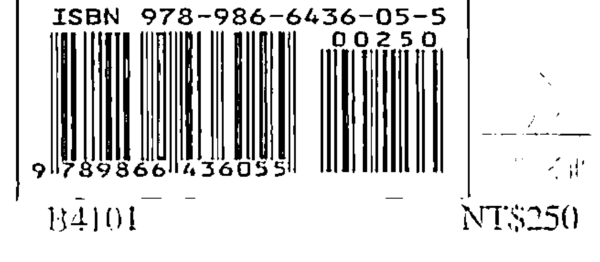

# 30天學會靈魂出體體驗

## Out-of-Body Experiences

靈魂出體就像睡覺、走路、美夢。  
你仍然好好躺著，靈魂卻可以離開家門，  
只要帶著一顆愛冒險的心，去體驗，  
想去哪裡就去哪裡，  
安全、好玩，還可以學很多東西！

Rick Stack 著　資深靈魂出體體驗者  
許添盛 譯　Robert F. Butts 英文版推薦

---

## 關於賽斯文化

我是個腳踏實地的理想主義者。賽斯文化，是為了推廣身心靈健康理念而成立具公益性質的文化事業，希望透過理性與感性層面，召喚出人類心靈的「愛、智慧、內在感官及創造力」，讓每位接觸我們的讀者，具體感受「每天的生活，都是靈魂的精心創造 — You Create Your Own Reality.」

我們計畫出版符合新時代賽斯精神之書籍、有聲書、影音商品及生活用品，並將經營利潤致力於賽斯思想及身心靈健康觀念的推廣，期待與大家攜手共創身心靈健康新文明。

發行人 許添盛醫師

---

## 序

### 出體是人的天賦本能

這本書的用意，是要把靈魂出體經驗的研究和訓練，從研究實驗室以及隱而不宣的玄學領域帶出來，放進這個世界的各個客廳和臥房當中，因為後者才是它們所屬之地。

本書提供一個簡單、有效的方法，任何人都可以用來學習如何有意識地出體，此外也教你怎樣才能從你的出體之旅得到最大的收穫。靈魂出體經驗（Out-of-body experiences，簡稱 OOBEs）不但刺激非常，在靈性上具有啟迪作用，而且實行起來也容易。

Rick Stack

如果你願意先設想「你目前對宇宙的信念可能不是全部的真相」，也願意帶著任何一個孩子天生就有的那種興奮之情和開放的心，去探索其實是一個謎的宇宙，那我可以保證你一定會有永生難忘的經歷。

但是話說回來，既然靈魂出體這麼容易，為什麼這個主題還是相當莫測高深、祕而不宣呢？很簡單，大家普遍都沒有覺察到自己天生就有出體的能力，因為他們的信念系統不容許這些經驗的存在，或是認為這些經驗充其量只是閒暇的一種消遣。不過，對於真的認為靈魂出體是個值得關注的領域的人來說，第一手經驗是最直接的探索途徑。

尋求第一手經驗的人可能會發現，在學習成為靈體探索者的過程中，要進步，他們自己的態度是關鍵。基於這個原因，本書在描述實際引發出體經驗的種種有效但不複雜的方法之前，會先提出一個循序漸進的流程，以便營造出有助於完成這些非凡旅程的心理氣候。這種初步的信念工作，用意在改變某些自我設限的觀念，使你能夠克服對於脫離自己的肉體四處漫遊的恐懼或抗拒。

對很多人來說，本書所呈現的信念工作和初步的夢工作，是成功的一個重要因素。準備時間的長短，因人而異。如果你已經在對夢下功夫，你就已經超前一步了；如果你的信念系統相當正面也很開闊，那麼你的信念工作所需時間可能更少。

讀了這本書，完成準備工作，並開始經常運用其中介紹的靈魂出體引導技巧之後，你可以合理地預期，你會在三十天之內獲得第一次的出體經驗。不過，有些人需要的時間可能長很多。任何人都做得到，卻不是每個人都會去做，因為有些人不願意鬆開他們的限制性信念，到容許他們自己有這類經驗的程度。不過，如果你真的渴望，這本書會提供方法給你。

我自己有過很多次出體的經驗，對我的生命而言，它們的加成作用無可計量。我希望能夠讓你了解到，這個備受忽視的人類潛能領域是多麼重要、多麼有價值。然而，只有當你多次親身經歷出體時，你才能體會到這種藝術形式的真正價值。因此，本書的目的就是要讓你能夠擁有不只一次，而且是很多次的靈魂出體經驗，使它們成為你生命中經常又自然的一個部分；屆時，你就會真的開始了解它們的究竟。

有一天，在一個更加覺醒的文化裡，脫離肉身的跨次元之旅這門藝術，將享有更為顯著、更受人尊崇的地位。有一天，人們將會懷抱與探索外在實相（即物質宇宙）一般的熱忱，來探索內在的實相，人類認知的進化便能跨出一大步。

「如以往，這類進步的推手，將是謊言和偏見無法削減其能量和好奇，堅持要為自己找出真相的人。」

---

## 前言

### 這個宇宙都是你的！

十多歲的時候，我一度執迷地想要了解存在是怎麼一回事。就我的記憶所及，我始終對於宇宙感到好奇，但在我生命中的某一個時間點，這份好奇變成一種止不住的渴望。最後，這種渴望變得太強烈了，我非得找到一些解答不可，否則無法繼續過我以為的「正常」生活。

在這之前，我試過把科學當成一個找到解答的可能來源，但是我對科學觀點的冀望沒多久就幻滅了。我永遠都忘不了高中三年級第一學期上高等生物學（二）的那一天。生物老師為我們講解大自然的一些令人驚奇之處，這時我忍不住問他，在他描述的這一切背後到底有什麼更大的目的存在。

我的老師只是笑著，並用真的是詩情畫意兼具的措辭解釋說，我提的是一個屬於目的論的問題，所以不適合在課堂上討論。當時我並不知道目的論是什麼意思，但是我的老師表現出我的問題一點都不重要的樣子，讓我覺得很窘。他繼續上課，我則重新評估上不上高等生物學（二）的計畫（最後我終於選修雕塑課（二），這堂課的男女比例是一比二十一——要學生物，這種課顯然比較好玩）。

到我大二的時候，不滿的種子已經長成龐然大物了。我發現科學對我們怎樣演進到這裡的解釋，幾近荒誕可笑。簡單說就是：很久以前生命始於某個原始的海洋，那時，正確的化學成分、元素、條件「湊巧」聚合在一起，「噗」一聲，生命就這樣蹦出來了。

連達爾文那個了不起的進化論也把這套方程式必須有更高指導智能的需求有效地抹煞掉，暗示突變的發生純屬意外，一個物種當中只有強者才能生存下來、繁盛興旺。

這種「純屬意外」的說法真的是太過火了。這些人是認真的嗎？我們這個時代最偉大知識分子能想到的真的只是這樣嗎？他們真的相信自然這一切複雜又精巧的奇蹟，全都不假任何形式的宇宙智能指導就形成了嗎？

我知道人類經過多年塑造的宗教觀念有一些相當幼稚，但是這個觀念似乎一樣天真。說到製造火箭和烤箱，這種科學觀念是很管用沒錯，但說到更深層的議題，它就只會讓人大失所望而已。

我的一段積極而且波折的研究過程於焉展開。整個研究範圍從心理學、神話學、宗教，到神智學（theosophy）、靈知說（gnosis）、埃及古物學，還涵蓋各個時代的種種祕傳教派。我也開始注意夢。我了解到夢是汲取知識和了解的一個不可思議的來源，也學到夢的世界是一個門戶，通往其他和我知道的世界一樣真實、有一樣重要的經驗次元。

我開始練習清醒作夢，這門在作夢狀態完全清醒過來，然後有意識地操縱事件的藝術。但是我當時並沒有完全了解到，我正按照我自己的信念和期待，重新設定我的內在經驗。

一九七○年，我拿起我的第一本賽斯書。賽斯是不具肉身的人格和老師，他透過當時在世的珍．羅伯茲在出神狀態時口授資料。賽斯口授的資料到目前為止（譯註：一九八八年）已出版十冊。

賽斯讓我非常感動，所以在一九七二年初，我發現自己開著車前往紐約州的艾爾密拉，與兩個朋友應珍．羅伯茲之邀，去參加她每週一次的 ESP 課程。雖然賽斯書當時已經擁有相當廣大的支持者，但是那時候外界對珍的工作才剛剛開始感興趣，所以她的課堂上只有一打左右的學生。珍會先進入出神狀態，讓賽斯「通過」，而賽斯果然是一位了不起的老師。

我變成珍班上的常客，幾乎每個週二都會驅車來回紐約市和艾爾密拉，每趟長達十小時，如此過了幾年。說我受到珍和賽斯的課影響，實在太輕描淡寫了，因為上了那門課之後，我才開始真正而且深刻了解到，每個人都在創造自己的實相。我也學會傾聽多重次元的內我發出的聲音，不管我有多少問題，都能夠從中找到答案。

我對形而上學的認識越多，對靈魂出體經驗的興趣就越大。我決心藉由第一手的經驗，來增進自己在這個領域的知識。

大約是一九七二年的夏天，我無意間發現一個相當容易引導靈魂出體的方法（你在第十二章會學到這個方法）。我的第一次經驗實在太令人驚奇，我永遠不會忘記。

我四肢伸展躺在臥房裡的一張安樂椅上，暗示自己將會有靈魂出體的經驗。

接下來我發現自己在一個距離我的公寓大約三十二公里的公園裡。小時候，我常常在這個公園玩。我覺得無比地興奮，充滿真的像漣漪那樣在我體內流動的能量。

四周到處都是樹木和綠地，但是不知為何，這一切比我以前見過的還要鮮明逼真，生動活潑、色彩繽紛。彷彿我踏進了一座魔法森林，處處閃耀著生氣和活力。這一切好像不只是真實，而是超級真實。

我因為能量而振動著，感覺欣喜若狂，但也覺得滿不知所措。我知道自己在哪裡，但是不知道自己怎麼到那裡。這時我忘了自己剛剛坐下來練習靈魂出體。我覺得非常恍惚，到最後終於認定有人偷偷把迷幻藥或其他藥物放入我的飲料裡。

我低頭看，才發覺自己一絲不掛。我開始有點擔心，心想：「這下好了。我在艾莉公園，不知道吃了什麼奇怪的藥，整個人恍恍惚惚的，還沒穿半件衣服。我該怎麼辦？」

我連搭火車回布朗克區的錢都沒有。所以我就東遊西逛，一邊振動著，樹則發著光，但奇怪的是，我的困境並沒有讓我太過心煩意亂。

太陽才剛剛升起，公園裡除了我以外看不到半個人。然後我經過一個遊戲場，看到一個小男孩在裡面玩。這場景似乎很奇怪，因為小孩年紀很小，卻自己一個人。我走到圍著遊戲場的柵欄旁邊，看著他。

這個宇宙給人某種非常怪異的感覺。突然間，他直視我的眼睛說：「這都是你的。」

一瞬間，我想起我的身體在三十二公里之外。我剛試著脫離肉身，而且成功了。我興奮、開心的不得了。想都不想，我就抬起雙手像火箭一樣地飛出去。

我以前作過很多次飛行的夢，但是這回很不一樣。這絕對不可能只是我的想像。我飛、我轉彎、我旋轉，我在艾莉潭公園的樹林上空翱翔。

我正常的自我意識完全存在，正在進行它此前所未有的飛行之旅。我在附近飛了一會兒之後，最後終於降落在公園內一座綠草如茵的山丘上。我覺得回去的時間到了。

閉上眼睛，往後一靠，然後說：「回到布朗克區，回到布朗克區。」

我有一種在行進而且速度極快的感覺，然後我發現自己回到肉身裡。這時，我的眼睛雖然閉著，卻可以穿過眼瞼看到東西。我真是大開眼界！

我透過眼瞼檢查我的房間一分鐘左右以後，終於睜開眼睛。有那麼一會兒，東西看起來有點奇怪，好像我還沒有完全對準合適的頻道一樣。過了一兩分鐘，一切才固定下來，恢復正常。我回來了，毫髮無傷！

這一次經驗真是讓我太震驚了，但我還是不滿意，因為我還沒有有意識地親眼目睹自己實際脫離肉身的過程，所以我決心一定要做到。我繼續練習我新發現的這個技巧。有一陣子，我大概每隔一天就會出體一次。

一兩週左右，我就能夠在房間裡漂浮出體的同時，一直清醒地覺察整個過程。

我的身體感覺好像快睡著了。但是情況有點奇怪，因為我還是完全清醒。我真的是看著我的身體睡著。我可以感覺到自己歷經睡眠的每一個階段，但同時維持完整的意識。

這實在太奇妙了！我還在我的身體裡，但我和它不再是用正常的方式連結在一起。我的肌肉無法動彈，雙眼閉上，但我卻能夠穿過眼皮，清楚看到房間。

不知為何，我就是知道該做什麼。我用意志力讓自己往上移動。我敬畏地看著自己非物質身體——或說靈體——的腿，從肉身的腿移出來，然後其他部分接著跟進。

我站在臥房裡放著我的肉身的那張椅子正前方，然後走出門，到另一個房間去。和以前一樣，我覺得能量充沛至極，非常興奮。

這時我突然想到，我再也不需要門，所以我就穿過牆壁到客廳去，坐在一張椅子上，開始大笑起來。我幾乎不敢相信發生了什麼事。

在那一刻，以一種深刻直覺的方式，我知道自己的存在並不仰賴肉身。

從那一次開始，我有過很多次靈魂出體的探險經驗。我對實相本質的了解越深，體外遠足的品質也越好。不久我就開始講課，分享我在靈魂出體方面的經驗與研究。

## 30天學會靈魂出體

我研究靈魂出體經驗、賽斯資料、夢和形而上學方面的知識，目前為止已經超過十年。當我發覺大部分的人都覺得引導靈魂出體很難，而我可以提供一個連初學者都容易上手的方法時，我決定寫這本書。為了更容易學會靈魂出體的方法，了解形而上學以及你自己的態度有何影響很重要。你對於宇宙運行的根本信念會影響你引導靈魂出體的能力，也會左右你將遇到的經驗類型。

因為這些原因，在你完成自己的信念工作之前，你一定要依序閱讀本書，不要跳過說明，直接看練習。之前已經提過，完成預先準備工作的時間長短因人而異。當你完成這個準備工作時，就接著練習引導靈魂出體的技巧。安排一個月的時間，每天練習。再次重申，認為你在二十次的練習當中將會擁有第一次靈魂出體經驗，是合理的。事實上，這樣的期待可以幫助你擁有第一次你的靈魂出體經驗。

不過，這裡也有相當大的變數。有人可能是試過幾次就出體了，也有人需要練習好幾個月。如果你不屈不撓，決心堅定，那你一定會成功。

另外一個你要牢記在心的因素是，你的整體環境和你的心智狀態。如果你的工作壓力很大，或你的生活方式讓你焦慮不安，也會干擾你的靈魂出體功課。如果情況是這樣，你最好在放假期間開始練習引導技巧比較好，因為這樣你就可以輕輕鬆鬆在放鬆的環境裡天天練習這些技巧。

對於工作時間忙碌不堪的人來說，還有一個變通的方法，那就是連續在十五個週末練習引導技巧，這樣全部加起來就有三十次。這雖然不是很好，但對有需要的人來說，也是一個可行的選項。

如果週末的練習沒有成效，你可能就得有一陣子每天撥出時間練習，才能開始有進展。

你一旦真的有進展了，就不要停下來——想辦法把靈魂出體功課納入你的行事曆當中，繼續下功夫。

---

## 科學事實或是科幻故事？

> 對於有意成為靈體探險家的人來說，科學研究和調查的架構實在太侷限了。科學領域處理的是，可以透過肉體感官去觀察和測量的效應……一個人要想真的調查靈魂出體經驗，就必須願意拋棄，甚至放棄科學探究的規則。

這個世界上大部分的宗教都有「靈魂」說，相信人人皆有不具形體的靈魂。幾百年來，全球各個文化都流傳著靈魂出體的故事，描述自己的靈魂出體以及出體後「魂體」（apparition）被別人看到的人為數眾多。也有很多人記述他們在靈魂出體時能夠看到距離他們的肉身很遠的物體，而且經事後查證，發現他們的所見皆屬實。

奧利佛．福克斯（Oliver Fox）在他的經典著作《靈魂出體實錄》（Astral Projection: A Record of Out-of-the-Body Experiences）一書中紀錄了這類經驗的一個案例：一九○五年的某個夏夜，一位女性友人艾爾西出體時的魂體出現在他的臥室裡。那一天稍早前，她已經知會他，將有此一舉。認為自己當時可能也以「星等的靈體」（astral counterpart）現身的福克斯，看見一朵「散發著耀眼藍白光線的巨大雲……」

「形雲」，中間站著艾爾西。艾爾西的形影顯得十分具體，她的手指沿著福克斯的書桌邊緣滑過，定定地望著他。隔天晚上，福克斯和艾爾西碰面，艾爾西語氣肯定地告訴他，昨晚她睡著後，曾憑藉意念到他的住處。艾爾西將屋內大部分的陳設，如家具和各式物品擺放的位置，形容得絲毫不差。她甚至還指出，他的書桌鑲著一條金邊；不過福克斯宣稱那只是一條金線，不是金邊，但她堅持她確實親手摸過那邊。福克斯則堅持他了解自己的書桌。事後檢查那張書桌，果然發現有艾爾西所說的那邊。福克斯確定艾爾西的肉身本人從未到過他的房間，而他也從未向她描述過她聲稱見過的那些物品。

來上過一些我的課和工作坊的卡爾也有過這種經驗。卡爾和一個朋友約定當晚試著在夢境或靈魂體狀態下碰面，稍後他就飛往加州。他的朋友住在紐澤西。

大約凌晨四點左右，卡爾試著進行靈魂出體：

「我的耳邊響起鈴聲。我任由它的音量逐漸加大到某種程度，然後我便往上抬升脫離我的身體。就在我往上抬升之際，我完全進入了另一個次元。我已經不在原來的房間裡，這讓我很困惑。起初我想：『我要怎樣才到得了紐澤西呢？』我試著去想像所有正常、合理的方式來做這件事。然後我的耳際響起一個聲音說：『你不必那麼做。只要專心想著他，你就會找到他。』

於是我閉上眼睛，集中注意力，忽然間，朋友的臉出現在我的眼前。他閉著眼睛坐著，好像在冥想一樣。我覺察到自己在他的房間裡，但是我完全看不見四周。我愈將心神專注在他身上，就愈是覺得他知道我在那裡，但是，他好像無法轉過頭來看我。我不停地呼喚他：『看啊！我的靈魂出體了，我的人在加州呢！』我設法讓他明白狀況。他似乎也知道我的存在，不過就是沒辦法轉過頭來看我。

我這樣試著跟他溝通了足足三十秒，最後，他終於睜開眼睛，轉向我這邊。就在此時這幕景象消失了，我又回到加州的床上。」

第二天我和他通話，發現就在我的靈魂出體的同時，他正坐著冥想，一如我所見。我的時間是凌晨四點，正是他所在地的早晨十點。他說他以為那個時候我應該睡了，而且他當時正全神貫注在我身上。

對於靈魂出體的真實狀況，有兩個主要的詮釋：體外理論（extrasomatic theory）和體內理論（intrasomatic theory）。

體外論主張，在靈魂出體的經驗中，出體者的某個顯著的部分確實離開肉身，在肉身之外的某處漂浮。體內論則說，在靈魂出體的過程中，出體者沒有任何顯著的部分離開肉身。

科學界的一個流行趨勢是，用那「只是」ESP（Extrasensory Perception，超感官知覺）的說法，來解釋人們宣稱去過某個特定的地點，而且能夠正確描述他們在該地所見的靈魂出體經驗。但是，任何不是利用正常的肉身感官實現的知覺，都是ESP。所以，那些脫離身體並精確覺知遠處某一地的人，按照定義而言，就是在利用ESP，不管該人格的某一部分有沒有真的脫離身體。

奧西斯（Osis）和麥柯米克（McCormick）做過一項著名的研究。他們請一個靈魂出體的實驗對象，設法去看一個目標物。這個目標物放在一種光學映像儀器裡面，只有從某個定點才能看得見。這個標的物是由幾個元素組成的一幅畫面，這些元素實質上並沒有聚集在儀器內的任何一處。不過，如果你站在儀器正前方的一個點，朝著觀景窗看進去，你就會看到它們組合成某個東西。

靈魂出體經驗的實驗對象是艾力斯．塔諾斯（Alex Tanous）。研究者叫他現形在標的物所在、但隔了數個房間之遙的房間內，試著去看標的物。同時間，實驗者則在標的物所在處測量實質效應（實驗對象的靈體現形時可能引發的效應）。

他們在觀看地點的一個安裝了防護板的隔間裡放了感應板。這些感應板能夠偵測到非常細微的動作或震動，然後這些動態會在靈敏度極高的應變規（strain gauge）上引發電脈衝。

奧西斯和麥柯米克認為，靈魂出體可能是有關身體化程度的一種變動狀態，也就是說，出體狀態的清晰度或強度可能有所不同。例如，一半出體一半未出體，是可能發生的狀態。

調查者的假設是：當靈魂出體的實驗對象幾乎完全脫離肉身，而能夠更準確地觀看標的物時，由魂體引發的機械效應，會大於當實驗對象只部分脫離身體、而較難精確觀看標的物的時候。

奧西斯和麥柯米克的研究結果證實了他們的假設——「可能發生表面上非蓄意的活動效應，這是從範圍有限的出體視覺衍生的副產品」。換句話說，當某人在自覺靈魂出體，而且看見某個定點的東西時，就可能產生明顯但非蓄意的身體動作或效應。

就我所知，科學界目前並不急於從事這項目的後續工作。可能有人會認為，既然有大量靈魂出體的軼聞資料出現，再加上多少也證實了體外理論的研究（相較之下是小得可憐），應該足以讓科學界動念探索。但事實上，確實有零零星星的研究，只是進展牛步。

我還想簡短提一下另一個研究。摩里斯（Morris）、哈拉瑞（Harary）、簡尼斯（Janis）、哈維特爾（Hartwell）和羅爾（Roll）曾做過一項實驗，想知道一個靈魂出體的人能不能被遠方某地的動物或人類檢驗者偵測到。

其中一個步驟是：檢驗者被告知，在十分鐘內出體的實驗對象將會造訪兩次。結果在人類檢驗者的部分，他們表現出一種隨時準備回憶據說魂體會出現的明顯傾向。

另一個實驗步驟則包含兩段實驗對象在出體狀態中造訪檢驗者的短暫期間，以及兩段等長的對照期間。在這個部分，人類檢驗者在實驗對象出體期間的反應並沒有比對照期間顯著增加。

有一個動物檢驗者是一隻小貓。在靈魂出體的期間，她明顯比對照期間安靜很多，也比較不那麼活潑。實驗對象哈拉瑞接獲指令去「拜訪」那隻小貓，去感受、安撫牠，並和牠一起玩。結果小貓在基準期間和對照期間都十分活潑，但在靈魂出體期間卻變得非常安靜。

小貓在八次對照期間一共喵了三十七次，但在靈魂出體期間卻連一聲都不吭。

在第二次用小貓的實驗中，實驗人員希望觀察小貓會不會朝向哈拉瑞靈魂出體時前去拜訪牠的那個方向。全部的實驗結果並沒有統計上的意義，但其中一位負責觀察小貓的實驗人員說，當出體中的實驗對象正在拜訪小貓時，他在監視螢幕上看見實驗對象的影像出現在畫面的一角。這名實驗人員並不知道實驗對象會去哪一個角落，也不知道哪一段是對照期間，哪一段是出體期間。

我之所以提到這些研究，只是想指出，在這個雖然難以解釋、但很多人仍持續探索的領域裡，已經完成了一些工作。科學界整體而言，還是出奇地抗拒非物質存在的觀念。超感官知覺還勉強可以接受，但靈魂出體經驗對很多人的思考方式而言，似乎真的是個挑戰。

另一個證實非物質存在的現象是共同的夢或共同出體。這時兩個或兩個以上的人在夢中或靈魂出體時碰面；他們回到肉身實相後，仍然記得同樣的對話和經歷。

福克斯（Fox）的書中就提到這種體驗的一個例子。福克斯和兩位友人史萊德與艾爾頓，相約當晚在夢中於南義普頓公園裡碰面。福克斯夢見自己在這個特定的地點見到艾爾頓，而他們兩人都知道自己正在作夢。他們談起第二個朋友明顯的缺席。

隔天福克斯問艾爾頓昨晚有沒有作夢。艾爾頓回答說，他在約定地點見到福克斯，也知道自己在作夢：「不過，史萊德沒來。我跟你只來得及打聲招呼，聊了幾句他失約的事，這個夢就結束了。」史萊德後來告訴福克斯，那天晚上他一夜無夢到天明。

有人會質疑作夢的人事先就預期在夢中相見，但福克斯指出，原先是預期三個人都要碰面。

在理查．巴哈（Richard Bach）的自傳《永恆橋》（The Bridge Across Forever）當中，也提到共同出體的一個例子。作者巴哈和妻子萊絲莉經過大約半年的練習之後，實現了他們首次共同出體的經驗。

巴哈發現自己懸坐在床鋪上方的空中，看見身邊一個拱形四射的形體漂浮著。那是萊絲莉，他們無需言語便能溝通無礙。她告訴他，她已經出體，並要他一起出體。他們兩人往上漂浮，穿過天花板，共同分享了一次難忘的經歷。後來他們被家裡的一隻貓驚醒，片刻之後兩人同時想起了這個旅程。

據巴哈形容：「經過第一年的練習，我們已經一個月可以出體碰面好幾次；我們越來越懷疑自己是這個地球的訪客，直到我們能夠在晚間新聞播放時，相視而笑、興趣盎然地旁觀。」

共同入夢和共同出體的現象，當然為客觀的非物質存在經驗提供了少許的證據。這種事並不是那麼容易在實驗室裡進行，所以它往往不是被掃到地毯下、視而不見，就是被小看成只是心電感應或千里眼的一種形式。

在這本書當中，我們將從一種主觀而非科學的角度，來探究出體這門藝術。

對於有意成為靈體探險家的人來說，科學研究和調查的架構實在是太侷限了。科學領域處理的是可以透過肉體感官觀察和測量的效應。當科學家調查像靈魂出體這樣的現象時，他們最終還是只能從物質的角度處理非物質的存在。他們只能記錄靈魂出體者的描述，測量能在物質界產生的效應，設法在物質上偵測非物質的一瞥等等。

一個人真的想調查靈魂出體經驗，就必須願意扭轉，甚至放棄科學研究的規則。人類能夠從探索內在實相而得知的事物，往往無法化為語言文字來傳達，更遑論用科學方式來證明。

這種古老藝術形式真正的探索正在進行中，能解開我們的疑惑。我們可以擁有知識和智慧的巔峰經驗，使我們的生命和存在更為豐富。為了達到這個目的，我們必須排除一些舊的架構。

靈魂出體經驗研究最大的價值，和腦電波、快速眼部運動，甚至描述數千英里外一座山的能力，一點關係也沒有。它們最大的價值在於：置身在做靈魂出體的自己，接收到直覺的理解，以及大腦的探索者得以一瞥宇宙奧祕的快樂。

---

## 靶向投射的益處

脫離肉體的探索，能夠大大地擴展你對自己的生命和宇宙的了解……當你發現自己意識完全清醒地脫離肉體，感覺和你正常的肉體經驗一樣真實的時候，你就很難再用「那只是你的想像力、純屬虛構」來打發它。

你們當中有些人可能永遠都不會有靈魂出體的經驗。但是，不管你有沒有發覺，我們每個人其實都曾經暫時有過無數次的出體。由哈特（Hart）、格林（Green）、哈洛森（Haraldsson）和其他人所做的調查指出，靈魂出體並不是件稀奇的事。不過，根據我個人與對形而上學有興趣的人接觸的經驗，已經有能力主動引發這些經驗的人相當少。

為什麼會有人想要學習怎樣有意識地離開自己的身體？畢竟到頭來每個人都會離開自己的身體，所以急什麼呢？就算我們學會脫離肉體四處漫遊的方法，又怎麼知道自己能不能找到路回來呢？

另一方面，如果人類真的能夠學會引發靈魂出體的方法，那我們就可能進入人類潛能的一個嶄新、浩瀚的領域之中。這個領域或許能讓人類長久以來一直想知道答案的一些基本疑問露出曙光：死亡是終點，或只是另一個開始？如果我們死後猶存，那我們對自己的認知還是一樣嗎？我們在這個奇妙但時而混亂的星球上的生活背後，究竟有什麼更大的意義？這裡到底是怎麼一回事？

脫離肉體的探索，能夠大大地擴展你對於自己的生命和宇宙的了解。對於未曾有過這類經驗的人來說，一定要注意我們談的是哪一種經驗。我們不是在談模糊的幻覺，而是在談一種在出體時可以達到的完全清晰、活生生的狀態。

當你發現自己意識完全清醒地脫離肉體，感覺和正常的肉體經驗一樣真實時，你會開始停下來想弄清楚。在你有過幾次這種經驗之後，你就很難再用「只是想像」來解釋它，而且它很可能從此改變你對宇宙的看法。這些經驗往往異於尋常，威力強大，足以影響你最根本的一些信念系統。

---

## 學習與永恆的生命共處

有過生動的靈魂出體經驗的人，通常會認為這是他們生命中最震撼的經歷。靈魂出體經驗讓他們能夠在活著的時候，就有一個自然而刺激的機會，體驗獨立於肉體形式之外的本體（identity）。

於是，他們往往會急遽地扭轉自己原來對死亡的信念。他們確實體驗到明明活著也有意識，但又好像與自己的肉體分離的那種感覺。雖然這些經驗不足以構成科學證明，但他們通常會覺得自己已經知道：自己的存在並不依賴肉身。

對那些懼怕死亡的人來說，這類經驗往往具有減輕那種恐懼的作用。那些原本就相信有來生的人，可能會發現出體的探索讓他們能夠在更深入的情感層面上領會這件事。

對於死亡的新信念，確實能為你的生活方式帶來巨大的影響。以我來說，我也是在有過靈魂出體的經驗後，才開始了解到：這個物質實相只不過是我們更大存在旅途上的其中一站罷了。

很多人一輩子活在害怕死亡將至的恐懼中，或是認為死亡與自己無關，因而錯過以死亡為師、從中獲得智慧與眼界的機會。

由於多年來的靈魂出體經驗，現在的我可以坦白說，我幾乎已經不再懼怕死亡。相反地，我甚至期待它的到來，也完全預期它會很刺激、很好玩。這並不是說我急著離開這個實相；我並不是。在直覺層面上，我只是知道，當我離開這個實相的時刻到來，我會發現自己離開肉身，依然活生生，意識完全清醒，依然知道自己是誰。

只有在我了解這場球賽將會延長賽程時，我才能夠迎面正視死亡，也才能真正傾聽它的教誨。自從我不再害怕或討厭死亡後，我變得更願意把焦點放在人生短暫的實相上，並利用它來啟發自己。

這樣的焦點讓我想要在各方面把生命擴展到極致。它幫助我了解，我和所愛的人相處的時光是如此不可多得。即使在其他時間或宇宙裡，我仍可能認識他們，但一切都不可能和現在完全一樣。

我不再執著於那些很容易被誤以為重要的愚蠢衝動和瑣碎小事。它幫助我欣賞並善用自己的能量，而不再浪費它；也幫助我放下憂慮，享受在世的每一天。

我經常刻意提醒自己，我們的物質生命其實非常短暫。雖然我也相信每一刻都是永恆，但我們在世之日的每一刻，都代表我們活著的意義——每一刻都獨一無二，彌足珍貴。如果我們浪擲這些時刻，如果我們拖延，如果我們不去追求所愛、不去做想做的事，那我們就只能怪自己了。

對於「死亡並非終點」的持續覺察，可能會影響你整個行事模式。當你真的了解自己是永生的時候，你可能會發現自己想調整一些目標和抱負。如果這場球賽真的會無限期延長，那麼了解你參與其中的更大目的，就會成為更重要的課題。

再次重申，我們說的並不是理智上的了解，而是情感上的深刻體會——體會到你的本體在死後依然存在。靈魂出體的經驗能夠用一種任何肉身經驗都無法傳達的方式，帶來這種情感上的理解。

---

## 準備迎接轉變之日

有過瀕死或臨床上判定死亡、卻又活過來的人，出乎意料地，很多都說他們有瀕死經驗（NDE），而且說法相當一致。標準瀕死經驗的元素之一，就是靈魂出體經驗。

有一個研究調查了一群有瀕死經驗的人，其中大約有百分之三十七在甦醒之前，有過近似靈魂出體的經驗。有過瀕死經驗的人說，他們發現自己在病房內往下望著自己的肉體，之後才進入瀕死經驗的下一個階段，這樣的情形並不少見。

我們不妨讓自己熟悉靈魂出體狀態，因為那可能是我們一旦死亡就要面對的情境。我相信熟悉靈魂出體狀態的人，日後會發現整個死亡經驗比較不會那麼令人不知所措。畢竟，你可不是天天都在死亡，所…

## 知識之路

稍作準備一下，將會讓這趟旅程比較順利，也比較愉快。

越來越多人對於人類文明的基本信念系統感到幻滅。很多人不再滿足於傳統宗教的老舊迷思、規定和戒律，或科學提供的有限理解架構。

人們開始朝其他方向去尋求解答。運氣好的話，研究形而上學的人會轉移注意力，留心正常肉體感官領域之外種種可能的存在次元。對任何一個想要完整、徹底而且心態開放地探索宇宙運行真相的人來說，靈魂出體經驗都是一個誘人而且顯然應該的選擇。

無疑地，練習靈魂出體最可貴的好處，就是能夠得到直接知曉的經驗，進入我們所有最終都會回歸的內在存在界域。除了對生死有嶄新的觀察之外，靈魂出體還能讓你透過體驗去感覺物質真相究竟是什麼。因為當你真的能夠隨心所欲遊走於兩個世界之間，你就會開始感覺和知道，你平常的醒時實相並不像你一向所想的那麼堅實。

當然，物理學家已經知道物質並非是堅實的。他們一再說明，我們周圍的一切——椅子、建築物，甚至我們的身體——都是由空間和原子組成。據說，原子其實是次原子粒子以人類無法想像的速度移動而形成的一般旋風。據說，物質基本上等同於能量。因此，我們都是能量存在，生活在一個奇妙的能量宇宙之中。

靈魂出體也有助於增進你對現世的了解。你將能夠用一種根本無法言傳的方式，去感受到物質世界事實上是多次元宇宙電視的頻道之一。我們對準某個特定的頻寬，大部分時間我們看到的就是這樣而已。

學習引出體就好像你第一次發現，你竟然可以轉換自己的電視頻道一樣。

用理論推演其他的世界，與實際穿梭其間，是截然不同的兩回事。當你成功踏上跨次元之旅，包括隨之而來的感覺時，你對於宇宙真相的嶄新體驗真的會變成你的一部分，這種感覺非理智可解。這個經驗本身就足以改變你，使你的生活變得豐富精彩。你能夠獲得的知識，就像鍍上的一層金，透過它有時候你會看到一個閃閃發光、更為透闊而且透明的世界。

簡單說，任何人只要有興趣探索我們全都棲息其中的這個複雜又神祕的能量宇宙，靈魂出體可說是一個顯而易見的選擇。透過練習，你可以有效利用它作為通往直覺知識和直接知曉這些經驗的門戶。

## 樂趣和遊戲

我說過學習靈魂出體具有教育性、啟發性、實用性。現在我還想補充說，或許學習靈魂出體最明顯的一個理由就是：好玩得不得了。

你一旦練完基本功，你就可以名符其實地出去遠足。到處都是機會教育。比如說，你碰到一位指導員或老師，只要提出要求就行了。或者，你也可以決定和轉世的自己面對面。也許你希望漫遊到一顆遙遠的星球，或穿越你家的臥房牆壁。或者，你也許想知道時間旅行（time travel）的可能性，希望親身去各個世紀看看。

我希望，我在說你要是報名參加這個冒險，那這一切都可能是你的，而且還不只這樣的時候，可能聽起來很像旅行社職員。其實，所謂報名只意味著投注一些時間和能量來學會靈體遨遊的技巧而已。

我這裡說「遊戲時間」是用很強調的語氣。我自己在出體的時候，就有過我生命中最刺激又令人著迷的經驗。

只要我們容許自己去感受，就會發現我們的存在具有無窮的能量和天生的樂趣。不管什麼方式，你在出體時可能有的這些經驗，都可能協助你重新喚醒自己的覺察力，體會物質和非物質宇宙的魔力。

雖然有時候我們會忘記，存在於知道怎麼走路、呼吸、成長、療癒自己身體裡，是多麼令人驚奇的一件事，但我們還是可以做一些事，幫助自己和內在知曉重新接上線。

藉著遊戲，我們可以做到這一點。因為當我們在玩的時候，我們更容易接觸到內在知識。有很多不同的遊戲都能夠讓我們重新接觸到與生俱來的喜悅和智慧。

其中一個遊戲就是，帶著充分的覺察力脫離肉身。為了熟練這個遊戲，重要的是要抱著好玩的遊戲態度。如此一來，不用懷疑，你學習的速度一定會加快，而且還會樂在其中。

## 3 基本的形而上學

> 如果你用信念、渴望、期待去刺激你的想像力，訓練它把你的目標化為形象，而讓你看見、感覺、聆聽、品嚐、觸摸到所有的目標，那麼，你就能得到你想要的事物。  
> ——荷西．希爾瓦（Jose Silva）

形而上學（metaphysics）的定義是：「哲學的一部分，關切的是實相和存在的基本特質……」

如果你想要學會引導靈魂出體的方法，那就要從你自己的形而上學假設開始著手。也就是說，你對於你的存在和你的宇宙所持的看法和態度。嘗試出體時遇到困難的人，通常需要檢視並改變他們的信念系統。

在此非常有必要再三強調的是，一個人出體時遇到的經歷，絕大部分由他這個人的態度決定。所持的信念極度偏限的人，就算他的確學了引導靈魂出體的方法，也可能無法利用上二章提到的那些好處。

此外，一個人能不能成功學會引導靈魂出體的方法，一開始信念系統很可能是最重要的因素。但是，信念系統不是固定不變的東西，除非我們讓它這樣。它們是可以改變的。

### 關於形而上學

我們待會兒就會深入探討這個觀念，不過現在我只想說，不管你發現自己在哪一個次元，這個原則都適用。如果你認為存在於你的肉體以外的可能性不大，或認為直覺知識毫無價值可言，那你的信念可能會使你無法利用靈魂出體的好處。

如果你深信靈魂出體根本是某種形式的幻覺，或認為存在於另一個有效空間的說法分明是騙小孩子的童話故事，不需要認真看待，這樣一來，你就把原本可以取得的直覺知識擋在門外了。

事實上，無論你出不出體，你的信念都會影響你的經驗，以及知識的取得。

對形而上學有基本的了解，引導靈魂出體就會容易很多，也有助於內在探索者充分利用他們非肉身的旅程。

如果你打算到一個經驗次元去旅行——或甚至只想要在你的住家附近飛一飛——你的肚子裡裝些基本概念會有幫助。

物質宇宙只是無限已存在的次元之一。

當我們把意識對準某個能量頻率時，我們就在那裡。當我們學會用意識來轉換頻率時，就會發現自己到了另外的世界。

我們的眼睛只看得到一定範圍內的光，我們的耳朵只聽得到某個範圍內的聲音。本質上，我們感知到的只是那裡一小波段可能的能量頻率而已。

要是因此就認定，我們看作是「我們的世界」的能量波，或說能量頻率，就是唯一存在的世界，那不僅是短視，還極端自大。

學習脫離肉體，把暫時的意識帶著一起去旅行，是一個既簡單又顯而易見的方法，可以取得第一手證據，來證明其他這些存在界域也是有的。

物質世界是一所宇宙的公民小學。

我們都在這所宇宙小學就讀，我們都是來這裡學習的。在物質實相的沃土中，我們本該茁壯。到了我們有能力利用它的程度，我們就會獲邀前來享受自身創造力和愛的果實。

我們日常的經驗就是我們的教室，我們正在學習運用宇宙能量的基本知識。我們正在接受負責宇宙公民的養成訓練。

我們全部都是各種各樣的實習神明，正學著邁開最初的步伐，和「宇宙心」（Universal Mind）或上帝，或一切萬有——任何你喜歡的稱謂——合作，成為技藝高超的造物者。

就這方面來說，我們每個人都已經和實際上無窮無盡的能量接上線了。

你生命中的每一件事都是根據你心中抱持的思想和信念，而被吸引到你的經驗之中。這可能是應該要了解的基本觀念當中最重要的一個。

拿破崙·希爾（Napoleon Hill）在他著名的《思考致富》（Think and Grow Rich）一書中引用這個概念。他說：

「賦予了感情（感覺）並融合了信仰的思想，全都立刻開始將自己轉化為它們在物質上的相等或對等之物。」

我們心智的焦點放在什麼事情上，那件事就會呈現在我們的經驗中。我們目前的生活處境，以及其中的細微差別，全都是我們焦點所在的思想和信念造成的結果。

我們每個人都在學習如何去運用驚人的心智力量。經常把焦點放在可怕的念頭和想法上，就會把類似的經驗吸引到你的生命中。

比方說，很多人相信我們活在一個狗咬狗的世界。一個把焦點強烈集中在這個信念上的人，會發現他個人生命中的人事都是這個信念的明證。

同樣地，如果有個人選擇去相信人性本善，總是往人最好的特質看，那麼他個人經歷也會證實這個觀點無誤。

我們現在學習的功夫就是：評估、選擇、改變我們的心智成分，藉此有意識地創造我們自己的經驗。

天底下沒有所謂的意外，所有的事件都是透過想像和信念創造出來的。

如果有人從摩天大樓上丟個鋼板下來，「剛巧」掉在你的頭上，這不是意外。如果你的生命中充滿了愛、愉快的工作、大自然、健康、豐盛，這不是意外。如果你曾經被搶或有其他受害的經驗，那是你自己的恐懼、無價值感，或負面的想像，把這些不快的經驗帶進你的生命裡。

很多採用這個概念的人會想到的問題之一，就是為自己生命中每件事情負責的「重擔」。

當人們明白自己的思想多有威力時，他們有時候會感到緊張。腦子裡一進一出來麻綠豆般的負面想法或想像，他們可能就會擔憂起來。

首先，有幾個所謂的負面想法或恐懼並不是那麼有威力，還不至於強過一個基本上正面的心理氣候的推進力。思想和情緒有其天生自然的流動方式，只要你不阻礙它們，不同類型的思想和情緒就會流轉變化。只有在你把焦點放在某個負面想法和信念上時，你才會製造難題。

其次，對於你生命中的事件感到無力掌控的那種沉重負荷，遠超過為這些事件負責的感覺。創造你自己的經驗並不是說，你應該先檢討自己的失敗或弱點，然後為此感到內疚。

它的意思是，你有力量——能夠創造出改變、讓一切更合你意的力量。這哪稱得上是負擔！

真正了解這個概念並落實在生命中，是一個人整體靈性成長的一個里程碑。這也是我們在這個稱作物質實相的教室裡逗留的時間，即將學到的最重要課題之一。徹底領會這門課，你的生命就會轉變。

這個基本真相——思想是經驗的建築師——人類始終唾手可得。

在撰寫本書之際，這個觀念逐漸在新時代圈內獲得肯定，並頻頻出現在近來形而上學的文學作品中。我希望這個趨勢能持續不衰。只要夠多的人開始了解他們塑造其世界的力量本質為何，我們就會看到整個地球得到療癒。

我年紀較小的時候，常常想不通世界上為什麼凡事都有那麼多的紛爭。為什麼我們對實相有這麼多不同的詮釋？為什麼人們這麼堅定地相信他們的信念？為什麼每個人對自己的觀點都這麼固執？

等到事情稍長，我才明瞭人們之所以固執於自己的看法，是因為他們的經驗總是支持著他們的信念。

除非人們能夠將自己的想法和人生境遇連結在一起，否則他們會錯過一個關鍵要點。就算他們掌握了實證來支持他們的看法，也不表示他們對事物的看法，就是它們真正或應該有的樣子。

我們了解越多，就學會辨別有助於追求創意生活和樂趣，而且更貼近人類存在本質的信念體系。我們學會透過靈活的彈性，也透過嘗試什麼對我們最有用的實驗，朝著這些寬闊的架構邁進。

我們本來應該自由自在地玩我們的念頭，試一試它們，看著它們付諸實現，重新評估，做些修改，也應該大致上把焦點放在一個讓我們生命更充實的觀點上。

要是你不喜歡自己生命中任何領域的現況，你都能夠輕易創造你心想要的實相。

或許你會懷疑，那人的出生環境又該怎麼說呢？沒錯，每個人的出生環境的確有很大的差別。但我相信我們都是依照自己以及「更高」本我的目標，選擇我們的父母和出生環境。

本體想要學習的事物大不相同，而且依照他們的心智發展程度有別，他們下決定的睿智程度也大相逕庭，因此上述狀況的個別差異極大。

不過，我們每個人從小到大的成長過程中，都能夠運用我們的力量來改變我們的生活處境。

我自己是在七○年代初期開始上珍．羅伯茲的課以後，才真的接觸到這個轉變生命的觀念。不具肉身而透過珍傳達教誨的老師——賽斯——一直不斷重申：「了解我們每個人都是用自己的思想、情感、信念，創造自己的實相」這件事的重要性。

更重要的是，我們必須明白這不只是理智上的了解。賽斯教導我們，當你肯定自己的存在，信任你自發的方向，了解你在情感、理智、直覺的層面上創造自己的實相時，你的意識就會進入直覺和理智兩者融合的「更高」運作狀態。

你的種種領悟將會流入你的意識之中，成為你的一部分。你會注意到，一切事物的運作彷彿比以往更如你所願。

在《個人實相的本質》（The Nature of Personal Reality: A Seth Book）一書當中，珍．羅伯茲對這些議題都做了詳盡的探索，這真的是談創造你個人實相的一本精彩論著。

在我開始運用這些觀念時，我發現自己的內在有某個東西和它們起了共鳴。雖然，就情感的層面而言，我當時還不完全相信這些觀念，也不打算那麼輕易就棄守我的疑慮。

我想要證據。

要向你自己證明你擁有可稱之為神奇力量的力量，只有一個方法，那就是實際運用那種力量，看看它在你身上起了什麼作用。

我開始檢視我生命中那些我對現狀不滿意的領域。如果我真的能夠創造我自己的實相，這表示我可以在那些領域做改變。

於是，我開始觀察自己，看看我能不能找到與我生命中的問題點有關聯的思想和情感。其中大部分都不難找到，因為我很明顯確實經常灌輸某些負面的暗示給自己。

有些則比較難找出來，因為它們是我自己曾經有過但不再認可的一些想法和情感，所以不是那麼顯而易見。

但是，當我繼續堅持誠實地檢視自己的意識心時，它們似乎變得無所遁形。

我循線找出製造那些想法和情感的信念之後，接著就是開始改造它們。

要改變一個信念基本上並不難。但是，當然，如果你相信它很難，那它就會很難。

事實上，關鍵就在控制注意力的焦點。只要你願意，透過簡單的自我催眠技巧，你就可以相當輕易地改變你的信念。

長話短說，在我運用這些原則的每一個領域，我的「神奇」力量都發揮了作用。不過，這並非一蹴可幾。我花了一些時間，才開始在情感上了解自己確實擁有這種力量。

順便一提，這裡所謂的「神奇」其實是相當有科學根據的。它代表的是遠非我們現有科學所能理解的一種學問層次。

我們不需要了解身體運動有多複雜，就能夠移動自己的雙腳。同樣的道理，運用我們的力量也是如此。在我們的生命中創造我們希望的每件事，這種能力對我們而言就像心跳一樣自然。

我們每個人生活在其間的個人世界，雖然有獨特的性質——朋友、所愛的人、歡樂和悲傷——但它其實是我們內在心理和情感狀態的直接反映。

如果你想要改變外界的狀況，你就一定要學會改變內在的狀況。

沒有人能夠證明給你看，你的信念、想法、情感和想像一定會反映在你的世界裡。

從我個人的經驗和內在知識，我知道這是事實。每個個體都必須實際運用他們自己操縱個人世界的這種令人敬畏的力量，進而自己學到這一點不可或缺的資訊。

當人自己看到他們心中的焦點所在與進入他們生命中的事件之間的直接關聯，他們才會開始了解我們的確都是有如奇蹟一般的存在體，擁有我們才剛開始發現的潛力和能力。

一旦學會運用個人力量的簡單技巧，你就可以把它應用在靈魂出體的學習上。

靈魂出體是練習操縱個人經驗這門藝術的一個大好機會。換句話說，如果你真的想要在充分覺察的狀態下脫離自己的身體，那你已經擁有實現此事的能力。只要那個人願意檢視，而且必要的話也願意改變自己的信念。

信念會影響這種能力，那麼任何人都能夠擁有靈魂出體的經驗。

不論你身處哪一個次元，你都必須為你的經驗負責。在出體的狀態中，你的思想也一樣創造你的實相。

事實上，在靈魂出體文獻中算是經常出現的事情之一，就是對出體狀態的想法很容易被接受。

當我出體的時候，我的思想創造事件的速度比平常快很多。好像在一些非物質的實相中，所思所想幾乎都是立刻實現。

物質世界似乎以比較緩慢的具體化速度在運作。我相信這個現象會發生有一個非常重要的原因。

我們正處在認識個人力量的開始階段。

就某些條件以及某種程度而言，人們視為物質實相的這所小學對小孩子是安全無虞的。在這裡，思想要具體化需要時間的設計是故意的。

那些在物質實相具體化的思想，其強度和持續度都已經達到某種程度。

顯然，並不是每一個憂鬱的思想或恐懼都會具體成真。不然的話，我們可都要大難臨頭了！

我相信我們正在接受行前教育，準備畢業後進入各個存在的次元。在那裡思想和情感會立即具體化，而且精巧程度將會讓我們大吃一驚。

到了我們能夠嫻熟運用自己的能量時，我們才算準備妥當，可以進入這些世界。

不過，我們會學習，而且我們還會發揮這種自然天賦的不凡潛力。

## 4 運用力量的基本方法

你未來的經驗就是你當下想像、思考和感覺的結果。你目前的經驗則是你在過去每一個「當下」想像、思考和感覺的結果。

探索信念需要花一番功夫，但「費工夫」並不等於困難。你目前生活中的每一個問題、挑戰或難關，都有辦法對付。

不論你的過去經歷了什麼，你目前的處境都是你的信念造成的一個暫時的氣候。

> 想像……是激發你將信念轉變成物質經驗的媒介之一。  
> ——賽斯

前一章探討的各種令人興奮的可能性，在你沒有運用天賦力量的親身經歷之前，都不過是紙上談兵。

不過，你想拿到第一手證據的話，也並非難事。本章會簡要教你運用念頭（ideas）和汲取力量的基本方法。以下各章會告訴你如何利用這些原理成功引導靈魂出體，也會敘述用非肉身遠足之行至極致的方法。

上一章提過，你的念頭不只是貯藏在肉體腦部的非活性物質。它們是一種和電或微波一樣真實的能量形式所組成的結構。

這些結構製造思想、情感和想像，而你的想像和你的念頭會產生共鳴。

你未來的經驗就是你當下想像、思考和感覺的結果。你目前的經驗則是你在過去的「當下」想像、思考和感覺的結果。

如果你想要創造一個迥異於目前經驗的未來，你就必須重新建造你的信念架構。

重建信念架構可以分成三個基本步驟：

- 首先，找出你真正的念頭。  
- 接著，決定你想要增刪的念頭是哪些。  
- 最後，根據上述決定重新調整自己的信念，改變自己的心理環境。  

這是一個持續不斷的過程。

### 內省

在內省的整個過程中，有一個令人振奮的消息：只要你願意誠實面對自己，隨時隨地都看得到自己的念頭。

要檢視自己的信念，最簡單的方法之一，就是每天在不同時間點檢查自己的思想。

在一天的不同時間裡，觀察你似乎專注在其上的不同思緒。這些思想代表什麼信念呢？

另一個簡單的技巧是，寫下你對自己正在檢視的那一方面有哪些念頭。比如說，如果你正在檢視自己對於人際關係的念頭，那你只要針對這個主題寫一篇短文，想辦法找出字裡行間有沒有藏著對你一直沒用的念頭就行了。

你可能會希望開始在那些你顯然不滿意的方面下功夫；或者，你也可能會希望探索你生命中所有的重要領域，這樣一來你就能夠刺激各方面的成長。

要了解你的心理環境，你的夢也是一大資訊和洞見的來源。經常對你的夢下功夫，對於檢視和改變信念系統有極寶貴的助益。這點我們在第八章裡會有進一步的探討。

如果你自省的意願甚切，你可以利用自己的情感找出信念。

往往我們對於自己的行為——應該怎樣——以及自己的感覺——應該是什麼——有著限制性的觀念，導致我們選擇性地壓抑某些情感。有些情感我們認為它們不當，有些我們不認可，也有一些我們純粹覺得害怕。

若說情感的壓抑已經為人類製造了可觀的難題，實在太輕描淡寫了。

允許你自己去感受自己全部的情感（emotions），意思是說，不管你的感覺是什麼，都要承認也要去感受，並且讓你的情感自然流露。

利用情感找出信念，其實就是讓你自己充分感受一個情感，然後跟著它，找到和它一起出現的思想和信念。

改變信念，就會改變情感。

探索信念需要花一番功夫，但本質上，這並不是一件困難的事。

你通通都有辦法對付。不論你的過去經歷了什麼，你目前的處境都是你的信念造成的一個「暫時的」氣候。

### 選擇新的念頭

我們在成長過程中全都深受父母、老師，以及我們身邊的信念體制影響。如果我們從生命中的重要人物口中一再聽到某種信念，我們很可能會接受那個信念。然後，那個信念會顯現在你的人生世界，因此變得越發根深柢固。

很多這類的信念可能尚未受惠於我們最佳批判辨別能力的過濾，就被全盤接受下來。

要選擇新的信念，不可能用「慣常的」運作方式。把你的經驗當作唯一的根據，來選擇新的信念，完全說不通，因為你的經驗正是你的信念創造的結果。我們需要新的選擇標準。這一類事情，每個人都必須找到他自己的「一條路」，但我可以和你分享一些我已採用的指導方針：選擇為你的經驗注入生命和美的信念，排除貶損你價值或力量的信念。

選擇讓你心想事成的信念，排除限制你的喜樂或妨礙你的能量自由流動的信念。聽從你的直覺，信任你的直覺，讓直覺成為你的嚮導，並配合你的理智，來選擇你的信念。

比方說，如果你相信在這個世界上要賺錢很困難，你可能會想要把這種信念變得比較不這麼侷限。試著去相信，你可以在你生命中的每一方面，都輕輕鬆鬆又有創意地把豐盛吸引過來。

如果你相信人老了既無用又受罪的話，勸你趕緊改變這個看法。你的焦點放在什麼事情上，那件事就「一定」會反映在你的經驗之中。

### 改變

與其在你的日常生活當中繼續跟這些不良信念造成的結果打照面，最好還是下功夫清理你的心。

再次重申，這是一個持續不斷的過程。你現在選擇聚焦其上的信念，可能到未來某一點就不合你用了，屆時你可以再選擇新的信念。

要處理改變信念、想像、思想、情感的這個議題，並不是只有一種方式，但大部分其實還是一種自我催眠的形態。

一整天，我們就像是自己的催眠師，一直持續不斷地對自己灌輸種種心理暗示。我們告訴自己，我們身材剛好或發胖、我們有錢或沒錢、我們健康或生病。當人們在經歷信念徹底改變時，他們就像加入某個教派一樣，通常利用催眠術，聽任自己被人催眠而接受特定的教條，並且繼續催眠自己進而相信那個教條。就比較正面的例子來看，當人突然好像戲劇性地提升了個人的形象時，他們也是利用自我催眠的方法，把內在對話的焦點轉向比較正面的自我暗示。

我們都擁有催眠自己，讓自己對我們想要相信的一切深信不疑的力量。

這話聽來怪嚇人的，但我們確實有這種能力。事實上，我們眼前相信的一切，無一不是持續自我催眠的結果。所以，你看看，改變信念基本上並不難。有時候它之所以好像難以做到，是因為大家不願意徹底放棄舊有的信念，用嶄新的心情催眠自己相信新的信念。

### 跟著新的信念走

容許你自己刻意去相信你可能還沒有實質證據的事，與標準運作程序反其道而行。但是，唯有在你已經盡自己的信念以後，證據才會出現。

當重新設定你的心智時，你的生命中就會出現新的機會和強烈欲望。為了利用這些機會，你一定要開始根據新的思考方式來行動。為了實現新的強烈欲望，你一定要跟著它們走。

這裡有一個例子說明我的意思。就說你現在單身，想要創造一個愛的關係。對於和值得被愛以及創造與合適對象的相遇有關的信念，你一直在下功夫。透過你所思所想的力量，那個特別的人果然在洗衣店現身。你自己還不曉得，但其實這個人認識你已經數不清幾生幾世了。

你感覺自己有一股非要認識此人的強烈衝動。這時候，你會：
- 擠出笑臉，主動搭訕  
- 向對方借點洗衣精  
- 逃之夭夭  

如果你選三，那顯然你不會得到你想要的結果。以行動支持你的信念，是實現過程不可或缺的一部分。

我們將會針對與你接下來的靈魂出體功課有關的信念，簡單扼要地說明。一旦你對自己的信念系統作了必要的調整，你就得依據新的信念行事，以便實現引導靈魂出體的目標。換句話說，你一定要以持續不斷的練習，來支持你達到靈魂出體的目標，就像你學習其他任何一種技巧那樣。

### 抗拒改變

有些人會遇到的另外一個問題，是害怕改變。改變是我們不管怎樣都一定要面對的事，但是主動操控你的實相，意味著加速改變。因此，相信你自發的指揮很重要，這包括你自由出入你的存在通道時產生的變化。你天生的能量和直覺，會指引你走向你和你的內在智慧希望你前往之處。

真的信任你自己並放開自我束縛，是一條通往靈性成長和擺脫限制性信念的捷徑。在這本書當中，我們用一種整全的方法，來學習引導靈魂出體這項藝術；雖然大部分的練習都是針對靈魂出體，但是一些一般性的改變信念練習，對你的靈魂出體準備工作也有幫助。能夠有意識地操控你的心智內容，是一種彌足珍貴的技能，可用來成功達成靈魂出體或任何其他方面的目標。

以下就是信念轉化工作的一般性練習。

### 練習1：一般性的信念轉化工作

請準備筆和筆記本。

步驟：在下列清單上，選擇一些領域（或其他你想要處理的特定領域）。每一個領域都要按照下列六個步驟進行，一次處理一個。

- 你自己  
- 工作  
- 人際關係  
- 性  
- 你的身體  
- 你的價值  
- 老化  
- 你的子女  
- 健康  
- 你的直覺  
- 你的配偶  
- 你的力量  
- 男人  
- 女人  
- 金錢  

1. 寫下幾段（一或幾頁）文字，來描述你在你選的那個領域裡所有的想法、感覺和信念。  
2. 檢查你寫的內容。設法用一兩句話，簡單明瞭地具體敘述你的信念。  
3. 運用你的直覺和理智，來判斷哪些是限制性的信念，或是已經不合用的信念。  
4. 想出並寫下一個比較寬廣、正面的信念，來取代任何你認為是限制著你的信念。這個信念很可能正好和你先前的限制性信念相反。  
5. 用簡單明瞭的陳述句或肯定句，具體描述你的新信念。用現在式來敘述，就好像你的新信念已成事實那樣。以下舉幾個例子：  

- 我的身體練得很好，肌肉強健，全身洋溢著健康和能量。  
- 我是宇宙的重要一份子。我尊重自己，善待自己。  
- 我把時間花在做我喜歡的事上。這種生活方式自動把豐盛富足吸引到我生命中的每一個領域。  

6. 每天花幾分鐘的時間，透過自我催眠，重新設定你自己。只要讓你的心靜下來，然後對自己覆誦肯定自我的話。帶著感情說出那些話。在那幾分鐘的時間裡，容許你自己相信那些話是真的。想像你已經心想事成了。

### 擺脫恐懼

一般來說，只有一樣東西擋在一個人與學習靈魂出體方法中間，那就是這個人的態度。如果一個人心中充滿恐懼，或憂鬱，或認為這個世界充斥著邪惡，他最好先處理這些問題，並且創造一個比較正面的心理氣候，再去進行我們一直探討的這種內在之旅。

一般來說，只有一樣東西擋在一個人與學習靈魂出體方法中間，那就是這個人的態度。比方說，有些人可能認為練習出體是在攪亂我們不應該碰觸的勢力。畢竟，根據比較傳統的思考模式，靈魂出體者看起來就是比正式行程提早離開軀體。

我們當中就算不是大部分，也有很多人是在一個不把這類「怪異」經驗當真的信念環境下長大。實際上，對傳統或基本教義派的宗教而言，這類活動可能簡直就是有害身心。儘管宗教界和科學界有成見，還是一直有人描述這類出體之旅，而且超心理學家也持續證實人類擁有超自然能力。

很多短暫有過非自主出體經驗的人，都希望能夠在稍微比較有主控權的狀況下，再次親臨其境。尚未體驗過，但出於好奇、了解宇宙的動機，或純粹只是熱愛冒險，而渴望嘗試靈魂出體的人也有。

想要學習這門藝術的人可能會發現，自己有一些宗教上或科學上的成見必須面對。當他們開始認真練習這個新的技藝時，可能會發現某些恐懼開始浮現。如果不處理的話，這些恐懼可能會妨礙他們的進展，甚至使他們的努力付諸東流。

有些準靈體探險家可能會發現，很難相信自己真的可以在肉身以外體驗到全然的清明和意識。或者他們認為別人做得到，可是自己力量不足，所以還不了解他們也做得到。

因此，在聚焦於技巧之前，我們會先學習營造出一個適合刻意引領靈魂出體的心理能量環境。

心理環境對引導靈魂出體的能力，以及出體經驗的品質非常重要，我再怎麼強調這一點都不為過。

你決定用哪一種技巧來達到出體目的，並不是最重要的因素。對很多人來說，關鍵在於他們的欲望強度、他們的心理氣候，以及他們利用自己的力量創造生命中想要事物的能力。

此外，如果你的心理氣候不是太過侷限，就是被恐懼遮蔽，那你可能也無法有效利用引導靈魂出體的技巧。如果你目前的態度無助於引導靈魂出體，那我們設法改變它們，好讓它們成為助力。

在你開始下一章的信念轉化工作之前，我們會先檢視很多人可能有的最大障礙是什麼。這個障礙就是恐懼。

對於引導靈魂出體一事感到不安，可能干擾你嘗試體驗出體的行動。就算你真的成功出體了，恐懼還是可能揮之不去。

有時候人們直到真正出體，或開始脫離肉體時，才察覺到自己的恐懼。

我的一個學生約翰描述的一次靈魂出體經驗，就是一個好例子。約翰有過大約半打非自主的靈魂出體經驗，其中大部分發生在他睡覺或臨睡前：

「在我五、六次自發地覺察到自己脫離肉體的時候，通常在一分鐘左右，我就會開始感覺到一股毫無來由的強烈恐懼。在我醒著的時候，對出體卻沒有一絲一毫的害怕。當我真的出體了，某個東西就攫住了我。

我很清楚記得，有一次我早上比平常起床的時間早了一個鐘頭醒來，我開始騰空而起，離開床舖。我知道我出體了。到這時候，我還鎮靜，表現得很不錯。我就是一直往上飄，直到碰到天花板。

我穿透天花板，進入樓上的房間。然後，我就被樓上的天花板擋住，過不去了。我不曉得會有這種狀況發生。我對自己說：『這下可好了，我的靈魂出竅了。這是我的靈體。行，我卡在天花板裡面，上不去，也下不來，我永遠也脫不了身。』

我嚇到了，開始恐慌，覺得不知所措。就在這時候，我立刻回到自己的肉身，從床上彈起……」

（文本在此處未完）

## 30天學會靈魂出體

內在探索設下嚴格限定的限制性信念系統打照面。重要的是，你要了解每個人在物質實相與非物質實相的經驗，不只是因人而異，還直接反映出他自己的信念系統。因此，我建議有意進行出體探索的人避免對靈魂出體經驗抱持僵化的信念，以開放的心進行靈魂出體。

我以前常常在修．羅伯茲的課堂上聽賽斯講課，當時我聽到他鼓勵我們在嘗試靈魂出體時要有信心。事實上，認識賽斯那麼多年當中，我不記得我有聽過賽斯說過任何和靈魂出體有關的可怕或負面的現象。

但是，在最近出版的一些涵蓋賽斯早期課的書籍當中，我倒是注意到賽斯少見地提到「防患措施」。在《夢與意識投射》（Seth, Dreams and Projection of Consciousness）這本書裡，他談到靈魂出體時，我們可能會發現自己在不同的意識形態或階段之中。最難達到或維持的意識型態或階段，涉及的是離物質實相最遠的那些出體之旅。

賽斯指出，你在出體時遇上的影像，「不比」你房間裡的物體「更接近」覺知。他說，為了避免發生危險，最重要的是「尊重那些影像存在的實相……只要你不亂來，你就很安全。你可以探索，而且是自由自在的，就這樣，沒別的。」

大致上，這是很好的忠告，但用意並不是要強化人們對出體的恐懼態度。不管去哪裡，只要心存敬意，你就可以盡情地自由遨翔。

我有一次半夜醒來，感覺我體內和屋內有一股奇怪的強大力量。那股力量實在太大了，我於是害怕起來。隔週在課堂上，我跟珍．羅伯茲提到這個經驗。某一刻，賽斯突然轉向我說：

「你經常放鬆面對外在實相，就會發覺你也放鬆面對內在實相。你明白嗎，兩者其實沒有差別。」

「雖然有車流，但是你每次過馬路並不會害怕，所以當你走在一條寧靜的內在鄉村小路，你是路上唯一的駕駛人時，也沒有必要覺得害怕。」

---

## 改造你的心理氣候，為靈魂出體作準備

接下來是一連串的練習，目的是處理與我們的靈魂出體工作有關的特定信念系統。我提出一些問題，協助你檢視你自己在幾個領域的信念，另外也提供一些練習，在必要時，你可以用來重建和改變你的信念。

### 探索可能影響引導靈魂出體能力的信念

### 練習2

### 檢視相關信念

接下來是一連串的練習，目的是處理與我們的靈魂出體工作有關的特定信念系統。我提出一些問題，協助你檢視你自己在幾個領域的信念。另外也提供一些練習，在必要時，你可以用來重建和改變你的信念。

這個工作會花上一點時間和功夫。不過，對很多人來說，成功的關鍵就在改變對於靈魂出體的心理和情緒態度。這些練習大部分，你都需要紙、筆，以及一個不會受到干擾的場所。

- 步驟：讓自己覺得舒服。
- 做幾次緩慢、深長的呼吸，清理你的思緒。

#### 【主題一】回程

讀完這段引導之後，接著看下面的第一個主題領域。在你的筆記本上，專為那個主題保留的位置當中，寫出你的問題。在心中思考這些問題，憑你的思想和感覺來作答。然後開始在你的筆記本上寫下答案。慢慢來，不要急。對自己要坦白。

設法檢視你在這個領域的所有信念。如果你發現你對某個領域有互相矛盾的看法，那就悉數寫出。讓你的思想自由流動，想寫多少就寫多少。你需要多少時間和篇幅，才能全部寫完都可以，速度快慢也隨你。如果要分幾次才能把每一個領域的問題都回答完，也沒關係。如果你只花一兩個小時就大功告成也行——只要你能誠實地檢視你在每一個領域的所有想法就好了。

你對出體一事怎麼看？會不會不安，是不是因為你認為你有可能回不來？請詳述並解釋你的想法。

### 【題目二】困難度

一般來說，你認為引導靈魂出體有多容易或多困難？請說明理由。

明確地說，你覺得要在意識完全清醒的情況下引導靈魂出體，對你來說有多容易或多困難？為什麼你會有這種感覺？

### 【題目三】必備的天賦

你相不相信靈魂出體需要某種天賦能力？請解釋。

你有多相信自己擁有靈體探險的天賦？

### 【題目四】安全感

你在你的生命中覺得有多安全？請詳述。

你覺得這個世界是個危險的地方嗎？  
明確地說，你在你的世界裡怕的是什麼？

#### 【主題五】安全和靈魂出體

你覺得離開你的身體有多安全？  
你覺得離開你的身體可能會有什麼危險？請詳述。

#### 【主題六】超出界線

你覺得有意引導靈魂出體有多自然或不自然？請解釋。  
你心裡對於搞這種東西的智慧有沒有任何疑問？請解釋。

#### 【主題七】欲望

你真的想要有這些經驗的欲望有多少？  
你的欲望有多強烈？

你為什麼想要離開你的身體？

#### 【主題八】價值觀

你覺得這個工作有多重要？

相較於你生命中的其他工作，你認為這個工作有多少價值？

明確地說，你認為這個工作為什麼重要？

#### 【主題九】決心

你把這個工作列為優先事項之一的意願有多高？

你是否準備要把時間和精力放在靈魂出體的練習上？

你到底願意把這件事放在多優先的次序上？

#### 【主題十】善與惡

描述你對善與惡的看法。

#### 【主題十一】自己的力量

你相信那裡有我們應該擔心的邪惡勢力存在嗎？  
你對善惡的信念可能對靈魂出體的練習造成什麼影響？

對於你創造自己的實相這份能力，你相信些什麼？  
你對你生命中的哪一個領域有無力感？

你能夠感覺到自己的力量到什麼程度？你能夠運用它讓你想要的事情成真到什麼程度？

#### 【主題十二】其他的限制性信念

寫下你想到要進行靈魂出體就會浮現的其他限制性信念或問題。

---

### 練習3：找出侷限的信念

第二步是找出顯然侷限或有改善空間的信念。為了達到這個目的，請利用你對上述問題的答案，以及其他已經浮現的領悟或直覺。以下是典型的限制性信念：

- 引導靈魂出體不容易。
- 如果我離開我的身體，我可能會迷路，永遠找不到路回來。
- 我從來就不是特別有通靈天賦的人，所以我看我這件事也不會多行。
- 我們也許應該乖乖待在我們的身體裡比較保險。

步驟：在一張紙的最上方寫出每個主題名稱，一個主題寫一張。從第一個主題開始，閱讀你回答每個問題的答案，然後在主題名稱相關的位置記錄下來。

---

## 設計你專屬的心理環境

在另外一張紙上，寫下簡單的陳述，盡可能清楚確切地表達你對那個主題領域持有的信念。由於大多數的主題領域都有幾個問題，所以你可能需要一個以上的陳述，來說明你對某幾個領域的信念。如果你有互相衝突的看法，兩邊都要寫出來。不過，重點是，清楚辨認你在每個領域的信念，並用一兩段簡潔的陳述，設法具體闡明。

在這個單元裡，你將會想出要用什麼樣的肯定語句和具體想像來改變舊信念。當然，概念是選擇與你想要在靈魂出體上達成的目標一致的新信念。

在某些限制性態度很明顯的情況下，你可能會希望一開始先把焦點放在多少和舊信念相反的新信念上。在別的情況下，變化可能比較細微。你可能只需要調整一下舊信念，以便你在那個領域能有更上層樓的發展就行了。

你將為自己設計的肯定語句，是以簡明扼要的形式闡述你想要接受的信念；它們是你可以用來進行自我催眠練習的信念陳述句。設計肯定語句時，選擇一個真正能代表你的下一個成長階段的信念，這點非常重要。

如果你的新信念沒給你多少成長空間——對你來說，這樣的伸展不夠——那這個肯定語句其實可能讓你覺得無聊。反過來，如果你選擇一個對你來說伸展幅度太大，因此你不相信自己做得到的新信念，那你可能無法真的接受它。

因此，你現在先選一個伸展幅度你能夠應付的信念，然後隨著你進一步的伸展，再去更新你的肯定語句。

當你改變信念時，你一定要了解自己的舊信念為什麼侷限，也要看到你的思想犯了什麼錯。隨手寫下你認為新信念對你來說是或可能正確的原因，以及舊信念為什麼不是。好好想一想。如此一來，當你開始把焦點放在新的肯定信念練習上面的時候，你才能用邏輯和可靠的推理支持自己的立場；這將會幫助你接受新的信念。

在前面幾章我自己已經討論過十二個主題領域當中的幾個領域。在我正式開始創造肯定語句和具體想像之前，對於其他幾個主題領域，我還有一些話要說。

困難度。在引導靈魂出體時，你遇到的困難可能正如你預期的一樣多。因此，你的肯定信念練習應該引導你，朝著期待困難很少或根本沒有的方向前進。

### 必備天賦：引導靈魂出體的能力與天賦的關係

態度和決心比天賦來得重要。雖然有些人在這方面可能比較有天分，但是天分並不是必備的先決條件。出體的能力是人類與生俱來的潛能。開發這個潛能就像發展其他技能一樣：一分的天才，九十九分的努力。

### 安全感

在第五章裡，我們討論過靈魂出體的安全感問題。生活在你的日常世界裡，你感到安全嗎？這可能也會影響你的靈魂出體工作。

如果你的日常意識充滿焦慮，這種焦慮可能會轉變成對於出體的恐懼。你甚至可能無法明確地指出你到底在害怕什麼，只是感覺到自己就是害怕未知。

在你的世界裡覺得安全，不只對靈魂出體的工作很重要，對你整體靈性的充電也很重要。一旦覺得有威脅，創造能量會因此消減。

電視的確經常對我們進行疲勞轟炸，不停地試圖告訴我們，人類對於這個世界的事件是多麼沒有影響力。不過，我們可沒有照章全收的必要。

當你了解你擁有透過巧妙運用你的專注焦點，來創造個人安全實相的力量時，你就能夠調準一個將會促進生命成長的心理氣候。因此，如果你在日常生活當中覺得無力或有威脅，你一定要提醒自己，你有能力創造個人安全的實相。

設計一個肯定信念的練習，利用它達到這個效果，不只對你的靈魂出體工作有幫助，還有很多其他的好處。例如，這個領域的肯定語句可以是：「我創造自己的實相，我絕對安全，永遠也不會受到任何傷害。」

### 希望和決心

對很多人來說，我們一直在談的這種工作牽涉到用很不一樣的方式使用他們的意識。一開始可能要有一點堅持。如果你增強自己的欲望，成功的機會也會提高。

針對這個主題領域提出的問題，用意是幫助你評估自己目前的欲望和決心。欲望並非靜止不動。運用肯定語句和具體想像，你就能增強自己的欲望。

概念是，盡可能對這個工作興致勃勃，盡可能為自己打氣。強烈的欲望和決心，會把你想要的結果帶來給你。這兩個領域的肯定語句可以這麼說：

「我對靈魂出體經驗真的是興致勃勃。我有百分之百的決心投入靈魂出體的工作，而且我每天勤加練習。」

### 善與惡

我相信，了解不論是體外或體內的探索，根本沒有邪惡這種東西存在非常重要。我們認為的惡果，其實是心靈或心理「有病」的結果。相信主宰和傷害別人或戕害環境也無妨，就是這種病的一種形式。

從這個角度看來，這個星球整體來說多少是真的有病。不過，這並不是說，人性本惡。下這種結論的人都犯了讓這一整個病永存不朽的錯誤。

這種「病」其實是欠缺了解，以及個人在成長和發展過程的某一點上誤用了一些能量所致。明白你的本質是善的，人類和我們所在的宇宙也是如此，這一點非常重要。

這種態度會讓你用愛和尊重對待自己和別人，不管你是否出體。你也會因此了解到，靈魂出體之旅的過程實在沒有什麼可怕的。

### 自己的力量

你將嘗試運用思想和想像的力量，在學習引導靈魂出體的特定領域中成功達到目的。抱持你確實擁有這種力量的信念，你就能夠駕馭它。

---

### 練習4：構思肯定語句和具體想像

步驟：要做這個練習，你需要十二頁具體闡明的信念。先從第一個主題領域著手，看看你所陳述的信念。用你的直覺和理智，來判斷這個信念對你還適不適用。

如果你覺得這是一個限制性的信念，或有改善的餘地，還是根本和你想要達成的目標背道而馳，那就按照之前說過的指示處理。如果你對這個領域目前的信念和結果都很滿意，就不需要改變它，繼續看下一個領域。

對於你希望改變的領域，請依照下文處理。

在你的心裡，開始構思新的信念，來取代這個領域的舊信念。花點時間想一想之後，在同一張紙上，寫下表明新信念的簡單陳述。

這就是你的肯定語句。這是針對你個人狀況而設定的句子，所以你不會覺得彆扭。變換一下遣詞用字，寫出幾個版本，直到你感覺對了為止。

一般而言，你的肯定語句應該用現在式。舉例來說，如果你現在不相信你能引導靈魂出體，反駁這個信念的一些肯定語句可能像這樣：

- 我很容易靈魂出體。
- 我每個月（或每週）都會有幾次靈魂出體。
- 引導靈魂出體是我的家常便飯，毫不費力。

決定信念肯定語句的措辭之後，把最後的結果寫下來。

現在，開始想像適用你這句肯定語句的畫面。你可以創造像照片那樣的心象，來表達信念肯定語句的本質；或者在腦海裡像播放影片一般，讓事件一一呈現。不論你用哪種方法，都要讓你的想像具體化，變成一幅鮮明、有力的畫面，呈現你想要創造的實相。

如實呈現的想像，也可以用象徵性質的想像。例如，你可以想像自己出體後在臥室裡漂浮的畫面；或者用一隻老鷹盤旋在群山上空的畫面。

這裡沒有任何非遵守不可的規則，每個人都會照自己的方式做這些練習。在某些主題領域裡，你可能不希望用具體想像的方式。如果你覺得在特定領域裡只用肯定語句更適合你，也完全沒問題；只用具體想像而不用肯定語句，也一樣可以。

有些人適合用畫面，有些人適合用口頭陳述。不過兩者都用其實更好，如果感覺對的話。肯定語句和具體想像兩者聯合起來，會彼此互相強化，而讓練習更有效。

以下是具體想像的一個例子，用來強化「靈魂出體安全無虞，你不需擔心回不來」這個概念：

想像你剛完成一趟靈魂出體之旅，現在正溜回你的身體裡。在腦海裡看著你自己做這件事。回到你的肉身，一點都不費力。想像你感覺自己十分安全、有保障，迫不及待想把剛才的經驗寫下來。

還有另外一個例子是：假設你覺得引導靈魂出體可能是一個違背自然、有害身心的活動。除了反駁那種暗示的肯定語句之外，你還可以試著用具體想像，把靈魂出體經驗描繪成一件再自然不過的事。

例如，想像每個人在不知情的狀況下，經常在作夢狀態中出體。在腦海裡看到這個畫面：數百萬人每晚都平靜地出體，在沒有意識的狀況下探索。

想像宇宙或你的更高本我（或任何你喜歡的說法），對你想要有意識地覺察這個再自然不過的存在次元表示贊同。

完成後，拿出一張白紙，在最上方寫下標題——「靈魂出體經驗的肯定語句和具體想像」。在這張紙上，把你已經思考並設定的肯定語句及其相應的具體想像全部寫出來，每一個之間空兩行。接下來的練習你會用到這張紙。

下一章，我們的焦點是如何運用你的肯定語句和具體想像。

---

## 靈魂出體肯定語句和具體想像的運用

你是造物者，擁有力量，能把你想要的事物帶到你的生命中！先用一週左右的時間，做肯定語句和具體想像的練習，然後再開始運用第十章的引導靈魂出體技巧。

如果在你練習時有新的問題出現，那就用你已經學會的工具，來檢查你對那個問題的信念；必要的話，就重新塑造你的觀念。

這一章要探討一個簡單的方法，這個方法可以運用肯定語句和具體想像，有效地改變你的信念系統。如果你真的容許自己接受「你可以輕易而安全地出體」這個信念，那你將創造的實相就是這個實相。

記住：每個人都可以選擇要接受以及把焦點放在哪些他想要的信念上。說你因為過去的經驗，或你的理智心為真相所下的結論，所以你改變不了自己的信念，一點意義也沒有。

一旦你知道方法，除非你刻意抗拒，否則改變信念並不難。如果是你不願意重新設定某些信念，最起碼你要覺察到，做這個決定的人是你。

如果你還是不願意接受你在上一章選擇的新信念，那你可能會找藉口不去經常做接下來要談的練習。你可能覺得自己是在沒有足夠的實質證據支持下，就放棄以理性為基礎的行為模式，接受新的信念。

但是，如果思想創造經驗——確實如此——那麼一個新的行為模式便會應運而生。

因此，我現在建議你真的投入這個工作，放手讓自己去探索吧。暫時把你的疑慮擺在一邊，開始催眠你自己，直到你的心智架構有助於你達成你想要的目標。

你不必完全抹滅你的疑慮，只要暫時將之束之高閣即可。

別擔心，不管什麼時候，只要你不喜歡自己的新成果，你隨時都可以催眠自己，回頭相信你的舊信念。一旦你體認到信念是你的掌中戲，你就能隨意擺布它們。

身為一個真正的探索者，你要相信自己正在做一件重要的事。你參與一件有價值的重大工作，一個未知實相領域迫切需要的探索。容許自己躍躍欲試！為你的欲望加點油吧！

---

### 練習5：運用你的肯定語句和具體想像

如果你已熟悉肯定語句或具體想像的技巧，那麼你只需要把它們運用在你為靈魂出體所設定的新信念上就行了。以下是簡單的肯定語句／具體想像練習的一個例子。

步驟：每天撥出一段時間，進行你的心理建設。找個你不會受到干擾的地方坐下來。緩慢而深長地呼吸幾次，並告訴自己，你的心正在放鬆。設法清理你心中所有的念頭和憂慮。

如果你想要的話，可以在清理思緒時聽些能讓人放鬆的音樂。拿出所有肯定語句和具體想像的最後版本，寫在同一張紙上。

從你的第一個肯定語句開始，大聲誦讀或心中默念都可以。帶著感情唸，感覺你自己說的話。刻意讓你自己相信你說的都是真心話。

在這個練習當中，你要「假裝」你在說的事情已經成真。讓自己完全投入，把你的注意力焦點完全放在眼前的主題上。一再覆誦你的陳述，然後如果有具體想像，就開始使用它。

盡可能讓你的想像栩栩如生。如果你在想像你想要的某件事或某個狀況，那就想像你已經達成你的目標了。

即使你沒有固定的具體想像，也可以自由發揮你的想像力。在腦海裡看到你希望發生的事件真的在發生。例如，看見你自己毫不費力地出體，感受伴隨成功而來的喜悅和興奮。

如果合適，也可以讓自己產生與正在練習的主題相應的情緒。例如，你正在改變自己對靈魂出體是否安全的信念。當你在口頭上告訴自己靈魂出體是安全無虞的，同時想像自己正在這麼做時，也可以刻意創造一種安全的感覺。

完成第一個練習之後，就繼續做第二個、第三個，一直到全部做完為止。沒有一定的時間限制。有時候，尤其是我正在處理幾個領域時，一個領域我只會花上一兩分鐘時間；有些時候某一個領域我會花上五到十五分鐘。

不過不管哪一個練習，我很少超過十分鐘。一般來說，一個領域只要幾分鐘就綽綽有餘，沒有必要超過十五分鐘。通常在二十分鐘內，我就會完成八個不同的肯定語句。

這種練習可能很有效果。這是實際運用、可以真正改變你人生軌道的力量。試試看，你也不會有任何損失。不管你想要在哪一個領域創造什麼，都可以運用它。

一些重要的訣竅是：當你坐下來做練習時，要了解花幾分鐘想像一下，可以讓目的順利達成。當你引導你的想像力時，你就是在駕馭令人敬畏的自然創造力，指揮它們為你效力。

持續不斷做這樣的練習非常重要。很多人就是卡在這一點上，因為這種工作看起來有違本性，所以有些人很難督促自己去做。應該養成進行心理建設的習慣，每天撥一點時間練習，一天都不要略過。

之後，如果跳過一兩天沒做，也不要緊。別忘記，只要你已經達成一個目標，或純粹只是想做調整，你都可以隨時更新和改變你的練習。

你是真的擁有力量，能把你想要的事物帶到你的生命中！先用一週左右的時間，做肯定語句和具體想像的練習，然後再開始運用第十章的引導靈魂出體技巧。

## 引導靈魂出體技巧

如果在你練習時有新的問題出現，那就用你已經學會的工具，來檢查你對那個問題的信念；必要的話，就重新塑造你的觀念。

我的工作坊有一個學員弗瑞德，就是有效運用肯定語句幫忙引導靈魂出體的一個實例。他描述自己的經驗如下：

> 我去上 Rick 的靈魂出體班，當時我認為自己只是一個乏善可陳的平凡人。這個想法本身基本上就是一個必須改變的信念。這門課的目的是教我們每一個人要在五週內得到某種出體的經驗。所以，壓力來了。  
>  
> 在倒數第二堂課的前一晚，我終於小試成功一次。我一直運用肯定語句在改變自己對靈魂出體這一整件事，以及圍繞這個神祕過程的種種假設會有的困難所抱持的信念。我用的一個暗示很簡單：「我很容易就會靈魂出體，而且神智清醒。」  
>  
> 當晚我一上床，就開始利用放鬆技巧和深呼吸。我給自己引導靈魂出體的暗示（見第十章）。我放鬆休息了一陣子，便感覺到一種刺刺的感覺先從後頸部開始，然後沿著身體往下走，直到全身都有刺刺的感覺，強度越來越劇烈。這種情況我以前也有過，但是我一直都不知道拿它怎麼辦。  
>  
> Rick 在某一堂課說過的一件事讓我了解到，這就是出體的一個機會。所以，我繼續把注意力集中在往上抬升。我試著保持輕鬆的心情，然後我感覺自己「鎖住了」，開始往上抬升。這件事輕易得令人難以置信。和平常一樣神智清楚，充分覺察一切。  
>  
> 我開始覺得害怕，耳際有個聲音告訴我：「危險！危險！」但是我知道這只是我自己的恐懼使然。我想要有這種經驗的欲望太強烈了，不願讓恐懼阻擋我。我開始給自己各式各樣正面的暗示，像「我有力量，我很安全」等等。  
>  
> 我繼續上升。再也感覺不到托住背部的床墊，也聽不到床邊音響很小聲的收音機。上升到某一點就停止了。我開始往前移動，開始在空中旋轉翻滾了一陣子，到最後我終於稍微能夠控制自己。我心想，剛剛那個樣子看來一定滿可笑的。我覺得自己好像一個不會游泳的人被丟進水裡，開始一陣胡亂撥打後，才發現水深只到腰部一樣。  
>  
> 我玩得很開心，感覺棒透了。發生什麼事，我完全清清楚楚，而且感覺太震撼了，實在難以形容。我又能夠控制自己的行動之後，並沒有再看到什麼熟悉的景物，就只有穿過一些顏色和形狀而已。我繼續前進，體驗的強度持續增加。我覺得心滿意足，喜悅中帶著一絲勝利的滋味。  
>  
> 但是適可而止，我已經達成我的目的，現在我要回到我的身體裡，回到我的床上。  
>  
> 如經驗豐富的駕駛員一樣帶著滿滿的信心，我輕輕鬆鬆就回到我的身體裡，連我自己都很訝異。我感覺到自己順暢進入身體裡，尺寸位置都剛剛好，好像生來就知道該怎麼做一樣。  
>  
> 我想要立刻起身，但是過了幾秒鐘，我才有辦法動。最後，我終於起來了，這個經驗也到此結束。只覺得全身能量充沛，之後整個晚上再也睡不著。  
>  
> 當這件事發生的時候，我一直都沒有睡著，也沒有在作夢。也許我只是進入似睡非睡的狀態下，但是我要強調我沒有睡著。整個過程中，我完全清醒。整個經驗就像搭了一趟雲霄飛車。

從這一點開始，我能夠達到什麼境界完全操之在我。最重要的是，我向自己證明這不是會發生在別人身上的事。我期待能夠再次體會這種經驗，遇見我的內我，並且利用這個能力盡可能地成長，因為我知道，我做得到。

---

## 8  
## 夢的工作

夢的用途很多，包括解決問題、檢視信念、了解目前的生活狀況、促進健康、化解恐懼、釋放壓抑的情感等等。不過，為了充分利用這個資源，我們必須給予夢境足夠的重視。

「近乎」睡著的狀態的投射。不久，我們就會把焦點放在達成這個目的的一些簡單的方法上。但是，我們必須先做一些與夢有關的準備工作。對很多人來說，要充分利用後續將會談到的技巧，這一步是先決條件。

很簡單，夢是一個自然的門戶，通往你的存在的內在次元。在作夢狀態，我們每晚去到各個深入的層面，在那裡暢飲能量和知識之泉。這個泉源永遠供養著我們永不枯竭、不斷成長的本體。這些比較深入的遙遠之行，我們記得的通常很少，因為它們到達的地方是和我們熟悉的物質世界很不一樣的經驗次元。有時候我們記得的夢，其實只是我們想把這種更深的智慧轉譯成我們能夠了解的物質戲劇而已。

我相信，在夢的世界裡，我們常常穿梭在過去和未來之間。我們和自己存在的其他部分溝通。我們和轉世的自己溝通，互相比對一下筆記、交換一下資訊，而且穿越時間就像我們的肉身在呼吸一樣不費力。

我們收到內我，也就是我們是其中一分子的大我給的指示。等到我們能夠開放面對這些資訊時，我們就能夠把這種學問轉移並融入我們的物質生活之中。

夢的用途很多，包括解決問題、檢視信念、了解目前的生活狀況、促進健康和療癒、觸及壓抑的情感等等。不過，為了充分利用這個資源，我們必須給予夢應得的重視。

我相信，作夢的自己和肉身的自己一樣存在。它們都是我們的一部分。作夢的自己和以物質為導向的自己，都是我們更大本體——一個存在在很多次元之中的本體的一部分。

作夢的自己和醒時的自己有著密切的關聯。它們是同一個「我」，像同一個硬幣的兩面，但是存在不同的次元裡。以下是我自己的一次出體經驗，那次我好像和我的存在當中的這些部分融合在一起：

我發現自己在一個我不認得的房間裡，坐在一張桌子旁邊。同時圍坐在桌邊的除了我以外，還有幾個人。我的神智完全清醒，知道自己在出體的狀態。一切看起來、感覺起來完全跟真實一樣，讓我很驚奇。這個房間感覺跟我曾經去過的任何一個房間一樣真實。

我是我自己，也知道我是我自己，但我又不只是這樣而已。感覺好像我已經和自己的另一個更大的層面合為一體。我開始和同桌的人談起存在於日常物質實相中的那一部分的我，談話繞著肉身的我的種種行為和個性打轉。

能與其融合的這個我，知道的觀點好像比我平常知道的那些觀點還要開朗、淵博。這個我好像知道很多我不知道的事，但是既然我們合為一體，那我也得用得到它的一些知識。我和這個我其實沒有分別，它就是我。

這的確是奇怪的一幕：坐在一張和地球上任何一樣東西一樣有形體、一樣堅實的非物質桌子旁，聽自己冷靜地描述、分析正常肉身的我，見解似乎比原來的我要更高明很多。

我相信在前述經驗中，我確實和作夢的我合而為一。我相信那是一個活生生的我，安然存在我們每晚都會去報到的另一個實有的經驗次元裡。我相信，即使我們在正常物質實相醒著的時候，它的存在和經驗仍然繼續。

只要稍作練習，你就可以學會帶著清醒的意識進入睡眠狀態，和作夢的自己合而為一，促進內在和外在世界的資訊交流。

我們往往把夢的世界看成或多或少是我們的想像虛構的產物。其實，它是一條極其重要的通道——我們應該利用這條通道來探索我們自己的各個本體所在的每一個次元。這是一條通往無數個實相次元的路，而且有一天，那些次元將會是我們永久的遊戲場。

不論我們記不記得我們的夢，夢提供了我們經常利用的寶貴資訊給醒時的自己。這種資訊可能在一天當中的某個時刻，以直覺或內在理解的形式呈現。

除此之外，夢的狀態是我們用來創造生命經驗的這個機制的一部分。就在這裡，了不起的物流互連網路得以產生作用，讓你能夠依照自己的信念，吸引特定的事件進入你的生命中，並和很多個實相都有「交集」的人產生關聯。

如果你平常的焦點都放在可怕或負面的事物上，你的夢很可能也會反映這個主題。發現自己陷入這種困境的人，可以重建自己的思考模式，藉此改變物質生活以及夢的基調，這樣做對他們的幫助很大。

夢有時候也可以在深入的情感層面傳達知識給你，幫助你脫離憂鬱。以下的例子是我寫在日記當中的一個夢。時間大約是十二年前，當時我覺得很憂鬱：

在夢裡，不管對生活或工作，我都覺得鬱鬱寡歡。我正在觀賞一場表演。這場表演會呈現兩種不同的行事態度或模式。

第一個呈現的態度涉及到一個凡事都有怨言的人，他覺得他的生活和工作都很無聊。第二個行事態度或模式的呈現方式是，一個正興高采烈在唱歌的男人，歌曲內容是講一個非常熱愛生命的男人。他熱愛工作。

這首歌繼續說，每一個新工作或實習工作，都是一次快樂又很棒的經驗。

然後，這位歌手開始和來看這場表演的眾多觀眾互動。他大聲唱著：「於是，神有他得意的一天。」觀眾也跟著唱：「於是，神有他得意的一天。」

如此來回兩三次之後，他又唱出：「而我也有我得意的一天。」

這首歌非常優美也非常有力。最後一句歌詞是：「給你自己應得的尊重。」我感動得潸然淚下。

我一醒來，心情完全改變。這場夢在直覺的層面上，有效地讓我意識到，每個人生命中的每一天，都是獨特、珍貴而美妙的。

做很多這樣的夢，真的會改變你的人生方向。但是，如果你記不住也不紀錄這樣的夢，你充分利用它們的能力就會消滅。

刻意對夢下功夫，可以大大增進內在的自己和外在的自己之間的資訊交流。此外，對夢下功夫，也能直接養成有助於引導靈魂出體的技巧。

如何進行的要點大致如下：首先，養成記住、紀錄和詮釋夢的習慣。

---

### 紀錄你的夢

懂得記夢；然後，試著操控你的夢。這樣做可以為「清醒的夢」（也就是你知道自己在作夢的夢），以及靈魂出體引導技巧的有效利用鋪路。

沒有任何非遵守不可的規則，所以你可以照你自己的方式和速度來進行。接下來我們開始談夢的工作計畫。

當你為紀錄你的夢付出必要的努力時，你就是在陳述與它們有關的聲明。你正在說出你覺得它們有價值。這種態度和行為的轉變會自動讓輪子轉動起來，你的肉身自己和非肉身自己之間終究會因此發展出更大的溝通。

你必須記得你的夢，才能夠把它們記錄下來。記得夢對有些人來說是理所當然的事，有些人則不然；但是，我們每個人每天晚上都會作夢。無論如何，只要利用暗示，記得夢通常不難。

睡前，只要重複默念或出聲唸幾遍以下任何一個暗示（或是你自己的版本）即可：

- 我會記得我的夢。  
- 早上醒來，我會記得我的夢，並把它們記錄下來。  
- 我作完一個夢，就會立刻醒來，把它記住。  
- 當天最重要（或最有趣、最刺激等等）的夢一結束，我就會立刻醒來，把它（或它們）全部記住。

你可以直接寫下你的夢境，或用錄音機錄下來，稍後再謄寫。不管哪一種紀錄方式，重點是把它們記在紙上，以備日後參考。

夢和靈魂出體的經驗應該用一本（或各用一本）日記或筆記本做紀錄。紀錄夢只有幾個重點要記得：

- 把你的筆記本或錄音機放在睡覺之處伸手可及的地方。  
- 作完夢醒來，不要起床。伸手拿你的筆記本或錄音機，立刻把夢紀錄下來。  
- 盡可能記下夢的所有細節，包括你在夢中不同時刻的感覺。  
- 如果你在紀錄夢的時候有任何領悟、解讀或聯想出現，也要一併記下。你可能馬上感覺到，這個夢帶給你的領悟和你日常生活的某個領域有關。  
- 如果你才剛開始紀錄夢，要是最初只記得片段，不要氣餒。只要記得的事情，不管看來有多瑣碎或愚蠢，都全部寫下來。

---

### 詮釋你的夢

經常詮釋你的夢，不僅是取得內在知識的一個寶貴方法，也是讓醒時的意識熟悉內在實相，進而在睡眠狀態中營造出有利於靈魂出體的氣氛。

如果你把夢列為你生命中的一個優先選項，那你記住和紀錄夢應該都沒有問題。雖然要有一點自律和決心，但絕對值得。

使用錄音機真的很方便，尤其是你在半夜醒來時。錄音紀錄的速度比手寫紀錄至少快四倍。當然，最後你還是要把它們寫下來，所以有人寧可立刻手寫紀錄。最近我開始用打字機謄寫錄音紀錄，因為半夜手寫的筆跡連我自己都看不懂。使用錄音機讓我可以更詳盡、更大量地紀錄夢。

我對我稱之為「自由派」的解夢方式深信不疑。意思是說，你可以學習或重新學習，按照你自己的感覺、思想和直覺來解讀你的夢。

我剛開始詮釋自己的夢時，是根據別人對各種象徵的定義。後來我了解到這種方法並不準確，因為象徵對不同的人來說意義完全不同。田野間的一頭牛對某一個人來說，也許代表某件嚇人的事，但對另外一個人可能是充滿能量的某件事；甚至對第三個人來說，代表的是麥當勞的漢堡。這全看你在夢中的感覺，以及你和作夢的自己使用象徵的獨特方式而定。

簡而言之，我建議你在解夢方面有任何先入為主的想法，都先暫時拋開。

在你作了一個夢並把它記錄下來之後，立刻坐下來仔細看過一遍，並加以註釋。如果你有時間，最好在記錄夢之後立刻把註釋寫下來。這個動作最好能在一兩天內完成，因為這時你的記憶猶新。

有些夢的力量太強了，會銘印在你的記憶裡難以抹滅；有些則很難記得清楚，除非你在一天之內就把它們記錄下來。

這裡我們假定，每一個人都能夠觸及一個強大的內在資訊來源，我們可以利用它來正確解夢。我指的是我們的直覺之聲——只要傾聽，我們每個人都可以利用這個隨時可得的領悟與直覺之流。

當你坐下來解夢時，要運用你的理智和直覺。問問自己，這個夢想要表達或告訴你的是什麼，然後信任你自己的答案。最後那一點相當重要。你越相信自己理智與直覺的理解，你就越有能力了解自己的夢。

解夢不要拘泥於表象。比如說，你夢見你的老闆抓把斧頭追著你跑，這並不一定表示你的老闆在找你麻煩。試著想想，對你一直以來注意力所在的信念和思想，你的夢給你什麼啟示。

你的夢常常會指出屬於你日常生活一部分的問題和挑戰。你在夢中的感覺會給你重要線索。比如說，如果你在夢中非常害怕，這可能意味著你最近的焦點都放在可怕的念頭上。你可能覺得工作上或生活上有威脅。

比方說，如果你常夢見有人追你或攻擊你，這可能表示你需要在以下領域下功夫：在你的世界裡感覺自己擁有力量和安全。

有些夢本身甚至不需要解釋。對這類夢來說，「夢的實證」或許是比較貼切的說法。在這樣的夢裡，你可能會非常清晰而直接地接收到資訊。你可能只需要感覺這個訊息是否反映出某種信念，是否來自某個內在知識來源。

如果你覺得你正在接收一個老師，或你自己存在中屬於內在部分的指點，你只需要留意並珍惜這樣的資訊就好了。

有些夢境讓你體會到你平日某種程度壓抑的情感。在這點上，夢可能具有療癒效果。如果你在夢中哭了，或體驗到極端的憤怒、愛或驚恐，這可能就是你把壓抑情感表達出來的方式。

如果你能找出自己經常壓抑的特定情感，這對你在那個領域的信念工作會很有幫助。

坦白說，如果你作了很多可怕的夢，或有很多壓抑的情感，對於日後學習靈魂出體並非好事。如果你在日常生活中活得心驚膽顫，那麼在嘗試出體時，你可能會自己干擾自己。這些問題可以用第五、六、七章描述的方法來處理。

---

### 導演你的夢

一旦你開始記得夢並把它們記錄下來，你就可以在睡前先把自己設定好，進而主動操控你的夢。

你可能希望設定一個能針對某個現有困境提供特定資訊的夢；或者，你可能只想要有個讓你精神振奮的夢。你可以把夢當作藝術創作的一個直接來源，也可以把夢設定為提供指引或資訊的管道，而且任何主題都行。內在實相的潛力是無可限量的。

透過重新設定來操控夢，其實很簡單。基本上，你先決定你想要什麼樣的夢，然後想出一個能把你想要的夢的要素表達出來的簡單暗示。以下是一些例子：

- 今晚我作的夢會針對我接下來必須做的一個決定，給我深入的見解。  
- 今晚我作的夢會幫助我深入了解我和＿＿＿的關係。  
- 今晚我在夢中會玩得很開心，醒來心情大好。  
- 今晚我作的夢會針對我如何改善我的健康狀態給我深入的見解。  
- 今晚我作的夢會幫助我和自己的能量恢復聯繫。

只要在入睡前給自己暗示就行了。最好是在你的思緒平靜、非常放鬆之後再給自己暗示。

除了心中默念或出聲念出暗示之外，利用具體想像來設定你想要的夢也很有幫助。只要想像夢照著你的意思發展，在腦海裡把它想像得越生動越好。

重複給自己暗示約一兩分鐘之後，就讓自己入睡。

祝你好夢連連！

---

## 意識光譜——靈魂出體和清醒的夢（9）

大部分清醒的夢都是靈魂出體的一種形式。因此，我相信，不管我們記不記得任何一種類型的夢，我們每晚睡覺時都會離開自己的身體……清醒的夢一直是靈魂旅行的有效途徑。很多學會靈魂出體的人，一開始都是先學會誘發清醒的夢。

夢和靈魂出體之間有很強烈的關聯。想想人類體驗到一種「連續體」（continuum）的各種意識狀態，有助於了解這種關聯。

在這種連續體的一頭，是你快要醒來之前發現自己正在創造的那種夢。我之前提過，我相信在這類夢裡，我們試圖把從非物質實體得到的知識轉化為物質世界的語言，這樣我們才能把一些知識帶回正常的醒時意識裡。

在某些方面，這種夢類似我們一般認為的想像。不過，這並不是說這種經驗是假的。

再說，我相信夢的世界是通往未知世界的自然門戶。我們從那裡來，也很快會回到那裡去。有時候，我們可能會發現夢境中存在很多類似想像的元素；但在另外一些夢裡，我相信我們所到之處是和物質世界一樣真實的經驗次元。

換句話說，不同類型的夢擁有不同程度的真實性——也就是不同層次的物質與能量。

可以把清醒的夢想成是普通夢的「升級版」，沿著連續體更往前一步。清醒的夢是指作夢的人知道自己正在作夢。這種夢往往非常強烈。平常的夢和清醒的夢之間的一個有趣差異是：在清醒夢中，一旦作夢的人神智變得清醒，夢中景觀似乎就變得更逼真、更不像夢。

我們繼續沿著這條假設的連續體前進，就來到了靈魂出體。這種意識狀態可以大致分為兩類：發生在物質世界的靈魂出體經驗，以及發生在非物質世界的靈魂出體經驗。

我們可以把發生在非物質世界的靈魂出體經驗，想成是升級版的清醒夢。

為了定義上的區別，非物質世界的靈魂出體經驗與清醒夢的主要差別，似乎取決於個人的主觀感覺。清醒作夢的人認為自己在夢中，他所體驗的一切都是想像。他可能沒有察覺，或不在意自己的肉身在哪裡。

然而，正在經歷靈魂出體的人完全知道自己脫離了肉身，也知道自己的肉身在哪裡，而且認為自己正在體驗的一切都是真實的。

我相信，在大部分情況下，清醒作夢的人早已在肉體外建立了基地，只是他自己不知道而已。換句話說，大部分清醒夢其實就是靈魂出體的一種形式。

因此，我相信，不管我們記不記得任何一種類型的夢，我們每晚睡覺時都會離開自己的身體。

歷史上，清醒夢一直是靈體旅行的有效途徑。很多學會靈魂出體的人，一開始都是先學會誘發清醒夢。從清醒夢轉到靈魂出體，基本上就是明白你的肉身正在另一個地方睡覺，而你和它分開了。

我想我們真正談的是：對不同意識狀態的覺察程度。

第一章已經說過，靈魂出體經驗本身的具體化程度可能有高有低。有些清醒夢可能從一部分在體內、一部分在體外的意識基地開始。隨著經驗持續下去，加上你把焦點更集中在內在環境裡，具體化程度可能會提高。

當你發覺自己正在作夢，也明白自己已經出體時，你的意識狀態就會因為知道自己出體而升級，然後可能逐漸變成其他形式的靈魂出體。

比方說，你可能從臥房裡的肉身漂浮出來，而且有意識地目睹整個出體過程。

事實上，如果你想要的話，可以用清醒夢作為你的發射點，先從那裡回到你的肉身，然後再從臥房裡的肉身出體。

漂浮出來。第十章有這個技術的說明。這倒不是說你一定會想要趕快回到肉身裡。在大部分清醒的夢裡面，你的意識已經把它的位置搬到內在世界裡。最刺激也最具教育意義的一些出體之旅，都是發生在非物質的實相。

靈魂出體經驗通常比清醒的夢來得連貫。在某些方面，發生在物質實相的靈魂出體經驗反而好像「平凡」得不得了。你一旦出體了，你可能會在家中鄰近地區到處看看，注意到一切真的都差不多一樣，也就是說，你可能會用飛的或走的穿過牆壁的事實除外。

而且比起清醒的夢，內在世界的靈魂出體經驗通常比較連貫，比較不像夢。我相信這是因為在靈魂出體經驗中達到的特殊知曉狀態所致。一般認為，內在世界的反應很快，因此，當你發覺自己出體了，正在體驗一個有憑有據的實相時，光是這樣的認知本身就會讓你更清楚地感知（和創造）。羅伯．孟羅（Robert Monroe）在他的《出體之旅》（Journeys Out of the Body）一書中，將這個內在次元稱為「第二現場」（Locale II）。他假設第二現場是一個「非物質環境」，其運動法則和物質法則與物質世界的關聯非常薄弱。他又說，這些地點住著有智慧的生命。第二現場則是「第二個身體所在的自然環境」（換句話說，第二個身體就是靈魂出體經驗採用的非肉身形式）。既然第二現場是第二個身體「自然」想去的地方，所以它將會被引到那裡去。不然的話，經過很長時間之後還是會到那裡。在我自己的經驗中，我也注意到類似的傾向。就算我一開始是在自己的房間往上提升，離開身體，在周圍的環境裡探索，但最後在整個經驗結束之前，我往往還是會進入非物質的世界。

我認為，不論你是先在你的房間出體，再到第二現場，還是先在作夢狀態清醒過來，才發覺自己出體，基本上都無關緊要。但是這兩種經驗都具有教育意義，值得身體力行。在第十章，我們會練習涵蓋這兩種靈魂出體形式的各種技巧。那些對於其他世界的存在還有疑慮的人，一開始不妨以物質實相為焦點，在那裡逗留，設法收集某種證明他們出體的證據。

有些人在這裡似乎忽略掉的一點是，根本的信念系統對非物質實相的種種經驗有著重大的影響。如果你深信物質世界是唯一應該認真被看待或可稱之為「真實」的一個世界，那麼這個信念將會影響你在清醒的夢或靈魂出體時的經驗。非物質實相和思想的反應極為敏銳，僵化的設想真的會擋住一個人透過直覺、直接知曉的經驗，感知這些非物質次元。

有些人認為，靈魂出體經驗只是一種清醒的夢，而清醒的夢說來也不過是一場夢罷了——也就是說，一種沒有客觀實相，只存在感知者心智裡的經驗。說靈魂出體經驗只是另一種形式的夢，是一個簡單又安逸的說法，這樣大家就可以留在唯物主義的假設之中。在我們的文化之中，這種假設至今依然居於主導地位。朋友們聽到你說你曾夢見自己飛到某人的公寓，比聽到你說你真的離開身體，來得更能夠接受（就算你能用你出體時看到某樣事後可以證實的東西來為你的經驗背書也一樣）。出體的經驗實相，是一種足以讓長久以來的信念基礎為之動搖的體驗。乾脆把靈魂出體斥為虛構，只是另一種形式的夢，顯然簡單多了！但是，靈魂出體確有其事，我們在第一章已經看過一些有科學根據的書證。

靈魂出體的確切定義到底是什麼，現在還有一點爭議。有些人認為，靈魂出體就是一個人從肉體之外的視角感知實際的物質世界。這種定義也包含一個人親眼目睹靈體離身，並且能夠從「靈體」上的視角看到自己的肉身。也有些人認為，靈魂出體就是一個人不管對物質世界或其他經驗次元有無感知，都感覺到他自己的心智或覺察焦點在他自己的肉身外的一種經驗。這種定義包含一個人從作夢狀態開始的靈魂出體經驗，在這種經驗中，這個人可能到實有的內在（夢中）世界。

- 有意識地目睹你自己從肉身漂浮出來，並逗留在物質宇宙中。
- 有意識地目睹你自己從肉體漂浮出來，然後到其他經驗次元去。
- 發現你自己出體，但是並未目睹實際的出體過程。
- 先發覺你自己在夢中，然後才知道你自己出體了。
- 只發覺你自己在夢中（在這種情形下，就算你自己不知道，你也很可能已經出體了）。

這裡有一個有趣的問題值得思考一下：正常的醒時意識是在我們那個假設性的連續體的哪裡？這確實是一個尚未有定論的問題，但是我想提一下，就某些方面而言，靈魂出體經驗比正常的醒時意識更能夠讓人完整地看到他自己的真實本體。

雖然我們的日常意識似乎已經夠真實了，但是我們對自身所在的更大背景了解有限，往往還是會影響這種意識。因此，我們在正常的醒時狀態中感知的物質實相甚至有可能被當成是我們太過專注在上面的一個夢而已。

我們可以說，靈魂出體經驗通常包含一種「存在不只依賴肉身」的直覺了解，因此可以被當作是我們正常醒時狀態的升級版。當然，這種知識——以及其他在出體時可以得到的一些了解——在正常的睡眠意識中也能夠得到，所以說它是靈魂出體經驗才有的特性，並不確切。

此外，之前就提過，有些人用僵化的想法扼殺了靈魂出體狀態的潛力。最後要說的是，我們一直在討論的各種意識狀態全部都是人為的區分，目的只是為了釐清事實而已。作夢的自己、清醒的自己、靈魂出體的自己、內在的自己（內我）以及靈魂都是一體的，所有想要嚴格劃分歸類的舉動，終究有其不足之處。我們不妨說，正常的醒時意識是在我們的假設性連續體的哪一個相對位置上，全由你的觀點決定。

這一切並不是說，人在出體時都不會產生幻覺。很多人在靈魂出體時見過物體、情景，甚至他們自己的身體，但事後證明他們所見的事物含有一些憑想像的成分。相反地，有很多人陳述靈魂出體經驗時，能夠正確無誤地形容站在肉身的角度以及用肉身感官根本感知不到的物質景象和事件。藉由刻意要求或用意志力讓所有的幻覺消失，你就能夠減少出體時的幻覺成分。顯然，唯有不斷練習，這種技巧以及其他微調能力才能提升。

在我們的文化中，我們已經被訓練成把智能當成唯一可靠的聲音。我們與生俱來的直覺知識，則被我們摒除在外。我們學到的是，永遠要用理智質疑我們自己已經擁有的智慧。學習信任我們自己的內在知識，並且傾聽我們的直覺，是靈性成長的一個重要步驟。如果你真的信賴自己的直覺和感受，到最後你就會知道，在大部分清醒的夢中，你其實已經離開你的肉身了。把這個理論當作是你的工作假說（working hypothesis），你就會比較容易在作夢狀態引導靈魂出體，讓你自己能夠接觸到不這樣就會被封鎖的經驗和知識。

出體真正的疑問在於，學會不管你在哪裡——在床的四周漂浮也好，在內在實相旅行也罷——醒著時你都能夠有效地運作。出體時，你能夠體驗到的意識程度所在多有。一般來說，經過練習，你的意識就會更加清晰。

## 出體必成技巧

有些靈魂出體經驗，一開始是在目前的物質世界，後來才轉往其他的次元，或是反過來。只要練習，你對於內在領域的控制能力和熟悉的程度都會跟著提高。出體的方法和方式很多，不過，其中很多不是含糊不清，就是過於複雜。我現在要說明的方法，就我所知是開始引導靈魂出體最簡單、最容易的方法。

靈魂出體很可能會是你這一生最刺激的探險之一。如果你下定決心，絕不輕言放棄的話，你一定會成功！只要記得：出體很容易！任何人都做得到！你真正需要的只有欲望！

在一些靈魂出體經驗中，你會發現自己在自己的臥房裡，或是目前物質世界裡的另一處所在。在另外一些出體經驗中，你可能發現自己在一個不同的時間或完全不同的次元裡。有些靈魂出體經驗一開始是在目前的物質世界，後來才轉往其他的次元，或是反過來。

只要練習，你對於內在領域的控制能力和熟悉的程度都會跟著提高。

### 技巧1的發現

出體的方法和方式很多，不過，其中很多不是含糊不清，就是過於複雜。我現在要說的方法，就是我所知開始引導靈魂出體最簡單、最容易的方法。

我最喜歡的一個技巧是我個人在七○年代早期無意中發現的。當時，我正在做改變睡眠模式的實驗。我的作法是晚上少睡一些，下午則小憩一下。

有一天，我故意在睡了四個小時之後在清晨四點醒來，然後起床看書。大約二十分鐘後，我發現自己幾乎睜不開眼睛，但感覺十分放鬆。

我想到，在這種近乎睡眠狀態的情況下，應該是我嘗試讓自己出體的最佳時刻。於是，我躺坐在一張舒適的安樂椅上，開始暗示自己：

我會來一次靈魂出體。我會讓自己睡著，但是不管我去哪裡，我都會帶著這個醒時意識一起去。

我一再重複這個暗示約一分鐘之久，然後，我就有了我在前面描述過的那次出體經驗。這是我第一次仍在物質實相中，做到有意識的出體。這也是我第一次能夠用意志指揮自己回到肉身裡，並透過緊閉的眼皮看到我的臥房。

當我初次運用技巧1的時候，我還不熟悉靈魂出體的文獻。多年後，在瀏覽一些靈魂出體的書籍時，我才發現已經有人用類似的方法成功出體了。

技巧1是由以下因素組合而成的：

- 出體者剛睡過一覺。
- 睡眠時間相對來說比較短（約三個半小時到四小時之間）。
- 出體者故意保持「小段時間的清醒」，才嘗試出體。
- 出體者在天快亮之前嘗試出體（見下文說明）。
- 出體者充分利用這個有利的時刻，給自己簡單扼要的暗示引導靈魂出體。

我相信，這個獨特的因素組合之所以很有效，原因有以下幾點：在嘗試靈魂出體前的一段睡眠時間，讓出體者產生能量充沛又放鬆的狀態。你的身體已經恢復得相當多了，你的意識也一樣。此外，因為你剛睡過覺，所以你的意識似乎還「接近」睡眠狀態。這就像內在意識和外在意識一直持續交流到你完全清醒為止。因為刻意縮短出體前的睡眠時間，所以你不會像睡過長覺那樣昏沉無力。此外，睡過長覺之後，你的肌肉通常很懶得動，但是不管想用什麼方式出體，肌肉放鬆都是一個重要元素。

嘗試在出體前保持一小段時間的清醒，似乎對正常的醒時意識具有刺激作用，但又不至於讓它完全清醒而固著在物質實相上。這樣預作準備，你就能夠讓專注於正常物質實相上的覺察力「跨越」到另一種經驗次元裡。

我以前的老師賽斯曾表示，天亮之前那段時間是一天當中的「高能量」時刻。我個人的經驗恰可印證這句話的真實性。但是，這並不表示上述技巧在其他時候無法施展。天亮之前那段時間並非必要要素，只能說它好像是特別有利於內外世界交流活動的時間。所以，如果你希望讓一切更有利地進行，這可能會有幫助。

至於出體的地點，只要是你認為能夠讓你睡得舒服、覺得祥和寧靜的地方都可以。我一開始嘗試靈魂出體的地點，就在一張舒適的椅子上。這方面每個人都有自己的偏好。我之所以覺得那張椅子很管用，是因為它讓我有種儀式要開始的感覺。每次我一坐上那張椅子，就會期待靈魂出體。有些人可能寧願採取平躺的姿勢，也有人覺得斜著靠著比較有效。

### 技巧1：自我暗示結合有利條件

運用這個技巧時，你在靈魂出體之前，通常會因睡著而暫時失去意識。

- 1. 計畫先睡足三個半小時到四個小時（勿超過此限），然後在黎明前一個小時醒來。按照這個計畫設定鬧鐘。
- 2. 醒後，起床活動一下，讓自己清醒一陣子。有些人只醒個幾分鐘比較有效，有些人則是半個鐘頭剛剛好。你不妨試驗一下，從五分鐘到半個鐘頭，看看最適合你的時間是多久。
- 3. 醒著的時候，你可能會想做什麼事，只要記住：重點是保持安適、放鬆的心情。你可能想要看書、聽音樂，或做其他可以讓你保持放鬆的事情。（順道一提，如果你想看點書，就要讀一些有助於你嘗試靈魂出體的東西。可想而知，鬼故事或恐怖小說不是明智的選擇。）
- 4. 醒了五到三十分鐘之後，找個舒服的姿勢，準備回頭睡覺——不過，這一次在心裡要期待靈魂出體。
- 5. 一切就緒後，立刻給你自己以下的暗示：

我會來一次靈魂出體。我會讓自己睡著，但是不管去哪裡，我都會帶著這個醒著的意識一起去。我會帶著充分的覺察出體。

重複這段暗示，或是你自己的版本也行。然後讓你的心智隨著你一起入睡。有時候你快睡著了，又會突然清醒。每次一有這種狀況，你就重複暗示。

如果一切都按計畫進行，你就會在睡著時暫時失去意識，然後發現自己醒過來，在物質實相或內在實相裡出體。然而，另一種可能性是，你或許會發現自己沒有出體，而是在一種類似非睡非醒、正好發生在入睡之前的狀態。在這種狀態中，雖然你的身體不再完全清醒，但你也不是完全睡著，你是介於清醒和睡著之間。一旦你學會辨認這種狀態，你就能夠像技巧2描述的那樣，利用它達到出體的目的。

不要太嚴肅，好好玩！放輕鬆享受就行了。你可能會想要把鬧鐘時間設定在三十到四十五分鐘後，以防你真的睡著了。鬧鐘把你叫醒之後，如果你仍有意願，還是可以再試試看，別讓自己輕言放棄。在達到你想要的效果前，你可能得試很多次。每次一做完，就把經驗記錄下來。

如果你習慣睡足七到八小時的話，那你可能需要一點自律和決心，才能讓技巧1發揮作用。不過這個方法非常有效，值得一試。如果你不想才睡幾個鐘頭就要把自己拖下床，你可以試試以下的簡化版。

一旦你起了頭之後，這些方法不管哪一個可能都對你有用。但是，在你成功有過幾次靈魂出體之前，我建議你還是把注意力集中在上文說過的技巧。

- 完整版比較好。

#### 簡化版

- 1. 把鬧鐘時間設定在你平常醒來的前一個小時。醒來後，待在床上，重新設定鬧鐘，再躺回去，給自己前文提過的暗示，然後就讓自己重新入睡。
- 2. 當你半夜作完一個夢自然而然醒來時，把那個夢記錄下來，然後給自己引導靈魂出體的暗示，再回去睡覺。如果你不記得你的夢，只要保持一分鐘清醒，給自己靈魂出體的暗示即可。設法增強你想要靈魂出體的決心。
- 3. 只要在晚上睡覺或小憩之前，重複給自己靈魂出體的暗示就行了。

### 技巧2：似睡非睡時出體

這個技巧完全把焦點放在似睡非睡的狀態上。似睡非睡狀態是靈魂出體的一個理想跳板。用技巧1的時候，你先是利用暗示，然後容許自己在睡著時失去意識。用技巧2的時候，你並沒有完全讓你的意識睡著，睡著的只是你的肉身。你可以在你的臥房裡進入似睡非睡的狀態，然後往上抬升，離開你的身體，但對於發生的事又沒有失去意識。

你在睡前的任何時間都可以用技巧2（也可以和技巧1併用。作法是先照著技巧1的前四個步驟做完後，再用技巧2）。

- 1. 在你準備就緒、即將入睡之前，告訴自己，你會當場發覺自己就要睡著；一發覺時，你就往上抬升，離開你的肉身。只要確定你的意向清楚即可。你會讓你的身體睡著，但是在整個過程當中保持意識清醒。告訴自己，就算你的身體進入睡眠的「出神」狀態，你的意識還是在。現在，看著自己睡著，有點像看著一壺水燒開一樣。千萬不要太過警覺，免得有礙進展。因此，你只需稍微留意就行了。就讓自己放鬆入睡，同時觀察過程。重點是學會辨認你的身體進入睡眠狀態時所體驗到的那些奇怪又獨特的感覺，並學會在這個過程中保持覺察。

這個技巧還有一個稍微不同的版本，那就是暗示自己，你會在進入睡眠狀態的中途開始有覺察。不要一直盯著自己，而是暗示自己：一感覺身體開始麻木，就注意到，然後任由你的心智遊走。你的暗示可以像這樣：

我會來一次靈魂出體。我一開始有睡意（或一感覺身體麻木），就會有警覺。

或者：

在我睡著的中途，我會開始有警覺和意識，然後我會往上抬升，離開我的身體。

- 2. 當你順利當場發覺自己正歷經入睡的早期階段，你就會進入似睡非睡狀態。此時，你還在自己的身體裡，但是你絕對不是在正常的意識狀態。你很可能感覺自己好像癱瘓一樣，無法控制自己的肌肉。不過，你還有其他「內在」的肌肉正等著你的指令。你可能會有刺刺的奇怪感覺，還會聽到詭異的聲響。你的身體可能會覺得麻木。經過幾次之後，你就會逐漸熟悉這些感覺，也會從中得知發生了什麼事。你或許可以透過眼瞼視物。現在，你只要放鬆，就可以出體了。你會有一種分離的感覺，順著那種感覺，快速又輕易地出去就好了。你想要的話，還可以想像自己和充氣汽球一樣輕飄飄的，在你的意志指揮之下飄然而起。

### 在作夢狀態引導清醒的夢和靈魂出體

之前提過，我相信在大部分清醒的夢中，你的意識已經把基地移到你的身體之外。在這時候發覺自己出體，似乎會讓你的意識或多或少轉變成你用技巧2之類的方法達成的狀態。你可能真的會發現身在一個有著許多類似想像成分的夢境裡，但是你一發覺自己出體了，就能夠轉化夢境，將自己投射到任何你想去的地方。

當然，你也可能無意變換夢境，因為你可能已經置身在一個值得探索的經驗次元了。不管什麼時候，只要你一發現自己在一個清醒的夢中，你就可以藉由發覺自己的肉身在床上睡覺、而你則在別的地方，把它轉變成意識清醒的靈魂出體經驗。只要告訴自己你出體即可。重複幾遍，然後保持這樣的覺察繼續下去。

能夠在作夢狀態引導清醒的夢或靈魂出體，是一種由很多因素組成的能力，其中包括創造有利的信念氣氛、多留意你的夢，以及你的欲望和堅持。你一開始之後，就會期待在睡眠狀態做到靈魂出體。如此一來，你就可以開始養成靈魂出體的習慣。在練習引導靈魂出體期間，你可能發現一正經八百的努力反而不成，不經意間卻自然而然在作夢狀態中出體了。

事實上，有時候你可能太用力了，反而干擾到自己。所以對整件事保持放鬆的心情並抱著好玩的心態，是個好主意。

### 技巧3：以怪異之處為跳板

警覺到自己正在作夢最常見的方式可能是注意某件非常奇怪的事正在發生。比如說，你發現自己在工作，但是辦公桌卻擺在屋頂上；或者，你在你住的公寓裡，但是牆壁的顏色變了。這些線索的變化多不勝數，無止無盡。目標是設法創造一種心理場景，在其中你非常清楚自己想要在這些怪事發生時就注意到它們。

當你已經上床、快要睡著時，告訴自己你會注意到夢中的怪異之處，並發覺自己正在作夢。然後繼續想像一個簡單的情景，例如看見自己在家中走動。

突然間，你注意到家具全變了。接著想像你自己正在夢中，然後想像你在夢中大聲說：「我在作夢！我在夢裡！我出體了！」如此覆述幾次。在說的同時，想像你自己的覺察越來越清晰……然後讓自己入睡。

### 技巧4：飛行之樂

我相信在大部分的飛行夢中，你已經出體了，只是你自己可能不知道而已。作清醒夢的人常常說，飛行夢讓他們了解到自己正在夢的狀態中。

飛行夢的引導技巧其實是技巧3的一個變奏。沒有任何看得見的助力卻能夠飛翔，顯然怪異到足以刺激很多人的內在覺醒。

在你睡著之前，告訴自己你會在夢中飛行，也知道自己出體了。然後具體想像一個情景。想像你自己快樂地飛越高山和蒼翠的山谷，或任何你想去的地方。想像你在飛行中突然明白自己一定在作夢。這種覺察會讓你的意識更清晰，飛行的能力更強。你現在的控制力比之前好太多了。想像你大聲告訴自己你出體了，同時還毫不費力地飛行。接著，抱著好好玩一場的期待，放心讓自己入睡。

辨識怪異場景的主題還有一個變奏，那就是在假醒期間這麼做。所謂假醒，就是你其實還在睡覺，卻夢見自己已經醒了。你甚至可能夢見自己起床，動手寫下你的夢中見聞。你剛開始對夢下功夫時，這種現象可能就會開始發生。由於你的假醒背景（你的家）是你熟悉的地點，所以這是你留意經常出現的奇怪物品或情景，然後明白自己一定在作夢的好時機。你可以告訴自己你出體了，藉此讓你的意識狀態「升級」。你一發覺自己出體，而且是在某個「夢的」次元裡，那就是可以好好探索的時刻。

好玩一玩的時候了。你可以去的一個地方就是，回到你的肉身，經歷一趟出體的感覺。刻意從內在世界回到你的肉身，然後再從你躺在床上的身體漂浮出來，真的會讓你大吃一驚！這個技巧實用又刺激，但只是你的選項之一。你可能還不想回到物質世界，反而比較想探索內在實相。

在第十一章，我們有一些這類的暗示。

### 技巧5：從內到外

這個技巧簡單得不得了。你藉由發覺自己出體而升級了清醒的夢之後，就繼續告訴自己你已經出體過幾次，以便強化焦點，避免失足回到清醒的夢或正常的作夢狀態。接著告訴你自己，你會回到肉身但不會醒過來。

只要這樣暗示你自己，並用意念叫自己回到肉身即可。如果你想要的話，也可以在暗示自己的同時想像你的肉身。

先前提過的似睡非睡狀態中。不過，基於各種實用的目的，你的身體已經睡了一陣子，所以這種狀態和過渡狀態可能不盡相同。雖然你可能回到肉身體的所在，但是你可能感覺到你和肉身沒有連結或不同相。你可能會覺得好像在自己的身體內四處漂浮一樣。如果你想要醒來，你可以暗示叫自己醒來。

不過，如果你想要出體，這可是一個非常有利的時機。只要用你的意念，指揮你自己漂浮離開房間就行了。透過練習，你就會抓到控制動作的訣竅。你學會利用內在肌肉，自己就會有感覺，這並不難。

在我一門為期五週、談靈魂出體和夢的課程中，卡爾曾是其中的一名學員。以下是他描述他用這個技巧引發的一次靈魂出體經驗：

我在加州一間小屋靠近的院子裡澆水，就在此時我發覺自己正在夢中。我想要出體，所以我讓自己回到肉身裡。我知道我的身體正躺在床上，所以我把注意力集中在我躺在床上的身體，而不是夢中那個身體。我順利回到自己的身體，而且人還在似睡非睡的狀態中。

我全神貫注聽耳內的嗡聲，結果嗡聲變大，變成一股快速流遍全身的能量。我以前也有過這種經驗，當時把我嚇壞了。但是，看書和上課之後，我才知道可以藉著這股力量出體。我睜開靈體的眼睛，看見肉身的手掌和手臂攤開在我旁邊。我記得我很清楚看到靈體的雙手在我的面前。我躺在床上，眼睛閉著，肉身的雙手並沒有在我面前，但我卻可以看見它們。

我透過眼皮，看到靈體的雙手擺在前面。於是，我就往上抬升，離開身體，最後來到我不認得的一棟大樓後面的小巷子。

我發現有兩個我站在這些建築物後面的一條泥土路上。「從這一刻開始發生的事看起來，卡爾好像已經回到非物質界域。」我要走這一頭，另外一個我卻想走另一頭。於是我跟著另一個我走了一下，想要說服他跟我走，但是他自顧自朝著他要的方向走去。在他離開前，我說：

「我們跟我們看到的第一個人談談，告訴他說我們正在作夢吧。」

我走到一名老婦人面前，問她能不能告訴我，這是怎麼一回事，希望她能夠幫我，因為我出體了。但是她好像不懂我在說什麼，所以我告訴她，我們都在作夢。她想了一下，發覺這是真的。我非常仔細端詳她的臉，好記住她的長相，這時她卻變成了一名年輕女子。然後我開始跟別人講話。這時，我身邊出現許多陌生人，方才和我談話的女人也在其中。我們每個人開始告訴我見到的每一個人，我們正在作夢，因為他們全都一副不知情的樣子。我告訴一個清潔工，他又告訴別人，很快就聚集了一堆人。我沿著這條走道，逢人便說我們在作夢。他們一明白就又開始跟別人說，一傳十，十傳百的結果，到最後一大堆人站在一面大落地窗——在這間大賣場還是商場裡的一面大落地窗——前面。

所以我們全都知道自己在作夢。我開始領帶著他們呼喊——喜悅、愛心、誠實、理解——的口號。我喊出這句口號，我們想把這樣的肯定送到俄羅斯去。我知道自己正在午睡，也知道這時候俄羅斯的人也還在睡覺，因此，我們可以把這個訊息送去給他們。我感覺這個訊息是透過心電感應傳送，我也真的感覺到能量從我的聲音裡流出去，流出窗外，朝著俄羅斯去。

### 實驗

透過這面大落地窗，我看到一片落日美景。我知道我的肉身其實躺在床上，這點我很清楚。所以在我們高呼「四海之內皆兄弟」的最後一字、全部的聲音都同步升高之際，我睜開了肉體的眼睛，一五一十把這一切記錄下來。整個過程太令人震撼了。你開始能夠在另一個世界運作自如之後，你就明白自己擁有什麼力量。

當然，有些人會說，卡爾用意念指揮自己回到肉身，透過肉身的眼皮看見靈體的雙手，只不過是一場夢。不過，他們要說服卡爾可得費一番力氣。經過一段時間的練習，你應該能夠感覺肉身和幻影之間的差別。如果你想要親自查證的話，你可能會想要設計自己的靈魂出體視覺實驗。這在下一章我們會談到。

### 更多清醒作夢技巧

要引導清醒的夢還有很多別的方法，這裡我想要再介紹幾個。任何一個對你有用的技巧，對你的靈魂出體工作也都會有幫助。只要你發覺自己正在作夢，再一小步，你也會發覺你的肉身躺在床上，你可以投射到任何一個你想去的地方。

一九八二年，保羅．托雷（Paul Tholey）提出他對清醒夢的引導和操縱方法進行研究的心得報告。他作了幾年這方面的研究，而且他的技術以統合兩百多名實驗對象提供的資料為根據。在他描述的技巧當中，顯然最有效的一個叫做「反省技巧」。

運用這個技巧的人對他自己目前的意識狀態，發展出一種「批評—反省」的態度。換句話說，這個人經常質疑自己目前是在什麼樣的意識狀態中。

這裡的用意是，如果你養成常質疑自己目前是在什麼樣的意識狀態中的習慣，你就會把這種批評、反省態度帶入夢狀態裡。當你在夢中自問你在什麼樣的意識狀態時，你可能就會發覺自己正在夢中。

托雷這個研究的參與者用來自問的問題是：「我是不是在夢裡？」托雷建議你每天至少問自己五至十次；此外，在入睡前，以及當日有發生如夢一般的經驗時（例如出現什麼令人驚訝的事或感受特別強烈的事情），你也應該問自己這個問題。

托雷建議你在自問時，要有意識地反省剛剛發生的事。根據托雷的說法，這麼做的原因是，你在夢中只要提出批判性的問題時，那個夢通常就會變得比較不那麼詭異。換句話說，就算你在夢中很沉著、問得出這個批判性的問題，你也可能在環顧四周後，還是認定自己不是在夢中。不過，如果你試著記住不久前發生的事，或許就會想起一些異於尋常的經驗，或注意到有段記憶錯誤，不管哪一個都會讓你了解到自己是在夢的狀態中。

托雷所提到的其他技巧有一些和前述的似睡非睡技巧頗為雷同。其中一個，托雷建議在睡前，把注意力集中在腦海裡出現的視覺景象，並在你被動地被吸入那個場景時，要盡量保持清醒。另外一個技巧當中，你在快要睡著時只要把焦點放在你的身體上就行了。當你的身體感覺無法動彈時，就想像你有一個行動自如的身體，它可以跟你無法動彈的身體分開。

托雷承認這種方法可以製造出體的經驗，但是他並不相信這種經驗是真的。雖然不用想也知道我不同意他的看法，但我倒是認為他的這些方法非常好。

史蒂芬．賴柏格（Stephen LaBerge）開發了一種有趣的技巧，就是在入睡前，用下列方式來數數：

「一，我在作夢。二，我在作夢……」

以此類推。過了一會兒，你會發現自己在清醒的夢裡。

賴柏格開發出來的另一種有趣技巧，他稱之為「清醒夢記憶引導法」（Mnemonic Induction of Lucid Dreams，縮寫為 MILD）。

基本流程是在早晨醒來，記住你剛作過的夢，然後暗示你自己：「下次我在作夢時，我要記得發現我是在作夢。」接著你想像自己又回到同樣的夢中，但是想像你這一次知道這是一個夢。然後重複這個暗示直到你睡著為止。

### 其他的出體技巧

這些年來，陸續有人提出很多其他引導靈魂出體的方法。我還會再談一些，但是一般而言，我認為我們前面提過的技巧不但最簡單也最有效。我建議一開始先專心練習這些技巧，除非有別的技巧特別吸引你。

### 催眠

市面上有幾種利用催眠引導靈魂出體的有聲書。先催眠目標對象，再暗示他出體或想像他自己離開肉身。你可以試試這個技巧，或為自己量身錄製一捲錄音帶。在此我略過自我催眠不談，但你有興趣的話，可在書店找到這類主題的資料。

### 放鬆

有些人只要放輕鬆，就能用意念引導自己出體。進入放鬆狀況有很多方法，你可能已經知道一些，因為還滿廣為人知的。在你讓自己進入放鬆狀態之前，先暗示你自己，你會離開你的身體。然後在進入放鬆狀態之後，試著用意念引導自己出體，或想像自己離體而去。

漸進式肌肉放鬆法（Progressive Muscle Relaxation）便是一種絕佳放鬆技巧，由身體各個不同的肌肉交替緊繃和放鬆動作所組成。一開始，先緊繃你的腳趾幾秒鐘後，再放鬆。接著是整個足部，然後沿小腿、大腿往上，一次一個部位，直到全身各處肌肉都交替緊繃和放鬆完為止。

這個技巧的一個變化是，將意念集中在身體的每個部位，刻意放鬆那個部位的肌肉。繼續做到身體的每個部位都放鬆為止。

你一旦處於放鬆狀態，接著就設法出體，或想像你自己已經出體到另一個地點。你也可以利用冥想技巧或規律呼吸運動進入放鬆狀態。在睡前使用這些方法也可幫助你進入似睡非睡的狀態。

我最近一次的靈魂出體工作坊有一名學員就結合上述的一些方法，效果非常好。躺下來之後，他在心裡從十開始倒數到一，每數一次就放鬆身上的一個部位。然後，他再用呼吸法讓自己更放鬆。他先吸一口氣，屏住氣數到十之後，再從一數到十，同時一次吐掉一點點氣（這和一些瑜伽呼吸法相類似）。他重複這套步驟幾次，直到身體感到麻木為止。這個時候，他就能夠出體了。

他說，他用這套方法成功出體非常多次，尤其在他很累又沒有睡意的時候最管用。

不用說也知道（但我還是要說），這一章提出的各種技巧不見得一試就見效。對大部分的人來說，學習引導靈魂出體是一種全新的技巧。

就像學習其他新的技能一樣，你必須練習才能收到效果。不過，一出體到住家附近飛行，難度真的不高。整體而言，培養那樣的能力比學打網球簡單，但是比學一盤棋戲（譯註：Parcheesi 是從印度 Pachisi 遊戲變化而來，用兩個骰子玩的桌上遊戲）困難。你一旦發現自己在意識完全清醒的狀態下出體，學習和探險的可能性將會浩瀚無邊。下一章，我們將討論你出體後該怎麼辦。

## 出體時可以做什麼？

通常我的建議是：你就做你想做的事，去你想去的地方。但盡量牢記在心的一點是，不管在物質實相還是在非物質實相，你都是根據自己的信念、思想、情感和想像，創造你自己的實相。

我們就說你發現自己出體了。然後你要做什麼？這個嘛，你可以等到你真的出體的時候，隨自己高興做什麼就做什麼！什麼都好。或者，你可能想要先準備幾個腹案，等到時候發現自己在某處漂浮時可以試試。這一章將會建議幾個你可以在非物質實相玩玩的活動。

可以去探索的世界和次元數都數不盡，但是對於非物質的「地理」也有很多紛歧的觀點和教條。通常我的建議是，你就做你想做的事，去你想去的地方。但盡量牢記在心的一點是，不管在物質實相還是在非物質實相，你都是根據自己的信念、思想、情感和想像，創造你自己的實相。

在我個人的出體經驗中，我通常發現自己有某種類似肉身但不是肉身的身體。在靈魂出體的文獻中，有時稱之為「替身」（double）。

有人說，他們在靈魂出體的時候是太空中的一個意識點，沒有任何形態的身體。你感覺自己有沒有身體，完全看什麼讓你覺得比較自在而定。除此之外，非物質的身體到底有多少種形態或等級存在，目前眾說紛紜。

在非物質實相中，人可能需要不同的交通工具或形狀，才能完成不同的事，或在不同的次元旅行，我覺得這是有道理的。我想應該要了解的是，你出體時採用的形式，恰恰反映你個人的意識狀態。藉由轉變你的意識來達成某件事，你便能轉換到具有那些能力的形式。

例如，我有時候會發現自己的出體形式似乎過於濃密，以至於無法穿越牆壁或窗戶。不過，我只要告訴自己我做得到，並運用意志力驅使自己這麼做，我好像就能夠轉換到一種可以輕易穿牆而過的「形式」。意識的轉變似乎能夠改變形式以及該形式所具備的能力。

如果你確實自由地漂浮出體，顯然你就不是在你平常的肉體內。然而，如果你是發現自己在非物質的景觀裡，有時候可能沒那麼明顯知道自己不具肉身。你可能會發覺自己出體，但還是想要檢查，確定一下。

我有過很多次出體來到內在環境的經驗，就算我知道自己出體，但那些環境裡的景物還是感覺幾乎和正常實相一模一樣，所以在當時我忍不住檢查好幾次才敢確認。有時候我會試著漂浮，或用意志力讓某件不尋常的事發生，以便確定自己不是在正常的物質實相裡。

通常我會花時間設法向別人解釋他們也一樣出體了。但是，有些人並不相信我的解釋，這我倒是不訝異，因為有時候內在實相和外在實相之間真的好像一點差別都沒有。

在你開始學習出體時，可能得花點時間才能學會如何集中焦點。剛開始你可能有了短暫的出體經驗，但是沒多久就又回到你的肉身裡。

然後，你可能滿快就又抓到出體的訣竅。你將會學著伸縮你的「出體肌肉」。練習越多，你越厲害。只要你覺得自己準備好了，就可以試試以下建議的活動！

### 見到你的內我

出體時有一件好玩的事可以試試看，那就是要求和你的內我見見面。

不管我們說它是靈魂、更高的本我、內在的神、多重次元的本我，還是別的名稱，我們每個人其實都不只是我們平常以為的我而已。

在我們的文化當中，我們接受的教導一般而言都不重視也不信任我們自己的內在智慧。但是，我們更大的本體其實一直和我們在一起，我們就是它的一個組成部分。我們更大本體的智慧一直都圍繞飽滿，等我們隨時去採收。它透過我們的直覺和日常的自發傾向與我們溝通。

對於我們的存在範圍到底有多大，我們還在初步了解的階段，所以我們更大的自己持有的概念，可能只是一種近似「真正的它」而已。換句話說，更大的自己可能不會完全按照你的希望和你見面，也不會正式地引見。要怎樣和你聯繫，你的內我可能有它自己的想法。

我自己試圖和內我見面的一次有點好笑的出體經驗，就是一個很好的例子。出體後，我開始在一間屋子裡飛來飛去。我想要穿牆離開這間房子，但是有困難。我注意到一扇門，便決定像平常一樣從門口出去。屋外綠意盎然，幾條小徑一直延伸到眼力可及之處。我心想：「這裡就是我想來的地方。」

然後，我有一股衝動，想要找到自己的內我。於是，我大聲呼喚：「我的內我在哪裡？我想找到我的內我。」

突然間，一張床出現在我面前。有個人在床上，但藏在被子底下。所以我走到床邊，拉開被子。還有一層被子，所以我也把那層被子拉開，結果卻發現還有一層。不管我拉開多少層被子，底下總是有另一層被子。

當這次的經驗結束時，我得到一個領悟，那就是我忽略了更大的自己其實有很多層面。我找的是一個內我，但是內我的架構並不是那個樣子。內我是由本體的很多層面組成的。

這裡還有另外一個例子：我出體了，我要求跟我的存有（entity），我的內我見面。我感覺有什麼東西摸了我一下，一開始動作很輕，然後它開始摸我的全身。這並不是一種有形的觸摸，很難形容，但是我接觸到的其實是我——正在擴展的我。我感覺到我的意識能量感受打開各扇門，進入我的多重本體所及、範圍龐大之處。那種感覺非常尋常，但是無法用言語形容。

### 老師和指導員

你練了一段時間後，老師和指導員可能會開始在你作清醒夢和靈魂出體時自然而然出現。如果你想要安排這類的接觸，不妨在出體後要求和一位老師或指導員見面。不過，你可能得練習一番，才能夠接收並帶回清楚的資訊。

這裡有個實例：

在一次靈魂出體經驗中，我要求見一位老師。接著，在我聽見一陣怪異的聲響之後，有個裹著紫色質料的人形出現了。起初我有點緊張，因為一切都太真實了。然後我稍微冷靜了一點，那個人形告訴我把兩手放在身旁，跟著他走。

顯然他想要「啪」一聲突然到另一個地方去，就像他「啪」一聲突然在這裡冒出來一樣，還預料我會依樣畫葫蘆，但我根本做不到。我開始頭暈目眩，無法集中注意力，然後他開始不耐煩就走了，可是我沒辦法跟他走。

這種經驗可能會讓人有點氣餒，但這是學習過程的一部分，而且通常挺有趣的。在另外一些情況下，我和一些老師交談過，因此得到一些真的很棒的資訊和忠告。

### 提高覺察的清晰度

我有過的一次出體經驗是，真的有人用手把我拉出體外。我飛到紐約皇后區的一○九號公立學校。我小學是在這裡念的，而且多年來我常常和朋友回這裡打籃球。然後我刻意提高我的清晰度。

我盡可能集中注意力去聽、去看、去感覺一切。突然間，我的感官似乎全部合在一起，我感覺到覺察的程度瞬間變得非常清晰。我在操場上站了一會兒，一面感覺無比充沛的能量，一面品嘗著夜晚的空氣。

努力凝聚感官的結果是，鮮活的程度大為提高，令人愉悅至極。我興奮得幾乎無法控制，就像火箭一樣飛越操場，揚長而去。

要提升出體時的專注和清晰程度，這是一個很好的練習。只要集中你的注意力，設法增強你的感受和覺察程度就行了。

### 帶我飛向月球

何妨在出體時享受一下飛行的樂趣呢？你不是一直想當個太空人嗎？這裡就有個遨遊太陽系的機會——你甚至不需要太空衣呢！只要把你的意念放在你選的某個星球上，你就可以飛奔而去，讓美國太空總署拍胸頓足、欲哭無淚吧！

### 和朋友見面

不論何時，只要你在出體時見到任何人——不管是你現在認識的朋友、已經過世的人，或是陌生人——你都要了解，實際狀況並不一定是那樣子。你認為你碰到的那個人可能是你自己創造出來的，也可能是幻覺。或者，也有可能是一位老師藉著你熟悉的某個人的外型出現，好跟你溝通。另一方面，你以為你碰到的那個人也很有可能真的在場。學會分辨兩者的差異，除了多加練習之外，還要看你多信任自己的直覺。如果你感覺你在跟他溝通的人真的在那裡，那就相信你自己吧！

想要在出體時和朋友見面，有幾種方法。

一種是自己來。在這種情況下，你只要設法把自己投射到一個朋友的家中就行了。想著這個朋友，用意念到他身邊去。說不定你還會見到人在作夢狀態中的他呢！而且運氣好的話，你的朋友甚至會記得這次的會面。不然，你也可能來到你朋友肉身所在之處。有些人說他能夠看到或偵測到別人的替身或靈體。你試著告訴你的朋友，他在某個時間可能會見到你，好讓這個相當困難的技法成功實現的可能性提高。

另一個有趣的方法是，兩人設法在出體時碰面。找個朋友和你一起進行這個計畫。你可能會想要先從睡前暗示自己著手。在一個約定好的晚上，你們兩個人各自暗示自己，說你會找對方出來見面。如果能夠鍥而不捨，那你們在睡覺時可能會成功見到面、說到話，而且雙方都會記得這次經驗。

另一種方法則需要你和你的朋友對引導靈魂出體都已經熟練某種程度。這裡的重點是，兩人幾乎同時引導靈魂出體，然後在物質某個地方碰面。比方說，你們兩個人說好凌晨四點醒來，暗示你們會在某個約好的實際地點碰面，然後試著在四點十五分整出體。

### 靈體性愛

在考慮要做什麼的時候，出體的性愛絕對是一個令人愉快的選項。

在清醒的夢中或靈魂出體時產生的性高潮特別強烈。前面已經說過，出體經驗的感覺可能和物質實相一樣真實，性也不例外。想在內在世界裡找到一個願意配合的伴侶，一般來說不會有問題。你可能會發現出體時的自己，似乎比平常來得比較自發。至於出體的性愛是不是某種形式的自慰，這類的道德問題，我得先去查查法國憲法第五修正案。萬一你上癮了，你的伴侶聽說你的非物質愛情探險故事之後，要是不怎麼高興，你也不必覺得詭異。

### 觀測目標

請一個朋友或家人在你出體前，把一個標的物放在你家的某個地方。例如，他可以在一個衣櫃門上貼一張雜誌圖片。就在你出體之前，把那個衣櫥的門打開，但是不要看那張圖片。當你引導靈魂出體時，設法漂浮到你的衣櫥上面，看看那張圖。

另一個方法是，請一個朋友在他自己的家裡放一個標的物，好讓你在出體時可以去那裡，想辦法看看那是什麼。這個主題有很多可能的變化。

你一旦發現自己脫離肉身時，你可以做的事真的是無止盡，上述這些事只是滄海一粟。你越進步，能想到的事一定越多。下一章，我們將討論探索輪迴轉世和時間奧祕的靈魂出體經驗。

## 輪迴轉世和時間旅行

賽斯用「同步時間」這個名詞來解釋，過去、現在、未來其實都同步存在當下。這表示我們所有的轉世生命都是同時進行。因此理論上，我們不但記得其他世，還可以去看看它們，因為每一世都是現在進行式……不管你怎麼看，如果你有興趣探索輪迴轉世和時間的本質，在這方面靈魂出體經驗可以提供相當大的機會。

物理學家一直告訴我們，我們對時間本質的觀念需要修正。我們從小學到的時間觀念，似乎和宇宙真正的運轉狀況相差頗遠。

根據愛因斯坦的理論，如果一對同卵雙胞胎當中有一個進行一趟速度夠快的太空之旅，那他回來之後會變得比另一個年輕。因為對留在地球的那一個來說，時間已經過了二十年；對以近光速的速度旅行過太空的那一個來說，流逝的時間比較少。在某些狀態或地方，時間似乎過得比平常慢。

對輪迴轉世有興趣的人，常常會用一般人接受的時間架構來看待這件事。換句話說，就是認為生命是一個接一個延續下去。比方說，靈魂或本我可能在一七五○年穿上一個軀體和身分活過一生，然後再到一八五○年過下一世。

如果我們的時間觀念是扭曲的，那我們的輪迴理論可能也要修正。也一樣，生命可能根本不是一世接著一世。

據《出體之旅》作者羅伯·孟羅說，我們平常說的時間，在我們出體時常常去漫遊的非物質次元當中根本不存在。孟羅表示，在這些次元裡，「有一連串的事件、有過去和未來，但不是個別一個接一個循環，而是和『現在』水平並行。」

我以前的老師賽斯對時間也持有相同的看法，只不過他告訴我們，對物質實相以及非物質實相來說，時間的本質都是如此。賽斯用「同步時間」（simultaneous time）這個名詞來解釋，過去、現在、未來其實都同時存在當下。

這個理論另有一些有趣的分支。例如，這表示我們所有的轉世生命都是同時進行。因此，理論上，我們不但記得其他世，還可以去看看它們，因為每一世都還是現在進行式。

不管你怎麼看，如果你有興趣探索輪迴轉世和時間的本質，在這方面靈魂出體經驗可以提供相當大的機會。在某些出體狀態中，你好像可以某種程度地穿越時間，因而得到驚人的探險經驗。

以下是我個人有過的一次難忘的經驗。入睡前，我暗示自己，我會接收到一些有關轉世的資訊。我相信，我在下文的經歷遇到的一些轉世人格，當時正在作夢狀態中：

我發現自己在一個遊樂場，排隊等著玩一個遊戲設施。那是一座真的有用的時光機器，我又訝異又興奮地等候輪到我玩時間到來。有幾個朋友和我一起在那裡。我們擠過時光機器入口處靠近票亭的轉角，我看見兩個告示牌，一個寫著「古典樂」，另一個是「爵士樂」。我以為這是要我們選自己喜歡聽的音樂，所以我選了古典樂。

輪到我的時候，我快步衝進入口，就馬上發現自己在一個房間裡飛來飛去。這時候，我發覺自己出體了，更是興奮得不得了。我覺得非常清醒、靈敏，而且充滿能量。我轉頭告訴一個朋友，我確定我們出體了，因為我一天到晚出體，而這次的感覺一樣。我的朋友想要留在這個房間裡，可是我想要出去看看。

所以我打開門，進去另一個房間。在那裡，我看到一名古典音樂的鋼琴手正努力彈著鋼琴。事實上，他是一副打定主意不給好臉色的樣子，全神貫注彈著鋼琴，沒有時間跟我講話。我決定離開，走過一扇門。

在下一個房間裡，有一個看起來像海盜、身材高大魁梧的水手。他手上拿了瓶啤酒，雙腳放在桌上，一派悠閒舒暢的模樣坐在那裡。他很吵，還用震耳欲聾的聲音告訴我，他叫查爾斯·安森（Charles Anson），曾經參與巴拿馬運河的接管。我們稍微聊了一下，我又走進下一個房間。

在下一個房間裡，我見到一個人，我現在才知道那個人是十六世紀的一個法國公爵——吉斯公爵亨利·洛漢（Henry de Lorraine）。當時，我並不知道他的名字，只注意到他是法國或英國的一個王公貴族。不過，我真的覺得奇怪的是，他顯然很怕我。事實上，他根本就怕得站到椅子上去，好像這樣他才比較放心。

我們聊了一下。他好像以為我是一種巫師，希望我證明給他看。我覺得這實在太好玩了，便伸出雙手比劃一下，在附近的一張桌子上變出一盞電燈。這盞一出現就亮著的燈，好像沒辦法讓他平靜下來。相反地，他似乎越來越緊張，表明要我立刻讓它消失。所以我就照辦。他好像不想和我再有什麼瓜葛，所以我們的會面在這之後不久就結束。

接下來，我走進一扇門，但不是發現自己在另外一個房間，而是在外面一處樹林裡。一切都栩栩如生到不可思議的地步，而且在戶外的感覺非常心曠神怡。

突然間，我看到一個身材高大的山地人向我走來。在山林間，他似乎感覺非常自在。我們朝著對方走，直到兩人站得很近才停住。他知道我在出體狀態；我們互相微笑著招呼。不知為何，我認得這個人。我知道他，可是名字想不起來。不管怎樣，這是一次溫馨的重逢，我們還互相擁抱。

一醒來，我立刻去查百科全書，看看能不能找到查爾斯·安森的任何資料。巴拿馬的歷史，我知道得非常少。我找不到有關查爾斯·安森的任何蛛絲馬跡，不過，我倒是發現巴拿馬有個城市叫安森（Ancon）。這個城市坐落在運河區，就在巴拿馬市旁邊。聽說，這整個地區曾是海盜出沒的地點。我懷疑我是不是在小學或別的地方聽說過安森市。但是，我一點也想不起來。

轉世經驗也有一個你可以透過練習而能夠辨認的特質。這是一種直覺認知。在上述經驗中，事前的暗示，再加上時光機器，讓整個狀況相當明朗。

在其他的情況下，我在作夢狀態中有過我感覺是轉世經驗的一些自發經驗。有時候我是另一個人，有時候我只發現自己在另一個時代裡旁觀著。

這裡還有一個以轉世為主題的出體實例，出體者是前面幾章提過的卡爾，我帶領的工作坊的一名學員。出體前，卡爾暗示自己去收集一些轉世的資料。

我躺在床上。我在房間裡往上抬升，離開我的身體，在似睡非睡的「狀態」，決定要去別的地方。當時我正在讀一本講輪迴轉世的書，所以心裡記著這個主題。我穿過屋頂，然後不知道怎樣就來到一個城市的上空。

我往下一看，發覺每一個不同的房子和街區都代表著不同的時代。我知道無論我選擇去哪裡，我都會有不同的經驗。

剛開始我很難穿過其中一間房子的屋頂。我發覺我之所以有困難，是因為我怕回到過去。於是，我決定，要是看到我不喜歡的事物，我隨時都可以立刻回到肉身。

所以我就把注意力集中在穿過屋頂，然後一下就溜過去了。看起來我是在丹麥，而且是很久很久以前的丹麥。我一穿過屋頂，就變成另一個人。

我是一個女人，穿著農村婦女的服裝，手上提著一個籃子，走在碎石道上。變成另一個人，以及眼前的一切，讓我覺得有點害怕。我回到我的肉身裡。

這種經驗的價值是什麼？多半得看你的信念系統而定了。例如，我在之前提過的那次經驗裡遇到的那個貴族紳士，就給了我一些令人興奮的機會，去探索輪迴轉世的主觀意義。多年來從很多來源，我得到很多和這個轉世的自我有關的資料。

我也收到過讓我相信和他同時代的一些人，現在也在我這個時代。即使現在我都感覺得到他的生命力，因為他雖然不是我，可是他是我的「至我」的一部分，和我連結在一起。

我們兩個人都是獨立的本體，但是我們的能量和訊息一直不斷在交流，而且也有機會互相轉化。我認為，由於我有意識地覺察到我們和我那位貴族朋友之間的連結，所以不知為何，在其他的層面上一直在自然發生的溝通便因此增強。

我增進了原本我們之間就已經存在的關係，而我的生命也因此更加豐富。

查爾斯·安森這個名字和巴拿馬森林市之間「巧合」的關係，相較之下，實在無法和已經出版而且有憑有據的一些實例相提並論。對於已有憑有據的資料而言，想要找到更具體的資料來支持輪迴轉世的人來說，有些態度認真的研究人員已經做了很多這類的工作了。

伊恩·史蒂文生醫生（Ian Stevenson M.D.）出版過幾本著作，其中提到許多強烈暗示輪迴轉世確有其事的案例。到目前為止，他已經收集兩千多個案例，其中大部分都已經「有解答」。所謂「有解答」的案例就是，某個人說他曾經是「過去的某人」，而這個過去的某人經過追查後，確認無誤。

我最近和美國心靈研究學會（Society for Psychical Research）的圖書館館長，也是檔案學家詹姆斯·馬洛克（James Matlock）談過。他跟我解釋，支持輪迴轉世最有力的案例就是兒童案例。一九八七年七月，馬洛克先生在人類本質研究基金會（Foundation for Research on the Nature of Man）的一場談這個主題的演說中，描述一個典型的「兒童」案例：

一個小孩，通常是二歲到五歲之間，開始談起他的前世。句句說他是某某人，住在某某地方，和這個人結婚，那個樣子死了。他可能會說到前世，一天到晚要父母親帶他去他那一世生活的地方，最後他的父母親不得不照辦。

相當常見的情況是，孩子說的一切經過調查全部屬實。此外，回到前世住的那個村鎮時，這孩子不用旁人幫忙，自己就找得到他前世的家。一到那裡，他可能會認得一些人、一些東西，還會說到其他的人或事……

這些「兒童案例」顯然勝過於其他種類的案例。例如，對他們記得的前一世或前幾世的種種細節，這些孩子提供大量證實無誤的細節。除此之外，這些案例還有遠超過資料性質的層面存在。

這些孩子通常會出現異於平常在家的行為，但是這些行為卻和他們說的前世那個人一致。這類行為可能包括對服裝樣式和食物的好惡很強烈，或者擁有各式各樣的技能……

還不止這樣，這個人和他說是他前世的那個人之間，可能在身體上也有一些相似之處。這些身體的相似之處從形狀的相似，如眼睛、身材、膚色、髮色等等，到這個人的胎記和先天畸形都有。兩方的胎記大小、形狀、位置，以及疤痕或傷口——通常是前世的致命傷——通常都雷同。因此，記得一個頭部遭受重擊而死的某人一生，這個孩子的頭部可能就有一處胎記……

兒童案例的特性是，他和前世之間相隔不過幾年，而且那些前世和現世都在同一個地理區域裡。另外，在其他的轉世案例當中，相隔的時間和距離通常遠多了。

世界各地一直持續不斷傳出兒童案例，包括歐洲和美國。不過，絕大多數的案例，或者說比較好的案例，其實都發生在像印度這種堅信輪迴轉世的地區……

與輪迴轉世的觀念一致，但是和任何其他觀念都不一致的案例實在太多了，從中發現的資料也很多，所以任何想要與之抗衡的假說實在毫無勝算而言。

在現有的科學架構下，要證明輪迴轉世的真實性，非常困難。不管某人描述的前世經過查證有多正確，總是可以把它歸類為某種心電感應或千里眼之類的現象。不過，如果你願意打開你的心，做一下實驗，並信任你的直覺知識，你可能會找到自己的證據。

我對靈魂出體所做的一切工作，基本目標是學會汲取直接知曉的經驗。因此，對於想要證明輪迴轉世之說有憑有據這件事，我不太關心。根據我自己的內在和外在知識，我選擇相信輪迴轉世，並把它當作工作假說來用。

不過，我的確覺得，真的涉及到的層面之多可能會讓人相當震驚。我相信我們每一個人都朝著更大存在體的方向進化中，我們的這種更大的存在體不但有能力紀錄所有不同的自己，同時還能夠保存本體的完整性。

現在我們都是一個已經這麼做的「大我」（Greater Self）的一部分，有一天我們會成長到一樣的位置。現在學會認識我們其他部分的存在，就是變為我們將會變為的那種存在體的起點。

我們都活過很多世。我們只是開始了解自己的本體本質為何而已。我們認為自己就是的那個獨特的自己，其完整性一直都會得到滋養和保護——但是話說回來，我們每一個人真的都有很多個自己。

有興趣親身探索這些事情的人，以下有一些你可以玩一玩的練習。

### 練習6：見見轉世的自己

步驟：當你引導或發現自己靈魂出體時，告訴自己，你要去拜訪過去轉世的自己。把焦點放在回到過去的時間上。如果你知道你想去拜訪的是某一個轉世的自己，那就想著那個自己，在心裡面具體想像，用意念讓自己到那裡去。盡可能把注意力清楚地集中在你想要達成的目的上。

如果你想要的話，也可以拜訪未來的自己，而不是過去的自己。

另一種方式就是，在睡前暗示自己（比方說「我會夢見我接收到轉世的資料」）。或者在一個不會受到干擾的地點坐下來或躺下來，進入放鬆又警醒的狀態，給自己這樣的暗示。只要讓你的思緒平靜下來，開放面對你接收到的資訊即可。

### 練習7：時間旅行

步驟：當你引導或發現自己靈魂出體時，告訴自己，你要回到一八五○年，或者你要的話也可以說二一五○年（或任何你想去拜訪的時間地點）。出體時，大聲告訴你自己：「我現在要回到過去（或去向未來）。」集中注意力，感覺自己正朝著目的地前進。

這個練習有一個更簡單的版本：在睡前給你自己同樣的暗示（比方說「我會在夢中來到十七世紀的英格蘭」）。

### 練習8：探望童年的自己

步驟：坐在一個安靜的暗處，閉上眼睛，做幾次緩慢深長的呼吸。在靈魂出體狀態或放鬆的醒時狀態，你都可以做這個練習。

每一次吐氣時，就告訴自己，你的身體正在放鬆。讓心境平靜下來，放掉一切念頭和憂慮。想像自己是個小孩，挑一個你喜歡的年紀，想像童年的自己還活生生地存在永恆的現在。

試著去體會那個孩子的存在是什麼感覺。反覆告訴自己幾次，你那個童年的自我現在還活著。然後想像你正回到過去，去探望童年的自己。盡可能生動地想像你已經到了那裡，正和童年的自己在一起。

你想要溝通什麼都可以。或許給童年的自己一點支持或保證，讓它對未來感到安心，也可以只是陪著童年的自己。提醒你，不要忘記玩耍和自發性所蘊含的智慧。

當你結束時，就暫時告別，想像你回到自己的時間。告訴你自己要回去了，並在腦海中看到自己回到現在。你回來後，就睜開眼睛，花點時間把焦點清楚地集中在當下。

### 練習9：見見年長的自己

和練習8一樣，你可以在靈魂出體的狀態或放鬆的醒時狀態試著做這個練習。

這個練習需要一點背景資料。因為未來的可塑性很高，所以不管你對未來的自己是哪一個版本，那都只是你可以接觸到的眾多可能性之一而已。

賽斯說，你自己的這些可能的版本確實存在，每一個都在它自己的可能世界裡。換句話說，有平行的自己和平行的宇宙。賽斯稱之為「可能的自己」（probable selves）。

簡單說就是，如果你真的想做一名外科醫生，也想成為一名舞者，那麼這兩種版本的你其實都存在。根據你的信念、思想和感情，你變成了這些可能的自己其中之一。

其他可能的自己也一樣真實，而且它們存在於它們自己的次元裡。我之所以在這裡提到這個觀念，是因為理解「自我從來絕非一成不變」很重要。不管你用下列練習對準哪一個版本的自己，都不一定是你最後將變為的那一個自己。它只是你可以變為的一個版本而已。

記住：因為你創造自己的實相，所以你可以透過改變你的思想和信念，在任何一刻改變你未來的方向。

對於有興趣知道可能的自己相關資料的人，我建議你看看珍·羅伯茲的《靈魂永生》（Seth Speaks）和《未知的實相》（The Unknown Reality）。

知道上述前提之後，你可以利用下列練習去探索未來的自己，那是你現在這個版本的自己自然發展的一個產物。

#### 步驟：進行方式和練習8相同

### 練習10：體驗永恆的現在

步驟：在入睡前，安靜地躺著，放鬆心情。告訴你自己，過去與未來都發生在當下。想像即將發生的一切都已經發生了，但矛盾的是，全新的事件仍然繼續不斷出現。想像整個宇宙的歷史依然持續進行中。

試著運用你的直覺知識，在心中把玩這個概念，試著去感覺它。然後，當你逐漸入睡時，暗示你自己，你會有一次幫助你了解時間本質的靈魂出體經驗。

## 尾聲

經常伴隨靈魂出體經驗而來的興奮和自由，真的是我們的存在本來就有的要素。我們的存在本來就令人興奮，而在我們的生命中創造我們想要的一切的那種自由，則是我們的自然狀態。

學習靈魂出體的用意，不是要取代或直接替代我們在物質實相的經驗。現在我們是物質的存在體。我們也是非物質的存在體，這是事實，但是，我們現在是物質的存有體。

就身為物質生物的我們而言，眼前的這個機會關係到我們的豐富圓滿。在我們的物質生命中，巧妙地落實愛、創造和諒解，則是我們目前的挑戰。

很多人任由自己忽略自己在宇宙中的神奇力量和重要性。如果你的靈魂出體經驗有助於提醒你，活在這個物質宇宙中是多麼的美好、多麼的奇妙，那麼你就是運用得當、功夫到家。快快樂樂地飛吧！

雖然我無法一一回信給每一個人，但是，我很希望知道你個人的出體經驗，也想了解對你最適合的技巧。如果你願意提供的話，可以用英文寫信給我，地址是：

Rick Stack  
New Awareness Network, Inc.  
P.O. Box 192  
Manhasset, NY 11030  
U.S.A.

## 〈愛的推廣辦法〉

看完這本書，是否激盪出您內心世界的漣漪？如果您喜歡我們的出版品，願意贊助給更多朋友們閱讀，下列方式建議給您：

- 訂購出版品：如果您願意訂購1000本（印刷的最低印量）以上，我們將很樂意以商品「愛的推廣價」（原售價之65折）回饋給您。
- 贊助行銷推廣費用：如果您認同賽斯文化的理念，願意贊助行銷推廣費用支持我們經營事業，金額達萬元以上者，我們將在下一本新書另闢專頁，標上您的大名以示感謝（每達一萬元以一名稱為限）。

請聯絡賽斯文化門市  
（營業時間：週一～週四 9:00–21:00　週二～週五 9:00–18:00）

電話：02-22190829  
傳真：02-22193778  

或財團法人新時代賽斯教育基金會各地分處：

- 台中總會　04-22364612  
- 板橋辦事處　02-82524377  
- 新店辦事處　02-22197211  
- 三鶯辦事處　02-26791780  
- 嘉義辦事處　05-2754886  
- 台南辦事處　06-2134563  
- 高雄辦事處　07-5509312  
- 鳳凰山莊賽斯村　03-8764797  
- 香港聯絡處　009-852-90351791  
- 深圳聯絡處　009-86-138288-18853  
- 紐約聯絡處　002-1-718-878-5185  
- 洛杉磯聯絡處　002-1-714-928-5986  
- 多倫多聯絡處　002-1-416-444-4055  
- 吉隆坡聯絡處　009-603-787-78699

## 當你一旦體驗過靈魂出體，活在這個世界就可以隨時離開自己的身體！

沒錯，這是真的。本書提供一套人人都學得會的簡單方法，任何人想穿牆走壁、想在你家附近自在飛行、想去訪友、想找個心靈老師、想跨越時間、想去各個地點訓練、想體驗身在其他次元的奇妙，只要照著書上的方法好好練習，不出三十天，都能如願出體，而且安全無虞，甚至玩到忘我。

每個人天生就有靈魂出體的潛力，在活著的時候，暫時擺脫肉體的束縛，意識清醒，覺察敏銳，在完全知道自己是誰的狀況下，一探遠比物質世界深邃的內在世界，以及遠比物質經驗遼闊的非物質經驗次元。

作者多年來帶領靈魂出體工作坊，幫助過成千上萬名學員有了畢生第一次的靈魂出體經驗。他的引導方式簡明易懂、循序漸進。他會帶領讀者從態度和信念開始下功夫，再進行夢的工作；然後，一一講解經過實證的出體技巧，就算是初學者練習起來也能得心應手。此外，書中還融合他自己和出體工作坊學員的實例，從科學、哲學和個人實際經驗的角度剖析靈魂出體的現象，幫助你化解恐懼和疑慮。這本書揭開了靈魂出體的面紗，澄清世人的誤解，還給這種人類天生的奇妙潛能一個公道。

> 內在世界有太多的智慧寶藏等著我們去汲取。慣常把焦點放在外在感官所能感知的外在世界上，實在辜負人類的大腦潛能。若能學會運用內在感官，那些寶藏就會向你敞開。而靈魂出體就是其中一個有效的方法，值得大家下功夫。  
> ——某醫學中心急診所長 許添盛醫師

> 許多寶貴的體驗正等著你！看了這本書，你就能夠一次又一次出入你的身體，生命因此而改變的一本好書！  
> ——Neale Donald Walsch（《與神對話》作者）

