# 超神準！48種血型星座解碼全書

Decoding the secrets of 48 blood types and constellations.

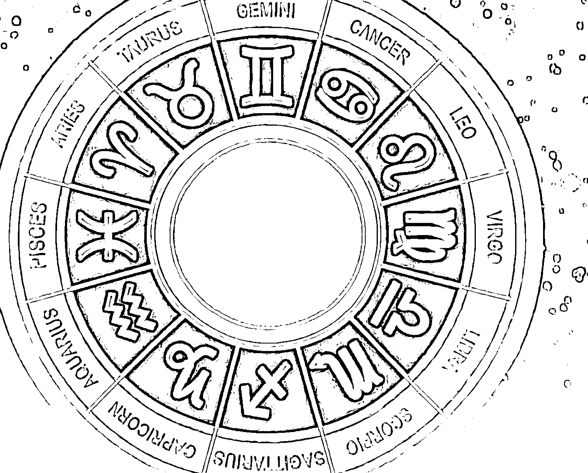

## St. Royal College  
天使神秘學院

- 專業占卜預測機構  
- 神秘學培訓機構  
- 水晶能量研究中心  
- 神秘學資料庫  
- 官方淘寶：http://strc.taobao.com  
- 讀書交流QQ群：

占星塔羅占卜師交流群：814594478（加入密碼：PDF）  
神秘學其他綜合群：659338717（加入密碼：PDF）

使用手機淘寶掃一掃，獲取更多好書

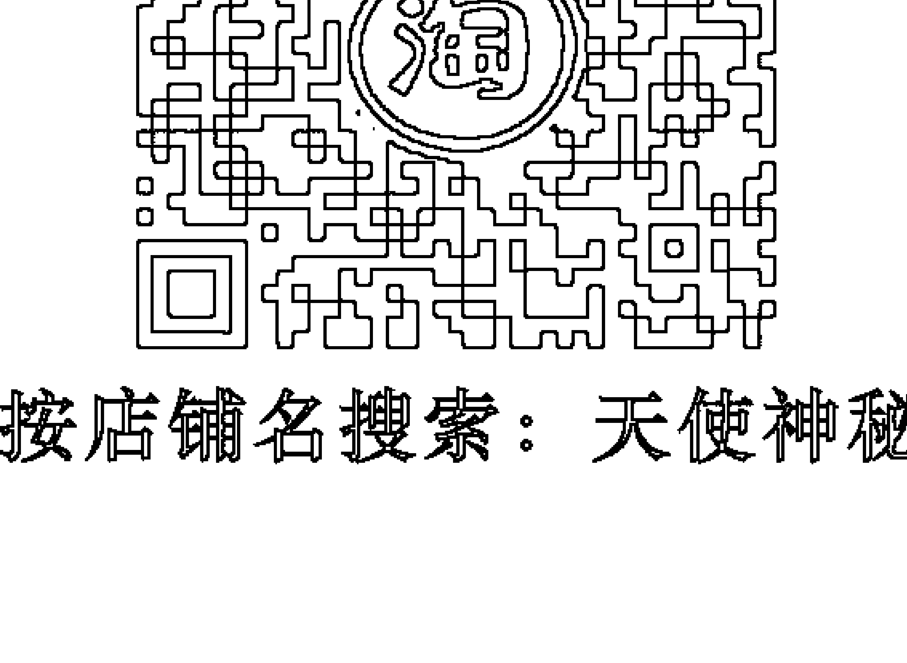

淘寶按店鋪名搜索：天使神秘學院

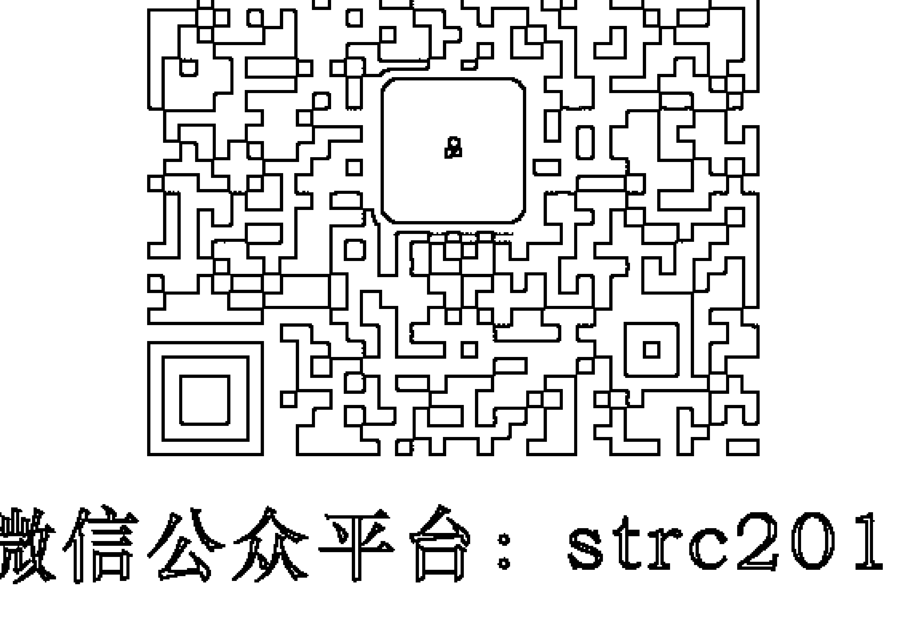

微信公眾號平台：strc2011

## 製作說明

本書由《天使神秘學院》出重金從台灣購入的原版書籍掃描製作完成。為達到最好閱讀效果，特地把原版書全部切開後，再經由專業掃描設備高精度掃描完成，並經過一張張的PS後期處理最終成書，其間花費大量的人力、物力以及時間，只為能給大家提供經濟並優質的神秘學學習資料而努力。

本學院強力譴責某些機構和個人，把本學院花心血製作完成的電子書籍，包裝後直接放在自家淘寶網上低價傾銷的行為，以謀取不勞而獲的經濟利益。如果長此以往，最終將無人願意再為大家花心思製作電子書，那以後可能大家再無新書可讀。

為讓大家以後能夠讀到更多的好書，也為了本學院的良性發展，本學院懇請大家盡量做到如下幾點：

- 一、盡量在本學院的網站購買電子書籍。  
- 二、請勿用技術手段把電子書內的水印及加密去掉。  
- 三、在收到電子書後小範圍傳閱即可，千萬不要公開傳播，更別掛到淘寶網上低價銷售。

同時為答謝廣大支持者，學院電子書將做如下調整：

- 一、學院會把一些早已收回製作成本的電子書折價銷售。  
- 二、最新製作的電子書籍會開放打印功能，大家購買後有條件的可自行打印成書。

天使神秘學院  
2018年1月

## 開運講座  
### 星座運勢排行榜

今年春分剛過，新的季節已經來臨，今年最有冠軍相的星座到底是誰呢？快來看看各種有趣的運勢排行榜吧！

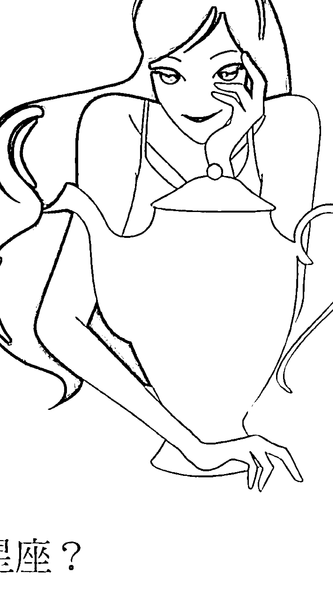

### 擊退小人運

今年可以擊退小人的星座？

- **Top 1 雙魚座**：自信滿滿前途順暢  
- **Top 2 天蠍座**：務實前進小人自退  
- **Top 3 處女座**：貴人相助排除萬難  

### 桃花運

今年可以在下一站遇見幸福的星座？

- **Top 1 雙魚座**：有自信的女人最美麗  
- **Top 2 天蠍座**：機會降臨坐懷不亂  
- **Top 3 獅子座**：熱力四射閃光閃不停  

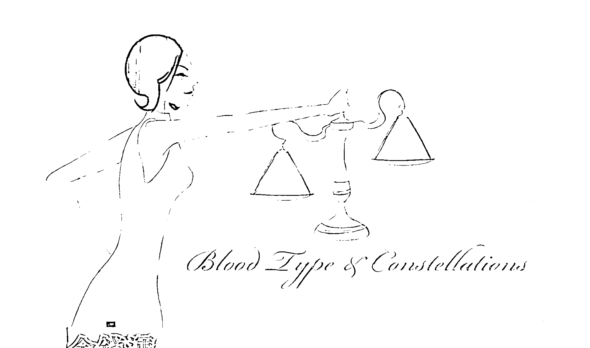

### 金錢運

「今年可以當一台超級印鈔機」的星座？

- **Top 1 水瓶座**：運來財運擋都擋不住  
- **Top 2 雙魚座**：痛改前非規劃理財  
- **Top 3 處女座**：夢想支撐量入為出  

### 貧窮運

「今年只能在家大口吃泡麵」的星座？

- **Top 1 白羊座**：左支右絀投資衝動  
- **Top 2 天秤座**：財務黑洞暗藏隱憂  
- **Top 3 摩羯座**：開銷過大動用老本  

### 開運題

今年可以和另一半浪漫滿屋的星座？

- **Top 1 處女座**：戀情升溫享受幸福  
- **Top 2 雙魚座**：壓力消退婚姻進階  
- **Top 3 天秤座**：平實相處感情純粹  

### 桃花題

今年要小心會成為敗犬女王的星座？

- **Top 1 雙子座**：感情退燒生活枯燥  
- **Top 2 水瓶座**：單身萬歲高呼自由  
- **Top 3 射手座**：稍有心動無力行動  

## Blood Type & Constellations

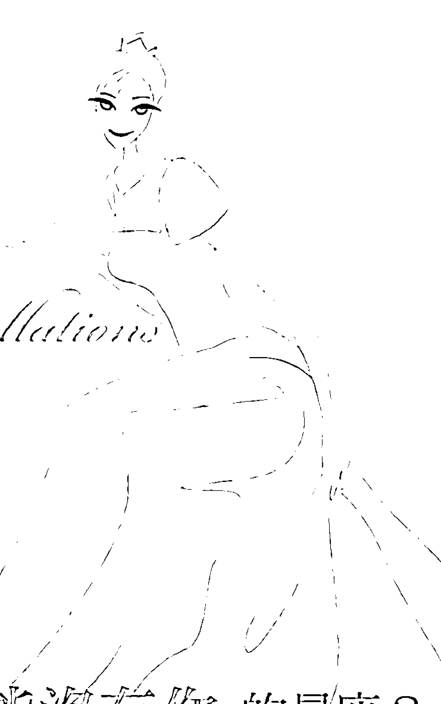

### 工作運

今年會讓老闆不能沒有你的星座？

- **Top 1 天秤座**：工作熱誠心想事成  
- **Top 2 巨蟹座**：進入情況升遷在望  
- **Top 3 天蠍座**：抓緊時機前程似錦  

### 壞運勢

今年小心「被老闆說『You are fired！』的星座？」

- **Top 1 金牛座**：事務繁重逃避壓力  
- **Top 2 白羊座**：心中忐忑眼高手低  
- **Top 3 射手座**：心生倦怠忙裡偷閒  

## Decoding the secrets of the blood types and color of skin

## ✧ 序 ✧  
### 看見生命中的原色與星曜

請試著回答以下問題：

- 「你覺得A型與O型哪一種血型的朋友比較多呢？」  
- 「你認為天蠍座和雙子座哪一個星座的人比較專情呢？」

令人驚訝的是，即使是從未深入鑽研命理學的人，心中也會很自然地浮現答案。透過大眾媒體的渲染與發酵，血型與星座的基本觀念早已被植入我們的腦中。這些話題常常成為我們與陌生朋友建立關係的一個媒介，甚至被當作判斷人際間親疏遠近的參考指標。

但不論是血型或是星座內涵，其實都代表著人類性格中的原型。它幫助我們看見自己個性中的光明面與黑暗面，了解別人的愛惡喜好，藉此解開許多不必要的猜疑與誤會。

洞悉人性的秩序，並不是為了讓我們在別人的身上扣上某種血型或星座的帽子，而是讓我們在萬物世事之中，偶爾放下自己的觀點，試著從別人的角度出發，才能夠化解所有的紛爭，傳導真正的情感與快樂，完整地感受人與人之間的幸福連結。

經過本書編輯的細心編排，在血型與星座交織成的四十八種人格之中，加入了時下最紅的偶像明星，讓你能夠透過明星的行事作風，馬上了解各種血型的星座型態。

試著了解血型與星座賦予人性截然不同的詮釋，讓我們更能領悟到自己與他人的同與不同，進而開發自己心靈潛層中的能量，為自己的生命創造出最奇異的色彩。

## 序  
### 血型與星座，燃燒你自己一切的火

用血型、星座來診斷個性，一直是人氣居高不下的熱門話題。但當細心的A型、憨直的B型、High咖的O型與自命不凡的AB型碰到了十二星座，它們會在我們的性格中產生什麼奇妙的化學變化呢？

當星座遇見血型，通常會讓彼此共有的特質更加強化；但不同的特質之間則會被綜合，或是因相互拉扯反而淡化各自的特徵。

舉例來說，A型處女座的人，就會讓A型的敏感度與處女座的龜毛指數放到最大。除了對事物需求臻於完美之外，有時候還會一股腦地鑽牛角尖，過於在意小細節。

但如果能夠妥善運用這種人格特質，就會加深一個人反省自我的程度，在「好還要更好」的心態下不斷向上成長；但若是偏向負面的效應，就容易用放大鏡觀看自己的錯誤，在求好心切之下，若是稍微犯了一點小錯誤，就會自責不已。

若是稍微切換一下血型，把處女座換成O型，平常大剌剌又充滿自信的O型會把處女座不願意放過自己的毛病中和一下，而勇敢地和挫折正面對決，讓自己產生一連串進化型的蛻變。

例如：O型處女座的亞洲小天后蔡依林，曾經經歷演藝低潮的她，在經過持續不斷地努力與蛻變後，終於破繭而出，從少男殺手轉變為新一代的流行教主。

當相同的血型遇見不同的星座類型，也會譜出截然不同的人生樂章。

例如：O型射手座的阿信，一手打造出台灣的搖滾天團五月天，更以平易近人又足以撼動人心的音樂，貼近無數市井小民的耳朵；但O型摩羯座的周杰倫卻懂得運用古典的曲風入歌，創作出一首又一首帶有濃厚中國風的歌曲，輕鬆地攻佔兩岸三地的華人音樂版圖。

除了血型與星座交織成的四十八種性格之外，本書還特別從愛情、家庭、職場、理財等角度，深入剖析各種人生角色上的性格表現。讓每一個人都能夠快速地在本書中找到屬於自己的類型，同時也能夠一眼識破情人或其他人心中最深的需求，堪稱是一本隱藏版的人性攻略祕笈。

此外，本書更邀請星座專家撰寫今年星座運勢的終極版，還有網路詢問度最高的星座運勢排行榜（你今年可以當一台超級印鈔機嗎？請見前面彩頁），讓你不用看電視也馬上具備血型與星座的基本常識，輕鬆地跨越性格與命運的鴻溝，充滿信心朝一整年的好運邁進。

## 目錄

### 開啟篇：星座與血型分析

- 【推薦序】看見生命中的原色與星曜 …… 3  
- 【自序】扭轉命運，從瞭解自己開始 …… 4  

### 星座專家的御用占星術語！

- 星座符號解密之旅 …… 12  
- 全盤解析十二星座分類法 …… 13  
- 行星落宮小百科 …… 15  

### 血型解碼，發現自己的性格原型！

- 血型探索之旅 …… 18  
- 血型的性格診斷 …… 21  
- 血型的戀愛心理 …… 22  
- 血型的職場法則 …… 23  
- 血型的理財之道 …… 24  

### 網友首推的超準血型星座大解析！

- A型：足智多謀的常勝軍 …… 26  
- B型：喜歡向未知挑戰 …… 32  
- O型：把義氣當飯吃 …… 36  
- AB型：檯面下的企圖心 …… 40  

- A型：謹慎行事，零失敗率 …… 46  
- B型：我行我素的一派悠閒 …… 50  
- O型：不容許動搖的決定 …… 54  
- AB型：對藝術獨特的鑑賞力 …… 58  

- A型：精心設計說話效果 …… 64  
- B型：擅長一心多用 …… 68  
- O型：全方位的八面玲瓏 …… 72  
- AB型：隨機應變的進化版 …… 76  

- A型：倫理與傳統的捍衛者 …… 82  
- B型：與生俱來的管家婆 …… 86  
- O型：充滿母性的犧牲精神 …… 90  
- AB型：用理性掩藏真正情緒 …… 94  

- A型：唯我獨尊的王者 …… 100  
- B型：情緒起伏極大的活火山 …… 104  
- O型：全世界都是你的舞台 …… 108  
- AB型：威嚴感與親切感兼具 …… 112  

- A型：無比高尚的純潔心靈 …… 118  
- B型：求知欲旺盛的研究學者 …… 122  
- O型：腦筋靈活的實務高手 …… 126  
- AB型：獨特敏銳的分析能力 …… 130  

- A型：尋找最符合眾人期望的答案 …… 136  
- B型：旁若無人的重視外表 …… 140  
- O型：舌燦蓮花的社交天才 …… 144  
- AB型：優雅高尚的迷人風采 …… 148  

- A型：透視人性背後的欲望 …… 154  
- B型：好惡分明行動大膽 …… 158  
- O型：冷靜又熱情的綜合體 …… 162  
- AB型：披著神祕面紗的先知 …… 166  

- A型：千方百計追求自由 …… 172  
- B型：結合創新實踐能力 …… 176  
- O型：一根腸子通到底 …… 180  
- AB型：頭腦冷靜行動迅捷 …… 184  

- A型：強烈進取嘗奇行事 …… 190  
- B型：和時間賽跑的實踐家 …… 194  
- O型：多做少說堅忍不拔 …… 198  
- AB型：耐力十足攻上人生巔峰 …… 202  

- A型：擁護平等的人道主義者 …… 208  
- B型：勇敢追求與眾不同 …… 212  
- O型：大膽而多變的創意 …… 216  
- AB型：高度敏感也保持超然 …… 220  

- A型：人前已亂人湧已湧 …… 226  
- B型：天使與魔鬼的化身 …… 230  
- O型：世界上最後一個好人 …… 234  
- AB型：情感豐富變幻不定 …… 238  

### 十二星座年度運勢終極版！

- 牡羊座 …… 244  
- 金牛座 …… 245  
- 雙子座 …… 246  
- 巨蟹座 …… 247  
- 獅子座 …… 248  
- 處女座 …… 249  
- 天秤座 …… 250  
- 天蠍座 …… 251  
- 射手座 …… 252  
- 摩羯座 …… 253  
- 水瓶座 …… 254  
- 雙魚座 …… 255  

## 占星速查表

你知道除了太陽星座以外，自己還擁有哪一些星座嗎？透過查詢你的出生資料，你可以找出自己的各個行星所落入的星座如下：

新浪星座算命：http://mindcity.sina.com.tw/

- ASC 上昇星座：  
- 太陽星座：  
- 月亮星座：  
- 水星星座：  
- 金星星座：  
- 火星星座：  
- 木星星座：  
- 土星星座：  
- 天王星星座：  
- 海王星星座：  
- 冥王星星座：  

## Chapter 2

## 星座的探索之旅

距今數千年前，西亞兩河流域出現了文明燦爛的巴比倫帝國。在這裡誕生了黃道十二星座與占星術。建立巴比倫帝國的迦勒底人不斷發展占星學，之後傳入希臘、羅馬各地，更持續演進出更完整詳盡的面貌。

最早的占星術只局限於預測國王的命運、國家的興衰或者大自然的各種異象。然而，以一個人誕生時星座的位置來占卜其一生命運的占星術卻已逐漸在民間流傳。

到了中世紀，占星術因天主教以怪力亂神為由加以嚴禁，而消聲匿跡了一段時間。後來到了文藝復興時期，在歐洲貴族的接受與保護下再度重見天日。至今，全球對占星術及其神祕學領域的研究熱情仍然不減。

「人在出生時，宇宙間行星的位置均能影響其性格與命運」——這就是占星術所依據的基本原則。不僅如此，還因行星種類的不同而有不同的影響。例如：月亮不但會影響潮汐的漲退，同時還會帶動人體的節奏和心情的變化，影響到我們的情緒和生活作息。

但是，在諸星當中，最重要也最有意義的莫過於太陽。它可決定一個人的本質、個性及活動力，也顯示了個人的喜好、創作力和意志。一般我們常聽到的「星座」，其實就是「太陽星座」，只要查閱出生日期就可以得知，這也是為什麼大家習慣用太陽星座來判別個性的主要原因。

另外，在出生的瞬間，將各種帶有不同涵義的行星所在的位置繪製成盤，也有助於我們更準確地占卜一個人的性格和命運。

### 全球通用的十二星座分類法

我們常常看到電視上的星座專家談到「火象星座」等議題，其實「四象分類」只是十二星座分類中的一種。透過星座的分類，我們可以清楚地找出同類型星座之間的共有特質（例如：牡羊座與獅子座都帶有火象星座的行動力）。本篇為大家介紹全球占星術都通用的十二星座分類法，以後不論是看電視或閱讀雜誌，都可以輕鬆瞭解其中的內容。

十二星座可初步分成兩大類，即「二元星座」，介紹如下：

- 陽性星座：包括牡羊座、雙子座、獅子座、天秤座、射手座、水瓶座，代表外向、主動、積極、開朗的性格。  
- 陰性星座：包括金牛座、巨蟹座、處女座、天蠍座、摩羯座、雙魚座，代表內向、被動、保守、內斂的性格。  

此外，占星術又依循構成天地的四大元素，把星座分成「四象星座」，介紹如下：

- 火象星座：包括牡羊座、獅子座、射手座。即具有如「火」般燃燒的性格，以及熱情的活力。  
- 土象星座：包括金牛座、處女座、摩羯座。即具有如「土」般穩重的性格，純樸而踏實。  
- 風象星座：包括雙子座、天秤座、水瓶座。即具有如「風」般富於變化，重思考與交際。  
- 水象星座：包括巨蟹座、天蠍座、雙魚座。即具有如「水」般善變，多愁而善感。  

後來，占星術又依物質三態把星座分類為「三態星座」，介紹如下：

- 本位星座：包括春季的第一個星座→牡羊座、夏季的第一個星座→巨蟹座、秋季的第一個星座→天秤座、冬季的第一個星座→摩羯座。  

每個季節起始的第一個星座為本位星座，所以個性比較傾向於開創性，適合主導。

- 固定星座：包括春季的第二個星座→金牛座、夏季的第二個星座→獅子座、秋季的第二個星座→天蠍座、冬季的第二個星座→水瓶座。  

每一個季節中間的星座為固定星座，這是屬於一年之中氣溫比較穩定的時期，所以個性比較傾向於安定性，不易變化。

- 變動星座：包括春季的最後一個星座→雙子座、夏季的最後一個星座→處女座、秋季的最後一個星座→射手座、冬季的最後一個星座→雙魚座。  

每一個季節最後的星座為變動星座，剛好是氣溫又要轉變的時期，所以個性比較傾向於調和，適合變化。

### 星座的四象三態表

| 三態 | 火象 | 土象 | 水象 | 風象 |
|---|---|---|---|---|
| 本位 | 白羊座 | 摩羯座 | 巨蟹座 | 天秤座 |
| 固定 | 獅子座 | 金牛座 | 天蠍座 | 水瓶座 |
| 變動 | 射手座 | 處女座 | 雙魚座 | 雙子座 |

## 占星常識小百科

### 星座命盤

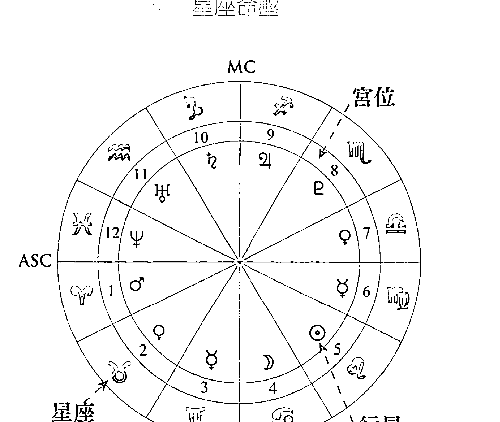

### 星座的來源和劃分

雖然我們都知道，是地球繞著太陽運轉，但是站在地球上仰望天空，太陽每日在天空移動運行，就形成一個環繞地球的軌道，我們稱這個軌道為黃道。

太陽系行星的運行軌道皆在黃道帶上，這條帶狀被等分成十二個區塊，上面有許多離太陽系行星甚遠的星體。古人觀察時將這些星體排列成具體圖案，以熟悉和有象徵意義的動物等形象去命名，就是我們耳熟能詳的十二個星座。

### 十二宮位代表著不同的人生領域

依據您的出生時間與出生地的經緯度，推算出地平面向東延伸與黃道的交點，就是上升星座。再依此將三百六十度的圓周切分為十二個不等分的區塊，就是十二宮位。

在星盤上，十二宮位與十二星座排列在內外圈上，以此可對照每個宮位所在的星座（請參考星座命盤圖）。每個宮位代表著人生重要的生活領域，例如第一宮代表自我與個性，第七宮代表婚姻的狀況與配偶的特質等。

### 十大行星為我們貼上性格標籤

一般而言，在基礎占星學中常用到個人命盤中十大行星的所屬星座，來解析個人性格。十大行星也各自代表不同的性格領域，介紹如下：

- 太陽 (Sun)：太陽代表你的性格統合。  
- 月亮 (Moon)：月亮掌管你內在的情緒。  
- 水星 (Mercury)：水星掌管你的思考與溝通方式。  
- 金星 (Venus)：金星代表你的愛情觀、價值觀。  
- 火星 (Mars)：火星掌管你的行動力、性取向。  
- 木星 (Jupiter)：木星代表你的樂觀處、幸運所在。  
- 土星 (Saturn)：土星代表你的限制與匱乏。  
- 天王星 (Uranus)：天王星代表改革與創新的能力。  
- 海王星 (Neptune)：海王星代表容易沉溺的特質。  
- 冥王星 (Pluto)：冥王星代表毀滅與重生的力量。  
- 上升 (Asc)：上升代表你的表現方式。  
- 天頂 (MC)：天頂代表個人追求的生命目標。  
- 北交點 (Node)：北交點代表今生需要增強發展的特質。  
- 南交點 (S.Node)：南交點代表與生俱來的特質與才能。

## 血型的探索之旅

大家都知道血型包括了 A、B、O、AB 型四種，即所謂的「ABO式」血型系統。這種「ABO式」的血型系統是一九○一年美籍奧地利病理學家──卡爾・蘭德斯泰納（Karl Landsteiner）所發現的，他也因這項重大發現而獲得一九三○年的諾貝爾獎。

事實上，這四種血型只是最常見、最早被發現的血型，但並不能涵蓋所有的血型。因為在一九二七年蘭德斯泰納陸續發現了MN式，一九四○年又發現Rh式，而其他科學家也發現了S式、Q式、E式、T式等數十種血型系統。但由於這些血型系統中的案例極少，所以一般仍採用「ABO式」血型系統。

就在血型被發現的十餘年後，又有科學家發現血型原來是會遺傳的，即父母親的血型遺傳基因能決定子女的血型。因此，後人就常利用這種遺傳的特性來做親子鑑定。

事實上，O型的血型物質不僅存在於O型中，在A型、B型和AB型中也存在。因此，我們可以了解為什麼都是A型、或都是B型的父母會生下O型的子女了。

### 血型的遺傳方式

| 父母的血型 | 子女可能出現的血型 | 子女不可能出現的血型 |
|---|---|---|
| O + O | O | A、B、AB |
| O + A | O、A | B、AB |
| O + B | O、B | A、AB |
| O + AB | A、B | O、AB |
| A + A | A、O | B、AB |
| A + B | A、B、O、AB | 無 |
| A + AB | A、B、AB | O |
| B + B | O、B | A、AB |
| B + AB | A、B、AB | O |
| AB + AB | A、B、AB | O |

現在市面上，我們可以看到許多血型性格分析的書籍，這種研究到底是從什麼時候開始的呢？最早是從一九二七年，由一位日本東京女子師範學校的教授所提出的。

他認為：「隨著各人血型的差異，氣質也各有不同。」由於他的提倡，之後許多研究者便依循這條路線，蒐集各種數據資料，從各個方向展開調查研究。

從這些數據中，我們也發現血型的分佈會因民族的不同而有所差異。例如歐美的O型白人佔46%，蘇格蘭、愛爾蘭等地更高達50%以上；但在亞洲，O型人卻只佔27%。再以B型為例，亞洲的B型人佔34%，有些地區甚至有40%，而歐洲的B型人卻還不到10%。

如果依血型來做性格分析，那麼我們可以說有近四成A型人的日本，是個典型的A型社會（特徵：堅忍、勤勉、認真，有奉獻環境的特質）；至於隨性又充滿自信的美國，完全就是O型社會的經典代表。

此外，血型之間其實還存在著「強弱關係」（請參考下圖）。

### 血型間的循環關係

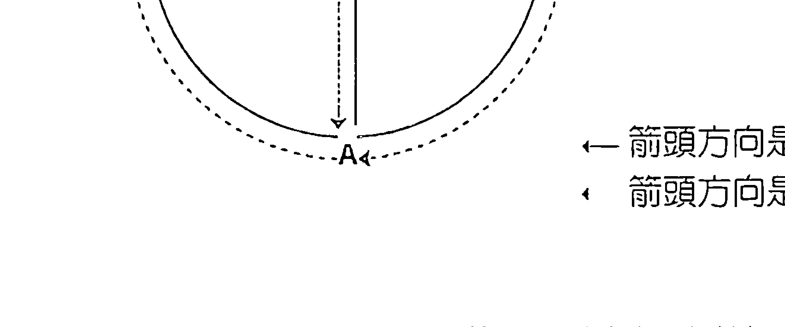

## Blood Types & Constellations

在人際關係的交往中，有些人會有：「為什麼我總是受到某些血型的牽制？」的感受，其實這都是因為血型間的強弱關係在作祟。在現實情況中，弱者對強者會造成緊張關係，強者對弱者則可以輕鬆應對。

例如：A型的人相對於O型、AB型的人而言是屬於比較有力的一方，但A型的人一遇到B型就會變成弱勢的一方，血型的強弱關係就是如此成立的。

## 血型的性格診斷

### A型

A型的人是天生的完美主義者，為人處事彬彬有禮，懷有犧牲奉獻的精神。他們重視環境的整體氣氛，在團體中往往是居中協調的和事佬，也樂意為人群服務。私底下，他們卻是一個喜愛孤獨、享受寂寞的獨行俠，常掩飾自己的真心，無法全然相信別人。

### B型

B型的人個性爽朗，說起話來單刀直入、開門見山，有時候會讓人招架不住，但實際上卻是刀子口豆腐心。他們做事情全憑直覺及印象，重視過程和當下，因此常不計後果地做出決策，又因為耳根子軟，容易被別人的勸說而改變心意，儘管如此卻絕對不聽從他人命令式的指揮。

### O型

O型的人交遊廣闊，古道熱腸，他們喜歡成群結隊地過團體生活，也常常在團體中位居領導者的地位。在他們做決定以前會先洞悉全盤大局再採取行動，一旦下定決心，便勇往直前，不再改變。另一方面，O型的人感情豐富，是那種會因為電影劇情落淚的人。

### AB型

AB型的人非常重視個人隱私權，即使是至親好友，也難以進入他的內心世界。他們與生俱來的雙重性格，一方面會熱心地為公眾的事情四處奔波，另一方面又經常獨來獨往，不會主動加入團體，態度總是忽冷忽熱的，是大家公認的怪人。

## 血型的貼心提醒

### A型

A型人的服務精神有時會被當成偽善不真誠，不妨敞開心胸，將真實的自我表現出來。凡事不要太執著好勝，只要保持輕鬆愉快的氣氛，與人相處並不是一件難事。不要那麼固執拘謹，完美的人生不一定是快樂的人生。

### B型

B型的人凡事講求現實，會讓周圍的人感受到莫大的壓力。試著通情達理一點，因為人與人之間不只有道理，還有人情世故這一部分。做事情時不要太莽撞，最好先經過一番評估再下決定；一旦決定，就不要輕易變卦，那會讓和他們共事的人無所適從。

### O型

O型的人為人海派，幾乎和誰都能談得來，但他們的固執有時會讓人感到總是獨斷獨行，把別人的話都當成耳邊風。其實偶爾聽聽別人的意見，不僅可以多多了解他人的想法，更可以讓自己的人際關係圓融一些，何樂而不為呢？

### AB型

AB型的人應該試著學習欣賞別人的優點，忽視別人的缺點，這樣可以讓總愛批評之苦的親友不再坐立難安。換一個角度看事情，或多替別人著想，AB型的人就會發現當不順眼的事情減少了，生命也會更加輕鬆、美好。

## 血型的感情走向

### A型

A型的人欣賞穿著樸素、做事認真並具有靈活思慮、果決行動力的對象。他們對溫柔體貼的異性向來沒有任何的抵抗力，所以凡事順從他的心意，是和A型人交往的不二法門。喜歡替別人打分數的A型，也會把細心、貼心當作擇偶的第一項檢驗標準。

### B型

B型的人欣賞衣著端莊、富有品味、言談舉止得體、個性樂觀積極的對象。和善變的B型人交往，大發脾氣和壓抑自己都是行不通的，最好充分了解他們後再伺機行動。與其一味地熱情殷勤，不如找到彼此相同的興趣，或者發展共同的嗜好。

### O型

O型的人喜歡裝扮入時、很有主見的另一半，最好是個性活潑樂觀、談吐大方風趣的人。O型人的愛情是羅曼蒂克和強烈佔有慾的，所以絕對不能容忍另一半單獨和別人出遊。不過討他們的歡心也不難，只要經常有信件和小禮物的往返，更重要的是經常對他們說：「你很特別！」保證你們的愛情歷久彌新。

### AB型

內心捉摸不定的AB型人，乍看之下的確不易親近，所以和他們親近的方式不宜單刀直入。可藉由委託他們幫忙的方式接觸，再誠懇地表達謝意，縮短彼此的距離。他們厭惡偽善和雙面性格，因此誠實就是最好的溝通語言。

## 血型的養生之道

### A型

A型的人凡事有一套完整的規畫，連自己的身體也不例外。在良性情況下，他們都能維持身體機能的最佳狀況，但常因為過度神經質導致失眠而影響體能。最好保持一顆樂觀豁達的心，只要平常找時間慢跑，或多做全身性的有氧運動，就能維持良好健康。

### B型

B型的人是標準的樂天主義者，在健康方面也是漫不經心地我行我素，只要是自己喜歡，就算導致身體不適也無所謂。因此他們健康的大敵，就是無關緊要的態度和懶散的惰性。因為常聚飲聚食，容易導致糖尿病、肝病或腎臟病，身材不到中年就有發福的危機，不可不多加注意。

### O型

O型的人強勁的生命力是最大的資本。雖然他們喜怒分明、個性率直，會導致新陳代謝旺盛，但一旦過度疲勞，會慢慢損耗自己的健康。試著讓自己沉穩溫和一點，雖然運動有助於健康，但是適度的休息和睡眠同樣不可缺少。O型的人要學著控制自己的火爆性格，不然很容易成為腦中風的高危險群。

### AB型

AB型的人表面上對健康問題毫不在意，其實他們從未忽視過健康，自有一套獨特的保健原則。只要一有不適就會立即就醫，一點也不輕忽健康。建議AB型人增加規律運動的時間和頻率，以提高體能的強度與耐力。

## Blood Types & Constellations

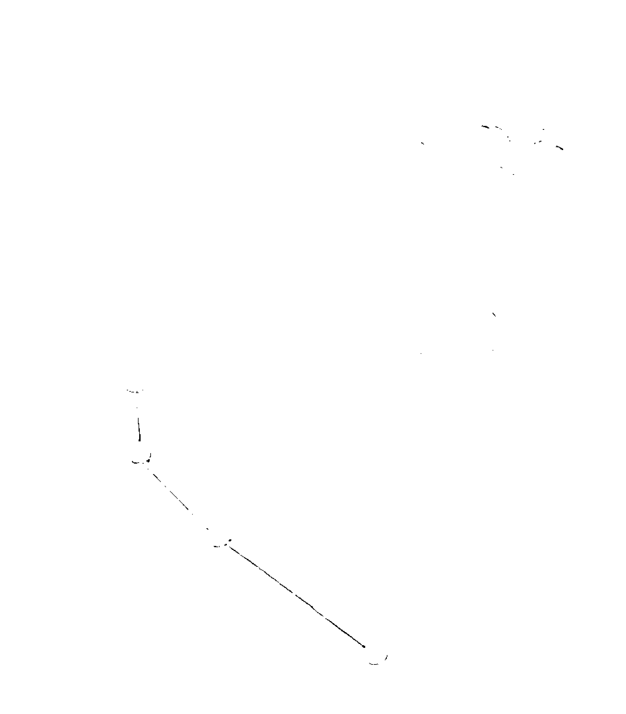

## Aries

星座：牡羊座  
生日：3 / 21 – 4 / 19  
五行：火  

正面形象：樂觀積極、不畏強權、競爭力強  
負面形象：自我中心、脾氣暴躁、缺乏耐性  

- 守護星：火星  
- 掌管部位：頭部  
- 幸運顏色：紅色  
- 幸運寶石：紅寶石  
- 幸運花：雛菊  
- 幸運方向：東  

## ARIES

白羊座是戰神（Mars）所主宰的星座。在古希臘羅馬神話之中，戰神是嗜血與好戰的，而戰爭讓人直接聯想到的就是憤怒、衝突、攻擊與對抗力之類代表侵略性的字眼，所以狂熱過人、精力無窮以及強烈的競爭性格是他最鮮明的特色。

從另一方面看來，這樣的特質有時反而成為人我關係中的障礙。過分的自我中心和易怒的性格，會使別人對他退避三舍。

那麼要如何處理內心的熊熊怒火？壓抑自己絕對不是個好主意，那會造成精神壓力，甚至影響健康。最好的方法是透過運動。白羊座可以上健身房或慢跑，藉由汗水來緩和心中的怒火；也可以用文字或圖畫來盡情發洩怒氣，不要讓這把無名火傷害了自己和別人。

白羊座的愛情就像一場小型攻防戰，他總是樂於追求和征服。雖然白羊座的人是道道地地的大男人／大女人主義者，但害羞、靦腆的方式吸引不了他的注意；白羊座喜歡的是活力充沛、精力十足的戀人，最好能夠一起全力以赴地運動、工作以及生活，才是他夢寐以求的伴侶。

具有速度感和衝刺性的工作或活動最適合白羊座。他會以衝鋒陷陣的勇氣與活力朝目標邁進，以求達到目的。如果有競爭對手在同一條跑道上，更能讓他保持高昂的鬥志；同時，能展現侵略性與競爭性的工作，如業務、體育競賽，都是能讓他充分發揮特質的職場。白羊座也是個先鋒者，因為樂於享受位居第一的領先感，所以他會勇於嘗試新鮮事物，挑戰未知領域的一切。

## A型：Hebe、竹內結子、趙文卓、李準基

### 一、性格解碼

基本上，A型人和白羊座的特質幾乎可以說是背道而馳。A型人重視傳統的生活方式，對於事物的看法相當保守；而白羊座則以冒險挑戰為人生的一大樂趣，所以這種類型的人經常呈現自我矛盾的狀態，有時勇敢果決，有時又顯得優柔寡斷。其實如果能綜合兩者的優點，就能成為職場上的常勝軍。

此外，擅長協調的A型可避免好勝的白羊座過於突顯；白羊座的衝動魯莽也可仰賴A型的穩重與耐心來牽制。另一方面，A型的消極悲觀則可以藉白羊座「事在人為，人定勝天」的樂觀來加以緩和，兩者剛好可以配合得可圈可點。

### 二、愛情魔法

感情坦白而直接、完全沒有暗戀情節的白羊座，一旦喜歡上某人，便熱情洋溢，無法自制，有時甚至連對方都無法接受如此強大的熱情。

所幸A型特有的克制力總會適時產生作用，讓異常衝動的白羊座冷靜一下。因此，在追求行動中經常顯得精明突出的A型白羊座，在得手之後反而變得患得患失。

不過請放心，這種情況不會持續太久，在戀情穩定後，他又會恢復白羊座的厚臉皮了！

就像他擅長轟轟烈烈的愛情一樣，白羊座在性愛方面的需求也是十分強烈，經常表現出「我就是想要」的強勢。幸好A型的保守性多少牽制了白羊座的積極度，所以他可能不會直接提出要求；然而一旦開始進入備戰狀態，就有可能會鬧得驚天動地。建議A型白羊座不妨放慢腳步，來點音樂，多點情調。最重要的是不要專斷獨享，也要顧慮到對方的感受。畢竟兩情相悅才是相愛的最高藝術。

#### 戀人配對度

- 對不起我愛你  
  - B型摩羯座  
  - B型天蠍座  
  - A型巨蟹座  
  - B型巨蟹座  

- 愛也說慢慢來  
  - AB型水瓶座  
  - AB型天秤座  
  - O型雙子座  
  - AB型雙子座  

- 命中注定我愛你  
  - AB型射手座  
  - AB型白羊座  
  - O型獅子座  
  - AB型獅子座  

#### 婚姻生活

行動積極而且熱愛自由的A型白羊座，很容易讓身邊的人擔心：「他結得了婚嗎？」其實不必擔心。儘管他討厭受到束縛，但若對方在精神及物質上能滿足他，那麼他仍然不會排斥和對方步入禮堂。

A型白羊座，尤其是女性，在結婚後可能會發揮A型的賢慧特質，搖身一變成為乖巧可愛的小女人，讓老公備感溫馨。不過面對這樣的嬌妻，也千萬別把她的自尊視若無物，否則一旦白羊座的威力展現出來，不知什麼時候離婚協議書就會丟到你的臉上。

#### 家庭寫照

##### 爸爸

A型白羊座的爸爸有潛在的大男人主義。儘管A型的細膩與體貼偶爾也會分擔家務，但一旦生起氣來，潛藏的暴烈性格便會爆發出來，弄得家人對他又愛又怕。不過子女若有事求助時，他們仍能拋開嚴父的形象，當起子女的天才老爸。

##### 媽媽

婚後的A型白羊座媽媽通常會收斂婚前好動、愛玩的心態，成為家中的賢妻良母。但她們也絕不會因此甘心埋沒於廚房，大多仍會選擇外出工作來肯定自己的能力。而她們對孩子的教育也相當嚴格，絕不放水，是少數能夠內外兼顧的女強人。

##### 孩子

頑固、好奇心強、愛冒險是A型白羊座小孩最大的特徵。不過由於A型的關係，當美夢幻滅時，他們也會比其他類型的小孩更容易受傷。但本質上仍然相當好強，所以若要激發他的潛能，可以用激將法，往往能讓他做出令人滿意的成績。

#### 職場工作

天生的競爭性格就是A型白羊座的本錢，所以他非常適合在競爭環境中發揮特長。此外，他也很適合能夠發揮領導力、具挑戰性的工作，但需要長期鑽研或一成不變的工作反而可能會讓他感到窒息。

- 運動員  
- 新聞記者  
- 大眾傳播  
- 觀光業  
- 教育家  
- 社工人員  
- 衛生保健人員  
- 廣告設計  
- 編輯  
- 工程師  
- 警察  
- 科學家  
- 公務員  

#### 理財計畫

「錢不過夜」的A型白羊座雖然有多少就花多少，但基本上財運還算不錯。雖然無法存太多錢，但還不至於揮霍度日。

#### 最佳的投資組合

| 投資類型 | 選項 |
|---|---|
| 保險類 | 平準型 / 增值型 / 還本型 |
| 其他金融工具 | 股票 / 國外股票 / 共同基金 |

- 活期存款 ○  
- 定期存款  
- 外幣存款 △  
- 黃金  
- 鑽石  
- 古董 △  
- 繪畫品 ○  
- 郵票  
- 海外共同基金 ○  
- 期貨 △  
- 選擇權 ○  
- 房地產  
- 跟會  
- 海外房地產 △  
- 投資創業  

【註】○→值得投資　△→考慮投資

### 心靈／休閒活動

急躁的A型白羊座可以找一些能安定自己心神的運動，或者培養能提升專注力的休閒娛樂，以增強耐性。

適合的運動：高爾夫球、槌球  
適合的季節：炎夏  
適合旅行的地點：東南亞、南非  
適合培養的興趣：下棋、集郵

### 健康小帖

白羊座衝動易怒的個性，再加上A型的敏感與神經質，容易讓A型白羊座有躁鬱傾向。情緒與精力的爆發力太強，容易引起腦充血等問題，如腦溢血、高血壓，以及其他腦部疾病，例如紅眼、瞳孔縮小等。凡事以平常心看待，再加上持續努力，才能擁有成功又健康的人生。

## Blood Types & Constellations

### B型白羊座

張信哲、黃志瑋、黃子佼、劉燁

#### 性格解碼

直率衝動型的B型白羊座，經常在別人還在原地踏步時，就已經三步併兩步，趕在他人之前行動。換句話說，他一向是先行動再思考，所以如果他遇上做事溫吞的慢郎中時，恐怕會急得跳腳。

B型白羊座的座右銘是：「即使失敗，也比什麼都不做來得好。」因此他不喜歡維持現狀，喜歡向未知挑戰。不過自我主張強烈的他，言詞上向來直言無忌，有時難免過於尖銳，刺傷別人仍不自知。然而欣賞他這種直率個性的人，也許會對他明快、坦率的作風感到痛快至極。

#### 愛情魔法

以貌取人是B型白羊座特有的愛情傾向，所以他交往的對象往往不是俊男就是美女，而且他從相遇到熱戀只需一瞬間，導致熱戀到分手也可能在瞬間結束。

急率的B型白羊座應避免一開始就熱切追求對方，不妨先從朋友做起，認清彼此的個性後，再決定是否交往，否則對方的反彈可能會很大。不過他若被拒絕，復原能力也相當快，絕不會在被拒之後還死纏爛打。如果想要擁有較長遠的關係，更應慎選對象。

行事積極的B型白羊座，他的熱情和慾望比別人多一倍，而他的床上技巧和持久力恐怕也相當出色，所以一旦進入亢奮狀態就很難停止。如果對方適時喊停，反而可能讓他覺得掃興。

#### 戀人配對度

- 對不起我愛你  
  - B型巨蟹座  
  - AB型巨蟹座  
  - AB型天蠍座  
  - AB型摩羯座  

- 愛也好恨也好  
  - A型雙子座  
  - O型雙子座  
  - A型天秤座  
  - A型水瓶座  

- 命中注定我愛你  
  - A型白羊座  
  - A型獅子座  
  - O型獅子座  
  - A型射手座  

#### 婚姻生活

學習尊重對方，避免強迫對方聽從自己的意見。

積極主動的B型白羊座，在婚姻方面對被動的相親完全沒有興趣，他希望憑自己的能力去尋找結婚對象。所以即使婚後，B型白羊座的女性也非常願意過「男主外、女主內」以外的生活型態，她寧願選擇忙碌的職業婦女生活，也不願閒賦在家。

如果希望擁有圓滿的婚姻生活，最好找個賢內助來分擔家事。此外，支配慾強的他若要與主導權同樣強的人結婚，最好修正一下自己的性格，否則家庭生活可能永無寧日。

#### 家庭寫照

##### 爸爸

以一家之主來形容B型白羊座的爸爸一點也不為過。雖然他行事頗值得家人信賴，但有時也不免獨斷獨行。孩子和妻子對他而言，不但是需要保護的弱者，也是他的個人財產，所以有時會忽視家人的意見。而競爭心強的他，也經常會為了事業發展忽略家庭生活。

##### 媽媽

B型白羊座的媽媽相當獨立。即使另一半有足夠的經濟能力，她仍不甘心當附庸，依然會外出工作來證明自己的能力。對孩子她們也是忽嚴忽鬆，心情不好時可能棍棒齊下；心情好時又對孩子摟抱疼愛，完全憑直覺行事。

##### 孩子

B型白羊座的小孩外表看來似乎有點懦弱，其實活力十足。因為個性不易服輸，遇到競爭對手反而會激起鬥志；遇到挫折時，也會勇敢堅持下去。這類型的孩子所到之處往往充滿笑聲與活力，假日可以多帶他外出活動，讓他發洩精力。

#### 職場工作

越是競爭的環境，表現愈加出色。

B型白羊座在戰鬥狀態下通常能發揮無窮潛力；如果處在過度安穩的環境，他的行動力與觀察力反而容易生鏽。此外，過於卑躬屈膝的工作會令他苦惱，也應盡量避免需要長期耐心累積的工作。

#### 合適的工作清單

- 保證成功  
  - 廣告文案  
  - 企業經營  
  - 市場開發  
  - 大眾傳播  

- 值得努力  
  - 服裝設計  
  - 旅遊業  
  - 職業運動員  
  - 企劃  
  - 管理者  

- 千萬別試  
  - 調查研究  
  - 醫生  
  - 工業技術  
  - 公務員  

#### 理財計畫

投資創業需慎選合夥人。

B型白羊座一生運勢起伏極大，連財運也不例外。他會為了達到某種目的不惜一搏，因此不是一夜致富，就是一文不名。對金錢漫不經心的他，若要創業，最好找一位理性、沉穩的人合作比較保險。

#### 最佳的投資組合

| 類別 | 項目 |
|---|---|
| 保險類 | 平準型、增值型、還本型 |
| 存款類 | 活期存款、定期存款、外幣存款 |
| 其他金融工具類 | 股票、國外股票、共同基金、海外共同基金、期貨、選擇權 |

##### 貴重物品類
- 黃金 ○
- 鑽石 ○
- 古董
- 繪畫品
- 郵票

##### 其他民間投資類
- 房地產 ○
- 跟會
- 海外房地產
- 投資創業 △

【註】○→值得投資　△→考慮投資

#### 休閒活動

競爭心強的 B 型白羊座，凡事都要參一腳才能滿足他的挑戰欲。所以在運動方面，他可能也不太適合團體的項目，可以上場擔任主角或是能讓他充分表現的運動也許比較適合。

- 適合的運動：拳擊、西洋劍
- 適合的季節：初夏
- 適合旅行的地點：波蘭
- 適合培養的興趣：辯論、話劇

## 健檢小站

有忽視小病的傾向，應特別注意！

B 型白羊座具有超人的體力，即使輕微的感冒，也不會放在心上。但是白羊座火藥味十足的個性常導致內分泌失調，因而引起粉刺、面皰等皮膚疾病，尤其 B 型人與生俱來的樂天主義，更對身體的不適毫不在意，往往延誤就醫良機。

## 白羊座

名人：陳喬恩、楊謹華、林俊傑、王建民

## 性格解碼  
行事之前要考慮清楚，才能提高達成率

如果班上要選一位班長，公司要提拔一位主管，O 型白羊座絕對是被優先考慮的人選。

白羊座的積極、勇猛使他面臨挑戰時極少退縮；O 型的正義感和責任感，使他看到朋友有難時，也絕少袖手旁觀。O 型和白羊座的特質總在他身上發揮得恰到好處，因此，使他無論在學校或工作崗位上格外引人矚目。

不過，充滿競爭心的 O 型白羊座，也常因好勝之故，和人衝突不斷。而慌張、不顧落人後的缺點，也使他經常在購物時發現沒帶錢包，或者吃完飯急著為朋友付帳時，發覺口袋空空的情況。身為 O 型白羊座的朋友，千萬別介意，因為他實在不是故意的。

## 愛情魔法  
要懂得珍惜彼此相遇、相愛的緣份

一旦落入情網，就一定要談一場轟轟烈烈戀愛的 O 型白羊座，通常愛火點燃得快，去得也快，宛如夜空中的煙火般，璀璨卻短暫。

他往往在發現對方缺點後便迅速畫上關係休止符。此外，不服輸的個性也是造成他愛情不順的一大敗筆。因此，奉勸 O 型白羊座在選擇對象時，千萬別感情用事，慢慢地挑，終究能找到可以接受你的高傲性格，但也有才幹的人。

O 型白羊座，從愛的自覺到性的過程是相當地快又驚人，他常在迅雷不及掩耳的情況下，帶給對方特別的驚喜。不過，他也是很自私的，當有需要時，他會強烈要求；當愛的熱情過後，即使對方熱烈暗示，他也不為所動。

#### 戀人配對度

##### 對不起我愛你
- O 型巨蟹座
- AB 型巨蟹座
- AB 型天蠍座
- AB 型摩羯座

##### 愛也好恨也好
- B 型雙子座
- B 型水瓶座
- B 型天秤座

##### 命中注定我愛你
- B 型白羊座
- A 型獅子座
- B 型獅子座
- B 型射手座

#### 婚姻生活

慎選另一半，不宜過早走入婚姻。

對 O 型白羊座來說，有百分之九十五以上的人不會選擇相親，而是經由自由戀愛而結婚的。因為相親是被動的，和行動派的 O 型白羊座完全背道而馳。

O 型白羊座很容易因一時的熱情而做下終身的抉擇，但也會很快地發現對方的缺點而分開。「來匆匆，去匆匆」是他們婚姻的最佳寫照。

#### 家庭寫照

##### 爸爸

O 型白羊座的爸爸通常會把事業擺在家庭之上。他們並非不愛家，而是覺得事業如果沒有基礎，他永遠寢食難安，而且對他而言，第一是不夠的，還要永遠保持領先。有了這股強烈的事業心，家庭的責任感也不免被沖淡了，子女可能很少有機會可以看到爸爸。

##### 媽媽

天性開朗且負責任的 O 型白羊座媽媽，會努力經營家庭生活。然而，她也不會完全安於家庭，會積極嘗試新事物，努力自我成長。不過，她的好勝心切，會為了使先生、小孩出人頭地，而不斷給對方壓力，使家人對她是敢怒不敢言！

##### 孩子

比起其他類型的白羊座小孩，O 型白羊座孩子顯然最有幹勁，他的精神經常都處在高昂飽滿的狀態。然而，他也較為衝動，行動之前很少深思熟慮。最重要的是，要養成他守時、負責任的觀念，要多小心別太縱容他！

## 職場工作  
更換工作之前，必須三思而行

社交性強的 O 型白羊座，非常不適合刻板、一成不變的工作，因此最好能有一技在身，這樣就能自己開公司、當老闆；若是身處大公司時，也應儘量選擇業務或開發部門，讓原有的冒險精神能徹底發揮。

#### 合適的工作清單

- 保證成功：職業運動員、新聞記者、觀光業、大眾傳播
- 值得努力：作家、播音員、政治家、設計師、會計
- 千萬別試：秘書、財務、工程師、公務員

## 理財計畫  
購物之前，請務必深思熟慮

賺錢和花錢一樣積極的 O 型白羊座，由於天性浪漫，總會一口氣買下許多中看不中用的物品，反而在最需要用錢的時候，因窘迫不已。購物之前，請先考慮是否必要。

#### 最佳的投資組合

- 保險類：平準型、增值型、還本型
- 其他金融工具類
  - 股票
  - 國外股票
  - 共同基金

| 類別 | 項目 | 標記 |
|---|---|---|
| 存款類 | 活期存款 | ○ |
| 存款類 | 定期存款 |  |
| 存款類 | 外幣存款 | △ |
| 貴重物品類 | 黃金 | ○ |
| 貴重物品類 | 鑽石 |  |
| 貴重物品類 | 古董 |  |
| 貴重物品類 | 繪畫品 |  |
| 貴重物品類 | 郵票 |  |
| 其他金融工具類 | 海外共同基金 | ○ |
| 其他金融工具類 | 期貨 |  |
| 其他金融工具類 | 選擇權 |  |
| 其他金融工具類 | 房地產 | △ |
| 其他金融工具類 | 跟會 |  |
| 其他民間投資類 | 海外房地產 |  |
| 其他民間投資類 | 投資創業 |  |

（註）○→值得投資　△→考慮投資

#### 休閒活動

經常高估自己體力的 O 型白羊座，能夠放鬆身心的休閒對他來說非常重要。行動派的他，只要是好玩的地方都適合，但事前的準備相當重要，以免樂極生悲。

- 適合的運動：滑雪、網球
- 適合的季節：春天
- 適合旅行的地點：佛羅倫斯
- 適合培養的興趣：釣魚、潛水

#### 健康小站

應培養自我放鬆的態度，才不會得高血壓。容易患病的機率幾乎很少發生在 O 型白羊座身上。由於白羊座的體力相當好，再加上 O 型的自信，常常體力透支而不自知，應特別注意。另外，白羊座又支配頭部，而火象星座不擅於控制情緒，所以須慎防頭部及臉部的疾病，如偏頭痛、禿頭。

## 白羊座

名人：陳文茜、彭于晏、成龍、堂本剛

## 性格解碼  
有治有綻才是成功的關鍵

AB 型白羊座從小不是擔任班長，就是一群孩子的首領，因為他天生具備領袖氣質，也很喜歡發號施令、分配工作，所以很容易就會成為團體中的目光焦點。另一方面，也因為此類型的人有一種威而不怒的氣勢，所以自然而然就會讓別人聽命於他。

此外，AB 型的冷靜、理智會將白羊座的企圖、野心掩飾得不露痕跡。所以從外表看來，大家會以為他是一個領導大家、照顧朋友的好好先生，其實他內心深層藏有不為人知的優越感。

## 愛情魔法  
不要玩愛情遊戲，避免一再製造犧牲者

愛上一個人就會勇往直前的 AB 型白羊座，會堅持得到對方的愛為止。如果對方相應不理，反而更會引發他們的鬥志，讓他愈挫愈勇。

AB 型白羊座的熱情冷卻得非常快，失戀對他而言，不是被對方拋棄，而是自己也已失去對這份感情的熱度了。最令人同情的往往是被他用熱情點燃的對方，最後竟然得面臨被拋棄的狀況。這類型的人往往帶有喜新厭舊卻又喜歡操控別人的個性。

AB 型白羊座是所有白羊座中對性生活最為淡泊的，但這不代表他們就是清心寡慾。其實他們的慾望只是來得急也去得快而已。如果一旦愛上對方，就會積極地想要佔有對方，但有時候卻又顯得異常冷淡。若想與他維持親密關係，就要用點巧思營造氣氛，以引起他的性趣，而他也會撕下冷靜的面具，熱情地擁抱你。

#### 戀人配對度

##### 對不起我愛你
- O 型巨蟹座
- AB 型巨蟹座
- O 型天蠍座
- O 型摩羯座

##### 愛也好恨也好
- A 型雙子座
- B 型雙子座
- B 型天秤座
- B 型水瓶座

##### 命中注定我愛你
- B 型白羊座
- A 型獅子座
- B 型獅子座
- B 型射手座

#### 婚姻生活

如果婚前能多談幾段戀愛，更有助於正確的選擇。

喜愛冒險的他，會以撩撥對方來證明自己的魅力。通常，他會在戀情才譜出幾個章節後便步入禮堂。這種未見成熟的戀情與他積極的行動有關，而且只要他執意結婚，便不再考慮其他，甚至也不在乎父母的反對。

雖然在這種情形下誕生的婚姻大多後果堪慮，但 AB 型白羊座卻是個特例。他們會發揮 AB 型的冷靜，來檢討婚姻中的問題，使原有的熱情能繼續維持下去。

#### 家庭寫照

##### 爸爸

處理事情要求速度感的 AB 型白羊座爸爸，由於反應太快、個性急躁，經常會讓子女沒有選擇的餘地，也無法思考。而在孩子犯錯時，也經常會以權威的方式要求孩子反省。基本上，他們在管教上較傾向命令式。不過，他們也喜歡與孩子玩在一起。

##### 媽媽

AB 型白羊座媽媽具有超人一等的性格，有著不可遏止的好勝心。不論是事業、家庭，她都希望是最好的。因此對子女往往也有恨鐵不成鋼的心情。儘管孩子每科都九十分以上，她還是要為孩子聘請最好的家教以保持領先。面對這種媽媽，孩子們的壓力通常很大。

##### 孩子

由於 AB 型白羊座的小孩受到血型的影響，他的性格同時兼具內隱又外放的特質，而且他一旦決定完成某件事，就會勇往直前。此外，他在運動場上的表現也格外出色。這類型的孩子可能會有反抗母親的傾向，所以在管教上應多加注意。

## 職場工作  
適合自行創業，應抓準時機

AB 型白羊座最好能善用判斷力，為自己立定一個遠大的目標。適合自行創業的他，萬一沒有辦法如願，也應該選擇在較具規模的企業中工作，因為優越感極強的他，只有在這種環境下，才願意聽命於人。

#### 合適的工作清單
- 新聞記者
- 顧問
- 自行創業
- 導演
- 自由作家
- 服務設計
- 教師
- 廣播
- 服務業
- 出版社
- 醫療保健
- 自然科學
- 金融
- 機械
- 重工業

## 理財計畫  
具備理性判斷力，掌握良機

不會為了金錢終日奔波的 AB 型白羊座，雖然不可能日進斗金，但總能維持一定的生活水準。但喜歡在人前充闊佬擺闊的習慣，仍會讓他花去大半的錢財。他成功的秘訣在於 AB 型的冷靜判斷力，不妨試試理財的金錢遊戲，或可大賺一筆。

#### 最佳的投資組合

- 保險類：平準型、增值型、還本型
- 其他金融工具類：股票、國外股票、共同基金

| 類別 | 項目 | 評價 |
|---|---|---|
| 存款類 | 活期存款 |  |
| 存款類 | 定期存款 |  |
| 存款類 | 外幣存款 | ○ |
| 貴重物品類 | 黃金 |  |
| 貴重物品類 | 鑽石 | ○ |
| 貴重物品類 | 古董 | △ |
| 貴重物品類 | 繪畫品 | ○ |
| 貴重物品類 | 郵票 |  |
| 其他金融工具類 | 海外共同基金 | △ |
| 其他金融工具類 | 期貨 |  |
| 其他金融工具類 | 選擇權 |  |
| 其他金融工具類 | 房地產 |  |
| 其他金融工具類 | 跟會 |  |
| 其他民間投資類 | 海外房地產 | ○ |
| 其他民間投資類 | 投資創業 | △ |

【註】○→值得投資　△→考慮投資

#### 休閒活動

體能一流的白羊座，其實很難靜下心休息。但受到 AB 型的影響，這類型的人反而會喜歡從事動腦的工作，因此在休息的時候，就要多活動筋骨。喜愛美食的 AB 型白羊座，不妨在假日煮些自己喜歡吃的美食料理，藉此放鬆身心。

- 適合的運動：跑步、登山
- 適合的季節：初秋
- 適合旅行的地點：法國
- 適合培養的興趣：烹飪、下棋

## 健檢小站  
別因過於自信而疏忽了疾病

AB 型白羊座體格健壯，體力也如外表一般充沛。但往往因為對健康過於自信，因睡眠不足而造成大病一場，甚至可能瞬間喪失生命。

勸你放慢生活的步調，在專注工作的同時，也應該有適度的休息和睡眠。所以生活規律、多攝取均衡食物，是 AB 型白羊座百病不侵的秘方。

## Taurus

## 金牛座

- 期間：4/20～5/20
- 元素：土
- 性格特質  
  - 正面形象：腳踏實地、耐力驚人、藝術天份  
  - 負面形象：不知變通、物質主義、頑固善妒
- 守護星：金星
- 代表部位：喉嚨
- 幸運色：粉紅
- 誕生石：珍珠
- 幸運花：紫羅蘭
- 幸運方位：東北東

## TAURUS

牛的意象，其實就已透露出這個星座堅毅的本質。也許他的反應並非敏銳靈活，但只要想到牛脾氣，就知道這股蠻勁絕對不容忽視。金牛座不論做什麼事都行動緩慢、意志堅定，這是為了長途競賽而儲備能量，十二星座之中也只有摩羯座可與之較量。

除了這點以外，他們還非常重視安全感，不喜歡頻繁的變動，凡事講求平穩確實、寧缺勿濫。在神話中，掌管金牛座的守護神——維納斯（Venus），因被邱比特（Cupid）的箭誤射而愛上美少年阿多尼斯（Adonis），最後靠芬芳的香水、珍奇的珠寶來抽離她對美少年的依戀。因此，藝術中的美感與物質對金牛座而言是不可或缺的。

現實生活中，金牛座可說是天生的投資者、精明的生意人，擅長炒作股票，也適合做期貨交易。有很多中小企業老闆、高收入者，以及成功的投資人都是這個星座的。因為他們能立即察覺事物的價值。尤其是音樂、美食、珠寶和藝術品這些具有收藏價值的事物，他們可說是「美」的擁護者、信徒。

可是，金牛座所追求的真正價值，像正直、誠實、自然生態這類不能以金錢衡量的「無形價值」，才是金牛座中金字塔頂端的最終價值觀。

當愛情降臨在金牛座身上，又會讓他不顧一切地熱烈追求。他會願意用盡所有事物美化自己、取悅情人。通常他會愛上富有的人，這包含了物質豐富與精神豐富的人。金星主掌了愛和美，對金牛座而言，金錢和所有權是一體的兩面，而愛情絕對離不開金錢的影響力。因此，愛情和麵包在他的心中進行一場永無止境的拉鋸戰：度假或加班？真愛或長期飯票？永遠困擾著金牛座。

## 金牛座

名人：林憶蓮、陳德容、張震嶽、陳冠霖

## 性格解碼  
再不加快你的步伐，會讓人誤以為你懶惰遲鈍喔！

金牛座與 A 型有許多雷同之處：同樣從容不迫，不願冒險，寧可繞遠路，也要選擇一條安全的路。別人一天就能決定的事，他可能要一個禮拜，真是個「皇帝不急，急死太監」的 A 型「慢」牛！

不過，就因為他這種謹慎的做事方式，失敗的機率會非常低。加上他頗有責任感、講義氣，所以儘管他總是慢半拍，卻還蠻受人歡迎的。

A 型金牛座的工作能力相當強，藝術鑑賞力更是一流。但是，自我防衛過強、真面目不露，都是他溫和外表下不為人知的一面。

## 愛情魔法  
當然信出魂魄，應以自信代替羞怯

一見鍾情式的愛情絕不會發生在 A 型金牛座的身上，他要確認命中對方的紅心之後，才可能有進一步的行動。換言之，他追求的是穩定的長久戀情，所以人選當然就非常嚴苛了。

此外，他的佔有慾也相當強。如果有一天他在你耳邊呢喃：「你是我的！」你若以為這只是他羅曼蒂克的情話，那就大錯特錯了！這可是他的肺腑之言。A 型金牛座這種忠貞的戀愛傾向當然不容許別人變節的行為，所以如果讓他知道你只是在玩愛情遊戲，那麼你可就吃不完兜著走了！

十二星座的佼佼者，總是令人感到溫厚而充實。不過，性急的人會嫌他們不夠熱情，所以偶爾來點即興遊戲，會給兩人帶來意想不到的樂趣。

#### 戀人配對度

##### 對不起我愛你
- B 型天秤座
- B 型獅子座
- A 型水瓶座
- B 型水瓶座

##### 愛也好恨也好
- AB 型天蠍座
- AB 型雙魚座
- O 型巨蟹座
- AB 型巨蟹座

##### 命中注定我愛你
- AB 型摩羯座
- AB 型金牛座
- O 型處女座
- AB 型處女座

#### 婚姻生活

若能對事物的看法更有彈性，兩人關係會更穩定。要和 A 型金牛座共結連理必須具備兩個要件：第一是婚後必須堅守節操；第二是對方要能給他安定的經濟生活。

對於前者，主要是因為 A 型金牛座自己能堅守婚誓，相對地，他對另一方的出軌也絕不寬貸。至於後者，則因為 A 型金牛座認為經濟上的貧困將招致心靈的貧乏，所以他們相當有金錢觀念，也善於控管家計，在他的家中絕不可能出現浪費的事。

#### 家庭寫照

##### 爸爸

A 型金牛座的爸爸對家庭極有責任感，對老婆也相當忠實，是典型傳統的好爸爸、好丈夫。不過，他有點男性沙文主義，不喜歡老婆在外拋頭露面，也極少分擔家務，主張夫唱婦隨。但是，家人完全不必擔心家中會有斷糧的危機，他就像一支五百萬的安全傘。

##### 媽媽

A 型金牛座的媽媽通常在結婚後，就會把工作辭掉，專心在家養兒育女，而且她會把整個家都納入她的勢力範圍內，別人很難插手，連先生、小孩也不例外。觀其一生，她幾乎都是在為先生、子女打拼，是典型的「阿信型」媽媽。

##### 孩子

如果以「沉默是金」來形容 A 型金牛座的孩子是再貼切不過了。他們平時雖然話不多，但個性堅韌，而且相當敏感。受到責備時，往往會變得很消沉，所以最好對他們多點耐心，否則只會得到反效果。

## 職場工作  
若能多發揮一點冒險的精神，將有助於開拓人生。

忙碌的工作本來並不適合慢半拍的 A 型金牛座，但朝九晚五的工作所帶來的安定感，卻相當合乎他們追求穩定生活的願望。所以他們選擇職業時，不管工作能帶來多大的發展，若不能給予安定的保障，他們肯定不會考慮。

#### 合適的工作清單
- 保證成功：總務、人事管理、雕刻家、廚師、會計師
- 值得努力：寶石鑑定、畫商、傳統技藝、演藝人員、園藝
- 千萬別試：推銷員、觀光、服務業、記者

## 理財計畫  
善加靈活運用資金就能致富。

A 型金牛座對金錢非常有概念，一分一毫都不會浪費，生活十分簡樸。凡事也都以安全為優先考量，看著存摺上數目逐漸增加的存款是他們人生最大的樂趣。

#### 最佳的投資組合

| 類別 | 項目 | 評價 |
|---|---|---|
| 保險類 | 平準型 | ○ |
| 保險類 | 增值型 | △ |
| 保險類 | 還本型 |  |
| 其他金融工具類 | 股票 | △ |
| 其他金融工具類 | 國外股票 | ○ |
| 其他金融工具類 | 共同基金 |  |

- 存款類：活期存款、定期存款、外幣存款
- 黃金
- 鑽石
- 貴重物品類：古董、繪畫品、郵票
- ○ 其他金融工具類：海外共同基金、期貨、選擇權
- 房地產
- 跟會
- 海外房地產
- 投資創業 △

【註】○→值得投資　△→考慮投資

#### 休閒活動

生性慢半拍的 A 型金牛座，可能會比較喜歡悠閒的生活，如果能夠接觸大自然會更有益身心的放鬆。

- 適合的運動：騎腳踏車、散步
- 適合的季節：夏季到秋季
- 適合旅行的地點：威尼斯
- 適合培養的興趣：園藝、藝術鑑賞

## 健檢小站

抽菸應適可而止，含糖食物的攝取也應適量。A 型金牛座因為喜好美食，所以腸胃相當脆弱，也加強了肥胖的問題。而另一個惱人的毛病則在喉嚨，他們對感冒、風寒較不具抵抗力，所以季節交替的時候，要多注意頸部的保暖，避免感染流行性感冒。

## 金牛座

名人：戴佩妮、李毓芬、張宇、黑人

#### 性格解碼

應該適時地跟上別人的步伐。

我行我素的B型金牛座，一向不在乎自己的步伐比別人慢，但是卻又希望保有自己的行動節奏，所以他寧可悠閒地走在自己的道路上，也不喜歡別人來擾亂自己的腳步。

金牛座的思慮與行動緩慢，再加上B型與生俱來的樂天性格，使他喜歡每天逍遙度日。不過，悠閒歸悠閒，他仍會為了自己的目標而努力，只是他只為感興趣的事全力以赴，至於他不感興趣的事，就會以消極的態度回應。如果旁人以命令的口吻要求他，恐怕目的無法達到，反而會引來他一陣反彈。

#### 愛情魔法

克制自己強烈的佔有慾，才不會把對方嚇跑了！

具有豐富感性的B型金牛座，表面上看似是個很難讓異性理解的人。然而，如果對方能夠了解他的溫柔，恐怕就很難離開他了。

善於傾聽是他談戀愛的有利條件之一，所以他可能經常有被自己暗戀的人當成愛情顧問的「痛苦經驗」。畢竟傾聽自己所愛的人談論著與自己無關的愛情故事，是多麼難受的一件事。

不過，對方終究會體察到他的苦心，到時他已成為對方不可或缺的支柱了！此外，善妒的B型金牛座，為了避免使對方吃不消，最好自己也擁有很多異性朋友，這樣就可以將心比心了！

通常「第一次」都來得很晚的B型金牛座，一旦在初嚐甜頭之後，就會變得積極而大膽，而且強烈的性感會凌駕於氣氛和技巧。不過，他們不喜歡讓自己太累，而是希望能從容地享受愛的時光。

#### 戀人配對度

##### 對不起我愛你
- AB型獅子座
- AB型天秤座
- B型水瓶座
- AB型水瓶座

##### 愛也好恨也好
- A型巨蟹座
- O型巨蟹座
- A型天蠍座
- A型雙魚座

##### 命中注定我愛你
- A型金牛座
- A型處女座
- O型處女座
- A型摩羯座

#### 婚姻生活

追求安定的B型金牛座，是以現實基礎為婚姻的優先考量。不過，在B型自由性格的影響下，她可能有別於傳統的金牛座女性，而會選擇出外工作，甚至可能比丈夫更有成就！

此外，在婚姻生活中，她可能相當講究美食，也喜歡親自下廚做菜。不過，慵懶的金牛座十分愛乾淨，卻很討厭做家事，如果薪水負擔得起，請個菲傭來打掃也是挺不錯的主意。一般而言，B型金牛座的婚姻，除非發生重大變故，否則他們不會選擇分手一途，而會積極維持美好的婚姻關係。

#### 家庭寫照

##### 爸爸

B型金牛座的爸爸可能經常會呈現出表裡不一的性格。他可能和藹可親，但受到B型善變個性的影響，脾氣又可能瞬間爆發。他可能有些大男人主義，但內心卻柔情似水。他對孩子可能拙於表達，但是在現實生活裡卻絕不會讓孩子挨餓受凍，因為這就是他的責任。

##### 媽媽

B型金牛座與其他血型的金牛座媽媽相當不同。大部分時間，她們都樂觀、開朗，但有時又會有B型的情緒化和金牛座的頑固。她們除了擅長掌握家中的經濟大權之外，家人的健康更是她列管的重點項目。雖然她做家事有些草率，但在烹飪方面卻頗有一套。

##### 孩子

B型金牛座的小孩可能經常會有B型任性的一面，而使大人頭痛不已。幸好，他仍有金牛座體貼又善解人意的一面。為了增強他的自信心與表現慾，父母平常應多鼓勵他：「你一定做得到！」，但不能凡事順著他，最好讓他自己整理房間，以免養成他的惰性。

#### 職場工作

B型金牛座屬大器晚成型。他對於工作一向十分熱心、認真，責任感很強，因此容易獲得別人的信任。而B型對美感的敏銳度，也有別於其他類型的金牛座，相當適合從事藝術方面的工作。

#### 合適的工作清單
- 保證成功：畫商、寶石鑑定師、書刊編輯、歌手
- 值得努力：廚師、雕刻、工藝、服務業、律師
- 千萬別試：外交官、推銷員、醫療、翻譯、大眾傳播

#### 理財計畫

金牛座對金錢的敏感度向來居十二星座之最，不過B型的氣質可能稍微沖淡了這種傾向，所以他對錢財有一種矛盾情緒。一方面他節儉得可以，另一方面他對感興趣的事物又不惜一擲千金。

#### 最佳的投資組合

| 類別 | 項目 |
|---|---|
| 保險類 | 平準型 ○、增值型、還本型 ○ |
| 存款類 | 活期存款、定期存款 △、外幣存款 △ |
| 其他金融工具類 | 股票 △、國外股票、共同基金 ○、海外共同基金、期貨、選擇權 △ |

##### 貴重物品類
- 黃金 △
- 鑽石
- 古董 ○
- 繪畫品
- 郵票

##### 其他民間投資類
- 房地產 ○
- 跟會 △
- 海外房地產 ○
- 投資創業

【註】○→值得投資　△→考慮投資

#### 休閒活動

對具有藝術家氣質的B型金牛座而言，絕不會只為填飽肚子而用餐。他是十足的美食家，相當重視氣氛，所以有時不妨選擇有情調的餐廳悠閒地輕鬆一下自己。

- 適合的運動：桌球、羽球
- 適合的季節：春天
- 適合旅行的地點：瑞典
- 適合培養的興趣：烹飪、園藝

## 健檢小站

B型金牛座大都體質良好，對疾病也有充分的抵抗力。但因為熱愛美食，本來就是肥胖的高危險群，再加上生性懶散、不愛運動，於是年紀輕輕就已經身材走樣，趕緊擬定一套健身計畫吧！

---

## 金牛座

名人：邱淑貞、曾愷玹、王力宏、陳道明

#### 性格解碼

為了避免過於膚淺，有時候要試著深入一點。

一般而言，O型金牛座仍有金牛座溫和、親切的特性，同時他也繼承了金牛座超凡的美感和鑑賞力。由於對美好事物特別敏感，所以他會經常張開自己的感性之網四處尋覓靈感，等找到符合自己想要的感覺後，他便開始收網，應用在生活中。

然而，如果當O型的固執滲透進金牛座時，在好處看，是擇善固執，對於亂七八糟的事絕不妥協；就壞處而言，他一旦下了決定，就不輕易更改，有時會讓人誤以為任性，進而對他敬而遠之。所以，如果遇到一位O型金牛座，你可千萬別想叫他頑石點頭，他可不買你的帳！

#### 愛情魔法

別忘了保持自己的風格，浪漫如風。

對O型金牛座而言，人生如果少了愛情，一切都會顯得乏味無趣。他是服膺「為了你，犧牲生命也在所不惜」如此純情式愛情的人。但是，他也絕不會一天到晚把愛掛在嘴上，對方大多會因為他的專情而屈服。

由於他對愛專一的態度，相對地，醋勁也特別大，有時連對一個沒有生命的東西他都要吃醋。他可能會說出：「你那麼喜歡工作，乾脆就跟工作結婚算了！」這類情緒的話。其實，理性的溝通才是維繫兩情相悅的法則。

就性而言，許多人對於O型金牛座在床上的表現可能會驚訝多於驚喜。原本有些木訥的O型金牛座，卻能擁有如此巧妙的技巧，因為他們會運用天生敏感的觸覺、視覺，甚至嗅覺、味覺，應用在性生活上，所以對方總能完整地感受到他內心的深情與溫柔。

#### 戀人配對度

##### 對不起我愛你
- AB型獅子座
- AB型天秤座
- O型水瓶座
- AB型水瓶座

##### 愛也好恨也好
- B型巨蟹座
- B型天蠍座
- B型雙魚座

##### 命中注定我愛你
- B型金牛座
- A型處女座
- B型處女座
- B型摩羯座

#### 婚姻生活

在談戀愛時非常浪漫，但對婚姻卻非常實際的O型金牛座，會特別注意配偶的條件。因為講求安定的他，絕不願自己的下半輩子就在吵鬧中度過。所以只有在符合他全部的要求後，他才會釋出結婚的訊息。

此外，婚後的O型金牛座也絕對無法忍受工作太忙的另一半。對他們而言，家庭就是一切，對方也應該和他有一樣的認知。所以，選擇一個「心胸寬大又顧家」的人，其實比重視現實條件更為重要。

#### 家庭寫照

##### 爸爸

具有外柔內剛性格的O型金牛座老爸，儘管步調緩慢平和，然而一旦牛脾氣發作起來，頑固的牛爸爸也不會輕易放棄，所以孩子多半和他有代溝。此外，喜歡吃而懶得動的金牛爸爸，對於孩子的戶外活動可能會難以招架。

##### 媽媽

O型金牛座的媽媽除了具有金牛座特有的堅忍不拔之外，她們味覺之發達，可能是各類型金牛座之冠。雖然她們手藝不見得高明，但卻喜歡下廚做「實驗性」料理，更喜歡帶孩子吃遍各種美食，是一個在食慾上頗能滿足孩子的媽媽。

##### 孩子

O型金牛座的小孩會把一般人認為很枯燥的事情堅持完成到底。他很少自找麻煩去做超出能力範圍的事，而且又懂得自我反省，是很少讓父母親擔心的孩子。不過，一旦他的O型加上金牛的牛脾氣發作起來，也是讓很多父母束手無策的。

#### 職場工作

當工作到一定進度，給自己多一點信心和掌聲。有浪漫主義者之稱的O型金牛座，其實很有金牛座藝術鑑賞家的氣息，所以適合從事能活用細緻美感的工作。另外，他的味覺也相當靈敏，頗有廚師的架勢。

#### 合適的工作清單
- 保證成功：設計師、作家、漫畫家、電視廣告製片、美編
- 值得努力：廚師、播報人員、藝術創作、演藝人員、祕書
- 千萬別試：推銷員、新聞記者、管理人員、金融、教師

#### 理財計畫

投資計畫要完整，不可忽然行事。對金錢特別有概念的金牛座，加上與錢一向很有緣的O型，財運之佳不言而喻。如果他在金錢方面有所損失的話，必定是因為投機性強又衝動的O型在作祟的關係，千萬要小心。

#### 最佳的投資組合

| 類別 | 項目 |
|---|---|
| 保險類 | 平準型、增值型、還本型 |
| 存款類 | 活期存款、定期存款、外幣存款 |
| 其他金融工具類 | 股票、國外股票、共同基金、海外共同基金、期貨、選擇權 |

##### 貴重物品類
- 黃金
- 鑽石 △
- 古董 △
- 紀念品
- 郵票

##### 其他民間投資類
- 房地產 ○
- 跟會
- 海外房地產 △
- 投資創業

（註）○→值得投資　△→考慮投資

#### 休閒活動

給人感覺相當穩健、沉著的O型金牛座，是個不折不扣的老饕，所以他的腸胃經常會因為負荷不了美食而敲出警鐘，運動休閒相當有助於改善他的飲食和腸胃。

- 適合的運動：游泳、慢跑
- 適合的季節：初夏
- 適合旅行的地點：瑞士
- 適合培養的興趣：繪畫、雕刻

## 健檢小站

控制飲食是維持體態的基礎。

O型金牛座顧名思義，其體質有如「牛」般健壯。他無論患什麼病，都很容易恢復，只要生活正常，不必太擔心健康。不過，如果太沉溺於各類大宴小酌，很容易引起咽喉、扁桃腺的問題。提醒你除了飲食方面的口腹之慾，心靈也需要你的灌溉。所以，平時要多運動，小心控制飲食，尤其是甜點。

（後續內容略接：AB型金牛座與雙子座章節）

心的驅使下，他們會嘗試各種新鮮的把戲來取悅對方，甚至在「運動中途」，腦中還會不斷閃出下一個花樣。

然而，理智冷靜的A型雙子座，絕不會被「性」給沖昏了頭。所以，對於這種雙重而善變的人，最好要密切注意他的動向，免得讓他感到無趣而中途落跑。

##### 對不對之戀
- AB型獅子座
- AB型天秤座
- B型水瓶座
- AB型水瓶座

##### 惹人憐的愛
- A型巨蟹座
- O型巨蟹座
- A型天蠍座
- A型雙魚座

##### 命中注定疼愛你
- A型金牛座
- A型處女座
- O型處女座
- A型摩羯座

#### 婚姻生活

婚後的A型雙子座通常和婚前沒什麼兩樣。喜歡和外界接觸的他們，對工作和興趣依然保持高度的熱忱，更不會認為家庭就是一切。面對另一半也不會加以約束，是屬於朋友型的夫妻。

對於不受拘束的A型雙子座而言，應避免與沒有安全感，或是過度重視家庭的伴侶結婚。而婚前多情的他，婚後最好把濃情的火力集中在另一半身上，或是尋找別的事情投注心力，免得老是引起家庭糾紛。

#### 家庭寫照

##### 爸爸

A型雙子座的爸爸就是孩子心目中的大朋友，博學多聞，是孩子們聊天的絕佳良伴。不管是求學或就業問題，他都會毫不猶豫卸下父親的面具，當起孩子的顧問。孩子不乖的時候，他也很難擺起父親的架子，總是虛張聲勢一番後不了了之，是一隻標準的紙老虎。

##### 媽媽

會隨身攜帶手機講不停的A型雙子座媽媽，喜歡和各種朋友交際。而她們也有別於傳統的好媽媽形象，對各種才藝都相當好學，但是虎頭蛇尾的時候居多。口才一流的她們對孩子而言，可能有聽不完的故事，但運氣差的時候，也很有可能換來一頓臭罵。總而言之，她是個善變的媽媽。

##### 孩子

如果他不喜新厭舊，那麼肯定不是A型雙子座的小孩。由於腦筋動得太快，做事總是半途而廢，又喜歡耍賴，往往使父母束手無策。加上天生的雙重性格，可能在學校和在家裡會展現兩種完全不同的個性，讓父母和師長摸不著底細，頭痛不已。

#### 職場工作

A型雙子座天生缺乏耐心，所以並不適合從事單調的工作。而行動敏捷、應對能力強的特性，如果不能好好發揮，頂多只幫別人跑跑腿。另外，A型雙子座最大的利器就是對情報蒐集及運用的能力。在這個資訊爆炸的時代中，他可稱得上是媒體寵兒。

#### 合適的工作清單

- 保證成功
  - 廣告文案
  - 外交官
  - 記者
  - 教師
  - 資訊業
- 值得努力
  - 翻譯
  - 律師
  - 秘書
  - 導遊
  - 運輸業
- 千萬別試
  - 土木建築
  - 警察
  - 工業技術
  - 金融
  - 園藝

#### 理財計畫

A型雙子座由於個性善變、耐性不足，經常使到手的財富又從手中溜走。加上交際應酬多，花錢難免如流水。

#### 最佳的投資組合

- 保險類
  - 平準型 ○
  - 增值型 △
  - 還本型
- 存款類
  - 活期存款
  - 定期存款 ○
  - 外幣存款
- 實體物品類
  - 黃金
  - 鑽石 ○
  - 古董
  - 繪畫品 △
  - 郵票
- 其他金融工具類
  - 股票 ○
  - 國外股票
  - 共同基金 △
  - 海外共同基金
  - 期貨 ○
  - 選擇權 △
- 其他民間投資類
  - 房地產
  - 跟會 ○
  - 海外房地產
  - 投資創業

【註】○→值得投資　△→考慮投資

## 六、休閒活動

行動靈敏的A型雙子座，在語文方面頗有特殊才能，而且多才多藝，對任何事情都很有興趣，所以休閒活動也相當廣泛而多元。

- 適合的運動：桌球、羽球  
- 適合的季節：初秋  
- 適合旅行的地點：紐約  
- 適合培養的興趣：學習語文、寫作

## 七、健康小站

A型雙子座的身體對環境反應相當敏感，偏偏他們又老愛往人群擁擠的交際場合跑，所以呼吸系統經常會出毛病。其實，雙子座也代表人體的手臂部位，所以雙手較其他星座更為靈敏，不應該浪費天生靈活的肢體及發達的運動細胞，要多鍛鍊身體。有良好的身體，才能走更長、更遠的路。

---

### B型雙子座

文／JS．張柏芝、伍思凱

#### 性格解碼

B型雙子座具有B型的隨和及雙子座的善交際，兩者的結合，使他相當容易建立人脈。能幹的他，不只是唸書和工作在行，連運動、音樂的才能也是一等。

然而，集優點於一身的他，可能經常因一心多用而使自己到頭來一場空。他高估自己能力的傾向，加上會同時追求各種事物，最後可能只獲得「博而不精」的稱號。

所以他應該立定目標，腳踏實地去實踐。最重要的是要好好發揮雙子座的冷靜判斷力和B型的行動力，使自己的目標更富於變化與創意。

#### 愛情魔法

好奇心旺盛的B型雙子座，在談戀愛時也是不斷在更換對象，所以他可能會和完全不同類型的人交往。由於和任何人都談得來，所以從不會讓對方先感到厭煩，最後讓對方畫上休止符的總是他。因此，在別人看來，他是個玩弄愛情的高手，但他本人對每段戀愛可是相當認真的。

對B型雙子座而言，他是把戀愛當成促進自我成長的一種手段。所以當戀愛開始冷卻時，也就是他已吸收完對方優點的時候了。因此，慎選對象很重要，選擇一個和他玩得起愛情遊戲的人，才不會誤己傷人。

B型雙子座在性方面較早熟，可能在國中甚至小學階段，就對性知識顯示高度的興趣。

無論氣氛的營造或技巧都是一流的他，可能自己未必獲得滿足，但卻喜歡觀察對方沉浸於感官快樂中的模樣，因此可能無法獲得忘我的境界。作為他的理想伴侶，最好能在演出時全力配合。

#### 戀人配對表

- B型處女座
- AB型處女座
- AB型摩羯座
- AB型雙魚座

- A型白羊座
- O型白羊座
- A型獅子座
- A型射手座

- A型雙子座
- A型天秤座
- O型天秤座
- A型水瓶座

#### 戀愛生活

不受世俗約束、喜歡自由自在生活的B型雙子座，在結婚對象上自然也不受傳統價值觀束縛。一般人所謂的「三高」（學歷高、收入高、身材高），他根本不放在眼裡。對他而言，只要我喜歡，就可以一起生活。

他們認為結不結婚都無所謂，只要有個戀人就心滿意足了。由於他視婚姻為兩人的遊戲，所以一旦其中一人要照著自己的方式走，婚姻恐怕就很難成立。因此他們普遍有先同居的經驗。

#### 家庭關係

##### 爸爸

B型雙子座爸爸的腦中永遠有許多想做又做不完的事。他喜歡追求變化，經常在改變主意；孩子對他的「多角化經營」總是顯得無所適從，彷彿坐上多頭馬車。而神經質的他，對事物反應敏捷，但也常因反應過度引來虛驚一場。

##### 媽媽

B型雙子座的媽媽永遠非常忙碌。婚後仍會抱著個人主義的她，無論孩子如何難帶，也很難停下自己的腳步完全投入家庭生活中。視子女為朋友的她，會希望孩子要尊重她的自由和伸展空間。對她而言，在家當個賢妻良母是一件可怕的事。

##### 孩子

B型雙子座的孩子可能情緒變化很大，同時做事也難以持久。他可能同時會對很多件事產生興趣。不過頗具創意的他，也常常會帶給大人很多的驚喜。給適度獨處的空間，可能會比讓他和其他孩子一直玩更好。

#### 職場工作

B型雙子座個性開朗，很容易就能與人打成一片，又很喜歡旅行，到各地去增廣見聞，也樂於和別人分享知識。再加上雙子座語言表達能力很強，不論是外國語言或是溝通能力，都讓他們走遍各國、無往不利，所以從事旅遊業是他們最好的選擇。

#### 合適的工作清單

- 保證成功
  - 旅行文學作家
  - 導遊
  - 演講家
  - 記者
- 值得努力
  - 網路工程師
  - 資訊媒體人
  - 廣告企劃
- 千萬別試
  - 公務員
  - 畜牧業
  - 售票員
  - 司機

#### 理財計畫

B型雙子座錢賺得快、花得也多，所以要特別慎選理財方式，才能替未來的生活多存一分保障。要利用自己掌握資訊的能力，靈活地處理自己的資金。最好能找到一個值得信賴的委託人幫你管理，因為雙子座對煩瑣的金錢問題實在沒輒。

#### 最佳的投資組合

- 保險類
  - 平準型 ○
  - 增值型 △
  - 還本型
- 存款類
  - 活期存款
  - 定期存款 ○
  - 外幣存款
- 實體物品類
  - 黃金 △
  - 鑽石 ○
  - 古董
  - 繪畫品
  - 郵票
- 其他金融工具類
  - 股票 ○
  - 國外股票 △
  - 共同基金
  - 海外共同基金 ○
  - 期貨
  - 選擇權
- 其他民間投資類
  - 房地產
  - 跟會 ○
  - 海外房地產 △
  - 投資創業

（註）○—值得投資　△—考慮投資

#### 休閒活動

B型雙子座對學習新事物一向抱有高度的熱誠，而他對任何新奇的「玩法」也是來者不拒。經常會有精神壓力的他，如果能廣泛接觸各種有興趣的事物，也是紓解壓力的一種方法。

- 適合的運動：滑水、高空跳傘  
- 適合的季節：春末  
- 適合旅行的地點：倫敦  
- 適合培養的興趣：橋牌

#### 健康小叮嚀

B型雙子座大都具有良好的吸收能力，但由於身體敏感纖弱，很容易因為過敏與藥物的副作用造成疾病。他腦部的思考過度活躍，而身體的活動卻太少，使得抵抗力衰弱，容易感染疾病。其實運動的過程相當有趣，也有助於激發靈感與創意。

---

### O型雙子座

藝人：劉真、張鈞甯、仔仔、鄭元暢

#### 性格解碼

雙子座的理性思考、巧妙的口才，加上O型大方的氣度和行動力，使得O型雙子座常常都呈現出一種「大人物」的氣勢。

他旺盛的求知慾，在處理事情時常能採取全方位的思考角度，並且有迅速下判斷的能力。而充滿朝氣的人生態度，使他能活力充沛地遊走各個社交圈，並為所有人帶來陽光般的清新氣氛。

然而，雙子座的雙重靈魂也使他內心同時存在兩個世界。可能他對你說：「你真是好人！」時，心中想著：「其實你也還好吧！」所以如何運用與生俱來的理性能力去保持內心的平衡，恐怕是O型雙子座一生最重要的課題。

#### 愛情魔法

經常會有「這個人很好，但又捨不得另一個人」想法的O型雙子座，天生就是個多情種子。而聰明的他，在經歷多次的戀愛後，總能讓自己學習到許多事情，而有一番成長。

此外，口才一流的他，在與異性交際時通常都極有說服力，所以即使分開他也能維持良好的友誼。只不過，萬一遇到一個說不通的人，他恐怕也會失去耐心。基本上，佔有慾太強的戀人都不適合他，那種若即若離或對於他的「博愛」能睜一眼、閉一眼的人，才能抓住他。

和A型雙子座的「性」趣相比，O型雙子座顯然旺盛多了。他的強烈好奇心往往掩蓋了雙子座理性、冷靜的特質。在床上，他會有如一頭野獸般貪婪地享受快感，直到對方求饒。而唯一不變的，是他善於變化的技巧，會讓對方獲得無上的滿足。

#### 戀人配對表

- B型雙子座
- B型白羊座
- O型處女座
- A型處女座
- A型天秤座
- O型天秤座
- B型獅子座
- AB型摩羯座
- B型水瓶座
- B型射手座
- AB型雙魚座

#### 婚姻生活

O型雙子座在選擇婚姻上是雙子座中的怪胎。儘管他們也和其他的雙子座成員一樣，對婚姻並不十分用心經營，不知為何，他們在選擇另一半時卻非常挑剔。

他們往往會仔細考量對方的各種條件，例如經濟能力、外表的吸引力、內在氣質等，都在他審慎評估的範疇內。如此的婚姻雖缺乏熱情和戲劇性，但理性的思考卻使他擁有更完滿的婚姻關係。

#### 家庭關係

##### 爸爸

屬智多星型的O型雙子座老爸，最喜歡替孩子出點子。從去哪裡玩，到升學就業，他們心裡總有用不完的主意。另外，他也有風象星座特有的毛病，喜歡動口不動手，腦筋雖動得快，卻不見得身體力行，因此在他身上常看到雙重標準。

##### 媽媽

O型雙子座的媽媽在家庭中很擅長運用口才及開朗的個性，她積極的態度能夠給予孩子、丈夫很多的活力來源。更難得的是，她對丈夫小小的花心及失誤通常都能睜一眼、閉一眼，不像O型白羊座的咄咄逼人。不過，你一定要認同她的想法，否則她犀利的辯論會讓你三天三夜都不得安寧。

##### 孩子

他大腦的O型性格加上雙子座的好奇，使他對任何事都有強烈的冒險心，所以學習能力也相當快。可以嘗試讓他到國外留學，或者培養語言方面的興趣，他都可以交出漂亮的成績單。唯獨有時會因無謂的小事而動怒，弄得爸媽莫名其妙。

#### 職場工作

O型雙子座相當會處理事情，但是這項得天獨厚的條件並不能為他帶來成功，因為他還缺乏努力與耐性。而運氣向來都不差的他，如果能再加強毅力，總有一天會爬上金字塔的頂端。

#### 合適的工作清單

- 保證成功
  - 傳播家
  - 造型設計
  - 專欄作家
  - 推銷員
  - 證券交易
  - 翻譯
  - 服務業
  - 廣告
  - 補教
  - 記者
- 千萬別試
  - 醫療
  - 公務員
  - 會計師
  - 工業技術
  - 科學家

#### 理財能量

在工作上缺乏耐心的O型雙子座，在錢財方面也是如此。他一旦存錢到某個程度時，心裡便會開始盤算如何使用那筆錢。幸好他豐富的人脈，總會為他帶來利多的情報，可以好好利用這些金脈。

#### 最佳的投資組合

- 保險類：平準型（○）、增值型（△）、還本型  
- 存款類：活期存款（○）、定期存款、外幣存款（△）  
- 股票與基金：股票（△）、國外股票、共同基金、海外共同基金（○）  
- 其他投資：期貨、選擇權（△）

##### 貴重物品類
- 黃金
- 鑽石
- 古董
- 繪畫品
- 郵票

##### 其他民間投資類
- 房地產
- 跟會
- 海外房地產
- 投資創業

（註）○→值得投資　△→考慮投資

#### 休閒活動

具有雙重性格的O型雙子座，往往會讓自己累積許多壓力，所以運動是解除壓力的最好方法。最好能加入健身俱樂部，一方面可以運動，一方面又可以讓擅長社交的他有發揮的空間。

- 適合的運動：高爾夫球、保齡球  
- 適合的季節：夏天  
- 適合旅行的地點：墨爾本  
- 適合培養的興趣：辯論

#### 健康小站

雙重性格加上急躁本性，使O型雙子座容易累積壓力和疲勞。尤其因學習或溝通方面出現障礙的時候，會造成雙重緊張、加倍壓力，導致呼吸器官的問題，必須特別注意。

另外他又頗為挑食，過度偏食的結果就會破壞營養的均衡，也減低了對疾病的抵抗力，因此容易感染感冒病毒。

---

### AB型雙子座

作者：陳綺真、李嘉欣

#### 性格特徵

雙子座再加上AB型的組合，性格複雜可想而知。無論在任何情況下，他心中的多種聲音總是不斷地在掙扎、衝突。

隨機應變是他的本能，在任何條件下，他都有本事變出一個適合環境的自己。新點子不斷在他腦袋裡萌芽，而且一旦有必要，他還可以將這些點子化為犀利的言詞，給敵人來一個措手不及。

他對很多事都有好奇心，而且一旦付諸行動，通常都能做得有聲有色。不過興致一過，熱情立刻降溫。總之，需要耐心等待結果的事他絕對不幹。過分好奇，會讓人覺得他多管閒事；太過乾脆，又讓人覺得隨便；過於謹慎，更讓人覺得他莫測高深；這就是AB型雙子座。

#### 愛情魔法

AB型雙子座的雙重性格在戀愛時完全表露無遺，所以時而看他瘋狂愛戀，時而掉頭而去。前一刻的他可能甜蜜依偎，後一刻卻又淡漠得像陌生人一樣。

儘管他機智的談話能使愛情保持一定的新鮮度，但他卻無緣品嚐狂熱的愛情及燃燒的官能享受。他的戀愛方式稱之為遊戲，可能比較恰當一些。坦白說，他的愛情觀確實是冷漠又無情，這種態度經常會讓對方心灰意冷至極，也讓愛情埋下揮之不去的陰影。

轉折，並在事後將結果告知對方。而外表含蓄的他，其實是箇中老手，常享受開發潛能的樂趣。

#### 戀人配對表

- O型雙魚座
- O型摩羯座
- A型處女座
- AB型處女座

- B型射手座
- B型獅子座
- A型白羊座
- B型白羊座

- B型水瓶座
- A型天秤座
- B型天秤座
- B型雙子座

AB型雙子座從來不認為結婚是人生必經的過程，也不覺得結了婚就得白頭偕老。然而，他倒也不排斥婚姻，只是他無法忍受有「男主外、女主內」傳統觀念的人，總覺得兩人應該像朋友一樣，給彼此空間，不能互相牽制。

由於他思想怪異又前衛，別人在意的條件通常都不在他考慮之列，所以如果要防止婚變，最好慎重選擇伴侶，以免傷害彼此。

#### 家庭關係

##### 爸爸

傳統雙子座爸爸的形象是活潑、多變的，但如果加上AB型複雜的遺傳因子，可能使他個性上出現「四重」現象。在家裡他也許是嚴父，在外卻談笑風生；在公司裡他是一位能幹、冷靜的主管，但在嬌妻面前又是一位浪漫多情的老公。

如此多變的AB型雙子座爸爸，唯一不變的是他博學多聞、靈活的頭腦，他永遠是孩子心中的好軍師。

##### 媽媽

從不打算把自己的人生寄託在對方身上的AB型雙子座媽媽，連生孩子都要和老公先協議條件，才願意讓自己擔任母親的角色。

不過，就算是當了媽媽，為了常保年輕，她們對流行趨勢仍十分熱衷。落伍對她而言是一件可怕的事，所以跟不上她成長腳步的孩子恐怕也難得她歡心。

##### 孩子

AB型雙子座的孩子受到血型和星座的雙重影響，個性呈現兩極化現象。他們能專心做一件事，但很快就厭倦；能夠按照計畫做事，但很容易就放棄。他們頭腦靈活、反應快，隨時就能將所學運用出來，但脾氣十分毛躁，不易安靜下來。

#### 適合工作

雙子座善於依情況隨機應變，AB型則可以冷靜地觀察情勢，所以AB型雙子座相當適合這個瞬息萬變的時代。隨時都保持在變動狀態的他，適合變化多端的工作，而語言能力極佳的他，更是百萬年薪銷售員的最佳人選。

#### 合適的工作清單

- 保證成功
  - 小說家
  - 採訪記者
  - 諮詢顧問
  - 企劃
  - 節目主持人
- 值得努力
  - 推銷員
  - 律師
  - 作曲
  - 翻譯
  - 導播
- 千萬別試
  - 開發
  - 會計
  - 醫師
  - 工業技術
  - 學者研究

#### 理財建議

花錢和賺錢一樣拿手的AB型雙子座，常常可以從副業中賺取可觀的財富。對他而言，金錢只是資本，是創業、賺錢的道具。如果能再好好發揮AB型雙子座特有的智慧，必能成為理財高手。

#### 最佳的投資組合

- 保險類：平準型、增值型、還本型  
- 存款類：活期存款、定期存款（○）、外幣存款（△）  
- 貴重物品：黃金（△）、鑽石（○）、古董、繪畫品、郵票  
- 金融工具：股票、國外股票、共同基金、海外共同基金（○）、期貨（△）、選擇權（△）  
- 其他投資：房地產（○）、跟會、海外房地產（△）、投資創業  

【註】○→值得投資　△→考慮投資

#### 休閒活動

AB型雙子座擁有雙倍的思考模式，而他冷靜的分析能力卻使他非常容易有壓力。為了調整平日忙碌的步調，以及抒發壓抑的情緒，應該多到戶外呼吸大自然新鮮的空氣。

- 適合的運動：滑雪、網球  
- 適合的季節：秋末  
- 適合旅行的地點：美國  
- 適合培養的興趣：戲劇、閱讀

#### 健康小叮嚀

AB型雙子座最應該注意的是神經方面疾病。由於他的分析能力以及多變不定的性情容易造成精神衰弱，所以學習如何排解壓力是雙子座保養身體的基本功夫。若以抽煙、酗酒的方式來發洩，又會加重呼吸系統的負擔，不妨選擇喜愛的球類運動來強健自己的身體。

## Cancer

- 6/22–7/22  
- 五行：水  

正面形象：亲切温柔、富家庭观、有同情心  

负面形象：逃避现实、多愁善感、保守过度  

- 守护星：月亮  
- 幸运花：百合  

- 身体部位：胸部  
- 幸运石：玛瑙  
- 幸运方向：东  

## CANCER

巨蟹座的神话主角是狩猎女神黛安娜（Diana），她久居在原野里的一个秘密洞穴中，并拥有许多活跃在山林之中的精灵好友。

神话中的秘密洞穴代表家庭，黛安娜的弓和箭是用来护卫自己的家、家人以及朋友，这样的特质可以扩大为一种对国家、对民族的忠诚与热爱，甚至影响到偏好、价值观。我们所了解的巨蟹座往往如此。有趣的是，巨蟹座也是最具有品牌忠诚度的星座。

巨蟹座同时有守护者和狩猎者的双重意味，也具有沉着和包容两种特质，温和的外表下实际上有一颗充满自信和独立的心，可以独自一人完成事业，即使是一个弱女子。

巨蟹座最典型的形象就是母亲，总是无时无刻地关心周围人的饮食、冷暖；事实上，大多数的巨蟹座都有不错的厨艺，尤其是家传风味、故乡土产更是他们的最爱。所以大部分的巨蟹座也得努力对抗肥胖，因为他们不仅擅长烹饪，通常也都是美食家，十个为身材烦恼的女人中可能就有一个是巨蟹座。

巨蟹座的恋人与其说是爱人，不如把他当作家人。不只是心灵上要求一份安详的归属感，也要求一个实质上的家庭作为生活中的重心，那会是他的骄傲与荣耀，也是他平常活动的基地。

因为如此鲜明的恋家特质，让巨蟹座相当适合从事与家庭相关的工作，例如建筑业、房地产、室内装潢业者、旅馆业者之类，当然也包括满足他人口腹之欲的厨师，或者是介绍美食书籍杂志的文字作者。

而巨蟹座温柔慈爱的性格也适合从事幼教工作，或是青少年的心理辅导员，因为他们具有强烈的同情心，自然会照顾到身边每一个人的需求。

### A型巨蟹座

温岚、藤原纪香、梁朝伟、曹格

#### 性格解析

A型巨蟹座相当重视社会法规及生活规范。他们喜欢踏实的生活，这种特性使他们对国家特别忠诚，在日常生活中，则表现出对家庭的热爱。

由于受到守护星月亮的影响，他们大都相当敏感，甚至情绪化。这些特性在A型巨蟹座身上更为明显。当他受到伤害时，防卫的本能使他很容易躲进自己的蟹壳里，或以歇斯底里的态度逐退任何想侵犯他的人。

A型巨蟹座必须以家庭为后盾才能发挥自己的能力，如果没有一个和谐的家庭生活，他就有如失去盾甲保护的战士，很快就会弃械投降。

### 爱情魔法

A型巨蟹座谈恋爱都是为了结婚，不像双子座视爱情如游戏，也不像天蝎座总是爱得惊天动地、不惜一切。因此，他们在交往时，会把对方当成是未来结婚的对象来考虑。如果他们认为对方不适合自己，或是无法得到家庭的认同，即使心中万分喜欢，也会打消念头，甚至完全不给对方机会。

A型巨蟹座在爱情上的另一个特点是：强烈的占有欲。因为他们爱得深，所以总是希望对方能够完全属于自己。所以交往的对象应慎重选择，否则对方的背叛将会为自己带来无可弥补的伤害。

奉献自己的身体为爱的最高表现。所以尽管他们对性爱的兴趣相当浓厚，却会在爱情确立之后才会寻求肌肤之亲，不会有冲动的行为发生。因此，在这方面他们是有些洁癖，而且爱情、气氛、技巧缺一不可，否则便无法满足他们。

### 恋人配对度

- B型射手座  
- A型白羊座  
- B型白羊座  
- B型天秤座  

- O型摩羯座  
- AB型摩羯座  
- AB型处女座  
- O型金牛座  
- AB型金牛座  

- AB型双鱼座  
- AB型巨蟹座  
- AB型天蝎座  
- O型天蝎座  

### 恋爱生活

“家庭第一”的巨蟹座加上重视秩序与传统的A型，使他们投注在家庭的心力往往比任何人都还多。因此，他们也绝不容许有破坏的行为发生。加上他们对历史的记忆力又无与伦比，因此对背叛的行为始终无法忘怀。他们不会因时间淡忘一切，所以即使两人不离婚，也会让对方因受不了而想离开。对他们而言，家庭代表了整个世界，所以他绝不会让任何人毁了他的世界。

### 家庭写照

##### 爸爸

家庭优先的A型巨蟹座爸爸，不但会帮老婆做家事，就算为小婴儿换尿片、洗澡，他们也是甘之如饴。不过，要特别注意的是，他们对孩子的百般呵护有可能成为溺爱，而且由于感情脆弱，如果被子女顶撞，还会暗自伤心很久，可见家人在他心中的地位。

#### 妈妈

好女儿、好妈妈、好媳妇、好妻子几乎都可以集中在A型巨蟹座女性的身上，她们几乎个个头顶上都顶着模范母亲的光环。尽管如此，孩子却常觉得她心情起伏不定，难以了解。主要是她平日总是喜欢一肩挑起所有问题，再加上A型的压抑，等到山洪爆发时却又一发不可收拾，自然带给人情绪化的印象。

##### 孩子

A型巨蟹座的小孩相当敏感，颇能体恤母亲，但防卫本能极强，有吃软不吃硬的倾向，所以最好避免过分责备他。而他也有情绪化的现象，因此别对他施加压力，给他一个轻松的环境，他就会是一个可爱、善解人意的小巨蟹。

### 职场工作

耐心十足的A型巨蟹座很少半途而废。由于热爱家庭，所以可以从事相关的职业。不过，感情用事、主观意识过强都可能成为工作上的致命伤，应特别小心！

### 适合的工作类型

- 保证成功：幼稚园老师、护士、建筑师、室内设计、历史学家。  
- 值得努力：公务员、作家、教师、厨师、小儿科医师。  
- 千万别试：金融、政治家、律师、法官、学者。  

### 理财方式建议

没有什么偏财运的A型巨蟹座，很会精打细算，凡事绝对货比三家，锲而不舍，这也是他们致富的主因。不过，小心被冠上“铁公鸡”的封号，有时花点交际费，有助于改善人际关系。

### 投资方向建议

- 平稳型 △  
- 增值型  
- 还本型 ○  
- 股票 △  
- 国外股票  
- 共同基金 ○  

- 活期存款 △  
- 定期存款 ○  
- 外币存款  
- 黄金 ○  
- 钻石 △  
- 古董  
- 绘画品  
- 邮票  

- 海外共同基金  
- 期货  
- 选择权  
- 房地产 △  
- 股票 ○  
- 海外房地产  
- 投资创业  

【注】○—值得投资　△—考虑投资  

### 生活建议

顾家爱家的A型巨蟹座，平日喜欢待在家里，建议不妨多出去走走，从事一些消耗体力的运动，可减少神经过敏的毛病。

- 适合的运动：游泳、跑步  
- 适合的季节：深秋  
- 适合旅行的地点：谷里岛  
- 适合培养的兴趣：听音乐、收藏古董  

喜欢为家庭付出的A型巨蟹座，对食物有非常浓厚的兴趣，所以在食量上应特别注意。另外，他对情绪的控制能力极弱，由于缺乏安全感，使得心情常陷于沮丧、杞人忧天之中，而且心情起伏过大、防卫心强，也让肝脏分泌不顺，容易引起肠胃问题。而且随时都有歇斯底里的倾向，也应该特别注意。

### B型巨蟹座

艺人：陈珮妮、张学友、李威、永邦

### 性格解码

温情派的B型巨蟹座，因为与生俱来的母性本能，所以看到别人的不幸绝不会袖手旁观。但也因为对人过度关心，以致有“管家婆”之称。他们和同伴大多能和睦相处、福祸与共；但是对同伴以外的人却防卫极深，难以敞开心胸、坦诚相对，兼具人情味和冷酷的一面。

B型巨蟹座虽相当感性，不过做事拖泥带水，不够干脆。虽然能同时接纳两种截然不同的意见，但也常因此造成矛盾、困扰。此外，天生脚踏实地的他，对于思想性或宗教性的抽象事物很难认同，是彻底的务实主义者。

### 爱情魔法

谈恋爱以结婚为前提的B型巨蟹座，不管对方如何有魅力，如果他认为对方不合乎他的理想，也不适合共同生活，仍会被他排拒在外。

此外，B型巨蟹座为对方不惜牺牲的精神，也要小心对恋爱造成负面的影响。他会为了所爱的人赴汤蹈火，在所不辞。奉献的一方也许能得到满足，但被疼爱的一方却未必感受相同，对方也许会因他的无所不在而厌烦，而且在不知不觉中也宠坏了对方。这对双方可能都不是件好事，要知道彼此互相成长才是恋爱的稳定剂。

因此一旦彼此相爱，他就会大胆踏入性的世界。不过反复无常的他，昨天可能是一整夜翻云覆雨，但今天可能只有三十分钟的兴致。

### 恋人配对速览

- B型白羊座  
- AB型白羊座  
- AB型天秤座  
- AB型射手座  
- A型金牛座  
- O型金牛座  
- A型处女座  
- A型摩羯座  
- A型巨蟹座  
- A型天蝎座  
- O型天蝎座  
- A型双鱼座  

#### 婚姻生活

有强烈结婚欲望的B型巨蟹座，鲜少在过了适婚年龄还单身度日。对他们而言，就算是相亲或者透过婚姻介绍所等任何管道，也要把自己嫁出去或娶个老婆过门。

家庭在他们的生命中占有重要地位，他们只有成家立业才会觉得生活踏实，而且婚后会变成既有单身的灵活度，又能尽到对家庭义务的生活方式。

尽管他对婚姻有美丽的憧憬，而且自己也颇能扮演好老公、好太太的角色，但由于B型性格的影响，讨厌受束缚的他（她），公婆会是一个很大的问题，选择分开居住可能会比较理想。

#### 家庭角色

##### 爸爸

热爱家人的特性绝对可以在B型巨蟹座的爸爸身上看得到。他重视家庭的程度，可以从他绝不会忘记家人的生日，以及会把孩子的相片放在皮夹里看得出来。回家是他的本能，除非必要，否则绝不在外住宿，交际应酬对他而言是苦差事一件。

#### 妈妈

B型巨蟹座的妈妈大多是做家事和改造家具的能手，总把家务处理得井井有条；至于对孩子的照顾更是不在话下。此外，她也特别喜爱社交，不过仅限于家庭附近的邻居，街坊邻居如有任何问题，找她帮忙准没错。

##### 孩子

B型巨蟹座的孩子经常会有情绪不稳定的倾向，但基本上他们相当温和，连对动物都极富同情心。父母平时应该让他更有安全感，也要教他逻辑性处事的方法，否则只会适得其反。他交友是重质不重量，好朋友几个就够，所以不必勉强他。

### 最适合工作

以B型巨蟹座的能力来看，与其成为具有前瞻性的开拓者，不如尾随在他人已开发好的道路上会更好。他擅长扮演辅佐的角色，也具有卓越的实务经验，从事大众化的职业更容易追随前人成功的脚步。

### 适合的工作选择

- 保证成功：社工、临床心理师、总务、会计  
- 值得努力：室内设计、服装业、美容业、餐饮、企划、律师、大众传播、金融、广告文案  

### 理财态度

实际的B型巨蟹座有很卓越的金钱观。尽管他很会精打细算，但幸好B型是出名的大而化之，所以还不至于被人认为小气。加上个性善良，只要别人拜托他，就会把钱借给别人。小心！别反而让好友把你的钱拐跑了！

### 最适合的投资组合

- 平准型 △  
- 增值型  
- 还本型 ○  

- 活期存款 ○  
- 定期存款 ○  
- 外币存款 △  
- 黄金 ○  
- 钻石 ○  
- 古董  
- 绘画品  
- 邮票  

- 股票 △  
- 国外股票  
- 共同基金 ○  
- 海外共同基金 ○  
- 期货  
- 选择权  
- 房地产 △  
- 跟会 ○  
- 海外房地产  
- 投资创业  

【注】○—值得投资　△—考虑投资  

### 休闲活动

喜欢照顾他人的B型巨蟹座往往具有服务他人的精神，所以他们可能会因为要对别人负责而弄得自己分身乏术、神经兮兮。其实多出去走走，培养多元化的兴趣，可以让自己不必经常执着于某事。

- 适合的运动：游泳、跑步  
- 适合的季节：秋天  
- 适合旅行的地点：阿姆斯特丹  
- 适合培养的兴趣：参观博物馆、看画展  

### 健康小叮咛

母性坚强的巨蟹座喜欢为别人准备美食，自己也嗜食美味佳肴，但越不知节制，越容易以暴饮暴食的方式来满足自己，使得肠胃负担过重，导致消化器官毛病连连。所以在健康管理方面首重饮食节制，应避免吃过多零食，而造成胃下垂、消化不良、腹泻等疾病。

### O型巨蟹座

名人：关颖、广末凉子、陶喆、卢广仲、周星驰

### 性格解码

经典的巨蟹座性格充满母性大爱与牺牲精神，这些特性在O型巨蟹座身上仍能得到完整发挥。所以只要有他在场，任何场合都会忽然升高温度，变得温馨起来。而O型积极的特性也使他在工作上表现杰出，非达到自己满意的程度不可，因此常获得极高评价。

不过，如果你以为O型巨蟹座对每个人都这么情深意重，那就错了。他关怀的对象大多只限于自己人，至于其他人，他很少会由衷付出，甚至可能会依亲疏远近而等级递减。

### 爱情魔法

谈恋爱时会把对方摆第一、自己放在第二的O型巨蟹座，是那种会不惜一切把自己改造成对方喜欢类型的人。由于他所投注的心力超人一等，所以一旦失恋，除了伤痕历久难平外，似乎也难以东山再起。

因此奉劝O型巨蟹座的痴情男女，别和花花公子交往，你们很可能成为飞蛾扑火的第三者。对感情应抱持随缘的态度，更要有“下一个会更好”的积极信念，别把失恋当成世界末日。如果你想和对方分手，就直接了当一点，别犹豫不决，否则只是助长了对方的傲慢和自私。

因此，他很难享受到奔放式的性生活，他的满足感完全来自对方的反应。

### 恋人配对度

- O型白羊座  
- AB型白羊座  
- AB型天秤座  
- AB型射手座  

- B型金牛座  
- B型处女座  
- B型摩羯座  

- B型巨蟹座  
- A型天蝎座  
- B型天蝎座  

#### 婚姻生活

O型巨蟹座相当需要家庭的安定感，所以他们十分顾家，甚至会为了得到一个完整、安稳的家庭而结婚，也因此在日后的婚姻生活中愿意做出很多让步与妥协。

所以他们很有可能透过相亲而结婚，因为不论相亲或自由恋爱，对他们而言只要能结婚就算达到目标。因此，此型男女都不愿轻易离婚，而爱小孩的他们甚至会为了守护孩子的幸福去努力维系一个并不愉快的婚姻。

### 家庭写照

##### 爸爸

O型巨蟹座的爸爸有非常浓厚的家族主义。幸好O型开朗的气质能够调和一下他的性格，不过保护家人、担心家人仍是他不变的本性。由于他对家的重视与付出，很容易使他把家当成自己的精神堡垒，如果可以的话，他甚至希望能四代、五代同堂。

#### 妈妈

婚后的O型巨蟹座妈妈是典型善于持家的贤妻良母。由于她拥有O型稳定的特质，所以很适合待在家中。即使偶尔有些心性不定，但也会为了家庭压抑心中的感情。她对孩子的心思有时会远超过另一半，为了避免和先生渐行渐远，最好能多多关心另一半。

##### 孩子

O型巨蟹座的小孩对美感相当敏锐，个性也较为胆怯，所以多赞美、鼓励他就是建立孩子信心的最好方法。然而他做错事时也要严厉责骂，因为O型个性会使他有时很固执、别扭，要特别注意。

### 适合的工作

容易情绪化的巨蟹座，幸好有O型的调和，所以比起其他类型的巨蟹座具备更强的环境适应能力。因此只要和好伙伴在有连带关系的职业都很合适，如果是比较自由或理想型的行业工作，便会变得绑手绑脚、施展不开。

- 保证成功：老师、保母、室内设计、会计师、服务业  
- 值得努力：护士、家庭顾问、律师、社工、总务  
- 千万别试：作家、飞行员、学者、艺术创作、模特儿  

### 理财观念

与其说O型巨蟹座的人会赚钱，不如说他对金钱运用得当。即使是最保守的存款方式，他也能巧妙利用，使金钱像滚雪球般越来越多，简直可以称为保守型理财专家。

| 投资型态 | 评价 |
|---|---|
| 平准型 | △ |
| 增值型 | ○ |
| 还本型 |  |

| 投资标的 | 评价 |
|---|---|
| 股票 | △ |
| 国外股票 | ○ |
| 共同基金 | ○ |

- 活期存款 ○  
- 定期存款 ○  
- 外币存款  
- 黄金 △  
- 钻石 ○  
- 古董  
- 绘画品  
- 邮票  

- 海外共同基金 △  
- 期货  
- 选择权  
- 房地产 △  
- 跟会 ○  
- 海外房地产  
- 投资创业  

（注）○→值得投资　△→考虑投资  

### 休闲活动

感情经常战胜理智的O型巨蟹座，平常应训练自己逻辑思考的能力，让自己偶尔也能平衡一下。所以培养一种单纯的嗜好，有助于纾解情绪，而且让生活目标稍微转移一下，才可得到真正的休息。

- 适合的运动：桌球、爬山  
- 适合的季节：盛夏  
- 适合旅行的地点：苏格兰  
- 适合培养的兴趣：考察古迹、音乐欣赏  

### 健康小叮咛

食物在O型巨蟹座身上扮演很重要的角色。他们很容易在情绪失衡时从食物上寻求慰藉，因此容易产生肥胖体型，让巨蟹座在身材与美食之间徘徊苦恼。最后常常寻求瘦身机构来维持体态。另一方面，肥胖也会为心脏带来负荷，应特别注意。

### AB型巨蟹座

名人：瑶瑶、林宥嘉

### 性格解码

AB型巨蟹座像个大姐姐或大哥哥一样，总是耐心为别人排解纷争、解决问题。看起来和和气气的他总是笑脸迎人，对于不喜欢的人也鲜少表现出嫌恶感，“大事化小，小事化无”就是他的处世哲学。因此他虽然热心助人，却不会好管闲事。在许多纷争中，他都扮演和平使者的角色。

然而若细究AB型巨蟹座的本性，你会发现在他理性的外表下，其实情感才是他决策的标准。在外他会尽力保护自己，俨然一副做好万全准备的模样；然而一回到家独处时，他就会撤去所有心防，此时若有任何事情刺激了他，他的反应绝对非常强烈。

### 爱情魔法

AB型巨蟹座平常看起来很理性，对任何事情都能客观分析。然而一旦热情被引爆，便会一改平日冷漠，全心全意对待对方，近乎忘我，所以旁人很容易就看出他正在恋爱。

他的感情丰富，谈恋爱时会像妈妈或姐姐似的，把对方照顾得服服贴贴。表面上他不一定百依百顺，但是心底却对爱人满心依恋。不过被动的他很难寻觅到真爱。尽管他多愁善感，对逝去的恋情却不会过分依恋，这或许也是AB型巨蟹座独有的特质。

在亲密关系中，他会努力配合，而且不太讲求技巧，但切记一定要温柔体贴，不要嫌弃他易感的心灵。

### 恋人配对度

- O型白羊座  
- AB型白羊座  
- O型天秤座  
- O型射手座  
- A型金牛座  
- B型金牛座  
- B型处女座  
- B型摩羯座  
- B型巨蟹座  
- A型天蝎座  
- B型天蝎座  
- B型双鱼座  

#### 婚姻生活

AB型巨蟹座在考虑结婚之前，一定会详细分析对方是否符合家人的条件，而不仅仅只符合自己的要求即可。他希望自己的婚姻能备受亲友肯定与祝福。

所以婚前通常是他最理性的时刻，他宁可多花一点时间用心审觅对象，也不要因一时冲动造成一生悔恨。

### 家庭写照

##### 爸爸

AB型巨蟹座的爸爸仍具有巨蟹座恋家的特性，是个保护妻小不遗余力的爸爸。外表坚强、内心脆弱的他十分在意别人的感受。虽然受到AB型影响，他可能会装作不在乎，但心里却常常起伏不定。而且因为AB型重视务实，造成他凡事都以利益为着眼点，所以尽管家庭表面和谐，却谈不上亲密、美满。

#### 妈妈

AB型巨蟹座的妈妈除了溺爱孩子、依恋家庭的倾向之外，在处理子女或家庭问题时会比一般巨蟹座更理性。不过因为她的敏感，任何事情都可能牵动她的情绪，进而影响与家人的关系。然而亦刚亦柔的特性也会使她不怕困难，尽力去克服。

##### 孩子

ＡＢ型巨蟹座的孩子比其他類型的巨蟹座更為敏感。往好處想，是善解人意的孩子；往壞處想，卻是非常黏人的孩子。這類型的孩子大都極有同情心，很喜歡幫媽媽做家事，母親對他的影響力非常大。如果是男孩子，最好讓他有機會常和父親接觸，以成熟的男性為學習的榜樣。

#### 職場工作

ＡＢ型的巨蟹座具有將夢想帶進現實生活的天賦。換言之，他一切都以現實為最終考量，絕不會做一些空洞、不切實際的事，所以與實務面有關的工作最適合他。相當具有愛心的他，也能利用對人心敏感的一面，從事教職。

#### 合適的工作清單

- 保證成功
- 保險設計
- 建築師
- 百貨商品開發
- 理財專家
- 值得努力
- 房地產買賣
- 食品業
- 服裝設計
- 公共事業
- 顧問公司
- 千萬別試
- 大眾傳播
- 演員
- 醫師
- 政治家
- 記者

#### 理財觀念

現實觀和生活觀都很務實的ＡＢ型巨蟹座，認為錢是辛苦工作賺來的，所以會非常慎重使用。而一心一意追求安定生活的他們，也絕對承受不起投機所帶來的損失，最好遠離風險太大的投資。

#### 最佳的投資組合

- 平衡型
- 增值型 △
- 還本型 ○
- 其他金融工具 △
- 股票
- 國外股票 △
- 共同基金 ○
- 活期存款 △
- 定期存款 ○
- 外幣存款 △
- 黃金 △
- 鑽石
- 古董
- 繪畫品
- 郵票
- 海外共同基金 ○
- 期貨
- 選擇權
- 房地產
- 跟會 ○
- 海外房地產 △
- 投資創業

（註）○→值得投資　△→考慮投資

## 六、休閒活動

有「伸縮自如的大胃王」之稱的ＡＢ型巨蟹座，最大的敵人就是因飲食帶來的肥胖。建議要自我節制，最重要的是要養成規律運動的習慣。

- 適合的運動：羽球、划船  
- 適合的季節：初冬  
- 適合旅行的地點：紐西蘭  
- 適合培養的興趣：繪畫、音樂欣賞  

## 七、健康小站

對於食慾旺盛的ＡＢ型巨蟹座而言，最大的敵人是肥胖。也許他本身對肥胖並不以為意，但如果超過限度，很容易引起消化系統方面的疾病。

此外，他對疾病的抵抗力、恢復力奇差，所以應避免多吃不必要的零食，多攝取營養的食物。平時最好加入體育性的社團，以戶外活動作為休閒，而非以食會友。

---

## 獅子座

- 日期：7/23－8/22  
- 五行：火  
- 正面形象：領導能力、雍容高貴、心胸寬大  
- 負面形象：剛愎自用、死要面子、奢侈浪費  
- 守護星：太陽  
- 幸運色：橙色  
- 幸運花：向日葵  
- 代表部位：心臟  
- 幸運石：鑽石  
- 幸運方位：北北西  

## LEO

獅子座天生需要一個舞台讓他散發光芒、展現自我特質，以及接受觀眾的掌聲。這個星座象徵著階級意識、特權與領導統御力，他有如貴族一般，在各種領域都容易以一種戲劇性的方式出人頭地。

他們有一種強烈的自尊心，且自認為高人一等。在獅子座的字典裡只有一個字：榮耀。因此他們會把握每分每秒展現自我的機會，甚至把自己心態調整為等待世界改變，以適應他的腳步。

獅子座代表創意、活力，大多數的獅子座終其一生都在尋覓獨一無二的自我價值，並喜歡選擇稀有而獨特的物件作為配件，或者乾脆創造出新典範。又為了與仿冒品區別，得一再地推陳出新。

時裝界有許多經典大師都來自這個星座。他們通常是理想主義者，也是樂觀主義者。他們相信自己與眾不同，所以對戀人的要求極高，對方必須如明星般閃亮迷人，品味超人一等，隨時會帶給他們驚喜。最重要的是超凡脫俗。

雖然獅子座自己像個君王，但他們絕對不會愛上一個唯唯諾諾的服從者。無論男女，他們都希望備受寵愛。忠誠也是一項對方必須具備的美德。他們不能容忍背叛或欺騙，因為那會嚴重傷害他的自尊心。

只要是獅子座，基本上就具備一定的領導能力。如同獅子是叢林之王的權威，是一種天賦。所以舉凡老闆、首席樂手、隊長、首領等，都常由獅子座擔任。敢作敢當、勇敢與自信，都是眾人服膺的特質，那正是獅子座與生俱來的性格。如果他沒有在工作中發揮領導特質，那麼他一定將精神放在別的地方了。

---

## A型：性格解碼　有王者風範的獅子座

作者：吳建豪、言承旭

要描述A型獅子座的人相當容易，不需要太複雜困難的字句。一句話：請叫他國王（或女王）！

由於受到A型自我克制力的影響，他比起其他類型的獅子座顯然收斂許多，也最能善解人意。而他重視正義的磊落個性，使其領袖氣質更具魅力。他努力工作的特性，也是其他人的典範。

不過，他們喜好激進、講求取勝的個性卻是致命傷，而A型在意他人眼光的特性，也使他們受到挫折後容易一蹶不振。不過，開朗的個性仍是他們最大的特色，因為唯有如此才能使自己更加耀眼。

## A型愛情魔法　獅子座的戀愛法則

在愛情中，A型獅子座會以A型特有的奉獻精神付出，再以獅子座大膽、積極的方式追求。不過，他畢竟是國王，所以常認為對方為自己付出是應該的，因此常讓人覺得交往前後判若兩人。

他認為約會內容與方式應多采多姿，甚至喜歡引人側目。例如，他不喜歡固定的約會場所，更不會選擇不起眼的地方。對他而言，陽光之下隨時都可以大談戀愛，有錢沒錢，一樣可以抱著情人招搖過市。

具王者之尊的A型獅子座，在性愛方面的表現也不同凡響。為了配合追求異性時的熱情澎湃，在床上也充滿野性。儘管知道情趣的重要性，但他們卻不耐於耗時的前戲，只想讓兩人身心激烈地交纏在一起，以確定彼此的愛情。

由於缺乏柔軟的床上技巧，因此常引起對方不滿，所以互相尊重相當重要，別讓性愛成為另一個人的負擔。

#### 戀人配對度

- 對不起我愛你  
  - B型金牛座  
  - B型雙魚座  
  - A型天蠍座  
  - B型天蠍座  

- 愛也好恨也好  
  - AB型水瓶座  
  - AB型雙子座  
  - O型天秤座  
  - AB型天秤座  

- 命中注定我愛你  
  - AB型獅子座  
  - AB型白羊座  
  - O型射手座  
  - AB型射手座  

#### 婚姻生活

儘管戀愛時多麼綺麗多姿，婚後都將歸於平淡，這就是A型獅子座。

一般而言，他們的婚姻生活中存在各種危機。所謂危機，是因為他們自我意識相當強烈，自信沒有人比自己優秀，所以非將家中的主控權握在手中不可。

因此，要與A型獅子座共同生活，必須具備比他還強的氣質，否則只有忍氣吞聲地過活。其實互敬互諒才能維繫家庭的幸福，以他寬厚的性格，必能構築一個充滿陽光的家庭。

#### 家庭寫照

##### 爸爸

A型獅子座的爸爸是永遠的夢幻騎士。對他而言，追尋美夢與新鮮刺激的熱情不會因年齡或結婚而減少。所以對孩子較少過問，但常帶孩子出去玩。加上A型的好脾氣，對孩子有求必應，因此是孩子心目中的好爸爸。

##### 媽媽

最能培養孩子獨立個性的莫過於A型獅子座媽媽。在家仍像「女王」的她，始終不願做家事，寧可請個菲律賓女傭；如果請不起，小孩就只好自力救濟。再加上她喜歡恩威並濟，所以孩子大多會服從命令，是個相當有個性的媽媽。

##### 孩子

最喜歡當大哥的A型獅子座小孩，在活潑開朗的個性下仍存有強烈警戒心，這完全是A型謹慎性格的影響。不過因為喜歡當老大，所以會有欺負別人的傾向，要特別注意。

## 職場工作　需要魄力，切忌優柔寡斷

喜歡站在眾人之前的A型獅子座，經常扮演領導者的角色，但卻缺乏與別人溝通的耐心。最好能充分發揮A型的特質，以敏銳、冷靜的頭腦開創事業，成為成功的企業家或政治家將指日可待。

#### 合適的工作清單

- 保證成功  
  - 演藝人員  
  - 政治家  
  - 老闆  
  - 企劃人員  

- 值得努力  
  - 金融業  
  - 製片  
  - 顧問  
  - 模特兒  
  - 律師  
  - 珠寶商  
  - 工業技術  
  - 公務員  
  - 醫生  
  - 建築  
  - 電腦人員  

## 理財計畫　量入為出，方能恆富

A型獅子座絕不會為了省錢或儲蓄而克制自己購買名牌的慾望，而他對金錢的浪費，也使他特別厭惡吝嗇的人。其實量入為出才能使美好的生活維持更久。

#### 最佳的投資組合

| 類型 | 建議 |
|---|---|
| 保險類 | 平準型 |
| 增值型 | △ |
| 還本型 | ○ |
| 其他金融工具 | △ |
| 股票 | ○ |
| 國外股票 | |
| 共同基金 | |
| 活期存款 | ○ |
| 定期存款 | △ |
| 外幣存款 | |
| 黃金 | △ |
| 鑽石 | ○ |
| 古董 | |
| 繪畫品 | |
| 郵票 | |
| 海外共同基金 | △ |
| 期貨 | |
| 選擇權 | |
| 房地產 | △ |
| 跟會 | |
| 海外房地產 | |
| 投資創業 | ○ |

【註】○—值得投資　△—考慮投資

## 二、休閒活動

對於容易流於武斷的A型獅子座而言，獨處的時間相當重要。遠離掌聲的舞台，可以讓自己更有自省的機會，也有助於為下一個目標儲備精力。

- 適合的運動：網球、迴力球  
- 適合的季節：冬季  
- 適合旅行的地點：澳洲  
- 適合培養的興趣：閱讀、露營  

## 三、健康小帖

A型獅子座即使徹夜未眠，第二天仍能精神奕奕，因此容易忽略身體。再加上A型的責任感，往往即使咬牙也要撐到最後。長時間維持同樣姿勢，容易產生肩膀或脊椎方面的毛病。為了能夠繼續過好日子，請珍惜你的身體。

---

## B型獅子座

名人：郭靜、柴崎幸

#### 性格解碼

個性奔放的B型獅子座，心裡藏不住任何秘密。他從不壓抑自己，感情起伏極大，像一座活火山一樣，隨時可能爆發。

他的自我表現慾很強，喜愛戲劇性或奢華事物，不喜歡太平凡的生活。再加上B型的開放性格，使他的特色更加明顯。

此外，他精力旺盛，同時具有超強的集中力。即使失敗了，也能很快重新站起來。不過，他對需要長期持續努力的事情感到棘手，因為缺乏耐心，不太可能十幾二十年只專注於同一件事。

#### 愛情魔法

在人群之中永遠最耀眼的B型獅子座，即使不刻意，也常吸引異性的注意，甚至有人願意為他赴湯蹈火。不論在何種場合，他都非常受歡迎，但切記不要玩弄對方感情，否則後果要自己承擔。

一旦進入戀愛關係，起初可能溫順體貼，但漸漸地，獅子座的領導欲會浮現，造成對方壓力。過於爽朗、直言不諱的個性，有時也可能在戀愛中變成負面因素。

B型獅子座無論男女都不拘泥禮教。他認為性是愛的證明，非常自然。在性的方面會全力投入，而且越是熱戀，越會要求對方。講求氣氛的他喜歡大方性感的方式，不過仍以自己的感受為主。

#### 戀人配對度

- 對不起我愛你  
  - AB型雙魚座  
  - B型天蠍座  
  - AB型天蠍座  
  - AB型金牛座  

- 愛也好恨也好  
  - A型水瓶座  
  - A型天秤座  
  - O型天秤座  
  - A型雙子座  

- 命中注定我愛你  
  - A型射手座  
  - O型射手座  
  - A型射手座  
  - A型白羊座  

#### 婚姻生活

B型獅子座在尋找結婚對象時，性格相合是主要條件之一，對結婚形式並不太在意，因此戀愛中同居的情況不少。

由於獨立心強，對另一半依賴度很低，一旦決定離婚就會立即行動，很少猶豫。B型獅子座對家人態度有時偏向專斷。如果是女性，與公婆同住容易引起紛爭，因此選擇對象要格外慎重。

#### 家庭寫照

##### 爸爸

B型獅子座爸爸對家庭有矛盾情結。一方面責任感強，另一方面又害怕被家庭束縛。他們對孩子粗中有細，樂觀的性格能帶給孩子自信。

##### 媽媽

B型獅子座媽媽喜歡掌握家庭實權，但對家事與育兒缺乏耐心。賞罰分明、思想開通，但面對叛逆孩子時容易煩躁，擔心權威受到挑戰。

##### 孩子

B型獅子座小孩多半天真活潑，領導能力強，很受同伴信賴，但有時霸道。父母應幫助他養成遵守規矩的習慣，適度約束任性。

#### 職場工作

B型的強烈個性加上獅子座的大膽，使他不甘心只做普通職員。與其在大公司上班，不如自立門戶。此外，應避免單調的事務性工作。

#### 合適的工作清單

- 保證成功  
  - 演員  
  - 創業  
  - 企劃  
  - 廣告  
  - 公關  

- 值得努力  
  - 藝術創作  
  - 推銷員  
  - 寶石鑑定  
  - 服裝設計  
  - 金融  
  - 幹事  
  - 公務員  
  - 醫師  
  - 總務  
  - 製造業  
  - 建築  

#### 理財計畫

樂觀且具決斷力的B型獅子座常過度大方使用金錢，不太願意花心思做細緻的收支計算。即使公司出現赤字，也不太煩惱。為避免負債，最好先預留基本生活費。

#### 最佳的投資組合

| 類別 | 項目 | 標記 |
|---|---|---|
| 保險類 | 平準型 | |
| 保險類 | 增值型 | △ |
| 保險類 | 還本型 | ○ |
| 存款類 | 活期存款 | △ |
| 存款類 | 定期存款 | |
| 存款類 | 外幣存款 | △ |
| 股票 | 國外股票 | △ |
| 股票 | 共同基金 | |
| 股票 | 海外共同基金 | |
| 股票 | 期貨 | ○ |
| 股票 | 選擇權 | |
| 其他 | 黃金 | |
| 其他 | 鑽石 | |
| 其他 | 古董 | |
| 其他 | 繪畫品 | |
| 其他 | 郵票 | |
| 不動產 | 房地產 | △ |
| 民間投資 | 跟會 | |
| 不動產 | 海外房地產 | △ |
| 創業 | 投資創業 | ○ |

【註】○→值得投資　△→考慮投資

### 三、休閒活動

樂觀活躍的B型獅子座喜歡受到注意，因此活動多半講究排場。旅遊也喜歡陽光充足的地方。

- 適合的運動：高爾夫球、保齡球  
- 適合的季節：夏天  
- 適合旅行的地點：義大利  
- 適合培養的興趣：電影、戲劇  

### 四、健康小站

在沒有過度勞累的情況下，B型獅子座通常飲食、睡眠正常，抵抗力很強。但也因此容易過度操勞，加上忽略健康管理，可能導致心血管疾病。凡事全力以赴、非贏不可的態度，也會加重心臟負荷，需特別注意。

---

## O型獅子座

文／張惠妹、王菲、庾澄慶

### 一、性格解碼

心胸寬大、不拘小節，是O型獅子座最吸引人的魅力。如果他是主管，對部屬過失不會過度計較，還會巧妙地讓部屬自行反省；若朋友意志消沉，他也會用爽朗個性鼓勵對方。

然而充滿活力的他，在行動時常不忘自吹自擂。隨著地位提升，自滿與驕傲的傾向也越來越明顯。他總把世界看成自己的舞台，即使上演獨角戲也不在乎，往往讓周圍的人不滿而他卻不自覺。獅子座的烈焰與O型的獨斷結合，有如火上加油。

### 二、愛情魔法

如果沒有如夢似幻的愛情，O型獅子座會覺得不像戀愛。他會精心打扮，期待對方開著高級轎車來接送，因此戀愛花費常常很高。

為了滿足華麗的戀情，他對不符合「三高條件」的對象往往不屑一顧，因此有時反而難以遇到真愛。其實O型獅子座很適合溫文、有包容力的年長者。如果能放下對外在條件的執著，以成熟自然的眼光看待異性，就不難找到真正的愛。

記住，不能太強的本位主義，要溫柔地對待情人，只有燦爛的花朵才更令人嚮往。

#### 戀人配對度

- 最不合適的  
  - AB型雙魚座  
  - O型天蠍座  
  - AB型天蠍座  
  - AB型金牛座  

- 最佳好情侶  
  - B型水瓶座  
  - B型天秤座  
  - A型雙子座  

- 給你浪漫感覺  
  - A型射手座  
  - B型射手座  
  - B型獅子座  
  - B型白羊座  

#### 婚姻生活

婚姻觀與戀愛觀截然不同的O型獅子座，往往只想談戀愛而不願談婚論嫁。對婚姻較為冷靜理性，選擇對象時要求條件優秀，尤其是外貌，以滿足面子。

由於他認為戀愛是人生最美好的時光，因此婚後仍有人沉浸在浪漫幻想中。如果另一半無法滿足他的浪漫需求，可能會向外尋求發展。

#### 家庭寫照

##### 爸爸

O型獅子座爸爸婚後可能變成不太過問家事的丈夫，讓妻子困擾。對孩子雖然好意十足，但細心不足，加上急躁，常表錯情，使孩子對他又愛又怕。不過，他對人生永遠保持熱情，仍值得孩子學習。

##### 媽媽

多數O型獅子座媽媽會遵守丈夫的教子原則。但她愛打扮、虛榮，常因治裝費過高而影響家計。心情不好時，也可能發出「河東獅吼」，讓先生與孩子無辜受累。

##### 孩子

這是一個不服輸又充滿活力的孩子，最討厭被命令行事。由於精力旺盛，在學校可能讓老師頭痛。幸好O型脾氣來得快去得也快，只要冷靜說理，大多能接受。

#### 職場工作

活潑的獅子座加上O型強烈的表現慾，使他在人前從不怯場，能大方展露才華。因此樸實無華、缺乏舞台的工作並不適合他。

#### 合適的工作清單

- 保證成功：演員、模特兒、歌手、政治家  
- 值得努力：設計師、插畫家、律師、娛樂公司負責人  
- 千萬別試：醫師、金融、公務員、社工、警察  

#### 理財計畫

O型獅子座有時能不費吹灰之力就獲得意外財富。財運好時勢不可擋，再加上人緣不錯，籌措資金時常能得到多方支持。

#### 最佳的投資組合

| 類別 | 內容 | 標記 |
|---|---|---|
| 保險類 | 平準型 | |
| 保險類 | 增值型 | ○ |
| 保險類 | 還本型 | |
| 存款類 | 活期存款 | △ |
| 存款類 | 定期存款 | |
| 存款類 | 外幣存款 | ○ |
| 股票 | 國外股票 | △ |
| 基金 | 共同基金 | |
| 基金 | 海外共同基金 | |
| 期貨 | 期貨 | ○ |
| 衍生性商品 | 選擇權 | ○ |

- 黃金  
- 鑽石 △  
- 古董 ○  
- 繪畫品 ○  
- 郵票  

- 房地產  
- 跟會  
- 海外房地產 △  
- 投資創業 ○  

【註】○→值得投資　△→考慮投資  

#### 休閒活動

喜歡飆車的 O 型獅子座，由於天生個性急躁，開快車被他視為理所當然。不妨把飆車的精力用在運動上，既健康又安全！

- 適合的運動：滑水、衝浪  
- 適合的季節：夏末  
- 適合旅行的地點：羅馬  
- 適合培養的興趣：話劇、看電影  

#### 健康小叮嚀

菸、酒幾乎是 O 型獅子座的必需品，雖然他們先天就體能強壯、恢復力快、抵抗力好，但心高氣傲的個性也讓獅子成為活動過多、菸酒過量，導致身體不堪負荷。最好可以減少應酬和通宵達旦狂歡的次數，多多接觸大自然，可以預防突發疾病的傷害。

名人：孫燕姿、王靜瑩、立威廉、黃靖倫  

## 一、性格解碼

AB型獅子座的人，給人感覺像一頭巨獅。AB型獅子座最厲害的一點是，他雖然給人成威嚴印象，但卻非常難以接近。與人相處時，他顯得和藹可親，談笑風生；該認真時，也能立刻改變笑容，令人望而生畏。

在人群中，他永遠是最耀眼的明星，也總有一套可以使自己大出鋒頭的哲學，而這些多半是靠著天生氣質所造成的。他對別人的請求從不推託，頗具紳士風流、善心人士的風度。

不過，如果自己的付出得不到別人的回報，他便會收起和氣的態度。事實上，雖然他表面上冷靜、理智、開朗大方，其實他可能是全天下最寂寞的人了。

## 二、愛情魔法

AB型獅子座的愛情有如盛夏，他不但不會空等愛情降臨，還會積極為自己爭取。他談戀愛的對象必定要經過精挑細選，談戀愛的方式就是竭盡所能地把愛情裝飾得很華麗，並將一切的體驗拿來宣告世人。

他的求愛技巧也是一流，擅長選在氣氛最熱烈、最令人激動的時刻，以甜言蜜語讓戀人答應他的要求，是個情場上的佼佼者。每天都少不了愛情的AB型獅子座，從戀愛到性交之間的管道經常都是直通的，而且會表現得令對方讚歎不已。在性方面展現出王者氣質的他，最喜歡直接又甜美的方式，所以不妨和他說：「你是最棒的！」保證馬到成功。

#### 戀人配對度

- 對不起惹怒你  
  - B型白羊座  
  - B型雙子座  
  - O型金牛座  

- 愛記仇很記好  
  - B型獅子座  
  - A型天秤座  
  - B型天秤座  
  - O型天蠍座  
  - AB型天蠍座  

- 命中注定愛惹你  
  - A型射手座  
  - B型射手座  
  - B型水瓶座  
  - O型雙魚座  

#### 婚姻生活

總是為愛衝昏頭的AB型獅子座，認為結婚是一件很棘手的事。他可能一走進婚姻生活，就開始為平凡的關係而覺得乏味無聊。所以，切莫兩情相悅後就立即走進結婚禮堂，應讓感情經過時間的累積沉澱，並優先思索未來共同生活的方式後再決定。

對AB型獅子座而言，結婚也意味著該收心的時候，他必須學會尊重生活中的另一半，才能擁有完美的婚姻生活。

#### 家庭寫照

##### 爸爸

AB型獅子座的爸爸會為了維持體面的婚姻，而盡力扮演好爸爸的角色，而且他還會善用AB型的精明，將家中的財務管理得井井有條。他也會給予家人絕對的尊重，但如果別人不夠尊重他，他可不會就此善罷干休。

##### 媽媽

AB型獅子座的媽媽很難忍受單調、沒有掌聲的家事工作，對她而言，媽媽的角色「苦不堪言」。儘管她有獅子座熱愛家庭的特性，卻不是會為家庭奉獻的典型。不過，她的豐富創造力和自信卻是孩子活力的來源。

##### 孩子

AB型獅子座的孩子大都相當有自信心，興趣也極為廣泛，而且有冷靜觀察別人的特性，頗能揣測他人心意。此外，他們交朋友也很挑剔，然而一旦成為好朋友就會非常珍惜。有領袖氣質的他們，常被朋友推為老大。

獅子座的本質就是喜歡沐浴在眾人的掌聲之中，所以如果從事不引人注目的工作，只會令他感到緊張有壓力。儘管他喜歡處在聚光燈下，AB型的冷靜卻能使他免於沉溺在名氣中，而不畏失敗的他，也很容易為自己闖出一片天地。

## 適合的工作行業

- 保證成功：演藝事業、政治、大眾傳播、設計師、公司主管  
- 值得努力：老師、實業家、模特兒、律師、舞蹈家  
- 千萬別試：會計、總務、研究開發、調查分析、祕書  

## 理財方面

AB型獅子座的財運變化相當極端，如同他的AB型性格一般，經常呈現兩極化，不是大富大貴，就是三餐不繼，二者之間完全視個人是否願意努力而定。或許有失敗的時候，但好冒險的他總會立刻賺回來，也許就是這樣的個性替他帶來好財運吧！

#### 最佳的投資組合

| 類型 | 投資項目 |
|---|---|
| 保險類 | 平準型、增值型、還本型 |
| 存款類 | 活期存款、定期存款、外幣存款 |
| 其他金融工具 | 股票、國外股票、共同基金、海外共同基金、期貨、選擇權 |

- 貴重物品類  
  - 黃金 △  
  - 鑽石 △  
  - 古董 ○  
  - 繪畫品 ○  
  - 郵票  

- 其他民間投資類  
  - 房地產 ○  
  - 跟會  
  - 海外房地產 ○  
  - 投資創業 △  

【註】○→值得投資　△→考慮投資  

#### 休閒活動

好引人注目的AB型獅子座，最適合從事團體活動。所以如果出外旅遊，適合採用跟團的方式，喜歡領導的他可能還會取代真正的導遊。

- 適合的運動：籃球、棒球  
- 適合的季節：冬天  
- 適合旅行的地點：羅馬  
- 適合培養的興趣：辯論會、話劇  

#### 健康小叮嚀

愛好美食的AB型獅子座，很容易暴飲暴食。尤其吃得十分飽這個習慣讓胃容易下垂，口味重辣重鹹，也讓腸子受到頻繁刺激，影響正常的運作，也易患高血壓或心臟病。而且工作起勁時，會勉強自己熬夜，這種情形如果太頻繁，有可能造成身體的負擔。所以健康方面還是請多發揮AB型的謹慎。

## Virgo

- 日期：8/23–9/22  
- 元素：土  
- 正面形象：勤奮不懈、擅長分析、細心謹慎  
- 負面形象：吹毛求疵、杞人憂天、深度剖析  
- 守護星：水星  
- 身體部位：腹部  
- 幸運色：米色  
- 寶石：石榴石  
- 金屬：鉛  
- 幸運方向：西北西  

## VIRGO

處女座對自己的身體非常重視，比如減肥、節食、按摩等；無論是身體保健或疾病救治，他們都會像醫生或護士一般十分關心，這也是處女座老是被批評為吹毛求疵的主要原因吧！

因為他們時時刻刻都關注著自己的身體變化，小心翼翼地保持身、心、靈的平衡，也熱衷於找尋藥方，自我醫治，並且將這些方法廣泛地推行出去。他會為了健康把家整理得一塵不染，生活作息也盡其所能地嚴謹。

處女座的人是工作狂，他所欣賞的對象也一定要能樂在工作、喜歡閱讀，最重要的是必須隨時穿著有如全新一般的整潔衣服。

與處女座維繫感情最好的方法就是共同工作。可能是成為工作上的同事，也可能只是一起讀一本書，那會讓你們擁有共同的話題可以分析、討論、分享彼此的看法。

處女座的守護星是水星，和雙子座相同，但是兩個星座的特質不盡相同。

水星最重要的能力就是溝通、分析和思考，雙子座較偏向外吸收資訊的能力，而處女座則著重對內研究、翻譯資訊，所以非常適宜從事文字工作，因為他會嚴格要求正確無誤。

資訊傳遞的過程中，他會經過一再的評估和考證，再完美地呈現出來。有許多學者都是來自於處女座。處女座同時是好老師和好學生，理解力強，又擅長記憶與聆聽，喜歡蒐集資訊，也樂於與人交流，學習會是處女座一生都孜孜不倦的樂事。

## 處女座

名人：蝴蝶姐姐、許茹芸、黃秋生  

## 2-1 性格解碼 A型處女座的性格與人生觀

A型與處女座的搭配，在血型中的氣質與占星學的性格是最為吻合的組合。兩者同樣追求完美，行為謹慎，工作勤奮，注意實際，擅長分析，A型更加強了處女座的所有特性。

A型處女座誠如其名，具有無比純潔的心靈，也經常夾在現實與理想之間非常痛苦。但是他們過度的潔癖，以及嚴苛的標準，往往令人受不了，銳利的批判標準總會讓他的嘴巴得罪不少人。

一般而言，A型處女座喜歡遵從禮教的規範，比較保守傳統。但若能發揮其優點，則可以成為一個守規守分且有教養的人；若是過度講求禮數，反而會給人過於嚴肅的距離感，令人難以親近。

## 2-2 愛情魔法 A型處女座的愛情模式

基本上，A型處女座的愛情觀是屬於守株待兔型的。由於他對愛情的理想相當高，再加上A型的保守，使他對愛情一直停留在浪漫的唯美小說中。

對他而言，即使愛情開始了，凡事挑剔的他也會要求對方一切都要符合自己理想的框架，大至每天的行動，小至擠牙膏的方法，都在他列管的範圍內，讓許多人最後都難以忍受而離他們遠去。

他不善表達自我的個性，也是讓人難以接受他的原因。其實直接坦白說出來，以免想到最適當的說法卻已錯過了溝通的時機。

嚴謹的A型處女座對性方面特別嚴格，就算兩人已確定彼此的關係，也很難改變他們對性的保守態度。

而且在A型保守的影響下，要發生關係恐怕還有得等，所以婚前仍保持處子之身的不在少數。然而一旦婚後，他們對於性就沒那麼拘謹，甚至對有關性的理論與技巧也有一番透徹的研究，其實他們是非常悶騷的人。

#### 戀人配對度

- A型雙子座  
- B型雙子座  
- B型水瓶座  
- B型射手座  
- O型天蠍座  
- AB型天蠍座  
- AB型巨蟹座  
- AB型雙魚座  
- O型摩羯座  
- AB型摩羯座  
- AB型金牛座  
- AB型處女座  

#### 婚姻生活

在A型處女座中，有些人會透過婚姻介紹所或是相親的方式踏入婚姻，也許是因為他認為與其靠自己的選擇而理想破滅，不如信賴他人客觀的眼光吧！

在他的高標準條件中，除了對方必須與自己個性契合外，對方的家世，甚至家人的資料，也都要詳細加以調查，確定沒有問題了，才會讓自己安心地走入禮堂。

婚後的A型處女座會是個盡心而認真的另一半，不過他特有的潔癖和神經質仍然不可避免地殃及家人。此外，他對孩子也有冷漠的傾向，所以平常應多注意親子關係。

#### 家庭寫照

##### 爸爸

A型處女座是個神經質的爸爸，也非常喜歡干涉家務，凡事都必須事必躬親才能讓他放心。加上A型的細膩個性，更是使他凡事求好心切。孩子在這種嚴格的家教下，恐怕很少有人受得了。不過，他卻願意為了家人犧牲奉獻一切時間。

##### 媽媽

由於結婚之前，A型處女座的女性就會考量許多現實的因素，所以這樣的婚姻自然十分穩固，入不敷出的情形絕不會發生。她更是紅杏出牆的絕緣體。由於她對自己要求很高，相對地，也會要求孩子要向她看齊，無形中增加了孩子許多的壓力。

##### 孩子

這是所有A型星座小孩中最讓人放心的一型。懂事，不會纏住父母，愛乾淨且喜歡打掃，幾乎所有父母欣賞的美德都會出現在他們身上。唯獨個性內向、缺少膽量，但只要滿足他的求知慾和好奇心，多買一些書籍讓他閱讀，他就會朝有興趣的方向自我成長，而且也能符合父母的期望。

#### 職場工作

A型處女座具有卓越的辦事能力，因此頗得老闆及同僚的肯定。在團體裡，他是屬於多做事少說話的人，雖不耀眼，但卻是不可或缺的角色。不過，他安於現狀、默默耕耘的特質，可能難以肩挑大樑。

#### 合適的工作清單

- 保證成功：會計師、公務員、評論家、統計分析師、經紀人  
- 值得努力：學者、思想家、社工人員、園藝家、祕書  
- 千萬別試：外科醫師、美容師、演藝人員、推銷員、運動員  

#### 理財計畫

行事中規中矩而且帶點潔癖的A型處女座，自然不會濫用金錢。不過愛幻想的浪漫性格，有可能將錢投注於室內裝設和服飾上，所以計畫性的消費仍是必要的。

#### 最佳的投資組合

- 平準型  
- 增值型  
- 還本型  
- 活期存款  
- 定期存款  
- 外幣存款  
- 黃金  
- 鑽石  

- 股票  
- 國外股票  
- 共同基金  
- 海外共同基金  
- 期貨  
- 選擇權  
- 房地產  
- 跟會  
- 海外房地產  
- 投資創業  

【註】○→值得投資　△→考慮投資  

#### 休閒活動

有過度潔癖與歇斯底里傾向的A型處女座，應該多出去接觸大自然和活動肢體，可以帶來健康的身體和心理。

- 適合的運動：慢跑、健行  
- 適合的季節：深冬  
- 適合旅行的地點：日本  
- 適合培養的興趣：看展覽、書法  

#### 健康小站

相信藥是萬能的A型處女座，可能從小就是藥罐子。事實上，他的病大都是從心理壓力而來的，他可是天生的完美主義者。最好能轉移目標、放鬆心情。

此外，他的腸胃較脆弱，應特別注意。最好能注意膳食的均衡與否，以防因精神過度緊張引起消化不良，或因腸胃機能的問題所帶來的腹瀉。

名人：同恩、侯湘婷、光良、青峰  

#### 性格解碼

B型處女座的內心經常有兩種想法在交戰，因為他的處女座性格與B型特質是完全背道而馳的。所以表面上看來，他樂觀而開朗，一副吊兒郎當的樣子，但是處理事情時，仍不脫處女座小心謹慎的態度。

B型處女座不愛表現自我，他往往在經過一番內心交戰後，最後仍遵循傳統形式與習慣。另外，這一型的人還具有旺盛的求知慾與對研究的熱誠，他對於分析各種事物背後的成因非常有興趣，屬於學者型的人物。

#### 愛情魔法

擅長冷靜分析的B型處女座，常會失去很多良機。對他而言，沒有意義的聚會是浪費時間，因此經常為自己推掉很多的機會。

雖然如此，具有B型浪漫性格的他，一旦開始談戀愛，便會沉溺於愛情的狂熱中，腦中浮現的盡是戀人的音容笑貌。可是，一旦進入成熟期之後，恐怕又會恢復他的冷靜原貌，而他卓越的記憶力也常會帶來不少殺傷力。

「那時你不是這樣說的嗎？」可能會成為他的口頭禪，其實學會體諒對方才能建立同甘共苦的關係。

對他而言，最圓滿的性行為，應該是在熟悉的家中放點音樂，兩人對坐著聊天，等時機成熟時，自然水到渠成。

#### 戀人配對度

- AB型水瓶座  
- AB型射手座  
- B型雙子座  
- AB型雙子座  
- A型雙魚座  
- A型天蠍座  
- O型天蠍座  
- A型巨蟹座  
- A型摩羯座  
- O型摩羯座  
- A型處女座  
- A型金牛座  

#### 婚姻生活

幻想柏拉圖式愛情的B型處女座，談的是美麗又浪漫的戀愛。然而，一旦結婚後，卻又能立刻適應現實生活，盡責地扮演自己的角色。

求知慾旺盛的B型處女座，是不會滿足於家庭主婦生活的，但是他也不會忽略家庭。

不過，和一般處女座不同的是，當他對婚姻不滿的程度達到飽和後，仍會毅然決然地選擇離婚。這是因為他的B型氣質一旦決定事情以後，就會立即付諸實行。不過他也很能充分利用B型的氣質再找到第二個春天。

#### 家庭寫照

##### 爸爸

B型處女座的爸爸和傳統處女座的形象有相當大的差別。他可能溫柔體貼，協助妻子做家務，但持續沒多久就因為怕麻煩而打退堂鼓。他也常訂定家庭計畫，卻從來沒有實行過；真要他守護家庭，卻有心無力，這也許是因為B型不受規範的影響力太大了。

##### 媽媽

B型處女座的媽媽在家事方面並不像處女座要求的一絲不苟，B型自由奔放的氣質反而會使處女座的完美傾向動搖。她可能一時興起，會把家中整理得一塵不染，連家中收支也登記無誤，但是若能持續一年，實屬難得。

##### 孩子

B型處女座的小孩頗具有正義感和完美的傾向。他不容許自己有任何過失存在，所以即使是長輩犯錯，他都敢提出批評。此類型的孩子個性非常認真、節儉，一分一毫都會存起來。父母在面對他時，應力求公平、講信用，他心裡才會服氣。

#### 職場工作

B型處女座具有處女座實務方面的卓越能力，所以他的計算能力很強。但由於B型奔放的氣質影響，使他僅僅在這些方面表現良好，卻無法打從心底熱衷這些工作。

#### 合適的工作清單

- 保證成功：記者、報導文學作家、會計師、銀行家  
- 值得努力：出版、評論家、社會福利、醫療  
- 千萬別試：公關、設計、律師、大眾傳播、演員  

#### 理財計畫

如果金錢是一艘有助於人生乘風破浪的船，那麼B型處女座可能會因為善於舀水而把船維持得更牢固。對他而言，花錢與否完全是以必要需求為原則。如果是能使生活更舒適的必需品，或能滿足求知慾的書，他會不吝花錢，但是他對金錢遊戲卻絲毫不感興趣。

#### 最佳的投資組合

- 保險類：平準型、增值型、還本型  
- 其他金融工具類 △  
- 股票  
- 國外股票  
- 共同基金 ○  
- 活期存款  
- 定期存款 ○  
- 外幣存款 △  
- 黃金 △  
- 鑽石 △  
- 海外共同基金 ○  
- 期貨  
- 選擇權  
- 房地產  
- 跟會 ○  
- 海外房地產  
- 投資創業  

（註）○→值得投資　△→考慮投資  

#### 休閒活動

踏實的B型處女座，平日一絲不苟，善於做精密分析，所以精神緊繃自在話下。建議多培養多元化的興趣，保持規律的生活，最重要的是多接觸一些有趣的活動。

- 適合的運動：溜冰、划船  
- 適合的季節：初冬  
- 適合旅行的地點：波士頓  
- 適合培養的興趣：繪畫、集郵  

#### 健康小站

B型處女座大都一副青春永駐的模樣，外表看來一點也不老，但是卻缺乏活力，容易抵抗力不足。神經質的他，常會因一點小病而往返於醫院之間，提心吊膽過日子，對身體反而妨害更大。要將眼光放大，輕鬆一點，多享受一點生活的快樂。

名人：蔡依林、王心凌、張曼玉、黃力行  

## O型 性格解碼

天生循規蹈矩的O型處女座，不但腦筋靈活，而且處理事情的能力一流。O型處女座也有O型直爽的一面，只是冷靜、理性的處女座在行動之前總會三思而行，因此會給人無懈可擊的感覺，也掩蓋了O型的熱情。

由於他嚴以律己，所以對別人也抱著頗為嚴厲的批判態度。他總會睜大眼睛，明白地對他人的敷衍了事表示不滿，因而也造成了一種病態的潔癖，凡事都喜歡清清爽爽、乾乾淨淨。這種傾向也造就了一個優秀的企畫人才，以及一個神經質的O型處女座。

## O型 愛情魔法

堅信戀愛一定是既純潔又美麗的O型處女座，會把這種觀念當作戀愛的指南。他總是小心翼翼地選擇對象，然而一旦投入了，便會相當認真。同時，由於他強烈抱著女性要讓男性保護的想法，所以O型處女座大都比較喜愛讓男性主導性的愛情。

儘管他在愛情方面有超乎現實的表現，然而一旦面臨理想與現實間的差異時，他們會毫不猶豫地放棄愛情，屈就於現實。

他大概是所有O型星座中最能克制自己感情的。由於他善於運用靈活的頭腦，所以總是用理性來壓抑自己的慾望。即使有了肌膚之親，也會因冷靜而淺嚐感官的快樂。其實，偶爾來點大膽的作為，可以給對方帶來意想不到的驚喜！

#### 戀人配對度

- O型雙子座  
- AB型雙子座  
- AB型射手座  
- AB型水瓶座  

- B型巨蟹座  
- B型天蠍座  
- B型雙魚座  

- B型金牛座  
- B型處女座  
- A型摩羯座  
- B型摩羯座  

#### 婚姻生活

經常是家庭幕後英雄的O型處女座，是十分適合結婚的，然而他卻又不容易結婚。由於他認為婚後的人生才是真正屬於自己的人生，所以他絕不會像O型天秤座的人那樣，為結婚而結婚。

當然，為了使他後半輩子的人生能更有意義，他們的擇偶條件也相當高。如果對方無法讓他充分認同，他絕不會貿然下決定。但是婚後的他，卻會盡力建立一個最棒的家庭。不過還是別忘了，充分發揮一下O型開朗的特質，可以讓家裡增加更多的笑聲。

#### 家庭寫照

##### 爸爸

O型處女座的爸爸有一個最大的好處，就是他對事情比較大而化之，但重視效率與腳踏實地的特性仍在他身上清晰可見。對孩子他不主張打罵，卻非常重視軍事化的管理，因此孩子常可感覺到震撼教育的效果。

##### 媽媽

相當具有安定家庭能力的O型處女座媽媽，會為了家中經濟省下一分一毫。無論物質或精神上均有潔癖的她，連先生說出其他女性的名字時都會感到不快。因為這種神經質的傾向，經常使家庭氣氛忽然凝重起來。

##### 孩子

力及應世能力。他有旺盛的求知慾，頭腦也相當靈活，不過，害羞總是掩蓋了他的才能。不妨多帶他出去接觸人群，有助改善這些習性。

## 職場工作：他最適合發揮的舞台！

頭腦靈光的O型處女座，具有過人的分析、企畫及語言能力，而且態度沉著，很適合生存在組織嚴密的大公司裡。獨立工作或創業當老闆，反而會對神經質的他造成疲勞轟炸。

#### 合適的工作清單

- 保證成功：企劃人員、分析師、藥劑師、祕書、財務人員  
- 值得努力：公務員、教師、資料處理員、社工人員  
- 千萬別試：獨立經營、職業運動員、醫師、科學家  

#### 理財計畫

財運普通的O型處女座，很難有一夜致富的機會。不過，他特殊的計算分析能力卻彌補了這種弱勢，如果能積極與人交往，多方蒐集投資理財的資訊，也會有致富的機會。

#### 最佳的投資組合

| 類別 | 項目 | 評價 |
|---|---|---|
| 保險類 | 平準型 | △ |
| 保險類 | 增值型 | ○ |
| 保險類 | 還本型 | ○ |
| 存款類 | 活期存款 |  |
| 存款類 | 定期存款 | ○ |
| 存款類 | 外幣存款 | △ |
| 其他金融工具類 | 股票 | △ |
| 其他金融工具類 | 國外股票 |  |
| 其他金融工具類 | 共同基金 |  |
| 其他金融工具類 | 海外共同基金 | △ |
| 其他金融工具類 | 期貨 |  |
| 其他金融工具類 | 選擇權 |  |

- 貴重物品類  
  - 黃金  
  - 鑽石  
  - 古董  
  - 繪畫品  
  - 郵票  

- 其他民間投資類  
  - 房地產  
  - 跟會  
  - 海外房地產  
  - 投資創業  

【註】○→值得投資　△→考慮投資

#### 休閒活動

處女座的神經質加上O型的重視常規，使O型處女座在戶外異常容易緊張，所以為了抵抗這種見人就臉紅的習慣，不妨多出去走走，或者培養一些特殊的興趣，以克服自己的不安。

- 適合的運動：騎單車、溜冰  
- 適合的季節：初秋  
- 適合旅行的地點：海德堡  
- 適合培養的興趣：手工藝、社工  

#### 健康小站

病由心生，多加強自己的心理建設。

對於O型處女座的人而言，神經質仍是健康上的大敵，因為心事重重的話就容易生病，即使他本身就已經非常重視健康了。但過度要求完美會引起緊張、焦慮和患得患失，甚至歇斯底里、憂鬱症、強迫症。所以，如果O型積極、直爽的特質能多一些，也許就能克服處女座的神經質。

## Blood Types & Constellations

名人：袁詠儀、陳慧琳、陳曉東

### 性格解碼  
樂於與人分享，你會發現自己並不寂寞！

處女座的批判精神，加上AB型獨特敏銳的分析能力，成就了凡事都能周詳計畫、預估得失，然後再付諸行動的AB型處女座。

他的求知慾極強，對任何事都非常認真，有時顯得吹毛求疵，令人不敢恭維。不過，他的細心及自我要求，使他在就業市場上的行情居高不下。如果有一天他事業慘遭滑鐵盧，那麼肯定不是他的疏失，八成是上帝的錯！

不過，過分執著於原則，也給人古板、不通人情的印象。主觀的批判態度，也常讓他被孤立，或陷入口舌之爭中。

### 愛情魔法  
愛情有時候需要一點浪漫和傻勁

AB型的理性和處女座的堅貞，在愛情上發揮得淋漓盡致。對他而言，愛情是很嚴肅的，他無法考慮玩票式的戀愛，更不會主動表白，一定要等到對方察覺到自己的心情為止。

他具有透析對方個性的冷靜特質，所以絕不會喜歡上傷害自己的人。即使對方多麼優秀，他也一併列為拒絕往來戶。

不過，兩人相處得愈久，缺點就愈加醒目，對方可能因為他的一板一眼而喘不過氣來，以致造成相處時過大的壓力，最後也許會走上分手一途。

對AB型處女座而言，性是非常現實的行為，只有在自然的情況下才會全力配合。事實上，他對性非常好奇，特別喜歡高雅的氣氛，如果能配合適當的香水，或許會有相當完美的激情演出。

#### 戀人配對度

- 對不起我愛你  
  - B型金牛座  
  - A型巨蟹座  
  - B型巨蟹座  
  - O型雙子座  
  - AB型雙子座  

- 愛也好恨也好  
  - B型處女座  
  - B型天蠍座  
  - O型射手座  

- 命中注定我愛你  
  - A型摩羯座  
  - B型摩羯座  
  - B型雙魚座  
  - O型水瓶座  

#### 婚姻生活

對另一半體貼一點，用感情經營的婚姻才能長久。

AB型處女座既浪漫又冷靜，他一向把愛情和婚姻分得清清楚楚。不論對方多麼緊迫盯人，如果經濟能力有問題，他也絕不會點頭答應。甚至在戀愛途中，如果出現一個條件更好的選擇，他也會把握機會，在安定生活的前提下，和現任情人說拜拜。

由於他對婚姻是如此實際，所以難免給人太現實的感覺。不過，婚後的他卻是顧家、理家的高手，絕對會讓對方有倒吃甘蔗的感覺。

#### 家庭寫照

##### 爸爸

AB型處女座的爸爸一如其他處女座男人一樣顧家、負責任，身為家庭的一份子，他無可挑剔。然而，他愛好批評的特質也是處女座中最為明顯的。由於他具有AB型隨時觀察別人的特性，所以找別人的「碴」簡直易如反掌。因此雖然他很少體罰小孩，但精神訓話卻免不了。

##### 媽媽

AB型處女座的媽媽會為了建立豐富且愉快的家庭而努力。勤勞的她，會為了美好家庭的形象，而對家中成員諸多挑剔，形成家人不小的壓力。此外，AB型的精明能幹，也使這類型的媽媽大多成為家庭、工作一把抓的女強人。

##### 孩子

文靜、聽話，總是在一旁靜靜觀看大人舉動，是AB型處女座孩子的特性。這類型的孩子大都極有才華，也很聰明，但卻不喜歡表現出來。父母不妨常鼓勵他，而非過分約束，否則會限制他的才能。

## 職場工作  
及早獨當一面有利於工作的發展

AB型處女座應善用冷靜的分析才能，盡早培養獨立作業能力。由於他步調極快，即使希望別人配合，恐怕別人也跟不上他。加上他生性好靜，不喜歡受干擾，所以很適合SOHO族的工作。

#### 合適的工作清單

- 保證成功：調查統計、稅務、資訊處理、商品企劃、市場開發  
- 值得努力：會計師、祕書、評論家、製作人、速記員  
- 千萬別試：美容業、公關、大眾傳播、外交官、公司主管  

## 理財計畫  
定期定額的基金投資是不錯的方式

AB型的處女座完全靠自己能力賺錢，並且再原封不動地把錢放進銀行。儘管生活不會很富裕，但絕對有應付突發狀況的能力。有崇高精神潔癖的他，總認為錢是俗氣的，所以他寧可把錢花在精神生活的享受上，也不會從事投機性的投資。

#### 最佳的投資組合

| 類別 | 投資項目 |
|---|---|
| 保險類 | 平準型、增值型、還本型 |
| 存款類 | 活期存款、定期存款、外幣存款 |
| 其他金融工具類 | 股票（△）、國外股票、共同基金（○）、海外共同基金（○）、期貨、選擇權 |

- 貴重物品類  
  - 黃金  
  - 鑽石  
  - 古董  
  - 繪畫品  
  - 郵票  

- 其他民間投資類  
  - 房地產  
  - 跟會  
  - 海外房地產  
  - 投資創業  

【註】○→值得投資　△→考慮投資

#### 休閒活動

神經質的處女座加上雙重性格的AB型，生活很容易陷入一成不變當中。其實，生性浪漫的他，應該讓日子多點變化，不妨在穿著上向流行的潮流挑戰！

- 適合的運動：跳繩、有氧運動  
- 適合的季節：冬末  
- 適合旅行的地點：希臘  
- 適合培養的興趣：服裝設計、紙牌  

## 健檢小站

每天十分鐘的冥想打坐，有助於安定神經。

處女座屬於較為神經質的人，尤其AB型人又是特別謹慎小心的類型，一旦稍有不適，可能就會馬上看醫生或休息，所以不太會有生大病的機會。

只是他的神經緊張成了健康的盲點，常常會擔心這個、操煩那個，什麼都放不下。過於注重身體，反而容易引起精神上的疾病。要試著學習放鬆心情，不妨以打坐的方式澄淨思緒，消除緊張。

## Libra

## 天秤座

- 期間：9/23–10/23  
- 性格特質：正面形象：公正客觀、擅長社交、天生優雅；負面形象：優柔寡斷、好逸惡勞、不負責任  
- 守護星：金星  
- 幸運色：淺藍  
- 幸運花：海芋  
- 元素：風  
- 代表部位：腰部  
- 誕生石：珊瑚  
- 幸運方位：西  

## LIBRA

就如天秤座的符號——天秤一樣，衡量公理、維持和諧是他的天性。他憎惡所有的不平衡和非正義，而發掘世界上所有不平的事，也成為其一生的職志。

由於天秤座的守護星金星愛維納斯（Venus）掌管，所以天秤座對美感有非常敏銳的鑑賞力。他可說是十二星座中最有品味的一個星座，也是次於處女座的另一個完美主義者，因為他們是如此重視美與平衡。

金星掌管的另一個星座是金牛座。金牛座的人對物質的價值、美觀知之甚詳，而天秤座則將美的注意力轉移到自身的風度和氣質上。對視覺藝術，如時下流行的美容、設計、包裝以及所展現的風格都非常注意。

因為天秤座不僅是美麗的化身，他也喜歡追求合作關係。天秤座的機智、聰穎讓他永遠吸引著異性的目光，尤其是他深諳如何在平穩的關係中加上一點點危險的因素，使得戀情總是甜蜜如新。

他無法忍受孤獨，以至於老是徘徊於邊緣地帶，也常是三角和多角戀情中的主角，因為他永遠在衡量與選擇。整體看來，這也是最容易發生異國戀情的星座。天秤樂於成為溝通雙方的橋樑，可能是不同文化、不同國籍，甚至不同身分的兩個階級。

天秤喜愛美、注重公正，這可以幫助他選擇職業的取向。首先，他非常適合藝術家或設計師的工作；另一方面，伸展台也是天秤座的天下。視覺中美的部分是如此，性格中真善美的部分亦然，他也可能是律師、法官或社會工作者，為了自己的理念奮鬥著。

具有強烈天秤性格的人，甚至可以成為溝通兩國事務的外交官，因為他不但擁有絕佳的外交手腕和談判能力，而且擅長找到雙方的共通性，也會欣賞對方的特殊性。

## 天秤座

名人：濱崎步、松島菜菜子、陳冠希、吳彥祖

#### 性格解碼

不要凡事依賴他人，應培養自我的意見。

精采、優雅地過一生是A型天秤座生活最大的宗旨。為了留給別人美好的印象，他最不喜歡和人爭辯，凡事都採取中庸的立場。當面臨選擇性的問題時，他通常都不會立即回答，就算回答了，你總會千篇一律地聽到他說：「都可以」。

他總會讓自己的天秤維持在最適當的角度。儘管他有優柔寡斷的毛病，仍深受歡迎。合適的應對進退讓周圍的人如沐春風，洗練的談吐，使人樂於與他交談。然而，在他優雅的外表下，卻喜歡以外表作為評價他人的標準，所以容易有受騙的經驗，是一個相當容易受人左右的人。

#### 愛情魔法

切忌享樂主義般的愛情，那很冒險，你玩不起。

A型天秤座是典型為戀愛而戀愛的人，加上他樂天且善於社交的性格，所以非常討厭孤獨，他總要身旁有個伴才有安全感。

A型天秤座無論男女，大都魅力十足，不需絲毫苦心，愛情就唾手可得。加上他對時尚的敏銳嗅覺，堪稱情場上的箇中高手。

就如同天秤的兩端必須等重才能平衡一般，他認為愛的付出和收穫應是相對的，所以一廂情願式地奉獻而不求回報，他是做不到的。因此他最常掛在嘴上的話就是：「我為你做這麼多，你這樣對我太不公平了！」

論性可以說得頭頭是道，再加上有了A型的自制力，更不會隨隨便便和人發生關係。

雖然如此，他的技巧仍相當純熟，而且為了取悅對方，更會使出渾身解數，所以兩人通常都會很盡興。

#### 戀人配對度

- 對不起我愛你  
  - A型摩羯座  
  - B型摩羯座  
  - B型金牛座  
  - B型巨蟹座  

- 愛也好恨也好  
  - AB型獅子座  
  - AB型射手座  
  - AB型白羊座  

- 命中注定我愛你  
  - O型水瓶座  
  - AB型水瓶座  
  - AB型雙子座  
  - AB型天秤座  

## 婚姻生活  
高品質的生活和絢麗花藝是一樣重要的！

有品味的室內設計，幽默睿智的對話，這就是A型天秤座的婚姻生活。婚後的A型天秤座會持續婚前對美的鑑賞能力，以及愛好社交的性格，所以家裡經常高朋滿座。他自己也充分享受當主人的樂趣，而漂亮舒適的家，總是讓客人有賓至如歸的感覺。

在A型天秤座的婚姻中，沒有所謂男主外、女主內的觀念。他總喜歡夫妻一起行動，即使有了孩子，生活也不會改變太多，依然維持他對生活的品味。

#### 家庭寫照

##### 爸爸

除了喜歡年輕貌美的老婆外，A型天秤座爸爸自己也相當懂得如何穿衣服。所以如果有個女兒的話，兩人一起走在街上，或許會讓人誤以為是情侶。更難得的是，他不會有大男人主義，整理家務、照顧孩子樣樣來。唯獨要注意的是，他偶爾會在外面留下一些風流韻事。

##### 媽媽

善於經營家庭的A型天秤座媽媽，不只是建立溫馨的家庭，更喜歡一個有趣又富於變化的生活。由於她相當重視家庭環境，所以絕不會有髒亂的情形出現。對於子女，她也是相當開明，是孩子心中的好朋友。

##### 孩子

很少會鬧脾氣的A型天秤座孩子，除非有特別原因，否則很少和人吵架；但他卻很容易受到母親情緒的影響，所以維持一個和諧的環境相當重要。由於他有藝術方面的才華，因此不妨多鼓勵他在這方面發展。

#### 職場工作

工作能力不錯的A型天秤座，由於凡事缺乏積極性，所以總是給人散漫的感覺。因此找一份興趣相投的工作很重要，這樣他才會認真投入。加上他很重視外在形象，所以也不適合勞力型工作，環境必須優雅自得，才能如魚得水。

#### 合適的工作清單

- 保證成功：大眾傳播、設計師、服裝業、藝術工作、公關  
- 值得努力：廣告、服務業、觀光業、教師、推銷員  
- 千萬別試：外科醫師、清潔工、金融、會計、土木工程  

#### 理財計畫

開源節流就是最佳的理財方式。喜歡舒適生活、社交一流的A型天秤座，自然是浪費成癖。再加上他又不願辛苦工作，手邊有大筆存款的機率自然非常低。若能趁早意識到自己這種傾向，仍是大有可為。

#### 最佳的投資組合

- 保險類  
  - 平準型 ○  
  - 增值型 △  
  - 還本型  

- 存款類  
  - 活期存款 △  
  - 定期存款 ○  
  - 外幣存款  
  - 黃金 △  
  - 鑽石  

- 實體物品類  
  - 古董 ○  
  - 繪畫品 ○  
  - 郵票  

- 其他金融工具類  
  - 股票  
  - 國外股票  
  - 共同基金 △  
  - 海外共同基金  
  - 期貨  
  - 選擇權  
  - 房地產 ○  
  - 跟會 △  
  - 海外房地產  
  - 投資創業  

【註】○→值得投資　△→考慮投資

#### 休閒活動

有懶惰傾向的A型天秤座，因平時缺乏運動，所以常有體力不足的傾向，應該養成鍛鍊身體的習慣。不過，崇尚優雅生活的A型天秤座所從事的運動不能過於劇烈，否則會影響他的形象。

- 適合的運動：有氧運動、慢跑  
- 適合的季節：冬末  
- 適合旅行的地點：巴黎  
- 適合培養的興趣：看電影、旅行  

## 健康小站  
多喝水減輕腎臟的負擔

生性溫和的A型天秤座，不會因為人際關係的糾紛帶來精神上的壓力，但是卻有缺乏運動的傾向，所以對傳染病的抵抗力較弱。而他身體的弱點在腰部，可能是因運動傷害所引起的腰傷，或是縱慾過度而導致的腎臟問題。要多喝水以促進新陳代謝、保護身體健康。

## Blood Types & Constellations

天秤座　名人：大S、鄭伊健

### 性格解碼  
生活態度應更積極，並克服優柔寡斷的缺點。

B型天秤座兼具客觀思考與公正的判斷力。他雖是現實型的人，卻又具有重視外表和不在意周圍眼光的兩種極端個性。

B型特性原是性情多變、感情起伏劇烈的類型，但天秤座理性的思考方式卻將這種特性壓抑下來。所以儘管他內心經常激烈翻騰，卻能理智地控制感情，而且不為別人所發覺。

他天性樂觀，即使曾經有過艱苦的歲月，也很難在他臉上留下痕跡。此外，他和任何人也都很談得來，很少會樹立敵人，是一位彬彬君子。

### 愛情魔法  
美麗的外表並不保證幸福的戀情。

B型天秤座在戀愛關係中完全以外貌取勝，所以如果要成為他的伴侶，也必須是能夠與他在外型上看起來很登對的對象。

不過，也因為他過度重視外表，所以很難在精神上與戀人深度契合。B型的漫不經心會讓他在傷害對方後，自己又不在乎地結束戀情。所以最好能找到成熟圓融的對象，關係才能長久。

此外，過度粗枝大葉的他，最好避免和以家庭生活為重的人結婚，否則婚後可能都會對彼此有所不滿。

追求優雅生活的B型天秤座，對於性的態度也是如此，非常重視氣氛。一流的旅館或許還能燃起他的熱情，但如果是在狹小的公寓房子裡，他可能就興趣缺缺。

當你一旦挑起他的熱情，或許會對擁有豐富技巧的他一時招架不住，所以最好的方法是想好完整的對策後再去邀他。

#### 戀人配對度

- 對不起我愛你  
  - B型摩羯座  
  - AB型摩羯座  
  - A型巨蟹座  
  - AB型金牛座  

- 愛也好恨也好  
  - A型射手座  
  - A型獅子座  
  - O型獅子座  
  - A型白羊座  

- 命中注定我愛你  
  - A型水瓶座  
  - O型水瓶座  
  - A型天秤座  
  - A型雙子座  

#### 婚姻生活

希望一生都過著優雅生活的B型天秤座，是最適合嫁給金龜婿的人。但是生性愛好自由的她，卻又不能忍受嫁入豪門的生活，因為守舊的婚姻方式會讓她有如離開水面的魚一樣，充滿窒息感。

時下流行的頂客族應該是最適合她的婚姻方式，因為無法忍受懷孕、生產、育兒辛勞的她，只要選個知心的人相伴一生，也能過得很幸福。

婚後的他非常重視個人生活，因此也會尊重家庭成員的自由。如果為了家庭而犧牲個人自由，恐怕會令他痛苦不堪。

#### 家庭寫照

##### 爸爸

B型天秤座的爸爸表裡一致，不論在家中或是在外，他都顯得和藹可親，但這並不表示他是個居家的男人。他們重視朋友甚於家庭，所以儘管人緣好，但是卻經常顧此失彼，因而引起老婆、孩子的抗議。

##### 媽媽

如果想從B型天秤座的媽媽身上找到一絲傳統婦女的美德，恐怕要大失所望了。她有強烈的個人主義傾向，再加上天生的好客與社交能力，使得她不願做煩瑣的家事。但是她對孩子卻不會拒於千里之外，會努力去了解孩子的想法，是孩子的知心好友。

##### 孩子

B型天秤座的小孩相當敏感，很容易因一點小事分心或心神不寧，做事也相當消極。例如老師問問題時，他即使知道，也不會主動舉手回答。父母應讓他多交些朋友，只要受到志趣相同的朋友影響，他便會自然而然地發揮才能。

## 職場工作  
堅持以恆才能與人生目標更接近。

B型天秤座如果選擇自由業，成功的可能性會較大。因為樹大招風的工作場所、束縛的環境、保守的職業都可能造成他情緒上的反彈；單調乏味的工作也會使他不停變換職業，難以稱心。

#### 合適的工作清單

- 保證成功：律師、餐飲、外交、公關、談判代表  
- 值得努力：推銷員、仲介員、作家、記者、服裝設計  
- 千萬別試：總務、技術開發、醫師、調查員、宗教家  

## 理財計畫  
請控制自己的購物慾。

B型天秤座對於賺錢的野心並不大。雖然常見他日擲千金購買一些奢侈品，但基於舒適生活的考量，他也會儲存一筆錢。所以基本上他不至於因金錢匱乏而度日。

#### 最佳的投資組合

| 類別 | 項目 | 建議 |
|---|---|---|
| 保險類 | 平準型 | ○ |
| 保險類 | 增值型 |  |
| 保險類 | 還本型 | ○ |
| 存款類 | 活期存款 | △ |
| 存款類 | 定期存款 | △ |
| 存款類 | 外幣存款 |  |
| 其他金融工具類 | 股票 | ○ |
| 其他金融工具類 | 國外股票 | ○ |
| 其他金融工具類 | 共同基金 | △ |
| 其他金融工具類 | 海外共同基金 |  |
| 其他金融工具類 | 期貨 |  |
| 其他金融工具類 | 選擇權 |  |

- 貴重物品類  
  - 黃金 ○  
  - 鑽石  
  - 古董  
  - 繪畫品  
  - 郵票  

- 其他民間投資類  
  - 房地產 ○  
  - 跟會 △  
  - 海外房地產  
  - 投資創業  

【註】○→值得投資　△→考慮投資  

#### 休閒活動

與努力、忍耐無緣的 B 型天秤座，在玩的方面，必須選擇一些比較不必花費體力的活動。面優雅、浪漫的他，可能會比較喜歡一些時髦、新鮮的運動項目，應避免參加會分出勝負的競技活動。

- 適合的運動：網球、滑雪  
- 適合的季節：春末  
- 適合旅行的地點：里斯本  
- 適合培養的興趣：攝影、寫作  

## 健檢小站

早日脫離夜貓子的生活，會讓你氣色更好！

B 型天秤座的體能發展均衡，唯獨缺乏耐力與持久力，每當氣候轉變，或旅行途中，他不是感染流行性疾病，就是因水土不服而遊興大失，所以平時要養成運動的習慣，提升體能，才能享受人生。

## Blood Types & Constellations

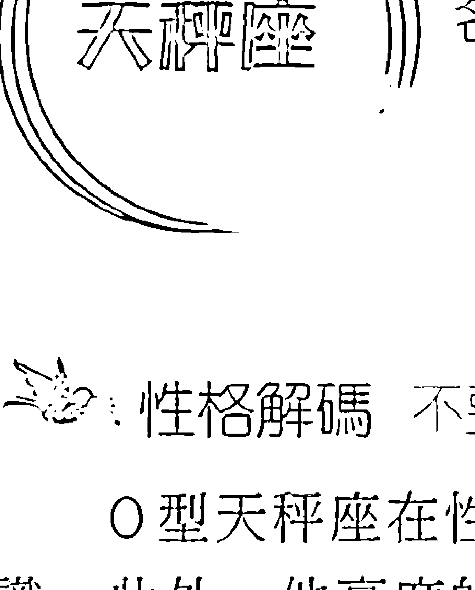

名人：安以軒、周迅、吳尊、金城武、吳宗憲  

#### 性格解碼

不要成為流於表面、輕下判斷的人。

O 型天秤座在性格及氣質上最大的特徵，就是優異的唯美意識。此外，他高度的談話技巧，也使接觸到他的人，不會感到厭煩；自古以來，社交界的名流中，不少 O 型天秤座人士。不過，一味地注意唯美，使他過於重視外在形式，也形成他好逸惡勞的性格，在工作上欠缺積極的態度，也會使人認為他是個粗俗淺薄的傢伙。

O 型中有許多是黑白分明的類型，這種特性表現在天秤座身上就顯得相當極端，一種是傾向天秤座的老牛拖車、猶豫不決型；一種則傾向 O 型的是非立斷型。天生社交家的 O 型天秤座可能會選擇當時的情況來決定自己的反應。

#### 愛情魔法

和對方的精神緊密相連，渴望兩人的融合。

被視為「社交天才」的 O 型天秤座，令人意外地，在愛情方面卻相當被動。由於他自尊品味高尚，總認為應該可以不費吹灰之力，對方就會主動送上門，加上他非常注重外表，如果對方未達標準，他也一樣列為拒絕往來戶。

精神與肉體並重的人。因此，在床上的 O 型天秤座，絲毫沒有平日的冷靜與優雅，而且只要對方有任何的要求，他均能對等地回應與配合。

#### 戀人配對度

- 對不起我愛你  
  - AB 型金牛座  
  - AB 型巨蟹座  
  - O 型摩羯座  
  - AB 型摩羯座  

- 愛也好恨也好  
  - B 型白羊座  
  - B 型獅子座  
  - B 型射手座  

- 命中注定我愛你  
  - B 型雙子座  
  - B 型天秤座  
  - A 型水瓶座  
  - B 型水瓶座  

## 婚姻生活　婚後應保持獨立，避免過分依賴

情場常勝軍的 O 型天秤座，一旦論及婚嫁，便會如臨大敵，認真地思考。由於特別重視社會的觀感，所以不顧家人眼光的牽手私奔絕對不會發生在他身上。

為了躲避長期單身所引來的怪異眼光，他可能會毅然決然把自己送上結婚紅毯，這種為結婚而結婚的情形，在 O 型天秤座中相當普遍。而他也會利用現實的條件來選擇最好的配偶，因此，他的婚姻大都能帶著家人的祝福。

#### 家庭寫照

##### 爸爸

O 型天秤座的爸爸大都是熱愛工作和家庭的人，他多半可以讓二者保持很好的平衡。對孩子而言，他也是相當公平，重男輕女或者偏愛某個孩子的情形絕少發生，出門一趟回家，每個孩子一定都會有禮物。或許是受到 O 型決斷力的影響，O 型天秤座爸爸的優柔寡斷也不會像其他天秤座那麼嚴重。

##### 媽媽

婚後的 O 型天秤座媽媽，最擔心的一件事就是深怕自己的身材走樣。為此，她很有可能在生完孩子後努力參加各種瘦身課程。此外，充滿活力與幹勁的她，大多會選擇當職業婦女，但她也不討厭做家事，只是討厭被強迫要求去做，家裡有 O 型天秤座老婆的丈夫應特別注意。

##### 孩子

他具有天秤座所缺乏的耐心與毅力，所以通常父母規定的事情，他大都能完成，是做事很認真的典型，而且也不會迷失自我。此類型的孩子從小人緣就非常好，但他其實很在意別人對他的觀感。對於這樣的孩子，一方面要肯定他的努力，一方面則要培養他獨立思考的能力，才不會因為同儕影響他未來的發展。

## 職場工作　別讓自己一直停留在原地踏步

如果勤勞是成功的祕訣的話，O 型天秤座恐怕將永遠和成功絕緣。其實，若能運用高超的社交手腕、敏銳蒐集資訊的才能，以及直爽能幹的 O 型氣質，還是能彌補天性散漫的不足，邁向成功之路。

#### 合適的工作清單

- 保證成功：稅務人員、設計師、推銷員、美容師、畫家  
- 值得努力：外交官、餐廳經營者、代書、企業顧問  
- 千萬別試：醫師、土木建築、運動員、學者、測量員  

## 理財計畫　偶爾要享受一下德國餐廳的燭光晚餐及鮮花！

在所有類型的天秤座中，O 型天秤座算是比較善於理財的。然而，儘管他不會浪費一毛錢，但對於交際費卻從來沒有省過，而他那根深蒂固的審美意識，也不容許為了省錢而讓自己看起來很邋遢、狼狽。

#### 最佳的投資組合

- 保險類  
  - 平準型  
  - 增值型  
  - 還本型  

- 存款類  
  - 活期存款  
  - 定期存款  
  - 外幣存款  

- 貴重物品類  
  - 黃金  
  - 鑽石  
  - 古董  
  - 繪畫品  
  - 郵票  

- 其他金融工具類  
  - 股票  
  - 國外股票  
  - 共同基金  
  - 海外共同基金  
  - 期貨  
  - 選擇權  
  - 房地產  
  - 跟會  

- 其他民間投資類  
  - 海外房地產  
  - 投資創業  

【註】○→值得投資　△→考慮投資  

#### 休閒活動

O 型天秤座大都擁有一副勻稱而傲人的身材，所以適合做能充分運用全身肌肉的運動。由於他很喜歡接觸人群，所以應該避免獨自運動，否則他可能會覺得很無趣。

- 適合的運動：游泳、健美操  
- 適合的季節：秋天  
- 適合旅行的地點：維也納  
- 適合培養的興趣：朗誦、寫作  

## 健檢小站

姿勢一有不適要立即改善，不要拖延。O 型天秤座要注意過度要求平衡帶來的影響。例如人際關係、戀愛的煩惱、金錢糾紛，一旦有一項失衡，即使外表平靜，內心仍有強烈衝擊。尤其天秤喜好美食，所以極有可能為了釋放平日種種壓力，而大吃大喝一番，導致肥胖問題，這就犯了愛美天秤座的大忌，必須特別注意。

## Blood Types & Constellations

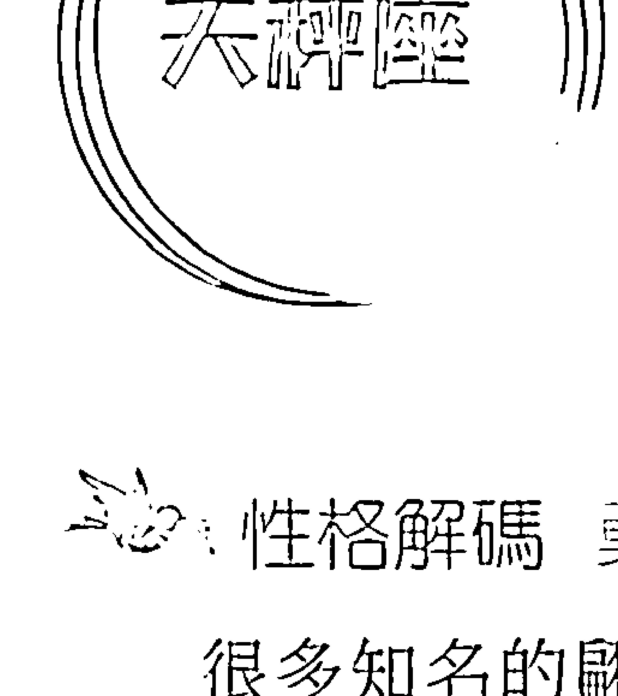

名人：劉德華、趙又廷、邱澤、古天樂  

#### 性格解碼

黃鼠狼還是自己的意思，識別人了解你。

很多知名的翩翩紳士和淑女都是屬於 AB 型天秤座，究其原因，並不是他的五官好看，而是他的風采太迷人了！此型的人，無論何時都能表現出從容、怡然的神態，人群中總能看到他來去自如、談笑風生。他的理性絕對勝過感情，所以很難看到他慌張、手足無措的模樣。

即使被捲入紛爭，他也會出淤泥而不染。因此，在排解糾紛時，他也扮演形象端正，常被公眾推為和事佬。在擔任仲裁者的角色上，他確實是實至名歸。

不過，有一點應特別注意，在他要求平和、均衡的心態下，難免變成膽小怕事而處處討好的性格，沒有主見、過於世故、不夠坦誠這些負面評價常出現在他身上。所謂「學之所至，誘亦隨之」，要小心拿捏處世的分寸才是。

#### 愛情魔法

加一點想像和浪漫，將會讓愛情更多彩多姿。

AB 型天秤座的感情世界是以和諧、優雅為原則，他可能永遠也無法體會亂世兒女的情懷，在他的世界裡，只有美麗的戀情，沒有所謂的苦命鴛鴦。

他以追求浪漫的愛情而滿足，不夠深刻的愛情他不屑一顧，因此，他會不斷追求新戀曲。不過，花心歸花心，他還不致發生畸戀，因為收拾婚戀的狼藉情景，實在有違他優雅高尚的原則。

在他的觀念中，談戀愛最主要的目的在於把快樂帶給對方，所以應避免一切以悲劇收場的戀情。在這方面，他既冷靜又理智。相當重視美感的 AB 型天秤座，認為性是美好而愉悅的事，因此如果對方表現得像動物般粗魯，很容易就會澆熄他的熱情。基本上，他是個重視氣氛的人，來點富有變化的造型，會替兩人增加不少情趣。

#### 戀人配對度

- 對不起我愛你  
  - O 型金牛座  
  - O 型巨蟹座  
  - O 型摩羯座  
  - AB 型摩羯座  

- 愛也好恨也好  
  - B 型白羊座  
  - A 型獅子座  
  - B 型獅子座  
  - B 型射手座  

- 命中注定我愛你  
  - B 型雙子座  
  - B 型天秤座  
  - A 型水瓶座  
  - B 型水瓶座  

## 婚姻生活　相信自己選擇的直覺，勇於踏入婚姻

追求優雅生活的 AB 型天秤座，在婚姻條件上，不只會考量對方的經濟能力，還須具備能與自己輕鬆交談的知性與談笑能力。嚴格來說，他的婚姻絕對講究品質第一。

對於已經累積相當工作經驗的他，除非遇到相當具有魅力的對象，否則不會讓自己貿然走進婚姻裡。而且就算是決定結婚，別人的意見往往會成為關鍵所在，因為優柔寡斷的他經常因別人的一句話而更難做出決定，甚至打消結婚的念頭。

其實，婚姻是自己的人生大事，別人的意見聽聽就好，還是要自己決定。

#### 家庭寫照

##### 爸爸

AB 型天秤座的爸爸很會照顧家庭，尤其為了維持他的品味，他會努力工作來保障一家人保有品味的生活。而善於賺錢的他，卻也很會花錢，更會因重視外表而花費不少治裝費。此外，講求品味的他，常會為了家中的擺設大肆採購。不過，他最大的優點在於行事公正，對子女絕不偏心。

##### 媽媽

AB 型天秤座的媽媽可以說是最民主的媽媽。由於她凡事抱著息事寧人的態度，加上又懂得尊重別人，所以在家中，孩子很難感覺到她的威嚴。不過，她無法忍受不良的生活習慣，例如：不摺被、偷懶、疏於注重儀表等；別忘了，她的守護神可是掌管美感的維納斯！

##### 孩子

AB 型天秤座的孩子頭腦冷靜，判斷力強，有時會對某些原則非常執著。不過偶爾還是會碰到使他迷惑、難以決定的事情，父母不妨從旁協助。切記要建立孩子正確的價值觀，以免養成浪費的習慣。

#### 職場工作

AB 型天秤座可以充分運用靈活的外交手腕，以及不流世俗的審美觀，為自己在工作上謀求一席之地。而要求舒適、安逸的他，應避免需要花體力、用心思的工作；此外，也最好能找一個可以和很多人一起工作的職業，他可以在團體中發揮良好的互助合作精神。

#### 合適的工作清單

- 保證成功：室內設計、商品設計、推銷員、律師、大使  
- 值得努力：大眾傳播、演藝事業、公關、經紀人、藝術家  
- 千萬別試：醫師、學者、會計、金融、機械工程  

#### 理財計畫

對 AB 型天秤座而言，金錢是流動的，有出有入，所以他很難抗拒金錢遊戲的誘惑。由於他眼光相當獨特，儘管有賺有賠，卻能充分享受遊戲的樂趣。此外，他廣泛的人脈，也有助於開展財運。

#### 最佳的投資組合

| 類別 | 項目 | 建議 |
|---|---|---|
| 保險類 | 平準型 | ○ |
| 保險類 | 增值型 | |
| 保險類 | 還本型 | |
| 存款類 | 活期存款 | △ |
| 存款類 | 定期存款 | ○ |
| 存款類 | 外幣存款 | |
| 實體物品類 | 黃金 | |
| 實體物品類 | 鑽石 | ○ |
| 實體物品類 | 古董 | ○ |
| 實體物品類 | 繪畫品 | △ |
| 實體物品類 | 郵票 | |
| 其他金融工具類 | 股票 | △ |
| 其他金融工具類 | 國外股票 | ○ |
| 其他金融工具類 | 共同基金 | |
| 其他金融工具類 | 海外共同基金 | |
| 其他金融工具類 | 期貨 | △ |
| 其他金融工具類 | 選擇權 | |
| 其他民間投資類 | 房地產 | ○ |
| 其他民間投資類 | 現金 | |
| 其他民間投資類 | 海外房地產 | ○ |
| 其他民間投資類 | 投資創業 | |

（註）○→值得投資　△→考慮投資  

#### 休閒活動

富於美感的 AB 型天秤座，對於生活具有不凡的品味，所以不妨多從事一些有美感的活動。

- 適合的運動：高爾夫球、游泳  
- 適合的季節：春天  
- 適合旅行的地點：奧地利  
- 適合培養的興趣：社交舞、藝術創作  

## 健檢小站

到外地易水土不服，應格外注意！

AB 型天秤座的新陳代謝功能特別好，不過，只要環境一改變，身體機能就有可能失調，尤其是外出旅行更是如此。因為已習慣規律的日常生活，剛進入陌生環境時往往不能立即適應，會產生許多小毛病，飲食、用水應特別注意。

## Blood Types & Constellations

## Scorpio  
## 天蠍座

- 期間：10/24–11/22  
- 元素：水  
- 性格特質：  
  - 正面形象：熱情激烈、直覺敏銳、保密專家  
  - 負面形象：占有慾強、容易記恨  
- 守護星：冥王星  
- 代表部位：生殖器官  
- 幸運色：深紅  
- 誕生石：蛋白石  
- 幸運花：海棠  
- 幸運方向：西南西  

## SCORPIO

比起其他星座，天蠍座是最為隱晦神祕的，因為他的守護星是掌管地府的冥王（Pluto）——地獄之神。所以人性黑暗面的傾向，有關性、死亡、神祕與禁忌的重大事件，遲早都會降臨到天蠍的生命歷程中，並且深深改變他們的想法及行為。

天蠍座之所以特別重視隱密感，很可能是因為資訊的取得和保密，讓他們感覺自己有權威及控制力。

天蠍座的愛情通常性感、熱情並且深刻。他重視對方外表下的魅力和突破禁忌的勇氣，同時又擁有強烈的獨占慾。光是這些特質，我們就可以想像天蠍的愛情會是多麼驚天動地，甚至帶有毀滅性的力量。

性的議題一直是他愛情中的焦點之一，他會為了性而性，追求祕密、深沉的性愛，但同時也渴求靈魂相契，希望愛情的結合能震動靈魂深處。

天蠍座通常會有複雜的金錢關係。和另一個重視金錢的星座——金牛座不同的是，天蠍的錢離不開生死大事、愛恨情仇之類和權力相關的事宜；金牛座則是花費在一些美麗並且保值的物品上。

另外，他的工作選擇也會圍繞著與財務、生死、偵察相關的主題。因為擅於保守祕密，他非常適合成為心理學家，以及和生死相關的職業，例如：醫生、保險、喪葬業者。

即使他選擇了比較一般性的職業，但他的工作內容可能仍然離不開這些主題。比方說天蠍座的作家總是會創造出神祕、謀殺等內容的作品；如果身為演員，可能會扮演復仇者、兇手之類的角色。

## Blood Types & Constellations

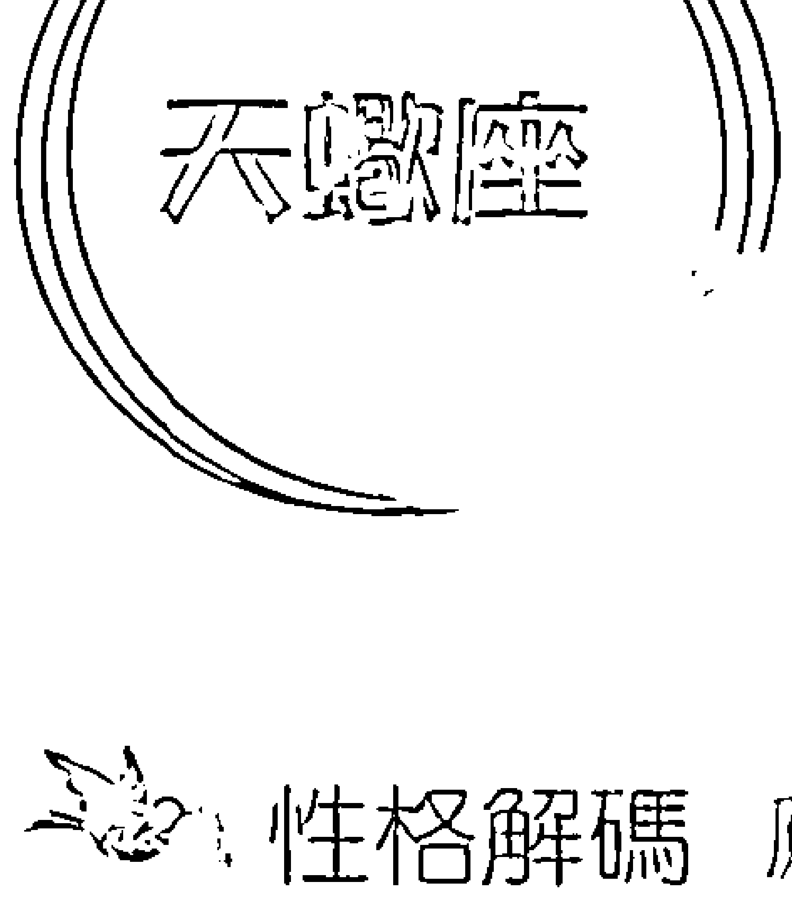

名人：陶晶瑩、林依晨、蔡旻佑、郭富城  

#### 性格解碼

應以冷靜、理智的心態來處理事情。

A 型天蠍座的外表一向給人內斂、誠實，又帶點神祕的感覺，但在這層面紗底下卻蘊含著無窮的熱情和強烈的企圖心。一旦爆發出來，將會造成極大的震撼。不過以 A 型的慎重，這種威力只會波及自己或背叛自己的人。

由於 A 型天蠍座相當善妒、固執，因此能夠交心的人極少。然而，一旦有值得託付的人和事，他勢必會傾出全部的熱情。「動如脫兔，靜如處子」是他最好的寫照。在人生過程中，他也常以這股熱情為武器，所以在事業上通常都能獲得極高的成就。

#### 愛情魔法

強烈的嫉妒心雖是愛的表現，但也容易引火自焚。

A 型天蠍座談起戀愛，如同被點燃的乾柴一般，會不顧一切地為對方燃燒自己。他相當排斥遊戲式的愛情，也不懂得純純之愛。由於他對所愛之人絕對是全心奉獻，所以相對地，也會希望對方能拿出同等的熱情。如果對方辜負了他，他愛人的方式就會急轉直下，由愛生恨，接著就是報復。總之，他能夠瘋狂地去愛一個人，也絕對能瘋狂地去恨一個人，完全不留任何餘地。

對於「性即是愛」的天蠍座而言，沒有性的引導，根本不會愛上對方。再加上 A 型特有的謹慎性格，更不可能談沒有性的愛，也不會從事沒有愛的性行為。

所以一旦他的愛情確立了，就會在床上燃起熊熊烈火，而且精力之充沛、持續之強，需要很長的時間才能獲得滿足。因此，對 A 型天蠍座而言，最好能選擇一位能接受他深沉愛慾的對象，免得對方無法負荷他的需求。

#### 戀人配對度

- 對不起我愛你  
  - B 型水瓶座  
  - B 型雙子座  
  - A 型獅子座  
  - B 型獅子座  

- 愛也好恨也好  
  - AB 型處女座  
  - O 型處女座  
  - AB 型金牛座  
  - AB 型摩羯座  

- 命中注定我愛你  
  - O 型雙魚座  
  - A 型巨蟹座  
  - A 型巨蟹座  
  - O 型天蠍座  

## 婚姻生活　過度的佔有慾會摧毀一切

在愛情上表現得激烈而認真的 A 型天蠍座，對婚姻卻有現實的一面。他對「結婚不只有愛」這一點具有充分的認知，所以大多會要求對方必須具備穩固的經濟基礎。

婚後的 A 型天蠍座，大多能堅守自己的崗位，但婚姻生活卻不會那麼多彩多姿。他謹慎、強烈要求對方付出的個性，可能使家庭氣氛不會太明朗。

而他度量狹小的 A 型特質，會使他的嫉妒心特別容易被點燃，例如丈夫領子上的唇印，或者妻子偶爾提起過去的男友，都可能使他妒火中燒。如果對方又做出背叛的事，肯定會帶來一陣家庭風暴。

#### 家庭寫照

##### 爸爸

A 型天蠍座是個相當自我中心的爸爸，一旦他認定的事實，任憑別人說破了嘴也很難說服他。加上 A 型的固執，更使他有如頑固的老牛，有時孩子很難和他溝通。此外，天蠍座特有的敏銳觀察力，也使孩子很難逃過他的法眼，是孩子心目中很厲害的爸爸。

##### 媽媽

A 型天蠍座的媽媽最痛恨的一件事，莫過於孩子對她說謊。一旦她發現孩子有這種傾向，絕對會追根究柢，挖出真相。加上 A 型想不開的個性，更會讓她把孩子視為個人財產，有時會讓孩子（尤其是正值青春期的孩子）難以忍受她的霸道。

##### 孩子

A 型天蠍座的小孩做事相當認真、專心，也很少會犯過錯，所以相當受到大人的信賴。唯一美中不足的是，他的主觀意識相當強烈，人際關係上缺乏彈性，而且個性激烈，最好要能好好輔導，免得他誤入歧途。

## 職場工作　多與人群親近，才不會總是孤軍奮鬥！

天蠍座原本直覺就十分敏銳，加上 A 型細心固執的個性，使他在工作上無往不利，容易克敵制勝。然而，他卻缺乏與人溝通、協調的個性，所以即使事業成功，人際關係卻並不順暢，應特別注意。

#### 合適的工作清單

- 保證成功：考古學家、精神科醫師、占卜師、天文學家、刑警  
- 值得努力：職業運動員、外科醫師、企畫、攝影師、畫家  
- 千萬別試：外交官、觀光業、推銷員、服務業、廚師  

## 理財計畫　讓金錢像滾流源源為你帶來更多的利潤！

保守踏實、生活不鋪張的 A 型天蠍座，對於金錢也是如此執著。由於他懂得控制，加上 A 型穩密的個性，他的收入永遠比支出還多。

#### 最佳的投資組合

| 類別 | 投資項目 | 建議 |
|---|---|---|
| 保險類 | 平準型 | △ |
| 保險類 | 增值型 | ○ |
| 保險類 | 還本型 |  |
| 存款類 | 活期存款 | △ |
| 存款類 | 定期存款 |  |
| 存款類 | 外幣存款 | ○ |
| 存款類 | 黃金 |  |
| 貴重物品類 | 鑽石 | △ |
| 貴重物品類 | 古董 | ○ |
| 貴重物品類 | 繪畫品 |  |
| 貴重物品類 | 郵票 |  |
| 其他金融工具類 | 股票 | △ |
| 其他金融工具類 | 國外股票 |  |
| 其他金融工具類 | 共同基金 |  |
| 其他金融工具類 | 海外共同基金 |  |
| 其他金融工具類 | 期貨 | ○ |
| 其他金融工具類 | 選擇權 |  |
| 其他金融工具類 | 房地產 | △ |
| 其他民間投資類 | 跟會 |  |
| 其他民間投資類 | 海外房地產 | ○ |
| 其他民間投資類 | 投資創業 |  |

【註】○—值得投資　△—考慮投資

#### 休閒活動

具有驚人體力的 A 型天蠍座，容易形成過度縱慾的生活，所以凡事應適可而止。可以將過剩的體力用在運動上，尤其是需要挑戰或具攻擊性的運動最適合他。

- 適合的運動：馬拉松、攀岩
- 適合的季節：春季
- 適合旅行的地點：印度
- 適合培養的興趣：坐禪、冥想

## 健檢小站 找到讓情緒正常抒發的管道

A 型天蠍座的耐力一流，更是十足的工作狂。很容易壓抑情緒的他，一旦發作起來，往往會下意識地傷害別人，也會灼傷自己。他們健康的弱點在生殖器官上，因為他們在性慾方面有著過人的精力，一旦遭遇壓力，就會想藉此來發洩，但如果縱慾成癮就很容易染上性病。

## Blood Types & Constellations

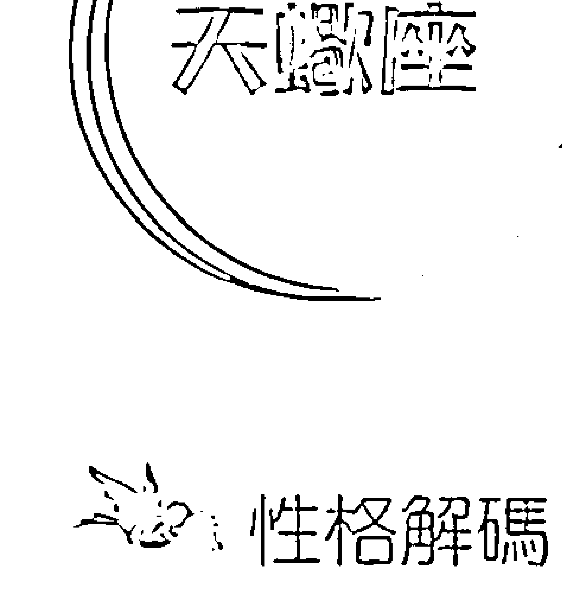

名人：全智賢、阮經天、范逸臣、木村拓哉

#### 性格解碼

排他性會使生活顯得陰鬱，不妨放開心胸。

好惡分明的 B 型天蠍座，平常給人安靜、內斂的印象，然而，一旦有任何狀況，就會出現讓人出乎意料之外的大膽行動，但是他卻十分泰然自若。

由於 B 型的影響，當他認為沒有興趣時，他就會立刻放棄。往好處想，這是為了有效利用時間；但缺點是，難免會讓人有太過現實的感覺。因為他會因不同的人而有冷漠或古道熱腸的極端表現，因而使人際關係不太受影響。

#### 愛情魔法

冷靜反省自己的態度，能讓感情更穩定。

B 型天蠍座一旦愛上某人，絕對是奮不顧身的。即使環境不允許，他也寧可私奔，以便讓兩人能夠長相廝守。而且他也相信自己所選擇的對象必定十分忠誠，所以他無法想像自己會遭到背叛！

如果這類型的人不幸遭到失戀的情況，一定要提醒自己保持冷靜！此外，向他人訴訴苦，也是讓自己淡忘苦楚的方法之一。其實，在需要心心相映的戀愛世界中，若要留住對方，與其採用各種技巧，不如直接表達自己的想法，其它的事就只能順其自然，交由緣分來決定未來發展。

#### 戀人配對度

- 對不起我愛你
  - AB 型白羊座
  - B 型獅子座
  - AB 型獅子座
  - AB 型水瓶座

- 愛恨好恨也好
  - A 型處女座
  - O 型處女座
  - A 型金牛座
  - A 型魔羯座

- 命中注定我愛你
  - A 型巨蟹座
  - A 型天蠍座
  - A 型雙魚座
  - O 型雙魚座

#### 婚姻生活

應多了解另一半，才能貼近對方的心。

B 型天蠍座認為結婚不過是戀愛的延續，是為了確認愛的一種手段。他之所以結婚，不是為了找一張長期飯票，而是因為他一心一意深愛著對方，才會走上地毯的那一端。

儘管他對婚姻有如此的熱情，但愛情與麵包仍會加以兼顧。不過，婚後可能為了追求安定的生活，而對配偶要求過多，所以最好能選擇一個穩定又顧家的人。

#### 家庭寫照

##### 爸爸

B 型天蠍座的爸爸可能很難讓人看清他的真面目。在外，他個性開朗、高談闊論；在家中，卻個性陰鬱、沉默寡言。所以儘管他認真、負責任，會為了家人而吃苦耐勞，但是孩子、老婆卻很難感受到他的溫情與體會他的苦心。

##### 媽媽

B 型天蠍座的媽媽排他性極強，對家庭的執著很強烈，她會為了維護本身的家庭，而極端地排斥別人。她只在乎自身的幸福，所以儘管孩子可以得到最完善的照顧，不過，在她的影響下，孩子的人際關係多半不佳。

##### 孩子

B 型天蠍座的小孩有早熟的傾向，他常會無意中說出讓大人驚訝的話，而且他的才能是一點一滴顯露出來的。他做事相當積極，如果有興趣的事，徹夜不眠他也會設法完成。不過，他喜歡模仿大人或電視節目上的語言或動作，父母要特別注意。

## Blood Types & Constellations

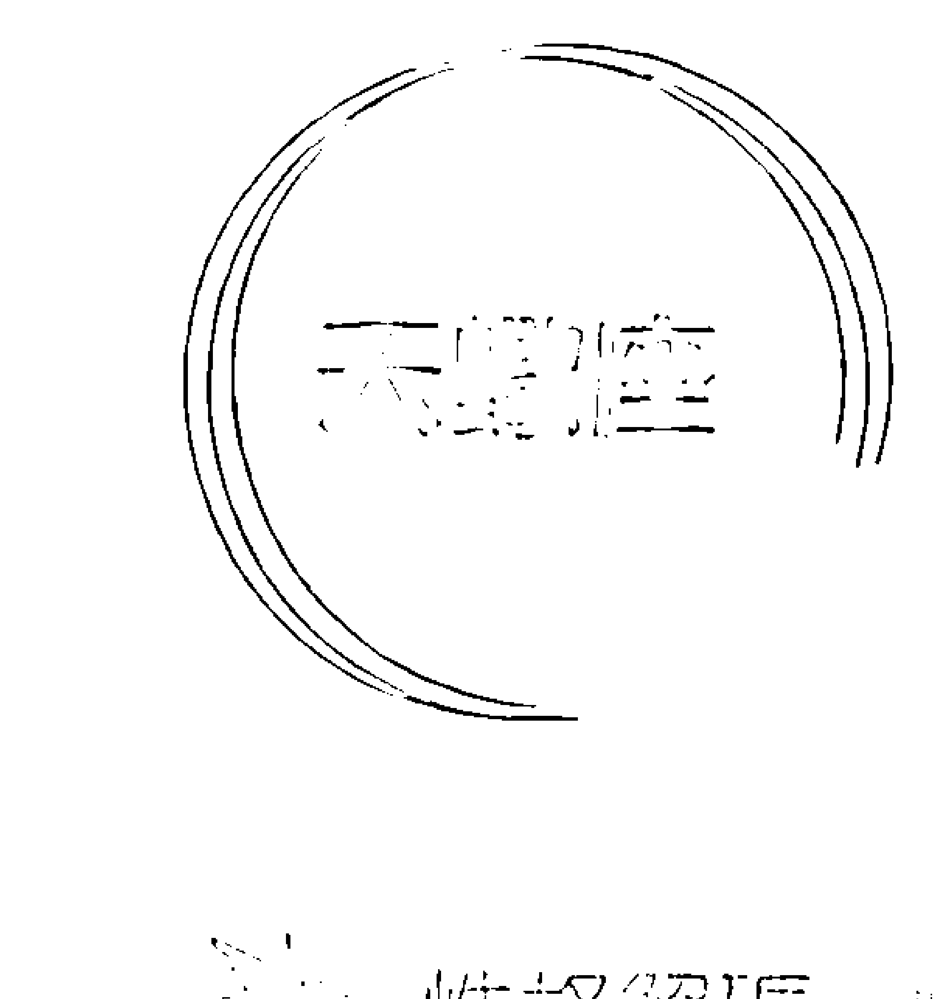

名人：天心、白歆惠、吳奇隆

#### 性格解碼

如果想要用一句話來形容 O 型天蠍座，恐怕是很困難的事。因為他鮮少會談論真正的自己，在團體中，他總扮演冷靜的旁觀者，仔細而認真地觀察周圍的人事。

通常第一眼看到 O 型天蠍座，總以為他很無知、軟弱，殊不知在這層面紗底下，隱藏的是一個個性深沉、意志力堅強、又精於計算的驕子。也許很多人會認為這只驕子很可怕。事實上，只要你不是他的競爭對手或很想贏，他其實是對人相當熱情的。

如果他認為你是值得交往的朋友，便會完全信賴，並用敏銳的第六感完全洞悉你的心思。由於極端的自我保護，他可能經常會將自己關在封閉的世界中，而他的強烈獨占欲，也使他對想要到手的東西，絕不輕易鬆手。

#### 愛情魔法

善於散發性魅力的 O 型天蠍座，無可諱言地，幾乎沒有一個異性逃得過他的追纏，而他本身也很容易被深具誘惑力的人吸引。通常電影中熱情、性感的主角，是他們內心的投射，也是他們最愛的典型。

O 型天蠍座的愛是相當激烈又危險的。他一旦鎖定某人，便會毫不猶豫地纏著對方，絕不輕易放棄。而且他也會藉著肉體上的結合來鞏固雙方的感情。

天蠍情人的眼中容不下一粒沙子，因此善妒是不可避免的。

即使遭到拋棄，他也會將全部的愛轉為最具殺傷力的報復行動，帶來難以挽回的後果。與其花時間去報復，還不如打起精神再去找下一個目標。以他獨特的魅力，其實並不難辦到，但他卻想不開。

對 O 型天蠍座而言，幾乎全身都是性感。由於天蠍座代表「性」的象徵，再加上 O 型的大膽與創新，使他在床上幾乎攻無不克，尤其是女性，大都有異於常人的表現，這也使他特別討厭軟弱的男人。

#### 戀人配對度

- 對你相當迷戀
  - AB 型水瓶座
  - O 型獅子座
  - AB 型獅子座
  - AB 型白羊座

- 愛也愛恨也深
  - B 型魔羯座
  - B 型處女座
  - B 型金牛座

- 命中注定迷戀你
  - B 型雙魚座
  - A 型雙魚座
  - B 型天蠍座
  - B 型巨蟹座

#### 婚姻生活

O 型天蠍座的婚姻是「男主外、女主內」的最佳典範。儘管他相當獨立，認為一個人也可以生活得很好，然而一旦結婚，絕對會努力經營婚姻生活。

此外，婚後的他，也會設法找到一點時間獨處，藉以面對內心深處的自我。而容易陷入沉思中的他也常因小事而鑽牛角尖，奉勸最好能多發揮 O 型冷靜而周密的分析能力，才能實際解決問題。

#### 家庭寫照

##### 爸爸

愛恨分明的 O 型天蠍座爸爸，儘管對於女兒常有大小眼的情形發生，不過 O 型的特質會使天蠍座偏心的特性稍為收斂一點。而 O 型也使他有什麼事，一定要馬上溝通，否則難消他心頭的疑慮！

##### 媽媽

婚後的 O 型天蠍座媽媽，會認為守住家庭、為家人奉獻一切是理所當然的，也是自己最大的幸福。然而，這個具有犧牲精神的媽媽卻是最容易被誤解為霸道的媽媽。她愛孩子，卻也喜歡掌控孩子，對她而言，這就是愛孩子的表現。

##### 孩子

O 型天蠍座的孩子總是能一眼就看穿別人的善惡，所以儘管他外表開朗、活潑，事實上卻很寂寞。別人可能因為他的尖銳而敬而遠之。在學習事物時，也喜歡以自己的方式處理，不喜歡聽從別人的指揮。

#### 適合的工作

誠實又有高度責任感的 O 型天蠍座，不但做事不含糊，企圖心又強，通常是成功的不二人選。唯獨人際關係有待加強，又有過於自信的缺點，是一個工作重於人情的人。

## 適合的工作清單

- 保證成功：研究人員、學者、醫師、運動員、警察
- 值得努力：推理作家、船員、公務員、金融
- 千萬別試：外交官、推銷員、演藝人員、記者、播音員

#### 理財計畫

在工作上從不會怠惰的 O 型天蠍座，財運相當不錯。除了固定的工作之外，從事投機事業也能有意外之財。唯獨行事過於武斷，如果能接受別人善意的見解，再加以運用，成功的機會就很大。

#### 最佳的投資組合

| 類別 | 建議 |
|---|---|
| 保險類 | 平準型 △ / 增值型 ○ / 還本型 |
| 股票 | ○ |
| 國外股票 | △ |
| 共同基金 |  |

- 活期存款 ○
- 定期存款
- 外幣存款 △
- 黃金 ○
- 鑽石
- 古董
- 繪畫品
- 郵票

- 海外共同基金
- 期貨
- 選擇權
- 房地產 △
- 跟會 ○
- 海外房地產
- 投資創業

【註】○→值得投資　△→考慮投資

## 六、休閒活動

在事業上一向有不凡成就的 O 型天蠍座，由於平時相當投入工作，而且非常專注於自己設定的目標，所以運動方面不妨選擇同樣可以讓他投注精力的單一項目，他可以表現得像工作一樣傑出。

- 適合的運動：風浪板、拖曳傘
- 適合的季節：秋末
- 適合旅行的地點：挪威
- 適合培養的興趣：集郵、圍棋

## 七、健康小帖士

體力常勝軍的 O 型天蠍座，經常被周圍的人視為「超人」，但是千萬別太相信自己的身體，因為他的心和肝事實上並沒有想像中的強壯。強烈的情緒反應會引發肝臟問題和精神官能症。而性能力雖然不錯，但縱慾過度會引起許多生殖系統的問題，不可不慎。所以規律的生活、充足的睡眠仍是必需的。

## Blood Types & Constellations

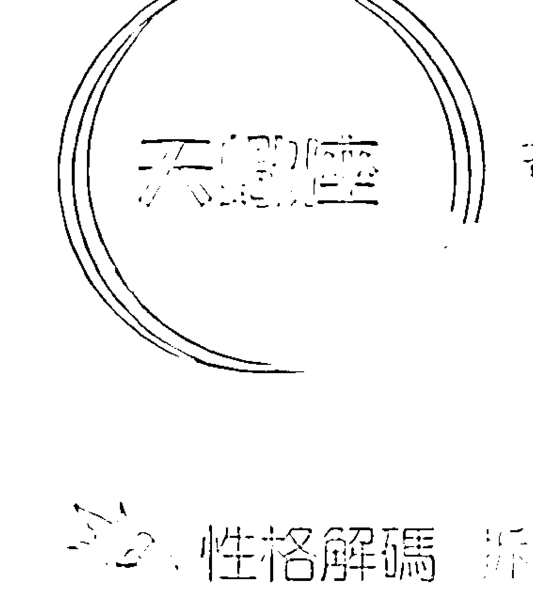

名人：朱茵、寇兒

## AB 型・性格解碼 靜靜的火山

AB 型天蠍座有如一座未爆發的火山，外表看來平靜，內心卻蘊藏著極大的能量。

無論何時，他總是在安靜的角落裡獨坐著，一副事不關己的態度。然而，當每個人都忽略他的存在時，他卻正在發揮他銳利的洞察力及敏感的直覺，而且直到重要關鍵來臨，他才出場提出一針見血的言論，或者做出一鳴驚人的舉動；之後，又回復先前的寧靜世界。他這種退居幕後、冷眼旁觀的角色，使他宛如一位披著神祕面紗的先知。

AB 型天蠍座最弱的一環是人際關係。他經常在自己與外界間築起一道沉默的高牆，任憑外界如何猜測、誤解，他依然不為所動。

## AB 型・愛情魔法

愛情對 AB 型天蠍座而言，是神聖且莊重的。他唯有在跌入情網後，才會卸下重重保護的甲殼，讓心儀的人看見真正的自我。

他選擇的對象往往異於常人，容貌、身材、氣質……都有可能缺一不可，但也可能全部被拋諸腦後。他也許會僅憑一點心靈的默契，甚至會心的一笑，就能決定廝守終身。

有些戀情可能很平淡，也可能一輩子都難以忘懷。重視信賴關係的 AB 型天蠍座，認為愛在性行為中是不可或缺的，而且他是天蠍座所有類型中最講究氣氛的。如果他提議要喝酒，可能就是在暗示你，當一切都進入情況後，來點浪漫的音樂助興，將有助他熱情的演出。

#### 戀人配對度

- B 型巨蟹座
- B 型金牛座
- O 型白羊座

- B 型天蠍座
- A 型處女座
- B 型處女座
- O 型獅子座
- AB 型獅子座

- O 型獅子座
- AB 型雙魚座
- B 型魔羯座
- O 型水瓶座

#### 婚姻生活

AB 型天蠍座常在踏上結婚禮堂之前，有多次戀愛失敗的經驗。他對伴侶唯一的要求就是誠實，所以在婚前他一定會認清對方是否具有相伴一生的忠誠性格，而多次的戀愛經驗，也能使他從中記取教訓。當 AB 型天蠍座在尋找到可託付的對象後，他會一反平日冷漠的態度，扮演可愛、稱職的伴侶。

#### 家庭寫照

##### 爸爸

基本上天蠍座的爸爸是一個溫柔兼火爆的組合，當孩子順從他意時，他是絕對的溫柔，把孩子捧在手心；可是一旦不聽話時，馬上翻臉，甚至情緒失控。所以在孩子心目中，他剛柔並濟。也許受到 AB 型影響，再加上天蠍座原有的神祕面紗，當他在沉思時，無論是誰都不能打擾他，這也使孩子更不易了解他。

##### 媽媽

AB 型天蠍座的媽媽非常善解人意，且相當有奉獻犧牲的精神。她很少在家中爭奪地位，只是默默付出愛。然而，孩子卻可能很難感覺到她的愛心，只覺得她非常神祕。因為她總是冷眼旁觀孩子的行為，只有在必要時才出面，這都是 AB 型在作祟的關係。

##### 孩子

AB 型天蠍座的孩子具有易感、又不易捉摸的個性。他會在看見悲劇後暗自傷心流淚，喜歡獨處或者沉思。所以父母可能要多花一些時間和他溝通，了解他心裡在想什麼。有時會有情緒不穩的現象，要特別注意。

## 2. 職場工作

對 AB 型天蠍座而言，長程的工作規劃是相當重要的。由於他個性沉穩，應儘量避免轉行，半途而廢是得不償失的行為。太富於衝擊性、挑戰性，或者需要運用社交手腕的工作都不適合他。

#### 合適的工作清單

- 保證成功：學術研究、政治、幕僚、心理學家、醫師
- 值得努力：藝術鑑定員、偵探、技術指導、天文學家、統計分析
- 一帶勉試：藝術創作、設計師、外交官、演藝事業、記者

## 3. 理財計畫

喜歡工作的天蠍座，因 AB 型的理性和冷靜，所以不太重視錢財。但由於他個性精明、自信，總有長輩喜歡將財產交給他管理，這也是他財運晚成的原因。

#### 最佳的投資組合

| 類型 | 投資項目 |
|---|---|
| 保險類 | 平準型、增值型、還本型 |
| 其他金融工具 | 股票、國外股票、共同基金 |

| 類別 | 項目 | 評價 |
|---|---|---|
| 存款類 | 活期存款 | ○ |
| 存款類 | 定期存款 |  |
| 存款類 | 外幣存款 | ○ |
| 投資收藏 | 黃金 | ○ |
| 投資收藏 | 鑽石 | △ |
| 投資收藏 | 古董 | △ |
| 投資收藏 | 繪畫品 |  |
| 投資收藏 | 郵票 |  |
| 其他金融工具類 | 海外共同基金 | △ |
| 其他金融工具類 | 期貨 |  |
| 其他金融工具類 | 選擇權 |  |
| 其他金融工具類 | 房地產 | ○ |
| 其他金融工具類 | 跟會 |  |
| 其他金融工具類 | 海外房地產 | △ |
| 其他金融工具類 | 投資創業 |  |

【註】○→值得投資　△→考慮投資

#### 休閒活動

AB 型天蠍座是冷靜和神祕的組合。由於他不擅與人交際，大部分時間都是一個人獨處，再加上他行事特異，所以可能喜歡去同一個固定的地點冥想或沉思，並藉此放鬆自己。

- 適合的運動：爬山、長跑
- 適合的季節：初春
- 適合旅行的地點：敘利亞
- 適合培養的興趣：攝影、閱讀

#### 健康小站

AB 型天蠍座大都擁有足以自豪的抵抗力和體力，就算周圍的人都感冒了，他也不見得會被傳染。儘管如此，一旦遇到不如意的事時，卻容易有抑鬱的傾向，身體也因此狀況百出。建議最好注意新陳代謝是否正常，排泄是否順暢，凡事不要太執著、鑽牛角尖，維持好心情就是最佳的保養之道。

## Blood Types & Constellations

- 日期：11/23–12/21
- 正面形象：坦率幽默、樂於助人、常識豐富
- 負面形象：心直口快、粗心大意、固執己見
- 守護星：木星
- 身體部位：大腿
- 幸運色：紫色
- 寶石：紫水晶
- 花：紫羅蘭
- 方位：南南西

## SAGITTARIUS

射手座是個聰明、樂觀的星座。他天生就具備國際觀，並對異國文化感到興趣，總是夢想著能到天涯海角一個不知名的異境去瞧瞧。最好能環遊世界、四海為家，感受各種文化不同的風情。

他通常都會積極努力地尋找人生的意義，或希望從高等的智慧中得到啟示與人生的真諦。

射手座的象徵是一匹帶著弓箭的人馬，因此綜合了人類的智慧與馬匹快速的移動能力。出於對知識的熱情，有不少射手座研究政治、哲學或法律，而且想法不會只偏向一己之私。他會秉持倫理和道德的原則做事，而且非常堅定。

由於對異國文化的嚮往，在射手座年幼時，往往已經許下當飛行員或冒險家的願望，他會永遠朝著無限延伸的地平線一步一步地往前探索。

射手座是人群中的開心果，生性開朗，跟誰都能打成一片。他對各種知識範疇都有興趣，喜愛旅行也喜愛閱讀，所以常常可以交到各種不同類型的朋友。但若看到不合理的事情，也會直言不諱地跳出來主持公道。

熱情的射手座，對於愛情絕不拖泥帶水，也會比較欣賞具有冒險性格、心胸開闊、無拘無束以及活力充沛的異性。但是當他覺得彼此之間的愛情已經消失、變質，或不符合他當初的理想時，便會毫不猶豫地掉頭離去，而且不會有絲毫的留戀。

## Best Friends of Constellation

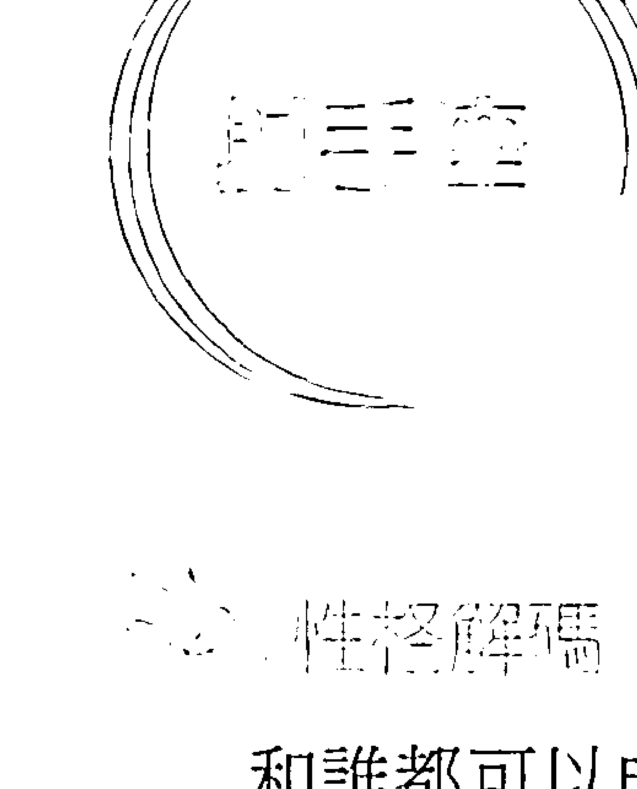

名人：楊蓮華、劉嘉玲、黃志、反町隆史

## A型射手座

和誰都可以成為好朋友的A型射手座，最大的魅力就在於他開放、熱情的個性。這種個性如果表現在工作上，就能夠勝任較具挑戰性的工作，他會不斷提高目標，督促自己去達成，並從中獲得無限的滿足。

因為射手座是崇尚自由的勇者，所以一旦他意識到有被綁住的危險，就會千方百計，甚至有點奮不顧身地以最快的速度逃離，讓想圈住他的人死心，這種舉動有時會為他帶來善變的名號。

一般而言，A型射手座的行動範圍既廣且深，別人常可以見到他精神飽滿地四處奔跑，並且換來一群群讓自己受益不盡的好朋友。

#### 愛情魔法

A型射手座的戀愛通常都會從知性的接觸開始，所以他常會選擇聰明、健康的對象，而且一旦發現可獵取的對象時，就會直接對準目標，射出愛神的箭。

由於他行動的範圍相當廣，因此心儀的對象絕不會僅限一人。儘管老實的A型人不會大剌剌地跨腿，但好奇的性格卻使他容易喜新厭舊。

即使有時在情場上未必能一帆風順，然而有風度的他，一旦知道沒有希望，就會立刻死心抽身，不再糾纏。以自由為宗旨的他，通常也會尊重他人的自由。

忠於自己的想法，並確實去做，這是A型射手座的一貫作風，他對性的觀念也是如此。他認為在熱情如火的時候，靈與肉的結合是再自然不過的事，再加上懂得營造氣氛，總能引起對方的共鳴。可是，一旦他的愛由濃轉淡時，也就是宣告兩人的親密關係結束之時，因此，談戀愛時，最好慎重選擇和自己同樣捨得提、放得下的對象。

#### 戀人配對度

- A型雙魚座
- B型雙魚座
- B型巨蟹座
- B型處女座

- O型水瓶座
- AB型水瓶座
- AB型天秤座
- AB型雙子座

- AB型白羊座
- AB型獅子座
- AB型射手座
- O型白羊座

#### 婚姻生活

A型射手座的婚姻如同他的個性一樣，充滿明朗、自由的氣氛。而女射手通常會繼續工作，讓自己維持經濟和精神上的獨立。一般來說，A型射手座的另一半是無法綁住他的，只有與君同樂或者從旁鼓勵，才能使婚姻永續經營。身為A型射手座的丈夫，千萬別期望能娶到一個乖乖在家洗衣燒飯的賢妻；相對地，身為他們的妻子，也只有使自己常保魅力，才能維繫幸福的婚姻。

#### 家庭寫照

##### 爸爸

對A型射手爸爸來說，婚姻＝枷鎖。儘管他極不願受家庭束縛，但因受到A型責任感的牽制，所以仍會扛起家中的重擔。他喜歡自由行動，討厭受限，不過仍喜歡帶著妻子一起參加朋友的聚會。有時，他也喜歡擺擺一家之主的架子，說說人生的大道理。

##### 媽媽

就算是全職家庭主婦的A型射手座媽媽，也不會乖乖在家待著，她可能一下子參加土風舞班，一下子又是插花班，把自己忙得不亦樂乎。但是在家庭生活方面，她也絕不馬虎應對，是個會讓孩子、先生感到無限活力的現代媽媽。

##### 孩子

A型射手座的小孩，無論和誰都可以打成一片，而且不喜歡靜下來，如果把他關在家裡，他會悶得把氣出在弟妹身上，因為他的體力就像一支箭一樣，射出去以後，很難再找回來。由於生性好動，所以讓他從事各種運動是很好的方法，也可以稍微發洩一下他的體力。

## 三、職場工作

講求速度的A型射手座，對於富有挑戰性和變化的職業最能勝任愉快。由於人馬是具有靈性、哲學氣質的動物，所以在知性與人文關懷的工作，也能一展長才。

#### 合適的工作清單

- 保證成功：宗教家、大學校長、作家、外交官、律師
- 值得努力：翻譯、編輯、職業運動員、銷售員、賽馬相關工作
- 千萬別試：建築師、園藝家、外科醫師、土木工程師、公務員

## 四、理財計畫

對金錢一向「既往不究」的A型射手座，對金錢的支配並沒有花費很多心思，但也不妄想一舉致富。他會為了賺錢而努力工作，然後在短時間內就花得精光。

#### 最佳的投資組合

- 保險類
  - 平準型 △
  - 增值型
  - 還本型 ○
- 存款類
  - 活期存款 ○
  - 定期存款
  - 外幣存款 △
- 實體物品
  - 黃金
  - 鑽石
  - 古董 ○
  - 繪畫品 △
  - 郵票

- 股票 △
- 國外股票
- 共同基金
- 海外共同基金
- 期貨 ○
- 選擇權 △
- 房地產
- 跟會 ○
- 海外房地產
- 投資創業

【註】○→值得投資　△→考慮投資

#### 休閒活動

總是忙個不停的A型射手座，似乎一定要把精力發揮光了才過癮，所以運動對他們而言一點也不是負擔，好像三餐吃飯一樣稀鬆平常。

- 適合的運動：射箭、騎馬
- 適合的季節：春天到初夏
- 適合旅行的地點：馬爾地夫
- 適合培養的興趣：烹飪、兜風

#### 健康小站

愛好自由的A型射手座，很容易過著不安定的生活，尤其在長途旅行中，常因興奮過度而過著三餐不定時、衣物不足禦寒的克難生活。要特別注意飲食，少吃刺激性食物，以清淡的口味和大量的蔬果來均衡營養。而他身體最脆弱的地方是呼吸器官，所以應注意環境的清新，避免在煙霧瀰漫處久留。

---

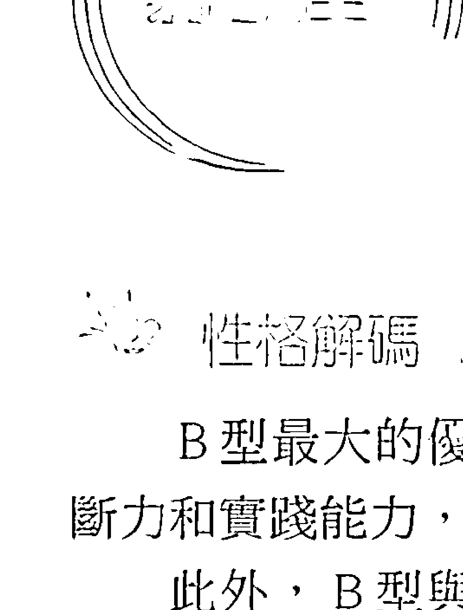

名人：林志玲、韓瑜、黎明、張菲

## B型射手座

#### 性格解碼

B型最大的優勢在於獨特的創造力，如果能再結合射手座的決斷力和實踐能力，肯定能在快速變化的資訊時代裡取得先機。

此外，B型與射手座都具有奔放的性格，相得益彰之下，就會讓這類型的人性格豪爽，同時兼具優秀的戰鬥能力，帶著足智多謀的策略去征服一個又一個的人生領域。

儘管他個性直爽，但在人際關係上，有時卻會因為說話太過率直，而不知不覺中傷害了別人，所以適時地展現說話技巧是他應學習的課題。

#### 愛情魔法

各方面的表現都能超人一等，就是不肯下功夫的B型射手座，在愛情上也是如此。

他一旦追求成功後，就會把心轉移到別人身上，而B型特有的見異思遷個性，也對培養長久的愛情極為不利。可能因為他在熱戀階段老是和對方膩在一起，所以很快就會厭倦。

因此，建議這類型的人在分手時，應儘可能誠實地將自己的心境告訴對方，以取得諒解。此外，成為第三者也是他經常會面臨的困擾之一。道德感薄弱的B型人，對於和有婦之夫或有夫之婦來往並不忌諱。所以千萬別忘了，你傷害的對象可能不只有一個人！

由於B型旺盛的好奇心及射手座的好學精神，他還會嘗試各種技巧。不過，他最喜歡的仍是具有瞬間爆發力的做愛方式，而且還會乘勢追擊喔！

#### 戀人配對度

- AB型巨蟹座
- AB型處女座
- B型雙魚座
- AB型雙魚座

- A型雙子座
- A型天秤座
- A型水瓶座
- O型水瓶座

- A型白羊座
- O型白羊座
- A型獅子座
- A型射手座

#### 婚姻生活

不管相愛得多深，對B型射手座而言，婚姻始終是一種束縛，追求自由的他，絕對不會對婚姻百分之百滿意。

而且婚後的他，可能還是風流韻事不斷，因為不甘寂寞的他，婚後仍無法抗拒外界傳送來的電波。他這種不在乎的傾向會使和他一起生活的伴侶不堪其擾，甚至會下定決心離去。

最好的方式是在婚前先約定好彼此的生活空間、模式。厭惡受拘束的他如果要接受一板一眼的生活作息，必定會意志消沉，所以事先約定好勝過將來後悔。

#### 家庭寫照

##### 爸爸

對B型射手座的爸爸而言，只要得到自由的保證，他就是個寬大而包容的好爸爸。他也許會因為沉醉在自己的理想中而忽略了家人，但是他樂觀、進取的生活態度，卻為家庭營造開朗的氣氛，也產生了正面的激勵作用。

##### 媽媽

你可能會覺得B型射手座的媽媽永遠看起來都是那麼年輕。主要的原因，是她經常保持對事物高度的新鮮感。她也許不善家事，但是孩子和她相處卻一點也沒有壓迫感，就像朋友一樣。她也許缺乏為人父母者的意識，但是孩子卻和她無話不談。

##### 孩子

B型射手座的小朋友很難安安靜靜地待在家中，充滿活力的他，一刻也停不下來。不過，他一旦對某件事發生興趣，很快就會全心投入，但是也很快就會厭倦。父母應該多培養他的耐心，並且多鍛鍊身體。

## 選擇工作

B型射手座富於創造力與人文精神，但是多才多藝的他卻經常面臨轉業的十字路口，因此，他很可能錯過成功的機會。他頗具開發能力，但缺乏處理事情的才能，在工作壓力極大的環境中，並無法令他發揮才能。

#### 合適的工作清單

- 保證成功：自由作家、記者、電腦軟體開發、攝影家、旅遊業
- 值得努力：翻譯、藝術家、大眾傳播、詩人、宗教家
- 千萬別試：園藝、精密技術、行政管理、總務、製造業

## 理財指標

B型射手座對金錢不具執著性，幾乎沒有增加財產的慾望。對他而言，金錢應該是流通的。他往往會不顧自己的生活，只想先和朋友吃飽喝足，事後再來苦惱。

#### 最佳的投資組合

- 平準型 ○：股票
- 增值型 △：房地產或實體資產
- 還本型 ○：國外股票
- 共同基金

- 活期存款
- 定期存款
- 外幣存款 ○
- 黃金 ○
- 鑽石 ○
- 古董 △
- 紀念品 △
- 郵票

- 海外共同基金
- 期貨 △
- 選擇權
- 房地產 △
- 跟會
- 海外房地產 ○
- 投資創業 △

【註】○→值得投資　△→考慮投資

#### 休閒活動

具有獨創靈感的B型射手座，由於外向好動，因此總給人朝氣蓬勃的印象。其實他常常生活不規律或睡眠不足。為了避免影響健康，應多安排休閒活動，選擇一些富挑戰性的活動讓自己發洩一下。

- 適合的運動：高空跳傘、足球
- 適合的季節：夏末
- 適合旅行的地點：布達佩斯
- 適合培養的興趣：朗誦、社工

#### 健康小叮嚀

B型射手座擁有健康的體魄，新陳代謝極佳，罹患輕微疾病也只需小睡便能痊癒。但是他的徹夜玩樂、喜愛夜遊、菸酒過量都是健康上的隱憂。要學習將自己的生活規律化，凡事稍微節制些，太誇張會導致極端的生活方式，讓衰老早日到來。

---

## O型射手座

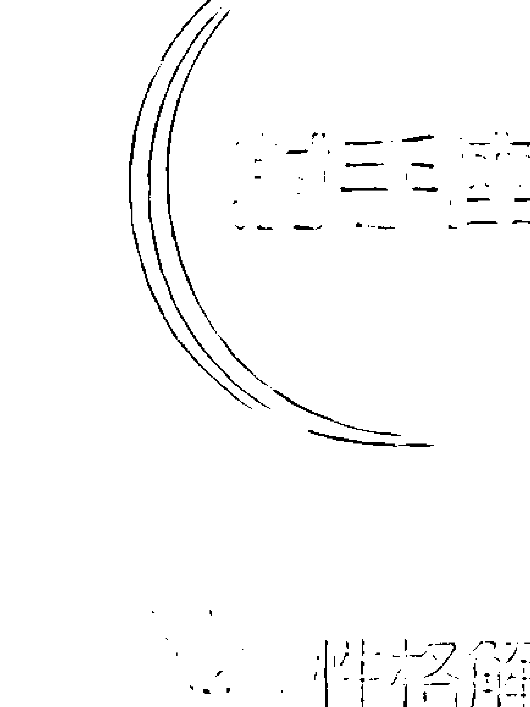

代表人物：侯佩岑、徐佳瑩、阿信、林佑威

全身洋溢著熱情開朗氣質的O型射手座，即使和人初次見面，也能在短時間內和人打成一片，彷彿多年老友。放眼十二星座，也只有O型射手座有這份能力。

O型的敏捷行動力，加上射手座的機動性，造就了O型射手座的果斷力。就像一支射出的箭，似乎總是不畏風雨繼續向前，也可看出他對自由的重視。此外，好奇心強、喜愛變化的他，也是第一流的創意者。但這種傾向表現在行動上，可能變成反覆無常，使旁人不知所措。

而凡事強調快速的他，是相當粗線條的人，脫口而出的毛病往往使他容易得罪不少人，幸好他的開朗彌補了這個缺點，所以別人也會對他的魯莽一笑置之。

對戀愛也抱持著開放態度的O型射手座，完全不會在意對方是否已經結婚或有穩定交往的對象，他總會積極、認真地傳達自己的感情。因此，他對三角戀、婚外情完全沒有免疫力，世俗的制約對他也毫無約束力。

當然，他也具備能夠吸引眾生的手腕。除了富於變化的穿著打扮外，談話內容也是包羅萬象、無所不談，讓別人對他的步調簡直望塵莫及。只不過熱得快、冷卻得也快，一旦失去新鮮感後，會立刻和對方說：「Bye bye！」

在感情上大而化之的他，也很善於在不傷和氣的狀況下和對方分手，這也算是他的過人之處。

積極而開放的O型射手座，很討厭沉悶而曖昧的親密關係；對他而言，性是一場能隨時玩樂的遊戲。因此，他會不拘地點、時間，無論何時何地都能來一個即興的肉搏演出。

#### 戀人配對度

- O型雙魚座
- AB型雙魚座
- AB型處女座
- AB型巨蟹座
- B型水瓶座
- B型天秤座
- B型雙子座
- B型射手座
- B型獅子座
- A型白羊座
- B型白羊座

#### 婚姻生活

一般而言，O型射手座是相當不適合組織家庭的，因為他深切體認到家庭是束縛自己行動及精神的一大阻礙。因此，婚後的他可能會變成夜不歸營的丈夫或妻子。

儘管他沒有什麼家庭觀，但在心中依然具有強烈的責任感及誠實性。即使另一半埋怨不已，依然還是可以保持夫妻互敬、互諒、互信的關係。

#### 家庭角色

##### 爸爸

就像大孩子的O型射手座爸爸，總是能給家庭帶來歡樂和笑聲。但是愛玩愛冒險的個性，卻未必讓每個家庭成員都能忍受得了。沒有長輩架子的他，可能也沒什麼爸爸的樣子，上KTV時也許還會和孩子搶麥克風呢！

##### 媽媽

O型射手座的媽媽在婚後仍會致力維護心靈的成長與外表的保養。但是在家事上，她卻顯得粗枝大葉，對於髒亂和灰塵幾乎沒什麼感覺，因此常引起老公抗議。而喜歡自由、變化的她，只有在家庭以外的場所才能追求到生命的價值，所以只有讓工作與家庭兼得，才能充實她的生活。

##### 孩子

O型加上外向的射手座性格，使得這類型的小朋友只要安靜片刻就會顯得焦躁不安，坐也坐不住、拉也拉不住。由於在家關不住，所以在外朋友很多，三教九流來者不拒，從小可能就有老大哥的味道，在外面也很罩得住。

#### 職場工作

射手座愛好自由，O型則加強了這方面的意念，所以他喜歡照自己的意志行事。再加上豐富的創造力，可能短期內就能名利雙收。不過，他容易有半途而廢、喜新厭舊的傾向，應特別注意。

#### 合適的工作清單

- 保證成功：律師、作家、推銷員、導遊、翻譯
- 值得努力：政治家、音樂家、插畫家、記者、教師
- 千萬別試：公務員、會計、金融、公司職員、測量員

#### 理財計畫

從射手座的性格來看，他可能天生和財運無緣。所幸O型對現實利益的重視，使他不致於做出沒有錢就到處簽帳的行徑。但愛面子的他，在和人交往時難免會打腫臉充胖子。

#### 最佳的投資組合

| 類型 | 建議 |
|---|---|
| 平準型 | ○ |
| 增值型 | △ |
| 還本型 | △ |

| 投資項目 | 建議 |
|---|---|
| 股票 | △ |
| 國外股票 | △ |
| 共同基金 |  |

- 活期存款
- 定期存款
- 外幣存款 ○
- 黃金 ○
- 鑽石 ○
- 古董
- 繪畫品
- 郵票

- 海外共同基金
- 期貨 ○
- 選擇權
- 房地產 ○
- 跟會
- 海外房地產 ○
- 投資創業 △

【註】○→值得投資　△→考慮投資

#### 休閒活動

活動力強的O型射手座，最喜歡新鮮、刺激的東西。舉凡沒有玩過或看過的遊戲，都一定要參一腳，否則會不甘心。所以可以選擇新奇又可消耗體力的休閒運動，一方面滿足他的好奇心，又可達到運動的效果。

- 適合的運動：高空跳傘
- 適合的季節：初冬
- 適合旅行的地點：西班牙
- 適合培養的興趣：交際舞、參觀博物館

#### 健康小叮嚀

運動神經特別發達的O型射手座，體力如同其他火象星座一樣充沛而不知自制，性情急躁，常常因為疲勞作息不當而導致運動傷害，或是長時間活動卻缺乏適當休息，帶來過度疲勞。再加上O型射手座大多喜歡從事自由業，造成不規律的生活，累積過多疲勞，成為病源的導火線。

---

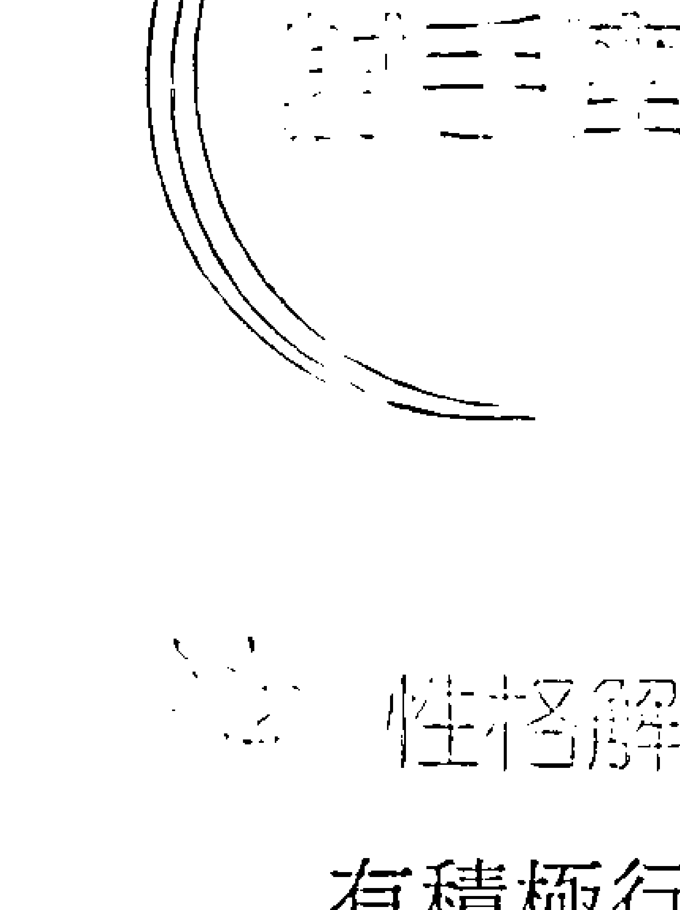

名人：江角真紀子

## AB型射手座

### 性格密碼

有積極行動力的射手座，再加上AB型的理智，會讓AB型射手座擁有冒險犯難的精神，以及哲學家的潛質。

他頭腦冷靜，思考敏捷，有一種凡事看到底的直爽，也具備立刻付諸實踐的行動力。因此，他特別厭惡拖泥帶水的事，即使沒有很好的克制力，仍不失為一個好伙伴。

他平生最怕的事就是處理善後，要他替自己闖下的禍事收拾爛攤子，他必定惱羞成怒、心不甘情不願。這種人常因衝刺太快而失敗，彷彿開車猛踩油門卻忘了適時踩煞車。挫折雖然在所難免，不過他也不會因此沮喪消沉，對他而言，失敗也是一種藝術。

#### 愛情魔法

AB型射手座對愛情有驚人的爆發力及衝動。他熱情如火，在見到情人的剎那，便化作無數支愛神的利箭射向對方，使對方毫無招架之力。

溫柔呢喃及甜言蜜語都不是他的專長，向目標做直接式的表白以及開朗爽快的邀約才是他求愛的本色。

因此，無論痴迷到什麼程度，他始終能保持適度的風範。即使當面被回絕，他也不會惱羞成怒。AB型的理性和射手座的豁達構成他運動家精神的心態，使他能有風度地退出戰局，回復原來的達觀心境。

在床笫之間，凡是過度束縛的氣氛或當對方說出「你只屬於我」之類的話，都可能造成他的負擔。此外，他特別喜愛激烈突擊型的親密行為。

#### 戀人配對度

- O型巨蟹座
- O型處女座
- O型雙魚座
- AB型雙魚座

- B型雙子座
- B型天秤座
- A型水瓶座
- B型水瓶座

- A型白羊座
- B型白羊座
- B型獅子座
- B型射手座

#### 婚姻生活

自由奔放的AB型射手座，通常是不會滿足於固定角色的婚姻生活。以女性來說，她光是被稱為某人的太太就會難以忍受了。所以面對婚姻的性質，自己必須先有自知之明，否則可能會不斷面臨結婚、離婚、再結婚、再離婚的局面。

基本上，她會認為雙方在婚姻的關係中沒有所謂高下之分，所以她喜歡和另一半輪流做家事，並各自保管薪水。如果對方願意與她建立這種自由、平等的關係，其實幸福婚姻仍是指日可待。

#### 家庭寫照

##### 爸爸

家有AB型射手座的爸爸，即使是陰天仍能感受到一股朝氣與活力。「哪裡有新鮮事」才是他最關心的事情，甚至超過對家庭的關愛。對他而言，可以玩、可以冒險才是人生的全部。因此他可能會錯過孩子的成長期，因為他實在太忙了。不過偶爾在家時，他那樂天又有點吹牛的個性，會讓他成為孩子心目中的大英雄。

##### 媽媽

即使每天上班打卡、回家看電視睡覺的生活讓人覺得無聊，她也不會甘於如此。即使是個專職媽媽，她也不可能讓自己閒著，所以孩子可能和母親相處的時間不多。不過她充滿青春的氣息，總是能把家裡氣氛炒熱起來。

##### 孩子

AB型射手座的孩子為人正直、富正義感，做事乾淨俐落，而且特別喜歡面對挑戰。他們受AB型影響，有理智也有大膽的一面，因此常常有前不顧後的傾向，父母應該儘早養成他們的責任感。

#### 職場工作

厭惡受束縛的AB型射手座，在大公司裡工作只會讓他備感壓力，而帶點風險又能獨立活躍的自由業最適合他。除了能夠激發他的好奇心之外，也可以將他興趣多變的缺點化為工作上的優點。

#### 合適的工作清單

- 報導作家
- 新聞記者
- 國際貿易
- 旅遊業
- 外交官
- 資訊業
- 出版
- 服務業
- 自行開班授課
- 運動
- 園藝
- 建築
- 秘書
- 會計
- 學術研究

#### 理財計畫

能一夜之間花掉百萬，或者五千元也能度過整個月的AB型射手座，在消費上的彈性十分驚人。他致富的祕訣在於選擇一個喜歡的工作以確保收入來源，或者利用興趣去賺錢。這對好奇心旺盛的他而言，應該不難辦到。

#### 最佳的投資組合

- 保險類：平準型、增值型、還本型
- 其他金融工具類
- 股票
- 國外股票
- 共同基金

- 活期存款  
- 定期存款 △  
- 外幣存款  
- 黃金  
- 鑽石 ○  
- 古董  
- 繪畫品 ○  
- 郵票  

- 海外共同基金  
- 期貨  
- 選擇權 ○  
- 房地產 △  
- 跟會  
- 海外房地產 △  
- 投資創業 ○  

（註）○→值得投資　△→考慮投資  

#### 休閒活動

手腳靈活的ＡＢ型射手座，在運動場上表現一向傑出，但善變的他也不可能在同一種運動項目上持續太久。他對於玩樂相當在行，只要是最新的旅遊地點，他一定會造訪。

- 適合的運動：溜冰、滑水  
- 適合的季節：春末  
- 適合旅行的地點：澳洲  
- 適合培養的興趣：電影、戲劇  

#### 健康小站

從不將小病當一回事的ＡＢ型射手座，由小病累積成大病的可能性很高。尤其在年過三十後，體力會急速退化，若仍維持年輕時的生活方式，難免會臥病在床，所以平時應注意保養身體。

ＡＢ型射手有一個必須修正的飲食習慣──偏食，喜愛的食物就通通吃光光，不肯吃的東西就一點不沾，均衡的飲食習慣才能讓身體長保年輕。

## 摩羯座

- 日期：12/22–1/19  
- 屬性：土  
- 性格特徵：  
  - 正面形象：雄心勃勃、耐力十足、嚴守紀律  
  - 負面形象：現實利己、悲觀主義、冷酷無情  
- 掌管：土星  
- 身體部位：膝蓋  
- 幸運顏色：棕色  
- 幸運寶石：土耳其玉  
- 幸運花：罌粟花  
- 幸運方向：南  

## CAPRICORN

摩羯座具有旺盛的企圖心、優越的組織能力與耐性，最重要的是擁有超強的自我控制力。這樣的特質，是成功者必備的條件。儘管如此，摩羯座的成功並非憑空得來，他善於訂立目標，不管困難度多高，他還是會堅持完成計畫。和其他星座比較起來，他隱約追求安全的專業，但是往往因為過於認真、嚴肅，在年輕時常常會有悲觀、厭世的負面想法，凡事過度謹慎的性格很容易導致心情低落或憂鬱症。

工作是摩羯座的宿命，不管他的生命裡經歷了什麼，最後都將回歸到工作領域中繼續奮鬥、成長。

摩羯座的守護星是土星，它意味著學習和責任的承擔。不可諱言地，摩羯座確實有著許多課題在面前，等著他去挑戰和超越。他喜歡接近能教導他成長的人，但學習從來不是一件輕鬆的事。所以摩羯座的生命歷程可以用「漸入佳境」來形容，經過一輩子的學習，到了老年他可以享受努力的成果。

摩羯座的守護神是農神撒旦（Saturn），他是一個老年人的象徵，也印證了摩羯座的精神年齡。

因為摩羯座的成熟世故，所以他的愛情觀當然是偏向保守傳統的。他需要能在事業上、人生旅途上一起攜手努力的伴侶，一個可靠的戀人。他不要鮮花、蕾絲禮物，只要一份簡單、堅貞的愛情。

摩羯座並不會特別局限於哪一個工作種類或型態，只要下定決心，沒有他做不到的事情。不過，摩羯座特別了解社會體制或階級的影響，並發自內心了解長輩或老闆的需求。另外，他天生對於造型、結構有獨特的堅持，所以適合成為雕刻家、建築師。

作者：張韶涵、孫慧珍、宇多田光  

## 心性格解碼

A型摩羯座具有很強的進取心，他相當認真，但不太懂得處事的技巧。謹慎的他看到風險時，會設法讓自己不要太靠近。這種過度小心的個性，使他經常錯失良機。

儘管他不易親近，社交能力極差，但是講義氣、求好心切的性格，也使他頗得別人的信賴。而A型縝密、樂於助人的特性，讓他有成為企業家的條件，只是過於嚴苛的行事標準，總是讓人留下缺乏人情味的印象。

此外，A型摩羯座另一個不可思議又挺受歡迎的特色是幽默感。儘管他話不多，卻經常會在緊要關頭說出讓人噴飯的笑料，堪稱是朋友中的冷面笑匠。

#### 愛情魔法

A型摩羯座的愛情都來得特別晚，可能是他覺得要與人建立深入的關係是很困難的事。而這類型的人原本就不容易被外表所惑，他重視對方的內涵更甚於外在，也比較欣賞誠實、可靠的類型。

他通常都願意花時間去尋找合適的對象，而且也認為真誠的愛有其等待的價值。等到找到合適的對象了，他會努力了解對方，所以通常能與對方牽手走一生。

就如同其他土象星座的特徵一樣，在摩羯座獻身前，對方必須提供愛情永恆的保證。這種特性，在A型摩羯座身上最為明顯，因為他認為性愛是愛情的昇華。因此，他的性經驗都來得相當晚。

多數A型摩羯座的「初體驗」都發生在結婚後。不過，一旦束縛解除了，其驚人的持久力，可教人瞠目結舌、嘆為觀止。

- A型天秤座  
- B型天秤座  
- B型白羊座  
- B型雙子座  

- O型雙魚座  
- AB型雙魚座  
- AB型巨蟹座  
- AB型天蠍座  

- O型金牛座  
- AB型金牛座  
- AB型處女座  
- AB型摩羯座  

#### 婚姻生活

對A型摩羯座而言，婚姻是相當實際的，絕不是空中樓閣。他認為戀愛的浪漫夢想是無法適用於婚姻生活中的。

他對婚姻之慎重，可從他計畫之詳盡、費時之久遠看出端倪。

他雖不怎麼重視外表，但對方的教養、學識與經濟能力卻絕對是他結婚大計裡的重點項目。

因此，他的離婚悲劇也很少會出現。婚前，他或許會給對方難以溝通的印象，但婚後，他絕對會忠實扮演自己的角色，是一個傳統但負責任的伴侶。

#### 家庭寫照

##### 爸爸

擇偶眼光極少偏差的A型摩羯座男人，當然不太會發生婚變的情形，而且婚後更是顧家、任勞任怨的好爸爸。他們是一群沉默的耕耘者，對任何事都是有計畫的，對於家庭和子女也是如此，絕不能出任何一點差錯。但由於生性嚴謹，往往給孩子難以親近的感覺，家庭生活也變得十分沉悶。

##### 媽媽

很可能經由媒妁之言而結婚的A型摩羯座女性，儘管婚前對愛情充滿各種羅曼蒂克的幻想，婚後卻絕對是理性的現實主義者。所以她們都相當善於掌理財務，對孩子更是嚴格，因此孩子有時難以感覺到媽媽的溫暖。

##### 孩子

A型摩羯座的孩子小時候個性可能相當懦弱，但隨著年齡的增長，就會越來越堅強。所以多讓他接受一些磨練的機會，他會成長得很快。他是屬於默默努力的執行者，年紀越大，才能看出他的成就。

## 適合職場工作

「成功就是一分的天賦，再加上九十九分的努力」這句話應該是A型摩羯座的至理名言。因為他選定了職業，便很少會再去更動。對他而言，勤奮地耕種，必能歡呼收割，他是樂於見證一分耕耘、一分收穫的人。

#### 合適的工作清單

- 保證成功：數學家、化學家、藥劑師、醫師、公務員  
- 值得努力：宗教家、律師、軍人、建築、製造業  
- 千萬別試：設計師、大眾傳播、外交官、投機事業、珠寶商  

#### 理財計畫

基本上，A型摩羯座的財運並不差，但是也別妄想一夜致富。所幸他用錢有方，加上與生俱來對於金錢的敏感度，守財絕無問題，經濟上不會發生困難。

#### 最佳的投資組合

| 類型 | 評價 | 投資項目 | 評價 |
|---|---|---|---|
| 平準型 | △ | 股票 | △ |
| 增值型 | ○ | 國外股票 |  |
| 還本型 | △ | 共同基金 | ○ |

| 類別 | 項目 |
|---|---|
| 存款類 | 活期存款 ○ |
| 存款類 | 定期存款 |
| 存款類 | 外幣存款 △ |
| 貴重物品類 | 黃金 |
| 貴重物品類 | 鑽石 |
| 貴重物品類 | 古董 |
| 貴重物品類 | 繪畫品 ○ |
| 貴重物品類 | 郵票 |
| 其他金融工具類 | 海外共同基金 ○ |
| 其他金融工具類 | 期貨 |
| 其他金融工具類 | 選擇權 |
| 其他金融工具類 | 房地產 △ |
| 其他金融工具類 | 跟會 ○ |
| 其他民間投資類 | 海外房地產 |
| 其他民間投資類 | 投資創業 |

【註】○→值得投資　△→考慮投資  

#### 休閒活動

務實又心思細的A型摩羯座，由於平常忙於處理公務，所以可能會有運動不足的傾向，所以不妨走出戶外，多與大自然親近，可以治療神經衰弱的毛病。

- 適合的運動：登山、晨間體操  
- 適合的季節：春季  
- 適合旅行的地點：德國  
- 適合培養的興趣：繪畫、手工藝  

## 健檢小站

平常極為控制飲食的A型摩羯座人，體格也相當勻稱，全身幾乎找不到贅肉。但就因為缺乏脂肪，對寒冷的適應力很弱。代表摩羯座的部位是膝蓋、關節，因此此處也極為脆弱，應特別注意。A型人向來嚴謹，太過嚴肅或責任感太重有時會引起憂鬱症或自閉症，要懂得放鬆與適度休息，工作效率會更好。

行為絕對禁止，在床上也不容許有激烈、狂亂的場面。面對這種老古板，製造輕鬆愉快的氣氛是親密行為前的必備條件，如果能來點甜美又不失溫和的熱情方式，保證能讓他嚐到「前所未有」的美味。

#### 戀人配對度

- O型白羊座
- O型天秤座
- AB型天秤座
- O型雙子座

- B型巨蟹座
- A型天蠍座
- B型天蠍座
- B型雙魚座

- A型金牛座
- B型金牛座
- B型處女座
- B型魔羯座

#### 婚姻生活

依照AB型魔羯座的脾氣，他是寧可不嫁也不願盲目草率地結婚。在他的擇偶標準裡，除了愛情的成分以外，仍有許多現實的條件。

穩定是他經營婚姻的第一原則。因為充分體認到婚姻的重要性，所以經濟保障就被視為首要條件。晚婚應該是他的最佳抉擇，因為經過愛情時間的考驗，他真正想要的對象才會慢慢浮現出來。

#### 家庭寫照

##### 爸爸

將家庭的安定列為終身職志的AB型魔羯座爸爸，會將自己的期望寄託在下一代。這種期望若是表現在夫妻之間，會使得他熱切希望有個兒子；表現在親子關係上，他會希望兒子將來可以繼承衣缽。所以，當他的兒子很辛苦，當他的女兒也不輕鬆，要勇於表達自己，避免成為他傳統觀念下的犧牲品。

##### 媽媽

教養能力過人的AB型魔羯座媽媽，也許是個能幹的職業婦女，但在家庭的角色上卻是費盡苦心也難以討好。其實，她是一個很傳統的婦女，也很願意付出，但是由於她已習慣戴面具，感情又內斂，加上AB型的冷眼旁觀，所以總是讓孩子感覺不到溫暖。其實，偶爾吐露一下心事，就能拉近自己與家人之間的距離。

##### 孩子

AB型魔羯座的孩子是屬於不服輸的類型，他的責任感和耐心是一流的，而且只要是自己喜歡的事，不論多難，他們都會想辦法克服。不過，由於他太重視自己的事，所以很少和別的孩子玩，父母應多鼓勵他們和其他孩子接觸。

## 二、職場工作

摩羯座的人認真踏實，做起事來一絲不苟，嚴謹無比；這樣的特質最適合學術性工作。年輕的時候雖然辛苦，但隨著年紀漸長，你的事業版圖也會跟著開拓寬廣，重要的是收入既穩定又會按資歷成長。

## 三、合適的工作清單

- 保證成功：律師、企業家、科學家、政治家、金融顧問
- 值得努力：醫師、土木營造、不動產買賣、按摩師、總務
- 千萬別試：服裝設計、推銷員、公關、大眾傳播

## 四、理財計畫

腳踏實地型的AB型魔羯座，絕少因過度或橫財而致富。他的財運總是隨著年齡遞增，甚至可以傳給子孫。他可以嘗試小本生意的經營，但最好避免賭博或投機性的投資行為，因為他的感覺一向是不太準的。

#### 最佳的投資組合

- 平準型 ○
- 增值型 △
- 還本型 ○
- 活期存款 ○
- 定期存款
- 外幣存款 △
- 黃金 ○
- 鑽石
- 古董
- 繪畫品
- 郵票

- 股票 △
- 國外股票
- 共同基金 ○
- 海外共同基金 ○
- 期貨
- 選擇權
- 房地產 △
- 跟會 ○
- 海外房地產
- 投資創業

（註）○→值得投資　△→考慮投資

#### 休閒活動

勤快耕耘，也勤快收割的AB型魔羯座，無論工作再怎麼忙碌，也要抽出時間看書，因此，他可能會比較喜歡一些知性的活動。建議閒暇之餘，不妨來一趟歷史或古蹟之旅。

- 適合的運動：騎單車、慢跑
- 適合的季節：初夏
- 適合旅行的地點：印度
- 適合培養的興趣：參觀古蹟、聽演講

## 健康小語

雖然不會生大病，但也不算健康的AB型魔羯座，可藉由平常小病的警訊來維持身體的健康，算是比較長壽的星座。勤奮的他，可能為了工作而疲憊忘食地坐在桌前，所以請注意每天都有適度的運動，培養幽默感和一顆年輕的心會讓人生之路更寬、更長。

## Fixed Types & Correlation

### Aquarius

- 日期：1/20–2/18
- 元素：風
- 正面形象：人道精神、積極前瞻、獨立自主
- 負面形象：過分理想、缺乏恆心、特立獨行
- 主宰星：天王星
- 象徵身體：小腿
- 幸運色：綠色
- 幸運石：水晶
- 代表人物：瑪格麗特
- 幸運方位：南南東

## AQUARIUS

水瓶座是最富創意和獨立性的星座，這與其守護星天王星（Uranus）有極為密切的關係。天王星極具實驗精神和原創性，這樣的特質深刻地反映在水瓶座身上，使他的思緒有如閃電，快速而耀眼，永遠走在時代的尖端，顯得鶴立雞群、驚世駭俗。縱使和周圍顯得格格不入，他依然不會屈從於多數人的意見，而是堅持自己的信念，盡情地享受孤獨的自由。

只是，人畢竟是群居的動物，在交友這方面，他不可避免地必須面對自我和他人的衝突；雖然他在一生中會遇見很多精彩的朋友，但知交難求，請試著把自己天馬行空的思想拉回地球上吧！

水瓶座需要的是一個沒有壓力的空間。縱使大部分的時候他根本不在乎別人的眼光，但是對於感情，他無法忍受緊迫盯人和佔有慾；若即若離的相處模式才是他理想的步調，因為愛情從來就不是生命中的主軸。

水瓶幾乎像雙子一樣需要自由，深惡羈絆，但他卻是絕對坦白，不會使詭計、耍心機。在他開始一段戀情之前，一定會將自己的感情傾告訴對方，他不是說一套做一套的偽君子。

什麼工作適合水瓶座呢？除了發明家之外，我只能說他是天生的人權鬥士。

天王星具有強烈的人道主義精神，因此水瓶座會早一步看見環境中所有的不合理、不平等的現象，然後投入改革、扭轉歷史。例如：種族歧視、流浪動物的生存等問題，都是他們關注而極力呼籲世人要重視的，所以義工、革命者或社會激進人士，很多屬於這個星座。

作者：楊丞琳、郭采潔、楊千嬅

## 一、性格解碼

為人親切、友善，卻有點冷漠、難以捉摸；很有同情心，卻始終和人保持一定的距離，這就是A型水瓶座。

由於兼具A型的理想主義和水瓶座的正義感，所以他總是和改革事業、反戰運動或慈善活動有所關聯。儘管他對革命運動具有高度的熱忱，但自我觀念卻相當強，不肯輕易承認錯誤。

另外，他重視人人平等的觀念，使他格外痛恨威權，無法忍受藐視弱者的人；如果遇到這種情況，總要反抗到底，絕不寬貸。

## 二、愛情魔法

A型水瓶座會重視對方的個人特質勝過異性特質。他希望能建立使雙方共同成長的關係。因此，他的對象必須是知性豐富、人格獨立的人，若能遵守這種原則，才能和他維持良好的關係。

坦白說，A型水瓶座的愛情生活是在各方面都很自由的情況下，才能讓他覺得自在舒服。所以對方必須確保給他自由的空間，他也不會要求浪漫的言詞或約會型態，所以有時難免讓對方覺得無趣。再加上他博愛的特性，也可能讓對方缺乏安全感。

在A型水瓶座的腦子裡，他認為思想的開放並不代表行為的開放。所以他既不會隨便與人發生關係，也不會以傳統的眼光來看待它。

基本上，他對性相當淡薄，絕不可能成為肉體的俘虜，更反對只以官能滿足為目的的性行為。也就是說，他在性生活上極重美感與品味，所以不會熱烈地表現自己的需求。

## 戀人配對指數

- 對你非常溫柔  
  - A型金牛座  
  - B型金牛座  
  - B型處女座  
  - B型天蠍座  

- 滿意配對指數  
  - AB型白羊座  
  - AB型射手座  
  - AB型獅子座  

- 你的幸運戀人  
  - O型雙子座  
  - AB型雙子座  
  - AB型天秤座  
  - AB型水瓶座  

## 二、婚姻生活

婚後的A型水瓶座仍認為：雙方依然保持對等的關係，而且也不從屬於另一方。在這種想法之下，A型水瓶座的女性極少會屈身家中。因此，有大男人主義的男性，可能無法從她們身上享受到妻子應盡的義務。

此外，A型水瓶座也是新式教育的支持者。他不會投注很多心思在孩子身上，反而會盡早培養他獨立，而且他們不會擺出父母的架子，而是與孩子如朋友般地相處。因此，身為A型水瓶座的家人，也許必須要費極大的努力與忍耐才能適應他的家庭觀。

## 三、家庭寫照

##### 爸爸

在擔任爸爸的角色上，水瓶座一向是相當矛盾的，這個特性在A型水瓶座的爸爸身上尤其明顯。他一方面希望自己是孩子心中的大朋友，一方面又受到A型保守個性的影響，希望能維持嚴父的形象。所以孩子可能很難了解他，加上他的想法新奇古怪，孩子更是猜不透。

##### 媽媽

聰明而多變的A型水瓶座媽媽，對任何事情都有高度的興趣。由於接觸面廣，所以對孩子的表現更能見怪不怪，不會隨便加以干涉，所以孩子總能自由地發展。加上她又喜歡帶著孩子到處探險，因此會讓孩子覺得她既有趣又奇特。

##### 孩子

A型水瓶座的孩子最忌諱被套入框架中。因為酷愛自由、對凡事都有好奇心的他，把他放入一個模式中，等於是限制了他的發展。所以最好讓他接觸各種新事物，給他一些高科技的玩具，他可以一個人玩得不亦樂乎。

#### 職場工作

頭腦一流、創意十足的A型水瓶座，最不適合組織嚴格或官僚主義盛行的大型公司。他這種愛好自由、喜歡發揮創造力的人，可能會在這種地方被扼殺活力，而讓自己覺得英雄無用武之地。

#### 合適的工作清單

- 保證成功：科學家、天文學家、記者、攝影師、劇作家
- 值得努力：心理學家、大眾傳播、飛行員、義工、航太工程
- 千萬別試：公務員、機械師、建築、金融、土木工程

#### 理財計畫

比較重視精神層面的A型水瓶座，物質慾望淡泊，所以不會過分執著於錢財。若遇上自己的興趣或理想，更會不惜花錢。加上A型的精細頭腦，只要假以時日，財源便會滾滾而來。

#### 最佳的投資組合

| 保險類 | 建議 |
|---|---|
| 平準型 | ○ |
| 增值型 | △ |
| 還本型 | △ |

| 定存類 | 建議 |
|---|---|
| 活期存款 | ○ |
| 定期存款 |  |
| 外幣存款 | △ |

| 實體物品類 | 建議 |
|---|---|
| 黃金 |  |
| 鑽石 | ○ |
| 古董 | ○ |
| 紀念品 |  |
| 郵票 |  |

| 其他金融工具類 | 建議 |
|---|---|
| 股票 | ○ |
| 國外股票 |  |
| 共同基金 | ○ |
| 海外共同基金 | △ |
| 期貨 |  |
| 選擇權 |  |

| 其他房地產投資 | 建議 |
|---|---|
| 房地產 | ○ |
| 跟會 |  |
| 海外房地產 | ○ |
| 投資創業 |  |

（註）○→值得投資　△→考慮投資

## 二、休閒活動

有用腦過多傾向的A型水瓶座，應該在生活中適度運動，並且善用天生的靈敏性，享受運動所帶來的樂趣。

- 適合的運動：籃球、壘球
- 適合的季節：夏季
- 適合旅行的地點：埃及
- 適合培養的興趣：旅行、閱讀

## 三、體檢小語

對A型水瓶座來說，由於具有高度韌性的體質，適應力也強，大都能巧妙控制身體狀況，因此少有肥胖情形。但多半有血壓方面的疾病，是不容忽視的殺手。要小心不規律的生活習慣或過度操勞體力會引起消化系統疾病。

## B型水瓶座

藝人：蔡健雅、宋新妮、黃騰浩、柯有綸

#### 性格解碼

喜歡與眾不同的水瓶座，再加上B型的不凡、豪放與樂觀，使B型水瓶座的人字典裡沒有「害怕」兩個字。

他的隨和、可親，使他無論身處任何環境，都有超強的適應能力，而且頗得人緣。不過，有時過於豪放的他，對周圍人的心情反應反而有些遲鈍。總而言之，在他看來，世界似乎是為他而存在的，所以別人對他言聽計從也是理所當然的。

在B型水瓶座中，成為革命領袖者不少，但是若有不慎，也有可能成為獨裁者。

#### 愛情魔法

B型水瓶座所欣賞的對象是相當知性的。如果無法和他站在對等立場交換意見的人，他是不會放在眼裡的。他很可能會和對方突然由朋友轉為戀人。正由於太缺乏氣氛，所以他從未想到兩人之間可能會迸出愛的火花，但其實透過相處後，他會發現對方正是自己追求已久的對象。

然而，成為戀人後，如果對方一旦提出結婚，也很可能會讓他拔腿就跑。因為他所追求的不是共築愛巢的戀人，而是能一起邁向未來的志同道合者。因此，他應該會選擇在其他領域上能勝過他的人，他才能打從心底認同對方。

知性的水瓶座對純粹的肉體關係相當排斥。所幸B型的自由奔放能鬆脫他對性的束縛，所以他可能在第二次約會時就發生親密關係。他也會保持實驗性的身體力行，把性愛當成一門學問來研究。他喜歡變化十足的性行為，因此最好能兩人共同努力開發。

- B型金牛座
- AB型金牛座
- AB型處女座
- AB型天蠍座

- A型白羊座
- A型獅子座
- A型射手座
- O型射手座

- A型雙子座
- O型雙子座
- A型天秤座
- A型水瓶座

#### 婚姻生活

B型水瓶座認為婚姻並非生活的全部。他需要長期交往，自然地產生信賴關係後，結婚的念頭才會浮現腦海。

如果是女性，會寧願當個單親媽媽，也不願為了孩子或結婚而結婚，否則會扼殺他的獨特性。

因為他是不願遵循傳統的人，例如冠夫姓。所以他會儘可能找出自己所能接受的方式，再論及婚嫁。另外，他無法忍受自己結婚後交友圈縮小。為了避免婚後產生婚外情，婚前最好能盡情享受戀愛的滋味。

#### 家庭寫照

##### 爸爸

B型水瓶座的爸爸只要家人不干涉他的行動，他在家裡很少有怨言，也不太會擺出一家之主耀武揚威的姿態。他對孩子相當寬大，家裡猶如小型的民主國家，而且由於他天性樂觀，家庭氣氛相當融洽。

##### 媽媽

B型水瓶座的媽媽不論對配偶或子女都相當尊重，凡事都以對等的態度面對。她很少執著於現實，不如一般家庭主婦對金錢錙銖必較。

不過，她好相處並不代表好溝通，要說服有自信的她恐怕得費一番技巧。

##### 孩子

B型水瓶座的孩子相當懂得照顧別人，往往會把別人的事看得比自己的事還重要。對他而言，與其獨樂不如眾樂樂。因此，父母要特別注意他的交友狀況，因為他很容易受到朋友的影響。

## 職業工作

對B型水瓶座來說，從事自由業最合適不過。他不適合在保守體制的企業裡工作，也要避免在嚴守規則和限制行動的場合中上班；若從事過於務實卻沒有發展自由的工作，失敗的機率會很高。

#### 合適的工作清單

- 廣告撰文
- 美術設計
- 畫家
- 導演
- 電腦藝術
- 航太工業
- 飛行
- 社工
- 政治家
- 科學家
- 公務員
- 製造業
- 會計師
- 營造
- 醫師

## 理財指導

B型水瓶座重視精神甚於物質，所以他是屬於對金錢不熱衷的類型。他不奢侈，只是沒有儲蓄的好習慣，加上為人慷慨大方，社交費常是居高不下。其實具有前瞻性的他，如果嘗試投資，不難累積財富，可惜他並不熱衷。

#### 最佳的投資組合

| 類型 | 選項 |
|---|---|
| 保守型 | 平準型 △ |
| 增值型 | 還本型 ○ |
| 投資標的 | 股票 ○ / 國外股票 ○ / 共同基金 |

### 存款類

- 活期存款 ○
- 定期存款 △
- 外幣存款 ○
- 黃金 △
- 鑽石
- 古董
- 繪畫品 ○
- 郵票 ○

### 其他金融工具類

- 海外共同基金
- 期貨 △
- 選擇權
- 房地產 ○
- 跟會
- 海外房地產 △
- 投資創業

【註】○→值得投資　△→考慮投資

#### 休閒活動

有個性的B型水瓶座，在選擇休閒遊玩方面和一般人不太一樣。太普通的活動恐怕無法引起他的興趣，除非新鮮、刺激的點子才可能引起他的注意。如果是個藝術家，說不定還能在運動中燃起他的創作慾望。

- 適合的運動：壘球、滑水
- 適合的季節：初春
- 適合旅行的地點：布拉格
- 適合培養的興趣：潛水、滑翔翼

#### 健康小站

B型水瓶座對環境適應力極強，不會因為氣候與環境的變化而體質異常。不過，最好還是要經常運動，紓解精神壓力，也應避免毫無節制的生活。愛好運動者容易有足踝骨外傷，扭傷的部位易產生動脈硬化或靜脈瘤，請確實做好運動前的暖身準備動作。

名人：李心潔、章子怡、梁家輝、劉至瀚

## O型性格解碼

- O型水瓶座大多重感情，尤其重視朋友。與人交往時，他會很注意對方的立場，總是想盡辦法要讓別人感到愉快。這樣的人，人際關係自然不會太差。只不過，朋友歸朋友，對於會干涉他隱私的人，他仍很難接受。
- O型水瓶座大都擁有水瓶座的創意和O型的大膽，所以他的朋友往往也會被他古怪精怪的行為嚇一大跳。但是多變而快樂的生活主張，也使他更容易吸引到各式各樣的朋友。
- 只是，他的自我主張太強，往往因為過度執著自己的意見而與人發生衝突。而他冷靜、一針見血的特性，也可能為他招來太高傲的評語。

## O型愛情魔法

在愛情上沒有階級之分的O型水瓶座，即使對方外表不佳、所得不高，他也不在意。他重視的是人品，內涵才是他考慮的重點。

在戀愛方面，他顯得相當早熟。他會從長輩或朋友處蒐集資料，多方參考。即使交往的對象無法得到世俗的認同，他也會誓不在乎地每天同進同出，以示他捍衛愛情觀的決心。但是，陷入愛情並不代表他就可以完全享受兩人世界。

他對感情的「大方」，除了不會約束對方的行動外，他自己也相當博愛。崇尚自由的他，最討厭被專屬於對方的觀念所束縛。其實對人友好並不是壞事，只是對方可能誤以為是愛，反而造成困擾，甚至導致嚴重後果，所以應該注意自己的言行。

對性總是抱持淡泊態度的O型水瓶座，不喜歡粗野而本能的性。他認為性應該是優雅而理性的，所以他很少主動要求。但若透過溝通協調，他也可以成為大方且令人快樂的伴侶。

#### 戀人配對度

- 非常理想型  
  - O型金牛座  
  - AB型金牛座  
  - AB型處女座  
  - AB型天蠍座  

- 普通理想型  
  - B型白羊座  
  - B型獅子座  
  - B型射手座  

- 需要努力型  
  - A型雙子座  
  - B型雙子座  
  - B型天秤座  
  - B型水瓶座  

## 三、婚姻生活

O型水瓶座的婚姻是都會型的。他的理念是兩個獨立的成人應站在平等的立場上經營婚姻。由於雙方都忙於工作，不喜歡在做家事或照顧小孩的事情上花費太多時間，因此家事多會共同分擔，也會尊重彼此的人格自由，是屬於相當簡約的家庭。

總之，O型水瓶座的婚姻必須像朋友間的感情，雋永而長久，才能維持愛情的火苗。

## 六、家庭寫照

##### 爸爸

很多人可能都猜不透O型水瓶座爸爸每天在做什麼。他的人生總是精彩又多樣，未必有固定工作，卻總是能變出薪水。他也可能突發奇想，使家人不知所措，或者乾脆離家數日；正當家人想報警時，他卻若無其事地回來。無法適應的孩子，可能會覺得爸爸很怪異。

##### 媽媽

相當懂得馭夫技巧的O型水瓶座媽媽，擅長處理夫妻間的問題。如果先生晚歸時，她從來不會興師問罪般地令先生難堪。對於孩子，她也很少擺起媽媽的架子。但是講求兩性平等的她，對於先生的無理要求，絕對會抗爭到底，是個婦權意識很高的媽媽。

##### 孩子

開朗、乾脆是他的特性。由於他有O型的韌性，加上水瓶座愛新鮮的個性，使他對失敗的事毫不在意，總會一試再試。他和射手座一樣，對朋友來者不拒，所以父母別太干涉他的交友，朋友可能是他以後最大的資產。

## 適合工作：富有創造力、能表現自我的工作

擅長自由想像及獨創設計的O型水瓶座，周圍隨時都能聚集許多人來做他的幫手。所以個人工作室或者有想像力的工作都很適合他，在大組織裡做個小螺絲釘可能很快就會磨損他的敏銳度。

## 適合的工作清單

- 保證成功：畫家、詩人、飛行員、服裝設計師、音樂家
- 值得努力：播報員、DJ、觀光、科學家、劇作家
- 千萬別試：公司職員、工業技術、公務員、金融、醫師

#### 理財計畫

不善存錢、對錢也不執著的O型水瓶座，似乎是無計畫地花錢。事實上，他經手的錢財將來一定都能獲得回饋。加上他卓越的技術能力，以及一票知心好友，這些都比金錢更可貴。

#### 最佳的投資組合

- 保險類：平準型、增值型、還本型
- 房地產：適合蓋商業大樓
- 股票：國外股票、共同基金

- 活期存款 △  
- 定期存款  
- 外幣存款 ○  
- 黃金 △  
- 鑽石 ○  
- 古董 ○  
- 繪畫品  
- 郵票 ○  

- 海外共同基金  
- 期貨  
- 選擇權  
- 房地產 △  
- 跟會  
- 海外房地產 ○  
- 投資創業  

【註】○→值得投資　△→考慮投資  

#### 休閒活動

愛好自由的O型水瓶座，可能因為工作或家庭帶來的束縛，而使自己陷於不滿的情緒中。所以不妨培養自己的休閒興趣，可紓解壓力，也可以充分享受自由。

- 適合的運動：棒球、羽球  
- 適合的季節：冬末  
- 適合旅行的地點：瑞典  
- 適合培養的興趣：攝影、話劇  

#### 健康小站

O型水瓶座很容易集中注意力在一件事上，所以經常可見他宛如石膏像般保持同一姿勢。因此，要特別注意血液循環，才能保持清醒的腦袋。

而工作壓力常使他情緒緊繃，引起神經系統的活動壓力過大，或是神經傳導遲鈍。此外，腳踝容易受傷，也要特別注意！

名人 Janet、江祖平、劉青雲

#### 性格解碼

AB型水瓶座就像一部井然有序的電腦，理性是他個性上最大的特徵，任何時候他都對周遭事物維持高度敏感，但同時也保持超然的立場。

不斷變換角度，對複雜的問題加以巧妙的分析，並做出準確的判斷，是AB型水瓶座最大的專長。同時，他自由的思想及獨特的見解，經常會使人相當驚訝，而他所從事的事業往往也具備了開創性、前瞻性的精神。

他具有強烈的理性傾向及科學化的處事態度，而且會提出突破一般慣例的作法。別人總是難以接受他太合理化、太冷靜而又苛求完美的個性，也因此他常被歸為異類。

#### 愛情魔法

AB型水瓶座的前衛思想及知性想法，在戀愛中最能表露無遺。他不會過於在意社會標準或關於擇偶條件的勸告，因為他認為最重要的是彼此間心靈的契合。此外，AB型水瓶座也常會陷入分不清是愛情或友情的漩渦裡。

所以，他的戀愛關係可能會從朋友開始，了解彼此對人生的看法，而後發覺彼此都無法找到更投緣的對象，就此展開一段安靜但基礎穩固的戀情。

AB型水瓶座對性有相當獨特的看法，只要對方能滿足他的精神需求，他就會樂於委身。講求知性的他，是容易被氣氛所左右的人。由於他不容易進入狀況，所以最好能以輕鬆的態度解除他心中的警戒。

- A型雙子座  
- B型雙子座  
- B型白羊座  
- O型金牛座  
- AB型金牛座  

- B型天秤座  
- B型獅子座  
- O型處女座  

- B型水瓶座  
- A型射手座  
- B型射手座  
- O型天蠍座  

#### 婚姻生活

對AB型水瓶座的人而言，婚姻是互相尊重的兩人生活。他心中的理想伴侶，是讓彼此有自由空間的人。所以，他的伴侶要辭去原工作，去從事喜歡的事業，他當然會支持。因此，他的婚姻也可能不拘於形式，即使對方要求同居，他也會同意。

#### 家庭寫照

##### 爸爸

對婚姻抱持開放態度的AB型水瓶座爸爸，他謀求自由以及特立獨行的作風也反映在管教子女上。他願意為孩子付出，卻不願孩子成為他的束縛，保持距離是他的人生觀，這也使他有別於傳統的爸爸。

##### 媽媽

AB型水瓶座媽媽天生個性獨立、冷靜，凡事總要自己來，因此，她希望子女也和她一樣。孩子和她傾向於朋友的關係，而不像母子，所以依賴性強的孩子也許會覺得沒有安全感。不過，她絕對可以為孩子帶來很多新鮮的玩意！

##### 孩子

## Blood Types & Constellations

AB型水瓶座孩子大都十分沉穩，做人處事也極有分寸，除了腦筋靈活外，判斷力也一流，很少讓父母操心。由於好奇心旺盛，父母不妨多鼓勵他去做一些自己感興趣的事。此外，他很在意別人的反應，對於一些小事，似乎很難釋懷，應特別注意。

## 二、職場工作

對金錢報酬並不重視的AB型水瓶座，不受組織或團體的束縛，唯一要求的是能夠自由伸展抱負。由於他善於利用時機創造機會，同時在工作熟悉後，也頗能發揮獨特的個人風格，所以能為事業帶來意外發展。

#### 合適的工作清單

- 政治家  
- 作家  
- 作曲家  
- 評論家  
- 畫家  
- 記者  
- 大眾傳播  
- 飛行員  
- 資訊  
- 出版  
- 公務員  
- 秘書  
- 會計師  
- 機械  
- 顧問  

## 三、理財計畫

AB型的人一向只求溫飽即可，加上水瓶座的人沒有金錢概念，因此大批財富常常很快就消失無蹤。不過，講求精神生活的他，從不會因金錢而煩惱。

#### 最佳的投資組合

| 類型 | 投資項目 |
|---|---|
| 保險類 | 平準型 ○ |
| 保險類 | 增值型 |
| 保險類 | 還本型 ○ |
| 存款類 | 活期存款 |
| 存款類 | 定期存款 |
| 存款類 | 外幣存款 ○ |
| 金融工具 | 股票 △ |
| 金融工具 | 國外股票 ○ |
| 金融工具 | 共同基金 ○ |
| 金融工具 | 海外共同基金 ○ |
| 金融工具 | 期貨 |
| 金融工具 | 選擇權 |

- 貴重物品類  
  - 黃金  
  - 鑽石 △  
  - 古董 ○  
  - 繪畫品  
  - 郵票  
  - 其他奢侈投資類  

- 房地產  
  - ○ 跟會  
  - △ 海外房地產  
  - 投資創業  

【註】○→值得投資　△→考慮投資  

#### 休閒活動

對環境適應相當強的AB型水瓶座，是冷靜加好奇的人，所以可能會對一些新鮮刺激或者相當現代的東西感興趣，旅遊的話，會選擇冷門的地點獨自前往。

- 適合的運動：桌球、軟網  
- 適合的季節：夏天  
- 適合旅行的地點：撒哈拉沙漠  
- 適合培養的興趣：旅遊、修理電氣用品  

## 保健小站

理智的AB型水瓶座，由於平時很少情緒激動，再加上他物質慾望淡泊，所以很少生大病。但因為他腦力激盪頻繁，往往造成負荷過重，如果沒有保持運動的習慣，一些毛病便會趁虛而入。飲食方面要多攝取鐵質，可以改善臉色蒼白和頭暈的現象。

## 雙魚座

- 日期：2/19–3/20  
- 五行：水  
- 正面形象：浪漫多情、博愛主義、直覺力強  
- 負面形象：不善理財、意志不堅、大說謊家  
- 守護星：海王星  
- 幸運色：藍色  
- 幸運花：勿忘我  
- 幸運石：綠松石  
- 幸運地：東南東  

## Pisces

童話故事中，最後總是公主與王子幸福快樂的結局，雙魚座自小就做著這樣一個虛幻而美麗的夢，有些人還一輩子都沉迷在這個夢中不願醒來。

他眼中的世界總有些失真，為了讓事情更圓滿，甚至會以曖昧和含糊來修飾事實，以至於常常給人不可靠的印象。對他而言，維持內心那個夢想世界的完整才是最重要的，他最受不了水電費的帳單和每日重複的例行公事。

而雙魚座的守護神海王星具有犧牲、奉獻的意味，所以雙魚座總是奮不顧身地幫助、拯救他眼中的犧牲者。諷刺的是，有時這也讓他自己成為犧牲者，因為他不切實際的思考邏輯，總是讓自己身陷險境而不自知。

雙魚座有強烈的第六感，所以，他對抽象的、無形的事物有特殊的理解力，對於真實世界反而束手無策。他總給人一種不食人間煙火的錯覺，在他眼中的戀人簡直是完美的化身，他甚至無法想像對方也會摳鼻涕或上廁所。

有趣的是，他的第六感能完全洞悉對方的心思，不需要語言就能心神領會。另一半能回報他的，是遠遠給他幻想的空間，雙魚座就會給你更多更多。

雙魚座最大的困擾在於現實生活與內心世界的差距，無邊無際的想像雖然讓他的夢想自由，卻禁不起現實的相觸。但是如果選擇了創作工作為職業，那麼他愛幻想的天性就可以得到合理的紓解與發揮，例如文學創作、音樂、攝影方面都會有超凡的成績。雙魚也很適合從事占卜或算命的工作，他神奇的第六感往往能神準地預測未來。

## 雙魚座

名人：徐若瑄、李冰冰、溫昇豪、馬志翔

## 性格解碼 為愛受傷，要先學會保護自己

A型雙魚座性格上最大的特徵是「人飢己飢，人溺己溺」，再加上A型具有的服務精神，使這項特色愈為凸顯。他對四周人無私的奉獻，基本上是相當令人感動的。不過這種善良卻很容易被人利用，所以在情路上，他往往會比一般人來得曲折，因為在他付出真情之前，很少會考慮到對方到底值不值得。

A型雙魚座除了給人善良的印象之外，還有十足的神秘感，而且想法獨特，經常天馬行空。你如果和一位A型雙魚座的朋友聊天，你可能會發現他眼睛看著你，可是心思早不知飛到哪裡去了。

## 愛情魔法 深陷不拒的感情關係是一種傷害

A型雙魚座的愛情觀可說是既專情又濫情。雙魚的專情在於他們一愛上對方，就會奮不顧身地一再付出，雙魚女甚至會以獻身來證明她的愛。

雙魚的濫情則是因為他很容易就對別人「有感覺」，所以常使自己陷入無法自拔的境地，再加上意志薄弱，即使不喜歡對方也來者不拒，以致情場糾紛不斷。

奉勸A型雙魚座的人要特別注意，別過分為別人著想，這可能使你羅曼史不斷，但也可能最後一無所有。

「白天是天使，晚上是魔鬼」這句話用在A型雙魚座身上，再貼切不過了。他對愛及性的需求，如同人對空氣的需求一般，而他性愛方面的敏感度亦為十二星座之冠，而且極重視浪漫的氣氛。會為了對方奉獻一切，可以說是最理想的戀愛人。

#### 戀人配對度

- 對不起我愛你  
  - B型獅子座  
  - B型雙子座  
  - A型射手座  
  - B型射手座  

- 愛也好恨也好  
  - AB型處女座  
  - AB型魔羯座  
  - O型金牛座  
  - AB型金牛座  

- 命中注定我愛你  
  - AB型雙魚座  
  - AB型天蠍座  
  - O型巨蟹座  
  - AB型巨蟹座  

## 1、婚姻生活 不要在現實中做夢

A型雙魚座只會為了愛而步入婚姻，很少會依經濟能力或社會地位來選擇伴侶。這種建立在浪漫羅曼史上的婚姻，很有可能在婚後面臨很大的考驗。

A型雙魚座始終無法正視現實的缺點，在婚姻生活中會成為很大的問題。一方面，他們會為了維護另一半在他心中美好的形象，所以往往會姑息對方的缺點，但睜一隻眼閉一隻眼的作法，卻會使得夫妻間的鴻溝越來越深。

另一方面，因為他們多情又薄弱的意志力，所以很難抵擋別人猛烈的追求攻勢，常常使得婚後外遇關係不斷，親手破壞了對幸福婚姻的幻想。

## 2、家庭寫照

##### 爸爸

A型雙魚座的爸爸對家庭有一份莫名的戀情，所以他往往會希望老婆留在家裡照顧孩子，讓他一回到家中，就能看到所有的家人，感受家庭的溫暖。而他自己也多半能為家庭犧牲奉獻一切，而且無怨無悔。因此，他常會不自覺地寵壞孩子，但他對孩子的無限包容力，仍令人相當感動。

##### 媽媽

## Blood Types & Constellations

身上永遠有用不完的愛心、包容心，這些特色在A型雙魚座的媽媽身上更是明顯。由於她相信人性本善，所以經常可以看到她受騙上當而不以為意。她對子女的教育也是包容勝於管教，讓孩子感到媽媽是他們永遠的避風港。

##### 孩子

走到哪裡都很受歡迎的A型雙魚座孩子，特別容易受到老人家的疼愛。因為他性情善良，沒有攻擊性，唯獨缺乏時間觀念，行動也不夠積極，所以難免給人散漫的感覺，因此父母要多增加他對事情的積極性、行動力。

## 職場工作 選定方向，發揮全力以赴，創作天地一片

A型雙魚座的腦子大都充滿各種奇情幻想，再加上個性不愛計較，喜歡服務人群，如果能將二者互相結合，就容易成為自成一格的藝術家。不過，值得注意的是，千萬別讓自己在現實的激流當中，被沖離了既定的方向。

#### 合適的工作清單

- 保證成功：詩人、作家、音樂家、占卜師、畫家  
- 值得努力：美容師、服裝設計師、模特兒、社工人員、心理學家  
- 千萬別試：外科醫師、建築師、公務員、警察、精密技術  

## 理財計畫 量入為出善用時間和機會，建立儲蓄、保險觀念

有點不食人間煙火的A型雙魚座，簡直沒有金錢觀念，又沒有處理日常生活的能力，所以經常背了一屁股的債。奉勸你少借點錢給別人。此外，走出封閉的象牙塔，讓別人肯定自己的才華，錢才有可能進到你的口袋裡。

#### 最佳的投資組合

- 保險類  
  - 平準型 △  
  - 增值型  
  - 還本型 ○  

- 存款類  
  - 活期存款 ○  
  - 定期存款 △  
  - 外幣存款  

- 貴重物品類  
  - 黃金 △  
  - 鑽石 ○  
  - 古董  
  - 繪畫品  
  - 郵票  

- 其他金融工具類  
  - 股票 ○  
  - 國外股票 △  
  - 共同基金  
  - 海外共同基金  
  - 期貨 ○  
  - 選擇權 △  

- 其他民間投資類  
  - 房地產  
  - 跟會  
  - 海外房地產  
  - 投資創業  

（註）○—值得投資　△—考慮投資  

#### 休閒活動

不善於養生，生活也缺乏規律的A型雙魚座，會有酗酒和熬夜的傾向，最好能盡量抽出時間來做運動，讓自己的頭腦保持清醒。

適合的運動：滑雪、溜冰  
適合的季節：初夏  
適合旅行的地點：舊金山  
適合培養的興趣：飼養寵物、義工  

## 健檢小站

A型雙魚座具有敏銳的感受力，所以如果平時過於緊張，便很容易引起身體其他部位的疾病。雖然體型不十分健壯，但仍算得上健康，唯有抵抗力較弱，呼吸系統易受感染，尤其得特別注意肺部的健康問題。

## Blood Types & Constellations

雙魚座　名人：范瑋琪、品冠

## 性格解碼 小心深藏不住的個性，被人利用。

對事物反應敏銳的B型雙魚座，是感情勝於理性的人。可以感受到他人心中細緻的感覺，然而太在乎別人的看法，又使他變得有些神經質。所以，他很容易因別人的一句話而傷心不已。

不過因為B型的關係，所以會讓這個類型的人性格中帶有光明面與黑暗面。有時，他會因揣測別人的想法而貶低自己，但過一會兒，自己又會完全推翻這種想法，使周圍的人完全摸不清他到底在想些什麼。

## 愛情魔法 學習在濃烈的熱情中保持冷靜。

對於來者不拒的B型雙魚座而言，在他眼中，誰都是好人，他也相信任何人都具有獨特的魅力。只是當他一旦長期交往後，才會發覺事實並非如此而後悔萬分，如果是雙魚女，甚至有「人財兩失」的可能。

不過，善良的他，即使戀人提出分手，他也很少懷恨在心，也不會從此視對方為陌生人。因為他相信，自己所愛的人的幸福就是自己最大的幸福。

B型雙魚座給人的印象是清純潔白的，令人無法和性聯想在一起。然而在這方面，他仍表現雙魚座的兩面性。儘管他腦中會認為在沒有愛的基礎下一味追求感官之樂是不潔的，但一旦體會後，就很難控制了。所以有時會給人風流成性的感覺，不過，對方最好以退為進，才不會把他嚇跑！

#### 戀人配對度

- 對不起我愛你  
  - AB型雙子座  
  - AB型獅子座  
  - B型射手座  
  - AB型射手座  

- 愛也好恨也好  
  - A型金牛座  
  - A型處女座  
  - A型魔羯座  
  - O型魔羯座  

- 命中注定我愛你  
  - A型巨蟹座  
  - O型巨蟹座  
  - A型天蠍座  
  - A型雙魚座  

#### 婚姻生活

「結婚與戀愛是兩回事」的觀念是B型雙魚座無法接受的。但他通常是在談了無數次的戀愛後，才會真正步入禮堂。而且對大多數的B型雙魚座而言，他都比較喜歡戀愛結婚的，所以最好的婚姻方式就是以熱烈的感情基礎。

不過，他也可能因為無法冷靜地看清對方，而拖拖拉拉持續著關係，以致最後不得不走上結婚一途。因此，剛開始交往時，雙方最好就能自然而然地談論到結婚的話題，因為他必須歷經時間的考驗後，才能夠完全信任對方。

#### 家庭寫照

##### 爸爸

B型雙魚座的爸爸天生具有同情心，孩子受挫或犯錯時，他大都可以因同情心而放他們一馬。而容易窮操心的他，只有在孩子長大成人，可以完全獨立時，才會稍稍鬆懈。對他而言，孩子可能是永遠也長不大的。

##### 媽媽

家庭是B型雙魚座的媽媽最大的支柱。她彷彿缺少現代女性的獨立自主，一切以子女和老公為心靈依歸。她對孩子相當寬容，從不輕易責備孩子，所以有溺愛的傾向。她是熱愛孩子、備受丈夫呵護的妻子。

##### 孩子

B型雙魚座的孩子脾氣可能不是很穩定，時常會有任性或大發脾氣的傾向，尤其生病時會更加變本加厲。不過，長大後，情況會好些。父母如果發現他有心神不寧的情形，應該多擁抱他，給他安全感。

## 職場工作 面對挫敗，應該讓自己更堅強。

想像力、直覺、多愁善感都是B型雙魚座在工作上最大的財富，但他都缺乏商業才能與實務方面的能力。此外，由於性情柔和，也不適合在競爭激烈的公司裡工作。

#### 合適的工作清單

- 保證成功：公務員、美術教師、自由作家、設計師、雇員  
- 值得努力：音樂家、算命師、舞蹈家、設計師、詩人  
- 千萬別試：會計、金融、房地產、總務、製造業  

## 理財計畫 身上別帶太多錢，記得儲蓄

和朋友外出，一定搶著付帳的B型雙魚座，若見到喜歡的東西，即使口袋掏空也要買下來。但這並不代表他沒有金錢概念，其實他也可以無欲無求，即使口袋沒錢也無所謂。

#### 最佳的投資組合

| 類別 | 項目 | 評價 |
|---|---|---|
| 保險類 | 平準型 | △ |
| 保險類 | 增值型 |  |
| 保險類 | 還本型 | ○ |
| 存款類 | 活期存款 | △ |
| 存款類 | 定期存款 | ○ |
| 存款類 | 外幣存款 |  |
| 其他金融工具類 | 股票 | ○ |
| 其他金融工具類 | 國外股票 | △ |
| 其他金融工具類 | 共同基金 |  |
| 其他金融工具類 | 海外共同基金 |  |
| 其他金融工具類 | 期貨 | △ |
| 其他金融工具類 | 選擇權 | ○ |

- 寶貴物品類  
  - 黃金  
  - 鑽石  
  - 古董  
  - 紀念品  
  - 郵票  

- ○ 其他民間投資類  
  - 房地產  
  - 跟會  
  - 海外房地產  
  - 投資創業  

【註】○→值得投資　△→考慮投資  

#### 休閒活動

不善於控制情緒的B型雙魚座，個性天真，極容易受傷。所以，平日不妨選擇一些較有氣氛的地方來放鬆自己，以滿足受到壓抑的情緒。總之，自己要特別注意精神的調適。

- 適合的運動：騎單車、散步  
- 適合的季節：秋末  
- 適合旅行的地點：舊金山  
- 適合培養的興趣：露營、旅行  

## 健檢小站

容易神經過敏的B型雙魚座，有必要尋找消除壓力的方法。如果喜歡運動，就找一天盡情地運動。總之，要注意精神方面的調適，如果要藉酒精解除壓力，也應適度。另外，也容易依賴藥物，對藥物的副作用應事先了解，在用藥之前，一定要經醫生同意，否則會有中毒或過敏等不適現象。

## 雙魚座

名人：陳怡蓉、趙薇、藍正龍、明道

## 性格解碼 學習在現實與理想之間取得平衡

世界上沒有比O型雙魚座更好商量的人了。事實上，O型的多面性，使他能以充滿彈性的態度來對待他人，而尊重別人的程度，也幾乎令人懷疑他是否有自己的主見。這些特性使他成為悲天憫人的人格，甚至可能會突然收拾行囊，前往非洲或某個落後的地區，去實踐他的博愛精神。

事實上，O型雙魚座絕不只是一個好人而已。在O型的影響之下，對於現實，他也多半能冷靜分析思考。只是他過於信任別人，經常使自己蒙受不少損失，而過分擔心別人的事，也使他忘了自己的步伐，在不知不覺中跟著別人起舞。

多培養果斷力，是減少傷害的不二法門，而亦步亦趨活在別人的陰影下，也有失人生意義，不是嗎！

## 愛情魔法 愛情生活定是人生感受中重要的一部分

視愛情為人生全部的O型雙魚座，會為心愛的人犧牲一切，儘管他並不巴望對方也能相對回報，但他也不會參加愛情遊戲。專情的O型雙魚座很容易憑直覺做決定，而他若無其事的笑容與晶瑩剔透的眼眸，也很容易引來異性關愛的眼光。若是別人追求不斷，往往使得他的男朋友或女朋友有被騙的感覺，甚至拂袖而去。其實，這實在不能怪他，只是他魅力的笑容太吸引人了。不過，仍奉勸他要把情人和朋友區分清楚，免得引起無謂的困擾。

方提出怎樣的要求，他都會答應。但事實上，他是十分重視氣氛的人，如果能有一個浪漫的環境，再來點音樂配合，他會把性燃燒到最高點！

#### 戀人配對度

##### 對不起我愛你
- A型巨蟹座
- B型巨蟹座
- B型金牛座
- AB型雙子座

##### 愛也好恨也好
- B型天蠍座
- B型處女座
- AB型獅子座

##### 命中注定我愛你
- B型雙魚座
- B型魔羯座
- AB型射手座
- O型射手座

#### 婚姻生活

尋找一位成熟穩重的伴侶，讓你安心依靠。

對O型雙魚座來說，婚姻制度下所組成的家庭，對他具有相當穩定的作用，能夠穩住他容易動搖的心性。因此，O型雙魚座的男性可能會較適合成熟的女性，而女性也可能會喜歡像父親般能呵護自己的人。

因此，選擇一位可靠的對象建立家庭，或許可以一改O型雙魚座軟弱的樣子，堅強地面對工作的挑戰。無論如何，婚姻及家庭對O型雙魚座都深具意義，也唯有在家庭中，他才能找到歸屬感。

#### 家庭寫照

##### 爸爸

O型雙魚座的爸爸擁有O型的急性子，卻也有雙魚座溫和的一面。儘管他對子女有所期望，卻總是自己默默承受挫敗，很少造成子女的困擾。他就像一塊海綿般，吸收別人的情緒卻很慢，才反應自己的想法，他是最好的爸爸，卻也是最沒個性的爸爸。

##### 媽媽

相信人性本善的O型雙魚座，始終將夫妻感情擺在第一位，對於孩子、老公，她也寧可信任，絕少懷疑。這樣的O型雙魚座媽媽，很容易使家庭淪為父權至上，而且由於她的縱容，先生、孩子很有可能會把她當成菲佣看待，是個瑪麗亞型的媽媽！

##### 孩子

- O型雙魚座的孩子比其他類型的孩子更有堅持力。儘管他還是那麼容易受傷，而且感情脆弱，但只要有目標，他仍然能夠全力以赴。不過，這種專注力也會受到個人情緒影響，心情好則非常投入；心情不好，則難以集中思緒。

## 職場工作  
在工作時要確立自己的立場與建立專業的態度

他如果雙魚座氣質較強時，可能會缺乏主見，半途而廢。所以應多加強O型氣質，讓O型的毅力和堅持表現出來，別人才能託以重任。另外，自己也應看清社會的現實性認真工作。

#### 合適的工作清單

- 保證成功：牧師、畫家、設計師、詩人、老師  
- 值得努力：海洋學家、水產養殖員、舞蹈家、作曲家、模特兒  
- 千萬別試：金融、警察、運動員、律師、推銷員

## 理財計畫  
當錢花在朋友身上時比花在自己身上更快

O型雙魚座是願意為他人花錢更甚於花在自己身上的人，儘管他經常在事後後悔，但仍樂此不疲。建議最好平日做好用錢的規畫，以免全部報銷，最好也只把錢借給有金錢觀念的朋友。

#### 最佳的投資組合

| 類型 | 建議 |
|---|---|
| 保險類 | 平準型 ○ |
| 保險類 | 增值型 |
| 保險類 | 還本型 △ |
| 其他金融工具類 | 股票 △ |
| 其他金融工具類 | 國外股票 △ |
| 其他金融工具類 | 共同基金 |

- 存款類  
  - 活期存款 △  
  - 定期存款 ○  
  - 外幣存款
- 貴重物品類  
  - 黃金 ○  
  - 鑽石 ○  
  - 古董 △  
  - 繪畫品 △  
  - 郵票
- 其他金融工具類  
  - 海外共同基金 ○  
  - 期貨  
  - 選擇權
- 其他民間投資類  
  - 房地產 △  
  - 跟會  
  - 海外房地產  
  - 投資創業

（註）○→值得投資　△→考慮投資

#### 休閒活動

很容易受感動的O型雙魚座，由於精神狀態較不穩定，所以不妨常出去走走，接近大自然，可以一掃悲傷、抑鬱的情緒。

- 適合的運動：越野單車、散步  
- 適合的季節：初春  
- 適合旅行的地點：葡萄牙  
- 適合培養的興趣：電影、戲劇

## 健檢小站

O型雙魚座健康上的頭號殺手是精神壓力，尤其人際關係間的摩擦，更是他最主要的壓力來源。一旦遭受打擊，心臟及腸胃就容易出問題，因此不少人需要依靠藥物來安定自己。最好的治療方法就是讓自己忙得沒時間胡思亂想，自然也沒時間生病了。

名人：伊能靜、金喜善

✧ 性格解碼　閃爍的光芒裡，可以發現自己真實的一面

AB型雙魚座的個性就像流浪的吉普賽人一樣，情緒變幻不定。他可以因陽光而滿心歡喜，也可因秋天的落葉而傷感，隨時都會因情緒的改變而做出不同的反應。

他不願讓虛偽的美德存在，與別人爭強鬥勝、相互較勁的事他一向做不來。受人之託、忠人之事是他處事原則；他經常大量原諒別人，即使因此受傷也無怨無悔。對朋友來說，他是個最好的聽眾。

然而，溫和的人有時難免無法堅持己見，失去原則，因而往往給人懦弱、言行不一的印象。而缺乏自信心的他，也會經常懷疑自己的能力，這也成為他最大的毛病。

✧ 愛情魔法　培養對甜言蜜語的抵抗力

即使他具有AB型的理性，仍掩不住雙魚座強烈的情緒化。尤其在愛情方面，不論對方條件多理想，他不喜歡就是不喜歡，絕不肯點頭。然而，如果對方發動攻勢，基於順應他人的習性，他總會不自覺地給予好臉色，私下卻苦惱不已。

相反地，明知對方不過在利用他，只要喜歡，他也會不顧一切愛到底。

對AB型雙魚座而言，愛是沒有佔有或奪取的，他只希望能一心一意地付出、去愛，並且視那為永恆，對屢次的錯誤很少能記取教訓。

對具有強烈尋歡傾向的AB型雙魚座而言，有時可能不分對象，只求能享受濃烈的性愛。事實上，他在性方面感覺非常靈敏，如果是在熱戀當中，只要在他耳邊細語呢喃，就能夠引起他心中的慾火。

#### 戀人配對度

##### 對不起我愛你
- O型雙子座
- O型獅子座
- O型射手座
- AB型射手座

### 愛也沒恨也沒
- B型金牛座
- A型處女座
- A型魔羯座
- B型魔羯座

##### 命中注定我愛你
- A型巨蟹座
- B型巨蟹座
- B型天蠍座
- B型雙魚座

#### 婚姻生活

容易被世間價值觀所左右的AB型雙魚座，會在意對方經濟、家世背景，至於愛情也是不容忽視的一環。由於他的標準有時並不十分實際，尤其是婚後許多柴米油鹽醬醋茶的瑣碎家事，會令他一個頭兩個大。

其實熱愛家庭的他，在選擇婚姻對象時，應該多發揮一下AB型的理性、冷靜，為自己挑選一個合適的對象。

#### 家庭寫照

##### 爸爸

個性溫和、具有超強包容力的AB型雙魚座爸爸，對於孩子的一言一行都非常了解，甚至全盤接納，在關懷上也有求必應。由於他總是先想到孩子，最後才考慮自己，所以很容易造成孩子的自我膨脹、不負責任。但是，他在精神或物質上只求付出不求回報的作法，卻也是孩子的另一種典範。

##### 媽媽

總是經常在自責的AB型雙魚座媽媽，善良細心，卻欠缺果斷。由於她有逃避現實的傾向，在面對問題時，總以為把它往身上攬就沒事，因此經常會縱容孩子，也錯失教導孩子的最佳時機。千萬要學習如何看清事實，並用客觀的態度面對子女。

##### 孩子

AB型雙魚座的孩子很喜歡編織夢想，同時也善於照顧別人，是相當有同情心的乖孩子。由於他經常沉浸在夢中，所以有時不免會出現一些天馬行空的謊言。如果不是太過分，不妨認真去聽聽這些孩子話；如果太嚴重，必須加以糾正。

#### 職場工作

培養責任是事業成功的先決條件

對AB型雙魚座而言，競爭性強、講究效率及心機手段的工作，是最不適合的抉擇。因此，激烈的商業、服務業工作並不適合他。如果無選擇的餘地，也應該慎選工作伙伴，並學習不輕易妥協的精神。

#### 合適的工作清單

- 保證成功：畫家、攝影師、詩人、護理、社工  
- 值得努力：宗教家、占卜、作曲家、演員、設計家  
- 千萬別試：國際貿易、保險業、律師、金融、外交家

#### 理財計畫

金錢的觀念，常常左右你的生活

AB型雙魚座一生財運的關鍵推手，便是他平日的人際關係。由於他會為了幫助人而拼命節約，所以別人也很樂意幫助他。多發揮一點AB型的冷靜，調度你的收支與花費。

#### 最佳的投資組合

| 類型 | 建議 | 投資 |
|---|---|---|
| 保險類 | 平準型 △ | 股票 △ |
| 保險類 | 增值型 ○ | 國外股票 △ |
| 保險類 | 還本型 ○ | 共同基金 ○ |
| 存款類 | 活期存款 △ | 海外共同基金 |
| 存款類 | 定期存款 | 期貨 |
| 存款類 | 外幣存款 ○ | 選擇權 |

- 貴重物品類  
  - 黃金  
  - 鑽石 ○  
  - 古董 △  
  - 繪畫品  
  - 郵票
- 其他民間投資類  
  - 房地產 △  
  - 跟會 ○  
  - 海外房地產  
  - 投資創業

〔註〕○→值得投資　△→考慮投資

#### 休閒活動

容易累積壓力的AB型雙魚座，可以依靠旅遊來鬆弛精神。不過，最好獨自前往，盡量避免與他人同行，否則一路上盡在照顧他人，不免玩興盡失。

- 適合的運動：潛水、划舟  
- 適合的季節：夏末  
- 適合旅行的地點：荷蘭  
- 適合培養的興趣：手工藝、專題研究

## 健檢小站

「自己的身體，自己最了解。」這句話用在AB型雙魚座身上再貼切不過了。他對身體的狀況很敏感，所以很多重大疾病都可經由他早期發現而治療。但是，由於他欠缺客觀分析能力，無形中累積許多壓力，也讓自己身體受影響。生性敏感又喜好幻想，常讓AB型雙魚座捕風捉影、胡思亂想，最好不要將現實與幻想混淆。

## 夢想記事

「當你真心渴望某樣東西時，整個宇宙都會聯合起來幫助你完成。」

每個人的心中，其實都存在著難以被壓抑而沸騰的能量！快樂記錄你的人生各領域的目標，並隨時查閱一下夢想記事，把這些目標的能量化為努力的動能，為自己找到實現的幸福魔法！

- 工作職場：__________  
- 功課學業：__________  
- 戀愛婚姻：__________  
- 金錢理財：__________  
- 個人成長：__________

## Chapter IV

## 二、重點內容提要

## 要點掌握

## 白羊座 ARIES  
3/21 - 4/20

### 整體運勢

在平日顯現積極的戰場上，容易受到不少阻礙，但此時還是要「耐性大志」，不妨著眼長遠而非眼前的得失，如此反而讓心境更加踏實，讓一向如同單細胞動物思考的白羊座，對人生竟也有了忽然於心的徹悟。但奉勸剛經歷大失落的白羊座，走路還是要看一下地上，不然踩到香蕉皮跌個狗吃屎就有失平常的架勢了。

### 工作職場

看見只有一顆星會不會讓白羊座比較沮喪呢？依舊是多不受疼、不受愛的白羊座，對於工作升遷心裡仍燃著熊熊烈火，想著下一次一定會被看見。但這種阿Q式的精神勝利法對現實的工作成績無補，等到幾乎門口第一名時馬上就會原形畢露。別在心中喊爽，趕快衝去做吧！

### 功課學業

為了在學業上做突破衝刺，今年的白羊座就是拼了命也想要獲得好成績！但箴言說：通識學習固然不一定能帶來成果，建議課業與發展均衡；在考試時更要冷靜地應對，才不至於過度自信而錯過及格邊緣。

### 戀愛婚姻

走過了柴米油鹽醬醋茶的數年現實，土星繼續考驗兩個人當初相遇時的決心。今年的白羊座特別忙碌，像隻陀螺。婚姻是學習如何平衡、接納兩個人之間的問題，如果無法正視現實，不論是單身或步入婚姻的白羊座，都要小心與別人擦槍走火，致命吸引力的風暴一觸即發。

### 金錢理財

今年的財務壓力仍大，雖然還是有穩定的進帳，但薪水依舊少得可憐，完全跟不上白羊座在外任意揮霍的速度。所以必須趕快啟動財務緊縮的管理機制。雖然可能會覺得投資的大勢已到，不跟上腳步就會錯失良機，結果只會因為盲目跟風，連底子也賠掉了。記得要先顧好自己的斤兩，與別人的合作或短期投資都切勿太急。

### 心靈紓壓

到夜店、PUB喝兩杯，順便獵豔，宣洩又狂野。

## 金牛座 TAURUS  
4/20 - 5/20

### 整體運勢

今年的金牛座會覺得壓力滾滾，但很多事情也自然明朗、順利了起來。雖然土星還是壓在你的事務宮，讓許多繁重的工作落在你的身上，但是心境上較能以長遠的發展來看待，所以會覺得現在雖然辛苦，為了未來還是值得的，即使心有埋怨還是咬牙撐過去吧。

### 工作職場

今年土星緊守在金牛座的事務宮，工作壓力有時會大得就像老牛拉車那樣沉重。不過辛苦歸辛苦，天將降大任於斯人也，必先苦其心志。換個角度想，主管也是因為看重你的才能，才會有這麼多做不完的工作。

### 功課學業

今年的金牛座在課業方面雖然唸書的過程比別人都還要辛苦，但最後也有可能獲得不錯的成績，特別是高考、國外留學等考試，會比別人都要得心應手喔！

### 戀愛婚姻

今年與伴侶的關係，雖然在觀念、溝通方面稍顯尖銳，但這也是讓雙方更了解彼此感情認知的第一步。雖然可能年中會有些小波折，承受長遠的壓力，不過越到年底就越可以感受到兩人甜蜜加溫的感情。單身的金牛座雖然覺得一個人也可以過得很好、很享受，但是萬一有努力的對象來追求也千萬別錯過喔！

### 金錢理財

今年金牛座還是把皮包看緊，不要看到喜歡的東西就見獵心喜。雖然工作很辛苦想要好好犒賞自己，但你想買的時尚精品就像無底洞一樣，看到什麼都想占為己有，可是口袋並沒有那麼充裕，所以還是收緊牙根，等到有意外的bonus從天而降時再大肆採購吧！

### 心靈紓壓

吃些好吃又俗擱大碗的精緻料理，就會覺得心裡滿滿的。

## 雙子座 GEMINI  
5/21 - 6/21

### 整體運勢

今年的雙子座在對外事務的推展方面要格外細心、謹慎處理。即使別人可能會好意幫忙，也要小心有小人幫倒忙，害你背黑鍋而倒頭栽的危機。也會有許多突如其來的事件讓你難以招架，凡事不能掉以輕心。即使心中的不悅與執著都無法幫助事情真正進展，建議開放心胸，加強溝通才會取得實效。

### 工作職場

今年的壓力與位階都相對提升了，但工作上還是必須拿出自己的實力，才能使人真正信服。面對突發事件時如果可以老神在在、不慌亂手腳，才能讓上司與同事對你加分。

### 功課學業

今年的雙子座唸書起來雖能心領神會，但也容易一不小心把功課拋到九霄雲外，忘了自己的本分。必須要定下心好好苦讀，才有發揮你原有聰明才智的空間。

### 戀愛婚姻

一向長袖善舞的雙子座今年像是踢到了大鐵板，頻頻失去了左右逢源的光輝。或許是因為過去某些事件的影響，讓你的伴侶對你無法真心信任，漸漸地很多事情也不再站在你的角度為你著想，常引起不必要的口角。今年面臨情變的機率很高！單身的雙子座們，今年就算遇到喜歡的對象也可能碰一鼻子灰，還是在家多用Facebook或MSN與朋友交流，宅在家裡反而比較開心。

### 金錢理財

如果過去都不懂得好好節制、有多少花多少的雙子座，今年要自嘗苦果了！不僅沒有額外收入，連本來會乖乖放進你口袋的那一份，也可能因為大環境的不景氣而大大縮減。投資上不要注重投機，要更踏實地考慮長遠價值，未來才會有利可圖。

### 心靈紓壓

到Facebook上玩玩開心農場，或跟朋友聊聊近況，都有助於心情的宣洩。

## 巨蟹座 CANCER  
6/22 - 7/22

### 整體運勢

雖然土星一直壓在巨蟹座的前端上，讓你覺得好像苦命媳婦一般受到命運捉弄，遇事總有些挫折，但整體而言還是會朝著你想要的方向前進。冥王星的影響雖然會加強你內心的緊張與不安全感，但別太擔心，今年透過木星的加持，好運也會暗中跟著你，讓你逢凶化吉。

### 工作職場

今年的巨蟹座在職場上會不斷出現意外的小驚喜，人逢喜事精神爽，讓原本工作就很賣力的巨蟹座更受老闆賞識。如此良性循環之下，步步高升當然唾手可得。

### 功課學業

幸運的木星今年滑進了巨蟹座的學運宮。如果過去一直難產的論文，有可能在今年突然完成。對於大學以上學歷的追求，也如虎添翼，有機會受到良師或教授的引薦支持。身為乖寶寶的巨蟹座今年連別人在玩樂時，他都在念書，如此認真當然會榜上有名。

### 戀愛婚姻

今年的巨蟹座與另一半的感情雖然不再熱情似火，但卻可以從務實的生活中一起進階。不過少了如膠似漆的親暱感，也讓巨蟹座的不安全感稍微加深。而守在城內的單身巨蟹們，也不斷提高自己的擇偶條件，太過世故有時反而失去找到真愛的機會。

### 金錢理財

去年就已經準備好向錢衝的巨蟹座，今年搶錢的火力依舊非常驚人。但有時候東花一點、西花一點，錢還是會漏光。建議巨蟹座採取穩定增值的投資，不要因為一些婆婆媽媽的八卦消息就投入，更不要跟別人合作投資。盲目聽信的結果，很可能被金融大鱷送進套房，難以脫身。

### 心靈紓壓

有時出國走走、出外踏青，反而是鎮靜心靈的一帖良藥。

## 獅子座 LEO  
7/23 - 8/22

### 整體運勢

今年一開始獅子座運勢熾烈，對各種事情都想大刀闊斧地去做，但在環境與溝通方面卻容易受到土星影響而施展不開。因此越往前衝反而越容易陷入迷茫之中。建議靜下心來聆聽自己真正的心聲，當你了解整體局勢的力量趨向，就能預先洞悉先機。

### 工作職場

今年獅子座在工作上是潛力無窮、逐步開發的一年。雖然會遇到同事鬥爭與主管壓力，但你對整體局勢反而看得更清晰。越挫越勇的獅子座也培養出更多專業能力，因此不怕沒有工作，只怕沒有時間做。

### 功課學業

受到土星的壓制，念書時很難把觀念完整串連起來，考試時答案也常模稜兩可。要特別注意即使挑燈夜戰也不要影響身體，否則會影響當天表現。

### 戀愛婚姻

與另一半的關係在激情逐漸淡化之際，更顯得心靈相契。即使若即若離，也有距離的美感，反而更難捨難分，是一段浪漫美好的時期。單身的獅子座也可能在轉角遇到愛，但是否能相守一生，眼睛可要放大看清楚。

### 金錢理財

今年獅子座在工作上的潛力持續提升，老闆可能主動幫你加薪！受到木星驅動，不僅別人想把錢放進你的口袋，你對金融的直覺也特別準確。抓緊科技或長線投資題材，就不會錯過好時機。

### 心靈紓壓

逛街血拚時，喜歡的東西就買下去，身心自然舒暢。

## 處女座 VIRGO  
8/23 - 9/22

### 整體運勢

今年對處女座而言，木星會帶來不少事務與機會，但也可能遇到突發狀況，能否迎刃而解就要看你的應對能力了。雖然土星已經離開，壓力不像去年那麼大，心情也舒緩許多，但仍不可過於大意。

### 工作職場

過去的辛苦與努力，今年有機會轉化為成果。你會以正面的態度看待問題，努力排除職場困難，再加上貴人相助，讓你有不少施展長才的空間，工作也越來越得心應手。

### 功課學業

處女座向來願意在家乖乖讀書做功課，成績通常保持在中上。若面對大學以上考試壓力，只要多看考古題，成績仍然有不錯表現。

### 戀愛婚姻

今年處女座面對另一半時，懂得適時給空間，不再碎碎念。如此寬容的戀愛態度，讓對方更想把握你。還沒結婚的處女座，今年也可能遇到求婚的機會。單身的處女座在朋友聚會中，也可能遇到條件優秀的人向你示愛。

### 金錢理財

今年處女座在財務上特別謹慎。如果能真正做到量入為出，就能慢慢存下資金，支撐未來夢想。投資機會可能在年中出現，但要多方比較、確認消息真假，因為機會來得快去得也快。

### 心靈紓壓

每週安排穴位按摩或排毒引流課程，紓壓之後精神也會更好。

## 天秤座 LIBRA  
9/23 - 10/22

### 整體運勢

今年的天秤座仍延續去年底土星換座的壓力，但適時的壓力剛好讓平常有些散漫的天秤座收收心，認真地面對比較現實的層面，對於生活與家庭也有了更深層的體認。雖然拉近了天秤座與現實的距離，但是眼前的辛苦、困頓，都加深了心理的焦慮，對現實面產生不安全感。只要認同這是生命的一部分，經歷過了，你的人生將更真實、更完整！

### 工作職場

今年的天秤座在工作上有很多創新的好點子，背後也有主管與公司資源替你撐腰，只要更加了解市場的需求，一步一腳印地執行，就能建立自己在該領域的能見度。雖然工作因此增加了，下班的時間也越來越晚，但卻覺得越做越充實！

### 功課學業

今年的天秤座對課業不夠專心，剛下課還沒回到家已經在想著等下要去哪裡逛街，打開書本以後又想說先休息一下，又把電腦打開，玩電動、上網。不過只要你能稍微收收心，稍微努力一點，成績就會過關。

### 戀愛婚姻

海王星的停滯讓天秤座與另一半的世界，依舊像是小說情節般地充滿幻想，但現實還是活在地球上，很多現實生活的問題還是要一件一件去面對。單身的天秤們，這是你們放膽去愛的最佳時機，在霧雨濛濛之中，很容易就會自我感覺美好，也會遇到連求都求不來的緣分。

### 金錢理財

雖然今年有升官加薪的運勢，但是額外增加的收入還是跟不上固定開銷的速度，甚至可能還要負擔家庭的開支變多，讓你覺得理財上寸步難行，心理上要有所警覺才可以。即使想投資也沒有多餘的錢可以運用，還是先把每月的收入扣掉開支，消費習慣也要更加節制，才能順利度過財務黑洞。

## 心靈抒壓

到展覽的會場走走，多吸幾口藝術的空氣，人好像也變得更有靈氣了！

## 天蠍座 Scorpio  
10/23 ~ 11/21

### 整體運勢

今年的木星來到雙魚座，對今年的天蠍座而言，可說是守得雲開見日出，充滿了整步向前的生命力。更可記得，許多靈光一現的想法，都可以透過對世界的洞察力，而能夠找到可以落實、執行的方式，逐步完成自己的夢想。但有時情緒化或是對一件事情不夠冷靜的方式，反而會為你增添阻力，這是今年唯一需要多加注意的。

### 工作職場

受到木星的加持，今年的天蠍座在工作上會顯得比較得心應手，還有許多大施展才華的機會，只要能夠穩住，將能得到不錯的成果。雖然辛苦，但能為自己開創新的局面，如能多運用媒體、傳播方面的方式，會更符合現實的市場，更能相得益彰，發揮出前所未見的效果。

### 功課學業

今年的天蠍座對於課業非常用功，甚至為了比別人多拿幾分而常常挑燈夜戰，因為抓準了考題的方向，再加上平時的努力，自然能獲得不錯的成績，對於考試也充滿了勢在必得的自信心。

### 戀愛婚姻

今年的木星與天王星促進了天蠍座的戀愛宮，讓你的愛情世界突然多采多姿了起來，但今年偏偏志不在此，對於談戀愛一向會孤注一擲的天蠍座反而在心中有所保留，最後還是會偏向比較理性的抉擇。而已經有伴侶的天蠍座與另一半的關係依舊親密，只要對感情抱著浪漫宿命論的想法，就能度過一切難關，憑著自己的意志力走下去！

### 金錢理財

憑藉著今年的好運，工作中的收入會有所增加，但也沒有什麼額外花費，稍微大一些的開銷也只有用在與朋友的聚會上。既然今年手氣正旺，就要小心在投資上出現全盤皆贏或全盤皆輸的局面，不可過度投機。

### 心靈紓壓

可適時使用一些精油，幫助自己恢復能量又能增添魅力！

## 射手座 Sagittarius  
11/23 - 12/21

### 整體運勢

今年木星進入雙魚座，對於同樣是變動星座的射手座產生了既定的衝擊。家裡有許多剪不斷、理還亂的事情需要你用內在的智慧去處理，自然多少會冷落了平常熟絡的朋友圈。對於擁有與責任之間的命題，是需要一段時間的努力耕耘才能夠學會的功課。

### 工作職場

受到土星上半年在處女座徘徊的影響，你對於工作的心態也會提升到更高的精神層次。雖然繁忙工作帶給你物質無虞的生活，但是你最渴望的還是一份想工作就工作、想休息就休息的自由，但年中之後，就又會進入另一波繁忙的工作中。

### 功課學業

受到上半年火星的影響，一直感到心浮氣躁，無法多消化課業上的知識。再加上海王星的分心作用，讓你的腦袋暫時沉沉的，裝不進一些如夢似幻的事情，今年的課業要當心一點了！

### 戀愛婚姻

受到現實壓力的控制，射手座也沒有什麼時間和另一半相處，在雙方都忙碌的情況下，如果可以留下一些溫暖的小字條在桌上，或是寫封 e-mail 傳情書，也可以聯繫住兩人之間的關係。單身的射手座好像無暇顧及感情的領域，但心中卻可能產生心動卻無法行動的火花。

### 金錢理財

今年的射手座還是非常在意自己的財務狀況，甚至有些憂慮，或是有需要支出修繕的情況。不過如此一來，你也會對金錢的用度更加謹慎，自然也不會出什麼大亂子！

## 心靈抒壓

在家中讀一些簡單的哲學書，有助於釐清自己的思緒。

## 魔羯座 Capricorn  
12/22 ~ 1/19

### 整體運勢

長期駐守的冥王星會繼續砥礪著摩羯座的心志，但你們的意志力只會越挫越勇。今年還是非常勞碌，也同樣會面臨大環境上的一些阻礙，但因為今年的木星進駐到財運宮，讓你在人際溝通方面非常順利，手邊能夠運用的資源也增加了，這些都能幫助你面對長期挑戰。

### 工作職場

今年摩羯座的工作壓力會越來越大，特別因為上司交付你的任務非常巨大，所以雙肩承載的重擔也會越來越難以負荷。但是這些發生在能者多勞的摩羯座身上，反而像是在作一場人生的試煉，只要完成了這項不可能的任務，你的人生就會進入一個新的階段。

### 功課學業

由於木星今年的入駐，所以摩羯座會願意花時間坐下來好好唸書，並且能夠虛心領受，再透過老師或長輩的從旁指點，讓你覺得唸書其實也不是一件苦差事。學期中需要繳交的報告，也會做得很有個人特色又資料豐富，當然會讓老師留下深刻的印象，想都不用想就給你高分囉！

### 戀愛婚姻

伴侶就是你背後最大的靠山，關係也非常穩定，讓你可以放心地去衝刺生活中的其他領域。因為今年在溝通方面格外柔軟順暢，所以可以認識不少新的朋友，相對地也會增加戀愛的機緣。不過單身的摩羯座還是與認識多年的朋友擦出火花的機會比較高。

### 金錢理財

受到海王星在財帛宮位的影響，今年的進帳或開支如果可以逐筆清楚地記錄下來會比較理想，因為你會有些不明所以的花費，事後想起來自己都不知道錢到底花到哪裡去了，這對於生性務實的摩羯座來說可是大忌。看到別人的股票都漲回來了，對於投資也會有一定的衝動，但盲目的投資，就像是把錢丟到海裡一樣，只聽見撲通一聲，就石沉大海了。

## 心靈抒壓

適合與老友聚會，排解一下心中的苦悶，談笑之間壓力也就蕩然無存了。

## 水瓶座 Aquarius  
1/20 - 2/18

### 整體運勢

受到冥王星、海王星交織出來的氛圍影響，今年的水瓶座能夠提升自己的心靈層次，在對事物敏感的感應下，能體會出更深層的背後含意，像是打開了一個全新的心靈視窗，心能意會但難以言傳。另一方面，由於木星與天王星會先後進入你的財帛宮，所以多少會覺得生活很有餘裕，是物質與精神生活都非常豐富的時期。

### 工作職場

受到木星相拱的影響，今年的工作甚是有增無減，雖然覺得情緒上很容易受到工作的影響，但是還是會乖乖地埋頭去做，有時還可以忙裡偷閒。你對公司的付出，上司其實看在眼裡、放在心裡，等到時機一成熟，就會犒賞你的辛勞，把你的薪水再向上調一級。

### 功課學業

面對學業時，有時靜不下心，常常覺得學校的功課對自己的人生目標一點幫助都沒有，無心於課業的程度，到了老師都快看不下去。所以前途上最大的絆腳石就是自己。如果想到國外深造或參加高考，今年的考運也不是很理想，準備的方向與試題的解答完全搞不著邊，難以前行。

### 戀愛婚姻

由於火星在獅子座帶來的火氣衝入，讓你與伴侶在上半年會有些比較激烈的爭吵，但是因為你們很重視彼此之間的感情，透過爭吵反而更能了解彼此心意，溝通過後更能一同跨越感情中的問題。單身的水瓶座今年的魅力無人可擋，也會很嚮往單純浪漫的戀情，若是遇到志同道合的朋友，很容易就會墜入情網。

### 金錢理財

今年有一顆很大的木星把水瓶座的口袋撐得鼓鼓的，雖然有些出乎意外的進項，但荷包飽了，開銷的手筆也會變得比較大。建議一有閒錢就趕快拿去做投資，才能源源流長，讓生活品質延續下去。近年深耕投資之道的水瓶座，也到了收回漁網的時候，滿載而歸的利潤讓你非常有成就感。

## 心靈抒壓

閱讀一些心靈啟發的書籍，可以讓你的情緒更安定。

## 雙魚座 Pisces  
2/19 ~ 3/20

### 整體運勢

因為土星的影響，所以今年雙魚座對於自己或與別人共同的財務方面，還是顯得比較窘迫。但是又有吉星高照的木星進駐本命宮的影響，很多事情都可以在循序漸進之中逢凶化吉，心境上也變得比較放鬆，或許可以到國外走走。今年也可以過著自己理想的生活，好運堪稱是今年星座運勢排行榜的前三名。

### 工作職場

心境上雖然嚮往著更隨性的日子，但是上半年受到火星在獅子座移動的影響，所以對於工作上比較積極，也充滿了目標，但要注意人事紛爭。因為上半年的忙碌，到了下半年反而比較消極，每天想要悠閒度日。

### 功課學業

漫無目的、沒有重點的唸書方式，會讓你覺得不得要領。其實這些都是因為你不夠專心，對於學業也非常散漫。如果想要出國深造的話，更要積極一點，否則只是雷聲大、雨點小，努力一場又有什麼用呢。

### 戀愛婚姻

受到木星對水象星座的加持，雙魚座與另一半的感情會越來越厚重，對方的細心會讓你從內心裡很安定。單身的雙魚座受到今年木星對水象星座的加持，也會有不少機會，但你會多一些猶豫，放心之後才會把自己的感情交出去。

### 金錢理財

今年雙魚座整體的運勢還不錯，但惟獨財務這一塊始終無法放心。一方面是過去用錢的習慣沒有節制，所以戶頭裡的存款也不是太多；另一方面是今年的財務運並不是很好，稍微一花大一點的開銷，可能就會讓你入不敷出。在投資方面不能聽信朋友的建議，也不要與別人合作，賠了錢事小，還會賠上多年的交情。

## 心靈抒壓

每天睡前花十分鐘時間靜坐，沉澱後的思緒會更清明。

# 超神準！48種血型星座解碼全書

超神準！48種血型星座解碼全書 / 星座王子、血型達人著；初版．台北市：采竹文化，2010.05  

ISBN 978-986-217-003-6（平裝）  
1. 占星術  
2. 血型  
292.22  
99006822  

作者：星座王子、血型達人  
總策劃：王慧玲  
總編輯：陳建安  
文字編輯：艾薇  
美術設計：廖筱盈  

郵撥帳號：50017206 采舍國際有限公司（郵撥帳號，請註明書名）  
台灣出版中心：新北市中和區中山路2段366巷10號10樓  
電話：(02)2248-7896  
傳真：(02)2248-7758  
ISBN：978-986-217-003-6  
出版日期：2011年最新版  

全球華文網路書城總代理：采舍國際  
地址：新北市中和區中山路2段366巷10號3樓  
電話：(02)8245-8786  
傳真：(02)8245-8718  

全系列書籍展示門市  
師大書局  
地址：台北市浦城街7號2樓  
電話：(02)2331-0234  
傳真：(02)2331-1073  

新絲路網路書店  
地址：新北市中和區中山路2段366巷10號10樓  
電話：(02)8245-8318  
網址：www.silkbook.com  

pbok & ebook 總代理：全球華文聯合出版平台  
- 地址：新北市中和區中山路2段366巷10號10樓  
- 主題討論區：www.silkbook.com/bookclub  
- 網路書店：www.book4u.com.tw  
- 讀冊生活：www.book4u.com.tw  
- 電子書下載：www.book4u.com.tw  
- 新絲路讀書會  
- 華文網路書店  
- 華文電子書城  
- 電子書中心（Acrobat Reader）

## 精彩內容  
完整收錄

- 你知道今年哪個星座可以投資小人，抱到老闆的大腿嗎？翻開首頁，開運靈座星座運勢解析！  
- 你知道星座與家族遺傳的「父系星座」如何影響到我們的感情觀與愛情運嗎？翻閱 P.91，Chapter I 星座與家族的神祕力量。  
- 你知道向來是死對頭，A 型男與 B 型女的戀情個性有什麼不同嗎？翻閱 P.134，Chapter III 血型星座性格與戀愛大解析！  
- 你想知道今年下半年的運勢到底會一帆風順還是跌跌撞撞呢？翻閱 P.243，Chapter IV 十二星座年運勢總整理！