# EFT情傷療癒，找到全新的自己

情緒釋放技巧
Emotional Freedom Techniques
紅過歐美，百萬人受惠、
獲專業人士採用的情緒療癒法
結合中醫經絡穴位按摩與西方能量心理學
一套徹底消除各種情緒問題
最簡單、最有效、最普遍的工具

林嘉瑗—著述
Carol Lin
郭玉文—撰文

與情感傷痛說再見
的心靈練習
面對婚變與情感風暴，
你可曾否認、憤怒、沮喪、討價還價？
EFT能量療法幫助你化解負面情緒，
學會如何修復，何時又該放下、寬恕……
讓智慧與勇氣重生，真正愛自己、愛別人，
進而發現你的燦爛與美麗。

## St. Royal College
天使神秘学院

- ※ 神秘学资料库
- ※ 神秘学培训机构
- ※ 水晶能量研究中心
- ※ 专业占卜预测机构
- ※ 官方微信：strcdts
- ※ 微信公众平台：strc2011
- ※ 官方店铺网址：http://strc.cr.cx
- ※ 读书交流QQ群：
  - 占星塔罗占卜师交流群：814594478（加入密码：PDF）
  - 神秘学其他综合群：659338717（加入密码：PDF）

微信号：strcdts
天使神秘学院

微信公众平台：strc2011

## 制作说明：

本书由《天使神秘学院》出重金从台湾购入的原版书籍扫描制作完成。为达到最好阅读效果，特地把书全部切开后，再经由专业扫描设备高精度扫描完成，并经过一张张的PS后期处理最终成书，其间花费大量的人力、物力以及时间，只为能给大家提供经济并优质的神秘学学习资料而努力。

本学院强力谴责某些机构和个人，把本学院花心血制作完成的电子书籍，包装后直接放在自家淘宝网上低价倾销的行为，以谋取不劳而获的经济利益。如果长此以往最终将无人愿意再为大家花心思制作电子书，那以后可能大家再无新书可读。

为让大家以后能够读到更多的好书，也为了本学院的良性发展。本学院恳请大家尽量做到如下几点：

- 一、尽量在天使神秘学院的官方网站购买电子书籍。
官网电脑访问地址：http://src.cr.cx

- 二、在收到电子书后小范围传阅即可，千万不要公开传播，更别挂到淘宝网上低价销售。

同时为答谢广大支持者，学院电子书将做如下调整：

- 一、学院会把一些早已收回制作成本的电子书折价销售。
- 二、最新制作的电子书籍会开放打印功能，大家购买后有条件的可自行打印成书。

天使神秘学院
2020年5月

## 什麼是EFT？

EFT——情緒釋放技巧（Emotional Freedom Techniques），是屬於能量心理治療體系中的一種方法，也是結合中醫經絡、穴位治療原理與NLP（Neuro-Linguistic Programming 神經語言程序學）所發展出來的一種療法，源於一位執業超過四十年的心理學家羅傑·卡拉漢博士（Dr. Roger Callahan）。這種簡單、快速的技術能迅速解決人們的情緒困擾與心理沉痾，在北美、歐洲、阿拉伯國家及澳洲已經有許多心理學家運用它來進行治療，而且全世界有成千上萬不同背景的人運用這套工具來進行減壓與情緒排毒。

如果你曾因為非常難過或非常生氣而導致胃痛、頭痛、脖子僵硬、肩膀痠痛、無法思考；如果強烈的負面情緒曾經打亂了你所有的思考邏輯，讓你失去自我的主導權，可以採用EFT釋放壓力、焦慮、憤怒、挫折、沮喪、憂鬱、害怕、恐懼、懷疑、內疚、悲痛、困惑等任何你所能想像得到的負面情緒。

EFT由以下六個主要內容所組成：

1. 語句和進入情況；
2. 人體穴位敲拍；
3. 自由和開放的態度；
4. 轉念和（或）釋放；
5. 自我肯定；
6. 偶爾加上冥想或回溯。

實際運用EFT的方式，在書內篇章中都有詳細的示範與實做。

## 推薦序

### 因瞭解而結合，因瞭解而分開

我跟一位小女孩討論愛與喜歡的不同。小女孩說，喜歡就是看到對方會高興，愛就是要結婚。我則跟她分享，喜歡對方是一種感受，但是愛需要信任。

跟小女孩討論的當下，我覺得小女孩想得過於簡單。但是回想起來，我覺得是我自己想得過於簡單。這個小女孩心裡的想法，很有可能是不少大女孩心裡那個最原始的想法——那個不見得想承認，卻又影響至深的信念。

當信任失落了，關係破局了，有時我們會躲在一個角落，不敢跨步。本書作者這樣形容：

有時……我們寧可痛苦地待在一個自己所習慣的情境中，也不願意勇敢地割裂它，那都是基於一種對於未知的恐慌與無助。

人生中，常會有一段時間，有強大的負面情緒襲來，那洶湧的波濤打得我們跌坐在原地。我們誤以為我們再也起不了身，然後任由渾身濕透，沉浸在越理越亂的情緒謎團當中。

於是，我們即使越想脫離關係，這關係越往心底去，困住了原本屬於我們的自由。作者以她的自身經歷告訴我們：

從來沒有一段感情可以困住我們，除非我們自己不想走出來。

剛開始想走出來，常不見得如想像般輕鬆。當我們以為我們即將毫無眷戀地擺脫了關係，很有可能，我們再試圖建立另一段感情的時候，前一段關係裡的陰魂鬼魅，又回頭來糾纏。

我們如果沒有清楚認識到，接納自己，才是改變的開始。那麼，我們便會不斷地否認曾出現在關係中的警訊，猶豫著要待在我們熟悉但瀕臨破裂的關係，或急急忙忙地趕往下一段並不穩固的關係。

有些人會選擇停留在原處，作者如此比喻：

……像是兩個失去味覺的饕客，而婚姻是再熟悉不過的一道美食，我們品嚐著它，只是味如嚼蠟，只能透過記憶，回想過往熟悉的美味。

或者，同樣的劇本在下一段關係重演後。我們才發現，如果不回到自己的內心去成長，我們只會不斷輪迴，直到我們學會我們這輩子該領悟的功課。對於許多男性在婚姻中的困境，作者有兩段深刻的描述，事實上，根據我的經驗，也適用在部分的女性身上。

有許多男人喜歡在愛情中扮演小孩的角色，始終不願意長大，因為，孩子通常是不需要負太多責任的，他只需要接受大人的給予或關愛，而不需要付出，因此，他的妻子或情人便必須如同一位母親一般，長期扮演照顧者（成人）的角色，使這個男人更不願意也更沒有機會長大。久而久之，他只會視妻子或情人為母親，而不再是一個有吸引力的女人，這樣的關係對愛情也是一種很大的傷害。

……有許多女性經常拒絕溝通，並且羞於在最親密的人面前展現真實的自己，唯恐破壞自己在對方心目中的形象，尤其不希望對方知道真相後無法接受自己的真實面貌，只好在臉上戴起層層面具，維持一種表面的形象與和平，卻使彼此的心如同飄萍般，隨著水流越飄越遠……

很多朋友在關係裡面走不開，常常是因為那些起起落落的情緒。這些情緒，我們並不熟悉，一下子看不清，所以我們為此駐足疑惑。我們依然愛著對方嗎？那些不甘心、不放手，是愛依然在的證明嗎？

作者有一句話，讓我們有另外一種思考的方向：

當一對愛侶的緣分盡了的時候，屬於那種緣分的愛也隨之滅亡，我們所放不下的未必是愛，而是其他的情緒。

我們常常以為，我們對關係有足夠的瞭解，所以我們願意忍受許多不確定性，而給予我們的承諾。然而，當關係破裂之後，我們便否定過去，以為結合是因為誤解。事實上，後見之明，常讓我們把彼此不適合的理由擴大。然後我們誇張地責怪自己，蠢笨難耐，該當承受傷害。

其實，我們常常是因為有了一定的瞭解，所以選擇跟對方結合。我們也因為經過了一段時間的相處探索而瞭解，遺憾地選擇了分開。我們一直在學習的路上，只是挫折與痛苦是必經之處。作者說：

挫折與痛苦猶如一座通往宇宙的天梯，唯有踩著它們往上走才能抵達高處……

作者領受了生命給她的功課，花了許多時間，諮商、閱讀、上課……以我有限的相關閱歷，作者的思考，融合了溝通交流分析、人本主義、完形心理治療、認知行為治療、短期焦點解決、敘事治療、內觀……等重要心理治療學派的概念，以「情緒釋放技巧」（EFT, Emotional Freedom Techniques）為論述的主軸，開展她對自我的療癒。

她相當重視當下的力量：

將那些向外投射的焦點收回到自己身上，將自己視為當下的重心。透過接納自己，進行重建，我們才有全然接納對方的可能，關係的起點，就是自己。

她提到：

我不再需要透過放棄自我來證實愛，相反的，我會保留自我的完整性。我會用完整的我來愛。

愛一個人，常讓自己感到匱乏，那這樣的愛，可能難以持久。相反地來說，當我們沒有健康的自我，我們難以毫無負擔地享受著被愛，以為我們不值得，以為我們只能依賴。

愛一個人，以及愛自己，都要學習。踏上學習之旅，走上復原之路，常常需要個一年半載以上。有時候，我們看不見傷口，就以為痊癒。情緒之妙，就在於如果沒有釋放乾淨，它會回頭再來提醒我們。

心靈成長，常常像走進一個忽上忽下的螺旋梯一樣。儘管整體的方向向上，我們依然因為種種突然出現的考驗，而感覺到被某些自我挫敗的念頭拖住腳步。這時，該怎麼辦呢？

作者提醒我們：

要對治如野馬般不受管控的念頭時，只要將焦點移回身體，便可以從那些念頭中抽離。只要經常練習，久了便會習慣於隨時將關注的焦點移到自己的呼吸和身體的各種感受上頭，因而學會了忽視念頭，那些念頭也就不會成為干擾。

回到當下，讓當下產生力量。讓自療產生治療效果，探索、辨認、體驗、接受、轉化以及管理我們的思考與情緒，讓我們紮紮實實地明白，我們心裡發生的一切，如何影響我們外在所表現的行為。

這本書，結合作者自身的故事，在鼓舞著我們改變的可能性。雖然以婚姻為例，但婚姻中所存在的許多人與人互動的共通元素，再回推到許多其他的關係當中，依然值得我們試著應用。

像是有一次，我跟一位老媽媽討論，如果她放了過多的情緒，在她的孩子身上。不但她本身隨時牽掛，影響了她的生活，連帶孩子也感覺到壓迫，會百般想逃離，又可能阻礙了孩子自身的成長。

老媽媽問我，人怎麼可能沒有情緒？放下哪有這麼簡單？

我試著回答，不是說人可以沒有情緒，而是當過多的情緒，起不了作用，那就要注意這樣的情緒是不是會有反效果。然後，與其把能量放在過去而懊悔，放在未來而焦慮，不如放在當下，當下常讓我們平靜，讓我們思慮清晰。

然後，平靜幫助我們放下。放下是不簡單，但是沒有開始的第一步，怎麼習慣成自然？

作者這本書，除了提供具體可執行的方法，也幫助我們找回原本屬於我們的自由。她走過風暴之後的體悟，提供了給我們淬練過的智慧：
原來放下是一種可以培養的習慣，只要越常放下，也就會越來越習慣於放下。當我越來越習慣於放下之後，意外地發現自己變得越來越有能量……
祝福各位朋友，因瞭解而結合，因瞭解而放下！

## 目次

推薦序
因瞭解而結合，因瞭解而分開
臨床心理師洪仲清

自序
15

前言
19

第1章
從痛苦中走來
23
EFT情緒排毒練習——初始練習

第2章
夢幻婚姻終成夢幻
83
EFT情緒排毒練習——練習寬恕的情緒

第3章
割鋸愛情的魅影
127
EFT情緒排毒練習——排除否認情緒
EFT情緒排毒練習——排除憤怒情緒
EFT情緒排毒練習——排除討價還價的情緒

第4章 讓愛滿出來！

EFT情緒排毒練習——排除沮喪的情緒

EFT情緒排毒練習——練習接受的情緒

EFT情緒排毒練習——釋放所有情緒毒素

221

第5章 寫給處於婚姻風暴朋友的10個建議

277

## 自序

這本書的誕生，來自於情傷的切膚之痛，就是因為我痛過，希望所有遭逢情傷的人們都能盡快走出傷痛。世間男女，不論是否曾經結婚，是否正在一場戀愛進行式當中，多多少少都曾經歷過情感的創傷。情感的創傷並不僅限於男女／男男／女女之間的愛情，事實上，量子治療領域的研究者們發現，有很多人的情感創傷甚至是早在胎兒時期便「種」下的，它牽涉到母體（子宮）所提供的環境。生產時所遭遇的困難或「生產創傷」。因此，有許多人一出生就感受到自己被拋棄，有些人則是在幼年被送進幼稚園或托兒所時，因分離焦慮而使情感遭受創傷。這些創傷若未獲得療癒，經常如同一顆顆隱而未現的地雷，在我們的情感世界中處處引爆。糟糕的是，我們經常不知道那些地雷在哪裡，為何引爆。

即使你是一個婚姻幸福、情感甜蜜的人，或許也仍然有那麼一枚地雷埋在地底深處尚未引爆，因此，這本有關療癒情傷的書幾乎是每個人都需要的。當我們經歷了生死離別或各種挫折與困頓，經常會產生許多負面情緒，它們經常並未獲得真正的釋放，尤其是一場不圓滿的愛情或婚姻，即使是身為背叛者的那一方，也仍然會有內疚、自責，甚至後悔等情緒；至於被背叛的一方內心所產生的怨恨、失落或絕望感，也往往影響著未來的人生。

在走過情傷之後，我深刻體會到它所產生的嚴重殺傷性，更發現了它的普遍性。不論背叛者或受害者其實都需要療癒，有些背叛者甚至更需要療癒，因為如影隨形的罪惡感總讓他的生命蒙上一層陰影。或許有些人會認為背叛者是咎由自取，事實不然。有些情感的破裂可能來自於兩個人彼此間的不適合，這種情況下的分手並不涉及是非對錯，但放不下的一方卻可能將主動提出分手的一方視為十惡不赦的罪人，這其實也是不健康的。

這本書的內容絕非為了鼓勵人們結婚或離婚，而是鼓勵人們去發現一種更廣大的愛，並且幫助人們更了解自己，讓人們了解自己某些行為或想法背後的驅動力。譬如：同樣以一把利刃切開人們的腹部，一把搶匪手上的刀是要命的兇器，但一把外科醫師的手術刀卻是救命的工具。看似相同的動作，其背後的驅動力一個是要命的，一個是救命的，二者截然不同。這本書便是幫你看清楚「驅動力」的工具，讓你看清楚自己某些行為的根源，進而脫離那些固有思維或行為模式的控制，以更好的方式來面對人生中的每個挫折或考驗，獲得身心靈的提升。

此外，在離婚前，我曾對離婚這件事或離婚者有些偏見，直到經歷了破碎的婚姻之後，我看到了自己的盲點，在透過 EFT 的自我療癒的過程中，我感受到了更多的愛和慈悲，進而能夠轉念，原諒自己，也原諒了對方。

一個人在經歷情傷的當下，往往藥石罔效，因為一個看不見口與血痕的創傷，究竟要拿什麼來治療它呢？這個不可見的創傷如此虛幻、抽象，卻幾乎可以要人命！它全面影響了我們的人生，如同一隻看不見的手緊緊地攬住我們，讓我們像個無行為能力者，處處碰壁、處處跌跤，也讓我們身心俱碎。更因為那強大的負面能量，為我們招引了更多負面事件或負面的人，有人稱之為冤親債主，也有人稱它為惡緣，無論那是什麼，都在破壞著我們的人生與幸福。在這本書中，我將分享我走出情傷的血淚步履，我想告訴你，如果我可以走出來，你必定也可以！我可以重新發現人生的燦爛與美好，你一定可以做得比我更好！

在這本書中，我分享了自己如何從一個「幸福方程式」中掙脫而出，不再相信所謂的幸福是一條從好好用功念書為起點，接下來找一份好工作，工作後好好儲蓄，然後找到一個靠得住的人結婚、生孩子，最後以一生幸福為終點的既定路徑，因為，我發現絕大多數人循著路徑而走，卻一路磕磕碰碰地走不到終點，得不到幸福。人生中有太多事情是父母、師長或課本不曾教過的，尤其是愛情，若非親自走過，你永遠不知道路在哪裡。EFT 就是課本中從來沒教過的一種知識與方法，幫助你開闢出一條最適合的人生路徑，別再去走人家走過並且到不了終點的冤枉路！

## 前言

亞伯特愛因斯坦說：「我們無法使用同樣的意識水平去解決它所造成的問題。」（諸如此類的事）這意味著，每當我們覺得被困在一堆情緒中，不管是身體或精神上的，最好的方式是使用更高維度的工具——更高的意識來克服它。

如同水滴，當它滴入了海洋，我們不能說它已消失無蹤，卻再也尋找它的蹤跡；如同一粒沙，當它融入了沙漠，我們無法說它曾經存在，卻再也無法指出它的確切位置。人生譬如一座海洋或沙漠，我們生命中的每一分每一秒或者每一個曾經發生過的故事，就如一滴水或一粒沙，當它們已去向該去的地方，我們何需苦苦追尋而放棄了眼前的一片好風景？

我曾經是那個執著於一粒沙或一滴水，妄想在海洋或沙漠中尋找到那一顆專屬於我的水滴或細沙的旅人，過程中飽受驚濤駭浪或飛沙走石的侵襲。某一個瞬間，當我猛一抬頭，看向我曾索過的那座海洋或沙漠，驀然發現，其實我可以不執著於一滴水或一粒沙。於是我頭也不回地走向前方的路，發現我原來很自由，可以走向任何我所想去的地方，我這才發現，我原來苦苦抓住的，只是世界的一小片拼圖，只是當時的我，誤以為那就是一整個世界。

我曾經在我的第一本書——《EFT情緒療癒》當中提及，當我面臨二十年婚姻瀕臨崩解時的悲傷與蝕骨的痛苦，有一度，我反覆遊走於離婚與複合之間不知所措，是能量療法將我拔出了那一片泥淖，使我有了重生的清明。而今，我想用我的經驗來告訴正在閱讀這本書的你，走出痛苦其實並不困難，難的是，你願不願意走出來？

不願意走出來？這個說法一點也不離譜，有時，基於一種慣性，我們寧可痛苦地待在一個自己所習慣的情境中，也不願意勇敢地割裂它，那都是基於一種對於未知的恐慌與無助。如果我告訴你，你遠比自己所想像的更有勇氣與智慧，也遠比自己所想像的更有能量，你所缺乏的，只是一個有效的方法，你願不願意接受我的建議，試試看這個方法呢？

對於這本書，我有兩個期許，首先，我希望我在書中所分享的是一個很棒的故事，使你產生共鳴，並且與我當初一樣，看到自己陷於混亂時的無知，因而致力於「自我了解」，找出問題的根源；其次，我想分享我面對與處理問題的過程，並在思緒回復清明後再次感覺到愛，學會如何愛自己、愛別人，學會寬恕，也學會更寬闊的愛，了解真正的愛絕非是一種依賴、依靠或擁有，而是尊重——尊重我們曾經有過的錯誤與走過的人生路程。

每個人的一生總有盡頭，當我們走到終點的時候，根本帶不走任何一件有形的物質，唯一能帶走的只有——覺知。如果你如同我一般相信來生與輪迴，或許你會認同，我們這一生唯一帶走的是靈性的成長。而為了幫助我們成長，讓我們順利完成此生的功課，靈性與靈性之間會彼此成就、互相成長，譬如：為了幫助我們學會原諒與寬恕，有某些人必須扮演加害者的角色，對我們施加某種傷害，因為，唯有在這樣的過程中，我們才需要力求解脫，並因而更清醒地認識自己，發覺愛，進而發現自己的美麗與燦爛。

我相信，我們這一生所遇見的每個人都不是偶然，而是為了某種目的與原因，至於該如何解讀這些因緣？便由我們的心智來決定。我們將如何運用這些因緣？也仍然是由我們自己的心智來決定的。生命中的許多痛苦與情緒都只是一種自我了解與學習的過程，也是一種學習愛的過程。我們不需要將自己囚禁在狹窄的愛的牢籠中，一旦跳躍出來，我們將會發現，即使一時間失去了愛情，我們並不會像一條魚失去了水

# 第1章 從痛苦中走來

生命的河流不斷變遷流轉著。在肉體（有形）的生命裡，每個階段的缘起缘滅都有它的原因和智慧。要感恩，要臣服，要放下執著，要內觀、提升覺知，學習無常背後所蘊藏的愛和永恆。當我們接受並提升自己，我們將感受到更多的愛和豐盛。

二〇一三年某一天，我懷著緊張與興奮的心情，和一群二十幾歲的舞伴站在台北市議會禮堂的舞台後方，等待音樂響起。我們是一群化著濃妝，穿著鮮豔性感舞衣，露出腰腹，一待音樂響起，便要粉墨登場的肚皮舞孃。天哪！你能夠想像嗎？我已過了知天命之年，竟能和一群才二十幾歲的年輕女孩站在舞台上表演肚皮舞！不論你能不能想像，至少我是無法想像的。

音樂聲響起，我和舞伴們踩著音樂的節拍，走上舞台，在充滿神秘中東風情的音樂、快節奏的鼓點中，扭腰擺臀。當我開始扭動腰臀的剎那，便完全沉醉在音樂與舞蹈中，幾乎忘了自己，此時此刻，我感覺自己是全天下最性感的女人，在舉手投足間充分展現熱情與性感。我忘我地舞動著，自我感覺極度良好，也無比自信，在那個當下，過去種種算得了什麼？年齡算得了什麼？我只是我自己，快樂地活在當下！

其實，在上台表演之前，我僅上了大約十個小時的課，根本稱不上會跳肚皮舞，因此，當舞蹈老師要我上台表演時，我對她說：「天啊！我行嗎？我如果表現得不好，反正沒人認識我，但是，萬一在台上丟臉，砸的可是妳的招牌，不是我的。」老師告訴我：「沒問題的，妳就上台表演吧！」非常稀奇的是，我居然也同意了！我心想：管他的，I don't care，開心最重要！

直到上台的一剎那，我才知道舞台下方架設了許多攝影機與相機，正對著舞台上的我們猛拍，一時間鎂光燈閃個不停，我心頭一驚，心想：喔！天哪！不會吧？繼之又想：沒關係的，反正我臉上的妝很濃，沒有人會認出我來的！接下來，在音樂聲中，我放下一切矜持與彆扭，放下往昔的自己，儘管專心跳我的舞。後來我才發現，原來放下並不難，原來放下是一種可以培養的習慣，只要越常放下，也就會越來越習慣於放下。當我越來越習慣於放下之後，意外地發現自己變得越來越有能量，並且放下得越多，能量越強！這就是現在的我！

如果你願意保持你大腦的年輕、好奇、彈性，在我們這個迷人的世界裡天天學習新的東西，嘗試新的體驗，隨著歲月的流逝，你會驚喜地發現，自己越來越年輕！

——Dr. D. Amen

## 春神的召喚

不只如此，當我擁有了正面的能量與信心之後，我甚至可以「真正」逆轉時空，回到年輕歲月中，去做那些年輕時所做的事情。雖然我的實際年齡已逾知天命之年，但在體適能檢測中，我的生理年齡僅有大約三十幾歲，因此，我打從心裡相信我就是只有三十幾歲。

我會將自己打扮得美美的去參加各種 party，在舞會中熱力四射地跳舞。有一次，我和幾位年齡和我相當、特別愛跳舞的朋友一起去參加了一場「春神趴」，依照規定，每個人都必須打扮得「花枝招展」，猶如花園中的百花在春神的呼喚下甦醒、綻放。參加者大多數是女性，只有少數的男性。那一天，我穿著一襲低胸、露背，有著玫瑰圖案的短洋裝欣然赴會。一進入現場，發現每個人的手腕及頭上都戴著鮮花做成的花環，滿場散發著天然的花香，香氣襲人。

主辦者非常貼心地聘請一位化妝師駐場，為現場的女性們化妝或補妝，我也興沖沖地請化妝師為我化了個舞會妝，並在眼皮上貼了生平第二次的假睫毛。當快節奏的舞曲「動次、動次」地響徹整個空間時，我和我的朋友們狂野地扭動著身體，彷彿春天的能量就在我們體內，隨著熱情的舞姿散放出來。

我需要在乎自己的年齡嗎？不需要的。我和我的朋友拋開了世俗的眼光，像一群剛從諸神的花園裡下來的花仙子，自由自在且快樂地舞動著。事後，當攝影師將他所拍攝的照片出示在我眼前的時候，我發現照片中的自己是多麼的性感、青春、美麗。我發現自己是那麼的完整，我不需要是亞當的肋骨，為了成就他而被造成了夏娃，我就是我自己。

我想說的是，女人從來都不是男人的附屬品，即使自己一個人也可以很完整。我強烈地建議那些因為情傷而失去信心的人們勇於參加類似的party，那將會讓你感到自己非常特別，非常青春，充滿著生命力與活力。放下那些「我太老、我太胖、我的一把老頭禁不起熱舞……」等亂七八糟的想法，活出年輕人的青春與熱情，完完全全地接受你自己，你的身體狀態便會越來越年輕，氣色會越來越好。你將發現，你可以時時刻刻活在宛如參加舞會一般的熱情當中。

## 聖戰花木蘭軍裝趴

除了春神趴之外，我還參加過一場「聖戰花木蘭軍裝趴」，參加者必須穿著不限國籍、不限軍種的各種軍服出席。為了符合舞會主題，我特地前往西門町租借服裝。當時，我看上了一套美軍軍服，這套軍服的上衣很小，但還勉強擠得進去，但它的裙子短到只能勉強遮住臀部，拉鍊也拉不上來，若換成大一號的衣服，尺寸又太大，宛如穿上了麻布袋一般，奇醜無比。怎麼辦呢？我靈機一動，租了一套全黑仿皮背心加超短皮褲的 SM（sadomasochism，性虐待）服裝，另外再租了一條腰帶與一把玩具槍。我心想，管他呢！反正參加舞會的大部分都是女生，有什麼關係呢？

舞會當天，我穿上這套衣服，搭配著黑色絲襪與短靴，看起來就像個貓女似的，心裡覺得自己的造型既好玩又可笑。但不論我打扮成什麼樣子，我那一群可愛的姊妹淘們就是毫無批判地支持我、讚許我，看著我開心，大家也跟著開心。我們在舞池裡狂野且性感地跳著舞，並且瘋狂地隨著現場的樂團唱歌，當時，我覺得我的心好自由，簡直沒有任何事情可以約束我。

主辦者聘請了幾位舞蹈老師在現場教舞，那些男老師個個經驗老道且體格壯碩，由於我不會跳探戈，卻對探戈非常好奇，因為它跳起來是如此性感，於是我便去找了其中一位老師學舞。憑著經驗，他能精準地判斷出我會在哪裡踩錯舞步，在哪個舞步上摔跤，並且會在對的時間與位置接住我，不讓我摔跤或出糗，讓我感覺非常有安全感。不僅如此，老師還要我擺出幾個探戈的姿勢，找人為我拍了照，事後看到照片時，我發現照片中的我看來簡直就像個專業舞者，有誰看得出這是我第一次跳探戈呢？實在是太美妙了。

後來，我將這些照片貼上了臉書，看到的人都驚訝得大嘆：「哇！這怎麼可能是妳！妳怎麼可能會這個樣子？」但我是怎麼想的呢？我認為人就該這樣活著，我們該停止定義自己，譬如：我是人妻人母，所以我不可以和別的男人跳舞；我是個學校老師，我不可以參加舞會；我是個上了年紀的女人，不可以擺出性感的姿勢……一直以來，我們總是不斷地定義自己，有一天，嘗試著停止定義自己的時候，我們才會發現自己有多麼自由，多麼無限。我們將會看見自己從不了解的其他面貌，並且發現自己的本性原來是那麼可愛、有趣、好玩且自由！

## 五十歲，我成為真女人！

我要十分嚴肅地告訴你，這些都是我離婚以前不會也不曾做過的事情。從小，我就覺得自己太男性化，我甚至連裙子都不穿，並且認為自己的本性就是如此。導致我男性化的原因之一是：我父親只有三個女兒，沒有兒子，在很渴望擁有一個兒子的情況下，他從小就將我當成男生看待，並且常常和我玩摔角、比腕力；玩刀、劍、槍；練擒拿術，導致了我言行舉止的男性化。

此外，在EFT的內觀之中，我也發現自己將男性化視為一種保護色！由於我從年輕開始就有許多追求者，常常有很多男性對我表現出高度的興趣，強烈地追求我，其中有許多是已婚男士。這使我心中建立了一個錯誤的概念：已婚的男性華人是不忠誠且不可信任的，我認為他們當年也曾強烈地追求過自己的妻子，卻在結了婚之後背棄了自己對婚姻的承諾，不斷追求其他女性。為了避免招惹這些爛桃花，我索性將自己打扮得很男性化。

不只如此，我還對自己的長相感到十分不信任，認為容貌是不可靠的。因此，每當有人讚美我長得很漂亮的時候，我心裡便會感到非常抗拒，並且為對方貼上一張標籤：你看吧！你根本是「外貌協會」的會員，你只是喜歡我的外表，你根本看不到我的內涵與其他的長處！事實上，你可能無法接受我的其他部分，因此，我不接受自己的長相，不接受別人的讚美，我甚至得出結論，如果一個男人是被我的外表所吸引，終究會因為我年華老去而離開我。

其實，我和我前夫的婚姻也是奠基於這種錯誤的觀念之下。由於我前夫是個極端內向而老實的挪威人，雖然他非常聰明，但因為他的個子並不高大，臉型圓圓的，五官不算深邃也不夠性格，對於北歐少女而言根本不具吸引力，以至於在遇上我之前，他從來沒有交過女朋友，他甚至連高中畢業舞會都找不到舞伴。當他開始非常執著地追求我時，我認為他是安全而無害的，因為他從來沒有其他的戀愛經驗，相較之下，我擁有比他更大的優勢，這使我我相信——我罩得住他！而且綽綽有餘！我相信，如果我嫁給他，就等於取得一張婚姻的終身保證書。他絕對不可能離開我，因為他連一般的女孩都追不上，更何況是像我這樣一個擁有眾多追求者的女孩！他上哪再去找個像我這種條件的對象呢？

直到離婚後做了EFT，我才知道我之所以選擇他，根本只是因為我對婚姻感到極度不信任、缺乏安全感。換言之，我的婚姻根本是在恐懼的驅使下所做的決定。何止我是如此，何止女性是如此？我相信有許多男性也是在同樣的心態下選擇了自己的終身伴侶。很多時候，重要的不是行動或決定，而是真正影響結果的行動背後的驅動力。

我在婚前曾經交往過很多男朋友，而且他們個個帥氣英俊，條件也非常好，套句現代的流行語，就是高、富、帥！但是，他們總讓我感到有那麼一點威脅感，有那麼一點不安全，因為，無論我的行情再怎麼好，有一天終究會年華老去，終究會如花朵般枯萎，而男人的青春相較於女人來說，保鮮期是比較長的。就因為這種恐懼，我選擇了我的前夫，用頭腦而不是用心，去選擇一個婚姻。尤其是當我認為自己罩得住他的情況下，我並不會細緻地、小心翼翼地去經營或呵護我的婚姻，也不會細心地去觀察他各種細微的言行舉止或情緒反應，因為，我認為他根本跑不掉！我甚至認為，即使他跑掉了，我也根本不怕找不到下一個對象！

這並不意味著我不愛我前夫、不愛我的婚姻，正因為我對於婚姻的重視，才會尋找一個像他這樣讓我感到安全的對象。然而，就如「莫非定律」所說的，凡是你所不想遇上事情，它就是會發生！我就是一個最好的例子，當我在腦中給了自己一個「婚姻是不安全、不可靠」的暗示時，就等同於將自己推回了離婚這條路上去。

話說回來，我是從大約五十歲左右才開始接受了自己的女性特質，雖然我內在的確有陽剛的部分，但更多的其實還是女性特質——我喜歡自由，我喜歡開心，我喜歡隨心所欲，也喜歡不按牌理出牌。此外，我還喜歡和手帕交聊天，偶爾喜歡打扮自己，喜歡感覺自己像個女人。就在離婚之後，我才真正地成為一個女人！

## 史上最爆笑的悲劇！

恢復單身的好處是，我不需要顧慮我前夫不喜歡、高不高興，想做什麼就做什麼。我在中學時曾經參與過一些戲劇演出，也非常喜歡演戲，因此，現在只要有機會，我便會參與一些戲劇活動。

前一陣子，有位朋友正巧在為他的微電影徵求女演員，我便興高采烈地擔任了女主角。我心想，管他的，反正這部微電影不具商業目的的又不售票，再加上也沒人認識我，演就演！

拿到劇本之後，我開心地邊背台詞邊演練，發現演戲之所以吸引我，是因為它可以使我抽離現實，進入角色的心理狀態之中，我認為這也是一種非常好的心理療癒方式。

那是一齣愛情悲劇，我自己在家單獨練習的時候，一切狀況都很良好，可是一到和男主角對戲時，一切就開始荒腔走板。因為他緊張到連一句台詞都背不起來，就算是看著劇本念，也緊張得連自己該唸的那段台詞都找不到。面對他，即使我很努力不讓自己笑出來，可是當他那尷尬的眼神飄向我時，我便立刻無法抑制地狂笑不止。

每一次一NG，我們就全場笑得天翻地覆，把一齣悲劇演成了大鬧劇。這哪像是一對情人在回顧過往的悲傷故事呢？根本就是一部素人版的爆笑劇。

不久後，微電影殺青了，在發表會上，我們「欣賞」著自己荒腔走板、慘不忍睹的作品，再度哄堂大笑。但那又何妨？對我們來說，這不過就是個人生體驗，不過就是一件好玩的事罷了！在這個過程中我們都很快樂，心也感覺很自由，這便足夠了。我發現，一旦我以越輕鬆、淡定的眼光去看待生命周遭所發生的事件之後，便能將自己從事件中抽離出來，使一切事情都變得如鴻毛一般輕，如遊戲一般好玩。尤其在拍片的過程中，我認識了一大群電影藝術工作者，他們都是慣用右腦的人，和我這理性的腦子很不相同，再加上他們正面、熱情、快樂、有趣的特質，和他們相處簡直是太開心又太有趣了。

演戲之於我，就好比自己一個人在家唱卡拉 OK 自娛，反正沒人付錢來聽我唱歌，我不必為任何聽眾負責，只要別吵到鄰居，我愛怎麼唱就怎麼唱，不必為了唱得好不好而耿耿於懷。

當恢復單身之後，我擁有了單身的優勢與時間上的自由，我可以運用閒暇時間去上一些藝文相關的課程——戲劇、編劇、導演、攝影、繪畫……在接觸那些領域的過程中，我的生命自然而然便會切換到另一個主題，一旦生命中出現了新的主題與焦點時，總會令我感到既新鮮又興奮，並因而激發出新的創意與創造力。譬如我在演戲時會和導演討論劇本，加入我的個人意見，導演若覺得可行，便會立刻修改劇本。換言之，即使在那部戲中擔任一名演員，我也不會只扮演一個演員的身分，我會積極地參與，投入創意與想法，讓自己享受那所有的過程。

也是在離婚後，我才學著將心情調回少女時代，去做許多純粹為了滿足興趣，而不帶有任何目標或壓力的事情，充分享受當下。是的，關鍵就在「享受」與「當下」！當我學著活在當下、享受當下，不論是正在唱歌、跳舞或演戲，那就是一種開心的過程。尤其是我不給自己任何壓力與期望——我唱歌不是為了成為一名歌手；跳舞不是為了成為一個舞者；演戲也不是為了成為一位專業演員，只是充分體驗與學習，就是這種心態，使我的生活永遠保持新鮮與活力。

不論是離婚或失戀，「學習」是一種可以轉移痛苦與壓力的藥方。不僅僅是失婚或失戀者，對任何人來說，學習都是獲得身心健康與平衡的重要方法。走出去吧！走出你自困的囚籠，去參加合唱團、繪畫班、演講訓練班……，去學習一些你曾經非常熱愛卻因為各種現實因素而錯過的美好事物，那不僅可以使你獲得療癒，也能獲得成長。

## 發現愛！

相較於二○○八年那個因為先生外遇，即將失婚且瀕臨瘋狂的中年女人而言，今日的我早已擺脫失婚的痛苦與年齡的束縛，自由且開心地創造出一種全新的生活方式，心境上比真實年齡年輕了二十歲！雖然在失婚過程中我經歷了旁人無法體會的痛苦，但就如同上文所述，現在的我過得非常快樂，因此，首先我想分享給你的是快樂而非痛苦。這很重要。因為，分享痛苦或許可以使你正在受苦的心靈得到療癒，但分享快樂卻可以帶給你希望，也唯有在滿懷希望的心靈狀態下，才能有最大的療癒作用。朋友，請相信我，一個人即使失去婚姻或愛侶也可以過得很快樂，那是一種全然的自由，你可以在條件允許的範圍內，隨心所欲地做任何你所想做的事情。

你的最愛是什麼呢？我的最愛是自由（不是放縱，而是自由自在地做我自己）。

雖然在婚姻當中我一度以為自己很自由，但與離婚之後的生活相較之下，我才發現過去並不自由。我並不是鼓勵離婚或分手，畢竟在一場幸福的婚姻或愛情當中，愛侶雙方未必會感到不自由，加上婚姻需要一些協調，所以我們不能總是隨心所欲地去做我們想要做的。我想說的是，如果你不幸面臨即將失去愛情或婚姻，或者已經失去愛情或婚姻的痛苦，請不要害怕，因為未來等著你的，不是怪獸環伺的恐怖森林，也不會是一個炎熱乾燥的沙漠，它可能是花草鮮美的繽紛花園。

過去，在婚姻當中，我不知不覺地以先生為生活軸心，用心地擘劃著我們共同的未來——我們打算在五十歲以前退休，享受閒雲野鶴的生活。在那之前，我們致力於工作，累積資產，但是，我們也不忘為自己規劃各種旅遊行程，從美國前往世界各地去旅行，更經常趁著風光明媚的日子，駕著我們自己的遊艇出海，享受被藍寶石般的海水環繞、海天無際的舒暢，此外，我們也一起抓螃蟹、談天說地……由於我們沒有孩子，因此我們很自由，但那畢竟是有限的自由，無論我多麼隨心所欲，他仍然是我的世界的唯一軸心，只是當時我並沒有察覺這一點。

現在，我擁有了全然的自由，以及不囿於個人的廣大的愛，例如：我愛動物、家人、朋友、閱讀、聊天、跳舞、唱歌、表演、個人成長、能量治療、按摩，不論我身處何處，總是讓生活過得如同旅遊一般自由自在，並且充分享受、感覺這些無拘無束的「愛」。自從離婚，從美國回到台灣之後，我將美國的投資交由一位和我配合多年的會計代為管理，這為我節省下許多時間，也讓我毫無牽掛地去從事我的最愛——我結交了許許多多的朋友，參加了許多活動、社團，也上了許多有關能量治療或心靈成長之類的課程。在其中，我認識了許多能量治療的同好，他們都是擁有高度覺知的人，對於人生擁有非常美好的態度，當我們交談時，可以給予彼此非常多的正面能量——那種正面能量便是一種美，便是一種愛與支持。

我非常非常愛這些朋友們，我們分享彼此的人生經歷與「覺悟」，我們所給予對方的都是愛、關懷與積極的建議，使彼此得以成長。當然，我還有一些其他的朋友，他們有的喜歡聊經濟、政治、理財、旅遊、養生；有的喜歡看電影、旅行或品嚐美食；有的喜歡運動、唱歌或跳舞。當我想做什麼時，總是有那麼一群好朋友可以共同參與或分享，人生豐富得根本來不及寂寞。我甚至在網路上找到許多老朋友與新朋友，重新找回自己交朋友的能力，那還非男女或夫妻之間單調的愛情所能比擬，但那些也統統都是愛。當愛擁有這麼豐富的面貌時，我們何苦自囚於情傷的牢籠中？

如果我們學會觀察什麼是愛，便可以發現這世界上有無限多的愛，例如：屬靈（上帝）之愛、動物之愛、國家之愛、理性之愛、使命之愛、成長之愛、友誼之愛、對我們父母的愛……以及對於自己身體的愛——我們可以透過運動、按摩、舞蹈等方式來愛我們的身體。我們應該學會用心「享受」這廣闊的愛，譬如，當閱讀一本書時，你是否發現那位作者所擁有的廣大的愛，他的愛大到願意將自己的思想、故事、經驗、知識、創意透過書本分享給你，但你可曾將一位作者用心筆耕的心情視為一種愛呢？我們對於愛的認知太狹隘了，以為只有親情、愛情、友情才是愛，但其實愛是無處不在的，只等著我們去發現它。

## 愛，何須他人賜與？

當我們因為愛而感到痛苦的時候，多半都是因為匱乏，為什麼匱乏？因為不懂得如何開闢愛的源頭。其實，愛有許多來源，有賴我們自行去開闢它。現在，我感到圓滿、豐盛，對世界擁有源源不絕的熱情，不論一個人獨處或和朋友共處，我都可以怡然自得，同時，我可以和許多異性交朋友，那是我在婚姻當中想都不可能去想的。

我甚至可以交男朋友，和異性約會，想想看，這是多麼自由、過癮的事情。

請別誤會，我並非鼓勵濫交或任由愛情的土石隨意崩流，我所強調的其實是「全然的自由」。不論你在什麼年齡層，都可以如同年輕人那般隨心所欲地交友、揮灑熱情，你可以不帶著任何目的去交朋友，並在交往過程中了解對方、認識自己，無需有任何目的或執著，純粹享受著交往的過程，無論有無結果，都不需執著與在意，因為，一旦擁有成熟的心智與獨立的感情，你便無需再依賴某一個人「賜與」愛情或甚至安全感，因為，即使自己一個人也可以很圓滿。

過去，因為我前夫的內向與不擅交際，我放棄了自己曾經熱愛的唱歌、跳舞、彈琴。鋼琴、結交許多中國朋友……只陪著他做些我們可以共同參與的事情；現在，不論我想做什麼，都可以隨心所欲，即使是一堂開在天涯海角的課程，只要我喜歡，買張機票，我便可以飛向它，學習到很棒的知識。因為，沒有婚姻的隱形絲線纏繞著我，沒有任何顧慮使我裹足不前，我在經濟與情感上都是獨立的，我可以自由支配我的時間、金錢，甚至是愛。唯有學會拿得起放得下，我們才能夠全心全意地給人真正的愛，否則都是交換。

我曾經因為一心希望提早退休，一味積極攢財富，過度將注意力投注於金錢，乃至於連婚姻出了問題都後知後覺；我曾經為了治療離婚的痛苦與情傷，上窮碧落下黃泉地尋找各種療癒的方法，但是，正是因為過去那些無知與痛苦，使我成為今天的自己。如今，我感覺自己各方面都在飛躍，當我走上講台，講授一堂「情緒釋放技巧」（EFT, Emotional Freedom Techniques）課程，幫助課堂上的學員學會「轉念」，感覺他們的能量場從非常負面、壓抑、凝滯、不知所措的狀態轉向了輕鬆、豁然開朗，連肢體、表情、言語、聲調都顯得開朗和自信、陽光起來的時候，心中的滿足感是無法形容的。我甚至在上電台接受訪問時，當場幫助節目主持人戒掉咖啡癮，他那喜形於色的興奮與開心，讓我感覺充實與喜悅，這就是「愛」，而這種愛是遠非男女之間的愛情所可以比擬的。若非經過了離婚的痛苦，我可能仍然是那個緊張地守著一個男人與財富的女子，我不可能享受到如今這種大愛的喜悅與滿足。

我想強調的是，只要願意，不論有沒有孩子，不論多大年紀，也不論富有與否，只要你願意釋放內心那些習焉不察的觀念或習氣，每個人都可以走出情傷，成為一個更好的自己，你甚至有機會在心靈與物質上都變得更富有。從來沒有一段感情可以困住我們，除非我們自己不想走出來。為了走出來，你必須去尋找愛——愛自己、愛別人、愛這世間的萬事萬物，當你能無條件地愛著這一切並充分感受到各種細微的愛的時候，便能成為更好的人。你並非不再受各種情緒的困擾，而是你懂得如何解除那些困擾，得到心的自由，那不僅僅是時間與空間上的自由，你甚至可以自由到不受面子與形象的束縛，因為，你將知道，世俗的任何物質、語言或眼光都無法定義你，甚至你也不再為自己下各種定義與評論，這才是所謂的「全然的自由」。

當你體驗到這種自由的時候，便能感受到來自四面八方的、源源不絕的愛，當你能夠體驗到這種狀態時，便能由內而外地表現出一種豐盛、圓滿與平靜，這時，愛情還能重要到足以要人命嗎？不會的。不僅如此，你還會顯現出一種不具威脅性的自信，因而吸引許多人來靠近你，他們將樂於與你親近。這與你在匱乏狀態時所吸引來的人不同，通常人在處於匱乏狀態時，所吸引來的多半是冤親債主，但當你將自己調整到最佳狀態時，所吸引來的通常是更好的人，你會擁有更多朋友。如果你對愛情仍有期待，很可能他（她）就在那裡。

## 第 1 章 從痛苦中走來

我之所以絮絮叨叨地說了這些，絕非為了安慰你，而是將那些發生在我身上的奇蹟展現在你面前，讓你知道，只要你願意，你可以成為一個更好的人，並且，你值得成為一個更好的人。這些在情感上所受到的苦，如同被巫婆施了魔法的青蛙王子，雖然暫時現出了醜陋的面貌，但只要你願意上前獻上一吻，青蛙便能成為白馬王子。那一吻，便是你給予自己的靈性之吻！

如果你對這一切有所期待，如果你希望褪去青蛙的外衣，回復王子的高貴與神態，往後的篇章將實際示範各種「轉念」的方法，請你準備好迎接一個更美好的自己吧！

## 夢幻愛侶——令人稱羨的婚姻

在分享 EFT（Emotional Freedom Techniques，情緒釋放技巧）的實用方法之前，我想先談談我的夢幻婚姻，以及我和前夫的成長背景。

從小學到高中，我一直都是學校中的風雲人物，主要是因為我的興趣極為廣泛——小學時學習繪畫、芭蕾舞、鋼琴、參加台北兒童合唱團、代表台灣前往日本參加博覽會、參與光啟社電視劇的演出……只要有活動或比賽，我幾乎無役不與，每學期獲得許多獎狀和其他各種榮譽紀錄。初中、高中念衛理女中時也不例外，除了幾乎每學期參加英文話劇比賽、書法比賽、演講比賽、朗誦比賽、排球比賽、合唱比賽、辯論比賽、繪畫比賽、鉛球比賽之外，我還是合唱團及軍樂隊的指揮，並且參與國慶遊行。雖然因為參與眾多活動，瓜分了我念書的時間，使我的學業成績並不總是第一名，但總能維持在前三名或前五名以內。此外，我也有點淘氣，住宿舍時曾因為在熄燈後和室友聊天被發現，使我因此在公告欄上一邊記功另一邊記警告。我的活躍、淘氣與優異的成績引起注意的目光，也使我成為校內的知名人物，老師們甚至跟著我的朋友用我的暱稱——小豬來稱呼我，可以想見我的生活是多麼的豐富、精采而快樂。

高中畢業後，我在南美住了一年，一方面學習西班牙文，同時也練習英文，其實我大部分時間都在聚會、交友和跳舞，之後便前往美國念書，一路從康乃爾大學電機學士念到碩士，工作兩年以後前往加州大學洛杉磯分校攻讀MBA，取得企管碩士學位。

我前夫年紀和我一樣大，是挪威人，也是我在康乃爾大學電機系的同學。他曾經獲得挪威全國青少年西洋棋比賽的冠軍。雖然我們相知相戀，但個性卻南轅北轍，他不擅社交，個性靦腆，並且有著一副好脾氣，此外，他的興趣遠遠不及我廣泛，唯三的興趣是閱讀科幻小說、下西洋棋和開船。其中開船這項興趣還是在我們婚後共同培養出來的興趣。

我們在交往六年之後，於一九八八年底結婚，那年，我們都是二十八歲。在許多人眼裡，我和我前夫的婚姻是個夢幻組合，除了因為我們都是美國名校畢業的社會精英，更因為異國婚姻在當時那個年代是較為少見的，此外，我們也都擁有良好的外貌、家世背景與職業，在某些人眼裡，我們是令人稱羨的一對。

或許是基於對自由的熱愛，或許是因為我們倆對養育孩子都沒有興趣，或許是感覺全世界的人口實在是太多了，因此，早在結婚之初，我們便決定不生小孩。此外，我們都不希望一輩子當個庸庸碌碌的上班族，也希望能夠早一些獲得時間與財富上的自由，所以，我們擁有一個共同的目標——提早退休。我們希望退休後可以去環遊世界，過著隨心所欲的日子，當時，我們預定的退休年齡是四十五歲。

為了達成預定的目標，我們兩個人都非常努力工作，此外，我們也絕不揮霍金錢去購買名車、奢侈品或追求美食，我甚至連婚戒都沒買，因為，我平常反正不太愛戴首飾，與其花錢購買婚戒，不如將那筆錢用來買蘋果電腦還實用些，此外，只要有多餘的錢，我便會拿去做投資，累積資產。我們的婚姻沒有太多浪漫，也沒有太多奢侈的享受，有的僅僅是朝向夢想邁進的踏實腳步，但是，也有例外，由於我們兩人都熱愛旅行，因此，前往世界各地旅行成了我們生活中最奢侈的享受。

在明確的目標驅策下，賺錢成為我們婚姻中最重要的事。我是家裡的財務總管，所有的金錢都由我管理，雖然如此，我卻沒為自己留下一分一毫私房錢，甚至每個月都會做好一份財務報表，將家中的財務狀況公開透明地攤在前夫眼前，定期彙報。

我和前夫分別是家中的長子、長女，也同樣自制並且習慣於負責任，不論在工作或投資上，我們總是兢兢業業、條理分明，即使在累積了相當資產之後，我們仍然簡樸並且節制物慾。在同心協力的生活中，我們成為最好的朋友與夥伴，我們擁有相似的邏輯與思維，在溝通上非常有默契，雖然在討論事情的時候，我的意見多過於他，但大多數時候他都沒有意見並且同意我的看法。以購屋為例，總是是由我先上網尋找中意的房屋，再從幾十個房子中挑出十幾二十個目標，一一實地看過環境與屋況後，篩選出最中意的三五個房子，之後再邀他一起去看屋，並自其中選出我們共同屬意的房子。

大自購屋、裝潢，小至物色園藝公司、搬家公司或柴米油鹽醬醋茶等，家中裡裡外外幾乎都是我在打理，若將這些家庭事務比喻為數學題，那麼我做的就是應用題，而他所做的則是選擇題或是非題。在家庭事務與理財的這張考卷上，我們可謂是合作無間，即使不能達到一百分，至少也能達到八、九十分。

後來，我辭去工作，專心在家從事投資事業。在家工作的好處是，我擁有了時間與空間上的自由，壞處是，家事與公事毫無區隔，我得來兩頭忙，似乎從來沒有下班時間。有一度，我開了一家高科技公司，為了籌集資金，我搬到舊金山的 incubator 公司宿舍裡住了兩年，而我前夫則繼續留在西雅圖上班。後來，因為我們在美國各地投資了房地產，為了處理這些房地產，我總是經常在外地東奔西跑，與他分隔異地。

當時，我一心心想達成提早退休的目標，全力衝刺事業，從未想到這樣的生活可能使我們的感情產生化學變化，更何況，即使分隔異地，我們的電話總是熱線不斷，每個月的行動電話通話時間至少達到兩千分鐘——三十多個小時。為了節省通話費，我們選擇了家庭節費方案，只要支付定額的通話費，我倆之間網內互打是免費的，我們的通話時間甚至多到讓電信公司數度想終止我們的行動電話合約。

我想說的是，我們兩人之間總有說不完的話，或許是因為他的個性非常內向，因此，有許多話他只對我說。每次聊天時，多半都是他在說話，我或者靜靜地聽，或者偶爾表達一些意見。最誇張的是，有兩次，我從美東搬家到美西，這一路得連開五天的車，在五天的車程上，我甚至沒有機會打盹，因為他總是講話講個不停。這便是我們夫妻間的相處模式，雖然稱不上濃情蜜意，卻彼此了解、無話不談。

財富一點一滴地累積著，投資的金額也越來越高，到了四十五歲時，我們果真達成了財富自由的目標。我們擁有幾座房屋，其中一座房屋座落在十二英畝的土地上，面向海灣，光是房子的屋簷就有大約十公尺寬，當夜晚來臨時，我們並肩坐在屋前，面向海灣，一邊泡按摩池，一邊欣賞美好的夜色，我們的狗就靜靜地坐在一旁陪伴我們。遇上滿月前後的日子，總能看見月光穿透雲層，將柔美的銀白色光芒毫無吝惜地灑在海面上，使得海面猶如一匹綴上銀白亮片的黑緞，閃爍著無數的亮白光點，令人心曠神怡。我們的日子過得舒適愜意，事業也非常順遂，這樣寧靜的幸福，簡直美得讓人沒有遺憾。

本來以為四十五歲便可以歡喜迎接閒雲野鶴的日子到來，但真到了四十五歲時，我前夫卻對我說，他認為我們當時對於生活品質的要求比過去來得高，因此，我們的退休預算必須增加百分之五十，換言之，我們必須擁有更多的「被動收入」（註：所謂被動收入指的是只需付出少許的努力便可以獲得的收入。例如：某甲花了一千萬元買了年配息高達百分之五的債券，每年便可以獲得五十萬元的利息收入，這筆利息收入便是被動收入。）才足以支持退休後的生活所需，他提議將退休年限延後五年。我仔細盤算了一下，再努力五年，也就是五十歲左右退休，我們應該可以達成目標，於是同意他的提議。就這樣，閒雲野鶴的日子沒了，我們繼續轉動著賺錢的陀螺，為了未來而努力著。

對於這樣的變化，我本來並無抱怨，因為，只要一想到未來的美好願景，這一切辛苦都值得。早些年，我們在華盛頓州史魁姆（Sequim）附近的海灣買下一塊地，計畫在那裡興建我們退休後的夢想家園。那是美國西北部居民和加州人最嚮往的退休勝地，有許多航空公司的退休機長都住在那裡。那裡總是晴空萬里，不像西雅圖那麼多雨，從高空往下俯瞰，史魁姆就如同雲層中的一個亮藍洞口，閃現著藍寶石般的美麗色澤。我腦中忙著構築我們位於史魁姆灣濱海地帶的海灣別墅，那一處充滿著美妙和平的夢想家園，支持著我繼續前進。沒想到，在屆臨退休年齡的前兩年，我前夫外遇了，我的夢想一夕崩解，所有的願景都成了癡心妄想，所有的努力都成了夢幻泡影。下一步，我將何去何從？

有關於我在面對婚變時的心理轉折及復元過程，且留待第二章之後再談，屆時，我將以個人經驗搭配 EFT 的實作方法，協助你走出情傷的痛苦。現在，我們還是來談談「當下」吧！

## 痛苦——一座天梯

如果你擔心離婚或分手後再也遇不到下一段姻緣或感情，其實是多慮了。就如我先前所說的，如果你願意走出來，努力使自己的身心達到更美好的狀態，你便會覺得生活圓滿，而不再一味渴求著一種狹隘的愛情，因而產生了「求不得」之苦。相反的，一旦你達到了那樣的狀態，愛情甚至會不請自來，而且，你將遇見比過去更好的人。

我就是一個活生生的例子。二〇〇八年，在面臨婚姻風暴之時，我腦中充塞著各種負面思考，我不僅認為自己是個中年棄婦，未來將孤獨以終，我甚至心想，如果砸爛房子能換得先生回頭，我不惜砸爛它。我之所以這麼說，是因為我深知，當一個人深陷於情傷的流沙之中時，整體的身心是處於不斷沉陷的狀態，在那種狀態之下，財富根本一無是處。富有又如何？擁有美輪美奐的豪宅又如何？財富或豪宅並不能使我從當時的痛苦中走出來，我當時只想要婚姻，我願意付出任何代價來挽回我的婚姻，我不希望我的人生夢想與規劃隨著離婚而崩解。要改變別人是非常令人沮喪的事實，每次，當我試圖阻止他和她在一起，感覺就像對著牆打。因為我無法改變他，就像無法打破那堵牆。請記住，當你對自己的現狀感到沮喪，停下來想一想，這是你可以控制的事情嗎？如果不是，那麼停止爭吵並學著接受事實。練習愛自己，並找出在這種情況下你有什麼要學習的。隨著我學習減輕了許多痛苦，你也會減少許多的痛苦。

回頭看去，我覺得當時的自己真的是太重要了，它使我過著隨心所欲的生活，擁有無所牽掛的自由；其次，當各種能量療法與 EFT 將我拔出失婚的噬人流沙之後，我的身心靈回復到一種圓滿的狀態，吸引了更多朋友，進而在眾多朋友中發現了「他」——一個與我有著如同家人般熟悉感的「朋友」。這個過程與經驗印證了一句老生常談——「當上帝關閉了一扇門，必然會為你開啟另一扇窗」。就我個人的經驗而言，生命中所發生的每一件事都是最好的，而且所有事件都分毫不差地發生在該發生的時間點上，這些事件正是宇宙針對我們的需要所安排的功課，當我們偏離了正常的航道時，透過這些事件，對我們當頭棒喝，好讓我們回到原本（也許在我們出生以前）設計的航道上來。

人生是一段旅程，我們每個人都有一個使命。為了完成這個使命，我們必須擷取沿途上的資源，以便讓自己準備就緒，等待時機成熟的剎那，我們將駕輕就熟地擔負起自己的使命。

以我個人為例，我在美國的康乃爾大學取得電機碩士學位，後來因為意識到自己不喜歡擔任工程師，於是又在加州大學洛杉磯分校取得了MBA企管碩士學位，由於這些計算機和邏輯訓練，使我可以與時俱進地運用最新的電腦科技，做為網路教學的媒介與工具。同時，我也可以運用我的管理專業，從事市場行銷，過程中，為了助人，我知道我需要培養另一種能力——練習成為一個有影響力的人，因為，一個人若不具備影響力，如何讓別人相信？如何幫助更多的人？又如何對社會做出更大的貢獻？由於我規劃並執行我和前夫的退休計畫，使我懂得如何投資和管理房地產，也使我有了足夠的被動收入。這些被動收入支持著我，使我毫無後顧之憂地去實現助人的理想。

至於離婚的背後，也有著一個更崇高的旨意。由於我的婚姻生活太過於安逸與優渥，再加上生活中並沒有出現太大的挑戰，家人也過得既健康又快樂，似乎沒有什麼事情值得痛苦或擔憂，使我忘失了靈性成長的重要性。我疏忽了自己性格與內在的各種問題，疏忽了我和前夫之間存在已久的「地雷」，久而久之，這些地雷引爆了婚姻危機，而離婚的巨大痛苦，又逼迫著我不得不「看見」自己的諸多錯誤與問題，使我必須做出改變，扭轉墮落的靈性，使它得以藉著痛苦的火焰向上升。

每個人在面對挑戰時通常有三個選擇：

- 一個選擇是往高處走，使自己的靈性覺醒，勇敢的改變自己；
- 一個是固步自封、停步不前或者卡在原地打轉不斷內耗；
- 或者是往低處墜落，用各種方法逃避，萬劫不復。

有些人一面臨婚姻或情感的挫折，未及修復自己的靈性與覺知，便急著隨便找個對象轉移情傷的痛苦，可能因此造成了一段更不堪的感情經驗；有些人則是躲在酒杯的背後，透過酒杯與酒觀看人生，使得人生扭曲變形，平白錯失了一個覺醒的大好良機。

事實上，老天總是不斷給予我們許多覺醒的機會，若不好好把握，下一次，它可能以更強烈、更痛苦的方式來提醒我們，迫使我們面對問題，與其如此，何不好好把握每個挫折，使它成為覺醒之舟，載著我們航向智慧的彼岸？我很幸運，在那個人生最痛苦的階段選擇了往高處走，我沒有放棄這個珍貴的覺醒機會，而是搭上了這艘覺醒之舟，使得心靈不斷往上提升。我認為，就是因為我的心靈獲得了療癒，有了足夠的愛，因而產生了磁吸效應，將幾個適合我的人帶到我身邊來。

我想說的是，在面臨痛苦的當下，我們的身心都蒙受巨大的壓力，使我們看不清這些痛苦背後的意義，一旦能夠以一種更超越的態度或視野來看待這一切，便會發現這些挫折與痛苦猶如一座通往宇宙的天梯，唯有踩著它們往上走才能抵達高處，享受輕安無慮的自在生活，這就是我之所以認為一切曾經生過的事情都是老天最好的安排。至於愛情，不論你期待與否，首先將自己的身心靈調整到最佳狀態才是最重要的，一旦你準備好，便會在不知不覺間走入那處屬於你自己的桃花源。

## 揭開自己的假面！

我曾經問「他」，我身上究竟有什麼特質吸引了他？他說，是我的氣色、我自由表達快樂的方式、我談話的內容以及我的勇敢和誠實吸引了他。這些特質看起來多麼平凡，但又是多麼不容易。試想，如果我是一個深陷於情傷之中無法自拔的女人，一天到晚愁眉苦臉又病懨懨的，如何能有好氣色？又如何能散發出吸引力？如果我為了吸引他人的注意而刻意隱藏了自己過去的不堪與錯誤，像這樣一個虛假的我又如何能夠吸引一個對的人？

的確，要想重新擁有一段美好的戀情，首先便必須擁有健康與活力，因此，我們必須愛自己，致力於身心靈整體的健康；其次，我們必須接受並展現真實的自己。在失婚的過程中，我意識到我的自信並不是建立在自己的內心，而是我身為某人的妻子的這個身分！當我失去了這個身分，自信也隨之降低。但是在EFT的訓練當中，我拾回了自信，並且學會了全然地接受自己、愛自己，我不吝於表達自己真實的感覺與想法，我勇於承認並接受自己的長處與短處，不因自己有所不足而感到畏縮，我全然接受自己過去曾有過的脆弱與錯誤，勇敢面對並加以改進，尤其是我從不刻意隱藏自己的過去。除此之外，我是一個積極快樂的人，我可以毫無困難地與任何人分享我的快樂，而且我隨和、腳踏實地並且專注。我與人談論我所感興趣的事情，也談對方感興趣的事情，同時，我支持人們完成夢想！

在當今社會上，我們看到有許多人對於生活與未來感到無能為力、憤世嫉俗、消極、悲觀。

弔詭的是，人們通常無法認清事實，有許多人總是習慣躲藏在一副虛假的面具後頭，他們或許從未自過去的傷痛中復元，或許希望塑造出一種更能讓別人接受的形象，年深日久，連他們自己都分不清楚真假。一個能看穿這副假面的人是不會被他們吸引的，他們所吸引的都是那些看不清真相的人，而為了保持一段關係與外在形象，他們必須持續地演出，久而久之，必然會對自己形成一股巨大的壓力，並因而感到痛苦，一旦假面被戳破，他們所營造出來的世界更將面臨破滅的危機，因此，發現並且表現出真實的自己是非常重要的。

或許有些人對自己缺乏信心，認為真實的自己並不具有吸引力，而透過偽裝，可以讓他們感到安全。要解決類似問題，首先便要接受並承認自己缺乏信心，並且願意解決這些問題。或者有些人本質上知道那是自欺欺人。他們帶著過去的痛苦、自責或羞愧，不完全接受和原諒他們真實的自我。因此，他們築起一道對抗他人的牆。即便他們真的喜歡有親密關係，也無法讓自己對任何人完全開放，因此，他們跟誰也無法保持親密，生活在自己建造的監獄裡。

這時，EFT 可以幫上忙，藉由 EFT 的敲拍法，進入潛意識去觀看自己的問題，便會發現這些問題通常來自於童年。在七歲之前，我們所處的環境、接觸的人、發生過的事件就如同一道道病毒程式，在渾然不覺中將我們鎖死在其中，而 EFT 可以協助我們清除那些病毒程式，使我們更愛自己，也更能接受真實的自己。

對現在的我而言，一旦發現自己某部分出了問題，我會感到既興奮又喜悅，因為，那代表我發現了一個尚未清理的過去，我可以立即清理它，使自己成為更好、更有吸引力的人。就愛情上來說，愛情關係必須兩個人同心協力共同建立，一旦相愛的兩個人擁有越高的覺知能力、越了解自己、越容易接受並且愛自己，便越有能力去接受對方、愛對方，EFT 就是一種可以提高覺知能力的工具。我們必須經歷過一些痛苦，才能明白並體驗到置於其中的脆弱，同時，也更能對他人的痛苦感同身受，進而擁有更大的包容心，給與他人了解、愛與鼓勵，而非一味地批判。如果我們能夠將自己調整到最佳狀態，情感關係怎能不美好呢？

## 踩著錯誤的紅毯，走向星光大道

凡是從情傷中走出來的人，大概都會覺得自己若有所悟，但果真如此嗎？我們應該從一段失敗的感情或婚姻中學會什麼？很多時候，我們改變的是表面上的行為，而不是內在的驅動力——本質。如果我們的本質——個性、習慣、想法——根深柢固的信念並未變得更正向，僅僅只是表面行為的改變，未來仍然會在相同的地方不斷發生問題。

以我個人為例，我曾經認為自己在婚姻關係中是相當獨立的，我可以一個人到全世界去旅行，也可以和朋友或先生結伴同行；在財務上，我的收入一直比我前夫高，直到離婚前五年，他的收入才首度超越了我，因此，我在財務上也是很獨立的。但是，在面臨婚姻危機時，我赫然發現，原來我在情緒上是依賴他的，而且是非常嚴重的依賴。從交往到結婚的二十六年間，為了配合我前夫的個性與生活方式，我猶如「溫水煮青蛙」實驗中的那隻青蛙，在冷水鍋中被文火慢煮，渾然不覺冷水正漸漸增溫。我的世界在婚姻當中逐漸縮小……縮小……我的社交圈與興趣就這麼限縮到幾乎只剩下一個家與兩個人，乃至於對這個僅有的小世界產生了強烈的依賴。

我依賴著我在這個家庭中的配偶身分，依賴著家庭的穩定性，依賴著這個家中的男人是屬於我的……直到婚變那一刻，我終於發現自己已然不是過去的那個自己，時間與婚姻這名無形的雕塑家已將我形塑成一名失去自我的中年婦人。對我來說，在離婚的過程中，最難擺脫的其實就是這些身分與依賴，直到意識到這一點，我才開始透過能量治療努力釋放這種約束。

在釋放的過程中，我發現，置身於愛情或婚姻中的兩個人，不應該任由彼此的關係自然發展。雖然在熱戀時，因為強烈的荷爾蒙支撐，愛侶雙方都會非常自然地處為對方著想與付出；雖然共組家庭、生子之後，兩人會為了撫育下一代，非常自然地維持著家庭的穩定，但隨著時日漸久，荷爾蒙的分泌會「自然地」逐漸降低，生活的現實面會「自然地」磨損雙方的濃情蜜意，兩人便會「自然地」不再如同熱戀時那般細緻地對待彼此，甚至因此失去愛的感覺。因此，我們不能任由愛自由發展，而必須努力地灌溉這畝愛的田地，學會傾聽並了解對方的需要。

在二十年的婚姻生活中，我因熱中於累積財富而疏忽了前夫的需要，我甚至沒有注意到他對於某些事所產生的反應，已隱隱然透露出漸行漸遠的訊息，結果使得我們的婚姻危脆得如同剛從帝王墓穴中出土的織品，一遇上空氣與陽光便褪色碎裂。就我前夫而言，他的外遇對象便是他當時的陽光與空氣。

愛情畢竟是兩個人的事，當兩個人互相吸引並逐漸靠近之後，必定要經過磨合的過程。以前，在和前夫的婚姻當中，我為了他而放棄了自己的興趣與熱情，將生活重心完全放在他身上，但在現在的愛情新關係中，我不再放棄自己，因為，我不再需要透過放棄自我來證明愛，相反的，我會保留自我的完整性。我會用完整的我來愛。

在相處過程中，我會和我的新伴侶一起開發共同的興趣，一旦有了共同興趣，我們會將它放大，使彼此產生越來越多的交集和共鳴。但是，對於不同的興趣，我們會給予彼此適當的自由與空間，即使試著去接觸對方的興趣，也是一種自由、隨意式的探索，而不會要求彼此必須投以相同程度的熱情。總之，我們各自擁有獨立的人格，而非對方的附屬品，我們會給予彼此適當的空間，因為，他的自由與快樂便是我的快樂，當我希望他待我以尊重，便會以相同的方式來對待他。

有許多人從來都不懂得如何與他人溝通，或者因為擔心將心裡的想法說出來，將破壞彼此的相處現狀，因而選擇了一種隱忍的方式，直到憋不住了，便以非理性的方式爆發出來，無論從哪個角度來看，錯的都會是非理性的一方。為什麼？因為，沒有人要求你忍耐，忍耐是你自己的選擇，你選擇了不表達你真實的自我。因此，你不能將自己因為忍耐所憋出來的一肚子氣發洩在對方身上。我想，我前夫便是屬於這種人，表面上看來，在相戀到結婚的二十幾年間，不論我做任何事情或決定，他若非點頭同意就是不發表意見，始終扮演著一個支持者的角色，其實他內在的叛逆酵素已在悄悄發酵，直到忍無可忍，他那驚天動地的爆破力，終於將我們的婚姻摧毀殆盡。

我曾說，學會愛自己並非一蹴可幾的事，在尚未學會愛自己之前，也就是在情傷的復元期，不要輕易投入一段新的戀情，但如果遇上了呢？事實上我自己在失婚之後，也沒有逃過愛情陷阱這一關。我曾經遇見過幾個人，也嘗試過和他們交往，當時，我對感情仍然有一些恐懼與不安，一旦對方並未依照我所期望的方式來對待我，我便會陷入焦躁中。譬如：當對方在我認為該聯絡的時間卻未和我聯絡；或者，我認為某件事情是他該想到的，但是他卻並未那麼想，我便會感到緊張或擔心，同時產生質疑：如果他真的愛我，便應該要依照我所喜歡的方式來對待我，但是，為何他不那樣對待我呢？

那段時間裡，我不斷在練習「收放自如的愛」，希望自己既能夠非常勇敢、毫無保留地去愛，也能夠在發現對方不適合時毫不執著地放手。

唯有學會拿得起放得下，我們才能夠全心全意地給人真正的愛。否則都是計算和交換，無法給我們真正的滿足和幸福。

在離婚之後，我並沒有經歷過失望的情感，但我總能快速地調整好自己的心態。相信我，一旦你將自己調整到最佳狀態，一旦你真的準備好了，便能擁有足夠的信心與魅力，此時，你只要發出正面且強大的意念：我現在期望能有一位知心的愛侶，我相信能夠吸引到真正愛我、適合我的伴侶，那個人便會出現！當然，為了做到這一點，你需要給自己一些時間。同時，要練習耐心和感恩。

一旦對的愛情來敲門時，請別忘了保持清醒和積極的態度，但如何保持清醒和積極的態度呢？以我自己為例，我用心感覺他並了解真正的他。我不判斷或預測我的期望，也不會要求太多。這意味著我不是尋求金融庇護也不是尋找一個男朋友。客觀條件是重要的一點。當我真正了解自己，以及我真正渴望的生活，我可以選擇更好、更符合我的那種人。我尋求了解和感受我們心靈的共鳴。彼此坦誠相待和願意成長是最重要的事情。

在遇見對的人時，我也不免在腦中擘劃一幅未來的藍圖，但是，當我規劃著這幅藍圖時，意外發現腦中所出現的都是悲劇劇情，當時，我非常沮喪，因此，我透過EFT清理了舊有的概念，釋放了過去的創傷，之後，努力想像一個美好的未來與願景，並且全然地相信一切將會如我所願，這便是所謂的「吸引力法則」。只要你全心全意地相信，一切終將如你所願！如果你不相信，不要強迫自己這麼做，不僅因為它起不了作用，也會對你產生更多的壓力。如果你是在這種情況下，你必須瞭解你內心的障礙和錯誤的信念。

我曾在透過EFT清理自己的舊傷時，挖掘出早已不復記憶的陳年往事——那時，我非常年幼，我甚至年幼到記不得當時的歲數，或許只有一歲，或許更大一些，媽媽將我送到托兒所，那是我初次離開父母的懷抱與熟悉的家庭環境，心裡感到極度恐慌，感覺自己被父母拋棄了，——就是這個感覺！這個感覺甚至延續到愛情當中，使我患得患失，害怕失去或被拋棄，那代表著我童年時所經歷過的分離焦慮始終沒有被釋放，所以，當戀人並未如我所期望地天天來看我或打電話給我，或是因為某事而暫時將我「擱置」時，我的舊傷便會馬上復發。

透過EFT，我回溯了自己的童年，看到當時的痛苦，也看到父母對我的愛。透過回溯，我彌補了五十幾年前那個小女孩的需要，呵護、安慰、開導了「她」。EFT可以彌補過去的疏失，改寫過去的歷史、清除生命程式中的bug（蟲），一旦路障清除了，未來的生命道路便能通暢許多。在這些障礙清除之後，我發現自己獲得了一種全新的能量，能夠以新的觀點來看待問題，因此，後來遇到類似事件時，我便不再失去平衡，我知道我還有許多事情想做，也有很多朋友，我可以去做任何我想做的事情，就是不需要苦苦等待或抱怨。給對方時間與空間！如果他是屬於你的，他就會是你的；如果不夠愛你或根本不屬於你，那就讓他去吧！

在情傷的初步恢復期裡，我也經常掉入過去那一張編織著怨恨和不滿的痛苦之網，我不斷回憶著前夫和我之間的種種，仰首問蒼天：他為什麼會這樣對我？這種事情為什麼會發生？如果你也如同我一般，當下就該警覺，沉緬於過去根本是毫無意義的！一旦你有了警覺，就表示你已回到當下來，那麼，就去做你當下該做的事就好。

## 你悠遊於男人／女人、成人與小孩等三種角色中了嗎？

男女在交往過程中，彼此會不自覺地交互扮演著三種角色。對男人來說，那三種角色分別是：父親、男人、小男孩；對女人來說，那三種角色則是：母親、女人、小女孩。適當地在對的時間裡扮演好這些角色，會讓兩人的戀情加溫，並增添生活情趣，但若是其中一方或雙方長期只扮演或鍾情於某種角色，兩人的關係將因此失衡。

舉例而言，當兩個年輕男女在交往時有著共同的願景，譬如：相近的人生觀、共同的創業夢想，這時，兩人除了是戀人之外，也會發展出另外一種合作夥伴的關係。同樣的，當一對夫妻共同經營一個事業、共同承擔著一個家庭時，彼此之間也有著一種夥伴關係。在這種關係中，雙方都以一種成人或父母的角色在討論、面對或解決人生實際的問題，這固然很好，然而當這種角色扮演久了之後，彼此都會覺得無聊，兩人間的愛情也會逐漸淡化，從情人演變成家人或父母。這種情況尤其容易發生在夫妻之間，當夫妻只記得自己在家庭或事業中的責任與義務，在面對另一半時忘了自己同時也是個男人／女人，久而久之，彼此之間便會失去吸引力。

在一段經營已久的愛情或婚姻關係中，如何保持自己的性感與吸引力？身為男人者必須先想想，什麼樣的事情可以使你覺得自己既性感又有吸引力，例如：你希望你的伴侶過得很開心、你希望你的伴侶非常信任你、你希望你的伴侶崇拜你、依賴你……首先你必須知道你需要什麼樣的感覺，並與你的伴侶進行溝通，使她了解你的需求，她才能明白如何適時地「取悅」你。不要不好意思或羞於要求，顯示我們的脆弱是親近最有效的方法。當然，這需要勇氣，練習認識自己和學習溝通你真正的想法。

女人也是一樣的，要重新找回自己的女性魅力或「愛」的感覺，妳需要的是什麼？是一種受到寵愛的感覺？是對方表現出對妳無法扼抑的強烈慾望？是他對妳的強烈依賴？是他表現出一種寧可放棄全世界也不能沒有妳的態度？還是以擁抱、親吻、撫觸、贈送禮物……等實際行動來示愛？在做愛時，妳希望他如何對待妳？請找出讓妳覺得自己「像個女人」的感覺，並將妳的感覺告訴他，重新探索和對方之間的親密關係，讓你們適時地從「成人或父母」回到「男人」與「女人」的角色中來，保持著對彼此最強烈的吸引力與最熱烈的親密關係。

在我和前夫的婚姻關係中，有幾乎十幾年期間，我們只扮演著成人的角色，我們討論著未來的願景、公司裡的人際關係、工作困擾、旅行計畫、購屋、裝潢、財務……就是幾乎不談感情，在那一段時間裡，我們不再是男人與女人，而是共同生活在同一個屋簷下的夥伴。當然，在面臨實際問題時，成人的角色是重要的，我們不可能脫離現實，只想耽溺在一種男人與女人的羅曼蒂克中，也不能固守現實而失去了愛情的浪漫，這兩種角色必須適時地切換與調節，才能使感情保持平衡與熱情。

至於另一種身分——每個人都擁有的「內在小孩」則經常是可愛、創意、天真、自由、任性，並且偶爾喜歡耍耍賴、被寵愛、被照顧、無理取鬧或放縱的。當兩人在熱戀中時，如果都扮演著內在小孩的角色，像孩子般地一起旅行、一起探索新鮮的事物，兩人便會是一對快樂的愛侶。可是，如果兩人的情感已出現裂痕，而彼此仍然在扮演著小孩，便會有吵不完的架，鬧不完的紛爭。因此，在愛情中，當一方發現伴侶進入無理取鬧的小孩模式時，另一方就必須趕緊進入成人模式，去關懷、照顧、寵愛，甚至放縱這個小孩，給他足夠的空間與時間，給他更多的愛，慢慢引導他進入較高的覺知層次，彼此才能形成互補的關係，也才能和諧相處。

然而，扮演小孩的一方若一味放任自己的驕縱，並且從未自這個角色中覺醒，便容易耽溺於這個角色所取得的優勢地位，因而變本加厲，成為一個不負責任、不體貼他人、我行我素的情人，使得始終扮演著包容、忍受、體貼的另一方逐漸感到無法忍受或不耐煩，甚至導致分手。這便是缺乏溝通的結果！

在我的婚姻關係中，前夫和我都並未成功地悠遊於男人／女人、成人與小孩等三種角色中，大多數時候，我們都只扮演著成人的角色，雖然，當我們在旅行或出海玩船、抓螃蟹時，適時地扮演了小孩，然而，那兒童式歡樂畢竟支撐不起整個婚姻的重量。只能說，我們在男人／女人的角色中交了白卷，以至於他必須在外遇關係中重新滿足他身為「男人」的部分，並且回不了頭。

在愛情關係中，溝通是必要的，我們不應以忍耐取代溝通，乃至於在忍無可忍的情況下突然從一座休眠的火山變成一座活火山，瞬間爆發，使另一方感到錯愕。以我自己的婚姻為例，我前夫曾在性方面感到自卑，並因此產生自責，進而靠著色情照片或電影來宣洩壓力，但那些電影卻讓他感到更自卑，久而久之形成了一種怨恨——對自己的怨恨。日積月累之下，我對於親密的需要對他來說簡直是痛苦多於快樂。因此，當一個對他極為崇拜與依賴的女性出現時，他的信心瞬間如吸了水的海綿般壯大起來，使他完全失去理智，如同中了蠱毒一般，對於這段婚外情毫無招架之力，將我們的婚姻帶向了終點站。

有許多男人喜歡在愛情中扮演小孩的角色，始終不願意長大，因為，孩子通常是不需要負太多責任的，他只需要接受大人的給予或關愛，而不需要付出，因此，他的妻子或情人便必須如同一位母親一般，長期扮演照顧者（成人）的角色，使這個男人更不願意也更有機會長大。久而久之，他只會視妻子或情人為母親，而不再是一個有吸引力的女人，這樣的關係對愛情也是一種很大的傷害。

## 還愛他嗎？

有許多人問我：「妳現在還愛妳前夫嗎？」說實話，我對前夫的感情早已從男女之情提升為一種友誼與關懷。偶爾，當我從我們共同的友人口中聽見他的消息，或者聽說他與外遇對象結婚後過得並不好，心裡也會升起一絲怨恨或幸災樂禍的心情。當這些情緒升起的時候，我會馬上察覺並且立刻釋放掉它們，這些情緒揭示著我內在對於他的不忠仍有些糾結的情緒，它們尚未獲得釋放。這些情緒對我而言是一種很好的測驗，它們在呼喚我，使我注意並釋放它們。

也有人問我：「如果他想回來，妳會重新接納他嗎？」我不知道，我無法回答假設性的問題，因為，我現在努力練習讓自己活在當下，我無法得知當他想回來的那個當下，我究竟處於何種狀態，他又是處於何種狀態，而當時的那個我會不會重新接納他？誰知道呢？我只能說，我會活在當下，那時再做決定。

在走出婚變與情傷的過程中，我發現自己有了非常明顯的成長與提升，至於他是否也有相同程度的成長？我認為應該沒有，因為，從我們的婚姻出問題開始，他就躲在外遇關係裡，將那一段婚外情作為止痛藥，當我們總是止痛藥來緩解痛苦，便會忽略了病根，也忽略了深層的問題，更遑論面對與解決了。

如果他之所以回頭找我，是因為在新的一段婚姻裡同樣受傷，希望從我這裡獲得療癒與安慰，將我視為他的止痛藥或急救站，無論如何我是不會接受的；如果他的心靈已提升到一個屬靈的層次，完全願意了解、面對並解決了自己的問題，也了解我在婚姻關係中所受到的痛苦，進而能夠寬恕彼此，給予彼此無條件的愛，我又什麼理由不接受他呢？

總之，這一切都是假設，對我而言，活在當下是最簡單的答案，也是最重要的生活態度。

## 認錯並非示弱，而是釋放！

在離婚的過程中，我發現了許多自己過去所犯下的錯誤，雖然，在婚變的第一時間裡，我首先指責的是他，認為外遇都是他的錯，畢竟在二十年的婚姻中，我為他和家庭付出了這麼多，他居然不懂得欣賞與感恩，還瞞著我與其他女人交往，使得當時的我心中充滿憤怒，自覺顏面掃地。從小，我就是個被追逐的對象，而他在遇見我之前甚至連女朋友都沒交過，憑什麼我竟在這段婚姻中一敗塗地？

當然，我知道自己一直都不太敏感也不夠細緻，我無法敏感地察覺別人的感受，不懂得如何關懷別人，脾氣也比較剛強。我從幼稚園開始就跟男生打架，到了四十幾歲時，甚至還在電影院裡與一個個頭比我大兩倍的黑人女性大打出手，我的情緒能量之高、之難以控制，應該是女性之中較為少見的。但我前夫的個性與我恰恰相反，從小到大，他不僅從未與人打過架，甚至連爭吵都很少，不過，雖然從外在看來他的脾氣是很好的，內在卻是一個容易記仇與壓抑的人，可惜，由於我不夠敏感，當時並沒有看出他內心的曲折。

在我們的婚姻中，經常都是我在發脾氣或抱怨，他要不就是忍耐著，要不就是安慰我，或者為我按摩，以緩解我的情緒，幸運的是我的脾氣，幾乎從未超過十分鐘。即使如此，我幾乎沒有向他道過歉，我想，他內心一定累積了許多的傷害與怨恨，只是當時他不說，我也看不出來。直到二〇〇八年婚變時，在婚姻諮商當中，他才首度說出了心裡日積月累的憤恨，然而，或許是因為累積太久了，他只知自己非常憤怒，卻不知自己在憤恨些什麼。當我希望他舉些例子好讓我明白時，他竟一個例子也舉不出來，只是一味地指責我脾氣不好，對他也不夠好。當時我反問他：「從我們剛認識時我就是這個樣子，那時候的你不是全然接受並且不認為有問題嗎？為何現在這些會成為問題？」

事後，我知道我那樣的質問其實毫無道理也太蠻橫，彷彿我知道自己脾氣不好，不試圖去解決它，也不試著修正它，使自己變成一個更好的人，而是要他不斷地接受並忍受我的缺失。因此，在那個階段，我深陷於罪惡感與自責的痛苦當中，我想，如果我能早一點意識到這個問題，或者我前夫能早一點將他的感受告訴我，我們就不需要走上離婚這條路了。

破碎的婚姻給了我一個自我反省的機會，雖然反省的過程充滿遺憾、懊悔與痛苦，但幸好 EFT 這個工具幫助我看見自己的真實面目，並釋放那些累積已久的問題，使我成為越來越好的人，而這些進步正是給予下一段親密關係的最好的禮物。別害怕面對那些錯誤與痛苦，它們猶如將熱氣球推上天空的熾熱火焰，若非這火與熱，我們如何能夠往上飛升？

勇敢地面對這些錯誤，越多越好！一旦面對得越多、釋放得越多，我們便能對自己更有信心，更能擺脫情緒的控制，更能做好自我管理，也將知道如何締造下一段更美好的關係。

透過 EFT，我完完全全接受並寬恕自己過往的錯誤，並在面臨婚姻危機的當下向我前夫道歉，雖然他當時也向我道歉，只是，由於他並沒有釋放自己的怨恨，再加上道歉對他來說是一件有失顏面的事，因此他的道歉是不「徹底」的。但我並不介意，因為，每一次向他道歉都讓我釋放了自己對他的愧疚與虧欠，降低自責與罪惡感，使自己越來越圓滿，進而能夠正大光明、昂首挺胸地向未來出發，而不會被那些自責或罪惡感給拖累，乃至於裹足不前。

## EFT 情緒排毒練習

這是我們第一個階段的練習，放輕鬆！我們不需要把每件事情都做得很好，就會有顯著的效果。只要在你的心靈深處，感受到有希望擺脫困境、有一個更加光明美好的未來在等著你，這就足夠了。你所要做的就是學會更愛你自己。整個過程我會幫你。

首先，找一個安靜、隱密、不受打擾，使你可以盡情哭喊或發洩所有負面情緒的空間。然後為這個情緒打一個從零到十分的「痛苦指數」；零分代表你已經重新啟動新的生命，過著心嚮往之的生活；十分代表你極度絕望、難受，痛苦得無以復加。

如果你不知道該說什麼或怎麼說，請參考下節的引導詞，引導詞的內容未必完全符合你的需要，因此，請依據你的實際情況說出最適合自己的話。最重要的是，不論你說的話有多麼負面或不堪入耳，請注意，在那些話的結尾必須是「但我還是深深地愛我自己，百分之百地接受我自己」。這些肯定句必須是你能完全認同並且完全接受的。如果你不完全同意前面的句子，可以將它們修改成「我願意……我相信……我愛……」之類的肯定句。

## 第 1 章 從痛苦中走來

現在讓我們共同來做這個練習。

兩掌刀面相敲：請以每秒二至三次的速度敲拍，在敲拍的過程中，參考以下的引導詞，說出最適合你情境的話語，說話內容不限長短，同時，在說話的過程中請持續敲拍，直到說完你想說的話為止。

先深呼吸，然後開始。

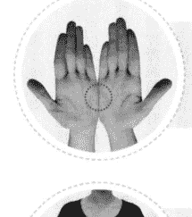

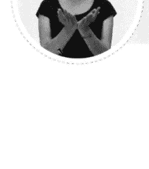

### 引導詞

1. 雖然我非常生氣，非常痛苦，非常不甘心，但我還是深深地愛我自己，百分之百地接受我自己，無條件地愛我自己，我相信只要我把我自己搞定，一切都會變得更好。

2. 雖然我非常非常地生氣，雖然我氣得快要爆炸了，雖然我非常痛苦，非常非常不甘心，甚至非常絕望，雖然我很害怕，我很擔心，但我還是深深地愛我自己，百分之百地接受我自己，無條件地愛我自己。因為我相信這只是一個過程，我願意面對所有的情緒，不管我是什麼樣的情緒，不管我多麼怨恨，我還是深深地愛我自己，百分之百地接受我自己，無條件地愛我自己。

3. 雖然我氣得要死，雖然我覺得這非常不公平，雖然我不知道為什麼會發生在我身上，雖然我非常痛苦，非常不甘心，雖然我很絕望，雖然我很害怕，我很擔心，但我還是深深地愛我自己，我相信一切的發生都有它的原因，那都是因為愛，我願意相信都是因為愛，我願意百分之百地接受這一切，我可以百分之百地接受這一切，雖然我覺得很難過，但我還是深深地愛我自己，我是一個好人，我相信我願意做一個好人，不管發生什麼事情，我都是對得起自己，我願意對得起自己，我願意無條件地愛我自己，我願意深深地愛我自己，我相信我是一個好人，不論發生什麼事情，我都是一個善良的好人，我願意盡力，我已經盡力了，所以那樣就OK了，我能做的也只是盡力，而我已經盡力了，所以我願意放下所有的虧欠，我願意放下所有的自責，我願意放下所有的憤怒，我願意放下所有對我有害的負面情緒，我相信我可以放下所有對我有害的負面情緒，因為我深深地愛我自己，因為我百分之百地接受我自己，因為我無條件地愛我自己。

### 第二次兩掌刀面相敲

現在，再次回到「兩掌刀面相敲」的步驟來，敲拍方法與第一次完全相同，請參考以下的引導詞，說出最適合你情境的話語，說話內容不限長短，同時，在說話的過程中請持續敲擊，直到說完你想說的話為止。

先深呼吸，然後開始。

### 引導詞

1. 雖然我不知道為什麼會發生這種事情，雖然我不知道為什麼會發生在我身上，但是我還是深深地愛我自己，百分之百地接受我自己，無條件地愛我自己，我相信一切的發生都是有原因的，我相信一切都是最好的發生，它是為了我的成長，為了我有更多的愛，所以我願意無條件地愛我自己。

2. 雖然我不知道為什麼發生這種事情，雖然我非常地怨，非常地生氣，雖然我非常地不甘心，雖然我覺得非常倒楣，怎麼會這個樣子，但我還是深深地愛我自己，百分之百地接受我自己，無條件地愛我自己，因為我知道這一切都是因為愛，只是我現在還不了解，我相信我會瞭解，我相信我會走出來。

3. 雖然我不知道為什麼會發生這種事情，雖然我不知道我難道真的這麼不值得嗎？雖然我對自己的看法現在非常非常地低微，雖然我非常生氣，雖然我不知道我在氣誰，雖然我非常怨恨，也許我怨恨我自己，也許我怨恨別人，雖然我非常地不甘心，雖然我擔心害怕，但我還是願意深深地愛我自己，我願意百分之百地接受我自己，我願意無條件地愛我自己。因為我相信宇宙裡有大愛；因為我相信我是值得被愛的；我相信這一切只是一個愛的過程；我相信這一切只是人生旅途的一小部分；我相信我可以走過去；我相信我身邊的資源很多；我相信這個工具可以幫助我很快地度過這一切痛苦、這一切挫折；我相信我值得被愛，我願意無條件地愛我自己，因為我是一個這麼值得愛的人，我是一個非常好的人，我是一個善良的人，所以我值得被愛。我願意深深地愛我自己，我願意無條件地愛我自己，我願意無條件地接受我自己，百分之百地接受我自己，我願意面對一切的挑戰，我願意相信我可以。雖然我被困在這個暗無天日的洞穴裡，但我願意相信洞外是一片光明，是一個新的天堂，我願意走出來，我願意接受一切的幫助，我願意學習更愛我自己，我相信我可以。

### 身體穴位敲擊點

完成了上一步驟之後，請依照以下順序敲拍身上的不同穴位，同樣的，以每秒二至三次的速度敲拍，每個穴位的敲拍時間約五至十秒，你不必精準地計算時間，也不必在意每個穴位敲拍的時間長度是否分秒不差，只要在大致的時間範圍內即可。如果將這些穴位都敲過一輪之後，你還沒說完該說或想說的話，那就從第一個穴位開始再敲一輪，如此往復循環，直到說完你想說的話為止。

- 在你敲擊眉間（單手）、眼尾（雙手或單手敲一邊亦可）、雙眼下眼瞼中央下方骨頭處（雙手或單手敲一邊亦可）、人中（單手）、下嘴唇下方凹陷處（單手）、鎖骨下方（雙手或單手敲一邊亦可）時，請將食指與中指併攏，以這兩個指頭的指尖輕輕敲擊；敲拍兩側肋骨時，請將兩隻手臂彎曲，利用兩手指尖或虎口敲腋下約三至五公分處（類似雙手叉腰的動作）；敲拍頭頂時，請以單手手掌輕輕敲拍即可。

如果你不知道該說什麼或怎麼說，請參考下節的引導詞，修改成適合你自己的話語即可。需特別注意的是，在這個釋放情緒的步驟中，請你想到什麼就講什麼，完全不要經過理智的修飾或過濾，讓你的潛意識盡情地釋放它真實的情緒與想法。如果你所說的話語是經過意識的修飾、抗拒或考慮的話，便無法達到真正的釋放效果，反而形成了壓力。即使剛開始時因為不熟悉這個方法而說得顛三倒四也無妨，重點是你的情緒必須完全到位，換言之，你的身體、情緒、話語在這個步驟中必須是三位一體的，完全進入到你所要釋放的情緒當中，這個釋放步驟才會有效。

現在，請邊說你想說的話，並且依照以下的順序敲拍，請記住，不必精準計算時間，每個穴位敲拍時間約五至十秒即可，在說話過程中不要停止敲拍：

- 眉間 → 兩側眼尾 → 雙眼下眼瞼中央下方骨頭處 → 人中 → 下嘴唇下方凹陷處 → 左右兩側鎖骨下 → 兩側腋下約三至五公分之肋骨處 → 頭頂。

### 身體穴位敲擊點

眉間

下嘴唇下方凹陷處

兩側眼尾

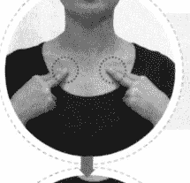

左右兩側鎖骨下

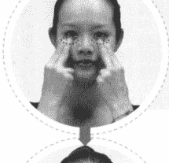

雙眼下眼瞼中央下方骨頭處

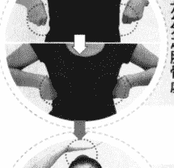

兩側腋下約三至五公分之肋骨處

人中

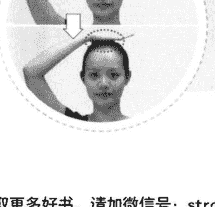

頭頂

### 引導詞

這個憤怒，這個痛苦，這個不甘心，這個絕望，這個害怕，這個擔心，壓得我受不了，我真的非常受不了，我難受得不得了，我願意釋放，雖然我好像沒辦法釋放，雖然我可能不想釋放，雖然我很害怕釋放，但是我相信我可以暫時釋放一下，我也相信我可以走出來，所以我現在可以試著釋放一下，把它擺在一邊，我願意讓我自己有一個喘息的機會，我願意休息一下，我實在背得太累了，我願意更愛我自己，我覺得我值得被愛，我願意瞭解這到底發生了什麼事情，我願意找到解決的方法，所以我現在願意把這些痛苦統統放在一邊，我願意把它釋放出來，我不願意再背了，如果我需要學到什麼，請你清楚明白地告訴我，如果我已經學到我該學的了，請你離開我，我不需要花那麼多能量來管理我的痛苦，我不需要花那麼多力氣來背這些感情的包袱，我相信我可以走出來，我願意相信我可以走出來，我結婚以前不是好好的活著嗎？我結婚以前難道沒有快樂過嗎？我相信我可以快樂起來。

我相信單身也是可以快樂的，雖然我不是一定要單身，但是單身還是可以快樂的，難道所有結婚的人就很快樂，就很滿足嗎？難道我以前結婚的時候就很快樂，就很滿足嗎？還有，有沒有再婚但是變得更快樂更幸福的人，我相信有的，我相信再婚也可以變得更幸福、更滿足、更快樂。

所以這個人等於我的幸福嗎？這個前夫，這個不愛我的人，這個已經不愛我的人，他等於我的幸福嗎？這個人等於我的快樂嗎？也許不等於，也許這是一件好事，也許不愛我的人根本就不該留在我身邊，也許舊的不去，新的不來。也許這對大家都好，也許緣盡了情就該了了，現在的痛苦只是我自己放不下罷了。也許生命就是要我練習放下。我相信我可以開始為自己而活，我相信我可以開始享受我的人生，因為我值得，因為我仍然是這麼的可愛，這麼的天真，這麼值得被寵愛，我可以享受我的興趣，我可以找回美麗可愛的自己，我可以去學跳舞，我可以去學唱歌，我可以去學畫畫，我可以開始旅行，我可以花更多時間與老朋友相處，我可以交很多很多的朋友，我可以去看我愛看的電影，我可以去發現我以前很希望發現，但是沒有機會發現的人生，我的生命正在開始，這是一個新的開始。

我相信我可以有一個更美麗更好的開始，我願意給我自己一個機會，我願意學到該學的，我願意成為一個更好的自己，我願意成為一個快樂的單身的人，我也願意有更大的吸引力，吸引適合的人，我相信他正在等我，我相信只要我準備好了，他就會出現，我相信宇宙的愛，我相信宇宙的大愛，我相信我值得被愛，我相信這個宇宙有更好的計畫，我相信這個宇宙有更適合的人在等著我，我相信有很多可供選擇，沒有必要擔心，只要我願意愛，只要我願意愛我自己，疼惜我自己，欣賞我自己，寵愛我自己，尊重我自己，我就會被愛，我就會被寵愛，我就會被諒解，我就會被尊重，我相信這一本書會是一個最好的開始，我相信如果她（Carol）可以，我也可以，我願意給我自己這個機會，因為我值得，謝謝你，我愛你，謝謝你，我愛你。

現在深呼吸。一手抓著另外一隻手腕，再一次深呼吸。第三次深呼吸。然後感覺一下全身，身體上有沒有哪些地方有特別的感覺？或者有壓力？或者是刺痛？接下來再看一下那個感覺，觀察一下，它是什麼樣的感覺？它如果有形狀的話，是什麼樣的形狀？它在哪裡？它如果有顏色的話，是什麼顏色？它如果可以碰觸的話，它的觸覺怎麼樣？是硬的？軟的？是大？是小？如果它有溫度的話，它的溫度如何？是冷？是熱？

現在對那個感覺開始敲打，也是從眉心開始，並跟那個感覺做一個小小的對話。

謝謝你，謝謝你讓我看到，謝謝你讓我看到我把壓力放在哪裡，謝謝你讓我知道我應該釋放什麼，謝謝你，我看到了，我看到了，如果你要告訴我什麼訊息，請你現在清楚明白的告訴我，如果沒有什麼特別要學習的，或者你要以後再告訴我，那也 OK，我願意釋放你，因為我知道你讓我看見就表示你已經準備好了，你已經準備好被釋放了，你已經準備好和我溝通了，謝謝你，我願意釋放你，謝謝你，我愛你，謝謝你，我愛你，謝謝你，我愛你，謝謝你，我愛你，謝謝你，我愛你，謝謝你，我愛你，謝謝你，我愛你，謝謝你，我愛你，謝謝你，我愛你，謝謝你，我愛你，謝謝你，我愛你，謝謝你，我愛你，謝謝你，我愛你，謝謝你，我愛你，謝謝你，我愛你，謝謝你，我愛你，謝謝你，我愛你，謝謝你，我愛你，謝謝你，我愛你，謝謝你，我愛你，謝謝你，我愛你，謝謝你，我愛你，謝謝你，我愛你，謝謝你，我愛你，謝謝你，我愛你，謝謝你，我愛你，謝謝你，我愛你，謝謝你，我愛你，謝謝你，我愛你，謝謝你，我愛你，謝謝你，我愛你，謝謝你，我愛你，謝謝你，我愛你，謝謝你，我愛你，謝謝你，我愛你，謝謝你，我愛你，謝謝你，我愛你，謝謝你，我愛你，謝謝你，我愛你，謝謝你，我愛你，謝謝你，我愛你，謝謝你，我愛你，謝謝你，我愛你，謝謝你，我愛你，謝謝你，我愛你，謝謝你，我愛你，謝謝你，我愛你，謝謝你，我愛你，謝謝你，我愛你，謝謝你，我愛你，謝謝你，我愛你，謝謝你，我愛你，謝謝你，我愛你，謝謝你，我愛你，謝謝你，我愛你，謝謝你，我愛你，謝謝你，我愛你，謝謝你，我愛你，謝謝你，我愛你，謝謝你，我愛你，謝謝你，我愛你，謝謝你，我愛你，謝謝你，我愛你，謝謝你，我愛你，謝謝你，我愛你，謝謝你，我愛你，謝謝你，我愛你，謝謝你，我愛你，謝謝你，我愛你，謝謝你，我愛你，謝謝你，我愛你，謝謝你，我愛你，謝謝你，我愛你，謝謝你，我愛你，謝謝你，我愛你，謝謝你，我愛你，謝謝你，我愛你，謝謝你，我愛你，謝謝你，我愛你，謝謝你，我愛你，謝謝你，我愛你，謝謝你，我愛你，謝謝你，我愛你，謝謝你，我愛你，謝謝你，我愛你，謝謝你，我愛你，謝謝你，我愛你，謝謝你，我愛你，謝謝你，我愛你，謝謝你，我愛你，謝謝你，我愛你，謝謝你，我愛你，謝謝你，我愛你，謝謝你，我愛你，謝謝你，我愛你，謝謝你，我愛你，謝謝你，我愛你，謝謝你，我愛你，謝謝你，我愛你，謝謝你，我愛你，謝謝你，我愛你，謝謝你，我愛你，謝謝你，我愛你，謝謝你，我愛你，謝謝你，我愛你，謝謝你，我愛你，謝謝你，我愛你，謝謝你，我愛你，謝謝你，我愛你，謝謝你，我愛你，謝謝你，我愛你，謝謝你，我愛你，謝謝你，我愛你，謝謝你，我愛你，謝謝你，我愛你，謝謝你，我愛你，謝謝你，我愛你，謝謝你，我愛你，謝謝你，我愛你，謝謝你，我愛你，謝謝你，我愛你，謝謝你，我愛你，謝謝你，我愛你，謝謝你，我愛你，謝謝你，我愛你，謝謝你，我愛你，謝謝你，我愛你，謝謝你，我愛你，謝謝你，我愛你，謝謝你，我愛你，謝謝你，我愛你，謝謝你，我愛你，謝謝你，我愛你，謝謝你，我愛你，謝謝你，我愛你，謝謝你，我愛你，謝謝你，我愛你，謝謝你，我愛你，謝謝你，我愛你，謝謝你，我愛你，謝謝你，我愛你，謝謝你，我愛你，謝謝你，我愛你，謝謝你，我愛你，謝謝你，我愛你，謝謝你，我愛你，謝謝你，我愛你，謝謝你，我愛你，謝謝你，我愛你，謝謝你，我愛你，謝謝你，我愛你，謝謝你，我愛你，謝謝你，我愛你，謝謝你，我愛你，謝謝你，我愛你，謝謝你，我愛你，謝謝你，我愛你，謝謝你，我愛你，謝謝你，我愛你，謝謝你，我愛你，謝謝你，我愛你，謝謝你，我愛你，謝謝你，我愛你，謝謝你，我愛你，謝謝你，我愛你，謝謝你，我愛你，謝謝你，我愛你，謝謝你，我愛你，謝謝你，我愛你，謝謝你，我愛你，謝謝你，我愛你，謝謝你，我愛你，謝謝你，我愛你，謝謝你，我愛你，謝謝你，我愛你，謝謝你，我愛你，謝謝你，我愛你，謝謝你，我愛你，謝謝你，我愛你，謝謝你，我愛你，謝謝你，我愛你，謝謝你，我愛你，謝謝你，我愛你，謝謝你，我愛你，謝謝你，我愛你，謝謝你，我愛你，謝謝你，我愛你，謝謝你，我愛你，謝謝你，我愛你，謝謝你，我愛你，謝謝你，我愛你，謝謝你，我愛你，謝謝你，我愛你，謝謝你，我愛你，謝謝你，我愛你，謝謝你，我愛你，謝謝你，我愛你，謝謝你，我愛你，謝謝你，我愛你，謝謝你，我愛你，謝謝你，我愛你，謝謝你，我愛你，謝謝你，我愛你，謝謝你，我愛你，謝謝你，我愛你，謝謝你，我愛你，謝謝你，我愛你，謝謝你，我愛你，謝謝你，我愛你，謝謝你，我愛你，謝謝你，我愛你，謝謝你，我愛你，謝謝你，我愛你，謝謝你，我愛你，謝謝你，我愛你，謝謝你，我愛你，謝謝你，我愛你，謝謝你，我愛你，謝謝你，我愛你，謝謝你，我愛你，謝謝你，我愛你，謝謝你，我愛你，謝謝你，我愛你，謝謝你，我愛你，謝謝你，我愛你，謝謝你，我愛你，謝謝你，我愛你，謝謝你，我愛你，謝謝你，我愛你，謝謝你，我愛你，謝謝你，我愛你，謝謝你，我愛你，謝謝你，我愛你，謝謝你，我愛你，謝謝你，我愛你，謝謝你，我愛你，謝謝你，我愛你，謝謝你，我愛你，謝謝你，我愛你，謝謝你，我愛你，謝謝你，我愛你，謝謝你，我愛你，謝謝你，我愛你，謝謝你，我愛你，謝謝你，我愛你，謝謝你，我愛你，謝謝你，我愛你，謝謝你，我愛你，謝謝你，我愛你，謝謝你，我愛你，謝謝你，我愛你，謝謝你，我愛你，謝謝你，我愛你，謝謝你，我愛你，謝謝你，我愛你，謝謝你，我愛你，謝謝你，我愛你，謝謝你，我愛你，謝謝你，我愛你，謝謝你，我愛你，謝謝你，我愛你，謝謝你，我愛你，謝謝你，我愛你，謝謝你，我愛你，謝謝你，我愛你，謝謝你，我愛你，謝謝你，我愛你，謝謝你，我愛你，謝謝你，我愛你，謝謝你，我愛你，謝謝你，我愛你，謝謝你，我愛你，謝謝你，我愛你，謝謝你，我愛你，謝謝你，我愛你，謝謝你，我愛你，謝謝你，我愛你，謝謝你，我愛你，謝謝你，我愛你，謝謝你，我愛你，謝謝你，我愛你，謝謝你，我愛你，謝謝你，我愛你，謝謝你，我愛你，謝謝你，我愛你，謝謝你，我愛你，謝謝你，我愛你，謝謝你，我愛你，謝謝你，我愛你，謝謝你，我愛你，謝謝你，我愛你，謝謝你，我愛你，謝謝你，我愛你，謝謝你，我愛你，謝謝你，我愛你，謝謝你，我愛你，謝謝你，我愛你，謝謝你，我愛你，謝謝你，我愛你，謝謝你，我愛你，謝謝你，我愛你，謝謝你，我愛你，謝謝你，我愛你，謝謝你，我愛你，謝謝你，我愛你，謝謝你，我愛你，謝謝你，我愛你，謝謝你，我愛你，謝謝你，我愛你，謝謝你，我愛你，謝謝你，我愛你，謝謝你，我愛你，謝謝你，我愛你，謝謝你，我愛你，謝謝你，我愛你，謝謝你，我愛你，謝謝你，我愛你，謝謝你，我愛你，謝謝你，我愛你，謝謝你，我愛你，謝謝你，我愛你，謝謝你，我愛你，謝謝你，我愛你，謝謝你，我愛你，謝謝你，我愛你，謝謝你，我愛你，謝謝你，我愛你，謝謝你，我愛你，謝謝你，我愛你，謝謝你，我愛你，謝謝你，我愛你，謝謝你，我愛你，謝謝你，我愛你，謝謝你，我愛你，謝謝你，我愛你，謝謝你，我愛你，謝謝你，我愛你，謝謝你，我愛你，謝謝你，我愛你，謝謝你，我愛你，謝謝你，我愛你，謝謝你，我愛你，謝謝你，我愛你，謝謝你，我愛你，謝謝你，我愛你，謝謝你，我愛你，謝謝你，我愛你，謝謝你，我愛你，謝謝你，我愛你，謝謝你，我愛你，謝謝你，我愛你，謝謝你，我愛你，謝謝你，我愛你，謝謝你，我愛你，謝謝你，我愛你，謝謝你，我愛你，謝謝你，我愛你，謝謝你，我愛你，謝謝你，我愛你，謝謝你，我愛你，謝謝你，我愛你，謝謝你，我愛你，謝謝你，我愛你，謝謝你，我愛你，謝謝你，我愛你，謝謝你，我愛你，謝謝你，我愛你，謝謝你，我愛你，謝謝你，我愛你，謝謝你，我愛你，謝謝你，我愛你，謝謝你，我愛你，謝謝你，我愛你，謝謝你，我愛你，謝謝你，我愛你，謝謝你，我愛你，謝謝你，我愛你，謝謝你，我愛你，謝謝你，我愛你，謝謝你，我愛你，謝謝你，我愛你，謝謝你，我愛你，謝謝你，我愛你，謝謝你，我愛你，謝謝你，我愛你，謝謝你，我愛你，謝謝你，我愛你，謝謝你，我愛你，謝謝你，我愛你，謝謝你，我愛你，謝謝你，我愛你，謝謝你，我愛你，謝謝你，我愛你，謝謝你，我愛你，謝謝你，我愛你，謝謝你，我愛你，謝謝你，我愛你，謝謝你，我愛你，謝謝你，我愛你，謝謝你，我愛你，謝謝你，我愛你，謝謝你，我愛你，謝謝你，我愛你，謝謝你，我愛你，謝謝你，我愛你，謝謝你，我愛你，謝謝你，我愛你，謝謝你，我愛你，謝謝你，我愛你，謝謝你，我愛你，謝謝你，我愛你，謝謝你，我愛你，謝謝你，我愛你，謝謝你，我愛你，謝謝你，我愛你，謝謝你，我愛你，謝謝你，我愛你，謝謝你，我愛你，謝謝你，我愛你，謝謝你，我愛你，謝謝你，我愛你，謝謝你，我愛你，謝謝你，我愛你，謝謝你，我愛你，謝謝你，我愛你，謝謝你，我愛你，謝謝你，我愛你，謝謝你，我愛你，謝謝你，我愛你，謝謝你，我愛你，謝謝你，我愛你，謝謝你，我愛你，謝謝你，我愛你，謝謝你，我愛你，謝謝你，我愛你，謝謝你，我愛你，謝謝你，我愛你，謝謝你，我愛你，謝謝你，我愛你，謝謝你，我愛你，謝謝你，我愛你，謝謝你，我愛你，謝謝你，我愛你，謝謝你，我愛你，謝謝你，我愛你，謝謝你，我愛你，謝謝你，我愛你，謝謝你，我愛你，謝謝你，我愛你，謝謝你，我愛你，謝謝你，我愛你，謝謝你，我愛你，謝謝你，我愛你，謝謝你，我愛你，謝謝你，我愛你，謝謝你，我愛你，謝謝你，我愛你，謝謝你，我愛你，謝謝你，我愛你，謝謝你，我愛你，謝謝你，我愛你，謝謝你，我愛你，謝謝你，我愛你，謝謝你，我愛你，謝謝你，我愛你，謝謝你，我愛你，謝謝你，我愛你，謝謝你，我愛你，謝謝你，我愛你，謝謝你，我愛你，謝謝你，我愛你，謝謝你，我愛你，謝謝你，我愛你，謝謝你，我愛你，謝謝你，我愛你，謝謝你，我愛你，謝謝你，我愛你，謝謝你，我愛你，謝謝你，我愛你，謝謝你，我愛你，謝謝你，我愛你，謝謝你，我愛你，謝謝你，我愛你，謝謝你，我愛你，謝謝你，我愛你，謝謝你，我愛你，謝謝你，我愛你，謝謝你，我愛你，謝謝你，我愛你，謝謝你，我愛你，謝謝你，我愛你，謝謝你，我愛你，謝謝你，我愛你，謝謝你，我愛你，謝謝你，我愛你，謝謝你，我愛你，謝謝你，我愛你，謝謝你，我愛你，謝謝你，我愛你，謝謝你，我愛你，謝謝你，我愛你，謝謝你，我愛你，謝謝你，我愛你，謝謝你，我愛你，謝謝你，我愛你，謝謝你，我愛你，謝謝你，我愛你，謝謝你，我愛你，謝謝你，我愛你，謝謝你，我愛你，謝謝你，我愛你，謝謝你，我愛你，謝謝你，我愛你，謝謝你，我愛你，謝謝你，我愛你，謝謝你，我愛你，謝謝你，我愛你，謝謝你，我愛你，謝謝你，我愛你，謝謝你，我愛你，謝謝你，我愛你，謝謝你，我愛你，謝謝你，我愛你，謝謝你，我愛你，謝謝你，我愛你，謝謝你，我愛你，謝謝你，我愛你，謝謝你，我愛你，謝謝你，我愛你，謝謝你，我愛你，謝謝你，我愛你，謝謝你，我愛你，謝謝你，我愛你，謝謝你，我愛你，謝謝你，我愛你，謝謝你，我愛你，謝謝你，我愛你，謝謝你，我愛你，謝謝你，我愛你，謝謝你，我愛你，謝謝你，我愛你，謝謝你，我愛你，謝謝你，我愛你，謝謝你，我愛你，謝謝你，我愛你，謝謝你，我愛你，謝謝你，我愛你，謝謝你，我愛你，謝謝你，我愛你，謝謝你，我愛你，謝謝你，我愛你，謝謝你，我愛你，謝謝你，我愛你，謝謝你，我愛你，謝謝你，我愛你，謝謝你，我愛你，謝謝你，我愛你，謝謝你，我愛你，謝謝你，我愛你，謝謝你，我愛你，謝謝你，我愛你，謝謝你，我愛你，謝謝你，我愛你，謝謝你，我愛你，謝謝你，我愛你，謝謝你，我愛你，謝謝你，我愛你，謝謝你，我愛你，謝謝你，我愛你，謝謝你，我愛你，謝謝你，我愛你，謝謝你，我愛你，謝謝你，我愛你，謝謝你，我愛你，謝謝你，我愛你，謝謝你，我愛你，謝謝你，我愛你，謝謝你，我愛你，謝謝你，我愛你，謝謝你，我愛你，謝謝你，我愛你，謝謝你，我愛你，謝謝你，我愛你，謝謝你，我愛你，謝謝你，我愛你，謝謝你，我愛你，謝謝你，我愛你，謝謝你，我愛你，謝謝你，我愛你，謝謝你，我愛你，謝謝你，我愛你，謝謝你，我愛你，謝謝你，我愛你，謝謝你，我愛你，謝謝你，我愛你，謝謝你，我愛你，謝謝你，我愛你，謝謝你，我愛你，謝謝你，我愛你，謝謝你，我愛你，謝謝你，我愛你，謝謝你，我愛你，謝謝你，我愛你，謝謝你，我愛你，謝謝你，我愛你，謝謝你，我愛你，謝謝你，我愛你，謝謝你，我愛你，謝謝你，我愛你，謝謝你，我愛你，謝謝你，我愛你，謝謝你，我愛你，謝謝你，我愛你，謝謝你，我愛你，謝謝你，我愛你，謝謝你，我愛你，謝謝你，我愛你，謝謝你，我愛你，謝謝你，我愛你，謝謝你，我愛你，謝謝你，我愛你，謝謝你，我愛你，謝謝你，我愛你，謝謝你，我愛你，謝謝你，我愛你，謝謝你，我愛你，謝謝你，我愛你，謝謝你，我愛你，謝謝你，我愛你，謝謝你，我愛你，謝謝你，我愛你，謝謝你，我愛你，謝謝你，我愛你，謝謝你，我愛你，謝謝你，我愛你，謝謝你，我愛你，謝謝你，我愛你，謝謝你，我愛你，謝謝你，我愛你，謝謝你，我愛你，謝謝你，我愛你，謝謝你，我愛你，謝謝你，我愛你，謝謝你，我愛你，謝謝你，我愛你，謝謝你，我愛你，謝謝你，我愛你，謝謝你，我愛你，謝謝你，我愛你，謝謝你，我愛你，謝謝你，我愛你，謝謝你，我愛你，謝謝你，我愛你，謝謝你，我愛你，謝謝你，我愛你，謝謝你，我愛你，謝謝你，我愛你，謝謝你，我愛你，謝謝你，我愛你，謝謝你，我愛你，謝謝你，我愛你，謝謝你，我愛你，謝謝你，我愛你，謝謝你，我愛你，謝謝你，我愛你，謝謝你，我愛你，謝謝你，我愛你，謝謝你，我愛你，謝謝你，我愛你，謝謝你，我愛你，謝謝你，我愛你，謝謝你，我愛你，謝謝你，我愛你，謝謝你，我愛你，謝謝你，我愛你，謝謝你，我愛你，謝謝你，我愛你，謝謝你，我愛你，謝謝你，我愛你，謝謝你，我愛你，謝謝你，我愛你，謝謝你，我愛你，謝謝你，我愛你，謝謝你，我愛你，謝謝你，我愛你，謝謝你，我愛你，謝謝你，我愛你，謝謝你，我愛你，謝謝你，我愛你，謝謝你，我愛你，謝謝你，我愛你，謝謝你，我愛你，謝謝你，我愛你，謝謝你，我愛你，謝謝你，我愛你，謝謝你，我愛你，謝謝你，我愛你，謝謝你，我愛你，謝謝你，我愛你，謝謝你，我愛你，謝謝你，我愛你，謝謝你，我愛你，謝謝你，我愛你，謝謝你，我愛你，謝謝你，我愛你，謝謝你，我愛你，謝謝你，我愛你，謝謝你，我愛你，謝謝你，我愛你，謝謝你，我愛你，謝謝你，我愛你，謝謝你，我愛你，謝謝你，我愛你，謝謝你，我愛你，謝謝你，我愛你，謝謝你，我愛你，謝謝你，我愛你，謝謝你，我愛你，謝謝你，我愛你，謝謝你，我愛你，謝謝你，我愛你，謝謝你，我愛你，謝謝你，我愛你，謝謝你，我愛你，謝謝你，我愛你，謝謝你，我愛你，謝謝你，我愛你，謝謝你，我愛你，謝謝你，我愛你，謝謝你，我愛你，謝謝你，我愛你，謝謝你，我愛你，謝謝你，我愛你，謝謝你，我愛你，謝謝你，我愛你，謝謝你，我愛你，謝謝你，我愛你，謝謝你，我愛你，謝謝你，我愛你，謝謝你，我愛你，謝謝你，我愛你，謝謝你，我愛你，謝謝你，我愛你，謝謝你，我愛你，謝謝你，我愛你，謝謝你，我愛你，謝謝你，我愛你，謝謝你，我愛你，謝謝你，我愛你，謝謝你，我愛你，謝謝你，我愛你，謝謝你，我愛你，謝謝你，我愛你，謝謝你，我愛你，謝謝你，我愛你，謝謝你，我愛你，謝謝你，我愛你，謝謝你，我愛你，謝謝你，我愛你，謝謝你，我愛你，謝謝你，我愛你，謝謝你，我愛你，謝謝你，我愛你，謝謝你，我愛你，謝謝你，我愛你，謝謝你，我愛你，謝謝你，我愛你，謝謝你，我愛你，謝謝你，我愛你，謝謝你，我愛你，謝謝你，我愛你，謝謝你，我愛你，謝謝你，我愛你，謝謝你，我愛你，謝謝你，我愛你，謝謝你，我愛你，謝謝你，我愛你，謝謝你，我愛你，謝謝你，我愛你，謝謝你，我愛你，謝謝你，我愛你，謝謝你，我愛你，謝謝你，我愛你，謝謝你，我愛你，謝謝你，我愛你，謝謝你，我愛你，謝謝你，我愛你，謝謝你，我愛你，謝謝你，我愛你，謝謝你，我愛你，謝謝你，我愛你，謝謝你，我愛你，謝謝你，我愛你，謝謝你，我愛你，謝謝你，我愛你，謝謝你，我愛你，謝謝你，我愛你，謝謝你，我愛你，謝謝你，我愛你，謝謝你，我愛你，謝謝你，我愛你，謝謝你，我愛你，謝謝你，我愛你，謝謝你，我愛你，謝謝你，我愛你，謝謝你，我愛你，謝謝你，我愛你，謝謝你，我愛你，謝謝你，我愛你，謝謝你，我愛你，謝謝你，我愛你，謝謝你，我愛你，謝謝你，我愛你，謝謝你，我愛你，謝謝你，我愛你，謝謝你，我愛你，謝謝你，我愛你，謝謝你，我愛你，謝謝你，我愛你，謝謝你，我愛你，謝謝你，我愛你，謝謝你，我愛你，謝謝你，我愛你，謝謝你，我愛你，謝謝你，我愛你，謝謝你，我愛你，謝謝你，我愛你，謝謝你，我愛你，謝謝你，我愛你，謝謝你，我愛你，謝謝你，我愛你，謝謝你，我愛你，謝謝你，我愛你，謝謝你，我愛你，謝謝你，我愛你，謝謝你，我愛你，謝謝你，我愛你，謝謝你，我愛你，謝謝你，我愛你，謝謝你，我愛你，謝謝你，我愛你，謝謝你，我愛你，謝謝你，我愛你，謝謝你，我愛你，謝謝你，我愛你，謝謝你，我愛你，謝謝你，我愛你，謝謝你，我愛你，謝謝你，我愛你，謝謝你，我愛你，謝謝你，我愛你，謝謝你，我愛你，謝謝你，我愛你，謝謝你，我愛你，謝謝你，我愛你，謝謝你，我愛你，謝謝你，我愛你，謝謝你，我愛你，謝謝你，我愛你，謝謝你，我愛你，謝謝你，我愛你，謝謝你，我愛你，謝謝你，我愛你，謝謝你，我愛你，謝謝你，我愛你，謝謝你，我愛你，謝謝你，我愛你，謝謝你，我愛你，謝謝你，我愛你，謝謝你，我愛你，謝謝你，我愛你，謝謝你，我愛你，謝謝你，我愛你，謝謝你，我愛你，謝謝你，我愛你，謝謝你，我愛你，謝謝你，我愛你，謝謝你，我愛你，謝謝你，我愛你，謝謝你，我愛你，謝謝你，我愛你，謝謝你，我愛你，謝謝你，我愛你，謝謝你，我愛你，謝謝你，我愛你，謝謝你，我愛你，謝謝你，我愛你，謝謝你，我愛你，謝謝你，我愛你，謝謝你，我愛你，謝謝你，我愛你，謝謝你，我愛你，謝謝你，我愛你，謝謝你，我愛你，謝謝你，我愛你，謝謝你，我愛你，謝謝你，我愛你，謝謝你，我愛你，謝謝你，我愛你，謝謝你，我愛你，謝謝你，我愛你，謝謝你，我愛你，謝謝你，我愛你，謝謝你，我愛你，謝謝你，我愛你，謝謝你，我愛你，謝謝你，我愛你，謝謝你，我愛你，謝謝你，我愛你，謝謝你，我愛你，謝謝你，我愛你，謝謝你，我愛你，謝謝你，我愛你，謝謝你，我愛你，謝謝你，我愛你，謝謝你，我愛你，謝謝你，我愛你，謝謝你，我愛你，謝謝你，我愛你，謝謝你，我愛你，謝謝你，我愛你，謝謝你，我愛你，謝謝你，我愛你，謝謝你，我愛你，謝謝你，我愛你，謝謝你，我愛你，謝謝你，我愛你，謝謝你，我愛你，謝謝你，我愛你，謝謝你，我愛你，謝謝你，我愛你，謝謝你，我愛你，謝謝你，我愛你，謝謝你，我愛你，謝謝你，我愛你，謝謝你，我愛你，謝謝你，我愛你，謝謝你，我愛你，謝謝你，我愛你，謝謝你，我愛你，謝謝你，我愛你，謝謝你，我愛你，謝謝你，我愛你，謝謝你，我愛你，謝謝你，我愛你，謝謝你，我愛你，謝謝你，我愛你，謝謝你，我愛你，謝謝你，我愛你，謝謝你，我愛你，謝謝你，我愛你，謝謝你，我愛你，謝謝你，我愛你，謝謝你，我愛你，謝謝你，我愛你，謝謝你，我愛你，謝謝你，我愛你，謝謝你，我愛你，謝謝你，我愛你，謝謝你，我愛你，謝謝你，我愛你，謝謝你，我愛你，謝謝你，我愛你，謝謝你，我愛你，謝謝你，我愛你，謝謝你，我愛你，謝謝你，我愛你，謝謝你，我愛你，謝謝你，我愛你，謝謝你，我愛你，謝謝你，我愛你，謝謝你，我愛你，謝謝你，我愛你，謝謝你，我愛你，謝謝你，我愛你，謝謝你，我愛你，謝謝你，我愛你，謝謝你，我愛你，謝謝你，我愛你，謝謝你，我愛你，謝謝你，我愛你，謝謝你，我愛你，謝謝你，我愛你，謝謝你，我愛你，謝謝你，我愛你，謝謝你，我愛你，謝謝你，我愛你，謝謝你，我愛你，謝謝你，我愛你，謝謝你，我愛你，謝謝你，我愛你，謝謝你，我愛你，謝謝你，我愛你，謝謝你，我愛你，謝謝你，我愛你，謝謝你，我愛你，謝謝你，我愛你，謝謝你，我愛你，謝謝你，我愛你，謝謝你，我愛你，謝謝你，我愛你，謝謝你，我愛你，謝謝你，我愛你，謝謝你，我愛你，謝謝你，我愛你，謝謝你，我愛你，謝謝你，我愛你，謝謝你，我愛你，謝謝你，我愛你，謝謝你，我愛你，謝謝你，我愛你，謝謝你，我愛你，謝謝你，我愛你，謝謝你，我愛你，謝謝你，我愛你，謝謝你，我愛你，謝謝你，我愛你，謝謝你，我愛你，謝謝你，我愛你，謝謝你，我愛你，謝謝你，我愛你，謝謝你，我愛你，謝謝你，我愛你，謝謝你，我愛你，謝謝你，我愛你，謝謝你，我愛你，謝謝你，我愛你，謝謝你，我愛你，謝謝你，我愛你，謝謝你，我愛你，謝謝你，我愛你，謝謝你，我愛你，謝謝你，我愛你，謝謝你，我愛你，謝謝你，我愛你，謝謝你，我愛你，謝謝你，我愛你，謝謝你，我愛你，謝謝你，我愛你，謝謝你，我愛你，謝謝你，我愛你，謝謝你，我愛你，謝謝你，我愛你，謝謝你，我愛你，謝謝你，我愛你，謝謝你，我愛你，謝謝你，我愛你，謝謝你，我愛你，謝謝你，我愛你，謝謝你，我愛你，謝謝你，我愛你，謝謝你，我愛你，謝謝你，我愛你，謝謝你，我愛你，謝謝你，我愛你，謝謝你，我愛你，謝謝你，我愛你，謝謝你，我愛你，謝謝你，我愛你，謝謝你，我愛你，謝謝你，我愛你，謝謝你，我愛你，謝謝你，我愛你，謝謝你，我愛你，謝謝你，我愛你，謝謝你，我愛你，謝謝你，我愛你，謝謝你，我愛你，謝謝你，我愛你，謝謝你，我愛你，謝謝你，我愛你，謝謝你，我愛你，謝謝你，我愛你，謝謝你，我愛你，謝謝你，我愛你，謝謝你，我愛你，謝謝你，我愛你，謝謝你，我愛你，謝謝你，我愛你，謝謝你，我愛你，謝謝你，我愛你，謝謝你，我愛你，謝謝你，我愛你，謝謝你，我愛你，謝謝你，我愛你，謝謝你，我愛你，謝謝你，我愛你，謝謝你，我愛你，謝謝你，我愛你，謝謝你，我愛你，謝謝你，我愛你，謝謝你，我愛你，謝謝你，我愛你，謝謝你，我愛你，謝謝你，我愛你，謝謝你，我愛你，謝謝你，我愛你，謝謝你，我愛你，謝謝你，我愛你，謝謝你，我愛你，謝謝你，我愛你，謝謝你，我愛你，謝謝你，我愛你，謝謝你，我愛你，謝謝你，我愛你，謝謝你，我愛你，謝謝你，我愛你，謝謝你，我愛你，謝謝你，我愛你，謝謝你，我愛你，謝謝你，我愛你，謝謝你，我愛你，謝謝你，我愛你，謝謝你，我愛你，謝謝你，我愛你，謝謝你，我愛你，謝謝你，我愛你，謝謝你，我愛你，謝謝你，我愛你，謝謝你，我愛你，謝謝你，我愛你，謝謝你，我愛你，謝謝你，我愛你，謝謝你，我愛你，謝謝你，我愛你，謝謝你，我愛你，謝謝你，我愛你，謝謝你，我愛你，謝謝你，我愛你，謝謝你，我愛你，謝謝你，我愛你，謝謝你，我愛你，謝謝你，我愛你，謝謝你，我愛你，謝謝你，我愛你，謝謝你，我愛你，謝謝你，我愛你，謝謝你，我愛你，謝謝你，我愛你，謝謝你，我愛你，謝謝你，我愛你，謝謝你，我愛你，謝謝你，我愛你，謝謝你，我愛你，謝謝你，我愛你，謝謝你，我愛你，謝謝你，我愛你，謝謝你，我愛你，謝謝你，我愛你，謝謝你，我愛你，謝謝你，我愛你，謝謝你，我愛你，謝謝你，我愛你，謝謝你，我愛你，謝謝你，我愛你，謝謝你，我愛你，謝謝你，我愛你，謝謝你，我愛你，謝謝你，我愛你，謝謝你，我愛你，謝謝你，我愛你，謝謝你，我愛你，謝謝你，我愛你，謝謝你，我愛你，謝謝你，我愛你，謝謝你，我愛你，謝謝你，我愛你，謝謝你，我愛你，謝謝你，我愛你，謝謝你，我愛你，謝謝你，我愛你，謝謝你，我愛你，謝謝你，我愛你，謝謝你，我愛你，謝謝你，我愛你，謝謝你，我愛你，謝謝你，我愛你，謝謝你，我愛你，謝謝你，我愛你，謝謝你，我愛你，謝謝你，我愛你，謝謝你，我愛你，謝謝你，我愛你，謝謝你，我愛你，謝謝你，我愛你，謝謝你，我愛你，謝謝你，我愛你，謝謝你，我愛你，謝謝你，我愛你，謝謝你，我愛你，謝謝你，我愛你，謝謝你，我愛你，謝謝你，我愛你，謝謝你，我愛你，謝謝你，我愛你，謝謝你，我愛你，謝謝你，我愛你，謝謝你，我愛你，謝謝你，我愛你，謝謝你，我愛你，謝謝你，我愛你，謝謝你，我愛你，謝謝你，我愛你，謝謝你，我愛你，謝謝你，我愛你，謝謝你，我愛你，謝謝你，我愛你，謝謝你，我愛你，謝謝你，我愛你，謝謝你，我愛你，謝謝你，我愛你，謝謝你，我愛你，謝謝你，我愛你，謝謝你，我愛你，謝謝你，我愛你，謝謝你，我愛你，謝謝你，我愛你，謝謝你，我愛你，謝謝你，我愛你，謝謝你，我愛你，謝謝你，我愛你，謝謝你，我愛你，謝謝你，我愛你，謝謝你，我愛你，謝謝你，我愛你，謝謝你，我愛你，謝謝你，我愛你，謝謝你，我愛你，謝謝你，我愛你，謝謝你，我愛你，謝謝你，我愛你，謝謝你，我愛你，謝謝你，我愛你，謝謝你，我愛你，謝謝你，我愛你，謝謝你，我愛你，謝謝你，我愛你，謝謝你，我愛你，謝謝你，我愛你，謝謝你，我愛你，謝謝你，我愛你，謝謝你，我愛你，謝謝你，我愛你，謝謝你，我愛你，謝謝你，我愛你，謝謝你，我愛你，謝謝你，我愛你，謝謝你，我愛你，謝謝你，我愛你，謝謝你，我愛你，謝謝你，我愛你，謝謝你，我愛你，謝謝你，我愛你，謝謝你，我愛你，謝謝你，我愛你，謝謝你，我愛你，謝謝你，我愛你，謝謝你，我愛你，謝謝你，我愛你，謝謝你，我愛你，謝謝你，我愛你，謝謝你，我愛你，謝謝你，我愛你，謝謝你，我愛你，謝謝你，我愛你，謝謝你，我愛你，謝謝你，我愛你，謝謝你，我愛你，謝謝你，我愛你，謝謝你，我愛你，謝謝你，我愛你，謝謝你，我愛你，謝謝你，我愛你，謝謝你，我愛你，謝謝你，我愛你，謝謝你，我愛你，謝謝你，我愛你，謝謝你，我愛你，謝謝你，我愛你，謝謝你，我愛你，謝謝你，我愛你，謝謝你，我愛你，謝謝你，我愛你，謝謝你，我愛你，謝謝你，我愛你，謝謝你，我愛你，謝謝你，我愛你，謝謝你，我愛你，謝謝你，我愛你，謝謝你，我愛你，謝謝你，我愛你，謝謝你，我愛你，謝謝你，我愛你，謝謝你，我愛你，謝謝你，我愛你，謝謝你，我愛你，謝謝你，我愛你，謝謝你，我愛你，謝謝你，我愛你，謝謝你，我愛你，謝謝你，我愛你，謝謝你，我愛你，謝謝你，我愛你，謝謝你，我愛你，謝謝你，我愛你，謝謝你，我愛你，謝謝你，我愛你，謝謝你，我愛你，謝謝你，我愛你，謝謝你，我愛你，謝謝你，我愛你，謝謝你，我愛你，謝謝你，我愛你，謝謝你，我愛你，謝謝你，我愛你，謝謝你，我愛你，謝謝你，我愛你，謝謝你，我愛你，謝謝你，我愛你，謝謝你，我愛你，謝謝你，我愛你，謝謝你，我愛你，謝謝你，我愛你，謝謝你，我愛你，謝謝你，我愛你，謝謝你，我愛你，謝謝你，我愛你，謝謝你，我愛你，謝謝你，我愛你，謝謝你，我愛你，謝謝你，我愛你，謝謝你，我愛你，謝謝你，我愛你，謝謝你，我愛你，謝謝你，我愛你，謝謝你，我愛你，謝謝你，我愛你，謝謝你，我愛你，謝謝你，我愛你，謝謝你，我愛你，謝謝你，我愛你，謝謝你，我愛你，謝謝你，我愛你，謝謝你，我愛你，謝謝你，我愛你，謝謝你，我愛你，謝謝你，我愛你，謝謝你，我愛你，謝謝你，我愛你，謝謝你，我愛你，謝謝你，我愛你，謝謝你，我愛你，謝謝你，我愛你，謝謝你，我愛你，謝謝你，我愛你，謝謝你，我愛你，謝謝你，我愛你，謝謝你，我愛你，謝謝你，我愛你，謝謝你，我愛你，謝謝你，我愛你，謝謝你，我愛你，謝謝你，我愛你，謝謝你，我愛你，謝謝你，我愛你，謝謝你，我愛你，謝謝你，我愛你，謝謝你，我愛你，謝謝你，我愛你，謝謝你，我愛你，謝謝你，我愛你，謝謝你，我愛你，謝謝你，我愛你，謝謝你，我愛你，謝謝你，我愛你，謝謝你，我愛你，謝謝你，我愛你，謝謝你，我愛你，謝謝你，我愛你，謝謝你，我愛你，謝謝你，我愛你，謝謝你，我愛你，謝謝你，我愛你，謝謝你，我愛你，謝謝你，我愛你，謝謝你，我愛你，謝謝你，我愛你，謝謝你，我愛你，謝謝你，我愛你，謝謝你，我愛你，謝謝你，我愛你，謝謝你，我愛你，謝謝你，我愛你，謝謝你，我愛你，謝謝你，我愛你，謝謝你，我愛你，謝謝你，我愛你，謝謝你，我愛你，謝謝你，我愛你，謝謝你，我愛你，謝謝你，我愛你，謝謝你，我愛你，謝謝你，我愛你，謝謝你，我愛你，謝謝你，我愛你，謝謝你，我愛你，謝謝你，我愛你，謝謝你，我愛你，謝謝你，我愛你，謝謝你，我愛你，謝謝你，我愛你，謝謝你，我愛你，謝謝你，我愛你，謝謝你，我愛你，謝謝你，我愛你，謝謝你，我愛你，謝謝你，我愛你，謝謝你，我愛你，謝謝你，我愛你，謝謝你，我愛你，謝謝你，我愛你，謝謝你，我愛你，謝謝你，我愛你，謝謝你，我愛你，謝謝你，我愛你，謝謝你，我愛你，謝謝你，我愛你，謝謝你，我愛你，謝謝你，我愛你，謝謝你，我愛你，謝謝你，我愛你，謝謝你，我愛你，謝謝你，我愛你，謝謝你，我愛你，謝謝你，我愛你，謝謝你，我愛你，謝謝你，我愛你，謝謝你，我愛你，謝謝你，我愛你，謝謝你，我愛你，謝謝你，我愛你，謝謝你，我愛你，謝謝你，我愛你，謝謝你，我愛你，謝謝你，我愛你，謝謝你，我愛你，謝謝你，我愛你，謝謝你，我愛你，謝謝你，我愛你，謝謝你，我愛你，謝謝你，我愛你，謝謝你，我愛你，謝謝你，我愛你，謝謝你，我愛你，謝謝你，我愛你，謝謝你，我愛你，謝謝你，我愛你，謝謝你，我愛你，謝謝你，我愛你，謝謝你，我愛你，謝謝你，我愛你，謝謝你，我愛你，謝謝你，我愛你，謝謝你，我愛你，謝謝你，我愛你，謝謝你，我愛你，謝謝你，我愛你，謝謝你，我愛你，謝謝你，我愛你，謝謝你，我愛你，謝謝你，我愛你，謝謝你，我愛你，謝謝你，我愛你，謝謝你，我愛你，謝謝你，我愛你，謝謝你，我愛你，謝謝你，我愛你，謝謝你，我愛你，謝謝你，我愛你，謝謝你，我愛你，謝謝你，我愛你，謝謝你，我愛你，謝謝你，我愛你，謝謝你，我愛你，謝謝你，我愛你，謝謝你，我愛你，謝謝你，我愛你，謝謝你，我愛你，謝謝你，我愛你，謝謝你，我愛你，謝謝你，我愛你，謝謝你，我愛你，謝謝你，我愛你，謝謝你，我愛你，謝謝你，我愛你，謝謝你，我愛你，謝謝你，我愛你，謝謝你，我愛你，謝謝你，我愛你，謝謝你，我愛你，謝謝你，我愛你，謝謝你，我愛你，謝謝你，我愛你，謝謝你，我愛你，謝謝你，我愛你，謝謝你，我愛你，謝謝你，我愛你，謝謝你，我愛你，謝謝你，我愛你，謝謝你，我愛你，謝謝你，我愛你，謝謝你，我愛你，謝謝你，我愛你，謝謝你，我愛你，謝謝你，我愛你，謝謝你，我愛你，謝謝你，我愛你，謝謝你，我愛你，謝謝你，我愛你，謝謝你，我愛你，謝謝你，我愛你，謝謝你，我愛你，謝謝你，我愛你，謝謝你，我愛你，謝謝你，我愛你，謝謝你，我愛你，謝謝你，我愛你，謝謝你，我愛你，謝謝你，我愛你，謝謝你，我愛你，謝謝你，我愛你，謝謝你，我愛你，謝謝你，我愛你，謝謝你，我愛你，謝謝你，我愛你，謝謝你，我愛你，謝謝你，我愛你，謝謝你，我愛你，謝謝你，我愛你，謝謝你，我愛你，謝謝你，我愛你，謝謝你，我愛你，謝謝你，我愛你，謝謝你，我愛你，謝謝你，我愛你，謝謝你，我愛你，謝謝你，我愛你，謝謝你，我愛你，謝謝你，我愛你，謝謝你，我愛你，謝謝你，我愛你，謝謝你，我愛你，謝謝你，我愛你，謝謝你，我愛你，謝謝你，我愛你，謝謝你，我愛你，謝謝你，我愛你，謝謝你，我愛你，謝謝你，我愛你，謝謝你，我愛你，謝謝你，我愛你，謝謝你，我愛你，謝謝你，我愛你，謝謝你，我愛你，謝謝你，我愛你，謝謝你，我愛你，謝謝你，我愛你，謝謝你，我愛你，謝謝你，我愛你，謝謝你，我愛你，謝謝你，我愛你，謝謝你，我愛你，謝謝你，我愛你，謝謝你，我愛你，謝謝你，我愛你，謝謝你，我愛你，謝謝你，我愛你，謝謝你，我愛你，謝謝你，我愛你，謝謝你，我愛你，謝謝你，我愛你，謝謝你，我愛你，謝謝你，我愛你，謝謝你，我愛你，謝謝你，我愛你，謝謝你，我愛你，謝謝你，我愛你，謝謝你，我愛你，謝謝你，我愛你，謝謝你，我愛你，謝謝你，我愛你，謝謝你，我愛你，謝謝你，我愛你，謝謝你，我愛你，謝謝你，我愛你，謝謝你，我愛你，謝謝你，我愛你，謝謝你，我愛你，謝謝你，我愛你，謝謝你，我愛你，謝謝你，我愛你，謝謝你，我愛你，謝謝你，我愛你，謝謝你，我愛你，謝謝你，我愛你，謝謝你，我愛你，謝謝你，我愛你，謝謝你，我愛你，謝謝你，我愛你，謝謝你，我愛你，謝謝你，我愛你，謝謝你，我愛你，謝謝你，我愛你，謝謝你，我愛你，謝謝你，我愛你，謝謝你，我愛你，謝謝你，我愛你，謝謝你，我愛你，謝謝你，我愛你，謝謝你，我愛你，謝謝你，我愛你，謝謝你，我愛你，謝謝你，我愛你，謝謝你，我愛你，謝謝你，我愛你，謝謝你，我愛你，謝謝你，我愛你，謝謝你，我愛你，謝謝你，我愛你，謝謝你，我愛你，謝謝你，我愛你，謝謝你，我愛你，謝謝你，我愛你，謝謝你，我愛你，謝謝你，我愛你，謝謝你，我愛你，謝謝你，我愛你，謝謝你，我愛你，謝謝你，我愛你，謝謝你，我愛你，謝謝你，我愛你，謝謝你，我愛你，謝謝你，我愛你，謝謝你，我愛你，謝謝你，我愛你，謝謝你，我愛你，謝謝你，我愛你，謝謝你，我愛你，謝謝你，我愛你，謝謝你，我愛你，謝謝你，我愛你，謝謝你，我愛你，謝謝你，我愛你，謝謝你，我愛你，謝謝你，我愛你，謝謝你，我愛你，謝謝你，我愛你，謝謝你，我愛你，謝謝你，我愛你，謝謝你，我愛你，謝謝你，我愛你，謝謝你，我愛你，謝謝你，我愛你，謝謝你，我愛你，謝謝你，我愛你，謝謝你，我愛你，謝謝你，我愛你，謝謝你，我愛你，謝謝你，我愛你，謝謝你，我愛你，謝謝你，我愛你，謝謝你，我愛你，謝謝你，我愛你，謝謝你，我愛你，謝謝你，我愛你，謝謝你，我愛你，謝謝你，我愛你，謝謝你，我愛你，謝謝你，我愛你，謝謝你，我愛你，謝謝你，我愛你，謝謝你，我愛你，謝謝你，我愛你，謝謝你，我愛你，謝謝你，我愛你，謝謝你，我愛你，謝謝你，我愛你，謝謝你，我愛你，謝謝你，我愛你，謝謝你，我愛你，謝謝你，我愛你，謝謝你，我愛你，謝謝你，我愛你，謝謝你，我愛你，謝謝你，我愛你，謝謝你，我愛你，謝謝你，我愛你，謝謝你，我愛你，謝謝你，我愛你，謝謝你，我愛你，謝謝你，我愛你，謝謝你，我愛你，謝謝你，我愛你，謝謝你，我愛你，謝謝你，我愛你，謝謝你，我愛你，謝謝你，我愛你，謝謝你，我愛你，謝謝你，我愛你，謝謝你，我愛你，謝謝你，我愛你，謝謝你，我愛你，謝謝你，我愛你，謝謝你，我愛你，謝謝你，我愛你，謝謝你，我愛你，謝謝你，我愛你，謝謝你，我愛你，謝謝你，我愛你，謝謝你，我愛你，謝謝你，我愛你，謝謝你，我愛你，謝謝你，我愛你，謝謝你，我愛你，謝謝你，我愛你，謝謝你，我愛你，謝謝你，我愛你，謝謝你，我愛你，謝謝你，我愛你，謝謝你，我愛你，謝謝你，我愛你，謝謝你，我愛你，謝謝你，我愛你，謝謝你，我愛你，謝謝你，我愛你，謝謝你，我愛你，謝謝你，我愛你，謝謝你，我愛你，謝謝你，我愛你，謝謝你，我愛你，謝謝你，我愛你，謝謝你，我愛你，謝謝你，我愛你，謝謝你，我愛你，謝謝你，我愛你，謝謝你，我愛你，謝謝你，我愛你，謝謝你，我愛你，謝謝你，我愛你，謝謝你，我愛你，謝謝你，我愛你，謝謝你，我愛你，謝謝你，我愛你，謝謝你，我愛你，謝謝你，我愛你，謝謝你，我愛你，謝謝你，我愛你，謝謝你，我愛你，謝謝你，我愛你，謝謝你，我愛你，謝謝你，我愛你，謝謝你，我愛你，謝謝你，我愛你，謝謝你，我愛你，謝謝你，我愛你，謝謝你，我愛你，謝謝你，我愛你，謝謝你，我愛你，謝謝你，我愛你，謝謝你，我愛你，謝謝你，我愛你，謝謝你，我愛你，謝謝你，我愛你，謝謝你，我愛你，謝謝你，我愛你，謝謝你，我愛你，謝謝你，我愛你，謝謝你，我愛你，謝謝你，我愛你，謝謝你，我愛你，謝謝你，我愛你，謝謝你，我愛你，謝謝你，我愛你，謝謝你，我愛你，謝謝你，我愛你，謝謝你，我愛你，謝謝你，我愛你，謝謝你，我愛你，謝謝你，我愛你，謝謝你，我愛你，謝謝你，我愛你，謝謝你，我愛你，謝謝你，我愛你，謝謝你，我愛你，謝謝你，我愛你，謝謝你，我愛你，謝謝你，我愛你，謝謝你，我愛你，謝謝你，我愛你，謝謝你，我愛你，謝謝你，我愛你，謝謝你，我愛你，謝謝你，我愛你，謝謝你，我愛你，謝謝你，我愛你，謝謝你，我愛你，謝謝你，我愛你，謝謝你，我愛你，謝謝你，我愛你，謝謝你，我愛你，謝謝你，我愛你，謝謝你，我愛你，謝謝你，我愛你，謝謝你，我愛你，謝謝你，我愛你，謝謝你，我愛你，謝謝你，我愛你，謝謝你，我愛你，謝謝你，我愛你，謝謝你，我愛你，謝謝你，我愛你，謝謝你，我愛你，謝謝你，我愛你，謝謝你，我愛你，謝謝你，我愛你，謝謝你，我愛你，謝謝你，我愛你，謝謝你，我愛你，謝謝你，我愛你，謝謝你，我愛你，謝謝你，我愛你，謝謝你，我愛你，謝謝你，我愛你，謝謝你，我愛你，謝謝你，我愛你，謝謝你，我愛你，謝謝你，我愛你，謝謝你，我愛你，謝謝你，我愛你，謝謝你，我愛你，謝謝你，我愛你，謝謝你，我愛你，謝謝你，我愛你，謝謝你，我愛你，謝謝你，我愛你，謝謝你，我愛你，謝謝你，我愛你，謝謝你，我愛你，謝謝你，我愛你，謝謝你，我愛你，謝謝你，我愛你，謝謝你，我愛你，謝謝你，我愛你，謝謝你，我愛你，謝謝你，我愛你，謝謝你，我愛你，謝謝你，我愛你，謝謝你，我愛你，謝謝你，我愛你，謝謝你，我愛你，謝謝你，我愛你，謝謝你，我愛你，謝謝你，我愛你，謝謝你，我愛你，謝謝你，我愛你，謝謝你，我愛你，謝謝你，我愛你，謝謝你，我愛你，謝謝你，我愛你，謝謝你，我愛你，謝謝你，我愛你，謝謝你，我愛你，謝謝你，我愛你，謝謝你，我愛你，謝謝你，我愛你，謝謝你，我愛你，謝謝你，我愛你，謝謝你，我愛你，謝謝你，我愛你，謝謝你，我愛你，謝謝你，我愛你，謝謝你，我愛你，謝謝你，我愛你，謝謝你，我愛你，謝謝你，我愛你，謝謝你，我愛你，謝謝你，我愛你，謝謝你，我愛你，謝謝你，我愛你，謝謝你，我愛你，謝謝你，我愛你，謝謝你，我愛你，謝謝你，我愛你，謝謝你，我愛你，謝謝你，我愛你，謝謝你，我愛你，謝謝你，我愛你，謝謝你，我愛你，謝謝你，我愛你，謝謝你，我愛你，謝謝你，我愛你，謝謝你，我愛你，謝謝你，我愛你，謝謝你，我愛你，謝謝你，我愛你，謝謝你，我愛你，謝謝你，我愛你，謝謝你，我愛你，謝謝你，我愛你，謝謝你，我愛你，謝謝你，我愛你，謝謝你，我愛你，謝謝你，我愛你，謝謝你，我愛你，謝謝你，我愛你，謝謝你，我愛你，謝謝你，我愛你，謝謝你，我愛你，謝謝你，我愛你，謝謝你，我愛你，謝謝你，我愛你，謝謝你，我愛你，謝謝你，我愛你，謝謝你，我愛你，謝謝你，我愛你，謝謝你，我愛你，謝謝你，我愛你，謝謝你，我愛你，謝謝你，我愛你，謝謝你，我愛你，謝謝你，我愛你，謝謝你，我愛你，謝謝你，我愛你，謝謝你，我愛你，謝謝你，我愛你，謝謝你，我愛你，謝謝你，我愛你，謝謝你，我愛你，謝謝你，我愛你，謝謝你，我愛你，謝謝你，我愛你，謝謝你，我愛你，謝謝你，我愛你，謝謝你，我愛你，謝謝你，我愛你，謝謝你，我愛你，謝謝你，我愛你，謝謝你，我愛你，謝謝你，我愛你，謝謝你，我愛你，謝謝你，我愛你，謝謝你，我愛你，謝謝你，我愛你，謝謝你，我愛你，謝謝你，我愛你，謝謝你，我愛你，謝謝你，我愛你，謝謝你，我愛你，謝謝你，我愛你，謝謝你，我愛你，謝謝你，我愛你，謝謝你，我愛你，謝謝你，我愛你，謝謝你，我愛你，謝謝你，我愛你，謝謝你，我愛你，謝謝你，我愛你，謝謝你，我愛你，謝謝你，我愛你，謝謝你，我愛你，謝謝你，我愛你，謝謝你，我愛你，謝謝你，我愛你，謝謝你，我愛你，謝謝你，我愛你，謝謝你，我愛你，謝謝你，我愛你，謝謝你，我愛你，謝謝你，我愛你，謝謝你，我愛你，謝謝你，我愛你，謝謝你，我愛你，謝謝你，我愛你，謝謝你，我愛你，謝謝你，我愛你，謝謝你，我愛你，謝謝你，我愛你，謝謝你，我愛你，謝謝你，我愛你，謝謝你，我愛你，謝謝你，我愛你，謝謝你，我愛你，謝謝你，我愛你，謝謝你，我愛你，謝謝你，我愛你，謝謝你，我愛你，謝謝你，我愛你，謝謝你，我愛你，謝謝你，我愛你，謝謝你，我愛你，謝謝你，我愛你，謝謝你，我愛你，謝謝你，我愛你，謝謝你，我愛你，謝謝你，我愛你，謝謝你，我愛你，謝謝你，我愛你，謝謝你，我愛你，謝謝你，我愛你，謝謝你，我愛你，謝謝你，我愛你，謝謝你，我愛你，謝謝你，我愛你，謝謝你，我愛你，謝謝你，我愛你，謝謝你，我愛你，謝謝你，我愛你，謝謝你，我愛你，謝謝你，我愛你，謝謝你，我愛你，謝謝你，我愛你，謝謝你，我愛你，謝謝你，我愛你，謝謝你，我愛你，謝謝你，我愛你，謝謝你，我愛你，謝謝你，我愛你，謝謝你，我愛你，謝謝你，我愛你，謝謝你，我愛你，謝謝你，我愛你，謝謝你，我愛你，謝謝你，我愛你，謝謝你，我愛你，謝謝你，我愛你，謝謝你，我愛你，謝謝你，我愛你，謝謝你，我愛你，謝謝你，我愛你，謝謝你，我愛你，謝謝你，我愛你，謝謝你，我愛你，謝謝你，我愛你，謝謝你，我愛你，謝謝你，我愛你，謝謝你，我愛你，謝謝你，我愛你，謝謝你，我愛你，謝謝你，我愛你，謝謝你，我愛你，謝謝你，我愛你，謝謝你，我愛你，謝謝你，我愛你，謝謝你，我愛你，謝謝你，我愛你，謝謝你，我愛你，謝謝你，我愛你，謝謝你，我愛你，謝謝你，我愛你，謝謝你，我愛你，謝謝你，我愛你，謝謝你，我愛你，謝謝你，我愛你，謝謝你，我愛你，謝謝你，我愛你，謝謝你，我愛你，謝謝你，我愛你，謝謝你，我愛你，謝謝你，我愛你，謝謝你，我愛你，謝謝你，我愛你，謝謝你，我愛你，謝謝你，我愛你，謝謝你，我愛你，謝謝你，我愛你，謝謝你，我愛你，謝謝你，我愛你，謝謝你，我愛你，謝謝你，我愛你，謝謝你，我愛你，謝謝你，我愛你，謝謝你，我愛你，謝謝你，我愛你，謝謝你，我愛你，謝謝你，我愛你，謝謝你，我愛你，謝謝你，我愛你，謝謝你，我愛你，謝謝你，我愛你，謝謝你，我愛你，謝謝你，我愛你，謝謝你，我愛你，謝謝你，我愛你，謝謝你，我愛你，謝謝你，我愛你，謝謝你，我愛你，謝謝你，我愛你，謝謝你，我愛你，謝謝你，我愛你，謝謝你，我愛你，謝謝你，我愛你，謝謝你，我愛你，謝謝你，我愛你，謝謝你，我愛你，謝謝你，我愛你，謝謝你，我愛你，謝謝你，我愛你，謝謝你，我愛你，謝謝你，我愛你，謝謝你，我愛你，謝謝你，我愛你，謝謝你，我愛你，謝謝你，我愛你，謝謝你，我愛你，謝謝你，我愛你，謝謝你，我愛你，謝謝你，我愛你，謝謝你，我愛你，謝謝你，我愛你，謝謝你，我愛你，謝謝你，我愛你，謝謝你，我愛你，謝謝你，我愛你，謝謝你，我愛你，謝謝你，我愛你，謝謝你，我愛你，謝謝你，我愛你，謝謝你，我愛你，謝謝你，我愛你，謝謝你，我愛你，謝謝你，我愛你，謝謝你，我愛你，謝謝你，我愛你，謝謝你，我愛你，謝謝你，我愛你，謝謝你，我愛你，謝謝你，我愛你，謝謝你，我愛你，謝謝你，我愛你，謝謝你，我愛你，謝謝你，我愛你，謝謝你，我愛你，謝謝你，我愛你，謝謝你，我愛你，謝謝你，我愛你，謝謝你，我愛你，謝謝你，我愛你，謝謝你，我愛你，謝謝你，我愛你，謝謝你，我愛你，謝謝你，我愛你，謝謝你，我愛你，謝謝你，我愛你，謝謝你，我愛你，謝謝你，我愛你，謝謝你，我愛你，謝謝你，我愛你，謝謝你，我愛你，謝謝你，我愛你，謝謝你，我愛你，謝謝你，我愛你，謝謝你，我愛你，謝謝你，我愛你，謝謝你，我愛你，謝謝你，我愛你，謝謝你，我愛你，謝謝你，我愛你，謝謝你，我愛你，謝謝你，我愛你，謝謝你，我愛你，謝謝你，我愛你，謝謝你，我愛你，謝謝你，我愛你，謝謝你，我愛你，謝謝你，我愛你，謝謝你，我愛你，謝謝你，我愛你，謝謝你，我愛你，謝謝你，我愛你，謝謝你，我愛你，謝謝你，我愛你，謝謝你，我愛你，謝謝你，我愛你，謝謝你，我愛你，謝謝你，我愛你，謝謝你，我愛你，謝謝你，我愛你，謝謝你，我愛你，謝謝你，我愛你，謝謝你，我愛你，謝謝你，我愛你，謝謝你，我愛你，謝謝你，我愛你，謝謝你，我愛你，謝謝你，我愛你，謝謝你，我愛你，謝謝你，我愛你，謝謝你，我愛你，謝謝你，我愛你，謝謝你，我愛你，謝謝你，我愛你，謝謝你，我愛你，謝謝你，我愛你，謝謝你，我愛你，謝謝你，我愛你，謝謝你，我愛你，謝謝你，我愛你，謝謝你，我愛你，謝謝你，我愛你，謝謝你，我愛你，謝謝你，我愛你，謝謝你，我愛你，謝謝你，我愛你，謝謝你，我愛你，謝謝你，我愛你，謝謝你，我愛你，謝謝你，我愛你，謝謝你，我愛你，謝謝你，我愛你，謝謝你，我愛你，謝謝你，我愛你，謝謝你，我愛你，謝謝你，我愛你，謝謝你，我愛你，謝謝你，我愛你，謝謝你，我愛你，謝謝你，我愛你，謝謝你，我愛你，謝謝你，我愛你，謝謝你，我愛你，謝謝你，我愛你，謝謝你，我愛你，謝謝你，我愛你，謝謝你，我愛你，謝謝你，我愛你，謝謝你，我愛你，謝謝你，我愛你，謝謝你，我愛你，謝謝你，我愛你，謝謝你，我愛你，謝謝你，我愛你，謝謝你，我愛你，謝謝你，我愛你，謝謝你，我愛你，謝謝你，我愛你，謝謝你，我愛你，謝謝你，我愛你，謝謝你，我愛你，謝謝你，我愛你，謝謝你，我愛你，謝謝你，我愛你，謝謝你，我愛你，謝謝你，我愛你，謝謝你，我愛你，謝謝你，我愛你，謝謝你，我愛你，謝謝你，我愛你，謝謝你，我愛你，謝謝你，我愛你，謝謝你，我愛你，謝謝你，我愛你，謝謝你，我愛你，謝謝你，我愛你，謝謝你，我愛你，謝謝你，我愛你，謝謝你，我愛你，謝謝你，我愛你，謝謝你，我愛你，謝謝你，我愛你，謝謝你，我愛你，謝謝你，我愛你，謝謝你，我愛你，謝謝你，我愛你，謝謝你，我愛你，謝謝你，我愛你，謝謝你，我愛你，謝謝你，我愛你，謝謝你，我愛你，謝謝你，我愛你，謝謝你，我愛你，謝謝你，我愛你，謝謝你，我愛你，謝謝你，我愛你，謝謝你，我愛你，謝謝你，我愛你，謝謝你，我愛你，謝謝你，我愛你，謝謝你，我愛你，謝謝你，我愛你，謝謝你，我愛你，謝謝你，我愛你，謝謝你，我愛你，謝謝你，我愛你，謝謝你，我愛你，謝謝你，我愛你，謝謝你，我愛你，謝謝你，我愛你，謝謝你，我愛你，謝謝你，我愛你，謝謝你，我愛你，謝謝你，我愛你，謝謝你，我愛你，謝謝你，我愛你，謝謝你，我愛你，謝謝你，我愛你，謝謝你，我愛你，謝謝你，我愛你，謝謝你，我愛你，謝謝你，我愛你，謝謝你，我愛你，謝謝你，我愛你，謝謝你，我愛你，謝謝你，我愛你，謝謝你，我愛你，謝謝你，我愛你，謝謝你，我愛你，謝謝你，我愛你，謝謝你，我愛你，謝謝你，我愛你，謝謝你，我愛你，謝謝你，我愛你，謝謝你，我愛你，謝謝你，我愛你，謝謝你，我愛你，謝謝你，我愛你，謝謝你，我愛你，謝謝你，我愛你，謝謝你，我愛你，謝謝你，我愛你，謝謝你，我愛你，謝謝你，我愛你，謝謝你，我愛你，謝謝你，我愛你，謝謝你，我愛你，謝謝你，我愛你，謝謝你，我愛你，謝謝你，我愛你，謝謝你，我愛你，謝謝你，我愛你，謝謝你，我愛你，謝謝你，我愛你，謝謝你，我愛你，謝謝你，我愛你，謝謝你，我愛你，謝謝你，我愛你，謝謝你，我愛你，謝謝你，我愛你，謝謝你，我愛你，謝謝你，我愛你，謝謝你，我愛你，謝謝你，我愛你，謝謝你，我愛你，謝謝你，我愛你，謝謝你，我愛你，謝謝你，我愛你，謝謝你，我愛你，謝謝你，我愛你，謝謝你，我愛你，謝謝你，我愛你，謝謝你，我愛你，謝謝你，我愛你，謝謝你，我愛你，謝謝你，我愛你，謝謝你，我愛你，謝謝你，我愛你，謝謝你，我愛你，謝謝你，我愛你，謝謝你，我愛你，謝謝你，我愛你，謝謝你，我愛你，謝謝你，我愛你，謝謝你，我愛你，謝謝你，我愛你，謝謝你，我愛你，謝謝你，我愛你，謝謝你，我愛你，謝謝你，我愛你，謝謝你，我愛你，謝謝你，我愛你，謝謝你，我愛你，謝謝你，我愛你，謝謝你，我愛你，謝謝你，我愛你，謝謝你，我愛你，謝謝你，我愛你，謝謝你，我愛你，謝謝你，我愛你，謝謝你，我愛你，謝謝你，我愛你，謝謝你，我愛你，謝謝你，我愛你，謝謝你，我愛你，謝謝你，我愛你，謝謝你，我愛你，謝謝你，我愛你，謝謝你，我愛你，謝謝你，我愛你，謝謝你，我愛你，謝謝你，我愛你，謝謝你，我愛你，謝謝你，我愛你，謝謝你，我愛你，謝謝你，我愛你，謝謝你，我愛你，謝謝你，我愛你，謝謝你，我愛你，謝謝你，我愛你，謝謝你，我愛你，謝謝你，我愛你，謝謝你，我愛你，謝謝你，我愛你，謝謝你，我愛你，謝謝你，我愛你，謝謝你，我愛你，謝謝你，我愛你，謝謝你，我愛你，謝謝你，我愛你，謝謝你，我愛你，謝謝你，我愛你，謝謝你，我愛你，謝謝你，我愛你，謝謝你，我愛你，謝謝你，我愛你，謝謝你，我愛你，謝謝你，我愛你，謝謝你，我愛你，謝謝你，我愛你，謝謝你，我愛你，謝謝你，我愛你，謝謝你，我愛你，謝謝你，我愛你，謝謝你，我愛你，謝謝你，我愛你，謝謝你，我愛你，謝謝你，我愛你，謝謝你，我愛你，謝謝你，我愛你，謝謝你，我愛你，謝謝你，我愛你，謝謝你，我愛你，謝謝你，我愛你，謝謝你，我愛你，謝謝你，我愛你，謝謝你，我愛你，謝謝你，我愛你，謝謝你，我愛你，謝謝你，我愛你，謝謝你，我愛你，謝謝你，我愛你，謝謝你，我愛你，謝謝你，我愛你，謝謝你，我愛你，謝謝你，我愛你，謝謝你，我愛你，謝謝你，我愛你，謝謝你，我愛你，謝謝你，我愛你，謝謝你，我愛你，謝謝你，我愛你，謝謝你，我愛你，謝謝你，我愛你，謝謝你，我愛你，謝謝你，我愛你，謝謝你，我愛你，謝謝你，我愛你，謝謝你，我愛你，謝謝你，我愛你，謝謝你，我愛你，謝謝你，我愛你，謝謝你，我愛你，謝謝你，我愛你，謝謝你，我愛你，謝謝你，我愛你，謝謝你，我愛你，謝謝你，我愛你，謝謝你，我愛你，謝謝你，我愛你，謝謝你，我愛你，謝謝你，我愛你，謝謝你，我愛你，謝謝你，我愛你，謝謝你，我愛你，謝謝你，我愛你，謝謝你，我愛你，謝謝你，我愛你，謝謝你，我愛你，謝謝你，我愛你，謝謝你，我愛你，謝謝你，我愛你，謝謝你，我愛你，謝謝你，我愛你，謝謝你，我愛你，謝謝你，我愛你，謝謝你，我愛你，謝謝你，我愛你，謝謝你，我愛你，謝謝你，我愛你，謝謝你，我愛你，謝謝你，我愛你，謝謝你，我愛你，謝謝你，我愛你，謝謝你，我愛你，謝謝你，我愛你，謝謝你，我愛你，謝謝你，我愛你，謝謝你，我愛你，謝謝你，我愛你，謝謝你，我愛你，謝謝你，我愛你，謝謝你，我愛你，謝謝你，我愛你，謝謝你，我愛你，謝謝你，我愛你，謝謝你，我愛你，謝謝你，我愛你，謝謝你，我愛你，謝謝你，我愛你，謝謝你，我愛你，謝謝你，我愛你，謝謝你，我愛你，謝謝你，我愛你，謝謝你，我愛你，謝謝你，我愛你，謝謝你，我愛你，謝謝你，我愛你，謝謝你，我愛你，謝謝你，我愛你，謝謝你，我愛你，謝謝你，我愛你，謝謝你，我愛你，謝謝你，我愛你，謝謝你，我愛你，謝謝你，我愛你，謝謝你，我愛你，謝謝你，我愛你，謝謝你，我愛你，謝謝你，我愛你，謝謝你，我愛你，謝謝你，我愛你，謝謝你，我愛你，謝謝你，我愛你，謝謝你，我愛你，謝謝你，我愛你，謝謝你，我愛你，謝謝你，我愛你，謝謝你，我愛你，謝謝你，我愛你，謝謝你，我愛你，謝謝你，我愛你，謝謝你，我愛你，謝謝你，我愛你，謝謝你，我愛你，謝謝你，我愛你，謝謝你，我愛你，謝謝你，我愛你，謝謝你，我愛你，謝謝你，我愛你，謝謝你，我愛你，謝謝你，我愛你，謝謝你，我愛你，謝謝你，我愛你，謝謝你，我愛你，謝謝你，我愛你，謝謝你，我愛你，謝謝你，我愛你，謝謝你，我愛你，謝謝你，我愛你，謝謝你，我愛你，謝謝你，我愛你，謝謝你，我愛你，謝謝你，我愛你，謝謝你，我愛你，謝謝你，我愛你，謝謝你，我愛你，謝謝你，我愛你，謝謝你，我愛你，謝謝你，我愛你，謝謝你，我愛你，謝謝你，我愛你，謝謝你，我愛你，謝謝你，我愛你，謝謝你，我愛你，謝謝你，我愛你，謝謝你，我愛你，謝謝你，我愛你，謝謝你，我愛你，謝謝你，我愛你，謝謝你，我愛你，謝謝你，我愛你，謝謝你，我愛你，謝謝你，我愛你，謝謝你，我愛你，謝謝你，我愛你，謝謝你，我愛你，謝謝你，我愛你，謝謝你，我愛你，謝謝你，我愛你，謝謝你，我愛你，謝謝你，我愛你，謝謝你，我愛你，謝謝你，我愛你，謝謝你，我愛你，謝謝你，我愛你，謝謝你，我愛你，謝謝你，我愛你，謝謝你，我愛你，謝謝你，我愛你，謝謝你，我愛你，謝謝你，我愛你，謝謝你，我愛你，謝謝你，我愛你，謝謝你，我愛你，謝謝你，我愛你，謝謝你，我愛你，謝謝你，我愛你，謝謝你，我愛你，謝謝你，我愛你，謝謝你，我愛你，謝謝你，我愛你，謝謝你，我愛你，謝謝你，我愛你，謝謝你，我愛你，謝謝你，我愛你，謝謝你，我愛你，謝謝你，我愛你，謝謝你，我愛你，謝謝你，我愛你，謝謝你，我愛你，謝謝你，我愛你，謝謝你，我愛你，謝謝你，我愛你，謝謝你，我愛你，謝謝你，我愛你，謝謝你，我愛你，謝謝你，我愛你，謝謝你，我愛你，謝謝你，我愛你，謝謝你，我愛你，謝謝你，我愛你，謝謝你，我愛你，謝謝你，我愛你，謝謝你，我愛你，謝謝你，我愛你，謝謝你，我愛你，謝謝你，我愛你，謝謝你，我愛你，謝謝你，我愛你，謝謝你，我愛你，謝謝你，我愛你，謝謝你，我愛你，謝謝你，我愛你，謝謝你，我愛你，謝謝你，我愛你，謝謝你，我愛你，謝謝你，我愛你，謝謝你，我愛你，謝謝你，我愛你，謝謝你，我愛你，謝謝你，我愛你，謝謝你，我愛你，謝謝你，我愛你，謝謝你，我愛你，謝謝你，我愛你，謝謝你，我愛你，謝謝你，我愛你，謝謝你，我愛你，謝謝你，我愛你，謝謝你，我愛你，謝謝你，我愛你，謝謝你，我愛你，謝謝你，我愛你，謝謝你，我愛你，謝謝你，我愛你，謝謝你，我愛你，謝謝你，我愛你，謝謝你，我愛你，謝謝你，我愛你，謝謝你，我愛你，謝謝你，我愛你，謝謝你，我愛你，謝謝你，我愛你，謝謝你，我愛你，謝謝你，我愛你，謝謝你，我愛你，謝謝你，我愛你，謝謝你，我愛你，謝謝你，我愛你，謝謝你，我愛你，謝謝你，我愛你，謝謝你，我愛你，謝謝你，我愛你，謝謝你，我愛你，謝謝你，我愛你，謝謝你，我愛你，謝謝你，我愛你，謝謝你，我愛你，謝謝你，我愛你，謝謝你，我愛你，謝謝你，我愛你，謝謝你，我愛你，謝謝你，我愛你，謝謝你，我愛你，謝謝你，我愛你，謝謝你，我愛你，謝謝你，我愛你，謝謝你，我愛你，謝謝你，我愛你，謝謝你，我愛你，謝謝你，我愛你，謝謝你，我愛你，謝謝你，我愛你，謝謝你，我愛你，謝謝你，我愛你，謝謝你，我愛你，謝謝你，我愛你，謝謝你，我愛你，謝謝你，我愛你，謝謝你，我愛你，謝謝你，我愛你，謝謝你，我愛你，謝謝你，我愛你，謝謝你，我愛你，謝謝你，我愛你，謝謝你，我愛你，謝謝你，我愛你，謝謝你，我愛你，謝謝你，我愛你，謝謝你，我愛你，謝謝你，我愛你，謝謝你，我愛你，謝謝你，我愛你，謝謝你，我愛你，謝謝你，我愛你，謝謝你，我愛你，謝謝你，我愛你，謝謝你，我愛你，謝謝你，我愛你，謝謝你，我愛你，謝謝你，我愛你，謝謝你，我愛你，謝謝你，我愛你，謝謝你，我愛你，謝謝你，我愛你，謝謝你，我愛你，謝謝你，我愛你，謝謝你，我愛你，謝謝你，我愛你，謝謝你，我愛你，謝謝你，我愛你，謝謝你，我愛你，謝謝你，我愛你，謝謝你，我愛你，謝謝你，我愛你，謝謝你，我愛你，謝謝你，我愛你，謝謝你，我愛你，謝謝你，我愛你，謝謝你，我愛你，謝謝你，我愛你，謝謝你，我愛你，謝謝你，我愛你，謝謝你，我愛你，謝謝你，我愛你，謝謝你，我愛你，謝謝你，我愛你，謝謝你，我愛你，謝謝你，我愛你，謝謝你，我愛你，謝謝你，我愛你，謝謝你，我愛你，謝謝你，我愛你，謝謝你，我愛你，謝謝你，我愛你，謝謝你，我愛你，謝謝你，我愛你，謝謝你，我愛你，謝謝你，我愛你，謝謝你，我愛你，謝謝你，我愛你，謝謝你，我愛你，謝謝你，我愛你，謝謝你，我愛你，謝謝你，我愛你，謝謝你，我愛你，謝謝你，我愛你，謝謝你，我愛你，謝謝你，我愛你，謝謝你，我愛你，謝謝你，我愛你，謝謝你，我愛你，謝謝你，我愛你，謝謝你，我愛你，謝謝你，我愛你，謝謝你，我愛你，謝謝你，我愛你，謝謝你，我愛你，謝謝你，我愛你，謝謝你，我愛你，謝謝你，我愛你，謝謝你，我愛你，謝謝你，我愛你，謝謝你，我愛你，謝謝你，我愛你，謝謝你，我愛你，謝謝你，我愛你，謝謝你，我愛你，謝謝你，我愛你，謝謝你，我愛你，謝謝你，我愛你，謝謝你，我愛你，謝謝你，我愛你，謝謝你，我愛你，謝謝你，我愛你，謝謝你，我愛你，謝謝你，我愛你，謝謝你，我愛你，謝謝你，我愛你，謝謝你，我愛你，謝謝你，我愛你，謝謝你，我愛你，謝謝你，我愛你，謝謝你，我愛你，謝謝你，我愛你，謝謝你，我愛你，謝謝你，我愛你，謝謝你，我愛你，謝謝你，我愛你，謝謝你，我愛你，謝謝你，我愛你，謝謝你，我愛你，謝謝你，我愛你，謝謝你，我愛你，謝謝你，我愛你，謝謝你，我愛你，謝謝你，我愛你，謝謝你，我愛你，謝謝你，我愛你，謝謝你，我愛你，謝謝你，我愛你，謝謝你，我愛你，謝謝你，我愛你，謝謝你，我愛你，謝謝你，我愛你，謝謝你，我愛你，謝謝你，我愛你，謝謝你，我愛你，謝謝你，我愛你，謝謝你，我愛你，謝謝你，我愛你，謝謝你，我愛你，謝謝你，我愛你，謝謝你，我愛你，謝謝你，我愛你，謝謝你，我愛你，謝謝你，我愛你，謝謝你，我愛你，謝謝你，我愛你，謝謝你，我愛你，謝謝你，我愛你，謝謝你，我愛你，謝謝你，我愛你，謝謝你，我愛你，謝謝你，我愛你，謝謝你，我愛你，謝謝你，我愛你，謝謝你，我愛你，謝謝你，我愛你，謝謝你，我愛你，謝謝你，我愛你，謝謝你，我愛你，謝謝你，我愛你，謝謝你，我愛你，謝謝你，我愛你，謝謝你，我愛你，謝謝你，我愛你，謝謝你，我愛你，謝謝你，我愛你，謝謝你，我愛你，謝謝你，我愛你，謝謝你，我愛你，謝謝你，我愛你，謝謝你，我愛你，謝謝你，我愛你，謝謝你，我愛你，謝謝你，我愛你，謝謝你，我愛你，謝謝你，我愛你，謝謝你，我愛你，謝謝你，我愛你，謝謝你，我愛你，謝謝你，我愛你，謝謝你，我愛你，謝謝你，我愛你，謝謝你，我愛你，謝謝你，我愛你，謝謝你，我愛你，謝謝你，我愛你，謝謝你，我愛你，謝謝你，我愛你，謝謝你，我愛你，謝謝你，我愛你，謝謝你，我愛你，謝謝你，我愛你，謝謝你，我愛你，謝謝你，我愛你，謝謝你，我愛你，謝謝你，我愛你，謝謝你，我愛你，謝謝你，我愛你，謝謝你，我愛你，謝謝你，我愛你，謝謝你，我愛你，謝謝你，我愛你，謝謝你，我愛你，謝謝你，我愛你，謝謝你，我愛你，謝謝你，我愛你，謝謝你，我愛你，謝謝你，我愛你，謝謝你，我愛你，謝謝你，我愛你，謝謝你，我愛你，謝謝你，我愛你，謝謝你，我愛你，謝謝你，我愛你，謝謝你，我愛你，謝謝你，我愛你，謝謝你，我愛你，謝謝你，我愛你，謝謝你，我愛你，謝謝你，我愛你，謝謝你，我愛你，謝謝你，我愛你，謝謝你，我愛你，謝謝你，我愛你，謝謝你，我愛你，謝謝你，我愛你，謝謝你，我愛你，謝謝你，我愛你，謝謝你，我愛你，謝謝你，我愛你，謝謝你，我愛你，謝謝你，我愛你，謝謝你，我愛你，謝謝你，我愛你，謝謝你，我愛你，謝謝你，我愛你，謝謝你，我愛你，謝謝你，我愛你，謝謝你，我愛你，謝謝你，我愛你，謝謝你，我愛你，謝謝你，我愛你，謝謝你，我愛你，謝謝你，我愛你，謝謝你，我愛你，謝謝你，我愛你，謝謝你，我愛你，謝謝你，我愛你，謝謝你，我愛你，謝謝你，我愛你，謝謝你，我愛你，謝謝你，我愛你，謝謝你，我愛你，謝謝你，我愛你，謝謝你，我愛你，謝謝你，我愛你，謝謝你，我愛你，謝謝你，我愛你，謝謝你，我愛你，謝謝你，我愛你，謝謝你，我愛你，謝謝你，我愛你，謝謝你，我愛你，謝謝你，我愛你，謝謝你，我愛你，謝謝你，我愛你，謝謝你，我愛你，謝謝你，我愛你，謝謝你，我愛你，謝謝你，我愛你，謝謝你，我愛你，謝謝你，我愛你，謝謝你，我愛你，謝謝你，我愛你，謝謝你，我愛你，謝謝你，我愛你，謝謝你，我愛你，謝謝你，我愛你，謝謝你，我愛你，謝謝你，我愛你，謝謝你，我愛你，謝謝你，我愛你，謝謝你，我愛你，謝謝你，我愛你，謝謝你，我愛你，謝謝你，我愛你，謝謝你，我愛你，謝謝你，我愛你，謝謝你，我愛你，謝謝你，我愛你，謝謝你，我愛你，謝謝你，我愛你，謝謝你，我愛你，謝謝你，我愛你，謝謝你，我愛你，謝謝你，我愛你，謝謝你，我愛你，謝謝你，我愛你，謝謝你，我愛你，謝謝你，我愛你，謝謝你，我愛你，謝謝你，我愛你，謝謝你，我愛你，謝謝你，我愛你，謝謝你，我愛你，謝謝你，我愛你，謝謝你，我愛你，謝謝你，我愛你，謝謝你，我愛你，謝謝你，我愛你，謝謝你，我愛你，謝謝你，我愛你，謝謝你，我愛你，謝謝你，我愛你，謝謝你，我愛你，謝謝你，我愛你，謝謝你，我愛你，謝謝你，我愛你，謝謝你，我愛你，謝謝你，我愛你，謝謝你，我愛你，謝謝你，我愛你，謝謝你，我愛你，謝謝你，我愛你，謝謝你，我愛你，謝謝你，我愛你，謝謝你，我愛你，謝謝你，我愛你，謝謝你，我愛你，謝謝你，我愛你，謝謝你，我愛你，謝謝你，我愛你，謝謝你，我愛你，謝謝你，我愛你，謝謝你，我愛你，謝謝你，我愛你，謝謝你，我愛你，謝謝你，我愛你，謝謝你，我愛你，謝謝你，我愛你，謝謝你，我愛你，謝謝你，我愛你，謝謝你，我愛你，謝謝你，我愛你，謝謝你，我愛你，謝謝你，我愛你，謝謝你，我愛你，謝謝你，我愛你，謝謝你，我愛你，謝謝你，我愛你，謝謝你，我愛你，謝謝你，我愛你，謝謝你，我愛你，謝謝你，我愛你，謝謝你，我愛你，謝謝你，我愛你，謝謝你，我愛你，謝謝你，我愛你，謝謝你，我愛你，謝謝你，我愛你，謝謝你，我愛你，謝謝你，我愛你，謝謝你，我愛你，謝謝你，我愛你，謝謝你，我愛你，謝謝你，我愛你，謝謝你，我愛你，謝謝你，我愛你，謝謝你，我愛你，謝謝你，我愛你，謝謝你，我愛你，謝謝你，我愛你，謝謝你，我愛你，謝謝你，我愛你，謝謝你，我愛你，謝謝你，我愛你，謝謝你，我愛你，謝謝你，我愛你，謝謝你，我愛你，謝謝你，我愛你，謝謝你，我愛你，謝謝你，我愛你，謝謝你，我愛你，謝謝你，我愛你，謝謝你，我愛你，謝謝你，我愛你，謝謝你，我愛你，謝謝你，我愛你，謝謝你，我愛你，謝謝你，我愛你，謝謝你，我愛你，謝謝你，我愛你，謝謝你，我愛你，謝謝你，我愛你，謝謝你，我愛你，謝謝你，我愛你，謝謝你，我愛你，謝謝你，我愛你，謝謝你，我愛你，謝謝你，我愛你，謝謝你，我愛你，謝謝你，我愛你，謝謝你，我愛你，謝謝你，我愛你，謝謝你，我愛你，謝謝你，我愛你，謝謝你，我愛你，謝謝你，我愛你，謝謝你，我愛你，謝謝你，我愛你，謝謝你，我愛你，謝謝你，我愛你，謝謝你，我愛你，謝謝你，我愛你，謝謝你，我愛你，謝謝你，我愛你，謝謝你，我愛你，謝謝你，我愛你，謝謝你，我愛你，謝謝你，我愛你，謝謝你，我愛你，謝謝你，我愛你，謝謝你，我愛你，謝謝你，我愛你，謝謝你，我愛你，謝謝你，我愛你，謝謝你，我愛你，謝謝你，我愛你，謝謝你，我愛你，謝謝你，我愛你，謝謝你，我愛你，謝謝你，我愛你，謝謝你，我愛你，謝謝你，我愛你，謝謝你，我愛你，謝謝你，我愛你，謝謝你，我愛你，謝謝你，我愛你，謝謝你，我愛你，謝謝你，我愛你，謝謝你，我愛你，謝謝你，我愛你，謝謝你，我愛你，謝謝你，我愛你，謝謝你，我愛你，謝謝你，我愛你，謝謝你，我愛你，謝謝你，我愛你，謝謝你，我愛你，謝謝你，我愛你，謝謝你，我愛你，謝謝你，我愛你，謝謝你，我愛你，謝謝你，我愛你，謝謝你，我愛你，謝謝你，我愛你，謝謝你，我愛你，謝謝你，我愛你，謝謝你，我愛你，謝謝你，我愛你，謝謝你，我愛你，謝謝你，我愛你，謝謝你，我愛你，謝謝你，我愛你，謝謝你，我愛你，謝謝你，我愛你，謝謝你，我愛你，謝謝你，我愛你，謝謝你，我愛你，謝謝你，我愛你，謝謝你，我愛你，謝謝你，我愛你，謝謝你，我愛你，謝謝你，我愛你，謝謝你，我愛你，謝謝你，我愛你，謝謝你，我愛你，謝謝你，我愛你，謝謝你，我愛你，謝謝你，我愛你，謝謝你，我愛你，謝謝你，我愛你，謝謝你，我愛你，謝謝你，我愛你，謝謝你，我愛你，謝謝你，我愛你，謝謝你，我愛你，謝謝你，我愛你，謝謝你，我愛你，謝謝你，我愛你，謝謝你，我愛你，謝謝你，我愛你，謝謝你，我愛你，謝謝你，我愛你，謝謝你，我愛你，謝謝你，我愛你，謝謝你，我愛你，謝謝你，我愛你，謝謝你，我愛你，謝謝你，我愛你，謝謝你，我愛你，謝謝你，我愛你，謝謝你，我愛你，謝謝你，我愛你，謝謝你，我愛你，謝謝你，我愛你，謝謝你，我愛你，謝謝你，我愛你，謝謝你，我愛你，謝謝你，我愛你，謝謝你，我愛你，謝謝你，我愛你，謝謝你，我愛你，謝謝你，我愛你，謝謝你，我愛你，謝謝你，我愛你，謝謝你，我愛你，謝謝你，我愛你，謝謝你，我愛你，謝謝你，我愛你，謝謝你，我愛你，謝謝你，我愛你，謝謝你，我愛你，謝謝你，我愛你，謝謝你，我愛你，謝謝你，我愛你，謝謝你，我愛你，謝謝你，我愛你，謝謝你，我愛你，謝謝你，我愛你，謝謝你，我愛你，謝謝你，我愛你，謝謝你，我愛你，謝謝你，我愛你，謝謝你，我愛你，謝謝你，我愛你，謝謝你，我愛你，謝謝你，我愛你，謝謝你，我愛你，謝謝你，我愛你，謝謝你，我愛你，謝謝你，我愛你，謝謝你，我愛你，謝謝你，我愛你，謝謝你，我愛你，謝謝你，我愛你，謝謝你，我愛你，謝謝你，我愛你，謝謝你，我愛你，謝謝你，我愛你，謝謝你，我愛你，謝謝你，我愛你，謝謝你，我愛你，謝謝你，我愛你，謝謝你，我愛你，謝謝你，我愛你，謝謝你，我愛你，謝謝你，我愛你，謝謝你，我愛你，謝謝你，我愛你，謝謝你，我愛你，謝謝你，我愛你，謝謝你，我愛你，謝謝你，我愛你，謝謝你，我愛你，謝謝你，我愛你，謝謝你，我愛你，謝謝你，我愛你，謝謝你，我愛你，謝謝你，我愛你，謝謝你，我愛你，謝謝你，我愛你，謝謝你，我愛你，謝謝你，我愛你，謝謝你，我愛你，謝謝你，我愛你，謝謝你，我愛你，謝謝你，我愛你，謝謝你，我愛你，謝謝你，我愛你，謝謝你，我愛你，謝謝你，我愛你，謝謝你，我愛你，謝謝你，我愛你，謝謝你，我愛你，謝謝你，我愛你，謝謝你，我愛你，謝謝你，我愛你，謝謝你，我愛你，謝謝你，我愛你，謝謝你，我愛你，謝謝你，我愛你，謝謝你，我愛你，謝謝你，我愛你，謝謝你，我愛你，謝謝你，我愛你，謝謝你，我愛你，謝謝你，我愛你，謝謝你，我愛你，謝謝你，我愛你，謝謝你，我愛你，謝謝你，我愛你，謝謝你，我愛你，謝謝你，我愛你，謝謝你，我愛你，謝謝你，我愛你，謝謝你，我愛你，謝謝你，我愛你，謝謝你，我愛你，謝謝你，我愛你，謝謝你，我愛你，謝謝你，我愛你，謝謝你，我愛你，謝謝你，我愛你，謝謝你，我愛你，謝謝你，我愛你，謝謝你，我愛你，謝謝你，我愛你，謝謝你，我愛你，謝謝你，我愛你，謝謝你，我愛你，謝謝你，我愛你，謝謝你，我愛你，謝謝你，我愛你，謝謝你，我愛你，謝謝你，我愛你，謝謝你，我愛你，謝謝你，我愛你，謝謝你，我愛你，謝謝你，我愛你，謝謝你，我愛你，謝謝你，我愛你，謝謝你，我愛你，謝謝你，我愛你，謝謝你，我愛你，謝謝你，我愛你，謝謝你，我愛你，謝謝你，我愛你，謝謝你，我愛你，謝謝你，我愛你，謝謝你，我愛你，謝謝你，我愛你，謝謝你，我愛你，謝謝你，我愛你，謝謝你，我愛你，謝謝你，我愛你，謝謝你，我愛你，謝謝你，我愛你，謝謝你，我愛你，謝謝你，我愛你，謝謝你，我愛你，謝謝你，我愛你，謝謝你，我愛你，謝謝你，我愛你，謝謝你，我愛你，謝謝你，我愛你，謝謝你，我愛你，謝謝你，我愛你，謝謝你，我愛你，謝謝你，我愛你，謝謝你，我愛你，謝謝你，我愛你，謝謝你，我愛你，謝謝你，我愛你，謝謝你，我愛你，謝謝你，我愛你，謝謝你，我愛你，謝謝你，我愛你，謝謝你，我愛你，謝謝你，我愛你，謝謝你，我愛你，謝謝你，我愛你，謝謝你，我愛你，謝謝你，我愛你，謝謝你，我愛你，謝謝你，我愛你，謝謝你，我愛你，謝謝你，我愛你，謝謝你，我愛你，謝謝你，我愛你，謝謝你，我愛你，謝謝你，我愛你，謝謝你，我愛你，謝謝你，我愛你，謝謝你，我愛你，謝謝你，我愛你，謝謝你，我愛你，謝謝你，我愛你，謝謝你，我愛你，謝謝你，我愛你，謝謝你，我愛你，謝謝你，我愛你，謝謝你，我愛你，謝謝你，我愛你，謝謝你，我愛你，謝謝你，我愛你，謝謝你，我愛你，謝謝你，我愛你，謝謝你，我愛你，謝謝你，我愛你，謝謝你，我愛你，謝謝你，我愛你，謝謝你，我愛你，謝謝你，我愛你，謝謝你，我愛你，謝謝你，我愛你，謝謝你，我愛你，謝謝你，我愛你，謝謝你，我愛你，謝謝你，我愛你，謝謝你，我愛你，謝謝你，我愛你，謝謝你，我愛你，謝謝你，我愛你，謝謝你，我愛你，謝謝你，我愛你，謝謝你，我愛你，謝謝你，我愛你，謝謝你，我愛你，謝謝你，我愛你，謝謝你，我愛你，謝謝你，我愛你，謝謝你，我愛你，謝謝你，我愛你，謝謝你，我愛你，謝謝你，我愛你，謝謝你，我愛你，謝謝你，我愛你，謝謝你，我愛你，謝謝你，我愛你，謝謝你，我愛你，謝謝你，我愛你，謝謝你，我愛你，謝謝你，我愛你，謝謝你，我愛你，謝謝你，我愛你，謝謝你，我愛你，謝謝你，我愛你，謝謝你，我愛你，謝謝你，我愛你，謝謝你，我愛你，謝謝你，我愛你，謝謝你，我愛你，謝謝你，我愛你，謝謝你，我愛你，謝謝你，我愛你，謝謝你，我愛你，謝謝你，我愛你，謝謝你，我愛你，謝謝你，我愛你，謝謝你，我愛你，謝謝你，我愛你，謝謝你，我愛你，謝謝你，我愛你，謝謝你，我愛你，謝謝你，我愛你，謝謝你，我愛你，謝謝你，我愛你，謝謝你，我愛你，謝謝你，我愛你，謝謝你，我愛你，謝謝你，我愛你，謝謝你，我愛你，謝謝你，我愛你，謝謝你，我愛你，謝謝你，我愛你，謝謝你，我愛你，謝謝你，我愛你，謝謝你，我愛你，謝謝你，我愛你，謝謝你，我愛你，謝謝你，我愛你，謝謝你，我愛你，謝謝你，我愛你，謝謝你，我愛你，謝謝你，我愛你，謝謝你，我愛你，謝謝你，我愛你，謝謝你，我愛你，謝謝你，我愛你，謝謝你，我愛你，謝謝你，我愛你，謝謝你，我愛你，謝謝你，我愛你，謝謝你，我愛你，謝謝你，我愛你，謝謝你，我愛你，謝謝你，我愛你，謝謝你，我愛你，謝謝你，我愛你，謝謝你，我愛你，謝謝你，我愛你，謝謝你，我愛你，謝謝你，我愛你，謝謝你，我愛你，謝謝你，我愛你，謝謝你，我愛你，謝謝你，我愛你，謝謝你，我愛你，謝謝你，我愛你，謝謝你，我愛你，謝謝你，我愛你，謝謝你，我愛你，謝謝你，我愛你，謝謝你，我愛你，謝謝你，我愛你，謝謝你，我愛你，謝謝你，我愛你，謝謝你，我愛你，謝謝你，我愛你，謝謝你，我愛你，謝謝你，我愛你，謝謝你，我愛你，謝謝你，我愛你，謝謝你，我愛你，謝謝你，我愛你，謝謝你，我愛你，謝謝你，我愛你，謝謝你，我愛你，謝謝你，我愛你，謝謝你，我愛你，謝謝你，我愛你，謝謝你，我愛你，謝謝你，我愛你，謝謝你，我愛你，謝謝你，我愛你，謝謝你，我愛你，謝謝你，我愛你，謝謝你，我愛你，謝謝你，我愛你，謝謝你，我愛你，謝謝你，我愛你，謝謝你，我愛你，謝謝你，我愛你，謝謝你，我愛你，謝謝你，我愛你，謝謝你，我愛你，謝謝你，我愛你，謝謝你，我愛你，謝謝你，我愛你，謝謝你，我愛你，謝謝你，我愛你，謝謝你，我愛你，謝謝你，我愛你，謝謝你，我愛你，謝謝你，我愛你，謝謝你，我愛你，謝謝你，我愛你，謝謝你，我愛你，謝謝你，我愛你，謝謝你，我愛你，謝謝你，我愛你，謝謝你，我愛你，謝謝你，我愛你，謝謝你，我愛你，謝謝你，我愛你，謝謝你，我愛你，謝謝你，我愛你，謝謝你，我愛你，謝謝你，我愛你，謝謝你，我愛你，謝謝你，我愛你，謝謝你，我愛你，謝謝你，我愛你，謝謝你，我愛你，謝謝你，我愛你，謝謝你，我愛你，謝謝你，我愛你，謝謝你，我愛你，謝謝你，我愛你，謝謝你，我愛你，謝謝你，我愛你，謝謝你，我愛你，謝謝你，我愛你，謝謝你，我愛你，謝謝你，我愛你，謝謝你，我愛你，謝謝你，我愛你，謝謝你，我愛你，謝謝你，我愛你，謝謝你，我愛你，謝謝你，我愛你，謝謝你，我愛你，謝謝你，我愛你，謝謝你，我愛你，謝謝你，我愛你，謝謝你，我愛你，謝謝你，我愛你，謝謝你，我愛你，謝謝你，我愛你，謝謝你，我愛你，謝謝你，我愛你，謝謝你，我愛你，謝謝你，我愛你，謝謝你，我愛你，謝謝你，我愛你，謝謝你，我愛你，謝謝你，我愛你，謝謝你，我愛你，謝謝你，我愛你，謝謝你，我愛你，謝謝你，我愛你，謝謝你，我愛你，謝謝你，我愛你，謝謝你，我愛你，謝謝你，我愛你，謝謝你，我愛你，謝謝你，我愛你，謝謝你，我愛你，謝謝你，我愛你，謝謝你，我愛你，謝謝你，我愛你，謝謝你，我愛你，謝謝你，我愛你，謝謝你，我愛你，謝謝你，我愛你，謝謝你，我愛你，謝謝你，我愛你，謝謝你，我愛你，謝謝你，我愛你，謝謝你，我愛你，謝謝你，我愛你，謝謝你，我愛你，謝謝你，我愛你，謝謝你，我愛你，謝謝你，我愛你，謝謝你，我愛你，謝謝你，我愛你，謝謝你，我愛你，謝謝你，我愛你，謝謝你，我愛你，謝謝你，我愛你，謝謝你，我愛你，謝謝你，我愛你，謝謝你，我愛你，謝謝你，我愛你，謝謝你，我愛你，謝謝你，我愛你，謝謝你，我愛你，謝謝你，我愛你，謝謝你，我愛你，謝謝你，我愛你，謝謝你，我愛你，謝謝你，我愛你，謝謝你，我愛你，謝謝你，我愛你，謝謝你，我愛你，謝謝你，我愛你，謝謝你，我愛你，謝謝你，我愛你，謝謝你，我愛你，謝謝你，我愛你，謝謝你，我愛你，謝謝你，我愛你，謝謝你，我愛你，謝謝你，我愛你，謝謝你，我愛你，謝謝你，我愛你，謝謝你，我愛你，謝謝你，我愛你，謝謝你，我愛你，謝謝你，我愛你，謝謝你，我愛你，謝謝你，我愛你，謝謝你，我愛你，謝謝你，我愛你，謝謝你，我愛你，謝謝你，我愛你，謝謝你，我愛你，謝謝你，我愛你，謝謝你，我愛你，謝謝你，我愛你，謝謝你，我愛你，謝謝你，我愛你，謝謝你，我愛你，謝謝你，我愛你，謝謝你，我愛你，謝謝你，我愛你，謝謝你，我愛你，謝謝你，我愛你，謝謝你，我愛你，謝謝你，我愛你，謝謝你，我愛你，謝謝你，我愛你，謝謝你，我愛你，謝謝你，我愛你，謝謝你，我愛你，謝謝你，我愛你，謝謝你，我愛你，謝謝你，我愛你，謝謝你，我愛你，謝謝你，我愛你，謝謝你，我愛你，謝謝你，我愛你，謝謝你，我愛你，謝謝你，我愛你，謝謝你，我愛你，謝謝你，我愛你，謝謝你，我愛你，謝謝你，我愛你，謝謝你，我愛你，謝謝你，我愛你，謝謝你，我愛你，謝謝你，我愛你，謝謝你，我愛你，謝謝你，我愛你，謝謝你，我愛你，謝謝你，我愛你，謝謝你，我愛你，謝謝你，我愛你，謝謝你，我愛你，謝謝你，我愛你，謝謝你，我愛你，謝謝你，我愛你，謝謝你，我愛你，謝謝你，我愛你，謝謝你，我愛你，謝謝你，我愛你，謝謝你，我愛你，謝謝你，我愛你，謝謝你，我愛你，謝謝你，我愛你，謝謝你，我愛你，謝謝你，我愛你，謝謝你，我愛你，謝謝你，我愛你，謝謝你，我愛你，謝謝你，我愛你，謝謝你，我愛你，謝謝你，我愛你，謝謝你，我愛你，謝謝你，我愛你，謝謝你，我愛你，謝謝你，我愛你，謝謝你，我愛你，謝謝你，我愛你，謝謝你，我愛你，謝謝你，我愛你，謝謝你，我愛你，謝謝你，我愛你，謝謝你，我愛你，謝謝你，我愛你，謝謝你，我愛你，謝謝你，我愛你，謝謝你，我愛你，謝謝你，我愛你，謝謝你，我愛你，謝謝你，我愛你，謝謝你，我愛你，謝謝你，我愛你，謝謝你，我愛你，謝謝你，我愛你，謝謝你，我愛你，謝謝你，我愛你，謝謝你，我愛你，謝謝你，我愛你，謝謝你，我愛你，謝謝你，我愛你，謝謝你，我愛你，謝謝你，我愛你，謝謝你，我愛你，謝謝你，我愛你，謝謝你，我愛你，謝謝你，我愛你，謝謝你，我愛你，謝謝你，我愛你，謝謝你，我愛你，謝謝你，我愛你，謝謝你，我愛你，謝謝你，我愛你，謝謝你，我愛你，謝謝你，我愛你，謝謝你，我愛你，謝謝你，我愛你，謝謝你，我愛你，謝謝你，我愛你，謝謝你，我愛你，謝謝你，我愛你，謝謝你，我愛你，謝謝你，我愛你，謝謝你，我愛你，謝謝你，我愛你，謝謝你，我愛你，謝謝你，我愛你，謝謝你，我愛你，謝謝你，我愛你，謝謝你，我愛你，謝謝你，我愛你，謝謝你，我愛你，謝謝你，我愛你，謝謝你，我愛你，謝謝你，我愛你，謝謝你，我愛你，謝謝你，我愛你，謝謝你，我愛你，謝謝你，我愛你，謝謝你，我愛你，謝謝你，我愛你，謝謝你，我愛你，謝謝你，我愛你，謝謝你，我愛你，謝謝你，我愛你，謝謝你，我愛你，謝謝你，我愛你，謝謝你，我愛你，謝謝你，我愛你，謝謝你，我愛你，謝謝你，我愛你，謝謝你，我愛你，謝謝你，我愛你，謝謝你，我愛你，謝謝你，我愛你，謝謝你，我愛你，謝謝你，我愛你，謝謝你，我愛你，謝謝你，我愛你，謝謝你，我愛你，謝謝你，我愛你，謝謝你，我愛你，謝謝你，我愛你，謝謝你，我愛你，謝謝你，我愛你，謝謝你，我愛你，謝謝你，我愛你，謝謝你，我愛你，謝謝你，我愛你，謝謝你，我愛你，謝謝你，我愛你，謝謝你，我愛你，謝謝你，我愛你，謝謝你，我愛你，謝謝你，我愛你，謝謝你，我愛你，謝謝你，我愛你，謝謝你，我愛你，謝謝你，我愛你，謝謝你，我愛你，謝謝你，我愛你，謝謝你，我愛你，謝謝你，我愛你，謝謝你，我愛你，謝謝你，我愛你，謝謝你，我愛你，謝謝你，我愛你，謝謝你，我愛你，謝謝你，我愛你，謝謝你，我愛你，謝謝你，我愛你，謝謝你，我愛你，謝謝你，我愛你，謝謝你，我愛你，謝謝你，我愛你，謝謝你，我愛你，謝謝你，我愛你，謝謝你，我愛你，謝謝你，我愛你，謝謝你，我愛你，謝謝你，我愛你，謝謝你，我愛你，謝謝你，我愛你，謝謝你，我愛你，謝謝你，我愛你，謝謝你，我愛你，謝謝你，我愛你，謝謝你，我愛你，謝謝你，我愛你，謝謝你，我愛你，謝謝你，我愛你，謝謝你，我愛你，謝謝你，我愛你，謝謝你，我愛你，謝謝你，我愛你，謝謝你，我愛你，謝謝你，我愛你，謝謝你，我愛你，謝謝你，我愛你，謝謝你，我愛你，謝謝你，我愛你，謝謝你，我愛你，謝謝你，我愛你，謝謝你，我愛你，謝謝你，我愛你，謝謝你，我愛你，謝謝你，我愛你，謝謝你，我愛你，謝謝你，我愛你，謝謝你，我愛你，謝謝你，我愛你，謝謝你，我愛你，謝謝你，我愛你，謝謝你，我愛你，謝謝你，我愛你，謝謝你，我愛你，謝謝你，我愛你，謝謝你，我愛你，謝謝你，我愛你，謝謝你，我愛你，謝謝你，我愛你，謝謝你，我愛你，謝謝你，我愛你，謝謝你，我愛你，謝謝你，我愛你，謝謝你，我愛你，謝謝你，我愛你，謝謝你，我愛你，謝謝你，我愛你，謝謝你，我愛你，謝謝你，我愛你，謝謝你，我愛你，謝謝你，我愛你，謝謝你，我愛你，謝謝你，我愛你，謝謝你，我愛你，謝謝你，我愛你，謝謝你，我愛你，謝謝你，我愛你，謝謝你，我愛你，謝謝你，我愛你，謝謝你，我愛你，謝謝你，我愛你，謝謝你，我愛你，謝謝你，我愛你，謝謝你，我愛你，謝謝你，我愛你，謝謝你，我愛你，謝謝你，我愛你，謝謝你，我愛你，謝謝你，我愛你，謝謝你，我愛你，謝謝你，我愛你，謝謝你，我愛你，謝謝你，我愛你，謝謝你，我愛你，謝謝你，我愛你，謝謝你，我愛你，謝謝你，我愛你，謝謝你，我愛你，謝謝你，我愛你，謝謝你，我愛你，謝謝你，我愛你，謝謝你，我愛你，謝謝你，我愛你，謝謝你，我愛你，謝謝你，我愛你，謝謝你，我愛你，謝謝你，我愛你，謝謝你，我愛你，謝謝你，我愛你，謝謝你，我愛你，謝謝你，我愛你，謝謝你，我愛你，謝謝你，我愛你，謝謝你，我愛你，謝謝你，我愛你，謝謝你，我愛你，謝謝你，我愛你，謝謝你，我愛你，謝謝你，我愛你，謝謝你，我愛你，謝謝你，我愛你，謝謝你，我愛你，謝謝你，我愛你，謝謝你，我愛你，謝謝你，我愛你，謝謝你，我愛你，謝謝你，我愛你，謝謝你，我愛你，謝謝你，我愛你，謝謝你，我愛你，謝謝你，我愛得繼續敲拍，或者你可以暫時把它放在一邊，把主要的強烈情緒先釋放掉。我們第一步的目標就是你願意出發，開始一個更新、更美、更有愛、更幸福、更快樂的人生。

現在，再做一個深且長的呼吸，同時為自己的痛苦指數評分，評分的方式與進行敲拍前完全相同。評完分之後，比較一下現在的指數和先前的指數有沒有差別？如果現在的指數低於三分，或者你原本的痛苦指數為十分，現在降為五分，這表示你已清除了大半的負面能量，恭喜你！往後你可以利用這個方法繼續清理所有的負面情緒，並在心中不斷輸入以上的「肯定句」，重複練習之後，你將豁然開朗，更自信、更堅強、更勇敢，猶如浴火重生的鳳凰。

# 第2章 夢幻婚姻終成夢幻

如同第一章所述，我和前夫在婚姻生活中孜孜矻矻地工作著，我們紡著光陰之紗，預計將它編織成一張夢想之網，我們按部就班地編織著，每一個網眼與每一條經緯線當中，都有我們的青春歲月與人生期待。我們是如此專注，因此，當我們終於在預期的時間內織成了這張網——達到財務自由的目標之後，卻因為太專注於編織，以致疏於在網上留下開口，最終將我們雙雙困於網內。為了掙脫，我們都付出了極大的代價。

在二十年的婚姻生活中，我們從來沒有質疑過物質上的滿足是否即能創造情感的滿足與幸福。就像大多數的頂客族，我們在工作之餘談論共同的興趣、朋友與家人，我們規劃假期、參加社交聚會、計畫退休生活……一切似乎再正常也不過了，這有什麼需要質疑的？這就是生活，不是嗎？大家不都是這麼過的嗎？但是，似乎有一些事在改變著，它靜悄悄的，如同暗夜裡的貓步，幾乎讓人無法察覺。

## 暗夜中，無聲無息的貓步

從三十一歲開始，我和前夫之間的性愛頻率便開始逐漸減少，我以為這是一般夫妻共有的正常現象，並不以為意，到了三十二歲，在我們搬到西雅圖兩年之後，他便以我的體溫太高為由，決定自己另蓋一條被，我想，這大約是我們「同床異夢」的開端吧！一開始，我完全無法接受他的做法，因為，當年我們還在康乃爾大學唸書時，夜裡，他總是喜歡將他冰冷的腳緊貼在我的腿上取暖，怎麼這會兒卻嫌我體溫太高了呢？本著科學實證的精神，有一天，我刻意在我們的被子裡各放了一支溫度計，隔天早上查看，發現兩床被子裡的溫差達華氏七至八度（約攝氏四度）。好吧！兩床被子裡的溫度的確有差異，即使沒差，我想，如果他覺得和我同蓋一條被子是不舒服的，我也只好尊重他了。

到了大約四十歲，自從我前夫轉職於大型高科技公司之後，工作變得非常忙碌，即使下班回到家中，他仍必須時時查看傳呼機，以防錯過公事上的任何訊息。每個月當中有一個禮拜，他必須值班，一旦公司電腦系統出了問題，傳呼機便會開始奪命連環call，響個不停。在那七天的每個夜裡，傳呼機至少會響個兩三次，甚至四次，一旦傳呼機響起，他便必須立刻起床解決問題，這使我們兩人都無法安眠。為了避免干擾我的睡眠，每當輪值時，他便會和我分房睡，一次，兩次，三次……不久之後，他索性就搬到另一個房間去，再也沒和我同房了。

即使並未同床共枕，我們仍然如同過去一般愉快地一起吃飯、聊天、旅行，偶爾參與社交聚會，但是，彼此之間的親密感卻在一點一滴地流失。剛開始，我們都沒有察覺，直到我突然意識到這個問題，開始對他抱怨，他也開始顯得越來越不安，越來越緊張。過去，每當夜裡入睡前，我會堅持要他和我一起上床陪我一陣子，並趁著他起床前溜進他的臥室裡摟抱他，那是我們之間僅存的親密接觸。

有時候，我會刻意脫光衣服鑽進他的被窩裡，試圖「喚醒」他的情慾，但是他除了動一動身子，表示「喔！妳來了」之外，卻毫無其他反應。這讓我深感挫折，開始覺得自己缺乏吸引力、不值得他愛，由於不知如何是好，我只好以抱怨的方式來發洩心中的不滿。

每當我抱怨時，總會問他是否還愛我，是否打算離開我？他總會給我這個世界上最有力的保證，告訴我他仍然非常愛我，我是他的唯一，他絕不會離開我。當我問他，他的心是否已經從我們的愛情中出走，是不是打算拋棄我？他也斬釘截鐵地告訴我，他絕對不會拋棄我。我甚至問他：「跟我結婚好嗎？」他則回答我：「我們早就已經結婚了。」此外，他也會為我做足部按摩，彷彿這便是他「愛的保證」。這些行動多少安撫了我不安的情緒，讓我鎮靜下來，並且設法說服自己，我之所以對現狀不滿，只是因為過度挑剔、欲求不滿。我告訴自己，對於老夫老妻來說，這樣的狀況是正常的，畢竟他的父母和我的父母也都分房而睡。我甚至譴責自己為何要質問他，認為這一切都是自己的錯。

## 冷感引爆「性炸彈」！

本來，一對夫妻或愛侶之間的愛欲需求就如呼吸一般自然，但是，假如其中一方不再有需求了呢？另一方該如何是好？這些事學校或教科書裡並沒有教，被冷落的一方也往往不知該如何要求，有些人或因為尷尬、或羞於啟齒、或受不了拒絕，只好以一種「冷處理」的方式來對待彼此，假裝一切如舊、天下太平，事實上，緊隨著壓抑而來的負面情緒，往往會在不經意間爆發，使得彼此更加疏遠。

從剛開始的同床不同被，到分房睡，最後，他甚至在他的書桌周圍堆疊起各種物品，而且越堆越高，看起來就像在地堡裡工作似的，對於這樣的行為，他的說法是，這樣讓他感到比較有隱私，也比較舒服、安全。此外，我們的性生活也從一兩個月一次，到一季一次、半年一次、一年一次，後來甚至成為絕響。對於這些改變，我感到非常不滿，有時因為積怨太久，也不免會抱怨或質問他：「你為什麼不碰我？我到底哪一點不好？我不是結婚來當尼姑的，你到底是怎麼回事！」他當然不太開心，並且向我解釋，說他覺得很緊張，根本沒有性方面的慾望，他甚至告訴我，他們北歐人就是這個樣子的，這種情況在北歐人之間是很正常的。於是我只好說服自己：搞不好北歐人真的就是這樣的，或許他們真的不喜歡性愛，人與人之間的關係也比較疏離，否則挪威怎麼會只有五百萬人口呢？

有時候，我也會用挖苦的方式來表達自己的感受，譬如，當觀看《大地英豪》這部電影的時候，我會指著男主角對他說：「哇！看看這個男人有多麼熱情，多麼性感啊！看看人家的愛情是多麼的堅不可摧啊！」當時的我或許不自覺，但潛意識中就是有一種想要挖苦、嘲諷他的意圖。我想，這些都對他造成了心理上的傷害。可惜的是，即使如此，他也並未積極地面對並處理他自己的冷感問題。其實，我寧可他和我大吵一架，也許反而能讓問題浮上檯面，但是因為個性使然，他只是將自己的問題埋藏得更深，也使我們之間的問題越來越嚴重。總之，我們的婚姻就如燉鍋中的食材，在細火慢燉中漸漸走了樣，終於不復往昔面貌。

事實上，我之所以抱怨，並不是非要有性不可，我所要的其實是一種親密的感覺，希望他至少可以抱抱我、親親我，或者對我講些貼心、體己的話，而非永遠只談那些例行公事，但偏偏事與願違，因此，性漸漸成為我的情緒爆點。意識到這個問題之後，我開始練習著接受現實，將注意力轉移到其他令自己感到快樂的地方，即使如此，每隔大約半年，我仍然要發作一次，我倆之間便再次上演抱怨／安慰的戲碼……如此周而復始，循環不息，這齣戲就這麼沒完沒了一再重播著，身為演員的我們都感到膩了，如果這齣戲有觀眾的話，恐怕也倒盡胃口了。

我說過，我是個不夠敏感也不夠細緻的人，即使當時的婚姻狀況令我不滿，但我仍然沒有足夠的警覺，不知道我們的婚姻已亮起黃燈，甚至是紅燈。過程中，我雖然曾經提議他去看看心理醫師或尋求婚姻諮商師的協助，但他始終堅定地拒絕我，使得我也無法繼續堅持下去。到了這個階段，我們的婚姻如同一灘黏液，既膠著又不容易清理，而我們之間的任何負面情緒就如同微小的灰塵或毛屑，一旦沾附在黏液上，便再也難以移除，同時使它的污染情況越來越嚴重。

人到了中年，總有許多生理與心理上的變化，再加上環境的改變，即使親如夫妻，往往也看不到或無法解讀生活中出現的警訊，就如同矇著雙眼過街，即使被車撞了，也不知這車是從哪個方向來的。我們的婚姻就如同盲人過街，看不見路況，在無計可施的情況下，我只能專注於投資與財務管理，購買更大更好的房子和度假屋，並如常地規劃著我們每年的旅行計畫，以轉移我自己的注意力。他則一如既往般和我聊著公司裡的各種事情，尋求我的意見，除了缺少親密感，我們之間的互動其實與過去無異。我們像是兩個失去味覺的饕客，而婚姻是再熟悉不過的一道美食，我們品嚐著它，只是味如嚼蠟，只能透過記憶，回想過往熟悉的美味。此外，我也夢想著退休生活，希望隨著退休生活的到來能減輕他的工作壓力，使得婚姻狀況得以改善，重回我們年輕時的甜蜜與美好。

到了這個階段，其實我們兩人都在逃避。為了忽略我和他之間的「不親密關係」，我除了將大部分心力用來規劃旅遊度假行程、投資理財及未來的退休生活之外，也花許多時間看一些探討強烈愛、恨和慾望的電影、電視或愛情小說、唱哀怨的情歌。本來，這些事情無所謂對錯，問題在於驅策著我去做這些事情的動機是「逃避」，這才是最大的問題。我們如同兩隻將頭埋進沙坑裡的駝鳥，蒙蔽著彼此的視線，假裝問題並不存在。

其實何止我們是如此，在我曾經協助過的個案中，有一些人是以運動——花極多時間單獨運動，而非與伴侶結伴運動來逃避問題；另外有一個人則是將自己放逐到天南地北去旅行，他不僅一個人單獨旅行，而且專門選定危險性極高的旅行方式。譬如：騎著越野摩托車穿越南美洲的安地斯山，前往一些東歐或中亞的危險國家，或者駕駛越洋帆船橫渡海洋。由於危險性高，他的伴侶通常不感興趣也無意跟隨，他因此為自己爭取到極大的獨處空間。

另外有一個個案是三天兩頭出差開會，這些會議地點若不是在離家甚遠的另外一座城市，就是在另外一個國家。也有人會將大部分的時間投注於工作，透過不斷的加班，使自己晚歸，回家後，若不是他自己累得倒頭就睡，就是伴侶已經入睡，最後甚至以「不干擾對方睡眠」為由，順理成章地分房而睡。還有人則是成為網路上癮者，只要一有空閒，便掛在社群網站上找人瞎聊，或者沉迷於線上遊戲。有些人則會以見朋友和／或「吃」來填補內心的空虛，將自己吃得越來越胖，也越來越不健康。有些人則以購物、閱讀、靈修、做志工……等各種各樣的方式來逃避問題。

事實上，這些行為或許都具有正當性，因此，出問題的並不是這些行為，而是背後的動機——逃避。這些逃避式的行為完全無助於解決問題，甚至會使問題發展到不可收拾的地步。就譬如一個數學總是考不及格的學生，將大部分的時間用來準備其他的學科，想藉由其他學科的高分來拉高總成績，以填補數學的低分，可是，就因為他放棄了數學，結果使得數學成績越來越差，程度越來越落後，乃至於永遠趕不上最新的進度，一路落後下去了。

對當時的我和前夫而言，維持現狀或許就是最好的狀態，因為我們已習慣於那樣的生活，雖然這個「舒適圈」並不令人感到舒服，但至少是穩定而且安全的。此外，我們兩人可能都對於離婚這件事感到害怕，因為我們不明白離婚之後的生活究竟會變成什麼樣子？雙方家庭裡的親友將會如何看待我們？況且我們各自都沒有其他的戀愛對象，一旦離婚之後，我們各自過著單身生活，那是一件既可怕又無法想像的事情。就因為如此，我們兩人都不想打破當時的僵局，這一拖就拖了十幾年。

十幾年來，我們經常一起洗澡、一起聊天，但即使裸裎相對，彼此之間卻沒有絲毫親密的感覺。出外旅行時，最好有朋友同行，而且越多越好，如此一來，朋友之間的熱鬧便會沖淡我們之間的不親密感。有時，當我們兩人共同前往諸如大溪地、夏威夷或歐洲這些充滿羅曼蒂克風情的地方旅行時，我們兩人之間的獨處往往顯得尷尬，因為，在這種地方旅行，我們似乎必須對彼此間的親密有一種深切的期待，但是卻沒有，因此，我們會帶著許多書籍及DVD，以打發夜晚獨處的時間。

雖然在我的觀念之中，男人對於性應該要比女人主動，但我並沒有努力過，就如先前所說的，我曾經脫光了衣服鑽進他的被子裡；我曾經在他面前刻意穿著一些性感的衣服；我曾經要求他睡前抱抱我；或者趁著他起床前鑽進他被子裡抱抱他，但這些都無濟於事。或許是我做得不夠，也或許這些並不是他所想要的，但當時的我並不知道。

我一廂情願地認為，如果我能為他、為家庭做更多的事情，或許他會因為感動而將愛反饋給我。換言之，在下意識中，我希望以更多的付出來交換他的愛。事實上我的理解是錯誤的，甚至因此造成了反效果，因為當家裡大大小小的事情都由我一手總攬之後，即使他中途想要幫忙，也完全插不上手，甚至因為對於那些事務的陌生而將事情處理得亂七八糟。

例如，有一次我們打算找園藝公司來整理偌大的院子，我前夫自告奮勇地主動將這個工作承擔下來，結果他不僅找錯了公司，價錢還是一般行情的三倍以上，此外，成果也很普通，並沒有特別好。這讓我不太高興，雖然我並沒有責怪或抱怨他，但很明顯的，我也並不讚賞他的努力。當時，他主動爭取了這個表現機會，或許就是希望因此得到讚美與掌聲，結果不僅沒有，反而讓他自己感覺像個做錯事的小孩一般，搞砸了事情。

多年後，我才知道他所要的愛是一種被需要、被讚美、被認同、被崇拜的感覺，如果時光可以倒流，我願意以他所期望的方式對待他，只是他當時不說出來，我也無從得知。雖然我並不後悔離了婚，因為事實上我現在過得比以前更好，但我很後悔在婚姻剛出問題時，我並未堅持要他和我去找婚姻諮商師，因為如果我們及早發現雙方所走的是不同的道路，即使婚姻提早破裂了，也總比拖到快五十歲再來面對要好得多。我的婚姻凸顯出一個事實：夫妻雙方應該開誠布公地進行溝通，而非想當然爾地認為對方應該能夠完全理解自己的心意。此外，雙方也應該更用心地去觀察另一半的需要，在合理的範圍內去滿足對方愛的需求與感覺，才能使愛長長久久。

## 水火曾經交融

我和前夫有著極大的個性差異，過去，這些差異從來不是問題，甚至形成互補作用，維繫著我們之間的平衡。舉個過往的例子：在我們剛從研究所畢業的時候，我前夫和其他同學曾寄履歷到惠普公司（Hewlett-Packard Development Company, L.P.，簡稱 HP）求職，不久後，其中一位同學獲邀前往惠普公司面試，這意味著他有可能被錄取。當時，我心中非常納悶，因為我前夫在研究所時所選修的課程和那位同學幾乎完全一樣，而且成績比那位同學優異，何以惠普並未邀請我前夫前去面試？

有一次，面試官打電話來詢問那位被錄取的同學打算何時去面試，正好是我接的電話，於是，我便好奇地問面試官：「我們有另外一位同學的功課比這位同學更好，而且選的課也與他無異，為何你們也不邀請那位同學去面試呢？」這位面試官十分詫異地說：「真的有這種事？等我查清楚後再答覆你。」數小時後，面試官回了電話，他說，資料建檔人員在建檔時出了錯，將我前夫的分數從四．○打成了○．四（四．○幾乎是滿分，代表著每一科的成績都是A），所以，面試官根本就沒看到我前夫的履歷表，就算看到了，也會因為分數太低而將他淘汰。面試官表達了歉意，並要我轉達熱誠地歡迎我前夫前往面試的訊息。雖然我前夫因為覺得受到羞辱而拒絕前往面試，但從這件事情上可以看出我倆個性上的差異——我是個積極主動、據理力爭、爭取權益的人，而我前夫則是容易臉紅而被動的，正因如此，我們形成了良好的互補作用，一直以來在相處上都和諧而圓滿。

## 我倆之間的不親密關係

或許我們從來不懂如何向最親密的人分享自己的感覺——尤其是傷害所造成的感覺。本來，在親密關係中我們應該感到最放鬆並且開放內心的感受，但我們卻做不到，不知該如何表達才不致讓出口的話成為一種指控，寧可選擇隱忍，以維持表面上的和平。我們談論共同的興趣、他的工作、我們的家人和朋友、國際要聞、彼此對某件事情的看法、Discovery（探索）頻道中的有趣內容、我最喜歡的科幻電視劇……等，我們無話不談，就是不談情說愛，也從不分享內心的恐懼、悲傷、深度的關切和渴望。

我們的關係就如一件綻了線的衣裝，因為疏於補綴，乃至於越裂越大，使我必須尋找到一條披肩來遮掩衣裳上的裂縫，假裝裂縫並不存在。因此，我開始大量地觀看愛情文藝片或愛情劇；他則越來越沉迷於工作、動作片、線上遊戲、線上或離線色情影片、網上西洋棋比賽……等到長日將近，黑夜降臨時，我們都累了，一上床便立刻夢周公去了，這使我們可以不必花費一分一秒清醒地躺在床上談話、調情。我們的婚姻成為例行公事，在其中，我們不斷將最小的期望值降到最低，就如許多夫妻一般，只要不離婚，就表示我們仍然是夫妻。

如果以上的故事讓你感到熟悉，那可能代表著有一盞警示燈正在閃耀著它刺眼的黃色或紅色光芒，若再不加以處理或面對，很可能有某一枚地雷即將在你眼前引爆。現在正是醒來的時候，請面對它，在為時未晚之時做些必要的處置。從本章開始，我們將進入 E F T 的實作階段，我會以我的個人故事搭配 E F T 的敲拍方法，引領你學習如何清理內在那一座巨大的情緒垃圾山。如果你已經經歷過了這個階段，則不妨將它視為下一段愛情的參考，別再重蹈覆轍！

讓我們再回到我的故事上來。到了婚姻後期，我和前夫之間幾乎只限於理性上的溝通，而缺乏感性上的交流，我常常問他：「我們為何不能聊一些較為體己或私密的話題？為何不說說心裡的話或內在的感受？」他說：「我也不知道，我就是說不出那些話。」換言之，我曾試圖敲開他緊閉的心門，卻徒勞無功，被他拒於門外。有時為了發洩內在的鬱悶，我會打開家裡的伴唱機，對著機器從深夜唱到清晨，彷彿患了強迫症般，停不下來。李白在《月下獨酌》的詩中寫道——「花間一壺酒，獨酌無相親；舉杯邀明月，對影成三人。」若說李白還有明月和人影相伴，我身邊則連明月和人影也無，僅有一部冰冷的伴唱機為伴，我甚至不必擔心吵到鄰居，因為即使距離我家最近的鄰居，也遠遠聽不到我的歌聲。

其實，當婚姻或情感出了問題時，有時不僅僅是兩人間的關係出了問題，也是我們與自己之間的關係出了問題，那可能顯示著我們與自己內在的靈性失去了聯繫，只是渾然不覺。如第一章所述，婚前，我是個喜歡唱歌、跳舞、彈鋼琴，也喜歡和朋友出遊、聊天或參與藝文活動的人，但由於我前夫五音不全，他雖然並未阻止我唱歌，卻也無法和我產生音樂上的共鳴，由於缺乏「知音」，使得我漸漸感到無趣，終於不唱歌、不跳舞，也不彈琴了。當然，這不完全是他的錯，是我讓它發生的，可見環境對我們具有何等嚴重的影響。因此，我們必須非常清楚地覺察自己在生活中的無形變化，以免失去了自我猶不自知。

有時在開車出遊的路途上，我會興奮、開心地唱起歌來，唱著唱著，進入渾然忘我的境界，這時，如果他突然默不作聲地打開收音機，我便會從自娛的歌聲中清醒過來，閉上嘴不再唱歌。我內在那些珍貴、可愛、美麗、熱情的特質，就這樣在婚姻中一點一滴蒸發，成為荒漠，只剩下邏輯思考與財務管理能力。我猶如一具辦事效率極高的機器人，雖然能夠精確地執行各種任務，但就是缺乏生命力、熱情與活力。

我前夫也不例外，他雖然喜歡下西洋棋，但因為我不偏好此道，因此，他也極少下西洋棋，只在空閒時看看棋譜或上網與網友對弈一番，至於閱讀科幻小說的嗜好則較不受影響。由於我們兩人的嗜好差異太大，因此，我們能夠一起從事的休閒活動也相對減少，雖然，我們在婚後開發了旅遊、駕船出海、抓螃蟹等共同興趣，這些活動對我們來說也挺不錯的，但是，我們都失落了一些最原始的、真實的自我，除非我們非常有意識地面對自己的內在並試圖找回失落的那塊生命拼圖，否則它將形成一個黑洞，吞噬掉許多美好的事物。

行至中年，在婚姻與一成不變的生活中，人們經常會陷入某種僵化的機器人模式，缺乏與自己內在的聯結，因此，我們應該常常向內叩問，檢查一下自己是否有某個部分匱乏或失落了，並試著彌補，否則時日漸久，內心的巨大空洞可能形成強力漩渦，除非我們奮力從中騰空而起，否則將遭到滅頂的厄運。

## 深夜一點的警鐘

大約二〇〇六至二六至二〇〇七年，我前夫所任職的單位換了老闆，這位老闆似乎看我前夫非常不順眼，刻意將他邊緣化。老闆不僅不重視他所做的事，對他的工作成果非常不滿意，甚至也不邀請他參與任何會議，使他備感壓力與威脅。在此之前不久，他剛遭逢了母喪，這一切可謂屋漏偏逢連夜雨，使他陷入極度的低潮。當時，我完全看不出他母親亡故對他所造成的影響，因為他表現出來的樣子，就和平常沒有兩樣。尤其他母親幾十年來遭受抑鬱症的折磨，她的離世，對她自己、他父親或所有家人來說，或許都是一種解脫，以至於我疏忽了他內心所可能產生的細微變化。

是的，這便是每個人到了中年都有可能必須面對的「意外」！說是意外，其實根本稱不上意外，而是常態。

在人生的中年階段，不論男人或女人，都必然會面臨生理上的老化、性功能衰退、事業與經濟上的壓力以及激烈的競爭，尤其在高科技產業——以我前夫所任職的公司為例，員工的平均年齡還不及三十歲，但我前夫的年紀則已坐四望五，面對以雷霆萬鈞之勢蜂擁而來的「後浪」，叫他怎能不感受到強烈的威脅呢？至於中年所必然要面對的另一項壓力，則是父母的離世。對男性而言，母親的離世經常會產生巨大的創傷，雖然他未必察覺，但是，母親畢竟是他生命中最愛他，唯一能夠對他無條件付出的女性，當這個生命中的「唯一」突然從他的人生舞台上謝幕離去時，他怎麼可能不受影響？

在他母親過世的同一個時期，由於我父母年紀也大了，我花了許多工夫說服居住在台灣的妹妹接管父母所經營的「中央圖書出版社」，並且於二○○六年底返回台灣，帶著老父老母出國度假，趁著度假的時機，說服高齡八十幾歲的父親退休。二○○七年，我花了許多時間待在台灣，協助父母處理經營數十年的出版事業，即使偶爾回美國，也經常必須前往奧勒岡處理我們所投資經營的高爾夫球度假村的各種問題。那一段時間，由於在台灣美國兩地忙，我少有時間陪伴他，我想，在母喪與工作的雙重壓力下，我的疏於陪伴終於成為壓垮婚姻的最後一根稻草。

在我面臨婚變時，曾針對中年危機做過深入研究，發現包含身體與心理上的改變、人際或家庭關係的改變、家庭成員的改變……都能讓中年男性產生巨大的不安與失落感，很多男性在這個階段會試圖透過一些方式來發洩心中的苦悶，有人可能會離家出走、雲遊四海；有人可能會去買跑車或重型機車；有些人可能開始酗酒或做出過去根本不會做的一些不負責任的事情；有些人則會發生外遇——外遇是很常見的一種現象，無疑的，我前夫選擇了以外遇的方式來宣洩他內心的苦悶。

二〇〇八年二月，我再度前往奧勒岡處理高爾夫球度假村的自來水管線及污水排放等問題，直到四月中才回到西雅圖的家中，為的是處理報稅的問題，同時規劃我們原訂於五月成行的西班牙之旅。就在這個時候，他外遇的事跡終於敗露了。

就在我回到西雅圖的第一天，明明已過了下班時間，我前夫卻遲遲未返家，我在家裡等著等著，直等到深夜十二點多，終於打了通電話給他。經過了兩個月的分離，我內心非常渴望見到他，我料想他多少也會有些想念我，沒想到，在電話那頭迎接我的竟是他滿腔的怒火。我滿心的期待卻被潑了一頭冷水，心裡感到既驚又怒，忍不住詫異地想著：我過去二十六年來所熟悉的那位溫文儒雅，從不晚歸也幾乎不發脾氣的好好先生哪裡去了？我不在家的這兩個月期間究竟發生了什麼事？有什麼天大的事情能將他從一位好好先生轉變為對我怒目相向的憤怒金剛？

我腦中千迴百轉地尋思著各種可能性，直到深夜一點鐘，他終於回來了，臉上的表情擺明了他不高興！我耐著性子問他：「到底發生了什麼事？你為什麼不開心？為什麼那麼晚才回到家來？」

他說：「我之前告訴過妳，我的一位同事成立了一個西洋棋俱樂部，我不過就是去教他們下西洋棋而已，其餘的什麼事也沒有。」

的確，幾個月前他是對我說過這麼一件事，我也支持他走出家門去從事一些社交活動或交交朋友，但是，對向來作息正常的他來說，下棋下到三更半夜，正常嗎？

我還記得他告訴過我，那個西洋棋俱樂部是他的一位女性部屬成立的，於是我問他：「你和那位女同事之間沒發生什麼吧？你們之間該不會有什麼曖昧吧？」

眼看瞞不住我，他索性坦誠告訴我：「我們之間沒什麼大不了的，大概就是彼此有些喜歡，也互相感覺有些吸引力罷了！」他的回答讓我感覺有些不妙，不過，轉念一想，他既然敢坦白告訴我，就表示他們之間還沒發生什麼不可告人之事，於是，我非常慎重地提醒他務必小心，別不小心發展出男女之愛，便將這事暫時擱置，專心忙著報稅去了。

## 我不是路人甲！

度過了忙碌的報稅季，期待中的西班牙之旅終於來臨，那是五月的初春，陽光正好，雖然西班牙的日夜溫差頗大，但氣候是宜人的，我愉悅地徜徉在美好的旅行中，但我前夫卻顯得有些魂不守舍、心事重重，一點都不像以往出遊時那般熱切與投入。他的態度使我感到掃興與不滿，百般追問下，他總算說出六月將帶著「她」——那位女同事共同前往印度出差，並於忙完公事後一同前往新德里及泰姬瑪哈陵等地旅遊的實情。這麼說來，他之所以一路上魂不守舍，只是因為心繫於紅粉知己，乃至於無心於欣賞美景，甚至無視於我的存在？

他說得如此理所當然，彷彿他所談論的是他與新婚妻子未來的蜜月旅行，而我不過是個路人甲。他的話引爆了我腦中埋藏已久的地雷，是可忍，孰不可忍？他到底把我當成什麼了？我嘶吼著問他：「什麼？你瘋了嗎？你們孤男寡女一起出遊，怎麼可能不做出不可告人的事情？你現在是擺明了告訴我你們即將發生關係嗎？想都別想！你要不就不准帶她去，要不就別想出國去！」

話雖這麼說，但我阻止得了他嗎？接下來的行程，即使美景當前，我卻再也無心欣賞。一路上，我若不是試著說服他，就是處於半瘋狂狀態，因為，對於他的任何勸說，他一概無動於衷，換言之，他與她的印度之旅是去定了！這真的很不像他，他過去極少堅持己見，這一次卻反常地堅持到底，我知道，這一切已無力回天。在西班牙卡迪斯（Cadiz），我崩潰了，忍不住對他嘶吼：「如果你堅持要帶她去，我們就離婚！」這是「離婚」這個字眼首度出現在我們的婚姻當中，他的回答令人錯愕，他說：「我既不想跟你離婚，也不想終止和她之間的關係。」換言之，他想從我身上獲得家庭的穩定，卻又不願放棄另一個女人帶給他的激情，天底下有這樣的事嗎？

假期的最後幾天行程，我們是在荷蘭的阿姆斯特丹度過的，當時，我已無心度假，抵達阿姆斯特丹的第一個夜晚，我甚至在酒店的房間裡哭了整整一夜。面對情緒崩潰的我，他只是無奈地看著，卻絲毫沒有改變心意。我只能在撕心裂肺的痛苦中眼睜睜地看著他「處決」了我們的婚姻。

他就要和他的新女友去度假了！他不會改變主意的！這個明確的結果讓我完全亂了方寸，除了哭之外，我簡直不知自己還能做些什麼。清晨六點左右，我已哭到筋疲力盡了，這時，他建議我打電話給我母親，認為和我母親聊聊將有助於讓我恢復平靜。我無可奈何地打電話給在臺灣的母親，告訴她我們所面臨的困境，告訴她我們可能不得不離婚了。我母親很冷靜地在電話中對我說：「當年，你們花了六年時間認識彼此之後才決定結婚，為什麼卻在短短幾天內就要做出離婚的決定？」這讓我立刻冷靜下來，也讓我的思考有了喘息的空間，我知道我的腦子需要休息，好做出更正確的決定。雖然我母親的話語如同一枚休止符，讓眼前的痛苦樂章有了暫時的歇止，不過，我仍然很痛苦。

我像個行屍走肉般走完了旅遊行程，完全無法理解何以他竟然寧可捨棄婚姻，也不願割捨他們之間初萌芽的愛情，難道我們交往六年、結婚二十年的感情，竟抵不過那偶然迸發的激情之火？而且這火很快便燒到我身上來了——回到西雅圖之後，我前夫告訴我，「她」想見我，希望和我單獨談談。那倒好，正合我意！我單獨赴約，這女子開門見山地告訴我，他們的確正在熱戀中，希望能夠自私一點，享受他們之間的熱情與快樂，並且希望我能夠諒解、成全他們的愛情……

這簡直是滑天下之大稽，鳩佔鵲巢，毫無道理可言，除非我瘋了，否則怎麼可能同意這麼離譜的「提議」呢？但是，不論我怎麼想，不論我有多麼痛，他們仍然踩著我血肉模糊的傷口，甜蜜共赴印度去了。眼睜睜地看著曾經的枕邊人與另一個女人共赴「蜜月」，使我完全陷入歇斯底里的狀態，也幾乎完全無法入眠，為了使自己忘掉痛苦，我逃往奧勒岡的高爾夫球度假村，美其名為「管理資產」，實際上是為了逃離那個擁有太多記憶的家。

在奧勒岡期間，我不僅無法入睡，當他從印度透過 MSN 的即時通訊傳送訊息給我時，我甚至因無法承受而在深夜裡歇斯底里地瘋狂尖叫。後來，當他從印度回到西雅圖時，打電話到奧勒岡來要我回家去。有一天早上，我本來打算搭機飛回西雅圖，可是卻全身癱軟虛脫，連站都站不穩，幾乎就要昏倒，我的員工見狀，緊急將我送進醫院急診，在急診室裡，我開始大吐特吐，感覺幾乎要將心、肝、腸、胃都給嘔出來似的。經過診斷，醫生認為我沒什麼病，只是血壓太低，收縮壓僅剩七十，舒張壓也僅有六十，他認為應該是壓力過大所導致的血管僵化。

那天下午，我仍然強打起精神搭機飛回西雅圖，當我站在機場外的人行道等著我前夫開車來接我時，渾身癱軟到幾乎要跌坐在人行道上，這使他大為吃驚，無法相信才兩個星期不見，我怎麼完全變了個樣子，看起來簡直就像是一隻消了氣的氣球般毫無活力。

回到家，我什麼都不能做，只能任由自己癱軟在床。或許是基於良心不安，或許是為了略盡丈夫的責任，我那鮮少下廚也不會做飯的前夫為我煮了些現成的罐頭湯讓我充飢。兩相對照之下，我前夫看起來就像春天枝頭的新綠，在愛情的雨露滋養下，洋溢著生機與活力；而我則是深秋枝頭上的最後一片枯葉，只消一陣風來便要飄零落地。他甚至在我稍微恢復點精神時對我說：「好吧！妳贏了，我回來了，算妳厲害，我沒打算離婚，我仍然負起一個丈夫該負的責任，我回家來了，歡迎我吧！」他擺出一副拯救者的姿態，彷彿對我施捨了莫大的恩典。這簡直讓我氣瘋了，接下來幾天，我們吵了好幾架，我甚至在盛怒中砸壞了幾張椅子和一個鬧鐘，把他氣得直說要報警。

日子在混亂與吵鬧中一日日繼續下去，他仍然沒有與她分手的打算，我實在再也無法忍受了，七月時，我要求他搬出去，但是，他說，他既不知如何找房子，也沒空找房子。好吧！既然他不走，我走！於是，我上網找了一間臨時公寓，隔天便收拾了簡單的行李，搬出我們共同的家。弔詭的是，我雖搬出了這個家，但白天卻仍然得回到家裡來辦公，因為我從一九九○年就開始在家工作，所有的設備與資料都在家中，不得已只好白天回家上班，夜裡再回到租屋處。

## 「當下」的異次元時空

無論如何，搬出我們共同的家，對我仍然是比較好的，因為待在一個令我情緒與生活完全失控的家中，畢竟無助於我們的婚姻，在那個當下，我們都需要找到一種穩定感，暫時分開或許是一個好辦法。雖然在租屋處，我仍然持續失眠，但畢竟不必與他打照面，也少了一些情緒上的干擾。

在我搬出來的家當中，有一套有聲書——《當下的力量》（*The Power of Now* by Eckhart Tolle），是我的一位罹患憂鬱症的員工送的，每當失眠時，我會反覆聆聽著這套有聲書。或許是因為作者那平緩而具有磁性的聲音，或許是語言當中的某種節奏或能量，聽著聽著，它竟然讓我寧靜地進入夢鄉，於是我便天天重複播放它，持續達兩個星期之久。有一天，我突然覺得原先烏雲罩頂的天空變得清亮了，陽光顯得金光燦爛，空氣特別新鮮，樹葉也特別清新翠綠，我覺得自己全身的每一個細胞和毛細孔都在汲取這種清新的能量，使我彷彿被保護在一個巨大的能量場當中，不再受到任何負面情緒或事件的侵害。我放鬆了下來，也重新活了過來，感覺自己彷彿進入了另外一個次元的時空當中。我的意思是，雖然周圍的景物依舊，時鐘也依舊分秒計時，但我就是覺得整個世界都不同了！我心頭沉重的大石脫落了，這感覺實在太奇妙了！

就是在那個當下，我體驗到「當下的力量」，體驗到活在當下的感覺，因為「當下」是如此明確、清楚、美麗，它絕非只是一種概念，是確確實實可以體驗到的。在那個當下，所有過去的痛苦、記憶與怨恨不復存在；對於未來的恐懼、擔憂、不安也不存在，唯有美好包圍著我，如同母親擁抱著自己的嬰孩，那種感覺簡直是太棒了！

我並不知道自己是如何進入那種狀態的，我甚至納悶著：我現在不是應該很痛苦、很難過嗎？為什麼我既不痛苦也不難過了？我甚至試著要把那種痛苦的感覺找回來，試了幾次，卻再也找不到了。這種體驗我從來未曾有過，忍不住想著：這是怎麼回事？為何一切會變得這麼美好？我想，這大約就是所謂的「解脫」吧？

在那一段日子裡，我經常體驗到「當下」。舉一個例子：我和前夫在西雅圖北邊的海灣邊上有一座度假別墅，別墅門前有一個船塢，我們的船就停泊在那裡。為了遠距觀察船是否有漏水，或者有無外人侵入屋子，我們在那裡裝設了一具監視器。有一天，閒來無事，眼看著天氣非常晴朗，而且，我已至少一個月沒見到我前夫了，百無聊賴之下，我上網查看了 WebCam（視訊攝影機），發現船不在船塢裡，我想，他應該是駕船出海去了。不一會兒，他進入畫面，正在將船纜繫在船塢上，他的出現讓我感到既興奮又開心，於是馬上打了個電話給他，對他說：「嗨！我看到你了！我看到你了！」透過鏡頭，我看見他接起手機，興奮地說：「啊？妳在哪？」我告訴他：「我在 WebCam 裡。」接下來，他轉頭看著 WebCam，對我招著手：「喔！嗨！」聽得出來，他的聲音和我一樣愉悅。

那是一個奇怪的「當下」，我們似乎同時跳脫了原有的時空，過去那一段時間以來的背叛、出軌、爭吵與不愉快似乎從來都沒有發生過，我們倆好似回到戀愛時的開心與美好。在那個當下，我們都認知到彼此是對方的朋友與生命伙伴。在那個當下，我發現其實我們兩個人都是可以「放下」的。我忍不住想著，如果我們——他、我和他的外遇對象現在才剛剛認識，他會選擇誰？我相信他會選擇我——在尚未背負著婚姻的沉重包袱，在尚未對我失去新鮮感的情況下，我相信他會選擇我！

## 回不去的親密關係

在網路上彼此打過招呼之後，我們並沒有多說些什麼便掛了電話，不久之後，他又打電話給我，問我願不願意和他見面談談，我說好，於是我們約定某個下午在一家咖啡店裡碰面。見面時，我們談及在 WebCam 上相見的那個奇妙的經驗，這才確認了他的確與我有相同的體驗，這讓我們都感到非常詫異。他問我，我們是不是該和好了？並問我願不願意回家住幾天，試試看彼此是否能夠繼續攜手走未來的人生之路，我告訴他我願意試試看。

事實上，直到真正離婚之前，我始終認為他之所以會外遇，是因為他的心生病了，也始終相信，只要他能從那場病中清醒過來，便會回到我身邊來。因此，我決定寬恕他對感情的不忠，將過去這一段時間以來的心靈創傷釋放掉。當時，我並不知道有什麼方法可以幫助他恢復清醒，但仍然決定先搬回家住幾天，因為我始終相信，只要我們真心想解決一件事情，就一定可以找到解決的方法。

在那幾天之中，我們仍然如同平常一般說著話，不同的是，既然要和好，我們都覺得彼此似乎應該再親密些，於是，我們嘗試著已經荒疏了十年的魚水之歡，然而，對我來說，原本美好的肌膚之親卻變得極為困難也極度彆扭。當時，我感覺他根本不是一個人，而是兩個分裂的人，在那個時刻，他對我而言是何等陌生！這感覺非常詭異，雖然我們裸裎以對，他想抱抱我，我也想靠近他，但我就是沒辦法放下思想中的糾結，並且感到非常難受，那是一種難以言喻的感受，總之，我完全無法進入狀況，最終，我們什麼都沒做。

事後，他曾試圖安慰我，並且告訴我，在我們之間才剛發生過那麼多事情的時刻，會有這種現象應該是很正常的，要我別把這事放在心上。但對我來說，我被自己當時的感覺與反應嚇到了，我認為這個現象遠遠不是這麼簡單的說法所能解釋得了的。雖然，至今我仍不明白自己當時為何會有那樣的感受，但我非常確定的是，如果尚未準備好，別急著恢復親密關係，在一種不穩定的關係之中，不需要勉強自己去做不想做的事，反之，應該讓自己在越沒有壓力、越放鬆舒適的狀態中才是最重要的。

## 無名之火何處來？

回頭說說六月的事，在我前夫和他的外遇對象從印度回來之後，是我人生中最痛苦的階段，或許對我前夫而言也是。為了解決心靈的痛苦，我一方面從事整脊的能量治療，透過這種自然療法，調整身體能量，希望能讓血壓、睡眠與心情恢復正常、穩定的狀態，另一方面則邀我前夫一起去做婚姻諮商。我們前後換了三位諮商師，第一位是女性，後兩位則是男性。在諮商的過程中，我前夫非常不配合，而我也發現，這些諮商師似乎都試圖將他們的意見植入我們的思想中，卻完全不在乎我們兩個人的訴求與目的，他們既未告訴我們面對及處理婚姻的方法，也沒找出我們婚姻問題的癥結所在，對於我們的婚姻完全幫不上忙，最後只好不了了之。

差不多同一個時期，我幺妹為了給予我們精神上的支持，特地從紐約來看我們，陪伴我度過那段難熬的歲月。我幺妹也是康乃爾大學的學生，從我剛認識我前夫時，我幺妹也同時認識了他，再加上她先生也是和我們同一屆畢業的土木系校友，二十幾年來，我們不僅時常往來，更經常一起結伴旅行，因此，彼此都是非常要好的朋友。

那時，為了挽救婚姻，我買了一些有關外遇心理學或中年危機的書，和我幺妹一起讀，試圖想弄懂我前夫為何會發生外遇，以及外遇第三者的心態。雖然我的心境持續處於低潮，但有一部分的我卻清醒地意識到我前夫可能也處於既內疚又生氣卻又熱戀到不可自拔等矛盾情緒中，只能說，我們兩個人都是混亂的。有時候我和妹妹、前夫三人一起外出用餐，在談話的過程中，我腦中甚至會出現他和第三者共處的畫面，雖然在肉眼上我並未實際看到，但我腦子裡就是「看到」了，可以想見我當時的精神狀態有多麼恍惚。

有一夜，我幺妹和他私下談話到三更半夜，一方面希望他能藉此抒發心中壓抑的情緒，一方面也想知道他內心真正的想法。他對我妹妹說，我的個性非常強勢，使他覺得自己猶如家中的次等公民，他認為自己在這段婚姻中受了許多委屈。但當我妹妹問及他心中究竟有哪些委屈時，他卻講不出具體的事例或細節，總之，他的敘述是籠統而令人摸不著頭緒的。我承認，我是個急性子，個性也比較好強，經手的事情確實也比較多——除了家中的電視、音響、電腦之外，家裡的其他事情都是我一手包辦，雖然如此，凡是牽涉到重大決定，我一定會事前與他討論，由他告訴我好不好，喜歡或不喜歡，再據以做出最終的決定。當然，因為經手的事情多，我的意見自然也比較多，或許因此讓他感到「不被需要」也未可知，總之，他說不清楚，我的猜測也未必符合事實。

如同先前所述，除了婚變那一段時間之外，在我們相戀六年、結婚二十年期間，幾乎沒有吵過架，表面上看來我們就是非常合得來的一對夫妻，在我心目中，他也總是那麼溫和與隨和。事後回想，或許他只是極盡所能地在壓抑著他的情緒與想法罷了。他或許並非沒有意見，只是為了和諧而隱忍不發，而我卻遲鈍得完全沒有察覺。

經過幺妹的轉述，我知道了他的感受，心中非常難過，這麼多年來，我竟然從來不知道他心裡累積了那麼多情緒，當下便立刻走進他的房間向他道歉。就在我向他道歉時，他竟然像個孩子般號啕大哭起來，彷彿要將心中的委屈、冤枉全都宣洩出來。

我告訴他，人與人之間本來就會有不同的意見，即使我自己內在都難免於意見相左，更何況我們兩人之間？我告訴他，不論他對任何事情有不同的意見，或者對某些事情感到不高興、不喜歡，都可以盡量提出來溝通與討論，別憋在心裡。但是，他卻說他沒辦法說出口，並且認為我們共處了二十多年，我應該要了解他的感受才對。

就是這些「想當然爾」，使他內心積怨日深，久了，他所記得的僅僅是那些感受，而不記得具體事例，即使努力回想，也只能勉強說出諸如我買東西時總是愛在網路上比價，尤其是出外旅行的機票、飯店……等，總要比價比個老半天。當他這麼說時，又令我感到一陣錯愕，我回答他：「比價花的是我的時間，可是省的卻是我們兩個人的錢，你也是個節儉、不喜歡浪費的人不是嗎？為什麼你現在才提出來，使它變得如此不可收拾？」

整個婚變過程與他的反應令我產生非常深的感觸和領悟，這整個事件為我擦亮了觀看世界的視窗，使我見微知著，領悟了小至個人，大至人類社會的諸多爭執與衝突，其本質是毫無差異的。一件事情無論多麼微小，只要條件足夠，便足以引發一件大衝突，就如粉塵所引起的爆炸——在封閉的環境中，只要可燃顆粒在大氣或是氧分子等其他合適的氣體介質中分散濃度夠高，便有可能引起粉塵爆炸。

事實上，引發衝突與不滿的原因，往往不是事件本身，而是各種條件綜合而成的結果。這裡所謂的「各種條件」，指的是《當下的力量》書中所說的「痛苦之身」，也是道家所謂的無名火，更是指內心的積怨與從未釋放或排解的痛苦。我想，這也是導致我婚變的罪魁禍首。

## EFT 情緒排毒練習

本章主要講的是寬恕。

首先，找一個安靜、隱密、不受打擾，使你可以盡情哭喊或發洩所有負面情緒的空間。然後為這個情緒打一個從零到十分的「痛苦指數」：零分代表你已經徹底釋懷，不但完全寬恕了自己，也寬恕了別人；十分代表你極度自責和怨恨，始終難以放下。

如果你不知道該說什麼或怎麼說，請參考下節的引導詞，引導詞的內容未必完全符合你的需要，因此，請依據你的實際情況說出最適合自己的話。最重要的是，不論你所說的話有多麼負面或多麼不堪入耳，請注意，在那些話的結尾必須是「但我還是深深地愛我自己，百分之百地接受我自己」，或是「我願意……我相信……我愛……」之類的肯定句，而且這些肯定句必須是你能完全認同並且完全接受的。

現在讓我們共同來做這個練習。

兩掌刀面相敲：請以每秒二至三次的速度敲拍，在敲拍的過程中，參考以下的引導詞，說出最適合你情境的話語，說話內容不限長短，同時，在說話的過程中請持續敲拍，直到說完你想說的話為止。

先深呼吸，然後開始。

### 引導詞

1. 雖然我不知道我需要被寬恕什麼，雖然我不知道我能不能寬恕我自己，雖然我也不知道我願不願意寬恕我自己，但是我相信只要有怨，就會有被寬恕的需要，只要有後悔，就有需要被寬恕，只要有一點點的自責，就有人或者一些地方需要被寬恕，所以雖然我現在什麼都不知道，雖然我什麼都不願意，
2. 我還是深深地愛我自己，百分之百地接受我自己，無條件地愛我自己，我想，我可以寬恕我自己，我願意寬恕我自己。
3. 雖然我不願意寬恕我自己，雖然我不願意寬恕任何人，但是我還是深深地愛我自己，百分之百地接受我自己，無條件地愛我自己。
4. 雖然我不知道要怎麼樣寬恕我自己，雖然我不知道有什麼事情需要被寬恕，但是我知道寬恕對我的健康比較好，所以我願意嘗試寬恕我自己，我願意深深地愛我自己，我願意百分之百地接受我自己，我願意無條件地愛我自己，我願意相信只要是人都會犯錯，所以犯錯並不重要，重要的是我能不能夠改變，我能不能夠寬恕，我相信所有的人都值得被原諒，所以我願意寬恕我自己，也願意試著寬恕別人。

### 身體穴位敲擊點

完成了上一步驟之後，請依照以下順序敲拍身上的不同穴位，同樣的，以每秒二至三次的速度敲拍，每個穴位的敲拍時間約五至十秒，你不必精準地計算時間，也不必在意每個穴位敲拍的時間長度是否分秒不差，只要在大致的時間範圍內即可。如果將這些穴位都敲過一輪之後，你還沒說完該說或想說的話，那就從第一個穴位開始再敲一輪，如此往復循環，直到說完你想說的話為止。

在你敲擊眉間（單手）、眼尾（雙手或單手敲一邊亦可）、人中（單手）、下嘴唇下方凹陷處（單手）、鎖骨下方（雙手或單手敲一邊亦可）時，請將食指與中指併攏，以這兩個指頭的指尖輕輕敲擊；敲拍兩側肋骨時，請將兩隻手臂彎曲，利用兩手指尖或虎口敲拍腋下約三至五公分處（類似雙手叉腰的動作）；敲拍頭頂時，請以單手手掌輕輕敲拍即可。

如果你不知道該說什麼或怎麼說，請參考下節的引導詞，修改成適合你自己的話語即可。需特別注意的是，在這個釋放情緒的步驟中，請你想到什麼就講什麼，完全不要經過理智的修飾或過濾，讓你的潛意識盡情地釋放它真實的情緒與想法。如果你所說的話語是經過意識的修飾、抗拒或考慮的話，便無法達到真正的釋放效果，反而形成了壓抑。即使剛開始時因為不熟悉這個方法而說得顛三倒四也無妨，重點是你的情緒必須完全到位，換言之，你的身體、情緒、話語在這個步驟中必須是三位一體的，完全進入到你所要釋放的情緒當中，這個釋放步驟才會有效。

現在，請邊說你想說的話，並且依照以下的順序進行敲拍，請記住，不必精準計算時間，每個穴位敲拍時間約五至十秒即可，在說話過程中不要停止敲拍：

### 身體穴位敲擊點

| 穴位名稱 |
| :--- |
| 眉間 |
| 下嘴唇下方凹陷處 |
| 兩側眼尾 |
| 左右兩側鎖骨下 |
| 雙眼下眼瞼中央下方骨頭處 |
| 兩側腋下約三至五公分之肋骨處 |
| 人中 |
| 頭頂 |

敲拍順序：眉間→兩側眼尾→雙眼下眼瞼中央下方骨頭處→人中→下嘴唇下方凹陷處→左右兩側鎖骨下→兩側腋下約三至五公分之肋骨處→頭頂。

### 引導詞

這個怨恨，這個怨恨，這個自責，壓得我心裡很難受。也許我還不太清楚到底是什麼事情，但是只要我有這個感覺，就是有事情或者有人需要被寬恕。我願意釋放，我願意寬恕，最重要的是我願意寬恕我自己。請你告訴我有什麼人，或者我有什麼事情需要被寬恕。我在責備我自己的哪一些地方？我對什麼事情感到內疚？我還在抱怨什麼人或什麼事情，有什麼糾結讓我這麼難受，請你清楚明白地告訴我。請你讓我看到，請你讓我瞭解，請你讓我釋放。我願意釋放，因為我知道每一個人都值得被寬恕，有些是我自己。我已經盡力了，我真的盡力了，我盡我最大的努力了，這樣就足夠了。有些事情我當時不知道，有些事情也許我的觀念有一點錯誤，有些時候我可能還不夠敏感，有的時候我可能脾氣不太好，沒有耐性。有時候我根本就搞不清楚狀況，也許，我以前很無知。但我不是故意的，我已經盡力了。我做到我當時的最好，我不是故意的。我願意寬恕我自己，我相信我可以寬恕我自己，因為我值得被寬恕，因為只要是人就會犯錯。我也會犯錯，所有的人都值得被寬恕，我也值得被寬恕。我希望有個更好的開始，我希望改進，所以我願意瞭解我自己，我願意愛我自己。我是一個非常非常美麗、可愛、天真、善良的人，我願意是一個美麗、可愛、天真、善良的人。

所以我希望我能夠學到，因為我學到了以後，我的將來就會更好。所有的錯誤已經過去了，所有關係的失敗是所有當事人的責任，大家都有責任，但是統統都過去了，全部都在腦後，全部都在身後。請你告訴我，我需要瞭解什麼？請讓我看清楚，我非常好奇，我想知道，我可以學到，請你告訴我要學什麼，我該學到什麼，我願意給我自己新的機會。當我學到了以後，我下一次碰到類似的情形，我就會做得更好，我就會有信心，我不會再犯同樣的錯誤。我還會舉一反三，我相信我可以，我相信我可以成為更好的自己。對不起，請原諒我。謝謝你，我愛你，對不起，請原諒我，謝謝你，我愛你。

現在深呼吸。一手抓著另外一隻手腕，再一次深呼吸。第三次深呼吸。感覺一下全身，有哪些地方有什麼特別的感覺，或者你剛剛看到了什麼樣的景象；或者回想到什麼樣的事情、什麼人；或者聽到什麼樣的聲音。深呼吸。現在不要害怕，面對剛剛浮現的所有訊息，看著它，跟它對話，再從眉心開始敲起。

謝謝你讓我看到，謝謝你讓我看到，我知道我需要寬恕什麼了。請你幫助我，請你告訴我，我要怎樣寬恕它，我要怎樣寬恕，請你告訴我。

這時候如果你想到什麼就儘量說。或是想哭，會想罵人都可以，繼續敲打。

對不起，請原諒我，謝謝你，我愛你，對不起，請原諒我，謝謝你，我愛你。

請繼續這樣講下去，一直講到你感覺有一些放鬆。因為剛開始的時候，可能會越講越痛，越講越不舒服，但是沒關係，繼續敲拍，繼續說，繼續跟它對話。每一個人需要的時間不一樣。接受它，不要批判它；接受它，愛它，跟它道歉，用更多的愛來包容它。慢慢地你會感覺到這個壓力減輕了，你會感覺到這個畫面可能改變了。這時候如果你看到小時候的一些事情，可能進入一個回溯的狀態，我建議你暫時把它放在一邊，做一些釋放。當我們進入回溯的時候，如果沒有自己回溯的經驗，我建議你找一位有經驗的治療師來帶領你回溯，清理你兒時的創傷或記憶。因為我們回溯的時候，程序較為複雜，沒有經驗的人，自己一個人做會手忙腳亂，也不一定做得好，所以如果你這時候進入回溯，請你放鬆，然後跟那個記憶說：

謝謝你讓我看到，請你在旁邊等一下，等幾天，給我一點時間，我去找一位回溯的治療師來好好地療癒你，因為我這麼重視你，我這麼愛你。我願意療癒，我願意變得更好，我願意寬恕別人。我願意彌補以前一些錯誤的觀念跟決定，我願意圓滿我也圓滿事情，所以請你在旁邊等一下，我去找一位有經驗的治療師來幫助我們。

這一段做完以後，還是一手抓著另外一隻手腕，做三次深呼吸，感覺一下全身。這一段寬恕比較複雜，因為每個人的歷史都不一樣，都差很多。寬恕是把最多的東西，最多的心裡匱乏、內疚、痛苦、自責、羞恥、悔恨、罪惡感、不值跟怨恨都翻出來，所以要給自己一點時間、一點空間、一點耐性。也許你第一次做或第二次做的時候，會越做越難受；也許你有一些其他的情緒會跑出來，沒有關係，你就跟自己說：

謝謝你讓我看到，我一定會慢慢地一步一步走出來，請你給我一點時間，請你給我一點空間，讓我慢慢地一步一步走出來。因為我愛我自己，我深深地愛我自己，我無條件地愛我自己，我百分之百地接受我自己。無論發生了什麼事情，我永遠永遠願意愛我自己，因為我是我自己最好的朋友，我是我唯一的終身伴侶，所以我會對自己負責。我會對自己跟內在的小孩負責，因為你值得有一個美麗的、快樂的、幸福的、美滿的生命，所以讓我們很有耐心地，一步一步走出來。

現在，停止敲拍並做一個深且長的呼吸，感覺一下你現在「寬恕」的痛苦指數是多少？並為自己的痛苦指數評分，評分的方式與進行敲拍前完全相同。零分代表你已經徹底釋懷，不但完全寬恕了自己，也寬恕了別人，並且相信你會一步一步地走出來；十分代表你陷入極度的自責和怨恨中，幾乎到了難以承受的地步。

再請感覺一下與敲拍前的指數有何不同，如果你現在的指數低於三分，或者從原本的十分降為五分，這表示你已清除了大半的負面能量，恭喜你！往後你可以利用這個方法繼續清理所有的負面情緒，重複練習之後，那些原本被你深藏的負面情緒將會釋放一空，從而發現更真實的自己。

如果你「寬恕」的痛苦指數還沒有完全歸零，可以繼續再多做幾次。有時候，你會突然發現自己變得很豁達，能夠原諒那些傷害過你的人。那絕對是好事。我希望你開始準備去原諒他們。因為你能夠原諒的人越多，就越善待自己，你的情感包袱就會越輕，越能獲得心靈上的平安。胡適說，要怎麼收穫，先那麼栽。透過寬恕，將陷入一堆爛泥中的自己釋放出來，就可以開始打造你心目中的理想生活。

生命是成長之旅。變化是不可避免的，問題是我們變得更好或更糟？我們有沒有發現我們的金礦呢？

如果你問我關於我的婚姻和離婚同樣的問題，我的答案每年都有所不同。

二〇〇八年，是驚濤駭浪的一年，我既生氣、傷心，又害怕。我恨它，並試圖改變它。

二〇〇九年，離婚以後，我接受它，但還是難免有很多的痛苦，我認為這是個錯誤。

二〇一〇年，有幾次，我對於這樣的經歷深感慶幸。有些部分恢復了。

二〇一一年，我感到平靜安詳，我原諒了自己也原諒了他。偶爾還會感激。

二〇一二年，我不但原諒了自己、他和她，並且心存感激。

二〇一三年以後，每當我回想起來就非常感激，並且成為我最珍視的案例研究之一。

在整個過程中，我學了很多，得到很多啟示，讓我成為更堅強、更自信和更有愛心的人，也為我下一個親密關係做好準備。

你是否有時覺得，為什麼別人可以克服一些挑戰，但你不能？
或者有些事情對你來說看起來如此簡單，但對某些人來說幾乎沒法處理？
為什麼你會碰到這問題而別人不會？
如果你願意停下來想一想，這不奇怪。
生命是個成長的旅程，讓我們更圓滿。
所以，它總是挑戰我們最脆弱的地方，這樣我們才會更完美和強壯。它在幫我們debug（除錯）。
每個人的弱點不同，挫折不同，如此而已。
所以當你覺得挫折時，請感恩這成長的機會。而且也沒必要評判別人的挑戰。
讓我們互相鼓勵，儘量分享經驗，一起努力成長和享受它的果實。

获取更多好书，请加微信号：strcdts

店铺：http://strc.cr.cx

## 第3章 割鋸愛情的魅影

美國有一位名叫伊麗莎白·羅斯的醫師在她一九六九年所著的《論死亡與面對死亡》一書中提到，當人們在經歷創傷或面對親人死亡時，一般會產生「否認」、「憤怒」、「討價還價」、「沮喪」、「接受」等五個階段的心理變化。事實上不單面對死亡時如此，當人們面臨一段失敗的婚姻或愛情時也多半會經歷類似的心理轉折，我也不例外，只不過，當我於二○○八年面臨婚姻風暴時，對於這五個階段一無所知，以至於經歷了一番獨自摸索的痛苦過程，如今回想起來，如果我當時懂得每一個階段所能產生的心理反應，將可以減少一些無謂的摸索，盡早走出闇暗的隧道，看到黑暗盡頭的明光。

以下，我將透過自己的經驗，訴說在這五個階段中所產生的各種情緒與心理反應，你可以在我的故事中尋索你自己的通關密語，盡早從情傷的密室中脫逃。

## 否認：如花初綻的外遇

當我四月由奧勒岡回到西雅圖，首度察覺我前夫和女部屬間的曖昧關係，進而在西班牙旅行途中確認了他們之間不尋常的感情和印度旅遊計畫時，我不僅無法相信，而是根本拒絕相信。我沒有足夠的心理準備去面對這樣巨大的變化，也本能地想保護我的婚姻，而拒絕相信似乎是我唯一的選擇。也正因為如此，我始終相信在我的親情喊話與勸說之下，他將會回心轉意，像個玩累了的孩子般回到家來。我相信，以我們二十六年來深厚的感情基礎及他曾經給予我的堅實保證，一切都有逆轉的可能，我甚至在他開車前往機場，準備出發前往印度出差、旅遊的途中，仍試圖透過電話說服他，希望他能懸崖勒馬，打消前往印度的念頭。

當然，我沒能讓他改變主意，當他從印度回來之後，竟彷彿服下了女巫調製的藥水般，完全變了一個人，再也不是往日我所熟悉的那個既誠實且溫文儒雅的他了。

在第二章中，我曾經提及我和前夫在 WebCam 上那個「當下」的奇遇，當時他說要復合，並且向我保證絕對不會再和第三者往來，問我願不願意搬回家。為了使撕裂的傷口早些癒合，我於是再去找了那位女性婚姻諮商師。當時諮商師對我說：「妳最好不要就這樣貿然搬回家，也不要相信他現在對妳說的話，因為他現在所說的全部都是假話。」

當時，我完全無法接受諮詢師的說法，心想，我為什麼不能相信他？他過去從來沒有欺騙過我，我已經那麼習慣於相信他，我願意給他一個機會，再相信他一次。

我如常地在白天回到家中「上班」，有一天，我想驗證一下諮詢師的說法，於是刻意去檢查浴室，發現包括浴室的牆面、地板、毛巾和香皂都是乾的。過去，我們一直習慣在早晨起床後沐浴，如果這些物品都是乾的，證明他根本沒在家洗澡，那麼，他在哪裡洗的澡也就不言而喻了。我腦中轟然一響，心跳開始加速，忍不住打電話給他：

「你今天早上沒洗澡嗎？為何浴室是乾的？你根本連香皂、毛巾都沒碰過。」

他非常生氣，憤怒地對我咆哮：「妳為什麼要監視我？為什麼不相信我……？」

我狂吼：「因為諮詢師要我別相信你，但我希望你是可以相信的，為了證明諮詢師所說的話是錯的，所以我才會去看看浴室，事實證明諮詢師所說的話都是真的！」

## 這個他或那個他？

很多時候，他一直在告訴我他有多愛我，他是多麼不想離婚，並且多麼困惑。也許這是真的，也許不是。我沒有工具，也沒有深入問題的能力。因此，我假設「他仍然愛我，他只是一時糊塗了。他需要幫助！」

這大大地傷害了我，因為我被懸在半空中。我無法切斷我們的連結，我一直希望他能夠醒來，而忘了我自己需要癒合。親愛的朋友，如果你遇到這種情況，請把自己放在第一位。這表示你要專注於療癒自己。別擔心他或她。你的伴侶無法在這一點上幫助你。他們完全淹沒在自身的問題裡。這是促使更多尊重、理解、接受，和愛自己的時候。

現在回想起來，我寧願他告訴我他不愛我了，讓這個過渡期容易得多。我沒有必要活在一廂情願的想法裡，不必為了我們整體的關係擔心如何幫助他。我只需要照顧好我自己。另外，很多時候，當我們更加集中和冷靜時，我們可以把事情做得更好，不必那麼依賴不可靠的人。

這件事讓我再度跌入痛苦的深淵，我如同掉入陷阱的獵物，苦苦掙扎，卻終究沒能掙脫。我們的復合計畫破局了，但是，我仍然沒有放棄，也仍然相信自己可以挽回他，於是建議他去找幾個朋友好好聊一聊，傾聽朋友們的建議。由於他的朋友實在不多，勉強湊一湊，總算找了三個，可是在這三位男性朋友當中，第一位是根本沒結過婚的；第二位是結婚兩年便離婚，付出了極慘痛的代價與鉅額贍養費後又再婚，再婚後的婚姻生活仍然不如意的；第三位則是因為太太與老闆私奔而被太太拋棄的。總之，這三位朋友若非未婚，就是都有過不美滿的婚姻，對他而言，傾訴的作用更勝於建議，對我們的婚姻並沒有太大的幫助。（因此，慎選你要跟他討論問題的朋友，我的建議是最好找備受推崇的專業人士談。不要跟你的朋友談，他們在這方面沒有足夠的經驗。儘管他們的出發點是好的，但他們的看法和經驗會嚴重誤導你、傷害你。）

雖然這個方法不管用，可是，我始終懷著希望，認為他只是暫時處於失心瘋的狀態，只要哪天清醒過來便能夠轉念。在同一個時期，我還發現了一個過去從未發生過的現象，那就是我前夫除了原來的那個人格之外，似乎又冒出了另外一個人格，而這個人格的言行舉止是我過去二十六年來從沒見過的。這個人格的個性非常剛強、愛面子、不通人情、脾氣大、不講道理、不說實話，並且喜歡批判。當這個人格冒出來的時候，我們之間便會產生嚴重的溝通障礙，但更奇怪的是，當他回到原來那個人格時，竟然會完全忘記「這個人格」和我之間的對話內容，即使事情只發生在昨天，他也完全記不得。

有一度，我強烈地懷疑他是否有雙重人格，雖然那一段時間我陷入極度痛苦的狀態，但我自認自己的心智是清楚的，尤其是當我與他對話時，總是變得極度敏銳，因此能夠非常清楚地記得我們之間的對話內容。當時，我感到既納悶又挫折，因為我們的溝通通常是無效的，因為不論是在面對面談話或透過電子郵件溝通時，我完全不知

## 第 3 章 割裂愛情的魅影

道自己所面對的是「這個他」或「那個他」。

總之，這段時間裡，我們數度分分合合，情節宛如恐怖分子虐殺人質般，他以割喉斬首的方式，一刀刀，不，是一鋸鋸來回地割鋸著我們的婚姻。在痛到極點時，我哀嚎、控訴，希望他停下來，清醒過來，把這一團亂麻給理清楚，但他卻像個自私的孩子，兩手各抓著一把糖，兩手都不肯鬆開。為了散心，我和台灣的家人一同前往大陸上海旅行，雖然我仍心繫於難解的愛情習題，但暫時離開西雅圖、離開他，再加上家人的支持與時空的距離，讓我稍微獲得一些喘息的空間。過程中，我仍然不斷透過 email 與他保持聯繫，希望能夠掌握最新的狀況。

如果你跟我有一樣的情緒，我強烈建議你練習 EFT 去釋放你所有的情緒負擔。抑制或忽視它們是毫無意義的，它不會幫助你解決問題。你需要健康的心態，明智地去處理。

## 封存愛情的時空膠囊？

在我從大陸回到西雅圖之後不久，他再度要求我搬回家去，也再次向我保證會與外遇第三者分手，並希望我能先前往奧勒岡，好好管理我們的高爾夫球度假村。他說：「我們都在同一個公司的同一個部門裡上班，斷然分手可能會惹出事端，我會慢慢地與她分手，這需要時間。」

我問他：「你需要多久時間？」

他說：「我也不知道，但我會盡量好好處理，盡早與她和平分手。」

有了他的保證，我心裡稍微感到踏實平靜了些，再加上高爾夫球度假村裡確實有許多事情需要處理，於是我便飛往奧勒岡。然而，我對他當然不可能全然放心，以至於經常打電話給他，可是他卻經常不接電話，惹得我怒火中燒，因為，我知道當他和她在一起時是絕對不會接我的電話的。每當這種時候，我就感受到一種遭受凌遲般的痛苦，彷彿有人拿著利刺不斷挑開我結痂的傷疤，令我痛不欲生。

既然找不到他，我即使想破口大罵也找不到對象，心裡的憤怒如同一隻不斷噴發蒸汽的壓力鍋，只需要一根稻草的力量便可以使我爆炸。那時，我心裡想著，他不是答應我要和她分手的嗎？結果竟是將我哄騙到奧勒岡，以便於他們雙宿雙飛？他難道傻到認為我不會發現嗎？事實上，由於家裡所有的帳單都是我經手處理，只要透過網路查閱電話費帳單，我便可以看見他所有的通話記錄與通話明細，因此，他究竟何時與她通話、通話時間的長短以及他們的行蹤，我幾乎可以完全掌握。以前我從未檢查過這些東西，但現在我覺得我成為一個嫉妒的小三，必須遮遮掩掩，像一個跟蹤者、一個稽核員。我討厭自己成為這樣的人。這讓我非常難過，但更令我難過的是，他隨意踐踏我對他的信任與愛，將我視同傻瓜一般地操弄著，難道他不明白，我之所以一而再再而三地相信他，都是因為愛嗎？（當然，後來我也意識到有許多互相依賴的問題。人們在結婚很長一段時間以後，彼此產生了依賴感和被需要的渴望。）

在我處理完高爾夫球度假村的事務回到西雅圖後，他仍然信誓旦旦地說要與我復合，但這一次，他卻沒有承諾要離開她，更不可思議的是，他說，如果我願意的話，希望我能夠等他，由於他並不知道他們能夠在一起多久，如果我能夠等，他會在與她分手後回到我身邊來。他甚至說，如果有一種可以暫時凍結人體而不損及生命的時空膠囊，他希望能將我封存在其中，一旦他們的戀情告終，他便會解除封凍，將我釋放出來。

他大約是科幻小說看太多了吧！我究竟該讚美他太誠實，還是該譴責他太自私了呢？雖然他這番話說得非常自私，但我卻並沒有怪他，我只是錯愕地想著：天哪！他究竟怎麼回事，怎麼活到快五十歲了，心智卻還像個孩子一樣？就他的立場而言，如果我們都能不吵也不鬧地靜待他做出最後的決定，並且全然接受他所有的決定，對他而言當然是最完美的，但天底下有這樣的事嗎？

## 一 趟 寬 恕 的 時 間 旅 行

他曾經說過，在復合這件事上，他心中一直有一種恐懼——唯恐當他真的放棄了第三者回到我身邊來，我也不可能真正原諒他，屆時，他身上將永遠烙印著一枚「出軌」的印記，在傷痕累累的婚姻與罪惡感中度過餘生。關於這件事，我的確無法給予他任何承諾或保證，畢竟未來尚未到來，我無法證明自己究竟能不能完全釋懷，也無法向他保證他的恐懼是多餘並且不會發生。他的恐懼猶如我人生中的大哉問，給了我一個很重要的功課——我該怎麼做才能真正寬恕他並忘記所有發生過的一切？為了找尋解答，我可謂是上窮碧落下黃泉地思索了各種方法。譬如：以時間旅行（Time Travel）的方式，讓我們各自回到過去，修改我們之間的歷史，再給彼此一次機會，讓我們在情緒上記憶我們成功的恢復，而不是我們的錯誤和痛苦。雖然我們第一次沒將婚姻經營好，但只要我們能夠回到過去，把做得不好的部分重新修正，便可以重建我們的婚姻。

又如，我告訴他我們可以練習「活在當下」，也就是說我們僅僅專注於當下，著眼於未來，昨日種種譬如昨日死，今日種種譬如今日生，逝者已矣，來者可追。我們可以當作過去從來不認識對方，重新互相認識、瞭解彼此，讓我們重新再結一次婚，讓我們的婚姻回到起點，讓一切重新開始。

此外，我還想到另一個方法，就是我們兩個各自找出這二十六年來對彼此所有的不滿，寫出來，針對對方所有的不滿一道歉，直到彼此滿意為止。我想，如此一來，我們應該可以蓄積足夠的愛與寬恕，並讓我們從這傷痛處重新出發。

總之，為了解決婚姻這燃眉之急，我如同孫悟空七十二變，變出了許許多多方法，希望能和前夫言歸於好。後來，當我上過各種能量治療課程，尤其是在EFT的課堂上學習了回溯課程之後，我才發現這些方法真的都是可行的。對於克服困難、跨越障礙之類的事情，我始終是樂觀的，因為我的信念告訴我，只要我有意願改善婚姻，總是是可以想辦法去達成，但我前夫的想法卻是悲觀的，他認為破鏡無法重圓。

但是，只要願意，只要彼此有和解的誠意並付出全然的愛，有什麼是不可能的呢？我告訴他，二次世界大戰之後，德國有許多城市都在戰火中夷為平地，使得戰後的德國百業蕭條，面臨經濟不景氣，人民窮困不堪的窘境。但是，由於德國人非常熱愛他們的歷史與文化，因此，在老照片的輔助下，他們一磚一瓦地重建，將城市建造成戰前的模樣，只是建材更新穎、工法更先進，建築物也更堅固了。表面上看來，這座新的城市與舊的城市似乎是一模一樣的，雖是舊瓶新酒，但若瓶裡裝的是香醇的新釀，而那個瓶子的外觀也既高雅又大方，又有何不可呢？如果連一座城市都能重生，婚姻何以不能？我告訴他，我們可以在廢墟上重建我們的婚姻，而且會比以前更好、更堅固，也更適合我們的當下與未來。

即使在我做了這麼多努力之後，他卻依然離不開她，這些過程對我而言雖然痛苦，但在尋求各種解決之道的同時，似乎也對我產生了某一種療癒的效果。為了解決困境，為了解除我對於婚姻的困惑與焦慮，我非常努力地研究並學習婚姻問題、中年危機與兩性差異，同時運用極大的創意「發明」各種方法，這些過程為我減輕了不少痛苦，也給了我飛躍式的成長，這可謂是經歷了劇痛之後所獲得的獎賞，顯得格外珍貴而美好。

## 噬人的罪惡感

我後來所協助的個案中有一位男士，在與他深愛的女朋友分手之後，遇上了一位非常愛他的女人，在情傷的推波助瀾之下，他未經深思便與她結了婚，希望新的關係可以治癒他分手的痛苦。婚後五年，他清楚地意識到自己並不愛妻子，也無法繼續維持婚姻，不得已只好離了婚。離婚後，他飽受罪惡感的懲罰，感覺自己不僅利用了妻子的愛來逃脫過去的情傷，還耽誤了妻子五年的青春。為了彌補內心的罪惡感，他將所有的存款及房子都給了她，並且繼續支付房貸。

從此之後，他在財務上變得非常困窘，即使離婚近十年之後，他仍然在為那一棟早已不屬於自己的房子支付房貸。不僅如此，雖然離婚後有許多女性對他非常心儀，但是，沉重的經濟壓力與離婚後的罪惡感、恐懼感以及對於婚姻和愛的失望，也使他無法接受別人的愛，無法與女性維持長久的親密關係，更遑論談到結婚了，儘管他很孤獨，真的想要一個終身伴侶。

的確，在離婚時，夫妻雙方都會面臨著各自不同的罪惡感，尤其對於一個習慣於負責任的人而言，罪惡感可能會更加沉重。以我而言，我的罪惡感來自於不曾細緻地觀察並關懷前夫的感受，我前夫的罪惡感則來自於他對婚姻的不忠。然而，罪惡感是不是必要的呢？任何人都無法改變過去已發生的事實，不管內心有多麼強烈的後悔、遺憾或懊惱，那一切都是無法改變的。

在面對罪惡感時，我告訴自己，我不是聖人，也不是神，我也像所有人一樣會犯錯，即使犯了錯，我仍然值得被寬恕。犯了錯之後，我們不應該將焦點放在自責或罪惡感上，而該問問自己是否從這些經驗中學習到什麼。我們不要吸取錯誤的教訓，要專注於深入自己的心，而不是我們的腦袋。這是我們真正需要的潛意識工具。我們的大腦這時候不能幫助我們。我們需要潛意識的工具去感覺我們以前可能沒有意識到的事情。如果不試著透過一些方法去釋放內心的罪惡感，我們便無法看見自己未來的人生課題，也無法勇敢地面對新生活。就如前述案例中的這位先生，他曾因無法擺脫的罪惡感自我懲罰了十年，最後終於在EFT的協助下重獲心靈的自由，有了面對未來的勇氣。

## 憤怒：害藏威而剛

對於前夫不顧我的勸說，堅持與外遇第三者前往印度這件事，不消說，我感到既憤怒又受傷，整個人陷入歇斯底里的狀態。尤其在他們去印度的兩個星期之間，我吃不下也睡不著，心亂如麻，虛弱到直不起身子。即使在他回來之後，我們也經常陷於熱戰之中。當我獨處時，則經常感覺自己彷彿飄浮在空中，與大地失去了聯繫，此外，我也經常無法集中精神，完全迷失在周遭的環境中，有時甚至會忘了自己是誰，正在做些什麼，有時則感到極度憤怒。

這幾個星期對我具有毀滅性的傷害，它耗盡了我的能量與生命力，對我的身體和精神造成嚴重的損害，若非EFT幫助我恢復了能量與平靜，我無法想像自己將會成為一個什麼樣的我。

好吧！讓我們回到我的故事中來。也是在二〇〇八年，有一回，當我在收拾屋子的時候，發現了一隻提袋，裡頭放了一盒威而剛、數千元美金、一堆色情光碟和許多保險套。如前所述，我前夫以壓力為由，告訴我他已「性」趣索然，因此，我們之間已至少十年沒有性生活，那麼，這些東西到底是為誰準備的，又是何時準備的？當下，我又驚又怒，幾乎忘了怎麼呼吸。

我腦中千迴百轉地想著各種可能性：他留著那麼多現金做什麼？是為了召妓嗎？召妓需要花到幾千美金嗎？召妓需要靠色情光碟助興嗎？需要威而剛嗎？如果不是的話，是為了現在交往的這位紅粉知己準備的嗎？如果是為了她而準備的，那還需要用到那麼多現金嗎？或者，這些東西彼此互不相關，只是他碰巧隨手收到了同一隻提袋裡？我設想了各種可能性，卻不知道該朝著哪條線索追索出答案，於是，當他回到家後，索性直接開口問他。

猛然受到質問，他惱羞成怒，暴跳如雷，問我憑什麼可以未經他的同意隨意翻動他的物品？我回答他：「那個袋子就放在家中的辦公室裡，上頭也沒有註明那是你的東西，我只是收拾屋子時碰巧看到，想將裡頭的東西整理好，我怎會知道袋子裡裝的是什麼東西。話說回來，這些東西是做什麼用的？你十幾年來幾乎都不碰我，為什麼竟為了……個外遇第三者而去買威而剛來吃？這到底是怎麼回事？」

他沉默了許久，一聲不吭，後來才吞吞吐吐地說：「從很多年前開始，我就感覺自己的性能力一直在衰退中，這讓我感到非常焦慮，可是越焦慮，性功能就越衰退，所以我刻意和妳保持距離，避免和妳有親密接觸。」

我說：「即使有親密接觸，也不一定要做愛，我只是喜歡和妳之間那種親密的感覺，並不一定非要做什麼不可啊！」

他說：「其實這威而剛是為妳而買的，只是我怕妳取笑我，一直不好意思用，只好將它藏起來。」

## 我相信嗎？

我相信嗎？說真的，我無法確定他所說的究竟是真話還是假話，卻寧可相信那是真的，因為，如果我對自己經營了二十六年的情感世界完全失去信任感，不斷懷疑所有事情的真實性，那將是一個多麼可怕的世界啊！於是對他說：「如果你是為了我而去買威而剛，那表示你非常在乎我，我感謝你都來不及了，怎麼可能會笑你呢？如果你為了愛，為了維繫我們兩人之間的親密關係而去買了威而剛，我心中對你只有感謝，怎麼可能會瞧不起你呢？」

總之，他說，他無法面對自己淪落到要吃威而剛的地步，對自己感到既生氣又懊惱，只好將它收起，束諸高閣。至於色情光碟，也是打算買來和我一起觀賞的，但是擔心看了色情影片後會挑起我的情慾，屆時如果他臨陣棄械投降，將會令彼此感到尷尬又難堪，最後也只好悄悄將它收起來。

雖然不知說中真假，但這事卻曝露出許多夫妻間的一個共同問題——有許多男性經常拒絕溝通，並且羞於在最親密的人面前展現真實的自己，唯恐破壞自己在對方心目中的形象，尤其不希望對方知道真相後無法接受自己的真實面貌，只好在臉上戴起層層面具，維持一種表面的形象與和平，卻使彼此的心如同飄萍般，隨著水流越飄越遠……（女性也有類似的問題。當她們不覺得自己漂亮或具有吸引力時，就用拒絕來保護自己，免得呈現出她們的弱點。但是這麼做，會在她們自己和她們真正渴望的愛與需要之間築起一堵牆。）

那一段時間，我的心既亂又痛，身體既虛弱又緊繃，如同一把墜地後的降落傘，癱軟且毫無章法地在草地上皺縮成一團。我意識到一旦任由自己這麼下去，身心靈將越來越沉淪，我知道我必須照顧自己的健康，好讓身體發揮它的自癒機制。在接下來的日子裡，我戒掉了喝咖啡的習慣，滴酒不沾（過去我偶爾會在用餐時喝一點紅酒），因為，我感覺身體似乎在對我耳語，告訴我它不需要這些東西，它需要休息與修復。因此我刻意維持清淡的飲食，寡油少糖、不暴飲暴食，避免給予身體任何非必要的刺激，以減輕身體的負擔。這是傾聽我們身體一個非常重要的時刻。它會告訴你需要做什麼來照顧好你自己。

## 討價還價：愛到只剩下錢

憤怒的確是拖垮生命力與健康的致命殺手，在經過數個月的爭吵與拉鋸之後，前夫和我如同兩隻洩了氣的皮球，再也沒有多餘的力氣生彼此的氣了。與此同時，我們進入了談判階段，開始針對婚姻中的問題進行協商。到了這個階段，我不再執著於為他的出軌尋求解答，只要能夠停止彼此折磨或自我折磨，我們兩人都願意採取任何方式來停止這場戰爭。

有一天早上，我疲憊不堪地走進前夫的臥室，望著仍在沉睡中的他，輕輕地將他搖醒，對他說：「我們能不能停止這些廢話，讓我們不再有多餘的擔心，也不再談論有關情感的任何問題，只要事情過去就好，我好想念過去那一段平凡的生活，能不能讓我們回到以前，忘了這整件事……」

我們彷彿共同經歷了一場駭人的惡夢，著急地想從夢中醒來。當時，有朋友建議我趁著他搖擺不定，婚姻仍保有復合的可能性之時，和他商議出一份婚後協議，將財產預作分配，因為在這個階段，我們比事情剛發生時更心平氣和，也尚未達到完全決裂的地步，簽署這份協議的難度相對低一些，如果等到我們真的離婚後再來討論，不僅難度更高，也更傷感情，有時甚至得吵吵鬧鬧好多年，花費鉅額律師費，還得承受更多痛苦、煩惱、挫折與怨恨。我覺得他的建議非常有道理，便立刻找了一位律師，在稍做討論之後，由律師為我擬妥了一份婚後協議。

## 心甘情願成為你的藉口

也許我已太習慣於照顧我前夫，即使到了這個時刻，我仍在為他著想，擔心他和那位紅粉知己相差十七歲，未來即使修成正果，大約也不會廝守終生，萬一未來他們結婚又離婚，她把他的財產全數掏空，他的日子將無以為繼。尤其這些錢都是我們兩人辛苦一輩子所賺來的，裡頭有一大部分是我所賺的，我不希望一生心血落入他人的口袋，因此，在和律師討論的過程中，我要求律師在協議中加進一條「如果未來男方再婚，必須在婚前與對方簽署婚前協議」的條文。（編註：在歐美地區，婚前協議是一種規劃工具，由於有一半的婚姻是以離婚收場，因此明智之舉便是預先為婚姻做出最好的規劃。協議書之內容只要雙方同意，不抵觸法律就有法律效力，其內容包羅萬象，舉凡通姦條款、銀行帳戶的設立、退休金保障條款、孩子監護甚至是寵物監護權都可訂定。）當時律師對我說：「妳知道這個條文是無效並且無法執行的嗎？」

我說：「我不知道，但我這麼做只是給他一個藉口，也就是說如果他打算再婚，並且有意與對方簽署婚前協議，但又不好意思開口時，有了這個條文，他比較能理直氣壯地去要求對方簽署。」

律師聽完我的話之後，搖搖頭說：「好吧！既然妳堅持要寫，那我就寫進去吧！」

擬妥了婚後協議，我將它交給我前夫看，後來來回回討論了三次，也修改了三次，每次他都在同意之後又反悔，最後好不容易定案了，我們便相約在律師事務所見面簽署文件。當我們在律師事務所見面時，互相對看了一眼，不約而同搖了搖頭。他對我說：「事情怎麼會變成這個樣子？」

我說：「問你啊！」

他說：「我也不知道怎麼會這樣子。」

## 幸好有婚後協議

這讓我想起婚前的一件往事，那時我在加州大學洛杉磯分校念企管碩士，他則已經開始上班，當時，我們決定買下我們兩人的第一棟房子。由於向銀行申請房屋貸款必須提交所得證明，因此，雖然房屋的頭期款絕大部分是由我母親為我支付的，但卻是以他的名義購買的。代辦律師提醒我，雖然頭期款絕大部分是我所支付的，但由於房屋所有權狀上並沒有我的名字，萬一我們未來沒有結婚，我是一毛錢都要不回來的，因此律師建議我請他出具一張借據，以保障我的權益。

## 沮喪：游魂的覺醒

除了許多痛苦與麻煩。

二〇〇八年的夏天在渾渾噩噩中度過，有一天，我開車離開我們所居住的山莊，前往山下的商場購物，這裡是我們過去經常相伴購物的地方，到處都留下了我們的足跡與記憶，但這一次，我卻形單影隻，像個游魂般在商場裡游蕩。晃著晃著，忽然看見一件好看的法蘭絨襯衫，是男裝，想起他喜歡穿法蘭絨襯衫，價錢也挺實惠的，我心裡非常高興，邊翻看著襯衫，邊想像他穿上這件襯衫的樣子。突然間，彷彿有一聲冷笑在我心中炸開，我瞬間清醒過來，這才意識到可能即將失去我先生。此時此刻，他正和另一個女人在一起，而我只是一個映在蒼白牆面上的孤單影子。

我回到了現實當中，巨大的痛苦與寂寞鋪天蓋地而來，如同天崩地裂，叫人難以承受。我彷彿是一名囚禁在獨居房中與世隔絕的死囚，自知死期將至，只待一個宣判之後便要「上路」。我無意識地望向其他購物者，看到成雙成對的退休夫妻合力搬運著他們所採購的物品，那些太太們一個個既肥胖又遲緩，頭髮亂成雞窩，每走一步，身上的肥肉便隨之晃蕩，看起來活像一團正在移動的布丁，隨時都要滴出油來，為什麼連她們都有先生而我沒有？為什麼我不配擁有一個先生？難道我有這麼不值得嗎？

強烈的孤獨感與自卑感侵蝕著我，我終於承受不住，轉頭離開商場，驅車朝著家的方向疾駛而去。回到家，我將自己「摔」到床上，卻無法讓自己睡著，於是又下了床在兩百多坪的房子裡遊蕩。忽然，有一張照片出現在我的視線裡，那是一個年輕女孩的照片，那是我！那個曾經美麗、自信、獨立、熱情、樂觀、對未來充滿憧憬，如眾星拱月般受到眾人追逐與矚目的女孩，正以她自信的眼神看著我。我終於想起她——從小到大名列前茅且多才多藝的她。她曾經多麼優秀，以一個華人的身分躋身於IBM、GM（美國通用汽車）等大公司擔任工程師，以及在Telos通信公司當國際營銷總監。更憑著自己的努力申請到綠卡；她曾經遊歷過世界三十幾個國家；她逐夢踏實地在四十五歲之前達成了財富自由的目標，她——我應該被如此對待嗎？我應該如同一塊用舊的抹布般被拋棄嗎？我應該受到如此不尊重的對待嗎？

## 我絕對有過出軌的念頭

曾經有人問我：「以前是不是有一整個軍團的男生追求過妳？」他們之所以這麼問，足以證明了我的個人魅力。因此，當我和前夫即將離婚的消息傳出時，知道這件事的人都以為主動提出離婚的是我，甚至有人以為對婚姻不忠、出軌的人是我，其實根本不是我，是他。

若要問我，在這十幾年猶如守活寡的婚姻生活中是否曾經動過出軌的念頭？我承認，有，絕對有！自從結婚以來，我的世界限縮到僅剩一個家庭與一個男人，本來就已經夠單調的了，若我和我的男人之間又缺乏親密交流，那真的令人苦悶到幾乎要爆炸。如前所述，我曾多次與他溝通，希望他能尋求醫療上的協助，以解決性功能的問題，但他要不就是迴避、拖延，要不就是千方百計地擱置這個問題，我也不知該如何處理，只好期待著更年期趕緊到來，我想，或許進入更年期之後，我的情慾便會隨之枯竭而不再折磨我了吧？

我就這麼打定了主意——到了更年期，一切都會變好，並且試著讓自己安下心來，假裝將情慾拋諸腦後。表面上看來，我似乎安於現狀，事實上我卻在壓抑，而隨著壓抑而來的鬱悶已完全謀殺了我的熱情與自信，只是當時的我並不知情。

但是，在看到那張照片的當下，我知道這不是我所期待的人生，我知道自己值得擁有更美好、更豐盛、充滿愛的人生，我知道我必須對這個曾經美麗、可愛、熱情、燦爛的女孩負起全責，必須為她重新創造出一個多彩多姿、豐美燦爛的人生。不知從何而來的靈感，當下我便下定決心——在經過這麼多的痛苦之後，我一定要採取一種最快速的方法，將自己變成一個更好、更強壯、更提升的我，不論任何方法，只要能夠對我有一點點幫助，我都願意嘗試。我知道，能陪著我走一輩子的人，只有我自己，所以我必須將自己的身心靈全面照顧好！

## 飛越晴空亂流

由於我已聽過《當下的力量》這本有聲書，對於能量稍有體會，再加上在做整脊按摩時，按摩師僅僅將手放在我的頭上或身體上的幾個穴道，便能讓我感到非常穩定，甚至連血壓和睡眠都恢復正常，因此，我所做的第一個改變就是大量蒐尋有關能量治療的資訊，並且開始找尋屬意的老師或課程，先試聽網路上的課程，再決定下一步該怎麼走。

到了這個階段，我已穿越晴空亂流的震盪，從驚惶中走出，試著開始穩定自己。

我想，是我那旺盛的好奇心與求知欲救了我，因為，在積極地研究、學習當中，我將所有的注意力投注於新領域，而一旦學習到新的知識，便會令我非常興奮，將痛苦拋向九霄雲外。與此同時，我也思考了許多問題，我自問，婚前的我不是活得既快樂又陽光嗎？何以離婚後就不能再快樂開心地過日子？理論上我應該是「回得去」的，這麼一思考之下，也讓我感覺舒坦了些。

當時，我的身體裡彷彿也住著兩個靈魂，其中一個在情緒惡海的驚濤駭浪中翻滾掙扎，另一個則冷靜地隔岸觀火，並適時地提出一些問題或忠告。例如：在這難解的三角習題當中，只要我們三方之中有任何一個人對於感情不那麼執著，問題豈不就能迎刃而解？「她」問得一點都沒錯！我們三人之所以卡死在情感問題中，並形成堅不可摧的「鐵三角」，都是因為執著。此外，我心裡那個聲音也問著：如果你生長在伊斯蘭國家或數百年前的中國，當你先生打算將另一個女人娶進門時，你縱使不開心，也應該不會像如今這麼痛苦吧？也對，我之所以感到痛苦，是因為一夫一妻的倫理道德觀深植在腦海裡，我總認為婚姻就應該如《詩經》中所說的「執子之手，與子偕老」，因此一旦事情的發展與內在的價值觀或預期（我信仰的產物）產生衝突時，我便會感到痛苦。我需要做的不是要否認發生了什麼事，而是要重新考慮我的信仰。

我內心根深柢固的價值觀是不是真理？愛情中有所謂的真理嗎？我領悟到，一旦生活中發生無法改變的事實時，唯有轉念，改以其他的觀點或角度來看待那個事件，才能跳脫原本的桎梏，產生新的領悟與想法，否則就只能被捆綁，甚至窒息而死。

二〇〇八年，是我和前夫的「減重一年」，我們各自瘦了大約二十磅（近十公斤），我只能靠著自己的好奇心與求知慾療傷止痛。雖然，過程中我曾經想採取激烈的手段去扼殺他們的婚外情——我想寫文章投書媒體，揭發高科技產業員工及其眷屬所承受的巨大壓力。由於工時長，他們幾乎日夜都待在公司裡，沒有時間陪伴家人，相形之下，員工與員工之間的相處反而更為緊密，乃至於發生婚外情的事件時有所聞；此外，我還想揭發他趁著出差之便，假公濟私，帶著女部屬前往印度旅遊的真相；我甚至可以控告他們公司破壞家庭。由於他們所任職的公司向來不允許員工發生辦公室戀情，更何況是婚外情，我相信，如果我真的這麼做了，他們不僅會丟了飯碗，甚至會身敗名裂。

最後，我選擇不那麼做，因為，逞一時之快縱使能發洩我心中的憤恨，但我更相信我事後必然會感到後悔，因為傷害了別人對我自己並沒有好處，與其報復他們，我不如掌握好我自己的高我——一個更高層次的我，朝向心靈的層次飛升。我很高興根據更高的自我要求，我選擇了成為一個更好的自己。我沒有使自己淪為一個復仇的受害者。這個決定，讓我自己變得更好；對自己的感覺更佳。我感到更有信心、愛心和平靜。我沒有造成更多的情感糾結或遺憾。

## 迷宮裡的人妻

也許有人會問我，為何我願意忍受前夫那出爾反爾、一會兒復合一會兒分手的要求？為何任他予取予求，呼之即來揮之即去？甚至一位幫我工作了十七年的老簿記都憤怒地對我說：「妳怎麼可以原諒他？這種人的話妳永遠不要相信，妳為什麼要接受他？妳如果再次原諒了他，我覺得那是妳自己太窩囊了，如果連妳都不尊重自己，我甚至不知如何尊重妳了。」

我當時心想，這位老太太這麼生氣幹嘛？又不是她先生背叛了她，她在生氣什麼？其實，我之所以願意一再地嘗試與他復合，主要的原因是我認為他當時根本是腦筋有問題，處於暫時性癲狂的狀態。換言之，我將他當成一個病人看待，當他表示想復合，則是病況稍微好轉的時候，在此情況下，我為何不能重新接受他呢？此外，對於婚姻，我向來慎重以待，我不希望我們的婚姻破裂，更不想在盛怒中輕易做出決定，乃至於事後感到後悔。我相信，只要他的「病」痊癒了，我們的婚姻就不會走上破裂一途。

當然，我內在對於離婚的深層恐懼，也扮演了關鍵性的角色——我已經當了二十年的人妻，一旦離了婚之後，我還能是誰？恢復單身之後的日子將如何過下去？我已經四十八歲了，離了婚之後，我還能夠找到下一個更適合我的伴侶嗎？雖然我明知自己是個個性獨立的人，但我早已不習慣單身的身分，也擺脫不掉人妻的身分。你見過一個退休後無法停止談論自己老本行、舊頭銜、老成就的人嗎？這是同樣的徵兆。當人們太認定自己的某些身分、形象、地位……他們就放不下。一旦真相大白，要他們接受事實，並活在當下是非常困難和痛苦的事。

不僅如此，造成這種結果的還有另一項因素——無盡的妥協。我想，曾經歷過婚變或外遇事件的人都明白，其中最痛苦的階段莫過於陷於離婚與不離婚之間的心理折磨與拉鋸，在這過程中，渴望延續婚姻的一方，總會為了求全而不自覺地一步步退讓，一步步妥協。就好比一位受到殘酷刑求的受刑人，一旦痛苦超出了身心負荷時，為了避免繼續受到凌遲，便會不計一切後果與代價地招認自己從未犯過的罪，這就是我在面臨婚變時的真實感受。

隨著妥協而來的問題是，儘管它可以立即減輕你的痛苦，但不會給你真正你想要的。如果你有這個短暫機會，我強烈建議你利用這段時間好好努力提升自己、溝通和互相瞭解，重建你們的關係……讓愛指引方向。但是不要因為你害怕獨處而使自己變了形。迫於恐懼的行動和決定永遠不會給你真正想要的生活。你必須學會愛和看到事物的智慧。

在與他第一次復合時，我的心智還算清楚，我完全明白自己要的是什麼——我要這個婚姻。為了保全我的婚姻，我願意寬恕他，只要他允諾和外遇第三者斷絕往來。當然，由於他們在同一個公司的同一個部門裡，除非要求任何一方離職，否則這根本是不可能做到的，於是我退而求其次地要求他們當中必須有一人調離這個部門，並且不能有任何私下的往來。有些書上會說，如果外遇的一方有心挽救婚姻、斷絕外遇，他將不惜當著配偶與第三者的面，直接告訴第三者，他決心斷絕他們之間的關係，專心經營自己的婚姻。但是，我所要求的事情，我前夫根本做不到，甚至因此產生嚴重的挫折感，打破復合的承諾，再度回到第三者身邊。（我這裡提出的論點是，事情未必只是外遇事件。它是許多隱藏問題的徵兆。起源可能是其中一個或兩個人；可能是他們的關係和互動；可能是很多事情。因此，針對徵兆，立即強行阻止他們或或許並非上策。無休止的妥協也不可行。一如既往，為了找到最佳的解決方案，我們必須把重點放在深入挖掘我們的個人問題。最好的開始方式就是反觀自己。當我們了解自己，原諒自己，因而改變自己，我們就有更好的能力來處理外在的情況。）

此外，由於我將他外遇的事情告訴了我們的親友，這反而對他形成了一股向外的推力，因為，既然大家都已經知道了這件事，他也就不需要再遮遮掩掩，反而更堂而皇之地與第三者往來。我那樣錯了嗎？也許吧。它減少了我們拯救我們婚姻的機會。然而，對我來說，這真的是失策嗎？我不完全確定。倒是我與我母親和妹妹之間更親近了。我感受到她們的愛和支持，幫助我恢復得更快。

話說回來，一開始時，我要求他們斷絕關係，但是他做不到，在無法忍受之下，我搬出了我們的家，接下來，如同先前所說的，我們兩個之間發生了在WebCam上那個「當下」的奇遇，於是我搬回家。這一次回家之後，我不自覺地開始退讓與妥協，心想，算了，既然阻止不了，那就睜一隻眼閉一隻眼，容許他們繼續在同一個辦公室裡眉來眼去吧！然而，不久後，他又反悔，再度毀棄了復合的承諾，回到第三者身邊，就在這些來來回回、反反覆覆的過程中，我幾乎耗盡了所有心力，感到筋疲力竭，乃至於到了最後階段，我已經失去了任何抗爭的力氣，只希望事情能夠到此為止，只要能夠停止痛苦，就算他們仍然在一起工作、說話、交朋友，都隨他們去了。

在步步退讓的過程中，我認為委曲便能求全，事實上那只能延緩離婚的發生，完全改變不了事實。幸好我前夫是個無法享齊人之福的男人，由於他一次只能專心愛一個人，使他不得不在我們的三角關係中做出決定，但這是後話了。

總之，我決定將婚姻存廢的決定權交給我前夫，要分要合，就依他的意思吧！當時的我實在沒有勇氣做出任何決定，畢竟我內在仍然存有中國人根深柢固的觀念，認為離婚就代表著人生的失敗，認為離婚的女人是個非常糟糕的女人，認為離婚將會在我的生命中留下一個無法洗淨的汙點。就如我上一輩的長輩們，不論他們的婚姻再如何不如意、不美滿，從來沒有人選擇離婚，他們的字典裡根本就沒有離婚這兩個字。諸如此類的傳統觀念無可救藥地侵入我的每個細胞，成為我的一部分。

同樣也是二〇〇八年，我前夫的弟弟也發生了外遇，弟媳婦在盛怒之下主動提出離婚的要求，並且非常堅持，毫無轉圜的餘地，相較之下，不難看出西方人和我們在觀念上的差異。依據我在網路上所查到的資訊，美國有百分之七十的離婚是由女性所提出來的，有意思的是，多數女性提出離婚要求時，並不一定是因為自己有外遇，通常都是因為對婚姻感到失望。相反的，當男性主動提出離婚要求時，絕大部分都是因為有了外遇。換言之，在離婚這件事情上，西方女性顯然比男性更為堅毅，男性需要以外遇為推力，促使他們做出離婚的決定，但女性則不需要外在的推力，只需要內心堅定的意志力。

接受：總算是最後一次了……

我承認在離婚這件事情上，我真的是軟弱的，因此，當我前夫在二〇〇八年十一月底，大約感恩節前後再次對我提出複合的要求，並且再一次斬釘截鐵地保證他們這一次是徹底分手，絕不再往來的時候，我終於再度屈服於自己的軟弱之下。我必須說，由於他出爾反爾的次數實在多不勝數，我心中仍然無法百分之百地相信，但我說服自己，這一次是真的，他真的不一樣了，因為，他是如此急迫地催促著我搬回家。

我告訴自己：就姑且再相信他一次吧！

當時，我其實已做好離婚的準備，並將大部分的個人物品都打包好，隻身搬進「我的」一位於海灣邊的度假別墅裡去了。我之所以說那是「我的」度假別墅，主要是因為在婚後協議書中，絕大多數的房地產都歸我所有，至於現金或股票則多數歸他所有，這除了是在精確的估價後所做的分配，也是因為他對於房地產的投資與管理一無所知，因此寧可選擇相對來說較容易管理的現金與股票。

在他的催促與保證之下，我又搬回家去了。回家之後，我參與了他們家族的感恩節聚餐，甚至做了幾樣拿手菜。此外，他還到處向同事打聽高檔餐廳，並於十二月一日，我四十八歲生日那一天，帶著我前往一餐要價數百美元的高檔餐廳用餐。二十年來，我們雖然賺得不少，但生活卻極其儉樸，極少花大錢吃大餐，他的這一切作為在表現了誠意，讓我相信這次真的是「真的」。雖然心中的創傷未癒，但我終究在這種情境下逐漸恢復了對婚姻的信心……

## 價值三十萬美金的誠意

這次復合後，有一天我們到了我們的退休預定地——位於華盛頓州史魁姆（Sequim）附近的一處海灣散心，共度週末，當時他不斷向我抱怨，說婚後協議的財產分配裡有一個條文並不合理，因為在分配給他的股票當中有一部分的股權是屬於我的，他認為我分配得太多，勸我放棄那個部分的股權。一開始我並沒有同意，這讓他看起來非常痛苦，頻頻對我說：「即使我們都已經決定復合了，為什麼妳還是無法相信我？」他希望我能表現出對於復合的最大誠意，至少必須以具體行動表現出我對他的寬恕與信任。

也許是當時的我仍然處於低能量、思慮不清的狀態，再加上他那看起來非常痛苦的表情與近乎哀求的口氣，讓我一時心軟，我心想，既然都復合了，就順著他吧！當下便答應了他的要求，將那個條文刪去，這一刪便刪掉了大約三十萬美金。事後我才知道，僅僅因為瞬間的心軟，使我足足損失了大約三十萬美金。

## 在定情處埋葬愛情

再說回來，早在前一年，我們便已預訂好一月的夏威夷之旅，那也是我們一九八二年的定情處——第一次共度愛之旅的地方。那裡有我們年輕時最美奔回放的足跡，也留存著我們如花盛放的熱戀記憶。在復合之初，能夠前往我們的定情處旅行，在金色陽光、蔚藍海洋與白色沙灘的見證下，兌現愛的承諾，應該再也沒有比這更好的療癒方法了吧？我不禁這麼想著。

每逢年底，他的工作總是特別忙碌，再加上西雅圖的冬天又黑又冷，為了提早親炙陽光，我於十二月底早他一步前往夏威夷，在那裡等他新年過後前來會合。有一天，當我開著車奔馳在夏威夷的街道上時，胸口突然一緊，感覺有什麼事不對勁，直覺告訴我，他可能又變卦了。

我記得非常清楚，那是個週四或週五上班日的下午，我打電話到他的辦公室裡，沒人接電話，我再試著撥他的手機，回應我的僅有響個不停的空洞鈴聲，連續半個小時都是如此。我心裡驚覺不妙，便打電話給他的外遇對象——這電話號碼是她在我們見面時給我的，當時她甚至假意關心我，告訴我若有事可以打電話給她。

她接了電話。我開門見山地問他在不在她那裡，她說：「請妳鎮靜一點，千萬別崩潰了，說實話，他現在在我家，我們都在我家。」她將電話轉交給他。他接了電話後並沒有多說什麼，只告訴我「晚上再談」。當天晚上，我們在電話中至少談了三個小時，這一次他告訴我他最終的決定——他覺得自己仍然無法離開她，並做出和我分手的決定。

唉！我的老天啊！他到底打算折磨我到什麼時候呢？原來夏威夷不僅是我們的定情處，也是我們埋葬婚姻的葬情處！如果他心中早已經有了決定，又何須演出最後這一場告別式？尤其是在他勸我放棄了那大約三十萬美金股權之後，究竟要我如何面對我自己，如何面對我自己所做出的錯誤決定？他難道不能對我慈悲點，非要讓我在這忽悲忽喜的起伏中，眼睜睜地看著禿鷹啄食我的軀體，卻虛弱得無力反擊！

他來了，遠從西雅圖帶來一份「禮物」到夏威夷給我，那就是他篤定要離婚的最後決定。當他抵達夏威夷時，我母親正好也在，由於我母親接下來將飛往紐約探望我麼妹，因此，他們彼此之間僅有一兩天的短暫交會，但非常詭異的是，他不僅熱情地招呼我媽，甚至還開口喊我母親為「媽」。這是二十年來他第一次喊我母親為「媽」。

他到底在想什麼？是基於一種愧疚心理？或者是一種重獲自由的興奮？我完全無法理解。

在他抵達夏威夷的這一個星期中，我們同住在希爾頓飯店十一樓一個面海的房間裡。他內在仍然有兩個擺不平的靈魂，一會兒表現出能量高昂的樣子，一會兒又顯得垂頭喪氣，我相信他心中其實也是千頭萬緒，和我一樣不好受，尤其是他剛到夏威夷的第一天，當他進到房間，看到了十一樓的陽台時，竟開始渾身發抖、冒冷汗。過去，他雖然有懼高症，但並沒有嚴重到如此地步。我問他：「你怎麼了？」他說：「我想往下跳！」我說：「你別在這個時候往下跳吧！免得讓我平白沾染了謀財害命的嫌疑，讓人懷疑我是因為你的外遇而心生怨恨，把你從十一樓往下推。」這一段對話算是個開場白，為我們的財產清算週拉開了序幕。

在陽光、沙灘與蔚藍海洋的見證下，我們在夏威夷花了一整個星期的時間清算了所有資產，算是為這二十六年的情分劃下最後一刀。這一刀一旦劃下，我們將「痛快地」結束二十年的婚姻，各奔東西，在定情處埋葬愛情，這也算是有始有終吧？

我不禁回想起二十六年前的那個夏天，原本我和一位朋友相約前往夏威夷度假，當時我前夫強烈地表達出想和我同遊夏威夷的渴望，接下來，我們開始約會，我甚至和原本相約的朋友取消了那次的旅行行程，改和我前夫同遊夏威夷。那雖是二十六年前的往事，卻彷彿昨日：那雖像是昨日才經歷過的美好，如今卻恍如隔世。我恍恍惚惚、魂不附體地度過了清算資產的那一個禮拜，心裡總算清楚地知道，這是最後一次了……

這個最後的決定對我而言雖然很沉痛，但我仍然很感激我前夫，由於他在情感上的「專一」——一次只能愛一個人，促使他必須在我和她之間做出選擇，因此使這個痛成為短痛，使我不必再忍受如同割肉般的長期凌遲。事後，我不得不承認這對我而言是一件「好事」，因為，當時我之所以執著於婚姻，其實只是為了一種虛幻的安全感，但當婚姻出問題時，代表著生命需要突破，代表著這個婚姻已不適合我們兩人，只是當時的我不願意承認。不管是改變我們經營婚姻的方式，或者我們分道揚鑣。如今回頭去看，當時的我只是害怕改變罷了，如果我前夫不壯士斷腕地做出決定，我可能至今仍然忍氣吞聲地纏縛在那些痛苦當中，身心恐怕早已出了問題。

## 水洗過的沙漠旅人

在從夏威夷返回西雅圖後，我前夫和我立即簽字離婚。依據華盛頓州的法律，從簽字離婚到實際生效必須歷經九十天的觀察期，這段時間對我而言雖然並不好過，但總算塵埃落定，接下來，便是我收拾行囊，打道回台灣的時候了。

在回台灣之前，我報名了一個為期五天，結合Psych-K©和EFT（Emotional Freedom Techniques，情緒釋放技巧）的能量心理學治療課程，從西雅圖開車前往奧勒岡州的波特蘭市上課。在五天的療程中，我不斷地練習對治各種負面情緒的技巧，不斷地釋放負面情緒、內觀、感恩，並且不斷給予自己祝福。課程結束之後，我感覺整個人煥然一新，就好像在沙漠中奔波了一整天之後，換下一身髒衣服，洗了個通體舒暢的澡，將那些黏著在皮膚、毛髮上的汗水、沙塵與污垢全數洗淨一般，感到無比輕盈。

我看到和我一起上課的每個學員都有了脫胎換骨的改變，猶如暗室裡尚未點亮的燈泡，在電源開啟之後，瞬間全都亮了起來。最讓我印象深刻的上課時坐在我身旁的那位學員，在剛開課時，由於他整個人看起來陰陽怪氣的，感覺身上似乎帶著一種很強烈的負面能量，因此幾乎沒有人願意坐在他旁邊，由於我稍晚才進入課堂，所有人都已就定位，只剩他旁邊的那個空位沒人坐，我毫無選擇地必須和他相鄰而坐。

課程的最後一天，我起了個大早，很早便到了課室裡，發現課室裡有兩個人在聊天，其中一個便是坐在我身邊那位陰陽怪氣的同學。說真的，若非他身上那一套和初見面時完全相同的衣服，若非那相同的髮型，我根本認不出他來。因為他看起來是如此不同。

## 第 3 章 割據愛情的魅影

此容光煥發；聲音是如此清亮而開朗；肢體語言是如此活潑而輕鬆，甚至連他臉上的細紋都不見了。看來，在這五天內，他釋放了非常多的負面情緒，乃至於能夠一掃之前的陰陽怪氣，完全脫胎換骨。事實上不僅僅是他，課堂上的每個同學都是如此。雖然我看不見自己，但據同學們的說法，我也和大家一樣。若非要用文字來形容，我想，剛開始上課時，我們看起來就像剛從爛泥裡掘出來的一堆蓮藕，個個灰頭土臉，但經過一番清洗之後，我們都現出了原本藕白的面貌，鮮嫩欲滴。

課程結束後，我開車回到西雅圖的家，再過一天，我便要搬離美國回到台灣，永遠離開這個令我心碎的家。原本這應該是一件非常淒慘的事，但事實卻並非如此，就如先前所說的，我眼裡所見的一景一物都顯得如此完美，直到離開美國的那一夜，我前夫回到家來，打算送我前往機場，見到他，心裡的不捨使我原本高昂的能量再度降了下來。雖說如此，我並沒有被捲入情緒的漩渦裡，仍然篤定而平靜，並與他分享我的治療經驗，以便他需要治療時可以找到有益的幫助。我學會接受生命中發生的一切，只消一個轉念，一場婚姻的告別式瞬間成為迎接新生的慶祝會。我將眼光看向未來，樂觀地相信「未來」如同一位既友善又陽光的朋友，它呼喚著我，等待著我向它走去。更何況，等待著我的還有最親愛的家人，這使我相信，未來的一切將比現在更為美好！

## 後話

在我所處理的許多個案當中，有許多女性在面對先生外遇時，經常也是在一次次的交涉過程中一步步妥協、一步步退讓，就是不願意放棄婚姻，最後除了妻子的名分之外，什麼都不剩。但是，守著一個名存實亡的婚姻，親手葬送自己的青春與熱情，對於人生又有何意義呢？

有一位C先生，和妻子結婚多年，生下一個孩子，在多年相處之後，他發現自己已不再愛妻子，但因為怕失去孩子，只好痛苦地維持住婚姻。後來，他發生了精神外遇，被妻子發現了，在妻子的強力主導下，他和外遇對象分手了。他和外遇對象雖然並未發生親密關係，卻深愛著彼此，在被迫分離之下，他心裡承受著非常巨大的痛苦，也累積了很深的怨恨。大約十幾年後，等孩子長大了些，他又外遇了，而且不僅止於精神性的外遇，而是真正的外遇。這一次，他向妻子提出了離婚的要求，妻子為了使他知難而退，故意提出非常苛刻的條件，使他始終離不成婚。後來，他的外遇對象因為不願意扮演第三者的角色而離開了他。分手後，他再度面臨極大的痛苦，決心不計代價地要和太太離婚，最後終於如願以償。就在婚姻出問題的十幾年後，他失去了家庭與婚姻、失去了兩個曾經摯愛的女人，而他太太也終於失去了他。

如果早知一切終究是一場空，他們十幾年前就應該放下彼此，趁著年輕，或許還能找到真愛，何苦彼此拖磨十幾年，苦撐著一個冷若冰窖的家，既耽誤了彼此的青春，也讓孩子在缺乏溫暖的環境下成長，使得每個人都受到了傷害。

還有另一個我所輔導過的個案，就是因為生長在一個缺乏夫妻親密之愛的家庭中，乃至於姊弟三人雖然都有戀愛對象，卻沒有一個敢結婚。從小，他們便深刻地感覺到父母之間是沒有愛的，有的只是一種表面上的夫妻形式，而父母之間相敬如「冰」的相處模式，更在他們心裡形成了一種障礙，使他們恐懼婚姻，沒有人敢跨出那一道障礙走入婚姻。

我想說的是，當一對夫妻當中的任何一方已不再愛著另一方時，千萬別為了維持一種假像而妥協於沒有愛情的婚姻，也別因為害怕失去婚姻而妥協於三角、四角甚至是五角戀情中。當你發現自己在一段已無法改善的婚姻中不斷妥協；當你在離婚與否的拉鋸之中不斷妥協時，你首先必須問問自己，這樣的妥協能夠延長婚姻的保存期限嗎？就算能夠，又能延長多久呢？五年或者十年後，你會不會因為虛度了這些光陰而感到後悔？

因誤會而結合或因誤會而分開，都是遺憾；因瞭解而結合或因瞭解而分開，則是佳話。

所以重點是什麼？是「瞭解」，在瞭解實相的基礎上做其他最好的決定。

瞭解什麼？放下腦子裡所有妄念，深入感覺和瞭解真實的自己，然後誠實地，完全地和對方溝通，並勇敢地調整該調整的。

## 向宇宙下訂單

回顧整個婚變的過程，有一度，在極端的痛苦當中，我的後腦處似乎響起一個聲音，那個聲音問我：「妳為什麼會這麼痛苦？」依據我事後的分析，我認為那是內在高靈的一種提醒與忠告。

我回答「祂」：「因我不知道一旦離婚之後，我能不能再次擁有幸福、美滿、快樂、親密、恩愛的夫妻生活。」

那個聲音又問：「這就是妳要的嗎？妳所要的僅僅是幸福、美滿、快樂、親密、恩愛的夫妻生活嗎？」

我說：「是的，當然是啊！」

「祂」問：「那麼，妳現在的婚姻給了妳這些了嗎？」

我想了一下，似乎並沒有。由於我當時全身都浸泡在痛苦的毒液當中，只忙著痛苦，似乎忘了回顧自己在婚前曾經擁有多元的興趣、眾多的朋友，也忘了自己曾經如此自由、開心、快樂、美滿。經由「她」的提點，我突然回想起婚前的種種，領悟到自己犯了一個嚴重的錯誤，那就是我在婚姻與幸福快樂之間畫上一個假設性的等號。換言之，我當時認為唯有婚姻、唯有我前夫才能帶給我人生的幸福與快樂，但這些假設是真的嗎？

針對這一點，我做了深入的反思，再次自問，我所想要的是什麼？眼前所放不下的這段情與這個男人一旦再次回到我身邊來，便能使我獲得我所想要的幸福嗎？如此深思之下，我驚訝地發現，自己竟然在渾然不覺之中，糊里糊塗地為人生畫上了一大堆莫名其妙的等號，也將自己終生幸福的賭注全都押在了一個人與一段婚姻之中。我問自己，他會嗎？他會給予我所想要的幸福與快樂嗎？答案是：不會！他不會的。這終於使我清醒了過來。

有些人在面臨婚變時或許會想：我可以妥協於一種安定與穩定的生活，我不需要愛情與激情，我也不需要幸福，我只要安全感。但那是別人，並不是我，我知道自己的要求沒有那麼低，我知道自己值得受到寵愛。我的高靈或許正在告訴我，眼前的這個婚姻已經無法提供我所想望的愛與生活，所以我必須離開，不管始作俑者是誰，那都表示這個婚姻已不適合我，唯有離開，才能真正重新建構自己所想要的生活。

離婚之後，我可以重新向宇宙下訂單，告訴「祂」我的願望——我要的是什麼、我希望成為一個什麼樣的人……。只要心念夠強烈，當我準備好了，我便會接收到宇宙所饋贈的禮物——過著我想要的生活、成為我想成為的那個人——這就是吸引力法則。而這種種領悟，給了我離婚的勇氣。

## 拔除背上那把刀

婚變之後，我發現自己內在有許多負面能量需要釋放。有一次，在做 EFT 內觀時，我發現背後靠近心臟的部位有一個區域越來越緊繃、越來越疼痛。於是我便與那個疼痛點對話，我對它說：「如果你想藉由這個痛讓我看到某些問題，請你告訴我，我願意聆聽，願意面對，也願意釋放它。我要將本該屬於身體的正面能量全部取回，而不再使用這些能量來壓抑或保存那些身體所不需要的負面情緒。」

當下，我腦中出現了一幅畫面——在我背上的疼痛處深深地插著一把刀，於是，我使用 EFT 的方式將它釋放出來。釋放過程中，我「看到」那把刀離開了我的身體，瞬間，傷口處噴出一股烏黑的血水，我沒有停下來，繼續釋放它，接下來，我感覺背上的傷口逐漸癒合，疼痛終於因此消失。

我不知道那是什麼，也不知那是否屬於某一個前世的細胞記憶。我想說的是，一旦我們能夠靜心內觀，有時可以進入非常深層、意識無法察覺的狀態，並釋放那些深層的痛苦。這個做法能夠達到很好的自我療癒效果，對於日後進入一段新的親密關係也大有益處。

## 製造痠痛的狗皮膏藥

還有一次，我感覺肩背處不太舒服，由於我知道有些負面情緒經常以病痛的方式顯現出來，因此便以EFT的方式加以釋放。我一邊和那些痠痛點對話，感覺痠痛越發強烈起來。在接下來的內觀中，我「看到」有兩團堅硬的黑色團狀物，如同狗皮膏藥般貼在頸部兩側。於是我繼續與它們對話，希望它們告訴我，它們究竟想要凸顯什麼問題。我「看到」它們開始改變形狀，如同一團流動的瀝青包圍著整個頸部……。在這一次的內觀中，我看到那些痠痛中殘存著我對那位外遇對象的怨恨。原先，我以為自己已經完全寬恕了她，直到當時，我才發現那些怨恨並未清理乾淨。在接下來的過程中，我一邊釋放這些怨恨，一邊向那位第三者致歉，以平等心、慈悲心來看待整個外遇事件，並完全釋放它們。

有時，當身體的某些部位感覺不舒服時，其實是隱藏的情緒在作祟。表面上看來，我們似乎並未產生情緒，甚至連意識都沒有察覺到那些情緒，實際上，它已偽裝成一種病痛，堵塞在身體的某些部位，使能量無法自由流動。因此，當身體產生不適時，我總會透過 EFT 的方式揪出那些躲藏在細微處的魔鬼，使身心恢復平衡。

## 兩個光團的交會

還有一次，我發現左邊膏肓部位有些痠痛，在做 EFT 時，我「看到」從那個痠痛點的深處漸漸冒出一個類似晶洞的東西——外觀看起來像一顆大石頭，中心有一個黑洞。於是我試著與「它」對話，試圖釋放它。剛開始我看不清楚它，它也似乎不想離開，我問它：「你是什麼？告訴我，為什麼你堅持留在此處？」結果發現那是我內在非常深層的匱乏感與依賴感的顯現。

我問它：「你需要什麼？我可以為你做些什麼？」接下來我開始流汗，感覺從海底輪處有一團大紅色的光團往上冒，此外，另有一團粉紅色的光暈則由上往下游走。隨後那兩個光團在我體內到處流動，使我滿身大汗、流淚不止。最終，我明白那團來自海底輪的深紅色光團代表的是一種豐盛的生命力，而粉紅色的光團則代表無條件的愛。在 EFT 的釋放過程中，這兩個象徵著生命力與愛的光團療癒了我內在的匱乏與依賴。

## 愛的兩種典範

我承認，當年在面對前夫外遇時，我的做法並不健康，正因為如此，我感謝他做出了最後的決定，使我徹底死心，踏上重生之路，也感謝 EFT 幫助我釋放了許多深層的痛苦。後來，在我開始運用 EFT 協助人們的過程中，發現一些女性在面對相同問題時，能夠以非常冷靜與智慧的做法來面對不忠的伴侶，在此，我非常樂意分享她們的做法，希望對你有所幫助。

甲小姐在面對先生外遇時，始終以冷靜、瞭解、關愛的態度加以面對，當先生提出離婚要求時，基於尊重自己也尊重對方的立場，她不僅同意了先生的要求，甚至從未大吵大鬧。她認為，「放下」是一種愛的表現，她願意放下自我，成全對方。沒想到，她的豁達反倒引起男方的慌張，她的放下反倒使男方看清楚什麼是真愛，因而重新回到她身邊來。

乙小姐是另外一種典型，在面對先生外遇時，她在與他冷靜的溝通過程中，首先喚醒他過去的記憶，讓他記起他過去曾經多麼愛她、關懷她、通融她；也讓先生知道自己有多麼愛他、關懷他、通融他。接下來，她對於先生在婚姻中所經歷過的痛苦表示理解，並試著釐清他們之間所出現的問題。之後，她以充滿愛的方式與語言告訴先生，她願意改變自己以改善兩人之間的關係，希望他也願意做出相應的改變。她告訴先生，在經過這一番溝通之後，如果他實在無意繼續維繫這段婚姻，她也願意放手，讓他自由地離去。總之，她對先生表現出完全的寬容、寬恕，和尊重，並且給予他全然的自由與空間，這使得兩人之間得以在心平氣和、毫無情緒的情況下重新思考並做出正確的決定。

以上所提到的兩位女性都是理性而智慧的，她們非常獨立、不依賴，並且為自己做好了心理建設，知道一旦先生決定離去，那也不過是個短痛，總好過大哭大鬧、拖拖拉拉地延長彼此的痛苦與傷害。如果先生不屬於她，她縱使百般挽留也無濟於事，而如果先生是屬於她的，他終究不會離開。

> 「塞翁失馬，焉知非福？」

人生中無論發生任何事情都是老天最好的安排，我們必須先學會愛自己，才有能力看清楚愛的本質。在發生情感出軌事件或任何婚姻障礙時，最重要的是冷靜、理智與收放自如。我們要擁有放下的能力與決心，如果真的做不到時，不妨試試 EFT，透過負能量的釋放來幫助自己走出情感的隘口，走向前方的康莊大道。

## EFT 情緒排毒練習

現在我們來處理本章第一個情緒——否認。

首先，找一個安靜、隱密、不受打擾，使你可以盡情哭喊或發洩所有負面情緒的空間。並為這個事件或情境打一個從零到十分的「痛苦指數」；零分代表你已經抽離這整個事件，把能量完全拿回來；十分代表你極度抗拒、心神不寧，並且睡不安枕。

如果你不知道該說什麼或怎麼說，請參考下節的引導詞，引導詞的內容未必完全符合你的需要，因此，請依據你的實際情況說出最適合自己的話。最重要的是，不論你所說的話有多麼負面或多麼不堪入耳，請注意，在那些話的結尾必須是「但我還是深深地愛我自己，百分之百地接受我自己」或是「我願意……我相信……我愛……」之類的肯定句，而且這些肯定句必須是你能完全認同並且完全接受的。

現在讓我們共同來做這個練習。

兩掌刀面相敲：請以每秒二至三次的速度敲拍，在敲拍的過程中，參考以下的引導詞，說出最適合你情境的話語，說話內容不限長短，同時，在說話的過程中請持續敲拍，直到說完你想說的話為止。

先深呼吸，然後開始。

### 引導詞

1. 雖然我還不能夠接受這個事實，雖然我還在抗拒，但我還是深深地愛我自己，百分之百地接受我自己，無條件地愛我自己。
2. 雖然我天天有撞牆的感覺，我就是不能接受這件事情，但我還是深深地愛我自己，百分之百地接受我自己，無條件地愛我自己。
3. 雖然我很怨恨這整件事情，雖然我沒有辦法接受，我也不願意接受，但我還是深深地愛我自己，百分之百地接受我自己，無條件地愛我自己。
4. 雖然我根本就不相信這件事情，我無法相信這件事情已經發生了，我甚至無法相信這件事情會發生在我身上，但我還是深深地愛我自己，百分之百地接受我自己，無條件地愛我自己。
5. 我相信一切的發生都有它的原因，我願意相信一切的發生都是為了我成長，為了我有更好的生活，為了我有更幸福、更快樂、更美滿的生活。為了我有更多的愛，我願意練習感恩，我願意練習把這整件事情都看得很清楚，我願意學習，雖然我還不知道要學什麼，但是我願意，我願意接受。我願意深深地愛我自己，百分之百地接受我自己，無條件地愛我自己。

### 身體穴位敲擊點

完成了上一步驟之後，請依照以下順序敲拍身上的不同穴位，同樣的，以每秒二至三次的速度敲拍，每個穴位的敲拍時間約五至十秒，你不必精準地計算時間，也不必在意每個穴位敲拍的時間長度是否分秒不差，只要在大致的時間範圍內即可。如果將這些穴位都敲過一輪之後，你還沒說完該說或想說的話，那就從第一個穴位開始再敲一輪，如此往復循環，直到說完你想說的話為止。

在你敲擊眉間（單手）、眼尾（雙手或單手敲一邊亦可）、人中（單手）、下嘴唇下方凹陷處（單手）、鎖骨下方（雙手或單手敲一邊亦可）時，請將食指與中指併攏，以這兩個指頭的指尖輕輕敲擊；敲拍兩側肋骨時，請將兩隻手臂彎曲，利用兩手指尖或虎口敲腋下約三至五公分處（類似雙手叉腰的動作）；敲拍頭頂時，請以單手手掌輕輕敲拍即可。

如果你不知道該說什麼或怎麼說，請參考下節的引導詞，修改成適合你自己的話語即可。須特別注意的是，在這個釋放情緒的步驟中，請你想到什麼就講什麼，完全不要經過理智的修飾或過濾，讓你的潛意識盡情地釋放它真實的情緒與想法。如果你所說的話語是經過意識的修飾、抗拒或考慮的話，便無法達到真正的釋放效果，反而形成了壓力。即使剛開始時因為不熟悉這個方法而說得顛三倒四也無妨，重點是你的情緒必須完全到位，換言之，你的身體、情緒、話語在這個步驟中必須是三位一體的，完全進入到你所要釋放的情緒當中，這個釋放步驟才會有效。

#### 穴位圖示

- 下嘴唇下方凹陷處
- 眉間
- 左右兩側鎖骨下
- 兩側眼尾
- 兩側腋下約三至五公分之肋骨處
- 雙眼下眼瞼中央下方骨頭處
- 頭頂
- 人中

現在，請邊說你想說的話，並且依照以下的順序敲拍，請記住，不必精準計算時間，每個穴位敲拍時間約五至十秒即可，在說話過程中不要停止敲拍：
眉間→兩側眼尾→雙眼下眼瞼中央下方骨頭處→人中→下嘴唇下方凹陷處→左右兩側鎖骨下→兩側腋下約三至五公分之肋骨處→頭頂。

### 引導詞

這個否認，這個抗拒，這個撞牆的感覺，這個怨恨，這個不願意相信，這個難以置信，這個逃避，這個痛苦，搞得我好難受，搞得我坐立不安，搞得我心神不寧，搞得我睡都睡不好，我不知道應該怎麼辦。我不相信它正在發生，我根本不相信它正在發生，但是我好像又不得不信，我不知道應該怎麼辦，我願意釋放，我願意釋放這個痛苦，我願意釋放這個壓力，釋放並不是改變任何東西，釋放只是讓我舒服一點，釋放會讓我活在當下，釋放這個情緒會讓我活在當下，看清楚發生了什麼事情，我願意知道發生了什麼事情，我願意清楚地看到發生了什麼事情，就算是地震，就算是天塌下來，我也要清清楚楚地看到，我才能夠做最好的準備。我才能夠處理它，我才能夠保持我的清醒，我才能夠保持我的覺知，我才能夠保持我的健康，所以我願意抽離一下，所以我願意抽離一下，看清楚這整件事情。我願意放下抗拒，所以我願意抽離一下，看清楚這整件事情。我願意放下抗拒，我願意放下否認，我願意看見這整件事情是怎麼發生的，我願意看清楚我的痛苦是哪裡來的，所以我願意處理這整件事情，我願意成為一個旁觀者再看發生了什麼事情，我不必渲染它，我也不必忽視它，我更不必否認它，我就是站在遙遠的地方看著它。我願意抽離，我願意抽離這整件事情，我願意用客觀的方式來看這整件事情，我願意放輕鬆，我願意冷靜，我相信我可以，我相信我可以放輕鬆。雖然我好像很害怕，雖然我好像很緊張，雖然我不確定應該怎麼辦，雖然我還在抗拒，雖然我還是在撞牆，雖然我還是覺得這不是真的，但是我知道，我有能力抽離，我有能力隔岸觀火，因為只有這個樣子，我才能夠保持我每天作息的規律，我才能夠健康的活著，因為我要健康地活著，不論什麼事情發生了，我都可以健康平靜地活著。因為我最重要，我是我生命最重要的人，其他所有的人都沒有我重要，其他所有的事情都沒有我重要，所以我願意放下，我願意放下，我可以放下，我不需要再去撞牆，我願意平靜地站在一邊。事實就是事實，發生了就發生了，跟下雨一樣，你要怎樣？所以我願意接受事實，雖然我不喜歡它，但它已經發生了。我願意放下，我可以放下，我不需要再去撞牆，我願意平靜地站在一邊，我願意。我可以。

現在深呼吸。一手抓著另外一隻手腕，再一次深呼吸。第三次深呼吸。感覺一下全身，有哪些地方有什麼特別的感覺？你可以跟它對話，或是你有些特別的想法跟念頭，你也可以跟它對話，如果你看到一個景象，讓你覺得很難受，你也可以跟它對話，如果你還是沒有完全放下來，那也沒有關係，你願意接受你現在的樣子，你願意完完全全地接受你現在的樣子。

現在對著你剛剛看到的，或是感覺到的，或是想到的一些念頭，或是身體的一些感覺，接受它並釋放，也是從眉心開始敲起。

謝謝你，謝謝你讓我看到，謝謝你告訴我，謝謝你。謝謝你讓我知道我的糾結在哪裡，謝謝你讓我知道我卡在哪裡，謝謝你讓你看到我的負面情緒堆積在哪裡。我願意釋放，釋放很安全，我不需要抓著你跑，因為我釋放了以後，我就可以把能量拿回來，我就會有更多的能量，來處理我自己，來照顧我自己，來愛我自己，來管理我的生活，讓我腦筋清楚一點，讓我有更多的靈感，讓我能夠非常理智地處理事情。所以我願意釋放你，現在就可以釋放，釋放很安全，如果我需要知道什麼，如果你要告訴我些什麼，請你清楚明白地跟我說，我願意聽，我願意瞭解，我願意學，我完完全全地接受你的指示，如果沒有什麼事情需要我處理，如果你沒有什麼特別的事情要告訴我，請你清楚明白地跟我說，我願意聽，我願意瞭解，我願意學，我完完全全地接受你的指示，如果沒有什麼事情需要我處理，如果你沒有什麼特別的事情要告訴我，請你清楚明白地跟我說，我願意聽，我願意瞭解，我願意學，我完完全全地接受你的指示，如果沒有什麼事情需要我處理，如果你沒有什麼特別的事情要告訴我，請你清楚明白地跟我說，我願意聽，我願意瞭解，我願意學，我完完全全地接受你的指示，如果沒有什麼事情需要我處理，如果你沒有什麼特別的事情要告訴我，請你清楚明白地跟我說，我願意聽，我願意瞭解，我願意學，我完完全全地接受你的指示，如果沒有什麼事情需要我處理，如果你沒有什麼特別的事情要告訴我，請你清楚明白地跟我說，我願意聽，我願意瞭解，我願意學，我完完全全地接受你的指示，如果沒有什麼事情需要我處理，如果你沒有什麼特別的事情要告訴我，請你清楚明白地跟我說，我願意聽，我願意瞭解，我願意學，我完完全全地接受你的指示，如果沒有什麼事情需要我處理，如果你沒有什麼特別的事情要告訴我，請你清楚明白地跟我說，我願意聽，我願意瞭解，我願意學，我完完全全地接受你的指示，如果沒有什麼事情需要我處理，如果你沒有什麼特別的事情要告訴我，請你清楚明白地跟我說，我願意聽，我願意瞭解，我願意學，我完完全全地接受你的指示，如果沒有什麼事情需要我處理，如果你沒有什麼特別的事情要告訴我，請你清楚明白地跟我說，我願意聽，我願意瞭解，我願意學，我完完全全地接受你的指示，如果沒有什麼事情需要我處理，如果你沒有什麼特別的事情要告訴我，請你清楚明白地跟我說，我願意聽，我願意瞭解，我願意學，我完完全全地接受你的指示，如果沒有什麼事情需要我處理，如果你沒有什麼特別的事情要告訴我，請你清楚明白地跟我說，我願意聽，我願意瞭解，我願意學，我完完全全地接受你的指示，如果沒有什麼事情需要我處理，如果你沒有什麼特別的事情要告訴我，請你清楚明白地跟我說，我願意聽，我願意瞭解，我願意學，我完完全全地接受你的指示，如果沒有什麼事情需要我處理，如果你沒有什麼特別的事情要告訴我，請你清楚明白地跟我說，我願意聽，我願意瞭解，我願意學，我完完全全地接受你的指示，如果沒有什麼事情需要我處理，如果你沒有什麼特別的事情要告訴我，請你清楚明白地跟我說，我願意聽，我願意瞭解，我願意學，我完完全全地接受你的指示，如果沒有什麼事情需要我處理，如果你沒有什麼特別的事情要告訴我，請你清楚明白地跟我說，我願意聽，我願意瞭解，我願意學，我完完全全地接受你的指示，如果沒有什麼事情需要我處理，如果你沒有什麼特別的事情要告訴我，請你清楚明白地跟我說，我願意聽，我願意瞭解，我願意學，我完完全全地接受你的指示，如果沒有什麼事情需要我處理，如果你沒有什麼特別的事情要告訴我，請你清楚明白地跟我說，我願意聽，我願意瞭解，我願意學，我完完全全地接受你的指示，如果沒有什麼事情需要我處理，如果你沒有什麼特別的事情要告訴我，請你清楚明白地跟我說，我願意聽，我願意瞭解，我願意學，我完完全全地接受你的指示，如果沒有什麼事情需要我處理，如果你沒有什麼特別的事情要告訴我，請你清楚明白地跟我說，我願意聽，我願意瞭解，我願意學，我完完全全地接受你的指示，如果沒有什麼事情需要我處理，如果你沒有什麼特別的事情要告訴我，請你清楚明白地跟我說，我願意聽，我願意瞭解，我願意學，我完完全全地接受你的指示，如果沒有什麼事情需要我處理，如果你沒有什麼特別的事情要告訴我，請你清楚明白地跟我說，我願意聽，我願意瞭解，我願意學，我完完全全地接受你的指示，如果沒有什麼事情需要我處理，如果你沒有什麼特別的事情要告訴我，請你清楚明白地跟我說，我願意聽，我願意瞭解，我願意學，我完完全全地接受你的指示，如果沒有什麼事情需要我處理，如果你沒有什麼特別的事情要告訴我，請你清楚明白地跟我說，我願意聽，我願意瞭解，我願意學，我完完全全地接受你的指示，如果沒有什麼事情需要我處理，如果你沒有什麼特別的事情要告訴我，請你清楚明白地跟我說，我願意聽，我願意瞭解，我願意學，我完完全全地接受你的指示，如果沒有什麼事情需要我處理，如果你沒有什麼特別的事情要告訴我，請你清楚明白地跟我說，我願意聽，我願意瞭解，我願意學，我完完全全地接受你的指示，如果沒有什麼事情需要我處理，如果你沒有什麼特別的事情要告訴我，請你清楚明白地跟我說，我願意聽，我願意瞭解，我願意學，我完完全全地接受你的指示，如果沒有什麼事情需要我處理，如果你沒有什麼特別的事情要告訴我，請你清楚明白地跟我說，我願意聽，我願意瞭解，我願意學，我完完全全地接受你的指示，如果沒有什麼事情需要我處理，如果你沒有什麼特別的事情要告訴我，請你清楚明白地跟我說，我願意聽，我願意瞭解，我願意學，我完完全全地接受你的指示，如果沒有什麼事情需要我處理，如果你沒有什麼特別的事情要告訴我，請你清楚明白地跟我說，我願意聽，我願意瞭解，我願意學，我完完全全地接受你的指示，如果沒有什麼事情需要我處理，如果你沒有什麼特別的事情要告訴我，請你清楚明白地跟我說，我願意聽，我願意瞭解，我願意學，我完完全全地接受你的指示，如果沒有什麼事情需要我處理，如果你沒有什麼特別的事情要告訴我，請你清楚明白地跟我說，我願意聽，我願意瞭解，我願意學，我完完全全地接受你的指示，如果沒有什麼事情需要我處理，如果你沒有什麼特別的事情要告訴我，請你清楚明白地跟我說，我願意聽，我願意瞭解，我願意學，我完完全全地接受你的指示，如果沒有什麼事情需要我處理，如果你沒有什麼特別的事情要告訴我，請你清楚明白地跟我說，我願意聽，我願意瞭解，我願意學，我完完全全地接受你的指示，如果沒有什麼事情需要我處理，如果你沒有什麼特別的事情要告訴我，請你清楚明白地跟我說，我願意聽，我願意瞭解，我願意學，我完完全全地接受你的指示，如果沒有什麼事情需要我處理，如果你沒有什麼特別的事情要告訴我，請你清楚明白地跟我說，我願意聽，我願意瞭解，我願意學，我完完全全地接受你的指示，如果沒有什麼事情需要我處理，如果你沒有什麼特別的事情要告訴我，請你清楚明白地跟我說，我願意聽，我願意瞭解，我願意學，我完完全全地接受你的指示，如果沒有什麼事情需要我處理，如果你沒有什麼特別的事情要告訴我，請你清楚明白地跟我說，我願意聽，我願意瞭解，我願意學，我完完全全地接受你的指示，如果沒有什麼事情需要我處理，如果你沒有什麼特別的事情要告訴我，請你清楚明白地跟我說，我願意聽，我願意瞭解，我願意學，我完完全全地接受你的指示，如果沒有什麼事情需要我處理，如果你沒有什麼特別的事情要告訴我，請你清楚明白地跟我說，我願意聽，我願意瞭解，我願意學，我完完全全地接受你的指示，如果沒有什麼事情需要我處理，如果你沒有什麼特別的事情要告訴我，請你清楚明白地跟我說，我願意聽，我願意瞭解，我願意學，我完完全全地接受你的指示，如果沒有什麼事情需要我處理，如果你沒有什麼特別的事情要告訴我，請你清楚明白地跟我說，我願意聽，我願意瞭解，我願意學，我完完全全地接受你的指示，如果沒有什麼事情需要我處理，如果你沒有什麼特別的事情要告訴我，請你清楚明白地跟我說，我願意聽，我願意瞭解，我願意學，我完完全全地接受你的指示，如果沒有什麼事情需要我處理，如果你沒有什麼特別的事情要告訴我，請你清楚明白地跟我說，我願意聽，我願意瞭解，我願意學，我完完全全地接受你的指示，如果沒有什麼事情需要我處理，如果你沒有什麼特別的事情要告訴我，請你清楚明白地跟我說，我願意聽，我願意瞭解，我願意學，我完完全全地接受你的指示，如果沒有什麼事情需要我處理，如果你沒有什麼特別的事情要告訴我，請你清楚明白地跟我說，我願意聽，我願意瞭解，我願意學，我完完全全地接受你的指示，如果沒有什麼事情需要我處理，如果你沒有什麼特別的事情要告訴我，請你清楚明白地跟我說，我願意聽，我願意瞭解，我願意學，我完完全全地接受你的指示，如果沒有什麼事情需要我處理，如果你沒有什麼特別的事情要告訴我，請你清楚明白地跟我說，我願意聽，我願意瞭解，我願意學，我完完全全地接受你的指示，如果沒有什麼事情需要我處理，如果你沒有什麼特別的事情要告訴我，請你清楚明白地跟我說，我願意聽，我願意瞭解，我願意學，我完完全全地接受你的指示，如果沒有什麼事情需要我處理，如果你沒有什麼特別的事情要告訴我，請你清楚明白地跟我說，我願意聽，我願意瞭解，我願意學，我完完全全地接受你的指示，如果沒有什麼事情需要我處理，如果你沒有什麼特別的事情要告訴我，請你清楚明白地跟我說，我願意聽，我願意瞭解，我願意學，我完完全全地接受你的指示，如果沒有什麼事情需要我處理，如果你沒有什麼特別的事情要告訴我，請你清楚明白地跟我說，我願意聽，我願意瞭解，我願意學，我完完全全地接受你的指示，如果沒有什麼事情需要我處理，如果你沒有什麼特別的事情要告訴我，請你清楚明白地跟我說，我願意聽，我願意瞭解，我願意學，我完完全全地接受你的指示，如果沒有什麼事情需要我處理，如果你沒有什麼特別的事情要告訴我，請你清楚明白地跟我說，我願意聽，我願意瞭解，我願意學，我完完全全地接受你的指示，如果沒有什麼事情需要我處理，如果你沒有什麼特別的事情要告訴我，請你清楚明白地跟我說，我願意聽，我願意瞭解，我願意學，我完完全全地接受你的指示，如果沒有什麼事情需要我處理，如果你沒有什麼特別的事情要告訴我，請你清楚明白地跟我說，我願意聽，我願意瞭解，我願意學，我完完全全地接受你的指示，如果沒有什麼事情需要我處理，如果你沒有什麼特別的事情要告訴我，請你清楚明白地跟我說，我願意聽，我願意瞭解，我願意學，我完完全全地接受你的指示，如果沒有什麼事情需要我處理，如果你沒有什麼特別的事情要告訴我，請你清楚明白地跟我說，我願意聽，我願意瞭解，我願意學，我完完全全地接受你的指示，如果沒有什麼事情需要我處理，如果你沒有什麼特別的事情要告訴我，請你清楚明白地跟我說，我願意聽，我願意瞭解，我願意學，我完完全全地接受你的指示，如果沒有什麼事情需要我處理，如果你沒有什麼特別的事情要告訴我，請你清楚明白地跟我說，我願意聽，我願意瞭解，我願意學，我完完全全地接受你的指示，如果沒有什麼事情需要我處理，如果你沒有什麼特別的事情要告訴我，請你清楚明白地跟我說，我願意聽，我願意瞭解，我願意學，我完完全全地接受你的指示，如果沒有什麼事情需要我處理，如果你沒有什麼特別的事情要告訴我，請你清楚明白地跟我說，我願意聽，我願意瞭解，我願意學，我完完全全地接受你的指示，如果沒有什麼事情需要我處理，如果你沒有什麼特別的事情要告訴我，請你清楚明白地跟我說，我願意聽，我願意瞭解，我願意學，我完完全全地接受你的指示，如果沒有什麼事情需要我處理，如果你沒有什麼特別的事情要告訴我，請你清楚明白地跟我說，我願意聽，我願意瞭解，我願意學，我完完全全地接受你的指示，如果沒有什麼事情需要我處理，如果你沒有什麼特別的事情要告訴我，請你清楚明白地跟我說，我願意聽，我願意瞭解，我願意學，我完完全全地接受你的指示，如果沒有什麼事情需要我處理，如果你沒有什麼特別的事情要告訴我，請你清楚明白地跟我說，我願意聽，我願意瞭解，我願意學，我完完全全地接受你的指示，如果沒有什麼事情需要我處理，如果你沒有什麼特別的事情要告訴我，請你清楚明白地跟我說，我願意聽，我願意瞭解，我願意學，我完完全全地接受你的指示，如果沒有什麼事情需要我處理，如果你沒有什麼特別的事情要告訴我，請你清楚明白地跟我說，我願意聽，我願意瞭解，我願意學，我完完全全地接受你的指示，如果沒有什麼事情需要我處理，如果你沒有什麼特別的事情要告訴我，請你清楚明白地跟我說，我願意聽，我願意瞭解，我願意學，我完完全全地接受你的指示，如果沒有什麼事情需要我處理，如果你沒有什麼特別的事情要告訴我，請你清楚明白地跟我說，我願意聽，我願意瞭解，我願意學，我完完全全地接受你的指示，如果沒有什麼事情需要我處理，如果你沒有什麼特別的事情要告訴我，請你清楚明白地跟我說，我願意聽，我願意瞭解，我願意學，我完完全全地接受你的指示，如果沒有什麼事情需要我處理，如果你沒有什麼特別的事情要告訴我，請你清楚明白地跟我說，我願意聽，我願意瞭解，我願意學，我完完全全地接受你的指示，如果沒有什麼事情需要我處理，如果你沒有什麼特別的事情要告訴我，請你清楚明白地跟我說，我願意聽，我願意瞭解，我願意學，我完完全全地接受你的指示，如果沒有什麼事情需要我處理，如果你沒有什麼特別的事情要告訴我，請你清楚明白地跟我說，我願意聽，我願意瞭解，我願意學，我完完全全地接受你的指示，如果沒有什麼事情需要我處理，如果你沒有什麼特別的事情要告訴我，請你清楚明白地跟我說，我願意聽，我願意瞭解，我願意學，我完完全全地接受你的指示，如果沒有什麼事情需要我處理，如果你沒有什麼特別的事情要告訴我，請你清楚明白地跟我說，我願意聽，我願意瞭解，我願意學，我完完全全地接受你的指示，如果沒有什麼事情需要我處理，如果你沒有什麼特別的事情要告訴我，請你清楚明白地跟我說，我願意聽，我願意瞭解，我願意學，我完完全全地接受你的指示，如果沒有什麼事情需要我處理，如果你沒有什麼特別的事情要告訴我，請你清楚明白地跟我說，我願意聽，我願意瞭解，我願意學，我完完全全地接受你的指示，如果沒有什麼事情需要我處理，如果你沒有什麼特別的事情要告訴我，請你清楚明白地跟我說，我願意聽，我願意瞭解，我願意學，我完完全全地接受你的指示，如果沒有什麼事情需要我處理，如果你沒有什麼特別的事情要告訴我，請你清楚明白地跟我說，我願意聽，我願意瞭解，我願意學，我完完全全地接受你的指示，如果沒有什麼事情需要我處理，如果你沒有什麼特別的事情要告訴我，請你清楚明白地跟我說，我願意聽，我願意瞭解，我願意學，我完完全全地接受你的指示，如果沒有什麼事情需要我處理，如果你沒有什麼特別的事情要告訴我，請你清楚明白地跟我說，我願意聽，我願意瞭解，我願意學，我完完全全地接受你的指示，如果沒有什麼事情需要我處理，如果你沒有什麼特別的事情要告訴我，請你清楚明白地跟我說，我願意聽，我願意瞭解，我願意學，我完完全全地接受你的指示，如果沒有什麼事情需要我處理，如果你沒有什麼特別的事情要告訴我，請你清楚明白地跟我說，我願意聽，我願意瞭解，我願意學，我完完全全地接受你的指示，如果沒有什麼事情需要我處理，如果你沒有什麼特別的事情要告訴我，請你清楚明白地跟我說，我願意聽，我願意瞭解，我願意學，我完完全全地接受你的指示，如果沒有什麼事情需要我處理，如果你沒有什麼特別的事情要告訴我，請你清楚明白地跟我說，我願意聽，我願意瞭解，我願意學，我完完全全地接受你的指示，如果沒有什麼事情需要我處理，如果你沒有什麼特別的事情要告訴我，請你清楚明白地跟我說，我願意聽，我願意瞭解，我願意學，我完完全全地接受你的指示，如果沒有什麼事情需要我處理，如果你沒有什麼特別的事情要告訴我，請你清楚明白地跟我說，我願意聽，我願意瞭解，我願意學，我完完全全地接受你的指示，如果沒有什麼事情需要我處理，如果你沒有什麼特別的事情要告訴我，請你清楚明白地跟我說，我願意聽，我願意瞭解，我願意學，我完完全全地接受你的指示，如果沒有什麼事情需要我處理，如果你沒有什麼特別的事情要告訴我，請你清楚明白地跟我說，我願意聽，我願意瞭解，我願意學，我完完全全地接受你的指示，如果沒有什麼事情需要我處理，如果你沒有什麼特別的事情要告訴我，請你清楚明白地跟我說，我願意聽，我願意瞭解，我願意學，我完完全全地接受你的指示，如果沒有什麼事情需要我處理，如果你沒有什麼特別的事情要告訴我，請你清楚明白地跟我說，我願意聽，我願意瞭解，我願意學，我完完全全地接受你的指示，如果沒有什麼事情需要我處理，如果你沒有什麼特別的事情要告訴我，請你清楚明白地跟我說，我願意聽，我願意瞭解，我願意學，我完完全全地接受你的指示，如果沒有什麼事情需要我處理，如果你沒有什麼特別的事情要告訴我，請你清楚明白地跟我說，我願意聽，我願意瞭解，我願意學，我完完全全地接受你的指示，如果沒有什麼事情需要我處理，如果你沒有什麼特別的事情要告訴我，請你清楚明白地跟我說，我願意聽，我願意瞭解，我願意學，我完完全全地接受你的指示，如果沒有什麼事情需要我處理，如果你沒有什麼特別的事情要告訴我，請你清楚明白地跟我說，我願意聽，我願意瞭解，我願意學，我完完全全地接受你的指示，如果沒有什麼事情需要我處理，如果你沒有什麼特別的事情要告訴我，請你清楚明白地跟我說，我願意聽，我願意瞭解，我願意學，我完完全全地接受你的指示，如果沒有什麼事情需要我處理，如果你沒有什麼特別的事情要告訴我，請你清楚明白地跟我說，我願意聽，我願意瞭解，我願意學，我完完全全地接受你的指示，如果沒有什麼事情需要我處理，如果你沒有什麼特別的事情要告訴我，請你清楚明白地跟我說，我願意聽，我願意瞭解，我願意學，我完完全全地接受你的指示，如果沒有什麼事情需要我處理，如果你沒有什麼特別的事情要告訴我，請你清楚明白地跟我說，我願意聽，我願意瞭解，我願意學，我完完全全地接受你的指示，如果沒有什麼事情需要我處理，如果你沒有什麼特別的事情要告訴我，請你清楚明白地跟我說，我願意聽，我願意瞭解，我願意學，我完完全全地接受你的指示，如果沒有什麼事情需要我處理，如果你沒有什麼特別的事情要告訴我，請你清楚明白地跟我說，我願意聽，我願意瞭解，我願意學，我完完全全地接受你的指示，如果沒有什麼事情需要我處理，如果你沒有什麼特別的事情要告訴我，請你清楚明白地跟我說，我願意聽，我願意瞭解，我願意學，我完完全全地接受你的指示，如果沒有什麼事情需要我處理，如果你沒有什麼特別的事情要告訴我，請你清楚明白地跟我說，我願意聽，我願意瞭解，我願意學，我完完全全地接受你的指示，如果沒有什麼事情需要我處理，如果你沒有什麼特別的事情要告訴我，請你清楚明白地跟我說，我願意聽，我願意瞭解，我願意學，我完完全全地接受你的指示，如果沒有什麼事情需要我處理，如果你沒有什麼特別的事情要告訴我，請你清楚明白地跟我說，我願意聽，我願意瞭解，我願意學，我完完全全地接受你的指示，如果沒有什麼事情需要我處理，如果你沒有什麼特別的事情要告訴我，請你清楚明白地跟我說，我願意聽，我願意瞭解，我願意學，我完完全全地接受你的指示，如果沒有什麼事情需要我處理，如果你沒有什麼特別的事情要告訴我，請你清楚明白地跟我說，我願意聽，我願意瞭解，我願意學，我完完全全地接受你的指示，如果沒有什麼事情需要我處理，如果你沒有什麼特別的事情要告訴我，請你清楚明白地跟我說，我願意聽，我願意瞭解，我願意學，我完完全全地接受你的指示，如果沒有什麼事情需要我處理，如果你沒有什麼特別的事情要告訴我，請你清楚明白地跟我說，我願意聽，我願意瞭解，我願意學，我完完全全地接受你的指示，如果沒有什麼事情需要我處理，如果你沒有什麼特別的事情要告訴我，請你清楚明白地跟我說，我願意聽，我願意瞭解，我願意學，我完完全全地接受你的指示，如果沒有什麼事情需要我處理，如果你沒有什麼特別的事情要告訴我，請你清楚明白地跟我說，我願意聽，我願意瞭解，我願意學，我完完全全地接受你的指示，如果沒有什麼事情需要我處理，如果你沒有什麼特別的事情要告訴我，請你清楚明白地跟我說，我願意聽，我願意瞭解，我願意學，我完完全全地接受你的指示，如果沒有什麼事情需要我處理，如果你沒有什麼特別的事情要告訴我，請你清楚明白地跟我說，我願意聽，我願意瞭解，我願意學，我完完全全地接受你的指示，如果沒有什麼事情需要我處理，如果你沒有什麼特別的事情要告訴我，請你清楚明白地跟我說，我願意聽，我願意瞭解，我願意學，我完完全全地接受你的指示，如果沒有什麼事情需要我處理，如果你沒有什麼特別的事情要告訴我，請你清楚明白地跟我說，我願意聽，我願意瞭解，我願意學，我完完全全地接受你的指示，如果沒有什麼事情需要我處理，如果你沒有什麼特別的事情要告訴我，請你清楚明白地跟我說，我願意聽，我願意瞭解，我願意學，我完完全全地接受你的指示，如果沒有什麼事情需要我處理，如果你沒有什麼特別的事情要告訴我，請你清楚明白地跟我說，我願意聽，我願意瞭解，我願意學，我完完全全地接受你的指示，如果沒有什麼事情需要我處理，如果你沒有什麼特別的事情要告訴我，請你清楚明白地跟我說，我願意聽，我願意瞭解，我願意學，我完完全全地接受你的指示，如果沒有什麼事情需要我處理，如果你沒有什麼特別的事情要告訴我，請你清楚明白地跟我說，我願意聽，我願意瞭解，我願意學，我完完全全地接受你的指示，如果沒有什麼事情需要我處理，如果你沒有什麼特別的事情要告訴我，請你清楚明白地跟我說，我願意聽，我願意瞭解，我願意學，我完完全全地接受你的指示，如果沒有什麼事情需要我處理，如果你沒有什麼特別的事情要告訴我，請你清楚明白地跟我說，我願意聽，我願意瞭解，我願意學，我完完全全地接受你的指示，如果沒有什麼事情需要我處理，如果你沒有什麼特別的事情要告訴我，請你清楚明白地跟我說，我願意聽，我願意瞭解，我願意學，我完完全全地接受你的指示，如果沒有什麼事情需要我處理，如果你沒有什麼特別的事情要告訴我，請你清楚明白地跟我說，我願意聽，我願意瞭解，我願意學，我完完全全地接受你的指示，如果沒有什麼事情需要我處理，如果你沒有什麼特別的事情要告訴我，請你清楚明白地跟我說，我願意聽，我願意瞭解，我願意學，我完完全全地接受你的指示，如果沒有什麼事情需要我處理，如果你沒有什麼特別的事情要告訴我，請你清楚明白地跟我說，我願意聽，我願意瞭解，我願意學，我完完全全地接受你的指示，如果沒有什麼事情需要我處理，如果你沒有什麼特別的事情要告訴我，請你清楚明白地跟我說，我願意聽，我願意瞭解，我願意學，我完完全全地接受你的指示，如果沒有什麼事情需要我處理，如果你沒有什麼特別的事情要告訴我，請你清楚明白地跟我說，我願意聽，我願意瞭解，我願意學，我完完全全地接受你的指示，如果沒有什麼事情需要我處理，如果你沒有什麼特別的事情要告訴我，請你清楚明白地跟我說，我願意聽，我願意瞭解，我願意學，我完完全全地接受你的指示，如果沒有什麼事情需要我處理，如果你沒有什麼特別的事情要告訴我，請你清楚明白地跟我說，我願意聽，我願意瞭解，我願意學，我完完全全地接受你的指示，如果沒有什麼事情需要我處理，如果你沒有什麼特別的事情要告訴我，請你清楚明白地跟我說，我願意聽，我願意瞭解，我願意學，我完完全全地接受你的指示，如果沒有什麼事情需要我處理，如果你沒有什麼特別的事情要告訴我，請你清楚明白地跟我說，我願意聽，我願意瞭解，我願意學，我完完全全地接受你的指示，如果沒有什麼事情需要我處理，如果你沒有什麼特別的事情要告訴我，請你清楚明白地跟我說，我願意聽，我願意瞭解，我願意學，我完完全全地接受你的指示，如果沒有什麼事情需要我處理，如果你沒有什麼特別的事情要告訴我，請你清楚明白地跟我說，我願意聽，我願意瞭解，我願意學，我完完全全地接受你的指示，如果沒有什麼事情需要我處理，如果你沒有什麼特別的事情要告訴我，請你清楚明白地跟我說，我願意聽，我願意瞭解，我願意學，我完完全全地接受你的指示，如果沒有什麼事情需要我處理，如果你沒有什麼特別的事情要告訴我，請你清楚明白地跟我說，我願意聽，我願意瞭解，我願意學，我完完全全地接受你的指示，如果沒有什麼事情需要我處理，如果你沒有什麼特別的事情要告訴我，請你清楚明白地跟我說，我願意聽，我願意瞭解，我願意學，我完完全全地接受你的指示，如果沒有什麼事情需要我處理，如果你沒有什麼特別的事情要告訴我，請你清楚明白地跟我說，我願意聽，我願意瞭解，我願意學，我完完全全地接受你的指示，如果沒有什麼事情需要我處理，如果你沒有什麼特別的事情要告訴我，請你清楚明白地跟我說，我願意聽，我願意瞭解，我願意學，我完完全全地接受你的指示，如果沒有什麼事情需要我處理，如果你沒有什麼特別的事情要告訴我，請你清楚明白地跟我說，我願意聽，我願意瞭解，我願意學，我完完全全地接受你的指示，如果沒有什麼事情需要我處理，如果你沒有什麼特別的事情要告訴我，請你清楚明白地跟我說，我願意聽，我願意瞭解，我願意學，我完完全全地接受你的指示，如果沒有什麼事情需要我處理，如果你沒有什麼特別的事情要告訴我，請你清楚明白地跟我說，我願意聽，我願意瞭解，我願意學，我完完全全地接受你的指示，如果沒有什麼事情需要我處理，如果你沒有什麼特別的事情要告訴我，請你清楚明白地跟我說，我願意聽，我願意瞭解，我願意學，我完完全全地接受你的指示，如果沒有什麼事情需要我處理，如果你沒有什麼特別的事情要告訴我，請你清楚明白地跟我說，我願意聽，我願意瞭解，我願意學，我完完全全地接受你的指示，如果沒有什麼事情需要我處理，如果你沒有什麼特別的事情要告訴我，請你清楚明白地跟我說，我願意聽，我願意瞭解，我願意學，我完完全全地接受你的指示，如果沒有什麼事情需要我處理，如果你沒有什麼特別的事情要告訴我，請你清楚明白地跟我說，我願意聽，我願意瞭解，我願意學，我完完全全地接受你的指示，如果沒有什麼事情需要我處理，如果你沒有什麼特別的事情要告訴我，請你清楚明白地跟我說，我願意聽，我願意瞭解，我願意學，我完完全全地接受你的指示，如果沒有什麼事情需要我處理，如果你沒有什麼特別的事情要告訴我，請你清楚明白地跟我說，我願意聽，我願意瞭解，我願意學，我完完全全地接受你的指示，如果沒有什麼事情需要我處理，如果你沒有什麼特別的事情要告訴我，請你清楚明白地跟我說，我願意聽，我願意瞭解，我願意學，我完完全全地接受你的指示，如果沒有什麼事情需要我處理，如果你沒有什麼特別的事情要告訴我，請你清楚明白地跟我說，我願意聽，我願意瞭解，我願意學，我完完全全地接受你的指示，如果沒有什麼事情需要我處理，如果你沒有什麼特別的事情要告訴我，請你清楚明白地跟我說，我願意聽，我願意瞭解，我願意學，我完完全全地接受你的指示，如果沒有什麼事情需要我處理，如果你沒有什麼特別的事情要告訴我，請你清楚明白地跟我說，我願意聽，我願意瞭解，我願意學，我完完全全地接受你的指示，如果沒有什麼事情需要我處理，如果你沒有什麼特別的事情要告訴我，請你清楚明白地跟我說，我願意聽，我願意瞭解，我願意學，我完完全全地接受你的指示，如果沒有什麼事情需要我處理，如果你沒有什麼特別的事情要告訴我，請你清楚明白地跟我說，我願意聽，我願意瞭解，我願意學，我完完全全地接受你的指示，如果沒有什麼事情需要我處理，如果你沒有什麼特別的事情要告訴我，請你清楚明白地跟我說，我願意聽，我願意瞭解，我願意學，我完完全全地接受你的指示，如果沒有什麼事情需要我處理，如果你沒有什麼特別的事情要告訴我，請你清楚明白地跟我說，我願意聽，我願意瞭解，我願意學，我完完全全地接受你的指示，如果沒有什麼事情需要我處理，如果你沒有什麼特別的事情要告訴我，請你清楚明白地跟我說，我願意聽，我願意瞭解，我願意學，我完完全全地接受你的指示，如果沒有什麼事情需要我處理，如果你沒有什麼特別的事情要告訴我，請你清楚明白地跟我說，我願意聽，我願意瞭解，我願意學，我完完全全地接受你的指示，如果沒有什麼事情需要我處理，如果你沒有什麼特別的事情要告訴我，請你清楚明白地跟我說，我願意聽，我願意瞭解，我願意學，我完完全全地接受你的指示，如果沒有什麼事情需要我處理，如果你沒有什麼特別的事情要告訴我，請你清楚明白地跟我說，我願意聽，我願意瞭解，我願意學，我完完全全地接受你的指示，如果沒有什麼事情需要我處理，如果你沒有什麼特別的事情要告訴我，請你清楚明白地跟我說，我願意聽，我願意瞭解，我願意學，我完完全全地接受你的指示，如果沒有什麼事情需要我處理，如果你沒有什麼特別的事情要告訴我，請你清楚明白地跟我說，我願意聽，我願意瞭解，我願意學，我完完全全地接受你的指示，如果沒有什麼事情需要我處理，如果你沒有什麼特別的事情要告訴我，請你清楚明白地跟我說，我願意聽，我願意瞭解，我願意學，我完完全全地接受你的指示，如果沒有什麼事情需要我處理，如果你沒有什麼特別的事情要告訴我，請你清楚明白地跟我說，我願意聽，我願意瞭解，我願意學，我完完全全地接受你的指示，如果沒有什麼事情需要我處理，如果你沒有什麼特別的事情要告訴我，請你清楚明白地跟我說，我願意聽，我願意瞭解，我願意學，我完完全全地接受你的指示，如果沒有什麼事情需要我處理，如果你沒有什麼特別的事情要告訴我，請你清楚明白地跟我說，我願意聽，我願意瞭解，我願意學，我完完全全地接受你的指示，如果沒有什麼事情需要我處理，如果你沒有什麼特別的事情要告訴我，請你清楚明白地跟我說，我願意聽，我願意瞭解，我願意學，我完完全全地接受你的指示，如果沒有什麼事情需要我處理，如果你沒有什麼特別的事情要告訴我，請你清楚明白地跟我說，我願意聽，我願意瞭解，我願意學，我完完全全地接受你的指示，如果沒有什麼事情需要我處理，如果你沒有什麼特別的事情要告訴我，請你清楚明白地跟我說，我願意聽，我願意瞭解，我願意學，我完完全全地接受你的指示，如果沒有什麼事情需要我處理，如果你沒有什麼特別的事情要告訴我，請你清楚明白地跟我說，我願意聽，我願意瞭解，我願意學，我完完全全地接受你的指示，如果沒有什麼事情需要我處理，如果你沒有什麼特別的事情要告訴我，請你清楚明白地跟我說，我願意聽，我願意瞭解，我願意學，我完完全全地接受你的指示，如果沒有什麼事情需要我處理，如果你沒有什麼特別的事情要告訴我，請你清楚明白地跟我說，我願意聽，我願意瞭解，我願意學，我完完全全地接受你的指示，如果沒有什麼事情需要我處理，如果你沒有什麼特別的事情要告訴我，請你清楚明白地跟我說，我願意聽，我願意瞭解，我願意學，我完完全全地接受你的指示，如果沒有什麼事情需要我處理，如果你沒有什麼特別的事情要告訴我，請你清楚明白地跟我說，我願意聽，我願意瞭解，我願意學，我完完全全地接受你的指示，如果沒有什麼事情需要我處理，如果你沒有什麼特別的事情要告訴我，請你清楚明白地跟我說，我願意聽，我願意瞭解，我願意學，我完完全全地接受你的指示，如果沒有什麼事情需要我處理，如果你沒有什麼特別的事情要告訴我，請你清楚明白地跟我說，我願意聽，我願意瞭解，我願意學，我完完全全地接受你的指示，如果沒有什麼事情需要我處理，如果你沒有什麼特別的事情要告訴我，請你清楚明白地跟我說，我願意聽，我願意瞭解，我願意學，我完完全全地接受你的指示，如果沒有什麼事情需要我處理，如果你沒有什麼特別的事情要告訴我，請你清楚明白地跟我說，我願意聽，我願意瞭解，我願意學，我完完全全地接受你的指示，如果沒有什麼事情需要我處理，如果你沒有什麼特別的事情要告訴我，請你清楚明白地跟我說，我願意聽，我願意瞭解，我願意學，我完完全全地接受你的指示，如果沒有什麼事情需要我處理，如果你沒有什麼特別的事情要告訴我，請你清楚明白地跟我說，我願意聽，我願意瞭解，我願意學，我完完全全地接受你的指示，如果沒有什麼事情需要我處理，如果你沒有什麼特別的事情要告訴我，請你清楚明白地跟我說，我願意聽，我願意瞭解，我願意學，我完完全全地接受你的指示，如果沒有什麼事情需要我處理，如果你沒有什麼特別的事情要告訴我，請你清楚明白地跟我說，我願意聽，我願意瞭解，我願意學，我完完全全地接受你的指示，如果沒有什麼事情需要我處理，如果你沒有什麼特別的事情要告訴我，請你清楚明白地跟我說，我願意聽，我願意瞭解，我願意學，我完完全全地接受你的指示，如果沒有什麼事情需要我處理，如果你沒有什麼特別的事情要告訴我，請你清楚明白地跟我說，我願意聽，我願意瞭解，我願意學，我完完全全地接受你的指示，如果沒有什麼事情需要我處理，如果你沒有什麼特別的事情要告訴我，請你清楚明白地跟我說，我願意聽，我願意瞭解，我願意學，我完完全全地接受你的指示，如果沒有什麼事情需要我處理，如果你沒有什麼特別的事情要告訴我，請你清楚明白地跟我說，我願意聽，我願意瞭解，我願意學，我完完全全地接受你的指示，如果沒有什麼事情需要我處理，如果你沒有什麼特別的事情要告訴我，請你清楚明白地跟我說，我願意聽，我願意瞭解，我願意學，我完完全全地接受你的指示，如果沒有什麼事情需要我處理，如果你沒有什麼特別的事情要告訴我，請你清楚明白地跟我說，我願意聽，我願意瞭解，我願意學，我完完全全地接受你的指示，如果沒有什麼事情需要我處理，如果你沒有什麼特別的事情要告訴我，請你清楚明白地跟我說，我願意聽，我願意瞭解，我願意學，我完完全全地接受你的指示，如果沒有什麼事情需要我處理，如果你沒有什麼特別的事情要告訴我，請你清楚明白地跟我說，我願意聽，我願意瞭解，我願意學，我完完全全地接受你的指示，如果沒有什麼事情需要我處理，如果你沒有什麼特別的事情要告訴我，請你清楚明白地跟我說，我願意聽，我願意瞭解，我願意學，我完完全全地接受你的指示，如果沒有什麼事情需要我處理，如果你沒有什麼特別的事情要告訴我，請你清楚明白地跟我說，我願意聽，我願意瞭解，我願意學，我完完全全地接受你的指示，如果沒有什麼事情需要我處理，如果你沒有什麼特別的事情要告訴我，請你清楚明白地跟我說，我願意聽，我願意瞭解，我願意學，我完完全全地接受你的指示，如果沒有什麼事情需要我處理，如果你沒有什麼特別的事情要告訴我，請你清楚明白地跟我說，我願意聽，我願意瞭解，我願意學，我完完全全地接受你的指示，如果沒有什麼事情需要我處理，如果你沒有什麼特別的事情要告訴我，請你清楚明白地跟我說，我願意聽，我願意瞭解，我願意學，我完完全全地接受你的指示，如果沒有什麼事情需要我處理，如果你沒有什麼特別的事情要告訴我，請你清楚明白地跟我說，我願意聽，我願意瞭解，我願意學，我完完全全地接受你的指示，如果沒有什麼事情需要我處理，如果你沒有什麼特別的事情要告訴我，請你清楚明白地跟我說，我願意聽，我願意瞭解，我願意學，我完完全全地接受你的指示，如果沒有什麼事情需要我處理，如果你沒有什麼特別的事情要告訴我，請你清楚明白地跟我說，我願意聽，我願意瞭解，我願意學，我完完全全地接受你的指示，如果沒有什麼事情需要我處理，如果你沒有什麼特別的事情要告訴我，請你清楚明白地跟我說，我願意聽，我願意瞭解，我願意學，我完完全全地接受你的指示，如果沒有什麼事情需要我處理，如果你沒有什麼特別的事情要告訴我，請你清楚明白地跟我說，我願意聽，我願意瞭解，我願意學，我完完全全地接受你的指示，如果沒有什麼事情需要我處理，如果你沒有什麼特別的事情要告訴我，請你清楚明白地跟我說，我願意聽，我願意瞭解，我願意學，我完完全全地接受你的指示，如果沒有什麼事情需要我處理，如果你沒有什麼特別的事情要告訴我，請你清楚明白地跟我說，我願意聽，我願意瞭解，我願意學，我完完全全地接受你的指示，如果沒有什麼事情需要我處理，如果你沒有什麼特別的事情要告訴我，請你清楚明白地跟我說，我願意聽，我願意瞭解，我願意學，我完完全全地接受你的指示，如果沒有什麼事情需要我處理，如果你沒有什麼特別的事情要告訴我，請你清楚明白地跟我說，我願意聽，我願意瞭解，我願意學，我完完全全地接受你的指示，如果沒有什麼事情需要我處理，如果你沒有什麼特別的事情要告訴我，請你清楚明白地跟我說，我願意聽，我願意瞭解，我願意學，我完完全全地接受你的指示，如果沒有什麼事情需要我處理，如果你沒有什麼特別的事情要告訴我，請你清楚明白地跟我說，我願意聽，我願意瞭解，我願意學，我完完全全地接受你的指示，如果沒有什麼事情需要我處理，如果你沒有什麼特別的事情要告訴我，請你清楚明白地跟我說，我願意聽，我願意瞭解，我願意學，我完完全全地接受你的指示，如果沒有什麼事情需要我處理，如果你沒有什麼特別的事情要告訴我，請你清楚明白地跟我說，我願意聽，我願意瞭解，我願意學，我完完全全地接受你的指示，如果沒有什麼事情需要我處理，如果你沒有什麼特別的事情要告訴我，請你清楚明白地跟我說，我願意聽，我願意瞭解，我願意學，我完完全全地接受你的指示，如果沒有什麼事情需要我處理，如果你沒有什麼特別的事情要告訴我，請你清楚明白地跟我說，我願意聽，我願意瞭解，我願意學，我完完全全地接受你的指示，如果沒有什麼事情需要我處理，如果你沒有什麼特別的事情要告訴我，請你清楚明白地跟我說，我願意聽，我願意瞭解，我願意學，我完完全全地接受你的指示，如果沒有什麼事情需要我處理，如果你沒有什麼特別的事情要告訴我，請你清楚明白地跟我說，我願意聽，我願意瞭解，我願意學，我完完全全地接受你的指示，如果沒有什麼事情需要我處理，如果你沒有什麼特別的事情要告訴我，請你清楚明白地跟我說，我願意聽，我願意瞭解，我願意學，我完完全全地接受你的指示，如果沒有什麼事情需要我處理，如果你沒有什麼特別的事情要告訴我，請你清楚明白地跟我說，我願意聽，我願意瞭解，我願意學，我完完全全地接受你的指示，如果沒有什麼事情需要我處理，如果你沒有什麼特別的事情要告訴我，請你清楚明白地跟我說，我願意聽，我願意瞭解，我願意學，我完完全全地接受你的指示，如果沒有什麼事情需要我處理，如果你沒有什麼特別的事情要告訴我，請你清楚明白地跟我說，我願意聽，我願意瞭解，我願意學，我完完全全地接受你的指示，如果沒有什麼事情需要我處理，如果你沒有什麼特別的事情要告訴我，請你清楚明白地跟我說，我願意聽，我願意瞭解，我願意學，我完完全全地接受你的指示，如果沒有什麼事情需要我處理，如果你沒有什麼特別的事情要告訴我，請你清楚明白地跟我說，我願意聽，我願意瞭解，我願意學，我完完全全地接受你的指示，如果沒有什麼事情需要我處理，如果你沒有什麼特別的事情要告訴我，請你清楚明白地跟我說，我願意聽，我願意瞭解，我願意學，我完完全全地接受你的指示，如果沒有什麼事情需要我處理，如果你沒有什麼特別的事情要告訴我，請你清楚明白地跟我說，我願意聽，我願意瞭解，我願意學，我完完全全地接受你的指示，如果沒有什麼事情需要我處理，如果你沒有什麼特別的事情要告訴我，請你清楚明白地跟我說，我願意聽，我願意瞭解，我願意學，我完完全全地接受你的指示，如果沒有什麼事情需要我處理，如果你沒有什麼特別的事情要告訴我，請你清楚明白地跟我說，我願意聽，我願意瞭解，我願意學，我完完全全地接受你的指示，如果沒有什麼事情需要我處理，如果你沒有什麼特別的事情要告訴我，請你清楚明白地跟我說，我願意聽，我願意瞭解，我願意學，我完完全全地接受你的指示，如果沒有什麼事情需要我處理，如果你沒有什麼特別的事情要告訴我，請你清楚明白地跟我說，我願意聽，我願意瞭解，我願意學，我完完全全地接受你的指示，如果沒有什麼事情需要我處理，如果你沒有什麼特別的事情要告訴我，請你清楚明白地跟我說，我願意聽，我願意瞭解，我願意學，我完完全全地接受你的指示，如果沒有什麼事情需要我處理，如果你沒有什麼特別的事情要告訴我，請你清楚明白地跟我說，我願意聽，我願意瞭解，我願意學，我完完全全地接受你的指示，如果沒有什麼事情需要我處理，如果你沒有什麼特別的事情要告訴我，請你清楚明白地跟我說，我願意聽，我願意瞭解，我願意學，我完完全全地接受你的指示，如果沒有什麼事情需要我處理，如果你沒有什麼特別的事情要告訴我，請你清楚明白地跟我說，我願意聽，我願意瞭解，我願意學，我完完全全地接受你的指示，如果沒有什麼事情需要我處理，如果你沒有什麼特別的事情要告訴我，請你清楚明白地跟我說，我願意聽，我願意瞭解，我願意學，我完完全全地接受你的指示，如果沒有什麼事情需要我處理，如果你沒有什麼特別的事情要告訴我，請你清楚明白地跟我說，我願意聽，我願意瞭解，我願意學，我完完全全地接受你的指示，如果沒有什麼事情需要我處理，如果你沒有什麼特別的事情要告訴我，請你清楚明白地跟我說，我願意聽，我願意瞭解，我願意學，我完完全全地接受你的指示，如果沒有什麼事情需要我處理，如果你沒有什麼特別的事情要告訴我，請你清楚明白地跟我說，我願意聽，我願意瞭解，我願意學，我完完全全地接受你的指示，如果沒有什麼事情需要我處理，如果你沒有什麼特別的事情要告訴我，請你清楚明白地跟我說，我願意聽，我願意瞭解，我願意學，我完完全全地接受你的指示，如果沒有什麼事情需要我處理，如果你沒有什麼特別的事情要告訴我，請你清楚明白地跟我說，我願意聽，我願意瞭解，我願意學，我完完全全地接受你的指示，如果沒有什麼事情需要我處理，如果你沒有什麼特別的事情要告訴我，請你清楚明白地跟我說，我願意聽，我願意瞭解，我願意學，我完完全全地接受你的指示，如果沒有什麼事情需要我處理，如果你沒有什麼特別的事情要告訴我，請你清楚明白地跟我說，我願意聽，我願意瞭解，我願意學，我完完全全地接受你的指示，如果沒有什麼事情需要我處理，如果你沒有什麼特別的事情要告訴我，請你清楚明白地跟我說，我願意聽，我願意瞭解，我願意學，我完完全全地接受你的指示，如果沒有什麼事情需要我處理，如果你沒有什麼特別的事情要告訴我，請你清楚明白地跟我說，我願意聽，我願意瞭解，我願意學，我完完全全地接受你的指示，如果沒有什麼事情需要我處理，如果你沒有什麼特別的事情要告訴我，請你清楚明白地跟我說，我願意聽，我願意瞭解，我願意學，我完完全全地接受你的指示，如果沒有什麼事情需要我處理，如果你沒有什麼特別的事情要告訴我，請你清楚明白地跟我說，我願意聽，我願意瞭解，我願意學，我完完全全地接受你的指示，如果沒有什麼事情需要我處理，如果你沒有什麼特別的事情要告訴我，請你清楚明白地跟我說，我願意聽，我願意瞭解，我願意學，我完完全全地接受你的指示，如果沒有什麼事情需要我處理，如果你沒有什麼特別的事情要告訴我，請你清楚明白地跟我說，我願意聽，我願意瞭解，我願意學，我完完全全地接受你的指示，如果沒有什麼事情需要我處理，如果你沒有什麼特別的事情要告訴我，請你清楚明白地跟我說，我願意聽，我願意瞭解，我願意學，我完完全全地接受你的指示，如果沒有什麼事情需要我處理，如果你沒有什麼特別的事情要告訴我，請你清楚明白地跟我說，我願意聽，我願意瞭解，我願意學，我完完全全地接受你的指示，如果沒有什麼事情需要我處理，如果你沒有什麼特別的事情要告訴我，請你清楚明白地跟我說，我願意聽，我願意瞭解，我願意學，我完完全全地接受你的指示，如果沒有什麼事情需要我處理，如果你沒有什麼特別的事情要告訴我，請你清楚明白地跟我說，我願意聽，我願意瞭解，我願意學，我完完全全地接受你的指示，如果沒有什麼事情需要我處理，如果你沒有什麼特別的事情要告訴我，請你清楚明白地跟我說，我願意聽，我願意瞭解，我願意學，我完完全全地接受你的指示，如果沒有什麼事情需要我處理，如果你沒有什麼特別的事情要告訴我，請你清楚明白地跟我說，我願意聽，我願意瞭解，我願意學，我完完全全地接受你的指示，如果沒有什麼事情需要我處理，如果你沒有什麼特別的事情要告訴我，請你清楚明白地跟我說，我願意聽，我願意瞭解，我願意學，我完完全全地接受你的指示，如果沒有什麼事情需要我處理，如果你沒有什麼特別的事情要告訴我，請你清楚明白地跟我說，我願意聽，我願意瞭解，我願意學，我完完全全地接受你的指示，如果沒有什麼事情需要我處理，如果你沒有什麼特別的事情要告訴我，請你清楚明白地跟我說，我願意聽，我願意瞭解，我願意學，我完完全全地接受你的指示，如果沒有什麼事情需要我處理，如果你沒有什麼特別的事情要告訴我，請你清楚明白地跟我說，我願意聽，我願意瞭解，我願意學，我完完全全地接受你的指示，如果沒有什麼事情需要我處理，如果你沒有什麼特別的事情要告訴我，請你清楚明白地跟我說，我願意聽，我願意瞭解，我願意學，我完完全全地接受你的指示，如果沒有什麼事情需要我處理，如果你沒有什麼特別的事情要告訴我，請你清楚明白地跟我說，我願意聽，我願意瞭解，我願意學，我完完全全地接受你的指示，如果沒有什麼事情需要我處理，如果你沒有什麼特別的事情要告訴我，請你清楚明白地跟我說，我願意聽，我願意瞭解，我願意學，我完完全全地接受你的指示，如果沒有什麼事情需要我處理，如果你沒有什麼特別的事情要告訴我，請你清楚明白地跟我說，我願意聽，我願意瞭解，我願意學，我完完全全地接受你的指示，如果沒有什麼事情需要我處理，如果你沒有什麼特別的事情要告訴我，請你清楚明白地跟我說，我願意聽，我願意瞭解，我願意學，我完完全全地接受你的指示，如果沒有什麼事情需要我處理，如果你沒有什麼特別的事情要告訴我，請你清楚明白地跟我說，我願意聽，我願意瞭解，我願意學，我完完全全地接受你的指示，如果沒有什麼事情需要我處理，如果你沒有什麼特別的事情要告訴我，請你清楚明白地跟我說，我願意聽，我願意瞭解，我願意學，我完完全全地接受你的指示，如果沒有什麼事情需要我處理，如果你沒有什麼特別的事情要告訴我，請你清楚明白地跟我說，我願意聽，我願意瞭解，我願意學，我完完全全地接受你的指示，如果沒有什麼事情需要我處理，如果你沒有什麼特別的事情要告訴我，請你清楚明白地跟我說，我願意聽，我願意瞭解，我願意學，我完完全全地接受你的指示，如果沒有什麼事情需要我處理，如果你沒有什麼特別的事情要告訴我，請你清楚明白地跟我說，我願意聽，我願意瞭解，我願意學，我完完全全地接受你的指示，如果沒有什麼事情需要我處理，如果你沒有什麼特別的事情要告訴我，請你清楚明白地跟我說，我願意聽，我願意瞭解，我願意學，我完完全全地接受你的指示，如果沒有什麼事情需要我處理，如果你沒有什麼特別的事情要告訴我，請你清楚明白地跟我說，我願意聽，我願意瞭解，我願意學，我完完全全地接受你的指示，如果沒有什麼事情需要我處理，如果你沒有什麼特別的事情要告訴我，請你清楚明白地跟我說，我願意聽，我願意瞭解，我願意學，我完完全全地接受你的指示，如果沒有什麼事情需要我處理，如果你沒有什麼特別的事情要告訴我，請你清楚明白地跟我說，我願意聽，我願意瞭解，我願意學，我完完全全地接受你的指示，如果沒有什麼事情需要我處理，如果你沒有什麼特別的事情要告訴我，請你清楚明白地跟我說，我願意聽，我願意瞭解，我願意學，我完完全全地接受你的指示，如果沒有什麼事情需要我處理，如果你沒有什麼特別的事情要告訴我，請你清楚明白地跟我說，我願意聽，我願意瞭解，我願意學，我完完全全地接受你的指示，如果沒有什麼事情需要我處理，如果你沒有什麼特別的事情要告訴我，請你清楚明白地跟我說，我願意聽，我願意瞭解，我願意學，我完完全全地接受你的指示，如果沒有什麼事情需要我處理，如果你沒有什麼特別的事情要告訴我，請你清楚明白地跟我說，我願意聽，我願意瞭解，我願意學，我完完全全地接受你的指示，如果沒有什麼事情需要我處理，如果你沒有什麼特別的事情要告訴我，請你清楚明白地跟我說，我願意聽，我願意瞭解，我願意學，我完完全全地接受你的指示，如果沒有什麼事情需要我處理，如果你沒有什麼特別的事情要告訴我，請你清楚明白地跟我說，我願意聽，我願意瞭解，我願意學，我完完全全地接受你的指示，如果沒有什麼事情需要我處理，如果你沒有什麼特別的事情要告訴我，請你清楚明白地跟我說，我願意聽，我願意瞭解，我願意學，我完完全全地接受你的指示，如果沒有什麼事情需要我處理，如果你沒有什麼特別的事情要告訴我，請你清楚明白地跟我說，我願意聽，我願意瞭解，我願意學，我完完全全地接受你的指示，如果沒有什麼事情需要我處理，如果你沒有什麼特別的事情要告訴我，請你清楚明白地跟我說，我願意聽，我願意瞭解，我願意學，我完完全全地接受你的指示，如果沒有什麼事情需要我處理，如果你沒有什麼特別的事情要告訴我，請你清楚明白地跟我說，我願意聽，我願意瞭解，我願意學，我完完全全地接受你的指示，如果沒有什麼事情需要我處理，如果你沒有什麼特別的事情要告訴我，請你清楚明白地跟我說，我願意聽，我願意瞭解，我願意學，我完完全全地接受你的指示，如果沒有什麼事情需要我處理，如果你沒有什麼特別的事情要告訴我，請你清楚明白地跟我說，我願意聽，我願意瞭解，我願意學，我完完全全地接受你的指示，如果沒有什麼事情需要我處理，如果你沒有什麼特別的事情要告訴我，請你清楚明白地跟我說，我願意聽，我願意瞭解，我願意學，我完完全全地接受你的指示，如果沒有什麼事情需要我處理，如果你沒有什麼特別的事情要告訴我，請你清楚明白地跟我說，我願意聽，我願意瞭解，我願意學，我完完全全地接受你的指示，如果沒有什麼事情需要我處理，如果你沒有什麼特別的事情要告訴我，請你清楚明白地跟我說，我願意聽，我願意瞭解，我願意學，我完完全全地接受你的指示，如果沒有什麼事情需要我處理，如果你沒有什麼特別的事情要告訴我，請你清楚明白地跟我說，我願意聽，我願意瞭解，我願意學，我完完全全地接受你的指示，如果沒有什麼事情需要我處理，如果你沒有什麼特別的事情要告訴我，請你清楚明白地跟我說，我願意聽，我願意瞭解，我願意學，我完完全全地接受你的指示，如果沒有什麼事情需要我處理，如果你沒有什麼特別的事情要告訴我，請你清楚明白地跟我說，我願意聽，我願意瞭解，我願意學，我完完全全地接受你的指示，如果沒有什麼事情需要我處理，如果你沒有什麼特別的事情要告訴我，請你清楚明白地跟我說，我願意聽，我願意瞭解，我願意學，我完完全全地接受你的指示，如果沒有什麼事情需要我處理，如果你沒有什麼特別的事情要告訴我，請你清楚明白地跟我說，我願意聽，我願意瞭解，我願意學，我完完全全地接受你的指示，如果沒有什麼事情需要我處理，如果你沒有什麼特別的事情要告訴我，請你清楚明白地跟我說，我願意聽，我願意瞭解，我願意學，我完完全全地接受你的指示，如果沒有什麼事情需要我處理，如果你沒有什麼特別的事情要告訴我，請你清楚明白地跟我說，我願意聽，我願意瞭解，我願意學，我完完全全地接受你的指示，如果沒有什麼事情需要我處理，如果你沒有什麼特別的事情要告訴我，請你清楚明白地跟我說，我願意聽，我願意瞭解，我願意學，我完完全全地接受你的指示，如果沒有什麼事情需要我處理，如果你沒有什麼特別的事情要告訴我，請你清楚明白地跟我說，我願意聽，我願意瞭解，我願意學，我完完全全地接受你的指示，如果沒有什麼事情需要我處理，如果你沒有什麼特別的事情要告訴我，請你清楚明白地跟我說，我願意聽，我願意瞭解，我願意學，我完完全全地接受你的指示，如果沒有什麼事情需要我處理，如果你沒有什麼特別的事情要告訴我，請你清楚明白地跟我說，我願意聽，我願意瞭解，我願意學，我完完全全地接受你的指示，如果沒有什麼事情需要我處理，如果你沒有什麼特別的事情要告訴我，請你清楚明白地跟我說，我願意聽，我願意瞭解，我願意學，我完完全全地接受你的指示，如果沒有什麼事情需要我處理，如果你沒有什麼特別的事情要告訴我，請你清楚明白地跟我說，我願意聽，我願意瞭解，我願意學，我完完全全地接受你的指示，如果沒有什麼事情需要我處理，如果你沒有什麼特別的事情要告訴我，請你清楚明白地跟我說，我願意聽，我願意瞭解，我願意學，我完完全全地接受你的指示，如果沒有什麼事情需要我處理，如果你沒有什麼特別的事情要告訴我，請你清楚明白地跟我說，我願意聽，我願意瞭解，我願意學，我完完全全地接受你的指示，如果沒有什麼事情需要我處理，如果你沒有什麼特別的事情要告訴我，請你清楚明白地跟我說，我願意聽，我願意瞭解，我願意學，我完完全全地接受你的指示，如果沒有什麼事情需要我處理，如果你沒有什麼特別的事情要告訴我，請你清楚明白地跟我說，我願意聽，我願意瞭解，我願意學，我完完全全地接受你的指示，如果沒有什麼事情需要我處理，如果你沒有什麼特別的事情要告訴我，請你清楚明白地跟我說，我願意聽，我願意瞭解，我願意學，我完完全全地接受你的指示，如果沒有什麼事情需要我處理，如果你沒有什麼特別的事情要告訴我，請你清楚明白地跟我說，我願意聽，我願意瞭解，我願意學，我完完全全地接受你的指示，如果沒有什麼事情需要我處理，如果你沒有什麼特別的事情要告訴我，請你清楚明白地跟我說，我願意聽，我願意瞭解，我願意學，我完完全全地接受你的指示，如果沒有什麼事情需要我處理，如果你沒有什麼特別的事情要告訴我，請你清楚明白地跟我說，我願意聽，我願意瞭解，我願意學，我完完全全地接受你的指示，如果沒有什麼事情需要我處理，如果你沒有什麼特別的事情要告訴我，請你清楚明白地跟我說，我願意聽，我願意瞭解，我願意學，我完完全全地接受你的指示，如果沒有什麼事情需要我處理，如果你沒有什麼特別的事情要告訴我，請你清楚明白地跟我說，我願意聽，我願意瞭解，我願意學，我完完全全地接受你的指示，如果沒有什麼事情需要我處理，如果你沒有什麼特別的事情要告訴我，請你清楚明白地跟我說，我願意聽，我願意瞭解，我願意學，我完完全全地接受你的指示，如果沒有什麼事情需要我處理，如果你沒有什麼特別的事情要告訴我，請你清楚明白地跟我說，我願意聽，我願意瞭解，我願意學，我完完全全地接受你的指示，如果沒有什麼事情需要我處理，如果你沒有什麼特別的事情要告訴我，請你清楚明白地跟我說，我願意聽，我願意瞭解，我願意學，我完完全全地接受你的指示，如果沒有什麼事情需要我處理，如果你沒有什麼特別的事情要告訴我，請你清楚明白地跟我說，我願意聽，我願意瞭解，我願意學，我完完全全地接受你的指示，如果沒有什麼事情需要我處理，如果你沒有什麼特別的事情要告訴我，請你清楚明白地跟我說，我願意聽，我願意瞭解，我願意學，我完完全全地接受你的指示，如果沒有什麼事情需要我處理，如果你沒有什麼特別的事情要告訴我，請你清楚明白地跟我說，我願意聽，我願意瞭解，我願意學，我完完全全地接受你的指示，如果沒有什麼事情需要我處理，如果你沒有什麼特別的事情要告訴我，請你清楚明白地跟我說，我願意聽，我願意瞭解，我願意學，我完完全全地接受你的指示，如果沒有什麼事情需要我處理，如果你沒有什麼特別的事情要告訴我，請你清楚明白地跟我說，我願意聽，我願意瞭解，我願意學，我完完全全地接受你的指示，如果沒有什麼事情需要我處理，如果你沒有什麼特別的事情要告訴我，請你清楚明白地跟我說，我願意聽，我願意瞭解，我願意學，我完完全全地接受你的指示，如果沒有什麼事情需要我處理，如果你沒有什麼特別的事情要告訴我，請你清楚明白地跟我說，我願意聽，我願意瞭解，我願意學，我完完全全地接受你的指示，如果沒有什麼事情需要我處理，如果你沒有什麼特別的事情要告訴我，請你清楚明白地跟我說，我願意聽，我願意瞭解，我願意學，我完完全全地接受你的指示，如果沒有什麼事情需要我處理，如果你沒有什麼特別的事情要告訴我，請你清楚明白地跟我說，我願意聽，我願意瞭解，我願意學，我完完全全地接受你的指示，如果沒有什麼事情需要我處理，如果你沒有什麼特別的事情要告訴我，請你清楚明白地跟我說，我願意聽，我願意瞭解，我願意學，我完完全全地接受你的指示，如果沒有什麼事情需要我處理，如果你沒有什麼特別的事情要告訴我，請你清楚明白地跟我說，我願意聽，我願意瞭解，我願意學，我完完全全地接受你的指示，如果沒有什麼事情需要我處理，如果你沒有什麼特別的事情要告訴我，請你清楚明白地跟我說，我願意聽，我願意瞭解，我願意學，我完完全全地接受你的指示，如果沒有什麼事情需要我處理，如果你沒有什麼特別的事情要告訴我，請你清楚明白地跟我說，我願意聽，我願意瞭解，我願意學，我完完全全地接受你的指示，如果沒有什麼事情需要我處理，如果你沒有什麼特別的事情要告訴我，請你清楚明白地跟我說，我願意聽，我願意瞭解，我願意學，我完完全全地接受你的指示，如果沒有什麼事情需要我處理，如果你沒有什麼特別的事情要告訴我，請你清楚明白地跟我說，我願意聽，我願意瞭解，我願意學，我完完全全地接受你的指示，如果沒有什麼事情需要我處理，如果你沒有什麼特別的事情要告訴我，請你清楚明白地跟我說，我願意聽，我願意瞭解，我願意學，我完完全全地接受你的指示，如果沒有什麼事情需要我處理，如果你沒有什麼特別的事情要告訴我，請你清楚明白地跟我說，我願意聽，我願意瞭解，我願意學，我完完全全地接受你的指示，如果沒有什麼事情需要我處理，如果你沒有什麼特別的事情要告訴我，請你清楚明白地跟我說，我願意聽，我願意瞭解，我願意學，我完完全全地接受你的指示，如果沒有什麼事情需要我處理，如果你沒有什麼特別的事情要告訴我，請你清楚明白地跟我說，我願意聽，我願意瞭解，我願意學，我完完全全地接受你的指示，如果沒有什麼事情需要我處理，如果你沒有什麼特別的事情要告訴我，請你清楚明白地跟我說，我願意聽，我願意瞭解，我願意學，我完完全全地接受你的指示，如果沒有什麼事情需要我處理，如果你沒有什麼特別的事情要告訴我，請你清楚明白地跟我說，我願意聽，我願意瞭解，我願意學，我完完全全地接受你的指示，如果沒有什麼事情需要我處理，如果你沒有什麼特別的事情要告訴我，請你清楚明白地跟我說，我願意聽，我願意瞭解，我願意學，我完完全全地接受你的指示，如果沒有什麼事情需要我處理，如果你沒有什麼特別的事情要告訴我，請你清楚明白地跟我說，我願意聽，我願意瞭解，我願意學，我完完全全地接受你的指示，如果沒有什麼事情需要我處理，如果你沒有什麼特別的事情要告訴我，請你清楚明白地跟我說，我願意聽，我願意瞭解，我願意學，我完完全全地接受你的指示，如果沒有什麼事情需要我處理，如果你沒有什麼特別的事情要告訴我，請你清楚明白地跟我說，我願意聽，我願意瞭解，我願意學，我完完全全地接受你的指示，如果沒有什麼事情需要我處理，如果你沒有什麼特別的事情要告訴我，請你清楚明白地跟我說，我願意聽，我願意瞭解，我願意學，我完完全全地接受你的指示，如果沒有什麼事情需要我處理，如果你沒有什麼特別的事情要告訴我，請你清楚明白地跟我說，我願意聽，我願意瞭解，我願意學，我完完全全地接受你的指示，如果沒有什麼事情需要我處理，如果你沒有什麼特別的事情要告訴我，請你清楚明白地跟我說，我願意聽，我願意瞭解，我願意學，我完完全全地接受你的指示，如果沒有什麼事情需要我處理，如果你沒有什麼特別的事情要告訴我，請你清楚明白地跟我說，我願意聽，我願意瞭解，我願意學，我完完全全地接受你的指示，如果沒有什麼事情需要我處理，如果你沒有什麼特別的事情要告訴我，請你清楚明白地跟我說，我願意聽，我願意瞭解，我願意學，我完完全全地接受你的指示，如果沒有什麼事情需要我處理，如果你沒有什麼特別的事情要告訴我，請你清楚明白地跟我說，我願意聽，我願意瞭解，我願意學，我完完全全地接受你的指示，如果沒有什麼事情需要我處理，如果你沒有什麼特別的事情要告訴我，請你清楚明白地跟我說，我願意聽，我願意瞭解，我願意學，我完完全全地接受你的指示，如果沒有什麼事情需要我處理，如果你沒有什麼特別的事情要告訴我，請你清楚明白地跟我說，我願意聽，我願意瞭解，我願意學，我完完全全地接受你的指示，如果沒有什麼事情需要我處理，如果你沒有什麼特別的事情要告訴我，請你清楚明白地跟我說，我願意聽，我願意瞭解，我願意學，我完完全全地接受你的指示，如果沒有什麼事情需要我處理，如果你沒有什麼特別的事情要告訴我，請你清楚明白地跟我說，我願意聽，我願意瞭解，我願意學，我完完全全地接受你的指示，如果沒有什麼事情需要我處理，如果你沒有什麼特別的事情要告訴我，請你清楚明白地跟我說，我願意聽，我願意瞭解，我願意學，我完完全全地接受你的指示，如果沒有什麼事情需要我處理，如果你沒有什麼特別的事情要告訴我，請你清楚明白地跟我說，我願意聽，我願意瞭解，我願意學，我完完全全地接受你的指示，如果沒有什麼事情需要我處理，如果你沒有什麼特別的事情要告訴我，請你清楚明白地跟我說，我願意聽，我願意瞭解，我願意學，我完完全全地接受你的指示，如果沒有什麼事情需要我處理，如果你沒有什麼特別的事情要告訴我，請你清楚明白地跟我說，我願意聽，我願意瞭解，我願意學，我完完全全地接受你的指示，如果沒有什麼事情需要我處理，如果你沒有什麼特別的事情要告訴我，請你清楚明白地跟我說，我願意聽，我願意瞭解，我願意學，我完完全全地接受你的指示，如果沒有什麼事情需要我處理，如果你沒有什麼特別的事情要告訴我，請你清楚明白地跟我說，我願意聽，我願意瞭解，我願意學，我完完全全地接受你的指示，如果沒有什麼事情需要我處理，如果你沒有什麼特別的事情要告訴我，請你清楚明白地跟我說，我願意聽，我願意瞭解，我願意學，我完完全全地接受你的指示，如果沒有什麼事情需要我處理，如果你沒有什麼特別的事情要告訴我，請你清楚明白地跟我說，我願意聽，我願意瞭解，我願意學，我完完全全地接受你的指示，如果沒有什麼事情需要我處理，如果你沒有什麼特別的事情要告訴我，請你清楚明白地跟我說，我願意聽，我願意瞭解，我願意學，我完完全全地接受你的指示，如果沒有什麼事情需要我處理，如果你沒有什麼特別的事情要告訴我，請你清楚明白地跟我說，我願意聽，我願意瞭解，我願意學，我完完全全地接受你的指示，如果沒有什麼事情需要我處理，如果你沒有什麼特別的事情要告訴我，請你清楚明白地跟我說，我願意聽，我願意瞭解，我願意學，我完完全全地接受你的指示，如果沒有什麼事情需要我處理，如果你沒有什麼特別的事情要告訴我，請你清楚明白地跟我說，我願意聽，我願意瞭解，我願意學，我完完全全地接受你的指示，如果沒有什麼事情需要我處理，如果你沒有什麼特別的事情要告訴我，請你清楚明白地跟我說，我願意聽，我願意瞭解，我願意學，我完完全全地接受你的指示，如果沒有什麼事情需要我處理，如果你沒有什麼特別的事情要告訴我，請你清楚明白地跟我說，我願意聽，我願意瞭解，我願意學，我完完全全地接受你的指示，如果沒有什麼事情需要我處理，如果你沒有什麼特別的事情要告訴我，請你清楚明白地跟我說，我願意聽，我願意瞭解，我願意學，我完完全全地接受你的指示，如果沒有什麼事情需要我處理，如果你沒有什麼特別的事情要告訴我，請你清楚明白地跟我說，我願意聽，我願意瞭解，我願意學，我完完全全地接受你的指示，如果沒有什麼事情需要我處理，如果你沒有什麼特別的事情要告訴我，請你清楚明白地跟我說，我願意聽，我願意瞭解，我願意學，我完完全全地接受你的指示，如果沒有什麼事情需要我處理，如果你沒有什麼特別的事情要告訴我，請你清楚明白地跟我說，我願意聽，我願意瞭解，我願意學，我完完全全地接受你的指示，如果沒有什麼事情需要我處理，如果你沒有什麼特別的事情要告訴我，請你清楚明白地跟我說，我願意聽，我願意瞭解，我願意學，我完完全全地接受你的指示，如果沒有什麼事情需要我處理，如果你沒有什麼特別的事情要告訴我，請你清楚明白地跟我說，我願意聽，我願意瞭解，我願意學，我完完全全地接受你的指示，如果沒有什麼事情需要我處理，如果你沒有什麼特別的事情要告訴我，請你清楚明白地跟我說，我願意聽，我願意瞭解，我願意學，我完完全全地接受你的指示，如果沒有什麼事情需要我處理，如果你沒有什麼特別的事情要告訴我，請你清楚明白地跟我說，我願意聽，我願意瞭解，我願意學，我完完全全地接受你的指示，如果沒有什麼事情需要我處理，如果你沒有什麼特別的事情要告訴我，請你清楚明白地跟我說，我願意聽，我願意瞭解，我願意學，我完完全全地接受你的指示，如果沒有什麼事情需要我處理，如果你沒有什麼特別的事情要告訴我，請你清楚明白地跟我說，我願意聽，我願意瞭解，我願意學，我完完全全地接受你的指示，如果沒有什麼事情需要我處理，如果你沒有什麼特別的事情要告訴我，請你清楚明白地跟我說，我願意聽，我願意瞭解，我願意學，我完完全全地接受你的指示，如果沒有什麼事情需要我處理，如果你沒有什麼特別的事情要告訴我，請你清楚明白地跟我說，我願意聽，我願意瞭解，我願意學，我完完全全地接受你的指示，如果沒有什麼事情需要我處理，如果你沒有什麼特別的事情要告訴我，請你清楚明白地跟我說，我願意聽，我願意瞭解，我願意學，我完完全全地接受你的指示，如果沒有什麼事情需要我處理，如果你沒有什麼特別的事情要告訴我，請你清楚明白地跟我說，我願意聽，我願意瞭解，我願意學，我完完全全地接受你的指示，如果沒有什麼事情需要我處理，如果你沒有什麼特別的事情要告訴我，請你清楚明白地跟我說，我願意聽，我願意瞭解，我願意學，我完完全全地接受你的指示，如果沒有什麼事情需要我處理，如果你沒有什麼特別的事情要告訴我，請你清楚明白地跟我說，我願意聽，我願意瞭解，我願意學，我完完全全地接受你的指示，如果沒有什麼事情需要我處理，如果你沒有什麼特別的事情要告訴我，請你清楚明白地跟我說，我願意聽，我願意瞭解，我願意學，我完完全全地接受你的指示，如果沒有什麼事情需要我處理，如果你沒有什麼特別的事情要告訴我，請你清楚明白地跟我說，我願意聽，我願意瞭解，我願意學，我完完全全地接受你的指示，如果沒有什麼事情需要我處理，如果你沒有什麼特別的事情要告訴我，請你清楚明白地跟我說，我願意聽，我願意瞭解，我願意學，我完完全全地接受你的指示，如果沒有什麼事情需要我處理，如果你沒有什麼特別的事情要告訴我，請你清楚明白地跟我說，我願意聽，我願意瞭解，我願意學，我完完全全地接受你的指示，如果沒有什麼事情需要我處理，如果你沒有什麼特別的事情要告訴我，請你清楚明白地跟我說，我願意聽，我願意瞭解，我願意學，我完完全全地接受你的指示，如果沒有什麼事情需要我處理，如果你沒有什麼特別的事情要告訴我，請你清楚明白地跟我說，我願意聽，我願意瞭解，我願意學，我完完全全地接受你的指示，如果沒有什麼事情需要我處理，如果你沒有什麼特別的事情要告訴我，請你清楚明白地跟我說，我願意聽，我願意瞭解，我願意學，我完完全全地接受你的指示，如果沒有什麼事情需要我處理，如果你沒有什麼特別的事情要告訴我，請你清楚明白地跟我說，我願意聽，我願意瞭解，我願意學，我完完全全地接受你的指示，如果沒有什麼事情需要我處理，如果你沒有什麼特別的事情要告訴我，請你清楚明白地跟我說，我願意聽，我願意瞭解，我願意學，我完完全全地接受你的指示，如果沒有什麼事情需要我處理，如果你沒有什麼特別的事情要告訴我，請你清楚明白地跟我說，我願意聽，我願意瞭解，我願意學，我完完全全地接受你的指示，如果沒有什麼事情需要我處理，如果你沒有什麼特別的事情要告訴我，請你清楚明白地跟我說，我願意聽，我願意瞭解，我願意學，我完完全全地接受你的指示，如果沒有什麼事情需要我處理，如果你沒有什麼特別的事情要告訴我，請你清楚明白地跟我說，我願意聽，我願意瞭解，我願意學，我完完全全地接受你的指示，如果沒有什麼事情需要我處理，如果你沒有什麼特別的事情要告訴我，請你清楚明白地跟我說，我願意聽，我願意瞭解，我願意學，我完完全全地接受你的指示，如果沒有什麼事情需要我處理，如果你沒有什麼特別的事情要告訴我，請你清楚明白地跟我說，我願意聽，我願意瞭解，我願意學，我完完全全地接受你的指示，如果沒有什麼事情需要我處理，如果你沒有什麼特別的事情要告訴我，請你清楚明白地跟我說，我願意聽，我願意瞭解，我願意學，我完完全全地接受你的指示，如果沒有什麼事情需要我處理，如果你沒有什麼特別的事情要告訴我，請你清楚明白地跟我說，我願意聽，我願意瞭解，我願意學，我完完全全地接受你的指示，如果沒有什麼事情需要我處理，如果你沒有什麼特別的事情要告訴我，請你清楚明白地跟我說，我願意聽，我願意瞭解，我願意學，我完完全全地接受你的指示，如果沒有什麼事情需要我處理，如果你沒有什麼特別的事情要告訴我，請你清楚明白地跟我說，我願意聽，我願意瞭解，我願意學，我完完全全地接受你的指示，如果沒有什麼事情需要我處理，如果你沒有什麼特別的事情要告訴我，請你清楚明白地跟我說，我願意聽，我願意瞭解，我願意學，我完完全全地接受你的指示，如果沒有什麼事情需要我處理，如果你沒有什麼特別的事情要告訴我，請你清楚明白地跟我說，我願意聽，我願意瞭解，我願意學，我完完全全地接受你的指示，如果沒有什麼事情需要我處理，如果你沒有什麼特別的事情要告訴我，請你清楚明白地跟我說，我願意聽，我願意瞭解，我願意學，我完完全全地接受你的指示，如果沒有什麼事情需要我處理，如果你沒有什麼特別的事情要告訴我，請你清楚明白地跟我說，我願意聽，我願意瞭解，我願意學，我完完全全地接受你的指示，如果沒有什麼事情需要我處理，如果你沒有什麼特別的事情要告訴我，請你清楚明白地跟我說，我願意聽，我願意瞭解，我願意學，我完完全全地接受你的指示，如果沒有什麼事情需要我處理，如果你沒有什麼特別的事情要告訴我，請你清楚明白地跟我說，我願意聽，我願意瞭解，我願意學，我完完全全地接受你的指示，如果沒有什麼事情需要我處理，如果你沒有什麼特別的事情要告訴我，請你清楚明白地跟我說，我願意聽，我願意瞭解，我願意學，我完完全全地接受你的指示，如果沒有什麼事情需要我處理，如果你沒有什麼特別的事情要告訴我，請你清楚明白地跟我說，我願意聽，我願意瞭解，我願意學，我完完全全地接受你的指示，如果沒有什麼事情需要我處理，如果你沒有什麼特別的事情要告訴我，請你清楚明白地跟我說，我願意聽，我願意瞭解，我願意學，我完完全全地接受你的指示，如果沒有什麼事情需要我處理，如果你沒有什麼特別的事情要告訴我，請你清楚明白地跟我說，我願意聽，我願意瞭解，我願意學，我完完全全地接受你的指示，如果沒有什麼事情需要我處理，如果你沒有什麼特別的事情要告訴我，請你清楚明白地跟我說，我願意聽，我願意瞭解，我願意學，我完完全全地接受你的指示，如果沒有什麼事情需要我處理，如果你沒有什麼特別的事情要告訴我，請你清楚明白地跟我說，我願意聽，我願意瞭解，我願意學，我完完全全地接受你的指示，如果沒有什麼事情需要我處理，如果你沒有什麼特別的事情要告訴我，請你清楚明白地跟我說，我願意聽，我願意瞭解，我願意學，我完完全全地接受你的指示，如果沒有什麼事情需要我處理，如果你沒有什麼特別的事情要告訴我，請你清楚明白地跟我說，我願意聽，我願意瞭解，我願意學，我完完全全地接受你的指示，如果沒有什麼事情需要我處理，如果你沒有什麼特別的事情要告訴我，請你清楚明白地跟我說，我願意聽，我願意瞭解，我願意學，我完完全全地接受你的指示，如果沒有什麼事情需要我處理，如果你沒有什麼特別的事情要告訴我，請你清楚明白地跟我說，我願意聽，我願意瞭解，我願意學，我完完全全地接受你的指示，如果沒有什麼事情需要我處理，如果你沒有什麼特別的事情要告訴我，請你清楚明白地跟我說，我願意聽，我願意瞭解，我願意學，我完完全全地接受你的指示，如果沒有什麼事情需要我處理，如果你沒有什麼特別的事情要告訴我，請你清楚明白地跟我說，我願意聽，我願意瞭解，我願意學，我完完全全地接受你的指示，如果沒有什麼事情需要我處理，如果你沒有什麼特別的事情要告訴我，請你清楚明白地跟我說，我願意聽，我願意瞭解，我願意學，我完完全全地接受你的指示，如果沒有什麼事情需要我處理，如果你沒有什麼特別的事情要告訴我，請你清楚明白地跟我說，我願意聽，我願意瞭解，我願意學，我完完全全地接受你的指示，如果沒有什麼事情需要我處理，如果你沒有什麼特別的事情要告訴我，請你清楚明白地跟我說，我願意聽，我願意瞭解，我願意學，我完完全全地接受你的指示，如果沒有什麼事情需要我處理，如果你沒有什麼特別的事情要告訴我，請你清楚明白地跟我說，我願意聽，我願意瞭解，我願意學，我完完全全地接受你的指示，如果沒有什麼事情需要我處理，如果你沒有什麼特別的事情要告訴我，請你清楚明白地跟我說，我願意聽，我願意瞭解，我願意學，我完完全全地接受你的指示，如果沒有什麼事情需要我處理，如果你沒有什麼特別的事情要告訴我，請你清楚明白地跟我說，我願意聽，我願意瞭解，我願意學，我完完全全地接受你的指示，如果沒有什麼事情需要我處理，如果你沒有什麼特別的事情要告訴我，請你清楚明白地跟我說，我願意聽，我願意瞭解，我願意學，我完完全全地接受你的指示，如果沒有什麼事情需要我處理，如果你沒有什麼特別的事情要告訴我，請你清楚明白地跟我說，我願意聽，我願意瞭解，我願意學，我完完全全地接受你的指示，如果沒有什麼事情需要我處理，如果你沒有什麼特別的事情要告訴我，請你清楚明白地跟我說，我願意聽，我願意瞭解，我願意學，我完完全全地接受你的指示，如果沒有什麼事情需要我處理，如果你沒有什麼特別的事情要告訴我，請你清楚明白地跟我說，我願意聽，我願意瞭解，我願意學，我完完全全地接受你的指示，如果沒有什麼事情需要我處理，如果你沒有什麼特別的事情要告訴我，請你清楚明白地跟我說，我願意聽，我願意瞭解，我願意學，我完完全全地接受你的指示，如果沒有什麼事情需要我處理，如果你沒有什麼特別的事情要告訴我，請你清楚明白地跟我說，我願意聽，我願意瞭解，我願意學，我完完全全地接受你的指示，如果沒有什麼事情需要我處理，如果你沒有什麼特別的事情要告訴我，請你清楚明白地跟我說，我願意聽，我願意瞭解，我願意學，我完完全全地接受你的指示，如果沒有什麼事情需要我處理，如果你沒有什麼特別的事情要告訴我，請你清楚明白地跟我說，我願意聽，我願意瞭解，我願意學，我完完全全地接受你的指示，如果沒有什麼事情需要我處理，如果你沒有什麼特別的事情要告訴我，請你清楚明白地跟我說，我願意聽，我願意瞭解，我願意學，我完完全全地接受你的指示，如果沒有什麼事情需要我處理，如果你沒有什麼特別的事情要告訴我，請你清楚明白地跟我說，我願意聽，我願意瞭解，我願意學，我完完全全地接受你的指示，如果沒有什麼事情需要我處理，如果你沒有什麼特別的事情要告訴我，請你清楚明白地跟我說，我願意聽，我願意瞭解，我願意學，我完完全全地接受你的指示，如果沒有什麼事情需要我處理，如果你沒有什麼特別的事情要告訴我，請你清楚明白地跟我說，我願意聽，我願意瞭解，我願意學，我完完全全地接受你的指示，如果沒有什麼事情需要我處理，如果你沒有什麼特別的事情要告訴我，請你清楚明白地跟我說，我願意聽，我願意瞭解，我願意學，我完完全全地接受你的指示，如果沒有什麼事情需要我處理，如果你沒有什麼特別的事情要告訴我，請你清楚明白地跟我說，我願意聽，我願意瞭解，我願意學，我完完全全地接受你的指示，如果沒有什麼事情需要我處理，如果你沒有什麼特別的事情要告訴我，請你清楚明白地跟我說，我願意聽，我願意瞭解，我願意學，我完完全全地接受你的指示，如果沒有什麼事情需要我處理，如果你沒有什麼特別的事情要告訴我，請你清楚明白地跟我說，我願意聽，我願意瞭解，我願意學，我完完全全地接受你的指示，如果沒有什麼事情需要我處理，如果你沒有什麼特別的事情要告訴我，請你清楚明白地跟我說，我願意聽，我願意瞭解，我願意學，我完完全全地接受你的指示，如果沒有什麼事情需要我處理，如果你沒有什麼特別的事情要告訴我，請你清楚明白地跟我說，我願意聽，我願意瞭解，我願意學，我完完全全地接受你的指示，如果沒有什麼事情需要我處理，如果你沒有什麼特別的事情要告訴我，請你清楚明白地跟我說，我願意聽，我願意瞭解，我願意學，我完完全全地接受你的指示，如果沒有什麼事情需要我處理，如果你沒有什麼特別的事情要告訴我，請你清楚明白地跟我說，我願意聽，我願意瞭解，我願意學，我完完全全地接受你的指示，如果沒有什麼事情需要我處理，如果你沒有什麼特別的事情要告訴我，請你清楚明白地跟我說，我願意聽，我願意瞭解，我願意學，我完完全全地接受你的指示，如果沒有什麼事情需要我處理，如果你沒有什麼特別的事情要告訴我，請你清楚明白地跟我說，我願意聽，我願意瞭解，我願意學，我完完全全地接受你的指示，如果沒有什麼事情需要我處理，如果你沒有什麼特別的事情要告訴我，請你清楚明白地跟我說，我願意聽，我願意瞭解，我願意學，我完完全全地接受你的指示，如果沒有什麼事情需要我處理，如果你沒有什麼特別的事情要告訴我，請你清楚明白地跟我說，我願意聽，我願意瞭解，我願意學，我完完全全地接受你的指示，如果沒有什麼事情需要我處理，如果你沒有什麼特別的事情要告訴我，請你清楚明白地跟我說，我願意聽，我願意瞭解，我願意學，我完完全全地接受你的指示，如果沒有什麼事情需要我處理，如果你沒有什麼特別的事情要告訴我，請你清楚明白地跟我說，我願意聽，我願意瞭解，我願意學，我完完全全地接受你的指示，如果沒有什麼事情需要我處理，如果你沒有什麼特別的事情要告訴我，請你清楚明白地跟我說，我願意聽，我願意瞭解，我願意學，我完完全全地接受你的指示，如果沒有什麼事情需要我處理，如果你沒有什麼特別的事情要告訴我，請你清楚明白地跟我說，我願意聽，我願意瞭解，我願意學，我完完全全地接受你的指示，如果沒有什麼事情需要我處理，如果你沒有什麼特別的事情要告訴我，請你清楚明白地跟我說，我願意聽，我願意瞭解，我願意學，我完完全全地接受你的指示，如果沒有什麼事情需要我處理，如果你沒有什麼特別的事情要告訴我，請你清楚明白地跟我說，我願意聽，我願意瞭解，我願意學，我完完全全地接受你的指示，如果沒有什麼事情需要我處理，如果你沒有什麼特別的事情要告訴我，請你清楚明白地跟我說，我願意聽，我願意瞭解，我願意學，我完完全全地接受你的指示，如果沒有什麼事情需要我處理，如果你沒有什麼特別的事情要告訴我，請你清楚明白地跟我說，我願意聽，我願意瞭解，我願意學，我完完全全地接受你的指示，如果沒有什麼事情需要我處理，如果你沒有什麼特別的事情要告訴我，請你清楚明白地跟我說，我願意聽，我願意瞭解，我願意學，我完完全全地接受你的指示，如果沒有什麼事情需要我處理，如果你沒有什麼特別的事情要告訴我，請你清楚明白地跟我說，我願意聽，我願意瞭解，我願意學，我完完全全地接受你的指示，如果沒有什麼事情需要我處理，如果你沒有什麼特別的事情要告訴我，請你清楚明白地跟我說，我願意聽，我願意瞭解，我願意學，我完完全全地接受你的指示，如果沒有什麼事情需要我處理，如果你沒有什麼特別的事情要告訴我，請你清楚明白地跟我說，我願意聽，我願意瞭解，我願意學，我完完全全地接受你的指示，如果沒有什麼事情需要我處理，如果你沒有什麼特別的事情要告訴我，請你清楚明白地跟我說，我願意聽，我願意瞭解，我願意學，我完完全全地接受你的指示，如果沒有什麼事情需要我處理，如果你沒有什麼特別的事情要告訴我，請你清楚明白地跟我說，我願意聽，我願意瞭解，我願意學，我完完全全地接受你的指示，如果沒有什麼事情需要我處理，如果你沒有什麼特別的事情要告訴我，請你清楚明白地跟我說，我願意聽，我願意瞭解，我願意學，我完完全全地接受你的指示，如果沒有什麼事情需要我處理，如果你沒有什麼特別的事情要告訴我，請你清楚明白地跟我說，我願意聽，我願意瞭解，我願意學，我完完全全地接受你的指示，如果沒有什麼事情需要我處理，如果你沒有什麼特別的事情要告訴我，請你清楚明白地跟我說，我願意聽，我願意瞭解，我願意學，我完完全全地接受你的指示，如果沒有什麼事情需要我處理，如果你沒有什麼特別的事情要告訴我，請你清楚明白地跟我說，我願意聽，我願意瞭解，我願意學，我完完全全地接受你的指示，如果沒有什麼事情需要我處理，如果你沒有什麼特別的事情要告訴我，請你清楚明白地跟我說，我願意聽，我願意瞭解，我願意學，我完完全全地接受你的指示，如果沒有什麼事情需要我處理，如果你沒有什麼特別的事情要告訴我，請你清楚明白地跟我說，我願意聽，我願意瞭解，我願意學，我完完全全地接受你的指示，如果沒有什麼事情需要我處理，如果你沒有什麼特別的事情要告訴我，請你清楚明白地跟我說，我願意聽，我願意瞭解，我願意學，我完完全全地接受你的指示，如果沒有什麼事情需要我處理，如果你沒有什麼特別的事情要告訴我，請你清楚明白地跟我說，我願意聽，我願意瞭解，我願意學，我完完全全地接受你的指示，如果沒有什麼事情需要我處理，如果你沒有什麼特別的事情要告訴我，請你清楚明白地跟我說，我願意聽，我願意瞭解，我願意學，我完完全全地接受你的指示，如果沒有什麼事情需要我處理，如果你沒有什麼特別的事情要告訴我，請你清楚明白地跟我說，我願意聽，我願意瞭解，我願意學，我完完全全地接受你的指示，如果沒有什麼事情需要我處理，如果你沒有什麼特別的事情要告訴我，請你清楚明白地跟我說，我願意聽，我願意瞭解，我願意學，我完完全全地接受你的指示，如果沒有什麼事情需要我處理，如果你沒有什麼特別的事情要告訴我，請你清楚明白地跟我說，我願意聽，我願意瞭解，我願意學，我完完全全地接受你的指示，如果沒有什麼事情需要我處理，如果你沒有什麼特別的事情要告訴我，請你清楚明白地跟我說，我願意聽，我願意瞭解，我願意學，我完完全全地接受你的指示，如果沒有什麼事情需要我處理，如果你沒有什麼特別的事情要告訴我，請你清楚明白地跟我說，我願意聽，我願意瞭解，我願意學，我完完全全地接受你的指示，如果沒有什麼事情需要我處理，如果你沒有什麼特別的事情要告訴我，請你清楚明白地跟我說，我願意聽，我願意瞭解，我願意學，我完完全全地接受你的指示，如果沒有什麼事情需要我處理，如果你沒有什麼特別的事情要告訴我，請你清楚明白地跟我說，我願意聽，我願意瞭解，我願意學，我完完全全地接受你的指示，如果沒有什麼事情需要我處理，如果你沒有什麼特別的事情要告訴我，請你清楚明白地跟我說，我願意聽，我願意瞭解，我願意學，我完完全全地接受你的指示，如果沒有什麼事情需要我處理，如果你沒有什麼特別的事情要告訴我，請你清楚明白地跟我說，我願意聽，我願意瞭解，我願意學，我完完全全地接受你的指示，如果沒有什麼事情需要我處理，如果你沒有什麼特別的事情要告訴我，請你清楚明白地跟我說，我願意聽，我願意瞭解，我願意學，我完完全全地接受你的指示，如果沒有什麼事情需要我處理，如果你沒有什麼特別的事情要告訴我，請你清楚明白地跟我說，我願意聽，我願意瞭解，我願意學，我完完全全地接受你的指示，如果沒有什麼事情需要我處理，如果你沒有什麼特別的事情要告訴我，請你清楚明白地跟我說，我願意聽，我願意瞭解，我願意學，我完完全全地接受你的指示，如果沒有什麼事情需要我處理，如果你沒有什麼特別的事情要告訴我，請你清楚明白地跟我說，我願意聽，我願意瞭解，我願意學，我完完全全地接受你的指示，如果沒有什麼事情需要我處理，如果你沒有什麼特別的事情要告訴我，請你清楚明白地跟我說，我願意聽，我願意瞭解，我願意學，我完完全全地接受你的指示，如果沒有什麼事情需要我處理，如果你沒有什麼特別的事情要告訴我，請你清楚明白地跟我說，我願意聽，我願意瞭解，我願意學，我完完全全地接受你的指示，如果沒有什麼事情需要我處理，如果你沒有什麼特別的事情要告訴我，請你清楚明白地跟我說，我願意聽，我願意瞭解，我願意學，我完完全全地接受你的指示，如果沒有什麼事情需要我處理，如果你沒有什麼特別的事情要告訴我，請你清楚明白地跟我說，我願意聽，我願意瞭解，我願意學，我完完全全地接受你的指示，如果沒有什麼事情需要我處理，如果你沒有什麼特別的事情要告訴我，請你清楚明白地跟我說，我願意聽，我願意瞭解，我願意學，我完完全全地接受你的指示，如果沒有什麼事情需要我處理，如果你沒有什麼特別的事情要告訴我，請你清楚明白地跟我說，我願意聽，我願意瞭解，我願意學，我完完全全地接受你的指示，如果沒有什麼事情需要我處理，如果你沒有什麼特別的事情要告訴我，請你清楚明白地跟我說，我願意聽，我願意瞭解，我願意學，我完完全全地接受你的指示，如果沒有什麼事情需要我處理，如果你沒有什麼特別的事情要告訴我，請你清楚明白地跟我說，我願意聽，我願意瞭解，我願意學，我完完全全地接受你的指示，如果沒有什麼事情需要我處理，如果你沒有什麼特別的事情要告訴我，請你清楚明白地跟我說，我願意聽，我願意瞭解，我願意學，我完完全全地接受你的指示，如果沒有什麼事情需要我處理，如果你沒有什麼特別的事情要告訴我，請你清楚明白地跟我說，我願意聽，我願意瞭解，我願意學，我完完全全地接受你的指示，如果沒有什麼事情需要我處理，如果你沒有什麼特別的事情要告訴我，請你清楚明白地跟我說，我願意聽，我願意瞭解，我願意學，我完完全全地接受你的指示，如果沒有什麼事情需要我處理，如果你沒有什麼特別的事情要告訴我，請你清楚明白地跟我說，我願意聽，我願意瞭解，我願意學，我完完全全地接受你的指示，如果沒有什麼事情需要我處理，如果你沒有什麼特別的事情要告訴我，請你清楚明白地跟我說，我願意聽，我願意瞭解，我願意學，我完完全全地接受你的指示，如果沒有什麼事情需要我處理，如果你沒有什麼特別的事情要告訴我，請你清楚明白地跟我說，我願意聽，我願意瞭解，我願意學，我完完全全地接受你的指示，如果沒有什麼事情需要我處理，如果你沒有什麼特別的事情要告訴我，請你清楚明白地跟我說，我願意聽，我願意瞭解，我願意學，我完完全全地接受你的指示，如果沒有什麼事情需要我處理，如果你沒有什麼特別的事情要告訴我，請你清楚明白地跟我說，我願意聽，我願意瞭解，我願意學，我完完全全地接受你的指示，如果沒有什麼事情需要我處理，如果你沒有什麼特別的事情要告訴我，請你清楚明白地跟我說，我願意聽，我願意瞭解，我願意學，我完完全全地接受你的指示，如果沒有什麼事情需要我處理，如果你沒有什麼特別的事情要告訴我，請你清楚明白地跟我說，我願意聽，我願意瞭解，我願意學，我完完全全地接受你的指示，如果沒有什麼事情需要我處理，如果你沒有什麼特別的事情要告訴我，請你清楚明白地跟我說，我願意聽，我願意瞭解，我願意學，我完完全全地接受你的指示，如果沒有什麼事情需要我處理，如果你沒有什麼特別的事情要告訴我，請你清楚明白地跟我說，我願意聽，我願意瞭解，我願意學，我完完全全地接受你的指示，如果沒有什麼事情需要我處理，如果你沒有什麼特別的事情要告訴我，請你清楚明白地跟我說，我願意聽，我願意瞭解，我願意學，我完完全全地接受你的指示，如果沒有什麼事情需要我處理，如果你沒有什麼特別的事情要告訴我，請你清楚明白地跟我說，我願意聽，我願意瞭解，我願意學，我完完全全地接受你的指示，如果沒有什麼事情需要我處理，如果你沒有什麼特別的事情要告訴我，請你清楚明白地跟我說，我願意聽，我願意瞭解，我願意學，我完完全全地接受你的指示，如果沒有什麼事情需要我處理，如果你沒有什麼特別的事情要告訴我，請你清楚明白地跟我說，我願意聽，我願意瞭解，我願意學，我完完全全地接受你的指示，如果沒有什麼事情需要我處理，如果你沒有什麼特別的事情要告訴我，請你清楚明白地跟我說，我願意聽，我願意瞭解，我願意學，我完完全全地接受你的指示，如果沒有什麼事情需要我處理，如果你沒有什麼特別的事情要告訴我，請你清楚明白地跟我說，我願意聽，我願意瞭解，我願意學，我完完全全地接受你的指示，如果沒有什麼事情需要我處理，如果你沒有什麼特別的事情要告訴我，請你清楚明白地跟我說，我願意聽，我願意瞭解，我願意學，我完完全全地接受你的指示，如果沒有什麼事情需要我處理，如果你沒有什麼特別的事情要告訴我，請你清楚明白地跟我說，我願意聽，我願意瞭解，我願意學，我完完全全地接受你的指示，如果沒有什麼事情需要我處理，如果你沒有什麼特別的事情要告訴我，請你清楚明白地跟我說，我願意聽，我願意瞭解，我願意學，我完完全全地接受你的指示，如果沒有什麼事情需要我處理，如果你沒有什麼特別的事情要告訴我，請你清楚明白地跟我說，我願意聽，我願意瞭解，我願意學，我完完全全地接受你的指示，如果沒有什麼事情需要我處理，如果你沒有什麼特別的事情要告訴我，請你清楚明白地跟我說，我願意聽，我願意瞭解，我願意學，我完完全全地接受你的指示，如果沒有什麼事情需要我處理，如果你沒有什麼特別的事情要告訴我，請你清楚明白地跟我說，我願意聽，我願意瞭解，我願意學，我完完全全地接受你的指示，如果沒有什麼事情需要我處理，如果你沒有什麼特別的事情要告訴我，請你清楚明白地跟我說，我願意聽，我願意瞭解，我願意學，我完完全全地接受你的指示，如果沒有什麼事情需要我處理，如果你沒有什麼特別的事情要告訴我，請你清楚明白地跟我說，我願意聽，我願意瞭解，我願意學，我完完全全地接受你的指示，如果沒有什麼事情需要我處理，如果你沒有什麼特別的事情要告訴我，請你清楚明白地跟我說，我願意聽，我願意瞭解，我願意學，我完完全全地接受你的指示，如果沒有什麼事情需要我處理，如果你沒有什麼特別的事情要告訴我，請你清楚明白地跟我說，我願意聽，我願意瞭解，我願意學，我完完全全地接受你的指示，如果沒有什麼事情需要我處理，如果你沒有什麼特別的事情要告訴我，請你清楚明白地跟我說，我願意聽，我願意瞭解，我願意學，我完完全全地接受你的指示，如果沒有什麼事情需要我處理，如果你沒有什麼特別的事情要告訴我，請你清楚明白地跟我說，我願意聽，我願意瞭解，我願意學，我完完全全地接受你的指示，如果沒有什麼事情需要我處理，如果你沒有什麼特別的事情要告訴我，請你清楚明白地跟我說，我願意聽，我願意瞭解，我願意學，我完完全全地接受你的指示，如果沒有什麼事情需要我處理，如果你沒有什麼特別的事情要告訴我，請你清楚明白地跟我說，我願意聽，我願意瞭解，我願意學，我完完全全地接受你的指示，如果沒有什麼事情需要我處理，如果你沒有什麼特別的事情要告訴我，請你清楚明白地跟我說，我願意聽，我願意瞭解，我願意學，我完完全全地接受你的指示，如果沒有什麼事情需要我處理，如果你沒有什麼特別的事情要告訴我，請你清楚明白地跟我說，我願意聽，我願意瞭解，我願意學，我完完全全地接受你的指示，如果沒有什麼事情需要我處理，如果你沒有什麼特別的事情要告訴我，請你清楚明白地跟我說，我願意聽，我願意瞭解，我願意學，我完完全全地接受你的指示，如果沒有什麼事情需要我處理，如果你沒有什麼特別的事情要告訴我，請你清楚明白地跟我說，我願意聽，我願意瞭解，我願意學，我完完全全地接受你的指示，如果沒有什麼事情需要我處理，如果你沒有什麼特別的事情要告訴我，請你清楚明白地跟我說，我願意聽，我願意瞭解，我願意學，我完完全全地接受你的指示，如果沒有什麼事情需要我處理，如果你沒有什麼特別的事情要告訴我，請你清楚明白地跟我說，我願意聽，我願意瞭解，我願意學，我完完全全地接受你的指示，如果沒有什麼事情需要我處理，如果你沒有什麼特別的事情要告訴我，請你清楚明白地跟我說，我願意聽，我願意瞭解，我願意學，我完完全全地接受你的指示，如果沒有什麼事情需要我處理，如果你沒有什麼特別的事情要告訴我，請你清楚明白地跟我說，我願意聽，我願意瞭解，我願意學，我完完全全地接受你的指示，如果沒有什麼事情需要我處理，如果你沒有什麼特別的事情要告訴我，請你清楚明白地跟我說，我願意聽，我願意瞭解，我願意學，我完完全全地接受你的指示，如果沒有什麼事情需要我處理，如果你沒有什麼特別的事情要告訴我，請你清楚明白地跟我說，我願意聽，我願意瞭解，我願意學，我完完全全地接受你的指示，如果沒有什麼事情需要我處理，如果你沒有什麼特別的事情要告訴我，請你清楚明白地跟我說，我願意聽，我願意瞭解，我願意學，我完完全全地接受你的指示，如果沒有什麼事情需要我處理，如果你沒有什麼特別的事情要告訴我，請你清楚明白地跟我說，我願意聽，我願意瞭解，我願意學，我完完全全地接受你的指示，如果沒有什麼事情需要我處理，如果你沒有什麼特別的事情要告訴我，請你清楚明白地跟我說，我願意聽，我願意瞭解，我願意學，我完完全全地接受你的指示，如果沒有什麼事情需要我處理，如果你沒有什麼特別的事情要告訴我，請你清楚明白地跟我說，我願意聽，我願意瞭解，我願意學，我完完全全地接受你的指示，如果沒有什麼事情需要我處理，如果你沒有什麼特別的事情要告訴我，請你清楚明白地跟我說，我願意聽，我願意瞭解，我願意學，我完完全全地接受你的指示，如果沒有什麼事情需要我處理，如果你沒有什麼特別的事情要告訴我，請你清楚明白地跟我說，我願意聽，我願意瞭解，我願意學，我完完全全地接受你的指示，如果沒有什麼事情需要我處理，如果你沒有什麼特別的事情要告訴我，請你清楚明白地跟我說，我願意聽，我願意瞭解，我願意學，我完完全全地接受你的指示，如果沒有什麼事情需要我處理，如果你沒有什麼特別的事情要告訴我，請你清楚明白地跟我說，我願意聽，我願意瞭解，我願意學，我完完全全地接受你的指示，如果沒有什麼事情需要我處理，如果你沒有什麼特別的事情要告訴我，請你清楚明白地跟我說，我願意聽，我願意瞭解，我願意學，我完完全全地接受你的指示，如果沒有什麼事情需要我處理，如果你沒有什麼特別的事情要告訴我，請你清楚明白地跟我說，我願意聽，我願意瞭解，我願意學，我完完全全地接受你的指示，如果沒有什麼事情需要我處理，如果你沒有什麼特別的事情要告訴我，請你清楚明白地跟我說，我願意聽，我願意瞭解，我願意學，我完完全全地接受你的指示，如果沒有什麼事情需要我處理，如果你沒有什麼特別的事情要告訴我，請你清楚明白地跟我說，我願意聽，我願意瞭解，我願意學，我完完全全地接受你的指示，如果沒有什麼事情需要我處理，如果你沒有什麼特別的事情要告訴我，請你清楚明白地跟我說，我願意聽，我願意瞭解，我願意學，我完完全全地接受你的指示，如果沒有什麼事情需要我處理，如果你沒有什麼特別的事情要告訴我，請你清楚明白地跟我說，我願意聽，我願意瞭解，我願意學，我完完全全地接受你的指示，如果沒有什麼事情需要我處理，如果你沒有什麼特別的事情要告訴我，請你清楚明白地跟我說，我願意聽，我願意瞭解，我願意學，我完完全全地接受你的指示，如果沒有什麼事情需要我處理，如果你沒有什麼特別的事情要告訴我，請你清楚明白地跟我說，我願意聽，我願意瞭解，我願意學，我完完全全地接受你的指示，如果沒有什麼事情需要我處理，如果你沒有什麼特別的事情要告訴我，請你清楚明白地跟我說，我願意聽，我願意瞭解，我願意學，我完完全全地接受你的指示，如果沒有什麼事情需要我處理，如果你沒有什麼特別的事情要告訴我，請你清楚明白地跟我說，我願意聽，我願意瞭解，我願意學，我完完全全地接受你的指示，如果沒有什麼事情需要我處理，如果你沒有什麼特別的事情要告訴我，請你清楚明白地跟我說，我願意聽，我願意瞭解，我願意學，我完完全全地接受你的指示，如果沒有什麼事情需要我處理，如果你沒有什麼特別的事情要告訴我，請你清楚明白地跟我說，我願意聽，我願意瞭解，我願意學，我完完全全地接受你的指示，如果沒有什麼事情需要我處理，如果你沒有什麼特別的事情要告訴我，請你清楚明白地跟我說，我願意聽，我願意瞭解，我願意學，我完完全全地接受你的指示，如果沒有什麼事情需要我處理，如果你沒有什麼特別的事情要告訴我，請你清楚明白地跟我說，我願意聽，我願意瞭解，我願意學，我完完全全地接受你的指示，如果沒有什麼事情需要我處理，如果你沒有什麼特別的事情要告訴我，請你清楚明白地跟我說，我願意聽，我願意瞭解，我願意學，我完完全全地接受你的指示，如果沒有什麼事情需要我處理，如果你沒有什麼特別的事情要告訴我，請你清楚明白地跟我說，我願意聽，我願意瞭解，我願意學，我完完全全地接受你的指示，如果沒有什麼事情需要我處理，如果你沒有什麼特別的事情要告訴我，請你清楚明白地跟我說，我願意聽，我願意瞭解，我願意學，我完完全全地接受你的指示，如果沒有什麼事情需要我處理，如果你沒有什麼特別的事情要告訴我，請你清楚明白地跟我說，我願意聽，我願意瞭解，我願意學，我完完全全地接受你的指示，如果沒有什麼事情需要我處理，如果你沒有什麼特別的事情要告訴我，請你清楚明白地跟我說，我願意聽，我願意瞭解，我願意學，我完完全全地接受你的指示，如果沒有什麼事情需要我處理，如果你沒有什麼特別的事情要告訴我，請你清楚明白地跟我說，我願意聽，我願意瞭解，我願意學，我完完全全地接受你的指示，如果沒有什麼事情需要我處理，如果你沒有什麼特別的事情要告訴我，請你清楚明白地跟我說，我願意聽，我願意瞭解，我願意學，我完完全全地接受你的指示，如果沒有什麼事情需要我處理，如果你沒有什麼特別的事情要告訴我，請你清楚明白地跟我說，我願意聽，我願意瞭解，我願意學，我完完全全地接受你的指示，如果沒有什麼事情需要我處理，如果你沒有什麼特別的事情要告訴我，請你清楚明白地跟我說，我願意聽，我願意瞭解，我願意學，我完完全全地接受你的指示，如果沒有什麼事情需要我處理，如果你沒有什麼特別的事情要告訴我，請你清楚明白地跟我說，我願意聽，我願意瞭解，我願意學，我完完全全地接受你的指示，如果沒有什麼事情需要我處理，如果你沒有什麼特別的事情要告訴我，請你清楚明白地跟我說，我願意聽，我願意瞭解，我願意學，我完完全全地接受你的指示，如果沒有什麼事情需要我處理，如果你沒有什麼特別的事情要告訴我，請你清楚明白地跟我說，我願意聽，我願意瞭解，我願意學，我完完全全地接受你的指示，如果沒有什麼事情需要我處理，如果你沒有什麼特別的事情要告訴我，請你清楚明白地跟我說，我願意聽，我願意瞭解，我願意學，我完完全全地接受你的指示，如果沒有什麼事情需要我處理，如果你沒有什麼特別的事情要告訴我，請你清楚明白地跟我說，我願意聽，我願意瞭解，我願意學，我完完全全地接受你的指示，如果沒有什麼事情需要我處理，如果你沒有什麼特別的事情要告訴我，請你清楚明白地跟我說，我願意聽，我願意瞭解，我願意學，我完完全全地接受你的指示，如果沒有什麼事情需要我處理，如果你沒有什麼特別的事情要告訴我，請你清楚明白地跟我說，我願意聽，我願意瞭解，我願意學，我完完全全地接受你的指示，如果沒有什麼事情需要我處理，如果你沒有什麼特別的事情要告訴我，請你清楚明白地跟我說，我願意聽，我願意瞭解，我願意學，我完完全全地接受你的指示，如果沒有什麼事情需要我處理，如果你沒有什麼特別的事情要告訴我，請你清楚明白地跟我說，我願意聽，我願意瞭解，我願意學，我完完全全地接受你的指示，如果沒有什麼事情需要我處理，如果你沒有什麼特別的事情要告訴我，請你清楚明白地跟我說，我願意聽，我願意瞭解，我願意學，我完完全全地接受你的指示，如果沒有什麼事情需要我處理，如果你沒有什麼特別的事情要告訴我，請你清楚明白地跟我說，我願意聽，我願意瞭解，我願意學，我完完全全地接受你的指示，如果沒有什麼事情需要我處理，如果你沒有什麼特別的事情要告訴我，請你清楚明白地跟我說，我願意聽，我願意瞭解，我願意學，我完完全全地接受你的指示，如果沒有什麼事情需要我處理，如果你沒有什麼特別的事情要告訴我，請你清楚明白地跟我說，我願意聽，我願意瞭解，我願意學，我完完全全地接受你的指示，如果沒有什麼事情需要我處理，如果你沒有什麼特別的事情要告訴我，請你清楚明白地跟我說，我願意聽，我願意瞭解，我願意學，我完完全全地接受你的指示，如果沒有什麼事情需要我處理，如果你沒有什麼特別的事情要告訴我，請你清楚明白地跟我說，我願意聽，我願意瞭解，我願意學，我完完全全地接受你的指示，如果沒有什麼事情需要我處理，如果你沒有什麼特別的事情要告訴我，請你清楚明白地跟我說，我願意聽，我願意瞭解，我願意學，我完完全全地接受你的指示，如果沒有什麼事情需要我處理，如果你沒有什麼特別的事情要告訴我，請你清楚明白地跟我說，我願意聽，我願意瞭解，我願意學，我完完全全地接受你的指示，如果沒有什麼事情需要我處理，如果你沒有什麼特別的事情要告訴我，請你清楚明白地跟我說，我願意聽，我願意瞭解，我願意學，我完完全全地接受你的指示，如果沒有什麼事情需要我處理，如果你沒有什麼特別的事情要告訴我，請你清楚明白地跟我說，我願意聽，我願意瞭解，我願意學，我完完全全地接受你的指示，如果沒有什麼事情需要我處理，如果你沒有什麼特別的事情要告訴我，請你清楚明白地跟我說，我願意聽，我願意瞭解，我願意學，我完完全全地接受你的指示，如果沒有什麼事情需要我處理，如果你沒有什麼特別的事情要告訴我，請你清楚明白地跟我說，我願意聽，我願意瞭解，我願意學，我完完全全地接受你的指示，如果沒有什麼事情需要我處理，如果你沒有什麼特別的事情要告訴我，請你清楚明白地跟我說，我願意聽，我願意瞭解，我願意學，我完完全全地接受你的指示，如果沒有什麼事情需要我處理，如果你沒有什麼特別的事情要告訴我，請你清楚明白地跟我說，我願意聽，我願意瞭解，我願意學，我完完全全地接受你的指示，如果沒有什麼事情需要我處理，如果你沒有什麼特別的事情要告訴我，請你清楚明白地跟我說，我願意聽，我願意瞭解，我願意學，我完完全全地接受你的指示，如果沒有什麼事情需要我處理，如果你沒有什麼特別的事情要告訴我，請你清楚明白地跟我說，我願意聽，我願意瞭解，我願意學，我完完全全地接受你的指示，如果沒有什麼事情需要我處理，如果你沒有什麼特別的事情要告訴我，請你清楚明白地跟我說，我願意聽，我願意瞭解，我願意學，我完完全全地接受你的指示，如果沒有什麼事情需要我處理，如果你沒有什麼特別的事情要告訴我，請你清楚明白地跟我說，我願意聽，我願意瞭解，我願意學，我完完全全地接受你的指示，如果沒有什麼事情需要我處理，如果你沒有什麼特別的事情要告訴我，請你清楚明白地跟我說，我願意聽，我願意瞭解，我願意學，我完完全全地接受你的指示，如果沒有什麼事情需要我處理，如果你沒有什麼特別的事情要告訴我，請你清楚明白地跟我說，我願意聽，我願意瞭解，我願意學，我完完全全地接受你的指示，如果沒有什麼事情需要我處理，如果你沒有什麼特別的事情要告訴我，請你清楚明白地跟我說，我願意聽，我願意瞭解，我願意學，我完完全全地接受你的指示，如果沒有什麼事情需要我處理，如果你沒有什麼特別的事情要告訴我，請你清楚明白地跟我說，我願意聽，我願意瞭解，我願意學，我完完全全地接受你的指示，如果沒有什麼事情需要我處理，如果你沒有什麼特別的事情要告訴我，請你清楚明白地跟我說，我願意聽，我願意瞭解，我願意學，我完完全全地接受你的指示，如果沒有什麼事情需要我處理，如果你沒有什麼特別的事情要告訴我，請你清楚明白地跟我說，我願意聽，我願意瞭解，我願意學，我完完全全地接受你的指示，如果沒有什麼事情需要我處理，如果你沒有什麼特別的事情要告訴我，請你清楚明白地跟我說，我願意聽，我願意瞭解，我願意學，我完完全全地接受你的指示，如果沒有什麼事情需要我處理，如果你沒有什麼特別的事情要告訴我，請你清楚明白地跟我說，我願意聽，我願意瞭解，我願意學，我完完全全地接受你的指示，如果沒有什麼事情需要我處理，如果你沒有什麼特別的事情要告訴我，請你清楚明白地跟我說，我願意聽，我願意瞭解，我願意學，我完完全全地接受你的指示，如果沒有什麼事情需要我處理，如果你沒有什麼特別的事情要告訴我，請你清楚明白地跟我說，我願意聽，我願意瞭解，我願意學，我完完全全地接受你的指示，如果沒有什麼事情需要我處理，如果你沒有什麼特別的事情要告訴我，請你清楚明白地跟我說，我願意聽，我願意瞭解，我願意學，我完完全全地接受你的指示，如果沒有什麼事情需要我處理，如果你沒有什麼特別的事情要告訴我，請你清楚明白地跟我說，我願意聽，我願意瞭解，我願意學，我完完全全地接受你的指示，如果沒有什麼事情需要我處理，如果你沒有什麼特別的事情要告訴我，請你清楚明白地跟我說，我願意聽，我願意瞭解，我願意學，我完完全全地接受你的指示，如果沒有什麼事情需要我處理，如果你沒有什麼特別的事情要告訴我，請你清楚明白地跟我說，我願意聽，我願意瞭解，我願意學，我完完全全地接受你的指示，如果沒有什麼事情需要我處理，如果你沒有什麼特別的事情要告訴我，請你清楚明白地跟我說，我願意聽，我願意瞭解，我願意學，我完完全全地接受你的指示，如果沒有什麼事情需要我處理，如果你沒有什麼特別的事情要告訴我，請你清楚明白地跟我說，我願意聽，我願意瞭解，我願意學，我完完全全地接受你的指示，如果沒有什麼事情需要我處理，如果你沒有什麼特別的事情要告訴我，請你清楚明白地跟我說，我願意聽，我願意瞭解，我願意學，我完完全全地接受你的指示，如果沒有什麼事情需要我處理，如果你沒有什麼特別的事情要告訴我，請你清楚明白地跟我說，我願意聽，我願意瞭解，我願意學，我完完全全地接受你的指示，如果沒有什麼事情需要我處理，如果你沒有什麼特別的事情要告訴我，請你清楚明白地跟我說，我願意聽，我願意瞭解，我願意學，我完完全全地接受你的指示，如果沒有什麼事情需要我處理，如果你沒有什麼特別的事情要告訴我，請你清楚明白地跟我說，我願意聽，我願意瞭解，我願意學，我完完全全地接受你的指示，如果沒有什麼事情需要我處理，如果你沒有什麼特別的事情要告訴我，請你清楚明白地跟我說，我願意聽，我願意瞭解，我願意學，我完完全全地接受你的指示，如果沒有什麼事情需要我處理，如果你沒有什麼特別的事情要告訴我，請你清楚明白地跟我說，我願意聽，我願意瞭解，我願意學，我完完全全地接受你的指示，如果沒有什麼事情需要我處理，如果你沒有什麼特別的事情要告訴我，請你清楚明白地跟我說，我願意聽，我願意瞭解，我願意學，我完完全全地接受你的指示，如果沒有什麼事情需要我處理，如果你沒有什麼特別的事情要告訴我，請你清楚明白地跟我說，我願意聽，我願意瞭解，我願意學，我完完全全地接受你的指示，如果沒有什麼事情需要我處理，如果你沒有什麼特別的事情要告訴我，請你清楚明白地跟我說，我願意聽，我願意瞭解，我願意學，我完完全全地接受你的指示，如果沒有什麼事情需要我處理，如果你沒有什麼特別的事情要告訴我，請你清楚明白地跟我說，我願意聽，我願意瞭解，我願意學，我完完全全地接受你的指示，如果沒有什麼事情需要我處理，如果你沒有什麼特別的事情要告訴我，請你清楚明白地跟我說，我願意聽，我願意瞭解，我願意學，我完完全全地接受你的指示，如果沒有什麼事情需要我處理，如果你沒有什麼特別的事情要告訴我，請你清楚明白地跟我說，我願意聽，我願意瞭解，我願意學，我完完全全地接受你的指示，如果沒有什麼事情需要我處理，如果你沒有什麼特別的事情要告訴我，請你清楚明白地跟我說，我願意聽，我願意瞭解，我願意學，我完完全全地接受你的指示，如果沒有什麼事情需要我處理，如果你沒有什麼特別的事情要告訴我，請你清楚明白地跟我說，我願意聽，我願意瞭解，我願意學，我完完全全地接受你的指示，如果沒有什麼事情需要我處理，如果你沒有什麼特別的事情要告訴我，請你清楚明白地跟我說，我願意聽，我願意瞭解，我願意學，我完完全全地接受你的指示，如果沒有什麼事情需要我處理，如果你沒有什麼特別的事情要告訴我，請你清楚明白地跟我說，我願意聽，我願意瞭解，我願意學，我完完全全地接受你的指示，如果沒有什麼事情需要我處理，如果你沒有什麼特別的事情要告訴我，請你清楚明白地跟我說，我願意聽，我願意瞭解，我願意學，我完完全全地接受你的指示，如果沒有什麼事情需要我處理，如果你沒有什麼特別的事情要告訴我，請你清楚明白地跟我說，我願意聽，我願意瞭解，我願意學，我完完全全地接受你的指示，如果沒有什麼事情需要我處理，如果你沒有什麼特別的事情要告訴我，請你清楚明白地跟我說，我願意聽，我願意瞭解，我願意學，我完完全全地接受你的指示，如果沒有什麼事情需要我處理，如果你沒有什麼特別的事情要告訴我，請你清楚明白地跟我說，我願意聽，我願意瞭解，我願意學，我完完全全地接受你的指示，如果沒有什麼事情需要我處理，如果你沒有什麼特別的事情要告訴我，請你清楚明白地跟我說，我願意聽，我願意瞭解，我願意學，我完完全全地接受你的指示，如果沒有什麼事情需要我處理，如果你沒有什麼特別的事情要告訴我，請你清楚明白地跟我說，我願意聽，我願意瞭解，我願意學，我完完全全地接受你的指示，如果沒有什麼事情需要我處理，如果你沒有什麼特別的事情要告訴我，請你清楚明白地跟我說，我願意聽，我願意瞭解，我願意學，我完完全全地接受你的指示，如果沒有什麼事情需要我處理，如果你沒有什麼特別的事情要告訴我，請你清楚明白地跟我說，我願意聽，我願意瞭解，我願意學，我完完全全地接受你的指示，如果沒有什麼事情需要我處理，如果你沒有什麼特別的事情要告訴我，請你清楚明白地跟我說，我願意聽，我願意瞭解，我願意學，我完完全全地接受你的指示，如果沒有什麼事情需要我處理，如果你沒有什麼特別的事情要告訴我，請你清楚明白地跟我說，我願意聽，我願意瞭解，我願意學，我完完全全地接受你的指示，如果沒有什麼事情需要我處理，如果你沒有什麼特別的事情要告訴我，請你清楚明白地跟我說，我願意聽，我願意瞭解，我願意學，我完完全全地接受你的指示，如果沒有什麼事情需要我處理，如果你沒有什麼特別的事情要告訴我，請你清楚明白地跟我說，我願意聽，我願意瞭解，我願意學，我完完全全地接受你的指示，如果沒有什麼事情需要我處理，如果你沒有什麼特別的事情要告訴我，請你清楚明白地跟我說，我願意聽，我願意瞭解，我願意學，我完完全全地接受你的指示，如果沒有什麼事情需要我處理，如果你沒有什麼特別的事情要告訴我，請你清楚明白地跟我說，我願意聽，我願意瞭解，我願意學，我完完全全地接受你的指示，如果沒有什麼事情需要我處理，如果你沒有什麼特別的事情要告訴我，請你清楚明白地跟我說，我願意聽，我願意瞭解，我願意學，我完完全全地接受你的指示，如果沒有什麼事情需要我處理，如果你沒有什麼特別的事情要告訴我，請你清楚明白地跟我說，我願意聽，我願意瞭解，我願意學，我完完全全地接受你的指示，如果沒有什麼事情需要我處理，如果你沒有什麼特別的事情要告訴我，請你清楚明白地跟我說，我願意聽，我願意瞭解，我願意學，我完完全全地接受你的指示，如果沒有什麼事情需要我處理，如果你沒有什麼特別的事情要告訴我，請你清楚明白地跟我說，我願意聽，我願意瞭解，我願意學，我完完全全地接受你的指示，如果沒有什麼事情需要我處理，如果你沒有什麼特別的事情要告訴我，請你清楚明白地跟我說，我願意聽，我願意瞭解，我願意學，我完完全全地接受你的指示，如果沒有什麼事情需要我處理，如果你沒有什麼特別的事情要告訴我，請你清楚明白地跟我說，我願意聽，我願意瞭解，我願意學，我完完全全地接受你的指示，如果沒有什麼事情需要我處理，如果你沒有什麼特別的事情要告訴我，請你清楚明白地跟我說，我願意聽，我願意瞭解，我願意學，我完完全全地接受你的指示，如果沒有什麼事情需要我處理，如果你沒有什麼特別的事情要告訴我，請你清楚明白地跟我說，我願意聽，我願意瞭解，我願意學，我完完全全地接受你的指示，如果沒有什麼事情需要我處理，如果你沒有什麼特別的事情要告訴我，請你清楚明白地跟我說，我願意聽，我願意瞭解，我願意學，我完完全全地接受你的指示，如果沒有什麼事情需要我處理，如果你沒有什麼特別的事情要告訴我，請你清楚明白地跟我說，我願意聽，我願意瞭解，我願意學，我完完全全地接受你的指示，如果沒有什麼事情需要我處理，如果你沒有什麼特別的事情要告訴我，請你清楚明白地跟我說，我願意聽，我願意瞭解，我願意學，我完完全全地接受你的指示，如果沒有什麼事情需要我處理，如果你沒有什麼特別的事情要告訴我，請你清楚明白地跟我說，我願意聽，我願意瞭解，我願意學，我完完全全地接受你的指示，如果沒有什麼事情需要我處理，如果你沒有什麼特別的事情要告訴我，請你清楚明白地跟我說，我願意聽，我願意瞭解，我願意學，我完完全全地接受你的指示，如果沒有什麼事情需要我處理，如果你沒有什麼特別的事情要告訴我，請你清楚明白地跟我說，我願意聽，我願意瞭解，我願意學，我完完全全地接受你的指示，如果沒有什麼事情需要我處理，如果你沒有什麼特別的事情要告訴我，請你清楚明白地跟我說，我願意聽，我願意瞭解，我願意學，我完完全全地接受你的指示，如果沒有什麼事情需要我處理，如果你沒有什麼特別的事情要告訴我，請你清楚明白地跟我說，我願意聽，我願意瞭解，我願意學，我完完全全地接受你的指示，如果沒有什麼事情需要我處理，如果你沒有什麼特別的事情要告訴我，請你清楚明白地跟我說，我願意聽，我願意瞭解，我願意學，我完完全全地接受你的指示，如果沒有什麼事情需要我處理，如果你沒有什麼特別的事情要告訴我，請你清楚明白地跟我說，我願意聽，我願意瞭解，我願意學，我完完全全地接受你的指示，如果沒有什麼事情需要我處理，如果你沒有什麼特別的事情要告訴我，請你清楚明白地跟我說，我願意聽，我願意瞭解，我願意學，我完完全全地接受你的指示，如果沒有什麼事情需要我處理，如果你沒有什麼特別的事情要告訴我，請你清楚明白地跟我說，我願意聽，我願意瞭解，我願意學，我完完全全地接受你的指示，如果沒有什麼事情需要我處理，如果你沒有什麼特別的事情要告訴我，請你清楚明白地跟我說，我願意聽，我願意瞭解，我願意學，我完完全全地接受你的指示，如果沒有什麼事情需要我處理，如果你沒有什麼特別的事情要告訴我，請你清楚明白地跟我說，我願意聽，我願意瞭解，我願意學，我完完全全地接受你的指示，如果沒有什麼事情需要我處理，如果你沒有什麼特別的事情要告訴我，請你清楚明白地跟我說，我願意聽，我願意瞭解，我願意學，我完完全全地接受你的指示，如果沒有什麼事情需要我處理，如果你沒有什麼特別的事情要告訴我，請你清楚明白地跟我說，我願意聽，我願意瞭解，我願意學，我完完全全地接受你的指示，如果沒有什麼事情需要我處理，如果你沒有什麼特別的事情要告訴我，請你清楚明白地跟我說，我願意聽，我願意瞭解，我願意學，我完完全全地接受你的指示，如果沒有什麼事情需要我處理，如果你沒有什麼特別的事情要告訴我，請你清楚明白地跟我說，我願意聽，我願意瞭解，我願意學，我完完全全地接受你的指示，如果沒有什麼事情需要我處理，如果你沒有什麼特別的事情要告訴我，請你清楚明白地跟我說，我願意聽，我願意瞭解，我願意學，我完完全全地接受你的指示，如果沒有什麼事情需要我處理，如果你沒有什麼特別的事情要告訴我，請你清楚明白地跟我說，我願意聽，我願意瞭解，我願意學，我完完全全地接受你的指示，如果沒有什麼事情需要我處理，如果你沒有什麼特別的事情要告訴我，請你清楚明白地跟我說，我願意聽，我願意瞭解，我願意學，我完完全全地接受你的指示，如果沒有什麼事情需要我處理，如果你沒有什麼特別的事情要告訴我，請你清楚明白地跟我說，我願意聽，我願意瞭解，我願意學，我完完全全地接受你的指示，如果沒有什麼事情需要我處理，如果你沒有什麼特別的事情要告訴我，請你清楚明白地跟我說，我願意聽，我願意瞭解，我願意學，我完完全全地接受你的指示，如果沒有什麼事情需要我處理，如果你沒有什麼特別的事情要告訴我，請你清楚明白地跟我說，我願意聽，我願意瞭解，我願意學，我完完全全地接受你的指示，如果沒有什麼事情需要我處理，如果你沒有什麼特別的事情要告訴我，請你清楚明白地跟我說，我願意聽，我願意瞭解，我願意學，我完完全全地接受你的指示，如果沒有什麼事情需要我處理，如果你沒有什麼特別的事情要告訴我，請你清楚明白地跟我說，我願意聽，我願意瞭解，我願意學，我完完全全地接受你的指示，如果沒有什麼事情需要我處理，如果你沒有什麼特別的事情要告訴我，請你清楚明白地跟我說，我願意聽，我願意瞭解，我願意學，我完完全全地接受你的指示，如果沒有什麼事情需要我處理，如果你沒有什麼特別的事情要告訴我，請你清楚明白地跟我說，我願意聽，我願意瞭解，我願意學，我完完全全地接受你的指示，如果沒有什麼事情需要我處理，如果你沒有什麼特別的事情要告訴我，請你清楚明白地跟我說，我願意聽，我願意瞭解，我願意學，我完完全全地接受你的指示，如果沒有什麼事情需要我處理，如果你沒有什麼特別的事情要告訴我，請你清楚明白地跟我說，我願意聽，我願意瞭解，我願意學，我完完全全地接受你的指示，如果沒有什麼事情需要我處理，如果你沒有什麼特別的事情要告訴我，請你清楚明白地跟我說，我願意聽，我願意瞭解，我願意學，我完完全全地接受你的指示，如果沒有什麼事情需要我處理，如果你沒有什麼特別的事情要告訴我，請你清楚明白地跟我說，我願意聽，我願意瞭解，我願意學，我完完全全地接受你的指示，如果沒有什麼事情需要我處理，如果你沒有什麼特別的事情要告訴我，請你清楚明白地跟我說，我願意聽，我願意瞭解，我願意學，我完完全全地接受你的指示，如果沒有什麼事情需要我處理，如果你沒有什麼特別的事情要告訴我，請你清楚明白地跟我說，我願意聽，我願意瞭解，我願意學，我完完全全地接受你的指示，如果沒有什麼事情需要我處理，如果你沒有什麼特別的事情要告訴我，請你清楚明白地跟我說，我願意聽，我願意瞭解，我願意學，我完完全全地接受你的指示，如果沒有什麼事情需要我處理，如果你沒有什麼特別的事情要告訴我，請你清楚明白地跟我說，我願意聽，我願意瞭解，我願意學，我完完全全地接受你的指示，如果沒有什麼事情需要我處理，如果你沒有什麼特別的事情要告訴我，請你清楚明白地跟我說，我願意聽，我願意瞭解，我願意學，我完完全全地接受你的指示，如果沒有什麼事情需要我處理，如果你沒有什麼特別的事情要告訴我，請你清楚明白地跟我說，我願意聽，我願意瞭解，我願意學，我完完全全地接受你的指示，如果沒有什麼事情需要我處理，如果你沒有什麼特別的事情要告訴我，請你清楚明白地跟我說，我願意聽，我願意瞭解，我願意學，我完完全全地接受你的指示，如果沒有什麼事情需要我處理，如果你沒有什麼特別的事情要告訴我，請你清楚明白地跟我說，我願意聽，我願意瞭解，我願意學，我完完全全地接受你的指示，如果沒有什麼事情需要我處理，如果你沒有什麼特別的事情要告訴我，請你清楚明白地跟我說，我願意聽，我願意瞭解，我願意學，我完完全全地接受你的指示，如果沒有什麼事情需要我處理，如果你沒有什麼特別的事情要告訴我，請你清楚明白地跟我說，我願意聽，我願意瞭解，我願意學，我完完全全地接受你的指示，如果沒有什麼事情需要我處理，如果你沒有什麼特別的事情要告訴我，請你清楚明白地跟我說，我願意聽，我願意瞭解，我願意學，我完完全全地接受你的指示，如果沒有什麼事情需要我處理，如果你沒有什麼特別的事情要告訴我，請你清楚明白地跟我說，我願意聽，我願意瞭解，我願意學，我完完全全地接受你的指示，如果沒有什麼事情需要我處理，如果你沒有什麼特別的事情要告訴我，請你清楚明白地跟我說，我願意聽，我願意瞭解，我願意學，我完完全全地接受你的指示，如果沒有什麼事情需要我處理，如果你沒有什麼特別的事情要告訴我，請你清楚明白地跟我說，我願意聽，我願意瞭解，我願意學，我完完全全地接受你的指示，如果沒有什麼事情需要我處理，如果你沒有什麼特別的事情要告訴我，請你清楚明白地跟我說，我願意聽，我願意瞭解，我願意學，我完完全全地接受你的指示，如果沒有什麼事情需要我處理，如果你沒有什麼特別的事情要告訴我，請你清楚明白地跟我說，我願意聽，我願意瞭解，我願意學，我完完全全地接受你的指示，如果沒有什麼事情需要我處理，如果你沒有什麼特別的事情要告訴我，請你清楚明白地跟我說，我願意聽，我願意瞭解，我願意學，我完完全全地接受你的指示，如果沒有什麼事情需要我處理，如果你沒有什麼特別的事情要告訴我，請你清楚明白地跟我說，我願意聽，我願意瞭解，我願意學，我完完全全地接受你的指示，如果沒有什麼事情需要我處理，如果你沒有什麼特別的事情要告訴我，請你清楚明白地跟我說，我願意聽，我願意瞭解，我願意學，我完完全全地接受你的指示，如果沒有什麼事情需要我處理，如果你沒有什麼特別的事情要告訴我，請你清楚明白地跟我說，我願意聽，我願意瞭解，我願意學，我完完全全地接受你的指示，如果沒有什麼事情需要我處理，如果你沒有什麼特別的事情要告訴我，請你清楚明白地跟我說，我願意聽，我願意瞭解，我願意學，我完完全全地接受你的指示，如果沒有什麼事情需要我處理，如果你沒有什麼特別的事情要告訴我，請你清楚明白地跟我說，我願意聽，我願意瞭解，我願意學，我完完全全地接受你的指示，如果沒有什麼事情需要我處理，如果你沒有什麼特別的事情要告訴我，請你清楚明白地跟我說，我願意聽，我願意瞭解，我願意學，我完完全全地接受你的指示，如果沒有什麼事情需要我處理，如果你沒有什麼特別的事情要告訴我，請你清楚明白地跟我說，我願意聽，我願意瞭解，我願意學，我完完全全地接受你的指示，如果沒有什麼事情需要我處理，如果你沒有什麼特別的事情要告訴我，請你清楚明白地跟我說，我願意聽，我願意瞭解，我願意學，我完完全全地接受你的指示，如果沒有什麼事情需要我處理，如果你沒有什麼特別的事情要告訴我，請你清楚明白地跟我說，我願意聽，我願意瞭解，我願意學，我完完全全地接受你的指示，如果沒有什麼事情需要我處理，如果你沒有什麼特別的事情要告訴我，請你清楚明白地跟我說，我願意聽，我願意瞭解，我願意學，我完完全全地接受你的指示，如果沒有什麼事情需要我處理，如果你沒有什麼特別的事情要告訴我，請你清楚明白地跟我說，我願意聽，我願意瞭解，我願意學，我完完全全地接受你的指示，如果沒有什麼事情需要我處理，如果你沒有什麼特別的事情要告訴我，請你清楚明白地跟我說，我願意聽，我願意瞭解，我願意學，我完完全全地接受你的指示，如果沒有什麼事情需要我處理，如果你沒有什麼特別的事情要告訴我，請你清楚明白地跟我說，我願意聽，我願意瞭解，我願意學，我完完全全地接受你的指示，如果沒有什麼事情需要我處理，如果你沒有什麼特別的事情要告訴我，請你清楚明白地跟我說，我願意聽，我願意瞭解，我願意學，我完完全全地接受你的指示，如果沒有什麼事情需要我處理，如果你沒有什麼特別的事情要告訴我，請你清楚明白地跟我說，我願意聽，我願意瞭解，我願意學，我完完全全地接受你的指示，如果沒有什麼事情需要我處理，如果你沒有什麼特別的事情要告訴我，請你清楚明白地跟我說，我願意聽，我願意瞭解，我願意學，我完完全全地接受你的指示，如果沒有什麼事情需要我處理，如果你沒有什麼特別的事情要告訴我，請你清楚明白地跟我說，我願意聽，我願意瞭解，我願意學，我完完全全地接受你的指示，如果沒有什麼事情需要我處理，如果你沒有什麼特別的事情要告訴我，請你清楚明白地跟我說，我願意聽，我願意瞭解，我願意學，我完完全全地接受你的指示，如果沒有什麼事情需要我處理，如果你沒有什麼特別的事情要告訴我，請你清楚明白地跟我說，我願意聽，我願意瞭解，我願意學，我完完全全地接受你的指示，如果沒有什麼事情需要我處理，如果你沒有什麼特別的事情要告訴我，請你清楚明白地跟我說，我願意聽，我願意瞭解，我願意學，我完完全全地接受你的指示，如果沒有什麼事情需要我處理，如果你沒有什麼特別的事情要告訴我，請你清楚明白地跟我說，我願意聽，我願意瞭解，我願意學，我完完全全地接受你的指示，如果沒有什麼事情需要我處理，如果你沒有什麼特別的事情要告訴我，請你清楚明白地跟我說，我願意聽，我願意瞭解，我願意學，我完完全全地接受你的指示，如果沒有什麼事情需要我處理，如果你沒有什麼特別的事情要告訴我，請你清楚明白地跟我說，我願意聽，我願意瞭解，我願意學，我完完全全地接受你的指示，如果沒有什麼事情需要我處理，如果你沒有什麼特別的事情要告訴我，請你清楚明白地跟我說，我願意聽，我願意瞭解，我願意學，我完完全全地接受你的指示，如果沒有什麼事情需要我處理，如果你沒有什麼特別的事情要告訴我，請你清楚明白地跟我說，我願意聽，我願意瞭解，我願意學，我完完全全地接受你的指示，如果沒有什麼事情需要我處理，如果你沒有什麼特別的事情要告訴我，請你清楚明白地跟我說，我願意聽，我願意瞭解，我願意學，我完完全全地接受你的指示，如果沒有什麼事情需要我處理，如果你沒有什麼特別的事情要告訴我，請你清楚明白地跟我說，我願意聽，我願意瞭解，我願意學，我完完全全地接受你的指示，如果沒有什麼事情需要我處理，如果你沒有什麼特別的事情要告訴我，請你清楚明白地跟我說，我願意聽，我願意瞭解，我願意學，我完完全全地接受你的指示，如果沒有什麼事情需要我處理，如果你沒有什麼特別的事情要告訴我，請你清楚明白地跟我說，我願意聽，我願意瞭解，我願意學，我完完全全地接受你的指示，如果沒有什麼事情需要我處理，如果你沒有什麼特別的事情要告訴我，請你清楚明白地跟我說，我願意聽，我願意瞭解，我願意學，我完完全全地接受你的指示，如果沒有什麼事情需要我處理，如果你沒有什麼特別的事情要告訴我，請你清楚明白地跟我說，我願意聽，我願意瞭解，我願意學，我完完全全地接受你的指示，如果沒有什麼事情需要我處理，如果你沒有什麼特別的事情要告訴我，請你清楚明白地跟我說，我願意聽，我願意瞭解，我願意學，我完完全全地接受你的指示，如果沒有什麼事情需要我處理，如果你沒有什麼特別的事情要告訴我，請你清楚明白地跟我說，我願意聽，我願意瞭解，我願意學，我完完全全地接受你的指示，如果沒有什麼事情需要我處理，如果你沒有什麼特別的事情要告訴我，請你清楚明白地跟我說，我願意聽，我願意瞭解，我願意學，我完完全全地接受你的指示，如果沒有什麼事情需要我處理，如果你沒有什麼特別的事情要告訴我，請你清楚明白地跟我說，我願意聽，我願意瞭解，我願意學，我完完全全地接受你的指示，如果沒有什麼事情需要我處理，如果你沒有什麼特別的事情要告訴我，請你清楚明白地跟我說，我願意聽，我願意瞭解，我願意學，我完完全全地接受你的指示，如果沒有什麼事情需要我處理，如果你沒有什麼特別的事情要告訴我，請你清楚明白地跟我說，我願意聽，我願意瞭解，我願意學，我完完全全地接受你的指示，如果沒有什麼事情需要我處理，如果你沒有什麼特別的事情要告訴我，請你清楚明白地跟我說，我願意聽，我願意瞭解，我願意學，我完完全全地接受你的指示，如果沒有什麼事情需要我處理，如果你沒有什麼特別的事情要告訴我，請你清楚明白地跟我說，我願意聽，我願意瞭解，我願意學，我完完全全地接受你的指示，如果沒有什麼事情需要我處理，如果你沒有什麼特別的事情要告訴我，請你清楚明白地跟我說，我願意聽，我願意瞭解，我願意學，我完完全全地接受你的指示，如果沒有什麼事情需要我處理，如果你沒有什麼特別的事情要告訴我，請你清楚明白地跟我說，我願意聽，我願意瞭解，我願意學，我完完全全地接受你的指示，如果沒有什麼事情需要我處理，如果你沒有什麼特別的事情要告訴我，請你清楚明白地跟我說，我願意聽，我願意瞭解，我願意學，我完完全全地接受你的指示，如果沒有什麼事情需要我處理，如果你沒有什麼特別的事情要告訴我，請你清楚明白地跟我說，我願意聽，我願意瞭解，我願意學，我完完全全地接受你的指示，如果沒有什麼事情需要我處理，如果你沒有什麼特別的事情要告訴我，請你清楚明白地跟我說，我願意聽，我願意瞭解，我願意學，我完完全全地接受你的指示，如果沒有什麼事情需要我處理，如果你沒有什麼特別的事情要告訴我，請你清楚明白地跟我說，我願意聽，我願意瞭解，我願意學，我完完全全地接受你的指示，如果沒有什麼事情需要我處理，如果你沒有什麼特別的事情要告訴我，請你清楚明白地跟我說，我願意聽，我願意瞭解，我願意學，我完完全全地接受你的指示，如果沒有什麼事情需要我處理，如果你沒有什麼特別的事情要告訴我，請你清楚明白地跟我說，我願意聽，我願意瞭解，我願意學，我完完全全地接受你的指示，如果沒有什麼事情需要我處理，如果你沒有什麼特別的事情要告訴我，請你清楚明白地跟我說，我願意聽，我願意瞭解，我願意學，我完完全全地接受你的指示，如果沒有什麼事情需要我處理，如果你沒有什麼特別的事情要告訴我，請你清楚明白地跟我說，我願意聽，我願意瞭解，我願意學，我完完全全地接受你的指示，如果沒有什麼事情需要我處理，如果你沒有什麼特別的事情要告訴我，請你清楚明白地跟我說，我願意聽，我願意瞭解，我願意學，我完完全全地接受你的指示，如果沒有什麼事情需要我處理，如果你沒有什麼特別的事情要告訴我，請你清楚明白地跟我說，我願意聽，我願意瞭解，我願意學，我完完全全地接受你的指示，如果沒有什麼事情需要我處理，如果你沒有什麼特別的事情要告訴我，請你清楚明白地跟我說，我願意聽，我願意瞭解，我願意學，我完完全全地接受你的指示，如果沒有什麼事情需要我處理，如果你沒有什麼特別的事情要告訴我，請你清楚明白地跟我說，我願意聽，我願意瞭解，我願意學，我完完全全地接受你的指示，如果沒有什麼事情需要我處理，如果你沒有什麼特別的事情要告訴我，請你清楚明白地跟我說，我願意聽，我願意瞭解，我願意學，我完完全全地接受你的指示，如果沒有什麼事情需要我處理，如果你沒有什麼特別的事情要告訴我，請你清楚明白地跟我說，我願意聽，我願意瞭解，我願意學，我完完全全地接受你的指示，如果沒有什麼事情需要我處理，如果你沒有什麼特別的事情要告訴我，請你清楚明白地跟我說，我願意聽，我願意瞭解，我願意學，我完完全全地接受你的指示，如果沒有什麼事情需要我處理，如果你沒有什麼特別的事情要告訴我，請你清楚明白地跟我說，我願意聽，我願意瞭解，我願意學，我完完全全地接受你的指示，如果沒有什麼事情需要我處理，如果你沒有什麼特別的事情要告訴我，請你清楚明白地跟我說，我願意聽，我願意瞭解，我願意學，我完完全全地接受你的指示，如果沒有什麼事情需要我處理，如果你沒有什麼特別的事情要告訴我，請你清楚明白地跟我說，我願意聽，我願意瞭解，我願意學，我完完全全地接受你的指示，如果沒有什麼事情需要我處理，如果你沒有什麼特別的事情要告訴我，請你清楚明白地跟我說，我願意聽，我願意瞭解，我願意學，我完完全全地接受你的指示，如果沒有什麼事情需要我處理，如果你沒有什麼特別的事情要告訴我，請你清楚明白地跟我說，我願意聽，我願意瞭解，我願意學，我完完全全地接受你的指示，如果沒有什麼事情需要我處理，如果你沒有什麼特別的事情要告訴我，請你清楚明白地跟我說，我願意聽，我願意瞭解，我願意學，我完完全全地接受你的指示，如果沒有什麼事情需要我處理，如果你沒有什麼特別的事情要告訴我，請你清楚明白地跟我說，我願意聽，我願意瞭解，我願意學，我完完全全地接受你的指示，如果沒有什麼事情需要我處理，如果你沒有什麼特別的事情要告訴我，請你清楚明白地跟我說，我願意聽，我願意瞭解，我願意學，我完完全全地接受你的指示，如果沒有什麼事情需要我處理，如果你沒有什麼特別的事情要告訴我，請你清楚明白地跟我說，我願意聽，我願意瞭解，我願意學，我完完全全地接受你的指示，如果沒有什麼事情需要我處理，如果你沒有什麼特別的事情要告訴我，請你清楚明白地跟我說，我願意聽，我願意瞭解，我願意學，我完完全全地接受你的指示，如果沒有什麼事情需要我處理，如果你沒有什麼特別的事情要告訴我，請你清楚明白地跟我說，我願意聽，我願意瞭解，我願意學，我完完全全地接受你的指示，如果沒有什麼事情需要我處理，如果你沒有什麼特別的事情要告訴我，請你清楚明白地跟我說，我願意聽，我願意瞭解，我願意學，我完完全全地接受你的指示，如果沒有什麼事情需要我處理，如果你沒有什麼特別的事情要告訴我，請你清楚明白地跟我說，我願意聽，我願意瞭解，我願意學，我完完全全地接受你的指示，如果沒有什麼事情需要我處理，如果你沒有什麼特別的事情要告訴我，請你清楚明白地跟我說，我願意聽，

# 第3章 割裂愛情的魅影

我，我願意釋放你，你可以輕輕鬆鬆地離開。謝謝你，我愛你，謝謝你，我愛你。

現在深呼吸。感覺一下你全身，還有剛剛的那些感覺，或者那些訊息有沒有任何的改變？如果還是很不舒服，你可以再敲拍幾次。每一次在敲拍以前，你要照樣為自己的痛苦指數評分，敲拍以後再次評分，把那些感覺都寫下來，有時候那個感覺會改變，有時候不變，有時候會有新的感覺會出來，那沒有關係，你就先把它寫下來，然後一個一個照樣地處理。

如果你發現你還是不能夠完全接受，我們可以再做一次不同的敲拍，也是從眉心開始。

### 第二次身體穴位敲擊與引導詞

我願意接受，我願意接受一切的發生，因為這個就是事實。我願意面對事實，我願意看清事實，我願意接受，我願意放下所有的抗拒，我願意放下所有的逃避，我願意放下所有的怨恨，我就先放下一會兒沒關係，我願意放下所有的撞牆行為，我願意抽離，我願意接受，我願意承認一切的發生，我願意。因為事情就是這個樣子，就是這個樣子，我否認也沒用，我抗拒也沒用，我抱怨也沒用，就像天要下雨，就像地在地震，抱怨有用嗎？一點用都沒有。所以我願意放下所有的抱怨，我願意放下所有的抗拒，我願意放下逃避的傾向，我願意保持一個距離，清清楚楚地觀察一切的發生。我願意接受這個事實，因為我接受了它，我才能處理它，我願意，我接受它以後，我才會好好地處理它，我相信一切都是最好的發生，一切都有它的原因，雖然我現在還不太知道，但是沒有關係，我相信我走得出來。但是我要看清楚發生了什麼事情，我更要知道我到底要的是什麼，所以我願意接受一切的發生。我相信在所有的考驗後面，都有很大的金礦在等著我，有一個很大的禮物在等著我，有很多很多的愛在等著我，所以我不要再抗拒了。我放下所有的抗拒，我放下所有的否認，我願意誠實，我願意完完全全地誠實，我願意完完全全地透明，謝謝你，我愛你，我愛我的勇敢，我願意很勇敢，我可以很勇敢，我知道我是一個勇敢的人，我可以突破這一切。我願意接受事實，接受不表示同意，接受就是接受這個事實再從那裡出發，我願意活在當下，這就是我的當下，我的當下就是這個樣子，我的當下就是我現在還活著。我還活著，我有一個非常好的教練正在經由她的書幫助我，我，我有家人朋友願意幫助我，我有一個安定的國家，我有一個住的地方，我有收入，我沒有生命的危險，我只要把我自己搞定就好。我願意使用所有的資源，網路上有很多很多課程，書裡有很多很多課程。世界上有很多很多的人都走出來了，我也可以，只要我願意面對，我就可以突破。長痛不如短痛，雖然我覺得很痛，但是我相信這是短暫的，只要我願意面對，我就會很快地突破。如果我逃避，我就會痛一輩子，所以我願意面對，我願意突破，我可以突破。我準備好了，我的勇氣、我的愛都支持著我。我可以，我願意相信，一切都是最好的發生，我相信宇宙的大愛，我願意愛我自己，我願意愛我的生命，我不必再浪費我的青春在不愛我的人身上，我不必再浪費我的青春在不愛我的人身上，這才是大愛。我要珍惜我的生命，我珍惜我的身體，我珍惜我的心靈。我不要再浪費了，沒有必要浪費。我要珍惜，我要採取行動，我要採取健康的行動，我要採取正向的行動，我要採取最好的行動，衝破這一切。我要提升成為一個更好的我，我相信我可以，我相信，我願意相信，雖然有一部份的我還有一點懷疑，但是沒有關係，大部分的我相信，我會慢慢地完全相信，我會一點點地證明給我自己看，我可以相信。謝謝你，我愛你，謝謝你，我愛你。愛可以治療一切，我願意愛我自己。時間到了，是我開始練習愛我自己的時候，我好好愛愛我自己，我很安全，因為我愛我自己，一切都會 OK 的。謝謝你，我愛你，謝謝你，我愛你。

現在，停止敲拍並做一個深且長的呼吸，感覺一下你現在「否認」的痛苦指數是多少？並為自己的痛苦指數評分，評分的方式與進行敲拍前完全相同。零分代表你完全抽離了這整個事件，並且拿回了更多的能量；十分代表你陷入極度抗拒、逃避的漩渦中，不願接受這個事實。

再請感覺一下與敲拍前的指數有何不同，如果你現在的指數低於三分，或者從原本的十分降為五分，這表示你已清除了大半的負面能量，恭喜你！往後你可以利用這個方法繼續清理所有的負面情緒，在心中不斷輸入以上的「肯定句」，重複練習之後，你將會願意活在當下，不再浪費青春，並深切珍惜自己的生命。

## EFT 情緒排毒練習

現在我們來處理本章第二個情緒——憤怒。

首先，找一個安靜、隱密、不受打擾，使你可以盡情哭喊或發洩所有負面情緒的空間。然後為這個情緒打一個從零到十分的「痛苦指數」；零分代表你憤怒的情緒已經完全釋放，並且可以寬容地面對它；十分代表你怒不可遏，極度失控。

如果你不知道該說什麼或怎麼說，請參考下節的引導詞，引導詞的內容未必完全符合你的需要，因此，請依據你的實際情況說出最適合自己的話。最重要的是，不論你所說的話有多麼負面或多麼不堪入耳，請注意，在那些話的結尾必須是「但我還是深深地愛我自己，百分之百地接受我自己」或是「我願意……、我相信……、我愛……」之類的肯定句，而且這些肯定句必須是你能完全認同並且完全接受的。

現在讓我們共同來做這個練習。

兩掌刀面相敲：請以每秒一至三次的速度敲拍，在敲拍的過程中，參考以下的引導詞，說出最適合你情境的話語，說話內容不限長短，同時，在說話的過程中請持續敲拍，直到說完你想說的話為止。

先深呼吸，然後開始。（敲打方法請參照一七六頁）

### 引導詞

1. 雖然我非常生氣，雖然我非常憤怒，雖然我覺得非常不公平，雖然我不知道我為什麼那麼倒楣，但我還是深深地愛我自己，百分之百地接受我自己，無條件地愛我自己。
2. 雖然我非常憤怒，雖然我氣得要死，雖然我不知道應該怎樣來發洩這個憤怒，甚至覺得這簡直太不公平了，但我還是深深地愛我自己，百分之百地接受我自己，無條件地愛我自己。
3. 雖然我很生氣，雖然我氣得要命，雖然我非常地挫折，雖然火大得要命，但我還是深深地愛我自己，百分之百地接受我自己，無條件地愛我自己。
4. 我願意愛我的身體，我願意愛我的心，我願意愛我的全部，我接受我的全部，我願意把重心放在我自己身上，我願意寵愛我自己，我願意關心我自己，我願意把注意力都拿回來，放在自己身上，我願意對自己更好一點，我願意關心我自己，我願意珍惜我的身體，珍惜我的腦細胞，我愛我的腦細胞，我愛我每一個腦細胞，我非常非常地寵愛每一個腦細胞。
5. 我相信我可以清理這些憤怒，因為我愛我的腦細胞，我相信我可以把悲憤化成力量，而不是侵蝕自己。雖然我現在還不能完全做到，但我還是深深地愛我自己，百分之百地接受我自己，無條件地愛我自己。

### 身體穴位敲擊點

完成了上一步驟之後，請依照以下順序敲拍身上的不同穴位，同樣的，以每秒二至三次的速度敲拍，每個穴位的敲拍時間約五至十秒，你不必精確地計算時間，也不必在意每個穴位敲拍的時間長度是否分秒不差，只要在大致的時間範圍內即可。如果將這些穴位都敲過一輪之後，你還沒說完該說或想說的話，那就從第一個穴位開始再敲一輪，如此往復循環，直到說完你想說的話為止。

在你敲擊眉間（單手）、眼尾（雙手或單手敲一邊亦可）、人中（單手）、下嘴唇下方凹陷處（單手）、鎖骨下方處（雙手或單手敲一邊亦可）、雙眼下眼瞼中央下方骨頭處（雙手或單手敲一邊亦可）時，請將食指與中指併攏，以這兩個指頭的指尖輕輕敲擊；敲拍兩側肋骨時，請將兩隻手臂彎曲，利用兩手指尖或虎口敲拍腋下約三至五公分處（類似雙手叉腰的動作）；敲拍頭頂時，請以單手手掌輕輕敲拍即可。

如果你不知道該說什麼或怎麼說，請參考下節的引導詞，修改成適合你自己的話語即可。須特別注意的是，在這個釋放情緒的步驟中，請你想到什麼就講什麼，完全不要經過理智的修飾或過濾，讓你的潛意識盡情地釋放它真實的情緒與想法。如果你所說的話語是經過意識的修飾、抗拒或考慮的話，便無法達到真正的釋放效果，反而形成了壓力。即使剛開始時因為不熟悉這個方法而說得顛三倒四也無妨，重點是你的情緒必須完全到位，換言之，你的身體、情緒、話語在這個步驟中必須是三位一體的，完全進入到你所要釋放的情緒當中，這個釋放步驟才會有效。

這一段你大概有很多的話要發洩，請你找一個安靜的、有隱私的地方，盡量罵，不要有任何的保留。只要你罵的時候，或者哭的時候、喊的時候，繼續敲打就可以了。如果你能夠走到山上，或是海邊更好，要是不行的話，就在自家的房間裡，把門關上，讓自己放輕鬆，放心大膽地盡量釋放。要釋放這些憤怒，可能沒辦法一次完全釋放，沒有關係，慢慢來，可以多做幾次。

現在，請邊說你想說的話，並且依照以下的順序敲拍，請記住，不必精準計算時間，每個穴位敲拍時間約五至十秒即可，在說話過程中不要停止敲拍：

眉間→ 兩側眼尾→ 雙眼下眼瞼中央下方骨頭處→ 人中→ 下嘴唇下方凹陷處→ 左右兩側鎖骨下→ 兩側腋下約三至五公分之肋骨處→ 頭頂。（敲拍位置請參閱一七九頁）

### 引導詞

這個憤怒，這個憤怒，我氣死了，這完全不公平，他們憑什麼這樣子對我！我有這麼糟糕嗎？我怎麼這麼倒楣，我怎麼會碰到這種事！我怎麼會碰到這種人！到底是倒了什麼八輩子的楣。我氣死了，這個憤怒，這個氣憤，讓我心跳加快，讓我血壓飆高，讓我坐立不安，讓我不知道死了多少腦細胞。我不知道應該怎麼辦，我氣死了，我想就火，我火透了。我想釋放，這事好像很難。也許我可以一點一點地釋放，也許我不能，都沒有關係，我願意試著釋放，因為留在身體裡會傷害我的健康。這個憤怒，這個怒火會破壞我的健康，會傷害我的腦神經，會減少我的智商，會破壞我的身體健康，會讓我消化有問題，會讓我胃痛，會讓我心跳加速，會讓我緊張，會讓我全身繃緊，會讓我失去理智。這是我要的嗎？這是我要的嗎？我願意這樣對待我的身體嗎？我的身體還沒受夠嗎？難道我還要對我的身體增加更多的傷害嗎？但好像很難，但是我好像很失控，怎麼辦呢？我真的這麼失控嗎？我剛剛好像好了一點，我覺得我可以再好一點，我覺得我可以學習對我自己好一點，我覺得我可以再多愛我腦細胞一點。我願意愛我自己，我願意愛我自己，我願意相信我值得被愛，尤其值得被我愛，所以我願意釋放這個憤怒。憤怒是個毒素，我不需要你，請你離開我，請你現在就離開我，我不需要你，我不需要被你控制，因為我才是我的主人，因為我要開始學著愛我自己，我可以愛我自己。我好好愛愛我自己，我愛我的腦筋，我愛我的頭，我愛我的脖子，我愛我的肩膀，我可以放輕鬆，我愛我的身體，我愛我的心臟，我愛我的胃，我愛我的全身，我愛我背上的肌肉，我愛我的腰，我愛我的大腿，我愛我的小腿，我愛我的腳，我愛我的手。我願意更多愛自己一點點，我願意每天都多愛自己一點點，所以我可以釋放這個憤怒，我現在就釋放它。我不需要你，你不是來幫忙的，你是來搗蛋的，你是來傷害我的，所以你可以走了。如果我要學到什麼東西，請你用別的方式告訴我，現在，我可以釋放你，我願意釋放你，釋放很安全。謝謝你，謝謝你，謝謝你提醒我，謝謝你提醒我多愛自己一點點，我願意，我可以，深深地愛我自己的全部。

現在深呼吸。一手抓著另外一隻手腕，再一次深呼吸。第三次深呼吸。感覺一下，你身體哪裡還是緊繃的？哪裡不舒服？是頭頂？脖子？肩膀？還是心？還是背？還是肚子？還是胃？都沒有關係，它現在讓你看到了，你就可以跟它對話，專心地釋放那一部份。我們現在繼續，從眉心開始。

謝謝你讓我看到，謝謝你讓我看到，我知道你都躲在那兒，你現在跑出來了，表示你準備被我釋放了。謝謝你提醒我，謝謝你提醒我把壓力放在哪裡。我願意釋放你，因為我看到了，謝謝你的提醒，我會好好地照顧自己那一部分，我會好好地照顧自己身體的那一部分，你可以走了。謝謝你，謝謝你，你可以走了。我願意釋放你，釋放很安全。如果你還要告訴我什麼，請你用比較溫和、比較正向的方式告訴我，請你離開那個部位，這樣我才可以好好地愛它、更照顧它。謝謝你，請你安心地走吧！謝謝你，我愛你，我知道你是為我好。謝謝你，謝謝你，我愛你。

現在，停止敲拍並做一個深且長的呼吸，感覺一下，你的壓力有沒有改變？改變了多少？有沒有其他的感覺出來？同時為自己的痛苦指數評分，評分的方式與進行敲拍前完全相同。評完分之後，比較一下現在的指數和先前的指數有沒有差別？如果現在的指數低於三分，或者你原本的痛苦指數為十分，現在降為五分，這表示你已清除了大半的負面能量，恭喜你！往後你可以利用這個方法繼續清理所有的負面情緒，並在心中不斷輸入以上的「肯定句」，重複練習之後，你將會發現，釋放憤怒其實沒有想像中的困難。

如果你「憤怒」的痛苦指數還沒有完全歸零，可以繼續再多做幾次。每個人的積怨深淺不一、項目不一、多少也不一，只要你相信，相信你繼續做就可以不斷釋放，一直到你完完全全解脫為止，就可以到達那個境界。

## EFT 情緒排毒練習

現在我們來處理本章第三個情緒——討價還價。

首先，找一個安靜、隱密、不受打擾，使你可以盡情哭喊或發洩所有負面情緒的空間。然後為這個情緒打一個從零到十分的「痛苦指數」；零分代表你已經完全把重心拿回來，不再起伏不定；十分代表你漂浮在半空中，坐立難安，非常不穩定。

如果你不知道該說什麼或怎麼說，請參考下節的引導詞，引導詞的內容未必完全符合你的需要，因此，請依據你的實際情況說出最適合自己的話。最重要的是，不論你所說的話有多麼負面或多麼不堪入耳，請注意，在那些話的結尾必須是「但我還是深深地愛我自己，百分之百地接受我自己」或是「我願意……我相信……我愛……」之類的肯定句，而且這些肯定句必須是你能完全認同並且完全接受的。

現在我們共同來做這個練習。

兩掌刀面相敲：請以每秒二至三次的速度敲拍，在敲拍的過程中，參考以下的引導詞，說出最適合你情境的話語，說話內容不限長短，同時，在說話的過程中請持續敲拍，直到說完你想說的話為止。

先深呼吸，然後開始。（敲拍方式請參照一七六頁）

### 引導詞

1. 雖然我非常慌亂，雖然我在這邊討價還價，雖然我一下要這個，一下要那個，老實說我不知道我要什麼，雖然我完全失去重心，但是我還是深深地愛我自己，我願意深深地愛我自己，我願意把重心拿回來，我願意百分之百地接受我自己，我願意無條件地愛我自己，包括我現在的痛苦、慌張和無助，我都願意接受，我願意接受，因為這是一個過程，只要我接受了，我就可以走過去了，所以我願意接受，我願意仍然愛我自己，我願意把重心拿回來。
2. 雖然我知道我在討價還價，雖然我常常緊張不穩定，雖然我腦筋停不下來，雖然我很害怕失去，雖然我常常忘掉自己的需要，但是我願意把重心拿回來，我願意深深地愛我自己，我願意百分之百地接受我自己，我願意無條件地愛我自己，我願意相信我可以把重心拿回來，我願意相信我可以更愛我自己，我願意相信我可以完完全全地接受我自己，包括我現在的狀態我也願意接受，我就是這個樣子，我現在就是這個樣子，但是它不會一直持續下去，我知道這只是一個過程，所以我願意接受，這樣我才走得出來。
3. 雖然我現在在非常混沌的狀態下討價還價，雖然我緊張得要命，雖然我很不穩定，雖然我腦筋停不下來，雖然我睡不好覺，雖然我非常害怕失去，但是我又很生氣，雖然我在逃避很多問題，雖然我常常忘掉我自己，但是我還是深深地愛我自己，我真的願意深深地愛我自己，我願意無條件地接受我自己，我願意百分之百地接受我自己現在的狀況，不管我現在是什麼樣子，我都願意百分之百地接受我自己，我願意無條件地愛我現在的每一個狀況，因為我知道這只是一個過程，走過去就沒事了，所以我願意接受，我願意走過去，因為走過去以後它就在我後面了，我再也不必為它而痛苦了。

### 身體穴位敲擊點

完成了上一步驟之後，請依照以下順序敲拍身上的不同穴位，同樣的，以每秒二至三次的速度敲拍，每個穴位的敲拍時間約五至十秒，你不必精準地計算時間，也不必在意每個穴位敲拍的時間長度是否分秒不差，只要在大致的時間範圍內即可。如果將這些穴位都敲過一輪之後，你還沒說完該說或想說的話，那就從第一個穴位開始再敲一輪，如此往復循環，直到說完你想說的話為止。

在你敲擊眉間（單手）、眼尾（雙手或單手敲一邊亦可）、人中（單手）、下嘴唇下方凹陷處（單手）、鎖骨下方處（雙手或單手敲一邊亦可）、雙眼下眼瞼中央下方骨頭處（雙手或單手敲一邊亦可）時，請將食指與中指併攏，以這兩個指頭的指尖輕輕敲擊；敲拍兩側肋骨時，請將兩隻手臂彎曲，利用兩手指尖或虎口敲拍腋下約三至五公分處（類似雙手叉腰的動作）；敲拍頭頂時，請以單手手掌輕輕敲拍即可。

如果你不知道該說什麼或怎麼說，請參考下節的引導詞，修改成適合你自己的話語即可。須特別注意的是，在這個釋放情緒的步驟中，請你想到什麼就講什麼，完全不要經過理智的修飾或過濾，讓你的潛意識盡情地釋放它真實的情緒與想法。如果你所說的話語是經過意識的修飾、抗拒或考慮的話，便無法達到真正的釋放效果，反而形成了壓抑。即使剛開始時因為不熟悉這個方法而說得顛三倒四也無妨，重點是你的情緒必須完全到位，換言之，你的身體、情緒、話語在這個步驟中必須是三位一體的，完全進入到你所要釋放的情緒當中，這個釋放步驟才會有效。

現在，請邊說你想說的話，並且依照以下的順序進行敲拍，請記住，不必精準計算時間，每個穴位敲拍時間約五至十秒即可，在說話過程中不要停止敲拍：

眉間→兩側眼尾→雙眼下眼瞼中央下方骨頭處→人中→下嘴唇下方凹陷處→左右兩側鎖骨下→兩側腋下約三至五公分之肋骨處→頭頂。（敲拍位置請參閱一七九頁）

### 引導詞

這個感覺，這個不穩定的感覺，這個飄在空中的感覺，這個忽上忽下的感覺，這個坐立不安的感覺，這個害怕失去的感覺，這個慌亂的感覺，這個腦筋停不下來的感覺，讓我受不了。我真的很受不了，我不知道我要什麼，好像什麼都不重要了，好像全世界只有一件事情比較重要，我想那是真的嗎？那是真的嗎？我好像消失了，我好像越來越不重要了，我不喜歡這個感覺，我不喜歡這個完全失控的感覺，我不喜歡這個無力感，我不喜歡這個感覺，我願意釋放，我願意釋放。

我不要像一個葉子在空中亂飄的樣子，我要把掌控權拿回來，我要把重心拿回來，我願意更愛我自己，我願意更清楚地知道我真正要的是什麼，我願意知道什麼對我最重要，我不願意把我自己的重心放在外面，我不要把重心交給別人，我要把掌控權拿回來。我不需要討價還價，我只需要定價，我要定我自己的價值，我要尊重自己，我要知道我自己的價值，我知道我值得被愛，我值得有一個美滿幸福的人生，所以我願意穩定下來，我願意把重心拿回來。我不願意再起起伏伏地虐待我自己，如果我得到我要的，那樣我就可以繼續過我要的生活。如果我得不到我要的，那他回來也沒用！日子還是一樣痛苦，而且會越來越痛苦。

浪費青春在一個不愛我的人身上，是沒有意義的，浪費青春在一個我不愛的人身上，也是沒有意義的，所以我第一個要搞清楚的是我到底要什麼。我知道我很痛，我知道我很害怕。我非常害怕失去，但是我願意相信，宇宙是有大愛的。當一個門關上的時候，另外一扇窗子就會打開。可能有幾扇窗子已經打開了，可能有好幾扇門都已經打開了。

只是我還不願意轉頭，我願意放下執著，我願意放下恐懼，我願意轉頭，我願意看到其他的機會，我願意看到其他的希望。雖然現在還不是很清楚，雖然現在還可能沒看到，那是因為我還沒準備好。

只要我準備好了我就會看到，只要我準備好了，它們就會出現，所以重點是我要把自己準備好。我願意愛我自己，我願意更瞭解我自己，我願意深深地瞭解我自己，我願意深深地瞭解我自己。

我真正要的是什麼，我真正要的生活是什麼，我真正要的感覺是什麼，我真正要的伴侶是什麼，我願意深深地瞭解我自己，我願意相信我值得被寵愛，我願意相信我值得被珍惜，我願意相信我值得被尊重，因為我值得，因為我值得，我知道我值得。

知道我可以有一个快乐美满的人生，只要我愿意相信，如果这个人不能给我，如果这个人不能和我分享，我可以和别人分享。

所以我真正要的，不是这个人，不是这个关系，因为这个人或这个关系，不等于我的幸福快乐。他可能等于破坏我的幸福快乐，所以我愿意放下这个等候，把它丢在天边，等号不能随便乱画，我要知道我真正要的。如果他能够给我，如果这个关系能够给我，那很好，我愿意接受，我愿意共同努力，我愿意宽恕，我愿意爱，勇敢地爱。但是如果他不能够给我，如果他没有准备好，那是他的损失，我就让他去吧，因为他回来也无益，不会有帮助的，只有增加更多的痛苦和累赘。所以我现在愿意深深地内观，把重心拿回来，好好地爱我自己，好好地想一想我真正希望得到的是什么。

是什么样的感觉，是什么样的触觉，是什么样的听觉，我想听到什么，我想接触到什么，我想感觉到什么，我想看到什么，那是我要的，

我愿意把它写下来。谢谢你，谢谢你，请你清楚地告诉我，我愿意释放所有的不安和紧张，我愿意释放所有的害怕，我愿意让脑筋停下来。我愿意注意我的身体，我愿意注意我的心，我愿意常常跟我的心对话，因为你最了解我，只有你最了解我，我愿意倾听你跟我说的一切。谢谢你，我爱你，谢谢你，我爱你。

## 第 3 章 割据爱情的魅影

现在深呼吸。一手抓着另外一只手腕，再一次深呼吸。第三次深呼吸。感觉一下，你身体里能量的流动，现在把注意力放在你的脚上，让你的能量从头顶一直流到脚底，然后出去。并观想一下，有一束光从上面照过你的头，经过你的全身，像瀑布一样地冲到你的脚底，然后再冲出去，让你的脑筋静下来，让你的感觉，你的注意力放在你的小腹、你的臀部，然后再放在脚底。如果现在你的身体还有其他的压力，你也可以跟它对话，请它释放，请它安定下来，然后想像它渐渐消失。你可以反复地做几次刚刚的练习，这样你就会发现你的脑压越来越低，你越来越稳定。你的重心在你的下身，把重心放到你的下身，注意力放在你的腰、你的臀、你的大腿、你的小腿、你的脚底，你甚至可以动一动你的脚底，提醒你注意，这样会让你稳定很多。

接下来，请感觉一下你的「讨价还价」的痛苦指数是多少？并为自己的痛苦指数评分，评分的方式与进行敲拍前完全相同，零分代表你已经完全把重心拿回来，不再起伏不定；十分代表你漂浮在半空中，坐立难安，非常不稳定。评完分之后，比较一下现在的指数和先前的指数有没有差别？如果现在的指数低于三分，或者你原本的痛苦指数为十分，现在降为五分，这表示你已清除了大半的负面能量，恭喜你！往后你可以利用这个方法继续清理所有的负面情绪，并在心中不断输入以上的「肯定句」，重复练习之后，你将能够重新拿回重心，让生活回归常轨。

## EFT 情绪排毒练习

现在我们来处理本章第四个情绪——沮丧。

首先，找一个安静、隐密、不受打扰，使你可以尽情哭喊或发泄所有负面情绪的空间。然后为这个情绪打一个从零到十分的「痛苦指数」；零分代表你已经完全去除精神肿瘤，脱胎换骨，可以自我主宰生命；十分代表你极度失落、沮丧、抑郁，彻底瘫痪。

如果你不知道该说什么或怎么说，请参考下节的引导词，引导词的内容未必完全符合你的需要，因此，请依据你的实际情况说出最适合自己的话。最重要的是，不论你所说的话有多么负面或多么不堪入耳，请注意，在那些话的结尾必须是「但我还是深深地爱我自己，百分之百地接受我自己」或是「我愿意……我相信……我爱……」之类的肯定句，而且这些肯定句必须是你能完全认同并且完全接受的。

现在我们共同来做这个练习。

两掌刀面相敲：请以每秒二至三次的速度敲拍，在敲拍的过程中，参考以下的引导词，说出最适合你情境的话语，说话内容不限长短，同时，在说话的过程中请持续敲拍，直到说完你想说的话为止。

先深呼吸，然后开始。（敲拍方法请参阅一七六页）

1. 虽然我觉得非常沮丧，虽然我非常害怕，虽然我常常恍神，虽然我觉得这个世界都变成灰色、好像没指望，虽然我不知道该何去何从，虽然我很心慌、很失落、很悲伤，但我还是深深地爱我自己，百分之百地接受我自己，无条件地爱我自己。我知道这只是一个过程，我愿意知道这只是一个过程，一个人生中的小小过程，我绝对可以走过，走过之后将是一片光明、一片美丽、一个全新的世界在等着我，我愿意相信。
2. 虽然我觉得非常无力，虽然我完全被打败了，虽然我沮丧得一塌糊涂，虽然我不知道该何去何从，虽然我非常悲哀、非常失落，而且很害怕、很担心，但我还是深深地爱我自己，百分之百地接受我自己，无条件地爱我自己。因为我知道这只是生命的课程之一，我经历过那么多的课程，我也可以走过这一个课程，而且可以做得更好，我相信我可以的。我现在身边有这么多资源，有这么好的工具，我相信我可以走出来，出来之后将有光明、美丽、阳光、新鲜空气，和无止尽的爱等着我，我愿意照顾我，我愿意。
3. 虽然我觉得非常沮丧，虽然这个无力感压得我喘不过气来，虽然我很害怕，虽然我很恍神，虽然我不知道该何去何从，虽然我很难过、很悲伤、很失落、很害怕、很慌张，但我还是深深地爱我自己，百分之百地接受我自己，无条件地爱我自己。因为我知道，当一个门关上的时候，另外一扇窗已经为我打开了，也许是一个更大的门，也许是一个更美的世界。我愿意相信，我愿意相信所有美好的故事；我愿意相信只要有人能走得出来，我就能走得出来；我愿意相信有很多很多的工具可以帮助我；我愿意爱我自己，我愿意相信只要我爱我自己，只要我够爱我自己，这个宇宙就会有无尽的资源来帮助我、来滋润我、来爱我。虽然我被困在这个暗无天日的洞穴里，但我愿意相信洞穴外是一片美丽的草原，有无限的爱在等着我，我愿意走到那个地方，我愿意变成更好的我，我愿意变成更美的我，我愿意更爱我自己，更珍惜我自己，更尊重我自己，因为我相信我值得，我愿意相信我值得，我愿意相信我值得，我愿意相信只要她（Carol）可以，我就可以。

### 身体穴位敲击点

完成了上一步骤之后，请依照以下顺序敲拍身上的不同穴位，同样的，以每秒二至三次的速度敲拍，每个穴位的敲拍时间约五至十秒，你不必精确地计算时间，也不必在意每个穴位敲拍的时间长度是否分秒不差，只要在大致的时间范围内即可。如果将这些穴位都敲过一轮之后，你还没说完该说或想说的话，那就从第一个穴位开始再敲一轮，如此往复循环，直到说完你想说的话为止。

在你敲击眉间（单手）、眼尾（双手或单手敲一边亦可）、人中（单手）、下嘴唇下方凹陷处（单手）、锁骨下方处（双手或单手敲一边亦可）、双眼下眼睑中央下方骨头处（双手或单手敲一边亦可）时，请将食指与中指并拢，以这两个指头的指尖轻轻敲击；敲拍两侧肋骨时，请将两只手臂弯曲，利用两手指尖或虎口敲拍腋下约三至五公分处（类似双手叉腰的动作）；敲拍头顶时，请以单手手掌轻轻敲拍即可。

如果你不知道该说什么或怎么说，请参考下节的引导词，修改成适合你自己的话语即可。须特别注意的是，在这个释放情绪的步骤中，请你想到什么就讲什么，完全不要经过理智的修饰或过滤，让你的潜意识尽情地释放它真实的情绪与想法。如果你所说的话语是经过意识的修饰、抗拒或考虑的话，便无法达到真正的释放效果，反而形成了压抑。即使刚开始时因为不熟悉这个方法而说得颠三倒四也无妨，重点是你的情绪必须完全到位，换言之，你的身体、情绪、话语在这个步骤中必须是三位一体的，完全进入到你所要释放的情绪当中，这个释放步骤才会有效。

现在，请边说你想说的话，并且依照以下的顺序进行敲拍，请记住，不必精准计算时间，每个穴位敲拍时间约五至十秒即可，在说话过程中不要停止敲拍：

眉间 → 两侧眼尾 → 双眼下眼睑中央下方骨头处 → 人中 → 下嘴唇下方凹陷处 → 左右两侧锁骨下 → 两侧腋下约三至五公分之肋骨处 → 头顶。（敲拍位置请参阅一七九页）

### 引导词

这个无力感，这个无力感，这个害怕，这个恍神，这个被打败的感觉，这个没有指望的感觉，这个灰色的世界，这个不知道要怎么办的感觉，这个难过，这个悲哀，这个失落感，这个万念俱空，这个害怕，这个心慌，这个紧张，这个坐立不安的感觉，这个瘫痪的感觉，我快受不了了，我快受不了了。这是忧郁症的前兆？我值得为这个事情得忧郁症吗？有多少人一辈子走不出来，我要参加他们吗？想想他们的样子，想想他们下半辈子是怎么过的，我要成为他们的一分子吗？我已经为他浪费了多少的青春，我已经为这事情死了多少脑细胞，丢了多少IQ，我已经为他伤了多少元气。

我放下了多少该做的事情没做，我还要再赔上什么？就算我赔上了全部，有用吗？我已经赔上了多少时间，我已经赔上了多少青春，我已经赔上了多少脑细胞，我已经赔上了多少快乐的日子，我已经赔上了多少金钱和事业。我受够了没有，我还要继续虐待自己吗？我还要忍受多久？我还要继续虐待自己吗？对，我就是在让自己被虐待，被谁虐待？被我自己虐待，我忘记爱自己了，我忘记尊重自己了，我愿意为自己负责，我值得被爱吗？我值得被尊重吗？我愿意相信我值得，我愿意相信我值得被爱，我值得被尊重，所以我要先从爱自己开始。我愿意爱我自己，我愿意尊重我自己，我愿意珍惜我的生命，我愿意珍惜我的青春，我愿意为自己负责。我愿意成为一个更好、更坚强、更美丽、更快乐的自己，因为我知道我可以，因为我不愿意参加那些受害者的族群，我不是受害者。这或许是我的选择，我或许会选择学习一些东西，这样我就可以成长，我会变得更好更强壮、更健康、更快乐，我是我生命的主宰，我可以主宰我的生命，因为我爱我自己。

因为我深深地爱我自己，因为我尊重我自己，我非常尊重我自己，我珍惜我的每一分、每一秒，我珍惜我的现在，所以我要练习爱自己。我以前可能不知道怎么爱自己，我愿意现在开始学习，我愿意把重心拿回来，我愿意把重心拿回到自己的身上。

我要怎么样爱自己？我需要的是什么？我需要的不是一个不爱我的人，我需要的不是一个痛苦的过去，那些都已经过去了，就像肿瘤应当被割除一样。对，就是肿瘤，这些无力感、这些痛苦、这些沮丧、这些忧郁，都是我脑筋里的肿瘤，精神肿瘤，我愿意全部把它割掉。我愿意释放，我可以释放，这些恐惧，全是我的幻想。

因为走出这沮丧的人非常多，我也可以办到，不论单身或者再婚，都可以变得非常幸福跟快乐，非常的丰盛、非常的美满，所以我相信我可以，我绝对可以，只要我学，只要我照着做，我就可以。我要好好地学，我要好好地做，以前学校没教，所以我不知道。我愿意宽恕我自己，现在我愿意学，我愿意主动地学，我愿意主动去学怎样释放所有不该背的包袱，全部丢掉，我可以把它统统丢掉，因为根本不适合我。该放下了，我远远就把它丢掉，打包一起丢掉，丢得越远越好。我就看着它，看着那一堆烂情绪，看着那一堆烂记忆，完全打包，先丢到远远的地方，丢到脑后，脑后的外太空，然后它就消失了，叹，消失了。我愿意把重心拿回来，把注意力拿回来。我愿意注意我的身体，我爱惜我的身体，我要吃得非常营养，我要健康，我要注意我的身材，我要注意我的皮肤，我要注意我每天的作息，我要注意我的睡眠，我要早睡早起。如果需要我可以常常去按摩，我也可以常常泡澡，我也可以常常运动，总之要让我活得非常健康、非常舒服。我也愿意每天释放负面情绪，因为我知道有时候脑筋不太受控制，习惯胡思乱想，习惯自己吓自己，我知道那些都是妄念，我可以释放，我愿意把更多的爱拿出来，爱我自己。看看那个可爱的小孩，那就是我，我好好爱好爱我自己。我们可以一起走出来，我有这么多的资源，我有这么多的工具，我愿意练习，我愿意天天爱我自己，我愿意天天珍惜我的生命，我愿意天天感恩我所拥有的，我所有所有拥有的，我愿意每天一大早就想到我该感恩的事情。

每天睡觉以前，我也想我感恩的事情，我也愿意感恩这个小孩，这么地相信我，他把他一辈子都交给我，（跟那个小孩说）你把你一辈子都交给我，我愿意为你负责，因为我会陪你走一辈子，你也会陪我走一辈子，我会是你最好的朋友，我是你最好的伴侣，你也是我最好的朋友，你也是我最好的伴侣。谢谢你，我爱你，谢谢你，我爱你。我们一定会手拉着手一起走出来，（想像一道美丽的光照耀在你面前）让我们走向那道光，让我们感觉那道光的生动和美丽，我可以感觉到它的爱、它的包容、它的宽恕，会充满我的全身。我现在就要让那道白色的光充满我的全身，从头一直到脚，我现在就让这个爱的光、爱的暖气充满我全身，从胸口一直到充满到全身。

（现在想像一下红色的光）这红色的爱的光，充满我的全身，疗愈我的全身，从我的胯下一直充满到全身，一直充满到我的手、手指头、腿、脚指头，经过身体的每一部分，我愿意生命的热情充满我全身，是的，我生命的热情现在就充满我全身，这个热，这个光，火红色的热，火红色的光充满我的全身，让我有这么大的生命力，让我有这么大的行动力。

（现在想像一下橘红色的光）我愿意让这个橘红色的喜悦、快乐、创意充满我全身，从我小腹的地方开发出来，充满我的全身、我的肚子、我的双手、我的双腿、双脚，充满我的头，我相信我可以，我愿意，这就是我，正在被洗礼，正在脱胎换骨，这就是一个过程，我越愿意接受，过程就会越顺利，就会越快，所以我愿意接受，我愿意接受。我愿意面对，我愿意勇敢地站起来，我愿意开始我的计划，我要什么，我要什么，做一个简单的计划，找一个简单的方向，就开始去做。我要什么，我要一个更好的我，我要一个更快乐的生活，那么我要什么，我现在就开始去做，所有的人都不重要，所有的事都不重要，现在，这个当下，我最重要，我愿意全心全意地照顾自己。因为唯有把我自己照顾好，我才能够照顾别人，我才有办法、有能力照顾别人，所以我一定要把自己搞定，我可以把自己搞定，因为只要我把自己搞定了，所有的问题都不成问题，所有的问题都变成很小的事情，去处理就好了。所以我愿意爱我自己，我愿意相信宇宙的大爱，宇宙的大爱，我愿意开放我的心灵，那我就让大爱流进来。我愿意接受这个成长的过程，我愿意成长，我可以成长，我要交好的朋友，我要找好的老师，我要看好的书，我要听好的音乐，听好的书，来帮我相信我可以，因为Carol可以，因为很多很多人可以，很多人从更惨的地方走出来，所以我也可以，我绝对可以。谢谢你，我爱你，谢谢你，我爱你，谢谢你，我爱你。

现在深呼吸。一手抓着另外一只手腕，再一次深呼吸。第三次深呼吸。感觉一下全身，哪里有压力，或者看到些什么需要释放的，我相信你练习到现在，应该已经有一点心得了，所以你现在可以再为自己的痛苦指数评分，评分的方式与敲拍前完全相同。零分代表你已经完全去除精神肿瘤，仿佛脱胎换骨，可以自我主宰生命；十分代表你极度失落、沮丧、抑郁，彻底被打败了。

再感觉一下与敲拍前的指数有何不同，如果你现在的指数低于三分，或者从原本的十分降为五分，这表示你已清除了大半的负面能量，恭喜你！往后你可以利用这个方法继续清理所有的负面情绪，在心中不断输入以上的「肯定句」，重复练习之后，你将感觉到希望的火花在你面前闪耀，一步一步地被它吸引，并且速度会越来越快。

## EFT 情绪排毒练习

现在我们来处理本章第五个情绪——接受。

首先，找一个安静、隐密、不受打扰，使你可以尽情哭喊或发泄所有负面情绪的空间。然后为这个情绪打一个从零到十分的「痛苦指数」；零分代表你学会了感恩、学会了宽恕，所有抗拒、怨恨的情绪已释放一空，正向能量完全回来了；十分代表你极度怨恨、不服气、不甘心、不接受，情绪彻底纠结。

如果你不知道该说什么或怎么说，请参考下节的引导词，引导词的内容未必完全符合你的需要，因此，请依据你的实际情况说出最适合自己的话。最重要的是，不论你所说的话有多么负面或多么不堪入耳，请注意，在那些话的结尾必须是「但我还是深深地爱我自己，百分之百地接受我自己」或是「我愿意……我相信……我爱……」之类的肯定句，而且这些肯定句必须是你能完全认同并且完全接受的。

现在我们共同来做这个练习。

两掌刀面相敲：请以每秒二至三次的速度敲拍，在敲拍的过程中，参考以下的引导词，说出最适合你情境的话语，说话内容不限长短，同时，在说话的过程中请持续敲拍，直到说完你想说的话为止。

先深呼吸，然后开始。（敲拍法请参阅一七六页）

### 引导词

1. 虽然我不愿意接受，虽然我不愿意放下心里所有的怨恨与抗拒，虽然我很不服气，虽然我很不甘心，虽然我还是有点怨恨，虽然我觉得这整件事情都是个错误，虽然我觉得好像宇宙欠我的，但是我还是深深地爱我自己，百分之百地接受我自己，无条件地爱我自己，我知道这一切的发生都是有原因的，它也是为我好，只是我现在还不太清楚，我愿意去发觉，所以我愿意先接受所发生的一切。
2. 虽然我不愿意接受，虽然我觉得这整件事情都是个错误，虽然我还在抗拒，虽然我不服气，虽然我很不甘心，虽然我很怨恨，虽然我觉得应该还有解决的方式，但是现在我还是愿意面对这整件事情，我愿意接受所有一切发生的事实，我愿意深深地爱我自己，百分之百地接受我自己，无条件地爱我自己。
3. 虽然我还不愿意放下我的抗拒，虽然我还是不服气，虽然我觉得这个帐还没算清楚，虽然我很不甘心，虽然我还是有怨恨，虽然我觉得这整件事情是个错误，虽然我还不是完全想要面对，但是我相信我可以面对，因为它已经发生了，逃避是没有用的，只有面对才能够穿越，所以我相信我自己，我愿意深深地爱我自己，我愿意无条件地接受我自己，我愿意接受一切的发生，我也愿意面对一切的发生，因为我知道当我面对它，我才能够了解它，我才能够得到利益，我才能够穿越，因为我知道它的背后一定有很大很大的宝藏在等着我，有个很大的礼物在等着我，所以我愿意面对，我愿意接受，我愿意穿越，我愿意放下所有的抗拒，放下抗拒并不表示我脆弱，而是表示我愿意勇敢地面对自己，因为我知道接受一切的发生不是委屈自己，而是准备穿越，因为我知道发生已经发生了，就像天已经下雨了，所以我愿意接受这个事实，然后再重新出发，我相信我可以重新出发。

### 身体穴位敲击点

完成了上一步骤之后，请依照以下顺序敲拍身上的不同穴位，同样的，以每秒二至三次的速度敲拍，每个穴位的敲拍时间约五至十秒，你不必精准地计算时间，也不必在意每个穴位敲拍的时间长度是否分秒不差，只要在大致的时间范围内即可。如果将这些穴位都敲过一轮之后，你还没说完该说或想说的话，那就从第一个穴位开始再敲一轮，如此往复循环，直到说完你想说的话为止。

在你敲击眉间（单手）、眼尾（双手或单手敲一边亦可）、人中（单手）、下嘴唇下方凹陷处（单手）、锁骨下方（双手或单手敲一边亦可）、双眼下眼睑中央下方骨头处（双手或单手敲一边亦可）时，请将食指与中指并拢，以这两个指头的指尖轻轻敲击；敲拍两侧肋骨时，请将两只手臂弯曲，利用两手指尖或虎口敲拍腋下约三至五公分处（类似双手叉腰的动作）；敲拍头顶时，请以单手手掌轻轻敲拍即可。

如果你不知道该说什么或怎么说，请参考下节的引导词，修改成适合你自己的话语即可。须特别注意的是，在这个释放情绪的步骤中，请你想到什么就讲什么，完全不要经过理智的修饰或过滤，让你的潜意识尽情地释放它真实的情绪与想法。如果你所说的话语是经过意识的修饰、抗拒或考虑的话，便无法达到真正的释放效果，反而形成了压抑。即使刚开始时因为不熟悉这个方法而说得颠三倒四也无妨，重点是你的情绪必须完全到位，换言之，你的身体、情绪、话语在这个步骤中必须是三位一体的，完全进入到你所要释放的情绪当中，这个释放步骤才会有效。

此外，我們做這個釋放的目標是要放下心裡的執著，接受一切的發生。這聽起來好像很遙遠、很困難，你甚至不願意放下。有時候有些人會因為一些特別的理由不願意放下。如果你在做這個練習時也有其他的理由跑出來，覺得如果你放下了，就便宜他了，現在跟他的交涉，或者一些還沒有了結的事情，會讓你屈居下風。其實你不需要擔心這些，因為當我們放下這些糾結的時候，我們的腦筋會更清楚，我們會變得更有創造力，我們的選擇會更多，我們可以想到更好的做法，來達到我們覺得是最好的結果。而且糾結這種東西留久了會越長越大，導致你會搞不清楚這個糾結是在哪裡？真正的問題是什麼？以後要放下會更加困難。再者，如果我們能夠用比較高的頻率來面對這件事情，對方也有可能會受到我們的影響。如果你能量夠的話，他可能會受到你的靈魂影響，也用他的比較高的頻率來處理這件事情。譬如說兩個人吵架，可能越吵越凶。這是一種低頻能量的爭吵。一種惡性循環。但是如果一方鎮定下來、平穩下來，不是退步，也不是讓步，而是變得鎮定而平穩時，對方也容易變得冷靜、理智地來處理這件事情。所以接受和放下是一個很重要的步驟，也是我們要穿越所有困難最重要的一個環節。

現在，請說你想說的話，並且依照以下的順序敲拍，請記住，不必精確計算時間，每個穴位敲拍時間約五至十秒即可，在說話過程中不要停止敲拍：

眉間→兩側眼尾→雙眼下眼瞼中央下方骨頭處→人中→下嘴唇下方凹陷處→左右兩側鎖骨下→兩側腋下約三至五公分之肋骨處→頭頂。（敲拍位置請參閱一七九頁）

### 引導詞

這個抗拒，這個不服氣，這個不甘心，這個怨恨，這個擔心，這個整件事情怎麼會發生在自己身上。這個問題，這個疑問，這個批判，這整件事情就是個錯誤，這所有的負面想法，這些負面的念頭，都擋住了我的去路。它擋在我前面，讓我沒有辦法面對真正發生的事情，讓我沒有辦法看清發生的事情，而且我背得很累很累，所以我願意釋放，我願意釋放所有的情緒糾結，我願意釋放所有的怨恨。也許我現在不能完全釋放，釋放一點算一點，我願意放下我的抗拒，我願意放下我的不甘心，我願意放下我的不服氣，我願意放下我的不甘心，雖然我可能還不能完全放下，但那是OK的，放下一點算一點，放下一點我輕鬆一點。我喜歡輕鬆，我要把我的能量拿回來，那些情緒都不重要，那些抱怨都於事無補，那些負面情緒只會讓我覺得更無力，更累，更不知道應該怎麼辦，更堵在那邊。所以我願意放下那所有的情緒，我願意接受所有的發生，我願意承認所有的發生，因為他們已經發生了，我不承認也沒用。就像已經下雨了，我不承認也沒用，所以我願意放下我所有的抗拒，接受一切的發生，接受一切的事實，過去是沒辦法改的，我只能改變對過去的看法，而且我可以改變對過去的看法，過去的已經過去了，就是那個樣子，它就是這樣發生的。為什麼會這樣發生呢？我不知道，也許是我選擇的，因為也許我選擇了一個課程，叫做寬恕，也許我選擇了一個課程，，，，，，，，，，，。

，，，，，，，。

。

。

[。

。

。

。

。

。

。

。

。

**。。

。

。

首先
首先首先。。。。。，。。。="，</tool_call>，，，。。，。，。。。，。。，。。，，，，。。，。，。，，，4，
的意識不太清楚，但是我的潛意識知道，我的高我知道，我要走的是另外一條路。我的人生正在開始，我新的生命正在等我，所以我願意放下我所有的抗拒，我願意放下所有的車，我願意面對所有的發生，我願意學到所有該學的東西，這樣子我才能夠衝過去，我才能夠突破，我才能夠到另外一端，得到它的禮物，享受它的成果，進入一個更美更好的人生。所以我願意放下，我願意把這個整件事情，當作一個學習的經過，我相信宇宙是有愛的，我相信一切都是最好的發生，為的是讓我成長，為的是讓我更喜悅，更滿足，更幸福，更圓滿。所以我願意感恩這一切的發生，雖然我現在大概還沒辦法完全感恩，我還是很生氣，但是我願意釋放。我願意釋放我一切的憤怒，我願意釋放我的抱怨，我願意釋放我的不甘心，我願意釋放我的不服氣，我願意用新的眼光來看這一切，這只不過是我人生旅途的一部分。我突破得越快，我就會越早享受它的成果，所以我可以突破，我願意突破，我願意接受一切的發生，因為也許就是我自己選的，也許是我上輩子欠他的，我這輩子選擇圓滿，還他。也許這整件事情是個禮物，是他上輩子欠我的，這輩子來還我的禮物，只是我還不知道，我還不知道這是個禮物。我相信我會知道，我相信我越早放下，我就越能看清這個禮物，我就越早能夠享受這個禮物。我感恩一切的發生，我願意學習愛我自己，我願意學習珍惜我的生命，我願意相信我最美的生命正在開始，一切都在發生中，我願意接受，我願意打開心門，接受所有的愛，接受所有的祝福，接受所有的幫助，感恩一切的發生。如果我心中還有怨恨，對不起，請原諒我，謝謝你，我愛你，對不起，請原諒我，謝謝你，我愛你。

我愛你。

現在，停止敲拍並做一個深且長的呼吸，感覺一下你現在「接受」的痛苦指數是多少？並為自己的痛苦指數評分，評分的方式與進行敲拍前完全相同。零分代表你學會了感恩和寬恕，所有抗拒、怨恨的情緒已釋放一空，正向能量完全回來了……十分代表你極度怨恨、不服氣、不甘心、不接受，情緒徹底糾結。

再請感覺一下與敲拍前的指數有何不同，如果你現在的指數低於三分，或者從原本的十分降為五分，這表示你已清除了大半的負面能量，恭喜你！往後你可以利用這個方法繼續清理所有的負面情緒，在心中不斷輸入以上的「肯定句」，重複練習之後，你將會釋放所有糾結的情緒，並相信宇宙間的大愛。
練習感恩，你將會發現你的禮物和你的財寶！

# 第4章 讓愛滿出來！

剛回台灣時，由於這裡有我熟悉的家人、環境，對於剛開始走向復元之路的我來說，這也是一種重要的療癒，雖然有許多事情需要重新適應，但我的心情大致是平靜而篤定的。

在調適的過程中，我得重新面對未知的未來、單身的全新身分，並且尋找未來的方向。當我和朋友聊天時，我告訴他們，我打算開始交男朋友，沒想到有許多人都對我說：「在妳這個年紀，要交男朋友大概不太容易吧！」這些話語如同寒天的冰水，澆得我一身寒涼，使我感覺自己猶如走進了死胡同，撞上一堵牆，前方已無路可走，心情直直往下落。在經過一段時間沉澱後，我決心不再理會這些負面訊息，我告訴自己，未來既然尚未發生，與其悲觀以對，我寧可選擇樂觀，因為樂觀能讓人快樂，即使將單身以終，我也決心要快樂地走未來的人生道路。

當時，我看了許多 YouTube 上的影片——東尼·羅賓斯的網路示範課程、各種能量醫學的介紹……等，我也嘗試了花精治療、閱讀大量有關如何走出婚變困境的書籍、報名靈氣課程……總之，我透過各式各樣的能量醫療與勵志書籍來幫助自己走出低潮。此外，我也慎選朋友與環境、吃健康食品、學習瑜伽與舞蹈，務求置身於完全正面的能量當中。尤其是在閱讀正能量書籍的過程中，我總感覺一股光明的能量不斷澆灌於我，使我感覺非常良好。雖然，我的腦子裡不時仍會冒出一些雜念、痛苦、悲觀，那些放不下的過去和對於未來的恐慌總還是會侵擾我，但我沒有因此沉淪，反而持續嘗試各種方法將自己往上提升。

在嘗試花精治療的過程中，我看到一本由布魯斯·立普頓（Bruce Lipton）博士所寫的《信念的力量》（Biology of Belief），書中提到「我們對於環境與事件的詮釋、看法，決定了我們生命的真相」。他是一位十分知名的醫師和細胞生物學家，在求知若渴的狀態下，我透過Youtube尋找他，我想知道，如何才能重新置換我腦內的程式，將埋藏著許多負面思考的潛意識整個翻轉成我所想要的正面意識。因為我知道，我所承受的痛苦完全來自於心中的妄念——那些悲觀、具傷害性的自我對話。在無法自主斷除那些妄念的情況下，我需要一些外在的力量來幫助我清除潛意識裡這些亂七八糟的思維垃圾，並且注入我所想要的新思維。

因此，我選擇不僅可以教我所需要學習的，同時也是非常成功和快樂的教練。因為我亟欲學習如何時刻保持快樂。

除了他以外，一位朋友也建議我師從《能量醫療》的作者唐娜·伊頓（Donna Eden）。因此，我飛到舊金山、聖地牙哥和波特蘭去上三門課——Psych-K®基礎和進階、能量醫學和能量心理學。我花了將近一個月的時間，為了上這些課程在美國飛來飛去。

我感受到我的身心以難以置信的速度癒合。每門三至七天的課程結束之後，我更感受到一股無以名之的喜悅，如同一具滑翔翼將我帶向高處，使我周身浸潤於愛的能量當中。

那種飛升類似於《當下的力量》所帶給我的轉變，但方法則迥然不同。那是一種完全無法透過已知的知識或腦力加以了解的方法，也無道理可言，它就只是一些能量運動，讓我再度轉換到另一種更高的層次當中。

課程結束之後，我感恩地寫了一封電子郵件給我前夫，感謝他讓這整件事情發生，因為婚變的痛苦催促著我去學習了這麼多的能量課程，讓我知道如何去愛自己，不僅不需要依賴乞求人們的愛，還可以給人們無條件的愛！因為我知道愛的源泉是無限的，我知道如何挖掘無限豐富的愛，領略了大愛的無上恩寵，甚至克服了我的蟑螂恐懼症。從小到大，我天不怕地不怕，最怕的就是蟑螂，無論任何方法都無法克服。

## 緣盡了，情何在？

多年來，我總是反覆思索著一個問題——人們常說的「緣盡情未了」是真有其事嗎？在從情傷中走出來之後，我有了巨大的成長，也因而理解了一個事實：當一對愛侶的緣分盡了的時候，屬於那種緣分的愛也隨之滅亡，我們所放不下的未必是愛，而是其他的情緒。有時候，透過有限的覺知，我們未必能夠看清楚這個事實，必須透過內觀的方式做深層的釋放，才能看出內在那些糾結的情緒。

以我為例，在剛離婚的時候，我內在仍然有許多糾結與放不下的執著，直到透過EFT的內觀將它們一一釋放之後，我才發現自己所放下的都不是愛，而是憤怒、怨恨、依賴、幻覺、匱乏、不甘與不捨。我所捨不下的並不是愛，而是那些過去的記憶或是對於退休生活的美好幻想，我所不甘的也不是愛，而是不甘心自己努力經營了二十年的婚姻竟在短短一年之間灰飛煙滅。

我對蟑螂的恐懼，直到學習了能量醫學之後，我透過EFT「敲」碎了我對於蟑螂的恐懼，甚至在五十歲時打死了生平的第一隻蟑螂。這讓我興奮得無以復加，連我家人都不敢相信，我不僅打死了一隻蟑螂，還親手將牠清理乾淨。

事實上，一旦緣盡了，能夠越快斬斷情絲，越不會將更多時間浪費在痛苦上。省去了那些要離不離的無謂拉扯與膠著，便能為自己爭取到更多時間進行自我療癒。離婚後，我看到了我對那段婚姻的虛妄幻覺與執著，我放下了它們，放下了憤怒、怨恨、依賴、匱乏、不甘與不捨，更放下了一些莫須有的等號。我理解了我前夫並不等於我的幸福；明白了婚姻並不等於幸福；更明白了婚姻也不等於失去自由，因為如果我所擁有的伴侶是和我非常有默契、擁有許多共同興趣的人，我們可以共同激盪出更精采的人生，使彼此擁有更大的自由。我不再認為婚姻是愛情的墳墓，因為我發現當兩個對的人、願意學習愛的人相遇時，所激盪出來的愛是可以經營一輩子的。我見過許多再婚夫妻成功地做到這一點，也從中學到很多東西，所以我知道我也可以做到。

當我對自己愛的能力有信心時，對於愛和持久關係的能力自然變得更加自信。

婚姻這條路是只適合同路人一起走。早在我們誕生在這個世界之前，我們就在我們自己高靈的指導之下，與幾個志同道合的靈魂共同討論出此生的生命藍圖。藍圖中的每一道關卡、每一個障礙，都是我們自己參與設計的，也是為了讓我們學會此生的功課，並且協助我們完成此生的使命所設計的。而所謂的同路人，便是那些和我們攜手共同走過這些障礙、跨越這些關卡的人。

有時候，我們會選擇兩個功課，因此，我們可能有兩個不同的伴侶完成每一門課。因為我們的第一個伴侶可能會選擇不同的第二門課。

雖然我們的小我並不記得那些過程，但我們的指導靈會以各種方式來提醒我們。有些時候，那些提醒未必是我們所喜歡的，譬如，當我們迷失於物質世界或紙醉金迷時，祂可能會讓我們生一場大病；可能會安排一個事業上的重大挫折；可能會讓我們身邊的人因為各種理由而離開了我們。這些事情可能嚴重到讓人痛不欲生，目的是為了讓我們停下腳步來重新思考生命的意義，讓我們放下許多毫無道理的觀念與執著。

緣盡情已了！若說前一段情是我們必須完成的功課，一旦緣盡了，就代表我們已將那門功課做完，是該拔除營釘，朝向下一個目標前進的時候了。我在我的婚姻當中修滿了那一個階段的學分，放下了那些根本與愛無關的負面情緒，因而找回了平靜、滿足與篤定，以及更深沉的智慧與愛，乃至能夠再度展翅高飛。

透過 EFT 及其他能量治療，在經過大約一年半的情緒釋放及深層內觀之後，我如同登山攻頂的登山客，一步步從低谷走向高峰，回復了原有的熱情與活力。就我這樣一個對婚變毫無心理準備的人而言，恢復得算是滿快的了，然而，我對於當時的恢復狀況並不滿意，我希望自己能達到更好、更巔峰的狀態。我感覺自己猶如一枚經過層層嚴密檢驗、準備升空的火箭，一切已蓄勢待發，只消發動引擎便要一飛衝天，但是，什麼才是我升空的燃料呢？

## 從私密處升起的巨大能量

當時，我將舞蹈視為升空的燃料，因為在舞蹈中，我可以感覺到旺盛的能量，感覺到一種最原始的——關乎生命力與性的能量在靈魂之中熊熊燃燒。為了找回這種能量，我報名了肚皮舞及佛朗明哥舞的課程。舞蹈教室裡，我夾雜在一群二、三十歲的年輕女孩當中，剛開始不免有些格格不入，但是，管他呢！我只是來學舞蹈罷了，又不是來選美，即使我已經五十歲了又如何？誰規定五十歲的女人不能學肚皮舞？

我清楚地記得，當音樂聲響起，我依著老師的指導做出種種撩人的動作，努力表現出肚皮舞孃的騷動，彷彿我就是一個肚皮舞孃似的，接下來，我感覺自己內在那股近乎野性的、放蕩的原始能量逐漸被喚醒。我像是沉睡了許久的睡美人，在肚皮舞這位「王子」的深情之吻中甦醒過來，醒來之後，發現自己美麗如昔。沒錯！當我努力擺動腰臀、扭動肢體之時，幾乎可以明確地感覺到一股原始的能量從身體極私密之處——海底輪（位於會陰部位）和臍輪（位於肚臍部位）升上來，充滿全身。

海底輪主掌著人體最原始的生命力與性的能量，而臍輪的能量則與我們的內在小孩緊密相聯，那是一種快樂、開心、無拘無束、無憂無慮並且創意無限的能量。有了這些能量的加持，我怎能不成為一個更好、更快樂、更棒的人呢？

在撩人的中東音樂中，我全身自由地扭動著，不論姿勢有多麼複雜或困難，不論我跳得夠不夠[],[],,","":":":":}[],:**":":":,"":":":":":[],"":":":":[，，。ence":":":,"":，：

# 第4章 讓愛滿出來！

這位男士面臨將離未離、要離不離的婚姻狀態，本身便是動盪不安，此外，不幸福的婚姻與離婚協商也總讓他產生很大的情緒起伏。A小姐在與他交往的過程中，不僅無法確認他究竟會不會離婚，更不知一旦他離了婚之後，心理上會不會背負著罪惡感、自責、懊悔、怨恨、對於愛情與婚姻的不信任……等沉重的情緒包袱，此外，她也不確知他對眼前的婚姻與家庭究竟還有多少留戀，若再加上A小姐自己內心的不安與依賴，他們的負面情緒簡直就像高雄氣爆案中的丙烯，散布在空氣中，即使濃度僅達百分之二，一遇上星火，便足以引發一場愛情的大爆炸。

在這一段關係中，男方猶如滔天的海嘯，女方則是一葉孤舟，隨著驚天大浪拋起又跌落，他們之中沒有任何一方處於穩定的狀態，沒有人控制自己的情緒起伏，自然很難維持良好且持久的關係。這時，如果A小姐的狀態良好且穩定，她不僅不會跟著對方起起伏伏，甚至可以形成一股穩定的力量，協助他安定下來，以更清醒的理智來處理婚姻問題。正因為他們彼此的騷動與不安，即使A小姐自覺深愛對方，並且已經準備好要進入一段新的愛情關係當中，但對方卻並未準備好。他們雖然短暫相遇並且不可自拔地熱戀著，但終究因為彼此的匱乏與低能量，使得他們都在向對方索取更多的愛，卻又彼此都給不起，導致了最後分手的結果。

這也就是我為何將「重建」視為離婚之後的首要之務的原因了。記住，如果我們學會如何愛自己、如何快樂，就不需要依靠別人給我們愛和幸福。當我們覺得情感上獨立時，就是我們可以提供真實的、無條件的愛的時候了。

## 我是女王！

從心理重建的階段開始，我便窮盡所有可能地愛我自己。譬如：我開始注重身材，除了學習肚皮舞、佛朗明哥舞和瑜伽之外，我也會刻意吃一些營養、健康、低脂、低熱量的食物，好好愛護自己的身體。當我愛護我的身體的時候，漸漸的，我發現它也以它自己的方式回報我——它變得越來越窈窕，曲線也越來越玲瓏。緊隨著身材變好，我發現自己的信心也回來了。

最重要的是，我刻意維持著身心靈整體的放鬆，因為我知道，一旦處於情緒緊張的狀態，要保持健康的身體與輕盈的體態極其困難，因此，我打從身心雙管齊下，管理好自己的體重。在這個階段，我不斷練習放手、寬容、慈悲與愛……等高頻率的情緒，以免自己成為情緒性飲食的受害者，因為，如果我的心緊緊糾纏於過去的那些負面情緒，身體便會啟動它的保護機制，藉由脂肪的堆積來「保護」自己，結果只會適得其反。

要長期且持續地保持運動、健康飲食等有益身心健康的習慣，對許多人而言並不容易，但對我來說卻並不困難，促使我持續以跳舞、健康飲食等方式來愛自己的原因無他，就是「開心」。當我感到開心快樂、身心都非常滿足的時候，自然就會毫不勉強地去做那些對自己有益的事，也不會想透過過度飲食的方式來發洩情緒。因為，情感的匱乏，往往會讓人感到焦慮、不安和依賴，以致常常以食物來滿足那種缺乏、不足的感覺，淪於過度飲食而不自知。然而，當我們感到情感豐沛時，就不需要過多的食物來滿足，身體也不需要儲存多餘的脂肪來自我保護，自然能使身體更健康。

此外，我也經常到郊外去踏青、呼吸新鮮空氣，讓新鮮的氧分子及芬多精灌滿全身的每個細胞，感覺細胞彷彿一朵朵盛放的花朵，盡情地在大自然中吞吐著天地精華，使身心煥然一新。

我喜歡找朋友，他們並不是那些一見了面就不停抱怨的朋友，而是有著共同興趣，可以一起跳舞、做瑜伽、踏青、吃飯、正向、天南地北地暢談靈性成長的朋友。

此外，為了讓自己有好氣色，我也花時間保養皮膚，買一些適合自己年齡與膚質的保養品。有空時，我會在家或去護膚沙龍做臉、按摩。每當我在保養皮膚的時候，總感覺它是非常開心的，當它以清透的氣色與彈潤的膚質回報我時，我知道它是愛我的。

我彷彿在和自己的身體與皮膚談戀愛般地愛著它們，同時也感覺它們正散發出一種愛的吸引力。

我喜歡在浴缸裡放滿溫水，滴入薰衣草、油加利等精油泡澡，精油彷彿大自然的精靈，滲透進我的皮膚，並且隨著呼吸進入我的身體，使我感到既羅曼蒂克又舒服。我也會利用泡澡時聆聽有聲書，譬如《當下的力量》，或聽聽冥想音樂，讓自己的心靜下來，讓心與靈性結合，進入一種毫無妄想的狀態。泡完澡之後，我會為自己做些身體或皮膚按摩，感覺它們慵懶且放鬆地進入似睡非睡的狀態。在那些時刻裡，我和我自己在一起，全然地在一起，那是一種極大的享受，也是一種無上的寵愛。每個星期，我總會花幾個鐘頭來寵愛我自己，當我和我的身體感覺到這種寵愛時，似乎也在散發著一種愛的吸引力。

在身心兼顧之下，我迅速恢復了氣色與活力。接下來，我開始將衣櫃裡那些過時且顯得老氣的服飾回收或丟棄，同時找一些懂得打扮的朋友陪我採購新衣，傳授我服飾穿搭及配色技巧。由於我之前是工程師，一向沒有「裝扮」自己的習慣，同時，我自一九九○年起就在家工作，沒必要盛裝去上班！對於化妝、打扮並不熟悉。因此，我也去學化妝，為的是當站在講台上教授EFT課程或錄影時，可以使自己看起來更光鮮亮麗。

總而言之，我把自己視為女王，不是一個高高在上的女王，而是散發出百分之百的女人味的女王！當我把自己的身心狀態及外貌調整到最佳狀態時，不論做什麼事情幾乎都是無往不利的。自此，我從一個失婚的、失魂落魄的倒楣鬼變身為女王，開始遇上了對的人、對的事，也走上了對的人生道路。

## 「當下」練習

我之所以可以如此迅速地將自己的身心調整到最佳狀態，主要是因為我將那些向外投射的焦點收回到自己身上，將自己視為當下的重心。我的身、心、靈就如一座建築物的地基與鋼骨，而生命中所有的人、事、物則是磚塊、混凝土或一些其他的建材，如果沒有穩固的地基與鋼骨，那些建材又如何能夠組合成一座堅固的大廈？

當然，我不可能完全擺脫負面情緒，偶爾，當遇上負面的人、負面的事或負面情緒時；當過去那些怨恨如地鼠般從土裡冒出頭來時；或者想到未來的種種不確定時，我也會感到不安與惶恐，每當此時，我便會以EFT敲拍的方式釋放掉它們，我甚至每天都使用EFT來清除心靈的垃圾，不讓它們有機會堆積成一座垃圾山。

每當受到煩惱襲擊、放不下腦中的妄念時，我也會做一些練習，好讓自己回到「當下」來。我的做法是，不論正在走路、開車或者無所事事地坐著，我會努力將自己關注的焦點移到身體上，細細地感覺自己的呼吸或者體內的狀態，過程中完全不運用任何理性思維或分析，也不做任何觀想，只全面專注於「感覺」自己的身體——頸部、背部、腹部……仔細感覺身體當下的所有感受、動作與反應，我發現，每當自己這麼做時，總是能夠馬上回到「當下」來。

身體是一個活在當下的「工具」，念頭則往往東飛西竄，無法安住於當下，因此，要對治如野馬般不受管控的念頭時，只要將焦點移回身體，便可以從那些念頭中抽離。只要經常練習，久了便會習慣於隨時將關注的焦點移到自己的呼吸和身體的各種感受上頭，因而學會了忽視念頭，那些念頭也就不會成為干擾。

由於我的個性比較急，容易感到不耐煩，甚至因而感到呼吸短促，每當此時，我會即刻做深呼吸，不論是坐著、站著或走著，深呼吸也可以將我的關注焦點移到「當下」來。這些練習往往在關鍵時刻發揮作用，穩住我的情緒與心性。

每天早晨起床前，我會先練習感恩，緊接著喝一壺熱檸檬蜂蜜水或生薑蜂蜜水，然後做一些簡單的早操和伸展運動，接下來播放我的動畫夢想板（註：動畫夢想板就是將未來成功的藍圖用動畫的方式具體呈現出來，不論是事業、婚姻、健康、收入、名車、別墅……只要是強烈的夢想都可以呈現其中，並訂定期限，以便隨時提醒自己、隨時檢視與修正，以激發潛意識的正能量，化為行動執行力，讓夢想實現），讓我的身體振奮起來。我通常播放三次，第一次，我可以感覺到我的身體逐漸甦醒過來；第二次，我開始感覺能量穿過我的身體；第三次，我幾乎總是充滿了快樂和富足感，好像我已經生活在我的夢想生活中。

睡前，我則固定做一些伸展操並且練習感恩。

此外，我也每天為自己安排一段冥想、閱讀的時間，補充精神食糧，因為，只要時時餵養足夠的精神營養給予靈性，便會改變氣質，擁有更新、更美、更好的內涵，自然也能吸引更新、更美、更好的人來到身邊。為了將自己從婚姻的灰燼中拯救出來，我從身、心、靈多方著手重建，就是要使自己脫胎換骨。

在我的經驗中，只要擁有足夠的決心與動機，任何人都能改變自己，如果你想再談一次戀愛，宇宙也會聽見你的呼喚。我可以向你保證，你的真命天子絕對存在，因為「宇宙大能」是友善和慈悲的，一旦你要什麼，並且全然相信它會成真，事情便會如你所願，只要你準備好，機會隨時都可能會出現。現在，我便可以很肯定地告訴你，在我所輔導的個案當中，有些人便是在將自己調整到最佳狀態之後遇上了他們新的靈魂伴侶或可能的「雙生火焰」（Twin Flames），又稱雙生靈！

## 可能的雙生火焰

雙生火焰是一個新名詞，有很多相關理論。我雖然既不支持也不否定，然而，它的確是一個吸引人和具有可能性的觀點，值得思考。下面是一個可能的雙生火焰團聚的案例描述。

我感覺或許遇上了自己的雙生火焰，或至少是我下半輩子指定的靈魂伴侶。若要問我如何得知對方就是我的雙生火焰，我只能說，一旦你遇見對方時，不需要任何人來指點你，你就會清楚明白地知道，這種關係是非常特殊的，它與你曾經經歷過的任何其他關係大相逕庭。現在，讓我們來談談何謂雙生火焰。

所謂的雙生火焰（雙生靈），指的就是我們另一半的靈魂。在一本名為《雙生火焰的修行之旅》(Twin Flames: A True Story of Soul Reunion) 的書中提到：「雙生火焰，又稱雙生靈魂或雙生光，是我們另外一半的靈魂。因為我們全都是神（又稱萬有之主、神性、源頭、造物者）的一部分。神，為了體驗自己，分裂成了許多靈魂，每一個靈魂又分裂成了許多靈魂，生成的靈魂又再分裂成許多靈魂。這些中性靈魂最後的一次分裂，每一個都形成了一男一女的兩個靈魂，這就是雙生火焰。」

雙生火焰之間是如此相同，卻又彼此互補，就如同一株一分為二的樹幹，本質上，它們都是木頭，具有相同的質地，擁有相同的年輪，它們可以各自用來雕刻成任何器物或家具，它們可以不依賴彼此而十分完整或獨立，但無論它們最終形成了何種面貌，當它們會合時，木紋必然是吻合的。

雙生火焰在經過累劫累世轉世學習的過程中，會在各自的生命中累積一些業力，當他們的靈性提升到某一個層次，也就是當他們已經準備好了的時候，便會彼此相遇、受對方吸引。一旦相遇，他們之間會產生任何世俗語言所無法形容的巨大的愛和吸引力。他們之間心靈相通，可以互相讀出對方的思想。他們時時刻刻感到對方和自己在一起，也可能會經歷對方正在經歷的各種身體病痛，此外，他們在外貌上甚至有些相似。雙生火焰之間的愛是任何關係所無法替代或比擬的，但是，要尋找到雙生火焰的前提是，必須完成足夠靈性的進化與提升，換言之，唯有努力提升自我，將自己調整到最佳狀態，這樣的愛才有可能會來到你面前。

當雙生火焰相遇時，通常會一見鍾情，那是因為他們本來就是同一個靈魂，就好比一滴水融入一滴水之後仍然還是一滴水，它們雖然結合成更大的水滴，但彼此之間卻沒有界限與分野，因為它們本來就是一個整體。為了促成他們的相遇，宇宙會安排許多機緣巧合，讓這兩人即使分隔天涯海角也會來到彼此面前。他們一見如故，彷彿這是一場千年前便定下的約會。有趣的是，在他們相遇之前，彼此可能早已見過，卻只是如同路人甲、乙般擦身而過，並未留下任何印象。他們可能居住在同一個社區或相鄰的街道上，或者曾經在同一個時間駐足於相同的地點，但如果他們還沒準備好，即使見了面也未必會相識。

雙生火焰在相遇之前或相遇之後，經常會經歷一場人生的低潮或靈性的黑暗期，這是藉由痛苦，幫助他們做一次情緒、靈性和心智的大掃除，以便完成靈性的轉化。之後，他們的感知力和覺察力會全面開放，有些人甚至能開啟超能力，為的是去體驗那無限的和無條件的愛。當雙生火焰相遇之後，他們會感覺到自己的生命產生了天翻地覆的改變，再也和從前不一樣了，此外，雙生火焰之間的愛情不僅僅是一般的男女之愛，更是一種充滿神性與靈性的屬靈之愛。

羨慕嗎？的確，雙生火焰之間那種充滿了靈性的愛情之美，是世間男女所共同渴望的，這就是我先前所說的，每個人都有一個屬於自己的真命天子，端看你是否準備好要與他相遇。

事實上，在我面臨婚姻風暴時，滿腦子充斥著負面情緒與思想，「未來」對我來說，根本就是一隻被黑幕遮掩的恐怖箱，我無法想像當自己將手伸進恐怖箱時將會觸摸到什麼，更別提任何美好的想像了。但也因為失婚的創傷，讓我在自我療癒的過程中體驗到寬恕、慈悲、勇敢、了解與無條件的愛，進而卸下了痛苦的包袱，使靈性有了前所未有的躍升，因此得以體驗到如今的各種美好。如果我能，相信正在閱讀這本書的你必然也能！

在我所協助的個案中有一位中年女性，此處暫且稱她為 B 小姐，B 小姐在離婚之後雖然經歷了重大的痛苦，但是她並未允許自己耽溺於那些痛苦當中，反而努力追求靈性的提升，並且透過 EFT 一次又一次地清理自己深層的負面情緒。隨著心靈越來越清透，她也吸引了許多異性的注意，其中有一位就非常符合雙生火焰的條件。

她認為，她與他的相遇看似偶然，然而其中有太多太多的巧合，使得這偶然看起來根本就像是刻意安排好的一般。一切發生得如此自然，彷彿冥冥中有一股力量將他們拉近彼此。一開始，是他受到她的強烈吸引，因此，雖然他們兩人的住處相隔了十萬八千里遠，但是，當他偶然看到了她的照片時，他就不顧一切地想去見她、認識她。她本來只是秉持著交朋友的心態與他相見，沒想到一見到他便深深地被他所吸引。尤其當他們開始談話之後，才發現他們其實早在幾十年前就有機會認識彼此，因為他們住得那樣近，幾乎只隔著一條街，不超過十分鐘的步行距離。期間兩人都搬過好幾次家，但不論搬到哪裡，他們總是住在鄰近的地方。不僅如此，他們對於對方的了解，簡直更勝於對自己的了解。B 小姐透過男方的觀點，澄清了過往因為對自己不了解而產生的自責，也看清了連自己都看不見的某些特質，使她在非常短的時間內蛻變為在情緒、心智上有高度覺知的人，進而激發了進取心。透過她，他也發現了許多自己的未解之謎和真相。她個人的成長和生活經歷幫助他了解自己。她無條件的愛也幫助他改善他與家人的關係。透過他們的戀情，他有了超乎想像的個人成長。

這就是雙生火焰可以帶給彼此的一份禮物！

如果你曾經歷過重大創傷，請你務必相信，那些創傷是為了使你「靈性提升」的一種重要提醒，如果你把握住這個機會，聽見了創傷在你心靈中的耳語，那就奮起吧！當老天爺為你關上了一扇門，勢必會為你開啟另一扇窗，別只緊盯著那扇關著的門自怨自艾，轉頭看看那扇開著的窗，窗外也許就有一座金山、銀礦，往外看出去，那裡或許就是你的桃花源，你的雙生火焰也許正在那裡等著你。就如剛才那個故事中的B小姐，假設她一味耽溺在自己的痛苦中不願走出來，她不僅不會遇上她的雙生火焰，更可能會遇上憂鬱症、其他的慢性疾病，甚至死亡的惡魔，使自己成為折翼的墮落天使。請相信我，同樣都是天使，究竟要向上飛升或向下沉淪，完全是你自己可以決定的。

## 交友首部曲——船長、律師與能量吸血鬼

先前曾經提過，在情傷的恢復期，有許多人會急於尋找一個新伴侶，以為透過新戀情的灌溉，便能滋潤自己荒無的心田。我在自己的復元期裡也經歷過這樣的過程。當時，我登錄了美國的交友網站 eHarmony 成為會員，在一個禮拜之內，收到六十幾封男性的電子郵件，他們在信中表達了與我交朋友的高度興趣，當中有幾位剛好住在西雅圖附近，於是，我便接受了其中兩位的邀約，和他們約在咖啡廳見面。

在這一生當中，我交了很多朋友，其中有一些進一步發展成男朋友。但是，即使我遇到過很多男人，交遊甚廣，卻從來沒有為了約會而約會的經驗，更何況是這種與陌生人之間的會面。在整個會面的過程中，我尷尬得不知所措，更不知該和他們說些什麼話，所有的感覺只有一個「怪」字足以形容。不過，我仍然以正面的態度看待這些經驗，並將它視為跨出舊世界、邁向新世界的第一步，就如同嬰孩必先練習走路，而後才能學會走路一般。

其中一個約會對象是一位白人船長，他擁有好幾艘遊艇，專門搭載著遊人出海觀賞海景、釣魚、抓螃蟹、捕蝦，由於我也喜歡這些活動，因此接受了他的邀約。他和我聊起海上活動，聊起令他非常痛苦的離婚過程，看得出來他急於找個伴侶。當他敘述著他過往的婚姻時，臉上掛著極度痛苦的表情，看起來真的非常悲慘。我知道，他根本還沒準備好，也根本還沒從過往的痛苦中解脫，再加上我知道自己其實也還沒準備好，因此在一番閒聊之後，我們互相給予對方祝福，就這麼分道揚鑣了。

第二個約會對象是一位日裔美籍（ABJ，美國出生的日本人）律師，他是一個非常拘謹的人，言行舉止顯得一板一眼。在會面過程中，明顯看得出來他很尷尬，連帶的使我也跟著尷尬起來，我只能說，和他談話是一個非常無聊的經驗。在會面之後，他仍持續與我保持連絡或寫電子郵件給我，但我們之間實在毫無交集，也沒有產生任何火花，最終，我仍然只能祝福他。

對於我們這類剛離婚的人而言，不論原本曾經擁有多快樂與多美好的生活，但在遭逢婚變之後，看起來就是一副低能量、高依賴的狀態，不論如何偽裝，試圖表現出自己最美好的樣態，但內心的依賴、痛苦、焦慮、恐懼或懷疑是完全隱藏不住的。當與別人相處時，我們總是背負著沉重的情緒包袱，猶如《哈利波特》小說中的催狂魔，一味吸取對方的能量，使對方在不知不覺中越來越疲憊，直到有一天再也受不了，只好拔腿狂奔，逃離這個令人感到無比沉重的能量黑洞。

我也曾遇上一個人，他曾於某個週二打電話給我，希望約我於隔天見面。由於我週日才有空，並且不確定什麼時段有空，便與他約定過幾天再打電話告訴他確定的見面時間。週六夜裡大約十一點，我打電話給他，告訴他，我大約隔天早上十點到十點半之間可以與他見面。他竟告訴我：「非常抱歉，因為臨時有事，我已經離開西雅圖到另一座城市了，但如果您想與我見面，我可以明天一大早趕回去。」從他的語氣與他所在城市的距離，我知道他沒有離開的理由，他是太害怕被拒絕，因此早些時候他沒打電話給我也沒等我的電話。他的結論是，我並不想去見他，所以，也沒告訴我就離開了。一旦意識到我想見他，便會匆匆趕回來。

事後，我分析他的心態，認為他之所以沒等我打電話與他確認便離開那個城市，很可能是因為我在第一通電話中只告訴他「過幾天」再聯絡，而並未明確地告訴他是哪一天會打電話給他。他左等右等，等不到我的電話，大約心裡感到失望，認為我可能對他毫無興趣，或者他不願意面對再一次的拒絕或失敗，因而先拒絕我，離開了那裡。

我認為，這就是當我們沒來得及療癒內在的情傷便急於投入一段感情所可能產生的心態，而這種負面心態不僅極度不健康，甚至可能會破壞一段本來有可能非常美好的因緣。

我之所以分享這三段經驗，主要是鼓勵所有面臨情傷的朋友，你不需要對於過去失敗的婚姻或情感感到自卑或自責，若要使自己更具吸引力，唯一的辦法就是趕緊療癒心中的創傷，使自己更茁壯。此外，你可以將交友網站視為跨出情傷的第一道門，開啟你封閉的心扉，但不需要帶著任何目的與期望，僅僅將它視為一個交友練習就好。這個練習的主要目的是幫助你恢復信心，使你知道自己仍然有交朋友的可能，並且知道在這個世界上，多的是對你感興趣的人。

## 自責和懲罰

如果你有這些症狀，脫離這心理陷阱是極為重要的，否則，你幾乎不可能擁有一個充滿愛的生活。如果看過《蘇菲亞的選擇》這部電影，你就會明白那些自我價值、自我責備、自我懲罰和羞愧感等等的情緒如何將人腐蝕。懲罰自己不見得等於贖罪，甚至常常等於懲罰自己和懲罰身邊的人。它不但使我們學不到寬恕，還會使我們不斷製造更多讓我們自責的事。我們很難長久、真正的給愛，因為我們沒學到真愛。

怎麼知道自己是否有這問題呢？深深感覺一下——如果同樣事情發生在我們最愛的人身上，我們會要他或她自責終生還是學會寬恕和改進？當他們盡力了，我們還要責備他什麼呢？什麼事值得背負終生的懲罰？所有的宗教不是在教我們「寬恕」嗎？難道我們不值得被愛嗎？你的父母如果知道了會多麼痛心呢？當我們釋放這心理毒素，我們才能把能量拿回來，愛自己、愛別人，做一個真正對自己、對別人負責的人！

當然，說起來容易做起來好像很難，再加上很多講故事的、講歷史的只會頌揚苦難，歌頌悲劇和悲劇英雄，好像快樂滿足是罪過？滲透觀眾的悲情需要，催眠錯誤悲劇英雄觀念，使得願意自愛、願意寬恕的人因為這些爛觀念而裹足不前，更遑論學習如何走出來。

在南斯拉夫內戰時，類似狀況到處都是！大部分存活的人都活在情緒癱瘓狀態，對自己、對剩下的親朋、對國家只有拖累沒有幫助。（同樣的問題，宏觀或抽離本位就容易客觀！）

所有醫護人員都得學習，並且教他們用 EFT 和其他潛意識工具釋放創傷和自責，轉悲憤為力量，轉逃避為面對，轉自責、罪惡感為感恩，用更多的自愛和大愛來重新出發。

這才是我們該學習的。

## 擁抱新關係

雙生火焰或心靈伴侶的相遇固然美麗且令人神往，但如果我們尚未準備好要與對方相遇，總還有那凡間的戀情可能來叩門。無論是屬靈的愛情還是凡俗的戀情，每一次的愛情組合都是一種新的挑戰與試煉。每一個人都有不同的課題，因此，當一對新的戀人相遇時，必然要經歷一段磨合期，這是毫無疑問的，尤其是在過了熱戀期之後，經常也就是一段新關係接受考驗的開始。

以我自己為例，在從自囚的囚室破繭而出，並且經歷了幾段短暫的貧血戀情之後（對象並非船長與律師），我努力修復內在的匱乏，然後吸引了一位更合適的人。在這段新關係當中，我感覺自己充滿著愛、慈悲、好奇與寬恕，並且完全擺脫了情傷，不將過去的創傷投射在這段新戀情當中。除此之外，我甚至在心中擘劃著我對這段戀情的未來願景。我在心中觀想著我所期望的未來，但令我非常驚訝的是，我所想像出來的未來景象竟然充滿了低能量的悲觀劇情！我這才發現，它們多半來自於我從小到大所閱讀過的愛情故事或觀看過的愛情戲劇，而這些故事或電視、電影多半是以悲劇收場。這使我警惕到它們的破壞性，於是透過 EFT 的方式釋放掉那些負面思想與觀感，並以一位劇作家的心情，重新編寫專屬於我的愛情圓滿大喜劇。

當我完成了心目中的「神作」之後，不禁啞然失笑，我忍不住心想：這未免也太不實在、太虛幻了吧！在我有生之年，像這樣美好的愛情故事簡直就如鳳毛麟角般了不可得。於是，我再度透過 EFT 釋放掉那些懷疑、恐懼與不信任，並且加強了自己的信任感——對宇宙大能的信任，相信這些想像必然都能成真。我知道，不論我對於未來的悲觀或樂觀，都是自己所想像出來的，一旦發現自己有著「習慣性悲觀」時，便要緊抓住每個機會，每當它從腦中冒出頭來的時候，便將它如同雜草般一一拔除，並在思想的沃土中植入樂觀的種子。

接下來，我想像著我和他攜手共同爬山健行、旅行、寫作、授課、看電影、學跳舞……參與朋友的派對；我甚至想像著當我們兩個年邁後，手牽著手在公園裡散步、遛狗，或者上賣場買菜、逛街……我總是經常想像著這些美好的願景，想著想著，不知不覺也變得越來越樂觀開朗，而這個樂觀的正能量便會隨著我的腦波散佈並且充滿在宇宙當中，乃至於真正作用於新的愛情關係當中。

能量的作用是真實不虛的，一個人的改變絕對會作用於兩人的關係當中，一個人的正能量也會影響著對方。每個人的心中可能都有好幾部悲觀的劇本，隨時在心裡的電影院中上演著，如果戀愛的雙方當中有一個人是樂觀的，便能給另一方正面的影響。這一切作用絕非僅憑口說便能產生的，必須由衷地浸潤於喜悅、快樂、相信的心靈之蜜中，人生才能甜蜜喜樂。就如杜甫的詩句：好雨知時節，當春乃發生。隨風潛入夜，潤物細無聲。

即使是纖細如絲的雨水都能在悄無聲息當中滋潤著大地萬物，那麼，如果我活得如同蜂蜜般飽和和甜潤，怎麼可能不將對方醃漬得甜蜜飽滿呢？這是我自己的真實體驗，也真心地將它獻給正在閱讀這本書的你！

## 平行宇宙的多重故事

從小，我便對理工相關知識較感興趣，在康乃爾大學研究所時學的也是理工，即使後來在柏克萊學的是商，但這兩個領域相對於人文學科來說，都是偏向理性與科學的，也因此，我的理性遠比感性來得強。談到與靈性相關的範疇，在缺乏科學佐證之下，我總是無法立即相信，若非經過婚變的劇痛，我不可能接觸能量心理學，也不可能這麼迅速走出婚變的創傷。但即使我接受了能量心理學，科學的佐證對我來說仍然是非常重要的，我需要更多的科學證據來讓我相信生命中的許多神秘現象。

為了理解「能量」以及它的作用，我除了閱讀布魯斯·立普頓教授（Dr. Bruce Lipton）和迪帕克·丘普拉教授（Dr. Deepak Chopra）的著作之外，還讀了另一本名為 A Happy Pocket Full of Money，翻成中文就是《快樂的、充滿錢的口袋》，其實這本書的內容與金錢完全無關，而是量子物理——平行宇宙（或稱為平行空間、平行世界、多重宇宙）的概念。依據量子物理學的理論，我們每個意念所發出的腦波都具有不可忽視的力量，因此，一旦我們堅信某件事情，它便已經在另一個我們所不知道的時空中發生，並且將會發展出它自己的故事。

你可以假設自己是一個造物主，當你在腦中想像出一個世界——地球，並在其中創造出各色人種，接下來，地球與生長於其中的人類便會自行演化，並發展成各種不同的國家、社會與組織，每個人也將各自發展出他們自己的家族與故事。換言之，地球與人類，都是由造物主的思想波所創造出來的。如果我就是那位造物主，當我在腦中不斷觀想著一個屬於我的美好愛情故事，那個故事事實上便已經在第五度空間中發生並實現，而且會自動發展出它自己的故事脈絡。也就是說，在一個人類仍然未知的空間中，有一個我正甜蜜地享受著一場完美無缺的愛情生活。同樣的，如果我在腦中不斷地思考並堅信自己將經歷一個悲慘的愛情故事，那麼那個故事也將在另一個空間中真實上演。

人類的思想總是變動居多的，如果我昨天想著我將與我的戀人白頭偕老，今天卻因為發生了某個不愉快的事件，使我認為我們終將走上分手一途，那麼，昨天的那個故事和今天的這個故事將同時在其他未知的空間中發生並存在著，而如果下一刻我心裡懷疑著我的戀人是否已有了小三，這個劈腿的故事也會在另一個空間中真實發生……換言之，同樣一個我，卻為自己創造出三種不同的命運，而且它們都是真實不虛地同時發生著。

量子物理學的理論告訴我們，宇宙是無限且多重的，空間也是，它們同時並存，只是以我們有限的覺知，尚無法意識到它們的存在。就如同頻道眾多的有線電視，每一台同時播放著各種節目，它們各自獨立，卻又在同一個時間各自上演著不同的劇情，但是，我們每次只能收看其中一台，而我們正在收看的那一個電視台所播放的節目，就是我們眼下所生存的世界，就是我們所以為的真實人生，即使如此，並不代表其他的電視台不存在。

我曾閱讀過許多量子物理學的書籍，深信平行宇宙的存在，因此，我絕對相信我所嚮往的那種最美好的生命狀態與愛情關係都已真實存在。每當體認到這一點時，我便會非常喜悅，我相信，只要我像切換電視頻道般，將自己的靈性提升到那一個層次，我便能以現有的肉身真實地體驗那所有的美好。我深信，美好始終都存在，也始終都在等著我去體驗，只要相信，並且努力自我提升，我便會朝著它走過去，並且離它越來越近，遲早有一天，我將會走進那個美好的故事裡。

在不確定的世界中，我們通常需要確定性。我們很想知道「將會發生什麼」。因此，許多人去算命，想知道他們的未來。這個理論告訴我，所有這些不同的未來是可能的，會經歷到哪一個取決於你的心態。你有沒有注意到，大多數算命的人可以很準確地告訴你在你的生活中發生了什麼，但不能很準確地告訴你未來會發生什麼？這就是為什麼！因為過去的已經過去，但你可以選擇你的未來！你可以決定你想要什麼樣的未來。

為了自我提升，我參加了十天的「內觀禪修」。在那十天當中，我的心非常非常安靜，安靜到幾乎可以清楚地觀察到自己的每個起心動念，可以清晰地感覺到自己的生命力。我感覺自己就是一個能量場，而不僅僅是一具可見的皮囊，這個身體並不是我，這個生命也不是我，真正的我遠比這個身體還寬廣得多，「他」是一種永恆的存在。

這些從肉身中抽離出來的體驗，讓我感覺充滿了力量，那力量大到足以主宰我自己的生命、重寫我的生命劇本，我甚至允許自己犯錯、受傷，因為，我可以透過EFT、透過內觀禪修，將那些我所不需要的負面能量和記憶全都釋放掉。我無需背負著那些錯誤，也不必再被那些錯誤所蒙蔽，我將從舊有的我中脫胎換骨，迎來一個全新的生命。當我的潛意識和全身的每個細胞都能夠覺察並且全然地相信著，這些我所想望的美好事實便越容易發生，也越真實！

# 第4章 讓愛滿出來！

## 飛向更高的次元

只有當我們能拿得起放得下，我們才可以毫無保留地給予愛。只有當我們知道如何培育愛，我們才能重新信任愛。

先前一再提到，若想遇見自己的雙生火焰，勢必要先經過靈性的提升，但怎麼做呢？在我自己的經驗中，很重要的一件事情是「登泰山而小天下」，這句話原本的意思是，一旦我們攀上了泰山峰頂往下俯瞰，整個世界就如同小人國一般微不足道了。換言之，一旦我們到達了更高的層次，再回望過往種種，過去的那些驚濤駭浪，如今看來也不過爾爾罷了。

當年，前夫的外遇事件對我而言如同世界末日，但是，當我將靈性提升到一定層次之後再來看待同樣的問題，我會回頭感恩前夫，因為，若非他的出軌，我不可能追求靈性的成長，不可能擁有如今的清風明月，更不可能遇上我的靈魂伴侶或雙生火焰。（順便一提，我們一生通常有幾個靈魂伴侶，我們來這裡是為了幫助彼此成長。）換一種方式來說，若我們看待任何事情時都能拉入時空的距離，我們眼裡那些要命的大事，有時根本就微不足道。當我站在今天的立場與觀點，回頭去看婚變過程中所有的執著與痛苦時，我看到當時的痛苦乃是根源於智慧不足，而不是那些事情真的可以要了我的命。就因為我抗拒去探究自己「到底怎麼了」，忽略了所有衝突的關鍵其實都在我自己內心。我固執地相信事情「應該如何」，當事情和人不如我所預料地那樣發生時，我便開始憤恨「現實」。我拒絕接受眼前的事實，那種種衝突便造成了我的痛苦。這是我自己內心的一場戰爭，我越努力抗拒，就越痛苦。當我終於向現實投降時，衝突（內戰）停止了，這才開始走向復元之路。

在我輔導的個案當中有一位A，他對於改變有著極度的恐懼，在做過EFT之後，有一天夜裡，他做了一個夢，夢中的他是個襁褓中的嬰孩，正躺在嬰兒籃中。當時大約是美國早期的五月花年代，他和許多人同在一艘飽受暴風雨摧殘的船上，危在旦夕。突然間，周圍人聲嘈雜，原來是船進水了，人們排成一列，以接力的方式慌亂地傳遞、搬移物品，其中也包含了這只嬰兒籃。就在人們傳遞嬰兒籃的過程中，有個人不小心手一滑，嬰兒籃就這麼墜入了惡水中，惡水迅速吞沒了嬰孩，那一瞬間，他既是夢中的旁觀者，也是那位嬰孩，他感覺鼻腔吸入了水，在嗆咳中完全無法呼吸，感受到瀕臨死亡前的巨大恐懼，並在極度驚恐中醒了過來。

清醒之後，他直覺地認為那個夢中的嬰孩就是他的前世，而這場夢所給予他的啟示是：靈魂是永生的，每一世的短暫生命所需要學習的課題都不相同，既然這一輩子只不過是靈魂在漫長旅途中的一个驛站，不論面對什麼樣的課題，不論自己有多麼恐懼這個課題，相較於永生的靈魂而言，都不過如同宇宙中的一粒塵埃，小之又小，又有什麼好怕的呢？他領悟到，最重要的是我們在這一生中學到了什麼？我們能利用此生的生命創造出什麼？我們要攜帶著什麼到下輩子去？宇宙的定律與人類所創造的法律不盡相同——宇宙的定律不會改變，而人類的法律會隨著時間、國家、文化等很多因素而改變。宇宙真理高於一切，如果我們跟隨著更高的自我、本性，我們將處於和平與安逸，而不會造成人生的扭曲。如果我們跟隨著小我，創造小我所想要的人生，為了適應它，我們會試圖歪曲真實的自我，進而造成壓力和扭曲，並為自己和別人帶來痛苦。如果我們在離世時心中仍帶著任何負面情緒，如後悔、怨恨……等，便會把惡業帶到下輩子去；如果心懷正面的情緒，如感恩、滿足……等，我們將帶著善業走向下輩子。

他明白了人的一生本來就必須經歷一些挑戰、學習與功課，好讓我們成為更好的人。在這場夢境之後，他消除了內心的恐懼，因此能無所畏懼並且不再逃避地面對此生所有的課題。

當然，就大多數人有限的覺知而言，前世是無法驗證的，然而，在他的主觀認知上，若能因為這個夢中的「前世」而如實地面對內心的恐懼，又有何不可呢？若以量子物理學的理論加以解釋，他的前世與今生或許根本就是同時存在、同步進行的，因此，他如果能夠在「此生」釋放內心的恐懼，是否也代表了同時釋放了無數個前世的恐懼？這不就是將眼光放大、放遠，看向那無限的時空所能得到的正面結果嗎？

## 福杯滿溢

我曾在 EFT 的冥想中找到自己今生的使命。我們每一個人都帶著使命來到這個世界，只是大多數人並不知道，也因為如此，我們很容易偏離自己原本該走的道路，誤入歧途。為了提醒我們，宇宙便會給予我們一些「善意的提醒」，將我們「逼」回原本的道路上去，雖然這些提醒經常是以挫折的方式顯現，那是因為我們很容易忽略美好的事物，卻無法不面對挫折與痛苦，唯有挫折能使我們感受到「非改變不可」的驅動力。這些挫折就如同熱氣球下方所燃燒的熊熊火焰，沒有這番火與熱，我們就只是一大片癱軟在地、不成形的橡膠或牛津布，飛不起來。如果我們不好好把握這些挫折所帶來的飛升機會，就只能永遠癱軟在地了。

我的「火與熱」就是離婚這件事。回顧我的婚姻，大約在離婚前五至七年，我開始感覺自己的人生有一點乏味，有一點無聊，彷彿人生該做的事都做了，錢也賺夠了，接下來不知還能做些什麼，感覺很空虛。當時，我們有一些房產出租，每到繳費期限，房客就會將支票寄到我家，我當時甚至厭倦到連去信箱收取支票存進銀行這件事都嫌煩。像我這麼一個積極累積財富的人，竟然會對收房租失去興趣，這不是很奇怪嗎？

那其實是一個警訊！那個警訊正在提醒我，我已偏離了自己的航道，我的生命必須改變！可惜當時的我並不知道，只是一味地陷入自責當中，不斷地怪罪自己為何如此不知足。如今回想起來，才發現那是一種靈性的覺醒，但是我並未察覺，仍舊一貫地生活在自己所熟悉的舒適圈中，未及時做些自我提升，乃至於後來發生了離婚這個「當頭棒喝」事件，一棒子將我打回了原形，使我必須徹底地看清楚自己。

這並不一定意味著我會避免離婚。正如我之前所說的，他和我可能會選擇不同功課或路徑。或者，也許我們選擇了同一功課，但他沒有通過他的挑戰，因此，他被困在這個老位置，而我繼續提升。然而，覺醒將使所有的過渡更為容易。不但容易得多，也更少痛苦。當我們做出改變生活的決定時，將更容易自覺。因為一切都在掌控中，我們是在做正確的事。

我走過那樣的冤枉路，如果你有機緣看到這本書，那便是一個機會，提醒你留意生命的警訊，適時轉變，找到自己的方向、提升自己的覺知層次與能量，試著開始改變自己的人生。當你沒來由地感到生活不太愉快、不太舒服，甚至很難過、很痛苦；或者有點憂鬱、低潮的時候，你可能會找出諸如工作不順利、老闆太愛找麻煩、慢性病纏身等一堆理由來解釋，其實那些都不是真正的原因，真正的原因是——宇宙正在給予你「甜蜜的」提醒，試圖喚醒你沉睡的心靈。

我在 EFT 的內觀過程中，「看到」我的使命是一顆既大又美麗且柔軟的粉紅色的心，那便是宇宙所給予我的禮物，也是我自己愛的使命。我認為這象徵著我必須學習無條件的愛——給予自己無條件的愛，並將它分享給所有有緣人，這也是我今天之所以走上能量療癒之路的重大因素。

每一次，不論是從事一對一的療癒、一對多的工作坊，或透過網路視訊協助人們斷除負面情緒的連結之後，我都會感到非常喜悅。我感覺自己的熱情就如同煮沸的水，不斷從壺嘴中噴發出雲白的蒸氣，擴散到對方如凍土般的心靈中，融解了霜雪，使他們活絡並且溫暖起來。當我發現他們在我所引導的 EFT 之中逐漸恢復了笑容，那種喜悅與滿足，使我充滿了精神與活力，這使我確信自己已經找到了此生的使命與目標！

每一次，當我到一個城市帶領為期數天的工作坊的時候，開始之前的幾天都會因爲準備工作、旅行……一天接著一天，一座城市接著另一座城市而感覺疲憊。但是，每當早上課程開始，我就很興奮，而當課程結束的時候，看到學員們的改變，我也會雀躍不已，覺得自己全身上下都有用不完的能量，這能量便是來自於熱情與使命感。

由於我正走在執行使命的道路上，所以不論多麼累，我總是越做越開心，並且充滿喜悅、滿足，感覺整個宇宙的愛與能量都灌注在我身上，推動著我去完成助人的心願與使命。當我沿著正確的路徑，實踐熱情，生命便一遍又一遍不斷地回報我以更豐足的生活與能量。

執行使命所獲得的喜悅與和朋友相聚時的歡樂是截然不同的。有時，在和朋友說說笑笑之間，有可能因為說錯一句話而產生某些副作用，而在和朋友相聚的短暫快樂之後，我甚至偶爾會感到空虛。但行走在使命的道路上，會讓我心中有一種非常篤定的平靜，因而感覺心安、滿足、幸福與被愛。

當我們走過情傷，破繭而出之後，應該試著靜下心來，清空腦中的雜訊，好好傾聽我們的心，傾聽「她」在說些什麼，試著找出自己的人生使命。在這種尋找使命的練習當中，如果你還沒準備好，或許一時間仍茫無頭緒，這時，便要再次做些有助於心靈提升的練習，例如 EFT 或靜坐冥想，當你提升到一定的層次之後，便能找到自己的人生使命。

當你走上使命的道路，你將會獲得如同我一般的平靜和喜悅，你也將會發現，在接下來生命中會遇上很多奇妙的人、事、物，它們都是來幫助你完成使命的，這代表著你已經步上了人生坦途。雖然在這個階段，人生難免仍然會出現一些考驗，但它並不會令你感到痛苦，你反而會甘之如飴地接受它、面對它、超越它。

從現在開始，請致力於清除你腦中和心中的雜質，清除你體內每個細胞所儲存的負面記憶，你便能擁有越來越空靜靈明的覺知，進而感覺到和宇宙大我或永恆的自我的聯繫。記得我們先前所提到的「平行宇宙」嗎？其實你那永恆的自我正以一雙充滿關愛與慈悲的眼神看著你，他就在你身邊，你只需要擦亮你的心靈之眼，便能感覺到他。

我們每個人都是個發光體，只是蒙上了各種情緒的塵埃，掩蓋了原本清亮的光芒，只要擦去那些塵埃，我們的光芒便能無遠弗屆地放射出去，使我們成為一塊磁鐵，將那些我們最愛的人、事、物都吸引到身邊來。我們甚至還可以吸引那些想發光，卻不知如何發光的人來到身邊，幫助他們擦去心靈的塵埃，使他們和我們一同發光。

## 無所謂的失去

不論生命中曾經發生過多麼悲慘的事件，請不要將自己視為受害者，那只會使我們停步不前。只要我們能夠轉化那些受害的感覺，將它轉化為生命這隻熱氣球的燃料，便可以飛升到更高的空中俯瞰大地，不僅如此，我們還可以搭載著其他人，將我們的愛與他們分享，讓他們也升上高空看看這個世界。

銀行存款會隨著付出而越來越少，但愛與靈性的存款卻會因為不斷地付出與分享而越來越多。我從一個心靈極度匱乏的中年棄婦，成為如今這個福杯滿溢的分享者，我擁有滿到藏匿不住的愛想要分享給你，這就是我在這本書中想要送給你的禮物，請笑納。

在本章的最後，我想將一位朋友曾經體驗過的特殊經驗分享給你。這是一份關乎愛與自由的禮物，希望這個故事能喚醒你內在那股自由自在的能量，促使你去尋找一種不再受限於物質世界的自由感，從而自所有的束縛中解脫出來……

我有一位朋友，趁著假期帶著全家人前往墨西哥旅行，過程中甚至下海和鯊魚共遊，這所有珍貴的記憶，全濃縮成一幀幀照片，儲存在他的iPad當中。回美國之後，他將這些照片上傳到雲端，並分享給親朋好友。然而，就在他分享照片的同時，他突然意識到，這些照片所承載的不僅僅是回憶，更是他與家人之間那份無形的、卻又真實存在的愛與連結。他發現，真正的自由並不在於擺脫物質的束縛，而在於能夠自由地去愛、去分享、去感受生命中的每一刻。這份覺醒，讓他從此以更開放、更自由的心態去生活，去愛身邊的每一個人。

後，他們前往一家餐廳用餐，將車子停在餐廳附近的一座停車場裡。當他們用完餐走回停車處，錯愕地發現車窗被打破了，車內的物品被偷竊一空，不僅僅他們在墨西哥購買的衣物或紀念品不見了，那部iPad及儲存於其中的珍貴照片也一併成為竊賊的囊中物。

理論上，這是一件令人扼腕痛惜的事情，但我的朋友卻告訴我，他發現自己不僅沒有感到掃興或痛惜，反而產生了一種如釋重負的輕鬆感。那種感覺非常奇怪，彷彿宇宙正透過這個事件告訴他，這個世界上有許多事情根本沒有我們所想像的那麼重要，有些我們原本非常珍愛的物品，即使真的失去了也沒什麼大不了！

他的體驗使我想起美國一位好萊塢巨星西恩潘，他居住的豪宅曾在一場大火中付之一炬，包含他所收藏的名畫、珍愛的書籍和各種珍貴的珠寶、服飾等，全數在大火中灰飛煙滅。記者問他：「你現在有什麼感覺？你打算如何修復你的房子，打算如何回到生活常軌？」他說：「我感覺好奇怪，有一種如釋重負的感覺，好像我的生命可以重新來過，我可以在一張完全乾淨的白紙上任意規劃我的未來和真正想要的生活，而不再需要馱負著過去的包袱，這使我感覺非常自由！」

是的，我們所經歷的各種創傷，就如同那部失竊的iPad或遭火舌吞噬的豪宅，如果我們能用一種正面的眼光來看待，原本的創傷又何嘗不是一次重生的契機呢？

## EFT 情緒排毒練習

這是本書最後的練習。這裡最重要的是，當我們把腦海中的諸多情緒毒素釋放以後，可以開始進行潛能的激發。藉由激發我們內心深處愛的潛能，讓愛充滿我們以後的生命。

首先，找一個安靜、隱密、不受打擾，可以盡情釋放情緒的空間。然後為這個情緒打一個從零到十分的「痛苦指數」；零分代表你完全釋放了所有阻礙你的負面情緒和所有不適用的觀念，願意轉換跑道；十分代表你極度悲觀、害怕、自卑，只會自怨自艾，不願接受挑戰。

如果你不知道該說什麼或怎麼說，請參考下節的引導詞，引導詞的內容未必完全符合你的需要，因此，請依據你的實際情況說出最適合自己的話。最重要的是，不論你所說的話有多麼負面或多麼不堪入耳，請注意，在那些話的結尾必須是「但我還是深深地愛我自己，百分之百地接受我自己」或是「我願意……我相信……我愛……」之類的肯定句，而且這些肯定句必須是你能完全認同並且完全接受的。

現在讓我們共同來做這個練習。

兩掌刀面相敲：請以每秒二至三次的速度敲拍，在敲拍的過程中，參考以下的引導詞，說出最適合你情境的話語，說話內容不限長短，同時，在說話的過程中請持續敲拍，直到說完你想說的話為止。

先深呼吸，然後開始。

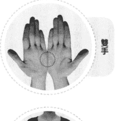

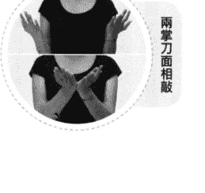

### 引導詞

1. 雖然我還不知道我有多少吸引力，雖然我還不清楚我有多少愛，雖然我還不完全相信愛的力量，雖然我還不敢相信自己可以有一個更滿足、更充滿愛和喜悅的生活，但我還是深深地愛我自己，百分之百地接受我自己，無條件地愛我自己。我願意相信最美滿的人生正在等我，我願意相信有很多很多可愛的人正在等我，我願意相信我值得被愛，我願意給我自己無條件的愛，當我做到了以後，會有更多的人給我們無條件的愛，我願意百分之百地接受我自己，我願意深深地愛我自己。

2. 雖然我還不知道我有多少吸引力，雖然我還不清楚我有多少愛，雖然我還不完全相信愛的力量，雖然我還不敢相信我自己可以有一個充滿愛和喜悅的生活，但我還是深深地愛我自己，百分之百地接受我自己，無條件地愛我自己。我願意相信最美滿的人生總在等著我，我願意相信有很多很多可愛的人正在等著我，我願意相信我值得被愛，我願意成為第一個給我自己無條件的愛的人，我願意是第一個百分之百接受我自己的人。

3. 雖然我還不知道我有多少吸引力，但是我願意相信我馬上就會發現；雖然我還不清楚我有多少愛，但是我願意相信我有很多很多的愛，我馬上就會發現；雖然我還不完全相信愛的力量，但是我願意去發現，我願意相信愛的力量是無窮無盡的；雖然我還不敢相信我可以有一個更充滿愛的人生、更充滿喜悅的生活，但是我願意藉由這個工具相信我值得擁有一個更充滿愛的人生、更充滿喜悅的生活；我願意相信最美滿的人生正在等著我，我願意相信最可愛的人正在等著我，我願意相信我是一個值得被愛、值得被接受的人；我願意相信宇宙的大愛正在帶領我到一個更美、更幸福、更開心、更豐盛的地方。

4. 雖然我還是很害怕，雖然我很沒有自信，但我還是深深地愛我自己，百分之百地接受我自己，無條件地愛我自己，就算我是一個膽小鬼，我也深深地愛我自己，我也百分之百地接受我自己。我知道我很害怕，我也知道我不知道應該怎麼辦，雖然我很慌張，但我還是願意相信一切都有辦法解決的，所以我還是深深地愛我自己，百分之百地接受我自己，無條件地愛我自己。我愛這個害怕的我、我愛這個慌張的我、我愛這個膽小的我、我還愛這個脆弱的我，我完完全全接受所有的我，因為那就是我，那是以前的我，我願意接受。我也願意相信以後的我可以不一樣，只要我願意學，只要我願意成長。

### 身體穴位敲擊點

完成了上一步驟之後，請依照以下順序敲拍身上的不同穴位，同樣的，以每秒二至三次的速度敲拍，每個穴位的敲拍時間約五至十秒，你不必精準地計算時間，也不必在意每個穴位敲拍的時間長度是否分秒不差，只要在大致的時間範圍內即可。如果將這些穴位都敲過一輪之後，你還沒說完該說或想說的話，那就從第一個穴位開始再敲一輪，如此往復循環，直到說完你想說的話為止。

在你敲擊眉間（單手）、眼尾（雙手或單手敲一邊亦可）、雙眼下眼瞼中央下方骨頭處（雙手或單手敲一邊亦可）、人中（單手）、下嘴唇下方凹陷處（單手）、鎖骨下方（雙手或單手敲一邊亦可）時，請將食指與中指併攏，以這兩個指頭的指尖輕輕敲擊；敲拍兩側肋骨時，請將兩隻手臂彎曲，利用兩手指尖或虎口敲拍腋下約三至五公分處（類似雙手叉腰的動作）；敲拍頭頂時，請以單手手掌輕輕敲拍即可。

如果你不知道該說什麼或怎麼說，請參考下節的引導詞，修改成適合你自己的話語即可。須特別注意的是，在這個釋放情緒的步驟中，請你想到什麼就講什麼，完全不要經過理智的修飾或過濾，讓你的潛意識盡情地釋放它真實的情緒與想法。如果你所說的話語是經過意識的修飾、抗拒或考慮的話，便無法達到真正的釋放效果，反而形成了壓抑。即使剛開始時因為不熟悉這個方法而說得顛三倒四也無妨，重點是你的情緒必須完全到位，換言之，你的身體、情緒、話語在這個步驟中必須是三位一體的，完全進入到你所要釋放的情緒當中，這個釋放步驟才會有效。

現在，請邊說你想說的話，並且依照以下的順序進行敲拍，請記住，不必精準計算時間，每個穴位敲拍時間約五至十秒即可，在說話過程中不要停止敲拍：

眉間 → 兩側眼尾 → 雙眼下眼瞼中央下方骨頭處 → 人中 → 下嘴唇下方凹陷處 → 左右兩側鎖骨下 → 兩側腋下約三至五公分之肋骨處 → 頭頂。

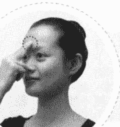

眉間

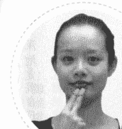

下嘴唇下方凹陷處

兩側眼尾

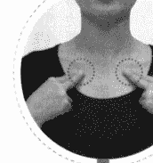

左右兩側鎖骨下

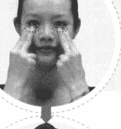

雙眼下眼瞼中央下方骨頭處

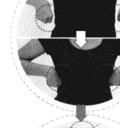

兩側腋下約三至五公分之肋骨處

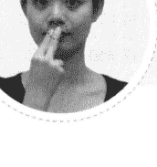

人中

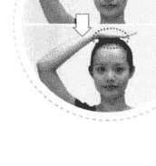

頭頂

### 引導詞

我願意釋放所有的負面情緒，我願意釋放所有阻礙我快樂的情緒，我願意釋放所有悲觀的念頭，我願意釋放所有不適用的觀念。也許釋放不安全，也許釋放很安全，我不知道，但是我已經受夠了，所以我願意釋放，這一堆負面情緒，這一堆阻礙我的情緒，這一堆悲觀的念頭，這一堆不適用的觀念，我願意釋放它們。我願意所有的這些東西都放在一邊，因為我受夠了，我知道如果我需要它們的時候，我還可以把它們拿回來，我可以繼續悲觀，我可以繼續生氣，我可以繼續自責，我可以繼續害怕，但是有用嗎？能幫助我什麼呢？它們以前從來沒幫助，也許它以前幫助過我什麼，也許我的沒耐心幫助過我什麼，但是現在不見得適用，現在可能都不適用。我要成為一個全新的自己，成為一個全新的自己就是要把以前的自己放在一邊，日後當我有需要時，隨時都可以把它找回來，所以我先把所有這些東西放在一邊。但是現在我願意釋放，釋放很安全，釋放非常安全。因為我受夠了，我喘不過氣來，再這樣下去，我沒救了。我可以換一個跑道，我可以選擇愛我自己，我可以選擇相信我就是愛，我願意相信有一個更美的人生正在等著我開始，也許我現在還看不到，也許我還不完全相信，但那是有可能的對不對？因為未來還沒開始，未來還沒有發生，我怎麼知道它一定不可能呢？如果它發生了呢？如果它可能呢？如果我真正渴望的人生正在我面前展開，我難道還要把眼睛閉著嗎？我願意把眼睛打開，我要張開我的雙臂，我要用全新的身體和心態來迎接它，我願意放下以前所有的包袱，我願意放下所有對我沒有幫助的觀念，我可以放下所有的障礙，阻礙我成長的想法。我可以放下所有的不良習慣，我可以放下所有的自責、自卑、自怨、自艾，所有的悲觀，所有嚇自己的幻想，所有的惡夢，我都願意放下，我可以放下，我願意放下。

我願意改成一個正向的人，我願意成為一個正向的人，我願意成為一個健康的人，我願意成為一個身心健康的人，我願意相信宇宙的大愛，我願意相信我可以學習愛，我要學習愛，我現在就開始學習怎麼愛，先從愛我自己開始。我知道所有的發生都是有原因的，我知道這個發生也是有原因的，它為的是要滿足我的學習，或者是滿足圓滿我的因果，都沒有關係。我走過來了，我好勇敢、好勇敢，雖然我跌跌撞撞，雖然我可能遍體鱗傷，但是我走過來了，我好勇敢。這一路走來真的是很辛苦，但是我好勇敢地走過來了，我好勇敢地走到現在，我可以勇敢地繼續走下去，我可以越來越勇敢地繼續走下去，我可以享受這些挑戰，因為要有挑戰，我才會有成就感，要有挑戰，生命才會多采多姿。

所以我願意接受，我願意面對，我願意突破，我可以突破所有的挑戰，因為所有的挑戰後面都有很棒的禮物，所有的挑戰都有我要的禮物在後面，只要我選對挑戰。對，這就是我選的挑戰，這就是我選擇的挑戰，我選擇這個挑戰，因為我要有更好的人生，所以我才會有這個挑戰，只要我突破，只要我一關一關地突破，不管多小的一步，或者是多大的一步，我都會得到禮物，我都會得到更高的自信。我可以幫助自己，我也可以幫助別人，我先從幫助自己開始，因為我是我最好的朋友，我是我最親密的愛人，沒有別人，只有我自己。我願意對自己負責，我願意對自己誠實，我可以誠實地愛我自己，我可以誠誠實實面對自己所有的陰暗面。我知道我的陰暗面有些是有原因的，也許它以前幫助過我，也許我小的時候自責，是我自己的環境造成的，這都沒有關係。其實我沒有這麼糟，我知道我沒有這麼糟，只要我願意去分析，只要我願意去瞭解，我就會知道我是一個多麼美好的人。我也會知道我不需要的地方在哪裡，我可以很快地釋放它，我可以很快地清理它，我就不需要再背著那些垃圾走。我知道我以後的人生會跟以前不同，會比以前更好，會比以前更有自信，會比以前更有愛，會比以前更光明，會比以前更豐盛。我會有更多的朋友，我會有更多的自信，我會有更多的知識，我會有更多的覺知，我會瞭解更多的秘密，我會越過越滿足，我會越過越快樂，我會越過越幸福，我會越過越有愛。

我願意相信，我願意相信，因為她走出來了，因為 Carol 走出來了，因為很多人都走出來了，因為這些人願意跟我分享他們的經驗，他們願意跟我分享他們的工具，我就可以更快地走出來，我相信我可以更快地走出來。宇宙有大愛，我願意接受宇宙的愛，我願意接受身邊貴人的幫助，我願意接受我自己的愛，我願意接受我自己的幫助，我願意幫助我自己，因為我知道當我走出來以後，我可以幫更多更多的人走出來，所以我願意。我願意跟很多人分享我的經驗，不是為了訴苦，不是為了得到同情，而是為了要他們知道他們也可以。他們也有希望，他們可以快樂，他們可以滿足，因為我相信每一個人都值得有一個滿足、豐盛、快樂又有愛的人生，每一個人都包括我自己。我值得有一個有愛、有豐盛、有滿足、有幸福的人生，一個我渴望的人生，只要我想得到，我就做得到，（想想你青春可愛的照片）我願意對這個天真、可愛、快樂的小孩負責，我願意對他負責全責，對他一生的幸福負全責。他這麼地信任我，他把一生交給我，我願意對他負責，我可以對他負責。謝謝你，我愛你，謝謝你，我愛你。我準備好了，也許有一部分的我還有點害怕，但是沒關係，只要我一步一步小小地往前走，我就會越來越不害怕，我就會越來越勇敢，所以我願意一步一步地往前走，我可以一步一步地往前走。謝謝你，我愛你，謝謝你，我愛你，謝謝你，我愛你，謝謝你，我愛你。我準備好了，現在就開始，謝謝你，我愛你。

現在深呼吸。一手抓著另外一隻手腕，再一次深呼吸。第三次深呼吸。然後兩隻手放在胸前，感覺一下你的心，感覺一下它的跳動、它的溫暖、它的喜悅。問自己，我要開始做什麼呢？我現在要開始做什麼呢？不要想太多，所有的靈感一來就馬上寫下來。祝福你！我知道你可以走出來，我知道你可以抬頭挺胸，快快樂樂，非常有自信地、非常瀟灑地走出來。當你走出來的時候，你是一個更有自信、更有愛、更有慈悲、更有包容的人，那才是真正的你，那才是你最渴望成為的你，那就是你這一生想要成為的最好的自己。

現在，再做一個深且長的呼吸，同時為自己的痛苦指數評分，評分的方式與進行敲拍前完全相同，零分代表你完全釋放了所有阻礙你的負面情緒和所有不適用的觀念，願意轉換跑道；十分代表你極度悲觀、害怕、自卑，只會自怨自艾，不願接受挑戰。

評完分之後，比較一下現在的指數和先前的指數有沒有差別？如果現在的指數低於三分，或者你原本的痛苦指數為十分，現在降為五分，這表示你已清除了大半的負面能量，恭喜你！往後你可以利用這個方法繼續清理所有的負面情緒，並在心中不斷輸入以上的「肯定句」，重複練習之後，你將擁有更多的自信和覺知，全身充滿了愛。

# 第5章 寫給處於婚姻風暴朋友的10個建議

看完本書，希望你對於我在婚變後所採取的調適與自救方法有所共識，這些年來，我以身試煉，將自己拔出婚變的噁人流沙，乃至活出今日的美好。因此，我整理了十個心靈護理的方法，和十個如下的建議，當你偶爾感到靈性虛弱，陷入低能量狀態時，不妨參考看看，它將有助於你回想起心靈重建的步驟，再試一次，重新站穩腳步。只要不斷努力嘗試，有朝一日，必能找到自己的桃花源。或許，那裡有一位你的雙生火焰或今生理想的靈魂伴侶正等著你。

每個人在面臨各種變動時，最需要的是勇氣及永不退縮的精神。如果你正處於靈性虛弱期，完全失去主見、不知所措，何妨將自己想像成一位不諳水性的意外落水者。當冰涼的水流夾雜著泥沙與各種穢物沖激你的身體，隨著你的每一口呼吸，不由自主地吸進這些噁心的污水，一時間，恐懼感及溺水所造成的嗆咳讓你雙手亂舞、拍打水面，並使勁地踢動雙腳，不斷高喊救命！我想，就是這種精神！你只要找到這種求生的精神，便絕對有能力將自己拔出痛苦的泥淖！所以，當你放棄所有的自我，敞開心扉尋求幫助，自會否極泰來。

## 心靈護理的10個方法

1. 每天做EFT，以及當你心情不好的時候。你必須將EFT視為每天例行的工作，就像沐浴和刷牙一樣，使它成為一種習慣。因為，你的痛苦是自己所想出來的，尤其是如果你習慣於負面思考，大腦便會慣性地思考那些讓你的心更痛苦的事情。這些負面思考都是毒素，因此，你必須每日做情緒排毒，以保護你的心靈免於受傷。
2. 拿出一張你最愛的小時候的照片，放在你隨處可以看到的地方，告訴自己並承諾他／她會永遠愛他／她。保證會好好愛你自己。是的，這非常重要。
3. 閱讀具有啟發性的良好書籍，這是你心靈的營養。如果你無法閱讀，可以聽同樣具有啟發性的有聲書。這將建立你核心的情感力量，就像吃健康的食物、喝乾淨的水，和睡個好覺一樣重要。
4. 結交積極的、給予支持的朋友或參加各種成長團體，包含各種治療課程和老師。如果你無法在現居地找到他們，可以上網路找！擴大自己的視野，學會運用各種豐沛的資源。
5. 花時間和他們中的許多人成為好朋友，接受並感謝他們的愛和關注。學習給予真愛，當你付出的時候，你更會感覺到超乎你想像的愛。
6. 不妨離開你目前的住處，以便給自己更多的和平與寧靜。
7. 加入冥想或修行團體，如「內觀禪修」。
8. 當負面情緒來襲時，允許自己感受所有的憤怒、痛苦和悲傷，不要壓抑或自我譴責，給自己充分的空間和時間來釋放和療癒。
9. 別染上不好的習慣或陷入另一段不良的關係，它很容易讓那些負面思想或情緒隱藏得更深而不自覺，從長遠來看，它會傷害你。相反的，你應該藉此機會改掉你的情感依賴狀態，才能使你變得更堅強，並學會多愛自己一點。
10. 練習感恩和活在當下。

## 能帶來勇氣與能量的10個建議

以下建議不限於情傷者，事實上，它適用於各種生活層面受挫的人，希望它能帶給你力量與勇氣！

1. 找到你的熱情，勇敢地追求它；
2. 採取行動，做出正面的改變；
3. 結交正向的新朋友，多和他們相處；
4. 練習寬恕、慈悲、感恩，和抽離、客觀；
5. 個人成長是最好的方式和唯一能夠真正治癒的方法；
6. 練習 EFT — 學著自我接納、愛自己。沒有愛，我們就像枯萎的花朵，所以我們必須培養愛，所有的愛都始於自己的愛；
7. 照顧好你的身體、你的心、你的財務；
8. 如有必要，找個好律師和優秀的身心治療師，投資自己；
9. 享受單身，無論你有沒有伴侶都會吸引到更好的生活；
10. 經常慶祝新生的每一天。

生命是一段旅程，我們受到與我們共處的人高度影響。因此，與樂觀積極的人相處、閱讀積極的書籍、聆聽積極的音樂、思考積極的事情是至關重要的。當你習慣了它，它會成為你的一部分，你的轉變將顯得自然而快樂。

我鼓勵你加入我的網路社區，分享你的想法、結交新的朋友，和學習新的工具。

歡迎加入 Carol 生命火花講堂
http://emlcoach.com

書內所有的練習都可以下載 http://emlmcoach.com/EFTCD

你可以閉著眼睛，聽我的聲音。對你來說，這會輕鬆得多。此外，這個網頁上還特別提供一些額外的練習和問答，藉由這些練習，你會發現你真正的渴望和你最大的恐懼是什麼，進而更清楚地做自我分析，而且我會教你如何去處理它。祝福你早日走出低谷，迎向燦爛的光明！

## E 同成長 · 買一送一！

好消息！為嘉惠本書讀者，
特商請作者林嘉瑗 (Carol) 老師親自講授「EFT 情緒療癒」，
憑本書報名可享受買一送一優惠（可攜伴一人參加）。

情緒是一種隱形的能量，無時無刻影響著我們，成長或傷害都源自於它。所以當我們的情緒越健康強壯，才能越容易在親密關係、工作事業等生活各方面達到和諧與成功。

因此，情緒智慧是非常重要的技能關鍵。在心靈疾病蔓延的年代，「EFT 情緒療癒」能夠幫你建立高 EQ 掌握人生，啟發無限潛能。

「EFT 情緒療癒」除了分析情緒的成因，輔以真實案例，並詳細說明「建設」、「面對」、「覺醒」三步驟，帶領清除惱人的情緒，同步搭配動作與引導詞，時時覺知負面情緒所在的位置，以及它們的消失。除了自我運用，還能協助有情緒困擾的親朋好友。

如果您有情傷、感情困擾、情緒管理、事業等壓力，歡迎您來參加，E 同成長。

- 開課時間：104 年 8 月 29 日（六）13:00~17:00 共 4 小時
- 費 用：6,000 元，持本書可享受買一送一優惠（可攜伴一人參加）。
- 上課地點：犇亞會議中心（台北市復興北路 99 號 15 樓，捷運松山線、捷運文湖線交會處，南京復興站六號出口）
- 報名方式：註明姓名、電話、聯絡方式，Email 至 service@difymlm.com Carol's
  生命火花講堂。報名信件主旨：報名 EFT 情緒療癒 E 同成長課程。
- 報名截止日期：104 年 8 月 22 日
- 相關問題請電洽 0932-728870 王小姐

課程當天須憑本書入場，方可享受買一送一優惠。

獲取更多好書，請加微信號：strcdts

店鋪：http://strc.cr.cx

國家圖書館出版品預行編目資料

EFT情傷療癒，找到全新的自己 / 林嘉瑗著述；郭玉文撰文. -- 初版.
臺北市：商周出版；家庭傳媒城邦分公司發行，2015.06
面；公分. -- (Live & learn)
ISBN 978-986-272-771-3 (平裝)
1. 心靈療法 2. 拓格療法

418.98

104004019

# EFT情傷療癒，找到全新的自己

作 者 / 林嘉瑗Carol Lin
撰 文 者 / 郭玉文
企 畫 選 書 / 程鳳儀
責 任 編 輯 / 余筱嵐

版 權 / 林心紅、翁靜如
行 銷 業 務 / 莊曼菁、何肇文
副 總 編 輯 / 程鳳儀
總 經 理 / 彭之琬
發 行 人 / 何飛鵬
法 律 顧 問 / 台英國際商務法律事務所 羅明通律師
出 版 / 商周出版
台北市104民生東路二段141號9樓
電話：(02) 25007008 傳真：(02)25007759
E-mail：bwp.service@cite.com.tw
Blog：http://bwp25007008.pixnet.net/blog

發 行 / 英屬蓋曼群島商家庭傳媒股份有限公司 城邦分公司
台北市中山區民生東路二段141號2樓
書虫客服服務專線：02-25007718；25007719
服務時間：週一至週五上午09:30-12:00；下午13:30-17:00
24小時傳真專線：02-25001990；25001991
劃撥帳號：19863813；戶名：書虫股份有限公司
讀者服務信箱：service@readingclub.com.tw
城邦讀書花園：www.cite.com.tw

香港發行所 / 城邦（香港）出版集團有限公司
香港灣仔軒尼詩道193號東超商業中心1樓 E-mail：hkcite@biznetvigator.com
電話：(852) 25086231 傳真：(852) 25789337
馬新發行所 / 城邦（馬新）出版集團 Cite (M) Sdn. Bhd.
41, Jalan Radin Anum, Bandar Baru Sri Petaling, 57000 Kuala Lumpur, Malaysia.
Tel: (603) 90578822 Fax: (603) 90576622 Email: cite@cite.com.my

封面設計 / 陳文德
排 版 / 楓瑚企業有限公司
印 刷 / 康象印刷事業有限公司
總 經 銷 / 高見文化行銷股份有限公司 新北市樹林區佳園路二段70-1號
電話：(02)2668-9005 傳真：(02)2668-9790 客服專線：0800-055-365

2015年6月2日初版
定價320元

Printed in Taiwan

城邦讀書花園
www.cite.com.tw

版權所有 獲取更多好書請添加微信號：strcdts

店鋪：http://str.cr.cx

我曾經執著於一粒沙、一滴水，
妄想尋找到專屬於我的旅人，
某一瞬間猛然抬頭，
看向我曾尋索過的海洋與沙漠，
驀然發現，其實我可以不執著。
於是我頭也不回地走向前方，發現我原來很自由。

這本書的誕生，來自於情傷的切膚之痛。當我面臨二十年婚姻瀕臨崩解時的痛苦，我一度反覆游走於離婚與複合之間不知所措，是能量療法將我拔出了那一片泥濘，有了重生的清明。現在，我分享自己經驗並告訴你，走出痛苦並不困難，只要你願意走出來。

在EFT的自我療癒的過程中，我感受到許多的愛和慈悲，進而能夠轉念，原諒了自己，也原諒了對方。我將在書中帶著你一起演練EFT情緒排毒敲打，也可以隨著我在CD的引導照著做，你便可以釋放心中的情緒垃圾，進而找到一個全新的自己。

> 這本書，結合作者自身的故事，在鼓舞著我們改變的可能性。雖然以婚姻為例，但婚姻中所存在的許多人與人互動的共通元素，再回推到許多其他的關係當中，依然值得我們試著應用。
——臨床心理師 洪仲清