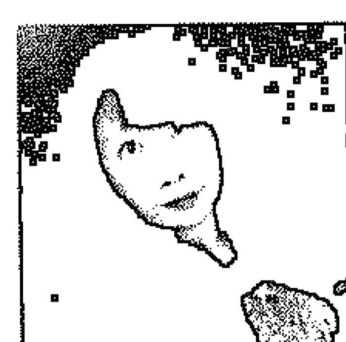

## St. Royal College
### 天使神秘学院

- ※ 专业占卜预测机构
- ※ 神秘学培训机构
- ※ 水晶能量研究中心
- ※ 官方淘宝：http://strc.taobao.com
- ※ 官方微博：http://weibo.com/715104687
- ※ 新书发布QQ群：659338717
- ※ 购买更多好书请联系院长大天使

大天使
天使神秘学院 院长
QQ：715104687
手机/微信：13641926204

微信公众平台：strc2011

## ESP通灵的智慧
### 调频Wi-Fi 启动超能APP

明晰宇宙生命进行，
善用人类天赋灵通力，享受心想事成的丰盛

大道至简～万法唯心
助己助人～助人助己

## 2 ESP 通灵的智慧
### 触类Wi-Fi 启动超能APP

自序 葵花多杯论－不须自宫，也可成功！…………………………6

第一章 通灵－人体Wi-Fi功能……………………………………………13

- 一、「通灵」是人类智慧发展过程／14
- 二、意识wi-fi 连结宇宙网格 开启超感官能力／27
- 三、宇宙云端数据库－宇宙集体潜意识／37

第二章 来自天界的讯息－连结宇宙中所有的自己…………………55

- 一、人人都是高灵、天使、佛菩萨／56
- 二、来自无形界的礼物／59
- 三、瑶池金母开启灵视力－感觉转视觉／66
- 四、观音赠柳枝净瓶－慈悲法布施／67
- 五、做好网站－光行者教育中心／69
- 六、王母娘娘的长生叶－领悟高阶催眠技术／72
- 七、怨灵教导处理冤亲债主、多重人格研究／76
- 八、开启宇宙光语－脑波沟通／78
- 九、观音指示：一天三个个案／82
- 十、光的使者－游走宇宙、星际的助人工作／84
- 十一、连结Kryon「克里昂」振动频率－领悟宇宙一体／87
- 十二、超时空教学－灵界先师传武功／88
- 十三、我的天命－教化灵魂／91
- 十四、文殊菩萨赠金钥－开启人类潜意识／93
- 十五、南极仙翁药葫芦－治疗灵魂创伤／95
- 十六、财神爷赠金元宝－稳定光行者中心／96
- 十七、齐天大圣与长生果／98
- 十八、孙悟空遇到杨戬－又是那只毛手／99

天使神秘学院官方淘宝：http://strc.taobao.com
获取更多好书，请加微信：13641926204 或 QQ:715104687

- 十九、为何有这么多孙猴子／101
- 二十、外星人女王／102
- 二十一、星际生命顾问－服务一级棒／105
- 二十二、实践生命蓝图／108

## 第三章 通灵阅读实录…………………………………………………111

- 一、神准预言记者升官／112
- 二、占星师的前世／113
- 三、探访骤然过世的亲人／114
- 四、敲头的祖光／116
- 五、转化为天使的妻子／120
- 六、逝去宠物沟通／121
- 七、缺乏的是自信／122
- 八、叨念的婆婆／123
- 九、真爱－前世夫妻今生友／127
- 十、阅读政治人物前世今生／129
- 十一、通灵代观元辰宫／132

## 第四章 激活DNA 爬虫星人的阴谋……………………………………135

- 一、我们都是外星人／136
- 二、激活DNA灵性手术／137
- 三、「钒排列」探究「DNA植入」真相／145
- 四、接受「DNA植入技术」学员的状态／149
- 五、安琪进行「激活DNA」能量灵性启动过程感受心得／154
- 六、Louis进行DNA启动手术的过程感受与心得／160
- 七、「激活DNA灵性手术」与爬虫星人交手的体悟／167

## 4 ESP 通灵的智慧
### 调频Wi-Fi 启动超能APP

## 第五章 钮排列-无意识连结超次元…………………………175

- 一、站上去，就连线／176
- 二、祭拜不如祝福／180
- 三、与死神相恋／183
- 四、连结冥界的力量／189
- 五、唤醒前世自杀的记忆／191
- 六、未来排列／193

## 第六章 入魔-误用通灵的各种现象…………………………195

- 一、神通与入魔／196
- 二、灵逼体与天命／198
- 三、领了谕旨，道行比较高？／204
- 四、通灵者灵体比较洁净？／209
- 五、宫庙办事，神佛会照顾？／214
- 六、持咒取得天宫财宝、四句话可以赚大钱／216
- 七、妄想与神通／218
- 八、贪法的后果／221
- 九、摺令旗的大哥／223
- 十、太上老君的传人／225
- 十一、城隍与阎王的今生／227
- 十二、邹后与大蟒／231
- 十三、灵卡你，还是你卡灵？／233
- 十四、唸经回向，惹来外灵进驻／235
- 十五、是仙姑还是骗子？／237
- 十六、供养狐仙求桃花／240
- 十七、观元辰宫补财库、招桃花？／241

天使神秘学院官方淘宝：http://strc.taobao.com
获取更多好书，请加微信：13641926204 或 QQ:715104687

- 十八、静坐协会卖高价天珠消灾解祸／243
- 十九、王母娘娘开价，命理老师收钱／244
- 二十、催眠讲师改行通灵、超渡、卖金纸／246
- 二一、小心卡阴－祈请动物能量进驻脉轮／249

## 第七章　麻瓜原来都是魔法师……………………………………………253

- 一、催眠～万法之钥／254
- 二、调频ESP超感官，接收宇宙讯息／260
- 三、通灵阅读，直接读取讯息、解答疑惑／262
- 四、辨识问题核心／266
- 五、核对与沟通／268
- 六、共时性／270
- 七、请神送鬼／271
- 八、般若智慧就是放下执着与烦恼／275
- 九、通灵者的生命观与道德观／276

## 第八章　调频人体Wi-Fi、开启超感官APP……………………………279

- 一、安全、科学的ESP超感通灵模式／280
- 二、连结宇宙Wi-Fi扩展ESP频宽的方法／285
- 三、调频ESP超感官／292
- 四、透过工具进行心灵锻炼与讯息确认／296
- 五、全方位的心灵魔法师培训／299
- 六、应用ESP通灵阅读的助人工作／300
- 七、信而不迷，法非法无常法／302
- 八、秉持良善初心－好运自然来报到／305

## 6 ESP 通灵的智慧
### 调频Wi-Fi 启动超能APP

## 自序

### 葵花多杯论－不须自宫，也可成功！

话说，东方不败用尽千方百计，历经千辛万苦，终于入手武林中人梦寐以求的绝世武功秘籍「葵花宝典」。

他迫不及待地翻开第一页，上面只写了斗大的八个字：「欲练神功，挥刀自宫！」

东方不败毫不犹豫，拿起他削铁如泥的宝刀，一刀挥下，根断、血流……！

他一点儿也没为失去命根子的疼痛所动，继续往下…努力练功……！

历经七七四十九天日夜不休的勤练苦修，终于练到了最上层的顶级功法。

他强抑着兴奋的心情，翻开最后一页，当下气血攻心，立刻昏厥…！

葵花宝典最后一页也只写了斗大的八个字：「不须自宫，也可成功！」

这是我在催眠课中，很喜欢跟学员们分享一个故事，提醒大家：「学习新事物的态度固然要客观，过去的经验却是可以保留的。因为，生命所有经验都是智慧的积累！」

不同于许多讲师要求学员：「上课前，必须先将原有杯子中的水全部倒掉，才能有效学习。」我告诉学员：「再掏一个杯子出来！」或把原有的杯子变大、变成多格、来个摇摇杯……也都是挺好的选择。

透过努力积累的经验，如果是正确、上手的，就继续沿用；倘若发现有所偏差，也可以引为借镜、参考！哪需要因为学习新的观点与工具而先自废武功？转换了看待事物的观点，境界当下提升。可见，无论学习理论还是技术，秉持正知、正见是首要态度。

让我们在自在、快乐中学习，启动「人体意识网络」连结「大宇宙意识」喜悦迎接人类扬升「全面通灵」、人人成佛的「金色世代」！

## 8 ESP 通灵的智慧
### 调频Wi-Fi 启动超能APP

## 前言：「全面通灵」人类ESP超感官智慧扬升

云钒

统整黑暗与光明，在阴与阳和谐中扬升！

「金色」是「佛」的纯净振动频率。在这一世纪中，许多过去被隐藏的真理将逐渐揭发，有许多协助灵性快速提升至与「佛」同等层次的学习，这意味着人们有许多机会可以悟道、成佛，也将面临前所未有的考验与挑战。

「金色次元」频率中，在生命成长中重获觉知智慧者，因为灵魂频率的纯净、轻盈，自然扬升至光明世界。尚未达到扬升标准的其他人类，则停留原来的地方修习，或是向下沉沦到黑暗世界，继续其生命轮回之旅。这是人类灵性意识智慧扬升的过程，向上扬升还是向下沉沦，均秉持宇宙意志法则，由当事人灵性意识自行决定。

资讯丰富到爆炸的超越次元世代，应用「ESP超感官」（通灵）能力可以平衡身心灵、提升智慧、加速学习，跟上这一波扬升、转化的列车。「ESP超感官」能力之重大目的在于「智慧提升」，也必须具备足够的智慧，才能理解「ESP超感官」能力的真相及其核心目的。换言之，具备「智慧」即可通透生命的历程，其中包括了对「ESP超感官」能力的理解。

一即一切，一切即一。

人体是个小宇宙，大宇宙也可以视为人体。
我身体里的所有细胞都是我的一部分，他们是我，也不全然是我！
建构这个大宇宙中的所有生命体，都是大宇宙的一部份。我是宇宙，也不全然是宇宙！
我们身处的这个大宇宙中，充满了各种不同形式存在的生命。许多个小宇宙组成了大宇宙，无数个银河系组成了小宇宙，无数个太阳系组成了我们身处的银河系，地球、金星、火星、木星…等几个星球组成了太阳系，人类、山、水以及大自然界各种不同形式存在的生命体组成了地球。在星球与星球之间尚有人类科学未知的暗物质。人类也是由各种不同功能细胞所组成的，细胞又是由各种元素所构筑而成…，细胞与细胞之间尚有…。
大宇宙中所有讯息的上传、接收，就像是一个自动化超级云端数据库，也像是一个人身体中的中枢神经系统。大的云端数据库中涵盖了许多中型数据库，中型数据库中有许多个别的小数据库。这些个别的小数据库就是个体的「阿卡莎」记录。
以上只是简述「宇宙集体潜意识云端数据库」观点，

## 10 ESP 通灵的智慧

也是「全息宇宙」的基础概念，我们可以将星球、细胞物质、归于「阳」是目前人类科技可以探究较多的部分；宇宙暗物质、精神意念传导、阿卡莎纪录归为阴。阳与阴共同运作，才属完整的真相。

学员问我：「学习应用ESP超感官能力以后要做甚麽呢？」

我回答：「安适自在、活在当下，享受心想事成的人间时光！」「神通」仅是灵性修持的副产品！唯有安心享受地球上的学习时光，方是生命进行与灵性扬升绝佳之道。

当我们的「表意识头脑」与「潜意识灵性」协调合一之后，自能将各种能力融于生活当中，随时应用却又不过度凸显。保持自在的平常心，让与生俱来的「ESP超感官知觉」这项天赋能力在生活中发挥自动化功能，如此生命自然和谐、圆满。

无论是人类与人类，还是超时空与人类，沟通之所以不易达成，往往是因为认知的不同。不同的名词，也让人们产生不同的认知。换个角度看事情，对于「通灵」这项能力将比较容易理解。

阅读本书，请自动将相关名词转译为「符合你认知的名词」。

灵：意念、潜意识、超意识、无意识、宇宙心智。

灵界：集体潜意识、宇宙、平行宇宙、法界1、源场2、宇宙网络、宇宙心智、宇宙数据库。

灵能：频率、能量、光波、隐密物质、信息场。

灵商：由深层潜意识主导的顿悟力、直觉力以及对事物核心本质的判断力。

通灵：接受与下载大宇宙集体潜意识讯息或是接收其他生命意识讯息或与其进行讯息交流。

ESP超感官：俗称「超感知能力」可称为「科学通灵」。

以科学暨心理学观点研究ESP超感知能力并进行教学传承，历经十馀载终于等到人类意识觉醒，通灵立即开全面开启的关键时刻。在这人类整体意识频率扬升的「金色次元」世纪中，很高兴在此刻当下的时空中与您相逢！恭喜您！已具备进阶灵性成长基本配备「机缘」与「智慧」！

註1：「法界」（Kosmos）这个名词是由毕达哥拉斯学派（the pythagoreans）所提出，《万法简史》作者肯恩·威尔伯（Ken Wilber）认为「法界」一词非指物理宇宙（physical universe）。而是包含了或物理域（physiosphere]）（宇宙）、生物域（生物）、（心智域）心灵或心智、神性域（divine domain]）神理（theos），一般所说的「宇宙」、「寰宇」（Universe）指的仅是「物理宇宙」。「法界」则是由物、心、神（God）三者存在定型本质及过程。
以上文章摘录自《万法简史》作者：肯恩·威尔伯（Ken Wilber）心灵工坊出版

註2：《源场 超自然关键报告》作者：大卫·威尔科克（David Wilcock） 橡实文化出版

## 第一章

### 通灵－人体Wi-Fi功能

> 若以色见我，以音声求我，
是人行邪道，不能见如来。-金刚经

## 14 ESP 通灵的智慧

### 调频Wi-Fi 启动超能APP

### 一、「通灵」是人类智慧发展过程

#### 神通与通灵

「通灵力」包含于「神通」之中，与现代研究的超感官知觉等超能力（台湾用词）、特异功能（大陆、香港用词）相类似。「神通」这个名词于《大萨遮尼乾子所说经》、《楞严经》…等多部佛经佛典中都曾出现。意指：因禅定而得到的神秘能力。

一般人认为的「通灵」者通常具备接收人类、神佛、天使、外星人、植物、动物、大自然、宇宙万物讯息的能力。以及灵魂离体、超越时间与空间，往来过去、未来、现在，以及往来地球各地、宇宙、其他星球之间的能力。

根据佛经记载，神通主要有以下六种：

- 神足通：六尘境界中，不受时空限制，随心游历过去、现在、未来。
- 天耳通：无障碍的听到极远处包括言语的各种音声。
- 他心通：能听到或感觉到他人心中的想法。
- 宿命通：能看到或知道他人过去、未来、当下的生命进行及其业力的由来。
- 天眼通：能穿越有形障碍，看到远处或其他次元时空的人、事、物。
- 漏尽通：具有「佛性」的般若智慧，破除各种烦恼后自能获得。

天使神秘学院官方淘宝：http://strc.taobao.com
获取更多好书，请加微信：13641926204 或 QQ:715104687

《楞严经》提及：在禅修中随着定功的深入渐得神通，若贪求或执着于神通者，容易因为幻象而入魔。六道众生、天魔，都可因禅定修得或与生俱有前五通，人类于死亡后也会自然得到。^1^前面五种神通因人而异，有深、浅、大、小、多、少之别。

关于「神通」佛典中也有重要提醒：「唯有锻炼自己的心性，以不贪、不求的态度，破除执着与烦恼的「漏尽通」是神通的最高阶段，也是最重要的般若智慧。」「漏尽通」如此重要，却经常遭到人们忽略。「想要具备完整通灵能力者，更需要锻炼的是放下执着、解脱烦恼的大智慧。如此，方能善用「ESP超感通灵力」自助助人，助人助己。

#### 「万法归宗」东西两方通灵比比看

「仪式」并非获得通灵能力或疗愈效果的主要因素，但对于宗教热忱或缺乏自信者能产生一定程度的帮助。对许多宗教团体而言，「仪式」是建立信徒对团体产生信任的第一步骤。如：跪拜、赞颂…等等。

近年来，华人界非常流行宣称藉由高灵传承的书籍及课程，许多课程中教导祈请、点化…仪式，以下将目前新时代课程与台湾传统民俗信仰通灵做个比对。

## 16 ESP 通灵的智慧

### 观频Wi-Fi 启动超能APP

| 东方传统民俗文化 | 西方新时代课程 |
|---|---|
| 禅定、静坐 | 冥想 |
| 点红蜡烛 | 点白蜡烛 |
| 烧香 | 烧白鼠尾草 |
| 执杯 | 灵摆 |
| 抽签诗 | 抽塔罗 |
| 碟仙、钱仙、筷仙 | 感应盘 |
| 祈请神佛菩萨 祈请地母娘娘 | 西方祈请上帝、天使 祈请大地之母 |
| 通灵通鬼、神、菩萨、佛 | 通灵通高灵、天使、外星人 萨满通灵通动物灵 |
| 灵动.启灵 | 无意识舞蹈 |
| 神佛附体才会说天语 以灵语跟神佛沟通、降旨 | 以光语传递高灵频率、讯息 |
| 游天堂、地府 | 史威登堡游灵界 |
| 神佛降旨 | 高灵指示 |
| 紫微斗数 | 占星术 |
| 开运改命 | 改变生命蓝图 |
| 观灵、观落阴、看因果 | 阿卡莎纪录 萨满看下部世界 |
| 生死簿 | 阿卡莎纪录 |
| 注重仪式 | 注重仪式 |

经过上述比对后，可以明显看出，东、西两方使用的仪式大同小异，只是应用物件稍有不同。近年来西方灵修文化东传，东方文化又为西方人所喜爱。双方修行文化更进一步的交流、整合，指日可待。

这些年来，东、西两方敏感体质及通灵者明显增加，以「通灵」自居而从事心灵工作者有越来越多的趋势，

「通灵」这项能力逐渐为人们所接纳，未来更将被视为有如「上网聊天」般理所当然。这也印证佛典所述的「末法时期」已经到来。

预计，大约在2030年左右，『「通灵力」将为所有正常人类拥有的能力。』不具备通灵力将沦为少数异类。「通灵力」相关议题必将成为重要科研项目。

#### 通灵的过去与现代

在古代，能够与天地、大自然、神灵沟通者被称为「巫」、「祭司」、「国师」，往往有着无比崇高的社会地位。或许因为如此，追求开启「通灵力」或各种神通者，从古到今没有少过。

过去，「通灵」是「巫」（祭司）用以与天地万物进行沟通的方法，通常隐身于信仰之中。许多宗教或非宗教仪式里，会祈请神灵降驾给予指示，解答疑惑、协助困顿。近代，「通灵」成为一种更为普及易为人们接受的能力，求助灵媒已经不需要到宫庙里，还可以上网预约。

自古以来，人类对于宇宙天地与大自然的一切变化十分畏惧，这种因为未知产生的畏惧，导致人们对于能够与天地神灵沟通者产生崇拜。也因此多数人们认为与天使、高我、高灵、外星人进行连结、沟通是种特别的「通灵」能力，并认为「通灵」能力需要由神佛、菩萨、上师、师父…点化、加持才能开启。

## 18 ESP 通灵的智慧

台湾传统宫庙文化中，应用启灵、灵舞、唸经、持咒、开沙⋯⋯等等方法来进行乩童的通灵力训练。曾经见过有些宗教或非宗教团体以能够协助开启「天眼」为号召吸引信众，要价台币数万到数百万。他们开启神通力的方法通常是：「上师加持、唸经、持咒、静坐、动功、闭关、训灵⋯⋯等。」倘若神通力没开成，多数也会以：「因缘不具足、还要再多做善事、多修行。」等等理由搪塞卸责。

西方新时代连结高灵思维推波助澜下，近年来十分流行接收外星高灵传递讯息，许多通灵影片、书籍、纷纷在网络上流传。标榜教导「通灵」课程，应用「冥想式催眠」带领学员、信徒进行「灵魂出体」或与天使、高灵、天地、大自然、力量动物连结。这类课程多数另订名称，并且配合各种仪式进行。也有宣称是连结菩萨、神佛、天使通灵编制的课程，课程中通常大量应用祈请、灌顶、点化⋯⋯等仪式，认为如此才能获得相关能力。

自古以来，地球上就有许多来自各方包括西方天使界、东方天人界的灵魂，来到地球「生命学院」修习。许多外星灵魂并未在地球上生存过，也无法完全理解人类。宇宙、星际间有许多不同形式的生命体，各有各的文化传承。倘若凡事尽信高灵，也属偏差。

许多人在催眠状态中，也会呈现如同「通灵」的状态。其中道理很简单：「放掉意识的头脑，无意识就能更有效的運作。」無論是「啟靈」、「訓靈」還是「自發動功」、「靈魂出體」、「無意識舞蹈」、「動態靜心」、「氣功」所呈現的狀態，與「催眠狀態」都極為相似。

## 通靈的能力與層次

傳統通靈方式概約區分為以下幾種：

- 1. 「陰陽眼」多數孩童具備此項能力，可以肉眼看到另一界的生命形式。多數他們看到的都是俗稱「鬼」的游離靈魂。在我的許多案例中，都有這樣的經驗，有些人甚至可以看到市場豬肉攤、魚肉攤上肉上面依附的靈體。孩童的這項能力多數因父母喝斥、責罵或自身的恐懼害怕，或是隨著年齡漸長，大約於12歲左右逐漸封閉(非消失)，少數人成年後依然保有這項能力。本書第五章之十三「城隍與閻王的今生」記述的就是小時候就看的到另一界的實例。
- 2. 「靈的代言人」指得是身體借給其他靈魂使用或代傳訊息，如東方的乩童、西方的靈媒。靈媒、乩童所接觸的這些靈魂可能是鬼、神佛菩薩、天使、外星人、指導靈。這類通靈現象可分為「半乩」與「全乩」以及「接收訊息」三種方式。「全乩」是「我」退到後方，身體借給其他靈體使用或完全溶入角色當中。「半乩」是「我」與另一個靈體同時存在。「接收訊息」是另一界的靈體轉告訊息，由靈媒接收後佈達訊息。經常應用「半乩」與「全乩」通靈，由於身體經常外借給各種不同靈體，而各種靈體的能量頻率與當事人有所差異，容易導致身體能量不均衡、氣場缺損…等狀態。導致易被外靈侵入，產生靈光病或罹患精神疾病。本書第五章之八「貪法的後果」撰寫的就是因為貪法而導致罹患精神疾病的實例。第三種方式「接收訊息」是比較無礙通靈者身體的作法。
- 3. 「養狐仙、小鬼」平常就養些小鬼或動物靈，藉以培養自身的靈通力，通常會搭配一些符咒、法術。這種通靈方法風險極大，因為多數低等動物靈較為衝動，萬一伺候不到位，有可能反噬。再則，身邊圍繞這些低等靈，當事人的身體狀況也會受到影響。（本書第五章之三「領了諭旨，道行比較高？」「十二供養狐仙求桃花」撰寫的就是養小鬼、動物靈的實例。）
- 4. 其他應用感應盤、擲杯…等方式進行與靈界連結。

鬼神也會依其靈性智慧及頻率區分層級，只要是沒有了物質身體，多數都能有些神通。若是有幸通到有修為的鬼神，不只是可以精通古往今來，多數還擅長風水、命理，可以進行靈療或治病。如何區別是真佛還是小鬼呢，真正的高等菩薩或佛，多數只是拈花微笑，不會給過多的指導，有些神佛其實是小鬼所喬扮的。

倘若認為能夠與鬼神、佛菩薩、天使、高靈，互動、對話，就是「高層次通靈」，那就誤會大囉。通靈能力強者並不代表其心性較為良善或靈性層次較高。切勿盲目相信以為通靈者必然有較高的道德層次。通靈者層次的區隔，是視靈性層次而定，非視通靈能力而定。通靈者也是人，具備人性的各種弱點，也有人性的善惡之別，其層次往往因為個體靈性修持與意圖而有高低不同。

宇宙中的頻率是相互吸引產生共振的，游離的靈魂與人類一樣都有靈性層次、文化水平、良善邪惡的區別。許多靈性較低的通靈者，接收到的是低階鬼魂的訊息，而鬼魂也會偽裝為神佛菩薩。從另一個觀點來看：即使是神佛、菩薩也會因其能量頻率高低而有層次分別。其所傳遞的訊息也因為位階，產生對生命觀點看法有深淺、上下之差異。所傳遞的訊息對當事人未必有正向幫助，甚至有害。

每位通靈者所接收到的訊息，都會經過他個人詮釋後再傳遞出來，這些訊息有可能因為他個人的心情、認知、能力、靈性層次而受到影響，因此，訊息可能會有所偏差或扭曲。通靈者所提供之資訊仍須以智慧進行評估，並相信自己的覺察力。

不貪圖私慾的人，靈光較為純淨，多數能夠接觸到靈性層次發展較高的靈魂，如此案主較能得到正向明確的訊息，對生命成長及智慧提升有所幫助。無論如何，求助靈媒要謹慎辨別，能力不佳、濫竽充數或是應用通靈施行詐騙者。通常誇大自身通靈神力、宣稱能協助消除一切業力…、讓案主產生過度依賴的通靈者，多數都是別有用心。盡早遠避以免受騙是為上策。

那麼要如何辨識通靈者層次呢？以下簡單說明：

真正高層次的靈性工作者不著相，不會強調自身的通靈力，服務時會收取適當報酬，不會假借超渡、解脫業障、改運…等，各種名目另行收取高價費用。以協助個案自行面對問題為主，而非打包票能解決所有問題。在「感情」、「權位」上，高層次靈性工作者也多數能看得淡薄，極少有所糾葛。

較低層次的通靈者，通常尚未具備「漏盡通」這項最重要的能力，所以對於「感情」、「金錢」、「名位」、「權力」、「物慾」…等較為貪求、執著，通常會以超渡、解脫業障…等等名目收取高價報酬。多數較低階層的通靈者都有感情糾葛的問題，不斷追尋感情或是性愛。他們的周遭總是圍繞著崇拜或追求者，並會引以為傲，通常會搞曖昧關係，或關係不佳卻又糾葛、無法放下…。

最高層次的通靈方式，是連結過去的所有自己以及宙心G點的最高自性。在這樣的狀態下，對生命有許多領悟，有高度又敏銳的覺察力與生命的智慧，往往能夠當下明白問題所在，但並不過度干涉。當然更不會藉著通靈來斂財。

人們必須了解，每個人在此都有學習成長的主要目地，即使是高能力、高層次的通靈者，也不能解決我們的所有問題。而是協助我們辨識問題核心，有效調整與學習面對問題。改變命運唯有面對，沒有捷徑。通靈力是人類與生俱來的天賦能力，應用通靈力僅是靈性修持的過程之一，每個人啟動的時間點及能力方向各不相同，切勿過度崇拜或追求或展現靈通力。維持平衡、自在的生活才是王道。

## 安全通靈

通靈能力人人有，並不需要有點化、加持。比較安全的通靈是不祈請、不作結界、不外借身體的方式。我認為系統排列及ESP超覺閱讀是相對安全的通靈方式。

- 1. 「系統排列」每個人都可以做到，完全不需要透過意識進行連結，也不需要透過任何點化、灌頂、加持或祈請。代表們只要站上場域，立即連結上當事人的頻率能量場。在我帶領的「釩排列」中，學員們甚至於完全不知道自己代表的是誰，通常也可以十分神妙的詮釋出當事人的行為、語言、思維。準確度可達百分之百以上。過度敏感體質者應用此法要極為小心，有可能因為融入過深，引發自身情緒問題。
- 2. 「ESP超覺閱讀」每個人都可以透過學習，準確閱讀大宇宙雲端訊息資料庫，而且極為安全。不外借身體，不代傳訊息，不需要透過意識進行連結也不需要透過任何點化、灌頂、加持或祈請取得能力。因為是以「這是我與生俱來的天賦能力」以及「我是大宇宙中的一份子」為中心思維，進行大宇宙網絡相關資訊讀取。這是我於2003年間開始研創的科學方式，任何人都只需要經過適當的方式進行練習如何應用，都可以準確而輕易地讀取各種相關訊息。

特别声明：只要秉持良善的意圖，任何方式都可以助人，設於傳統宮廟、道壇中靈媒也能有效助人。我的一位朋友A女士就曾經接受過一位小宮廟的靈媒協助，小宮廟位於新北市一棟老舊公寓五樓頂上。靈媒是一位中年婦女，傳遞媽祖娘娘的訊息。每次A女士去尋求協助時，靈媒就一直比畫著手勢，要她把錢私下存起來。A女士雖然不以為意，但仍然相信建議開始每個月固定存款。才隔沒幾年，就發現了原本相處還不錯的丈夫居然有了外遇，同時還將原本交由她打理多年的印鑑、存摺、帳務全部收回自行打理。好在她當時聽了靈媒的建議，存下了一些私房錢，否則真不知道往後的日子要如何繼續過下去。這個小宮廟，平日也做些祭改的工作，收費很平民，著實也幫助了不少迷途的人。

## 觀點偏差容易入魔

我從小對神秘世界就非常好奇，原生家庭父母親都信仰佛道教。小時候經常跟隨著母親、外婆到寺廟抽籤問卜或通靈問事。成年後除了透過閱讀書籍以外，也參加過不少通靈問事活動，新時代心靈書籍、課程也多有涉獵。因為母親及外祖母的相繼去世，體驗了「觀落陰」、「牽亡魂」…等等台灣民俗信仰活動，對於各種「通靈」的進行過程及儀式，有了更深刻的體會與理解。

進入催眠專職領域後，因緣際會開始了通靈相關研究；2003年跟隨海寧格老師學習「家族系統排列」後，更加確認了我的觀點：「人類的通靈力是與生俱來的」。陸續研創了不須點化、祈請、接引、附身的「宇宙靈氣」、「ESP超覺閱讀」、「催眠探訪元辰宮」、…等課程。十多年中，透過許多學員們的體驗回饋，更加確定人類天賦靈力的真實存在。

幾年前在電視上看過一個知名新時代團體的講師，帶領團體進行「靈魂出體」，使用的是催眠技術中極為簡單的「光能引導」。真相確實如此，催眠術隱藏在包括通靈在內的許多心靈成長課程中，多數時候連帶領導師自己都不知道，所使用的引導幾乎就是催眠引導，當然他們也不會明白為何這個引導能產生離體、通靈效用的真實理論。

曾經有一位助理佩佩，非常喜愛神秘學，未到我工作室上班之前，參加過一個網路通靈課程。講師在國外，用SKYPE視訊進行遠距課程，八個晚上一次兩小時，共十六小時的課程，要價四萬多台幣。佩佩一直到參加了我教授的催眠課程以後，才發現原來宣稱開啟通靈能力的那些視訊課程，絕大部分都是催眠引導。這位講師後來由國外返台開課，寫了幾本通靈相關書籍，在新時代領域有些知名度。顯見在一般人眼中，只要包裝上了「通靈、通神、通佛」的外衣，講師高度及課程收費立即同步。

我自己也曾經因為好奇，參加過幾位國外知名通靈導師課程。在一次預觀未來、回溯前世冥想引導後，我詢問了帶領老師：「剛剛進行的是催眠嗎？」，老師斬釘截鐵地回答：「沒有，我沒學過催眠術！」其實，這位老師的通靈訓練內容，就是很多的冥想、催眠引導。

因為好奇，還去參加過一個教導「寵物溝通」的通靈課程。四天收費四萬台幣的課程，老師教導的以及為學生建立的觀點是：「要用白鼠尾草淨化、必須祈請聖哲曼大天使、大地之母給予智慧、力量。要邀請不同動物進駐脈輪增強通靈能力。」這位香港老師已經算是先進，偶爾還會提一下：「通靈就像下載APP。」不過，這也跟她的課程內容多所矛盾：「如果下載APP就好了，幹嘛還要搞那麼多儀式、不斷祈請、還必須邀請那麼多動物靈進駐脈輪？」

幾個親身體驗的通靈課程內容，讓我更清楚看見：「人們對通靈認知不多，且多有偏頗，盲目的追求通靈力的開啟。」也由於多數人對催眠技術及催眠能進入狀態的認知極少，以至於連自己使用的是催眠手法都不自知。

目前有些靈性成長課程，是黑暗界的外星人的陰謀。牠們藉著人們想要獲得通靈力的渴望，在課程中取得機會侵當事人靈性體，並奪取人體能量，還會繼續遺傳無數代。本書第四章「DNA植入－爬蟲星人的陰謀」就記錄了2015年我在常州授課時，帶領學員與爬蟲星人進行的一場精神大戰以及進行教化的過程。那次常州授課之旅，豐富了我在「通靈力」上的研究經驗、增加了宇宙生命體悟與研究方向，也充實了本書的精采內容。

註1：參考維基百科「神通」。
註2：關於我在傳統宮廟向通靈人求教問事的經驗，《科學觀靈術》書中有相關敘述。

## 二、意識wi-fi 連結宇宙網絡 開啟超感官能力

## 提升靈性智慧SQ靈商

SQ靈商（Spiritual Intelligence Quotient）又稱為靈性智慧，是影響通靈者層次的重大要素。指得是人類的頓悟力、直覺力以及對事物核心本質的判斷力。SQ靈商是繼人們熟悉的IQ智商、EQ情商等概念後，於90年代末期由英國達納·佐哈、伊恩·馬歇爾夫婦提出的新概念。並於2001年8月，在中國出版《靈商：人的終極智力》一書。在國際上「靈商」被認為是人類的終極智力，相較於智商、情商而言，對人類有更大的影響力。

根據靈商研究相關資料顯示，一個人的快樂、成功、健康與靈商有直接關係。靈商高的人對於非物質形態，如：心靈、靈魂、靈體…等等有較強的感應力，他們的外觀形體通常呈現，眼睛閃亮、散發光彩、身體輕盈…等狀態，內在則呈現「寧靜」、「平安」、「喜樂」感受，不易為緊張、壓力所擾，且較容易有高峰體驗。

心理學家形容人類的潛意識有如水面下的冰山主體，雖在水面之下不易被看到，卻是龐大無比，在無形中影響著人類生命的許多事物。在我多年研究中，潛意識涵蓋了個體累世的生命經驗與遺傳，這些生命經驗不僅僅是人類所知的物質世界的經驗，也包含了非物質世界的超時空生命經驗。

多年來以催眠進行人類過去生命經驗的研究及探索，宇宙萬物以及人類生命源頭確實來自宇宙大爆炸。多數人連結生命最初經驗，發現自己是在巨大、耀眼的光團之中所分裂出的光體。每一個光體在初生之時，因天時影響，所具備的能量組成就有差異，金、木、水、火、土等五行元素分配比例各有不同。由於元素的比例、質性的差異與不同，也築構出不同的靈性層次特質以及個別的生命藍圖。

「靈商」正是靈魂的原始本質加上的生命歷練經驗的積累，可視為「靈性的智慧能力」。靈商的高低直接影響著個人直覺力的應用與判斷，也影響著靈魂個體生命課題的形成、進行與發展。我認為「靈商」與佛典中的「漏盡通」所談的是同一件事情。當一個人的智慧提升時，執著煩惱減少，表意識頭腦干擾也隨之降低，表意識與潛意識達到平衡的狀態，自能內外兼修、相輔相成，發揮更強大的力量。

「靈商」可以透過正確的認知習得，多數人在歷經回溯過往生命及探索大宇宙時空後，建立了對生命的正向認知、擴展了生命視野，不再執著於地球上有限的生命與物質，就此達成高境界神通「漏盡通」。「靈魂也需要再教育」這是我在2003年左右提出的觀點。靈魂初成時因為元素不足的狀態，導致後續生命課題的產生，面對問題的智慧與判斷，正是靈魂沉淪地獄或是遨遊天堂的原因之一。

也因此，我主張取得各項通靈力之前，宜先建立相關正確認知，方能有效協助自己，進而幫助他人。

## 具備SQ靈商，帶來心想事成與豐盛

SQ「靈商」也可視為習得「漏盡通」的重要智慧，是人類一生中重要的修習，破除對生命的執著與煩惱的，即可脫離輪迴。這是因為已經理解生命永恆、因果緣由以及輪迴真諦，自然不再執著於人世間的各種煩惱。神通不敵業力，唯有明心見性後才能善用神通，倘若仍抱持貪、嗔、癡、慢、疑等舊習，空有神通也易入魔。

心靈修持、明心見性的轉化：

- 1. 清理表意識頭腦，將混亂轉化為清明，喚醒潛意識智慧。
- 2. 表意識與潛意識合而為一，產生和諧共振的力量，建立共同目標。
- 3. 創意提升、靈感無限，心靈平靜，身體健康。
- 4. 明白大宇宙整體生命運行模式，連結過去與未來，領悟自己是永恆的存有。
- 5. 提升己身光體明亮度與頻率，擴展生命視野，增加生命寬度、廣度與深度。
- 6. 連結更高層次的指導靈、更接近核心大我，產生生生不息的相互支持與提升。
- 7. 更容易聚焦於自己的真實目標。
- 8. 提升自我關係與人際關係。
- 9. 由於目標的明確與專注的集中，更容易心想事成。
- 10. 具備ESP超感能力以更敏銳的覺察與能力「自助助人、助人助己」。
- 11. 安適自在，活在當下。

將「通靈」視為連結內我或高我的方式，而非僅是一項神秘的、不容易具備的超能力。如此，自能洞悉更深層的真理與智慧。 對「通靈」抱持正向心態，認知「ESP超感」為人類天賦能力並學習善用，就能帶來靈性的提升與生命的豐盛。

本書將為你揭發「通靈」的神秘面紗：

- 人類通靈力的真相。
- 通靈力與修為的關係。
- 不須高靈、天使、外星人、上師加持的「ESP超感」。
- 避免外靈、邪靈、動物靈甚至於外星人入侵。
- 應用通靈能力對個人生活或社會和諧的幫助。
- 通靈重要注意事項。
- 調頻「ESP超感」及應用的各種方式。
- 「ESP超感」智慧與道德觀！

## 黃金紀元，人類軟、硬體升級中

人類的身體就像部高科技電腦或手機一樣，出廠時就已經配備了「wi-fi接收訊息、上傳訊息」功能。這項從古到今的神秘能力的俗稱「通靈」、科研稱為「ESP超感官知覺」，近年來則有稱為「再連結」、「連結高我」、「DNA激活」…等等各種名詞，談的其實都是取得「通靈力」。

人類的「通靈力」極似「手機、電腦上網連線功能」，「將人體視為一部生化電腦」，「通靈」是調頻、啟動「上網」功能。使用者僅需打開wi-fi功能，學習如何上傳與下載訊息及解讀、分辨、應用即可。

因每個人體軟、硬體配備各有不同，或因使用者本身應用能力、經驗不同，而使用狀況有所差異。這些差異性影響到使用者學習的方式、學習時間、能夠應用功能也不盡相同，但絕對是每個人類配備的天賦能力。許多功能是內建程式，人們已經時時使用，卻不自知。表面上看來極為怪力亂神的能力，是因為超越了當代科學的理解，所以被誤以為不科學。

以催眠科學觀點解讀民間通靈術，多數是以儀式的建立與故事的敘述來取信信眾，有些則是直接引導進入類催眠狀態，以達到效果。多數人只要將頭腦的批判暫時放下，自然的覺察與使用，就將發現原來自己的頻道早已開啟。這些人類具備的天賦能力，在我多年來進行的數千個案例中確認：「多數人們只要達到專注的狀態，將意識的頭腦稍稍放下，就可以準確接收宇宙天地間的頻率訊息。」只需要學習，並不需要儀式。

「催眠術」是與潛意識相會及超越時空的「萬法之鑰」，能夠有效療育受困的靈魂。大宇宙中有許多靈性個體，正等待著在這個紀元中被發現。初期應用「ESP超感閱讀」wi-fi功能，可以使用催眠引導進入專注的「超意識狀態」並進行「意識離體」將頭腦意識有效暫時分離，更深入大宇宙雲端資料庫，閱讀相關訊息的經驗。當事人也可以完全保持清醒的覺知，不透過催眠引導的方式來進行。重要的是：完全不需要祈請、連結、儀式。搭正確的生命觀點，「ESP超感閱讀」可以精準協助個案辨清問題真相又不失客觀，能夠更迅速的協助個案。

「系統排列」進行中，可以輕易發現「萬物皆有靈」的真相：「站上去，就連線了。」我在2003年第一次參與排列，當下覺察系統排列的進行，根本就是一場集體「降靈大會」，無論生者或亡者，都可以進行連結。這項心靈技法證明：「所有人都可以在意識全然清醒的狀態下，接收集體潛意識訊息，完全不需要進行儀式。」

許多人好奇，進行排列時，代表為何可以神奇的演繹出活著的、逝去的親人或者任何物件？關於這部分，我進行了十多年的研究，實在不容易以文字或語言詳細說明，建議參加「超鈀排列」工作坊，親身體驗神奇的宇宙集體潛意識共頻。

人類終須發揮自己的天賦能力，而非總是外求。其他時空的生命體們或許極願意協助人類意識與智慧的提升，但人類仍需秉棄依賴祂們的舊習性與偏差觀點，發現與發展自己的天賦本能，才是終極之道。最重要的、也是最終要學習的，就是如何「善用」。

非常樂見這些年來隨著人類意識的提升，正確通靈觀將逐漸揭發於世。相信在未來的世紀中：「當人們了解每個人都具備接收訊息的通靈能力以後，將不再迷思於通靈者的神奇，也就不容易受到假借「通靈」行騙的神棍所惑了。」「ESP超鈀閱讀」因應而生，協助學員建立正確通靈觀及應用模式。透過各種應用方式，協助表意識與潛意識調整到平衡的頻率上，自然讀取訊息。

## 34 ESP 通靈的智慧

「會使用ESP感知能力以後要做甚麼呢？」學員問。
「更開心、自在的過生活！」我回答。

人們就是對未知的神祕不了解，所以將之歸於神祕、宗教，讓居心不良者用以詐騙。學會應用ESP超感知能力之後，了解通靈力可以如此平常，自能安心地過好生活，或以此能力助己助人、助人助己。思想宏觀了心靈平靜了，自信提升了，生活順遂了。其中收穫之一是：「開心做自己、不再外求、減少受騙！」

## 善用ESP超感靈通力是人類進化發展趨勢

對我而言，習得的技術與觀點需要經過內化統整，方能進行傳承教學。在新時代領域裡，許多人在學習心靈成長課程時，並不探究其因。「老師說要點化，我就照著做點化…；老師說要儀式，我就照著做儀式…。」有些團體裡甚至於只要稍微有一點意見，就會被擴大為封閉、投射、批判…，以至於敢說實話的人越來越少。不少人上了些課，拿了張「證照」，便開始大咧咧地當起了講師，繼續以訛傳訛教授錯誤觀點的課程。那些個說是「上面」通靈傳下來的療癒、靈氣課程，通常就是不斷祈請、點化，卻都要價不斐。

靈魂歷經各種考驗，其中一項重要學習，即是「提升智慧」。倘若空有「靈通力」卻缺乏正確認知及判斷事物的能力，就如同手持寶劍卻未練得有效招式一般，非但無法助人，還有可能因為寶劍在手而誤己傷人。可見：「具備了判斷力及正確的觀點，任何方法都好用；倘若應用觀點有所偏差、錯誤，再好的方法也沒用。」

《萬法簡史》作者肯恩·威爾伯主張「法界」係物、心、神三者整體進化。觀察人類近代史中的幾個科學與醫學的大躍進，就可以發現人類的進化除了身體以外，思維、智慧也都逐步提升中。身心靈三位一體、交互影響，心靈軟體獲得提升，身體硬體多數能同步升級。「靈通力」的全面提升與應用是迎接黃金紀元的當下，每個人類都將覺知的本能，也是帶動人類整體進化的趨勢與過程。值得注意的是：當ESP超感能力在「缺乏判斷智慧」或「認知偏差」而過度發展時，就會產生重大身心問題。

過去，擁有較為敏感的「通靈」體質，通常會被形容的極為神奇，「通靈力」被描繪成了一項神秘又特殊的能力。有些人甚至認為是祖宗十八代積了陰德、聚積許多福報才能擁有。其實，許多先天體質較敏感者，比一般人更容易受到外在環境及內在情緒的影響，也更容易產生妄想及憂鬱情緒的問題。即使因緣成為靈媒，嚴苛的考驗也是持續不斷。這類敏感體質說穿了是「防護能力較低」任何訊息都被強迫接收，當然也極容易被在外游離的「靈」入侵而不自知，所以敏感體質很容易發生「靈光病」。如果再加上本身觀點偏差、負向思考、貪婪外求，就更容易發生各種身心疾病了。

## 36 ESP 通靈的智慧
調頻Wi-Fi 啟動超能APP

所有生命訊息都涵蓋在這大宇宙中，簡單的說就是：「大宇宙身體裡的每一個細胞都具備彼此傳遞訊息、接收訊息的能力。」只需要透過理解、學習、調頻、設定，即可善加應用。所有人類也都具備「通靈」這項天賦本能，只是功能、頻率各有不同。

「通靈力」的啟動就像我們開啟手機或電腦的wi-fi一樣簡單。宇宙間所有生命都連結在線上，只是多數並不知道自己具備這項功能，也不懂如何使用。有些人的頻率較為穩定，自行學習了應用wi-fi功能的方法；多數人則因為不相信自己，必須說個讓他相信的故事：「這個神奇的能力一定是某個『神』賜予的能力。」因此創造了祈請天使、神佛，訓靈…等等儀式。

過去認為人類五種感官看不到、聽不到、感覺不到的、不科學、怪力亂神的一些觀點，逐漸能夠以現代科學儀器測量出來。「意念」、「腦波」、「超意識」、「靈魂」、「靈性」、「靈能」…等等名詞，也逐漸廣為社會大眾所認知、接受。孩童們的超感官能力多數存在，但當他們告訴家長所看到超次元時空的人事時，通常會被喝斥，認為是看到「不乾淨的東西」。以至於多數時候，人類先天的「靈通力」是被壓抑、誤解或隱藏的。即使有些人的靈通力比較敏銳或未被隱藏，往往也因為觀點偏差或誤用，而產生種種問題。

註1：部分內容參考http://coolcheck.org/
註2：「靈魂離體」也可稱為「意識離體」。
註3：「系統排列」係由德國系統排列大師德國伯特·海寧格（Bert Hellinger）研創，通常將宇宙間流動的無形能量稱為「愛的流動」，將流動的法則、序位稱為「道」。
註4：「降靈大會」描述系統排列的場域進行，意使人們容易了解靈魂、能量、頻率、意念的運作模式。重新建立正確認知：靈是能量、是頻率震動、是生命的另一種形式、是宇宙不同形式的存在，其實一點都不可怕。

## 三、宇宙雲端資料庫－宇宙集體潛意識

「潛意識」稱為「祖先腦」

腦內革命作者春山茂雄稱「潛意識」為「祖先腦」，認為其中隱藏了人類原本具備卻遺忘了使用方法的各種潛能。也就是那些個原本就存在，卻尚未被發現、利用的潛藏本能。

瑞士籍精神分析學家榮格(C.G.Jung)以「露出水面的小島」來譬喻人類能夠感知的「意識」。「意識」是第一層的人格結構；「個人潛意識」位於「意識」之下，是人格結構的第二層，是在水面下的部分。小島最底層處連結為基地的海床，是人格結構的最底層，隱藏著所有的人類心靈深處共通的訊息，包含了世世代代祖先的活動方式與存在人類腦中的遺傳經驗。具有基本的動力模式及原始法則，稱為「集體潛意識」是平日我們無法意識到的，但卻並未被遺忘的訊息。

榮格曾為「集體潛意識」定義如下：「集體潛意識是精神的一部分，他與個人潛意識截然不同，因為它的存在不像後者一樣可以歸結為個人的經驗。構成個人無意識的主要是一些我們曾經意識到，但以後由於遺忘或壓抑而從意識消失的內容：潛意識的內容從來沒有出現在意識之中，因此也從未為個人所獲得過，它們的存在完全得自於遺傳。個人潛意識主要由各種情節構成，「集體潛意識」的內容則主要是「原型」。」

榮格認為「集體潛意識」由「原型」所構成，是人類通過繼承、進化的經驗集結，在我們每個人的生活中都可以觀察到。這個由多數人類的和行為方式組成的超個人心理基礎，有意識或無意識的時時影響著我們每個人的心理與行為。「原型」也代表運作於每個人生命中的宇宙法則，以純然、抽象的形式呈現，並且無所不在。這些宇宙支配法則在層級上遠遠高過我們的精神層面。

由地球上各種族的神話中，可以一窺許多超脫文化、歷史、地理潛在的集體潛意識訊息。不同種族的神話中往往能發現許多相似之處，這正是集體潛意識發展的證明之一。原型強大的力量，穿越文化的隔閡，超脫歷史、地理的藩籬，影響著人類個體行為及生命過程，也影響著人類歷史與文化。這些原型在各個不同的文化之間，通常會以不同的名字顯現，仔細研究就能發現其中相近、雷同之處非常多。

我依循著榮格的觀點延伸、擴展，探究了更寬闊的「宇宙集體潛意識」，發現與科學家目前所研究的「隱密物質」、「隱密能量」、「暗物質」、「訊息場」、「量子」、「超弦」、「多維度空間」以及「宇宙整體生命」有著神妙的連結。精神層面的「集體潛意識」與科學家研究的「隱密物質、隱密能量與訊息場」到底有哪些相同與不同，值得深入研究、探討，這將又是一個令人興奮的研究議題！

倘若依循著榮格的觀點繼續擴展，將整個宇宙納入思維中。就更能理解，在榮格的集體潛意識之外，還有更大的「宇宙集體潛意識」存在。整個大宇宙就有如人類身上的神經網絡一般，環環相聯、層層相扣。這些訊息時刻未曾停歇的，進行著上傳與下載的交互流動。為此我不禁歡呼：「科學終於將於實像同步。」

將宇宙譬喻為一個巨人，各個星系都是身體的一部分，星球則是器官，人類就是地球這個器官的細胞，人類是細胞裡的構成物之一。細胞與細胞之間具有傳遞訊息的神經系統，這是肉眼可見的物質部分。宇宙非肉眼可見的能量系統，就是一個巨大的網路空間，人類與其他生命形式生存的物種能量，都是宇宙網路中訊息的一部份，彼此連結建構了「宇宙集體潛意識」也就是大宇宙雲端資料庫。大宇宙是由許多「小宇宙巨人」所組成的…！

每個人都能ESP心靈感應（Extra Sensory Perception 的略稱，中文意為“超感官知覺”）的方式閱讀以圖像、聲音、感覺…等方式呈現的大數宇宙信息。通過意識的專注可以啟動潛意識收訊管道可以依序先連結「集體潛意識」再連結「宇宙整體意識」再連結「大宇宙整體意識」；大宇宙整體意識也可以視為大宇宙的神經中樞，也是人們口中的G點。然而，並非所有人都可以直接連結「大宇宙整體意識」，這是因為個體的配備及能力的不同。

## 宇宙萬物皆有靈

愛因斯坦將第四度空間稱為「時間和空間合二為一的世界」。除了人類以外，包括動物、植物以及看似無生命的水、石頭、圖畫、錢、房子、情緒…等等，您所想的到的或想不到的，各種物質生命以及非物质生命其都是有意識的，也就是都是有「訊息」的。

近年來，對於人體具備接收與傳輸功能的相關研究與論述，有越來越多的趨勢。比較著名的《生命的答案水知道》是由江本勝先生所撰寫的一系列關於水意念的研究。實驗中透過給水聽音樂、貼標籤、傳遞意念，再將這些水放置在實驗皿中進行冷凍，以顯微鏡觀察水的結晶。實驗中記錄了水結晶接收各種不同訊息後的模樣，這些接受意念的水結晶照片公布後，大大的震驚了全世界，許多普羅大眾認知了意念的神奇以及水分子神奇的變化。

水在人類身體中佔有非常大的比例，江本勝先生的實驗間接證明了「人類的身體可以發射意念訊息，同時也可以接收訊息。」的事實。坊間也有不少認為江本勝先生的實驗並非真實的謠傳，讓我們再來看看德國斯圖加特大學航空航天學院(Aerospace Institute of the University of Stuttgart)進行的「水有記憶」研究。

「水真的可以記憶與他接觸過的能量頻率？」1988年法國免疫學家Jacques Benveniste Nature期刊中為了解釋順勢療法如何運作，在一篇論文中提出了相關理論。由一個來自Oasis HD頻道的影片中，讓我們可以一窺關於水記憶的實驗過程。這個實驗中，研究了不同人接觸的一杯水並把不同的花朵放進水中研究水的變化。結果令人感到不可思議：水確實因為不同人的接觸有所變化，不同花朵的投入，也會產生變化。

假設上述研究是正確的，水確實有記憶，依此推斷：人體中的水含量最少佔了60%，我們身處的地球表面有70%被水覆蓋著，水可以透過河流、海洋、雨水，傳遞資料到地球上的每一個角落。水流源頭的訊息比較少，水流尾端的訊息比較豐富、雜亂。人體或地球上的各種大自然動植物的能量，都可能彼此互相傳遞，也就是地球整體的記憶可能是一致的。以上的發現非常接近「全息宇宙」的觀點，或許也可以幫助我們對整體世界有更清楚的認識。

《源場超自然關鍵報告》作者大衛·威爾科克（David Wilcock）認為人類與源場連結的途徑，是早已內建在每個人的腦子裡的松果體中。他寫下了多項關於植物的感受測試：一九六九年十一月三日，貝克斯特在耶魯大學語言學研究所展示了貝克斯特（Cleve Backster）效應。他將摘下來的一片常春藤葉子接在測謊器上，再詢問台下的人能否找到昆蟲，以便刺激植物產生反應。這時，他們把一隻蜘蛛放在桌上，先由一個人以雙手蓋住蜘蛛以防其脫逃。這段時間內，葉子毫無反應。當這位學生把手拿開時，測謊器的圖表記錄到激烈的反應，時間點就在蜘蛛準備脫逃的前一刻。實驗重複了好幾次，每一次都得到同樣的結果。貝克斯特開始在許多電視節目中展示貝克斯特效應，包括強尼·卡森（Jonny Carson）、亞特·林克萊特（Art Linkletter）、梅夫·葛里芬（Merv Griffin）與大衛·佛斯特（David Frost）等人的節目。

佛斯特問貝克斯特，他在實驗裡所用的植物是男是女？面對這個私人問題，貝克斯特跟植物都以幽默的答案回應：「我建議佛斯特直接走到植物旁邊，翻起一片葉子檢查性別。」佛斯特才剛要靠近植物，測謊器立刻出現激烈反應，把攝影棚裡的觀眾逗得很樂。

《植物的秘密生命》中也記載了許多科學家們透過「植物」、「雞蛋」、「細菌」…等等的許多實驗，證明：「除了人類的大腦中的「神經元場域」隨時在與「宇宙心智」進行雙向訊息傳遞以外。宇宙萬物之間也不斷的進行著對話，並且會受到其他生物的情緒影響。」

1930年俄羅斯科學家Semyon Kirlian在為高壓機器拍照時，偶然發現了一種攝影時產生的現象，根據這些現象製作出了知名的氣場攝影機「克里安」相機。以克里安相機拍攝時，能夠拍攝出該物體外圍的光暈變化。Semyon Kirlian開始進行了一連串的各種物體拍攝的相關研究。在許多不同物體及人物拍攝中，觀察物體外光暈的動態變化，發現身體、情緒、想法，以及互動對象的能量，都影響著光暈的色彩以及強度的變化。

研究中發現，所有物體都具有因為能量頻率波動而產生的光暈。觀察一隻小狗坐著不動與牠的主人過來與之互動，產生的不同能量頻率中，有以下的發現：「小狗與主人之間進行的互動，增強了彼此的能量場。在互動中，主人的頭部發出了更強大的頻率，連小狗的尾巴都改變了色澤與光暈。」這個實驗證明了人類與寵物互動，確實能為彼此帶來喜悅的頻率，提昇雙方的能量場域。

## 44 ESP 通靈的智慧
觸類Wi-Fi 啟動超能APP

科學家們研究一個人站在海邊的能量波光量，發現由水中激起的浪花，影響此人呈現出較為廣闊的能量波，這個發現證明了「大自然的波浪能夠為人類補充能量」。也因此，人們喜歡大自然、在海邊度假傾聽浪潮的聲音；觀賞花、草、植物，因為這些大自然中的聲音與植物的頻率能夠讓我們感覺喜悅、放鬆，不同情緒能夠產生不同的大小的不同顏色光暈。

前述兩個實驗，除了證明能量的波動存在於人類、動物以及植物身上，印證了情緒能夠影響著我們身體的頻率，同時也證明宇宙萬物都具備頻率能量，也彼此相互影響。

許多相關實驗證明「靈魂」是光、能量、頻率震動…是物質身體進入另一個時空的形式，也是每個人類生命的主要動能。「靈能」存在於宇宙之間，是現代科學家逐漸接觸到的範疇，近年來的許多量子科學研究紛紛證實了靈魂這股能量的存在。

「意識」是腦中一個量子電腦的程式，能在人死後依舊存在宇宙裡。」任職於美國亞利桑那大學的史都華·哈默洛夫(Stuart Hameroff)教授巧妙地詮釋了他所理解的「靈魂」。他擔任亞利桑那大學意識研究中心，同時也是麻醉學系及心理學系教授。

英國物理學家羅傑潘洛斯(Roger Penrose)認為：「意識經驗是一種「量子重力效應」(quantum gravity effects)，因為靈魂是包容在腦細胞的「微管」(microtubules)結構內的。根據研究，當病人經歷瀕死後，不會被破壞的量子物質重新回到了神經系統，產生了瀕死者「靈魂出竅」後奇特經歷。

墨西哥心靈研究者胡力安·馬爾薩斯在一九八七年公布了一張照片，引起了醫學與科學界的熱烈討論。這張疑似靈魂出竅體的照片，顯示一位病人死亡前一霎那，一道白色霧狀體由病人身體向上衝。照片中的白色霧狀物是亡者的「靈魂素粒子」，當人體失去「靈魂素粒子」後，就成為一具沒有能量的軀殼，而無法繼續運作漸漸腐朽。

馬爾薩斯認為：「失去了「靈魂素粒子」是導致肉體趨向死亡的重要原因。」

一群對靈魂感興趣專業人士組成了一個研究團隊，成員中有科學家、靈魂學、心理學家、醫師，他們意圖以科學方法證實靈魂是否存在，經過一段時間的努力，終於研發出，靈魂測定器」。

研究團隊認為「靈魂素粒子」如果是物質，就應該有重量。人類死亡前後的體重差異，可能就是「靈魂素粒子」的重量。這群研究靈魂學的專業人士們，在測試了大約一百位病人死亡前後的體重變化，終於在一九九六年秋天，初步的成果：他們發現當人類死亡的前後重量，相差約為三十五公克。這個數字係扣除人類死亡時由體內釋放出的水份、瓦斯，並不會因為病人的胖、瘦有所分別。這些「靈魂素粒子」在離開人體後呈現微粒子狀，漂浮在空中。

2001年6月20日，英國醫生山姆·帕尼爾在休斯頓萊斯大學以「瀕死體驗：透視腦死亡還是透視一門新的意識科學？」進行專題演講，這是第一次以科學實驗證明「靈魂」真實存在？

「靈魂是否存在？」實驗隨機挑選了100多位病人進行。其中7位病人能夠清楚的敘述靈魂離體後所看見的景象。他們感覺自己飄浮起來，看見醫生們正在搶救躺在手術台上的另一個自己，也看到天花板上的燈，以及山姆刻意置放在天花板下方的一些物品。（只有山姆知道這些物品是什麼。）山姆醫師開創性的實驗十分成功，證實了「靈魂」的存在並非僅是你們的想像。「靈魂」是一個客觀存在的實體，也是人類生命存在的另一種形式。

## 通靈在科學實驗上的應用

據傳，美國國防部主導的超心理科學研究案「蒙托克X檔案」中也有靈媒參與計畫，進行人體超能力、意念操控、靈異現象、幽浮現象等超心理科學實驗。「蒙托克」秘密實驗由1971年~1983年，歷時12年。

美國媒體曾經爆料：美國國防部於1980年代秘密進行一項名為「心靈傳輸探索火星計畫」。根據自稱參與當年計畫者表示，現任美國總統歐巴馬也曾經參與此項計畫。

19歲正在上大學的歐巴馬，當年用了巴里索托羅的假名，多次利用名為「跳躍室」的傳輸設備，穿越時空抵達火星。這是一項超心靈的測試跟實驗，是以「靈魂出竅」的方式到火星並非肉體穿越時空。

計畫中有一把神奇的讀心機「蒙托克椅子」據說是由天狼星人所提供。這把椅子是利用「量子力學」原理將人類心智能力放大，還可以顯化人類的想法於現實之中。傑出物理學專家鄧肯Duncan Cameron就是當年坐上蒙托克椅子的靈媒，他通過裝置將心中所想事物顯現在蒙托克空軍基地周圍。此外，這計畫中還可以心電感應接收外星人的訊息。據他於1990年透露：人類最遠的時空旅行可以遠至公元前10萬年。

參與蒙托克計畫的科學家Al Blielck 在1997年在接受訪談中透露：人類在火星上曾經設立數個殖民地、目前火星上有高度幾千公尺的大型建築物。蒙托克計畫進行時，美國太空總署NASA發現擁有25萬年到30萬年文明的火星，Al Blielck與蒙托克計畫的靈媒曾經被派遣到火星，找尋火星地底世界的入口。

據稱，「蒙托克」實驗最後因為外星人干預，實驗中發生了幾次莫名的爆炸事件，除了設備毀損以外，工作人員也死亡多人，最後結束實驗計畫，封閉了設立於空軍基地的實驗室。參與蒙托克計畫成員高達三十萬人之多，其中僥倖存活者不到1%。

## 48 ESP 通靈的智慧
調頻Wi-Fi 啟動超能APP

蒙托克計畫相關資訊內容撲朔迷離，估不論其是否為真，都帶給我們一些警訊：「開發精神力需要謹慎，否則極有可能帶來不可預知的傷害與災難」。一位學員曾經在催眠中回想起他某一世的外星生命經驗。他當時所生存的星球上，是一個精神力高度發展的國度。人民不需要透過語言溝通，思想完全可以透過虛空交流連結，包括飲食的許多事物，只要透過精神力「想」就能完成。這個高度文明的外星國度，後來毀滅於一個黑暗勢力。這個黑暗勢力掌控了所有精神力，導致星球毀滅。五萬稚幼的孩童被安置在一艘設備完善的巨大太空船上，送往外太空。這個案例讓我回想起，我之所以不容易被催眠的原因也始於過去世中，曾經經歷過的精神力戰爭。在那樣的戰爭當中，能夠保持覺知力者，才是贏家。可見發展精神靈通力的同時，也需要發展頭腦掌控的智慧與能力，方能達到中庸平衡之道。

地球進入寶瓶世紀的黃金紀元後，無論是傳統民俗宗教、新時代心靈資訊還是量子科學發展，在在顯現人類靈性意識快速提升中。近年來人類「通靈力」的知識與能力發展，也如通訊科技般進化。靈性提升與身心靈合一，更為現代人類心性與靈性修持之重要目標。神通力、通靈力的發現與使用，必將是人類在這個世紀精神力的重大進化能力之一。

需要注意的是內在靈魂（潛意識）並非純潔無瑕，他們多曾歷經生命創傷，也正在學習中，需要經過再教育以進行轉化！當一個人的意識頭腦無法駕馭潛意識靈魂時，身心就會出現問題。就是「入魔」現象。

## 腦波科技應證意念確實存在

TVBS新聞2013年9月20日報導：「晶片將念力數據化的腦波科技時代來臨」。「腦波先生」台灣工程師楊士玉研製「腦波晶片」，將人類「念力」數據化，腦波科學已經走向了生活的「應用面」。

無獨有偶，不僅台灣發展出了腦波晶片，日本音樂家Lisa Park也應用腦波演奏音樂。

根據報導：日本音樂家Lisa Park進行了全球第一次冥想腦波演奏。將喜、怒、哀、樂等情緒，透過「腦波頭戴」演奏出音樂。隨著各種情緒的波動，代表不同情緒的5個水面激起水花，伴隨地由腦波引導震動的激昂音樂。這是，應用腦波所演奏出來的樂章，過去不可思議的「超能力」經由腦波科學研創的進步成為了「科學」。

不僅如此，靠著「腦波頭戴」飛行球還能夠原地飛起，這是應用腦波控制球體來進行飛行。同時也發展出各式各樣的「腦力遊戲」，用以協助訓練意念專注。曾是DJ的癱瘓人士應用腦波頭戴，突破肢體障礙也舉辦了一場「腦波電音」活動，播送他們腦內的節奏。隨著手機的普及化，許多結合腦波裝置的手機APP也應機而生，可以用腦波結合手機來進行遊戲。

## 50 ESP 通靈的智慧

調頻W1-F1 啟動超能APP

人類腦波依不同速率，分為β波、α波、θ波、δ波四種腦波變化，構築為各種不同類型的腦波模式。我們可以透過腦波觀察出思考與行動，更加了解自己的心靈狀態。我在工作中應用「腦波儀」觀察個案腦波狀態已經十多年，累積了數千位個案的腦波及解讀資料。這是以催眠前、中、後三個階段進行比對、分析、解讀，只需要四分鐘腦波測量資訊，就能夠極為精確解析個案專注能力、睡眠狀態、情緒模式以及接受催眠能力。

以EEG腦波儀觀察「通靈狀態」，發現「通靈狀態」與「催眠狀態」幾乎是一致的，多數都是呈現α波或θ波集中的專注狀態，只有極少數個案呈現混亂的波形。多數人經過訓練之後，可以很快地進入專注集中的「通靈」狀態。

經過追蹤觀察後，發現混亂波型個案所接收到的訊息，比較接近「妄想」。也就是說這類型的「通靈者」可能是因為「想像力過於豐富」而產生了幻覺。想像力過度豐富的人，也容易呈現人格錯亂的狀態。因「妄想」產生的通靈現象，就是我所經常說的類似「神通」的「神經」。他們所陳述的訊息偶爾也會準確，但是因為添加了過多想像的元素，會有許多部份是與事實相反或不會實現。這類「妄想型通靈者」自我催眠能力通常極佳，口條也不差，很容易被他人塑造為「神的使者」、也容易透過自我暗示以自為是…。

天使神秘学院官方淘宝：http://strc.taobao.com
获取更多好书，请加微信：13641926204 或 QQ:715104687

「神經」與「神通」僅是一線之隔，有些過度敏感體質者除了亂接天線以外，還可能是妄想加胡說八道。需要多觀察、核對他們平日的思想、行為，才能區別清楚。換言之，倘若一個人連生活都過不好，通了那些個高靈、天使、佛菩薩又怎樣呢？

## 催眠與通靈

適當的應用催眠術，多數人可以快速進入與通靈相近的狀態，完全不需要祈請天使、神佛駕臨。當然，如果想要應用催眠邀請神佛、菩薩、天使、高靈降臨，也非常容易。催眠與傳統通靈兩者之間的差異之處是：通靈中能呈現的狀態，催眠中多能呈現。催眠可以透過引導，配合建立正確生命觀點，深入潛意識療育身心靈。通靈者則僅能告知訊息、做出提醒。錯誤的通靈甚至可能導致入魔或被他靈入侵，善用催眠則可以協助處理入魔及外靈入侵現象。

無論是傳統宮廟通靈或是透過冥想、催眠，要在超意識狀態中看到靈界、天堂、神佛、天使或是探訪逝去親人都並不困難。只是傳統宮廟的作法較不科學，往往將所有問題歸因於業障、缺乏福報。例如：「觀靈時無法成功，是因為福德不夠。」其實，在觀靈中無法看到，與個人的認知以及內在感官能力有直接關係。多數人只要建立正確認知，再做些練習，就能在意識清醒的狀態下，看到其他次元的世界。

## 52 ESP 通靈的智慧

2002年左右，我曾經應用催眠術為一些人成功開啟「天眼」，在當時也認為自己挺厲害的。之後在催眠個案與授課的經驗中，發現多數個案、學員經過適當催眠引導後，都可以「內在視覺」看到天使、神佛、遨遊宇宙超時空…。即使不經過催眠，在進行「ESP超感官」練習後，也都可以在清醒狀態下，接收到大自然及集體潛意識的各種訊息，準確度幾可達到95%以上。看似神奇的超能力其實是人類天賦本能，可見具備正確的認知及經驗的重要。

「通靈力」是人類接收大宇宙集體潛意識訊息的天賦能力。每個人都具備通靈力，就像手機接收資訊一樣自然，只是每個人的配備及使用能力各自不同。不自覺有能力或因平日思緒繁雜，導致收訊不佳。只需要進行些提升專注力的行為，就可以排除雜訊，覺察所接收到的訊息，禪修就是提升專注力的方法之一。許多人只要卸下頭腦意識的干擾，通常多是高功能的訊息接收者，「催眠」就是最好協助放下意識頭腦的專業技術，而且可以依照每個人的狀態與需求，量身訂做安排適當的鍛鍊。

包裝上了宗教、心靈成長的美麗外衣，「通靈」益顯神秘又神奇！其實，大道至簡是人心複雜，「通靈」非難事，只因多數人類喜歡外求，常常看不到自己身上已有的能力與資源。只要將自己視為一部配備各種應用程式APP的手機，啟動Wi-Fi、學習應用方式，就可以擁有各種功能了。「如何善用」才是最重要的，否則很容易使用觀點錯誤，走火入魔引發精神疾病；也可能因為接收偏差訊息，誤己害人。

過去，多數催眠師不願承認催眠狀態與通靈狀態極為相近，深怕催眠因此遭到污名化，以至於我過去以催眠研究通靈、觀靈、靈界…等議題時，曾經遭到網路霸凌與毀謗。所幸，近年來逐漸有越來越多人願意面對真相。畢竟，無論是通靈還是催眠，具正知、正見最為重要。隨著時間的考驗，可以證明何者為真。

我所研究發展的「ESP超覺閱讀」強調原本就是天賦本能，直接閱讀大宇宙訊息，不需透過第三方傳遞訊息或將身體外借他靈使用，相較於「半乩」與「全乩」更為科學、安全。課程傳授時，也特別注意正確生命觀及與宇宙觀的建立。若能善用通靈力，也能有效助人。上善若水，欲載舟亦或覆舟，端看操舟人用心為何。

由於「通靈」涉及甚廣，或有未及之處仍待後續探討、研究。2014年四月出版的《科學觀靈術－解讀超意識HTP》中寫了許多觀靈術的觀點及應用方法；同年10月出版的、《艾茉莉大宅－多重人格溝通實錄》則撰寫次人格如何形成以及進行有效整合的技法與觀點。連同我在2009年11月出版的《輪迴業力法則－通往天堂之道》、《催眠自療心視界－解讀疾病基因密碼》、《宇宙靈氣寶典－揭開人類天賦本能的奧秘》等書均各具主題，係由不同角度進行人類生命與大宇宙的研究探討，則均可視為本書的前奏曲。

期待本書能喚起人們對自身能力的重視，善用看似玄妙的能力，慎選心靈課程，以提升自我、造福社會人群，享受喜悅、豐盛的生命歷程。

- 註1：摘錄自《集體無意識的概念》榮格文集 作者：榮格 翻譯：馮川 出版：北京改革出版社
- 註2：德國斯圖加特大學航空航天學院(Aerospace Institute of the University of Stuttgart) 進行的「水有記憶」研究，相關資料來自https://www.youtube.com/watch?v=3qDitANfXK8&feature=share
- 註3：摘自：《源場 超自然關鍵報告》作者：大衛·威爾科克(David Wilcock)，出版：橡實文化
- 註4：《植物的秘密生命》作者：湯京士(Peter Tompkins)、柏德(Christophe Bird)

## 第二章

## 來自天界的訊息－連結宇宙中所有的自己

> 如來所說三千大千世界，
> 則非世界，是名世界。－金剛經

### 一、人人都是高靈、天使、佛菩薩

金色次元世代的當下，人類意識醒覺、靈性快速揚升，協助人們藉由催眠進入超意識狀態與其他時空接觸，將是一項重要心靈科技。未來的世紀裡，許多人將發現自己是再來的菩薩、佛，或是未來的菩薩、佛。大宇宙的時間裡，沒有過去、未來，當下就是菩薩、佛。無論自己看到或是他人看在其他次元曾經是誰，都可以多做些應證，進行宇宙生命的研究。這樣的訊息，不需要排斥，也不需要洋洋自得，而是需要有所覺知：「位階越高，課業越重。」

常見許多上師、法師以自己是佛菩薩轉世作為宣傳。其實「真人不露相」、「露相非真人」。太想「露相」的人，多數是尚未明白宇宙運行真理者，所以才會急於展現「相」。倘若已經明白大家都是天使、佛菩薩，又怎會引人崇拜、追隨？十多年在催眠上的專研以及心靈成長相關學習與經驗，引導我進入了神妙的通靈世界。藉由學員們的訊息傳遞，印證著另一界的存在，也令我更加深刻領悟、明白自己的天賦能力以及如何應用。

我是一個執著與堅持的人，雖然因為「執著」所以才能持續埋頭研究，因為「堅持」所以不貪、不求，不容易被誘惑。卻也因為「執著」不願意連結其他時空的我，而獨自奮鬥多年。雖然經常在進行個案或課程時，連結到外星人或其他超次元時空的高靈、神佛、天使，他們總會給我一些訊息或禮物。然而，我總是想憑著一己之力進行工作、完成課題，幾乎完全拒絕連結其他次元空間高靈、天使、神佛們的力量也未曾請他們協助。因為過去我認為，請他們協助就會失去自我。

多年來第一次連結天使團並要求協助是在2016年台北第70期「超釩催眠」課程進行時，一位學員連結到了另一時空的我（某位大天使），告知：「他帶領一整團小天使，等待著我的召喚，因為我從不召喚，所以很無聊！」。除了怕他們太無聊以外，有一部分心態是想試試看是否有效！我請他們協助我深圳第一次「釩排列」^1^課程的招生，果然招生人數超過預期！

2016年1月台北第一班催眠課程中，一位學員進入五級左右催眠深度，回到了他上一世在昴宿星上的家，同時連結到了在昴宿星1^2^上擔任統領的另一個我以及守護我多年的天使團。昴宿星的另一個我，再次告知要經常連結他們，以共同完成使命。這一次除了確認「昴宿星」是我眾多外星生命經驗之一以外，也讓我領悟：「我之前因為害怕遭到控制或失去，所以過度拒絕！」過度拒絕與太常要求，其實是一樣的，適當的分派工作、分工進行將事倍功半，唯有中庸才是王道。

調整了認知與心情，當晚就連結了宇宙中所有的我，不再排斥邀請其他時空夥伴一同工作。新的認知讓我感覺很安心與穩定，明白自己又完成了一個階段的學習，更進一步的邁向終極目標。把置放多時的書稿拿出來繼續撰寫，書寫過程極為流暢。我明白自己又完成了一個階段的學習，連結所有的自己共同完成生命課題，更快速達到今生使命的成功。這次的經驗讓我真正認知到「連結力量大」。

十多年來，歷經多次觀音、高靈、天使、外星人、其他時空的我，藉由個案或學員傳來的提醒。在一次又一次訊息的接收與核對、應證，令鐵齒的我不得不相信，另一次元中確實存在著其他高等生命體，以及其他的我們，時時支持著人類生命的發展與靈性的成長。

我相信了這些來自宇宙的訊息，明白這些都是人類與生俱來的天賦能力，也知道了撰寫靈魂使用手冊，傳遞正確的觀點與訊息，正是我今生的使命。告訴人們：「只需要透過學習及經驗取得，並不一定需要藉由宗教及神秘學的力量才能啟動。有些人天生就會使用，連學習都不需要。最重要的是如何「善用」這些能力。」

- 註 1：「鈀排列」2002年拜師海寧格大師學習系統排列。十多年來研創出許多新手法，由於沒按老師的手法進行，怕有辱了老師的名號，又不想忘本，所以自創名稱「超鈀排列」以示區隔。
- 註 2：「昴宿星 1」在中國古代，昴宿為二十八宿之一，這些恆星稱昴宿七（Atlas）、昴宿增十二（Pleione）、昴宿四（Maia）、昴宿一（Electra）、昴宿增九（Celaeno）、昴宿二（Taygeta）、昴宿五（Merope）、昴宿六（Alcyone）和昴宿三（Sterope）。在希臘神話中，昴宿星團中最明亮的七顆星稱為普勒阿得斯七姐妹，分別為邁亞、塔宇革忒、厄勒克特拉、阿爾庫俄涅、斯忒洛珀、刻萊諾和墨洛珀。他們的父親擎天神阿特拉斯和母親普勒俄涅。（摘錄自維基百科）

### 二、來自無形界的禮物

當人們潛能被開啟後，倘若不具正知、正念，就很容易迷失。有些人沉溺在過去世的顯耀或因緣中，有些人自以為是神佛、菩薩下凡，自我過度膨脹…！其實，連結到源頭後，大家都是神佛、菩薩、天使…投胎轉世，是神佛一丁點都不稀奇！最重要的是，你當下是否平靜、滿足、喜樂！

催眠可以很快速的協助人們進入深度禪定或是超意識狀態，是比較接近現代科學的「通靈」。美國通靈療癒師凱西就是以「自我催眠」快速進入超意識狀態，讀取集體潛意識訊息，進行通靈的著名例子。凱西在自我催眠的通靈狀態下，無論近距或遠距，會先閱讀病患的身心疾病的形成或前世原因，再進行治療，接受過他協助的數千個案例都極為成功。

## 60 ESP 通靈的智慧

調頻W1-F1 啟動超能APP

初入催眠領域沒多久時間，我就設定以探討人類出生前、死亡後的超時空為主要研究目標。雖然曾經因此遭受一位同業及他的幾個學員多年來在網路上的霸凌與毀謗，卻也更強化了我繼續研究這個議題的堅定。也因此有了許多接觸另一時空的機會，經歷了許多不可思議的事件，取得許多珍貴的經驗與禮物。這些經歷與前世回溯之父精神科醫師布萊恩·魏斯在催眠個案凱薩琳，遇到高靈指導的經歷有些雷同。

魏斯博士在《前世今生－生命輪迴的前世療法》書中提及，在為身心症患者凱瑟琳進行催眠治療時，意外進入前世經驗，凱薩琳以傳統醫學治療多年無效的疾病完全療癒，親密關係及人際關係也同時獲得極大的改善。治療過程中，他們還打開了超越時空的通靈之門。遇到另一界的「高靈」們藉由凱瑟琳之口，傳遞教導魏斯醫師的智慧之語。這些歷程為魏斯博士的心理治療生涯開啟了另一條途徑。

2002年左右開始，我陸續在催眠個案與教學中，收到了來自超次元空間，菩薩、神佛、天使們贈送的許多禮物。我在收了禮物以後，通常不會刻意使用，除了因為沒有附使用說明書以外，還因為我曾經歷過記憶深刻的迷惘期：「害怕因此喪失了自主能力」。如今回想起來，當時的恐懼其實是一種「無名」，好在我很快就辨識出了：「從未得到，所以無須在意失去。」因而走過了生命中這次的大考驗。或許也是因為並未受到神通的誘惑，所以領悟出「人人皆有神通的觀點」並能有效協助學員應用。

剛開始，對於這些靈界寶物我抱持懷疑的態度，持續研究了好些年，終於印證這些無形禮物的象徵意義。後來逐一獲得了象徵存在的印證，如果人們要將他們解讀為後暗示的效應，也沒甚麼不可以。不過，那就產生了另一個疑問：「個案或學員們又怎麼知道我有這些寶物呢？」無形的禮物逐漸顯化與印證，原來禮物是以象徵呈現，提醒我原本就俱備的能力及使命。後來明白，寶物僅是能量的象徵，以人類有形的認知出現，可以應用在意念的世界當中，協助有緣者。

歸納那幾年我陸續收到的禮物大約有以下十項，各有其象徵的意義與提醒，後來禮物越收越多，隨時隨地都可以自然應用。

1. 瑤池金母贈送藍色光球：增長智慧，開啟第三隻眼。這個禮物讓我明白了：「感覺轉視覺」的觀點。
2. 王母娘娘贈送長生桶：一個金色的小桶子，裡面裝滿了一片片綠色的葉子，可以修復靈魂的創傷。金色桶子可以保存葉子的青翠與新鮮；葉子用了以後會自動增生回補，永遠用不完。長生葉可以變化成個案所需要的各種類型的物品，如藥丸、糖果、水果等等。這項禮物讓我明白了：「艾瑞克森引導模式中心思想及能量可依意念產生無限變化」的觀點。
3. 觀音菩薩贈送淨瓶、楊柳枝：幫助解除人們心靈上的痛苦與恐懼。這項禮物讓我初步明白自己今生的使命：「以觀音般的慈悲智慧，助己助人、助人助己」。
4. 文殊菩薩贈送一盒金鑰匙：一個精緻的木盒，裡面裝了許多金鑰匙，可以輕易開始人們的潛意識之門。提醒我早已俱備啟迪人們潛意識的能力。
5. 天使國度的冠冕、披風與權杖。提醒我在曾經宇宙中的助人工作經驗以及曾經獲得的感謝與殊榮。
6. 南極仙翁贈送葫蘆：裡面裝了許多黑色的丹丸，可以修復靈魂受傷的肢體與心靈。協主我明白：「善用催眠可以有效療育靈魂（潛意識）」。
7. 財神爺贈送金元寶：推展靈性工作的資金。堅定我的信心：「只要秉持良善，將受到宇宙豐盛的支持。」
8. 關聖帝君贈送大刀：正義的象徵，不需理會同業網路毀謗與霸凌。提醒我：「秉持初衷繼續前進，信心與穩定的支持。」
9. 蟠桃園一座：提醒我過去的生命經驗、連結高我，展現力量。這項禮物旨在讓我理解自己的靈魂原型，相信自己的能力並連結宇宙中的資源。
10. 寶庫一座：我在宇宙生命中的財寶象徵，不僅是金錢的財富，還包含了靈性的智慧以及助人的成就。對於缺乏安全感的巨蟹座而言，穩定的經濟很重要。（每個人都可以探詢到這座寶庫，只是內容不盡相同，相關引導技術及觀點已撰寫在《科學觀靈術—解讀超意識HTP》。）

天使神秘学院官方淘宝：http://strc.taobao.com
获取更多好书，请加微信：13641926204 或 QQ:715104687

後續的探索與研究中，讓我更加理解了：「我所收到的無形禮物，是可以複製的、是每一個人類都可以獲得的。這些能力是每個人類的天賦能力，也是身處大宇宙訊息場中的生命與生俱來的能力，只是大多數靈魂都遺忘了這個本能。我只是先知道如何使用，才能以「化繁為簡、突破迷信」的心境撰寫「靈魂使用手冊」這正是我今生的天命。」

經常在進行個案或授課時，個案、學員連結了其他時空的我及外星人、神佛、高靈們。我因為這些資訊明白了自己在其他時空中可能的身分，也領悟了宇宙生命進行的許多真理。由於生就好奇又鐵齒的個性，由一開始的疑惑，在經過多年研究與眾多案例的核對、印證，找尋出各類相關理論、技巧，確定這些訊息的正確性。

2002年左右有一小段期間，突然開始厭惡我的靈魂，認為「靈魂」就像是進駐我身體的「異形」或「外星人」。「為什麼不是就我自己就夠了？為什麼必須要有靈魂在我的身體裡？」我懊惱著。疑惑了幾天，腦中的一個聲音告訴我：「潛意識就是靈魂，靈魂是人體電腦裡的紀錄檔，記錄著人類使用的所有資訊。當人體電腦損壞了以後，資料還可以繼續傳送到另一部人體電腦當中，繼續完成生命的學習。人類如果沒有靈魂，就像沒有硬碟紀錄一樣，在身體損毀離開世間時，所有的學習也就煙消雲散了。」我喜歡這個答案，決定好好跟我的靈魂共處，允許他記錄下我今生所有的思想與行為，讓它們成為我來生的智慧與能力。

每個生命都有「靈」，「靈」是一股意識、頻率、能量、光波，是永恆不滅的。具有類似生命記憶的雲端資訊庫的功能，生命進行所有的發生中都會即時上傳。當有形的生命離開後，「靈」還是會繼續存在，並將這些珍貴的生命經驗傳承下去，直至恆久。如果你認為「靈」這個名詞有點神怪荒誕，那麼請將這個名詞自動轉譯為：「潛意識」或是「阿卡莎紀錄」；整體生命記憶的雲端資訊庫為：「集體潛意識」，雖然這樣的解釋，也並非全貌，但或許比較容易理解。

內心中因而產生了矛盾衝突的心理狀態。由一開始得到神奇寶物及力量時，心中產生自滿、自得與擔心失去的矛盾抗拒心理，兩股勢均力敵的想法同時間產生。充滿矛盾與種種疑惑伴隨著驚恐，持續了整整三個日夜，在渾渾沌沌的迷失了之後，頓然領悟終於清醒，決定回到單純

## 66 ESP 通靈的智慧

我的「催眠師」角色不執著於那些個看不見、摸不著的「禮物」與「靈力」。

我的「通靈」能力就在進行催眠工作，陸續「發現」。由於我認為「通靈」是天賦能力，只是藉由各種巧妙的方式讓我「發現」，所以並不認為這是「取得」。經過那段迷惑期之後，我接受了與「靈」同在的事實以及「靈力」存在的可能性。

事後回想，獲得這些無形界的禮物，是一個重大考驗，「不貪心」讓我輕易地在三天中完成了這項重大課題。由一開始感覺內心裡隱約一股沾沾自喜的得意：「以為全天下只有我擁有這些特別的能力，以為我是最大的、最棒的、最特別的。」到後來明白：「祂們只是在適當的時間點，盡了告知我的責任。至於要不要使用、如何使用、何時使用這些能力，那就是我自己的事情了。」

「原來大家都是一樣的」這個發現在一開始時讓我感到沮喪，畢竟每個人都希望自己是特別的，後來成為協助我確認目標與方向，持續進行探索與研究的動能。原本高傲、不安心，隨著接受生命的目標以及這些天賦禮物以後，越來越安定，生活也越來越順遂。我願意、也有機會與更多人分享我所知道的；我同時發現，當我願意分享出去時，生命也就越來越豐盛。我感覺自己的內在就像是一座永不枯竭的心靈寶礦，越深入挖掘，就有越多的驚喜。

我依然是原來的自己，不執著於這些看不見、摸不著的「靈力」。我只是一個擅長催眠術的催眠師，想使用這些寶物時，就使用；不想使用時，我就是單純的有能力的催眠師。我就是我，一個平凡的中年女子，立志以快速催眠技法及正確生命觀點，進行有效的助人工作。我的工作依然順利進行。催眠應用範疇極為寬廣，可以協助增進智慧、提升生命、探研宇宙…！真是值得好好推廣的一門技術與學問！

下面章節將與您分享專研催眠十多年來的神神怪怪，這些歷程其實就是宇宙中的平常事物，只不過我有幸先行探究。我能，你也能！歡迎你一起走進真實的神話世界！

### 三、瑤池金母開啟靈視力－感覺轉視覺

瑤池金母贈送藍色光球、王母娘娘贈送長生桶，這兩項禮物是我2002年催眠引導帶領朋友們去參加蟠桃大會帶回的。那一次，幾位朋友約了在我當時位於板橋的工作室，由我負責引導集體參加9月4日的瑤池金母蟠桃大會。那時的我已具備了調整時間軸、超越時空的觀點，刻意將約定時間提前在9月1日下午，帶領大家參加9月4日的瑤池金母蟠桃大會。

參加的朋友有三位，龍老師、水小姐及石先生。龍老師才剛剛學了幾天催眠，水小姐曾修習許多心靈成長課程，石先生曾經入山修行二十年，辭去待遇優渥的公職。蟠桃大會進行得很順利，這三位都是感覺視覺能力極佳的狀態。大家吃了蟠桃，喝了蟠桃酒，非常舒適滿意。龍老師說她還進了蟠桃酒池，作了趟神奇的「蟠桃酒SPA」，感覺全身清爽、舒暢。

水小姐帶回了金母給大家的禮物，我的禮物是一顆深藍色的大光球。當水小姐告知我的禮物是「深藍色的大光球」時，讓我的心中一驚。因為我的內視能力一直不佳，那段時間很想開第三隻眼，但是我並沒有告訴任何人啊，怎麼會知道要送我呼應眉心輪頻率的深藍色光球呢！？收到這個禮物以後，內心雖然驚訝，卻也很開心地將這顆深藍色的光球，直接放在眉心中。

接受了金母娘娘所贈送的深藍色光球以後，我的內在視覺逐漸開啟，夢境越來越清晰。最大的收穫是我從這個禮物中研創出「感覺回溯法」，應用催眠語法引導個案、學員建立新的認知，將感覺轉為視覺，提升了許多人的接受催眠能力。

### 四、觀音贈柳枝淨瓶－慈悲法布施

「母娘」這個宗教名詞，是2003年時由個案桑妮註1口中第一次聽到的。桑妮曾經接受過某知名精神科醫師的催眠，但是甚麼也沒看到，還被那位醫師訓斥：「沒有想像力也來接受催眠」。花了八千元的桑妮，說：「最後，醫師要我走進一家服飾店裡，找一套衣服穿，因為怕如果說看不到又會被罵，我就隨便說了。但是三個小時裡沒有甚麼收穫。」

一開始跟桑妮談話時，我就被她的遭遇所感動，跟著她一起掉淚。實際進行催眠引導時，桑妮很快就有了深刻的感受，原來她並非以「視覺系統」接收訊息，而是以「感覺系統」進行訊息接收，之前她所找的那位精神科醫師，只是一味問她「看到甚麼？」當然一無所獲。這也是我這些年來發現的觀點，所以引導成功率較傳統催眠高上許多。這部分的發現，除了在課程中傳授給學員以外，也撰寫在書中，近年來已有不少人引用。

桑妮告訴我，我沒說幾句話，她就很快的進入極深的催眠狀態了。我帶領她回顧了與當下問題相關的前世，並且作了預觀未來，她看到幾位前世的孩子，回顧了許多生命的重要歷程。在進行一次瀕死時，她看到了來接引的觀音菩薩，在另一界她稱觀音為「母娘」。母娘慈悲的告訴她，她今生所要經歷的生命課題。最後，觀音藉由她，傳遞淨瓶、楊柳枝及其他的一些寶物給我。

經過一次個案後，桑妮成為我的催眠班學員，後來成為心靈工作者，以她的通靈力助人。由桑妮的案例中可見，催眠師的認知與觀點影響了催眠技術的層次與進行。我遇到很多像桑妮這類屬於極度敏感體質，卻被其他催眠師宣布為無法接受催眠的個案。他們的到來，協助我對傳統「催眠六級深度」及「催眠敏感度測試」產生了新的見解。我在進行個案時，並不刻意強調敏感度測試及催眠深度，協助個案反而更加快速、有效。

當時半信半疑的我，雖然家中一向都是中國人傳統的佛道信仰，卻並不全然相信另一界真實存在。在那段時間經常遇到引導進入催眠，就自動去到東方天人界的個案。就連一天應該做幾個個案都被告知，不禁讓我時時驚呼：「傑克！這實在是太神奇了！」

> 註 1：桑妮相關實例及完整故事，見「金色次元心靈殿堂」網站「個案分享」－「我的兩次催眠經驗」。

### 五、做好網站－光行者教育中心

阿偉是我2003年初參加海寧格老師「系統排列」課程中相識的同學，當他知道我是專職的催眠師以後，非常興奮。原來他曾經接受過極為有名的一位精神科醫師催眠前世，但並不成功。「甚麼也沒看到。」述說這一次的催眠過程時，阿偉的神情看起來還是很是失望。

由於阿偉對催眠極為好奇，而當時初出茅廬的我也極喜歡挑戰不可能的任務，當下就約定了時間，讓他來我那時位於板橋的工作室，接受我的催眠試試看。

## 70 ESP 通靈的智慧
調頻Wi-Fi 啟動超能APP

預定為阿偉進行催眠的當天上午，他依約而到。我們就在當時工作室的接待廳中開始進行。隔著玻璃門外就是街道，行人們熙攘往來、車輛穿梭聲音此起彼落，在這吵雜的環境中，阿偉在我的引導下，還是快速進入了催眠狀態。

一開始，他感覺自己沉入非常黑暗沉重的空間中，聽到許多人大聲吶喊，他感覺一股極為悲傷的情緒湧上心頭。

「這是那裡呢？」我問。
「地獄！好多人在這裡受苦。」他說。
「怎麼辦呢？」我問。

「上面好亮！」他由沉重的黑暗中緩緩浮了起來，看到了當時帶領課程的海寧格以及主辦單位周鼎文老師，還有當時的同學們…。

「我們都是觀音，好多好多的觀音。我們都是來這裡學習成長，幫助眾生的。」此刻的阿偉，臉上透著柔和的亮光。

「大家都是觀音，好多、好多觀音」這個觀點，我在後來多次課程中多次印證：只要心懷慈悲，人人都可以是觀音。「觀音」可以視為「慈悲為懷，聞聲救苦」的代名詞；也可解釋為：「當我們心存慈悲時，就連結了觀音這位菩薩的能量頻率，並且越來越相印，越來越融入其中。」

阿偉在催眠中，給了我許多鼓勵，這些鼓勵也是促成我成為一個心靈工作者的信念及動能之一。

他說：「我看到妳的身邊有好多、好多光亮的花朵，一朵朵的綻放，好亮好亮。」又說：「觀音要妳不要害怕、認真去做，把網站架設好就可以了。」阿偉這位不太相熟的同學，還真是神準的切中我當時恐懼於面對中年轉業，又遭逢同業網路霸凌的沉重心情，適時傳遞了有力的支持。「把網站架設好就可以了。」

十多年前的催眠界，還是渾沌的小眾空間，當時台灣社會對於催眠的認識，尚停留在舞台催眠秀「催眠被控制、催眠會不清醒」的偏差認知中（近年來社會大眾對催眠的觀點雖有改善，但是尚未全面具備正確觀念，還有進步空間）。

當時的台灣催眠界，幾乎是男性的天下。已屆中年的我，剛開始要全職投入心靈領域時，心裡確實是十分不安與恐懼的。在不具備人力、物力、財力，沒有人事背景，沒有顯赫的學歷、家世背景，也沒有金主的支援之下的我，憑甚麼能夠有一方立足之地？

就在方向不明、擔心與害怕的狀態中，我努力精進催眠及相關技巧，並且認真的進行個案研究。當時台灣專職催眠師並不多，擁有專屬網站的催眠師更是寥寥可數。我在2002年正式成立了催眠工作室，並自行架設工作室網站。

「催眠」是一項心靈工作，並不似一般商業行為，沒有實體招牌，只能靠個案學員們的口碑相傳。這些年來，我就靠著逐漸建立的好口碑及資訊齊全的網站，讓需要我的人們可以輕易地找尋到。這一路走來，雖然辛苦，卻也真是如同阿偉當日所見：「處處花開，處處光明。」阿偉的建言，持續陪伴著我在心靈工作中一路發展無礙直到現在。

那一次的催眠引導，除了讓我在心靈工作中堅定了信心、確定了方向以外，阿偉自己也從中得到許多啟示。他陸續出版了書籍、帶領心靈相關課程，終於找到他人生的目標。由此可見，在人生的變動與未知中，有些時候的確需要一些指引。而在催眠中獲得的指引，除了神奇以外，還真是十分有力。當然，自己的認真與努力是成功的最大要素。

由於這一切預言的實現，讓我研究催眠「通靈」所傳遞給我的訊息及觀點，我自己也陸續接收到来自另一界的許多訊息，協助我更篤定地在心靈工作中發展。

### 六、王母娘娘的長生葉－領悟高階催眠技術

王母娘娘所贈送用以「修復靈體」的長生葉、長生桶，是在參加蟠桃大會後拿到的，不過取得的詳細過程我已經不太記得了。金色的長生桶可以讓置放其中的長生葉永遠翠綠、用之不盡，這讓我領悟了一些非常有效的催眠觀點與技巧方法。

印象最深刻的一次是，剛拿到這項禮物沒多久時。一位個案謝小姐註1，找我催眠探索幻聽問題。引導中，她直接回到了前世時空，發現在清朝時她因為母親不小心流產，讓自己無法生下來而心生怨懟，她附體在母親身上，殺了一家六口，包括了父、母、兩個年幼的兄長，年老的長工及婢女。

後來她在地獄中歷時五百年，雖然被釋放出來了，心存深度愧疚的她，靈體嚴重受傷，我問她怎麼辦。她在催眠中，伸出手，以娃娃音對著我說：「給我！」

「給妳甚麼呢？」我根本不清楚要給甚麼？我有甚麼可以給？

「那個，那個桶子裡裝的東西啊！」她以童音發聲，說的有點「臭玲獸」（台語）。

我恍然大悟，以意念將桶中的葉子放在她的手上，才剛一放下。她以飛快的速度，將看來空無一物的手往嘴裡倒，還邊露出甜滋滋的喜悅表情。

「我給了妳甚麼呢？」當時還自以為是麻瓜的我好奇詢問。

「糖糖啊！」小朋友邊咂著嘴，邊回答。

我這才恍然大悟，原來長生葉是可以變化的。後來幾次，每當遇到小鬼頭靈魂時，「長生葉」就能發揮很好的「甜嘴」效果，讓我的工作進行得更為順利。「長生葉」讓我了解：透過人類的意念，可以傳遞許多靈界的能量，這跟催眠技巧中的「暗示」一樣嗎？其實並不盡不相同。

## 74 ESP 通靈的智慧

王母娘娘交付長生桶及長生葉時，並沒有給予使用指導，於是我就自行直覺式使用，並應證效果。2003年左右回訓史帝芬·紀立根(Stephen Gilligan)博士催眠工作坊。正巧一位同學重度感冒，我在他手上放了長生葉，要他自行看看是甚麼。他看到的是十多顆小小的黑色藥丸。

我問他：「要怎麼服用？」
他回答：「飯前一次五顆。」
他服下了隱形的五顆黑藥丸，當下感覺原本不舒服的症狀減輕了五成多。

我感覺很好奇，於是中午休息時跑去跟紀立根博士玩了一下。

我在他手上放了長生葉，要他自行看看是甚麼。他看到的是一顆蘋果。

我問他：「做甚麼的？」
他回答：「送給我的。」

當時並未立即明白長生葉與催眠的關係，後來逐漸領悟：「這不正是催眠高境界技法，讓案主自行說出他需要的、取得他看到的…！」全然是催眠效果嗎？也不盡然，因為長生葉確實有其能量的存在，否則個案怎麼可能在全然清醒的狀態下，產生快速又立即的效果？或許是共時性的關係吧！長生葉的觀點與當時我在學習的艾瑞克森模式精神及語法極為相近，也因為這些領悟，讓我很容易得學會了艾瑞克森催眠的精神與引導模式。

「長生葉」拿來跟小靈魂們建立關係，效果也挺好。有一次，在台北醫學大學進修推廣部合作開辦的「國際催眠證照」培訓課程中。學員小馮已經有三十多歲了，身材極為高大壯碩，我直覺他內在有個兩、三歲左右的小朋友。

於是，我在他手上放了兩三片長生葉後，問他是甚麼？
他說：「是糖果。」果然是小朋友，把糖放進嘴裡後，笑得好開心。

小馮學習過許多命理、五術相關的學問，本身也屬敏感型體質，那一次催眠課程中，以「系統排列」為他處理了身體的其他靈體。事後他分享：「本來腦袋中每天都有好多人在對話，像是菜市場一樣，現在一下子變安靜了。」

有趣的是進行排列時，擔任其中一個靈體的代表，一直感覺自己在流鼻涕，所以一直需要用手去擦並沒有真正流下來的鼻涕。最後，我從十數到一請願意離開的靈體離開時，資深律師身分的這位代表居然覺得自己完全聽不懂數字。在後面章節中，我會以「系統排列」的實務操作與追蹤的結果，進行更深入的印證。

> 註1：謝天相關實例及完整故事，見「金色次元心靈殿堂」網站「個案分享」—「嬰靈的頓悟」。

### 七、總結與靈魂療癒觀點、多重人格研究

我目前所應用大部分的催眠技術與觀點，多是在進行基礎課程學習以後，透過經驗的累積與領悟逐步發展出來的，並非是哪位老師們直接教導的技術。與冤親債主溝通並進行協助的技巧與觀點，就是一個很好的例子。這個方法多次藉由這些來自靈界的老師們做了效果的核對與印證。

提到我的這幾位靈界老師們，就一定必須提到溫蒂了。

> 註1 那是在2003年的夏天，一位中年婦女溫蒂帶著她的頭痛、失眠、憂鬱、幻聽…等等病痛與困擾來尋求協助。在找我之前，她已經透過印善書、辦超度法會、念經迴向、也去找了三、四個催眠師做催眠註2，卻完全沒有成功過。

我在為她進行催眠時，才不到十分鐘，內在的靈體就出現了。兩次催眠中，我順利的引導溫蒂與跟隨她數世幾位冤親債主進行溝通，並祈請觀世音菩薩帶領他們離開了。

其中有一位靈告訴我，他們之所以願意接受我的協助，是因為我是觀世音菩薩。

「妳是觀世音菩薩。」她一連聲的說了好幾次。我則回答她說：「如果妳願意，妳也可以是觀世音菩薩，每個人都可以是觀世音菩薩的。」

後來，在許多個案中或課程進行時，許多人看到我在另一些時空的身分。「觀音」、「光的教師」、「天人界的女性領導者」都是經常顯現的模樣。我認為每個人都是

一股頻率震動也是不同頻率的光，光的顏色與明亮度會因為心念的純淨度而有所不同。「觀音」是一股充滿慈悲的能量體，當我們接引進這股慈悲的能量時，人人都可以是觀音，協助完成宇宙整合靈魂進化的使命。

溫蒂的案例後續追蹤了三年左右，經過兩次催眠後，她的身心靈狀況更趨穩定，多年的失眠、頭痛也都完全改善。而我也在這次經驗中，確定了關於冤親債主、多重人格…等案例處理的基本心法與技法，並持續進行研究。許多宗教、上師、超渡法會無法處理的奇特案例，我都能夠進行快速有效的協助。

冤親債主、多重人格、次人格的許多案例中，以一位學員艾茉莉潛意識中潛藏的「大宅」最為神妙。這座藏身潛意識中的三層虛擬宅邸中，有三十幾個房間共收容了數十位房客，其中包括歷史記載中的兩個殺人魔、魔法師梅林、蛇與其他十多位房客及十幾隻貓咪。

「艾茉莉大宅」是極為罕見以催眠進行有效人格統整的實例記錄，於2014年10月撰寫完成出版。這本書探討與分享我對多重人格的觀點、直接展示快速有效的多重人格整合技法。特地以對話的方式進行撰寫，以讓學員、讀者能夠更清楚我獨創的催眠問語技巧。

「卡陰」與「多重人格」狀態極為相似，並不難處理，只是能夠同時進行兩者之間研究的人並不多，能有效處理的專家更少。我所發展出的催眠引導問語，速度快、效果佳。為了讓更多靈魂可以得到協助，我在課程中教導如何處理冤親債主的觀點與手法，許多學員也學會這個濟世的有效技巧與觀點，順利助人，造福更多宇宙生命。

多次被看到曾經是「觀音」的慈悲形象，協助我更確定了今生的使命，心靈工作成為了我的終生志業。我很慶幸自己未曾迷失於自己是誰的自傲，這項課題也是心靈修習者重大考驗之一！

> 註1：溫蒂相關實例及完整故事，見「金色次元心靈殿堂」網站「個案分享」－「溫蒂催眠日記」。
> 註2：阿偉、桑妮、溫蒂都接受過一位知名精神科醫師催眠，也都是被他宣稱無法進入催眠的個案。或許因為他學習較早，應用的手法較為傳統。我由這些個案中也領悟了不少觀念，感謝他。

### 八、開啟宇宙光語－腦波溝通

「宇宙光語」又稱為「靈語」、「光語」、「星際語」、「天語」。我於2002年因緣際會開啟了說「宇宙光語」的能力，並領悟宇宙光語的功能以及如何應用宇宙光語幫助自己及幫助他人。三年後，自行領悟如何翻譯並發展出多種翻譯方式。十多年來，除了在「ESP超覺閱讀」課程中教授天語說、寫、翻譯，也針對較特殊個案或學員中，進行直接與潛意識溝通或催眠引導上使用。

傳統宮廟中多數認為說「靈語」是神佛附體傳遞旨意，也有些人認為「天語」是天界用以溝通的語言。過去宮廟修行者多認為需要經過「啟靈」才會說靈語，又稱「開口」。近年來有越來越多人能說這種超次元空間的語言，一些新時代團體中也開始流行起來，稱為「光語」、「星際語」。

「宇宙光語」可以透過學習開啟，並不一定需要神佛附體，也非修行功力比較高。有些人在進行靈性舞蹈、動態靜心、自發動功、靜坐、氣功…等等放下頭腦意識的行為後，就能嘰哩咕嚕說出一大串連自己聽不懂的「宇宙光語」。連自己也不明白到底說的是些甚麼的行為，實在沒甚麼意義。會不自主地說出天語，多數是因為表意識頭腦無法控制，潛意識過度主導身體，這是不平衡的狀態，要小心走火入魔。有些人動不動就想展現他們的天語能力，這樣的行為多數意味此人自信不足，意圖凸顯自己的與眾不同。

聽大陸學生提起，有台灣命理師到大陸說著滿口沒人聽得懂宇宙光語做通靈占卜，再自行翻譯。我認為這比較像是行銷手法，因為真正通曉宇宙光語應用者，必然已經具備各項「直觀力」，哪裡需要多此一舉。

「宇宙光語」是一種潛意識的語言，以頻率、光能、聲音、震動…等形式進行，是一種不透過頭腦（表意識）傳遞內在潛意識的訊息的方式。在宇宙間、西方天使界、東方天人界、外星人多數不使用語言，而是透過意念、腦波、頻率震動進行訊息傳遞。

每個人都會說宇宙光語，有些人還能夠說出數種不同頻率的發聲，主要與潛意識（靈魂）過去的生命經驗有關。將潛意識思維藉由頻率傳送，只要放下頭腦意識就能說出。說「宇宙光語」是人類與生俱來的能力，跟「通靈收訊」一樣只需要時間練習如何翻譯、應用。多數人只要經過一些學習都可以說「宇宙光語」，完全不需要神佛附體、加持或點化。

「宇宙光語」是一種腦波頻率的溝通方式，主要是在意念、頻率的傳遞，並非辨識聲音。一、兩百種的天語模式，有哭調、吟唱、嚎叫、打嗝、吹口哨、小鳥叫…怪腔亂調、五花八門…，不同的發聲頻率可以相互交流溝通。第一次開口發聲的頻率往往跟靈魂的重要生命經驗有關，有些人一開口講天語，就是哭訴人世間的悲苦與思念故鄉的心情。只不過，多數人只會說，卻不知道自己在說些甚麼，也聽不明白對方在說些甚麼。這就形成了很有趣的畫面：幾個會說宇宙光語的人嘰哩呱啦的各自說了一長串，最後相視而笑，因為都不知道剛剛自己和對方說的是些甚麼。

我在自動啟動說宇宙光語的能力後，立即錄了幾段上傳網路。有學員反應，聽了之後無法抑止的流淚、悲傷。這是產生了共頻效應，快速喚醒了他深層潛意識的記憶。學習說「宇宙光語」，可以協助表意識頭腦不過度主導，達到## 专注力提升与内我合一，快速进入「通灵」状态；还可以唤醒深层潜意识、直接与潜意识沟通，我于2003发展出「宇宙光语催眠」独家技术，可以极其快速的与个案潜意识进行连结，效果极佳。目前多数人还停留在天语是神佛降灵、高灵附体的粗浅观点或认为是怪力乱神，实属可惜。

关于人们对宇宙光语的看法，我想起了一位学员的经历：学员杜爸经常到处旅行。有一次，他跟着旅行团到西藏，路经一处风光明媚的风景区。同行的一位和尚开始对着美丽的湖泊颂起经来，同行的另一位道士也对着湖泊念起咒语…作法，杜爸看了之后，对着湖泊开始大声说起宇宙光语…。

从那一次开始后，一路上本来根本不理睬他的道士及和尚，对他态度一百八十度大转变，路途中偶有相遇，就双手合十尊称他师兄。

杜爸说：「从ESP课程学到的宇宙光语果然很管用哪！」在一旁听他说故事的大伙儿笑翻了…。

有一位学员，在ESP超觉阅读课程中学习说宇宙光语，怎么练习都只能发出相同发音的四句，而且说着说着脾气就上来了。带进催眠状态里看原因，才明白。原来他在一个超次元时空中，曾经是一条脾气暴烈的火龙，跟随观世音菩萨修行。菩萨交给他一本心经，他烦躁的心却无法专注念读，所以总是反复的在第一页的前面四句停留，还越念越生气。在催眠中，我协助他把整本心经读完，他的宇宙光语沟通能力流畅了、原本紧绷的情绪也放松下来了。

宇宙光语发声并不困难，难在解读语意。在ESP超觉阅读师培训课程中，我除了教导学员开始顺畅说出宇宙光语以外，也教导学员进行翻译以及天文的书写。这一切都是为了未来的应用铺路，曾经被辱骂为怪力乱神的宇宙光语，被更多人所看到与接受。

由于「宇宙光语」是潜意识的语言，所以无法说谎。可以直接使用天语作潜意识之间的交流与沟通。目前由于多数人类的表意识与潜意识有待整合，所以需要一段时间之后才能实际在人类世界中普遍应用，那时应该是地球人类统一语言的机缘到了。

首先开心的应该是孩子们，再也不需要辛苦的学习多国语言、背诵一堆单字。那个时间点，应该也是「万教合一」、世界大同的时候了。应用天语进行催眠相关案例，可以看2009年11月出版《轮回业力法则－通往圆满成功之道》第三篇灵魂演化史，第四章星星的生命旅程。

## 九、观音指示：一天三个个案

2002年3月间，一位在电视节目中认识的制作人朋友陈君，极希望能推荐我能够成为电视或广播节目的固定来宾，方便推展催眠应用。陈君为我介绍了当时任职某电视台总监的一位布鲁小姐，并指定当周周六的时间来接受催眠。虽然那一天我早就排定了三位个案，但是由于陈君极力推荐，我不好意思推却，所以将布鲁小姐排到了晚间七点半。

周六的上午，原本约定十点的个案筱萍由中部搭火车如约到达。筱萍因为情伤，痛苦了多年，为了想要忘记抛弃她的男友，自愿入住精神病院半年多，还主动要求医师进行电击，试图忘记那个伤害她的人。但是，每每一想到抛弃她的前男友，仍然感到心痛万分、无法自己。

我快速处理了她的情伤问题，协助解开她心的枷锁。还有很充裕的时间探访她已经去世的父亲及自杀的阿姨。为情而上吊自杀的阿姨，在我们指导下自行念诵心经，身下一锅热腾腾的水逐渐降温，锅下原本燃烧的炙烈的火焰也灭去。

送出祝福给阿姨后，正要唤醒筱萍结束这次催眠引导时，她突然说：「老师，观音菩萨要我转告你，一天只能做三个个案。」

我当下心中一惊：「不会吧！就这么巧？我只有今天接受了四个个案！怎么就被抓包了呢？」

于是问：「为什么呢？」原来，一天三个催眠个案是我当时体能的极限，倘若超过三个个案能量将会补充不及，会导致身体受伤。由于被告知了接受过多个案可能造成的严重性，我在当天中午，预先进行了午间冥想进行深度休息，晚间为布鲁小姐进行催眠引导时相当顺利。

有趣的是：我在刚开始接受催眠个案时，毫无理由的就给自己订下了一天最多接受三个个案的限制。这位案主原先并不知道我一天接受几位催眠个案，更不知道我当天约了第四位个案，事情为什么这么神奇？就在我唯一那次约了第四位个案时，就收到了观音菩萨藉由个案传递来的提醒。

## 十、光的使者－游走宇宙、星际的助人工作

2004年8月初次接触「光的使者」这个名词，是我应邀到东部进行「国际证照催眠师培训」课程。邀请我的是一个知名金控公司的黄部长，那次课程中也发生了许多神奇的事件。

第一个神奇的事件，是黄部长告诉我的：那一天，他出奇的很早就进办公室，坐在办公桌前，打开了手提电脑，不小心将一份纸本文件拨到了办公桌下，他弯腰下去捡文件，不小心触动了手提电脑，进入了电子邮件的垃圾信箱中，一封电子邮件跳了出来，正是我催眠课程招生EDM。

我极少发招生EDM，那阵子正好委托一家广告营销公司发了两次，黄部长这偶然小动作，让我们神奇的相遇就此展开。一连串动作之间如果少了一个，那封招生广告信件就会被置放在垃圾信箱中，而他是从来不会看垃圾信件。

七天课程，安排了隔周去一次，每次进行两天课程，就在金控公司的会议室进行。进行到第二天课程即将结束时，我带了一个催眠引导后，请学员们分组练习。一位学员克里斯，突然觉得后脑很痛，于是我停止了学员们的练习，着手处理克里斯的头痛。

我使用了2003年研创的「疾病对话」技法，透过几个问语，克里斯快速的由痛点直接进入催眠状态。他看到自己是一个金发女人，正在厨房里跟丈夫吵架。发现丈夫有外遇的她气极了，顺手拿起了厨台上的一把刀，挥手刺向先生。就在彼此拉扯、抢夺中，丈夫失手刺伤了她。她飘浮在上空，看着自己的身体被抬进救护车，她一路跟随着救护车进了医院，看着自己气绝死亡。丈夫在旁边痛哭的景象，让她感觉心疼。

丈夫错手杀了她之后，开始酗酒逃避内心的愧疚，同时她也发现原来对丈夫的怀疑是一场误会。这时，一个高大明亮的身影在她身边出现，是一个有着巨大白色翅膀的天使，要带她离开。她告诉天使，我还不想走。继续留在人间的她，看着丈夫日日醉倒，因杀人罪被关进监牢。她多次试图在梦中告诉丈夫：「原谅你了，不是你的错。」丈夫醒来后，却全都忘记了。

她在丈夫身边等待着，看着丈夫逐渐老去，终于丈夫死了。她在一旁呼唤着离开身体后的丈夫，丈夫却没有看到她。接着看到丈夫被两个有着黑色翅膀、红色眼睛的身影夹持着带走，她也无能为力。此时，白色大翅膀的天使再次出现，她知道自己该离开了，于是跟随着天使向上飞。克里斯描述了如何飞上去的过程：「有一道很亮的光束由云层中照下来，我们被这道光束吸上去了。」

我心里暗想着：「原来天使的翅膀不是用来飞翔的！接引的那道光束，还真像星际片中由飞碟射下来的光束呢！」

克里斯与天使降落在厚厚的云层上，眼前是一座高大的西式城堡。沿着纯白色城堡入口的路上，站满了许多大大小小的天使，排列在走道两旁迎接他。小翅膀的天使手持金色的小杖子，站在前面，他们身上穿着到膝盖的白色短袍；后面站着的是有大翅膀的天使，穿着白色的长袍，头上有金色光环。」克里斯的画面非常清晰，描述的也相当清楚。

此时他看到城堡的殿堂中间，有一座大的白色座椅，坐在上面的是一位有着灰色胡须的外国中年男人。「他是管理天使的神。」克里斯没等我问，就自动说了出来。

「老师，我有看到你耶！」克里斯接着又惊呼。

「我长得什么样子呢？」虽然经常收到自己在其他次元及时空中的模样、身份的讯息，对于他人眼中所见的自己还是十分好奇。透过每一次的询问，也是再一次的核对，确定讯息的准确度。「凡走过必留下痕迹」现在的自己是由许多过去的自己逐步建构而成的。过去的特质、性格以及生命模式通常仍会延续到今生。

克里斯说：「你披着斗篷，拿着权杖，就站在那位的灰色胡子先生座椅的右边第一个位置，你的头上还带着冠冕，斗篷上有很多宝石闪闪发亮。」

「宝石！那不会是我吧，我不喜欢那么多亮晶晶的东西。」我回答。

「你是光的使者，曾经协助许多星球的生命成长，那些宝石是你协助各个星球以后，大家送给你的，是感谢你的礼物。」

那是我第一次听到「光的使者」这个名词，从那次开始这个名词就更常出现在我的生命中了。陆续有学员看到我在光能或外星世界中，带领着他们做生命的锻炼与学习。

原来，我今生在地球上的工作，是延续过去在其他时空的「教育」任务。

## 十一、连结Kryon「克里昂」振动频率—领悟宇宙一体

我一直很喜欢看科幻小说及影集，初探催眠领域之时也购买了不少国外通灵师撰写的通灵书籍。比较喜欢的相关书籍就是由李·卡罗先生通灵传递的《人类心灵的炼金术》、《不要以人类的方式思考》、《克里昂—现世文明的最后时刻》…等书。

对于「克里昂」有几次深刻经验。一次是躺在床上，入睡前做了与克里昂连结的冥想，才做到一半，就感觉身下的整张床，带着我的身体上下剧烈震动，整个身体好像有电流穿过一般，而当时我是全然清醒的。

另一次经验是去花莲授课，特意提早一天到，安排住宿在慈惠堂附近的旅店。大约是下午时刻，一个人在慈惠堂里漫无目的的走着，无意间走进了供奉三宝佛的大殿，就在殿前空地上盘腿坐了下来。

才一闭目，就听到头脑里传来讯息：「我是你的祖父，我也是克里昂！」我愣愣地望着大殿前的三宝佛，不懂「外星人、佛、祖父」到底有什么关联？

后来理解：佛也是外星人的一种形式呈现，许多人的过去、未来与「佛」都有着如同血缘至亲般深刻的连结。此处所说的「佛」并无宗教之分，可以视为「上帝」、「耶稣」、「天使」、「阿拉」、「外星人」，大宇宙是一个整体，是一个大家庭，宇宙中的万物都是这个大家庭里的家人。而「祖父」是象征极为亲密、有血缘关系的。

说来也是缘分，台湾新时代流行的《与神对话》及《赛斯书》我多数买全了，但始终读不下去。几十本没翻几页的新书，最后都进了网络二手书店拍卖。因为实在不喜欢以简化繁、落落长的书写模式。看来要连结哪位高灵，也有对不对频的问题。

## 十二、超时空教学—灵界先师传武功

要谈花莲那一班学员的神奇、有趣事件，当然少不了一定要提到阿耀。阿耀当时还是个尚未服兵役的毛头孩子，担任黄部长助理的工作，他是极少数可以进入第六级催眠深度的体质。注1

现场有多位学员拜在仙宗刘培中师傅注2门下，相传刘培中先生仙逝后多年，后人打开他的棺木，看到棺木中仅留下一只鞋。门徒们多数认为刘师父并未死亡，而是到了另一个次元时空。于是我做了一次集体催眠，带大家去探访刘培中先生。

历时二十分钟左右的集体引导结束了，有四位学员意识回来了，能说话、身体却动不了，说是被刘先师留下来练功。这几位学员大约隔了五到十分钟以后才自动恢复、完全清醒。那一次探访，多数学员共同描述出了「山边、竹屋、瀑布…等」极为相近的环境，学员们都感觉到挺有趣的。

大约是在催眠课程结束后两年左右的一个假日，阿耀与我联系，并且告诉我后续的发展：

原来从那一日开始，阿耀每天夜半都被刘师傅操练：「蹲站在两个山头上，练习站桩。」

他描述：「我的两只脚各站在一个山头上，底下是万丈深渊，摔下去就粉身碎骨，挺吓人的。」站桩站了不算短的时间后，刘师傅也教了他仙宗独传的「太极剑」。

刘培中老师于1975年先逝，除了逝世前拜师的师兄姐们，是直接向刘师傅学习剑法与功法以外，其余都是由师兄姐传授。阿耀在梦境中由刘师傅亲自指导，舞出了一手好剑法，连资深师兄都要向他请教。有些时候，师兄姐们也会透过阿耀询问刘师傅一些不解的问题。

原本斯文瘦弱的阿耀，经过两年的锻炼，成为了精壮的模样。透过他遇到的这位陈师姐，已经六十多岁了，一头银白色的头发，脸上粉嫩的皮肤没有半丝皱纹，真是名符其实的「鹤发童颜」。

陈师姐拜师已久，专心练习静坐已经有二、三十年了，一坐可以坐上十几个小时。原本身体不佳，经过这些年的锻炼身体十分健康。女性爱美，唯一苦恼的就是那头白发，又害怕染发伤身。于是请阿耀询问一下刘师父，看看怎么做可以恢复黑发。

经阿耀询问刘师父后，转告陈师姐是她静坐时守窍过严，只要放松即可恢复，还传了一套功法给阿耀，要阿耀转授师姐。陈师姐练了三个月，果然长出了黑发。师姐边说边翻弄着她的头发，果然在满头白发的发根处，都是已经长出的大约一寸左右浓密黑色的头发，看来十分神奇。

后来听黄部长提起刘师父透过阿耀传下了一本书，并指名未来将由我出版；当时我对出版毫无经验，听到后觉得完全不可能。事隔数年，我设立了出版业务，并已出版多本专业书籍，当日认为的不可能，成为事实。期待时机到来时，能出版刘师傅传下来的书籍。

注1：经过我多年统计，一百人当中大约仅有二到三位左右能够进入六级深度。处于六级催眠深度中，经过暗示，就能够看不到真实存在的人事物，是极深等级的催眠状态。催眠深度可以经由锻炼进步，与先天体质也有很大的关系。

注2：关于仙宗刘培中师傅的轶事极多，刘师傅为山东临沂县人，九岁修习道教，精通太极拳与太极剑法，曾任职清朝钦天监。并曾担任蒋中正先生之国师，随国民政府迁至台湾，创立昆仑仙宗。

## 十三、我的天命－教化灵魂

对于道教所谓的「天命」，我一向嗤之以鼻：「身为人类活的快乐不就是一种天命？」我认为人类终其一生，就是学习「如何增长智慧、调整自己的行为」就是「修行」。

我从来没想过自己会成为一个专业的心灵工作者，有着助人的使命。所以，只要在催眠中，个案或学员遇到了来自另一界的高灵、神佛，我总会询问他们我在地球上的使命，以进行核对印证。

即使另一界的高灵们，透过学员告诉我相同的答案，我仍然坚持：「心灵工作是我自己想做的，从事这个工作让我感到快乐。」而非盲目的迷信高灵们所传递的讯息。

有一次，一个偏远国小的邀请演讲，课程一开始照着预定的主题进行。在场学员突然提起他们对童年回溯及前世回溯催眠非常好奇，经过主管的同意，现场进行集体回溯引导。其中一位大约五十岁左右年纪的萧老师，由于回想起原本已经遗忘的童年往事，感到十分悲伤。征求在场学员同意以后，我利用剩下来的时间协助她进行后续引导与心情安抚。

萧老师在集体回溯中，回想起了三岁时去世的姐姐。在她意识的头脑中，根本早就完全遗忘了生命中曾经有这位姐姐的陪伴。我带领她回到与姐姐相处的时光，让她好好的与姐姐互道珍重，藉此抚平她对姐姐的思念。并邀请她所信仰的「观世音菩萨」来带领姐姐到幸福的天堂国度。

结束后，我趁机请观音藉由这位老师传递讯息，看看现场的每一位老师今生的生命课题是什么。萧老师对着现场十多位老师逐一解析，讯息十分准确，大家都十分满意。最后我好奇的请菩萨告诉我：「我今生的生命课题是什么呢？」

这位老师，以紧闭着眼睛的脸庞看看我，说：「你不是已经知道了吗？还在问！」萧老师说话的神情很严肃，与清醒时不太一样。她继续说：「你是来地球教化灵魂，撰写灵魂使用手册的，要告诉人们怎样应用他们的潜在能力。」

萧老师唤醒后，感觉到十分轻松，却全然遗忘了给大家的建议及催眠中的过程。确实方才是进入极深催眠状态的现象。那时候的我，才刚进入心灵领域没几年，只会写些协助个案的过程及心得，根本没想过要出版书籍。现在回想起来，真是一个很好的提醒与确认。

无论如何，陆续收到的另一界传递的讯息与提醒，让我偶有挫折，也会激励自己是种考验与磨练，协助我更安适的走在心灵的道途上，一路顺利发展至今。

## 十四、文殊菩萨赠金钥－开启人类潜意识

尚未教授「NGH美国催眠师证照培训」课程时，我已经开始教授自己设计的「心灵管理师」课程。拿到文殊菩萨的金钥，是在2004年7月的课堂进行时。学员佩佩接受集体催眠引导后，突然感觉到头顶上方非常不舒服，于是我课堂中现场示范，为她进行处理。

佩佩头部有刺刺、麻麻的感觉，我请她进入头部，看看头部的状态。她看到一只鹅毛笔，正快速自动书写，记录下她生命中所发生的每一件事情，由于笔尖太硬，所以书写时头部就会产生不舒服的感受。经过协调沟通以后，将笔头换成柔软的毛笔，更换后佩佩果然觉得舒适很多。头部的不适五分钟就处理完成，我们又处理了她不舒服的颈部。

颈部卡着的是一把金色的钥匙，接着又看到了一道金色的圆形拱门。她拿着金钥匙打开了那道金色拱门，进入了一个高耸、华丽又庄严的金色圆顶空间里。圆顶空间中四面环绕着的墙也是金色的，凹陷处是一座座神龛，每座神龛都端坐着一位菩萨，金色的光雨遍洒整个空间。佩佩说，这是文殊菩萨修行的空间，她与文殊菩萨有缘。她就在金色宫殿中补充能量并作休息。

即将离开金色光殿之际，佩佩突然告诉我：「老师，文殊菩萨有礼物要送给你！」我请她帮我看看是什么，她说：「是一个金色的珠宝盒。」打开后，里面是许多雕工精细的金色钥匙。文殊菩萨并没有告诉我那一箱子的金色钥匙有些什么用途，而根据以往的经验，通常总会收到：「以后自然就知道。」这样的答案，所以我也没多问。

「金钥匙」隐喻性的告知，我具有可以轻易开启人们潜意识之门的能力。2004年台湾的催眠，催眠成功率仅达百分之五十左右，催眠还停留在进行催眠前需要先作敏感度测试，或是先做30分钟渐进式放松的技术层次。

那阵子，我经常遇到找过其他催眠师进行多次催眠，做过敏感度测试后被宣布无法被催眠的个案，他们经过我的引导，多数能够进入催眠并有所收获。还有多位被其他催眠宣布无法进入催眠者，在没有进行催眠敏感度测试及冗长前置引导下，进入了五、六级以上的催眠深度。也因为这些个案的回馈，我研发出多项开发感官的技巧及引导方式，提升了许多人进入催眠的能力与速度。

经过几年的努力与经验的累积，我在催眠师培训课程中，教授每一位学员不需要经过催眠测试的快速引导技巧与观点，让催眠成功率由早期的50%提升为几近100%。由文殊菩萨手中交付的金钥，已经透过教学过程，顺利传承。

佩佩小姐在课程结束以后，就没有再与我联系了。几年后，由一位学员口中，得知那一次的催眠课程中，开启她的潜能。她成为专职的通灵人，以通灵的方式为客户解答生命疑惑。

## 十五、南极仙翁药葫芦—治疗灵魂创伤

有一阵子进行一对一催眠时，个案经常会遇到一位身着古代中式服装，衣服上绣了很多寿字，拄着拐杖的老先生，自称是「南极仙翁」。已经遗忘了哪一次进行催眠中的过程，只记得个案在催眠中遇到了南极仙翁，催眠快要结束时，个案告诉我：「老师，南极仙翁要送你一个葫芦。」

「做什么用的呢？」虽然知道不一定有答案，我还是问问看。

果然，每次都得到同样的答案：「他说以后你就知道了！」

「哎呀！每次都这样啦！」我心里这么想着，不过还是说声谢谢以后，收下了。

「不会讲清楚」是东方高灵们的共有特质，祂们通常：「话不多，让你自行领悟！」相较于新时代那些个西方高灵们总喜欢不着边际的「落落长」训示，东方高灵们还真是比较有些禅的意境！

通常在收下无形界的宝物以后，我并不会在进行催眠时，主动告知个案或直接使用，而是收下礼物，说声：「谢谢！」就没当回事了。南极仙翁赠送的这个葫芦如何使用，是另一位个案宝哥告诉我的。

宝哥是第一次约定催眠个案，他与将葫芦转交给我的个案并不相识。催眠快结束时，他在一世将军的经验中，身心俱疲的离开了那时的肉体。进入超次元空间里，他成

## 96 ESP 通靈的智慧
觸類Wi-Fi 啟動超能APP

為了一個穿著肚兜的孩子，回到一位老人的身邊，老人是他靈界的老師。

老人自稱是「南極仙翁」，並且要他跟我拿「藥」。他閉著眼睛對我伸出手心向上的手掌，我當時感覺莫名其妙，說：「做甚麼？」

他說：「師父說妳有藥可以醫治我！」

「甚麼藥啊？」我還是沒聽明白。

「就是上次他給妳的葫蘆啊，裡面有可以醫治我靈魂的藥！」他說得是一副理所當然的樣子。

我才想起：「對呵！我好像收過一個葫蘆！」這才明白，原來葫蘆裡裝的是這玩意兒。這會不會太神奇了點，連我有藥葫蘆你也知道！

這位南極仙翁老大人也真是有趣，自己把藥給你徒弟不就結了，還讓他跟我要！後來才領悟，這些超次元空間的老朋友們，時時都在藉機提點迷失在人間的我。

## 十六、財神爺贈金元寶－穩定光行者中心

我不是個喜歡管理的人，在開辦心靈工作室推展催眠技術過程中，陸續聘任了幾位助理、秘書，也讓我學會：「遇到不適任的員工，應該當機立斷請她離開。」

初時只想著聘任的助理是因為喜歡這份工作，能夠「自主性管理」。經歷了幾次管理上的困擾，學會簽訂工作合約，讓勞資雙方彼此都有保障。由此顯見，心靈工作也是要以世間法來進行運作。

有一位助理小儀，接受催眠的能力還不錯。有趣的是，每一次催眠她總是進入東方天界。是一個位於雲層上方的空間，有一座非常大的古代中式花園，園中有棟巨大、華麗的中式宮殿，是東方神話故事中玉皇大帝的住所。

這個空間也曾有許多個案或學員有機會遊歷，有的看到自己是玉皇大帝、觀音菩薩、將軍、仙女、小仙童、小仙女……，比較特別的是多位學員看到自己是齊天大聖孫悟空。在後面章節中，將敘述多次與齊天大聖的相遇。

小儀經常遇到的是月老與財神爺，原來她在天人界擔任管理花園的職務，經常會與來來往往的神仙們相遇。每一次她遇到財神爺時，財神爺總會藉由她的手送給我大大的金元寶，送給她的則是一個小金元寶。我總是存著半信半疑的想法與態度，面對這些尚無法印證的訊息，一貫的說聲謝謝以後，便收下了無形的禮物。

事後推想印證，發現在那段剛專職催眠工作的時間中，我的收支都很平衡。對於沒有安全感的巨蟹座而言，經濟的穩定是非常重要的安全感來源，顯然財神爺深知這一點。原本總是經常將錢借給友人要不回來的小儀，也在那段時間裡存下了一筆積蓄。

小儀原本個性較為封閉，初來工作時，連接電話都不敢，後來能夠自然接聽電話及接待來訪者。那三年多中也多真虧她的協助，為我的心靈工作室打下了基礎。可見，地球上的修習是在相互激勵、提攜中共同成長。

## 十七、齊天大聖與長生果

初遇齊天大聖，是在2006年台北醫學大學進修推廣部「國際催眠證照培訓班」的課堂上，阿和是我遇到的第一位齊天大聖。第一天課程中，我帶領了一個放鬆的催眠引導，多數學員坐在位置上，進入很深的舒適中。我看到一個傴僂的身軀，在昏暗的教室內走動。原來是阿和彎著腰以怪怪的姿勢，在教室裡好奇的東看看西瞧瞧的來回走動。

我輕聲地詢問他：「為什麼起來？」
他卻以濃濃的山東腔，回問我：「這些人都怎麼啦？」
經我詢問以後，他才告訴我：「俺是齊天大聖孫悟空。」

我當時有點驚訝，在催眠中出現各式外星人、神佛、菩薩、耶穌、天使、上帝、馬利亞、冤親債主、閻王、小鬼，對那時候的我來說已經是司空見慣了。但是像這隻猴這樣，在催眠中更清醒的完全轉換成另一個模樣，還是第一次遇到，而我根本沒下任何相關指令或暗示啊！

結束集體催眠引導喚醒大家後，齊天大聖卻大辣辣地走回了他的位置，趴在桌上呼呼大睡起來。喚醒他後，剛剛發生的全都不記得。有趣的是，阿和每次催眠中，都會看到了我是一尊筍狀的白色坐像1，並且會伸長手跟我要「長生果」。2

十多年的催眠工作中，我一共遇到了六位齊天大聖，都是在課程進行時，學員自行回溯到的經驗。這六位齊天大聖中有兩位男性四位女性，外表都有些許共同的特質，

也都非常熱愛自由，全屬能進入深度催眠狀態體質。

每一次由我給他們的能量都會轉化成蟠桃或長生果，別的同學給他們的則會變成香蕉，屢試不爽。由於這些能量放置於他們手上時，他們都是閉著眼睛處在催眠狀態中的，有些時候還會刻意要旁邊的同學發聲。他們如何能精確地分辨出是誰給的，是蟠桃還是香蕉呢？真是耐人尋味的謎題！

「能夠給出無限數量的蟠桃」也多次應證了我在超次元時空中，除了觀音以外的另一個生命經驗。

或許你會疑惑，為什麼會有這麼多孫猴子呢？請繼續閱讀下去，我將在下一個故事裡告訴你答案！

註1：「筒狀的白色坐像」白衣觀音盤坐的模樣。
註2：「長生果」此處的長生果是有核的，並非人們口中的「落花生」。我認為是「蟠桃」的別名，食後可以提升能量。

## 十八、孫悟空遇到楊戩－又是那隻毛手

一次「通靈閱讀」活動中，一位瘦瘦高高的年輕人小楊來問他的「生命課題」。我當下收到了一個畫面：「一位身穿盔甲的將軍，喜愛遊戲，是來玩耍的。」小楊聽了當場就笑出聲來。他的工作有點特別，是在遊戲公司擔任「遊戲管理」，每天負責玩各種線上遊戲。

小楊後來成為我的催眠班學員，七天課程結束前的最後示範，處理他喉嚨經常卡卡的問題。處理完後，還有些時間，我下了指令：「回到最快樂的生命時光裡。」小楊感覺自己來到雲層上的一個中式牌樓前，牌樓上方寫著：「南天門」三個大字，他是守衛這座宮殿的將軍。

我問他叫做甚麼名字，他閉著眼，邊搔著頭，邊一臉疑惑地說：「我叫做楊戩？」

當時班上，有位曾經看到自己是孫悟空的同學老謝參加回訓。練習六級深度測試時，他看到了多位學員在另一界時空的樣貌，跟學員們的個性特質十分吻合。我心想著：「這下好玩了，正巧可以與老謝所看到的做個印證。」

我請學員們一一上前，把手置放在小楊的手上，請他看看這些同學在另一界的身份與模樣。經過小楊觸摸、解讀後，同學們紛紛噴噴稱奇，原來小楊所看到的與老謝有高達九成以上的相近度。

更有趣的是：愛玩耍的老謝夾雜在學員當中，數度伸出他的手輕置於小楊手上，小楊都立即看到又是那一隻毛茸茸的手，馬上辨認出是他的老朋友「孫悟空」。

類似以上方式的印證，在不同班級中進行了非常多次，我十分確定訊息閱讀者並沒有偷看。在「ESP超覺閱讀」課程進行時，我乾脆為每位學員準備了一副眼罩，經過學習後，即使在一般的清醒狀態下，學員們閱讀到的訊息準確度也可以高達百分之九十以上。

這些研究也證明了「通靈」的確是人類的天賦本能，除了透過催眠術可以開啟這些能力以外，應用適當的方式進行學習與訓練，就可以在清醒中使用這些能力。

在上海，也有另一位學員看到自己曾經是守衛南天門的將軍楊戩，不過現實生活中的他居然怕狗，楊戩身邊不是經常跟著嘯天犬嗎？這位怕狗的楊戩先生在催眠課程結束後，對狗的恐懼就消除了。那又是另一個故事！

## 十九、為何有過麼多孫猴子

算一算，十幾年來在教學中遇到的齊天大聖大約有六位，他們的共同特質之一是：都很懂得享受生命、有自己的想法與堅持、大眼、毛髮濃密、愛好自由、喜愛旅行，還經常不自覺的有搔癢癢的動作。

但是，為什麼會有這多孫猴子呢？君君的答案，或許可以讓我們對生命與宇宙時空有更多了解。

君君特地由美國飛回台灣，跟她擔任中醫師表妹相約一起來學催眠，年約四十多歲的君君外表挺和氣的，本身並沒有甚麼問題需要處理。課程大約進行到第六天時，學員們分組練習前世回溯技巧，君君來到了她在天界的生命經驗中，她開始在頭部、身上抓來抓去的。

問她是誰，她回答：「孫悟空。」

此時我走到他們身邊，正巧同學引導遇到了難題，那一世因為觀世音菩薩派她去完成一件任務，以致讓她有個未完成的遺憾，正在抱怨著觀音！看來孫悟空跟觀音還真有緣。我插手協助她改變了歷史，達到了她想要的目地。順口問她：「為什麼有這麼多位孫悟空呢？單是我的學生裡就有六、七位。」

這位孫悟空不疾不徐的回答：「不就是毛唄！」

宇宙之大無奇不有，在人類科技已經進步到能夠在培養皿中孕育出下一代時，能量或靈體當然是可以分裂的。我在催眠「艾茉莉大宅」主人翁艾茉莉時，遇到了智者梅林，他也曾經提及將自己分裂成許多個，在不同的時空中進行學習。

在催眠中遇到其他時空的人物，也是極為正常的事。我就經常遇到佛陀、觀音、玉皇大帝、王母娘娘、九天玄女、南極仙翁、太上老君、大天使、以及其他時空的我……。

## 二十、外星人女王

我也經常被個案或學員看到是遨遊於星際間的顧問或首領人物，看來是外星生命經歷豐富的老靈魂。這一次我過去的外星人部屬透過高君向我傳遞了他們的忠誠。

高君擔任高鐵駕駛，因為好奇自己為何由工程師轉任高鐵駕駛，而來找我做催眠，想要探究其因及一窺前世生命經驗。高君的感受性極佳，快速回溯到了在外星的生命經驗。那是一個距離地球很遠的星球。當時星球上的能源不足，於是在地球上建立了金字塔，蒐集太陽能源先儲存在金字塔下方的空間裡，再利用飛船將能源穿過蟲洞運回星球，高君當時就是擔任飛船駕駛。回溯至此，高君終於明白，他為何放下了工程師的高薪工作，到高鐵擔任駕駛，原來是懷念快速穿梭往來於星際次元之間的感覺。

高君整個人進入氣脈暢通的狀態，感覺自己的的左手充滿了電能，外星朋友要幫助他的左手更為強壯。完成了左手的改造以後，高君又告訴我，有外星朋友要跟我說話，接下來他整個成為了那位想要跟我說話的外星人。

他匍匐在地上，親吻著我的腳，一邊告訴我：「女王，我們都很想念妳。」一邊又以高君的口氣說：「老師，妳不用害怕，我很清醒，妳不用害怕。」其實這幾年，看過的神奇事件，寫幾本書也寫不完，對於這些事件早已司空見慣，又哪裡會感到害怕呢？

外星人上下打量我以後，告訴我：我的身材原本是瘦瘦的，大約兩百公分的高度，皮膚是綠色的。原本生存的星球爆炸毀滅了，身為女王的我，自己一溜煙跑了。那時空的部屬們一共兩萬多人，駕著三百多艘飛船，追隨我來到地球上方，已經在外圍等待了有一千五百年之久。

我告訴他們：「每一個靈魂都有屬於自己的生命歷程，請跟大家說不需要執著等待我。」

隔了幾天，收到了高君在我部落格上的留言：

「老師好，我是3/13去作催眠的高鐵駕駛高君，想跟老師分享昨天晚上的奇妙體驗。下午做完催眠後，回到女友家，一直覺的身體有強大的能量湧出。晚上睡覺時，突然發現我體內的綠色能量在跟我女友體內的另一股能量在交流。畫面很清楚的出現一團綠色跟黃色的光在交流，而且持續整個晚上。

我與女友聊到我的外星人是綠色，又問她：「妳的外星人是哪一種顏色？」

結果她跟我說：「yellow！」

實在是太神奇了，等不急要跟您分享，他們居然透過我們倆在交流資訊。第二件神奇的事是，早上睡醒我女友說，你昨晚一直在放東西給我。那時我腦海中一直出現一個菱形方塊傳遞的畫面，而且是綠色的。晚餐時，我要她試著把我昨晚給她的東西畫出來，她馬上在紙上畫出來的東西，居然就是早上我腦海中想的綠色菱形方塊圖形，而且一模一樣。我在她畫的圖旁邊，畫上我心裡的給她看，她也嚇了一跳。

太神奇了，我們倆個不知道我們各自背後的外星人在交流什麼，但是我們很確定他們在溝通，並且交流能量，而且我們倆都覺得身體充滿了光跟各自的能量。我除了眼、耳，舌真的都有新的感覺之外，今天看著我看到的每一個植物跟樹，居然可以在路邊看樹看好久，還可以跟它們進行交流、對話。」

原來，高君也曾經是綠色外星人，他的女友是另一種黃色能量的外星人，綠色能量偏寒，黃色能量偏熱。那一次他們的能量進行交流以後，原本身體比較冰涼的高君便溫暖了。睡到半夜就全身熱呼呼的女友，則溫度下降了，睡到半夜再也沒將棉被丟下床了。

近年來有越來越多關於飛碟與外星人的新聞與研究，如果在地球外部有著最少三百多艘飛船圍繞，那真是很壯觀啊！後來陸續遇到外星人，知道目前停留在地球外圍的外星人來自許多不同的星球。大宇宙之中，並非只有地球存在生命，而是各個星球都有生命存在，只是生命形式各不相同。有些生命存在的形式並非目前人類認知與科學能夠探究、明白的。

忠誠的跟隨著我在外圍守候的那些外星人部屬，也是一種對生命的執著。我們必須學習了解，生命在這宇宙中不停輪迴，以各種不同生命模式進行學習，以達到智慧的提升的終極目標。經歷了，學習了，就應該放下了！不過度留戀過去，生命才能繼續前行。在這個世紀裡，更多的宇宙生命真相將被揭發，好玩的事才剛開始呢！

## 二十一、量際生命顧問－服務－級棒

除了應用催眠探究未來以外，2005年開始我也用「鈀排列」進行未來探究，並逐一觀察、應證其準確性。無論催眠還是排列，都探究出類似結果：我工作的趨勢是先在台灣發展，馬來西亞是過渡，等待機緣成熟後，主要推展工作的地區將在中國大陸，接下來有機會到歐美教授整合東、西獨家研創的「鈀催眠」。

就在看著許多人登陸，我卻一直還未等到有緣人的數年後，2013年10月終於在上海開始了「釩催眠課程」，與我在另一個時空的客戶「星球統領」安琪相會。安琪很年輕，大約只有二十歲左右。課程進行時，她坐在我右手邊不遠處的第一個位置，臉部泛著青色，表情很冷漠，嘴唇乾燥脫皮呈現淡橘色。

第一天下午，我們有一個經典的對話：我問：「妳跟父母的關係怎麼樣？」

她低著頭回答：「基本上，我是自己長大的！」

我又問：「所以，妳一出生就會賺錢養活自己？」

她愣了一下下後，回答：「基本上，錢是有給我的！」

我又問：「所以妳一出生就會自己拿錢去買東西吃？」

她又愣住了，這次沒回答…！

在我趁機談了兒女及父母之間的尊重之後，我瞥見她的唇色開始有些轉變，臉上僵硬的肌肉也逐漸鬆懈。那一天臨下課前，我帶團體進行了一個簡單的呼吸放鬆催眠引導，喚醒大家之後，安琪卻驚呼她的右半身完全無法動彈。利用了下課前的幾分鐘，為她調整了身體阻塞的能量，給她喝下一杯能量水，她的身體很快恢復了正常。

第二天上午的第一個示範，當然就是處理安琪的問題。安琪接受催眠能力極佳，內視能力也強，我們直接進入了平行宇宙，遠離地球數萬光年的一個星球。在那個星球上，快速重新經歷生物演化過程。

她是星球上的統領，右後方站著一位年輕人，是她的伴侶。那個時空的科技已經發展出自體培育生命的方式，這位伴侶就是根據她的需求，以自己的DNA培育出來的。

星球歷經戰亂，存活下來的人類沒剩多少。戰爭仍然繼續中，而且是跟機器人作戰。統領未來要專心作戰，將自己的情緒體切割下來，傳送到星球之外的宇宙，輾轉歷練成為今生地球上的安琪。接著統領認出了我，說我是她的顧問，指導她做了很多成長及策劃。

她說：「不過收費實在太高了！」

我回答：「顯然我的服務很好啊！還到地球上來，服務妳的情緒體。」

她笑了，說：「這是真的！」接著對在場的全體學員說：「你們要好好珍惜這個課程，因為真的很便宜！你們付的學費，連我付的那些金銀珠寶的零頭都不到！」

我要她不要那麼小氣，有效的服務是最重要的！請她大方一點，她星球底下還有許多寶藏沒被發現呢！在我的指導下，她真的挖出了很多寶物，開心的笑著。

接下來的幾天中，我又處理了安琪一些狀況，同學們相互練習時，也處理了一些。我才知道，原來安琪罹患中度憂鬱症，已經服藥多年，這次是跟隨她的芳療老師來上課的。

七天課程後，安琪的狀況明顯改善。臉色轉為清澈，臉頰露出紅嫩的蘋果色，嘴唇原先的乾裂轉為粉色的濕潤，跟母親的關係也快速轉好。

她說：「來上課前，我媽說這課好貴！上了三天課以後，我媽說『超值！』」。

課後，我們持續保持聯繫，安琪成為了我的鐵粉，我教授的課程她多數都會抽空參加。她的用藥量由過去的一天四顆，逐漸降低到一天兩顆。與原本完全不聯繫的父親，感情越來越好，父親還開兩個多小時的路程送她來上課。

與安琪的相會，呼應了我是遊歷宇宙、四處助人「光之使者」的身分。她的直覺力很強，學習速度快，很快就能夠將所學用以「助己助人、助人助己」，目前已經成為專職催眠師、塔羅占卜師及圖卡療育師。

2005年左右，我在研究「釩未來排列」時，就已經知道自己會到中國大陸發展，只是當時仍未研究出確定時間的技法。等待數年之後，再一次應證「釩未來排列」的準確性。也認知到：「等待，是必須學習的生命課題！」

## 二十二、實踐生命藍圖

童年時，我經常夢見自己騰雲駕霧，在藍色的天際遨遊、在黑暗的街道上凌空奔騰。如今回想時，恍若棉絮般的柔軟雲朵，輕輕懷抱著我的輕柔感受；在暗夜街道飛騰，兩旁電線桿快速由眼角閃過的景象，依然清晰如現。

小時候，住在父母親工作的中央銀行宿舍裡。當時在夏季裡經常停水，身為職業婦女的母親總是在上班前的清晨，蹲在宿舍前的小小院子中洗著全家的衣服。我則在夏季清晨的濃濃白霧裡，圍繞著宿舍的小花園轉著。在一圈又一圈的遊繞中，邊舞動著肩上披著的大浴巾，想像自己是天上無憂的仙女，在騰雲駕霧中遊歷著美妙的人間。

大約小學三、四年級時，家裡買了電視機，這開始了我每周固定幾個晚上，守在電視前的童年。由於當時任職中央印製廠的父親非常節儉，太晚了就不許開燈。酷愛神秘科學、腦中充滿好奇的這個三年級小女孩，經常深夜獨自在昏黑的客廳中，津津有味的觀賞緊張又刺激的外國電視影集。

我總是對於偵探片、科幻片非常感興趣。童年時的最愛，正是當時幾部電視科幻、星際影集。其中以「時光隧道」讓我記憶最為深刻。劇集敘述科學家發明了時光旅行機，那是一條長長的佈滿科學儀器的隧道，科學家設定好時間與空間，時光旅行者逐步走進時光隧道中，就可以回到預先設定的時空中。由於時光隧道事故不斷，產生了每一集精彩的故事。

不僅如此，從小我對神話故事就非常感興趣，小學時經常拿著零用錢鑽進租書店中，看著一本本的童話故事以及神話故事。從小時候的《聊齋》、《天方夜譚》、《春秋戰國演藝》到成年後的「倪匡」、「金庸」、「古龍」、「小叮噹」通通都是我的最愛。這些童年時閱讀及看電視影集的經驗，也造就了成為催眠師的我，總能發展出許多意想不到的有效妙招。小叮噹的「任意門」與「如意袋」就是我經常送給催眠班學員們的最佳禮物。

人類科學隨著時間發展，科幻片中的某些原本看似極為先進觀點，逐一在現實生活中實踐。「關鍵時刻」電影中，男主角湯姆克魯斯在虛空中比畫的那不可思議的「夢幻電腦」也即將問世。在我催眠工作的研究中，逐漸印證科學與神話的交集點。我認知：「現實往往超越科學，催眠狀態中的許多現象，有許多是當代科學還無法解釋的。」

四十多歲之前的我，只能站在宇宙奧秘的寶庫邊徘徊，找不到進入的門。直到接受了催眠術的啟蒙，才讓我重拾了開啟心靈寶庫的金鑰。初入催眠領域時，我也曾以為自己是個什麼都看不到的無法被催眠者。自認非視覺型的我，經過一段心靈鍛鍊的過程以後，才漸次覺察自己的潛能，開始學習並且懂得適當的運用。在這期間，也發現學習催眠及接受催眠，對於啟動人類意識與潛意識的連結，確實都具有神妙的效用。

我是一個好奇又堅持的人，如果事情沒能讓我信服，我是絕對不易相信的。就是這樣抱持著堅定的理念，一路探索、研究，滿足自己的疑惑，精進自己的能力，成為了現在有能力的我。學習及工作中的經驗累積以及觀點的建立，逐一在工作與教學中得到印證，讓我由標準的「麻瓜」逐漸取回天賦能力轉化為「魔法師」。

身為傳遞開啟潛意識金鑰的使者，這些歷程正是我與人們分享的最佳真實經驗。

## 第二章 通靈閱讀實錄

凡所有相，皆是虛妄。若見諸相非相，即見如來。-金剛經

## 112 ESP 通靈的智慧
調頻Wi-Fi 啟動超能APP

### 一、神準預言記者升官

2002年剛進入心靈這塊領域沒多久，就有許多機會接受新聞媒體採訪，或接受邀約在電視節目擔任來賓。當時台灣執業的催眠師不多，只要是催眠相關議題，新聞媒體幾乎就會主動來電邀請我進行專訪，有時一天中有兩、三個節目採訪。

2003年10月間當時任職「華視新聞」記者徐先生到我當時在板橋的工作室，採訪心靈管理師上課現場。採訪結束後，我為他打開門送他及攝影師大哥離開。此時一個意念突然閃進腦海，我順口說了出來：「恭喜你，你快要升官了。」徐先生當時臉上的表情看來有點詫異、疑惑，我對他笑笑，又說：「大約半年左右。」

隔沒多久接受「TVBS新聞」記者林小姐專訪，她在閒聊中告訴我：「徐先生得了金鐘獎，已經升任華視主播了。」

當時只是腦中一個突然而至的意念，我只是把訊息說出來而已。這就是「通靈直觀力」，每個人都具備這樣的能力！只是需要點時間學習如何「準確」、並且「適時」說出。

大宇宙的生命進行是恆久的，地球上的一切幻象是短暫的。能夠知道自己打哪兒來，卻不執著於自己的過往；知道自己擁有的潛能，卻不執著於這些能力；知道自己曾經的身分，也能安適的在當下的生活中。一切在於明白：

> 「宇宙生命中的一切發生，一直共存於過去、未來與當下，也同時存在於你我的身心靈當中。」

每個人都有接收訊息的「ESP超感知」能力，我只是早些發現了這個真相，並且明白不需要透過「儀式」、「加持」、「附體」、「激活DNA」…。應用「通靈力」最重要的是觀點正確，才能有效協助人們走出困頓，自己也不會增加困擾。

### 二、占星師的前世

2003年左右，我與一位節目製作人陳君，到淡水一家古式佈置的餐廳用餐，順便拜訪餐廳主人。陳君擔任命理節目製作人多年，認識很多奇人。用餐即結束要離開時，天空下起了陣陣毛毛細雨，占星界頗具盛名的主人沿著曲折的小徑暗巷送我們到門外。

昏暗的夜色中，我清晰地看到另一界的他：一位穿著中式古代盔甲的將軍，手中還握著一隻長長的兵器。一股力量引導我告訴他：「你在另一界是一位拿著長戟、穿著黃金色盔甲的將軍。」

一年後，有一個機會又去那間餐廳，再度遇到了餐廳主人。他很開心地招呼著我們，並且告訴我：「前段時間去了一趟西藏，拜訪一位上師。上師告訴他，前世曾經是一位將軍。」不同的場域中，不同的人的解讀，印證同一人相近的前世經驗，也印證了更多實例。

那段时间里，我开始能够看到人们在其他次元时空中的样貌与穿着装扮。有趣的是，一开始能看到的多是他们在天界的模样与身份而非地球上的。穿着道袍手拿拂尘的道长、穿着盔甲的将军、白色薄纱的飞天仙女、穿着官服头戴各式官帽的天官……。曾经一度以为自己罹患了妄想症，经过多次厘清与核对后，发现我所看到的画面确实与他们当下的特质有许多雷同或接近之处。能够看到人们今生与过去、未来在地球上生活的景象，则是在隔了一阵子之后自然产生的。

由我亲身体验中再与其他学员经过比对，确定了每个人的「通灵力」与历程都是独一无二、不尽相同的。共通之处是：「要先学习做人过生活，切勿沉迷或自傲于各项神通的过度追求，否则极易迷失其中。」

### 三、探访骤然过世的亲人

一位朋友赵女士的丈夫骤然去世，由于是不预警的在夜半时突然逝世，并没有机会留下任何遗言交代。赵女士感到十分忧心，无法放下思念的心情。当时我正巧应邀到赵女士所住的区域演讲，透过另一位朋友知道了这个消息。于是，相约在晚间住宿的酒店中相见，希望藉由催眠协助她走出悲恸。

才刚到约定时间，房间门铃就响了起来，赵女士准时抵达。在一打开了房门的那一霎那，我就瞥见了穿着蓝色长袍的一个隐约身影着，跟随在她的后方。我不动声色的请赵女士进入房间，让她先坐下来，一吐心中的思念与哀伤。

「先生入殓时，是穿着怎样的服装呢？」我先进行核对。

「他是穿着深色西装入殓的。」赵女士边答、边擦拭着泪水。

「但是我看到的是他穿着深蓝色的长袍，手上还潇洒地挥动着一把折扇。要我告诉妳，他很好。」我说。

「可是，他是穿西装入殓的耶！」赵女士的神情有些疑惑。

就在此时，一个意念传来：「问她，先生是否有一件深蓝色长袍？」

于是，我问：「先生是否有件深蓝色长袍？」

赵女士说：「有耶！我想起来了，他参加演出活动时，都会穿那件深蓝色的长袍，现在放在家里的抽屉里。」

「当他穿着长袍时，手上还会拿着把扇子搧呀搧的，对吗！是那种可以折起来的大折扇，扇面比一般搧凉用的扇子更大一些！」我把内视中看到的画面详细描述，还用手比划着扇子的大小，模仿着他搧扇子的模样。

「是啊！没错！没错！他参加一个社团，每次演出时，都要穿着长袍，手上也会拿把大折扇。」赵女士惊呼着回应。

「他要我告诉妳，他过得很好，要妳不要担心。」我传递着收到的讯息。原来，赵女士的先生知道太太不轻易相信「ESP超觉阅读」，所以才出了一个这样的考题。同时也藉由他在活动演出时的自在、快乐，来让赵女士了解他现在的状态。透过蓝布袍子与扇子，赵女士相信了我的讯息，也相信丈夫目前生活得很快乐，于是安心的在我引导下，进入催眠状态到灵界与先生相会。

这是一个需要核对资讯的实例，讯息需要透过与当事人沟通，确认讯息的真实性。当事人产生信任以后，在后续的协助进行中也就顺利多了。也是我经常使用模式，学员核对确认我所读到的讯息，同时确定我使用的语言模式与他一致。有些时候我直接命中了问题的核心，对方却完全没感受，通常是因为表意识不理解的关系，也表示我还需要再进行一些语言模式的调整及讯息的详细解说。

那一次，ESP超觉阅读与釩催眠完美结合，又一次成功协助案主，解除了赵女士哀伤以及对丈夫的思念之情。

### 四、敲颅的祖光

为了破除「通灵」的迷思，提醒大家「通灵」是每个人都具备的能力，以减少人们因为迷信于通灵而受骗。我于2009年四月开始每月开办「通灵阅读」、「探访元辰宫」晚间活动。「通灵阅读」是在两个小时中，以「ESP阅读讯息」的方式回答莅临的学员，每人三个问题。并提醒大家「通灵力」并不稀奇，重要的是：「安心生活，勿过度迷信，以减少受骗。」

罗君是一位宗教系的硕士，初次遇到他是在每个月开办一次历时两小时的「通灵阅读」团体中。他提出的困惑是：「事业总是不顺遂，其他通灵老师说是因为家里有双姓祖先的困扰，已经处理过许多次了，还是不顺。想请老师帮忙看看，现在是否还在。」

罗君发问时，我隐约看到他身后有一对白发苍苍的老人家，拿起手上的拐杖，正在敲着他的头。

于是我问他：「你最近是不是偶尔会感到头痛？」罗君边摸着右边头部（正是老先生拿着拐杖敲打的地方），边点头。

我继续讲着接收到的讯息：「我看到一对白发苍苍的老夫妇，拄着拐杖。老先生举起拐杖正在敲你的头，口中边说着「憨孙！」。」

罗君说：「怎么会这样呢？我昨天才花了一万多去处理的！」

原来罗君因为自觉总是财运不开、事业不顺，到处求神问卜，寻求改运。又因为一位通灵命理老师说他有双姓祖先干扰，所以运势一直未开。他昨天才刚又花了一万多元，超度一直干扰他运势的双姓祖先。真相揭晓，这对老先生夫妇是因为心疼他胡乱花钱改运，所以才生气地敲他脑袋，他却仍然不知。

老先生说：「是你自己的问题，没有人干扰你，敲你头是要你注意，不要再被骗了。」听我这么说，罗君脸上的表情有点不知所措。过去花费了很多钱，原来是在解决根本不存在的问题。

他提出了第二个问题：「请老师帮我看看我住家的气场。」

我看到了一个没有隔间的房子，房子布置得很简单，不过周围一圈乌鸦鸦的烟雾，感觉有很多神像。

于是我问了罗君：「我看到你住的地方不太大，没有隔间。你是不是在住的地方供奉了很多尊神明。」

果然！原来罗君只要感觉运势不顺，就去请尊神明回家祭拜，持续累积下来，已经有二十多尊神像。他住的是亲戚家顶楼加盖的房子，神明就摆放在他住的地方。

「你每天祭拜的很勤快啊！」我所看到的袅袅烟雾足以证明，这位仁兄是非常虔诚的宗教信仰者。

罗君边点头边说：「我都很正常拜啊！早晚三炷香。」

「你想想看，一尊神明三炷香，二十几尊神明三十几炷香，不把你住的地方搞的乌烟瘴气才怪。」我说。

「那怎么办呢？已经请回来了！」罗君一副不知如何处理的神情。我请他回去一一掷杯，请神明允许他将他们移到庙里去供奉。

罗君后来成为我催眠班的学生，他终于安心地去找了份过去根本不屑去做的警卫工作，利用工作中专心读书，准备考公职。原本供奉的二十几尊神像，仅留下三尊不愿离去，其他都送到了庙宇中供奉。

后来我才得知，罗君年轻时就追求上师，供养喇嘛、高僧，还曾经因此欠下了高达数百万元的债务。过去，总是期待亲友给予照顾的罗君总算醒悟不再外求，愿意面对自己的人生对自己的运势负责。也算不枉费时时跟随着身边照料的那对老夫妇祖先哪！

罗君告诉我：「老师！我缴给你的学费，算是我花的那么多条当中最少的钱了。」

过度迷信于上师的加持，遇事就归因于祖先干扰，求神问卜，却不寻求自我调整。「信仰」固然是许多人精神上的寄托，让心灵有所依靠。然而，过度迷信于上师或宗教就会造成问题，容易受骗，不可不慎。

能在茫茫然追求神力的十多年后，醒悟过来愿意面对自己的人生，罗君算来也是幸运。许多人终其一生追求着虚幻的另一界，却忽略了活在当下的重要性。需知即使是灵扰，也有其「正向的意图」。我认为「如何协助案主看清这个正向意图」，正是心灵工作者需要具备的基本功。

这些年来，经常可见许多人盲目的追求上师，行礼跪拜、按时供养，指望上师能替他们消业障。有些人更千里迢迢远赴国外朝圣，一次花费数十万元是常事。把辛辛苦苦攒下来的钱花完了，再回来授课存钱，等待明年度再去。

盲目追寻上师的行为，就像出生后一直不愿意割断脐带一样，又怎么能够真正得到力量？要你年年回去缴钱朝圣的上师，就像是在你的钱库里装上了一条自动输送带一样，信徒就是为他们营利的工具，定时自动传输金钱供奉。

许多人自己执迷不悟，被骗了以后，再用同一套方法去骗别人。累积足够金钱以后再回去献供、朝圣，永远在负向循环中轮回，也持续误己害人。这类行为又岂能真正开悟得道？也非真正的大师行径！

可惜，迷者需要自行知返，解铃还须系铃人，旁人也无能为力啊！

### 五、转化为天使的妻子

周先生前后一共参加了两次通灵阅读活动。第一次是他深爱的妻子去世将近一年左右，他想要知道妻子在另一个时空的状况。

那一次我看到他的妻子依然没有离开，经常在他身边走动。周先生说他的体质算敏感，因为感觉到妻子尚未离开，所以才来找我印证。

周先生第二次参加活动时，我已经不记得他了，即使经过他的提醒，对于上次告诉过他一些甚么，没有甚么记忆。（我是经常说过就忘的那种，我喜欢这样的特质，脑袋里不会积压太多东西。）周先生这一次来参加通灵阅读活动，要问的问题跟上次一样：「太太离开了吗？」他才刚一提问，我就看到太太的身影，正挥动着大大的天使翅膀，慢慢地飞翔起来，迎向光明的景象。

「这一阵子，你思念他的状况改善了，生活也比较正常。她在你刚刚提问的时候离开了，脸上带着微笑，背后有天使一样的大翅膀，往上飞到很亮的地方。」我在描述时，带着感动。

周先生笑着点头：「太太是基督教的虔诚信仰者。」

人们离世后，往往会因为放不下身边亲人的而不立即离开，如果活着的亲人又放不下，产生彼此的牵绊。往往导致去世的人无法顺利离开进行下一个生命课题，活着的人也因此能量停滞、诸事不顺。唯有放下担心、送出祝福，才能让彼此的生命运转更为顺畅。

### 六、逝去宠物沟通

阅读人类或动、植物讯息并无太大差异，所以我将有「宠物沟通」安排在「ESP超觉阅读师」中，并未单独授课。

无论是人类还是动物，相处久了都会有不舍的情感，经历生离或死别，都会相互思念。薇姬养了多年的小狗去世有几个月了，她依然想念着与狗狗相处的美好时光，也一直担心着小狗在另一个世界没能好好的生活。

薇姬才刚一提出问题，我就看到了一只卷卷长毛的小白狗，大而明亮的乌黑眼睛，毛色看起来是有点淡淡米色的白，穿着一件可爱的狗衣服，狗衣服下摆是褶裙状的粉红格子。

薇姬听着我所描述的景象，一边点头，哭着说：「对啊！那是她最喜欢的衣服，是我买给她的。」

小狗过得很好，只是也思念着主人，所以一直都还没舍得离开。我请薇姬每一次思念小狗时，就回想过去她们在一起的美好时光，同时为小狗送出祝福，告诉小狗自己很好，请她安心去过新的生活。

对于逝去的宠物，过多的思念与悲伤也会牵绊他们难以离开，最适当的方式仍然是：「相信对方会过得很好，彼此送出祝福。」

### 七、缺乏的是自信

坊间一般通灵者多会将案主的问题归因于前世、业障、冤亲债主…。有些通灵者还会要求案主花大把银子超渡，我并不认为如此。

巧巧的问题只是来自于童年以及想要让父母肯定的那股渴望，这当然可能跟她的生命课题或是前世经验有关，但重要的是改变当下的观点，问题立即改善。

巧巧由马来西亚到台北学习心灵成长课程，本来报名了另一位催眠讲师的课程，由于上到第四天课程，那位老师仍然没教到跟催眠相关课程内容，以至于让她感到很焦虑。因为是大老远专程到台北学催眠，十分害怕自己没法学会，浪费金钱倒也算了，还浪费了时间。她想趁着还在台北这段时间先来我这里上催眠课，却又担心我教课的模式也跟之前那位讲师一样，于是先参加了我「通灵阅读」的活动，也顺便想为她心中的困惑找解答。

巧巧的问题是：「我能不能成为一位心灵老师？」

我读到了：「缺乏自信。」

我把阅读到的讯息，告诉她：「妳很认真学习，但是缺乏自信，妳必须先找到自信、建立自信以后，才能成为心灵老师。」

听了我的话，巧巧流泪了，她有些慌张的边擦拭着泪水，边点着头。她的泪是那种不可抑止，不同于情绪或悲伤，那是潜意识因为被了解所产生的感动，自然的涔涔落下的泪水。

巧巧后来成为我催眠班的学员，进行催眠课程当中，除了学习到了催眠的相关技巧与理论观点以外，也同时处理了她深藏于内在深层的恐惧、设定了未来目标、建立成为一位心灵工作者的自信。

巧巧继续认真的学习，才经过一年，她就已经成为大马知名心灵讲师，经常在脸书上看到她张贴课程、活动的照片。由巧巧的故事中，可以了解多数时候并不一定需要看她的前世今生、因果关系，才能够解决问题。

不啰嗦、拖拉，针对重点、一箭中的，是我极为喜欢也经常应用的工作模式。

### 八、叨念的响响

生命的课业如果没有完成，就需要一次次的重复学习，直到完成为止，这是生命轮回进行的正确模式。上辈子没学会的，这辈子一定会继续再来学习，没有任何捷径。所有这辈子遭遇的困难，如：最讨厌的人、最讨厌的事情、最有的情绪，往往就是今生的重要生命课题。

萍萍在生活中总是找不到方向，经常遇到一些困扰，想要藉由「通灵阅读」了解今生的使命及与丈夫、孩子的今生因缘与课题。萍萍开口时，说的并不是提问单上的问题，而是与婆婆的关系。她说：「我是去年一年和婆婆的关系比较不好，虽然今年已经有比较好，但是我还是没有办法和她示好。」

这是很多人的状况，他们习惯于将问题归因为一个他们不喜欢的人。

我看到一个中国古代有钱人家的大宅邸，后院种植了许多花草树木。后院外有一个小乞丐正蹲在墙边，一位老婆婆由屋里拿了些食物出来给那个小乞丐。小乞丐很感谢经常接济他的老婆婆，决定要报答老婆婆。妳是那个小乞丐，老婆婆是妳现在的婆婆。基本上你们的关系应该不会差到哪里去，婆婆可能比较会碎碎念。

我边读取画面与讯息，边叙述着。萍萍则猛点头说：「很严重！现在变成我儿子和她的关系很不好！」

「先把自己的功课做好就可以了，因为这个老妇人是那个大家庭里的管家，她每天负担的工作很重，需要要管很多人、很多事情。所以她经常要说：「喂！妳应该要怎样…，妳必须要怎样…。」这是她的行为模式，她已经非常习惯了，也没有办法改变。她很惹人讨厌，但是自己并不知道，她认为那是她应尽的职责。妳今生来到这里，就是要回馈她那一世接济妳的恩德。」我解释着读取到的讯息。

萍萍说：「应该是的，我过去对她总会有种莫名奇妙的，想要为她做些甚么的感觉，不过现在已经被她叨唸得有点受不了了…。」萍萍的问题在于：「不懂得表达内心真正的想法，所以始终都没有说出真心话。」

我接着告诉她：「在这几年当中，妳会学会表达能力，当妳学会表达以后，会感觉身心是比较自由的。妳现在的状态是觉得自己被绑住，不知道怎么说，却期待别人了解妳，可是如果妳不说出来，谁会瞭解妳？妳要学习的是表达。先不要管别人对妳的印象怎样，先不要急着去讨好婆婆、讨好先生，先学习表达，然后做自己。」

萍萍的丈夫与婆婆相处的不好，总是嫌母亲叨念；这几年萍萍的儿子也经常与婆婆顶起嘴了。婆婆并不认为自己有错，萍萍卡在婆婆、丈夫、儿子之间，觉得很痛苦。在丈夫管教儿子时，夫妻之间又因此产生了间隙，这引起了她对婆婆的不满与怨怼。萍萍看着他们有时严重到快要打起来了，想着是不是因为自己做的不够好，所以家庭才会如此不和谐。

我告诉萍萍：「婆婆已经75岁，能够叨唸表示身体还不错，如果有一天她真的没办法唸了，那晚辈才真要担心呢。建议妳可以换个角度告诉儿子：「阿嬷年纪大了，还这么会叨唸，表示精神很好。不然我们还要照顾她，那就更麻烦了。」」

多数人逐渐年老时，会越来越没有安全感，开始恐惧自己没有用，不能帮助家人。就会开始想要掌控一些事情，以证明自己仍然有能力。如果老人家在叨唸时，我们能够说：「谢谢阿嬷，我知道啦！」然后抱抱她、搂搂她。平常时候偶尔买她喜欢的小东西送她，或者带她出去走走。她得到了关心，心比较安定了，叨唸也就自然减少了。如果子女经常以不佳的口吻回应，他们就会自怨自艾，心情不好时叨唸就更频繁了。

「我看到了妳们未来是很和谐的，现在就先照顾好自己吧。」我安抚着萍萍，看来她对婆婆叨唸的在意程度大过于对丈夫及孩子的关心。

情绪是很好的观察指标，当情绪来访时，我们可以去觉察情绪是什么引发的，有甚么目的。并且接受自己的不安与恐惧，将自己稍微抽离，以旁观者的角度看那个有情绪的自己，陪伴她度过。这样情绪就能够舒缓。

如果可以越来越接受自己，就可以越来越好，就可以跟周围的人相处得越来越好。先不用担心他人到底喜不喜欢我？觉得我这样好不好？因为我们多数的时候都是我们想要讨好别人，当我们觉得去讨好，但是她们又不是很喜欢我们的时候，我们就会感到不舒服。

也有些通靈者會將關係完全歸因於「前世業力」，多數人也會迷信於業障與超渡，以為花點錢就能解決，而不想要改變自己。我認為這些都是「今生課題」，縱使是過去的因，也會因為今生信念的改變而轉化。改變自己、認真面對問題，勝過做幾十次超渡法會！

## 九、真愛—前世夫妻今生友

前世是夫妻，今生就一定會成為夫妻嗎？這是很多人的疑惑與迷思。經常見到報章媒體新聞詐騙案，許多藉由生命輪迴及業力模式成功詐騙，告訴受騙人：「我跟你前世是夫妻。」或是：「我們有七世夫妻的緣份。」

宇宙生命進行有許多種模式，也並不局限於在地球上，並不一定每一世都會相遇，即使相遇了也不一定相識，當然更不會每一世都同樣是夫妻關係。即使因緣巧合，連著好幾世都是夫妻，也會因為課題不同、心態不同，不一定都能夠幸福美滿。

曉櫻所提的三個問題中，就有兩個問題與前世關係相關。她想知道與男性朋友以及丈夫的前世關係。讀取到的畫面是一對情感和諧的夫妻，穿著中國漢代時的平民服裝。畫面中的男士是曉櫻詢問的張姓友人，並不是丈夫。我收到的訊息是：曉櫻內心中仍然對張姓友人有著過去的情愫，對丈夫反而比較像是朋友一般。

「過去曾經與張姓友人某一世是夫妻的關係，但是我

要提醒妳，過去生命已經過去了，那前世是夫妻關係，並不表示今生也會是夫妻關係。妳心裡仍然一直掛念他，有一種難以忘懷的情愫。」我說。

曉櫻與丈夫前世是兩個大男人，今生即使成為夫妻，也會發展出比較像是友誼的關係，這兩個大男人會有競爭，但是不會產生太大問題，唯一的遺憾會是兩人之間的相處會像是「沒被點燃的火花一般」。她與丈夫的確是無話不談，比較像是朋友而非夫妻。其實，當男人與女人之間有了情愫時，就會想要控制對方，如果前世曾經是朋友，今生成為夫妻反而會比較有話聊，但是彼此間就比較缺乏相互吸引的情愫。

許多人終其一生都在追求「真愛」，也有些人認為要找尋到「雙生火焰」才是真正的「靈魂伴侶」才是「真愛」。然而，甚麼是「真愛」呢？人與人之間相處，通常是因為彼此間有共同的課題要進行。尤其是夫妻之間更是一種密切的共同學習，靈魂透過婚姻跟家庭，激發內在深沉的生命課題的學習機會。一個不是很順暢的婚姻裡頭，一定比在一個順暢的婚姻裡學習得更多，靈魂的主要目的在於，每一次要學習的生命課題都是不一樣，因為有些時候享受的是幸福，有一些時候享受的是愛。多數靈魂並不會想在一百次的生命經驗中，每一世都做一樣的課題，當他們享受過幸福跟愛以後，就會想要選擇不同的生命課題，進行學習。在婚姻中的困頓會更多的將我們的韌性激發出來。我們當下的狀況就是要把潛能激發出來，然後才可以完成今生的生命課題。

「通靈閱讀」每月一次的活動，幫助許多人重新建立正確生命觀、走出疑惑與困頓。印證了不須起乩、祈請亦可神準接收宇宙訊息的「釩氏理論」。活動持續進行三年左右，還因學員們熱烈支持，至台中、高雄開辦。後來由於自己工作忙碌又要撰寫碩士論文，而於2012年停辦。

## 十、閱觀政治人物前世今生

2008年初東森電視台「開運鑑定團」企劃人員，曾經邀請我以通靈的方式擔任來賓，被我婉拒了。當時雖然每月一次辦「通靈閱讀」活動推廣正確通靈觀，但是並不想讓自己被定位在「靈媒」的位置上。同年7月，東風電視台「新聞炒蝦米」節目企劃人員找我洽談，希望我能在該節目上，以通靈閱讀的方式談談政治人物的前世今生。這時的我自覺是該面對這個課題的時候到了，接著就開始了閱讀政治人物前世今生的九次節目。

主持人是名主播蘇逸洪先生，經常性來賓有資深媒體人鄭佩芬女士、林朝鑫先生、文史工作者翁燦耀先生、資深記者黃創夏先生、資深記者陳彥伯先生、知名命理專家詹惟中先生…等等。

工作人員在錄影前將節目預定進行流程、內容、來賓等資訊，以電子信件傳給我。我通常會預先讀取一些當事人訊息，再回傳給工作人員作圖卡。這些年來陸續受邀擔任過一些節目來賓，知道有些主持人完全不按照流程錄影，費心準備的資訊可能完全用不上，這時臨場反應就十分重要了。

由於是新參與的節目，並不清楚主持人的風格。所以我在家裡初步以「通靈閱讀」的方式蒐集了主題相關訊息以後，決定錄影時好好考驗一下自己現場閱讀以及臨場應變的能力。一開始也想著是不是上網搜尋一些資料，先在家核對一下，最後決定不受網路資訊的干擾。

第一次節目主題是談：「蔣方良的前世今生」及「蔣經國的兒子與媳婦的前世」。自己一向對歷史及政治沒有太多研究，對這些政治人物的特質當然也不甚清楚。錄影時，同台的來賓鄭佩芬女士對於蔣家非常熟悉，翁燦耀先生則對歷史有所研究。節目進行時先由我讀取蔣經國先生、蔣方良女士及他們的兒子、媳婦相關的幾個重要前世關係。再由鄭佩芬女士及翁燦耀先生剖析其中的關連性。

第一次錄影就很成功，兩位專家應證了我讀取訊息的可信性，節目連續發了好幾集通告。另一個製作單位還約了我談合作開新節目的可行性，後來因為某些因素，節目沒有開成，否則我現在應該是知名靈媒，而不是催眠講師了。顯然生命的安排，在那個時間點上只是讓我在靈媒的領域上略略插花一下，看來還是身心靈講師的正職比較適合我。

有趣的是，經過兩次錄影後，工作人員告知，我讀取訊息的速度太快了，要求我讀訊息時要先做做樣子。因為其他通靈人都需要先閉目沉思一會兒，才能說出讀取到的訊息。其實，我以「ESP超覺閱讀」的方式進行訊息接收時，訊息來的速度就是那麼快。每當主持人一提出問題，相關畫面就會直接送到我眼前，我只需要進行解讀即可。但是，執行製作既然這麼說，一定有他的道理，畢竟他們比較熟悉電視媒體的文化運作。也因此在後來的幾次節目中，我放慢了讀取的速度，並刻意在聽到問題後，先閉上眼睛沉思一番再慢慢說出來。

當時讀取的訊息有些在後來得到了印證，2008/8/4的錄影，主題是「馬英九與周美青、陳水扁與吳淑珍的前世今生」。節目中主持人問我阿扁是否會被關，我回答：「會。」當時有許多人是不相信的，事後證明訊息十分正確。除了我所閱讀到訊息在日後真實的發生以外，阿扁是否會被關以及他跟阿珍的互動關係，我也應用了「未來排列」進行探索，排列中所呈現的狀況也逐一應驗。可見無論是閱讀還是排列，都有其準確、神妙之處，還可以交互進行印證。

馬英九總統當時剛剛上任沒多久，我讀到了他一些前世相關的特質，這幾年也逐一核對準確。節目結束後幾個月某位製作人與我聯繫時，還提起我當時在節目中所說訊息極為精準，大大給予一番讚嘆。當時談到馬先生時的內容，已不復記憶。只記得現場一位記者來賓評論：「怎麼說得很像明朝末年的崇禎帝啊！」閱讀訊息量多時，能夠迷糊反而是讓人清淨的一種好特質。通常如果有需要，再問相同的問題，還是會很快有相關答案出現。

「新聞炒蝦米」節目一共發了九次通告，還談了幾個主題「顏清標的前世今生」、「蔣緯國的前世今生」、「蔣經國的前世今生」、「馬英九的前世今生」、「蔣宋美齡的前世今生」。顏清標先生當時尚未入獄，我讀到了他曾經是「天蓬元帥」的訊息，並斷定他會入獄約一年多。當時節目製作人承諾會將節目錄影帶拷貝給我，後來卻未能實踐她的諾言，我也因此沒有進行完整的側錄，殊為可惜。

讀取這幾位素不相識政治人物的前世因果及個性特質，對我來說並不困難！相對困難的是「證明我接收訊息的準確度！」這部分由節目單位邀請的多位資深記者媒體人的正向回饋中，得到了滿意度極高的解答。「ESP超覺閱讀」接收訊息的準確度，讓我自己也感到神奇。

## 十一、邏輯代觀元辰宮

觀落陰、元辰宮、生死簿、探花叢、遊地府、探訪往生親人，這些都是中國民俗宗教儀式，通稱「觀靈術」。探訪元辰宮是我從2003年開始研究的催眠項目之一，以科學的角度與靈性的體悟，撰寫了《科學觀靈術－探訪潛意識HTP》一書，並於2014年出版。為人們揭開這些超自然現象的神秘面紗。並分享在超意識狀態下進行心靈訊息解析，招桃花、補財庫…等開運技巧。

十多年前，催眠的相關資訊流傳並不多，有些催眠師在進行催眠前，除了先進行催眠敏感度測試以外，有的催眠師還要先進行長達三十分鐘從頭皮放鬆到腳底板的前置引導，這才開始正式進行催眠引導。對於講求效率的我而言，那真是冗長、無效率，又浪費個案時間、金錢的「儀式」。

於是，我開始嘗試發展快速催眠，以及「主題式催眠」引導「前世回溯、預觀未來、甘露大會、探訪死去親人、遊地府、元辰宮」…等相關主題研究因而產生。藉由主題式催眠引導，能夠協助人們更有效率的學習催眠。主題式催眠探訪超次元空間，除了可以提升催眠成功率以外，也能夠突破人們對於傳統宗教儀式的迷思。也藉機推展「宗教應用催眠，催眠源自宗教」的概念。

藉由催眠引導探訪「元辰宮」，觀照自己內在心靈映照出來的各種情境，藉以檢視自己的心靈，也可以趁此以「隱喻」來做修正跟調整，讓自己時時處於豐盛、滿足的狀態。如果，內在心靈花園充滿盛開美麗的花朵，或者潛意識中的房子明朗光亮，多數可以初步了解知道此人心理狀態極可能是比較偏向健康的。

以催眠進行「觀靈術」相關研究，其中涵蓋了「元辰宮」、「觀落陰」、「探訪死去親人」、「遊地獄」、「遊天堂」、「生命樹」等主題式催眠引導，並融合西方元素將「元辰宮」稱為「心靈花園、生命之屋」。結合心靈意象解析，協助案主了解自己、設定目標。還可以協助個案針對其內在所見進行心靈解析分析或配合繪畫解析，在了解自我及心靈成長上效果極為顯著。其中應用的解析與沙遊意象、房樹人心理測驗分析有異曲同工之妙。應用通靈或ESP超覺閱讀都可以代他人探查元辰宮，只是不若當事人自行探訪有真實性。

近年來有不少人以命理的角度進行探訪元辰宮及代觀，宣稱可以招桃花、補財庫。在經濟較為蕭條的時候，正好滿足了一些人不安的心靈。

要提醒的是，元辰宮映現一個人的心理狀態，藉由元辰宮可以探知一個人的內在潛意識意象，但也並非調整個元辰宮所有問題都能解決。唯有調整自己的信念及理想目標，安適於生命旅途，才是究竟之道。如果一味的就認為找人代觀調整後，可以不做任何努力，運勢可以就此改變，那就真的是陷入自我催眠甚深的狀態了。

近年來，有「釩催眠」、「ESP超覺閱讀」前期學員，應用課堂中所學技術重新包裝授課，收取昂貴學費。除了觀點偏差之外，還誇大冒心靈工作資歷，詐稱能力來自於菩薩指導。心靈工作更要講究誠實，藉由謊言賺取的金錢絕對留不住，在此祈祝她早日覺醒回頭！

# 第四章 激活DNA 爬蟲星人的陰謀

> 知我說法，如筏喻者；
> 法尚應捨，何況非法？-金剛經

## 一、我們都是外星人

有能量，就有生命！我們所生存的大宇宙，是由許多小宇宙所組成的，可以視為生命的演化場。各種不同頻率的能量在大宇宙的各地進行著生命的演化，目前居住在地球上的人類，他們的靈魂體多數曾經在其他次元時空生存過，只有極少數是在地球初生的。這些過去的生命經驗，包括了西方的天使國度、東方的天人界、黑暗世界、其他宇宙或是這個宇宙領域的不同星系、星球的灰人、類人、龍人、爬蟲人…。

根據宇宙科普科學研究相關資訊：大宇宙是立體的，目前探知大約有十多個多維度空間，振動頻率較高的生命形式，多數被人類視為神佛、菩薩、天使。大宇宙中一直以來就存在著「黑暗」與「光明」兩股能量勢力，也就是人們口中經常說的「魔」與「佛」。在宇宙發展之初，黑暗勢力非常強大，當光明勢力高過黑暗勢力時，也是大宇宙接近躍升的時候了。生命的進行，也始終是依照這樣的模式。

許多個案及學員在催眠中回憶起在其他時空、外星中生活的記憶，靈魂意識也能直接回到了外星。如果我們以大宇宙的角度來看待時間，比較能夠理解平行宇宙的概念，如此其他時空的我與現在的我是同時存在。

宇宙萬物皆有「靈」，進行靈性接觸並不一定表示對方就沒有物質體！宇宙間存在各種不同生命形式的生物，如同地球上一般！這其中有許多是人類尚未認知的生命存在模式。外星生物也並非全都擁有高科技或都是良善的。

末法世紀是萬法充斥的亂世，也是靈魂考驗、覺醒的好時機。由於華人世界較為封閉，開放之後也十分渴望西方知識，以致於良莠不齊的各式心靈成長課程充斥其中。許多課程經常應用天使、高靈作包裝，而且要價不斐。聽說某些帶領這類課程的講師，在他們的國家裡根本已經沒有市場，也就是已經過時了，所以才往華人世界裡進行推廣。

在上個章節我提及了「邀請動物進駐脈輪」的危險性，本篇將談到「爬蟲星人藉著心靈課程，植入木馬病毒，劫取人類能量」，請大家慎選心靈成長課程以免受害。

## 二、激活DNA靈性手術

十多年的專職催眠教學及研究工作，我接觸過許多來自外星的靈魂們，也拼湊出了比較完整的宇宙生命藍圖。與爬蟲星人交手，這是第一次。與爬蟲星人接觸，並且為他們上了一課「生命教育」的事件，發生在2015年7月，我在常州帶領「釩排列」工作坊及「圖卡療育師」課程進行期間。兩個課程各是三天，共為六天。為了方便瞭解，以下以六天為計算方式記錄。緣起於：

一位學員非常好學，參加過許多各式各樣的心靈成長課程，我們就稱他為「學霸」吧。這次學霸又去參加了一項由國外老師教授的「啟動DNA靈性手術」課程。根據這位老師解釋：「這項技術是大天使所帶來的，在地球上有悠久的歷史。因為地球人還有三、四條DNA尚未開啟，手術可以為地球人帶來很大的恩典。幫助快速進化、提升通靈直覺力、激發潛能覺醒、快速大幅度提升能量，還有說不盡的各類療癒效果……。」聽學霸轉述日本老師的說法，這個手術的好處簡直多的不得了。

學霸這才剛一結束學習三天，要價九千多人民幣的「啟動DNA」以後，便非常熱心地在微信群組中分享「DNA啟動手術」說不盡的好處。邀集了同學們在常州「釩排列」課後，無償為大家進行療程。根據學霸的描述，他為家人進行了這項「啟動DNA」後效果絕佳，家人多年的便秘立刻改善，連拉了三天。

他還說：「他的多位同學在接受手術時，都看到了外星人。其中一位才剛參加過這項課程三天培訓的同學，已經開始旅遊各地接受個案。一次『啟動DNA』歷時30分鐘左右，收費六千人民幣。」真是太誘人了，聽起來神奇又高科技，一次啟動要價人民幣六千多的新心靈技術，除了可以加速DNA進化速度以外，還可以啟動通靈能力、調整身體的各種問題…。學霸帶來的訊息，立刻引起了群組中學員們的熱烈迴響。對於神秘學與外星人極度感興趣的我也不例外，立刻在群組中第一個舉手報名。

第一天晚上「釩排列」課程結束後，幾位學員就聚在酒店房裡，由學霸先講解「啟動DNA」的歷史與流程，並且熱心的為大家操作這項聽起來神奇又有趣的超科學心靈技術。當晚就有卡卡、小松鼠、安琪等三位學員接受了學霸施作的「啟動DNA」手術。

第二天下課後，同學們反應更為熱烈了，幾位沒趕上昨晚聚會的學員紛紛表示非常感興趣，大家相約吃完晚餐後返回課室，由學霸為大家上課。晚間八、九點，課室裡依然熱鬧滾滾，學霸毫不藏私的仔細講解「啟動DNA靈性能量手術」的歷史與進行的方法。幾位昨晚已經施作手術的學員則為其他學員進行「啟動DNA」。

我的啟動手術是由學霸親自做的。學霸手裡拿著由薩滿製作的水晶刀頗有架式，很仔細的一個步驟、一個步驟的操作著。可不要真以為是用水晶刀做實際切割，這是在靈性、能量層次上工作，也就是看不到、摸不著，施術者用水晶刀在固定的14個點上各比劃一下而已。

「啟動DNA靈性能量手術」有以下幾個主要的步驟：

- 1. 祈請天使降臨守護。
- 2. 摘下隱性頭盔。
- 3. 卸載隱性盔甲。
- 4. 摘除原有的隱性天線接收器後，重新整理置回。
- 5. 在後頸椎處，以水晶能量刀劃開14個點，植入DNA。
- 6. 宣傳稿中，特別指定「婦女」一定要做，因為施做過這項「啟動DNA」婦女可以藉由基因遺傳給孩子。

在聽學霸講解說明時，我就判定這項「啟動DNA靈性能量手術」非常有問題。傳承與內容有很多衝突之處：說是「啟動」、「激活」怎麼卻又要透過「水晶刀」的能量來做「植入」？說是「大天使」傳下濟世的課程，卻又要一把由「薩滿」親自製作的水晶刀來操作，「薩滿」不多是連結天地大自然及各種動物？還說「外星人」還會在一旁觀看……。依我幾十年的學習及研究經驗來看，這整個課程教材看起來就是各種神話、薩滿、宗教以及新時代故事組成的拼裝貨，還加上了近年流行的外星人。說穿了就是大雜燴的高價課程。

以下提及這幾個名詞時「激活」=「啟動」=「植入」。寫文時會因為感受不同而應用不同的名詞，但寫的都是同一件事情。

寫到這一篇時，Google了一下目前坊間有多少「激活DNA」，這才發現這類相關課程還真不少。請不要誤以為我不相信「激活、啟動DNA」這件事，我是相信的。只是「激活DNA」並不是像本篇談及的這個課程陳述的需要那樣複雜的過程來進行「植入」，這個課程使用的方式有極大問題，而且要價不斐。

我一向不相信這種：「我可以都給你！你只需要繳錢，甚麼都不需要做，就可以得到很多好處的東西。」如果這麼簡單就能「啟動DNA」為人類帶來說不完的好處，那些個天使、神佛為什麼不早點做？倘若真是那樣神奇，這宇宙大概已經充滿神人了，又哪裡輪得到我們來進行？即使抱持著懷疑，好奇的我還是想要親身體驗一下！

學霸在為我進行手術時，我反坐在椅子上低頭向前，額頭靠在椅背上。此時，在內視中看到有多個大眼睛，臉是模糊的，粗壯的長尾巴倒是非常清楚。「還真有外星人在旁邊看！」我當時心裡想著。從那條又粗又長的尾巴判斷，應該是爬蟲形體的外星人，他們在遠處窺視著整個手術的進行，並沒有靠近。

趁著大家正在進行手術時，我與ESP收訊能力極佳的安琪討論、核對我們倆的想法及各自接收到的訊息。安琪的接收到的訊息、看法與我完全一致，認為這個「啟動DNA能量靈性手術」應該是黑暗層次的爬蟲星人所設計的，並非課程教材上所說是高級的光體或天使。只是並不太清楚，爬蟲星人在地球上推廣這樣的「啟動DNA」植入手術真正目的是甚麼。現場有多位學員在接受植入時，由內視中看到或感覺到有外星人在圍觀。不過，每個人看到的外星人模樣都不相同，只有我跟安琪看得很清楚，確定是有著長尾巴的爬蟲星人。

事後核對，因為爬蟲星人有偽裝的能力，能力較低的被植入者腦波會被讀取，他們又偽裝成被植入者喜歡的模樣。我跟安琪辨識力較強，所以能夠看到他們的真面目原型。我應用內視可以清楚看到，其中幾個啟動手術後學員後頸部大椎穴上方的影像，每個人的被植入物都不太相同：我自己的後頸處看到的是一條極細的金線，感覺這條金線是我自己原有的東西，並非被植入的，反而是被打開

## 142 ESP 通靈的智慧

了。那條金線底下，像是一個極深的巨大倉庫，不過我只能感覺到裡面有很多東西，卻看不清楚到底是甚麼。探詢之下，我的內在說還不到告訴我的時候。（我的內在是個堅持的傢伙，多數資訊都是一定要到時間才願意開放！）安琪的植入物是一條細細的黑線，Louis是透明的光體線，小白兔被植入的也是黑色的線，卡卡的是灰灰的線，其他人的則是模糊不清。

為了避免過度主觀，我經常與安琪共同交流、討論彼此內視中所看到的，以及心中所判斷的狀態，也會詢問及觀察其他學員的情況。

安琪在第一天晚間9點左右在酒店房裡接受了「啟動DNA」，安琪感受到她自己從被植入開始，就特別容易出現負面情緒。感覺悶悶地，而且沒辦法好好思考。她感覺自己負面情緒被大量引發出來，她自己形容是：「開始挑人家的語病。」我直覺是因為DNA植入的關係。經過安琪自行覺察，確是如此。

她的植入物在第三天晚上，轉變成了黑白間距的會蠕動的小蟲，不斷吸取著她的負面能量，她認為黑色細線的蟲是靠著吃她身體裡的負面能量過活，正在瘋狂的撈著她身體裡負能量，也導致她情緒相當不穩定。一開始我們認為，植入小蟲抓取她的負面能量也沒甚麼不好，看起來像是在清理，畢竟一般人當負面能量過多時，情緒比較容易低落，也比較沒有積極性。她與黑白蟲對話要求只吞噬她的負面能量，她的情緒與精神狀況略微有好轉，但還是感到心裡悶悶地，提不起勁。

當晚我與幾位學員一起去看電影「抓妖記」，安琪在電影院裡就情緒失控了，她完全無法抑止的哭泣、流淚。散場後，安琪站在電影院出口，依然不停哭泣、流淚，眼神中充滿了無助。我陪著她一起走回酒店，一邊協助補充些能量，也做了語言上的安撫。我知道應該是植入物的影響，但需要蒐集更多的證據，才能徹底解決問題。畢竟學霸也是花了近萬元去學習來的，他是好意分享，我更不可以在證據不足時，就冒然指出安琪是因為「啟動DNA」植入後產生的問題。其他也接受了植入的同學看來也沒啥問題啊！（後來回顧，發現很多同學在植入後就產生了各種問題，只是狀況不像安琪這般明顯！）

第四天白天進行「OH卡療育師」第一天課程。課堂中，安琪為了一點小事，跟平常要好的同學卡卡起了劇烈的衝突。她情緒失控的狀態更加頻繁了。看電影情緒無法控制的狀況，以及與要好同學吵架。她在參加我的催眠課程後的這兩年多中，沒有發生過類似的情況。

第四天晚間，大夥兒一起前往餐廳的路上，我跟安琪走在一起。我想起：安琪在催眠課程中知道了，她自己是個由外星統領身上切割下來的情緒體，被拋到宇宙中，輾轉來到地球投胎。跟多數人不相同的是：她原本的就是黑暗能量，守護她的是黑天使。當外星蟲吃掉了安琪身體中的負能量的同時，反而是帶走了她大部分的能量，更影響原先已經建立的平衡狀態，所以這幾天她身體的能量更加不穩定，情緒波動頻繁無法掌控。我們又覺察到，在進行「啟動DNA」時，必須先掀去「頭盔」。那個動作對於敏感度極高的安琪，根本是真實的被掀起了頭蓋骨，現在她在內視中都能清楚的看到自己的大小腦，而且是完全沒有遮蔽的狀態。

意識到這些道理之後，她趕緊自己蓋上頭蓋骨，送走那個黑白線條的爬蟲植入物，自行修復全身氣場。我又協助檢查一次，幫她將能量頭蓋骨仔細蓋好，再以「宇宙靈氣」幫助她清理淨化全身及頸後原先植入的傷口部位。處理過程中，安琪感到神智逐漸清明，我為她清除了大部分汙濁的能量之後，剩下一小部分請安琪自行處理。

才剛幫安琪處理完畢，她就想要嘔吐，卻又吐不出來。我讀取到她的身體想要把剩餘的負面能量排出來，於是建議她去洗手間一趟。

安琪從洗手間回來，整個人明亮了起來，前幾天的憂鬱情緒一掃而空，重新露出了笑容，就連說話聲音也比前幾天響亮許多。

我心裡有個意念：這個「啟動DNA」像是電腦病毒中的「特洛伊木馬病毒」，也像是金光黨的詐騙。先用「啟動DNA」能幫助快速提升各種靈通能力、解決身心問題，學習後還可以立即幫人操作以賺大錢作為誘因，引發人們的好奇與貪婪，吸引學員前來上課。整個「激活DNA靈性手術」根本就是爬蟲星人跟授課講師合作的大騙局。

推敲到此，我不禁全身起了一陣哆嗦，好歹毒的手段！也活該他們賊星該敗，這次落在我手裡。我有一票正向能量高、體質又敏感，能夠一起接收訊息的學生。而且，還有探究真相的法寶「鈧排列」！想到這裡，我心中有種暢快，是那種快要找到真相、抓到罪犯的開心。回到酒店後，趕忙在微信群組中通知大家：「明天提早30分鐘到課室，加開「鈧排列」，探討「激活DNA靈性植入手術」。

## 三、「鈧排列」探究「DNA植入」真相

我決定邀集學員以「鈧排列」「盲排法」，來探究「DNA啟動術」真相到底是甚麼！「盲排」是為了防止代表知道自己擔任的角色時，會產生暗示效果。這個獨家方法我已經研究十多年，探究出來的真相常常讓當事人當場感到疑惑，經過一段時間後卻又印證準確無比。

安琪一走進場域，立刻把手放在頭上做眺望的姿勢，然後開始繞著整個場域轉圈，她並不知道自己代表的是「DNA植入手術」。接著，我陸續邀請了幾個學員上場，代表「敏感，有感覺人類」、「普通人類」、「沒感覺的人類」，他們也都不知道自己代表的角色。代表們陸續上場以後，追著走。「普通人類」跟隨「敏感，有感覺人類」則在「DNA植入手術的外星人」、「普通人類」前面快走。

此時，所有場域中包含「DNA植入手術的外星人」的所有代表，幾乎同一時間感到想要嘔吐，並且頭暈、身體發冷。場域中持續保持「DNA植入手術的外星人」追著「普通人類」走。其他代表「敏感，有感覺人類」、「普通人類」快走前面的狀態，在場域中繞了幾圈之後，我才揭開學員們所代表的角色。

場域中所有動作都停止下來，安琪代表的「DNA植入技術的外星人」，死盯著代表「普通人類」的同學，眼中及姿勢都帶著極為濃烈、明顯的、明顯的貪婪、慾望。

代表「普通人類」的是位體質敏感的學員，在全場停止走動並且被「DNA植入技術的外星人」緊盯後，身心產生極大的不適感，無力站立，整個人在場域中癱軟下來，躺在地上。我請她離開角色下場，並邀請另一位學員代表「解決方法」上場。

「敏感，有感覺人類」代表，讓安琪所代表的「DNA植入技術的外星人」感到恐懼。她立即轉移目標，開始追逐另一個「沒感覺的人類」代表。她的動作也從「望遠鏡」轉換為以雙手在雙肩撚毛、順毛等動作，看來是吸取了「普通人類」的能量之後，進化而長出了翅膀。安琪所代表的「DNA植入技術的外星人」很快的向前撲住了「沒感覺的人類」代表，同時感到吃掉了「沒感覺的人類」的精髓。雖然「沒感覺的人類」的精髓很少，但也能讓「DNA植入技術的外星人」又增加了一些力量。

「DNA植入技術的外星人」的雙手在背後快速揮動，活像是一對翅膀，以飛快的速度追上了「解決方法」代表，用手甩開她，再猛力的撲住了代表「敏感，有感覺人類」學員。吸取「敏感，有感覺人類」的能量後，「DNA植入技術的外星人」雙手向上，感覺自己被救贖了、揚升了，進入了一大束金色光之中。但是，這個揚升及救贖感並沒能持續多久，幾乎是在同時間，安琪感覺到自己所代表的「DNA植入技術的外星人」被揚升毀滅了，細屑四散，重新進入了輪迴當中。（利用不正當手段得到的揚昇，還是會被打回原形啊！此刻我心裡想著！）

安琪描述她當時的感受：「我開始用手包攏住自己，心中感到難過、沒有安全感。面對被植入的人類，我感覺到極度愧疚。這是一件錯誤的事情。」

我問「DNA植入技術的外星人」：「現在怎麼處理這件事？」

安琪所代表的「DNA植入技術的外星人」決定把植入的DNA收走，她的手開始做收攏的動作。已經離開場域原先代表「普通人類」的同學，立刻說她感覺身體能量流出，是不舒服的感受。「DNA植入技術的外星人」停止動作，思考了一下，感覺收回能量的方法不對。

我提醒她：「因為現在收走的和剛才植入時是不一樣的了！」

「DNA植入技術的外星人」代表腦中出現了一個按鈕畫面。她抬手在虛空中按了一下，以粉碎植入的指令。她同時也感受到：「有一部分指令已經沒有辦法粉碎了，因為指令也已經有了自己的思想。」

我邀請另一位同學上場代表「指令」。

「指令」代表進入場域後，只是站著沒有太多動作或移動。「DNA植入技術的外星人」代表安琪開口說：「我們是2000年大爆炸的時候來到地球，同期還來了很多其他星球的資訊。我們沉寂籌備了8年，從2008年開始大擴散，預計2020可以入侵80%的地球人。」我瞥到她的嘴角輕輕向上揚動了一下，閃動著的眼神，一點都不像安琪本尊。

我請所有代表退場，回到2015年的當下。

安琪感覺到經過方才的那一場排列，爬蟲星人內部產生了嚴重的分歧。他們分成了三派。一派堅持繼續執行植入計畫，一派選擇離開爬蟲星，一派則感覺到難以抉擇非常痛苦。

所有代表都退下之後，安琪還站在場域中。我看著她，訊息快速進入我的思維之中：「安琪把爬蟲星人的偽裝的能力，傳給了另一個時空的她－「統領」！並且在那個星球上複製給了她的子民，以強化自身的力量對抗機械敵人。」

安琪退出場域後，我跟她核對我剛剛接收到的訊息。果然，剛才她也感受到自己連接了統領的身份，將爬蟲星的人偽裝的能力頻率彙聚於左手上臂一側。平行宇宙另一個時空的她「統領」也同時得到了爬蟲星人偽裝的能力！統領先將這股能力複製給軍隊，打仗效果極好，立刻又複製給其他所有子民。接下來的幾天裡，安琪都能保持喜悅、活潑的情緒，與前幾天的沉悶、具攻擊性截然不同。安琪認為這是高層次生命體偷偷「作弊」幫忙她取得爬蟲星人的能力！

我對另一個時空的星球統領取得爬蟲星人偽裝能力的事件，則持保留的態度！畢竟，天下沒有白吃的午餐，任何能力都有其正面與負面的面向。況且高層次生命體多數是保持正向的觀望，不可能插手。這個事件目前看來最大收穫者是安琪，不過還需要繼續觀察一陣子。

## 四、接受「DNA植入技術」學員的狀態

前一個章節我盡量以簡單的方式敘述複雜的事件，除了因為安琪讀取訊息能量較佳，狀況也比較多，我關注她比較多些。同時間我還是保持客觀，持續觀察、追蹤著其他學員接受「啟動DNA靈性能量手術」後的狀況。

先後進行「激活DNA靈性手術」的學員共約八、九位，多位學員有強烈的身心感受，少數學員則是毫無感受或未覺察到有太多變化。我觀察這幾位學員的區別，感受較敏感的都參加過「超釩催眠」課程；無感受者都是未參加過催眠課程的。整理於下：

### 小松鼠

小松鼠在第一天晚間就在酒店房間裡，跟著兩位同學一起接受了學霸的「激活DNA」。當天晚上她原本就頭痛中，接受植入手術後頭痛加劇，整晚無法入眠。第二天她帶著頭痛與失眠後的不適，勉強參加「釩排列」課程，整個白天專注力完全無法集中。

第二天晚間學霸在課室中為大家進行DNA，我看到她黑眼圈又黑又大極為嚴重，簡直已經跟熊貓一個樣了。徵求她的同意後，我以「宇宙靈氣」替她進行了清理與療癒。她的頭痛在接受「宇宙靈氣」清理及能量補充後，立即舒緩；黑眼圈也立刻轉淡。

小松鼠說：「我本來就會頭痛，那一晚做完「激活DNA」以後，頭更痛了，整晚都無法入眠。第二天晚上，老師幫我用「宇宙靈氣」清理跟補充能量時，我感覺好像身體上的灰塵被清掃乾淨了，頭痛馬上改善很多。睜開眼睛後，看東西也變得清楚了，當天晚上就很好睡了。」小松鼠認為：那天我在為她傳遞「宇宙靈氣」時，順手就把「DNA植入物」清理掉了。

由小松鼠的案例直接應證，「宇宙靈氣」確有清理「負面植入」及「負面能量」並補充「正向能量」的效用。而且立竿見影、效果顯著。

不過依我觀察，小松鼠還是受到了影響。她在第一天晚間接受「激活DNA」，當晚頭痛加劇無法入眠，我在第二天晚上為她進行了清理。她回房後，室友Louis為她引導回溯催眠，喚醒了她前世貪玩放火燒死父母的負向經驗與情緒中，一直到在第三天「釩排列」課程中，排列了她的個案，才整個將情緒處理掉。

### Louis

我在內視中，看到Louis被植入的是一條透明的光體線。Louis原本就是敏感體質，「激活DNA」後，敏感度又更加強烈，防護罩幾乎完全喪失。

她是第二天晚上接受「激活DNA」的。回到房間裡，她又催眠了同學小松鼠，當時她同步進入了小松鼠的前世，身體的不適感也完全如同小松鼠一般。第三天上午進行「鈀排列」課程，她一開始進入課室時，只敢坐場域的角落上，因為整個場域的能量頻率讓她受不了。這種過度敞開毫無防衛能力的狀況，一直到我為她建構了能量防護罩以後才逐漸改善。

Louis詳細紀錄了「激活DNA」後的狀態，收錄於後面章節中。

### 莉莉

莉莉是在第二天晚間「鈀排列」工作坊結束後接受「激活DNA」，她自己並未感覺到太多情緒及身體上的變化。但是接受激活後當天，她的敏感度立即提升，可以同步進入他人的前世。還可以看到男學員穿著的內褲顏色，與當事人核對，準確度百分之百。

莉莉接受「DNA激活」後第二天，也就是「鈀排列」課程第三天，上午進行課程時，她一度情緒失控，看來情緒上還是受到不少影響，只是她自己沒覺察到。（見本書後面章節「死神之約」。以她身為一位資深講師的狀態，當時應該不致於在課堂上情緒失控，說在場所有人都殺了她，憤而離席。還撂下狠話：「要去死！」

莉莉這項內視能力，經過兩天後自然消失，看內褲顏色也不準確了。她在催眠班學習時，內在視覺能力就很不錯，敏感度原本就不低。

### 小白兔

小白兔是在第二天晚上接受「DNA激活」的，她完全沒有不適感，反而看起來更有自信，簡直像是轉化為另一個人。根據她的描述：「DNA激活」時，她看到自己恍如一隻蝴蝶，破繭而出。感覺連結到了內在的力量，增強了自信與能力。其他同學也感受到她變得跟剛認識時不同，就連眼神都銳利了許多。

跟其他人不同，一開始我在內視中看到小白兔後頸部被植入的也是一條黑色極細的線。後續再查看時，黑線已經消失，而是由她體內中心處產生出灰濛濛色的能量，接著擴展到全身。全身能量場都轉呈灰色的煙霧狀，隱約可以看見她的能量體長出了像爬蟲星人一樣的粗長尾巴。

我判斷是在「DNA激活」時，重新連結了她過去在爬蟲星時的生命經驗，並快速擴展成為她目前的能量模式，進而統領她的整體意識。

事後我與Louis討論小白兔的狀況，她收到的訊息跟我一致。Louis也曾經在爬蟲星上生存過，但她並不想再連結爬蟲星頻率。看來這個「DNA激活」對於小白兔是增強自信、能量效果的。

誠如我們在「釩排列」針對這個「DNA激活」所排列出來的狀況，每個星球、物種、有光明與黑暗，以我對小白兔為人的了解，我相信她是偏向光明的爬蟲星能量，也祝福她連結爬蟲星力量後，能夠更好的發展自己的人生。

### 段段

是在第二天晚上接受「DNA激活」的，激活後感覺身體持續發冷。詢問我的意見以後，決定自行把頸後的植入摘除。

### 我自己

經過學霸為我施行「DNA激活靈性手術」後，我透過內視，看到自己的後頸處是一條極細的金線，這條金線是我自己原有的，並非被植入的，而且反而打開了一個極深的巨大倉庫、讓我自己覺察到了有這樣的東西，我一直沒有去注意它。整理到這篇文時，才想到再去觀察一下。經過了數月，金線已經變得模糊，而且蛻成了灰灰濛濛的霧狀。而我那位堅持的內我，認為還沒到時間讓我知道太多！

隱約感覺「DNA激活」這個過程，對我來說是啟動了與金色光明更深的連結，同時也喚醒了我曾經身為爬蟲星人的記憶與能力。如果你看過我其他的書籍，就知道我也曾經被個案體內的黑暗力量魔王、黑龍王…辨識出擔任過是階級頗高的大魔王。對我而言，佛與魔、光明與黑暗本來就是共同存在的。可能也是因為目前已經具備了平衡光明與黑暗的能力，所以總能夠逢凶化吉。

爬蟲星人對於其他人侵入能量層的植入，對我而言反而是同時增強了光明與黑暗的力量。至於那個被打開的金色細線下黑色的龐大深淵，應該就是我累世的阿卡莎紀錄吧。

我明白這是我給自己的生命課題，具備輕易開啟許多人阿卡莎紀錄的能力，自己的阿卡莎紀錄卻必須陸續開啟。基本上，這也完全符合我今世個性的特質：「就是不信邪！」

以至於，我自己過去的生命經驗，多是透過他人多次讀取同一訊息，再經過多次自行覺察、核對，方才逐漸相信。

## 五、安琪進行「激活DNA」能量屬性啟動過程感受心得

以下是安琪自行觀察整理的感受心得，為保持她感受的完整敘述，以原文呈現。

「DNA植入」=「靈魂植入」
因為有機會，讓一個學了DNA開啟同學做了DNA開啟。後來我們瞭解那其實是一種DNA植入，或者說是靈魂植入。
DNA植入以後，當天晚上就擴大了我原本就有的攻擊性和字詞計較的部分（原本是經過注意我就能自己控制的）。次日晚餐，我和老師一起討論，說到進行植入前，我聽介紹說這個外星人告訴地球人說：「地球人還有三、四條DNA未開啟，現在幫助地球人開啟。」
我就起懷疑心：「這是真的嗎？可能嗎？」。
老師用她的內視覺跟我一起看，馬上我們就得出了幾乎一樣的結果。那是一個爬蟲類星球，甚至還是低層次的外星人，根本沒有課程教材上所說的那麼高級。我脖子後的爬蟲是一條黑色細線。而且至少有三個人看到植入時是有外星人在圍觀的。

植入的第二天開始，我特別容易出現負面情緒，感覺心事重重、悶悶地、沒法好好思考。老師直覺是因為那個DNA植入的部分。我仔細感覺後，感到那個黑色細線的蟲靠著吃我身體裡的負面能量過活，牠們正在瘋狂的撈出我身體裡負能量。

我和牠談話，要求可以吃，但是不能光會撈之後，略微有好轉。但還是覺得悶悶地，提不起勁。

晚餐時，老師突然想到，我本身就是個情緒體，我自己就是黑暗能量、黑色天使。正能量和負能量是可以在我身體共存，我是能自由轉換黑色能量到光明能量。陰陽共存是我最好的狀態。所以，吃我的負能量的形式，反而是帶走了我身體裡的能量，影響了我本來的平衡。並且，在進行「DNA植入」的時候，說是要掀去「頭盔」。可我覺得是掀起了我的頭蓋骨，我的內視都能看到大小腦。

意識到之後，我趕緊自己給自己蓋上頭蓋骨，修復全身氣場，並且送走那個爬蟲。但是感覺到自己做的不徹底。向老師撒嬌求助，老師很貼心的幫我把頭蓋骨再蓋好，處理頸後的部分，過程中我就感到神智在逐漸清明。老師有告訴我，她幫我處理了很大的部分，還有一小部分要我自己處理。

我欣然同意，結果還沒過一分鐘，我馬上有想吐的念

## 156 ESP 通靈的智慧

頭。大家都覺得我想吐就是在排出殘餘，當我想要去吐的時候卻吐不出來，我直覺因為那不是屬於身體上的嘔吐。看我一臉頭痛怎麼處理的樣子，老師建議我去上洗手間，排尿。

正好聽到共同進餐的同學說到自己經常祈禱大天使看來是有用的。我就想起，我雖然不做祈請，但我不該放掉我連接的部分。於是我去上洗手間，同時連接我的本體黑天使來幫忙，我背後就連接上一對黑色翅膀，並在腦中聽到一句很親暱的「笨」和閃過黑色翅膀輕撫過我頸後的畫面。

洗手間回來，我覺得自己整個人都敞亮了。沒有心事重重，又可以享受生活了。聲音也洪亮起來了；而原本那一天的聲音聽起來都有氣無力。

雖然已經把那個植入體拿出了，但我感覺有一條細線的印子在，那就像是在種疫苗，我瞭解到自己以後可能都不會出現被植入的情況。（印子非常霸道，決不允許有其他比自己低層次的再植入，而高層次的生命體是不會穿一件糖衣來偽裝自己玩這套的）。

剛開始做完「DNA植入」去上OH卡課程時，我還時常會抗拒處理問題、面對問題。而通常在一般情況下，我是非常願意去解決的。現在我瞭解了，問題的存在會累積負面能量，負面能量沒有得到正向轉換，就會出現更多問題帶來更多負能量，從而影響我的平衡，但也讓那個「爬蟲植入」吃到更多，讓我走向自我毀滅。

作為一個黑暗能量，我都只扛了兩天就出現各種問題，甚至後續處理問題的部分，我都無法自己做乾淨還要找廖老師幫忙。真是難以想像牠在其他人身上所帶來的影響。

儘管如此，因為宇宙的共時性，我相信這一切一定是有理由的。我在兩天內找到了一些問題，收穫了經驗。還得到了疫苗。

從這個事件中，我瞭解到很多new age 課程，連講師自己都不知道在搞些什麼，也沒有處理後續問題的意識和能力。

我領悟到：在選擇一項新東西接受之前，一定要瞭解透這究竟是個什麼，有沒有偽裝存在。

一切都是契機，讓我更瞭解自己。也讓我確定我目前在學的「釩催眠」或「釩系列」是真實、有效、觀點清晰、中正的。

我也清楚知道，我的能力是隨著我的正確認知和經歷在逐漸成長的。我根本不需要外力加持。期待我的成長過程。

## 「釩排列」揭發DNA植入真相

經過之前討論，老師決定在OH卡第三天早上加課半小時。九點多大家到齊以後，老師開始進行盲排。第一個代表是我。我一上場就把手放在頭上，做一個望遠鏡的樣子，然後我開始繞著場子轉圈，那時候我還以為自己還沒進入狀態。

等大家陸續上場後，我只盯住一個人「普通人類」開始追著她走。而其他人都走在「普通人類」的前面快走。

## 158 ESP 通靈的智慧

調頻Wi-Fi 啟動超能APP

我感到身體想嘔吐，頭暈，身體發冷，而其他人大致也是如此感受。

幾圈之後，老師揭秘：我代表的就是帶來DNA植入技術的外星人。我瞬間感覺前方的「普通人類」對我的吸引力增大！她的體內充滿了能量精髓，我的「食欲」大增，雙眼帶著濃重的貪婪慾望。代表「普通人類」的同學感到更大的不舒服，老師馬上讓她離開角色下場；同時請新代表上來代表「解決方法」。於是我無法接近「有感覺、敏感的」代表，我感到恐懼。

但是馬上我轉移目標，開始追逐另一個代表「沒感覺的人類」，同時我的動作從「望遠鏡」變成了用雙手在雙肩捋毛、順毛。很快我把她撲住。同時，我感到她的精髓已被吃掉。雖然「沒感覺的人類」的精髓很少，但也讓我有了一些力量。我的動作變成了雙手在背後舞動，彷彿是一對翅膀，然後我追上了「解決方式」，用手甩開她，猛撲住那個「敏感型、有感覺的」代表。立馬我就覺得自己揚升了，雙手向上，感覺自己進入了一大束金光。但是那種救贖感沒持續多久，幾乎是馬上，我就被揚升毀滅了，然後細屑四散，進入輪迴。我開始用手包攏住自己，心中難過、沒有安全感。面對被植入的人類我感覺到愧疚感。這是一件錯誤的事情。

老師問我現在怎麼處理這件事。我決定把植入的DNA收走，我的手開始做收攏的動作。下場的普通人類馬上感覺身體能量被收走，不太舒服。我停手思考了下，感覺這個方法不對，老師提點，因為現在收走的和剛植入時是不一樣的了。我腦中出現了一個按鈕畫面，於是我抬手虛空按下，粉碎了植入的指令。但是一部分指令是沒有辦法粉碎了，指令也有了自己的想法。

老師讓另一位學員代表「指令」上場。我腦中閃過一些畫面，於是我開口說：「我們是2000年大爆炸的時候來到地球，同期還來了很多其他星球的資訊。我們沉寂籌備了8年，從2008年開始大擴散，預計2020年可以入侵80%的地球人。」我心中感受到了貪欲，嘴角一側微上揚，眼中閃爍著野心和邪惡。我突然想到老師前幾天的排列裡，在2020年還在做心靈工作的同學有不少，工作蠻熱鬧的。

這時，老師讓我們回到2015年的當下。現在的爬蟲星主要分成了三派，一派堅持植入，一派選擇離開爬蟲星，一派非常痛苦。所有人都退下後，我還站在場上，我感受到自己連接了統領的身份，爬蟲星的能量逐漸彙聚於左手上臂一側。統領得到了偽裝的能力！

等我退下後，老師向我驗證統領是不是馬上copy這個能力給她的子民。我說是，先copy給軍隊，打仗效果好馬上就copy給剩餘子民。接下來的時間內我都保持了喜悅活潑的情緒，和前幾天的沉悶截然不同。

我被「共時性」選擇代表外星人不是沒原因的！高層次生命體還偷偷「作弊」讓我幫忙取能力！後續，大家一起討論，由WangLin帶動起一個話題後我們開始討論，爬蟲有沒有乳頭這件事。我們想到爬蟲都是卵生的。

## 160 ESP 通靈的智慧

調頻Wi-Fi 啟動超能APP

我整個渾身一麻！頭皮炸開，激動地說，幫我們做DNA的同學特地說，媽媽一定要做，特別是未婚的。因為媽媽可以把能力（吹噓過大的通靈能力）100%傳給小孩！而爸爸只能傳給後代25%！

我腦中瞭解到做過的媽媽還會多產！生下的小孩帶爬蟲基因，或者爬蟲星可以借由媽媽吸取靛藍新小孩的能量。

且2000年開始，爬蟲星人就開始從偏遠、山村、土著之類，借由信仰入侵當地人，時機成熟了才從偏遠向城市或者說是向更有誘惑力的人類們進軍。真相是震撼的，正巧我最近的心態都是活潑小孩型，我逮著機會就抱著老師撒嬌：「嚶嚶嚶！」好嚇人啊！

## 六、Louis進行DNA啟動手術的過程感受與心得

以下是Louis自行觀察整理的感受心得，為保持她感受的完整敘述，以原文呈現。Louis只參加了前面三天課程，沒有參加加開那場爬蟲星人排列。

DNA植入經驗一：

上排列課的第二天晚上，由一位學霸同學（後簡稱x同學）給我做了DNA植入。植入之前有另一位同學跟我說過有異樣，但好奇心太強，所以還是想去滿足這份好奇心。植入之前x同學做了很多關於結界還有各種流派的儀式起始動作，對於這種混用表示非常的奇怪，同時因為在催眠中獲得部分在世界樹生活的記憶，很好奇為什麼x同學要去連接世界樹最光明和最黑暗的兩部分（後面有我感受到的），DNA植入就是把人體最敏感的一部分打開，將乙太層頭蓋部分取掉，將一段「DNA」植入那一部分，讓人快速獲得ESP能力的過程。

做DNA的過程需要在脊椎與大腦連接的部分進行水晶刀手術（後來與一位老師聊天，他說人體比較容易卡陰的地方就是這裡了，因為生理來說這裡也非常敏感，控制人最基礎的呼吸心跳等生命體徵），一共使用水晶刀點14個點，在第二點的時候我看到了一群外星人，很小只的那一種，一排U型排列，當中有一個金屬的大盒子，當中有一個發藍光的人形光體，它們都在觀察這個光體。我當時還沒有反應，等點到第四個點，x同學對我進行引導說如果有任何想要的能量都可以向高我祈請。我的腦袋閃過我想要連接我過去的生命經驗與能量。然後畫面閃過看到一隻龍在飛，另外一個畫面看到一個人（像銀河戰隊的指導官）站在一個平臺上。之後我的內心感受到不對，這種連接是灰白的，我感覺自己像被關在一個玻璃框裡面一樣，我就不爽了。

畫面一下子回到那一排小外星人的畫面，他們還在看，我就用意識對他們說找個能說話的出來，否則就炸光你們，我生氣的時候那個在金屬櫃裡面的藍色光體變成紅色確實爆炸了，炸飛了一遍的外星人，這個時候有個代表出來跟我bilibili，我更加生氣了，對他說：說人話，我聽得懂的。

他開始給我用意識解釋，說他們只是想要幫助我們快速提升blabla，我聽得頭暈：如果你們要做我的提升可以，但是不能有任何危害到我的動作，如果有，就毀掉你們。他同意。正好水晶刀的工作做完。

## DNA植入經驗二：暗與光

完成植入後的自己在一旁跟其他同學簡單地探討占星，平時做占星個案的連接感需要10－20分鐘才能進入，但那天晚上的連接是瞬間的，與一位同學聊了一些內容以後。我陪著r同學去做催眠，探索她的分離恐懼症。回到房間以後我感到自己的身體有些不對，說不清楚怎麼不對，最明顯的是有一部分記憶在消失（有一些同學的名字突然不見了）。開始催眠以後我完全在跟r同學處於同頻狀態。先處理她的不安全和被拋棄的感覺後（30分鐘左右），我們進入分離恐懼症，回到18世紀40年代的那個小男孩那裡，瞬間我的喉嚨和心臟都開始不舒服，說話開始困難，我就問r同學，你有沒有喉嚨和心臟不舒服，她說不出話來的樣子，很痛苦，我把她推離那個小男孩的身體之後，她跟我說那個小男孩是不會說話的，心臟不好。

於是我們繼續探索，直到我用時間線把r同學推到分離恐懼症產生的瞬間，她開始描述：她在外面玩，媽媽爸爸在裡面，著火了著火了。我的身體跟著非常難受，喉嚨心臟胃，我開始很困難地引導想要把她從小男孩身體裡面抽離出來，但脫離不開。

這種面對父母死亡的恐懼無力內疚各種情緒在我的身體裡面放大，我再次嘗試用手推的方式把r同學脫離出來，嘗試了幾次後r同學從催眠中醒過來，她抱著我哭，我感覺殘留在身體當中的情緒，感受她在我懷裡面哭，只是這樣靜靜地等待著，等她的情緒平穩了以後，旁邊的m同學（也同樣剛做好DNA植入）說她看到是小男孩在外面玩火把爸爸、媽媽燒死了。

等待了一會兒我問r同學，你想再進去處理一下嗎？她說現在不行。我摸摸她的頭說好，我們明天再看看。於是把她送回房間確認上床。

我回到房間，開始回憶剛才自己身體的感受。我是一個敏感體質的人，但這次的體驗讓我整個人覺得連接的能量太細微，不用視覺能力，我已經完全能得到個案全部的情感身體體驗，完全無法做到抽離。我開始有一種死亡的體驗，好像我很熟悉死亡殺戮。

我特地把一條黑色的裙子穿上看著鏡子裡面的自己（後來自拍的照片，黑化的Louise）陌生、我笑起來有一種狂妄，我的沉默有著一種凝結周圍氣場的能力。那天晚上有很多畫面出現，我是一條黑龍，在戰場上毀掉很多生命的黑龍，現在的我對於他們的死亡有著深深的內疚感，但因為血液裡面的能量必須去完成當時的使命。

就這樣一直到了凌晨兩三點，我在與m同學的聊天中慢慢睡去。早上6點我醒過來第一件事情就是想單獨去走走。買杯咖啡。之後我把催眠的過程與敏感的事情告訴了我的老師，我們決定在排列課上探索看看。

## 164 ESP 通靈的智慧

在早晨的排列個案中，我的身體能夠感受到任何一位代表的感受，我勉強著坐在教室的最角落，等待著r同學的個案上場。r同學排列個案開始了，當看到她在那裡哭的時候，我也開始流淚，她放不了手的時候，我的內心也開始糾結。

但，老師的一句話點醒了我：「這是你選擇不放手過去的，你有沒有想過他們來到你生命當中的意義是什麼？他們現在已經很好了。」

龍的生命經驗中，因為血液裡面的能力成為那個戰爭的犧牲品，毀掉了敵人（身體）也毀掉了自己（精神），但我也可以選擇自由地做自己，不參與這場戰爭。既然有這麼強的能量，沒有其他可以阻擋，為什麼不為自己的理想和自由好好活著呢？

不過，過去的已經成為過去，我能做完的也完成了，我願意面對這件事情的後果，我要開始做自己想做的事情了。轉念間我的鱗片開始變顏色，我開始飛上天際，我的鱗片從黑色變成了透明的，上面是黃金色的光，很美的黃金龍。

內心對於那個時間死去的生命有內疚（現在的我），所以下午在我的堅持下，叫上了龍與現在的我，與當時死去的那些生命。我和龍向他們做了道歉，真心地希望你們能夠有自由的生命，祝福你們。

之後的排列，將我的死亡能量發揮出來（原本那天早上是要穿黑色裙子的，我想要是穿上黑色裙子可能這股能量會發揮的更加徹底）整個死神排列的過程我都覺得自己非常的穩定，不用看鏡子就明白昨天晚上DNA植入之後，自己第一個感受到的能量是什麼了。

這樣也很好。曾經我看到有一張圖：「當你無法深入最深的地獄，就不會知道如何將你的樹冠長到最高的天堂。」感謝這一次的DNA植入，感謝這一次的緣分，感謝潛意識的安排，我開始接受自己暗的部分，我就開始擁有自己光的那一部分，我的光與暗。註1r為小松鼠。

## DNA植入經驗三：一場初心的考試

植入的第二天晚上回到SH註1，開始覺得很累，睡覺，第三天早上還是很累，第三天很困（週一）沒有心思做任何事情，感覺發呆的時間很長，以為是經前綜合症，沒有力氣想睡覺。

那天晚上去找我的一位老師吃飯，聊天中發現脖子後方是非常容易卡陰的地方，回來以後用淨化花精在脖子後方塗了一下，就睡覺了。夢到了我的一隻小狗和小貓（貓咪正在生產）受傷了，貓咪的脊柱被什麼東西整個切開，我抱著他們去醫院救助，救助的人把貓咪放平打開發現裡面什麼都沒有（內臟也完全沒有了），小狗的生命體徵比較不穩定。瘋狂的著急救助下，兩隻的生命線還是稍微穩定下來了。

我醒過來以後，穩定了一下自己的情緒，就去上班了。在上班的路上，突然發現一隻發光的蝴蝶在我周圍飛，飛得很歡。我仔細觀察了一下，它有一條細細的線連接我的後腦部位，明白它是那時候植入的東西。我跟它說要繼續在我身邊要完全的從屬於我，不願意就滾。它表示想要留下。

我用意念把那根它連接我後腦的線剪斷以後，它就不停地繞著我，好像要從我身上獲得什麼。我在吃一片蘋果的時候，還停在蘋果上面要吸蘋果的能量。我生氣了，把它一點點毀掉，到了最後它變成了一個光點，我跟它說要能量自己去獲得，但它對於我種的植物都沒有什麼興趣，轉了一大圈以後，最後消失在我的右手當中，從那時候開始我的右手感覺不到自己的能量。

第五天早上，還是感覺不對勁，累，於是把光點從右手手臂上毀掉。一開始一切為二，之後把它分解成顆粒狀，最後完全處理掉。我開始重新蓋上我的頭蓋骨，清理完畢後，發現我整個右手臂開始恢復能量，但很虛弱。之後老師與同學把排列真相說出來，證實了它們存在並不是為了幫助，只是用著欺騙的方式在獲得能量。

現在手心的印記褪了7788，想到那群灰灰的小外星人和蝴蝶光體有一種心有餘悸的感覺。好像這幾天自己做了一個很長的夢，不太真實，但內心的情緒和身體的反應又是這麼清晰。就像一場考試，考過了留下了經驗，考不過去的結果太殘酷。希望各位能夠在做任何一件事情時問問自己的內心與直覺，不要為了（貪心）快速獲得一些東西而付出不成比例的代價。祝所有人能夠保持初心，健康快樂，合掌。

## 後續心得

老師：我今天早上連接到，我之前有跟小白兔在那個星系相處過，曾經很親密的朋友？戰友？但我覺得侵略是錯誤的，我們兩個觀點不同就分開了。

感應到以後，沒有跟她說這些，因為現在她體內的那個「人」只會堅持自己的觀點。後來我去了更高的次元經歷生命，她留在那裡很長時間做指揮官。那一段的生命告訴我堅持做自己內心真心想做的，侵略和破壞不是和平和揚升的真正方式。感謝這次經歷給我的感悟，也謝謝老師！說不定我跟老師也是認識的[害羞]，下次用催眠的方式探索看看。那裡的戰爭更像意識精神戰爭，我昨天毀滅那個點的方式非常熟悉，導致我今天早上微微連接了一下，就感受到了一部分我跟小白兔的經歷。（昨天的大姨媽全身冰冷全身出冷汗，像是排出一些東西，今天精神比昨天好多了）。

註1 S H：上海

## 七、『激活DNA靈性手術』與爬蟲星人交手的感悟

### 誘人誇大的廣告文宣

「激活DNA能量靈性手術」課程的宣傳廣告內容很誘人，宣稱只有經過光階層授權的人進行、啟動才是有效的。依我的角度來看，這就是誘導的第一個步驟。這個宣傳直接把課程講師的地位拉高到「光階層授權的人」！但，甚麼叫做「光階層授權的人」又如何核對證明這位講師具有這樣的授權？文宣中特別強調這個「DNA啟動手術」是精神體、靈性領域的DNA。這個靈性的DNA啟動後，可以啟動身體層面的DNA。也宣稱啟動這個靈性層面的DNA以後身心的各種變化，看來洋洋灑灑、包山包海，難怪會吸引很多人被誘惑，以不低的收費進行課程。

文宣中所說的效果極為誇張：可以消除所有個人的業力、消除家族的部分業力，瓦解潛意識裡陳舊模式、釋放鬱結於氣場中的情緒、還可以增強身體的免疫力，提升能量。大腦辨別事務會增強、潛能開發、學習速度加快、心想事成力量強大10倍。

生活中的一切都會改變，這些改變包括了人際關係、生活、身體、婚姻、事業。加強與高我的聯結、內超能力覺醒，慈悲心自然流露，內心喜悅、成為智者。天天都會朝著高我神性蛻變揚升！並且宣稱可以遺傳，接受「激活DNA」的女性所生下的小孩，他們的24股DNA都是被啟動的；接受「激活DNA」男性所生下的小孩，則是25%DNA是被啟動的。

### 爬蟲星人真正目的

深入研究爬蟲星人的真實目地，先以「激活DNA能量靈性手術」的各種好處，誘使人類在不違反「宇宙意志法則」之下，自願卸下原有的能量武裝，以方便他們在人類DNA中植入木馬病毒，竊取人類的能量，快速提升自己的能力！

### 下面為進行病毒木馬植入的六個步驟

1. 祈請天使降臨：這是先讓接受植入的案主放心。多數人不知道，當貪婪之心升起時，祈請來的是黑暗天使，也就是撒旦、魔鬼。
2. 摘下隱性頭盔：大多數人類潛意識本身就具有防護罩功能，藉由第一個步驟祈請天使，讓接受植入者自願關閉防護，敞開大門，迎接病毒植入。
3. 卸載隱性盔甲：比較資深的靈魂，除了頭盔，身上還有盔甲防護，也需要接受植入者願意自行卸下。2與3的步驟都是讓人們卸下能量防護。
4. 摘除原有的天線接收器後重新整理：每個靈魂原本都配備了與連結宇宙或他們高我、守護天使的天線。摘除原本的連結天線後，重新安裝與爬蟲星連結的天線，以便繼續監控、方便竊取能量，而且可以不受原本隸屬的高我、天使們干擾。雖然告知這個階段可以在心中祈請高我給與能力。事實上，經過剛才更換天線的動作之後，接受植入個案祈請到的多數已經是黑暗力量了。所以體質較為敏感的Louis在這個階段祈請高我時，看到的顏色都是灰灰的，還感覺到自己被關起來了。
5. 在後頸椎處，以水晶能量刀劃開，植入DNA：是植入能量木馬病毒，並非植入能量DNA。人類的DNA原本就存在於我們的能量層與細胞中，機緣具足自然連結、啟動，又怎麼會需要另外植入？文宣中一下說是「激活」、又說是「啟動」、## 「靈性手術」還要「植入」，整個就是矛盾。

6. 在宣傳文稿中，爬蟲星人特別指定婦女一定要做！說明植入DNA的各種好處可以藉由婦女100%遺傳給孩子，藉此改良下一代品種。

一開始，我並不清楚這一條特別標註是為什麼，經過排列後才明白：植入的木馬病毒會透過婦女遺傳給人類的下一代，爬蟲星人等於是接了一個能量管到你家，直接汲取你的能量。而且還會透過婦女，繼續連結她們的子孫……。

「激活DNA」會受到怎樣的影響？

「普通人類」是爬蟲星人最喜歡的能量餐點：

接受「激活DNA」後，剛開始感覺到能量充沛，接收訊息能力及敏感度迅速提升，但在短時間內就消失了，莉莉是比較近似的實例。他們體內的能量會在不自覺狀態慢慢流失，自己也搞不清楚到底是為什麼。

「沒感覺的人類」是爬蟲星人的點心：

他們接受激活DNA後，能量充沛感不若普通人類強烈，敏感度也不會有太大提升或變化，能量也是在不自覺中慢慢流失了。對他們而言，只是花錢體會了一個聽起來神奇，但沒太多實質感受的隱形手術。其他同樣接受了「激活DNA」卻沒甚麼感受的學員，多屬於這一類型狀態。

「敏感，有感覺人類」是爬蟲星人的最想要的主菜：

由於較不容易駕馭，爬蟲星人必須先行取得「普通人類」、「沒感覺的人類」兩種人類的能量後，提升自己的能力以後，再來奪取他們的能量。

「敏感，有感覺人類」在接受激活後，由於卸下了舊有防護，敏感度傾向發展過度，負面能量及情緒會被激發出來。靈性層次較高者能夠有所覺到，並仍有自我保護力，可以減少侵入並自行移除。

「敏感，有感覺人類」接受「激活DNA」的結果比較複雜，大約分成以下幾個部分：

小白兔：「具有爬蟲星生存經驗者」完全接受了爬蟲星人的能量頻率，連結上那一世的能量與自信，目前來看是最大受惠者。

安琪：被引發無法自行控制的負面情緒，在我的協助下移除了植入物，重新清理調整了身體能量。複製了爬蟲星人偽裝的能力傳遞給平行宇宙中的自己，並複製給那個星球的其他子民用以對付機械敵人。當時如果沒有我在場，安琪有可能重新陷入過去的重度憂鬱及恐慌中，那就是將是這次「激活DNA」最嚴重的受害者了。

Louis：「具有爬蟲星生存經驗者」不接受爬蟲星人的能量頻率，由這個經驗中，再次確認自己的方向。

自己：「具有爬蟲星生存經驗者」，同時接受光明與黑暗，明白自己與爬蟲星人的緣分已經是過去生命中的一部分，不排斥也不接受，保持平常心。

## 172 ESP 通靈的智慧
調頻W1-F1 啟動超能APP

由以上的整理，我再次印證了：「正氣驅邪。」也發現「靈性層次較高的敏感者」多數不願再與爬蟲星人作太深入的連結。

2016年有機會跟闊別多日的學霸一起用餐，他告知他那位參加三天「激活DNA能量靈性手術課程」就四處為人進行「激活DNA」的同學，六個月當中已經為一百人施作，一位收費六千元人民幣，共收入約六十萬人民幣。看來這「激活DNA」還真是挺誘人的！

我笑著回答：「賺得到，還不知道是不是花的到！」

## 「激活DNA靈性手術」總結

在這末法時期，必須慎重選心靈成長課程，智慧明辨！否則除了浪費了時間、錢財之外，還延宕了學習的腳步。甚至可能因為自己的觀點偏差，而害己誤人。多數人類總是對「靈通力」好奇又渴望，並且想要花點錢快速得到一切。這才讓爬蟲星人有機會利用「激活DNA、開啟靈通力」誘惑好奇、貪婪的人類。

「普通人」做了這些激活，在短時間內獲得一些奇奇怪怪的接收訊息能力。最終是花大錢自願被裝了能量流失管，讓體內能量自動流到別人家去，還繼續禍延子孫。

「沒感覺的人」連怪怪的接收訊息能力都沒能沾點邊。還砸了錢自願被裝上能量管，讓體內能量自動流到別人家去，同樣禍延子孫。「敏感，有感覺人類」本來就有能力，只需要學習善用就行了，又何必花錢找麻煩。

目前看來，這個「激活DNA靈性手術」對於像小白兔這樣「具有爬蟲星生存經驗者」又想要取回那個時空的能力的人類來說，是唯一獲得實質好處的。但是還需要長時間觀察，或許未來有變化也說不一定。

無論結果如何，都要衷心感謝學霸學員，無私奉獻他的所學，讓大家有了這次與爬蟲星人接觸的神奇經驗。否則，以我的個性，根本不可能花大錢去上這種課程或接受手術。祝福那些個習慣以「侵入」、「欺騙」、「奪取」他人能量的部分爬蟲星人，能夠早日獲得光明智慧，真正獲得靈性上的揚升。

任何物種都有好人與壞人，具備這種「侵入」、「欺騙」、「奪取」他人能量習慣者，也並非僅僅只有爬蟲星人，他們存在於包括地球的宇宙每一個角落。只要心存貪念，就會有騙人的技法出現，這也是「意念創造實像」的實踐方式。怎麼辦呢？唯有培育「正氣」同時保有初心與正向的覺察，不貪求、不迷戀，自然能夠「逢凶化吉」、「轉禍為福」。

既然今生有幸投身地球生為人類，好好過日子才是最重要的！

後記：我雖然對於安琪複製爬蟲星人的能力，傳遞給另一次元的自己（統領）感到有些不安，但也不想干涉安琪的行為，只是保持著持續觀察。
2016年4月底，我應邀到上海，再度遇見了安琪。她在舞台催眠沙龍進行中，出現了身體不適，尋求我的協助，我直覺與爬蟲星人有關。果不其然，安琪進入催眠狀態後，由統領主導說話，告知：「超次元的整個星球中都已經遭爬蟲星人侵入，呈現一片黑暗。」起因正是安琪傳給統領爬蟲星人的能力後，統領又將這項能力拷貝給所有子民，結果遭到爬蟲星人植入的木馬程式攻擊，整個星球面臨毀滅的命運。

安琪與統領都很掙扎，不想放棄爬蟲星人的能力，卻也想保住星球的完整。我請她倆仔細思考：「天下沒有白吃的午餐，強求得來的，必將帶來惡果。」我引導她倆回到2015年安琪起心動念，想要將爬蟲星人的能力據為己有的那一刻，再次決定是否要取得爬蟲星人的能力。

安琪決定老實學習，不再貪圖這項能力。頓時，統領感覺身處的星球重新恢復了光明。安琪緩緩醒來後，身體的不適已經完全消失。

「激活DNA-爬蟲星人事件」在此暫時告個段落。也為本書想要傳遞的理念畫下了令人深刻的註記：謹遵「不貪、不求、正念、正氣」的信念，確是靈性修習者的重要守則。

# 第五章

# 鈀排列—無意識連結超次元

> 所言善法者，
> 如來說即非善法，是名善法。—金剛經

## 176 ESP 通靈的智慧
調頻Wi-Fi 啟動超能APP

## 一、站上去，就通靈

「系統排列」本身就是個快速連線大宇宙的方式，「系統排列」也協助我在「ESP超感官」技術上許多觀點及理論的釐清，同時應證了我初始的假設：「人類本身就具備接收與傳遞意念頻率的通靈力，並不需要任何儀式或祈請！」

2003年時為了有效協助在催眠中無感的案主，而四處研習相關技術。有幸向德國知名心靈導師海寧格先生學習「家族星座治療」。不禁令我讚嘆，這確實是一項非一般人類認知的超心理技法。課堂中進行的第一次排列，就令我震驚於靈魂真實地的存在，可以輕易讓在場所有人都能感受到。這個海寧格老師稱為「愛的流動」的能量流，可以將家庭中的一切，藉由現場學員上場代表，顯現出現象。甚至於可以排列出死去的人對活著的人的干擾，還可以追溯到前代之前的恩怨情仇。進行時，同學之間各不相識，完全沒有任何腳本。許多連當事人自己都不知道、不清楚的真相，就在場域中一一呈現。

「家族星座治療」後來更名為「家族系統排列」，延伸出「組織排列」、「健康排列」...。我在參加了由海寧格老師帶領的工作坊及督導工作坊後，又參加了幾次海寧格老師的學生們所帶領的幾個工作坊。接著自行帶領工作坊及研究技法十多年，自創出許多有趣的排列方式。不同於傳統排列區隔各類型問題開辦工作坊，我認為所有問題都應由案主自身探討，所以僅開一種工作坊，在工作坊處理所有相關問題。

「系統排列」進行時，代表往往只要站到場域上，無論任何人都可以感知到相關特定訊息。與案主素不相認識的學員們，經指定成為代表後，站入場域中，居然可以在沒有太多資訊下「演」出案主家族中成員狀態及互動。這些訊息可以現場與當事人立即進行核對、查證。訊息準確的程度，往往神奇到令所有在場的人感到驚嘆，不得不讓人讚嘆宇宙的神妙。

從當初學習到現在十多年來帶領了近千場次各種不同的問題排列，並自行研創出快速有效的排列方式與觀點。由於排列的方式與當初所學多所不同，為方便區別於海寧格老師所教導的傳統「系統排列」，並保留對原創技術者的感謝與尊重，故定名「釩排列」。「釩排列」技術及更多實例與心得，計畫未來排定時間整理、撰寫，再行出版。

不同於海寧格老師要求案主進行排列前，需要準備前面五代祖先的關係與狀態，早逝、早夭、墮胎…等等資訊都需要先準備好。我認為多數時候後代並不會清楚前面祖先太多細節，即使問了父母也不一定完整，反而容易影響判斷。

我所研創的「盲排」案主不需要透露太多資訊，在場域中代表們就能夠自動表現出家庭成員特質、個性即互動狀態。精準、神奇到讓代表及案主都驚異其中的精準。當然，或有因接受訊息的代表本身特質或個性使然，不同的代表代表同一角色時，會出現部分差異，但整體而言，訊息的準確度通常可以高到90%。剩下來的10%並非不準確，而是尚未發生或無從查證。

對我來說「系統排列」除了可以有效呈現真相、協助案主解決問題以外，也有效的應證了人類具有上傳及下載（接收與傳輸）訊息的天賦能力。

我曾經排列過十四代母女間的互動狀態。在場域中原本彼此不相識的代表們，受到無形能量的牽引觸動，表現出母女間互動的輪迴模式，令人嘖嘖稱奇。不僅是家庭互動，而是錢財、工作、公司、物品…等等，都能夠藉由代表的行為或語言表達他們的情緒或思維。

一幕幕即席演出的個人、家庭、工作、情感、金錢、關係、計畫、疾病…等等相關問題，或者是潛意識、表意識相互的狀態，全然是不需要任何儀式的「降靈大會」。訊息揭示可以超越時間洪流，橫跨數十個世代，無論活著或逝去的人，都能夠呈現出來，真相往往超乎案主所知，而有意料之外的神奇。一些連案主都不清楚或與案主認知相違的事件，往往經過數月後，才由案主主動告知：「真相真的如同進行排列時場域中的情況，真實又神奇的呈現。」

由於排列實在太過神奇，學員們在一開始接觸時，往往誤認為進行排列前必須祈求神靈、菩薩、天使，或者進行特別的儀式，才能擁有如此驚人的神奇力量。

在一次進行為期三天的「系統排列師培訓」課程中，進行分組練習前，一位學員疑惑的問我：「老師，你是不是還有重要的課程忘記教我們了？」

我笑著回答：「進行「系統排列」時完全不需要儀式或祈請神靈，因為每個人都有著接收訊息及傳遞訊息的本能。」

原來，她誤以為進行排列時需要先做些儀式或祈請「否則怎可能如此神奇！」

這也是一般人的疑惑，誤以為透過儀式或點化、灌頂、持咒、祈請，與大宇宙接通的管道才能顯現。

殊不知，那些冗長的儀式，往往是上位者建立權威以及與下位者建立信任的方法，並非真實的需要。而那些錯誤的儀式與認知，對於取得真實的能力反而是一種阻礙。

進行「系統排列」如果觀點偏差就很容易陷入迷思中。誤以為自己一切的不順心、不順利都是因為「家族」能量。或是「祖先靈、嬰靈」干擾。近年來，聽說有些帶領者在進行排列時，必須先作「結界」，課程結束後要「淨化場域」；還有把「磕頭、唸經、點蠟燭…」等等宗教儀式置入課程當中。這是因為他們誤以為只要道歉、磕頭、唸經…就能夠解決問題。其實，真相並非如此。

我曾經多次在排列課程中，故意請案主代表對著心懷憤怒的對方代表說：「對不起、謝謝你、請原諒我、我愛你。」憤怒的對方代表心情並未平撫，反而回答：「你沒有誠意！」可見，語言僅是表達的形式，重要的並非你說些甚麼！而是你是否「真誠」。

## 二、祭拜不如祝福

2003年學習「系統排列」後，帶課至今，十多年來發展出許多獨創的技法，如：「盲排」、「未來排列」、「元素排列」、「整體排列」、「X排列」…等許多快速有效的排列法。進行「鈧排列」也是用以應證生命論點是否正確的好技法。

以下這個排列應證了：「思念不如放下，祭拜不如祝福」。

案主是一位80多歲的老太太，退休前是資深兒科醫師，幾個月前突然失聲，只剩下微弱的氣音，也因為失聲而不願意接觸人群。老人家感受性較弱，加上失聲不易表達，不適合進行催眠，所以我自行對案主家人提出經老太太自己同意後進行疾病排列的建議。

下午老太太在女兒的陪伴下進入了課室，我沒有詢問太多資訊，更沒有依照海寧格老師的標準流程，要案主準備祖宗五代的資料。以自然排列法將直接將案主與疾病放上場域。案主代表站進場域後，走到外圍，疾病則隔段距離站著。我感覺到案主在躲避些什麼，於是詢問是否有墮胎、小產的孩子，案主搖頭；我再詢問是否有30歲前過世的手足，案主點頭並回答有一位30多歲去世的姐姐及23歲去世的大姐，說到大姐時，我感到場域中一陣寒氣，兩隻手臂也同時起了雞皮疙瘩！

於是，我抽了一位學員擔任大姐代表（真巧是上午的疾病催眠學員）大姐上場就嚎啕大哭，我請案主代表向她說出感謝、祝福的話，並且依照海寧格老師的標準模式告訴她，會在心中給她留個位置。

沒想到，大姐代表非但沒止住哭泣，反而哭的更悲慘。原來，家人的思念與祭拜，讓她感覺更加悲傷與痛苦，還伴隨著劇烈的咳嗽。於是，我請案主告訴她，會在思念她時送出祝福，請她放心離開；並且告知，離開身體後，可以將疾病放下。

此時，大姐代表原本的哭泣與咳嗽很快緩和下來，安靜的躺了下來。疾病還是站著沒想要離開。我又陸續放上了去世多年的父親、母親、丈夫等三位代表。母親代表直接站在案主身旁，父親代表則隔一段距離站著身體不斷晃動，丈夫代表一進場域立即走到案主代表身旁，將母親代表擠到旁邊。我邀請一位學員躺在父親代表前方，父親代表停止了搖晃，坐了下來。躺著的代表感到悲傷，父親代表在旁躺下來，手牽著手！

我請母親代表也過來躺下，她躺在父親代表旁，主動牽手。此時，疾病代表坐下來，但沒想離開。

我請案主代表感謝丈夫代表，並給予祝福請他離開，丈夫代表走到一旁坐下，表示會在旁邊看著。此時，疾病代表表示她想要離開。

案主代表一直站在原來的位置上，沒有感覺。我再請兩位學員上場，擔任大女兒代表及二女兒代表。大女兒代表站在案主代表身邊，小女兒代表則站的有些距離。

真正經典的是：結束排列後，我詢問案主的感受，她很有禮貌的說：沒有感覺！

我又詢問，是更不好，還是好。案主回答：好一些！

我再問：如果，原來是十分不舒服，現在是幾分？

案主回答：剩下五分。

案主在回答時，聲音其實已經由幾乎無聲到可以發聲的明顯改善，經過我協助釐清後，才體悟自己的沒感覺，其實是改善了50%。

這也顯示出案主平日就關閉感受能力，也不善表達。重點提示：靈魂也需要再教育，心靈導師除了需有好用的工具以外，更需要具備正確、敞開的生命觀，更要有精準的覺察力及使用語言的釐清、核對的能力。

排列後的第二天晚上，我與案主一起共赴餐廳，我牽著她的手過馬路時，感覺到她的手非常溫暖，不禁告訴她：「阿姨，您的手好暖！我希望自己到80歲時還能像您一樣！」誰知，案主居然回答：「昨天排列後才開始暖起來的！」

經過與案主女兒核對，她想起從小喜歡冬季裡跟媽媽窩在棉被裡，媽媽的手腳始終都是冰冷的，她總是想著要暖媽媽的腳。也告知，老家裡面會擺放著所有去世親人的照片，母親逢年過節都會祭拜。

後續追蹤：2015年6月排列迄今，案主在排列第二天心情就逐漸開朗起來，除了原本的手腳冰涼當下轉為溫暖以外，發聲逐漸改善，回復到過去願意跟人交流的狀態。

過度思念逝去的親人，容易讓自己沉溺於哀傷的頻率當中，逝去的親人也會受到這股思念頻率的影響牽絆，無法順利離開。送出祝福，是思念親人的最佳方式。我自己在領悟宇宙頻率相互影響的真相以後，也有多年未曾祭拜。經過廟宇時，雙手合十誠意打個招呼；思念去世親人時，誠心送出祝福。平日裡，就安心做自己開心的事情。我相信，當我過得很好時，去世的親人們也會感受到好的頻率。

## 三、與死神相戀

抓住疾病與死去的兄姊－「鈀排列」常州第一天

案主莉莉喉部有一個癟結，經醫師診斷，確定為遺傳性的疾病，已經約定了這次常州六天課程結束後，就去進行割除手術。案主本來預計最後一天才處理這個問題的。結果在第一天下午的下半場，就自動坐到我身邊來，準備好面對了！

她認為自己之所以猶豫，是因為這些年來，她一直揹負著因為同樣疾病遭到誤診，在童年時就相繼離世的哥哥、姊姊們。她一直非常害怕經過排列之後，就要與哥哥、姊姊分離。

我邀請兩位同學代表「案主」、「疾病」進入場域。「疾病」在離「案主」一段距離站定，「案主」不斷主動接近「疾病」，「疾病」被「案主」追著滿場跑！

我邀請同學代表「哥哥」及「姊姊」，「哥哥」一走進場域中就表示想要躺下來，他躺下來後，很放鬆的閉上眼睛。「姊姊」站在不遠處看著。我請「案主」對「哥哥」、「姊姊」送出祝福，「案主」不太願意，表示不想讓他們離開。

這時我請案主自行進入場中。她不斷地一下子去拉「哥哥」、一下子拉「姊姊」。她認為自己的生命是哥哥、姊姊的死亡換來的，想要跟哥哥、姊姊在一起。

「哥哥」表示：他現在很好！

「姊姊」表示：這是她自己的命運，不關妹妹的事！並且一邊移動，退到場域外圍。

案主無法接受哥哥、姊姊們的離開！我再度請案主謝謝哥哥、姊姊，她雖然還是有些不捨，但是最後終於願意放手。

這個案例，如同我過去提出的觀點：很多時候，是人卡靈而非靈卡人。案主的疾病顯然是她自己抓來的，以示對哥哥、姊姊的懷念及回報。

## 被代表拋棄的案主－「釩排列」常州第三天

排列工作進行的很快，到了第三天上午，18位學員帶來的問題幾乎都已經處理完畢。我們開始進行我研創的「未來排列」。「未來排列」能精準排列出案主的未來生命發展，是一項我研究十多年的排列技術。

案主莉莉在第一天處理了與疾病及兄姊的連結問題，第二天又排列了家庭問題，今天她想要想排列她未來的事業、生活、家庭。

經過兩天學習，案主認為自己已經具備排列的能力，所以自行規劃了上場的代表人數及如何進行排列；由於案主本身已經是具經驗的帶課講師，看來計畫完善，我決定放手讓她自行主導這場排列。

案主決定應用盲排，邀請同學擔任代表陸續走進場域，但又因為記不住同學所代表的角色，臨時決定公開代表們的角色。

在場域中的代表們各據一方，代表「案主」的學員站在場域中的一角，表示一點兒也不想移動。

此時，我感受到坐在一旁的案主強烈的主控性，同時感到場域中有股隱藏的能量，讓我感覺不舒服。所以，我將坐椅子向後挪動。這種現象是帶領排列工作坊十多年，歷經一千多場次的我從來沒遇到過的。

場域外的同學開始七嘴八舌的紛紛發表建議，場域中的代表們也七嘴八舌的各有想法。案主眼見無法控制也不知如何繼續，轉而向我求助。我表示，請案主自行處理，我無法協助。

場域外的學員們更多的建議不斷丟出來，場域中的代表也紛紛表示自己意見。場裡、場外鬧哄哄的一片，聲音此起彼落越來越大，不耐煩的情緒充滿了整個空間。此時，代表案主「事業」同學的行動成為壓垮駱駝的最後一根稻草。

她說：「到底想怎樣解決？不要擔誤大家時間了！」然後自行離開場域。

案主奔回自己的座位上，說：「我被所有人傷害了，我死了！」

我回覆：「恭喜！」

我請代表們回到座位上，結束了這場排列。下課！

案主莉莉這時陷入絕望的哭泣中，兩位學員在旁安慰、陪伴著。

代表案主「事業」同學那根稻草跑來跟我說：「老

## 死後重生

午休後開始進行下午課程，莉莉並沒有準時出現在課室中。我仍然繼續進行課程，沒有受到影響。我相信案主有智慧面對自己的情緒。畢竟，她也是帶課多年的講師了。

排列已十分快速的方式進行著，連續幾場排列後，上午那位認為自己被全場欺負到死的案主莉莉也走進了課室。我先邀請她擔任其他學員排列中的代表，確定她已經調整好了情緒。便詢問她是否要繼續上午未完的排列。

就此啟動了與死神共舞、邂逅死神、連結冥界力量、解開前世自殺的恐懼等四場神奇排列。原本壓垮駱駝的那根稻草，反而變身為開啟神奇之門的金鑰。更應證了我對共時性的正向觀點：「每一個發生，都能為我們帶來良善的訊息。我們只需要有智慧的進行解析。」

我直接將上午那場排列所感受到的「帶來死亡氣息的死神代表」放入場域中，又請代表「案主」同學進入場域。場域中開始了一場神奇又迷離、香豔的互動。「案主」眼神中充滿了愛意與挑逗，與「死神」在場域中展開親密的互動。此時，我請案主自行上場。案主的動作比較保守，眼神卻更加煽情。整個課室中的激情能量被挑了起來。

我覺察出案主之前是緊緊抓住因喉部疾病死亡的兄姊們不放；案主的工作是性心理諮詢。（有人形容性高潮是一種與死亡極為相似的感受）。原來，案主沉溺於享受生、死之間的刺激與快感。

案主代表在與死神代表共舞了一段時間，表示無聊了，要求退場。（再刺激的遊戲也會失去感覺，回歸平淡）案主表示，她擔任臨終關懷志工多年，也是跟死亡有關。

多年來，她經常出現一個夢境：她走進一個房間裡，房間裡有個男人在等待著她的。一場激情後，她離開了房間，男在房間裡站在窗口向外看著她。她感覺那男人就是「死神」。

我形容她在上午的排列死去，在下午的排列中享受激情的過程，有如：「冰火九重天」這完全符合她極為迷戀的重口味。

她也明白了，上午那一場排列，正是她實際生活的呈現。迷戀於生死之間的她，對事業、生活、家庭都不感興趣。再那麼下去，事業、家庭、生活都將離她遠去。

「鈀排列」三天課程結束後，她繼續參加「OH講師」三天培訓課程中。重新定位了在家庭中的角色，有了很多良性啟發。

這場排列，引發她人生重大轉變的開始！原本被視為「壓垮駱駝的最後一根稻草」居然是「開啟心靈之門的金鑰」。生命中所發生的一切，都為我們帶來訊息。如何具智慧的解析並取得宇宙豐盛禮物，是每一世生命進行的重大課題。莉莉藉由「鈀排列」看清楚了她自己目前事業、家庭、生活的真相，也為莉莉快速解開生命困頓，重返靈性大道。

莉莉是在第二天接受「激活DNA」靈性手術的。我認為她在課堂中的情緒失控，與這個手術有絕對的關係。

## 四、連結冥界的力量

「死神」是西方名稱，中國民間信仰稱為「黑、白無常」，許多人害怕祂們，以為都是因為祂們的到來，生命才因此結束。卻不知，祂們僅是執行任務，帶領人們進入「靈界」的使者，並非結束人們生命的劊子手。

「死神」也不是隨便就能遇到的，既然有緣在這次「鈀排列」中相遇，我決定邀請學員們依序上場，感受「死神」的能量。

依然由學員Louis代表「死神」，她對每位學員的反應不一，有些學員方一進入上場域，就請他站遠些，有些則要他不要靠近。學員們對「死神」呈現的死亡能量反應也各不相同。有些一點兒也不害怕，有些則是感到恐懼。

學員飛飛才一進場，身體立即反應出強烈的恐懼感，她十分害怕的退到場域邊，並要求死神不要靠近。我在同時，讀取到了她某一世上吊自殺的畫面，但仍然不動聲色的請她先離開場域。看著「死神」代表十分享受於她的角色，此時場域中的一位學員安琪要求上場擔任死神代表。原來的死神代表欣然同意。第二位學員安琪上場代表「死神」，繼續與學員們互動，所有學員們陸續上場都輸了一回，體驗了這難得的經驗。

我回憶起自己曾經在冥界擔任過死亡使者統領的生命經驗。於是走上場域，站在死神代表之前。

此時原本下場的第一位死神代表Louis也重新上場。她表示，站在我的後方，她感覺自己的力量增強了，而且非常穩定。與死神共舞的案主代表也上場來站在後方。另一位學員也上來站在我的左前方。

有趣的是，當最後上來這位學員問死神代表：「為什麼不蹲下時。」大夥兒卻同時辨認出她是冥界三頭犬，要她蹲下。

這位原本一點不相信課程呈現的學員，此刻真的也就十分聽話的蹲了下來，完全一付小狗模樣，一點兒不似前幾天課程中所表現出完全不信任的樣子。此時，我意識到自己重新連結了過去黑暗冥界團隊的力量。

一個意念閃過腦海：「臨終關懷、悲傷輔導」這個助人目標，必將逐步在未來實踐。一股篤定與感動的頻率，從我的內心深處擴展開來…。

## 五、喚醒前世自殺的記憶

結束了「與死神相遇」以及「連結冥界大統領」排列後。下課時間，對死神感到恐懼的學員飛飛過來找我。她感覺到非常不舒服，希望等一下可以為她進行排列。於是，我們開始了這一場「前世死亡」排列。

飛飛說，她在幾年前花了20000元（人民幣）做過20小時的XX溝通，處理了一些能自行處理的問題。因為自己從小就有些喉嚨不適的狀況，所以去追溯了與喉嚨不適相關的那一世。那一世，她害死了她的姊姊。

在進行XX溝通時，姊姊是願意原諒她的。但是關於她自己的自殺就沒去處理。那時，她認為因自殺死去的是別人，並非是她自己。她認為，那一世，自己是在幸福美滿中終老的！經過那一次XX溝通的回溯後，她心中的恐懼卻持續增加，夜夢也沒改善。

飛飛述說時，我讀取到了更為清晰的畫面，是暗夜中的花園，一個穿著古代服裝的女人在一顆樹上吊死亡；樹旁邊有一口井，另一個穿著古代服裝的女人跳井自殺，兩人應該是姐妹關係。但訊息並不十分明確，無法確定是誰上吊，又是誰跳井。

我先邀請了三位同學代表「案主」、「姐姐」以及「原因」，三位代表上場後，以三角形位置站著，並沒有交集。由於場域上整個呈現膠著，場域外此時又七嘴八舌的拋出許多建議，十分混亂。於是，我請飛飛自行上場。飛飛一站上場域內，過去的記憶逐漸浮現，那一世死亡的真相逐漸明朗。

那一世，父母親將姊姊許配給妹妹（案主）心儀的對象，妹妹感到憤怒，於是使了些小手段破壞了姊姊的名節，姊姊因而上吊自殺。妹妹感到愧疚，也在之後投井自殺。此時，我請案主向「姊姊」代表致歉，「姊姊」代表是願意原諒的。案主心中感到愧疚非常，不停地哭泣著。

排列結束後，飛飛分享了她的感受。在場學員赫然發現，飛飛原本在說話時經常會卡住，現在的表達卻變得流暢好多！過去生命的死亡原因，只要還沒學會、未能放下的，往往會以身體的症狀在今生呈現。

這個案例中，案主呈現了表達時不太流暢、嘴唇會輕微抽搐、顫抖、怕水、頸部有明顯勒痕、腫大…等症狀。飛飛繼續參加了後面三天的「OH卡療育師」培訓課程，我看到她原本下巴頸部有一大塊浮腫的贅肉，神奇的縮小了，整個臉型變小了，說話表達也更加流暢了。

兩天後，案主回饋：睡眠安穩、夜夢減少、恐懼僅剩下一分（僅剩下對未來的恐懼），並且已經克服黑暗的夜裡不敢起床的恐懼！

## 六、未來排列

午休後，由於學員們原本的問題，在之前的兩天半課程中，多數已經獲得協助。

所以，我徵求學員們的同意，先進行了一場關於我自己的排列。這場排列是以「盲排」進行，是關於右眼的問題。我在場域上放了兩位代表，只有我知道她們代表什麼！

代表「我」的學員想要攻擊代表「右眼」學員，以取得某種東西。當我告知不一定要由右眼取得，並且將「元素」代表放上去以後，「我」的代表就安定下來了。我也瞄到了，當我的「右眼」代表上場的同時，場域外的一位學員搗了她的右眼。

排列真是項神奇的工具！進行時，非但療癒了案主、療癒了代表，也同時療癒了場域外圍的學員。

解決了眼睛的問題，又進行未來工作方向、區域的「未來排列」。

我的未來排列：催眠仍然為我主要的工作項目，塔羅、排列、靈氣為輔（忘了排上圖卡及中醫）金錢始終在旁。未來將逐漸以中國大陸為工作主要區域。過程及結果依然過去所排列出的狀況，沒有變化。

「未來排列」是我在2004年左右所研創，經過自己及個案、學員多年來持續追蹤應證，發生準確度到幾近95%，我自己的部分則是實踐100%。雖然有些當事人在剛開始進行排列時，對結果不太理解或不太滿意。但追蹤多年後，過程與結果多數都十分貼合，讓他們不由得不相信排列的神奇及命運的軌跡！

許多人以為生命藍圖是可以更改的，卻不知每個靈魂有其必修的生命課題，即使更改藍圖也僅是將課題後延，還不如趁早以正向心態面對。調整了觀點與心態之後，即使進行同一張生命藍圖，也將別有滋味與景緻。唯有「正向面對」方為究竟之道。

「ESP超感知通靈力」應用在帶領排列課程中，帶領講師能更加快速取得相關資訊，順利完成排列，協助案主解除困頓的任務。關於「鈦排列」的各項技術應用與神妙，將另籌畫撰寫專書，敬請期待。

# 第六章 入魔-誤用通靈的各種現象

> 一切有為法，如夢、幻、泡、影；
> 如露，亦如電，應作如是觀-金剛經

## 一、神通與入魔

學習如何獲得通靈力與神通，僅是「術」，仍需要「心法」為基礎，方能正確有效應用。如同傳統佛教所認為：「神通」只是「修行」的副產品，迷戀於神通的取得就易入魔。《楞嚴經》提及在禪修中會隨著定功的深入而漸得神通。所以並不會特別強調神足、天耳、他心、宿命、天眼等這些看起來很厲害的「神通力」。甚至認為應該要「佛來佛斬、魔來魔斬」。因為倘若心性不正，而濫用神通，就很容易陷入自恃擁有神通的狂傲，或因貪求執著於神通，因為幻象而入魔。

佛典強調必須具備理解生命輪迴、因果緣由、宇宙進行，破除對生命的執著與煩惱具般若智慧的「漏盡通」。常見許多人為了實踐「濟世渡人」的理念而追求「神通」，卻忽略了活在當下。卻不知，倘若連自己的基本生活都過不好，「濟世渡人」也僅是空談罷了。

我也是非常強調：「先做好人的基本。」也就是要先建立正確生命觀後再「調頻」ESP才能達到和諧的效果。倘若能夠先超越或調整個人及靈性上的需求，表意識與潛意識較易達成合一，以面對困頓與疑惑，心靈自能舒緩而有所提升。

美國人本主義心理學家亞伯拉罕·馬斯洛（Abraham Maslow）提出了「需求層次理論」（Need-hierarchy theory）。需求層次理論有「生理」、「安全」、「社交」、「尊重」和「自我實現」等五類需求，依次由較低層次到較高層次。顯見，人們必須先滿足於自體的基本需求，而非汲汲營營的追求「神通」或「濟世渡人」。

走向「神乩」、「靈通」或「過度頭腦」不相信超次元世界都屬偏差，或許有些人需要有這樣的過程才能醒覺理解宇宙真理。然而，看似「神通」的「通靈力」，畢竟僅是人類的一項隱藏能力或是專注於精神中鍛鍊的副產品。走上正道，也並非一定需要先要離道。

什麼是「入魔」呢？以下摘錄「如本上人」著作《見性成佛》第92頁中的一段文字：「『入魔』是心理上的問題。現在有很多學打坐的人，打坐沒學好，反而變成神經兮兮的，什麼原因呢？因為有所求。希望佛菩薩來加持；希望上師來加持；希望耶穌來加持；希望濟公活佛及神明來加持……等等，白天祈求，晚上也這麼祈求。長此以往，就產生幻境了，幻聽、幻視…等等，或是夢到上帝、上師，或夢到菩薩，或夢到種種神明來同他講話，告訴他種種法門及吉凶禍福等，他自己就信以為真。最初有些感應，慢慢愈信愈深、愈執著。後來，白天彷彿也聽到有人跟他講：他是媽祖，他是上帝，他是觀音，是濟公等等，乃至說自己是羅漢、菩薩、佛來轉世度眾生的。

漸漸地，左右的人誤以為他得了神通，而他說出來的話似乎有些靈驗，好像有些神通的樣子，現在社會上就有很多這種人。經過一年、二年、三年，這種感應慢慢不靈了，而且晚上失眠、頭痛，甚至於精神失常。這時候旁邊的人告訴他：「你是著魔了，不是得了什麼神通！」他一想，確實是著魔了；因此產生恐懼、煩惱，失去以前的信心，晚上睡覺也睡不著，精神恍惚，就到處找師父，求上師加持、念咒，用種種方法來降伏魔惱。不降伏還好，一降伏，問題就愈嚴重了，為什麼呢？他不知道這些境界是意識變化出來的，是自己心當中生出來的幻境。這一降伏把心分成了兩邊，成了對立的兩種境界，自己和自己作對；慢慢地就變成精神失常。天下本無事，庸人自擾之。社會上，這種人似乎是愈來愈多，這就是一般人所說的「著魔」。我們了解什麼是『走火』、什麼是『入魔』之後，就知道這些與『禪』是毫無關係的。」

「入魔」是學習的必經歷程，因覺察力而有時間長短及狀況的深淺，我自己也經歷過三天的迷惘期，認為除了給予提醒以外並應該給予尊重。更要學習辨識何種現象為「入魔」，以作為自省、自覺的參考。

以下分享近年來與此類分不清楚真實與幻象的「妄想型通靈人」相處所得觀察與經驗，非常感謝他們，提醒了大家「入魔」可能發生的狀況。

## 二、靈通體與天命

透過練氣功、靜坐、走靈山、宮廟、唸經、練自發動功…等等，也都可能引導潛意識（靈體）的覺知逐漸清醒。在這個階段，身體逐漸被潛意識所掌控，會無意識地做出一些頭腦意識無法控制的行為。例如肢體不由自主地抖動、跳動、旋轉、比手畫腳做出貌似打拳、跳舞…等動作。有些能寫天文、畫靈符。對空口中念念有詞，有些則會說出靈語或唱些聽不懂的歌謠。除此之外，多數人會伴隨情緒不穩定、無法控制的現象。有些人只要走到廟宇旁邊，就不由自主的跪下來，流淚、哭泣或無法克制地發出打嗝聲、小鳥叫、靈動…等等行為。如果經常出現這類狀況，多半是潛意識（靈體）力量過於強大，以至於身體及意識無法控制。

此時如果生命觀點偏差或自以為得到神通而自傲，就有可能陷入頭腦意識混亂、無法自我控制的狀態。出現這種狀況之時，只要與潛意識好好進行溝通，傾聽潛意識訊息，確定平衡的生命目標發展，通常都能夠和諧平撫、圓滿共處。否則就會造成「靈逼體」1的問題。

「靈逼體」現象又被稱為「禪修病」、「靈光病」或是「入魔」。多數是由東方天人界來到地球的靈魂，每每以為自己來到地球的「天命」是為了濟世渡人。當意識身體不從事助人工作時，靈魂體就會以各種身心症狀、做事不順來獲得注意，以期身體能夠轉變態度。殊不知，他需要先幫助的是自己，而非別人。試問：「如果連幫助自己、辨別是非的能力都沒有，又如何能夠幫助甚麼人呢？」

宮廟中「通靈」與「起乩」幾乎是畫上等號的。乩童們藉由一些儀式與動作，與神佛連結，通靈後降下懿旨。這類能夠接通神靈的敏感體質者也會被稱為「帶天命」。傳統宮廟文化中，只要遇到身體稍稍敏感些的人，就說他是「帶天命」，當他們身體不適、運勢不順時，就說是「靈逼體」。宣稱在宮廟中「修行」或接受「訓靈」為上天、神佛辦事，才能改善「靈逼體」的狀況。有些宮廟則認為：敏感體質者是因為前世「有修」，靈比較乾淨。

對於上述論點，我無法完全認同。催眠教學十多年裡，學員中不乏極度敏感體質或通靈、擔任乩身者。他們多數有情緒不穩定、身體健康欠佳、關係不和、做事不順的情形。我認為，這是因為他們的能量場有缺口或者過度敞開的原因，導致他們對於其他人的情緒、身體病痛等訊息全部接收，甚至於很容易就吸引游離的能量（靈體）進入。觀點錯誤者甚至沾沾自喜，以為自己道行高；穿鑿附會者也趨之若鶩，奉為高人。殊不知，因為頻率較低的關係，他們通到的多數都是較低階層的鬼神。

敏感體質、感受強烈的人，如果觀念有所偏差，極容易把他人的問題變為自己的問題，或將自己的問題歸因於他人，弄得自己健康及生活都不好，整體狀況多數比一般人更差。我就遇到過多位因為誤信了宮廟「天命」之言，被騙了許多錢財，或是供養密宗上師遭到騙色、騙財導致家庭破裂的案例。追溯其因，多數是因為他們沒有正知正見且過度迷信「天命」、「上師」，可見領悟正確生命觀比具備通靈力重要多了。

莎莎曾經擔任某宗教團體開沙儀式中的「天才」工作多年，這個工作主要是接收菩薩、神佛的訊息，也就是「通靈」的角色。然而，這個工作並未為她及她的生活帶來提升。

前來尋求協助時，莎莎表示對於透過自己所接收到的訊息頗有疑惑，並且感到極度不安。她迫切的想了解所接收到的訊息到底是真是假？她到底連結到了些甚麼？具備靈通能力並未讓她的生活更好，反而成為她沉重的精神負擔。因為，她歸屬的宗教以過多的迷信進行教育，以致她完全迷失了！

敏感體質者還特別容易受騙。學員大寶從小就經常會看到一些畫面或聽到一些聲音，讓他感到很困擾。成年後遇到一位任某間宮廟住持的師傅，說他帶「天命」要修行。他接受了師傅「訓靈」，師傅以修行的各種名目陸續跟他收取了數百萬元。在宮廟服務多年，自己的健康出了嚴重的問題、家庭關係仍然不佳，發現自己受騙後，身心嚴重受創。

大寶後來成為「釩催眠」國際證照班學生，在課堂中學習到「修行」的正確觀點，逐漸療育了自己。他回饋：「十年前參加了我帶領的「回溯前世」體驗後，就開始練習與內在進行對話，原本非常嚴重的胃潰瘍，終於可以配合藥物漸漸痊癒。」在此之前，他服用了幾個月的藥物，完全沒有效果。說來也是緣分，那一次體驗活動以後，我就沒有再跟那個主辦方聯繫了；而大寶也是經由朋友介紹，第一次也是最後一次去那個命理教室。這是我們彼此間連結的開始，十年後因緣俱足，才有了師生間業力的圓滿。

我認為：「把自己照顧好，活的快樂，是修行的第一要件，也是最重要的天命。」這也是每一個地球人的第一天命：「照顧好自己以後，才能有能力照顧別人。」許多人成天想著要救贖他人，卻忽略了救贖自己才是最優先的任務。

正確的助人觀點是：「我們要先幫助自己，才能有能力幫助他人。幫助他人是要以他能夠自助為原則，而非永無止盡的幫助。」自助助人，助人自助」就是助人者的八字真訣！

靈魂也需要進行「再教育」，建立正確的生命觀與宇宙觀。否則，連人都做不好，又如何談其他？

取得身心靈平衡的前提是先「建立正確的認知」。平衡的狀態很重要，過度與不足均非平衡。所以，那些個過度發展靈性，生活卻一團糟的人們，當然並非在我所說的「平衡狀態」之中。

近年來有越來越多的醫學研究報告顯示，許多疾病的問題與心理狀態有著密切的關係。

「正確的認知」較神奇的「靈通」更為重要：

「天命」：快樂做自己。

「修行」：在行、住、坐、臥之時，檢視與調整自己的心性與行為。

「靜心」：保持心的寧定，吃、喝、拉、撒都可以用以靜心。

「念經、靜坐」：是手段、工具，不是結果。

「業障」：我們當下正在修習的課題。

「冤親債主」：積極不放棄提醒我們的老師。

「小人」：用力敲醒我們、督促我們的貴人。

「輪迴」：宇宙的恩典，讓我們可以擁有無限次數的重修機會。

「業報、果報」：最佳女主角，換你做做看。

當我們了解宇宙的善意以後，就能收到許多豐盛的禮物。倘若能以正向角度看待生命的進行，就能避免落入「修行」的陷阱。

註1：靈逼體：多數是因為靈魂（潛意識、人格）不滿意身體所做的行為，意圖掌控身體。製造出許多生活中的不順利或身體症狀出現，以脅迫身體就範、屈服，做靈魂想做的事，通常是修行、濟世。有些原因則是因為當事人氣場有缺損，導致外靈入侵。

## 三、領了諭旨，道行比較高？

體質敏感的人，經常會因為訊息過多，反而在身體、生活中產生許多干擾。會產生這些現象有以下幾個原因：負向思考、情緒不穩定、氣場缺損、防護能力弱…等等，再加上缺乏辨識訊息的能力。

他們通常需要學習：「建立正向生命觀、增強正氣、降低目標、不隨意介入與干涉他人。」學習正確生命觀，正能量自然產生，其他負面能量頻率、靈體也就無法侵入。

花花原認為自己已經「辦事」註1多年，算是有經驗的通靈人，要求直接參加我開辦的「ESP超覺閱讀」課程。我並沒有答應她的要求，仍然請她先從「釩催眠」課程開始學習，以建立正確的基礎生命觀點。

花花在催眠中，總看到我在另一個時空中曾經是她的奶娘。這雖然增加了花花對我信任，卻也讓她遇事就想要依賴我，無論上課或下課，動不動就跑到我身邊撒嬌。

第一次參加催眠課程時，她就狀況連連。她的靈（潛意識、人格）完全不受身體（意識、頭腦）所控制；在課堂中一下子陷入難以自拔的憤怒與悲傷的情緒中，一下子跟其他同學對峙。

我以花花為案主，現場示範了探尋內在人格與整合內在人格的技術。一開始找出了她內在的五個主要人格：

- 將軍：脾氣暴躁，動不動就衝出來想要打架。
- 小公主：個性驕縱、不講道理，喜歡指揮別人。
- 小太子：個性愛玩、畏縮，有玩跑第一，有事則總是躲在最後面。
- 龍：脾氣暴躁、固執，不聽指揮。
- 總管：老練、穩健、擅長喬事情，是五個人格中個性較穩定的。

除了以上她自己不知道，並且搞不定的五個人格以外。由於花花在傳統宮廟中接受過「訓靈」註2，也長期在宮廟中「辦事」，習慣養天兵（小鬼、畜生靈）。凡是螞蟻、蟑螂、蒼蠅或是其他各種生命死亡後，她通通收編已有。這些外靈（外來人格、能量體）就進駐在她的身體中，形成由數百個以上各種靈魂體聚集的「村落」。註3她緊抓住五個主要人格，也不願意放棄那群眷養的昆蟲兵，連一個都不願放手！她認為這些靈魂（人格）都屬於她。

這些情況顯示出了花花的貪慾：「甚麼都要，卻又沒有能力整合。」我僅幫她排定了內在人格的位置，以調整動不動就要與人爭戰的個性。總管站在最前方，有事時就由她先出面處理；小公主及小太子站在中間，比較有安全感也免得小公主總是脾氣驕縱又想命令別人做事；龍與將軍一起站在後方，在遇到危險時可以出來守護。經過這番調整後，花花的一些習性確實有些改變，不再總是動不動就衝出去與人對幹。

隔了大約半年後，花花回來複訓，喜歡與人對恃的現象雖然有些改善，但依然狀況不斷。同學們分組練習時，只要一進入催眠狀態，不同的內在人格就會佔據她的身體，情緒、身體都無法自我控制，不是大哭就是大發雷霆，甚至於昏倒。對於其他同學的引導，她完全不予理會。每一次都需要我進行協助，才能安撫下來。

複訓的第四天，課間午休後她突然昏倒走道上。我與她的潛意識對話後，她說是另一個時空的朋友來探訪「小公主」，被「將軍」誤以為是來攻擊他們的。兩個靈就在她的潛意識中打了起來，導致她的身體無法控制，就昏倒了。

又隔了一年多，花花又來做第二次複訓。她不斷跟我抱怨工作合夥人，上課時每天遲到、早退，連午休也遲到。早上遲到的理由是：「要先去買菜。」。一天中午帶了多位學員去飲茶，導致一大半同學都遲到。午休時間一小時，飲茶根本是來不及的。

最後一天上午，她一個人坐在教室後方，對著虛空用靈語大聲怒罵，影響課程進行。經我以靈語喝斥後，她才逐漸回神。又說她右肩很痛，是被貼了符，請我替她拿掉。我察覺那是她需要自行去處理的，所以並未答應為她處理。

下午，進行最後的分組練習，花花又出現了重大的狀況。在回溯童年練習才進行了沒幾分鐘，就陷入了歇斯底裡的狀態，除了換氣過度以外，臉色極度蒼白，完全無法聽從指令。我用力拍打她的背，她依然沒有反應；把手放在她的鼻下，呼吸停止；按了她的脈，很微弱；接著拍她的臉頰、灑水…。她這才吐了口大氣，慢慢甦醒過來。

花花的狀況也是我非常反對遠距催眠的原因之一：「有些人甚至在沒有引導下，就自行啟動了歇斯底里的機制。」類似花花這種個案，近距都不容易處理，遠距問題就更大了。那些個做遠距催眠的催眠師們，不是膽識、技術過人，就是經驗不足、不知危險！

喚醒後的花花，繼續參加課程，卻笑著對我說：老師，妳用力拍打喚醒我時，同時也把那張壓住我肩膀的符拍掉了，現在我的肩膀很輕鬆了。這是龍的計策，妳被騙了！」

觀察花花這幾天的精神狀況及態度，狀況不佳。經過核對，她對合夥人的指控也並非事實。她的種種行為，顯示目前她已經不是正常狀態。假若如同花花所說，這真是那條龍的詭計，我認為也非常不恰當。畢竟課程正在進行時，方才那樣的做法十分危險。

我建議她：「應該暫時停止說靈語以及靈修之類的活動，先好好過正常生活。靈語、靈修雖然能夠讓表意識（肉體）與潛意識（靈魂體）連結的更為緊密，但是花花已經是表意識無法掌控身體的不平衡狀態了，這類似宗教所說的「靈逼體」。如果她繼續這麼下去，潛意識將更多的掌控，她又有幾百個靈尚未整合的問題，情況將更為混亂。」

花花完全不接受我的建議，課後在班上的群組中貼了一篇文，表示她是經過宮廟中正式拜師修行，領有玉皇大帝的諭旨，我沒有資格讓她不要再說靈語。

我沒回應花花，多數這類頑劣的靈魂，需要更多痛苦的經驗，才會願意改變。況且，如果她拜師、領旨的宮廟，能夠有效處理她的問題，這些年來她根本不需要找我協助。領了諭旨，還真是沒甚麼了不起！倘若連正常做人、過生活都有問題，這些神通又有甚麼用？

這類在宮廟修行出了問題的人，我遇到過不少，花花是極少數無法協助的。她所呈現出來的種種跡象，顯示出她目前處於缺乏安全感的狀態。由於她不容易信任別人，又自恃是敏感體質能跟天界神靈溝通。那一股盲目的自傲，只能等她自行清醒，他人能夠協助的實在有限。

說「靈語」可以幫助放下意識的頭腦，讓潛意識可以浮出海面，以建立內我平衡的關係。像花花這種狀況，是潛意識的力量已經大大超越意識，如果再加上基本觀點有所偏差，又持續進行這類活動，意識頭腦就越來越無法運作身體，身體健康及精神必定出問題。

並不是在宮廟修行就一定不好，我一再強調的是「觀點要正確」，否則在哪兒修行都會出問題。像花花這樣領諭旨、開宮廟的人，更需要多加注意良善心念的修持與正常的過生活。

天使神秘学院官方淘宝：http://strc.taobao.com
获取更多好书，请加微信：13641926204 或 QQ:715104687

俗語說：「秀才遇到兵，有理說不清」真是一點都沒錯。到處「拜山」、「會靈」，會來往往不會是神佛，多是流離失所的靈體；那些收編的天兵也只是小鬼，當事人身體內充斥了這些來路不明的靈體時，身心狀況當然越來越糟。倘若自恃領有諭旨作為身分靠山，也不容易協助。

註1：「辦事」已經能夠接收神佛的訊息，並且也在宮廟中為人處理關於靈或神明相關的事件。
註2：「訓靈」宮廟中增加靈能的訓練。通常有靜坐、靈動等兩類主要方式。
註3：關於潛意識空間的住戶如何形成的卡因現象及次人格現象，請參考我的2014年撰寫出版的《艾茉莉大宅》。

## 四、通靈者靈體比較潔淨？

有些敏感體質者頻率及身體淨化到一個層次，所以能夠穩定的接收到比較高層次的訊息。但也有不少自身靈體汙濁、卡靈者，因為體內有其他外靈，所以接收訊息能力較一般人稍微強一些。這種現象會因為自身的層次或外靈的層次，連結到的是較低層次的靈體。不排除有些人接通的非「高靈」而是「低靈」，也就是流離超次元空間無所歸依的「鬼」。

到底接通的是哪個層次的「靈」與通靈者自身的頻率震動及修行層次有關，有些人因為自身氣場缺損或被外靈侵入，他們訊息接收系統雖然還不錯，但通常因為執念較重、負面思考…等等問題，接收到的訊息往往不夠完整。倘若再遇到「貪慾過盛、智慧未開」只求有人體可以依附，實踐夢想的「低等靈」兩者一拍即合、各取所需，就成了詐騙他人的最佳拍檔。

「到底是敏感體質容易被卡，還是卡了以後變成敏感體質呢？」我認為前者的影響大於後者。卡靈後也會增加靈通力，卡靈後增加的靈通力，所接收到的訊息多數比較偏向低層次。到底此人接收到的是高等靈還是低等靈，可以由他的作為中一窺一二：「高等靈多數充滿愛，慾望較少。低等靈則多數會干擾宿主的精神、健康、感情甚至運勢。」

我認為：「超感官能力、通靈力，與靈性修持層次程度、潔淨層度、能力並無一定關聯。」

來自香港的一位催眠班學員認識一位台灣女生有種神秘的能力。她只要坐在某個人的身邊，自己身上同一個位置也會有同樣的不舒服感受。

「能夠感受到別人的情緒與身體的不舒服，別人悲傷他也悲傷，別人痛他也痛。」這就是通靈力嗎？有這樣的感知力，是因為他的修行比較高的關係嗎？還是因為他的靈魂體比較潔淨？這是幾個經常被問到的問題，也是多數人的誤解，以為通靈人的層次比較高。其實，並非如此。擁有感知他人身上病痛的能力，卻無法解決問題，還把別人的問題變成了自己的問題，這哪是能力呢？空有「通靈力」卻錯誤使用，應該算是一種困擾、缺陷，甚至於是一種心靈的疾病吧！

我曾經在一個茶敘的場合中，遇到這麼一位觀點偏差的通靈者。當時，是跟幾位朋友一起喝茶聊天。幾個人喝著茶，看著窗外的夜景隨意聊天，這位初次見面的友人突然淚流滿面地望著我，說：「我的眼淚是妳的哀傷！」。她的狀況與行為，正是很多通靈者的迷思。她自稱是通靈者，曾經擔任過一項New Age課程翻譯多年。我認為她的出發心或許是良善的，觀點卻有偏頗：「誤以為這些情緒全都來自於我，跟自己毫無關係。」

假設，她所讀取到的哀傷全部屬於我的，跟她一點關係都沒有。她就只會感知我的哀傷，並不會流淚。即便她讀取到的真的只是我的悲傷，那一點也不關她的事！因為這個悲傷並未造成我的困擾，我也並沒有對她提出解讀或協助的要求。換句話來說，她是「撈過界」了。更接近事實貼切的說法是：「她感受到了我內心的哀傷，我的哀傷觸動了她的哀傷。」

學員蘇女士參加我的「超釩催眠國際四證照班」，課程進行才第一天上午她就想要嘔吐，說是因為旁邊同學的磁場頻率較負面，以至於影響了她。下午同學們分組練習「回溯前世」催眠引導後，她甚麼都沒看到也並不覺得自己有被催眠，然而催眠引導才進行到一半，就感覺頭暈、恐懼、胸口悶痛。

我應用疾病外化的獨家技術，由她的胸部取出一個小玉西瓜大小的黑色物體，以及一個沒有重量命名「橘子」的球狀氣體。送他們離開以後，她原本身體的不適感已經幾乎完全消除。她說這些不適症狀已經跟隨十多年之久。曾經去給知名通靈老師看過，說是「卡到陰，要超渡」。費用大約要五萬元以上，她覺得太貴了，所以一直沒處理。後來七天蘇女士都坐在同一位同學身旁，再也沒有出現想要嘔吐的現象了。可見，同學的磁場頻率固然較為負面，如果蘇女士自己沒有狀況，也不會感到不適。

這類型的敏感體質者很多，通常只要身體不舒服、思想負面的人靠近他們，就會自動將對方身體不適或疼痛反應、負面情緒完全接收過來。通常他們會自以為：「都是因為別人的能量場不乾淨，所以讓我感到不舒服，或是認為自己可以讀取到別人的感受與訊息很厲害。」

其實，人類之間的能量頻率相互影響是極為正常的事情，人類的生命中也有許多共同的烙印，如果讀取到了這些訊息，可以不受影響，就表示這個訊息不屬於訊息接收者的。如果自己也進入類似的感受，那麼極可能是訊息接收者自己也有相似的情緒與烙印。

敏感體質者平日就容易處於恍惚狀態，無法專注於當下。由於感官較為敏銳，也較一般人更容易產生妄念、妄想，所以就容易被其他的意識侵入。與其說他們比較潔淨，還不如說他們是能量場缺損、不具保護自己的能力來得更為貼近真相。

多數體質敏感者的自我防護能力不足、無法保護自己，容易把別人的不適與疼痛全部接收過來，卻又沒有能力處理這些負面能量或情緒！真正有能力者，是可以感知到對方的不舒服，並且自己可以沒有感覺的。能力更高者，則是要能有效協助對方處理不適。（當然，要經過對方要求或同意。）倘若已經是敏感體質者，絕對要學習如何選擇在適當的時候，以正確的觀點使用這項能力，否則會帶給他人困擾，或許還會被罵：「神經病！」

這類通靈人需要非常注意：「如果當事人沒有要求協助，即使真的看到或聽到了，也不應該未經同意，把這些訊息說出來，以免造成他人的困擾。倘若對方要求協助，你卻未具備協助的能力，也不建議說得太多，以免對方心中產生擔憂，也是於事無補。」

每個人類的腦部都有自動過濾機制，能夠過濾掉多餘的訊息。所以，多數人能夠以自己的過濾系統，來篩選需要處理的訊息。上述過度敏感體質者多數是腦部過濾器出了問題，往往接收到了過多訊息，導致思緒複雜，並且容易受到干擾。

「催眠可以有效快速開啟或加強通靈力」為何國內外通靈師多去學了催眠，並且許多人轉而以催眠為主要助人方式？因為：「告訴一個人你所看到的，效果遠遠不及讓他自己看到與重新經驗。」

使用通靈力時，觀點對了，怎麼都好用；觀點偏差就會造成自己或他人的困擾。

## 五、宮廟辦事，神佛會照顧？

傳統宮廟信仰中，誤以為實踐「天命」就是要到宮廟去修行、辦事，神佛菩薩才會照顧。其實，如果不實踐做人的基本道德原則，光只是祭拜、修行、辦事，是沒有多大意義的。試想，連做人道德基本都沒站穩，所辦的事又怎會是正事呢？

學員嘉惠的嬤嬤就是宮廟修行偏差的例子。嘉惠本身也是敏感體質，平日就應用直覺力，炒股、買樓總是賺錢。平日她也會祭拜，但從未在宮廟中修行過。催眠課程進行時，嘉惠突然感到小腹異常疼痛，這讓我又有機會現場示範「疾病對話催眠」。

嘉惠取出了小腹中的疼痛，是一團灰色的能量團，經過對話後知道灰色的能量團是嘉惠已經去世的嬤嬤。嬤嬤多年前因為罹患癌症自殺，死後心中仍牽掛著寶貝孫子，體質敏感的嘉惠恰巧去祭拜，嬤嬤就附在嘉惠身上已經多年。

嘉惠的嬤嬤抱怨：「我開設宮廟多年又是王母娘娘的乩身，遇到困難時，王母卻一點兒都沒協助。」

我斥責她：「自恃是王母娘娘的乩身，卻沒做好該做的學習，還逃避生命課題自行結束生命，死了以後依然放不下孫子，不肯離開還未經同意附在他人身上！」

與嘉惠嬸嬸經過一番對話溝通，嘉惠嬸嬸才悻悻然的認錯，表示願意離開，但要求我同意她留下來，待完成後面幾天的課程之後再離開。在場的學員們聽到嘉惠嬸嬸的要求後不禁莞爾，原來靈界對我的催眠課程也很感興趣呢！

這次示範順利協助了嘉惠及她的嬸嬸，學員們也現場見識到「與靈對話」的快速、有效。處理完嘉惠嬸嬸的問題以後，嘉惠多年來的小腹無名疼痛立即獲得改善。事後經過嘉惠說明，才知道嘉惠的嬸嬸開設宮廟，卻也瘋出名牌。課後追蹤嘉惠多年，她的身心狀況越來越佳。類似嘉惠嬸嬸這種宮廟乩身有不少，以為只要信仰了神佛，做甚麼壞事都不打緊，真是本末倒置的錯誤認知。

以上兩個例子，可以提醒人們：「無論是擔任乩身還是開辦宮廟，更需要注意基本道德的生命課題。倘若沒修習好這些做人的基本，所遭遇到的困難會比一般人更多。」換個角度看，如果連自己的問題都搞不定，又哪有能力去處理別人的問題？

類似嘉惠嬸嬸這類靈魂要求一起聽課的事件，我曾經遇到多次，抱持著不同時間空間的生命體一起學習，也是造福十方法界的芸芸眾生。心存正念、懷抱正氣，又哪裡需要害怕些甚麼？這也是我所有課程從來不需要作結界的原因之一。

## 六、持咒取得天富財寶、四句話可以賺大錢

也不知道是哪來的消息，有一陣子很流行持咒：「持某某咒幾萬句，可以消業障！持某某咒幾萬次，可以招桃花…！」那陣子經常可以看到有些人手持計數器，口中念念有詞。原來是為了確定持咒的次數，佛珠不夠數，索性就用計數器。

一天，一位朋友興沖沖的告訴我，她終於持滿財寶天王咒數十萬句，昨天夜裡天上財寶宮門大開，她趕忙到裡面去搬黃金，搬了好幾十箱黃金放在住家的地下。「搬了整晚都沒睡，累死了！」她語氣帶著得意，神情確實是疲憊的，看來真是一夜沒睡，就為了去難得才打開的財寶天宮搬黃金。

聽她說這段話的同時，我定神用內視一看，一棟華麗的宮廟，就在我的眼前上方處，大門上的金色扣環閃閃發光，門扇卻已經微微向內敞開。

於是回答她：「我一句咒也沒持，門就自動打開了啊！心念啟動，想要多少拿多少，不需要費力上去搬！」

「每個人一生中有多少財富，在這一生投胎之前就已經註定了。」這句話說得有些武斷，但思想與行為確實影響生命進行模式，也決定了我們一生的經歷與財富。在我們的靈魂體選定母親的那一刻確實就已經決定了我們的一生如何進行。

要怎麼收穫先怎麼栽，無論先天運勢如何，倘若能認清自己的優缺點，多行善少貪欲，命運自然能夠有所改變。倘若甚麼工作也不做，每天在家持財寶天王咒，就能上天宮去搬黃金，你認為這不是妄想是甚麼？

大宇宙間的事物，永恆不滅，所有起心動念都被雲端資料庫自動記錄下來，想要持咒得到財寶及黃金，還不如有效率的認真工作！許多人供養上師又持續持咒，我看他們的財務狀況還比一般人更糟糕，因為都供養給上師去了。

我遇到過一對定期捐錢，想著要獲得藉此更多錢財的夫妻。先生是企業講師，教授的是「創造財富」之類的課程。因為聽說上某個課程就可以有錢，兩夫妻一起飄洋過海參加一天一萬美金學費的課程。早已負債累累了，還固定每個月捐款，期待做善事老天爺會回報他們更多。

隔了幾年，聽說太太花了幾十萬去國外取得了一個課程的講師資格，在台灣開始帶工作坊。這個課程一度在台灣很夯：「只要持續說四句話，喝裝在藍色瓶子裡太陽曬過的水，就能一切順利。」又隔了一陣子，就聽說兩人的公司收掉了，也沒再聽過太太開辦課程的消息。

像這類教人簡單就能賺錢的課程，多數要價不斐，說穿了是肥了講師的銀行存款簿，瘦了學員的荷包。又有幾個人能夠真正生活、事業順利呢？

這對夫妻單是捐款為了取得好運回報的出發心就偏差了。天底下沒有白吃的午餐，倘若念幾句話就能一切順利的話，那些個老外講師幹嘛還需要再開好幾階昂貴的課程？

> 「多行善、不貪求」就是最佳生財之道，而且不需要繳交高額學費給那個老外講師，當下立即現賺！

## 七、妄想與神通

通靈力可以協助一個人看到、聽到他人的思想訊息及情緒。然而，如果觀點不正確，就可能是精神上出問題。很重要，再說一次：「神經與神通僅有一線之隔」。

龍老師，就是過渡沉迷於靈通而疑似產生了類似妄想的症狀。經常說她能夠接收到其他人的內在聲音，並且還自行上天堂、下地獄、遨遊宇宙。有陣子她經常打電話告訴我，她收到的訊息。我們之間就產生了以下有趣的對話：

> 「他說他很想念我，一定要追到我。」龍老師說。
「你是聽到他的靈說的，還是他親口對你說的。」我問。（那一陣子我跟她對話都必須要問清楚是她聽到對方親口說的，還是意念收到的。）
「是他的靈親口告訴我的！」龍老師說：「他說他一定要娶我。」
「你是聽到他的靈說的，還是他親口對你說的。」我又問。
「是他的靈親口告訴我的！」龍老師回答。

天使神秘学院官方淘宝：http://strc.taobao.com
获取更多好书，请加微信：13641926204 或 QQ:715104687

在現實的世界裡，龍老師根本未曾與這位男士見過面，她所聽到一切有可能都是出自妄想。即使她所聽到的真是那位男士所發出的訊息，也不需要當真。畢竟，一般人內在的想法本來就多，經過整理後才會由口中說出來。沒說出來的意念，往往是尚未成形的。

有一天早上我接到龍老師的求助電話，她說自己被下蠱了，希望我能夠協助她。於是，我請她到我的辦公室來。龍老師看來神色有點慌張，很貼心的為我帶來了當時辦公室巷口的中式早餐。

當我詢問她發生了甚麼事之後，龍老師就開始一人扮演起多個角色。一下子是她那位素未謀面的男性網友，告訴龍老師：「全宇宙他只愛龍老師一個，非卿不娶。」下一秒，她又成為了是那位男性網友的姑媽，說：「無論如何都要阻擋他們倆人往來。」

一人多角的演了一段感情戲之後，龍老師開始抱怨起她最要好的一位朋友：「每次出門吃飯都要她付帳，真是不夠意思。」又提起我跟她一次去旅行，我居然多報了旅遊團費。那一次旅行，旅行社確實是我上網找的，實際收費比網站上的價格低了一萬元。團旅費是她自己刷卡繳給旅行社的，我根本沒過手，她卻說得好像是我中間賺了一手。

一連串抱怨以後，她接著又轉回素未謀面的男性網友角色，宣稱自己是宇宙間最有權力的「九龍天尊」：「我一定要娶她，全宇宙只有她是最值得我愛的。」未謀面的男友說我是王母娘娘，九龍天尊是我在天界的兒子。因為我其中的一條靈被閻王壓在地府裡，讓他感覺自己很沒面子。「你放心，我們一定會把妳的靈從地獄救出來。」九龍天尊大聲的說。

我看她越講越誇張，此時房外傳來助理們的走動聲，看看時間已經過了兩個小時。她很執著於自己的靈通力，而且將現實中發生的事件完全扭曲，我是幫不上忙的。

於是，我以穩定的聲音，緩緩的說：「請放心，你們不需要救我，這一切都是我的安排。由於你們的層級太低，所以不清楚真實的狀況。」拿起了皮包以及那份沒時間吃的早餐，放到她的手上。一邊把她帶到電梯口，請她好好照顧自己。

送她離開後，我心中有許多感觸。對於不自覺自己有問題又自恃甚高的龍老師，我實在無從協助。從她對好友吃飯付帳以及我們一起旅行的團旅費兩樁事件的說法，顯示她目前完全不信任別人，我能夠做的也只有祝福。

那次分別以後，我們因為理念不同而漸行漸遠，甚少聯繫。陸續由一位共同友人口中得知她也曾向他尋求協助，這位友人跟我持同樣的看法：「無從協助」。

過度迷失於靈通、神通者，就可能產生類似事件，實在需要謹慎小心、切勿過度沉迷。「神經」與「神通」真是一線之隔啊！

預料，近年來流行的通靈風潮必定產生類似的負面影響，一天到晚沉迷於神通者，必然因為走火入魔，而與身心科結緣。因為一旦觀點偏差了，就會產生身心問題。心術如果不正，看到的仙佛也可能是因為貪念召喚來的鬼魂，不可不慎。

## 八、貪法的後果

靈性修持者多數會遇到許多考驗，慾望的考驗是其中之一。「貪」是人類眾多慾望中的一種，多數人以為只有對物質、金錢產生過度的渴求才是「貪」。殊不知，在心性的修持上「貪法、貪愛、貪功德」都是貪。尤其忌諱「貪法」，以下就是一個因為貪法導致陷入精神近乎分裂狀態的實例。

大馬一位國際催眠證照班結業學員趙哥，由於學習催眠受到非常大的啟發，出於善意教導大約四十歲左右的妹妹做「光能冥想」。妹妹每天很認真的應用光能冥想進行自我引導、靜心禪修。如此大約一、兩個月左右，妹妹只要一進入冥想狀態，就會看到了許多神佛菩薩來傳授她各種學問、功夫，僅有小學畢業程度的妹妹，居然有了開藥方的能力。她只需要看看病人，就能拿起毛筆快速開出中醫藥方，這些中藥名稱有很多是她從未聽過的。剛開始時，親友們只是覺得神奇，有些人拿了藥方回去照單抓藥，服用後疾病也能有些起色。抓藥的中藥房，也確定這些藥方是無害。

就這樣，這位趙女士持續每天進行自我催眠、冥想打坐。大約三個月左右，她只要一閉眼，眼前就會出現許多神佛菩薩們搶著要來傳授她各種法術、功夫，還送給她各式各樣的神奇寶物。她日裡、夜裡都無法入睡，精神及身體狀況越來越差了，口中總是喃喃自語。趙哥趕緊打國際電話給我，希望我能前往吉隆坡進行協助。

我詢問過後，知道趙女士在進行自我冥想時，祈求菩薩神佛給予神通，以便濟世。在學會了開藥方以後，又要求更多能力；而正巧趙哥又帶了妹妹去參加一個靜心禪修課程，回家後趙女士的狀況就更加嚴重了。

由於趙哥是敏感體質，我推測趙女士也是屬於遺傳性的敏感體質。敏感體質的人潛能本來就比較容易開啟，加上趙女士勤奮自修，開啟的速度就更快了。問題出在趙女士的貪念，她貪求更多能力、貪求幫助更多人、所以招來了許多其他次元時空的靈體，因此產生了身心的問題。

以上所舉的這則求神通到走火入魔的實例，是要提醒您：「開啟這些潛在的能力，看待的觀點要正確、千萬不要起貪念，我們畢竟還是生活在這個務實的地球上。了解了這些人類可能具備神奇能力，是為了讓自己能夠不著迷、不疑惑的繼續安適的正常生活。」

龍老師及趙女士這兩個實際案例可以讓我們有所警惕，心性鍛練到專注力足夠時，覺受度自然能夠更加敏銳，這時人類原本就存有的各種潛在能力也就逐漸被發覺、應用，過度貪求的考驗緊跟著而來。

「修行」最重要的是保持「心念純正，生活愉快，做好身為人類該做的事情」。天眼、佛眼是否打開真的並不是那麼重要。「佛來佛斬，魔來魔斬」就是提醒禪修者，不要過度在意超意識狀態下的聽聞所見。

在這末法世代裡，通靈人有越來越多了的趨勢，多數是已經自動開啟卻仍懵懵懂懂，搞不清楚自身的狀況；另一些則是迷失於幻象之中，以靈通力斂財、騙色！

我在十年前就曾預告：「未來，不通的，將被送進精神病院！」每個人類硬體都配備了Wi-Fi，「通而不迷」是此刻當下需要學習的大智慧！

## 九、擋令旗的大哥

進行靈性學習時，觀點正確，就能減少走很多冤枉路。如果一開始就觀點偏差，調整起來就困難多了。宮廟靈修派或靈山派經常需要訓靈、啟靈、會靈…等種種儀式。以我的角度來看，這些儀式及修行方法中就充滿了催眠暗示與引導。

一位大哥經過宮廟派道士訓練以後，在開宮廟前來跟我學催眠。前面三天課程中，除了分組練習以外，我在授課、做示範時，這位大哥都盤坐在椅子上，環抱雙手、閉目養神，擺出一副：「看你玩啥把戲的模樣」。

課程進行到第四天的中午，我主動去找大哥聊天。我說：「大哥，你肩上扛了一大堆令旗，不會覺得太重嗎？」我用內視看到他的肩後插了好幾支令旗，紅的、黃的、藍的、紫的…，兩肩還交叉扛掛了兩把長劍，看來大有來頭。

話才剛說完，大哥看我的眼神轉變了，很專注地在聽我說話。

我又說：「你的腰應該也很痠吧，沒事幹嘛扛一大堆寶貝在身上？你看，我都不扛身上的，要用就有…！」我的眼光往下移動，看到大哥的兩邊後腰掛了兩個鼓鼓的小袋子，心想應該是他的寶貝。

這時，大哥把環抱多日的雙手放下了！

這天中午應該是大哥來上課跟我聊最多的時候，他好像遇到了知音一般！跟我聊著他修道的過程。

大哥說起了他到各宮廟、靈山會靈…上玉山請天兵、天將…的精彩經歷。

我也分享了我的經歷：「不需要上山去請啊！要他們來時，不就來了…。」

當時，並非想要顯示我比他高，只是想提醒他好好學習催眠這項有用的工具。後面幾天的課程，大哥也變得超認真的。

傳統宮廟中類似這種會靈、拜靈山、領諭旨的訓練，我僅是由學員口中聽過，並不真正了解其意圖何在。就我的經驗而言，修行並不需要做這些的，反而有可能因為觀點偏差或過度沉迷或走火入魔。

對我而言「上山會靈請天兵天將」與「持咒上天宮搬黃金」都並不需要人到，「意念創造實像」在超次元的時空中，意動能量動。當然，法有八萬四千，每個人的因緣各有不同，他人的學習模式與選擇還是需要尊重。

## 十、太上老君的傳人

「想要展現通靈力，卻又表現出討厭這項能力」，多數是因為內在產生了矛盾。以下這個案例是在台北醫學大學進修推廣部「國際證照班催眠師」課堂中發生的。

第一天課間休息時，學員小容找我私下談話，她說：「老師，我總是能夠讀到別人的狀態，但是我不喜歡自己這樣的能力。」我請她先專心上課，在課堂中我再觀察看看她需要怎樣的協助。

結果，從第一天觀察到最後一天，我看到她其實挺享受這能力的。小容經常主動在其他學員面前展現她的能力，一下說看到了這位同學的甚麼，一下又感覺到那位同學的甚麼。一點兒都不像她自己所說的：「討厭這個能力！」

這一班同學多數比較封閉，多數學員在進行練習沒有敞開心靈。課程進行了幾天，沒做多少處理問題示範，就照著我編寫的講義進行著。到了第七天上午，我宣布最後一個機會現場示範個案，大家搶著舉手，爭取最後機會。

結果用抽籤的方式，抽到了小容。

她提出了想要處理的問題：「從小到大，不喜歡一個人吃飯。」

我引導她逐漸回溯事件的發生，逐步解決問題與情緒，然後將她引導到出生之前。她看到了一座金光閃閃的廟堂，自己坐在一個高高的椅子上，兩旁有許多人，發著光…「都是神…！」

我問她：「你是誰？」

她不回應我的問話，卻將身體蹲下來，跪在教室地板上，雙手非常用力的捶打著地板，口中喃喃的喊叫著：「我不相信、我不相信！」她的呼吸開始急促起來，大口喘著氣，感覺好像快要窒息了。同學發現她是過度換氣，於是引導她先行閉氣，再少少的吸氣。這個正確的做法，讓她逐漸恢復正常呼吸，放鬆下來。

終止了這個催眠示範，我請她到課室旁稍作休息。待她精神回復後，詢問她剛才在催眠狀態中，到底是看到了些甚麼讓她情緒如此激動的捶打地板，力道大到敲斷了戴在手上手錶的鋼製錶帶。

她一付極為神秘的樣子，說：「妳不會相信的！」

我告知，曾經遇到過許多特別的個案，她不妨說說看，到底她看到的有多特別。

她考慮良久才緩緩回答：「我是太上老君的一千九百八十代傳人。」

這個回答讓我與當時在旁的回訓學員辛辛相視而笑！辛辛那個班，連玉皇大帝、三太子、唐三藏…都出現了呢！這太上老君第一千多代傳人，還真是不算有多特別啊！

這類具有敏感體質者需要先學習的重點是：「在自己能力尚不成熟的狀態，要先學習處理好自己的事情，少管點閒事。不要藉著自以為有些感知能力，就隨便撈過界。」

在我的課堂中，這些敏感體質學員只要清理了自己內在的負面能量或多餘的外來人格（外靈）並學會正向的心念以及正確的觀念以後，就比較不容易受到干擾了。這是因為他們學會了如何應用自己的能力而有所進退，即使受到干擾也能夠因為觀念正確而順利度過。正確的生命觀對敏感體質者及通靈人真是極為重要。

再說，無論是宗教還是科學，能令人離苦得樂的，就是好法子！如果通靈讓人產生困擾又不快樂，要這些通靈力來做甚麼呢？

## 十一、城隍與閻王的今生

大毛曾經參加過我在台北醫學大學講授的「前世回溯、預觀未來」體驗活動，他的心中對前世雖然感到十分好奇，卻有股莫名的恐懼不敢再接觸，所以等待了十幾年，才來參加七天的催眠師培訓課程，一圓他多年來探索神秘世界的夢想。

課堂進行時，大毛數次表達他對進入催眠狀態感到恐懼。我看到了他的不一致性，這很有趣，也是經常遇到的現象。這種矛盾的狀態正確的說法是：「部分的他，對催眠感到害怕；部分的他，對催眠好奇並且想要探索。」大毛的內在正在衝突著，想要接受催眠的那個部分顯然是勝方。所以他克服了許多困難，特地請假由國外飛回台灣參加這個期待十多年的課程。

第四天課程進行時，大毛提問：「經常感到身邊有黑影閃過，不知道是甚麼，心中會感到害怕！」

> 「那個黑影長得甚麼樣子？」我問。
> 「是個老人。」他答。
> 「認識多久了？」我又問。
> 「很久了！」大毛答。
> 「他來找你做甚麼？」我問，
> 「來玩！」大毛答。

我們就在課堂中這樣對答著，在這一問一答中，大毛心中湧上一股無法抑止的感動，回憶起了許多原本遺忘的童年往事，忐忑的心當下安定了許多。

原來，大毛本身就是敏感體質，小時候經常看到另一個世界的景象，年長後靈視力及感覺逐漸遲鈍，心中害怕自己進入另一個時空後會回不來，所以一直對超次元時空感到好奇又恐懼。

童年時，他總是經常生病。即使待在家裡沒出門，只要擔任消防人員的父親下班回家，他就會大哭，並且高燒不止。他經常看到跟隨父親身後回來的靈體，穿著長長的白袍，披頭散髮的在家裡飄來飄去。

祖母去祈請城隍爺保護，並且拿了符咒回來貼在門窗上。說來也真是奇怪，從此他就經常看到有著牛頭、馬面樣子穿著盔甲的將軍帶著大隊在家裡巡視。無端生病及哭鬧減少了許多。而這些都是年長之後聽祖母說的，年幼的大毛當時並不知道祖母貼在門窗上的是甚麼，也不知道她去祈求城隍爺保護。

小孩子喜歡塗鴉，大毛也不例外。只是同齡的孩子多數畫電視裡的卡通人物，大毛的畫卻把家人嚇壞了。他畫的都是些披頭散髮飄來飄去的白衣人或是有著牛頭、馬臉的將軍，整整畫了好幾大本。

隔一陣子之後，經常來巡視的將軍們固定了，比較常來的是瘦瘦的七爺、胖胖的八爺。胖胖的八爺經常會跟大毛玩耍，每當大毛要睡覺時，祂就故意把胖胖的身體一整個攤在大毛的床上，還喜歡把吐著長長的舌頭往大毛臉上湊，逗得大毛好開心。

隨著大毛年紀漸長，內視能力逐漸退去，再也看不見那些保護他的超次元朋友們了。他卻仍然感覺身邊總是有黑影閃動，這讓他感到恐懼！以為保護他的人已經離開，而那些黑影是要來傷害他的。我與大毛的幾句對話，讓他重新找回了安全的感覺。他知道，原來好朋友們一直都在身邊。

課堂中，我以大毛胸口多年的不適感做現場示範，他回溯到了在唐朝的一世生命經驗。那一世他在朝為官，由於宦官當政，命令他必須砍殺三萬兩千多個人。他明知道這些人都是無辜的，卻不能違背上級的命令。執行了三萬多人的砍殺令以後，就辭官了。

雖然辭官，但他的心中總覺得有愧於那三萬多個無辜被他殺死的生命，鬱鬱寡歡的在家生活了幾年，五十多歲時就去世了。死亡後，他的靈魂慢慢離開了身體，看到兩個熟悉的身影，竟然是七爺、八爺來帶他，他被封為四川成都的城隍老爺。我引導那些被他殺死的三萬多個怨靈出現，大毛看到眼前黑壓壓的一大片，他誠心誠意的為曾經的過錯道歉，也祈請神佛與光前來協助這些靈魂離開。喚醒大毛以後，他說：「原來我跟七爺、八爺是工作上的夥伴！」原本多年的胸口不適已經完全舒緩，心情也非常愉悅、安定。

許多孩子如同大毛一樣，可以看見另一個時空的情景，卻因為父母、長輩的恐懼、無知，扼殺了這項天賦。其實，只要正向看待另一時空與孩子的能力，孩子將因為這項能力而開發出更多的創造力與自信。

宇宙無奇不有，時空交互重疊另一個時空，有許多不同形式生命體的存在。死亡往往並非死亡，而是去到一個時空。真相必將逐漸揭發，認識平行宇宙的存在，認同次元重疊的生命時空，將是這一世紀中地球人類需要學習的主要課題之一。只要認知平日所處的空間就是多維度的，看到另一個時空的現象並不可怕，可怕的是因為無知所造成的內心恐懼。

## 十二、鄒后與大蟒

學員宣宣先天是敏感體質，每天都要花兩、三個小時進行靜坐、唸經、跳無意識舞蹈，還經常去參加許多心靈成長課程。她以通靈力助人多年，自身的問題卻始終無法處理。在催眠課程中她回溯到自己前世的相關生命經驗，改善了多年的身心困擾。

進行國際催眠證照班第一天上課時宣宣就分享，她看不到只能感覺，她的喉嚨經常會乾嘔，感覺很不舒服，做過現代醫學檢測過確定沒有問題，也曾經找到知名上師協助，但還是沒有無效。

進行認識自己的練習時，宣宣分享她從小就受到父母的疼愛，生活與情緒完全沒有任何問題。她的回答與實際狀況有很大的落差，因為從她的臉上可以明顯看到歲月的足跡，她在平常時的表情也並非放鬆的。並且從第一天上課開始，只要一進行催眠引導，宣宣的頭部就會不由自主上下左右移動，喉嚨中不斷的發出嘶嘶聲，嚴重的乾嘔且發出巨大的聲音。她臉部的表情總是非常猙獰，以至於多位跟她分組練習的同學們都表示感到害怕，直到第三天才稍微適應。

第三天的夢境催眠練習中，宣宣進入她經常看到黑色繩狀物、感覺恐懼的夢境中。她看到自己是一條大蟒蛇，同時回想起自己前世是梁武帝朝代時的郗后，因為濫殺無辜、忌妒犯戒殺害許多人，所以轉世成為一條大蟒。遭她殺害的人站滿了眼前的整個空間，同學引導她向過去殺害的人道歉，並請菩薩協助帶離，她原本不安且不斷扭動的身體當下立即平靜了許多。原來她在催眠狀態時的動作，活脫脫的就是一條巨蟒不斷運動頭部、吞吐紅信的模樣。

隨著課程的進行，宣宣多年來以現代科學醫療檢查不出的喉嚨不適逐漸改善到剩下30%，也不再需要每天用掉一包面紙來處理乾嘔。

宣宣的狀況，是過去世蟒蛇的習性依然跟隨到今生來，她需要增強的並不是唸經、靜坐、開啟能力或通靈助人。更需要的是學習正向觀點與活在當下的能力。但是，要一個認為自己靈力很強大的人好好平常生活，並不是件容易的事，這也是許多通靈人共同的迷思。倘若神通是修行的副產品，那些修行多年的得道高僧們為什麼不「大顯神通」以渡化眾生呢？

讓我們來看看，米拉日巴尊者是這麼說的：「具有神通有何益，空行餓鬼亦有此。」一味追求神通，還不如投胎成為昆蟲、動物。君不見，鳥、魚、蛇、蟲…等等能空行、潛水、遁地。就連鬼魂也是因為沒有了身體，所以沒有時空的限制，祂們往往也能有些神通。唸經持咒主要是學習佛典中的知識、增長智慧、明辨是非。倘若僅是一味的追求通靈力與神通，卻不提升自己的道德良知，那真是連餓鬼或動物都不如了。

儘管如此，一些「通靈人」仍然非常執著神通的追求，開天眼、天耳、開脈、見如來…等等，動不動就炫耀自己的預知夢，看到或聽到一些甚麼，就自以為有了神通而沾沾自喜。一聽到哪位老師有些「通靈力」就立刻去請其代看前世因果，想要快速了脫業障，或是去拜師學藝。以為只要有了這些神通，就代表自己得道、開悟、修行高。殊不知過度迷戀於神通力，反而會走火入魔。靈性修持主要目的是協助心性安適自在、生活和諧美滿！

藏地大德喬美仁波切曾說：「末法時代，最大的神通是能守持清淨的戒律。」神通不抵業力，發展美好的心靈和解脫的智慧，正是人類最需要追求的「頂級神通」。

## 十三、靈卡你，還是你卡靈？

多數人都聽過「卡靈」，指的是被非自己的靈卡住了。在我與靈魂工作的這十多年來，卻也經常遇到緊抓住其他靈魂不放手的「靈卡」事件。

皓哥是一位還沒服役的年輕人，除了頭部經常劇烈疼痛，檢查不出疾病與原因以外。從小就經常做些鬼鬼怪怪

## 234 ESP 通靈的智慧
調頻Wi-Fi 啟動超能APP

的恐怖夢境，而且畫面非常鮮明、感受清晰，讓他更感到恐懼。只是這十幾年下來，他也習慣了那些每晚都會出現，那些個內容令人害怕、尖叫的夢境。

皓哥第一次上課時並沒有解決頭痛及做鬼夢的問題。數個月後，因為一位學員請假，我特意邀請他回來協助我進行課程。那一次，學員為他進行疾病內化練習，發掘出他潛藏在深層潛意識的一項大秘密。

隨著頭痛深入探究，我們來到了一大片美麗的森林，是在十七、八世紀的法國。當時的皓哥帶著他美麗的金髮女友，在森林裡散步談情。沒想到五、六個蒙著面的匪人突然從樹叢中衝出來，其中一個匪人一刀將女友的頭砍了下來。皓哥目睹了這個慘象，雖然快速逃離現場，卻仍然感到悲傷與心痛。他在幾年後，偵查出當時的兇手，並且殺了他們。痛苦卻並未因此減輕，他每天依然思念著心愛的女友，頭痛正是思念女友不願意放手，以至於一直無法離開的女友靈魂能量停留之處。

金髮女友此時出現了，溫柔的安慰著他，說她現在很好，要他放下思念。皓哥百般不捨地看著女友化為穿著白色長袍有著巨大翅膀的天使隨著光向上升起…消失，不禁痛苦起來。皓哥的頭痛完全消失了，卻因為前世女友的離開而心痛了整整三年。無法放下的思念，經常導致我們的深愛的親人無法順利離開，當然也就無法順利進入另外一個世界。而放不下的人，往往也因為身邊有其他時空的靈體頻率，所以事業、感情、運勢都不順利，也容易招惹其他的靈體進駐。

天使神秘学院官方淘宝：http://strc.taobao.com
获取更多好书，请加微信：13641926204 或 QQ:715104687

## 十四、唸經迴向，惹來外靈進駐

我的工作中經常遇到與靈相關的問題，多年研究與接觸，理解了「靈」是超越目前人類科學的，這與一般人對「靈」神秘的、不科學的認知有極大的差異。所幸，近年來有越來越多科學上的相關研究與發表，相信未來必能夠揭開人們因為恐懼而產生的神秘面紗。無論「靈」是否真實的存在，個案在接受催眠後，身心問題通常可以有效的得到改善。

「釩催眠」國際證照班在深圳進行的第四天，主要課程主題為「疾病療育」。擔任「疾病對話」示範的學員麗莎，她曾經接受過其他催眠師的課程及個案催眠效果不彰，也參加過其他心靈成長課程。這次雖然來參加這個催眠課程，卻在課堂中經常表示對催眠感到很恐懼。在第三天下課前麗莎表示：「上了這三天課，每天都感到很累，全身都疼，還不停的咳、干嘔！」一向喜歡挑戰高難度個案的我，理所當然的邀請了這位全身疼痛並且對催眠感到恐懼的學員，作為現場的示範對象！

麗莎很快進入專注又保持清醒的催眠狀態，我引導她由不舒服的喉部、頭部、頸部、背部，一一抓取出：今生墮胎的孩子、前世早夭的孩子、前世允許她不上戰場因而救了她一命的上司、初入公司時得罪資深醫師的愧疚與委屈、搬了張辦公桌守在喉嚨以防她說錯話的爸爸！更有趣的是許多位因為她唸經迴向而引來的四方靈。千奇百怪的外來人格，都是經由她自己在意識清醒的催眠狀態中所辨識出來的，相關對話與情緒的呈現也絕對很難假裝，現場的學員們個個看得目瞪口呆。

最後，我請她覺察對催眠的恐懼，她看到了催眠是個小老頭兒，一拍子就打死了疾病！原來，她是對疾病恐懼，並非對催眠感到恐懼。

結束了這次大約40分鐘的催眠示範以後，麗莎感覺到自己身體上原本的疼痛幾乎完全消失了，就連原本最不舒服的喉嚨也只剩下一點點不適感。我私下又為麗莎處理了一個深層的心靈問題，經過兩次催眠，麗莎由於過去接受無效催眠所產生的憤怒與恐懼也完全釋放了。課程之後我持續追蹤了一段時間，麗莎原本的身體疼痛，並未再度發生。

金剛經有云：「應無所住・而生其心」，「唸經迴向」並非正確的觀點與行為。多數人想要唸經超渡四方眾生，以獲得功德；當四方眾生應感而至時，他們卻又害怕了！這真是非常矛盾的心態，顯示出發願的人唸經只是想要功德，並非真想要超度眾生。

俗諺說：「佛度有緣人」。台北一位學員斯女士！就沒有麗莎那麼幸運了。斯女士長年茹素、唸經，口中卻不停的抱怨兒女不肖，都是為了要她的財產。她來參加我的催眠課程，主要是想藉由回溯前世，找到她跟子女之間的因果業障。我觀察到斯女士的觀點是偏差的，而且口中強調自己已經放下，卻又不停抱怨她的子女。

下課時，非要強迫同學吃她帶來的水果。我在課堂中提點她調整觀點，正向面對子女的行為。她卻誤以為我是針對她挑毛病。當我提起深圳學員唸經迴向導致外靈纏身時，她就硬坳我是在攻擊所有唸經以及信仰佛教者。

如同這位斯女士一般，自恃天天茹素、念經，卻不修口業天天辱罵子女不肖，曲解人意，任意謾罵。倘若她的行為、認知不自省、修正，又怎麼可能單單藉由茹素、念經就得到德行？可見信仰也是需要有智慧。

我認為，「誦經」由當事人自己持誦，藉以達到淨心、靜心的效果，同時理解並實踐經文中的善知識，如此才能產生出真正的效果。如果光只是「誦」經，卻未將經文實踐落實，也是浪費時間罷了。有信仰能讓心靈安定並非壞事，然而過度依賴信仰或誤解信仰，卻更容易令人迷失，必須謹慎、小心！

## 十五、仙姑還是騙子？

比較不敏感的人通常會羨慕敏感體質者，以為他們是比較有能力的。迷信於「通靈」者以為通靈人有神通，一定能在茫茫人生旅途中為自己指點迷津。

其實，多數過度敏感者，總是接收到不屬於自己的訊息，往往情緒容易非自主的受到干擾。如果又不具備能力辨識或排除偏差訊息，更容易產生多於常人的各種情緒及生活的問題。

過之猶如不及。不少通靈者自身的問題更多，只是外人不知道罷了。有些人連生命基本生活都過不好，又如何為他人指點迷津？

我遇到過許多敏感體質者，因為負面思考、過度敏感又特別在意，有些已經是重度憂鬱症患者或有多重人格的傾向。在過去，開設宮廟神壇是他們的唯一選擇，隨著新時代思想東移的這股趨勢，從事心靈助人工作、開辦靈性成長課程，利用自己的敏感體質作為斂財、詐騙之用就成為了他們依歸的新方式。

賴賴是我多年前的催眠班學員，嗲嗲的聲音與小女孩無助的模樣，才上課第三天，就在課堂中認了另一位年長的男性同學當乾爹。課程結束後，她主動辭去了幾近被壓榨的低薪工作後，請我收留她，說是要全心跟我學習。

她只待了一小段時間，狀況不少，還鬧了自殺，有一天突然離職了。離職後，我的學員們告知，常常收到她的開課電子資訊，原來她在離職前偷偷下載了工作電腦中的學員通訊資料。陸續有多位學員投訴他們被騙，其中有一位學員請她協助建置網站，付給她數萬元，網站建置最後卻沒了下文，錢當然也沒退返。

離職後沒多久，賴賴在乾哥、乾爹們的協助下，也開起了心靈工作室，走的是通靈路線。她打著先天通靈的仙姑名號，除了繼續販售高價水晶以外，陸續開辦起招桃花、招財、開運課程，還上了幾次電視。最近學員告知看到她開始教導要價不斐的課程，還被引介到國外去授課…。

沒有多少人知道她真實的狀況：她有經濟上的問題已經多年、感情路也一直不順利、墮胎十多次、鬧自殺多次、嚴重的鼻塞、鼻蓄膿、胃病、健忘、妄想、嚴重失眠、憂鬱、習慣性說謊、習慣性遲到、還到處搞曖昧關係……。像賴賴這類連自己的問題都處理不了，自稱是仙姑，為人招財、開運、招桃花，還真是有不少。

賴賴有個非常值得同情的童年，母親未婚生女，從小在管教嚴格的外婆家長大…。這也是我在眾多臨床案例所發現：「童年時較孤單、寂寞的人，容易吸引相近頻率能量的外靈入侵！」

說準人們的一些過去、未來、生活瑣事，並不困難。能夠直指問題核心，並給予適當提醒及建議，才是有效的最佳協助。

衷心祝福賴賴早日清醒！提醒想要學習靈性課程或追求信仰的學員、信徒，要以你的智慧先評估一下。你所追求的「老師」是真「仙姑」或只是個很敢胡說八道，自己生活搞得一團糟的騙子！

## 十六、供養狐仙求桃花

寫到狐仙，想到《艾茉莉大宅》書中遇到的稻禾（荷）大神。我與艾茉莉因為席格的關係，而連結了稻禾大神。我請大神針對我的工作給我些意見，稻禾大神卻回答我，我的工作領域並非他所掌管的。稻禾大神被供奉於日本伏見稻荷，是掌管農業與商業的神明。

中國古代神話中就傳說有狐仙，通常是妖豔的美女或俊俏的書生，祂們神通廣大，只要好好供養，就能實踐你的願望。這裡要說的是一個供養了上萬隻小狐狸靈的年輕的男性，我們就暫稱他為「小哥」吧。

小哥由廣州到上海參加我的兩天宇宙靈氣課程，是一位不到二十歲的男孩。他主動跟大家提起供養狐仙，我用內視觀了一下，確實他的身邊佈滿了密密麻麻的白色小點，每個點都是隻小狐，多數都是稚幼的孩子。小哥養狐仙的法術，是跟一位道士學的，學費幾千人民幣倒是不算貴，每一年要回去總壇聚會，道長老師會再收個幾百元。

每餐吃飯，小哥都點很多菜，除了自己吃以外，總要剩下一堆飯菜是不吃完的，說是供養那些狐仙們。要吃之前，他總先低著頭念念有詞祈請狐仙用餐，自己才動筷子。

小哥告訴我們，他計畫要供養兩萬位狐仙。他平日的工作就靠著在拍賣網站上賣佛牌、狐仙牌維生。

「狐仙牌」是一塊鍍金的小金框，拿在手上沉甸甸，外觀挺厚實的。小金框的兩面各放了不同的兩張彩色圖片，一張是中國古裝美人，另一張是拿個摺扇的白面俊俏書生，一塊狐仙牌要價數千人民幣。從小帥哥的穿著及用餐的狀況來看，生意應該還不錯，我聯想起了之前那位自稱「仙姑」精神上有些狀況的女學員賴賴，她開了間心靈教室，佈置的像萬國神廟似的，中國月老、狐仙，埃及女神、印度財神…五花八門的中西神祉全都供上了，還擺上了不少水晶。看起來不倫不類的地方，也是有些老老少少的會去求，經營的也很不錯。

這年頭顯然不相信自己，卻願意花錢求那些神仙、動物來幫忙的人還真有不少。然而，天下沒有白吃的午餐，如同稻禾大神所說的：「我只是給他們一些機會，也要他們自己能夠把握！」

只是一味的求神、求仙，其實還不如認真工作，好好生活啊！否則，受騙的機率是比一般人多上好幾倍的。通常的結果是：雞沒偷著，米倒是先蝕去了一大把。

## 十七、觀元辰宮補財庫、招桃花？

傳統民俗信仰觀靈術中有一項是「探訪元辰宮」，認為調整元辰宮中的建築及陳設，能夠改變案主的命運。通常會用以補財庫、招桃花、改善健康、求子、補運。探訪元辰宮有「自觀」與「代觀」兩種方式。傳統宮廟通常用唸咒、法器、燒紙錢來帶領集體觀元辰宮。成效不高，通常一個團二十多人能觀進去的只有一、兩位，這一兩位、還有可能是宮廟安插的自己人。「代觀」的工作就因此產生了「代觀」，這是請宮壇中具「眼通」的師兄姐應用靈視力代看。

「元辰宮」可以視為案主潛意識意象的呈現，探訪元辰宮確有其暗示的效用。然而，如果個案的認知及行為不改變，無論代觀或自觀，效果都十分有限。而多數時候，喜歡追求通靈力等神通者，往往有急功好利、貪欲過多、又不想對自己生命負責的心態，當然就容易受到迷惑，導致經常容易受騙。

一位臉書友金小姐在社團中，貼出了因為好奇去觀元神宮的經驗。她找到的是一位網路廣告做得頗大的「老師」代觀，代觀費用是三千六百元。「老師」代觀時，看到的是棟裡面窄小的商業大樓，說祖先要超渡、元神宮需要改建，開價幾萬元。

金小姐抱持著懷疑的態度，又找到另一家頗為知名父子相傳的宮壇，心想經過電視報導，準確度應該比較高，也比較能夠信任。這家宮壇代觀元神宮費用是一千元。這次觀到的元神宮是平房，裡面很多石頭，還有三個拿著黑令旗的冤親債主。最後如出一轍的開出價碼：化解冤親債主兩萬八千五百塊，購買紙錢燒給冤親債主也要近萬元，還說在別處購買的金紙無效。

金小姐很疑惑，這兩處告知的狀況各不相同，唯一共通之處就是要花上幾萬元才能替她處理。另一位臉書友回應：她在一處觀元辰宮的宮壇裡擔任免費志工多年，被騙了三十多萬。

我個人極度不贊同：「清理元辰宮就能改變命運！」這個觀點。元辰宮內部的狀態固然能夠清楚映照案主心理意象，引導個案探訪元辰宮也確能有效幫助個案理解自己的潛意識狀態。但是，需要配合個案自己的行為及觀點的調整才能產生持續性的效果。這宇宙裡，沒有白吃的午餐，也沒有偷懶的好運！

以「觀靈術」及「元辰宮」開運，近年來有越來越流行的趨勢，為此我在2014年出版了相關書籍《科學觀靈術》，以十多年來應用催眠及心理學角度，專研「觀靈術」及「元辰宮」的臨床經驗，做了非常詳盡的說明，協助人們建立正確觀點，有效學習與理解神祕學。書中附上探訪元辰宮催眠引導CD，可以無限次數應用，自行調整潛意識意象，撰寫此書的主要目的就是為讀者建立一項心理學觀點，也可以減少許多人為此受騙。

## 十八、靜坐協會賣高價天珠消災解禍

一位學員汀娜的好朋友欣儀參加了一個協會開辦的靜坐課程，前面三個月中與協會的工作人員建立了還不錯的關係。

有一天，欣儀突然向汀娜開口借錢，而且是一筆不小的數目。在汀娜的追問下，欣儀才說出了借錢的目的：「要跟協會的老師購買一串能夠消災解禍的天珠。」

原來，欣儀一向體弱多病，協會理事長兼靜坐老師告訴欣儀，她是收到了菩薩的指示，因為欣儀前世是修道人，幫助過許多眾生，也做了不少好事，所以才願意將一串能夠消災解禍、解除業障的天珠讓給欣儀，協助她度過難關。

理事長特別強調：「只有這一串！」這讓心儀很急的想要買下這串神奇的天珠，但因為價位高達七位數，只好四處借貸。

我不並知道欣儀最後到底有沒有買下那串神奇的天珠，只能勸告汀娜不要借她錢，以免害了她。諸如此類的假藉神佛詐騙的例子不勝枚舉，但是對於一個已經深陷故事中的當事人，我們也只能盡力協助，等待她能夠早日清醒。

## 十九、王母娘娘開例，命理老師收錢

「通靈術」廣為流傳甚至成為了一股流行的風潮。彷佛只要能跟另一界接上線，就代表了自己的與眾不同。藉由「通靈」來抬高自己的層次，藉以斂財的狀況也越來越多。有些「通靈人」經常誇大他們的能力，常見許多利用「通靈力」來為人進行開運、改運、消業障。知名通靈人往往動不動就要價數十萬、數百萬消業障費用，還宣稱是「上面」要我收這個價錢的，一毛錢也不能少！」

我認為，真正具備智慧的「高靈」、「神佛」們，會很清楚，「業障」正是人們需要學習的能力與智慧。當然不會干涉太多，因為那只會妨礙人們的成長。在另一界的他們早已經屏除了物質的慾望，不可能收取高價報酬來為人進行超度或解除業障，真正需要金錢的是那些個假傳訊息的人。

仔細觀察人們受到「通靈者」欺騙的原因，多數是因為貪念或者無知。「貪」並不一定是貪圖金錢，「無知」可能是他們需要經歷受騙才能智慧增長。

學員小賴就分享她差點被騙的經驗：小賴因為運勢不順，對生命有所疑惑的她，透過網路找到一位出版好幾本命理書籍知名命理老師算命。這位命理老師邊看她的命盤邊搖頭，告訴小賴她的命中有很大的劫數。小賴急切的想知道如何度過難關，這位命理老師講完她的命盤後，就將她帶往二樓的佛堂。

佛堂布置的極為莊嚴、華麗，陳設精美講究的神壇上供奉的是「王母娘娘」。命理老師要小賴先在王母娘娘面前先跪下來，告訴她需要改運。小賴一聽壞運可改，十分高興，問過價格後，卻開始猶豫了。

打扮入時、穿著新潮的年輕命理老師鄭重的告訴她：「並不是甚麼人我都願意幫她改運的，這次是王母娘娘特別開恩，我才特別破例幫你改運。十萬元的價格也是祂開示的，已經很便宜了。」

命理師再三強調，金額是王母娘娘開的，所以不能討價還價，還特別強調：「多一塊錢她都不要」。

這種假傳聖旨的方式，正是神棍們的基本話術。聰明的大家可以想一想：「即使付多少錢是王母娘娘開口的，錢可是放進那位命理師腰包裡的呢！」這些都是假藉「上面」的名義來收錢而已！

「通靈力」人人皆有，只是能力各有不同。「業障」則必需透過個人修正思想行為進行調整，沒有捷徑。單僅是花錢找「通靈人」幫忙，即使有效也僅是將問題順延，絕對是消不了業障的。沒學會面對問題的智慧，甚至於逃避學習，當下次相同問題再來時，往往需要付出更大的代價。

## 二十、催眠講師改行通靈、超渡、賣金紙

「通靈」本身並沒有錯，錯在應用者對於「通靈力」的偏差認知與錯誤利用。學員婉儀分享了她在一個催眠課程中的實際經驗，這是一位催眠講師轉成通靈人賣高價金紙的事件。

一位自稱通靈的催眠講師，某天上課時談到了關於冤親債主影響身體健康的話題。這位催眠講師告訴學員，催眠無法處理冤親債主，需要找她的密宗老師學習如何超渡。接著，她對一位學員說，他的身體健康及運勢都出了嚴重的問題，需要做一場超渡法會才能解決。跟密宗老師學超渡要價數十萬，請密宗老師進行超渡大約二十萬。

不學超渡也行！通靈催眠老師轉身由旁邊的櫃子裡，拿出了一疊印刷較一般金紙精美的紙張，說是經過上師加持十分特別可以超渡冤親債主、陰靈、快速解脫業障。她數了大約十張要該學員購買。幾張宣稱可以消災、改運、消業障的紙，要價十萬元新台幣。這不是斂財甚麼是斂財？

兩年後，再度聽另一位學員欣蒂提起這位催眠講師。欣蒂所說的事件，也是發生在這位講師開辦的催眠師培訓班課堂中。課程進行到第三天，宣稱通靈的催眠講師突然告訴所有學員，她收到了神佛的指示，從此不再教授催眠課程，要改教通靈。希望學員將剩下來的催眠課程，轉為向她學習通靈。欣蒂對學習通靈沒興趣，加上催眠課程已經進行到第三天了，講師卻仍然只是一直講述她的通靈力多麼厲害，催眠相關知識及技巧，只教了兩、三項，因此對這位講師也失去信任。後來她與大多數學員都選擇了退費。

這位講師顯然自己對「催眠」與「通靈」都了解不足，因為應用催眠，多數人都可以輕易進入通靈狀態，只要具備正確觀點，也可以處理陰靈、冤親債主相關問題。顯然，她也沒「通」對那一班學員們的需求，因為最後多數學員都沒轉向她學習通靈課。如果她是真通靈，她所通到的「靈」顯然對自己的生活及工作並沒有幫助，又如何能幫助他人？這位催眠講師學歷、家世、外表條件都相當不錯，可惜觀點偏差走向歪道。

以上實例中，可以看出某些宣稱自己「通靈」的「老師」多數是抓住了一般人祈求好運、害怕厄運、又偷懶不想面對的心態，假借神靈為後台以代言人自居，進行斂財之實。

類似的信仰詐騙案例層出不窮，多數人對於「通靈」的迷思以及對「厄運」的偏差認知。不想靠自己努力，反而迷信於「命理」、「超渡」、「改運」、「上師」、「驅趕冤親債主」…等等這些看起來不需要負責的方法，意圖付出些許金錢來逃避生命課題，以至於讓有心者有機可趁。

請不要誤解，以為我不相信宇宙間有神靈，宇宙如此之大，當然一定有智慧、能力、進化程度都高於人類的生命體。我絕對相信這宇宙中的多元生命形式，相信有高靈、神佛、天使！但我更確信，命運的安排其來有自，絕非以花點錢就可以疏通、改變。以另一個角度來看，如果神靈可以靠幾張印刷的紙張來收買，那也是智慧尚未進化完整的神靈，又如何能夠解除我們的困境。

曾經有幾位個案在催眠中，回溯起她們在觀世音菩薩身邊，雲遊四海救渡世人的經驗。他們不約而同的說：「當行善的人生病時，我們會以楊柳枝向她淨瓶中的甘露水，協助她減輕痛苦。」回溯到天使國度經驗的則說：「當有愛的人生病或遭遇痛苦時，我們會用光來協助他舒緩不適，幫助他遠離恐懼、更有自信。」
可見「為善」、「有愛」就正是度過生命苦難的最佳寶器。

## 二十一、小心卡陰-新時代動物靈進入脈輪

如果把某些西方新時代靈性成長課程與華人民間信仰習俗及傳統宮廟祭拜、訓靈來做個比較，就會發現兩者相似之處極高。傳統修行與新時代修行並無太大差異，只是定位與行銷模式不同。新時代走流行路線、宮廟走傳統路線，不同的包裝與不同的定價，也可稱為「換湯不換藥」。不過，打著新時代名號的課程，包裝入外星、高靈、近代量子科學…等概念，容易吸引年輕人，收費也越來越高貴。

我在幾年前聽一位學員提起，他常跑宮廟的乩身，這一段時間也談到地球靈魂要移民外星的訊息。看來外星人在這段時間會是東西共同焦點！

大多數通靈課程，會大量使用儀式或祈請以增強學員們的自信心。一旦產生了「信任」，能力自然比較容易出來。但如此教導方式，比較容易偏離主道造成曲解。「通靈力」其實是每個人類都具備的，只是多數人缺乏自信或是不知如何使用。

近年來有些課程會邀請動物靈進駐身體，以取得動物的力量。帶領者或許經驗不足，不了解這樣的舉動十分危險，有可能增強了靈力，卻導致自己的身體、內在成了「動物園」。這也是不擇手段的「貪法」，學習者自己需要有所警覺。

曾經參加過一個寵物溝通的課程，正好時間上許可，就報名參加了。一天要價一萬元的課程，每天一進教室必須先以白鼠尾草淨化身體、每天兩次以上的催眠冥想引導與聖哲曼智慧高靈、大地之母連結，祈請各種動物能量進駐脈輪，回家作業是不停更換各種不同動物，已取得牠們的能力（很危險的舉動）。真正練習「寵物溝通」的時間少的可憐，老師也並未解釋相關技巧或理論。

課堂中，老師要學員們帶彩色筆來畫畫。一位回訓學員要大家：「去買新的、大盒一點的，這樣經過老師加持以後，才能用久一點。」原來由於老師的未詳細說明造成誤導，學員們完全搞錯方向，以為通靈力是因為色筆經過了老師的加持。所謂點化，就是老師在每個學員的手上按了一下，象徵給予能力。多數的人缺乏自信與正確認知，來上課就是希望透過老師的加持取得通靈力。這種偏差的想法，真是很容易受騙。

最後一天的課程更為離譜，老師要學員們在十幾種動物中選擇八種，並且邀請動物進駐自己的脈輪作為助理，以取得牠們的能力。並要求學員課後每周要更換不同動物，必須持續進行三個月之久。這是模仿印加薩滿的祈請手法，但也令人不禁為這些不明白事由的學員們捏把冷汗。為了得到某些能力，邀請那些動物進駐自己的脈輪當中，縱使得到了某些能力，又如何？

「請神容易，送神難」如果你看過我在2014年出版的「艾茉莉大宅－多重人格超意識溝通」中的個案實例，了解四方靈體確實會應召而入，你就能明白我的擔心。在場的學員們學得津津有味，顯然不明白這樣做可能帶來的嚴重後果。

四天課程中，傳遞的訊息就是：「必須要祈請聖哲曼大天使、大地之母給與智慧、力量。而且一定要請不同動物進駐脈輪。」通靈及溝通技巧或觀點說的極少，倒是談了很多關於老師獸醫丈夫的事情。

勉強撐到課程第四天下午，實在再也聽不下去了，在距離下課前兩個小時終於逃離了教室。

什錦菜式的拼盤課程，也吸引了許多養寵物、有愛心的人來學習。有些人在多次冥想中建立了自信或是內在的能力被誘發出來，能夠進行一些動物讀心，也是十分正常。畢竟通靈力人人都有，只是需要自信與經驗，是可以被訓練出來的。但是透過這種不斷祈請、邀請動物靈進駐脈輪的方式及觀點，絕非正道。

學習這樣的課程，大約有以下幾種結果：

「沒有感覺的學員」：上完課還是沒有感覺，當然仍然無法與寵物溝通。

「一般人，原本就有些許感覺的學員」：上完課真的多了一些感覺，偶爾可以與寵物溝通。

「敏感、有感覺的學員」：本來就屬於敏感體質，透過祈請及冥想增強了自信，能夠應用課堂中所學簡單的與動物溝通。

以上三類學員，最需要注意的是氣場能量本身就有缺口者，本身能量又偏負面者。他們有可能因為動物靈真的進駐脈輪，而通靈力大增，但這也將是危險的開始。因為這些動物靈進駐，體內的能量將更為汙濁，且更容易吸引其他游離的能量、靈魂入侵，除了影響健康以外，思想、行為也會受到負面影響。請神容易送神難，動物靈也是一樣，要請牠們離開往往是更為困難的。

我在教導學員進行訊息閱讀時，完全不需要先做冥想、也不需要給予加持、點化，更不會邀請動物力量入駐。學員們一樣可以讀出或寫出無意識所傳遞的訊息。倘若觀點偏差，誤以為所有能量都需要外求，又將偏差的觀點繼續傳承，那真是害人又誤己。

這也是本書為何一再強調：「通靈力是人類原本俱足的天賦本能。」切勿為了追求神通而引魔入身！

## 第七章 麻瓜原來都是魔法師

萬法唯心，意念創造實像

### 一、催眠～萬法之鑰

「信而不迷」是我一向面對未知的態度，也是比較建議大家應用的方式。催眠師多數非常反對將「催眠」與「靈通」放在一起進行研究。其實，完全排斥「前世」、「神佛」、「靈通」，是屬過度抗拒，將失去以心理暨科學觀點探究宇宙神秘的機會。也有少數催眠師走入了「起乩」、「通靈」之路，這是過度迷信，容易自我迷失導致入魔。保持中立以科學而不入迷的心進行關於神秘宇宙的研究。

催眠是萬法之鑰，真正通透催眠的奧妙者，就能明晰：小至生活，大至宇宙的許多神秘事物。如此，學習方式就能簡化、快速。如何在不偏不倚之中應用，並具備正確的認知，需要生命經驗的積累，更需要智慧判斷。

催眠是一項「法門」，一項十分殊勝的心靈工具，也是一扇通往潛意識及宇宙集體潛意識的超越時空之門。非常科學、不怪力亂神、沒有儀式、人人可通曉的星際之門。培訓催眠師的「國際催眠證照」班進行時，我很喜歡在第一天就讓學員們進行一些他們原本覺得非常困難與神秘的引導。許多從未接觸過催眠的學員，第一個催眠引導練習就是「遨遊宇宙超時空旅行」或「回溯前世」。

學員們在練習中發現，原本以為困難的催眠技法其實並不困難，只需要再調整認知建立自信，當然也就能快速學習，輕易引導他們的個案遨遊宇宙、接觸其他超次元時空的生命體。這個特別的教學法，除了將更多的時間做為學習「善用」催眠的助人藝術及技法以外。目的就是讓學員體會：「進入超意識狀態其實並不難！如何應用「催眠」有效助人才是學習的重點。」啟動覺知力一起進行這一場探究神秘的心靈旅程，同時你也可以保持著質疑與覺知，兩者一點也不衝突，還可以有交互應用產生加乘的學習效果。我非常習慣於抱持著這兩種心態來進行觀照、學習、整合、提升。

「催眠」並不僅是給案主下一些迷幻覺知的指令，在催眠中的「變動意識狀態」，不同於傳統的心靈鍛鍊或宗教民俗信仰，除了可以有效開啟這些能力以外，更能夠有效進行學習。除了增強接受催眠能力以外還可以學習具備催眠他人的能力。進行催眠術引導時，當事人可以保持清醒並進行對話、溝通，具科學理論、方法及流程，也可以不涉及玄學。

以催眠引導進行「超越時空」探訪、無論是「觀靈」、「通靈」還是「探訪元辰宮」，都具備了創新、自由與獨特性。除了擺脫傳統宗教的繁複儀軌以外，還可以結合心理繪畫、心靈分析、協助個案了解自我、設定目標、確定生命藍圖。

許多學員及個案在催眠狀態中，輕易地就能夠與一般人口中所謂的「高靈」、「神佛」、「菩薩」接觸，進行對話。在催眠狀態下，表意識與潛意識也較易達成合一，這也正是人類意識頻率最為穩定的時刻。潛意識覺醒，表意識減弱，容易得到心靈的舒緩與療癒，困頓與疑惑也容易解除。

第一次應用催眠協助調頻、開啟通靈力，是在我剛進入心靈工作後大約2002年左右的一個偶然裡，以催眠術成功協助一位朋友開啟了她的「靈視力」（俗稱第三隻眼）。這位朋友的「靈視力」開啟以後，我們經常一起討論她所看見的。那段時間裡，我發現自己能夠同步看到她所看見了。當時我是十分疑惑的，因為在當時以傳統催眠引導下，我感覺自己是甚麼都看不到的。

這次的經驗讓我感到很興奮，應證了只要適當的應用催眠引導，就可以輕易開啟人類的潛能。再加上後暗示與練習之後，這些能力就能夠持續很長的一段時間，甚至永不消退。也令我更加確認催眠這項技術，除了協助個案解除身心困頓、探索前世預觀未來以及遨遊宇宙時空以外，還可以開發一個人的內在潛能。

適當的應用催眠引導，能夠開啟許多潛能，通靈接收訊息能力就是其中之一。進行催眠當中，有些學員視覺能力極強，感受性又高，他們能夠讀到的訊息畫面極為清楚、訊息也很多。我經常在活動帶領中戲稱：「看到前世的學員賺三十六萬，看到神佛菩薩的學員六十六萬。」這是因為在台灣有些民俗宗教中，利用宗教儀式引導信眾進入催眠狀態，稱為開天眼或開佛眼，藉以收取高昂的費用。

事實上這些能力原本具有，只是每個人的狀態不同，學習體會所需要的時間及方式也不盡相同。更重要的是，要認知到：「神經與神通僅是一念之隔。」有了這些所謂的神通，卻沒有正確的生命觀，極容易進入佛家所謂的「入魔」，也就是精神醫師口中的「妄想症！」。

佛典中的前五種神通，許多人在催眠狀態中完全可以做到，經過ESP超感官訓練後，許多人也能獲得部分神通：

- **神足通**：催眠狀態中的回溯童年、前世，預觀未來、遨遊宇宙、遨遊外星…都可以歸為神足通。多數人可以透過學習，應用這部分能力。
- **天耳通**：這部分的能力比較少見，有些人可以聽到他人的想法。
- **他心通**：催眠狀態中可以知道他人內心的想法。多數人可以透過學習，在清醒中讀取到他人的過去與未來以及當下心中的想法。
- **宿命通**：催眠狀態中可以回溯他人的生命經歷。多數人可以透過學習，在清醒中讀取到他人過去、未來、當下的生命進行及其業力的由來。
- **天眼通**：內視，看到及遠處的狀態或看到自己或他人的童年、前世，未來、宇宙、外星…。

由經驗與過程中，可以明白運用「催眠」有效調頻、開啟「靈視力」。催眠師在專注於引導工作中，頻率也會逐漸聚焦，「靈視力」也能逐漸打開。應用催眠進入通靈狀態並非難事，美國知名通靈者愛德加·凱西就是應用「自我催眠」進入超意識狀態，協助許多人療癒疾病。

凱西在六、七歲時，就能看到幻影(Vision)，並與這些幻影對話。幻影有一位是凱西的祖父，包括南北戰爭，埃及，波斯…等等的許多知識，都是由祖父這個幻影告知凱西的。

凱西只有小學畢業程度，但他只要在課本上小睡一會兒，就能將書中的內容完全記住。許多超出小學生知識範圍的書籍與文件，也能夠一字字的背誦出來。

在一個機緣下他開始在催眠狀態中為人進行生命解讀(Life Reading)，解讀包括當事人生活經歷、身體健康解讀(Physical Reading)、輪迴轉世、今生影響並進行指導，累積大約9000多位案例。凱西還進行解夢、靈修、尋人、尋找寶物、預知股市、賭馬…等等。

凱西進行通靈時所講述出來許多與醫學、歷史、地理相關的名詞，根本不是教育程度僅有七年級的他能夠理解的。以「自我催眠」進入超意識狀態讀取訊息的凱西，所有身體的感覺也是消失的。為了進行實驗，曾經拔掉凱西的手指甲並以針刺，他由超意識催眠狀態清醒以後，才感覺到身體的疼痛。

凱西應用「自我催眠」進入的通靈狀態，大約具有五級以上的催眠深度，多數人可以隨著接受催眠次數提升其接受催眠能力，並建立快速進入催眠狀態的管道。看似神秘的靈能，在催眠技術為大眾認同接受之際，將為更多人應用，人類的潛能將能有更多發揮。

我研究的「ESP超感知能力」的觀點則完全不需要連結「高靈」或「神佛」，而是透過訓練後自動讀取大宇宙集體潛意識訊息。這樣的方式完全避開成為管道、乩身、代言人的迷思！我就是我，我直接連結的是大宇宙。

這該慶幸於一開始我就以催眠術進行專注力鍛鍊，並且研究超時空領域。很早發現到這是每個人類原本就具備的功能。人們通常只需要者建立自信，學會應用操作，通常就可以輕易開發出這項人類與生俱來的能力。我自己經常應用與生俱來的讀取能力，直接由個案的潛意識中讀取訊息。

一般人看似神奇的通靈力，應用「催眠」、「系統排列」還是「ESP超覺閱讀」都能夠啟動這項能力，任何人都能下載宇宙雲端資料訊息，只是因為每個人的配備不同，要鍛鍊到訊息清晰準確，所需的練習時間及方式有所差異而已。

多年的經驗與學員的狀況都確切的證明了：「接收訊息並不需要經過神佛、高靈，也不需要起乩、借竅，多數人都可以直接接收訊息及傳遞訊息。」

在催眠課程中，許多學員開啟了他們潛藏的能力。有些學員能夠善用這些在社會中被稱為「神通」的能力，有些則在知道自己有這些能力後就走偏了。具有靈通或神通並不可怕，可怕的是貪慾與心魔。

這也是一般人需要注意的：「開啟潛能的同時，相關的生命課題緊接而來，考驗著我們的智慧與初衷。」

具有了能力之後更須警惕：「成佛與入魔真是一念之間，即使有了這些能力，也不應過度沉溺使用，而是必須學習「活在當下」。」

### 二、調頻ESP超感官，接收宇宙訊息

「調頻」這個用詞比「啟動」、「激活」、「打開」更適合用來作為進行「ESP超感官能力」的開始與訓練。這也是我一再強調「ESP」、「Wi-Fi」、「通靈力」是人類原有能力。本來就有又何須去「啟動」、「激活」、「打開」？了解這個觀點，就能加速學習，減少很多被騙的機會。

「調頻」像是我們打開手機，選擇一個網路加入。或是打開收音機，調到一個頻率相合的電台。這其中也會出現收訊者頻率功率是否足夠的問題，以致於每個人接收訊息的清晰度各有不同，但都是可以透過持續訓練，達到最佳效果。

「調頻ESP」如同「學習催眠」一樣，並不困難。建立正確的觀點、以及學習如何善用，才是最為重要的目標。「調頻」也可以視為「調整認知」。調頻後更容易訓練覺知力，以及應用讀取大宇宙集體意識的天賦能力，幫助我們理解自我、統整表意識與潛意識，進而連結多重高我，最終與宇宙整體意識合而為一，達到「終極涅槃」的境界，這是人們追求靈性成長的終極目標。

透過催眠、瑜珈、氣功、冥想、禪定、自發功、靈氣、舞蹈…以及工具，都能夠讓我們更為專注，連結潛意識的頻率更聚焦，接收訊息及上傳訊息也就能夠越來越清晰。上述工具中，當屬「催眠」最接近現代科學及心理學觀點，具備學習流程，不涉及任何怪力亂神，並且簡單易學。

除了進入催眠態、氣功態的訓練以及應用各種工具以外，一般坊間獲得靈通能力的方法，不外乎是透過神佛、高靈、上師灌頂、加持、點化。這些方法通常涉及宗教信仰，容易淪為迷信，並且誤以為原有的能力是他人給予的，較易受騙或沉迷並造成基本觀點的偏差。

我所說「調頻」與宗教上的「灌頂」、「點化」、「祈請」…等儀式並不相同。更著重的是「訓練與學習」。並明確認知人們眼中的「神通」、「通靈」、「超能力」是每個人類都可以透過學習啟發的天賦本能。

有些靈媒會說他是因為接到王母娘娘、藥師佛如來、觀世音菩薩的旨令或是某位高靈傳來的訊息，才能夠有這樣的能力，也許這並非唯一的真相。比較符合現代科學的觀點是將菩薩、神佛、天使、高靈視為外星人，與地球上的萬物一樣，都是宇宙間以不同形式呈現、生存的生命體。

人類這部生化電腦能夠接收到大宇宙量場的訊息一點都不稀奇，因為思維及意識也是頻率運作。通靈能力就如同接受催眠能力一般，是人類的天賦本能，只要人們認知到自己是一部配備俱全的超級電腦，相信在這大宇宙中，能量運作的進行。只需要透過學習與訓練，就能靈活應用操作，這部電腦的功能就能夠為你所用。

處於宇宙當中的萬物，意念、思想產生時便自動上傳於宇宙網路中，下載宇宙網路訊息的能力也原本具足。如果你還不會操作這部人體超級電腦，只是因為在我們沒帶相關使用手冊，我將在後面章中，公開部份透過各種訓練喚醒通靈能力的方式。

### 三、通靈閱讀，直接讀取訊息、解答疑惑

傳統的閱讀方式是透過中繼網站閱讀：「先接通某位神佛或高靈，藉由祂們傳遞相關訊息過來。」或是讓其他靈體進入身體，用我的身體來說話，這是有危險性的，容易造成被其他靈體侵入的問題。

新時代的當下，無論是自稱由高靈附體傳遞的訊息，還是接收訊息，都有越來越多的趨勢。不過神佛到底是不是神佛，高靈到底是真高還是假高，就不一定是當事人能夠知道的了。

無論使用何種模式進行訊息接收、閱讀，建立正確生命觀點都十分重要，以免造成心智的迷失，沉迷於另一個世界當中，導致精神性相關問題或疾病的產生。

許多學員問我：「老師，怎麼沒聽你說過，你是接了哪位高靈的訊息呢？」

其實，只要道理通了，觀點正確了，接那裡的訊息都不會是問題，我自己經常應用的是直接下載訊息的方式。應用極為安全的「直接閱讀」是歷經多年的研究，自行下載所需要的訊息，不透過中間媒介的轉述，是比較自由的方式，可以減少其他靈體的干擾。「直接閱讀」可以透過已具經驗者的教導，再自行應用累積經驗，學員們也可以透過練習的過程學習應用這些能力，訊息也非常精準。學習善用人類天賦本能，就像學習使用電腦一般，是比較究竟的方式。建立了閱讀的流程以及核對的方式，準確度高又不用擔心亂借身體出問題。

2008年5月起，我在工作室開辦了名為「通靈閱讀」的活動。取名為「通靈閱讀」是為了吸引對通靈產生興趣、對生命感覺疑惑的人們，藉著閱讀相關訊息協助他們跨越生命困頓，也藉此建立「通靈」正向意義，推廣「通靈」源自人類天賦本能的觀點，同時藉此活動的推廣破除過度迷信。如果人們能夠對「通靈」抱持正向生命觀、以平常心，正向看待「通靈」這項人類的本能，了解「通靈」是閱讀宇宙訊息，可以減少人們因為過度迷信於「通靈」而遭到有心者的詐騙。

這項活動舉辦多年，協助了不少學員，也印證我進行閱讀時的精準與成效。許多學員後來也參加了我的催眠師培訓課程，學習助己助人的技巧及生命觀點。在數十場「通靈閱讀」活動中，我藉由實際閱讀訊息的進行，讓更多人初步接觸與了解，每個人都可以開啟「通靈閱讀」這樣的能力。

推廣「科學通靈」正確觀點，主要希望可以減少因為盲從於業障所引發的受騙。參加「通靈閱讀」活動的學員，多數都對神秘學感興趣，其中不乏迷信於將所有問題的發生都歸因前世因果業障者，這樣的人較一般理性者更容易受騙。

進行「通靈閱讀」時，我就像一部具備上網功能的電腦，根據學員的問題，直接下載學員與問題相關的訊息。如果學員問：「我想知道我的前世是誰。」這樣廣大問題，我就會閃出一連串的畫面，我會建議他自行買片回溯CD回去慢慢聽，去經驗那些個前世。畢竟多數靈魂的生命經驗都有不少，到底要讀那些前世呢？

站在推廣的立場上，只能在活動中盡量協助找到當下問題的相關因由。愈小問題答案就會越明確，如果問題越大，出現的訊息就會很多，答案就很虛無了。

所以在「通靈閱讀」活動中也出現了一個這樣的實際笑話。

有一次一位學員就提了這樣的問題：我想知道我的兄弟、姐妹、爸爸、媽媽、公公、婆婆以及小孩跟我前世的關係。

我當時邊詢問著：「妳這樣是好多個問題了！請問，到底是要問你跟哪一個親人的關係？到底是要看哪個問題的相關前世？」

正當我詢問時，眼前出現了一個翠綠的大牧場，牧場上有豬、牛、羊、狗……等好多動物。我赫然明白，這就是她問題的答案了：「在某一世中，她所在意的這些人一起生活在這個大的牧場中，包含了那些動物以及農場的主人夫妻、工人，甚至於住在天花板上的老鼠。」

讀取訊息時，多數的時候答案出現的非常快速，透過畫面解讀訊息。如果問題越大，訊息就越多，答案就越不明確了。

「將人體視為生化電腦，廣大的宇宙視為大型網路空間，只需要學習正確應用的觀點及方法，就能夠應用這項天生就具備的能力，傳遞宇宙訊息及接收宇宙訊息。」這是我對人類通靈能力的詮釋。

如此簡顯易懂的道理，雖然近代科學日新月異，不能理解的人們還是有很多。許多人還似古代人一般，習慣將不了解的事物完全歸因於神佛、高靈。以至於有些人不修自身，卻急於求助這些看似神奇的神通，許多人因此受騙，演變成了原有問題沒能解決，卻又產生新困擾的狀況。

傳統「通靈」多數僅侷限於閱讀前世、了解因果業障，並將所有問題歸因於前世，歸因於業障，卻忽略了「業之形成」與「障之目的」的核心原因。有些通靈人甚至於以「因果業報」的部分觀點進行恫嚇，甚至於用以詐騙財色。這反而誤導了當事人，將一切歸因於命運，造成其生命成長的阻礙以及面對生命課題的動力與決心。除了開天眼、開佛眼以外，閱讀訊息可以使用的方法有許多種。

## 四、辨識問題核心

「通靈閱讀」是應用「ESP超覺閱讀」舉辦的兩個半小時的團體活動，經常滿班。「通靈閱讀」活動進行前，請參與的學員們提出三個目前生命中感到困惑的問題。逐一分析、閱讀當事人生命特質、整體訊息，協助其釐清問題、解決困頓。並核對答案、進行解析，以協助學員尋找出生命的方向。

進行通靈閱讀團體活動時，我會直接閱讀人們的生命藍圖，並解答他們的問題，同時允許學員們發問。通常我會直接收到一個或數個畫面，這些畫面就呈現在眼前，並不需要閉上眼睛。我在讀取畫面後會跟當事人進行核對，這是因為每個人的理解度各不相同。經過核對後，才能更加確定訊息與我解說的方式是學員們能夠理解的。

這種方式經多年來一次次的應用與印證，確實能夠協助人們走出生命的疑惑與困境，而非一味的僅是尋找因果、解脫業障。進行「通靈閱讀」時只要學員提出問題，相關畫面會自動出現在我的眼前，我負責進行畫面的解讀。並不需要在事前做些特別的儀式，我所讀取的是宇宙雲端訊息並且直接連結、下載相關訊息，不需要透過其他高靈或光靈作為連結管道。

我認為，人類總因為恐懼產生了許多無名的恐懼與問題，卻忽視了恐懼是勢必要自行面對的，沒有誰能夠替代我們完成自己的生命學習。只要認真的面對自己的困擾、疾病，尋求正當管道的協助，多數的困難都能夠迎刃而解。也可以透過各種有效方法協助自己找到問題所在，以進行面對或解決問題。

許多人帶著對未來充滿不確定的疑惑來到活動中，希望我為他指點未來的方向。我通常會提醒他：「如果你的問題是問未來要做什麼？未來會怎麼樣？這樣的問題連上帝都沒辦法回答，因為祂無法為你的生命負責。」

這是一般人類的通病，對未來的不確定充滿恐懼與害怕，沒選擇時覺得被束縛，有選擇時卻又不知道該如何選擇。其實，如果將自己的生命交給他人，讓他人告訴自己未來要做什麼，他也不一定就會去做。或者去做了，遇到問題或不順利的時候，又開始責怪給建議的人。自己的生命還是要自己負責。通常越高等的靈越不會為人類負責，多數會放手讓人們自行面對，只有比較低等的靈，才會干涉人們的生活。

我在近三十年的身心靈工作中，也經常遇到許多迷失於錯誤認知的個案或學員。有些人一味的僅是想找到跟某人前世的關係或希望有個讓他們滿意的答案，卻忽略了生命的相遇必有其正向的意圖。我也發現了這樣的人，就像是在水中等待救援的人，只要給他一線希望，他就上鉤了，所以極容易受騙。他們多數希望透過神秘的神奇力量，給他們一個答案或直接為他們解決問題。因此有可能終其一生，都在找尋生命困頓的理由，他們可能永遠都不明白，探究生命困頓的核心原因，多數是原始生命能量為了追求神性、追求愛、追求智慧、追求成長，而這些理想必須在困境中才能發揮力量、找到資源。

## 五、核對與溝通

通靈者須要具備確認個案問題所在的能力，否則非但無法協助案主解決問題，還可能製造出新的問題。有些問題是案主堅持己見的結果，這時就更需要應用通靈者的專業能力，經過溝通、釐清、核對，才能利用訊息進行有效的建議與協助。

在一次應邀在台中開辦「通靈閱讀」活動中，陸續閱讀及解答了二十多位學員的問題後，有位在大學擔任教職的學員大寶問我：「老師，妳幫我看看，我身上是不是有很多個冤親債主？」

我當時看到了他身上有許多動物靈附著，但是都是對他沒有傷害的，於是就照實回答他。

他卻說去看了一位通靈人士，這位通靈人士告訴他身上卡了很多個冤親債主，所以他是來找我印證的。我邊觀看著他與這些動物靈們初始相遇過程，邊告訴他：「你在某一世曾經是個獵人，獵殺很多小動物，有些小動物在死亡後不知道該到哪裡去，只好一直跟隨在你的身邊，已經好幾世了。」

這位先生對我的說明，剛開始覺得不滿意，他是已經認定自己如同之前的通靈師所說的，被卡了好幾個冤親債主，他只想要知道相關訊息。接著他向我詢問，是否要繼續參加當天同時報名的下一場前世回溯活動。我並沒有給他答案，建議他自行決定。

到了中午，活動結束了，他特意到我的身旁告訴我他會講天語，但是不懂得自己在講些甚麼。我當下以天語直接和他內在進行對話溝通，並為他進行翻譯。他的內在對我抱怨連連，說他不照顧自己的身體，不愛惜自己的身體。在我一一轉譯後，他決定繼續留下來參加下午的前世回溯活動。

在進行前世回溯催眠引導中，他看到許多過去生命進行時的畫面，解答了他心中的困惑。回溯活動結束後，他刻意留下來說謝謝，並且告訴我，他終於知道答案了。

這位學員帶著他的定見，堅持自己之前所聽到的才是真相。告訴他卡到冤親債主的那位通靈者，沒有能力進行協助，卻又告訴這位學員這些訊息，這樣的作法我是不認同的。這類自認為很厲害、有能力讀到個案卡到陰的通靈師有不少，不是只會讀沒有能力處理，就是藉著讀到冤親債主的訊息，來好好撈上一票。

在此真心奉勸這些無良通靈師們，請不要再打著神佛老天爺的招牌來行詐騙的事實，否則賺得到不一定花得到之外，還要罪加一等。

## 六、共時性

「共時性」這個觀點在中國古老的道術中稱為「契機」。適用於所有占卜、排列、通靈閱讀中。事實上，我們生活中就充滿了這種共時性的契機：「此時此刻的當下，你會遇到這些人、事、物絕非偶然。」

我喜歡帶領團體課程及活動，在團體運作中，通常會有共時性的產生，每一個班都有它們各自的相同主題。我在回答A的問題時，B也同時解除了她原本的疑惑。這樣的學習效果極佳，可以藉由同學間相互的問題學習到自己需要學習的部分。因為，多數人能看到他人的問題，卻不容易辨識自己的問題。

當這一班人會在此相遇時，顯然就是因為某些共同的生命課題，我在回答問題時，旁邊的同學有可能就產生了領悟，很多時候，我在回答旁人的問題時就剛好正中了另一位學員的核心問題。

有一次，有位催眠班結業學員正好有些困擾，由於她知道我要到台中開辦「通靈閱讀」活動，於是主動要求擔任助教以協助我處理課務。當天我回答了29位學員一共八十個問題，在返北的高鐵上，她告訴我：「老師你知道嗎？你今天回答了我所有的問題。」

俗語說：「當局者迷，旁觀者清。」當我回答學員問題時，團體中的學員能夠以觀者的角度看清與自己相關的問題而得到解答，這正是我非常喜愛開辦團體活動的原因之一。

以共時性的觀點而言，身處地球上的我們，多數有著類似的生命課題，應用團體活動協助處理「共業」，是一個極為快速有效的好方式。

## 七、請神送鬼

我所學習過的身心靈相關課程，並沒有教導如何與怨靈對話以及如何進行協助。是2003年間一位被五位怨靈跟隨多世無法解決的個案溫蒂，激發了我天賦能力。溫蒂及這幾位怨靈，正是教導我如何處理冤親債主的老師們。兩次的催眠溝通，順利地協助敏感體質的溫蒂走出數十年的困頓，協助了五位因為怨恨而無法繼續生命的怨靈們，除了改變我對冤親債主、卡陰、卡靈的觀點以外，更讓我理解許多人羨慕的敏感體質者的痛。

從此我的工作，除了原本的以催眠助人以外，也特別知道自己有能力協助那些敏感體質者。它們往往被宮廟宣稱有「天命」，極為容易被負面能量場或外靈干擾，卻無法解決。

我的工作經常會遇到敏感體質也就是俗稱通靈體質者，他們由於先天的敏感特質，很容易沾染到他人的負面能量，也容易被其他靈體侵入。有些人走入宗教、宮廟，也並沒有真正改善，甚至因為貪念較重，而迷失了自己。有些人也因為常跑宮廟，反而被更多靈體侵入。這些宮廟裡總有許多游離的靈體無處可去，祂們通常就待在宮廟之中，邊修行邊等待時間或有緣人。

有些敏感體質者，身體成為了其他靈體寄住的公共空間。在無能處理之下，往往只有接受宮壇的協助，有的在宮壇中遇到上述游離的靈體，反而沾染更多。靈體們借居敏感體質身上，美其名是共修，其實是藉由宿主的身體來做自己想做的事情。

協助溫蒂以後，又陸續遇到了來自不同時空的多位老師，經驗各類身心靈層面的不同。這些協助他們的經驗過程，促使我整合發展出一套獨特的與靈魂溝通技術，幾年來陸續協助更多受困的靈魂，當時我將這套可以同時協助案主及靈體的技術與理論為「超意識催眠溝通」。

我所使用的方法具備正向「靈魂因果觀」，能夠讓受困的靈魂有機會表達他心中的思念或憤怒，協助案主更快找到資源解除困難。

一般民間則多以因果業報的負面觀點看待這種事件，一般通靈師談的是「因果業報」欠錢還錢、欠債還債。如果依這樣的觀點，永遠也了結不了，演變成大多數人認為欺負他人是要債，被欺負者即使願意承認是還債也還得不甘心。我認為是相互之間的學習，彼此都在成長的歷程中，沒有誰欠誰的問題。大家學會了，就可以不再見了！正確觀點建立後，問題也就徹底解決了。

一般通靈師或宮廟多數大量金紙賄賂、唸經迴向、辦超度法會，有些自恃有道法還會驅離受難的靈魂們，卻往往沒讓這些受困的靈魂有機會表達曾經受過的苦難。

許多敏感體質者，通常都有較一般人更沉重的生命課題。也曾觀察過多位通靈者，無論是受過宮廟嚴格訓練還是自修通靈的，多數身心狀況並不佳。多位學員直到參加了我的課程以後，學會了與自己內在、情緒相處，處理了自身的狀況，並且建立了正確的生命及助人觀點以後，整體狀況才漸行好轉。

然而，無論是真「通靈」、「自我催眠」，或是用以宣傳的各種名稱，最終需要學習的仍是：「如何應用，而非如何擁有。」否則，寶刀雖入手（工具），卻因缺乏用刀之道（觀念），反而誤己傷人；或者空擁寶刀，卻只能拿出來亮亮相，不知如何使用，殊屬可嘆。

其實，人們可以進行「冥想」所有的引導，減少不需要的儀式，如此更接近正確的觀點與流程。多數人可以輕易接通活著的人、死去的人；甚至於各方神靈、天使、菩薩、外星人，引導他人進行的方式也簡單易學。

藉由「冥想」進行靈魂離體、引見高靈、引導光能、遨遊地心、遨遊亞特蘭提斯時代、宇宙遨遊…等等。「冥想」與「引導式催眠」幾乎完全一樣，只是減少了理論、增加了些神秘與許多祈請、淨化、清理、結界…等儀式。

禪坐、靜心、冥想、氣功、繪畫、瑜珈、運動…等等這些方法都是鍛鍊專注力的方式，也都可以引導進入腦電流波處於每秒頻率波動8～13次的α波（Alpha）優勢主導，在此狀態下α波是一種較慢速波動的狀態，這是界於意識與潛意識間的「變動意識狀態」，是深入潛意識的通道與橋樑。如果α波過低，潛意識的訊息就無法傳遞。

神秘的靈通力只需要「透過適當的催眠引導，多數人的超感官能力就能夠輕易開啟。」需要著重得是「善用」並將「追求通靈與神通」轉化為「提升靈性智慧」。因為，唯有「智慧的鍛鍊」方能有效達到「身心靈三者合一」的最佳境界，這是人們終其一生所追求的重大目標。

膾炙人口的魔法書籍《哈利·波特》將人類區分為「麻瓜」與「魔法師」。在哈利波特的魔法世界裡「魔法師、是一種與生俱來的能力，「麻瓜」是無法變成魔法師的。我則認為地球上的每個人類都是「魔法師」，天生就具備許多現代科學無法解釋的潛能特質，只要他們相信自己是有能力的，神奇的能力就能夠逐漸顯現開展。

美國加州大學聖迭戈分校發表了對「人腦每天要處理多少訊息」的研究報告，報告中指出人類的左右腦無時無刻都在接收著訊息同時進行運作，如果以現代電腦硬碟記憶體容量進行換算，美國人平均每天接受的資訊量約為一般家用電腦硬碟記憶體34G左右。

現代人多數偏重理性、邏輯左腦功能的發揮，以至於右腦潛意識的訊息變得越來越微弱。開發超感官知覺能力，可以提高洞察力，超越固化頭腦思維的限制，幫助我們覺察平日在生活中習慣忽略的訊息，並可以協助心靈安定，降低壓力及焦慮感，平衡內外在。

## 八、般若智慧就是放下執著與煩惱

《輪迴業力法則－通往天堂之道》這本書中，我曾經提及：「當我們提升思維的層級，將生命的領域擴展與延伸至整個宇宙的運行，並且深入理解與印證「輪迴」這個宇宙法則以後。我們就能夠有更加深刻的領悟，讓我們的生命學習快速提昇到另一個嶄新的境界。當人們了解因果業報的善意初衷，以及在生活中快速有效的輪迴程式應用，生命將從此脫離憂鬱與苦難的糾纏，進入心想事成充滿能量的正向輪迴當中！」

倘若每次遇到困難，就歸因於運勢不順或冤親債主要債。以為只要去改運、做法會超渡，運氣就會轉變。殊不知，相同的厄運還會繼續跟隨，唯有認真面對命運，調整自己的思維與腳步，才有可能真正的改變命運。否則就只會因為無知或不面對，而在同樣事件的輪迴圈中不停的打轉。

常見許多人一味地追求神通，誤以為只要具備「通靈力」就很厲害。其實魔與佛之別，就在於魔只具備了多數人都能夠修習完成的五種神通，卻獨缺了最重要的「漏盡通」。

楞嚴經中記載：魔與鬼神，都具備天眼通、天耳通、他心通、宿命通、神足通這五種神通。卻不具備最重要的「漏盡通」。我認為：「漏盡通」就是了解大宇宙中生命進行並無時間限制，人人都可以永生不滅的大智慧。明白此一道理後，以此觀點在生活中貫徹實行，自能不再執著於各種欲求，煩惱盡除、得以解脫。

這與我專研「前世回溯 預觀未來」的目標非常相近。「回溯前世」可以增加人們生命的深度、寬度與廣度，明白生命的生生不息、永世不滅，自然比較容易放下執著的心，快樂做自己。

## 九、通靈者的生命觀與道德觀

相同的通靈故事，經過不同的通靈者詮釋，就會產生不同的結果。倘若接收訊息者以偏差的因果業力來做解釋，案主就很容易陷入「今生必須還債」的悲情之中。可見無論是通靈助人，還是使用任何工具助人，具備正知正見生命觀真的極度重要。

靈性修行首重道德，也必須具有相當的智慧用以明辨方向、謹守初衷。「戒、定、慧」三寶不僅是出家人的修持工具，靈性工作者如能善用於生活及工作中，也能有許多幫助。

《楞嚴經》明示：「攝心為戒，因戒生定，因定發慧，是則名為三無漏學。」可見戒定慧三無漏學乃靈性修持首重，且是以戒除貪念為根本。只要存有著貪念，智慧就被蒙蔽了。而貪財、貪愛、貪法都是貪。

一位學員為了想要學習能夠輕易生財的方法，找到了一位能接天地的通靈講師上課，還把自己經營咖啡的場地免費借給對方授課使用。剛開始課程收費並不貴，一個法只需要500元，還可以上完課再付錢。講師宣稱自己通靈，能夠幫助學員藉由修「財寶法」賺到兩千萬。

學員參加了一年多的課程，學了許多講師所說的「財寶法」，事業還是不順利。驀然覺醒才發現之前所學的法，不過就是該講師帶領的各種不同名稱的冥想。當他領悟到原來是受騙了時，講師結算課程費用要價二十多萬。至於學員是否能賺到當時承諾的兩千萬，該講師又哪能負責。

這類講師利用人們的貪念，自己計畫賺兩千萬才是真的。最終所有的人都會了解，一切都要靠自己，那些個告訴你不用靠自己的，最後都將發現是欺騙的…無效的…繞遠路的…考驗的…！

讓我們繼續看下去，上述這類講師靠欺騙手段所獲得的金錢，通常是看的到卻花不到，因為錢是有覺知的，斷然不會願意接近這種頻率的人！

也有些課程連基本觀點都是錯誤的，更別說錯誤的應用，極可能將動物靈、外星靈引進自己的身體內卻不自知，這是非常可怕的後果。追求神通的同時，真要好好地檢視一下相關資訊，以免花錢受害，而且害己害人。

再次強調：「開啟了看似神秘的接收及傳遞訊息的能力以後，請繼續正常的人類生活作息，切勿過度沉迷其中。畢竟，倘若事事都要刻意接通神靈、閱讀他人的感知，就將這些在自然中啟動應用的本能僵化了。」

# 第八章 調頻人體Wi-Fi、開啟超感官APP

> 應無所住，而生其心—金剛經

## 一、安全、科學的ESP超感通靈模式

出生就是全色盲的尼爾，原本眼中能見的只有黑、灰、白這三種顏色。21歲那年，他裝設了影像助視器。神奇的色彩感應器能夠探測到他身前的顏色頻率，同時將顏色頻率轉換為聲音。聆聽的一段時間顏色的聲音以後，尼爾的夢境也轉變成了彩色的，電子儀器擴展了他感官，豐富了他的人生！

「閱讀宇宙訊息的能力」的調頻，就像是尼爾的神奇視覺一般，能夠協助我們擴展生命視野、增加知識、提升靈性智慧。多數人類於出生時就已經內建相關配備，只需要了解自己的規格，並且學習使用即可。

「通靈狀態」是潛意識順利突破表意識頭腦的覺醒狀態。單以人類的身心狀態而言，當「身體與靈魂」、「表意識與潛意識」彼此協調合一時，有助於人類整體平衡，減少身心靈各種疾病的發生。

當更多人類了解了上傳與接收訊息的概念以後，除了可以時時調整自己上傳的意念，創造美好實相以外；更能夠下載豐盛的相關資訊，以加快人類科學提升及進化速度。同時，也可以有更多機會協助在宇宙空間中遊蕩的靈魂們，進行提升與轉化，讓整體宇宙意識進入更加和諧的狀態。

「我思故我在」，宇宙間萬物的每一個意念運作都會立即將訊息上傳至整個空間，身為人類的我們，時刻都有意念的產生，無時無刻不在上傳訊息，也無意識地接收著這些訊息，只是通常並不自知。

我是相信宇宙間有高我、神佛、高靈、外星人存在的，也曾經直接或間接與祂們多次接觸。進行接觸的方式有許多種，必要時我也引導個案透過適當的方式與其他時空接軌。這些方法也都人人可學，但是需要理解正確的應用觀點，否則神經與神通就僅是一線之隔，不可不慎。

接收訊息者以覺知的方式，有意識或無意識地方式進行宇宙訊息的接收，不脫以下幾種模式：

- 透過另一個頻率（靈）進行訊息接收及訊息傳遞。接訊者保持50%以上意識清醒狀態，記得所有通靈過程。
- 靈媒接收神佛、高靈傳遞的訊息，並以語言、文字、畫畫進行訊息佈達。使用這些方法，通常會具備宗教信仰並透過儀式進行，接訊者進入類似催眠的恍惚狀態，保持50%以上清醒狀態，喚醒後記得所有通靈過程。
- 接訊者出借身體，以供其他意識(靈)使用。接訊者進入其他意識主導、自我意識不清醒狀態，多數對通靈過程記憶極為模糊或完全沒印象。

中國民間傳統的通靈多數是以「起乩」的方式進行，有些門派則稱為「借竅」。「起乩」時通靈者將意識放空，引進高靈或神佛的能量，自願讓神佛或高靈使用自己。

## 282 ESP 通靈的智慧
調頻W1-F1 啟動超能APP

的身體說話或做事。

使用這些方法，通常會具備宗教、信仰並透過各種儀式進行，接訊者進入類似深度催眠的恍惚狀態，貌似保持清醒狀態，往往不記得通靈過程。

天語：放下頭腦意識，讓潛意識藉說出內在的想法與傳遞訊息。說很容易，翻譯需要明白方法後多做練習。
有些人需要經過祈請並認為是神佛降靈才能說天語，這種的偏差的觀點及作法，很容易自引外靈上身。

天文：靈魂潛意識的文字，是意念、頻率的記載。

自動書寫：放下頭腦意識，讓潛意識藉由手或鍵盤寫出內在的想法與傳遞訊息。

應用靈擺、擲杯、塔羅、牌卡、畫畫、感應盤…等等工具接收宇宙訊息。接訊者保持清醒狀態，可以用以訓練直覺、核對訊息。使用這些方法，可以與宗教信仰無關，有些占卜師會透過儀式進行，其實儀式並非必要。習慣使用儀式才能進行占卜的占卜師，也容易因為觀點偏差而造成誤導，或是為牌、工具所控制。

藉由催眠引導，進入超意識催眠狀態。在此狀態頭腦意識批判降低了，潛意識的功能自然充分發揮，接收宇宙訊息。經常接受催眠者，習慣了進入超意識的路徑，會越來越容易進入超意識狀態。經過一段時間訓練後，多數人可以快速進入「ESP超感官知覺模式」。知名的通靈人「愛德加·凱西」就是以自我催眠的方式進入通靈狀態為人治療疾病。

接訊者接受催眠能力各有差異，導致催眠深度有所不同，可能進入無意識的不清醒狀態，對通靈過程記憶模糊或完全沒印象；也可能進入部分意識保持清楚地催眠狀態。只需要透過催眠流程進行，並可經由訓練加強催眠深度及進入超意識狀態的速度。

使用催眠或自我催眠，不需要具備宗教信仰，也不必透過儀式進行，接訊者進入三級以上催眠深度即可，通常可以保持清醒狀態與人對話、互動。

「超鈀系統排列」近代發展原始傳承來自德國海寧格老師經過我多年研創的心靈技術。不需要預先知道個案問題，也不需要先行了解祖先們的狀況，學員們往往連自己代表的是甚麼都不需要知道。

任何人只要站到場域中，就可以接收到所代表角色相關訊息，並可依照自身場域能量狀態自行走位，也可進行對話與調整。在多年的實際帶領排列的經驗中發現：這些訊息包括生者、亡者、動物、金錢、計畫、企業、工作、疾病、氣候、…等等，還可以進行未來探索及計畫預測，包羅萬象、神妙無比往往讓在場學員們感到讚嘆。

## 284 ESP 通靈的智慧

調頻W1-F1 啟動超能APP

「ESP超鈦閱讀」使用人類天賦本能，下載大宇宙網路的相關訊息。接訊者保持清醒狀態，並記得所有通靈過程。使用這個方法，可以與宗教信仰完全無關，也不需要透過任何儀式就可進行。多數人平日就能夠在此狀態卻不自覺。需要透過學習區別訊息。這是我研創多年的「ESP超感知訓練」，接訊者可以在清醒中，輕易透過遙視或物件、數字、圖畫、食物、花草、觸碰、大自然、人體、問題…來進行相關訊息閱讀。還可以與疾病、細胞、宇宙萬物進行連結與溝通。

使用前述第1、2兩種通靈模式，需要先連結其他頻率「高靈」、「神佛」才能進行，較易迷失本性，尤其是應用借出身體的方式進行通靈，很容易變成「他靈聚集所」極容易因此罹患如妄想、多重人格相關精神疾病的最佳方式，不可不慎。

無論使用上述那些方式，具備正知正見還是最為重要的。倘若接訊者思維偏差、頻率紊亂，則可能接到的訊息是較低層次的游離靈魂能量，並非較高等的天使神佛或高靈。

我個人偏向應用3~10的方式進行訊息接收及研究，觀點正向、使用簡單、不需要儀式，且較不易引靈入體，是最科學又安全的作法。

教授塔羅時，我經常提醒學員：「善易者不卜」，就是因為真正明白宇宙運行道理之人，從大自然或生活中的任何訊息都可以推斷出過程及結果，並不需要應用占卜或通靈。

## 二、連結宇宙Wi-Fi擴展ESP頻寬的方法

### ESP敏感度分類

人類因為生命課題、體質遺傳、後天教育思維的不同，而有不同程度感受的ESP超感官能力及學習方式。

人類的敏感度簡單分為三種：

「敏感，有感覺人類」：先天體質較為敏感，天線拉的過長，平日能量場呈現過度敞開、防護力較弱，容易感受到普通人感受不到的訊息，也容易招引游離靈魂體進駐。

倘若思維偏負向思考就容易有憂鬱、焦慮症狀傾向。若貪慾較高則容易受到其他頻率、訊息干擾而產生妄念、妄想。

敏感體質者要加強的並非收訊能力，而是要少收訊，先做好人類的基本生活，學習活在當下。

建議先檢視是否有外來靈魂體或人格附著，並進行清理及統整內在。加強建立正確生命觀，進行情緒覺察與氣場修補，降低慾求…等等。

社會上有一個有趣的現象，多數敏感體質生活及健康狀態較容易出問題 - 但由於他們又具備較強的訊息接收力，通常會成為乩童或通靈人，從事指導他人的工作。

## 286 ESP 通靈的智慧
調頻Wi-Fi 啟動超能APP

「普通人類」：大多數人類的狀態，平日天線就是拉開的，但自己並不自覺。這種狀態只要思想正向、認知正確，平日正常生活，稍作訓練即可有效接收宇宙訊息、應用通靈力。平日偏左腦思維者，則需要更多認知的建立及實際練習。

「沒感覺人類」：平日就不注意自己的感受，或逃避面對自己的感知。需要較長時間建立認知，先由學習感受開始，再來進行通靈力訓練，以學習如何應用超感官能力。

了解自己可能的先天狀態以後，可以先找到自己目前能夠使用的配備，這些配備就像手機螢幕、音效、觸動…每個人都不盡相同。使用這些配備又可以因為使用的經驗累積，而逐漸發展出更好更多功能，就像是手機APP遊戲進階功能一般。

### 連結宇宙網路

Wi-Fi連結宇宙網路的能力，包含上傳訊息與下載訊息的能力，如同我們平日所認知的網路頻寬，只能夠有效通過上傳與下載的資料量。每個人的頻寬都不相同，能夠上傳與下載的資訊也不盡相同。有些人以為這與能量有關，我認為是與生命的經驗與當下的課題有關，與能力、能量並無太大關係。我也見過許多能量極低者，卻有明確又量大的資訊，只是使用時間無法過長。

訊息接收的距離，與一個人對宇宙生命形成的接受與領悟有關。宇宙是快速的、一波波的，由中心向外不斷分裂擴展，所以每個靈魂形成的階段也不盡相同。比較外圍擴展的靈魂體生命經驗較少，向內連結也較不易。比較接近內圍的靈魂體生命經驗較豐富，可以說是老靈魂。雖然接近核心比較近，但因為背負著外圍較新的靈魂頻率，所以向內連結宇宙核心之後，還須顧及己身分裂出去的靈魂頻率的發展與淨化。

關於宇宙的形成在此引用《易傳》所記「易有太極，是生兩儀。兩儀生四象，四象生八卦。」

這也是道家對於宇宙天地形成的哲學思維，無極是空無狀態，太極是混沌時期逐漸形成陰陽，轉化為兩儀，陰陽分離、天地分裂，再生四象、八卦、六十四卦，這是敘述宇宙能量分裂及萬物形成的過程。

要回歸宇宙核心，加長收訊距離，需要由外圍一步步切入，這一步步的速度是因人而異的。可能是極為快速，也可能是緩慢步調，與個體的特質及其淨化的程度有關。這也是為什麼有些人通靈連到的是高等靈，有些人卻總連到較低層次的靈體的重大原因之一。這個過程也是新時代中所謂的「連結高我」，每個人能夠連結的高我層次並不相同。簡言之：能連結到多高，視個體的心靈純淨程度而定。

想要延伸自己的頻率高度，則可藉由經常被引發的情緒來加強情緒自我調整、釐清觀點、建立思考。

並謹記：「尊重他人，做自己」除非你自己安裝了開關，否則沒有誰能夠觸動你的情緒。唯有「反觀自照」才能究竟解決。「他動你不動」是生命修持的極高境界，在此之前，多關照自己內在、接受自己的當下情緒、安撫自己的內在，就是絕佳的自我修行。

心靈淨化了，頻率純淨了，自然產生智慧與慈悲心，除了能夠擴展頻寬之外，還可以連結更高層次的「我」。對於宇宙生命的進行與領悟也隨之清澈透析，更自在「活在當下」，「創造實像」、「心想事成」的速度也就越來越快了。

想要擴展自己的光能頻寬，除了保持心情的平和、減少貪念慾望以外，還可以常做「光能冥想催眠」練習或「七脈輪淨化冥想催眠」。「光能冥想催眠」可以加強專注、補充能量，「七脈輪淨化冥想催眠」除了加強專注、補充能量之外還可以清理脈輪、暢通中脈。其他相關可供自己進行的催眠引導項目，可參考我在2008年撰寫出版、2016年四月增修再版的《輕鬆自在玩催眠－學會身心靈健康的30堂課》及《宇宙靈氣寶典－揭開人類天賦本能的奧秘》。

以下提供幾個提升專注力的小練習：

### 2-1 視覺凝視法

專注力的練習方法，可以凝視一個定點。許多通靈課程會訓練學員看蠟燭、看水晶、看金字塔。其實重點在訓練「專注力」只是通常不說清楚。蠟燭、水晶、金字塔僅是工具，簡言之：只要將專注力持續集中在一個點上，就可以有效訓練專注力集中！

### 2-2 呼吸專注力

專注力的訓練非常重要，專注力集中時，收訊能力較為明確，擁有良好的專注力，學習、做事都能事半功倍。持續訓練專注力，具穩定情緒，加強學習的效果。

進行專注力集中時，選擇坐在椅子或是選擇躺在床上都很好。重要的是選擇一個覺得舒適的姿勢，輕鬆的坐著或將身體四肢舒適的在床上完全的攤開來，一邊聽著播放的輕鬆的音樂，一邊進行自我引導。將會感到非常輕鬆、舒適與安全。

### 專注力集中練習

輕輕閉著的眼睛，讓自己慢慢的放鬆下來…，耳朵聽著輕柔的音樂聲，感覺自己的身體完全放鬆了…。

讓自己的心情完全的淨空，把那些感到煩惱的事情慢慢地…吐出去，只需要靜靜的享受這寧靜舒服的時刻，慢慢吸氣…，慢慢吐氣…，你可以調整一下呼吸的速度，可以讓情緒，隨著呼吸的頻率，慢慢的緩和下來…。

感覺將清新的空氣吸到肚子裡…，經過鼻腔…，進入氣管…，到達你的肺部…。感覺整個身體被空氣充滿…，非常的舒適與滿足…。

吐氣時…，把所有的壓力以及不愉快的心情、煩惱以及負面的情緒完全都排除出去。感覺到每吸一口氣…，身體就更舒適…，心情愈來愈滿足…，而且放鬆…。

你會感覺到每呼一口氣…，身體感覺愈來愈輕鬆…，心情也愈來愈平靜了…。

深深的吸氣…，慢慢的吐氣…，讓思緒自然的來…，也自然的離開…，每吸一口氣你就感覺更舒適…，每吐一口氣你就感覺更放鬆…。

持續的做著深呼吸…，感覺自己更放鬆了…。

帶著充沛的能量與精神，用自己的的速度睜開眼睛回到現在…。

### 練習小秘訣：

- 1. 剛開始做練習時，如果仍有思緒進來，只需要在發現時將專注再度拉回呼吸即可，不需要太在意。
- 2. 可以配合數數法，創造各種不同節奏的呼吸放鬆法。

### 2-3 宇宙光能量補充：

觀想一道白色的光，一道溫柔的光，接觸頭皮，頭皮放鬆了，進入頭頂，每一個腦細胞都放鬆了…每個腦細胞都感覺到溫暖的光，感覺充滿活力，整個頭腦都感覺到無比輕鬆，白色的光進入脖子，脖子感覺放鬆……。

白色的光到達肩膀，肩膀放鬆了……。

白色的光到達手臂，上手臂、下手臂、手腕、手掌以及手指頭完全放鬆了……。

白色的光到達前胸，前胸放鬆了……。

白色的光到達後背，後背也放鬆了……。

溫暖的白光繼續往下流動，到達腹部、臀部、大腿、膝蓋、小腿、腳踝、腳掌以及每一根腳趾頭，都完全放鬆了……。

白色的光包圍著全身，白光愈來愈明亮，愈來愈放鬆，白色的光溫暖無比，全身的每一個細胞都愈來愈放鬆……。

感覺前所未有的平靜、安詳、舒服，進入深沉的放鬆狀況，全身都是小小的閃著亮光的白色光體，感覺自己是一個發亮的光體，全身的能量都暢通了……，全身充滿能量…，心靈平靜和諧……！

慢慢睜開眼回到現在……。

搓搓雙手，擦擦臉，揉揉眼睛，按摩一下肩膀，感覺輕鬆！

### 練習小秘訣：

- 1. 有些人剛開始看不到光，並不需要太在意。
- 2. 多數人身體會感到溫暖或發熱，很正常。
- 3. 「七脈輪淨化冥想催眠」請見拙作「輕鬆自在玩催眠」內容或是聆聽「宇宙靈氣寶典」附贈CD。

### 2-4 意象建構法

訓練專注及訓練內視力。可以自由想像，天空、大自然、動植物或是人物。還可以配合繪圖將腦海中的畫面繪製下來。

這些方法對於提昇內視力教果極佳，內視力較差的人可以多做自我訓練。

### 2-5 各種可以協助人們放下頭腦、集中專注的方法

如念經、禪定、氣功、瑜珈、靈氣、冥想、靜心、舞蹈、繪畫…等等。都可以增加專注，進入類似催眠的超意識狀態。使用這些方法，完全可以與宗教信仰無關，也不需要透過儀式進行。

## 三、調頻ESP超感官

ESP超感官包含內在視覺與感覺能力：

在調頻ESP超感中，了解自己的收訊方式很重要。這些內在能力會因隨著每個人的專注、放鬆以及認知程度，以及每個靈魂的課題與配備而有不同的顯現，不需要與他人做比較。

內在視覺的「看到」：

內視畫面呈現的位置是在眼前、腦海；兩眉之間的第三隻眼處(眉心輪)。

內在感受到的畫面，每個人都不太相同，一般可以分為影片、單一畫面、彩色、黑白、浮水印或者是沒有色彩的半透明狀，有些人則僅僅感覺到光彩的變化或是黑黑的一片。所見畫面則可以分為：清晰的彩色、黑白或灰白、不同霧狀的浮水印、眼前的明亮度或色彩變化、光影閃爍。有些人剛開始是一片停電後的黑暗，但知道自己身處何處，或逐漸有所覺知。所看到畫面可以大致區分為動態、靜態。動態是像電影動畫一樣，畫面是一幕幕播放出來的。靜態則像是照片或圖片一樣，是一張張呈現的。

內在的「聽到」：在通靈狀態下聽到的聲音並不像我們平日經由耳朵所聽到的聲音，像是一種意念或感覺，多數是在腦海中出現，並不是真正的聽到，但是很自然的就能夠明白訊息中表達的意思。

內在的「感覺到」：雖然眼前及腦海中沒有畫面、也聽不到聲音，但是可以感覺到一些什麼。有點像停電時，雖然因為黑暗看不到，但是可以感覺到四週環境的狀況。是以直覺力覺察、判斷資訊。

可以感覺到自己與週遭的狀態、身體的溫度與重量、氣味。都只是一種感覺，並非真正的看到、聽到或聞嗅到。

內在的「聞嗅到」：恍惚真實的聞嗅到了氣味；有些時候只是一種感覺，感覺到似有若無的氣味，並不一定是經由鼻子。

內在的「品嚐到」：感覺品嚐到某種味道，不一定經由口唇品嚐到的。

### 感同身受與置身事外

身處於ESP超意識狀態中，接訊者會有「結合」與「抽離」兩種狀態。「結合」猶如感同身受，是自己正在場景中擔任著演出的角色，多數能夠感受到當時情境中的情緒與心境、想法。

「抽離」則是置身事外，像在看自己擔任主角演出的電影，不一定能感覺到演出者的情緒、想法。

### 測試你的內建感官APP

這個練習可以測試閉上了眼睛，在超意識狀態時，是以怎樣的「內在感官」模式獲取訊息的。我們的內在感官仍然跟外在器官「眼、耳、鼻、口、舌」等五種器官所感知到的「視、聽、觸、味、嗅」一樣，只不過「觸覺」變成了「感覺」，而聽覺則多數是一股頻率或意念。這些內視畫面、意念、感覺，都是自動飄到眼前或腦海中的，並不需要想像或引導。

萬一發現自己「內視力」尚未打開，也不需要心急。因為，每一個人都可以透過練習，以增強各種內在感官運作。現在的狀態僅能代表目前的運作模式，並不表示未來都無法看到。有些人可能有認知的偏差或是平日並不進行覺察與感受。那就必須要由建立正確認知及覺察感受開始進行學習了。

### 「回家感官覺察法」

閉上你的眼睛，做幾個深呼吸……，慢慢的吸氣……，慢慢的吐氣……，在吸氣與吐氣的之間感覺自己更放鬆。

回想起最熟悉的家。回想今晚回家的時候，打開了大門，進入客廳裡，看到了客廳的牆壁、地板、天花板以及客廳裡所有的家具。

觀察這些客廳情景的影像，是在眼前，還是在腦海裡。家具的影像是像電影一樣動態的，還是看雜誌一般，一頁頁是靜態的。是黑白的畫面？還是繽紛的彩色畫面？

如果眼前或腦海中都沒有畫面的出現，就想像現在臨時停電，憑著記憶與感覺的引導，在熟悉的家的這個空間裡自在的走動著。這就是感覺系統，有些人目前只能使用感覺系統。

想一首喜歡的歌曲，覺察歌的聲音由哪個方向傳過來？前方？右耳朵或是左耳朵？還是來自頭腦中的？

想像看到一顆蘋果，放在鼻子旁邊，深深吸口氣，聞一聞蘋果的芳香。

拿一個檸檬，將檸檬切兩半，把檸檬片放在嘴巴裡，品嚐一下檸檬的味道，你的口水分泌是不是越來越多？

帶著平靜輕鬆的心情，慢慢睜開眼睛。

以上練習可以讓你初步了解自己的專注力及感官應用模式。具有正確的感官「認知」也非常重要。

教學多年，發現不少人就是卡在自己的錯誤認知中，有些人要花費很長的時間，才能夠建立正確的感官認知。這部分狀態也象徵著此人執著的思維，不過盡力過後也就給予尊重了。

有一次我在帶領集體探訪元辰宮前，依著慣例先進行了我發展出來的「回家感官覺察法」。這是請探訪者回想平日最熟悉的住家，以先行了解於超意識狀態下的內在感官覺受如何呈現。十多位參加活動的成員中，僅有一位採訪者說自己甚麼都看不到也感覺不到。

於是我問她：「妳家客廳裡的沙發是甚麼顏色的？」
她很快地回答：「咖啡色的。」
我又問：「畫面在腦海裡，還是在眼前？」
她又很快地回答：「沒畫面，是我想像出來的？」
我笑著問她：「所以，妳家沒沙發？」在場的所有人都笑了。

「想像」是本來甚麼都沒有，是我們創造出來的。但家中沙發確實是存在的，所以這是「回憶」不是「想像」。
多數時候經過我的整理過程以後，人們比較理解到甚麼是「內視」，也能夠區別「想像」與「回憶」的不同。
「感覺型」也就不會一直執著於要找尋他目前尚沒有能力打開的「畫面」！

## 四、透過工具進行心靈鍛鍊與訊息確認

透過各種占卜工具與神秘的神靈大自然進行溝通，取得訊息，解答疑惑，在古今中外都處處可見。占卜的形式有許多種，在尚未全盤了解自己的ESP超感官能力之前，可以用一些占卜的工具進行直覺力的鍛鍊，同時也可用以核對讀取到訊息的準確度。以下提供一些有效又好用的占卜法。

擲杯、靈擺、求籤、塔羅、牌卡、畫畫、排列、系統排列…等等工具接收宇宙訊息

### 1. 擲杯法

「擲杯」又稱跋杯、擲筊，是華人民俗傳統信仰裡與神明溝通以取得訊息、解答疑惑的占卜方式。一般「筊杯」多以竹子、木頭製作而成，一對有兩個新月形、分為正反面的「杯」。進行占卜時，問卜者將兩個茭杯輕輕擲出，以茭杯呈現的正反來決定訊息的是與否。

我常常要總是無法做決定的學員「丟鞋子」，因為鞋子隨手可得，一樣能夠很準確地提供訊息。隨手可得的「擲杯」工具還有銅板，或是任何有正反兩面、可供區別、又方便丟擲的物品都可以應用。

使用茭杯須注意的重要事項是：必須清楚、明確的說明藉由茭杯詢問的事件，並確定茭杯呈現狀態的訊息。通常正反代表同意、正正代表否定、反反代表不置可否？…等。

### 2. 求籤：

在廟宇先向神明說明欲解答之問題以後，再抽取籤詩，並擲筊確認該籤詩是否神明給予的答案。求籤不需要經過訓練，也就不會產生訓練的效果，但可以用以核對訊息。

### 3. 自動書寫法

自動書寫可以搭配塔羅使用，也可以不使用其他工具。

配合圖卡或塔羅：先在白紙上寫下一個問題，抽一

## 四、靈擺

靈擺也是個接收訊息的好工具，只要當事人自己的能量頻率正常，不做祈請，通常可以接收訊息而不透過「他靈」收訊。

如果習慣祈請，就會因為祈請人的頻率而吸引相應的靈體，並不一定是「高靈」。所以重點還是在使用人自身的頻率上。需要一些時間練習靈擺的使用法，持續訓練以提高準確度，不若擲杯只需要了解遊戲規則即可。

## 五、塔羅占卜

塔羅是一項十分好用的媒介，初學者可以藉由塔羅讀取訊息、確認訊息。但需要時間學習解讀塔羅牌。訓練接收訊息能力，一定要選擇不需要背誦強記牌義的解牌法。

## 六、畫畫

透過畫畫可以增強創造力與覺知力，以心理分析的方式畫作，核對ESP超感知訊息。

## 七、系統排列

鍛鍊訊息接收直覺閱讀，親身體驗宇宙能量進入體內的共頻感受。

## 五、全方位的心靈魔法師培訓

「ESP超覺閱讀師」於2010年開辦，前身是「心靈管理師中階班」於2006年開辦，教學迄今已近十年。緣起於2002年開始了催眠術的學習與應用後，陸續發現了許多人類原本俱足卻不懂使用的能力以及應用的方法。累積許多實務案例的印證與經驗後，將正確應用概念、相關理論及應用技巧整合編排、納入、持續更新，讓更多人可以藉由課程中的鍛鍊，明白與應用自己與生俱來的天賦能力。

「ESP超覺閱讀」意指：「超越一般直覺力」，如此定名是為有別於一般「通靈」、「直覺」。學員僅限於參加過我教授的「超釩催眠國際四證照班」。因為學員們已在催眠的學習中建立了正確生命觀、接觸了潛意識與宇宙生命，也啟發了許多潛能。「ESP超覺閱讀」為學員建立正確應用ESP超感知覺能力通靈觀點，與內我、高我更深層的聯結、合一，實際應用接收訊息的能力及各項助人心法與技法。

每年開辦一到兩班「ESP超覺閱讀」總在最後一堂課，帶著學員們到戶外，應用大自然中的花、草、樹木、落葉、石頭…等等垂手可得的物品，鍛鍊學員們閱讀能力；還以餐廳中的各種食物、飲料、湯品進行實際閱讀。課程是我精心設計的獨創教學模式，除了「天語說、寫、翻譯」以外，還有「摸手閱讀」、「遙視」、「陽宅能量探勘」、「動物溝通」、「前世閱讀」、「因果閱讀」…等等。最高境界是完全不需要使用任何媒介，直接可以閱讀個案相關問題所在並進行協助。

「ESP超覺閱讀師」培訓中，也有許多與超次元時空高靈們接軌的實際體驗，許多敏感體質有「乩身」經驗的學員啟動了自行閱讀的能力之後，並不需要、也不想再透過神靈進行連結。學員們由原本完全不知從何開始，到建立自信進行收訊，到經過與案主核對，訊息準確度百分之九十以上。就在玩中學、學中玩的四天有趣課程中，將原本潛藏於內的本能，於歡笑中次第啟發。

『超釩催眠』、『ESP超覺閱讀』、『宇宙靈氣』、『圖卡療育』、『超覺塔羅』、『超釩排列』…等等課程進行時，學員們往往因為發現自己的能力而驚呼連連。站上去就到位的「超釩排列」三天課程，更是讓學員直接體現人人都是通靈管道的神奇。以正確宇宙生命觀為基礎的系統化整體設計課程中，持續進行練習、應用、建立經驗。透過與當事人核對，確定訊息接收的準確性，是快速學習不落入妄想執念的有效方法。除了推廣「生命全息觀」以外，我培訓更多對宇宙生命及人類潛能感興趣的學員，助人助己的能力計畫，也在逐步進行中。

## 六、應用ESP通靈閱讀的助人工作

透過ESP訊息閱讀，能夠熟悉自己ESP超感知通靈能力，在助人工作上可以敏銳覺察個案的問題所在，更快速有效地進行協助。進行ESP超覺閱讀時，不需要藉由媒介進行閱讀，也可以應用媒介進行閱讀，如鏡子、水晶球、數字、照片、食物、繪畫、花草、手指、衣物、把脈、頭髮、摸骨…等等，都可以使用。遠距閱讀多數也都非常準確、成功。

助人工作者可以應用ESP超覺閱讀進行以下項目：

- 1. 閱讀脈輪：
- 2. 健康閱讀：
- 3. 疾病溝通：
- 4. 因果、前世閱讀
- 5. 寵物溝通(包含動植物)
- 6. 亡者溝通(包括去世的動物)
- 7. 代觀元辰宮
- 8. 陽宅陰宅探勘
- 9. 以上各項進行遠距閱讀
- 10. 遠距閱讀

訊息讀取的目的在於探究原因，確定問題所在之後，以其他工具進行療育協助。應用人類天賦能力的宇宙靈氣、催眠、圖卡、排列、NLP教練技術…等都是很適合的工具。

要注意的是，學會了使用ESP超感知能力，生活及工作中不需要特別使用，多數也能夠無意識配合應用，就好好的作為一個平常人吧！

## 七、信而不迷，法非法無常法

有幸出生在佛陀所示的「世代末法」時代中，各式各樣的「法」紛紛崛起。佛陀在法華經中用了七個譬喻來告訴我們為何世間要有各種不同的法，或許可以讓我們更了解這些法都僅是過度。雖然每每看到有些人又因上了某個課或追尋某位上師而受騙，心中還是十分不忍。但，也知道那是他們必須要走的路。

這也說明了各種法都有其存在的意義，也有需要的人。多數時候並非法本身有問題，而是人自身的問題。佛法是公認「好」的修行法，但當過度入迷時，善法也會變成了惡法。從法華經記載佛陀所說的七個譬喻中來看，佛陀也是敘事治療及催眠專家啊！

《法華經》被佛教界譽為「經中之王」，其主要內容是以譬喻說明大乘佛教的中心思想。「法華七喻」七個譬喻闡述了三乘歸於一乘的深刻道理。

### 1. 第三品「火宅喻」

某國中有一年老體衰的長者，擁有許多田宅、財富和眾多奴僕。他居住的房子極為寬廣，但是只有一個大門。有一天，家宅中突然燃起了大火。長者雖然逃出了宅邸，但是他的孩子們卻貪圖嬉戲，一點也不覺得危險，也沒有要逃出的意思。長者於是命奴僕牽來了大白牛車，順利吸引愛玩樂孩子的注意力，而願意走出大火燃燒中的宅邸。

這個譬喻中，長者象徵佛陀，孩子象徵受苦卻不自知的眾生；火則象徵人世間的苦，巨大只有一個門的家宅象徵三界。

這個三界火宅的譬喻是要提醒世人：三界如同燃燒中的火宅一般，受苦的眾生卻貪圖虛幻的玩樂而不願離開。

### 2. 四品「窮子喻」

一個從小離家的孩子，乞討來到自己的家，看到穿著華麗的長者及他身邊的眾多僕人，非但沒想到長者是自己的父親，反而心生恐怖，快速離開。

長者見到了流浪的窮孩子，一眼認出是自己的兒子，派人將他追回來。儘管長者以各種方式想要讓兒子醒悟，但仍然無法達成，長者只好讓其離開繼續乞討。再找機會請流浪的孩子到家裡來做些打雜的事，最後逐漸醒悟繼承了父親的家業。

忘了自己父親即家宅的流浪漢是譬喻二乘之人，找到兒子父親譬喻佛陀。雖然兒子已經遺忘了父親即家宅，但佛陀仍然想到了方法，讓流浪的孩子從小乘修起，漸漸醒悟，最後終能進入大乘法門的境界。

### 3. 第四品「藥草喻」

本品中的眾生喻藥草（小藥草、中等藥草、大藥草）或樹木（小樹、大樹），但是法雨無差別，雨落在地上，藥草和樹木各取所需，都能開花結果。在下面經文中還多次提到草木、雲雨。其中的三草二木喻受如來教化的眾生，下雨之雲喻我佛如來，大雨喻如來所說的一乘大法。

### 4. 第七品「化城喻」

描述眾生通過沒有人煙的長長險道，心中感到恐懼。其中一位有智慧的長者告訴眾人，前面有座大城，只要持續前進就可以得到安穩、舒適的休息。行於險道中疲憊的眾人，於是心想著即將得到的休息與快樂，進入了長者幻化的大城中。此時，長者方才去除了幻化的大城，並將實情告知眾生，要他們繼續前行。

這個譬喻是指小乘修習者多數只貪圖進入涅槃境界，卻不知多數獲得的只是幻化的喜樂。想要進入真正的涅槃獲得真正的寶藏，還需要繼續前行。

### 5. 第八品「衣珠喻」

有一個人到朋友家中喝酒醉倒，朋友送給他無價的寶珠，將寶珠繫在他的衣服裡，並未告知。此人後來遊歷到他國，生活過得十分艱難。再遇到了朋友時，友人才告知之前將贈送無價寶珠並繫於衣服中的事情。

贈送寶珠的朋友象徵佛陀，醉酒的愚鈍者象徵眾生。眾生每日被各種煩惱困惑、為衣食奔波忙碌，卻不知身上早有佛陀贈與的無價寶珠。

### 6. 第十四品「髻珠喻」

轉輪王便起兵討伐不順從的小國王，他看見兵士中有戰功之人，論功行賞，贈與城邑、田宅、衣服或金銀珠寶，唯獨捨不得贈出藏在他髮髻中的明珠。後來眾兵士立了大功，他這才將髮髻中的明珠取出賞賜給將士們。

轉輪王象徵如來，髮象徵二乘權教，珠象徵一乘實理。珠藏在髮中，象徵著實理為權所隱藏。

### 7. 第十六品「醫子喻」

有一個聰明有智慧良醫，非常擅長配製藥方，以治療眾生疾病。良醫有幾個子女，在他外出時誤飲了他配製的毒藥。良醫回家後，子女請求他醫治。良醫按照藥方，製成色相美味的藥，讓孩子們服用，病即痊癒。

醫生譬喻如來，眾子比喻三乘人。因為眾子女無知誤飲了毒藥，良醫讓他們服用好藥得以治癒。這是譬喻三乘人，不得正道，猶如誤飲毒藥徒生煩惱。如來讓他們服用了大乘法藥，迅速去除苦惱。

註：以上參考王應貴先生文章修編。http://www.hkbuddhist.org/magazine/613/613_06.html

## 八、秉持良善初心—好運自然來報到

現代人多數追求「速食」，期待「祈請」就能夠「心想事成」。其實，阻礙成功最大的力量是「反吸引力法則」！反吸引力法則就是反作用力，力量強大，而且先吸引力法則而行。這也就是為什麼許多人照著書上的指示拼命「想」，卻總是得不到的重要原因。

幾年前《秘密》這本書大流行，一時之間，向《宇宙下訂單》、《吸引好運》這類書籍也如同雨後春花一般，紛紛綻開。後來又出了一本《零極限》網路上開始人人貼出「謝謝你、對不起、請原諒我、我愛你」這四句話，好像遇到任何事情，只要不停的說這四句話，所有問題都能解決一般。

「吸引力法則」沒錯，確實意念創造實像。只是這本書忘了寫出，當一個人過度想要，宇宙會先顯化他的不足，讓他心想事不成。「零極限」又忘了寫出最重要的部分，是說那些話時的心態。如果真誠地想要面對問題，不說那四句話也能有效。換言之，如果只想靠著說那四句話就解決所有問題，叫做妄想。靈性的成長始終在於平衡，不是完全否定，也不是完全活在虛無飄渺之中。如同陰與陽的協調整合，如同表意識與潛意識的協調。

我反對那些個以為祈請就能解決問題的模式，但並不代表我不相信那些方法在某些時候確實也能產生些許效用，反對只是因為一味地「祈請」、「下訂單」，或是一味地說「零極限」那四句話，均非究竟之道。人類還是需要反觀自照回到當下，靈性修持是為了讓生活平和、寧靜，而非追求狂喜。

人類天生就有一個能量磁場，這磁場受到我們的「心念」、「思想」、「行為」、「情緒」、「信念」、「業力」所影響。人類的肉眼看不見這個能量場，而它卻像是萬有引力一般，無時無刻的影響著我們每個人。我們的氣質、運氣、命運與人體磁場交互影響。好的磁場能夠吸引好運、吸引好事、吸引好人。

實踐心想事成能力的最重要觀點不僅僅是「想」，而是有個流程模式：想要去做，接受結果，依循結果，調整方式，再努力！金剛經中「應無所住，而生其心」這一句說的極好：人們應該試著學習享受過程，而非僅是緊盯著結果。如此自能在心想事成的同時，也享受創造豐盛的過程！

「菩薩畏因、眾生畏果」好運或是明亮的磁場絕非外求可得，只要具備「善良」、「愛」、「正念」這三種頻率，就能夠為我們自然建構明亮的有力磁場，吸引好運來自動來到我們身邊，享受心想事成的宇宙豐盛。

向內探詢，豐盛一直都在。

歡迎進入金色次元的心靈世界，照亮混沌的黑暗世界。

在這末法世紀中，成為看到真相並願意說出實話的純真孩子，是面對揚昇的絕佳態度。

「不貪、不求、正念、正氣」

## 特別感謝

本書的出版要特別感謝書中各篇文中的主人翁以及學員們提供了他們獨特的生命模式，讓大家有所借鏡或依循。

感謝學員安琪、Louise大方提供他們接受DNA激活後的感受心得。

感謝學員陳穎蓁百忙之中抽空協助書稿第1.2次校對。

三位目前都在上海執業，如果需要催眠、塔羅占卜、圖卡療育…等個案需求，歡迎與他們聯繫。

安琪
Wechat ID：luna7931
Email：zaqsrh@aliyun.com

Louise
Wechat ID：LouiseAskr
Email：louiseaskr@163.com

陳穎蓁
Wechat ID：Rita_innerspace
Email：NGHRITA@163.com
ritainnerspace@163.com

## 超鋼導師培訓 廖云釩老師親授

「大道至簡 萬法唯心」 「助己助人 助人助己」

## 廖云釩 老師

學經歷暨各項專業與相關證照

- 中國一級心理師證照
- NLP神經語言程式學專業執行師、高階執行師、訓練講師
- NGH美國催眠師協會專業催眠師、催眠訓練講師、分會長(上海)
- 艾瑞克森催眠講師
- 華南師範大學教育學院應用心理碩士
- 湖南中醫藥大學中醫內科學博士研究生
- 釩催眠、宇宙靈氣、釩塔羅、釩排列、圖卡療育、ESP超覺閱讀師、…等多項專業技術創始導師。

近三十年身心靈輔導研究經驗，無意間開啟了ESP超感官能力，領悟生命課題與教育傳承之使命。擅長精準、快速、有效催眠與多項技術，係華人界少數具催眠、NLP、靈氣、塔羅、排列、圖卡療育，ESP超感官能力之專業資歷與能力的心靈導師。

擅長由情緒圾垃中萃取心靈黃金，轉化身心疾病為資源力量。擅長情緒調整、壓力管理、生涯規劃、兩性關係、家庭關係、家族問題，並深入前世今生、多重人格、解脫輪迴程式、探索宇宙…等進行心理及科普研究。

- 化繁為簡、深入淺出教學精闢，快速領悟生命觀點、專業技巧。學中做、做中學
- 開悟自己也幫助他人，創造正向循環生活圈。接收豐盛能量，助己助人的同時成為有能力的助人工作者，開展身心靈全新平衡境界，完成今生志業使命。
- 豐富的臨床及教學經驗，宏寬的宇宙生命觀。融合東西方身心靈獨樹一格導引技巧，理論與實務並重。
- 網路社團繼續課後討論，無限次數回訓學習最新技巧及觀點、累積經驗值。每次回訓都有新的啟發，超高CP值課程！
- 云帆老師義務培訓具道德觀學員成為心靈講師、發展心靈事業，發展助人工作。傳遞愛的能量與正向思考訊息，讓社會更健康。

## 幸福超鈀催眠師 GOLDEN－D+NGH+ABH國際催眠四證照

課程時數：7 day（授課時間70 hr、作業時間30 hr、無限次數回訓）

【鈀】催眠為云鈀老師獨家研創課程，教導學員獲得幸福、豐盛、喜樂的催眠技法與宇宙生命觀。統整理性與靈性為一體。讓學員們在潛移默化的無意識中習得鈀催眠之心法與技法。在學習、操作、體悟、討論，深入探索潛意識的殿堂。現場示範各類疑難問題之個案處理。具深度與廣度。結業後，繳交作業、會費，協助取得國內催眠雙證照暨國際催眠師雙證照。優秀學員有機會提升至台灣與大陸發展心靈相關事業。

## ESP超覺閱讀師培訓 課程時數：4 day（授課時間32hr）

獨家通靈開啟人類與生俱來的潛能，包含ESP超感官力訓練、連結宇宙能量、巫術、道法等相關探討……。宇宙語(光語、天語、靈語、靈魂內在語言)說與翻譯。協助自己表意識與潛意識合一的訓練，一次學會「通靈閱讀」、「超覺閱讀」、「寵物閱讀」等各種相關技巧與核心觀點。掌握了這些高端技巧，能各類求助者採取不同的處理模式，助人的工作將會更輕鬆愉快。透過四天密集實地操作，讓您迅速掌握多種令人讚嘆的直觀、淨心技巧。

## 宇宙靈氣導師暨大師培訓 課程時數：2+1day（18hr+9hr）

獨家不需要點化，啟動究竟本能，傳遞正確訊息，以化繁為簡的初衷，了解宇宙間能量的運作的方式，並協助學員靈活運用。

本課程中將協助學員連結宇宙「靈氣」的源頭，揭發「點化目的、技巧、作用」、「臼井靈氣七個符號與咒語」、「創造個人力量符號」、「遠距療癒」、「脈輪閱讀」、「脈輪清理」、「能量場清理」、「脈輪閱讀」、「能量水製作」、「植物靈氣」、「動物靈氣」、「天使靈氣」、「獨創靈氣」……。

## 超鈀系統排列教練培訓 課程時數：3day（30hr）

源自於德國海靈格大師『系統排列』，融合云鈀老師多年經驗及化繁為簡的個人風格特色，快速、精準、有效。協助您以更多元、具直覺的方式呈現宇宙能量運作的驚人實境，是一項您一定要親身體驗與感受的神奇課程。

## 超鈀塔羅大師培訓 課程時數：3day(24hr)

以偉特塔羅入手，獨家鈀式讀牌法，深入淺出讓你輕鬆學會塔羅解讀超神準。一次學會偉特、水墨易經兩套塔羅超神準以外，還能學會解讀多種塔羅牌技巧。獨家研創解讀法，完全不需要背誦牌義，解牌超神準。
透過課程講授及實際演練，開發學員圖像閱讀潛能及直覺運力解牌能力，建立個人牌義、設計個人專屬牌陣。

## OH卡敘事療育工作坊 課程時數：1day(10 hr)

華人界獨家『鈀』式帶領課程，讓所有參與的學員盡情地享受與潛意識相遇的神奇，更協助大家延伸創造，發展各種使用的想像空間。
適合各種年齡層面面的孩子與成年人。涵蓋的用途極廣，由家庭遊戲到學校輔導或心理治療，寫作、戲劇或團體訓練工作坊。體驗經典、神奇的多種 OH卡應用。現場示範與練習 OH卡溝通問語技巧以及帶領團體的技巧，體驗神奇OH卡的力量！

## 伴侶卡 兩性關係工作坊 課程時數：1 day (7 hr)

應用伴侶卡，探索兩性關係與潛意識進行對話並了解內在對於關係的信念與觀點。應用關係卡與情境卡進行互動。重建關係藍圖。歡迎伴侶一起參加，是進行自我探索、兩性溝通、團體帶領的好工具。

## 人像卡情結療育工作坊 課程時數：1 day(7hr)

應用人像卡或兒童人像卡，探索潛意識情結與潛意識進行對話並了解自我情緒、個性、特質；並可進行關係排列，進行調整。應用33張的互動卡或44張情況卡了解人際互動、關係。
人像卡能夠協助您了解面具、看到陰影進行自我探索，或團體帶領都是很好的工具。

## 鈧圖卡療育師 課程時數：3天(24hr)

一次學會OH卡、伴侶卡、人像卡、兒童人像卡的多種應用，相互加成效果。用於助人輔導、心理諮商均十分上手。並可與塔羅、催眠、排列及其他工具整合應用。

## 科學觀靈師 課程時數：2天(14hr)

資深催眠講師廖云鈺以科學的角度與靈性的體悟，揭開觀落陰、元辰宮、生死簿、探花叢、遊地府、探訪往生親人，都是中國民俗宗教儀式，通稱『觀靈術』超自然現象的神秘面紗。分享在超意識狀態下進行心靈訊息解析，招桃花、補財庫…等開運技巧，豐富你的人生，成為專業科學觀靈師或進階講師。

## 一對一生命教練輔導

個人 情感 親子 婚姻 工作 健康 靈修

云釩老師具備敏銳的覺察力，透過專業催眠及NLP等生命教練技術，協助您深達深層意識，察覺身心靈狀況，並進行調整。以科學觀點協助您探索心靈及宇宙神秘、啟發內在智慧，享受豐盛生活，完成自我調整轉化的過程。擅長前世回溯、探索未來、重寫生命藍圖；幫助改善失眠、憂鬱躁鬱、恐慌、壓力、無名疾病、戒除惡習、增加自信、排解痛苦等。

- 超值豐富的教學內容、學成立即上手
- 費用合宜、終生學習無限次數回訓

金色次元國際心靈成長學院官網

http://www.golden-d.com 諮詢專線+886-2-25775078

天使神秘学院官方淘宝：http://src.taobao.com
获取更多好书，请加微信：13641926204 或 QQ:715104687

## 幸福導師 廖云釩 出版書籍介紹

廖云釩老師自2006年開始持續撰寫出版專業心靈書籍，將豐富的生命經驗與敏銳的覺察力融合多年個案及教學經驗，藉由文字繼續傳承，讓更多人受惠。
一般人閱讀，可以建立正確的生命觀及了解人類心靈與宇宙。專業人士閱讀，可以增加心法與技法的理解與創意，節省許多時間與金錢。
云釩老師秉持推廣初衷，多本書籍附贈親自撰稿、錄音的催眠引導CD，方便讀者應用，並歡迎讀者轉傳給更多需要的朋友。

## 十、《輕鬆自在玩催眠 學會身心靈健康的30堂課》2016.05.01

出版（來信即贈廖云釩老師親自撰稿、錄音【創造人脈、吸引好人緣】催眠引導錄音檔）
最新增編版，秉持大道至簡的「釩催眠」中心思想及臨床個案及教學十多年經驗，廖云釩老師應用獨特又專業的催眠引導觀點，讓你簡單理解催眠、應用催眠。30篇獨特的催眠引導詞稿，協助你更清楚認識催眠及應用催眠。
認識催眠，了解催眠，快速學習引導式催眠(初學者入門，已學者深入與進階)

## 九、《艾茉莉大宅 多重人格催眠溝通實錄》2014.10.01出版

本書揭露隱藏於人類潛意識世界多重人格的驚奇秘密與解決的高端技法。為廖云釩老師歷時三年作品，應用獨創的【釩催眠】技法，與主人翁艾茉莉內在的數十個人格進行對話，引導他們回溯前世生命經驗，並進行統整的催眠高階語法與觀點。
一個人為何會有三十幾個人格？次人格是如何形成的？次人格如何進入主人格之中？眾多次人格對主人格有哪些影響？眾多次人格之間如何相處？卡陰、多重人格有些甚麼不同？如何快速、有效、精準統整眾多次人格？

## 八、《科學觀靈術 解讀超意識HTP》2014.01出版 （贈：感官覺察，造命開運，生命之屋、心靈花園，探訪往生親人催眠CD）

廖云鈺老師多年來應用催眠超越意識探訪人類潛意識意象及靈界，以科學及心理學角度解讀潛意識的意象及其象徵。簡顯易懂的文筆，引導人們認清自己的天賦本能，並走出儀式及迷信的思維。

附贈廖云鈺老師精心撰稿、親自錄製三個催眠引導CD，讓讀者簡單學習科學觀靈，並可參照書中詳細的意象解析身心靈狀態，進而開運造命，開心樂活當下。

## 七、《宇宙靈氣寶典：揭開人類天賦本能的奧妙》（贈：開啟七輪暢通中脈催眠CD）2012.06出版

教導正確的宇宙靈氣使用觀點及方法。讓你更清晰明白人類的天賦能力並不需要點化就能擁有。

對宇宙能量運用感興趣，想要自學能量應用，或花了許多錢學靈氣，卻總覺得不懂或觀念在哪裡卡住了！

## 六、《三分鐘愛上催眠》簡體書（贈：創造好人緣催眠CD）2011.08出版

獨創“健康催眠”概念，為身心靈提供“綠色氧氣”。3分鐘後，你會愛上催眠；5分鐘後，你能學會催眠21堂催眠魔法課，提升你獲得幸福的能力！

## 五、《超越時空樂活當下》2010.08出版已絕版

雙CD，五個催眠引導。協助你自行應用催眠CD測量感官、回溯前世、預觀未來(頭腦思考者及非視覺者需要多次練習才能看到)

天使神秘学院官方淘宝：http://strc.taobao.com
获取更多好书，请加微信：13641926204 或 QQ:715104687

## 四、《輪迴業力法則：通往圓滿成功之道》（贈：學習愛與接受自己催眠CD）2009.11月初版 2012.04再版

業力是協助我們通往天堂的最佳道路，在眾多以消除業障的觀點中，云釩老師獨到的見解，讓你了解業力與輪迴的正向意義。

適合對前世今生有興趣、不了解自己因何而來、不想再來了、對靈魂的學習及修行有興趣，對生命輪迴感興趣，想了解業的形成與面對業力。

## 三、《催眠自療心視界：解讀疾病基因密碼》（贈：好夢安眠催眠CD）2010.04出版

疾病與情緒都是為我們生命帶來訊息的使者，幫助我們能更生活得更好。即使是卡陰，也都有正面的意義，云釩老師引導你正向看待疾病的發生。

適合想了解疾病形成的心靈原因，身心靈的交互影響，卡陰與卡靈現象的了解，前世業力的進行。

## 二、《輕鬆自在玩催眠：學會身心靈健康的27堂課》（贈：創造好人緣催眠CD）已絕版 2007.07出版2008.08二刷

獨特又專業的催眠引導觀點，讓你簡單理解催眠、應用催眠。27篇獨特的催眠引導詞稿，協助你更清楚認識催眠及應用催眠。

認識催眠，了解催眠，快速學習引導式催眠（初學者入門，已學者深入與進階）

## 一、《末那催眠：末那識，是憂鬱的病毒也是解藥》

(贈：回溯童年療育內在孩童催眠引導CD)·2007.04出版 2012.01再版

了解童年及原生家庭對我們的影響，學習如何愛自己。每一個罹患憂鬱的人，都是最高明的催眠師，憂鬱指數愈高，功力愈深厚！這是因為隱藏在他們意識背後的【末那識】暗中作祟，不斷傳送出負面情緒，造成身心靈超載，當然就快樂不起來…。

## 贈送【宇宙光語－與潛意識高我合一】催眠錄音檔

購買《通靈的智慧－調頻人體Wi－Fi、應用超感官APP》來信即贈廖云鈺老師親自撰稿、錄音之【宇宙光語－與潛意識高我合一】催眠引導錄音檔。
為愛護地球、節省能源，我們將催眠錄音檔上傳雲端，請依下列方式提出申請：

1. 以E－mail、Line、WeChat任一方式傳遞訊息。主旨：我是《通靈的智慧》讀者，索取【宇宙光語－與潛意識高我合一】催眠引導錄音檔』。

Line：golden－d
WeChat：hypnocrystal

2. E－mail：ibmsa001@gmail.com

3. 我們將在收到E－mail後3個工作天內將雲端連結寄給您。

## 國家圖書館出版預行編目資料

ESP通靈的智慧：調頻Wi-Fi啟動超能APP / 廖云鈺作.
-- 初版. -- 臺北市：金色次元管理顧問, 2016.08
面； 公分. -- (SOUL系列)

ISBN 978-986-85706-9-6(線裝)

1.通靈術 2.靈界

296.1 105012652

## SOUL 系列 9
ESP通靈的智慧 — 調頻Wi-Fi 啟動超能APP

作 者 / 廖云鈺
發 行 人 / 廖云鈺
編 輯 / 金色次元出版編輯組
出版企劃 / 金色次元

出 版 金色次元管理顧問有限公司
台北市市民大道四段159號4F
網 址 / http://www.golden-d.com
E-mail / ibmsa001@gmail.com

總 經 銷 / 吳氏圖書股份有限公司
235新北市中和區中正路788-1號5樓
電 話 / 02-32340036
傳 真 / 02-32340037

編排設計 / 新裕豐文化事業有限公司
印 刷 / 新裕豐文化事業有限公司
出版日期 / 2016年8月 初版

定 價 / 新台幣 380 元
訂購戶名 / 金色次元管理顧問有限公司
匯款帳號 / 台北富邦銀行 忠孝分行 305168007057
I S B N / 978-986-85706-9-6

天使神秘学院官方淘宝：http://strc.taobao.com
获取更多好书，请加微信：13641926204 或 QQ:715104687