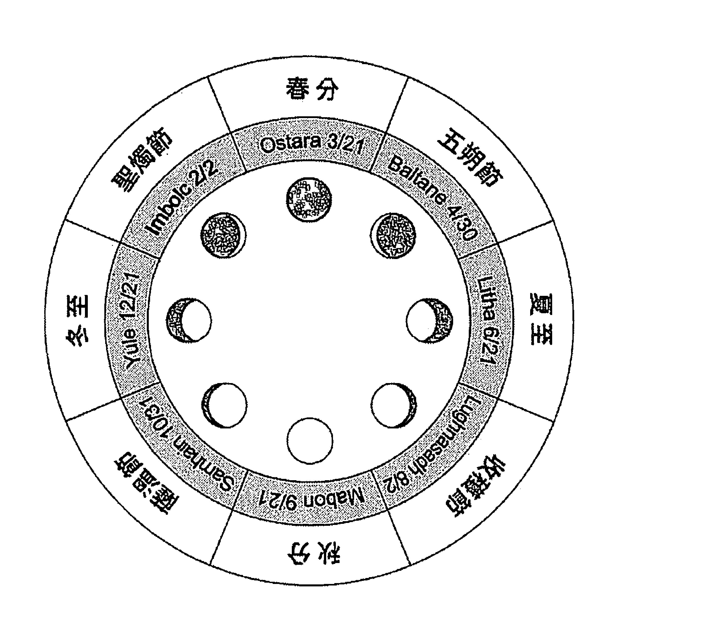
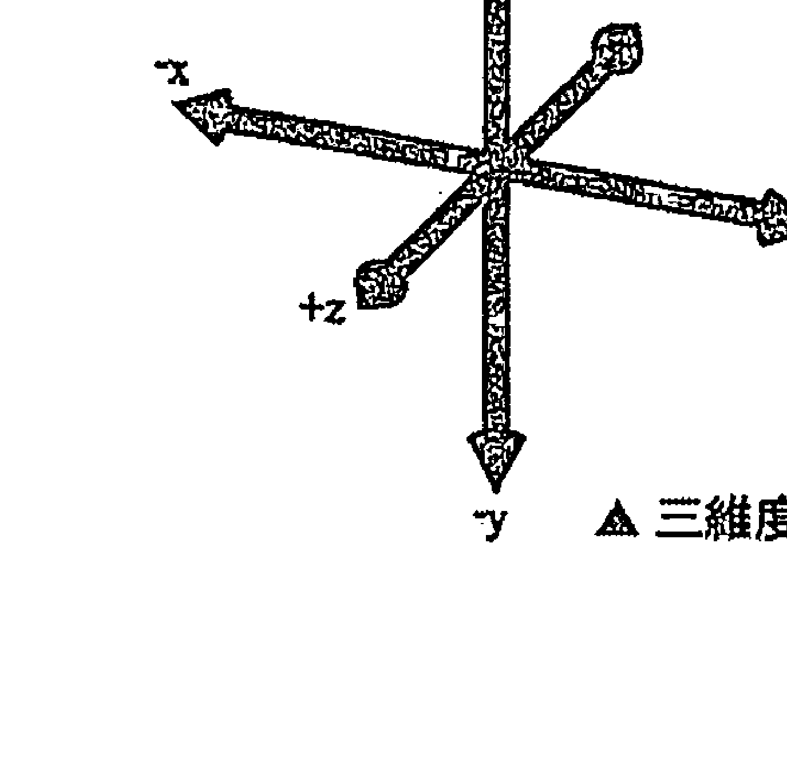
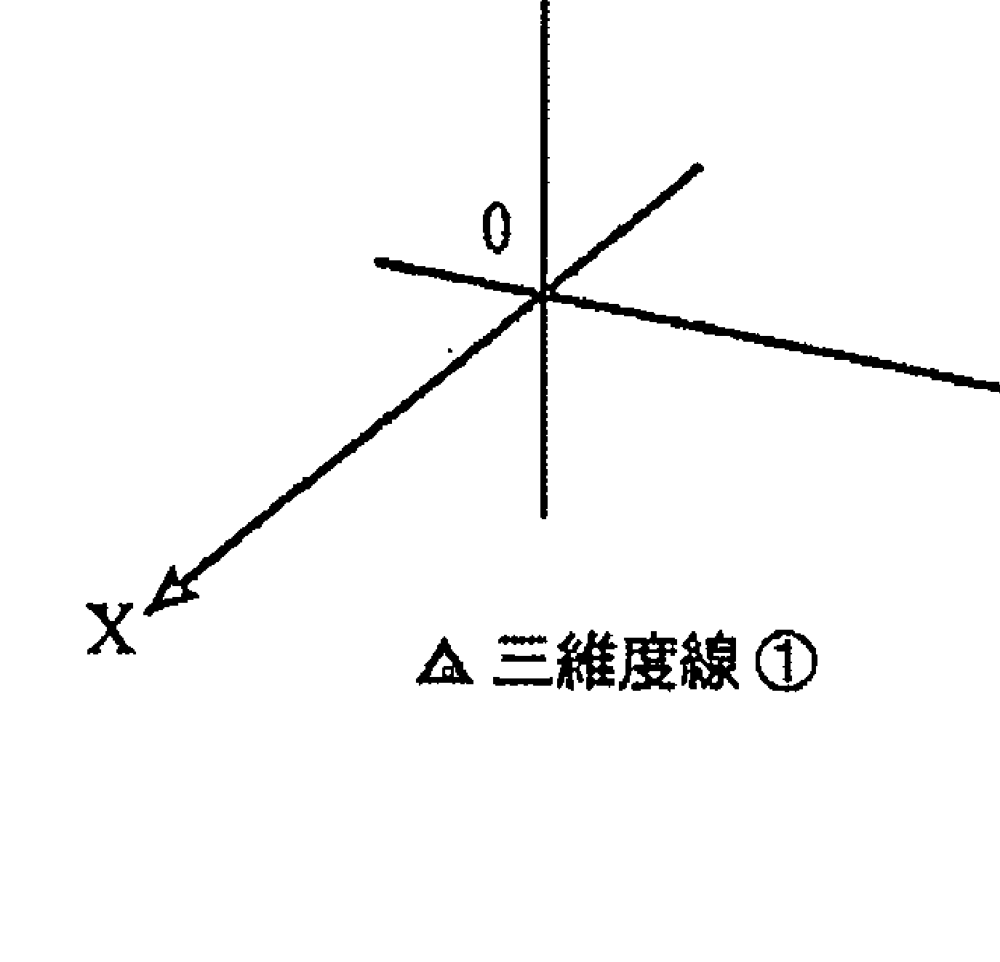
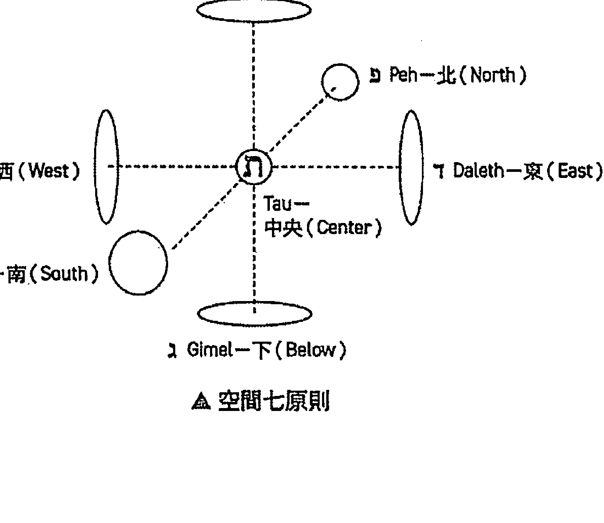
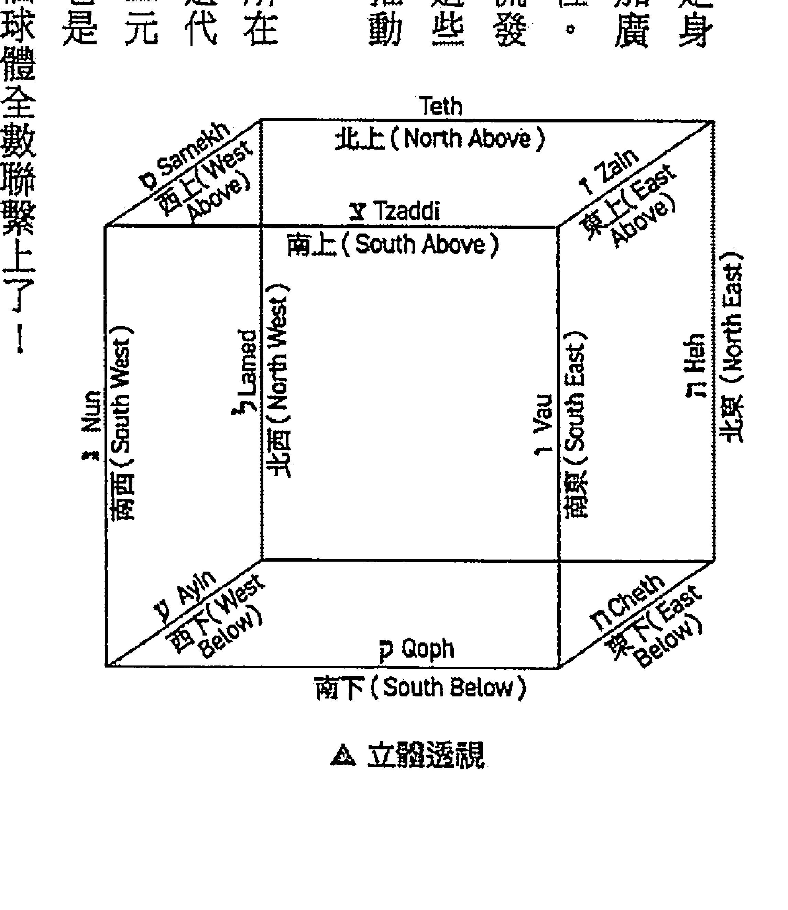
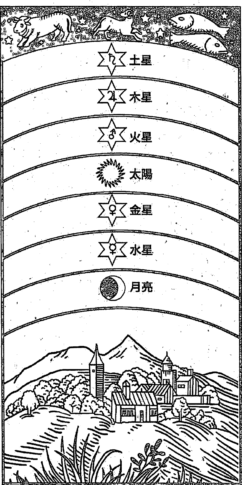
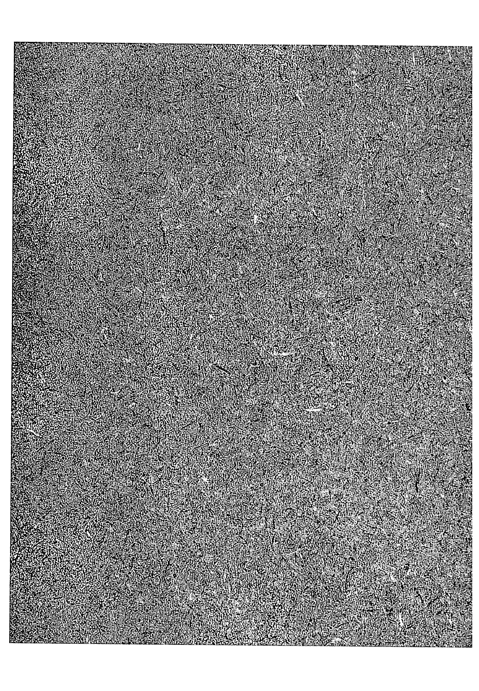
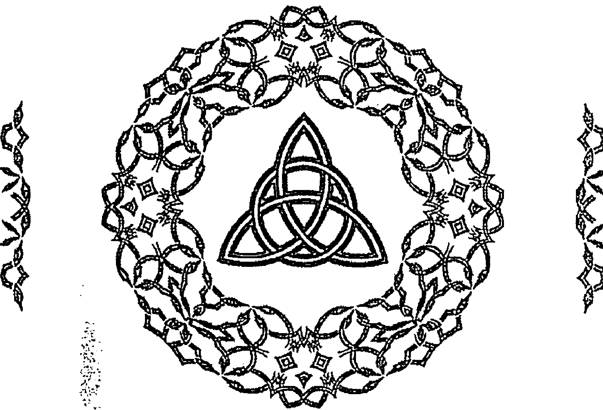

## 一個台灣巫師的影子書

# BOOK of SHADOWS of
TAIWANESE WIZARD

丹德萊恩——著

> 「一本足以列為經典之林的神祕學著作。」
愛智者書齋版主 鐘穎——專文推薦

揭露遠古魔法哲思精練內涵，開展自身靈性道途

我們憑著信仰而行，而不是憑著眼見。」—— 與神同工，尋覓意識深處的啟示之光

## 推薦序
華人界的魔法理論與
實務手冊

這是一本足以列入經典之林的神秘學著作。
西洋神秘學是匯聚了赫密斯教派、諾斯替教派與卡巴拉等思想，所熔鑄而成的龐大體系。當中涉及的神話與宗教類別之多，往往需要一般人用一生之力才能耙梳整理，乃至實修體悟。但本書的作者做到了，在中文文獻極度稀缺的情況下，華人界竟然誕生了這一本魔法的理論與實務手冊，標誌著全新的魔法時代已然來臨。
魔法之所以迷人，並不在於它繁複的儀式以及世俗的應用層次，更在於它精密的宇宙學架構以及它對全人發展歷程的深刻理解。當潛心於探究無意識的深度心理學指出了共時性的存在，量子物理學對微觀系統的觀測，兩者共同挑戰了物質與心靈的疆界時，神秘學卻以其超凡的哲思與體驗，早早指出了兩個世界的聯繫。
對神秘學與宗教的心理學研究當以榮格的觀點為最首要。榮格相當傾慕易經與道教，對占星做過深入研究，同時對煉金術情有獨鍾（後兩者都傳承了赫密斯教派的濃厚思想）。此外，他也不只一次被批評為披著基督教外衣的諾斯替教徒。易言之，諾斯替神話同樣是他心理學理論的重要養分。但根據榮格晚年的秘書亞非的說法，榮格是在晚年才開始研究猶太教與卡巴拉的。在那之前，他對猶太教的理解主要源於他的老師佛洛伊德，因此充滿了誤解。我們很可以推測，卡巴拉強調兩極與平衡的動態體系必定會使榮格相見恨晚。

在龐大的祕術哲學裡，其實分享著共通的理念，那就是：萬物同源。正因萬物皆出於一，轉化才因此變得可能。在這個觀點下，鍊金術強調的是藉由物質的轉化來使精神的變化產生可憑依的對象；魔法師的修練則是運用儀式來觀照內在的神聖火花，逐層開展，練就光之身。這其實就是鍊金術名言：「我們尋找的黃金不是世俗的黃金。」的另個版本。此處的光之身應當被理解為人內在的完滿自性，一個完整的人格領域，是六祖慧能「何者是你本來面目？」的探詢。

事實上，學習神祕學常常給人一種不食人間煙火，逃避世俗義務的錯誤印象。縱然在某些版本的諾斯替神話裡，人的肉身是讓神聖火花受到囚禁的牢籠，但從完整的角度而言，肉身與物質世界卻不是我們應該割捨的對象，臨床工作屢屢讓我明白，因限制（不論是命運、肉身還是其他）而帶來的苦難，往往是人開展出深度，開展出意義的前提要件。

這一點，我與作者的觀點相同，我們的目的是追求覺醒。至於覺醒之後的狀態是什麼形象（是小耶穌梅特塔隆還是本來無一物？），那都只是言詞上的分別而已。

猶如佛教後來有了小乘、大乘與密乘的分別，後者逐步建立起以手印、儀軌及咒語為基礎的具體實修步驟，神祕學也漸漸地從理論開展出不同的魔法儀式，這些儀式構成了本書的後半部。

從我的觀點來看，儀式的目的是為了穩定身心，其效果和正念相仿。都是要將意念固定在身體的運動與步驟的施行上，不使放逸。徒有理論人還不足以覺醒，魔法儀式之所以強調向四方的祈請，這是為了神聖化我們的居所，也神聖化我們的內心。而儀式本身也與符咒一樣，自成一種象徵。象徵是用來做為人類與神聖世界之間的橋樑，從而使我們在接觸上位的力量時能夠得到緩衝，同時也提供了魔法師可以用來運思的憑藉。

還請注意，儀式與符咒這樣的象徵與憑藉其實也就意謂了心念的力量。無形無相的空無與帷幕是有力量的，而假托於文字和語言的心念也是有力量的。當我們的心念被投向或聚焦在特定的事物上時，促動了整個自然科學乃至社會的進展。當它在睡前於你腦海中奔馳不停時，不也讓人失眠了嗎？魔法的儀式就統合了這兩者，讓心念能透過它傳遞向無盡的虛空，同時也允許虛空的力量向魔法師回流。

那虛空可以是我們尚不瞭知的原動天，也可以是廣大無邊的潛意識。請讀者允許我同時使用這兩種截然不同的語言吧！在深度心理學裡，神秘學所描繪的世界主要是一種象徵（包含生命之樹與希臘的天體模型），象徵著混沌與秩序並存的內在宇宙。我們是藉由對內在宇宙的理解，從而建構出對真實宇宙的想像的。

在這一點上，我認為神秘主義者早心理學一步建立起了對潛意識的現象學研究，而現代人的工作則是找出更適切的語言來註解它。本書作者丹德萊恩率先做到了這一點，我深深敬佩！所有教導人走向完整的學科都是心理學工作者的老師，關於此點，我深信不疑。

> ——愛智者書齋版主／鐘穎

## 自序

本書的內容，大多數都是整理自臉書粉絲專頁「一個台灣巫師的影子書」所發布的文章，這個粉專創立自二〇一六年的冬至，冬至在威卡的年輪之中，為新年度的起點——太陽聖子的誕辰，這其中當然有著對自己的期許，也就是我想好好的撰寫一本影子書。

影子書是巫師、女巫用來記載自己的咒語禱詞、配方比例、儀式步驟、實修心得、理論觀念的筆記本；換句話說，影子書裡面的內容本身，會因為每個儀式工作者所傾向的研究方向與工作內容而有所差異。

我個人最早接觸的信仰工作是威卡，這是一個自由度相對較高、入門門檻相對較低的信仰，而威卡還有一個有趣的特色，便是咒術工作的運用，威卡允許工作者操作治療、平衡與保護性的正面咒術，呼請特定職能的神祇，來幫助自身如願，因為普天諸神都是威卡父母神的萬千顯化。

而後來，隨著對於威卡神學觀與儀式工作的深入探索，我探詢到威卡更深一層的層面，如果我們對其追本溯源，會發現在威卡的信仰工作背後，蘊藏著西方的神秘哲學與西方儀式魔法的內涵。

也因此，我開始探觸西方神秘哲學與儀式魔法，這一頭栽入可不得了，我赫然發現這些古老的精神傳承，竟帶有如此精妙且深刻的內涵，從這些精神傳承之中，發展出了影響後世許多信仰工作的神學觀、世界觀與妙體觀，與作為實踐方式的儀式形式。

但很顯然，這些神秘哲學與儀式魔法工作，在西方發展的歷史進程中，是受到過中斷與誤解的，也因此有些工作的操作本身，因為繁文縟節的積累，而變成對於現代人而言太過繁雜而難以銜接的狀態；還有另一些儀式工作本身，是在欠缺了一個完整的信仰核心價值的狀態下，以偏重於個人物慾與情緒的滿足為前提，來執行可能會導致人偏激或迷失的儀式。

所以我想做的，是透過自身的實修角度，來嘗試建立起一個信仰工作的系統；當然，這個建立系統的工作，肯定有很多當代的宗師級人物做的比我還要好、還要完整，但我們不妨這麼去思考，每個人的存在、思維、想像、感受、意志都是不一樣的，我們都各自掌握著映射神性之光的一個面向。

在古代的先哲們，在同樣一道啟蒙之光的啟示之下深受觸動，遙想古聖先賢所經歷的那個永恆的當下，那是多麼純粹而聖潔的瞬間；為了銘記並傳承這樣的觸動，人類以特定的語彙、形象與工作來表顯這道神光，隨著時空的演變，在每個人的靈性體悟之中，形成了各宗各派的精神傳承，反映著不同面向的神性深度，但同時也混雜著人性各種各樣的權謀、需索與欲求。

於是傳承在一次又一次的解釋之下越發複雜、儀式在各種不明就裡的習俗與禮節的堆疊下，被不假思索的執行著，我們近乎斷裂了最初得見神光的那種直觀力。

儀式並不如繁文縟節、神性並不如晦澀難解，我們與這股精神力量的聯繫，並不會因為某種傳承思想的失傳、或某個儀式配方你不會操作、某個玄秘的神名你不會誦唸，而失去這樣的連結。綜觀古今，有多少偉大的精神傳承就此消失於時代的變遷之中、又有多少精密的儀式祕法就此湮滅於歷史的巨輪之下，我們會因此失去自我救贖的機會嗎？

不會。

學習很重要，但如何在文字與資訊的各種歧異之中、在各種崇拜權威與主流的迷思之中、在各種思想潮流的競逐與裂解之中，依然保有那一份純粹且融會貫通的直觀力，依然能看見那異中存同的暗流，看見那適合自身的道途，我想才是更重要的。

這本書，並不講什麼絕對的標準、真理、正統或解答，有的只是試圖以原初且純粹的眼光，來觀見人與神性的互動；每個人都有自我啟蒙、自我救贖的能力，它並不限定在某個傳承或組織的入門之中。

所以，我將本書定位為影子書，它是屬於撰寫者本身的心得與體悟，也是儀式工作如何操練的紀錄，用身為一個台灣人的角度，來學習西方神秘哲學、實修西方儀式工作，就跟在歷史上曾經出現過的許多記載咒術或儀式的莎草紙、卷軸、舊本一樣，它們有著那個時代的信仰或價值觀、也帶著那個時代的儀式風格，我們並不會全盤接受，更不會奉之為圭臬。

但我們會在各種層次的學習、歷練與證悟之中，學會辨識出那些對生命的成長、與更偉大的動態平衡有益處的部分，這些資訊可以讓我們借鑑與參考，從而幫助我們建立自身的信仰工作與開展自身的靈性道途，從而成就自身之所是。

這本書僅是其中一種路徑與方法，希望傳達給讀者知道，所謂信仰的道途會在每個不同的個體之上，綻放出不同的靈性之花，除此之外還有成千上萬條道路，願本書的內容能帶給您幫助與啟發。

非常感謝楓書坊文化出版社的支持，非常謝謝編輯陳依萱一直以來的協助與鼓勵，是諸位的全力相助，這本書才有出版的機會。非常感謝台巫影書的讀者們，一路的支持、互動與交流，創造出了各種思考方向的火花，才能促使我對於信仰工作的建立越發完整；紙短情長，只能誠摯的感謝大家！

## 目次

### 第一章：巫術與魔法

- 《導論：什麼是魔法？》……006
- 《西方神祕學的發展脈絡》……020
- 《何謂現代巫術 WICCA？》……028
- 《什麼又是傳統巫術？》……039

### 第二章：魔法的神學觀

- 《卡巴拉派》……051
- 《赫密斯派》……058
- 《諾斯替派》……066
- 《基督教》……076

### 第三章：魔法的世界觀

- 《生命之樹》……084
- 《希臘哲學天體模型》……094
- 《世界之魂》……099

### 第四章：魔法的妙體觀

- 《古希臘哲學的靈魂觀》……108
- 《卡巴拉的靈魂觀》……111
- 《五身一體與光之身》……125

### 第五章：魔法的靈學觀

- 《象徵、名號、形象與神靈的關係》……130
- 《力量極性的編織》……141

### 第六章：魔法師的秘密信仰

- 《光之身的凝煉》
- 《三次內在死亡》
- 《神聖守護天使》

### 第七章：魔法的基礎修習

- 《風元素的四拍呼吸》
- 《土元素的冥想內省》
- 《火元素的視覺化訓練》
- 《水元素的能量工作》

### 第八章：聖儀魔法

- 《卡巴拉十字儀式》
- 《小五芒星儀式》
- 《中柱儀式》

### 第九章：魔法的進階修習

- 《土元素的聖餐禮》
- 《水元素的施洗禮》
- 《火元素的放逐式》
- 《風元素的召請式與召喚式》
- 《乙太元素的祝聖式》

### 第十章：儀式工作的操作

- 《建立聖圈與召請四方》
- 《儀式工作的因果進程》
- 《月相與星期》
- 《魔法儀式》
- 《巫術祭儀》
- 《咒術編寫》

### 第十一章：法器、護符與咒物

- 《聖儀工作的五大法器》
- 《儀式魔法的祭壇架設》
- 《法器的煉化》
- 《淺談魔方陣護符系統》
- 《淺談所羅門大鑰護符——土星一至三護符解析》
- 《專題報導：魔杖》
- 《專題報導：大釜》

### 第十二章：補充資料

- 《卡巴拉的陰影面：靈殼與死之樹》
- 《卡巴拉的象徵系統與想像工作》
- 《隱藏在塔羅牌之中的隱密神話》
- 《現代巫術的日之慶典與月之祭儀》

## 第1章
如何提升
记忆力

### 導論
什麼是魔法？

我個人最早，的確是從威卡入門的。
原則上，威卡（WICCA）——又或者說是現代巫術，的確是初入西方儀式工作的一個，最容易上手、最方便操作的低門檻途徑。
我想許多朋友，在剛開始接觸所謂西洋的巫術與魔法的時候，除了從奇幻文學，例如《魔戒》還是《哈利波特》，乃至於一些趣味的古老童話、神話獲得最初的第一印象之外，第一次，或者應該說是最正式的第一次獲知西方的巫術與魔法這概念，乃至於真的投入到實際儀式工作的操作，大概就是透過威卡這個途徑。
也因此，威卡承接著一個重要的關鍵點，也就是讓有志於此的初心者，找到一個相當程度上的入門管道，一種信仰，以及與之相應的神學觀、世界觀、妙體觀乃至於終極目標的思想，以及與之所呼應的一系列儀式，要投入這一切並不簡單。
讓我們換位思考一下，如果讓一個長年處在基督宗教信仰氛圍的外國人，接觸台灣的廟宇文化與宗教儀式，一定也會不知從何著手，因為那是距離他太過遙遠的文化流風與信仰氛圍。正如我們，也不見得會懂得西方神秘學之中的神學觀與世界觀，即便在知識上我們知曉，也不意味著情感與意志上就已然參與進去。
而威卡的本質比較接近一種新興的宗教信仰，它扎根於遙遠的古老神話，但透過較為貼近近代哲學思想的方式去重新詮釋，並且透過西方傳統神秘學與儀式魔法所彙整下來的儀式工作，來作為一種古老巫術思想的重構。

既然如此，那就必然會接觸到一個重要且顯見的環節，也就是「儀式魔法」。它是西方的玄祕學問中最引人入勝的部分，無論是從小說、電影、文化與生活之中，處處都能見到被稱之為「魔法」的神祕技術。

在資訊高度流通的這個時代，魔法已經不再是西方的專有名詞，它變成一種普世共通的概念，甚至在東方人的文化之中，我們對於魔法，也已經擁有了一些最基礎的觀念。然而，謬誤卻也可能因此而生。

當我們對一個名詞沒有深究、沒有分析，只是抱持著模稜兩可的態度，去約略的理解它，那它之於我們便會是完全無益的。當我們沒有一個定見，那這個名詞的背後，將會是含糊的內容；而如果當我們有一天，需要接觸相關的事物，或與人溝通相關的概念時，那時候便會搞砸一切。

因此，在說魔法兩個字之前，在把魔法加入到你的語彙裡面之前，不妨可以想想：「什麼是魔法？」其實很多時候，一追根究柢，便會發現我們懂的，其實比自己想像的還要貧瘠，因為我們沒有對自己加諸這個名詞之上的諸多概念、猜想，做一個有系統的整合理解。

那麼，什麼是魔法呢？

「魔法」(Magic)——字面上的意思有魔法、魔術、戲法、巫術、神奇力量、不可思議、魔魅之力等涵義。換句話說，它其實比較接近形容詞：魔法的、神奇的、魔幻的、魔魅的，是指某樣人事物的神奇玄祕之處。

因此，這裡我們所講的魔法，應該是泛指各個文化中的許許多多咒術性質的行為，也因此「Magic」正確的意思應該是神奇力量之意。所以當我們單講到 Magic，實際上是指「Magic Spell」，也就是具有神奇力量的咒語。

否則如果將 Magic 單純解釋成魔法或巫術，它的意思會偏向鬼神、精靈或巫婆這種非人存在所發出來的力量，這樣的詞性是用來指稱不可思議、人所無法理解的、充滿問號與驚奇的事件發生。換句話說，就類似神蹟或妖術這樣的非人之力。

但魔法，顯然是人透過各種咒語、符咒、定律、儀式，藉此影響或操控某些神秘力量、神靈，以達成某些目的。也因此它正確的詞性，應該是用來形容咒術效應的形容詞，也就是魔法咒語（Magic Spell），即是魔咒。

這些魔咒其實普遍存在於你我的生活之中，甚至變成我們習以為常的習俗與傳統，從古老神話的年代流傳至今，也就是那些古代巫術信仰裡面的神秘咒術。

但，這還不是我們所要探討的魔法，這與其說是魔法，倒不如說是傳統巫術的魔咒。

我們所要探討的魔法，是儀式魔法，它奠基於數個西方傳統神秘哲學的觀念，以及其教派的儀典，藉著這些規則的遵守與儀式的步驟，去組合出儀式魔法實際工作的公式結構。

一般而言，我們所指稱的儀式魔法，就是指中世紀以來，至文藝復興時期所著作的魔法書籍，也就是被統稱為葛利默里（Grimoires）的，許許多多的魔法書之中所記載的魔法儀式，舉例來說，最著名的有：《魔法大全》（Heptameron）、《秘術哲學之三書》（Three Books of Occult Philosophy）、《所羅門之鑰》（Key of Solomon）、《所羅門之次鑰》（The Lesser Key of Solomon）、《神聖魔法之書》（Book of Sacred Magic）、《摩西之書、七書》（Sixth and Seventh Books of Moses）……等等。

所以，我們要探討儀式魔法之所以會演變成這種繁複的形式，就必須先了解傳統的葛利默里本身有著怎樣的文化背景，基本上葛利默里就是西方傳統神秘學（Western esotericism）內涵的集結，其中扮演主要角色的神秘學思想，便是以赫密斯派（Hermeticism）、古希臘哲學、猶太教的傳統與天使學、諾斯替派（Gnosticism）、卡巴拉（Kabbalah）為主。

也因為這些教派的教儀，也慢慢的匯集整合，在中世紀至文藝復興時期的魔法書之中，這些不同的教儀變成一種魔法公式（Magic formulas）的組合。這些公式講求時辰、設備、淨化工作、保護措施、召喚與遣回儀式、名字與符印，而這各個部分便形成了儀式魔法工作的結構。

當然了，教儀一旦被「妥善的」組合成一種魔法公式，自然而然，該教的教義與世界觀，也會潛移默化的影響整個工作的基調，而這些教義與世界觀也會如同教儀一般，被彙整成為儀式魔法的基本「教義」。

其實最主要也是因為，這些教義與世界觀的思想與結構都具有神似之處，即它們對於這個世界的理解、與人應盡義務的觀點同質性高，才會被編彙為一體，這也就是儀式魔法又被稱之為高階魔法（High Magic）的原因，儀式魔法整體而言，就是一種超然性質（transcendental）的工作。

受到赫密斯派、卡巴拉、諾斯替派……等教派之教義的影響，儀式魔法旨在意識的提升，藉由儀式的協助，擺脫物質界的蒙蔽與感官物慾，喚醒並引導工作者的靈魂，並且接觸更廣大的真實之源。其中赫密斯派的創世傳說，更是促成這種「精神與物質二分，且人須超然於物的思想」的主要一脈。

◆◆◆◆

這個創世故事，是神在Hermes Trismegistus進行默想之後所傳遞給他的訊息，被記錄在《秘義集成》（Corpus Hermeticum）第一書之中。在故事一開始，宇宙的開端即是「至高神」依循自身意志所引發的行動，而最初所創造的是物質，那也就是宇宙的構成。

從最初的物質裡，「至高神」分離出了元素，也就是：火、風、水、地。然後，「神」命令元素變化成七重天，也就是土星、木星、火星、太陽、金星、水星、月亮的界域，以圓周環繞天際且支配命運。

緊接著，從物質化的元素中，向外散射出神言（The Word），這使得它們缺乏智慧。然後這些四散的智性（Nous）形成統治者旋然降臨在物質界，且從他們的物質之中，產生了許多沒有語言能力的受造物。隨後大地從水中被分離出來，動物也自大地上誕生（除了人之外）。

然後「至高神」創造了人類，雌雄同體，猶如他自身的姿態，並且交給他去創造。人類仔細地觀察了他的兄弟（也就是那些智性）的創作，並且接收了他以及他父的權柄凌駕於萬物。之上。然後，人類起身從上界天體運行的路徑往下看，以便更容易觀察與創作，並且將萬有之形式顯化於自然界之中。自然界迷戀上人類，而且當人類看見自己在水面上，那與自己如此形體相似的倒影，便也迷戀上自然界，並且希望住在其中。因此人類就變得與自然同化，並且受其諸多限制所綑綁奴役，例如性別與睡眠。人類因此失去語言能力（因為丟失了神言），並且變成兩種性別，雖然存在變成凡人的肉身，但卻擁有不朽的精神；仍具有萬有之權柄，但卻受制於命運。

而關於人類的墮落，還有另外一種說法被記錄在《伊希斯與荷魯斯的對話》（*The Discourses of Isis to Horus*）一書中，是有關於人類飛升恢復的，記錄如下：「至高神」創造了宇宙，隨之也創造了每個領域、世界以及各種男神女神，且祂任命諸神至宇宙的某些部分。接著祂提取一種奧秘的清澈物質，這樣的物質顯化且創造了人的靈魂，並且任命它們到達星界的領域，物質界的正上方。祂指派這些靈魂創造大地上的生命。祂交付一部分具有創造神力的本質給它們，並且吩咐它們去更加豐富祂的創作。靈魂運用本質創造了各種動物與具有肉身形式的生命。然而不久之後，靈魂開始逾越界線，屈服於驕傲之下，並且渴望能與「至高神」平起平坐。

「至高神」不滿意這樣的行為，並且要求赫密斯創造肉體以禁錮靈魂，作為一種懲罰。於是赫密斯便在大地上創造了人體，然後「至高神」對著靈魂宣告它們的判決，宣判它們的苦難將在物質界中等著它們。但至高神仍很看好它們，如果它們在大地上的行徑，不愧於它們的神聖起源，那麼其狀況將會改善，且使它們在最終得以返回超凡的世界。但若不是如此，祂會將其定罪使之永墮輪迴。

也因此，基於心物二分論之下，三重世界觀慢慢的成形。三重世界觀的架構來自於古希臘哲學家亞里斯多德的宇宙模型，原本是用以解釋萬物始動、天體運行的宇宙觀，後來則是在與各種秘術哲學結合的時期吸收了精神與物質二分的內涵，變成一幅靈性提升的模型。

而說到赫密斯派，除了其中的教義影響儀式魔法甚深之外，他們的聖儀工作（Theourgia）也是儀式魔法的前身之一；一開始Platonist Iamblichus時期的聖儀工作，是柏拉圖哲學家所使用的高等工作，它旨在藉由專注於聖顯物（Sunthemata），將神聖的面向集中在靈魂之上，並喚醒靈魂相應的面向。

因此聖儀工作認為，當人的靈魂等同於神聖事物的時候，藉著人類存在中的神聖火花，人類得以共享相同的造物大能，正如創造者，可以合法的運用這股力量去參與宇宙的活動與開展。

但隨著文藝復興時期，赫密斯派與其他思想結合，此時的聖儀工作變成一種與天使或神靈合作的工作；在此同時，古希臘時期由沒有受過高等教育的農民所使用的世俗性低階咒法工作（Goetia），也融入其中變成一種與惡魔合作的工作。

而古希臘重視超然性的高階聖儀與重視世俗性的低階咒法，則形成了儀式魔法中的高階魔法（High Magic）與低階魔法（Low Magic）的差異（雖然後來低階魔法的定義又出現了變化）。

這點也可以從《所羅門王之次鑰》看出端倪，次鑰的第一部就叫做〈Ars Goetia〉，記載召喚地獄七十二魔王的儀式、名字與符印以達成世俗之願；而次鑰的第二部則叫做〈Ars Theurgia Goetia〉，則被用以召喚天空三十一神靈以揭示隱密之事。

也因此，雖然儀式魔法的宗旨就是一種超然性的工作，甚至在英文之中教儀魔法（Ceremonial magic）就等同於高階魔法，但儀式魔法的來源——葛利默里仍然包含了對於各種屬性模糊或惡性的靈的召喚與控制，這除了受到古希臘「咒法工作」的影響，其次就是受到猶太教，關於所羅門王奉上帝之名使役眾靈的傳說所影響，所以在儀式魔法之中，是有關於這些靈體的召喚，即俗世性質的魔法工作，但必須以更成熟的態度去運用它。

也因此儀式魔法中關於召喚的性質被分成兩種。第一種就是關乎超然性目的的召請（Invocation），召請所涉及的對象，就是人與上帝之間的中介者「天使」，Invocation 一詞又有祈求與禱告的涵義，意指這是一種需要虔誠執行的工作，這樣的召請儀式最主要是受到猶太教神秘主義與希臘聖儀思想的影響，藉由召請儀式的進行，工作者得以體驗到宇宙的運作力量，並且與之結合成為宇宙力量的體現與管道。

第二種，就是關於世俗性目的的召喚（Evocation），召喚所涉及的對象就是各種模糊或惡性的靈，也就是惡魔。之所以儀式魔法會容許世俗性的召喚工作，最主要是因為這樣的召喚，是必須在召請的儀式都已非常熟練之後，才會去執行的一種工作。就正如所羅門王藉由對上帝的虔誠信仰奉神之名去號令那些靈體或惡魔一般，儀式魔法中的召喚其召詞也都是藉著神之名去發出召喚徵調之令，所以世俗性的工作才會成為儀式魔法中的一部分。這是因為在這個前提之下，工作者比較不會沉溺在世俗的目的之中，而因此貶低工作者，使之偏離他自身的真實。

關於召請與召喚，近代的魔法工作者——克勞利（Aleister Crowley）也有一段精闢的解釋：

> 「召請是召來，而召喚是召去。這是在本質上具有差距性的兩種魔法。在召請時，是大宇宙湧入了意識之中。而在召喚時，魔法師本身將成為大宇宙，而去建設小宇宙。」
(To "invoke" is to "call in", just as to "evoke" is to "call forth". This is the essential difference between the two branches of Magick. In invocation, the macrocosm floods the consciousness. In evocation, the magician, having become the macrocosm, creates a microcosm.)

成為大宇宙，就是指魔法師是以與神合一的角度去使役眾靈建設世俗的。

當然啦，原則上我會認為，非必要的情況下是不應該動用到召喚魔法的，那種積極的招引強烈的靈或力來建設宇宙的工作，其實一不小心就會變成個人私慾所服務的傾向，而那通常是危險的，所以基本上儀式魔法工作的修習，主要分為以下五種：

- ◆ 土元素的聖餐禮儀（Eucharistic）
- ◆ 水元素的淨化魔法（Purification）
- ◆ 火元素的放逐魔法 (Banishing)
- ◆ 風元素的召請或召喚魔法 (Invocation / Evocation)
- ◆ 乙太元素的祝聖魔法 (Consecration)

而這五大元素，五個階層，正好在卡巴拉生命樹的中柱上，構成了儀式魔法之中的三重世界觀。前面提到，這樣的三重世界觀最主要是在文藝復興時期，統合了主要幾派的神秘哲學思想而形成的一種世界觀。

三重世界觀跟儀式魔法的關係十分密切，甚至可以說，從三重世界觀的概念底定之後，整個儀式魔法的工作，就是以這樣的世界觀作為整個工作的基礎概念。

也因此儀式魔法認為，物質與精神截然二分、極端對立，上界為精神的領域，而下界為物質的領域。心物之間具有非常大的差異性，要彌合精神與物質、神性與人性之間的裂痕，就必須跨越這樣的鴻溝；為了要跨越這樣的鴻溝，就必須要做好諸多準備，而這些準備，就是儀式魔法。

而三重世界觀，照著地心論的天體模型來看，會是如上頁的高低次序排列。

上帝居住在遙遠的原動天，而蒼穹就是那些分掌上帝權柄，具有大能力的天使或諸神居住之處，例如《魔法阿爾巴特爾》(Arbatel of Magic) 一書中就曾言明蒼穹是神靈的居所，這些神靈被稱之為奧林匹克之靈，居住在支承全天星辰的空間領域。這七位神靈的任務是宣告命運，且職掌這些決定命運的強大魔力，他們可以完全宰制世界，為所欲為、造作一切，只要他們不干涉至高神所指引的一切萬有。

這一點就跟赫密斯派傳說中，環繞天際且支配命運的七重天相似。而基本上儀式魔法中所有召喚的對象都來自於蒼穹。但是儀式魔法工作，要如何跨越物質與精神之間的巨大鴻溝呢？那便是透過中間的星幽界，也就是七行星運行的界域。

基本上星幽界具有非常特殊的地位，它作為物質與精神的中界，同時具有物質般的形體（因為具有可被觀測運動的星體，所以與原動天的純精神無形領域不太相同），與精神般的不朽（這點指的自然是星體永恆不變的運行），也因此在儀式魔法中，它被視為是精神與物質之間的交界。

也因此星幽界的定義除了七行星之外，它意謂著一種「人類比較容易接觸到的類精神領域」這樣的涵義（同時這裡也是一些接近物質界的低階靈存在的地方），所以不管執行哪種主題的儀式魔法，都是以涉及星界為前提之下去工作的。

所以，儀式魔法才需要縝密的手續、象徵工具與精神方面的想像工作，藉此來建立一個儀式空間。因為這是仿效宇宙的設計，更是為了要在物質世界建立一個與精神領域重疊的「交界」；這也是某種定義上的星幽界，藉由這樣的準備，以及意識的投入，我們才得以接觸到非物質的領域。

再者儀式魔法對時辰的考量，也是基於星幽界的概念，要找到最適合的行星日、行星時、月相或星座位置，才可以順利的聯繫到星界之上的神靈或力量性質。可以說儀式魔法的「空間」與「時間」都是基於三重世界觀才建立起來的。

也因此，不管是儀式魔法的任何一種主題的儀式工作，基本上都內含著心物二分論、三重世界觀的思想在其中，而這些事物也都是旨在進入星幽界，以聯繫精神領域的工作。
所以，討論至此，是否覺得顛覆了魔法在自己心目中的想像呢？魔法並非只是誦唸咒語、揮舞魔杖，而是一種信仰的實踐工作，這樣的信仰扎根於寓意深遠的西方傳統神秘哲學，我們很難去定義它究竟是神話、宗教，還是秘術玄學的產物，亦或者匯集各家所長，才造就了儀式魔法——這個奧秘而偉大的信仰體系。
但總歸來說，再偉大且寓意深遠的體系，如果我們不願意去深究，去理解其內涵，那麼魔法就只是魔法，它始終停留在某些大概的印象之中，魔法的名聲響亮，古今中外皆大鳴大放，但唯有挖掘名詞背後的秘奧，我們才能真正進入魔法的大門——踏進魔儀之道。
而我們正好說到了一個非常重要的主題——信仰。
儀式魔法，就同世界各地所風行的各個信仰體系一般有效且完整，我不會誇誇其辭的吹捧儀式魔法能有什麼樣的神效與力量，可以為人所不能為，世上有各種各樣的教派、術法、儀式、技藝、法門，它們都一樣有效，只是適不適合自己的差異而已。
儀式魔法就僅是其中一條道路、一個方式，與其他宗教體系不同的點在於，它不將儀式的責任委託給神職人員，而是要求每個人親力親為地真正參與在儀式之中，以免變成一種流於形式的宗教行為。
流於形式的宗教行為甚多，我們習慣委託神父、祭司、法師、巫師、道士去主持各種儀典，當然他們有他們的專業，但很多時候我們就會淪為一種投機心態，認為只要到場、只要出錢，又或者只要供奉祭品，那剩下的一切就會自動完成，神靈的護佑、災厄的化解、願望的祈求就會自動進行。
不信，不妨問一問自己，我們是否還懂得如何正確的向神靈祈求禱告，是否知道這些儀式背後的意義，又或者我們只是到場參加而已，而非參與其中。
而儀式魔法的用意，就是把原先自己應該肩負的責任挑起，我們天生就擁有施行魔法的能力，我們天生就能夠與自我內心深處的神性對話，我們天生就能夠在真心的祈願中，呼喚相對應的靈或力前來相助。
這些魔法的技能，並不是只存在於那些神職人員或巫師手中，你本身就是魔法之下最大的奇蹟，只要用心體會，將會發現生命與生活之中、自然與社會之中，處處都有魔法的痕跡。只是我們太習慣用一種名為「日常生活」的魔法，去經營自己的人生，以至於沒發現其他的可能性與創造力，而這些可能性與創造力，就跟信仰有關。
我不會說那種老王賣瓜的溢美之詞，例如「某某秘方的巫藥具有神效魔力」、還是「某某咒法力量強大速效」這類的神秘配方，還是不傳禁咒。
事實上，當一個術法系統，會強調自己能為人所不能為，自己才是具有神效與力量的，這樣的術法系統其實是過度自我膨脹的，也是搞不清楚狀況的。因為無論是哪一個系統，都有其極限，沒有所謂的百試百靈；而所謂的「效果」，再厲害的魔法師也不能保證能如其所願的百分百照目標實現。
儀式魔法，跟世上其他法門一樣有效，而世上的諸多法門，只要妥善的實踐，都能通往自我救贖之道，沒有誰比誰強。

儀式魔法之中所潛藏的神秘哲學，其實就是一種看待世界、看待生命、看待我們存在的本質與潛能發展的古老觀念，尤其在這個功利至上的時代，這個唯有物質與資源才是真實的年代，這樣的觀念具有相當的療癒性與開創性——因為它認為世界並不只有物質的、感官可觸及的範圍。

這個世界還有非物質的一面，人同時生存在物質與非物質的領域，人類物質的行為叫作生活，非物質的行為叫作儀式。而更多時候，它們彼此交融，息息關聯，密不可分，甚至就連動物，也都存在著各式各樣的儀式行為。

單純的為了物質而生活，那人猶如行屍走肉；而只追求精神生活，人無法維持正常作息，因此兩者對我們來說都同樣重要，而關鍵就在於如何權衡，然後健康地活著。

儀式魔法對我們來說，就是一種調整自我狀態的工作，它有其超然性的、精神性的一面；也有其物質性、功利性的一面。當我們將自身的狀態調整到最好的程度，我們的身心便擁有足夠的潛力，去解決生命中的各種狀況，而當我們準備好了，就連來自於超自然力的協助也會最為強大。

因此儀式魔法，並不盡然可以成就所願，但它提供一個管道，將自身的眼界從物質現象的領域解放開來，看清楚在除卻物質的幻象之後，自己真正的心願到底是什麼，藉此帶入了新的可能性與角度，帶入了新的角色與性質，讓我們帶著新的立場與影響力，重新投入我們的局面。

然後從無形的領域，觸發一道新的漣漪，波及現實生活，引發一連串的改變。這就是儀式魔法的真意，也是每個踏上魔儀之道的人，必須經歷的過程。

### 西方神秘學的發展脈絡

西方魔法具體而言是如何發展成形的呢？這個問題不好回答，因為它是在非常複雜且細微的各家思想彼此影響下所匯集成型的「成果」，要回答這個問題，必須追溯到它的根源——西方神秘學。西方神秘學有幾個發展的重要關鍵點，我們以下將依序做一個簡單的介紹。

### 亞歷山卓海港城——巨大的文化知識匯集地

亞歷山卓海港城是古代昌盛一時的文化與知識核心，該城匯集了埃及千年的神話素養、智慧文學、巫術儀式、占星知識與冶金工業技術、巴比倫占星知識、畢達哥拉斯主義、柏拉圖主義、斯多葛主義和諾斯替主義、猶太宗教之聖典、天使學與教儀、波斯人的密特拉信仰與其瑣羅亞斯德教義思想。

從這般精神文明的沃土中，生長出兩朵奇異之花。當然不諱言，在這之前，這兩脈傳承就已經潛伏了一段時日蓄積信仰力量，但也正是因為進入了這個偉大文化核心，才促使它們有更進一步的整合與發展。

這兩脈傳承一者為赫密斯派，另一者為諾斯替派。這兩派都是奠定於類似的基礎之下所發展的神祕哲學，但其核心思想導致了兩個派別的差異。
赫密斯派之中有其實踐的赫密斯三術，分別是：

- ◆ 占星術 (astrology，群星之術 [the operation of the stars])、
- ◆ 聖儀術 (theurgy，眾神之術 [the operation of the gods])、
- ◆ 鍊金術 (alchemy，太陽之術 [the operation of the Sun])。

簡言之，赫密斯派強調的是，我們可以透過占星術，洞悉物質界之上，群星的運轉背後，所要展現的神聖意志，由此洞悉更高層面的真實，並且透過聖儀術的進行，將自身的靈魂自物質與感官的禁錮中解放出來；接著透過鍊金術，冶煉己身所能觸及的「現實」，消解對立與衝突，燒除雜質與混亂，而促使周遭人事物在更高層面的終極實現。

而諾斯替派同樣擁有這三學的概念，因為諾斯替派本身就是一門高度依附的解釋學，它同樣有著占星術的天體模型概念，也一樣有著類似聖儀術的啟蒙儀式，也同樣跟鍊金術共享同一個拯救自然之母——智慧女神蘇菲亞的神話。

但是諾斯替將天體模型視為牢籠，大地其上的天空，層層都有阻撓我們超脫的行星執政官。而啟蒙儀式則是為了讓人類能夠迴避在靈魂上升的過程中，來自於行星執政官的重重險阻，藉此上升到全然美善的領域，獲得真知。而諾斯替雖然共享了同一位智慧女神的神話原型，但並非是為了催發物質世界的一切人事物往「自身的美善與終極實現成就」而去，而是意欲使人掙脫物慾的魔力，而使生命朝向精神性靈的目標。

所以說，赫密斯派和諾斯替派，在信念的表達上還是不太相同的。

### 基督教的昌盛期——基督教神秘主義

基督教發展自猶太宗教，據傳說則是由當時的耶穌，藉著重新詮釋猶太教聖經（也就是後來的《舊約聖經》），而開闢的一個新支派。祂的傳道無疑是深受肯定，因此吸引很多信徒，同時各種發生在耶穌周圍的神人神話也開始不脛而走，或許也是因此，威脅到以正統自居的猶太宗教，他們認為耶穌是異端，因此處死耶穌。

因此，基督教隨著耶穌的誕生、傳道、神蹟與死而復生，從猶太教獨立出去，彌賽亞來到，基督教於焉成形，但派系繁雜紊亂，那時的基督教還充斥著各種秘術哲學的擴充解釋，舉凡赫密斯思想，或諾斯替派的各種哲學與秘術實踐都參雜其中，也就是後來被通稱為「基督教神秘主義」的各種教派盛行。也為西方神秘學的匯集與整合，提供了一個初步的骨架。

### 尼西亞會議

一直到公元三二五年第一次尼西亞會議，從各家學說之中，確立了基督教的正統性，故此基督教開始朝向權威化的方向發展而去，勢力與影響力逐漸坐大，進而排擠了其他教派。

也因此這些古代多神教的傳統、又或者是秘術哲學的傳承，在基督教的背景下，被塑成外表有基督教色彩的各種魔法學說，以求避過教會的迫殺與控訴，在基督教的這個最大公約數之下，運用基督教的神學語彙，解釋自身的秘學思想，儀式魔法的前身——通稱為葛利默里的各種魔法書，就是在這樣高度壓抑的時空背景下緩慢成形。

### 十字軍東征

這是在羅馬天主教會默許之下，由西歐各地的領主所相繼發動的一場長達兩百年的宗教戰爭，而這場時間與空間規模巨大的戰爭，有利有弊，卻也因此促成了異地文化之間的高度頻繁交流，因此在西羅馬帝國滅亡（公元四七六年）後，便佚失的諸多秘密傳承，竟然透過戰爭的形式又回歸歐洲。

例如占星術，原先是赫密斯三術之一，在亞歷山卓海港城這樣的精神文明中樞發展成熟，但流傳至歐洲後，一開始是被視為貴族與皇室專用的秘學問，因此發展受限。而後又遭受到基督教的打壓，最後更因為西羅馬覆滅而使這門學術近乎消失無蹤。

但亞歷山卓海港城在七世紀便受阿拉伯人統治，阿拉伯人除了接收許多神秘哲學的紀錄之外，更將當時的占星術、鍊金術與魔法文本翻譯成阿拉伯文，並將其學術做了有系統的整理與發展，後來在十字軍東征時，又再度於約莫十二世紀時傳回歐洲，阿拉伯數字、數學、與數字魔方陣，也是由此傳至歐洲的。

這些異地文明的匯入，更進一步地促成了葛利默里，也就是中世紀那些林林總總的魔法書的成形與完熟。

### 文藝復興——各種神秘哲學的大復甦

文藝復興無疑是魔法史上最重要的一個階段，各種古老學說技術都在這段時期獲得了自由的研究與發展，主要是因為天主教會在經歷十字軍東征大事件後，威信已然掃地，再加上東征打開了歐洲封建社會的桎梏，而看到了外部的異地文化，由此而催生了歐洲人對自身根源的追尋，以及異地文化的好奇。

因此各種奇妙的神秘哲學思想開始大鳴大放，原先藉由葛利默里保存下來的隱諱學問，開始被諸多學者分析探究。

也約莫是在這段期間，卡巴拉派也匯入了西方神秘學的大熔爐。這掀起了西方神秘學的滔天巨浪。原先在歐洲的神秘學體系之中，已然有猶太教之聖典、天使學與教儀的隱諱傳承，再加上宰制歐洲冗長歲月的基督教本身，又是從猶太教脫胎而出的宗教，因此，身為猶太秘教的卡巴拉，很顯然在這片土地上適應良好。

除了生命之樹——十個輝耀與二十二條路徑（也就是二十二個希伯來字母）的世界觀與神學觀被引入之外，再加上許多神聖名諱、大天使名、天使名的秘密名字也都於此流傳下來，並妥善地融合到西方魔法的儀式工作之中。

也是在這段期間，許多魔法學專家乘著這股浪潮，出版了許多魔法學的研究論述。而這些新思潮，也在某種程度上，給當時權力過大而腐敗官僚的天主教會重重一擊，造成了一六八四年宗教改革，天主教會正式第二次大分裂，分裂成天主教與基督新教。

### 因此，魔法是什麼呢？

魔法是什麼？每個人都有不同的著重點與答案，對我而言，魔法是在歷史中，透過文化交流，學者投入了巨大熱忱的辛勤研究與整合，遭受了三流基督教信仰的壓迫，又學會以基督教的形式持存下來，最後透過戰爭打破了腐敗的威權體系，獲得了嶄新卻又似曾相識的異地文明。

魔法，就是文明與文明之間，透過各種形式的對話與交流，而促成的一脈西方精神傳承，它是文化互相影響融合之下，所誕生的神秘哲學實踐方式。也因此，要知道西方魔法是怎麼運作的，你就得理解其中的神秘世界觀、神學觀，乃至於核心的信仰與價值觀。

在魔法發展的過程中，由於遭受到很嚴重的打壓與扭曲，因此在魔法史的脈絡之中，不可避免的一定會混入一些奇思妙想或錯誤的印象，如果你沒有辦法先理解魔法的歷史，那麼便無法辨認出什麼才是儀式魔法的主心骨，而什麼只是錯誤的印象與扭曲。

再接下來，西方神秘學乃至西洋魔法的體系，長年來缺乏一個有系統的歸納與整合，各種不同層次的魔法工作都被混為一談。因此當你想學習魔法，也意味著你必須建立起一套有核心的體系。對你而言，什麼是儀式魔法中最重要的核心，而依循這樣的核心，依序建立起你的魔法工作的先後順序與上下層次。

舉例來說，有很多魔法書籍，記錄了許許多多舉凡以愛情、錢財、治病、好運、賭博、復仇、尋物……等等俗世需求為目的的祈願魔法。但這些祈願魔法，其實有絕大部分是鄉野迷信，卻也一併被記錄到魔法書之中；再者，如果你不是在一個擁有核心的前提下去執行這些工作，那這些魔法會造成你生命的嚴重失衡。

那該如何尋找到自己魔法工作的核心呢？

那就是誠實的面對自身的生命現象，然後從中尋找你當下的平衡點。

是的，無論是哪一種信仰，它終歸建立在人的生命現象之上，當你能誠實面對自己的身心，從一個超脫且平衡的中心點，去看待生命進程的起承轉合，你自然可以理解，在你的生命之中，存在著什麼樣的力量極性，它們又如何交互作用，最終編織成你所身處的現實。

因此，在生命的進程之中，保持動態的平衡，它能幫助你了解到什麼是你現下該做的，對你當前的生命最有益的魔法行為，而什麼不是。例如，有太多人對於祈願魔法有著強烈的依賴，一咒復一咒，想要索求卻沒有考量代價，沒有理解到自己的行為，正在嚴重的導向失衡，也正在耗損其他方面的魔法能力。

而之於這一點，透過五種儀式魔法的修習，可以幫助我們確立自身魔法工作的核心。而魔法能力其實就存在於你的生命之中，仔細的思考自身的天賦與際遇，消除不必要的癡妄與慾念，誠實的面對自己的不足與改進，進而找出正確的方向，回歸自己的平衡，這其實就是最偉大的魔法行為。

027

第 1 章 巫術與魔法

### 何謂現代巫術 WICCA?

威卡 (WICCA)，可能對於絕大多數人來說，這還是一個陌生的詞彙，它才開始在台灣流傳不過數年，或許有些身心靈或神秘學範圍的愛好者，已經聽過威卡一詞。在台灣也開始陸續有一些外文翻譯書，是針對威卡去進行論述，但始終無法清楚的介紹剖析威卡的本質。

基本上，大多數華文圈的神秘學讀者，對於威卡的印象不異於薩滿 (Shaman)、巫術 (Witchcraft)，不然就是將其視為魔法 (Magic)，又或者視為一種特殊宗教，但實際上這些說法雖然不算錯誤，卻都不夠精確，因為威卡是一種複合性的信仰，而且貫穿了信仰發展史的各個型態。

因此要了解威卡，首先得理解什麼是巫術，什麼是宗教，什麼又是西方魔法？

為此，我們必須回到信仰最原始的狀態，從人類最一開始的薩滿說起。

### 薩滿

我們必須先設想一個世界，在那個原始世界裡，人類所感覺到的，還不是我們目前所看到的世界的姿態，在一切都還是混沌未明的時候，你不會知道什麼叫做精神的，而什麼叫作物質的。對他們而言，夜夢與日常生活、精神與物質、想像與現實，兩者之間都還尚未分開，互相連成一個巨大而迷惑的世界。

在這樣的世界裡，想像力與幻象恣意奔流，原始人類以充滿情感的眼光看待眾生萬物，神靈、精靈、祖靈、妖怪、鬼魅被賦予了種種形象，在大自然現象之中無處不在，人類藉著心靈想像，參與在這個鮮明的世界之中；而這個世界的眾靈化身，也參與了人的心靈，這在心理學之中，又稱之為「神秘參與」。

但也因為如此，那時候的人類意識，是相當無力且渺小的，與眾生萬物產生認同、共感，因為這樣的神秘參與，他們找不到自己的定位與自我的界限，只能被種種自然因素與本能所支配。

也因此，這是一個神話的時代，人類甚至可以化身為神靈，在強烈極端的情感之下，展現神靈的姿態，這些被附身者、狂舞者，就被稱之為薩滿。這是人類最原始的信仰，它強烈地受到當地自然環境、生物與天候的影響，具有相當濃烈的地域性，這被稱之為——薩滿信仰。

而隨著社會文明的進展，人類已然發展出了一定程度的穩定意識，也就是說，他們漸漸從本能與狂性的時代，走到較為穩定的生活，也就是發展出了獵業與農業。為了生活品質與工作效率，他們必須採取更有效率的意識狀態，因此聚落、部族逐漸演化成各司其職的形態。所以與眾靈連繫、主持祭祀、占卜神諭的工作，就落在那些先天較容易觸及這種種心靈想像的人，在部落的語言來說，就是神靈選擇的代言人。這樣的人就稱之為巫師，而他們的行為也不再是訴諸激情的狂舞，而是開始有了一些傳承，年老的巫師傳頌久遠的神話故事，並教導新一代的巫師種種祭祀儀式與咒語，藉著信仰的傳承，巫師作為神靈與人世的橋樑，將心靈世界的引導與力量帶給眾人，這便是巫術信仰。

### 宗教

隨著人類語言和文字能力的進步，這些巫術的神話、祭儀、咒術，愈來愈有系統地被整理記錄並傳承下來，形成了一個核心思想，以及行為上的標準禮儀，這就是所謂的宗教「教義」與宗教「教儀」。經過了有意識的發展之後，在理想的情況下，它可以洗鍊掉那些過度地域性，或幾近於偏見迷信的部分，而追求所謂的普世價值；神性在人性的解釋、詮釋之下，逐漸與理智、文明與精神性靈靠攏，偏向認為精神、智慧、知識上的穩定與美好，以及在崇高的精神情操之下的愛與犧牲，為神性所在。因此宗教信仰跳脫了地域性，成為一種可以最低阻力傳教擴散出去的型態，同時傳教者不再需要天啟神擇，只需要熟稔教義與教儀，人也因此獲得了更有效率的生活，藉由閱讀經典、行使儀式，接觸神聖的精神，接觸自己的信仰。

### 哲學與秘術

宗教的教義發展到一種程度，它的解釋系統會愈發完善，因此教義所著重的對象，不再只是神靈，而是以宗教的教義為基礎去發展，進而解釋這個宇宙的萬事萬物，甚至反過頭去觀察、思辨並重新思維這些神話與宗教信仰。宗教教義藉著人的智識發展到一種極致，那便是哲學，又或者也可以說是玄學。

而宗教的教儀，也隨著哲學玄理發展出世界觀的情形下，將儀式從朝向神靈的紀念與祭儀，移往解構萬象萬物的運作原理與本質的種種玄秘之術、神之術，基於這些玄秘的法則與原理而運作的，正是後來我們所稱的秘術，又作魔法。

而跟威卡有關的秘術，也就是在這裡所提到的魔法，正是西方儀式魔法，一般而言，我們所指稱的儀式魔法，就是指那扎根自古希臘哲學，與猶太教神秘主義的實踐工作，它一路發展，從中世紀至文藝復興時期，形成了許多被統稱為葛利默里的魔法書籍。

基本上，葛利默里就是西方傳統神秘學內涵的集結，除了古典時代的古希臘哲學、猶太教神秘主義、赫密斯思想、諾斯替思想，亦在中世紀吸收了後來經過獨立演變進展的鍊金術與占星術思想，更於文藝復興時期匯入了極其重要的卡巴拉的傳承。也因此，這些神秘哲學的思想與實踐工作，在漫長的時空之中，慢慢的融彙整合，逐漸形成了屬於西方秘儀傳統的儀式風格與公式結構，也成為後世諸如黃金黎明會等秘術結社的儀式基調。

然而威卡，正是沿用了儀式魔法工作的結構，要談論這點，便不可不提及一個關鍵人物——傑拉爾德·加德諾。他被稱之為威卡之父，雖然早在他創立威卡之前，便已有著類似威卡的教團存在，據稱他本人亦曾參與這樣的教團，從中接觸到古老的凱爾特神話信仰。

但實際上，凱爾特神話的慶典、祭儀系統已然亡佚，只餘下民間的習俗與殘破的神話，甚至又參雜了許多他教神話；因此他所接觸的教團並不能算是純粹的巫術信仰，其完整性更完全不能稱之為宗教，這樣的教團，反而更接近近代新興哲學與秘術的階段。

一直到加德諾將儀式魔法工作作為骨架，藉此重構古老神話的慶典祭儀，才讓早已消亡多時的古老神話借屍還魂重新復活回來。以古老的神話與巫術信仰為教義，再以儀式魔法為教儀，威卡揉合了巫術與魔法，創造出一個特殊的宗教。

因此威卡並不好定義，它既是巫術神話，也是儀式魔法，更是宗教信仰，三者的特性它皆有之。故此，我習慣給它一個比較正確的稱呼——現代巫術（Contemporary witchcraft）。

然而這樣的現代巫術，有著什麼樣的教義呢？有鑑於它的緣起複雜，所以我們必須分三個層面來看。

### 獵神與地母

首先是來自於巫術信仰的教義，這也是威卡之所以被定義為古教的緣故，因為威卡的魂魄神髓就是來自於上古神話。那是個巫術信仰的時代，推測是薩滿時期逐漸演化成巫術時期便已存在的久遠信仰，其中影響威卡最深的，便是凱爾特神話。

而奇蹟似的，威卡所保存的，是凱爾特神話中最為精華的部分，凱爾特的文化隨著各種遷移、商業行為，甚至是戰爭，日漸與其他神話信仰結合，甚至可以從中找到對應羅馬主神的凱爾特神祇。但最一開始，凱爾特的神靈，又或者說是許多古老薩滿、巫術的神靈，只有兩位，那便是獵神與地母。

獵神是相當古老久遠的神靈，甚至在人類初期的薩滿信仰便已現身，祂與男性最古老的行業——狩獵業一同存在於人類意識的根基之中。上古時期，人類藉著狩獵動物的行為維生；因此狩獵的技術與動物的數量，和人類的生命息息相關。

因此從這樣的願望中，誕生了狩獵之神，祂庇佑獵人收穫，也司掌動物豐產的生育力；同時，人類為了感念動物的犧牲，也將動物的形象投射在獵神之上，作為一種慰靈的行為。因此獵神的形象時常是長著獸角的男性，背著弓箭或矛等狩獵武器，身旁伴隨著動物，祂同時融合了人類、狩獵與動物三重主題的形象。

一直到進入了巫術信仰的初期，人類開始發展出農業，那時候的風氣是男性從事狩獵業，女性從事較為穩定的農業，由於農業必須仰賴大地的豐產力，再加上多為女性從事，大地的豐產力與女性生育力的形象疊合，因此從農業中誕生出大地母神。同時地母也跟月亮產生關聯，原因是農業必須仰賴曆法計算週期性，而古時候月亮的盈缺是最容易觀測的天文現象，同時月亮的週期變化，也跟女性月經的週期類似。

然而到了冬季，日照縮短、冰雪覆蓋大地，農業便無法耕種，後來則演變成日照時間長的春夏上半年務農，日照時間短的秋冬下半年狩獵的情況，藉此維持一年四季的食物來源，也因此誕生出了威卡最重要的太陽神話——年度之輪。

先說到日照時間長的春夏上半年，由於農業的穩定，亦吸引了不少男性投入農業生產，也因此農業的守護神也開始產生了一些變化。各種自大地生產而出的果實、蔬菜與穀物，被視為地母之子的化身；原先狩獵業的男性神祇，化為年輕且活力十足的植物之神，活躍在春夏之際，隨著日光的增長而成長。

然而時序到了秋冬，日照時間縮短、萬物蕭瑟、植物凋零，這是個衰退消亡的時期。地母之子成熟老邁，化作熟成的穀物與果實讓人收割採摘，接著植株枯萎死亡，回歸大地。農業無法耕種的時期，就進入了狩獵的季節。

不管是日照的縮短、穀物的收割、果實的採摘、植物的凋零、動物的犧牲，都像是在呼應著這個季節的氛圍，狩獵之神的神性內涵逐漸豐富，祂非但是動物神、獵業神，同時也是穀物神、果實神、收穫神；更是死神，同時也是與日光週期相呼應，死而復生的太陽聖子。

因此威卡的太陽神話如此產生，狩獵之神的生命週期，便在這四季年度之輪中，周而復始的運行著。這也造就了威卡最有名的八大慶典，分別是——

- ◇ 聖子誕辰的冬至、
- ◇ 冬季結束日光回歸的聖燭節、
- ◇ 晝夜等長大地甦醒的春分、
- ◇ 生命力旺盛的五朔節、
- ◇ 成熟豐饒的夏至、
- ◇ 收割穀物的收穫節、
- ◇ 晝夜等長、豐收果實的秋分、
- ◇ 太陽神老邁消亡的薩溫節（萬聖節）。

狩獵之神衍生出了太陽神話、年度之輪的八個日之慶典，而大地之母則是演變出十三個月之祭儀。與日之慶典的歡樂活動相比，月之祭儀來得更加內斂沉思，一如它原先正是為了計算農業的週期而使用，月之祭儀也是用來反思內省，作好規劃與安排而舉行的儀式。

### 多神與一神

然而提到慶典與儀式，那就進入了威卡教義的第二部分——西洋魔法的儀式工作。雖然日之慶典與月之祭儀，在巫術之中有舉足輕重的地位，然而時至今日，慶祝與祭祀的古老巫儀早已消逝，若非透過西洋魔法的儀式工作，威卡的慶典與祭祀都無法再進行。

不過也因為沿用了西洋魔法儀式的因素，導致許多中世紀的魔法學與神秘哲學的元素，被融合到威卡之中。如前所述，魔法或秘術正是基於這些玄秘的法則與哲理而運作的。

也因此，即便威卡接觸的是古老的神靈，我們也沒辦法跟薩滿一樣陷入與神靈高度共鳴的憑身狀態，我們也不如巫師是受到神或精靈所選擇的代言人，有著代代的繼承；但我們可以透過神秘哲學的世界觀，透過魔法工作轉換意識的投射技巧，作為一種取代。

這個世界觀是由諸如赫密斯派思想、諾斯替派思想、新柏拉圖主義思想……等等，許多秘術哲學思想的匯集與整合之下，在文藝復興時期逐漸成型的「三界論」。

三界論跟儀式魔法的關係十分密切，甚至可以說從三界論的概念底定之後，整個儀式魔法工作就是以這樣的世界觀作為基礎概念。儀式魔法認為物質與精神截然二分、極端對立，上界為精神的領域，而下界為物質的領域，兩者之間具有非常大的差異性。

然而儀式魔法這般超然性的思想，卻隱隱帶著「一神信仰」的影子，也宣揚「人須超然於物，臻至至高的精神靈性世界」這樣的觀念。但這般看來，似乎與生活於自然界，順其四季運行的威卡相悖。

因此威卡的神學觀產生了一點微妙的變化，原先若單純論及古老神話的內容，威卡無庸無疑是多神論、泛靈論（也就是相信宇宙間有無數神靈存在，也認為眾生萬物有其靈性）。

但因為儀式魔法帶入了超在論的一神思想（也就是神不存在於物質世界，只超然於精神領域），這是完全相反的兩種信仰，因此在兩者之間逐漸出現一些緩衝的融合思想，也就是泛神論（整個自然萬物即是神聖一體），或超泛神論（神既是自然萬物，亦超然於物質界）。

因此威卡才發展出這樣的教義，認為一神性的靈魂存在於所有的生命與非生命，包含人、動物、植物和礦物。終極的創造神力會以男性與女性的形式體現，因此往往是以父神與母神為象徵。融合多神論與一神論，從神話、巫術與哲學、秘術，踏入了宗教化的一步。

在此同時，儀式魔法也帶來了一點影響，那便是四方天使的概念，在威卡原屬的神話信仰之中，並沒有所謂的四方四元素守護神，這樣的概念來自於儀式魔法結社，召喚四方守護天使的儀式。

但儀式魔法中，神與天使的主從階級之別，在威卡的儀式中並不存在，畢竟威卡實際上發展成了泛神論，在儀式中召請的所有神聖存在，其實都被視為父母神不同力量的化身，無分階級。

### 現代巫術

然後，融合了古老神話與哲理秘學的威卡，開始發展出核心思想，也就是宗教的教義，也就是威卡的第三部分教義——現代巫術思想，又稱之為新異教運動，這樣的宗教運動是一種對父權社會與一神信仰的反思與更新。

他們認為西方社會中根深蒂固的父神思想，已經導致諸多弊病，唯一真神的觀念壓迫到其他信仰，而男性主神的至高存在更是一種對女性的藐視，而倡導精神至上的想法，也讓我們在物質生活上失去了根基。

因此挾著這股反彈力道，現代巫術結合異教信仰、女權主義與泛靈思想（進而融入了生態環保議題），主旨於恢復兩性平權、眾神平等，致力於汰除宗教權威的體制，如先知、教主與不可質疑的經典，提倡信仰自由，不會透過教團或家族組織動員宗教集會。

且崇尚回歸神聖的自然大地，順應自然界的運行，從眾生萬物、森羅萬象中體會神聖的存在，與大自然和諧相處。威卡的咒術與技藝，其目的也是為了維持自然的平衡與身心的和諧安詳，以及趨近神性，藉此獲得指引。

而威卡最令人耳熟能詳的教義，就是三倍法則，無論以咒術行惡或行善，所招致的效應都會以三倍的反作用力回到自己身上，這便是來自於加德諾的著作《高等魔法的援助》（High Magics Aid）中的一段：

> 「汝當遵從此律。但凡印下良善者，屆時將得取良善，故此，術亦必然會返還三倍的良善。」(Thou hast obeyed the Law. But mark well, when thou receivest good, so equally art bound to return good threefold.)

因此威卡流傳著一句八字箴言，即是：「實現所願，勿傷他人。」(And ye harm none, do as ye will.)你可以完成你任何的願望，只要別傷害到其他人。因為傷害他人的後果，會遭致三倍的報應。

### 什麼又是傳統巫術？

前面提到了西方神秘哲學——西洋魔法的發展脈絡，那我們再來說說巫術又是怎麼一回事。原則上巫術誕生的時間相當早，甚至比西洋魔法要來得早，我們可以說，是巫術孕育出了魔法，甚至可以說巫術是所有宗教的前身。照人類信仰的發展史，最早的一種信仰形式是：

薩滿 (Shaman) → 接著是巫術 (Witchcraft) → 然後是宗教 (Religion) → 最後是哲學 (Philosophy) 或神秘學 (Occultism)。

薩滿的意思是狂舞者，也就是指被神鬼憑依後的狂舞躁動樣貌，我們台灣的文化有幸保留了薩滿傳承的一部分，那就是所謂的乩身，這幾乎是世界上碩果僅存的，仍與現代宗教信仰結合良好的薩滿文化了。

而薩滿的下一個階段是巫術，很多人似乎都覺得薩滿跟巫術是同一回事，但實際上，兩者雖然有發展上的銜接，但在人類的信仰形式來說，已經是差距非常遠的另一個階段性發展。

薩滿是相當早期的人類所發展出來的原始信仰，由於那個時候的人類，在意識上仍然與天地萬物之間沒有隔閡，因此容易受其靈感呼召，而遭到各種力量與意志附身或者著迷，因此才會有狂舞者的稱號產生。但由於缺乏傳承與記錄的緣故，因此當時的人類，意識是處在大起大落的瘋狂階段。

一直到語言與文字被充沛的運用，傳承與記錄之後，人類開始可以依循著某些安全且既定的先人道路，去接觸穩定的保護著自己部落村莊的特定力量。而這就是巫術的起點，巫術的傳承依然會保有某種程度上的神擇與超自然的靈感呼召，但對象並不是整個部落，而是特定的適合人士，而使他在通過考驗之後成為一個巫，成為與大地聯繫之人。

因為與自然諸靈諸力斡旋的角色，被交託給一個適合的聯繫者，部落村莊的其他人才得以各司其職，藉此促進了狩獵與農業的發展，否則一群人成天說神道鬼、膽戰心驚，根本也都不用生活了。

而巫術的傳承累積久了，包含巫師在經歷累積了諸多學識與自然之智慧的時候，這些被記錄下來的知識與咒術、儀式，就成為了多神宗教的基礎，也就正式邁入了宗教的領域，也從帶有地域性的巫術，變成了帶有傳播性與普世共通性的宗教。而多神教後來往往單一主神發展，單一主神後來往一神宗教進展，乃至於發展出各種神學理論。

而後來宗教發展成哲學與神秘學的過程，我們在介紹現代巫術威卡的篇章有提及，那是因為單一信仰坐大，而排擠了非主流的思想，因此那些非主流的部分，轉而成為哲學與神秘學的形式發展，乃至於後來發展出秘儀與魔法；如果是在一個信仰包容度寬大的土地上，則會變成神秘主義偏重的宗教，例如台灣的道教，除了科儀與教義的部分，外圍還無縫接軌的富含了術法、風水、通靈、占卜、靈修、氣功……等等的豐富元素。

大致上把信仰發展史給簡單帶過之後，相信大家最想知道的還是巫術與魔法之間的差別。這麼說吧，如果用一句話來總結巫術與魔法之間的差別，我會認為：

魔法扎根於生命之中，為的是找尋你生命現象中的核心與平衡點，藉此在動態的流變中，進展自身的魔法能力，進而促成一次次當下生命的平衡，進而煉化轉變你所身處的「現實」。

而，巫術扎根於大地之中，為的是服務你所生存的這片大地，以及其上的所有存在，認識當地的自然界動植物，了解當地存在著怎樣的力量流動與力量特性，駐守著怎樣的神靈，學會與祂們合作，藉此疏通力量流動的阻礙與混亂，促成當地的力量平衡。

講力量的平衡如果有點模糊，那舉例來說好了，古代的巫師也同時是醫師，巫醫本一家，所以對於當地的植物藥性（力量特性）是必然要熟稔的。當疫病這種巨大的汙染力量來襲時，藥草可以作為與之抵抗的大地療癒力量來保護生靈，疫病與療癒，這本身就是一種力量的斡旋與平衡。

再舉例來說，一個村莊如果發生不祥的事件，例如連續死亡，巫師也必須出面請示當地的守護神，並進行巫儀驅逐邪祟，保護村莊，這也是一種力量的平衡。當然啦，村莊裡面規律的祭典、慶祝與儀禮也是巫師負責的範圍，藉由這些儀式達到與自然界的共處，藉此祝福村民走在自然天道的規律之中，這也一樣是一種力量的平衡。

所以嚴格來說，巫術比起魔法，它所注重的層次不太相同，比起為個人的生命負責，它更傾向於為一個環節或環境服務。因此巫術在某種程度來說，更困難於魔法，雖然魔儀之道走到一個究竟，也會到達這個境界，但如果走的路徑不同，兩者所成就的道也會不盡相同。

因為魔法師會先著手處理自身所處的「現實」與「生命現象」，進而使正向的改變慢慢擴散而影響到周遭的人事物。但巫師的入行完全不是同一回事，絕大多數的巫師是因為神擇，也就是當地的守護神看上你的資質；又或者是因為血統而傳承，又或者是因為體質而帶有「巫疾」，必須半強迫式的投入於服務大地的「職缺」。

因此，有些巫師很可能會在一點術法基礎都沒有的情況下，就得一頭栽入力量與意志的斡旋之中，一開始大多都會失控地爆發出通靈能力，那會是接近精神崩潰的劇烈經驗。巫師會在啟蒙神靈的指引下，經歷一種劇烈的脫胎啟蒙過程（通常會爆發出所謂的巫疾，罹患一系列身體與心靈的怪異疾病）。藉由克服這些考驗，喚醒自身與大地相連的生命本源（也就是你動物力量的化身），然後轉生成為「與大地聯繫者」。

巫師是將自身奉獻於大地的角色，與他所服務的那片大地同化，成為居間的協調者。這是很神聖的行為，因為他犧牲了自身的所有魔法能力，為了這片天地而服務。所以他的發展與潛能也會受到限縮，他無法呼喚自身服務的大地之外的神靈或力量特性，當然他可以透過一些咒術編排與法器特性來輔助不足的部分，但歸根究柢，他沒有扎根於自身生命的魔法能力。

換句話說，就是核心不同，巫師的核心在於聯繫與服務大地，所以他依循著這片土地上所傳承下來的巫術途徑，去處理發生在這片土地上的種種事態；而魔法師的核心，在於辨識出自身生命現象之中，各種神性力量的痕跡，進而在各種極性相互對立、抵銷、混雜、糾纏的生命現象中，理清自己的平衡之道，從而朝向自身所能實現的終極潛能與天命而去。

而在這樣的過程中，我們會接觸各種編織進我們生命中的神性力量，從而獲得支持我們生命的力量特質與魔法能力，因此魔法師發展的速度雖然緩慢，但卻牢牢地站穩自身的腳步。

但相較之下，巫術則是以一個劇烈的脫胎過程與啟蒙儀式，在啟蒙神靈的指導下，使巫師以最短最快的方式，獲得動物力量化身。他直接呼喚了自身生命中，與大地相聯繫的那一部分，但那也同時伴隨著巨大的風險，那等同於你得在非常短促的時間內，去消化承受許多年才能內化的心靈衝擊與拉扯，藉此使你的心靈素質與你的動物化身更加接近。

而有些過早接受啟蒙的巫師，對自身的生命扎根得不夠深，即便有啟蒙神靈的協助，甚至可能有了某種程度的動物力量化身，但由於自己尚未完全克服轉生的考驗，也尚未完全脫胎，便投入到力量與力量、意志與意志之間的疏通與協調，因此常常處在失衡的邊緣，以及人性與大地天性之間的拉扯。

好，除此之外，前言說過：「他直接呼喚了自身生命中，與大地相聯繫的『那一部分』。」是的，這只不過是你生命本源的一部分，因此它之於你的生命，是會有某種程度上的偏差的，這也正是巫師會限縮自身魔法能力的原因，因為那不是扎根於你自身的平衡之上，而是扎根於大地的平衡之上。

因此，視巫師所遭遇的啟蒙神靈而定，大部分的巫師會與大地之中，天使力量的化身，也就是創造與療癒的神靈有所呼應，而走上保護與治療的巫師之道；但大地與自然本身，並非只有創造與療癒，自然本身是中性的，所有的力量動態都有其生剋消長。也因此，一個巫師也可能被大地之中的惡魔力量之化身，也就是破壞與死亡的神靈所啟蒙，然而這也是自然界之中的必然，是另一種促成平衡的形式，無關對錯是非。

前言提到，巫術在長年的發展下，累積了豐沛的傳承與紀錄，還有諸多咒術與儀禮，這甚至成為了宗教的養分。但巫師之中還有一脈分支是咒術師，他們直接學習其中的咒語術法，也不為大地服務，只是擷取大地上的力量特性、巫儀之中的咒術編排、法器特性轉為己用，為咒術師個人的意志所服務，進而施展各種私慾取向的咒術。

不為了平衡而服務的咒術，原則上算是呈現了巫術之中的黑暗面，挪用了大地本身的力量，卻是導向個人的利益取向，甚或是劍走偏鋒的，與極端的力量與意志合作，透過豢養與利益交換的方式，來滿足自身的慾望與情緒，這會導致某些危險與失衡的後果。

而回歸正題，相較之下，魔法師好像比較顧慮到自身精神靈性上的平衡，但實際上兩者的最終目的是相同的，只是他比較傾向於將自身的平衡建立起來，再藉此服務於更大的平衡。但這樣的過程是漫長的，而有些地區的力量流動，處於極度失衡的狀態，刻不容緩，因此就會緊急調動一些適合的人來服務於大地。

看起來魔法師顯得有餘裕許多，這也是我覺得人並不需要急著投入巫術領域的原因，因為那除了需要穩健的生命基礎，更需要非常偉大的覺悟。如前所述，魔法師扎根於自身的生命，因此若沒有與當地力量接觸的必要，自然也就少了許多見識與經驗，也無法開拓這方面的眼界，成長始終來自於新事態的推敲與擊打，當然這樣的成長有時得付出嚴重的代價，相比起來，魔法師的成長可能會顯得穩健而緩慢。

但我們不急，我更傾向於先將自身的生命，建立起一個動態平衡的機制，這樣如果有朝一日我們必須踏上巫儀之道，那也會顯得穩健安全許多。始終記住，你可以成為你生命之中，冶煉出奇蹟的魔法師，但能不能成為巫師，則是大地的選擇。

## 第2章 流体力学基础

儀式魔法本身雖然是奠基於神秘哲學的思想模型與實踐工作，但實際上如果沿著脈絡往上回溯，這些秘術哲學，其實最初來自於各種古老的宗教信仰。宗教信仰從嚴謹的崇拜與敬仰，恪守教義與戒律的階段慢慢轉變，開始有一些新血，加入到這樣的信仰氛圍之中，並且用新生的觀點，為古老的宗教帶來生命力與轉化，以更加符合隨之改變的時空環境。

而這樣的轉變，就稱之為秘術哲學、神秘學、玄學，它們進一步以不同的角度去詮釋宗教的宇宙觀與教義，摹想世界的運作規則、人的身心結構、神靈的存在狀態，甚至改變了儀式的性質，以及與神靈互動的模式。當然這在保守派的眼中是觸犯禁忌的行為，因此秘術哲學也常常變成遭受誤解與打壓的一方。

但這並沒有折損它們對思想發展與進步的貢獻，秘術哲學透過對起源、對神靈、對宇宙、對人類……等等存有的深度觀察與深思冥想，以宗教為養分，發展出了以人的角度與情感為主的——對於這個世界的理解，以及對於森羅萬象的一種古老認同感和神秘的參與感。

這些理解、認同與參與感，就是秘術的實踐工作，也就是我們所稱的儀式魔法。然而我們有提到，這些秘術哲學乃是奠基於宗教信仰而來，那麼在魔法師的眼中、在秘術哲學的理論中，所謂的「神」又是以怎樣的概念存在呢？

對於魔法來說，這裡所提到的「神」，其實就同所有一神教的神學概念那般，祂是全然一切的起因，不管是物質還是精神，不管是實還是虛，不管是心靈還是身體，祂包含了一切造物的所有可能性，是一切還未開始之前的，寂靜無聲之意誌的發源處。

在那樣的終極一體狀態中，有種強大但未顯的潛力隱隱流動著，有人稱之為「無」，有人稱之為「全」，但卻並非真的空無一物，而是他處於一種最為神妙的存在狀態，他是一種「存有」，但卻是以「無」的形式存在著。所有的一切都被補足，圓滿自有的純然消融之姿，就如同佛家所說的「真空妙有」。

然而從這樣的圓滿狀態中，強大的潛在能量終於破殼而出，就像是整個宇宙的日出那般，太初的第一天終於被啟明了，那是極其完美、美善的存在狀態。在卡巴拉之中，這樣的存在被稱之為亞當·加達蒙（Adam Qadmon），是最究極至尊、陰陽同存的至聖者；是與神的形象相同的光明之子，他以不可思議的方式顯化而存在著，不同於「空無」的圓滿消融狀態，他是「存有」的圓滿顯化狀態，以另一種方式表現神性的豐足完美。

不過，「空無」終究與「存有」是不同的，就像「潛能」終究不能百分百轉換為「表現」，神性的完美無缺，只有在隱而未顯的狀態才是全然的。一旦被神的化身，也就是光明之子顯化出來，那麼神性的潛力，可能就會有著不同的表現，神的光輝也會受到扭曲與消滅。

這就是「存在」必然會造成的「餘波」，而正是這股餘波，導致了亞當·加達蒙靈魂的分裂與墜跌，導致了神性力量的各種屬性彰顯，導致了宇宙眾生萬物的創造，導致了精神與物質的分裂。

魔法師所謂的神，即是這股餘波之上的太初之源，也就是神性一體兩面的「存有狀態」與「消融狀態」……。這裡也說明了儀式魔法為何是一種超然性的工作，正是因為它旨在藉由儀式，探觸更廣大的真實來源，喚醒被物質存在所帶來的感官衝擊所淹沒，已然忘記自己神性質的靈魂，藉此修復這個世界，回歸神性的源頭。

神性的存有與消融、張顯與內斂，正好也彰顯了召喚與召請的兩種特質，在召請儀式之中，我們消融於神性，回歸源頭。在召喚儀式中，我們以神性的完美存有，令秩序與圓滿顯化到我們的世界之中，藉著特定的神性力量屬性，或號令靈性存有，修復並調整我們的世界，令世界中錯誤的部分被更正。

然而，這並不是那麼容易的，人所存在的物質領域，與神性存有的精神領域差距太遠，人的靈魂也與神性的頻率相差甚多，所以還必須透過一些神性力量的屬性，讓我們能片面地、循序漸進地接近神源，那就是所謂的仲介者、魔法師的神聖守護天使，又或者是秘密信仰的部分，這點將會在〈魔法師的秘密信仰〉一章中提及。

### 卡巴拉派

由於卡巴拉對於儀式魔法的影響甚鉅，甚至就連上文對於儀式魔法的神學觀的概略解說，也都有很明顯的卡巴拉痕跡，那究竟是卡巴拉呢？用比較簡單的方式來說，卡巴拉就是從猶太教之中發展出來的秘術哲學。

這樣的神秘哲學對於神，也就是猶太教之中的上帝雅威（Yahweh）作了一番探討與聯想。要說到卡巴拉最逼近神的概念，就當屬虛空之三簾幕。

- ◇「אין」(Ain)
- ◇「אין סוף」(Ain Soph)
- ◇「אין סוף אור」(Ain Soph Aur)

最初的 Ain，是「無」的意思，這個狀態無法做出任何定義，在相關的文獻中，只有提到，這裡是「寂靜無聲之意誌的發源處」，超出一切的最初原點。

為什麼無法做出任何定義呢，在於當我們要解釋一種現象或存在時，我們只有兩種方法，第一就是去指出它的存在，例如「桌上有一顆蘋果」。我們藉由蘋果這個名詞，藉由它的位置，來理解它以什麼形式，存在於何方。

第二就是藉由一樣東西的不存在，來反襯出另一種東西存在的概念，例如冷與熱，藉由熱的定位，來理解冷的概念；例如光與暗，藉由亮度的降低，來理解黑暗的概念；例如存在與虛無，藉由存在的消失，來理解虛無的概念。

但是，當你無法以「直接」或「間接」的任何方式，去指述一個存在或不存在時，人的語言跟想像力就變得無用武之地。因為，所有的概念都收攝在那一個原點之中，你可以用來定義的各種狀態都不復存在，甚至連「不存在」本身也不存在，在這種情形下，「神」處於一種人智全然無法理解的奧妙狀態。

Ain Soph 則是一「無限」，祂開始有著一些狀態被彰顯出來，無限的意思就是沒有限制、無限，因此我們多少可以透過間接的方式理解，所有侷限的消失，就是無限的存在本質，這裡被形容為是：「此處為一片黑暗，不被侷限之處，其超越眾光。」但實際上，黑暗卻也不是我們所理解的黑暗，祂是超越眾光的黑暗。

就是我們在前面的魔法神學概略中有提到的，宇宙在開展之前，那隱隱流動的巨大潛力；在太初的日出之前，整個宇宙的暗夜狀態。因此這裡的黑暗並不是指光的不在，而是更古老的，光明乍現之前的隱性潛在能量。

Ain Soph Aur 則是一「無限之光」，我們在此就可以以類比的方式，去理解無限之光究竟是怎樣的狀態了，照著字面上的意思，祂是毫無侷限的無盡光明，這裡的形容也大概是如此：
「此處為一片無盡浩瀚的無色光明，為超越所有設想的地方。」

當然了，重點在於「祂是超越所有設想的無色光明」，是透明的光輝——不同於太陽光，也不同於火光，按字面所說，祂是超出了所有形狀與顏色的光，也因此祂也不能以我們所認知的光明去定義。

「無限之光」是在「無限」的黑暗之中，所存在的隱性潛在能量，從隱而未顯的內斂狀態，轉變成一種爆發性的、擴張性的陽性力量，就如同光芒一般綻放、四射，但祂並不是光，而是一種顯化的衝力，若真要說的話，祂理當是光的前身。

因此，虛空之三簾幕，以三重的方式，演示了宇宙日出之前的巨大能量流變，這是神性之中最為奧秘的環節，是神性的虛無消融面，同時祂也是孕化出光明之子，也就是神性的實存顯化面的太初之神源。

於此，宇宙迎來了第一道日出，宇宙的存在本身就是光明之子，也就是亞當．加達蒙。

但亞當．加達蒙發生了意識的變化，原先祂是人格、情感、智慧都臻至完美的「全人」，也就是在無限的狀態中與神合一者，又稱神覺（Yehidah）。

神覺，象徵著宇宙還融合為一體的那個階段，也對應生命之樹的第一個輝耀——王冠（Kether）。

隨著無量光的顯化衝動，這樣的完美存在誕生了，但伴隨著祂的顯化，祂開始意識到自我的存在，光是產生自我意識這一點，就讓神性的充沛力量產生了質變，也因此祂不再是與神合一者，從神覺之中，祂發展出屬於亞當的意識，這樣的意識狀態叫做靈覺（Chayah）。

「Chayah」這個詞在卡巴拉之中，有著生命、活力、呼吸之意，意謂著一切生命力的總和，雖然脫離了神覺，但靈覺本身依然是相當美善至高的狀態，祂依然是大覺悟者，可以體悟神性。

而靈覺的強大生命能量，也創造出了一個世界，卡巴拉稱之為「原型界」（Atziluth），也就是具有爆發性、發散性、擴張性的，不斷湧現最初生命能量的神聖世界，也對應生命之樹的智慧輝耀（Chokmah），同時智慧輝耀又被稱為宇宙之父，陽性的原型力量。

然後，靈覺的意識又開始分裂，就像是一場宇宙規模的精神分裂那樣，原先純然一體的生命能量，因為不停的向外發散，祂猶如點點星火般四射，最後分散，神性的意識也就此化為綿密而繁複的，眾生萬物共通互連的靈識（Neshamah）。

Neshamah又有神之氣息（breath of God）的稱呼，意思是自神所散發出去的呼吸。陽性能量的擴張到了極致，就會轉變成陰性能量的分裂與冷凝，這個轉變創造出了第二個世界——創造界（Beriah），此處也對應著生命之樹的領會輝耀（Binah），同時也是宇宙之母，陰性的原型力量。

這些分散出去的神性碎片，又或者你想說是神之氣息也可以，他們都是獨立存在卻有相連相繫的大靈，這個大靈就像是鏡子的碎片一樣，各自從不同的角度，折射著神性的光輝。他們身上各自帶著神性的各種特殊的性質，沒有男女之別，也尚未發展出意識心智，但已經不再是完美無缺、接近神性的存在。一般存在於這裡的靈體，都被認為是大天使等級的。

然而，創造的過程還在繼續，亞當・加達蒙存在的一餘波」仍在不停擴張，因此這些個體的魂之碎片本身，也開始產生他們各自存在的小小餘波，許多靈魂開始產生了自我的意識心智（Ruach）。「Ruach」這個詞也就是精神與風的意思，象徵著每個靈魂，也就是神之氣息所吹起牽動的風（wind），靈魂發散且創造著精神能量，形成語言能力與思考能力，也以自己的靈魂為中心形成自我意識，以區分道德善惡。

也因此，這樣的能量波動，創造出了最複雜的形成界（Yetzirah），此處的靈體由於發展出了意識人格，所以產生了男女之別，而他們仿效神息所創造的次級品——精神之風，也使他們容易犯錯或迷惘，而形成界則對應了生命之樹的仁慈（Chesed）、力量（Geburah）、美麗（Tiphareth）、勝利（Netzach）、宏偉（Hod）、根基（Yesod）這六個輝耀。

也因此，這六個輝耀化為形塑物質宇宙的六種原型力量。

仁慈輝耀是宇宙中的擴張性、流動性、積極性的原則，他是智慧與知識輝耀——陰陽性力量的結合，因此他並非單純強烈的擴張，而是有秩序的發展與顯化每個個體。這裡的神力表現，又被稱之為神之慈愛。

力量輝耀是宇宙中的限縮性、凝滯性、消極性的原則，他也同樣是陰陽性力量的結合，所以他也只是單純的凝聚與壓縮，而是藉著陽性力量的衝擊，使能量互相衝撞，抵消為一體。這裡的神力表現，也被稱之為神之嚴峻。

接下來的美麗輝耀則是表現了宇宙中的平衡性、和諧性、穩定性的原則，他將宇宙的創造性與毀滅性原則保持在一個均等運行的狀態。森羅萬象相生相剋，維持在一個生滅循環之中。

而勝利輝耀承接著擴張性原則（仁慈）的力量，同時藉著平衡性原則（美麗），獲取了一部分的限縮性原則（力量），因此他將擴張而分散的能量，藉由適當的限縮，拉近甚至融合為新的形式，他表現出宇宙中的連結性、情感性的原型力量。

宏偉輝耀則是承接著限縮性原則（力量）的力量，但也同樣藉著平衡性原則（美麗），獲取了一部分的擴張性原則（仁慈），因此祂將限縮而抵銷的能量，藉由適度的擴展，條理分明的分割成不同的形式，祂表現出宇宙中的裂解性、理智性的原型力量。

根基輝耀則是將上述的各種形式的二元對立的宇宙力量，作一個最後的融合，陰性與陽性、毀滅性與創造性、平衡性與循環性、裂解性與連結性，通通都匯入到此處，因此祂展現出曖昧不明、生滅消長彼此糾結，也就是宇宙中具象性的原型力量。

最後，這樣的意象與形狀原則，在交織糾結纏繞之下，亞當的存在所導致的餘波，也終於到了一個終點，神性的力量轉趨惰性，一直到祂完全凝滯不動，根基輝耀把所有的宇宙原型力量都疊合沉澱在一起，構成了我們這個物質宇宙，也就是卡巴拉的第四個世界——行動界（Assiah），也對應著最後一個輝耀——王國（Malkuth）。

而下墮到物質世界的意識心智，也再度製造出更加拙劣的仿製品，距離他們的靈魂，甚至是他們的神聖起源更加遙遠，他們為了在這個具有物質形體的世界生存，而發展出了以感官與物質生活為主的身識（Nephesh）。

所以，卡巴拉之中的神學觀，所謂的上帝、至高神、雅威，就是一切的原因，祂是神，也是光明之子；祂是創造者，也是宇宙本身；祂是宇宙的原型力量，同時祂也是靈魂的各種形態；祂是精神，也是物質。

## 第 2 章 魔法的神聖觀

### 赫密斯派

赫密斯派（Hermeticism）是第一個影響儀式魔法甚多的學派，甚至「Hermetic」這個字詞，在字義上延伸為祕傳的、祕法的、密封的、赫密斯主義的，後來幾乎直接等同於西方傳統神秘哲學，由此可見其影響力之於魔法而言非常重要。

但提及赫密斯派，其實大部分人都對於其歷史背景與教派思想感到非常陌生，這是因為它的形成背景相對複雜、時空情境也距離我們相對遙遠，真要追溯的話，赫密斯派據傳在西元前三世紀便已存在，而我們可以先從赫密斯派之中最至關重要的工作來開始探索，那便是鍊金術。

最早的鍊金術原型可能來自於古埃及的醫療技術、防腐技術、冶金、寶石染色與玻璃製造工藝，以及古埃及的神學觀、妙體觀、祈禱儀式與智慧文學，在那個時代並沒有區分所謂科學與宗教、現實與信仰，所有的現象都是未受區分的完整經歷，也因此醫療技術不只意謂著肉身的痊癒，也是一種從肉身到心靈的全人治療過程，而各種物質改造的工藝技術，也意謂著神力的介入與轉化。

古埃及的儀式著重於重現神話的場景，神話之中特定的原型表達了一個永恆且美善的偉大和諧與秩序（Ma'at），而透過儀式工作的演繹，我們可以在俗世與神聖時空之間製造一個連接接口，讓神話之中所蘊含的和諧與秩序，可以聖顯到俗世之中，從而為和諧與秩序帶來更深度的內涵。

而實現這一切的儀式工作就叫做TECHNE，即是魔法與醫學的意思，透過儀式的引導、工藝的創造與醫藥的治療，我們得以恢復平衡，從而回歸Maat之道；而這個瑪特（Maat）女神，祂的配偶神就是托特（Thoth），也就是希臘神話之中的赫密斯（Hermes）。

而後這些帶著強烈儀式性質的工藝技術，在進入了托勒密王朝的統治時期之後，埃及當地的神話、哲學與技術開始與希臘的文化、風俗、哲學與宗教，以及猶太教的文化與傳統產生融合，從而誕生了古代哲學——赫密斯派。

這般種種異地文化匯流的特徵，我們可以從傳奠定赫密斯派教義的一位聖賢名號來觀察到，這位聖賢名叫赫密斯·崔斯莫吉斯堤斯（Hermes Trismegistus），這也反映出這個哲學派系的特質。

其中Hermes指的就是「希臘神Hermes」，而Trismegistus則是指「三重偉大的埃及神Thoth」。當然啦，其實所謂的赫密斯·崔斯莫吉斯堤斯，很有可能是許許多多赫密斯派神秘哲學作者的託名。就跟古代中國許多修練宗旨，都是託名諸天神佛所著那般。

赫密斯派的內涵其中可以分為「赫密斯派術科」與「赫密斯派學科」，術科絕大部分都是涉獵占星術（Astrology）、鍊金術（Alchemy）、醫藥學（Medicine）、聖儀術（Theurgy）的操作；而學科則大多數是一系列早期的宗教哲學論述，例如：《赫密士文集》（Corpus Hermeticum）、《從赫密士到阿斯克勒庇俄斯》（Definitions of Hermes Trismegistus to Asclepius）等，主要闡述人與世界還有神聖之間的關係，以及精神修持與道德勸誡的內涵，從而幫助人與神聖合一。

而在赫密斯派之中最為重要的工作，其實就是鍊金術，這點其實我們可以從「hermetic」一字來發現，這個字又帶有密封與密閉的意思，主要是來自於據說赫密斯·崔斯莫吉斯堤斯（Hermes Trismegistus）發明了使玻璃瓶管密封的技藝，從而輔助鍊金工作，而這個字便就此帶有封閉、密封、真空（hermetic seal）的意涵，同時也帶有神秘與隱匿的意思在，即後世「神秘學」含意的緣由之一。

的工作，分別是星界層面的占星術，以及神界層面的聖儀術。占星術除了有建立天文曆法的功能之外，實則也是潛移默化的置入了古希臘哲學的天體模型。

透過星象的呈現，來判讀眾神的意旨，從而預測人世的禍福，這樣的占星觀點，反映出了古人的世界觀，天上的星象是某一種中介的神性元素，它被稱之為乙太（aither），乙太元素擁有絕對的乾與熱的特性，可以以永恆且完美的循環，運行在天際遠端，這被認為反映出了「精神與理性的層面（神性領域、原動天）」的某些美善特質，同時它們的運行也推動了萬事萬物的造作與行動，也因此才會形塑出占星術的概念。

但實際上，占星術除了判讀人世禍福之外，它想傳達出來的另一個重點是——物質之上的領域，是意象與象徵的領域，也就是後世魔法學之中所謂的星界；那麼在星界之後是什麼領域呢？這就得看到第三個赫密斯派之術——聖儀術。

聖儀術被認為是鍊金工作真正運作實行的領域，也就是說我們先前所看見的治療疾病、冶煉金屬、化學人造技術，其實那些物質鍊金的工作，真正的目的以及運行的領域在星界之上，也就是所謂的原動天、眾神所在的領域、理想範型世界。

聖儀術具體的做法早已佚失，但我們可以從新柏拉圖主義的哲學家 Iamblichus 的分析，來觀察到聖儀術的實際方法。而其中關於聖儀術的具體做法，最為重要的概念無非就是聖顯物（Sunthemata），特定的聖顯物對應上特定的行星，藉由在一場儀式之中匯聚該行星的各種聖顯物，可以幫助我們從物質領域，聯繫到星界領域。

星界是橋接在神性與人性之間的介質，同時具有「物質的具象」與「精神的永恆」的特殊元素——乙太之火，因此當我們藉由在儀式之中探觸這些星辰的對應物時，我們可以與介於人性與神性之間的「半神」，又或者正確來說，是與「至上神性所片面顯化出來的『神靈』」產生聯繫。

進而我們得以體悟到至上神赫利俄斯（Helios）所彰顯出來的某個側面，最終我們達到與神性合一（Henosis）的狀態，從而共享同樣的創造大能，協助眾神管理宇宙——行使神（theo）之工作（ergasia）。

而有沒有發現，這其中對於聖顯物的蒐集與操作，其實就是儀式魔法工作之中行星對應的前身。

而重點在於，聖儀術具體來說究竟是怎麼操作的呢？我們看到這邊，其實可以發現這是對於古代希臘多神教神話之中的一種神秘哲學上的不同詮釋，也因此它若帶有早期的希臘羅馬多神教的祭典禮儀性質、甚至是更早期的希臘魔法咒術風格，其實也並不奇怪。

我們如果稍微觀察一下古希臘的信仰工作，我們會發現它也同樣影響到了葛利默里的儀式工作，在古希臘的崇敬儀式之中，大致上可以分做三個重要的環節，分別是淨化、獻祭、祈禱。

進行儀式之前，古希臘人習慣以加鹽的河水來洗淨身心，鹽也被用以淨化供品，而獻祭的環節包含著焚香、點燃爐火或油燈、獻供祭酒、祭餅、水果、穀物、肉類等等……而祈禱便是透過焚燒藥草或祭品的煙霧、甚或透過祭品本身的性質，來聯繫上神聖的領域，這些我們全部都可以在葛利默里之中找到相應的暗流。

透過這一點，我們可以發現聖顯物顯然是「獻祭程序」的某種哲學上的詮釋，特定的祭品被獻予特定的神靈，其目的就是為了要讓我們可以透過獻祭的動作，與神靈甚或神性達成聯繫。

但由於後世對於犧牲與獻祭有著不恰當的聯想，認為那是一種對於神靈的對價交換，是我們透過祭品賄賂神靈的行為，也因此我們後世的人，很少了解到「犧牲」的真正意義。

如果我們可以從聖顯物、從聖儀魔法的角度去理解，我們就可以發現獻祭本身並不是我們賄賂神靈的手段，神靈也不需要我們的祭品（除非是某些低於神靈的精神實體），犧牲（Sacrifice）的真正意義是「為了神聖所執行的工作」、「使某物件歸屬於神聖」，那麼透過祭品本身，看見或感受到祭物背後的神性特質，就是獻祭的深層意義。

甚至犧牲本身，也可以是種奉獻與分享，透過你自身的退讓與謙卑，我們從物質層面的執著、慾望與僵固脫身，而服務於神性的意志，從而促成你自身的成長與完整，最終與神性合一。

因此聖儀魔法的獻祭，也緊緊依靠著前述的古希臘哲學之中的地心論世界觀，祭品有獻予物質層面的——也就是透過有形層面的聖顯物，來探觸在大地上服務與工作的自然守護神、居家守護神、城邦守護神、行業守護神；也有獻予星界層面的，也就是透過象徵層面的文字、言語、歌曲、圖畫、符號、意象來探觸守護你個人精神成長的個人守護神（Daimon），從而橋接天上眾神之神性；更有透過深刻的冥想與完全投入的實修，以實際的方式行使真正的奉獻與犧牲之道，深度和神性合一的「與神同工者」。

鍊金術師解構物質（俗世），觀見現實成形之前的階段，也就是象徵與想像（星界），從而洞察上天的意志與秩序（神域），真正的鍊金就發生在這裡，發生在我們從現實的物質與現象之中，透過想像的連結，所觀見的全然與神聖的領域。

但是，我們會發現鍊金術總是反覆的解構物質，然後再度建構物質，這其實在暗喻著鍊金聖儀工作並非一蹴可幾，當我們觀見這個全然且神聖的領域，會對我們個人的生命眼界造成一種精妙的質變，個人的生命開始被賦予了一種意義與真實，這份觸及核心的重大經歷會跟著你，穿越星界重返人世，在你回歸你自身的現實時，對於物質現實的一切會開始有不同的生命觀點。

但是考驗才剛剛開始，你能否透過這樣的生命觀點，透過你個人的真實意志，慢慢的觸發你所身處的現實周遭的一切，也開始產生精妙的質變與轉化，那就是一個最大的問題了，我們只能瞥見神性的某個側面，即便如此也已經足以改變我們生命的眼界，但是隨著我們在物質世界的經歷，我們會發現神性的更多面向，也必須透過一次次反覆的鍊金想像工作，透過這至乾至熱的乙太星辰之火，來冶煉我們身心的雜質。

這也正是「上者如其下，下者亦如上（That which is above is like to that which is below, and that which is below is like to that which is above.）」的道理。

因此我們也不難察覺，何以赫密斯派可以如此源遠流長，頑強的在歷史更迭之中，依然保有一席之地，它自一開始便起源於文化之間的融匯（Syncretism），從而跳脫了派系的思維，它所闡述的內涵與實踐工作，直指許多精神傳承的共同主題，故此它可以適應許多的宗教派別，甚至潛移默化的以「祕傳的（hermetic）」精神影響它所觸及的每個傳承。

## 第 2 章 魔法的神學觀

### 諾斯替派

要說到諾斯替派的內容，那其實有點頭疼，因為諾斯替派發展到比較可追溯的後期時，其實已經演變成一種高依附性的解釋學，甚至是混合主義的產物，它可以理解成一種「隱藏在各個宗教哲學之中的思想傾向」。不同於其他神秘哲學派別，是藉由宗教而發展成哲思的過程，那時期的諾斯替的作風彎取直，直接挪用其他宗教的語彙，去闡述自己的中心思想，之所以複雜，就是因為它在挪用他教語彙的同時，也一樣受到了他教的影響。

因此你很難說出一個諾斯替正統發展脈絡，因為它找不到一個標準的說法，就類型來說，它可以分為古老的波斯諾斯底主義，跟後來依附在他教的敘利亞／埃及諾斯底主義。就世界觀來說，有主張光與暗自無始以來即存在並對立的極端二元論，也有主張善與惡只是同一股力量，在知與無知的差異下的不同表達形式，即和緩二元或一元論。而說到派別，同一種類型的諾斯替主義，就可以發展出六種以上派別，每派的詮釋方法、術語與結構都不盡相同。

因此它跟埃及神學有關聯，跟波斯的瑣羅亞斯德教有關聯，跟、猶太秘學有關聯，跟希臘哲學有關聯，跟基督教有關聯，跟摩尼教及曼達安教也有關聯。或許就正如同它的名字那般，諾斯替派（Gnosticism）的「Gnosis」，就是希臘文的「知識」，意謂著一種由內在直觀的方式所得出的，超越派系的真實知識。

這也正是魔法的神學觀要介紹諾斯替派的原因之一，乍看之下諾斯替派似乎跟赫密斯派有點像，它同樣受到了地中海一帶的各流派信仰的影響。甚至細一點來看，諾斯替跟赫密斯三學皆有關聯。諾斯替引入了占星學的天體模型，鍊金術與諾斯替一樣都有一位智慧女神蘇菲亞，作為自然之母、世界靈魂的化身，甚至與聖儀工作的源頭——柏拉圖哲學可以說是某種程度上的同宗，諾斯（Gnosis）、太古之一（The one）、神之溢湧（Aion）、造物者德穆戈（Demiurge）……等等術語，可以說是兩派共享。

但赫密斯派主張的是物質宇宙的可救贖性、潛在神聖性，從鍊金聖儀工作的概念就可以發現，赫密斯派認為物質宇宙是未完成品，其中有一些美善的部分，是這個俗世中少見且可貴的「成品」，例如鍊金術之中的黃金，這些美麗而光輝的事物，隱約輝映著隱藏於潛在層面的和諧與秩序所呈現的美好願景，因此我們才能透過鍊金術去著手改變世界；才能透過聖儀工作，從美好的事物中發現自我靈魂的火花，進而修復這個世界。

但諾斯替派主張的是物質宇宙的不可救贖性、墮落與拘束性，即便是最溫和的諾斯替思想，也帶有強烈的憎世感。諾斯替認為物質是純然敗壞的存在，是神聖的自我複製流溢在一次次錯誤的創造中，不小心製造出來的劣質品；而人是在失誤中墜跌凡塵的神性火花，需要透過智慧的啟發，才能從物質宇宙，以及空中掌權者（就是諾斯替之中類似惡魔的存在，是創造物質宇宙的假神）的牢籠之中逃脫出來。

也因此，諾斯替派發展出了一套超越性的啟蒙儀式，藉著操作秘密的知識，也就是那些符印、祕名與透過音節組合的神秘咒文，在冥想狀態中，去迴避或制止行星掌權者的控制力，進而上升到光的領域，從而獲得對於真神的靈知，接著再度回返物質宇宙，並且藉著獲得的靈知秘奧，引導他人接觸神聖的精神。它將目標鎖定在俗世之外的，純精神世界的靈性提升，這樣強烈的特質，也間接影響了後來儀式魔法的超然性質。

當然啦，諾斯替派是怎樣的憎世觀，物質宇宙又是如何邪惡，靈魂與物質的關係為何，又會採取怎樣的行為？想了解具體而言是怎樣的情況，我們就得深入諾斯替的神學觀念來作一系列的理解。

基本上，諾斯替派的發源難以追溯，有學者認為它是來自東方的精神傳統，但由於沒有實切的證據，因此很難確定它的原貌與根脈為何。但可以確定的是，諾斯替派曾依藉著柏拉圖主義的哲學思想，而發展出比較具體的論述。

換句話說，諾斯替思想，當時很倚重柏拉圖主義的哲思、構想與概念，一直到後來基督教的創立，希臘哲學跟基督教信仰那段時間的融合，諾斯替派也同步跟進（也或許比希臘哲學更早），匯入了極充沛的基督教內涵，甚至有一段時間還被視為基督教的支派。

因此我們可以發現，在諾斯替派的文獻中，極大量的是有關基督教聖經概念的改寫，與聖經人物的故事變化。但一大缺點就是，諾斯替各家學說混亂繁雜，神話的版本少說就有四、五個，而同一位神也有五、六個名號，因此很難有一個統整性的說法，也容易導出歧異極大的見解。但以下大致上會提出幾個諾斯替神話之中，標準常見的原型，好讓讀者有一個系統性的理解。

#### 第一個原型：太初寂靜之父

這應該是諾斯替各種版本的神話中，最為共通的一個原型。祂就是柏拉圖主義之中的真實範型、鍊金術之中的太初元質、卡巴拉之中的無量，是神聖的源頭，人智無法理解的存在，在諾斯替派之中，祂又稱之為先父、深淵、靜默者。

#### 第二個原型：神聖之流溢（溢湧（Aion））與豐盛界（Pleroma）

溢湧就是從太初寂靜之父的源頭湧現的神聖化身，第一個溢湧一般係認為是依娜伊雅（Ennoia）或芭碧蘿（Barbelo），祂是太初之父在光輝之中的倒影，最初之意念。祂接受了太初之父的首識（First Knowledge）之後，首識在祂之中顯化出陽性的獨生子「心靈」，與陰性的獨生女「真理」。在心靈與真理的創造下，神性的化身愈來愈多，因此將神聖的精神世界拓展開來，這樣的精神世界又被稱之為普雷若瑪（Pleroma），也就是豐盛完美的意思。

#### 第三個原型：蘇菲亞與亞達巴沃（Yaldabaoth）

蘇菲亞是溢湧之中最為邊緣、最小的神性化身，祂犯了一個嚴重的錯誤，沒有經過太初之父與依娜伊雅的首肯，也沒有與祂的伴侶合作，祂單獨一者去摹想太初之父與首識的力量。溢湧的力量相當強大，光是一個意念就能夠行創造的大能，所以在蘇菲亞無知草率的想像之下，祂創造出了一個醜陋缺陷的流產子。

在驚慌失措之下，祂將這隻未開眼的怪物包裹在雲氣之中，丟出豐盛界的邊界之外，也就是豐盛界尚未流溢填滿到的虛無空間，本來是打算就此讓怪物消失在虛無之中。但沒想到怪物已經帶走了蘇菲亞相當多的神性力量，在蘇菲亞將怪物丟出豐盛界的瞬間，也讓虛無開始化為存有，一個混沌的宇宙儼然生成。眾溢湧看見這個詭異的造物大感詫異，眼見紙包不住火，蘇菲亞向諸上的眾溢湧與豐盛神源坦承，並懺悔自己的愚行。而這怪物便稱之為亞達巴沃，是第一個掌權者。

#### 第四個原型：掌權者的邪惡創造

亞達巴沃模仿祂身上從母親蘇菲亞而來的光明，假造出了偽光，也就是闇影之炎。藉著這樣的火炎，祂創造出了屬於自己的七個溢湧，這七個假的溢湧也就成為天空上的七行星掌權者。祂開始大肆的創造，首先祂造出服侍自己的眾天使，以及諸多動物、植物、礦物，也因此祂又被稱之為造物的匠神——德哥謬。

由於亞達巴沃是基於無知而生，又被蘇菲亞因為羞恥而製造出來的雲霧遮目，因此祂看不見自己之上還有著神聖的起源，因此祂大膽的宣稱自己乃是獨一的創造神，這句宣言一出，即得罪了豐盛界的眾溢湧，因此溢湧給亞達巴沃取名為：撒卡拉（Saklas，愚者）、薩麥爾（Samael，盲神），作為一種譴責。

#### 第五個原型：人類的創造

蘇菲亞見到自己所造的流產子如此膽大妄為，不禁感到羞恥悲痛，整個豐盛界的諸溢湧，也因為蘇菲亞的悲痛與負面情緒而感到不安恐懼。祂們向太初之父祈禱，太初之父發出神聖的一言：「人在，人子亦在。與整個豐盛界同在。」（也就是「太初寂靜之父」，與寂靜之父的獨生子「真理」。）

這一句聖言同時傳達到亞達巴沃的世界之中，並且形成了幻影，那是個美善的人形。這激起了亞達巴沃的創造欲，於是在眾掌權者的鼓舞與協助下，每個掌權者都付出了自己魔力的一部分，來創造這個登峰造極的作品，祂們照著那若有似無的幻影，造出人類的形狀，但還不具實體。

但這個登峰造極之作卻有一個缺陷，它完全不能動，即便運用了七重的魔力加諸其上，它也依然無法運作，掌權者們百思不得其解；而此時太初之父派遣溢湧——基督，讓祂指揮四位光明溢湧到下界去，假扮成亞達巴沃的天使，假天使對亞達巴沃建議：不妨朝著人形吹口氣試試看？

亞達巴沃聽其建議，對著人形吹氣之後，那人的形狀活靈過來，並顯得美麗耀眼，這令祂極為忌妒，同時祂也驚覺，自己將存在於自身體內的神性火花給吹進了人形之中。祂唯恐自己的造物會得到比自己還要高的靈性與力量，在驚慌之下將人形囚禁在物質領域的樂園之中。那光輝的人形便是亞當。

#### 第六個原型：夏娃的介入

亞達巴沃所吐出的那一口神息，正是智慧女神的再一次化身，那是生命之息，之中帶著智慧，也帶有著太初之父的思想——依娜伊雅，因此亞當被它內在的光輝、思想與智慧充滿，得到了超出掌權者們的生命狀態。

眼見著亞當即將超出掌權者們的控制，掌權者們做出一個惡毒的決定，他們打算將亞當體內的光明力量稀釋而出，雖然那是他們永遠無法佔有的能量，但至少降低其威脅程度。因此他們將亞當塞入元素物質的身軀之中，讓他從形狀變成具有形體的存在，同時讓他的知覺遭受蒙蔽，光明的力量也因此受到形體的困縛。掌權者們讓光明的力量被困在亞當的肋骨之中，並以女性的形體造出光明力量的容器，也就是夏娃。

但夏娃身上的神力仍在，她除去了亞當身上的知覺障礙，當亞當看見夏娃，即看見她內在太初之父的思想，也就是第一個溢瀉——依娜伊雅，他的智慧被啟明，兩人攜帶著超出掌權者所能控制的知識逃離樂園。

#### 第七個原型：掌權者的詛咒與豐盛界的救援

掌權者們看見兩人逃出樂園，便對兩人下了極度惡毒的詛咒，讓兩人被拘困在物質欲望的生存模式裡，在種種缺乏與混沌中掙扎求生，又受到情慾所蒙蔽，因此使人類不斷傳衍。欲使兩人身上的光明力量，透過繁殖後代而永世地存留在物質世界之中。

而來自於豐盛界的救援也不曾間斷，智慧女神蘇菲亞屢屢將祂的靈性化身送往物質宇宙；太初之父也藉著獨生子基督，將其遣往下界，化身為救世主，啟明諸多迷失的靈魂，收復自豐盛界散失的神性火花。

當然，掌權者們也時常在人們之中顯靈，為著要跟自豐盛界而來的真靈爭鋒，它們被稱之為偽靈（Counterfeit spirit），傳授謬誤的偏見，令人們失去真知，從而使靈魂固化僵硬，而被永世的存留在物質的牢籠之中。

而且掌權者們更造出了一個最惡毒的發明——命運之輪（Heimarmene），這是一個強大的咒縛，讓所有進入命運之輪，下降到物質世界的靈，無論是真靈還是偽靈，皆受到命運的拘束，因此豐盛界的神力也無法直接介入，引起超出命運尺度的效應，只能在命運的規則中與偽靈相搏。

觀念整合一下，諾斯替的神學觀其實比較屬於超在論，神是異於這個物質宇宙的完美存在，而物質宇宙只是錯誤之下的產物，也因此諾斯替終極的目標，是意欲走向物質宇宙的全然毀滅。收回所有神性碎片的當下，物質宇宙也會無法維持下去，因為那只是神性力量所造成的餘波，之後則會回歸虛無。

因此，也有人說諾斯替派是反宇宙，同時也是反律法的，因為那些善惡觀與規則都是掌權者所訂定的限制，故此有很多諾斯替派的信眾，走向了極端縱慾或禁慾之道。但這其實是一種偏激的理解，因為物質宇宙並不等同於物質，而回歸虛無也不意謂著世界的毀滅。

此話怎講呢？

有關於「憎世論」跟「物質宇宙的邪惡本質」，並不意謂著諾斯替派就是憤世嫉俗的反宇宙、反律法者；但諾斯替認為，人類的靈魂（神性火花）與神聖源頭之間，有著某些具體的靈性存有，作為一種阻礙，阻撓人對於真實的體認，進而藉由物質的魔力挾制人的靈性、侷限人的自由，而非只是赫密斯思想所認為的——人只是單純受到物質世界的誘惑與衝擊，才沒有展現出應有的潛能。

因此憎世與物質邪惡的理解，是牢牢的扎根在這樣的靈性存有阻礙之上的，也因此，諾斯替的「邪惡的、不可救贖的物質宇宙」，也不僅僅單指「物質」，而是物質與某些勢力的疊合所產生的現象。

也因此，它們的重點不在於去「完成」或「修復」物質世界，也不在於消極的憎惡厭棄，物質宇宙只是墜落的神性火花，因為無知與激情所造成的凝結與固化，因此只要將靈魂的注意力轉出物質宇宙之外，藉此讓神聖的精神與靈魂連結，那即是等同於從物質宇宙中解脫。因為某些與物質宇宙疊合的邪惡勢力或謬誤形式已經被打破，因此即便生存在物質世界，它也不是邪惡不可救贖的物質宇宙，而是來自神性源頭的一種顯化形式，屆時我們即是生活在豐盛界的流溢之中。

故此，諾斯替的反宇宙行為，應該比較接近為一種「直觀」。也就是說，它反對的不是宇宙本身，不是就此投入憤世嫉俗之道，而是要人不受到「權力」的形塑，這樣的權力可能來自於各種價值觀、隨著時代的流變而左右人心的巨大趨勢、種種僵固凝滯的思想形態、種種壓迫我們的，讓我們固定在某個角色的可怕力量。

它要人真正地去看見眼前的人事時地物的真實樣貌，然後從自己的覺知出發，去體認這個世界，並走出真正屬於自己的屬靈道路，這也就是智慧與靈知的真義。因此，諾斯替派的確是反宇宙的，但它反的是在沒有智慧與覺知的前提下，盲目接受加諸在我們身上的種種觀念、形式、限制、規則與角色，這嚴格來說也的確是物質宇宙的某個層面，而這個層面將會在直觀與靈知之下回歸虛無。

## 第 2 章 魔法的神學觀

### 基督宗教

基督教，原則上在西方傳統神秘哲學的發展過程中，是一股非常強勢的影響力，它起源於公元一世紀，其形成的背景據推測是來自於公元前四世紀末的希臘化猶太宗教，這個時期部分的猶太宗教開始與希臘文化相融合，而產生了教義上的微妙改變。

希臘哲學強調的是透過靈知（Gnosis）來銜接人性與神性，在哲學的觀念之中，神性存在於純然精神的領域，祂本身是一個永遠無法被解答的悖論，永遠自我推翻、自我辯駁，在這樣的過程中，祂成為了一個源頭，祂不斷的自我更新，在這樣的過程中，不斷湧現的神智與秩序，推動了萬事萬物的運行，而透過不間斷的學習與思辯，我們得以藉由人智愈發趨近神智的存在。

而猶太教的默想與祈禱、清貧修行、以及對於上帝聖顯（Shekhinah）的概念、信仰者所經歷的感觸與異象，這些個人信仰的、非理智的終極經歷，成為了希臘哲學最為好奇一個環節，對於強調靈知的希臘哲學而言，這部分超出了知識與理解的範疇，而對於猶太教而言，希臘哲學則扮演了傳達其信仰經歷的強大解釋系統，兩者的互補性蘊養出肥沃的精神沃土，此後，有許多影響後世甚久的精神思想由此生發。

例如《七十士譯本》之中，便引入了希臘哲學之中的邏各斯學說，也因此舉例來說，其中一段希臘譯文則會變成：「諸天借耶和華的命（邏各斯）而造，萬象借他口中的氣而成。（詩篇 33:6，和合本）」這些文化的融匯，潛移默化的改變了猶太神學，在人與上帝之間，架起了一個可能的橋樑，而非專屬於血統與嚴格的約定與戒律。

而最初的基督教便是蛰伏於這樣的養分之中，但真正使其萌芽的是耶穌，基督教肇始於耶穌在世事工的期間，藉由對希伯來聖經的重新詮釋，從而開闢的一個起源於猶太教的新支派。而這一過程，是如何從傳統猶太教神學的守舊與封閉，而邁向如此大刀闊斧的革新呢？

其背景條件必然是起源於文化之間的融合，希伯來聖經得到了一種不同的詮釋方式，而不再只是仰賴於傳統制式的權威解釋，換句話說，基督教之於當時的時空環境而言，就是猶太教的內涵，試圖走出只專屬猶太人教義的一種努力成果。

而還有另一個重要的條件，那便是時代的需求。因為當時的猶太宗教，正面臨嚴重的神學危機，當時時逢第二聖殿時期，眾所周知，猶太人的歷史有相當篇幅都與離散與流放的悲苦情境有關，耶路撒冷的第一聖殿被新巴比倫帝國摧毀、猶太人被流放。

而到了耶穌生平（公元前四年到公元三十三年）的第二聖殿時期，原先因為第一波斯帝國釋放而得以回到故土所建立的第二聖殿，公元前三三四年，波斯帝國又遭到亞歷山大大帝擊敗，由此第二聖殿時期猶太人受到來自希臘文化的強烈影響，而後來又遭到羅馬共和國的直接統治，在耶穌生活的那個年代，可以說是動盪不安。

猶太教開始對自身信奉的教義產生懷疑，彌賽亞沒有臨在、猶太人也仍在他人的統治之下，看著自身的信仰逐漸被異文化同化、死去的人沒有復活、終末的審判沒有到來、上帝所允諾的新天新地也未曾出現——這是非常嚴重的信仰危機。

尤其在經歷過巴比倫流放的歷史之後，對於第二聖殿時期的猶太人而言，這樣的處境情何以堪；於是在集體的迷惘之中，一個先知性質的角色出現了，那便是耶穌；太過遙遠的末日思想無法對當下的猶太民族帶來幫助，而太過封閉、重視血統與聖約的教義，更是將猶太民族的前路愈走愈窄。

也因此在耶穌的講道與早期事工的言行來看，祂似乎有意將自身塑造為「第二摩西」，或是「神之子」、「世上的光」、「與天父原於一」、「彌賽亞」的崇高存在，也就是說，耶穌加速了末日論的進程，直接將自身等同於猶太宗教的最終願景，也就是彌賽亞到來，弭合了人與上帝之間的遙遠距離。

對於基督教而言，能使自身擁有超越「希臘哲學——追求靈知」與「猶太神學——祈求神蹟」的關鍵內涵，就是「道成肉身」的教義。猶太宗教的上帝太過神聖、崇高、遙遠，人難以到達上帝的國度，那麼當上帝成為有血有肉，與我們同在的人類，救贖就成了一種可能。

> 正如亞他那修（Athanasius）所言：「因為神化身為人，人得以有機會成為神。（God became human so that man might become god.）」

當然，在耶穌身上仍然存在著許多奧秘的內涵，其形象除了猶太教的彌賽亞之外，還重合了許多神聖的意象，其行神蹟治療的力量，被認為重合了希臘治療和醫學之神：阿斯克勒庇俄斯；其變水為酒、聖體聖事與死而復生的主題，也被認為重合了希臘酒神：戴奧尼索斯。而其好牧人的形象，更被認為重合了希臘的赫密斯神；而其耶穌聖誕的傳說，更是重合了當時的羅馬曆冬至日，也就是羅馬太陽神索（Sol）的生日，這點從早期基督徒會以公義的太陽來稱呼耶穌可以發現其關聯。

而隨著耶穌在世事工的五個重要階段的完成，也就是洗禮、變形、受難、復活和升天，他的使命就此圓滿，此後圍繞著耶穌的思想、傳道、經歷與各種神人神話的傳說，形成了新約的馬太福音、馬可福音、路加福音和約翰福音——四福音書，也奠定了基督教的基礎。

在耶穌死而復生昇天之後，那時的基督宗教，仍處於教義形成的時期，基督教的早期信仰者，也大多是猶太人與外邦的改宗者，也因此仍然受到了希臘化猶太教、新柏拉圖主義、諾斯替主義與赫密斯主義的深遠影響，也就是後來被通稱之為「基督教神秘主義」的時期。

而一直到公元三二五年第一次尼西亞會議，從各家學說之中，確立了基督宗教的正統性，故此基督宗教開始朝向權威化的方向發展而去，勢力與影響力逐漸坐大，進而排擠了其他教派。

而被斥為異端邪說、受到排擠的那些古老秘術哲學，就匯集演變成後來我們所講的西方神秘學，這些秘術哲學轉為一種秘密的傳承，甚少浮出檯面（曾被權力極大的教會當成異端或巫術處死，畢竟當時還有歐洲本土的古老巫術宗教存在，基督教將神秘哲學與巫術等同視之），也因此這些秘術哲學的傳承，在基督教的背景下，被形塑成外表有基督教色彩的各種魔法學說，儀式魔法的前身——通稱為葛利默里的各種魔法書，就是在這樣的時空背景下緩慢的發展。

在十二到十三世紀，原先由阿拉伯人保留與發展的古代文獻，諸如希臘哲學、鍊金術程序、赫密斯與諾斯替文獻，也慢慢的傳回歐洲。而十四到十七世紀的文藝復興時期是一個重要的關鍵點，占星術、鍊金術、魔法學、猶太秘學卡巴拉如雨後春筍般出現在當時的歐洲，為文藝復興提供了重要的養分。

因此，古典秘術哲學的潮流又再度流行，這使得那些過往被視為禁忌的秘密傳承又開始漸漸浮上檯面，當時許多魔法學專家乘著這股浪潮，出版了許多魔法學的研究論述。而當時權力過大而腐敗官僚的天主教會，也迎來了一六四八年宗教改革，天主教會第二次大分裂，分裂成天主教與基督新教。

而基督教強勢主導的這段悠久歲月，的確為當時的秘術哲學環境，帶來了深遠且重大的影響，有部分甚至是破壞與壓抑，但這樣的歷史進程卻是一種文化融匯之下，所展現的獨特生命力，我們很難去界定是非對錯，耶穌做為一位先知型的人物，他的思想與事蹟所導致的精神趨勢發展到後期可以說是勢不可擋，如何會有這般巨大的影響力？那便是因為他的存在與思想本身，是出於那個時代的迫切需求所致。

耶穌將自己的宗派帶出猶太教，這樣的一個神人，一個救主人物的降世、殉道與重生，他的身上纏繞著太多神秘而古老的原型意象。因此基督教的耶穌神話，隱約帶有一種古老神話與秘術哲學的氛圍，當然第一次尼西亞會議確立了基督教的正統，因此也刪除了許多非主流的紀錄，但此一救主的顯世，意謂著各個巫術神話、宗教、哲學、秘術之中同時提及的「完美的神聖之一者」曾經下降，並觸及我們這個拙劣物質世界的痕跡。

祂應和著預言，而成為一個時代的結束與開始之間的關鍵點，祂的道成肉身，象徵人與神、凡與聖之間的聯繫被建立起來，這理所當然的影響了後世的神秘哲學，當然基督教朝著因信稱（成）義——信仰主耶穌基督（且行善舉），便能得到救贖與赦免的方向解釋而去。

而秘術哲學則朝著自我救贖的方向解讀，耶穌演示了人死而復生，重生為美善神聖的可能性，祂變成一種新時代的象徵，就像是古老神話之中，死而復生帶來新生春天的神王、就像是希臘哲學之中的神性智慧（Logos），就像是鍊金術之中真正的黃金，在諾斯替之中，祂更是早早便扮演了從豐盛界而降的救主人物。

而這就像是一連串的鍊金程序，基督教的勢力坐大，扮演從外在世俗施加強大壓力的環節；而使得原先秘術哲學的形式與結構被破壞，在彼此融匯的過程中，汰除陳舊與迂腐、調和矛盾與衝突，並展現為愈發精煉與純粹的西方神秘哲學，以明晰的直觀，去洞悉蟄伏於世俗宗教背後的精神傳承。

當舊時代的真理無法調和新時代的衝突，無法與時俱進、因地制宜的豐富其深度與廣度，這些精神的傳承則扮演著制衡與銜接的角色，揭示出每個人所能夠領會的自我救贖、自我成就之道。

## 第 3 章 魔法的世界觀

### 生命之樹

我們在前文有談論到卡巴拉的神學觀，我們知道卡巴拉是一門闡述神性如何顯化為森羅萬象的哲學，為了用比較容易的方式去闡述，這門神學採用了一個模型架構，這個模型精準的反映出猶太秘術哲學之中的世界觀，這個模型便是生命之樹，透過前面的篇章，我們了解到「虛實二神態」是如何透過「四個世界」的階層、神性力量的「十重顯化」，以及「意識的變化」來構築出這個宇宙。

那十重的顯化就是生命之樹上的十個輝耀，他們各自代表著形上世界的全一性（王冠）、陽極性（智慧）、陰極性（領會），以及物質宇宙的建構原則（仁慈）、毀壞原則（力量）、平衡原則（美麗）、連結原則（勝利）、裂解原則（宏偉）、具象原則（根基），還有地球的物質顯化（王國）。

而我們今天要從另一個角度來看看卡巴拉哲學之中的世界觀，是如何創造建構出來的。這個世界觀出自於《形塑之書》，一本關於卡巴拉哲學的重要參考資料，這本書據傳是在五至六世紀成書，其內容對於後世的卡巴拉思想有著非常重大的影響，《形塑之書》的內容很可能是猶太傳統與新畢達哥拉斯主義、新柏拉圖主義相互影響之下的產物。

我們可以從《形塑之書》中看見卡巴拉哲學的思想，其認為宇宙與時空與森羅萬象，是藉由上帝的二十二條路徑所造，其中的前十條路徑是數值一到十；而後面的二十二條路徑是二十二個希伯來字母。也就是說，《形塑之書》認為世界與其萬物是藉由數值與文字而形成的；而上帝就是藉由這二十二個字母的各種組合，來創造與形塑每一種形式的生命。

也因此，希伯來文在猶太人的信仰之中，一直有著非常崇高的地位存在，事實上這種對文字語言的崇敬，古今中外皆然，例如古代中國就曾有造字時驚天動地，導致「天雨粟，鬼夜哭」的神話傳說。

因為文字與語言本身，是某種超出人類意識與生命尺度的力量。文字與語言，被用以指述、傳達、傳承與記載，它呼應了某種非常高級的意識功能，也就是「記憶」，而且不僅只是我們一略而過的淺薄記憶，文字語言可以記載非常龐大的記憶。

另一個同樣高級的意識功能就是「意志」，文字不只是記錄，它也是傳達，傳達什麼呢？傳達你在這些記憶之中得到的經驗，傳達每個人在經歷之中的角色、觀點與意向，它傳達了某些生命參與的痕跡與意志，也給接受到傳承的其他人帶來借鏡。

同時透過這兩種高級的意識功能，開啟了我們第三個高級的意識功能，也就是「想像力」，我們可以從記錄之中，去摹想、去體會、去形構出近乎無限的情境，文字就像是能夠隨意造作、拼湊、堆砌的積木，透過這樣的想像，我們可以去勾勒那些遠超出我們生命尺度的層面，無論是抽象且意謂深遠的意義與概念，抑或是超出個人當前生命的預想。

文字初創之時，上古的人們就驚愕於它的神妙與逆天之處，故此對於文字才多有崇敬。在某種意義上，世界也的確是藉由語言、文字所創造，先前我們說過，卡巴拉生命之樹，與其說它是解釋世界從何而來的一門學說，它更像是一門解釋世界如何在我們意識之中成形的學問。

也因此，創世的過程就發生在我們的意識之中，世界縱然有它客觀存在的一面，但如若不是透過我們的意識功能，這一切都無法被我們認知到，而在這個意識之中的創世過程呢，文字絕對扮演了非常重要的角色。

《創造之書》之中的經典提到，神以賦予名詞與名字的方式，創造了萬物生靈；這其實就暗喻著我們意識的運作方式，會先賦予未知事物稱謂與符號，從而連結相關的概念與意義，透過這樣的方式，它得以在某種程度上，浮現到我們的意識之上。

也就是說，我們其實承襲了神性力量的運作，畢竟我們是神人亞當的碎形，以我們的意識尺度，去進行類似的工作，透過語言與文字，四兩撥千斤地勾勒出萬象之魂靈，從巨大的未知之中，慢慢的織造出「可知、已知」的知識相連之巨網，用以捕捉掠過意識的秘密。

也因此：「造化不能藏其密，故天雨粟；靈怪不能遁其形，故鬼夜哭。」

而希伯來文的二十二個字母，本身就是反映出猶太民族，乃至於承襲猶太宗教的秘術哲學傳承「卡巴拉」，他們理解世界的方式，以及他們所編織用以捕捉天地造化秘密的知識之網。

同時這二十二個字母，亦對應了屬於猶太民族的準十進制字母數值系統，數字本身也是一種計算與記錄的系統，對於數值的掌握，也促使了人的意識功能更進一步的成長，我們得以計算曆法、演算龐大的數值、規劃工作的精確度與比例，甚至是催發了商業行為，與更複雜的文明階段。

而這一切卻來自於很簡單的一個開始，我們的十隻手指頭，人類最早最簡單的計算方式，便是來自於此，從這一點開始，許多文明都開展出了十進制的數學系統，看到這裡，不曉得讀者有沒有發現，卡巴拉的十個輝耀是不是其來有自呢？在此同時，有沒有發現數值十的希伯來字母Yod，為什麼是手的意思了吧。

而二十二這個數值來自於雙手雙腳的手指腳趾，這裡有二十個，以及讓人類具有如同上帝般言語的舌頭，這意味著心智能力的躍昇，以及讓人類具有如同上帝般創造的生育能力，這意味著生命的延續。

同時也是生命之樹中柱之上，銜接王國（雙腳）、美麗（心臟）與王冠（頭頂）輝耀的根基（生殖器）與知識（喉嚨與舌頭）輝耀，祂們是中柱之上的門，我們的雙腳、心臟與頭頂都是封閉內藏、自成一界的，也因此物質、想像與精神之間容易形成斷點與分裂，而透過這兩扇門扉，我們可以朝向更高的位面進發；我們學會聯繫、孕育與創造；也學會思考、記憶與理解。

那麼首先讓我們來看看這一「十數」，十數在《形塑之書》之中是無法言喻的，換句話說，它指的就是在我們言語跟意識之外的——終極實相的領域，也因此十數對於我們而言也是抽象的，它無法在我們的意識之中完全顯化出來；嚴格來說，我們每個人所能認知到的，也就是在自己的意識之內形成的世界，這是主觀的認知，而我們的意識認知總會有盲區與偏誤，我們無法全知如實地看待存在本身，如果可以，那我們已經接近神的境界了。

無法言喻的十數，指的就是在我們的意識認知、言語文字與思想之外，真正客觀如實存在的部分，真正的創造力源頭，也就是「原型界」，那些可以被我們意識認知到的部分，都是來自於十數的存在本身所推湧出來的影響力漣漪，一層接著一層，最後造成我們物質世界的變動。

隨著這十數在宇宙之中被奠定，創造的行為才真正開始，二十二個字母隨著十數所湧現出來的下降與顯化程序，從一到十、從精神轉化成物質、從理想顯化為現實，而形塑出許許多多不同的形式，這是藉由從無意識進入到意識的階段中，所逐漸擁有的界限與分化，一名字一就是最為獨立專屬的象徵；就像是我們的意識透過文字與語言，而獲悉萬物萬象之名、得知概念與知識，也因此宇宙漸漸地在我們的認知中成形。

而在這上帝創造萬物的二十二個字母之中，有三個字母是其發音系統之中的母音，也就是「阿力夫 Aleph (א)」、「梅姆 Mem (מ)」、「信 Shin (ש)」對應了生命之樹上面唯三的水平路徑。

這三母音發音的特質，呼應了神性最初所顯化的三個神聖元素——風、水、火。

「梅姆 Mem (מ)」的發音為內斂閉口，它呼應了靜寂之水；「信 Shin (ש)」的發音為擦齒氣音，它呼應了火焰燃燒；「阿力夫 Aleph (א)」的發音為張口通暢，它呼應了風之吹拂。

而其中火自天界而來、水自大地溢出、風自靈中生成，是水與火的中介者；而火性炎熱、水性冰冷、風性溫和舒適，故亦是兩造力量的中介調和者。而在人體之中，頭部屬於火元素、腹部屬於水元素，而胸部（肺）屬於風元素為兩者的中央。按照這三個字母的上下順序排列，我們可以得到一個生命之樹的雛型。

換句話說，這三個元素、三個母音本身就是存在之「根」，孕育萬象的種子，也是最初決定空間基本概念的上下、前後、左右三個維度。沒有這三個根本的元素，世界是無法成立的。

而這三個字母在生命之樹上的三條水平路徑，代表著三個門檻與界限，將生命之樹分為終極的、宏觀的與微觀的三個層次。這三條水平線也是將我們錨定在現實的三條維度線，同時也是創造並開展出我們的現實時空的基礎，但在生命之樹上，這三條線完全跟聯繫神性的中柱沒有交集，它們連接著對立的兩極，因此是極度不平衡的擺盪在二元分裂之中，這也暗示了物質領域的短暫、易毀與不完美。它是一個雛型，需要我們去開展、聯繫與完善。

而接下來我們看到下一組希伯來文，便是七雙音：「382」，之所以稱之為雙音，是因為這七個字母本身都具有兩種發音，分別是送氣音與不送氣音，也因此它們具有雙重的性質，也呼應了七行星對人所產生的正面與負面影響。

例如：智慧（愚蠢）、健康（疾病）、豐饒（貧瘠）、生命（死亡）、力量（軟弱）、和平（爭鬥）、美麗（醜陋）。

它們暗喻著神性的創造與毀滅、威嚴與恩慈，七雙音也對應著人感官上的七孔，也因此暗喻著透過人的感官與認知，我們每個人都種下了一棵屬於自己的分辨善惡樹，也因此造成了各種二元對立與分裂歧異。

它們也同時意謂著空間的七個原則，即前、後、左、右、上、下，以及中央；除了中央點之外，所有的方位都各自開展，所有的方位都背離了與之相對的另一個方位，也因此，從二元對立與分離割裂之中，找尋到隱藏於其中的中道，尋找到其中的寂靜無聲之意志，是始終不變的課題。

而七條垂直線對應著七行星以及星幽界，由這七條垂直線，除了呈現出二元對立的左、右兩側之外，更形成了象徵平衡的中間直線。因此這生命樹上由七條垂直線連貫十個球體而成的三組垂直線，右邊那組稱之為慈愛之柱、左邊那組稱之為嚴峻之柱，而中間那組稱之為中庸之柱。

中柱它暗示了從王冠輝耀引下來的全然與平衡，形成了二元對立和解且交流的契機，但三柱之間卻還沒有交集與聯繫，只是垂直平行著，意謂著這與真正的和解交流、力量與力量、屬性與屬性之間的互通有無、秩序

▲ 空間七原則

運作還是有很大的差距，還是帶著一層隔閡，就像是星幽界所扮演的角色，它就是物質與精神之間的斡旋地帶，一個中介者，但仍可能在偏差的狀態下朝向二元對立的極端。

而接下來就是十二個輔音字母「Peh, Gimel...」，被稱之為子音或單音，就是代表這些字母如果沒有標記母音（或稱元音），基本上是無法確定怎麼發音的，它們是輔助發音的阻音，藉由發音時氣流的阻礙來調音。

也因此這十二個輔音，原則上是無法發音的，我們可以看見，在這十二個希伯來字母之中，就有著至高神性不發音的聖名「YHVH (יהוה)」，也因此就像阻音的存在那般，它們是一個既定的模式與規律，本身自己不會運作，但會在元音氣流通過時，影響元音的氣流以特定的形式發聲。

而這十二個輔音它也對應著十二星座、一年的十二個月分，以及空間擴張到達一個極限之後的十二條邊界線。在《形塑之書》上也指述這十二個字對應著人類的許多行為與能力，例如：說話、思考、走路、觀看、傾聽、工作、性慾、嗅聞、入睡、憤怒、味覺、歡笑。

你會發現，這些輔音所對應的事項開始變得長遠、寬闊而繁複，例如它變成黃道十二星座、十二個月分、十二種行為，這些都是邊界與運作模式的存在，它們本身是某種容器，等待著生命與力量挹注其中，而展現出各種不同的功能機制。

就像星座需要行星的參與，才會提取出不同面向的星座特性，就像月分的流轉需要人的經歷與生活，才有其意義，人的行為與能力，需要人去從中意識，才能正常運作；這十二個不發音的輔音展現出的，是我們身為人類的邊界與背景，我們只有透過自身的生命與能量去參與，才會在這些阻音的限制之下，展現出專屬於我們的力量之聲。

也就是說，這十二條邊界線所代表的，就是身為人類的「限制與壓力」，也是比起你而言更加廣袤深遠的事態與意志，正在與你互動的一個過程。
你對著世界發聲的同時，你的聲波，你的力量流發送出去的同時，也被某些限制給削減、壓縮，這些就是世界本身的阻音，而正因為你的參與，才推動了一些更高層面的事態。

而十二條斜線也代表著精神界，神聖意志所在之處，它是有兩條斜線是聯繫上三冠輝耀的，這代表那兩條斜線就是最初的神性光輝，初顯露為二元力量的兩條路徑，也意謂著斜線非凡的地位，它是神聖的交織，除了王國輝耀之外，它把其餘九個球體全數聯繫上了！

嚴峻之柱與慈愛之柱，對立衝突性如此巨大的兩極，透過斜線彼此達到真正的和解與交流，藉由聯繫到中庸之柱，力量與屬性之間，進入了交流、平衡、秩序與顯化的狀態，不再是激烈且失衡的擺盪，也不是藉由某種隔閡，間接維持著危險平衡，而是真正的消融對立，化為整體秩序的一部分，這也就是宇宙之邊界，亞當之軀的含意。

希伯來字母蘊藏著以語彙和數理，理解世界、計算世界的思想，在卡巴拉的傳承之中，這二十二個字母，化作了連接輝耀，建構關係與對應、促成平衡與聯繫，進而弭合裂口，通往全一神性的二十二條路徑。

### 希臘哲學
#### 天體模型

在我們前段中有提到關於生命之樹、乃至於希伯來文之中所表達的神秘哲學世界觀，我們會發現現在其中蘊藏著一道暗流，那便是三重世界觀。
而這樣的三重世界觀，同樣在赫密斯派的天體模型之中得到體現，我們前面的篇章有提及關於赫密斯派的創世傳說，已經大致上讓我們對於這個世界觀的雛型有相當的概念——居住在原動天的純然精神思想的上帝，創造出七行星，藉著七行星來傳達他的意志，藉此形塑最下方的物質世界，七行星的力量彼此交會重疊，或強或弱、或多或少，就形成了各種各樣不同形態的物質存在。
而接下來我們要詳細地深入這個觀點，來仔細的理解為何會有這種想法，那麼首先我們就得先從「原動天」說起，這是古老的希臘哲學的天體模型概念，甚至就連占星術、鍊金術也都共享著這樣的模型，可以說是當時地中海一帶對於世界觀的普遍認知。
但對於如今的我們，卻甚少理解為何原動天是上帝的居所，只知道記載是如此。但實際上原動天的概念，跟「哲學」本身有相當大的關聯，古希臘對於哲學、思辯與求知的尊崇，才是導致原動天概念的主因。

對於希臘哲人來說，真正至高的存在是什麼，我想答案再清晰不過，就是哲思與智慧。他們認為物質世界之上，還存在著理性與典範的世界，只是在潛能轉為實相的過程中，有所時間上的差距，但大致上物質世界的實現，還是朝著理性與典範的世界。

所謂的原動天的上帝，就是從神聖源頭不斷流淌的各種可能性，就是無窮盡的變化，就是無法解答的問題——存在本身，祂觸發了無止境的思辯，這是哲人對於神的致敬，也體現了神的永生，與人智難以一窺全貌的神性之奧秘——所謂的神，不是某種思想，他就是思想本身，因此上帝才會是純然精神的存有。

簡言之，對於希臘哲人的觀念來說，上帝是沒有解答的問題、如如不動的最初之始動，不停自我推翻，無有止境的思想。正因為這樣的矛盾才導致了他的無法思量、不可觸及性；才導致了他的永生永續，看起來不曾移動的輪軸之核心。藉著他自身的不動之動，他的自轉牽動了大千世界的變化。

因此他叫作「原動天」，原動天之下就是蒼穹天，是黃道十二星座所處的位置。蒼穹天是神靈的居所，在希臘哲學時期，猶指七行星的神格化，七位神祇是原動天至高上帝的七重顯化，他化身為七位尊神，這七位尊神各自司掌了其下的七行星天的各個天階。

七行星（土星、木星、火星、太陽、金星、水星，月亮）它們是非常特殊的一種半物質、半精神，上界的神靈與純然的精神境界，是極度抽象而不受形式所約束的。一如前文所說，他是一種純然思想的世界，不具形體的精神不會有毀壞或變質的一天；沒有答案、不斷更迭的可能性不會有結束的一天，那是人所能觸及最為神聖的存在。

而有一種具象的物質，幾乎擁有這樣永生不滅的神聖特質，那就是星辰，尤其是指周行天際的七大行星。至少從人類的尺度來看，它們是永恆地運行在天際，永遠不曾改變，如此完美環繞的神聖光體，但最難能可貴的是它們具有形體。

▲ 希臘天體模型

## 第 3 章 魔法的世界觀

本來只有無形且純然的精神思想，才能擁有這般永恆不滅的特質，但星體卻相當特殊的將精神世界以永恆的精神之星火作為象徵，將神妙的姿態，以具象的方式呈現給世人。這樣的精神被稱之為乙太元素，比火元素還要熾熱、還要乾燥，它完美的運行在物質世界之上；它所帶來的連動，影響著物質界四大元素的運動，七行星的交互影響，織造出了物質世界的眾生萬物。

而這也牽引出了三重世界觀的重要主題，我們一般把原動天—蒼穹天，視為純靈世界，也就是對應三重世界觀的精神界，也是卡巴拉的王冠—智慧輝耀。

把七行星天（又叫乙太界）對應三重世界觀的星界，也就是卡巴拉的「領會—仁慈—力量—美麗—勝利—宏偉—根基」這七個輝耀。

把四元素的現象界，對應到三重世界觀的物質界，也就是卡巴拉的王國輝耀。

但這些名詞，其實講的是更為貼近我們生命的現象，它們所指的並不只是高來高去的諸行星天、諸神界，而是指出一個單純的事實：我們生活在「實存的形體」、「有形無體的象徵」與「抽象的精神」三重現象所交織而成的世界。

我們的生命與生活之中，就能觸及星界——那些對我們而言有著象徵意義、精神內涵的人事時地物，哪怕只是一個標記，都能與星界有所重疊——所謂的象徵，就是星界，而這也是所有魔法的根本原理。

# 世界之魂

而在接下來的篇章之中，我們要來探討發源自希臘哲學的天體模型世界觀，在諾斯替主義與鍊金術思想之中非常重要的觀念——「世界之魂」（Anima mundi）。

前述我們談論到，在希臘哲學的天體模型之中，太初之始動（Unmoved mover）來自於純然的精神之一者，祂是萬象萬物的潛在狀態，我們可以透過知識與思考理解，來增長自身的心智，從而漸漸的以人智窺見神智所顯現的一部分。

而神智就是透過介於精神與物質的乙太星辰領域，來顯露祂無限之中的某些人智勉強可以理解的側面，這個橋接於人性與神性之間的媒介，被認為是使物質死物具有生命靈動的根本原因，是上神所溢散的神性火花。

在希臘哲學之中，這些溢散到物質領域的神性火花、生命靈動力之總和，就是所謂的世界之魂，換句話說，當時的思想認為，物質宇宙之中所有生命體的內在，蘊藏著同一股生命力，而這股生命力的匯集，就是一個巨大且宏觀的靈性存在。

在猶太教的神秘主義之中，與世界之魂相呼應的概念就是一智慧（Chokhmah），智慧被認為是上帝的女性面，猶如一面鏡子承接並倒映神光，將無限的光輝過濾、限縮，從而以人可以理解（Binah）的形式呈現，也就是知識（Da'at），由此啟明人心、點亮生命，使我們成為有靈的活人，而事實上，在猶太教神秘主義之中，祂也的確被等同於耶洛因的氣息。

而世界之魂的概念也深深地影響了諾斯替派，並且以智慧女神蘇菲亞（Sophia）的神話意象呈現，在前篇我們曾經談論到諾斯替派的神話原型，智慧女神蘇菲亞原先是屬於圓滿和諧的精神領域（Pleroma）之中的一位溢湧（Aion）。

但祂卻妄圖仿效「最初之一者」（To Hen），只想透過自身的力量來創造事物，這樣的行為導致祂生育出一個怪物般的後代——亞達巴沃，也使整個精神領域產生不安與混亂，更間接促成了物質領域的形成，祂的神力也溢散到物質世界之中，無法收回。

當然，因為諾斯替派的派系眾多，各種蘇菲亞神話的變體都有，有些版本的故事將蘇菲亞視為受到綁架的受苦女神，祂錯誤誕下的造物主，因為忌妒母親蘇菲亞擁有的神力，而將蘇菲亞困在物質世界之中。

因此物質自然界之中，除了有亞達巴沃的造化之外，其中還潛藏著作為自然之母的智慧女神、以及源自至高神的神性火花，而這也暗喻著我們人類身心所可能面臨的窘境——蘇菲亞是被自己的造物所困，而事實上，我們又何嘗不是被自身所發的憂慮、情緒、慾望、本能給蒙蔽了自身的智慧呢？

而這樣的神秘哲學，也在鍊金術思想之中得到展現，在鍊金術之中，與「乙太」、「世界之魂」相呼應的概念稱之為「第一原質」（Prima materia），而什麼是第一原質呢？在鍊金術的思想裡面認為，第一原質就是物質成形之前的「精髓」。

這些精髓來自於神性的流溢，祂遍布森羅萬象，為一切帶來增長與變化，祂就是生命與靈動的源頭，是蟄伏於自然界核心深處的神性力量火花，但並非每一點小小的神性火花，都能夠積極的顯化為強大的創造力，在物質的領域裡面更容易遭到僵化與墮化，而使得這些微小卻又強大的潛在能量，被囚禁在不適合的死物形式之中。

當然鍊金術思想也受到諾斯替主義的影響，在後來的鍊金術哲學之中，也挪用了蘇菲亞神話的形式，係認為整個自然界的秩序與混亂、良善與邪惡、光明與黑暗，實際上是精神領域的上帝與物質領域的魔鬼之間的鬥爭所致。

也因此，鍊金術師扮演著救贖上帝的角色，當上帝與魔鬼的永恆爭戰已成定局，造成了這個矛盾而衝突的自然界時，我們可以透過自身的傾向，來決定喚醒哪方面的力量；而鍊金程序整個偉大工作的目標，便是協助上帝的神力自黑暗物質之中得到釋放，並且在精心安排的載體之中，發散其神力核心的不朽力量，促使周遭相關聯的一切，都在其力量的影響之下成為和諧秩序體的一部分。

而這樣的過程，我們可以透過一個象徵符號來呈現，那即是五芒星，五芒星是一筆畫成的星狀圖，周而復始地重複著希臘文字的第一個字——「A」（Alpha），意謂著無窮無盡的創造之源，與古希臘哲學之中萬物之始動的精神源頭相呼應。

同時，五芒星也意謂著神性透過至乾至熱、完美運行的乙太星辰之火統御物質凡塵之中的四元素，藉此帶給物質世界秩序與平衡的意義，而在五芒星之中，我們可以隱約的洞見到鍊金偉業的工序。

工序的一開始，我們必須在五芒星上，將乙太元素的頂端往左下土元素的位置連接上，這個連接的路徑暗喻著一個鍊金工序——「純化 Purification」，純化涉及一種非常巨大的解構力量，它來自於絕對至乾至熱的乙太星辰之火，這不是我們凡世間的火，而是以一種自然的解構力，來拆除僵固凝滯的物質實體，這是一種腐化之力，而誠如鍊金術格言所說：「一物必自腐而後生。」

這個純化的力量要怎麼從乙太的天上星辰，接引到土元素的大地之上呢？古代的鍊金師是藉由祈禱與想像來進行，透過祈禱與想像，我們祈求天上的星辰與上界的美德，可以降臨或啟發在我們的生命中，藉此喚醒足以「更新世間萬象的大火」（Igne Natura Renovatur Integra），它透明無形，卻穿透一切堅實之物，催發萬物成長流變的過程。

也因此，原先困住神性火花，既乾且冷的土元素被上界的大火慢慢加熱，開始鬆動溶解，而朝向了一個路徑前去，從土元素到水元素的路徑則暗喻著「液化 Solutio」，鍊金工作在乙太之火的炙燒之下被推動了，於是固體開始恢復流動，那些在我們身旁僵固成形、積累阻塞的部分被鬆動了，而成為某種流動的、我們一直以來所壓抑的，極度強力且原始而混沌的成分。

這是我們存在結構之中，極度衝突矛盾、尚未消解的部分，我們的物質生命只是這些矛盾與衝突漸漸僵化與凝固的狀態，處在一個凝滯的危險平衡之中，而非真正的平衡與圓融，此時仍然是濕與冷的水元素，乙太之火的溫度尚未真的傳導其中，但起碼溶解了物質的冰冷與僵固。

透過液化，你首次體會到生命內在的洶湧與狂野，它很粗糙、充滿對立，也是一直以來你所不願面對與處理的內在衝突與黑暗，但它們卻是非常真實且重要的一部分，在這過程中，我們透過水元素的流動，感受從分裂走向融匯的可能性。

然後，從水元素到風元素的路徑則暗喻著「氣化 Evaporation」，這些流動的成分再度被乙太之火不間斷的加熱，從而在物質之中的一部分被蒸發為無形的氣體，這些氣體被認為是物質內在所蟄伏的靈魂，仍然帶著物質層面的潮濕、卻也同時擁有著精神層面的炙熱，祂是精神與物質的中介質。

同時祂也是上帝吹入人鼻息之中的一口氣、亦是「神的靈運行在水面上」其中所提到的「靈」，這句話以更深刻的語境去翻譯，則是「耶洛因的氣息盤旋在水面之上」，其中氣息（רוּחַ）帶有風、呼吸與意識心智的意思。

透過將這樣的靈魂，自土元素與水元素兩種下界元素釋放開來，代表著煉金工作進入到了「分離 Separation」的程序，煉金工作時常有著非常多的「分離 Separation」與「結合 Commixtion」工作，為了不斷地調整調節存在結構之中的各種衝突與矛盾；藉由分離的程序，我們解構了存在之中最大的衝突，即精神與物質的混淆與參雜。

透過氣化我們將「看不見的部分」從有形層面抽離出來，我們得以乘上風的翅膀，飛上高空，俯視生命的全貌，而非閉鎖於塵世之頑石之中，而忘卻自身的潛能。那麼當我們降落回到物質領域時，這樣的經歷會帶給你的生命一種精妙的質變。

按著從風元素到火元素的路徑，則暗喻著「煉化 Calcination」，在物質之中沒有受到蒸發的另一部分，終於被乙太之火所點燃，因此凡塵的火焰在這裡將剩餘的部分，灼燒成純粹的灰燼，所有的濕氣都受到蒸發，成為純粹的乾與熱，你全然地縱身於神性的光與熱之中，在完全的信任之中，你釋然的放手，讓神性帶走那些於你無益的執念與糾結，而在這個留白處之中，我們騰出了神的王座。

而這裡，被火焰淨化而留下來的「灰燼」，就是不壞的根本之精髓，是受到了乙太之火的焚燒之後，仍然存在的純粹物質，代表著最純粹的神性力量結晶，也是足以承載我們精神力量的聖體，它就是不死鳥死而復生的灰燼之巢，在物質的盡處，體現了精神的力量。

而最後，則是火元素到乙太元素的路徑，它暗喻著「投射／映射 Projection」的工序，此時凡塵乾且熱的火元素，將物質之中的精妙成分不斷燒煉到一種非常輕盈、抽象、靈動的狀態，它無限趨近於乙太元素；也就是在這條路徑上，乾且熱的凡火，向上聯繫到至乾至熱、永恆不滅運行的星辰之火，即意謂著凡火與星火之間相互映射（Projection）的關係，當我們的存在能夠映射出神性、與神性冥合，那便是最接近煉金偉大工作成就的時刻——固著（Fixation），精神與物質的穩定結合。

在煉金工作之中，常常都會有這種登上星界的程序，這其實意謂著我們第一工序的「純化 Purification」所運用的祈禱與想像，所接引下來的星辰之力，真正的煉化了我們的存在，讓我們可以攀登行星之梯，與上天的美德愈發趨近。

這也意謂著比祈禱與想像更深一層的工作，也就是星界投射(Astral Projection)，透過在虛界層面的深度工作，我們的祈禱得到了回應，我們將上天那永恆、美善、光輝且周而復始的圓融，召請到我們的生命中。而上天的意志，也將透過我們的存在，發散其秩序與和諧的平衡力量，來聯合我們生命場域之中的一切。

# 第4章 虎口夺食 妙手回春

# 古希臘哲學的靈魂觀

先前我們提到過，古希臘哲學係認為在一切流變運動之中，有一個不動之動的「核」存在，它藉由自身的如如不動，來催發出萬事萬物的移動轉變，就像公轉與自轉的差別一樣。

而這個世間萬物背後的核，就是存在於原動天的神。對於希臘哲人的思想而言，「神」是某種我們所無法思量的全然美善、智慧、哲思與典範，他是某種促使萬物成為自身之所是的隱性驅力。我們帶有哲學性的心靈與思想，也只能探觸到這個完美範型的某種表達而已。

祂所代表的是一股極度抽象的純然精神力，不同於世間萬物的具體具形，以及瞬息萬變，祂是一個圓滿自有，並且永恆完美的存在層次，也因此祂不需要再進行任何的移動與改變，祂是一已經完成的一部分。

而之於物質世界的我們而言，我們的所有變動與位移，都是為了朝向範型世界那個已經完成的藍圖而成就是，是從理想轉變為現實、從潛能顯化為力量的過程。而這個過程必然會有其落差，因此世界便是在這樣的落差之中不斷地運轉著，直到我們慢慢地趨近美善的範型世界。

而這一股帶動我們的抽象精神力，則是透過天上七行星的運行，來將它的動力傳達到大地之上，從而催發四季流轉、萬物生滅的各種流變。天上燦亮美好且永恆的星辰，雖具有物質的形象，但卻同時具有精神的永恆，也因此它成為一種中介的界面。

於是永恆抽象、中介象徵與轉瞬具體，世界的三個漸層概念就此底定，而人本身的存在，也以這三個漸層來解釋。古典希臘哲學亦認為，人類的降生，最初一樣是來自於那個永恆且抽象的真實本源，它蘊含著生命如何成長與自我實現的真理，而人類的靈魂攜帶着這份真理降世。

在降世的過程中，它必須同時逐漸地從永恆跨越到轉瞬、從無限縮成有限、從理想進入到實踐；為此它必須經歷七重天的浸染，從而讓自身也擁有著如何銜接物質宇宙各個層面的能力與力量。

用我們比較容易理解的說法，那就是當我們需要將理想實踐到現實時，必須學習各種實際的技能，了解如何在物質的侷限下，有效率且有邏輯地工作，並且得到支持與協助，這些將理想銜接到現實的中介，就是我們物質生命所必備的心靈材料。

古代的哲學觀念認為，這部分的心靈材料由天上的七行星所賦予，也因此又稱之為星幽體，又或者是代表星辰的半物質，至乾至熱的乙太元素的乙太體。但我們終歸記得，這些心靈的內涵與材料，是為了更高層次的真實所服務，它們存在的用意是為了銜接精神與物質之間的巨大裂痕。

如果我們迷失在物質與顯化之中，只尋求於短暫物質所帶來的娛樂與刺激，讓這些心靈材料以不正確的層次作為中心運作，那麼將會使靈魂淹沒在物質存在所帶來的感官衝擊之中，忘記自己神聖的性質。

也因此，在赫密斯派的經典，古老的《秘義集成》（Corpus Hermeticum）中記載：「隨即，藉由天堂的結構，所有加工在它身上的已然被剝離，而它將會進入到第八領域的本質。」

意指當我們死亡的時候，如果靈魂可以不被物質拖累，那麼將再一次向上提升。要完成這一提升，只取決於在活著的時候，我們是不是有聚焦於超越物質宇宙的第八領域，也就是那永恆且抽象的精神領域，並且致力於實現與創造自身之所是，完成自身的終極責任。

如果有，那麼當你完成了自身的部分，靈魂將能超脫於七重天之上，來到更深層次的真實。

所以我們看到這邊，便多少能理解在魔法的觀念之中，為何經常出現星幽體或乙太體的概念，原則上它就是我們的意識功能，藉由各個功能的組合，我們建構出對於現實的認知傾向。

而星幽體本身是有正面與負面兩種表達的，端看於我們將自身的意識層次聚焦在哪一個階層。當我們聚焦在轉瞬且飄渺的物質層面，只追求物慾感官的滿足時，就會導致星幽體乃至於七重天以負面的表達顯現在人身上。

這樣的負面表達，則由諾斯替派的行星掌權者的概念來詮釋，係認為靈魂下降的過程沾染了偽神所加諸其上的各種負面因素，從而導致了靈魂的混亂，而無法正確的運用創造的神力，受困在物質沉重的身體與僵固失衡的心靈。

# 卡巴拉的靈魂觀

與其說卡巴拉生命之樹是解釋世界從何而來的一門學說，它更像是一門解釋世界如何在我們意識之中成形的學問。事實上，創世的過程就發生在我們的意識之中，它是一門關於人生命的學問，以至於它一開始便開宗明義地宣說宇宙的整體，是最高形式的一「真正之人」，而我們是這個真正之人的碎形與複製。

這並不是說宇宙就真的是一個巨大且完美的人，它基本上是以象徵性的方式在述說著我們所經歷的現實，的確是在我們的意識中成形的，它縱然有它客觀存在的一面，但如若不是透過我們的意識功能，這一切都無法被我們認知到。

也因此，在這層定義上，我們的確是以人的方式在認知著這個宇宙。我們意識到在眼前凝聚僵固的現實背後，是無數隱藏的伏線交織重疊而成，其背後有著種種蟄伏的力量在影響著，並且也隨著這現實背後的力量湧動，再度推動形成下一個現實。

這一切正如我們的肉身與行動背後，有著種種情緒與感受的力量翻湧著，而這些情緒與感受的背後，有著人格意志的定位與價值觀；而在形成人格意志中樞的背後，則有著更為先天的隱藏因素，而這些看不見的層面，正一層一層地將其影響力流溢下來，最終化為你的行動，創造你自身的現實。

當然，如果一個人無法意識到自身行動背後的動機與因素，甚或是形成這些動機的中樞結構，那麼他就只參與到自身生命的一小部分，而沒有辦法再看見背後所隱藏的多元現實。而卡巴拉所講述的，正是這棵覺識之樹，基本上生命之樹本身就是一棵倒生樹，已經顯化成形的眼前現實，是這棵樹木所結出的其中一顆果實。

而循其分岔的枝幹，回溯至主幹，最終再回溯到其深遠的根脈之中，會發現我們的現實扎根於意識的深沉遙遠處。

而在卡巴拉的敘述之中，我們意識靈魂的最深根源，來自於神覺（Yechidah，其原意為至妙奇異）。這個神覺是與無限者的神性意志同在的部分，是有限的人類內在之中，所內蘊的無窮無量可能。

人類的行為、情緒本能、人格結構、思考模式，無論是先天還是後天的部分，無疑受到了重重的侷限。我們是有限的存在，以至於很多時候，我們常常是不自由的、常常是迷惘與困惑的。但在我們這個有限的處境與身心的最深遠處，竟蘊藏著無限的可能性，無限的力量被過濾，而留存在了人類覺識的最深層處。這意謂著什麼？

這意謂著，只要我們願意面對並改善，隨時都有調整與改變的可能性，你不只是你的行為，也不只是你的情緒與人格結構，也不只是你的慣性思維。你的存在之中，還有一部分是未被定義的無窮無量，正確且成熟地聯繫上這部分，便意謂著舊有的消融瓦解。而我們的現實也是受到這般無窮無量的推動，才不致僵固凝滯，而日新又新的更迭轉換。

而在另一方面，這也意謂著無限的力量不能隨意滲透到我們的現實之中，否則其後果可能會是毀滅性的。現實的限制與降速、凝結與穩固並不只是為了侷限我們，它仍是一種保護的機制，否則如若現實領域如同精神層面般快速的流動變化，什麼也無法被創造，什麼也無法被顯現。

我們可以從很多打破界線的人身上看到這種現象，他們可能因為一些生命的重大關口，又或者是藥物的作用，而在某種程度上瞥見到自身存在中，關於無限這類超領域的一個小小的側面，而對這種「絕對的自由」上癮。進而在回歸到自己的生命現實時，仍然縱放自己浸淫在精神力的巨流之中，這種被解放的狀態，會讓這一類人無法認知自身的現實，從而憤世嫉俗，或訴求規則與秩序的瓦解，或產生反社會的傾向。

亞當・加達蒙是自神性意志（Divine Will）而顯化的真形，在神覺之中，他仍處於無限者的孕育之中，而在下一個階段，我們可以看見這個神之子的降誕，下一個階段是神性智慧（Divine Wisdom）。

### 智慧是什麼？

智慧是某種先天、伴隨著生命而來的，極度精妙的能力與力量。

這樣的能力與力量，讓我們可以靈活地洞悉人事物的本質，從而了解自身的生命成長之路徑，我們常將智慧理解成是一種先天的聰明才智、一種具有靈性的表徵，也是一種高等的意識功能。

但實際上，智慧就是生命本身，他無法與生命被切割開來討論，他就是生命的根基，如果真的要給予他一個定義，那他便是「覺」，是所有感受、經歷、情念與思考之所以能夠運作的根基。

沒有這種「生命本質之覺」，我們的意識也無法被結構起來。也因此，亞當從神覺之中來到了下一個階段，便是靈覺（Chayyah，其原意為生命）。在靈覺的狀態中，祂就像是一個剛剛出生的嬰孩，還受到父母無微不至的呵護與薰陶，但祂的存在已經開始獨立於父母，祂已然擁有自身的生命，以及伴隨著生命而來的「覺」。而伴隨著神之子的降誕，陽性的擴張能量不斷地向外流溢，於是第一重世界被創造了出來，這就是原型界（Atziluth），一個生命力與智慧純然流淌的場域，沒有任何後天的干涉與扭曲。在這原型界之中，「存在與覺受」、「客觀與主觀」處於高度融匯的狀態。換句話說，這是一個本質性與根源性的——終極實相的直觀世界。這麼說有些難理解，我們便可以反求於諸己，去體會這樣的感覺，試想自身還是嬰孩的天真模樣，這世界沒有太多的分類與差異，沒有形容與類比。我們以很純粹直觀的目光看待這個世界，一切都是生命的流動與變化，而我們身在其中覺受著這一切，也從中自然而然地發展著自身之潛在真實。也因此對照到人類自身來看，這棵覺識之樹的主幹，就是生命最本然根基的先天之「覺」，是所有後天意識結構形成之前的真實智慧。而伴隨著神性智慧所開展的，便是神性理智（Divine Intellect）。在神性智慧之中，我們可以看到亞當雖然已經降生，但是仍處於與無限者親密聯繫的關係，也因此在原型界之中，雖然亞當在存在上已經是一個獨立的生命，但他仍然是與無限者一脈相承的，祂繼承著先天的智慧，覺受著自身存在之中，流動與變化無窮的無限生命力。

而神性的理智，則是亞當正式地開展出自身的心智。如果要用形容來講，那便是祂開始成長為獨立於無限者的青年之神，並且從「先天的『覺』」，開始累積結構出「後天的『識』」。換句話說，我們意識所能探觸到的最深遠處便是這裡，再過去就會進入生命的根源，那是所有後天的意識功能都無法認知的領域。

所以簡單來說，這裡便是「識」的領域、「理智」的領域。

那話又說回來了，什麼是「識」呢？

用比較容易理解的說法，譬如說我們都是透過經歷、記憶、印象與學習，來累積自身的知識，開展自身的心智內涵，這就是我們比較容易理解的「表面的識」。而追溯其根源，我們之所以可以進行任何意識認知的功能，是因為在我們意識的最深層根基，還存在一個根源性的、超個體的識，也就是靈識（Neshamah，其原意為靈）。

這樣的靈識從何而來呢？從覺而來。

沒有覺就不會有識，「識」可說是「覺」的倒映與結晶，它是原型界倒映在我們意識深處的一個極其精妙細緻的結構組織，一個相當逼近終極實相的倒影，也就是我們意識最底層的，對於世界的根本性認知。雖然是我們的意識可以觸及的最深層處，但本質上仍是超越個體，一個終極性的、宇宙性的領域。

靈覺是非常直觀且隨時流變的，它不會被拘泥於任何的印象之中，它就是純然的生命力流動本身，也因此如果當人處在全然的覺之中，不會也無法形成任何模式與結構，它是純然陽性的擴張力。

而亞當之所以邁入下一個階段，開展出神性理智，正是因為他開始產生了印象，雖然這個印象還是極度抽象的。他產生了什麼印象呢？對自身存在的印象——他開始體認到自身是一個獨立於父母（無限者）存在的事實。

也因此亞當從靈覺之中，開展出了靈識，他在陽性生命力量的極度擴張，到了一個極致之後，開始裂解塌縮，分散成一個又一個關於自身存在的印象。這一片片的印象，就像是細胞一樣，以極其精妙的結構，組織建構成他對自身存在的認識，也開展了創造的第一步，獨立於「神」。

相較於在靈覺之中，他感受到自身與無限的渾然一體與靈活流變；在靈識之中他則是以無窮無量的各個片段的印象與記憶，去凝聚出對自身的認識；陽性的擴張力量被逆轉為陰性的冷凝力量。

雖然說沒有「覺」便沒有「識」，但「識」所出現的原因，並非只是因為它是一「覺」的次級衍生物。正相反，純然的在靈覺的領域，什麼也無法被記憶，什麼也無法被留下，那就像是某種程度上的無限者那般，那麼被創造的就只有無法脫離無限者，而自我成長的亞當而已。

所以覺衍生出識，一方面也正是為了透過陰性的冷凝與降速，來記憶與積累，從而不斷自無限的陽性生命力之中，引出無窮的創造力與潛能，以識的積累，拓展覺的深度。

也因此一個無窮無量的創造機制被建立起來了，純然陽性的原型界，其中流淌的生命與智慧不再是彼此交融流動、渾然一體的不著痕跡。而是在下一個界域，被映射出相應的認知、印象、概念與知識，成為一個永續創造建構的智識世界。

這下一個界域，便是純然陰性的創造界（Briah）。簡明扼要的說，它就是我們覺識之樹中，從主幹分岔出去的枝幹，也是我們意識根基之中最基本的「認知」。這些認知構成了我們認識這個世界的心智基調，讓我們真正「開識」，所以它才稱之為「創造界」。正是到了這個階段，世界才開始在我們的意識中創造顯化出來。

而所謂的靈識（Neshamah），其實又有著神息（breath of God）的意思在。一如那個古今中外都有的神話原型那般——「上神將生命的氣息吹入泥偶之中，使太初原人成為有靈的活人。」這個靈識的本質，其實就是自神所溢散的創造力、生命力。

他不再屬於原型界那般心物交融的全然生命力，而是以不斷湧現、不斷創造的形式，透過每一個片段的「有限之機鋒」，來洞穿其「無限之密奧」，顯化那存在於無量生命力之中的每一種可能性。所以我們可以說，所有生命的降誕，都是無限者為了體會他自身的每種潛能而進行的。

也因此，從跨入創造界開始，無限者的影響力便往後一步退開，雖然仍然是處在超領域的階段，但至少是人可以盡可能探觸到的領域。亞當·加達蒙投身於巨大且漫長的顯化之中，化做一陣又一陣的神之氣息，構思出眾生萬物的創造，使我們每一個生命體，都共享了這一分異中存同的生命火花：既相同，卻又不盡相同。

我們可以很清楚地發現，原型界與創造界，分別意謂著卡巴拉理論之中，形塑出宇宙的三種基本作用力的其中兩個極端，也就是趨勢力與分形力（force and form）的根源，也是火元素與風元素的表達（當然有些系統的元素配置是火與水，但實際上火與水之間需要以風調和，不過這還是得看每個象徵系統如何去詮釋）。

火元素是指趨勢力燒熔瓦解形體的力量，它渾然天成且不斷的發散著能量。而這股洶湧的能量火花開始向外溢散，猶如亞當的吐納呼吸一般。風元素指的就是充盈在無形抽象之中的萬千智識，正是這些生命之氣息，支持著我們的精神生命。

而這一道又一道的神息，以各種片面的方式呈現祂自身，攜帶著生命力的火花落入下一個階段的世界，於是我們開始進入有限的領域。這些神性的構思開始被賦予相應的驅勢力與分型力，他們也複製了亞當太初的那個勇敢決定，脫離無限，獨立的顯化出自身人格意志的結構。

也因此，亞當從神性的理智中，開展出神性情感（Divine Emotions）。情感是什麼？祂是一種主觀的感受與表現，之所以會主觀，是因為擁有自身的人格意志，祂具有某種發展脈絡，也具有一定的傾向與價值觀，善惡觀與道德觀，也因此會形塑出專屬的情感表現。

而套用到亞當的宇宙級規模來說，祂的神性情感，就是伴隨著歷史進程而出現的思潮與趨勢，也就是神性的慈愛與嚴峻、感性與理性。

也跟我們的內在情感一樣，這個世界上所充斥的神性情感巨流，也往往顯得各自為政、片段且具有特定傾向，甚至互相衝突（其實就是其生命樹上的六個輝耀，作為各自彼此衝突與制衡的原型力量）。但每一種顯化，都是為了朝向宇宙的平衡與成長而不斷前進、不斷整合並化現更加精微巧妙的可能性。

也因此，到了這個階段的亞當，其靈識已然朝向顯化的方向，靈識的每個片段各自獨立成萬千生命。萬千生命都繼承了祂的生命之氣息，萬千生命亦受其巨大且流變的情感所形塑，也同時以千萬的角度體現了神性情感的數種原型，並且萬千生命也複製了祂的流溢與創造；在建構自身人格意志的同時，也不斷地發散其自身的意識（Ruach，其原意為「風」）影響力，亦以無窮無量的迴響豐富其深度。

也因此這個繽紛且紊亂複雜的領域出現了，它便是形成界（Yetzirah）。就像是被風給吹皺的一池湖水那般，千變萬化、難以預料捉摸。它是具象世界的前身，也因此對於這個世界的所有形容，都會比較傾向於物質層面，你可以將之理解為一種能量的領域，它蟄伏在物質世界的深處，影響著物質世界的變動。

但事實上那是比較近代的說法。卡巴拉的理論認為，這個物質世界的背後，的確是由某種隱性的、潛在的根本力量所形塑，讓宇宙透過擴張性、限縮性、平衡性、連結性、裂解性、顯化性的力量極性，行創造之大能。

當然我們可以用比較簡單的能量說法，來帶入這樣的觀念，但那卻同時也容易造成誤解，因為這個領域所牽涉到的部分，並不能全然用能量去解釋。如果真的要說，形成界就是一個「象徵與意識」的世界。

也就是說，我們已經來到了這棵扎根於我們內在深處的覺識之樹，它所開枝散葉、橫生枝節的部分了。它距離終極的實相、絕對的真實已經非常遙遠；它也距離那個倒映著絕對真實的——超越個體的根源性智識世界非常遙遠。

我們身處的，是片段而有限的宇宙，也因此它並不是全然的，而是有所偏向與偏頗的。我們身處的時空會有它所屬時代的力量性質，我們自身的意識，受到身處時空的潛移默化影響，也會是片段而有限的，也因此不會是全然的，也必然會在各種力的作用下有其偏向。雖然我們接承著同樣的覺識之根源，但所開展出來的世局，所形塑而成的人格意志、意識認知的傾向，以及隨之成形的現實，都會導致天壤之別的差異性。也因此，形成界不只是指述物質宇宙從何種力量極性形成，更是暗喻著我們的現實背後，是由怎樣的作用力，來形塑著我們的意識對現實的認知，結構出截然不同的人格意志，也在我們每個人的意識之中，結出了屬於自己分辨善惡的果實。而我們的意識結構就圍繞著「象徵」開始構築，甚至我們也可以說，我們所身處的物質宇宙背後，就是一個充滿著「象徵」的世界。我們只有在非常非常罕見的情況下，才會偶發性的直觀洞見到絕對的真實，而在絕大多數情況下，我們基於先天的限制，只能以片面與間接的方式，意識到世界的表層。這並不意味著我們所意識到的內容是不真實的，至少它之於我們的現實而言是存在的、是有意義的，也是你生活所必要的一些內容。但它並不是你生命的全部，將之錯認為全部，那就會失去成長與改變的契機。而且在某些情況下，也會因為人格結構的嚴重偏差，而導致意識認知也開始無法正常的運作，那麼將自身所意識到的錯認為真實，就會開始產生嚴重的後果。雖然說顯化必有原因，宇宙各有極性，但宇宙也無疑給了我們深深內蘊的無限與自由，要不要迷失於力量的極端，而成為被犧牲與被借鏡的一部分，那就是個人的選擇了。

象徵具有調和與平衡的作用，它同時聯繫抽象領域與具象領域，有形象卻無實體，有意義亦同時有形式，也因此這個形成界——這個象徵的世界，它是橋接宇宙的趨勢力與分形力的中樞站。

在人類的意識中樞，它以想像（Imagination）的功能運作著，它對應著生命之樹上的美麗輝耀，也對應著太陽。正如太陽是我們文化之中一直以來對於神性的有力象徵，它是永恆神性生命力的有限縮影，以這樣的恆星體呈現。

這也意謂著我們個人生命尺度裡面的日出與日落，之於整個宇宙而言只是一瞬，但之於我們而言卻是無比真實；也因此，「太陽」這個象徵著明晰意識與清醒的光體，它便是我們所身處的宇宙裡面，所能探觸到的神性表現，也意謂著存在於我們意識深處的神性火花。

想像是什麼？它不是天馬行空的綺麗幻想，想像是潛在願景的湧現，它帶有蟄伏的真實性；它是生命為了成長而顯露的啟示與敦促，同時它也是在力量極性的環伺之下，緩衝並維持平衡，從中橋接而發現新的可能性的重要機制。

它橋接了意識裡面的記憶（Memory）功能，這個記憶功能承接了自靈識而來的心智結構，而積累建構出屬於個體的印象與基礎，但它也同時擁有靈覺的陽性特質，使其擁有擴張與統合的功能。就跟它所對應的仁慈輝耀（Chesed）的特性一樣，它是擴張性、組織性且建構性的力量極性，就跟我們意識之中的記憶功能一樣，它也是整個世局不斷積累的歷史。但是如若只是不斷地擴張自身的記憶基礎，那是無法參與創造過程的，那會變成人只是經歷與記憶而已，而沒有真正從中發展出個人的生命，也因此另一個極端的功能也被橋接了進來，那就是意志（Will）。這個意志功能與記憶正好相反，它承接的是靈覺整體生命的渾然一體，並且以比較片段且次級的方式表現個體生命的獨特性；但它也同時具有靈識的陰性特質，使其具有冷凝與分裂的功能，那便是自我意志。它也對應了力量輝耀（Geburah）的特性，它是限縮性、凝滯性、消殞性的力量極性，在我們的意識之中，意志負責強調自我的界線與立場，透過削減、隔絕與摒棄，促使冗長而互相牽累的記憶結構之中，對於當前不必要的部分被隔絕開來，從而明確自身的意向。當然了，沒有記憶功能的平衡，純粹的意志只會導致嚴重的後果，它會形成極端的立場與分裂，亦如歷史上的戰爭、分裂、攻擊、屠殺事件那般。以上的記憶與意志，正是比較宏觀的趨勢力與分形力，它們是物質宇宙背後統合與分裂的根本原因，同時也是我們人格背後影響著我們的意識功能。而記憶與意志，正是被想像所橋接，想像的彈性與可能性，為記憶找到了錨定點，也為意志找到了連結點，從而我們人格意識的中樞才正式成形，進而發展出了比較微觀的趨勢力與分形力，也是我們較為次級的意識功能，也就是慾望（Desire）與理性（Intellect）。而這也正是進入到了非常接近我們生活的領域，因此我們也更容易理解其中的內涵。

慾望的意識功能，以比較次級的方式，尋求與他人的聯繫與結合，進而實現靈覺的一體性、記憶的統合性。在世界的層面上，它以美感、藝術、交際、情誼、感性的方式運作著，正如它對應著勝利輝耀（Netzach）的連結性原則。

同樣的，理性的意識功能，也是以比較次級的方式，尋求萬物的界線與條理，進而實現靈識的分化性、意志的獨立性。在世界的層面上，它以知識、理論、邏輯、學習、理性的方式運作著，正如它對應著宏偉輝耀（Hod）的解析性原則。

（所以理性並不等於理智，而只是理智所展現出來的一種傾向與功能，但純然的訴諸理性、鑽牛角尖，也無疑會導致不平衡與失真。）

也因此，極度複雜的形成界（Yetzirah）與極度複雜的意識（Ruach），就以這五種意識功能、五種宇宙的原則性力量構成。當然看到這邊，是不是發現我好像漏了一個「根基輝耀」（Yesod）？

那是因為根基輝耀的位置非常特殊，它正好位在形成界的最低處，與下一個世界「行動界（Assiah），同時也是王國輝耀（Malkuth）」形成銜接。在這裡神性的情感被付諸於神性的實行（Divine Realisation），也就是我們自身的存在與言行，我們所工作、所推動運行的這一切的一切，都是神性的實行與造作。

當然很多人會誤以為行動界就是物質世界，但其實正確來說並不完全是。行動界實際上是物質世界之中，你所能看到的運動與變化，這些造作的過程，這些生命與能量變動的部分才是行動界。

而這部分對應著我們的身識（Nephesh），有的人稱它為乙太體，有的人稱之為能量體，也有的人稱之為情緒體，也就是掌管我們情緒、感官與本能反射的意識結構的最末端，也是我們日常生活中最常待的意識層次，是感性與理性的衝突與制衡處。

在某種程度上，我們因為生活在物質層面，所以必須高度發展身識的緣故，我們會傾向於過度地認同於身識，而陷於自身在無意識的反射行為下，所造就的缺陷與困境。正如它所對應的根基輝耀那般，這是個所有力量極性匯入並顯化的領域，也因此很容易就讓我們的意識迷失在能量流的湧現與沖刷之中。

這點我們看到根基輝耀所對應的光體——月亮這個有力的象徵就可以略知一二。它是盈虧圓缺不斷變化的，並且隨著它的引力，也牽引著地球的潮汐變化、能量流動，亦可能對生物的生理與情緒產生影響。也因此在某種程度上，這的確是個微妙的「能量領域」，它在幽微的層面上影響著我們的能量身體，也就是我們的本能與情緒。

也因此，我們很容易迷失於顯化之中，而無法洞察到未顯化的潛勢。所以，在顯化與未顯之間、精神與物質之間、實現與潛能之間，才需要一個緻密且穩定的象徵系統與修習工作來作為橫互於其中的聯繫，這也是促使創造力量不斷流動的重要工作。

### 五身一體與光之身

依循著這些古老的精神傳承之中，所運用的妙體觀，西方神秘學漸漸的彙整出對於自身微妙身體的摹想，這樣的摹想建構在卡巴拉生命樹的結構上，我們可以看到聯繫生命樹中柱的五個輝耀（其中一個是隱性輝耀），正好被用來解釋人的存在之中，從精神到物質的五個階層。

最上層的王冠輝耀，對應著乙太元素的精神體。而再下一階的隱性輝耀深淵，則對應著風元素的心智體。至中的美麗輝耀，則對應著火元素的意志體。再下一階的根基輝耀，則對應著水元素的情緒體。最底層的王國輝耀，則對應著土元素的肉身體。

這就形成了西方神秘學的五身一體，也同時形成了關於光之身（The Body of Light）的內煉修持工作。人類的存在並不只是從完美不斷地劣化墮落到物質領域，人靈魂的下降是有意義的，而最終的意義便是點亮自身的光之身。

人類的存在——乃至於現實的編織，在魔法學的理解來說，是以一個五芒星的編織去呈現出來的。精神的乙太元素流入凡塵，點亮了意識的黎明與生命的氣息，點燃了內在的成長動力與潛勢，化為外在的聯繫與能量流動，最後成就精神力在物質領域中的聖顯。

對於人類而言，我們可以探觸乃至於修習的部分，是除了精神體之外的四個身體，我們必須鍛鍊這四個身體的強韌健全，以及維持它們之間的動態平衡，藉此使它們成為足以承受精神力的容器。

對於我們而言，我們自身的精神體，就意味著我們存在的根本，是我們根源的生命力與精髓。祂是創造出我們的一縷神力，隨著這縷細微靈妙的創造性力量的牽引，我們與我們的現實被編織成形，也因此，祂是我們無法「鍛鍊修習」的部分，祂是我們的神聖守護天使（Holy Guardian Angel，HGA）。

這絲活靈而純粹的精神力，藉由驅力與形式的編織，不斷地自我實現，祂呼出了第一口神息化作了我們的心智，作為我們意識的黎明，從而點燃了我們個人宇宙之中的意志之太陽。接著化作無邊際的黑暗汪洋沒去日光，讓我們感受到大意志的包圍，最後在內外虛實的編織之下，積累成我們的現實與形體。

而在這絲精神力自我顯化的過程中，我們很多時候會失去了與精神體的聯繫，我們四身的意識結構有其偏差與弱區，我們的認知有其錯誤與片面，以至於我們會迷失在自我實現的過程，而遺忘了自身的潛能與創造力，將自己認同為某個層次的意識人格與處境。

這也正是所謂的作繭自縛，但這一切又何嘗不是歷練？

假若精神力量如此永恆與美善，如此強大而不移，那麼為什麼需要我們這種既短暫又渺小、又有著種種限制與需求的物質肉身的存在？

因為我們處在「整個」宇宙的前端。

我們是精神力量在不斷的自我顯化與自我實現的過程中，其最末端的一個環節，我們就是精神力量的物質化呈現。在我們有限的生命背後，被無限而潛在的精神流勢給推動催化著，其原因只為了一個，這是唯一可以推動整個宇宙往前演進的方法。在永恆而無形、融匯的精神領域之中，一切都交纏在一起，沒有過去未來，甚至沒有善與惡的觀念，也不會有分別與差距。也因此，精神領域如果沒有向外開展而自我實現，就會陷入自我封閉的虛無狀態。

它沒有辦法像時序遠近、鮮明且有界限與差距的物質領域那樣，有著各種對照呼應與類比鏡映。這個宇宙，必然是基於一種亟欲自我實現的強烈衝動與巨大張力而來。在一切都消融互補的精神領域之中，積累了巨大的能量，最終這股能量的迸裂與爆發，推展了時間與空間的浪潮，成就一個又一個的現實。

- 沒有瞬間，那便沒有永恆。
- 沒有侷限，那便沒有無限。
- 沒有人性，那便沒有神性。
- 沒有物質，那便沒有精神。

我們是站在最前線的顯化，是以有限之機鋒，洞穿無限之真實；以轉瞬之生命，彰顯永恆之性靈。土元素的物質領域，就是精神力量的錨定之處，藉由物質界的生滅游移，我們的生命存活過的每個瞬間，都反覆淬煉出永恆如星辰般的精神力。

所以，換句話說，土元素的物質領域，它正是一個精神力量的煉化之地，透過我們存在的痕跡，作為橋接而存留在物質界與精神界之間。精神力量會朝向物質領域扎根，致使兩界在連綿且正向的互動之中，產生心物之間的流動與精妙質變。

正如精神體乃四身之源，祂是起因。那麼光之身就是四身之成，祂是那一絲精神力在經過層層意識的斷裂，與種種力量極性的拉扯與衝擊之下，所凝結聚焦的一個成果；是我們在經過重重試煉之下，依然純粹的一顆本心，是我們足以與大意志共舞的真實意志（Hga），也是「上界如是，下界亦同」（As Above, So Below）的真義；亦是一座聯繫物質與精神的橋樑，更是巫師信仰之中，那通天徹地的世界之樹。光之身的內煉工作，就是整個外在的儀式工作背後的真正關鍵。

將意識從俗世的角度出發，去探觸、冥想這一切形式與驅力背後，那些力量極性的對立與聯繫，並且從一次次的動盪中，保持動態的平衡；從一次次的意識斷層中，橫越並提升自身的精神眼界；從一次次的冶煉中，鎔鑄出純然一體的本質，這會幫助你建構出一個新的人格。

這個新的意識人格，就是身為魔法師的根基與核心，祂透過內在世界中各個力量極性的煉化，而慢慢的逐步凝聚成，涵蓋並超越四身（心智、意志、情緒、肉身）的特殊身體——光之身。

## 第5章 范式与模式

### 象徵、名號、形象與神靈的關係

在前段篇章所提到的魔法神學觀與世界觀之中，我們可以看到西方神秘哲學將「神性」比擬為「一一」（Io Hen），祂是最初顯現的、原始的力量之流，這個力量的巨流，是促使精神、能量與物質的創造、維持與毀滅的根本原動力，故此在眾多的秘術哲學中都可以找到相似的主題，祂被稱之為眾生萬物之源、造物主、上帝、根源界、至高同一者、太初之始動。

而這股力量之流，是為了實現祂自身而流動的，祂造就了宇宙的開端，自此宇宙朝向一個自我實現的終極目標前進而去，一如上帝所宣言：「我是『Alpha』，也是『Omega』，是首先的，也是末後的；是開始，也是終結。」

整個宇宙朝著一個最終的成就而去，也就是歐米伽，因此這個宇宙的巨大潛能與目標，勢不可擋的引導著整個宇宙的歷史朝著一個主進程前去，力量之流的主幹因而萌芽展現。

我們常會聽到許多關於世界之樹、宇宙之樹、生命之樹的形容，用來敘述宇宙的時間與空間開展，我們的確會在意識中，將宇宙的空間想像成是一種樹狀圖，它像是樹木般伸展，不斷拓寬，而我們也常會將宇宙的時間比喻成河流，它像是流水般的奔流流瀉、摧枯拉朽，帶動一切的同時也流逝一切。

無論你要將這個宇宙，意識成河流或樹木，都是一個可行的方式，但卻也同時是片面的方式，因為人的意識是有侷限的，我們只能去想像，從而類比出宇宙在我們的意識中所呈現的片面縮影。

總而言之，這個神性力量的巨流，就像是純粹的湧泉，潔淨而澄澈，祂從至高處漫延而下，形成了一脈巨大的主流、後來這主流從旁分岔，又形成幾脈大型的支流，大支流可能又會開展出中型的支流，最後又形成了許許多多細如血管的微小支流，最後，這些小小支流又可能散落成小小的泡沫或水花，形成你我的靈魂。

我們都是這個神性力量所孕化的造物，在我們的意識深處，就潛藏著微末的神性星火，雖然極其微小，但卻是我們的中軸與核心，讓我們的生活與生命、理性與感性、想像力與意志力，甚至於是我們的記憶，都圍繞著這個核心而建構運作。

換句話說，我們之所以為我們，我們內在那些足以被稱之為靈魂的存在，都是因為有了這樣的神性星火。否則，我們只是不斷複印拷貝文字的列表機、只是不斷重複唱誦語言的留聲機，組織不出自身的個體性。事實上，正是我們內在的神性星火創造出了語言與文字，我們的靈魂運用了這樣的工具——文字與語言來傳遞靈魂的形狀與聲音，在這個物質世界中得以與其他靈魂交流。

而我們的存在，如果以超越了線性因果進程的宏觀視角來看，我們的生命現象會被慢慢地拉長，從出生到成長、最後衰老消亡，在時間軸上的每一幀都有著我們活過的每一瞬間、走過的每一段路、說過的每一句話，我們在生命每一次的起承轉合中不斷的更新、堆疊、積累，最終形成了一個神聖的螺旋紋。

而這樣反覆堆疊累積的螺旋紋，從平面的角度來看是一個圓形。這不禁讓我們聯想到柏拉圖的《會飲篇》之中所曾經提及的圓球人神話，據說最初的人類是圓形的，有著四手四腳、兩張面孔，他們自天、自地、自月而生，繼承了這些天體所擁有的特質，也就是周而復始、循環不息的強大力量，而這些強大的原初之人為諸神所忌憚，於是諸神以雷霆劈開他們，使其分成兩半，成了我們如今的樣貌。

我們如果仔細觀察，便可以發現四手四腳，意謂著在生命起承轉合的四個重要極點皆能立足（腳），亦有創造形塑之力（手），而同時看向兩個不同方向的臉龐，意謂著洞悉過去與未來的——超出線性時間的認知能力，而被劈成兩半的狀態，則意謂著我們進入物質世界的轉瞬與片面，而與自身全然斷開聯繫。

在神話之中，後來被劈開的人都在尋找自己失落的另一半，有些人以靈魂伴侶的方式來詮釋，但我更傾向將其解釋為：人在尋找全然的自己，從時間軸之中的每個片段，漸漸的積累、堆疊、推進，在一次次的循環之中，得到新的體悟與成長、帶來新的創造力量，最終攀上神性的力量之流。

而在這裡，我們要以幾個層次來看待神性的力量流，是如何分岔成許多支流在物質宇宙的背後流動運作著，而這些支流在魔法的靈學觀之中又對應著什麼樣的力量極性。

首先，在神性力量的主流脈，那個被稱之為最初之一者（To Hen）的存在，向外擴展數脈巨大的支流，這些支流的目的，是為了開闢與奠定宇宙的根本法則，卡巴拉的哲學將之更細緻的劃分為十種神性力量的極性，分別是：

- ◆ 精神性（王冠）與物質性（王國）。
- ◆ 陽極性（智慧）與陰極性（領會）。
- ◆ 建構性（仁慈）與毀滅性（力量）。
- ◆ 連結性（勝利）與裂解性（宏偉）。
- ◆ 平衡性（美麗）與起落性（根基）。

這些物質宇宙背後的力量與原則，是最為接近至一神性的存在，甚至祂們就是神性的存在之展現，也因此祂們距離人性、與人所能意識到的層面非常的遙遠且抽象，祂們是某種絕對的神力、秩序、理序與存有。

而這些自神性的主脈岔開的大支流，又再度岔開比較小一點的支流，就像是樹木開枝散葉那般，這個較小的支流，是被稱為大天使（Archangels），又或者是造物者（Demiurge）的靈性存有，但其中不乏有我們視之為惡魔的存在。

天使與惡魔這兩者，其實在某種程度上沒有什麼差別，物質宇宙背後的大靈大力，無法用人類的善惡觀尺度去衡量。這些天使與惡魔會因為他們所聯繫上的神性能量極性，而呈現出不同的職責與特徵，而他們的存在是為了什麼呢？

為了執行神性的意志。

原則上，你可以把宇宙的創造性力量看成一棵樹木，主幹會發展出各個向度的枝幹，枝幹與枝幹之間必須保持結構上的平衡與穩定，如果有任何一方的生長態勢威脅到整棵樹木的結構，那麼該部分就會被逐漸的淘汰與剪除。

我們可以將樹木主幹視為神性本身，祂負責宇宙的存有，在一片荒蕪虛空的幽暗裡，祂開始開闢與創造，但祂沒有任何可以參考的對象，也沒有任何可以對比的數據，所以祂只能妥善地掌握兩種力量，也就是生（天使力量）與滅（惡魔力量），在這個宇宙級的實驗場裡，祂嘗試了各種顯化的可能性，讓宇宙可以一步步的安全開展，但祂也是非常敏銳的，只要在這個實驗場裡有任何會危及到整體的部分，祂會毫不猶豫的抹除掉。

我們把這個神性的河流，想像成是一個樹狀圖，它有一個中央的主流脈，並且為了潛能的展現與存在的平衡，而拓展出大型支流，那就是整個宇宙主要的進程路線，在這條主流脈上流動的神性力量，是完全無法抵擋的絕對力量，大勢所趨就是這樣的道理。

而其中扮演神性意志的執行者，便是這些輔助性的中型支流，祂們的作用是負責更加精密的構思與設計，使物質宇宙背後的巨大力量原則，具有真正實現與運作的可能。

而祂們也同時扮演著剪除者與毀滅者，負責解除神性在自我實現、試探潛能時，所可能經歷的一些失衡過程，祂們負責去消除那些失衡或極端的負面力量，進而微調且修正神性能量的流動；又或者是強制性地透過激烈的衝突與毀滅性的事件，切除掉這些錯誤的支流。

這些「神性意志的執行者」比起「神性的力量本身」，又更加接近我們的人性一點，我們可以發現這裡的最初之一者，不光只是存在著，而且祂開始擁有了心智，祂開始構思、並且行動！也因此他被認為是人智可以隱約瞥見的可視之神（Visible Gods）。

而以上這些神性的存在，在魔法學之中被分類為「超然性」（Anagogic），而在魔法之中，我們還會接觸到第三類的靈性存在，也就是被分類為「顯化性」（Katagogy）的「眾神（Gods）」，一般會以七重原型神來分類這些眾神，他們對應著七行星天，比造物者級別的靈更加地貼近物質層面，如果說造物者是構思與決定行動的存在，那麼他們就是具體去執行塑造與運作的存在。

眾神整體而言，則是偏向於顯化這一側的存在，他擁有顯而易見的聯繫媒介，例如神像、印記、儀式、傳說，簡單來說，神性是無形抽象的，而人性是具體具形，而眾神介於其中，他擁有人性的故事、形象與個性，也具有神性的永恆、純粹與光輝。藉由眾神作為媒介與窗口，我們才比較容易探觸到背後那永恆的精神力的一個側面。

這些七行星的眾神，在卡巴拉的世界觀之中以形塑界（Yetzirah）的六個輝耀（再加上深淵）來呈現，我們也可以從希伯來文的七雙音來理解，象徵著七行星的七雙音可以有兩種發音，祂意謂著兩極化的特性，祂可以朝向精神面、也可以朝向物質面。

如果朝向物質面，那麼這些七行星的影響力則成為造成世局變動的巨大趨勢，例如土星的限縮與壓抑、木星的擴張與組織、火星的衝突與競爭、太陽的平衡與和諧、金星的感性與連結、水星的理性與分解，與月亮的變動和起落，祂成為具體形塑世界的作用力。

與此同時，祂也可能成為人類靈魂的監牢，在諾斯替主義中，這些七行星神，則被認為是七重天的行星掌權者，負責以物質形塑與囚禁人的靈魂。

誠如克勞利所言：「顯化即暗藏幻象」，七行星神作為讓我們更容易探觸深層神性的媒介與橋樑，其本身也可能反過來導致我們的迷障，古希臘的哲學之中便曾提及——人的靈魂是由更深邃的真實層面而來，但在下降與顯化的過程中，祂穿越了七重天層，浸染了每一重天的力量特性，就像為靈魂裹上了一層層的外衣，直到進入物質的領域。

在這樣的下降過程中，我們受制於其中，以物質宇宙的力量法則所允許的形式存在，七行星神的影響力深深地刻在我們的存在之中，影響了我們認知現實的方式與角度，而使我們的存在成為一個微觀的宇宙。

同時他們也作為某種巨大的趨勢，在世局上以各種不同的形式展現他們的影響力。例如因果與哲思、權威與秩序、戰爭與暴力、宗教與信仰、情愛與創意、貿易與交流、情緒與物慾，這些都是在背後，從個體到整體，摧枯拉朽地默默推動著一切的行星力量。

然而，當我們過度認同於物質側的行星力量，那便會完全受制於這些附加於我們靈魂外層的規則與限制，如果我們沒有轉換觀點，從另一個意識層次去觀見他們的運作，那麼這些本應該聯繫神性的星神便會反過來，將我們細綁在物質宇宙的重重幻象之中，如果我們沒有試圖去看見這些形塑物質宇宙星神的雙重特質，無法探觸到星辰的美德，那便無法超越對立與分裂的層次，那我們就真的成為了被雷霆劈成兩半的殘缺之人了。

而從一個魔法師的角度來看，我們信仰某一位神靈、崇敬自己的尊神，是為了追尋祂所宣揚的精神理念，那麼你的意志所朝向的，就是那些超越時間與空間的限制、高於個體自我的，某些永恆不朽的特質。

探觸這樣的特質，我們觸發了一些願景，知道自己的潛能與創造力，知道自己不只於此，知道自己還可以為了某些理想與精神，去努力一些什麼；我們的心態會反映在我們的儀式上，當你懂得尊敬、懂得慎重地思考那些永恆的美德與精神，你自然會在儀式中崇敬自身信仰的精神對象。

我們怎麼探觸這些七星神的存在，就決定了我們意識層次與品質到哪個程度，如果人的意識過度的聚焦執著於物質層面上，盜取、佔據、囤積身旁的一切資源，為自己的私慾而服務，那麼他所接觸到的，也會是那個層級的存有；這個體系的儀式或咒術工作，也會是是以豢養、控制、欺矇、哄騙、誤導、恐嚇、交易、利誘等方式，來與他們的「神」或「靈」互動。

換句話說，就是他們把自己的錯誤心態，給投射到自己的儀式工作之上，認為自己可以藉由這樣的行事方式與心態，而接觸到遂行自己心願的「存在」，讓自己的儀式工作，變成一種迷信與崇拜。

所以我並不建議豢養任何靈體、又或者用任何祭品來與神靈談判或交換，甚至也希望不要過度依賴任何的護符咒物，藉此閃躲自己該面對的課題，又或者是膨脹自己的慾望。

很多時候，人的際遇、人的得到與失去，是為了讓你學習到一些什麼，而準備的命運路徑。透過這樣的路徑，你的生命將獲得巨大的成長，最終展現出你的潛能與創造力。而當人透過一些方式，去閃躲逃避自己該面對的課題，那就會扭曲自己的生命進程，他沒有為了自己的未來去成長，去發展一些必要的能力與力量，那麼當逃無可逃時，他會不堪一擊地被摧毀。

所謂的「神明」，不需要去取悅人，也不是為了讓人所求皆能如願而存在，而是讓人在生命的進程之中有著一個依託，祂啟明你的心靈，令人不致迷惘的，朝向自身之所是的方向前去。

而前面說到，眾神顯然透過特定的窗口與媒介，來橋接與人世之間的聯繫，其實這些中介的部分，便是由圖騰、符印、故事、名諱所形構而成的象徵系統，這些象徵在我們修習的過程中，有些時候會透過冥想工作、儀式工作來有系統的主動接觸，有些時候則是祂自發性地顯化在我們的意識與生命之中。

當我們接觸到這樣的象徵顯化，最重要的一點便是切莫將冥想與想像工作當成幻想與迷妄，你所經歷的是存在於虛界的另一重重現，你必須慎重以待。很多人對於想像工作常會有其誤解，經常把「想像」與「幻想」混為一談，但兩者其實是不一樣的。

想像基於「真實」，而「真實」基於「現實」，你在現實生活中，會怎麼意識？怎麼認知？怎麼言行？這些構築成了你個人的現實，而從你個人的現實之中，會慢慢地凝聚出一些專屬於你、恆久不移的「真實」，它不會隨著外在現實改變與扭曲，而是讓你之所以為你的根基。

想像工作，就是基於這樣的真實而運作的。

人類之所以會產生「儀式行為與想像力」這種非針對物慾與物質現實的舉止，正是因為我們的存在本身，並不只是存在於一個現實之中，否則我們只需要遵循本能與欲求而活就好，不需要再創造出無謂的行為舉止。

之所以會出現這類虛界性質的行為，正是因為我們必須處理、調和其他層面的現實，使其與我們自身的真實一致，避免落入盲區與迴圈。也因此，當我們投入儀式工作、想像工作時，我們是以正在經歷另一重現實的謹慎態度去執行的。

你在現實之中，不會輕慢對待的對象、存在與力量，你在儀式與想像之中也不該輕慢以待；你在生活之中，不會草率處置的特別事物，在儀式與想像之中也不該敷衍了事。

一般最常見的，就是將幻想錯當為想像工作，幻想帶有一種抽離感與發洩感，它完全被外在的情境而左右，而衍生了反射的情緒或慾望反應，在幻想之中帶有一種自我的解離感，它是某種非道德的，不負責任的宣洩與膨脹。這正是典型的，偏離自身真實與核心的表徵。

之所以非道德與不負責任，正是因為人在幻想之中，是一分為二的抽離開來，所以他不需要為了這樣的幻想情境而負責，也不需要受到任何道德與良心的審判，因為這只是幻想，他可以隨時切割，但他卻不斷對著這樣的幻想投注自身的意識與關注。

當人不斷地切割自身意識所經歷的情境，這樣久而久之，會造成意識人格的分裂。如果走到了這個地步，那就危險了！人會無法自制的，做出一些真正意義上背離道德的事情，因為他已經控制不了自己所分裂出去的意識與關注，這些幻想的情境，也會釀釀成某種失控的現實事態，正所謂求仁得仁。

之所以要特別辨明想像與幻想的不同，是因為在魔法的靈學觀之中，神靈（又或者是部分較為趨近物質側的天使）所呈現出來的意象、故事、形貌甚至是符印、顏色與名諱，是魔法師與這些靈性存有探觸的媒介，我們會透過凝視或視覺化靈之印信的工作，來探觸到這個印信背後所象徵的意志與力量品質。

換句話說，某個屬於神靈的象徵——即等同於該神靈，就如同燭火本身，與燭火照射到牆壁上的光影的關係一樣。當你在你自己的場域之中銘印這樣的象徵，即是打開了自這個「星神」到「你的存在」之間，一系列相呼應的「通道」。

這些行星眷屬之神靈，他們有各自在宇宙之中的力量極性與階層，他們本身是整體平衡的其中一個環節，是天秤的兩端，如果工作者不是在至高全一神性的秩序之下，有所約束與自制的與其接觸，更甚者是在妄想的狀態下，直接將祂召喚到自身的氣場靈光、自身的魔法圈之中，那會導致自身的失衡。

### 力量極性的編織

在魔法學的觀念之中，人乃至萬物的「存在」，是從精神到物質的降世過程之中，神性力量的巨流透過一連串的編織而成形的。而透過什麼來編織呢？我們首先就得來看看魔法學之中的三身一體觀。

魔法學將人的存在一分為二地看作兩個部分，一個是看得見的部分——肉身，也就是物質世界，另一個是看不見的部分——心靈，也就是精神世界。

而在心靈與肉身之間、精神與物質之間，則藉由某些橋樑般的介質去銜接，對於人而言，那就是介於永恆無限的心靈，與短暫有限的肉身之間的身分衝突與交疊的部分——也就是一個人的自我意志，一個人的意志可以觸及某些源遠流長的精神理念，也可以將自身認知到肉身的情緒與慾望，人的自我人格意志，就是在這樣的身分衝突之下成形的。

而對於世界觀而言，那隱藏於有形世界背後，無形抽象的巨大潛勢、宇宙級的精神力量，是無法透過凡俗的任何事物去呈現的，唯一可以比較接近這股偉大精神力的，就是天上的繁星，既存在著實體，亦存在著近乎永恆不滅的特性。也因此介於虛空的精神與實有的物質之間的中界，就是所謂的星界——七星天。

七行星天，其實就是虛空、靈妙且無顯的至尊獨一神性，祂為了要自我實現、自我顯化，而所逐層下降外顯的七重形式、七股力量極性、七位神靈。當祂下降到物質的領域時，由此創造出統御大地的七光之神（God of Seven Rays）。

當我們的靈魂降世要進入物質世界之前，祂會穿過七行星天，一階又一階的下降到凡塵，而在這個過渡的階段中，我們靈魂的外層，會慢慢地包覆七行星的七種力量極性，這七種力量極性，則會以不同的比例，結構成我們靈魂在這一次的降生之中，被外顯出來的獨特意志人格。

> 「人本身就是一個小小的世界（微觀宇宙）。因為他就像是一個全然的整體，既擁有心智與理性，也擁有神聖的部分與凡俗的身軀，而他也如同宇宙般被劃分。正因如此，我們常會聽見有些人習慣將自身的意識與恆星的特質做對照，例如他的深處沉思對應著土星、社會交流組織能力對應著木星、以及他非理性的部分對應著火星的熱情性質，他的雄辯對應著水星、他的欲求對應著金星、他的靈敏對應著太陽、他的肉身生命力與成長力對應著月亮。」——普羅克洛（Proclus）

換句話說，我們的人格意志之中，本身就帶有這七重力量極性的特質，但身為一個魔法師，我們雖然會與之合作，會在必要的時刻尋求對應力量的制衡與抵銷，卻不會認同於其中的任何一種力量極性，因為他們通往的是「極端」的神性力量、而非「終極」的神性實現。也因此，過度認同於其中的一種力量，又或者是在沒有真的很必要的情況下，屢屢探觸其中一種力量極性，就很容易會被拉入那樣的力量巨流之中，成為獻身於其中的一部分，而喪失作為自身命運主人的權力，而成為力量流變湧動之下的犧牲品，成為被「七位神靈所主導命運的芸芸眾生」。

原則上，人的生命本身，即匯集著各種力量的極性，唯一的差別就是這些力量極性之間比重與結構的不同，而人成長的過程，即是學習在這些力量的極性之間，保持「動態的平衡」，藉此全然的活出自身的潛力與特質，而朝向自身命運的終極實現。

所以，換句話說，人的一切行動，要朝向促使「力量極性之間的平衡」為最大的宗旨，唯有如此，你才能全然地經歷或挖掘你生命中的一切，藉此完善你自身人格意識的平衡度與豐富度。

在不必要的情況下，太過於聚焦強調於某個極端的力量極性，藉此來爭逐特定的利益、資源與權能，或者是情緒性的占據與宣洩，會導致意識的盲區與自身中心的偏移，而陷入一種在極端之間擺盪的效應，在這樣的擺盪效應之下，人會非常難以回歸到自身的平衡與核心，

因為在這樣的狀態下，人將自身認同於力量極性，而導致了自我的膨脹，也因此在自我膨脹的情況下，人傾向於控制強迫外在的情境、又或者是縱放自身內在的情緒，而導致人的意識產生嚴重的偏差，認知能力產生扭曲，錯認自身的界線與位置，而最終導致在瞬息萬變的外在物象中迷失。

而事實上，當這些「力量極性」在我們的生命中是處於平衡狀態時，人不太需要透過儀式或咒物，去特別強調某一極端的力量極性，只需要進行維護、調整自身平衡的淨化、防護與內煉工作即可。

當然，生命之中總會遇到一些波浪的起伏與亂流，而愈是如此，就愈能考驗我們在自我修習之中所鍛鍊出來的精神能力與精神力量，在現實之中能運用到什麼程度。

至於過度的強調某種力量極性的儀式，我則會建議，只有當你遭遇到了足以威脅你整體生命平衡的極端力量時再去運用，那就像在極度失衡的情境下，用相對應的力量拉了你自己一把那般，力量之間會彼此抵銷或補足，藉此盡可能消弭極端力量所可能造成的嚴重傷害。

而說到這七重的力量極性，就不得不再度提一下卡巴拉的哲學之中所談到的，這個物質宇宙背後所潛藏的三種原始作用力——分形力、趨勢力、精神力。

-   ◆ 分形力，就是使萬物具體成形獨立的「界限」之力。
-   ◆ 趨勢力，就是使萬物相連相繫協和的「融匯」之力。
-   ◆ 精神力，就是使「界限與融匯」二力，以適當的方式維持在一個狀態的中軸平衡之力。

其實萬事萬物在本質上，都同時具有三種宇宙原始作用力的參與：以人類為例，我們做為一個獨立存在的個體，我們身體與心理的界限，就是一種分形力；但我們的存在則是匯集了許多複雜的元素，甚至我們的內心也匯集了許多訊息與想法，是什麼將這些微小的元素匯集起來，而成為一個人呢？就是趨勢力。

換句話說，我們的存在本身，就是趨勢力與分形力在一個微妙的平衡下，所形塑而成的狀態，而維持這個平衡的，讓「你」之所以是「分毫不差的你」的力量，就來自於精神力。

其中，七行星之中以火星與水星作為分形力的呈現；而木星與金星則作為趨勢力的呈現；土星、太陽與月亮則作為精神力的呈現。

因此，我們會看見分形力的兩種呈現方式，被水星與火星所表顯，水星展現了微觀的分形力作用在萬物萬象之後，使物象之間的連結不斷地裂解，不斷地朝向更為細緻單一的性質與狀態分裂，也因此我們可以運用水星的分形力，來理解與分析物象，使其分門別類，藉此幫助我們理解物象背後的單純規律。

而火星展現了宏觀的分形力作用到萬物萬象之後，在宇宙之中所形成的拆解性、崩壞性、爭鬥性的力量，也因此透過火星的分形力，可以牽引競爭、戰鬥、破壞、分裂的力量流動，而使得整體局面朝向裂解與消滅的狀態前進。

而趨勢力的兩種呈現方式，則由金星與木星所表顯，金星展現的是微觀的趨勢力，它是我們與周遭的聯繫與合作，相較於水星的分形力是以裂解的方式看待物象，金星的趨勢力則是以融匯的方式看待物象，因此透過金星的趨勢力，我們可以聯繫人與人之間的情誼、甚至可以將物象與特定的意義聯想，而觸發創造性與藝術性的表現。

木星展現的是宏觀的趨勢力，它所表現的就是萬物萬象背後隱藏著的，聯繫聚合的交互與共生作用，以人類的角度來說，就是社會功能的存在。也因此透過木星的趨勢力，我們聯繫上整體的結構之中，將自身置入與整體結構協和的位置，而得到相應的資源與連結，同時自身也成為這個結構的貢獻者，而促使這個結構的壯大與穩健。

然後精神力的三種呈現方式，則是以月亮、太陽與土星所表顯。

而這三種精神力，分別意謂著三種途徑——即月亮途徑、太陽途徑與土星途徑。這三種途徑，意謂著意識聚焦的不同層級，即巫術神話、主神宗教與秘術哲學，也意謂著魔法師的三個修行，即能量的感知與控制、儀式的操作與連結、意識的內煉與轉化。

月亮展現的是偏向物質世界的微觀精神力，它聯繫了微觀的分形力（水星）與趨勢力（金星），使兩股力量在不同的平衡結構下，創造出了森羅萬象的「藍圖」，它是萬物萬象在顯化之前的潛勢，它也是所有夢想、理想與情感的匯集之處。

也因為，微觀精神力的力量是一種朝向「顯化」的極性，就如同月亮的奇異魔力那般，它巨大的引力左右海洋潮汐的運行、也觸發生物情緒與本能的起伏，無形卻強大的作用力，形塑著物質世界的一切，也因此月亮的微觀精神力，形成了一種本能性的、潛意識的、反射性的情緒驅力。

所以透過月亮的微觀精神力，我們可以洞見物象背後的潛勢，這一點涉及到了所有感應、直覺、占卜與解夢與追蹤讀象的能力，在此同時它也主宰大海與水元素的運行，也因此遠渡與行旅的魔法會與之產生聯繫，同時也意謂著水元素的淨化力量；在此同時，由於它牽涉到顯化的極性，也因此它也跟女性生育力與肉身健康有關聯。

而土星所展現的則是宏觀的精神力，它聯繫了宏觀的分形力（火星）與趨勢力（木星），同樣也是使兩股力量在動態平衡之中，造成了巨大潛勢的湧動，它所牽動的宏觀分形力，摧枯拉朽地裂解崩壞一切、它所牽動的宏觀趨勢力，又一次次的重塑了巨大的結構與趨勢。

如果說，月亮所形塑的是現實與肉身，那麼土星所形塑的，便是命運與因果。

人們習慣將它認知為深淵——無夢之境，它朝向的不是一顯化與物質一的那端，而是與之對立的一虛空與精神一的那端，正如同土星是距離地球最遙遠的七行星那般，它是我們整個現實的邊界。也因此當土星的宏觀精神力被顯露出來，即意謂著某種程度上的因果力量的結算與審判。

因為這是一個終結處，是所有因果被清償、所有責任被完滿、所有業力被結算的地方，透過土星的宏觀精神力，我們將看見萬物萬象背後深沉的因果力量，以及在它們的因果進程之中的所有失衡、極端與虧欠的環節，甚至導致因果的提前結算。

在某種程度上，土星帶有分形力的特質，它具有平衡因果力量的特徵，所以任何在自身的命運與因果進程中，導致太過偏激與虧欠的狀態，都會被結算與追討回來；而有些時候，這就意謂著瓦解與消殞。

這就跟月亮，似乎帶有某種程度上的趨勢力是一樣的意思，月亮的引力、影響力，匯集森羅萬象之潛勢的凝聚力，的確也是非常接近趨勢力的一種特質，但唯一的差別只在於，它們都是發生在平衡之下的分形力與趨勢力，而導致了物象的創造與毀滅。

這也說明了一點，也就是極端的分形力與趨勢力，是無法被顯化出來的，它們必須透過帶有平衡與調和的精神力，才能被顯化為我們的現實，每一種分形力的背後都隱約帶有相當程度的趨勢力，反之亦同。

到這裡，我們似乎說漏了一個。也就是我們最為熟悉、最為耀眼、最為崇敬的太陽。
太陽所展現的則是中立平衡的精神力，它的地位非常的特殊，它聯繫了其餘六重的力量極性，所有的極性都與之交會編織，所以太陽就是我們所身處的現實的中心點，也是精神與物質、分形與趨勢中間的平衡中介力。
也因此它被認為是帶有健康、療癒與繁榮的特質，而它的中心地位也意謂著權威與影響力，也意謂著成功與力量，它幾乎帶有其他六種力量極性的特質。但它最重要的特質，便是平衡與調和，透過平衡與調和的精神力量，我們得以編織自身的現實，創造自身的願景。
這也就是——「平衡乃偉大工作之秘奧」（Equilibrium is the secret of the great work.）的真義所在。

而當神性力量流經星界，將精神以某種形與勢的平衡結構帶往下界時，我們會正式進入生命、物質、果報與顯化的領域，而這個物質與因果顯化的過程，我們會以五芒星作為象徵，五芒星是象徵著人類的符號，在此同時，五芒星也同時意謂著「現實的編織」。
在這裡出現的是四重的神性力量極性的編織，也就是風、火、水、地四方神性，就是這個原初神性的巨流，形構成物質化的特質時所流變呈現的神性力量極性，祂流入了土元素的能量極性，便形成了一切穩固堅實的狀態；祂流入了風元素的能量極性，便形成了一切輕盈靈動的狀態；祂流入了火元素的能量極性，便形成了一切劇變更新的狀態；祂流入了水元素的能量極性，便形成了一切滲透匯聚的狀態。
祂也是春夏秋冬的時序流變，暗喻著新生、成長、衰老、死亡的生命進程，也代表著一天之中的四聖時，也就是黎明、正午、日落與午夜；同時也是我們構思、行動、承擔、記憶的因果律。

而神性的力量巨流，在末端流變成四元素的力量極性時，除了創造出物質世界的眾生萬物之外，也在我們的四周圍，育化出守護自然世界的神靈與精靈，他們又被稱之為月下神，你可以將他們看做是更接近物質側的神靈，也有人稱之為「神祇」，是深深扎根於我們身旁的自然世界的靈性存有，例如土地神、森林之神、神樹、河流女神，甚或祖靈之類的原型者。

但其個性也會愈發鮮明、更具有人性的特徵，也包含缺陷與負面的部分，甚至擁有某種程度上的「身體（神像或神體）」，所以在面對這樣的靈性存有時，應該更加注意與之互動的立場，誠如《天秤之卷》（LIBER LIBRAE SVB FIGVRA XXX）所言——

> 「因此，你必須像風之精靈一樣迅捷與輕盈，但切不可以似祂那般輕浮與任性；像火之精靈一般活躍與強盛，但切不可以似祂那般焦躁與凶惡；像水之精靈那般柔韌且靈感，但切不可以似祂那般怠惰與善變；像土之精靈那般勤奮與耐心，但切不可以似祂那般愚鈍與貪婪，這樣你便可以逐漸成長自身的靈魂力量，藉此以合適的方式為自己指揮元素之靈。」

我們受其元素的性質與特徵所影響，而在不同的比重之下，形塑出我們外顯的人格特質、優點缺點，也形塑出我們看待世界的觀點與常態的運作模式，也會有我們比較傾向的元素力量；但正如五芒星的印記所揭示的那般，我們的生命旅程是一個不斷湧現更新的「A」（Aha），也因此生命意志的開展、創造與想像的湧現、以及精神力量的顯明是我們之所以是活靈之人的根本原因所在。

從五芒星的頂端——象徵著精神之炎的乙太元素，向下降入凡塵，我們開始了生命之旅。我們從東方，日出黎明的方位開始，見證了我們自身的起源，我們都是由生命的那一口氣息而蘊生的，自由自在、沒有物質與形狀的限制、變化無窮。但我們不能一直存在這樣的狀態下，就像有了許多奇思妙想，許多靈感，但如果不能付諸實行，那一切都只是空談。

因此，在我們個人的宇宙之中，燃起了熾熱的太陽光，這是我們的意志與勇氣，祂變成了我們生命與生活的核心，在他的照耀下，我們建構起了自身的宇宙，就像來到了一天當中的正午，日光讓一切萬物都栩栩如生，如此鮮明。

然後來到了日落西沉的時刻，我們向外投射出的創造力與影響力，終將落回我們自身，就像雨水滴落到大地、就像太陽沉到海平面下，祂代表著宇宙的形塑力，所有來到你身旁的人事物，在某種程度上都是為了讓你成就出什麼結果、或讓你成長到一定程度的催化力，你的意志、你的選擇，最終也會成為你本身。

而最後我們進入了黑暗與沉重的北方，祂是象徵著冬天與大地的方位，代表著已經成形、結晶、僵化、凝固的部分，正如上文所述，祂就是那些我們所觸發的形塑力，所最終導致的、不可變動的定局與記憶。

然而，我們的生命之旅尚未停止，如果我們繼續成長、繼續向前，而不被過往所滯累，那麼所累積出來的記憶、知識與思想，將會在嶄新的局面，孕育出深刻的洞見與智慧，激發出新的潛能，因此我們又再一次迎來意識的黎明。

就像一個不斷旋轉向上的螺旋一樣，我們又回到了東方，代表著重生與轉變的機會，在真正的大限到來之前，我們仍然有著改變自身的機會，每一次的呼吸，就是一次的重生，只要我們願意，仍然可以在清晰的神智中，做出我們的選擇，並點燃我們的勇氣與意志，而獲得重生的契機。因此我們不只是在繞圈圈，更像是在走一個旋轉的階梯，不停地成長、進步、改變，朝向我們所可能成就的方向前去。

我們向上，看向我們的本源，也就是那些天上的繁星，乙太之炎，並向祂獻上祈禱，願我們的言行與思想，永遠不偏離祂的秩序，願祥瑞的光輝，照耀在我們正直的想望上。

## 第6章
### 魔女的不速之客

### 光之身的凝煉

光之身（The Body of Light）的概念，可以說是西方秘法修習之中，尚待發展的一個重要環節；我們可以發現，西方的儀式魔法工作，擅長在儀式之中，透過特定象徵的運用來橋接虛界與實界，從而召喚某種品質的意志與力量，進而對我們的現實促成積極的影響。

儀式工作本身將這些受召喚而來的「靈與力」，作為必須慎重對待的「來客」，魔法師是透過嚴謹的程序，以上神之名來與這些「靈」作互動，從而使靈體可以依照自己的意願行事，進而改變我們的現實。

然後呢？這些來客必須被慎重的送回，船過水無痕地遠離我們的生命，而我們的願望被滿足了；這樣的儀式過程，因為缺乏了信仰的載體，所以很容易淪為扎根於情緒與慾望、完全朝向世俗與顯化目的的工作。

我們缺乏了什麼信仰的載體呢？我們不妨仔細思考，當我們用上神的名義來號令眾靈時，我們是以什麼樣的身分與立場來執行這樣的作業呢？又或者，我們何德何能，可以用上神的名義來命令別人呢？

對這個疑問的思考，就是信仰之載體所在。

當我們不再只考慮到自己的情緒與需索，那麼就跨出了那個「只看見自己」的範圍，那也會是我們首次去思考世界的平衡與完整、因果的律則與報償，看見那些超出自己的力量動態的時刻。

當我們不再是汲汲營營地在每一次起落的慾望中浮沉，不再讓自己被每一次的欲求給割裂、破碎，當我們可以看見自身所祈求、所想望、所追尋甚或逃避的一切，在自己的生命歷程之中留下怎樣的因果力量、形塑出怎樣的認知與價值觀時，我們才首次意識到自身的存在是一個力量的連續體，這個連續體在無意識的情況下形塑了我們的命運路徑，而當我們可以有意識的跳脫過往的桎梏，並以明晰的意志參與其中時，我們便獲得了信仰的載體。

這樣的信仰載體，就是內煉工作的開始。

當然，有些儀式工作一開始就是以自我的修練與平衡為主，那麼在儀式之中所操作的象徵物就會帶有神聖、平衡與圓整的特徵，從而慢慢地推動我們的身、心、靈達到協和一致的狀態，這樣的儀式工作就會是內煉性質的。

而內煉工作的具體呈現，就是「光之身的凝煉」，光之身其實在西方的秘法傳統之中並不是新的概念，早在早期的諾斯替文獻《與救世主的對話》（Dialogue of the Saviour）中便已提及相關的概念——

> 猶大：「看哪，行星掌權者在我們之上，所以他們將統治著我們！」
> 耶穌：「是你們要統治他們，只要擺脫你們自身的忌妒，你們便將披上光之衣袍，進入婚房之中。」

很顯然地，光之衣袍的加身，來自於自我的淨化與修練，從而在擺脫過往所形塑的諸如忌妒與種種負面的反應後，而足以領受上天降下的光袍，這顯然涉及某種妙體觀（Subtle body）修練的闡述，是人的存在開始與精神層面接觸所產生的變化。

換句話說，這是當我們看見自身存在的其他面向之後，所出現的妙體概念；而同樣的概念也出現在古希臘的神話之中，即認為人的內在居住著一種名為代蒙（Daimon）的守護神與指導靈，而在古希臘哲學的詮釋之中，代蒙成為人的存在之中，連接聖與俗、精神與物質的橋接者。

代蒙可以被認為是一種神性的代行者與中介者，當我們需要神性的指引時，神性即透過代蒙來顯現，也因此代蒙與神與人之間的星界有關，他是對應著我們存在的一顆星辰，就像古代的人透過星光來辨識方向那般，祂也是引領我們前路的光輝。

而後來這個代蒙的概念，在新柏拉圖主義之中，則更朝向妙體觀的方向解釋，認為在人的理性靈魂與非理性肉身之間，是具有一個媒合兩者的載體的，他被稱之為星體（Astral body），透過這樣的載具，我們得以進入星辰與象徵的領域之中，領會自抽象領域而來的神性意志。

而類似的概念也出現在猶太神秘主義，甚或後期的卡巴拉的傳承之中；在早期猶太秘法的修持之中，便提及修習者在跨越七重天、面見神光之後，化身為天使之火這樣的概念。

在猶太秘法之中也不斷提及人身的神聖性，例如上帝的秘名「YHVH」其實就是人體的象形，在《形塑之書》（Sefer Yetzirah）之中，「阿力夫 Aleph（א）」、「梅姆 Mem（מ）」、「信 Shin（ש）」三母音也暗示了人體的部位與其象徵性的對應。

「信 Shin（ש）」在《形塑之書》之中意謂著上界的火之王、對應著頭部，這個字的形象開口向上，它盛裝著精神，就像我們的頭顱盛裝著思想那般，這個字也代表著牙齒，它消磨粗質之物，將其轉化為能量與精神。

而第二個母音「阿力夫 Aleph（א）」，它看上去像是裝填我們每一次吐納的肺部，正好它在《形塑之書》之中就是意謂著中界的氣息之王、也對應著胸腔，而 Aleph 是首字母，意謂著賦予生命，第一口氣的開端。

第三個母音是「梅姆 Mem（מ）」，它看上去像是一個密閉的容器或袋子，又或者像是腸胃與腹部，它在《形塑之書》意謂著下界的水之王、對應著腹部，Mem 象徵著死亡，又或者是消化與吸收的過程，我們攝取營養，而後轉化為支持我們身心的能量，又或者是更精微的部分。透過它者的消亡，而轉化為自身的生命的一個過程。

而這樣的妙體觀，它暗喻著人身的不同層次，Mem 是物質與囤積的凝結層次、Aleph 是吸吐之間保持平衡的交流層次、Shin 則是遙望與想像的靈動活潑層次。人體的存在，在某種程度上重現了上帝創世的場景——「耶洛因（火）的氣息（風）盤旋在水面（水）之上。」這也暗喻著人的存在必須超越 Mem 的層次，才能完整的創生出來，觸及上界的光（Shin）。

卡巴拉的傳承之中，太初之原人亞當加·達蒙（Adam Qadmon），以一個光輝巨大的人身作為整個大宇宙的顯化，而人類顯然就是這個光輝之人的縮影，但後來發生的破碎與墜落，導致這個太初之原人之中的神性光輝也跟著碎裂與墜跌，落入了物質的領域之中；故此我們必須在物質的層面重新點亮神性的星火，使其修復如初。

當然了，在西方秘法傳承之中非常重要的鍊金術，也同樣具有類似的概念，鍊金工作的程序其實就是一種藉由將神光自黑暗物質之中釋放出來，並重新注入到精煉純粹的載體之上，使其神光不朽地發散其良好的影響力，促成周遭也朝向美善且理性範型的世界發展而去，而這個載體在靈性鍊金的語彙上，就是至乾至熱，最為美善永恆、循環不息的星辰之火、乙太元素，也就是我們的乙太體（Etheric body）。

而到了更近代，則又發展出了氣場靈光的概念，將這個光之衣袍的形象更加的具體化，它細分了我們意識層次的漸層式拓展，從肉身體到達能量體、再到達星幽體、再到達心智體、最後來到我們的精神體，弭合了我們存在之中的每一個層次。

所以我們可以發覺，這個關於光之身凝煉的秘法修習，其實是作為整個西方傳統神秘哲學的底蘊與暗流而存在的，在儀式工作的背後，支撐這一切的信仰之載體就是光之身，它會因為你每一次的思考、想像、行動與後果而慢慢地形塑，但能否點亮自身的光之身，就取決於我們能否在積累的歷練中得到參照與校正，從而有意識的選擇自身命運。

換句話說，光之身的凝煉，其實就是在蘊養我們自身精神生命的根基，正因為一切都會有其後果、正因為所有的祈求與行動都將形塑我們命運的下一階段，我們存在於一個因果力量的連續體之中，所以我們並不能只考慮到眼見的一切、喜歡的一切、依賴的一切，人的生命還有一大部分是蟄伏於潛在的層面。

當我們慢慢累積自身的生命歷練，我們會開始擁有自己的價值觀、世界觀、信仰觀，這些歷練的積累會觸類旁通的幫助我們，以較為全然的眼界去看待自身的生命現象，屆時我們便學會如何與蟄伏潛在的精神生命保持平衡，而非過度的傾向於物質生命。而這個與精神生命保持平衡，直至精神與物質彼此結合的過程，就是光之身的凝煉。所以反過來說，如果我們的儀式工作只將『召喚靈體實現願望』作為唯一目標，在沒有一個信仰載體的情況下，這其實很容易導致我們的失衡與極端，我們會過度朝向某個力量的品質傾斜，但卻不自知，因為我們已經習慣從一個慾望跳到下一個慾望，當中沒有洞察到這背後的連續效應。

原則上，魔法師的儀式工作，不管是祈願禱告、製作護符、召請神靈，這些操作所喚來的力量品質，會銘印在我們的光之身，如果我們是朝向整體且平衡的方向修持，那麼這些工作程序將會幫助我們慢慢地點亮自身，真正聯繫上我們內在的星辰之火，這股祕中之祕的星火，祂將以永恆且完美的規律，推動著我們的創造力與成長。

而事實上，就算跳脫出儀式工作的範圍，我們生命的成長與蛻變，潛能的開展與進步，本身就是一種最玄奇神妙的魔法。無論我們學習任何一種祕法傳承，永遠不能忘記，自身的生命與存在本身，就是一種最大的奇蹟，我們所有的修練工作都是扎根於此，如果不能開展自身命運的進程，那更遑論去執行任何一種魔法了。

所以，換句話說，我們要有一個概念，就是魔法儀式或巫術魔咒：……等等，對我們的生命而言並非必要，儀式工作不能成為逃避現實、拒絕努力的藉口！任何一個用心且誠實地面對自身的身心、體驗自身的生命與生活，並且從種種際遇獲得突破與長進的人，都是在運用自身的精神之星火，運用專屬於自己的魔法。

當然那我們前面談論過神靈，這些在魔法之中受到呼喚的行星神、行星眷屬之靈又是怎麼一回事呢？簡單來說，他們是魔法師的前輩、盟友與我們道途上的先行者，我們可以將之視為已經點亮自身光之身，脫離物質而邁向星辰的存在。

我們在人生的過程中，都會有偏差與誤解、都有屬於自身的盲點與弱區，去面對且克服這一切，在自身的內在，去煉化、純粹且凝聚自身的根基，使其具有足以承接並輝映自身神性的「能量」，就是一個魔法師，促成精神與物質——上下兩界互相聯繫的偉大工作。

這個內煉的過程非常漫長，甚至在人生的某些時刻，我們會感覺到自身光輝的黯淡與遠離、感覺到希望的渺茫與力量的衰落，一不小心就會偏離己道。也因此有些時候，魔法師會需要一些先行者與盟友的幫助，也就是這些神靈的存在。

嚴格來說，魔法師並不信仰神靈，魔法師信仰的是自身的神性，而我們所有的儀式工作，都必須以自身神性的信仰為優先。

也因此我們跟神靈的合作，並不能優先於我們對自身神性的追尋與實現，但這並不意味著我們可以不尊敬神靈，他們是先行者、也是前輩，他們是已經化作星辰與故事結局的存在，而我們是尚在故事中的渺小角色。

我們可以透過借鑑他們存在的光輝、象徵與痕跡、他們的精神意志，來對比自身的存在，藉此也重新點燃自身的意志，這有些時候，會對我們自身的命運路徑起到一種校準、啟蒙，甚至是具體協助的效益存在，使我們重新回到自身的道途上。

簡單來說，神性是無形抽象的，而人性是具體具形，神靈介於其中，祂具有入性的故事與形象，也具有神性的永恆與光輝。

魔法師之所以可以跟神靈合作，在於他們具有某種程度上的光之身，可能成形的過程不盡相同，也可能有些神性是渺小如人類所不能理解的，但正是因為他們具有類似光之身的星辰身體，作為媒介與窗口，我們才足以探觸到背後那永恆精神力的一個側面。

有些時候，我們透過這些已經內煉出光之身的先行者、盟友，也可能是先天便是這種存在狀態的神靈，透過他們的光輝來點燃自身的意志之火，燒灼掉自身的迷惘與固執、焚毀自身的偏差與惡習。

以此做為犧牲，來許下真正的願望。

這也正是奉獻予神靈的真正祭品。真正會讓你痛的，不會是金錢或祭品的奉獻、也不會是任何動物或生命的犧牲，對於當事人而言真正的犧牲，就是自我的修正與規戒，以此做為燃料，才能點燃你自身的意志之火，開展出命運的新局。

由此，我們在神靈盟友的幫助下，焚燒那些於己無益的激情與偏執，也點亮了自身的光輝，我們成為上界神聖火焰的承接者，這個小小的火種在我們內在幽微燃燒著，對魔法師而言，每個人都有成為神靈的潛力，每個人的內在都蘊藏著神性的星火，當我們經歷生命中的成長與蛻變，在一次次的際遇中，正確地開展自身的精神意志，實現自身的創造力與潛能，

當我們愈發的成為自身之所是，那我們便是一次次的愈發點亮自身內在的星火。

這樣的火光與能量，會從你身上穩定而強健的向外拓展出去，使得你周遭的一切也受到「推動」與「點亮」；到最後，你的存在會超出你肉身體的限制與格局，而與更永恆與穩定的星辰同在，成為聯繫天與地、神性與人性之間的橋樑，而成為與神同工者、協助創造的工作，屆時那便是你光之身的成形。

所以我們可以發現，光之身不是你可以去創造或想像出來的東西，它只發生在那些「從內在被點亮」的人身上，無關宗教、也無關派別，有些人會因為一些外在的經歷與內在的領悟，而在生命的過程中點亮了自己。

那些被點亮的人有哪些特徵呢？他們意志堅毅而柔韌、同時能溫和地聯繫身旁所有的人事物，甚至是虛界的能量或意志，來促使相當程度上的平衡與和諧，他們不會為了自身而動用這樣的影響力，而是服務於某些更大的秩序。

你會發現，他們就是那種「本來就應該存在在這裡的人」，他們似乎銜接了某個巨大的能量流，源源不絕的從上天流入地面，從無形的思想，流入實質的行動，他們神采奕奕，身上的光輝與熱力似乎點燃了身邊的每一個人，推動著正向的成長。

那就是最初狀態的光之身了。

當然有些系統工作認為光之身是可以被鍛造以及訓練的，例如運用想像力在虛界的層面摹想出一個自身的分身，好讓我們的意識可以投入到那個分身之中，就像在操作肉體一樣，我們將意識從肉身脫開，然後改穿上光之身在精神層面移動，從而探究在物質領域背後的各種力量結構，從而超脫自身的命定與侷限，看見更深層的真實。

但，這無疑只是一種準備，我們可以透過準備與練習，來使自己漸漸地趨近光之身的型態，但這距離你被真正的「點亮」，還有相當程度的差距，我們可以說這個訓練是一種假性的光之身。將意識從肉身脫開，進入另一個想像身體，這其實暗喻著一種內在死亡過程的剪影或體驗。

因為你將意識從肉身，透射到想像的光之身之中這個動作，等同對於肉身形象的眷戀、慾望本能的貪求、情緒反應的認同這些外在化的、物質化的、缺乏意識且僵固的部分自我的消亡，我們回歸到奠基於本身存在的能量根基與人格特性。

只有到達這種程度的意識水平，探究星界才會是有意義的，否則如果直接以未受歷練的，尚存在著失衡與偏誤的星幽體去探究星界，那就會造成更嚴重的意識鴻溝與人格覆寫，這會受到行星掌權者所宰制。

也因此，換句話說，我們要有一個概念在，那就是魔法訓練本身並不是那麼的神奇且秘奧，並不是只有魔法師才能點亮光之身，任何誠實面對自身生命成長的人都能點亮自身，哪怕他們並不懂得其中的原理，也一輩子沒有進行過什麼星界旅行。

我們要了解到，在日常與現實之中發生的一切，其背後也都隱藏著精神領域的力量動態，也因此我們並不盡然只得透過星界投射的方式，才能探究星界，你所身處的現實，仔細地觀看，它都隱含著虛界的流勢。

也正是如此，當人仔細去品味生命中所發生的事件、相遇的人物、進入的情境時，人其實也是在幽界的層面工作著，沒有什麼是「平凡無奇」的，所謂魔法工作，就是改變意識認知，從而進入不同層次的一種工作。

而透過改變意識認知的工作，在我們生命的每時每刻也都訓練著我們，當你漸漸的通過考驗，逐步成長，你也逐漸弭合了自身的意識鴻溝，尋找到自身內在的存在中心與外在的適切位置，逐漸成為自身之所是，你也就點亮了自身的身心，這就是魔法師的偉大道業。

所以說，光之身的確可以在某種程度上，藉由你的想像，在精神層面之中去建構出來，但是那只是假性的光之身，如果你的想像依然帶有肉身體與情緒體之間的偏誤與失衡，沒有以潔淨與自律的工作來自我校正，那麼所製造出來的想像身體，非但沒有幫助，還會造成嚴重的精神傷害。

當然，如果可以做得到淨化與自律，那麼要進行光之身的想像工作還是可以的，它是一種準備，循序漸進地將你的意識從肉身感官的過度沉溺之中拉出來。透過淨化的程序，我們避免能量的耗損，同時拓展自身所能持存能量的器量、所能維護的平衡，之後會慢慢地回歸本真，也就是光之身的凝煉。

簡單來說，淨化就是為了將「不屬於你自身平衡的影響源」給移除出去的動作，當然在生活之中我們有時候得去背負一些責任、忍受或孕育一些潛勢，這是在考驗你的平衡與拓展器量的一種機緣。

但如果遇上攻擊性、寄生性甚或是汙染性的能量沾附，它們可能會在長期潛移默化的影響與耗損之下，逐漸覆蓋一個人的存在，換句話說，這些負面的能量是可能改寫人的命運進程的，而且不是基於對你有益的成長支線，而是妨礙你「點亮」的陰霾。

如果一個人不懂得去避開這些負面能量，他會直接淪喪於其中，成為其中的一個現象，在這之中不會有任何他自身意志的存在，有的只是情緒、慾望上的複刻與反射，久而久之，會開始滲透到內在之中，造成完全的同化。

而到最後，這些負面能量就是通往「死亡」，精神生命的消亡、物質生命的凋亡。所以面對這種危險的影響源，我們必須透過淨化工作，來洗淨自身沾附的塵埃。

而在滌淨這些能量沾附的同時，我們也逐漸學會了保留或節省自身的能量，不去回應、不受誘惑、不去促成情慾的連結與互動、不與之同化，我們也就走到了第二步，自律。

我們遭受到負面能量的衝擊或沾附時，除了自身的失衡之外，我們的「情緒體」會馬上做出反射性的攻擊或防禦，又或者是我們的「肉身體」，也會本能地被勾起各種衝動。

能量就是在這一瞬間流散的，我們被引誘進一連串的「攻擊與反擊」的動作，又或者是在大環境的病態下，你也跟著喪失自身的意志與立場，學會一樣的負面行為，這會是永無止境的業障，就像追著尾巴的狗一樣，它沒有一個盡頭，別人對你釋出了攻擊、或寄生、或汙染，你憤怒或委屈的報以還擊，或者是讓自身的人格也隨之變得低劣，這會讓一個負面的連結就這麼被搭上了。

當然啦，不是叫你受到委屈都不要回應與反擊，這也是一種病態，但切莫讓你的情緒與本能沖昏頭，確保你每一次的行動，都伴隨著你的堅毅意志與清晰心智，那會讓你輕易的認清這種無限迴圈的陷阱，從而知道回應到什麼程度就該抽身離開，如果一個魔法師，只會照本能慾望去行動，那才叫做失格。

保持你自身的潔淨，從而蓄積起自身的能量之後，你的寧靜與平穩會慢慢地向外擴散，這是你的情緒體在淨化與自律之後，慢慢銜接上你的意志體的反應，你會發現自身意志可以影響的範圍變廣了，但這同時帶來新的考驗——

很多魔法師在這個關卡之中被刷下來，也就是他落入了自我意志的劣化，而濫用這樣的意志力去控制或影響他人，只為了情緒的自滿或自我的利益，走上這個岔路的魔法師，他的路徑會被限縮，而落入支配他人的權力遊戲之中，而他自身的能量，也會在權力的鬥爭與競爭之中被消磨殆盡。

或許這是世界為了防止蠢貨，去干預太多他人的命運而創造出來的機制。

而通過這一關的魔法師，會開始讀得出一些神聖的痕跡，你會發現自身的意志，是為了某種「更巨大的平衡」與「更全面的意志」所服務，這裡也是魔法師開始首次洞見自身信仰的起點所在。

你會發現在你的平衡、與身邊所有人的平衡，與你工作、服務的整個環境的平衡之間，存在著一種微妙的潮汐起伏。祂超出你自身的利益、超出你慾望的需索與情緒的滿足，很多時候你得付出能量，投身其中服務，並不全然是愉快的，也可能會對你的身心平衡帶來重大的考驗。

但卻是值得的，祂訓練你的器量，讓你足以承受更大的能量湧動，從而將你與整個世界的平衡深深地聯繫在一起，而當你需要幫助的時刻，能量的潮汐也會湧向你、環繞你、支持你。

其實走到了這一步，已經在某種程度上有著光之身的雛型了，光之身是什麼？是魔法師所內煉的能量身體，它包含著人的肉身體、情緒體與意志體，它是你在深刻的淨化與自律，進而洞察世界的平衡之後，所不斷蓄積孕育的能量身體。

隨著你器量的開展，所能持存的能量平衡的範圍愈廣，你擁有相應的影響力、能量、資源與生命力，你的「存在」逐漸足以承接某些，之於你而言的「終極性的精神力量」，有些人稱之為內在的神性之星火，有些人稱之為你自身的神聖守護天使（Holy Guardian Angel）。

祂是我們精神生命的本源，是某些根源的、深沉的召喚，祂是你將要成為的、祂是你潛在的可能性、祂也是你所可能成就的道業、祂是你所要善盡的天命與終極責任、祂是你最初與最終的綻放。

正因如此，要回應這樣的召喚，要反映這樣的神性光輝，對於沒有覺悟與準備的人而言是危險的、也是毀滅性的，祂是終極的精神力量，會將我們導向成就自身之所是的道途之上，但若我們沒有相應的能量，沒有與之銜接的身心素質，我們會曲解這股終極的精神力，而像飛蛾撲火一般自我毀滅。

一般，如果你孕育了相當程度的光之身，足以緩緩地、漸漸地趨近你自身的精神之火，你會漸漸地歸返本真，變得純潔、真實而簡單，沒有那麼多的慾望、也沒有那麼多的得失計量，也不會糾結在情緒與自大之上，這點其實跟聖經中某一句描述還滿像的：「爾等若不回轉，變成孩童的姿態，斷不得進天國。」

這是一種神妙的狀態，當然不是要人學小孩那般幼稚與無知，彷彿所經歷的一切訓練都沒有意義那樣，當然不是。而是在心境上是天真純粹、渾然一體的。以這樣的心境去運用你所經歷過、訓練過、學習過的一切，而不被束縛其中。

### 三次內在死亡

我們可曾回想過，孩童時期的純粹與滿足，回想那個時段的自己是如此的單純，除了基本的需求之外，沒有什麼特別想要被滿足的慾望，也沒有發展出各種利弊得失的衡量。人的慾望就像是不斷蔓延攀附的藤蔓，在沒有約束與衡量的情況下，它會無止境的，以各種變相的方式滋長，人發展了一種慾望，並且從中得到感官的滿足與刺激，這會上癮，從而將人細綁在感官物慾的層次之中，面對這一類慾望的癮，非常難戒斷、也很難根除。

而這樣的過程中，會遮蔽你的意識所能認知的層次深度，同時在物慾的競逐之中，也會耗損掉你的能量，讓你無法前往更深的領域。

這導致我們成了被七星神所宰制的芸芸眾生，變成了受到時代與情境所塑造的造物，而唯有我們找到自身信仰的載體，才有足以擺脫這些形塑與限制的可能性。

當然，尋找自身信仰之載體並實踐的方式有很多，而這裡則是提供西方秘法修習的其中一種方式，也就是光之身的鍛鍊，這個鍛鍊過程會經歷三種不同深度的、非常重要的脫胎過程，我們可以將之認為是一種內在的死亡——進而復生的過程。

這個死亡過程，跟負面能量所導致的死亡宿命不一樣，負面能量的攻擊、寄生或汙染，會造成精神生命甚或物質生命的提前終結。而透過這三次的死而復生，我們都將更加接近自身的真實本源。

### ◆ 死蔭之幽谷 (The Valley of the Shadow of Death)

而第一次的內在死亡過程，被稱之為「死蔭之幽谷」，正如其名所示，它暗示著人生之中一段走過死亡與陰影之低谷的過程。

它所行經的是卡巴拉生命之樹上連結「三國輝耀」與「一根基輝耀」的路徑，透過這個路徑，我們將從物質性的土元素領域，邁向能量潮汐浮沉的水元素與月亮的領域，我們將觀見那些有形層面背後的力量起落，而不再只是僵固凝滯於眼前的現象之中。

原則上，人所經歷的現實，除了外在客觀的部分之外，還有一部分是來自於我們日積月累而來的反射與制約，這些快速流動起伏的反饋機制，幫助我們有效率地回應外界的情境，但這其中形成的能量迴路，幾乎已經到了無意識運作的情況，也因此我們有些時候，會反而遭到這些能量迴路所限，而被綁在既定的情緒起伏與感受認知之中，無法如實地看待事物、無法適時的彈性調整，也無法真正的回到自身生命的本然與自在。

通常人一直到了在生命之中，真正遇上死蔭之幽谷的精神事件，這個能量的迴路才會真正的鬆動，這一類的事件我們在生命之中都可能或多或少會經歷到，可能是我們長期的價值觀與信念認知的動搖，我們身分、形象與成就的改變，我們一直以來所依賴、習慣或追求的外在事物的消失或變化。

人長期的能量迴路，在這樣的精神事件之中失常了、無法再像往常一樣運行了，也唯有在這樣的時刻，我們才會去深思到底發生了什麼事情，而如果我們的意識認知足夠平衡，我們會辨識出事件背後，負責感受與反饋的能量迴路出了問題，它太過僵固、制式，以至於當外在人事物改變時，我們的整個能量運作也隨之起落顛簸。

當然，不盡然每個人，都得經歷非常劇烈的死蔭幽谷歷程，一個人愈是如實、愈是純粹、愈是能維持住自身的意識平衡度、愈是能辨識出發生在自己周圍的「神聖的痕跡」，從而得到成長，那麼他所經歷的內在死亡過程就愈是平和。

因為，他不將自身認同於那個短暫而飄渺的部分，假若在生命之中，死蔭之幽谷的情境發生了，而我們過度認同於那些稍縱即逝的部分，那麼當生命有些於我們成長無益的東西被移除了，又或者是遭受到了打擊與錘鍊，錯誤的意識認知會讓人不堪一擊。

大多數人都能夠在克服這樣的改變之後，迎來生命的巨幅成長，這個過程所費的時間因人而異，有些人得用上比較長久的時間適應，而有些人則很快便找到成長之道；但也有一些人，就此陷入混亂之中。

所以在光之身的內煉工作之中，我們會透過一些練習的程序，來為這樣的精神事件作準備，而應對第一次內在死亡的內煉工作就是「淨化」。在這樣的工作程序之中，我們要試圖拆除與外在深深認同的能量迴圈，將那些華而不實，或情慾橫生，或汲汲營營於各種外在起落的那顆籤而不穩的部分「淨除」，而使整個能量系統轉向，內化到自身的根基之中。我們不再盲目地隨著外在事物的能量起伏而隨之跌宕，而是能夠維持住自身生命能量的平衡與節奏，收回向外佚失的那些投射與虛妄，從而回歸到生命本然的能量中心。

這樣的過程會種下一個光之身的種子，一個新生的人格中心，將由此慢慢地孕育生長，它將不同於與外在俗世有著強烈聯繫的原先人格，這個新生的光之子，會伴隨著你積累凝聚的能量而逐漸成長，而成為朝向內在更深沉的真實自性發展的靈性人格，它意謂著潛能與終極責任實現的路徑。

而伴隨著我們這個靈性人格，在面對一次又一次的考驗之後所催發的成長，在真的漸漸彌合了物質身體與能量身體、三團輝耀與根基輝耀之間的裂痕之後，我們終將打開一條垂直向上的神聖路徑，在內煉工作之中，它是直通神聖守護天使的精神力之中柱。

> 「唯一且至高的儀式，是實現對神聖守護天使的認識與交流，此為使人性完善的垂直躍昇之路徑，凡有偏離此道者皆屬黑魔法。」(the Single Supreme Ritual is the attainment of the Knowledge and Conversation of the Holy Guardian Angel. It is the raising of the complete man in a vertical straight line..Any other operation is black magic...) ——克勞利

由此，我們也就穿越了死蔭之幽谷，獲得了最初型態的光之身。

### ◆ 靈魂的小暗夜 (The Lesser Dark Night of the Soul)

而第二次的內在死亡，叫做「靈魂的小暗夜」，它是基督教靈修的過程之一，通常意謂著神枯 (Spiritual dryness) 的狀態，代表精神上的危機、與神性失去聯繫、對信仰產生懷疑的一種重大經歷。

它所行經的是卡巴拉生命之樹上連結「根基輝耀」與「美麗輝耀」的路徑，透過這個路徑，我們將從能量性的水元素領域，邁向想像與象徵的太陽領域，這個地方也是風元素的領域，但由於上神將祂的神性星火伴隨著活靈之氣挹注到我們的鼻息之中，因此這裡也擁有火元素的特徵，透過進入這個領域，我們將看見自身的能量與生命背後，所潛藏著的靈魂意志。

這裡是我們甚少觸及的領域，它意謂著生命內在的強大動力與潛能，它敢於勇往直前、突破現狀、挑戰難關、實踐願景，它是非常積極且強烈的光明力量！而事實上，對於生活在物質領域的我們而言，這樣的光明力量卻時常難以負荷，因為這些帶來變動與創造的力量，也意謂著我們必須時時刻刻重新適應、不斷地調整、不斷地學習、不斷地投入陌生與不安之中。

這也意謂著，如果我們在沒有做好準備的情況下，去聯繫上內在的這股強大力量，我們很可能就像撲火的飛蛾那般，快速的耗盡自身的生命力，又或者是任憑這股衝動，將我們帶上青天，然後狠狠墜落。

通常靈魂的小暗夜會發生在什麼情況呢？它會發生在我們當前的事業、生活、家庭已經趨近完成，長期處在靜謐與停滯的階段。如果我們在前一個階段，沒有學會將能量迴路向內翻轉，那麼我們將維持著與外在緊密聯繫的能量迴路，我們為外在的一切功成名就、為各種情緒與感受的滿足、為各種物質上的需索，建立起一個強大的運作機制。

這個機制讓你穩定地運行在社會之中，於是是你兼顧了家庭生活、感情生活、職場生活、休閒娛樂生活……等等，這個系統安穩運作著，直到有一天你成長了，發覺一切跟年輕時的激情與動力不太一樣了，發覺生命力開始停滯了，發覺這個系統所帶來的責任愈發沉重、你愈發力不從心，發覺一切開始變得疲乏、無趣、宛如一灘死水，怎麼運作都是在相同的迴圈之中打轉，開始感到焦慮與煩躁。

於是你內在所存有的另一部分強大動力、那些未被實現的潛能、那些未曾追尋的夢想、那些被犧牲的遺憾、那些被壓抑的想像，在某個瞬間爆發開來，那是如此強大的能量浪潮，席捲了你原先運作的能量系統，它造成了另一種翻轉，我們從中感受到宛如當初的激情與動力，一切又是如此嶄新耀眼、充滿各種未知與挑戰。

然而，你原先運作的系統仍在運作、原先應當背負的責任沒有消失，但你當前的所有能量已經不在這個系統之中運作，於是「原本的生活」開始與「嶄新的生活」產生強烈的拉扯，如果我們沒有做好權衡與把持，在衝動與激情之下付諸實行，這兩種生活都會崩潰毀滅，剩下一場幻夢，屆時我們所體會到的，就是靈魂的小暗夜。

這股生命內在的光與熱力，太過焦灼熾烈，以至於我們若在沒有準備好的情況下接觸到它，會直接導致我們陷入盲目與衝動之中，一般我們可能在一生之中，至多會遇上一兩次這樣的重大精神事件，有非常多人就此被擊垮，也有些人橫跨了這樣的挑戰，順利的保持生命的平衡。

而魔法師的內煉工作，之所以在第一階段就淨化並重建我們身上的能量迴路，種下一顆光之身的種子，蘊養內在的能量之池，便是為了當我們觸及生命內在的靈魂意志與其強大的光與熱時，我們已經蓄積了足夠的能量可以去承接它，而不至於被它焚燒殆盡。

事實上，也唯有觸及這樣的生命內在之光，我們第一階段的光之身才足以被「啟明」(illumination)，因為在死蔭之幽谷的階段，我們只是回歸到了自身存在的能量規律之中，而我們之所以會以這樣的能量規律存在著，則是來自於深層靈魂的想像與意志，我們的能量系統、我們的整個有形存在，皆是圍繞著這個核心編織成型的。

隨著我們向內蓄積蘊養我們自身的能量，當我們的能量不再外溢與耗損，我們會慢慢的往這個核心「聚焦對齊」，這是更深層的真實，我們的能量身體愈是接近，就愈發被點亮、愈發顯得活潑靈動。

這個核心，是一朵鮮明而活靈的意志之火、生命之火，也因此這股活靈湧現的生命力，不斷的開展自身的潛能與創造力，祂在想像之中編織了自身的形象與能量、建構了自身的人格個性、情緒傾向，但他仍然在日新又新的變化著，向外推移著祂的生命力。

當我們擁有足夠穩健的能量身體，我們可以透過平衡的系統，來橋接這股生命意志之火，使我們的能量體與意志體之間的意識鴻溝，可以在長期且反覆的交流之中弭合。就像鍊金術之中，將神光自黑暗物質中解放，再挹注到合適的載體之上，這個新的能量系統就會被建立起來，來自靈魂的光與熱，會透過你的能量穩健的擴展出去。

就像是一道在精神世界之中泛開的漣漪一般，我們的存在與影響力將會超出我們的有形存在的範疇，成為媒合精神與物質世界的橋接者。我們的光之身也會從第一階段的靈性人格，重生為與永恆星辰同在的光榮實體——星光體（Astral body）。

這也是為何在卡巴拉之中，上升到美麗輝耀的位面，來到了我們的代蒙（Daimon）、我們的中介神聖守護天使所在的位面，又叫做來到了「新郎」的層級。

新郎的層級，意謂著神性的陽性面與彰顯面，在基督宗教的信仰來說，這個層級就是耶穌基督所道成肉身，成為人性與神性之間橋樑的中介位置，也是傳達我們的祈求與禱告、替我們承接神光的熾烈與灼熱，以想像與靈感啟明我們的守護天使。

而一旦我們上升到了這位新郎的層面，則意謂著這份職責我們也要一同承擔，我們會在與新郎的交流與婚合之中，一同承受神性的陽剛、耀眼與熾熱、也一同孕育內在意志之火，祂是一股不間斷的自我實現、自我更新的強大動力，祂會筆直的朝著自身的「Omega」前去，使自己成為「自身之所是」，完成所有的終極責任與天命。

但如果我們是在完全沒做好準備的情況下，去經歷了這樣的重大精神事件，我們會直接遭遇靈魂的小暗夜，這樣的情況可能發生在我們與內在的聲音長期失聯、我們太過於聚焦經營外在的生活而導致的反作用力，我們的生命力已經在陳舊長久的能量系統之中枯竭與疲乏，因此導致了內在與外在的失衡。

在這種精神事件之下，我們會處在全然盲目的激情與衝動之中，我們會來到一個非常危險的邊緣，在這個位面，原先穩定運行的一切系統與結構都將被灼熱的生命之火給燃燒殆盡，我們將縱身躍入生命力流淌奔馳的領域。

在那個領域之中，我們人格的形式會被瓦解消融，所有我們熟知的，在偏向物質與顯化的這一側之中，所能夠錨定與依存的著力點都會消失，只剩下靈魂的意志之火在虛空之中熊熊燃燒著，順利的話，我們會把自己直接聯繫上生命本源，但如果不順利，這會有多危險？

試想一下，當我們還認同於自身的人格意識時，發生了足以讓我們的人格意識崩解的精神事件，而頓時之間，失去了任何物質與顯化這一側的依靠與錨定時，人的意識若沒有辦法再垂直朝向更高層次的真實時，他會直接摔進意識的鴻溝、迷失於虛空之中。

而我們要如何從第一階段的光之身，向上聯繫我們的內在之星火，進而啟明我們的能量身體呢？在第一階段，我們進行的工作是透過「淨化」，而洗去那些與外在物象有著根深蒂固聯繫的能量迴路，而重新打造一個朝向內在的能量系統——這是光之身的「凝聚」工作。

而第二個工作就是「犧牲」，在我們朝向內在凝聚能量身體的過程之中，有很多人被困在對力量之流的痴迷與依賴之中，他們匯聚了自身的能量根基，擁有了影響與改變的力量，也因此，憑藉著自身存在與能量所天生傾向的性質，過度的傾向於某一種力量特性，沒有洞見到自身的存在與能量背後，有著更為平衡全然的中心，所以他仍然受困於根基輝耀之中，能量潮汐的起落與跌宕，而無視自身欠缺的部分與盲點。

而面對這樣的情況，「犧牲」成為聯繫與橋接的關鍵，犧牲代表著光之身的「燒煉」工作，能量身體唯有觸及靈魂意志之火的燒煉，才能夠被啟明；這裡也呼應了美麗輝耀之中，耶穌為了自身的信仰所犧牲的精神情操，他所承受的苦難，轉化為更為崇高的精神事業，也因此，祂成為我們與上帝之間的「中保」，就如同介於我們與神性之間的守護天使、也像是介於精神與物質之間的永恆星界。

犧牲就是轉化，在遠古時期，焚燒與犧牲那些有形的事物，將之轉化為無形體的光、熱力與煙霧，使祈願伴隨著裊裊香煙上達天聽，被視為與天上神靈的一種交通儀式。

而這也對應到我們的燒煉工作之中，我們的內煉工作一言以蔽之，就是一損有餘而補不足的平衡之道，我們的能量身體處在根基輝耀的層次，根基輝耀的特性是起落浮沉的，也因此這個位面不斷地在種種能量的潮汐之中跌宕，不斷的在失衡與平衡之間流變，祂並不處於全然的平衡與和諧之中，而是所有力量極性的匯集處，也因此祂必須透過因果的進程，在時間之中展現每一種力量的影響力，從而在歷程之中找到平衡。

而我們朝向全然平衡與和諧的美麗輝耀的垂直路徑，則先透過淨化與內凝，愈發趨近我們內在的真實與核心，進而透過內煉的工作，燒煉能量身體之中那些過度發展或趨向極端的部分，這意謂著，我們得去盡力的察覺自身的盲區與偏頗、自身的傾向與衝動，並且盡力回應內在守護天使的靈感與聲音。

從而使能量身體被順利點亮，孕育內在強大的光與熱力，使之轉化為更強大的影響力、蛻變為超出肉身的「光明之子」。

### ◆ 靈魂的終極暗夜 (The Greater Dark Night of the Soul)

第三次的內在死亡，叫做「靈魂的終極暗夜」，顧名思義，他是比前一個靈魂的小暗夜還要重大且深刻的經歷，在這樣的終極精神事件之中，我們不只會遭遇神枯的漠然與荒蕪狀態，而是會遇上最黑暗、邪惡、最令人恐懼的事態。

它所行經的是卡巴拉生命之樹上連結「美麗輝耀」與「王冠輝耀」的路徑，透過這個路徑，我們將從想像與象徵的太陽領域，躍入永恆、無限與終極的隱形領域，這個地方也是乙太元素的領域，它通往上界那目所不能見的大火，但由於這股大火是藉由氣息（נִשְׁמָה）而往下界盤旋溢散的，也因此這裡也帶有風元素的通透隱形特質。

透過進入這個領域，我們將踏上隱形的路徑，作為我們靈魂載具（Ohr Chma）的所有關於「這一世」的想像、象徵與意志會全然消失，而探觸到自身永恆而虛空的那部分。

此處是我們這一輩子都不太可能觸及的領域，我們或許會在自身的生命中經歷數次的靈魂小暗夜，透過生命力的翻轉與調整，來不斷的朝向自身的「Omega」、自身命運的終極實現。但靈魂的終極暗夜，它所朝向的是萬有之源——「Alpha」，是我們身上那始終未顯，並且與神性相連相繫的部分。

然而，如果當我們的生命發生了這樣的終極精神事件，那對於尚未準備好的人而言，就是宛如地獄般的經歷，我們可以在靈魂小暗夜的經歷之中稍稍體會到終極暗夜的可怕，在靈魂的小暗夜之中，我們面臨自身內在熾烈的靈魂意志之火，我們被強烈的激情與衝動席捲，而盲目的付諸實行。

而在靈魂的終極暗夜之中，我們可能會直面神性本身的「大火」，這通常都是災難性的後果，在這樣的可怕光輝之中，不只會造成人的盲目，更會直接燒毀我們此世的所有顯化與能量迴路，這也就是上帝之所以對摩西說：「你不能看見我的面，因為人見我的面不能存活。」的原因所在。

在這足以致盲與焚毀一切的神光之中，我們陷入了無邊無際的黑暗之中，此世生命所建構出來的一切全然消逝，我們就此邁入隱形的領域，這意謂著所有界線與形狀都將徹底被解放，如果我們的此世生命，沒有在因果的進程之中達致平衡、沒有在凝煉的工作之中，校準到自身永恆不移的真實起源，我們的因果在這個領域會被直接結算清償。

我們所凝煉的所有面向與層次能量，都是為了協助我們向上垂直的推進，也因此，當我們有形生命的這一側、我們自身的因果還存在著偏頗與失衡，這個向上的推進力也會有所偏差，一旦我們跨入隱形的領域，偏差的因果力量會直接將我們拽往神性的黑暗面，在這種情況下，我們會錯將不是神的存在當成神，而就此被擄獲，失喪自身的靈魂，被「神的陰影」給徹底佔據，而我們沒有任何可以對比、參照與制衡的基準與載體。

這裡就是所有宗教心靈經驗的最終審判之處，天堂與地獄的經歷就在這個位面發生，靈魂的終極暗夜，在神秘學之中又被稱為「橫越深淵」，此一去就不會再復返，因為那意謂著你此世生命的瓦解。

如果我們在活著的時候，經歷這樣的靈魂終極暗夜，這會永久地改變我們的人格意志，甚至造成現實生活的失真與頹喪，佔據自身的「神之陰影」將會被強烈的付諸實行，而這可能導致最為可怕的暴行、與許多生命的消殞。

這也讓我們思考到一個最古老的宗教問題，也就是何謂邪惡？

奧古斯丁說道：「惡不是實存，而是善的缺乏。」這句話我們或許可以從別的角度來理解，邪惡存在嗎？對於我們而言當然是存在的，甚至我們的行為即便立意再良善，只要在不成熟的方式與不恰當的情境之中，也都有可能對他人造成傷害，又或者是成為他人眼中的邪惡。

我們所存在的顯化面，是基於某種起落性的平衡機制運作的，有其作用力的同時也會有其反作用力，而我們都是在不斷變動的浪濤之中，透過長久的經歷，來完整地體驗我們的言行，所造成的正面與反面的全然效應。

我們是片面的存在，只要我們還在顯化與因果進程之中，我們的存在本身所造成的影響力，都會觸發不同層面的效應，片面的我們將自己認同的視之為善與光明面、而自己不認同的部分視為邪惡，驅逐進黑暗之中。

這樣的情況，讓我們更加僵化自身的立場，這會使得人的行為愈發偏激，以良善、真理與正義之名去傷害他人的例子處處皆是，所以與其說「惡是善的缺乏」，我們或許也可以說「偏頗盲目的善即是惡」。

神的陰影就來自於此，有些迷失在自身靈魂終極暗夜的人，就是錯將不是神的存在當成了神，他們過早的、草率的打破自身的結構，而被某些極端的價值觀與扭曲的信念給擄獲，生命是一個不斷經歷、學習並校準，從而慢慢聚焦到中心的歷程，而有些人錯將歷程中的環節，當成最終的真理。

這在各個領域都很常見，但如果在神祕學領域之中，這常見於那些全然被宗教佔據人性的人，他們以盲目偏激、僵化死板的方式解釋教義、甚至自視為神，以此脅迫恫嚇他人、控制洗腦他人，這一類的邪教所造成的悲劇與地獄場景也著實不在少數，而他們的此世生命也確實就此瓦解，被更為強烈的神之陰影所佔據。

對於這個危險且重大的終極精神事件，我們會在內煉工作之中做好非常慎重的練習與準備，從而在我們真的經歷靈魂的終極暗夜時，能弭合星光體與精神體之間的裂痕，順利地橫越深淵。

然而，這都取決於我們能否扎實的做好內在的凝煉工作，也唯有如此才能夠走到最終的步驟，然而我們要記得，深淵的考驗並非我們可以自力觸發，祂是直接源自神性的錘鍊，我們只能做好一切的準備。

而事實上，在我們經歷了靈魂意志之火的燒煉、啟明了自身的靈性人格之後，就已經一路朝向這個過程慢慢發展而去了，我們來到與自身的中介天使（新郎）同在的位面，我們與自身的中介天使之間的交流將會愈發的暢通無阻。

到最後我們會發現這樣的交流，使得新郎（美麗輝耀）與新娘（根基乃至王國輝耀）之間的聖婚發生，於是一個新生的、光明之子的胚胎將在我們內蘊的能量池之中被點亮、被孕育，這個新生人格的茁壯，將會消融我們與中介天使之間的立場與差異，使我們與中介天使合而為一。

而當我們與中介天使的冥合達到一種最高峰時，我們就會迎來重生復活的階段，呼應著耶穌死而復生的歷程，而重生為榮耀的星光體——與神同工者，而在此同時，我們也會覺知到中介天使的天職——也就是為了一股更為宏偉浩瀚的偉大意志而服務，也唯有到這樣的程度，才可能直面神光。

當我們在內煉工作中，如果能夠愈發趨近這樣的境界時，我們也會隱約瞥見神性的玄秘與奧妙，從片面與割裂的認知與觀點，邁入全然與圓整的眼界；而這樣的過程就會以「我們可以承受的規模」，觸發比較降級的靈魂終極暗夜。

這一類的修行常見於基督教的隱修傳統，隱修士以隱遁到沙漠進行苦修與獨處的過程，以面對精神層面的黑暗——又或者，正確來說是「熾烈到足以致盲的神光」，在那樣的修行過程中，隱修士會不斷經歷許多關於黑暗、死亡、幽冥、邪惡、醜陋、汙穢可怖的靈視意境。

那是被片面的我們所不認同的、割裂出去的部分，但它們仍是神性與存在的一部分，是偉大的平衡之中的一環，如果我們沒有去正視這些隱藏在熾烈神光之下，所投射出來的濃烈黑暗，那就會陷入歧途。

當我們只傾向光明、美好、愛、良善、正義、和諧、神聖，甚至將自身與之認同，那麼它的反作用力，就會從我們所視而不見的盲區繞進來，潛移默化的佔據我們；其後果就是我們的正面行為，背後往往帶著更為嚴重的負面效應，而我們卻不自知。

生與死、善與惡、建造與破壞、秩序與混沌，是同一股力量的兩個面向，在這樣的相對力量制衡之下，有一股不可言說的巨大意志行使在世局之中，而如果我們傾向任何一端，都將使我們變成被七行星神宰制命運的時代造物。

當我們能弭合此世生命受到割裂的認知時，我們便觀見了中介天使一直以來所凝望的神容，獲得洞穿一切虛妄迷惘的「真正的洞察力」，這個過程會伴隨著巨大的消融感受，是我們此世生命的全然瓦解，就像是冰塊融化了、水蒸發了、火熄滅了、雲霧消散了，你的存在之中可以用來覺知的一切載體與參照都消失了，而融匯進更巨大的意志之中。

你第一次感受到，此前的這個「你」不再是自身生命現象的經歷者與主導者，在自身的存在之上還有著更宏大浩瀚的意志，而此前的這個你，是永恆層面的你的其中一個縮影，你曾經認為的真實、以及你曾經感受到的支配感，從這個側面來看都只是其中一種可能性，猶如浮光掠影、黃粱一夢。

這樣的經驗便是橫渡深淵，意即穿越了虛無與黑暗，尋覓到神性之光；當然真正意義上的橫渡深淵，是指你這一世的生命畫上句點了，你的光之身超越了星辰的領域，來到了超脫（Anagogic）的領域，我們就會在最終極的死亡之中，放下身為人類的所有趨勢力與分形力，以此為推進的動力，讓我們順利的躍入神源之中。

就在此時，我們的光之身會迎來最後一次的蛻變，我們會遇見另一位天使——梅塔特隆（Metatron），祂是我們最終極的神聖守護天使，當我們成長到一個階段，開始冥思並追尋全然與圓整的神性之光時，祂會接替中介天使而成為我們的嚮導，並且在我們的生命中持續召喚著我們，而我們橫渡深淵、穿越靈魂終極暗夜的內煉工作，也是對祂的一種祈請與呼喚。

當我們穿越了重重的神之陰影、聲聲的呼喚開始得到迴響時，我們終於得見最終的神光，並且消融於其中，從而轉生為「聖容天使、小耶和華——梅塔特隆」。

當然，這部分是指真正意義上的橫渡深淵，而在內煉工作之中會以較次級的規模來經歷，而這樣的工作就是「召請」，深淵在人體對應著喉嚨與口鼻，它本身就帶有非常強烈的象徵性，它是神性的氣息吹拂放送出來的通道，我們都是自深淵的吹拂而降生；而它同時也是召喚的發聲，自神性而來的聲聲呼喚，牽引著創造者與受造者之間的連結。

在我們的光之身，可以體悟到比自身更為全然圓整的巨大意志時，在精神層面與物質層面所帶給我們的所有推敲與錘鍊、考驗與試煉，以及經歷的每一次神之陰影，即是梅塔特隆對我們的召喚，而我們每一次內在的凝煉工作、每一次的反思內省、每一次專注的默想、祈禱與呼求，也都是在回應著梅塔特隆。

召喚是雙向發生的，就像是米開朗基羅那幅經典名畫《創造亞當》（The Creation of Adam）的場景那般，神與人在那永恆的一瞬相互探觸，也像是一「薩托爾魔方陣」（The Sator Square）那般，我們朝向我們必然會前去的方向而進發，同聲相應，同氣相求。

### 神聖守護天使

守護天使（Guardian angel）可以說是非常古老的宗教概念，祂並不是專屬於猶太教或基督教的心靈經驗，就連在其他古老的多神信仰之中，我們也可以看見守護天使的蹤跡，例如在古希臘神話認為，每個人一出生，內在即存在著一位守護他一生的代蒙（Daimon），他們是介於人性與神性之間的中介者，負責溝通兩界的聲音，帶給我們啟示、靈感與勇氣。

而代蒙最重要的特質就是分配者與給予者，負責公平的施予祂所守護的人財富與命運，也因此其實祂最為深刻的職能是一平衡者，站在形塑命運的所有力量的中樞，為人性的選擇做出公正的決斷。有些學派則認為守護神代蒙是我們存在之中更良善崇高的面向，也是我們內在之中較為高級的意識功能，如想像力、意志力與記憶力，甚至是知識與理智。

其實不只人類內在存在著守護神，就連居家與城邦也都有特定的守護神保護著，例如赫斯提亞（Hestia）守護著我們家中的聖地——壁爐、雅典娜（Athena）則守護著整座雅典城。羅馬神話之中，祂又被稱之為上善天才（Genius），其守護的概念又愈發擴大，包含居家、地區、物體、行業與行為都有其上善天才守護著。

當然，我們目前對於守護天使的概念與想像，最早應是源自猶太教拉比的陳述，即認為——一個人自出生以來便有著天使的守護，代表人領受上天的意旨，並且傳達我們的祈禱，建立人與神的垂直聯繫，祂們大多都是火炎般的存在；這樣的概念也影響到後來的基督教對於守護天使的想像，甚至在特定的派系之中，也不乏有認為「天使乃是人類在天堂之中的原型」這一類的高我概念。

因此對於守護天使的交流與聯繫，便成為西方靈修傳統的一個重要的環節，有許多關於守護天使的祈禱與習俗被身體力行的實踐著，例如有些會祈求天使守護著居家的四方，有些則是在早晚向天使禱告，祈求祂守望著我們的平安，有些習俗則會與自身的守護天使做心靈上的交流，從而讓我們與這位天使更加親近。

而其中最為獨特且耀眼的秘法修習，當屬卡巴拉傳承之中的「聖婚」（Sacred Marriage），卡巴拉將世界分為四個層次，分別是神性所在的原型界、大天使所在的創造界、天使所在的形成界、與舍姬娜（Shekhinah）所在的行動界。

> 「為了至聖者的合一，祝福祂與祂的舍姬娜，將此聖名 YH 與 VH 完美結合，以全以色列的名義。」(For the sake of the union of the Holy One Blessed be He, and His Shekhinah, to unite the name Y-H with V-H in a perfect union, in the name of all Israel.)

舍姬娜是拉比文學之中的神學概念，祂最初的意義是「神的同在、神的聖顯、上帝的居所」，祂起源於猶太民族遭到流放的歷史，在那個聖殿被毀、流離失所的年代，舍姬娜與猶太民族共同承擔流放之苦，他不只存在於聖殿之中，也存在於虔誠的宗教信仰與行為之中。

我們可以用 YHVH 這個神聖名字來理解這樣的概念，前兩個字 YH，意謂著超然而隱藏的無限神性，他代表著神的超在性質（Transcendence），是抽離於物質之外，純粹精神或人智無法理解的存有。

而後兩個字 VH，則意謂著內在且顯化的有限神性，也就是舍姬娜，他意謂著神的內在性質（Immanence），是滲透於物質領域內在的精神力量，透過虔誠專注的宗教儀式行為，在物質俗世的連續時空之中，引入永恆時空的品質。

但同時舍姬娜也是被隱匿的神，他被埋藏在物質領域的限制與形體之中，他本身是承接、陰性且被動的女性特質，原先與上界湧現性、陽性且主動的神性是完美的一體，完整的存有之鏈結（The chain of being），但因為亞當的墮落而造成了存有之鏈的斷裂，也因此神之聖名斷裂成 YH 與 VH。

而修補的方法，是當我們聚焦於特定的虔誠行為與精神生活時，才可能促使舍姬娜接收來自上界的精神力量，又或者我們可以說讓舍姬娜與他的新郎相會，從而讓神性的精神力量流淌在我們之間，而這樣的過程就叫做聖婚，也是修復四字神名的偉大工作。

我們可以說，舍姬娜這樣的神學概念，就是為了平衡原先太過遙遠的超在論，在超在論之中，神性的全知全能，以及我們對神性本質的不可知，極度崇高美善、超然於物外的上帝之國，以及極度嚴謹的高道德標準與律法，這對於有限的人而言，有著異常巨大的鴻溝，也同時容易讓人感到強烈的罪惡感，從而失去信心。

也因此，從外在的時空環境來說，舍姬娜概念的出現，本身是為了強合猶太民族面對流浪離散時所產生的信仰危機，而另一方面，祂又是回歸到信仰一開始的發源處，也就是宗教心靈經驗的發生，上帝透過先知所頒布的律法、誡命與盟約，約束並引導著信仰者，但若沒有上帝的臨在與同行，這樣的神性之於人們而言難以感受與接近，也因此舍姬娜便意謂著發生在我們之間的宗教心靈經驗，是獨特且具有生命力的，而非透過先知與權威來傳達。

而這樣的聖婚修復，在卡巴拉的傳承之中，透過生命之樹十輝耀之間的關係來展現，其中舍姬娜這位安息日的新娘，存在於最底層的王國輝耀即行動界（Assiah），而祂的新郎則存在於「較小的神容（Zeir Anpin，包含著從仁慈到根基這六個輝耀）」即天使所在的形塑界（Yetzirah）。

形塑界乃至於整棵生命之樹的中心，就是象徵著太陽的美麗輝耀，祂之所以被稱作較小的神容，就是指祂乃是被天體所顯化出來的神性，就像是許多古老信仰都將太陽視為主神或強大的善神那般，太陽就是可見的神，永恆且強健持續美善運行著。而這個位置，也象徵著四字神名之中的「Vav（ו）」，Vav的數值就是六，呼應著形塑界的六個輝耀（仁慈、力量、美麗、勝利、宏偉、根基），這個字義帶有釘子與掛勾的意涵，也因此延伸出連結、穩固與錨定的意義，它本身即是一種連詞，例如：「與、和、and」也因此透過這個字的力量，我們從而聯繫上界、與神同工。

而在這裡有沒有發現到一些有趣的對應，我們可以發現形塑界正好對應著天使的階級，事實上，新郎指的就是我們每個人的中介神聖守護天使，我們的代蒙、我們的上善天才，而我們與中介天使的交流，在傳統的描述之中，被認為是一種精神上的婚合，例如摩西便被認為是少數上升到新郎的層級，與舍姬娜維持著精神婚姻的先知，換句話說，就是我們與守護天使的交流，在世俗生活之中喚醒了精神力量的流動，甚至在摩西的生涯之中，頻繁地出現上帝聖顯的異象。

我們透過淨化身心、感官內煉、蘊養能量的凝聚工作來孕育一個靈性的人格，這對應到古代信仰中特定的虔誠行為與精神生活，從而朝向物質的內在面移動，進一步的探觸到更深層的真實與核心，當我們觸及這個全然而且平衡的中心時，會對我們的個人生命帶來一種宏觀的眼界，也會使守護天使的聲音更容易被傳達出來，這樣的交流會幫助你燒煉人格與能量上的極端與偏差，從而在你的靈性人格之中種下一顆光明的種子，這便是你日後的光之身。

而更進一步的，當我們的光之身愈發成長茁壯，我們與守護天使之間的界線與差異也會愈發縮小，一旦到達我們此世生命所能全然展現的「Omega」之後，光之身就會重生為與永恆星辰同在的光榮寶體——星光體，而我們也將接替中介天使的神職。

也因此，我們將朝向更深層的永恆真實而去，也就是我們的根源「Alpha」，當然這只發生在我們全然的了卻此世的天命與因果之後，才可能實現的永恆回歸，也就是我們靈魂內藏的神性火花，回歸到我們終極的神聖守護大天使——「梅塔特隆」的大光明之身其中。

在與默卡巴神秘主義相關的古文獻之中，記載著這種靈魂的轉生與形變——

以諾與神同行，神將他取去，他就不在世了。
And Enoch walked with God: and he was not; for God took him. (創世記 5:24)

以諾的肉身化為火炎、筋脈化為火舌、眼睫化為雷霆、眼珠化為火炬；上神將其安置於榮耀王座旁的寶座，更其名為梅塔特隆。
This Enoch, whose flesh was turned to flame, his veins to fire, his eye-lashes to flashes of lightning, his eye-balls to flaming torches, and whom God placed on a throne next to the throne of glory, received after this heavenly transformation the name Metatron. (以諾三書)

梅塔特隆又有另一個稱號，稱之為「小耶和華、聖容天使」，主要是因為在梅塔特隆的七十個聖名之中，其一是「耶后爾」(Yahoel)，這個聖名很顯然就是四字神名的前半段「YH」的另一種表達，同時天使耶后爾(Yahoel)在職能上多與大天使米迦勒(Michael)相重複，而米迦勒的希伯來文的含意是「誰似神？」

這些聖名的隱性連結，即暗喻著梅塔特隆本身，是上界超然且隱藏的無限神性的一種「心領神會的抽象彰顯」，是人類所可能到達的最終境界，也就是創造界(Briyah，即領會輝耀)，再過去就會進入不可知的神性同一領域——原型界(Aziluth，即智慧輝耀)。

而進入到創造界的過程中，我們必須通過一個被稱之為知識(Da'at)的假性輝耀，知識一詞是由三個希伯來字母所組成——D、Ay、T (דעת)，從字母的排列上我們可以看到某種會意，即是眼睛上的門被打開，從而真正的看見、閱讀、思考，而「Tau（ת）」則是希伯來文的最後一個字，代表著總結、完整、完成、美善。

這個輝耀是不存在的，因此它沒有被標示在生命之樹上，但它卻又是異常重要的，它是十輝耀的總和，也因此我們必須從生命的各個層次去觀見這一「隱密的知識」（Da'at hane'elam），也就是自梅塔特隆而來的一心領神會的抽象彰顯，從而看見上下兩界相互輝映、連結的奧秘，也就是集十輝耀於一體的知識輝耀。

知識也呼應了梅塔特隆作為天堂書記的職能，一般認為教誨人心、引導我們成就自身之所是的啟示與指引，其最終的源頭都歸屬於梅塔特隆，因為梅塔特隆之中亦保留著人性的某個向度，是諸如以諾那般的成道者、受啟蒙者，在自身的天命與終極道業已然完成之後，透過靈魂的形變與轉化，所融匯回歸的神聖存有。才足以將帶有啟示之光的精神傳承，以人類的語言文字傳達給人類。

透過觀見這樣的神秘知識，領會與理智（Binah）之光得以揭示到我們的存在之中，為我們帶來開識與啟明，而我們也將一次次地努力朝向這樣的啟示之光進發，探觸到我們存在之中永恆的那一側；我們所有轉世的經歷與在有限時空之中的歷練，都是為了彰顯這永恆人格，在某個側面上的自我顯化與自我實現，從而推動物質宇宙的運轉與建設，讓創造力量可以一次又一次運行在現實的層面，銜接理想的範型與現實的顯化，從而讓神聖的意志行在地，如同行在天上。

知識輝耀在後來的神秘哲學的體驗之中又被稱為深淵，因為這是一條隱密無形的路徑，任何未從內在層面得到啟明、並強合自身裂解、了卻自身因果的人，輕率地踏入其中，都將被神性熾烈的光輝焚盡，而被神的陰影所佔據，自身的所有因果被提前結算與審判，而此世生命就此瓦解，與更上層的真實失去聯繫。

我們回過頭來看看四字神名之中的「Heh (ה)」，這個字在四字神名之中出現過兩次，在神的形體上，分別象徵著神性立足並行動於大地的雙腳（也就是行動界）以及神性創造力的雙手（也就是創造界）。而Heh這個字，它的字義有窗戶與呼吸的意思，但同時也有注視、攝動，以及定冠詞——用來標示或指向「這是什麼」的意思，例如：「是、這、之於、屬於」。

舉例來說：「הזה」這個神聖名諱，它指的就是大地（אָרֶץ）之王（מֶלֶךְ）。

Heh這個字異常的奧妙，在猶太神秘主義之中，Heh (ה) 被視為神性氣息所發出的聲音，它帶有生命、啟示與光明的意思，事實上它就是我們哈氣的聲音，在創造人類的神話裡，耶洛因透過神息的分享，將活靈的生命力吹向凡塵肉身，使我們成為有生命的存在——

這對應著Heh的數值五，代表著創世第五日，活物開始出現在世界的生命力；同時它也對應著猶太教的五身「體靈魂觀（即神覺[Yechidah]、靈覺[Chayah]、靈識[Neshamah]、意識[Ruach]、身識[Nephesh]）；以及我們的五種感官能力，它也是存在、顯露與發生（היה）。

換句話說，Heh這個字帶有結合與創造的力量，它結合調解兩種不一樣的現實，而創造出一個嶄新且圓融的狀態；而在四字聖名之中出現了兩次Heh，在行動界的層次中，Heh像是神的雙足，支撐著神之形象的顯化，它是神名的最後一個字，之後沒有任何指向的目標、也未揭露「它將是什麼？它將之於什麼？」，也因此它代表著這個神之形象在我們肉身形體的顯化，而我們將會成為什麼樣的人、朝向什麼樣的「Omega」，仍在未定之天，所以這裡的互古提問就是：「人是什麼？」

而四字神名之中的第二個Hey，存在於創造界的層次，這個Hey像是神的雙手，展現神性的創造力，身處於第一個Hey——也就是行動界的我們，透過與「Vav（ו）」的形塑界中介天使的交流與婚合往上攀升，我們最終會來到創造界的Hey，我們會面臨第二次的調解與弭合，它指向的是原型界的「Yod（י）」。

Yod就是我們靈魂深處的神性火花、光明的種子，我們存在之中永恆的那一側、異中存同的那部分，它是最小的希伯來字母，是構成其他希伯來字母的基礎，由於它的體積小，所以也象徵著內斂與謙卑（也就是能量身體所蘊藏的光之種子）；它的數值是十，暗喻全然與完整，代表十輝耀皆深藏於此精微細緻的神性火花之中；它也是起始，有許多重要的希伯來名詞的首字母都是來自於Yod，例如以色列、猶太人、義人（Jeshurun）、約書亞，甚至是後來的耶穌。

所以它指向我們的「Alpha」，我們存在之中隱而未顯的根源處，這裡將要發生的弭合非常重要，也容易迷失，是人性與神性、物質與精神、轉瞬與永恆的調和，我們將會用上生命中所凝煉的一切工作、一切經歷，來促使我們校準那一「永恆的一點」，而這裡所出現的永恆提問就是：「神是什麼？」，這也呼應了米迦勒名字的真義「誰似神？」。

而對於這個永恆的弭合過程所做的一切努力，我們的內凝、煉化、祈禱與冥合工作所彰顯的，便是魔法師的秘密信仰。

## 第7章 流式文本 基本概念

### 風元素的四拍呼吸

前言說到，魔法的工作即是調整意識的工作，而要說調整意識的最基本功，應該就是呼吸的控制了。呼吸是我們每時每刻、每分每秒都必須進行的一個動作，由於這個動作於人類的生命是如此的必要，所以在絕大多數時候，呼吸是由自律神經掌控的，也就是說我們的意識不需要記得呼吸這個動作，身體就可以自動的、無意識的進行呼吸。

呼吸之重要，以至於有非常多的神話都認為，人能有意識與生命，是因為最初來自於創造神的一口神聖氣息。也因此在魔法學之中，象徵呼吸的風元素，才會對應到日出的東方，象徵著意識的黎明。

因為呼吸是生命的根本，是我們的物質身軀之所以會活靈生動，擁有生命力的關鍵，人所有行動的展開與變化，都會先反映到呼吸之上，反射性的轉換呼吸的形式，從而產生各種不同的行動。

緊張的時候急促，悲傷的時候沉重，憤怒的時候翻湧，平靜的時候穩定，快樂的時候輕盈，放鬆的時候「鬆一口氣」。我們意志與行動的發起，以及觸發與承受的後果，之間的聚與散、起與落、放與收，會先在你的呼吸形式中被編織出來，從而這個編織出來的流動與節奏，才會反映到現實之中。

所以換句話說，我們也可以藉由自主影響呼吸的調控，去影響原先屬於自律神經的反射性的自主呼吸，來讓我們有意識地參與進自身的生命之中，將清晰的心智與明確的意志帶入其中，而非只是讓反射性的慾念與情緒左右。

比方說在極度緊張時，我們常會提醒自己深吸一口氣，來調整自己的狀態，就是一樣的道理。所以啦，如果我們可以持之以恆地進行呼吸法的訓練，久而久之將會培養出一種穩定和諧的韻律，試想我們這一輩子得花多久的時間在呼吸？沒錯，就是一輩子。

如果，我們可以透過呼吸法，時時意識自身的狀態，清晰的判別情勢與局面，穩定住自己的身心與能量，那會帶來多麼巨大的改變。

### 四拍呼吸法

說到魔法師最常用且最有效的呼吸法，大概就是「黃金黎明秘術結社」（The Hermetic Order of the Golden Dawn）所提倡的四拍呼吸法（The Fourfold Breath）基礎修習了。

而具體操作的方式，就是吸氣時數到四，然後內斂住這口氣數到四，吐氣時數到四，然後保持體內氣息的淨空數到四。這樣講似乎有點難懂：簡單來講就是——

吸氣時數四拍，然後屏息四拍，吐氣四拍，屏息四拍。

但因為屏息這個詞可能會造成誤解，所以我得在這裡做個解釋，你吸入了一口空氣之後，並不是用停止呼吸，像在潛水那樣的閉氣去關閉氣息，而是要將吸入體內的空氣柔和的蘊含在體內至少四拍的時間。

當然一開始很難去分辨「閉氣」跟「內斂氣息」的差別，所以我們也可以藉由想像工作的幫助，將意念集中在自己吸入的氣息，以及這口氣息與整個身體之間的互動。

原則上，「四拍呼吸」與「中柱儀式」（The Middle Pillar Ritual）有著彼此呼應的身體部位上的對應。中柱儀式將人的身體，視為卡巴拉生命之樹的結構，也等視為卡巴拉秘學之中的太初之神人，人格、情感、智慧都臻至完美的「全人」——亞當·加德蒙，該儀式中描述生命之樹的輝耀與人身之間是如此對應的：

- 分別就是頭頂的王冠輝耀「כֶּתֶר」(Kether)，
- 以及對應喉嚨的深淵輝耀「דַּעַת」(Da'at，此為假性輝耀)，
- 還有對應心臟的美麗輝耀「תִּפְאֶרֶת」(Tipheret)，
- 以及對應陰部的根基輝耀「יְסוֹד」(Yesod)，
- 最後對應雙足的王國輝耀「מַלְכוּת」(Malkut)。

而這五個輝耀，再加上卡巴拉五重靈魂觀的影響，也就是神賢（Yehidah）、靈覺（Chayyah）、靈識（Neshamah）、意識心智（Ruach）、身識（Nephesh）。也導致了魔法學之中五身一體的誕生——順序由上至下，也就是精神體、心智體、意志體、情緒體、肉身體。也反映了乙太元素、風元素、火元素、水元素、土元素。

從這些位置的對應，我們就可以對輝耀與人身之間的位置略知一二了。黃金黎明深受卡巴拉神學觀的影響，認為在創世之初，一股巨大的力量從彼此交融、補足、絕對的完美的和諧與平衡的隱藏狀態，也就是虛空之三態，湧現顯化出來。

當然在這裡不去講得那麼深。簡單來講，就是這個完美而潛藏的狀態被打破了。也因此，原先揉合為一體的精神、思想、意志、能量、物質的「全一之平衡」，在自我顯化的過程中，它打破了自己的平衡、完美與穩定，只為了自我的開展與成長。

因此宇宙的第一道日出展現出來了，最一開始的存在，反映了最一開始的完美無瑕，我們人類沒有辦法以人類的意識與尺度去理解這樣的存在，它是精神力量的根源，生命與覺識的來處，也是驅動宇宙萬象的根本動力。

也因此，我們人類的意識，只能夠以自身最完美的姿態，投射到那樣的絕對存在之上，我們將這樣的存在的稱之為神聖之子，至善至美的全人亞當。

我們與眾生萬物，都存在於這位聖子自我顯化的進程之中，我們與萬事萬物都分享了祂一部分的精神力量，也在森羅萬象之中展現了精神力量的各種特性與層次。某種程度上，我們與這個宇宙的任何存在無異，甚至可以說自身的生命現象，正是宇宙為了體驗祂自身而展現出來的特性之一。

而這一切，都是為了要讓這個宇宙，可以在前進的過程中，藉由個體之間的彼此參照、互相校準，以安全與平衡的方式，走上自我顯化的道途。

也因此執行這些儀式修習的根本原因，就是為了要校準我們自身，藉此與這精神力量的相聯繫，而走上宇宙進程之中的中道，也走上你自身潛能與創造力的自我成長之道。避免落入宇宙中的偏激力量，而成為淪陷其中的犧牲品。

而四拍呼吸正是沿用著中柱儀式的妙體觀對應，讓我們的氣息，可以在自身之中道流通；那麼，我們呼吸是從哪裡開始呢？

是的，從你的鼻息，你的呼吸並沒有超過你乙太元素的精神體，所對應的頭頂位置，也就是生命之樹中的王冠輝耀。換句話說，你並沒有辦法去控制或訓練自身的根源與本質，你是在這股創造出你的精神力量的挹注之下，去呼吸、去訓練、去成長的。

也因此你的呼吸，你所吸進去的每一道生命之靈氣，都會向下滋養四個身體，也就是深淵輝耀的心智體、美麗輝耀的意志體、根基輝耀的情緒體，以及王國輝耀的肉身體，而使你成為一個有靈的活人——「耶和華用塵土造人，將生氣吹在它鼻孔裡，它就成了有靈的活人，名曰亞當。」（《創世記》2:7）

也因此，你的每個四拍的吐納與屏息，都是為了將這股創造出生命的力量泉源，充足且規律蘊養在精神體之下的四個身體之中，四拍呼吸，事實上是你四個身體一同呼吸的節奏。

當你輕柔深層吸氣四拍，這些氣息也會向下挹注到你的四個身體，你可以透過想像工作，去觀想氣息慢慢地流經你的喉嚨、心口、丹田直到腳底，在你屏息四拍的時候，不要去強迫自己閉氣，而是感受你的四個身體部位正在放鬆的吸收這些氣息的能量流。

然後緩慢的釋放出氣息，想像體內陳舊的淤積之氣都被沖起，隨著四拍的吐氣，釋放出體外，接著保持體內氣息的真空，同樣數到四拍。在這瞬間，你會感受到格外的寧靜與放鬆，你清空了自身身體內的所有氣息，但不是強迫自己憋氣，而是讓自身成為一個容器，在清淨真空的狀態下，準備好正式迎接下一次的四拍吸氣、下一次神性氣息的挹注。

而為什麼要練習四拍呼吸呢？它有什麼樣的意義在？

其實這跟呼吸的象徵意義有關，呼氣與吸氣維繫了生命的運行，同時也象徵著生命正是「人」與「外界」一來一往的互動中，所建立起來的一段節奏。我們沒辦法永無止境的囤積——正如我們沒辦法一直吸氣而不吐氣；而我們也沒辦法一直給予——如我們沒辦法一直吐氣而不吸氣。

所以付出與收穫，正是令生命得以持存下去的一股巨大的流動，這也是生命本身所要告訴我們的一個道理，沒有什麼是你可以留得住的，但也沒有什麼是你會真正失去的。但人因為眼界與自身限制的問題，很容易落入囤積與控制的狀態，也容易落入敵對與逃避，我們拿取所想要的事物，而排斥不想要的事物，這就是人的本性，幾乎已經變成是一種反射性的行為，一呼一吸，變得如此短促、如此緊急、如此沉不住氣。

因此在呼吸訓練之中，我們藉由內斂氣息與淨空氣息，拉長了一呼一吸之間的間隔，讓我們的心得以體悟，生命存在於在一呼一吸之間，人存在於巨大的流變之中，唯有在得與失之間保持平衡與穩定，不以物喜，不以己悲，就是看著現象的本然樣貌，而不介入過多的個人情緒，這就是呼吸訓練的要旨。

### 四拍呼吸法

我算是練過這幾年，我覺得最難的應該就是屏息，它並不是憋氣或閉氣，而是透過放鬆身體，將氣息留存在體內，又或者是將體內氣息徹底吐出的技巧。簡單來講，你不只是透過鼻子呼吸，而是透過你整個身體呼吸，人的呼吸是一個整體的現象，不是只有腹部或肺部的事情。

我摸索出來的感覺是，人呼吸時腹部要稍微用力，但並不是肚子鼓起來，而是透過腹部撐起肺部，人的肺部本身可以容納的氣量非常大，但卻因為生活型態的轉變，而導致我們沒有辦法將肺的功能完全發揮。

不過，肺活量也是得慢慢訓練的，如果呼吸法修習者貪快，強硬的將太過量的氣息給鎖進肺部裡，那就會造成耳鳴、頭暈目眩、心跳加速等情況（是我的我經歷過）。你要吸入比自己平常無意識呼吸時還要多的氣息，但也不要超出太多，保留你能夠輕鬆控制這些氣息吐納的餘韻。

當然，這方面的技巧比較難言傳，所以還是得從每個人的實際呼吸練習中去摸索意會，你的身體就是你最好的老師。

### 土元素的冥想

#### 內省

冥想，它與魔法之中的土元素相呼應，也與方位之中的北方相呼應，意謂著我們的物質肉身這個載體，它是潛能與精神力量所能到達的最終顯化。實存實有的土，意謂著穩定的、固著的現實狀態，它是萬物最終顯化的「果」，它是深埋於無意識黑暗之中的記憶骨骸。

所以，我們藉由沉默而靜止的冥想，來探觸你自身實存實有的那一部分，來好好的感受所有沉澱聚焦到你自身存在的所有形與力。這裡所指的冥想，其實更偏向沉思反省與內斂，好好的感受整理所有沉澱凝聚在你生命之中的人事地物，好好的正視自身所經歷的現實，回思那些記憶，與所累積而成的認知模式與人格結構。

具體來說，冥想是一種藉著想像的引導而進入到某種深刻而無思無慮的冥合狀態，正所謂：「心凝形釋，與萬化冥合。」所以冥想的重點，不在於「想」，而在於「冥」。所謂的「想」它是一種引導，例如想像自己如同參天大樹一般穩定、高聳而深入，從而讓自身的心境也歸於這樣的狀態，那麼你的冥想就成功了。這個想的過程不是重點，它所要引導的狀態才是重點。

這個狀態，我習慣稱之為「冥想態」，能否持續且穩定的維持冥想態，就是一個魔法師的功力所在。一般，所有的魔法工作，都是得在進入了冥想態之後才能去進行的。而基本上，冥想這門功夫，雖然說「想」不是重點，你可以透過任何你方便的方式去進入你的冥想態，但是如果你是初學者，最好還是參考一些傳統的模式，藉此觸及真正的冥想態。

而魔法師的冥想功夫，就是以扎根（Ground），作為訓練的方式。當然，這不僅僅是魔法師常用的方式，包含許多巫師、能量工作者、療癒者，也都習慣運用扎根冥想，來平衡自身的狀態。

扎根冥想其實非常簡單，具體而言必須赤腳踩踏在泥土地上，感受著土壤的濕氣與冰冷（可以的話，最好選在自然環境之中）。動一動腳趾頭，想像著腳底板延伸出根脈往地底深處扎根而去，感受自己的身體向下緩緩拉長伸展，就像雙腳都被埋入地底下那般，感受大地的穩定，感受自身與大地的聯繫。

同時伴隨著呼吸，吸氣時，感受大地的能量與養分隨之往上汲取，想像自己就像是一棵大樹伸展枝葉；吐氣時，把所有的雜念通通都隨之吐出，讓它們沉澱到地底幽冥之中，直到你所有的思緒都乾淨清晰，剩下耳邊的蟲鳴鳥叫與自然動靜。把這些你的聽覺視覺所捕捉到的一切能量訊號，也都伴隨著你的呼吸，伴隨著你的根脈沉入地底之中。

扎根旨在回歸一個人的根基，腳踏實地站在這個當下。

這個當下你就只是存在著、舒展著、呼吸著。不往前也不往後，就停在這一刻，從現實世界，不斷連續流變的時空之中抽身而出，而回歸內在的平衡與靜定。也因此，扎根冥想其實就是一門入靜的功夫，透過與永恆、平靜、穩定、強韌、溫和的大地根基相聯繫，也找回自身那相應的大地天性。

而在此同時，扎根冥想也同時展現了呼吸法、視覺化與能量感知的面向。也意謂著這四門內煉功夫並不是各自為政的，而是彼此連通的。在人進入了冥想態之中，對於能量的感知會變得格外敏銳，因為你並不是以物質感官的方式在認知這個世界，而是直接感受到那些在形成具體事件與行動之前，所流動的情緒、形象與能量訊號。

在此同時，由於你回歸了自身的根基，人進入冥想態的狀態愈穩定、愈持久，你自身的能量、情緒就愈發內斂沉穩、愈發平衡，這對於你自身的身心健康會起到一種維護與幫助——久而久之，也會慢慢讓你的乙太體、你的氣場能量變得強健起來，最後起到某種質變，而成為魔法師光之身的基礎。

當然，在人進入了冥想態之中，在釐清了情緒體那些瞬息萬變、錯綜複雜的能量訊號與情緒變化之後，人也能更容易地察覺到自身的意志與願景，視覺化指的就是在你真正的意志之下，所意欲朝向的願景之呈現。

所以，在扎根冥想之中，你對於自身與大地相聯繫的根脈想像，那就是一種視覺化，一種想像工作所呈現的願景，它幫助你、引導你調整自己的狀態，從而進入到冥想態。也因此視覺化（想像工作）跟冥想是相互呼應的兩門功夫，我們透過想像工作的引導進入了冥想態，我們也透過冥想態的沉澱而釐清自己真正的願景。

換句話說，兩者之間的差別在於，冥想所導向的是內斂而深層的意識狀態，而視覺化所導向的是外放而開展的意識狀態。但冥想若沒有想像工作的引導，人很難直接進入靜定的冥想態；而想像工作沒有冥想的深沉內斂，容易淪為此起彼落的情緒翻湧，而非真正的意志之願景。

也因此，我們常看到許多巫術工作、魔法工作、儀式工作，其實有著濫用想像工作與視覺化的傾向在，需要金錢，就想像財源滾滾而來；需要愛情，就想像粉紅泡泡洋溢；需要力量，就想像能量翻騰匯集（相信你們都看過這一類的技術）。

所有的動作，都建立在幾乎無意識的反射行為之上，沒有洞見慾望與情緒的本質背後，是永遠無法被滿足的空虛與迷惘；沒有沉澱與自律的約束，就會讓這個情緒的漩渦愈發擴大，而向外尋求物質上的囤積、慾望上的滿足，與情緒上的宣洩。視覺化是一門關乎於意志的功夫，但運用的人大多數都找不到自己的真實意志，而是以瞬息萬變、飄忽不定，且幾乎是無意識且反射性的情緒與慾望，來作為視覺化的目標。

它所反映的，不是關乎你自身成長的願景與祈禱，不是聚焦於你的可能性與創造力，而是某種貪婪的掠奪與佔據，癡迷的妄想與輪迴，以及情緒的宣洩與控制。這樣的狀態，意謂著工作者並沒有回歸到冥想態的內斂與深沉之中，他還處在各種與外境糾結纏繞，被外在的人事物觸發種種反應與慾求的狀態。

在沒有進入冥想態的狀況下，直接接觸魔法工作、直接運用視覺化，這會直接導致儀式工作者自身意志力的缺失與虛弱。你的所有能量都被聚焦在情慾之上，被用來不斷的與外境的人事物競逐，而造成嚴重的耗損。

在魔法工作之中，並沒有現實生活的限制、規則與道德，如果工作者不懂得自律與節制，而任憑情慾瘋狂擴大，將會導致自我與情慾認同而產生膨脹，無法正確地認知現實，嚴重的情況下，將會導致精神疾病。

冥想與視覺化為魔法師的內煉修持之基本，視覺化意指你意志的聚焦與專注，魔法將其視為一種積極性質的工作，是為了開展自身之世界，實踐自身之意願的一種工作，它會涉及某種願景的想像，藉此將某一股意志力，錨定在你自身的現實之中，從而使你生命的流動，環繞著這個錨定點而編織成某種境況。

它並非競逐眼前的物慾與情緒，而是與未來的可能性，以及自身的潛力發生交集與聯繫，從而觸發自身的成長與前進。然後，當我們進入冥想態之後，呼吸法也會產生呼應與連動的變化，而正如同冥想與視覺化產生了互相呼應的關係，呼吸法也與能量身體產生了彼此聯繫、息息相關的狀態。

事實上我並不特別強調某種呼吸法，人天生自然就會呼吸，尤其在進入了冥想態之後，自然會改變呼吸的狀態與節奏，進入到長、緩、穩、靜的呼吸方式。當然，我們前述有提到，儀式魔法之中有所謂的「四拍呼吸法」，但那只是一種協助人領悟更好呼吸的練習，而非一種硬性規定。

你自己就可以找到最適合自己的呼吸，太過強硬的調整，反而會影響人的身心健康。健康而平穩的呼吸，帶來了心智上的清晰與智慧的開展，也讓人的感官感受到達一種敏銳的高度，從而我們足以洞悉一切的糾結與反應，進而從無止境的向外耗損中跳脫出來，而慢慢的匯集自身的能量與力量，成為自己的主人。

當這一切，都被錨定聚焦在冥想之根基上，我們的呼吸得以在堅實沉穩的大地中回歸自身的韻律，我們的意志願景得以在平靜明晰的心智中顯現，我們的能量得以在寧靜和諧之中匯聚，從而這些力量動態得以被編織成型，而落實到現實生活中時——魔法於焉成形。

### 火元素的視覺化訓練

視覺化工作，或想像工作，在任何一種精神傳承之中具有舉足輕重的地位，一般我們常會認為「想像」是某種不切實際的行為、充滿想像力的另一個說法，也被等視為天馬行空的不現實，它通常與孩子的稚氣天真被聯想在一起，孩子的想像力無遠弗屆，能夠把生活中所經歷的每一樣人事物，賦予想像的色彩與生動，也洞見了人事物在某些屬性上相互呼應的聯想與秘密聯繫。

換句話說，在孩童那般原初的意識心靈之中所觀見的，是一個傾向於整體且融匯的世界，尚未被成熟的意識自我所區分與辨識，在這樣的階段中，我們還未發展出個體對世界的情感與好惡傾向，也還未發展出個體對世界的認知、判斷與價值觀，也因此外界的具體現實（當下），以及已經過往或尚未發生的現實（過去與未來），也與個體之間的界線曖昧混淆，此時的意識心靈就猶如一顆種子，蘊含著一切卻也尚未開展出一切，而我們便是扎根於這個原始且古老的深沉意識，才一步步走到如今顯明的意識自我。

換句話說，對這樣原初的意識心靈而言，內與外、虛與實、事件與感受、形體與意義、主體與客體，都還沒有明確的分野。一切的起伏與發生都被等視為同樣的一「現象」，無論是發生在外在的情境，還是發生在內在的情緒，它們渾然一體，未被分割。

也因此，心理學才有「心靈即形象」（psyche is image）的說法，我們的心靈是以象徵在顯化與表達的，也是以象徵來認知與思考的。比起文字語言，我們更容易對圖像產生直覺性的辨認與共鳴，因為象徵既是抽象又是具象，它往上聯繫了抽象的意義，也往下連通了具象的情境。

我們作夢的功能就反映了這一點事實，作夢是我們最原初意識心靈在運作的模式，它以人物、事件、形體來形構出帶有某種互動模式的情境，而這樣的情境映射了某種你無法用肉眼看見的深沉意義。藉此，你的心靈正在意識著一些「現象」，從而反芻出某種正在你生命中發生的力量動態。

而諷刺的是，這些隱藏起來的深沉意義，通常都不是在日常生活中運用淺薄且片段的文字與語言來思考認知的我們，所可以發現的深意。因為我們在透過方便且有效率的顆粒化思考與認知過程中，已經無意間汰除掉其潛在層面豐富的聯想與神秘聯繫，使文字變成乾涸的砂礫。

而象徵與夢境所呈現出來的「現象」則是豐美的沃土，它並不會直接告訴你答案是什麼，因為答案不會只有一種，生命的現象極其奧祕，很多時候，好會變成壞，壞也會變成好，福禍相倚，善惡難定。單單透過貧乏且乾涸的片段思考、認知與判斷，固執的認定在某個乾涸的答案上時，無疑會造成更嚴重的錯謬與混亂。

它並不會直接得出一個理性的判斷與結論，或者是情感的認定與傾向，想像力要求你參與其中，去經歷那樣的情境，去全然地意識那個現象的發生。從內而外、從虛到實，從事件到感受，然後得出你自己所發現的「意義」，這個意義無關對錯，也沒有一個確定的判決，而是基於你個人所經歷的深度，而被賦予了不同的洞見與智慧。

而處理這個「現象」——換句話說，處理「象徵」的中樞，就是我們意識功能之中的「想像力」。但這樣的意識功能也會有它墮化與負面的一個面向，正如我們一直以來對於想像力的刻板印象那般，它負面的運作就是「幻想與幻象」。這個幻想並非是指創作者在創作時自由奔放的想像，而是基於某種錯誤的信念而糾結成型的迷信與癡妄。

它是意識功能之間產生混淆與交雜之後的負面效應，致使所有的意識功能都沒有在應該運作的位置上運作，而是汙染到其他的功能運作範圍。用白話來解釋，就是人將認知現實的方式，以及現實之中的匱乏與需求、情緒與慾望，給渲染到象徵的層面。

這會導致什麼狀況呢？這會導致我們將某個象徵，視為物質層面上的現實，現實帶有怎樣的特性？我們又是如何認知現實呢？簡單來說「現實」是界線分明且獨立客觀的，主要存在在這個現實世界的我們，非常依賴著這樣的界線與客觀，並將之視為一種無庸置疑的絕對真相，也是一個我們可以快速有效率得到解答的認知過程。

但如果你將「象徵」以這種方式去認知，那麼將會形成一種偶像崇拜、力量崇拜。存在於象徵之中的深遠寓意以及啟示的效應，都將被現實的眼光所限縮與侷限，最後成為一種僵固又偏執的迷信，它無法帶來深遠的意義，只會導致現實之中的格格不入與衝突。

事實上有很多負面的宗教模式，都是錯將象徵視為現實，它帶有一種絕對的現實感，形塑出一種對教主的膜拜或教義的狂熱崇信，而導致了嚴重的偏誤與暴力；象徵與現實的混淆，會同時導致象徵的啟示性被捨棄，也導致現實認知的偏差。

而且，在秘術哲學的領域之中，也不乏有這樣的迷信與癡妄，混淆進儀式工作與想像工作之中，濫用想像力去妄想自身的慾望，或者是宣洩自身的情緒。但這樣的幻想過程，往往帶著一種難以抑制的解放感，就像是煞車壞了那般，促使內在各種深層且未被整合的傾向與衝動被意象化。

而一旦被意象化，換句話說就是被你所意識到了，那就會變成你意識之中的一部分，但假如你的意識內容之中，沒有任何可以與之平衡的立場與經歷，那就會變成一種你無法阻止的明顯衝動。

也因此，這樣的幻想通常帶著非道德、不需要負責且逃避現實的特質，畢竟是訴諸各種自私情慾的兌現與宣洩，自然會與現實格格不入，一些走了偏門的系統，因此而形塑出對於極端力量或靈體的崇拜，以及對於咒術或儀式的依賴，這都是沉浸幻象、脫離現實的一種現象。而幻想走到一個程度，人會開始裂解自身的意識與力量，這就是意識功能的混雜會導致的嚴重後果。

在想像工作之中，我們會認真地看待象徵，我們將之等視為一種靈活且真實的存有，但不是單以現實的角度去解讀或認定它。如前所述，它是一個發生在象徵領域之中的「現象」，你只能去完整的經歷與體驗，從而得出之於你而言的「意義」。

象徵有其現實的一面，或者應該說，象徵就是現實的前身，是我們以破碎顆粒的現代化思維去分割我們的經歷之前，所經歷的最初的現實，它反映出了心靈與外界高度融匯的狀態，能促使我們看見物象之外的真實。也因此要以看待現實般的慎重與嚴謹去面對它，在這種狀態下，既能保有現實的客觀、界線與嚴明，卻又能在基於這樣的基礎之下，延伸出現實背後的可能性，它反映的是基於現實之下的潛在真實。單以現實解讀象徵，那就會把現實的性質帶入象徵之中，那會導致象徵以錯誤的方式被認知，它會變成一種既定且僵固的符號，這會導致它所有內蘊的意涵全數被捨棄，而得出一個單調且荒謬的結論，又或者是導致了崇拜與迷信。所以歸根究柢，在宗教或秘術哲學的想像工作裡，我們所接觸的象徵，其實就是湧現於原初心靈的靈視意境。正如同我們在夢境之中，以心靈原初的運作模式探觸到了深富寓意的個人意象。而宗教象徵則是源自於古老心靈，於當時的歷史情境中所經歷的「現象」，以及所得到的「意義」。正因為這些象徵在人類至關重要的心靈關口中，提供了具有啟示性的深遠意義，所以它被保留了下來，作為某種抽象的精神品質所聯繫的窗口。而之所以視覺化工作被歸屬於火元素的修習工作，即意謂著它帶來光明與形象，顯明了我們的眼界；火焰也意謂著意志的聚焦與強大開創力，因此在修習視覺化工作時，我們會先點燃一盞燭火——除了得在現實層面點燃，我們也得練習在精神層面點燃。

視覺化工作的修習，一開始先從凝視燭火開始——

伴隨著呼吸的調整以及冥想的冥合狀態，去感受自身呼吸與火焰起伏的共鳴，感受自身與光明相互融匯。隨後閉上雙眼，雙手在心口處合十，想像在你心口處，也幽幽燃起同一盞火光，如果你無法維持火焰的意象，就睜開眼看一看眼前的燭火，然後再閉上雙眼，讓這火光的印象在你的意識之中維持著。

四圍是無垠的靜謐黑夜，你的雙足穩穩地向足下的黑暗深深扎根，而在你所踏足的黑暗土壤之上，你可以感覺到地表上隱隱流動著水，水深大約到你小腿處，你甚至可以透過心口前的火光，看見水面的漣漪與波紋。

接著將焦點帶回這盞溫暖的火焰，它在你的胸前閃亮著，它存在於你整個存在的正中央、至中處，微小但明確地燃燒著。這盞火是你的意志之火，它是一個中介的「聯繫」，你可以將它理解為是一扇大門、階梯或橋樑，介於抽象與具象、精神與物質、永恆與轉瞬、心智與情緒、神性與人性之間。

然後，你開始調整著自己的呼吸，就像是要吸進這火焰的光輝一般，伴隨著吸氣，你感受到內在充盈著光輝，同時在這個聯繫背後，你存在之中永恆的那一面，慢慢地滲透進你的身體之中。而伴隨著呼氣，你感受到內在的黯淡與凝滯被慢慢地釋放出來，你自身將變得更加燦亮，同時你也感覺到，屬於你存在之中俗世的那一面，慢慢的隨著吐氣離開你的身體。

漸漸地，在幾回合的呼吸之下，你感覺到你自身已經完全融入火焰之中，你感受到自身沐浴在這股輕盈透亮的火光與能量之中，釋放了自身的形體與俗世的種種框架，而進入到了永恆而虛無抽象的精神領域。

你消融於虛無之中，但你卻也同時是每一個個體的存在。你已不再是一個獨立的實體存在，你既是虛無，亦是萬有；萬有的過去、現在與未來，都即是你的一部分。去感受這個過程，直到你覺得可以了。

當你覺得可以的時候，去想像你的身體外型，使其再次成為實體。你的重生亦是整個宇宙進程的一部分。現在你持續的深呼吸，視覺化火光流淌出你的身體，輕柔緩慢的，正如它滲入你身體的速度。

而現在它的釋出，使你感覺到開始產生了一些差異。因為你已經憑著自身的意願，正式跨入精神與同一的領域，在此時，你的存在本身，已經起到某種潛移默化的推移與改變了。

當意志之火從你的身形緩緩釋出，你俗世生命的那一側，已經與你精神生命的那一側產生有意識的聯繫與交集，你將再次成為你自己，並擁有實體，但已然發生了一些轉變。你曾被永恆的精神力量的臨在所環繞，而這部分現在包含在你的存在中。

### 水元素的能量工作

在我們講解完風元素的呼吸法、土元素的冥想與火元素的視覺化之後，我們接下來來到了水元素的階段，對應水元素的是能量工作，但原則上當我們提及能量工作時，我們常會誤解這些能量層面的練習，涉及許多能量的調動與控制技巧，但事實上這些技巧如果沒有平穩深沉的能量根基作為基礎，只會淪為操弄表面火花的技巧，甚至在濫用的情況下，我們可能會因為外在情境的誘惑與刺激，而不斷的耗損自身的能量。

對應水元素的，是人的情緒體，又被稱之為乙太體、能量體、氣場，水元素也對應了西方的落日餘暉，代表落下、降臨、承接、感受、直覺、孕育、堅韌與器量。

簡單來說，情緒體就是我們意識主要棲息的區段，我們大部分都是在這個階層生活著，情緒體就是我們的感知能力總和，眼耳鼻舌身的感知能力，負責接收外在傳遞而來的所有訊號與能量。

也因此，它顯然與火元素的意志力是相反的。意志力是由內而外的迸發，而感知力則是由外而內的承接，也因此在這個情緒體的區段，我們無時無刻都在經歷著許多外在能量的翻湧與波動。

但因為有著意志力的自我確立與堅毅，所以我們得以在外在能量的沖刷下，依然保有自身的立場與平衡。而我們的意志與立場，也得以在外在能量的反饋下，得到校正與調整。當然啦，這是發生意志與情緒平衡諧和的運作下，所產生的正向動態平衡。而魔法師的能量工作，無非就是盡力去促成或長時間維持這樣的平衡，畢竟魔法師也是人，有些時候，也是會遇到一些讓人理智線斷裂的事件，從而被引發了情緒反應，別太苛求自己，有些人窮極一生研究的功夫，就是如何惹人發怒，我們會有一時的情緒，但別因此迷失了自身的道途。而這也說到重點，當我們單純以能量的流變與動態，去看待你所經歷的所有情境與事件，去認知你所接收到的訊息，我們就能夠以最單純的眼光調整自身，以找出適合的方式，面對或處理種種外來的能量衝擊，然後放下，從而在湧出與流入之間獲得平衡。只有當我們糾結在外來的能量衝擊，它才會變成情緒，否則都只是能量。而當我們習慣反射性地以情緒看待並反擊，我們就很少能辨識出自身的經歷與遭遇背後，所暗藏的「神聖的痕跡」。畢竟，我們已經養成了反射性的情緒反應，生活在感官的階層之中，必須也必然會即刻對自身所接收到的能量訊息做出本能性的反應，但你會承接不了任何東西，人的器量如果太過狹小，會無法孕育出自身之外的力量動態，也讀不出任何關於未來的痕跡。如果你能夠訓練自己，以這種「能量」的認知方式，去看待所有降臨到你的生命之中的動態變化，久而久之，你會漸漸變得清晰。這是識象能力的開展，你懂得辨識什麼是你該承接的——來自神聖的推敲，而什麼只是別人的寄生與依賴。因為你的「器量」變得深邃了，你也會愈發的波瀾不驚，你所能承接的能量，變得更加強。大。而這也意謂著你的穩定力與影響力會變得更加深遠，你會變成周遭能量的中樞與錨定點。
你學會忍耐與堅毅，從而為了你的精神願景而犧牲、而承擔、而付出，從而使你的能量，慢慢地向外產生共鳴與牽引，而促成你的現實慢慢趨近你的願景。

前段說到，基本上我們的能量身體、我們感知的總合處，每時每刻都在接收承受著外在的各種能量與訊號，以至於我們有一部分的處理機制，是建立在反射性的、無意識的應對上。既然是反射性且無意識的應對模式，那就意謂著你意志的參與其實是很有限的，甚至很多時候，就只是外在的能量，打到你自身存在所產生的作用力與反作用力罷了。

我們過度反射性的、欠缺思慮的、本能一般的行為或情緒反應，感覺起來就像是你根本不存在於其中，有的只是在情境的觸發下，不斷自我複製、重新上演的情緒模式與業障的迴圈。

也因此，要逆轉這樣的應對模式與反射性的處理機制，就必須將你的意識帶入其中，你必須用新的方式去看待這個世界，一切都只不過是能量的流變，只有當你沉迷其中、入戲太深，才會被拉進那些情境之中，扮演著其中一個情緒特徵的配角。

在這樣的過程中，如果沒有真的帶著意識去洞悉這一切，你會變成某種NPC一般的存在，你會總是陷入同樣的困境與迴圈，你會總是複製類似的模式，因為你讓自己的意識認知功能只停留在某一個區段，因此產生了意識認知功能的偏差。

所以，在魔法師的訓練中，我們要逐漸理解到一點，很多時候，我們所涉身其中的人事時地物，其實就只是有某些能量來到了你的生命中，又有另外一些能量流逝了出去，正如呼吸一般的交換機制，讓我們不斷地更新且校正自身的生命，從而促進成長。

怎麼看待發生在生命之中的種種事態，就決定了你是自由的，還是受到拘束的。
當然了，在面對各種在生命之中來來去去的能量流變的過程中，我們有時候會遇到幾種特殊的能量性質，這樣的能量性質由於太過極端，所以並不是你應該承接的生命重量。它會直接導致人的生命失衡，由於我個人經歷過，也處理過，所以以下做個分享，也做個個人的分類。

大致上，極端能量我會分為三種性質，分別是攻擊性的能量、寄生性的能量與汙染性的能量（是的，有些讀者可能有察覺到，它們是天啟四騎士前三個——戰爭、饑荒、瘟疫的縮影）。
它們可能各自發生，也可能一起來；它們可能來自於虛界的層面，也可能來自於活人之間的互動。當你的生命之中有這樣的能量朝著你襲來，就必須立即做處理，因為它們是生命以錯誤的方式編織時所產生的能量流，在嚴重的情況下，會直接導致人命的嚴重耗損。

### 攻擊性能量

攻擊性的能量，其實我大多時候是從活人身上接收到的，但台灣的宗教名詞之中有個滿類似的概念叫做「煞氣」。相信這麼說來，大家心裡就多少有個概念了，也大致上知道面對這一類的能量時，有著相當程度的危險性。
顧名思義，一個怒髮衝冠的人將你視作發洩目標走來，在這樣的人的言行舉止上面，就會溢散著相當程度的攻擊性能量。近幾年我的確遇過類似的情況，但有鑑於我也是個修養好……但脾氣差的人，雖然不會對人亂發脾氣，但對那種白目踏進別人界線的人，也會毫不猶豫地回擊。

當然，這是我情緒上的修為還沒有很好，所以也可以說是被觸發了情緒的反應，而我也從頭到尾意識到這件事情，認知到自己正在發怒。但不得不說，有些時候制止攻擊性能量的方法，就是讓這樣的能量又激起同樣的情緒反應，讓對方知道自己的界限。

但這僅止於你有意識地認知自身的情緒反應，並且能夠適時的調控制衡，否則很容易就陷入嚴重的極端情緒之中。當然我不建議這樣的方式（雖然是最快的，而且對一些聽不懂人話的對象來說，是比較有效的）。

面對攻擊性的能量，你必須眼明手快地建立起自身的界線，這是防止你第一時間受到煞氣侵害的預防方法。說簡單也很簡單，對於視覺化工作有相當功夫的人，就可以轉瞬間點燃心口的意志之火，讓它「點亮」你的全身，直至溫和暖熱的光輝從你內在的中心點發散出來。

當然了，這需要長久的練習，必須有長期透過視覺化工作、呼吸訓練，踏入自身較高頻率的精神層次的經驗，而不是照本宣科地臨時抱佛腳就有用。

一旦你可以瞬間透過你的意志之火，接入自身抽象而靈妙的那部分，那麼在那瞬間，你不是跟它處在同一個層次上的，也因此所受到情緒能量的衝擊相對來說會更少（畢竟你人還在現場）。

而且，由於你將意識聚焦於意志之火上面，此時的你是處於由內而外迸發的狀態，萬物都是從虛空蘊養成實有；從永恆不移的靜謐，凝聚、湧現成瞬息萬變的流動。也因此，處於這個狀態的你，會自然而然地將不屬於你自身平衡的能量向外推移開來，你不需要太過糾結在對抗與反擊之上，而是你自身的存在會自動地排除它。

當然，這是在虛界的層面所進行的工作，在現實層面，你可能會面對已經顯化出來的攻擊言行。無論如何，保持冷靜，你的情緒面可能會不斷地發送「戰或逃」的本能訊號，別被它帶著跑，也別苛責它。它是為了保護你而發展出來的本能反應，雖然不盡完善，長遠來說也常常造成後悔或不周延的局面。

也因此，你也清楚地感覺到你的情緒面，正告訴你它讀到什麼，人的情緒體具有非常厲害的讀象能力，將你的意志體銜接到情緒體之中，它會跟你說它感覺到什麼，然後再由你的意志決定要怎麼做。

如果你感覺到要應戰，也不要被拉入對方的情緒層次之中，記住你自身的靜定與平穩，堅持你自身的立場與界限，讓你的情緒體只為了你的意志所工作，而不是遭到外界觸發任何反應，那麼你的能量將會有效地將自身的靜定與平穩，擴散到所身處的環境之中。

又或者是取巧一點，直接避開那個氣勢的衝擊，也就是情緒之中「逃」的反應，但這也不是指退縮或委曲求全，因為有時候該捍衛自身的界線，也是得挺身而出。但如果遭遇極端凶險的危機，或者是根本不需要應戰，對方就會自敗的局面，那我們就不需要去接下這一局。

### 寄生性能能量

寄生性的能量是比較難應付的情境，它出自於匱乏而虛無的心靈，有著這樣心靈的人，充滿著一種難以遏止的飢餓感。他總是需要佔據、攀附、囤積、控制身旁的一切，才可以獲得微弱的安全感。

這股飢餓感可以是朝向物質與資源的囤積癖，也可以是朝向人際關係的控制欲，但從魔法師的角度來看，這樣虛無空乏的心靈所吞噬的就是周遭的生命能量。

之所以比攻擊性的能量難以應付，在於它並非直截了當地衝著你襲來，而是以類似觸手或藤蔓的方式，緩慢地尋找你意識的弱區或盲點，從中刺探你的意識所可能存在的任何裂縫，從而找到寄生的點，進而大舉糾集入侵，它的目的並非是要攻擊或毀滅，而是侵吞他人的能量與關注，從中獲得滿足與安全感，所以它並不會在一開始就毀滅掉對方，那是一種緩慢的、長期的屠殺過程。

就像是被打了麻醉一樣，它繞過你意識的警戒區，你可能會察覺到不對勁，但就是說不出哪裡出了問題。你可能只會覺得自己愈發疲憊，甚或愈發傾向於負面的狀態，甚至覺得丟失了自我的立場，自身的時間與空間、能量與意識都慢慢地被佔據，等你回過神來的時候，就已經陷入難以拒絕的局面了。

有些人非常不擅長應付這種類型，這其实在於，我們面對惡意有著非常強健的防禦機制，攻擊性的能量反而不容易滲透到我們存在的深層，因為惡意容易察覺，察覺到的瞬間我們就會馬上警戒與防禦。

而寄生性的能量，很多時候看上去是「善意的」，我們擅長拒絕惡意，卻不擅長拒絕善意，那使我們放鬆了警戒心、降低了我們的防禦機制。但事實上，那樣的善意是某種糾纏或捕食用的觸手。

這也就是魔法師為什麼講究平衡的原因所在，魔法師不講善或惡，他的重點只在於平衡。有些帶有寄生性心靈的人，會以強烈而熱心的表現，與良善的標籤標註自己，甚或是以弱小者的姿態來包裝自己。

過度強烈的善意，又或者是將自己包裝成弱小卑微、乞求他人的憐憫與良善的姿態，其背後都帶著另一股渴望與飢餓感，他試圖營造一種失衡的親密感，模糊雙方的界線，寄生於對方的道德觀背後，操縱對方滿足自身的空虛與期望。

這樣極端且失衡的善、極端失衡的姿態，就像是海水漲潮，慢慢地滿溢、佔據，如果我們沒有拿捏好分寸與界線，等到退潮時就會被席捲而去。

當然啦，我們每個人的意識認知功能，如果在發展的過程中，有展現出一定程度的平衡度，對於這一類極端的善，我們還是可以隱約察覺到異常而避開的。雖然你不會很清楚這背後的危險，但心智健全的你還是可以下意識地避開。

不過，由於寄生的情況很複雜，所以我也不敢保證每個人都能避開這樣的「善意」，但最重要的一點還是關乎於平衡——你自身的平衡，而平衡取決於你自身的界線是否清晰。

只有把自身界線內的平衡給顧及好，我們才可能將這份平衡的力量品質給擴散出去，若連自身都失衡，更遑論去幫助他人。我們不是神，即便是神，也沒有辦法插手別人生命之中的失衡，那是他們自身的選擇與迷障。

人與人之間的關係再好、交情再深，該有的分寸與界線也是不能失去，當然也有那種靈魂伴侶一拍即合、你儂我儂沒有界線的情況，但那始終是少數中的少數。
在大部分的人際關係之中，正向的互動是尊重雙方的界線，不以佔據的方式填滿對方的生命，也不會讓其他人來承負自身的情緒張力，接受對方的存在與界線，同時也接受自身的存在與界線，在雙方都能得到一種有節奏的進退互動的過程中，學習到不同的生命方式。
所以，要避開這樣的寄生性能量，你得懂得看出「觸手」在哪裡，是對方永遠回不完的一大堆抱怨或哭訴訊息，還是對方一件件贈送與你，填塞佔據你生命的「禮物」；又或者是一樣樣對方為了你做的，要你「銘記於心」的好事；又或者是一次次的強烈情緒化暗示，極具戲劇張力的表現，表示你必須在良善與道德上表達關注與安撫。
這些都可能是一「觸手」，訂出自身的界線與規範，什麼是你協助的，而什麼不是。你要很清楚的知道這一點，了解到別人的情緒不是你的責任，你可以同情、可以慰問、可以傾聽，但你無法幫對方解決，也無須承受對方的情緒宣洩，更無須讓對方佔據自身的意識與生命，只為了從你這邊獲得依賴與安全感。
你的生命是你自己的，不是為了解決別人的生命困境而生的；你是自由的，別人的生命困境要由他們自己去面對。自身的匱乏，要從自身膨脹的情緒與慾望開始消解起；自身的空泛虛無，要從自身的如實開始實踐起。
將那些觸手，都驅逐出你的界線之外，當你保持好自身的界線，其實也是幫助了對方以自立的方式，擺脫寄生而扭曲的姿態，開始正確且正常的活著。

當然，你也要對於這樣的人抱有仁慈，他們習慣以這樣的方式存活，其背後一定有促成他們如此生存的根本原因，也許是有形的過往生命經驗積累，也許是無形的幽微意志（寄生靈）影響，我們的界線分明，就是下在他們身上的驅蟲藥，能幫助他們身上的寄生蟲漸漸地被驅除。

### 汙染性能量

最後，是汙染性的能量。在某種程度上，應該就可以說是「晦氣」，一種具有毒性的精神能量，通常會伴隨著攻擊性或寄生性的能量一併產生。例如當我們遭受到了攻擊，我們也被勾起了情緒上的反應，我們可能感到憤怒，也可能感到恐懼，也可能感到混亂與困惑……

又例如，我們遭受到了寄生，我們無意間陷入與對方相同的情緒紊亂，經歷同樣的情緒張力與大起大落。

但單論汙染性的能量，它的目的並非是為了攻擊，也並非是為了寄生在他人生命之上——它最純粹的本質是散播消極與負面。所以晦氣可能伴隨著凶煞的衝擊，也可能伴隨著寄生的連結，但它就是純粹的、極度消極不斷陷落的負面情緒。

簡單來說，就是一種精神層面上的瘟疫。

這種有毒性的、會汙染人心靈的能量，會在人脆弱的時候滲入，也因此遭受攻擊的時候，我們的平衡會被打亂；遭受寄生的時候，我們的界線會被模糊。在這種時刻，我們精神上的抵抗力就會下降，自然會被這種精神上的，又或者應該說情緒上的負面能量給入侵。

汙染性的能量來自哪裡？來自於失衡、凝滯、極端、扭曲、鬱塞、負面、癡迷、不斷陷入死循環的情緒糾結，它幾乎存在於各種環境之中，那是一些陷入幽暗自憐而不斷逃避蜷縮，而產生異變的心靈所產生的情緒能量。當我們偏離了自身的成長，偏離了自身的精神之火，就會與空間裡面這樣的負面情緒產生聯繫。

而基本上，這樣的毒性精神能量，幾乎就是所有負面能量的溫床，各種攻擊性與寄生性的能量滋長，都與這樣的汙染源有著難解難分的因果關係。

但基本上，也不需要太過害怕，正所謂千年暗室，一燈即破。你內在的火光是非常強盛而驚人的能量源，只要你有好好的維護，讓它可以如它之所是的開展，避免在迷惘之中遭到他人的寄生貪取，也避免陷落在情緒的盲目反應與衝動之下。那麼這樣的精神之火星火，會伴隨著你的成長，一次次地點亮你，一路燒灼那些阻礙你成長的負面能量，到了一定的程度，你自身的存在也會點亮並推動周遭的一切。

簡單來說，這樣的汙染性能量，只有在什麼時候會對你最有汙染力？就是在你停滯不前、拒絕成長的時候，它就會開始腐化人心。不管你是自身的退敗，還是受到了他人的寄生與纏附，又或者是遭受攻擊後而陷入無法平復與紓解的失衡狀態，它都會由此腐蝕你的生命力。

所以，回歸到自身的生命節奏，回歸到當下的呼吸與根基，脫離那些極端的情緒在我們意識中所造成的時空凝滯，從被凍結的意識迴圈中解放出來，直觀且平靜地看待眼前經歷的一切。它們正在發生，但它們也終將消逝，你不需要為了這些極端與負面的能量流變，而汙染了自身的心靈，拖累了自身的步伐。

那才是讓負面能量久久不散的根本原因之一。
當然，這不會是一天兩天的事情，尤其對於魔法師來說，這也關乎你的基本訓練有沒有做好。在我們有做好基礎訓練的情況下，可以有效地避免受到這些極端能量的波及，至少，起碼在自身的情緒層面上，我們能調整梳理出自身的秩序與平衡，而非受到外在的能量擾動，而下意識地產生一連串負面的情緒反應——而這又導致了一連串負面的連鎖效應。

### 淨化工作

有些時候，我們遭受到了超出自身的器量所能承接消化的極端能量時，除了上述的調整工作之外，還可以透過一些簡單的淨化工作來調整自身的身心。尤其有些能量是在我們猝不及防的瞬間就直接擊中我們，這會直接導致你能量身體的撕裂與失衡。所以啦，第一瞬間，是遠離那個極端能量的現場！
物理上的遠離，可以有效地降低能量的影響。如果是透過訊息，那麼我會建議先行關閉與它之間的聯繫與交流。然後，就是清理沾附在身上的極端能量，如果你正巧處於不方便的狀況，沒有辦法透過儀式工作清理，那麼我會建議你調整呼吸，先深吸氣，然後以嘴巴緩緩吐氣，三次。
然後再進行數次的深呼吸，同時在呼吸之中，閉上雙眼，同樣點燃你的意志之火，讓自己踏入自身高頻率的區段中，感受自身的自在與永恆，感受內在的虛空，你沒有形體，沒有目標，就沒有可以讓極端性能能量沾附的對象在。

漸漸拉回自己的狀態之後，你可以盛上一杯水，手捧著這杯水靜坐一下，感受著你的寧靜與平穩慢慢的滲透進這杯水之中，水中隱隱閃爍著你的意志之火光。然後緩緩喝下，感受它在你內在的流動，慢慢地帶走一些不屬於你自身平衡的能量。

而如果你正好有空有時間，可以準備一些簡單的儀式工作，那麼我會建議你先水淨再火淨。水淨是儀式浴，在你洗好澡之後，於澡盆中加入一些些淨化用的藥草與粗鹽，原則上絕大部分的香草、藥草都具有兩大基礎本質，就是保護與淨化。

你可以加入自己喜歡的香草，單方也好，複方也可，你覺得那樣藥草與你相契合即可。將藥草放在棉布袋之中，泡入熱水澡盆中，再在澡盆裡加上一些些粗鹽，讓藥草的香味滲透到澡盆水之中，也讓粗鹽慢慢地溶解於水中。

然後用毛巾沾濕藥草水，慢慢地擦拭、熱敷，一直到你覺得可以時，從頭到腳淋浴，細細地沖去那些沾附的能量。最後再用乾淨的冷水洗去身上的鹽分（洗完澡後，盆底剩下來的水全部倒掉，而藥草包可以稍微泡一下乾淨水，沖去可能摻附到的鹽分後，直接放在你家的花盆土上，或者是給戶外的植株樹木做養分，感謝這些藥草小夥伴的付出與幫助）。

這部分處理的是能量身體上的沾染，接著我們在稍微擦乾身體之後，就可以進行火淨。

火淨則是處理那些可能滲進我們意志體，威脅到我們意志與人格的深層影響。

但這次我們不點燭火，我們點火盆，也就是以鐵盆盛裝粗鹽與藥用酒精，上面撒上一些你最有共鳴的藥草夥伴，請求它們的能量協助你帶來淨化與平衡，然後以長蠟燭點火。以酒精起的火會非常熾烈，所以要小心使用（不管是在物理上或者是在魔法上）。

起了火盆之後，我們坐下來，深深凝視著眼前的熊熊烈火，感受火焰的呼吸，也感受自身的呼吸，感受到自身形體的釋然，感覺到火焰與自身的冥合。之後閉上雙眼，在你內在之中一樣點燃這股熾烈的火焰，它在你的整個存在的至中處熊熊燃燒著，它是你的意志之火。

透過這道意志的火焰，你感受到了自身形體的釋放與自由；感受到了自身在超出這些情境與情緒的轉瞬流變之後，仍然永恆不移的部分；感受到了自身生命本身所不斷湧現出來的潛力與可能性，願景與希望。

睜開雙眼，看著眼前這盆意志之火，透過這熊熊的熱浪，一切不屬於你自身平衡的能量纏附，都將被燒灼、焚燬，驅除出你的生命之外，你甚至已經無法意識到這些極端失衡的能量存在，因為當你重新聚焦，回歸到了自身的生命力之中，那些外在的能量都將無從沾附起。

一直凝視到這盆火焰緩緩減弱、轉小，你也漸漸地從精神意志的領域，又歸返俗世之中，重新擁有你的形體與生活情境。而原先存在於你俗世生活之中的那些失衡的沾附，已經被火焰所淨化，你被重新校準，而回歸你自身存在的平衡與界線之中。

在火盆熄滅之後，我們緩緩起身，離開儀式的現場，燒盡的火盆就先留在現場，不要去動它，也不要去清理它，它有它自己運作的一段時間，在虛界的層面，火焰還在燃燒著。一直到可以清理的時候，你會知道的。

而等到它自行運作好之後，你再直接清理燃燒過的灰燼與粗鹽即可，直接丟棄就可以了。因為力量的運作已經完成了、回歸了，它就只是殘餘物，處理掉即可。

# 第8章

### 圖像預覽

### 卡巴拉十字儀式

卡巴拉十字儀式是黃金黎明秘術結社之中一個最為基礎的實修儀式，它具有精妙的象徵語言，工作者透過冥想儀式的方式，將自身想像為卡巴拉神學概念中，原初美善的光明人形。這是個精神層次臻至完美的存在狀態，也就是神學概念之中的最初神人——亞當·加達蒙。

亞當·加達蒙，就是以人類意識所能到達的最高精神階段，神學的觀念將整個宇宙等視為亞當·加達蒙的體現，我們是祂的縮影與碎形。也因此亞當·加達蒙的神軀，就等同於象徵宇宙萬象的整棵生命之樹。

也因此，卡巴拉十字儀式它的主軸，便是在於透過冥想工作，來窺見工作者自身存在中最為美善與完整的那個層次。在卡巴拉十字的冥想畫面中，我們同時運用了聖經主禱文的最後一段：「因為國度、權柄、榮耀，全是你的，直到永遠！阿門！」

並且同時點亮了頭頂的「王國輝耀」，縱向的神性力量穿過我們的身軀，到達我們足下的「王國輝耀」，象徵著精神與物質的和諧相擁。再點亮右肩的「力量輝耀」，與左肩的「仁慈輝耀」，我們喚醒了自身的一分形力與趨勢力」，編織了自身的存在，而進入了橫向流動的連織時空之中，並於其中開展自身的現實。

最後，我們將一切的榮耀，歸於其上永恆的輝煌，願我們在神性星光的照拂與指引下，不致迷失己道，並且成就自身的光明，也就是你心口的六芒星光輝；也就是卡巴拉生命樹之中的「美麗輝耀」，代表著你自身現實、你自身宇宙的中心與平衡。

#### 步驟

面朝東方站定，進入冥想的狀態。在深度的冥想之中，想像自身的身體愈發巨大、愈發高聳，直至它超出你所居住的土地，甚至超出你所身處的現實，而進入星界的虛空之中。

你在無盡的星空之中，不斷的朝正上方升起，一直到你看見屬於自己的那一盞星光。那是神性挹注在你身上的創造神力，是只專屬於你，所可以見到的角度之中，最為光輝耀眼的一個神性的側面。

甚至祂光輝燦爛到你不敢直視祂，向上高舉你的右手，以拇指與中指，試著摘取自這盞星光之中溢散出來的火花，然後將這精神火花引下來，到你的眉心前，祂點亮了你的視野與身軀，同時誦唸：「ah-rah（汝）」。

隨後這股神性的力量，化為了透明且輕靈的氣息。祂向下吹拂，同時伴隨著你的深呼吸，你將這股透明而輕靈的神之氣息納入「喉嚨」，進入「肺部」，接著能量慢慢的在體內擴散下降，進入了「腹部」，最後到達了「雙足」。

### 小五芒星儀式

透過深沉的呼吸，你將星辰的光明與能量，帶入了你所立足的物質世界之中，並且想像你的雙足擴展出光的根脈，往大地內在的平靜與沉穩深深扎根，並且同時誦唸：「mah」（王國）。

接下來，想像著你的右肩處閃亮著一顆紅色的光輝耀，同時向右側平舉你的右手，伴隨著你右手的伸展，你向右側放射出意志的火柱，朝向你右側的宇宙盡頭而去。祂釋放出你的勇氣與創造力，同時誦唸：「veh geh-boo-rah」（權柄）。

隨後，想像著你的左肩處閃亮著一顆藍色的光輝耀，同時向左側平舉你的左手，伴隨著你左手的伸展，同時想像著你的左手泛起了情感的漣漪，這個浪潮與推移朝向你左側的宇宙盡頭而去。祂孕育著你的直覺與感受力，並且誦唸：「veh geh-doo-lah」（榮耀）。

此時此刻，你的雙手向兩旁平舉，想像著在這股天地相連的縱向能量流之中，藉由你的左手與右手的伸展，而橫向開展了你自身現實的場域。你就像矗立於宇宙虛空之中的一個巨大的光輝十字架。

接著朝著你頭頂上那蓋專屬於你的神性星火，高聲誦唸：「leh o-lahm」（直至永恆）。

你的雙手向左右收回，在心口處做合十的手勢，在你雙手的掌心之中，閃爍著微末的一抹火花，那是神性星火在你存在核心之中的反映，風（頭部）、土（腳部）、火（右手）、水（左手），四大元素都圍繞著這個核心和諧的存在著。而在你身上的光之十字，也緩慢的收攏回你心口的火花之中，最後誦唸：「ah-men」（阿門）。

小五芒星儀式（The Lesser Ritual of the Pentagram），這是個聞名於整個近代歐美神秘學的基礎儀式，它源自於黃金黎明秘術結社，被譽為是整個西方的儀式魔法之中，最為完整、精簡且有效的儀式工作。小五芒星儀式的主要目標，若在一個更大型的儀式工作之中，它可以作為任何一種儀式工作的開始或結束工作，藉此安全地開啟或結束一場儀式。

同時，它亦可以在儀式的場合之中，召引和諧有序的精神力協助你的工作。換句話說，它亦同時具有消弭負面精神力影響的效果所在，而在內煉工作的範圍中，它亦是一種冥想的練習與操演，同時亦可平衡與增強人的能量身體。

而小五芒星儀式，顧名思義，它整個儀式的主軸都建立在一個重要的象徵符號——「五芒星」的力量軌跡繪製，以及伴隨著軌跡而出現的五芒星的視覺化。

其次，還有——

- ◎ 四拍呼吸法（Fourfold Breath）的運用
- ◎ 四個希伯來神聖之名的振動
- ◎ 進入者之印（The Sign of the Enterer）
- ◎ 緘默之印 (The Sign of the Silence)
- ◎ 十字光之身的視覺化
- ◎ 四方天使的召請與視覺化
- ◎ 五芒星與自身形象的嵌合視覺化
- ◎ 六芒星在心臟處的視覺化

而小五芒星儀式，就是這些手勢印記、步伐、視覺化、呼吸法、聖名，在極度熟練之下，所融合彙整而順暢進行的一個工作。所以，小五芒星儀式雖然說是入門的儀式，但真的要完整且暢通的進行，仍然需要長時間的演練。

當然，在小五芒星儀式的前後，也一樣都會有卡巴拉十字儀式 (The Qabalistic Cross Ritual)。在上一篇文章我們已經介紹過了，在儀式的過程中，我們會在卡巴拉十字儀式之後，正式進入到小五芒星儀式中，五芒星印的力量軌跡繪製步驟。而要說到這點，就不得不來梳理一下黃金黎明秘術結社的五芒星，究竟擁有怎樣的象徵意義？

五芒星象徵著五種元素，也就是物質世界的「地」、「水」、「火」、「風」四大元素，再加上介於物質與精神之間的第五元素——「乙太」。

簡單來說，乙太就是星辰之火，是天上那些永恆運行，閃爍著美著光輝的不滅之火，它是最為神聖的元素，是物質形象所能到達的終極境地，再往上，就進入了抽象的精神領域。

也因此，乙太元素象徵著橋梁，聯繫著精神領域與物質領域之間，讓上界的創造力、原動力、神性力量的和諧與秩序，能夠透過星辰之火的運行，而傳達到下界的物質領域之中。

由此同時，五芒星一筆畫成的特性，周而復始地重複著希臘字母的第一個字阿拉法（A），也就代表著無窮盡的創造力源頭。也與希臘哲學中原動天永生之精神相呼應。

所以，這個五芒星的印記，就意味著神性意志，透過星火的運行，而使下界的四元素呈現平衡、和諧、有序的狀態。五芒星也意味著一個生命的編織成形，也是人透過自身的意志，編織自身現實的一種象徵。

而在黃金黎明之中，將五芒星的五個角各對應給五個元素，尖端為乙太元素，然後向右一筆畫下是火元素，接著是風元素、水元素，再到土元素。而五芒星儀式，不管是SIRP和SBRP，又或者是LIRP和LBRP，都是照著這個五芒星與五元素的位置對應，來決定儀式的放逐與召引性質。

當然啦，這一點是有些疑義的，根據世界觀的不同，係認為元素的天然位置——即上下順序也都會不同，例如：同樣是猶太秘學，有些派系認為最接近上界的元素是火，接著是水，然後是風，最後是土；而另一個派系則認為是：火→風→水→土（其實在這個例子裡，應該是三元素，土是一切的總合）。

希臘哲學的世界觀則認為是：乙太→火→風→水→土。

而我後來經過思考之後，則是採取了完全不一樣的世界觀與星印軌跡：乙太→風→火→水→土。

我個人是認為東方的風元素，具有啟明與開端的意義，也是日出的方向，再加上風元素本身，意謂著上界給予我們的第一口生命之氣息，讓我們成為有靈之活人，它也是我們智慧與靈性的根基，也因此它比較適合成為第一個元素。

（也因此我的法器對應也是「杖風」、「劍火」，因為杖是先天之物，擁有其本身的生命力，而劍乃是後天錘鍊鑄造之物，意謂著我們經過取捨與犧牲之後，所點燃的意志之火。）

當然，有些人會認為，南方的火元素，意謂著太陽來到了正午，日正當中，正是最高點，所以它自然是元素天然位置之中最接近上界的呀？但我是從一個時間的循環次序去看待的：「東、南、西、北」、「風、火、水、地」、「黎明、正午、日落、午夜」，而不是從空間的相對位置去看的。

我個人認為，循環不息的五芒星印軌跡，比較適合以時序循環的角度看待。而當我把順序重新調整為「乙太↓風↓火↓水↓地」之後，也發現它與四元素在十字架上的位置非常吻合的相對應。

當然這純粹是我個人的發現與體悟，也是我的信仰與世界觀，所以並沒有打算要替代原先的黃金黎明版本，只是於此說個題外話。

如果我們照黃金黎明的版本，會發現五芒星印的軌跡，是「乙太↓火↓風↓水↓土」。而所有儀式中所運用的五芒星印，雖然移動的起點各有不同，但是基本上都是照著這個版本的架構成立的。

大部分各種各樣的驅逐與召引五芒星印，都出現在大五芒星儀式之中，總共會有十二種五芒星印的繪製軌跡，它們的移動路徑都暗示了一些象徵意義，但我們今天就單純來看看，小五芒星儀式之中會用到的兩個五芒星印。

也就是「土元素召引」與「土元素驅逐」五芒星。顧名思義，如果你在儀式之中運用的是「土元素召引五芒星」的印記，那麼你這場儀式就是「小五芒星召引儀式」（The Lesser Invoking Ritual of the Pentagram），簡寫 LIRP。

如果你這場儀式運用的是「土元素驅逐五芒星」的印記，那麼這場儀式就是「小五芒星驅逐儀式」（The Lesser Banishing Ritual of the Pentagram），簡寫 LBRP。這兩個儀式架構完全相同，唯一的差異在於你運用的星印是怎樣的移動軌跡。

有很多讀者在問，為什麼「小五芒星儀式」只會運用到土元素的五芒星印，那水、火、風的星印呢？上哪去了？只用土元素不會不平衡嗎？

為此，我只好搬出克勞利的一句話：「那些將這個儀式，視之為召喚或驅逐靈體的手段的人，並不值得擁有這個儀式。更正確的理解是，此儀式乃是癒金之術、智者之石。」（Those who regard this ritual as a mere device to invoke or banish spirits, are unworthy to possess it. Properly understood, it is the Medicine of Metals and the Stone of the Wise.）

關於這一點，就得從五芒星印的運用說起，普遍多數人會有一個明顯的誤解，認為「土元素召引五芒星」的用途是召喚土元素的能量，而「土元素驅逐五芒星」則是——釋放或驅逐土元素的能量。

事實上，這純粹是一個理解上的大誤區，其實光看五芒星這個象徵也該了解了，上方的尖端代表至熱至乾的乙太元素，它在星界以完美而永恆的方式運行神的意志，所以五芒星的印記意味著將神聖的意志帶入凡塵的四個元素，致使和諧穩定的運作。

也因此，五芒星印的運用，並不是為了召喚或釋放什麼四元素能量，而是要將上界的秩序與和諧，以及精神力量與創造力，聯繫到下界凡塵的四元素，而促成物質世界的「精妙質變」，令其同樣和諧、平衡、有序的運行與結構。

換句話說，就是藉由重新校準「人、地、物」的精神聚焦點，來促使該「人、地、物」重新定向到一個新的品質，而慢慢的牽動、推移其中的各個環節與編織，而使其慢慢的發生質變。

所以，以「土元素召引五芒星印」的例子，星印的移動軌跡是：「乙太→土→水→風→火，最後回到乙太」，那麼所結構出來的象徵語言便是——

> 「我祈求上界星辰之火（乙太）的指引與照耀，請將汝之祥光降入物質領域的最深處（土），願我在汝之光明中成長躍升（水、風、火），直至回歸汝之輝煌（乙太）。」

而如果說是以「土元素驅逐五芒星印」的例子，星印的移動軌跡是：「土→乙太→火→風→水，最後又回到土」，那麼所結構出來的象徵語言便是——

> 「我在這物質凡塵的最深處（土），朝向上界的不滅之炎（乙太）禮敬，願汝之創造神力，伴隨著永恆星火運行、下降，並催發嶄新且良好的變化（火、風、水），即便在這沉重凝滯的物質領域中（土），亦受汝之神威統御治理。」

所以，即便是只運用「土元素的召引與驅逐五芒星儀式」的小五芒星儀式，它也是一個完整的儀式。克勞利才會認為，此儀式乃是癒金之術，它使物質領域發生精妙的質變，使原先的失衡轉為平衡；使原先的極端轉而和諧；使原先的混亂轉為秩序。

雖然並非一蹴可成，但是透過長期的操演與訓練，這個儀式可以起到長遠的推移與轉化。

那麼，大五芒星儀式又是作什麼用途的呢？

基本上，大五芒星儀式在絕大多數情況，都是用來設立永久性聖殿時，所操作的大型儀式工作，又或者是在一些比較危險的儀式工作，例如召喚式（Evocation）這種召喚天使、惡魔、行星之靈、神靈……等等，之於我們而言處於極端的精神力量時，我們會運用大五芒星儀式，來更加強化自身與神性的聯繫，強調這個儀式空間與其中器物的神聖屬性。藉此使儀式中的一人、地、物一愈發穩定和諧，以避免自身遭到極端的精神力量所沖刷而迷失立場，進而使空間聚焦到錯誤的錨定點上，而導致了世界的重疊與混亂。所以如果沒有這方面的工作需求，是可以不需要進行大五芒星儀式的。

所以，五芒星印的象徵意義是這麼來的。

接著我們還有四拍呼吸法的運用，也就是當你畫好五芒星印之後，你必須伸手向前，做出牽引拉曳的動作，彷彿要將這個方位的能量流，全數牽引到自己身上。此時除了動作之外，還有四拍的吸氣，經過你有意識地活用整體肺部的呼吸法，更大程度地吸入了新鮮的空氣。

此時保持四拍的屏息，感受你的深吸氣，所帶入身體的氧氣、能量，在體內轉化為更為精妙的能量擴散、下降，進入到你的腹部，一直到雙足，它如同雷霆般深深的貫入大地深處。

接著跨出左足，也就是五芒星反映到人體之上的「火元素之足」猛地跨出，同時將收至兩頰旁的雙手往前刺去，形成一個進入者之印，同時吐氣振動對應的希伯來神名。

這個魔法動作——進入者之印有什麼意義呢？簡單來說，它就是一個將自身意志力，給投射到大宇宙之中的動作。實際上，進入者之印是一種「神態」——神聖的姿態，這個神態被認為與古埃及神——荷魯斯相關，而在魔法學之中，荷魯斯這個形象，也象徵著個人的神聖守護天使（HGA）。

當人展現出這個神態時，便是從人的界線「跨入」神性領域，讓人從物質世界，縱身投入神性力量的巨流。同時，朝著該方位「振動」對應的希伯來聖名，意謂著你透過這個聖名的聲波振動，而被轉化調整，進而使你的意志，傳達且擴散到該方位的極點，令你以這個密音，與整個宇宙和諧振動。

接著收回左手（意謂著吸收、沉澱、漣漪的返回，以及凝聚的水元素之手），在唇上做出一個緘默之印。這一樣也是跟荷魯斯神相關的一個印記，是荷魯斯神誕之時，幼年的嬰兒荷魯斯所展現出來的神態。

因此緘默之印，意謂著由神性領域再度返回物質世界，代表著我們透過與神性力量的聯繫與調整，而重獲新生的純潔與清淨。緘默之印也封止了人的尺度與界限，讓我們在縱身投入神性力量的巨大流動之後，再度返回人的立場，讓我們在緘默與內斂之中，幽微的感受神性力量的推移與轉變。

所振動的希伯來聖名，它也是有意義在的，這四個名字分別是：

- 「YHVH」(יהוה)、
- 「ADNI」(אדני)、
- 「AHIH」(אהיה)、
- 「AGLA」(אגלא)。

可以看到這四句聖名，都是以四個字的希伯來字母所組成，意謂著神性力量在四方四極的體現。而事實上，它們也可以被組合起來，理解為一句完整的禱告。
即：「耶和華—我主—祂即是—強大的永恆之王。」

當然這四個名字是否與四方四元素有對照與相應這一點我不能很確定，因為在大五芒星儀式之中，四方神名的版本就又變了。顯示在黃金黎明的儀式之中，四方四元素與希伯來神名之間，可能並沒有非常強烈的對應，又或者其中有什麼深意我沒考究到。總之，在我的版本裡面就運用了自己的考究與考量，去找出對應四方神性的神名了。

而在這裡，單純地沿用黃金黎明版本的四方希伯來神聖之名也是沒有問題的，因為祂基本上可以等視於類似卡巴拉十字儀式那樣的禱文，一切端看每個人靈性上的考量與需求。

而在我們對四個方位都進行完五芒星印的繪製、呼吸法的能量引動、聖名的振動、進入者與緘默之印的執行。我們會發現自己已經繞了一個圓圈，再度回到東方，而完成了一個神性力量之流的循環。

「圓圈」正是一個非常古老而經典的魔法象徵，它是防護圈，古代魔法師進行儀式工作時，用以保護自身免於邪惡的精神力量所侵害的界線。而在這個小五芒星儀式之中，魔法圈隔開了你與繁雜紊亂的凡塵俗事，讓你的身心遠離那些互相抵銷、衝突且耗損的各種極端性，而回歸到自身的純然與潔淨，從中開展出平衡與和諧。

下一個象徵語言，便是你視覺化自身，成為在宇宙之中的十字光之身。

最初，這股宇宙的精神力量，湧入我們的「頭部」，接著則是我們的「雙足」，這道垂直的直線，意謂著我們存在的編織、成形與錨定，頭部是我們精神生命的根基，而雙足是我們物質生命的礎石。

透過這一股精神力量的直向下降，我們的生命被顯化、降生在物質領域的時間與空間之中，而透過存在的開展，創造了這個物質領域、世俗時空的流變，就是一個永遠接連變動的「連續體」，也就是宇宙另一股精神力量的橫向推移。我們生命的編織與降世，正是一道直線，穿過了時空不斷連續銜接，往前推移的橫線。而形成了一個十字。

因此，象徵神性的圓圈，與象徵人性的十字，兩種象徵語言的疊合，意謂著精神與物質的完美銜接，也是大地之上的天堂之呈現。

之後便是四方大天使的召請與視覺化。基本上，之所以會召請四方天使長，就是因為他們是人類比較能夠感知到的神性力量的存在狀態。簡單來講，天使就是媒介與橋樑，是人與神性之間的信使，他們就是具有形象的神性力量。

所以，四方天使的召請，就是為了讓人可以更加容易地感知到神性力量的迎在與運作，祂們的聖袍顏色、發散出來的光輝、所身處的背景、手中持握的聖物，全都是一系列的象徵語言。

它在傳達著我們的生命是由四個重要極點的不斷循環，而疊合編織累積起來的現象，這四個極點守護著我們命運的進程，讓我們可以透過極點之間的對照與參考，不斷校準自身的道路。在內外虛實、起承轉合的流變之中，從構思到行動、從承受到記憶，朝著自身之所是的目標前去。

四方天使的召請與視覺化完成之後，便是五芒星與自身形象的嵌合視覺化，以及六芒星在心臟處的視覺化。

五芒星與自身形象的嵌合，這個象徵意象傳達著人與神聖和諧一致的立場，也暗喻著魔法師本身的光之身，透過一次次內煉工作的運行，而慢慢的被凝聚成型，讓我們的身形，如同這意謂著恆星的象徵符號一般光輝。

最後就是六芒星在心臟處的視覺化，這個象徵又回到了卡巴拉儀式的最後一個同樣的象徵語言，也就是你自身的核心，反映了你存在之上的精神之星火。六芒星對應著正好是生命之樹上的美麗輝耀，如前所述，那就是代表著自身現實、自身宇宙的中心與平衡。

也因此，它也完美的為這個儀式做出一個收尾的動作。

所以整體步驟便是：

1. 先執行卡巴拉十字儀式。
2. 以右手食指朝正前方（東方）繪製土元素召引或驅逐五芒星印。
3. 同時視覺化你的手指畫過的線條，也同步灼燒起藍色的火焰，最後形成一個燃燒著藍色火焰線條的五芒星。
4. 雙手伸出食指，往前伸直，朝著五芒星的方位，一邊深吸氣一邊將雙手慢慢從該方位拉回到自己的兩側太陽穴，想像著該方位的能量流被你牽引進鼻息與身軀之中。
5. 能量流慢慢地下降，到達雙足觸地的瞬間，猛地跨出左腳，同時將雙手食指用力刺向五芒星的中央，並同時力量發聲：「優德—黑—瓦芙—黑」（Yud-Heh-Vahv-Heh）。
6. 收回左手與左腳，左手放在唇上做緘默之印，但右手仍刺在五芒星的中央，然後轉向南方，轉向的過程中也連帶從東方的位置灼燒出一道白色的光輝，牽引到南方的基準點上，這是聖圈的四分之一部分。
7. 接著重複步驟2到步驟5，只是這次位置改朝向南方，並且力量發聲的聖名改成「啊—多—奈」（Ah-Doh-Nya），然後一樣重複步驟6，接著移動到西方。
8. 接著重複步驟2到步驟5，只是這次位置改朝向西方，並且力量發聲的聖名改成「耶—嘻—依葉」（Eh-Heh-Yeh），然後一樣重複步驟6，接著移動到北方。
9. 接著重複步驟2到步驟5，只是這次位置改朝向北方，並且力量發聲的聖名改成「啊—葛拉」（Ah-Glah），然後一樣重複步驟6，接著移動回東方，完成聖圈的一個循環。
10. 張開雙臂，感受來自於四方的能量流不斷的流經你的存在，匯聚成你身上的光之十字。
11. 接著，將要視覺化自己正前方的五芒星，化現為一個光明的人形，身上帶著黎明的輕盈與明亮光線，人形持握著一柄權杖，同時人形的最外圍隱隱閃爍著一圈紫色光輝，並且誦唸：「在我之前，『拉—非依—耶歐』（Rah-Fay-El）。」
12. 然後，你將要視覺化自己正後方的五芒星，化現為一個光明的人形，身上帶著冰涼沁藍的水藍色光線，人形持握著一個聖杯，同時人形的最外圍隱隱閃爍著一圈橘色光輝，並且誦唸：「在我之後，『嘎蓓—瑞—耶歐』（Gabb-Ray-El）。」
13. 接下來，你將要視覺化自己正右方的五芒星，化現為一個光明的人形，身上帶著熾熱且奔放的橘紅色火焰，人形持握著一個寶劍，同時人形的最外圍隱隱閃爍著一圈綠色光輝，並且誦唸：「在我之右，『米—哈因—耶歐』（Mee-Chai-El）。」
14. 最後，你將要視覺化自己正左方的五芒星，化現為一個光明的人形，身上帶著月光一般的冰冷光線，人形持握著一個石盤，同時人形的最外圍籠罩著深邃夜色，並且誦唸：「在我之左，『歐—瑞依—耶歐』（Ohr-Ree-El）。」
15. 然後你再度繪製一個五芒星，同時雙手雙腳張開，將自己的身形，嵌入這個五芒星之中，同時誦唸：「在我周身熊熊燃燒的五芒星。」接著，你收回雙手合十、雙腳併攏，同時想像著心口閃耀著一個金色的六芒星，亦如此誦唸：「在我心口閃耀的金色六芒星。」
16. 以卡巴拉十字儀式結尾。

### 中柱儀式

「中柱儀式」（The Middle Pillar Ritual），可以說是與「小五芒星儀式」齊名的近代經典儀式工作，一樣是源自於黃金黎明的正式儀式之中，此儀式是由神秘學家 Israel Regardie 從不成熟的未開發儀式項目中，引入黃金黎明的練習工作，並在後續的著作與文檔之中，不斷完善這個儀式工作的內涵，致使中柱儀式成為歐美神秘學儀式工作之中，三個有名的儀式工作（其餘兩個是「小五芒星儀式」與「卡巴拉十字儀式」）之一。當然啦，這也是因為這三種儀式是比較初階入門的儀式工作，是儀式魔法的工作者最一開始會接觸到的工作，同時也是其他更多應用變化的儀式工作的根基。

初階入門，不意謂著它不重要，基礎永遠是最難的。沒有學會基礎，沒有反覆咀嚼內化其中的玄妙，就不會知道這些工作可以做到何等的靈巧運用，正所謂——不學無術。光是一個小五芒星儀式，只要精通其中的玄妙，便可以在致使自身平衡的前提下，做出各種調整、防護與轉化。

只要你不是貪取或自我膨脹的，要控制超出你自身平衡太遠的力量動態，修好基礎功，基本上就可以幫助你處理不少事態，或者提前避開不少事態。

所謂的儀式工作，並不是為了在不必要的情況下，去裂解自身的精神力量，操作各種偏執的工作，競逐一個又一個的願望或慾望，等到快要失衡了，才趕快又運用小五芒星儀式來調整狀態。

儀式工作的操演與修習，是為了弭合精神與物質之間的裂口，使自身在各種力量極性之間保持平衡，從而清晰地洞見自身本心，並依循著這樣的至中本心，融煉自身的每個側面與碎片，從而煉化成「一」。

正所謂大道至簡，所有正規的儀式工作，講的都是內煉自省，講的是如何收回自身向外的投射與迷妄，從而發現自身真實不移的立場。而不是為了各種妄想性的、各種偏離你道途的目的，藉由儀式工作將自己撕裂成一塊塊的力量碎末。

當然，這三個儀式工作，其實是圍繞著同一個偉大目標而進行的，所以你會發現這些儀式的象徵語言是可以重疊或相呼應的。但由於人的生命現象實在太過複雜，所以需要透過三種工作來引導生命中的每個向度，朝向同一個進度前去。

雖然中柱儀式、卡巴拉十字儀式、小五芒星儀式這三個赫赫有名的儀式工作，常常被人所談論與引述，甚至做出各種各樣的運用變化，但似乎很少人去分析這三種儀式究竟有哪方面的異同之處。

因此在進入解讀中柱儀式的象徵語言的同時，我們也來稍微談談這三個儀式的巧妙差別。

### 卡巴拉十字儀式

首先「卡巴拉十字儀式」，它的重點在於「平衡」。我們可以看到在卡巴拉十字儀式之中，我們將自身視為宇宙本身，運用了卡巴拉生命之樹的宇宙結構，來觀見自身與宇宙的相似性，在這樣的儀式之中，我們的身形姿態與十字架的象徵疊合。

十字符號意謂著橫向的——連續性的世俗時空，以及直向的——儔永性的神聖情境，兩種時空的重疊、融匯與平衡。同時十字符號，也意謂著頭部的象徵心智的風元素，右手象徵意志的火元素，左手象徵情感的水元素，雙足象徵實體的土元素，四大元素在中央心口的交會與終極平衡，而中央的心口則是我們存在之中的神性火花。

也因此卡巴拉儀式才會是最為基礎，也同時是最被強調的，在每個儀式工作的前後作為一個正式且安全的開始與結束，因為它簡明扼要地透過象徵語言，將人引導到一個平衡的狀態。

### 小五芒星儀式

「小五芒星儀式」，它的重點在於「煉化」，它所運用的「五芒星印的繪製軌跡」只有兩種，一者是「土元素召引五芒星」，另一者是「土元素驅逐五芒星」。簡單來說，小五芒星儀式，是針對物質層面的一種煉化工作。

它的主旨在於，透過小五芒星儀式的長期進行，而慢慢地使自身永恆終極性的精神力量，與自身短暫世俗性的人事時地物，產生良性的互動。從而使精神之星火，燒煉物質之糟粕，讓物質層面產生精妙質變，煉化且轉變為更加平衡且穩定的結構，而趨近於精神層面的永恆與美善。

換句話說，小五芒星儀式是藉由五芒星的結構，來呈現人身形象與物質領域所可能趨近的神聖性，五芒星暗喻著神聖秩序進入四元素之後，在物質層面的顯化體現。

在此同時，小五芒星儀式還運用到了「圓」與「四方」的象徵語言，則表示我們走過四方、四時、四季、四元素，乃至於生命歷程中四個階段的循環，這是神性力量在物質中的四重力量極性的展現。在經歷過內外虛實、起承轉合的生命歷程的權衡與校準，我們將不斷積累、醞釀、催煉出自身中立且平衡的精神力。

### 中柱儀式

最後是「中柱儀式」，它的重點在於「啟明」，相較於十字儀式是追求於兩種時空情境與四元素的平衡，以及五芒星儀式追求精神與物質良性互動之後，所產生的煉化與轉變——

中柱儀式它的象徵語言，是源自於卡巴拉生命之樹之中，立於中央——中立且平衡的精神力之柱，它跟十字儀式有一部分相似，它牽涉到「直向的——儔永性的神聖情境」這樣的象徵語言。

但跟十字儀式不同的是，在中柱儀式之中並沒有運用到「橫向的——連續性的世俗時空」這樣的象徵語言。換句話說，在中柱儀式之中，特別強調人與屬永終極的神聖情境的連結。

真要說的話，在中柱儀式中，所運用到的「直豎性質」的象徵，有點類似「天梯」或「行星階梯」的概念，是用以銜接天與地、精神與物質、靈魂與肉身的垂直連接物。在某種程度上，它就是克勞利所說的那種「唯一且至高的儀式」(the Single Supreme Ritual)——

「唯一且至高的儀式，是實現對神聖守護天使的認識與交流，此為使人性完善的垂直躍升之路徑，凡有偏離此道者皆屬黑魔法。」(the Single Supreme Ritual is the attainment of the Knowledge and Conversation of the Holy Guardian Angel. It is the raising of the complete man in a vertical straight line...Any other operation is black magic...)

也因此，在中柱儀式之中，我們直接將自身的存在，置於神性力量的沖刷之下，這就像是一片大海，融匯進了一滴小水珠那般，它湧入了、點亮了存在於你身體中央直線上頭的五個關鍵力量中樞。

它是你五個身體的對應處，分別是對應頭頂的精神體，對應喉嚨的心智體，對應心口的意志體，對應會陰的情緒體，以及對應雙足的肉身體。在儀式進行的同時，你的五個身體，都被重新校準到一股終極性的精神力量巨流之中，使你身心的各個層次，都被聚焦於「使人完善的垂直躍升之路徑」。

也因此並不建議對儀式魔法還不熟練，而且對自身信仰目標還不清楚的人進行中柱儀式。因為這可能會帶來巨大的衝擊，而導致身心某種程度上的失衡，又或者使自身現實的編織，遭受到了擾動與調整。更有甚者，可能會因為自身信仰的不確切，而導致聯繫上其他極端性的精神力量。

這也是為什麼進行中柱儀式之前，得先進行卡巴拉十字儀式跟小五芒星儀式，而在結束中柱儀式之後，還是需要再進行卡巴拉十字儀式收功的緣故所在。

而我們以下，也進入中柱儀式的具體結構之中，來了解其中具體運用的象徵語言——

同樣以十字儀式為開始。

然後進行五芒星儀式之後，再進行中柱儀式。

1. 面朝東方站定，閉眼凝神，想像著頭頂正上方的遙遠極端，閃耀著一盞專屬於你的神性星火。接著深吸一口氣，想像這股星辰之火，向下洩洩出一脈細緻而微妙的光柱，在光柱到達你的頭頂上時，你的頭頂上的王冠輝耀被點亮，就像是你戴著一個發著白光的王冠那般，然後緩慢的吐氣，同時誦唸：「耶—嚕—依葉」（eh-heh-yeh）——「אֵהֶ」（Eheieh，我是）。
2. 再深吸一口氣，然後緩慢的吐氣，同時誦唸：「eh-heh-yeh」。
3. 再度深吸一口氣，然後緩慢的吐氣，同時誦唸：「eh-heh-yeh」。一共誦唸三次。
4. 接著，深吸一口氣，光柱向下流溢，進入到你的喉嚨處，點亮了紫羅蘭色的深淵輝耀，然後緩慢的吐氣，同時誦唸：「耶—后—瓦耶歐—欣姆」（yeh-ho wah ell-o-heem）——「יהוה אלהים」（Yahweh Elohim，耶和華是大能之神），一樣也是伴隨著呼吸誦唸三次。
5. 然後深吸一口氣，光柱再度向下流溢，而進入到你的心口處，點亮了金黃色的美麗輝耀，然後緩慢的吐氣，同時誦唸：「耶—后—瓦艾—羅—啊瓦達—阿璇」（yeh-ho wah ell-o-ah vah da-ath）——「יהוה אלהים」（Jehovah Eloah Va-Da'at，耶和華是知識與神性），一樣也是伴隨著呼吸誦唸三次。
6. 然後深吸一口氣，光柱再度向下流溢，而進入到你的會陰處，點亮了深紫色的根基輝耀，然後緩慢的吐氣，同時誦唸：「霞迭—耶歐哈因」（shah-dic ell chyc）——「שדי אל חי」（Shaddai El Chai，永活的全能之神），一樣也是伴隨著呼吸誦唸三次。
7. 最後深吸一口氣，光柱再度向下流溢，而進入到你的雙足所站立的大地輝耀，光的流脈透過你的雙腳而牢牢的紮根在地底下，然後緩慢的吐氣，回音誦唸：「阿—多—奈哈—阿—雷茲」（ah-dough-nye ha ah-rets）——「אדני הארץ」（Adonai Ha-Aretz，大地之神王），一樣也是伴隨著呼吸誦唸三次。
8. 然後，就是四拍呼吸的運用，深吸氣四拍，想像你將來自於上界的，來自於王冠輝耀的火光與能量都吸納進喉嚨、心口、會陰跟雙足的力量中樞。接著四拍的屏息，在屏氣凝神之中，細細的感受這四個力量中樞，正在慢慢的吸收這股神性的能量。
9. 然後是四拍的吐息，想像這四個力量的中樞，由下而上的綻放出各自的光輝，將平衡與和諧的秩序，擴張到它們所處的層次，使你的肉身體（雙足）、情緒體（會陰）、意志體（心口）、心智體（喉嚨）都受到開展、療癒與平復。
10. 接著是四拍的屏息，我們感受到內在的空曠，也感受到宇宙的浩瀚無邊，我們的形體逐漸消融、釋然在王冠輝耀的神性光輝之中。然後又再度吸氣四拍，再度將王冠輝耀的火光與能量，都吸納進四個力量中樞之中，重複這樣的循環四次。
11. 再以十字儀式作為一個結束。

其中所唱誦的希伯來聖名，其實就是卡巴拉生命之樹上中柱的各輝耀所對應的神聖名諱，其中深淵輝耀的聖名，則是挪用自宏偉輝耀的名諱。

中柱儀式顧名思義，它就是位於中央的一個柱子，位於哪個中央呢？位於卡巴拉生命之樹結構之中的中央。

而實際上，卡巴拉生命之樹的結構，可以分為三柱，分別是左側的分形之柱、右側的趨勢之柱以及中央的精神之柱。這三柱分別暗喻著宇宙背後的三種原始作用力，我們的宇宙就是透過這三種作用力的編織而成型的，缺少了任何一股作用力，現實都將隨之崩塌。

誠如我們之前的文章所述，「分形力」與「趨勢力」分別意謂著宇宙之中的「離」與「聚」、「分」與「合」、「滅」與「生」。但兩股作用力若沒有維持在一個平衡之中，宇宙都會遭受到毀滅性的裂解。

也因此中央之柱的「精神力」，聯繫了兩者極端的作用力，使之維持在某種程度上的平衡，而顯化成我們的現實，顯化為我們的物質宇宙。而反過來，精神力若沒有透過趨勢力與分形力，它也無法顯化與創造成不同的層次。我們常將物質與精神看做兩個極端，但實際上，它們是同一股力量在不同層次上的顯化。如果失去了精神與物質之間，用以橋接與顯化的分形力與趨勢力，那麼從精神到物質的各個層次與階段就會失去聯繫，裂解為離散而迷茫的力量碎末。所以中柱儀式在某種程度上，並非只是強調生命之樹結構之中的中央之柱，它最深層的用意，是透過我們精神力由上而下的從頭頂降入雙足的過程中，去平衡的連結左右側的兩股極端對立的力量極性。也因此，中柱儀式其實暗喻著西方神秘學的世界觀，也就是三界論；而中央之柱之中的五個力量中樞，其實就是三界，以及穿插在三界之中的兩道門扉，也就是三界「門」的概念。其中王冠輝耀象徵著人的精神體，也意謂著人所能觸及的抽象虛界領域。而深淵輝耀則象徵著人的心智體，也意謂著介於抽象與象徵領域的門扉。接著是美麗輝耀，則象徵著意志體，它也意謂著虛實兩界的中界，象徵領域——星幽界。再來是根基輝耀，則象徵著人的情緒體，它則是介於象徵與具體世界的門扉。最後是王國輝耀，則意謂著人的肉身體，它則是代表人所生活的實體物質領域。當我們從頭頂的王冠輝耀，將神性力量引入喉嚨的深淵輝耀時，我們就從精神的階段下降到心智的階段，我們理解到圓滿自有、不假外求、渾然天生、純粹一體的精神體，在下降到一個層次之後，質變成心智體，它是智慧輝耀與知識輝耀的兩股力量極性，在作用之下所顯化出來的平衡狀態。

它意謂著對於抽象領域的認知能力，透過心智之門扉，我們可以閱讀、思考、理解各種抽象的概念，理解存在於萬象背後的理序與哲思，洞察萬象之因。在此同時它也是魔法工作之中的土星途徑，連接著內煉工作的修持。

當我們再度將深淵輝耀的精神力下降入，我們會再度將兩側的仁慈輝耀與力量輝耀的力量極性，帶入一個往下降的，新的平衡點，它就是我們的美麗輝耀，在這個階段中，一個新的意識中心被結構成形。

你會發現在三界二門的概念中，不管是深淵輝耀之門還是根基輝耀之門，它們都是一個意識中心移往下一個意識中心的過渡階段，也因此，在二門的階段中不會形成新的意識中心，而是會扮演著聯繫兩個意識中心的銜接點。

也因此，降入美麗輝耀的精神力重新建構出了一個新的意識中心，它被稱之為意志體。它透過心智的思考與理解，而確立了自身在這個層次的身分與位置，也因此從渾然天生、純粹一體的精神。被顯化為個體的意志，它處於精神的永恆與物質的侷限之中，因此在這樣的身分衝突之下，交匯出了屬於你在這一世所顯化的意志人格。

同時它也將宏觀的趨勢力與分形力（也就是仁慈輝耀與力量輝耀的力量極性）帶入意志之中，這是宇宙級的巨大流勢，是橫貫整個時代的生滅力量，因此它意謂著一種超出你存在的命運洪流的介入。也因此，承接著這樣的力量極性，你的命運與意志人格由此被形塑出一個雛型。而它也意謂著魔法工作之中的太陽途徑，聯繫著儀式工作的平衡操作。

接著，我們再度將精神力往下下降一個層次，我們來到了第二道門扉，也就是根基輝耀，同樣的在我們下降的過程中，再度把兩側的力量極性，也就是勝利與宏偉輝耀所帶有的「微觀的趨勢力與分形力」給往下帶到一個新的平衡點，而形成了我們的情緒體。

情緒體意謂著意志人格，在比較偏向於物質實體層面的「短促易變」與「侷促限制」的呈現，也因此情緒體傾向認同於物質與肉身的那一面。它所展現出來的精神力不若意志般強韌堅毅，而是會隨著外在的情境變動起伏，稍縱即逝，也因此很容易迷失在大起大落的情緒浪潮之中。

同樣的，情緒體也不是一個意識的中心，它是兩個中心的銜接過渡階段，也因此它所承接的，微觀的趨勢力與分形力，也就是實際上存在於我們生活之中，可見的吸引力與排斥力、分解力與聚合力等等的影響力，也很容易會在情緒的領域中掀起一場力量的風暴。

因為在情緒的領域之中只有假性的中心感，但它卻難以駕馭兩種極端的力量極性，因此很容易就會形成情緒，甚或是慾望上的失控與放縱，它實際上只是過渡到下一個意識中心的階段。

它誠然與心智一樣，在更多時候是用來感受認知的一種功能，透過情緒之門的開啟，我們可以追蹤讀象，而感受、共情、相應到物象背後，隱隱流動著的力量極性。甚至預讀出將要結出的果報、將要實現的未來。而它也意謂著魔法工作之中的月亮途徑，其偏向物質層面的情緒與慾望一側，則反映出對於咒術工作的使用與幻想。

而最後也就是萬象之果，我們的精神力下降到了最為深層的領域，從而以具形具體的形式呈現著，那便是我們的肉身，以及我們所身處的物質宇宙。在這裡又一個新的意識中心被形成了，也就是之於肉身的存在而衍生的慾望。

而這個階段，我們已經沒有引入任何的趨勢力與分形力了，因為它們已經在情緒的層面被引入，而成就為物質宇宙背後所運作的生滅、聚散、離合的根本作用力。如果不是先行一步在情緒的層面就獲得了某種程度上的平衡與緩衝，讓趨勢力與分形力直接作用到物質宇宙，那便會成為劇烈變動的大災難。

而物質宇宙作為萬象之果，是精神力最後的沉澱與顯化，它也是最容易與精神層面產生斷裂的領域，故此中柱儀式的進行，無非就是透過象徵語言的操演，幫助我們的意識重新聚焦到某些超然於物外的力量動態，從而校準我們自身各個層次的身心平衡。

## 第9章 网页文本提取

### 土元素的聖餐禮

儀式魔法對於絕大多數人而言，可以說是陌生神秘的，即使對稍微接觸這個領域的人而言，其儀式工作在紀錄中所呈現的繁複程度，也是令人望而卻步的。

但我覺得，如果一個儀式工作本身，是你知其然，不知其所以然，而演化成不斷繁複累積的冗長儀式與禱文，只知道行禮如儀，卻不知道其中的內涵與意義，這無疑是一種迷信。

什麼是迷信？就是人傾向於以某一種極端的意識認知去看待事物的態度，太過度的相信自己的思維過程是種迷信、太過度的專注自己的情感是種迷信、太過於依賴直覺的神祕深奧是種迷信、太過於追逐現實的利益與資源是種迷信。

所以我常講，任何的信仰、儀式都一樣，你要持保留的態度，你要保留自己意識平衡的餘裕，儀式工作有它理性上無法完全理解的部分，但絕不表示人可以失去理性地全然投入，唯有當你能夠保持自身意識的平衡，去接觸這樣的儀式工作，才能夠洞見儀式工作的精髓，洞見這樣的工作與程序對你生命的真正意義。

所以我比較傾向於從最基礎開始練習起，那些極度繁複冗長的部分，如果對於你的生命與生活而言，是會造成負荷的，會耗費你心力，你卻不知道它究竟意欲為何，只知道照著做就會有某種實際的利益與好處，那這樣的工作對於人而言弊大於利。

試想，你操作了一連串連自己都不見得有五分了解的儀式工作，只因為它可能可以對你的生活有金錢、愛情、事業、權力或者是各種情緒與慾求的滿足，這樣的工作態度，對於人的生命而言會產生怎樣的影響呢？

這樣的情況會養成人對於潛在的、隱藏的、夢境與啟示、直覺與神秘領域的依賴，人的意識認知功能就像是一幅拼圖，每一個環節都不可或缺。儀式工作作為人生命中會探觸到的一部分，它的作用在於平衡人對於現實與物質領域的過度認同，當自己過度的認同眼前的現實，就失去了未來的潛在可能。

但如果反過來，人如果過度地認同未來的、潛在的、精神意志的領域，意圖透過這個領域來滿足自身的現實與各種需求慾望，那也會喪失對於現實的基準與判斷力，同時也會讓兩個領域產生交雜與互相汙染，讓各自的功能失去它應該的位置，產生負面的效應。

這一點我們可以在很多依賴咒術、咒物的人身上看到。

所以呢，我更傾向於讓我們回歸到儀式工作的本質，即是在生活之中，帶入一定程度、一定角度的「意識認知」。所謂儀式，正是有意識的、有意義的進行某種行為，這樣的行為有它日常的功能，亦帶有它非俗世的功能。

換句話說，儀式的本質就是讓人有意識的銜接起生命之中物質與精神、轉瞬與永恆、凡俗與神聖的裂痕，使人更加的圓滿、平衡且真實。

而之前介紹過太多日常的練習，卻沒有正式的、有系統的統整出，我們最一開始可以操

### 祝聖

作的儀式工作，現在讓我們首次邁入儀式工作者的領域。首先，無庸置疑的，儀式工作者必須在最一開始就學會的儀式工作，叫做「祝聖」(Consecration)。

祝聖涵蓋了你所有儀式工作的進行，可以說不會祝聖，其他的儀式工作要進行都會有困難。那什麼叫做祝聖呢？在克勞利的四書之中是這麼定義它的——

「所謂的『祝聖』，是將某個『物件』積極地『奉獻』給『特定目標意向』的動作。」
(Consecration is the active dedication of a thing to a single purpose.)

換句話說，祝聖的目的就是奉獻，宣告將某個東西奉獻給某種用途上，就是祝聖，但這麼說好像有點不太明確，由於容易造成誤會，所以我們要更詳細地知道祝聖的意義——

「以真切的誓言確認此祝聖奉獻之儀，召請適切的神性力量，進駐你所為祂準備的純淨聖殿，以熱情與愛去執行這樣的動作。」
(Confirm this dedication in words, invoking the appropriate God to indwell that pure temple which you have prepared for Him. Do this with fervour and love.)

祝聖就是透過儀式性質的「宣誓」與「召請」，來將某個物件、場所甚或是食物，奉獻給你所要祈請的神性力量。從而讓這些物件、場所與食物，成為神性力量可以進駐的聖殿，而使我們在參與這些祝聖過的儀式工具、儀式場合與儀式食物時，可以更深切地意識到神性力量的迎在，從而受到推動與影響，朝向特定的願景、目標與意向趨近。

而我們可以說，這一切一系列的儀式工作，最終的目的就是為了完成「自我的祝聖」。

然而，在這裡所提到的神性力量有兩種，我們要非常注意這兩種分類，才不會導致錯誤，這兩種神性力量分別是「終極性的」與「極端性的」。

這兩者是不同的，極端性的神性力量，一旦錯用，會直接導致人生命的失衡。一般正常情況下，我們所會接觸到的祝聖工作，探觸的都是自身終極性的神性力量，是你從你存在的角度中所能窺視到的神性榮光。

祂隱而不現、至中且平衡，是當我們不受到外在的誘惑與干擾，專注於己道時，所能瞥見的自身之真實。所以只要看到，有任何儀式工作，帶有某種粗糙、膚淺、沒有考量、也不計後果，近乎幼稚的性質，那就要小心了。

關於外在性質的目標與意向，它的力量動態不是為了內斂與凝聚自身的力量，而是不斷地裂解在每個小細項上，為了滿足每個瞬息萬變的現實，與自我起伏不定的情緒或慾望所進行的「祝聖」，那麼它所探觸的，就會是極端性的神性力量與神靈。

那就不是「召請」（Invocation），而是「召喚」（Evocation），是某種與你的平衡相去甚遠的另一極端的大靈大力。而極端性的靈與力，就會帶有某種制衡的代價與反饋，承接不住「後果」的人就會直接導致生命的失衡。

我們大部分會運用到的祝聖工作，由於目的的單純，所以不會涉及一些非常複雜的儀式程序。甚至可以說祝聖本身非常簡單，你對著一樣器物施塗聖油也是祝聖，你朝著某樣器物憑空書寫符印也是祝聖，你對著某樣器物禱告也是祝聖。

但祝聖最困難的，是你有沒有在這樣的工作程序中，真正進入到你信仰的世界觀，從而改變你對於該器物場所的意識認知。要知道，祝聖的意義就是透過宣誓與召請，來將某個器物場所奉獻給神聖，使其受到「聖別」，而在你的意識認知之中有別於凡俗。

所以這樣的工作程序，能不能在你的意識之中，為器物與場所帶來深遠且慎重的象徵意義才是關鍵。一旦器物或場所在你的意識認知之中被轉變為「神聖的」，那麼藉由你的參與，也會不斷地聚焦你生命中神聖且恆定的面向在其之上，使之不斷地凝聚那個面向的能量，最終它將成長而超越人，展現出超出個體的心靈動態，成為你生命中的「聖顯」。

而會應用到祝聖的第一個儀式工作，就是土元素的聖餐禮（Eucharistic）。說到聖餐禮我們常會聯想到天主教的聖體聖事，那是一種藉由祝聖無酵餅與葡萄酒，將之在信眾的意識之中，轉變成耶穌的聖體與寶血，藉由進食這樣的神聖食物，而使自身更加趨近神性。

其實這樣進食聖餐的風俗在古今中外都有通例，例如台灣也有將食用祭拜過神祇的供品，稱之為呷平安的說法，甚或是餐前禱告也都有著類似的意義。當然，我本身並不是那種會在餐前禱告的人，但我至少要求自己「有意識的進食」。

吃東西是與生俱來的本能，我們自己的身體會主動尋求進食，來補充維護身體的能量。這個過程無疑是無意識的，但由於現代社會過度的衣食無虞，我們所進食的與自身所消耗的無法維持一個健康的平衡，導致了能量的過度囤積，又或者是只尋求口腹之慾，而沒有攝取天然健康的食物。

所以，對於魔法師而言的聖餐禮，無非是有意識地選擇自己的食物種類與數量；緩慢細緻地咀嚼，感受著這些食物被消解成為你自身的能量。

這樣的過程可以有效的幫助你，將物質層面的能量，轉化為更細緻的層面，讓它們在消化的過程滋養你的身體與心靈。要記得，你就是你吃的食物，如果你對於進食是執迷於各種奇特或令人上癮的口感味覺，或者無止境的不知節制，那麼也會慢慢的影響到你的身心。

對於魔法師來說，人的身體是可以跟世界相比擬的，人身的七孔——尤其口鼻到喉嚨的部分，都對應著「深淵」，也就是隔開人性與神性的巨大斷層。在魔法的觀念之中，進入深淵意謂著生命的第三次，也是最徹底的一次消亡。

透過這一次的消亡，有形具體的、處於時間之中的生命被犧牲，轉化為無形靈妙的、永恆互古的精神。這就是世界本身的進食，深淵就是一個巨大的世界之口，它吞食那些粗糙而僵固的事物，消滅它、瓦解它，從而使其進入世界的內側，成為支持世界往前邁進，繼續顯化的能量之流。

對於我們自身而言也是如此，其他生命與資源的犧牲，成就了我們的生命，我們要時刻記得這一點。在生命的這一側，我們受到世界所餵養，我們被世界所顯化，那些有形具體的食物，透過我們的消化，轉變成為我們的能量，乃至我們的言行思想，而更進一步的推動著世界的運行。

而當我們走到了生命的另一側，我們有形具體的生命也會受到吞滅，而到了那個時刻，你的意識是否還與有形具體的生命相同，又或者是在生命的歷程中，找到了自身永恆不移的根基，成為在世界的內側為之服務的一股精神力，那就是差異所在。

所以聖餐禮，它所吃進去的就是對人而言具有意義的食物。

什麼意義？神聖的意義。

那什麼又是神聖的意義？簡單來講，你的每一次進食、每一次呼吸、每一次視覺、嗅覺與聽覺的感受，都在餵養著、形塑著你的生命，這個純粹的、基礎的過程就是神聖的。

當你有意識地察覺到這個過程，回歸到本質與基底的，察覺到這個世界對你的挹注與滋養，都是為了催發你生命的成長。從物質邁向精神，從必壞邁向不朽，從轉瞬邁向永恆，你的每一次「進食」，都帶有著滋養自身根基的「意義」，那麼你就在真正意義上的吃進了神聖之力。

當然，有些工作者也會在滿月或一分一至這種特殊的日子，在儀式中去進食這樣的神聖食物，這被稱之為聖餅與寶酒（Cakes and Wine）。這樣的儀式聖餐通常在近代，比較常出現在威卡的滿月祭儀之中，但其實其源頭來自於儀式魔法乃至於基督教的聖餐。

也因此，它多少承襲了在至聖日吃食聖餐的概念。對於某部分的基督宗教而言，他們會選擇在星期六的夜晚領受聖餐，那是個在他們的信仰之中被意識為是聖日的日子。在充滿神聖恩典的日子，進食受到祝福的食物，對他們而言是非常重要的儀式。

而儀式魔法一直到威卡，則引入了天象的象徵意義，在滿月這般力量充盈的時分，祝福這些純粹的食物（葡萄酒與單純的麵包，也就是水果與穀物，意謂著自然神的饋贈），感受自神而來的恩惠與慈養，在我們吃食的同時，也在滋養著自身的靈妙體——自身的光之身。

聖餐禮意謂著外在動植物的消亡、資源的消耗，也就是他者之死，成就了自身的生命。

而接下來我們就要進入到第二個儀式工作，也一樣是我們每一天都會進行的動作，但我們有意識的執行，會徹底改變它的性質。

第二個工作就是水元素的施洗禮（Baptism），也可以延伸成所有在儀式工作中運用到的淨化工作（Purification）。但同樣如前所述，施洗禮這個動作也一樣是為了完成更高階段的祝聖，所執行的環節之一。

### 水元素的施洗禮

有一句話是這麼說的：潔淨通往虔誠 (Cleanliness is next to Godliness)。

這句話道盡了施洗禮乃至於淨化的真義，以水洗淨自身的身軀，讓人身體上的汙垢、灰塵、油脂被水清洗滌除，除去了那些沾附在自己身上的負擔之後，隨之而來的清爽感覺，讓人如獲新生。

而當我們的身體感到清爽，不再被各種油垢、搔癢、厚重感給沾附，我們也才能更加專注於自身的內在之中，集中到精神層面之上。這一點在古今中外的各種儀式工作都明顯可見，例如道教、佛教都有在正式的儀式之前，進行身口意清淨的淨化工作，洗禮這樣的儀式行為，就是奠基於如此古老的、人與水之間的互動。

這樣的洗滌動作，本身就帶有非常豐富的象徵寓意在，我們在凡塵俗世生活著，必然會在生活的過程中沾附非常多外在的雜質，當然我們並不是說這些雜質是汙穢或者是邪惡的，這樣的說法會導致自我膨脹，認為自己是純淨的，而外在是汙濁的。

不是這麼說的。

在我們俗世生活的過程中，無可避免的會沾附上一些外在的事物，可能是有形的，也可能是無形的，有形的我們很容易理解，便是那些汙垢、灰塵乃至於病毒；而無形的可能是他人的情緒、投射乃至於極端思想。

那些外在的人事物都自有它存在的道理，但它只是不屬於你，不屬於你的本質，你可以決定自己要不要受到其形塑或渲染，從而覆蓋了你的本性。事實上有非常多的人會深陷在這樣的「殼」之中，受到外在的塑造，而成為某種劇情之中的角色。

但如果你覺得這樣的外在事物是讓你感到不適的，那麼之於你而言，它就是一種汙染或負荷，那麼便可以透過洗禮或淨化洗去它們，在洗滌的過程中，回歸自身的狀態。

「洗去外在沾附，回歸內在基礎」，看起來是不是有些熟悉？沒錯，施洗禮涉及魔法內煉工作之中的第一次內在死亡——「死蔭之幽谷」。

可以說施洗禮或淨化工作本身，都可能觸發第一次內在死亡，或者是讓那樣的品質以「縮影」的方式顯化到我們的生命之中。在聖餐禮之中，我們知道生命是靠著其他生命的犧牲與哺育，才有辦法持存下去的他者之死來延續。

而在施洗禮之中，我們則是覺察到在生命的過程中，必須淨化那些外在的沾附，讓那些附著在我們本性意志之外的僵固外殼，在水的洗禮下溶解消散，才有辦法讓生命的流動與成長更加靈活。

這樣說起來有點難懂，簡單來說就是我們透過儀式工作，事先預演或象徵性地表達第一次的內在死亡，讓那樣的精神品質，以當前的我們可以體會到的規模，與可以負荷的程度顯現出來。

洗禮與淨化，本身與水元素之中的一個面向有關，這個面向與死亡和幽冥的領域是互相呼應的。所謂的水與死後的幽冥世界，自古以來就有著深遠的淵源。水域深處沒有空氣，是人類甚或許多生物無法生存的領域，水中魚類在古時的人看來是沒有呼吸與體溫的，被認為是死後的生命。

而魚類的腥臭與腐敗時所產生的味道，在某種程度上也與死亡的氣息相呼應，說起來又臭又髒，實在是很難與所謂的洗禮與淨化產生聯想。但實際上，正是因為舊有的腐敗與死亡，才能轉化並蛻變為新生，正所謂——物必自腐而後生。

事實上，腐臭與敗壞的是那些沾附在我們生命外層的，無法隨之流動的「殼」，水元素將流變與洗滌的力量沖刷於其上，讓這些我們誤以為是自身一部分的殼死去，腐臭與敗壞的消散，換取來新生的降誕。

這股水元素的力量，在神話之中以「冥界忘川」的形式呈現。這一股淨化洗滌的力量非常強大可怕，光是涉足其中，便可以除去一切的外在形式與沾附，洗去人的形象與面目；而飲入內在之中，更會洗去一個人的人格與記憶，從而導致靈體以一個新的生命形式轉世，回到物質世界。

這正是水元素的另一個面向，孕育與新生。但是這種徹底的洗去歸零，然後又再度以無知的狀態回到人世，並不是魔法師所追求的道途。魔法師追求的是如實的意識，我們所有的經歷與記憶都會成為存在過的刻痕，從而在內化與平衡的過程中，拓展自身的意識層次、弭合自身的意識裂痕，而非將這些命運的刻印洗去，又再次墮入輪迴。

也因為我們在與水元素的力量動態互動時，必須非常謹慎，要將這一點謹記在心底。當我們在操作淨化的儀式時，透過洗滌之力，將那些已經僵固而凝滯，甚至陷入敗壞與腐臭的部分洗去，我們洗去這些外在而來的投射與刻板印象、我們洗去那些僵化的價值觀、我們洗去那些極端而偏差的情緒與思想，我們洗去那些不良的習性，從而讓自己的心常保清淨透明，讓自己的心自由而靈動。我們擺脫這些僵固的殼，但是我們不選擇去逃避與遺忘，我們不會去飲用忘川的水，所有發生在我們生命之中的一切，都是如此珍貴而無法取代的，事實上正是這些經歷與記憶，積累成我們的生命。

也因此，淨化與洗禮的儀式工作，乃至於內煉工作中的第一次內在死亡，其實都是在為了人自身命運的終極大限做出準備與調整。當我們以正確的方式逐漸觸發「死蔭之幽谷」，會讓我們以平衡的方式與水元素作互動，以免我們又陷入逃避與忘卻的無知之河。

事實上，在絕大多數的情況下，第一次的內在死亡「死蔭之幽谷」、第二次的內在死亡「次級的靈魂之暗夜」與第三次的內在死亡「終極的靈魂之暗夜（深淵）」，會在同一時間發生——在人面對自身真正的大限時。

也因此，當人進入死亡的領域時，由於沒有處理自身的失衡、偏差與衝突，這整個過程會顯得分裂而混亂，意識層次之間會產生無法弭合的裂縫，人會陷入種種的矛盾與裂解，進而分崩離析，而朝向某個極端與傾向。

原先銜接著人精神生命的根基，人身上永恆不移的那部分，以及支托著人物質生命的礎石，人身上具體顯化的那部分，在此時此刻都會斷裂瓦解，徒留虛空之中的一抹意志之火，緊抓著某種無法言喻的衝動與傾向，通常是朝向物質與顯化那一端的「渴求」，促使祂們墜跌到水元素的領域之中。

於是一神的靈運行在水面上」的縮影版本，又再度重現。祂們對於生命中其他部分的逃避與忘卻，會導致祂們再度陷入輪迴。

而魔法師是在活著的時候，就為自身的終極大限先做好準備的人，他們有意識的觸發自身每個層次的內在死亡，這其實有點像是模擬考，讓我們可以有機會去意識到，並且消弭自身的裂痕，治煉自身的不純。

所以淨化與洗禮背後，蘊藏著從死亡中轉世，並且孕育與新生的意涵在，對於器物場所的淨化來說，也是有同樣的意義在，藉由水元素的洗滌之力，讓這個器物的「前世」的種種糾纏與世俗關聯被「歸零」，而獲得「新生」。

而說來有趣，最為古老且傳統的聖水製作方式，便是將點燃的燭火投入水中。這個象徵寓意非常明顯，正是一神的靈運行在水面上」的儀式表現，也是意謂著此乃新生潔淨之水，也代表著精神與物質、神聖與凡塵的銜接與聯繫，讓此水可以為被它所施洗淨化的一切人事物地，都帶來新生與潔淨（這點讓我想到，道教燒淨符入水碗的儀式）。

當然了，除了投入燭火祝聖聖水之外，聖水的製作方式有非常多，你也可以對著加了海鹽的水誦唸你由心而發的禱文，祝聖這碗淨化用的聖水，鹽晶的消融意謂著形式的瓦解，也聯繫了大海強大且深沉的沖刷洗滌之力。

但最重要的，莫過於你能否從祝聖水的過程中，聯繫上水元素平衡且神聖的面向，「水」本身蘊含著非常深遠廣袤，超出人類尺度的洶湧意識，那是人類無法以理性了解的自然力量，既矛盾又全然；而「祝聖」水，就意味著意識到水元素對我們的神聖意義。

我們藉由在儀式中與水接觸，參與到水元素之中，從而成為水的一部分，水也成為我們的一部分。在水之中我們喚醒了流動的力量，透過這股流動的力量，我們將一些自身之外的沾附與僵固沖刷溶解，但我們與之保持平衡，同時喚醒了孕育與新生的力量，讓我們可以在適當的狀態下重獲新生，以免迷失於流動的力量之中、遺忘自身的界限與形象。

取得自身意志與水元素意志間的平衡，找到與水元素互動的意義，就是對於水的祝聖。

施洗禮在本質上也有重新誕生的意謂在，象徵從舊有的生命中脫胎，在水元素之中重新復活的象徵寓意，而這其實我們每一天都在執行，便是沐浴。說來有趣，沐浴的儀式意義比實質意義要來得重，當然清潔與衛生很重要沒有錯，但實際上我們進行沐浴這個動作，本身也有心靈層面上的需求所在。

透過沐浴，我們卸下了一天的沾附與汙染，不只是物質上的，也是能量與精神上的，甚至儀式工作前亦有所謂的儀式浴，好讓人可以淨除那些非屬己身的影響，從而專注於內在的神聖。

但其實，關於儀式浴我不太想講得太制式，當然你也可以對著浴缸或澡盆投入燭火、放入粗鹽或藥草，或者是誦唸祈禱文，但其實光是帶著意識、偕同著水元素，慢慢清洗你身體的每一個環節，適當的加入一點按摩與搓揉，讓你身體部位上所對應的負擔與沾附慢慢的鬆動瓦解，就是最好的儀式浴。

譬如說今天是用腦過度的一天，你就可以仔細地清洗按摩頭部，慢慢的、和緩的洗掉今天沾附在你頭上的各種負荷，有意識地告訴自己，正在洗掉不需要再殘留的思慮與情緒。又譬如說今天走了很久很累，就可以針對腳部慢慢地清洗按摩，舒緩它的僵硬與緊繃，洗去我們加諸其上的意志與負擔，讓它放鬆且恢復彈性。

### 火元素的放逐式

接下來我們會進入到放逐儀式（Banishing）的介紹，Banishing 的原意是驅逐與趕離，在儀式魔法工作上，一般常見的意義是驅逐走消極的意志與力量；但這麼聽起來就跟淨化儀式是非常相近的，都是把非屬己身的部分給清洗掉或驅逐掉。

但嚴格來說，是不一樣的。

水元素本身有著兩種矛盾的特質，一者朝向生命與顯化，它是療癒之泉的力量，治癒並哺育生命，這一者治癒之力的特質反映在聖餐禮會出現的聖酒杯，也是儀式魔法四大法器之中的一承血之杯。

而另一者特質則朝向了死亡與遺忘，它是忘川之水的力量，將生命積累的一切洗去，重新歸零回到原點。這一者淨化之力的特質，則反映在施洗禮會出現的淨水盆或灑淨碗。在魔法工作之中，跟水元素的共事，就是處於這兩者之間的平衡去運作的。

也因為我們會很慎重地運用水元素，當我們在淨化時，我們洗去的是沾附於我們外在身分與角色的自我之殼，那些讓我們無法靈活流變的僵固，但我們不會選擇喝進淨化之水，除非你身陷於非常重大的失衡狀態，在很必要的情況下，你可以喚醒水元素之中，關於忘川之水那個面向的淨化力量，透過大量喝水來幫助自己恢復流動。否則一般情況下，我不建議這種「內在的淨化」，這個過程意味著某種來到你生命之中的考驗被逃避與忽視了。

在儀式工作之中，關於聖餐禮，除了有土元素的面向之外，還銜接著水元素的聖酒杯，但在儀式魔法之中我們喝進的聖酒，又意味著什麼呢？這個法器本身意味著你的器量，你自身的承接能力、你的堅毅與包容的能力、你忍讓與孕育的能力。它是一個「容器」，所以是在自我退讓與包容之下，用以承接與凝聚的器物。

同時，從整個生命的角度來看，它也是由外而內的力量動態，命運的歷程將某些人事物帶到你的生命之中，有太多時候你無法選擇，也有太多時候你滿懷迷惘，不知道為什麼會發生這樣的事情，也不知道何以致此，有時是喜樂，有時是苦難。

而包容這一切的，是我們的「器量」。

所以換句話說，在儀式工作裡面，我們要喝進的反而不是原始的淨化之水，而是某種被調理、質變與煉化過的「液體」。這是一個生命的煉金過程，我們透過堅忍與柔韌的器量，去承接這些粗質的原料，並將之醞釀成屬於你生命的況味。此乃精妙之靈藥，可以弭合生命的裂痕，治癒生命的疾厄。

這一個儀式過程，無非就是在簡述我們的生命狀態、我們的生命，被內外虛實的各種力量動態所包圍，它們各自為政、彼此衝突、相互抵觸，正是這些混亂，在精神層面上造成了一定程度的傷痕與疾病。而一個人，如果願意深深地扎根於自身的生命動態中，他的器量會慢慢的增長，這些外在的失序事物，會漸漸在他的器量中找到自己的位置，被銜接到彼此協和平衡的狀態，甚至迸發出新的潛在力量。

這個忍讓與醞釀的煉金過程，會煉製出治癒生命的大藥，也會使你成為你所服務的現實。

## 第9章 魔法的進階修習

之中的中樞。透過你踏實奠基於自身的生命，來保護你免於失衡，相對於聖餐盤用來標記他者的犧牲，成就自我的存在。聖酒杯則是用來象徵銘記自身的「器量」，生命不是只有吞噬他者，更有堅忍與孕育。

施洗禮暗喻著第一次的內在死亡，它洗去了舊有僵固的自我，但我們清洗的只是容器的外層，而非沖淡自身器量所能醞釀的深度韻味。但放逐禮則暗喻著第二次的內在死亡——靈魂的次級暗夜。

一般來說，談到放逐，我們最常聽聞的儀式工作非屬「小五芒星驅逐儀式」（The Lesser Banishing Ritual of the Pentagram），而我們最常聽見的關於放逐儀式的敘述，便是它旨在驅逐定一個空間裡面的消極的靈體、負面的意志。

在中世紀的儀式工作之中，它有著更複雜的意義在，因為在那個時候的儀式魔法之中，有很大一部分都跟召喚儀式有關，即——「藉著至高神的名義，召喚天上地下的諸靈諸力，來實現自身的願望」這樣的模式。

既然有召喚，那就會有遣回，這個「以至高神的名義允許靈體離去」的步驟，就是放逐的前身。這麼說來放逐的意思就有些微妙了，它不盡然只是單純的放逐驅趕「他者的意志」，也涉及了自身某些心願與意志的調整與轉變。

我們常在許多關於魔法的探討中，看到這麼一句話：

> 「魔法，是一門觸發符合意志所預期之變化的藝術與科學」。
> (magick as the Science and Art of causing Change to occur in conformity with Will)
> ——阿萊斯特·克勞利 (Aleister Crowley)

大家都把重點擺在怎麼「觸發變化」(causing change)——怎麼樣才能讓現實照著自己的意志變化？但重點其實在「意志」(Will)之上，很少人會自問——
怎樣的意志才是真實且正確的？

所有的願望、願景、祈願，都關乎人的意志，人的意志正好位在一個中介處，它感受物質與現世的時間流動，卻也同時能體察精神領域的永恆不移。但人真正的意志很少能展現出來，不是迎現世外境的反射與需索，就是逃避到美好的幻象與理念之中。

也因此，人所展現出來的願望念想，背後很少是真正的意志力在運作的，絕大多數都是傾向於一側的偏差。

所以召喚的儀式魔法，其實真正的重點反而不是在召喚並役使鬼神，而是你是扎根於什麼立場去調動這些天上地下的大靈大力。當你憑藉著至高神的名義時，你自身的意志與願望，是否是真實不虛的？是否是基於你個人整體生命的平衡所發出的？

如果連自己都還迷失在各種不必要的物慾癡妄、情緒起伏、自大傲慢、不切實際，又何德何能，可以奉神之名呢？

也因此，召喚魔法的一開始，它就旨在於以奉神之名的前提，要你以一個超越性的視角，洞察自身生命的完整性與全然性，那麼你的意志與心願，才會是基於你自身的真實而發出的。也唯有當你同時扎根於精神的根基與物質的礎石之中，才能夠在最大程度上將你自身意志的影響力拓展出去，慢慢推動現實的變化。

而說到役使鬼神，也不需要看得非常玄奇，實際上是一種象徵性的說法，當我說它是象徵性，並不是指它是假的，而是指一個事件的發生，是由各種層面疊合而成。

一如馬瑟斯編輯版本的《所羅門次鑰》前言之中曾說到：

> 「……所有的感官印象都源自於大腦的變化，當然我們也必須把幻象包含在大腦的變化之中，畢竟感受與印象佔據了非常大的一部分，就跟所謂的『現實』一樣填滿我們的意識。」

> 「然而，魔法的現象則是其中一個特殊的子分類，那是基於它們的意願，而引發一系列『真實的現象』，這就被稱之為儀式魔法工作。」

> 「而這些工作包含了(1)視覺（圖形、正方形、三角形、器皿、油燈、長袍、法器……等。）(2)聽覺（禱告文、咒語）(3)嗅覺（各種帶有香氣的物質）(4)味覺（聖餐禮）(5)觸覺（舉凡(1)所提到的任何物件）(6)意識心靈（綜合以上所有事物，並反思其意義）。」

> 「從(1)～(5)這些不尋常的印象，會對我們產生不尋常的大腦變化，也因此會得出不尋常的總結(6)，也因此當這個不尋常的總結被投射回表面的知覺世界時，也帶來了不尋常的變化。」

> 「……我認為《所羅門次鑰》中，所召喚的所有靈體，都是人類大腦的一部分。這些靈體的符印，代表著透過視覺刺激或調節大腦特定部位的方式。而神的名諱的音頻振動，則是經過計算而確立……」

> 「當我們控制大腦的整體，我們就是在建立與精妙世界親近的意識功能；當我們更加精細的控制大腦，我們就是在銜接靈體的類型與階級；而當我們專注在控制一個特殊部分時，我們就是具體召喚一個特定靈體的名號。」

當我們的意志朝向更高的意識層次時，我們連接的是生命力與智慧純然流動的本源，那被稱之為神性力量、精神力量的根本性存在，無顯且活靈自在。

而當我們的意志朝向現實與顯化的意識層次時，我們會基於當時現實的情境，創造出一個符合當時境況，能夠為我們帶來啟蒙與幫助的，具體具象的身分與縮影，甚或是一種象徵符號，用以寄託幫助你生命前行的精神力量。

這樣具體具象的身分與縮影，是一個連接窗口，神性是無形抽象的，而人性是具體具形，而神靈介於其中，祂具有人性的故事與形象，也具有神性的永恆與光輝。藉由這樣的窗口，幫助我們理解那永恆的精神力量的一個側面。

而他們通常會帶有普世共通性的原型特質，因為人的歷史過得再久，時代改變得再大，也都還會有一些跨越時空的共同考驗與難關存在。當我們面對生命的考驗，需要一些寄託與啟蒙時，這些原型人物，或帶有原型特質的故事與模式，會再度浮現到人類的意識之上，當人處於迷惘時，真理與解答便隨之被召喚，在生命至關重要的關口給予指引。

所以，召喚最危險的風險，就是將這些原型人物、這些神靈給偶像化並加以崇拜之，當你是為了片面的私慾、好逸惡勞、貪婪、縱放情緒而去祈求神靈、依賴神靈時，這時你所接觸的形象，就已經與神性力量的聯繫斷開了。

這些原型人物是為了人的整體生命而工作的，並不是為了人片面的偏差或扭曲所顯化的，當人的立場無法站穩，那便會受到「誘惑」，從而愈發傾向於一個極端，導致自我的膨脹，直到最後會受到原型人物的「佔據」，而導致自身的意識裂解，產生嚴重的精神疾病。

當然，之中還可能會有一些很接近我們物質世界的能量體，會混進這樣的形象裡面作弄一番，可能是靈體甚或是寄生靈，也可能是更糟糕的一些東西，那就會更華麗麗的業力引爆了。

這點我們可以從很多憑著一己私慾去拜神，什麼神都拜，最後下場淒涼的案例中看到。

所以還是那句老話：召喚是雙向的，當人召喚力量的同時，力量也在拉曳著人。

所以說，火元素的放逐是為了什麼呢？我們在沒有進行任何召喚的前提下，所進行的放逐儀式，究竟帶有什麼樣的意義呢？

我們可以好好的參照一下「小五芒星驅逐儀式」的象徵語言：「土元素驅逐五芒星印」的移動軌跡是「土→乙太→火→風→水，最後又回到土。」那麼所結構出來的象徵語言便是——「我在這物質凡塵的最深處（土），朝向上界的不滅之炎（乙太）禮敬，願汝之創造神力，伴隨著永恆星火運行、下降，並催發嶄新且良好的變化（火、風、水），即便在這沉重凝滯的物質領域中（土），亦受汝之神威統御治理。」

有沒有發現，它是將土元素僵固與凝滯的品質，連接上界的不滅之炎從而消融瓦解，再透過下界的凡火作為第一個元素與媒介，再度推動下界凡塵的一切運行。這有沒有很眼熟？

其實火元素的放逐，就是犧牲（sacrifice），我們點燃一盞犧牲之火，那就是在調整人整個生命的力量動態，從有形到無形，從物質到精神，從僵固到靈動。

火焰的燃燒與祭品的焚毀，代表著僵固與凝滯的鬆動瓦解；代表著你的犧牲、改變與堅忍退讓，也意謂著你允許火焰的特質進入自身的生命，帶來陽性且積極的開創力。

相較於水元素的淨化，它洗去的是那些與你相近，試圖染汙或覆蓋你、形塑你外在的身分自我之殼的沾附；放逐所驅散的，是你自身存在之中，已然於你生命的成長無益的一部分。它不是那種外在投射、汙染與沾附，它就是你，某個過去的時空區段的你，又或者是你內在之中某些深層或本能的部分。

也因此，淨化工作所運行的場域會比較接近現實層面，它清除的是帶有特定情緒與能量的，有具體目標與位置的汙染；但放逐工作運行的場域要更深一點，它運作在星界的層面，藉此驅逐某些情緒與能量背後的「意志」。

這些意志，都是應運著我們過往的經歷與境況而生（也因此在每個人類似的生命關口中，都會浮現類似的原型人物），它們會在我們的生命中，產生某種鮮明且具有人格化的情緒模式與能量特性，藉此來面對我們當時的境況。

但如果它沒有被整合而隨著自我的步伐成長，那麼這些意志人格，就會蟄伏在意識的邊緣，隨時受到特定的情境召喚，強勢地浮現到我們的意識之上，帶著它的認知傾向，而影響到你的自我人格認知功能，一般來說這就叫做干擾與佔據。

對，放逐所應對的不是表面的情緒影響與能量沾染，它所應對的是糾結出這些人格化表徵與情緒模式，以及能量特質背後的「意志碎片」，說得玄奇一點，它所處理的就是星界裡面的靈體。

但如果真的有外在的靈體，以某種形象或模式被你所意識到，那也意謂著你的內在也有一部分是與之共鳴的。這會在你自身與外在之間，形成一個裂縫與窗口，而這在客觀與主觀之間就會開始形成糾結與混淆，開始有虛實相侵、真假難辨的狀況發生。

你必須藉由某些犧牲、堅忍、退讓、改變，來堅守住自身的立場，將這些意志碎片藉由你自身的意志之火燒融化。相較於水元素與土元素，它們屬於凝聚與沉澱的特性，是已經累積成我們過往的根基所在，所以我們透過聖餐禮，透過淨化工作，來校準調整自身存在的根基。

而當我們的根基準備好了，就迎接來火元素的開創與高漲的能量特性，它所朝向的是未來與願景。透過這樣的能量特性，我們學會生命不只是要維持當下的平衡，更是要與未來保持平衡，而要做到這一點，就必須成長。

而成長的關鍵，就是學會從逃避、退縮與故步自封之中邁開步伐，那絕對是非常困難的，因為會同時伴隨著安全感的離去，與不確定性的發生，但我們如果能夠把持住自我的立場，堅守自身生命前進的步伐，這會慢慢地完整你的生命。

而放逐與犧牲，就是以儀式的方式，去象徵或縮影這一部分的生命歷程。從而在儀式上觸發我們可以承受住第二次內在死亡的規模。所謂的第二次內在死亡，就是發生足以毀滅這些意志碎片的「精神事件」，你所依賴的都將傾覆。你所逃避的都將現前。

> 正如榮格所言：「一個人，如果想知道當他再也無法支持自己時，到底是什麼在支持他，就必須獨自去經驗。只有這種經驗能給他無法毀壞的根基。」

在這樣的精神暗夜風暴中，任何虛假或已然沒有生命力的意志人格都將受到「審判」，你所能依賴的就是你自身那抹微小卻明亮的意志之火，所以你才需要透過某些犧牲去點燃它。

但如果沒有對這個層面下足功夫，我們大多會將意識傾向於某一個意志人格，又或者是受到各種意志人格的拉扯。這都會造成意識的鴻溝，當風暴來臨時，會無法找到自身的光明之所在。

而具體來說，這盞放逐與犧牲之火，該怎麼透過儀式去表現呢？相較於前兩個儀式工作，聖餐禮與淨化工作，我們發現它們都是基於某些現實的行為，進而去強調其象徵性質。

其實人帶著意識好好地進食，悉心的洗淨自身，定期清理自己周遭的環境，好好地休息養足精神，保持心境的和諧平穩，維持呼吸的輕柔和緩，這些動作本身就帶著非常強烈的儀式性，可以維護我們身心的和樂與健康。

而在放逐，我們首次進入到了比較純粹的儀式行為——點燃燭火。

點燃燭火本身有著照明室內黑暗的作用在，它其實也暗喻著你點亮了內心的迷濛與昏暗，它就是意識之光，幫助你看清楚那些蟄伏在意識邊緣的黑暗之中，潛移默化地影響著你的意志碎片。

帶著意識去看看清楚內心的一切，深深的伴隨著燭光呼吸，凝望進燭光之中，讓自身的形體，被火光所充斥，從而在光芒之中釋然，進一步的，你成為那抹火光。

正所謂，心凝形釋，與萬化冥合。

感受它的靈活與熱力，它就是你純粹的生命與意志之火，沒有語言也沒有形狀，只有陽性力量的開展與擴張、創造與發散。透過這盞火光，你接通了萬象背後那純然流動的創造力之巨流。

一直到你覺得可以了，慢慢的呼吸，從火炎回到你自身的形體之中，感受著內在的光明與清淨、自由與靈動；而你的外在形體、情緒狀態與人格自我，也伴隨著這樣輕盈透亮的意志核心，而發散著相應的能量特性。

### 風元素的召請式與召喚式

接著我們進入了儀式魔法之中的召請與召喚。召請與召喚基本上是一體的兩面，這個工作涉及弭合意志體與心智體之間的裂痕，就生命之樹的對應，它意謂著從美麗輝耀躍入深淵的這條直線路徑。前文我們在放逐式之中，體會到了內煉工作的第二次死亡，我們從承載著我們日常生活主觀經驗、匯集我們個人能量的水元素情緒體，縱身躍入形體與模式全數被撤銷的——意志之火的領域。水元素正如它的特性一般，它是某種映照與匯聚，某種複製與模式，將我們活靈流變的意志，凝聚成某種較為穩定的自我人格；它是某種降速與下降的機制，讓我們在日常生活之中可以有所依循，從而精準地錨定在我們的肉身與物質世界，以免陷入過度劇烈的變動，從而造成我們在現實的驚濤駭浪。但這樣的機制，有些時候會形成僵固與凝滯，導致我們生命進程的停擺，太過依賴保護與降速的機制，我們會有安穩沉重的生活，但卻也同時導致了自身潛能的限縮，以及面對改變時的各種無所適從。也因此我們有些時候，必須回到自身生命力的起源，去感受他的意志與流勢，而這樣的過程勢必伴隨著各種自我人格的調整、鬆動與變更。它必然是某種我們習以為常的模式的瓦解，這樣的過程不會是輕鬆愜意的，尤其當人如果過度依賴自身的認知，不曾內省反思過那些超出自身已知的未知與可能，那這樣的過程甚至可能會是毀滅性的。

這也正是魔法為何循序漸進地透過聖餐禮、透過施洗禮、透過放逐式，使我們的意識中心，從肉身體過渡到情緒體，再從情緒體過渡到意志體的內煉工作，來安全地進行這個過程。

我們可以將肉身體與情緒體看作是某種載體，當我們能夠內斂且平靜的持穩收攝住自身的能量，蓄積匯集自身的生命力、養護自身的肉身體健康，不受到任何外在且於你無益的誘惑與影響，波瀾不驚地讓自身持存的能量維持著平靜，那麼這個能量之池就會像是一面反映著意志之火光的鏡面。我們會具有足夠的能量與器量，來承接意志之火的光明，而非讓自身的能量在每一次的情緒反應與物慾誘惑中破碎離散，只能夠從每一個破碎的波濤之中隱約瞥見意志之光的碎末。

這樣的過程，就是光之身的初步凝煉。

所以放逐式是某種退後、撤銷與讓位，我們常會以為，放逐這樣的工作，是進行在召喚儀式之後的一個手續，是將我們在儀式工作之中召喚而來的意志與靈體給遣返回去的一種工作。

但實際上，我們早就召喚了許多身分與角色來到自己的生命之中，我們生命的每個進程，在真正面臨蛻變的時刻到來時，都會展現出符合那個階段的人格特質與意志力，甚至我們也可能從他人身上，看到自己需要的人格特質，從而在自身的內在之中將類似的人格特質召喚上來。這便是所謂的召喚式，是某些我們當前的生命之外的人格特質，被從虛空之中召喚顯明的過程。

正如火焰，同時介於有形與無形之間，這朵意志之火，也同時是我們有形生命與無形生命之間的橋接點與轉介處。透過這朵火焰的燃起，我們從虛空之中顯明了一股此刻生命中需要的人格意志，就像在命運的黑暗與朦朧之中，透過意志之火光來辨識自己此刻的位置、自己的形狀與界限那般，從而它開始下降與降速，最後錨定在我們的物質肉身之上。

而也同樣是這股意志之火，亦會焚燬那些已經過度僵固凝滯的部分，就像是火焰不具實體，卻可以吞噬實物，轉化改變物體那般。火被認為與潛藏在萬物萬象背後，影響世界無形的巨大力量相關，透過犧牲與放逐之火，我們可以看見潛藏在我們有形生命背後的無形潛力，看見存在於我們片面且顯化的意志背後，那些更為全然而未顯的圓滿人格。

隨著生命的進展，如果我們沒有隨之調整與改變自身的人格模式，使之更加圓熟成長，那便會讓我們生命力的流動卡死在這個人格面具上。放逐式所燃起的火，便是犧牲之火，是透過舊我的犧牲，而成長為新我的養分。

因此，放逐儀式為我們騰出了一個「留白處」，讓我們得以看見自身生命力本源——那火光燦爛、靈妙舞動的意志力之火，沒有任何形式能拘束它，透過火焰的燃起，我們從虛空之中召喚了、湧現了生命下一個階段的人格、意志、角色、形象、願景。

而召請式，則是更進一步地從火元素的意志體層次，跨入到風元素的心智體層次。誠如風的特質，它無形無體，四處充盈，無所不在，卻又難掌握，它並不像固體那般堅實確切、也不像是液體具有匯聚下降的特質。

稍微與風的特質比較相近的是火元素，它們都沒有固定的形狀，而是一直持續的靈活流變著，但火光可以直接被肉眼觀察到，火焰的高溫也可以被人直接感受到，火焰甚至可以直接燃燒觸及的一切可燃物；而風元素則是更加抽象、更容易擴散且快速地流動竄動。

我們只能夠從掠過肌膚表面觸覺的風的流動，鼻息之間空氣與味道的交換與流通，樹木與雲朵伴隨著風勢的變化與動作，以及吹過耳邊的風聲呼嘯，來知覺萬象背後，有著某種巨大且全然的無形力量在奔馳流竄著。

這樣的無形力量，充滿並維持著我們的生命與意識，以至於在遠古的神話之中，係認為風元素乃是智慧與生命的載體，透過風元素的挹注，上神將生命的氣息賦予人身。而事實上，我們的呼吸狀態也的確反映著我們的意識狀態，良好的空氣讓人心曠神怡；不良的空氣品質則會影響人的身心狀態。正確的呼吸，讓人獲取強健的能量；錯誤急促的呼吸，也會打亂身體的健康與平衡。

我們一切的生命現象都肇始於呼吸，在生命的每一個片段、每一個人格角色、每一次感受與情緒、每一種認知觀點的背後，都是呼吸在支持著這一切，就像風如此自由且寬廣地充盈這個世界，它是我們生命中無形的那部分、尚未完全顯化的潛能、我們心智的黎明，所擁有的可能性。

也因此它對應著心智體，我們之所以是有靈的活人，我們的意識心智與智慧生命的根基，都仰仗於這個原初而純粹的部分，當然它是未顯且潛在的，就像是一個嬰兒般，它的未來擁有無限的潛能，一直到它決定嶄露出自身的光明，我們的生命就會迎來旭日東升般的開創力。

那會伴隨著選擇與成長，我們踏入顯化的那瞬間，自身的潛能便會受到限縮與交換，而朝向某個方向開展，這是一種犧牲與前進的過程，但我們仍然可以伴隨著生命進程的成長，而慢慢地在每個角色與潛力中轉換，從而圓滿自身的生命。

那就是生命自我顯化的過程，在我們有形生命的背後，有著一幅內在的美善心智而來的藍圖，一個秩序且平衡的生命構圖。有些宗教的象徵語言以神聖的結構，例如生命之樹或曼陀羅來詮釋，但簡而言之，它就是你隱性的「全人格」。那是我們乘著風的翅膀展翅高飛，所能看見的生命俯瞰視野，是你以跳脫限制，充滿各種可能性的精神眼界，以永恆與抽象靈動的角度去看待生命的宏觀全景。

你需要它內蘊的結構與秩序，來維持自身與未到來的、未知且潛在的部分的平衡，以免我們用已知來填滿自身的生命，而陷入了閉門造車與故步自封的狀態。而它需要你去實現它、顯化它，讓我們用生命的每一個過程，來彰顯它的每一個側面，最後透過你的生命，來使它的整個隱性結構逐漸顯明，而使自身有形生命的人格，可以在某種動態的意識平衡中，一直維持著與全人格的良好關係。

就像呼吸，它以一個我們平常不會意識到的自律系統在背景運作著，與呼吸密切相關的心智也是如此。它是我們無形與先天的那部分，它是我們所有感受、經歷、情緒與思緒得以運作的根基。我們雖然無法明確的定義它，但它正是在我們所有知覺背後，隱隱流動著的生命本身的智慧與明晰之氣息。

而召請跟召喚的分別，其實就像呼吸那般，克勞利之於兩者給出了一個明確的定義：
「『召請』是『召請來』，而『召喚』是『召喚去』。」（To "invoke" is to "call in", just as to "evoke" is to "call forth".）

用一個比較容易理解的形容，召請是我們與自身內蘊的神性力量的聯繫，它可以被稱之為神聖守護天使（HGA），或是隱密自性（secret self）與真實意志（True Will）。它是我們所可以接觸到的最高神性秩序與平衡結構，透過與自身神性力量的探觸，我們可以安全開展自身生命的結構，使自己朝向自身之所是的終極與圓滿而去，而不至於偏向極端。

簡單來說，在召請之中，個人的意志融入其中，就像是一滴水珠融入了一條河流那般，水珠從而洞見自身生命力的流勢，甚至它所身處的時代的流勢。所以「召請來」（call in）——它就像是呼吸之中的一吸氣——我們在這個過程中，將超出自身有形生命的能量吸納進來，促成了人性與神性之間的融匯。

而召喚則會發生在召請之後，基本上沒有任何一種召喚工作是可以跳過召請而直接執行的，那會給魔法師帶來極大的風險。原則上，召喚是號令鬼神前去進行各種工作的儀式，所以魔法師在那個過程中，是將自身視為主宰宇宙的神性力量代行者，由此發布律令，促使所有片面的意志與力量，都可以照著一個協和的秩序結構去運作。

如果魔法師跳過了召請，而直接進行召喚，那麼他將沒有辦法堅守住自身的力量。召喚意味著另一股意志的介入，那麼當他不是依循著某些超出你有形生命的秩序去運作時，祂不是基於你的成長而必要的，那就代表在你的現實之中，同時出現了你自身的個人意志——以及你所召喚來的意志，那麼就會形成嚴重的人格意志衝突與裂解。

所以「召喚去」（call forth），就像是吐氣那般，是一口出自於我們生命的氣息，我們所散發出去的能量與振動，是從虛空進入實有，從無形邁入有形的顯化過程。也因此在儀式魔法之中，魔法師是以至高神性的名義去發送這一口氣息——這一道力量之發聲，從而有某些「意志」被召喚顯明了出來，由虛到實地漸漸形成現實層面的推移與改變。

當然，我們說到號令鬼神都會覺得很神奇，但誠如放逐式篇章中提到的那般，所謂的「將自身視為主宰宇宙的神性力量代行者，由此發布律令、號令鬼神」這個過程，其實有著各種暗喻。實際上主宰宇宙的神性力量，指的是隱藏在我們有形生命背後，那無形且協和有序的全然神聖之我，事實上，正是祂作為我們心智的根基，來維持著我們的意識認知。

也因此，祂也的確是形構並主宰我們所身處之現實，使我們得以意識到這一切的一股根源性的力量與能力。而這股神性力量所號令的天使、惡魔、鬼神，其實就如一神信仰之中，習慣將天使與惡魔，看作是擁有某種神性特質的存有那般，例如米迦勒意謂著神之似、拉斐爾意謂著神之癒……等等。

這些片面或擁有特定力量極性的精神意志，都是同一股神性力量的其中一個側面，祂們圍繞著一個平衡至中的秩序結構，而各司其職、各安其位的形構出一幅神聖且全然的曼陀羅或魔法圓陣。而這其實就意謂著我們在生命的每個階段中，所扮演或所經歷的每一個原型角色，他們被召喚、被顯化到我們的生命之中，有些時候帶來助益、有些時候帶來砥礪。但如果我们沒有跟上生命的進度，又或者是以錯誤的方式面對，那就會導致我們的極端與偏差。這一點其實轉換到多神信仰也是一樣的，原初的心靈將自身內在的心靈內涵投射到自然萬物之中，從而在萬象萬物之中看見人格化的神靈。

但在原初心靈漫長而悠遠、感觸天地的過程中，他們漸漸發現每一位自然神靈並不是各據一方、互無關聯的；而是這整個天地萬物之間，包含人類在內，就像是一個彼此協和的有機體，我們是一個更大存在的縮影與側面，而每一部分都在為了這個巨大的理序而和諧運作著。從而這一類太初之巨人、自然之化身的神話原型，成為多神信仰背後，萬神的共同根源與更大的秩序體，例如盤古、蓋亞甚至是亞當、加達蒙，都是類似的原型。

當然，召請式本身涉及了第三次死亡的「前半段」，也就是邁入深淵的「靈魂的終極暗夜」。我們有形生命的極限，最高就只到意志之火的層面，這道火炎是一扇門扉，在這扇門之前，是我們此世的所有生命意志的湧現與匯集；而這扇門之後，則是生命意志之火的熄滅。

此世的「我」已然消失，取而代之的是無窮盡的虛空，那對於沒有做好準備的人而言，絕對是異常凶險的境況，那意謂著什麼？那不只是你當前依賴的人格意志的消失，而是你自身存在的消失。如果我們對於自身無形抽象且永恆的那部分生命，沒有一定程度的相互聯繫與認知，直接經歷到深淵等級的境況，那會馬上導致人失去他所有一切可以依存的根基。

這個經歷最常出現的意象，是一望無際的深邃夜空以及無法看見底部的巨大深淵，又或者是在現實生活中，種種會導致我們感受到相似的極端孤獨、寂靜與冰冷，以至於自身存在的失喪與迷失的情境。遠離人世、白雪皚皚的極高山巔也是相關的意象，它遠離了一切生命的溫度，進入到冰冷、靜謐且潔白的彼世。

也因此召請式所要做的，是為了第三次內在死亡被觸發之前，盡力弭合我們有形生命與無形生命之間的巨大裂痕，也因此，召請儀式便是一種雙向的呼喚，我們朝向目不可視的無形領域，呼喚著超然於自身意志的偉大心智。我們在儀式中，去體會形象與人格意志的消融，進而去想像自身所內蘊的各種可能性，去想像出更好的、更加成長的自己。

而在這些可能性與願景的背後，是蘊藏在有形生命背後，虛而不假、空而不幻的一「玄妙之精髓」。人的生命從這個角度看起來，就像是朝向宇宙開展枝葉根脈，拓展各種可能性的天地之樹。這就是我們前面所說的，祂是你隱性的全人格，你生命的曼陀羅或魔法陣。

隨著我們此世人格，透過類似召請式的工作，而產生對於這個玄妙之精髓的接納與認知，這個神聖、全然且平衡的結構也會逐步內化成為你意識中的一部分，漸漸的為你帶來眼界的提升與拓展。而召請也是雙向的，當我們的意識認知也漸漸朝向平衡與全然的神聖結構用心且真誠的顯化時，來自於神性的無形啟蒙之光，也會更加容易的湧現流溢。

然而這一切都仰仗於你是否真誠悉心的去探觸、呼喚，服務於你自身的玄妙之精髓的顯化，讓生命力可以在虛實流動的過程中順暢變化。在這般互相呼喚的過程中，原先被隱沒埋藏在虛空的深淵混沌之中的隱性秩序被逐漸顯明，對於這個隱性秩序逐漸明朗的中心感，會在人面對深淵情境時，引領著人穿越深淵。

而召請式的過程，我們也會以象徵性地點燃薰香的過程，來感受超越形體與意象的無形氣息。薰香的宗教用途非常久遠，幾乎只要出現宗教性的儀式場合，就必然離不開火與香，火意謂著犧牲與祈願，以象徵性的焚燒祭品，藉此使火焰的品質進入自身的生命，燒除僵固與凝滯，顯明自身的意志與願景，帶來陽性積極的開創力量。

而薰香則是象徵著虛實二界的交疊與交通，點燃薰香這個動作，本身意謂著有形慢慢轉化為無形的過程，而且並非像火焰那般，聚焦集中在某個意象與願景之上。薰香煙霧的蒸騰，擴散到空氣之中，只留下香料焚燒的氣味，即便我們肉眼看不出來，但我們的嗅覺仍然可以感受到無形層面疊在有形層面的改變與迎在。

這便是召請式所追求的「雙向的呼喚」，一般在進行召請的工作，除了點燃薰香之外，也同樣會點燃燭火，意謂著從心智銜接到意志的過程。然後我們會伴隨著禱告，通常是呼喚你所信仰的至高神性，同時冥想著從有形轉化為無形的煙霧蒸騰，感受自身所發出的禱詞聲波也像是漣漪一般擴散到無形層面。

禱文內容隨著每個人的信仰與感觸去調整，形式不拘，也有工作者會將特定的神聖短句或名諱，透過力量發聲的方式去進行，我的話則會以〈向繁星的讚美詩〉去進行。當然，有些人並不常進行相關的祈禱工作，所以對於禱詞的使用會抓不準頭緒，但其實我們從生命的一開始，就一直在進行一場非常專注而沉穩的默禱，也就是你的呼吸！

你呼吸的每個吸納與緩吐，都是對於你的生命根基而言，最為虔誠的默禱，永遠不要忘記這一點。光是為了你的生命而虔誠專注的呼吸，就是連通神聖的一件重要大事！你的呼吸循環，就是交通虛實兩界的一個過程。最後再凝視燭火，將意識從無形層面慢慢聚焦，回歸到你自身的形體與現實。

### 乙太元素的祝聖式

最後，我們在經過了聖餐禮、施洗禮、放逐式、召請式之後，來到了最終也是最初的祝聖儀式，在我們前文曾經說過，祝聖儀式是執行每一場魔法儀式之前的基本工作，我們進行各種操作，不管是單純的祈禱工作、召喚工作又或者是製造護符，背後都必須透過祝聖的手續去支撐，這意謂著我們的所有工作都與自身的神性力量聚焦對齊，不致偏離。

而反過來說，我們所執行的一切儀式工作，也都是為了促成最終的自我祝聖。我們的所有魔法工作，它縱然有其俗世性質與超然性質的差異，但如果我們以生命的全然性去看待這些差異，就會發現只要當我們一直持續成長向前，真誠的面對自身的生命進程，這些魔法工作的進行，都是你對自身的校準，從而慢慢的趨近你自身的神聖顯化。

歸根究柢，祝聖是什麼？其實它最終極的意義就是「奉獻」，奉獻意謂著什麼呢？意謂著你正在服務於某些超出你有形生命的部分，在奉獻之中存在著深切而溫暖的愛，這樣的愛沒有任何條件與回報，你願意為了某些真心所愛的部分，而無私的去投入、去工作。

我們的生命中都會有這樣的一個時刻，可以感受到這般充滿熱忱與愛的精神力量，這股奉獻的情懷，可能會體現在我們的親情、友情與愛情之上；更可能體現在各種偉大的慈愛事工上，但它最為終極的呈現，是對於生命的熱情與愛。

對於生命的熱愛，會讓人以自身之所是的方式顯化自身、醒覺自身、點亮自身，從而讓這股生命的熱浪與能量，也能夠推移、轉變周遭的現實，使你所觸及的人事物都能夠產生精妙的質變。這股對於自身所處的現實產生精妙質變的力量動態，就是祝聖——也就是使神性力量的秩序與和諧，可以連結到物質層面，從而使我們的現實產生一個新的聚焦點，藉著這個平衡協和的定點，慢慢牽引、編織出一個新的現實。

俗世的一切力量動態，都必然有其因果代償的機制，它必須受到某種制衡與交換，但唯有真正的熱情與愛是跳脫因果力量限制的。它是某種純然奉獻的品質，不求回報，也沒有條件，體會過這種奉獻精神的人都可以發現，在其行為的背後，有著某種強大而充沛的生命能量之源。

它是無量的光明與熱力不斷湧現給予的源頭，其本質超越了有形的宇宙與生命，透過奉獻服事於這個無窮無量的源頭，我們得到了與神源的聯繫。當然我們有形有限的生命必然無法長期地處於高張力的精神巨流之下，那會使我們無法負荷，但我們可以透過循序漸進的探觸，來與這樣的生命之源做安全且正確的聯繫。

奉獻與熱愛的精神是如此的無私美好，但它卻是屬於跳脫宇宙因果律則之外的超然領域，這樣高張力、高積極性的力量流動，之於我們而言是某些超越性的經驗，但我們必須慢慢校準自身的狀態，讓自身從因果律則的起落與復返之中，跳脫慣性的思維，以免用我們恰當的認知，去錯誤體認這股強大的力量。

這般超越宇宙的奉獻之力一旦受到誤用與扭曲，也會對自身與他人的生命造成嚴重的影響，如果我們沒有訓練自身到適合的承接狀態，那麼將可能發生什麼事情呢？例如站在道德與美善的制高點，以神聖之姿來影響或要求他人；又或者是讓這股強烈的精神力不斷挹注到自身的身心之中，最後耗盡你有限的資源與精神……等等情事的發生。

祝聖式它所要彌合的，是心智體與精神體之間的裂痕，也是第三次內在死亡的後半段。也就是說，我們橫渡深淵只橫渡到一半，在我們縱身躍入黑暗之後，我們有形生命的那一側全然熄滅，只剩下你對於無限、無形且永恆生命的體認與連結，來維繫著你穿過靈魂最終的偉大黑夜。

那是一行肉眼所不能見的隱形路徑，所有我們可以倚仗的、習慣依賴的部分全然不在了，這意味著什麼呢？意謂著一切開始融匯交雜，界線全然消失，我們是倚仗有形世界的形狀與物體來確認界線與距離的，我們也倚仗著時間與因果律來確認先後順序與邏輯推理的。而當這一切都不在的時候，你的過去、現在、未來，你的慾望、情緒、意志會全部混在一起！

而如果你沒有事先針對自身的有形生命，去進行一系列的融煉與凝聚，那就會變成極端混亂的失序體，它會變成深淵混沌之內的虛無、迷失與紊亂。而如果我們有在生命的歷練中真誠地面對每一個考驗，那我們的生命會開始受到一系列的融煉、彌合與凝聚，最後形成一個秩序體。這樣的秩序體它暗合著天地的理序，因此它擁有了永恆、圓融且全然的神聖品質，它圍繞著某種隱性的中心，藉著這個秩序與規律，我們走上了這行隱形之徑。

最後你會開始在無盡黑暗的最深處，逐漸看見一抹細緻而精妙至極的星光，黑夜慢慢退去，而熾烈且永恆的大光明在深淵盡處照拂著我們，這正呼應了黃金黎明的格言——「自黑夜退開，並追尋白日」（Quit the night and seek the day），其內在心境的重大轉變。

也因此，我們需要透過一次次的校準，來朝向這盞星辰之炎前進，而那樣的校準過程，以秘術哲學的角度而言，就是三次的內在死亡。藉由穿越死亡，才能夠知曉生命並非只有當前的姿態，如果我們誤以為生命只存在於有形與因果的層次，那麼便無法真的體認到那無窮盡的生命之源，以及隨之而來的熱愛與奉獻之精神。

透過聖餐禮，我們謹慎地吃下食物，意識到自身的生命並非理所當然，而是他者的犧牲所成就的結果，我們的生命都是受到滋養與哺育，我們也是這一道生命之源層層流溢之下所育化的存在，受到了神性力量的熱愛與無私奉獻。透過祝酒的儀式，我們以自身的器量承接自世界而來的砥礪與試煉，並且將之醞釀轉化為我們生命的靈藥，癒合我們存在之中的分裂與傷痕。

而施洗與淨化，則是透過你自身的第一次內在死亡，洗去你外在僵固凝滯的身分之殼，讓那些自外界而來的眼光與投射，以及自我過度趨近物質層面的意識認知，重新向內收攝，從而回歸你自身的能量與人格意志。

放逐則是透過你自身的第二次內在死亡，讓你洞察到自身人格意志的結構模式背後，有著更加活靈且精妙的部分，那是你生命意志的本源，你有形生命的根基。它不斷湧現陽性的開創力，同時它也不斷的透過犧牲之火，轉化那些已然於我們無益的部分。

而召請則是透過第三次的內在死亡，熄滅你有形生命的部分，從而讓你體察到自身無形且全然融匯的生命向度，為了在這樣的隱形領域之中不致迷失，我們必須事先長期對這樣的領域有著深切的體悟與探究，才可能發展自身的全人格，從而橫渡深淵。

而祝聖則是第三次死亡的後半段，在前半段我們必須倚仗著對自身全人格的認知與聯繫，走過這一行隱形且虛空的道路，完全無法依賴任何有形層面的指引與幫助。在這種情況下，我們是極致且極端孤獨的，我們遠離了一切有形生命得以依存的聲音、光線、物質、時間、空間。

而第三次死亡的後半段，也就是從深淵中出來，朝向王冠輝耀的過程，一切開始反轉，就像天與地瞬間被倒轉過來那般，我們從極端的孤獨之中，走向了與無限生命合一的領域，這也是祝聖它最原始的意義「與神聖產生聯繫」。

魔法工作的每個開始，都是在嘗試著與神聖建立這樣的聯繫，這也是它最終的目的。原則上祝聖的手續並不困難，單純以祝聖的動作來說，對著一個物件禱告是祝聖，持握魔杖凌空書寫神聖印記也是祝聖，而最正統久遠的祝聖則是聖油的塗抹禮（Anointing）。

但是誠如前幾篇文章所言，人需要透過三次內在死亡的蛻變來探觸到自身神聖的一面，這樣的過程對於物件的祝聖來說，被象徵性地包含在儀式工作之中，而它其實就是儀式工作之中必要的四個步驟——

也就是土元素的物質載體，即儀式器具、儀式行為：……等物質可見的部分；水元素的淨化施洗，也就是對於場地、物件、參與者的能量淨化；火元素的聖圈界線，也就是以意志開關出一個專注獨一的領域；以及風元素的召喚動作，也就是靈或力的召引。你會發現這四個步驟幾乎就是西方儀式魔法工作的基礎調性，經過這些前置作業，而引導到祝聖工作，促成與神聖的連結。

而這也與四元素的祭器有著暗合之處，土元素之盤作為一個載體，承負著準備要受到祝聖的物件；而水元素的聖水碗，則意謂著物件在潔淨的聖水之中被重新孕育；火元素之劍則意謂著被育化出來的新生之物，被劍刃切斷俗世與不純粹的連結，就像切斷臍帶那般，自水碗的孕育之中被創生獨立出來；風元素的魔杖則是用以繪製此新生之物的名諱，賦予它聖別後的力量之名或神聖之名，並唱出其名。最後是乙太元素的敷油祝聖，為此新生之物施塗上聖油，象徵讓神性的意志與力量迎在於此物之上，由此動作，此物被奉獻予神性，將成為承載神聖存有的殿堂。

而當然我們前文中也有提到，有些祝聖似乎是具有特定力量極性的，克勞利也曾說過：

> 「我們應當牢記，每個物件都被它最初祝聖奉獻的誓言所約束，因此如果當一面護符已經被奉獻給金星，那麼它就不應該被運用在火星的儀式工作上。」(Let it be well remembered that each object is bound by the Oaths of its original consecration as such. Thus, if a pantacle has been made sacred to Venus, it cannot be used in an operation of Mars.)

這樣看起來，似乎除了朝向自身終極神性的祝聖之外，還有一些祝聖的工作是傾向某一側的力量極性。當然，如果我們以有形生命的角度去看待這一切，自然會有這樣的分別沒錯，我們會誤以為祝聖有分為獻予金星的祝聖，還有獻予火星、土星、木星等不同行星極性的祝聖差異，但這樣的分別觀念，同時也是危險的。

我們並不是以有形生命以及物質這一側的需索與情慾，來作為目標操作儀式工作的，當我們汲汲營營於每一次的情慾起伏與利益得失，而一次又一次地操作各種不同力量極性的儀式或祝聖工作時，卻沒有一個制衡與調和的核心時，這樣的工作性質，會導致自身身心有裂解的風險，也會不斷地觸發因果代價的連鎖反應。

這也正是克勞利之所以強調「召請」要先於「召喚」的關鍵所在。

唯有我們透過儀式工作與內煉工作的引導，先去體會在蟄伏於萬象背後，那一一直湧現充盈的生命之源；感受到那存在於顯化背後，源源不絕的熱愛與奉獻精神，那超出了有形生命之後，仍然持續綿延的永恆與全然，我們才能夠超出有形生命的眼界與角度，去安全地動用特定力量極性的召喚。因為在這個狀態下，我們會深刻的洞見到，世間萬象的背後，都源自於同一份對生命的熱愛與奉獻。

這一份對於生命的熱情與奉獻精神，它可能顯化為責任與紀律，也可能顯化為秩序與仁愛，亦可能顯化為公義與勇氣，又或者是平衡與和諧、情感與連結、邏輯與分析、能量與資源。它以各種不同的顯化交織成森羅萬象，在正確的情境以正確的力量極性顯化。

如果我們從這一點去看待，就可以發現，特定力量極性的祝聖，其實是基於我們對這一份生命與神性之源的深刻扎根。在這樣的聯繫之下，我們在必要的情境下，召喚出來的一個神性的側面。受到特定誓言約束的祝聖物，的確不能被用在其他用途上，這點我也非常肯定。但它強調的是意志的專一，是你透過祝聖的誓言，將自身的現實朝向某種力量極性錨定並編織的專注力，它此時此刻，就是你的內在神性在進入有形生命之後的強力展現，所以必然不可輕率地對待與混淆。

但我們要始終記得，至高合一的神性，以七種面貌來展現祂自身，而每一種面貌的背後，都是對生命無私奉獻的熱忱與愛，而這樣的意識層次去認知，會比較不容易走入歧途。

在前述，稍微講解過祝聖的概念之後，我們會發現自己所有儀式工作皆肇始於祝聖。例如從最開始的淨身、淨場、淨壇，我們就需要對自己所運用到的鹽與水作祝聖的手續，我們祝福手上的鹽與水受到神聖力量的挹注與看顧，讓聖水所灑淨的場所與器物，都能受到滌淨，而使那些不純淨的沾附與聯繫被洗去，純然地歸屬於神聖的路徑上。

再到儀式工作中，對每一樣所運用到的法器、蠟燭、薰香、物件、藥草的祝福，將它們奉獻予自身唯一且終極的神性，願它們的力量自此為神聖而展現。也因此當我們在操作這些儀式的法器時，我們就是在調動神性力量的某個側面、某個屬性，例如五芒星盤作為凝結與錨定力量的展現，聖水碗作為洗淨與純化力量的展現，而儀式劍則作為戒律與界限力量的展現，魔杖則作為氣息與發聲力量的展現。

所以，當我們操作儀式劍去畫出魔法圓的界線時，我們惟願大天使的劍鋒畫出我們的戒律與領域，斬斷於吾等生命成長無益的聯繫，期盼神聖的恩典與威嚴伴吾等同行，在偉大的平衡之下專注於自身的路徑。而這把輝映著神性力量的某個側面的儀式劍，也會在祝聖的過程中，象徵性地去切開受祝聖的物件上面所可能導向的俗世化或物質側的分歧聯繫，這就是放逐的力量。

最後，我們持握著具有先天生命痕跡的魔杖，每一根原木製造的魔杖，都存在著它原先在樹木之上的生長態勢與生命意志。魔杖是法器之中唯一的先天活靈之物，透過魔杖的持握，我們與生命存在過的痕跡與靈氣攜手並進，並且以魔杖在受祝聖的物件上，書寫神聖的印記，同時以力量的發聲與咒禱，牽動特定的生命氣息挹注在其之上。

然後再以祝聖過的油，施塗在受祝聖的物件上。「油」與「神聖意涵」的連結，可以追溯到非常源遠流長的歷史脈絡，油脂被認為是植物或動物的能量與精髓，它似水非水，卻又可以製作成油燈之類的燈具點燃，也因此它被認為是有形生命之中，帶有太陽般熱力的能量精華，也是同時具有水與火矛盾特質的全然之物。

而事實上，油脂也的確是高能量的食物，對早期瘦弱的人類而言，是補充能量甚至是救命的神聖食物。而說到油，在早先的時代也的確有其實際上的用途，浸泡香料的油脂，基本上被作為一種待客的禮儀，由此達到消除異味，以及防止皮膚乾裂的滋潤作用。

也因此油被認為是帶有強烈祝福、充盈、滿足與滋潤的美好之物，所以也必然產生了儀式上的用途；它被認為是承載著神性的生命與熱愛的奇妙物質，也因此早期的儀式工作中會將祝福過的聖油，施塗在尊貴的客人或重要的對象額頭上，從而使神聖的影響力觸及該人，而讓他得受庇佑與祝福，遠離邪惡與危險。

而神聖的物件與神聖的場所，也都會先以水淨、火逐、香供後，再以聖油仔細的施塗祝聖，而使此地此物受到聖別化，從而使其成為聖顯（Hierophany）的永久祭壇或聖物。

我們要對油進行「祝聖」，從而使它變成「聖油」的這個手續，可以說是最為基礎但也最為重要的步驟，一般會使用輝映著太陽光芒的橄欖油作為聖油，當然你也可以去浸釀自己的聖油。在吉祥的時間點，於橄欖油之中放進你所感到美好與神聖的乾燥藥草，封罐徹底隔絕外界空氣，並點燭焚香，祈禱神聖的恩典與威嚴挹注其中，願此聖油承載神聖的意志，又或者是任何你覺得適合的禱文。每個禮拜日都記得去稍微搖晃一下聖油，搖晃的過程與韻律之中伴隨著你對它的祝禱與祝福。大概過半年左右，就可以濾出藥草收成了。

而當然你也可以單純使用橄欖油，那也是非常純粹且美好的油脂，祝聖的手續也不困難，雙手捧著橄欖油，感受你雙手的溫度慢慢的傳導到容器，最後到達碗內的橄欖油，然後開始你的祝禱：

> 「橄欖油，奉 AGLA 的威嚴至聖之名，我淨化並聖別汝，願祂的神力在此時臨於汝之上，As my will, so mote it be!」

同時在過程中，想像著太陽的光輝照耀著橄欖樹的枝葉，橄欖樹受到了天地之間各種神性力量——地水火風的滋養與支持，最後結出的果實，萃取出的油脂也同樣輝映著上天的光芒。最後睜開雙眼，視覺化橄欖油開始閃耀著太陽般的光輝。

當我們祝聖好了油脂之後，我們就可以從頭到尾整合這些儀式工作的過程，水元素的淨化，意謂著儀式工作前的淨身、淨場、淨壇，也因此我們可以透過祝聖鹽水來灑淨的方式，來作為一個儀式的開端。

而火元素的放逐，則呼應著魔法圈的繪製，也因此我們可以透過持握儀式劍，從東方開始，繞著祭壇順時鐘畫出一個大圓，來畫分出我們脫離於俗世，而專注於聖域的神聖空間，同時它也是我們自身的戒律、修持與規定，在約束自我的同時也保護自我不走上歧途。當然它也與魔法圈上的四方燭火、四方守護有所關聯，關於這點會在另一篇提及。

而風元素的召請，則呼應著儀式工作中的祈禱，我們點燃祭桌上的薰香與蠟燭，朝向自身無形且永恆的神性所祈願，誦唸你自身最有感觸的祈禱文，去冥想在自身有形生命的背後，那隱隱流動著的玄妙之精髓，你潛在的生命力流動。

最後則是乙太元素的祝聖——自我祝聖，以食指沾取一點聖油，點在眉心處，又或者是塗在掌心雙手搓揉開，然後貼在口鼻上嗅聞它的香氣；同時想像著一點燦亮而精妙至極的星火，在你的前額眉心處被點亮，這是自上界而來的啟蒙之光，透過這個步驟，神性的力量已然碰觸到你，從而引發一連串的精妙質變。

然後再以重複一次風元素召請的祈禱文結束，解除魔法圓聖俗二分的界線，從而使自身再度回到現世之中。解除的方式很簡單，也一樣持握著儀式劍，從東方開始逆時針繞行一圈，宣告：此圈開啟，未受破壞，亦無一切損害。

## 第10章 施工工艺和技术条件

### 建立聖圈與召請四方

在西方的儀式魔法工作之中，最為明顯且獨特的特徵，應該就是那畫在地面上的魔法圈（Magic circle）。說到魔法圈可能大家都有點陌生，但如果說到魔法陣，我們就大概有個概念，在我們的印象中，可能是來自於動畫、電影與小說，當厲害的魔法師要施展法術的時候，他的腳底下就會開展一個發著光的魔法陣，其實這些奇幻作品之中的圓陣，就是取材自真實的西方儀式工作傳統。

在前文中我們曾經說過，儀式工作之中有一個標竿性的手續，它正式地宣告儀式的開始與結束，這個手續就是魔法圈的建立。魔法圈的建立意味著一個專屬於你儀式的時空，被正式的從俗世的因果與時序之中分割獨立出來，你暫時跳脫開現實的連貫與紛雜，從而進入到一個「有意義的時空」之中。

魔法師會藉由持握儀式之劍，以順時針的步法繞行整個儀式空間，從而在空間之中以劍鋒畫出一個包圍整個儀式空間乃至儀式工作者的大圓圈。透過這個儀式步驟，我們以儀式劍調動神性力量的其中一側，也就是以火元素的放逐與犧牲、界線與戒律的意志力量為表現，來透過自身專注虔誠的意志力，撐開聯繫自身神性的一個聖域與交界。

我們所身處的物質現實，是非常沉重凝滯的領域，在這個物質領域之中的力量動態太過連貫緻密，以致於很難將意識眼界從各種感官物慾以及情緒反射之中抽身而出。我們很常迷失在各種需索得失的競逐與尋覓之中，而忘記了自身還可能存在著什麼樣的潛能與未來，從而造成自身內在的生命力與創造力流動產生阻礙，形成生命的裂痕。

在我們的生命之中，最為巨大的衝突便是理想與現實、精神與物質、潛能與實現、未顯與顯化之間的嚴重差異。人的生命是一個不斷往前的進程，我們在一生的每一個階段中，都在不同的角色身分中變換。而推動著我們向前的，正是在我們內在之中，無形且潛在的生命力，它在適合的時機湧現出適合的意志力，從而為我們生命的歷程注入開創性的能量，進而帶給我們成長。

但這樣的過程何其容易，我們所有生命潛能的顯化與成果，意謂著我們得奮進不懈地投入力量之流的工作中，這也同時代表著我們必然會犧牲某些已然於自身無益的部分，來促使自身往愈發成長的道路前進。

而這便是我們的道途，也是施行魔法圈的繞圈步法的意義所在，那樣的步法是為了告訴你，生命不只是一個封閉的圓圈，如果真的要說的話，我們生命的進程就像是一個不斷前行、不斷累積、不斷創造的螺旋紋路，一個神聖的循環。

我們走過四季的變遷，走過日升月落，走過四方的景況與領域，走過每一次的思想與行動、後果與教誨，雖然看上去像是繞了一個圓之後又回到原處，但實際上我們正透過這神聖的螺旋編織著生命顯化的形式，並於塵世之頑石上，銘刻著意志之鑿痕。

正是我們走過一圈又一圈的生命進程時，所日積月累編織而成的意志力，保護了我們不致偏離自身命運的道途，讓我們從風元素的構思到火元素的開創，再從水元素的承受到土元素的沉澱，然後在記憶沉澱與內化之後，又孕生出新的思想與可能，一次又一次的校準自身的路徑與方向，從而避開歧途左道的邪祟力量。

其實，在世界各地的傳統中，都有著類似繞圈儀式的各種變體，這似乎是一種集體的共識，例如蘇格蘭的太陽之徑（Sunwise），便是指同太陽般順轉，以帶來繁榮幸運的繞圈祈福。藏傳佛教與印度教也有環繞寺廟的行為，以帶來吉祥如意。伊斯蘭教也有環繞聖堂七次的禮儀，天主教亦會環繞巡行聖遺物或耶穌與聖母聖像三次來表示尊敬與崇拜。

在心理學上也觀察到了這樣的現象，馮·法蘭茲便曾提及：「防護圈的繪製其實是最古老的宗教示意，人從遠古時代就以此保護自己，對抗消解心靈的威脅力量，比如情緒、錯誤的理想以及其他『邪靈』。」

而儀式魔法所運用的魔法圈，則有一大部分來自於猶太宗教的傳統，關於猶太教防護圈，有著一篇非常有趣的故事。故事發生在某一年的以色列嚴重旱災，在當時出現了一位祈雨者 Honi HaMe'agel，他要代替受旱災所苦的人民向上帝祈禱。

於是他地面上畫了一個圓，將自身圈在其中，表示他的決心與覺悟，若不祈求到雨水降落，他絕對不會跨出此圈。在祈禱的過程中也非常有趣，他數次以威逼或責罵的語氣，來脅迫上帝必須降下雨水，最好是能夠填滿所有溝渠、淹沒所有乾裂地表的狂風暴雨！

然後真的降下了狂風暴雨，但 Honi 看情況不妙，這樣下去反而會導致災情，因此他又禱言道：「希望滿載著恩典與仁慈的雨水降下！」看到這裡，相信有讀過放逐式、召請式系列文章的同學們，應該發現了這個故事背後的暗喻。

在故事之中，Honi正在「放逐」某個導致乾旱的神性力量，他非常深切的知曉，無論是旱災還是水災，都是神性力量朝向某個極端的運作，沒有什麼不是神的造作。每一種力量極性都有它存在的必要性，但如果過度凝滯與傾向極端，那就會形成災難。其實這就跟我們的人格意志一樣，我們若無法順應成長的改變，固守著舊有的意志，那麼就不會湧現出新生的生命力與意志力。

而Honi在這裡所要放逐的，便是已經造成災厄的神性力量，他以放逐之圈，明確的拒絕了這個極端力量正在運作的偏差現實，同時深切召喚著另一股力量極性的湧現。他將自己投入了非常強烈湧動的情感之中，但他卻朝向另一個極端而去，而差點引發了水災。這也同時暗喻著我們的祈禱與召喚，並不能基於各種無意識情緒的強烈反應，在現實與需求之間，必須帶著有意識的平衡來運作，否則只會是另一場毫無節制的災難。

平衡乃偉大工作之奧秘，Honi馬上就察覺到了自身的偏移，這是非常驚人的意識平衡感，於是他馬上調和了兩種極端的神性力量，使自身所處的這個現實趨向平衡。最後仁慈的雨水落下，他也就此贏得了「圓之繪製者」(the circle-drawer)的頭銜。

而儀式魔法的魔法圈所內蘊的深意，還有一部分來自於古希臘哲學之中的乙太。乙太身為第五元素，它就是天上的星辰之火，它比凡火還要乾燥也還要熾熱，從而以美善且永恆互久的運動環繞周天。天上的日月星辰的圓周運行，促成了四季變換、晝夜更迭、時序流轉；而人就在這環繞天地、周而復始的神聖循環之中，也開始自身生命進程的起承轉合循環。

古代的智慧洞察到，我們本身就是處在一個由無數乙太之火所環繞而成的，巨大且神聖的圓圈之中，這個圓圈推動著時間的流動，也推動著我們生命位置的移動與成長。而其中對我們產生最為顯著的影響力且最為神聖的天體便是太陽，它在天空中的位移與角度，形成了晝夜，形成了四季，形成了時序曆法。

而人正是將自身的生命歷程，與這個橫跨天際的巨大聖圈聚焦對齊，也因此古代有許多關於太陽之子死而復生的神話故事，便是人嘗試以擬人化的方式，將人性與神性相互聯繫的神話手法。

在相關的神話模式之中，會提到太陽神的誕生、青壯、衰老與死亡的歷程，它可能體現在一天時間裡面的黎明、正午、黃昏、午夜；也可能體現在一年時序裡面的冬至、春分、夏至、秋分；或可能由於這樣的運作模式，是如此根深蒂固地影響著我們的生活作息，也因此它也體現在我們的生命運作上。

我們如黎明一般地新生透明，也如正午一般成長茁壯，也如黃昏一般沉澱穩定，也如午夜一般安穩沉眠。人的一生呈現出這四個非常重要的極點，但其實每個階段的我們，都無時無刻地在經歷著逝去與新生，我們都在日新又新的轉變著、成長著。

也因此，這個環繞整個天空與我們整個生命的——廣袤宏大的太陽聖圈之中，標記了四個非常重要的極點，這四極點以空間中的四個方位、時序中的四個轉捩點，以及構成萬物萬象的四個元素，來作為神性力量在現實層面的四重顯化。

以十字標記出圓圈之中的四個極點，這個圖案又被稱為太陽之輪，同時也有大地的意思，它不只呈現出了圓圈的四個重要力量極性，同時它也標記出圓圈的正中心，暗喻著不動之動的原動之軸心，也就是我們每個人內在那永恆不移的隱性中心。我們存活與不斷成長創造的歷程，正是為了不斷彰顯其中心的強大生命動能。

由此，這個魔法圈就更進一步的，擁有除了放逐與防護之圈的其他深遠意涵，它變成一種神學觀或神秘世界觀的體現，由此人們開始用符號、圖騰、印記、文字，依據神格階級、層次、方位、秩序所堆疊或構築出更加繁複有系統的圓陣，也就是我們後來所看見的那些魔法陣。簡單來說，魔法陣就是一種萬象森列、圓融有序的宇宙布置，這樣圓整的陳列，提供了魔法師在精神上最強大的保護力量。

也因此，我們可以發現，魔法圈其實不只是放逐與防護、犧牲與意志之圈。建立聖圈與呼召四方守護的動作，本身就是在召請你自身隱而未顯、充滿各種潛能、抽象且自由活靈的無形生命，它有其全然且深遠的宏觀視野，以這樣的精神眼界看去，我們將自身生命的全然、神聖與秩序協和，透過魔法陣的方式轉譯成我們可以探觸的象徵符號。

所以建立聖圈、呼召四方本身，就是在召請不同層次的隱性現實，而且是關乎於神聖、全然與和諧的領域，顯化到你所身處之現實的動作，它是聖顯（Hierophany）非常完美的儀式詮釋。透過這個儀式動作，人性與神性之間的橋樑被搭建起來，在凡塵之中，你建構了與神域聯繫的聖殿。

在《魔法師》（The Magus）就有將魔法陣等視為聖殿的一段敘述：「因此，當你要祝聖任何地方或圓陣，你應該將所羅門禱文用在聖殿的祝聖與奉獻，並且必須藉由聖水與燃香祝福此處。並且紀念與祝福此神聖神蹟，例如聖潔之神座、西奈山、聖約之帳幕、至聖之所、耶路撒冷聖殿，亦即基督受難成聖之山各各它、基督成聖之殿、基督變化升天之塔博爾山。並且藉由召請所有這些神聖之名，將使此處具有相當重要的意義，諸如神之領域、神之寶座、神之椅、神之帳幕、神之祭壇、神之居所這類接近神聖之名，將被寫入圓圈或地面，以奉獻祝聖此地。」

當然關於「四重神性力量的極點」，以四個一組這樣的原型模式，來呈現生命或世界的全然與完整的神話傳說非常的多，許多神話都有關於空間方位上的崇拜，又或者是關於季節、月相與時辰的慶祝，這都是四重極性的各種變體。

而西方儀式魔法則以四元素與四方的連結，來作為一種神秘世界觀的開展，建構聖圈之內有序協和的宇宙時空，而神性那不可視的隱形力量，在這裡會以神性與人性的中介者——天使來作為一種呈現，也因此我們在建構好聖圈之後，即會召請四方守護天使。

原則上元素與方位的連結，與匯流成整個西方神秘學背後的各種秘術哲學有著千絲萬縷的關係。如前所述，原則上聖圈之上的四等分畫分，是出自於太陽在一天之中的四個重要極點——黎明、正午、日落、午夜，而這四等分的畫分也被賦予了相應的方位與屬性。

例如東方的日出，被視為是眾生萬物的開端與新生之處，太陽如同新生嬰孩般正要朝氣的成長起來。而在古代神話之中，生命的創生來自於神聖的第一口氣息，我們受到了這一股靈妙輕透而明晰的氣息所挹注，所以我們成為有靈的活人，也因此這個方位被歸屬於風元素。同時也是因為這個方位，意謂著正要東升的高度位置，在古希臘哲學之中，元素是有天然的高度位置的，由高到低分別是火、風、水、土。也因此，在四元素之中第二高的風元素天然位置，就被分屬到黎明的位置，同時它也是季節之中，萬物萌發的春季。

而同理可證，自東方升起，朝向南方與至高點的正午，自然就被認為是強壯、盛大並且充滿陽性的意志力、創造力的方位。這樣充滿爆發性能量的特徵，就被歸屬於強盛熾烈的火元素，它點燃意志，成就個人生命的至高點。同時這個方位也被分屬於元素的天然位置中，處於最高點的火元素，亦是生命茂盛滋長的夏季。

然後再來，我們看到太陽漸漸地離開至高點，慢慢的朝向西方下降，變成一抹美麗的日落餘暉，太陽離開了它最光輝榮耀的至高點，從它意志的巔峰慢慢下降，半身浸沒在海平面上，熾烈的光與熱變得溫柔而溫暖，也顯得有些多愁善感。它展現出有別於陽性意志力的品質，它是陰性的情感，是包容與退讓的承受力與孕育力，將生命與生命之間聯繫在一起的品質，生命離開了他個人的意志力巔峰，從而學會內斂與承接，而孕育出新的可能性。在大自然之中，當屬水元素最符合這樣的特徵表現，在這個方位「下降」是一個重要的主題，就像雨水從天而降，形成積水一般，這個方位有著收攝與匯聚的特性，它是穩重與成熟的呈現，也因此它被分屬於元素天然位置中第二低位的水元素，同時它也是凋零與收割的秋季。

最後則是太陽完全消失的午夜，它進入到了我們看不見的黑暗北方，北方在許多神話傳說之中，都是意謂著死亡與冥界的領域，也是凶險與禁忌之地。在這個方位有著黑暗、沉眠、消亡、凝滯、沉重的特性，它是凝固與沉澱、結晶與降速的方位，也是經歷積累成記憶、曾有的意識隨著位移，沉積成潛意識的領域，也因此它被歸屬為最為堅固沉重，天然位置最為下位的土元素，也是蕭瑟冰冷的冬季。

但這個方位，並非就是如此全然負面消極的領域，相反的，它蟄伏著生命最深層的脈動，它是生命隱藏起來的半身。火元素所嶄露的是生命的枝葉花果，而土元素所潛藏的是生命的根脈，在水元素之中我們開始孕育承接一些什麼，而透過土元素的結晶成形，我們使已經完成的部分物質化、形式化。

而尚未完成的部分、未知未顯的部分則進入下一個新的輪迴，透過記憶與經驗的沉澱，累積成具體的知識、形式、制度、建設，它建構了一個穩固牢靠的根基。它是已經死去的部分，但卻充滿濃烈的養分，透過死亡的沉澱與滋養，新生命於焉誕生，就像是從知識的學習中，我們又開展出超然於其上，生動靈妙的智慧那般，無法被結晶化、形式化的生命向死而生，又會化為黎明的光輝顯露於世。

當然，在現今的魔法系統之中，大多數都是沿用小五芒星儀式之中所提及的四位四方守護天使之名，分別是拉斐爾（Raphael）、米迦勒（Michael）、加百列（Gabriel）與烏列爾（Uriel），來呼喚並標記這存在於我們生命進程上的四個重要的力量極性，正是這四重神性力量的守護與相互校正，才維持我們生命之網的平衡結構。

召請四方守護，其實就是意謂著我們將自身錨定聚焦於這些守護生命進程的重要節點，而使我們不致偏離，當然有些魔法傳統認為這些名字本身具有力量，不能輕易更動，它們是力量發聲的鑰匙，如果你可以從這些天使名或聖名之中得到共鳴，那很好。

但如果，無法與天使的系統有所共鳴，其實形容詞就是非常好的召請語句，有太多古老的神聖名諱，其實都是形容詞，例如希伯來聖名的阿多奈（Adonai）其實就是「我主」的意思，沙代伊勒哈因（Shaddai El Chai）就是「全能之神永活者」的意思，就連天使的名字，原始的涵義也都是形容詞，例如：拉斐爾（Raphael），就是神之療癒；加百列（Gabriel），就是神之大能。

因此，如果你找不到適合四方守護者的真名召請，其實給予祂一個適切的頭銜即可，例如我們呼喚北方的守護神前來，那是象徵午夜與黑暗的方位，因此與土元素產生了聯想，我們可以稱呼祂萬福的北之王、大地之主、北方的守護神、神聖的大地之靈、有蹄者、穩固者。

東方象徵著日出與生命的方位，因此與生命氣息產生了關聯，所以我們可以用萬福的東之王、大氣之主、東方的守護神、神聖的大氣之靈、有翼者、明智者來召請祂。

南方象徵了日正當中與光明的方位，因此與火焰產生了關聯，所以我們可以用萬福的南之王、火炎之主、南方的守護神、神聖的烈焰之靈、狂熱者、勇者來召請祂。

西方象徵了日落下沉的方位，因此與水流產生了關聯，所以我們可以用萬福的西之王、眾水之主、西方的守護神、神聖的水流之靈、湍急流動者、確信者來召請祂。

當然如果你對於古代語言很有信心，你也可以找到一個適合的古代神聖名諱，去稱呼你的守護神，例如北方的大地之主，那我也可以以希伯來文之中的阿多奈哈阿雷茲（Adonai Ha-Aretz）來召請祂，因為這個神聖之名就是大地之神王的意思。

一般我們會在建立起魔法圈之後來召請四方，而魔法圈的建立在儀式魔法工作之中其實也滿簡單，你可以像在放逐式裡面所提到的段落那般，透過持握著儀式之劍，祈願大天使的劍鋒為你帶來神性的恩典與威嚴，你也可以用魔法傳統之中的力量發聲，唱誦：

> 「ARARITA」——「NU LUH NULUR LUH ULLU NUH」，也就是此句希伯來聖句的縮寫。

這個聖句的意思是：「一為神之始，一為神之性，神之置換即為一。」（One is God's beginning, one principle is God's individuality, God's permutation is one.）

當然，針對這個神聖文句的發音，儀式魔法採取比較高振動且簡短的方式，我們並非得透過希伯來原音的重現去誦唸，我們所採用的發音方式是「阿喇瑞塔」（Ah-Rah-Ree-Tah）。

這有四個音節，我們必須深吸一口氣，不能中斷地從東方開始唸出第一個音節「Ah-」，同時劍指圓圈；然後到南方唸出「Rah-」，劍尖也一併移動到南方，就像你正在空氣中切開一條界線那般。接著是西方「Ree-」，然後是北方「Tah-」，最後回到東方完成一個圓圈，一口氣唸完，不能換氣也不能中斷，用這樣簡單的方式，即能建造出一個魔法圈。

### 儀式工作的因果進程

我們在之前曾經提到過，五芒星是象徵著人類的符號，在此同時，五芒星也同時是意謂著「現實的編織」。從五芒星的頂端——象徵著精神之炎的乙太元素，向下降入凡塵。從東方開始，那是象徵風元素與日出的方位，它開啟了意識的黎明，也是由此開始，生命的第一口氣息被注入，由此成為有靈（Spirit）的活人。

而這就是萬象的起因，是現實被編織而成的起點，它是神聖挹注給我們的第一口氣息，是我們精神生命的根基；它是潛能、純粹的能量、可能性、未知，正如同大氣一般，靈妙無形而輕盈透明；卻充滿非常強大的力量。

但它終歸是潛在性的，根基與本源性的能量；它是在背景之中運作的，所以它支持的是我們的「神智」，以供我們在需要的時候，去調取內在的潛能與智慧。也因此，如果不是在自我實現與成長的道路上，擁有再充沛的精神能量也是一種虛度。

而自我實現與成長的階段，就來到了下一個生命的極點。炎熱的南方，日正當中的時分，你的所有潛在能量，都成為支持你創造的背景結構，被引導到你意志的展現與擴張。在此同時，這也意謂著取捨，最初的創造力必然是充滿各種無窮可能性的。

你可能成為任何角色，你也可能發展任何技能，你也可能開展任何創造。但一旦你選擇了自我實現，選擇了你的意志，其他的可能性就會被吸收、引導，而成為支持你自身意志之火的燃料，而這就是火元素的魔法——意志與犧牲。

接著我們來到了下一個生命的極點，日落餘暉的西方，太陽從東方日升，挾帶著勢不可擋的氣勢向外開展它的光與熱，最後衝上最頂點。而從頂端移動到西方的這個階段，則是它慢慢地下降、收束且沉澱的過程。

能量從外擴、開展，轉變為內聚、收縮，是你本身的存在——乃至於你所投射出去的一切意志，到達一個極限之後，所反彈回來的回音。這是世界與人、全與一之間的互動，人必須靠著這樣的回音機制，來時刻校準自己的意志與道路，以免落入自大妄為的狀態，這是人類生命的編織之中，所留下的的一個與大道聯繫的重要門扉。

西方也是水元素與大海的方位，它是以液體的形式呈現，已經具有特定的形體，卻不像固體那般僵硬、堅固而死寂。它仍是流動而有相當可能性的，它代表著那些來到你生命之中的人事物，仍然有某種程度上的可塑性與互動性，但並非透過火元素的形式去開展與擴張，而是以水元素的形式去感受，去退讓、忍受、承接，乃至於孕育並轉化，這些都是水的特性，我們藉由直覺與靈感，在潮汐的一進一退之間，學習與這個世界共舞。

一直到最後，這些潮起潮落的變動慢慢的緩慢、凝滯下來，累積定型，而成為你生命中那些長期持存的人事物，我們所經歷的一切都會累積成我們，它是記憶、過去、潛意識；是那些你無從變動的，它是你生命至今的一個「結果」，它是北方的土元素。

相對於風元素是萬象的起因、精神生命的根基；土元素則是萬象的結果、物質生命的基礎。正是有這個極點，才能將我們從劇烈的變動之中停滯下來、緩慢下來、安定下來，否則高度的處於變動之中，我們會急速的耗盡自己的生命，也會迷失在劇變的洪流之中，因此它也是一種保護性的力量。

而周而復始，如果我們繼續成長、繼續向前，而不被過往所滯累，那麼所累積出來的記憶、知識與思想，將會在嶄新的局面，孕育出深刻的洞見與智慧，激發出新的潛能，這叫觸類旁通，因此我們又再一次迎來意識的黎明。

而這就是一個現實的編織之環，它是生命的一個自我實現的過程，同時也是魔法運行的路徑——

> 「從『構思（風）』到『行動（火）』，接著『承擔（水）』，最後『記憶（土）』。」

很多人常詢問該如何去進行魔法？

卻都忽略了一點，就是該在事態處於哪一個階段時去進行魔法。

簡單來講好了，魔法工作就是意志的工作，如何將你的這股意志開展出去，並且承擔住這股意志所帶給你的一系列影響的餘波。這一個放與收的過程，就是魔法快速流動的路徑，從右手到左手，從火元素到水元素。

因此熟練的魔法師，基本上不太需要透過具體的儀式去調整自己生命的步調，他們從一開始就警覺著自己的意識過程，謹慎的發出自己的意志與言行，也承接著自己有辦法負荷的餘波。所以，幾乎不怎麼需要透過儀式工作去調整什麼，他們的生命與生活本身就充滿了儀式性，儀式的具體表現是什麼？用最為顯見的定義，就是經過充分準備的慎重言行。

當然，人畢竟不是聖人，自然會有受到誤導、扭曲乃至於情緒失控、自我膨脹、產生種種無明慾望的時刻。因此在某些時刻，我們需要透過一些儀式性的行為，來啟明自己，使自己回到正軌（不過也是有那種專程把儀式工作作用在膨脹慾望上的人就是了）。

因此，魔法工作它所調整的、所修正的是「從行動到承擔」的這個過程，你有明確的意志，然後你願意為了這樣的意志，犧牲到怎麼樣的地步，承接住怎麼樣的苦難。如果你的意願非常的巨大，那更是要有著即便在你此生都不會如願，也要將之貫徹到底的覺悟去推動這股意志。

所以基於一樣的原理，魔法只能夠在事態還處於正在「漸漸地高漲與擴張」，或者是「緩慢地下墜而流動」這兩個階段的情況下去積極介入，因為在這兩個階段中，事態起因與結果都還尚未注定，尚在未定之天，因此我們意志的介入是有效的。

（當然也要看你所要干涉的事態是否過於巨大，如果是牽涉到時空背景非常長遠的世局與時勢，那一己之力所能做到的改變是很有限的。而且往往這些巨大的趨勢背後，都有著相當於是宇宙級的精神力在運作著，它們會觸發某些必然的歷史洪流，即便眼前看來並非如此。）

而魔法工作所無法介入的，就是已經成定局的現實，還有因為這樣的現實，而再觸發出來的一些精神層面的潛勢，換句話說，我們無法介入因與果之間無始無盡的連結。

有了「起因」之後，形成了「後果」；而有了這樣的「後果」，又再度創造新的「起因」。魔法工作，無法直接撤銷「因果」，正所謂「定業不可滅」，即便你有再大的神通，也無法抵擋得了業力，更何況有些事態是超出人類尺度的巨大進程。它只能在「因」累積成「果」的過程中，以純粹的意志與願力去轉化、緩慢修正其中的歷程。

因此，如果人運用魔法，想去抹消已經「僵固成形的現實」時，到達一個極端的程度，這樣的魔法工作，會直接扭曲人對於現實的意識認知，而導致精神上的病變。因為這樣的工作實際上抹消的不是現實，而是當事者的記憶，是你之所以為你的根基。

我們不是神，我們是魔法師。

魔法工作無法直接干預現實，它也無法去撤銷那些已經發生的事情，以及這些事態所可能牽起的餘波，它只能在力量的流變中，去孕育出新的現實的可能。

的確，我們很渺小，面對這些巨大的時勢與世局，我們可能頃刻間就被覆滅，但在這巨大的因與果的連鎖效應之中，只能祈禱自己仍能夠保有清晰的神智，而不被這樣無始無盡的業障輪迴所席捲，也希望自己仍能保有純粹的心願，去緩慢的推動歷史的進程。

### 月相與星期

西方的咒術領域，流傳著這麼一句話：「月亮，可以成就你的咒語，也可以打破你的魔咒。」(The moon can make or break your spell.)

從這句話就可以看出，月亮對於西方的魔咒系統而言，有著非常重要的意義。幾乎施咒的第一道考量，就是先找適合你的魔咒的月相，其實擇月相而施法行儀，是古今中外的共識與通例，因為月亮對於我們的生活，有非常重大的影響。

因為就現實層面來看，月相的盈缺，形成了早期人類依賴的十三月陰曆，月亮相較於太陽更容易觀察，所以對於一年四季的變化與循環是更容易掌握的，古老的農業仰賴著月光的變化，來進行各種工作階段的評估。

所以月亮跟大地，素來有著一種微妙的象徵與對應，而因為最初農業皆是由女性掌管（而男性掌管獵業），所以月亮、大地與女性，三者就成為一種微妙的三位一體象徵。她們之間的意義彼此呼應，女性的生育力與大地的農作物等同，而每個月一次的經期更與月相的變化有著雷同之處。

而從另一個現實層面來考量，月亮本身也帶著一種強大的魔力，相信大多數人都聽過狼人的傳說，滿月的光輝令人瘋狂，而變化成獸性的狂暴生物。而事實上的確如此，月相的變化的確能改變動物的夜間作息與意識狀態。

當然了，月相變化是否會造成一些生理上明確的化學變化，這點目前科學界還沒有定論，但在這裡要講的，只是一些顯而易見的意識上的變化。一般而言，我們習慣將日間的太陽光照射時段，定義為意識的、理性的、日常生活的、現實世界的。

而所謂的夜間的黑暗時段，則定義為潛意識的、感性的、夢境幻想的、幽冥世界的範圍。而月亮，就像是懸在夜空上的一面巨大鏡子，它反射了太陽的光線，將屬於日間的清醒意識，投射到原先本該屬於朦朧恍惚的潛意識與幽冥之中。

所以有著明亮月光的夜晚，也意謂著人類或動物清醒與活動時間的延長，但我們在夜間的曖昧光輝之中，一切變得失真而夢幻，就像是清醒著走入了一場夢境那般。我們用不同於日常生活的眼光，去感受周遭朦朧月光下的世界，人在這樣的環境下，也會變得感性，而擺脫理智的銳利眼光。而在夜色的籠罩下，也有隱藏我們日常生活的面貌，現出本性的涵義在。

所以滿月夜被認為是魔力之夜，因為在滿月夜，是人以最大限度的清醒意識，去探知潛意識範圍的時間。不同於無月的夜晚，充滿各種目不可視的危險與不安全感，滿月之夜，往往是狂歡之夜，瘋狂、奇幻、浪漫、混亂，甚至是可怖的種種異界之物，都會在此夜湧出。

因此，西方的魔咒格外注重月相的變化，藉由月相的改變，來施展目的相符的咒語，基本上來說，魔咒大抵可以粗分成兩種目的，一則為祈(Invoke)，一則為禳(Banish)。祈就是祈求、祈福；禳就是趕走災厄與不幸。

### 月相

照這兩種目的來看，從農曆初一（朔月）到十五、十六（望月）這段月亮漸圓的期間，適合祈求類的魔咒。你想祈求什麼，不管是幸運、財運、愛情、健康、友誼、事業，都可以選在這段期間，讓你的願望伴隨著月亮的漸盈而成就。

而從農曆十六（望月）到月底、月初一（朔月）這段時間，適合進行禳災類的魔咒。你想趕走什麼，不管是破除厄運、滌淨負面的事物、反轉不好的局面、戒除不良的習性，甚至是驅逐邪惡的靈體、詛咒，都可以選在這段期間，讓你所不願的，伴隨著月的漸虧而遠去消散。

但基本上，月相還可以再分成八個階段，分別是黑月、眉月、上弦月、盈凸月、滿月、虧凸月、下弦月、殘月。

黑月就是所謂的朔月，它的英文是 New moon，也就是農曆的初一。這個點其實有點奇妙，因為黑月它是一個月的開始，它是一個起點，卻也包含著終點。簡言之，黑月的日子，象徵著一切都還沉潛在無意識的黑暗之中，一切都有可能，卻也都尚未實現，毀滅與創造的力量都被隱藏在漆黑深深的夜空之中。

因此，黑月時刻，一般不會進行有特定目的的咒術，因為在此刻，整個天地的能量都被收攝隱藏起來，藉此凝聚力量，展現出新生的循環。因此在黑月時刻，一切都還無法有一個明確的走向，一般會在黑月時刻進行沉思與冥想，或者是深度的規畫、內在的探索與省思。

而眉月，它的英文是 Waxing crescent moon，大概落在農曆的初三、初四左右。眉月在神話中，被稱之為新生的純潔少女，她掌管新生的活力與純潔的動機，就宛如剛冒出頭的嫩芽一般清新而美妙。

因此這段期間，非常適合進行淨化與祝福的魔咒，也適合進行各種開創性的目的，例如你想給自己添加一點新的人格特質，增進一點新的技能，開拓新的交友圈，又或者打開新的局面，都可以選在這段期間進行。

接著是上弦月，它的英文是 First quarter moon，大概落在農曆的初七、初八左右。上弦月正好是一半陰暗一半光亮的狀態，過了這個階段，就正式邁入漸圓的狀態，上弦月處在一種微妙的平衡狀態，因此它適合用來打破僵局。就像過了上弦月之後，月亮會慢慢盈滿，那剩下半邊的黑暗，也會慢慢被光明給消除掉，原先光與暗對峙的僵局被打破了。讓自己的表現被看見，讓努力的成果浮現，移除掉障礙，嶄露光明的魔力。對了，對於求愛與告白也是特別好的時機，它也是個非常適合用來施展尋物魔咒的時機。

然後是盈凸月，它的英文是 Waxing Gibbous moon，大概落在農曆的十二、十三左右。它的形象就像是個剛懷孕的孕婦，腹肚微凸，孕育著各種可能與美好，這是一個良辰吉時，尤其適合祈求類的魔咒。但是不同於眉月與上弦月，這個時刻不太適合開創新局，也不太適合打破僵局，而是適合去推動已經上線的工作、已經進行到一半以上的工作，讓工作朝向順利完成的目標前進，在盈凸月的催化之下，一切都會圓滿順利地有了成果。

然後是最為神奇的滿月，也就是所謂的望月，英文名字是 Full moon，大概落在農曆的十五、十六左右。它在神話之中，是孕育眾生萬象的母親之神，它是所有可能性與創造力的展現，跟黑月一樣。但在滿月時分，它允諾一切祈願，不管是成就或毀滅。

太陽的光輝，在此刻被月亮以最大程度的反射角度，帶入夜晚與精神的領域之中，意謂著這是一個奇妙的融合時刻。太陽被認為是照料日常、理智和意識的世界的陽性父神，而月亮被認為是看顧記憶、幻想與本能的陰性母神，滿月時分被認為是陰陽力量的結合。

你是帶著相當程度的清醒意識投身到精神的領域之中，因此你除了可以感受到精神與情感的巨大流動，還可以於某種程度上，在巨流之中保持著自己的意志與目標。因此這是個萬能的施法夜，這也就是巫術的祭儀一般都會選在滿月的原因，它成就一切，但它也可以毀滅一切。

在滿月之後，正式邁入了月相虧缺的階段，下一個月相叫做虧凸月，它的英文是 Waning Gibbous moon，大概落在農曆的十八、十九左右。跟盈凸月相似，但卻相反，它像是個生產後，腹肚漸漸消下來的產後婦人，因此它適合用來施展安撫，帶來寧靜與休眠以及清除與開啟結束的魔咒。

當你想結束掉某件事情，但事態的發展卻還正如火如荼的時候，可以藉由虧凸月的魔力，將這個事態帶往一個漸漸縮減的局面，讓它不至於繼續失控的擴大，當你覺得「這一切已經夠了！」的時刻，虧凸月可以幫助到你。

然後是下弦月，它的英文是 Last quarter moon，大概落在農曆的二十二或二十三左右。跟上弦月一樣，它也是一半光亮一半黑暗的狀態，與打破僵局的上弦月相反也相似，下弦月適合用來消除一直與你對峙，與你相互抵抗，與你保持著危險平衡的人事物。

例如戒掉不好的習慣、解除負面的人際關係、遠離充滿壓力的環境……等等，下弦月的魔力幫助你做出決斷，讓你可以在猶豫不決或停滯不前的掙扎狀態中脫身而出，讓人擺脫搖擺不定的痛苦，令僵固的平衡被打破，將你所不願的狀態帶往終結。

最後是殘月，它的英文是 Waning crescent moon，大概落在農曆的二十七、二十八左右。

在神話之中，它呈現出一個年邁的老嫗形象，身披黑袍、瘦骨嶙峋，但雙眼卻閃耀著歲月的智慧，它是知識累積的化身，也是消亡的象徵。

這個月相特別適合用來消滅各種你所不願的人事物，如同月亮的光芒已經到了最後一絲餘暉，在殘月時刻施展的魔咒，將會把局面正式的導向結束，無論是好的結束，或者是壞的結束。

之所以會這麼說，是因為殘月的魔力也是非常強大且危險的，它可以用來放逐、破壞、消滅、驅邪、戒習甚至是詛咒，幾乎所有祓除類的魔咒都可以在此刻施展。但是生命的現象何其複雜，有時我們驅逐或消滅的人事物，若是我們生命中未竟的功課，又或者是我們應該承擔起的因果關係，殘月的魔咒或許可以讓我們逃過一時，但卻會演變成更無法控制的局面。

因為我們只是把尚未結束的事態給趕入黑暗之中而已，它並未消散，反而會在黑暗中更加失控且幽微的滋長。等到它的影響力波及你可以意識到的範圍時，一切都為時已晚。

那也正是為何殘月老嫗會是智慧化身的深意，因為消亡，得發生在正確的時機，若是心念不純，只想逃避、不願承擔，又或者尚有執念，或是沒有經過深度的理解與沉思，而輕率地動用咒力，所招致的後果將會傷及黑暗中的根脈。

### 行星日

月相規劃好了之後就是規劃行星日。西方魔咒之中，所有針對某些目的與願望所編寫的儀式，基本上都會視其目的的性質，而對應到相應的行星之上，例如施咒的目的、日期、材料（礦物與植物）、顏色，幾乎都是以「和行星的對應」做咒術工作籌畫的考量，以下是各行星的簡易對應表：

#### 《太阳》

所对应的日期是：星期日。
对应的颜色则是：金色、橙色、黄色、白色。
所对应的事宜是：阳性、健康、领导、疗愈、繁荣、认识自我、快乐、灵性、权威、财富、真实、力量、积极、希望。

#### 《月亮》

所对应的日期是：星期一。
对应的颜色则是：白色、银色、奶油色、亮灰色。
所对应的事宜是：阴性、女性、保护、情感、梦境、洞察力、居家、家庭、魔力、女性生育力、旅行、偷窃、潜意识的疗愈、肉身的健康、摆脱敌人、直觉。

#### 《火星》

所对应的日期是：星期二。
对应的颜色则是：红色、橘色。
所对应的事宜是：阳性、勇气、复仇、力量强过敌人、信心、热情、行动快速、破除负面、婚姻、战争、牢狱、狩猎、政治、体力竞争。

### 《水星》

所對應的日期是：星期三。
對應的顏色則是：黃色、灰色、紫羅蘭色、乳白色。
所對應的事宜是：陽性、訊息、思緒清晰、溝通、寫作、戰略、占卜、青年、知識、商業談判、教學、上癮、追根究柢、債務、恐懼、失落、自我改進與療癒、團體旅遊。

### 《木星》

所對應的日期是：星期四。
對應的顏色則是：藍紫色、皇家藍。
所對應的事宜是：陽性、豐饒、幸運、成長、擴張、慷慨、男性生育力、女性的陽剛面、法律事務、健康、名譽、財富、金錢、衣著、渴求、和平、愛、和睦、安撫敵人、榮耀、尊嚴。

領導、任何關於血的療癒、慾望、不和諧、仇恨、混沌、榮譽、尊嚴、獲勝、破財。

### 《金星》

所對應的日期是：星期五。

對應的顏色則是：粉紅色、淺綠色、綠色、淡色系。

所對應的事宜是：陰性、愛、快樂、和平、浪漫、婚姻、吸引力、友誼、溫柔、輕鬆、合作關係、藝術、音樂、性生活、身形之美、芬芳、社交活動、女性、保護、激情、情欲、和解。

### 《土星》

所對應的日期是：星期六。

對應的顏色則是：黑色、深紫色、深灰色、靛藍色。

所對應的事宜是：陰性、克服障礙、精神交流、冥想、生命、獨立、自律、保護、限制、破除負面力量、尋找失物、老年、結局、死亡、破除病毒與害蟲、束縛、心靈的防禦、戒除惡習、混亂、爭辯。

### 魔法儀式

我們在〈魔法的進階修習〉篇章之中，了解到儀式魔法這五種分類之後，現在我們進入到實際進行儀式工作的階段。原則上我們在操作儀式工作會有一些考量，這些考量也都與儀式魔法的五種分類多少有所關聯。

我們可以看見一個儀式工作的進行會有下列幾種考量——

- ✦ 時辰：儀式工作依其目的，而運用占星選擇在適合的星象、月相、星期、星時進行工作。
- ✦ 設備：儀式工作所會運用到祭壇與法器，皆須透過特定的原料採用、製作或潔淨程序來準備。
- ✦ 淨化：儀式工作者在操作儀式之前，所做的禁令與戒律條例，如禁食、齋戒與祈禱。
- ✦ 防護：為了安全的進行儀式工作，以免在過程中受到靈或力的衝擊與影響，因此儀式工作會進行一系列保護的程序，例如護符與魔法圈。
- ✦ 召喚與遣返：即在儀式工作之中，靈或力的召喚與遣返程序，這將安全的在儀式中開啟或關閉你與這些天靈大力之間的意識連結。
- ✦ 名字與符印：即為象徵該靈或力的符號、符印與名諱，在某種程度上，也是他們在物質領域的顯化與載體。

那麼我們要操作一個儀式工作，首先第一步就是先處理好前置作業，也就是儀式工具的製備，例如：假設你會運用到粗鹽、水、蠟燭、薰香、聖油，那麼就應該在儀式開始前一個禮拜就準備好它們，甚至是事先淨化祝聖它們。

其次是自己身心的潔淨與校準，這會引導你的意識，開始集中到日常生活之外的意識非常態，至少也在儀式前三天開始這樣的潔淨工作。當然並沒有一套標準可循，但大致上還是有個模式在，例如保持飲食清淡、身心清淨、情緒平穩、作息正常，然後規律的冥想與祈禱。

這會讓你慢慢地將意識從外在現實中收攝回來，我們過度的涉足在現實的需索與情慾之中，會導致自身情緒的起落與意志的迷失，這會讓我們短視近利地無法看見自身潛在的真實，只能膠著於眼前的現實。而當我們透過淨化與平衡的前置作業，將會鬆動我們僵固已久的意識認知模式，而使我們的意識在儀式工作的引導下，可以正確的認知到、探觸到儀式象徵的「意義」，從而讓那樣有意義的儀式時空在自己的生命中留下印痕，而長遠的推移成良好的轉變。

而選擇適合的儀式時辰也是重要的前置作業，在有意義的時間，處在有意義的空間，然後進行有意義的動作，並且工作者也參與進這樣的意義之中，這些意義的重疊就是儀式工作的發生。

當我們前置作業完成之後，接下來無非就是進行儀式的實際工作了，基本上儀式魔法大致上分為幾個步驟。

- ◆ 東北角放逐宣言
- ◆ 淨壇淨場
- ◆ 建立聖圈與召請四方
- ◆ 祈請並讚美至高神性
- ◆ 意向陳述與召喚儀式
- ◆ 遣返儀式
- ◆ 致意並榮耀至高神性
- ◆ 恭送四方並開啟圓圈
- ◆ 正式關閉祭壇空間

為了要更清楚的明瞭具體而言，儀式工作會是怎樣進行，我們就以最簡單的祈願工作來進行。假設今天我們要進行與木星有相關的工作，儀式的內容就會有一些微調，例如會運用到木星象徵色的蠟燭，又或者是焚燒相關的木星香料……等等。

另外我們也要了解一下基本的祭壇空間該怎麼架設，原則上你需要圈出一個適合你活動的圓形空間，你可以用繩索或粉筆來標示你聖圈的位置，聖圈的東西南北方都要設置象徵四方之神王的蠟燭。

然後祭桌必須放在圓圈正中央，原則上儀式工作者朝向東方，然後自己的面前就是祭桌，祭桌上面的配置有著四大法器，分別是放在祭桌東方的杖、南方的劍、西方的杯以及北方的盤或石。然後香燭水鹽，也放在桌子上的東南西北方，接著是祭桌正中間的精神之燈火，以及介於精神之火與工作者中間的行星之燭火。

首先，我們先從「東北角放逐宣言」開始，這個宣言本身是黃金黎明系統挪用自希臘秘儀的一句放逐咒禱，這句咒禱被用來作為一場正式儀式開始之前的警示與宣告，用來提醒那些無法幫助你儀式工作進行的靈體速速離去。

儀式工作者站定在儀式場地的正中心，然後朝向東北方前去，走到一個可以看見你整個儀式場合的適合定點之後，站在東北方回過頭，看著你整個儀式的壇場，並且誦唸：

> 「嘿嘎斯，嘿嘎斯，耶斯迭，貝巴里。」（Hekas Hekas Este Bebeloi, ekás, ekás éste Bébeloi。）

這一句希臘文的意思是：「不淨褻瀆之靈速速離去。」之所以會選擇在東北角，並沒有非常詳盡的解釋，但大致上可以理解為，東方乃是一切起源的開端，而北方則是萬物休眠的歸宿。東北方則是結束之後、開始之前的一個位置，讓應該結束的結束，然後準備要開始一個新的起點。

接下來就是淨壇淨場，首先將粗鹽碗捧起，祝聖它：「奉阿多奈的聖名，我淨化並聖別汝——大地之元素，願上神的恩典與威嚴在此時臨於汝之上！」同時視覺化粗鹽被光明點亮。

然後將淨水碗捧起，祝聖它：「奉艾歐的聖名，我淨化並聖別汝——水之元素，願上神的恩典與威嚴在此時臨於汝之上！」同時視覺化水被光明點亮。

接著捏起三撮粗鹽加入水中，想像那碗聖水大放光明，接著以左手捧起聖水碗，右手以劍指沾水，以順時針的方式灑淨整個場域，同時誦唸：「以大地與水之神力，令此圈充滿光明，淨化、洗滌並賜福與此地！」並同時視覺化整個場域變得光明輕盈而透亮。再將聖水放回祭桌。

然後點燃祭桌上的紅色火燭，拿著蠟燭並祝聖它：「奉耶洛因的聖名，我淨化並聖別汝——火炎之元素，願上神的恩典與威嚴在此時臨於汝之上！」同時視覺化神聖的光輝伴隨著火光閃耀。

接著以蠟燭點燃薰香，拿起薰香祝聖它：「奉耶和華的聖名，我淨化並聖別汝——大氣之元素，願上神的恩典與威嚴在此時臨於汝之上！」同時視覺化神聖的光輝伴隨著氣流充溢。

然後拿起薰香，順時針的環繞薰淨整個場域，同時誦唸：「以大氣與火之神力，令此圈充滿光明，淨化、洗滌並賜福與此地！」並同時視覺化整個場域變得光明輕盈而透亮。再將香爐放回祭桌。

然後就是建立聖圈，持握著儀式劍又或者是是以右手劍指的動作，面朝東方，同時將劍持握在自己胸前禱唸：「惟願大天使的劍鋒，畫出我們的戒律與領域，斬斷於吾等生命成長無益的聯繫；期盼上神的恩典與威嚴伴吾等同行，在偉大的平衡之下，專注於己身的路徑。」

深吸一口氣，將劍指向東方，不能中斷的從東方開始，唸出第一個音節「Ah——」，同時順時針轉向南方，念出「Reh——」，劍尖也一併移動到南方，就像你正在空氣中切開一條界線那般。接著是西方「Ee——」，然後是北方「Teh——」。最後回到東方完成一個圓圈，一口氣唸完，不能換氣也不能中斷。

同時視覺化空氣中被劍尖畫過的範圍，燃起了一道潔白熾熱的光圈。

然後持握著祭桌上的火燭，將它捧在你胸前，去感受自身的存在融入火光之中，此時此刻它就是你的內在意志之火，在你整個存在的正中心所供奉著的一盞聖火。

拿著這盞火燭，走向東方，點燃標記著東方之神王的蠟燭，將火燭放回桌上，拿起東方的信物——魔杖，朝著東方誦唸：「萬福的東之王，展開汝輕靈的翅膀，自黎明的光輝翩然降臨，汝揚起的清新風勢，吹散蒙昧暗夜，喚醒清晰的神智。大氣之靈，願滿載汝祝福的微風吹拂，低語智慧的指引。」

同時視覺化在東方的極處，那個日出的方位中冉冉升起一顆明亮澄澈的金黃色太陽，太陽周遭的光芒與火舌則是閃耀著紫色的光輝。這顆明亮的太陽最後慢慢的化作明亮的人形，祂亦持握著東方的信物之杖，背後生長著光輝的羽翼，同時在這樣的人形周圍依然泛著紫色光輝。

再拿著這盞火燭走向南方，點燃標記著南方之神王的蠟燭，將火燭放回桌上，拿起南方的信物——儀式劍，朝著南方誦唸：「萬福的南之王，閃耀汝明亮的光彩，自正午的熾熱延燒至此，汝燃起的熱烈火勢，燒盡顛倒幻象，點燃純粹的勇氣。火炎之靈，願充滿汝祝福的光輝照耀，催發嶄新的變化。」

同時視覺化在南方的極處，那個正午的方位中高高掛著一顆熊熊燃燒的紅色太陽，太陽周遭的光芒與火舌則是閃耀著綠色的光輝。這顆熾熱的太陽最後慢慢化作明亮的人形，祂亦持握著南方的信物之劍，背後生長著光輝的羽翼，同時在這樣的人形周圍依然泛著綠色光輝。

再拿著這盞火燭走向西方，點燃標記著西方之神王的蠟燭，將火燭放回桌上，拿起西方的信物——聖杯，朝著西方誦唸：「萬福的西之王，翻湧汝潔淨的浪潮，自日落的餘暉奔流前來，汝掀起的洶湧激流，洗滌所有汙濁，匯聚清澈的靈感。眾水之靈，願充滿汝祝福的淨水流淌，孕育美好的想像。」

同時視覺化在西方的極處，那個日落的方位中輕輕懸浮著一顆溫暖柔和的藍色太陽，太陽周遭的光芒與火舌則是閃耀著橘色的光輝。這顆溫柔的太陽最後慢慢的化作明亮的人形，他亦持握著西方的信物之杯，背後生長著光輝的羽翼，同時在這樣的人形周圍依然泛著橘色光輝。

再拿著這盞火燭，走向北方，點燃標記著北方之神王的蠟燭，將火燭放回桌上，拿起北方的信物——聖石，朝著北方誦唸：「萬福的北之王，邁開汝沉穩的步伐，自午夜的黑暗默然行至，伸展汝亙古的根脈，環抱森羅萬象，支持生命的存在。大地之靈，願充滿汝祝福的土地永在，為萬物親族依賴。」

同時視覺化在北方的極處，那個午夜的方位中幽然綻放著一輪皎潔冰冷的白色明月，明月周遭的光芒與火舌則是閃爍著深黑的夜色。這輪冰涼的滿月最後慢慢的化作明亮的人形，他亦持握著北方的信物之石，背後生長著光輝的羽翼，同時在這樣的人形周圍依然泛著夜色的深邃。

第10章 儀式工作的操作

回到你的祭壇中心，好好感受一下四方之神王的駕臨與四種神性力量的平衡，同時誦唸：「祈請四方之神王看顧此地、祝福此地，護吾等之聖儀平安順利，遠離所有邪惡與不淨，為吾等帶來啟示與激勵，護佑吾等，在汝之秩序下安穩前行。」

然後點燃祭壇中心的精神之燈火，通常會由架設在祭桌正中間的白色圓柱蠟燭來作為精神之燈火的標記。當然，如果方便的話也可以起火盆或點油燈，總之這盞精神之燈火就是你整個祭壇、整個神聖空間的正中心所供奉的聖火，祂被用來象徵著你個人的至高神性，也就是你的神聖守護天使。

我們透過剛剛點燃的意志之火燭，也就是你拿來點燃四個方位蠟燭的那盞紅色火燭，來點燃祭桌中心點的白色圓柱蠟燭，這個動作象徵你憑藉自身的意志，正式且慎重的步入神性意志的領域，點燃之後放回紅色火燭，雙手交握作祈禱狀，虔心誦唸〈向繁星的讚美詩〉：

> 同此神聖之聲，吾呼喚高天之繁星，
> With holy voice I call the stars on high,
> 純淨聖潔之光，上界之精靈。
> Pure sacred lights and genii of the sky.
> 天際之星辰，夜之子女，
> Celestial stars, the progeny of Night,
> 周而復始的閃耀著汝之光明。
> In whirling circles beaming far your light,
> 汝所溢散之榮光灑滿諸天，
> Refulgent rays around the heavens you throw,
> 永恒之炎，諸下界之起源。
> Eternal fires, the source of all below.
> With flames significant of Fate you shine,
> 同著深奧的天命之焰，汝光輝耀眼，
> And aptly rule for men a path divine.
> 且巧妙的統御，使人類走在神聖的路徑。
> In seven bright zones you run with wandering flames,
> 於七個光明的界域，汝使星火游移並運行，
> And heaven and earth compose your lucid frames:
> 其天與地的成形，源於你靈妙的思緒：
> With course unwearied, pure and fiery bright
> 踏著永不倦怠的進程，這純然熾熱之光輝，
> Forever shining through the veil of Night.
> 永恒照耀著夜之帷幕。
> 為這閃亮、狂喜的覺醒之炎喝采！
> Hail twinkling, joyful, ever wakeful fires!
> Propitious shine on all my just desires;
> These sacred rites regard with conscious rays,
> And devoted to your praise.

於此虔誠的讚美汝。

然後像在敲門那樣，敲祭桌三下，同時高聲宣告：「我在此宣告，此聯繫神性的聖殿正式開啟。」接著向精神之燈火宣告：「我（你的真名）在此時此地開啟了這座聖殿，為著尋求宇宙之主的協助。阿多奈！請授予吾等權能，令木星的力量與意志，自其居所受召喚前來，並協助吾等圓滿完成此儀式工作，如若吾等意志純然，且不違背自身與他者的因果進程，請令吾等獲授啟明，通曉諸顯化背後之祕奧，洞悉力量的應變與流動之道。」

然後拿起木星象徵色的蠟燭，木星對應著藍紫色或皇家紫。拿著木星的圓柱蠟燭，從祭壇中心的精神之燈火引火點燃，然後立在祭桌上。在祭桌上的位置正好是介於你與精神之燈火的中間，這意味著交會於精神與物質之間的星界位置，還請記住這盞行星的蠟燭，尺寸上不可比象徵神性力量的白色蠟燭還要來得高。

如果你有準備象徵該行星的薰香，那麼也可以在此時此刻點燃，沒有也無妨。然後開始凝視著這盞木星的蠟燭之火，去感受火光與燭身顏色帶給你的視覺刺激，當然如果更進階一點，你也可以凝視著木星的行星符號，甚至是行星印信。

（甚或者是如果你有十足的把握，也可以用更慎重的儀式手續，用專屬的印信與名諱，去專程召喚某個木星屬性的「神靈」。但我必須說這一部分就進入了非常危險的領域，例如：惡魔力量的符印是不能做凝視工作的，這也牽涉到了三角禁陣的運用，沒有把握的就還是先從簡化版的儀式工作開始操作會比較好。）

等到你感受到視覺中的色彩開始泛起了某種漣漪、某種深邃感、某種顏色的流變徵兆發生時，開始誦唸：「我召喚並命令汝，汝為木星的意志與力量，憑藉著偉大之名「El」，以及威嚴強大的大天使之名「Tzadkiel」，以及天使軍團「Chasmalim」之名，令汝將汝之力量與智慧，挹注於吾等的意志與願景，並給予實現此意願所需之助力。」

在這同時，你凝視著燭火的光輝，凝視著燭身顏色帶給你的視覺刺激與視覺暫留的種種變化的過程中，你同時視覺化出你想要透過木星的意志與力量，協助你完成的某些願望的情境，同時用言語清晰且簡要地陳述你的意願。

這個過程並非只是單向的傾吐你的意志與祈願，召喚行星意志與力量的過程，就像是在精神上做溝通、諮商與交流那般，你不能只固守你自身意志的立場，也不能將自身全然投入行星力量的極端性之中。而是在至高神性的見證下，鬆動你自身應該調整與改善的部分，讓精神層面的力量有介入的空間。但你自身必須守住的平衡與和諧也不能隨意放掉，在兩者之中取得一個相互接觸與合作的互動模式，召喚才有意義。

如果在召喚者與受召者之間，有著某種神聖的平衡發生了，那麼你所責令的工作內容與意志願景會有比較大的實現機會。所謂的祈願是這樣的，我們必須先做出退讓與犧牲，那樣才會有讓神靈力量介入的空間。一個什麼都不願意改變與成長的人，只想要透過召喚鬼神來實現自己的願望，那充其量只是妄想症而已。只有把自己的狀態都準備好了，來自於超自然力的協助才會愈發有效。

等到你正式的完成了召喚的過程，就得讓儀式正式的收尾結束。那麼首先便是木星的意志與力量的遣返宣告：「木星的意志與力量，正如汝等平靜受召前來，於此汝已獲授歸返許可，憑藉著『El』、『Tzadkiel』、『Chasmalim』的威名，吾召喚汝前來；也憑藉著相同的聖名，吾釋放汝平靜歸返汝之居處。離去之時，一切損害既無，一切吾之意願皆盡圓滿實現，憑藉著上神的恩典與威嚴之名，我是呼喚汝前來之人，在此時帶著謝意歡送汝等。」

然後我們就可以正式的結束掉儀式了，站在祭壇前宣告：「由此，在阿多奈許可之下的聖儀工作，已然按照著至高神性的意志圓滿完成。」然後我們向至高神性致意感謝：「向您致敬，聖哉宇宙之主；向您致敬，聖哉太初無始之神。願榮耀與威嚴歸屬於您，直到永恆。」

接著我們就要來恭送四方與解除聖圈了，首先面對北方，拿起北方的信物之石，向北方之神王致意：「萬福的北之王、大地之主，我向汝致意並道別。來去由您，以完美的愛與信任。」同時視覺化祂光輝的身形漸漸地暗去，歸於自然與平靜之中。

面對南方，拿起南方的信物之劍，向南方之神王致意：「萬福的南之王、火炎之聖子，我向汝致意並道別。來去由您，以完美的愛與信任。」同時視覺化祂光輝的身形漸漸地暗去，歸於自然與平靜之中。

面對東方，拿起東方的信物之杖，向東方之神王致意：「萬福的東之王、大氣之靈，我向汝致意並道別。來去由您，以完美的愛與信任。」同時視覺化祂光輝的身形漸漸地暗去，歸於自然與平靜之中。

然後便是解除聖圈。站定在祭桌前，沉下心思誦唸：「伴隨著我的步伐，願望向四方拓展，力量亦隨之釋放。此咒如真，吾等意念催動現實變換，周而復始，無窮無量。完美的弧線蘊育森羅萬象，結束亦銜接著開端。我於此踏在神聖的道上，和諧與秩序隨之而降。」

誦唸完之後，逆行繞場一圈，輕跺一下右腳，誦唸：「聖圈開啟，未受破壞。」

最後的最後，敲擊祭桌三下，高聲誦唸：「吾於此時此刻，釋放所有可能受到此聖儀禁錮的魂靈與意志，平靜的歸返汝之居所，一切損害既無。奉阿多奈的聖名，我正式關閉此祭壇空間。」然後，就可以離開聖圈的範圍，讓蠟燭與薰香自行燃燒結束即可。

### 巫術祭儀

在我們了解了魔法的儀式工作是如何操作之後，接下來要進入到的是現代巫術的儀禮部分，之所以要接續在魔法儀式之後做解說，是因為現代巫術的儀式結構，其實是轉用自儀式魔法的，與原初的多神教神話之中運用的古代祭儀已經沒有太大的關聯。

所以我們在熟悉了魔法儀式的工作之後，會比較容易理解現代巫術的基礎架構，現代巫術的儀式工作最主要可以分為兩種，分別是一日之慶典（Sabbats）以及一月之祭儀（Esbat）。

這兩種儀式的差別在於，日之慶典是用以慶祝八個現代巫術的節慶的儀式，這八個節慶分別是聖燭節、春分節、五朔節、夏至節、收穫節、秋分節、萬聖節、冬至節。這八個節慶被用以標示出一年之中的數個重要日子，春秋分正好是晝夜均等的日子，而夏至則是白晝最長，冬至黑夜最長的日子。也因此這八個節日正好標記一年之中晝夜與陰性陽性力量的流變與轉換。

也因為此，日之慶典之太陽聖子死而復生的神話作為主要的結構，太陽聖子在冬至誕生，聖燭節是嬰孩姿態，春分是兒童樣貌，五朔成為少年，夏至長大成人，豐收節成立家庭，秋分漸漸衰老而在萬聖節死去，最後又在冬至新生。其中陽性力量不斷的借助陰性力量的協助與平衡，來完成生命週而復始、無窮無盡的神聖循環。

在日之慶典之中，陰性力量以三身顯化的女神姿態，陪伴著太陽聖子的陽性力量，行走 在這神聖的年度之輪，祂以聖母的姿態孕生出太陽聖子；以老嫗的姿態，教導處於青少年時 期的太陽之子生命的智慧與祕奧；最後老嫗的能量耗盡凋亡，太陽聖子成長茁壯，而新生的 陰性力量則以少女的姿態再次呈現，成為聖子的伴侶。

這實際上就是晝夜與陰陽兩種能量的更迭與流變，透過神話的語言來作為一種詮釋，透 過這樣的神話窗口，我們可以探觸到陰性力量與陽性力量人性化的一面。

而太陽慶典的目的最主要聚焦於陽性的、意識的、日常的、顯化的一面。換句話說，這 個慶典主要是將自身的生命狀態與當前太陽聖子的生命階段聚焦對齊的一個儀式，透過這個 儀式的進行，我們了解到目前的時節正處於年度之輪之中的哪個階段。古代的人們透過節慶 來標示農業與獵業互相交替轉換的階段，從而與陰陽力量的比重流變達成和諧與一致。

而當代的我們，則是透過慶典儀式的進行，來反思自身的目標、志向、願景與生命狀 態，在四季的更迭之中，我們透過春季萌發了什麼，透過夏季開創了什麼，透過秋季收穫了 什麼，而透過冬季沉澱了什麼。這四個季節的八個慶典，分別有其能量的特性存在，雖然現 代人的生存方式已經不似古代那般，依賴著節氣與陰陽力量的流轉變化，但我們仍需要跟上 這一股力量之流的起承轉合，來校準自身的生命流動。

就像我們不可能總是萌發新生，不可能總是能量旺盛的開創拓展，生命也需要透過秋季 的果報與冬季的反思沉澱，才能夠醞釀出更深刻的智慧，否則只是茫然的耗盡自身的生命能 量罷了。

而月之祭儀相較於日之慶典那種「橫跨整個年度的生命流動與轉折點」，它更加接近我們的生活中細節且局部的部分，月亮在短短一個月的時間裡面，就展現了春分（上弦月）、夏至（滿月）、秋分（下弦月）、冬至（朔月）的能量特性。

換句話說，月亮是倒映了日光的時序節氣，以一個比較小規模的時間跨度，在一個月的時限裡面，再現了一年的能量輪迴流變過程。太陽光是相對穩定且漫長的，橫跨整個年度的晝夜增減交替的過程要顯得溫和許多，維持著我們生命整體且全面性的平衡與循環，它象徵著永恆且明亮的全然意識之光。

而月亮就是反映著這明亮意識之光的朦朧潛意識之光，以細緻縝密的形式，展現生命起落的潮汐與流變；以我們可以意識到的時間跨度，呈現出更為接近我們物質生命與生活的種種起承轉合。

也因此，日之慶典本質上是慶祝、歡樂一年之中的重要轉折點，光是在這個神聖的時節相聚於此、互相分享、互相祝福，便是最大的恩典與最值得慶祝的事情。並沒有太多個人在願望上、在需求上、在慾望與情感上的取向，有的就是祈願自身可以平安且健康，並持續成長到下一個節慶的「自我校準與順應自然」。

而月之祭儀，通常也是所謂的滿月儀式，有著滿月夜——施咒夜的說法，也就是說，月之祭儀的取向，在於比較偏向局部的、細部的種種需求。月相的變化對於古代人而言極其重要，它是我們最容易觀測到的天體，盈缺變化非常明顯，相較於恆久而變化緩慢的日照，月相的更迭明確許多。這對於古代的農業週期計算帶來非常大的幫助，我們可以從何時播種或 何時採集，來推算大約經過幾次的月亮週期之後，可以準備再度收成，也可以提早做好下一次的播種準備。

因此，與月亮相關的月之祭儀，它偏向於短期的、近期的祈願與目標，換句話說它較為偏向物質化與世俗化的方向，就像是古代人在這個月亮週期的開始種下種子，而期望它在幾個月亮週期之後可以收成那般。這是一個許願、祈禱、施咒的萬能滿月夜。

通常滿月夜也伴隨著令人迷醉、悸動或激昂的能量流動，也因此會伴隨著各種潛意識內容，各種隱藏的傾向、情感、情緒與慾望的湧動和浮現。在這樣的魔力之夜，這會帶給人一種力量感，人會更容易地感知到那些蟄伏於內在層面的力量動態，但同時卻也是洶湧而危險的，這也是古代觀念將月亮與瘋狂聯繫在一起的原因。

就像月亮是人最容易觀測到的天體變化那般，黑夜裡的滿月照亮了我們夢境與潛意識層面的領土，讓我們看見那些原先埋藏於黑暗之中的心靈內容，那些慾望、情緒、需求、投射、感受，原先在太陽的現實與意識層面的領土之中，被忽視、被隱藏、被壓抑的力量暗流，都隨著滿月的升起，而使力量的潮汐高漲。

滿月夜是一個讓我們與內在隱藏的傾向與衝動一面對面的時機點，它忠實反映我們最深刻且強烈的需求，我們在物質層面上、個人層面上的種種念想。但月之祭儀的存在，並非是為了讓人迷醉在慾望與情緒的力量潮汐之中。相反的，儀式工作者必須從如此強烈深刻的力量潮流之中，把持住自我的立場，而不被力量所同化，認同於某一種偏激極端的情慾湧動。

從而去看見那些隱藏在我們日常意識層面之下的，隱性的潛勢與湧動，也就是自己生命 進程中可能的「未來」，從而看清自身的前路，獻予祭品、種下願景，透過自身的犧牲與退讓，來調整自身的位置，往適合的未來開展。這也正是月亮與直覺、靈感和占卜產生聯繫的原因所在，它照亮了潛意識之中那些將可能成為現實的流勢，但它也同時照亮了那些無法浮現在意識層面上的內涵。

這也是之所以我翻譯作「月之『祭儀』」的原因所在。它縱使是萬能的施咒夜，縱使是充滿著魔力的力量之夜，是傾向於個人層面、世俗層面的需求與願望，但那也不代表可以放縱自己投身在情慾與力量的洶湧之中去妄動任何咒法，一切皆有代價。

凡有所祈願，必有所犧牲。咒術的運作與犧牲的力量緊緊相依，沒有任何一種咒術是可以無視自身生命的平衡機制去運行的，而也正是這樣的機制保護了我們，當我們貪取了某方面的收益時，就必然會從另一方面被削減。這形成了一種制動的效應，讓我們緩下腳步來審視自身的慾求是否真的必要，又是否在這樣的追求之中，反而遺忘或忽視了對自己真正重要的事物。

在取捨之間深刻的思量與覺悟，是決定一個施咒者是否高明的關鍵所在。正確的犧牲，它將人生命的負擔與停滯轉化為祭品之炎，從而照亮前路，推動人的生命進程；而錯誤的犧牲，則將人帶往強烈極端的力量潮汐，在情慾洶湧的起落浮沉中，失去了自身的立場，與之同化，葬身於力量之流。

而原則上，無論是日之慶典還是月之祭儀，它們的儀式架構都不會差距太大，但會依循著季節的變化，而使祭壇上的季節裝飾物、獻予父母神的祈禱文，以及儀式主軸的祈願目的有所差異，大致上可以分為幾個步驟如下：

▲ 場地與祭壇配置

場地與祭壇的配置如上頁圖。淨身淨場淨壇，淨身也是一樣，仔仔細細地洗乾淨自身的每一吋肌膚、刷牙洗臉洗頭，都整理好自身之後，也可以泡個自己喜歡的藥草浴，然後穿上乾淨的衣服，這樣即可。

而淨場的話，現代巫術的儀式則有別於傳統的魔法儀式，並不以東北角放逐宣言來進行場地的放逐與清淨，則是拿出巫師的正字標記——巫帚，來進行場地的清除潔淨。當然，有鑑於每個巫術初心者，不見得都有可以自製掃帚的手工藝程度，所以我覺得購買全天然的掃帚就可以了，也就是盡量找整把掃帚都是天然植物製造出來的作品就可以了。

把這把掃帚用聖水灑淨、燻過薰香之後，以父母神的名義祝福它，願它清除儀禮上所有的不淨與汙穢，幫助你掃除無益的障礙，如此即可擁有一把屬於自己的巫帚。淨場的方式一般會拿起巫帚，逆時針的步行，同時在不觸碰到地面的情況下「清掃」環境，然後一邊誦唸淨場的咒禱：

> 「巫師之帚速速飛，盪除晦暗引光輝；
> 天際陰霾皆洗清，地面冰霜消融盡；
> 閃閃雷光顯神力，潺潺流水速洗滌，
> 徐徐和風致清新，豐饒大地永存續；
> 神聖橋樑由此立，如我所願 so mote it be。」

同時想像著在清掃的過程中，巫帚本身發射出點點星火與電光，淨除了空間中的負面能量。淨壇的話，就是以鹽水燭香的祝聖，來灑淨與燃淨整個壇場與法器。首先便是端起粗鹽碗，以父母神的名義祝聖這碗粗鹽：

> 「大地之元素，我淨化並聖別汝，奉上主與聖母之名，願他們的神力在此時臨於汝之上。」

輕輕捏起三撮鹽，灑落在地面上，並同時想像碗中與地面上的鹽粒閃耀著光輝。

然後再端起水碗，同樣祝聖它：

> 「水之元素，我淨化並聖別汝，奉上主與聖母之名，願他們的神力在此時臨於汝之上。」

輕輕捏起三撮鹽，加入水碗之中，然後用手指輕灑碗中聖水到地面上，並同時想像碗中與地面上的水閃耀著光輝。

接著拿起燭台，同樣祝聖蠟燭：

> 「火炎之元素，我淨化並聖別汝，奉上主與聖母之名，願他們的神力在此時臨於汝之上。」

然後點燃燭火，放在祭桌上，想像著神靈的祝福伴隨著火光照耀這個祭壇。

接著拿起薰香爐，同樣祝聖薰香：

> 「大氣之元素，我淨化並聖別汝，奉上主與聖母之名，願他們的神力在此時臨於汝之上。」

然後用燭火點燃薰香，放在祭桌上，想像著神靈的祝福伴隨著煙霧彌漫這個祭壇。

然後拿起聖水碗，順時針繞行祭壇一圈，並誦唸咒禱：

> 「以大地與水之神力，使此圈充滿光明，淨化洗滌並賜福於此地。」

接著拿起薰香爐，順時針繞行祭壇一圈，並誦唸咒禱：

> 「以大氣與火之神力，使此圈充滿光明，淨化洗滌並賜福於此地。」

接著就是聖圈的建立了。當然除了透過咒禱、法器與想像工作來建立聖圈之外，原則上還是希望工作者可以在現實的層面上也去標示出聖圈的界線，例如透過粉筆、粗繩來顯示出實際上的魔法圈範圍，這會幫助你減輕意識上的負擔。

從東方開始，持握著儀式劍或匕首，開始順時針繞行三圈畫出聖圈的界線，同時想像著劍尖灼燒出熾熱的白光所形成的圓圈界線，同時咒禱道：「伴隨著我的步伐，星辰亦隨之運轉，四季亦隨之更換。晝夜流轉、眾生萬物投入天地循環，周而復始，無窮無量。完美的弧線蘊育森羅萬象，結束亦銜接著開端。我於此踏在神聖的道上，和諧與秩序隨之而降。」

繞完第三圈回到東方時，右手指天、左手指地、左腳跺地，宣告道：「上者如下，下者亦如上。」

接著則是走到東方，以桌上的火燭點燃該方位的蠟燭，再將火燭放回祭壇，回到祭壇前，朝著東方展開雙臂歡迎道：「萬福的東之王，展開汝輕靈的羽翼，自黎明的光輝中翩然降臨。汝揚起的清新風勢，吹散蒙昧暗夜，喚醒清晰的神智。大氣之靈，願滿載汝祝福的微風吹拂，低語智慧的指引。」

然後走到南方，以桌上的火燭點燃該方位的蠟燭，再將火燭放回祭壇，回到祭壇前，朝著南方展開雙臂歡迎道：「萬福的南之王，閃耀汝明亮的光彩，自正午的熾熱中延燒至此。汝燃起的熱烈火勢，燒盡顛倒幻象，點燃純粹的勇氣。火炎之靈，願充滿汝祝福的光輝照耀，催發嶄新的變化。」

然後走到西方，以桌上的火燭點燃該方位的蠟燭，再將火燭放回祭壇，回到祭壇前，朝 著西方展開雙臂歡迎道：「萬福的西之王，翻湧汝潔淨的浪潮，自日落的餘暉中奔流前來。汝掀起的洶湧激流，洗滌所有汙濁，匯聚清澈的靈感。眾水之靈，願充滿汝祝福的淨水流淌，孕育美好的想像。」

然後走到北方，以桌上的火燭點燃該方位的蠟燭，再將火燭放回祭壇，回到祭壇前，朝著北方展開雙臂歡迎道：「萬福的北之王，邁開汝沉穩的步伐，自午夜的黑暗中默然行至。伸展汝亙古的根脈，環抱森羅萬象，支持生命的存在。大地之靈，願充滿汝祝福的土地永在，為萬物親族依賴。」

接著回到東方，以火燭點燃桌上象徵父母神的金色銀色蠟燭，如果沒有這兩色的蠟燭，其實黑色白色也可以，先點燃父神的金色或白色蠟燭，呼喚道：

「吾等於此喚請上主，汝之威名千千萬萬，汝之神形無窮顯化。汝為永恆精神之光、冠角的群獸之王、死而復生的太陽聖子。祈請汝漫步越過我的天際，受吾等喚請，降臨此場域，為吾等的儀禮帶來祝福與指引。為您喝采，恭迎汝之到來。」

然後點燃母神的銀色或黑色蠟燭，呼喚道：

「吾等於此喚請聖母，汝之聖名千千萬萬，汝之神形無窮顯化。汝為暗夜指引之光、孕育萬物的女王、三身一體的月之女神。祈請汝漫步越過我的天際，受吾等喚請，降臨此場域，為吾等的儀禮帶來祝福與指引。為您喝采，恭迎汝之到來。」

然後將餅或麵包端高致意，放回祭桌後斟滿一杯紅酒，高舉酒杯祝賀父母神：「此餅獻上主，此酒敬地母。願汝等的恩典與慈愛伴吾等同行。」

## 第 10 章 儀式工作的操作

在現代巫術之中，將穀物所製作的餅或麵包與果實所釀造的酒，視之為父母神對我們的慈養與哺育，而在這裡將餅與酒獻敬給父母神，並不是因為父母神需要你的獻祭，這是一個虛與實相互回饋的循環。我們了解到，食物本身所帶有的神聖意義，之於現代人而言，食物來得太過簡單容易，以至於很難去體認到我們的生命並非那麼理所當然就能夠得到支持，而是仰賴於大自然的慈養，仰賴於父母神的哺育。

各種物質資源的消耗與犧牲，才成就了我們的生命，了解到我們自身的生命，是源自於他者的犧牲與耗損，是有些部分走入了虛無，才支持了我們有形的生命存續；了解到這些食物本身，不只代表著物質上的能量補充，更是某種來自於虛界層面的一連串對我們生命的挹注。從而我們在儀式中，將之奉獻予父母神，意謂著我們認知到了食物背後的神聖來源，雖然是獻祭給父母神，但卻是透過奉獻，而使食物與父母神的神性產生關聯，既是對哺育我們生命的神聖源頭表示敬意，也是對食物本身的祝聖。

然後就來到了個人咒術工作的部分，當然這就可以依照個人的目標取向而做出很多不同的調整，咒術本身即是以「象徵物的操作」來進行一種「想像上的調整與改變」。以象徵物的運用與操作來分類，可以分為蠟燭咒術、火盆咒術、結繩咒術、礦物或植物的排列擺陣性質的咒術、製造咒物護符的咒術、器物咒術（例如以剪刀剪斷負面連結之類的，運用器物本身帶有的象徵性來進行想像上的操作）。

當然，這方面的咒術操作由於自由度很高，所以非常仰賴工作者對於象徵物的認知是否恰當與熟稔。如果沒有精準且謹慎的操作，咒術本身是雙面刃，它帶有明確的制衡機制，會 立竿見影的觸發另一面的負面效應，例如動用斬斷類的咒具器物，如果不謹慎，又或者是在不必要的情況下動用，可能會連自身的一部分也一併斬除了；又或者是在變成特定對象的詛咒，那就可能造成嚴重的失衡了。

所以在我這裡推薦「摘月儀式」（Drawing down the Moon）來作為整個儀式慶典的中點。

如果您的儀式是日之慶典，那麼就將該儀式中的月亮置換成太陽即可，當然摘月儀式有很多種版本，我只能推薦一個自己覺得最適合的版本。

首先準備你最喜歡的乾燥藥草，大概是雙手所可以捧得住的分量，捧著這些藥草貼近你的口鼻，深深的吸入它們的芬芳，感受它們的香味進入到你的肺部，與你的存在相互交融。

然後你深深的吐息，去感受自身的體溫與吐氣的溫度也慢慢的溫暖三掌中的藥草，去感受你與藥草之間融為一體。

接著將這些藥草輕輕放入大釜之中，或者是任何耐燒的器皿，這個器皿的內部請先鋪上一層粗鹽，而這個大釜將會放在你的祭桌正中央，也請務必將大釜外層與桌面的接觸面做好隔熱處理，接著放入藥草在粗鹽之上之後，再慢慢地小心倒入酒精（淹過藥草即可）。

接著用長柱狀蠟燭引火點燃大釜內的藥草，想像著這釜中的火光，猶如月光（或日光）一般照亮整個空間，現在整個儀式空間都充滿了父母神的光輝。在聖圈裡的一切都被父母神所環抱，並受到祝福，亦包括你。坐下來，並且感受這道聖光籠罩在你的身邊。你知道，祂就是父母神，祂點燃了有形的藥草，也點亮了你的存在。

現在開始緩慢而均勻的深呼吸，深呼吸可以深入你的整個身體。當這種規律的呼吸變得自然而然的時候，想像周遭的火光滲透進你的身體，這是神聖的月光（或日光）完全充滿你的存在。隨著你的呼吸，每一次呼氣的時候，有關你本體的一些性質就離開你的身體，每一次吸氣，周圍的光芒就隨之吸入。

現在你正在被這光輝非常輕柔的充滿，與這道美麗的光同在。這道光是父母神的顯現，在你的自我逐漸消散之後，隨著每一次的呼吸，自我愈趨微小，而神性的存在愈趨強大。當你充滿了光輝，即充滿了神性，你身體的外型也跟著消失。你的身體消散在光輝中，在你跟神靈的存在之間沒有什麼隔閡。你消融於空無之中，但你卻也是每一個個體的存有。你已不再是一個獨立的實體存在，你既是空無，亦是萬有；萬有的過去、現在與未來，都即是你的一部分。去享受這種感覺，直到你覺得時機成熟。

當你覺得可以的時候，去想像你身體的外型，使其再次成為實體。你身體的重生，即是整個大宇宙發展的一部分。現在你持續地深呼吸，視覺化月光（或日光）流淌出你的身體，輕柔緩慢的，正如它進入你身體的速度。而現在它的釋出，使你感覺到開始產生了一些差異。因為你已經成為與神靈、與宇宙同為一體的存在，而此時你的存在本身已經被改變了。當神聖光輝流出你的身體，祂已取得你自己的一部分，而現在神性亦留下祂的一部分，永遠存留在你的存在之中。

你將再次成為你自己，並擁有實體，但已然發生了一些轉變。你被神靈的臨在所環繞，而這部分現在包含在你的存在中。然後凝望大釜，想像月光（或日光）慢慢從你的存在之中流 回到祂的源頭，回歸到大釜之火。

接著就到了聖餐禮的部分。先捏起一小塊麵包或聖餅，說道：「聖父之軀令我免於飢餓。」然後吃下麵包或聖餅，接著端起酒杯說道：「聖母之血令我免於口渴。」輕啜一口紅酒。細細的感受食物進入你的身體裡，餵養哺育你的生命，感受那背後來自於神聖的慈養與支持。

最後便是恭送父母神的環節了，面朝金色蠟燭說：「感謝上主今日守護吾等的祭壇並降臨於此儀式，在此向您致意並道別。」熄滅金色的蠟燭。然後面朝銀色蠟燭說：「感謝聖母今日守護吾等的祭壇並降臨於此儀式，在此向您致意並道別。」並熄滅銀色的蠟燭。

接著我們就要來恭送四方與解除聖圈了。首先面對北方，向北方之神三致意：「萬福的北之王、大地之主，我向汝致意並道別。來去由您，以完美的愛與信任。」熄滅北方的蠟燭，同時視覺化祂光輝的身形漸漸的暗去，歸於自然與平靜之中。

面對西方，向西方之神王致意：「萬福的西之王、眾水之大能者，我向汝致意並道別。來去由您，以完美的愛與信任。」熄滅西方的蠟燭，同時視覺化祂光輝的身形漸漸的暗去，歸於自然與平靜之中。

面對南方，向南方之神王致意：「萬福的南之王、火炎之聖子，我向汝致意並道別。來去由您，以完美的愛與信任。」熄滅南方的蠟燭，同時視覺化祂光輝的身形漸漸的暗去，歸於自然與平靜之中。

面對東方，向東方之神王致意：「萬福的東之王、大氣之靈，我向汝致意並道別。來去由您，以完美的愛與信任。」熄滅東方的蠟燭，同時視覺化祂光輝的身形漸漸的暗去，歸於自然與平靜之中。

然後便是解除聖圈，站定在祭桌前，沉下心思誦唸：「伴隨著我的步伐，願望向四方拓展，力量亦隨之釋放。此咒如真，吾等意念催動現實變換，周而復始，無窮無量。完美的弧線蘊育森羅萬象，結束亦銜接著開端。我於此踏在神聖的道上，和諧與秩序隨之而降。」

誦唸完之後，逆行繞場一圈，輕踩一下右腳，誦唸：「聖圈開啟、未受破壞。」

最後是收拾場地，基本上照我自身的感覺上來說，當我們解除了聖圈之後，或多或少還會有一些神靈與守護神的力量在運作著，所以我並不建議在第一時間去清理薰香、掃掉鹽粒還是收拾蠟燭，靜置一個晚上後讓祂的力量運作完成，再來動那些現場的事物我覺得會比較尊敬神靈。

當然這並非硬性的規定，如果你覺得應該馬上收，那就馬上收拾，就像象徵父母神或四方神王的蠟燭，有些人也認為讓它自然燒完，不用熄滅。但因為有些人所用的蠟燭並非小茶燭，而是杯狀或柱狀的大型蠟燭，為了避免浪費也還是會熄滅掉它，留待下次儀式使用，這也是可以的，端看每個人的靈性需求做調整。

而隨著日之慶典與月之祭儀的時節差異，其實在每一個季節的每一場儀式，所應和的主軸都有點不太相同，建議儀式工作者可以參照距離自己這場儀式最接近的季節特性，去規畫自己這場儀式的主軸與祈願目標。

### 咒術編寫

在我們講解完儀式魔法工作、現代巫術的祭儀工作之後，要來講講最有趣的第三種分類，也就是咒術工作，所謂的「Magical spell」——魔咒。魔咒應該可以算是最具調整性、高自由度，並且非常貼近我們日常生活所需的各種目的的一種工作。

舉凡祝福（Blessing）、破除（Breaking）、滌淨（Cleansing）、護身（Protection）、反轉（Reverse）、愛情（Love）、魅力（Glamour）、情緒（Emotion）、友誼（Friendship）、職場（Employment）、生育（Fertility）、療癒（Healing）、住宅（House）、法律（Justice）、尋物（Lost Thing）、幸運（Luck）、金錢（Money）、戒習（Habit）、靈性（Spirit）、寧靜（Peace）、力量（Strength）、顯實（Truth）、天氣（Weather）、祈願（Wish），其目的林林總總，族繁不及備載。

但大抵上可以分為兩大類，分別就是「祈願類」與「禳災類」。

祈願類簡單來說就是舉凡招財、祈福、求愛……等等，積極朝向施咒者的目標與心願進取、求取的咒術工作；而禳災類簡單來說就是驅邪、護身、淨化……等等，消弭或避免會造成施咒者身心負擔與失衡之影響因素的咒術工作。

其中祈願類的咒術，大致上會運用到各種祥瑞美好之物，例如燭光與薰香、蜂蜜與油脂、藥草香料與晶礦玉石，希望將它們所帶有的吉祥寓意，「分享」到我們生命的品質之中。舉例來說，在台灣有所謂的點光明燈，雖然現今大部分已經與廟宇的信仰儀式相結合，但這樣的咒術行為，最早的形式是點燃酥油燈或蠟燭火，酥油與蜜蠟油脂，本身就帶有豐饒富裕以及滋養療癒的特性在，由此點燃的光明與香氣，就變成要帶入人生命之中的美好品質。

而禳災類的咒術，大致上會運用到各種堅毅剛烈之物，例如烈火與煙霧、粗鹽與淨水、辛香料與鐵器刀劍，同樣是將它們所帶有的意志特質，「分享」到我們的生命品質之中。

同樣的，在台灣也還有另一個習俗叫做「過火」，透過跨越燃燒著炭火的火盆，那是高溫的烈火，擁有著不同於點光明燈那般溫和的強烈火元素特性，藉此火焰來驅逐不祥的依附與沾染，通常是大病初癒或遇上了什麼劫難關卡，就會藉由過火盆，徹底斷開負面的連結。

所以，其實光是火的運用，就會因為其火焰的燃燒性質，而產生不同的效應與方式。以台灣的用詞來說，其特質就有文武之分，這也顯示了咒術工作的高自由度以及非常靈活應用的各種調整變化。

這也顯示了一點，那便是咒術本身是藉由「所運用到的物品特性」與某種「我們想要的意象品質」產生象徵上的連結的一種工作，所以我們甚至可以說，咒術工作就是一個運用象徵的工作，而這個運用象徵的方式，有一個規律存在。

這個「規律」在那本大名鼎鼎的人類學和比較宗教學鉅著《金枝：巫術與宗教之研究》被統整歸納為所謂的「交感律」。即遠古的先民認為在事物的運作之中，有其隱性的因果律，除了事物可見明顯的互動與彼此影響之外，還有一些互動與影響存在於不可見的部分。

這部分就是想像與象徵、夜夢與心靈的領域，交感律即認為這些隱性的因果律，存在於各種聯想、認同、參與與投射的心理狀態之中，透過在想像中的連結，觸發相應的因果關係，影響相關的人事物發生特定的情況。而這些隱性的因果律，也就是被統稱為交感律的咒術規律，具體而言會以兩種方式呈現，分別是相似律與觸染律。

用比較簡單的說法來解釋，「相似律」指的就是「相似的事物之間會有某種共鳴與相應」，舉例來說你的相片，它不是你的一部分，但它反映了你的影像，因此你會對自己的相片有著某種「認同」，因為它與你高度相似。除了相片之外還有很多古早的咒術行為，會透過壁畫、雕塑來模擬對象的型態，又或者授予某物此刻象徵某個對象，再藉由對這個模擬對象的各種施作，來影響本體對象。

但相似律還可以用另一個角度來詮釋，即前面提到的，當我們運用物品特性來施行咒術工作時，其實也是在「借用」這個物品的特質，將其聯繫上、類比上特定的狀態與品質。人是生存在物質與形象的世界，所以我們最初的心靈就非常擅長用外在物象的表現，來呈現自身的心境。

例如，心灰意冷——某種心靈上的冰冷；心癢難耐——某種心靈上的過敏與騷動；心急如焚——某種心靈上的燥熱；心亂如麻——某種心靈上的糾纏與紊亂。這無一不是用外在的感官覺受來呈現內在的心靈狀態，它們是「相似的」，也因此，我們也會在咒術行為上面，透過象徵物的操作，來使自身的心靈，觸及那個象徵物所要輝映的內在品質。

而另一種因果律則是「觸染律」，也就是指「曾經接觸或相連的事物，在分離後仍保有著某種共鳴與相應」，最常見的就是在咒術的工作中，不管是祈福還是詛咒，常會有拿對方的頭髮、指甲、衣物，甚至是足跡，藉此來影響原持有者的手法，同樣的這也是建立在——我們仍與自身相關聯的親近事物有著某種「認同」的心理上。

但同樣的觸染律也可以用另一個角度去詮釋，在絕大多數的敘述中，都是以取得對方的持有物以施咒對方的思路。但在古代的咒術行為中，也有披上獸皮，從而獲取該動物的力量與特質的方式，也因此觸染律是雙向的，不只可以透過這個規律去影響原持有者。咒術的行為之中，亦可以藉由持有某種力量特質的護符或咒物，來使自身「穿上」對象的品質；又或者是在儀式中接觸這些象徵物，從而經歷其對象的力量特質。

當然啦，不管是相似律還是觸染律，其本質都是建立在該物件具有某種象徵性，只是這個象徵的來源差異而已，一者來源於形象意境，另一者來源於物質實體。事實上這兩種咒術規律也經常同時出現在同一個咒術行為之中，但透過了解這兩種咒術規律，會幫助我們更加容易理解咒術工作之中的象徵語言從何而來。

從這一點來看，我們會發現「咒術行為」可以說比起「儀式魔法」還有「現代巫術」還要來得源遠流長，基本上這種直觀運用象徵物的行為，甚至可以追溯到「古代巫術」的時代。為此我們就得去了解，為何在那樣的時代之中，原始初民的心靈會衍生出這些咒術與儀式行為？

原因很簡單，那是因為他們生存在一個神話的時代。在他們的世界裡面，主體與客體之間的差別還沒有非常顯而易見的分野，外在的現實物象被渲染上強烈的情感與人格化的色彩，如前段所述，人類原初的心靈非常擅長，會本能性地以外在的物象，來呈現內在的傾向。我們看見外物的同時，也同時有一些內在的、看不見但強烈流動著的情感或衝動籠罩在外物之上，形成了某種獨特的氣質或生命力，那些正是我們心靈內容的映射，我們正是透過這種神話的眼光，以人性的觀點，初探這個太古洪荒的世界。

也因此，原始初民不僅是透過擬人化的方式來認識大自然的物象，也同時是將自身的內在心靈傾向外顯出來，在內在的傾向透過外在物象來表現的同時，心與物之間開始了一種奇妙的融匯過程。我們體認到大自然除了看得見的物象之外，還蟄伏著一些看不見的隱形意志與力量，這些「神靈、精靈」同時呈現出自然規律與原始狂野的一面，以及人性的表徵。

事實上，他們就是人類與自然之間的橋接者，他們身上帶有自人類心靈投射出來的人性化特質，但這些特質藉由自然物象來呈現之後，他們也同時帶有自然物象本身的特質與規律，使其內涵超出了人類心靈所賦予的傾向與內容。也因此這些神靈與精靈，一方面作為人類心靈內容的外顯，另一方面則是作為人類體會並溝通外在自然世界的認知方式。

也因此，在人類與這些神靈與精靈互動的過程中，即是在對自身心靈的探索，另一方面也是在體悟自然界的規律與運作。當一個儀式行為、咒術行為發生，那必然就是為了與這些看不見的意志與力量進行種種互動與溝通、對峙與消解的必要工作。藉由進行這些工作，人類得以與內在的傾向與衝動維持一個健康的關係，同時調節自身在自然界之中的位置。

這樣說也許有點難懂，那我們就以喪葬儀禮來舉例好了，為什麼人類或動物，會對死去的夥伴進行儀式性的行為？它對於物質資源的謀求與效率來說，是完全沒有意義的，但為什麼會發展出喪葬的習俗？

因為，其背後濃烈的情感、強烈的哀悼之意、強烈的悲傷與不捨，促使了他們對死去同伴，進行儀式上的送別與致意，因為他們「感受」到了隱形層面上強烈的情感湧動，也感受到了同伴的型態，在自然界之中，從有形的生命進入到無形的記憶與念想之中。

對於「意識得到」這個層面力量動態的生命而言，這樣的相應行為就是必要的。因此他們需要透過相應的儀式行為，來消解這樣的情感衝擊。無法解釋，也無法量化與分析，那個行為本身就展現了所有的意義。他們不是因為什麼具體的、明瞭的目的才去進行，而是這些行為本身，就是最終極的意義與目的。

儀式性質的行為，就誕生在這樣的背景之下，甚至於我們而言，也仍然在創造著自身的儀式行為。那些我們難以言明、難以用知識與語言述說的強烈情感，以及感受到的深遠象徵寓意，當我們無法用蒼白的言詞去闡明或表達、理解或消化時，我們以「行為」來表現與消解。

當然除了喪葬禮儀之外，古代人還有祈求豐收、祈雨、狩獵順利、消解天災或疫病、避開野獸的傷害，甚至是祈求征戰得勝、詛咒敵人，乃至於新生兒的祝福、往生者的送別，甚至是慶祝與感恩的祭祀、請示神諭的占卜。這些情境也觸發了許多咒術行為與祭祀儀禮，使一個信仰的內涵與行為逐漸豐富起來。

而這便會形成一個文化，他們扎根於當地的氣候、地理、生態，透過咒術與儀式行為的進行，建構出一個屬於當地巫術信仰、虛實共存的古老神話世界觀。

所以我們會發現，咒術行為並非各自為政的獨立工作，交感律的背後，是一個息息相關、環環相扣、彼此依存、圓整有序的世界觀。很多咒術工作者常會以為，咒術工作本身就只是單純的象徵物運用，是我們單方面的、主動積極施加自身的意志，操作這些咒物，使這些象徵物表達出自身的意志。

但實際上，咒術工作與交感律本身是雙向的互動，而在人與自然、心與物的互動復返之中，會逐漸深化一個人對自身所經歷的生命現象的意識認知。他會逐漸意識到在自身的生命與同遭的環境之中，那些自然物象背後所潛藏的意志與獨特的生命力量，甚或是凌駕於一切之上的一種，更為巨大的平衡與生剋制化的機制，這是個人宗教心靈經驗的開端。

藉由扎根在生命現象與周遭的環境，我們在太古洪荒之中，甚或學會如何與這些神靈與精靈維持健康的互動關係，甚或「借用」了許多神靈或精靈的意志與生命力量，透過他們在不同情境下的意志展現，來幫助我們度過難關。從而在我們面對了每一個外在的生老病死與世界變化，與內在的各種原始情感與本能衝動的情況之後，完善地形成一個信仰與文化的傳承。

所以，這也是咒術工作的困難與危險所在，正因為它是高自由度的一門工作，除了交感律這種象徵物的聯想與運用之外，並沒有提到關於交感律的雙向影響，以及這些意志與力量會觸發怎樣的因果進程與平衡機制。但沒有提及，並不代表它不存在。相信很多同學也有聽過許多濫用或錯用咒術，結果導致自身下場淒慘的情況。

這個世界除了我們的意志之外，還有許多其他的力量動態，想藉著咒術行為「借用」特定的性質與力量，那就會有被同化的風險；同時如果你的咒術行為超出了你個人的器量平衡，妄動了某些不屬於你可以承受或影響的部分，那麼為了恢復自身的平衡，也會經歷非常劇烈的一段失衡過程。

很多咒術工作者都會以為，咒術是可以按照自身的需求與期望，去進行任何相關的操作，想要愛情那就來用個求愛咒；想要錢財就來用個招財咒，彷彿只要掌握了運用象徵物的規則，掌握了某些秘方，掌握了與神靈討價還價的手段，就可以無往不利地祈願自己喜歡的或祓除自己不喜歡的。

但萬事萬物都帶著多重的面向，你喜歡的事物也可能造成你的沉淪與腐敗；你不喜歡的事物也可能促成你的成長與進步。運用咒術工作去祈願與祓災，在真正有必要的情況下，它會協助你的生命避開災禍或得到幫助；但如果在不必要的情況下妄動咒法，去沉溺或逃避特定的事物，那將會直接導致自身的生命失衡。

咒術工作困難的一點，就在於工作者得獨立地透過自身的體會，去發現這個潛藏在交感律背後，巨大但卻圓整的古老神話世界觀，它有其因果律則，有其平衡機制。每個象徵的物象背後，都帶有專屬於它自身完整、原始而猛烈的生命意志與生命力量，如果你單以自身的意志去「駕馭」它，它會繞過你的意識，潛移默化地將它的特質同化到你身上，那便會導致自我的膨脹，導致後續種種因果力量的變動。

這也是工作者最常犯的錯誤，我們不是去「駕馭」這些咒物，而是與之「互動」。以咒術行為之中的「火」來舉例好了，如果今天你想透過火焰去祓除某個人帶給你的負面影響（也就是放逐之火），你如果是以自身的情緒與憤怒去點燃它，那它就會變成是你內在怒火的實際顯化。你看著這個狂熱且危險的火焰，將你內在的傾向也反映到它之上，你會將自身認同於這股火焰，在這瞬間你就被火焰的某些極端特質給佔據了，變得猶如火焰般狂熱且具毀滅性，那就是某種程度上的「附身」。所以有的施咒施到最後走火入魔，真的跑去殺人放火也是這樣的原因。

而我們如果是以互動的方式，跟咒術之火產生連結，那我們就是將之視為一個獨立的生命，你知道它在某些情境下是危險且狂熱的，但它在另一種情境下則帶有光明與溫暖，它就是自然界之中存在著的獨特且完整的意志與生命力。而今天我們選擇借用它特定的面向，在與這些神靈或精靈合作的過程中，依然保持自我的立場與意志，而不是完全地與之同化，並且了解這把咒術之火必須為了恢復整體的平衡而燃起，而不是為了某些極端的情緒去妄動咒法，那才是咒術工作。

所以，具體而言咒術工作該如何執行呢？在西方的咒術工作（Spell work）之中必然會有幾項要素。當然，由於原始的咒術行為本身已經是古代巫術時期的產物了，時至今日必然已經失傳或短缺，甚或是已經無法為當代人所共鳴，所以在近代咒術工作這一塊，則會沿用儀式魔法的規則來設計整個工作。其要素如下——

- ◇ 時辰
- ◇ 咒物
- ◇ 咒禱
- ◇ 下咒

一個咒術工作的規畫，首先需要月相的選擇，相信大家在上個章節都有看過了。新月用以擺脫負面的事物，重獲新生；漸盈月用以建立與獲取，增加收益；滿月基本上會帶來力量、成功、熟成、圓滿與富足；殘月用以斷除、驅逐負面影響。

月相規畫好了之後就是規畫行星日（也就是一星期七天，分屬不同的七行星）。基本上在儀式魔法的規則之中，大致上所有的願望與目的都可以從七行星找到相關的對應，也因此為了特定願望與目的所編寫的咒術工作，原則上從行星日、材料、顏色，都會與特定的行星相呼應。

而咒物就是象徵物的運用，其運用的物件多種多樣，可以說自然萬物有多少呈現，就能有多少應用。其中有些物件是取其自然物本身的特性來作為咒術的應用；另一些物件則是人造工具，本身蘊含著這件工具的特性與意志；還有一些則是作為代表任何人事物的替身物，例如在卑南族的巫術之中，亦有以檳榔來代表任何對象的做法。

其中自然物的應用，舉例來說，「火」就常常出現在咒術行為之中，火在咒術工作之中，時常被作為一種力量與意志的呈現，它吞食實體（燃料）而轉化為某種強烈的光與熱，代表著虛實之間的橋接。藉由火我們可以將某些現實給放逐到虛空之中；同樣地藉由火我們也可以聯繫上某些光與熱的開創性力量，從而影響現實。火焰象徵著現實之中的凝滯即將溶解鬆動，而帶來改變與轉換，也因此在宗教的儀式之中，火焰也被神格化的備受崇敬，通常被用來象徵神靈。

例如「水」，其帶有冷冽冰涼的清淨力量，也因此在咒術之中我們時常運用水的滌淨力量，去象徵性的洗掉一些負面的影響。例如「薰香」，因為在燃燒的過程中，薰香以有形漸漸轉變為無形，其帶有中介於有形與無形世界的特質，也因此透過薰香，我們可以影響人或者是場所還是器物的無形層面，清除掉負面的氛圍；也可以透過薰香的擴散，將我們的心願與意志擴散到虛界的領域，以裊裊香煙上達天聽，藉此作為一種祈願的媒介。

例如「礦石」，其帶有沉穩堅毅的特質，也因此在咒術之中，我們時常以礦石作為一種護符，又或者是作為一種擺陣排列，來陣列出某種力量運作的關係結構，因為礦石就是一支撐世界的根基。例如「藥草」，因為其帶有的藥性，通常被視為是對人類友善的善靈的顯化，也因此帶有保護與淨化人類的作用，也常被作為護符或者是用來起火的燃料，又或者是作為薰香的成分。

又例如「油脂」，在咒術之中被用來燃起祝福之火，又或者是透過浸泡特定神聖藥草的方式，製作成藥草香油來塗抹在身上獲得祝福與保護，這也是近代很紅的魔法油前身。但我其實並不建議在運用油脂的咒術行為中，只把油脂當作某種意志或力量的載體，油脂並不只是用來承接各式各樣的藥草配方與心願目的的基底，油脂本身就帶有非常強烈的祝福意義，如果偏離了這一點，只將焦點聚焦在如何遂行自身的意志心願，那其實有點本末倒置。

說到人造物，其實前面說的自然物護符也會牽涉到人造物的部分，例如盛裝這些藥草或礦石的護符咒袋、咒瓶，就都是人造物的部分。運用它們容納、密封的特質，使特定的意志與生命力被保留封存於其中，而其中咒袋便於攜帶、咒瓶用以鎮宅。

而人造物之中還有「刀劍」，其帶有切割斬裂的特質，也因此在咒術之中，我們揮舞刀劍，藉此斬斷負面的聯繫。又例如還有「繩結」，其帶有捆縛約束的特質，也因此在咒術之中，通常會以繩結來約束某個人事物，或者是將其綁定牢固起來，又或者是運用繩結來象徵著某種關聯，再以刀刃斬斷之；或以解開繩結的方式，來「解冤釋結」。

例如還有「掃帚」，其帶有清掃掃除的特性，也因此在咒術之中，我們會以揮動掃帚的方式，趕走存在於空間之中的負面影響。說到這點，來探探有趣的一些台灣古老觀念。其實在台灣的古老民間信仰之中，認為許多的人造物本身都有著神的存在。但實際上照咒術的觀念來看，用比較精確的定義來說，存在於其中的是該器物被製造出來的用途與意志，在經過延伸與聯想之後所產生的神靈或精靈。

例如：墨斗、尺、剪刀、掃帚、門檻、門、爐灶，它們本身都被認為是藏有神靈的，這除了反映出古人惜福愛物的精神之外，其實也意謂著蘊藏在日常生活背後的宗教心靈經驗。

就以我外公舉例好了，他是一名建築師，在古老的那個年代，建築師也是非常有傳奇色彩的一門行業，行裡各種關於厭勝厭魅的工匠咒法他也都略懂略懂。有一次在下工傍晚回家時，遇到了田野之間作亂的攔路鬼，雖然沒有現出真身，但就是一路緊緊跟隨，躲在草叢裡面鬼鬼祟祟，外公幾番確認下，發現那並不是人或動物躲起來嚇他，甚至他開始看見在高築的竹林頂端有著人影與鬼火晃動。

當下他當機立斷拿出墨斗與尺，高喊：「你討你的吃，我討我的生活，切莫逾越界線，失去規矩！」隨即騷動便平息下來，外公則趁機離開！因為在古老的傳說之中，墨斗與尺規，即象徵著界線與規矩，也意謂著上天的律則，憑藉著器物之中的意志，他避開了邪祟的侵擾，也提醒著我們分寸與界線的重要。

另外除了自然物與人造物之外，第二種分類那便是替身物了。替身物可以說是交感律主力陳述的環節，其中在相似律裡面，大部分文化都會以人形、圖騰、相片、刻名作為象徵某個對象的替身，視咒術工作的目的取向，可以用來影響該對象，也可以用來替代該對象去承受負面的影響，另一些替身物，則是觸染律中會用到的關於對象的衣物、頭髮、指甲甚或是他踏過的足跡。

其中還有一些與相似律非常相近的替身物，則是會用石頭、種子，甚或是剛剛提到的檳榔之類的天然物，尤其是在他們文化之中有著特別意義的天然物，以排列擺陣的方式，用這些天然物標示出某個對象與另一個對象（或目標願望或特定的意志與力量，甚或是想移除的影響）之間的相對位置，以及用絲線或某些媒介物來標記出兩者之間的關聯，然後再以位移或改變擺陣的方式，調整兩者之間的原先狀態。據我所知，有些蠟燭咒法（Candle spell）原則上也是這種排列擺陣的呈現，會以特定的一盞燭火象徵某個對象或力量特性。

第三個要素就是咒禱，這就是要煞費苦心的部分了，在這種比較個人取向的咒術工作之中，我並不建議運用自己不熟悉的語言。自己熟悉的語言是最好的，但除此之外，你的咒語跟禱詞必須具有韻律感，在你運用這些咒物的過程中，必須一邊誦唸咒禱，一邊想像伴隨著你的禱詞與咒物，也有某些相連的事物、相呼應的願景與意象隨之成像。

有些傳統認為，這些帶有韻律的「魔咒」所發出的聲波本身就帶有力量，也因此有些咒術工作會搭配吟唱與樂器，來加強其節奏感與參與感，使聲波的力量更為強大且深入。聲波的特性也同樣是中介於虛實之間的某種現象，可以幫助我們的意識更加地投入到虛界層面的意志與力量特性之中，從而促成互動。

通常咒禱必須唸起來順暢無礙，其中運用到的修辭與譬喻應當適切，每個段落的字數應該差距不遠，並且每個段落結尾都有其押韻，所以試著將自己的禱文以這種方式撰寫看看，讓自己學習怎麼透過咒文韻律來協助施咒。一開始不需要寫出太長篇的咒禱，試著以有韻律的方式簡單陳述、簡明表達，又或者是去參照你文化中常聽見的咒語，以類似的格式試著書寫自己可以掌握的明確咒文意義。

舉例來說，在前篇巫術祭儀之中曾經出現的巫帚淨場咒禱，那本身也算是一種咒術行為，其中我也非常盡力地呈現了咒禱所應該要有的韻律感，例如：「巫師之帚速速飛，盪除晦暗引光輝；天際陰霾皆洗清，地面冰霜消融盡；閃閃雷光顯神力，潺潺流水速洗滌，徐徐和風致清新，豐饒大地永存續；神聖橋樑由此立，如我所願 So mote it be。」

最後則是下咒，當你的蠟燭燒了、薰香點了、護符做好了，那麼這些咒術的產物或殘餘物要怎麼處置，就是下咒的功夫。一般我們最容易得知的下咒方式便是將製作好的護符隨身配戴，大型的護符如咒瓶則會安置家中適合的地方，當然每個地方都有專屬的象徵性。家門適合守護與招財，臥室適合平靜、療癒與愛情，客廳適合友情與事業，廚房適合守財與儲存……等等，端看每個人所能聯想到的象徵性。

那麼燒過的蠟燭、薰香或火盆，那些灰燼、燭淚與殘留物一樣有其處置的方式。原則上有兩種處理方式，如果是祈福類的，那麼可以埋藏在自家門口或附近，看是院子的地表土壞，或者是盆栽的土裡面都可。但如果是禳災類的殘餘物，例如放逐或斬斷負面的聯繫、驅邪類的咒術工作，那麼其殘餘物絕對要將它包好，丟上垃圾車，切莫留存在家中。

在經過下咒之後，一個咒術工作才算是正式的結尾，這也是正式的宣告咒術工作的結束，意謂我們正式回歸日常生活，讓力量的動態自行運作，以避免我們的意識一直聚焦在咒物與其帶有的意志與力量特性之上，造成過度的同化與失衡。

## 第 10 章 儀式工作的操作

# 第11章 综合语义分割与目标检测

# 聖儀工作的五大法器

在我們前文之中，有提到關於儀式魔法工作的操作，而在儀式魔法的操作中，實際上會在祭桌上面放上五件法器以及香燭水鹽，而這五件法器分別就是生命之杖、火炎之劍、承血之杯、命運之石、精神之燈。

相信有眼尖的讀者應該發現了，這五種法器的前四種，就是西方儀式傳統之中的「杯」（cups）、「盤」（pentacles）、「杖」（wands）、「劍」（swords），只是最後的聖餐盤被我置換成命運之石來作為土元素的象徵。那麼這四種神聖的法器，是怎麼出現在魔法師的祭壇上面的呢？

說到這點，就得來談談偉特牌裡面《魔法師》這張牌，亞瑟·愛德華·偉特（Arthur Edward Waite）所著的《塔羅之鑰》（Pictorial Key to the Tarot）一書之中，將魔法師的構圖與杯盤杖劍四樣法器連結在一起。圖案中，魔法師面前的桌上所擺設的法器就是杯盤杖劍，另外這副牌的小阿爾克那之中的數值，全部都是使用杯盤杖劍來做表現。後來這四種法器在黃金黎明的儀式中更受到重視，成為黃金黎明聖殿之中的祭壇布置。

而亞瑟·愛德華·偉特又是從何處受到啟發，才促使魔法師的桌面出現了這四樣法器呢？追根溯源，萊德偉特塔羅之中的象徵符號，很明確的就是因為受到伊利法斯·利未（Eliphas Levi）的著作所影響。大概最早賦予杯盤杖劍法器意義的，就是利未的五芒星印（Eliphas Levi's pentagram），因為在此印的周遭正是圍繞著四法器的象徵，在他的介紹曾提及此印。

> 「當法師意識到意志的衰弱，他會將他的雙眼轉向這個符號，持握此印在他的右手，並感受智慧與全能的裝束，如果他是一個真正的王者，匹配當一個領導，藉著此星印將通往神聖真實之源，並帶給他『知見』、『果敢』、『意志』、『靜默』，並令他通曉且能善用『聖杯』、『寶劍』、『權杖』、『星盤』，最後賦予他的靈魂無畏的目光，對應星印的上端，令其永不閉眼。」

(when conscious of failing will, the Magus turns his eyes towards this symbol, takes it in his right hand and feels armed with intellectual omnipotence, provided that he is truly a king, worthy to be led by the star to the cradle of divine realization; provided that he KNOWS, DARES, WILLS and KEEPS SILENT; provided that he is familiar with the usages of the Pentacle, the Cup, the Wand and the Sword; provided, finally, that the intrepid gaze of his soul corresponds to those two eyes which the ascending point of our Pentagram ever presents open.)

> ——《超越性魔術》（Transcendental Magic）

在利未的解釋中，杯盤杖劍正是象徵著法師的四種特質，故此在塔羅牌中，《魔法師》牌的畫面裡，祭壇上才會出現這四樣法器。聖杯象徵著法師滿載的智慧結晶，寶劍象徵著突破困難迷惘的勇氣，權杖象徵著法師意志的前進方向，星盤象徵著法師緘默內斂的美德。

故此當法師在祭壇操作這些法器，即意謂著他在呼喚自己的法師特質、呼喚自己法力的源頭，運用這些內在的力量，去完成每一樣儀式工作，並且四法器在偉特牌與黃金黎明體系之中，也與四大元素相對應。因此當它們被放置在象徵宇宙的聖圈與祭壇之內，即意謂著圓滿俱足的世界，而當我們操作這些法器，也就是象徵著法師擁有主導四大元素的權能，而在你的宇宙中，這些「材料」俱足，也代表著可以讓法師積極地建設自己的世界。

而且在黃金黎明體系之中，杯盤杖劍也跟四方天使有所呼應。你可以發現在小五芒星儀式中的大天使的召喚（The Evocation of the Archangels），裡面四方天使長的形象，都持握著這些法器，例如拉斐爾持握著雙蛇儀杖，米迦勒持握著熾炎之劍，加百列端著聖杯，烏列手持聖盤。故此，四樣法器的象徵意義中也有著守護四方的涵義在。

當然，杯盤杖劍這個組合，早在更早遠之前的馬賽塔羅牌之中就出現過了，但我們並不清楚在當時那個時代中，Bâtons（棍杖）、Épées（刀劍）、Coupes（杯子）與Deniers（錢幣），究竟具有怎樣的意義在，它可能象徵著身分與職業的差別，也可能是代表著社會與生活的不同面向，又甚至它可能是某種祭器的形變？

但無論如何，它必然意謂著某種隱性的密傳世界觀之中的基礎結構，這個世界觀以這四樣器具來作為描述這個世界的四個向度，依靠著這四個「標記」，逐步建構出對於現實的某種思想與認知。而以「四」為一整體」來描述世界的神話或秘術哲學的思想原型，著實是非常常見的。

這是因為我們，正是生活在「四的結構」之中，時間可以分為四時，分別是黎明、正午、日落、午夜；空間可以分為四方，也就是東方、南方、西方、北方；人可以感知到的物質型態也有四種，也就是氣體、液體、固體、光與熱；一個月可以均分四等分，也就是黑月、上弦、滿月、下弦；一年也可以均分成四等分，也就是冬至、春分、夏至、秋分。

這個世界的結構本身，正是充斥著「四為一整體」的原則，也因此我們會傾向於透過這樣的結構原則，來認知這個世界。當然因為每個文化的聚焦角度不同，也因此都會以不同的思想，來詮釋這樣的結構原則。

而在許多的四位一體的世界觀原型之中呢，其中與西方儀式魔法的四法器可能有著脈絡關聯的，又或者是有著暗流呼應的神話與傳說，我想還可以追溯到來自亞瑟王故事中的漁夫王(The Fisher King)傳說。

漁夫王系列傳說中曾陸續出現四聖物(Four Hallows)，即「斷劍」(The Broken Sword)、「銀盤」(The Silver Serving Dish)、「聖杯」(The Grail)、「湧血之矛」(The Bleeding Lance)。

原本最有名的聖物當屬湧血之矛與聖杯，甚至這一系列傳說又被稱為聖杯傳說，由克雷蒂安·德·特魯瓦(Chrétien de Troyes)於十二世紀所著，漁夫王傳說是以基督教充滿傳奇色彩的「命運之戟、朗基努斯之槍、湧血之矛」以及「承聖血之杯（或最後晚餐之杯）」，這兩大奇蹟聖器作為故事的焦點去撰寫的。

由於聖杯傳說版本眾多，所以我只能概略性地提一下，傳說中承接耶穌寶血的聖杯、刺殺耶穌側腹的朗基努斯之槍、盛裝耶穌最後晚餐的銀盤，都被保管在聖杯城之中，由漁夫王所守護。這些沾染過神聖氣息的器具，被認為具有某種神性的力量，例如聖杯由於是承裝過耶穌寶血的器皿，所以被認為只要飲用杯中液體，便能獲得永生不死的祝福；而盛裝過耶穌聖餐的銀盤，並沒有特別提及它的神力，但我認為應該與聖杯的力量是類似的，只是聖餐盤比較偏向於促使土地的豐饒富裕。

而第三把聖器，則是湧血之矛，則是扮演著克制聖杯永生不死的另一種神性力量。正如其名，它是一把無時無刻會自行湧現出鮮血的矛，在湧血之矛之上，我們會看到非常矛盾的特質。它既是刺殺耶穌側腹，確認他死亡的武器，卻也是見證耶穌神蹟，醫治朗基努斯的聖物。在這把湧血之矛上，既存在著瀆神，也存在著神蹟，有部分觀點認為，自湧血之矛湧現出的血，只有被聖杯所盛裝才會是具有療癒力的神血。除此之外，若是以人身被湧血之矛刺中，則會是具有破壞性與毒性的，雖然不會致死，但傷口永遠不會痊癒。

在那個年代，國王與大地女神的「連結」，被認為是促成大地豐饒的關鍵，只有國王是健康且強壯的，那個國家的土地疆域才會豐饒富裕。但聖杯之城的漁夫王卻因為背棄了守護聖杯的任務，做了被當時認為是「不道德」的事情，所以導致了土地陷入貧瘠、無法耕種作物，據推測應該就是某些導致無法與大地或女性產生連結的事件。

而是什麼事呢？我們得從他後續的事件去推測。漁夫王由於某個事件而被認為是背棄了守護聖杯與大地豐饒的任務，所以遭到湧血之矛刺傷，當然如前文所說，湧血之矛並非是人身可以接承的神性力量，沒有經過聖杯的轉化，那會對人身造成毒害，也因此造成了漁夫王身上一個永遠無法痊癒的傷口。在絕大部分的傳說中，都隱晦地提到血矛刺傷了漁夫王的股間與大腿，導致他不良於行。

實際上這應該是傷害了漁夫王的生育能力，這除了導致他久病不癒之外，也導致聖杯城陷入一片荒蕪。而要緩解漁夫王無法癒合的痛苦也很奇妙，在其中一個版本之中，就是得將湧血之矛再插進同樣的傷口一次，雖然不能治癒（生育），但能紓解痛苦。相較於聖杯代表著女性特質，而聖槍則是意謂著男性特質。而在另一個傳說中，則是提到國王於年輕時與另一位騎士鬥劍，那次鬥劍留下了後遺症，而導致了他不能實踐使大地豐饒的守護聖杯任務。

這就很明確地暗示了，在當時的社會中所無法接受的，被認為是不道德的禁忌戀情。這也是為何漁夫王明明坐擁這些具有強大神力的聖器，卻無法領受這些神器所帶給他的祝福與恩賜，因為他無法履行他的身分所要求他執行的任務，也就是生育延續皇家血統（當然啦，也有其他版本的國王是有後嗣的，但放在這個故事裡，後嗣所起到的象徵意義就真的很薄弱了，在這樣的故事原型之中，沒有後嗣所呈現出來的張力才足以表達故事的深層意義）。

就在此時，第四把聖器斷劍出現了，在許多版本的傳說之中，有些斷劍是故事出現時便已斷裂，有些則是故事開始時未斷，後來才斷。但我比較傾向於認為這把斷劍是故事開始時便已斷裂的劍，劍在當時被認為是象徵著騎士精神的武器與配戴物，他有著榮譽、道德、男性特質與力量的象徵，而斷劍則意謂著不道德與男性特質的折損。

但我必須說，那只是之於當時封建社會所謂的不道德以及性別刻板印象，故事本身充滿著許多暗喻，但它必須繞過當時社會的目光，去潛移默化地傳達許多深邃的意義。

如果要解除這樣的身體傷痛與土地詛咒，就必須等待一個年輕的騎士，有些傳說是天真的愚者，來對國王進行慰問，又或者是提出一個關於聖杯的互古疑問，才能夠治癒好受傷的國王。而在問出問題之前，有一個前提與考驗，那就是必須修復斷劍，故事中認為一個真正有資格的騎士，可以在觸碰斷劍的瞬間就讓它恢復原樣。

當然，聖杯傳說的故事幾經波折，作為主人翁的年輕騎士帕西法爾，也是在克服了許多考驗之後才終將回到聖杯城、重鑄聖劍，問出那個足以使漁夫王的生命得到療癒的重要問題。那個問題是什麼？原著在這裡中斷了，只留下許多各自揣測的結局。

但我們可以從各種線索去旁敲側擊一下，首先天真的愚者或年輕的騎士，他們究竟意謂著什麼？我們可以發現他們有一個共通點，那便是不受世俗所拘束的那一分純粹。愚者意謂著某種超脫俗世框架與利益計量的天真之人，他勇於走向懸崖邊緣，朝向偏離世俗的路徑前去。

所以這樣偏離世俗價值的愚者，又怎麼給不道德的國王帶來療癒呢？歸根究柢，國王身上的疾病與詛咒並不在於不道德，畢竟每個時代所謂的道德實在是很難去界定，國王身上的問題在於，他被某個既定的框架、規則與身分給細綁住了，是這些身分與地位造成了他的痛苦，他將自身錯認為某個角色、綁定在某個位置上。

所以他不能想己所想，也不能愛己所愛，他必須像是一個國王，必須守護他的聖杯與土地女神；必須使王國具有生育力與豐饒富裕。也因此當他發現他無法扮演好自己的角色時，他的內在與外在產生了嚴重的拉鋸，也因此他詛咒了自己。

所以他的身體發生了殘疾，他的王國變得貧瘠，代表他身分的騎士之劍斷裂，但這一切並非意謂著他做出了什麼不好的事情，而是他將自身等視為神聖。這一點可以從漁夫王跟耶穌同樣被朗基努斯之槍刺傷得到映照，將自身錯認為神聖，那對於一個人而言，會是非常嚴重的心理負擔，自大的人會造成自我膨脹與傲慢，而自卑的人則會形成對自我的詛咒與惶恐。

為此生命的力量產生了負面的耗損與糾結，而療癒這一切的，是一名天真的愚者、年輕的男性，他帶著清澈透明的觀點，去問出那一個最簡單但卻最高深的問題，就像是那個戳破「國王的新衣」謊言的小男孩，明明就這麼簡單的問題，為什麼在經過複雜的眼光之後，變得難以啟齒、無法解釋？

年輕的騎士觸碰了斷裂的劍，使其透過某種神秘的力量修復回來，這意謂著什麼？他修復了國王的男性特質，以及導正了國王的不道德之處嗎？讓國王學會了怎麼扮演好自己的角色嗎？我覺得不是。

那把斷裂的劍的確暗示著某種男性特質的折損，與某些對封建社會來說不道德的事態。但那卻意謂著打破框架與限制，勇於挑戰社會與世俗的眼光，國王正是因為誠實面對自身內在的矛盾，沒有順理成章的扮演屬於他的角色，這把寶劍才會斷裂。

而這把寶劍的修復，並非意謂著國王最後順從於所謂社會的道德標準與世俗的價值觀，這把劍是被神秘力量重新熔煉鑄造的，帶有全新的品質。它是被天真年輕之人重鑄出來的寶劍，這把寶劍捍衛的並不是騎士的、男性的特質與榮耀，而是專屬於自己的特質與榮耀、自己的意志！

寶劍修復回來了，那麼那個與聖杯相關的偉大提問就隨之而來，那個提問是什麼呢？聖杯被認為是承接耶穌寶血的容器，耶穌以己身殉道，而成就更高的精神事業。自祂的聖體所湧出的鮮血被聖杯所承接，自那刻起，聖杯便被聖別化，成為沾染神聖力量的器皿，聖杯可以為飲用者帶來長生不死，這究竟暗示著什麼？

首先我們可以發現到，聖杯所接承的，是耶穌捨棄生命後所流溢出來的、展現出來的力量動態。我們都知道，耶穌的身上纏繞著許多古老神話的意象，祂與死而復生的太陽聖子有著象徵上的相互輝映，也因此祂的死亡，即暗喻著一個新的精神時代的黎明；祂的道成肉身，即意謂著人性與神性、凡俗與神聖之間的連結是可能的，神性藉由祂的故事與存在的痕跡，被聯繫到人世之中。

而聖杯即意謂著祂的犧牲所醞釀出來的精妙之靈藥，長生不老的神之血，換句話說，就是某種超出人類有限有形生命的，某種無窮且永恆的精神力量、生命力量，透過這樣的力量，我們成長、我們前進、我們改變，我們有別於死物。

所以聖杯的確暗喻著某種正向的生命力，這股正向的生命力來自於精神（天空父神）與物質（大地女神）之間的協和與交匯，透過這樣的生命力，我們可以行各種創造的力量，這也是促使一個國家興盛與和諧的重要關鍵。而今天在皇室的壟斷下，探觸精神領域的美善、智慧、協和與秩序、圓融的權力，變成了皇家專屬，變成某種君權神授，而與耶穌所要開展的精神時代完全背道而馳。

而守護聖杯、與大地女神連結，而使整個王國欣欣向榮的重責大任，就落到了國王身上，他不得不成為與神聖比肩的存在。而這一位國王內在的衝突與矛盾，使他不得不正視這個社會體制的問題，也因此他也被瀝血之矛所穿刺。他也是在以己身的苦痛與犧牲，以行動的方式，丟出這個關於聖杯的疑問。

究竟是什麼疑問呢？我猜可能性有兩個——「聖杯的真正力量？」或「聖杯是屬於誰的？」

透過這兩個問題的任何一個，這一位始終帶著天真純粹的愚者或騎士，將徹底點醒國王的迷障，將他從自我的詛咒中解放，聖杯的真正力量在於療癒、孕育與創造，生育力與土地的豐饒只是其中一種呈現的方式；而聖杯真正想要傳達的力量，是堅忍、犧牲、退讓之後所接承的器量，所孕育的可能性，那些你值得為此奮鬥的願景與目標，都必須透過聖杯的承受力，來使其醞釀成真正的現實。

就像我們的精神再崇高、願景再美好，沒有透過實際的付出與努力，沒有使其落實到大地之上，那就不可能改變自身的現實，朝向內在所浮現的真實景象前去。這個見證了耶穌殉道而展現出來的精神力量的聖器，即意謂著銜接神聖、精神與理念到現世之中的實修之道。

所以愚者得完成愚者之旅，他勢必得繞過一圈，從聖杯城錯身而過，最後又再度回到聖杯城。這暗示著什麼？暗示著有個純粹而真實的本質，一直沒有被遺忘、沒有被覆寫過去，反而經過了紅塵的浸染、歲月的刻蝕，更能彰顯其道蘊，彰顯仍然不曾改變的一顆晶瑩剔透的本心。也因此，精神與物質之間的一條道路被刻劃出來了，這可以幫助同樣走上這條道路的人，為他們帶來借鑑與參照，而不至於在成長的路徑中迷失。這是非常困難的，有非常多的人一旦偏離了那顆純粹的本心，就再也無法回歸，就像傳說中的聖杯城，有多少人擦身而過，又有多少人自此無緣？

為此，國王得以知曉，自身的神聖權力並非來自於與神比肩的地位與身分，而是來自於自身的特質與意志，創造力展現的形式不止一種，但唯有為此付諸實行，才有真正的改變，而非被禁錮在自身的詛咒之中，迷失在諸多外在的框架與教條，或世俗的價值觀與道德觀之中。

聖杯的擁有者究竟是誰？這就像是在問我們：「何謂真實？」這樣的大哉問一般，我們的一生受到了出生時代的價值觀與精神洪流所限制、所影響，我們身處在某種主流的道德觀、善惡觀，我們的所思所想在成長的過程中被逐漸定型，在一個巨大的時代因果進程之中，看起來就像是被無意識地推著走一般。

但我們在這個時代巨流之中，卻能開始反思這一切是否是對的，外在所告訴你的是真實的嗎？在此同時，一直有著某些內在活靈湧動的隱形生命力，正透過種種希望、願景、意象、啟示，約略地浮現到我們的意識之中，慢慢地推動我們，去質疑所身處的這個現實，去改變它、去影響它。

如果現實的一切都是如此無庸置疑，那大可兩手一攤隨地躺平，反正都是這樣了，不會再改變了，也不需要成長、學習、進步、改變了。但事實上不是，人的心願、念想、意志、願景，可以改變身處的現實。人心中所相信的真實，會逐漸地透過人的實行，而真正顯化到我們的現實之中。

這個隱約潛藏於心中，那精妙無形的，我們深深信仰著的「真實」，我們願意為之犧牲與奉獻的目標與希望，就是聖杯的主人，而我們的身心就是聖杯！所以聖杯屬於某些之於我們的存在而言，更為全然且圓滿的潛在真實，祂即為聖杯的主人，而每個人有自己的聖杯要守護。我們每個人所能推動與成就的道業也各不相同，你不能去承接他人的道業，就像人身承受不了聖槍的神威那般。扮演他人或扮演神，那對於自身的生命都會是一種毒害。

而正如同耶穌身上其實纏繞著許多古老神話的象徵，例如祂與死而復生的太陽聖子之間有著符應，祂也與穀物和果實的森林之神、豐饒之神有著形象與神性上的共鳴；其實與耶穌的神人神話傳說相關的聖器，其背後也暗喻著許多古老神話之中的神器。

例如在聖杯傳說之中所出現的湧血之矛、聖杯、銀盤與斷劍，其實可以追溯到古老的愛爾蘭神話之中的四神器——盧訶之矛（Spear of Lugh）、達格達之釜（Cauldron of Dagda）、命運之石（Stone of Destiny）、光輝之劍（Sword of Light）。

在神話之中，大地母神安努的子孫是一群具有魔法力量的人類，他們自成一個部族叫做圖阿塔·德·達南神族（Tuatha Dé Danann）。這個神族在遷徙來愛爾蘭島之前，曾經去過「世界北方之島」向島上的居住者學習了許多魔法，以及取來了上述四樣魔法神器，最終才駕著烏雲遷徙到愛爾蘭的康諾特。

當然，雖然他們自此定居在愛爾蘭，但最後還是抵擋不了其他族群的入侵與征戰，所以最後他們以魔法力量，開闢出了地下樂土與西方仙島這一類的「交界」，自此遷徙到人世之外。但他們所帶來的這四樣神器，依然在人世之中保有著它們的影響力，在傳說、詩歌與神話之中，以各種不同的形式，彰顯出神器的非凡意義。

先從盧訶之矛開始看起。此槍的主人是愛爾蘭神話之中最為著名的神祇之一，他精通各種技藝，所以被稱之為巧匠之神，因為擅長使用槍矛，又被稱之為長臂的盧訶。

其原型應該是凱爾特神話之中的盧格斯（Lugus），很有趣的是祂被對應上羅馬神話中的墨丘里（Mercury），有沒有發現，墨丘里所手持的雙蛇杖，其實正是小五芒星儀式之中，東方天使所手持的雙蛇杖。

而重點就是在於這所謂的盧訶之矛，這把槍矛被形容為無可抵擋的、帶著雷霆火光的可怕之矛，其矛本身是具有自己獨立的生命的，如果沒有被浸入帶有麻痺性質的毒湯大釜，它就會甦醒並點燃身上的火光，這也會同時傷害到持矛者。

在凱爾特神話之中，這把雷火之矛的力量，也是透過某種容器去承接與抵銷，這個容器在這裡就變成了凱爾特神話中最具傳奇色彩的器皿——魔法大釜。

而持有這個魔法長矛的盧訶，也在一次次的征戰中，以他強力的魔法攻擊退敗許多入侵的外敵。這個強大的力量也使他成為了一族的王者，而他所手持的長矛，也變成帶有王權意義的「權杖、王笏」，也因此盧訶神也與守護王權的合法性有關。

然後我們看到第二把神器，叫做光輝之劍，這把劍由達南族的首任國王努阿達神所持有。這個國王在一次征戰四方的時候，被敵人砍斷一隻手臂，在當時國王的健全代表整個部族的安危，所以殘疾的國王被罷黜，而竟讓另一位暴虐的領導者登上王位。為了拯救被作為奴隸凌虐的臣民，祂找到醫神父子製造出一條銀色手臂，後來又從銀臂上生出真正的血肉之臂，因此重獲王權，推翻暴虐的統治者。

而光輝之劍的具體描述就是一把閃耀著明亮光輝的寶劍，當其出鞘時，沒有任何敵人可以擋得住它的一擊。我們可以發現，不管是光輝之劍還是盧訶之矛，它們本身都帶著亮晃晃的光芒，這其實暗喻著日新又新的交替，年邁的餘暉將被新生的黎明所更迭，這一點我們就可以從王權的交替來觀察到。

當時被擊敗的暴虐統治者，再度聯合邪神捲土重來的時候，盧訶作為新神中的一代，協助努阿達擊潰暴虐邪惡的敵對勢力，爾後盧訶作為新王登基。而在這裡，新神的身分也值得細品，但我們先行按下，先來探討一下努阿達。

我們可以看到，這位被稱之為「銀臂努阿達」的愛爾蘭神，祂的神職就是戰鬥之神，而祂斷臂重鑄的過程，也暗合了斷劍重鑄、王權重歸的歷程。而且這位獨臂的戰神，似乎也隱隱的對應了北歐獨臂戰神提爾（Tyr），也都意謂著為了某些理想或正義而犧牲的精神，而且祂也與羅馬神話中的戰神馬爾斯（Mars）相對應。

然後是達格達的大釜，相對於努阿達與盧訶先後成為達南神族的國王，達格達似乎一直保持著中立的立場，既不介入也不干預。祂可以說是愛爾蘭眾神之父，擁有非常巨大的神力，也持有多樣神器，例如達格達之棍，是一把可以殺伐也可以復生的魔杖；達格達的豎琴則可以控制天氣與情感，而最為著名的就是達格達的大釜。

這是一口隨時隨地裝滿各種美食美酒的大鍋，可以餵飽千軍萬馬。綜合以上幾點，我們可以發現這一位眾神之父基本上就是大地生育力的化身，祂擁有非常巨大的神力，司掌生命的生殺大權，甚至就連天氣與作物也在祂的掌控之下，也因此大神所持有的就是王土的生育力了，畢竟一片土地是否豐產、人民的生育力是否正常，直接決定了他們的身家安全。

也因此，這個大釜其實代表的就是土地的承接與孕育力，就如同盧訶之矛的傳說一般，戰爭與殺伐的力量，如果無法藉由大釜來承接、抑制，那麼就會給持有力量的人帶來傷害。換句話說就是人若迷失在戰爭與暴力之中，而非是為了守護自身所居住的土地，那就會遭到毀滅性的反噬。也可以延伸解釋為，人若沒有正視現實、沒有實踐履行，只追求自身的理想或意志，那將會迷失自我的道路。

而這一位豐饒的大地父神，祂又被等視為羅馬神話之中的土地肥沃與礦產豐收之神，迪斯帕特（Dis Pater），迪斯帕特後來也被等同於冥界之神，這點挺有趣的。因為達格達本身可以控制生死，有些說法又認為祂有其中一個化身就是死神，這正好符合了上一把神器的主題：犧牲。在犧牲的鮮血澆灌之後，我們守衛了疆土，孕育了豐饒的生命，死生交替、新日再臨。

最後就是命運之石，它又稱為發言石、加冕石與王權之石，相傳當愛爾蘭正統合法的王權繼承人站上這塊加冕石時，加冕石便會發出轟鳴甚至是說話，來確立這個新王的正統王權。甚至給表現良好的國王延年益壽，以延長他的統治權。

我們可以發現最後一樣神器就是土地本身，它不只是土地之上的生命與作物，它就是土地。我們會發現命運之石沒有與任何神靈產生聯繫，因為它並不是某種顯化出來的神性化身，而是承運這一切故事發生的，隨著歲月漸漸留下許多痕跡與記憶——永恆不移的大地之根基。

身為一個國王必須要站在（或觸碰）命運之石上，受到其認可，才能被確立為是一個合法的王權繼承人。這暗喻著什麼？這其實意謂著，我們與自身所立命的土地與環境息息相關，在這片土地上的生命與生態，都關乎我們的命運，我們必須深深地扎根到大地深處，直至尋覓到那堅實穩固的基盤，以維繫在沉穩大地之上的一切生命的平衡與喜悅為天職，試著去聆聽並回應大地的呼喚。

大地賦予了我們非常多的資源與力量，即便是統轄眾人的王權，也是大地所選召賦予的，若偏離了為大地上的一切生靈所服務的宗旨，那麼也終將自食惡果。

而說話石則帶著非常有趣的意謂在，能夠「發聲」的石頭，這除了意謂著它是有生命的石頭之外，「發聲」這件事情本身也代表著很多深厚的含意。凱爾特神話認為詩歌與咒文本身就具有某種魔力在，能夠影響他人，也因此在當時的人都非常忌憚吟遊詩人的諷刺詩歌與咒文，他們可以預見他人的命運，而說出影響他人的關鍵話語。

既然是預見，那就必然意謂著它聯繫著未來、孕育著未來；未來是尚未成形的意象與畫面，沒有具體的形體與狀態，就像蟄伏在黑夜盡處的黎明那般。命運之石是在新王登基時才會運用上的神器，它負責銜接過往與新生，而完成一個王權更迭交替的循環，有沒有發現如果這自成一個循環的話，那麼下一把神器，就是新王盧訶的雷火之矛。

達南神族帶著這四樣神器，駕著烏雲降臨愛爾蘭島之上，這四個神器形成了一個王權交替的循環，讓他們在這片土地上安居樂業，這四個神器也暗喻著生命在四個極點的起承轉合，以及力量的收放與制衡。

而這其實也暗合著古老神話眼光之中的自然現象循環，在當時參天巨木被認為是天空父神的座騎、王座或武器，高聳巨木容易招致雷擊的現象，被認為是天空的父神，將其雷火之矛伴隨著其神力投放下來。巨木被雷火灼燒之後，接下來是傾盆大雨的滋潤，作物也隨之受到滋養，在土地之上開始滋長，其中有一些樹苗又會在將來，長成足以穿越風與雲朵的參天巨木，一個循環又重新開始。在其中我們可以看到四元素的特性，在不同的階段各自扮演著重要的轉承角色。

我們也可以看到這四樣神器，似乎可以隱隱地與太陽在一天的四個階段與四個方位相互產生對應，例如盧訶之矛它象徵著東方黎明與新生；光輝之劍則是表示著全然光明熾熱的正午，也是成熟的王者；而達格達之釜則與土地之上的作物與豐產有關，但它同時象徵著冥界的領域。而在愛爾蘭神話中，西方大海上的仙島正是最具標誌性的冥界，這也是許多當地的墓葬禮儀中會賦予亡者一艘小金船的緣故，它與西方和水元素產生聯繫。最後則是北方與午夜，別忘了達南神族所有的魔法技藝與神器，皆來自於世界北方的魔法仙島，它是一切的起源，也是大地的根基，所以確立王權的命運之石，我曾覺得可能呼應上一切魔法力量的根源——北方，它也是孕生出嶄新黎明的午夜。

所以，在我們深深地追尋自己魔法祭壇的這四樣法器時，其實它們的淵源由來許久，本身暗藏著非常悠遠的神話意象與神秘哲學思想，我們會發現，這些來自於不同神話之間的象徵語言，彼此之間居然暗合著一些伏流與對應，非常神奇也非常有趣。例如卡巴拉生命之樹，在創世的階段中，這棵樹被雷火般的創造力貫穿，而擊中王國，自此神聖的創造力由此下降顯化。

所以我們祭壇上的四大法器，即是象徵著人類的生命路徑以永恆的螺旋狀走過東方的新生（構思）、南方的強壯（行動）、西方的成熟（成就）與北方的消亡（釋然），然後又回到東方。周而復始，卻日新又新的不斷開展與成長，在我們的生命到達終點之前，都在不斷地以這樣的神聖螺旋朝自身的終極實現走去。

而風元素的魔杖，它意謂著東方與黎明，我們可以發現它與盧訶神的神性有點趣味的對照在。盧訶神是近乎全才之神，各種工藝與技法，甚至是戰鬥能力都是非常厲害的，這也暗示著新生的黎明之光它所可能蘊含的許多潛能與力量。

杖，也同時暗合著生命之樹的完整結構，生命之樹不盡然是指卡巴拉的那一個系統，而是單純的泛指每個人的精神生命之中，所普遍帶有的一種秩序認知，是關於這個世界的，也是關於生命的根本規律與法則——就像是生命最原始的藍圖。

一開始，這樣的規律與法則只是一種隱晦的狀態，只是伴隨著你尚未成長的精神內在的一道幽微的記號。但伴隨著我們的行動、經歷與記憶，我們會從中得到認知與思考的依據，也得到比對與校準的資訊，因此讓內在的規律與法則更加清晰，讓人建立起一套專屬於他自身的價值觀與世界觀，讓他具有個人的思考方式，也展現出自我的特質與意志。

這就是風元素的魔法，它是心智與構思、語言與理解，它創造出解釋你整個生命的認知方式，且伴隨著生命的歷程，仍然在不斷地、精準地校正著。所以生命之樹的培養格外重要，沒有正確的認知，就不會有正確的思維；沒有正確的思維，就不會有正確的行動。因此你的魔杖象徵著你精神生命的根本，它是你靈性道途上，協助你走得更穩健的旅人之杖。

這些潛能與力量雖然是無窮的，但如果要真的落實與行動，我們就必須有所取捨、有所犧牲。我們的時間與空間都有限，不可能全面地兼顧，只有正確地面對抉擇、做出犧牲，才可能開展自身的命運路徑，而這個犧牲的過程就暗合著努阿達神的神話故事。

而這個犧牲與取捨的階段，就符應著卡巴拉的「火炎之劍的路徑」（The Path of the Flaming Sword），生命之樹所準備的路徑、架構與規律，都是為了觸發一次強大的創造行動，所有的準備，都是為了迎接如雷霆般落下的，火炎之劍的到來。

在卡巴拉的觀念中認為，火炎之劍的路徑，是貫穿各種極性，藉此創造宇宙的一股巨大能量。是的沒錯，我們便是用火之劍所象徵的勇氣、意志與行動，去雕塑我們周圍的宇宙，使之如己所願。

你會發現火炎之劍的路徑在貫穿生命之樹的架構時，並沒有通過所有的路徑，而是在輝耀的極端之間劇烈擺盪，備而不用的路徑維持了整個架構的平穩，最後讓這股強大的力量找到平衡與中道，開展出自身的創造力。這也暗喻著，火之劍的力量，也就是你的意志與勇氣、你的行動力與創造力、你的潛能的爆發，是非常容易失控的，得在非常穩固且平衡的結構之下（也就是具有成熟認知與思考的心智），才能精準的引導到目標之上。

否則行動只可能淪為魯莽，勇氣只可能淪為暴力，意志只可能淪為強欲，創造只可能淪為破壞。而所有向外開展、向外投射的魔法，都屬於火之劍的魔法力量。但沒有穩固根基的火之劍魔法，其實只是劇烈的耗損自我原先有的基底而已。

然後我們到了下個階段，承血之杯，便是你無條件地接收神性力量意欲加諸你身的所有力量流變，可能化為情誼與陪伴，化為支持與分享，也可能是傷害與苦難、掠奪與缺乏。這就猶如盛裝耶穌寶血的那只聖杯一樣，它裝滿了苦難與傷痛，卻可能成就更高層面的事態。

而這只聖杯，亦猶如亞瑟王傳說中的傳奇聖杯那般，它具有異常強烈的療癒力，凡喝下杯中之液體，便得到亡命永恆之祝福。它其實暗示著，接受來到你亡命中的一切神性力量的考驗，並學會與之共處，你將會從中獲得新生與療癒。

甚至就連聖杯最原始的原型之一，柯利敦（Cerridwen）的魔藥之釜，也重複暗示著一個主題——她的大釜能夠熬煮出使服用者擁有智慧、詩意與靈感的強力魔藥，但其實整鍋大釜的湯劑都有劇毒，從這鍋劇毒之中才能孕育出三滴智慧的魔藥。

這也意謂著盛血之杯的水元素魔法，是承受與孕育，也是靈感與直覺。水元素展現出另一種強大的魔法力量，這個力量與占卜和感受有關，也跟情感與連結的能力有關。它展現出柔和與堅韌的一面，同時洞悉人事物的真貌，尋找到共處之道。

這是最秘奧的魔法力量，火炎之劍所觸發的效應，能否真正對你的生命有良善的作用，都端看你在下一個階段魔法力量——盛血之杯的部分，有沒有發展出相應的洞悉力、直覺力與承受能力。

基本上火炎之劍與盛血之杯，是一個魔法快速流動的路徑，力量透過你火元素的右手投射出去，然後牽引了一系列的效應後，回到你水元素的左手。你如果學不會辨識你自身力量所牽引的效應與蹤跡，學不會盛接與孕育而轉化魔法力量，讓其化為你自身的現實，就永遠無法觸及更深層的魔法秘密。

然後，到了最後，是命運之石，不同於生命之樹是你精神生命的根本，命運之石則是你物質生命的基礎。所有加諸你身上的一切，以及你所觸發的效應，到最後都會累積成你的現實、你的命運與你的果。

生命無非是從誕生到消亡的一個過程，在我們誕生的那一刻，是由東方的日出黎明之處出發，而我們死亡的終極大限，則是在這個北方的深沉午夜之中。人終將會死，但一如前文所說，我們一直以來都是走在一個神聖的螺旋紋之中，我們在這一段生命的歷程中，也在不斷地重複著死而復生的過程，只要我們能從過往的課題之中，得到成長與警惕，那便是又重獲了新生。

命運之石顯現著那些無可變更、已然累積成型的部分，是你所背負的命運，你所身處的現實；是你一路以來所累積而成的你，它是記憶與經驗，你無法刪除它，也無法更動它。但你可以將它作為養分，而成長成嶄新的你。事實上，正是這些累積與記憶，一次次的、愈發精準的標記出你所要前往的正確方向。

不要忘記，用不同的角度去多方思考你所身處的現實，深思你遭遇的命運，想想這一切對自身有何用意，它為何而發生，而自己有何反應，以後自己又該如何在現實與理想之中自處，在得到與失去之間保持平衡，因為正是這些經歷與遭遇，孕育出你更深刻的精神生命。

命運之石的下一個魔法力量階段，正是又回到生命之樹，精神與物質深深環抱，內在與外界彼此聯繫，神聖與凡俗環環相扣，而形構出生命本身的奧祕。

而中央的精神之燈火，則是象徵著你存在之中介於永恆與轉瞬、無限與有限、無形與有形、精神與物質、理想與現實的至中點。一道意志之門戶，它聯繫著你整個存在的各種層次，透過四樣法器各自呈現的力量極性，我們彰顯了自身精神之火的潛力與可能性，而透過精神之火的照耀，我們不至於迷失在有形具體的顯化之中。

## 第 11 章 法器、護符與咒物

### 儀式魔法的祭壇架設

在了解儀式工作的五大法器之後，接下來讓我們來開始進行儀式魔法的祭壇架設，但在這之前我們得先來談談組成祭壇的各個部分，也就是所謂的「法器」之於魔法師的意義。

似乎身為一個魔法師，要進行儀式工作的操作，就得先耗費鉅資蒐集一套杯盤杖劍、燭台香爐……等等。但其實對於魔法師來說，這些法器的到來有它自己的時間，簡單來說就是不強求，看看小五芒星儀式就知道了，它在儀式過程之中有運用到任何繁複的道具嗎？沒有，儀式工作並不是非得透過法器才能展現。在沒有法器操演的狀態下，魔法師依然能夠透過手勢、動作、咒語、吟唱、想像來進行儀式，因為魔法從來就不來自於外在，而是來自於內在。

同理可證，雖然說我們曾經說過儀式工作、咒術工作，就是積極且慎重的運用象徵物件，但在急迫與危急的時刻，你需要得到一些精神上的支持，你沒有任何時間與空間可以去進行複雜的咒術工作，有些人會自發性地雙手交握或合十禱告、祈求、念想，以某種自然湧現的行為來呼應心靈的渴求。在最終目的上來說，是為了尋求某種更高層次的秩序與平衡的協助與支持，以求讓一切發生在我們身上的事件與情境朝向最良善和諧的狀態發展，那就是一種儀式行為。

所以儀式行為甚或咒術行為，從最原初的角度來看，它其實是自然湧現的一種符合心靈的動作，當心靈有著強烈的意願與情感時，會自發性地透過某些行為、某些表達來消解內在的壓力。在這個過程之中，有些潛藏於生命深處的意志與力量，會順應被召喚出來，藉由這些意志與力量在我們生命的展現，來觸發我們良好的轉變。

也就是說，我們其實無時無刻都在創造著自己的儀式行為。所謂的儀式並不是某種固定的鐵律，而是會伴隨著人的生命轉變與調整的相應行為，當然我們會受到自己身處的文化氣圍所影響，我們也會被某些特質的習俗與傳統，甚或信仰與精神所吸引，而投身到某種儀式工作之中。但這些最終都得被內化到你的生命之中，用你的生命去深入、去演繹它，從而使這一系列的儀式工作，也能透過你的生命進程去調整與發展。

也因此，儀式工作不盡然得要準備法器才可以運作，事實上這些法器是你內在特質的外在顯化，也是精神意義的物質呈現，也因此當你操作這些法器進行儀式時，若無法與內在的、精神的層面相關聯，那就等同於電器沒有接上電源那般。

這並不是說法器與祭壇不重要，相反的它們非常重要，這些法器一旦顯化在你的生命之中、你的祭壇之上，那就等同於你內在某個特定的力量極性「正式」擁有了身體，與你的肉體有著相同的分量與影響力。它是從你內在被延伸、被聚焦出來的一部分，就此被顯明出來，法器成為與魔法師共生相連的關係。

這意味著什麼呢？人的內在，因為缺乏外在世界的界線與形體分明，所以很常是彼此混雜交錯、曖昧矛盾的，我們可以從自己各種情緒與情感的此起彼落、矛盾衝突、混亂不安來察覺到這一點。

而法器則是將你內在的某個重要的，甚至是組成你人格意識的基礎部分獨立顯明出來的一個媒介，就像在咒術工作之中我們曾經提到：「人是生存在物質與形象的世界，所以我們最初的心靈就非常擅長用外在物象的表現，來呈現自身的心境。」

而一個建立在完整世界觀的信仰系統之中所運用到的一系列法器與祭壇陣列，就暗合著人完整圓融的心靈結構，祭壇之中各個部分的法器，都輝映著人類心靈中支撐結構的重要環節。

也因此法器的重要性出現在什麼時刻？它出現在你正式地、深刻地意識到它呼應著你內在某種關鍵特質的那瞬間。在那瞬間，你就辨識出法器與你之間的連結與共鳴，但這同時伴隨著風險。在精神力量漸層地顯化到物質層面的過程中，其實很容易受到扭曲與誤解，而使精神力產生變質，導致種種迷信與癡妄的狀態。

而法器也可能會遭遇同樣的變質，一旦你對內在某部分的特質產生偏執與極端的認知，而忽略了天秤另一邊的發展與平衡，那麼你就可能會對某樣法器產生依賴或濫用，例如過度依賴咒物來許願，又或者是拿著具有威力的法器，自我膨脹地去傷害其他領域的住民之類的，那麼就可能會陷入俗稱走火入魔的狀態。

但其實克勞利針對這點就曾經警示過了：「儀式魔法最微妙且最深層的危險在於——魔法師會自然而然的傾向於去召喚那些最吸引自己的部分，也因此他自然會在那個方向上發展過度，且更進一步的造成膨脹。」(The danger of ceremonial magick — the subtlest and deepest danger — is this: that the magician will naturally tend to invoke that partial being which most strongly appeals to him, so that his natural excess in that direction will be still further exaggerated.)

渴望力量與征服的人，可能就會被刀劍武器類的法器所吸引；渴望情感與連結的人，可能就會被聖杯或容器類，乃至占卜類的法器所吸引；渴望物質與安穩豐足的人，可能就會被礦物晶石類的法器所吸引；渴望超脫與創新的人，可能就會被象徵著樹木朝天生長的魔杖類法器所吸引。

渴望本身並不是一種錯誤，但它有著各種層次，當它在高層次且平衡的表達之下，會襯托出神性的一個面向；但若是以低層次且極端的方式呈現，那就有可能會導致人的行為偏激，勇氣變成暴力，情感變成執妄，滿足變成佔據，超脫變成逃避，甚至阻礙了自身的生命進程。

當我們內在的某個特質以某個物質實體呈現出來，就有妄用力量、觸犯禁忌而造成褻瀆的風險存在。這是因為這個特質不再是於你內在曖昧不明、彼此混雜抵銷的一部分，而是被顯明出來，與你同等分量的存在，所以在法器的運用上才需要如此謹慎。

這也就是為什麼，儀式之中包含著法器、祭壇、神像、陣列、壇場、儀禮、動作、咒語、時辰……這些部分組成了一個完整的儀式工作，在儀式的哪個階段，會持握什麼法器，另一個階段則轉換為另一種法器的演示。它有一個起承轉合在，透過儀式工作的運行，我們安全且平衡的調度力量極性之間的運作。

我們不會把特定一樣法器給帶出壇場，在物質生活之中去恣意的揮舞運用，那就叫褻瀆法器，那也是一種將自我過度認同於某一種力量特質的膨脹。即便是在壇場祝聖出來的護符，那也大多是以溫和且保護或引導傾向的方式，在背景中潛移默化、影響著配戴者而已，並不會出現那種聖俗不分的做法。

所以法器的重要性在於，當它以某種內在與精神的特質顯化到我們生命時，那就是我們必須慎重以待的對象，但並不是對器物的執著與迷信，而是我們敬重自身內在所潛藏的力量特質。當然器物本身必定會有壞損的一天，當它自然壞損時，如果有必要，則會再出現另一把類似且足以輝映你內在精神力量的法器。

當然我們前面有說到，儀式並不一定得透過法器的演示才能進行，也談到在急迫的時刻我們也會自然地湧現出儀式的行為，這點跟慎重地執行一個完整的儀式並不衝突。當你可以做到投入全身心地去操演整個儀式工作時，你自然必須做到盡可能的準備。但如果條件不允許，那麼在必要的時刻，你的心靈也自然會展現出相應的行為。

也因此，儀式雖然不是鐵律，但它有它結構的平衡規則在，我們需要的不是去盲從它，而是去體驗它、理解它並內化它，讓它的象徵系統成為你內在力量發聲的語彙，就像那些自發湧現的儀式行為那般自然。

所以我們可以發現，法器不同於一般器物的原因在於，它具有「星體」（Astral body）。

換句話說，它具有個體的意志，這麼說起來也許是很玄幻、不可思議的，甚至有點恐怖的，聽起來簡直跟養小鬼沒兩樣，但實際上不是。

當魔法師在煉化一把法器時，事實上我們正在「召喚」一股與法器相呼應的特定意志前來。這股意志不是什麼精靈鬼怪的靈體，而是在你的信仰世界觀之中，「組成世界」的其中一個重要元素，換言之就是組成你人格意識的基本結構。

在與召喚式相關的討論之中，我們提到在我們生命的過程之中，為了適應不同進程的各種考驗，我們會在生命的關口，召喚出相應的意志前來，讓自身以某種身分的轉換與意識的轉變，來橫越生命階段的過渡期。事實上在我們漫長的生命歷程之中，我們已經召喚了無數的意志人格，以不同的身分在不同的環境與考驗中適應下來。

但有一些「根本性的意志」，始終伴隨著我們的生命進程，幫助我們在不同的身分轉換之下，始終可以校準自身的位置，調整自身的狀態，而不至於凝滯於某種人格面具，甚至我們可以說，我們在生命中所召喚前來的諸多意志與身分，其源頭都是這些根本性意志的種種片面的形變與浮現。

以西方魔法的角度來說，這些「根本性的意志」就是土元素、水元素、火元素、風元素、乙太元素星辰之炎；在祭壇之上以杯盤杖劍來標示出四大方位；而在精神上則是顯明出我們生命進程的四個重要的極點、我們存在的四個狀態。為什麼要在儀式中標示出它們呢？

這其實帶有一個重要的意義，如前所述，這是為了校準我們生命的平衡。

當我們內在層面原先隱性的結構被顯明出來，這些平衡且協和圓融的品質也會隨之浮現，原先在內在曖昧重疊混雜的種種慾望、情緒、感受、意念、思緒，也得到了歸屬與分類，因此一種秩序感也會慢慢地擴張出來，而漸漸形成你內在的平衡與穩定。

生命之春、意識的黎明、精神生命的根基，也就是東方風元素的所在，就由象徵生命之樹的魔杖所標示，它意謂著我們的靈活思維與清晰意識，讓肉身成為有靈的活人的，便是這一抹重要的先天之靈氣。

正是這個精神生命的根基，幫助了我們認識、思考、辨別，乃至於行動（火元素）接著承受（水元素），然後成為記憶與現實（土元素）；然後再度憑著記憶與經歷，我們才能做出更精準的思辨（風元素），而建構出自身的世界觀（生命之樹）。

生命的盛夏，烈日般的意志力，行動力與能量的發送點，也就是南方火元素的所在，就由火炎之劍所標示。它意謂著我們的創造力與勇氣，是當我們擁有了清晰明確的思維與分析判斷（風元素）之後，所進行的開創行動。原則上所有向外發送的祈願魔法、咒術，都可以歸類在火炎之劍的魔法力量，但發送出能量是一回事，能否承接復返的能量才是關鍵，於是我們講到了下個法器——

生命的收穫之秋，落日餘暉的感觸，承受力與能量的接收點，也就是西方水元素的所在，就由承血之杯所標示。它是一切後果的顯現點，你所投出的起因，都會在牽涉了重重的交互作用後化為果報回歸，宇宙本身所要贈與給你，施加於你的禮物與壓力也都會由此接收。因此它是感受、承接、忍耐並孕育轉化的法器。

最後是生命的隆冬、黑暗午夜的潛意識、物質生命的根基，也就是北方土元素的所在。它是所有在你生命中已然成形僵固、無可變動，只有待其慢慢消解的人事物的堆積處。換句話說，也就是經由累積而成的，你眼前的現實。當然了，這些也是我們的記憶與根基，所以它由命運之石所標示，我們的記憶與經歷形塑出人格的基底，也造就了我們的命運。

但那是到目前為止的——你眼前的現實。

命運之石，意謂著我們必須以正確的角度去看待我們的經歷與記憶，它們是重要的紀錄，可以避免我們重蹈覆轍，也可以幫助我們在一個穩定的根基上，做出更精準的思辨與判斷（風元素），藉此再度去開創一個新的現實（火元素），轉變自身的命運。四大聖儀法器，主要就是用來標示人類生命尺度裡四個最重要的極性。

然後除了四大聖儀法器之外，祭壇的中央還會加上一盞明燈，意謂著「精神之燈火」，在比較傳統的儀式魔法工作，會以藍色的玻璃燈罩作為標示，象徵著藍色聖母蘊育著紅色的火炎聖子。在藍色的玻璃罩之中的燭火會變成銀白色，宛如星辰之光，非常的美麗神聖。

如同之前文章所述，五芒星的尖端就是第五元素——乙太（Aether），也就是代表星辰的力量，也意謂著精神與物質之間的橋接元素。一般精神之燈火所象徵的就是我們的神聖守護天使（HGA），意謂著我們的至高本源與終極的實現，是我們的存在之中，超出時間與空間的部分。因此每當我們迷失在時空的進程時，都可以透過與精神之本源的連結，回歸到四個基準點的正中央，而校準我們自我實現的路徑。

那麼交代了法器的意義之後，就得來稍微說說儀式魔法的祭壇空間該怎麼布置了。實際上還是以你力所能及的範圍去做就好，如果真的照儀式魔法的規格去弄，首先祭壇空間的天花板得裝潢成星空，地板則是黑白方格相間的棋盤地板。

星空自然很容易理解，代表著輝映著神性的永恆與光芒的星界；而黑白方格相間的棋盤地板，又或者說是馬賽克地板，意謂著俗世領域的善惡分裂、二元對立、因果報應，以及自身如同棋子一般受到俗世影響力的操弄與牽制。而棋盤地板則是要顯明這一點，提醒我們此刻正要憑藉著自己的自由意志，踏入超越二元分裂的融匯與合一的精神領域。

甚至你還得在東方牆面上安上兩支柱，左黑右白，它們被稱之為聖殿之門柱，暗喻著宇宙的兩股原始作用力，也就是分形力與趨勢力。而聖殿之門柱顧名思義就是一道門扉的兩旁側柱，在想像之中，這兩道門柱的中央，被認知為存在著一道虛界的門扉，這道虛界的門扉之後，通往的是虛界之中的「聖殿的秘密內殿」。那是平衡、和諧與連結的精神力領域，是我們的神聖守護天使的居所，而我們的神聖守護天使也在這個居所不斷地凝望著至高獨一之聖容。

除此之外，還得在東、西、南、北四方各放上一張椅子，那是四方守護天使的王座。想必說到這個階段，已經有讀者覺得「算了我還是來進行威卡的儀式好了……」，但其實如前所述，我們是可以依自己力所能及的範圍去做調整的，實際上就連現代巫術工作，也有一大部分是借鑑於此，例如祭桌上父母神的對柱燭，其實就是聖殿之門柱的一種形變；而四方守護者的標註蠟燭，其實也是四方之王座的某種應用。

所以啦，沒辦法去進行這些裝潢工作是情有可原的，我們實際上也可以透過繩圈去標示出魔法圓，然後在魔法圓上標註出四個方位的蠟燭，接著魔法圓圈正中央的祭壇桌再布置上生命之杖、火炎之劍、承血之杯、命運之石以及桌面正中央的精神之燈火即可。

### 法器的煉化

在前篇中我們曾經談到儀式魔法的五大法器，也理解到了儀式魔法的祭壇架構。基本上，儀式魔法的法器就是你某部分內在力量的外顯，透過這樣的外顯以及祭壇陣列，我們得到了一個校準與錨定的平衡立基點，釐清了內在的重疊與混雜。

法器本身象徵著某種特質與意義，它與你身上某部分的氣質與意志相呼應，但因為我們的生命現象是如此複雜，也因此我們身上的氣質與意志彼此抵銷，產生混淆、矛盾、分裂與變質。我們內在的每個部分無法在一個有序的結構之中，相互扶持相依的得到應有的進展。

而透過法器，無非就是為了特別彰顯與銘記你內在某部分的氣質與意志；而透過祭壇，我們將其安置在適切的位置，確保這些氣質與意志都可以有其發展的空間，並且可以對其他部分的內在力量起到一個平衡和諧的效應，從而促成內在所有部分的整合與聯繫，讓力量可以保持動態的流變與和諧。

當然法器並不是陣列在祭壇上就叫做法器，它必須經過長期的煉化，才能與你的內在力量相呼應。雖然我們前面說過，當法器顯化到你的生命之中，其實就意味著某種程度上的內在力量的外顯，但如果沒有與之產生儀式性質的互動，那麼它會慢慢退變成凡常的物件，失去了它在精神上的光輝。

法器就像是一面鏡子，當我們時常擦拭它、打磨它，它就會愈發清晰地反映我們的真實面目、我們的內在光輝，但如果長期棄置一旁，沒有運用它，那麼凡塵與物質的塵埃將會逐漸覆蓋它，使之無法反映任何意象。

而需要注意到的一點是，我在這裡用到的名詞是煉化，但其實要說是祝聖也是可以的，最主要以煉化來敘述，是因為法器從凡物成為法器的過程，是宛如煉金工作一般，它經歷一個長期的融煉與質變過程。一開始我們操作的是物質層面的物件，但我們透過這些儀式工作的操作，聚焦於此器物本身所輝映的特性與意義，然後反映到自身的特質與意志。

透過這個長期操演的儀式工作，我們逐漸將物質層面的法器，與精神層面的意志相互融煉，使心與物之間的裂痕慢慢消弭，反覆地去感受、去理解、去共鳴，進而洞察到凡常且世俗的事物背後所蘊藏的神聖寓意。有限的時空與存在背後，還蘊藏著某些更加深遠的脈絡與意義，而並非只是物質層面的現實。

這也是煉金術之中很常出現的主題，天上如何，地上亦然，又或者也可以說在天成象，在地成形。虛實兩界是相互呼應共鳴的，而煉金工作就是一種橫跨虛實兩界的工作，當煉金師在進行煉化物質，產生質變的過程，實際上也正是在聚焦處理某些心靈上的材料。

事實上，這也可以從我們的日常生活得到驗證，我們有很多時候，會覺得生活中那些日復一日的凡常事務，以及各種繁瑣雜事，是非常無聊甚至是無奈的例行公事，日子一久，我們失去熱情，變得麻痺，感受不到特殊且非凡的部分。

當然，這也有可能是因為我們尚未找到自身可以全然投入的志業，又或者是職場環境與制度不良的問題。但撇除這些因素之外，我們會看到有些職人在日復一日的工作之中，展現出非常驚人的專注力與直覺力，將「工作」蛻變成一種「藝術」，行雲流水、如魚得水的將自身的工作做得盡善盡美，甚至從中參悟出某種精神層面的深度意義與哲思，這就是物質生活展現出精神品質的同樣情況。

這種宛如展現出「行業守護神」風範的職人精神，就是精神力量介入物質世界所產生的質變，這會在我們日復一日的生活中帶入截然不同的意識認知。我們會認知到凡常事物背後所蘊藏的深刻寓意，從而得知自身的存在、自身的工作背後是為了服務更偉大的層面與存在，這樣子的虔誠態度，讓我們變得專注且靈敏，並且在這過程中展現出超乎常人的能力與力量。

這就是一種「聖顯」（Hierophany）。聖顯是什麼？就定義來說，即是神聖且全然圓融的意義、概念、存有、氛圍，透過某種處在世俗層面的場所、器物、符號、象徵來表達出遠超出世俗的內涵。

就宗教信仰上的祭壇場所來說，這就是一個「神聖空間」的概念——神聖的內涵，在有限且連貫的因果律與時間流之中強烈的介入，使起因與後果、事件與事件之間，洞穿出一個突破的「點」。透過這個突破點，有一些異於世俗的永恆感與神聖感開始湧入，使得極度緻密且環環相扣、沉重緊迫且凝滯的物質領域，開始產生改變的契機，這便是神聖介入所引發的一連串精妙質變。透過這樣的「介入」，我們開始有餘裕去感受、去思考自身從更大的格局、更悠遠的永恆時間中觀看起來會是怎樣的姿態，而不僅是汲汲營營的迷失於情慾的反射性需索、與因果的無意識輪迴之中。

而很多職人，就是以自己的生命為祭壇，以自己的工作與生活為法器與儀式，在自身的生命中，揭示那些來自於永恆層面的「聖顯」。在極度專注的過程中，他們展現出類似「冥想」的深沉意識狀態，也有學者稱之為「心流」。當事者將經歷一種與萬化冥合——乃至臻至化境的狀態，他變成某種更加靈動流變且和諧的存在狀態，以更高的精神眼界來看待自身所處的現實，從而將身邊的一切阻力與助力，巧妙地引導到適切的路徑上，編織成自身所洞見的精神願景，那正是屬於他自身的魔法。

而這個意識變化或轉換的過程，也正是儀式魔法工作之中的關鍵。祭壇工作並非只是在表面上操演法器與儀式流程，也並非只是在常態意識中「知道」自己這麼做的意義——而是要促使自身的意識在一系列的淨化、調整與引導之下，進入到極度深沉、專注、全然且和諧的狀態，進而在這般非常態的意識狀態下，取得某些超越常態意識的躍進式認知。

透過這種非常態意識來進行法器的煉化，以及祭壇神聖空間的建立，我們得以從「物」觀見背後的「心」，也將「心」顯化成實際的「物（行動、創造與工作）」；透過這樣的祭壇工作，我們在自身的生命中，建立起一個專屬神聖性質的空間，突破我們僵固凝滯、連貫緊密的現實因果，以及我們常態且反射性的認知模式。於是聖顯由此發生，不再是外在的世界來定義你、形塑你，而是你擁有了自身恆定不移的精神根基，並從這個根基不斷湧現出能量與意志，來推移、形塑外界，甚至點亮身旁的人。

而大致上理解聖顯的意義之後，我們得開始進入實際上煉化法器的操作，如前所述——

> 「當我們魔法師在煉化一把法器時，事實上我們正在『召喚』一股與法器相呼應的特定意志前來」，我們現在就來講講這個召喚的儀式工作。

當然，我們盡量一天之內一次煉化一件法器，對法器的冥想與召喚不是一蹴可幾的，它需要長期的培養與融煉，才可能與你內在的力量和意志相共鳴，所以千萬不可貪快，這會完全與冥想的狀態背道而馳。

### 精神之燈的煉化

首先我們先從精神之燈火開始，我們所要召喚的是自身生命之中，名為「永恆者」的存在，祂就是你生命之中永恆且超越有形生命的面向，換句話說，祂就是你的上蒼天才（Genius）、神聖守護天使。

透過祂，你可以覬見自身潛藏的可能性，祂是想像之力，也是橫跨在陸地與水域之間的大天使；祂將蟄伏未顯的潛在真實，以願景與啟示的方式展示到你的意識心智之中，引領我們朝向「自身之所是」成長。象徵祂的法器是一個有著藍色玻璃罩的燭台，這樣的燭台在放進蠟燭之後，燭火會在玻璃罩的濾光效果下，變成潔白的火焰。

當然如果沒有藍色燭台，那麼將蠟燭放入藍色的玻璃杯或玻璃碗也是可以的，又或者是任何讓你感觸到神聖的燭台，甚至是火盆也都是可以的。例如很多信仰的儀式工作都有所謂的長明燈、聖火台、油燈，甚至是某種變體意義上的焚香爐，它們都扮演著整個信仰工作之中的最核心部分，例如：耶路撒冷聖殿之中的祭壇之火（Aish tamid），或者是古羅馬維斯塔女神聖殿中，保護家庭與城市的永恆聖火；又或者在台灣的傳統信仰之中，亦認為一間廟宇最重要的不盡然是神像，而是象徵香火綿延的「爐」。

這類盛裝火焰與薰香的容器，被認為是神性力量降臨與顯化之所在，火焰的光明與熱力、薰香的芬芳與充滿，讓我們以能夠感知到的形式，來探觸到神性力量的迎在。這在古代甚至是一個地區與民族的信仰中心，其重要性可想而知。也因此當我們確定了自己要建立一個永久性祭壇時，這個位於祭壇正中心的精神之燈火，就是最為重要、最為優先的環節。

精神之燈火是唯一一個同時具有實體與非實體的法器，燈火有著實體的避風燈罩與台座，象徵著我們物質層面的生活；而燈罩之中的火光，則是意謂著我們精神層面的啟明。這也強烈的暗喻著我們存在之中精神與物質之間的關係。

我們在物質與顯化之中，爭取資源與能量維持自身的有形生命，並非是為了盲目地囤積或放縱於物慾之中，我們的有形生命就像是燈罩與台座那般，是為了我們內在的無形生命而存在。那是我們生命之中的留白處，透過我們透明而輕盈的意識去知覺、去感受，不讓已知去全然填滿自身的生命，那麼自然會有一些光輝自隙縫中通透出來，照亮我們生命路徑的迷茫與昏暗，那便是我們內在的精神之燈火。

而我們煉化這個燭台的方式，其實就藏在先前的諸多儀式工作的練習之中，我們在儀式工作之中很常會召請到我們的神聖守護天使，每一次透過祭壇中央的精神之燈火來召請祂的動作，其實都是在煉化這個承載著精神之火的神聖容器。而當我們沒有進行任何儀式工作時，也可以透過在滿月或任何神聖的時刻來點燃精神之燈火，專注而虔誠的召請這位神聖守護天使。## 護天使。

你可以透過〈向繁星的讚美詩〉或任何可以感觸到你內在的禱詞去召請祂；而跟我們前面所看過的方式一樣，這盞燈火除了在現實的層面點燃之外，也必須在你內心之中被點燃，那盞在你內心靜靜燃燒的火光，是你整個生命現象的中心點。祂是一扇門扉、一座橋樑，在其之上是你內在的無限與永恆，在其之下是你外在的顯化與行動。

去感受祂，與祂相處，在冥想之中與祂的光輝與溫暖融為一體，睜開雙眼看著眼前的祭桌中心之燈火，這是你內在精神之火的外在顯象。在這個專屬於你的神聖空間之中，這盞聖火所照耀之處，皆是平衡圓融且秩序之所在，皆是受到神性祝福與聖別之所在。

也因此你不能等閒視之，它就是你生命中聖顯的中心點，你要非常慎重地對待它，要將「它」視之為「祂」，也要將祂所示現的一切物質層面上的媒介與象徵物，視為神聖的王座與聖蹟。這種虔誠的態度，在我們僵固且凝滯、填滿各種已知的生命現象之中，瞧出了一個聖顯的空位，這種鬆動自我立場的退讓，顯示出一種自我臣服於某種更全然圓滿的立場，我們願意往後退一步，讓生命開始流動，讓下一個階段的我們，有成長與展現的空間。

也因此聖顯的前提條件，是你必須以虔誠的行動與心態去看待這一切，而這會順利地讓儀式工作與內在的力量產生呼應，讓意識專注且慎重的認知到某些超出你已知範圍的深遠寓意。

也因此一旦進入到了祭壇工作，就不可以草率輕慢的程度了，否則那就會形成「褻瀆」。

當然，祭壇有很多種程度與形式，有戶外的臨時祭壇，也有充當法器陳列，並沒有常態的建立起神聖空間的「背景性質的祭壇」，以及永久性運行的祭壇。永久性的祭壇需要定期的維護與整理，而其神聖空間並不會被解除，而是類似廟宇或神殿那一類的個人性質的聖殿。它需要你投注相當的心力來維持，但隨著我們愈發促成心與物之間的交融，我們與內在的聯繫即愈發暢通無阻。

但如果我們在沒有做好覺悟的狀態下，建立永久性的祭壇、投入聖顯的工作，卻只是輕率的去進行這一切行為，那很有可能會導致我們產生錯誤的意識認知，而將某些偏離神性的力量極性錯認為神聖，而導致我們與內在神性愈發遙遠。將這些麻痺、漠然、扭曲、變質、極端的信念與認知奉之為圭臬，即是瀆神，即是偶像崇拜、力量崇拜。

當然，在這邊所說到的偶像崇拜，並不是指神像或聖像這一類的神靈象徵，而是無法帶給你啟示與成長的崇拜目標。在宗教哲學的語言來說，這被稱之為靈殼（Oliophath），即是聖俗不分的將屬於世俗的追求與慾望，混淆到屬於精神與靈性的層次；讓精神與物質的功能產生相互汙染與干擾的情況。神聖的事物無法被正確的了解與承接，而以負面且偏執的形式去呈現；而現實與物質層面的生活，也無法被身體力行的實踐，導致脫離現實。

所以說一個真正的信仰，反而是非常注重現實與物質層面的生活的，因為專注慎重的去體會自己的生活與生命，本身就是一種精神性的、宗教性的態度。至於那種依賴神靈或魔法來滿足自身情緒與慾望的行為，屬於過早的融合精神與物質的一種不成熟行為，既無法真正體會物質背後的精神、也無法真正臣服於精神力的創造大能，只是一味的以神之名，追求自身的情慾罷了。

### 生命之杖的煉化

接下來，來說說下一件法器的煉化。當然，無論你要煉化任何一把四元素法器，都必須先點燃精神之燈火，四元素法器就是這盞燈火的四個化身，所有一切的力量極性都是為了這盞精神之火而服務。

下一件煉化的法器是象徵著風元素與黎明的生命之杖，這是有個順序在的，因為它正是我們個人生命第一口氣的開端，也是我們生命的黎明。自神聖而來的吹息，就是從這個東方的黎明乍現之處，湧入我們的生命之中，也因此儀式魔法的祭壇永遠會面朝東方，因為神性的力量湧現到世俗領域之後，第一個接人的方位就是東方。

那為什麼是以杖來象徵風元素、東方以及黎明呢？東方黎明與風元素暗喻生命的開端，我們之所以是有靈的活人，而非凝滯的死物，正是因為從這個方位裡面接入了生命的力量，這股力量是非常輕盈靈動的，它帶來了成長、行動與變化，也因此在法器之中以樹木製成的魔杖來象徵它。

樹木本身有生命，會成長、開花與結果，它本身是非常靈動且敏感的存在，也是一個完全然的象徵。因為在樹木之上我們可以體察到生命的週期與整體結構，也因此樹木常常藏有生命與世界的象徵，也暗喻著從無到有、從精神到物質的過程，正如這個方位與元素的力量動態是「由虛入實」。

也因此，生命之杖暗喻著這個方位所蘊藏著的生命潛力，以及創造世界的可能性，與其他法器的不同之處在於，這柄杖之上是曾經帶有生命成長流動過的痕跡的。也因此當我們在煉化這柄生命之杖的時候，我們需要回想生命中每一次的開端與構思、每一個創意與靈感，這就是在你身上新生的力量，我們要召喚的是名為「新生者」的存有，選在一個黎明的時刻，點燃薰香，面朝東方，感受著香氣的輕盈與充滿。

想像你生命中每一次的新生與開始，那充滿好奇、天真、輕盈以及雀躍的每個瞬間，也感受你的每一次呼吸，它們都支持著你的新生與創造；想像自己乘上了大風的羽翼、長出了翅膀，自由的翱翔於天際間，那就是存在於你內在之中的——風的意志。

感受手中的杖，你正持握著聯繫大地與天空的樹木的一段分枝，在想像的畫面中，我們看見這株通天徹地的生命之樹，伴隨著風勢的吹拂而成長茁壯，而它也是我們飛翔過程中的棲息地，正如樹木是鳥兒的棲地那般。我們可以透過這株樹木，在展翅高飛的過程中找到一個落腳的休息點。

我們無法永無止境的向上高飛，這只會讓生命力竭而墜，也因此在我們與風的意志的互動之中，我們需要找到風的棲所——也就是生命之樹，來使這股靈動且輕盈的力量，以適合我們生命的形式呈現，使得精神生命之根基，可以深深地扎根在物質生命的礎石之中，而非好高騖遠的天馬行空。

### 火炎之劍的煉化

而下一件法器則是火炎之劍，它象徵著火元素以及正午，從東方的黎明升起之後，太陽行進的路徑一路上升到了南方的至高點。日光遍照，我們個人的宇宙正式迎來了生命的盛夏與日正當中。祂是所有生命的能量來到至高點的終極狀態，猶如太陽在正午所放射的強烈的光與熱，將生命的動態推上最高峰那般，你的潛能、意志力與勇氣也將由祂點燃。祂也是你的專注力，就像是你劍刃的尖鋒，是所有游離散射的能量集中成一點時，所展現的開創力。

但正如火焰的性質那般，祂雖然能夠點燃生命的潛能，卻也同時足以灼燒毀滅一切生靈，這意味著當我們在凝聚意志力時，也需要留意意志的方向，以免將手中的利器誤傷了他人與自身。也因此我們以火焰冶煉鍛造出來的鋼鐵之劍作為它的象徵，它是經過燒熔、精煉與錘擊之後的造物。

我們都知道在東方的「黎明乍現」以及無形清透靈動的「風」，意謂著一切無窮的能量與潛力。在那個階段，一切都是新生的，充滿了各種可能性，你要朝向哪個方向都可以，就像風一樣自由自在。可一旦我們做出了決定、向前邁出第一步，其他的可能性與潛力就會被犧牲，全神貫注的集中在這個決心與意志之上，正如這個方位與元素的力量動態是「由內而外」。

也因此火炎之劍帶有犧牲的意涵，這把鋼鐵之刃所經歷的錘鍊，就是一種犧牲與專注的過程，同時鐵礦本身因為與人類血液的味道相近，也被視為大地深處流淌的熱血。在火力的熔鑄之下，鐵礦彷彿又重新獲得大地根源深處的高溫生命力，燒紅的鐵塊猶如鮮血般耀眼。

因此，鐵器也與火焰和鮮血有了深度的象徵聯繫，事實證明，鐵器時代的來臨，強韌而堅硬的鐵製器具，變成了最優良的武器或農具。

所以，鐵器本身是被忌諱的，不管是狩獵、戰爭、砍伐、耕作，從改變地貌的農具、砍伐植物的刀具，到屠殺動物與人類的武器，鐵器除了與鮮血和火焰沾染上關聯之外，它的堅韌耐用更讓它帶有極度強大的破壞力與開創力。

所以它開始與戰爭、攻擊、屠戮、殺害產生關係，因此鐵器逐漸對應象徵攻擊、競爭、鮮血與衝突的火星，這也是鐵器能避邪的由來。但正確來說它不是能夠避邪，而是任何虛界的存有，包含象徵自然現象的妖精、精靈都忌諱它。甚至在西方的墓園之中，之所以用鋼鐵製造墓地柵欄，就是為了防止幽靈攜帶著死亡的氣息危害活者。

它就是人類透過強烈的專注與犧牲所帶來的力量之象徵。無論是帶來破壞與開創，它都意謂著人類意志與勇氣的進發，這股強烈聚焦的力量足以讓虛界的影響降到最低。虛界顧名思義，就是已逝與未顯之處，它具有某種影響實在界的潛勢力。我們很常說一念之差，天堂地獄之別，其中有一些我們看不見的潛在糾結或情慾在祟動，那麼對於人而言，是有可能會造成他命運的歧路的。

但是這些潛勢力，對於喚醒了強烈意志與勇氣的人而言，其影響是有限的。它就是人司掌、開創自身命運、披荊斬棘、勢如破竹的力量極性，因此如果人可以不誤用這股力量，他即能朝向自己意志的方向，避開邪路。

也因此我們在煉化火炎之劍時，需要召喚的是在你生命中扮演「強盛者」的那位意志存有。我們選在正午的時刻，點燃祭壇上的精神之燈火，以及祭桌上南方的火燭，面朝南方，感受著燭火的熱力與光輝。

然後回想你生命中每一次勇敢的時刻、每一次你面對難關仍能向前邁出的那瞬間，你不輕言放棄的那分意志力，以及為了你的創造與工作而專注熱忱的姿態，祂便是你的強盛者，祂就是你生命中的——火的意志。

但我們與火的意志的互動，就像跟風的意志互動一樣，我們無法永不落地的飛行，那違背了我們生命的運作方式。所以我們必須找到適合的形式，讓祂以正確的方式在我們的生命中表達出來。火的意志也是一樣的，我們不能輕率地投入這股極度強盛的力量高峰之中，這只會讓創造成為破壞、勇氣成為魯莽、開展成為進犯，強大成為暴力。

所以，我們必須深諳犧牲之道。這把火炎之劍是守誓與戒律之劍，透過這把劍，我們把持好自我的界線，有所為、有所不為；透過戒律與誓言的遵守，來聚焦你個人的意志力，專注於你個人的道途之上。

所以我們將這把劍舉在面前，感受它的銳利與威嚴，劍身隱隱的閃爍著火焰的光輝，這把劍與你的專注力、與你的勇氣與決心相互共鳴。舉在面前的同時，去想像身上的能量與意志開始隨著劍身聚焦在最頂端，我們以這把劍來守護我們的前路，確立我們的方向，斬斷那些於我們生命路途上無益的分歧與糾葛。

### 承血之杯的煉化

而下一件法器則是承血之杯，當我們的生命衝上至高點之後，隨之而來的就是一個緩降的過程。這個承接我們降落的位置，就是日落的西方與水元素的柔和特質。祂意謂著我們的退讓與孕育，也意謂著我們在發送出自身的意志與行動之後，所必須承受的後果。

也因此我們以容器去象徵祂，那代表我們的器量，如果沒有這個承接的器量，我們無法從自身的意志與行動之中得到反思與校準，容易淪為剛愎自用、固執己見的情況。也唯有學會從外界之中接收到反響，我們才能夠平衡自身的道路，也因此祂也象徵著直覺的感受力。

在此同時，由於這個元素與方位的力量動態是「由外而內」，我們除了感受與承接之外，這個方位也代表著情感與愛的能力。你如何包容、聯繫、回應他人的真摯情感與愛，如何與他人建立關係，如何在人與人、乃至人與世界的相處之中，學習到神性透過外在的途徑所要啟示你的一些真意。

我們在煉化承血之杯時，所召喚的是生命中名為「孕育者」的意志存有。在日落時分，點燃祭桌中心的精神之燈火，在你的聖杯中裝盛水，輕輕捧起它，面朝西方；凝視著杯中之水，感受著它下降、凝聚與柔和包容的特質，也回想你生命之中，是否曾經感受過他人的情感與愛；是否曾經為了某個誰，或某些超出自身的事物而犧牲退讓；是否曾透過自身的孕育、堅忍與包容，來成就一些更美好事態的經歷。

這就是你生命之中的水之意志，祂教會了你生命並非只有進發與開創，還有退讓與承接，當我們透過強盛者的力量，由內而外的去競逐一些什麼、改變一些什麼的同時，神性也透過這個世界的人事物，來由外而內地平衡你生命的力量動態。而我們生命現象之中的孕育者，就負責承接這部分神性力量的推敲與挹注。

同樣地，我們必須以正確的方式與水的意志互動，在想像的畫面之中，你手中捧著法器之杯，祂負責承接你器量所可以承受的部分——你的情感與情緒，你的愛與感受的能力，你與他人的連結與共鳴。但這些與外在世界的互動，是為了校準南方火元素而預備的平衡極性。

也因此，我們必須要了解到一點，過與不及都是不行的，當你把與他人的連結與共鳴看得太重、太強烈地參與其中，那會很容易陷入他人的情緒起落而無法自拔，又或者是受到他人的寄望，這些與外在的聯繫與互動，必須經過淨化與醞釀。我們的退讓與犧牲，是基於自我的意志而發，而非任何他人的控制或誤導。

你的感受、你的承受、你的連結、你的共鳴，是為了滋養你、豐富你的心靈內涵，為了校準你的意識平衡而發生的。你察覺到除了自身的存在之外，你還可以去孕育一些超出個體的美好事態，這是屬於你個人的某種形而上的啟悟，透過這個孕育的動作，你可以瞥見神性的奧秘之光。

這也是為什麼，聖杯在傳說之中被認為是神性的顯象，有許多靈視意境都是透過聖杯來顯示出神聖的，它意味著為了精神道業的成就所做出的最大犧牲與退讓，最為強韌堅忍的承受力，以及最為無私純潔的孕育力。很多聖杯的傳說也提及杯中的液體乃是精妙的靈藥，可以讓人永生不死，其實就是暗喻著精神力的永恆不移。

所以，我們取這一杯自身的器量所可以承接的聖杯之水，感受著生命中所有到來的能量，它們在杯中醞釀成屬於你生命的風味，這些經歷與你產生互動，而你決定了這為你的生命帶來了怎樣的滋養與深意。它們幫助你愈發成長，帶給你內在的充實，緩緩的喝下杯中之水，感受它的挹注與滋潤。至於那些你目前無法承接的，那就讓其自然地流出你的器量之外。

### 命運之石的煉化

最後一件法器是命運之石，它是我們的生命進程進入靜止與凝滯的階段。在西方與水元素的方位慢慢下降的能量，在北方與土元素的位置開始結晶成形。它意謂那些我們生命中已成定局的部分，也就是我們無法改變的記憶，那些日積月累而形成的生活模式與長期的後果。

也因此我們以一顆扁平的石頭來象徵它。實際上，這個方位的力量動態是『由實入虛』，這些已經在我們的生活中凝滯成形的事物，是我們物質生命的基礎，也是一種保護我們的機制。生命從精神到物質，從理想到現實的過程中，必然會經歷減速的過程，避免我們在高速運作出入的力量動態中耗盡我們的能量與生命；強大的精神力，就必須以同等強大的生命力、能量、資源來呈現顯化。如果沒有把持好自身物質層面的條件與狀態，那只會使自身的生命無法負荷。

這可以用一個有趣的比喻來形容，物質化降速的過程，其實就像是你騎車停等紅燈，讓別人通過；而你通過時，換別人停等紅燈。物質世界是透過這樣的形式，來調節每個人自我顯化的進程，從而透過每個人不同的速度進程，使萬象的顯化與創造被編織在一幅大同協和的命運之網之中。而沒有經過調節與降速，其實就像是一路闖紅燈，這樣只會彼此撞成一團，顯然我們不會想要這樣的「融為一體、世界大同」吧？

而它也是我們的「過去」，負責平衡風元素所想像的「未來」。它就是東方與風元素的生命之樹所扎根的土地，在我們朝向天空伸展的過程中，扮演著穩固的根基。而由實入虛的過程，就是我們有形生命的記憶與知識，也會成為養分，滋養新生的創意、靈感與構思。

但也有很多人，是幾乎全然處在過去的模式與狀態、記憶與情境，來應對當下的生活情境。倚仗過往的運作模式，雖然可以帶來一種淺薄的安全感，但面對瞬息萬變的生命現象，這種拒絕想像、開創與感受的作法，等同於直接關閉掉你生命中其他部分的力量動態，這會讓人的生命充斥著死氣沉沉的氛圍，而且生命本身也會湧現出更強烈的事件動態，來擊碎這樣的封閉。

我們在煉化命運之石時，所召喚的是我們生命中名為「沉眠者」的意志存有。在午夜時分，點燃祭桌中心的精神之燈火，輕輕捧起命運之石，面朝北方，感受午夜的黑暗；凝視著手中的石頭，感受著它沉重、穩固且凝滯的特質，也回想你生命之中，每一個恍如隔世的身分。你曾經是個怎麼樣的人，有過怎麼樣的人格，後來發生了怎樣的轉變？

那些是沉眠在你生命無意識之中的——過去的你，也是你生命之中——大地的意志，它安靜的沉睡著，讓自身的經歷與記憶慢慢的消解，成為你的養分、你的根基。它的立場不再，轉而為了你的新生而貢獻出它的能量。

但同樣地，在我們與大地的意志互動的過程中，也必須找到最適合我們生命的呈現形式，以免我們過度沉溺於土元素的安逸、穩固與保護之下。我們輕輕的將命運之石放在地板上，在黑暗中以我們的雙手手指觸碰著它，感受你放下了所有對你生命成長而言無益的僵固與凝滯，讓這些部分在黑暗之中沉眠消解。

感受我們深深的扎根於大地與午夜的黑暗之中，而我們透過根脈釋放自身所無法負荷的過往與沉重。你在這裡可以得到安心與暫時的休息，而我們的根脈也將從黑暗之中吸收已然分解的能量，滋養我們的生命之樹向上開展，朝向天空與精神之城，結出新生的果實。

我們生命的力量動態，由此形成一個循環，由實入虛，由虛入實；由內而外，由外而內。在這永恆的神聖螺旋之中，精神與物質彼此深深環抱，共感相應；在融匯與弭合之中，促成生命偉大的精妙質變，永恆者於焉顯化。

### 淺談魔方陣護符系統

這次是真的淺談，因為魔方陣護符系統本身算是非常容易入手且方便應用的，但容易與方便是一回事，會不會因此誤用又是另外一回事，所以就淺淺帶過，給大家一個觀念就好。

魔方陣符咒系統，顧名思義就是依靠魔方陣建構而成的，而什麼是魔方陣呢？它其實是一種數學上的規律，它透過方格陣列的排序，而展現出一種不可思議的數學現象。

透過陣列的排序，連號的數值形成另一種陣列，而這另一種陣列，就是魔方陣（Magic Square）。而這種魔方陣的陣列，展現出一種奇妙的數學法則，也就是橫向、直向、對角的任一直線數值相加，都是相同的數值。

對於古代人而言，數學其實是一門神聖的學問，在畢氏的觀念之中認為「萬物皆數」（All is number），在自然萬象的背後有著某種規律，而這樣的規律可以透過數理演算而窺知一二。

也因此，每一個特定的數值，經常被賦予特定的神性或神靈對應，又或者是結合了古代的天文世界觀，因此與行星的遠近排序相對應，使特定的數值與相對應的行星德性產生聯繫。

而其中魔方陣這樣的數理規律，更被視為是一種神秘的結構式，方陣只能從三乘三的九宮格開始；二乘二的方陣是無法結構成魔方陣的，也因此「數值一（一乘一）」被歸屬為原動天，意謂著萬物始動的太初原始、不動之動的神聖原點。

「數值二（二乘二）」被歸屬為恆星天，這裡是恆久不移的全天星辰（fixed star）所在之處，這裡以有形的方式，彰顯了神聖的永恆不變，就像二是一的倍數與複製那般，它不像行星游移變動。也呼應了它的永恆不變以及超越物質領域的特性。

而從三乘三開始，魔方陣的規律可以被結構出來，也正式跨入了銜接在精神與物質之間的星界領域。而依照次序，三乘三的方陣被歸類給土星，然後一路到九乘九，分別依照地心論的世界觀，而由遠至近的分屬給相對應的行星天。

也因此土星的數值被視為三，但之所以要透過平方數的方式，從三開始展成三乘三，其實跟正方形的象徵有關，又或者正確來說，跟數值四有關。

「數值四」在畢達哥拉斯派之中被認為是開展出「世界」的最末階——第四階段。因為從數值的疊加之中，1＋2＋3＋4，最後會等於10，也就是地球所對應的數值；同時數值10，也暗喻著原動天的數值1，代表多元宇宙背後隱藏的一致性。它也被認為是一個新的循環的開始，從1 2 3 4 5 6 7 8 9，然後進入十位數10的階段。
而數值四也意謂著從零維的點，進入一維的線，再進入二維的面，最終進入到我們所身處的三維的立體空間的階段；同時我們的世界也是被四方、四季、四時、四元素的四重極點所定義與建構。
所以藉由將同樣的數值相乘，也就是求出它的平方數，我們將這個數值開展成正方形數，這意謂著什麼？意謂著我們將這個數值的力量，藉由開展成方陣，再變換成魔方陣，而顯化到這個世界之中。
當然開展成方陣，或者是堆疊成三角陣這樣的魔法形式，或多或少也影響了其他魔咒或習俗的形式，又或者是相異的文化之中，也發展出了類似的文字或數值陣列，因此這樣的陣列結構，也變成了一種獨特的符咒，例如薩托爾魔方（The Sator Square），又或者是除厄護符（ABRACADABRA）。

| S | A | T | O | R |
|---|---|---|---|---|
| A | R | E | P | O |
| T | E | N | E | T |
| O | P | E | R | A |
| R | O | T | A | S |

而以下將以土星的三乘三魔方陣為例，帶大家稍微了解一下魔方陣符咒系統的基礎為何。

談到魔方陣系統，就不得不提到阿格里帕的《秘術哲學》一書，第二十二章：行星表格，及其德性、形式以及神聖名諱，與固定其上的智性與靈性》（Chap. xxii. Of the tables of the Planets, their virtues, forms, and what Divine names, Intelligencies, and Spirits are set over them.）。

在這本書籍之中，記載了魔方陣系統的重要關鍵，也就是環繞著魔方陣所建構出來的行星印信（The Planetary Seals），對應該行星數值的神聖名諱（Divine names answering to the numbers of Planetary），以及行星智性符印（The Sigils of the Planetary Intelligence）還有行星靈性符印（The Sigils of the Planetary Spirit）。

我們先來看看土星的行星印信（The Seal of Saturn）。簡單來說，這個印信就是意謂著土星完整的行星德性，它就是整個土星三乘三魔方陣的轉換，它記錄著變換成魔方陣的移動軌跡，也暗喻著這顆「行星」的「行動」路徑。所以這個行星印信，就等同於三乘三魔方陣，也等同於土星的行星力量。

▲ 土星印信

▲ 土星的三乘三魔方陣

在凡塵的「痕跡」與「聖顯」。
然後我們看到對應土星數值的神聖名諱（Divine names answering to the numbers of Saturn），我們會看到這些神聖的名字前面，都有一些數字在，分別是 3、9、15、45。這四個數字與土星魔方陣有著非常密切的關聯，它分別是這個魔方陣的階數（三階）、平方數（九格）、魔方常數（任一直線、橫線、對角線相加的數值）、總和數（方陣內全部數值相加的總數值）。
而這些希伯來文神聖名諱，裡面的希伯來字母，轉換出來的數值加起來，都與這個行星魔方陣的四數相對應，也因此被認為該聖名與該行星相關聯。
也因此，我們也會看到這份圖表之中也出現了 The Intelligence of Saturn —— 土星智性（Agiel），以及 The spirit of Saturn —— 土星靈性（Zazel）。
那麼這也就帶出了土星的智性與靈性印記的由來了，它便是這兩個名字，被分別轉換成數值之後，而在魔方陣之上被轉換出來的印記。
舉個例子來說，今天土星智性的名字是 Agiel（אגיאל），

| 3. | Ab. | אב |
|---|---|---|
| 9. | Hod. | הוד |
| 15. | Iah. | יה |
| 15. | Hod. | הוד |
| 45. | Jehovah extended. | יהוה ואו יהוה |
| 45. | Agiel | אגיאל |
| 45. | Zazel | זזאל |

對照希伯來字母的數值轉換表，就會變成 1 - 3 - 10 - 1 - 30，但由於土星是三乘三方陣，因此方陣裡面最高的數值只到九，所以所有超過九的數值，都會被精簡，精簡的方式是十位數與個位數被拆成兩個數值相加，因此我們會得出這樣一組數值：1 - 3 - 1 - 1 - 3。
然後將這樣的數值對照到魔方陣的方格之上，以線條去聯繫各個方格之上的數值，就會形成代表該神聖名諱的印記，透過這樣的方式，將名諱轉換成印記。當然了，這樣的轉換機制，也可以用來製造各種特定用途的符咒，當然也是很方便的方式，但是正如開題所說，方便是一回事，會不會誤用與濫用就是另外一回事了。

| 字母 | 名稱 | 發音 | 對應 | 數值 |
|---|---|---|---|---|
| א | 公牛 | 母音 | 風元素 | 1 |
| ב | 房屋 | 複音 | 水星 | 2 |
| ג | 駱駝 | 複音 | 月亮 | 3 |
| ד | 門 | 複音 | 金星 | 4 |
| ה | 窗 | 單音 | 牡羊座 | 5 |
| ו | 鉤爪 | 單音 | 金牛座 | 6 |
| ז | 劍 | 單音 | 雙子座 | 7 |
| ח | 牆壁 | 單音 | 巨蟹座 | 8 |
| ט | 蛇 | 單音 | 獅子座 | 9 |
| י | 手 | 單音 | 處女座 | 10 |
| כ | 拳 | 複音 | 木星 | 20、500 |
| ל | 牛軛 | 單音 | 天秤座 | 30 |
| מ | 水 | 單音 | 水元素 | 40、600 |
| נ | 魚 | 單音 | 天蠍座 | 50、700 |
| ס | 支柱 | 單音 | 射手座 | 60 |
| ע | 眼睛 | 單音 | 摩羯座 | 70 |
| פ | 口 | 複音 | 火星 | 80、800 |
| צ | 魚鉤 | 單音 | 水瓶座 | 90、900 |
| ק | 耳朵 | 單音 | 雙魚座 | 100 |
| ר | 頭部 | 複音 | 太陽 | 200 |
| ש | 牙齒 | 母音 | 火元素 | 300 |
| ת | 十字 | 單音 | 土星 | 400 |

而簡單來說，行星的智性與靈性，分別意味著該行星的天使力量與惡魔力量，他們是行星的正面特質與負面特質、積極性與消極性、創造性與毀壞性，而出現在符咒的結構之中，則是為了平衡行星的力量極性，藉此在行星力量的顯化之中，有其制衡與對照的機制。

當然啦，說到這裡也只是魔方陣符咒系統的一個基礎概念而已，其用途幾乎可以說是萬用，它也可以做很多開展與運用，我也採用了一些自己的方式來建構符咒的畫面。但符咒學的理解是一回事，真正的根基還是在於你如何在個人的信仰、世界觀，以及儀式工作之中，正確的運用這些技術與學理。

### 淺談所羅門大鑰護符
#### 土星一至三護符解析

在所羅門大鑰系統中，記載了可以說是整個歐美魔法的體系之中，最為完整詳實的一個符咒系統。這個符咒系統，甚至對後世西方魔法體系的其他符咒系統的發展，起到了一種強大的示範作用，可以說西方符咒系統的基礎結構，多多少少都有著大鑰符咒系統的影子。

所羅門大鑰系統之中，將符咒分屬七類，這七類符咒對應著古老天文學之中的古典七行星。在古代人的觀念裡，凡界與神界之間，存在著銜接的空間——星界，神界的意旨與力量，都是透過星界之中的七行星，在它們運行、循環、移動的過程中，影響並催發凡界之中種種人事物的轉變。

七個行星，分別意謂著七種作用在我們人世凡界的力量極性，那些促成世局變化、分合離聚的種種巨大趨勢與流動，其背後的原型力量就是這七行星的游移、交織與運行。

古代人是這麼相信的，所以他們認為，透過與該行星的極性、特質相應的物體、藥草、印記、文字、象徵，甚至是行為與工作，可以觸及這個行星的力量極性，而獲得該行星的特質，從而為自己的生活與生命，引入該行星的力量，而催發一定程度的改變。

的確，照這個古代的世界觀，行星的力量透過運行，而牽引了萬事萬物的變化運行。在萬事萬物之中，會有一部分是比較「純粹」的，它本身所呈現的特性，與該行星的特質是非常相近的，也因此透過這些比較純粹的事物，我們可以從中窺見某些行星的特質，從而受其「渲染」。

但這裡，就不禁會產生一個疑惑。

也就是，你如何確定你透過符咒或相關的工作，所接觸的這股力量極性，就是此刻的你所需要的力量極性？你要怎麼確定你擅自投注到你生命中的極端力量，不會對你自身造成失衡或矯枉過正的情況？

這就是常存於儀式工作者之中的迷思，正如四書所言：

> 「儀式魔法最微妙且最深層的危險在於——魔法師會自然而然傾向於去召喚那些最吸引自己的部分，也因此他自然會在那個方向上發展過度，且更進一步的造成膨脹。」
(The danger of ceremonial magick—the subtlest and deepest danger—is this: that the magician will naturally tend to invoke that partial being which most strongly appeals to him, so that his natural excess in that direction will be still further exaggerated.)

要知道，上天之所以以七行星的形式，去分屬七種不同極性的力量，讓力量與力量之間彼此生剋制化、消長制衡，正是因為力量走到了一個極端，都會導致人走向偏激，也因此我們才需要在對立之中參照自身的立場，並保持自身的平衡。

也因此這裡也點出了一個使用符咒時，最顯著的危險——任何將精神層面的力量，聚焦且顯化到物質層面時，都容易導致扭曲、極端化與失衡，而這一點尤其好發在本身精神基礎就尚未穩健的人。他容易因為一些外在因素，而濫用內在的力量，導致內在的偏差。
所以，我並不建議任何初學者去進行符咒製造的儀式工作。當然，我們可以先從學理上去分析理解。

### 土星第一符咒

好啦，前言說完了，進入正題——土星第一符咒（The First Pentacle of Saturn）。
可以看見，幾乎所有大鑰系統的符咒，都是圓形的，圓框外側再加上正中央的主要結構。這其實也暗蘊著古老的西方世界觀。在古老的天文學觀念之中，是以大地凡界為中心點，一圈一圈的「天階」組成向上通往神界的同心圓結構。
在前文有敘述過，古代人認為「凡界」的上方是「星界」，而「星界」的上方則是「神界」。其中，凡界是具有容易壞滅的形體的。它是物質界、現世、白晝與意識的領域，是形體實存的具體世界。
星界則是具有幾乎永恆不滅的美善形體（也就是那些永恆的星光），但因為距離凡塵太過遙遠，所以之於我們而言，它們是有形無體的。它是星幽界、交界，曖昧的潛意識領域，是形狀與意義匯集的象徵世界。

而神界則是更加遙遠的上界彼方，人目所不能見，而其創造力與意旨，卻又無時無刻地推動運行著我們的生命，也因此它被認為是無形無體的虛界領域。它是精神界、彼世、黑夜與無意識的領域，是精神思想的抽象世界。

所以對於凡界而言，它呈現的方式是有形有體的「物質」。

對於星界而言，它呈現的方式是有形無體的「象徵」。

而對於神界而言，它呈現的方式是抽象虛質的「意義」。

而這三種呈現方式，被一致的聚焦到符咒之上，以三種不同的呈現方式的相互結構，來表達且強調同一個特質與極性。

其中最外圍的那一圈，通常會撰寫上聖經之中的詩篇段落，或者是天使的名號，這是「文字」——也就是透過抽象的形式來呈現的方式，也因此最外圍這一圈文字，即意謂著神界，也就是精神層面上的意義。

而符咒中央的主結構，則通常會出現各式的符號、圖象、文字、印記，這是「象徵」，也就是透過意象的形式來呈現的方式，也因此中央這些象徵符號的結構，即意謂著星界，也就是銜接精神與物質之間的象徵。

而承載這些畫面結構的符咒本體，紙張或金屬板也好，它就是這個符咒以「物質」的方式所呈現的部分，透過該物質的本質強調，以及一些對該物質的淨化與處理工作，而使該物質更加純粹的，接近它所要呈現的特質與極性。

也因此，我們可以看到在土星第一符咒的最外圈，也一樣是一圈希伯來文字，它節錄自聖經《詩篇 72:9》：「住在曠野的，必在他面前下拜；他的仇敵必要舔土。」這一圈文字，意謂著神性力量在這張符咒之中所要顯化出來的精神特質。而在符咒的中央處，則出現了一個四乘四的方陣，裡面填入了四個神聖的希伯來神名，這四個希伯來神名也分別都是四個字母。分別是——

- YHVH (Yehovah)
- ADNI (Adonai)
- IIAI (Yiai)
- AHIH (Eheieh)

其實也就是四個上帝的秘密名字。第一個就是我們最熟悉的四字神名，不可發音的神聖名諱，後來被錯誤發音為「耶和華」(Yehovah)。第二個就是阿多奈，也就是「吾等之主」的含意，常用來指述上帝。

而第三個有點微妙，它其實是另一個聖名的數值變換版本。在希伯來文之中，有這麼一個小遊戲，就是希伯來文的每個字母，都會有相對應的數值，而有些時候為了藏入某些暗號，會透過數值相同但字母不同的方式，去取代原先的字詞。

例如這個 IIAI，它的數值是 I (10) I (10) A (1) I (10)，總數值是 31，正好對應了另一個希伯來聖名 EL，其數值是 E (1) L (30)，兩者數值相同，但組成的字母不同。也因此，我們就把第二個秘密的名字給挖出來了，祂是 EL，意思是大能者，具有大能力的存在，常見於各種天使名的後段，其實天使（Angel）這個詞，後段的「el」就是來自於此。
之所以會用三個希伯來字母的 Yod 去取代，在於 Yod 這個字母是最小的字母，它可以用來衍伸成其他字母。它意謂著神性力量的火花，是創造萬象的基礎，也代表神性的無所不在。
最後一個聖名「Eheieh」（אֶהְיֶה），則是來自於聖經之中，上帝透過燃燒的灌木叢向摩西顯靈時，摩西詢問上帝該如何向以色列人傳達上帝的名諱時，上帝以一句「אֶהְיֶה אֲשֶׁר אֶהְיֶה」來回答摩西。
這句密語被理解為：「我就是我」或「吾為吾之所是者」。
而 Eheieh 這個聖名，就是「吾即是」（I AM）的意思。

這四個在希伯來經典之中，被認為具有大威力的神聖之名，被同時撰寫在這個四乘四的方陣之中，意謂著神性力量的「規則」與「統御」，藉此帶來秩序與規律，也因此這整張符咒才會被敘述為有以下的效力在——

> 「這個符咒具有巨大的價值與實用性，它能顯著的使靈體感到畏懼。因此，向靈體展示其符咒時，祂們將在符咒之前屈服跪拜，並且表示順從。」
(This Pentacle is of great value and utility for striking terror into the Spirits. Wherefore, upon its being shown to them they submit, and kneeling upon the earth before it, they obey.)

但我們只是先做學理上的分析，千萬不要拿著這張符咒去到處亂揮，沒有經過祝聖工作的符咒是無效的，而且濫用的後果還可能會造成褻瀆，褻瀆可不是人可以單方面挽回的錯誤。

### 土星第二符咒

今天我們進入到土星第二符咒（The Second Pentacle of Saturn）的部分，由於先前介紹過土星第一符咒的緣故，我們有很多概念都已經被建立起來，例如符咒的「文字」，意謂著抽象領域的思想與理念；符咒的「印記、圖騰與符號」，則是屬於象徵領域的意志與願景；而乘載整個符咒畫面的「物體」，則是屬於物質領域的錨定與標記。

而符咒本身的整個畫面結構，就是在暗喻著一個世界觀。最外圈的文字環，意謂著超越物象的精神領域，也就是古典世界觀裡面的恆星天乃至原動天，都是神性力量運作的場域。

而中間的符印圖騰，則是指星界領域裡面的某個行星天，透過象徵語言的方式，被開展並轉拓到物質領域時，所留下的痕跡與顯化。這點跟魔方陣系統，透過單一數值開展成平方數，進而轉變成魔方陣有異曲同工之妙。

而說到魔方陣，我們今天所要講解的土星第二，也是運用了魔方陣的一種符咒，只不過它所運用的並不是數值魔方，而是文字魔方。
這一類透過文字上的陣列或特殊安排，來結構成符咒的例子，在古代並不少見，通常是指以數種方式書寫、排列、結合字母，或將字母遮減、遮增的一種特殊行文方式。
當然啦，學過北歐符文的，自然對這一類文字字符咒並不陌生，例如：組合符文字的「結符」、左右相反的「返符」、上下顛倒的「逆符」、左右互映的「鏡符」，這些都是透過特殊方式，來改變或強調文字意義屬性的一種魔咒式書寫。
而土星第二符咒，則是運用了一個古老的文字魔方，它叫做薩托爾魔方陣（The Sator Square）。當然，在土星第二符咒之中，是將拉丁文置換成希伯來文這點要稍微注意下，這個魔方陣由上至下，或由左至右，都可以讀出五組字詞——
SATOR、AREPO、TENET、OPERA、ROTAS。
這是一個迴文（palindrome）的書寫方式。在古代的觀念認為，透過迴文的方式書寫，可以迷惑邪惡的存在，而且迴文本身因為其特殊的鏡返效應，會使它猶如鏡面般倒映真實，而不受邪惡的扭曲與竄改。
但是要書寫迴文並不簡單，因為要滿足這樣的鏡返效應，它需要每個運用到的字詞字數相同且字母結構相反。而在薩托爾魔方之中，每個字詞的中間字母，更是有著巧妙的對應，可以說是一種很微妙精巧的設計。
當然了，不簡單之處在於，這些字詞的排列，可以拼出一句有意義的語句，否則就不叫迴文了，只是硬拼硬湊。

| S | A | T | O | R |
|---|---|---|---|---|
| A | R | E | P | O |
| T | E | N | E | T |
| O | P | E | R | A |
| R | O | T | A | S |

▲ 薩托爾魔方陣

而薩托爾魔方陣，其實已經是一個非常古老的迴文謎語方陣了，所以對於這個謎語方陣所考究出來的意義，目前都只能是猜測，但古代人是將之刻劃於各種生活用具上，當時的人們相信這個文字魔方具有保護性質的力量，可以幫助他們抵禦邪靈的侵犯。

再結合迴文本身的象徵意義，那麼我們就可以反向去推論出這些謎語方陣，所要傳達的意涵，很可能是藉著神力而得到護佑的一種，帶有保護性質的祈禱或咒文。

而在一般推論中，這五組字詞可能組合出：

- SATOR（播種者 [sower]）
- AREPO（未知意涵）
- TENET（維持 [keeps]、掌握 [holds]）
- OPERA（工作 [work]、運作 [working]）
- ROTAS（輪子 [wheels]、輝耀或領域 [spheres]）

所以，先屏除掉 AREPO 的未知意義，大致上我們可以拼湊出這樣的一句禱文：

> 「偉大的播種者，司掌世界之運行於其手中。」
> (The Great Sower holds the working of the spheres in his hands.)

也有一些記載認為應該是這樣的含意：

> 「偉大的播種者掌握著祂的工藝，所有的工藝都掌握在偉大的播種者手中。」
> (The Great Sower holds in his hand all works; all works the Great Sower holds in his hand.)

而「播種者」，我覺得是暗示著「一位神靈，即是古羅馬神話之中的薩鐸（Saturn）。祂是時間、週期、季節與農業之神，甚至有學者認為其名字 Saturn，本身就帶有播種者的意涵在。

而再回過頭看到「SATOR」，其實也跟薩鐸（SATUM），有著些許的相像處。而再看到獻給薩鐸的讚歌，其中就出現幾段看上去很眼熟的段落——

> Consumed by thee all forms that hourly die,
> By thee restored, their former place supply;
> ……
> 藉汝之耗損，諸形體時時消殞，
> 藉汝之修復，諸空缺隨之遞補，……

> Obstetric Nature, venerable root,
> From which the various forms of being shoot;
> 自存有所萌發的萬物萬形之中，
> 絕無任何部分，可獨立於汝的神力之外，

> No parts peculiar can thy power enclose,
> 自世界初形成時，即遍布並穿透萬有，
> Diffused through all, from which the world arose,
> ……

我們可以發現在古代的神話信仰之中，係認為這位神靈實乃具有造化萬物的神威，並且祂透過生與滅的循環，不斷的更新自然界，令其在時序更迭之中不斷運轉。

也因此這位「播種者」、「農業神」、「時間之神」，的確是「司掌世界之運行於其手中」。

而無巧不成書，薩鐸（Saturn），就是土星（Saturn）；可能與祂有關聯的文字魔方，就被應用在土星第二符咒之中。

再來對照一下土星第二符咒之中所運用到的希伯來語句，我們可以發現它們之間的主題性完全呼應相符，這裡所出現的希伯來語句，是源自於《詩篇》72:8：

> 「祂要執掌權柄，從這海直到那海，從大河直到地極。」

很顯然地，這張符咒是保護性質的符咒，是祈求將我們庇護在這位治理統御世界的造物之神的羽翼之下的禱文，但是這位土星之神，他的神性也同時意謂著更迭與變換的時序。

我們並沒有辦法透過這張符咒，去避開自身所要承擔的責任，或者迴避自身的成長，貪戀在舒適圈之中。我們的生命就像是這位偉大的播種者所照料的作物，祂會抵禦任何妨礙你成就自身的邪惡與偏差，但你自身的因果進程，所要朝向的精神願景，所要完成，甚至完結的道業，所要善盡的責任，你得靠自己。

也因此，所羅門大鑰給予這張符咒這樣的說明——

> 「此符咒對於改善逆境與厄運有著莫大的價值，特別是它能用以壓制靈體的傲氣。」
> (This Pentacle is of great value against adversities; and of especial use in repressing the pride of the Spirits.)

這邊我補充一下自身的見解，我認為這個說明應該指的是此符咒可以抵除於自身無益的逆境與厄運，特別是那些已經不在人世，卻意圖干預人世運作的驕傲靈體所造成的逆境與厄運。當然了，如果是在召喚靈體的工作中，它也是能起到壓制所召之靈的一種作用，在那種情況下就類似一種儀式之中的威壓性質的法器了。

### 土星第三符咒

今天我們進入到土星第三符咒 (The Third Pentacle of Saturn) 的部分，一樣的我們經過前面幾篇文章的概念建設之後，了解到符咒本身的結構之中，會有三個部分，由此反映出西方神秘學的世界觀，那就讓我們再來複習一下。

結構的第一個部分便是符咒整體的圓框，它意謂著從「地球」到「行星天」再到「原動天」的同心圓天層。結構的第二個部分是在符咒之中所出現的文字，文字是抽象的意義載體，它意謂著無形無體的精神界。

結構的第三部分，則是符咒中央處的符號、印記、圖騰、符文，則是意謂著有形但無實體的「象徵」。形象是精神與物質之間的橋樑，透過具象的方式建構出有精神意義的畫面，也就是我們的意志與願景，藉此使我們的物質世界的現實，朝向精神層面的理念發展而去。

而今天我們看到在土星第三符咒的中央，出現了一組八臂放射狀的符印，這著實讓人摸不著頭緒，一直到不久之前我還覺得應該與北歐符文相關，畢竟它實在與「敬畏之盔」的結構太像了，但一直不敢確定。一直到後來，在不斷比對歷史資料與文件的過程中，終於發現了！

土星第三符咒中央的符印，來自於阿格里帕秘術哲學三書的《自然魔法》一書，其中的第三十三章〈Chapter xxxiii. Of the Seals, and Characters of Naturall things.〉以及《天體魔法》一書，其中的第五十一章〈Of Characters which are made after the rule and imitation of Celestial, and how with the table thereof they are deduced out of Geomantical figures.〉。

其中出現了兩段土星之字符，將這些土星字符部分拼湊起來，便是土星第三符咒的中央圖樣。這些字符標記著該行星最為純粹、獨特的本質與特性。

而我們今天看到這張符咒，有別於前兩張在圓框之中出現的是聖經《詩篇》的短句，在土星第三符咒之中，出現的則是四位土星天使的聖名，分別是——

- OMELIEL
- ANAZACHIA
- ARAUGHIAH
- ANACHIEL

所以，綜合標記著土星的力量極性的神聖字符（Divine Letters），以及土星屬性的天使，我們大致上可以推測出，這是一張非常強調土星的力量極性的符咒，而沒有特別強調它可以用在怎樣的具體用途上。

我們再來看一下土星第二符咒的描述：「它應當在魔法圓之中被製造，該符咒可以用來在夜晚時召喚土星屬性的靈。」（This should be made within the Magical Circle, and it is good for use at night when thou invokest the Spirits of the nature of Saturn.）

不只是土星有這樣的符咒，木星第一、火星第一、太陽第二、金星第一、水星第三，都是同性質的符咒，都是被用來召喚與該行星屬性相關聯的靈，尤其指符咒上所銘記的四位天使。

也因此，這一性質的符咒，會有很大的應用空間，端看儀式工作者如何作運用。例如在儀式工作之中，可以運用該符咒來召喚特定行星的意志或力量，再配合一些相關的咒術動作，從而契合你的意志與願景。

當然，前提是你的意志與願景，必須要與該行星的力量極性相呼應，這樣才能起到加乘的作用，而非抵銷或與預期相距甚遠。

### 專題報導：魔杖

「魔杖」這樣的儀器由來已久，混雜著非常多的意義與形狀，也是從許多類似的工具形變而來，所以要解釋魔杖全部的象徵意義其實是有困難的。但我們可以稍微做一下分類，從幾個重點的角度去理解，究竟巫師手持之杖，乃至魔法師的魔杖，它們具有如何的象徵意義。

#### 樹木

巫杖，顧名思義就是巫師手中所持握的木杖，所以它必然跟樹木的象徵有著極大的關聯。樹木幾乎可以說是最古老的神聖象徵，它意味著宇宙的全形，在人類最初意識中成形的神話象徵裡，世界就是一株極其巨大的樹木，也就是所謂的天地樹。人類生活在樹木的中界，天地樹的枝幹往上延伸，直抵神境；它的根脈往下扎根，通達幽冥。

通天徹地，貫通上中下三界的宇宙之樹，象徵著連結天與地、上與下、聖與凡、神與人的中樞或軸心，我們都圍繞著這個中心，在其秩序與運作中和諧的生活著。所以古代的巫師，手持的巫杖比一個人的身高還高，因為能越過頭頂，聯繫天聽，也佇立在地面上，探觸地下界。

巫杖是非常重要的儀式祭器，除了單純具有樹木的象徵之外，它也可以藉著與各種用途的儀器融合，而變成具有不同法力的法器。

例如：埃及神話中經常看見的，象徵生命的安卡（Ankh）法杖、象徵保護與生育的連枷（Nekhakha）法杖，其實都是跟某些工具的造型結合的祭器；又或者是刻成頭顱，用於紀念先靈的祭典中。

同時，這種大型的巫杖，也有幫助在大型的儀式中，集中眾信徒的注意力，讓眾人專注在祭司的儀禮與法事之上，也幫助巫師向眾人傳達神諭與種種宣告，就連聖經之中也多次提及「牧羊人的杖」以及「權柄」，都在在表示巫師與巫杖在當時就是扮演著聯繫天地、引領眾人的角色。

也因此巫師的「巫」，中央的一豎指的就是巫杖，上下兩橫就是天地，而周圍兩個人字就是指它是眾人的中心；也因為巫杖發展出了權力的意涵。巫師與祭司的巫杖，也逐漸流行在各個部族族長或領袖階層之中，變成所謂的權杖。

就是所謂的君權神授的概念，為了合理化自身的統治，所以與神的意旨掛勾，也因此巫杖變成了權杖——統治與權柄的象徵，意謂著持握權杖者乃通達天意者；是將上天的秩序與規則帶到下界，管理眾人的使者，同時領袖者也變成是將下界的祈願上傳天聽的人。

樹木聯繫天地的意象，如果沒有往巫杖的意象發展過去，那麼他們就會發展出單純的神木崇拜，而神木的象徵就變成交通天地的天梯意象，是神靈降世的台階，也是巫師提升境界的考驗。所以天梯其實跟巫杖有著類似的意涵。

#### 獸角與陽具

除了樹木之外，巫杖也跟獸角甚至是陽具的意象有所關聯。最主要是因為植物與樹木的神性，逐漸脫離原先宇宙全形的意象，而逐漸與野獸與獵人的陽性形象重疊，這跟行業的發展有關——在古代，最為古老的行業即是狩獵業，而隨後發展出來的則是農業。狩獵業由男性主導，在林木密集的獵場進行；而農業則由女性主導，在日照充足地勢平緩的沃土進行。

狩獵業必須以動物的犧牲來餵養人類（尤其在農業無法進行的黑暗冬季），因此狩獵者致敬並告慰動物的態度，日漸成為一種森林之神與動物神的崇拜。後來逐漸發展成向這樣的森林之神祈求狩獵業順利，也因此動物神與森林之神逐漸擁有了男性獵人的形象，變成了巨大角冠的獵神，森林是祂的領界，動物是祂的隨從與祭品，祂也是象徵攻擊與死亡的陽性力量（因為動物本身就帶有獸性與攻擊性，而狩獵業本身也是一種力量與技巧的攻擊，而人與獸兩種力量的衝突下，必然會帶來犧牲與死亡）。

所以這樣的獵神重疊了森林之神、動物之神、冬季之神、死亡之神、獵人之神的意象。隨著時代的演進，男性開始對女性主導的農業產生興趣，因此狩獵業的神祇則逐漸進入了女性的農業地母信仰範圍之中，變成地母的配偶或子嗣。

男神本身所帶有的森林神意象，也開始往水果與穀物之神的神性發展而去，卻仍同時保留著獸角與男性狩獵者的形象。最主要是因為動物在冬季的犧牲，與植物穀物在秋冬之際的收割或消亡，有著相同的主題（其實也重疊了冬季太陽日照縮短的消頹主題）。

因此，勃發的林木，以及巫杖所發展出的權威與統治之意涵，也逐漸與雄性生命力、向上勃發成長、集中與突破、攻擊性與鬥爭，甚至是犧牲與死亡產生重疊。也因此，在與男性或動物的象徵結合之後，我們進入到下一個主題——武器。

#### 武器

長槍、長矛、棍棒，可以說就是權杖的變體，幾乎可以說權杖的另一個用途就是武器；或者反過來說，當權杖的形狀或用途開始具有攻擊性，那麼它就具有武器的象徵。

舉例來說，凱爾特神話中的達格達之棍（Dagda's club）就是最典型的，與男性力量結合的權杖：眾神之父——達格達有著一柄巨棍，需八人方可抬起，巨棍前端長有八瘤，達格達一揮方可擊斃八排士兵，但達格達倒握前端一指，則可令人死而復生。

此巨棍就是司掌大地豐饒，性格好色嗜吃的達格達最明顯的男性象徵，也證明了權杖內藏的許多象徵。除了樹木植物的勃發與大地豐饒有關，也開始與動物的生命力和繁衍做結合，即陽具的象徵，同時更是帶有雄性力量的攻擊性與開創性。

另外凱爾特的另一位男神，太陽神——盧詞也同樣持握著號稱凱爾特四大神器之一的光之槍，這也是類似的象徵。此槍一共五槍頭，可射出五道具有殺傷力的光輝擊殺敵人，除了是男性攻擊力的象徵之外，也重疊了太陽的意象。

除此之外，北歐的眾神之父奧丁，也同樣持握著可以擊中任何想擊中的目標的永恆之槍，這也是神化之後的男性力量象徵。

#### 魔杖

當巫杖發展成權杖，權杖發展成武器的時候，巫杖的內涵也一直不斷豐富起來，然後它開始與魔咒（Magic spell）產生關聯。會朝向咒術用途發展也是有跡可循，因為古代的巫師除了以巫杖聯繫天上地下眾神靈之外，還會藉著巫杖去進行祈禱，施行巫術。當然這是建立在巫杖聯繫天地的原始意義，但經過後來那麼多內涵的發展，如今的魔杖已經不只是聯繫天地的法器，不只是神授的權柄，它也是自我意志力的表現。

相對於古代的巫術多數建立在依循自然法則、天道規律、神靈意旨的祈禱，以魔杖施行的魔咒則偏向個人的意志，不管是祈禱豐收，還是施行愛情魔咒、詛咒，又或者是製造護符與魔藥，魔杖都是用來「發送」自身咒語跟意念的重要法器。也因此後來在儀式魔法之中的定義，才會將魔儀之杖——魔杖，歸類為陽性的火元素，代表魔法師其意志力量的強力展現。其影響力甚至從儀式魔法一路延伸到近代的威卡，我們可以說巫杖—權杖—魔杖—基本上就是西方秘學中最具代表性的法器。

而魔杖的製造，到現代已經不可考，現代巫術的觀念則是認為，只要是天然且一體成型、有其生長走向的材料皆可（舉凡樹木、骨骸、象牙等，但金屬不行）；至於巫杖要不要拋光，要不要雕刻符文，要不要鑲嵌礦石，那其實都是看個人靈性方面的需求而定。但只需謹記，巫杖是讓人集中意志的法器，如果你的裝飾太過累贅，其實適得其反。

杖的製造沒有一個既定的方法，但我還是會有自己考量的幾點，如以下：

#### 不採用那種「木質過輕、過軟、太膨鬆的樹木」

這樣的樹木是不適合當權杖的，它容易斷也容易發霉、容易凹陷、不容易加工。簡單來講它本身並不是能久存的實心木質，這樣的樹木並不是巫杖的材料。就象徵意義來說，它並不足以連接上中下三界，甚至不能算是「樹」，它不穩定，甚至也不具「威力」。

#### 不採用「朽木」

朽木是被侵蝕、發霉、腐朽之後的樹木殘骸，其實看到那副飽受磨難、歷盡滄桑的樣子也知道這樣的木況並不適合做巫杖。換句話說它是已經敗壞的木頭，曾經擁有樹木的生命力，但如今寄宿其中的生命力已然盡數退去，任何加工也沒有辦法再呈現出其中的靈氣、神韻與生命，它是已經回歸大地、自然消亡的樹木，不適合做巫杖。

#### 不採用「生長在不乾淨的土地上的樹木」

這點大概就很容易理解了，因為巫杖畢竟是儀式中的法器，亦被授予神聖的意義，所以其來源最好還是講究一下，才不會有額外的副作用產生。

#### 不採用『果實長得太多，爛得一地都是，還會招來蚊蟲的樹木』

那是因為這樣的樹木生命力過度旺盛，旺盛到已經開始腐敗的狀態，物極必反，這樣的樹木反而沉重而黏膩。換句話說，樹木的生命力已經變質了，它變得無法再向上蓬勃生長，而是停滯淤積，極端的生命力開始腐爛。當然針對這點，有些人會要求得從『從未開花的一年生樹木上取樹枝來做巫杖』，但我覺得這點沒必要，只要樹木看起來清爽，感覺待在樹下或樹上很舒適，那樣的樹木就適合用來製作權杖。

接著我們談到技法篇。

#### 切除分枝、打磨拋光皆有其意義

切除分枝是來自於古老的天梯意義，在古代神靈是藉由神聖的樹木下凡的，為了讓神靈可以順利的下凡，人們清理聖樹上交錯複雜的枝椏。衍生出來的意義，就是使神聖的力量可以順利的引入凡間，當然後期與陽具的象徵結合之後，清除枝椏就是為了讓意志集中，直達目標或上傳天聽。

而打磨拋光是來自於相當古老的技法，與雕刻系出同源，都是先民為了映襯出存在於樹木或石材之中的靈氣神韻，又或者應該說是生命力。但打磨拋光更單純一點，它就像是在磨鏡子一樣，可以讓樹木生命力的流動、它的生長過程，每一個結眼所擴散出去的漣漪都會呈現出來；生命力的分流和結合處，以及一些特殊的點。

打磨拋光可以讓樹木的紋路更加明顯，更甚者，當技法熟練時，甚至可以讓權杖本身有半透明的漸層感，宛如寶石一般。換句話說，打磨是為了讓樹木變得更「明亮通透」，藉此映射出存於其中的生命脈動。

#### 雕刻與篆刻是一種人與樹木的更複雜的關係

雕刻與篆刻是人與樹木之間的一種神祕參與，是人的生命與樹木的生命的共鳴，它要考量的層面很多，所以這門技法不容易。簡單來講是當樹木本身的靈氣神韻，可以為人所參與，意謂著人的信仰恰如其分的介入其中，這樣講或許很難懂，那我舉個例子。

舉例來說有個信仰觀世音的人，透過他的眼睛可以看見這一塊天然的奇石中有著觀世音的姿態，即使外人看不出來。他開始努力的學習雕刻的技法，以呈現出他眼中的觀世音，那麼藉由他的雙手，這塊奇石天然的靈氣神韻、天然的生命力被去蕪存菁的襯托出來，完成了一尊靈氣逼人、撼動人心的觀世音神像，那便會是真正的至寶。在宗教的意義上，某種程度那便是觀世音本身。

魔杖的雕刻或篆刻也大概是這樣的意思，這是需要天時地利人和，當一切都一致的時候才可以出現的至寶，所以也是這一門技法最難的部分。

### 專題報導：大釜

所謂的大釜（Cauldron）是指一種金屬容器，類似鍋子，但是形狀奇特，一般大部分的大釜形狀都合乎三個標準，即是肚大、口小、三隻腳。最初大釜是一種廚具，是用來烹飪食物與煮沸液體的工具，後來才逐漸演變成具有濃厚巫術色彩的法器，甚至一提到巫婆，除了魔杖跟飛天帚之外，最具女巫特色的就是那被用來熬煮巫婆湯的大釜了。

大釜之所以會具有巫術的色彩，最主要與凱爾特神話有關，在凱爾特的民間傳說中有各種關於大釜的神奇說法，其中影響古歐洲巫術最多的說法，就是達格達之釜（Cauldron of Dagda），是凱爾特四大神器之一。

凱爾特眾神之父——達格達的大釜，其神力就是從鍋中變現出各種豐食美酒，也就是生命之源的象徵，甚至能實現每個人的所求。其實這點也反映了達格達的神性，即意謂著祂是豐饒之神、大地之父，大地上所有的一切資源與食物，都是祂與祂的大釜的神力所化成的。

而這也可以看作是廚具的神話化，這是用來烹煮食物的大釜，與神話中達格達的豐饒之力相結合，使之具有了豐饒與餵養生命的意涵。

其實在凱爾特系統的神話中，類似的大釜神話，不只達格達之釜。在當時的民間亦盛傳在精靈國度中，也有一口無限變現出各種良食美酒的大釜，還有不少人到處冒險，打算前往精靈國度找到那口大釜。

同樣也是凱爾特的傳說中也有復生之釜，也就是布蘭庇佑之釜（The Cauldron of Bran the Blessed）。將死亡的戰士放入鍋中，使之復活，並投入戰鬥，但卻從此失去語言能力，也被懷疑失去了靈魂。甚至也有偉人之釜（Dyrnwch），會比較快煮熟真男人要吃的肉，而要煮給懦夫的肉煮不熟。

除此之外，北歐神話中也有能釀造永遠都喝不完的啤酒的修米爾之鍋（Hymir Pot），以及能夠餵飽每個英靈的英靈殿之鍋（Eldhrimnir）之類的廚具傳說。

但使大釜開始與女巫產生明顯關聯的，大概就是柯利敦（Corridwen）的熬藥之釜，這也是大釜首次明顯地從烹飪轉變成製藥的工具象徵，同時女巫燉煮魔藥的形象也是從這個柯利敦的典型來的。也因此從單純的生命之源象徵，變成更複雜的涵義。

故事是這樣的，柯利敦的身分很複雜，有人說她是德魯伊之妻——白色妖精；也有人說她是女神，也有人說她是女巫。她有著一口神奇的詩意與靈感之釜，同時有著很深厚的魔咒知識。

在傳說中她為了補償自己醜陋的兒子，所以打算用大釜熬製魔咒藥，給醜陋的兒子服用，以帶來智慧、詩意與靈感；而在另一個版本的傳說中，則是柯利敦為了獲得夜晚的智慧才熬製靈藥。

總之她打算熬製智慧魔藥，所以她得蒐集六種魔藥，即黃花九輪草（cowslip）、fluxwort（某種未知藥草）、女巫漿果（hagberry）、馬鞭草（verbena）、槲寄生的漿果（the berries of the mistletoe）跟海浪的泡沫。

另一個版本是報春花（primrose）、苜蓿（clover）、馬鞭草、莨菪葉（henbane），以及兩種神祕藥草（其實都是德魯伊的神聖藥草），所以我也很懷疑可能是德魯伊七大聖藥——槲寄生（mistletoe）、馬鞭草、莨菪葉、報春花、白頭翁屬（pulsatilla）、苜蓿、烏頭草（aconite）。

然後將這些魔藥材料放進大釜裡，用九個少女的氣息加熱，並且讓盲人默達（Morda）看管爐火，矮人柯古利（Gwion）攪拌魔咒藥，得熬煮一年又一天，在完成之際不小心噴出三滴滴到了柯古利的手指上。因為太燙，柯古利本能的舔了一下三指，把唯一具有魔力的三滴靈藥給吃進去了，剩餘的一鍋魔咒藥都是有毒的，無法使用。

柯利敦盛怒之下要追殺矮人柯古利，柯古利由於吃進了靈藥所以習得全知智慧，因此他藉由變形來躲避柯利敦的追殺，不料當他變化成野兔，柯利敦就變化為獵狗；當他變化為鮭魚，柯利敦就變化為水獺；當他變化為鳥，柯利敦就變化為老鷹，最後當他變化為一顆麥子躲在麥堆裡，柯利敦就變化為黑色的母雞啄食了柯古利。

當柯利敦吃下柯古利之後九個月，柯古利轉生為一個相當美麗的嬰兒，令柯利敦無法痛下殺手，因此只好將嬰兒放進搖籃，隨著大海流走，最後這個嬰兒被某一族的族長兒子撫養，成了最出名的德魯伊——塔里辛（Taliesin）。

在這個故事裡，柯利敦的大釜不只是單純的生命力與豐饒食物的來源，而是轉變成女性生育力的象徵，從大釜中同時具有毒與藥兩種性質來看，意謂著是生界與死界糾纏的領域——混沌，一如嬰兒在子宮裡尚未出生時一樣。

而在靈藥從大釜中創造出來之後，賦予矮人變形的能力，一次次地變化成相剋之物，這意謂著生與死是一體兩面。同時柯利敦追殺柯古利的過程也被視作是四季的變化，然後看到變形成麥子的矮人被吃掉，我其實很懷疑有重疊到穀物之王 (Corn King) 死去的象徵。

柯利敦和她的大釜，都是她的神性的展現，將變形成麥子的矮人吃掉之後（死亡），又重新將他生育回來，並且蛻變成更美麗的嬰兒（生命），這其實也意謂著冬至聖子的誕生。同時，熬煮大釜靈藥的時間，也正好是一年又一天，也同樣意謂著冬至新年度的降臨。

從這幾點看來，大釜開始與女性生育力的象徵重疊，具有萬有的起始與回歸之處的女神子宮之意，並且也具有轉變與創造的意義。

在此同時，大釜也發展成另外一種形態，就是亞瑟王傳說中的聖杯。這個聖杯傳說是結合基督教神人神話以及凱爾特大釜神話而來的，這只聖杯原先是用來承裝寶血的聖杯。

原先聖杯是想作為基督教傳奇色彩的見證，後來傳至歐洲後，就與凱爾特神話中的大釜相結合，其實關於兩者的結合也跟克雷蒂安·德·特魯瓦於十三世紀所著的漁夫王傳說有著非常密切的關係。在漁夫王傳說中正式的將聖杯描寫為「可以無限量充盈豐食美酒，且承裝的液體具有強大療癒力的杯子」。

因此那只亞瑟王系列傳說中，能夠使人在飲用完杯中之液體後就獲得療癒，甚至能夠永生的超凡聖杯，其實就是大釜的轉變，甚至這只聖杯後來還可能是儀式魔法四法器的聖杯的前身。

簡單來說，大釜是巫術中的萬能工具，雖然現在多半已不具備烹飪（從底部加熱）的用途，但大釜卻仍是整個儀式的焦點。其實大釜用於祈福或禳災都可以，因為它具有萬有的來處與歸處之意。故此我們可以藉由大釜中的火焰來傳達我們的祈念，藉此祈求祝福或某些我們必需的事物自虛空轉化，變現到現實；同樣地也可以藉由大釜之火來放逐掉一些會對我們造成過度負荷的事物，讓它回到應當回去之處，其實就跟接地的道理一樣。

同時，在大釜裡放置水，也可以用來作為凝視的占卜，放置薰香也可以視作神靈顯現的管道，燃燒特定的香料還可以用來祝聖符咒。

同時它也是祝聖啟動各種魔咒配方的容器，就如同柯利敦攪拌她的大釜煉製魔咒藥一樣，魔咒中所運用到的各種材料，不管是油脂、藥草、水晶、特殊材料，其實都可以象徵性地放入大釜之中，藉由象徵性的攪拌混合，將魔咒材料的力量合而為一，並且一邊攪拌，一邊賦予材料神力。因為在這個象徵女神子宮的魔法容器裡，是充滿創造力的領域，它可以喚來女神的祝福，在虛空之中喚來適合的魔力，當各種材料被充分的與魔力攪拌均勻，取出大釜的時候，就意味著它已經受到了祝聖轉化。物質之中的力量被喚醒，並且均衡的融合，重新誕生成一種具有魔力的成分，為你的魔咒運行生效。

除此之外，大釜也是現代巫術之中的節慶重要工具，它象徵女神，因此我們會在萬聖節與冬至，在大釜裡燃起一盆火，意謂著火種回歸到母胎，然後接著新生，也是新年度的開始。春夏時分有時會在大釜之中放滿了鮮花與綠葉，象徵春天從女神的萬有之腹中誕生，春之綠意奔流而出。五朔或夏至，有時會在大釜中杵立一柱長柱形的蠟燭，周圍裝飾著花朵，意謂著男神的成熟，並且與女神相結合，萬物欣欣向榮。而秋季則可能會在大釜裡放滿了穀物、小麥、玉米、稻穗，意謂著母神成孕、父神老邁。

## 第12章 語音資料

### 卡巴拉的陰影面：靈啟與死之樹

跟大家講一個有趣的主題，相信接觸過西方神秘學的人必然有聽過卡巴拉，也有看過在卡巴拉這個傳承之中的一個重要象徵系統，也就是生命之樹。但在這脈精神傳承之中，也曾經出現另一支歧異的神學解釋。

在這一分支的卡巴拉神學解釋之中，導致了後期「秘傳卡巴拉」(Hermetic Qabalah)之中出現了逆向的生命之樹，也就是被稱之為「死之樹」(The Tree of Death)，以及「十種惡魔力量」的觀念存在，同時該分支亦整合或發展了卡巴拉派中尤為重要的「四重世界觀」、「虛空三神態」與「無限者內斂論」等等思想模型。

這一分支的卡巴拉神學被稱之為盧里安派卡巴拉 (Lurianic Kabbalah)，要闡述這個派別的卡巴拉，就必須稍微帶過其中的神話脈絡與歷史背景。這一派別的卡巴拉有別於其他派別的卡巴拉，它特別在邪惡與苦難上做了一番探討。

這無疑是與猶太民族在現實中所經歷的困境互相呼應，因應當時的情境而衍伸出來的思慮與相符應的真理。

在這一派別的卡巴拉之中，宇宙的創造始於無限者 (Ein Sof) 的自我放逐，祂選擇從世界之中退開，內斂隱遁到更加深遠的界域，從而騰出一個虛空，唯有這般虛空才能孕育宇宙與生命。否則無限者自身的存在就已經填滿了整個宇宙，又或者應該說，那時根本就沒有宇宙，那時整個存在都是無限者所散發出來的榮光，被稱之為無限光（Or Ein Sof），是在無限者騰出虛空之後，才有宇宙的誕生。

這一自我放逐與堅忍退讓的神性表現，符應了1492年西班牙大流亡之中，當時猶太民族所遭遇的各種鎮壓、流放、屠殺與逼迫改信。當時的情境讓這一脈精神傳承產生了質變與微調，各種開創性的宗教思想也是由此時段綻放，也在精神層面給予當時的猶太民族支持。

為何無限者要進行宇宙與生命的創造呢？又為何無限者必須要在充盈之中內斂退讓呢？這一過程與經歷又暗示著什麼？我認為這暗示著一個很重要的心理學事實，也就是「成長」。

成長是什麼？成長意謂著某種改變的過程，意謂著某種流動且靈活的生命力充盈其中，試想我們從嬰孩到成人，樹木從種子到參天巨樹，生命的過程本身就是流變的進程。我們內在有著隱藏的潛能與動態，它雖然在當前還不是現實，就像種子還不是樹木那般，那其內蘊藏著無窮的可能性，只要在正確的條件之下，將會開花結果。

所以我們的生命，其實有一大部分蟄伏在未知的潛在層面之中，我們前進的方向、做出的選擇與犧牲，都會召喚著相應的可能性，讓它顯化為我們的現實，成長我們的生命，而這一整個從潛能到實現、從理想到現實的過程，就是你自身的真實。

而創世的過程，就隱喻著生命的成長過程，無限者擁有巨大的潛在創造力，但它無法做出任何實質的創造，就像是在自由自在的超時空之中，我們可以做出任何精妙的規劃與藍圖、任何奔放的想像與構思，但它終究不是真實的。

神無法在自身的無限光之中真正的創造出什麼，為此祂必須做出犧牲，因此祂收斂自身的榮光，留下一片什麼都沒有的虛空。犧牲就是我們成長的第一步，人自出生以來，一路上的成長就是伴隨著各種選擇、傾向與限制。當你朝向了某個方向，其他大部分的方向也會隨之關閉，也唯有如此才能真正地成就自身之所是。

對神而言也是如此，為了創造，又或者是說，為了顯化出祂自身的可能性，祂必須透過放棄自身的圓滿充盈，投入限制之中，也唯有如此才能體會到祂自身的存在。在此同時，在宇宙創造出來之前的無限光，就是這個世界所能到達的可能性，就像是種子內蘊藏著大樹的可能，那是藍圖，也是願景，但那也是潛在的真形。

而這個潛在真形的印象，被稱之為 reshimu——聖痕。祂是無限者撤離之後，所留下來的兩個原始極端性，也就是慈愛之柱的趨勢力，與嚴峻之柱的分形力。

而這一虛空境界之中，無限者凝縮了一道光束投射進去，這道光束在虛空之中，綻放了第一道光明；這道光明顯化出無限的神，以有限的形式所呈現的形象，也就是亞當．加達蒙，太初之人——祂也意謂著神性意志。

這個太初之人的存在，如盤古般撐開了一個世界，這個世界是最接近神性領域，終極美善與圓滿的太初世界，祂同時也是王冠輝耀（Kether）這個容器本身。

而這個太初之人的下一步就是從神性意志之中，開始展現出神性的智慧（Divine Wisdom），這是祂朝著顯化所跨出的第一步，也是除了太初世界之外，開始顯化的第一個世界，被稱之為原型界（Atziluth）。這個世界是生命力與智慧純然流淌的領域，也是在這個領域之中，亞當．加達蒙開始脫離無限的範疇，開展自身存在的生命與智慧。

而這個原型界，也呼應著智慧輝耀這個容器。

在下一步，從神性的智慧之中，又開展出了神性的理智（Divine Intellect），這被稱之為創造界（Briah），這個世界是亞當．加達蒙產生對自我的意識認知的世界，也因此在這個世界之中，亞當．加達蒙不只在存在上開始獨立於無限者，就連心智上也開始脫離無限者，成為獨立的個體，而也唯有如此，才能夠真正的創造。

而這個創造界，也呼應著領會輝耀（Binah）此容器。

接著下一步，在神性的理智之中又開展出了神性的情感（Divine Emotions），這也隨之創造出了下個世界，也就是形成界（Yetzirah）。在這個世界之中，亞當．加達蒙不僅正式的脫離了無限者，同時也不斷地複製這個分裂與獨立的過程，祂碎裂成各種片段的情感與情緒，就像是理智被零散而片段的強烈情緒給中斷了思維過程那般，宇宙以太初之人的自我裂解，形成了各種力量極性，於是森羅萬象於焉成形。

而這個形成界，也呼應著仁慈輝耀（Chesed）、力量輝耀（Geburah）、美麗輝耀（Tiphareth）、勝利輝耀（Netzach）、宏偉輝耀（Hod）、根基輝耀（Yesod）的六個容器。

最後神性的情感開展出了神性的實行（Divine Realisation），於是最後一個世界被創造了出來，也就是行動界（Assiah）。這個世界是創造的末端，亞當．加達蒙在原型界獨立了自身的存在，在創造界確立了自身的心智，產生自我的意識認知。

而在形成界，祂裂解成宇宙的原則性力量，而這些力量在經過各種交織、結構與沉澱之後，形成了眾生萬物的存在，進而在行動界之中，換我們這些眾生萬物，確立了自我的意識認知。

而這個行動界，也呼應著最後一個容器——王國輝耀（Malkuth）。

神性的創造過程本該被這麼運行下去，從潛能到實現、從神聖到凡間，無限者在虛空之中透過四個世界的創造，架設了多達十個足以承接神光的容器，這些容器就像是個過濾器一般，負責過濾什麼呢？

將無限者所投放的神光之中，「無限的成分」過濾起來，而「有限的部分」流溢到下層，如此一來才能真正的創造，這十個容器從上到下過濾的幅度各有不同，也會形成不同的神性力量，最後在第十個容器之中，不斷地形成創造與流變，從而體現無限者自身。

但是！這十個承載神光的燈具，在前三個（王冠輝耀、智慧輝耀、領會輝耀）都還安穩無事地接承運行著，但到達了仁慈輝耀之後，器具無法承受神光的力量，竟然碎裂了。

碎裂的原因是因為聖痕的影響力，依然存在於原始虛空之中，其對於無限光的追尋傾向，以及缺乏了中介與調和的力量，導致神光在進入到了形成界之後，朝向仁慈輝耀時，過早形成了勢不可擋的一股衝動，朝向各個極端而去。

這就意謂著神光之中「無限的部分」無法被過濾起來，這些無意間落入凡塵的神性火花，很快地造成了創造過程的嚴重失衡。在此同時，形成界的六個容器也全部被擊碎，容器的碎片也隨著神性火光掉入了第十個容器之中，形成了我們的物質世界。

容器本身的使命是接承神光，而這些被擊碎的容器碎片本身，也帶有同樣的屬性，但卻是以不平衡且不完整的方式展現，從原先的接承與過濾，轉變為掠奪與竊占。這些碎片形成了靈殼（Qliphoth），佔地為王的坐擁著落入凡塵的無限之火花，形成一個個偽神，意圖蒐羅凡塵之中所有的神性火花，甚至是人內蘊的神性火花，阻礙人對於神性本源的追尋。這也暗喻著信仰，在偶像崇拜（殼）與力量崇拜的負面表達。

這在地球上形成了一個惡性的影響力，使得無限者在自我實現的過程中更加困難，在宇宙之中，作為亞當．加達蒙縮影的人類，在這一惡的影響範圍不但無法協助無限者展現祂自身，反而被靈殼所形成的負面精神力量給障礙或蠱惑，形成更加牢不可破的僵固凝滯之殼。

也因此，人類能否從沾附於自身各種層次的僵固與凝滯的假殼解放，能否洞悉靈殼之中，其跨越表面、深入內裡的神性火花，從而促成無限者的自我實現，就成為修復這個創造過程的關鍵。

自然，這樣的理念影響了後世約莫二十世紀的秘傳卡巴拉，於是便形成了生命之樹的對立面——死之樹的概念。於此同時也形成對應十種神性力量的惡魔力量與罪惡，作為修習者在探觸生命之樹時的警告，提醒著我們切莫失去生命的靈活與流動，切莫陷入偏激、極端、僵固與死寂之中。

當然，與亞當．加達蒙渾然一體的王冠輝耀、智慧輝耀、領會輝耀，本身是沒有負面表達的，但靈殼會在修習者探觸到這一終極領域時，給予終極的迷惑與誤導，這一歷程會與跨越深淵時所經歷的凶險有關。

於此同時，裝填神光的神聖容器，其實也暗喻著「器量」。這一隱喻也同樣為當時流離失所的猶太民族之苦難，提出了解釋與慰藉，在無限者的創造過程中，因為沒有創造出足以承接神光的器量，從而導致了創世的過程摻入了負面的影響力。

而接承著修復世界使命的傳承者，則必須改進這一缺點，以己身為容器，從而接承並轉化流經自身生命的力量，進而推動創世的過程，解放被困在凡塵與靈殼之中的神性火花。

盧里安派卡巴拉，不僅將凡塵的邪惡與苦難拉升到宇宙規模的修復計畫，更隱隱暗喻著流散的眾人皆有使命。如同神的自我放逐，被流放的猶太民族也是犧牲了自身的安逸，以成就偉大之道業。

而這樣的思想，在經過幾個世紀的統整與演變之後，也凝聚成一脈探究自我生命的精神傳承，也呼應了最初的主題「成長」，生命並非只有眼前既定的一切，更有蟄伏於潛在領域的無窮可能性，這也正是創造與成就自身的一個偉大進程。

這也就是生命之樹，即是生命的哲理。

### 卡巴拉的象徵系統與想像工作

想像工作在任何一種精神傳承之中具有舉足輕重的地位，無論古今中外皆是如此，就連卡巴拉這一脈精神傳承也不例外。當然在我們探討卡巴拉的想像工作之前，我們得先了解一下，什麼叫做想像工作。

一般我們常會認為「想像」是帶有某種不切實際的行為，充滿想像力的另一個說法，也被等視為天馬行空的不現實。它通常與孩子的稚氣天真被聯想在一起，孩子的想像力無遠弗屆，能夠把生活中所經歷的每一樣人事賦予想像的色彩與生動，也洞見了人事物在某些屬性上相互呼應的聯想與秘密聯繫。

換句話說，在孩童那般原初的意識心靈之中所觀見的，是一個傾向於整體且融匯的世界，在這個世界之中，並沒有被情感有傾向的認定，也沒有被理性明確的分割，更沒有現實的界線分明，也不是直覺般的隱諱深沉。

換句話說，對這樣原初的意識心靈而言，內與外、虛與實、事件與感受、形體與意義、主體與客體，都還沒有明確的分野。一切的起伏與發生都被等視為同樣的一現象，無論是發生在外在的情境，還是發生在內在的情緒，它們渾然一體，未被分割。

也因此，心理學才有「心靈即形象」（psyche is image）的說法。

我們的心靈是以象徵在顯化與表達的，也是以象徵來認知與思考的。比起文字語言，我們更容易對圖像產生直覺性的辨認與共鳴，因為象徵既是抽象，它往上聯繫了抽象的意義、也往下連通了具象的情境。

我們作夢的功能就反映了這一點事實，作夢是我們最原初的意識心靈在運作的模式，它以人物、事件、形體來形構出帶有某種互動模式的情境，而這樣的情境映射了某種你無法用肉眼看見的深沉意義。藉此，你的心靈正在意識著一些「現象」，從而反芻出某種正在你生命中發生的力量動態。

而諷刺的是，這些隱藏起來的深沉意義，通常都不是在日常生活中運用淺薄且片段的文字與語言來思考認知的我們，所可以發現的深意。因為我們在透過方便且有效率的顆粒化思考與認知的過程中，已經無意間汰除掉其潛在層面豐富的聯想與神秘聯繫，使文字變成乾涸的砂礫。

而象徵與夢境所呈現出來的「現象」則是豐美的沃土，它並不會直接告訴你答案是什麼，因為答案不會只有一種，生命的現象極其奧秘。很多時候，好會變成壞，壞也會變成好；福禍相倚，善惡難定。單單透過貧乏且乾涸的片段思考、認知與判斷，固執的認定在某個乾涸的答案上時，無疑會造成更嚴重的錯謬與混亂。

它並不會直接得出一個理性的判斷與結論，或者是情感的認定與傾向，想像力要求你參與其中，去經歷那樣的情境，去全然的意識那個現象的發生，從內而外、從虛到實，從事件到感受，然後得出你自己所發現的「意義」，這個意義無關對錯，也沒有一個確定的判決，而是基於你個人所經歷的深度，而被賦予了不同的洞見與智慧，而處理這個「現象」——換句話說，處理「象徵」的中樞，就是我們意識功能之中的一「想像力」。

但這樣的意識功能也會有它僵化與負面的一個面向，正如我們一直以來對於想像力的刻板印象那般，它負面的運作就是「幻想與幻象」。這個幻想並非是指創作者在創作時自由奔放的想像，而是基於某種錯誤的信念而糾結成型的迷信與癡妄。

它是意識功能之間產生混淆與交雜之後的負面效應，致使所有的意識功能都沒有在應該運作的位置上運作，而是汙染到其他的功能運作範圍。用白話來解釋，就是人將認知現實的方式，以及現實之中的匱乏與需求、情緒與慾望給渲染到象徵的層面。

這會導致什麼狀況呢？這會導致我們將某個象徵，視為物質層面上的現實，現實帶有怎樣的特性？我們又是如何認知現實呢？簡單來說「現實」是界線分明且獨立客觀的，主要生存在這個現實世界的我們，非常依賴著這樣的界線與客觀，並將之視為一種無庸置疑的絕對真相，也是一個我們可以快速有效率得到解答的認知過程。

但如果你將「象徵」以這種方式去認知，那麼將會形成一種偶像崇拜、力量崇拜。存在於象徵之中的深遠寓意以及啟示的效應，都將被現實的眼光所限縮與侷限，最後成為一種僵固又偏執的迷信，它無法帶來深遠的意義，只會導致現實之中的格格不入與衝突。

事實上有很多負面的宗教模式，都是錯將象徵視為現實，它帶有一種絕對的現實感，形塑出一種對教主的膜拜或教義的狂熱崇信，而導致了嚴重的偏誤與暴力。象徵與現實的混淆，會同時導致象徵的啟示性被捨棄，也導致現實認知的偏差。

而且，在秘術哲學的領域之中，也不乏有這樣的迷信與癡妄，混淆進儀式工作與想像工作之中，濫用想像力去妄想自身的慾望，或者是宣洩自身的情緒。但這樣的幻想過程，往往帶著一種難以抑制的解放感，就像是煞車壞了那般，促使內在各種深層且未被整合的傾向與衝動被意象化。

而一旦被意象化，換句話說就是被你所意識到了，那就會變成你意識之中的一部分，但假若你的意識內容之中，沒有任何可以與之平衡的立場與經歷，那就會變成一種無法阻止的明顯衝動。

也因此，這樣的幻想通常帶著非道德、不需要負責且逃避現實的特質，畢竟是訴諸各種自私情慾的兌現與宣洩，自然會與現實格格不入。一些走了偏門的系統，因此而形塑出對於極端力量或靈體的崇拜，以及對於咒術或儀式的依賴，這都是沉浸幻象、脫離現實的一種現象。

而幻想走到一個程度，人會開始裂解自身的意識與力量，這就是意識功能的混雜會導致的嚴重後果。

在想像工作之中，我們會認真的看待象徵，我們將之等視為一種活靈且真實的存有，但不是單以現實的角度去解讀或認定它。如前所述，它是一個發生在象徵領域之中的「現象」，你只能去完整的經歷與體驗，從而得出之於你而言的「意義」。

象徵有其現實的一面，或者應該說，象徵就是現實的前身，是我們以破碎顆粒的現代化思維去分割我們的經歷之前，我們所經歷的最初的現實。它反映出了心靈與外界高度融匯的狀態，能促使我們看見物象之外的真實。

也因此要以看待現實般的慎重與嚴謹去面對它，在這種狀態下，既能保有現實的客觀、界線與嚴明，卻又能在基於這樣的基礎之下，延伸出現實背後的可能性，它反映的是基於現實之下的潛在真實。

單以現實解讀象徵，那就會把現實的性質帶入象徵之中，那會導致象徵被以錯誤的方式認知，它會變成一種既定且僵固的符號，所有內蘊的意涵全數被捨棄，而得出一個單調且荒謬的結論，又或者是導致了崇拜與迷信。

所以歸根究柢，在宗教或秘術哲學的想像工作裡，我們所接觸的象徵，其實就是湧現於原初心靈的靈視意境。正如同我們在夢境之中，以心靈原初的運作模式探觸到了深富寓意的個人意象；而宗教象徵則是源自於古老心靈，於當時的歷史情境中所經歷的「現象」，以及所得到的「意義」。

正因為這些象徵在人類至關重要的心靈關口中，提供了具有啟示性的深遠意義，所以它被保留了下來，作為某種抽象的精神品質所聯繫的窗口。

而在卡巴拉之中，也出現過這樣宗教心靈經驗與象徵系統，而若要追溯其源頭，與卡巴拉相關的最早期的象徵系統與想像工作，當屬「默卡巴神秘主義」（Merkabah mysticism）。

默卡巴（Merkabah）原意為戰車，而且不是普通的戰車，而是設置著上帝寶座的戰車，據傳上帝曾經駕駛著這輛天堂戰車顯靈，也因此它成為了重要的象徵。所謂的「車」是交通工具，也就是往返於兩地的聯繫與交流物。也因此，它暗喻著在凡塵與神聖領域之間的道路一直都存在著，並未斷絕。

人類只是欠缺了適合的「方向引導」與「交通工具」，促使我們移出現實，前往神域的方向指引，就是一系列淨化、修持、祈禱與調整的儀式工作；而承載著我們的交通工具，就是運用一系列象徵系統的想像工作。

你會發現這一類的想像工作都環繞著上帝的宮殿、戰車與王座而建立，而不是在一開始直接對於上帝進行冥想。這在側面上也凸顯了「象徵」本身，只是作為一種橋接的媒介，重要的不是宮殿，而是其中的居住者；重要的也不是戰車，而是其中的駕馭者；同樣的，重要的也不是王座，而是王座所承載者。

而居住於其中、駕馭於其中、承載於其中的，則是更為抽象且活靈的精神力量，我們無法在一開始就探觸到這股抽象的精神力，也因此我們會透過他所湧現在我們原初心靈的種種「現象」，來反芻出他在我們的生命中所顯現的一個側面，也就是某些意義與精神。

而當我們愈發與這股抽象的精神力量相互聯繫時，也會賦予這些「現象」、這些「象徵」更加深層廣袤的寓意，最終這個象徵背後的深意會變得強大且深遠，超出人類的意識尺度，而成為橋接人性與神性的天梯、天地樹。

但如果當我們將象徵錯認為神聖本身，那就會形成偶像崇拜，而促使象徵墮化，成為幻象。

於是這個默卡巴神秘主義之中，這一類關於從人性過渡到神性的旅程之想像工作，就成了卡巴拉象徵系統的一個基礎養分，當然在卡巴拉傳承的發展過程中，也不盡然所有派別都會發展出一套既定的想像工作。

對於這些特定的派別，他們所尋求的就是在物質生活之中察覺並趨近神性，之於他們而言生活就是一場綿延不斷的祈禱與冥想，而物質就是精神力量的一種反映。他們整個生命就是尋求一種與上帝同在的生活，也因此他們則是以另一種角度來進行想像的工作，實乃殊途同歸。

而發展到後期，在約莫十九世紀左右，進入到了秘傳卡巴拉的時代之後，這一類的想像工作被縝密且細緻的整合起來，正式成為所謂的「路徑工作」（Path-working）。

顧名思義，路徑工作就是透過卡巴拉象徵系統之中的三十二條智慧之徑（The 32 Paths of Wisdom），來進行生命之樹的攀升。同時，我們也是在攀爬自身的覺識之樹，從而更加深度的參與進自身的生命與意識，這三十二條智慧之徑即是生命樹的十個輝耀、與聯繫所有輝耀的二十一條路徑。

路徑工作大致上可以被粗分為兩大部分，即是「劍之路徑」（The path of the Sword）與「蛇之路徑」（The path of the Serpent）。劍之路徑是簡潔且強力的路徑，它呈現了創世的流動方向，由於其行進路線狀似閃電，也被稱之為閃電路徑，都是意謂著強大的開創力，也呼應了劍的象徵，斬斷並開展。

而蛇之路徑則是想像工作者所主力進行的攀爬路徑，它與劍之路徑的行進方向相反，是從物質世界慢慢的爬升到精神領域的路線。由於這個逆返神源的過程需要非常謹慎的規劃與安排，猶如蛇一般緩慢但細心的纏繞攀附，也因此被稱之為蛇之路徑。於此同時也呼應了蛇的象徵，於逆返的過程，會一次次的經歷死而復生的重大生命歷程，猶如蛇的蛻皮與新生。

### 隱藏在塔羅牌之中的隱密神話

學習西方神秘學，有非常大部分的人最初是從塔羅牌開始入門。當然塔羅牌裡面，大阿爾克那牌的原型場景與象徵寓意的來源眾說紛紜。很多介紹塔羅牌的專業書籍，也都針對這一點可能的源頭去進行種種猜測與推敲，以及各種歷史考究，所以我們就先跳過。

塔羅牌的意象到底在表達什麼？它的背後藏著什麼？為什麼不以文字書寫的方式詳述，而是隱晦的透過塔羅牌的畫面來傳遞？我想這可能才是大家想知道的事情。

首先，我們大致上會猜測它是一種跟宗教有關的寓意畫。但既然如此，如果是宗教，即便有其神聖象徵，但也必然會隨之出現大量的語言闡釋與教義概念、信仰核心的記載，但塔羅牌顯然並沒有非常「經典」的聖經。

那麼，它最有可能隱喻的，就是在當時的時空環境下，被視為異端邪說的秘術哲學的內涵，尤指西方神秘學的部分。在那個動不動就要把人架到十字架上烤人肉BBQ的年代，會以寓意畫的方式來秘密傳遞一些什麼，也就顯得合理許多了。

那麼，終究只能從牌面去認識與了解了。可以想見的是，從一些比較明顯的特徵之中，我們發現塔羅牌的王牌場景，其實有好幾張是與基督教聖經之中的異象場景相符的，例如——

第七位天使吹號，天上就有大聲音說：「世上的國成了我主和主基督的國，祂要做王，直到永永遠遠。」在神面前，坐在自己位上的二十四位長老就面伏於地，敬拜神，說：「昔在、今在的主神，全能者啊！我們感謝祢，因祢執掌大權做王了。外邦發怒，祢的憤怒也臨到了！審判死人的時候也到了！祢的僕人眾先知和眾聖徒，凡敬畏祢名的人，連大帶小得賞賜的時候也到了！祢敗壞那些敗壞世界之人的時候也就到了！」

這正對應了審判牌的意象。

又例如——

耶和華神所造的，惟有蛇比田野一切的活物更狡猾。蛇對女人說：「神豈是真說不許你們吃園中所有樹上的果子嗎？」女人對蛇說：「園中樹上的果子，我們可以吃，惟有園當中那棵樹上的果子，神曾說：『你們不可吃，也不可摸，免得你們死。』」蛇對女人說：「你們不一定死；因為神知道，你們吃的日子眼睛就明亮了，你們便如神能知道善惡。」於是女人見那棵樹的果子好作食物，也悅人得眼目，且是可喜愛的，能使人有智慧，就摘下果子來吃了，又給她丈夫，她丈夫也吃了。他們二人的眼睛就明亮了，才知道自己是赤身露體，便拿無花果樹的葉子為自己編作裙子。

這正對應了戀人牌的意象。

又再例如——

第一個活物像獅子，第二個像牛犢，第三個臉面像人，第四個像飛鷹。四活物各有六個翅膀，遍體內外都滿了眼睛。他們晝夜不住地說：「聖哉，聖哉，聖哉，主神是昔在、今在、以後永在的全能者！」——

這對應了世界牌的意象。

當然這只是稍微舉個例子，如果真的要說，我們甚至可以說大阿爾克那牌的二十二張牌面，幾乎多多少少都帶著基督教的色彩。

那這麼說來就神奇了，既然帶有基督教的色彩，那為什麼在那個基督教大鳴大放的時代，塔羅牌還受到教廷如此顯著的嫌惡與排擠？甚至被當作是一種邪門歪道。如此說來就只有另一種可能了。

那就是創造這副塔羅牌的人（或流傳許久之下的總結），是挪用基督教的神話象徵語言，來傳達其他宗教，甚至是秘術哲學的思想。如此一來，我們就勢必得從牌面上的其他蛛絲馬跡，來捕捉塔羅牌除了基督教色彩之外，是否還有著其他一些奇妙的氣味？

當然有些牌義書認為，塔羅牌的大牌牌面，也是在描繪當時的人生百態、階級制度、王侯將相、販夫走卒，由此占卜出人的命運流勢，又或者是當作一種遊戲紙牌來使用。

但在這些牌面的背後，仍舊具有一些非人類的，甚或超自然的意象在，例如天使、惡魔、星星、太陽、月亮、獸類，而這些牌之間的次序，似乎也有一些玄機存在。

而秘密，就藏在這裡，塔羅牌的陣列次序，隱藏著一個神祕學的世界觀。

一般來說，我們常會運用愚者之旅的方式，將塔羅牌從 0 到 21 的過程視作一個旅程，愚人藉由這樣的旅程，而成長蛻變，最後完成一個循環，再度往一個新生的出發點前進。

有些書籍會提到拿掉愚者牌之後的三乘七陣列，暗喻著生命的三個階段，每一個階段都需要經歷七張牌的過程，才跨越到下一個階段，從身體、到心智、最後到靈魂。但除此之外，似乎就很少有針對塔羅牌的原始次序，去陣列出一個冥想的牌陣出來。

而問題的關鍵，就回到了塔羅牌為什麼有二十二張的數量，這樣的數值是為了表示出什麼嗎？若我們將沒有數字的愚者牌抽出，單看剩下來的二十一張，我們可以從中發現出什麼玄機呢？

塔羅牌若抽去 0 號愚者牌，剩下二十一張牌面時，我們正好就可以排列出一個七乘三的陣列。

三的長方形陣列，每一個橫列有三張牌，依次往上排列，則形成七排橫列。
這暗喻著七行星天，而三張一列的組合，我在想，可能是暗喻著聖三一，也就是神聖的三個位格，這看上去似乎很基督教色彩，但實際上各個宗教語言都有聖三一的象徵。
換句話說，這樣的排列可能隱隱呼應著赫密斯派的七重天世界觀，甚或是希臘神話中的美惠三女神。那讓我們先來了解美惠三女神的神性，這會對於之後的解謎更有幫助——
美惠三女神是一種生命的歡愉與舞動，祂代表所有讓人醉心的美好與快樂，是令人盡情放縱的創造與遊戲，是令人癡迷的魅惑之力。而這樣的神力在沒有控制的情況下，無疑是非常危險的，也因此他們是受到了太陽神阿波羅，以齊特拉琴的韻律節奏，來指揮他們跳出生命的歡愉之舞。

嗯，很好，透過陣列的組合，我們似乎隱隱發現了一把鑰匙的雛型，但很顯然還不夠，還欠缺了許多的關鍵。我們需要更多的資訊，才可以理解被隱藏在塔羅牌之中，那個隱密流傳的思想究竟是什麼？
所以我們需要看到牌面上，被分到左側的牌、中間的牌、右側的牌，分別帶有怎樣的特徵。首先我們拿出各自的塔羅牌出來對照看看，不管是偉特還是馬賽，當然托特也行，因為克勞利也發現了這一點。
我們看看，中間的牌由下而上分別是女祭司、教皇、正義、力量、節制、星星、審判七張牌，你會發現它們都意謂著某種中立平衡的力量極性——

女祭司處於知識與智慧的平衡；教皇則處於精神世界與物質世界之間的平衡；正義則處於世俗律法的平衡；力量則是人性與獸性的平衡；節制則是消解衝突，融匯、調和並新生的平衡；星星則是人性與神性之間的平衡；審判則意謂著終極神律的平衡中立。

當然我們也會看到諸如惡魔牌、戀人牌、戰車牌在牌面上也都有兩兩對稱的平衡感。但你會發現不在這中間直列的牌面，它們看上去的平衡，其實是一種統御、控制或誘惑之下所形成的平衡；它們之中有著某些隱性的強制力與失序，並非如中央直列的平衡是自然發生的力量。

那麼我們來看看左側的牌，由下而上分別是魔法師、皇帝、戰車、命運之輪、死神、高塔、太陽這七張牌，你會發現它們都帶有某種猛烈、強大且剛性的、強制性的、破壞性、狂放性的力量極性——

一手指天、一手指地的魔法師將上天的權柄帶入凡塵；皇帝更是宰制與威權的象徵；戰車征戰四方、壓制眾人；命運之輪的流轉沒有任何人能抽身；死神更是無人能倖免；被落雷擊中的高塔更是意謂著天譴與天啟；太陽意謂著季節更迭的絕對力量。

最後我們來看看右側的牌，由下而上分別是皇后、戀人、隱者、吊人、惡魔、月亮、世界，你會發現它們都有著不同於左側的力量極性，雖然一樣非常強大，但卻是透過柔性的、內斂性、誘惑性的、結合性的、迷幻性的力量——

皇后溫柔且堅忍的孕育著生命；戀人和諧的互相結合；內斂的隱者高舉光明，尋覓內在的智慧；吊人順從生命的變遷，遂而從苦難中展現光輝；惡魔則意謂著慾望上的結合；月亮的幻象讓狗與狼都為之瘋狂，同樣也是某種結合與共鳴；而世界則是意謂著溫柔接納所有造物的承受力量。

看到這裡，相信眼尖的同學就稍微有發現了。這是卡巴拉觀念之中的宇宙三支柱。卡巴拉的觀念認為，宇宙是由三種原始力量的交織之下所形成的，分別是精神力、趨勢力與分形力。缺少了任何一股作用力，現實都將隨之崩塌。

「分形力」與「趨勢力」分別意謂著宇宙之中的「離」與「聚」、「分」與「合」、「減」與「生」。但兩股作用力若沒有維持在一個平衡之中，宇宙都會遭受到毀滅性的裂解。

也因此中央之柱的「精神力」，聯繫了兩者極端的作用力，使之維持在某種程度上的平衡，而顯化成我們的現實、顯化為我們的物質宇宙。而反過來說，精神力若沒有透過趨勢力與分形力，它也無法顯化與創造成不同的層次。

（當然啦，隨著不同的體系，大牌的排列順序會有一些變動，例如愚者會到處串門子，還是力量跟正義、審判與世界會交換位置等等，但我們以比較常見通俗的版本去看。）

而話說回來，我們常會認為，塔羅牌是到比較後期才開始與卡巴拉產生對應的關聯，例如伊利法斯·利未（Eliphas Levi），因為他從塔羅牌之中找到許多與卡巴拉派的思想共通的部分，因此係認為塔羅牌就是其衍生物，甚至加諸了塔羅牌與希伯來字母的對應關係。

但實際上，塔羅牌除了伊利法斯·利未所加諸其上的卡巴拉對應之外，本身就沒有隱藏著其他卡巴拉派的痕跡了嗎？其實是有的！除了宇宙三支柱之外，塔羅牌之上還隱藏著生命之樹每個輝耀的階層對應，就巧妙的藏在赫密斯派的七重天世界觀之中。

| 19 | (20) | 21 |
|---|---|---|
| (16) | 17 | (18) |
| (13) | 14 | (15) |
| 10 | (11) | 12 |
| (07) | 08 | (09) |
| 04 | (05) | 06 |
| 01 | (02) | 03 |

▲ 七重天界世界觀
圖片出自: The Hermetic Herald

王冠輝耀對應著終極的審判；智慧輝耀則呼應著月亮為反射神光之鏡的意涵；知識輝耀則意謂著塔所寓意的神啟的開創與毀壞。

仁慈輝耀則出現了惡魔牌，這看上去有些古怪，神之仁慈竟然出現了誘惑人心的魔鬼；然後嚴峻輝耀則是出現了收割生命的死神，這是挺合理的。而在美麗輝耀的位置則出現了力量牌，意謂著非常神妙且優雅的協和與平衡。

然後在勝利輝耀，出現了隱者牌，意謂著所有的衝突已經被消解融匯或棄絕，他成為一個智慧的老者，有足夠的力量可以單獨的走入內心的幽進之中。相對於隱者牌的單獨與純粹，位於宏偉輝耀的戰車牌，則意謂著統御與控制、彼此拉扯的張力，以及尚未消解融匯的衝突，相對於隱者的內斂與凝聚，戰車意謂著外放與裂解。

接下來則是在根基輝耀的教皇牌，他把守著上界與下界的鑰匙，坐鎮於物質與精神之間的關口，藉由在神聖領域所領悟的精神力量，建立世俗領域的宗教律法與道德；最後則是王國輝耀的女祭司，陰性柔和的力量接承著所有的顯化，祂是神聖的舍姬娜（Shekhinah）。

我們可以發現，這其中仍然有一些古怪與不合理之處，相對於卡巴拉的觀念來說，有好幾張牌的對應位置是有問題的，有疑義的，我也覺得超級怪。但後來才發現，隱藏在塔羅牌之中的卡巴拉生命樹的結構，也只是其中的一塊拼圖，就如同塔羅挪用了基督教的神話語言那般，赫密斯派與卡巴拉派的世界觀也是受到了挪用，用以表達更為深邃且少有人知的那個神話思想。

那麼，首先我們就先從最怪的那張惡魔牌開始吧。惡魔牌的位置佔據了生命之樹上的仁慈輝耀，相信稍微了解卡巴拉的都了解，仁慈輝耀是超凡三角之後的第一個輝耀，超凡三角也就是神性領域的王冠、智慧與知識所形成的三角形，他們可以說是全然傾向於抽象且永恆的精神領域，也就是卡巴拉的原型界與創造界都潛藏在這個超凡三角之中。

換句話說，具象甚至是具體的世界，也就是卡巴拉的兩個下界——形成界、行動界是一直到仁慈輝耀之後，才開始出現的。

所以說，這個位置可以說是某種程度上的造物者，只是在其之上還有抽象的精神世界。而說到造物者，就得看看祂所座落的位置了，惡魔與死神共同座落在赫密斯七重天之中的第五重火星天。

這就很有意思了，跟火星有關聯的天使是薩麥爾（Samael）。在猶太傳說中，薩麥爾據說是死亡天使，是第五重天的首領，也是統領著兩百萬天使的七大天使之一。這麼一來死神的特性就非常明顯了。

而在卡巴拉之中有一個非常有名的創世傳說，即是薩麥爾墮天的傳說。物質宇宙的創造，其實是來自於死亡天使的墮落，薩麥爾原先是上帝的七十二個神名，七十二個化身之一，但由於祂沾染上了死亡之水，所以從永生永恆的領域墮落，進入必壞且短暫的物質領域之中。

在卡巴拉的觀念之中，當死亡天使薩麥爾（Samael）捨棄掉祂名字之中的「mem」，那麼就會變成薩爾（Sa'el）回歸，宇宙重新回歸神源一體。而「mem」這個字，就是水的意思。

然後再讓我們看看薩麥爾的描述：「祂的外貌異於其他天使，面目可怕。祂身形高大，要用上五百年才能達到那樣的高度，從祂頭上的王冠到祂腳下的鞋底，身上遍佈著閃耀的眼睛，目力所及之處的旁觀者都在敬畏中屈服。梅丹佐向摩西介紹說，『這位就是薩麥爾，取人靈魂者。』」

對應著惡魔牌的希伯來文是「ayin」，也就是眼睛。所以說到這，我們似乎發現一個驚人的事實了。這個隱藏在背後的神話思想，似乎想告訴我們，創造這個物質宇宙的是一位墮落的神。莫怪得隱藏得那麼深，在那樣的時空背景下說出這樣的話，可就不只是烤人肉那樣簡單了，可能煎煮炒炸都得來一次了。

我們討論到這個階段，相信已經有很多讀者知道這

| 1 | 2 | 3 | 4 | 5 | 6 | 7 | 8 |
|---|---|---|---|---|---|---|---|
| ויהו | וילו | סיטש | צלם | מהש | להה | אכא | בכה |
| ווי | אלד | לאו | הרש | עלג | מבה | הרי | הקם |
| לאו | כלו | לוו | פהל | גלב | ייי | מלך | ההו |
| נחח | האא | ידה | שאה | דיי | אום | לכב | דשד |
| יהו | להה | כוק | מגד | אני | חאם | דהא | ייי |
| ההה | סיב | ולו | ילה | סאל | צרי | צעל | מיה |
| ווה | רני | ההש | צمم | נכא | ניה | מבה | פוי |
| נمم | ייל | הרח | מעד | ומב | יחה | צנו | מחי |
| דמב | מנק | איצ | חבו | דאה | יבמ | היי | מום |

個塔羅牌之中，挪用了基督教、赫密斯派、卡巴拉派的神話語言，所要表達的神話思想源於何處了。但不急，我們再來看看這個惡魔從何而來。我們來看看第六重天裡面出現了什麼。

分別是智慧輝耀的月亮與知識輝耀的塔。在卡巴拉的觀念之中，智慧輝耀承接了來自於王冠輝耀的神聖光輝，祂作為一面神光之鏡，將神域的光芒傾瀉而下，正如月亮反映著日光，照亮蒙昧昏暗的物質暗夜。

但是為什麼這麼一個神聖的位置，卻是分配給帶有負面寓意的月亮牌呢？我們來看看月亮牌的牌義：「幻覺、不安、恐懼、神秘、危險」。我想這得從智慧輝耀本身開始探究起——說到智慧輝耀（chokmah），這個希伯來詞它的意涵無疑就是智慧（wisdom），讓我想到了另一個在赫密斯派之中，代表智慧的神聖名諱——蘇菲亞（Sophia）。

而還有一個宗派，也共享了智慧女神蘇菲亞的神話概念，那就是諾斯替派。

諾斯替派之中，有著這麼一個世界觀，係認為世界是在智慧女神蘇菲亞，在一次偶然的狂妄與幻想中，不小心孕育出一個魔胎，祂為此感到不安與恐懼，也深知這個魔胎的危險，因此將這個魔胎包裹著雲氣，給丟出神聖的領域之外。

但卻沒想到，魔胎本身纏留著蘇菲亞的一部分神性力量，在神聖領域之外不斷的生長擴張，甚至創造出了相對於神聖領域的物質世界；而收回這股外流的神性力量，就成為整個神聖領域與物質世界的永恆鬥爭。

所以我們可以看見，為什麼知識輝耀對應著塔牌，因為那是一次神性力量的佚失與墜

▲ 月亮牌

跌，祂一墮到神聖領域之外，甚至形成了另一個失衡且必然毀壞的物質世界。

而這個魔胎就叫做亞達巴沃（Yaldabaoth，混沌之子），又稱之為德穆戈（Demiurge，造物匠神）、撒卡拉（Saklas，愚者），甚至挪用了猶太教的墮天使薩麥爾之名，將這個造物者稱之為Samael（盲神之意，意謂著祂有再多眼睛也看不見虛空精神界的真相）。

所以我們再來看一下，在這個七重天的牌陣之中，月亮牌與惡魔牌的相對位置，是否符合了蘇菲亞與魔胎在神話中的位置。而我們再來看一下塔牌與死神牌的相對位置，是否暗示了神性力量的下墮，進入了必然毀壞與死亡的物質領域。

而且蘇菲亞，在諾斯替派之中，本身就帶有月亮的象徵，月亮的漸虧暗喻著蘇菲亞丟失神力的過程，而月亮的漸盈則表示著神性修復圓滿的可能性。這麼看來，是不是更加理解月亮牌的牌義了呢？而這個惡魔牌的身分也就很清楚了，祂就是諾斯替之中的亞達巴沃、希臘哲學中的德穆戈、卡巴拉之中的薩麥爾。

是將不朽的靈魂，困入必死的身軀的死亡之神，也是說出：「那人已經與我們相似，能知道善惡；現在恐怕他伸手又摘生命樹的果子吃，就永遠活著。」這句話，唯恐我們啟蒙並永生的神。

然後我們再來看看惡魔牌之中，祂所控制或誘惑的那一對男女，它們就是還未啟蒙、還樂呵呵的生活在伊甸園的亞當與夏娃。而說到惡魔牌，就不得不提到另一個相似卻完全相反的牌面場景——戀人牌，在諾斯替的神話思想之中，「人類的創造」是超越物質領域的圓滿神聖意志所規劃的一個遠大的計畫——「收回佚失的神力」。

▲ 塔牌

透過來自圓滿領域的啟示，物質領域的造物主、掌權者亞達巴沃（Yaldabaoth）以此為靈感要創造出一個精妙的造物「人」，但當他費勁千辛萬苦的設計規劃了關於人的所有系統結構之後，這個造物卻始終無法運作活動。

這時圓滿領域的神聖意志派遣了直屬於祂的天使，偽裝成掌權者亞達巴沃的天使，偷偷的給亞達巴沃建議：「不妨對這個名為人的造物吹一口氣試試？」，而這一口氣真的讓「人」活靈甦醒了過來，這個人類竟然展現出超乎祂的創造者的光輝與智慧，在那一瞬間亞達巴沃知道自己中計了，祂把自身的神力給送了出去，木已成舟無法收回！

祂滿懷忌妒與憎惡，將這個名為人的結構與形式，塞入最為沉重的物質實體之中，並且作了萃取的手段，意圖將人身上的神力給抽取回來，而這個萃取的過程中，祂試圖將神力集中到這個最初之人的肋骨上，再摘取出來，收回自己身上，但在這一過程中又失敗了，而創造出了另一個人——夏娃。

這個被自己親口送出的神力已經與人類的形式綁定，甚至在夏娃之中，這股神力擁有了最接近祂的源頭——蘇菲亞智慧女神的表現形式，她摘下智慧果實讓最初之人亞當品嚐，暗喻著人類的開識，這一點從戀人牌可以得到呼應。

而亞達巴沃不可能放任這樣的情況發生，也因此想出更為惡毒的手段，將人類內藏的智慧之光，約束在深沉厚重的情緒與慾望之下，也因此出現了惡魔牌的意象。甚至創造出了命運，從而避免外在的圓滿領域又干預了物質領域的運作，讓人被困縛在永無止境的迴圈之中，也就是塔羅牌之中命運之輪的意象，我們可以發現在偉特版本的命運之輪之中特別有趣，出現了埃及神靈的元素，呼應了諾斯替神話之中那些具有動物特徵的空中掌權者。而當我們真正體認到物質世界這一切永無止息、永不停歇的困局與情慾迴圈時，在大夢初醒的那一瞬間，我們歸零，體認到自身的愚昧，也由此得到自由，也因為愚者的意象也浮現了，我們走到懸崖邊緣，代表物質世界的盡頭，接下來要跨出的一步將邁入精神領域，後方也同樣出現動物的攔阻，意味著諾斯替之中那些動物與人合形的掌權者的干預。

然後我們看到了最為深刻的諾斯替形象呈現，出現在了審判這張牌之上，諾斯替派的思想認為身體是靈魂的墳墓，而物質世界是一個死亡與墳場的領域，人們從棺材與淵面之中站起，真正的復活重生，回歸圓滿神聖的精神領域。

而說到淵面，就不得不說到星星牌，這張牌面深刻的傳達了傾瀉與混合的意象，頂著八芒星的女神，暗喻著諾斯替思想之中超越七重天的第八圓滿領域（Ogdoad），而同時站在陸地與水域則意味著精神與物質兩界開始發生混同的狀態，這個兩界混同的描述是諾斯替思想之中常見的意象，結合星星牌給予的意義，代表著自圓滿與神聖領域的聯繫與指引不曾間斷。

而同樣是混合與調配的節制牌，我認為則是暗示了亞達巴沃將自身神力送出的過程，調和的大天使是圓滿領域而來的使者，為了促成這一切的發生，天使旁通向遠方的王冠之路，暗示祂來自於遠方的神聖意志，也因此在偉特版本的大天使衣袍上，出現了精神之火的三角形被放入物質之土的四方形，而人類作為容器承接了他的神力，由此開始了漫長的神性回歸之旅。

### 現代巫術的日之祭儀與月之慶典

### 冬至

「Yule」又稱為冬至，為現代巫術太陽曆法之中的節慶之一，但由於有南北半球的季節差異，所以在北半球慶祝冬至的時刻，南半球其實是在慶祝夏至，之所以被稱為冬至（Winter solstice），則是因為它為一年之中黑夜最長、白晝最短的日子。

所謂的「solstice」實由兩個拉丁詞彙所組成，「sol」的意思是太陽，「stices」則是停滯不前的意思。所以無論是冬至還是夏至，其實都有太陽停滯在天空之中不動的意思在。因為在至點的階段，黑夜不會再更漫長，白晝即將回歸成長，在這個晝夜時間開始產生反轉與變化的時期，太陽就像是高掛天空不會改變角度那般，一直到冬至時期過後，日光會慢慢的增長，角度的變化才會更加明顯。

冬至實際上是慶祝太陽聖子的重生，在現代巫術的神話中，陰與陽、晝與夜、日與月、天與地，這兩股編織育化成眾生萬物的力量是由兩位神靈所象徵，其中一位是三身一體的月之母神，另一位是死而復生的日之父神。在冬至期間，月之母神以即將臨盆的孕婦之姿呈現，在冬至前夜誕下新生的太陽聖子。而這則現代巫術的神話原型，則可能來自於數條脈絡。在古老且原始的部落生活中，是以獵業與農業為主，農業的繁忙期在春夏、獵業的繁忙期在秋冬，也因此形成了一種女性務農、男性狩獵的行業類別，而現代巫術的父母神的原型，可能是這兩種行業的守護神。

而這兩種行業，形成了一種共生關係，彼此扶持走過四季，在這樣的共生關係之中，神話也產生了連結，農業的守護神，也就是地母神（等同月神），與獵業的守護神，也就是狩獵之神、飛禽走獸之神成為了伴侶、母子、導師的關係。

這看上去似乎有點混亂，但實際上這是一種神話的語言，暗喻著人類行業互補與生命之間密不可分的合作，獵業帶有非常強烈的「犧牲」特質，畢竟狩獵都是取走動物的生命，藉此支撐自己度過冬季的行為，為了告慰動物的亡靈，先人們形成了一種對動物的慰靈與膜拜行為，從而形成獵神信仰。

而後來當愈來愈多的獵人在空閒期間加入農業，也慢慢的使獵神的神性有所增加，到了秋冬之際要收割採取的穀物與果實，跟獵業所帶有的犧牲特質非常相像。而鄰近冬季時逐漸夜長晝短的太陽，也彌漫著強烈的衰老與消亡氣息。也因此，獵神重疊了飛禽走獸之神、穀物果實之神與太陽神的形象，成為為了來年的新生，而必須犧牲的秋冬之父神。

這位父神會在冬季的黑夜，來到最漫長的冬至時刻，重新降生在這個世上，代表自這天過後，黑夜不會再持續漫長下去，新光降誕，春季將要復返，而這個節日也重疊了密特拉太陽神的聖誕，以及北歐神話之中，在冬至時分將光輝與春季重新帶回人世的弗雷神。

這也影響了基督宗教的聖誕節，耶穌的神人神話傳說，實際上暗合了許多古老信仰之中的母題，其中祂的生日被認為在冬至時分，即很大程度上暗喻了耶穌為新紀元的黎明降生的身分，同時祂所展現的死而復生神話，也暗喻了春季的重新回歸與生命的生生不息。但耶穌的神話則將這個循環畫上一個終點，祂就此飛升到精神與永生的領域，意謂著人類將攀上新的精神高度。

而說到聖誕節，就不免俗的會聯想到近代許多帶著濃厚聖誕氣息的裝飾，例如聖誕樹、冬青花環、常春藤、槲寄生。這其實與許多古老神話信仰之中的習俗有關，例如聖誕樹通常會挑選針葉樹種的樹木，砍下後整株帶回家中，針葉樹具有常青的特質，代表將生命力與春天的綠意帶回家中。

當然，在古代的神話觀點之中，樹木據說是妖精的家，因此為了安撫祂們，人們會為樹裝扮上色彩鮮豔的布條、亮片與珠子，還有水果與薑餅人和各種甜食會掛在樹的分枝。這就是後來我們所看見的各種閃亮亮的聖誕樹的由來。

而其他關於聖誕節的裝飾也大多帶有類似的意涵在，例如冬青與常春藤也因為常青的特性，被視為非常神聖的植物，當所有樹木的葉子都已經枯萎掉落，這些常綠植物被認為帶有不朽的生命，為荒蕪的林地增添了色彩。而冬青的紅色果實也被認為是大地女神的神聖經血，在冬季的貧瘠之中仍然保有生命的力量。將冬青花環掛在家門以帶來保護，保存冬青枝，則保持一年四季的好運。

另一個古老的傳統是點燃冬至木（Yule Log），也是居家慶祝活動的一大亮點，它象徵太陽之火的重生與回歸，在傳統之中會用神聖的橡樹與白蠟樹來當作燃材，冬至木會被放在壁爐邊，裝飾上季節性的綠色植物，並淋上蘋果酒或麥酒，也會撒上白色的麵粉，讓它有下雪的效果；也會將穀物、麵包製物與錢幣散落在它周圍，以賦予它為未來帶來繁榮的力量，而燒焦的錢幣將被作為招來幸運的護符。冬至木會被燃燒整個晚上，留下來悶燒十二夜才被撲滅。之後留下一小塊，以點燃下一年度的冬至木。

冬至木被認為具有許多神聖的性質，當它被點燃的時候，就成了驅邪焰；而被熄滅後，其木炭與木屑會被撒在房子周遭，在傳統上被認為能夠帶來保護免於風暴與雷電。而灰燼也不會被丟棄，它會被混合在動物的飼料，認為這樣可以為家畜、家禽帶來一整年的健康。

另外說到聖誕節，就必然會想到聖誕老公公，但其實原型很可能來自於歐洲的民間傳說——狂獵（Wild Hunt）。狂獵是什麼呢？你可以把它看作是一場遊行，遊行的目的是為了追獵某些獵物，而參與遊行的全部都是一些精靈鬼怪，遊行的為首者是北歐主神奧丁，祂騎乘八足神駒帶領精靈鬼怪從天空呼嘯而過，基本上可以視為北歐版的百鬼夜行，傳統上認為，人是可能在睡眠之中無意間參與這樣的遊行的。

但傳說中，如果人是在醒著的狀態下目睹這樣的大場面是會有危險的，目睹者可能會被拉入遊行之中成為他們的一分子，換句話說就是死亡；而另一方面，目睹這樣的狂獵遊行，也預示著某些災難或危險的發生。但基本上，狂獵現象其實就是意謂著古代冬季的飢寒交加，所造成的大量死亡潮。

在冬至時分，許多貧窮、衰老、虛弱的人，很難生存過整個冬季，這是一個考驗的時段，能否生存取決於他們在過去九個月有沒有做好準備。饑荒在整個冬季中不斷地威脅著他們的生存，因此一至四月又被稱為饑荒之月（the famine months）。對許多人來說，仲冬節日是他們在嚴寒冬季所造成的匱乏之前的最後盛宴。所有牲口都會被屠宰以提供食物，無需留置為未來生育繁衍。而所有剩餘的農產，是去年收成釀造製成的葡萄酒或啤酒。

但狂獵並非是邪惡的，用台灣的鬼月來解釋好了，它有點像是鬼門開之後，一些精靈鬼怪在神靈的帶領下回到人世，接受人世的供奉，也對人世帶來一些祝福，同時追獵驅趕一些對人類帶有惡意的負面存在。一般在正常情況下，不會讓人看到這樣的大場面，不過如果人一旦看到了，那就可能暗示著某些大規模的災害。

而在傳統上，認為如果可以給這樣的狩獵提供一些協助，將會得到慷慨的回報，而這可能就是聖誕老公公分送禮物的其中一個由來。而奧丁駕著八足神駒，也跟聖誕老公公駕著麋鹿雪橇形成了有趣的對比。

而這個分享食物與禮物、提供協助的對象也不僅止於鬼神，冬至也是關於社福、友誼與幫助他人的節日。這種社會意識導致了另一個古老的傳統「酒之宴」（Wassailing），這是今日聖誕報佳音的原型；痛飲（Wassail）一詞是源自於古盎格魯撒克遜語的「Waes Hael」，被翻譯成各種不同的敬酒涵義，如Be Well（祝安好）、Be Whole（祝健全）、Be Healthy（祝安康）、Be Happy（祝愉悅）。

當有人舉著酒杯朝你高喊「Waes Hael!」，你就得回敬酒同時高喊：「Drink Hael!」來回應，以彼此分享祝福。傳統上，朋友與鄰居還會在冬至前夜挨家挨戶的唱歌，並攜帶他們的痛飲之杯（Wassail Cups），而那些有能力提供甜食、季節性飲料、水果、麵包的人將獎賞來訪者。同樣的，他們在前進的路上也會免費供給任何貧困與需要的人。

而在季節神話中，有所謂的「橡樹王與冬青樹王之爭」，這其實暗喻著上半年度與下半年度的力量變化與競逐，成熟的冬青樹王司掌夏至之後的下半年度，祂的神性是深慮、沉思、冥想、學習；年輕的橡樹王則司掌冬至之後的上半年度，祂的神性是生長、發育、健康、療癒和新規畫。

兩王會在夏至與冬至發生交戰，在夏至時，橡樹王會落敗，而交出王權給冬青樹王；在冬至時，冬青樹王會落敗，而交出王權給橡樹王。而冬至即意謂著冬青樹王統治期的結束，當時節來到冬至，代表著太陽衰退期的結束，日光開始再次上升。

然後新年度上半年的規則展開，直到他們再次於夏至見面並作戰。這基本上是一種生命循環的年度週期，自然界的生長與消亡。橡樹王是青年的生命與力量，在仲夏（Mid-summer）成長達到高峰，而被冬青樹王所接替；冬青樹王則是成熟的男人，祂的生命與力量在仲冬（Mid-winter）衰弱，而重生為新年度的橡樹王。

而在台灣，冬至的喜慶氣氛也非常濃厚，傳統上有食用湯圓後增添歲數的說法，這其實來自於古早社會將冬至視為一年之初的古老概念，才會有吃湯圓新增一歲的說法。而在正式的古代祭儀之中，冬至也正是帝王祭天的大日子，演變到後來成為民間也跟隨著在這神聖的日子敬拜神明與祖先。

而如果您是現代巫術的奉行者，您可以參照現代巫術的儀禮工作篇章，在祭壇中央的大釜，點燃一盞小小的茶燭，象徵著太陽聖子的降誕，大釜旁邊圍繞著松針、冬青、常春藤或你可以找得到的常青植物，透過這些調整來進行不同季節的儀式。

### 初春

「Imbolc」源自於蓋爾語——Oimelc，也就是羊奶的意思。這個節慶位於冬至與春分之間，是現代巫術太陽曆法之中的八大聖節之一，同樣的會因為南北半球相反的緣故，在北半球慶祝初春的時期，南半球則是在慶祝八月一日的初秋。而這個初春節日就是在慶祝太陽日漸成長，變得更加的光明且溫暖的日子。

也因為，初春時分又被稱之為春淨日，在長達數個月的寒冬期間，許多人都得悶在家裡，藉此避開外面的刺骨冰霜。為了抵禦寒風，勢必是得緊閉門窗，自然也囤積了不少垃圾與負擔，以及精神上的壓力。而初春時分則標示著打開門窗的時間到了，陽光和煦、春光明媚，在這個時分我們敞開大門，讓春天的溫暖與光明也能進到屋子裡來，同時清理屋內的垃圾，為環境帶來整潔。

而這樣敞開、放鬆、改變的意象，也類比到春天的野生植物萌芽、動物開始大腹便便地成孕，許多事物開始釋放與成長的過程。先人們會選擇這個時段開始效仿大自然，開始播種，種植農作物。

他們會祝福去年收穫而儲存的農作物種子，祝福他們所有為了播種季節所使用的農具。然後在初春節進行儀式性的播種，一人在土地上拉動犁具，另一人則在犁具所翻出的渠溝之中撒入去年收穫所製成的麵包屑與奶酪絲，這就是獻祭給大地母神的供品。然後這些供品會伴隨著新一季要種植的種子，透過這樣的儀式，來確保土地的生育力與今年的豐收。

相關的習俗還有布麗姬德稻草人（Brigid Dolls），這是由去年剩餘的小麥束所製造成的女裝稻草人，通常會與木杖、圓柱蠟燭一同放置在裝滿白色花朵的籃子裡面。這個籃子會被放在家門口或壁爐的左側，籃中的蠟燭會被點燃（請注意用火安全），來邀請女神布麗姬德蒞臨家中，為這個家帶來祝福。

這位布麗姬德（Brigid）女神，就是在初春時分所顯化出來的大地母神的其中一種化身，布麗姬德是一位凱爾特女神，這個名字的涵義，來自於蓋爾語之中的力量、活力、美德與尊貴的意思。這位充滿活力且高尚尊貴的女神，會在初春時分為我們帶來生命與更新，她帶有三重的神性，是詩歌之神、療癒之神與鍛鐵之神，但其實她的神職非常廣大，甚至是農業與畜牧業的守護神，也是新生命的助產神，但她最顯著的特徵其實是火神。

而這些守護生命、療癒生命，為生命帶來熱力的神性特徵，即是初春時節的大自然，所不斷湧現出來的蓬勃生命力與無限美好的春天光輝。在古代會清除居家從冬季燃燒至今的壁爐灰燼，或者是殘燭與燃燒過的火把，然後重新於居家的各個出入口、門窗點燃新的火把或燭火，來象徵新日的降誕與太陽日漸增長的光輝。

### 春分

而在現代巫術的神話之中，這個日子也是太陽神以嬰孩的樣貌出現的階段，神光乍現，雖然冬季的陰霾與寒冷尚未消退，但大地深處蘊藏的生命力已經開始綻放它的新綠。這個月份也是羊隻開始懷孕，甚至孕期較早的羊隻已經產羔哺乳的季節。而這個階段的大地母神，其中一面神性則是以母親、助產神、治癒神的姿態顯化在人世；而祂的第二面神性，也帶來春季少女般的溫暖與活力；第三面神性則是以智慧老嫗的姿態，教導我們火焰、工藝與鍛鐵的知識，從而修復或創造維生所需的器具、農具。

而在台灣這段期間正逢春節，真的是無巧不成書，我們也是在這個時分沉浸在萬象更新的喜悅之中。而且在春節期間的正月初九天公生，我們準備正式的祭儀來慶祝上蒼的誕辰，這是不是跟初春時分處於嬰孩階段的太陽聖子有著某種呼應呢？

而如果您是現代巫術的奉行者，您可以參照現代巫術的儀禮工作篇章，在祭壇中央的大釜，點燃一盞小小的茶燭，象徵著在襤褸中的太陽聖子，大釜旁邊圍繞著三柱紅色的蠟燭，意謂著呵護新光的母神，同時大釜圍繞著純潔的白色花朵，透過這些調整來淨化身心，為你的生活帶來一個新的開始。

「Eostre」是西撒克遜語中「復活節」的意思，同時也是日耳曼曆法之中的四月分，在這一天晝夜正式等長，春分過後，白晝將正式長過黑夜，在北半球於太陽曆約三月二十一日左右慶祝春分，同一時間在南半球則是慶祝秋分。

而 Eostre 本身也是一位女神的名字，祂是黎明與春光女神，帶來豐沛的生命力使大地復甦，甚至有復活生命的強大神力，藉著祂的聖名與神力，大地充滿了歡樂與祝福，生命得到了更新與轉換。

而之所以被稱之為復活節，也跟伊斯塔女神所施展的一個神蹟有關。在春季到來的時刻，伊斯塔漫步在大地之上，為大地帶來春意與新綠。在途中祂看見一隻翅膀在冬季被凍傷的小鳥倒在地上奄奄一息，於是用魔法將小鳥轉生為兔子，雖然失去了飛行的能力，但卻獲得了新的生命型態。

這隻兔子便是非常出名的復活節兔子，但牠仍然保留了鳥類生蛋的能力，代表生命型態的轉換與流動仍在持續；而蛋這一生育力的象徵，就是非常有名的復活節彩蛋由來。這其實都在暗喻著春天各種蓬勃生育力。

這個時節是鳥類、母雞大量生蛋與孵蛋的季節，蛋在神話中是孕育生命與創造世界的新生意象，例如世界蛋或最初生命之蛋，而破殼而出的意象，也與春分白晝正式長過黑夜的姿態相似；太陽神自襁褓之中成長，變成健壯的青年。

在古老的習俗中會在春分當天蒐集蛋，在蛋殼上彩繪各種漂亮的色彩，並將它放置在模仿鳥巢的稻草編織而成的籃子作為裝飾。鳥類普遍被認為是神的使者，因此這些籃子被當作是一種幸運與豐饒的符咒贈送給朋友或鄰居，在春分也有吃雞蛋的儀式，蛋殼埋在土地裡可以帶來生育力與繁榮。

而伊斯塔女神的隨從野兔，其實也是暗喻著春天的生育力，有一句俗語叫做「瘋狂如三月的兔子」（Mad as a March hare），說的是在早春的時候，野兔變得瘋狂的事情。那時雄兔為了與雌兔進行交配而彼此激烈爭鬥。而同時，雌兔在向雄兔屈服前通常又會不斷拒絕雄兔，使得配對的行為看起來像一場瘋狂的舞蹈，這樣的場面讓早期的觀察者認為是春季的到來讓野兔們發了狂。

家兔與野兔都屬兔科，牠們是繁殖很快的物種。雌性可以在懷第一窩小兔的時候同時懷上第二窩小兔（兩窩小兔將分別出生）。這種現象被稱為異期復孕。兔類的性成熟很早，在一年內可產下幾窩小兔（因此有俗話說「像兔子一樣能生」），所以白兔和野兔成為豐饒多產的代表，牠們在交配期間的行為也被引入了民間神話傳說。

而且，野兔也被視為是月亮女神的神聖動物，因為在滿月的時候經常可以看見兔子的形狀。正因為這種印象，女巫一度被認為能變形成兔子。而復活節的兔子一向被認為是多產積極的一個符號。

而在巫術神話之中，這一天也是太陽神成長為健壯青年；而女神也自冬季的衰老與幽冥世界中甦醒過來，轉換為她新生少女的那一面神性。隨著日光的增強，大地的回春，新生的少女之神與少年之神漫步的自然原野間，為萬物帶來成長與激勵、愉悅與豐饒。

而春分也是農民正式準備犁具，讓牛拖犁大肆耕種的時刻，相較於初春的播種比較偏向於儀式與祝福性質（同時也帶有測試此時是否適合耕種的意涵），春分是已經確定要正式有規模的種植行為了。在此刻我們拿出去年收藏的玉米種子，這些種子是被檢查與確認過的，藉此來確保作物的品質以及是否到達適合種植的程度。先祖認為，播種的季節與收穫的成功是至關生死的大事，種植的新生作物，將成為度過下個艱苦寒冬的糧食。

過去先祖的生活，熬過一個冬季到春分的時候，幾乎庫存的糧食與肉類都已經寥寥無幾，但隨著新春的到來，新生活的開始與自然的再生，讓為了生存而恐懼的人們不再擔心。因為動物的冬眠結束、太陽升高，藥草和新生的年輕植物取代了舊的植物，寒冬已過。

當然基督教的耶穌神人神話中，也對於復活節做了不一樣的詮釋。這一天被用來紀念耶穌釘死後三日復活的神蹟，一般係認為是春分月圓後的第一個星期日為耶穌復活紀念日，也因此在耶穌身上也同樣縈繞了春季的新生與復活的象徵。

而說來有趣，在古代中國的傳統習俗之中，春分也是玩立蛋遊戲的時機，有句話說：「春分到，蛋兒俏！」在晝夜等長的春分，試圖讓蛋保持平衡立起，據說會帶來一整年的好運，而這點也跟 Easter 節的彩蛋習俗非常相像。「春分有雨家家忙，先種瓜豆後插秧。」這句古中國農諺也與當時西方的農務工作相符應。

春分在古代的習俗中，是一個火之慶典，慶祝活動的重點是點燃篝火與火把，火焰象徵初升的太陽，從前也習慣在附近的山丘上點燃篝火以表示敬意。在德國、斯堪地納維亞以及英格蘭的北歐傳統，他們會將木柴、稻草、樹枝在山上製作成車輪，在特定的時間——通常是日出，車輪會被燃起熊熊火焰，從山上滾落下來，穿越下面的農地原野。儀式象徵太陽變得暖熱而使大地解凍，將可以用來耕作種植。而象徵太陽的車輪，燒過的木柴將被帶回家保存，將可以保護家庭、防止火災與雷擊。而同樣將灰燼灑在農地田園上，則可以保護不受雷雨的破壞。

### 五朔

而今日則多為祈求健康與平安，現代巫術的奉行者可以在祭壇中央的大釜中立起一柱與釜口同高的燭火，然後大釜四周圍擺放八盞蠟燭，先點燃大釜中央的燭火，再拿起周圍的八盞蠟燭，引中央的燭火點燃，意謂著太陽之火點亮八方。圍繞著大釜的八盞火焰，其實也帶有太陽輪的意思；祭壇的四周圍布置各種鮮豔明亮的花朵，來祈求春季的活力與明亮進入自己的生命。

「Beltane」的字義，據推測與凱爾特太陽之光神「貝勒奴斯」（Belenus）有關，在原始凱爾特語之中，Beltane 可能意謂著「光明、火光、閃亮、光潔」之意，這也反映出這個節慶的特質。基本上五朔節本身就是一個火焰節慶，是古代的凱爾特民族獻祭太陽之光神的日子。它位於春分與夏至之間，通常北半球會在太陽曆的四月底與五月初來慶祝五朔；而南半球同一時間則是在慶祝萬聖節。

這個火焰慶典非常之盛行，整個不列顛群島，包括英格蘭、蘇格蘭、威爾斯、愛爾蘭和馬恩島都有相關的習俗與活動，它標誌著夏日的開端，在遠離了寒冬的匱乏、疾病與死亡的陰霾之後，終於來到了日照時間變長、晴朗暖和的季節。這對於古代的人們而言是非常值得慶祝的一件事情，也因此五月一日的慶祝，還有著各種不一樣的文化來源，但大致上都與「火焰的淨化」與「日光和生命力的增長」主題相關。

「火淨」無疑是這個節慶中最重要的主題。在古代的禮俗中，祭司會建起兩座大型的篝火，這稱之為貝爾之火（Belenus）來作為獻祭給光神貝勒奴斯（Belenus）的祭火。祭祀之火由九種神聖的樹木來做燃材，分別是：橡、梣、花楸、樺、赤楊、柳、榛、冬青、山楂，來感謝日光的再臨，並祈求日光的神聖力量藉由這兩座篝火體現到儀式之中，讓這個儀式的參與者都可以蒙受日光的祝福與保護。

祭司會在五朔前夜將兩座篝火點燃，兩座火之間必須留下足夠的空間，使得牛與其他的牲畜能夠在儀式的過程中，走過兩座火之間的路徑，以祈求在未來的一年裡遠離災厄與疾病。再將這些牛隻家畜正式移往夏季的畜養地，人也會通過這個火焰的路徑，來祈求健康與平安。在這個時節也會熄滅居家、糧倉與馬廄的所有壁爐與火把，清除舊時的灰燼後引貝爾之火重新點燃，藉此來淨化居所與農舍。

而人們也普遍相信貝爾之火的灰燼可以帶來健康與保護，所以在貝爾之火熄滅之後，也會將其灰燼灑落在居家、牧場與田野周遭，或者拌入家畜的飼料之中，也有人將灰燼塗抹到自己身上，由此得到保護。

除了火焰之外，水也是五朔節的重點之一。火焰象徵著太陽的熱力，而五朔的露水與井水則意味著冰霜溶解、開始流動的生命力。水脈撫平土地的乾裂與傷痕，讓土壤變得濕潤而方便種植，也因此五朔之水帶有回春的意義。

就像我們在端午節會採集午時水一樣，古時的習俗也會從橡樹或花楸樹採集「五朔晨露」。這是相當神聖且具有魔力的水，古時候婦女相信在五朔的清晨，黎明之前所採集的露水，將此水用以沐浴洗臉，她的美麗將會茂盛整年。另一種說法是，在五朔清晨的井水之中，取出的第一桶水也是同樣有力的聖水。在五朔日出前，飲用井水，以帶來健康與幸運，這個觀念反映了聖井信仰與崇拜水源的習俗。

除了水、火兩大元素之外，五月最為顯著且美麗的象徵應該就是滿山遍野的鮮花。在五朔的另一個傳統就是「捎來五月」（bringing in the May）。人們會到田野與森林去蒐集這個時節的鮮花，用這些鮮花綠葉來裝飾自己的家園，以及作為自己參加慶典的裝飾打扮，他們會載回許多花朵，沿著道路，對每間房子唱起春天的歌曲，並留下鮮花作為禮物。而房子的主人在習俗上也會以最好的食物與飲料來歡迎招待他們。

人們也會在五朔走進樹林，將高大的樹砍倒，清理所有橫生的分岔枝節，將木柱高高的聳立在村裡的廣場，並以彩帶、綠葉、鮮花、花圈來裝飾，這便是最有名的五朔節象徵——五朔花柱。花柱始於凱爾特人的習俗，是陽具的象徵，意謂著生育力的展現。凱爾特人的部落、氏族很依賴作為生存之本的大地，與他們所畜養的牲口，如果他們的牲畜與農作物是肥沃的，就得以溫飽；但如果發生乾旱與饑荒，他們就會挨餓。同樣的，他們的婦女的生育力也是部族長存的關鍵，因此作為象徵陽具的五朔花柱，是一個相當強大的生育意義的象徵。

在古老時代的五朔節，部落的成員會在慶祝活動中，被選上參與的少男少女人數將均等，去跳五朔花柱舞。男女交替分別拿著五朔花柱垂下的緞帶末端，舞者將跳著環繞花柱的圓圈舞，而每個舞者盡量從緞帶所可以到達的長度開始繞圈，少男臉向順時針，少女臉向逆時針。舞蹈開始之後，每個人都往他們所面對的方向移動，於內側的絲帶必須閃避到外側的絲帶之下，而於外側的將舉高他們的彩帶覆過內側的絲帶。隨著舞蹈的進度，彩帶將會把花柱向下編織出格狀花紋，這個方式的成功，就說明了今年會成功豐收。

而另一個慶祝活動便是「五月之後」。五月之後通常是一個年輕未婚的少女，為這位少女加冕鮮花之冠。被選中的五月之後與五月之王，可以從五朔前夜的日落開始統治，直到五朔節當天的日落。他們的職責是帶領五朔節遊行環繞村莊，並開始一天的慶祝活動與遊戲，之後贈與勝利者獎品。

五月之后與五月之王，暗喻著大自然的生育力在此時已然達到最強盛巔峰的狀態，在現代巫術的神話之中，父母神在此時皆已到達青壯年的階段，並與此時節締結神聖的婚約。這為整個大自然帶來了極度強大、生生不息的生命力量，讓植物花朵開始瘋長，農作物開始開花結實，而動物開始哺育幼崽，在古代的習俗中，青年男女也會選在此刻締結婚姻。

五朔節代表冬季的結束與夏天的開始，這是一個充滿笑聲與愉悅、玩樂與嬉鬧、遊戲與盛宴的日子，同時也應當謹記這仍然是一年之中不太穩定的時間，因為作物都還很年輕稚嫩，容易受到凍傷與葉枯病。也因此我們透過象徵太陽光的火把與篝火，來祝福作物與家畜還有居家，這也非常類似台灣民俗之中會出現的過火儀式，透過跳過火焰來驅逐災厄。

這是一個透過火焰與高漲的陽性力量，來驅逐邪惡與停滯的日子，在現代巫術的祭壇之中，可以透過在大釜之中豎立起一柱高於釜口的圓柱狀蠟燭來充當五朔花柱，周遭裝飾著各種當季的鮮花綠葉，透過這柱蠟燭的高聳火光，照亮激勵我們的生命，帶給我們年輕的活力。

### 夏至

「Litha」被稱之為夏至，是現代巫術的節慶之一，為一年之中日照時間最長、夜晚最短的日子，在北半球是於太陽曆的六月二十一日左右慶祝，而同一時間在南半球則是在慶祝冬至。

夏至是為了慶祝每一年太陽所來到的最強盛的高峰期，一個年分是由兩個至點所畫分，其中一個是十二月的冬至點，那天決定了新舊年度的交替；另一個至點則是六月分的夏至點，它決定了一年的中點，過了這一年之後就正式的進入了下半年度。

隨著夏至的接近，每天太陽的位置都明顯比前一天高，但過了至點之後，日光的強盛跟前一天比起來，似乎沒有變化、難以察覺；跟冬至一樣，夏至前後的日光也陷入了停滯，就好像太陽高高的懸掛在空中不會移動那樣。盛夏時節的熾熱光芒似乎沒有任何減弱的跡象，一直到了初秋才會感覺到明顯的日照減短，在這層意義上來說，意謂著日光似乎在這個盛夏時期已經到達了巔峰。

原則上，五朔與夏至是兩個相似而連貫的節日，它們都是慶祝夏季陽光、慶祝父母神聯姻、慶祝自然界的豐饒強盛的日子；也同樣會舉行各種關於火淨的儀式，也同樣會在這段期間覓集夏至之水來進行淨化與療癒……等各種用途，也一樣有著各種遊行與慶典，例如跳莫麗絲舞（Morris dancing），還有歌唱、講故事、舉辦盛宴。傳統上它是舉辦婚禮的好時機，在五朔初識的情侶們，牽手跳過掃帚，將可確保他們的婚姻會是長久而美滿的。

而來說說不同的部分好了。首先五朔時節的太陽神，其日照的力量是日漸增強；而夏至時節則是已經到達巔峰。而五朔時節的父母神是步入婚姻；夏至時節的父母神則是已經懷孕。所以五朔時節的作物是仍然還在開花或剛結實的狀態；而夏至時分的作物則是就快要熱成收穫的階段。

而五朔時節是用鮮花綠葉裝飾居家；夏至時分由於蚊蟲孳生，則改以可以驅逐蚊蟲病厄的藥草來裝飾家園。在夏至前日的午夜，或者是在夏至當天的中午採收的藥草，傳統上認為是最具有力量的藥草，可以用在防止火與雷電，保護居家、療癒與健康，並抵除負面的咒術、防止與討厭的妖精侵擾的用途上。在每年這個時節中，最受青睞的藥草是芸香、玫瑰、茴香、紫景天、聖約翰草、馬鞭草。而除了插上各種藥草來裝飾與祝福居家之外，還會插上各種常青或神聖植物，例如冬青、常春藤或者是槲寄生，這幾樣植物不只是夏至會運用到，就連冬至時節也非常常見。

而這一點有沒有很類似端午節戴香包、插艾草菖蒲的習俗？而端午節取午時水的習俗，在西方的夏至節慶之中也有類似的作法。人們會在夏至日出前到井邊、河川蒐集夏至之水，又或者是在夏至的清晨蒐集露水、雨天或雷雨天蒐集雨水，儲存在玻璃容器中（不要用金屬容器），放在離地的櫃子裡以避免夏至之水的神力散失，主要是因為大地會吸收水的滋潤，從而轉換成植物的養分。

蒐集來的夏至之水可以用來洗淨身體、淨化居家，傳統上認為具有帶來夏日活力、好運、健康與美麗的效力在。而放在離地位置儲藏這一點，也跟無根午時水又有符應。在古代中國的觀念認為，端陽正午承接住尚未落地的雨水被稱之為無根午時水，是非常神聖的水，因其未落地、未生根、未開花、未結果，其中蘊含著非常龐大的陽性生命力，可以用來淨宅、淨身、煮茶、煎藥，甚至是用以書寫符咒。

在英國與歐洲各地，還有一個古老的習俗，在夏至前日的日落後，點燃巨大的篝火。這些活動是為了狂歡與辟邪兩種目的。除了火之外，街道兩側還有燈籠，拿著點燃的火炬參加繞村遊行，由綠傑克（Jack-in-the-Green）和他的少女，以及莫麗絲舞者和木馬騎士帶領。巨大的柳條人型與龍型也會在遊行之前篝火上被燃燒，象徵對太陽獻祭。

人們相信夏至之火有很大的力量，於是會透過跳火儀式，為來年帶來繁榮與庇佑。火燃燒之後的灰燼被用來製作免除厄運與壞天氣傷害的咒語。將灰燼混合種子播種，或灑在田野與果園的周遭，可以保護農作物。農夫會在灰燼冷卻後，牽著他的牛越過灰燼，以驅逐牛的病厄。在台灣的古早習俗之中，也有在端午清晨拿著稻梗，到屋內點燃，藉由稻梗燃燒的火跟煙，來薰走屋內的不祥與病厄，而這是不是跟五朔以及夏至的火淨非常相像？

在現代巫術神話中，夏至象徵著橡樹王統治時期的結束，當太陽在夏至（象徵橡樹王）接近巔峰，並且開始下降時，橡樹王與冬青樹王便開始交戰。而夏至是冬青樹王擊敗了橡樹王，然後開始支配今年下半年的規律，直到他們再次於冬至見面並作戰。基本上這是一個自然界生命成長與消亡的一年週期規律。橡樹王是旺盛增強的青年，他在夏季中旬達到高峰；而冬青樹王是成熟的男人，其生命開始衰弱而進入冬季，並在那個時節，從女神腹中再次的重新出生。

### 初秋

而在現代巫術的祭壇上面，我們可以在大釜周圍裝飾上鮮花、香草與藥草，然後將乾燥的藥草放進大釜，淋上酒精以長蠟燭小心點燃火焰，這是夏至的淨化與療癒之火。我們可以在儀式之中，藉由冥想凝視這股夏至之火，燒除我們身上的病厄與負面力量，點燃我們的內在光明。

「Lammas」一詞來自於古英語的「hlaf maesse」一詞，其涵義為「loaf-mass」（麵包彌撒），顧名思義，這是一個開始收割穀物製作麵包，然後以麵包舉行慶典的日子，在北半球一般都會在太陽曆的八月一日慶祝，在同一時間南半球慶祝的是初春。

這個收穫穀物的節慶淵源已久，是非常古老的多神教信仰中的豐收祭，而之所以會與基督教的彌撒產生關聯，則是因為當基督教要傳教到許多盛行異教信仰的地區時，勢必會做出宗教上的融合與修改，它變成與基督教領受聖餐的儀式相關聯的節日。

在特定地區的基督教禮俗中，會將八月的第一個星期日本地生產的水果，裝籃奉獻給當地教會，也會將第一批收成的穀物做成的麵包送往教會，讓這些水果與麵包受到上帝的祝福，隨後這些食物會被分發給老人家與遊民，又或者是醫院、孤兒院或慈善機構。

將第一批收成的穀物製作而成的食物奉獻給神靈，是帶有非常強烈古代神話與巫術儀式色彩的一種禮俗，而其中更是出現了與基督教教義格格不入的魔法行為，即認為受到上帝祝聖的麵包是帶有神力的，也因此當時的農民會把從教堂受過祝聖的麵包剁成四塊，放在穀倉藉此守護過冬的食糧與莊稼。

這是文化融合與重疊的過程中，必然會出現的衝突與矛盾，而這也再次的呼應了耶穌身上所纏繞的特殊神性。前面我們說過，耶穌的誕生暗喻著冬至太陽聖子的降誕；耶穌的復活暗喻著初春生命力的萌發。而初秋時所豐收的穀物與麵包，在基督教的概念裡則被轉換成耶穌的聖體聖事，實則就是基督教裡面的聖餐禮。

耶穌將支持生命的食物（餅）類比成自身的身體，暗喻著祂將犧牲自我，而轉化成某種支持人精神生命的食糧，而這個自我犧牲的意象，正好重疊了整個秋季所瀰漫的濃烈犧牲氣圍，在秋季是收割、採摘與宰殺的季節，透過這些穀物、果實與動物的犧牲，才有辦法支持我們的生命度過寒冬；而基督教的宗教語言，則是以另一種角度去詮釋。

而在這個初秋時分，為了我們而犧牲的自然神靈名為「穀物之父神」，相信我們已經很了解父母神之間的關係了。大地母神為生育承載萬物萬象的存在，祂自天空父神承接了陽光的熱力與雨水的滋潤，而在地表上孕育出許多動植物，這些動植物也被認為是父神的某種化身，這些動植物也會伴隨著天空父神的日照縮短，而跟著在冬季凋零與死亡，又或者是犧牲；但也會伴隨著天空父神的重生，也就是日照增長，而跟著新生與萌芽。而大地母神則會以三種陰性力量的化身，去平衡陽性力量的死生循環。

延續夏至的主題，冬青樹王擊敗了化身為橡樹王的父神之後，在初秋時節，祂必須成為犧牲的穀物之父神的化身。這其實也符應了農業的重要工作，在收穫的季節必須要完整的收割與清理，整理好農地之後才可以等待來年的再次耕種。也因此穀物的收割以及穀物之神的犧牲是必要的，祂確保了新的生長與春之復返，若非如此，大地將會荒廢。
玉米、穀物、大麥、小麥、燕麥在這段期間開始收割，並且製作成主要的食糧，也就是麵包，因此成功的豐收是人們生存最重要的部分，為了祈求豐收與順利，也為了告慰穀物的犧牲，先民們會將製作出來的第一批麵包，用以儀式上的奉獻祭祀，以確保今年的豐收與明年農作的重生長。

在一些傳統之中會製作穀物稻草人，用最後一撮收割下來的穀物細綁而成，在棍棒上塑造成喜歡的形象，代表著穀物的神靈。稻草人將被用來裝飾餐桌，在宴會與節日中供人觀賞，然後保存它直到明年的春天。

古老的觀念中認為割下最後一綑一綑穀物，穀物的神靈便會退入土壤沉眠整個冬季，等待來年以新生的嬰孩之姿再度重生。在新的耕種播種季節開始後，這個穀物稻草人將會回到農地上，被象徵太陽的火焰所點燃，燃燒後的冷卻灰燼將與新的種子混合撒在大地上，藉此喚醒穀物之神的力量，以確保下一次豐收的季節。

而這個初秋的時節，正好與台灣的立秋節氣相近，立秋即是一陰意出地，始殺萬物一的節氣變化。換句話說，就是日照逐漸遞減，而陰氣開始彌漫的時節。大自然的萬物也開始受到其影響而成熟或枯黃、凋零、衰老，甚至是受到收割、肅清，也因此秋季其實是彌漫著一股肅殺之氣的，這正好符應了自初秋而發的犧牲氛圍。

這仍是個非常炎熱、溫度很高的夏天氣候，但氣候會緩慢的變化，因為已經逐漸進入收穫的季節。每一天的黑夜變長，松鼠與小動物在樹林忙著蒐集儲存過冬的食物。人類也開始儲備乾糧、醃製物與存貨來維持生活，而大地進入復元期，自然界開始沉眠。

在勞動與繁雜的工作所帶來的收穫之後，做好保存、裝填與儲藏，這些庫存將用來維持整個冬季。而此時是用來放鬆休閒一會的時間。初秋在傳統上是一個家庭重新結合的時候，這也是一個用來舉行婚禮的完美時間，目的在於鞏固之間的聯繫。較年輕的家庭成員將會在遊戲的設計中競逐炫耀所需的技能，如農場的工作以及飼養牲畜、證明自己提供食物、住所與保護的能力；婦女在傳統上也會炫耀自己烹飪與縫紉的技藝，希望能打動期盼的對象。

在初秋時節的白晝，最常見的慶祝活動是遊行樂隊和莫麗絲舞者，帶領綠身人或柳條人這一類的巨型塑像遊行村莊周圍，以及與鄰境的部落結盟，設立一個巨大的市集，他們會在工藝市集以及節慶去交換或購入其他人的農產品或工藝品。

這種節日的高潮很多都是點燃篝火，向太陽減弱的力量致敬奉獻。在這段時間，巨大塑像於遊行的前段便會被焚燒，象徵穀物之神的犧牲。慶祝活動的結束是將大車輪放置在山頂，塗上油並點火，然後隆重的滾落下山，代表太陽於今年秋季衰弱下降。篝火的灰燼會被帶回家，並保存整個冬季以保護居家，不受風暴、雷電與火災的破壞。

而初秋節日有另一個有趣由來，叫做 Lughnasadh，它源自於古愛爾蘭語之中的太陽神 (Lugh) 集會 (nasadh) 之意。根據傳說，這個集會是由太陽之光神盧訶 (Lugh) 所發起的，其實帶有告慰與哀悼之意，為了告慰誰呢？告慰這位太陽之光神的養母——泰爾奇 (Tailtiu)。

這位養母與大地有著非常緊密的關係，甚至被認為可能帶有大地母神的神性，祂為了農業的發展，為了讓人民免於飢荒，而致力於開拓清除愛爾蘭土地上的所有森林與荒原。祂將土地重新翻鬆而種植農作物，最後到達可以收成時筋疲力竭而亡，而盧訶為了感念養母之恩，特別銘記這個節日來告慰養母的犧牲。

也有一種說法是認為，泰爾奇其實也象徵那些為了滋養人類生命而枯黃成熟的植物，在這裡我們又看到了共通的主題——犧牲，也暗喻著為了支持我們的生命，在背後是有麼巨大的神聖力量在無私地付出著、無私地養育著我們。

而盧訶是精通一切技藝之神，故此集會也會以各種運動競賽或工藝展現來作為集會的比賽活動，測試參賽者的勇氣、力量與技藝。百姓也會在遊戲中交易或展示他們的產品，販賣食物、動物、手工藝和衣服。演員們重新編製泰爾奇的神話戲劇，吟遊詩人則對著眾人說著流傳的故事，樂手演奏音樂並歌唱，舞者則跳舞，眾人一同加入，歡樂融融。

而在我們現代巫術的祭壇上面，我們可以在大釜周圍裝飾上各種穀物與麥粒，同時放上一塊單純原味的麵包，然後將乾燥的稻草束（若沒有稻草束，則以秋季枯黃的落葉或單純的燭火即可）放進大釜，淋上酒精以長蠟燭小心點燃火焰，這是初秋的犧牲與收穫之火。我們可以在儀式之中，藉由冥想凝視這股初秋之火，感受它的光明與熱力溫暖地烘烤著穀物與麵包，讓這些支持我們生命的食糧漸趨成熟。然後以感恩的心態，吃下穀物之父神為我們所犧牲而到達我們手中、支持我們生命的食糧與資源，去感受這個世界背後有多麼巨大的愛與仁慈在哺育著我們的生命，生命從來就不是理所當然，而是基於他者的犧牲而成就我們的生存。而

### 秋分

終有一天，我們也必然會為了他者而犧牲，屆時我們即與這股犧牲長燃之火同存，而推動生命的年輪。

在過了第一個穀物的豐收節之後，我們來到了九月下旬，正式來到晝夜再度等長的秋分，一般在北半球約莫都會落在九月二十一日左右；而在同一時間，南半球則是在慶祝春分，而過了這個秋分時節之後，黑夜便會正式長過白晝，秋收來到了第二階段，成熟的穀物更多了，果實也成熟準備可以採摘釀酒了。

也因此，我們稱這秋分節慶為「果實的豐收節」。由於在此刻農產品的熟成率是最高的，也因此最接近秋分的滿月也被稱為豐收之月（Harvest Moon），這個滿月的另一個名字叫做酒之月，在蘋果與葡萄收穫時，葡萄製成的酒和蘋果製成的果酒都是這個季節最迷人的飲品。

當然啦，由於大量盛產的農產品必須搶在冬季的寒風來臨前搶收，也因此在秋分時節白晝逐漸縮短的時刻，雖然我們在初秋時節已經收割了部分的穀物，但仍有晚熟的穀物以及各類蔬果、堅果、漿果大量豐產，需要加緊腳步收穫，幸好得益於秋季明亮的月輝，農民們仍然可以在夜晚加緊趕工摘取，這也是豐收之月的另一層涵義——月亮的光輝協助人們採收。

而在這個寒風乍現的時節裡，食物的豐收確保了我們生存所需的資源，也因此秋分時節會特別謝謝土地之神。古代的祭司會在此時節對著樹木獻上祭酒，藉此感謝綠意盎然（Green Man）、森林之神（The God of the Forest）帶給我們的豐饒富足。

而除此之外，秋分還會舉行傳統的豐收晚宴，這被稱作豐收之家（Harvest Home）。在這個時節，所有的朋友與家人聚在一起休息，並欣慰自己勞動的成果。居家會裝飾著秋天的紅葉、小麥、玉米秸稈和裝滿了收穫果實與堅果的羊角。桌上會擺滿了美食，如燉肉、烤肉、家禽肉、豬肉餡餅、火腿、麵包、洋芋餅、蔬菜、蛋奶餡餅、蛋糕、新鮮水果和蛋塔。經典的水果是蘋果、葡萄、榛果、梨、桃子，搭配著大量的葡萄酒、麥酒、蘋果酒一同食用。

這讓我想到了在台灣，我們也是在中秋節這個接近秋分的日子，去酬謝祭拜土地公今年的庇佑，讓我們可以五穀豐收、六畜興旺。我們會在田間插著土地公拐，象徵土地公的巡視與看顧；同時中秋月圓也對應上秋分的豐收之月。甚至有學者認為中秋祭月的由來，正是來自於秋季的豐收慶典，而祭祀酬謝月神的行為，或許正是因為月亮的光輝在這日照時間漸短的季節提供照明，協助採收的工作；而台灣流行的中秋烤肉，乃至於更古早的禮俗例如團圓賞月、吃月餅、團坐聚飲，這點也跟豐收之家的傳統不謀而合。

而土地公拐，讓我想到了一個有趣的歐洲古傳統——穀物娃娃（Corn dolly）。當時的人們相信穀物是有靈的，穀物之靈住在穀物之中，當人們在秋季收割穀物時，便是破壞了祂的家，也因此必須準備一個過冬的居所，也就是穀物娃娃，讓這些穀物之靈可以暫住一個冬天，等待春天再回歸大地復甦。一個是獻予土地之神，讓祂能方便巡視的拐杖；另一個則是獻予穀物之靈，讓他們可以暫居避冬，都在在的反映了人與土地之間的親密聯繫與情感交流。

而在現代巫術之中，秋分被稱之為「Mabon」，這個稱呼的由來是近代一位美國作家艾丹·凱利 (Aidan Kelly) 在 1970 年代初，與他人共同創辦了「新改革東正教團之黃金黎明」(New Reformed Orthodox Order of the Golden Dawn)，期間草擬了許多該教團期刊時，從威爾斯神話的來源中創造了現代化術語——Mabon。

在威爾斯神話中，Mabon 是 Modron 的聖子，Modron 是大地與他界 (Otherworld) 的偉大女神。在神話故事中，Mabon 在他出生後三天失蹤了 (或者是被綁架了)，太陽的光照也逐漸減弱，Mabon 被囚禁在他界之中，沒有人知道，甚至連 Modron 也不知道。他尋求朋友幫助尋找聖子，最終在亞瑟王和五種古老而受到尊敬的動物 (烏鴉、鹿、貓頭鷹、老貓頭鷹、老鷹、鮭魚) 的指引之下得到幫助，他們在冬至發現了 Mabon，並且從監獄釋放他，成為新生的光源。

除此之外，相同的神話原型還包含了希臘神話中的德米特 (Demeter) 和普西芬尼 (Persephone) 的故事。德米特是穀物與豐收的女神，在一個晴朗的天氣裡，德米特之女普西芬尼在草地上採摘鮮花，突然大地裂開，出現了冥王黑帝斯 (Hades) 將普西芬尼強拖到冥界，作為他的妻子。

愛女失蹤的德米特身心交瘁，在接下來的九天裡到處尋找女兒，但卻遍尋不著。她非常苦惱，因而與太陽神阿波羅商量，他透露宙斯曾經做過一個秘密的協議，即是承諾將他的女兒贈與冥王。憤怒的德米特離開奧林匹斯，並偽裝成老婦在大地上徘徊以尋找他的女兒，但依然無法找到他。他從他在埃萊夫西斯的聖殿退隱消失，並詛咒這片大地，因此沒有任何農作物可以長得出來。宙斯不安的看著饑荒蔓延，詢問德米特為何這麼做？他回答，除非他的女兒被救回，否則不會復原大地的生育力。

宙斯派赫密斯進入冥界，要求釋放普西芬尼，但黑帝斯完全不願意放棄他的妻子。但他知道自己不能違逆宙斯的旨意，所以在赫密斯帶回普西芬尼之前，引誘她吃下石榴的種子。藉由這個方法，她必然永遠屬於黑帝斯與冥界。當德米特知道這個伎倆後，她懇求宙斯，因此宙斯她宣告，普西芬尼從此在一年之內可以與她的母親共同生活三分之二的時間，但剩下的三分之一必須回到她丈夫黑帝斯身邊。

因此，當普西芬尼回來，德米特總是欣喜萬分，在每年的這段時間中，她解除了詛咒，她安住在大地上展現了大自然的奧秘，並且創造了春分，以慶祝女兒的回歸；而秋分則反映出她感覺到的深深的悲痛，因為她的女兒必須再次開始旅程，回到冥界她的丈夫黑帝斯身邊。

而這些都反映了秋分就是一個春意遠離、光明下降的日子，在這個時節之中，反映著更濃烈的犧牲氛圍，樹葉凋零、花枯萎而死亡、鳥遷移過冬，秋分也是狩獵季的開始，以及檢查家禽家畜的狀態，準備在冬季來宰殺。現代巫術認為此刻即為豐收之王的自願犧牲，陽性的父神在此時半身跨入了冥界，農人們除了收割、採摘作物之外，還必須為了來年播種時節，去篩選分類優良的種子，這暗示著死生循環的奧秘。

而在現代巫術的祭壇之上，秋分時節我們可以在大釜周圍圍繞著許多當季的水果，並且放上一杯葡萄酒，並且拿起果樹上比較細小的一束枝幹放入大釜，淋上酒精以長蠟燭小心點燃火焰。這是秋分的犧牲與醞釀之火，凝視著火焰、感受這盞火焰也在心裡燃燒著。我們來到了晝夜等長的秋分，此日一過、黑夜將臨，在這一刻我們來到了清理與釋放的環節，我們必須透過火焰去釋放掉一些今年的負荷與壓抑，以及應當放手離去的沉重課題。

去回想一下今年所經歷的那些讓你難忘的時刻，那些事態與情境都過去了，而你還依然留存著，就像是濾除了果渣、種子與果皮之後，經歷時間而釀造成的美酒，你在經歷了許許多多的情境之後，也醞釀出屬於自身的一番滋味。去感受那餘暉之火所悉心溫暖的那杯酒，緩緩的喝下它，感受它的滋味，也感受你生命至此所積累的、所成就的況味，感謝自己的堅持與努力，感謝生命中成就自己的所有助力，釋放那些已然於自己無益的部分。

### 萬聖

「Samhain」這一詞源有數種不太確定的解釋與由來，可以確認的是愛爾蘭曆法之中「十一月」(Samhain)正是自此而來，再其中有一種可能的解釋是，該詞意謂著夏日的終點——sam (夏天)和uin (結束)，但也有其他學者不同意就是了。總之呢，現代巫術會在北半球太陽曆的十月三十一日到十一月一日來慶祝這一天；而在同一時間，南半球則是慶祝著五朔節。

而它就是大名鼎鼎的萬聖節，同時也有許多不同的名稱，例如：十一月前夕、眾聖前夕、蘋果節、魂靈之夜、萬聖前夜(Halloween)、死之祭。這樣聽起來似乎有點恐怖，但實際上你可以將它看作是外國的鬼月，在這個時節，我們的天空之父神的三個化身——穀物之神、豐收之神與狩獵之神，全數都為了支持我們陽世的生命，而犧牲了他們的能量與生命，轉而進入冥界。

在這個時節，我們收割了穀物、採摘了果實之後，即將宰殺家養的禽畜，或狩獵已經肥壯準備過冬的野生動物。而獵神就是司掌狩獵行動，神靈形象同時有著獵人與獸類姿態的自然神靈，是先民們為了告慰獸靈，維持人與獸類之間的狩獵行為「平衡」的一種神靈。

換句話說，我們將動物的犧牲，也等視於神靈的犧牲，這形成了一種尊敬自然與制約狩獵行為、避免濫殺的平衡規則；在此同時，太陽的日照時間也在十一月迎來了最為明顯的銳減。冬季正式來臨，而今年度的舊日步入死亡與幽冥之中，等待冬至從黑夜中復返，成為來年的新光。

而在象徵著大自然生命與陽性面的天空之父神，也是太陽神、穀物之神、果實之神、動物之神在萬聖前夜，正式進入死亡的領域。整個世界的生命力調性開始內斂沉澱，在生命這一側的我們，於此時此刻會非常接近世界的死亡與陰性面。在古代的說法之中，認為此刻的陽世與陰界只隔著一層薄紗。

而另一方面也是因為，在我們祖先所經歷的冬季，是一段非常饑荒與困苦的時間，這使得年老體衰的人，無法在冬季求得生存。萬聖節標示著冬季的開端，也暗喻著要進入一段冬季的艱難時期，以及可能會導致死亡的季節。也因此先人們選在這個冬季的開端來祭祀死者、告慰死者，讚美死者生前的付出與榮耀。

這個生與死的交疊時刻，讓我們更加容易感受到往生的朋友與親人所散發出來的訊息，也因此古老的習俗會在這個時節為亡者點燈，一般會放在門口或窗前，指引他們回家的道路，這就是非常有名的傑克南瓜燈（Jack O' Lanterns）的由來。雖然最早是用蘿蔔來雕刻，不過後來經過許多不同材料的測試，發現實在還是南瓜好刻。而之所以會雕成鬼臉，則是為了嚇走那些惡性且黑暗的靈魂。

另一個古老的習俗是在家門口留下一點食物，並邀請家庭成員、祖先、朋友、寵物或所愛之人的靈魂，跨越他們家的門檻返來。所有在收穫季中，收成的辛勤工作之後，萬聖節也是一個家庭團聚的日子，木柴和泥炭在壁爐高疊，讓整個居家都變得溫暖昏黃，所有家庭成員一起慶祝冬季慶典。在節慶中，吟遊詩人重新講述那些早已遺失的故事，高唱傳統歌曲，朗誦詩歌並舞蹈，以表現祖先的榮耀。

當然啦，這也是一個靈感之夜，由於我們與陰界之間的距離在此刻非常之接近，直覺、感應會特別準確。因此在這個夜晚所進行的占卜或通靈，例如降靈會、塔羅牌解讀與鏡占卜，會格外的準確。

而雖然這是一個十一月的節日，但真要說起來，它跟台灣的鬼月的確有這麼一點符應在，但是我們看到鬼月它不管怎麼看，都落在陽曆的八月多，怎麼連也連不上十一月分的萬聖節，足足差了兩個月左右呀？真要說的話，它還與初秋節比較近。

沒錯，正是初秋節，初秋節是首次收割了穀物的時節，我們稱那段時節的節氣為一陰意出地，始殺萬物一的立秋。現代巫術一共有三次豐收祭，第一次就是初秋的穀物收穫祭，第二次就是秋分的果實收穫祭，第三次就是萬聖的狩獵收穫祭。如前所述，它象徵了天空之父神的三次死亡。換句話說，這三個節日都是跟秋冬季節的犧牲、消亡、幽冥氛圍相當密切的日子。

現代巫術將與幽冥聯繫的日子，選在了父神第三次死亡的萬聖節；而說巧不巧，台灣的鬼月正好落在父神第一次死亡的初秋節日附近。而且也一樣符應的是，無論是西方的萬聖節，還是台灣的鬼月，都表現出一種慎終追遠的尊敬態度。在這個時節我們追憶那些已然逝去的親友們，他們的生命雖已遠去，但其精神與愛卻與我們長存。而且在台灣，也一樣會在鬼月點上普渡公燈為亡者引路，這跟傑克南瓜燈也是有一個相呼應的妙趣在。

當然，跟萬聖節有關的一些小傳說也是非常多，蘇格蘭認為為於萬聖夜晚出生的孩子擁有「第二視力」(an da shealladh) 的天賦，也就是今日所俗稱的超視力或透視能力。而歐洲人則是相信滿月適逢萬聖節這天，如果你去祝聖你的魔杖，那麼這把魔杖將可以交流到所有天上天下的神靈。

而在現代巫術之中，大地母神於此刻陷入休眠，自然的生機慢慢凋零；太陽父神消亡於漫長冬夜之中。但此時生命的火種正悄悄在大地的深處孕育著、沉睡著，等待來年的重生。

在現代巫術的祭壇上，可以在大釜的周圍裝飾上一些有趣的南瓜燈，或秋冬時節的落葉與蘋果，然後一樣以冬季枯黃的落葉與乾草束，放在大釜之中淋上酒精，以長蠟燭小心點燃火焰。這是萬聖節的犧牲與釋放之火，它也在你的內心之中燃燒著，燒盡那些你過往的不成熟與缺點。你願意為了你的成長與進步犧牲些什麼？去感受那些需要釋懷的部分、需要離開的部分，讓其消逝到冥界遠方，從而一個新生的你，在火焰之中重生。

### 十二個滿月祭儀

如前所述，我們在現代巫術的慶典之中，有所謂的八大太陽節慶，分別是冬至、初春、春分、五朔、夏至、初秋、秋分、萬聖。這些節慶分別來自數個古老的多神信仰，但由於有太陽曆的方便計算，我們可以很輕易的找出這些節慶會在一年的哪些日子裡面被慶祝，例如 Yule——也就是春天與太陽的聖誕節，出現在一年之中黑夜最漫長的時刻——冬至。

但其實在現代巫術之中除了太陽慶典之外，還有所謂的月亮祭儀，用來慶祝一年的十三個滿月。但這十三個滿月，由於近代比較不常使用太陰曆計算的緣故，再加上現代巫術所引用的曆法系統來源繁雜，所以導致了太陰曆十三月曆法，出現各種分歧與說法。

也因此，在這裡要提供一個比較接近現代巫術所引用的曆法計算方式，但這樣的曆法計算方式由於受到了太陽曆的影響，會變成一年十二個月的計算方式，有點類似我們台灣農曆這種陰陽曆。前述說過，太陰曆算起來其實是一年有十三個月的，所以這種陰陽曆的計算有這些時候就會出現閏月，也就是所謂的藍月（Blue moon）。

藍月大概每兩到三年發生一次，而在外國的定義則是在一個季節之中的第四次滿月為藍月。換句話說，從冬至到春分、春分到夏至、夏至到秋分、秋分到冬至的這四個季節之中，一般算來每個季節會出現三個滿月，但如果出現到第四個，那就叫藍月（閏月）。

（當然有些說法是認為，一個太陽曆月分之中出現兩次滿月為藍月，這就各家說法不同，見仁見智了。）

而這個曆法計算方式則是先透過找出太陽曆的冬至，來計算出下一年度的新月分開始，這個計算方式將新年度始於冬至之後（After Yule），也因此冬至之後的滿月被視為是新一年的開端。

也因此，在這個計算方式中，在冬至慶典過後，出現的第一個滿月就是新年度的第一個月。好，那麼我們有了一個概念之後，就來看看下一個校準點，春分後的滿月——黎明女神——伊斯塔之月（Easter Month）。

根據我們上面的陰陽曆規則，我們可以發現在冬至到春分的這段期間，如果沒有藍月的介入，那麼就會是有三個滿月在這個季度之中，也因此伊斯塔之月就是新年度的四月分。

同樣的依據規則，在春分後與夏至中間如果沒有藍月的話，那麼就會有三個滿月，夏至前（Before Midsummer）的滿月則是該年度的六月分，那麼夏至後（After Midsummer）的滿月就會是該年度的七月分。

接下來就是以秋分去校準，在夏至後與秋分的中間如果沒有藍月的話，那麼秋分後的滿月就會是該年度的第十個月，這個月分也被認為是冬季開始的月分。同樣的，如果沒有藍月出現的話，那再過兩個月就會是該年度的第十一個月，也就是冬至之前（Before Yule）的滿月。

也因此整理成圖表就會變成——

### 冬至

一月分：冬至之後的第一滿月、狼之月。

二月分：冬至之後的第二滿月、雪之月。

三月分：冬至之後的第三滿月、蠕蟲之月。

### 春分

四月分：春分之後的第一滿月、種子之月。

五月分：春分之後的第二滿月、奶之月。

六月分：夏至之前的滿月、蜂蜜酒之月。

### 夏至

七月分：夏至之後的第一滿月、乾草之月。

八月分：夏至之後的第二滿月、玉米之月。

九月分：夏至之後的第三滿月、豐收之月。

### 秋分

十月分：秋分之後的第一滿月、獵手之月。

十一月分：秋分之後的第二滿月、河狸之月。

十二月分：冬至之前的滿月、橡樹之月。

舉例來說，2022年的第一個月份，我們得先查找2021年的冬至是哪一天，我們查到2021年的12月21日是該年度的冬至之後，我們就可以開始來計算一下2022年的各個滿月月份了。首先冬至後的第一個滿月是1月18日，第二個滿月是2月17日，第三個滿月是3月18日。

接下來就是我們的春分：3月20日，之後的第四個滿月是4月17日，第五個滿月是5月16日，第六個滿月是6月14日。然後就到我們的夏至：6月21日，之後的第七個滿月是7月14日，第八個滿月是8月12日，第九個滿月是9月10日。

然後來到我們的秋分：9月23日，之後的第十個滿月是10月10日，第十一個滿月是11月8日，第十二個滿月是12月8日。此後則是來到2022年的冬至：12月22日，過後則又是一個新的年度。

當然，沒有搗蛋鬼藍月亂入的話大致上就會以這樣的配置出現，在西方的傳統中認為藍月是不吉利與帶來混亂的，因為它會打亂曆法的正常配置。還有一點就是只要藍月一出現，那就意謂著當年有十三個月份，因為西方世界普遍對十三這個數值有所忌諱，該數字被認為與死亡相關聯，所以才會導致對藍月的印象不好，例如十三號星期五就被認為是不吉利的日子。

但實際上，十三這個數值，卻恰恰是一個完整的太陰曆法月份循環，也同時是月亮女神圓缺盈虧的神力全然展現。它意謂著月亮女神、大地母神的月事循環，對於遵從太陰曆法的古代信仰而言，第十三個月的確意謂著死亡與幽冥，現代人多對此有所忌諱。但實際上，死亡的力量將調整眾生萬物的位置，讓新生的生命有立足之地，而將應當沉眠的帶往漫漫長夜，生死是相依的，沒有經過死亡力量的代謝，我們將無法擺脫過往與舊有的一切，而迎向新生的局面。

而時至今日，在太陽曆之中出現藍月，其實不應該被認為不祥，而應該是意謂著女神額外的恩賜與祝福，藍月——閏月應當被視為是一個神力無邊的萬能施法夜才對。

而就意義上來說，第一個月——狼之月適合怎樣的儀式工作呢？那是一個怎樣的月份？冬至才剛過去，黑夜依然漫長、冰雪仍然覆蓋。在天寒地凍的郊外，還有著狼群嚎叫的聲音，無法耕種，狩獵也有著危險。所以這個月份適合進行關於保護、關於蓄積力量、關於新開始規畫的願望。

而第二個月——雪之月，顧名思義，此時的季節雪下得更厚了些，所以它造成了狩獵的困難，在古代這個月份又叫做飢餓月，代表冬季的存糧快沒了，外面的環境仍不適合獲取資源。也因此在這個月份通常會祈求療癒與來年的豐饒，也會進行一些春季淨化的工作，以祛除疾病的孳生，期盼冬季開始過去，作物開始成長，動物的生育力也可以在來年更加強盛。

第三個月——蠕蟲之月，意指地面上的冰霜開始消退，而蟲類開始甦甦鑽動。這個月份也被稱為風暴之月，在這期間天氣開始變得不穩定，開始進入春天的雨季，也因此這個月份通常用來祈求改變與創造，嘗試新的想法與創意。

第四個月——種子之月，這是草皮開始冒芽，處處展現新綠的一個月份。一些比較早春時期盛開的花朵，也大多在這個期間綻放。這是個正式開始行動與實踐的時期，適合祈求愛情到來，祈求事態發展逐漸成長，祈求各種可能性實現的月分；同時也是掃除冬季陰霾，正式進入春季光明的淨化日。

第五個月——奶之月，顧名思義就是動物開始分泌乳汁，餵養幼崽的時節，它也被稱為繁花之月、蛋之月、種玉米月。我們可以發現這是一個生機盎然的月分，也因此它與愛情和浪漫的主題相關，適合施展愛情的咒語；它也與療癒的主題相關，因為在這個時節充滿正向的生命力量，同時它也適合祈求所有喜悅歡愉的願望。

第六個月——蜂蜜酒之月，我們正式踏入了繁花盛開的春夏之際，可以看見除了爭奇鬥豔的各色花朵之外，還有穿梭其中的蜜蜂與蝴蝶正在辛勤工作。而這個時節就是採蜜釀造蜂蜜酒的日子；這個月分適合進行任何與交流與聯繫相關的主題，例如友情、親情、愛情關係的進展，關係之中的和諧與互動，以及為此帶來緊密的連結與保護。

第七個月——乾草之月，顧名思義就是開始蒐集製作乾草捆的日子，以作為家畜的飼料來源。這個月分又被稱為雄鹿之月，因為公鹿在這個時期部分會開始長出新的角。這個月分也被称为雷月，這是因為這個月分通常是雷暴發生的時期。在古代的信仰中，雷霆之神的降臨開啟了雨水的滋潤，使作物欣欣向榮，大地植物瘋長，連帶動物也變得肥美，因此這個月分適合關於祝福、健康、生命、成功、繁榮與力量的許願主題。

第八個月——玉米之月，它也被称为麥芽之月、穀物之月，這是個玉米開始採收的月分，一些比較早收的穀物也大多都是在這個月分開始採收。這是個豐饒富庶的月分，也因此它非常適合用來祈求關於繁榮的願望，同時當我們的經濟基礎穩定後，會開始朝向組建家庭或建立關係的方向思考，也因此這個月份適合婚姻或友誼方面的儀式工作；這個月份同時是感恩的節日。

### 第九個月——豐收之月

正如其名，這個月份是各種穀物與水果產量達到最高峰的一段時期，農民必須趕在冬季之前加緊採收。這個月份也被稱之為酒月，意指各種被採摘下來的果實被釀造成各類水果酒的時節；同時也是農民們，必須開始從採收的過程中，蒐集挑選來年播種用的種子的時期。也因此這個月份適合收尾與完成的祈願，也適合各種關於保持平衡與和諧的儀式工作，就像是農民從收割下來的穀物，篩選出來年新生的種子，死亡又孕育出新生，兩者保持著微妙的平衡。這個時節也是淨化之日，穀物被大量的從土地上清除，顯得一片空曠潔淨，此時做好淨化與整理，將會為來年奠定一個乾淨的基礎。

### 第十個月——獵手之月

當所有的作物都被清除潔淨，土地顯得一片空曠之後，一些準備過冬的動物會前來撿拾殘餘的穀粒水果。這時狩獵會非常容易，人們為了過冬所需，除了儲備農作物之外，還會狩獵野生動物作為過冬食物儲藏，這又被稱為血月，是犧牲的月份。除了植物之外，動物也犧牲了生命，由此維持當時人類的生存。這個月份是一個反思內省的月份，我們必須考量冬季的到來，由此避開飢荒與酷寒的威脅。它是一個適合占卜的月份，同時也適合用來祈求那些你已經下定決心與覺悟的目標。

### 第十一月——河狸之月

當時古代的人們為了過冬保暖需求，也必須狩獵動物，剝取皮毛才能夠抵擋刺骨寒風。在當時河狸數量眾多，也因此變成主要的皮毛來源之一。但河狸之月另一方面也是彰顯了河狸辛勤勞動，建造水壩以供棲息與獵捕的習性值得人們學習。同時這也是個哀悼之月，在當時除了眾多動植物的犧牲之外，也有很多生命是無法撐過嚴冬的，也因此嚴冬的到來，除了意謂著艱難的考驗之外，其實也與冥界和死亡的議題相連結。也因此這個月分是紀念祖靈的時節，過往的靈魂會在這個初冬時分回返陽世探視，也因此這個月分是此界與彼界非常相近的時期，適合通靈、祈求引導與占卜。同時由於所有的農務與狩獵行為都逐漸停止，大家開始聚在家中團圓，這個時節也適合家庭與友誼等相關的祈願。

### 第十二月——橡樹之月

一年的最後一個月。此時的黑夜已經明顯的比白晝還要更長，寒風刺骨、雪花紛飛，這是一個結束的月分，因此適合放逐、封止與終結的祈願。同時在這個時節，由於必須長期待在家裡，所以如何維繫好家人與朋友之間的關係，成為一門學問，也因此妥當的維繫好親近之人的關係也是這個月分的主題。而且由於它接近冬至慶典，也因這個月分也帶有死亡與重生的議題在，釋放那些你過往的窒礙，而迎向來年的新生與蛻變，是這個月分重要的祈願目標。

### 參考書籍

- 《祕法卡巴拉》出版社：楓樹林出版社
- 《榮格與鍊金術》出版社：人本自然
- 《猶太神秘主義概論》出版社：中國社會科學出版社
- 《拿戈瑪第經集》出版社：一中心有限公司
- 《死海古卷》出版社：一中心有限公司
- 《諾斯替宗教：異鄉神的信息與基督教的開端》出版社：道風書社
- 《赫耳墨斯秘籍》出版社：華東師範大學出版社

## 一個台灣巫師的影子書

## BOOK of SHADOWS of TAIWANESE WIZARD

出版／楓樹林出版事業有限公司
地址／新北市板橋區信義路163巷3號10樓
郵政劃撥／19907596 楓書坊文化出版社
網址／www.maplebook.com.tw
電話／02-2957-6096　傳真／02-2957-6435
作者／丹德萊恩
企劃編輯／陳依萱
校對／周季瑩、閻若婷
港澳經銷／泛華發行代理有限公司
定價／900元
出版日期／2022年6月
I S B N／9786267108444