# 抖S宇宙先生的
1分鐘「下單」
練習

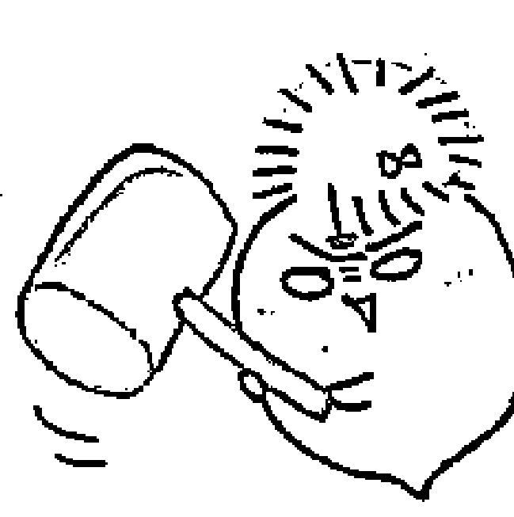

給跟宇宙下訂單87次還沒成功的你——
每天1句「愛的鞭策」，強運增幅，人生從此開掛

小池浩 Hiroshi Koike 著
アベナオミ Naomi Abe 繪
楊蕙箴 譯

有個男人欠債兩千萬日幣，哭得一把鼻涕一把眼淚，有一天，他決定「把一切都當成上天的提示」。

路上行人不經意的對話、偶然看到的招牌文字、甚至連掉到肩膀上的鳥鴉大便……這一切都被他當成上天給自己的提示、行動的線索。沒錯！他就是找回幸福的「小池」。

宇宙的法則非常簡單，宇宙會放大你口頭禪裡的「前提」，反映在現實生活。而心想事成的機制，就是向宇宙「下訂單」，提出你期望的結果，同時要求「上天的提示」，然後依據直覺行動。僅此而已。宇宙會以戲劇化的方式，幫助你達成心願。

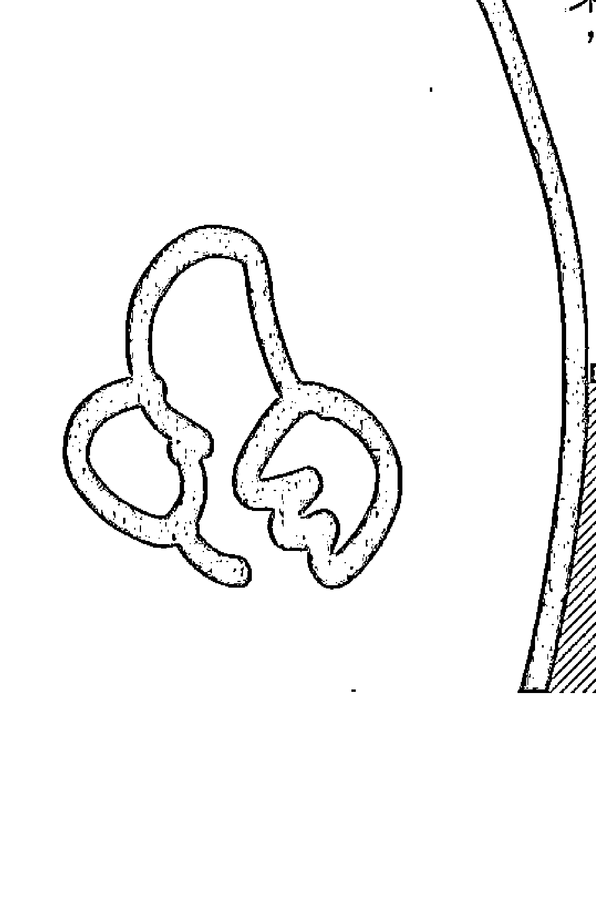

# **來吧，翻開這本書！行動的時候到了！**

嗯……你說「不知道上天的提示是什麼？」——你不經意拿起的這本書就是上天的提示。你翻開的那一頁，就是現在的你最為需要的事，是你該做的事，也是你應該思考的事。聽好了，你所看到的內容，將改變你的現實，只要一個轉念，未來將與現在截然不同。所以，只要1分鐘，你就能改變自己的人生。上天的提示，正等著你伸手翻開。

# 只要1分鐘，就能改變人生！

小池因為《拉勾宇宙先生》系列作逆轉人生。
他為了還債，歷經了一次次起伏跌宕。
最後經由直覺的指引，成功翻身。
本章就是他所用方法的濃縮精華。
我不希望人家用「解答之書」
這類可愛的說法稱呼本書，太肉麻了！
這是一本「行動之書」。
你應該做的事，
不是在虛浮世界裡猶豫不定。
而是腳踏實地，徹底行動！
想要改變以往的自己，
只須下定決心改變，就這麼簡單！
只要1分鐘，你就得下定決心。
別想得太複雜，認真去做就好！

# 當成上天給你的啟示

本書的內容，有別於一般坊間書籍的章節架構。你翻開的那一頁，就是當下的你所需要的提示。有些是行動指示，有些則是思考轉念。你需要的提示，唯有你親自翻閱才能得到，而不是其他人強加給你的。專注心念，翻開這本書吧！

# 隨時吸收溫習

本書為了讓你一翻開就能找到屬於自己的提示，刻意不採用傳統的書籍編排架構。不過，本書並不排斥規規矩矩、習慣從頭開始認真讀的人。書中收錄了三本《#S宇宙先生》系列作品的精華，搭配可愛的插畫，輕輕鬆鬆就能吸收。

# 當枕頭睡

有些神經大條的傢伙，一看到我的書就想睡，這樣的人把這本書當成枕頭也無所謂。我很歡迎有膽識的人來挑戰。據說潛意識近似於作夢狀態，只要你敢於要求「給我提示」，把本書當成枕頭來睡，相信你的現實世界一定也會有所改變。

# 許願時 要用「完成式」！

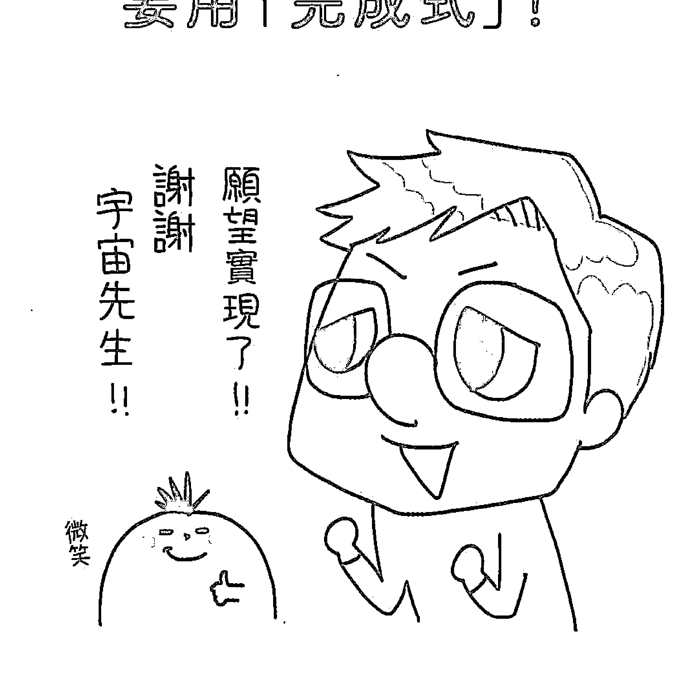

願望實現了！！

謝謝 宇宙先生！！

微笑

聽好了，千萬別說「要是願望能實現就好了」！
這句口頭禪會讓你一直處於「要是能實現就好了」的狀態，
也就是願望一直沒實現！懂了嗎？

你的口頭禪是什麼？口頭禪是一個人「人生的前提」。
不自覺脫口而出的話，就是你打從心底深信、潛意識中期望的事情。「要是能○○就好了」類似這樣的口頭禪，等於承認你的現狀就是「○○還無法達成」，而此現狀正是你所期盼的。宇宙會掌握言語的振動，增強其能量來打造現實。當你說「辦不到」，宇宙就會加強「辦不到」三個字的能量，結果當然就是「辦不到」。當你說「要是能做到就好了」，宇宙就會加強這句話的能量，結果就是：你會一直處於盼望「要是能做到就好了」的狀態，也就是你的願望一直沒實現。真心想改變人生的話，許願時請用完成式。「我做到了！」「願望已經實現了！」是不是很簡單，任何人都能做到。

# 宇宙總是說「YES」。你的現實就是你下的訂單！

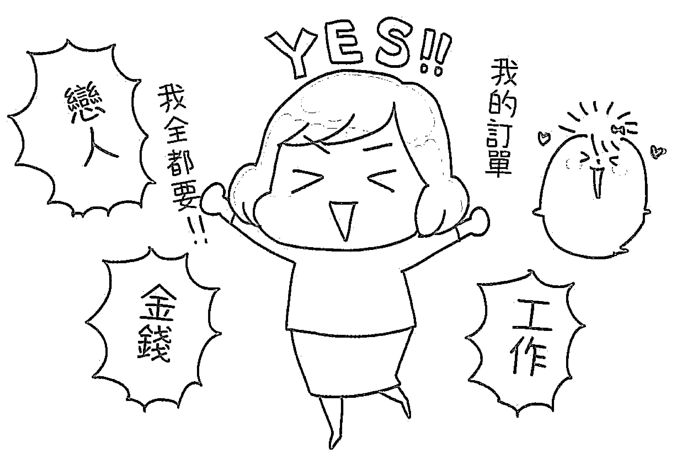

給宇宙的「訂單」要非常具體、明確。

你下單的內容，全部都能得到。

如果沒得到，那就是你下單的方法出錯了。

向宇宙下了訂單，心願卻沒有實現的人都有一個共同點：訂單內容不夠明確。宇宙不會判斷「善惡」或「好壞」。宇宙只會回答「YES」，它會讓你衷心盼望的事物成為現實。宇宙既不會判斷，也不懂得挑選，更不會去斟酌或思考「這個人嘴上雖然這麼說，心裡其實不希望這件事發生吧。」一個人的口頭禪就是他「人生的前提」，宇宙會讓口頭禪在現實生活中成真。人們經常犯的錯誤，就是向宇宙下單時內容不夠明確。在咖啡廳點餐時，沒有人會說：「請做點我可能會喜歡的東西。」向宇宙下單與在咖啡廳點餐是同樣的道理。總之就是要求務必明確。唯有清楚描繪你的願望，並向宇宙下單，宇宙才會實現你的願望。

## 1分鐘「下單」練習

# 寫下願望「表明決心」別忘了加上「期限」！

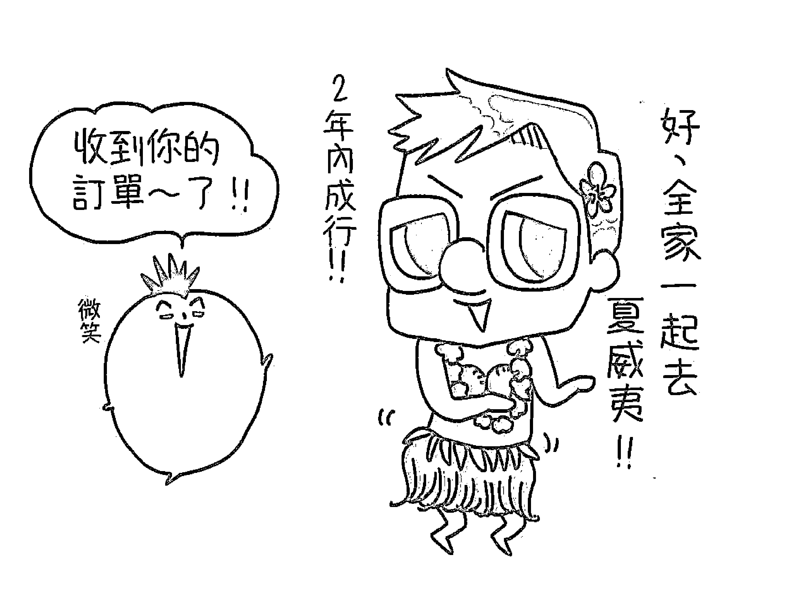

不論你想實現的是願望或理想，全都向宇宙下訂單吧。藉由表明決心，先在你的潛意識中留下訊息，宇宙就會把你的決心當成目標，開始動起來。

想實現心願，其實需要技術。實現願望有一套明確的理論與方法，並非單憑意志力就能達成目標。如果你有想實現的心願，先寫在紙上，從主動表明決心開始。只要決定了期限，人會下意識地受到驅策，因而「開始行動」，而宇宙也會跟著動起來。不過，像是「明天獲得一百萬日幣」或「這個月內要結婚」這類需要花時間的訂單較難馬上實現（但有些厲害的人就是能實現這些願望，差別在於技術的優劣）。只要給出明確的訂單、訂下期限、付諸行動，你的心願就會實現，很簡單吧？如果你想隨心所欲運用這樣的機制，建議可從小訂單開始，一點一滴提升技術。

# 嚴禁使用自虐型口頭禪
否則我聽見一次，揍你一次！

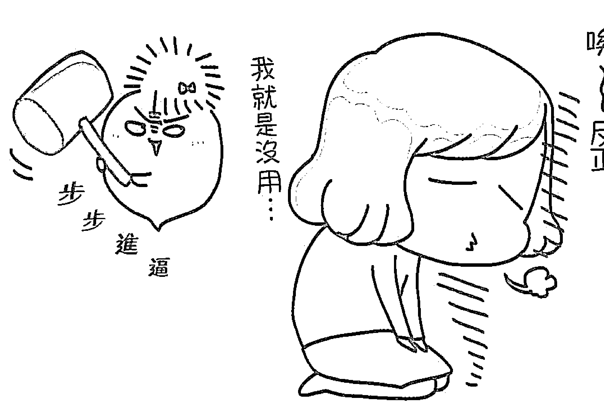

「不可能順利啦……」「反正沒辦法……」

聽好了！禁止使用這類自虐型口頭禪！

這種NG行為會大大提升人生遊戲的「難度」。

「反正也沒辦法吧……」「不可能那麼順利啦……」難道這些喪氣話也算是給宇宙的「訂單」嗎？！沒錯，這些話會提升你人生遊戲的難度，讓你必須吃盡苦頭才能實現訂單。事實上，人們的確是為了體驗地球才有的負面情緒，而來到這個世界。但是，有很多方法可以讓你不用像小池那樣在谷底掙扎徘徊。抖M的人就是喜歡不幸，如果你真心喜歡的話，我也不會阻止啦。但是，當你把「反正我就是衰」當成人生的前提，宇宙就會認為那是你所下的「訂單」，高高興興地把不幸送給了你。這樣你也無所謂嗎？

# 「願望如何實現」由宇宙決定！

# 人類別指手畫腳！

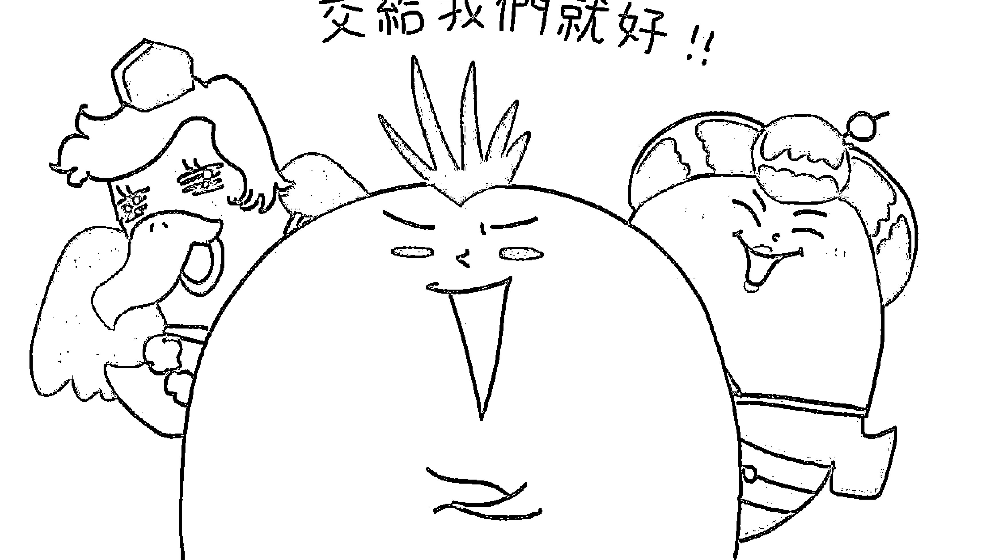

人類充其量只有幾十年的經驗，根本比不上我們宇宙的龐大智慧。你只需要正確下訂單。該怎麼實現，是由宇宙來決定！

從現在起，諸如「似乎會實現」、「沒那麼難實現」……立刻停止下這種小家子氣的訂單。別給自己設限，說出你真正的願望吧！不論你的想法有多「異想天開」，大器的宇宙都會實現你的願望。人類不需要對宇宙指手畫腳，類似「這裏應該這樣做」、「這時候要遇見某某人」、「到實現為止得歷經什麼樣的過程」等等，統統都不關人類的事。而提交「中年大叔想以歌手身分出道」這種訂單就OK。確實有人在YouTube上傳唱歌或跳舞的影音，引發話題而出道。你只要做到這點：做出明確的決定。然後，把夢想實現的過程交給宇宙。宇宙永遠是無法預測的，它會用很神奇的方法，幫助你實現心願。

## 1份「下單練習」

# 宇宙不會拖泥帶水。

## 腦袋裡的靈光一閃就是答案！

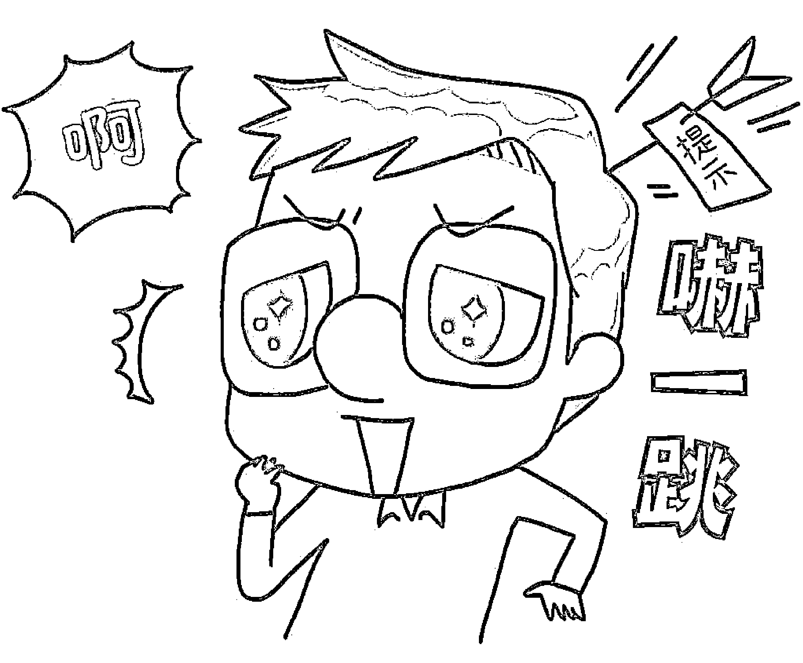

腦中閃過的「靈光一閃」，就是來自宇宙的提示。
隨之而來的藉口、不做的理由，是人類思考的惰性。
相信最初的直覺，把全副心力放在行動吧！

宇宙給你的提示，就是偶然浮現在腦袋裡的靈光一閃，像是「乾脆辭職好了？」、「奇怪，我跟那個人在一起開心嗎？」而隨之而來的藉口，其實是人類惰性的產物，例如：「不過，都這把年紀才換工作對嗎？」、「這家公司畢竟還不錯，也得顧及生計……」、「但那人也有他的優點啦，而且我們都在一起這麼久了……」、「害怕改變是人的天性，這樣的天性讓人無視宇宙的提示，或是找藉口不行動。正因如此，你應該更重視直覺，因為那是來自宇宙的提示。腦袋裡一旦有點子浮現，別多想，依照提示立刻行動就對了。即使無法立刻大幅改變現狀，你也能知道自己蘊含了哪些可能性。」

# 人生是一場RPG遊戲。你就是闖關的勇士！

別想得太嚴重！人生就和角色扮演遊戲一樣。不管遇到再大的困難，終有結束的一天。認真闖關！在地球痛痛快快玩一場吧！

地球是顆行動的星體。由於宇宙中並沒有行動的概念，所以想行動的靈魂會來到地球，在這裡好好玩個痛快，再回歸宇宙。這就和角色扮演遊戲（Role-playing game，簡稱 RPG）一樣。你選好時代、地點、父母、手足、容貌之類的基本設定後，降生來到這個世界。你在小村莊遇見了某些人，一點一滴累積經驗，然後前往新地點。你一路過關斬將，打倒敵人、救助公主，最後跟大魔王決一死戰。倘若一開始就讓大魔王出現在你眼前的話，任誰都不會覺得有趣吧？在闖關途中，你需要設法提升等級，有時也會因為找不到地牢出口而煩躁不安。但正是因為這些過程，人生的遊戲才顯得有滋有味。好好享受箇中的樂趣吧！

# 「奇蹟」的庫存很多！多跟宇宙下訂單吧！

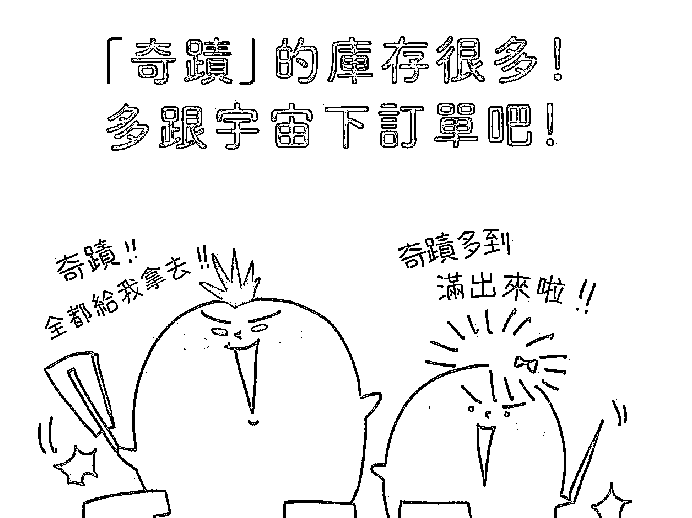

> > 奇蹟！！全都給我拿去！！

> > 奇蹟多到滿出來啦！！

你沒有時間去嫉妒別人或他們擁有的東西。你想要的東西，在宇宙中並沒有「數量限制」！端看你是否真心想要。

宇宙處於「奇蹟」庫存過多的狀態。因為，人們一旦出現「果然還是不行」、「反正辦不到」等等負面思考，他們所下的訂單就會立刻被取消。其實對宇宙而言，奇蹟是理所當然的，沒什麼稀奇。宇宙就是心想事成的世界。每個人都有自己的宇宙。既然是你的宇宙，當然能夠由你決定。只要心無旁騖地向宇宙下訂單，虛心接受它的提示，持續行動，任何願望都一定會實現。首先，把「謝謝」當成口頭禪，這句話會為你帶來奇蹟，為你清理與宇宙相連的潛意識通道。一旦跟宇宙許下了想要的心願，絕對不要讓正確的訂單被取消！

## 1分鐘下單練習

# 常把「謝謝」掛嘴邊，至少要說5萬次！

喂！還記得我特地教你的史上最強口頭禪嗎？「謝謝！」「我愛你！」這是讓人生逆轉勝的關鍵，千萬別忘了！

想讓人生好轉嗎？讓我告訴你最重要的秘訣吧！那就是持續去做「理所當然的事」。我不厭其煩地強調：「『謝謝』是改變人生的魔法金句。」但就是有些傢伙會唱反調：「光靠說『謝謝』就能改變人生的話，不就任何人都能改變了？」這種人永遠無法改變現實，只能一輩子抱怨自己不走運。反之，聽了我的建議之後，反應是「只要說『謝謝』就好嗎？那我要說！」而躍躍欲試馬上實踐的人，人生才會出現改變。聽到良好的建議，有的人是當耳邊風，有的人卻會馬上實行。人生際遇的差別，會因為一個微小的慣性行為，而大大拉開了差距。

## 1分鐘下單練習

# 覺得悲傷？感到不安？ 現在正是說「謝謝」的時候！

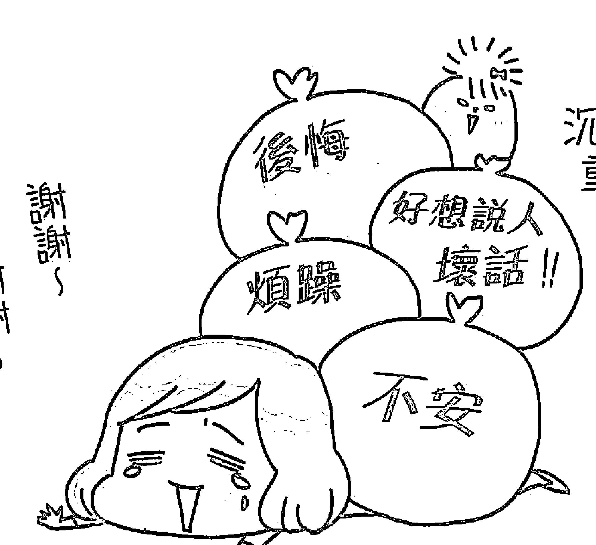

想說別人壞話時改說「謝謝」， 想責備自己時就說「謝謝」， 宇宙會讓現實跟你的口頭禪一致！

「都是那個人的錯！」「都是公司的錯！」「當時要是這樣做就好了……」當你對過去感到後悔、想說別人壞話、想把錯誤怪到他人頭上時，請先默念「謝謝」。即使無法發自內心說謝謝也無所謂，就算當下的狀況不值得感謝也沒關係。總之，先說「謝謝」就對了，千萬不要抱怨。所有發生在地球上的事，都是你先說出口，再由宇宙接收並化為現實。在你頻繁默念「謝謝」的時候，宇宙會讓你說出口的話成真，讓值得感謝的好事發生，久而久之，你就能發自內心說出「謝謝」了。相信我，試著說說看吧！

# 別輸給「時間差」！正確的訂單一定能實現。

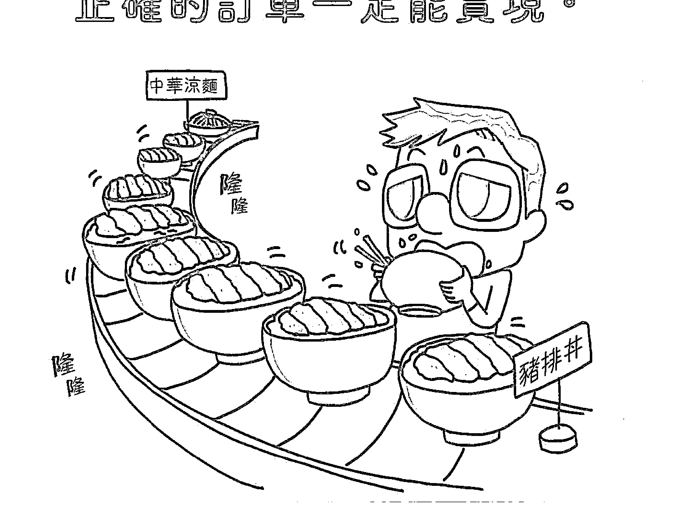

宇宙隨時為你準備了宛如戲劇般的奇蹟。但是，奇蹟只降臨在能克服「時間差」（time lag）的人身上。努力撐過時間落差之後，成功的果實將更加甜美。

長年掛在嘴上的消極口頭禪，如「我做不到」、「夢想不可能實現」、「最後還是不行」等等，都會累積成為給宇宙的負面訂單。向宇宙下的正面訂單之所以沒有實現，原因就出在負面訂單所引起的「時間差」。舉例來說，你先點了一百碗豬排丼後，再上中華涼麵，廚房就會先出完一百碗豬排丼後，才加點中華涼麵。不過別擔心，正確許下的心願，等時間差過去後一定會出現。所以，你就邊想著之後會上的中華涼麵，開心吃完眼前這碗豬排丼吧。心懷期望，告訴自己「好戲在後頭」。絕對不要因為「怎麼只有豬排丼」而中途放棄，輕易取消你給宇宙的訂單。

# 停止欺負自己，先和自己和解吧！

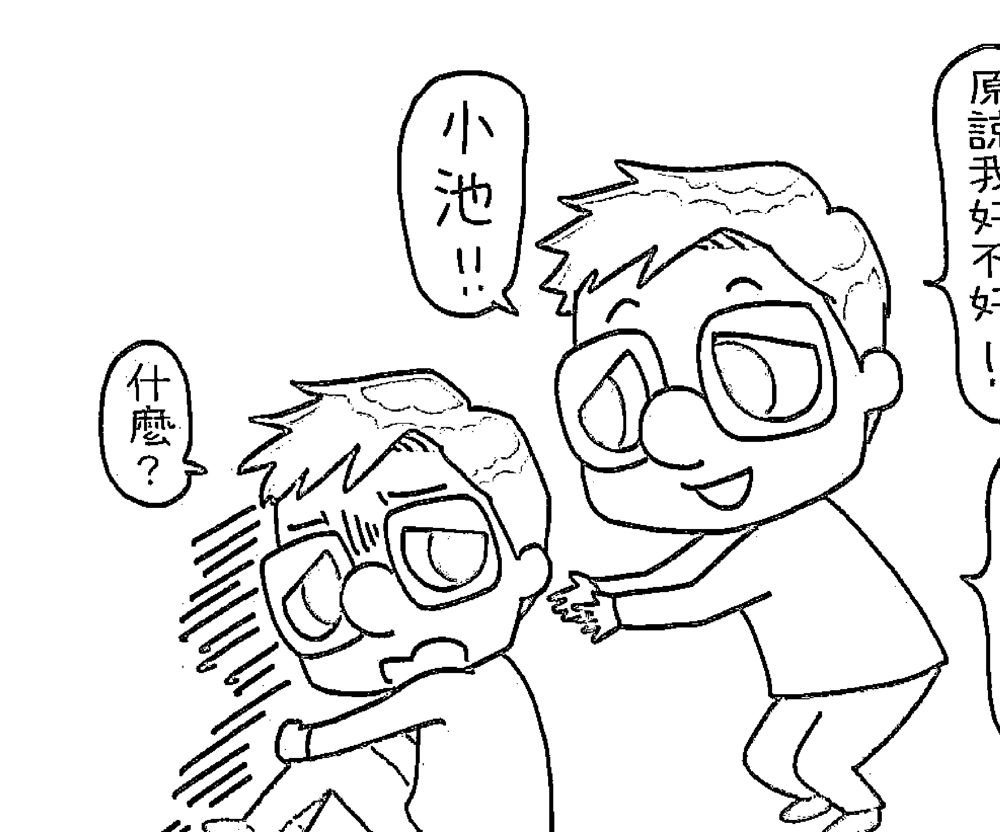

正確下訂單卻沒有實現時，代表你和宇宙連接的「管道」塞住了。現在立刻停止對自己的不滿，別再欺負自己了。

正確向宇宙下了訂單，心願卻遲遲沒有實現，這時除了前面提到的「時間差」，你還需要「跟自己和解」。像我這種人……「我果然還是做不到……」諸如此類的自我口頭禪，會阻塞你的訂單和宇宙之間的管道。欺負自己的話，你內心深處那個真正的自己，就無法相信你。想實現心願，你必須先找回源自我內心的信賴感。「對不起，我一直都沒有好好傾聽你的願望。」「原諒我吧，接下來我會好好聽你說話。」「謝謝你一直等我。」「我愛你，今後我們也要一起幸福喔。」不斷這麼告訴自己，直到你能信任自己為止。

# 不論身處任何困境，都要大喊：「一定會實現！」

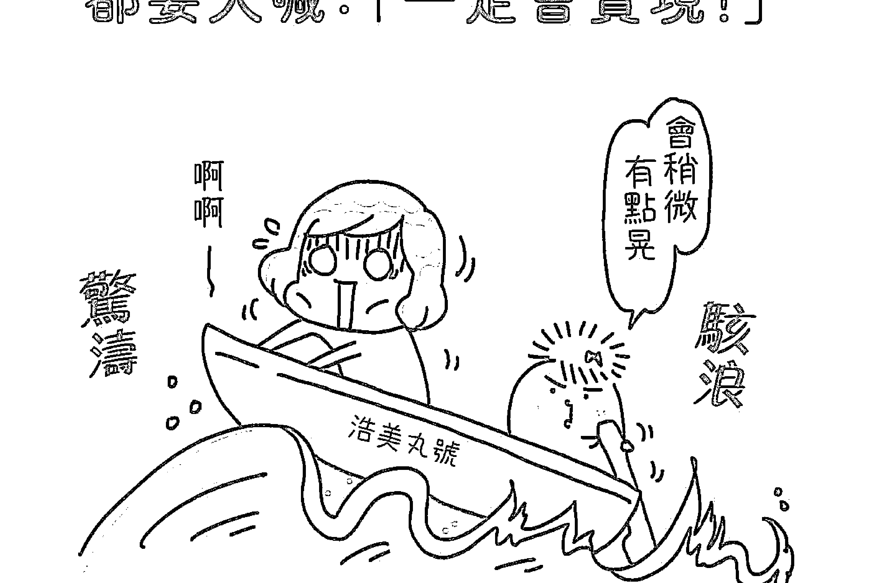

下給宇宙的訂單，一定會實現。不過，宇宙的舵手有點粗魯，船會晃一點。不論何時都要高喊：「太好了！」「我成功了！」

## 1分鐘下單練習

只要向宇宙下訂你真正期望的未來，宇宙就會知道「早說嘛，原來你要去那邊啊！」然後急忙轉舵。此前的訂單越負面，宇宙就越需要轉換方向，最後以超強勢的方式改變現實。當你的心願離現在的現實越遠，宇宙的舵手就越粗暴。像是向宇宙下單「我希望年收一千萬日幣！」結果突然被公司開除了；或是許願「想要幸福的婚姻」後，就被另一半給甩了。向宇宙下單後，經常會出現讓人懷疑「怎麼會這樣？」的狀況，那是因為宇宙知道，繼續待在現在的公司，無法達到你期望的年收；你和現在的男友在一起無法真正獲得幸福。決定你想要的結果再下單，之後只要相信宇宙，盡你所能行動就好。

# 許願的期限截止後，快大喊「生利息了！」

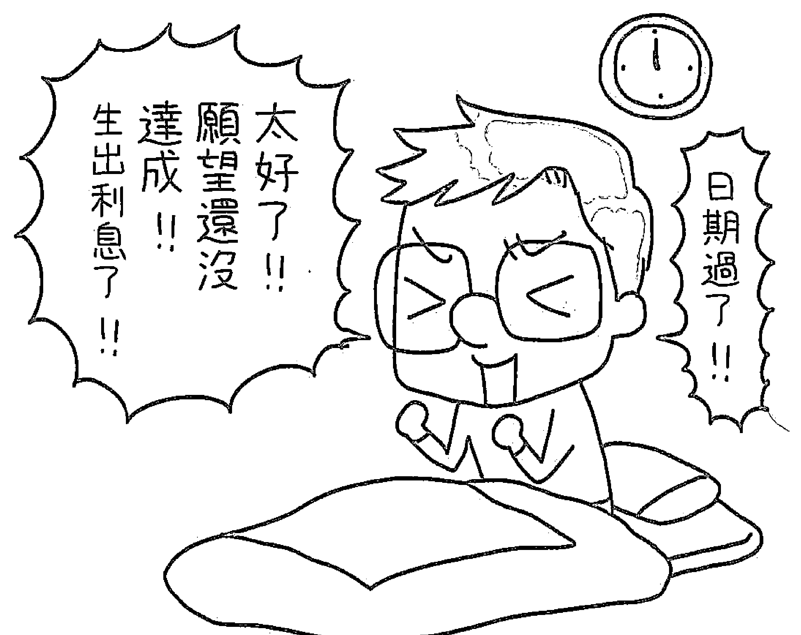

> 太好了！！願望還沒達成！！生出利息了！！

> 日期過了！！

「願望沒實現」時的言行舉止，才是決定願望能否實現的分水嶺。
別忘了「晚付給你的錢會生利息」喔！

## 1分鐘下單練習

看到不少人因為期限到了、願望卻沒有實現，因而沮喪想放棄，我真是看不下去。仔細想想！之前你下了那麼多負面訂單，宇宙要實現完全相反的正面訂單，需要花點時間做好準備。無法如期達成你的願望，代表之後有更大的奇蹟等著你。金錢也是同樣的道理。期限截止時若無法回收，反而是賺錢的機會，因為能產生利息。無論如何，千萬不能沮喪而萌生：「唉，願望沒有在期限內實現，看來是不可能了……」結果向宇宙下了最糟糕的訂單。此時你要做的應該是大喊：「好耶！願望一定會實現！而且還有利息呢！」向宇宙要求「更多的提示」，持續行動吧！宇宙一定會守護你。

# 想與人融洽相處，就發射「愛的電波」吧！

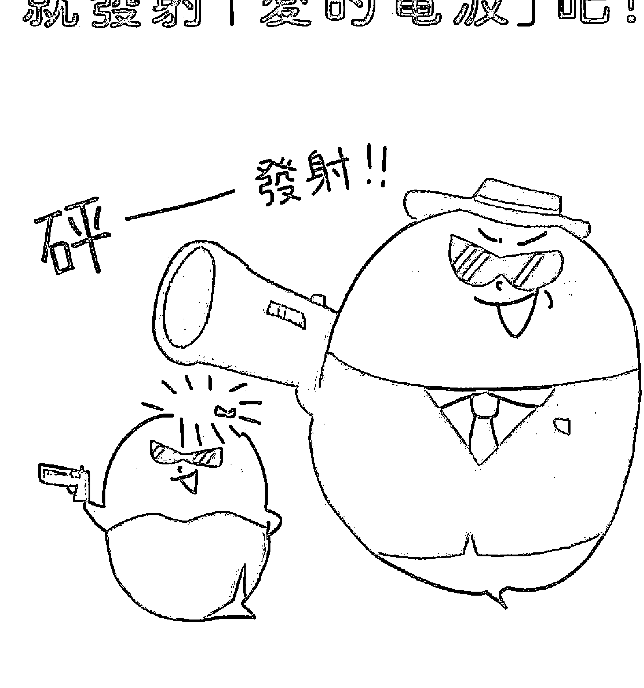

想跟深愛的人，還有不擅長應付的人融洽相處，秘訣就是瞄準對方的眉心，在心中發射「愛的電波」。

有效改善人際關係的秘技就是「愛的電波」。「我愛你」這句話，能讓你的心與靈魂相親相愛。這句話對任何人都有效。叛逆期的兒子、愛抱怨的父母、不尊重自己的伴侶、職場中難搞的上司或同事，向他們發射「愛的電波」吧！就算無法立即見效，彼此的關係也會逐漸產生明顯的改變。無論是開會，或是接受就業、考試的面試，都要向對方發射「愛的電波」！這麼一來，被擊中的人就會成為你最大的幫手。把對方想成是你自己，付出最大的愛吧！「我愛你」是能在宇宙引發奇蹟的幸福通關語。

## 讀書會應用 1分鐘下單練習

# 下單後「夢想殺手」就會出現。
## 不要害怕，打倒它！

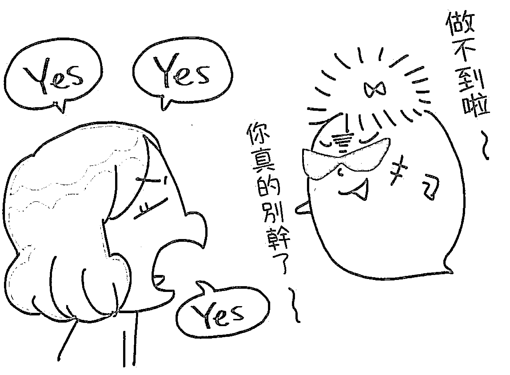

向宇宙許願下訂單後，夢想殺手就會出現。
它的出現是為了確認你的訂單是否真心。
有所覺醒後對自己堅定喊出「YES」（我能！）宇宙的支援就會出現。

此前一直自虐的人，突然積極向宇宙下訂單的話，阻礙你的人就會出現。他們會在一旁說風涼話，比如：「都這把年紀了，應該辦不到吧！」「做什麼白日夢啊，看清現實吧！」「你真的是這樣想的嗎？」劈頭給你一陣狂批。但這代表你的機會來了！因為與你程度相當的人之中，只有你一人領先了，所以才會引發其他人的激憤。也就是說，這代表「願望會實現」的綠燈信號（go sign）。當你向宇宙下單，批評的聲浪相繼而來，請把這些聲音當成宇宙正在支援你的暗號。充滿自信地回答夢想殺手：「YES！」（我能！）別左顧右盼，也別回頭看，只要看著前方行動就好！

# 你的人生是你主演的連續劇。
## 成為自己最強的粉絲吧！

「我沒某甲那麼漂亮。」「我沒某乙那麼有能力。」
聽好了，這些全都是你的幻想！
這是你的宇宙，你的現實就是你內心的寫照。

你是否「对自己没信心」、「认为自己办不到」？为什么要替自己设定这么苦情的订单和人生剧本？这是你的宇宙，你当然是宇宙中最重要的存在。有时间找自己碴的话，不如马上思考身为宇宙中最重要的你该怎么做，才能享受在地球的生活。话说回来，如果连你都不挺自己，还会有谁来挺你？珍惜自己的人生，相信自己，发自内心为自己打气。如果你对自己心存怀疑，认为「虽说如此，像我这么平凡的人怎能担任主角」，原本由你主演的人生连续剧就会被换角，从主角变成配角。你是你人生的主角，也是你自己的啦啦队队长、导演、演技指导、剧作家……你的宇宙，一切由你创造。

## 觉得前途无光？！ 放心！你的前途必定一片光明！

> > 只要踏出一步！！就是光明灿烂的世界！！

比起日后未知的幸福，我们更熟悉眼前已知的不幸。因为人类这种生物，对当下熟悉的环境较有安全感。别害怕，你的未来必定光明灿烂！

有些事情，逆向思考会更好懂。如果你至今为止的人生都不是很顺利，接下来就该做出与自身常识相反的选择。
「前途难以预料」这句话，无论如何都该解释为「前途一片光明」。向宇宙许愿下订单的话，光明的未来一定会实现。这是事实。你说因为害怕而不敢踏出脚步？听好了，未来永远都是光明的。只要知道前方有光，应该就有勇气迈出步伐吧。如果你一直以来都是依循他人的常识行动，现在却觉得不幸福，这意味着你以自己的心愿为主来行动的时候到了。不要问：「如果不顺利怎么办？」光明灿烂的每一天必须靠自己打造。现在懂了吧？！

## 15分钟下单练习

### 「等我有时间再做」就是「绝对不会做」！

「等我有钱再做。」「等我有时间再做。」这种口头禅只会让人麻痹，即使有钱有闲，也绝对不会去做。想做就要马上行动！即使你现在什么都没有，也要去做！

人们会为自己的不作为找借口：「总有一天我会去做。」「等我有钱就做。」「有时间再做吧。」这三个口头禅就像麻醉药，会麻痹你的意志力跟决心。老把这些话挂嘴边的人，即便有多余的金钱或时间，仍会生出种种「不去做」的借口，直到大限将至才后悔莫及。很多人听了别人的成功故事，当下情绪高涨，心想「好～我要来努力！」却迟迟不付诸行动。你想想，有人就算没钱也能实现移居国外的梦想，也有人即使忙到快累死也能考到证照。金钱和时间不是守株待兔就会出现，一切都要靠自己打造出来。就算现在手上没有资源，不管下了怎样的订单，只要行动，一定都有方法实现。

# 别为了回应他人的期待而给出「假订单」！

> 「我希望成为他人羡慕的人。」「我希望别人觉得我很帅。」

别因为在意他人的眼光，而给出「假订单」。你应聚焦在「自己怎么做才会由衷感到幸福？」

「我向宇宙下了订单，也努力行动了，却不顺利也不开心。」若是这样就要思考，你向宇宙下的订单是自己打从心底期望的吗？当你下了订单也付诸行动，却总是提不起劲，觉得身体动不了，那是因为你向宇宙许愿的订单，只是为了回应某人的期待、得到他人的好评，而非出于自己真心的期望。这纯粹是在意别人的眼光、期望他人的评价而下的「假订单」。如果是发自内心的订单，只要你想到愿望实现的那一刻，就会情不自禁地露出微笑，由衷感到开心、热情高涨，身体当下也会自己动起来。别管别人的期待！「自己会因为什么而真心感到幸福？」这才是你应该关注的重点。

## 1分钟「下单」练习

### 灵性法则就是不切实际？ 给我清醒点，活在现实吧！

> > 我买了能邂逅真命天子的魔法壶喔！！

> > 所以在减肥呢。

> > 我为了随时都能遇见真命天子，

> > 只要这个就OK

所谓「遵循灵性法则」的生活，就是脚踏实地，确实行动。希望藉由魔法实现愿望，只是不切实际的幻想。

# 11.5宇宙先生的1分钟下单练习

「灵性法则」、「吸引力法则」这类用语，很容易遭到误解，导致妄想不用努力就能改变人生、只会「临时抱佛脚」的人增加了。然而，灵性法则其实非常实际，没有虚无飘渺的内容，而是一套既有逻辑又容易理解的运作机制。在这个宇宙，确实存在着肉眼看不见的神奇力量。它的运作原理非常简单，就和人必须呼吸空气而活一样。只要向宇宙下订单，付诸行动，愿望就会实现。原理简单又明瞭。因此，嘴上央求「请帮帮我」却什么都不做的话，根本不会有任何改变，愿望也不会实现。真正的灵性法则必须藉由脚踏实地的行动，才能确实运作。给我清醒一点！

# 你说你正在烦恼？！
## 别为自己的不作为找借口！

有烦恼的人动不起来、脱离不了困境，是有原因的。
因为他们把时间花在烦恼而不是行动。
换句话说，不过是一群有大把时间用来烦恼的闲人罢了。

有时间烦恼的人其实很闲，但同时又忙得要命。因为一天之中，只要是醒着的时间，他们都忙着烦恼。那么，为什么会有烦恼呢？因为「只要烦恼，就可以先不用行动」。可谓是以烦恼当借口，给自己不行动的理由。这样你该做的事只有一件——停止烦恼，把时间空下来。你说「但我只要一闲下来就会烦恼」那是因为你害怕面对自己内心的空虚。也就是说，你是因为害怕孤独，所以用烦恼来遮掩。无论如何，先试着把用来烦恼的时间空出来吧。若是怕闲着，那就反复默念「谢谢」吧！复诵「谢谢」的期间，你就没有时间烦恼了。不久之后，宇宙就会给你行动的提示。

# 和S宇宙先生的1分钟「下单」练习

# 要改变的不是别人，而是你自己！

> 品味啦！不懂我的顾客是因为

> 衣服卖不出去

NO 小池 NO LIFE

I am 抖M

「要是他肯改变……」「都是这间公司的错……」把不顺利归咎于外部因素，你就会一直不幸。但是，只要你改变自己，你的世界也将为之一变。

因为看不惯别人的所作所为而焦躁不满，觉得「○○如果稍微XX的话……」、「都是那家伙害我吃尽了苦头……」，一味地把事情不顺利的原因或问题，怪到别人或外在环境头上，只会让幸福远离你。你所在的地方就是你的宇宙。你的外在环境就是你内心状态的反射。只要你不改变，周围的人也不会改变。希望某人改变、认为是某人的错，其实是你内在真正的自己在呐喊：「我想要改变！正在高声呼救。你就是因为持续无视这种求救信号，才会陷入现今所处的状况或环境。此刻正是你聆听自己声音、与自己约定、回应自我期待的时候。

# 斜S宇宙先生的1分钟下单练习

## 只要你不幸福，
## 所有人都不会幸福

你生存的宇宙是属于你的宇宙。
期望他人幸福之前，自己要先幸福！
抱持着「我要变幸福」的觉悟，去改变现实吧。

从小看着不幸双亲长大的孩子，容易觉得「只有一个人幸福很愧疚」。乍看之下，似乎很为家人着想，其实这是极大的误解。你必须明白这一点：你自己不幸的话，别人也不能获得幸福。不仅如此，只要你没变幸福，负面的连锁反应会一直持续下去。「我要是变幸福，爸妈就会不幸」的错觉，只会让你将成功拒于门外。尽管你的本意是让父母安心，结果却总是让父母为你牵挂烦心。如果现在你周遭的亲朋好友中有人身处不幸，罪魁祸首就在于你。想让其他人幸福，你必须先让自己幸福才行！一定要有这种决心！

# 让半径10公尺内的人事物都彻底变幸福！

现在不是看谈话性节目愤愤不平的时候！
比起为了千里之外的不幸事件而愤怒，
不如实际行动，努力让自己及半径10公尺内的人事物幸福吧！

人类是进化迅速的生物，连地球另一端未知国度的资讯都能取得。现在有类似谈话性节目这种以评论他人不幸为乐的媒体生态。过于沉溺这类资讯，就会因为跟自己无关的事，而常去批判他人、动辄发怒、嘴上挂着负面口头禅，结果重复向宇宙下了负面的订单。甚至产生错觉，认为自己的人生也会发生这类不幸，终日惶惶不安。听好了！把你的目光聚焦在半径10公尺以内就好。祈望自己与身边的人事物都能获得幸福，向宇宙许愿下订单，并持续采取行动！只要全世界的人都这么做，世界和平瞬间就能实现！

26

# 「想改变对方」的想法是愚蠢可笑的行为！

> 你自己先改变啦！！

> 都是父母的错！！

> 都是孩子的错！！

> 都是老公的错！！

「我担心孩子。」「老公不温柔体贴。「有那样的父母我才这么不幸。」你是否总是将注意力放在别人身上呢？其实，最可怕的是「自我忽视」。

只顾着担心别人、热衷于照顾他人的人，往往会忽略自己。这种人对别人所做的一切，其实都是「他们希望别人也能为自己做的事」，因为疏于善待自己，所以容易心生不满，觉得自己一直被压榨。结果就是开始嫉妒那些自己付出的对象，会因为对方没有投桃报李，而闹出一些莫名其妙的纠纷。说到底，希望对方为你做些什么、试图改变对方，都是非常可笑的行为。你能够改变的，只有你自己。能照顾你的，也只有你自己。差不多该适可而止了吧！别再忽视自己，倾听自己内在的需求，好好照顾自己吧！

# 希望别人怎么对你 就怎么去对待别人。

希望看到镜中的自己微笑，你必须先露出笑容。
首先，好好对待自己和他人，
他人自然会好好对待你。

「老公都不重视我，所以我很生气！」「孩子完全不听我的话！」「上司总是抱怨我！」其实这都不是对方的问题啊！你之所以会这么想，归因于你一直以来的人生。也许是孩提时期没受到重视，也许是自己想做的事没得到尊重，或是被他人伤害的心灵一直没有治愈，心里的伤即使长大成人之后也一直存在。你将这些愤怒、悲伤全部投射到眼前的对象身上。但就算这样做，现实也不会改变。你应该先重视自己，就像小时候的你希望别人怎么待你那样，好好疼爱自己。自然而然的，你也会开始重视对方，现实自然就会改变。

# 鲸S宇宙先生的1分钟「下单」练习

# 一时消沉没关系！
## 但一定要振作起来！

人不是因为发生好事才心情好，
而是心情好才发生好事。
宇宙总是在找「理由」替你制造好事。

人们是为了体验人生百味，才有喜怒哀乐的情绪。发生了讨厌的事会生气，也会因为一点小事而悲伤，这都是人之常情。意志消沉时，就让心灵暂且安静休息吧。你可以这样对自己说：「原来如此，你现在很生气吧。」允许自己表达情绪。然后，心情开朗时多对自己说些好话，好好努力吧。全力以赴之后，多多赞美自己：「很好很棒！你看来乐在其中喔！你已经很努力了呢！」就能逐渐减少垂头丧气的频率与次数。不要否定或责备沮丧的自己，强迫自己「不能沮丧」。人生本来就有起有落。偶尔消沉也无妨，但之后还是要振作起来喔。

# 与S先生的1分钟「下单」练习

# 对消极负面的自己也要说「谢谢」！

> > 辛苦了，
> 谢谢。

> > 你已经做得
> 很好了

易怒、焦虑、怕生……

负面消極的心态是你用来保护自己的铠甲。
心怀感激地对它说声「谢谢」，然后安静脱下就好。

「非常容易焦虑紧张」、「马上就心浮气躁」、「跟人混熟必须花很长时间」等乍看之下负面消极的个性，其实是童年时期的你为了在家庭环境中生存而习得的自我防卫手段。多亏这些方法，你才能长大成人。若你现在觉得当时的那件铠甲有些沉重，穿起来有些别扭，那是因为它已经不适合成为大人的你了。别责备过去的自己，衷心感谢：「谢谢你守护我至今，谢谢你帮助了我。」「已经没问题了，因为我可以守护自己了。」放下这些过时的自我防卫手段吧。比起责备自己，更要心存感谢。这是基本铁则。

30

# 你是自己人生电影的「主角」。别擅自逃跑喔！

你係你人生电影的主角、导演。
别擅自逃避，只甘心演个配角。
这是你的人生电影，就照你喜欢的剧本演吧！

在宇宙眼中，地球是电影的世界。无论剧情再波折、片中事件有多高潮迭起，因为看电影的观众知道最后一定是快乐大结局，所以都能乐在其中。然而，对身處其中的人而言，所有波折都是真实的，因此无法用达观的态度来面对。你就是人生电影的主角。既不是配角，更不是临时演员。剧本及舞台都是为你量身订作的。同时，你也是导演。端看你想要演出什么风格的电影。不论是恐怖电影或离奇悬疑片，只要你喜欢什么都可以。你想体会的事物，就靠自己打造吧。你说想拍部人生逆转胜的励志电影？想必演起来一定很痛快！

# 大胆下订单吧！
# 宇宙连「能力」都能给你！

> 你说「演讲大获成功」？

> OK!!

> 给你安装好了!!

别让现有的能力，限制了你的订单。
给宇宙的订单不需任何限制。
胸怀大志，充满活力地行动吧！

向宇宙许愿下订单时，有人会下「较小」的订单，譬如：「我要年收一亿日币是不可能啦，那就要求一千万日币好了。」「我不擅长在人前说话，所以当不成主持人啦。」「你这不是擅自把订单降级了吗？就算是你本来没有的能力，只要正确下订单，宇宙就会赐予你相应的力量。即便你自己没有那样的能力，宇宙也会安排最合适的「邂逅」，用意想不到的方法来帮你实现订单。但这件事万万不能做：自我设限，只敢许小小的愿望。千万别低估宇宙和你自己的力量！

# 练习宇宙先生的1分钟下单练习

# 「全部由我负责」下定决心的瞬间，你就自由了！

责任既不沉重也不可怕。
你最需要负起的真正责任，
就是「接受所有发生的事，让自己幸福」！

其实，勇于承担责任，反而会更轻松。当你决定「我的人生全都由我自己负责」，就能瞬间海阔天空，萌生勇气去尝尽人生百味。一切都在你的掌握之中。因为你负起了所有的责任，尽管最后失败了，也不用去在意别人的指指点点。为自己的人生负责，其实是一件开心的事。害怕负责，源于害怕失败。因为从小就经常被大人告诫：「你要好好做！」「千万不能做错！」这样的经验导致你恐惧失败。然而，只要下定决心「不论发生任何事，我都会对自己的人生负起责任」，人就会改变。真正的自由无可取代，唯有承担责任，你才能自由过日子。拿回人生的主导权吧！

> > 「你要好好做！」「千万不能做错！」
> 「不论发生任何事，我都会对自己的人生负起责任」

# 专注于「终点」。
## 别在中途就放弃！

「我已经不行了……」「果然还是无法实现……」
喂！不要随便修改你下好的订单啊！
别管过程，只要专注在你的「终极目标」就好。

人生就和玩大富翁游戏一样。你的前提是「到达终点」，在前往终点的途中，游戏准备了各式各样的戏剧化事件。若「终点」的设定是不幸，尽管途中出现意想不到的成功，或是偶像剧般的相遇，最后结局都会大逆转，变得落魄潦倒。相反的，如果「终点」的设定是幸福，途中虽然遭遇破产、离婚等衰事，仍会迎来美好的结果。没错，人生游戏和大富翁的不同之处在于：虽然看不到途中的方格会令人紧张，但结局可以靠自己决定。一旦决定了，不论途中发生何事，都不要动摇。千万别在游戏途中擅自更改「结局」的设定。尽情掷你的骰子，充分享受人生游戏的乐趣吧！

34

# 比起「希望别人怎么看你」，「自己想做什么」更重要！

「想被别人羡慕」是很危险的想法。不要被他人的看法束缚，聚焦在你自己真正的渴望。

向宇宙许愿时，你不应该拘泥于他人的想法，依据「希望自己在别人眼中是这样」来下订单。因为你不是你真正的心愿。订单一定要是你真正的「渴望」，而非社会或某人的想法。像小池之前的失败就是一个很好的例子。他因为听人说「经营服饰店好帅喔」，就兴高采烈地开了服饰店，结果就是负债两千万日币。选择人生伴侣也是同样的道理，注重外表不是一件坏事，但跟对方在一起的理由若只是「和这种帅哥在一起很骄傲」、「因为他是人人羡慕的型男」……是无法真正得到幸福的。如果你选择伴侣是因为「不管别人怎么说，我就是喜欢这个人的脸」，那就OK。跟另一半在一起时，你能打从心底觉得幸福吗？好好确认自己的感情吧！

# 藉由「尋找小奇蹟遊戲」來練習量產奇蹟！

- 啊！！是粉紅色的車！
- 哇，三個數字都是777！！
- 時間剛好是11：11耶
- 巧遇朋友！！

沒有親身體驗過奇蹟的人，就算大奇蹟突然出現，也無法相信自己的幸運。徹底體驗小奇蹟，讓自己習慣奇蹟吧！

想要引發奇蹟，先從跟宇宙下訂小奇蹟開始，也就是一起來玩「尋找小奇蹟遊戲」。比方說，出門前先許願你今天想看到的數字、喜愛的車或喜歡的顏色。這麼一來，你出門後一定會看到許下的那個數字、車款或顏色。有人會問：「蛤，那我不就得整天尋找許下的數字或顏色嗎？」沒錯，就是這樣！訂單內容扼要明確，有助於「發現」自己所期望的結果。每個人天生都擁有這個能力。這不是吸引力法則的效果，也不是魔法。能否引發奇蹟，取決於你是否能察覺「鑽石就在身邊」。這麼說一點也不為過。

現在馬上睜大眼睛找找看吧！

- 問：「蛤，那我不就得整天尋找許下的數字或顏色嗎？」

## @Mr.宇宙先生的1分鐘下單練習

# 别担心，问题与解决方法总是成双成对出现！

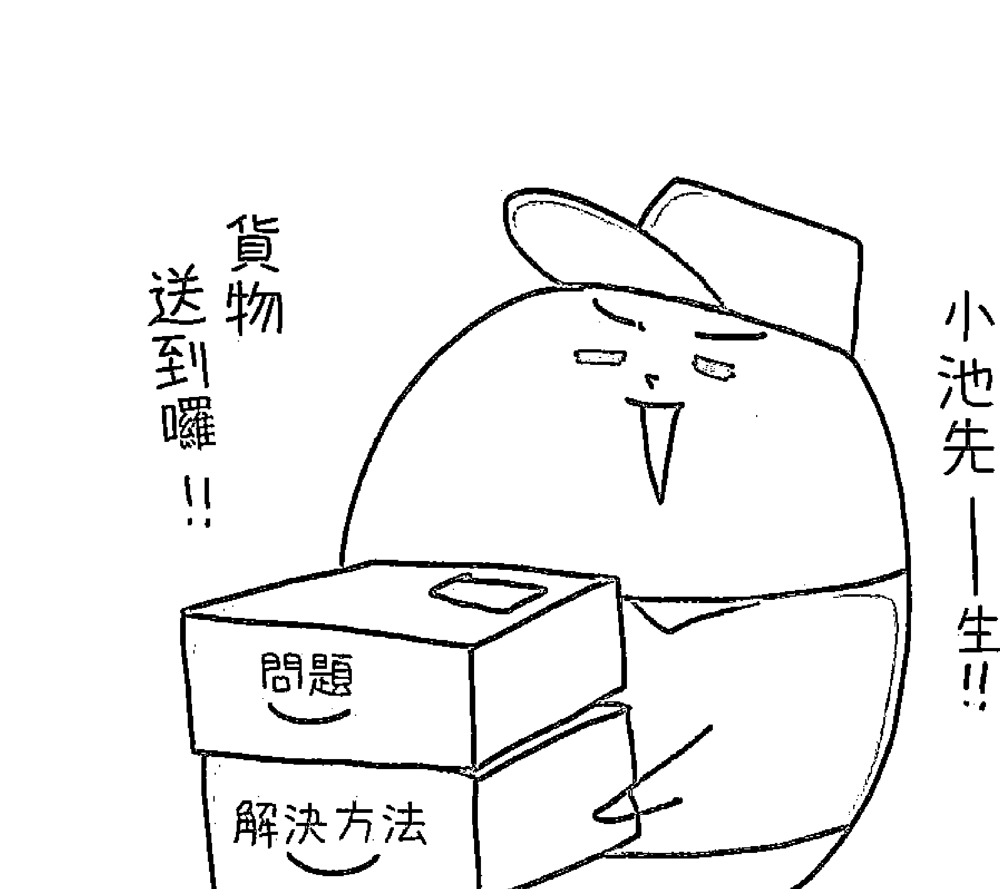

当你觉得快被难题击垮时，更要睁大眼睛细看。解决方法一定就在身边。因为在宇宙中，问题与解决方法往往都是成双成对出现。

玩RPG遊戲時，會發生各種事件，為了解決問題，你必須四處向人打探消息。因此，可能有人會跟你說：「打開村子東邊小廟的門吧。」於是，你帶著遊戲主角前往村子東邊發現果真有座小廟，也看到了門。宇宙就和RPG遊戲一樣。你在生活中遇到的問題，就是遊戲中的事件。而遊戲一定會為你準備好解決事件的方法。不過，許多人往往眼裡只看到問題，卻不去找出解決問題的方法。走出家門凝神細看吧！多動動腦！你會發現：通向終點的提示，隨處都看得到。

# 現在的你就是100分！
只要活着，任何事都是加分。

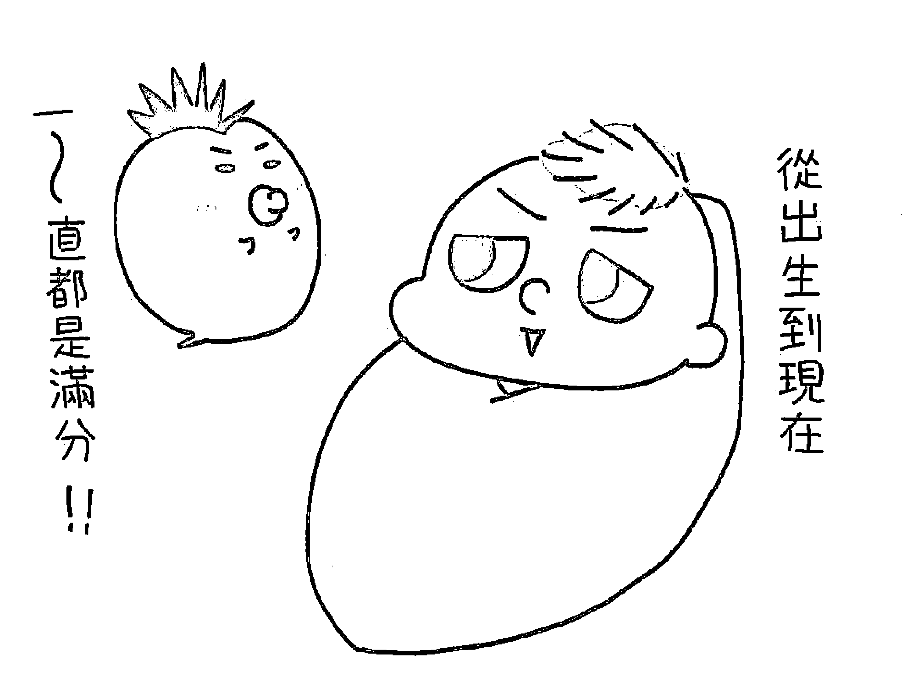

你是不是給自己扣太多分數了？
在這個當下，你的狀態就是100分！
你生來就是滿分，人生的考試只有加分沒有扣分！

人们总是执著于他人的评价，一直给自己扣分。也是啦，动物要是不对负面事物敏感的话，很容易招来杀身之祸，这也是没办法的事。但是，灵魂生来对地球上发生的每一件事都觉得新奇有趣，并且乐在其中。灵魂想要亲身体验各种事情，所以才会来到地球。因此，即便你现在没有能力、即便身处在谷底，在宇宙的眼中，你的人生仍是「大成功」、「一百分满分」。就算发生了令人不悦的事，也别扣分，努力找出可以加分的优点吧。人生的评分没有扣分这个选项。因为你来到这个世上，就是为了拥有各种体验，表面上看来再负面的事，在你体验的当下，就是加分。

## 抖S宇宙先生的1分钟下定练习

# 就算肉眼看不到，訂單一樣存在。宇宙真的會收下你的訂單。

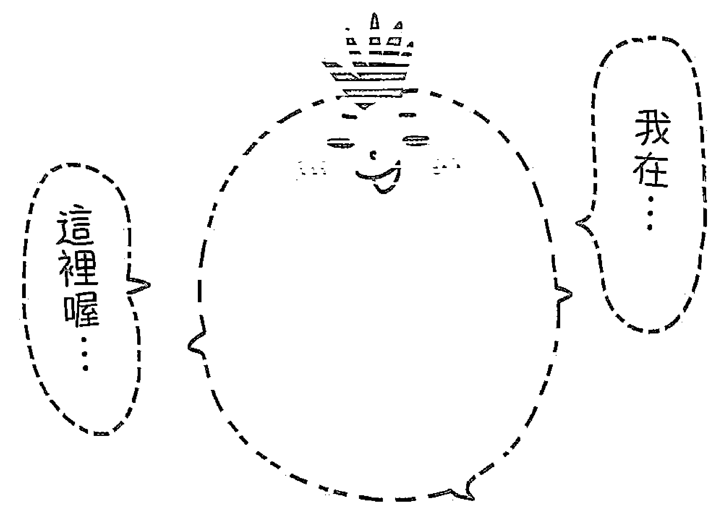

看不見的力量，容易讓人誤會不存在。宇宙和空氣一樣，雖然肉眼看不見，卻確實存在。

聽好了！肉眼看不見的力量，雖說看不見，但不代表「不存在」。這股力量，不同於魔法、超自然現象這種不知真假的東西，而是和空氣一樣，雖然看不見卻真實存在，是讓人類活下去的必要元素。沒有人會說：「因為看不到，所以空氣並不存在，我不是靠空氣活著的。」眾所周知，空氣即使看不到也確實存在。至於宇宙本身、你下給宇宙的訂單也一樣，雖然肉眼看不到，卻真實存在，而且造就出我們所處的現實。宇宙的力量是否存在，信不信由你，這是你的自由，但你的選擇，決定了你將迎接怎樣的現實生活！承認它的存在，相信它的力量吧！

## 宇宙先生的1分鐘下單練習

# 你的心虽然想安定，你的灵魂却渴望冒险！

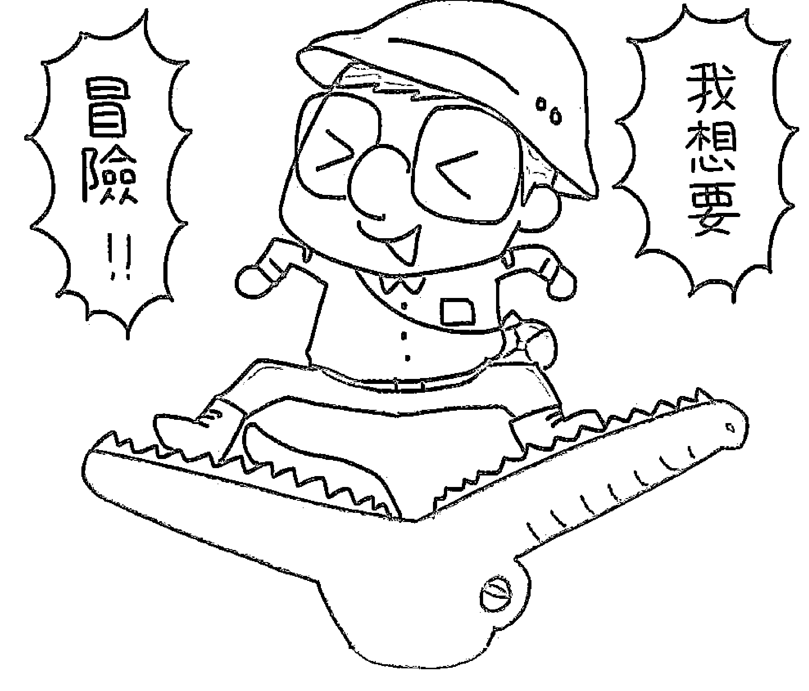

- 冒险！！
- 我想要

试著挑战的人生vs.不挑战的人生，两者的结果截然不同。别被「心」骗了而喊卡「灵魂」所渴望的冒险。

人的「心」總是想安穩過日子，「靈魂」卻老想挑戰冒險。靈魂想體驗萬事萬物，感知各種情緒，這正是它帶著肉體來到地球的原因。若真心想改變人生，就一定要有各色閱歷。人生最重要的不是成敗，而是你是否勇於嘗試挑戰，如此而已。當你心生「總有一天要做」的念頭，不如當下立刻動手去做。之所以覺得不可能，是因為你遲遲不去採取行動。只要勇敢踏出第一步，就有可能做到。只有邁出步伐的人，宇宙才會不斷給你實現願望的提示，你的人生也將加速前進、順風順水。

## 第5宇宙先生的1分鐘下單練習

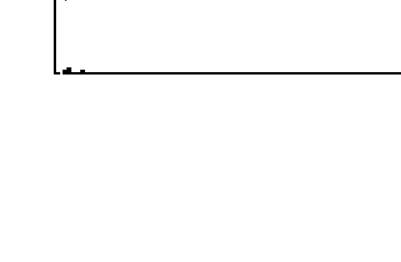

# 心願達成的那天一定會來！
動起來！動起來！動起來！

# 超展開！！

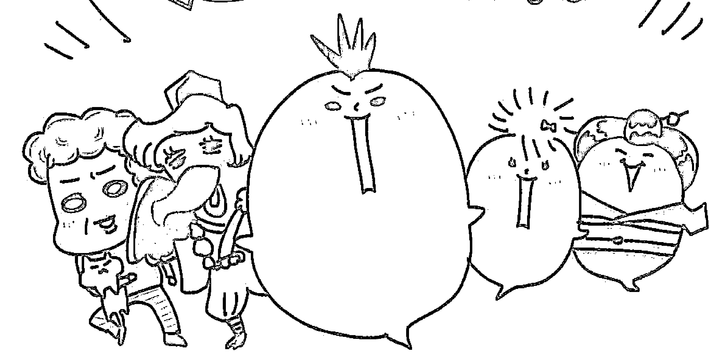

「心願達成的那天一定會來」這句話是真的。
加快速度，去做今天要做的事，
徹底動起來吧！你越有信心，行動就能越持久。

誠如「黎明前的黑暗」這句話，事態即將出現大轉變時，人們往往身處谷底。當你已經採取行動、盡你所能，卻仍然四處碰壁時，宇宙就會滿心歡喜地為你送上「戲劇化轉變 || 超展開」並引發奇蹟。越是寸步難行的時候，越要持續行動！聽好了，壞事發生時更要大喊：「我因為這樣而實現願望了！」並衷心感謝，想像即將到來的超展開奇蹟，笑著等待它的到來。宇宙會降下奇蹟，實現你的訂單。當你盡一己所能之後，宇宙將以出人意料的方式，回報你驚喜的結果。

# 再小的事情都要自己做決定。

- 好喜歡!! 就決定買這雙了!!
- 這個縫線的顏色啊～

希望別人幫你做決定？你傻了嗎！生於地球的意義就在於：自己做決定，依照自己的意志行動、體驗人生。

雖然有人會說：「我無法決定自己的事情。」但所有人其實都是照著自己的意志而活。人人都是如此，無一例外。說自己無法做決定的人，其實決定了一件事：「因為我無法做決定，就讓別人來代勞吧！」所以仍然無法逃避責任。就算事後懊悔「我明明是照著某某所說的去做啊……」到頭來，你只能一直依循「總是無法照自己的意思而活」的訂單過日子，而且最終為自己人生負起責任的仍是你自己。這樣好嗎？現在重新思考一下吧。不論做出任何選擇、得到什麼結果，別忘了那都是出於你自己的意志。

# **别干等，主动出击吧！**

**Let's challenge!**

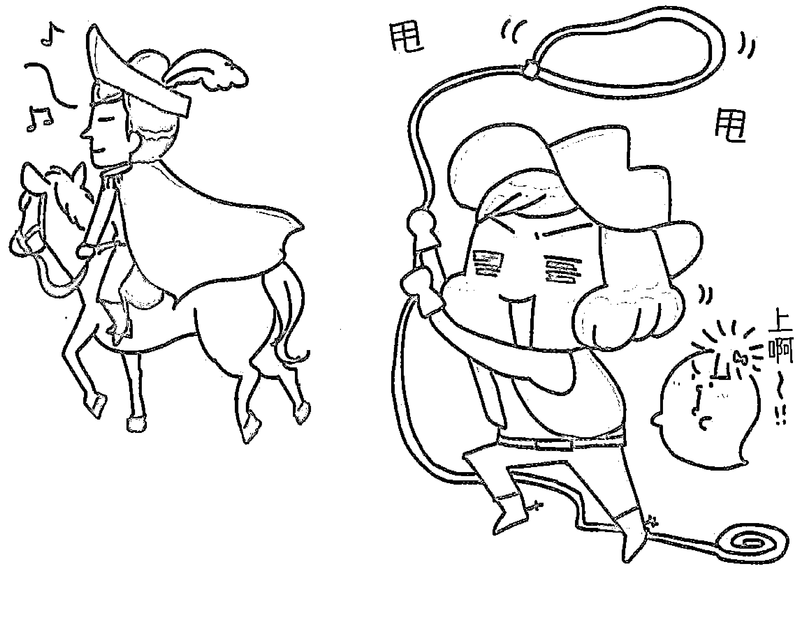

下完改变人生的订单后，
宇宙一定会降下提示给你。
不过，如果你什么都不做，现实就不可能改变。

我經常說，想像幸福的未來很重要，但這不代表可以整天宅在家裡做夢，心想「要是有一天能這樣該有多好」，願望就能實現。下訂單之後，你還要遵循宇宙所給的提示行動。每次接到宇宙的提示就能馬上行動的人，最終一定可以實現心願。灰姑娘也是想辦法進入城堡，並要求「請讓我試穿玻璃鞋」，最終才能與王子結為連理。她可不是待在原地乾等幸福降臨。想要實現願望，行動是不可或缺的。「王子，總有一天您要找到我喔！」「總有一天我一定能抓住大好機會！」光是想而不行動，未來永遠不會改變。重要的是挑戰。就算只是嘗試也無妨，試著拿出實際的作為吧！

### # 抖S宇宙先生的1分鐘下單練習

# 向貴人求助吧！

# 「獨自承擔」也是一種罪過！

我很擅長這件事，
交給我吧！！

拜託
你們了！！謝謝！！

我之前就很想
做那件事了！！

「只要我忍耐」、「只要我努力」就一定能辦到？！
你根本不用獨自承擔一切。
相信宇宙，讓「貴人」幫你一把！

為了實現人們的心願，宇宙自有一個人才派遣網，就像牽紅線的媒人一樣，會為每個人媒合他們需要的人。宇宙派遣給你的助手，會以「貴人」的形式出現，熱心協助你促成人或事物，用各種方法幫助你實現心願。但是，「抖M人」不知為何總是喜歡獨攬一切、咬牙硬撐，試圖靠自己解決問題，到了最後關頭才說：「我辦不到！」結果反而造成周遭人的困擾。這都是完美主義作祟所引發的本末倒置。不要一個人硬撐，你的四周有許多貴人。要知道，請求宇宙的協助，也是你重要的工作之一！

## 宇宙先生的1分鐘下單練習

# 「請這樣對我！」
這句話就寫在你臉上！

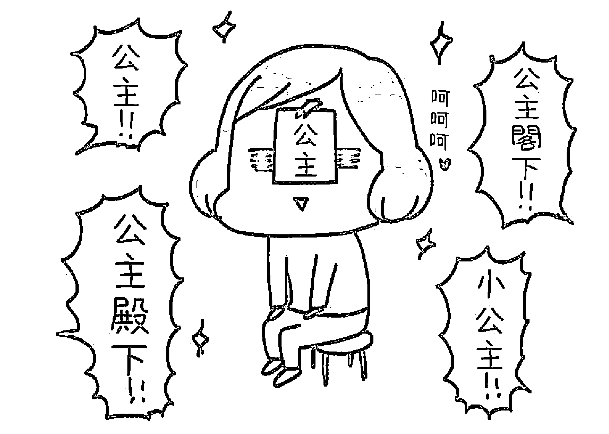

覺得「被人粗魯對待」、「遭到不合理對待」之時，代表你其實也沒有好好對待自己。
若想被人重視，你要先重視對方！

人總是在向周圍示範「你們該怎麼對待我」，簡直就像寫在臉上那般直接了當。換句話說，你怎麼對別人，別人就怎麼對你。如果你現今正為人際關係所苦，比起期望對方改變，你要先用希望別人待你的方式，好好對待自己與對方。當你覺得「別人都不聽我的意見」，就要先試著去好好聆聽對方的意見。如果「希望另一半重視自己」，你就要好好對待另一半，同時也要好好對待自己。這麼一來，人們就會以你期望的方式來對待你。

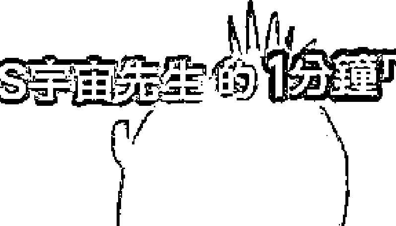

# 千萬別讓自己失望！

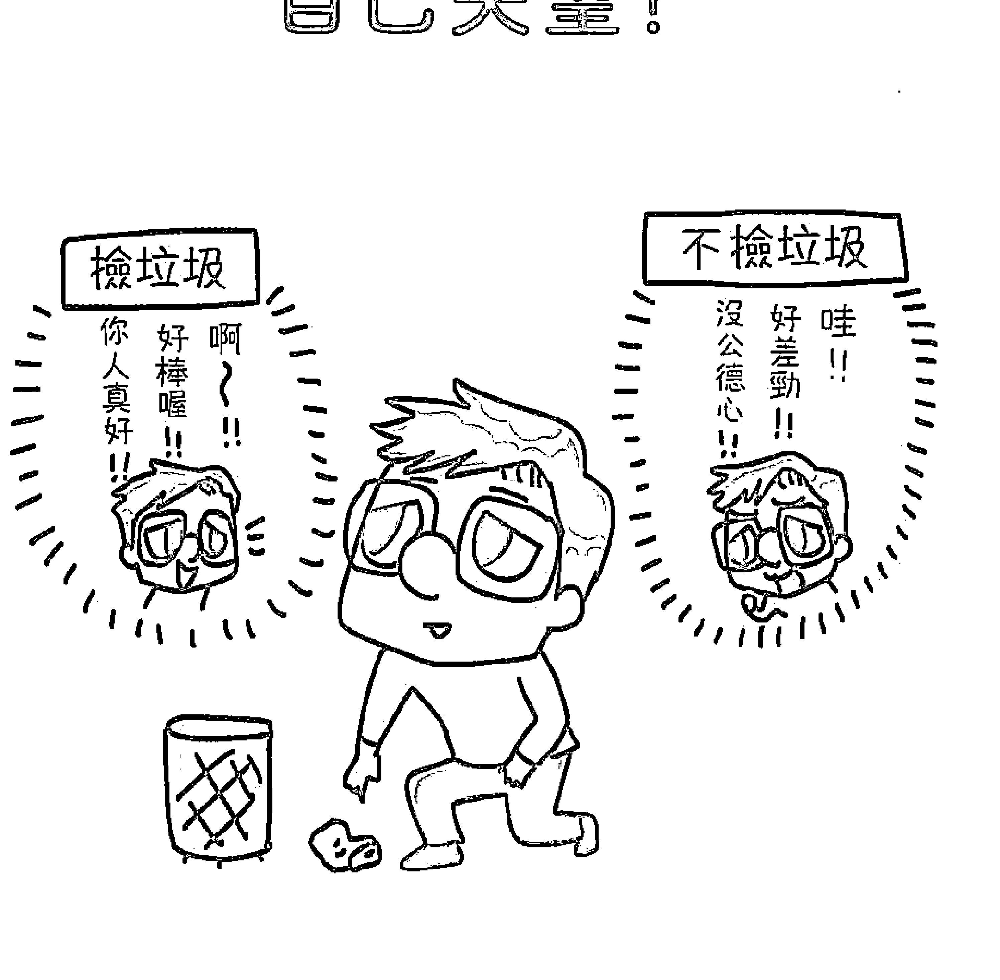

不要無視自己心中真正的聲音。
你會發自內心地稱讚過自己「好棒」嗎？
別讓內心深處的你對自己感到失望。

因為「沒錢」這個理由，而沒能去真正想去的地方；或是因為「缺乏自信」，而沒能去做想做的事。你知道你的靈魂正在為此哭泣嗎？從現在開始，立刻停止所有會讓內心感到「失望」的選擇。在路上亂丟垃圾、在車上裝睡不讓位，或是刻意不打招呼，這些行為會讓你的內心感到失望，你的靈魂會因此而慚愧後悔「我怎麼會做出這種事啊！」多做點能讓「內心深處的那個你」拍手叫好、大喊「好帥！」「我真棒！」的選擇吧！累積讓自己開心的選擇，才能提升你的氣場，幫助你得到好運。

## 與S宇宙先生的1分鐘「下單」練習

# 重點不是做不做得到，而是「做就對了！」

> 那時
其實我是想做的啊，
要是做了
應該會成功～

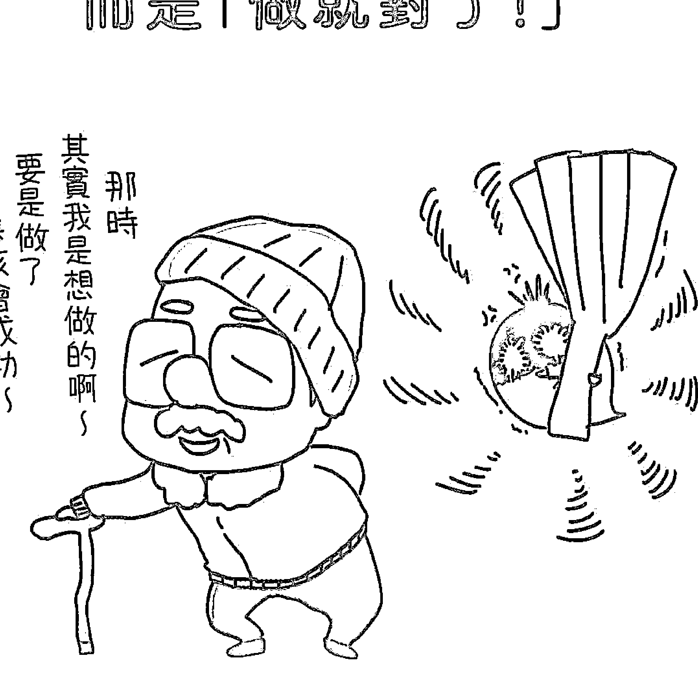

別去想「要是做不到怎麼辦」，
也別想「等我再厲害一點就去做」。
想這些五四三沒意義，現在立刻去做就對了！

許多人在臨終時會感嘆：「要是當時有做那件事就好了！」然後回歸宇宙。之後又生出這樣的念頭：「我想去地球！這次我一定要體驗各種事情。」所以，現在身處地球的人們，千萬別忘了你們來這個世界的初衷啊！比起失敗，不行動會更後悔。別因當下的框架和經驗自我設限，擔心「要是做不到該怎麼辦」。別拿「我總有一天會做」、「如果是那樣，也許做得到」當藉口，拖延真正該做的事。在「想做」念頭出現的當下，去做那件事的能力就已經存在於宇宙，也是你採取行動的大好時機。放心交給宇宙，選擇「去做」吧！

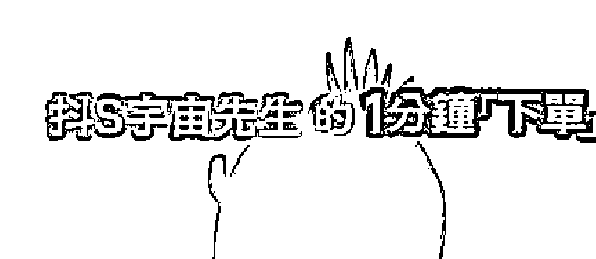

# 「我果然做不到」的負面思考 就用口頭禪來消除！

- 我做得到～
- 你做得到～！！
- 你做得到～！！

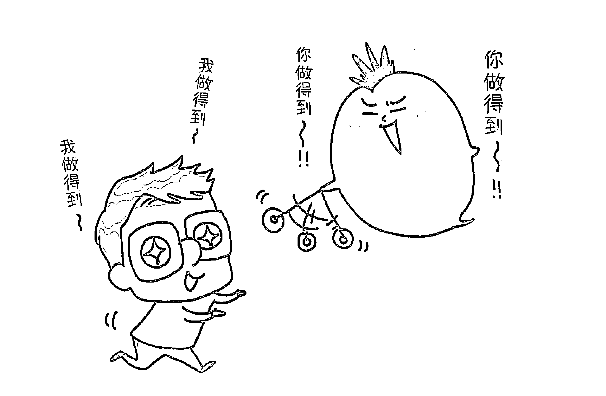

「明天就來做！」 「果然還是辦不到……」 別讓這些負面的口頭禪， 建立「我有心想做，但就是做不到」的假象！

考不好被罵、房間整理不好、暑假作業到開學前一天還寫不完……小時候，你是否有過這些經驗呢？「果然還是來不及……」「還是做不到……」「看吧，就是不行……」嘴上老掛著這些負面口頭禪，只會造成「我有心想做卻動不了」、「我果然不行」的幻覺，讓你對自己失去信心。聽好了，給我仔細傾聽你內心最真實的聲音！你辦得到！內心深處的那個你相信你做得到！改變自己最簡單的方法，就是先改變你的口頭禪。把「我做得好！」當成口頭禪吧。口頭禪是一種自我暗示，快停止對自己進行負面的催眠，醒醒吧！

## 48
# 無論何時，把「感覺很有趣」當成你的口頭禪！

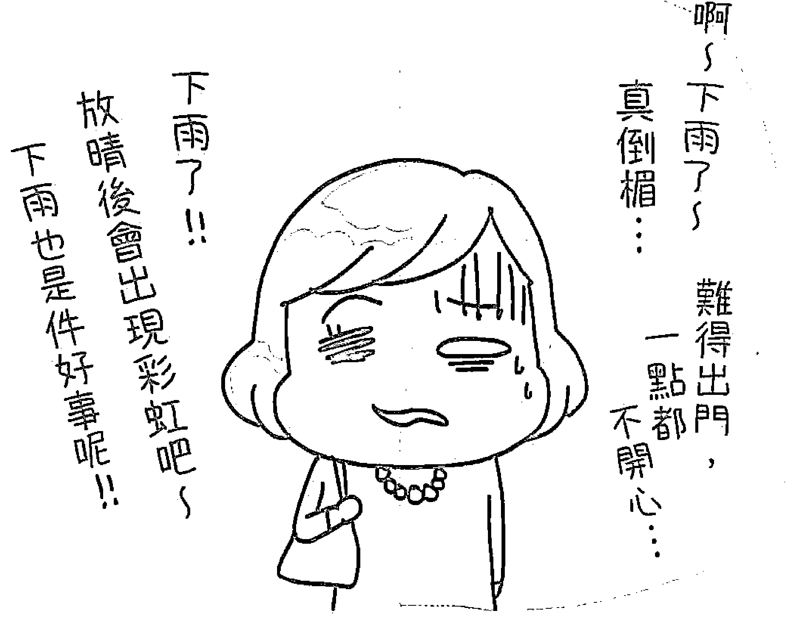

發現自己想說出：「感覺不太好玩……」時，馬上改口：「感覺會有好事發生！」不論任何時候，都是話先說出口，願望才會成真。

人類這種生物會因為自己的話，而改變大腦的活動、改變心靈、改變行動。所以，無論是實際說出口的話，或是在心中默念的話，話語就像發號施令的司令台一樣。因此，口頭禪能夠決定人生，換句話說，口頭禪足以改變人生的理由就在此。當你碎念：「感覺很討厭……」「好無聊啊……」心就會悶悶不樂，導致大腦無法發出行動指令，事態就會朝著不好的方向發展。相反的，你在無聊時不妨自言自語「感覺很有趣耶」。這樣你就會發現有趣的元素，開始躍躍欲試，大腦也會發出行動的指令。接著事態就會好轉，變成「感覺真的很有趣」的情況。姑且相信我一次，去試試看吧！

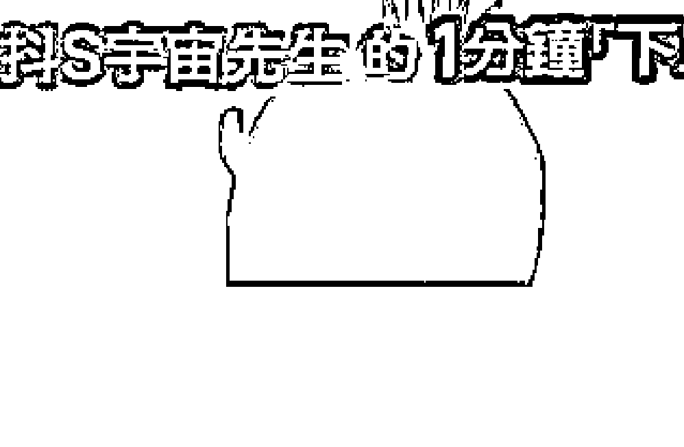

# 即使是微小的一步，累积起来也是可观的成功！

任何成就，都始于微小的第一步，无关于才能、年龄与经验！就算走得磕磕绊绊，也要不断累积每一步！

人们在观察成功人士时，往往会觉得“这件事只有那人才办得到，因为他很特别”。但无论是谁，都必须迈出第一步才有可能成功。可以说，成功始于人们在人生某阶段为某件事而踏出的第一步。有人是从小就孜孜不倦，有人是长大后才大器晚成。也有人是抛弃了过往的一切，做了真正想做的事而成功。你所憧憬的成功人士，他们所迈出的第一步，都是在提示你怎麽让人生大逆转。多听听那些人的话。如果你是他们周遭的人，就亲自登门拜访！最初的一步，即使只是小小的一步、摇摇晃晃的一下都无妨。最重要的是，你必须不断跨出舒适圈，累积挑战的「每一步」。

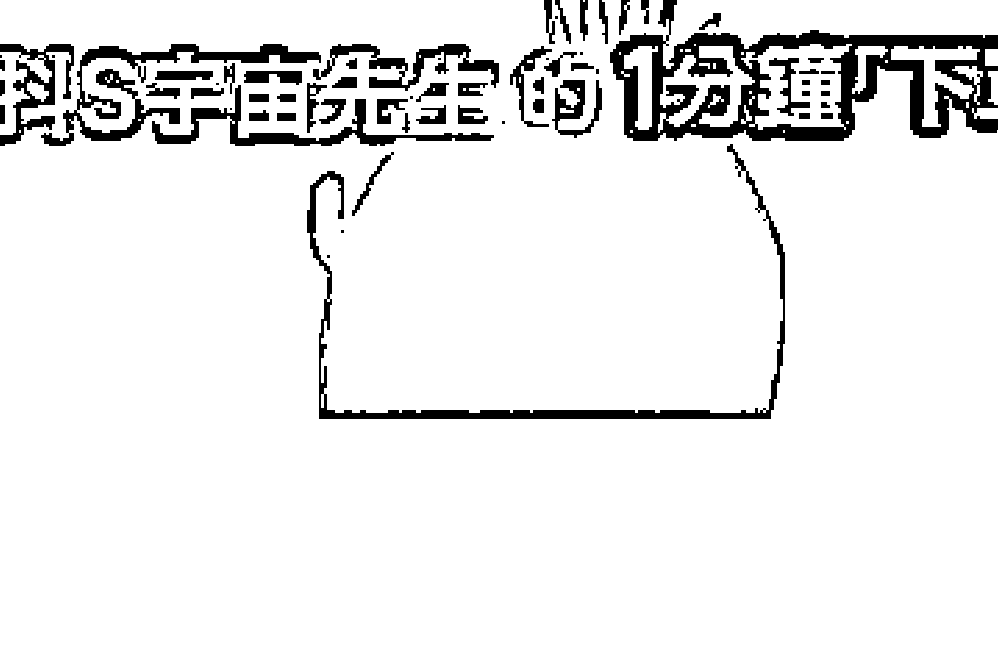

# 「討厭」也是訂單！
壞念頭也會實現喔！

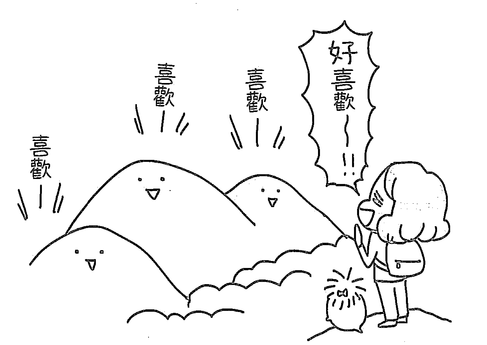

停止一切負面消極的口頭禪。
你說出口的話全都是給宇宙的訂單，
即便不是發自內心，宇宙也會一一實現。

宇宙是一種神奇的裝置，它會加強人們話語的能量。所以，無論是「討厭」或「喜歡」，都是訂單的一種。宇宙不會判斷，只會單純放大話語的能量，讓話語成真。當你說出「討厭」，「討厭」就會放大並成為現實；若說了「喜歡」，「喜歡」也會放大並成真。所以，千萬別負面消極的話，也別去想像負面的事。不小心萌生「真討厭啊」、「好可怕」等念頭時，立刻對自己說：「謝謝！」「我愛你！」當你這麼說的時候，「討厭」、「可怕」就會漸漸減少，「謝謝」的正面情緒將凌駕原本負面的「討厭」，一點一滴改變你發給宇宙的訂單。

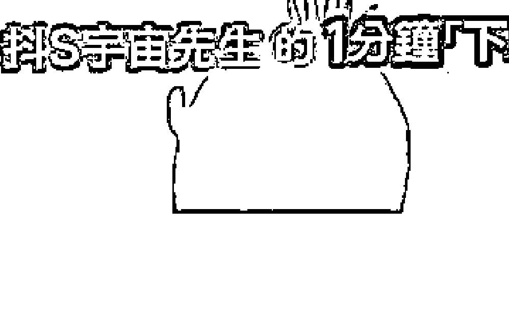

## 51
# 宇宙一直都是「預付制」。先提出你的訂單吧。

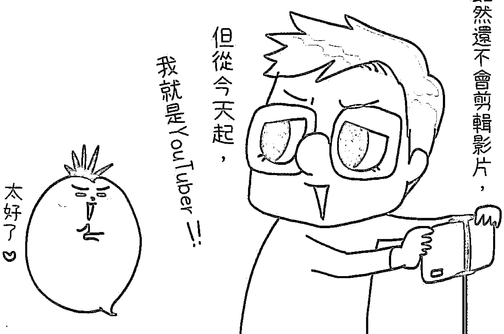

想收到東西，你得先提出需求。宇宙一直都是「預付制」。你要先提出訂單，才能收到貨物。

若想實現願望，就要隨時提出你的要求。當你還在糾結「技術還不純熟」、「得先學好再來做」時，機會早已到來。要求與機會，本來就是成對一起出現。這就是宇宙的法則。宇宙運作的法則是「預付制」。當你主動向外提出要求，就會獲得更多。先付出（提出要求），然後接收（夢想實現）。不斷重複這樣的動作，逐漸培養能力。即使目前仍處於「技術不成熟」的階段，也要宣布你想要做的事，提出你的訂單！你所描繪的願景已經存在於宇宙之中。重要的是先提出要求。這麼一來，一定會獲得極大的成果。

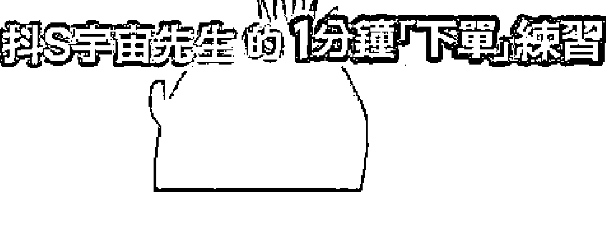

# # 52 任何時候，都要描繪愛與喜悅！

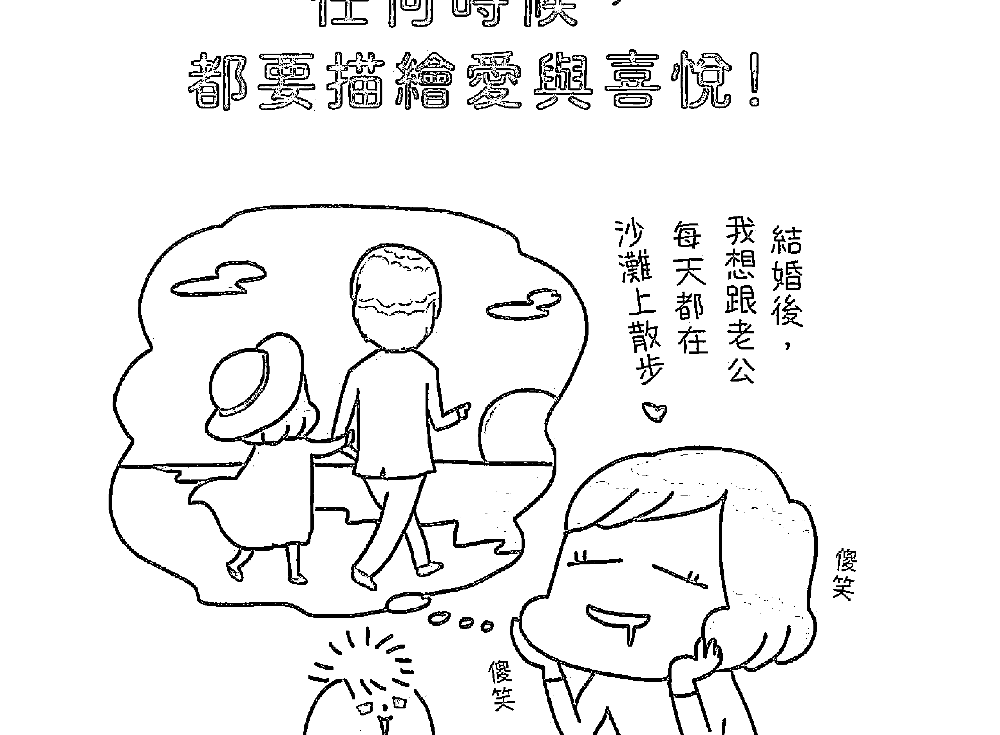

- 結婚後，我想跟老公每天都在沙灘上散步
- 傻笑
- 傻笑

給宇宙的訂單或行動，隨時要以愛與喜悅為優先。

若是因為害怕失去而行動，就一定會失去。

行動的動機應該是「喜悅」，而非「恐懼」！

「要是老了没钱该怎么办？」「要是一直结不了婚怎么办？」「就算做了也可能会失败……」你所有的恐惧，都会成为你下给宇宙的订单。

可悲的是，恐惧的情绪只会生出恐惧的结果。你一开始设定的情绪，就是你的订单最后会抵达的终点。出于恐惧的订单，将带来可怕的结果。

若想得到幸福，必须详细描绘愿景：你要身处何处、获得何物，才能发自内心感到幸福，活得安心自在、丰足无忧。当你在描绘愿景时感受到无尽的喜悦，脸上的笑容收也收不住时，就能下单给宇宙了。你所发出的订单若是出自爱，就一定会加强爱的能量，以爱的形式回归到你身上。

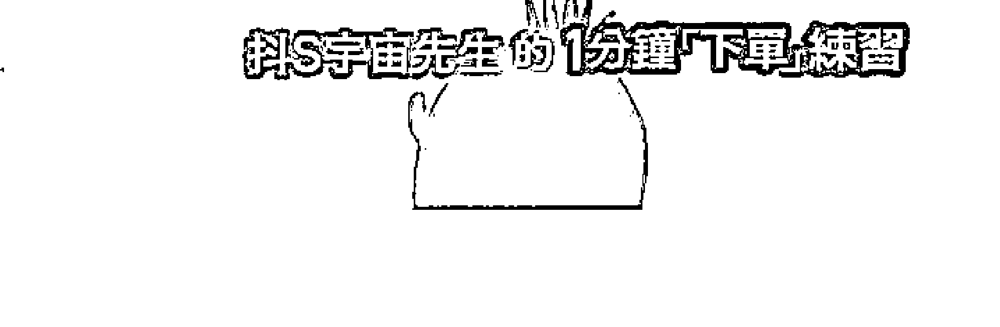

## # 所有發生的事
## 好壞都由你決定！

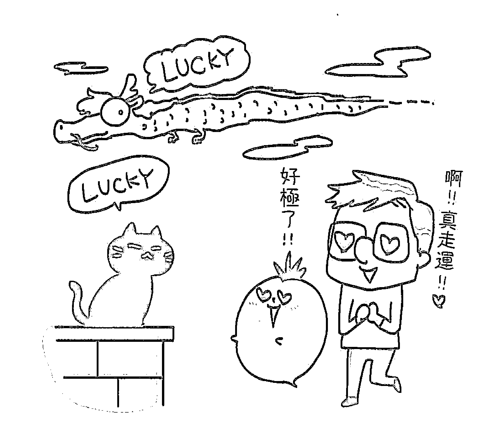

事件本來是沒有意義的，
是人們為它賦予了意義。
無論發生什麼事，都為它加上正面的意義吧！

看到像「龍」的雲就開心，看到黑貓就覺得「晦氣」？其實，所有事情原本不具任何意義。是人們為這些事賦予了意義。這麼說並非要你別為發生的事或看到的光景加上意義，而是你應該全都往好的方面想。同一件事，往好的方面想的人，跟往不好方面想的人，誰的人生比較幸福？答案應該很清楚吧。凡事往壞處想的人，容易說出負面口頭禪，阻塞連接宇宙與你之間的管道。事情原本沒有意義，你根本不必讓自己陷入不幸。當發生在你眼前的一全都是好事，就是訂單即將實現的信號。抱持正面心態的人，奇蹟就會降臨在他身上。

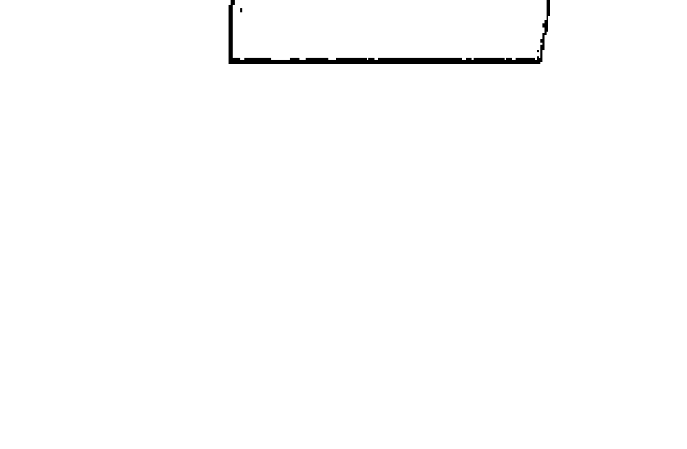## 与未来的哪个自己签约？

由你自己决定！

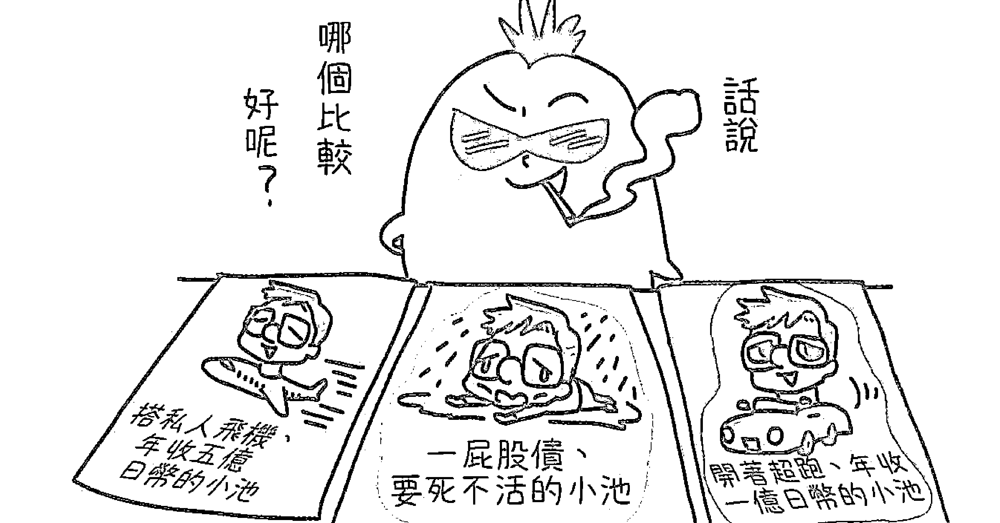

再异想天开的事，看起来绝对不可能实现的大梦，在你想到的瞬间，它就存在于宇宙的某处。

所有你想像得到的事，都存在于宇宙中你自身的记忆。也就是说，你之所以想像得出来，是因为那个“现实”已经存在于宇宙的某处，而你正在实现它。宇宙之中，有成了大富翁、身心富足的你，也有一屁股债、要死不活的你。你下订单订下了哪个自己，将来的道路就会改变，行动也会改变。年收一亿日元的你、负债五亿日元的你，想选择成为哪一个你，都是你的自由。你能自由选择想要的体验，而且一定会实现。但是，你必须虚心接受宇宙给你的提示、坦率付诸行动，自始至终都要相信你的愿望必定会实现。

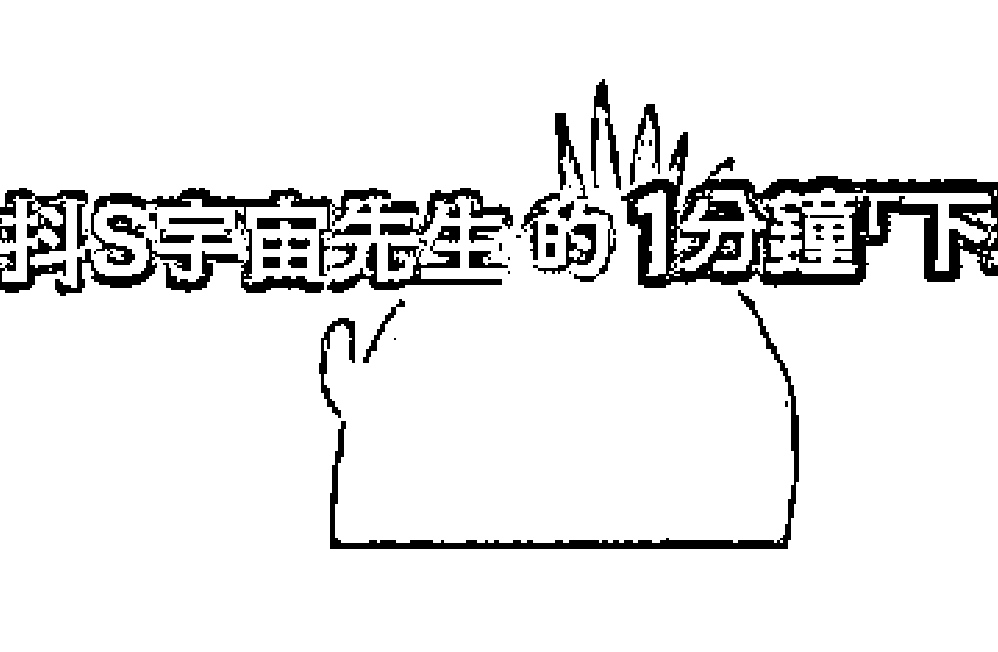

# 55

# 从今天起，停止自我设限！

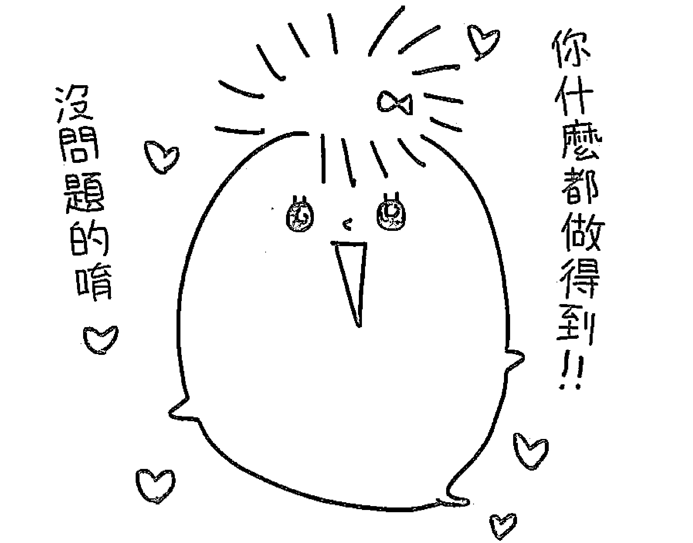

经常轻视自己、指责自己，却从未称赞过自己。这样的话，就算许下幸福订单，也会不断被取消。

你之所以会自我设限，是因为可以得到好处。例如，明明有想做的事，却以年龄为借口不去行动，对你的好处就是“可以避免尝试而失败”。问题的症结大都源于你所成长的环境。试着回想一下，最早开始挑剔你的人是谁？
如果你有个常把“反正都事到如今了”当成口头禅的母亲，就会让你擅自设定年龄限制，并以此为借口放弃梦想。看着爱挑剔又不幸的母亲，你会产生“只有我自己幸福很愧疚”的罪恶感。现在立刻戒掉这种毫无意义的“不幸癖”吧！失败根本不算什么，若是你自己不先幸福，更别谈拯救任何人了。

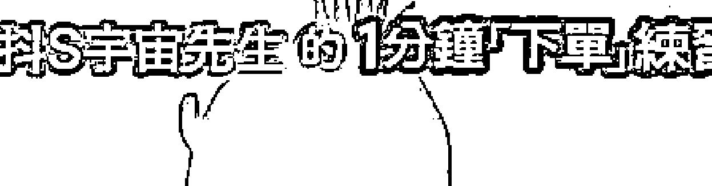

# 56

# 这个决定或行动，能得到明天的你称赞吗？

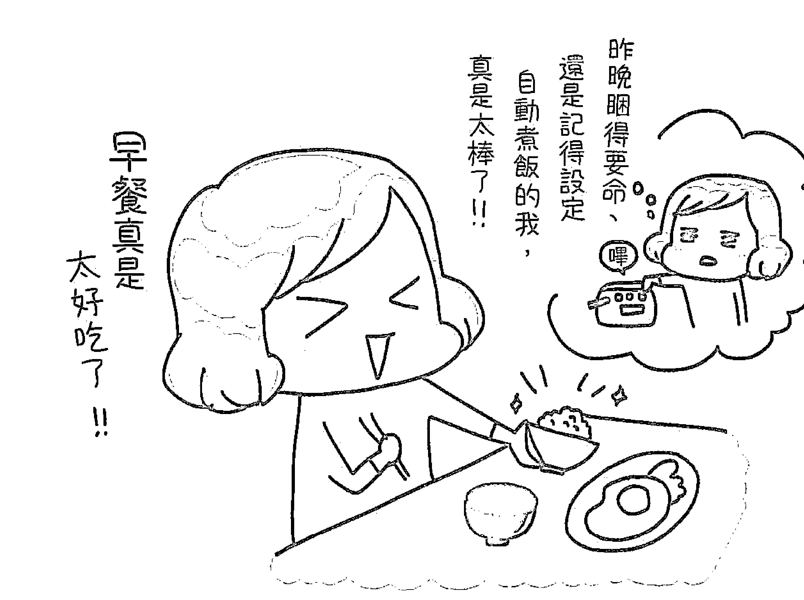

- 早餐真是太好吃了！！
- 昨晚困得要命、还是记得设定自动煮饭的我，真是太棒了！！

你所能改变的，永远只有现在。别再追悔过往，好好活在当下吧！抓住来自未来的指示，迈步向前吧！

你要记住这个重点：时间不是从过去流向未来。应该说，时间是从未来流向过去的。而“当下”永远是稍纵即逝的一个个“点”。在现实的物质世界、在这个地球上，你所能改变的唯有“当下”。追悔往事、抱怨过去的自己，都是没有意义的。活在当下，让明天的你能感谢今天的自己吧！多思考“该怎么做，才能让明天的自己开心？”然后马上采取行动。到了明天再感谢：“多亏昨天的自己那么做了。”不断重复这些行动，就能让订单实现。好好度过当下的每一刻，才有可能得到你想要的未来！

## 宇宙先生的1分钟下单练习

# 持续告诉自己：“有钱真好！”

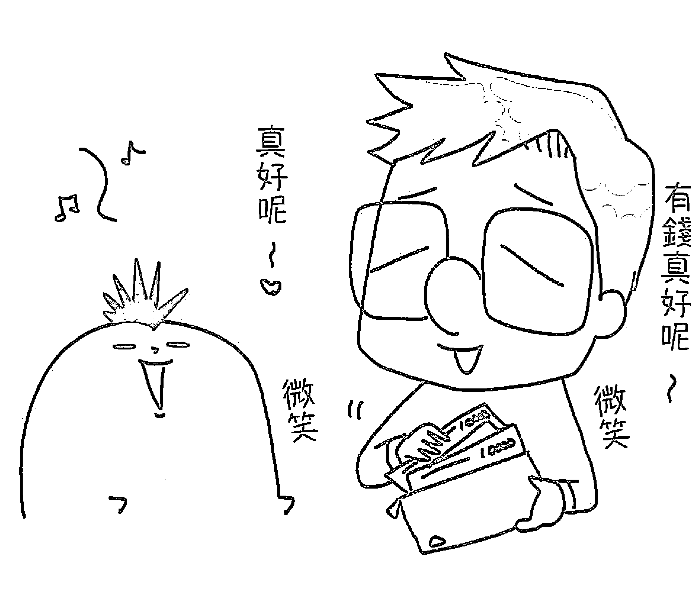

即使已经改变口头禅，却仍为了钱而烦恼，正是自己心里“赚钱不好”的想法在抗拒金钱。允许自己可以去赚钱吧！

从小就看着双亲为钱辛苦奔波，纯真的孩子会觉得：“钱很脏，跟钱扯上关系不会有什么好事。”这样的成见非常可怕，冥顽不灵的程度，连宇宙也会吓到。更麻烦的是，一旦生出这样的想法，之后就算想改变，也很难靠一己之力改变。拥有这种强烈的人生前提，将会阻碍你下给宇宙的订单，不论你如何改变口头禅、改变行动，仍会发生为金钱所苦的现实。首先你要告诉自己：“钱会带来幸福还是不幸，由我自己决定！”“当我有钱且过得富足，周围的人也会变幸福吧！”“把‘有钱真好’当成口头禅，下定决心欢迎金钱的到来吧。”

## 抖S宇宙先生的1分钟下单练习

# 58

# 没有人惹你生气！是你惹自己生气！

- 是你自己的问题喔
- 害我完全没享受到人生！！
- 都是因为那个人，
- 啊！！
- 临终时

“全都是那个人害的！”这是真的吗？
没有人能操控你的情绪，让你愤怒或悲伤。
不论愤怒、悲伤还是欢笑，都是你自己的决定！

发生问题时，究竟是对方的错？还是自己造成的？不同的态度，看事情的角度就截然不同。将问题归咎于旁人、环境等外部因素，或许比较轻松。因为不用对自己的人生负责，只要不断责怪别人就好。但这么一来，在人生快要结束的那一刻，你难道不会后悔吗？临终前的那一刻，想着“都是那人害我什么都做不到啊……”就断气了！（背景响起做法事的铜铃声）这样真的好吗？人本来就不会为别人所伤，或因为他人而悲伤。因为，对他人的言行举止一一做出反应的人，无疑就是你自己。现在立刻拿回人生的主导权，别让他人决定你的人生！

# 迷惘时，问问未来的自己！你就会知道现在该做什么！

- 可以喔～
- 喂，未来的我，可以问你一个问题吗？

未来电话

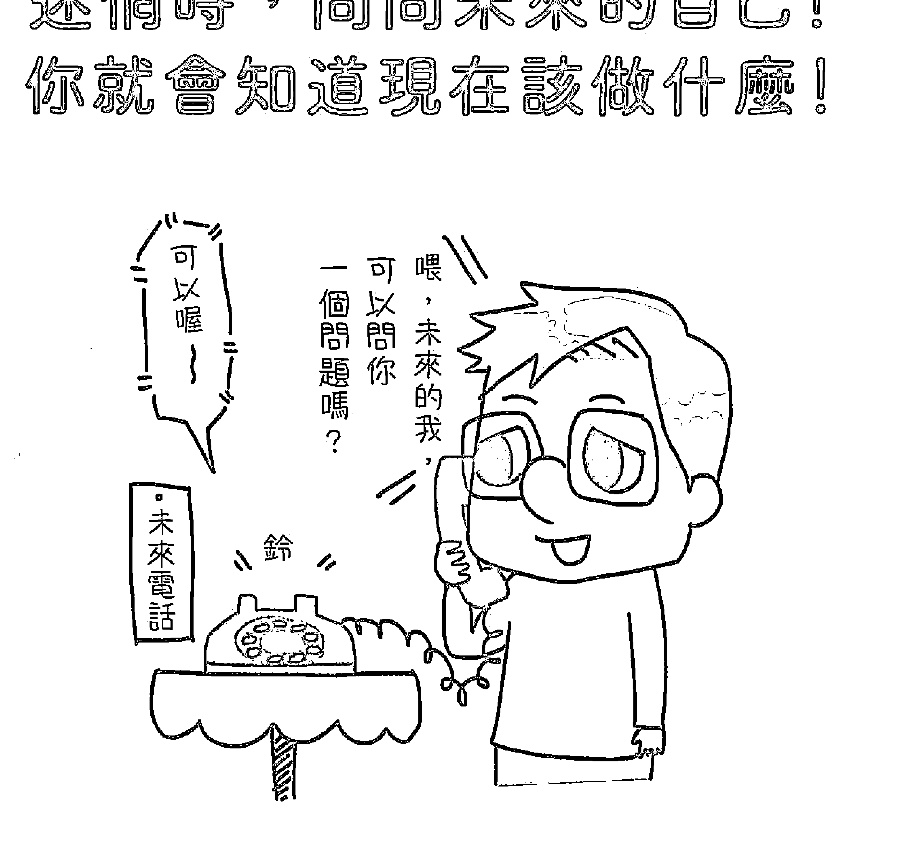

不知道该怎么做的时候，就问问未来的自己吧。其实你很清楚怎么做才是真正对自己好。

当你向宇宙许愿下单时，代表实现愿望的“未来那个你”，已经存在于宇宙中。所以，你可以试着问问自己，宇宙给了你什么提示。准备两张椅子，对另一张椅子呼叫未来的自己，跟未来的自己对话。直接问对方：“该怎么做，才能像你一样？”“未来的你，当时是如何熬过谷底的？”这是你与“内在深处真正的自己”之间的对话。任何人在有需要的时候，随时都能接收来自“未来那个你”的讯息。

## 抖S宇宙先生的1分钟“下单”练习

# 60

# 女生要信任男生，男生要用爱来守护女生！

女生不可以无微不至地照顾男生。男生不可以粗鲁地对待自己选择的女神。女生是女神，男生则是骑士。

社会上总有像浩美这种老是遇到软烂男的女生，这已经不是“吸引”软烂男，而是“生产”软烂男了。女生对男生而言，本该是女神般的存在，但现实往往并非如此。当你过于体贴对方：“我会为了你而努力！”“钱的问题我来解决！”男生就会失去表现的机会，变得越来越废。女生若想支持男生，并非亲自出手帮忙，而是相信男方、把事情交给他，给他珍惜你的机会。这么一来，男方会开心地发挥能力，变身成能干的男人。而且男人天生就有骑士精神。把自己重视的女生当女神对待、守护她、给她幸福，抱持这样的心态，就能跟伴侣维持圆满顺利的关系。

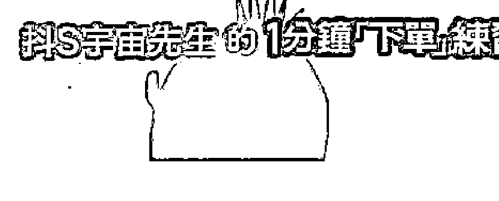

# 状况没改变？问题就在你的订单内容！

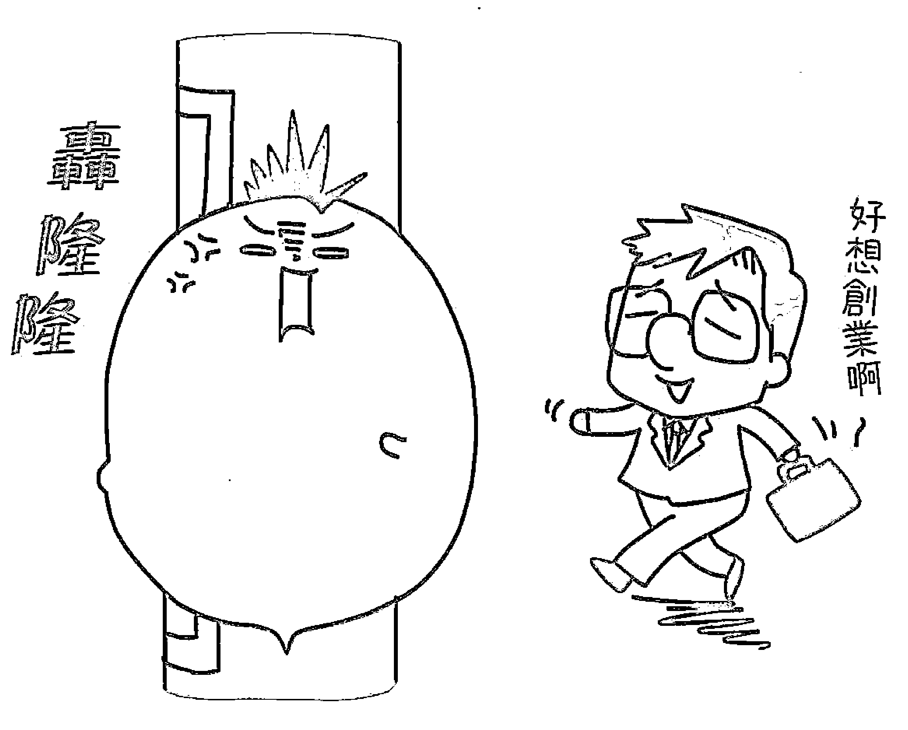

你的愿望之所以没有实现，
是因为某个负面愿望正在实现。
那正是阻碍你人生变化的凶手。

明明决定了结果，也把心愿下单给宇宙了，若人生依旧没有改变，你就应该注意“有没有‘因为现状不改变而实现’的真正订单”。例如，你决定创业做想做的事，愿望却沒有实现，代表你一定获得了“因为不创业而得到的某些东西”，像是“可以不用负责”、“可以过着安定的生活”或“可以不用和伙伴分开”。跟宇宙下订单想结婚却没结成，代表这张订单的背后隐藏着你真正的心愿，而且那个愿望还实现了，例如“不用让父亲或母亲孤身一人”、“可以不用失去自由”等。当你觉得受到阻碍，此时要先问自己：“透过‘没有改变的现状’，我获得了什么？”那才是你真正的订单。

## 对宇宙先生的1分钟下单练习

# 觉得“时间还早”，代表要“马上去做”！

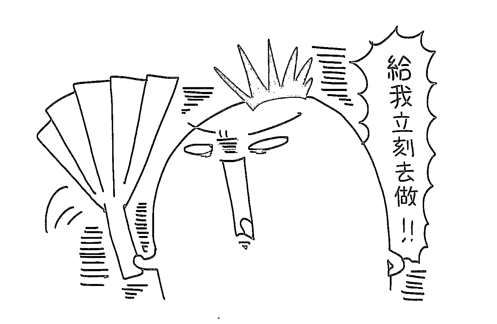

等积累实力再做？等瘦了3公斤再说？找借口不去做的事，就永远不会去做！

你认为“目前对自己来说还太早”的事情，代表你已经做好行动的准备，甚至可说有点晚了。因为你能描绘出来的东西，早就已经存在于宇宙中。现在不做的话，你就永远不会去做。在人生的最后一刻后悔“要是当时有做就好了……”乃人之常情。“总有一天想尝试、但现在还做不到的事”，换言之，其实就是“现在应该马上去做的事”。你只是在找不去做的借口，而非时候未到。你说自己还没准备好？所谓的“准备”，在向宇宙下单、开始行动之后，不知不觉就会准备好了！懂了吗？而所谓的还没做好准备，是因为你迟迟不采取行动！

# 付钱的时候，要“满心欢喜”！

- 缴税有这么愉快吗？

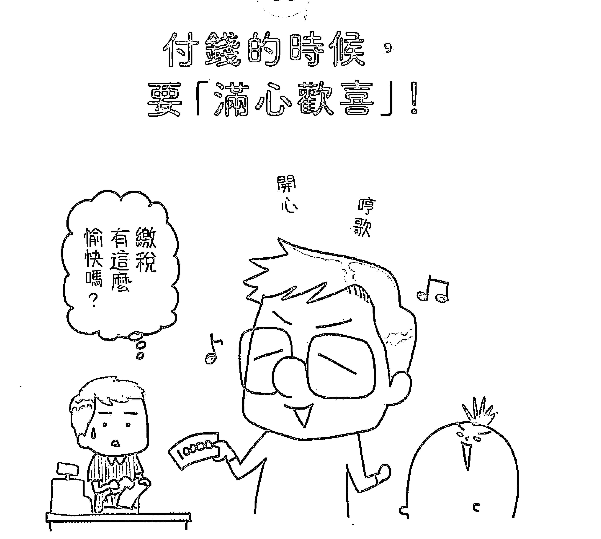

宇宙中的一切都是预付制。想要得到金钱，你就得先付出金钱。千万别说：“要是钱没回来怎么办？”小心被宇宙听到！

在你付钱之时，其实同时也在接收比那笔钱多上数百倍的丰富资源。比如说电费，若现在要你自己像爱迪生那样做研究，制造电力、创立电力公司、建设电线杆、供应电力，究竟要花多少钱呢？？如今你只要每月花上几千、几万块，按下开关，就能获得方便的电力。这是多么富足又值得感谢的事啊！也就是说，所谓“付钱”，就是用付出的金钱换得物超所值的丰厚资源。所以，我们在付钱时更要面带微笑、满心欢喜。你应该大喊：“这笔钱给我带来物超所值的富足生活！”而不是“付完就没钱了……”花钱时心怀感谢，将会得到更多回报。

## 抖S宇宙先生的1分钟下单练习

# 订下钱的“用途”与“入账期限”！

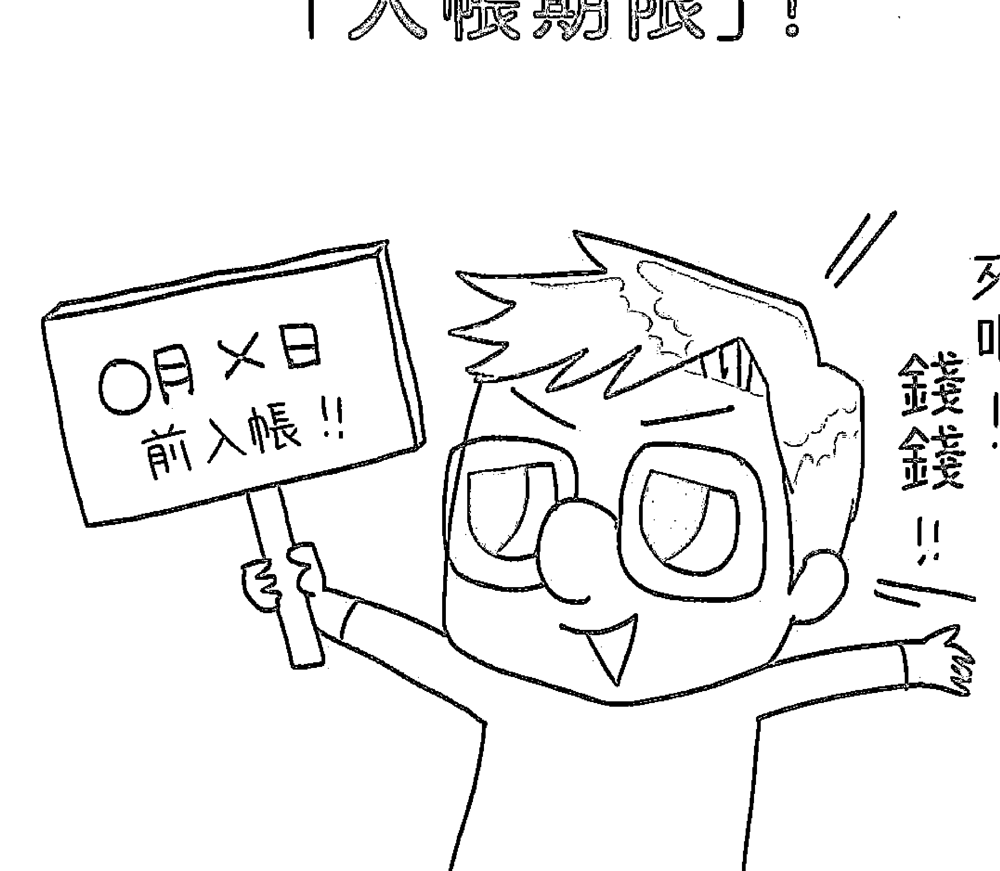

向宇宙下订单要求金钱的话，必须明确订下“金额”、“期限”以及“用途”。发自内心相信自己值得收到这笔钱！

之所以没有钱入账，是因为你认为自己没有收钱的价值。首先，你必须认可自己有资格收到钱。然后，想像自己实际上会如何使用这笔钱，跟自己约定“我一定会准备好这笔钱”、“我能赚到这笔钱”。像小池他明明负债超过千万日元，却仍认真想像该怎么使用宇宙给的钱，比方说：“去上心理学讲座，然后配合自己知道的宇宙运作机制，帮助更多人变幸福。”正因如此，奇迹才降临在他身上，让他在缴款期限前一天凑齐上讲座所需的钱。因为他按照自己的想像，将存到的钱用在心理学讲座提升自我，才能实现自己的愿景。只要有心，你也一定能做到！

## 宇宙先生的1分钟下单练习

# 人到中年更要做大梦！

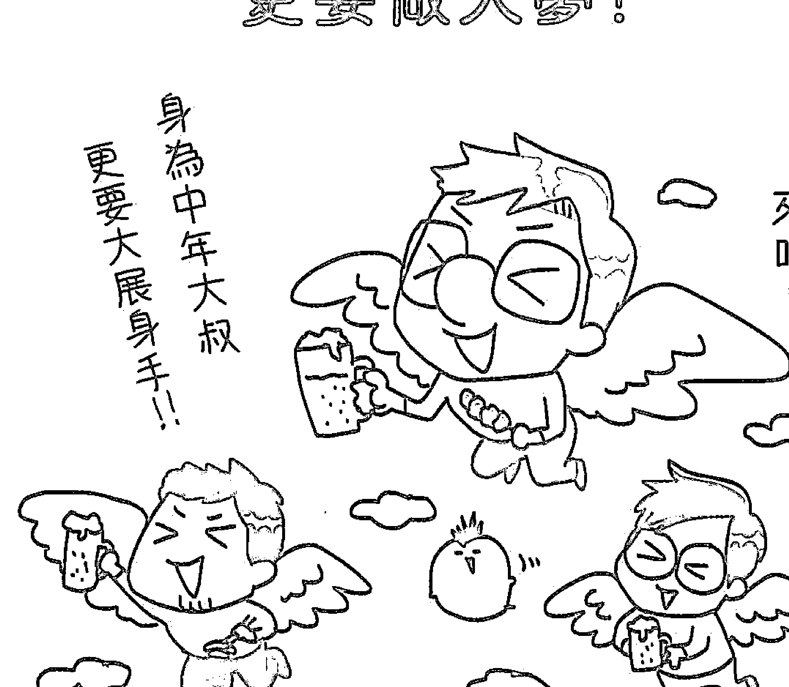

年轻人的梦想大多是妄想。
有年纪的大人所做的梦，才是真正的梦想。
向宇宙下单你真正梦想的时机来啰！

有的人会把“做不到”归咎于年纪大了，心有余而力不足。其实，在人生经验不够的年轻岁月所描绘的梦想，往往经不起考验。有时甚至会发生这种状况：向宇宙下订单，不顾一切行动后梦想实现了，却发现“这不是我想要的”。而且，人的梦想与理想，会随着经验的累积而改变。人生经验已累积到一定程度的大人，会理解真正的自己，觉得“啊，自己真的很喜欢○○呢！”“我想做那件事！”这时许下的心愿才是真的。梦想不是年轻人的专权。人到中年更要许愿！向宇宙下订单！就算觉得“应该无法实现吧！”，只要用正确的方式下订单、付诸行动，宇宙就会以超乎想像的展开方式，来帮助你实现心愿！

## 宇宙先生的1分钟下单练习

# 宇宙中存在了一切可能！

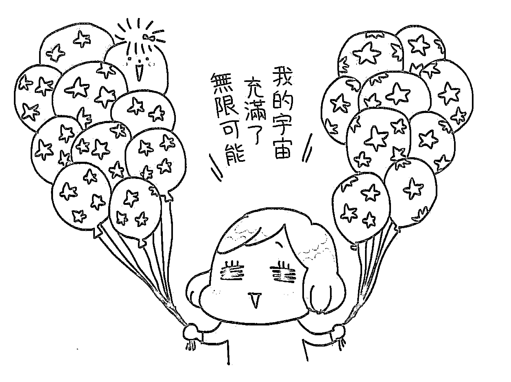

“我只想读这所大学！” “我只想进这家公司！”
“我只想跟这个人在一起！” 这些限制全都是空想。
别紧抱着执念不放，放手去体验吧！

宇宙中同时存在各种可能性，以及由那些可能所形成的世界。也就是说，在其他时空中，有另一个你，实现了你求而不得的心愿。因此，『因为得不到○○所以无法幸福』只是你的幻想。宇宙中有另一个你，和抛弃你的人结婚、过着幸福快乐的日子。有无数个你在不同的世界经历了各种体验，在离开地球时，『你和那家伙结婚了？』『你成了职棒选手？』像这样分享着彼此的经验，一起回归到宇宙。因此，你根本无须执着，只要好好体验你所没有的经验，过着多采多姿的人生就好。尽情享受今生的『你』吧！

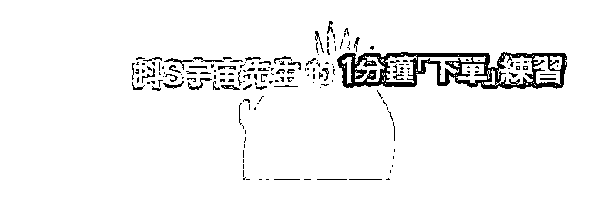

# 别再拖拖拉拉。人生短暂，好好玩个够吧！

- 啊～ 人家还没去过夏威夷跟巴黎啊！！
- 好了，该回去啰

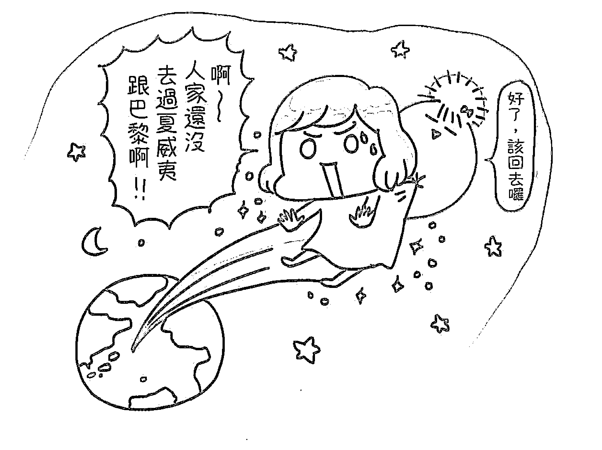

还在用“总有一天”、“再过几天”找借口吗？在你拖拖拉拉的时候，回归宇宙的时间很快就到啰！别忘了，人类的死亡率可是100%！

人是为了体验各种事而来到地球上的，即所谓的旅人。如果你老是宅在家里、懒得动，或是花大把时间在烦恼上，那你到底是为了什么才来到这个地球呢？你的终极目标应该是在人生结束时，看着人生的走马灯，心想“我经历过那些，也做过了这些，真是超开心啊～”心怀对地球的感谢，回归宇宙。然后，将“尽情玩乐的纪录”交给宇宙。什么都不做就结束人生的话，又有什么意义？所谓“成功的人生”，并非零失败的人生，也不是平安无事的人生，而是“没有遗憾的人生”。人生短暂，尽情享受你在地球的日子吧。

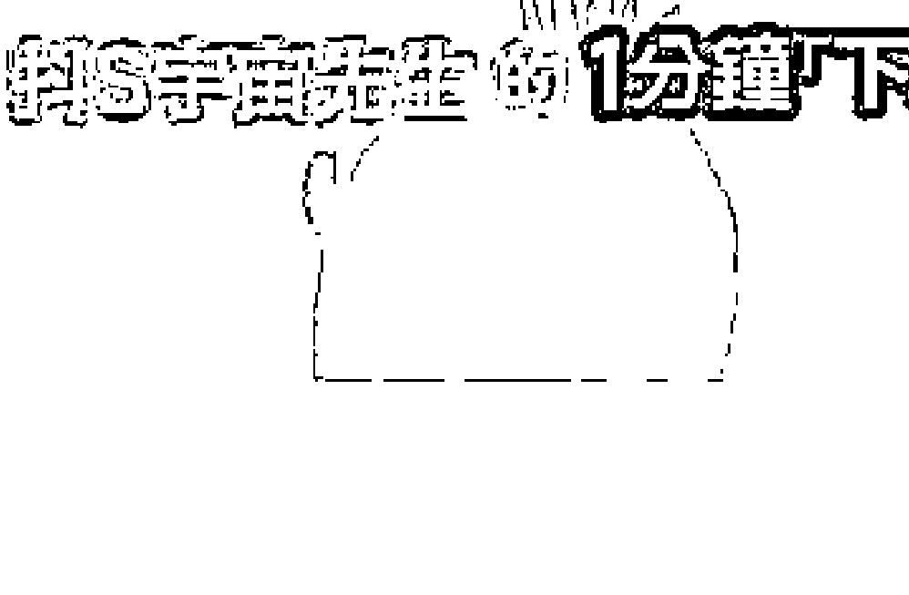

# 否定过去的自己，根本没有意义。

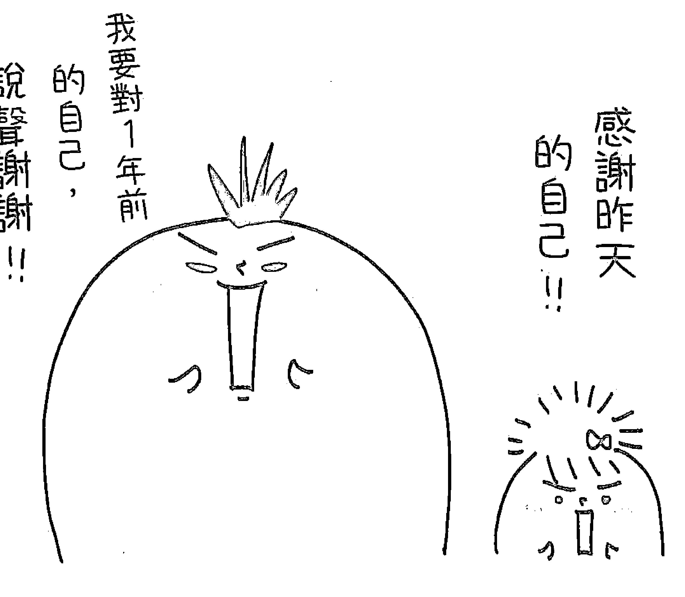

只顾着挑过去自己的毛病，就会错失来自宇宙的提示。
现在的你该专注的是：该怎么思考和行动！

听好了！别再懊悔“当时要是再努力一点，现在的我就不一样了……”不要纠结过去的事，更别抱怨过去的自己。试着想像十年后还在抱怨“要是十年前就做的话，应该就来得及”的自己，是不是很可怕？在你不断拖拉的时候，生命的尽头很快就到了。活在当下，让明天的自己能衷心感谢现在的自己吧！试着去思考“该怎么做，明天的自己才会开心？”马上行动吧！到了明天，就别责备昨天的自己，你要感谢昨天的你，并跟自己商量：『那么，今天该怎么行动呢？』就从今天开始做起！懂了吗？

# 3

## 宇宙先生的1分钟下单练习

# 告诉自己：“好幸福！”“好开心！”

- 好～今天也要幸福!!

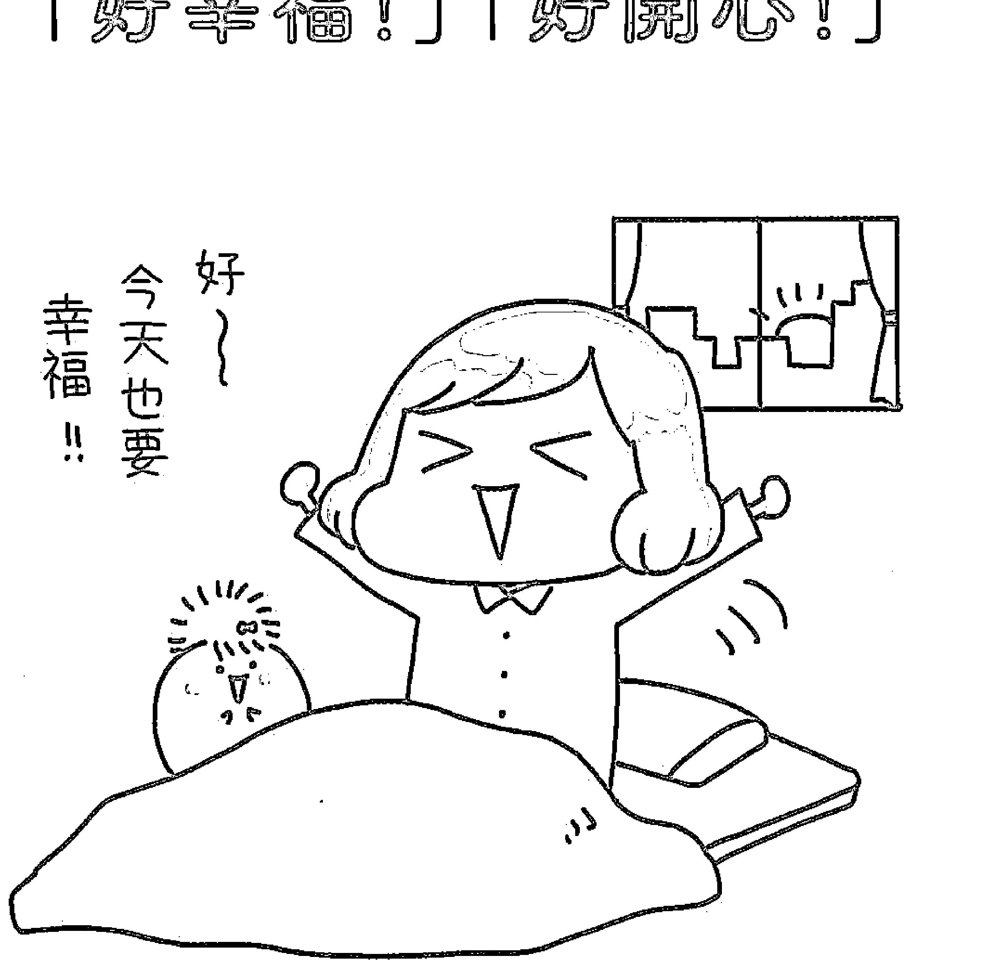

好开心、好高兴、好幸福。
不论身处任何状况，都可以由你来定义。
下定决心：随时都要开开心心。

你的幸与不幸，并非由他人来决定，而是百分之百由你自己决定。要以怎样的心情度过每一天，也是立刻由你来决定。即便现在的状况不是你所希望的，仍然可以告诉自己：“啊！好幸福！”并乐在其中。多多选择幸福及快乐的情绪吧！因为宇宙很快就会带来与你情绪一致的“现实”。下定决心“不管怎样，我一定要幸福！”把幸福作为你的人生前提，好好过日子吧。以往戴着“不幸”的眼镜所看到的世界，一旦换上“幸福”的眼镜，就会聚焦在生活中的小小幸福。没错，幸福并非来自于发生的事情，而是来自于你自己的心态。

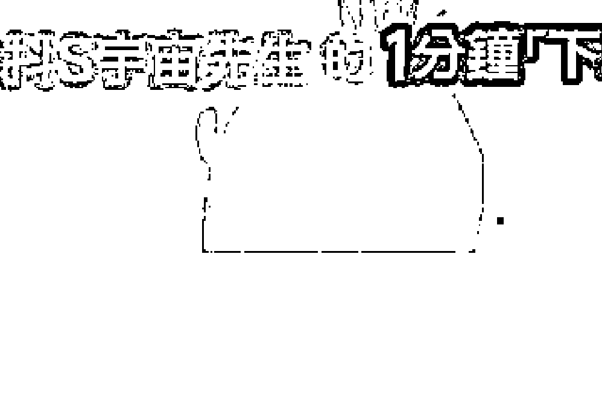

# 宇宙中，奇迹人人有份根本不用玩“抢椅子游戏”！

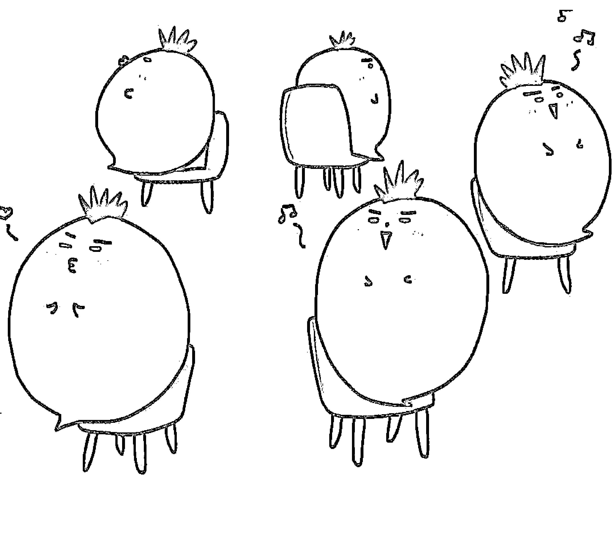

奇迹没有数量限制！因为这是专属你的宇宙。

你所做的、所发生的任何事，都是有收获的。
若是一无所获，代表那不是你真正需要的订单。

奇迹发生在别人身上，不代表就不会发生在你身上。即便年收一亿日元的人只占总人口数的0.02%。只要你下单的方式正确，而且是发自内心所下的订单，就一定会实现。所谓奇迹，并不是在玩抢椅子游戏。每个人都活在各自的宇宙里。有多少人期望奇迹，就有多少奇迹会发生。如果你认为“因为别人得到了奇迹，已经没我的份了”，这样的想法就会成为订单，导致这种现象：“奇迹只降临在他人身上，但就是不会发生在你身上。”宇宙会实现人们明确的订单。愿望之所以没有实现，代表那张订单不是你真正需要的。因为宇宙一定会彰显人们打从心底深信的“人生前提”。

# 推的不行，就改用拉的！经常“逆向思考”。

人的心理看似复杂却很简单。有时，反过来做才是正确答案。事情进展不顺利的话，先试着逆向思考吧！

许多问题只要逆向思考就能获得解决。例如，过度投入工作时，你该专注的不是“我快被工作压垮了”，而是“埋首于工作，会不会忽略了什么？”无法跟折磨自己的另一半分手，就思索这点：“我是因为想折磨自己，才让那人留在身边吗？”很痛苦却戒不掉，是因为这么做会让自己有所得。“想戒却戒不了”是假的，真正的原因在于“自己因为戒不掉而获得某种好处”。如果没有找出问题的根源，痛苦就会一直持续下去喔！时常逆向思考，找出问题的症结吧！

# “只做喜欢的事就好”？！别说这种傻话！

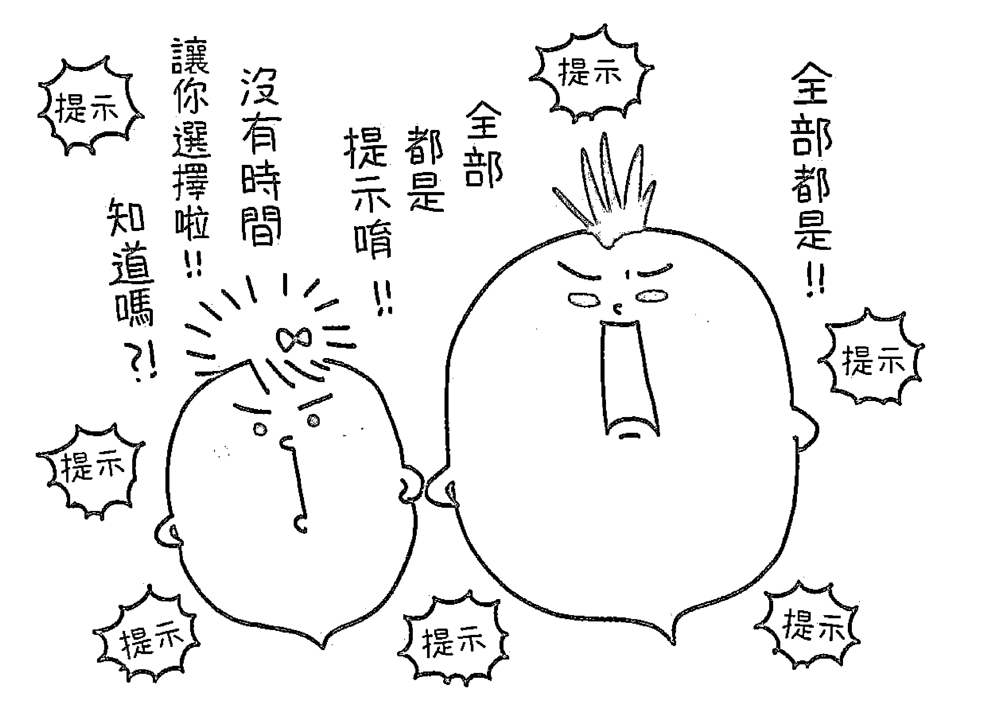

光是下订单给宇宙，不能算是“吸引力法则”。
因为，你必须有“下定决心”的觉悟和行动，才能实现心愿。
一觉醒来就心想事成，是不可能发生的。

最近经常听到：“不想做的事就别去做。”“只做喜欢的事，人生就会顺风顺水。”这是“宇宙订单达人”常用的说法。能正确下订单并行动的人，在旁人看来就像是将好事“吸引过来”一样。刚开始尝试下订单的初学者，在下完订单收到宇宙的提示，并付诸行动的过程中，一定会遭遇害怕变化的撞墙期。这时如果心怀畏惧：“我讨厌这样，所以应该不是给我的提示。”“我不想做！”而不去行动，订单就永远不会实现。想得到打心底真正渴望的事物，一定要付出努力与行动。

## 別對嫉妒做出反應！以免消耗你的能量！

我才不接那種球呢！！

嫉妒

嫉妒是人的負面情感，既可怕又纏人。高度在意他人的妒意，會害你動彈不得喔。與其那樣，不如輕巧躲過，走自己的路！

錢這種東西很麻煩。很多人都認為金錢是成功與幸福的象徵，所以會嫉妒有錢人，甚至想要勒索敲詐對方。所以，當你賺不到錢、存不了錢，或是明明有錢卻不順利時，代表你暴露在某人的嫉妒能量下，在不知不覺中被套上了腳鐐、動彈不得。嫉妒心強的人，不允許身旁的人或他們認為遠比不上自己的人突然發憤圖強、力爭上游。他們希望對方與自己處於同樣的水準，或居於自己之下才能安心。當這種人擺出一副義正嚴詞的姿態，說出討厭的酸言酸語時，告訴自己「不要接招」，閃開對方的嫉妒攻擊吧！

## 抖S宇宙先生的1分鐘下單練習

# 74 遵守跟自己的小約定，和內在的你和解

自虐型口頭禪，會傷害內在真正的自己，
內在的自己，會對光說不做的你感到失望。
遵守跟自己的小約定，找回對自己的信賴吧。

你應該比任何人都相信、期待自己的可能性。可是，此前的你再三對自己爽約，然後再去怪罪那個無法遵守約定的自己。你內在真正的自己，對「光說不做」的你非常失望。如果無法恢復信賴，你就不能和真正的自己重修舊好，心願也不會實現。「今天內要完成這件事！」「週末去吃美食。」一再小的事都可以，跟自己立下約定並守約，藉此重拾對自己的信心。當內在真正的你覺得「這位再也不會背叛我了」，你就能一點一滴重新找回力量。對自己抱持最大的期望，然後努力去回應對自己的期待吧！

## 宇宙先生的1分鐘「下單」練習

# 「我果然做不到……」 這是負面的自我催眠！

「我果然做不到……」會直接成為給宇宙的訂單。
消極的口頭禪是會將自己推落萬丈深淵的負面暗示。
多說正面的開運口頭禪，消除負面想法的影響吧！

就算曾發生過讓你覺得「我果然還是不行啊……」「自己沒本事完成……」的事，其實你也無法知道是否為真。因為人的記憶容易被影響。不過，最糟的是因此而生的負面口頭禪。「結果還是不順利……」這類負面的自我評價，是奪走個人可能性的「自我催眠」。人們說出口的話，會直接成為給宇宙的訂單，覆蓋過去的記憶，加重「我果然就是做不到……」的自我暗示，帶你走向更黑暗的未來。如果你老愛說：「我果然做不到……」，就要刻意多說：「我果然做得到！」讓正向積極的口頭禪取代負面消極的口頭禪。

# 找出「做不到」背後隱藏的「恐懼」！

就算害怕…

毛骨悚然

也給我去做…

有心想做的事，不知為何總會擦身而過。
當你發現自己正朝著無法實現心願的方向前進時，
代表你心中懷有恐懼。勇敢面對吧！

「我要結婚！」當你下定決心也付諸行動了，卻總是被對方甩掉，或持續被劈腿，已經決心「要找到新工作」也投履歷了，卻一直不被錄取。這代表你的心底，存在著「心願一旦實現會很傷腦筋」、「實現了會很可怕」的理由。這些全都是「恐懼」。當你心懷恐懼，即使做了任何決定，只要宇宙的通道是堵塞的，就會無法堅持你的夢想，而總是一再落空。這時你更要徹底與自己對話，問問自己：「結婚後會發生什麼事？」「找到工作後會變得怎麼樣？」「變幸福有什麼好怕的？」即使害怕也要邁出那一步！

# 成功者的語錄，不要照單全收，你要模仿的是，他們逆境時的「行動」！

能否成功，在於你關注的是成功者的「哪一點」。你所需要的提示，是對方在成功之前的行動，而非「現在」的一言一行！

現在能隨心所欲過日子的人，全都樂在自己所做的事，所以會說：「我只做自己想做的事。」但聽到他們這麼說，就以為「這樣啊？原來只要做喜歡的事就好了嗎？」可是天大的誤會。從未聆聽過心中「真正自己（＝潛意識）」的聲音、不採取行動、沒有訂單實現經驗（但負面訂單倒是全都實現了）的人，往往只想模仿成功者現今隨心所欲、光鮮亮麗的一面，但這麼做是沒有意義的。你應該仔細觀察並模仿的是，對方在人生困境時是怎麼度過的。如此就能發現：他們即使身處困境，也不會放棄行動。只要行動，就能改變人生。

# 實際去拜訪「你想成為」的那些人！

人是一種能量體。
能量會「傳染」，所以要格外注意。
和消極負面的人在一起，你就會越來越負面。

有煩惱的人，喜歡跟像自己一樣有煩惱的人聚在一起。他們看到幸福的人就會嫉妒，看到即將變幸福的人，還會去扯後腿。這樣的小團體很危險，會讓人永遠無法脫離不幸。比方說，想結婚的單身女性不該聚在一起討論：「為什麼沒有好男人！」「就是沒有啊！」你應該親近的不是互相抱怨煩惱的同伴，而是理想的典範。想變幸福、想讓自己閃閃發光、想在工作上做出成果……什麼都可以，去見見你憧憬的對象，接受對方的激勵。只要走對方向，就能自我磨練，也能遇見真正有益的同伴，連工作也會順利。理想不會逃跑，一直以來都在逃避理想的那個人，其實是你自己！

## 第3宇宙先生的1分鐘下班練習

# 孤獨其實是一種幻覺！宇宙是你的最佳夥伴！

別擔心～♪ 都說了，有我在啊？

嚕啦啦啦！！

將將將將！！

沒有人是獨自活著的，每個人都有各自的宇宙陪伴著自己。孤獨只是你內心製造出來的幻覺。

所有人在各自的宇宙裡隨心所欲生活。在那裡，宇宙與人緊密相連。因此，即便是獨居的人，也沒有人是真正孤獨的。如果你覺得快被孤獨感淹沒，其實是你內心生出的幻覺。因為害怕孤獨而想牢牢抓住某個人，反而會嚇得對方甩開你的手，更加深你的孤獨感。但是，宇宙是愛的。所有人都是不可或缺的存在。知道嗎？你存在的機率是四千億分之一，也就是說，你的存在本身就是一種奇蹟。與之相比，逆轉人生根本只是小事一樁。知道這點後，是不是覺得自己無所不能呢？

## 第3宇宙先生的1分鐘下單練習

# 把「錢進來囉！」當口頭禪，在宇宙銀行存錢吧！

當你提不起勁行動時，此時最適合你的口頭禪就是「錢進來囉！」你的宇宙戶頭裡，存滿了愛與富足喔！

來自宇宙的提示中，或許也有你不想做的事，像是「給我早起」或「快去跑步」等。這時正是口頭禪「錢進來囉！」出場的時機。覺得麻煩而想停手的時候，想像你正在宇宙銀行存錢，告訴自己：「錢進來囉！」你做得越多，錢就存得越多。這些努力會累積為龐大的「愛與富足」存款，在某一天成為天降奇蹟。心懷期待，等待它為你帶來的驚喜吧。如果因為怕麻煩，而在行動時生出「真討厭」的想法，你的訂單就會被修改為「真討厭」，就連你付出的努力，最後也只會產生「真討厭」的結果，不可不慎啊！

# 讓你實現「獲得100萬日幣」訂單的方法！

「我想要錢」無法成為真正的訂單。
在什麼時間需要多少錢？打算怎麼使用？全都要寫清楚。
宇宙會駁回用途不明確的資金申請。

有些願望，如果不聚焦在原本的目的就不會實現。例如「一百萬日幣入帳了」這樣的訂單，有的人會實現，有的人卻不會。不知道錢要用在何處的話，即使下訂單也不會入帳。你必須具體寫出要用這筆錢來做什麼？如實形容可以用這筆錢過著什麼樣的豐足生活，宇宙才會接收到你的能量，幫助你實現心願。盡可能具體而清楚地描繪出致富後的未來吧。還有，你需要的金額、入帳期限，每個細節都要鉅細靡遺地註記在訂單上。舉例來說，如果你想去旅行，就要計算旅程所需的所有經費再許願下單。訂單的內容越詳實，心願越容易實現。

## S宇宙先生的1分鐘下單練習

# 找出讓你不敢行動的「心靈煞車」！

就算向宇宙下了訂單，身體卻動不起來。
這時你要把目光轉向內心的煞車。
只要注意到內心的成見，人就有改變的可能。

靈魂存在於宇宙，享受著人在地球上的所有行動。另一方面，心是人生誕於地球之際，為了守護肉體所加上的裝備。為了能在地球上生存，人們會在家庭與大環境訂立各種規範，確保孩子能夠平安成長。這些規範會成為那個家庭的「常識」，而人一旦習慣某種規範，終身都難以改變。即使長大成人有了想做的事，也會因為無法擺脫從小就習慣的規範而踩煞車。你之所以會覺得這個世界很難生存，都是源自你內心的成見與規範。向宇宙許願下訂單卻無法實現時，你更要聚焦在自己的心，勇於質疑那些你在不知不覺中習以為常的常識。

# 喜歡吃苦的抖M人 快重新修改你的「設定」！

想要實現訂單，行動是不可或缺的，但你不需要「辛苦得半死」。別讓「吃苦」這件事成為你的最終目標。

想實現心願，行動是不可或缺的，但認為「必須吃苦才能獲得幸福」是很大的誤解。宇宙的運作機制既簡單又精密，下訂心願並付諸行動後，願望一定會實現。但如果你的訂單是「辛苦得半死，最後才能獲得幸福」，你就必須先吃許多苦頭才能實現心願。不用這樣，宇宙也會為你帶來戲劇化的奇蹟，所以實在沒必要在劇本刻意加上「辛苦得半死」的條件。你只要簡化成「一定會順利」的設定，開開心心下單，快快樂樂行動就好。記住！「事情不可能那麼順利」是宇宙嚴禁說出口的最差口頭禪第一名！

## 宇宙先生的1分鐘「下單」練習

# 現在立刻寫出令你興奮不已的三件事！

- 喝香醇美酒
- 沉浸在喜歡的音樂裡
- 開最愛的車

那個，如果是我的話：…

回想讓你覺得開心的事情。每個人的人生中，至少都會有一件快樂的事。不信的話，不妨現在試著寫寫看！

喂，我說你啊！到底是從何時開始認定「人生一點也不有趣」呢？而且，為什麼你只看那些不開心的事情，淨給自己找煩惱呢？你生活的地方是名為「地球」的遊樂園，就連驚悚或恐怖的遊樂設施，也非常有趣呀。現在馬上寫出三件你覺得有趣、一想到做就會讓你興奮不已的事。不論多小的事都無妨，像是「看到小狗就會微笑」、「完成填字遊戲的成就感」等等都可以。寫出來以後，務必在今天之內至少做完一項，然後告訴自己：「因為有了這項體驗，人生真的好快樂！」

# 運氣來自心情！ 隨時保持好心情吧！

心情好的時候，運氣也會跟著提升。
先調整好自己的心情吧。
因為一切境遇都是來自你的內心！

有個方法可以一秒提升運氣，那就是「讓心情變好」。聚焦在積極的事、喜歡的事、美好的事，讓自己擁有好心情。同時，不論發生什麼事都要說：「我運氣真好！」正如你若想在鏡中看到微笑的自己，就一定要先展露笑容；想獲得幸福，就要先說：「我很幸福！」不論再小的事都好，找出你生活中幸福的證據，告訴自己：「看吧，所以說我很幸福！」從那個當下，你就會變成運氣最好的人。因為宇宙會增強個人的能量，並使之實現。擁有好能量的人，運氣會不斷提升，變得幸福。宇宙的運作機制就是這麼簡單，一點也不難。

# 告訴自己「也是會發生這種事啊」，脫下成見的鎧甲！

這種事呢
呼～也是會發生

別用自己的標準去評斷他人的事。也不要用自己的規則去規範他人。這麼一來，你將變得比所有人更自由。

宇宙中存在所有資訊，並不是非黑即白。更別說單憑你在地球上的淺薄經驗與知識就想一一來評斷人，根本是不可能的。當你遇到自己聞所未聞的價值觀或想法時，不必一一反應，覺得「那樣不對！」、「我被否定了！」，而是告訴自己：「也是會有這種事呢。」、「原來在他人的宇宙中，這才是常識。」像這樣，訓練自己不論遇上任何事，都先敞開心胸去接受。別用自己的標準去衡量他人。不論對人還是對事，只要不去評價對錯，你就能擁有一顆自由開放的心。因此獲得解脫的人，無疑就是你自己。

# 無論何時都要告訴自己：「過好當下最重要！」

那時發生在你身上的事，都已經結束了。
過好當下才是最重要的事。
你所掌握的未來，甚至能改變過去。

「那時這樣做就好……」「要是當時沒失敗的話……」像這樣總是執著於過去，簡直愚蠢至極！不論是責備自己還是歸咎別人，都立刻收手。那時的你已經很努力了。所以，你可以抬頭挺胸地對自己說：「過好當下最重要。」一心想逆轉人生的話，就認真做好你人生電影的導演，同時客觀地看清楚自己的魅力與優勢，演出最棒的結局。你就是你人生的導演和演員。最能鼓舞你的人也是你自己。不論經歷怎樣的失敗、後悔，你不都挺過來了嗎？只要活著，就有可能逆轉人生。雖然過去發生的事無法改變，只要好好掌握未來，你甚至能改變對過去的看法。

## 抖S宇宙先生的1分鐘『下單練習』

# 88 别和别人比较，成为史上最棒的自己吧！

你这么会挑自己的毛病，那你是否付出过最大的努力，试着打造出全宇宙最棒的自己呢？

「我长得不漂亮……」「反正我就是烂……」你是否总爱挑自己的毛病，却忘了如何去享受你的宇宙？在你的宇宙里，外表、能力、他人的评价，或是与他人比较的自卑，完全没有任何意义。你根本无须跟人比较。硬要说的话，你要超越的对象只有自己。在你的宇宙，你应该努力成为史上最棒的自己。若能成为史上最棒的自己，人们对你的评价自然会提升。因为一切问题的根源都在你身上。灵魂会因为你的努力与行动而鼓舞雀跃，奇蹟会不断降临在这样的人身上。别去和他人比较，专注在自身吧！

## 抖S宇宙先生的1分钟下单练习

# 「勉強去做的事」全部斷捨離！ 下決心「不去做」！

決定「不做這件事」也是你該採取的行動之一。
那些被舊有價值觀束縛而勉強去做的事，全都放手，
專注在現今的你所期望的事情上吧。

向宇宙下訂單卻沒實現，應該思考一件事：你是否一直在做「多餘的事」，忙到連接收宇宙提示的時間都沒有？明明不想做，卻一直停不了手，或是過於執著於過時的做法。你應該重新審視自己至今為止的做法或價值觀，勇敢放掉現在的你不需要的東西。下定決心「不做」也是你應該採取的行動之一。聽好了，向宇宙下新訂單時，人在某種程度上必須拋棄過去的自己。現在正是你為自己鼓起勇氣、決定「不做」的大好時機。如此一來，就會展開新的一頁。你應該順著全新的發展，往下一個階段邁進！

## 宇宙先生的1分鐘下單練習

# 讓你的靈魂與心往同一方向前進！

靈魂總是往前進，心卻老想停下來。心一直想要阻止靈魂去體驗更多事，說服你的心，讓它與靈魂朝同一方向前進吧！

「靈魂」的故鄉是宇宙，而「心」是人的身體。靈魂對各種事物總是樂在其中，心卻經常對威脅生命的存在心懷恐懼。因此，人們總是無法朝著期望的方向行動。發生這種狀況時，首先要懷疑你的心是不是踩了煞車！靈魂是想前進的加速器。所以你要思考，該如何說服自己的心，讓它與靈魂朝著同一方向前進。為此，你要先知道自己的心被何種常識束縛住了。寫下「我認為是常識的事」，然後仔細思忖，用紅筆一一確認自己所寫的內容是否正確。先從質疑自己心中的常識開始，像是「不要給人添麻煩」、「錢是災難的源頭」等，拆除綁住心的煞車吧。

## S宇宙先生的1分鐘下單練習

# 覺得嫉妒時，就握拳說YES，因為這是「你也能做到」的信號！

當你對他人心生嫉妒，代表你覺得「那件事我也能做到」。那正是你能抵達目標的信號！

所謂「嫉妒」，是因為看到別人得到本應屬於自己的恩惠，因而心生動搖的情緒與執念。而這樣的情緒所針對的對象，是你認為與自己同等、或不如自己的人。試想一下，就算你會羨慕阿拉伯石油大王，但你會對他抱持嫉妒或自卑感嗎？嫉妒或自卑感乍看是討厭對方，但其實你心中真正的想法是「明明我也能做到，為什麼成功的人不是我？」「為什麼當初我就是停下腳步不行動呢！」可說是你對自己的抗議。所以，嫉妒代表的是機會，因為你也能夠達到那個目標的人。告訴自己：「我也能做到！」立刻展開行動吧！

# 92

别因为复仇之心
让自己不幸！

放下那些？

你要不要...

- 对友人的憎恨
- 对母亲的憎恨
- 对父亲的憎恨
- 对师长的憎恨
- 对上司的憎恨
- 对妹妹的憎恨

没必要让自己变不幸，
并以此来报复你的父母。
难道你希望到死都一直不幸吗？

人类真是容易被心摆布的生物啊。年幼时，因为父母不是自己理想中的样貌，一直努力想把他们改造成心目中理想的父母，或是把自己的不幸归咎于他们教育失败，又或者是想惩罚让自己不幸的父母。但是，这种抗议其实毫无意义。因为，最后成为最不幸的人是你自己。请对自己说：「父母那时已经尽力了。」让自己从对父母的不满解放出来吧。今后你要好好对待自己，像你理想中的父母那样疼爱自己，步上理想的人生。成为幸福的人，才是你最该让父母看到的模样。

### #S宇宙先生的1分钟下单练习

# 开始培养一个新的小习惯！

要把镜子擦得亮晶晶♡

从今天起，刷牙后

一天是由许多小行动所组成的。
一个全新的小习惯，
将大大改变你的每一天。

「人绝对会改变！」「人不会轻易就改变。」这两种说法其实都正确无误。人类拥有宇宙所没有的维持生命装置——心，而心会顽固地坚持你从小就学到的规则。可是，没有什么事是绝对不能改变的。第一步就是改变你的口头禅。你至今一直使用的负面口头禅，就是映照出你内心的一面镜子。所以，只要改用正面的口头禅，就能改变人生的基础。除了改变口头禅，再加上一个新习惯吧，像是：早起半小时、早晨上班途中与人打招呼、晚上擦亮镜子……什么习惯都可以。每天的行动是为自己增添自信的最佳元素，即使只是小小的挑战，也会加速人生的变化。

## 抖S宇宙先生的1分钟「下课」练习

# 没经验最好！

人生就是冒险！什么都去尝试吧！

> 「因为没经验所以要放弃？！」

记住，所有专家一开始都是门外汉！

不论任何事，从现在开始尝试去做吧。

「想说英文」、「想在人前唱歌」，当你的心中浮现这些念头，就立刻去行动吧。与此同时，应该也会出现各种不做的借口，但你一定要踏出第一步，而且是马上去做。

虽说做任何事都不嫌迟，但从当下这个瞬间开始、或拖了一年后才开始，两者的差距还是很大。别犹豫，先做就对了！若无法持续下去，改找其他事来做就好。比起「试过之后发现自己竟做得到」，「尝试去做，却还是做不到」更能丰富你的人生。人不论到了几岁，都是不断地试、经历一次次失败，却仍一再探寻有趣事物的冒险之旅。打从心底乐在其中并持续尝试的人，宇宙的力量一定会站在他那边。

# 灵光一闪是宇宙的提示！
别思考！做就对了！

「啊、对了！」突然出现的想法，正是来自宇宙的提示。
灵光一闪，是帮助你实现订单的提示。
不论发生什么事，你都将朝着实现愿望的方向前进。

有人会说：「我不知道哪些是来自宇宙的提示。」不论是不是宇宙给你的提示，那些浮现在你脑中的事、你亲眼看到且在意的事，不论如何先做就对了。不需要一一去思考「如果这不是提示怎么办？」话说回来，宇宙讨厌「如果「是提示我就做，如果不是提示就不做。」这种斤斤计较的想法，尝试之后却发现「不对」，只要再实行下一个浮现的念头就好。宇宙的提示就是灵光一闪的瞬间，之后涌现的「要是做了这个，就会○○吗？」都是多余的想法。尝试去做你脑中出现的所有提示吧！你是否勇于行动，宇宙都在看着呢。

# 现在立刻停止
让人生变糟的「完美主义」！

人一旦心想「不能失败」，
就会害怕行动。
要知道，「失败」也包含在订单实现的过程哪！

很多人都会说：「我不想失败。」但我其实不是很懂为何要这么说。因为你的灵魂喜欢享受各种经验，失败也包括在内。而且若是一切都顺风顺水，那人生的乐趣就会少了一大半。灵魂也想拥有失败的体验；尝试挑战，经历失败，然后成功，人们都是经过此一过程后才会感受到挑战的喜悦。所以你应该放下「不想失败」的想法。失败本来就会发生，不需要排除它，而是要将失败视为成功过程的一环并乐在其中，你的人生将比现在快乐好几倍。这么一来，充满活力的宇宙也会为你准备了戏剧化的发展，奇迹将就此降临在你身上。

### # 试试一整个星期完全不抱怨！

你的不平或不满，全会成为给宇宙的订单。 想改变人生的话，现在立刻停止抱怨！ 向宇宙下订单之前，先做到不抱怨！

口头禅，代表个人打从心底相信的人生前提。「好无聊喔……」「果然还是不行……」类似这样的自言自语也算，就连你对别人说的负面话语，也全会成为下给宇宙的订单。从现在起的一年内，将一切牢骚、不平、不满、对别人的批评，全都封印起来。一年后，你的人生一定会有一八〇度大转变。如果觉得一年太长，先从一星期试试看。效果一定会让你大吃一惊。如果你实在无法抑制内心涌现的负面想法，为了整理心情，可以只向你信赖的人吐露心声：「这时我的感觉是……」如此一来，容易受他人言行影响的坏习惯，就会慢慢改正。

### # 98
情绪反应过度时，
不妨「什么都不做」！

当你觉得不安或担心，不妨先什么都不做！
反射性作为，大多不会有好结果。
「伺机而动」也是很重要的一种行动。

热恋时，对方若没有主动联络，你会突然感到极度的不安；当你希望获得认可却遭到斥责时，会因为担心被对方放弃而心想「现在应该立刻做些什么」，结果却采取了杂乱无章的行动。这些都是童年心灵创伤所引发的反应。因为你将对方视为自己的母亲或父亲，任由过去的心理阴影紧跟着你不放。这时你应采取的行动只有一种——什么都不做。在内心骚动平静下来之前，静待时机。你可以把时间用来做其他事、外出散心也行，暂时拉开自己的心与那件事的距离。人的心很麻烦，为了不被它过度影响，有时静静待在原地，也是一个好方法。

## 御S宇宙先生的1分钟「下單练习」

> 99

# 「七个我」一起开会，找出全体赞成的结论！

当你被负面思考所困、有心想做事身体却动不了时，代表你的内在深处，有个持反对意见的自己。跟自己开个会，找出全员一致的期望吧！

人都有「心」，而且据说也有七种人格：现在的自己、身为制作人的自己、犹如严师的自己、纯真如孩童般欢喜的自己、暴躁反叛的自己、俯瞰一切且立场中立的自己、内在深处的核心自我。现在立刻召集你心中这七个成员，开一场自我讨论会议吧。然后统整出七个自己一致同意的愿望：「好！就这么做。这订单很赞呢！」向宇宙下订单。你身旁永远有七个伙伴。这支超强团队，不论任何机会到来，都会立刻决定：「好！来做吧！」既不会陷入不安，也不会输给梦想杀手。你绝不是一个人，和你的团队一起挑战吧！

抖S宇宙先生的1分钟下单练习

别害怕！现在开始也不晚。
人生永远有逆转的可能。

与其担忧「要是做不到该怎么办」？
不如想想你能好好活到现在，就很了不起了！
接下来的人生，随时都有大逆转的可能！

# 喂，你到底在害怕什么？人生是一场最棒的娱乐节目。

无论任何状况，都是宇宙为了娱乐你的绝佳场面！即便现在负债缠身、因能力不足而被上司斥责、遭他人欺负，你都不用害怕。外部环境没有任何值得你恐惧的事。你的恐惧都是内心制造出来的。首先，对你自己能活到现在、且多活着才有了继续往前走的机会，心怀感谢吧！你的宇宙没有任何人可以伤害，这是专属于你的宇宙。不论别人说了什么、碰到何种状况，你都有无数次挑战的机会。这就是地球的游戏规则。现在开始还不晚，尽全力去做所有你能想到的事吧！

大家好，我是小池浩……话说，不知不觉就来到最后一页了（笑）！这本书若是能成为激励大家行动的契机，将是我至高的荣幸。接下来这段话，宇宙先生在一开头就提过了：对于向宇宙许愿下订单、详细描绘出理想的我而言，任何再小的事都是提示。我下定决心并尽力去做所有能做到的事。结果啊，人生果然是‘先做先赢’呢！就这么简单。对了，我也读了不少‘宇宙启示’相关书籍。当时我身上还有不少负债，却仍咬牙去上了要价数十万日币的心理学讲座。我记得上课第一天，一翻开讲义就看到这句话：‘这样就好。迈出前往未来的一步！’感受到冥冥之中好像有股力量在背后推了我一把，鼓励我前进。我真心认为，只要1分钟，人生就能改变。‘因为从下定决心的那一刻起，人生就会改变。’接下来大家会怎么下定决心、采取何种行动来改变自己呢？请务必跟我分享发生在你们身上的奇迹故事喔！

小池浩

# Onwards & Upwards 002

## 抖S宇宙先生的1分钟「下單」练习

# 给跟宇宙下订单87次还没成功的你

# ——每天1句「爱的鞭策」，强运增幅，人生从此开挂

# ドSの宇宙さんの1分スパルタ開運帖

作者　小池浩 Hiroshi Koike | 插画　アベナオミ Naomi Abe | 译者　杨钰仪

主编　林昀彤 | 编辑协力　冷酷狂人 | 封面设计　周家瑶 | 内文设计　洪素贞

读书共和国出版集团

社长　郭重兴 | 发行人兼出版总监　曾大福

业务平台总经理　李雪丽 | 业务平台副总经理　李复民 | 实体通路协理　林诗富

网路暨海外通路协理　张鑫峰 | 特贩通路协理　陈绮莹 | 印务　江域平、李孟儒

出版　远足文化事业股份有限公司　拾青文化

发行　远足文化事业股份有限公司

地址：231新北市新店区民权路108-2号9楼

电话：(02) 2218-1417　传真：(02) 8667-1065

电子信箱：service@bookrep.com.tw

网址：www.bookrep.com.tw

邮拨帐号：19504465远足文化事业股份有限公司

客服专线：0800-221-029

法律顾问　华洋法律事务所　苏文生律师 | 印制　呈靖彩艺有限公司

初版一刷　2021年8月

定价　380元

ISBN　978-986-06723-2-9

有著作权　侵害必究

特别声明：有关本书中的言论内容，不代表本公司/出版集团之立场与意见，文责由作者自行承担

欢迎团体订购，另有优惠，请洽业务部（02）22181417分机1124、1135

DOS NO UCHUSAN NO IPPUN SPARTA KAIUNCHO

BY Hiroshi Koike and Naomi Abe

Copyright © Hiroshi Koike and Naomi Abe, 2020

Original Japanese edition published by Sunmark Publishing, Inc., Tokyo

All rights reserved.

Chinese (in Complex character only) translation copyright © 2021 by Eureka Culture, a division of

Walkers Cultural Enterprises, Ltd.

Chinese (in Complex character only) translation rights arranged with

Sunmark Publishing, Inc., Tokyo through Bardon-Chinese Media Agency, Taipei.

# 国家图书馆出版品预行编目资料

抖S宇宙先生的1分钟「下單」练习 : 给跟宇宙下订单87次还没成功的你——每天1句「爱的鞭策」,强运增幅,人生从此开挂 / 小池浩著 ; アベナオミ绘 ; 杨钰仪译. -- 初版. -- 新北市 : 远足文化事业股份有限公司拾青文化出版 : 远足文化事业股份有限公司发行, 2021.08 面 ; 公分. -- (Onwards & Upwards ; 2) 译自: ドSの宇宙さんの1分スパルタ開運帖 ISBN 978-986-06723-2-9(平装)

+   1. 成功法
2. 生活指导

177.2

110011245