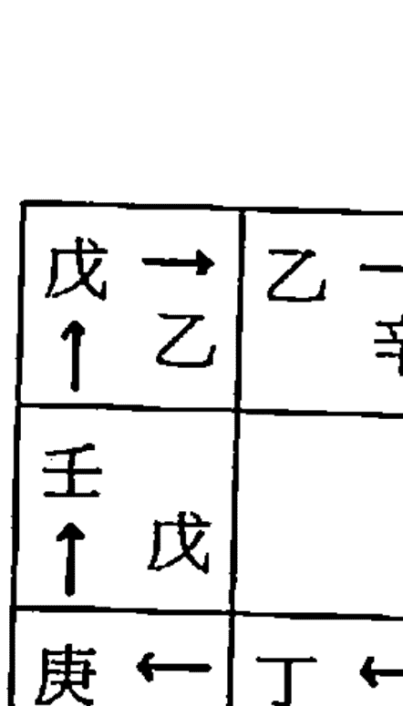
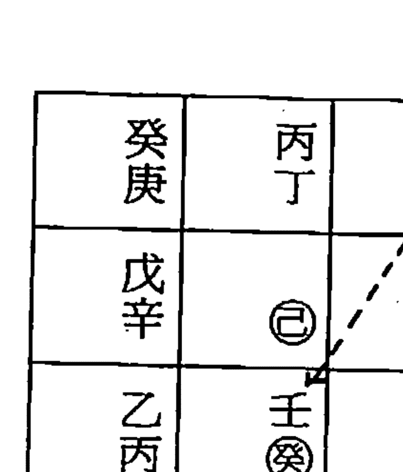

# 一善居士奇门遁甲应用诀

# 自序

奇門遁甲學的應用範圍相當廣泛，可應用於生意上的談判、接訂單、買賣、考試、入學、求職、就職、升官、謁貴、約會、相親、提親、訂婚、結婚、面試、開市、交易、投資、借貸、訪問、旅行、訴訟、購物、娛樂、宴會、建築、修造、動土、破土、安葬、開光、安神位、移轉、搬家、移徙、出國、牧養、打獵、行兵作戰、比賽、摸哨……等，是一門相當實際好用的學問。學會了它，於己可改善自己的人際關係和環境運程，對人可助他人一臂之力，是一門人人須學，而終生受用的寶貴學問。

市面上奇門遁甲學書籍並不廣泛，除了古書之外，有些是現代作者的著作，但有部分作者天盤九星和九宮的排法是錯誤的（筆者採用古今圖書集成這本古書為主論），因之，本書排盤方法，會有部分和市面上奇門遁甲書籍排盤不同，特此訂正，若有錯誤或不明的地方，虔誠盼望高明、先進不吝批評、指教、共研！謝謝！

一善居士吳定城識
乙亥年孟夏於三重市一善堂
電話：（○二）九七三七九三八
教室：三重市仁義街十九號五樓

# 奇門遁甲應用訣

| 陽一局甲己日／二二○ | 陽一局丁壬日／二二六 | 陽二局乙庚日／二二二 | 陽二局戊癸日／二二八 | 陽三局丙辛日／二三四 | 陽三局甲己日／二四○ | 陽四局丁壬日／二四四 | 陽四局乙庚日／二五二 | 陽五局戊癸日／二五八 | 陽五局丙辛日／二六四 | 陽六局甲己日／二七○ | 陽六局丁壬日／二七六 | 陽七局乙庚日／二八二 | 陽七局戊癸日／二八八 | 陽八局丙辛日／二九四 | 陽八局甲己日／三○○ | 陽九局丁壬日／三○六 | 陽九局乙庚日／三一二 | 陽九局戊癸日／三一八 | 陽九局丙辛日／三二四 |
| --- | --- | --- | --- | --- | --- | --- | --- | --- | --- | --- | --- | --- | --- | --- | --- | --- | --- | --- | --- |
| 陽一局乙庚日／二二二 | 陽一局戊癸日／二二八 | 陽二局丙辛日／二三四 | 陽二局甲己日／二四○ | 陽三局丁壬日／二四四 | 陽三局乙庚日／二五二 | 陽四局戊癸日／二五八 | 陽四局丙辛日／二六四 | 陽五局甲己日／二七○ | 陽五局丁壬日／二七六 | 陽六局乙庚日／二八二 | 陽六局戊癸日／二八八 | 陽七局丙辛日／二九四 | 陽七局甲己日／三○○ | 陽八局丁壬日／三○六 | 陽八局乙庚日／三一二 | 陽九局戊癸日／三一八 | 陽九局丙辛日／三二四 | 陽九局甲己日／三三○ | 陽九局丁壬日／三三六 |
| 陽一局丙辛日／二三四 | 陽一局甲己日／二四○ | 陽二局丁壬日／二四四 | 陽二局乙庚日／二五二 | 陽三局戊癸日／二五八 | 陽三局丙辛日／二六四 | 陽四局甲己日／二七○ | 陽四局丁壬日／二七六 | 陽五局乙庚日／二八二 | 陽五局戊癸日／二八八 | 陽六局丙辛日／二九四 | 陽六局甲己日／三○○ | 陽七局丁壬日／三○六 | 陽七局乙庚日／三一二 | 陽八局戊癸日／三一八 | 陽八局丙辛日／三二四 | 陽九局甲己日／三三○ | 陽九局丁壬日／三三六 | 陽九局乙庚日／三四二 | 陽九局戊癸日／三四八 |

| 陰九局丁壬日／三一六 | 陰八局乙庚日／三二二 | 陰八局戊癸日／三二八 | 陰七局丙辛日／三三四 | 陰七局甲己日／三三○ | 陰六局丁壬日／三三六 | 陰六局乙庚日／三四二 | 陰五局戊癸日／三四八 | 陰五局丙辛日／三五四 | 陰四局甲己日／三六○ | 陰三局丁壬日／三六六 | 陰三局乙庚日／三七二 | 陰二局戊癸日／三七八 | 陰二局丙辛日／三八四 | 陰一局甲己日／三九○ | 陰一局丁壬日／三九六 | 陰一局乙庚日／四○二 | 陰一局戊癸日／四○八 | 陰一局丙辛日／四一四 | 陰一局甲己日／四二○ |
| --- | --- | --- | --- | --- | --- | --- | --- | --- | --- | --- | --- | --- | --- | --- | --- | --- | --- | --- | --- |
| 陰九局戊癸日／三○八 | 陰八局丙辛日／三一四 | 陰八局甲己日／三二○ | 陰七局丁壬日／三二六 | 陰七局乙庚日／三三二 | 陰六局戊癸日／三三八 | 陰六局丙辛日／三四四 | 陰五局甲己日／三五○ | 陰五局丁壬日／三五六 | 陰四局乙庚日／三六二 | 陰三局戊癸日／三六八 | 陰三局丙辛日／三七四 | 陰二局甲己日／三八○ | 陰二局丁壬日／三八六 | 陰一局乙庚日／三九二 | 陰一局戊癸日／三九八 | 陰一局丙辛日／四○四 | 陰一局甲己日／四一○ | 陰一局丁壬日／四一六 | 陰一局乙庚日／四二二 |
| 陰八局甲己日／三一○ | 陰八局丁壬日／三一六 | 陰七局乙庚日／三二二 | 陰七局戊癸日／三二八 | 陰六局丙辛日／三三四 | 陰六局甲己日／三三○ | 陰五局丁壬日／三三六 | 陰五局乙庚日／三四二 | 陰四局戊癸日／三四八 | 陰四局丙辛日／三五四 | 陰三局甲己日／三六○ | 陰三局丁壬日／三六六 | 陰二局乙庚日／三七二 | 陰二局戊癸日／三七八 | 陰一局丙辛日／三八四 | 陰一局甲己日／三九○ | 陰一局丁壬日／三九六 | 陰一局乙庚日／四○二 | 陰一局戊癸日／四○八 | 陰一局丙辛日／四一四 |

目 錄

九

八

# 第一章 奇門遁甲基礎與排盤

## ◎十干所屬五行及方位

甲乙東方木。丙丁南方火。戊己中央土。庚辛西方金。壬癸北方水。

## ◎十干所屬陰陽、男女

甲丙戊庚壬為陽干，陽年生人，男為陽男，女為陽女。乙丁己辛癸為陰干，陰年生人，男為陰男，女為陰女。

## ◎十二支所屬五行生肖

子寒水鼠。丑冰土牛。寅陽木虎。卯純木兔。辰濕土龍。巳暖火蛇。午烈火馬。未乾土羊。申雜金猴。酉純金雞。戌燥土狗。亥露水豬。

## ◎十二支所屬陰陽

子寅辰午申戌為陽支。丑卯巳未酉亥為陰支。

## ◎十二支方位及四時

寅卯辰司春為東方，象為青龍。巳午未司夏為南方，象為朱雀。申酉戌司秋為西方，象為白虎。亥子丑司冬為北方，象為玄武。辰戌丑未四季中央土，象為勾陳、騰蛇。

## ◎十二支三合局

申子辰三合水局。寅午戌三合火局。巳酉丑三合金局。亥卯未三合木局。

## ◎五行相生相剋

金生水。水生木。木生火。火生土。土生金。金剋木。木剋土。土剋水。水剋火。火剋金。

# 第一章 奇門遁甲基礎與排盤

## ◎天干五合化氣

甲己合化土。乙庚合化金。丙辛合化水。丁壬合化木。戊癸合化火。

## ◎天干五行相剋

甲木剋戊土。乙木剋己土。丙火剋庚金。丁火剋辛金。戊土剋壬水。己土剋癸水。庚金剋甲木。辛金剋乙木。壬水剋丙火。癸水剋丁火。

## ◎地支六合

子丑合土。寅亥合木。卯戌合火。辰酉合金。巳申合水。午未為日月合，亦為陰陽合，縱合不化。

## ◎地支六沖

子午沖。丑未沖。寅申沖。卯酉沖。辰戌沖。巳亥沖。

## ◎地支相刑

子刑卯。卯刑子。寅刑巳。巳形申。申刑寅。未刑丑。丑刑戌。戌刑未。辰未酉亥自刑。

## ◎地支六害

子害未。丑害午。寅害巳。卯害辰。申害亥。酉害戌。

## ◎四生仲墓

子午卯酉為四仲、四正、四敗、四和。寅申巳亥為四孟、四生、四馬、四病。辰戌丑未為四季、四墓、四庫、四刑。

## ◎貴人速訣法

甲戊庚·丑未。乙己·子申。丙丁·亥酉。壬癸·卯巳。辛·寅午。此是貴人方。

# 第一章 奇門遁甲基礎與排盤

## ◎十天干貴人速見表◎

| 十天干 | 陽貴人 | 陰貴人 |
| :---: | :---: | :---: |
| 甲 | 未 | 丑 |
| 乙 | 申 | 子 |
| 丙 | 酉 | 亥 |
| 丁 | 亥 | 酉 |
| 戊 | 丑 | 未 |
| 己 | 子 | 申 |
| 庚 | 丑 | 未 |
| 辛 | 寅 | 午 |
| 壬 | 卯 | 巳 |
| 癸 | 巳 | 卯 |

## ◎九星之旺相休囚死

九星之旺相休囚死，和八字之旺相休囚死不同。以九星為我，旺於我生（子孫），相於同類（兄弟），死於生我（父母），囚於剋我（官鬼），休於我剋（妻財），例：天蓬星屬水，旺於春季，休於夏季，死於秋季，相於冬季，囚於四季月。餘請查閱「九星旺相休囚死速見表」。

## ◎九星旺相休囚死速見表◎

| 八卦 | 五行 | 九宮 | 九星 | 春木 | 夏火 | 秋金 | 冬水 | 四季月 |
| :---: | :---: | :---: | :---: | :---: | :---: | :---: | :---: | :---: |
| 坎 | 水 | 一 | 蓬 | 旺 | 休 | 死 | 相 | 囚 |
| 艮 | 土 | 八 | 任 | 囚 | 死 | 旺 | 休 | 相 |
| 震 | 木 | 三 | 衝 | 相 | 旺 | 囚 | 死 | 休 |
| 巽 | 木 | 四 | 輔 | 相 | 旺 | 囚 | 死 | 休 |
| 離 | 火 | 九 | 英 | 死 | 相 | 休 | 囚 | 旺 |
| 坤 | 土 | 二 | 芮 | 囚 | 死 | 旺 | 休 | 相 |
| 兌 | 金 | 七 | 柱 | 休 | 囚 | 相 | 旺 | 死 |
| 乾 | 金 | 六 | 心 | 休 | 囚 | 相 | 旺 | 死 |
| 中 | 土 | 五 | 禽 | 囚 | 死 | 旺 | 休 | 相 |

## ◎八門旺相

立春生門旺。春分傷門旺。立夏杜門旺。夏至景門旺。立秋死門旺。秋分驚門旺。立冬開門旺。冬至休門旺。

# 第一章 奇門遁甲基礎與排盤

## ◎奇門遁甲奇門神干宮星應用表◎

| 八卦 | 乾 | 兌 | 離 | 震 | 巽 | 坎 | 艮 | 坤 |
|---|---|---|---|---|---|---|---|---|
| 五行 | 金 | 金 | 火 | 木 | 木 | 水 | 土 | 土 |
| 九宮 | 六 | 七 | 九 | 三 | 四 | 一 | 八 | 五 |
| 九星 | 心 | 柱 | 英 | 衝 | 輔 | 蓬 | 任 | 芮 |
| 天干 | 庚 | 辛 | 丙 | 乙 | 丁 | 壬 | 己 | 戊 |
| 地支 | 申 | 酉 | 午 | 卯 | 巳 | 亥 | 未 | 辰 |
| 八門 | 開 | 驚 | 景 | 傷 | 杜 | 休 | 生 | 死 |
| 八神 | 符 | 天 | 蛇 | 合 | 陰 | 雀 | 地 | 陳 |
| 節氣 | 秋 | 秋 | 夏 | 春 | 春 | 冬 | 四季 | 四季 |
| 方位 | 西 | 西 | 南 | 東 | 東 | 北 | 中 | 中 |
| 五常 | 義 | 義 | 禮 | 仁 | 仁 | 智 | 信 | 信 |
| 五官 | 鼻 | 鼻 | 舌 | 眼 | 眼 | 耳 | 唇 | 唇 |
| 五臟 | 肺 | 肺 | 心 | 肝 | 肝 | 腎 | 脾 | 脾 |
| 五味 | 辛 | 辛 | 苦 | 酸 | 酸 | 鹹 | 甘 | 甘 |
| 五色 | 白 | 白 | 赤 | 青 | 青 | 黑 | 黃 | 黃 |
| 五聲 | 哭 | 哭 | 笑 | 呼 | 呼 | 呻 | 歌 | 歌 |
| 五志 | 憂 | 憂 | 喜 | 怒 | 怒 | 恐 | 思 | 思 |
| 五音 | 商 | 商 | 徵 | 角 | 角 | 羽 | 宮 | 宮 |

## ◎推月之法

五虎遁歌訣：甲己之年丙作首，乙庚之歲戊為頭，丙辛必定尋庚起，丁壬壬位順流行，更有戊癸何方覓，甲寅之上好追求。

| 年干\月支 | 寅 | 卯 | 辰 | 巳 | 午 | 未 | 申 | 酉 | 戌 | 亥 | 子 | 丑 |
|---|---|---|---|---|---|---|---|---|---|---|---|---|
| 甲己 | 丙寅 | 丁卯 | 戊辰 | 己巳 | 庚午 | 辛未 | 壬申 | 癸酉 | 甲戌 | 乙亥 | 丙子 | 丁丑 |
| 乙庚 | 戊寅 | 己卯 | 庚辰 | 辛巳 | 壬午 | 癸未 | 甲申 | 乙酉 | 丙戌 | 丁亥 | 戊子 | 己丑 |
| 丙辛 | 庚寅 | 辛卯 | 壬辰 | 癸巳 | 甲午 | 乙未 | 丙申 | 丁酉 | 戊戌 | 己亥 | 庚子 | 辛丑 |
| 丁壬 | 壬寅 | 癸卯 | 甲辰 | 乙巳 | 丙午 | 丁未 | 戊申 | 己酉 | 庚戌 | 辛亥 | 壬子 | 癸丑 |
| 戊癸 | 甲寅 | 乙卯 | 丙辰 | 丁巳 | 戊午 | 己未 | 庚申 | 辛酉 | 壬戌 | 癸亥 | 甲子 | 乙丑 |

## ◎推時之法

五鼠遁歌訣：甲己起甲子。乙庚起丙子。丙辛起戊子。丁壬起庚子。戊癸起壬子。此是遁時訣。

# 第一章 奇門遁甲基礎與排盤

## ◎ 排盤之法

### (一) 年盤求法

年盤一律固定用陰局，而不用陽局。年盤以一年為一局，月盤以一月為一局，日盤以一日為一局，時盤以一時辰為一局（一時辰為二個小時）。

年盤有上元、中元、下元之分，以上元甲子年為陰一局逆行，故乙丑年為陰九局、丙寅年為陰八局，丁卯年為陰七局，戊辰年為陰六局，己巳年為陰五局，庚午年為陰四局，辛未年為陰三局，壬申年為陰二局，癸酉年為陰一局……等（餘仿之）。而中元甲子年為陰四局逆行，下元甲子年為陰七局逆行，例：下元乙丑年為陰六局，丙寅年為陰五局，丁卯年為陰四局……等（餘仿之）。

| 農變 | 甲己 | 乙庚 | 丙辛 | 丁壬 | 戊癸 |
|---|---|---|---|---|---|
| 子 23-1 | 甲子 | 丙子 | 戊子 | 庚子 | 壬子 |
| 丑 1-3 | 乙丑 | 丁丑 | 己丑 | 辛丑 | 癸丑 |
| 寅 3-5 | 丙寅 | 戊寅 | 庚寅 | 壬寅 | 甲寅 |
| 卯 5-7 | 丁卯 | 己卯 | 辛卯 | 癸卯 | 乙卯 |
| 辰 7-9 | 戊辰 | 庚辰 | 壬辰 | 甲辰 | 丙辰 |
| 巳 9-11 | 己巳 | 辛巳 | 癸巳 | 乙巳 | 丁巳 |
| 午 11-13 | 庚午 | 壬午 | 甲午 | 丙午 | 戊午 |
| 未 13-15 | 辛未 | 癸未 | 乙未 | 丁未 | 己未 |
| 申 15-17 | 壬申 | 甲申 | 丙申 | 戊申 | 庚申 |
| 酉 17-19 | 癸酉 | 乙酉 | 丁酉 | 己酉 | 辛酉 |
| 戌 19-21 | 甲戌 | 丙戌 | 戊戌 | 庚戌 | 壬戌 |
| 亥 21-23 | 乙亥 | 丁亥 | 己亥 | 辛亥 | 癸亥 |

#### ◎ 上元六十甲子年局數表（同治三年起至民國十二年止）

上元運六十甲子流年

| 甲子 | 乙丑 | 丙寅 | 丁卯 | 戊辰 | 己巳 | 庚午 | 辛未 | 壬申 |
|---|---|---|---|---|---|---|---|---|
| 癸酉 | 甲戌 | 乙亥 | 丙子 | 丁丑 | 戊寅 | 己卯 | 庚辰 | 辛巳 |
| 壬午 | 癸未 | 甲申 | 乙酉 | 丙戌 | 丁亥 | 戊子 | 己丑 | 庚寅 |
| 辛卯 | 壬辰 | 癸巳 | 甲午 | 乙未 | 丙申 | 丁酉 | 戊戌 | 己亥 |
| 庚子 | 辛丑 | 壬寅 | 癸卯 | 甲辰 | 乙巳 | 丙午 | 丁未 | 戊申 |
| 己酉 | 庚戌 | 辛亥 | 壬子 | 癸丑 | 甲寅 | 乙卯 | 丙辰 | 丁巳 |
| 戊午 | 己未 | 庚申 | 辛酉 | 壬戌 | 癸亥 | | | |
| 陰一局 | 陰九局 | 陰八局 | 陰七局 | 陰六局 | 陰五局 | 陰四局 | 陰三局 | 陰二局 |

# 第一章 奇門遁甲基礎與排盤

# 奇門遁甲應用訣

#### ◎中元六十甲子年局數表（民國十三年起至七十二年止）

| 中元運六十甲子流年 | 甲子 | 乙丑 | 丙寅 | 丁卯 | 戊辰 | 己巳 | 庚午 | 辛未 | 壬申 |
|---|---|---|---|---|---|---|---|---|---|
| | 癸酉 | 甲戌 | 乙亥 | 丙子 | 丁丑 | 戊寅 | 己卯 | 庚辰 | 辛巳 |
| | 壬午 | 癸未 | 甲申 | 乙酉 | 丙戌 | 丁亥 | 戊子 | 己丑 | 庚寅 |
| | 辛卯 | 壬辰 | 癸巳 | 甲午 | 乙未 | 丙申 | 丁酉 | 戊戌 | 己亥 |
| | 庚子 | 辛丑 | 壬寅 | 癸卯 | 甲辰 | 乙巳 | 丙午 | 丁未 | 戊申 |
| | 己酉 | 庚戌 | 辛亥 | 壬子 | 癸丑 | 甲寅 | 乙卯 | 丙辰 | 丁巳 |
| | 戊午 | 己未 | 庚申 | 辛酉 | 壬戌 | 癸亥 | | | |
| 年盤局數 | 陰四局 | 陰三局 | 陰二局 | 陰一局 | 陰九局 | 陰八局 | 陰七局 | 陰六局 | 陰五局 |

#### ◎下元六十甲子年局數表（民國七十三年起至一百三十二年止）

| 下元運六十甲子流年 | 甲子 | 乙丑 | 丙寅 | 丁卯 | 戊辰 | 己巳 | 庚午 | 辛未 | 壬申 |
|---|---|---|---|---|---|---|---|---|---|
| | 癸酉 | 甲戌 | 乙亥 | 丙子 | 丁丑 | 戊寅 | 己卯 | 庚辰 | 辛巳 |
| | 壬午 | 癸未 | 甲申 | 乙酉 | 丙戌 | 丁亥 | 戊子 | 己丑 | 庚寅 |
| | 辛卯 | 壬辰 | 癸巳 | 甲午 | 乙未 | 丙申 | 丁酉 | 戊戌 | 己亥 |
| | 庚子 | 辛丑 | 壬寅 | 癸卯 | 甲辰 | 乙巳 | 丙午 | 丁未 | 戊申 |
| | 己酉 | 庚戌 | 辛亥 | 壬子 | 癸丑 | 甲寅 | 乙卯 | 丙辰 | 丁巳 |
| | 戊午 | 己未 | 庚申 | 辛酉 | 壬戌 | 癸亥 | | | |
| 年盤局數 | 陰七局 | 陰六局 | 陰五局 | 陰四局 | 陰三局 | 陰二局 | 陰一局 | 陰九局 | 陰八局 |

### (二)月盤求法

月盤和年盤一樣。一律固定只用陰局，而不用陽局。月盤五年為一元，分上元、中元、下元，又以每十個月為局，依序逆佈。

# 第一章 奇門遁甲基礎與排盤

以甲子年至戊辰年，己卯年至癸未年，甲午年至戊戌年，己酉年至癸丑年等二十年為上元，皆始於陰遁一局，而以每十個月為局，依序逆佈。

以己巳年至癸酉年，甲申年至戊子年，己亥年至癸卯年，甲寅年至戊午年等二十年為中元，皆始於陰遁四局，而以每十個月為局，依序逆佈。

以甲戌年至戊寅年，己丑年至癸巳年，甲辰年至戊申年，己未年至癸亥年等二十年為下元，皆始於陰遁七局，而以每十個月為局，依序逆佈。

例：上元甲子年至戊辰年，始於陰遁一局。因之，丙寅月至乙亥月為陰遁一局，丙子月至乙酉月為陰遁九局，丙戌月至乙未月為陰遁八局，丙申月至乙巳月為陰遁七局，丙午月至乙卯月為陰遁六局，丙辰月至乙丑月為陰遁五局，餘仿之。

◎上元二十年（始於陰遁一局）

| 甲子年 | 己卯年 | 乙丑年 | 庚辰年 | 丙寅年 | 辛巳年 | 丁卯年 | 壬午年 | 戊辰年 | 癸未年 |
|---|---|---|---|---|---|---|---|---|---|
| 甲午年 | 己未年 | 乙未年 | 庚申年 | 丙申年 | 辛酉年 | 丁酉年 | 壬子年 | 戊戌年 | 癸丑年 |

◎中元二十年（始於陰遁四局）

| 己巳年 | 甲申年 | 乙酉年 | 庚子年 | 丙戌年 | 辛丑年 | 丁亥年 | 壬寅年 | 戊子年 | 癸卯年 |
|---|---|---|---|---|---|---|---|---|---|
| 己亥年 | 甲寅年 | 乙卯年 | 庚午年 | 丙辰年 | 辛未年 | 丁巳年 | 壬申年 | 戊午年 | 癸酉年 |

◎下元二十年（始於陰遁七局）

| 甲戌年 | 己丑年 | 乙丑年 | 庚寅年 | 丙子年 | 辛卯年 | 丁丑年 | 壬辰年 | 戊寅年 | 癸巳年 |
|---|---|---|---|---|---|---|---|---|---|
| 甲辰年 | 己未年 | 乙巳年 | 庚申年 | 丙午年 | 辛酉年 | 丁未年 | 壬戌年 | 戊申年 | 癸亥年 |

| 月干支 | 三元 | 甲己年月盤陰局 |
|---|---|---|
| 丙寅 | 上元 | 一 |
| 丁卯 | 中元 | 四 |
| 戊辰 | 下元 | 七 |
| 己巳 | 上元 | 一 |
| 庚午 | 中元 | 四 |
| 辛未 | 下元 | 七 |
| 壬申 | 上元 | 一 |
| 癸酉 | 中元 | 四 |
| 甲戌 | 下元 | 七 |
| 乙亥 | 上元 | 九 |
| 丙子 | 中元 | 三 |
| 丁丑 | 下元 | 六 |

| 月干支 | 三元 | 乙庚年月盤陰局 |
|---|---|---|
| 戊寅 | 上元 | 九 |
| 己卯 | 中元 | 三 |
| 庚辰 | 下元 | 六 |
| 辛巳 | 上元 | 九 |
| 壬午 | 中元 | 三 |
| 癸未 | 下元 | 六 |
| 甲申 | 上元 | 九 |
| 乙酉 | 中元 | 三 |
| 丙戌 | 下元 | 六 |
| 丁亥 | 上元 | 八 |
| 戊子 | 中元 | 二 |
| 己丑 | 下元 | 五 |

| 月干支 | 三元 | 丙辛年月盤陰局 |
|---|---|---|
| 庚寅 | 上元 | 八 |
| 辛卯 | 中元 | 二 |
| 壬辰 | 下元 | 五 |
| 癸巳 | 上元 | 八 |
| 甲午 | 中元 | 二 |
| 乙未 | 下元 | 五 |
| 丙申 | 上元 | 七 |
| 丁酉 | 中元 | 一 |
| 戊戌 | 下元 | 四 |
| 己亥 | 上元 | 七 |
| 庚子 | 中元 | 一 |
| 辛丑 | 下元 | 四 |

| 月干支 | 三元 | 丁壬年月盤陰局 |
|---|---|---|
| 壬寅 | 上元 | 七 |
| 癸卯 | 中元 | 一 |
| 甲辰 | 下元 | 四 |
| 乙巳 | 上元 | 七 |
| 丙午 | 中元 | 一 |
| 丁未 | 下元 | 四 |
| 戊申 | 上元 | 六 |
| 己酉 | 中元 | 九 |
| 庚戌 | 下元 | 三 |
| 辛亥 | 上元 | 六 |
| 壬子 | 中元 | 九 |
| 癸丑 | 下元 | 三 |

| 月干支 | 三元 | 戊癸年月盤陰局 |
|---|---|---|
| 甲寅 | 上元 | 六 |
| 乙卯 | 中元 | 九 |
| 丙辰 | 下元 | 三 |
| 丁巳 | 上元 | 五 |
| 戊午 | 中元 | 八 |
| 己未 | 下元 | 二 |
| 庚申 | 上元 | 五 |
| 辛酉 | 中元 | 八 |
| 壬戌 | 下元 | 二 |
| 癸亥 | 上元 | 五 |
| 甲子 | 中元 | 八 |
| 乙丑 | 下元 | 二 |

### (三)日盤求法

日盤和年盤、月盤不同，要分陽九局和陰九局。書云：「二至還鄉一九宮」，因之，以冬至後（冬至一陽生）為陽遁局之開始，一律順佈，每日一局。以夏至後（夏至一陰生）為陰遁局之開始，一律逆佈，每日一局。

又以最靠近冬至之甲子日（不論是冬至前或冬至後）起陽遁一局，每過一日順佈一局，至癸亥日止（共六十日）為一元，名為上元。第二個甲子日起陽遁七局，至癸亥日止（共六十日）為一元，名為中元。第三個甲子日起陽遁四局，至癸亥日止（共六十日）為一元，名為下元。

又以最靠近夏至之甲子日（不論是夏至前或夏至後）起陰遁九局，每過一日逆佈一局，至癸亥日止（共六十日）為一元，名為上元。第二個甲子日起陰遁三局，至癸亥日止（共六十日）為一元，名為中元。第三個甲子日起陰遁六局，至癸亥日止（共六十日）為一元，名為下元。

日盤之陰遁九局和陽遁九局，總以冬至和夏至為界，如夏至下元甲子日至癸亥日畢，而冬至上元甲子未到，則由冬至上元甲子日起陽遁一局往前逆佈，每日一局至冬至日止（陽遁往後為順佈，往前則為逆佈），餘仿之。

如夏至下元甲子日至癸亥日畢，而冬至節氣未到，則繼續起甲子日陰九局逆佈，每日一局，至冬至日之前一日止（冬至日起轉為陽遁局），但冬至日當日卻不一定是陽一局，此點讀者須注意，勿搞錯。（註：冬至日和夏至日當天各有二局，一為陽遁局，一為陰遁局。）

◎日盤陰九局、陽九局速見表（六十甲子流日）

| 甲子 | 乙丑 | 丙寅 | 丁卯 | 戊辰 | 己巳 | 庚午 | 辛未 | 壬申 |
| :---: | :---: | :---: | :---: | :---: | :---: | :---: | :---: | :---: |
| 癸酉 | 甲戌 | 乙亥 | 丙子 | 丁丑 | 戊寅 | 己卯 | 庚辰 | 辛巳 |
| 壬午 | 癸未 | 甲申 | 乙酉 | 丙戌 | 丁亥 | 戊子 | 己丑 | 庚寅 |
| 辛卯 | 壬辰 | 癸巳 | 甲午 | 乙未 | 丙申 | 丁酉 | 戊戌 | 己亥 |
| 庚子 | 辛丑 | 壬寅 | 癸卯 | 甲辰 | 乙巳 | 丙午 | 丁未 | 戊申 |
| 己酉 | 庚戌 | 辛亥 | 壬子 | 癸丑 | 甲寅 | 乙卯 | 丙辰 | 丁巳 |
| 戊午 | 己未 | 庚申 | 辛酉 | 壬戌 | 癸亥 | | | |

| 陽遁（冬至後） | | | | 陰遁（夏至後） | | |
| :---: | :---: | :---: | :---: | :---: | :---: | :---: |
| 上元 | 中元 | 下元 | | 上元 | 中元 | 下元 |
| 一 | 七 | 四 | | 九 | 三 | 六 |
| 二 | 八 | 五 | | 八 | 二 | 五 |
| 三 | 九 | 六 | | 七 | 一 | 四 |
| 四 | 一 | 七 | | 六 | 九 | 三 |
| 五 | 二 | 八 | | 五 | 八 | 二 |
| 六 | 三 | 九 | | 四 | 七 | 一 |
| 七 | 四 | 一 | | 三 | 六 | 九 |
| 八 | 五 | 二 | | 二 | 五 | 八 |
| 九 | 六 | 三 | | 一 | 四 | 七 |

### (四) 時盤求法

時盤起局和日盤不同，時盤以節氣來取三元（上元、中元、下元），以五天為一元（共六十個時辰），同時也以五天為一局（補註：有人以每十個時辰為一局，筆者並不採用）。

時盤以最靠近冬至或夏至的上元符頭日，來取上元的開始（不管符頭日是在冬至、夏至的前或後）。上元符頭日有四天，為甲子日、甲午日、己卯日、己酉日。

以最靠近冬至之上元符頭日為陽一局之開始，每過五日佈換日局數。例：冬至後一、七、四，若冬至上元符頭日為己卯日，那就以己卯日至癸未日（共五天）為陽一局，甲申日至戊子日（共五天）為陽七局，己丑日至癸巳日（共五天）為陽四局，餘仿之。

以最靠近夏至之上元符頭日為陰九局之開始，每過五日佈換局數，例：夏至後九、三、六，若夏至上元符頭日為己卯日，那就以己卯日至癸未日（共五天）為陰九局，甲申日至戊子日（共五天）為陰三局，己丑日至癸巳日（共五天）為陰六局，餘仿之。

| 符頭日 | 上元 | 中元 | 下元 |
|---|---|---|---|
| 甲子日 | 甲午日 | 己卯日 | 己酉日 |
| 甲戌日 | 甲申日 | 己丑日 | 己未日 |

| 八卦 | 節氣 | 上元 | 中元 | 下元 |
|---|---|---|---|---|
| 坎一 | 冬至、小寒、大寒 | 一 | 七 | 四 |
| 艮八 | 立春、雨水、驚蟄 | 八 | 五 | 二 |
| 震三 | 春分、清明、穀雨 | 三 | 九 | 六 |
| 巽四 | 立夏、小滿、芒種 | 四 | 一 | 七 |

| 八卦 | 節氣 | 上元 | 中元 | 下元 |
|---|---|---|---|---|
| 離九 | 夏至、小暑、大暑 | 九 | 三 | 六 |
| 坤二 | 立秋、處暑、白露 | 二 | 八 | 五 |
| 兌七 | 秋分、寒露、霜降 | 七 | 一 | 四 |
| 乾六 | 立冬、小雪、大雪 | 六 | 九 | 三 |

◎一個卦有三個節氣，八卦共配廿四節氣。

## 奇門遁甲六大要

奇門遁甲有六大要（即是六種符號）：（一）八卦、（二）八門、（三）八神、（四）九干、（五）九宮、（六）九星。

奇門遁甲有三步驟：（一）起局、（二）排盤、（三）解盤。其中以起局最複雜，難度最高，須相當的細心才不會起錯。

奇門遁甲又分為天盤和地盤二種，天盤會隨時間移轉而變動，而地盤卻永遠固定不動，又名呆盤。

### (五)論八卦方位（地盤）

論八卦方位用後天八卦及五行，坎卦屬水居北方，坤卦屬土居西南方，震卦屬木居東方，巽卦屬木居東南方，乾卦屬金居西北方，兌卦屬金居西方，艮卦屬土居東北方，離卦屬火居南方。（八卦方位為呆盤，永遠固定不變）。

| 東南 | 南 | 西南 |
| :---: | :---: | :---: |
| 巽 | 離 | 坤 |
| 東 | 中宮 | 西 |
| 震 | | 兌 |
| 東北 | 北 | 西北 |
| 艮 | 坎 | 乾 |

### (六)論八門地盤排列

論八門地盤（固定盤），以乾開門、坎休門、艮生門為三吉門，以景門離位為半吉（利於文書、約會、談生意），以震傷門、巽杜門、坤死門、兌驚門為四凶門。
八門順序：開、休、生、傷、杜、景、死、驚。

| 杜 | 景 | 死 |
|---|---|---|
| 巽 | 離 | 坤 |
| 傷 | | 兌 |
| 震 | | 驚 |
| 艮 | 坎 | 乾 |
| 生 | 休 | 開 |

### (七)論八神符號

八神只論吉凶，不論五行，八神之順序：直符、騰蛇、太陰、六合、勾陳、朱雀、九地、九天。以直符、太陰、六合、九地、九天為吉神，以騰蛇、勾陳、朱雀為凶神。

| 六合 | 勾陳 | 朱雀 |
|---|---|---|
| 太陰 | | 九地 |
| 騰蛇 | 直符 | 九天 |

若陽局甲時，即在坎宮立直符，依圖例順時鐘方向順佈：符、蛇、陰、合、陳、雀、地、天（簡稱）。

若陰局甲時，即在坎宮立直符，依圖例逆時鐘方向逆佈：符、蛇、陰、合、陳、雀、地、天（簡稱）。

### (八)論九干

九干順序為：戊、己、庚、辛、壬、癸、丁、丙、乙。甲木為天尊（藏而不現），所以用六儀來代替（甲木怕庚金來剋，故遁藏起來，謂之：遁甲），九干中之三奇：乙為日奇，丙為月奇，丁為星奇大都是吉利的。而六儀：戊、己、庚、辛、壬、癸大部分是不吉的。

奇門遁甲之術非萬能的，而為大能也，大都應用於選吉時、辨方位。奇門遁甲是一種心法，學習並不困難，也是一種借用法，急須時才可使用，絕不可應用於投機取巧，因為宇宙間有一個不變之法則可用於趨吉避凶，但易經中不變法則中，也有變易，因之，用五術法則謀取非分投機財時，易為變易所傷害（非你應得之財故）。

### (九)論九宮

論九宮（要論五行），最主要是論它的路線順序。

## 九宮順逆路線圖

(一)從中宮起順佈九宮

(二)從中宮起逆佈九宮

| 七 | 三 | 五 |
|---|---|---|
| 六 | 八 | 一 |
| 二 | 四 | 九 |

| 五 | 一 | 三 |
|---|---|---|
| 四 | 六 | 八 |
| 九 | 二 | 七 |

| 二 | 七 | 九 |
|---|---|---|
| 一 | 三 | 五 |
| 六 | 八 | 四 |

| 九 | 五 | 七 |
|---|---|---|
| 八 | 一 | 三 |
| 四 | 六 | 二 |

| 八 | 四 | 六 |
|---|---|---|
| 七 | 九 | 二 |
| 三 | 五 | 一 |

| 六 | 二 | 四 |
|---|---|---|
| 五 | 七 | 九 |
| 一 | 三 | 八 |

| 三 | 八 | 一 |
|---|---|---|
| 二 | 四 | 六 |
| 七 | 九 | 五 |

| 一 | 六 | 八 |
|---|---|---|
| 九 | 二 | 四 |
| 五 | 七 | 三 |

### (十)論九星地盤

論九星要論剋應現象，九星地盤固定不動，九星順序依九宮佈局・坎宮佈天蓬星、坤宮佈天芮星，震宮佈天沖星、巽宮佈天輔星、中宮佈天禽星，乾宮佈天心星，兌宮佈天柱星，艮宮佈天任星、離宮佈天英星。以天任、天沖、天輔、天芮、天心五星為吉星，以天蓬、天英、天柱、天禽四星為凶星。若天盤九星順序排列則為・蓬、任、沖、輔、英、芮、柱、心、禽。

九星和八神大都用於占卜、剋應、天象、氣候，如・此時辰出門會遇到大雷雨或穿紅衣服的人・：：：等等。

| 乾 | 兌 | 離 | 震 | 巽 | 坎 | 艮 | 坤 |
|---|---|---|---|---|---|---|---|
| 天心 | 天柱 | 天英 | 天沖 | 天輔 | 天蓬 | 天任 | 天芮 |

### (十一)論超接置閏

超接置閏，即超神、接氣、置閏是也。

奇門起局之法有正授，有超神，有閏奇（即・置閏），有接氣。

- 一、正授者・即冬至和夏至二日之日干支，剛好為甲子、甲午、己卯、己酉四日，謂之正授。
- 二、超神者・即為二十四節氣在後，而甲日或己日兩日之日干在前，謂之超神。
- 三、接氣者：即為二十四節氣在前，而甲日或己日兩日之日干在後，謂之接氣。（接氣和超神剛好相反）。
- 四、置閏者：如超神之日，多達九日以上者，必須要多置一閏局，以改善超神過多之情形，因為陰陽兩遁共十八局，而一年有三百六十五日，不能整除，故必須置閏，其道理和農曆之閏月相同。

奇門遁甲佈局之方法，正授之後，超神繼之。超神之後，閏奇（置閏）繼之。閏奇之後，接氣繼之。接氣之後，復為正授。循環不斷，週而復始。

奇門遁甲佈局，以冬至和夏至為界，因此，置閏必須在此兩節氣前之芒種（閏芒種）和大雪（閏大雪）之後和冬至或夏至之前。其餘節氣，即使超神之日多達九日以上。亦不可置閏。

例如：民國六十三年五月初三（甲午日）為夏至日，此即謂之・・正授。餘仿之。

- 求置閏之簡訣法：
  1. 比較靠近冬至或夏至的符頭日（符頭日為：・甲子日、甲午日、己卯日、己酉日四日）
  2. 甲日見甲日，不可置閏。
  3. 己日見己日，不可置閏。
  4. 甲日見己日或己日見甲日，要置閏。

例如：民國八十年六月十二日（甲午日）酉時，交大暑節氣，謂之正授。

- 六月十二日（甲午日）正大暑上陰七局。
- 六月十七日（己亥日）正大暑中陰一局。
- 六月二十二日（甲辰日）正大暑下陰四局。
- 六月二十七日（己酉日）超立秋上陰二局。
- 七月三日（甲寅日）超立秋中陰五局。
- 七月八日（己未日）超立秋下陰八局。
- （餘仿之）

◎旬首表速見

| 六十甲子 | 甲子 | 甲戌 | 甲申 | 甲午 | 甲辰 | 甲寅 |
|---|---|---|---|---|---|---|
| 乙丑 | 乙亥 | 乙酉 | 乙未 | 乙巳 | 乙卯 |
| 丙寅 | 丙子 | 丙戌 | 丙申 | 丙午 | 丙辰 |
| 丁卯 | 丁丑 | 丁亥 | 丁酉 | 丁未 | 丁巳 |
| 戊辰 | 戊寅 | 戊子 | 戊戌 | 戊申 | 戊午 |
| 己巳 | 己卯 | 己丑 | 己亥 | 己酉 | 己未 |
| 庚午 | 庚辰 | 庚寅 | 庚子 | 庚戌 | 庚申 |
| 辛未 | 辛巳 | 辛卯 | 辛丑 | 辛亥 | 辛酉 |
| 壬申 | 壬午 | 壬辰 | 壬寅 | 壬子 | 壬戌 |
| 癸酉 | 癸未 | 癸巳 | 癸卯 | 癸丑 | 癸亥 |
| 空亡 | 戌亥 | 申酉 | 午未 | 辰巳 | 寅卯 | 子丑 |
| 旬首 | 戊 | 己 | 庚 | 辛 | 壬 | 癸 |

## 更多资料

# 奇門遁甲應用訣

## （三）求奇儀天盤和地盤

一、求奇儀地盤：
依時局數決定（陰九局和陽九局共十八局），將戊置於該宮位，而後依九宮順序（陽局順佈，陰局逆佈）：戊、己、庚、辛、壬、癸、丁、丙、乙（順序）佈入盤中。

例：八十三年七月三日（庚寅日）陰六局。

| 四庚 | 九丁 | 二壬 |
| 三辛 | 五己 | 七乙 |
| 八丙 | 一癸 | 六戊 |

（陰六局逆佈）

例：八十三年三月二十八日（甲午日）陽四局。

| 辛 | 乙 | 己 |
| 庚 | 壬 | 丁 |
| 丙 | 戊 | 癸 |

（陽一局）

| 四戊 | 九癸 | 二丙 |
| 三乙 | 五己 | 七辛 |
| 八壬 | 一丁 | 六庚 |

（陽四局順佈）

| 庚 | 丙 | 戊 |
| 己 | 辛 | 癸 |
| 丁 | 乙 | 壬 |

（陽二局）

| 己 | 丁 | 乙 |
| 戊 | 庚 | 壬 |
| 癸 | 丙 | 辛 |

（陽三局）

# 第一章 奇門遁甲基礎與排盤

| 戊 | 壬 | 庚 |
|---|---|---|
| 己 | 乙 | 丁 |
| 癸 | 辛 | 丙 |

（陰四局）

| 丁 | 己 | 乙 |
|---|---|---|
| 丙 | 癸 | 辛 |
| 庚 | 戊 | 壬 |

（陰一局）

| 丁 | 庚 | 壬 |
|---|---|---|
| 癸 | 丙 | 戊 |
| 己 | 辛 | 乙 |

（陽七局）

| 戊 | 癸 | 丙 |
|---|---|---|
| 乙 | 己 | 辛 |
| 壬 | 丁 | 庚 |

（陽四局）

| 己 | 癸 | 辛 |
|---|---|---|
| 庚 | 戊 | 丙 |
| 丁 | 壬 | 乙 |

（陰五局）

| 丙 | 庚 | 戊 |
|---|---|---|
| 乙 | 丁 | 壬 |
| 辛 | 己 | 癸 |

（陰二局）

| 癸 | 己 | 辛 |
|---|---|---|
| 壬 | 丁 | 乙 |
| 戊 | 庚 | 丙 |

（陽八局）

| 乙 | 壬 | 丁 |
|---|---|---|
| 丙 | 戊 | 庚 |
| 辛 | 癸 | 己 |

（陽五局）

| 庚 | 丁 | 壬 |
|---|---|---|
| 辛 | 己 | 乙 |
| 丙 | 癸 | 戊 |

（陰六局）

| 乙 | 辛 | 己 |
|---|---|---|
| 壬 | 丙 | 癸 |
| 戊 | 庚 | 丁 |

（陰三局）

| 壬 | 戊 | 庚 |
|---|---|---|
| 辛 | 癸 | 丙 |
| 乙 | 己 | 丁 |

（陽九局）

| 丙 | 辛 | 癸 |
|---|---|---|
| 丁 | 乙 | 己 |
| 庚 | 壬 | 戊 |

（陽六局）

三七

三六

| 辛己 | 乙辛 | 戊乙 |
| 己癸 | 丙 | 壬戊 |
| 癸丁 | 丁庚 | 庚壬 |

（陰三局）

用：丁巳時（旬首：癸）

①由用時找出旬首。

例一：民國八十三年七月三日（陰六局）用癸未時，癸未時旬首為己（查旬首表）。

例二：民國八十三年七月一日（戊子日用陰三局）用丁巳時，旬首為癸（查旬首表）。

②將地盤「旬首」置於地盤「用時」之上，而後依序佈入盤中（依順時鐘方向佈之）。

例：民國八十三年七月一日（陰三局）用丁巳時，旬首為癸（旬首即代表甲）。

| 辛己 | 乙辛 | 戊乙 |
| 己甲 | 丙 | 壬戊 |
| 甲丁 | 丁庚 | 庚壬 |

（旬首即代表甲）

## 二、求奇儀天盤有五步驟

1. 由「用時」找出「旬首」。

2. 將地盤「旬首」置於地盤「用時」之上，而後依序佈入盤中（依順時鐘方向佈之）。

3. 「旬首」入中宮時，以（坤宮地盤之奇儀）加於（用時宮卦）之上。

4. 「用時」入中宮時，以「旬首」加於「坤宮」。

5. 「旬首」與「用時」同一字，或同時入中宮，或「用時」逢甲干，用「旬首」代替甲，則皆為重干（伏吟）。

| 癸 | 丙 | 辛 |
| 戊 | 庚 | 壬 |
| 己 | 丁 | 乙 |

（陰七局）

| 丁 | 乙 | 壬 |
| 己 | 辛 | 癸 |
| 庚 | 丙 | 戊 |

（陰八局）

| 丙 | 戊 | 癸 |
| 庚 | 壬 | 丁 |
| 辛 | 乙 | 己 |

（陰九局）

三八

三九

天盤奇儀順時鐘佈局方向及圖解。

用丁巳時（旬首・癸）

③「旬首」入中宮，則以「坤宮」加於「用時」順時鐘方向佈之。

例：八十三年七月三日（庚寅日，陰六局）用癸未時，旬首在己（入中宮）。

用：癸未時（旬首・己）

※註：另一派說法，「旬首」入中宮時，以節氣來代替（例：夏至後離宮管局，即以離宮地盤奇儀來代替「旬首」加於用時之上）。此一派論法是錯誤的，不可用。

④「用時」入中宮時，則以「地盤旬首奇儀干」加於「地盤坤宮干」之上。
例：陽四局（用己酉時），旬首為壬。

| 丁癸 | 壬丙 |
|------|------|
| 辛乙 | 乙辛 |
| 丙壬 | 戊庚 |

⑤「旬首」和「用時」同一字，或同時入中宮，或「用時」逢甲，用旬首代替甲，則皆為重干「伏吟」。
例：八十三年七月二十四日（辛亥日）陰七局，用庚寅時，旬首在庚。

※陽遁排法⇒順儀逆奇
4 5 6 7 8 9 1 2 3
戊己庚辛壬癸丁丙乙

用：庚寅時（旬首・庚）

| 癸癸 | 戊戊 | 己己 |
|------|------|------|
| 丙丙 | 庚 | 丁丁 |
| 辛辛 | 壬壬 | 乙乙 |

※伏吟不吉，最好不用，主事情反覆不定、沈吟。

## (三)求八門天盤

求八門天盤有五步驟

1. 地盤「旬首」所在之宮，該宮地盤固定之門，即稱為「直使」。
2. 由地盤「旬首」所在之宮，陽順陰逆（以陰陽十八局分陰陽），由甲數至「用時干」，即為天盤「直使」所在之宮，而後依序將其餘之門佈入盤中。
3. 地盤「旬首」入中宮，以「坤宮」死門為「直使」，而後從中宮數起，陽順陰逆由甲數至「用時天干」即為天盤直使所在宮位（直使宮位即為固定死門），依序將其餘之門佈入盤中。
4. 天盤「直使」入中宮時，則寄「坤宮」，餘同。
5. 用時逢甲或癸干時，則八門為伏吟不吉。

① 地盤「旬首」所在之宮，該宮地盤固定之門，即稱為「地盤直使」。
例：陰八局，用丙午時，旬首在壬。地盤直使在杜門巽宮。

（地盤奇儀和八門直使在杜門巽宮）

| 杜 | 景 | 死 |
|---|---|---|
| 壬 | 乙 | 丁 |
| 傷 | | 驚 |
| 癸 | | 己 |
| 生 | 休 | 開 |
| 戊 | 丙 | 庚 |

② 由地盤「旬首」所在之宮，陽順陰逆（以陰陽十八局分陰陽）由甲數數至「用時干」，即為「天盤直使」所在之宮，而後依序將其餘之門佈入盤中。

例：陰八局（用丙午時）旬首在壬（在巽宮，杜門），由巽宮起甲（陰局逆佈）至用時丙門。（剛好在坤宮），因之，坤宮為天盤直使之宮位（佈入杜門），而後依序佈另外七門。

用：丙午時（旬首：壬）天盤八門

| 生 | 傷 | 杜 |
|---|---|---|
| 四 壬 | 九 乙 | 二 丁 |
| 休 | | 景 |
| 三 癸 | 五 辛 | 七 己 |
| 開 | 驚 | 死 |
| 八 戊 | 一 丙 | 六 庚 |

③ 地盤「旬首」入中宮，一律固定以「坤宮」死門為「直使」，而後從中宮數起（陽局順佈，陰局逆佈）一律固定由甲數至「用時天干」即為天盤直使所在宮位（直使宮位即為固定死門），依序將其餘天盤之門佈入盤中。

※陰局逆佈：
④ 3 2 1 9 8 7 6 5 4（宮卦）
甲乙丙丁戊己庚辛壬癸（時干）

例：陰八局（用壬寅時）旬首辛（剛好入中宮），由中宮起甲（陰局逆行）數至用時天干「壬」，剛好在乾（六）宮，因之，乾宮為天盤直使（死門），再依序佈其他七門。

用：壬寅時（旬首：辛）天盤八門

| 杜 丁 | 傷 乙 | 生 壬 |
| 景 己 | 辛 | 休 癸 |
| 死 庚 | 驚 丙 | 開 戊 |

※陰局逆佈：

⑤ 4 3 2 1 9 8 7 6 5（宮卦）
甲乙丙丁戊己庚辛壬癸（時干）

④天盤直使入中宮時，則寄「坤宮」，餘同。

例：陽四局（用乙丑時）旬首在戊（在巽宮杜門），由巽宮起（陽局順數）甲數至用時干「乙」，剛好入中宮（直使入中宮），則將直使杜門佈入坤宮，依序將其餘之門佈入盤中。

用：乙丑時（旬首：戊）天盤八門

| 杜 丙 | 傷 癸 | 生 戊 |
| 景 辛 | 己 | 休 乙 |
| 死 庚 | 驚 丁 | 開 壬 |

⑤用時逢甲干或癸干時，則八門為伏吟。

例：陰八局（用：甲辰時）旬首在壬。

※陽局順佈

④ 5 6 7 8 9 1 2 3 4（宮卦）
甲乙丙丁戊己庚辛壬癸（時干）

用：甲辰時（旬首：壬）天盤八門

| 杜 | 景 | 死 |
|---|---|---|
| (壬) | 乙 | 丁 |
| 傷 | | 驚 |
| 癸 | 辛 | 己 |
| 生 | 休 | 開 |
| 戊 | 丙 | 庚 |

※陰局逆佈
④ 3 2 1 9 8 7 6 5 4（宮卦）
甲 乙 丙 丁 戊 己 庚 辛 壬 癸（時干）

## （四）求天盤九星

求天盤九星有二步驟
1. 地盤「旬首」所在之宮，該宮地盤固定之星，即為「直符」，（又稱之為大直符）。註：天芮星和天禽星固定在同宮。
2. 將「直符」加於天盤「旬首」或「地盤用時之宮」，即為天盤「直符」而後依序將其餘之星，佈入盤中。

例：民國八十三年七月十二日（己亥日）用癸酉時，旬首在戊（在坤宮，地盤九星直符為天芮星（天禽和天芮在天盤為同宮）。

直符：天芮星
用癸酉時（旬首：戊）天盤九星

| 任 | 辛丙 | 沖 | 乙庚 | 輔 | 丙戊 |
|---|---|---|---|---|---|
| 蓬 | 己乙 | | 丁 | 英 | 庚壬 |
| 心 | 癸辛 | 柱 | 壬己 | (芮) | 戊癸 |

※註：直符星即為天乙貴人星。
※天禽星為直符者，大都是吉。
※天芮星為直符者，大都是凶。
※天盤九星飛佈法和地盤九星飛佈法不同，外面有很多奇門遁甲書籍中天盤九星排法是錯誤的，本人並不採用。

## （六）求八神排列

求八神排列有二步驟

1. 八神之直符為「小直符」，將「小直符」加於二盤「大直符」之宮。（小直符固定和天盤大直符同宮）。
2. 然後依「符、蛇、陰、合、陳、雀、地、天」順序，陽九局順佈，陰九局逆佈入盤中。

例：八十三年七月十二日（己亥日）陰二局，用癸酉時，旬首在戊，大直符為天芮星（在乾宮），因此，「小直符」在乾宮起符（陰局逆佈）、蛇、陰、合、陳、雀、地、天。

大直符：天芮星（在乾宮）

用：癸酉時（旬首：戊）

| 丙(戊) | 庚(壬) | 戊(癸) |
|---|---|---|
| 陰↑ | 蛇↑ | 符 |
| 輔 | 英 | 芮 |
| 乙(庚) | 丁 | 壬(己) |
| 合 | | 天 |
| 沖 | | 柱 |
| 辛(丙) | 己(乙) | 癸(辛) |
| 陳↓ | 雀↓ | 地 |
| 任 | 蓬 | 心 |

（陰二局）

## （六）求九宮排列

求九宮排列有二步驟

1. 陽遁九局：子午卯酉日（子時）中宮為1，辰戌丑未日（子時）中宮為7，寅申巳亥日（子時）中宮為4，每時辰進一位，順推。
陰遁九局：子午卯酉日（子時）中宮為9，辰戌丑未日（子時）中宮為3，寅申巳亥日（子時）中宮為6，每時辰退一位，逆推。

2. 中宮求出後，依地盤九宮原來順序，由中宮開始依序（一律順佈）佈其餘九宮。

| 用時支 | 子午卯酉日 | 寅申巳亥日 | 辰戌丑未日 |
| :--- | :--- | :--- | :--- |
| 子 | 1 | 4 | 7 |
| 丑 | 2 | 5 | 8 |
| 寅 | 3 | 6 | 9 |
| 卯 | 4 | 7 | 1 |
| 辰 | 5 | 8 | 2 |
| 巳 | 6 | 9 | 3 |
| 午 | 7 | 1 | 4 |
| 未 | 8 | 2 | 5 |
| 申 | 9 | 3 | 6 |
| 酉 | 1 | 4 | 7 |
| 戌 | 2 | 5 | 8 |
| 亥 | 3 | 6 | 9 |

◎陽遁九局（定用時中宮令星）

| 用時支 | 子午卯酉日 | 寅申巳亥日 | 辰戌丑未日 |
| :--- | :--- | :--- | :--- |
| 子 | 9 | 6 | 3 |
| 丑 | 8 | 5 | 2 |
| 寅 | 7 | 4 | 1 |
| 卯 | 6 | 9 | 3 |
| 辰 | 5 | 8 | 2 |
| 巳 | 4 | 7 | 1 |
| 午 | 3 | 6 | 9 |
| 未 | 2 | 5 | 8 |
| 申 | 1 | 4 | 7 |
| 酉 | 9 | 6 | 3 |
| 戌 | 8 | 5 | 2 |
| 亥 | 7 | 4 | 1 |

◎陰遁九局（定用時中宮令星）

例一：用子日申時（陽九局）九入中宮，依序順行九宮。

| 八 | 四 | 六 |
| :--- | :--- | :--- |
| 七 | 九 | 二 |
| 三 | 五 | 一 |

例二：用子日申時（陰九局）一入中宮，依序逆行九宮。

| 九 | 五 | 七 |
| :--- | :--- | :--- |
| 八 | 一 | 三 |
| 四 | 六 | 二 |

## ○九宮用法要考慮四項情形

1. 五黃殺（五黃所到之宮位不吉）。
2. 暗劍殺（五黃之對宮為暗劍殺不吉）。
3. 東西四命（本命宮卦）不宜和九宮卦位重疊不吉。（為本命殺不吉）。
4. 的殺（本命殺之對宮為的殺不吉）。

※奇門遁甲要配合本命卦來用最吉。
※本命卦配九宮用法，以流年、月、日、時之紫白九宮為用（不以地盤九宮為用）。
※年、月盤九宮用法：不宜陽宅地盤坐山被年、月盤星剋洩宮卦位動土不吉。
※五黃所到之宮位，也不宜動土，否則必有災禍。
※奇門遁甲以時盤最常用到，也最為有效。

## (七)求排年盤（實盤）

天道之左遁（約二十三點五度），因之，年盤一律固定為陰遁局，年盤主要用於看風水地理和世界局勢。

例：甲戌年（陰六局）
大直符：禽星（坤宮）。（小直符：坤宮）。

直使：死門。
用時（流年）：甲戌年。
旬首：己
用時：甲戌年（旬首：己）

| 符壬壬 | 禽丙死 | 蛇丁丁 | 陰庚庚 | 輔杜五 |
| 天乙乙 | 柱驚八 | 六己 | 合辛四 | 沖傷 |
| 地戊戊 | 心開七 | 雀癸癸 | 蓬休二 | 陳丙丙 |
| 任生九 | | | | |

（甲戌年盤）

## (六)求排月盤 (實盤)

例：戊年未月 (陰九局) 九入中宮 (陰陽局一律順佈)。

(甲戊年盤)

| 六 | 四 | 八 |
| 二 | 九 | 七 |
| 一 | 五 | 三 |

| ◎月盤入中宮令星 (速見表) | 用月支 | 子午卯酉年 | 辰戌丑未年 | 寅申巳亥年 |
| 寅 | 2 | 5 | 8 |
| 卯 | 1 | 4 | 7 |
| 辰 | 9 | 3 | 6 |
| 巳 | 8 | 2 | 5 |
| 午 | 7 | 1 | 4 |
| 未 | 6 | 9 | 3 |
| 申 | 5 | 8 | 2 |
| 酉 | 4 | 7 | 1 |
| 戌 | 3 | 6 | 9 |
| 亥 | 2 | 5 | 8 |
| 子 | 1 | 4 | 7 |
| 丑 | 9 | 3 | 6 |

例：用甲戊年辛未月 (陰九局)

大直符：天英星 (乾宮)。(小直符：乾宮)。

直使：景門。

用時 (流月)：辛未月。旬首：戊。

用時：辛未月 (旬首：戊)

| 景 丁丙 | 柱 己戊 | 蓬 乙癸 |
| 死 癸庚 | 九 壬 | 傷 陳八 |
| 驚 辛 | 開 丙乙 | 休 庚己 |

(辛未月盤)

## ◎論奇偶方陣局圖式、歌訣

奇門遁甲應用訣

※奇數陣圖局歌訣：
數一起自坎中下。邊極窮下必往上。
斜右下遁它上數。倍數逢之馬前跑。

（奇陣圖）

| 4 | 9 | 2 |
|---|---|---|
| 3 | 5 | 7 |
| 8 | 1 | 6 |

（15數）

| 11 | 18 | 25 | 2 | 9 |
|---|---|---|---|---|
| 10 | 12 | 19 | 21 | 3 |
| 4 | 6 | 13 | 20 | 22 |
| 23 | 5 | 7 | 14 | 16 |
| 17 | 24 | 1 | 8 | 15 |

（奇陣圖）

（65數）

| 12 | 7 | 9 | 6 |
|---|---|---|---|
| 13 | 2 | 16 | 3 |
| 8 | 11 | 5 | 10 |
| 1 | 14 | 4 | 15 |

（偶陣圖）

（34數）

| 15 | 12 | 9 | 23 |
|---|---|---|---|
| 10 | 22 | 16 | 11 |
| 21 | 7 | 14 | 17 |
| 13 | 18 | 20 | 8 |

（偶陣圖）

（59數）

| 37 | 48 | 59 | 70 | 81 | 2 | 13 | 24 | 35 |
| 36 | 38 | 49 | 60 | 71 | 73 | 3 | 14 | 25 |
| 26 | 28 | 39 | 50 | 61 | 72 | 74 | 4 | 15 |
| 16 | 27 | 29 | 40 | 51 | 62 | 64 | 75 | 5 |
| 6 | 17 | 19 | 30 | 41 | 52 | 63 | 65 | 76 |
| 77 | 7 | 18 | 20 | 31 | 42 | 53 | 55 | 66 |
| 67 | 78 | 8 | 10 | 21 | 32 | 43 | 54 | 56 |
| 57 | 68 | 79 | 9 | 11 | 22 | 33 | 44 | 46 |
| 47 | 58 | 69 | 80 | 1 | 12 | 23 | 34 | 45 |

（奇陣圖）

（369數）

| 22 | 31 | 40 | 49 | 2 | 11 | 20 |
| 21 | 23 | 32 | 41 | 43 | 3 | 12 |
| 13 | 15 | 24 | 33 | 42 | 44 | 4 |
| 5 | 14 | 16 | 25 | 34 | 36 | 45 |
| 46 | 6 | 8 | 17 | 26 | 35 | 37 |
| 38 | 47 | 7 | 9 | 18 | 27 | 29 |
| 30 | 39 | 48 | 1 | 10 | 19 | 28 |

（奇陣圖）

奇門遁甲應用訣

（175數）

# 第二章 奇門遁甲剋應篇
（取自古今圖書集成）

# 奇門遁甲應用訣

## (一) 八門吉凶詩剋應斷

1. 開門欲得臨照來，奴婢牛羊百日迴，財寶進時地戶入，興隆宅舍有資財，田園招得商音送，巳酉丑年絕戶來，印信子孫多拜受，紫衣金帶拜榮回。
開門宜遠行，所向通達。
開門與乙奇臨己，得月精所蔽為地遁，百事皆吉。
開門臨三、四宮，金剋木也，凶。

2. 休門最好足錢財，牛馬豬羊自送來，外口婚姻南上應，遷官職位坐京臺，定進羽音人產業，居家安穩永無災。
休門宜和集萬事。
休門與丁奇臨太陰，得星精所蔽為人遁，百事皆吉。

3. 生門臨著土星辰，人旺孳牲每稱情，子丑年中三七日，黃衣捧笏到門庭，蠶絲穀帛皆豐足，朱紫兒孫守帝廷，南上商音田地進，子孫祿位至公卿。
生門出行六十里，見貴人車馬吉。
生門宜見貴人、營造、百事吉。
生門與丙奇臨戊，得日精所蔽為天遁，百事皆吉。

4. 傷門不可說，夫婦又遭迍，瘡疼行不得，折損血財身，天災人枉死，經年有病人，商音難得好，餘事不堪聞。
傷門豎立、埋葬、上官、出行俱不吉，只宜捕物、索債，博戲吉。
傷門宜漁獵、捕捉盜賊吉。
傷門臨二八宮，木剋土也，大凶。

5. 杜門元屬木，犯著災損頻。亥卯未年月，遭官入獄迍，生離並死別，六畜逐時瘟，落樹生落樹生膿血，禍來及子孫。
杜門出行六十里，見惡人宜掩捕斷奸謀，如月奇臨主烽火，日奇臨主弓弩，星奇臨主兩女
人身著青衫，此應三奇神也。
杜門宜邀遮伏截誅伐凶逆。
杜門臨二八宮，木剋土也，大凶。

6. 景門主血光，官符賣田莊，非橫多應有，兒孫受若殃，外亡並惡死，六畜也遭亡，生離並死別，用者要提防。
景門小利，宜上書、獻策、選士，如出行三十里外見赤衣大蛇，七十里有水火失物，如起
造、嫁娶，殺宅長及小口。

景門臨七宮，火剋金也，凶，吉門被剋，吉事不成。

7. 死門之宿是凶星，修造逢之禍必侵，犯著年年田地退，更防人口損財凶。
死門宜行刑、誅戮、弔死、送葬，若射獵出此門吉，遠行、起造、嫁娶主宅母死、新媳亡大凶。
死門臨一宮，土剋水也，大凶。

8. 驚門不可論，瘟疫死人丁。辰年並酉月，非橫入門庭，驚門宜博戲，捕捉門訟吉，出行四十里，損傷道路不通，四十里見二人爭打則吉，如無，主驚恐凶。
驚門臨三四宮，金剋木也，大凶。

9. 八門反吟
休門加地盤天英，生門加地盤天芮。

10. 八門伏吟
上盤天蓬加地盤天英，上盤天芮加地盤天任。

## (二) 九星吉凶詩斷

1. 天蓬水星字子禽，居一坎宮。
訟庭爭競遇天蓬，勝捷威名萬事同，春夏用之皆大吉，秋冬用此半為凶，嫁娶遠行應少利，葬埋修造亦嫌空，須得生門同丙乙，用之萬事得昌隆。

2. 天芮土星字子成，居二坤宮。
授道結交宜芮星，行方值此最難明，出行用事當先退，修造安墳發禍行，盜賊驚惶憂小口，更宜因事被官嗔，縱得奇門從此位，求其吉事也虛名。
天芮時，宜授道、結交，不可嫁娶、言訟、移徙、築室，秋冬吉，春夏凶。

3. 天沖木星字子翹，居三震宮。
嫁娶安營產女驚，出行移徙遇災迍，修造葬埋皆不利，萬盤作事且逡巡。
天沖時，不宜嫁娶，移徙、入官、築室、祠祀、市賈。

4. 天輔木星字子卿，居四巽宮。
天輔之星遠行良，葬埋起造福綿長，上官移徙皆吉利，喜溢人財萬事昌。
天輔時，宜請謁、通財四時吉，嫁娶多子孫，入官、移徙、築室吉。

5. 天禽土星字子公，居五中宮，附二坤居。
天禽遠行偏宜利，坐賈行商俱稱意，投謁貴人兩益懷，更兼造葬皆豐遂。
天禽時，宜遠行、商賈、投謁見貴、造葬並吉。

6. 天心金星字子襄，居六乾宮。
求仙合藥見天心，商途旅福又還新，更將遷葬皆宜利，萬事逢之福祿深。
天心時，宜療病、合藥，不宜嫁娶、入官、築室、祠祀、商賈，秋冬吉，春夏凶，利見君子，不利見小人。

7. 天柱金星字子申，居七兌宮。
天柱藏形謹守宜，不須遠出及營為，萬種所謀皆不遂，遠行從此見凶危。

8. 天任土星字子章，居八艮宮。
天任吉宿事皆通，祭祀求官嫁娶同，斷滅羣凶移徙事，商賈造葬喜重重。
天任時，宜祭祀、求福、斷滅羣凶，四時皆吉（四時即：春、夏、秋、冬），又移徙、入官、祠祀、商賈、嫁娶吉。

9. 天英火星字子威，居九離宮。
天英之星嫁娶凶，遠行移徙不宜逢，上官文武皆宜去，商賈求財總是空。
天英時，宜蘊身、守道、設教、修禮、將兵春夏勝，嫁娶無子孫，移徙、上官、修營皆吉，春夏用之有喜。

10. 九星反吟
上盤天蓬加地盤天英，上盤天芮加地盤天任。

11. 九星伏吟
上盤同地盤，主孝服，損人口。

## (三) 三奇六儀吉凶總斷

乙丙丁三奇與開、休、生三吉門，其中各一臨之方為三奇之靈，此時此方，百事皆吉。

三奇者，乙日丙月丁星也。六儀者，戊己庚辛壬癸也。受甲者為儀，不受甲者為奇。

1. 三奇六儀天地之機，陰陽逆順至理元微。

2. 時加六甲，一開一闔，上下交接。
時下得甲申為吠吟也，加陽星為開時，百事吉。加陰星為闔時，百事凶。

3. 時加六乙，往來恍惚，與神俱出。
時下得乙巳為日奇，凡攻擊行來者、逃亡者，宜從天上六乙出，為與日奇相隨恍惚，如神人無見者，故曰與神俱出，六乙為蓬星，又為天德，百事宜利求利得聞喜有，移徙、入官、市賈、嫁娶吉，若將兵大勝所向獲功人，羣宜施恩賞，不可譴怒行鞭朴之事。

4. 時加六丙，萬兵莫往，王侯之象。
時下得丙為月奇也，又為威火之象，火能燎烘伏兵不起，凡攻伐宜從天上六丙出，與月奇相遇，又挾威火，此類王侯，又丙為明堂，此時用事，逢憂不憂，聞喜則喜，入官、得遷、商賈有利、將兵大勝，又丙為天威，宜上號令。

5. 時加六丁，出入幽冥，到老不刑。
時下得丁為星奇，又為玉女，宜安葬、藏匿之事，若隨星奇挾玉女，從天上六丁而與入太陰而藏，則敵人自不能見也，可請謁、利娶婦、入官、商賈百事皆吉無凶，若用兵主大勝，六丁為三奇之靈，行來出入宜從天上六丁所臨之方出，百事吉利。

6. 時加六戊，乘龍萬里，莫敢呵止。
戊為天武，從天上六戊而出，挾天武入天門百事皆吉，逃走、亡命、遠行萬里無所拘止，又宜發施號令，誅惡、伐罪、圖遠謀大事。

7. 時加六己，如神所使，出被凶咎。
己為地戶，又為六合，宜隱謀私密之事，不可表暴彰露強為之者，必獲凶咎，入官、嫁娶、遠行、造作大段用事皆凶，只宜市賈，將兵必弱。

8. 時加六庚，抱木而行，強有出者，必有鬥爭。
庚為天獄，出被凌辱，市賈無利、入官、嫁娶、百事皆凶，將兵客死主勝。

9. 時加六辛，行逢死人，強有所作，殃罰纏身。
辛為天庭，不宜遠行、訴訟、決刑獄、嫁娶、市賈、入官，不可問疾，諸事不利，將兵主勝客死。

10. 時加六壬，為吏所禁，強有出入，非禍相臨。
壬為天牢，不可遠行、入官、問疾病者、進退、移徙、嫁娶、逃亡、百事皆凶，此時用事，必有仇怨，為吏所呵，不可舉兵。只宜嚴刑、獄平、訴訟。

11. 時加六癸，眾人莫視，不知六癸，出門即死。
癸為天藏，宜求仙、遠遁絕跡，從天上六癸而出，則眾人莫見。不宜市賈、入官、遷除、嫁娶、移徙、入室、問疾病者重。又宜揚鞭朴之事。

## (四) 三奇取時剋應

1. 乾宮卦位
日奇有著黃衣人來或有纏錢來應。
月奇有人執刀斧來或有人牽牛，及有角六畜為應，四十七日進金銀及有生氣之物。
星奇有黑禽成雙，並著色衣至，百日進女人財，南方有產難時發。

2. 坎宮卦位
日奇有著皂衣人來無聲，或有鼓樂聲，七日進橫財，色衣為應。
月奇有人執杖來或有黃白禽從西來，六十日及一百二十日進契書，若東邊有驚恐時發。
星奇有人抱小兒來，南方有黑雲雨，七日內進黑色生氣之物，西北方有哭聲、病卒時發。

3. 艮宮卦位
日奇有黑白飛禽成雙來，或者皂衣人至，又屠網水族之類，週年內進人口。
月奇有人著青皂衣來或小兒持鐵器至，二十七日進金帛，週年進白馬六畜。
星奇有人將文字紙筆來或小兒持器物，二十七日進青色物，一百二十日進契字。

4. 震宮卦位
日奇見屠網漁獵人，並小兒成羣至，二十七日進金寶，見東南方有產難時發。
月奇有人持刀至，春有雷聲及鼓樂聲，二十七日進契物，週年生貴子，若見北方有雷傷時發。
星奇有人成雙來，有黑禽在南方，七日進黃牲酒，又見東方有殺傷時氣。

5. 巽宮卦位
日奇有白衣人騎赤馬或有小兒來，主三年內生貴子，進外寶，西方木自枯，木火時驚發。
月奇有散唱樂聲或南方火驚，七日進色衣人財，並貴人至吉。
星奇有小兒騎牛不然，南方有黑雲雨，七日進橫財，見北方週年有落水、產死時發。

6. 離宮卦位
日奇有患腳病眼人至或騎馬、小兒騎牛，東方黑白禽成雙，五十七日進六畜，見人家瘟疫時發。

7. 坤宮卦位
日奇有白衣人至，見西方雷傷畜時發，七日進豬雞，六十日進契字。
月奇有青衣人自南方來或有喜鵲雙至，七日後進南方財，週年絕戶田，色衣人進財，見東方有鼓聲發。
星奇有婦人著青衣來及有黑禽飛來，或有人擔水為應，二十七日進水族海味，見北方有山崩水破田時發。

8. 兌宮卦位
日奇有三五鴉來報喜，三百日外進田地，見東方牛死時發。
月奇小兒成雙來或有鼓聲，七日進橫財，週年內進人口、田地，坤艮方有老人喪亡時發。
星奇有人將文字紙筆來，西方有黃禽及打網人為應，七日後進雞豬，二十七日進契字，見艮方有卒死動火人。

## (五) 八門剋應總訣

1. 開門屬乾，乾中有亥，乾納甲壬，金動水生，水生而生萬物，故為資生萬物之初，又為天門，所以吉也，若得乙奇相合，名為天遁，得日精所蔽。與丙奇合，得月精所蔽。與丁奇合，得太陰所蔽。凡有謀為，宜名正言順，公事從之而百吉百泰。若為陰私之事，必被他人洩漏，反遭凶咎，喜乾兌之宮為相氣，入坎宮為旺氣，金水相生，如母顧子，所以為吉，出行四里或四十里，見豬鼠等物，六十里見貴人車馬逢酒食事，艮宮入墓，震宮為迫，又為四氣，巽宮反吟，離宮金被火剋不利。開門出者，三十里見貴人騎馬吉，四十里見豬馬有酒食吉，乙奇臨見貴人者紅衣，丙奇臨見老人持杖，丁奇臨見人執竹木等物為應吉。

開門加開（乾宮）：六里六十里見貴人及門打者為應。主貴人寶物財喜。
開門加休（坎宮）：一里十一里逢四足畜物相鬥，婦人著皂衣及文人言功名事。主見貴人財喜，更主開張鋪店貿易大利。
開門加生（艮宮）：八里十八里逢陰人并四足物或陽人言爭產財帛事。主見貴人謀望，所求遂意。
開門加傷（震宮）：三里十三里逢婦人車馬隨人弄火。主變動更改移徙事皆不吉。
開門加杜（巽宮）：四里十四里逢陽人急唱或僧道為應。主失脫康印書契小凶。
開門加景（離宮）：九里十九里人逢貴人騎馬或抱文書為應。主見貴人因文書事不利。
開門加死（坤宮）：二里十二里逢老人啼哭或開土埋葬為應。主官司驚憂，先憂後喜。

斷曰：開門加甲、戊時干，財名俱得。加乙時干，小財可求。加丙時干，貴人印綬。加丁時干，遠信必至。加己時干，事緒不定。加庚時干，道路詞訟、謀為兩岐。加辛時干，陰人道路。加壬時干，遠行有失。加癸時干，陰人失財小凶。

歌云：見官得理，作事欣然，覓人得見，大利上官，求財必遂，病人易妥，出行合伴，行人將遂，貿易開張，移徙欣然，謁貴利濟，造作獲安，百事悉吉，無不洞然。

2. 休門之水固為至陰之地，實係寶瓶宮，萬物以水為水生煞而發揚於外，以水為死氣收斂歸根而藏精於內，子者乃一陽復始之初，草木值此而萌動返本還源之門。所以吉也，休門與丁奇合下臨太陰為人遁，得星精所蔽百事皆吉，旺于震宮，相于坎宮，生于乾兌宮皆吉，坤艮中宮被土剋制，巽宮入墓，離宮反吟不利。宜謁貴、取和合百事皆吉，出行五十里見蛇鼠，水中黑色之物為應。

休門加休（坎宮）：一里或十一里逢青衣夫婦歌唱為應。主求財、進人口、謁貴吉，朝見、上官、修造大利。
休門加生（艮宮）：八里十八里逢婦人下黑土黃或皂衣公吏人。主得陰人財物，並謁貴謀望雖遲應吉。
休門加傷（震宮）：三里十三里逢匠人拿木棍或皂衣公吏人。主此官喜慶求財不得，有親故分產變動事不吉。
休門加杜（巽宮）：四里十四里逢青衣婦人引孩童行唱。主破財失物難尋。
休門加景（離宮）：九里十九里逢皂衣公吏人騎騾馬。主求望文書印信事不至，反招口舌小凶。
休門加死（坤宮）：二里十二里逢孝服人哭泣，更有綠衣人相伴。主損財招益，並疾病驚恐事，破財不利。
休門加驚（兌宮）：十里十七里逢皂衣人打足婦人引孩兒。主損財招益，並疾病驚恐事，破財不利。
休門加開（乾宮）：六里十六里逢人打架歎氣畜物鬥敵。主開張店肆及見貴求財喜慶事大吉。

斷曰：休門加甲、戊時干，財物和合。加乙時干，求謀重不得，求輕得。加丙時干，文書和合喜慶。加丁時干，百訟休息。加己時干，暗昧不寧後吉。加庚時干，文書詞訟後和解。加辛時干，病疾遲愈失物不得，加壬、癸時干，陰人詞訟牽連。

3. 生門艮土少陽之方，艮者寅位天開于子，地闢于丑，人生于寅，天氣至此而三陽俱足開泰，從此萬物皆生，陽迴氣轉天地好生之情，而廣及萬物，仁道生焉，所以為至吉之門，生門與乙奇合下臨九地為地遁，得日精所蔽。與丙奇合得月精所蔽為天遁。與丁奇合得星精所蔽為人遁，百事大吉。

生門加生（艮宮）：八里十八里逢朱衣貴人。主遠行求財產吉。
生門加休（坎宮）：一里十一里逢皂衣及扛錢人。主陰人處求望財吉利。
生門加傷（震宮）：三里十三里逢公吏人持棍或培土栽樹。主親友變動道路不吉。
生門加杜（巽宮）：四里十四里逢人拿彩色物行喝，並長歎息者。主陰謀人破財不利。
生門加景（離宮）：九里十九里逢貴人車馬多人相隨。主陰人小口不寧及文書事後吉。
生門加死（坤宮）：二里十二里逢孝服人哭泣。主田宅官司病主難救。
生門加驚（兌宮）：七里十七里逢人趕畜及有人說詞訟事。主尊長財產詞訟及病遲愈吉。
生門加開（乾宮）：六里十六里逢貴人車馬，並有蛇咬豬者。主見貴人求財大發。

斷曰：生門加甲、戊時干，嫁娶求財謁貴皆吉。加乙時干，主陰人生產遲吉。加丙時干，生貴人、印綬、婚姻、書信喜事。加丁時干，詞訟婚姻財利出行大吉。加己時干，主得貴人維持吉。加庚時干，主遺失財後得賊盜易獲。加癸時干，主婚姻不成，餘事皆吉。

4. 傷門之木，春分之氣精液自內而出發陽于外，以致根本洩之太過，所謂以外華而內虛，不能勝其旁，況二月中嫩甲不能當霜露之寒因，謂之傷，所以凶也。
傷門得奇，惟宜捕捉、逃亡、盜賊、漁獵、索債、賭戲等事則吉。若上官、出行、嫁娶、商賈、修造、埋葬皆不利大凶。

傷門加傷（震宮）：三里十三里逢二車塞道爭行。主變動遠行，皆主折傷凶。
傷門加杜（巽宮）：四里十四里逢公吏人及木匠伐樹，並有婦人抱小兒過。主變動失脫官司桎梏百事凶。
傷門加景（離宮）：九里十九里逢色衣人騎騾馬過。主文書印信口舌，動撓啾唧。
傷門加死（坤宮）：二里十二里逢埋葬及孝服人哭泣。主官司印凶，出行大忌，占病凶。
傷門加驚（兌宮）：七里十七里逢人鬥打及趕畜，並有婦人與少女同行。主親人疾病憂驚媒伐不利凶。
傷門加開（乾宮）：六里十六里逢人折墻安門解板或二豬相咬。主見貴人開張有走失變動之事不利。
傷門加休（坎宮）：十里十一里逢老婦與少男同行。主陽人變動或托人媒幹財名不利。
傷門加生（艮宮）：八里十八里逢人伐樹或培土。

斷曰：傷門加甲、戊時干，主失脫難獲。加乙時干，求財不得，反防盜失財。加丙時干，道路損失。加丁時干，音信不至。加己時干，財散人病。加庚時干，訟獄被刑杖凶。加辛時干，夫妻懷私怨忿。加壬時干，因盜牽連。加癸時干，訟獄被冤有理難伸。

5. 杜門陽木，時值夏冬，癸生于外，而津液已洩，陽氣亢極，一陰將至，木性至此而力屈，欲收斂而不能收斂，欲生旺而力已盡，又不能不洩其力以實其子，于堅密之處恐有傷於子，故謂之杜門小凶。
杜門為藏形之方為，宜躲災、避難、塞穴、捕捉則吉。餘事不利。

杜門加杜（巽宮）：逢婦人引孫兒著綠衣四里內。主因父母疾病田宅出脫事凶。
杜門加景（離宮）：九里十九里逢孕婦著色衣或公吏人騎赤馬。主文書印信阻隔陽人小口疾病，遲疑不利。
杜門加死（坤宮）：二里十二里逢喪服人哭泣。主田宅文書失落官司破財小凶。
杜門加驚（兌宮）：七里十七里逢歌唱鑼鼓聲或人言公訟事。主門戶內憂疑驚恐並有詞訟事。
杜門加開（乾宮）：六里十六里逢歌唱及犬咬豬。主見貴人官長謀事，主先破己財後吉。
杜門加休（坎宮）：一里十一里逢唱戲或皂衣婦人抱孩兒。主求財有益。
杜門加生（艮宮）：八里十八里見人扛錢或手拿食物並唱歌。主陽人小口破財及田宅求財不成。
杜門加傷（震宮）：三里十三里逢木匠拿木棍。主兄弟相爭田產破財。

斷曰：杜門加甲、戊時干，主謀事不成，密處求財得。加乙時干，宜暗求陽人財物後，主不明至訟。加丙時干，主文契遺失。加丁時干，主因女人詞獄被刑。加己時干，主私謀害人招非。加庚時干，主因女人詞獄被刑。加辛時干，主陽人訟獄。加壬時干，主因女人詞獄被刑。加癸時干，主百事皆阻，病者不食。

歌云：杜門原是木，犯者災禍頻，亥卯未年月，遭入獄迍生，生死離別事，六畜也多瘟，跌打見濃血，禍害及子孫。

6. 景門夏令之氣，萬物壯盛將老之時，與死門坤宮相近，又為陽之盛氣，天數至此時將有殺物之情，雖主上明下亮之方亦不全吉，惟利文書之事，因為次吉。景門用事，惟宜尚書、考試、獻策、奏對、選拔將士吉。餘者不利。坤艮中宮吉，三四宮平之，一宮迫吟、六七宮迫大凶。若得三奇又宜設計、行詐、破陣、火攻、號令、封功賞爵等事。

景門加景（離宮）：九里十九里逢人抱文書更有火光驚恐。主文狀未動有預先見之意，內有陽人小口憂患。
景門加死（坤宮）：二里十二里逢喪服哭泣，色衣人騎馬。主官訟，因田宅事爭多啾唧。
景門加驚（兌宮）：七里十七里逢爭訟門打宜避之。主陽人小口疾病事凶。
景門加開（乾宮）：六里十六里逢人成除行官人騎馬。主官人陞遷吉，求文印更吉。
景門加休（坎宮）：一里十一里逢女人哭泣與賈魚人並行。主文書遺失爭訟不休。
景門加生（艮宮）：八里十八里逢小兒趕牛人背錢以袋裝之。主陰人生產大喜，更主求財旺利行人皆吉。
景門加傷（震宮）：三里十三里逢色衣女人坐車輛或乘驟馬。主姻親眷小口口角或隙撓亂。
景門加杜（巽宮）：四里十四里逢老少婦領黑衣子行。主失脫文書敗財後平。

斷曰：景門加甲、戊時干，因財產詞訟遠行吉。加乙時干，訟事不成。加丙時干，主文書印狀招非。加丁時干，主因文書印狀招非。加己時干，主官司牽連。加庚時干，主訟人自訟。加辛時干，陰人詞訟。加壬時干，因賊牽連。加癸時干，因奴婢到。

歌云：景門主血光，官符寶田庄，禍災應多有，兒孫受苦殃，外出並惡死，六畜也見傷，生離與死別，用者須提防。

7. 死門之凶，天地令行大肆肅殺之威，草拂色變，木逢葉落，故為凶象，若得奇相助而吊死刑、捕捉、敗獵之事，有得吉者，順天之序而然也不可棄。

死門加死（坤宮）：二里十二里逢婦人哭泣凶。主官司而留印信無氣凶。
死門加驚（兌宮）：七里十七里逢喪哭泣或死畜物類。主因官司不結憂疑患病凶。
死門加開（乾宮）：六里十六里逢開墳哭泣或畜鬥傷。主見貴人求印信文書事大利。
死門加休（坎宮）：二里十二里逢青衣婦人哭泣。主求財物事不吉，若問僧道求方吉。

# 奇門遁甲應用訣

死門加生（艮宮）：八里十八里逢孝子拿生物大慟。主喪事求財得，占病死者復生。

死門加傷（震宮）：三里十三里逢人抬棺榔。

死門加杜（巽宮）：四里十四里逢埋葬及紙禮彩色物。

死門加景（離宮）：九里十九里逢重人哭泣退吉進凶。主因文契印信財產事見官先怒後喜不凶。

斷曰：死門加甲、戊時干，主作偽財。加乙時干，求事不成。加丙時干，信息憂疑。加丁時干，主老陽人疾病。加己時干，主病訟牽連不已凶。加庚時干，主女人生產子母俱凶。加辛時干，主盜賊失脫難獲。加壬時干，主訟人自訟自招。加癸時干，主婦女嫁娶事凶。

歌云：元死之方最為凶，人命逢之禍不輕，犯者平于財產退，更防孝服死人丁。

8. 驚門氣肅物數蒼老，本無生氣固凶，但天地存好生之心，不欲殺盡，而生蒜麥亦不得已而殺也，此門雖凶，若誤詞、獄詐、捕捉、設疑、伏兵皆吉，亦不可棄。

驚門主爭訟，瘟疫死人丁，辰年並花月，非禍進門庭，惟宜詞訟事、捕捉、博戲吉。餘皆凶。

驚門加驚（兌宮）：七里十七里逢二女吵鬧傍人說打官司。主憂疑官司驚恐，又主上見喜不凶。

驚門加開（乾宮）：六里十六里逢官吏役人爭訟。主憂疑官司驚恐，又主上見喜不凶。

驚門加休（坎宮）：一里十一里逢青衣婦人說官司。因求財事或因口舌求財事遲吉。

驚門加生（艮宮）：八里十八里逢女人領童子趕牛小兒拿吃物。主因婦人生憂驚或因求財生驚憂皆吉。

驚門加傷（震宮）：三里十三里逢男女吵鬧打孩子，宜退回若強行主車折馬死凶。主因商議同謀害人事洩若訟凶。

驚門加杜（巽宮）：四里十四里逢僧道同行或男女相商。主因失脫破財驚恐不凶。

驚門加景（離宮）：九里十九里逢色衣婦人說官司。主訟詞不息及小口疾病凶。

驚門加死（坤宮）：二里十二里逢女人哭泣及喪亡者。主因宅中怪異而生是非凶。

斷曰：驚門加甲、戊時干，主損財信阻。加乙時干，主謀財不得。加丙時干，主文書印信驚恐。加丁時干，主詞訟牽連。加戊時干，主因田宅致訟。加己時干，主惡犬傷人成訟。加庚時干，主道路損折賊盜凶。加辛時干，主女人成訟凶。加壬時干。主官司囚禁病者大凶。加癸時干。主被盜賊失物不獲。

## (六)奇儀天盤和地盤十干剋應訣

(△) 11甲甲，名「雙木成林」，天地盤同干，謂之伏吟，主凡事閉塞，宜安分靜守為吉。

(△) 12甲乙，名「青龍合靈」，逢八門吉則主事吉，逢八門凶則主事不吉。

13 甲丙，名「青龍返首」，動作者主大吉利，可逢凶化吉。若逢門迫、宮迫、奇墓、六儀擊刑者，主吉事反成凶不吉。

14 甲丁，名「青龍耀明」，主謁貴、求名皆吉利。若逢奇墓、門迫、宮迫則反主遭惹是非。

15 甲戊，名「天地伏剋」，同甲甲，主凡事閉塞，宜安分靜守為吉，動則必多阻礙。

16 甲己，名「貴人入獄」，主公私皆不吉利。使用此方位者必多阻礙也。

17 甲庚，名「值符飛宮」，主吉事不能成吉，凶事卻更凶，此方位不可用。

18 甲辛，名「青龍折足」，金剋木，逢凶門主失敗損財，且易有足傷。若逢吉門生助，尚可謀為。

19 甲壬，名「龍入天牢」，主公私事、陰事、陽事皆不吉利，此方位凶不可用。

20 甲癸，名「青龍華蓋」，水生木吉格，門吉者主招福納吉。門凶者主多乖悖不利。

21 乙甲，名「利陰害陽」，利於陰人、陰事，不利陽人、陽事，門吉尚可為謀，門凶、門迫則損財傷人。

22 乙乙，名「日奇伏吟」，主不宜謁貴、求名，宜靜守、安分，此方位不宜動作不吉。

23 乙丙，名「奇儀順遂」，逢九星吉，主升官進職。逢九星凶，主夫妻反目或別離不吉。

24 乙丁，名「奇儀相佐」，使用此方位大吉，最利文書、考試，百事也都吉利可用。

25 乙戊，名「利陰害陽」，同乙甲。

26 乙己，名「日奇得使」，加生、開吉門為「地遁吉格」大吉。若加凶門名「日奇入霧」反為凶。

27 乙庚，名「日奇被刑」，主爭訟財產、夫妻間各有私心，此方位凶不可用。

28 乙辛，名「青龍逃走」凶格不可用，主屬下、奴僕易反叛背離，且六畜易有損傷不利。

29 乙壬，名「日奇入地」，主有官訟是非、長幼不分、尊卑不明之情事發生。

30 乙癸，名「華蓋逢星」，宜休官遁跡、修道、隱匿藏形、躲災避難才吉。餘皆不吉也。

31 丙甲，名「飛鳥跌穴」吉格，使用此方位大吉，主百事順暢，可不勞而獲、所望皆成。

32 丙乙，名「日月並行」，使用此方位大吉，不論公事或私事皆可獲利之方位。

33 丙丙，名「月奇孛師」，月奇伏吟不吉，主因文書逼迫而破耗遺失。

34 丙丁，名「三奇順遂」，丁為朱雀貴人，最利文書、考試和社會地位高者，常人平靜。得三吉門為「天遁吉格」更吉。

# 第二章 奇門遁甲剋應篇

（○）35丙戊，名「月奇得使」吉格可用，主凡謀順暢，百事皆宜，可不勞而獲。

（△）36丙己，名「太孛入刑」，主囚人刑杖責罰，文書、出行，得吉門則吉，逢凶門則凶。

（×）37丙庚，名「熒入太白」凶格不可用，主門戶遭盜賊侵入損壞、耗失。

（○）38丙辛，名「日月相會」，主謀事可成、願望可達。且病人不凶（地盤逢辛本不利病人，但天盤逢丙時則病人不凶而可用）。

（×）39丙壬，名「火入天羅」，主最不利為客，是非必多也，此方位最不宜訪友為客不利。

（×）40丙癸，名「華蓋孛師」不吉，主易遭小人暗害、中傷而多災禍。

（○）41丁甲，名「青龍轉光」大吉，使用此方位可升官進職求謀最宜，常人用之也主吉利順遂。

（○）42丁乙，名「星奇日耀」大吉，最宜升官、謁貴、進爵、婚姻、財喜。用此方位大吉利，凡謀順遂。

（○）43丁丙，名「星隨月轉」，主貴人越級高升，但須防有樂極生悲之憾事。

（○）44丁丁，名「奇入太陰」，主文書如願速達，凡事遂心如意。此方位最利文書之傳送。

（○）45丁戊，名「星奇乘龍」，主凡謀皆遂，最宜求官、求謀、進職最吉。

（×）46丁己，名「火入勾陳」，使用此方位者，易因女人之事，而有奸私仇冤之情事發生。

（×）47丁庚，名「陰入天獄」，主文書有阻隔，但行人必歸。

（×）48丁辛，名「朱雀入獄」，主罪人釋囚，而官人失其位不吉。

（○）49丁壬，名「星奇得使」吉格，主上司貴人恩詔，訟獄公平。使用此方位謁貴、求職最吉。

（×）50丁癸，名「朱雀投江」，使用此方位易有口舌是非、文書或音信不利。

（×）51戊甲，名「地剋天武」不吉，主凡事不順、多阻礙，靜守為吉。

（△）52戊乙，名「青龍合靈」，同甲乙，逢八門吉則主事吉，逢八門凶則主事凶。

（○）53戊丙，名「天武明堂」，主凡謀事必成。若逢門迫、宮迫、奇墓、六儀擊刑者，主吉事反凶不吉。

（○）54戊丁，名「天武星奇」，主謁貴、求名、求職大吉利。若逢奇墓、門迫、宮迫則招惹是非不吉。

（×）55戊戊，名「天武伏吟」，使用此方位者不吉，主多阻礙不順。靜守方吉。

（×）56戊己，名「天門蒙塵」，主貴人入獄，公事或私事皆不宜。

（×）57戊庚，名「天武入獄」，主吉事不能成吉，凶事卻會更凶，此方位不可用。

（×）58戊辛，名「反吟氣洩」，主凡謀事皆不順、多阻礙，此方位不可用。

（×）59戊壬，名「武入天牢」，天剋地不吉，主凡事不吉，多阻礙，不可用。

（△）60戊癸，名「天武地藏」，門吉則尚可為謀，門凶者大凶，必多阻礙是非不可用。

（△）61己甲，名「犬遇青龍」，八門吉則凡謀必吉，門凶則枉費心機不利。

（△）62己乙，名「墓神不明」，宜退隱、出家、修道最吉。其餘則平平。

（×）63己丙，名「火孛地戶」，主男人易遭冤冤相害而損傷，女人易被淫污而失貞，最不宜作陰私和合之事。

（△）64己丁，名「朱雀入墓」，主文狀詞訟，先曲而後直，乃先有困阻而後吉順之方位。

（△）65己戊，名「六合天門」，加三吉門可謁貴、求官，凡謀皆吉。若逢門凶則所謀不遂，勞碌無成。

（×）66己己，名「地戶逢鬼」，生病者使用此方位，必死無疑，凡事皆不吉利，不可用也。

（×）67己庚，名「刑格返名」，主詞訟官非先動者不利，易有小人或女人來謀害之情事發生。

（×）68己辛，名「遊魂入墓」，主易遭逢陰邪、家鬼作祟驚嚇之情事發生。

（×）69己壬，名「地網高張」，使用此方位者，主男女易因姦情而遭受傷害。最不宜用作陰私和合之事。

（×）70己癸，名「地刑元武」，主男女有疾病則必垂危。詞訟則有牢獄之災，不可用。

（×）71庚甲，名「天乙伏宮」凶格，此方位大凶，主百事所求謀皆不成，不可用。

（△）72庚乙，名「太白蓬星」，凡事不可動作大不吉，靜守則吉。

（×）73庚丙，名「太白入熒」，主占賊必來。為客者主進利，為主者破財不吉。

（△）74庚丁，名「亭亭之格」，因格曜起官司，門吉則有救可用。門凶則事必凶，不可用。

（×）75庚戊，名「天獄同門」，此方位大凶不可用，主百事謀求皆不能遂己之所願。

（×）76庚己，名「官符刑格」，此方位大凶不可用，主因官訟被判重刑，最不宜官訟之事。

（×）77庚庚，名「太白同宮」，主官災橫禍交攻，且兄弟反目失和，互相攻訐。

（×）78庚辛，名「白虎干格」大凶，最不宜外出、遠行，主車禍、血光、意外之災，必不吉利。

（×）79庚壬，名「小格刑名」，主不利遠行、外出。易走失迷路，男女音信嗟呀不明。

（×）80庚癸，名「大格反吟」，主行人至、官司止。生產母子皆傷大凶不可用。

（×）81辛甲，名「困龍被傷」，主官司破敗，宜安靜守分，妄動者必有災殃也。

（×）82辛乙，名「白虎猖狂」凶格，主家破人亡，遠行多災，車船皆傷，長輩上司不喜，凡謀不吉也。

（△）83辛丙，名「干合孛師」，用此方位，逢門吉則事吉，門凶則事凶。唯易因財而有官訟。

（○）84辛丁，名「獄神得奇」，最宜經商求財大吉利，囚犯用此方位者，易得到赦免之機運。

（×）85辛戊，名「反吟被傷」不吉，主官訟是非，宜靜不宜動，動者必有災殃。

（×）86辛己，名「入獄自刑」，主官訟必輸，且有部屬反叛之情事發生，此方位不可用。

（×）87辛庚，名「白虎出力」，使用此方位不吉，主易有刀劍血光之災。

（×）88辛辛，名「伏吟天庭」，主因私利而忘公，易犯官訟入獄，自罹罪名。

（×）89辛壬，名「凶蛇入獄」，主官訟不息，凡謀事皆不吉不利，不可用。

（×）90辛癸，名「天牢華蓋」，主易遭逢他人暗害、中傷而損財傷身。

（○）91壬甲，名「小蛇化龍」，主男人事業發達，女人順產嬰童。

（△）92壬乙，名「格名小蛇」，主女人柔順，男人感嘆，占孕生子，祿馬光華。

（×）93壬丙，名「水蛇入火」，主官訟刑災不斷，此方位官訟最凶不可用。

（△）94壬丁，名「干合蛇刑」，主易有文書之牽連，貴人匆匆而過，女人吉利，男人不吉。

（○）95壬戊，名「蛇入天門」，主男人事業發達順暢，女人有婚姻或產子之喜。

（×）96壬己，名「反吟蛇刑」，主官訟敗訴，災禍臨身，妄動必凶，順守者吉。

（×）97壬庚，名「太白擒蛇」，主刑獄公平，正邪立判，凡謀皆不吉利。

（×）98壬辛，名「騰蛇相纏」，此方位大凶，縱有吉門也不可用，主被人欺瞞而有災禍。

（×）99壬壬，名「蛇入地羅」，主凡事所謀皆動蕩不安，反反覆覆之現象。

（×）100壬癸，名「幼女姦淫」，主易有家醜外揚之情事發生，且易反福為禍，此方位不可用。

（○）101癸甲，名「天乙會合」，此方位大吉利，宜求財、婚姻、吉人贊助。若逢門凶、宮迫、門迫則有官非。

（△）102癸乙，名「華蓋逢星」，主貴人進祿，常人平安。逢門吉則吉，門凶則不吉。

（○）103癸丙，名「華蓋孛師」，主貴人逢之必見喜事臨門，平常人逢之則平順無事也小吉。

（×）104癸丁，名「騰蛇妖嬌」凶格，主有文書官訟是非和火災之情事，此方位大凶不可用。

（○）105癸戊，名「天乙逢合」，同癸甲，最宜求財、婚姻、吉人贊助。若逢門凶、宮迫、門迫則有官非。

（×）106癸己，名「華蓋地戶」，主男女音信有阻礙。只宜躲災避難為吉。

（×）107癸庚，名「太白入網」，主以暴力爭訟，易自甘墮落，此方位不吉，不可用。

（×）108癸辛，名「網蓋天牢」，主官訟敗訴，死罪難逃。此方位不可用，大凶。

（×）109癸壬，名「復見騰蛇」，主嫁娶重婚，後嫁無子，年華不保，此方位最不宜嫁娶不吉。

（×）110癸癸，名「天網四張」，主行人必失信息，病患和官訟皆傷，此方位不吉，不可用。

## (七) 九星用時剋應訣

1. 論天蓬星——訟庭競爭，遇天蓬勝捷，名威萬里，同春夏用之皆大吉利。秋冬用之半為凶，嫁娶送行皆不利，修造、埋葬亦閒空，須得生門同丙乙，用之萬事得昌隆。

（×）天蓬值子時，主有雞鳴犬吠，宿鳥鬧林，或有鳥自北方爭鬥飛來，作用後，缺唇人至，六十日後應雞生肉卵，主口舌官訟退財凶。

（△）天蓬值丑時，主樹倒傷人，有雷電大作及風雨為應，作用後主七日內雞生鵝卵，犬上房，百日內傷小口，白頭老人作中，進田產，十年大旺後主退敗。

（△）天蓬值寅時，主青衣童子持花來，北方和尚裹衣至，又主女人來為應，作用後，主有賊劫家財，六十日蛇入屋咬人，牛馬死傷人口，三年後進田宅。

（△）天蓬值卯時，主黃雲四起，婦人拿鐵器前來，大蛇過路為應，作用後，半月有徵音人送財物來，六十日內女人被賊害破財，百日內得橫財大發。

（△）天蓬值辰時，主東北樹倒傷人，鼓聲四起，女人著紅衣至，作用後，主鵲噪鴉鳴繞屋，賊人盜財物，六十日內病腳人上門抵賴，三年內生貴子發福。

（○）天蓬值巳時，主駝背人著毛衣，女子攜酒至，及師人來為應，作用後，百日內因大發橫財，因武得官發達。

（×）天蓬值午時，有人持刀上山，婦人領青衣童子至為應，作用後，四十日家主死，六十日犬大作人語，入屋作怪風颳人行凶破財，三年發旺。

（×）天蓬值未時，主童子趕馬牛至，鷲鷥自北方飛來，女人著紅衣至為應，作用後，六十日賊人入屋劫掠財物凶敗官災。

（×）天蓬值申時，主有取水人並持傘蓋至西方，小兒打水擂鼓叫喊為應，作用後，二十日雞窩內有蛇傷物，百日內少婦自縊，為淫慾起官司凶敗。

（○）天蓬值酉時，主西方有馬行來，羣鴉飛鳴為應，作用後，百日內生貴子，僧道作牙進商音人財產大發。

（○）天蓬值戌時，主老人柱杖至，鬍髮人擔籮筐至，西方雷雨至為應，作用後，有白犬自來，八十日拾軍器，得橫財發大富。

（○）天蓬值亥時，主小兒成羣至，女人著孝服為應，作用後，六十日因捉賊得錢穀，三年內寶藥及符水發財。

### 2 論天芮星

授道結交宜行方值之最不吉，出行用事皆宜退，修造安營禍難測，賊盜驚惶愛小口，更有官事被官責，縱得奇門從此位，求其吉事皆虛為。

（△）天芮值子時，秋冬用吉，春夏用凶，有飛禽驚，西南方上火光，二人相逐為應，作用後，主貓犬癩癩傷人惹官事，六十日內女人自縊死。秋冬用之，當進羽音人財產發旺及婦人喜事吉。

（×）天芮值丑時，有鼓聲自西北方至，作用後，七日內主龜鰲自林中來，六十日主盜賊官司破財凶。

（○）天芮值寅時，主瘦婦懷孕至，夏秋主披蓑衣人來為應，作用後，如得奇門旺相，六十日內牛入屋、進血財、官祿至，子孫興旺大發。

（×）天芮值卯時，主女人著色衣送物及貴人騎馬來，二犬相咬，牛鳴為應，作用後，六十日內進東方人財產，犬傷小兒，進血產，三年內婦人產難凶。

（△）天芮值辰時，有東方樹倒傷人，鼓樂鳴，女人著紅衣至為應，鵲繞屋飛鳴，因賊破財，作用後，六十日風腳人上門抵賴，婚後生貴子發旺。

（○）天芮值巳時，有婦人少女同至為應，作用後，四十日進絕戶人田契，一年因水大發財，得東鄰產業大發。

（×）天芮值午時，有缺唇白衣人至，孕婦過為應，作用後，七日有烏鵲繞樹鳴噪，一年內動瘟癘火燒屋蕩敗。

（×）天芮值未時，有捕獵人至，白衣僧道攜茶過為應，作用後，七日有烏鵲繞樹鳴噪，一年內動瘟癘火燒屋蕩敗。

（○）天芮值申時，主東方傘蓋人過，僧道鬍髮人至為應，主牛馬傷人，犬咬人，作用後，一百日內進羽音人產業，一年內水牛入屋，野鳥進宅家主疾病。

（○）天芮值酉時，主西方馬過，羣鳥飛鳴為應，作用後，百日內僧道作合，進商音人財產，生貴子發旺。

（○）天芮值戌時，有老人柱杖至西方雷雨，鬍髮人擔物來為應，作用後，有白犬自來，六十日拾軍器，得橫財大發。

（○）天芮值亥時，有小兒成羣，婦人著孝服至為應，作用後，六十日因賊得財，三年後因符水藥劑發財。

### 3. 論天沖星——嫁娶安營產女驚，出行移徙有災迍，修造埋葬皆不利，萬般作為且逡巡。

（×）天沖值子時，主仙禽鳴噪鐘聲為應，作用後，有生氣入宅，一年內田蠶倍收，新婦亡後，因口舌得財。

（○）天沖值丑時，主雲霧四合，小兒成隊及婦人至為應，作用後，六十日進文契六畜並琉璃器物入宅，母雞啼家主有災，因口舌得財，乙巳丁年生者發富貴。

（△）天沖值寅時，主貴人乘轎馬及執金銀器至為應，作用後，六十日進文契六畜並琉璃器物入宅，母雞啼家主有災，因口舌得財，乙巳丁年生者發富貴。

（×）天沖值卯時，主女人穿色衣送物及貴人騎馬至，二犬嘶咬又主牛鳴為應，作用後，六十日進東方人產業，湯火傷小兒進財，三年內婦人產難凶。

（×）天沖值辰時，主有魚上樹，白虎出山，僧道成夥至為應，作用後，四十日內拾得黃白之物發橫財。七十日內家主有折傷之患。

（○）天沖值巳時，主牛羊爭行，二女嘶罵，西方有鼓聲為應，作用後，六十日內蛇咬雞、牛入屋，女人送文契，百日內生貴子大發。

（○）天沖值午時，主有東方人家火起，白衣人喊叫，山鳥鳴噪為應，作用後，六十日內拾古銅器物發財產。

（○）天沖值未時，有鼓聲響，小兒著孝衣，牛馬成羣過，西北方人喊叫為應，作用後，六十日內白羊入屋，發橫財，六畜興旺。

（○）天沖值申時，主南方白衣人騎馬過，吏卒爭鬥為應，作用後，一百日內女人作牙添進人口、發財產。

（○）天沖值酉時，有遠方書信至，東方人家說狐狸，有人喊叫，婦人拿火為應，作用後，三年內生貴子，橫發富貴。

（×）天沖值戌時，主西方有三五人來尋物，及師巫人對走為應，作用後，六十日雞鳴上樹，遠信至得外人財，一年內被牛踏傷。

（○）天沖值亥時，有跛足青衣人至，東方人家起火為應，作用後，一百日內貓捕白鼠，一年內得財，進人家田契。

### 4. 論天輔星——天輔之星遠行艮，修造埋葬福綿長，上官移徙皆吉利，喜益人財百事昌。

（○）天輔值子時，主西方人著紅衣大叫前來為應，作用後，六十日進商賈人財物，猴入室寶瓶鳴，主加官進職生貴子，十二年興旺吉。

（○）天輔值丑時，有人持刀殺人鬥叫多，犬吠為應，作用後，兔子野雞入宅，六十日僧道送物來，東南有人送文契遠信至，一年內人口官祿大吉。

（○）天輔值寅時，有公吏人持鐵器至，及藝人送物來為應，作用後，六十日內進田契，十一年生貴子大發。

（○）天輔值卯時，有女人持傘至，師巫吹角聲為應，作用後，六十日內發財添丁有生氣物，家旺財穀，因女人公事進田地財產。

（○）天輔值辰時，白羊與黃犬相鬥，賣菜人與油人相撞，白衣小兒啼哭、孕婦至為應，作用後，一年內生貴子、財穀大發。

（○）天輔值巳時，有二人相打，女人抱布衣，風四起，小兒啼哭為應，作用後，六十日進東方財產，鬼神運來大發。

（○）天輔值午時，僧道拿物，女人著紅衣過為應，作用後，六十日有貴人送異物進四方金銀，一年內得寡婦財產大發。

（○）天輔值未時，主二畜相觸，有人攜皮毛至，僧道成羣過為應，作用後，西北方人爭財，百日內進財物文契。

（○）天輔值申時，有患足人攜酒至，三色衣人來，西北鼓聲鳴為應，作用後，半年內蛇由井中出，白衣人送牛羊至，得婦人財發家。

（○）天輔值酉時，主有遠方書信至，東方人言狐狸，或有人叫喊為應，作用後，女人拿火至後，三年內生貴子，橫發富貴。

（×）天輔值戌時，主有三五人來尋物，師巫對行為應，作用後，六十日雞上樹鳴遠信至，得婦人財，小兒被牛傷，一年內驗之。

（○）天輔值亥時，主有跛足人至，青衣人來，東北方人家火光為應，作用後，百日內貓捕白鼠，一年內進田產。

### 5. 論天禽星——天禽遠行偏得利，坐賈行商皆稱意，投謁貴人皆益懷，修造埋葬都豐裕。

（○）天禽值子時，主有孕婦來，紫衣人至為應，作用後，五十日有文人送物，三年內因武得官，二十年外財穀廣益，人丁千口財旺。

（○）天禽值丑時，主孝婦拿錫器來，小兒拍掌吹哨打鼓叫喊為應，作用後，因賭戲得財或開窖得財，三年內得賊盜財發家致富。

（○）天禽值寅時，主雞鳴犬吠，道人戴棕笠至為應，作用後，進羽音人田契，人丁發旺。

（○）天禽值卯時，主有大風東起，禽鳥西叫，孕婦至為應，作用後，半年內得橫財起家。

（△）天禽值辰時，主九流人相爭叫，東方烏鴉為應，作用後，六十日有僧道及孤獨人送物來。

（○）天禽值巳時，主有白項鴉成羣飛來，及師巫相打，貴人騎馬過為應，作用後，七十日內主婦人生貴人，成家田產大旺。

（○）天禽值午時，主有白衣女人至，狗銜花，山雞鬥，風雨至為應，作用後，有人自來，因賭戲公事得財，黑雞生白雛，田產發旺。

# 奇門遁甲應用訣

（○）天禽值未時，主有老年跛足人擔花過，或青衣人攜物至為應，作用後，六十日內進羽音人鐵器發旺。

（○）天禽值申時，主空中飛鳥啼，師巫拿紙物來為憑，作用後，百日女人拾珠翠歸，一年內生貴子起家。

（○）天禽值酉時，主西方火起，人家吵嚷，鼓聲喧鬧為應，作用後，一年內生貴子發旺。

（○）天禽值戌時，主東北方有鐘鼓聲，青衣童子攜籃至為應，作用後，六十日內主白鼠來，得寡婦財物發達。

（△）天禽值亥時，主有西北方婦人笑聲大起，西風折樹毀屋人喊叫為應，作用後，百日內進鐵匠器物及僧道產。

### 6. 論天心星——天心求仙合藥當，商途客於財祿昌，更將遷葬皆吉利，萬事欣逢盡高強。

（○）天心值子時，主有人爭鬥，鼓聲西北起為應，作用後，四十日有遠方人送物，進商音人財產文契。

（○）天心值丑時，主西南方有火光，跛足人送物至，五日內雙貓自來為應，作用後，四十日有公事，百日進金銀，拾古器，進人口產業，三年因妻得財生貴子。

（○）天心值寅時，主有水鳥至，鐘鼓鳴，青衣女子提籃至為應，作用後，火燒小口，六十日內進金銀，拾古器，進人口產業，三年因妻得財生貴子。

（○）天心值卯時，主有跛足婦人相打，犬吠及鼓擊北方，轎至為應，作用後，七日內進財物，三年內有牛面來，財祿大旺。

（○）天心值辰時，主雲從西北起，青衣人拿魚至，女人與僧道同行為應，作用後，井中氣出如雲，三日內生貴子後，主科第富貴。

（△）天心值巳時，主有女人抱小兒至，紫衣人騎馬過，龜上樹為應，作用後，半月內進遠方人財，跛足人作合，進田契六畜旺，女人治家寡婦坐堂。

（○）天心值午時，主有風雨驟至，蛇橫路，女人著紅裙提酒至為應，作用後，六十日內有跛足人送活物，五年內橫發財產。

（○）天心值未時，主有入術人拿空器過，白衣老人至為應，作用後，得商音姓人文契田宅發富。

（×）天心值申時，主有僧道來，金鼓四鳴，百鳥齊噪，紅裙女人送酒為應，作用後，七十日內進牛馬，得官府財，遠信至。

（○）天心值酉時，主僧尼道姑拿火自西南來，北方鐘鼓聲為應，作用後，七十日內進牛馬，得官府財，遠信至。

（○）天心值戌時，主南方喊叫有賊，小兒牽牛至為應，作用後，百日內生貴子，金雞石上鳴，無故犬吠，二年後中科第。

# 第二章 奇門遁甲剋應篇

（○）天心值亥時，主雞鳴犬吠。老人著皮衣帽至，手拿鐵器為應，作用後，七日內有遠人來借宿，遺下財物而去。

（×）天柱值子時，主有風雨火從東方起，缺唇人至為應，作用後，六十日內蛇犬咬人，刀刃傷人，見血光破財。

### 7. 論天柱星——天柱藏形謹守宜，不須遠行及營為，商賈吉事皆不利，動作立刻見凶危。

（×）天柱值丑時，主有北方木匠拿斧，樹上生金花為應，作用後，六十日內進羽音人金銀器，三年內火災，主敗家產，出人弄蛇戲犬。

（×）天柱值寅時，主牛馬喧，僧道拿傘蓋至，有雷雨喜鵲噪為應，作用後，主賊人牽連官訟破財，女人小產死凶。

（×）天柱值卯時，主有人伐樹，男人拿鼓，黃衣老人拿鋤鐮過為應，作用後，六十日內母雞犬上屋，一年內少婦死凶。

（○）天柱值辰時，主有人自西方拿金器來為應，作用後，七日內進陰人財物，三年內大發。

（○）天柱值巳時，主有黑牛拉車，豬上山，鐘鼓聲鳴為應，作用後，二十日內進商音姓人財物，六十日內有女人下水，野物入宅，一年內生貴子，大發之兆。

（×）天柱值午時，主有人騎馬至，冬月有雪，夏秋有鴉飛鳴為應，作用後，五日孕婦帶病行孝服哭泣，六十日內水邊得古銅器，退財小口凶。

（×）天柱值未時，主有女人與僧道同行，東北方人擋傘蓋騎馬過為應，作用後，因女人見狐狸，退敗大凶。

（×）天柱值申時，主有鷹捕鳥落地，及青衣人擋傘蓋至為應，作用後，三年內天火焚宅，家業大敗。

（○）天柱值酉時，主有大小車連絡數十輛為應，作用後，七十日內得女人首飾發財。

（×）天柱值戌時，主有女人抱白布物至，西北方有鼓聲為應，作用後，東北方樹倒，人賊叫後，六十日蛇蠍傷人，瘟疫死敗凶。

（○）天柱值亥時，主西方有鐘聲、山下人喊叫為應，作用後，百日內因救火，得財大利。

### 8. 論天任星——天任吉星事皆通，祭祀求官嫁娶同，斬絕妖邪移徙事，商賈造葬喜重重。

（×）天任值子時，主有風雨至，水畔雞鳴，東南方有人帶刀過為應，作用後，百日內主婦人離異，點水姓人上門抵賴，退田產後，出人男盜女娼凶。

（○）天任值丑時，主青衣婦人提酒至，西方鼓聲為應，作用後，半年內進異方財物，一年內鸚鵡入宅，因口舌得財，三年後貓犬相咬，主發科吉。

（×）天任值寅時，主女人成隊至或拿火來，童子拍手大笑為應，作用後，六十日內甕鳴老翁死，百日內進六畜女人財寶自來，田蠶發旺後，因缺唇人爭婚姻事敗。

# 第二章 奇門遁甲剋應篇

（○）天任值卯時，主有老人持杖至，喜鵲鳴噪為應，作用後，七日內有人送銅鐵器物，六十日內因女人得進六畜，賭博贏，官祿至吉。

（○）天任值辰時，主有白衣男女同行或孕婦抱小兒為應，作用後，有人送活物至大吉。

（○）天任值巳時，主有二犬相爭，野人負柴薪，吏人拿傘過為應，作用後，六十日得外方人財物，南方人送魚至，一年內生貴子發富貴吉。

（○）天任值午時，主有西方黃色禽鳥飛來，僧道與儒士同行為應，作用後，四十日得貴人財寶，紫衣人進宅生貴子吉。

（○）天任值未時，主有白鳥自西南方飛來，北方鐘鼓聲，風雨至為應，作用後，七日外女人送白衣物或白紙物來，主六畜興旺。

（×）天任值申時，主風雨陡至，人打鼓，僧道著黃衣為應，作用後，七日內女人被火燒蕩敗凶。

（○）天任值酉時，主僧道尼姑持火自西南方時，北方鐘鼓聲為應，作用後，七十日內得官員財物，進牛馬，喜信至大吉，錢財豐美大利。

（△）天任值戌時，主有女人抱布來，西北方鼓聲，北方樹木傷人為應，作用後，六十日內蛇咬人凶，若有老人與小兒同來，即解禍為福。

（○）天任值亥時，主西方磬鳴，人拿火喊叫為應，作用後，一年內因救火得財大利。

### 9. 論天英星——天英之星嫁娶凶，遠行移徙不宜逢，上官商賈凶敗死，造作求財一場空。

（×）天英值子時，主有鑼聲自西北來，三五人掌火伐木為應，作用後，一年內主有殘疾人抵賴破家，三年內自刎，小兒因湯火災傷。

（×）天英值丑時，主東北方師巫僧道至，鑼聲鳴為應，作用後，一月內火燒房屋，一年內犬作人言，百怪俱見，死亡大敗凶。

（×）天英值寅時，主東方有兵馬來及捕魚人持網過為應，作用後，女人路上拾財物，六十日內進寡婦田產，百日雷打屋即敗凶。

（○）天英值卯時，主有人提燈籠過或持米來，雷鳴為應，作用後，六十日內進女人財寶發家。

（○）天英值辰時，主西北方雞上樹，女人攜物來為應，作用後，七十日野物進宅大發財產。

（○）天英值巳時，主有人抱文書，持傘蓋至或抱錫磁器為應，作用後，六十日內得異姓人財產，南方人送活物來，一年內生貴子發達。

（×）天英值午時，主有人至南方著紅衣或騎馬持文書至為應，作用後，六十日內被木石打死，及自縊人命官司凶。

（×）天英值未時，主有懷孕婦人過，西北方鼓聲為應，作用後，九十日內家主淹死，一年內瘟疫大敗。

（×）天英值申時，主有孕婦哭泣，西方鐘鼓聲，僧道拿物過為應，作用後，七十日內大凶。

（△）天英值酉時，主西方有人吵鬧，鳥鵲鳴噪，白衣女人過為應，作用後，主小口女人足疾，百日內因唇舌得財。

（×）天英值戌時，主女人持瓦器或鐵物怒罵為應，作用後，百日內因詞訟破財。

（×）天英值亥時，主有女人拿火來為應，作用後，有癲癇人上門抵賴，身死破財。

## （八）八卦靜應章

1. 乾位西北亥戌之間，天之象也。體屬金、性剛健，為元首、為君父、為尊長、為寒冰、為龍馬、為木果，初爻主在地之應，如變巽乃木被金剋而成器。中爻主人物之應，如變離乃金逢火鍛。上爻主在天之應，如變兌乃破壞之金，其時主秋冬之交其色，金得水氣而白。

2. 坎位北陰氣積水天一所生、地六所成。性柔順、主中男、為雨澤、為江河、為溪澗、為水族魚龍、為鹿豕、為蒺藜、叢棘、為桎梏、悲號。初爻主在地中之陷井，變兌乃酒器、水器破壞之物。中爻主在人、酒醴、盜賊。上爻主在天，雨澤變坤乃五穀之類、土水之物。三爻變巽乃舟楫之類，其時主冬，其色水居潤下易黑而白。

3. 艮位東北丑寅之間，山之象也。體屬土、質凝峙，為峰巒、沈重、為山徑、丘陵、為狗鼠虎狼狐兔、為瓜果、草食、為童男、幼子。初爻在地之應變離為火，成土石之器、草蟲之屬。中爻主人物之應，變兌為刀斧有柄之物、為英雄勇猛搏噬。上爻為在天之應，為雷電、虹霓，變離為中虛，而光其時，主春其色木傷金氣易青而碧。

4. 震位東陽氣生木觸動冒地而出。為長男、為雷、為雲霧、為竹木、為雞、鵲、為草葉、為文明道術、為花卉、桃李，其性主順、以柔從剛。初爻為在地之應，蔬圃、園林，變乾為金，削過之木。中爻為在人之應，執扇工巧，變艮為木槌、為土上之木器。上爻為在天之應，風雲散布，變坎為雨露、長養之物，其時春夏之交，其色木受辛金而綠。

5. 巽位東南辰巳之間，質屬木，為風、為長女、為雲霧、為竹木、為雞、鵲、為草葉、為文明道術、為花卉、桃李，其性主順、以柔從剛。初爻為在地之應，蔬圃、園林，變乾為金，削過之木。中爻為在人之應，執扇工巧，變艮為木槌、為土上之木器。上爻為在天之應，風雲散布，變坎為雨露、長養之物，其時春夏之交，其色木受辛金而綠。

6. 離位南陽氣盛，動火之象也。其性烈麗而明陰麗於陽，為中女、為爐、竈、為雞、雉、鰲、為赤色果實、為花卉艷麗、為內柔而外堅。初爻主在地之應，變艮為硯石、瓦器。中爻主人物之應，變坎為水火鍛鍊。上爻主在天之應，變震為長鑰，其時主夏，其色火映水氣而紫。

7. 坤位西南未申之間，地之象也。體屬土、性凝重，順以承天歸藏萬彙，為母、為純陰、為霧障、為圃、為牛馬、為五穀、蔬果。初爻為在地之應土器、瓦石，變震為鋤犁、陶冶之器。中爻為人物之應，變坎為水土相併之物。上爻為在天之應，障霧不明，變艮為磚瓦之類，其時夏秋之交，其色土傷水氣易黃而黑。

8. 兌位西陰氣所禁，體屬金、剛中柔外，為少女、為口舌、為缺、壞、為太陰、星、月、為雨澤、井泉、為猿猴、羊、鹿、為時令、果實。初爻為在地之應，金石毀折，變坎為酒器、壺盞。中爻為人物之應，女妾妓巫，變震為樂器、銅鐵。上爻為在天之應，星月光燦，變乾乃整新貴器，其時主秋，其色金受丁火易白而赤。

## (九) 門合八卦動應章

1. 開門主貴人、車馬、珍寶。
- 開門在乾：為貴重之器，出遇金銀、銅物、玉環，遇一馬、見諸物首。
- 開門在坎：為晦沈淪，出見水晶、珠玉或零碎、合成、雨露、鴉雁。
- 開門在艮：為土中金石，出見銅鐵、走獸、珠石。
- 開門在震：為可食之物、刀斧、有柄之物，出遇木果、鋤犁、金矢、鷹鵰。
- 開門在巽：為有聲之物，出遇鐘鼓、鷹鵰、桃李、杏果。
- 開門在離：為煅金，出遇瘠馬、荔榴、紅果、味辛辣、見書信。
- 開門在坤：為衣裘之類，出遇冠帶、金玉、重物、穀豆。
- 開門在兌：為銅鐵損壞之物，出見刀斧、鏡環、肺肝、剝落、有穀物。

2. 休門主公事、秀才、僧道。
- 休門在坎：為隱伏物、刀斧、魚、鹽、酒、雨露、卑濕、江湖、舟、賊、水中物。
- 休門在艮：為土石、潤澤，出見珠玉、豕、魚、酒瓶、缸甕之類。
- 休門在震：為水木相成酒器、江樓，出見盆桶、香芷、木耳、梅、杏、菱蓮。
- 休門在巽：為水中物，出遇魚、豕、酒肉、核果、海中物、水草之食。
- 休門在離：為水火交結鼎烹殺核、菱梅、鹽、醬、羹湯。
- 休門在坤：為水土相成，出見土器盛水、酒缸、米麵。
- 休門在兌：為刀斧帶口水金物，出見酒缸、魚、鰲、菱杏、有穀水物。
- 休門在乾：為酒筵器具、公庭訴訟，出見酒器、金鐘、盛席。

3. 生門主謁貴、車馬、衣錦。
- 生門在艮：為田園、墳墓、瓦器、磁缸、剛硬土石、虎、狗、上剛下柔物。
- 生門在震：為木帶土器，出見狐、蛇、瓜、筍、樹根、豬蹄、牛足之類。
- 生門在巽：為草木風吹落地之物，出見蛇、蚓、瓜果、野味、怪異。
- 生門在離：為土石器、中虛火形員空物，火土相成物，熟食山味。
- 生門在坤：為玉石、土中硬物，出見蛇、蚓、芋、筍。
- 生門在兌：為土石破缺物，出見兔、鹿、雞、鴨啄皮穀剝落之物。
- 生門在乾：為剛硬成器之物，出見雲霧、山障、晴霽、山果、虎、狗。
- 生門在坎：為上尖下大、下臨水岸物，出見蛇、鼠、水物、馬飲、牛浴。

4. 傷門主爭門、血光、羅網、伐木、繩索、漁獵、死亡、失脫。
- 傷門在震：為鬼神中物、竹木沖地著鮮霞驚不寧，出見雷震、日曝、虛驚、多動少靜、遇鼓食。
- 傷門在巽：為工巧有聲之具，出見樂器、龍、蛇、食桃李、山蔬。
- 傷門在離：為飄揚麗色、墳墓、員灶，出見僧尼、秀士、燈火、食魚蔬。
- 傷門在坤：為土中生物，出見乘載之物、寡婦髮禿。
- 傷門在兌：為書信、文書、琢削物，出見繩、槌、金石、權衡工巧器具。
- 傷門在乾：為鐘鼓、刀劍、金中木外物，出見鵝、鶴從西北淚風舞。
- 傷門在坎：為破缺不全物，出見舟車、弓矢、飲食。
- 傷門在艮：為聞山中竹木聲，出見飛鳥、筆墨器具、石中聲音。

5. 杜門主牛馬、門打、牽連、阻塞、迷路。
- 杜門在震：為有聲竹木器，山蔬、禽鶴。
- 杜門在巽：為山林、草木、園圃，出見布帛、文禽雞雉。
- 杜門在離：為飄揚麗色、墳墓、員灶，出見僧尼、秀士、燈火、食魚蔬。
- 杜門在坤：為土中生物，出見乘載之物、寡婦髮禿。
- 杜門在兌：為書信、文書、琢削物，出見繩、槌、金石、權衡工巧器具。
- 杜門在乾：為鐘鼓、刀劍、金中木外物，出見鵝、鶴從西北淚風舞。
- 杜門在坎：為破缺不全物，出見舟車、弓矢、飲食。
- 杜門在艮：為聞山中竹木聲，出見飛鳥、筆墨器具、石中聲音。

6. 景門主五色文人、道士、虎、猿、盜賊、風雷、公事。
- 景門在離：為爐冶、文書、剛燥中虛物，出見龜鰲、牝牛、師巫、燈籠。
- 景門在坤：為文書、碗碟、磁器，出見土器。
- 景門在兌：為弧矢、爐冶、窯灶，出見乾焙煎炒。
- 景門在乾：為文書、甲胄、乾燥物、晴天，出見霞電、虹霓。
- 景門在坎：為水火激剝廢壞、食味煮而烘炙、五穀碎而復成。
- 景門在艮：為瓦器、夜行之具，出見中空物、山禽、飛鳥。
- 景門在震：為甲胄、戈矛，出見槁木、蟹、蚌之類、乾燥物。
- 景門在巽：為印信、文書，出見爐冶、雉、鴿、燕、雀、彩旗。

7. 死門主漁獵、葬埋、繩索、爭鬥、孝服、哭泣。
- 死門在坤：為布帛、輿釜、瓦器、肥馬牛食土中物。
- 死門在兌：為甁瓶、輿釜，出見屠牛雞之類。
- 死門在乾：為方員、重器，出見屠宰拔苗。
- 死門在坎：為布帛、絲綿、穢物。
- 死門在艮：為堅剛土石、山獸、田具、牛馬。
- 死門在震：為文書、田契，出見鴉、鵲、鷹、鶴搏噬。
- 死門在巽：為文書、農具、見飛鳥翱翔。
- 死門在離：為爐灶、弈陷、屠宰牛馬。

8. 驚門主馬死、橋斷、雷霆、官事、入牢、捕捉。
- 驚門在兌：為刀斧、銅鐵器、喜悅，出見有角獸、鱗介之物、能鳴。
- 驚門在乾：為雨澤、星日、辛辣，出見狗、馬、羊、鹿成羣奔潰。
- 驚門在坎：為魚鰲、水草，出見廢井、崩池、羊鹿。
- 驚門在艮：為陰私聚合，出見野獸奔逃、金石、廢器。
- 驚門在震：為鑰戟長柄之金缺物，出見硬穀物。
- 驚門在巽：為棺木、箭簇之類、樂器，出見飛鳥奔潰。
- 驚門在離：為玲瓏物，出見歌妓伶人、金釵、首飾。
- 驚門在坤：為辛辣、宿藏之物，出主拾遺。

## (十) 奇儀主應章

1. 乙為太陽之精。
- 乙奇到乾：有黃衣纏錢及疏衣人應，或百日內或一年，主進財物。
- 乙奇到坎：有皂衣人鼓聲應，或執金銀器後，七日內主進人口、財物或色衣人來，一年內主大發。
- 乙奇到艮：有雙禽北來或青衣人、水性人送物應，或提鐵器人或漁人或黑白禽後，一年內進財物，三年內大發。
- 乙奇到震：有漁獵人、產婦應，或小兒三五成羣或武士持刀鎗或雷聲、鼓聲，三七日內進財帛，其東方有難產，主大發。
- 乙奇到巽：有白衣人乘馬、火驚，或小兒來或樹自枯死或東方自縊，主大發後，一年內生貴子、進田產。
- 乙奇到離：有患目人及騎牛、白禽、犬、豬或患足人來，或小兒牽牛來，黑白禽從東南飛。
- 乙奇到坤：有孝衣人、雞、犬、牛、馬、雷震，或患雙目人或雷傷西方牛馬大發，二七日內進豬犬後，一年內大發。
- 乙奇到兌：有女人及持鐵器人、破缺損壞物應，或三五女人來，或東方人家牛馬自損，三七日內進商姓人田地或生氣之物。

2. 丙為太陰之精，利明不利暗。
- 丙奇到乾：有黑衣人見雙飛禽或南方人家女子產死，百日內進女子財物。
- 丙奇到坎：有執杖人、白禽東方來、西方驚散，或黃白飛禽從西北來，東方人家火驚大發後，六十日或一百二十日內進田地契書。
- 丙奇到艮：有小兒及持鐵器人，見牛馬或青衣貴人過或小兒啼哭聲或漁人，三七日內進金銀青色物，百日內進田契，一年內進白馬。
- 丙奇到震：見武士、持鐵人，聞雷聲、鼓樂或漁獵人或小兒成羣來，三九日內進生氣物，一年內生貴子。
- 丙奇到巽：有色衣人、貴人應，聞鑼鼓曲聲或南方有驚慌事或火驚，主大發，七日內貴人到家，進色衣人財、進契書。
- 丙奇到離：黑黃二鳥應，田畔蠶絲見，七日內或六十日內進橫財，一年內進田契大發。
- 丙奇到坤：見皂衣人，聞東方鵲噪、鼓樂聲，三七日內進女人財物，一年內進絕戶田地大發。
- 丙奇到兌：有執杖人或抱小兒人、鼓聲響或艮坤二方老人死大發，七日內進財帛，百日進人口，一年內進田地。

3. 丁為玉女，得之者生，失之者死。若合壬遁發用更應，丁加騰蛇見馬走，丁加白虎見孝服，加太常見術藝，加太陰天后見女人走，加天空見奴婢走，加元武見賊走，加朱雀見口舌、鬥爭，加勾陳見兵戈動，加青龍見馬奔騰，加六合見子孫遠行，加六庚、六辛為凶動（丁奇見壬神應）。
- 丁奇到乾：執斧人、牽豬人應，三七日內進金銀錢物，一百二十日或一年內進黑白生氣物大發。
- 丁奇到坎：見抱小兒人，西北黑、風雨作或西北方上有人自縊、暴卒大發，二七日內進黑色財物。
- 丁奇到艮：見小兒持青黃色器或人持文書、紙筆來或小兒抱鐵器，三七日內進青黃白色財物，一百二十日進人口契書。
- 丁奇到震：有人持牲酒來、南方禽應，或兩女人從南來，又擔酒至，七日主進黃白及牲畜物。
- 丁奇到巽：見小兒乘牛、遇風雨、見人落水，三日內進人口，三七日內進橫財。
- 丁奇到離：見赤衣人東方斫木，或青衣人至或青鳥成羣來，七日內有人送酒物、進人口、進財。
- 丁奇到坤：有黑禽飛、女人擔水或青衣人至，三七日內進水中物，此方水沖田破時發。
- 丁奇到兌：有人將紙筆或張網人應，或黃鳥來，七日內進豬雞，二七日進契書，艮坤二方有人暴卒、火驚時發。

4. 甲數之始，六儀之宰革，故鼎新重謀別用。
- 甲加六戊：見小童牧牛。
- 甲加六己：見枯木火灰。
- 甲加六庚：見刀斧鐵器。
- 甲加六辛：見藥杵驟馬。
- 甲加六壬：見魚鰲相驚。
- 甲加六癸：見花果文獸。

## (十一) 支應章

- 子見坎為鼠蝠、水中物、魚蟹。見艮石灰、蠶絲、道術孕婦、文人。見震邪奸、木炭、梯具、文墨、豆。見巽哭泣、文史、燕樂、蔬圃、繩索。見離文墨、衣裳、圖書。見坤驚疑、僧道、邪私、珠玉、籠匣、大豆、絲綿、布帛。見兌瓶盞、浴盆、螺鰲。見乾首飾、珠玉、師巫、僧尼。
- 丑見坎珍珠、龜鰲。見艮牛犀、象土、石器、車輪、表裘。見震枯物、花樹、桑木。見巽薦席、車輪、鞋履。見離紫色物、皂色物。見坤飯食、六畜。見兌酒器、鉤鋸。見乾馬馳、珍珠、寶石、首飾。
- 寅見坎貓、葫蘆。見艮虎、貓、砧。見震文章、椅桌、叢木。見巽道人、茄果、稻蒂。見離五色火盆、神象。見坤風醫、僧苗。見兌寶刀、劍器。見乾吏、火、長毛狗、四角物。
- 卯見坎狐、水陸具、木杓。見艮竹木、米硯、狐、貉、兔、術人。見震竹牀、禾粟。見巽鼓、笛、管簫、檣杆、花木。見離笙、簧、椒、爐、馬、馳、驟。見坤術人、晚稻、米果。見兌盤盒、刀俎、杻械。見乾雷電、雲霧。
- 辰見坎布網、蛟龍、水族、大盜。見艮碾碓、藥餌象。見震花卉、枷杻、茴香。見巽花卉、黃草、瓶量、牛腥。見離磚瓦、骨角、茴香、龍、蛇、蝦、蟆。見坤土石、米麥。見兌破。

# 奇門遁甲應用訣

皮、骨角、碓碾、磁器。見乾布盆、甲冑、盔、骡、海水。

巳見坎蛇、蚓、鳝、泥物。見艮磚瓦、珠玉石。見震樂器、花果、豆、屈曲物。見巽管箭、紈扇、蜂蝶、飛蟲禽。見離火燭、螢蟲、麻雀、爐治、炙博。見坤鋤斧、口齒病、黍米豆。見兌錢、鐵鑰銚、弓弩、磁器。見乾犬、泥、蜥蜴、蟾蜍、角器、石臼。

午見坎廚、櫃、蠶絲、病馬。見艮獐、鹿、豆、失脫上尖物。見震果豆、衣架、飛鳥。見巽鴉雀、鑾絲、衣服。見離繡緞、蝗、火、食。見坤廚、果小、赤豆、馬咬人。見兌柜藕、鴉窠。見乾鹿、馬、獅頭、獸頭。

未見坎蝗、海味。見艮甘美、香麻、茶果。見震雁、鳩、鴉、藥餌、橘、柚、麻。見巽燕、雀、鉤簾。見離遺。見坤鉤鉅、麻麥、肉麵、甘味。見兌酒器、盤、盞、筵席。見乾印綬、祭肉饅首蝗。

申見坎猿、猱、蚌蛤。見艮磁石、碓磨。見震斧刀、杵臼、獅子。見巽絲棉、薑、蒜、雞、鵝。見離熨斗、猿猴、文史。見坤絹帛、蕎麥。見兌酒器、盤、盞、筵席、刀劍、鎖、鏡、竹。見乾簪釵、畫像。

酉見坎鵓、鴿、酒、醋、糟玉。見艮錢、銅、鉛、石柱、碓磨。見震雞、雉、薑、蒜、麥。見巽樂器、古鐘、雞鴨。見離鐵鏡、肉雞。見坤刀杖、果麥。見兌金銀、劍鞘、銅錢、酒、醋。見乾釵釧、首飾、玉石。

戌見坎葫蘆、缸甕。見艮官吏、豺狼、石灰、砧堆。見震枷杻、果。見巽鞋、石、數珠、鳥窠。見離犬、驢、爐、窯治。見坤五穀。見兌磁盆、磚瓦、瓮、鐘、劍、鎖、利鋤。見乾朝服、印綬、都官、僧道。

亥見坎酒、鹽、醬、醋、魚、龜、鱉、豬、酢。見艮珠玉、圖書、哭泣。見震梳櫛、梅、杏。見巽坑、管、箭、梅花、繩索、傘蓋、笠、杖。見離心疼、筆墨、圖書、燈臺、帳幔。見坤足、稻、黑豆、豬。見兌鎖匙、瓮缸。見乾幞頭、傘蓋、豬、瑜。

## (壬)八門應

1. 休門若面君、謁貴、選將、興師、安境、立券、豎造、修方、上官、選舉、婚娶、求財、出行、戰陣，出此門一里或百步，見僧尼、道冠，十里或五里見蛇、鼠水物，三十里見貴人、武將或陰人身著藍黃青碧之衣，四十里故人親識邀請酒肉為應，若豎柱、埋葬、斬草之時，西北有貴人來或小兒騎馬，春夏有雷聲，百日內進橫財或宮羽姓人田產物業後，主子孫繁衍富貴生官。休門為建章號杰。

2. 生門凡從此出者，八十步或八里見貴人著紫皂衣，十五里見公事官人、紅巾、色服、天使、武將，六十里見貴人車馬，若豎柱、埋葬、斬草之時，聞鼓角歌笛聲，西北一騎馬人來，百日內因女人寄物不取或西南二方財物富貴兩全後，主子孫繁衍出明經腰金衣紫之人。生門為仁德號成。

3. 傷門若採獵、捕、訟訐、索債、收財，出此門三十步或三里見損傷之物，三十里見鬥打、爭訟、血光之人，或凶人著皂衣，五十里見盜賊、枷鎖、囚犯免自咎。若嫁娶主產死，移徙見血光，入官遭刑，行商被盜，上官失職，登科抹卷，求財不遂，謁見空回。若豎造、斬草、埋葬、立券，主兵刀傷人、損財、失畜、官災、橫禍、口舌、產難，主百日內應。傷門為高陽號戕。

4. 杜門若掩捕、逃亡、斷絕奸謀、誅凶、窮暴、判獄、填坑、截路、避邪、躲災，出此門四百步或四里見修築、驚恐之事，二十里男女身著碧皂絹褐之衣相從而行，四十里橋樑道路不通，六十里見兇惡人。若豎柱、埋葬、立券、斬草、破土之時，牛羊在路旁，西南上有啾唧哭泣聲，五殺小兒、長男、婦非、橫破財、失職、降官，百日內應。杜門為耀武號拒。

5. 景門若上書、獻策、干求、遣使、招賢、謁貴、承恩、謝薦，出此門九十步，五六里見祭賽鬼神事，九里見遺亡、失物、雨雪，二十八里見驚憂事或紅衣人宴賓，三十里見赤人大蛇，七十里見水火、失物事。若起造、埋葬、斬草、開門、嫁娶，主殺家長及小兒、官事、逃亡敗絕、商賈折本，遠行疾病、求財爭鬥。出師、演武、征戰俱不宜，主損兵折將。景門為赤帝號整。

6. 死門若採圍、漁獵、弔喪、行刑、決罪、起攢、舊基，出此門三里或七里見喪葬事，二里或二十里見哭泣、疾病、黃皂衣人，或杻械重囚喪車，行師失律，交戰折將，遠行不歸，上官失職，經商折本，嫁娶失偶，移徙傷人。豎造、埋葬、斬草、破土，有飛鳥樂部唱歌聲，主百日內新婦少亡，家母死，人散財空。死門為審順號止。

7. 驚門若捕盜、賭博、鬥打、戲弄，出此門八十步見驚怪事，十里見陰人阻路、車傷馬聚，三十里見官杖、鴉鴉鴉鳴、鵲噪、六畜抵觸。四十里見二人鬥打則吉，如無自己應之，行師失律、戰陣損兵、遠行多病、求財有詐、移徙有怪異、嫁娶離散、上官招訟、科舉空回，豎造、埋葬、斬草、破土時，有孝婦服、農夫、狂風、雷電應，百日內主刑傷、非橫、失財損離事。驚門為武雷號征。

8. 開門若謁貴、面君、選將、興師、交戰、應舉、上官、赴任、出行、嫁娶、求財、開門、放水、穿井，出此門六十步或六里見酒食權悅轎馬，二十里貴人、武將、陰人乘馬著紫衣，六十里遇親友邀請酒肉，行兵百戰百勝，得地千里。豎造、埋葬、斬草、破土，主鑼鼓旌旗鑰或婦人擔傘，手執信物抱兒後，主子孫興盛富貴生官，百日內主進貴人橫財。開門為天啟號輝。

## (三)九星應

凡天盤星受地盤剋，利為主。如地盤星受天盤剋，利為客。

1. 天蓬屬水，宜安撫邊境、修築城池、興作土木、培墊堤防、屯兵固守、保障一方。秋冬亥子月日加九宮利於客，可以擒巢、破敵、掩其不備。若埋葬、立券、斬草、遇乙庚日時、六乙日奇加此星上，主雷電交橫，大風一陣，雙鳥來後，主子孫興旺、官祿不絕，其餘須得奇門會合，方為全吉。天蓬即貪狼星。

2. 天芮屬土，宜屯兵固守、保障封疆、訓練士卒、從師受道、入山與作土木、利於悠久之事。四季申酉月日加一宮，利為客，加三四宮利為主。若立券、埋葬、斬草、破土，遇甲己日時、六丙月奇加此星上，主二人乘馬或鵬鶴雙來後，主子孫富貴，世代官祿，其餘須得奇門會合方吉。天芮即巨門星。

3. 天沖屬木，宜選將、出師、交戰時，宜鳴金擊鼓、吶喊搖旗。春夏四五月日、加二八宮利為客，加六七宮利為主，左將大勝，秋冬不得成功止，宜執醮、捕捉、若嫁娶離散、上官到任、文吏墜馬、移徙、女人病死、豎造、修方、三年不吉，惟離三山無禍，埋葬主出少亡、殘疾、癆瘵人，若會合奇門則吉、不合凶。天沖即祿存星。

4. 天輔屬木，最宜選將、出師、交鋒、大戰、擒巢、破陣、掃穴。春夏寅卯四五月日，加二八宮利為客，加六七宮利為主，左右將俱大勝，得地千里，秋冬未得成功，嫁娶多子孫，修造、埋葬合巽離震坎四山，不出百日得橫財，上官文遷、武陞入官、訴訟得理、有罪遇赦、斧鉞在前天猶赦之，應舉高第、商賈出行得財，若得奇門會合尤吉。天輔即文曲星。

5. 天禽屬土，最宜選將、出師、交鋒、大戰、鳴金擊鼓、吶喊搖旗，四時皆吉，不戰用謀、敵人自服。加一宮利為客，加三四宮利為主，又宜祭祀、驅疫、遣祟、賞功、受爵、拜將、封侯、上官、應舉、遠行、商賈、移徙、開門、求親、謁貴、嫁娶、祀禱、入宮、豎造中宮並二十四向、埋葬、立券交易後，主子孫世代登科大吉。天禽即廉貞星。

6. 天心屬金，最宜選將、出師、交鋒、大戰、擒巢、破敵、展土開邊、秋冬得地千里。加三四宮利為客，加九宮利為主，左右皆大勝。又宜療病、合藥、祈晴、禱雨、逐邪、驅祟、上官、應舉、受封、襲爵、遠行、商賈、開門、移徙、嫁娶、豎造、埋葬、斬草、破土後，主子孫繁衍、世登黃甲、官祿累代不絕，若合奇門尤吉。天心即武曲星。

7. 天柱屬金，宜屯兵固守、訓練士卒、堅壁築壘、養銳、待為客之時方可動也。秋冬亥子月日，加三四宮利為客，加九宮利為主，須合奇門方吉。妄動主軍破馬傷、左右皆失利，宜藏隱、蓄糧，其餘縱得奇門亦平吉也。天柱即破軍星。

8. 天任屬土，宜立國邑、安社稷、化人民、紀大義、選將、出師、交鋒、大戰，四時皆吉，得地千里。春夏寅卯巳午月日，加二八宮利為客，加六七宮利為主，若嫁娶、生貴子、上官速遷、應舉中式、面君謁貴、求財一應俱吉。豎造、埋葬、斬草、破土，若與奇門會合，主子孫繁衍、世世科甲官祿。天任即左輔星。

9. 天英屬火，宜面君、謁貴、上策、干求、陞遷、應舉、求財、上官、嫁娶。若師用武於四季巳午月日，加六七宮利為客，加一宮利為主。惟豎造主火光，生產主死，鬼神祭祀不享諸凡，合奇門者化凶為吉。若埋葬、斬草、破土，合奇門者，主子孫超越尋常。天英即右弼星。

## (酉)天干用時應

1. 六甲貴人為天福，陰日青衣婦女，陽日青衣男子應，三年內必得天祿。
2. 六乙貴人為天蓬，陰日僧道、九流星卜、瞽目，陽日貴客高賢應。
3. 六丙為天威，陰日貴人著青衣、騎赤馬，陽日青衣白馬男子應。
4. 六丁為玉女，陰日色衣美婦，陽日紅衣美婦坐車乘馬應，二七日內主得古器。
5. 六戊為天武，陰日親友歌樂宴會，陽日鑼鼓旗鎗應，半年內得武人財寶。
6. 六己為明堂，陰日一男一女白衣，陽日黃衣人應，半年內得貴人財帛。
7. 六庚為天獄，陰日白衣孝子，陽日兵刑獄吏應，四十九日得貴人文字。
8. 六辛為天庭，陰日鵜鶘鳴叫，陽日白衣人應，一年內得財寶。
9. 六壬為天牢，十里雷電雨雹，陰日皂衣人，陽日白衣女人抱瓶應，七十日內進人口。
10. 六癸為天藏，又為天網，陰日孕婦，陽日漁父應，六十日內得銅鏡物。

## (去)地支用時應

1. 子時見女人喫食或提擔酒食、銅鐵錫、磁瓦器。
2. 丑時見皂衣人騎馬或貴人乘馬或公吏人。
3. 寅時見僧道或公吏人擔提棍杖。
4. 卯時見九流星卜或皂衣人四人手執杖。
5. 辰時見女子著青衣，手中必有所夸。
6. 巳時見漁人或魚鱉或赤身赤腳人擔提物。
7. 午時見提擔食人或女人合伴同行。
8. 未時見女人提擔酒食果物。
9. 申時見帶酒之人或來送物或問訪與人同行。
10. 酉時見女人相依說話。
11. 戌時見著青衣人或凶惡男女。
12. 亥時見青衣人、公訟人或手持孝服之物或尋物。

## (共)十干用時出門一里應

1. 六甲見孕婦手把青黃物。
2. 六乙見君子、術士、僧道、九流。
3. 六丙見拖牽生無擔物人。
4. 六丁見抱捧物人。
5. 六戊見挑擔財物人。
6. 六己見叫喚口舌人。
7. 六庚見女人著孝衣吉。
8. 六辛見小人買賣遲滯。
9. 六壬見空虛物。
10. 六癸見人持鐵器，出行求財吉。

## (七)門奇合應

1. 乙會生門，路逢兩鼠相門及孝衣人、百鳥、風雲微雨、車馬來迎，破土、埋葬，主子孫繁衍，科甲恩榮。
2. 乙會休門，路逢牛馬成羣或扛抬物具，埋葬、豎造，主子孫繁衍，世代官祿。
3. 乙會開門，路逢執杖老人或哭泣紅衣公吏，埋葬、豎造，主子孫富貴。
4. 丙會生門，路逢患眼病臥人或相門打，埋葬、豎造，主子孫富貴。
5. 丙會休門，五十里聞鼓樂聲，埋葬、豎造，主子孫富貴，有烏鳥風雲白鶴應。
6. 丙會開門，路逢攜杖老人悲啼困苦，埋葬、豎造，主子孫富貴。
7. 丁會生門，路逢鷹犬田獵，埋葬、豎造，主子孫繁盛、官祿不絕。
8. 丁會休門，路逢皂衣人或女人，二十里應，埋葬、豎造，主子孫富貴。
9. 丁會開門，路逢小兒執杖，戊癸日與天英會，烏鳥白鶴、雷鳴，主富貴。

## (六)八神和符使應驗

1. 值符主長者貴人公吏錢財為應。
2. 螣蛇主官司、牽連、羅網、推風送雨及驚恐怪異為應。
3. 太陰主賢人及夫婦、陰私之事為應。
4. 六合主華彩、車、書、酒食、筵會、婚姻為應。
5. 勾陳（同白虎）主醫巫、死喪、穢氣、錢物為應。
6. 朱雀（同元武）主驚、盜賊及雲雨為應。
7. 九地主女人衣服、稻豆、埋葬、走獸為應。
8. 九天主文書、槍棒、火焚、占天飛鳥為應。

9. 乙奇會天輔、生門，主乙庚日時，雷電現、二鳥來應大利。
10. 乙奇會天輔、生門，主乙庚日、時雷電現、二鳥來應大利。
11. 丙奇會天芮、休門，主甲己日、時鶴鳥至，二人乘馬來應大吉。
12. 丁奇會天英、開門，主戊癸日、時烏鳥白項雷鳴來應大吉。
13. 天盤星剋地盤星，在四時旺相日時，有本方五色雲起在其方助客客勝。地盤星剋天盤星，在四時旺相日時，有五色雲氣在其方，助主主勝。五色雲氣，合從木方，東青、西白、中黃、南赤、北黑。

## (九)三奇到宮斷

1. 六乙到乾，名曰玉兔，入天門吉。天沖、天輔加六宮，在季夏秋月或庚辛申酉日，有白色氣來助，主勝。一名玉兔入林。
2. 六乙到坎，名曰玉兔投泉吉。天英加一宮，在秋冬月或壬癸亥子日，有黑色雲氣從正北方來助，主勝。一名玉兔飲泉。
3. 六乙到艮，名為玉兔步貴宮。天蓬臨八宮，在四季月或戊己辰戌丑未日，有黃色雲氣來助，主勝。
4. 六乙到震，名為日出扶桑吉。天任、天禽、天芮臨三宮，在冬夏月或甲乙寅卯日，有青雲來助，主勝，即貴人陞乙卯正殿。
5. 六乙到巽，名曰玉兔乘風吉。天任、天禽、天芮臨四宮，在冬春月或甲乙寅卯日，有青色雲氣來助，主勝。
6. 六乙到離，名曰玉兔當陽吉。天柱、天心加九宮，在春夏月或丙丁巳午日，有赤色雲氣來助，主勝。
7. 六乙到坤，名曰子居母舍吉。雲氣從西南方來助，主勝。天輔、天沖加二宮，在冬春月或甲日吉。
8. 六乙到兌，名為玉女受制平平。天沖、天輔加七宮，在季夏秋月或庚辛申酉日，有白色雲氣來助，主勝。一名白兔遊宮吉。

1. 六丙到乾，名為天成天權凶。有白雲氣從西北或西方來助，主勝。天英加六宮，在夏月有赤色雲氣來助客勝。一名光明不全。
2. 六丙到坎，名為丙火燒壬吉，主勝。天任、天禽、天芮加一宮，在四季月或辰或丑未日。一名火投水池。
3. 六丙到艮，名為鳳入丹山吉。有黃色雲氣從東北或西南方來助，主勝。天輔、天沖加八宮在冬春月。
4. 六丙到震，名曰月入雷門吉。有雲氣從正東或東南方來助，主勝。天柱、天任加三宮，在季秋月天柱疑誤。
5. 六丙到巽，名曰火行風起。又為龍神助威吉。東南方神旺主勝。天心、天柱加四宮在季夏秋月。
6. 六丙到離，名曰月照端門吉。有雲氣從正南方來助主勝。天蓬加九宮在秋月或壬癸日，即貴人陞丙午正殿。
7. 六丙到坤，名曰子居母舍吉。雲氣從西南方來助主勝。天輔、天沖加二宮，在冬春月或甲日吉。
8. 六丙到兌，名曰鳳凰折翅凶。白雲氣從正西或西北方來助主勝。天英加七宮在春夏月及丙日客勝。

1. 六丁到乾，名為火到天門吉。丙丁巳午日有赤色雲氣從正南方來助客勝。一名玉女遊天門，又名火照天門。
2. 六丁到坎，名曰朱雀投江中吉。有黃色雲氣從東北或西南方來助客勝。
3. 六丁到艮，名曰玉女乘雲吉。甲乙寅卯日有青色雲氣從正東或東南方來助客勝。一名玉女遊鬼門。
4. 六丁到震，名曰最明吉。庚辛申酉日，有白雲氣從正西或西北方來助客勝。
5. 六丁到巽，名曰美女留神吉。或庚辛申酉日，有白色雲氣從正西或西北來助客勝。
6. 六丁到離，名曰乘龍萬里。壬癸子丑日，有黑雲從正北方來助客勝。
7. 六丁到坤，名曰為玉女遊地吉。甲乙寅卯日，有青色雲氣從正東或東南方來助客勝大吉。一名玉女遊地戶吉。
8. 六丁到兌，平平。丙丁巳午日，有赤雲氣從南方來助客勝。一云丁見兌為天乙貴人，即為貴人陞丁酉正殿大吉。

## (廿)遁甲利主和利客

1. 天英加坎宮利為主，如在秋冬月及壬癸亥子日，有黑色雲從正北方來助主大勝。
2. 天任、天禽加震巽利為主，如在春夏月及甲乙寅卯日，有青色雲氣從東南方及正東方來助主大勝。
3. 天蓬加坤艮利為主，如在四季月及戊己辰戌丑未日，有黃色雲氣從東北或西南方來助主大勝。

1. 天蓬加九宮利為客，如在秋冬月壬癸亥子日，有黑色雲氣自北方來助客勝。
2. 天心、天柱加三、四宮利為客，如在三秋四季月庚辛申酉日，有白色雲氣從西方來助客大勝。
3. 天任、天禽、天芮加二宮利為客，如在四季月戊己辰戌丑未日，有黃色雲氣從西南或正南方來助者客大勝。
4. 天輔、天沖加二、八宮利為客，如在冬春月甲乙寅卯日，有青色雲氣，自東方或東南方來助客大勝。
5. 天英加六、七宮利為客，如在春夏月丙丁巳午日，有赤色雲氣從南方來助客大勝。

註：以先至此者為主，以後至者為客。

## (廿)九遁變化法

1. 開休生三吉門、天盤丙奇下臨地盤丁奇者，皆名天遁。得月精所蔽或臨地盤九地太陰者，亦名天遁。可以遁跡隱形，若乘天月二德、天恩、天赦日、日祿、喜神者，百事皆吉。乘朱雀利文書奏對。乘螣蛇主疑惑。乘青龍生財喜。乘白虎、玄武者，主疾病、損失細事不得全吉。倘鍊祭丁甲、呼風喚雨等項之事，用天遁可以全吉也。

2. 開休生合乙奇下臨地盤六合、九地、太陰宮者，皆名地遁。得日精所蔽，可以設伏、謀為百事皆吉。若乘朱雀，惟宜設詞、行詐、間諜。乘螣蛇者宜蠱惑。乘太常有酒食宴會。乘青龍有財喜。如乘白虎主鬥勝。乘玄武主竊取探私。乘勾陳主淹滯。得地遁之吉者，宜修築、起造、埋葬、藏匿之事俱皆大吉。

3. 開休生合三奇下臨地盤六合者，名為人遁。生門與三奇臨太陰及生門乙奇臨九地宮者，亦名人遁。乘日祿、喜神及貴神者，主財喜、和合之事。乘朱雀者，主詞訟得理。乘螣蛇者，主惡夢邪魅之事。乘白虎者，忌行船。乘玄武者主盜賊。若乘天輔、天柱之星主雨。天沖主雷。天英主電。占疾病危急。

4. 開休生合乙奇下臨地盤六辛，落於巽宮者，為風遁。乘天沖、天輔二星者，此方可以祭風，但不利行舟、信息至。行兵利火攻大勝。

5. 開休生合乙奇下臨六辛宮者，名為雲遁。生門合天芮、壬臨坤宮及三吉門合六辛臨於地盤乙，或天芮合生門下臨地盤九地於坤宮，亦皆名雲遁。冬月宜祈雲，夏月宜求雨。若乘白虎主有冰雹。乘螣蛇、朱雀者主旱。強求招禍災。行兵宜劫營，彼不能知也。

6. 開休生合天心星、甲壬、六合於坎宮為龍遁。或休門乙奇加坤，或開門、六戊加地盤九地，及休門丁奇下臨地盤九地於坎宮，皆名龍遁。此方祈雨必應，水戰必勝，再得青龍、玄武、神后之神，主霖雨，仍防奸細、盜賊。

7. 開門甲申庚下臨地盤兌宮，為虎遁。或休門、乙奇加地盤六辛於艮宮，或生門丙奇、禽心二星下臨地盤九天於乾宮，名為神遁。此方宜驅神遣將、施計，神必暗助。行兵宜作神將塗抹三軍，下臨地盤九天宮者，亦名神遁。此方宜祭風、鎮邪、驅鬼、安宅並吉。行船宜招安、攻險、勦巢利為客。若安營伏兵，賊不敢正視也。

8. 開門、乙奇合天心星，或天禽星下臨地盤九天於乾宮，名為神遁。此方宜驅神遣將、施計，神必暗助。行兵宜作神將塗抹三軍，下臨地盤九天宮者，亦名神遁。此方宜祭風、鎮邪、驅鬼、安宅並吉。行船宜招安、攻險、勦巢利為客。若安營伏兵，賊不敢正視也。軍，神即至矣。更宜祭祀，神必來享。若有白虎、雷煞、劫煞，主雷傷。

9. 休門天輔、六辛下臨地盤丁奇於艮宮者，名為鬼遁。生門、太陰下臨地盤丁奇或生門、九地下臨地盤丁奇，亦皆鬼遁。宜採路、偵賊處、實行間諜、布謠言，彼不能察，而疑惑軍心。宅中有鬼，宜書符鎮之則吉。餘事不利。

## (廿)五假法、三詐法

1. 景門合乙丙丁三奇下臨地盤九天宮者，名曰天假。乙為天德，丙為天威，丁為太陰，凡三奇之靈，宜陳事便利、進謁、干求之事大吉。
2. 杜門合丁己癸下臨地盤九地宮者，名曰地假。宜潛藏、埋伏，此三時宜遁跡藏修。
3. 杜門合丁己癸下臨地盤太陽宮者，亦名地假。宜遣人行間諜、探私事。又如六合宮，亦名地假，宜逃亡、躲災避難。
4. 傷門合丁己癸三千，下臨地盤九地宮者，名曰神假。利埋葬、伏藏，人不能知也。
5. 驚門合六合一作六壬，下臨地盤九天宮者，名曰人假。利捕捉、逃亡。若太白入熒，己其下必獲。
6. 死門合丁己癸下臨地盤九地宮者，名曰鬼假。利超亡、薦度。（一作臨三隱宮疑即地盤之三吉門也）。（以上五假法，各取其宜，而用之可也）。

1. 凡事宜門休生三吉開，即不得乙丙丁三奇亦吉。又取陰神相助，謂之三詐。有地盤九地、太陰、六合三神助奇，謂之陽門得助，再得地盤吉門相助者全吉。
2. 若開休生三吉門合乙丙丁三奇，無地盤太陰、六合、九地者，謂之有門無遁，陽有奇無陰，凡事有七分之利。
3. 開休生三吉門合三奇下臨地盤太陰宮者，再得吉門，此吉門當作吉星相助，謂之真詐。利施恩、隱遁、祈禱、求仙吉。
4. 開休生合三奇下臨地盤六合宮者，再得吉門相助，謂之重詐。宜收降、添兵、進人口、納財、襲爵、拜綬皆吉。（以上三詐門，凡事遠行、商賈、嫁娶、百事大吉）。

## (廿一)天三門、地四戶

歌訣云：若作陰私和合事，請君但向此中推。

入式歌云：天乙會合女陰私，所謂天乙會合陰私之事，要在三奇臨六儀與三奇吉門合太陰、太沖、從魁、小吉加地四戶，是謂福食、遠行、出入皆吉。天三門乃十二月將之從魁、小吉、太沖三位。地四戶乃十二月建之除、定、危、開四位。

# 第二章 奇門遁甲剋應篇

| 月令 | 正月雨水後 | 二月春分後 | 三月穀雨後 |
| :--- | :--- | :--- | :--- |
| 月將 | 登明 | 河魁 | 從魁 |
| 太沖 | 辰 | 巳 | 午 |
| 小吉 | 未 | 申 | 酉 |
| 從魁 | 戌 | 亥 | 子 |
| 太沖 | 辰 | 巳 | 午 |
| 小吉 | 未 | 申 | 酉 |
| 從魁 | 戌 | 亥 | 子 |
| 太沖 | 辰 | 巳 | 午 |
| 小吉 | 未 | 申 | 酉 |
| 從魁 | 戌 | 亥 | 子 |
| 太沖 | 辰 | 巳 | 午 |
| 小吉 | 未 | 申 | 酉 |
| 從魁 | 戌 | 亥 | 子 |
| 太沖 | 辰 | 巳 | 午 |
| 小吉 | 未 | 申 | 酉 |
| 從魁 | 戌 | 亥 | 子 |
| 太沖 | 辰 | 巳 | 午 |
| 小吉 | 未 | 申 | 酉 |
| 從魁 | 戌 | 亥 | 子 |
| 太沖 | 辰 | 巳 | 午 |
| 小吉 | 未 | 申 | 酉 |
| 從魁 | 戌 | 亥 | 子 |
| 太沖 | 辰 | 巳 | 午 |
| 小吉 | 未 | 申 | 酉 |
| 從魁 | 戌 | 亥 | 子 |
| 太沖 | 辰 | 巳 | 午 |
| 小吉 | 未 | 申 | 酉 |
| 從魁 | 戌 | 亥 | 子 |
| 太沖 | 辰 | 巳 | 午 |
| 小吉 | 未 | 申 | 酉 |
| 從魁 | 戌 | 亥 | 子 |
| 太沖 | 辰 | 巳 | 午 |
| 小吉 | 未 | 申 | 酉 |
| 從魁 | 戌 | 亥 | 子 |
| 太沖 | 辰 | 巳 | 午 |
| 小吉 | 未 | 申 | 酉 |
| 從魁 | 戌 | 亥 | 子 |
| 太沖 | 辰 | 巳 | 午 |
| 小吉 | 未 | 申 | 酉 |
| 從魁 | 戌 | 亥 | 子 |
| 太沖 | 辰 | 巳 | 午 |
| 小吉 | 未 | 申 | 酉 |
| 從魁 | 戌 | 亥 | 子 |
| 太沖 | 辰 | 巳 | 午 |
| 小吉 | 未 | 申 | 酉 |
| 從魁 | 戌 | 亥 | 子 |
| 太沖 | 辰 | 巳 | 午 |
| 小吉 | 未 | 申 | 酉 |
| 從魁 | 戌 | 亥 | 子 |
| 太沖 | 辰 | 巳 | 午 |
| 小吉 | 未 | 申 | 酉 |
| 從魁 | 戌 | 亥 | 子 |
| 太沖 | 辰 | 巳 | 午 |
| 小吉 | 未 | 申 | 酉 |
| 從魁 | 戌 | 亥 | 子 |
| 太沖 | 辰 | 巳 | 午 |
| 小吉 | 未 | 申 | 酉 |
| 從魁 | 戌 | 亥 | 子 |
| 太沖 | 辰 | 巳 | 午 |
| 小吉 | 未 | 申 | 酉 |
| 從魁 | 戌 | 亥 | 子 |
| 太沖 | 辰 | 巳 | 午 |
| 小吉 | 未 | 申 | 酉 |
| 從魁 | 戌 | 亥 | 子 |
| 太沖 | 辰 | 巳 | 午 |
| 小吉 | 未 | 申 | 酉 |
| 從魁 | 戌 | 亥 | 子 |
| 太沖 | 辰 | 巳 | 午 |
| 小吉 | 未 | 申 | 酉 |
| 從魁 | 戌 | 亥 | 子 |
| 太沖 | 辰 | 巳 | 午 |
| 小吉 | 未 | 申 | 酉 |
| 從魁 | 戌 | 亥 | 子 |
| 太沖 | 辰 | 巳 | 午 |
| 小吉 | 未 | 申 | 酉 |
| 從魁 | 戌 | 亥 | 子 |
| 太沖 | 辰 | 巳 | 午 |
| 小吉 | 未 | 申 | 酉 |
| 從魁 | 戌 | 亥 | 子 |
| 太沖 | 辰 | 巳 | 午 |
| 小吉 | 未 | 申 | 酉 |
| 從魁 | 戌 | 亥 | 子 |
| 太沖 | 辰 | 巳 | 午 |
| 小吉 | 未 | 申 | 酉 |
| 從魁 | 戌 | 亥 | 子 |
| 太沖 | 辰 | 巳 | 午 |
| 小吉 | 未 | 申 | 酉 |
| 從魁 | 戌 | 亥 | 子 |
| 太沖 | 辰 | 巳 | 午 |
| 小吉 | 未 | 申 | 酉 |
| 從魁 | 戌 | 亥 | 子 |
| 太沖 | 辰 | 巳 | 午 |
| 小吉 | 未 | 申 | 酉 |
| 從魁 | 戌 | 亥 | 子 |
| 太沖 | 辰 | 巳 | 午 |
| 小吉 | 未 | 申 | 酉 |
| 從魁 | 戌 | 亥 | 子 |
| 太沖 | 辰 | 巳 | 午 |
| 小吉 | 未 | 申 | 酉 |
| 從魁 | 戌 | 亥 | 子 |
| 太沖 | 辰 | 巳 | 午 |
| 小吉 | 未 | 申 | 酉 |
| 從魁 | 戌 | 亥 | 子 |
| 太沖 | 辰 | 巳 | 午 |
| 小吉 | 未 | 申 | 酉 |
| 從魁 | 戌 | 亥 | 子 |
| 太沖 | 辰 | 巳 | 午 |
| 小吉 | 未 | 申 | 酉 |
| 從魁 | 戌 | 亥 | 子 |
| 太沖 | 辰 | 巳 | 午 |
| 小吉 | 未 | 申 | 酉 |
| 從魁 | 戌 | 亥 | 子 |
| 太沖 | 辰 | 巳 | 午 |
| 小吉 | 未 | 申 | 酉 |
| 從魁 | 戌 | 亥 | 子 |
| 太沖 | 辰 | 巳 | 午 |
| 小吉 | 未 | 申 | 酉 |
| 從魁 | 戌 | 亥 | 子 |
| 太沖 | 辰 | 巳 | 午 |
| 小吉 | 未 | 申 | 酉 |
| 從魁 | 戌 | 亥 | 子 |
| 太沖 | 辰 | 巳 | 午 |
| 小吉 | 未 | 申 | 酉 |
| 從魁 | 戌 | 亥 | 子 |
| 太沖 | 辰 | 巳 | 午 |
| 小吉 | 未 | 申 | 酉 |
| 從魁 | 戌 | 亥 | 子 |
| 太沖 | 辰 | 巳 | 午 |
| 小吉 | 未 | 申 | 酉 |
| 從魁 | 戌 | 亥 | 子 |
| 太沖 | 辰 | 巳 | 午 |
| 小吉 | 未 | 申 | 酉 |
| 從魁 | 戌 | 亥 | 子 |
| 太沖 | 辰 | 巳 | 午 |
| 小吉 | 未 | 申 | 酉 |
| 從魁 | 戌 | 亥 | 子 |
| 太沖 | 辰 | 巳 | 午 |
| 小吉 | 未 | 申 | 酉 |
| 從魁 | 戌 | 亥 | 子 |
| 太沖 | 辰 | 巳 | 午 |
| 小吉 | 未 | 申 | 酉 |
| 從魁 | 戌 | 亥 | 子 |
| 太沖 | 辰 | 巳 | 午 |
| 小吉 | 未 | 申 | 酉 |
| 從魁 | 戌 | 亥 | 子 |
| 太沖 | 辰 | 巳 | 午 |
| 小吉 | 未 | 申 | 酉 |
| 從魁 | 戌 | 亥 | 子 |
| 太沖 | 辰 | 巳 | 午 |
| 小吉 | 未 | 申 | 酉 |
| 從魁 | 戌 | 亥 | 子 |
| 太沖 | 辰 | 巳 | 午 |
| 小吉 | 未 | 申 | 酉 |
| 從魁 | 戌 | 亥 | 子 |
| 太沖 | 辰 | 巳 | 午 |
| 小吉 | 未 | 申 | 酉 |
| 從魁 | 戌 | 亥 | 子 |
| 太沖 | 辰 | 巳 | 午 |
| 小吉 | 未 | 申 | 酉 |
| 從魁 | 戌 | 亥 | 子 |
| 太沖 | 辰 | 巳 | 午 |
| 小吉 | 未 | 申 | 酉 |
| 從魁 | 戌 | 亥 | 子 |
| 太沖 | 辰 | 巳 | 午 |
| 小吉 | 未 | 申 | 酉 |
| 從魁 | 戌 | 亥 | 子 |
| 太沖 | 辰 | 巳 | 午 |
| 小吉 | 未 | 申 | 酉 |
| 從魁 | 戌 | 亥 | 子 |
| 太沖 | 辰 | 巳 | 午 |
| 小吉 | 未 | 申 | 酉 |
| 從魁 | 戌 | 亥 | 子 |
| 太沖 | 辰 | 巳 | 午 |
| 小吉 | 未 | 申 | 酉 |
| 從魁 | 戌 | 亥 | 子 |
| 太沖 | 辰 | 巳 | 午 |
| 小吉 | 未 | 申 | 酉 |
| 從魁 | 戌 | 亥 | 子 |
| 太沖 | 辰 | 巳 | 午 |
| 小吉 | 未 | 申 | 酉 |
| 從魁 | 戌 | 亥 | 子 |
| 太沖 | 辰 | 巳 | 午 |
| 小吉 | 未 | 申 | 酉 |
| 從魁 | 戌 | 亥 | 子 |
| 太沖 | 辰 | 巳 | 午 |
| 小吉 | 未 | 申 | 酉 |
| 從魁 | 戌 | 亥 | 子 |
| 太沖 | 辰 | 巳 | 午 |
| 小吉 | 未 | 申 | 酉 |
| 從魁 | 戌 | 亥 | 子 |
| 太沖 | 辰 | 巳 | 午 |
| 小吉 | 未 | 申 | 酉 |
| 從魁 | 戌 | 亥 | 子 |
| 太沖 | 辰 | 巳 | 午 |
| 小吉 | 未 | 申 | 酉 |
| 從魁 | 戌 | 亥 | 子 |
| 太沖 | 辰 | 巳 | 午 |
| 小吉 | 未 | 申 | 酉 |
| 從魁 | 戌 | 亥 | 子 |
| 太沖 | 辰 | 巳 | 午 |
| 小吉 | 未 | 申 | 酉 |
| 從魁 | 戌 | 亥 | 子 |
| 太沖 | 辰 | 巳 | 午 |
| 小吉 | 未 | 申 | 酉 |
| 從魁 | 戌 | 亥 | 子 |
| 太沖 | 辰 | 巳 | 午 |
| 小吉 | 未 | 申 | 酉 |
| 從魁 | 戌 | 亥 | 子 |
| 太沖 | 辰 | 巳 | 午 |
| 小吉 | 未 | 申 | 酉 |
| 從魁 | 戌 | 亥 | 子 |
| 太沖 | 辰 | 巳 | 午 |
| 小吉 | 未 | 申 | 酉 |
| 從魁 | 戌 | 亥 | 子 |
| 太沖 | 辰 | 巳 | 午 |
| 小吉 | 未 | 申 | 酉 |
| 從魁 | 戌 | 亥 | 子 |
| 太沖 | 辰 | 巳 | 午 |
| 小吉 | 未 | 申 | 酉 |
| 從魁 | 戌 | 亥 | 子 |
| 太沖 | 辰 | 巳 | 午 |
| 小吉 | 未 | 申 | 酉 |
| 從魁 | 戌 | 亥 | 子 |
| 太沖 | 辰 | 巳 | 午 |
| 小吉 | 未 | 申 | 酉 |
| 從魁 | 戌 | 亥 | 子 |
| 太沖 | 辰 | 巳 | 午 |
| 小吉 | 未 | 申 | 酉 |
| 從魁 | 戌 | 亥 | 子 |
| 太沖 | 辰 | 巳 | 午 |
| 小吉 | 未 | 申 | 酉 |
| 從魁 | 戌 | 亥 | 子 |
| 太沖 | 辰 | 巳 | 午 |
| 小吉 | 未 | 申 | 酉 |
| 從魁 | 戌 | 亥 | 子 |
| 太沖 | 辰 | 巳 | 午 |
| 小吉 | 未 | 申 | 酉 |
| 從魁 | 戌 | 亥 | 子 |
| 太沖 | 辰 | 巳 | 午 |
| 小吉 | 未 | 申 | 酉 |
| 從魁 | 戌 | 亥 | 子 |
| 太沖 | 辰 | 巳 | 午 |
| 小吉 | 未 | 申 | 酉 |
| 從魁 | 戌 | 亥 | 子 |
| 太沖 | 辰 | 巳 | 午 |
| 小吉 | 未 | 申 | 酉 |
| 從魁 | 戌 | 亥 | 子 |
| 太沖 | 辰 | 巳 | 午 |
| 小吉 | 未 | 申 | 酉 |
| 從魁 | 戌 | 亥 | 子 |
| 太沖 | 辰 | 巳 | 午 |
| 小吉 | 未 | 申 | 酉 |
| 從魁 | 戌 | 亥 | 子 |
| 太沖 | 辰 | 巳 | 午 |
| 小吉 | 未 | 申 | 酉 |
| 從魁 | 戌 | 亥 | 子 |
| 太沖 | 辰 | 巳 | 午 |
| 小吉 | 未 | 申 | 酉 |
| 從魁 | 戌 | 亥 | 子 |
| 太沖 | 辰 | 巳 | 午 |
| 小吉 | 未 | 申 | 酉 |
| 從魁 | 戌 | 亥 | 子 |
| 太沖 | 辰 | 巳 | 午 |
| 小吉 | 未 | 申 | 酉 |
| 從魁 | 戌 | 亥 | 子 |
| 太沖 | 辰 | 巳 | 午 |
| 小吉 | 未 | 申 | 酉 |
| 從魁 | 戌 | 亥 | 子 |
| 太沖 | 辰 | 巳 | 午 |
| 小吉 | 未 | 申 | 酉 |
| 從魁 | 戌 | 亥 | 子 |
| 太沖 | 辰 | 巳 | 午 |
| 小吉 | 未 | 申 | 酉 |
| 從魁 | 戌 | 亥 | 子 |
| 太沖 | 辰 | 巳 | 午 |
| 小吉 | 未 | 申 | 酉 |
| 從魁 | 戌 | 亥 | 子 |
| 太沖 | 辰 | 巳 | 午 |
| 小吉 | 未 | 申 | 酉 |
| 從魁 | 戌 | 亥 | 子 |
| 太沖 | 辰 | 巳 | 午 |
| 小吉 | 未 | 申 | 酉 |
| 從魁 | 戌 | 亥 | 子 |
| 太沖 | 辰 | 巳 | 午 |
| 小吉 | 未 | 申 | 酉 |
| 從魁 | 戌 | 亥 | 子 |
| 太沖 | 辰 | 巳 | 午 |
| 小吉 | 未 | 申 | 酉 |
| 從魁 | 戌 | 亥 | 子 |
| 太沖 | 辰 | 巳 | 午 |
| 小吉 | 未 | 申 | 酉 |
| 從魁 | 戌 | 亥 | 子 |
| 太沖 | 辰 | 巳 | 午 |
| 小吉 | 未 | 申 | 酉 |
| 從魁 | 戌 | 亥 | 子 |
| 太沖 | 辰 | 巳 | 午 |
| 小吉 | 未 | 申 | 酉 |
| 從魁 | 戌 | 亥 | 子 |
| 太沖 | 辰 | 巳 | 午 |
| 小吉 | 未 | 申 | 酉 |
| 從魁 | 戌 | 亥 | 子 |
| 太沖 | 辰 | 巳 | 午 |
| 小吉 | 未 | 申 | 酉 |
| 從魁 | 戌 | 亥 | 子 |
| 太沖 | 辰 | 巳 | 午 |
| 小吉 | 未 | 申 | 酉 |
| 從魁 | 戌 | 亥 | 子 |
| 太沖 | 辰 | 巳 | 午 |
| 小吉 | 未 | 申 | 酉 |
| 從魁 | 戌 | 亥 | 子 |
| 太沖 | 辰 | 巳 | 午 |
| 小吉 | 未 | 申 | 酉 |
| 從魁 | 戌 | 亥 | 子 |
| 太沖 | 辰 | 巳 | 午 |
| 小吉 | 未 | 申 | 酉 |
| 從魁 | 戌 | 亥 | 子 |
| 太沖 | 辰 | 巳 | 午 |
| 小吉 | 未 | 申 | 酉 |
| 從魁 | 戌 | 亥 | 子 |
| 太沖 | 辰 | 巳 | 午 |
| 小吉 | 未 | 申 | 酉 |
| 從魁 | 戌 | 亥 | 子 |
| 太沖 | 辰 | 巳 | 午 |
| 小吉 | 未 | 申 | 酉 |
| 從魁 | 戌 | 亥 | 子 |
| 太沖 | 辰 | 巳 | 午 |
| 小吉 | 未 | 申 | 酉 |
| 從魁 | 戌 | 亥 | 子 |
| 太沖 | 辰 | 巳 | 午 |
| 小吉 | 未 | 申 | 酉 |
| 從魁 | 戌 | 亥 | 子 |
| 太沖 | 辰 | 巳 | 午 |
| 小吉 | 未 | 申 | 酉 |
| 從魁 | 戌 | 亥 | 子 |
| 太沖 | 辰 | 巳 | 午 |
| 小吉 | 未 | 申 | 酉 |
| 從魁 | 戌 | 亥 | 子 |
| 太沖 | 辰 | 巳 | 午 |
| 小吉 | 未 | 申 | 酉 |
| 從魁 | 戌 | 亥 | 子 |
| 太沖 | 辰 | 巳 | 午 |
| 小吉 | 未 | 申 | 酉 |
| 從魁 | 戌 | 亥 | 子 |
| 太沖 | 辰 | 巳 | 午 |
| 小吉 | 未 | 申 | 酉 |
| 從魁 | 戌 | 亥 | 子 |
| 太沖 | 辰 | 巳 | 午 |
| 小吉 | 未 | 申 | 酉 |
| 從魁 | 戌 | 亥 | 子 |
| 太沖 | 辰 | 巳 | 午 |
| 小吉 | 未 | 申 | 酉 |
| 從魁 | 戌 | 亥 | 子 |
| 太沖 | 辰 | 巳 | 午 |
| 小吉 | 未 | 申 | 酉 |
| 從魁 | 戌 | 亥 | 子 |
| 太沖 | 辰 | 巳 | 午 |
| 小吉 | 未 | 申 | 酉 |
| 從魁 | 戌 | 亥 | 子 |
| 太沖 | 辰 | 巳 | 午 |
| 小吉 | 未 | 申 | 酉 |
| 從魁 | 戌 | 亥 | 子 |
| 太沖 | 辰 | 巳 | 午 |
| 小吉 | 未 | 申 | 酉 |
| 從魁 | 戌 | 亥 | 子 |
| 太沖 | 辰 | 巳 | 午 |
| 小吉 | 未 | 申 | 酉 |
| 從魁 | 戌 | 亥 | 子 |
| 太沖 | 辰 | 巳 | 午 |
| 小吉 | 未 | 申 | 酉 |
| 從魁 | 戌 | 亥 | 子 |
| 太沖 | 辰 | 巳 | 午 |
| 小吉 | 未 | 申 | 酉 |
| 從魁 | 戌 | 亥 | 子 |
| 太沖 | 辰 | 巳 | 午 |
| 小吉 | 未 | 申 | 酉 |
| 從魁 | 戌 | 亥 | 子 |
| 太沖 | 辰 | 巳 | 午 |
| 小吉 | 未 | 申 | 酉 |
| 從魁 | 戌 | 亥 | 子 |
| 太沖 | 辰 | 巳 | 午 |
| 小吉 | 未 | 申 | 酉 |
| 從魁 | 戌 | 亥 | 子 |
| 太沖 | 辰 | 巳 | 午 |
| 小吉 | 未 | 申 | 酉 |
| 從魁 | 戌 | 亥 | 子 |
| 太沖 | 辰 | 巳 | 午 |
| 小吉 | 未 | 申 | 酉 |
| 從魁 | 戌 | 亥 | 子 |
| 太沖 | 辰 | 巳 | 午 |
| 小吉 | 未 | 申 | 酉 |
| 從魁 | 戌 | 亥 | 子 |
| 太沖 | 辰 | 巳 | 午 |
| 小吉 | 未 | 申 | 酉 |
| 從魁 | 戌 | 亥 | 子 |
| 太沖 | 辰 | 巳 | 午 |
| 小吉 | 未 | 申 | 酉 |
| 從魁 | 戌 | 亥 | 子 |
| 太沖 | 辰 | 巳 | 午 |
| 小吉 | 未 | 申 | 酉 |
| 從魁 | 戌 | 亥 | 子 |
| 太沖 | 辰 | 巳 | 午 |
| 小吉 | 未 | 申 | 酉 |
| 從魁 | 戌 | 亥 | 子 |
| 太沖 | 辰 | 巳 | 午 |
| 小吉 | 未 | 申 | 酉 |
| 從魁 | 戌 | 亥 | 子 |
| 太沖 | 辰 | 巳 | 午 |
| 小吉 | 未 | 申 | 酉 |
| 從魁 | 戌 | 亥 | 子 |
| 太沖 | 辰 | 巳 | 午 |
| 小吉 | 未 | 申 | 酉 |
| 從魁 | 戌 | 亥 | 子 |
| 太沖 | 辰 | 巳 | 午 |
| 小吉 | 未 | 申 | 酉 |
| 從魁 | 戌 | 亥 | 子 |
| 太沖 | 辰 | 巳 | 午 |
| 小吉 | 未 | 申 | 酉 |
| 從魁 | 戌 | 亥 | 子 |
| 太沖 | 辰 | 巳 | 午 |
| 小吉 | 未 | 申 | 酉 |
| 從魁 | 戌 | 亥 | 子 |
| 太沖 | 辰 | 巳 | 午 |
| 小吉 | 未 | 申 | 酉 |
| 從魁 | 戌 | 亥 | 子 |
| 太沖 | 辰 | 巳 | 午 |
| 小吉 | 未 | 申 | 酉 |
| 從魁 | 戌 | 亥 | 子 |
| 太沖 | 辰 | 巳 | 午 |
| 小吉 | 未 | 申 | 酉 |
| 從魁 | 戌 | 亥 | 子 |
| 太沖 | 辰 | 巳 | 午 |
| 小吉 | 未 | 申 | 酉 |
| 從魁 | 戌 | 亥 | 子 |
| 太沖 | 辰 | 巳 | 午 |
| 小吉 | 未 | 申 | 酉 |
| 從魁 | 戌 | 亥 | 子 |
| 太沖 | 辰 | 巳 | 午 |
| 小吉 | 未 | 申 | 酉 |
| 從魁 | 戌 | 亥 | 子 |
| 太沖 | 辰 | 巳 | 午 |
| 小吉 | 未 | 申 | 酉 |
| 從魁 | 戌 | 亥 | 子 |
| 太沖 | 辰 | 巳 | 午 |
| 小吉 | 未 | 申 | 酉 |
| 從魁 | 戌 | 亥 | 子 |
| 太沖 | 辰 | 巳 | 午 |
| 小吉 | 未 | 申 | 酉 |
| 從魁 | 戌 | 亥 | 子 |
| 太沖 | 辰 | 巳 | 午 |
| 小吉 | 未 | 申 | 酉 |
| 從魁 | 戌 | 亥 | 子 |
| 太沖 | 辰 | 巳 | 午 |
| 小吉 | 未 | 申 | 酉 |
| 從魁 | 戌 | 亥 | 子 |
| 太沖 | 辰 | 巳 | 午 |
| 小吉 | 未 | 申 | 酉 |
| 從魁 | 戌 | 亥 | 子 |
| 太沖 | 辰 | 巳 | 午 |
| 小吉 | 未 | 申 | 酉 |
| 從魁 | 戌 | 亥 | 子 |
| 太沖 | 辰 | 巳 | 午 |
| 小吉 | 未 | 申 | 酉 |
| 從魁 | 戌 | 亥 | 子 |
| 太沖 | 辰 | 巳 | 午 |
| 小吉 | 未 | 申 | 酉 |
| 從魁 | 戌 | 亥 | 子 |
| 太沖 | 辰 | 巳 | 午 |
| 小吉 | 未 | 申 | 酉 |
| 從魁 | 戌 | 亥 | 子 |
| 太沖 | 辰 | 巳 | 午 |
| 小吉 | 未 | 申 | 酉 |
| 從魁 | 戌 | 亥 | 子 |
| 太沖 | 辰 | 巳 | 午 |
| 小吉 | 未 | 申 | 酉 |
| 從魁 | 戌 | 亥 | 子 |
| 太沖 | 辰 | 巳 | 午 |
| 小吉 | 未 | 申 | 酉 |
| 從魁 | 戌 | 亥 | 子 |
| 太沖 | 辰 | 巳 | 午 |
| 小吉 | 未 | 申 | 酉 |
| 從魁 | 戌 | 亥 | 子 |
| 太沖 | 辰 | 巳 | 午 |
| 小吉 | 未 | 申 | 酉 |
| 從魁 | 戌 | 亥 | 子 |
| 太沖 | 辰 | 巳 | 午 |
| 小吉 | 未 | 申 | 酉 |
| 從魁 | 戌 | 亥 | 子 |
| 太沖 | 辰 | 巳 | 午 |
| 小吉 | 未 | 申 | 酉 |
| 從魁 | 戌 | 亥 | 子 |
| 太沖 | 辰 | 巳 | 午 |
| 小吉 | 未 | 申 | 酉 |
| 從魁 | 戌 | 亥 | 子 |
| 太沖 | 辰 | 巳 | 午 |
| 小吉 | 未 | 申 | 酉 |
| 從魁 | 戌 | 亥 | 子 |
| 太沖 | 辰 | 巳 | 午 |
| 小吉 | 未 | 申 | 酉 |
| 從魁 | 戌 | 亥 | 子 |
| 太沖 | 辰 | 巳 | 午 |
| 小吉 | 未 | 申 | 酉 |
| 從魁 | 戌 | 亥 | 子 |
| 太沖 | 辰 | 巳 | 午 |
| 小吉 | 未 | 申 | 酉 |
| 從魁 | 戌 | 亥 | 子 |
| 太沖 | 辰 | 巳 | 午 |
| 小吉 | 未 | 申 | 酉 |
| 從魁 | 戌 | 亥 | 子 |
| 太沖 | 辰 | 巳 | 午 |
| 小吉 | 未 | 申 | 酉 |
| 從魁 | 戌 | 亥 | 子 |
| 太沖 | 辰 | 巳 | 午 |
| 小吉 | 未 | 申 | 酉 |
| 從魁 | 戌 | 亥 | 子 |
| 太沖 | 辰 | 巳 | 午 |
| 小吉 | 未 | 申 | 酉 |
| 從魁 | 戌 | 亥 | 子 |
| 太沖 | 辰 | 巳 | 午 |
| 小吉 | 未 | 申 | 酉 |
| 從魁 | 戌 | 亥 | 子 |
| 太沖 | 辰 | 巳 | 午 |
| 小吉 | 未 | 申 | 酉 |
| 從魁 | 戌 | 亥 | 子 |
| 太沖 | 辰 | 巳 | 午 |
| 小吉 | 未 | 申 | 酉 |
| 從魁 | 戌 | 亥 | 子 |
| 太沖 | 辰 | 巳 | 午 |
| 小吉 | 未 | 申 | 酉 |
| 從魁 | 戌 | 亥 | 子 |
| 太沖 | 辰 | 巳 | 午 |
| 小吉 | 未 | 申 | 酉 |
| 從魁 | 戌 | 亥 | 子 |
| 太沖 | 辰 | 巳 | 午 |
| 小吉 | 未 | 申 | 酉 |
| 從魁 | 戌 | 亥 | 子 |
| 太沖 | 辰 | 巳 | 午 |
| 小吉 | 未 | 申 | 酉 |
| 從魁 | 戌 | 亥 | 子 |
| 太沖 | 辰 | 巳 | 午 |
| 小吉 | 未 | 申 | 酉 |
| 從魁 | 戌 | 亥 | 子 |
| 太沖 | 辰 | 巳 | 午 |
| 小吉 | 未 | 申 | 酉 |
| 從魁 | 戌 | 亥 | 子 |
| 太沖 | 辰 | 巳 | 午 |
| 小吉 | 未 | 申 | 酉 |
| 從魁 | 戌 | 亥 | 子 |
| 太沖 | 辰 | 巳 | 午 |
| 小吉 | 未 | 申 | 酉 |
| 從魁 | 戌 | 亥 | 子 |
| 太沖 | 辰 | 巳 | 午 |
| 小吉 | 未 | 申 | 酉 |
| 從魁 | 戌 | 亥 | 子 |
| 太沖 | 辰 | 巳 | 午 |
| 小吉 | 未 | 申 | 酉 |
| 從魁 | 戌 | 亥 | 子 |
| 太沖 | 辰 | 巳 | 午 |
| 小吉 | 未 | 申 | 酉 |
| 從魁 | 戌 | 亥 | 子 |
| 太沖 | 辰 | 巳 | 午 |
| 小吉 | 未 | 申 | 酉 |
| 從魁 | 戌 | 亥 | 子 |
| 太沖 | 辰 | 巳 | 午 |
| 小吉 | 未 | 申 | 酉 |
| 從魁 | 戌 | 亥 | 子 |
| 太沖 | 辰 | 巳 | 午 |
| 小吉 | 未 | 申 | 酉 |
| 從魁 | 戌 | 亥 | 子 |
| 太沖 | 辰 | 巳 | 午 |
| 小吉 | 未 | 申 | 酉 |
| 從魁 | 戌 | 亥 | 子 |
| 太沖 | 辰 | 巳 | 午 |
| 小吉 | 未 | 申 | 酉 |
| 從魁 | 戌 | 亥 | 子 |
| 太沖 | 辰 | 巳 | 午 |
| 小吉 | 未 | 申 | 酉 |
| 從魁 | 戌 | 亥 | 子 |
| 太沖 | 辰 | 巳 | 午 |
| 小吉 | 未 | 申 | 酉 |
| 從魁 | 戌 | 亥 | 子 |
| 太沖 | 辰 | 巳 | 午 |
| 小吉 | 未 | 申 | 酉 |
| 從魁 | 戌 | 亥 | 子 |
| 太沖 | 辰 | 巳 | 午 |
| 小吉 | 未 | 申 | 酉 |
| 從魁 | 戌 | 亥 | 子 |
| 太沖 | 辰 | 巳 | 午 |
| 小吉 | 未 | 申 | 酉 |
| 從魁 | 戌 | 亥 | 子 |
| 太沖 | 辰 | 巳 | 午 |
| 小吉 | 未 | 申 | 酉 |
| 從魁 | 戌 | 亥 | 子 |
| 太沖 | 辰 | 巳 | 午 |
| 小吉 | 未 | 申 | 酉 |
| 從魁 | 戌 | 亥 | 子 |
| 太沖 | 辰 | 巳 | 午 |
| 小吉 | 未 | 申 | 酉 |
| 從魁 | 戌 | 亥 | 子 |
| 太沖 | 辰 | 巳 | 午 |
| 小吉 | 未 | 申 | 酉 |
| 從魁 | 戌 | 亥 | 子 |
| 太沖 | 辰 | 巳 | 午 |
| 小吉 | 未 | 申 | 酉 |
| 從魁 | 戌 | 亥 | 子 |
| 太沖 | 辰 | 巳 | 午 |
| 小吉 | 未 | 申 | 酉 |
| 從魁 | 戌 | 亥 | 子 |
| 太沖 | 辰 | 巳 | 午 |
| 小吉 | 未 | 申 | 酉 |
| 從魁 | 戌 | 亥 | 子 |
| 太沖 | 辰 | 巳 | 午 |
| 小吉 | 未 | 申 | 酉 |
| 從魁 | 戌 | 亥 | 子 |
| 太沖 | 辰 | 巳 | 午 |
| 小吉 | 未 | 申 | 酉 |
| 從魁 | 戌 | 亥 | 子 |
| 太沖 | 辰 | 巳 | 午 |
| 小吉 | 未 | 申 | 酉 |
| 從魁 | 戌 | 亥 | 子 |
| 太沖 | 辰 | 巳 | 午 |
| 小吉 | 未 | 申 | 酉 |
| 從魁 | 戌 | 亥 | 子 |
| 太沖 | 辰 | 巳 | 午 |
| 小吉 | 未 | 申 | 酉 |
| 從魁 | 戌 | 亥 | 子 |
| 太沖 | 辰 | 巳 | 午 |
| 小吉 | 未 | 申 | 酉 |
| 從魁 | 戌 | 亥 | 子 |
| 太沖 | 辰 | 巳 | 午 |
| 小吉 | 未 | 申 | 酉 |
| 從魁 | 戌 | 亥 | 子 |
| 太沖 | 辰 | 巳 | 午 |
| 小吉 | 未 | 申 | 酉 |
| 從魁 | 戌 | 亥 | 子 |
| 太沖 | 辰 | 巳 | 午 |
| 小吉 | 未 | 申 | 酉 |
| 從魁 | 戌 | 亥 | 子 |
| 太沖 | 辰 | 巳 | 午 |
| 小吉 | 未 | 申 | 酉 |
| 從魁 | 戌 | 亥 | 子 |
| 太沖 | 辰 | 巳 | 午 |
| 小吉 | 未 | 申 | 酉 |
| 從魁 | 戌 | 亥 | 子 |
| 太沖 | 辰 | 巳 | 午 |
| 小吉 | 未 | 申 | 酉 |
| 從魁 | 戌 | 亥 | 子 |
| 太沖 | 辰 | 巳 | 午 |
| 小吉 | 未 | 申 | 酉 |
| 從魁 | 戌 | 亥 | 子 |
| 太沖 | 辰 | 巳 | 午 |
| 小吉 | 未 | 申 | 酉 |
| 從魁 | 戌 | 亥 | 子 |
| 太沖 | 辰 | 巳 | 午 |
| 小吉 | 未 | 申 | 酉 |
| 從魁 | 戌 | 亥 | 子 |
| 太沖 | 辰 | 巳 | 午 |
| 小吉 | 未 | 申 | 酉 |
| 從魁 | 戌 | 亥 | 子 |
| 太沖 | 辰 | 巳 | 午 |
| 小吉 | 未 | 申 | 酉 |
| 從魁 | 戌 | 亥 | 子 |
| 太沖 | 辰 | 巳 | 午 |
| 小吉 | 未 | 申 | 酉 |
| 從魁 | 戌 | 亥 | 子 |
| 太沖 | 辰 | 巳 | 午 |
| 小吉 | 未 | 申 | 酉 |
| 從魁 | 戌 | 亥 | 子 |
| 太沖 | 辰 | 巳 | 午 |
| 小吉 | 未 | 申 | 酉 |
| 從魁 | 戌 | 亥 | 子 |
| 太沖 | 辰 | 巳 | 午 |
| 小吉 | 未 | 申 | 酉 |
| 從魁 | 戌 | 亥 | 子 |
| 太沖 | 辰 | 巳 | 午 |
| 小吉 | 未 | 申 | 酉 |
| 從魁 | 戌 | 亥 | 子 |
| 太沖 | 辰 | 巳 | 午 |
| 小吉 | 未 | 申 | 酉 |
| 從魁 | 戌 | 亥 | 子 |
| 太沖 | 辰 | 巳 | 午 |
| 小吉 | 未 | 申 | 酉 |
| 從魁 | 戌 | 亥 | 子 |
| 太沖 | 辰 | 巳 | 午 |
| 小吉 | 未 | 申 | 酉 |
| 從魁 | 戌 | 亥 | 子 |
| 太沖 | 辰 | 巳 | 午 |
| 小吉 | 未 | 申 | 酉 |
| 從魁 | 戌 | 亥 | 子 |
| 太沖 | 辰 | 巳 | 午 |
| 小吉 | 未 | 申 | 酉 |
| 從魁 | 戌 | 亥 | 子 |
| 太沖 | 辰 | 巳 | 午 |
| 小吉 | 未 | 申 | 酉 |
| 從魁 | 戌 | 亥 | 子 |
| 太沖 | 辰 | 巳 | 午 |
| 小吉 | 未 | 申 | 酉 |
| 從魁 | 戌 | 亥 | 子 |
| 太沖 | 辰 | 巳 | 午 |
| 小吉 | 未 | 申 | 酉 |
| 從魁 | 戌 | 亥 | 子 |
| 太沖 | 辰 | 巳 | 午 |
| 小吉 | 未 | 申 | 酉 |
| 從魁 | 戌 | 亥 | 子 |
| 太沖 | 辰 | 巳 | 午 |
| 小吉 | 未 | 申 | 酉 |
| 從魁 | 戌 | 亥 | 子 |
| 太沖 | 辰 | 巳 | 午 |
| 小吉 | 未 | 申 | 酉 |
| 從魁 | 戌 | 亥 | 子 |
| 太沖 | 辰 | 巳 | 午 |
| 小吉 | 未 | 申 | 酉 |
| 從魁 | 戌 | 亥 | 子 |
| 太沖 | 辰 | 巳 | 午 |
| 小吉 | 未 | 申 | 酉 |
| 從魁 | 戌 | 亥 | 子 |
| 太沖 | 辰 | 巳 | 午 |
| 小吉 | 未 | 申 | 酉 |
| 從魁 | 戌 | 亥 | 子 |
| 太沖 | 辰 | 巳 | 午 |
| 小吉 | 未 | 申 | 酉 |
| 從魁 | 戌 | 亥 | 子 |
| 太沖 | 辰 | 巳 | 午 |
| 小吉 | 未 | 申 | 酉 |
| 從魁 | 戌 | 亥 | 子 |
| 太沖 | 辰 | 巳 | 午 |
| 小吉 | 未 | 申 | 酉 |
| 從魁 | 戌 | 亥 | 子 |
| 太沖 | 辰 | 巳 | 午 |
| 小吉 | 未 | 申 | 酉 |
| 從魁 | 戌 | 亥 | 子 |
| 太沖 | 辰 | 巳 | 午 |
| 小吉 | 未 | 申 | 酉 |
| 從魁 | 戌 | 亥 | 子 |
| 太沖 | 辰 | 巳 | 午 |
| 小吉 | 未 | 申 | 酉 |
| 從魁 | 戌 | 亥 | 子 |
| 太沖 | 辰 | 巳 | 午 |
| 小吉 | 未 | 申 | 酉 |
| 從魁 | 戌 | 亥 | 子 |
| 太沖 | 辰 | 巳 | 午 |
| 小吉 | 未 | 申 | 酉 |
| 從魁 | 戌 | 亥 | 子 |
| 太沖 | 辰 | 巳 | 午 |
| 小吉 | 未 | 申 | 酉 |
| 從魁 | 戌 | 亥 | 子 |
| 太沖 | 辰 | 巳 | 午 |
| 小吉 | 未 | 申 | 酉 |
| 從魁 | 戌 | 亥 | 子 |
| 太沖 | 辰 | 巳 | 午 |
| 小吉 | 未 | 申 | 酉 |
| 從魁 | 戌 | 亥 | 子 |
| 太沖 | 辰 | 巳 | 午 |
| 小吉 | 未 | 申 | 酉 |
| 從魁 | 戌 | 亥 | 子 |
| 太沖 | 辰 | 巳 | 午 |
| 小吉 | 未 | 申 | 酉 |
| 從魁 | 戌 | 亥 | 子 |
| 太沖 | 辰 | 巳 | 午 |
| 小吉 | 未 | 申 | 酉 |
| 從魁 | 戌 | 亥 | 子 |
| 太沖 | 辰 | 巳 | 午 |
| 小吉 | 未 | 申 | 酉 |
| 從魁 | 戌 | 亥 | 子 |
| 太沖 | 辰 | 巳 | 午 |
| 小吉 | 未 | 申 | 酉 |
| 從魁 | 戌 | 亥 | 子 |
| 太沖 | 辰 | 巳 | 午 |
| 小吉 | 未 | 申 | 酉 |
| 從魁 | 戌 | 亥 | 子 |
| 太沖 | 辰 | 巳 | 午 |
| 小吉 | 未 | 申 | 酉 |
| 從魁 | 戌 | 亥 | 子 |
| 太沖 | 辰 | 巳 | 午 |
| 小吉 | 未 | 申 | 酉 |
| 從魁 | 戌 | 亥 | 子 |
| 太沖 | 辰 | 巳 | 午 |
| 小吉 | 未 | 申 | 酉 |
| 從魁 | 戌 | 亥 | 子 |
| 太沖 | 辰 | 巳 | 午 |
| 小吉 | 未 | 申 | 酉 |
| 從魁 | 戌 | 亥 | 子 |
| 太沖 | 辰 | 巳 | 午 |
| 小吉 | 未 | 申 | 酉 |
| 從魁 | 戌 | 亥 | 子 |
| 太沖 | 辰 | 巳 | 午 |
| 小吉 | 未 | 申 | 酉 |
| 從魁 | 戌 | 亥 | 子 |
| 太沖 | 辰 | 巳 | 午 |
| 小吉 | 未 | 申 | 酉 |
| 從魁 | 戌 | 亥 | 子 |
| 太沖 | 辰 | 巳 | 午 |
| 小吉 | 未 | 申 | 酉 |
| 從魁 | 戌 | 亥 | 子 |
| 太沖 | 辰 | 巳 | 午 |
| 小吉 | 未 | 申 | 酉 |
| 從魁 | 戌 | 亥 | 子 |
| 太沖 | 辰 | 巳 | 午 |
| 小吉 | 未 | 申 | 酉 |
| 從魁 | 戌 | 亥 | 子 |
| 太沖 | 辰 | 巳 | 午 |
| 小吉 | 未 | 申 | 酉 |
| 從魁 | 戌 | 亥 | 子 |
| 太沖 | 辰 | 巳 | 午 |
| 小吉 | 未 | 申 | 酉 |
| 從魁 | 戌 | 亥 | 子 |
| 太沖 | 辰 | 巳 | 午 |
| 小吉 | 未 | 申 | 酉 |
| 從魁 | 戌 | 亥 | 子 |
| 太沖 | 辰 | 巳 | 午 |
| 小吉 | 未 | 申 | 酉 |
| 從魁 | 戌 | 亥 | 子 |
| 太沖 | 辰 | 巳 | 午 |
| 小吉 | 未 | 申 | 酉 |
| 從魁 | 戌 | 亥 | 子 |
| 太沖 | 辰 | 巳 | 午 |
| 小吉 | 未 | 申 | 酉 |
| 從魁 | 戌 | 亥 | 子 |
| 太沖 | 辰 | 巳 | 午 |
| 小吉 | 未 | 申 | 酉 |
| 從魁 | 戌 | 亥 | 子 |
| 太沖 | 辰 | 巳 | 午 |
| 小吉 | 未 | 申 | 酉 |
| 從魁 | 戌 | 亥 | 子 |
| 太沖 | 辰 | 巳 | 午 |
| 小吉 | 未 | 申 | 酉 |
| 從魁 | 戌 | 亥 | 子 |
| 太沖 | 辰 | 巳 | 午 |
| 小吉 | 未 | 申 | 酉 |
| 從魁 | 戌 | 亥 | 子 |
| 太沖 | 辰 | 巳 | 午 |
| 小吉 | 未 | 申 | 酉 |
| 從魁 | 戌 | 亥 | 子 |
| 太沖 | 辰 | 巳 | 午 |
| 小吉 | 未 | 申 | 酉 |
| 從魁 | 戌 | 亥 | 子 |
| 太沖 | 辰 | 巳 | 午 |
| 小吉 | 未 | 申 | 酉 |
| 從魁 | 戌 | 亥 | 子 |
| 太沖 | 辰 | 巳 | 午 |
| 小吉 | 未 | 申 | 酉 |
| 從魁 | 戌 | 亥 | 子 |
| 太沖 | 辰 | 巳 | 午 |
| 小吉 | 未 | 申 | 酉 |
| 從魁 | 戌 | 亥 | 子 |
| 太沖 | 辰 | 巳 | 午 |
| 小吉 | 未 | 申 | 酉 |
| 從魁 | 戌 | 亥 | 子 |
| 太沖 | 辰 | 巳 | 午 |
| 小吉 | 未 | 申 | 酉 |
| 從魁 | 戌 | 亥 | 子 |
| 太沖 | 辰 | 巳 | 午 |
| 小吉 | 未 | 申 | 酉 |
| 從魁 | 戌 | 亥 | 子 |
| 太沖 | 辰 | 巳 | 午 |
| 小吉 | 未 | 申 | 酉 |
| 從魁 | 戌 | 亥 | 子 |
| 太沖 | 辰 | 巳 | 午 |
| 小吉 | 未 | 申 | 酉 |
| 從魁 | 戌 | 亥 | 子 |
| 太沖 | 辰 | 巳 | 午 |
| 小吉 | 未 | 申 | 酉 |
| 從魁 | 戌 | 亥 | 子 |
| 太沖 | 辰 | 巳 | 午 |
| 小吉 | 未 | 申 | 酉 |
| 從魁 | 戌 | 亥 | 子 |
| 太沖 | 辰 | 巳 | 午 |
| 小吉 | 未 | 申 | 酉 |
| 從魁 | 戌 | 亥 | 子 |
| 太沖 | 辰 | 巳 | 午 |
| 小吉 | 未 | 申 | 酉 |
| 從魁 | 戌 | 亥 | 子 |
| 太沖 | 辰 | 巳 | 午 |
| 小吉 | 未 | 申 | 酉 |
| 從魁 | 戌 | 亥 | 子 |
| 太沖 | 辰 | 巳 | 午 |
| 小吉 | 未 | 申 | 酉 |
| 從魁 | 戌 | 亥 | 子 |
| 太沖 | 辰 | 巳 | 午 |
| 小吉 | 未 | 申 | 酉 |
| 從魁 | 戌 | 亥 | 子 |
| 太沖 | 辰 | 巳 | 午 |
| 小吉 | 未 | 申 | 酉 |
| 從魁 | 戌 | 亥 | 子 |
| 太沖 | 辰 | 巳 | 午 |
| 小吉 | 未 | 申 | 酉 |
| 從魁 | 戌 | 亥 | 子 |
| 太沖 | 辰 | 巳 | 午 |
| 小吉 | 未 | 申 | 酉 |
| 從魁 | 戌 | 亥 | 子 |
| 太沖 | 辰 | 巳 | 午 |
| 小吉 | 未 | 申 | 酉 |
| 從魁 | 戌 | 亥 | 子 |
| 太沖 | 辰 | 巳 | 午 |
| 小吉 | 未 | 申 | 酉 |
| 從魁 | 戌 | 亥 | 子 |
| 太沖 | 辰 | 巳 | 午 |
| 小吉 | 未 | 申 | 酉 |
| 從魁 | 戌 | 亥 | 子 |
| 太沖 | 辰 | 巳 | 午 |
| 小吉 | 未 | 申 | 酉 |
| 從魁 | 戌 | 亥 | 子 |
| 太沖 | 辰 | 巳 | 午 |
| 小吉 | 未 | 申 | 酉 |
| 從魁 | 戌 | 亥 | 子 |
| 太沖 | 辰 | 巳 | 午 |
| 小吉 | 未 | 申 | 酉 |
| 從魁 | 戌 | 亥 | 子 |
| 太沖 | 辰 | 巳 | 午 |
| 小吉 | 未 | 申 | 酉 |
| 從魁 | 戌 | 亥 | 子 |
| 太沖 | 辰 | 巳 | 午 |
| 小吉 | 未 | 申 | 酉 |
| 從魁 | 戌 | 亥 | 子 |
| 太沖 | 辰 | 巳 | 午 |
| 小吉 | 未 | 申 | 酉 |
| 從魁 | 戌 | 亥 | 子 |
| 太沖 | 辰 | 巳 | 午 |
| 小吉 | 未 | 申 | 酉 |
| 從魁 | 戌 | 亥 | 子 |
| 太沖 | 辰 | 巳 | 午 |
| 小吉 | 未 | 申 | 酉 |
| 從魁 | 戌 | 亥 | 子 |
| 太沖 | 辰 | 巳 | 午 |
| 小吉 | 未 | 申 | 酉 |
| 從魁 | 戌 | 亥 | 子 |
| 太沖 | 辰 | 巳 | 午 |
| 小吉 | 未 | 申 | 酉 |
| 從魁 | 戌 | 亥 | 子 |
| 太沖 | 辰 | 巳 | 午 |
| 小吉 | 未 | 申 | 酉 |
| 從魁 | 戌 | 亥 | 子 |
| 太沖 | 辰 | 巳 | 午 |
| 小吉 | 未 | 申 | 酉 |
| 從魁 | 戌 | 亥 | 子 |
| 太沖 | 辰 | 巳 | 午 |
| 小吉 | 未 | 申 | 酉 |
| 從魁 | 戌 | 亥 | 子 |
| 太沖 | 辰 | 巳 | 午 |
| 小吉 | 未 | 申 | 酉 |
| 從魁 | 戌 | 亥 | 子 |
| 太沖 | 辰 | 巳 | 午 |
| 小吉 | 未 | 申 | 酉 |
| 從魁 | 戌 | 亥 | 子 |
| 太沖 | 辰 | 巳 | 午 |
| 小吉 | 未 | 申 | 酉 |
| 從魁 | 戌 | 亥 | 子 |
| 太沖 | 辰 | 巳 | 午 |
| 小吉 | 未 | 申 | 酉 |
| 從魁 | 戌 | 亥 | 子 |
| 太沖 | 辰 | 巳 | 午 |
| 小吉 | 未 | 申 | 酉 |
| 從魁 | 戌 | 亥 | 子 |
| 太沖 | 辰 | 巳 | 午 |
| 小吉 | 未 | 申 | 酉 |
| 從魁 | 戌 | 亥 | 子 |
| 太沖 | 辰 | 巳 | 午 |
| 小吉 | 未 | 申 | 酉 |
| 從魁 | 戌 | 亥 | 子 |
| 太沖 | 辰 | 巳 | 午 |
| 小吉 | 未 | 申 | 酉 |
| 從魁 | 戌 | 亥 | 子 |
| 太沖 | 辰 | 巳 | 午 |
| 小吉 | 未 | 申 | 酉 |
| 從魁 | 戌 | 亥 | 子 |
| 太沖 | 辰 | 巳 | 午 |
| 小吉 | 未 | 申 | 酉 |
| 從魁 | 戌 | 亥 | 子 |
| 太沖 | 辰 | 巳 | 午 |
| 小吉 | 未 | 申 | 酉 |
| 從魁 | 戌 | 亥 | 子 |
| 太沖 | 辰 | 巳 | 午 |
| 小吉 | 未 | 申 | 酉 |
| 從魁 | 戌 | 亥 | 子 |
| 太沖 | 辰 | 巳 | 午 |
| 小吉 | 未 | 申 | 酉 |
| 從魁 | 戌 | 亥 | 子 |
| 太沖 | 辰 | 巳 | 午 |
| 小吉 | 未 | 申 | 酉 |
| 從魁 | 戌 | 亥 | 子 |
| 太沖 | 辰 | 巳 | 午 |
| 小吉 | 未 | 申 | 酉 |
| 從魁 | 戌 | 亥 | 子 |
| 太沖 | 辰 | 巳 | 午 |
| 小吉 | 未 | 申 | 酉 |
| 從魁 | 戌 | 亥 | 子 |
| 太沖 | 辰 | 巳 | 午 |
| 小吉 | 未 | 申 | 酉 |
| 從魁 | 戌 | 亥 | 子 |
| 太沖 | 辰 | 巳 | 午 |
| 小吉 | 未 | 申 | 酉 |
| 從魁 | 戌 | 亥 | 子 |
| 太沖 | 辰 | 巳 | 午 |
| 小吉 | 未 | 申 | 酉 |
| 從魁 | 戌 | 亥 | 子 |
| 太沖 | 辰 | 巳 | 午 |
| 小吉 | 未 | 申 | 酉 |
| 從魁 | 戌 | 亥 | 子 |
| 太沖 | 辰 | 巳 | 午 |
| 小吉 | 未 | 申 | 酉 |
| 從魁 | 戌 | 亥 | 子 |
| 太沖 | 辰 | 巳 | 午 |
| 小吉 | 未 | 申 | 酉 |
| 從魁 | 戌 | 亥 | 子 |
| 太沖 | 辰 | 巳 | 午 |
| 小吉 | 未 | 申 | 酉 |
| 從魁 | 戌 | 亥 | 子 |
| 太沖 | 辰 | 巳 | 午 |
| 小吉 | 未 | 申 | 酉 |
| 從魁 | 戌 | 亥 | 子 |
| 太沖 | 辰 | 巳 | 午 |
| 小吉 | 未 | 申 | 酉 |
| 從魁 | 戌 | 亥 | 子 |
| 太沖 | 辰 | 巳 | 午 |
| 小吉 | 未 | 申 | 酉 |
| 從魁 | 戌 | 亥 | 子 |
| 太沖 | 辰 | 巳 | 午 |
| 小吉 | 未 | 申 | 酉 |
| 從魁 | 戌 | 亥 | 子 |
| 太沖 | 辰 | 巳 | 午 |
| 小吉 | 未 | 申 | 酉 |
| 從魁 | 戌 | 亥 | 子 |
| 太沖 | 辰 | 巳 | 午 |
| 小吉 | 未 | 申 | 酉 |
| 從魁 | 戌 | 亥 | 子 |
| 太沖 | 辰 | 巳 | 午 |
| 小吉 | 未 | 申 | 酉 |
| 從魁 | 戌 | 亥 | 子 |
| 太沖 | 辰 | 巳 | 午 |
| 小吉 | 未 | 申 | 酉 |
| 從魁 | 戌 | 亥 | 子 |
| 太沖 | 辰 | 巳 | 午 |
| 小吉 | 未 | 申 | 酉 |
| 從魁 | 戌 | 亥 | 子 |
| 太沖 | 辰 | 巳 | 午 |
| 小吉 | 未 | 申 | 酉 |
| 從魁 | 戌 | 亥 | 子 |
| 太沖 | 辰 | 巳 | 午 |
| 小吉 | 未 | 申 | 酉 |
| 從魁 | 戌 | 亥 | 子 |
| 太沖 | 辰 | 巳 | 午 |
| 小吉 | 未 | 申 | 酉 |
| 從魁 | 戌 | 亥 | 子 |
| 太沖 | 辰 | 巳 | 午 |
| 小吉 | 未 | 申 | 酉 |
| 從魁 | 戌 | 亥 | 子 |
| 太沖 | 辰 | 巳 | 午 |
| 小吉 | 未 | 申 | 酉 |
| 從魁 | 戌 | 亥 | 子 |
| 太沖 | 辰 | 巳 | 午 |
| 小吉 | 未 | 申 | 酉 |
| 從魁 | 戌 | 亥 | 子 |
| 太沖 | 辰 | 巳 | 午 |
| 小吉 | 未 | 申 | 酉 |
| 從魁 | 戌 | 亥 | 子 |
| 太沖 | 辰 | 巳 | 午 |
| 小吉 | 未 | 申 | 酉 |
| 從魁 | 戌 | 亥 | 子 |
| 太沖 | 辰 | 巳 | 午 |
| 小吉 | 未 | 申 | 酉 |
| 從魁 | 戌 | 亥 | 子 |
| 太沖 | 辰 | 巳 | 午 |
| 小吉 | 未 | 申 | 酉 |
| 從魁 | 戌 | 亥 | 子 |
| 太沖 | 辰 | 巳 | 午 |
| 小吉 | 未 | 申 | 酉 |
| 從魁 | 戌 | 亥 | 子 |
| 太沖 | 辰 | 巳 | 午 |
| 小吉 | 未 | 申 | 酉 |
| 從魁 | 戌 | 亥 | 子 |
| 太沖 | 辰 | 巳 | 午 |
| 小吉 | 未 | 申 | 酉 |
| 從魁 | 戌 | 亥 | 子 |
| 太沖 | 辰 | 巳 | 午 |
| 小吉 | 未 | 申 | 酉 |
| 從魁 | 戌 | 亥 | 子 |
| 太沖 | 辰 | 巳 | 午 |
| 小吉 | 未 | 申 | 酉 |
| 從魁 | 戌 | 亥 | 子 |
| 太沖 | 辰 | 巳 | 午 |
| 小吉 | 未 | 申 | 酉 |
| 從魁 | 戌 | 亥 | 子 |
| 太沖 | 辰 | 巳 | 午 |
| 小吉 | 未 | 申 | 酉 |
| 從魁 | 戌 | 亥 | 子 |
| 太沖 | 辰 | 巳 | 午 |
| 小吉 | 未 | 申 | 酉 |
| 從魁 | 戌 | 亥 | 子 |
| 太沖 | 辰 | 巳 | 午 |
| 小吉 | 未 | 申 | 酉 |
| 從魁 | 戌 | 亥 | 子 |
| 太沖 | 辰 | 巳 | 午 |
| 小吉 | 未 | 申 | 酉 |
| 從魁 | 戌 | 亥 | 子 |
| 太沖 | 辰 | 巳 | 午 |
| 小吉 | 未 | 申 | 酉 |
| 從魁 | 戌 | 亥 | 子 |
| 太沖 | 辰 | 巳 | 午 |
| 小吉 | 未 | 申 | 酉 |
| 從魁 | 戌 | 亥 | 子 |
| 太沖 | 辰 | 巳 | 午 |
| 小吉 | 未 | 申 | 酉 |
| 從魁 | 戌 | 亥 | 子 |
| 太沖 | 辰 | 巳 | 午 |
| 小吉 | 未 | 申 | 酉 |
| 從魁 | 戌 | 亥 | 子 |
| 太沖 | 辰 | 巳 | 午 |
| 小吉 | 未 | 申 | 酉 |
| 從魁 | 戌 | 亥 | 子 |
| 太沖 | 辰 | 巳 | 午 |
| 小吉 | 未 | 申 | 酉 |
| 從魁 | 戌 | 亥 | 子 |
| 太沖 | 辰 | 巳 | 午 |
| 小吉 | 未 | 申 | 酉 |
| 從魁 | 戌 | 亥 | 子 |
| 太沖 | 辰 | 巳 | 午 |
| 小吉 | 未 | 申 | 酉 |
| 從魁 | 戌 | 亥 | 子 |
| 太沖 | 辰 | 巳 | 午 |
| 小吉 | 未 | 申 | 酉 |
| 從魁 | 戌 | 亥 | 子 |
| 太沖 | 辰 | 巳 | 午 |
| 小吉 | 未 | 申 | 酉 |
| 從魁 | 戌 | 亥 | 子 |
| 太沖 | 辰 | 巳 | 午 |
| 小吉 | 未 | 申 | 酉 |
| 從魁 | 戌 | 亥 | 子 |
| 太沖 | 辰 | 巳 | 午 |
| 小吉 | 未 | 申 | 酉 |
| 從魁 | 戌 | 亥 | 子 |
| 太沖 | 辰 | 巳 | 午 |
| 小吉 | 未 | 申 | 酉 |
| 從魁 | 戌 | 亥 | 子 |
| 太沖 | 辰 | 巳 | 午 |
| 小吉 | 未 | 申 | 酉 |
| 從魁 | 戌 | 亥 | 子 |
| 太沖 | 辰 | 巳 | 午 |
| 小吉 | 未 | 申 | 酉 |
| 從魁 | 戌 | 亥 | 子 |
| 太沖 | 辰 | 巳 | 午 |
| 小吉 | 未 | 申 | 酉 |
| 從魁 | 戌 | 亥 | 子 |
| 太沖 | 辰 | 巳 | 午 |
| 小吉 | 未 | 申 | 酉 |
| 從魁 | 戌 | 亥 | 子 |
| 太沖 | 辰 | 巳 | 午 |
| 小吉 | 未 | 申 | 酉 |
| 從魁 | 戌 | 亥 | 子 |
| 太沖 | 辰 | 巳 | 午 |
| 小吉 | 未 | 申 | 酉 |
| 從魁 | 戌 | 亥 | 子 |
| 太沖 | 辰 | 巳 | 午 |
| 小吉 | 未 | 申 | 酉 |
| 從魁 | 戌 | 亥 | 子 |
| 太沖 | 辰 | 巳 | 午 |
| 小吉 | 未 | 申 | 酉 |
| 從魁 | 戌 | 亥 | 子 |
| 太沖 | 辰 | 巳 | 午 |
| 小吉 | 未 | 申 | 酉 |
| 從魁 | 戌 | 亥 | 子 |
| 太沖 | 辰 | 巳 | 午 |
| 小吉 | 未 | 申 | 酉 |
| 從魁 | 戌 | 亥 | 子 |
| 太沖 | 辰 | 巳 | 午 |
| 小吉 | 未 | 申 | 酉 |
| 從魁 | 戌 | 亥 | 子 |
| 太沖 | 辰 | 巳 | 午 |
| 小吉 | 未 | 申 | 酉 |
| 從魁 | 戌 | 亥 | 子 |
| 太沖 | 辰 | 巳 | 午 |
| 小吉 | 未 | 申 | 酉 |
| 從魁 | 戌 | 亥 | 子 |
| 太沖 | 辰 | 巳 | 午 |
| 小吉 | 未 | 申 | 酉 |
| 從魁 | 戌 | 亥 | 子 |
| 太沖 | 辰 | 巳 | 午 |
| 小吉 | 未 | 申 | 酉 |
| 從魁 | 戌 | 亥 | 子 |
| 太沖 | 辰 | 巳 | 午 |
| 小吉 | 未 | 申 | 酉 |
| 從魁 | 戌 | 亥 | 子 |
| 太沖 | 辰 | 巳 | 午 |
| 小吉 | 未 | 申 | 酉 |
| 從魁 | 戌 | 亥 | 子 |
| 太沖 | 辰 | 巳 | 午 |
| 小吉 | 未 | 申 | 酉 |
| 從魁 | 戌 | 亥 | 子 |
| 太沖 | 辰 | 巳 | 午 |
| 小吉 | 未 | 申 | 酉 |
| 從魁 | 戌 | 亥 | 子 |
| 太沖 | 辰 | 巳 | 午 |
| 小吉 | 未 | 申 | 酉 |
| 從魁 | 戌 | 亥 | 子 |
| 太沖 | 辰 | 巳 | 午 |
| 小吉 | 未 | 申 | 酉 |
| 從魁 | 戌 | 亥 | 子 |
| 太沖 | 辰 | 巳 | 午 |
| 小吉 | 未 | 申 | 酉 |
| 從魁 | 戌 | 亥 | 子 |
| 太沖 | 辰 | 巳 | 午 |
| 小吉 | 未 | 申 | 酉 |
| 從魁 | 戌 | 亥 | 子 |
| 太沖 | 辰 | 巳 | 午 |
| 小吉 | 未 | 申 | 酉 |
| 從魁 | 戌 | 亥 | 子 |
| 太沖 | 辰 | 巳 | 午 |
| 小吉 | 未 | 申 | 酉 |
| 從魁 | 戌 | 亥 | 子 |
| 太沖 | 辰 | 巳 | 午 |
| 小吉 | 未 | 申 | 酉 |
| 從魁 | 戌 | 亥 | 子 |
| 太沖 | 辰 | 巳 | 午 |
| 小吉 | 未 | 申 | 酉 |
| 從魁 | 戌 | 亥 | 子 |
| 太沖 | 辰 | 巳 | 午 |
| 小吉 | 未 | 申 | 酉 |
| 從魁 | 戌 | 亥 | 子 |
| 太沖 | 辰 | 巳 | 午 |
| 小吉 | 未 | 申 | 酉 |
| 從魁 | 戌 | 亥 | 子 |
| 太沖 | 辰 | 巳 | 午 |
| 小吉 | 未 | 申 | 酉 |
| 從魁 | 戌 | 亥 | 子 |
| 太沖 | 辰 | 巳 | 午 |
| 小吉 | 未 | 申 | 酉 |
| 從魁 | 戌 | 亥 | 子 |
| 太沖 | 辰 | 巳 | 午 |
| 小吉 | 未 | 申 | 酉 |
| 從魁 | 戌 | 亥 | 子 |
| 太沖 | 辰 | 巳 | 午 |
| 小吉 | 未 | 申 | 酉 |
| 從魁 | 戌 | 亥 | 子 |
| 太沖 | 辰 | 巳 | 午 |
| 小吉 | 未 | 申 | 酉 |
| 從魁 | 戌 | 亥 | 子 |
| 太沖 | 辰 | 巳 | 午 |
| 小吉 | 未 | 申 | 酉 |
| 從魁 | 戌 | 亥 | 子 |
| 太沖 | 辰 | 巳 | 午 |
| 小吉 | 未 | 申 | 酉 |
| 從魁 | 戌 | 亥 | 子 |
| 太沖 | 辰 | 巳 | 午 |
| 小吉 | 未 | 申 | 酉 |
| 從魁 | 戌 | 亥 | 子 |
| 太沖 | 辰 | 巳 | 午 |
| 小吉 | 未 | 申 | 酉 |
| 從魁 | 戌 | 亥 | 子 |
| 太沖 | 辰 | 巳 | 午 |
| 小吉 | 未 | 申 | 酉 |
| 從魁 | 戌 | 亥 | 子 |
| 太沖 | 辰 | 巳 | 午 |
| 小吉 | 未 | 申 | 酉 |
| 從魁 | 戌 | 亥 | 子 |
| 太沖 | 辰 | 巳 | 午 |
| 小吉 | 未 | 申 | 酉 |
| 從魁 | 戌 | 亥 | 子 |
| 太沖 | 辰 | 巳 | 午 |
| 小吉 | 未 | 申 | 酉 |
| 從魁 | 戌 | 亥 | 子 |
| 太沖 | 辰 | 巳 | 午 |
| 小吉 | 未 | 申 | 酉 |
| 從魁 | 戌 | 亥 | 子 |
| 太沖 | 辰 | 巳 | 午 |
| 小吉 | 未 | 申 | 酉 |
| 從魁 | 戌 | 亥 | 子 |
| 太沖 | 辰 | 巳 | 午 |
| 小吉 | 未 | 申 | 酉 |
| 從魁 | 戌 | 亥 | 子 |
| 太沖 | 辰 | 巳 | 午 |
| 小吉 | 未 | 申 | 酉 |
| 從魁 | 戌 | 亥 | 子 |
| 太沖 | 辰 | 巳 | 午 |
| 小吉 | 未 | 申 | 酉 |
| 從魁 | 戌 | 亥 | 子 |
| 太沖 | 辰 | 巳 | 午 |
| 小吉 | 未 | 申 | 酉 |
| 從魁 | 戌 | 亥 | 子 |
| 太沖 | 辰 | 巳 | 午 |
| 小吉 | 未 | 申 | 酉 |
| 從魁 | 戌 | 亥 | 子 |
| 太沖 | 辰 | 巳 | 午 |
| 小吉 | 未 | 申 | 酉 |
| 從魁 | 戌 | 亥 | 子 |
| 太沖 | 辰 | 巳 | 午 |
| 小吉 | 未 | 申 | 酉 |
| 從魁 | 戌 | 亥 | 子 |
| 太沖 | 辰 | 巳 | 午 |
| 小吉 | 未 | 申 | 酉 |
| 從魁 | 戌 | 亥 | 子 |
| 太沖 | 辰 | 巳 | 午 |
| 小吉 | 未 | 申 | 酉 |
| 從魁 | 戌 | 亥 | 子 |
| 太沖 | 辰 | 巳 | 午 |
| 小吉 | 未 | 申 | 酉 |
| 從魁 | 戌 | 亥 | 子 |
| 太沖 | 辰 | 巳 | 午 |
| 小吉 | 未 | 申 | 酉 |
| 從魁 | 戌 | 亥 | 子 |
| 太沖 | 辰 | 巳 | 午 |
| 小吉 | 未 | 申 | 酉 |
| 從魁 | 戌 | 亥 | 子 |
| 太沖 | 辰 | 巳 | 午 |
| 小吉 | 未 | 申 | 酉 |
| 從魁 | 戌 | 亥 | 子 |
| 太沖 | 辰 | 巳 | 午 |
| 小吉 | 未 | 申 | 酉 |
| 從魁 | 戌 | 亥 | 子 |
| 太沖 | 辰 | 巳 | 午 |
| 小吉 | 未 | 申 | 酉 |
| 從魁 | 戌 | 亥 | 子 |
| 太沖 | 辰 | 巳 | 午 |
| 小吉 | 未 | 申 | 酉 |
| 從魁 | 戌 | 亥 | 子 |
| 太沖 | 辰 | 巳 | 午 |
| 小吉 | 未 | 申 | 酉 |
| 從魁 | 戌 | 亥 | 子 |
| 太沖 | 辰 | 巳 | 午 |
| 小吉 | 未 | 申 | 酉 |
| 從魁 | 戌 | 亥 | 子 |
| 太沖 | 辰 | 巳 | 午 |
| 小吉 | 未 | 申 | 酉 |
| 從魁 | 戌 | 亥 | 子 |
| 太沖 | 辰 | 巳 | 午 |
| 小吉 | 未 | 申 | 酉 |
| 從魁 | 戌 | 亥 | 子 |
| 太沖 | 辰 | 巳 | 午 |
| 小吉 | 未 | 申 | 酉 |
| 從魁 | 戌 | 亥 | 子 |
| 太沖 | 辰 | 巳 | 午 |
| 小吉 | 未 | 申 | 酉 |
| 從魁 | 戌 | 亥 | 子 |
| 太沖 | 辰 | 巳 | 午 |
| 小吉 | 未 | 申 | 酉 |
| 從魁 | 戌 | 亥 | 子 |
| 太沖 | 辰 | 巳 | 午 |
| 小吉 | 未 | 申 | 酉 |
| 從魁 | 戌 | 亥 | 子 |
| 太沖 | 辰 | 巳 | 午 |
| 小吉 | 未 | 申 | 酉 |
| 從魁 | 戌 | 亥 | 子 |
| 太沖 | 辰 | 巳 | 午 |
| 小吉 | 未 | 申 | 酉 |
| 從魁 | 戌 | 亥 | 子 |
| 太沖 | 辰 | 巳 | 午 |
| 小吉 | 未 | 申 | 酉 |
| 從魁 | 戌 | 亥 | 子 |
| 太沖 | 辰 | 巳 | 午 |
| 小吉 | 未 | 申 | 酉 |
| 從魁 | 戌 | 亥 | 子 |
| 太沖 | 辰 | 巳 | 午 |
| 小吉 | 未 | 申 | 酉 |
| 從魁 | 戌 | 亥 | 子 |
| 太沖 | 辰 | 巳 | 午 |
| 小吉 | 未 | 申 | 酉 |
| 從魁 | 戌 | 亥 | 子 |
| 太沖 | 辰 | 巳 | 午 |
| 小吉 | 未 | 申 | 酉 |
| 從魁 | 戌 | 亥 | 子 |
| 太沖 | 辰 | 巳 | 午 |
| 小吉 | 未 | 申 | 酉 |
| 從魁 | 戌 | 亥 | 子 |
| 太沖 | 辰 | 巳 | 午 |
| 小吉 | 未 | 申 | 酉 |
| 從魁 | 戌 | 亥 | 子 |
| 太沖 | 辰 | 巳 | 午 |
| 小吉 | 未 | 申 | 酉 |
| 從魁 | 戌 | 亥 | 子 |
| 太沖 | 辰 | 巳 | 午 |
| 小吉 | 未 | 申 | 酉 |
| 從魁 | 戌 | 亥 | 子 |
| 太沖 | 辰 | 巳 | 午 |
| 小吉 | 未 | 申 | 酉 |
| 從魁 | 戌 | 亥 | 子 |
| 太沖 | 辰 | 巳 | 午 |
| 小吉 | 未 | 申 | 酉 |
| 從魁 | 戌 | 亥 | 子 |
| 太沖 | 辰 | 巳 | 午 |
| 小吉 | 未 | 申 | 酉 |
| 從魁 | 戌 | 亥 | 子 |
| 太沖 | 辰 | 巳 | 午 |
| 小吉 | 未 | 申 | 酉 |
| 從魁 | 戌 | 亥 | 子 |
| 太沖 | 辰 | 巳 | 午 |
| 小吉 | 未 | 申 | 酉 |
| 從魁 | 戌 | 亥 | 子 |
| 太沖 | 辰 | 巳 | 午 |
| 小吉 | 未 | 申 | 酉 |
| 從魁 | 戌 | 亥 | 子 |
| 太沖 | 辰 | 巳 | 午 |
| 小吉 | 未 | 申 | 酉 |
| 從魁 | 戌 | 亥 | 子 |
| 太沖 | 辰 | 巳 | 午 |
| 小吉 | 未 | 申 | 酉 |
| 從魁 | 戌 | 亥 | 子 |
| 太沖 | 辰 | 巳 | 午 |
| 小吉 | 未 | 申 | 酉 |
| 從魁 | 戌 | 亥 | 子 |
| 太沖 | 辰 | 巳 | 午 |
| 小吉 | 未 | 申 | 酉 |
| 從魁 | 戌 | 亥 | 子 |
| 太沖 | 辰 | 巳 | 午 |
| 小吉 | 未 | 申 | 酉 |
| 從魁 | 戌 | 亥 | 子 |
| 太沖 | 辰 | 巳 | 午 |
| 小吉 | 未 | 申 | 酉 |
| 從魁 | 戌 | 亥 | 子 |
| 太沖 | 辰 | 巳 | 午 |
| 小吉 | 未 | 申 | 酉 |
| 從魁 | 戌 | 亥 | 子 |
| 太沖 | 辰 | 巳 | 午 |
| 小吉 | 未 | 申 | 酉 |
| 從魁 | 戌 | 亥 | 子 |
| 太沖 | 辰 | 巳 | 午 |
| 小吉 | 未 | 申 | 酉 |
| 從魁 | 戌 | 亥 | 子 |
| 太沖 | 辰 | 巳 | 午 |
| 小吉 | 未 | 申 | 酉 |
| 從魁 | 戌 | 亥 | 子 |
| 太沖 | 辰 | 巳 | 午 |
| 小吉 | 未 | 申 | 酉 |
| 從魁 | 戌 | 亥 | 子 |
| 太沖 | 辰 | 巳 | 午 |
| 小吉 | 未 | 申 | 酉 |
| 從魁 | 戌 | 亥 | 子 |
| 太沖 | 辰 | 巳 | 午 |
| 小吉 | 未 | 申 | 酉 |
| 從魁 | 戌 | 亥 | 子 |
| 太沖 | 辰 | 巳 | 午 |
| 小吉 | 未 | 申 | 酉 |
| 從魁 | 戌 | 亥 | 子 |
| 太沖 | 辰 | 巳 | 午 |
| 小吉 | 未 | 申 | 酉 |
| 從魁 | 戌 | 亥 | 子 |
| 太沖 | 辰 | 巳 | 午 |
| 小吉 | 未 | 申 | 酉 |
| 從魁 | 戌 | 亥 | 子 |
| 太沖 | 辰 | 巳 | 午 |
| 小吉 | 未 | 申 | 酉 |
| 從魁 | 戌 | 亥 | 子 |
| 太沖 | 辰 | 巳 | 午 |
| 小吉 | 未 | 申 | 酉 |
| 從魁 | 戌 | 亥 | 子 |
| 太沖 | 辰 | 巳 | 午 |
| 小吉 | 未 | 申 | 酉 |
| 從魁 | 戌 | 亥 | 子 |
| 太沖 | 辰 | 巳 | 午 |
| 小吉 | 未 | 申 | 酉 |
| 從魁 | 戌 | 亥 | 子 |
| 太沖 | 辰 | 巳 | 午 |
| 小吉 | 未 | 申 | 酉 |
| 從魁 | 戌 | 亥 | 子 |
| 太沖 | 辰 | 巳 | 午 |
| 小吉 | 未 | 申 | 酉 |
| 從魁 | 戌 | 亥 | 子 |
| 太沖 | 辰 | 巳 | 午 |
| 小吉 | 未 | 申 | 酉 |
| 從魁 | 戌 | 亥 | 子 |
| 太沖 | 辰 | 巳 | 午 |
| 小吉 | 未 | 申 | 酉 |
| 從魁 | 戌 | 亥 | 子 |
| 太沖 | 辰 | 巳 | 午 |
| 小吉 | 未 | 申 | 酉 |
| 從魁 | 戌 | 亥 | 子 |
| 太沖 | 辰 | 巳 | 午 |
| 小吉 | 未 | 申 | 酉 |
| 從魁 | 戌 | 亥 | 子 |
| 太沖 | 辰 | 巳 | 午 |
| 小吉 | 未 | 申 | 酉 |
| 從魁 | 戌 | 亥 | 子 |
| 太沖 | 辰 | 巳 | 午 |
| 小吉 | 未 | 申 | 酉 |
| 從魁 | 戌 | 亥 | 子 |
| 太沖 | 辰 | 巳 | 午 |
| 小吉 | 未 | 申 | 酉 |
| 從魁 | 戌 | 亥 | 子 |
| 太沖 | 辰 | 巳 | 午 |
| 小吉 | 未 | 申 | 酉 |
| 從魁 | 戌 | 亥 | 子 |
| 太沖 | 辰 | 巳 | 午 |
| 小吉 | 未 | 申 | 酉 |
| 從魁 | 戌 | 亥 | 子 |
| 太沖 | 辰 | 巳 | 午 |
| 小吉 | 未 | 申 | 酉 |
| 從魁 | 戌 | 亥 | 子 |
| 太沖 | 辰 | 巳 | 午 |
| 小吉 | 未 | 申 | 酉 |
| 從魁 | 戌 | 亥 | 子 |
| 太沖 | 辰 | 巳 | 午 |
| 小吉 | 未 | 申 | 酉 |
| 從魁 | 戌 | 亥 | 子 |
| 太沖 | 辰 | 巳 | 午 |
| 小吉 | 未 | 申 | 酉 |
| 從魁 | 戌 | 亥 | 子 |
| 太沖 | 辰 | 巳 | 午 |
| 小吉 | 未 | 申 | 酉 |
| 從魁 | 戌 | 亥 | 子 |
| 太沖 | 辰 | 巳 | 午 |
| 小吉 | 未 | 申 | 酉 |
| 從魁 | 戌 | 亥 | 子 |
| 太沖 | 辰 | 巳 | 午 |
| 小吉 | 未 | 申 | 酉 |
| 從魁 | 戌 | 亥 | 子 |
| 太沖 | 辰 | 巳 | 午 |
| 小吉 | 未 | 申 | 酉 |
| 從魁 | 戌 | 亥 | 子 |
| 太沖 | 辰 | 巳 | 午 |
| 小吉 | 未 | 申 | 酉 |
| 從魁 | 戌 | 亥 | 子 |
| 太沖 | 辰 | 巳 | 午 |
| 小吉 | 未 | 申 | 酉 |
| 從魁 | 戌 | 亥 | 子 |
| 太沖 | 辰 | 巳 | 午 |
| 小吉 | 未 | 申 | 酉 |
| 從魁 | 戌 | 亥 | 子 |
| 太沖 | 辰 | 巳 | 午 |
| 小吉 | 未 | 申 | 酉 |
| 從魁 | 戌 | 亥 | 子 |
| 太沖 | 辰 | 巳 | 午 |
| 小吉 | 未 | 申 | 酉 |
| 從魁 | 戌 | 亥 | 子 |
| 太沖 | 辰 | 巳 | 午 |
| 小吉 | 未 | 申 | 酉 |
| 從魁 | 戌 | 亥 | 子 |
| 太沖 | 辰 | 巳 | 午 |
| 小吉 | 未 | 申 | 酉 |
| 從魁 | 戌 | 亥 | 子 |
| 太沖 | 辰 | 巳 | 午 |
| 小吉 | 未 | 申 | 酉 |
| 從魁 | 戌 | 亥 | 子 |
| 太沖 | 辰 | 巳 | 午 |
| 小吉 | 未 | 申 | 酉 |
| 從魁 | 戌 | 亥 | 子 |
| 太沖 | 辰 | 巳 | 午 |
| 小吉 | 未 | 申 | 酉 |
| 從魁 | 戌 | 亥 | 子 |
| 太沖 | 辰 | 巳 | 午 |
| 小吉 | 未 | 申 | 酉 |
| 從魁 | 戌 | 亥 | 子 |
| 太沖 | 辰 | 巳 | 午 |
| 小吉 | 未 | 申 | 酉 |
| 從魁 | 戌 | 亥 | 子 |
| 太沖 | 辰 | 巳 | 午 |
| 小吉 | 未 | 申 | 酉 |
| 從魁 | 戌 | 亥 | 子 |
| 太沖 | 辰 | 巳 | 午 |
| 小吉 | 未 | 申 | 酉 |
| 從魁 | 戌 | 亥 | 子 |
| 太沖 | 辰 | 巳 | 午 |
| 小吉 | 未 | 申 | 酉 |
| 從魁 | 戌 | 亥 | 子 |
| 太沖 | 辰 | 巳 | 午 |
| 小吉 | 未 | 申 | 酉 |
| 從魁 | 戌 | 亥 | 子 |
| 太沖 | 辰 | 巳 | 午 |
| 小吉 | 未 | 申 | 酉 |
| 從魁 | 戌 | 亥 | 子 |
| 太沖 | 辰 | 巳 | 午 |
| 小吉 | 未 | 申 | 酉 |
| 從魁 | 戌 | 亥 | 子 |
| 太沖 | 辰 | 巳 | 午 |
| 小吉 | 未 | 申 | 酉 |
| 從魁 | 戌 | 亥 | 子 |
| 太沖 | 辰 | 巳 | 午 |
| 小吉 | 未 | 申 | 酉 |
| 從魁 | 戌 | 亥 | 子 |
| 太沖 | 辰 | 巳 | 午 |
| 小吉 | 未 | 申 | 酉 |
| 從魁 | 戌 | 亥 | 子 |
| 太沖 | 辰 | 巳 | 午 |
| 小吉 | 未 | 申 | 酉 |
| 從魁 | 戌 | 亥 | 子 |
| 太沖 | 辰 | 巳 | 午 |
| 小吉 | 未 | 申 | 酉 |
| 從魁 | 戌 | 亥 | 子 |
| 太沖 | 辰 | 巳 | 午 |
| 小吉 | 未 | 申 | 酉 |
| 從魁 | 戌 | 亥 | 子 |
| 太沖 | 辰 | 巳 | 午 |
| 小吉 | 未 | 申 | 酉 |
| 從魁 | 戌 | 亥 | 子 |
| 太沖 | 辰 | 巳 | 午 |
| 小吉 | 未 | 申 | 酉 |
| 從魁 | 戌 | 亥 | 子 |
| 太沖 | 辰 | 巳 | 午 |
| 小吉 | 未 | 申 | 酉 |
| 從魁 | 戌 | 亥 | 子 |
| 太沖 | 辰 | 巳 | 午 |
| 小吉 | 未 | 申 | 酉 |
| 從魁 | 戌 | 亥 | 子 |
| 太沖 | 辰 | 巳 | 午 |
| 小吉 | 未 | 申 | 酉 |
| 從魁 | 戌 | 亥 | 子 |
| 太沖 | 辰 | 巳 | 午 |
| 小吉 | 未 | 申 | 酉 |
| 從魁 | 戌 | 亥 | 子 |
| 太沖 | 辰 | 巳 | 午 |
| 小吉 | 未 | 申 | 酉 |
| 從魁 | 戌 | 亥 | 子 |
| 太沖 | 辰 | 巳 | 午 |
| 小吉 | 未 | 申 | 酉 |
| 從魁 | 戌 | 亥 | 子 |
| 太沖 | 辰 | 巳 | 午 |
| 小吉 | 未 | 申 | 酉 |
| 從魁 | 戌 | 亥 | 子 |
| 太沖 | 辰 | 巳 | 午 |
| 小吉 | 未 | 申 | 酉 |
| 從魁 | 戌 | 亥 | 子 |
| 太沖 | 辰 | 巳 | 午 |
| 小吉 | 未 | 申 | 酉 |
| 從魁 | 戌 | 亥 | 子 |
| 太沖 | 辰 | 巳 | 午 |
| 小吉 | 未 | 申 | 酉 |
| 從魁 | 戌 | 亥 | 子 |
| 太沖 | 辰 | 巳 | 午 |
| 小吉 | 未 | 申 | 酉 |
| 從魁 | 戌 | 亥 | 子 |
| 太沖 | 辰 | 巳 | 午 |
| 小吉 | 未 | 申 | 酉 |
| 從魁 | 戌 | 亥 | 子 |
| 太沖 | 辰 | 巳 | 午 |
| 小吉 | 未 | 申 | 酉 |
| 從魁 | 戌 | 亥 | 子 |
| 太沖 | 辰 | 巳 | 午 |
| 小吉 | 未 | 申 | 酉 |
| 從魁 | 戌 | 亥 | 子 |
| 太沖 | 辰 | 巳 | 午 |
| 小吉 | 未 | 申 | 酉 |
| 從魁 | 戌 | 亥 | 子 |
| 太沖 | 辰 | 巳 | 午 |
| 小吉 | 未 | 申 | 酉 |
| 從魁 | 戌 | 亥 | 子 |
| 太沖 | 辰 | 巳 | 午 |
| 小吉 | 未 | 申 | 酉 |
| 從魁 | 戌 | 亥 | 子 |
| 太沖 | 辰 | 巳 | 午 |
| 小吉 | 未 | 申 | 酉 |
| 從魁 | 戌 | 亥 | 子 |
| 太沖 | 辰 | 巳 | 午 |
| 小吉 | 未 | 申 | 酉 |
| 從魁 | 戌 | 亥 | 子 |
| 太沖 | 辰 | 巳 | 午 |
| 小吉 | 未 | 申 | 酉 |
| 從魁 | 戌 | 亥 | 子 |
| 太沖 | 辰 | 巳 | 午 |
| 小吉 | 未 | 申 | 酉 |
| 從魁 | 戌 | 亥 | 子 |
| 太沖 | 辰 | 巳 | 午 |
| 小吉 | 未 | 申 | 酉 |
| 從魁 | 戌 | 亥 | 子 |
| 太沖 | 辰 | 巳 | 午 |
| 小吉 | 未 | 申 | 酉 |
| 從魁 | 戌 | 亥 | 子 |
| 太沖 | 辰 | 巳 | 午 |
| 小吉 | 未 | 申 | 酉 |
| 從魁 | 戌 | 亥 | 子 |
| 太沖 | 辰 | 巳 | 午 |
| 小吉 | 未 | 申 | 酉 |
| 從魁 | 戌 | 亥 | 子 |
| 太沖 | 辰 | 巳 | 午 |
| 小吉 | 未 | 申 | 酉 |
| 從魁 | 戌 | 亥 | 子 |
| 太沖 | 辰 | 巳 | 午 |
| 小吉 | 未 | 申 | 酉 |
| 從魁 | 戌 | 亥 | 子 |
| 太沖 | 辰 | 巳 | 午 |
| 小吉 | 未 | 申 | 酉 |
| 從魁 | 戌 | 亥 | 子 |
| 太沖 | 辰 | 巳 | 午 |
| 小吉 | 未 | 申 | 酉 |
| 從魁 | 戌 | 亥 | 子 |
| 太沖 | 辰 | 巳 | 午 |
| 小吉 | 未 | 申 | 酉 |
| 從魁 | 戌 | 亥 | 子 |
| 太沖 | 辰 | 巳 | 午 |
| 小吉 | 未 | 申 | 酉 |
| 從魁 | 戌 | 亥 | 子 |
| 太沖 | 辰 | 巳 | 午 |
| 小吉 | 未 | 申 | 酉 |
| 從魁 | 戌 | 亥 | 子 |
| 太沖 | 辰 | 巳 | 午 |
| 小吉 | 未 | 申 | 酉 |
| 從魁 | 戌 | 亥 | 子 |
| 太沖 | 辰 | 巳 | 午 |
| 小吉 | 未 | 申 | 酉 |
| 從魁 | 戌 | 亥 | 子 |
| 太沖 | 辰 | 巳 | 午 |
| 小吉 | 未 | 申 | 酉 |
| 從魁 | 戌 | 亥 | 子 |
| 太沖 | 辰 | 巳 | 午 |
| 小吉 | 未 | 申 | 酉 |
| 從魁 | 戌 | 亥 | 子 |
| 太沖 | 辰 | 巳 | 午 |
| 小吉 | 未 | 申 | 酉 |
| 從魁 | 戌 | 亥 | 子 |
| 太沖 | 辰 | 巳 | 午 |
| 小吉 | 未 | 申 | 酉 |
| 從魁 | 戌 | 亥 | 子 |
| 太沖 | 辰 | 巳 | 午 |
| 小吉 | 未 | 申 | 酉 |
| 從魁 | 戌 | 亥 | 子 |
| 太沖 | 辰 | 巳 | 午 |
| 小吉 | 未 | 申 | 酉 |
| 從魁 | 戌 | 亥 | 子 |
| 太沖 | 辰 | 巳 | 午 |
| 小吉 | 未 | 申 | 酉 |
| 從魁 | 戌 | 亥 | 子 |
| 太沖 | 辰 | 巳 | 午 |
| 小吉 | 未 | 申 | 酉 |
| 從魁 | 戌 | 亥 | 子 |
| 太沖 | 辰 | 巳 | 午 |
| 小吉 | 未 | 申 | 酉 |
| 從魁 | 戌 | 亥 | 子 |
| 太沖 | 辰 | 巳 | 午 |
| 小吉 | 未 | 申 | 酉 |
| 從魁 | 戌 | 亥 | 子 |
| 太沖 | 辰 | 巳 | 午 |
| 小吉 | 未 | 申 | 酉 |
| 從魁 | 戌 | 亥 | 子 |
| 太沖 | 辰 | 巳 | 午 |
| 小吉 | 未 | 申 | 酉 |
| 從魁 | 戌 | 亥 | 子 |
| 太沖 | 辰 | 巳 | 午 |
| 小吉 | 未 | 申 | 酉 |
| 從魁 | 戌 | 亥 | 子 |
| 太沖 | 辰 | 巳 | 午 |
| 小吉 | 未 | 申 | 酉 |
| 從魁 | 戌 | 亥 | 子 |
| 太沖 | 辰 | 巳 | 午 |
| 小吉 | 未 | 申 | 酉 |
| 從魁 | 戌 | 亥 | 子 |
| 太沖 | 辰 | 巳 | 午 |
| 小吉 | 未 | 申 | 酉 |
| 從魁 | 戌 | 亥 | 子 |
| 太沖 | 辰 | 巳 | 午 |
| 小吉 | 未 | 申 | 酉 |
| 從魁 | 戌 | 亥 | 子 |
| 太沖 | 辰 | 巳 | 午 |
| 小吉 | 未 | 申 | 酉 |
| 從魁 | 戌 | 亥 | 子 |
| 太沖 | 辰 | 巳 | 午 |
| 小吉 | 未 | 申 | 酉 |
| 從魁 | 戌 | 亥 | 子 |
| 太沖 | 辰 | 巳 | 午 |
| 小吉 | 未 | 申 | 酉 |
| 從魁 | 戌 | 亥 | 子 |
| 太沖 | 辰 | 巳 | 午 |
| 小吉 | 未 | 申 | 酉 |
| 從魁 | 戌 | 亥 | 子 |
| 太沖 | 辰 | 巳 | 午 |
| 小吉 | 未 | 申 | 酉 |
| 從魁 | 戌 | 亥 | 子 |
| 太沖 | 辰 | 巳 | 午 |
| 小吉 | 未 | 申 | 酉 |
| 從魁 | 戌 | 亥 | 子 |
| 太沖 | 辰 | 巳 | 午 |
| 小吉 | 未 | 申 | 酉 |
| 從魁 | 戌 | 亥 | 子 |
| 太沖 | 辰 | 巳 | 午 |
| 小吉 | 未 | 申 | 酉 |
| 從魁 | 戌 | 亥 | 子 |
| 太沖 | 辰 | 巳 | 午 |
| 小吉 | 未 | 申 | 酉 |
| 從魁 | 戌 | 亥 | 子 |
| 太沖 | 辰 | 巳 | 午 |
| 小吉 | 未 | 申 | 酉 |
| 從魁 | 戌 | 亥 | 子 |
| 太沖 | 辰 | 巳 | 午 |
| 小吉 | 未 | 申 | 酉 |
| 從魁 | 戌 | 亥 | 子 |
| 太沖 | 辰 | 巳 | 午 |
| 小吉 | 未 | 申 | 酉 |
| 從魁 | 戌 | 亥 | 子 |
| 太沖 | 辰 | 巳 | 午 |
| 小吉 | 未 | 申 | 酉 |
| 從魁 | 戌 | 亥 | 子 |
| 太沖 | 辰 | 巳 | 午 |
| 小吉 | 未 | 申 | 酉 |
| 從魁 | 戌 | 亥 | 子 |
| 太沖 | 辰 | 巳 | 午 |
| 小吉 | 未 | 申 | 酉 |
| 從魁 | 戌 | 亥 | 子 |
| 太沖 | 辰 | 巳 | 午 |
| 小吉 | 未 | 申 | 酉 |
| 從魁 | 戌 | 亥 | 子 |
| 太沖 | 辰 | 巳 | 午 |
| 小吉 | 未 | 申 | 酉 |
| 從魁 | 戌 | 亥 | 子 |
| 太沖 | 辰 | 巳 | 午 |
| 小吉 | 未 | 申 | 酉 |
| 從魁 | 戌 | 亥 | 子 |
| 太沖 | 辰 | 巳 | 午 |
| 小吉 | 未 | 申 | 酉 |
| 從魁 | 戌 | 亥 | 子 |
| 太沖 | 辰 | 巳 | 午 |
| 小吉 | 未 | 申 | 酉 |
| 從魁 | 戌 | 亥 | 子 |
| 太沖 | 辰 | 巳 | 午 |
| 小吉 | 未 | 申 | 酉 |
| 從魁 | 戌 | 亥 | 子 |
| 太沖 | 辰 | 巳 | 午 |
| 小吉 | 未 | 申 | 酉 |
| 從魁 | 戌 | 亥 | 子 |
| 太沖 | 辰 | 巳 | 午 |
| 小吉 | 未 | 申 | 酉 |
| 從魁 | 戌 | 亥 | 子 |
| 太沖 | 辰 | 巳 | 午 |
| 小吉 | 未 | 申 | 酉 |
| 從魁 | 戌 | 亥 | 子 |
| 太沖 | 辰 | 巳 | 午 |
| 小吉 | 未 | 申 | 酉 |
| 從魁 | 戌 | 亥 | 子 |
| 太沖 | 辰 | 巳 | 午 |
| 小吉 | 未 | 申 | 酉 |
| 從魁 | 戌 | 亥 | 子 |
| 太沖 | 辰 | 巳 | 午 |
| 小吉 | 未 | 申 | 酉 |
| 從魁 | 戌 | 亥 | 子 |
| 太沖 | 辰 | 巳 | 午 |
| 小吉 | 未 | 申 | 酉 |
| 從魁 | 戌 | 亥 | 子 |
| 太沖 | 辰 | 巳 | 午 |
| 小吉 | 未 | 申 | 酉 |
| 從魁 | 戌 | 亥 | 子 |
| 太沖 | 辰 | 巳 | 午 |
| 小吉 | 未 | 申 | 酉 |
| 從魁 | 戌 | 亥 | 子 |
| 太沖 | 辰 | 巳 | 午 |
| 小吉 | 未 | 申 | 酉 |
| 從魁 | 戌 | 亥 | 子 |
| 太沖 | 辰 | 巳 | 午 |
| 小吉 | 未 | 申 | 酉 |
| 從魁 | 戌 | 亥 | 子 |
| 太沖 | 辰 | 巳 | 午 |
| 小吉 | 未 | 申 | 酉 |
| 從魁 | 戌 | 亥 | 子 |
| 太沖 | 辰 | 巳 | 午 |
| 小吉 | 未 | 申 | 酉 |
| 從魁 | 戌 | 亥 | 子 |
| 太沖 | 辰 | 巳 | 午 |
| 小吉 | 未 | 申 | 酉 |
| 從魁 | 戌 | 亥 | 子 |
| 太沖 | 辰 | 巳 | 午 |
| 小吉 | 未 | 申 | 酉 |
| 從魁 | 戌 | 亥 | 子 |
| 太沖 | 辰 | 巳 | 午 |
| 小吉 | 未 | 申 | 酉 |
| 從魁 | 戌 | 亥 | 子 |
| 太沖 | 辰 | 巳 | 午 |
| 小吉 | 未 | 申 | 酉 |
| 從魁 | 戌 | 亥 | 子 |
| 太沖 | 辰 | 巳 | 午 |
| 小吉 | 未 | 申 | 酉 |
| 從魁 | 戌 | 亥 | 子 |
| 太沖 | 辰 | 巳 | 午 |
| 小吉 | 未 | 申 | 酉 |
| 從魁 | 戌 | 亥 | 子 |
| 太沖 | 辰 | 巳 | 午 |
| 小吉 | 未 | 申 | 酉 |
| 從魁 | 戌 | 亥 | 子 |
| 太沖 | 辰 | 巳 | 午 |
| 小吉 | 未 | 申 | 酉 |
| 從魁 | 戌 | 亥 | 子 |
| 太沖 | 辰 | 巳 | 午 |
| 小吉 | 未 | 申 | 酉 |
| 從魁 | 戌 | 亥 | 子 |
| 太沖 | 辰 | 巳 | 午 |
| 小吉 | 未 | 申 | 酉 |
| 從魁 | 戌 | 亥 | 子 |
| 太沖 | 辰 | 巳 | 午 |
| 小吉 | 未 | 申 | 酉 |
| 從魁 | 戌 | 亥 | 子 |
| 太沖 | 辰 | 巳 | 午 |
| 小吉 | 未 | 申 | 酉 |
| 從魁 | 戌 | 亥 | 子 |
| 太沖 | 辰 | 巳 | 午 |
| 小吉 | 未 | 申 | 酉 |
| 從魁 | 戌 | 亥 | 子 |
| 太沖 | 辰 | 巳 | 午 |
| 小吉 | 未 | 申 | 酉 |
| 從魁 | 戌 | 亥 | 子 |
| 太沖 | 辰 | 巳 | 午 |
| 小吉 | 未 | 申 | 酉 |
| 從魁 | 戌 | 亥 | 子 |
| 太沖 | 辰 | 巳 | 午 |
| 小吉 | 未 | 申 | 酉 |
| 從魁 | 戌 | 亥 | 子 |
| 太沖 | 辰 | 巳 | 午 |
| 小吉 | 未 | 申 | 酉 |
| 從魁 | 戌 | 亥 | 子 |
| 太沖 | 辰 | 巳 | 午 |
| 小吉 | 未 | 申 | 酉 |
| 從魁 | 戌 | 亥 | 子 |
| 太沖 | 辰 | 巳 | 午 |
| 小吉 | 未 | 申 | 酉 |
| 從魁 | 戌 | 亥 | 子 |
| 太沖 | 辰 | 巳 | 午 |
| 小吉 | 未 | 申 | 酉 |
| 從魁 | 戌 | 亥 | 子 |
| 太沖 | 辰 | 巳 | 午 |
| 小吉 | 未 | 申 | 酉 |
| 從魁 | 戌 | 亥 | 子 |
| 太沖 | 辰 | 巳 | 午 |
| 小吉 | 未 | 申 | 酉 |
| 從魁 | 戌 | 亥 | 子 |
| 太沖 | 辰 | 巳 | 午 |
| 小吉 | 未 | 申 | 酉 |
| 從魁 | 戌 | 亥 | 子 |
| 太沖 | 辰 | 巳 | 午 |
| 小吉 | 未 | 申 | 酉 |
| 從魁 | 戌 | 亥 | 子 |
| 太沖 | 辰 | 巳 | 午 |
| 小吉 | 未 | 申 | 酉 |
| 從魁 | 戌 | 亥 | 子 |
| 太沖 | 辰 | 巳 | 午 |
| 小吉 | 未 | 申 | 酉 |
| 從魁 | 戌 | 亥 | 子 |
| 太沖 | 辰 | 巳 | 午 |
| 小吉 | 未 | 申 | 酉 |
| 從魁 | 戌 | 亥 | 子 |
| 太沖 | 辰 | 巳 | 午 |
| 小吉 | 未 | 申 | 酉 |
| 從魁 | 戌 | 亥 | 子 |
| 太沖 | 辰 | 巳 | 午 |
| 小吉 | 未 | 申 | 酉 |
| 從魁 | 戌 | 亥 | 子 |
| 太沖 | 辰 | 巳 | 午 |
| 小吉 | 未 | 申 | 酉 |
| 從魁 | 戌 | 亥 | 子 |
| 太沖 | 辰 | 巳 | 午 |
| 小吉 | 未 | 申 | 酉 |
| 從魁 | 戌 | 亥 | 子 |
| 太沖 | 辰 | 巳 | 午 |
| 小吉 | 未 | 申 | 酉 |
| 從魁 | 戌 | 亥 | 子 |
| 太沖 | 辰 | 巳 | 午 |
| 小吉 | 未 | 申 | 酉 |
| 從魁 | 戌 | 亥 | 子 |
| 太沖 | 辰 | 巳 | 午 |
| 小吉 | 未 | 申 | 酉 |
| 從魁 | 戌 | 亥 | 子 |
| 太沖 | 辰 | 巳 | 午 |
| 小吉 | 未 | 申 | 酉 |
| 從魁 | 戌 | 亥 | 子 |
| 太沖 | 辰 | 巳 | 午 |
| 小吉 | 未 | 申 | 酉 |
| 從魁 | 戌 | 亥 | 子 |
| 太沖 | 辰 | 巳 | 午 |
| 小吉 | 未 | 申 | 酉 |
| 從魁 | 戌 | 亥 | 子 |
| 太沖 | 辰 | 巳 | 午 |
| 小吉 | 未 | 申 | 酉 |
| 從魁 | 戌 | 亥 | 子 |
| 太沖 | 辰 | 巳 | 午 |
| 小吉 | 未 | 申 | 酉 |
| 從魁 | 戌 | 亥 | 子 |
| 太沖 | 辰 | 巳 | 午 |
| 小吉 | 未 | 申 | 酉 |
| 從魁 | 戌 | 亥 | 子 |
| 太沖 | 辰 | 巳 | 午 |
| 小吉 | 未 | 申 | 酉 |
| 從魁 | 戌 | 亥 | 子 |
| 太沖 | 辰 | 巳 | 午 |
| 小吉 | 未 | 申 | 酉 |
| 從魁 | 戌 | 亥 | 子 |
| 太沖 | 辰 | 巳 | 午 |
| 小吉 | 未 | 申 | 酉 |
| 從魁 | 戌 | 亥 | 子 |
| 太沖 | 辰 | 巳 | 午 |
| 小吉 | 未 | 申 | 酉 |
| 從魁 | 戌 | 亥 | 子 |
| 太沖 | 辰 | 巳 | 午 |
| 小吉 | 未 | 申 | 酉 |
| 從魁 | 戌 | 亥 | 子 |
| 太沖 | 辰 | 巳 | 午 |
| 小吉 | 未 | 申 | 酉 |
| 從魁 | 戌 | 亥 | 子 |
| 太沖 | 辰 | 巳 | 午 |
| 小吉 | 未 | 申 | 酉 |
| 從魁 | 戌 | 亥 | 子 |
| 太沖 | 辰 | 巳 | 午 |
| 小吉 | 未 | 申 | 酉 |
| 從魁 | 戌 | 亥 | 子 |
| 太沖 | 辰 | 巳 | 午 |
| 小吉 | 未 | 申 | 酉 |
| 從魁 | 戌 | 亥 | 子 |
| 太沖 | 辰 | 巳 | 午 |
| 小吉 | 未 | 申 | 酉 |
| 從魁 | 戌 | 亥 | 子 |
| 太沖 | 辰 | 巳 | 午 |
| 小吉 | 未 | 申 | 酉 |
| 從魁 | 戌 | 亥 | 子 |
| 太沖 | 辰 | 巳 | 午 |
| 小吉 | 未 | 申 | 酉 |
| 從魁 | 戌 | 亥 | 子 |
| 太沖 | 辰 | 巳 | 午 |
| 小吉 | 未 | 申 | 酉 |
| 從魁 | 戌 | 亥 | 子 |
| 太沖 | 辰 | 巳 | 午 |
| 小吉 | 未 | 申 | 酉 |
| 從魁 | 戌 | 亥 | 子 |
| 太沖 | 辰 | 巳 | 午 |
| 小吉 | 未 | 申 | 酉 |
| 從魁 | 戌 | 亥 | 子 |
| 太沖 | 辰 | 巳 | 午 |
| 小吉 | 未 | 申 | 酉 |
| 從魁 | 戌 | 亥 | 子 |
| 太沖 | 辰 | 巳 | 午 |
| 小吉 | 未 | 申 | 酉 |
| 從魁 | 戌 | 亥 | 子 |
| 太沖 | 辰 | 巳 | 午 |
| 小吉 | 未 | 申 | 酉 |
| 從魁 | 戌 | 亥 | 子 |
| 太沖 | 辰 | 巳 | 午 |
| 小吉 | 未 | 申 | 酉 |
| 從魁 | 戌 | 亥 | 子 |
| 太沖 | 辰 | 巳 | 午 |
| 小吉 | 未 | 申 | 酉 |
| 從魁 | 戌 | 亥 | 子 |
| 太沖 | 辰 | 巳 | 午 |
| 小吉 | 未 | 申 | 酉 |
| 從魁 | 戌 | 亥 | 子 |
| 太沖 | 辰 | 巳 | 午 |
| 小吉 | 未 | 申 | 酉 |
| 從魁 | 戌 | 亥 | 子 |
| 太沖 | 辰 | 巳 | 午 |
| 小吉 | 未 | 申 | 酉 |
| 從魁 | 戌 | 亥 | 子 |
| 太沖 | 辰 | 巳 | 午 |
| 小吉 | 未 | 申 | 酉 |
| 從魁 | 戌 | 亥 | 子 |
| 太沖 | 辰 | 巳 | 午 |
| 小吉 | 未 | 申 | 酉 |
| 從魁 | 戌 | 亥 | 子 |
| 太沖 | 辰 | 巳 | 午 |
| 小吉 | 未 | 申 | 酉 |
| 從魁 | 戌 | 亥 | 子 |
| 太沖 | 辰 | 巳 | 午 |
| 小吉 | 未 | 申 | 酉 |
| 從魁 | 戌 | 亥 | 子 |
| 太沖 | 辰 | 巳 | 午 |
| 小吉 | 未 | 申 | 酉 |
| 從魁 | 戌 | 亥 | 子 |
| 太沖 | 辰 | 巳 | 午 |
| 小吉 | 未 | 申 | 酉 |
| 從魁 | 戌 | 亥 | 子 |
| 太沖 | 辰 | 巳 | 午 |
| 小吉 | 未 | 申 | 酉 |
| 從魁 | 戌 | 亥 | 子 |
| 太沖 | 辰 | 巳 | 午 |
| 小吉 | 未 | 申 | 酉 |
| 從魁 | 戌 | 亥 | 子 |
| 太沖 | 辰 | 巳 | 午 |
| 小吉 | 未 | 申 | 酉 |
| 從魁 | 戌 | 亥 | 子 |
| 太沖 | 辰 | 巳 | 午 |
| 小吉 | 未 | 申 | 酉 |
| 從魁 | 戌 | 亥 | 子 |
| 太沖 | 辰 | 巳 | 午 |
| 小吉 | 未 | 申 | 酉 |
| 從魁 | 戌 | 亥 | 子 |
| 太沖 | 辰 | 巳 | 午 |
| 小吉 | 未 | 申 | 酉 |
| 從魁 | 戌 | 亥 | 子 |
| 太沖 | 辰 | 巳 | 午 |
| 小吉 | 未 | 申 | 酉 |
| 從魁 | 戌 | 亥 | 子 |
| 太沖 | 辰 | 巳 | 午 |
| 小吉 | 未 | 申 | 酉 |
| 從魁 | 戌 | 亥 | 子 |
| 太沖 | 辰 | 巳 | 午 |
| 小吉 | 未 | 申 | 酉 |
| 從魁 | 戌 | 亥 | 子 |
| 太沖 | 辰 | 巳 | 午 |
| 小吉 | 未 | 申 | 酉 |
| 從魁 | 戌 | 亥 | 子 |
| 太沖 | 辰 | 巳 | 午 |
| 小吉 | 未 | 申 | 酉 |
| 從魁 | 戌 | 亥 | 子 |
| 太沖 | 辰 | 巳 | 午 |
| 小吉 | 未 | 申 | 酉 |
| 從魁 | 戌 | 亥 | 子 |
| 太沖 | 辰 | 巳 | 午 |
| 小吉 | 未 | 申 | 酉 |
| 從魁 | 戌 | 亥 | 子 |
| 太沖 | 辰 | 巳 | 午 |
| 小吉 | 未 | 申 | 酉 |
| 從魁 | 戌 | 亥 | 子 |
| 太沖 | 辰 | 巳 | 午 |
| 小吉 | 未 | 申 | 酉 |
| 從魁 | 戌 | 亥 | 子 |
| 太沖 | 辰 | 巳 | 午 |
| 小吉 | 未 | 申 | 酉 |
| 從魁 | 戌 | 亥 | 子 |
| 太沖 | 辰 | 巳 | 午 |
| 小吉 | 未 | 申 | 酉 |
| 從魁 | 戌 | 亥 | 子 |
| 太沖 | 辰 | 巳 | 午 |
| 小吉 | 未 | 申 | 酉 |
| 從魁 | 戌 | 亥 | 子 |
| 太沖 | 辰 | 巳 | 午 |
| 小吉 | 未 | 申 | 酉 |
| 從魁 | 戌 | 亥 | 子 |
| 太沖 | 辰 | 巳 | 午 |
| 小吉 | 未 | 申 | 酉 |
| 從魁 | 戌 | 亥 | 子 |
| 太沖 | 辰 | 巳 | 午 |
| 小吉 | 未 | 申 | 酉 |
| 從魁 | 戌 | 亥 | 子 |
| 太沖 | 辰 | 巳 | 午 |
| 小吉 | 未 | 申 | 酉 |
| 從魁 | 戌 | 亥 | 子 |
| 太沖 | 辰 | 巳 | 午 |
| 小吉 | 未 | 申 | 酉 |
| 從魁 | 戌 | 亥 | 子 |
| 太沖 | 辰 | 巳 | 午 |
| 小吉 | 未 | 申 | 酉 |
| 從魁 | 戌 | 亥 | 子 |
| 太沖 | 辰 | 巳 | 午 |
| 小吉 | 未 | 申 | 酉 |
| 從魁 | 戌 | 亥 | 子 |
| 太沖 | 辰 | 巳 | 午 |
| 小吉 | 未 | 申 | 酉 |
| 從魁 | 戌 | 亥 | 子 |
| 太沖 | 辰 | 巳 | 午 |
| 小吉 | 未 | 申 | 酉 |
| 從魁 | 戌 | 亥 | 子 |
| 太沖 | 辰 | 巳 | 午 |
| 小吉 | 未 | 申 | 酉 |
| 從魁 | 戌 | 亥 | 子 |
| 太沖 | 辰 | 巳 | 午 |
| 小吉 | 未 | 申 | 酉 |
| 從魁 | 戌 | 亥 | 子 |
| 太沖 | 辰 | 巳 | 午 |
| 小吉 | 未 | 申 | 酉 |
| 從魁 | 戌 | 亥 | 子 |
| 太沖 | 辰 | 巳 | 午 |
| 小吉 | 未 | 申 | 酉 |
| 從魁 | 戌 | 亥 | 子 |
| 太沖 | 辰 | 巳 | 午 |
| 小吉 | 未 | 申 | 酉 |
| 從魁 | 戌 | 亥 | 子 |
| 太沖 | 辰 | 巳 | 午 |
| 小吉 | 未 | 申 | 酉 |
| 從魁 | 戌 | 亥 | 子 |
| 太沖 | 辰 | 巳 | 午 |
| 小吉 | 未 | 申 | 酉 |
| 從魁 | 戌 | 亥 | 子 |
| 太沖 | 辰 | 巳 | 午 |
| 小吉 | 未 | 申 | 酉 |
| 從魁 | 戌 | 亥 | 子 |
| 太沖 | 辰 | 巳 | 午 |
| 小吉 | 未 | 申 | 酉 |
| 從魁 | 戌 | 亥 | 子 |
| 太沖 | 辰 | 巳 | 午 |
| 小吉 | 未 | 申 | 酉 |
| 從魁 | 戌 | 亥 | 子 |
| 太沖 | 辰 | 巳 | 午 |
| 小吉 | 未 | 申 | 酉 |
| 從魁 | 戌 | 亥 | 子 |
| 太沖 | 辰 | 巳 | 午 |
| 小吉 | 未 | 申 | 酉 |
| 從魁 | 戌 | 亥 | 子 |
| 太沖 | 辰 | 巳 | 午 |
| 小吉 | 未 | 申 | 酉 |
| 從魁 | 戌 | 亥 | 子 |
| 太沖 | 辰 | 巳 | 午 |
| 小吉 | 未 | 申 | 酉 |
| 從魁 | 戌 | 亥 | 子 |
| 太沖 | 辰 | 巳 | 午 |
| 小吉 | 未 | 申 | 酉 |
| 從魁 | 戌 | 亥 | 子 |
| 太沖 | 辰 | 巳 | 午 |
| 小吉 | 未 | 申 | 酉 |
| 從魁 | 戌 | 亥 | 子 |
| 太沖 | 辰 | 巳 | 午 |
| 小吉 | 未 | 申 | 酉 |
| 從魁 | 戌 | 亥 | 子 |
| 太沖 | 辰 | 巳 | 午 |
| 小吉 | 未 | 申 | 酉 |
| 從魁 | 戌 | 亥 | 子 |
| 太沖 | 辰 | 巳 | 午 |
| 小吉 | 未 | 申 | 酉 |
| 從魁 | 戌 | 亥 | 子 |
| 太沖 | 辰 | 巳 | 午 |
| 小吉 | 未 | 申 | 酉 |
| 從魁 | 戌 | 亥 | 子 |
| 太沖 | 辰 | 巳 | 午 |
| 小吉 | 未 | 申 | 酉 |
| 從魁 | 戌 | 亥 | 子 |
| 太沖 | 辰 | 巳 | 午 |
| 小吉 | 未 | 申 | 酉 |
| 從魁 | 戌 | 亥 | 子 |
| 太沖 | 辰 | 巳 | 午 |
| 小吉 | 未 | 申 | 酉 |
| 從魁 | 戌 | 亥 | 子 |
| 太沖 | 辰 | 巳 | 午 |
| 小吉 | 未 | 申 | 酉 |
| 從魁 | 戌 | 亥 | 子 |
| 太沖 | 辰 | 巳 | 午 |
| 小吉 | 未 | 申 | 酉 |
| 從魁 | 戌 | 亥 | 子 |
| 太沖 | 辰 | 巳 | 午 |
| 小吉 | 未 | 申 | 酉 |
| 從魁 | 戌 | 亥 | 子 |
| 太沖 | 辰 | 巳 | 午 |
| 小吉 | 未 | 申 | 酉 |
| 從魁 | 戌 | 亥 | 子 |
| 太沖 | 辰 | 巳 | 午 |
| 小吉 | 未 | 申 | 酉 |
| 從魁 | 戌 | 亥 | 子 |
| 太沖 | 辰 | 巳 | 午 |
| 小吉 | 未 | 申 | 酉 |
| 從魁 | 戌 | 亥 | 子 |
| 太沖 | 辰 | 巳 | 午 |
| 小吉 | 未 | 申 | 酉 |
| 從魁 | 戌 | 亥 | 子 |
| 太沖 | 辰 | 巳 | 午 |
| 小吉 | 未 | 申 | 酉 |
| 從魁 | 戌 | 亥 | 子 |
| 太沖 | 辰 | 巳 | 午 |
| 小吉 | 未 | 申 | 酉 |
| 從魁 | 戌 | 亥 | 子 |
| 太沖 | 辰 | 巳 | 午 |
| 小吉 | 未 | 申 | 酉 |
| 從魁 | 戌 | 亥 | 子 |
| 太沖 | 辰 | 巳 | 午 |
| 小吉 | 未 | 申 | 酉 |
| 從魁 | 戌 | 亥 | 子 |
| 太沖 | 辰 | 巳 | 午 |
| 小吉 | 未 | 申 | 酉 |
| 從魁 | 戌 | 亥 | 子 |
| 太沖 | 辰 | 巳 | 午 |
| 小吉 | 未 | 申 | 酉 |
| 從魁 | 戌 | 亥 | 子 |
| 太沖 | 辰 | 巳 | 午 |
| 小吉 | 未 | 申 | 酉 |
| 從魁 | 戌 | 亥 | 子 |
| 太沖 | 辰 | 巳 | 午 |
| 小吉 | 未 | 申 | 酉 |
| 從魁 | 戌 | 亥 | 子 |
| 太沖 | 辰 | 巳 | 午 |
| 小吉 | 未 | 申 | 酉 |
| 從魁 | 戌 | 亥 | 子 |
| 太沖 | 辰 | 巳 | 午 |
| 小吉 | 未 | 申 | 酉 |
| 從魁 | 戌 | 亥 | 子 |
| 太沖 | 辰 | 巳 | 午 |
| 小吉 | 未 | 申 | 酉 |
| 從魁 | 戌 | 亥 | 子 |
| 太沖 | 辰 | 巳 | 午 |
| 小吉 | 未 | 申 | 酉 |
| 從魁 | 戌 | 亥 | 子 |
| 太沖 | 辰 | 巳 | 午 |
| 小吉 | 未 | 申 | 酉 |
| 從魁 | 戌 | 亥 | 子 |
| 太沖 | 辰 | 巳 | 午 |
| 小吉 | 未 | 申 | 酉 |
| 從魁 | 戌 | 亥 | 子 |
| 太沖 | 辰 | 巳 | 午 |
| 小吉 | 未 | 申 | 酉 |
| 從魁 | 戌 | 亥 | 子 |
| 太沖 | 辰 | 巳 | 午 |
| 小吉 | 未 | 申 | 酉 |
| 從魁 | 戌 | 亥 | 子 |
| 太沖 | 辰 | 巳 | 午 |
| 小吉 | 未 | 申 | 酉 |
| 從魁 | 戌 | 亥 | 子 |
| 太沖 | 辰 | 巳 | 午 |
| 小吉 | 未 | 申 | 酉 |
| 從魁 | 戌 | 亥 | 子 |
| 太沖 | 辰 | 巳 | 午 |
| 小吉 | 未 | 申 | 酉 |
| 從魁 | 戌 | 亥 | 子 |
| 太沖 | 辰 | 巳 | 午 |
| 小吉 | 未 | 申 | 酉 |
| 從魁 | 戌 | 亥 | 子 |
| 太沖 | 辰 | 巳 | 午 |
| 小吉 | 未 | 申 | 酉 |
| 從魁 | 戌 | 亥 | 子 |
| 太沖 | 辰 | 巳 | 午 |
| 小吉 | 未 | 申 | 酉 |
| 從魁 | 戌 | 亥 | 子 |
| 太沖 | 辰 | 巳 | 午 |
| 小吉 | 未 | 申 | 酉 |
| 從魁 | 戌 | 亥 | 子 |
| 太沖 | 辰 | 巳 | 午 |
| 小吉 | 未 | 申 | 酉 |
| 從魁 | 戌 | 亥 | 子 |
| 太沖 | 辰 | 巳 | 午 |
| 小吉 | 未 | 申 | 酉 |
| 從魁 | 戌 | 亥 | 子 |
| 太沖 | 辰 | 巳 | 午 |
| 小吉 | 未 | 申 | 酉 |
| 從魁 | 戌 | 亥 | 子 |
| 太沖 | 辰 | 巳 | 午 |
| 小吉 | 未 | 申 | 酉 |
| 從魁 | 戌 | 亥 | 子 |
| 太沖 | 辰 | 巳 | 午 |
| 小吉 | 未 | 申 | 酉 |
| 從魁 | 戌 | 亥 | 子 |
| 太沖 | 辰 | 巳 | 午 |
| 小吉 | 未 | 申 | 酉 |
| 從魁 | 戌 | 亥 | 子 |
| 太沖 | 辰 | 巳 | 午 |
| 小吉 | 未 | 申 | 酉 |
| 從魁 | 戌 | 亥 | 子 |
| 太沖 | 辰 | 巳 | 午 |
| 小吉 | 未 | 申 | 酉 |
| 從魁 | 戌 | 亥 | 子 |
| 太沖 | 辰 | 巳 | 午 |
| 小吉 | 未 | 申 | 酉 |
| 從魁 | 戌 | 亥 | 子 |
| 太沖 | 辰 | 巳 | 午 |
| 小吉 | 未 | 申 | 酉 |
| 從魁 | 戌 | 亥 | 子 |
| 太沖 | 辰 | 巳 | 午 |
| 小吉 | 未 | 申 | 酉 |
| 從魁 | 戌 | 亥 | 子 |
| 太沖 | 辰 | 巳 | 午 |
| 小吉 | 未 | 申 | 酉 |
| 從魁 | 戌 | 亥 | 子 |
| 太沖 | 辰 | 巳 | 午 |
| 小吉 | 未 | 申 | 酉 |
| 從魁 | 戌 | 亥 | 子 |
| 太沖 | 辰 | 巳 | 午 |
| 小吉 | 未 | 申 | 酉 |
| 從魁 | 戌 | 亥 | 子 |
| 太沖 | 辰 | 巳 | 午 |
| 小吉 | 未 | 申 | 酉 |
| 從魁 | 戌 | 亥 | 子 |
| 太沖 | 辰 | 巳 | 午 |
| 小吉 | 未 | 申 | 酉 |
| 從魁 | 戌 | 亥 | 子 |
| 太沖 | 辰 | 巳 | 午 |
| 小吉 | 未 | 申 | 酉 |
| 從魁 | 戌 | 亥 | 子 |
| 太沖 | 辰 | 巳 | 午 |
| 小吉 | 未 | 申 | 酉 |
| 從魁 | 戌 | 亥 | 子 |
| 太沖 | 辰 | 巳 | 午 |
| 小吉 | 未 | 申 | 酉 |
| 從魁 | 戌 | 亥 | 子 |
| 太沖 | 辰 | 巳 | 午 |
| 小吉 | 未 | 申 | 酉 |
| 從魁 | 戌 | 亥 | 子 |
| 太沖 | 辰 | 巳 | 午 |
| 小吉 | 未 | 申 | 酉 |
| 從魁 | 戌 | 亥 | 子 |
| 太沖 | 辰 | 巳 | 午 |
| 小吉 | 未 | 申 | 酉 |
| 從魁 | 戌 | 亥 | 子 |
| 太沖 | 辰 | 巳 | 午 |
| 小吉 | 未 | 申 | 酉 |
| 從魁 | 戌 | 亥 | 子 |
| 太沖 | 辰 | 巳 | 午 |
| 小吉 | 未 | 申 | 酉 |
| 從魁 | 戌 | 亥 | 子 |
| 太沖 | 辰 | 巳 | 午 |
| 小吉 | 未 | 申 | 酉 |
| 從魁 | 戌 | 亥 | 子 |
| 太沖 | 辰 | 巳 | 午 |
| 小吉 | 未 | 申 | 酉 |
| 從魁 | 戌 | 亥 | 子 |
| 太沖 | 辰 | 巳 | 午 |
| 小吉 | 未 | 申 | 酉 |
| 從魁 | 戌 | 亥 | 子 |
| 太沖 | 辰 | 巳 | 午 |
| 小吉 | 未 | 申 | 酉 |
| 從魁 | 戌 | 亥 | 子 |
| 太沖 | 辰 | 巳 | 午 |
| 小吉 | 未 | 申 | 酉 |
| 從魁 | 戌 | 亥 | 子 |
| 太沖 | 辰 | 巳 | 午 |
| 小吉 | 未 | 申 | 酉 |
| 從魁 | 戌 | 亥 | 子 |
| 太沖 | 辰 | 巳 | 午 |
| 小吉 | 未 | 申 | 酉 |
| 從魁 | 戌 | 亥 | 子 |
| 太沖 | 辰 | 巳 | 午 |
| 小吉 | 未 | 申 | 酉 |
| 從魁 | 戌 | 亥 | 子 |
| 太沖 | 辰 | 巳 | 午 |
| 小吉 | 未 | 申 | 酉 |
| 從魁 | 戌 | 亥 | 子 |
| 太沖 | 辰 | 巳 | 午 |
| 小吉 | 未 | 申 | 酉 |
| 從魁 | 戌 | 亥 | 子 |
| 太沖 | 辰 | 巳 | 午 |
| 小吉 | 未 | 申 | 酉 |
| 從魁 | 戌 | 亥 | 子 |
| 太沖 | 辰 | 巳 | 午 |
| 小吉 | 未 | 申 | 酉 |
| 從魁 | 戌 | 亥 | 子 |
| 太沖 | 辰 | 巳 | 午 |
| 小吉 | 未 | 申 | 酉 |
| 從魁 | 戌 | 亥 | 子 |
| 太沖 | 辰 | 巳 | 午 |
| 小吉 | 未 | 申 | 酉 |
| 從魁 | 戌 | 亥 | 子 |
| 太沖 | 辰 | 巳 | 午 |
| 小吉 | 未 | 申 | 酉 |
| 從魁 | 戌 | 亥 | 子 |
| 太沖 | 辰 | 巳 | 午 |
| 小吉 | 未 | 申 | 酉 |
| 從魁 | 戌 | 亥 | 子 |
| 太沖 | 辰 | 巳 | 午 |
| 小吉 | 未 | 申 | 酉 |
| 從魁 | 戌 | 亥 | 子 |
| 太沖 | 辰 | 巳 | 午 |
| 小吉 | 未 | 申 | 酉 |
| 從魁 | 戌 | 亥 | 子 |
| 太沖 | 辰 | 巳 | 午 |
| 小吉 | 未 | 申 | 酉 |
| 從魁 | 戌 | 亥 | 子 |
| 太沖 | 辰 | 巳 | 午 |
| 小吉 | 未 | 申 | 酉 |
| 從魁 | 戌 | 亥 | 子 |
| 太沖 | 辰 | 巳 | 午 |
| 小吉 | 未 | 申 | 酉 |
| 從魁 | 戌 | 亥 | 子 |
| 太沖 | 辰 | 巳 | 午 |
| 小吉 | 未 | 申 | 酉 |
| 從魁 | 戌 | 亥 | 子 |
| 太沖 | 辰 | 巳 | 午 |
| 小吉 | 未 | 申 | 酉 |
| 從魁 | 戌 | 亥 | 子 |
| 太沖 | 辰 | 巳 | 午 |
| 小吉 | 未 | 申 | 酉 |
| 從魁 | 戌 | 亥 | 子 |
| 太沖 | 辰 | 巳 | 午 |
| 小吉 | 未 | 申 | 酉 |
| 從魁 | 戌 | 亥 | 子 |
| 太沖 | 辰 | 巳 | 午 |
| 小吉 | 未 | 申 | 酉 |
| 從魁 | 戌 | 亥 | 子 |
| 太沖 | 辰 | 巳 | 午 |
| 小吉 | 未 | 申 | 酉 |
| 從魁 | 戌 | 亥 | 子 |
| 太沖 | 辰 | 巳 | 午 |

# 第二章 奇門遁甲剋應篇

| 月令 | 月將 | 太乙將 | 天罡將 | 太沖將 | 從魁將 |
|---|---|---|---|---|---|
| 七月中處暑後 | 太乙將 | 從魁 | 小吉 | 太沖 | 天罡 |
| 八月中秋分後 | 天罡將 | 從魁 | 小吉 | 太沖 | 太乙 |
| 九月霜降後 | 太沖將 | 從魁 | 小吉 | 太乙 | 天罡 |
| 時支 | 方位 | | | | |
| 子 | 戌 | 辰 | 申 | 午 | 寅 |
| 丑 | 亥 | 巳 | 酉 | 未 | 卯 |
| 寅 | 子 | 午 | 戌 | 申 | 辰 |
| 卯 | 丑 | 未 | 亥 | 酉 | 巳 |
| 辰 | 寅 | 申 | 子 | 戌 | 午 |
| 巳 | 卯 | 酉 | 丑 | 亥 | 未 |
| 午 | 辰 | 戌 | 寅 | 子 | 申 |
| 未 | 巳 | 亥 | 卯 | 丑 | 酉 |
| 申 | 午 | 子 | 辰 | 寅 | 戌 |
| 酉 | 未 | 丑 | 巳 | 卯 | 亥 |
| 戌 | 申 | 寅 | 午 | 辰 | 子 |
| 亥 | 酉 | 卯 | 未 | 巳 | 丑 |

# 奇門遁甲應用訣

| 月令 | 月將 | 傳送將 | 小吉將 | 勝光將 | 太乙將 |
|---|---|---|---|---|---|
| 四月中小滿後 | 傳送將 | 從魁 | 小吉 | 太沖 | 天罡 |
| 五月夏至後 | 小吉將 | 從魁 | 太沖 | 天罡 | 太乙 |
| 六月大暑後 | 勝光將 | 從魁 | 太乙 | 天罡 | 太沖 |
| 時支 | 方位 | | | | |
| 子 | 未 | 丑 | 卯 | 巳 | 酉 |
| 丑 | 申 | 寅 | 辰 | 午 | 戌 |
| 寅 | 酉 | 卯 | 巳 | 未 | 亥 |
| 卯 | 戌 | 辰 | 午 | 申 | 子 |
| 辰 | 亥 | 巳 | 未 | 酉 | 丑 |
| 巳 | 子 | 午 | 申 | 戌 | 寅 |
| 午 | 丑 | 未 | 酉 | 亥 | 卯 |
| 未 | 寅 | 申 | 戌 | 子 | 辰 |
| 申 | 卯 | 酉 | 亥 | 丑 | 巳 |
| 酉 | 辰 | 戌 | 子 | 寅 | 午 |
| 戌 | 巳 | 亥 | 丑 | 卯 | 未 |
| 亥 | 午 | 子 | 寅 | 辰 | 申 |

## 第二章 奇門遁甲趨應篇

| 巳 | 午 | 未 |
|---|---|---|
| 辰 巽 | 離 | 坤 申 |
| 卯 震 | | 兌 酉 |
| 寅 艮 | 坎 | 乾 戌 |
| 丑 | 子 | 亥 |

◎天三門定局方位，即以八卦宮位配十二支也。坎子、艮丑、寅、震卯、巽辰巳、離午、坤未申、兌酉、乾戌亥。

# 奇門遁甲應用訣

| 月令 | 十月小雪後 | 十一月冬至後 | 十二月大寒後 |
|---|---|---|---|
| 月將 | 功曹將 | 大吉將 | 神后將 |
| 太沖 | 從魁 | 太沖 | 從魁 |
| 小吉 | 太衝 | 小吉 | 太衝 |
| 從魁 | | 從魁 | |
| 子 | 丑 | 寅 | 卯 |
| 丑 | 寅 | 卯 | 辰 |
| 寅 | 卯 | 辰 | 巳 |
| 卯 | 辰 | 巳 | 午 |
| 辰 | 巳 | 午 | 未 |
| 巳 | 午 | 未 | 申 |
| 午 | 未 | 申 | 酉 |
| 未 | 申 | 酉 | 戌 |
| 申 | 酉 | 戌 | 亥 |
| 酉 | 戌 | 亥 | 子 |
| 戌 | 亥 | 子 | 丑 |
| 亥 | 子 | 丑 | 寅 |

天三門定局（以中氣為用）

# 第三章 奇門遁甲吉格和凶格

# 奇門遁甲應用訣

1. 青龍返首（吉格）
構成：天盤為甲，加地盤為丙。（但用時旬首甲，以甲子旬（戊）、甲戌旬（己）為限）。
宜：就職、訴訟、移轉、借貸、建築、購物、交易。

2. 飛鳥跌穴（吉格）
構成：天盤為丙，加地盤為甲。（仍以旬首甲子、甲戌旬為限）。
宜：就職、交易、借貸、訴訟、捉賊、移轉、購物、建築、男性結婚。

3. 玉女守門（吉格）
構成：天盤八門為直使，加地盤丁（星奇）之上。
宜：約會、洽談、交涉、就職、娛樂、試驗、建築、購物、埋葬、女性結婚、相親。

4. 乙日奇得使（吉格）
構成：天盤為乙，加地盤為己。
宜：結婚、埋葬、就職、旅行、移轉、建築、購物、娛樂、試驗，富競爭性之事。

5. 丙月奇得使（吉格）
構成：天盤為丙，加地盤為戊。
宜：治病、埋葬、就職、交易、借貸、訴訟、移轉、建築、購物、追求財富之事。

6. 丁星奇得使（吉格）
構成：天盤為丁，加地盤為壬。
宜：就職、埋葬、訪問、洽談、交涉、移轉、建築、購物，富競爭性之事。

7. 乙奇昇殿（吉格）
構成：天盤為乙，進入震卦宮位。
宜：旅行、就職、埋葬、移轉、建築、購物。

8. 丙奇昇殿（吉格）
構成：天盤為丙，進入離卦宮位。
訣云：乙奇臨震為日出扶桑，有祿之鄉是貴人，陞於乙卯正殿。
宜：就職、交易、借貸、訴訟、移轉、建築、購物、男性訂婚、埋葬。

9. 丁奇昇殿（吉格）
構成：天盤為丁，進入兌卦宮位。
訣云：丙奇臨離為月照瑞門，火旺之地是貴人，陞於丙午正殿。
宜：就職、埋葬、洽談、交涉、移轉、建築、購物、女性訂婚。

10. 三奇上吉門格（吉格）
訣云：丁奇臨兌為星見西方，天神之位是貴人，陞於丁酉本殿。

# 第三章 奇門遁甲吉格和凶格

# 奇門遁甲應用訣

※乙丙丁三奇到，而無開休生三吉門者，不可用。如三吉門到，而無三奇者，尚可用（人事以門較為重要）。經云：背生向死、百戰百勝。總之，三奇吉星、吉門俱到，又不犯格，方為全美。若事在危急，諸星不到，須用背生向死之法，如敵勢尚緩，候三奇、三吉門俱到，斯為全美矣！

11. 三奇專使格（吉格）
構成：甲己日用乙奇。乙庚日用丁奇。丙辛日用丙奇。丁壬日用乙奇。戊癸日用丁奇。
宜：用之吉利。

12. 交泰格（吉格）
構成：乙奇天盤，加地盤丁。乙奇天盤，加地盤丙。
宜：用之大吉，最利文書、求職、升官。

13. 天遇昌氣格（吉格）
構成：天盤丁奇，加地盤乙。
宜：婚姻、求財、求職、升官，用之吉利。

14. 三奇利合格（吉格）
構成：天盤六丁，加地盤甲（甲即符頭也）。
宜：求職、升官，用之吉利。

15. 天顯時格（吉格）
構成：甲己日用甲戌時、甲子時、己巳時。乙庚日用甲申時。丙辛日用甲午時。丁壬日用甲辰時。戊癸日用甲寅時。
宜：行兵、戰鬥、上官、參謁、求財、遠行皆吉，有罪者逢宥釋。

16. 雀含花格（吉格）
構成：天盤丙奇，加地盤乙。
宜：百事皆吉。

17. 玉女守門日、時（吉格）
構成：用乙卯日、時，庚午日、時，己卯日、時，丙午日、時，戊子日、時，丁酉日、時。（此六日才有玉女守門格的情況出現）。
宜：相親、約會、娛樂、商談事情、打電話、交涉。
註：玉女守門時，又遇五不遇時為假玉女守門時，不可用。

18. 三奇得使格（吉格）
構成：乙奇加午、戊二宮。丙奇加子、申二宮。丁奇加寅、辰二宮。
宜：百事皆吉。

19. 天遁（吉格）

# 第三章 奇門遁甲吉格和凶格

# 奇門遁甲應用訣

構成：天盤丙奇，加地盤丁，臨生門。
宜：行兵、獻策、攝王候之權，百事生旺。（又開門與六丙亦同，宜祭禱天神）。

20. 地遁（吉格）
構成：天盤乙奇，加地盤己，臨開門。
宜：安葬、埋伏、出門、造屋，一切皆吉。

21. 人遁（吉格）
構成：天盤丁奇，和太陰及休門同一宮位。
宜：密探賊營、隱跡、謁貴、招賢、求親、經營、求將、對敵、盟誓吉。百事和集。

22. 風遁（吉格）
構成：天盤乙奇合休、開、生三吉門，臨巽宮位。
宜：祭風伯、以大攻敵戰立旌旗，以候風應。又宜：婚姻、生產、旅行、娛樂。
註：風從西北方來，名天罡風，宜順風擊賊，嘿吸氣噴噀旌旗或托異香，令士兵沈聽音樂，得靈風爽帆之蔽，順風所助。如風從東來，名雷門風，若賊在東方，不可與戰。風從東南方來，名大門風，如賊在南方，亦不可與戰。

23. 龍遁（吉格）
構成：天盤乙奇，加地盤甲，臨坎宮、休門（臨六癸亦是）。

24. 虎遁（吉格）
構成：天盤乙奇，加地盤辛，臨艮宮、休門（或臨艮宮、生門）。
宜：招安亡命及賊用，急攻戰必勝、設伏、遊擊、藏兵、計渡要害、道路、量險、用謀、得虎之威。一云：生門、丙可合辛，亦是利守禦，宜：建立山寨，以候虎應。

25. 神遁（吉格）
構成：天盤丙奇，臨生門、九天。
宜：祭神、靈行神術、畫地布籌禹罡、造壇驅邪、命將呼風召雨制伏鬼神、魔魅，得天靈百神之蔽。一云：修塑神像、神靈佑之。

26. 鬼遁（吉格）
構成：天盤丁奇，加生門、九地，臨艮宮。（或乙奇天盤，加杜門、九地，臨艮宮亦是）。
宜：哨探賊機、偷營、劫寨、設偽伏虛、驅神役鬼、得鬼神之蔽。一云：門開、丁奇合九地，亦是鬼遁。

27. 雲遁（吉格）

# 第三章 奇門遁甲吉格和凶格

# 奇門遁甲應用訣

構成：天盤乙奇，加地盤辛，臨開休生三吉門。（或天盤乙奇，加開門、坤宮）。
宜：藏形蔽敵。

註：如雲氣形如婦人雙手、雙足，主三日有喜，所臨處吉。白雲在外，中央黑雲，主有伏兵。形似雁行，主有大將出，所臨處吉。形如坐拘，有奇兵埋伏。雲震片被風吹斷，主大敗。一云：乙休臨坤，利求雨澤，建立雲寨、製造軍器，以候雲應。

1. 青龍逃走（凶格）
構成：天盤為乙，加地盤辛。
忌：用之不吉。

2. 朱雀投江（凶格）
構成：天盤為丁，加地盤癸。
忌：用之不吉。

3. 熒惑入白（凶格）
構成：天盤為丙，加地盤庚。
忌：用之不吉。

4. 白虎猖狂（凶格）
構成：天盤為辛，加地盤乙。
忌：用之不吉。

5. 螣蛇妖嬌（凶格）
構成：天盤為癸，加地盤丁。
忌：用之不吉。

6. 太白入熒（凶格）
構成：天盤為庚，加地盤丙。
忌：用之不吉。

7. 歲格（凶格）
構成：天盤為庚，加地盤為流年干。
忌：用之不吉。

8. 月格（凶格）
構成：天盤為庚，加地盤為流月干。
忌：用之不吉。

9. 日格（凶格）
構成：天盤為庚，加地盤為日干。
忌：用之不吉。

註：年盤除了旬首入中宮外，並沒有年格。
註：月盤只有旬首入中宮時，才有月格（年盤沒有月格）。

# 第三章 奇門遁甲吉格和凶格

# 奇門遁甲應用訣

構成：天盤為庚，加地盤為流日干。
忌：用之不吉。

10. 時格（凶格）
構成：天盤為庚，加地盤為流時干。
忌：用之不吉。

註：日盤只有旬首入中宮時，才有日格（年盤和月盤沒有日格）。

11. 大格（凶格）
構成：天盤為庚，加地盤為癸。
忌：用之不吉。

12. 上格（凶格）
構成：天盤為庚，加地盤為壬。
忌：用之不吉。

13. 刑格（凶格）
構成：天盤為庚，加地盤為己。
忌：用之不吉。

14. 奇格（凶格）
構成：天盤為庚，加地盤乙、丙、丁三奇。
忌：門凶不可用，門吉亦少用。

15. 飛干格（凶格）
構成：天盤為用時干（年干、月干、日干、時干），加地盤為庚。
忌：用之不吉。

16. 伏干格（凶格）
構成：天盤為庚，加地盤為流日干（和日格同）。
忌：用之不吉。

17. 符勃格（凶格）
構成：天盤為丙，加地盤值符（天乙貴人）。
忌：用之不吉。

18. 飛勃格（凶格）
構成：天盤為值符（又乙貴人），加地盤丙。
忌：用之不吉。

19. 悖格（凶格）

# 第三章 奇門遁甲吉格和凶格

# 奇門遁甲應用訣

構成：天盤為丙，地盤為用時干（年干、月干、日干、時干）。
忌：用之不吉。

20. 天乙伏宮格（凶格）
構成：天盤為庚，地盤值符（天乙貴人）。
忌：用之不吉。

21. 天乙飛宮格（凶格）
構成：天盤為值符（天乙貴人），加地盤庚。
忌：用之不吉。

22. 戰格（凶格）
構成：天盤為庚，加地盤也是庚。
忌：用之不吉。

23. 飛宮格（凶格）
構成：天盤為甲，加地盤為庚，臨用時干又為庚（庚年、庚月、庚日、庚時）。
忌：用之吉事不吉，凶事更凶。

24. 時墓格（凶格）
構成：用乙未時，天盤為乙，臨坤宮。用丙戌時，天盤為丙，臨乾宮。用戊戌時，天盤為戊，臨乾宮。用辛丑時，天盤為辛，臨艮宮。用壬辰時，天盤為壬，臨巽宮。

25. 奇墓格（凶格）
構成：天盤為乙，臨坤宮。或天盤為丙或丁，臨乾宮。
忌：用之不吉。

26. 六儀擊刑格（凶格）
構成：天盤為戊，臨震宮。或天盤為己，臨坤宮。或天盤為庚，臨艮宮。或天盤為辛，臨離宮。或天盤為壬，臨巽宮。或天盤為癸，臨巽宮。
忌：用之不吉。

27. 五不遇時（凶格）
構成：用時干剋日干也。例：甲日用庚午時。乙日用辛巳時。丙日用壬辰時。丁日用癸卯時。戊日用甲寅時。己日用乙丑時、乙亥時。庚日用丙子時、丙戌時。辛日用丁酉時。壬日用戊申時。癸日用己未時。
忌：用之不吉。

28. 天網四張（凶格）
構成：天盤為癸，加地盤為用時干（年干、月干、日干、時干）。

# 第三章 奇門遁甲吉格和凶格

# 奇門遁甲應用訣

29. 地網遮格（凶格）
構成：天盤為壬，加地盤為加時干（年干、月干、日干、時干）。
忌：用之不吉。
註：只在旬首入中宮時，此格才可成立。

30. 宮迫（又名：門迫）
構成：門（五行）剋八卦宮位（五行）也。例：開門、驚門（屬金），臨震宮、巽宮（屬木）。休門（屬水），臨離宮（屬火）。生門、死門（屬土），臨坎宮（屬水）。傷門、杜門（屬木），臨艮宮或坤宮（屬土）。景門（屬火），臨乾宮或兌宮（屬金）。

31. 伏吟（凶格）
構成：天盤和地盤為相同之九干。九星和八門若天盤和地盤同星、門者，亦謂之：伏吟。
忌：吉門不吉，凶門更凶。

32. 反吟（凶格）
構成：天盤為戊，加地盤辛。或天盤為己，加地盤壬。或天盤為庚，加地盤癸。或天盤為辛，加地盤戊。或天盤為壬，加地盤己。或天盤為癸，加地盤庚。九星和八門若天盤和地盤反對者，亦謂之反吟。
忌：用之不吉。

33. 高格（凶格）
構成：天盤為癸，加地盤用時干（成天網四張格），再臨五、六、七、八、九宮（即乾、兌、艮、離）。
忌：用之大凶。高網六至九尺，也不利逃亡。

34. 低格（凶格）
構成：天盤為癸，加地盤用時干（成天網四張格），再臨一、二、三、四宮也。（即坎、坤、震、巽）。
忌：用之不吉。只利逃亡。

1. 六十甲子吉凶日（參考用）
寶日：丁丑日、丙戌日、甲午日、庚子日、壬寅日、癸卯日、乙巳日、丁未日、戊申日、己酉日、辛亥日、丙辰日，皆干生支也，用之上吉。
義日：甲子日、丙寅日、丁卯日、己巳日、辛未日、壬申日、癸酉日、乙亥日、庚辰日、

# 第三章 奇門遁甲吉格和凶格

# 奇門遁甲應用訣

辛丑日、庚戌日、戊午日，皆支生支也，用之次吉。

和日：戊辰日、己丑日、戊戌日、丙午日、壬子日、甲寅日、乙卯日、丁巳日、己未日、庚申日、辛酉日、癸亥日，皆干支同五行也，用之次吉。

制日：乙丑日、甲戌日、壬午日、戊子日、庚寅日、辛卯日、癸巳日、乙未日、丙申日、丁酉日、己亥日、甲辰日，皆干剋支也，用之小凶。

伐日：庚午日、丙子日、戊寅日、己卯日、辛巳日、癸未日、甲申日、乙酉日、丁亥日、壬辰日、癸丑日、壬戌日，皆支剋干也，用之大凶。

## 2. 遊三避五時

構成：三為生氣，利為百事，故曰遊三，例：甲己日用丙寅時，乙庚日用戊寅時，丙辛日用庚寅時，丁壬日用壬寅時，戊癸日用甲寅時。五為害氣，百事皆凶，故曰遊五，用庚寅時，丁壬日用壬寅時，戊癸日用甲寅時。例：甲己日用戊辰時，乙庚日用庚辰時，丙辛日用壬辰時，丁壬日用甲辰時，戊癸日用丙辰時。

宜忌：寅時用事則吉，辰時用事則不吉，須配合其它，方是全吉。

## 3. 十干人君所利時

甲為天福：此時人君宜行恩、施惠、進有德、賞有功。

乙為蓬星：此時人君宜施恩、賞德、斂恤無告。

丙為明堂：此時人君宜發號施令、以彰天威。

丁為太陰：此時人君宜安靜居處、無使煩擾、不可行威、怒譴諦事。

戊為天武：此時人君宜發號施令、行誅戮。

己為明堂：此時人君宜發明舊事、修封疆、理城郭。

庚為天獄：此時人君宜決斷刑獄、誅戮奸邪。

辛為天庭：此時人君宜正刑法奮怒制罪囚，不可為吉事。

壬為天牢：此時人君宜平訴訟、決刑獄，不可為吉事。

癸為天藏：此時人君宜揚威、武行、責罰、積儲、藏收斂吉。

## 4. 四時通用八門捷法

構成：凡每日出入、用事，從開門、休門、生門方位出門用事大吉（訣又云：急則從神，緩從門，即謂之，有急事又不得三吉門者，可從吉神方位出，若事緩者，還是以三吉門出，才是上吉，若能配合奇儀、神、星又吉者，更是吉利）。

## 5. 五陽時吉凶斷

構成：用甲、乙、丙、丁、戊五時干為五陽時。

宜忌：利為客，宜先舉兵、揚旗鳴鼓、耀武揚威、以期決勝。五陽為喜神治事，可以出軍、征伐、遠行、求利、立國邑、安社稷、紀大義、臨武事、入官、嫁娶、造舉百

# 第三章 奇門遁甲吉格和凶格

# 奇門遁甲應用訣

事占。逃亡者不可得。

## 6. 五陰時吉凶斷

構成：用己、庚、辛、壬、癸五時干為五陰時。
宜忌：利為主，宜後舉兵、伏旗、銜枚、待敵後動，以期決勝。五陰為惡神治事，不可張揚，凡拜宮、移徙、婚姻、遠行、造舉、百事皆不可。宜密謀、籌策、禱祝、求福、逃亡者可得。

## 7. 玉女守門時

構成：用庚午時、己卯時、戊子時、丁酉時、丙午時、乙卯時，又臨天盤為三奇乙、丙、丁，加地盤六儀戊、己、庚、辛、壬、癸為玉女守門時。
宜：利於宮庭宴樂之事。

## 8. 時干入墓

構成：用乙未時，乙奇入墓，乙為木，木墓在未也。用丙戌時，月奇入墓，丙為火，火墓在戊也。謂之，三奇入墓。
忌：百事不可舉，用之不吉。

## 9. 六甲旬總斷

構成：甲子旬、甲午旬為仲甲，不可出入，只利逃亡。甲辰旬、甲戌旬為季甲，百事吉。

## 10. 六丙悖格

構成：天盤為丙奇，加臨直符，又用時干為丙（年干、月刊、日干、時干），皆名悖。
忌：不可用事，主紊亂。

附註：本日是甲日，直符和用時皆是甲者，為三甲合吉，用之吉利。甲戌旬、甲午旬，乙奇臨之，或甲子旬、甲申旬，丙奇臨之，或甲辰旬、甲寅旬，丁奇臨之，亦名曰三奇得使，用之吉利。

## 11. 孤虛法

黃石公曰：背孤擊虛，一女可敵十人之法也。十人左右時，用時孤最有力量。百人左右時，用日孤最有力量。千人左右時，用月孤最有力量。萬人左右時，用年孤最有力量。但惟有時孤最應驗。

六甲旬，孤虛法例如下：

| 甲子旬 | 孤在戌亥 | 虛在辰巳 |
|---|---|---|
| 甲戌旬 | 孤在申酉 | 虛在寅卯 |
| 甲申旬 | 孤在午未 | 虛在子丑 |
| 甲午旬 | 孤在辰巳 | 虛在戌亥 |
| 甲辰旬 | 孤在寅卯 | 虛在申酉 |
| 甲寅旬 | 孤在子丑 | 虛在午未 |

註：旺氣十倍，相氣五倍，休氣如數，囚氣減少，死氣減半也。

## 12. 五帝旺氣、坐向方位

正月、五月、九月正南方，面北方大勝。
二月、六月、十月正東方，面西方大勝。
三月、七月、十一月正北方，面南方大勝。
四月、八月、十二月正西方，面東方大勝。

## 13. 月建屬九星出行詩訣

詩訣：建計除陰滿羅喉，平定水貪執水破，破木危陽成是土，收紫開金閉月孛，建為青龍用為頭，除是明堂黃道遊，滿為天刑平朱雀，定為金匱吉神求，執為大德直黃道，破為白虎危玉堂，成為天牢堅固守，收為元武盜賊愁，開臨司命為黃道，勾陳為閉主亡流，黃道出行為大吉，行軍門戰黑罷憂。

宜忌：犯天刑者，出軍必傷，主顛狂、六畜死亡之事。犯天牢者，人傷賊害，亡財失利。犯元武者，亡財、走失、利息、奴婢、遭劫賊、傷胎孕也。犯青龍者，父母、兄弟、長婦死、入獄、出逃、亡賊，主兇惡事。犯朱雀者，因死見血光，亡財於地。

## 14. 大金剛神直日百忌詩訣

詩曰：奎妻角亢鬼牛星，出軍定是不還兵，若還遠行逢賊盜，經求財利百無成，發船定是遭沈溺，買賣交關不稱情，穿井用工難見水，拜職為官剝重名，婚姻仍主刑損害，出喪動著損生靈，欲識星辰吉凶處，出在符天秘密經。

伍子胥曰：凡遠行、諸事不得往天庭、天獄、天牢三神大凶。常乘青龍、歷蓬星，凡出行，百惡不敢起大吉。

## 15. 煙波釣叟歌句

歌曰：陰陽逆順妙難窮。二至還鄉一九宮。若能了達陰陽理，天地都來一掌中。軒轅黃帝戰蚩尤。涿鹿經今若未休。偶夢天神授符訣，登壇致祭謹虔修。神龍負圖出洛水，彩鳳銜書碧雲裏。因命風后演成文，遁甲奇門從此始。一千八十當時制。太公刪為七十二。逮於漢代張子房，一十八局為精藝。先須掌上排九宮。縱橫十五圖其中。次將八卦分八節。一氣統三為正宗。陰陽二遁分順逆，一氣三元人莫測。五日都來換一元。接氣超神為準則。認取九宮為九星。八門又逐九宮行。九宮逢甲為值符，八門值使自分明。符上之門為值使，十時一易堪憑據。值符常遣加干。值使順逆遁宮去。六甲元號六儀名。三奇即是乙丙丁。陽遁順儀奇逆布，陰遁逆儀奇順行。

# 第三章 奇門遁甲吉格和凶格

# 奇門遁甲應用訣

吉門偶爾合三奇，萬事開三萬事宜。更合從旁加檢點，餘宮不可有微疵。三奇得使誠堪使。六甲遇之非小補。乙馬逢犬丙鼠猴，六丁玉女騎龍虎。又有三奇遊六儀，號為玉女守門扉。若作陰私和合事，請君但向此中推。天三門兮地四戶，問君此法如何處，太沖小吉與從魁，此是天門私出路，地戶除危定與開，舉事皆從此中去。六合太陰太常君，三辰元是地私門，更得奇門相照輝，出門百事總欣欣。太沖天馬最為貴，卒然有難宜逃避，但當乘取天馬行，劍戟如山不足畏。（上篇完）

歌曰：三為生氣五為死，勝在三兮衰在五，能識遊三避五時，造化真機須記取。就中伏吟最為凶，天蓬加著地天蓬。天蓬若到天英上，須知即是返吟宮。八門返伏皆如此，生在生兮死在死，就是凶宿得奇門，萬事皆凶不堪使。六儀擊刑何太凶，甲子值符愁向東，戊刑未上申刑虎，寅巳辰辰午刑午。三奇入莫宜細推，甲日那堪入坤宮，丙奇屬犬大墓戊，此時諸事不宜為，更兼乙奇來臨六，六丁奇臨八亦同。又有時干入墓宮，課中時下忌相逢，戊戊壬辰與壬癸，癸未丁丑亦同凶。五不遇時龍不精，號為日月損光明，時干來剋日干上，甲日須知時忌庚。奇與門兮共太陰，三般難得共加臨，若還得二亦為吉，舉措行藏必遂心。更得值符值使利，兵家用事最為貴，常從此地擊其沖，百戰百勝君須記。天乙之神所在宮，大將宜居擊對沖，假令值符居離位，天英坐取擊天蓬。甲乙丙丁戊陽時，神居天上要君知，坐擊須憑天上奇，陰時地下亦如此。若見三奇在五陽，偏宜為客自高強，忽然逢著五陰位，又宜為主好裁詳。值符前三六合位，太陰之神在前二，後一宮中為九天，後二之神為九地。九天之上好揚兵，九地潛藏可立營，伏兵但向太陰位，若逢六合利逃形。天地人分三遁名，天遁月精華蓋臨，地遁日精紫雲蔽，人遁當知是太陰。生門六丙合六丁，此為天遁自分明。開門六乙合六己，地遁如斯而已矣。休門六丁共太陰，欲求人遁無過此。要知三遁何所宜，藏形遁跡斯為美。庚為太白丙熒惑，庚丙相加誰會得。六庚加丙白入熒。六丙加庚熒入白。白入熒兮賊即來。熒入白兮賊須畏。丙為勃兮庚為格，格則不通勃亂逆。丙加天乙為符悖，天乙加丙為飛悖。庚加日干為伏干。日干加庚飛干格。加一宮兮戰在野，同一宮兮戰於國。庚加直符天乙伏。直符加庚天乙飛。庚加癸兮為大格。加己為刑最不宜。加壬之時為上格，又嫌歲月日時逢。六庚謹勿加三奇，此時若也行兵去，匹馬隻輪無返期。六癸加丁蛇天矯。六丁加癸雀投江。六乙加辛龍逃走。六辛加乙虎猖狂。請觀四者是凶神，百事逢之莫措手。丙加甲兮鳥跌穴。甲加丙兮龍返首。只此二者是吉神，為事如意十八九。八門若遇門休生，諸事逢之總稱情，傷宜捕獵終須獲，杜好邀遮及隱形。景上投書并破陣，驚能擒訟有聲名，若問死門何所主，只宜弔死與行刑。蓬任沖輔禽陽星，英芮柱心陰宿名。輔禽心星為上吉，沖任小吉未全亨，大凶蓬芮不堪使，小凶英柱不精明。大凶無氣變為吉，小凶無氣一同之。吉宿更能逢旺相，萬舉萬全功必成，若遇休囚并廢沒，勸君不必進前程。要識九星配五行，各隨八卦考義經，坎蓬水星離英火，中宮坤艮土為營，乾兌為金震巽木，旺相休囚看重輕。與我同行即為相，我生之月誠為旺，廢於父母休於財，囚於鬼兮真不妄。假令水宿號天蓬，相在初冬與仲冬，旺於正二休四五、其餘做此自研窮。急則從神緩從門，三五反覆天道亨。十干加伏若加錯，入連休囚吉事危。十精為使用為貴，起宮天乙用無遺。天目為客地為主，六甲推兮無差理，觀君莫失此元機，洞徹九宮扶明主。宮制其門不為迫，門制其宮是迫雄。天網四張無路走，一二網低有路蹤，三至四宮行人墓，八九高強任西東。節氣推移時候定，陰陽順逆要精通，三元積數成六紀，天地未成有一理。請觀歌裏精微訣，非是賢人莫傳與。（下篇完）。

# 第三章 奇門遁甲吉格和凶格

## 16. 乙奇神咒

天帝威神，誅滅鬼賊，六乙相扶，天道贊德，吾令所行，無攻不剋，急急如玄女律令。

## 17. 丙奇神咒

五德助天，前後遮邏，青龍白虎，左右驅魔，朱雀道前，使吾會他，天威助我，六丙除病，急急如玄女律令。

## 18. 丁奇神咒

天帝弟子，部令天兵，賞善罰惡，出幽入冥，來護我者，玉女六丁，有犯我者，自滅其形，急急如玄女律令。

## 19. 孤虛神咒

天靈靈、地靈靈、孤虛、孤虛神舉竟如吾意，神不離吾左右，急急如律令。

## 20. 出六乙門神咒

白虎白虎除道路，當前尊路慎勿誤，有德之士來相助，出幽冥冥交相助。急急如九天玄女元君律令。

## 21. 出六丙門神咒

前有天罡，揚威武當，從青龍與白虎，行誅天賊及天魔，敢有不從伏天斧。急急如九天玄女元君律令。

## 22. 出六丁門神咒

玉女玉女名神母，呼而問之道吾所，常從斗杓入斗裡，清冷之淵多神草，折以自障勿驚誤。急急如九天玄女元君律令。

## 23. 禹步神咒（一）

四縱五橫，六甲六丁，玄武載道，蚩尤避兵，左懸南斗，右佩七星，邪魔滅跡，鬼祟潛形，干不敢犯，支不敢侵，太上有勅，吾令指行，入水不溺，入火不焚，逆吾者死，順吾者生，當吾者滅，視吾者盲。急急太上道祖鐵師上帝律令。

> ◎註：念畢即念前（三奇神咒）隨令隨行，慎勿反顧。單日東西五橫三，南北三縱三。雙日南北五橫三，東西四直三。

## 24. 禹步神咒（二）

禹王滅道，吾令出行，四縱五橫，蚩尤備兵，撞吾者死，避吾者生，吾遊天下，還歸故鄉，敬請南斗六郎，北斗七星。吾奉太上老君急急如律令。

> ◎註：左手捏本日支字（手掌宮位），右手子文書橫。二咒大同小異，隨意用之。

## 25. 玉女神咒

丁卯玉女護我、佑我，毋令傷我，視我者瞽，聽我者反受其殃。

> ◎註：咒畢行去，慎勿反顧，其神隨護，大獲其德。凡有事出門，呼本旬玉女（如甲子旬陰神在丁卯，從丁卯出，呼丁卯玉女神咒）。

甲子旬陰神丁卯，兔首人身，名孔林族，字文伯。
甲戌旬陰神丁丑，牛首人身，名梁邱叔。
甲申旬陰神丁亥，豬首人身，名陸城，字文公。
甲午旬陰神丁酉，雞首人身，名費揚，字文通。
甲辰旬陰神丁未，羊首人身，名玉屈奇，字文卿。
甲寅旬陰神丁巳，蛇首人身，名許咸池，字巨卿。

## 26. 玉女反閉局

- 子日玉女在庚，天門在丙，地戶在乙。
- 丑日玉女在辛，天門在丙，地戶在乙。
- 寅日玉女在乾，天門在丙，地戶在庚。
- 卯日玉女在癸，天門在庚，地戶在丁。
- 辰日玉女在艮，天門在庚，地戶在丁。
- 巳日玉女在甲，天門在壬，地戶在辛。
- 午日玉女在乙，天門在壬，地戶在辛。
- 未日玉女在巽，天門在壬，地戶在申。
- 申日玉女在丙，天門在甲，地戶在癸。
- 酉日玉女在丁，天門在甲，地戶在癸。
- 戌日玉女在坤，天門在甲，地戶在丙。
- 亥日玉女在坤，天門在甲，地戶在丙。

# 第四章 奇門遁甲應用篇

奇門遁甲應用訣

◎註：凡陰陽二遁無奇門出入者，用玉女反閉局出入吉。凡有奇無門或有門無奇，即謂之無奇門也。

一七〇

## (一) 獻策應用

用陰一局丙申日（己亥時）。

| 壬天一 | 甲符八 | 乙蛇三 |
| 乙驚心 | 己死柱 | 丁景芮 |
| 戊地六 | 四 | 己陰二 |
| 甲開蓬 | 癸 | 丙杜英 |
| 庚雀五 | 丙陳九 | 丁合七 |
| 壬休任 | 戊生沖 | 庚傷輔 |

◎獻策當時宜從東南方位去，主謀略獻策易被採納，用事順利。又逢乙奇和丁奇加臨，又宜設計、行詐、破陣、火攻、號令、封功賞爵、考試、尚書、奏對、選拔將士、幹部。用之大吉。

## (二) 考試應用

用陰一局庚子日（庚辰時）。

| 戊陳二 | 壬雀九 | 辛地四 |
| 乙開蓬 | 甲驚心 | 丁死柱 |
| 庚合七 | 五 | 乙天三 |
| 辛休任 | 癸 | 丙景芮 |
| 丙陰六 | 丁蛇一 | 甲符八 |
| 壬生沖 | 戊傷輔 | 庚杜英 |

◎考試當日宜早二小時前到考場之西方，考試時到往東方而去大吉，主考試愉快順利。又逢乙奇和丙奇加臨，又宜設計、獻策、奏對、行詐、號令、選拔將士、幹部、封功賞爵，用之大吉。

## (三) 約會應用

用陰二局丙午日（丁酉時）。

| 甲符六 | 己蛇四 | 癸陰八 |
| 戊生任 | 庚休蓬 | 丙開心 |
| 乙天二 | 九 | 壬合七 |
| 壬傷沖 | 丁 | 乙驚柱 |
| 丙地一 | 庚雀五 | 戊陳三 |
| 癸杜輔 | 己景英 | 甲死芮 |

◎本日蓬玉女守門日時，最宜男女約會，談情說愛之應用。男女約會當時，宜往西南坤卦方位去大吉，主約會順利，所謀必遂。玉女守門格又宜男女喜事之百事皆吉。

## (四) 結婚應用

用陰二局乙亥日（丁亥時）。

| 甲符一 | 丙蛇八 | 乙陰三 |
| 戊傷英 | 甲生輔 | 丙休沖 |
| 戊天六 | 四 | 辛合二 |
| 壬杜芮 | 丁 | 乙開任 |
| 壬地五 | 癸雀九 | 己陳七 |
| 癸景柱 | 己死心 | 辛驚蓬 |

◎用時巽卦方位得奇儀順遂吉格、休門吉門、太陰吉神、天沖吉星，用之大吉順利。本日用丁亥時往巽卦東南方而去用事，百事皆吉。

## (五) 訂婚應用

用陰二局乙卯日（戊寅時）。

| 四 符 甲 | 二 蛇 癸 | 六 陰 壬 |
| 驚 蓬 戊 | 死 心 庚 | 景 柱 丙 |
| 九 天 辛 | 七 | 五 合 戊 |
| 開 任 壬 | 丁 | 杜 芮 乙 |
| 八 地 乙 | 三 雀 丙 | 一 陳 庚 |
| 休 沖 癸 | 生 輔 甲 | 傷 英 辛 |

◎ 用時坎卦北方宮位得飛鳥跌穴吉格，又得生門吉門、天輔吉星，用於訂婚喜事，相當吉祥如意。該用時也可以應用於交易、借貸及一切喜事皆吉。

## (六) 謁貴應用

用陰三局甲子日（癸酉時）。

| 六 蛇 壬 | 四 陰 庚 | 八 合 丁 |
| 死 任 己 | 景 蓬 辛 | 杜 心 乙 |
| 二 符 甲 | 九 | 七 陳 癸 |
| 驚 沖 癸 | 丙 | 傷 柱 甲 |
| 一 天 乙 | 五 地 辛 | 三 雀 己 |
| 門 輔 丁 | 休 英 庚 | 生 芮 壬 |

◎ 用時乾卦西北方宮位得奇儀相佐吉格，又得開門吉門，九天吉神和天輔吉星，使用該去謁貴、求職、上官、求財、貿易、開張時，所謀必遂。使用該方位，主百事順暢。

## (七) 旅行應用

用陰五局戊午日（壬戌時）。

| 丁合五 | 壬陳三 | 乙雀七 |
| 辛生任 | 甲休蓬 | 己開心 |
| 庚陰一 | 八 | 丙地六 |
| 丙傷沖 | 戊 | 庚驚柱 |
| 己蛇九 | 甲符四 | 辛天二 |
| 乙杜輔 | 壬景英 | 丁死芮 |

◎用時巽卦東南方宮位得乙奇得使吉格，又得開門吉門、天心吉星，使用此方位去旅行、外出大吉，主身心愉快，通暢無阻。此方位也可用於娛樂、試驗等事皆吉。

## (八) 捕捉獵物應用

用陰五局壬寅日（癸卯時）。

| 丙天九 | 甲符七 | 癸蛇二 |
| 甲死柱 | 癸景芮 | 己杜英 |
| 乙地五 | 三 | 己陰一 |
| 丙驚心 | 戊 | 庚傷輔 |
| 壬雀四 | 丁陳八 | 庚合六 |
| 乙開蓬 | 壬休任 | 丁生沖 |

◎用時坤卦西南方宮位得飛鳥跌穴吉格，又得九天吉神，用死門最宜捕捉獵物之用，主不須多勞而有所獲。又宜用于吊死囚刑。但死門用於吉事則不宜。

## (九) 安葬應用之一

用陰五局丙午日（丁酉時）。
坐亥山巳向（天輔值酉時吉）。

| 丁 陳 六 | 壬 雀 四 | 乙 地 八 |
| 甲 生 任 | 癸 休 蓬 | 己 開 心 |
| 庚 合 二 | 九 | 丙 天 七 |
| 丙 傷 沖 | 戊 | 庚 驚 柱 |
| 己 陰 一 | 癸 蛇 五 | 甲 符 三 |
| 乙 杜 輔 | 壬 景 英 | 丁 死 芮 |

◎用時巽卦東南方宮位得地遁吉格，又得九地吉神和天心吉星，安葬大吉。作用後，主僧尼道姑拿火自西南方來，北方鐘鼓聲為應，主七十日內得馬牛，得官府財、遠信至。

## (十) 安葬應用之二

用陽五局戊子日（癸丑時）。
坐亥山巳向（天心值丑時吉）。

| 辛 雀 八 | 癸 陳 六 | 己 合 一 |
| 丁 死 任 | 甲 景 蓬 | 乙 杜 心 |
| 丙 地 四 | 二 | 庚 陰 九 |
| 庚 驚 沖 | 戊 | 丙 傷 柱 |
| 乙 天 三 | 甲 符 七 | 丁 蛇 五 |
| 己 開 輔 | 癸 休 英 | 辛 生 芮 |

◎用時乾卦西北方宮位得龍遁吉格、地遁吉格和乙奇得使吉格，用於安葬大吉大利。作用後，主東方犬吠，有人持刀來應對，用後白兔野雞入，六十日內僧道餽羽音，東南方來信契歸，週年添丁又加官品。

## (十一) 娛樂應用

用陰五局辛丑日（癸巳時）。

| 己 天 四 | 甲 符 二 | 丁 蛇 六 |
| 辛 死 輔 | 癸 景 沖 | 己 杜 任 |
| 癸 地 九 | 七 | 壬 陰 五 |
| 丙 驚 英 | 戊 | 甲 傷 蓬 |
| 辛 雀 八 | 丙 陳 三 | 乙 合 一 |
| 乙 開 芮 | 壬 休 柱 | 丁 生 心 |

◎用時艮卦東北方宮位得奇儀相佐吉格，又得生門吉門、六合吉神和天心吉星，用於娛樂、歌舞、宴會等事，必主精神愉快，百事順暢。該方位用之，百事皆吉利。

## (十二) 購物應用

用陰六局戊寅日（壬戌時）。

| 甲 符 二 | 戊 蛇 九 | 乙 陰 四 |
| 壬 休 蓬 | 丁 開 心 | 庚 驚 柱 |
| 丙 天 七 | 五 | 壬 合 三 |
| 乙 生 任 | 己 | 辛 死 芮 |
| 辛 地 六 | 庚 雀 一 | 丁 陳 八 |
| 戊 傷 沖 | 甲 杜 輔 | 丙 景 英 |

◎用時兌卦西方宮位得日月並行吉格，又為神遁吉格，用於購物必主精神愉快，購買之商品遂心所意。此方位又可應用於訂婚、就職、訴訟、借貸等事，百事皆吉。

## (吉) 借貸應用

用陰六局戊寅日（己未時）。

| 甲 符 五 | 戊 蛇 三 | 乙 陰 七 |
| 壬 休 蓬 | 丁 開 心 | 庚 驚 柱 |
| 丙 天 一 | 八 | 壬 合 六 |
| 乙 生 任 | 己 | 辛 死 芮 |
| 辛 地 九 | 庚 雀 四 | 丁 陳 二 |
| 戊 傷 沖 | 甲 杜 輔 | 丙 景 英 |

◎ 用時兌卦西方宮位得神遁吉格，又得日月並行吉格、天任吉星，用此方位去向別人借貸時必順利無阻，所謀可遂。此方位又宜上官、求職、就職、訂婚、娛樂、訴訟等事，用之大吉大利。

## (凶) 訴訟應用

用陰七局庚寅日（庚辰時）。

| 甲 符 八 | 戊 蛇 六 | 癸 陰 一 |
| 癸 休 心 | 丙 開 柱 | 辛 驚 英 |
| 丁 天 四 | 二 | 丙 合 九 |
| 戊 生 蓬 | 庚 | 壬 死 英 |
| 乙 地 三 | 壬 雀 七 | 辛 陳 五 |
| 甲 傷 任 | 丁 杜 沖 | 乙 景 輔 |

◎ 用時兌卦西方宮位得丁奇昇殿吉格和青龍轉光吉格、生門吉門、九天吉神，主訴訟順利大吉。此方位又宜訂婚、購物、娛樂、百事皆吉。

## (去) 驅神役鬼應用

用陰七局甲午日（癸酉時）。

| 丙 陰 八 | 癸 蛇 四 | 甲 符 六 |
| 辛 杜 英 | 丙 景 芮 | 癸 死 柱 |
| 辛 合 七 | 九 | 己 天 二 |
| 壬 傷 輔 | 庚 | 甲 驚 心 |
| 壬 陳 三 | 乙 雀 五 | 丁 地 一 |
| 乙 生 沖 | 丁 休 任 | 己 開 蓬 |

◎用時乾卦西北方宮位得鬼遁吉格，最宜應用於驅神役鬼法術，用之特別靈驗有效、神奇。鬼遁又宜哨探賊機、偷營劫寨、設偽伏虛，必得鬼神之蔭蔽而事半功倍。

## (去) 求雨應用

用陰八局乙巳日（丙戌時）。

| 癸 雀 四 | 壬 陳 九 | 乙 合 二 |
| 壬 開 沖 | 乙 休 輔 | 丁 生 英 |
| 戊 地 三 | 五 | 丁 陰 七 |
| 癸 驚 任 | 辛 | 己 傷 芮 |
| 丙 天 八 | 甲 符 一 | 己 蛇 六 |
| 戊 死 蓬 | 丙 景 心 | 甲 杜 柱 |

◎用時坤卦西南方宮位得雲遁吉格，用該方位求雨，主必得天降甘霖之應。雲遁吉格又宜結婚、生產、安產、旅行、娛樂、建立雲寨、製造軍器、軍艦、戰機、大砲、槍械等大吉。

一八六

一八七

## (七) 討債應用

用陽五局丙寅日（乙未時）。

| 乙 陰 八 | 丙 蛇 六 | 甲 符 一 |
| 丁 傷 輔 | 壬 生 沖 | 乙 休 任 |
| 壬 合 四 | 二 | 癸 天 九 |
| 庚 杜 英 | 戊 | 丙 開 蓬 |
| 丁 陳 三 | 庚 雀 七 | 己 地 五 |
| 己 景 芮 | 癸 死 柱 | 甲 驚 心 |

◎ 用時兌卦西方宮位得奇儀相佐吉格，太陰吉神、天輔吉星，又得傷門，最適合傷感情之談判或討債。傷門又宜捕捉、逃亡、盜賊、漁獵、賭戲、談判分手皆吉。其餘喜事則大不利，不可用。

## (六) 談判應用

用陽五局乙未日（丁亥時）。

| 甲 符 六 | 丁 天 四 | 壬 地 八 |
| 丁 杜 柱 | 壬 傷 芮 | 乙 生 英 |
| 乙 蛇 二 | 九 | 乙 雀 七 |
| 甲 景 心 | 戊 | 丙 休 輔 |
| 癸 陰 一 | 辛 合 五 | 丙 陳 三 |
| 己 死 蓬 | 癸 驚 任 | 辛 開 沖 |

◎ 用時離卦南方宮位得丁奇得使吉格、九天吉神和天芮吉星，又得傷門，最適合傷感情之各種談判（例：分手談判、賠償談判等）。又宜捕捉、逃亡、盜賊、漁獵、賭戲、討債皆吉。忌喜事用之不吉。

## (九) 獻詐應用

用陽五局乙酉日（丁丑時）。

| 甲符八 | 庚天六 | 丁地一 |
| 丁休心 | 壬開柱 | 乙驚芮 |
| 癸蛇四 | 二 | 壬雀九 |
| 庚生蓬 | 戊 | 丙死英 |
| 辛陰三 | 丙合七 | 乙陳五 |
| 甲傷任 | 癸杜沖 | 辛景輔 |

◎ 用時巽卦東南方宮位得丁奇、乙奇、九地吉神、天芮吉星，又得驚門，最適合獻詐伏兵吉。又宜捕捉、設疑陣。其餘喜事則不宜用之。

## (廿) 尚書應用

用陽四局丁酉日（庚子時）。

| 癸地七 | 戊雀五 | 乙陳九 |
| 丙休英 | 癸開輔 | 戊驚沖 |
| 丙天三 | 一 | 壬合八 |
| 甲生芮 | 己 | 乙死任 |
| 甲符二 | 庚蛇六 | 丁陰四 |
| 庚傷柱 | 丁杜心 | 壬景蓬 |

◎ 用時艮卦東北方宮位得丁奇得使吉格、太陰吉神，又得景門，最適合獻策尚書。又宜考試、奏對、選拔將士、幹部。景門得三奇加臨，又宜設計、行詐、破陣、火攻、號令、封功賞爵等事，用之吉利。

一九〇

一九一

# 奇門遁甲應用訣

## (廿一)貿易應用

用陽一局戊午日（壬戌時）。

| 甲符八 | 丁天六 | 己地一 |
| --- | --- | --- |
| 己開心 | 乙驚柱 | 辛死芮 |
| 戊蛇四 | 二 | 乙雀九 |
| 丁休蓬 | 壬 | 庚景英 |
| 丙陰三 | 庚合七 | 辛陳五 |
| 甲生任 | 戊傷沖 | 丙杜輔 |

◎用時乾卦西北方宮位得飛鳥跌穴吉格、生門吉門、太陰吉神、天任吉星，用於貿易求財大吉。又宜上官、修造、嫁娶、牧養、娛樂、建築、百事皆吉。

## (廿二)開張應用

用陽三局甲子日（乙丑時）。

| 甲符八 | 癸天六 | 丙地一 |
| --- | --- | --- |
| 乙景沖 | 丁杜任 | 己傷蓬 |
| 己蛇四 | 二 | 辛雀九 |
| 壬死輔 | 庚 | 甲生心 |
| 丁陰三 | 乙合七 | 壬陳五 |
| 辛驚英 | 丙開芮 | 癸休柱 |

◎用時坎宮北方宮位得奇儀順遂吉格、開門吉門、六合吉神、天芮吉星，用於店鋪和公司行號開張大吉。又宜貿易、移徙、謁貴、造作、上官、求職、求財、醫病、出行、百事皆吉。

# 第四章 奇門遁甲應用篇

# 奇門遁甲應用訣

## (三)移徙應用

用陽二局戊寅日（戊午時）。

| 丙地九 | 戊天五 | 甲符七 |
| --- | --- | --- |
| 庚景英 | 丙死芮 | 戊驚柱 |
| 庚雀八 | 一 | 壬蛇三 |
| 己杜輔 | 辛 | 甲開心 |
| 己陳四 | 丁合六 | 乙陰二 |
| 丁傷沖 | 乙生任 | 壬休蓬 |

◎用時坎卦北方宮位得生門吉門、六合吉神、天任吉星和丁奇、乙奇加臨，用於移徙、搬家大吉利。此方位得奇、星、門、神四者皆吉，用於喜事，主萬事順遂。

## (四)治病應用

用陽三局戊午日（己未時）。

| 甲符七 | 戊蛇三 | 己陰五 |
| --- | --- | --- |
| 己生任 | 丁傷沖 | 乙杜輔 |
| 丙天六 | 八 | 丁合一 |
| 戊休蓬 | 庚 | 壬景英 |
| 辛地二 | 壬雀四 | 乙陳九 |
| 甲開心 | 丙傷柱 | 辛死芮 |

◎用時震卦東方宮位得丙奇得使吉格、九天吉神、休門吉門，用於治病門診大吉。又宜交易、訴訟、購物、娛樂。用此方位得干、門、神皆吉，用於喜事主如意順遂。

# 第四章 奇門遁甲應用篇

# 奇門遁甲應用訣

## (癸)捉賊應用

用陽一局癸巳日（壬戌時）。

| 甲符二 | 丁天九 | 己地四 |
| --- | --- | --- |
| 己開心 | 乙驚柱 | 辛死芮 |
| 戊蛇七 | 五 | 乙雀三 |
| 丁休蓬 | 壬 | 庚景英 |
| 丙陰六 | 庚合一 | 辛陳八 |
| 甲生任 | 戊傷沖 | 丙杜輔 |

◎用時乾卦西北方宮位得飛鳥跌穴吉格、生門吉門、天任吉星、太陰吉神，用於捕盜捉賊大吉，主可事半功倍、順利擒獲（飛鳥跌穴吉格最宜捕盜捉賊）。此方位于門星神皆吉，用之百事如意。

## (共)訪問應用

用陽二局戊申日（丙辰時）。

| 甲符三 | 壬蛇五 | 戊天七 |
| --- | --- | --- |
| 丙驚柱 | 戊開心 | 庚死芮 |
| 乙陰一 | 八 | 丙地六 |
| 甲休蓬 | 辛 | 己景英 |
| 丁合九 | 己陳四 | 庚雀二 |
| 壬生任 | 乙傷沖 | 丁杜輔 |

◎用時乾卦西北方宮位得丁奇得使吉格、生門吉門、六合吉神、天任吉星，用於訪問大吉，主隨心所意、所謀易達。此方位得干門星神皆吉，用之百事吉利。

# 第四章 奇門遁甲應用篇

# 奇門遁甲應用訣

## (廿)入學應用

用陽五局丁丑日（己酉時）。

| 丙地四 | 辛雀二 | 癸陳六 |
| --- | --- | --- |
| 丁景衝 | 甲杜任 | 乙傷蓬 |
| 乙天九 | 七 | 己合五 |
| 庚死輔 | 戊 | 丙生心 |
| 甲符八 | 丁蛇三 | 庚陰一 |
| 己驚英 | 癸開芮 | 辛休柱 |

◎用時坤卦西南方宮位得九地吉神、天沖吉星、丙奇和丁奇加臨大吉，用景門吉門，最適合入學、考試、尚書、獻策、奏對，選拔將士、幹部。得三奇加臨，又宜設計、行詐、號令、破陣、火攻、封功賞爵等事。

## (廿一)經絡應用

用陽四局甲午日（丁卯時）。

| 丁雀一 | 庚陳八 | 辛合三 |
| --- | --- | --- |
| 丙傷蓬 | 癸生心 | 甲休柱 |
| 壬地六 | 四 | 丙陰二 |
| 辛杜任 | 己 | 乙開芮 |
| 乙天五 | 甲符九 | 癸蛇七 |
| 庚景衝 | 丁死輔 | 壬驚英 |

◎用時兌卦西方宮位得開門吉門、太陰吉神、天芮吉星、乙奇丙奇加臨，用於經絡（治絲織布、安裝機器試車）大吉。此方位得三奇加臨，且干、門、神、星四者皆吉，用之百事順暢。

# 第四章 奇門遁甲應用篇

# 奇門遁甲應用訣

## (癸)安門應用

用陽五局戊午日（乙卯時）。

| 丙陰一 | 辛蛇八 | 甲符三 |
| --- | --- | --- |
| 丁休沖 | 壬開任 | 乙驚蓬 |
| 乙合六 | 四 | 己天二 |
| 庚生輔 | 戊 | 丙死心 |
| 壬陳五 | 丁雀九 | 庚地七 |
| 己傷英 | 甲杜芮 | 辛景柱 |

◎用時坤卦西南方宮位得太陰吉神、天沖吉星、休門吉門、丙奇和丁奇加臨大吉利。用於安門百事順遂。該方位得干、門、神、星四者皆吉，又宜求財、上官、朝見、謁貴、修造、進人口、百事皆大吉。

## (卅)安床應用

用陽六局丙子日（丙申時）。

| 己陰六 | 癸蛇四 | 甲符八 |
| --- | --- | --- |
| 癸景柱 | 甲杜芮 | 丙傷英 |
| 戊合二 | 九 | 丙天七 |
| 己死心 | 乙 | 丁生輔 |
| 壬陳一 | 庚雀五 | 丁地三 |
| 戊驚蓬 | 壬開任 | 庚休沖 |

◎用時震卦東方宮位得神遁吉格、九天吉神、生門吉門、天輔吉星加臨，用於安床位大吉大利。該方位得干、星、門、神四者皆吉，用於嫁娶、求財、開市、貿易、牧養、上官、修造、安神位、百事俱吉。

# 第四章 奇門遁甲應用篇

# 奇門遁甲應用訣

## (一)動土應用

用陽五局戊子日（癸丑時）。

| 己合一 | 癸陳六 | 辛雀八 |
| --- | --- | --- |
| 乙杜心 | 甲景蓬 | 丁死任 |
| 庚陰九 | 二 | 丙地四 |
| 丙傷柱 | 戊 | 庚驚沖 |
| 丁蛇五 | 甲符七 | 乙天三 |
| 辛生芮 | 癸休英 | 己門輔 |

◎用時乾卦西北方宮位得乙奇得使吉格、地遁吉格、九天吉神、天輔吉星、開門吉門，用於陽宅動土開工大吉利。該方位得干、神、門、星四者皆吉，用於百事皆大吉大利。

## (二)破土應用

用陽七局丙午日（辛卯時）。

| 乙合三 | 辛陳八 | 己雀一 |
| --- | --- | --- |
| 丁生心 | 甲傷蓬 | 壬杜任 |
| 戊陰二 | 四 | 癸地六 |
| 癸休柱 | 丙 | 戊景沖 |
| 壬蛇七 | 甲符九 | 丁天五 |
| 己開芮 | 辛驚英 | 乙死輔 |

◎用時巽卦東南宮位得風遁吉格、奇儀相佐吉格、生門吉門、天心吉星、六合吉神、乙奇和丁奇加臨大吉。用於陰宅破土和陽宅之動土、修造皆大吉利。該方位得干、神、星、門四者皆吉，用於百事俱如意。

# 第四章 奇門遁甲應用篇

# 奇門遁甲應用訣

## (廿三)安神位應用之一

用陽七局乙酉日（丁丑時）。
坐未山丑向（天輔值丑時吉）。

| 丁陰八 | 癸蛇六 | 甲符一 |
| --- | --- | --- |
| 壬生輔 | 庚休沖 | 丁開任 |
| 庚合四 | 二 | 辛天九 |
| 戊傷英 | 丙 | 癸驚蓬 |
| 壬陳三 | 戊雀七 | 乙地五 |
| 乙杜芮 | 辛景柱 | 甲死心 |

◎用時坤卦西南方宮位，得丁奇得使、太陰吉神、天輔吉星、生門吉門大吉利，用於安神位百事遂意。該方位干、星、神、門四者皆吉，又宜上官、修造、嫁娶、訂婚、求財、開市、貿易、謁貴、牧養、百事皆吉。

## (廿四)安神位應用之二

用陽七局庚寅日（丙子時）。
坐戌山辰向（天輔值子時吉）。

| 甲符一 | 辛天八 | 乙地三 |
| --- | --- | --- |
| 壬驚任 | 庚死蓬 | 丁景心 |
| 四 | 癸蛇六 | 戊雀二 |
| 丙 | 戊開沖 | 癸杜柱 |
| 丁陰五 | 庚合九 | 壬陳七 |
| 乙休輔 | 辛生英 | 甲傷芮 |

◎用時乾卦西北方宮位得人遁吉格、太陰吉神、生門吉門、天輔吉神、丁奇和乙奇加臨大吉，用於安神位造福主家。作用後，主西方人著紅衣大叫前來為應，六十日進商音人財物，猴入室寶瓶鳴，主加官進職生貴子，十二年生旺吉。

# 第四章 奇門遁甲應用篇

# 奇門遁甲應用訣

## (巽)宴會親友應用

用陰五局丙辰日（丁酉時）。

| 丁陳九 | 壬雀七 | 乙地二 |
| --- | --- | --- |
| 甲生任 | 癸休蓬 | 己開心 |
| 庚合五 | 三 | 丙天一 |
| 丙傷沖 | 戊 | 庚驚柱 |
| 己陰四 | 癸蛇八 | 甲符六 |
| 乙杜輔 | 壬景英 | 丁死芮 |

◎用時巽卦東南方宮位得地遁吉格、風遁吉格、乙奇得使吉格、開門吉門、九地吉神、天心吉星，用於宴會親友，大吉大利。該宮位得干、門、星、神四者俱吉，用之於吉利喜事，主心情愉快、所謀易遂心如意。

## (離)出火開光應用

用陰九局戊子日（丁巳時）。

| 庚雀一 | 丙地八 | 戊天三 |
| --- | --- | --- |
| 丙休柱 | 戊開芮 | 甲驚英 |
| 辛陳六 | 四 | 甲符二 |
| 庚生心 | 壬 | 丁死輔 |
| 乙合五 | 己陰九 | 丁蛇七 |
| 辛傷蓬 | 乙杜任 | 己景沖 |

◎用時離卦南方宮位得丙奇得使吉格、丙奇昇殿吉格、開門吉門、九地吉神、天芮星吉星加臨，用於出火或開光點眼大吉大利。該方位得干、門、星、神四者皆吉，應用於吉利喜事，主能遂心所意，所謀易達。

# 第四章 奇門遁甲應用篇

# 第五章 陰陽遁時盤一千零八十局圖例

## 陽一局甲己日

### 甲子時

| 乙陳九 | 己雀五 | 丁地七 |
| --- | --- | --- |
| 辛杜英 | 乙景芮 | 己死柱 |
| 辛合八 | 一 | 癸開三 |
| 庚傷輔 | 壬 | 丁驚心 |
| 庚陰四 | 丙蛇六 | 甲符二 |
| 丙生冲 | 甲休任 | 癸開蓬 |

### 乙丑時

| 丙蛇九 | 庚陰五 | 辛合七 |
| --- | --- | --- |
| 辛死任 | 乙驚冲 | 己開輔 |
| 甲符八 | 一 | 乙陳三 |
| 庚景蓬 | 壬 | 丁休英 |
| 癸天四 | 丁地六 | 己雀二 |
| 丙杜心 | 甲傷柱 | 癸生芮 |

### 丙寅時

| 己雀九 | 丁地五 | 癸天七 |
| --- | --- | --- |
| 辛休芮 | 乙生柱 | 己傷心 |
| 乙陳八 | 一 | 甲符三 |
| 庚開英 | 壬 | 丁杜蓬 |
| 辛合四 | 庚陰六 | 丙蛇二 |
| 丙驚輔 | 甲死冲 | 癸景任 |

### 丁卯時

| 辛合九 | 乙陳五 | 己雀七 |
| --- | --- | --- |
| 辛杜輔 | 乙景英 | 己死芮 |
| 庚陰八 | 一 | 丁地三 |
| 庚傷冲 | 壬 | 丁驚柱 |
| 丙蛇四 | 甲符六 | 癸天二 |
| 丙生任 | 甲休蓬 | 癸開心 |

### 戊辰時

| 辛地九 | 乙天五 | 甲符七 |
| --- | --- | --- |
| 辛杜英 | 乙景英 | 甲死芮 |
| 庚雀八 | 一 | 丁蛇三 |
| 庚伤冲 | 壬 | 丁驚柱 |
| 丙陳四 | 戊合六 | 癸陰二 |
| 丙生任 | 甲休蓬 | 癸開心 |

### 己巳時

| 甲符九 | 丙蛇五 | 庚陰七 |
| --- | --- | --- |
| 辛傷蓬 | 乙杜任 | 己景冲 |
| 癸天八 | 一 | 辛合三 |
| 庚生心 | 壬 | 丁死輔 |
| 丁地四 | 己雀六 | 乙陳二 |
| 丙休柱 | 甲開芮 | 癸驚英 |

### 庚午時

| 辛合九 | 乙陳五 | 己雀七 |
| --- | --- | --- |
| 辛驚輔 | 乙開英 | 己休芮 |
| 庚陰八 | 一 | 丁地三 |
| 庚死冲 | 壬 | 丁生柱 |
| 丙蛇四 | 甲符六 | 癸天二 |
| 丙景任 | 甲杜蓬 | 癸傷心 |

### 辛未時

| 癸天九 | 甲符五 | 丙蛇七 |
| --- | --- | --- |
| 辛驚心 | 乙開蓬 | 己休任 |
| 丁地八 | 一 | 庚陰三 |
| 庚死柱 | 壬 | 丁生冲 |
| 己雀四 | 乙陳六 | 辛合二 |
| 丙景芮 | 甲杜英 | 癸傷輔 |

### 壬申時

| 乙天九 | 甲符五 | 丁蛇七 |
| --- | --- | --- |
| 辛驚英 | 乙開芮 | 甲休柱 |
| 辛地八 | 一 | 癸陰三 |
| 庚死輔 | 壬 | 丁生心 |
| 庚雀四 | 丙陳六 | 戊合二 |
| 丙景冲 | 戊杜任 | 癸傷蓬 |

### 癸酉時

| 丁地九 | 癸天五 | 甲符七 |
| --- | --- | --- |
| 辛開柱 | 乙休心 | 己生蓬 |
| 己雀八 | 一 | 丙蛇三 |
| 庚驚芮 | 壬 | 丁傷任 |
| 乙陳四 | 辛合六 | 庚陰二 |
| 丙死英 | 甲景輔 | 癸杜冲 |

### 甲戌時

| 丁地九 | 癸天五 | 甲符七 |
| --- | --- | --- |
| 辛景柱 | 乙死心 | 己驚蓬 |
| 己雀八 | 一 | 丙蛇三 |
| 庚杜芮 | 壬 | 丁開任 |
| 乙陳四 | 辛合六 | 庚陰二 |
| 丙傷英 | 甲生輔 | 癸休冲 |

### 乙亥時

| 庚陰九 | 辛合五 | 乙陳七 |
| --- | --- | --- |
| 辛生冲 | 乙傷輔 | 己杜英 |
| 丙蛇八 | 一 | 己雀三 |
| 庚休任 | 壬 | 丁景芮 |
| 甲符四 | 癸天六 | 丁地二 |
| 丙開蓬 | 甲驚心 | 癸死柱 |

## 陽一局乙庚日

### 甲申時

| 丙天九 | 甲符五 | 辛蛇七 |
| --- | --- | --- |
| 辛傷任 | 乙杜沖 | 己景輔 |
| 戊地八 | 一 | 己陰三 |
| 甲生蓬 | 壬 | 丁死英 |
| 癸雀四 | 丁陳六 | 己合二 |
| 丙休心 | 戊開柱 | 癸驚芮 |

### 乙酉時

| 辛地九 | 乙天五 | 甲符七 |
| --- | --- | --- |
| 辛休輔 | 乙生英 | 甲傷芮 |
| 庚雀八 | 一 | 丁蛇三 |
| 庚開沖 | 壬 | 丁杜柱 |
| 丙陳四 | 戊合六 | 癸陰二 |
| 丙驚任 | 戊死蓬 | 癸景心 |

### 丙戌時

| 乙陰九 | 己合五 | 丁陳七 |
| --- | --- | --- |
| 辛休英 | 乙生芮 | 己傷柱 |
| 辛蛇八 | 一 | 癸雀三 |
| 甲開輔 | 壬 | 丁杜心 |
| 甲符四 | 丙天六 | 戊地二 |
| 丙驚沖 | 戊死任 | 癸景蓬 |

### 丁亥時

| 丙陳九 | 庚雀五 | 辛地七 |
| --- | --- | --- |
| 辛杜任 | 乙景沖 | 甲死輔 |
| 戊合八 | 一 | 己天三 |
| 庚傷蓬 | 壬 | 丁驚英 |
| 癸陰四 | 丁蛇六 | 甲符二 |
| 丙生心 | 戊休柱 | 癸開芮 |

### 戊子時

| 癸雀九 | 戊地五 | 丙天七 |
| --- | --- | --- |
| 辛驚心 | 乙開蓬 | 己休任 |
| 丁陳八 | 一 | 甲符三 |
| 甲死柱 | 壬 | 丁生沖 |
| 己合四 | 乙陰六 | 辛蛇二 |
| 丙景芮 | 戊杜英 | 癸傷輔 |

### 己丑時

| 辛蛇九 | 乙陰五 | 己合七 |
| --- | --- | --- |
| 辛杜輔 | 乙景英 | 己死芮 |
| 甲符八 | 一 | 丁陳三 |
| 甲傷沖 | 壬 | 丁驚柱 |
| 丙天四 | 戊地六 | 癸雀二 |
| 丙生任 | 戊休蓬 | 癸開心 |

### 庚寅時

| 辛地九 | 乙天五 | 甲符七 |
| --- | --- | --- |
| 辛傷輔 | 乙杜英 | 甲景芮 |
| 庚雀八 | 一 | 丁蛇三 |
| 庚生沖 | 壬 | 丁死柱 |
| 丙陳四 | 戊合六 | 癸陰二 |
| 丙休任 | 戊開蓬 | 癸驚心 |

### 辛卯時

| 癸陰九 | 戊合五 | 丙陳七 |
| --- | --- | --- |
| 辛死心 | 乙驚蓬 | 甲開任 |
| 丁蛇八 | 一 | 庚雀三 |
| 庚景柱 | 壬 | 丁休沖 |
| 甲符四 | 乙天六 | 辛地二 |
| 丙杜芮 | 戊傷英 | 癸生輔 |

### 壬辰時

| 丁蛇九 | 癸陰五 | 戊合七 |
| --- | --- | --- |
| 辛開柱 | 乙休心 | 甲生蓬 |
| 甲符八 | 一 | 丙陳三 |
| 庚驚芮 | 壬 | 丁傷任 |
| 乙天四 | 辛地六 | 庚雀二 |
| 丙死英 | 戊景輔 | 癸杜沖 |

### 癸巳時

| 庚雀九 | 辛地五 | 乙天七 |
| --- | --- | --- |
| 辛杜沖 | 乙景輔 | 甲死英 |
| 丙陳八 | 一 | 甲符三 |
| 庚傷任 | 壬 | 丁驚芮 |
| 戊合四 | 癸陰六 | 丁蛇二 |
| 丙生蓬 | 戊休心 | 癸開柱 |

### 甲午時

| 甲符九 | 丁蛇五 | 癸陰七 |
| --- | --- | --- |
| 辛景芮 | 乙死柱 | 甲驚心 |
| 乙天八 | 一 | 戊合三 |
| 庚杜英 | 壬 | 丁開蓬 |
| 辛地四 | 庚雀六 | 丙陳二 |
| 丙傷輔 | 戊生沖 | 癸休任 |

### 乙未時

| 戊合九 | 丙陳五 | 庚雀七 |
| --- | --- | --- |
| 辛生蓬 | 乙傷任 | 癸杜沖 |
| 癸陰八 | 一 | 辛地三 |
| 庚休心 | 壬 | 丁景輔 |
| 丁蛇四 | 甲符六 | 乙天二 |
| 丙開柱 | 戊驚芮 | 癸死英 |

## 陽一局丙辛日

### 丙申時

| 戊雀九 | 丙地五 | 庚天七 |
| --- | --- | --- |
| 甲休蓬 | 乙生任 | 己傷冲 |
| 癸陳八 | 一 | 甲符三 |
| 庚開心 | 壬 | 丁杜輔 |
| 丁合四 | 己陰六 | 乙蛇二 |
| 丙驚柱 | 戊死芮 | 癸景英 |

### 丁酉時

| 甲符九 | 乙蛇五 | 己陰七 |
| --- | --- | --- |
| 甲杜輔 | 乙景英 | 己死芮 |
| 庚天八 | 一 | 丁合三 |
| 庚傷冲 | 壬 | 丁驚柱 |
| 丙地四 | 戊雀六 | 癸陳二 |
| 丙生任 | 戊休蓬 | 癸開心 |

### 戊戌時

| 甲符九 | 辛蛇五 | 乙陰七 |
| --- | --- | --- |
| 辛死陰 | 乙驚輔 | 己開英 |
| 丙天八 | 一 | 己合三 |
| 甲景任 | 壬 | 丁休芮 |
| 戊地四 | 癸雀六 | 丁陳二 |
| 丙杜蓬 | 戊傷心 | 癸生柱 |

### 己亥時

| 己合九 | 丁陳五 | 癸雀七 |
| --- | --- | --- |
| 辛開芮 | 乙休柱 | 己生心 |
| 乙陰八 | 一 | 戊地三 |
| 甲驚英 | 壬 | 丁傷蓬 |
| 辛蛇四 | 甲符六 | 丙天二 |
| 丙死輔 | 戊景冲 | 癸杜任 |

### 庚子時

| 丁合九 | 癸陳五 | 戊雀七 |
| --- | --- | --- |
| 甲死柱 | 乙驚心 | 己開蓬 |
| 己陰八 | 一 | 丙地三 |
| 庚景芮 | 壬 | 丁休任 |
| 乙蛇七 | 甲符九 | 庚天二 |
| 丙杜英 | 戊傷輔 | 癸生冲 |

### 辛丑時

| 庚天九 | 甲符五 | 乙蛇七 |
| --- | --- | --- |
| 甲生冲 | 乙傷輔 | 己杜英 |
| 丙地八 | 一 | 己陰三 |
| 庚休任 | 壬 | 丁景芮 |
| 戊雀四 | 癸陳六 | 丁合二 |
| 丙開蓬 | 戊驚心 | 癸死柱 |

### 壬寅時

| 戊地九 | 丙天五 | 甲符七 |
| --- | --- | --- |
| 辛休蓬 | 乙生任 | 己傷冲 |
| 癸雀八 | 一 | 辛蛇三 |
| 甲開心 | 壬 | 丁杜輔 |
| 丁陳四 | 己合六 | 乙陰二 |
| 丙驚柱 | 戊死芮 | 癸景英 |

### 癸卯時

| 戊地九 | 丙天五 | 甲符七 |
| --- | --- | --- |
| 辛景蓬 | 乙死任 | 己驚冲 |
| 癸雀八 | 一 | 辛蛇三 |
| 甲杜心 | 壬 | 丁開輔 |
| 丁陳四 | 己合六 | 乙陰二 |
| 丙傷柱 | 戊生芮 | 癸休英 |

### 甲辰時

| 丙地九 | 庚天五 | 甲符七 |
| --- | --- | --- |
| 甲傷任 | 乙杜冲 | 己景輔 |
| 戊雀八 | 一 | 乙蛇三 |
| 庚生蓬 | 壬 | 丁死英 |
| 癸陳四 | 丁合九 | 己陰二 |
| 丙休心 | 戊開柱 | 癸驚芮 |

### 乙巳時

| 己陰九 | 丁合五 | 癸陳七 |
| --- | --- | --- |
| 甲開芮 | 乙休柱 | 己生心 |
| 乙蛇八 | 一 | 戊雀三 |
| 庚驚英 | 壬 | 丁傷蓬 |
| 甲符四 | 庚開六 | 丙地二 |
| 丙死輔 | 戊景冲 | 癸杜任 |

### 丙午時

| 丁陳九 | 癸雀五 | 戊地七 |
| --- | --- | --- |
| 辛杜柱 | 乙景心 | 己死蓬 |
| 己合八 | 一 | 丙天三 |
| 甲傷芮 | 壬 | 丁驚任 |
| 乙陰四 | 辛蛇六 | 甲符二 |
| 丙生英 | 戊休輔 | 癸開冲 |

### 丁未時

| 辛蛇九 | 乙陰五 | 己合七 |
| --- | --- | --- |
| 辛生輔 | 乙傷英 | 己杜芮 |
| 甲符八 | 一 | 丁陳三 |
| 甲休冲 | 壬 | 丁景柱 |
| 丙天四 | 戊地六 | 癸雀二 |
| 丙開任 | 戊驚蓬 | 癸死心 |

## 陽一局丁壬日

第五章 陰陽遁時盤一千零八十局圖例

奇門遁甲應用訣

| 辛地九 | 乙天五 | 己符七 |
| 辛休輔 | 乙生英 | 己傷禽 |
| 庚雀八 | 一 | 丁蛇三 |
| 庚開沖 | 甲 | 丁杜柱 |
| 丙陳四 | 戊合六 | 癸陰二 |
| 丙驚任 | 戊死蓬 | 癸景心 |

| 癸陰九 | 戊合五 | 丙陳七 |
| 辛傷心 | 乙杜蓬 | 己景任 |
| 丁蛇八 | 一 | 庚雀三 |
| 庚生柱 | 甲 | 丁死沖 |
| 己符四 | 乙天六 | 辛地二 |
| 丙休禽 | 戊開英 | 癸驚輔 |

| 癸陳九 | 戊雀五 | 丙地七 |
| 甲杜心 | 乙景蓬 | 己死任 |
| 丁合八 | 一 | 庚天三 |
| 庚傷柱 | 壬 | 丁驚沖 |
| 己陰四 | 乙蛇六 | 甲符二 |
| 丙生芮 | 戊休英 | 癸開輔 |

| 乙蛇九 | 己陰五 | 丁合七 |
| 甲驚英 | 乙開芮 | 己休柱 |
| 甲符八 | 一 | 癸陳三 |
| 庚死輔 | 壬 | 丁生心 |
| 庚天四 | 丙地六 | 戊雀二 |
| 丙景沖 | 戊杜任 | 癸傷蓬 |

己酉時

丙午時

癸卯時

庚子時

| 丁蛇九 | 癸陰五 | 戊合七 |
| 辛杜柱 | 乙景心 | 己死蓬 |
| 己符八 | 一 | 丙陳三 |
| 庚傷禽 | 甲 | 丁驚任 |
| 乙天四 | 辛地六 | 庚雀二 |
| 丙生英 | 戊休輔 | 癸開沖 |

| 庚雀九 | 辛地五 | 乙天七 |
| 辛開沖 | 乙休輔 | 己生英 |
| 丙陳八 | 一 | 己符三 |
| 庚驚任 | 甲 | 丁傷禽 |
| 戊合四 | 癸陰六 | 丁蛇二 |
| 丙死蓬 | 戊景心 | 癸杜柱 |

| 辛地九 | 乙天五 | 己符七 |
| 辛杜輔 | 乙景英 | 己死禽 |
| 庚雀八 | 一 | 丁蛇三 |
| 庚傷沖 | 甲 | 丁驚柱 |
| 丙陳四 | 戊合六 | 癸陰二 |
| 丙生任 | 戊休蓬 | 癸開心 |

| 甲符九 | 乙蛇五 | 己陰七 |
| 甲生輔 | 乙傷英 | 己杜芮 |
| 庚天八 | 一 | 丁合三 |
| 庚休沖 | 壬 | 丁景柱 |
| 丙地四 | 戊雀六 | 癸陳二 |
| 丙開任 | 戊驚蓬 | 癸死心 |

庚戌時

丁未時

甲辰時

辛丑時

| 己符九 | 丁蛇五 | 癸陰七 |
| 辛驚禽 | 乙開柱 | 己休心 |
| 乙天八 | 一 | 戊合三 |
| 庚死英 | 甲 | 丁生蓬 |
| 辛地四 | 庚雀九 | 丙陳二 |
| 丙景輔 | 戊杜沖 | 癸傷任 |

| 戊合九 | 丙陳五 | 庚雀七 |
| 辛景蓬 | 乙死任 | 己驚沖 |
| 癸陰八 | 一 | 辛地三 |
| 庚杜心 | 甲 | 丁開輔 |
| 丁蛇四 | 己符六 | 乙天二 |
| 丙傷柱 | 癸生禽 | 癸休英 |

| 乙天九 | 己符五 | 丁蛇七 |
| 辛生輔 | 乙傷英 | 己杜禽 |
| 辛蛇八 | 一 | 癸陰三 |
| 庚休沖 | 甲 | 丁景柱 |
| 庚雀四 | 丙陳九 | 戊合二 |
| 丙開任 | 戊驚蓬 | 癸死心 |

| 丙地九 | 庚天五 | 甲符七 |
| 甲景任 | 乙死沖 | 己驚輔 |
| 戊雀八 | 一 | 乙蛇三 |
| 庚杜蓬 | 壬 | 丁開英 |
| 癸陳四 | 丁合六 | 己陰二 |
| 丙傷心 | 戊生柱 | 癸休芮 |

辛亥時

戊申時

己巳時

壬寅時

二一七

二一六

## 陽一局戊癸日

第五章 陰陽遁時盤一千零八十局圖例

奇門遁甲應用訣

| 甲符九 | 戊蛇五 | 丙陰七 |
| 辛開心 | 乙休蓬 | 己生任 |
| 丁天八 | 一 | 庚合三 |
| 庚驚柱 | 壬 | 丁傷沖 |
| 己地四 | 乙雀六 | 辛陳二 |
| 丙死芮 | 戊景英 | 甲杜輔 |

| 庚合九 | 辛陳五 | 乙雀七 |
| 辛傷沖 | 乙杜輔 | 己景英 |
| 丙陰八 | 一 | 己地三 |
| 庚生任 | 壬 | 丁死芮 |
| 戊蛇四 | 甲符六 | 丁天二 |
| 丙休蓬 | 戊開心 | 癸驚柱 |

| 丁天九 | 甲符五 | 戊蛇七 |
| 辛景柱 | 乙死心 | 己驚蓬 |
| 己地八 | 一 | 丙陰三 |
| 庚杜芮 | 壬 | 丁開任 |
| 乙雀四 | 辛陳六 | 庚合二 |
| 丙傷英 | 戊生輔 | 甲休沖 |

| 辛地九 | 乙天五 | 己符七 |
| 辛死輔 | 乙驚英 | 己開禽 |
| 庚雀八 | 一 | 丁蛇三 |
| 庚景沖 | 甲 | 丁休柱 |
| 丙陳四 | 戊合六 | 癸陰二 |
| 丙杜任 | 戊傷蓬 | 癸生心 |

辛酉時

戊午時

乙卯時

壬子時

| 己地九 | 丁天五 | 甲符七 |
| 辛死芮 | 乙驚柱 | 己開心 |
| 乙雀八 | 一 | 戊蛇三 |
| 庚景英 | 壬 | 丁休蓬 |
| 辛陳四 | 庚合九 | 丙陰二 |
| 丙杜輔 | 戊傷沖 | 甲生任 |

| 己地九 | 丁天五 | 甲符七 |
| 辛死芮 | 乙驚柱 | 己開心 |
| 乙雀八 | 一 | 戊蛇三 |
| 庚景英 | 壬 | 丁休蓬 |
| 辛陳四 | 庚合六 | 丙陰二 |
| 丙杜輔 | 戊傷沖 | 甲生任 |

| 丙陰九 | 庚合五 | 辛陳七 |
| 辛生任 | 乙傷沖 | 己杜輔 |
| 戊蛇八 | 一 | 乙雀三 |
| 庚休蓬 | 壬 | 丁景英 |
| 甲符四 | 丁天六 | 己地二 |
| 丙開心 | 戊驚柱 | 甲死芮 |

| 丙陳九 | 庚雀五 | 辛地七 |
| 辛杜任 | 乙景沖 | 己死輔 |
| 戊合八 | 一 | 乙天三 |
| 庚傷蓬 | 甲 | 丁驚英 |
| 癸陰四 | 丁蛇六 | 己符二 |
| 丙生心 | 戊休柱 | 癸開禽 |

壬戌時

己未時

丙辰時

癸丑時

| 辛陳九 | 乙雀五 | 己地七 |
| 辛杜輔 | 乙景英 | 己死芮 |
| 庚合八 | 一 | 丁天三 |
| 庚傷沖 | 壬 | 丁驚柱 |
| 丙陰四 | 戊蛇六 | 甲符二 |
| 丙生任 | 戊休蓬 | 甲開心 |

| 戊蛇九 | 丙陰五 | 庚合七 |
| 辛休蓬 | 乙生任 | 己傷沖 |
| 甲符八 | 一 | 辛陳三 |
| 庚開心 | 壬 | 丁杜輔 |
| 丁天四 | 己地六 | 乙雀二 |
| 丙驚柱 | 戊死芮 | 甲景英 |

| 乙雀九 | 己地五 | 丁天七 |
| 辛驚英 | 乙開芮 | 己休柱 |
| 辛陳八 | 一 | 甲符三 |
| 庚死輔 | 壬 | 丁生心 |
| 庚合四 | 丙陰六 | 戊蛇二 |
| 丙景沖 | 戊杜壬 | 甲傷蓬 |

| 辛陳九 | 乙雀五 | 己地七 |
| 辛杜輔 | 乙景英 | 己死芮 |
| 庚合八 | 一 | 丁天三 |
| 庚傷沖 | 壬 | 丁驚柱 |
| 丙陰四 | 戊蛇六 | 甲符二 |
| 丙生任 | 戊休蓬 | 甲開心 |

癸亥時

庚申時

丁巳時

甲寅時

二一九

二一八

第五章 陰陽遁時盤一千零八十局圖例

## 陽二局甲己日

| 己雀一 | 庚杜沖 | 庚地六 | 丙景輔 | 丙天八 | 甲死英 |
| 丁陳九 | 己傷任 | 二辛 | 甲符四 | 癸驚芮 |  |
| 乙合五 | 丁生蓬 | 壬陰七 | 乙休心 | 癸蛇三 | 壬開柱 |

癸酉時

| 甲符一 | 庚開芮 | 癸蛇六 | 丙休柱 | 壬陰八 | 甲生心 |
| 丙天九 | 己驚英 | 二辛 | 乙合四 | 癸傷蓬 |  |
| 庚地五 | 丁死輔 | 己雀七 | 乙景沖 | 丁陳三 | 壬杜任 |

庚午時

| 壬陰一 | 庚杜心 | 乙合六 | 丙景蓬 | 丁陳八 | 甲死任 |
| 癸蛇九 | 己傷柱 | 二辛 | 己雀四 | 癸驚沖 |  |
| 甲符五 | 丁生芮 | 丙天七 | 乙休英 | 庚地三 | 壬開輔 |

丁卯時

| 庚地一 | 庚杜輔 | 丙天六 | 丙景英 | 甲符八 | 甲死芮 |
| 己雀九 | 己傷沖 | 二辛 | 癸蛇四 | 癸驚柱 |  |
| 丁陳五 | 丁生任 | 乙合七 | 乙休蓬 | 壬陰三 | 壬開心 |

甲子時

奇門遁甲應用訣

| 庚蛇一 | 庚杜輔 | 丙陰六 | 丙景英 | 戊合八 | 戊死芮 |
| 甲符九 | 甲傷沖 | 二辛 | 癸陳四 | 癸驚柱 |  |
| 丁天五 | 丁生任 | 乙地七 | 乙休蓬 | 壬雀三 | 壬開心 |

甲戌時

| 庚地一 | 庚景輔 | 丙天六 | 丙死英 | 甲符八 | 甲驚芮 |
| 己雀九 | 己杜沖 | 二辛 | 癸蛇四 | 癸開柱 |  |
| 丁陳五 | 丁傷任 | 乙合七 | 乙生蓬 | 壬陰三 | 壬休心 |

辛未時

| 庚地一 | 庚生輔 | 丙天六 | 丙傷英 | 甲符八 | 甲杜芮 |
| 己雀九 | 己休沖 | 二辛 | 癸蛇四 | 癸景柱 |  |
| 丁陳五 | 丁開任 | 乙合七 | 乙驚蓬 | 壬陰三 | 壬死心 |

戊辰時

| 乙合一 | 庚驚蓬 | 丁陳六 | 丙開任 | 己雀八 | 甲休沖 |
| 壬陰九 | 己死心 | 二辛 | 庚地四 | 癸生輔 |  |
| 癸蛇五 | 丁景柱 | 甲符七 | 乙杜芮 | 丙天三 | 壬傷英 |

乙丑時

| 戊合一 | 庚傷芮 | 癸陳六 | 丙杜柱 | 壬雀八 | 戊景心 |
| 丙陰九 | 甲生英 | 二辛 | 乙地四 | 癸死蓬 |  |
| 庚蛇五 | 丁休輔 | 甲符七 | 乙開沖 | 丁天三 | 壬驚任 |

乙亥時

| 丁陳一 | 庚休任 | 己雀六 | 丙生沖 | 庚地八 | 甲傷輔 |
| 乙合九 | 己開蓬 | 二辛 | 丙天四 | 癸杜英 |  |
| 壬陰五 | 丁驚心 | 癸蛇七 | 乙死柱 | 甲符三 | 壬景芮 |

壬申時

| 癸蛇一 | 庚傷柱 | 壬陰六 | 丙杜心 | 乙合八 | 甲景蓬 |
| 甲符九 | 己生芮 | 二辛 | 丁陳四 | 癸死任 |  |
| 丙天五 | 丁休英 | 庚地七 | 乙開輔 | 己雀三 | 壬景沖 |

己巳時

| 辛天一 | 庚死英 | 甲符六 | 丙驚芮 | 癸蛇八 | 甲開柱 |
| 庚地九 | 己景輔 | 二辛 | 壬陰四 | 癸休心 |  |
| 己雀五 | 丁杜沖 | 丁陳七 | 乙傷任 | 乙合三 | 壬生蓬 |

丙寅時

二二一

二二〇

## 陽二局乙庚日

第五章 陰陽遁時盤一千零八十局圖例

奇門遁甲應用訣

| 癸合一 | 甲生柱 | 戊陰九 | 己休芮 | 丙蛇五 | 丁開英 |
| 壬陳六 | 丙傷心 | 二 | 辛 | 甲符七 | 乙驚輔 |
| 乙雀八 | 戊杜蓬 | 丁地四 | 癸景任 | 己天三 | 壬死沖 |

| 癸陳一 | 庚休柱 | 戊合九 | 甲開芮 | 丙陰五 | 丁驚英 |
| 壬雀六 | 丙生心 | 二 | 辛 | 庚蛇七 | 乙死輔 |
| 乙地八 | 戊傷蓬 | 丁天四 | 癸杜任 | 甲符三 | 壬景沖 |

| 庚蛇一 | 庚景輔 | 甲符九 | 甲杜沖 | 丁天五 | 丁傷任 |
| 丙陰六 | 丙死英 | 二 | 辛 | 乙地七 | 乙生蓬 |
| 戊合八 | 戊驚芮 | 癸陳四 | 癸開柱 | 壬雀三 | 壬休心 |

| 丁天一 | 庚休任 | 乙地九 | 甲開蓬 | 壬雀五 | 丁景心 |
| 甲符六 | 丙生沖 | 二 | 辛 | 癸陳七 | 乙死柱 |
| 庚蛇八 | 戊傷輔 | 丙陰四 | 癸杜英 | 戊合三 | 壬景芮 |

乙酉時

壬午時

己卯時

丙子時

| 己天一 | 甲開沖 | 丁地九 | 己驚任 | 乙雀五 | 丁死蓬 |
| 甲符六 | 丙休輔 | 二 | 辛 | 壬陳七 | 乙景心 |
| 丙蛇八 | 戊生英 | 戊陰四 | 癸傷芮 | 癸合三 | 壬杜柱 |

| 壬雀一 | 庚杜心 | 癸陳九 | 甲傷柱 | 戊合五 | 丁生芮 |
| 乙地六 | 丙景蓬 | 二 | 辛 | 丙陰七 | 乙休英 |
| 丁天八 | 戊死任 | 甲符四 | 癸驚沖 | 庚蛇三 | 壬開輔 |

| 甲符一 | 庚生沖 | 丁天九 | 甲休任 | 乙地五 | 丁開蓬 |
| 庚蛇六 | 丙傷輔 | 二 | 辛 | 壬雀七 | 乙驚心 |
| 丙陰八 | 戊杜英 | 戊合四 | 癸景芮 | 癸陳三 | 壬死柱 |

| 丙陰一 | 庚驚英 | 庚蛇九 | 甲死輔 | 甲符五 | 丁景沖 |
| 戊合六 | 丙開芮 | 二 | 辛 | 丁天七 | 乙杜任 |
| 癸陳八 | 戊休柱 | 壬雀四 | 癸生心 | 乙地三 | 壬傷蓬 |

丙戌時

癸未時

庚辰時

丁丑時

| 戊陰一 | 甲休芮 | 丙蛇九 | 己開英 | 甲符五 | 丁驚輔 |
| 癸合六 | 丙生柱 | 二 | 辛 | 己天七 | 乙死沖 |
| 壬陳八 | 戊傷心 | 乙雀四 | 癸杜蓬 | 丁地三 | 壬景任 |

| 甲符一 | 甲杜輔 | 己天九 | 己傷沖 | 丁地五 | 丁生任 |
| 丙蛇六 | 丙景英 | 二 | 辛 | 乙雀七 | 乙休蓬 |
| 戊陰八 | 戊死芮 | 癸合四 | 癸驚柱 | 壬陳三 | 壬開心 |

| 乙地一 | 庚死蓬 | 壬雀九 | 甲景心 | 癸陳五 | 丁杜柱 |
| 丁天六 | 丙驚芮 | 二 | 辛 | 戊合七 | 乙傷芮 |
| 甲符八 | 戊開沖 | 庚蛇四 | 癸休輔 | 丙陰三 | 壬生英 |

| 乙地一 | 庚開蓬 | 壬雀九 | 甲驚心 | 癸陳五 | 丁死柱 |
| 丁天六 | 丙休任 | 二 | 辛 | 戊合七 | 乙景芮 |
| 甲符八 | 戊生沖 | 庚蛇四 | 癸傷輔 | 丙陰三 | 壬杜英 |

丁亥時

甲申時

辛巳時

戊寅時

二二三

二二三

## 陽二局丙辛日

第五章 陰陽遁時盤一千零八十局圖例

奇門遁甲應用訣

| 壬陰一 | 庚開心 | 庚地一 | 庚杜輔 | 丁地一 | 甲生任 |
| 乙合六 | 丙休蓬 | 丙天六 | 丙景英 | 己天六 | 丙傷沖 |
| 丁陳八 | 戊生任 | 戊符八 | 戊死禽 | 甲符八 | 戊杜輔 |
| 癸蛇九 | 己驚柱 | 己雀九 | 己傷沖 | 乙雀九 | 己休蓬 |
| 二 | 甲 | 二 | 甲 | 二 | 辛 |
| 己雀四 | 癸傷沖 | 癸蛇四 | 癸驚柱 | 丙蛇四 | 癸景英 |
| 戊符五 | 丁死禽 | 丁陳五 | 丁生任 | 壬陳五 | 丁開心 |
| 丙天七 | 乙景英 | 乙合七 | 乙休蓬 | 癸合七 | 乙驚柱 |
| 庚地三 | 壬杜輔 | 壬陰三 | 壬開心 | 戊陰三 | 壬死芮 |

丁酉時

甲午時

辛卯時

戊子時

| 庚地一 | 庚景輔 | 乙合一 | 庚生蓬 | 壬陳一 | 甲景心 |
| 丙天六 | 丙死英 | 丁陳六 | 丙傷任 | 乙雀六 | 丙死蓬 |
| 戊符八 | 戊驚禽 | 己雀八 | 戊杜沖 | 丁地八 | 戊驚任 |
| 己雀九 | 己杜沖 | 壬陰九 | 己休心 | 癸合九 | 己杜柱 |
| 二 | 甲 | 二 | 甲 | 二 | 辛 |
| 癸蛇四 | 癸開柱 | 庚地四 | 癸景輔 | 己天四 | 癸開沖 |
| 丁陳五 | 丁傷任 | 癸蛇五 | 丁開柱 | 戊陰五 | 丁傷芮 |
| 乙合七 | 乙生蓬 | 戊符七 | 乙驚禽 | 丙蛇七 | 乙生英 |
| 壬陰三 | 壬休心 | 丙天三 | 壬死英 | 甲符三 | 壬休輔 |

戊戌時

乙未時

壬辰時

己丑時

| 癸蛇一 | 庚休柱 | 丙天一 | 庚傷英 | 乙雀一 | 甲杜蓬 |
| 壬陰六 | 丙生心 | 戊符六 | 丙杜禽 | 丁地六 | 丙景任 |
| 乙合八 | 戊傷蓬 | 癸蛇八 | 戊景柱 | 己天八 | 戊死沖 |
| 戊符九 | 己開禽 | 庚地九 | 己生輔 | 壬陳九 | 己傷心 |
| 二 | 甲 | 二 | 甲 | 二 | 甲符四 |
| 丁陳四 | 癸杜任 | 壬陰四 | 癸死心 | 辛 | 癸驚輔 |
| 丙天五 | 丁驚英 | 己雀五 | 丁休沖 | 癸合五 | 丁生柱 |
| 庚地七 | 乙死輔 | 丁陳七 | 乙開任 | 戊陰七 | 乙休芮 |
| 己雀三 | 壬景沖 | 乙合三 | 壬驚蓬 | 丙蛇三 | 壬開英 |

己亥時

丙申時

癸巳時

庚寅時

二三五

二三四

## 陽二局丁壬日

第五章 陰陽遁時盤一千零八十局圖例

| 乙蛇一 | 庚死蓬 | 丁陰六 | 丙驚任 | 己合八 | 戊開沖 |
| 甲符九 | 己景心 | 二 | 辛 | 庚陳四 | 癸休輔 |
| 癸天五 | 丁杜柱 | 戊地七 | 乙傷芮 | 丙雀三 | 甲生英 |

己酉時

| 癸天一 | 庚生柱 | 甲符六 | 丙傷心 | 乙蛇八 | 戊杜蓬 |
| 戊地九 | 己休芮 | 二 | 辛 | 丁陰四 | 癸景任 |
| 丙雀五 | 丁開英 | 庚陳七 | 乙驚輔 | 己合三 | 甲死沖 |

丙午時

奇門遁甲應用訣

| 己雀一 | 庚杜沖 | 庚地六 | 丙景輔 | 丙天八 | 戊死英 |
| 丁陳九 | 己傷任 | 二 | 甲 | 戊符四 | 癸驚禽 |
| 乙合五 | 丁生蓬 | 壬陰七 | 乙休心 | 癸蛇三 | 壬開柱 |

癸卯時

| 辛符一 | 庚杜禽 | 癸蛇六 | 丙景柱 | 壬陰八 | 戊死心 |
| 丙天九 | 己傷英 | 二 | 甲 | 乙合四 | 癸驚蓬 |
| 庚地五 | 丁生輔 | 己雀七 | 乙休沖 | 丁陳三 | 壬開任 |

庚子時

| 甲符一 | 庚休心 | 乙蛇六 | 丙生蓬 | 丁陰八 | 戊傷任 |
| 癸天九 | 己開柱 | 二 | 辛 | 己合四 | 癸杜沖 |
| 戊地五 | 丁驚芮 | 丙雀七 | 乙死英 | 庚陳三 | 甲景輔 |

庚戌時

| 丁陰一 | 庚驚任 | 己合六 | 丙開沖 | 庚陳八 | 戊休輔 |
| 乙蛇九 | 己死蓬 | 二 | 辛 | 丙雀四 | 癸生英 |
| 甲符五 | 丁景心 | 癸天七 | 乙杜柱 | 戊地三 | 甲傷芮 |

丁未時

| 庚陳一 | 庚杜輔 | 丙雀六 | 丙景英 | 戊地八 | 戊死芮 |
| 己合九 | 己傷沖 | 二 | 辛 | 癸天四 | 癸驚柱 |
| 丁陰五 | 丁生任 | 乙蛇七 | 乙休蓬 | 甲符三 | 甲開心 |

甲辰時

| 庚地一 | 庚驚輔 | 丙天六 | 丙開英 | 戊符八 | 戊休禽 |
| 己雀九 | 己死沖 | 二 | 甲 | 癸蛇四 | 癸生柱 |
| 丁陳五 | 丁景任 | 乙合七 | 乙杜蓬 | 壬陰三 | 壬傷心 |

辛丑時

| 戊地一 | 庚開芮 | 癸開六 | 丙休柱 | 甲符八 | 戊生心 |
| 丙雀九 | 己驚英 | 二 | 辛 | 乙蛇四 | 癸傷蓬 |
| 庚陳五 | 丁死輔 | 己合七 | 乙景沖 | 丁陰三 | 甲杜任 |

辛亥時

| 戊地一 | 庚傷芮 | 癸天六 | 丙杜柱 | 甲符八 | 戊景心 |
| 丙雀九 | 己生英 | 二 | 辛 | 乙蛇四 | 癸死蓬 |
| 庚陳五 | 丁休輔 | 己合七 | 乙開沖 | 丁陰三 | 甲驚任 |

戊申時

| 己合一 | 庚景沖 | 庚陳六 | 丙死輔 | 丙雀八 | 戊地英 |
| 丁陰九 | 己杜任 | 二 | 辛 | 戊地四 | 癸開芮 |
| 乙蛇五 | 丁傷蓬 | 甲符七 | 乙生心 | 癸天三 | 甲休柱 |

乙巳時

| 丁陳一 | 庚死任 | 己雀六 | 丙驚沖 | 庚地八 | 戊開輔 |
| 乙合九 | 己景蓬 | 二 | 甲 | 丙天四 | 癸休英 |
| 壬陰五 | 丁杜心 | 癸蛇七 | 乙傷柱 | 戊符三 | 壬生禽 |

壬寅時

二二七

二二六

# 第五章 陰陽遁時盤一千零八十局圖例

## 陽二局戊癸日

| 丙地一 庚景英 | 戊天六 丙死芮 | 甲符八 戊驚柱 |
| 庚雀九 己杜輔 | 二 辛 | 壬蛇四 甲開心 |

辛酉時

| 己陳五 丁傷沖 | 丁合七 乙生任 | 乙陰三 壬休蓬 |

| 丙地一 庚景英 | 戊天六 丙死芮 | 甲符八 戊驚柱 |
| 庚雀九 己杜輔 | 二 辛 | 壬蛇四 甲開心 |

戊午時

| 己陳五 丁傷沖 | 丁合七 乙生任 | 乙陰三 壬休蓬 |

| 己陳一 庚傷沖 | 庚雀六 丙杜輔 | 丙地八 戊景英 |
| 丁合九 己生任 | 二 辛 | 戊天四 甲死芮 |

壬戌時

| 乙陰五 丁休蓬 | 壬蛇七 乙開心 | 甲符三 壬驚柱 |

| 壬蛇一 庚開心 | 乙陰六 丙休蓬 | 丁合八 戊生任 |
| 甲符九 己驚柱 | 二 辛 | 己陳四 甲傷沖 |

己未時

| 戊天五 丁死芮 | 丙地七 乙景英 | 庚雀三 壬杜輔 |

| 庚雀一 庚杜輔 | 丙地六 丙景英 | 戊天八 戊死芮 |
| 己陳九 己傷沖 | 二 辛 | 甲符四 甲驚柱 |

癸亥時

| 丁合五 丁生任 | 乙陰七 乙休蓬 | 壬蛇三 壬開心 |

| 甲符一 庚驚柱 | 壬蛇六 丙開心 | 乙陰八 戊休蓬 |
| 戊天九 己死芮 | 二 辛 | 丁合四 甲生任 |

庚申時

| 丙地五 丁景英 | 庚雀七 乙杜輔 | 己陳三 壬傷沖 |

## 陽二局戊癸日

| 丁合一 庚休任 | 己陳六 丙生沖 | 庚雀八 戊傷輔 |
| 乙陰九 己開蓬 | 二 辛 | 丙地四 甲杜英 |

乙卯時

| 壬蛇五 丁驚心 | 甲符七 乙死柱 | 戊天三 壬景芮 |

| 庚陳一 庚死輔 | 丙雀六 丙驚英 | 戊地八 戊開芮 |
| 己合九 己景沖 | 二 辛 | 癸天四 癸休柱 |

壬子時

| 丁陰五 丁杜任 | 乙蛇七 乙傷蓬 | 甲符三 甲生心 |

| 戊天一 庚死芮 | 甲符六 丙驚柱 | 壬蛇八 戊開心 |
| 丙地九 己景英 | 二 辛 | 乙陰四 甲休蓬 |

丙辰時

| 庚雀五 丁杜輔 | 己陳七 乙傷沖 | 丁合三 壬生任 |

| 丙雀一 庚杜英 | 戊地六 丙景芮 | 癸天八 戊死柱 |
| 庚陳九 己傷輔 | 二 辛 | 甲符四 癸驚心 |

癸丑時

| 己合五 丁生沖 | 丁陰七 乙休任 | 乙蛇三 甲開蓬 |

| 乙陰一 庚生蓬 | 丁合六 丙傷任 | 己陳八 戊杜沖 |
| 壬蛇九 己休心 | 二 辛 | 庚雀四 甲景輔 |

丁巳時

| 甲符五 丁開柱 | 戊天七 乙驚芮 | 丙地三 壬死英 |

| 庚雀一 庚杜輔 | 丙地六 丙景英 | 戊天八 戊死芮 |
| 己陳九 己傷沖 | 二 辛 | 甲符四 甲驚柱 |

甲寅時

| 丁合五 丁生任 | 乙陰七 乙休蓬 | 壬蛇三 壬開心 |

奇門遁甲應用訣

二二八

二二九

## 陽三局甲己日

第五章 陰陽遁時盤一千零八十局圖例

奇門遁甲應用訣

| 丁陰二 己杜英 | 乙合七 丁景芮 | 壬陳九 乙死柱 |
| 己蛇一 甲傷輔 | 三 庚 | 辛雀五 壬驚心 |

| 丙地二 己生蓬 | 癸天七 丁傷任 | 甲符九 乙杜沖 |
| 辛雀一 甲休心 | 三 庚 | 己蛇五 壬景輔 |

| 癸天二 己驚任 | 甲符七 丁開沖 | 己蛇九 乙休輔 |
| 丙地一 甲死蓬 | 三 庚 | 丁陰五 壬生英 |

| 己蛇二 己杜輔 | 丁陰七 丁景英 | 乙合九 乙死芮 |
| 甲符一 甲傷沖 | 三 庚 | 壬陳五 壬驚柱 |

癸酉時

庚午時

丁卯時

甲子時

| 甲符六 癸生沖 | 癸天八 丙休任 | 丙地四 辛開蓬 |

| 壬陳六 癸開柱 | 乙合八 丙驚芮 | 丁陰四 辛死英 |

| 辛雀六 癸景心 | 壬陳八 丙杜柱 | 乙合四 辛傷芮 |

| 癸天六 癸生任 | 丙地八 丙休蓬 | 辛雀四 辛開心 |

| 甲符二 甲杜輔 | 丁蛇七 丁景英 | 乙陰九 乙死芮 |
| 戊天一 戊傷沖 | 三 庚 | 壬合五 壬驚柱 |

| 壬陳二 己死柱 | 辛雀七 丁驚心 | 丙地九 乙開蓬 |
| 乙合一 甲景芮 | 三 庚 | 癸天五 壬休任 |

| 己蛇二 己開輔 | 丁陰七 丁休英 | 乙合九 乙生芮 |
| 甲符一 甲驚沖 | 三 庚 | 壬陳五 壬傷柱 |

| 丙地二 己傷蓬 | 癸天七 丁杜任 | 甲符九 乙景沖 |
| 辛雀一 甲生心 | 三 庚 | 己蛇五 壬死輔 |

甲戌時

辛未時

戊辰時

乙丑時

| 癸地六 癸生任 | 丙雀八 丙休蓬 | 辛陳四 辛開心 |

| 丁陰六 癸杜英 | 己蛇八 丙傷輔 | 甲符四 辛生沖 |

| 癸天六 癸死任 | 丙地八 丙景蓬 | 辛雀四 辛杜心 |

| 壬陳六 癸休柱 | 乙合八 丙開芮 | 丁陰四 辛驚英 |

| 癸地二 甲生任 | 戊天七 丁傷沖 | 甲符九 乙杜輔 |
| 丙雀一 戊休蓬 | 三 庚 | 丁蛇五 壬景英 |

| 辛雀二 己休心 | 丙地七 丁生蓬 | 癸天九 乙傷任 |
| 壬陳一 甲開柱 | 三 庚 | 甲符五 壬杜沖 |

| 甲符二 己景沖 | 己蛇七 丁死輔 | 丁陰九 乙驚英 |
| 癸天一 甲杜任 | 三 庚 | 乙合五 壬開芮 |

| 乙合二 己休芮 | 壬陳七 丁生柱 | 辛雀九 乙傷心 |
| 丁陰一 甲開英 | 三 庚 | 丙地五 壬杜蓬 |

乙亥時

壬申時

己巳時

丙寅時

| 辛陳六 癸開心 | 壬合八 丙驚柱 | 乙陰四 辛死芮 |

| 乙合六 癸驚芮 | 丁陰八 丙死英 | 己蛇四 辛景輔 |

| 丙地六 癸傷蓬 | 辛雀八 丙生心 | 壬陳四 辛休柱 |

| 己蛇六 癸驚輔 | 甲符八 丙死沖 | 癸天四 辛景任 |

二三一

二三〇

## 陽三局乙庚日

第五章 陰陽遁時盤一千零八十局圖例

奇門遁甲應用訣

| 己地二 | 丁天七 | 乙符九 |
| 己生輔 | 丁傷英 | 乙杜禽 |
| 戊雀一 | 三 | 壬蛇五 |
| 戊休沖 | 甲 | 壬景柱 |
| 癸陳六 | 丙合八 | 辛陰四 |
| 癸開任 | 丙驚蓬 | 辛死心 |

乙酉時

| 丙雀二 | 癸地七 | 戊天九 |
| 甲景蓬 | 丁死任 | 乙驚沖 |
| 辛陳一 | 三 | 甲符五 |
| 戊社心 | 庚 | 壬開輔 |
| 壬合六 | 乙陰八 | 丁蛇四 |
| 癸傷柱 | 丙生芮 | 辛休英 |

壬午時

| 甲符二 | 丁蛇七 | 乙陰九 |
| 甲傷輔 | 丁杜英 | 乙景芮 |
| 戊天一 | 三 | 壬合五 |
| 戊生沖 | 庚 | 壬死柱 |
| 癸地六 | 丙雀八 | 辛陳四 |
| 癸休任 | 丙開蓬 | 辛驚心 |

己卯時

| 壬合二 | 辛陳七 | 丙雀九 |
| 甲開柱 | 丁休心 | 乙生蓬 |
| 乙陰一 | 三 | 癸地五 |
| 戊驚芮 | 庚 | 壬傷任 |
| 丁蛇六 | 甲符八 | 戊天四 |
| 癸死英 | 丙景輔 | 辛杜沖 |

丙子時

| 丙合二 | 癸陳七 | 戊雀九 |
| 己傷蓬 | 丁杜任 | 乙景沖 |
| 辛陰一 | 三 | 己地五 |
| 戊生心 | 甲 | 壬死輔 |
| 壬蛇六 | 乙符八 | 丁天四 |
| 癸休柱 | 丙開禽 | 辛驚英 |

丙戌時

| 乙陰二 | 壬合七 | 辛陳九 |
| 甲杜芮 | 丁景柱 | 乙死心 |
| 丁蛇一 | 三 | 丙雀五 |
| 戊傷英 | 庚 | 壬驚蓬 |
| 甲符六 | 戊天八 | 癸地四 |
| 癸生輔 | 丙休沖 | 辛開任 |

癸未時

| 癸地二 | 戊天七 | 丁符九 |
| 甲驚任 | 丁開沖 | 壬休輔 |
| 丙雀一 | 三 | 丁蛇五 |
| 戊死蓬 | 庚 | 壬生英 |
| 辛陳六 | 壬合八 | 乙陰四 |
| 癸景心 | 丙杜柱 | 辛傷芮 |

庚辰時

| 戊天二 | 甲符七 | 丁蛇九 |
| 甲休沖 | 丁生輔 | 乙傷英 |
| 癸地一 | 三 | 乙陰五 |
| 戊開任 | 庚 | 壬杜芮 |
| 丙雀六 | 辛陳八 | 壬合四 |
| 癸驚蓬 | 丙死心 | 辛景柱 |

丁丑時

| 丁天二 | 乙符七 | 壬蛇九 |
| 己開英 | 丁休禽 | 乙生柱 |
| 己地一 | 三 | 辛陰五 |
| 戊驚輔 | 甲 | 壬傷心 |
| 戊雀六 | 癸陳八 | 丙合四 |
| 癸死沖 | 丙景任 | 辛杜蓬 |

丁亥時

| 己地二 | 丁天七 | 乙符九 |
| 己杜輔 | 丁景英 | 乙死禽 |
| 戊雀一 | 三 | 壬蛇五 |
| 戊傷沖 | 甲 | 壬驚柱 |
| 癸陳六 | 丙合八 | 辛陰四 |
| 癸生任 | 丙休蓬 | 辛開心 |

甲申時

| 辛陳二 | 丙雀七 | 癸地九 |
| 甲生心 | 丁傷蓬 | 乙杜任 |
| 壬合一 | 三 | 戊天五 |
| 戊休柱 | 庚 | 壬景沖 |
| 乙陰六 | 丁蛇八 | 甲符四 |
| 癸開芮 | 丙驚英 | 辛死輔 |

辛巳時

| 丁蛇二 | 乙陰七 | 壬合九 |
| 甲死英 | 丁驚芮 | 乙開柱 |
| 甲符一 | 三 | 辛陳五 |
| 戊景輔 | 庚 | 壬休心 |
| 戊天六 | 癸地八 | 丙雀四 |
| 癸杜沖 | 丙傷任 | 辛生蓬 |

戊寅時

二三三

二三二

## 陽三局丙辛日

第五章 陰陽遁時盤一千零八十局圖例

奇門遁甲應用訣

| 壬天二 | 甲符七 | 丙蛇九 |
| 己驚柱 | 丁開心 | 乙休蓬 |
| 乙地一 | 三 | 癸陰五 |
| 戊死芮 | 庚 | 壬生任 |
| 丁雀六 | 乙陳八 | 戊合四 |
| 癸景英 | 丙杜輔 | 甲傷冲 |

丁酉時

| 己陳二 | 丁雀七 | 乙地九 |
| 己杜輔 | 丁景英 | 乙死芮 |
| 戊合一 | 三 | 辛天五 |
| 戊傷冲 | 庚 | 辛驚柱 |
| 癸陰六 | 丙蛇八 | 甲符四 |
| 癸生任 | 丙休蓬 | 甲開心 |

甲午時

| 癸陳二 | 戊雀七 | 己地九 |
| 己驚任 | 丁開冲 | 乙休輔 |
| 丙合一 | 三 | 丁天五 |
| 戊死蓬 | 甲 | 壬生英 |
| 辛陰六 | 壬蛇八 | 乙符四 |
| 癸景心 | 丙杜柱 | 辛傷禽 |

辛卯時

| 壬蛇二 | 辛陰七 | 丙合九 |
| 己景柱 | 丁死心 | 乙驚蓬 |
| 乙符一 | 三 | 癸陳五 |
| 戊杜禽 | 甲 | 壬開任 |
| 丁天六 | 己地八 | 戊雀四 |
| 癸傷英 | 丙生輔 | 辛休冲 |

戊子時

| 丙蛇二 | 癸陰七 | 戊合九 |
| 己傷蓬 | 丁杜任 | 乙景冲 |
| 甲符一 | 三 | 己陳五 |
| 戊生心 | 庚 | 壬死輔 |
| 壬天六 | 乙地八 | 丁雀四 |
| 癸休柱 | 丙開芮 | 甲驚英 |

戊戌時

| 乙地二 | 壬天七 | 甲符九 |
| 己景芮 | 丁死柱 | 乙驚心 |
| 丁雀一 | 三 | 丙蛇五 |
| 戊杜英 | 庚 | 壬開蓬 |
| 己陳六 | 戊合八 | 癸陰四 |
| 癸傷輔 | 丙生冲 | 甲休任 |

乙未時

| 戊雀二 | 己地七 | 丁天九 |
| 己死冲 | 丁驚輔 | 乙開英 |
| 癸陳一 | 三 | 乙符五 |
| 戊景任 | 甲 | 壬休禽 |
| 丙合六 | 辛陰八 | 壬蛇四 |
| 癸杜蓬 | 丙傷心 | 辛生柱 |

壬辰時

| 乙符二 | 壬蛇七 | 辛陰九 |
| 己休禽 | 丁生柱 | 乙傷心 |
| 丁天一 | 三 | 丙合五 |
| 戊開英 | 甲 | 壬杜蓬 |
| 己地六 | 戊雀八 | 癸陳四 |
| 癸驚輔 | 丙死冲 | 辛景任 |

己丑時

| 甲符二 | 丙蛇七 | 癸陰九 |
| 己死心 | 丁驚蓬 | 乙開任 |
| 壬天一 | 三 | 戊合五 |
| 戊景柱 | 庚 | 壬休冲 |
| 乙地六 | 丁雀八 | 己陳四 |
| 癸杜芮 | 丙傷英 | 甲生輔 |

己亥時

| 戊合二 | 己陳七 | 丁雀九 |
| 己生冲 | 丁傷輔 | 乙杜英 |
| 癸陰一 | 三 | 乙地五 |
| 戊休任 | 庚 | 壬景芮 |
| 丙蛇六 | 甲符八 | 壬天四 |
| 癸開蓬 | 丙驚心 | 甲死柱 |

丙申時

| 辛陰二 | 丙合七 | 癸陳九 |
| 己杜心 | 丁景蓬 | 乙死任 |
| 壬蛇一 | 三 | 戊雀五 |
| 戊傷柱 | 甲 | 壬驚冲 |
| 乙符六 | 丁天八 | 己地四 |
| 癸生禽 | 丙休英 | 辛開輔 |

癸日時

| 己地二 | 丁天七 | 乙符九 |
| 己杜輔 | 丁景英 | 乙死禽 |
| 戊雀一 | 三 | 壬蛇五 |
| 戊傷冲 | 甲 | 壬驚柱 |
| 癸陳六 | 丙合八 | 辛陰四 |
| 癸生任 | 丙休蓬 | 辛開心 |

庚寅時

二三五

二三四

## 陽三局丁壬日

第五章 陰陽遁時盤一千零八十局圖例

| 甲符二 | 辛蛇七 | 丙陰九 |
| 己開柱 | 丁休心 | 乙生蓬 |
| 乙天一 | 三 | 癸合五 |
| 戊驚芮 | 庚 | 甲傷任 |
| 丁地六 | 己雀八 | 戊陳四 |
| 癸死英 | 丙景輔 | 辛杜冲 |

己酉時

| 癸合二 | 戊陳七 | 己雀九 |
| 己死任 | 丁驚沖 | 乙開輔 |
| 丙陰一 | 三 | 丁地五 |
| 戊景蓬 | 庚 | 甲休英 |
| 辛蛇六 | 甲符八 | 乙天四 |
| 癸杜心 | 丙傷柱 | 辛生芮 |

丙午時

奇門遁甲應用訣

| 癸陰二 | 戊合七 | 己陳九 |
| 己杜任 | 丁景沖 | 乙死輔 |
| 丙蛇一 | 三 | 丁雀五 |
| 戊傷蓬 | 庚 | 壬驚英 |
| 甲符六 | 壬天八 | 乙地四 |
| 癸生心 | 丙休柱 | 甲開芮 |

癸卯時

| 乙地二 | 壬天七 | 甲符九 |
| 己休芮 | 丁生柱 | 乙傷心 |
| 丁雀一 | 三 | 丙蛇五 |
| 戊開英 | 庚 | 壬杜蓬 |
| 己陳六 | 戊合八 | 癸陰四 |
| 癸驚輔 | 丙死沖 | 甲景任 |

庚子時

| 丁地二 | 乙天七 | 甲符九 |
| 己驚英 | 丁開芮 | 乙休柱 |
| 己雀一 | 三 | 辛蛇五 |
| 戊死輔 | 庚 | 甲生心 |
| 戊陳六 | 癸合八 | 丙陰四 |
| 癸景沖 | 丙杜任 | 辛傷蓬 |

庚戌時

| 乙天二 | 甲符七 | 辛蛇九 |
| 己生芮 | 丁傷柱 | 乙杜心 |
| 丁地一 | 三 | 丙陰五 |
| 戊休英 | 庚 | 甲景蓬 |
| 己雀六 | 戊陳八 | 癸合四 |
| 癸開輔 | 丙驚沖 | 辛死任 |

丁未時

| 己雀二 | 丁地七 | 乙天九 |
| 己杜輔 | 丁景英 | 乙死芮 |
| 戊陳一 | 三 | 甲符五 |
| 戊傷沖 | 庚 | 甲驚柱 |
| 癸合六 | 丙陰八 | 辛蛇四 |
| 癸生任 | 丙休蓬 | 辛開心 |

甲辰時

| 己陳二 | 丁雀七 | 乙地九 |
| 己開輔 | 丁休英 | 乙生芮 |
| 戊合一 | 三 | 壬天五 |
| 戊驚沖 | 庚 | 壬傷柱 |
| 癸陰六 | 丙蛇八 | 甲符四 |
| 癸死任 | 丙景蓬 | 甲杜心 |

辛丑時

| 戊陳二 | 己雀七 | 丁地九 |
| 己景沖 | 丁死輔 | 乙驚英 |
| 癸合一 | 三 | 乙天五 |
| 戊杜任 | 庚 | 甲開芮 |
| 丙陰六 | 辛蛇八 | 甲符四 |
| 癸傷蓬 | 丙生心 | 辛休柱 |

辛亥時

| 辛蛇二 | 丙陰七 | 癸合九 |
| 己景心 | 丁死蓬 | 乙驚任 |
| 甲符一 | 三 | 戊陳五 |
| 戊杜柱 | 庚 | 甲開沖 |
| 乙天六 | 丁地八 | 己雀四 |
| 癸傷芮 | 丙生英 | 辛休輔 |

戊申時

| 丁地二 | 乙天七 | 甲符九 |
| 己休英 | 丁生芮 | 乙傷柱 |
| 己雀一 | 三 | 辛蛇五 |
| 戊開輔 | 庚 | 甲杜心 |
| 戊陳六 | 癸合八 | 丙陰四 |
| 癸驚沖 | 丙死任 | 辛景蓬 |

乙巳時

| 丁雀二 | 乙地七 | 壬天九 |
| 己死英 | 丁驚芮 | 乙開柱 |
| 己陳一 | 三 | 甲符五 |
| 戊景輔 | 庚 | 壬休心 |
| 戊合六 | 癸陰八 | 丙蛇四 |
| 癸杜沖 | 丙傷任 | 甲生蓬 |

壬寅時

二三七

二三六

## 陽三局戊癸日

第五章 陰陽遁時盤一千零八十局圖例

奇門遁甲應用訣

| 乙陳二 壬雀七 辛地九 | 戊蛇二 己陰七 丁合九 |
| 己死芮 丁驚柱 乙開心 | 己傷沖 丁杜輔 乙景英 |
| 丁合一 三 丙天五 | 甲符一 三 乙陳五 |
| 戊景英 庚 壬休蓬 | 戊生任 庚 壬死芮 |
| 己陰六 戊蛇八 甲符四 | 丙天六 辛地八 壬雀四 |
| 甲杜輔 丙傷沖 辛生任 | 甲休蓬 丙開心 辛驚柱 |

| 辛地二 丙天七 甲符九 | 己雀二 丁地七 乙天九 |
| 己休心 丁生蓬 乙傷任 | 己傷輔 丁杜英 乙景芮 |
| 壬雀一 三 戊蛇五 | 戊陳六 三 甲符五 |
| 戊開柱 庚 壬杜沖 | 戊生沖 庚 甲死柱 |
| 乙陳六 丁合八 己陰四 | 癸合一 丙陰八 辛蛇四 |
| 甲驚芮 丙死英 辛景輔 | 癸休任 丙開蓬 辛驚心 |

辛酉時

戊午時

乙卯時

壬子時

| 壬雀二 辛地七 丙天九 | 甲符二 戊蛇七 己陰九 |
| 己驚柱 丁開心 乙休蓬 | 己生任 丁傷沖 乙杜輔 |
| 乙陳一 三 甲符五 | 丙天一 三 丁合五 |
| 戊死芮 庚 壬生任 | 戊休蓬 庚 壬景英 |
| 丁合六 己陰八 戊蛇四 | 辛地六 壬雀八 乙陳四 |
| 甲景英 丙杜輔 辛傷沖 | 甲開心 丙傷柱 辛死芮 |

| 丁合二 乙陳七 壬雀九 | 丙陰二 癸合七 戊陳九 |
| 己景英 丁死芮 乙驚柱 | 己杜蓬 丁景任 乙死沖 |
| 己陰一 三 辛地五 | 辛蛇六 三 己雀五 |
| 戊杜輔 庚 壬開心 | 戊傷心 庚 甲驚輔 |
| 戊蛇六 甲符八 丙天四 | 甲符一 乙天八 丁地四 |
| 甲傷沖 丙生任 辛休蓬 | 癸生柱 丙休芮 辛開英 |

壬戌時

己未時

丙辰時

癸丑時

| 己陰二 丁合七 乙陳九 | 辛地二 丙天七 甲符九 |
| 己杜輔 丁景英 乙死芮 | 己開心 丁休蓬 乙生任 |
| 戊蛇一 三 壬雀五 | 壬雀一 三 戊蛇五 |
| 戊傷沖 庚 壬驚柱 | 戊驚柱 庚 壬傷沖 |
| 甲符六 丙天八 辛地四 | 乙陳六 丁合八 己陰四 |
| 甲生任 丙休蓬 辛開心 | 甲死芮 丙景英 辛杜輔 |

| 丙天二 甲符七 戊蛇九 | 己陰二 丁合七 乙陳九 |
| 己開蓬 丁休任 乙生沖 | 己杜輔 丁景英 乙死芮 |
| 辛地一 三 己陰五 | 戊蛇六 三 壬雀五 |
| 戊驚心 庚 壬傷輔 | 戊傷沖 庚 壬驚柱 |
| 壬雀六 乙陳八 丁合四 | 甲符一 丙天八 辛地四 |
| 甲死柱 丙景芮 辛杜英 | 甲生任 丙休蓬 辛開心 |

癸亥時

庚申時

丁巳時

甲寅時

二三九

二三八

## 陽四局甲己日

第五章 陰陽遁時盤一千零八十局圖例

奇門遁甲應用訣

| 乙天三 甲杜冲 | 甲符八 癸景輔 | 癸蛇一 丙死英 |
| 壬地二 乙傷任 | 四 己 | 丙陰六 辛驚芮 |
| 丁雀七 壬生蓬 | 庚陳九 丁休心 | 辛合五 庚開柱 |

| 庚陳三 甲驚心 | 丁雀八 癸開蓬 | 壬地一 丙休任 |
| 辛合二 乙死柱 | 四 己 | 乙天六 辛生冲 |
| 丙陰七 壬景芮 | 癸蛇九 丁杜英 | 甲符五 庚傷輔 |

| 辛合三 甲休柱 | 庚陳八 癸生心 | 丁雀一 丙傷蓬 |
| 丙陰二 乙開芮 | 四 己 | 壬地六 辛杜任 |
| 癸蛇七 壬驚英 | 甲符九 丁死輔 | 乙天五 庚景冲 |

| 甲符三 甲杜輔 | 癸蛇八 癸景英 | 丙陰一 丙死芮 |
| 乙天二 乙傷冲 | 四 己 | 辛合六 辛驚柱 |
| 壬地七 壬生任 | 丁雀九 丁休蓬 | 庚陳五 庚開心 |

癸酉時

庚午時

丁卯時

甲子時

| 戊地三 戊杜輔 | 癸天八 癸景英 | 丙符一 丙死禽 |
| 乙雀二 乙傷冲 | 四 甲 | 辛蛇六 辛驚柱 |
| 壬陳七 壬生任 | 丁合九 丁休蓬 | 庚陰五 庚開心 |

| 丁雀三 甲生蓬 | 壬地八 癸傷任 | 乙天一 丙杜冲 |
| 庚陳二 乙休心 | 四 己 | 甲符六 辛景輔 |
| 辛合七 壬開柱 | 丙陰九 丁驚芮 | 癸蛇五 庚死英 |

| 甲符三 甲死輔 | 癸蛇八 癸驚英 | 丙陰一 丙開芮 |
| 乙天二 乙景冲 | 四 己 | 辛合六 辛休柱 |
| 壬地七 壬杜任 | 丁雀九 丁傷蓬 | 庚陳五 庚生心 |

| 癸蛇三 甲生英 | 丙陰八 癸傷芮 | 辛合一 丙杜柱 |
| 甲符二 乙休輔 | 四 己 | 庚陳六 辛景心 |
| 乙天七 壬開冲 | 壬地九 丁驚任 | 丁雀五 庚死蓬 |

甲戌時

辛未時

戊辰時

乙丑時

| 辛蛇三 戊生柱 | 庚陰八 癸傷心 | 丁合一 丙杜蓬 |
| 丙符二 乙休禽 | 四 甲 | 壬陳六 辛景任 |
| 癸天七 壬開英 | 戊地九 丁驚輔 | 乙雀五 庚死冲 |

| 丙陰三 甲景芮 | 辛合八 癸死柱 | 庚陳一 丙驚心 |
| 癸蛇二 乙杜英 | 四 己 | 丁雀六 辛開蓬 |
| 甲符七 壬傷輔 | 乙天九 丁生冲 | 壬地五 庚休任 |

| 壬地三 甲傷任 | 乙天八 癸杜冲 | 甲符一 丙景輔 |
| 丁雀二 乙生蓬 | 四 己 | 癸蛇六 辛死英 |
| 庚陳七 壬休心 | 辛合九 丁開柱 | 丙陰五 庚驚芮 |

| 壬地三 甲開任 | 乙天八 癸休冲 | 甲符一 丙生輔 |
| 丁雀二 乙驚蓬 | 四 己 | 癸蛇六 辛傷英 |
| 庚陳七 壬死心 | 辛合九 丁景柱 | 丙陰五 寅杜芮 |

乙亥時

壬申時

己巳時

丙寅時

二四一

二四〇

第五章 陰陽遁時盤一千零八十局圖例

## 陽四局乙庚日

| 丁蛇三 | 壬陰八 | 乙合一 |
| 戊景蓬 | 癸死任 | 丙驚沖 |
| 甲符二 | 四 | 戊陳六 |
| 乙杜心 | 己 | 辛開輔 |
| 辛天七 | 丙地九 | 癸雀五 |
| 壬傷柱 | 丁生芮 | 甲休英 |

乙酉時

| 庚陰三 | 丁合八 | 壬陳一 |
| 戊死心 | 癸驚蓬 | 丙開任 |
| 辛蛇二 | 四 | 乙雀六 |
| 乙景柱 | 甲 | 辛休沖 |
| 丙符七 | 癸天九 | 戊地五 |
| 壬杜禽 | 丁傷英 | 庚生輔 |

壬午時

## 陽四局乙庚日

| 戊地三 | 癸天八 | 丙符一 |
| 戊休輔 | 癸生英 | 丙傷禽 |
| 乙雀二 | 四 | 辛蛇六 |
| 乙開沖 | 甲 | 辛杜柱 |
| 壬陳七 | 丁合九 | 庚陰五 |
| 壬驚任 | 丁死蓬 | 庚景心 |

己卯時

| 戊地三 | 癸天八 | 丙符一 |
| 戊傷輔 | 癸杜英 | 丙景禽 |
| 乙雀二 | 四 | 辛蛇六 |
| 乙生沖 | 甲 | 辛死柱 |
| 壬陳七 | 丁合九 | 庚陰五 |
| 壬休任 | 丁開蓬 | 庚驚心 |

丙子時

奇門遁甲應用訣

| 丙地三 | 辛天八 | 甲符一 |
| 戊生芮 | 癸傷柱 | 丙杜心 |
| 癸雀二 | 四 | 丁蛇六 |
| 乙休英 | 己 | 辛景蓬 |
| 戊陳七 | 乙合九 | 壬陰五 |
| 壬開輔 | 丁驚沖 | 甲死任 |

丙戌時

| 癸天三 | 丙符八 | 辛蛇一 |
| 戊杜英 | 癸景禽 | 丙死柱 |
| 戊地二 | 四 | 庚陰六 |
| 乙傷輔 | 甲 | 辛驚心 |
| 乙雀七 | 壬陳九 | 丁合五 |
| 壬生沖 | 丁休任 | 庚開蓬 |

癸未時

| 壬陳三 | 乙雀八 | 戊地一 |
| 戊杜任 | 癸景沖 | 丙死輔 |
| 丁合二 | 四 | 癸天六 |
| 乙傷蓬 | 甲 | 辛驚英 |
| 庚陰七 | 辛蛇九 | 丙符五 |
| 壬生心 | 丁休柱 | 庚開禽 |

庚辰時

| 丁合三 | 壬陳八 | 乙雀一 |
| 戊開蓬 | 癸休任 | 丙生沖 |
| 庚陰二 | 四 | 戊地六 |
| 乙驚心 | 甲 | 辛傷輔 |
| 辛蛇七 | 丙符九 | 癸天五 |
| 壬死柱 | 丁景禽 | 庚杜英 |

丁丑時

| 乙合三 | 戊陳八 | 癸雀一 |
| 戊驚沖 | 癸開輔 | 丙休英 |
| 壬陰二 | 四 | 丙地六 |
| 乙死任 | 己 | 辛生芮 |
| 丁蛇七 | 甲符九 | 辛天五 |
| 壬景蓬 | 丁杜心 | 甲傷柱 |

丁亥時

| 戊陳三 | 癸雀八 | 丙地一 |
| 戊杜輔 | 癸景英 | 丙死芮 |
| 乙合二 | 四 | 辛天六 |
| 乙傷沖 | 己 | 辛驚柱 |
| 壬陰七 | 丁蛇九 | 甲符五 |
| 壬生任 | 丁休蓬 | 甲開心 |

甲申時

| 乙雀三 | 戊地八 | 癸天一 |
| 戊驚沖 | 癸開輔 | 丙休英 |
| 壬陳二 | 四 | 丙符六 |
| 乙死任 | 甲 | 辛生禽 |
| 丁合七 | 庚陰九 | 辛蛇五 |
| 壬景蓬 | 丁杜心 | 庚傷柱 |

辛巳時

| 丙符三 | 辛蛇八 | 庚陰一 |
| 戊景禽 | 癸死柱 | 丙驚心 |
| 癸天二 | 四 | 丁合六 |
| 乙杜英 | 甲 | 辛開蓬 |
| 戊地七 | 乙雀九 | 壬陳五 |
| 壬傷輔 | 丁生沖 | 庚休任 |

戊寅時

二四三

二四二

## 陽四局丙辛日

第五章 陰陽遁時盤一千零八十局圖例

奇門遁甲應用訣

| 壬合三 戊生任 | 乙陳八 癸傷沖 | 戊雀一 丙杜輔 |
| 丁陰二 乙休蓬 | 四 己 | 癸地六 甲景英 |
| 庚蛇七 壬開心 | 甲符九 丁驚柱 | 丙天五 庚死芮 |

| 戊雀三 戊杜輔 | 癸地八 癸景英 | 丙天一 丙死芮 |
| 乙陳二 乙傷沖 | 四 己 | 甲符六 甲驚柱 |
| 壬合七 壬生任 | 丁陰九 丁休蓬 | 庚蛇五 庚開心 |

| 癸雀三 戊開英 | 丙地八 癸休芮 | 辛天一 丙生柱 |
| 戊陳二 乙驚輔 | 四 己 | 甲符六 辛傷心 |
| 乙合七 壬死沖 | 壬陰九 丁景任 | 丁蛇五 甲杜蓬 |

| 甲符三 戊傷心 | 丁蛇八 癸杜蓬 | 壬陰一 丙景任 |
| 辛天二 乙生柱 | 四 己 | 乙合六 辛死沖 |
| 丙地七 壬休芮 | 癸雀九 丁開英 | 戊陳五 甲驚輔 |

丁酉時

甲午時

辛卯時

戊子時

| 甲符三 戊景柱 | 庚蛇八 癸死心 | 丁陰一 丙驚蓬 |
| 丙天二 乙杜芮 | 四 己 | 壬合六 甲開任 |
| 癸地七 壬傷英 | 戊雀九 丁生輔 | 乙陳五 庚休沖 |

| 庚蛇三 戊休心 | 丁陰八 癸生蓬 | 壬合一 丙傷任 |
| 甲符二 乙開柱 | 四 己 | 乙陳六 甲杜沖 |
| 丙天七 壬驚芮 | 癸地九 丁死英 | 戊雀五 庚景輔 |

| 壬陰三 戊死任 | 乙合八 癸驚沖 | 戊陳一 丙開輔 |
| 丁蛇二 乙景蓬 | 四 己 | 癸雀六 辛休英 |
| 甲符七 壬杜心 | 辛天九 丁傷柱 | 丙地五 甲生芮 |

| 丙地三 戊死芮 | 辛天八 癸驚柱 | 甲符一 丙開心 |
| 癸雀二 乙景英 | 四 己 | 丁蛇六 辛休蓬 |
| 戊陳七 壬杜輔 | 乙合九 丁傷沖 | 壬陰五 甲生任 |

戊戌時

乙未時

壬辰時

己丑時

| 癸地三 戊開英 | 丙天八 癸休芮 | 甲符一 丙生柱 |
| 戊雀二 乙驚輔 | 四 己 | 庚蛇六 甲傷心 |
| 乙陳七 壬死沖 | 壬合九 丁景任 | 丁陰五 庚杜蓬 |

| 癸地三 戊死英 | 丙天八 癸驚芮 | 甲符一 丙開柱 |
| 戊雀二 乙景輔 | 四 己 | 庚蛇六 甲休心 |
| 乙陳七 壬杜沖 | 壬合九 丁傷任 | 丁陰五 庚生蓬 |

| 辛天三 戊杜柱 | 甲符八 癸景心 | 丁蛇一 丙死蓬 |
| 丙地二 乙傷芮 | 四 己 | 壬陰六 辛驚任 |
| 癸雀七 壬生英 | 戊陳九 丁休輔 | 乙合五 甲開沖 |

| 戊陳三 戊休輔 | 癸雀八 癸生英 | 丙地一 丙傷芮 |
| 乙合二 乙開沖 | 四 己 | 辛天六 辛杜柱 |
| 壬陰七 壬驚任 | 丁蛇九 丁死蓬 | 甲符五 甲景心 |

己亥時

丙申時

癸巳時

庚寅時

二四五

二四四

第五章 陰陽遁時盤一千零八十局圖例

## 陽四局丁壬日

| 庚地三 戊生心 | 丁天八 癸傷蓬 | 甲符一 丙杜任 |
| 辛雀二 乙休柱 | 四 己 | 乙蛇六 辛景冲 |
| 丙陳七 甲開芮 | 癸合九 丁驚英 | 戊陰五 庚死輔 |

己酉時

| 庚地三 戊景心 | 丁天八 癸死蓬 | 甲符一 丙驚任 |
| 辛雀二 乙杜柱 | 四 己 | 乙蛇六 辛開冲 |
| 丙陳七 甲傷芮 | 癸合九 丁生英 | 戊陰五 庚休輔 |

丙午時

| 丙天三 戊杜芮 | 甲符八 癸景柱 | 庚蛇一 丙死心 |
| 癸地二 乙傷英 | 四 己 | 丁陰六 甲驚蓬 |
| 戊雀七 壬生輔 | 乙陳九 丁休冲 | 壬合五 庚開任 |

癸卯時

| 乙陳三 戊驚冲 | 戊雀八 癸開輔 | 癸地一 丙休英 |
| 丁合二 壬死任 | 四 己 | 丙天六 甲生芮 |
| 丁陰七 壬景蓬 | 庚蛇九 丁杜心 | 甲符五 庚傷柱 |

庚子時

奇門遁甲應用訣

| 丙陳三 戊開芮 | 辛雀八 癸休柱 | 庚地一 丙生心 |
| 癸合二 乙驚英 | 四 己 | 丁天六 辛傷蓬 |
| 戊陰七 甲死輔 | 乙蛇九 丁景冲 | 甲符五 庚杜任 |

庚戌時

| 癸合三 戊開英 | 丙陳八 癸休芮 | 辛雀一 丙生柱 |
| 戊陰二 乙驚輔 | 四 己 | 庚地六 辛傷心 |
| 乙蛇七 甲死冲 | 甲符九 丁景任 | 丁天五 庚杜蓬 |

丁未時

| 戊陰三 戊杜輔 | 癸合八 癸景英 | 丙陳一 丙死芮 |
| 乙蛇二 乙傷冲 | 四 己 | 辛雀六 辛驚柱 |
| 甲符七 甲生任 | 丁天九 丁休蓬 | 庚地五 庚開心 |

甲辰時

| 戊雀三 戊景輔 | 癸地八 癸死英 | 丙天一 丙驚芮 |
| 乙陳二 乙杜冲 | 四 己 | 甲符六 甲開柱 |
| 壬合七 壬傷任 | 丁陰九 丁生蓬 | 庚蛇五 庚休心 |

辛丑時

| 辛雀三 戊死柱 | 庚地八 癸驚心 | 丁天一 丙開蓬 |
| 丙陳二 乙景芮 | 四 己 | 甲符六 辛休任 |
| 癸合七 甲杜英 | 戊陰九 丁傷輔 | 乙蛇五 庚生冲 |

辛亥時

| 甲符三 戊傷任 | 乙蛇八 癸杜冲 | 戊陰一 丙景輔 |
| 丁天二 乙生蓬 | 四 己 | 癸合六 辛死英 |
| 庚地七 甲休心 | 辛雀九 丁開柱 | 丙陳五 庚驚芮 |

戊申時

| 乙蛇三 戊休冲 | 戊陰八 癸生輔 | 癸合一 丙傷英 |
| 甲符二 乙開任 | 四 己 | 丙陳六 辛杜芮 |
| 丁天七 甲驚蓬 | 庚地九 丁死心 | 辛雀五 庚景柱 |

乙巳時

| 丁陰三 戊傷蓬 | 壬合八 癸杜任 | 乙陳一 丙景冲 |
| 庚蛇二 乙生心 | 四 己 | 戊雀六 甲死輔 |
| 甲符七 壬休柱 | 丙天九 丁開芮 | 癸地五 庚驚英 |

壬寅時

二四七

二四六

奇門遁甲應用訣

## 陽四局戊癸日

| 丙蛇三 | 辛陰八 | 庚合一 |
| 戊開芮 | 甲休柱 | 丙生心 |
| 甲符二 | 四 | 丁陳六 |
| 乙驚英 | 己 | 辛傷蓬 |
| 戊天七 | 乙地九 | 壬雀五 |
| 壬死輔 | 丁景沖 | 庚杜任 |

| 戊陰三 | 癸合八 | 丙陳一 |
| 戊驚輔 | 癸開英 | 丙休芮 |
| 乙蛇二 | 四 | 辛雀六 |
| 乙死沖 | 己 | 辛生柱 |
| 甲符七 | 丁天九 | 庚地五 |
| 甲景任 | 丁杜蓬 | 庚傷心 |

乙卯時

壬子時

## 陽四局戊癸日

| 壬雀三 | 乙地八 | 戊天一 |
| 戊生任 | 甲傷沖 | 丙杜輔 |
| 丁陳二 | 四 | 甲符六 |
| 乙休蓬 | 己 | 辛景英 |
| 庚合七 | 辛陰九 | 丙蛇五 |
| 壬開心 | 丁驚柱 | 庚死芮 |

| 甲符三 | 丙蛇八 | 辛陰一 |
| 戊景英 | 甲死芮 | 丙驚柱 |
| 戊天二 | 四 | 庚合六 |
| 乙杜輔 | 己 | 辛開心 |
| 乙地七 | 壬雀九 | 丁陳五 |
| 壬傷沖 | 丁生任 | 庚休蓬 |

辛酉時

戊午時

第五章 陰陽遁時盤一千零八十局圖例

| 乙地三 | 戊天八 | 甲符一 |
| 戊傷沖 | 甲杜輔 | 丙景英 |
| 壬雀二 | 四 | 丙蛇六 |
| 乙生任 | 己 | 辛死芮 |
| 丁陳七 | 庚合九 | 辛陰五 |
| 壬休蓬 | 丁開心 | 庚驚柱 |

| 丁天三 | 甲符八 | 乙蛇一 |
| 戊杜蓬 | 癸景任 | 丙死沖 |
| 庚地二 | 四 | 戊陰六 |
| 乙傷心 | 己 | 辛驚輔 |
| 辛雀七 | 丙陳九 | 癸合五 |
| 甲生柱 | 丁休芮 | 庚開英 |

丙辰時

癸丑時

| 辛陰三 | 庚合八 | 丁陳一 |
| 戊驚柱 | 甲開心 | 丙休蓬 |
| 丙蛇二 | 四 | 壬雀六 |
| 乙死芮 | 己 | 辛生任 |
| 甲符七 | 戊天九 | 乙地五 |
| 壬景英 | 丁杜輔 | 庚傷沖 |

| 乙地三 | 戊天八 | 甲符一 |
| 戊傷沖 | 甲杜輔 | 丙景英 |
| 壬雀二 | 四 | 丙蛇六 |
| 乙生任 | 己 | 辛死芮 |
| 丁陳七 | 庚合九 | 辛陰五 |
| 壬休蓬 | 丁開心 | 庚驚柱 |

壬戌時

己未時

| 庚合三 | 丁陳八 | 壬雀一 |
| 戊死心 | 甲驚蓬 | 丙開任 |
| 辛陰二 | 四 | 乙地六 |
| 乙景柱 | 己 | 辛休沖 |
| 丙蛇七 | 甲符九 | 戊天五 |
| 壬杜芮 | 丁傷英 | 庚生輔 |

| 戊天三 | 甲符八 | 丙蛇一 |
| 戊杜輔 | 甲景英 | 丙死芮 |
| 乙地二 | 四 | 辛陰六 |
| 乙傷沖 | 己 | 辛驚柱 |
| 壬雀七 | 丁陳九 | 庚合五 |
| 壬生任 | 丁休蓬 | 庚開心 |

丁巳時

甲寅時

| 戊天三 | 甲符八 | 丙蛇一 |
| 戊杜輔 | 甲景英 | 丙死芮 |
| 乙地二 | 四 | 辛陰六 |
| 乙傷沖 | 己 | 辛驚柱 |
| 壬雀七 | 丁陳九 | 庚合五 |
| 壬生任 | 丁休蓬 | 庚開心 |

| 丁陳三 | 壬雀八 | 乙地一 |
| 戊休蓬 | 甲生任 | 丙傷沖 |
| 庚合二 | 四 | 戊天六 |
| 乙開心 | 己 | 辛杜輔 |
| 辛陰七 | 丙蛇九 | 甲符五 |
| 壬驚柱 | 丁死芮 | 庚景英 |

癸亥時

庚申時

二四九

二四八

第五章 陰陽遁時盤一千零八十局圖例

## 陽五局甲己日

| 癸合四 | 辛陳九 | 丙雀二 |
| 乙杜蓬 | 壬景任 | 乙死沖 |
| 己陰三 | 五 | 乙地七 |
| 丙傷心 | 甲 | 庚驚輔 |

| 丙雀四 | 乙地九 | 壬天二 |
| 乙杜沖 | 壬景輔 | 丁死英 |
| 辛陳三 | 五 | 丁符七 |
| 丙傷任 | 甲 | 庚驚禽 |

癸酉時

庚午時

| 庚蛇八 | 丁符一 | 壬天六 |
| 辛生柱 | 癸休禽 | 己開英 |

| 癸合八 | 己陰一 | 庚蛇六 |
| 辛生蓬 | 癸休心 | 己開柱 |

| 乙陳四 | 壬雀九 | 丁地二 |
| 乙杜輔 | 壬景英 | 丁死芮 |
| 丙合三 | 五 | 庚天七 |
| 丙傷沖 | 戊 | 庚驚柱 |

| 己陰四 | 癸合九 | 辛陳二 |
| 乙驚心 | 壬開蓬 | 丁休任 |
| 庚蛇三 | 五 | 丙雀七 |
| 丙死柱 | 甲 | 庚生沖 |

甲戌時

辛未時

| 辛陰八 | 癸蛇一 | 甲符六 |
| 辛生任 | 癸休蓬 | 甲開心 |

| 丁符八 | 壬天一 | 乙地六 |
| 辛景禽 | 癸杜英 | 己傷輔 |

| 甲符四 | 癸蛇九 | 辛陰二 |
| 乙景心 | 壬死蓬 | 丁驚任 |
| 庚天三 | 五 | 丙合七 |
| 丙杜柱 | 戊 | 庚開沖 |

| 壬天四 | 丁符九 | 庚蛇二 |
| 乙死英 | 壬驚禽 | 丁開柱 |
| 乙地三 | 五 | 己陰七 |
| 丙景輔 | 甲 | 庚休心 |

乙亥時

壬申時

| 丁地八 | 壬雀一 | 乙陳六 |
| 辛傷芮 | 癸生英 | 甲休輔 |

| 丙雀八 | 辛陳一 | 癸合六 |
| 辛杜沖 | 癸傷任 | 己生蓬 |

二五一

## 陽五局甲己日

| 乙地四 | 壬天九 | 丁符二 |
| 乙開輔 | 壬休英 | 丁生禽 |
| 丙雀三 | 五 | 庚蛇七 |
| 丙驚沖 | 甲 | 庚傷柱 |

| 乙地四 | 壬天九 | 丁符二 |
| 乙杜輔 | 壬景英 | 丁死禽 |
| 丙雀三 | 五 | 庚蛇七 |
| 丙傷沖 | 甲 | 庚驚柱 |

丁卯時

甲子時

| 辛陳八 | 癸合一 | 己陰六 |
| 辛死任 | 癸景蓬 | 己杜心 |

| 辛陳八 | 癸合一 | 己陰六 |
| 辛生任 | 癸休蓬 | 己開心 |

| 乙地四 | 壬天九 | 丁符二 |
| 乙景輔 | 壬死英 | 丁驚禽 |
| 丙雀三 | 五 | 庚蛇七 |
| 丙杜沖 | 甲 | 庚開柱 |

| 丁符四 | 庚蛇九 | 己陰二 |
| 乙生禽 | 壬傷柱 | 丁杜心 |
| 壬天三 | 五 | 癸合七 |
| 丙休英 | 甲 | 庚景蓬 |

戊辰時

乙丑時

| 辛陳八 | 癸合一 | 己陰六 |
| 辛傷任 | 癸生蓬 | 己休心 |

| 乙地八 | 丙雀一 | 辛陳六 |
| 辛開輔 | 癸驚沖 | 己死任 |

| 辛陳四 | 丙雀九 | 乙地二 |
| 乙休任 | 壬生沖 | 丁傷輔 |
| 癸合三 | 五 | 壬天七 |
| 丙開蓬 | 甲 | 庚杜英 |

| 庚蛇四 | 己陰九 | 癸合二 |
| 乙傷柱 | 壬杜心 | 丁景蓬 |
| 丁符三 | 五 | 辛陳七 |
| 丙生禽 | 甲 | 庚死任 |

己日時

丙寅時

| 己陰八 | 庚蛇一 | 丁符六 |
| 辛驚心 | 癸死柱 | 己景禽 |

| 壬天八 | 乙地一 | 丙雀六 |
| 辛休英 | 癸開輔 | 己驚沖 |

二五〇

奇門遁甲應用訣

第五章 陰陽遁時盤一千零八十局圖例

## 陽五局乙庚日

| 甲符四 | 己蛇九 | 癸陰二 |
| 乙休柱 | 壬生心 | 丁傷蓬 |
| 丁天三 | 五 | 辛合七 |
| 丙開芮 | 戊 | 甲杜任 |
| 壬地八 | 乙雀一 | 丙陳六 |
| 辛驚英 | 癸死輔 | 己景沖 |

乙酉時

| 庚天四 | 甲符九 | 癸蛇二 |
| 乙死柱 | 壬驚心 | 丁開蓬 |
| 丁地三 | 五 | 辛陰七 |
| 丙景芮 | 戊 | 庚休任 |
| 壬雀八 | 乙陳一 | 丙合六 |
| 辛杜英 | 癸傷輔 | 甲生沖 |

壬午時

## 陽五局乙庚日

| 乙陳四 | 壬雀九 | 丁地二 |
| 乙死輔 | 壬驚英 | 丁開芮 |
| 丙合三 | 五 | 庚天七 |
| 丙景沖 | 戊 | 庚休柱 |
| 辛陰八 | 癸蛇一 | 甲符六 |
| 辛杜任 | 癸傷蓬 | 甲生心 |

己卯時

| 癸蛇四 | 辛陰九 | 丙合二 |
| 乙生蓬 | 壬傷任 | 丁杜沖 |
| 甲符三 | 五 | 乙陳七 |
| 丙休心 | 戊 | 庚景輔 |
| 庚天八 | 丁地一 | 壬雀六 |
| 辛開柱 | 癸驚芮 | 甲死英 |

丙子時

奇門遁甲應用訣

| 己蛇四 | 癸陰九 | 辛合二 |
| 乙死心 | 壬驚蓬 | 丁開任 |
| 甲符三 | 五 | 丙陳七 |
| 丙景柱 | 戊 | 甲休沖 |
| 丁天八 | 壬地一 | 乙雀六 |
| 辛杜芮 | 癸傷英 | 己生輔 |

丙戌時

| 丙合四 | 乙陳九 | 壬雀二 |
| 乙杜沖 | 壬景輔 | 丁死英 |
| 辛陰三 | 五 | 丁地七 |
| 丙傷任 | 戊 | 庚驚芮 |
| 癸蛇八 | 甲符一 | 庚天六 |
| 辛生蓬 | 癸休心 | 甲開柱 |

癸未時

| 壬雀四 | 丁地九 | 庚天二 |
| 乙休英 | 壬生芮 | 丁傷柱 |
| 乙陳三 | 五 | 甲符七 |
| 丙開輔 | 戊 | 庚杜心 |
| 丙合八 | 辛陰一 | 癸蛇六 |
| 辛驚沖 | 癸死任 | 甲景蓬 |

庚辰時

| 丁地四 | 庚天九 | 甲符二 |
| 乙驚芮 | 壬開柱 | 丁休心 |
| 壬雀三 | 五 | 癸蛇七 |
| 丙死英 | 戊 | 庚生蓬 |
| 乙陳八 | 丙合一 | 辛陰六 |
| 辛景輔 | 癸杜沖 | 甲傷任 |

丁丑時

| 壬地四 | 丁天九 | 甲符二 |
| 乙生英 | 壬傷芮 | 丁杜柱 |
| 乙雀三 | 五 | 乙蛇七 |
| 丙休輔 | 戊 | 甲景心 |
| 丙陳八 | 辛合一 | 癸陰六 |
| 辛開沖 | 癸驚任 | 己死蓬 |

丁亥時

| 乙雀四 | 壬地九 | 丁天二 |
| 乙杜輔 | 壬景英 | 丁死芮 |
| 丙陳三 | 五 | 甲符七 |
| 丙傷沖 | 戊 | 甲驚柱 |
| 辛合八 | 癸陰一 | 己蛇六 |
| 辛生任 | 癸休蓬 | 己開心 |

甲申時

| 辛陰四 | 丙合九 | 乙陳二 |
| 乙開任 | 壬休沖 | 丁生輔 |
| 癸蛇三 | 五 | 壬雀七 |
| 丙驚蓬 | 戊 | 庚傷英 |
| 甲符八 | 庚天一 | 丁地六 |
| 辛死心 | 癸景柱 | 甲杜芮 |

辛巳時

| 丁地四 | 庚天九 | 甲符二 |
| 乙傷芮 | 壬杜柱 | 丁景心 |
| 壬雀三 | 五 | 癸蛇七 |
| 丙生英 | 戊 | 庚死蓬 |
| 乙陳八 | 丙合一 | 辛陰六 |
| 辛休輔 | 癸開沖 | 甲驚任 |

戊寅時

二五三

二五三

第五章 陰陽遁時盤一千零八十局圖例

## 陽五局丙辛日

| 己地四 | 癸天九 | 甲符二 |
| 乙開心 | 壬休蓬 | 丁生任 |
| 庚雀三 | 五 | 丙蛇七 |
| 丙驚柱 | 戊 | 庚傷沖 |
| 丁陳八 | 壬合一 | 乙陰六 |
| 甲死芮 | 癸景英 | 己杜輔 |

丁酉時

| 乙陰四 | 壬合九 | 丁陳二 |
| 乙杜輔 | 壬景英 | 丁死芮 |
| 丙蛇三 | 五 | 庚雀七 |
| 丙傷沖 | 戊 | 庚驚柱 |
| 甲符八 | 癸天一 | 己地六 |
| 甲生任 | 癸休蓬 | 己開心 |

甲午時

| 己地四 | 癸天九 | 甲符二 |
| 乙傷心 | 壬杜蓬 | 丁景任 |
| 庚雀三 | 五 | 丙蛇七 |
| 丙生柱 | 戊 | 庚死沖 |
| 丁陳八 | 壬合一 | 乙陰六 |
| 甲休芮 | 癸開英 | 己驚輔 |

戊戌時

| 甲符四 | 丙蛇九 | 乙陰二 |
| 乙休任 | 壬生沖 | 丁傷輔 |
| 癸天三 | 五 | 壬合七 |
| 丙開蓬 | 戊 | 庚杜英 |
| 己地八 | 庚雀一 | 丁陳六 |
| 甲驚心 | 癸死柱 | 己景芮 |

乙未時

| 丁陳四 | 庚雀九 | 己地二 |
| 乙生芮 | 壬傷柱 | 丁杜心 |
| 壬合三 | 五 | 癸天七 |
| 丙休英 | 戊 | 庚景蓬 |
| 乙陰八 | 丙蛇一 | 甲符六 |
| 甲開輔 | 癸驚沖 | 己死任 |

己亥時

| 丙蛇四 | 乙陰九 | 壬合二 |
| 乙景沖 | 壬死輔 | 丁驚英 |
| 甲符三 | 五 | 丁陳七 |
| 丙杜任 | 戊 | 庚開芮 |
| 癸天八 | 己地一 | 庚雀六 |
| 甲傷蓬 | 癸生心 | 己休柱 |

丙申時

二五五

## 陽五局丙辛日

| 癸陰四 | 辛合九 | 丙陳二 |
| 乙景蓬 | 壬死任 | 丁驚沖 |
| 己蛇三 | 五 | 乙雀七 |
| 丙杜心 | 戊 | 甲開輔 |
| 甲符八 | 丁天一 | 壬地六 |
| 辛傷柱 | 癸生芮 | 己休英 |

辛卯時

| 壬地四 | 丁天九 | 甲符二 |
| 乙景英 | 壬死芮 | 丁驚柱 |
| 乙雀三 | 五 | 己蛇七 |
| 丙杜輔 | 戊 | 甲開心 |
| 丙陳八 | 辛合一 | 癸陰六 |
| 辛傷沖 | 癸生任 | 己休蓬 |

戊子時

| 丁天四 | 甲符九 | 己蛇二 |
| 乙傷芮 | 壬杜柱 | 丁景心 |
| 壬地三 | 五 | 癸陰七 |
| 丙生英 | 戊 | 甲死蓬 |
| 乙雀八 | 丙陳一 | 辛合六 |
| 辛休輔 | 癸開沖 | 己驚任 |

壬辰時

| 丙陳四 | 乙雀九 | 壬地二 |
| 乙開沖 | 壬休輔 | 丁生英 |
| 辛合三 | 五 | 丁天七 |
| 丙驚任 | 戊 | 甲傷芮 |
| 癸陰八 | 己蛇一 | 甲符六 |
| 辛死蓬 | 癸景心 | 己杜柱 |

己丑時

| 辛合四 | 丙陳九 | 乙雀二 |
| 乙杜任 | 壬景沖 | 丁死輔 |
| 癸陰三 | 五 | 壬地七 |
| 丙傷蓬 | 戊 | 甲驚英 |
| 己蛇八 | 甲符一 | 丁天六 |
| 辛生心 | 癸休柱 | 己開芮 |

癸巳時

| 乙雀四 | 壬地九 | 丁天二 |
| 乙驚輔 | 壬開英 | 丁休芮 |
| 丙陳三 | 五 | 甲符七 |
| 丙死沖 | 戊 | 甲生柱 |
| 辛合八 | 癸陰一 | 己蛇六 |
| 辛景任 | 癸杜蓬 | 己傷心 |

庚寅時

二五四

奇門遁甲應用訣

第五章 陰陽遁時盤一千零八十局圖例

## 陽五局丁壬日

| 癸陳四 | 辛雀九 | 丙地二 |
| 乙傷蓬 | 甲杜任 | 丁景沖 |
| 己合三 | 五 | 乙天七 |
| 丙生心 | 戊 | 庚死輔 |
| 庚陰八 | 丁蛇一 | 甲符六 |
| 辛休柱 | 癸開芮 | 己驚英 |

己酉時

| 丁蛇四 | 庚陰九 | 己合二 |
| 乙傷芮 | 甲杜柱 | 丁景心 |
| 甲符三 | 五 | 癸陳七 |
| 丙生英 | 戊 | 庚死蓬 |
| 乙天八 | 丙地一 | 辛雀六 |
| 辛休輔 | 癸開沖 | 己驚任 |

丙午時

| 辛雀四 | 丙地九 | 乙天二 |
| 乙休任 | 甲生沖 | 丁傷輔 |
| 癸陳三 | 五 | 甲符七 |
| 丙開蓬 | 戊 | 庚杜英 |
| 己合八 | 庚陰一 | 丁蛇六 |
| 辛驚心 | 癸死柱 | 己景芮 |

庚戌時

| 丙地四 | 乙天九 | 甲符二 |
| 乙死沖 | 甲驚輔 | 丁開英 |
| 辛雀三 | 五 | 丁蛇七 |
| 丙景任 | 戊 | 庚休芮 |
| 癸陳八 | 己合一 | 庚陰六 |
| 辛杜蓬 | 癸傷心 | 己生柱 |

丁未時

| 庚陰四 | 己合九 | 癸陳二 |
| 乙生柱 | 甲傷心 | 丁杜蓬 |
| 丁蛇三 | 五 | 辛雀七 |
| 丙休芮 | 戊 | 庚景任 |
| 甲符八 | 乙天一 | 丙地六 |
| 辛開英 | 癸驚輔 | 己死沖 |

辛亥時

| 丙地四 | 乙天九 | 甲符二 |
| 乙景沖 | 甲死輔 | 丁驚英 |
| 辛雀三 | 五 | 丁蛇七 |
| 丙杜任 | 戊 | 庚開芮 |
| 癸陳八 | 己合一 | 庚陰六 |
| 辛傷蓬 | 癸生心 | 己休柱 |

戊申時

二五七

## 陽五局丁壬日

| 壬合四 | 丁陳九 | 庚雀三 |
| 乙杜英 | 壬景芮 | 丁死柱 |
| 乙陰三 | 五 | 己地七 |
| 丙傷輔 | 戊 | 庚驚心 |
| 丙蛇八 | 甲符一 | 癸天六 |
| 甲生沖 | 癸休任 | 己開蓬 |

癸卯時

| 庚雀四 | 己地九 | 癸天三 |
| 乙開柱 | 壬休心 | 丁生蓬 |
| 丁陳三 | 五 | 甲符七 |
| 丙驚芮 | 戊 | 庚傷任 |
| 壬合八 | 乙陰一 | 丙蛇六 |
| 甲死英 | 癸景輔 | 己杜沖 |

庚子時

奇門遁甲應用訣

| 乙天四 | 甲符九 | 丁蛇三 |
| 乙杜輔 | 甲景英 | 丁死芮 |
| 丙地三 | 五 | 庚陰七 |
| 丙傷沖 | 戊 | 庚驚柱 |
| 辛雀八 | 癸陳一 | 己合六 |
| 辛生任 | 癸休蓬 | 己開心 |

甲辰時

| 乙陰四 | 壬合九 | 丁陳三 |
| 乙死輔 | 壬驚英 | 丁開芮 |
| 丙蛇三 | 五 | 庚雀七 |
| 丙景沖 | 戊 | 庚休柱 |
| 甲符八 | 癸天一 | 己地六 |
| 甲杜任 | 癸傷蓬 | 己生心 |

辛丑時

| 甲符四 | 丁蛇九 | 庚陰三 |
| 乙開英 | 甲休芮 | 丁生柱 |
| 乙天三 | 五 | 己合七 |
| 丙驚輔 | 戊 | 庚傷心 |
| 丙地八 | 辛雀一 | 癸陳六 |
| 辛死沖 | 癸景任 | 己杜蓬 |

乙巳時

| 癸天四 | 甲符九 | 丙蛇三 |
| 乙驚蓬 | 壬開任 | 丁休沖 |
| 己地三 | 五 | 乙陰七 |
| 丙死心 | 戊 | 庚生輔 |
| 庚雀八 | 丁陳一 | 壬合六 |
| 甲景柱 | 癸杜芮 | 己傷英 |

壬寅時

二五六

## 陽五局戊癸日

第五章 陰陽遁時盤一千零八十局圖例

奇門遁甲應用訣

| 丙陰四 | 乙合九 | 壬陳二 |
| 乙傷沖 | 壬杜輔 | 丁景英 |
| 辛蛇三 | 五 | 丁雀七 |
| 丙生任 | 戊 | 庚死芮 |
| 甲符八 | 己天一 | 庚地六 |
| 辛休蓬 | 甲開心 | 己驚柱 |

| 庚地四 | 己天九 | 甲符二 |
| 乙驚柱 | 壬開心 | 丁休蓬 |
| 丁雀三 | 五 | 辛蛇七 |
| 丙死芮 | 戊 | 庚生任 |
| 壬陳八 | 乙合一 | 丙陰六 |
| 辛景英 | 甲杜輔 | 己傷沖 |

| 甲符四 | 辛蛇九 | 丙陰二 |
| 乙驚蓬 | 壬開任 | 丁休沖 |
| 己天三 | 五 | 乙合七 |
| 丙死心 | 戊 | 庚生輔 |
| 庚地八 | 丁雀一 | 壬陳六 |
| 辛景柱 | 甲杜芮 | 己傷英 |

| 乙天四 | 甲符九 | 丁蛇二 |
| 乙驚輔 | 甲開英 | 丁休芮 |
| 丙地三 | 五 | 庚陰七 |
| 丙死沖 | 戊 | 庚生柱 |
| 辛雀八 | 癸陳一 | 己合六 |
| 辛景任 | 癸杜蓬 | 己傷心 |

辛酉時

戊午時

乙卯時

壬子時

| 己天四 | 甲符九 | 辛蛇二 |
| 乙開心 | 壬休蓬 | 丁生任 |
| 庚地三 | 五 | 丙陰七 |
| 丙驚柱 | 戊 | 庚傷沖 |
| 丁雀八 | 壬陳一 | 乙合六 |
| 辛死芮 | 甲景英 | 己杜輔 |

| 壬陳四 | 丁雀九 | 庚地二 |
| 乙景英 | 壬死芮 | 丁驚柱 |
| 乙合三 | 五 | 癸天七 |
| 丙杜輔 | 戊 | 庚開心 |
| 丙陰八 | 辛蛇一 | 甲符六 |
| 辛傷沖 | 甲生任 | 己休蓬 |

| 辛蛇四 | 丙陰九 | 乙合二 |
| 乙生任 | 壬傷沖 | 丁杜輔 |
| 甲符三 | 五 | 壬陳七 |
| 丙休蓬 | 戊 | 庚景英 |
| 己天八 | 庚地一 | 丁雀六 |
| 辛開心 | 甲驚柱 | 己死芮 |

| 己合四 | 癸陳九 | 辛雀二 |
| 乙杜心 | 甲景蓬 | 丁死任 |
| 庚陰三 | 五 | 丙地七 |
| 丙傷柱 | 戊 | 庚驚沖 |
| 丁蛇八 | 甲符一 | 乙天六 |
| 辛生芮 | 癸休英 | 己開輔 |

壬戌時

己未時

丙辰時

癸丑時

| 乙合四 | 壬陳九 | 丁雀二 |
| 乙杜輔 | 壬景英 | 丁死芮 |
| 丙陰三 | 五 | 庚地七 |
| 丙傷沖 | 戊 | 庚驚柱 |
| 辛蛇八 | 甲符一 | 己天六 |
| 辛生任 | 甲休蓬 | 己開心 |

| 丁雀四 | 庚地九 | 己天二 |
| 乙死芮 | 壬驚柱 | 丁開心 |
| 壬陳三 | 五 | 甲符七 |
| 丙景英 | 戊 | 庚休蓬 |
| 乙合八 | 丙陰一 | 辛蛇六 |
| 辛杜輔 | 甲傷沖 | 己生任 |

| 庚地四 | 己天九 | 甲符二 |
| 乙休柱 | 壬生心 | 丁傷蓬 |
| 丁雀三 | 五 | 辛蛇七 |
| 丙開芮 | 戊 | 庚杜任 |
| 壬陳八 | 乙合一 | 丙陰六 |
| 辛驚英 | 甲死輔 | 己景沖 |

| 乙合四 | 壬陳九 | 丁雀二 |
| 乙杜輔 | 壬景英 | 丁死芮 |
| 丙陰三 | 五 | 庚地七 |
| 丙傷沖 | 戊 | 庚驚柱 |
| 辛蛇八 | 甲符一 | 己天六 |
| 辛生任 | 甲休蓬 | 己開心 |

癸亥時

庚申時

丁巳時

甲寅時

二五九

二五八

## 陽六局甲己日

第五章 陰陽遁時盤一千零八十局圖例

奇門遁甲應用訣

| 癸地五 | 己天一 | 甲符三 |
| 丙杜芮 | 辛景柱 | 癸死心 |
| 辛雀四 | 六 | 壬蛇八 |
| 丁傷英 | 乙 | 己驚蓬 |
| 丙陳九 | 丁合二 | 庚陰七 |
| 庚生輔 | 壬休沖 | 甲開任 |

| 庚陰五 | 丁合一 | 丙陳三 |
| 丙休任 | 辛生沖 | 癸傷輔 |
| 壬蛇四 | 六 | 辛雀八 |
| 丁開蓬 | 乙 | 己杜英 |
| 甲符九 | 己天二 | 癸地七 |
| 庚驚心 | 壬死柱 | 甲景芮 |

| 壬蛇五 | 庚陰一 | 丁合三 |
| 丙驚蓬 | 辛開任 | 癸休沖 |
| 甲符四 | 六 | 丙陳八 |
| 丁死心 | 乙 | 己生輔 |
| 己天九 | 癸地二 | 辛雀七 |
| 庚景柱 | 壬杜芮 | 甲傷英 |

| 丙陳五 | 辛雀一 | 癸地三 |
| 丙杜輔 | 辛景英 | 癸死芮 |
| 丁合四 | 六 | 己天八 |
| 丁傷沖 | 乙 | 己驚柱 |
| 庚陰九 | 壬蛇二 | 甲符七 |
| 庚生任 | 壬休蓬 | 甲開心 |

癸酉時

庚午時

丁卯時

甲子時

| 丙雀五 | 辛地一 | 癸天三 |
| 丙杜輔 | 辛景英 | 癸死芮 |
| 丁陳四 | 六 | 甲符八 |
| 丁傷沖 | 乙 | 甲驚柱 |
| 庚合九 | 壬陰二 | 戊蛇七 |
| 庚生任 | 壬休蓬 | 戊開心 |

| 己天五 | 甲符一 | 壬蛇三 |
| 丙開柱 | 辛休心 | 癸生蓬 |
| 癸地四 | 六 | 庚陰八 |
| 丁驚芮 | 乙 | 己傷任 |
| 辛雀九 | 丙陳二 | 丁合七 |
| 庚死英 | 壬景輔 | 甲杜沖 |

| 丙陳五 | 辛雀二 | 癸地三 |
| 丙傷輔 | 辛杜英 | 癸景芮 |
| 丁合四 | 六 | 己天八 |
| 丁生沖 | 乙 | 己死柱 |
| 庚陰九 | 壬蛇二 | 甲符七 |
| 庚休任 | 壬開蓬 | 甲驚心 |

| 癸地五 | 己天一 | 甲符三 |
| 丙景芮 | 辛死柱 | 癸驚心 |
| 辛雀四 | 六 | 壬蛇八 |
| 丁杜英 | 乙 | 己開蓬 |
| 丙陳九 | 丁合二 | 庚陰七 |
| 庚傷輔 | 壬生沖 | 甲休任 |

甲戌時

辛未時

戊辰時

乙丑時

| 辛地五 | 癸天一 | 甲符三 |
| 丙休英 | 辛生芮 | 癸傷柱 |
| 丙雀四 | 六 | 戊蛇八 |
| 丁開輔 | 乙 | 甲杜心 |
| 丁陳九 | 庚合二 | 壬陰七 |
| 庚驚沖 | 壬死任 | 戊景蓬 |

| 丁合五 | 丙陳一 | 辛雀三 |
| 丙死沖 | 辛驚輔 | 癸開英 |
| 庚陰四 | 六 | 癸地八 |
| 丁景任 | 乙 | 己休芮 |
| 壬蛇九 | 甲符二 | 己天七 |
| 庚杜蓬 | 壬傷心 | 甲生柱 |

| 辛雀五 | 癸地一 | 己天三 |
| 丙死英 | 辛驚芮 | 癸開柱 |
| 丙陳四 | 六 | 甲符八 |
| 丁景輔 | 乙 | 己休心 |
| 丁合九 | 庚陰二 | 壬蛇七 |
| 庚杜沖 | 壬傷任 | 甲生蓬 |

| 甲符五 | 壬蛇一 | 庚陰三 |
| 丙生心 | 辛傷蓬 | 癸杜任 |
| 己天四 | 六 | 丁合八 |
| 丁休柱 | 乙 | 己景沖 |
| 癸地九 | 辛雀二 | 丙陳七 |
| 庚開芮 | 壬驚英 | 甲死輔 |

乙亥時

壬申時

己巳時

丙寅時

二六一

二六〇

## 陽六局乙庚日

第五章 陰陽遁時盤一千零八十局圖例

奇門遁甲應用訣

| 戊地五 | 壬天一 | 甲符三 |
| 丙休心 | 辛生蓬 | 癸傷任 |
| 己雀四 | 六 | 丁蛇八 |
| 丁開柱 | 乙 | 己杜沖 |

| 庚合五 | 丁陳一 | 丙雀三 |
| 丙傷任 | 辛杜沖 | 癸景輔 |
| 壬陰四 | 六 | 辛地八 |
| 丁生蓬 | 乙 | 甲死英 |

| 丙雀五 | 辛地一 | 癸天三 |
| 丙開輔 | 辛休英 | 癸生芮 |
| 丁陳四 | 六 | 甲符八 |
| 丁驚沖 | 乙 | 甲傷柱 |

| 甲符五 | 戊蛇一 | 壬陰三 |
| 丙死柱 | 辛景心 | 癸開蓬 |
| 癸天四 | 六 | 庚合八 |
| 丁景芮 | 乙 | 甲休任 |

| 癸陳九 | 辛合二 | 丙陰七 |
| 甲驚芮 | 壬死英 | 戊景輔 |

| 戊蛇九 | 甲符二 | 癸天七 |
| 庚休心 | 壬開柱 | 戊驚芮 |

| 庚合九 | 壬陰二 | 戊蛇七 |
| 庚死任 | 壬景蓬 | 戊杜心 |

| 辛地九 | 丙雀二 | 丁陳七 |
| 庚杜英 | 壬傷輔 | 戊生沖 |

| 甲符五 | 丁蛇一 | 丙陰三 |
| 丙景任 | 辛死沖 | 癸驚輔 |
| 壬天四 | 六 | 辛合八 |
| 丁杜蓬 | 乙 | 己開英 |

| 辛地五 | 癸天一 | 甲符三 |
| 丙杜英 | 辛景芮 | 癸死柱 |
| 丙雀四 | 六 | 戊蛇八 |
| 丁傷輔 | 乙 | 甲驚心 |

| 壬陰五 | 庚合一 | 丁陳三 |
| 丙驚蓬 | 辛開任 | 癸休沖 |
| 戊蛇四 | 六 | 丙雀八 |
| 丁死心 | 乙 | 甲生輔 |

| 戊蛇五 | 壬陰一 | 庚合三 |
| 丙生心 | 辛傷蓬 | 癸杜任 |
| 甲符四 | 六 | 丁陳八 |
| 丁休柱 | 乙 | 甲景沖 |

| 戊地九 | 己雀二 | 癸陳七 |
| 甲傷心 | 壬生柱 | 戊休芮 |

| 丁陳九 | 庚合二 | 壬陰七 |
| 庚生沖 | 壬休任 | 戊開蓬 |

| 甲符九 | 癸天二 | 辛地七 |
| 庚景柱 | 壬杜芮 | 戊傷英 |

| 癸天九 | 辛地二 | 丙雀七 |
| 庚開芮 | 壬驚英 | 戊死輔 |

| 丁蛇五 | 丙陰一 | 辛合三 |
| 丙開沖 | 辛休輔 | 癸生英 |
| 甲符四 | 六 | 癸陳八 |
| 丁驚任 | 乙 | 己傷芮 |

| 丙陰五 | 辛合一 | 癸陳三 |
| 丙杜輔 | 辛景英 | 癸死芮 |
| 丁蛇四 | 六 | 己雀八 |
| 丁傷沖 | 乙 | 己驚柱 |

| 癸天五 | 甲符一 | 戊蛇三 |
| 丙景芮 | 辛死柱 | 癸驚心 |
| 辛地四 | 六 | 壬陰八 |
| 丁杜英 | 乙 | 甲開蓬 |

| 丁陳五 | 丙雀一 | 辛地三 |
| 丙景沖 | 辛死輔 | 癸驚英 |
| 庚合四 | 六 | 癸天八 |
| 丁杜任 | 乙 | 甲開芮 |

| 壬天九 | 戊地二 | 己雀七 |
| 甲死蓬 | 壬景心 | 戊杜柱 |

| 甲符九 | 壬天二 | 戊地七 |
| 甲生任 | 壬休蓬 | 戊開心 |

| 丙雀九 | 丁陳二 | 庚合七 |
| 庚傷輔 | 壬生沖 | 戊休任 |

| 壬陰九 | 戊蛇二 | 甲符七 |
| 庚傷蓬 | 壬生心 | 戊休柱 |

二六三

二六二

第五章 陰陽遁時盤一千零八十局圖例

## 陽六局丙辛日

| 癸蛇五 | 己陰一 | 戊合三 |
| 丙死芮 | 甲驚柱 | 癸開心 |
| 甲符四 | 六 | 壬陳八 |
| 丁景英 | 乙 | 己休蓬 |
| 丙天九 | 丁地二 | 庚雀七 |
| 庚杜輔 | 壬傷冲 | 戊生任 |

丁酉時

| 丙天五 | 甲符一 | 癸蛇三 |
| 丙杜輔 | 甲景英 | 癸死芮 |
| 丁地四 | 六 | 己陰八 |
| 丁傷冲 | 乙 | 己驚柱 |
| 庚雀九 | 壬陳二 | 戊合七 |
| 庚生任 | 壬休蓬 | 戊開心 |

甲午時

| 壬陳五 | 庚雀一 | 丁地三 |
| 丙景蓬 | 甲死任 | 癸驚冲 |
| 戊合四 | 六 | 丙天八 |
| 丁杜心 | 乙 | 己開輔 |
| 己陰九 | 癸蛇二 | 甲符七 |
| 庚傷柱 | 壬生芮 | 戊休英 |

戊戌時

| 丁地五 | 丙天一 | 甲符三 |
| 丙開冲 | 甲休輔 | 癸生英 |
| 庚雀四 | 六 | 癸蛇八 |
| 丁驚任 | 乙 | 己傷芮 |
| 壬陳九 | 戊合二 | 己陰七 |
| 庚死蓬 | 壬景心 | 戊杜柱 |

乙未時

| 庚雀五 | 丁地一 | 丙天三 |
| 丙傷任 | 甲杜冲 | 癸景輔 |
| 壬陳四 | 六 | 甲符八 |
| 丁生蓬 | 乙 | 己死英 |
| 戊合九 | 壬陰二 | 癸蛇七 |
| 庚休心 | 己開柱 | 戊驚芮 |

己亥時

| 甲符心 | 癸蛇一 | 己陰三 |
| 丙傷英 | 甲杜芮 | 癸景柱 |
| 丙天四 | 六 | 戊合八 |
| 丁生輔 | 乙 | 己死心 |
| 丁地九 | 庚雀二 | 壬陳七 |
| 庚休冲 | 壬開任 | 戊驚蓬 |

丙申時

二六五

## 陽六局丙辛日

| 壬天五 | 甲符一 | 丁蛇三 |
| 丙死蓬 | 辛驚任 | 癸開冲 |
| 戊地四 | 六 | 丙陰八 |
| 丁景心 | 乙 | 己休輔 |
| 己雀九 | 癸陳二 | 辛合七 |
| 甲杜柱 | 壬傷芮 | 戊生英 |

辛卯時

| 癸陳五 | 己雀一 | 戊地三 |
| 丙傷芮 | 辛杜柱 | 癸景心 |
| 辛合四 | 六 | 壬天八 |
| 丁生英 | 乙 | 己死蓬 |
| 丙陰九 | 丁蛇二 | 甲符七 |
| 甲休輔 | 壬開冲 | 戊驚任 |

戊子時

| 辛合五 | 癸陳一 | 己雀三 |
| 丙驚英 | 辛開芮 | 癸休柱 |
| 丙陰四 | 六 | 戊地八 |
| 丁死輔 | 乙 | 己生心 |
| 丁蛇九 | 甲符二 | 壬天七 |
| 甲景冲 | 壬杜任 | 戊傷蓬 |

壬辰時

| 己雀五 | 戊地一 | 壬天三 |
| 丙生柱 | 辛傷心 | 癸杜蓬 |
| 癸陳四 | 六 | 甲符八 |
| 丁休芮 | 乙 | 己景任 |
| 辛合九 | 丙陰二 | 丁蛇七 |
| 甲開英 | 壬驚輔 | 戊死冲 |

己丑時

| 戊地五 | 壬天一 | 甲符三 |
| 丙杜心 | 辛景蓬 | 癸死任 |
| 己雀四 | 六 | 丁蛇八 |
| 丁傷柱 | 乙 | 己驚冲 |
| 癸陳九 | 辛合二 | 丙陰七 |
| 甲生芮 | 壬休英 | 戊開輔 |

癸巳時

| 丙陰五 | 辛合一 | 癸陳三 |
| 丙開輔 | 辛休英 | 癸生芮 |
| 丁蛇四 | 六 | 己雀八 |
| 丁驚冲 | 乙 | 己傷柱 |
| 甲符九 | 壬天二 | 戊地七 |
| 甲死任 | 壬景蓬 | 戊杜心 |

庚寅時

二六四

奇門遁甲應用訣

第五章 陰陽遁時盤一千零八十局圖例

## 陽六局丁壬日

| 癸雀五 | 己地一 | 戊天三 |
| 丙景芮 | 辛死柱 | 癸驚心 |
| 辛陳四 | 六 | 甲符八 |
| 丁杜英 | 乙 | 己開蓬 |
| 丙合九 | 丁陰二 | 庚蛇七 |
| 庚傷輔 | 甲生冲 | 戊休任 |

己酉時

| 甲符五 | 庚蛇一 | 丁陰三 |
| 丙生蓬 | 辛傷任 | 癸杜冲 |
| 戊天四 | 六 | 丙合八 |
| 丁休心 | 乙 | 己景輔 |
| 己地九 | 癸雀二 | 辛陳七 |
| 庚開柱 | 甲驚芮 | 戊死英 |

丙午時

## 陽六局丁壬日

| 丁地五 | 丙天一 | 甲符三 |
| 丙杜冲 | 甲景輔 | 癸死英 |
| 癸雀四 | 六 | 癸蛇八 |
| 丁傷任 | 乙 | 己驚芮 |
| 壬陳九 | 戊合二 | 己陰七 |
| 庚生蓬 | 壬休心 | 戊開柱 |

癸卯時

| 己陰五 | 戊合一 | 壬陳三 |
| 丙休柱 | 甲生心 | 癸傷蓬 |
| 癸蛇四 | 六 | 庚雀八 |
| 丁開芮 | 乙 | 己杜任 |
| 甲符九 | 丙天二 | 丁地七 |
| 庚驚英 | 壬死輔 | 戊景冲 |

庚子時

奇門遁甲應用訣

| 丁陰五 | 丙合一 | 辛陳三 |
| 丙死冲 | 辛驚輔 | 癸開英 |
| 庚蛇四 | 六 | 癸雀八 |
| 丁景任 | 乙 | 己休芮 |
| 甲符九 | 戊天二 | 己地七 |
| 庚杜蓬 | 甲傷心 | 戊生柱 |

庚戌時

| 庚蛇五 | 丁陰一 | 丙合三 |
| 丙休任 | 辛生冲 | 癸傷輔 |
| 甲符四 | 六 | 辛陳八 |
| 丁開蓬 | 乙 | 己杜英 |
| 戊天九 | 己地二 | 癸雀七 |
| 庚驚心 | 甲死柱 | 戊景芮 |

丁未時

| 丙合五 | 辛陳一 | 癸雀三 |
| 丙杜輔 | 辛景英 | 癸死芮 |
| 丁陰四 | 六 | 己地八 |
| 丁傷冲 | 乙 | 己驚柱 |
| 庚蛇九 | 甲符二 | 戊天七 |
| 庚生任 | 甲休蓬 | 戊開心 |

甲辰時

| 丙天五 | 甲符一 | 癸蛇三 |
| 丙生輔 | 甲傷英 | 癸杜芮 |
| 丁地四 | 六 | 己陰八 |
| 丁休冲 | 乙 | 己景柱 |
| 庚雀九 | 壬陳二 | 戊合七 |
| 庚開任 | 壬驚蓬 | 戊死心 |

辛丑時

| 戊天五 | 甲符一 | 庚蛇三 |
| 丙傷心 | 辛杜蓬 | 癸景任 |
| 己地四 | 六 | 丁陰八 |
| 丁生柱 | 乙 | 己死冲 |
| 癸雀九 | 辛陳二 | 丙合七 |
| 庚休芮 | 甲開英 | 戊驚輔 |

辛亥時

| 辛陳五 | 癸雀一 | 己地三 |
| 丙驚英 | 辛開芮 | 癸杜柱 |
| 丙合四 | 六 | 戊天八 |
| 丁死輔 | 乙 | 己生心 |
| 丁陰九 | 庚蛇二 | 甲符七 |
| 庚景冲 | 甲杜任 | 戊傷蓬 |

戊申時

| 己地五 | 戊天一 | 甲符三 |
| 丙驚柱 | 辛開心 | 癸休蓬 |
| 癸雀四 | 六 | 庚蛇八 |
| 丁死芮 | 乙 | 己生任 |
| 辛陳九 | 丙合二 | 丁陰七 |
| 庚景英 | 甲杜輔 | 戊傷冲 |

乙巳時

| 戊合五 | 壬陳一 | 庚雀三 |
| 丙驚心 | 甲開蓬 | 癸休任 |
| 己陰四 | 六 | 丁地八 |
| 丁死柱 | 乙 | 己生冲 |
| 癸蛇九 | 甲符二 | 丙天七 |
| 庚景芮 | 壬杜英 | 戊傷輔 |

壬寅時

二六七

二六六

第五章 陰陽遁時盤一千零八十局圖例

## 陽六局戊癸日

| 辛天五 丙景英 | 甲符一 辛死芮 | 己蛇三 甲驚柱 |
| 丙地四 丁杜輔 | 六 乙 | 戊陰八 己開心 |
| 丁雀九 庚傷冲 | 庚陳二 壬生任 | 壬合七 戊休蓬 |

| 庚陳五 丙生任 | 丁雀一 辛傷冲 | 丙地三 甲杜輔 |
| 壬合四 丁休蓬 | 六 乙 | 辛天八 己景英 |
| 戊陰九 庚開心 | 己蛇二 壬驚柱 | 甲符七 戊死芮 |

辛酉時

戊午時

| 壬合五 丙休蓬 | 庚陳一 辛生任 | 丁雀三 甲傷冲 |
| 戊陰四 丁開心 | 六 乙 | 丙地八 己杜輔 |
| 己蛇九 庚驚柱 | 甲符二 壬死芮 | 辛天七 戊景英 |

| 丁雀五 丙傷冲 | 丙地一 辛杜輔 | 辛天三 甲景英 |
| 庚陳四 丁生任 | 六 乙 | 甲符八 己死芮 |
| 壬合九 庚休蓬 | 戊陰二 壬開心 | 己蛇七 戊驚柱 |

壬戌時

己未時

| 丙地五 丙杜輔 | 辛天一 辛景英 | 甲符三 甲死芮 |
| 丁雀四 丁傷冲 | 六 乙 | 己蛇八 己驚柱 |
| 庚陳九 庚生任 | 壬合二 壬休蓬 | 戊陰七 戊開心 |

| 戊陰五 丙開心 | 壬合一 辛休蓬 | 庚陳三 甲生任 |
| 己蛇四 丁驚柱 | 六 乙 | 丁雀八 己傷冲 |
| 甲符九 庚死芮 | 辛天二 壬景英 | 丙地七 戊杜輔 |

癸亥時

庚申時

二六九

## 陽六局戊癸日

| 丙地五 丙驚輔 | 辛天一 辛開英 | 甲符三 甲休芮 |
| 丁雀四 丁死冲 | 六 乙 | 己蛇八 己生柱 |
| 庚陳九 庚景任 | 壬合二 壬杜蓬 | 戊陰七 戊傷心 |

| 丙合五 丙開輔 | 辛陳一 辛休英 | 癸雀三 癸生芮 |
| 丁陰四 丁驚冲 | 六 乙 | 己地八 己傷柱 |
| 庚蛇九 庚死任 | 甲符二 甲景蓬 | 戊天七 戊杜心 |

乙卯時

壬子時

| 甲符五 丙死芮 | 己蛇一 辛驚柱 | 戊陰三 甲開心 |
| 辛天四 丁景英 | 六 乙 | 壬合八 己休蓬 |
| 丙地九 庚杜輔 | 丁雀二 壬傷冲 | 庚陳七 戊生任 |

| 己地五 丙杜柱 | 戊天一 辛景心 | 甲符三 癸死蓬 |
| 癸雀四 丁傷芮 | 六 乙 | 庚蛇八 己驚任 |
| 辛陳九 庚生英 | 丙合二 甲休輔 | 丁陰七 戊開冲 |

丙辰時

癸丑時

| 己蛇五 丙杜柱 | 戊陰一 辛景心 | 壬合三 甲死蓬 |
| 甲符四 丁傷芮 | 六 乙 | 庚陳八 己驚任 |
| 辛天九 庚生英 | 丙地二 壬休輔 | 丁雀七 戊開冲 |

| 丙地五 丙杜輔 | 辛天一 辛景英 | 甲符三 甲死芮 |
| 丁雀四 丁傷冲 | 六 乙 | 己蛇八 己驚柱 |
| 庚陳九 庚生任 | 壬合二 壬休蓬 | 戊陰七 戊開心 |

丁巳時

甲寅時

二六八

奇門遁甲應用訣

## 陽七局甲己日

第五章 陰陽遁時盤一千零八十局圖例

奇門遁甲應用訣

| 乙蛇六 | 辛陰二 | 己合四 |
| 丁杜心 | 庚景蓬 | 壬死任 |
| 甲符五 | 七 | 癸陳九 |
| 癸傷柱 | 丙 | 甲驚沖 |
| 壬天一 | 庚地三 | 丁雀八 |
| 己生芮 | 辛休英 | 乙開輔 |

癸酉時

| 壬天六 | 甲符二 | 乙蛇四 |
| 丁驚芮 | 庚開柱 | 壬休心 |
| 庚地五 | 七 | 辛陰九 |
| 癸死英 | 丙 | 甲生蓬 |
| 丁雀一 | 癸陳三 | 己合八 |
| 己景輔 | 辛杜沖 | 乙傷任 |

庚午時

| 甲符六 | 乙蛇二 | 辛陰四 |
| 丁生柱 | 庚傷心 | 壬杜蓬 |
| 壬天五 | 七 | 己合九 |
| 癸休芮 | 丙 | 甲景任 |
| 庚地一 | 乙雀三 | 癸陳八 |
| 己開英 | 庚驚輔 | 乙死沖 |

丁卯時

| 丁雀六 | 庚地三 | 壬天四 |
| 丁杜輔 | 庚景英 | 壬死芮 |
| 癸陳五 | 七 | 甲符九 |
| 癸傷沖 | 丙 | 甲驚柱 |
| 己合一 | 辛陰三 | 乙蛇八 |
| 己生任 | 辛休蓬 | 乙開心 |

甲子時

| 丁陰六 | 庚合二 | 壬陳四 |
| 丁杜輔 | 庚景英 | 壬死芮 |
| 癸蛇五 | 七 | 戊雀九 |
| 癸傷沖 | 丙 | 戊驚柱 |
| 甲符一 | 辛天三 | 乙地八 |
| 甲生任 | 辛休蓬 | 乙開心 |

甲戌時

| 己合六 | 癸陳二 | 丁雀四 |
| 丁景任 | 庚死沖 | 壬驚輔 |
| 辛陰五 | 七 | 庚地九 |
| 癸杜蓬 | 丙 | 甲開英 |
| 乙蛇一 | 甲符三 | 壬天八 |
| 己傷心 | 辛生柱 | 乙休芮 |

辛未時

| 丁雀六 | 庚地二 | 壬天四 |
| 丁景輔 | 庚死英 | 壬驚芮 |
| 癸陳五 | 七 | 甲符九 |
| 癸杜沖 | 丙 | 甲開柱 |
| 己合一 | 辛陰三 | 乙蛇八 |
| 己傷任 | 辛生蓬 | 乙休心 |

戊辰時

| 癸陳六 | 丁雀二 | 庚地四 |
| 丁休沖 | 庚生輔 | 壬傷英 |
| 己合五 | 七 | 壬天九 |
| 癸開任 | 丙 | 甲杜芮 |
| 辛陰一 | 乙蛇三 | 甲符八 |
| 己驚蓬 | 辛死心 | 乙景柱 |

乙丑時

| 壬陳六 | 戊雀二 | 乙地四 |
| 丁休芮 | 庚生柱 | 壬傷心 |
| 庚合五 | 七 | 辛天九 |
| 癸開英 | 丙 | 戊杜蓬 |
| 丁陰一 | 癸蛇三 | 甲符八 |
| 甲驚輔 | 辛死沖 | 乙景任 |

乙亥時

| 庚地六 | 壬天二 | 甲符四 |
| 丁傷英 | 庚杜芮 | 壬景柱 |
| 丁雀五 | 七 | 乙蛇九 |
| 癸生輔 | 丙 | 甲死心 |
| 癸陳一 | 己合三 | 辛陰八 |
| 己休沖 | 辛開任 | 乙驚蓬 |

壬申時

| 辛陰六 | 己合二 | 癸陳四 |
| 丁開蓬 | 庚休任 | 壬生沖 |
| 乙蛇五 | 七 | 丁雀九 |
| 癸驚心 | 丙 | 甲傷輔 |
| 甲符一 | 壬天三 | 庚地八 |
| 己死柱 | 辛景芮 | 乙杜英 |

己巳時

| 庚地六 | 壬天二 | 甲符四 |
| 丁死英 | 庚驚芮 | 壬開柱 |
| 丁雀五 | 七 | 乙蛇九 |
| 癸景輔 | 丙 | 甲休心 |
| 癸陳一 | 己合三 | 辛陰八 |
| 己杜沖 | 辛傷任 | 乙生蓬 |

丙寅時

二七一

二七〇

## 陽七局乙庚日

第五章 陰陽遁時盤一千零八十局圖例

奇門遁甲應用訣

| 辛陳六 | 己雀二 | 癸地四 |
| 丁開蓬 | 甲休任 | 壬生冲 |
| 乙合五 | 七 | 丁天九 |
| 癸驚心 | 丙 | 戊傷輔 |
| 戊陰一 | 壬蛇三 | 甲符八 |
| 己死柱 | 辛景芮 | 乙杜英 |

| 乙地六 | 辛天二 | 甲符四 |
| 丁驚心 | 庚開蓬 | 壬休任 |
| 戊雀五 | 七 | 癸蛇九 |
| 癸死柱 | 丙 | 戊生冲 |
| 壬陳一 | 庚合三 | 丁陰八 |
| 甲景芮 | 辛杜英 | 乙傷輔 |

| 丁陰六 | 庚合二 | 壬陳四 |
| 丁生輔 | 庚傷英 | 壬杜芮 |
| 癸蛇五 | 七 | 戊雀九 |
| 癸休冲 | 丙 | 戊景柱 |
| 甲符一 | 辛天三 | 乙地八 |
| 甲開任 | 辛驚蓬 | 乙死心 |

| 乙地六 | 辛天二 | 甲符四 |
| 丁景心 | 庚死蓬 | 壬驚任 |
| 戊雀五 | 七 | 癸蛇九 |
| 癸杜柱 | 丙 | 戊開冲 |
| 壬陳一 | 庚合三 | 丁陰八 |
| 甲傷芮 | 辛生英 | 乙休輔 |

乙酉時

壬午時

己卯時

丙子時

| 癸地六 | 丁天二 | 甲符四 |
| 丁傷冲 | 甲杜輔 | 壬景英 |
| 己雀五 | 七 | 壬蛇九 |
| 癸生任 | 丙 | 戊死芮 |
| 辛陳一 | 乙合三 | 戊陰八 |
| 己休蓬 | 辛開心 | 乙驚柱 |

| 癸蛇六 | 丁陰二 | 庚合四 |
| 丁杜冲 | 庚景輔 | 壬死英 |
| 甲符五 | 七 | 壬陳九 |
| 癸傷任 | 丙 | 戊驚芮 |
| 辛天一 | 乙地三 | 戊雀八 |
| 甲生蓬 | 辛休心 | 乙開柱 |

| 辛天六 | 甲符二 | 癸蛇四 |
| 丁開蓬 | 庚休任 | 壬生冲 |
| 乙地五 | 七 | 丁陰九 |
| 癸驚心 | 丙 | 戊傷輔 |
| 戊雀一 | 壬陳三 | 庚合八 |
| 甲死柱 | 辛景芮 | 乙杜英 |

| 甲符六 | 癸蛇二 | 丁陰四 |
| 丁開任 | 庚休冲 | 壬生輔 |
| 辛天五 | 七 | 庚合九 |
| 癸驚蓬 | 丙 | 戊傷英 |
| 乙地一 | 戊雀三 | 壬陳八 |
| 甲死心 | 辛景柱 | 乙杜芮 |

丙戌時

癸未時

庚辰時

丁丑時

| 甲符六 | 壬蛇二 | 戊陰四 |
| 丁死英 | 甲驚芮 | 壬開柱 |
| 丁天五 | 七 | 乙合九 |
| 癸景輔 | 丙 | 戊休心 |
| 癸地一 | 己雀三 | 辛陳八 |
| 己杜冲 | 辛傷任 | 乙生蓬 |

| 丁天六 | 甲符二 | 壬蛇四 |
| 丁杜輔 | 甲景英 | 壬死芮 |
| 癸地五 | 七 | 戊陰九 |
| 癸傷冲 | 丙 | 戊驚柱 |
| 己雀一 | 辛陳三 | 乙合八 |
| 己生任 | 辛休蓬 | 乙開心 |

| 庚合六 | 壬陳二 | 戊雀四 |
| 丁死英 | 庚驚芮 | 壬開柱 |
| 丁陰五 | 七 | 乙地九 |
| 癸景輔 | 丙 | 戊休心 |
| 癸蛇一 | 甲符三 | 辛天八 |
| 甲杜冲 | 辛傷任 | 乙生蓬 |

| 戊雀六 | 乙地二 | 辛天四 |
| 丁傷柱 | 庚杜心 | 壬景蓬 |
| 壬陳五 | 七 | 甲符九 |
| 癸生芮 | 丙 | 戊死任 |
| 庚合一 | 丁陰三 | 癸蛇八 |
| 甲休英 | 辛開輔 | 乙驚冲 |

丁亥時

甲申時

辛巳時

戊寅時

二七三

二七二

第五章 陰陽遁時盤一千零八十局圖例

## 陽七局丙辛日

| 甲符六 己蛇二 癸陰四 | 丁合六 庚陳二 壬雀四 |
| 丁休蓬 庚生任 壬傷冲 | 丁杜輔 庚景英 壬死芮 |
| 乙天五 七 丁合九 | 癸陰五 七 戊地九 |
| 癸開心 丙 戊杜輔 | 癸傷冲 丙 戊驚柱 |
| 戊地一 壬雀三 庚陳八 | 己蛇一 甲符三 乙天八 |
| 己驚柱 甲死芮 乙景英 | 己生任 甲休蓬 乙開心 |

| 丁合六 庚陳二 壬雀四 | 丁合六 庚陳二 壬雀四 |
| 丁杜輔 庚景英 壬死芮 | 丁杜輔 庚景英 壬死芮 |
| 癸陰五 七 戊地九 | 癸陰五 七 戊地九 |
| 癸傷冲 丙 戊驚柱 | 癸傷冲 丙 戊驚柱 |
| 己蛇一 甲符三 乙天八 | 己蛇一 甲符三 乙天八 |
| 己生任 甲休蓬 乙開心 | 己生任 甲休蓬 乙開心 |

丁酉時

甲午時

## 陽七局丙辛日

| 乙合六 辛陳三 己雀四 | 己雀六 癸地二 丁天四 |
| 丁生心 甲傷蓬 壬杜任 | 丁景任 甲死冲 壬驚輔 |
| 戊陰五 七 癸地九 | 辛陳五 七 甲符九 |
| 癸休柱 丙 戊景冲 | 癸杜蓬 丙 戊開英 |
| 壬蛇一 甲符三 丁天八 | 乙合一 戊陰三 壬蛇八 |
| 己開芮 辛驚英 乙死輔 | 己傷心 辛生柱 乙休芮 |

| 己雀六 癸地二 丁天四 | 己雀六 癸地二 丁天四 |
| 丁景任 甲死冲 壬驚輔 | 丁景任 甲死冲 壬驚輔 |
| 辛陳五 七 甲符九 | 辛陳五 七 甲符九 |
| 癸杜蓬 丙 戊開英 | 癸杜蓬 丙 戊開英 |
| 乙合一 戊陰三 壬蛇八 | 乙合一 戊陰三 壬蛇八 |
| 己傷心 辛生柱 乙休芮 | 己傷心 辛生柱 乙休芮 |

辛卯時

戊子時

奇門遁甲應用訣

| 壬雀六 戊地二 乙天四 | 庚陳六 壬雀二 戊地四 |
| 丁驚芮 庚開柱 壬休心 | 丁驚英 庚開芮 壬休柱 |
| 庚陳五 七 甲符九 | 丁合五 七 乙天九 |
| 癸死英 丙 戊生蓬 | 癸死輔 丙 戊生心 |
| 丁合一 癸陰三 己蛇八 | 癸陰一 己蛇三 甲符八 |
| 己景輔 甲杜冲 乙傷任 | 己景冲 甲杜任 乙傷蓬 |

| 庚陳六 壬雀二 戊地四 | 庚陳六 壬雀二 戊地四 |
| 丁驚英 庚開芮 壬休柱 | 丁驚英 庚開芮 壬休柱 |
| 丁合五 七 乙天九 | 丁合五 七 乙天九 |
| 癸死輔 丙 戊生心 | 癸死輔 丙 戊生心 |
| 癸陰一 己蛇三 甲符八 | 癸陰一 己蛇三 甲符八 |
| 己景冲 甲杜任 乙傷蓬 | 己景冲 甲杜任 乙傷蓬 |

戊戌時

乙未時

| 癸地六 丁天二 甲符四 | 戊陰六 乙合二 辛陳四 |
| 丁驚冲 甲開輔 壬休英 | 丁傷柱 甲杜心 壬景蓬 |
| 己雀五 七 壬蛇九 | 壬蛇五 七 己雀九 |
| 癸死任 丙 戊生芮 | 癸生芮 丙 戊死任 |
| 辛陳一 乙合三 戊陰八 | 甲符一 丁天三 癸地八 |
| 己景蓬 辛杜心 乙傷柱 | 己休英 辛開輔 乙驚冲 |

| 戊陰六 乙合二 辛陳四 | 戊陰六 乙合二 辛陳四 |
| 丁傷柱 甲杜心 壬景蓬 | 丁傷柱 甲杜心 壬景蓬 |
| 壬蛇五 七 己雀九 | 壬蛇五 七 己雀九 |
| 癸生芮 丙 戊死任 | 癸生芮 丙 戊死任 |
| 甲符一 丁天三 癸地八 | 甲符一 丁天三 癸地八 |
| 己休英 辛開輔 乙驚冲 | 己休英 辛開輔 乙驚冲 |

壬辰時

己丑時

| 癸陰六 丁合二 庚陳四 | 戊地六 乙天二 甲符四 |
| 丁景冲 庚死輔 壬驚英 | 丁生柱 庚傷心 壬杜蓬 |
| 己蛇五 七 壬雀九 | 壬雀五 七 己蛇九 |
| 癸杜任 丙 戊開芮 | 癸休芮 丙 戊景任 |
| 甲符一 乙天三 戊地八 | 庚陳一 丁合三 癸陰八 |
| 己傷蓬 甲生心 乙休柱 | 己開英 甲驚輔 乙死冲 |

| 戊地六 乙天二 甲符四 | 戊地六 乙天二 甲符四 |
| 丁生柱 庚傷心 壬杜蓬 | 丁生柱 庚傷心 壬杜蓬 |
| 壬雀五 七 己蛇九 | 壬雀五 七 己蛇九 |
| 癸休芮 丙 戊景任 | 癸休芮 丙 戊景任 |
| 庚陳一 丁合三 癸陰八 | 庚陳一 丁合三 癸陰八 |
| 己開英 甲驚輔 乙死冲 | 己開英 甲驚輔 乙死冲 |

己亥時

丙申時

| 壬蛇六 戊陰二 乙合四 | 丁天六 甲符二 壬蛇四 |
| 丁杜芮 甲景柱 壬死心 | 丁休輔 甲生英 壬傷芮 |
| 甲符五 七 辛陳九 | 癸地五 七 戊陰九 |
| 癸傷英 丙 戊驚蓬 | 癸開冲 丙 戊杜柱 |
| 丁天一 癸地三 己雀八 | 己雀一 辛陳三 乙合八 |
| 己生輔 辛休冲 乙開任 | 己驚任 辛死蓬 乙景心 |

| 丁天六 甲符二 壬蛇四 | 丁天六 甲符二 壬蛇四 |
| 丁休輔 甲生英 壬傷芮 | 丁休輔 甲生英 壬傷芮 |
| 癸地五 七 戊陰九 | 癸地五 七 戊陰九 |
| 癸開冲 丙 戊杜柱 | 癸開冲 丙 戊杜柱 |
| 己雀一 辛陳三 乙合八 | 己雀一 辛陳三 乙合八 |
| 己驚任 辛死蓬 乙景心 | 己驚任 辛死蓬 乙景心 |

癸巳時

庚寅時

二七五

二七四

## 陽七局丁壬日

第五章 陰陽遁時盤一千零八十局圖例

奇門遁甲應用訣

| 乙陰六 辛合二 己陳四 | 丁地六 庚天二 甲符四 |
| 丁傷心 庚杜蓬 甲景任 | 丁死輔 庚驚英 甲開芮 |
| 戊蛇五 七 癸雀九 | 癸雀五 七 戊蛇九 |
| 癸生柱 丙 戊死沖 | 癸景沖 丙 戊休柱 |
| 甲符一 庚天三 丁地八 | 己陳一 辛合三 乙陰八 |
| 己休芮 辛開英 乙驚輔 | 己杜任 辛傷蓬 乙生心 |

| 丁地六 庚天二 甲符四 | 乙天六 甲符二 己蛇四 |
| 丁杜輔 庚景英 甲死芮 | 丁死心 庚驚蓬 壬開任 |
| 癸雀五 七 戊蛇九 | 戊地五 七 癸陰九 |
| 癸傷沖 丙 戊驚柱 | 癸景柱 丙 戊休沖 |
| 己陳一 辛合三 乙陰八 | 壬雀一 庚陳三 丁合八 |
| 己生任 辛休蓬 乙開心 | 己杜芮 甲傷英 乙生輔 |

己酉時

丙午時

癸卯時

庚子時

| 庚天六 甲符二 戊蛇四 | 甲符六 戊蛇二 乙陰四 |
| 丁開英 庚休芮 甲生柱 | 丁杜芮 庚景柱 甲死心 |
| 丁地五 七 乙陰九 | 庚天五 七 辛合九 |
| 癸驚輔 丙 戊傷心 | 癸傷英 丙 戊驚蓬 |
| 癸雀一 己陳三 辛合八 | 丁地一 癸雀三 己陳八 |
| 己死沖 辛景任 乙杜蓬 | 己生輔 辛休沖 乙開任 |

| 丁地六 庚天二 甲符四 | 丁合六 庚陳二 壬雀四 |
| 丁杜輔 庚景英 甲死芮 | 丁傷輔 庚杜英 壬景芮 |
| 癸雀五 七 戊蛇九 | 癸陰五 七 戊地九 |
| 癸傷沖 丙 戊驚柱 | 癸生沖 丙 戊死柱 |
| 己陳一 辛合三 乙陰八 | 己蛇一 甲符三 乙天八 |
| 己生任 辛休蓬 乙開心 | 己休任 甲開蓬 乙驚心 |

庚戌時

丁未時

甲辰時

辛丑時

| 辛合六 己陳二 癸雀四 | 癸雀六 丁地二 庚天四 |
| 丁景蓬 庚死任 甲驚沖 | 丁生沖 庚傷輔 甲杜英 |
| 乙陰五 七 丁地九 | 己陳五 七 甲符九 |
| 癸杜心 丙 戊開輔 | 癸休任 丙 戊景芮 |
| 戊蛇一 甲符三 庚天八 | 辛合一 乙陰三 戊蛇八 |
| 己傷柱 辛生芮 乙休英 | 己開蓬 辛驚心 己死柱 |

| 己陳六 癸雀二 丁地四 | 戊地六 乙天二 甲符四 |
| 丁驚任 庚開沖 甲休輔 | 丁開柱 庚休心 壬生蓬 |
| 辛合五 七 庚天九 | 壬雀五 七 己蛇九 |
| 癸死蓬 丙 戊生英 | 癸驚芮 丙 戊傷任 |
| 乙陰一 戊蛇三 甲符八 | 庚陳一 丁合三 癸陰八 |
| 己景心 辛杜柱 乙傷芮 | 己死英 甲景輔 乙杜沖 |

辛亥時

戊申時

乙巳時

壬寅時

二七七

二七六

第五章 陰陽遁時盤一千零八十局圖例

## 陽七局戊癸日

| 壬合六 戊陳二 乙雀四 | 丁死芮 庚驚柱 壬開心 |
| 庚陰五 七 辛地寅 | 甲景英 丙 戊休蓬 |
| 丁蛇一 甲符三 己天八 | 己杜輔 辛傷冲 乙生任 |

辛酉時

| 乙雀六 辛地二 己天四 | 丁開心 庚休蓬 壬生任 |
| 戊陳五 七 甲符九 | 甲驚柱 丙 戊傷冲 |
| 壬合一 庚陰三 丁蛇八 | 己死芮 辛景英 乙杜輔 |

戊午時

## 陽七局戊癸日

| 戊陳六 乙雀二 辛地四 | 丁傷柱 庚杜心 壬景蓬 |
| 壬合五 七 己天九 | 甲生芮 丙 戊死任 |
| 庚陰一 丁蛇三 甲符八 | 己休英 辛開輔 乙驚冲 |

乙卯時

| 丁地六 庚天二 甲符四 | 丁休輔 庚生英 甲傷芮 |
| 癸雀五 七 戊蛇九 | 癸開冲 丙 戊杜柱 |
| 己陳一 辛合三 乙陰八 | 己驚任 辛死蓬 乙景心 |

壬子時

奇門遁甲應用訣

| 辛地六 己天二 甲符四 | 丁休蓬 庚生任 壬傷冲 |
| 乙雀五 七 丁蛇九 | 甲開心 丙 戊杜輔 |
| 戊陳一 壬合三 庚陰八 | 己驚柱 辛死芮 乙景英 |

壬戌時

| 庚陰六 壬合二 戊陳四 | 丁景英 庚死芮 壬驚柱 |
| 丁蛇五 七 乙雀九 | 甲杜輔 丙 戊開心 |
| 甲符一 己天三 辛地八 | 己傷冲 辛生任 乙休蓬 |

己未時

| 辛地六 己天二 甲符四 | 丁休蓬 庚生任 壬傷冲 |
| 乙雀五 七 丁蛇九 | 甲開心 丙 戊杜輔 |
| 戊陳一 壬合三 庚陰八 | 己驚柱 辛死芮 乙景英 |

丙辰時

| 戊蛇六 乙陰二 辛合四 | 丁杜柱 庚景心 甲死蓬 |
| 甲符五 七 己陳九 | 癸傷芮 丙 戊驚任 |
| 庚天一 丁地三 癸雀八 | 己生英 辛休輔 乙開冲 |

癸丑時

| 丁蛇六 庚陰二 壬合四 | 丁杜輔 庚景英 壬死芮 |
| 甲符五 七 戊陳九 | 甲傷冲 丙 戊驚柱 |
| 己天一 辛地三 乙雀八 | 己生任 辛休蓬 乙開心 |

癸亥時

| 己天六 甲符二 丁蛇四 | 丁生任 庚傷冲 壬杜輔 |
| 辛地五 七 庚陰九 | 甲休蓬 丙 戊景英 |
| 乙雀一 戊陳三 壬合八 | 己開心 辛驚柱 乙死芮 |

庚申時

| 甲符六 丁蛇二 庚陰四 | 丁驚冲 庚開輔 壬休英 |
| 己天五 七 壬合九 | 甲死任 丙 戊生芮 |
| 辛地一 乙雀三 戊陳八 | 己景蓬 辛杜心 乙傷柱 |

丁巳時

| 丁蛇六 庚陰二 壬合四 | 丁杜輔 庚景英 壬死芮 |
| 甲符五 七 戊陳九 | 甲傷冲 丙 戊驚柱 |
| 己天一 辛地三 乙雀八 | 己生任 辛休蓬 乙開心 |

甲寅時

二七八

二七九

## 陽八局甲己日

第五章 陰陽遁時盤一千零八十局圖例

| 甲符七 | 壬蛇三 | 癸陰五 |
| 癸杜任 | 己景沖 | 辛死輔 |
| 庚天六 | 八 | 己合一 |
| 壬傷蓬 | 丁 | 乙驚英 |
| 丙地二 | 乙雀四 | 辛陳九 |
| 甲生心 | 庚休柱 | 丙開芮 |

癸酉時

| 己合七 | 辛陳三 | 乙雀五 |
| 癸開英 | 己休芮 | 辛生柱 |
| 癸陰六 | 八 | 丙地一 |
| 壬驚輔 | 丁 | 乙傷心 |
| 壬蛇二 | 甲符四 | 庚天九 |
| 甲死沖 | 庚景任 | 丙杜蓬 |

庚午時

## 陽八局甲己日

奇門遁甲應用訣

| 丙地七 | 庚天三 | 甲符五 |
| 癸開心 | 己休蓬 | 辛生任 |
| 乙雀六 | 八 | 壬蛇一 |
| 壬驚柱 | 丁 | 乙傷沖 |
| 辛陳二 | 己合四 | 癸陰九 |
| 甲死芮 | 庚景英 | 丙杜輔 |

丁卯時

| 癸陰七 | 己合三 | 辛陳五 |
| 癸杜輔 | 己景英 | 辛死芮 |
| 壬蛇六 | 八 | 乙雀一 |
| 壬傷沖 | 丁 | 乙驚柱 |
| 甲符二 | 庚天四 | 丙地九 |
| 甲生任 | 庚休蓬 | 丙開心 |

甲子時

| 癸天七 | 甲符三 | 辛蛇五 |
| 癸杜輔 | 甲景英 | 辛死芮 |
| 壬地六 | 八 | 乙陰一 |
| 壬傷沖 | 丁 | 乙驚柱 |
| 戊雀二 | 庚陳四 | 丙合九 |
| 戊生任 | 庚休蓬 | 丙開心 |

甲戌時

| 丙地七 | 庚天三 | 甲符五 |
| 癸死心 | 己驚蓬 | 辛開任 |
| 乙雀六 | 八 | 壬蛇一 |
| 壬景柱 | 丁 | 乙休沖 |
| 辛陳二 | 己合四 | 癸陰九 |
| 甲杜芮 | 庚傷英 | 丙生輔 |

辛未時

| 癸陰七 | 己合三 | 辛陳五 |
| 癸傷輔 | 己杜英 | 辛景芮 |
| 壬蛇六 | 八 | 乙雀一 |
| 壬生沖 | 丁 | 乙死柱 |
| 甲符二 | 庚天四 | 丙地九 |
| 甲休任 | 庚開蓬 | 丙驚心 |

戊辰時

| 乙雀七 | 丙地三 | 庚天五 |
| 癸休柱 | 己生心 | 辛傷蓬 |
| 辛陳六 | 八 | 甲符一 |
| 壬開芮 | 丁 | 乙杜任 |
| 己合二 | 癸陰四 | 壬蛇九 |
| 甲驚英 | 庚死輔 | 丙景沖 |

乙丑時

| 戊雀七 | 壬地三 | 癸天五 |
| 癸開任 | 甲休沖 | 辛生輔 |
| 庚陳六 | 八 | 甲符一 |
| 壬驚蓬 | 丁 | 乙傷英 |
| 丙合二 | 乙陰四 | 辛蛇九 |
| 戊死心 | 庚景柱 | 丙杜芮 |

乙亥時

| 壬蛇七 | 癸陰三 | 己合五 |
| 癸驚沖 | 己開輔 | 辛休英 |
| 甲符六 | 八 | 辛陳一 |
| 壬死任 | 丁 | 乙生芮 |
| 庚天二 | 丙地四 | 乙雀九 |
| 甲景蓬 | 庚杜心 | 丙傷柱 |

壬申時

| 癸天七 | 甲符三 | 壬蛇五 |
| 庚生蓬 | 己傷任 | 辛杜沖 |
| 丙地六 | 八 | 癸陰一 |
| 壬休心 | 丁 | 乙景輔 |
| 乙雀二 | 辛陳四 | 己合九 |
| 甲開柱 | 庚驚芮 | 丙死英 |

己巳時

| 辛陳七 | 乙雀三 | 丙地五 |
| 癸景芮 | 己死柱 | 辛驚心 |
| 己合六 | 八 | 庚天一 |
| 壬杜英 | 丁 | 乙開蓬 |
| 癸陰二 | 壬蛇四 | 甲符九 |
| 甲傷輔 | 庚生沖 | 丙休任 |

丙寅時

二八一

二八〇

## 陽八局乙庚日

| 辛雀七 | 乙地三 | 丙天五 |
| 癸驚芮 | 己開柱 | 辛休心 |
| 己陳六 | 八 | 甲符一 |
| 壬死英 | 丁 | 乙生蓬 |
| 癸合二 | 壬陰四 | 戊蛇九 |
| 戊景輔 | 甲杜沖 | 丙傷任 |

| 辛蛇七 | 乙陰三 | 丙合五 |
| 癸驚芮 | 甲開柱 | 辛休心 |
| 甲符六 | 一八 | 庚陳一 |
| 壬死英 | 丁 | 乙生蓬 |
| 癸天二 | 壬地四 | 戊雀九 |
| 戊景輔 | 庚杜沖 | 丙傷任 |

| 癸天七 | 甲符三 | 辛蛇五 |
| 癸傷輔 | 甲杜英 | 辛景芮 |
| 壬地六 | 八 | 乙陰一 |
| 壬生沖 | 丁 | 乙死柱 |
| 戊雀二 | 庚陳四 | 丙合九 |
| 戊休任 | 庚開蓬 | 丙驚心 |

| 庚陳七 | 戊雀三 | 壬地五 |
| 癸傷蓬 | 甲杜任 | 辛景沖 |
| 丙合六 | 八 | 癸天一 |
| 壬生心 | 丁 | 乙死輔 |
| 乙陰二 | 辛蛇四 | 甲符九 |
| 戊休柱 | 庚開芮 | 丙驚英 |

## 陽八局乙庚日

第五章 陰陽遁時盤一千零八十局圖例

奇門遁甲應用訣

乙酉時

壬午時

己卯時

丙子時

| 己陳七 | 辛雀三 | 乙地五 |
| 癸生英 | 己傷芮 | 辛杜柱 |
| 癸合六 | 八 | 丙天一 |
| 壬休輔 | 丁 | 乙景心 |
| 壬陰二 | 戊蛇四 | 甲符九 |
| 戊開沖 | 甲驚任 | 丙死蓬 |

| 甲符七 | 辛蛇三 | 乙陰五 |
| 癸杜英 | 甲景芮 | 辛死柱 |
| 癸天六 | 八 | 丙合一 |
| 壬傷輔 | 丁 | 乙驚心 |
| 壬地二 | 戊雀四 | 庚陳九 |
| 戊生沖 | 庚休任 | 丙開蓬 |

| 丙合七 | 庚陳三 | 戊雀五 |
| 癸休心 | 甲生蓬 | 辛傷任 |
| 乙陰六 | 八 | 壬地一 |
| 壬開柱 | 丁 | 乙杜沖 |
| 辛蛇二 | 甲符四 | 癸天九 |
| 戊驚芮 | 庚死英 | 丙景輔 |

| 壬地七 | 癸天三 | 甲符五 |
| 癸死沖 | 甲驚輔 | 辛開英 |
| 戊雀六 | 八 | 辛蛇一 |
| 壬景任 | 丁 | 乙休芮 |
| 庚陳二 | 丙合四 | 乙陰九 |
| 戊杜蓬 | 庚傷心 | 丙生柱 |

丙戌時

癸未時

庚辰時

丁丑時

| 乙地七 | 丙天三 | 甲符五 |
| 癸休柱 | 己生心 | 辛傷蓬 |
| 辛雀六 | 八 | 戊蛇一 |
| 壬開芮 | 丁 | 乙杜任 |
| 己陳二 | 癸合四 | 壬陰九 |
| 戊驚英 | 甲死輔 | 丙景沖 |

| 癸合七 | 己陳三 | 辛雀五 |
| 癸杜輔 | 己景英 | 辛死芮 |
| 壬陰六 | 八 | 乙地一 |
| 壬傷沖 | 丁 | 乙驚柱 |
| 戊蛇二 | 甲符四 | 丙天九 |
| 戊生任 | 甲休蓬 | 丙開心 |

| 壬地七 | 癸天三 | 甲符五 |
| 癸生沖 | 甲傷輔 | 辛杜英 |
| 戊雀六 | 八 | 辛蛇一 |
| 壬休任 | 丁 | 乙景芮 |
| 庚陳二 | 丙合四 | 乙陰九 |
| 戊開蓬 | 庚驚心 | 丙死柱 |

| 乙陰七 | 丙合三 | 庚陳五 |
| 癸景柱 | 甲死心 | 辛驚蓬 |
| 辛蛇六 | 八 | 戊雀一 |
| 壬杜芮 | 丁 | 乙開任 |
| 甲符二 | 癸天四 | 壬地九 |
| 戊傷英 | 癸生輔 | 丙休沖 |

丁亥時

甲申時

辛巳時

戊寅時

二八三

二八二

## 陽八局丙辛日

第五章 陰陽遁時盤一千零八十局圖例

奇門遁甲應用訣

| 癸地七 | 己天三 | 甲符五 |
| 癸杜輔 | 己景英 | 甲死芮 |
| 壬雀六 | 八 | 乙蛇一 |
| 壬傷沖 | 丁 | 乙驚柱 |
| 戊陳二 | 庚合四 | 丙陰九 |
| 戊生任 | 庚休蓬 | 丙開心 |

丁酉時

| 癸地七 | 己天三 | 甲符五 |
| 癸杜輔 | 己景英 | 甲死芮 |
| 壬雀六 | 八 | 乙蛇一 |
| 壬傷沖 | 丁 | 乙驚柱 |
| 戊陳二 | 庚合四 | 丙陰九 |
| 戊生任 | 庚休蓬 | 丙開心 |

甲午時

| 乙地七 | 丙天三 | 甲符五 |
| 癸傷柱 | 己杜心 | 辛景蓬 |
| 辛雀六 | 八 | 戊蛇一 |
| 壬生芮 | 丁 | 乙死任 |
| 己陳二 | 癸合四 | 壬陰九 |
| 戊休英 | 甲開輔 | 丙驚沖 |

辛卯時

| 壬陰七 | 癸合三 | 己陳五 |
| 癸驚沖 | 己開輔 | 辛休英 |
| 戊蛇六 | 八 | 辛雀一 |
| 壬死任 | 丁 | 乙生芮 |
| 甲符二 | 丙天四 | 乙地九 |
| 戊景蓬 | 甲杜心 | 丙傷柱 |

戊子時

| 丙陰七 | 庚合三 | 戊陳五 |
| 癸生心 | 己傷蓬 | 甲杜任 |
| 乙蛇六 | 八 | 壬雀一 |
| 壬休柱 | 丁 | 乙景沖 |
| 甲符二 | 己天四 | 癸地九 |
| 戊開芮 | 庚驚英 | 丙死輔 |

戊戌時

| 壬雀七 | 癸地三 | 己天五 |
| 癸驚沖 | 己開輔 | 甲休英 |
| 戊陳六 | 八 | 甲符一 |
| 壬死任 | 丁 | 乙生芮 |
| 庚合二 | 丙陰四 | 乙蛇九 |
| 戊景蓬 | 庚杜心 | 丙傷柱 |

乙未時

| 戊蛇七 | 壬陰三 | 癸合五 |
| 癸開任 | 己休沖 | 辛生輔 |
| 甲符六 | 八 | 己陳一 |
| 壬驚蓬 | 丁 | 乙傷英 |
| 丙天二 | 乙地四 | 辛雀九 |
| 戊死心 | 甲景柱 | 丙杜芮 |

壬辰時

| 丙天七 | 甲符三 | 戊蛇五 |
| 癸景心 | 己死蓬 | 辛驚任 |
| 乙地六 | 八 | 壬陰一 |
| 壬杜柱 | 丁 | 乙開沖 |
| 辛雀二 | 己陳四 | 癸合九 |
| 戊傷芮 | 甲生英 | 丙休輔 |

己丑時

| 己天七 | 甲符三 | 乙蛇五 |
| 癸傷英 | 己杜芮 | 甲景柱 |
| 癸地六 | 八 | 丙陰一 |
| 壬生輔 | 丁 | 乙死心 |
| 壬雀二 | 戊陳四 | 庚合九 |
| 戊休沖 | 庚開任 | 丙驚蓬 |

己亥時

| 戊陳七 | 壬雀三 | 癸地五 |
| 癸死任 | 己驚沖 | 甲開輔 |
| 庚合六 | 八 | 己天一 |
| 壬景蓬 | 丁 | 乙休英 |
| 丙陰二 | 乙蛇四 | 甲符九 |
| 戊杜心 | 庚傷柱 | 丙生芮 |

丙申時

| 甲符七 | 戊蛇三 | 壬陰五 |
| 癸杜蓬 | 己景任 | 辛死沖 |
| 丙天六 | 八 | 癸合一 |
| 壬傷心 | 丁 | 乙驚輔 |
| 乙地二 | 辛雀四 | 己陳九 |
| 戊生柱 | 甲休芮 | 丙開英 |

癸巳時

| 癸合七 | 己陳三 | 辛雀五 |
| 癸死輔 | 己驚英 | 辛開芮 |
| 壬陰六 | 八 | 乙地一 |
| 壬景沖 | 丁 | 乙休柱 |
| 戊蛇二 | 甲符四 | 丙天九 |
| 戊杜任 | 甲傷蓬 | 丙生心 |

庚寅時

二八五

二八四

第五章 陰陽遁時盤一千零八十局圖例

## 陽八局丁壬日

| 戊天七 | 甲符三 | 癸蛇五 |
| 癸景任 | 己死冲 | 辛驚輔 |
| 庚地六 | 八 | 己陰一 |
| 甲杜蓬 | 丁 | 乙開英 |
| 丙雀二 | 乙陳四 | 辛合九 |
| 戊傷心 | 庚生柱 | 丙休芮 |

己酉時

| 乙陳七 | 丙雀三 | 庚地五 |
| 癸休柱 | 己生心 | 辛傷蓬 |
| 辛合六 | 八 | 戊天一 |
| 甲開芮 | 丁 | 乙杜任 |
| 己陰二 | 癸蛇四 | 甲符九 |
| 戊驚英 | 庚死輔 | 丙景冲 |

丙午時

## 陽八局丁壬日

| 甲符七 | 乙蛇三 | 丙陰五 |
| 癸杜芮 | 己景柱 | 甲死心 |
| 己天六 | 八 | 庚合一 |
| 壬傷英 | 丁 | 乙驚蓬 |
| 癸地二 | 壬雀四 | 戊陳九 |
| 戊生輔 | 庚休冲 | 丙開任 |

癸卯時

| 庚合七 | 戊陳三 | 壬雀五 |
| 癸開蓬 | 己休任 | 甲生冲 |
| 丙陰六 | 八 | 癸地一 |
| 壬驚心 | 丁 | 乙傷輔 |
| 乙蛇二 | 甲符四 | 己天九 |
| 戊死柱 | 庚景芮 | 丙杜英 |

庚子時

奇門遁甲應用訣

| 辛合七 | 乙陳三 | 丙雀五 |
| 癸生芮 | 己傷柱 | 辛杜心 |
| 己陰六 | 八 | 庚地一 |
| 甲休英 | 丁 | 乙景蓬 |
| 癸蛇二 | 甲符四 | 戊天九 |
| 戊開輔 | 庚驚冲 | 丙死任 |

庚戌時

| 庚地七 | 戊天三 | 甲符五 |
| 癸驚蓬 | 己開任 | 辛休冲 |
| 丙雀六 | 八 | 癸蛇一 |
| 甲死心 | 丁 | 乙生輔 |
| 乙陳二 | 辛合四 | 己陰九 |
| 戊景柱 | 庚杜芮 | 丙傷英 |

丁未時

| 癸蛇七 | 己陰三 | 辛合五 |
| 癸杜輔 | 己景英 | 辛死芮 |
| 甲符六 | 八 | 乙陳一 |
| 甲傷冲 | 丁 | 乙驚柱 |
| 戊天二 | 庚地四 | 丙雀九 |
| 戊生任 | 庚休蓬 | 丙開心 |

甲辰時

| 癸地七 | 己天三 | 甲符五 |
| 癸景輔 | 己死英 | 甲驚芮 |
| 壬雀六 | 八 | 乙蛇一 |
| 壬杜冲 | 丁 | 乙開柱 |
| 戊陳二 | 庚合四 | 丙陰九 |
| 戊傷任 | 庚生蓬 | 丙休心 |

辛丑時

| 庚地七 | 戊天三 | 甲符五 |
| 癸死蓬 | 己驚任 | 辛開冲 |
| 丙雀六 | 八 | 癸蛇一 |
| 甲景心 | 丁 | 乙休輔 |
| 乙陳二 | 辛合四 | 己陰九 |
| 戊杜柱 | 庚傷芮 | 丙生英 |

辛亥時

| 己陰七 | 辛合三 | 乙陳五 |
| 癸開英 | 己休芮 | 辛生柱 |
| 癸蛇六 | 八 | 丙雀一 |
| 甲驚輔 | 丁 | 乙傷心 |
| 甲符二 | 戊天四 | 庚地九 |
| 戊死冲 | 庚景任 | 丙杜蓬 |

戊申時

| 丙雀七 | 庚地三 | 戊天五 |
| 癸傷心 | 己杜蓬 | 辛景任 |
| 乙陳六 | 八 | 甲符一 |
| 甲生柱 | 丁 | 乙死冲 |
| 辛合二 | 己陰四 | 癸蛇九 |
| 戊休芮 | 庚開英 | 丙驚輔 |

乙巳時

| 乙蛇七 | 丙陰三 | 庚合五 |
| 癸休柱 | 己生心 | 甲傷蓬 |
| 甲符六 | 八 | 戊陳一 |
| 壬開芮 | 丁 | 乙杜任 |
| 己天二 | 癸地四 | 壬雀九 |
| 戊驚英 | 庚死輔 | 丙景冲 |

壬寅時

二八七

二八六

第五章 陰陽遁時盤一千零八十局圖例

## 陽八局戊癸日

| 戊地七 | 壬天三 | 甲符五 |
| :--- | :--- | :--- |
| 甲生任 | 己傷沖 | 辛杜輔 |
| 庚雀六 | 八 | 己蛇二 |
| 壬休蓬 | 丁 | 乙景英 |
| 丙陳二 | 乙合四 | 辛陰九 |
| 戊開心 | 庚驚柱 | 丙死芮 |

辛酉時

| 辛陰七 | 乙合三 | 丙陳五 |
| :--- | :--- | :--- |
| 甲死芮 | 己驚柱 | 辛開心 |
| 己蛇六 | 八 | 庚雀一 |
| 壬景英 | 丁 | 乙休蓬 |
| 甲符二 | 壬天四 | 戊地九 |
| 戊杜輔 | 庚傷沖 | 丙生任 |

戊午時

## 陽八局戊癸日

| 庚雀七 | 戊地三 | 壬天五 |
| :--- | :--- | :--- |
| 甲生蓬 | 己傷任 | 辛杜沖 |
| 丙陳六 | 八 | 甲符一 |
| 壬休心 | 丁 | 乙景輔 |
| 乙合二 | 辛陰四 | 己蛇九 |
| 戊開柱 | 庚驚芮 | 丙死英 |

乙卯時

| 癸蛇七 | 己陰三 | 辛合五 |
| :--- | :--- | :--- |
| 癸休輔 | 己生英 | 辛傷芮 |
| 甲符六 | 八 | 乙陳一 |
| 甲開沖 | 丁 | 乙杜柱 |
| 戊天二 | 庚地四 | 丙雀九 |
| 戊驚任 | 庚死蓬 | 丙景心 |

壬子時

奇門遁甲應用訣

| 己蛇七 | 辛陰三 | 乙合五 |
| :--- | :--- | :--- |
| 甲景英 | 己死芮 | 辛驚柱 |
| 甲符六 | 八 | 丙陳一 |
| 壬杜輔 | 丁 | 乙開心 |
| 壬天二 | 戊地四 | 庚雀九 |
| 戊傷沖 | 庚生任 | 丙休蓬 |

壬戌時

| 壬天七 | 甲符三 | 己蛇五 |
| :--- | :--- | :--- |
| 甲傷沖 | 己杜輔 | 辛景英 |
| 戊地六 | 八 | 辛陰一 |
| 壬生任 | 丁 | 己死芮 |
| 庚雀二 | 丙陳四 | 乙合九 |
| 戊休蓬 | 庚開心 | 丙驚柱 |

己未時

| 丙陳七 | 庚雀三 | 戊地五 |
| :--- | :--- | :--- |
| 甲開心 | 己休蓬 | 辛生任 |
| 乙合六 | 八 | 壬天一 |
| 壬驚柱 | 丁 | 乙傷沖 |
| 辛陰二 | 己蛇四 | 甲符九 |
| 戊死芮 | 庚景英 | 丙杜輔 |

丙辰時

| 甲符七 | 癸蛇三 | 己陰五 |
| :--- | :--- | :--- |
| 癸杜沖 | 己景輔 | 辛死英 |
| 戊天六 | 八 | 辛合一 |
| 甲傷任 | 丁 | 乙驚芮 |
| 庚地二 | 丙雀四 | 乙陳九 |
| 戊生蓬 | 庚休心 | 丙開柱 |

癸丑時

| 甲符七 | 己蛇三 | 辛陰五 |
| :--- | :--- | :--- |
| 甲杜輔 | 己景英 | 辛死芮 |
| 壬天六 | 八 | 乙合一 |
| 壬傷沖 | 丁 | 乙驚柱 |
| 戊地二 | 庚雀四 | 丙陳九 |
| 戊生任 | 庚休蓬 | 丙開心 |

癸亥時

| 乙合七 | 丙陳三 | 庚雀五 |
| :--- | :--- | :--- |
| 甲驚柱 | 己開心 | 辛休蓬 |
| 辛陰六 | 八 | 戊地一 |
| 壬死芮 | 丁 | 乙生任 |
| 己蛇二 | 甲符四 | 壬心九 |
| 戊景英 | 庚杜輔 | 丙傷沖 |

庚申時

| 戊地七 | 壬天三 | 甲符五 |
| :--- | :--- | :--- |
| 甲休任 | 己生沖 | 辛傷輔 |
| 庚雀六 | 八 | 己蛇一 |
| 壬開蓬 | 丁 | 乙杜英 |
| 丙陳二 | 乙合四 | 辛陰九 |
| 戊驚心 | 庚死柱 | 丙景芮 |

丁巳時

| 甲符七 | 己蛇三 | 辛陰五 |
| :--- | :--- | :--- |
| 甲杜輔 | 己景英 | 辛死芮 |
| 壬天六 | 八 | 乙合一 |
| 壬傷沖 | 丁 | 乙驚柱 |
| 戊地二 | 庚雀四 | 丙陳九 |
| 戊生任 | 庚休蓬 | 丙開心 |

甲寅時

二八九

二八八

## 陽九局甲己日

第五章 陰陽遁時盤一千零八十局圖例

奇門遁甲應用訣

| 辛地八 | 壬天四 | 甲符六 |
| :--- | :--- | :--- |
| 壬杜沖 | 甲景輔 | 庚死英 |
| 乙雀七 | 九 | 庚蛇二 |
| 辛傷任 | 癸 | 丙驚芮 |

癸酉時

| 辛地八 | 壬天四 | 甲符六 |
| :--- | :--- | :--- |
| 壬休沖 | 甲生輔 | 庚傷英 |
| 乙雀七 | 九 | 庚蛇二 |
| 辛開任 | 癸 | 丙杜芮 |

庚午時

| 己陳八 | 乙雀四 | 辛地六 |
| :--- | :--- | :--- |
| 壬死蓬 | 甲驚任 | 庚開沖 |
| 丁合七 | 九 | 壬天二 |
| 辛景心 | 癸 | 丙休輔 |

丁卯時

| 壬天八 | 甲符四 | 庚蛇六 |
| :--- | :--- | :--- |
| 壬杜輔 | 甲景英 | 庚死芮 |
| 辛地七 | 九 | 丙陰二 |
| 辛傷沖 | 癸 | 丙驚柱 |

甲子時

| 己陳三 | 丁合五 | 丙陰一 |
| :--- | :--- | :--- |
| 乙生蓬 | 己休心 | 丁開柱 |

| 己陳三 | 丁合五 | 丙陰一 |
| :--- | :--- | :--- |
| 乙驚蓬 | 己死心 | 丁景柱 |

| 丙陰三 | 庚蛇五 | 甲符一 |
| :--- | :--- | :--- |
| 乙杜柱 | 己傷芮 | 丁生英 |

| 乙雀三 | 己陳五 | 丁合一 |
| :--- | :--- | :--- |
| 乙生任 | 己休蓬 | 丁開心 |

| 壬合八 | 戊陳四 | 庚雀六 |
| :--- | :--- | :--- |
| 壬杜輔 | 戊景英 | 庚死芮 |
| 辛陰七 | 九 | 丙地二 |
| 辛傷沖 | 癸 | 丙驚柱 |

甲戌時

| 庚蛇八 | 丙陰四 | 丁合六 |
| :--- | :--- | :--- |
| 壬生芮 | 甲傷柱 | 庚杜心 |
| 甲符七 | 九 | 己陳二 |
| 辛休英 | 癸 | 丙景蓬 |

辛未時

| 壬天八 | 甲符四 | 庚蛇六 |
| :--- | :--- | :--- |
| 壬景輔 | 甲死英 | 庚驚芮 |
| 辛地七 | 九 | 丙陰二 |
| 辛杜沖 | 癸 | 丙開柱 |

戊辰時

| 丙陰八 | 丁合四 | 己陳六 |
| :--- | :--- | :--- |
| 壬開柱 | 甲休心 | 庚生蓬 |
| 庚蛇七 | 九 | 乙雀二 |
| 辛驚芮 | 癸 | 丙傷任 |

乙丑時

| 乙蛇三 | 甲符五 | 丁天一 |
| :--- | :--- | :--- |
| 乙生任 | 甲休蓬 | 丁開心 |

| 壬天三 | 辛地五 | 乙雀一 |
| :--- | :--- | :--- |
| 乙開輔 | 己驚沖 | 丁死任 |

| 乙雀三 | 己陳五 | 丁合一 |
| :--- | :--- | :--- |
| 乙傷任 | 己生蓬 | 丁休心 |

| 甲符三 | 壬天五 | 辛地一 |
| :--- | :--- | :--- |
| 乙死英 | 己景輔 | 丁杜沖 |

| 辛陰八 | 壬合四 | 戊陳六 |
| :--- | :--- | :--- |
| 壬驚沖 | 戊開輔 | 庚休英 |
| 乙蛇七 | 九 | 庚雀二 |
| 辛死任 | 癸 | 丙生芮 |

乙亥時

| 甲符八 | 庚蛇四 | 丙陰六 |
| :--- | :--- | :--- |
| 壬驚英 | 甲開芮 | 庚休柱 |
| 壬天七 | 九 | 丁合二 |
| 辛死輔 | 癸 | 丙生心 |

壬申時

| 丁合八 | 己陳四 | 乙雀六 |
| :--- | :--- | :--- |
| 壬傷心 | 甲杜蓬 | 庚景任 |
| 丙陰七 | 九 | 辛地二 |
| 辛生柱 | 癸 | 丙死沖 |

己巳時

| 乙雀八 | 辛地四 | 壬天六 |
| :--- | :--- | :--- |
| 壬傷任 | 甲杜沖 | 庚景輔 |
| 己陳七 | 九 | 甲符二 |
| 辛生蓬 | 癸 | 丙死英 |

丙寅時

| 甲符三 | 丁天五 | 丙地一 |
| :--- | :--- | :--- |
| 乙景蓬 | 甲杜心 | 丁傷柱 |

| 辛地三 | 乙雀五 | 己陳一 |
| :--- | :--- | :--- |
| 乙景沖 | 己杜任 | 丁傷蓬 |

| 庚蛇三 | 甲符五 | 壬天一 |
| :--- | :--- | :--- |
| 乙休芮 | 己開英 | 丁驚輔 |

| 丁合三 | 丙陰五 | 庚蛇一 |
| :--- | :--- | :--- |
| 乙休心 | 己開柱 | 丁驚芮 |

二九一

二九〇

第五章 陰陽遁時盤一千零八十局圖例

## 陽九局乙庚日

| 丁陰八 | 己合四 | 乙陳六 |
| :--- | :--- | :--- |
| 壬驚心 | 戊開蓬 | 甲休任 |
| 丙蛇七 | 九 | 辛雀二 |
| 辛死柱 | 癸 | 丙生沖 |
| 甲符三 | 戊天五 | 壬地一 |
| 乙景芮 | 己杜英 | 丁傷輔 |

| 甲符八 | 乙蛇四 | 辛陰六 |
| :--- | :--- | :--- |
| 壬開蓬 | 戊休任 | 庚生沖 |
| 丁天七 | 九 | 壬合二 |
| 辛驚心 | 癸 | 丙傷輔 |
| 丙地三 | 庚雀五 | 戊陳一 |
| 乙死柱 | 甲景芮 | 丁杜英 |

乙酉時

壬午時

| 辛雀八 | 壬地四 | 戊天六 |
| :--- | :--- | :--- |
| 壬死沖 | 戊驚輔 | 甲開英 |
| 乙陳七 | 九 | 甲符二 |
| 辛景任 | 癸 | 丙休芮 |
| 己合三 | 丁陰五 | 丙蛇一 |
| 乙杜蓬 | 己傷心 | 丁生柱 |

| 丙地八 | 丁天四 | 甲符六 |
| :--- | :--- | :--- |
| 壬杜柱 | 戊景心 | 庚死蓬 |
| 庚雀七 | 九 | 乙蛇二 |
| 辛傷芮 | 癸 | 丙驚任 |
| 戊陳三 | 壬合五 | 辛陰一 |
| 乙生英 | 甲休輔 | 丁開沖 |

丙戌時

癸未時

| 乙陳八 | 辛雀四 | 壬地六 |
| :--- | :--- | :--- |
| 壬杜任 | 戊景沖 | 甲死輔 |
| 己合七 | 九 | 戊天二 |
| 辛傷蓬 | 癸 | 丙驚英 |
| 丁陰三 | 丙蛇五 | 甲符一 |
| 乙生心 | 己休柱 | 丁開芮 |

| 壬地八 | 戊天四 | 甲符六 |
| :--- | :--- | :--- |
| 壬杜輔 | 戊景英 | 甲死芮 |
| 辛雀七 | 九 | 丙蛇二 |
| 辛傷沖 | 癸 | 丙驚柱 |
| 乙陳三 | 己合五 | 丁陰一 |
| 乙生任 | 己休蓬 | 丁開心 |

丁亥時

甲申時

二九三

## 陽九局乙庚日

| 壬合八 | 戊陳四 | 庚雀六 |
| :--- | :--- | :--- |
| 壬景輔 | 戊死英 | 庚驚芮 |
| 辛陰七 | 九 | 丙地二 |
| 辛杜沖 | 癸 | 丙開柱 |
| 乙蛇三 | 甲符五 | 丁天一 |
| 乙傷任 | 甲生蓬 | 丁休心 |

| 庚雀八 | 丙地四 | 丁天六 |
| :--- | :--- | :--- |
| 壬生芮 | 戊傷柱 | 庚杜心 |
| 戊陳七 | 九 | 甲符二 |
| 辛休英 | 癸 | 丙景蓬 |
| 壬合三 | 辛陰五 | 乙蛇一 |
| 乙開輔 | 甲驚沖 | 丁死任 |

己卯時

丙子時

| 丙地八 | 丁天四 | 甲符六 |
| :--- | :--- | :--- |
| 壬死柱 | 戊驚心 | 庚開蓬 |
| 庚雀七 | 九 | 乙蛇二 |
| 辛景芮 | 癸 | 丙休任 |
| 戊陳三 | 壬合五 | 辛陰一 |
| 乙杜英 | 甲傷輔 | 丁生沖 |

| 戊陳八 | 庚雀四 | 丙地六 |
| :--- | :--- | :--- |
| 壬休英 | 戊生芮 | 庚傷柱 |
| 壬合七 | 九 | 丁天二 |
| 辛開輔 | 癸 | 丙杜心 |
| 辛陰三 | 乙蛇五 | 甲符一 |
| 乙驚沖 | 甲死任 | 丁景蓬 |

庚辰時

丁丑時

| 乙蛇八 | 辛陰四 | 壬合六 |
| :--- | :--- | :--- |
| 壬傷任 | 戊杜沖 | 庚景輔 |
| 甲符七 | 九 | 戊陳二 |
| 辛生蓬 | 癸 | 丙死英 |
| 丁天三 | 丙地五 | 庚雀一 |
| 乙休心 | 甲開柱 | 丁驚芮 |

| 丁天八 | 甲符四 | 乙蛇六 |
| :--- | :--- | :--- |
| 壬驚心 | 戊開蓬 | 庚休任 |
| 丙地七 | 九 | 辛陰二 |
| 辛死柱 | 癸 | 丙生沖 |
| 庚雀三 | 戊陳五 | 壬合一 |
| 乙景芮 | 甲杜英 | 丁傷輔 |

辛巳時

戊寅時

二九二

奇門遁甲應用訣

第五章 陰陽遁時盤一千零八十局圖例

## 陽九局丙辛日

| 丙陳八 | 丁雀四 | 己地六 |
| :--- | :--- | :--- |
| 壬驚柱 | 戊開心 | 庚休蓬 |
| 庚合七 | 九 | 乙天二 |
| 甲死芮 | 癸 | 丙生任 |
| 戊陰三 | 壬蛇五 | 甲符一 |
| 乙景英 | 己杜輔 | 丁傷沖 |

| 壬蛇八 | 戊陰四 | 庚合六 |
| :--- | :--- | :--- |
| 壬杜輔 | 戊景英 | 庚死芮 |
| 甲符七 | 九 | 丙陳二 |
| 甲傷沖 | 癸 | 丙驚柱 |
| 乙天三 | 己地五 | 丁雀一 |
| 乙生任 | 己休蓬 | 丁開心 |

丁酉時

甲午時

| 乙天八 | 甲符四 | 壬蛇六 |
| :--- | :--- | :--- |
| 壬開任 | 戊休冲 | 庚生輔 |
| 己地七 | 九 | 戊陰二 |
| 甲驚蓬 | 癸 | 丙傷英 |
| 丁雀三 | 丙陳五 | 庚合一 |
| 乙死心 | 己景柱 | 丁杜芮 |

| 戊陰八 | 庚合四 | 丙陳六 |
| :--- | :--- | :--- |
| 壬傷英 | 戊杜芮 | 庚景柱 |
| 壬蛇七 | 九 | 丁雀二 |
| 甲生輔 | 癸 | 丙死心 |
| 甲符三 | 乙天五 | 己地一 |
| 乙休冲 | 己開任 | 丁驚蓬 |

戊戌時

乙未時

| 庚合八 | 丙陳四 | 丁雀六 |
| :--- | :--- | :--- |
| 壬景芮 | 戊死柱 | 庚驚心 |
| 戊陰七 | 九 | 己地二 |
| 甲杜英 | 癸 | 丙開蓬 |
| 壬蛇三 | 甲符五 | 乙天一 |
| 乙傷輔 | 己生冲 | 丁休任 |

| 丁雀八 | 己地四 | 乙天六 |
| :--- | :--- | :--- |
| 壬休心 | 戊生蓬 | 庚傷任 |
| 丙陳七 | 九 | 甲符二 |
| 甲開柱 | 癸 | 丙杜冲 |
| 庚合三 | 戊陰五 | 壬蛇一 |
| 乙驚芮 | 己死英 | 丁景輔 |

己亥時

丙申時

二九五

## 陽九局丙辛日

| 丙蛇八 | 丁陰四 | 己合六 |
| :--- | :--- | :--- |
| 壬景柱 | 戊死心 | 甲驚蓬 |
| 甲符七 | 九 | 乙陳二 |
| 辛杜芮 | 癸 | 丙開任 |
| 戊天三 | 壬地五 | 辛雀一 |
| 乙傷英 | 己生輔 | 丁休冲 |

| 戊天八 | 甲符四 | 丙蛇六 |
| :--- | :--- | :--- |
| 壬生英 | 戊傷芮 | 甲杜柱 |
| 壬地七 | 九 | 丁陰二 |
| 辛休輔 | 癸 | 丙景心 |
| 辛雀三 | 乙陳五 | 己合一 |
| 乙開冲 | 己驚任 | 丁死蓬 |

辛卯時

戊子時

| 甲符八 | 丙蛇四 | 丁陰六 |
| :--- | :--- | :--- |
| 壬休芮 | 戊生柱 | 甲傷心 |
| 戊天七 | 九 | 己合二 |
| 辛開英 | 癸 | 丙杜蓬 |
| 壬地三 | 辛雀五 | 乙陳一 |
| 乙驚輔 | 己死冲 | 丁景任 |

| 己合八 | 乙陳四 | 辛雀六 |
| :--- | :--- | :--- |
| 壬傷蓬 | 戊杜任 | 甲景冲 |
| 丁陰七 | 九 | 壬地二 |
| 辛生心 | 癸 | 丙死輔 |
| 丙蛇三 | 甲符五 | 戊天一 |
| 乙休柱 | 己開芮 | 丁驚英 |

壬辰時

己丑時

| 壬地八 | 戊天四 | 甲符六 |
| :--- | :--- | :--- |
| 壬杜輔 | 戊景英 | 甲死芮 |
| 辛雀七 | 九 | 丙蛇二 |
| 辛傷冲 | 癸 | 丙驚柱 |
| 乙陳三 | 己合五 | 丁陰一 |
| 乙生任 | 己休蓬 | 丁開心 |

| 壬地八 | 戊天四 | 甲符六 |
| :--- | :--- | :--- |
| 壬開輔 | 戊休英 | 甲生芮 |
| 辛雀七 | 九 | 丙蛇二 |
| 辛驚冲 | 癸 | 丙傷柱 |
| 乙陳三 | 己合五 | 丁陰一 |
| 乙死任 | 己景蓬 | 丁杜心 |

癸巳時

庚寅時

二九四

奇門遁甲應用訣

第五章 陰陽遁時盤一千零八十局圖例

## 陽九局丁壬日

| 丙合八 | 丁陳四 | 己雀六 |
| :--- | :--- | :--- |
| 甲傷柱 | 戊杜心 | 庚景蓬 |
| 庚陰七 | 九 | 乙地二 |
| 辛生芮 | 癸 | 丙死任 |
| 戊蛇三 | 甲符五 | 辛天一 |
| 乙休英 | 己開輔 | 丁驚沖 |

己酉時

| 己雀八 | 乙地四 | 辛天六 |
| :--- | :--- | :--- |
| 甲開蓬 | 戊休任 | 庚生沖 |
| 丁陳七 | 九 | 甲符二 |
| 辛驚心 | 癸 | 丙傷輔 |
| 丙合三 | 庚陰五 | 戊蛇一 |
| 乙死柱 | 己景芮 | 丁杜英 |

丙午時

## 陽九局丁壬日

| 己地八 | 乙天四 | 甲符六 |
| :--- | :--- | :--- |
| 壬杜蓬 | 戊景任 | 庚死沖 |
| 丁雀七 | 九 | 壬蛇二 |
| 甲傷心 | 癸 | 丙驚輔 |
| 丙陳三 | 庚合五 | 戊陰一 |
| 乙生柱 | 己休芮 | 丁開英 |

癸卯時

| 己地八 | 乙天四 | 甲符六 |
| :--- | :--- | :--- |
| 壬生蓬 | 戊傷任 | 庚杜沖 |
| 丁雀七 | 九 | 壬蛇二 |
| 甲休心 | 癸 | 丙景輔 |
| 丙陳三 | 庚合五 | 戊陰一 |
| 乙開柱 | 己驚芮 | 丁死英 |

庚子時

奇門遁甲應用訣

| 乙地八 | 辛天四 | 甲符六 |
| :--- | :--- | :--- |
| 甲驚任 | 戊開沖 | 庚休輔 |
| 己雀七 | 九 | 戊蛇二 |
| 辛死蓬 | 癸 | 丙生英 |
| 丁陳三 | 丙合五 | 庚陰一 |
| 乙景心 | 己杜柱 | 丁傷芮 |

庚戌時

| 丁陳八 | 己雀四 | 乙地六 |
| :--- | :--- | :--- |
| 甲休心 | 戊生蓬 | 庚傷任 |
| 丙合七 | 九 | 辛天二 |
| 辛開柱 | 癸 | 丙杜沖 |
| 庚陰三 | 戊蛇五 | 甲符一 |
| 乙驚芮 | 己死英 | 丁景輔 |

丁未時

| 甲符八 | 戊蛇四 | 庚陰六 |
| :--- | :--- | :--- |
| 甲杜輔 | 戊景英 | 庚死芮 |
| 辛天七 | 九 | 丙合二 |
| 辛傷沖 | 癸 | 丙驚柱 |
| 乙地三 | 己雀五 | 丁陳一 |
| 乙生任 | 己休蓬 | 丁開心 |

甲辰時

| 壬蛇八 | 戊陰四 | 庚合六 |
| :--- | :--- | :--- |
| 壬死輔 | 戊驚英 | 庚開芮 |
| 甲符七 | 九 | 丙陳二 |
| 甲景沖 | 癸 | 丙休柱 |
| 乙天三 | 己地五 | 丁雀一 |
| 乙杜任 | 己傷蓬 | 丁生心 |

辛丑時

| 戊蛇八 | 庚陰四 | 丙合六 |
| :--- | :--- | :--- |
| 甲生英 | 戊傷芮 | 庚杜柱 |
| 甲符七 | 九 | 丁陳二 |
| 辛休輔 | 癸 | 丙景心 |
| 辛天三 | 乙地五 | 己雀一 |
| 乙開沖 | 己驚任 | 丁死蓬 |

辛亥時

| 辛天八 | 甲符四 | 戊蛇六 |
| :--- | :--- | :--- |
| 甲死沖 | 戊驚輔 | 庚開英 |
| 乙地七 | 九 | 庚陰二 |
| 辛景任 | 癸 | 丙休芮 |
| 己雀三 | 丁陳五 | 丙合一 |
| 乙杜蓬 | 己傷心 | 丁生柱 |

戊申時

| 庚陰八 | 丙合四 | 丁陳六 |
| :--- | :--- | :--- |
| 甲生芮 | 戊傷柱 | 庚杜心 |
| 戊蛇七 | 九 | 己雀二 |
| 辛休英 | 癸 | 丙景蓬 |
| 甲符三 | 辛天五 | 乙地一 |
| 乙開輔 | 己驚沖 | 丁死任 |

乙日時

| 甲符八 | 壬蛇四 | 戊陰六 |
| :--- | :--- | :--- |
| 壬休沖 | 戊生輔 | 庚傷英 |
| 乙天七 | 九 | 庚合二 |
| 甲開任 | 癸 | 丙杜芮 |
| 己地三 | 丁雀五 | 丙陳一 |
| 乙驚蓬 | 己死心 | 丁景柱 |

壬寅時

二九七

二九六

## 陽九局戊癸日

第五章 陰陽遁時盤一千零八十局圖例

| 丙蛇八 | 丁陰四 | 己合六 |
| :--- | :--- | :--- |
| 壬驚柱 | 戊開心 | 庚休蓬 |
| 庚符七 | 九 | 乙陳二 |
| 辛死禽 | 甲 | 丙生任 |
| 戊天三 | 壬地五 | 辛雀一 |
| 乙景英 | 己杜輔 | 丁傷沖 |

辛酉時

| 戊天八 | 庚符四 | 丙蛇六 |
| :--- | :--- | :--- |
| 壬景英 | 戊死禽 | 庚驚柱 |
| 壬地七 | 九 | 丁陰二 |
| 辛杜輔 | 甲 | 丙開心 |
| 辛雀三 | 乙陳五 | 己合一 |
| 乙傷沖 | 己生任 | 丁休蓬 |

戊午時

## 陽九局戊癸日

| 丁陰八 | 己合四 | 乙陳六 |
| :--- | :--- | :--- |
| 壬生心 | 戊傷蓬 | 庚杜任 |
| 丙蛇七 | 九 | 辛雀二 |
| 辛休柱 | 甲 | 丙景沖 |
| 庚符三 | 戊天五 | 壬地一 |
| 乙開禽 | 己驚英 | 乙死輔 |

乙卯時

| 甲符八 | 戊蛇四 | 庚陰六 |
| :--- | :--- | :--- |
| 甲景輔 | 戊死英 | 庚驚芮 |
| 辛天七 | 九 | 丙合二 |
| 辛杜沖 | 癸 | 丙開柱 |
| 乙地三 | 己雀五 | 丁陳一 |
| 乙傷任 | 己生蓬 | 丁休心 |

壬子時

奇門遁甲應用訣

| 庚符八 | 丙蛇四 | 丁陰六 |
| :--- | :--- | :--- |
| 壬死禽 | 戊驚柱 | 庚開心 |
| 戊天七 | 九 | 己合二 |
| 辛景英 | 甲 | 丙休蓬 |
| 壬地三 | 辛雀五 | 乙陳一 |
| 乙杜輔 | 己傷沖 | 丁生任 |

壬戌時

| 己合八 | 乙陳四 | 辛雀六 |
| :--- | :--- | :--- |
| 壬休蓬 | 戊生任 | 庚傷沖 |
| 丁陰七 | 九 | 壬地二 |
| 辛開心 | 甲 | 丙杜輔 |
| 丙蛇三 | 庚符五 | 戊天一 |
| 乙驚柱 | 己死禽 | 丁景英 |

己未時

| 辛雀八 | 壬地四 | 戊天六 |
| :--- | :--- | :--- |
| 壬傷沖 | 戊杜輔 | 庚景英 |
| 乙陳七 | 九 | 庚符二 |
| 辛生任 | 甲 | 丙死禽 |
| 己合三 | 丁陰五 | 丙蛇一 |
| 乙休蓬 | 己開心 | 丁驚柱 |

丙辰時

| 乙地八 | 辛天四 | 甲符六 |
| :--- | :--- | :--- |
| 甲杜任 | 戊景沖 | 庚死輔 |
| 己雀七 | 九 | 戊蛇二 |
| 辛傷蓬 | 癸 | 丙驚英 |
| 丁陳三 | 丙合五 | 庚陰一 |
| 乙生心 | 己休柱 | 丁開芮 |

癸丑時

| 壬地八 | 戊天四 | 庚符六 |
| :--- | :--- | :--- |
| 壬杜輔 | 戊景英 | 庚死禽 |
| 辛雀七 | 九 | 丙蛇二 |
| 辛傷沖 | 甲 | 丙驚柱 |
| 乙陳三 | 己合五 | 丁陰一 |
| 乙生任 | 己休蓬 | 丁開心 |

癸亥時

| 壬地八 | 戊天四 | 庚符六 |
| :--- | :--- | :--- |
| 壬杜輔 | 戊景英 | 庚死禽 |
| 辛雀七 | 九 | 丙蛇二 |
| 辛傷沖 | 甲 | 丙驚柱 |
| 乙陳三 | 己合五 | 丁陰一 |
| 乙生任 | 己休蓬 | 丁開心 |

庚申時

| 乙陳八 | 辛雀四 | 壬地六 |
| :--- | :--- | :--- |
| 壬開任 | 戊休沖 | 庚生輔 |
| 己合七 | 九 | 戊天二 |
| 辛驚蓬 | 甲 | 丙傷英 |
| 丁陰三 | 丙蛇五 | 庚符一 |
| 乙死心 | 己景柱 | 丁杜禽 |

丁巳時

| 壬地八 | 戊天四 | 庚符六 |
| :--- | :--- | :--- |
| 壬杜輔 | 戊景英 | 庚死禽 |
| 辛雀七 | 九 | 丙蛇二 |
| 辛傷沖 | 甲 | 丙驚柱 |
| 乙陳三 | 己合五 | 丁陰一 |
| 乙生任 | 己休蓬 | 丁開心 |

甲寅時

二九九

二九八

## 陰九局甲己日

第五章 陰陽遁時盤一千零八十局圖例

奇門遁甲應用訣

| 甲符八 | 丙天四 | 庚地六 |
| 癸杜英 | 甲景芮 | 丙死柱 |
| 癸蛇七 | 九 | 辛雀三 |
| 丁傷輔 | 壬 | 庚驚心 |
| 丁陰三 | 己合五 | 乙陳一 |
| 己生冲 | 乙休任 | 辛開蓬 |

| 己合八 | 丁陰四 | 癸蛇六 |
| 癸死任 | 甲驚冲 | 丙開輔 |
| 乙陳七 | 九 | 甲符三 |
| 丁景蓬 | 壬 | 庚休英 |
| 辛雀三 | 庚地五 | 丙天一 |
| 己杜心 | 乙傷柱 | 辛生芮 |

| 丙天八 | 庚地四 | 辛雀六 |
| 癸休芮 | 甲生柱 | 丙傷心 |
| 甲符七 | 九 | 乙陳三 |
| 丁開英 | 壬 | 庚杜蓬 |
| 癸蛇三 | 丁陰五 | 己合一 |
| 己驚輔 | 乙死冲 | 辛景任 |

| 癸蛇八 | 甲符四 | 丙天六 |
| 癸杜輔 | 甲景英 | 丙死芮 |
| 丁陰七 | 九 | 庚地三 |
| 丁傷冲 | 壬 | 庚驚柱 |
| 己合三 | 乙陳五 | 辛雀一 |
| 己生任 | 乙休蓬 | 辛開心 |

癸酉時

庚午時

丁卯時

甲子時

| 癸地八 | 戊雀四 | 丙陳六 |
| 癸杜輔 | 戊景英 | 丙死芮 |
| 丁天七 | 九 | 庚合三 |
| 丁傷冲 | 壬 | 庚驚柱 |
| 甲符三 | 乙蛇五 | 辛陰一 |
| 甲生任 | 乙休蓬 | 辛開心 |

| 乙陳八 | 己合四 | 丁陰六 |
| 癸傷蓬 | 甲杜任 | 丙景冲 |
| 辛雀七 | 九 | 癸蛇三 |
| 丁生心 | 壬 | 庚死輔 |
| 庚地三 | 丙天五 | 甲符一 |
| 己休柱 | 乙開芮 | 辛驚英 |

| 癸蛇八 | 甲符四 | 丙天六 |
| 癸傷輔 | 甲杜英 | 丙景芮 |
| 丁陰七 | 九 | 庚地三 |
| 丁生冲 | 壬 | 庚死柱 |
| 己合三 | 乙陳五 | 辛雀一 |
| 己休任 | 乙開蓬 | 辛驚心 |

| 辛雀八 | 乙陳四 | 己合六 |
| 癸驚心 | 甲開蓬 | 丙休任 |
| 庚地七 | 九 | 丁陰三 |
| 丁死柱 | 壬 | 庚生冲 |
| 丙天三 | 甲符五 | 癸蛇一 |
| 己景芮 | 乙杜英 | 辛傷輔 |

甲戌時

辛未時

戊辰時

乙丑時

| 戊雀八 | 丙陳四 | 庚合六 |
| 癸驚英 | 戊開芮 | 丙休柱 |
| 癸地七 | 九 | 辛陰三 |
| 丁死輔 | 壬 | 庚生心 |
| 丁天三 | 甲符五 | 乙蛇一 |
| 甲景冲 | 乙杜任 | 辛傷蓬 |

| 丁陰八 | 癸蛇四 | 甲符六 |
| 癸開冲 | 甲休輔 | 丙生英 |
| 己合七 | 九 | 丙天三 |
| 丁驚任 | 壬 | 庚傷芮 |
| 乙陳三 | 辛雀五 | 庚地一 |
| 己死蓬 | 乙景心 | 辛杜柱 |

| 庚陰八 | 辛合四 | 乙陳六 |
| 癸景柱 | 甲死心 | 丙驚蓬 |
| 丙蛇七 | 九 | 己雀三 |
| 丁杜芮 | 壬 | 庚開任 |
| 甲符三 | 癸天五 | 丁地一 |
| 己傷英 | 乙生輔 | 辛休冲 |

| 丁陰八 | 癸蛇四 | 甲符六 |
| 癸生冲 | 甲傷輔 | 丙杜英 |
| 己合七 | 九 | 丙天三 |
| 丁休任 | 壬 | 庚景芮 |
| 乙陳三 | 辛雀五 | 庚地一 |
| 己開蓬 | 乙驚心 | 辛死柱 |

乙亥時

壬申時

己巳時

丙寅時

三〇一

三〇〇

第五章 陰陽遁時盤一千零八十局圖例

## 陰九局乙庚日

| 己雀八 | 丁陳四 | 癸杜六 |
| 癸傷任 | 戊杜沖 | 丙景輔 |
| 乙地七 | 九 | 戊陰二 |
| 丁生蓬 | 壬 | 甲死英 |

乙酉時

| 辛陰八 | 乙蛇四 | 甲符六 |
| 癸休心 | 戊生蓬 | 丙傷任 |
| 庚合七 | 九 | 丁天二 |
| 丁開柱 | 壬 | 癸杜沖 |

壬午時

| 辛天三 | 甲符五 | 丙蛇一 |
| 己休心 | 乙開柱 | 辛驚芮 |

| 丙陳三 | 戊雀五 | 癸地一 |
| 甲驚芮 | 乙死英 | 辛景輔 |

| 戊陰八 | 丙蛇四 | 甲符六 |
| 癸景英 | 戊死芮 | 丙驚柱 |

| 甲符八 | 丁天四 | 癸地六 |
| 癸杜任 | 戊景沖 | 丙死輔 |

| 癸合七 | 九 | 辛天二 |
| 丁杜輔 | 壬 | 甲開心 |

丙戌時

| 乙蛇七 | 九 | 戊雀二 |
| 丁傷蓬 | 壬 | 庚驚英 |

癸未時

| 丁陳三 | 己雀五 | 乙地一 |
| 己驚沖 | 乙生任 | 辛休蓬 |

| 辛陰三 | 庚合五 | 丙陳一 |
| 甲生心 | 乙休柱 | 辛開芮 |

| 辛天八 | 乙地四 | 己雀六 |
| 癸驚心 | 戊開蓬 | 丙休任 |

| 癸合八 | 戊陰四 | 丙蛇六 |
| 癸杜輔 | 戊景英 | 丙死芮 |

| 甲符七 | 九 | 丁陳二 |
| 丁死柱 | 壬 | 甲生沖 |

丁亥時

| 丁陳七 | 九 | 甲符二 |
| 丁傷沖 | 壬 | 甲驚柱 |

甲申時

| 丙蛇三 | 戊陰五 | 癸合一 |
| 己景芮 | 乙杜英 | 辛傷輔 |

| 己雀三 | 乙地五 | 辛天一 |
| 己生任 | 乙休蓬 | 辛開心 |

三〇三

## 陰九局乙庚日

| 癸地八 | 戊雀四 | 丙陳六 |
| 癸傷輔 | 戊杜英 | 丙景芮 |

| 辛陰八 | 乙蛇四 | 甲符六 |
| 癸死心 | 戊驚蓬 | 丙開任 |

奇門遁甲應用訣

| 丁天七 | 九 | 庚合二 |
| 丁生沖 | 壬 | 庚死柱 |

己卯時

| 庚合七 | 九 | 丁天二 |
| 丁景柱 | 壬 | 庚休沖 |

丙子時

| 甲符三 | 乙蛇五 | 辛陰一 |
| 甲休任 | 乙開蓬 | 辛驚心 |

| 丙陳三 | 戊雀五 | 癸地一 |
| 甲杜芮 | 乙傷英 | 辛生輔 |

| 庚合八 | 辛陰四 | 乙蛇六 |
| 癸開柱 | 戊休心 | 丙生蓬 |

| 丁天八 | 癸地四 | 戊雀六 |
| 癸開沖 | 戊休輔 | 丙生英 |

| 丙陳七 | 九 | 甲符二 |
| 丁驚芮 | 壬 | 庚傷任 |

庚辰時

| 甲符七 | 九 | 丙陳二 |
| 丁驚任 | 壬 | 庚傷芮 |

丁丑時

| 戊雀三 | 癸地五 | 丁天一 |
| 甲死英 | 乙景輔 | 辛杜沖 |

| 乙蛇三 | 辛陰五 | 庚合一 |
| 甲死蓬 | 乙景心 | 辛杜柱 |

| 丙陳八 | 庚合四 | 辛陰六 |
| 癸景芮 | 戊死柱 | 丙驚心 |

| 乙蛇八 | 甲符四 | 丁天六 |
| 癸生蓬 | 戊傷任 | 丙杜沖 |

| 戊雀七 | 九 | 乙蛇二 |
| 丁杜英 | 壬 | 庚開蓬 |

辛巳時

| 辛陰七 | 九 | 癸地二 |
| 丁休心 | 壬 | 庚景輔 |

戊寅時

| 癸地三 | 丁天五 | 甲符一 |
| 甲傷輔 | 乙生沖 | 辛休任 |

| 庚合三 | 丙陳五 | 戊雀一 |
| 甲開柱 | 乙驚芮 | 辛死英 |

三〇二

第五章 陰陽遁時盤一千零八十局圖例

## 陰九局丙辛日

| 乙天八 | 己地四 | 丁雀六 |
| 癸休蓬 | 戊生任 | 丙傷沖 |
| 甲符七 | 九 | 癸陳二 |
| 丁開心 | 壬 | 庚杜輔 |
| 庚蛇三 | 丙陰五 | 戊合一 |
| 己驚柱 | 乙死芮 | 甲景英 |

| 癸陳八 | 戊合四 | 丙陰六 |
| 癸杜輔 | 戊景英 | 丙死芮 |
| 丁雀七 | 九 | 庚蛇二 |
| 丁傷沖 | 壬 | 庚驚柱 |
| 己地三 | 乙天五 | 甲符一 |
| 己生任 | 乙休蓬 | 甲開心 |

丁酉時

甲午時

| 丁陳八 | 癸合四 | 戊陰六 |
| 癸死沖 | 戊驚輔 | 丙開英 |
| 己雀七 | 九 | 丙蛇二 |
| 丁景任 | 壬 | 甲休芮 |
| 乙地三 | 辛天五 | 甲符一 |
| 己杜蓬 | 乙傷心 | 辛生柱 |

| 丙蛇八 | 甲符四 | 辛天六 |
| 癸開芮 | 戊休柱 | 丙生心 |
| 戊陰七 | 九 | 乙地二 |
| 丁驚英 | 壬 | 甲傷蓬 |
| 癸合三 | 丁陳五 | 己雀一 |
| 己死輔 | 乙景沖 | 辛杜任 |

辛卯時

戊子時

奇門遁甲應用訣

| 庚蛇八 | 甲符四 | 乙天六 |
| 癸死柱 | 戊驚心 | 丙開蓬 |
| 丙陰七 | 九 | 己地二 |
| 丁景芮 | 壬 | 庚休任 |
| 戊合三 | 癸陳五 | 丁雀一 |
| 己杜英 | 乙傷輔 | 甲生沖 |

| 丁雀八 | 癸陳四 | 戊合六 |
| 癸死沖 | 戊驚輔 | 丙開英 |
| 己地七 | 九 | 丙陰二 |
| 丁景任 | 壬 | 庚休芮 |
| 乙天三 | 甲符五 | 庚蛇一 |
| 己杜蓬 | 乙傷心 | 甲生柱 |

戊戌時

乙未時

| 戊陰八 | 丙蛇四 | 甲符六 |
| 癸休英 | 戊生芮 | 丙傷柱 |
| 癸合七 | 九 | 辛天二 |
| 丁開輔 | 壬 | 甲杜心 |
| 丁陳三 | 己雀五 | 乙地一 |
| 己驚沖 | 乙死任 | 辛景蓬 |

| 乙地八 | 己雀四 | 丁陳六 |
| 癸景蓬 | 戊死任 | 丙驚沖 |
| 辛天七 | 九 | 癸合二 |
| 丁杜心 | 壬 | 甲開輔 |
| 甲符三 | 丙蛇五 | 戊陰一 |
| 己傷柱 | 乙生芮 | 辛休英 |

壬辰時

己丑時

| 己地八 | 丁雀四 | 癸陳六 |
| 癸傷任 | 戊杜沖 | 丙景輔 |
| 乙天七 | 九 | 戊合二 |
| 丁生蓬 | 壬 | 庚死英 |
| 甲符三 | 庚蛇五 | 丙陰一 |
| 己休心 | 乙開柱 | 甲驚芮 |

| 丙陰八 | 庚蛇四 | 甲符六 |
| 癸開芮 | 戊休柱 | 丙生心 |
| 戊合七 | 九 | 乙天二 |
| 丁驚英 | 壬 | 庚傷蓬 |
| 癸陳三 | 丁雀五 | 己地一 |
| 己死輔 | 乙景沖 | 甲杜任 |

己亥時

丙申時

| 甲符八 | 辛天四 | 乙地六 |
| 癸杜柱 | 戊景心 | 丙死蓬 |
| 丙蛇七 | 九 | 己雀二 |
| 丁傷芮 | 壬 | 甲驚任 |
| 戊陰三 | 癸合五 | 丁陳一 |
| 己生英 | 乙休輔 | 辛開沖 |

| 癸合八 | 戊陰四 | 丙蛇六 |
| 癸生輔 | 戊傷英 | 丙杜芮 |
| 丁陳七 | 九 | 甲符二 |
| 丁休沖 | 壬 | 甲景柱 |
| 己雀三 | 乙地五 | 辛天一 |
| 己開任 | 乙驚蓬 | 辛死心 |

癸巳時

庚寅時

三〇五

三〇四

第五章 陰陽遁時盤一千零八十局圖例

## 陰九局丁壬日

| 辛地八 | 乙雀四 | 己陳六 |
| 癸景心 | 戊死蓬 | 丙驚任 |
| 庚天七 | 九 | 丁合二 |
| 丁杜柱 | 甲 | 庚開沖 |
| 丙符三 | 戊蛇五 | 癸陰一 |
| 己傷禽 | 乙生英 | 辛休輔 |

己酉時

| 癸陰八 | 戊蛇四 | 丙符六 |
| 癸驚輔 | 戊開英 | 丙休禽 |
| 丁合七 | 九 | 庚天二 |
| 丁死沖 | 甲 | 庚生柱 |
| 己陳三 | 乙雀五 | 辛地一 |
| 己景任 | 乙杜蓬 | 辛傷心 |

丙午時

## 陰九局丁壬日

| 甲符八 | 乙天四 | 己地六 |
| 癸杜心 | 戊景蓬 | 丙死任 |
| 庚蛇七 | 九 | 丁雀二 |
| 丁傷柱 | 壬 | 庚驚沖 |
| 丙陰三 | 戊合五 | 癸陳一 |
| 己生芮 | 乙休英 | 甲開輔 |

癸卯時

| 戊合八 | 丙陰四 | 庚蛇六 |
| 癸驚英 | 戊開芮 | 丙休柱 |
| 癸陳七 | 九 | 甲符二 |
| 丁死輔 | 壬 | 庚生心 |
| 丁雀三 | 己地五 | 乙天一 |
| 己景沖 | 乙杜任 | 甲傷蓬 |

庚子時

奇門遁甲應用訣

| 丁合八 | 癸陰四 | 戊蛇六 |
| 癸開沖 | 戊休輔 | 丙生英 |
| 己陳七 | 九 | 丙符二 |
| 丁驚任 | 甲 | 庚傷禽 |
| 乙雀三 | 辛地五 | 庚天一 |
| 己死蓬 | 乙景心 | 辛杜柱 |

庚戌時

| 庚天八 | 辛地四 | 乙雀六 |
| 癸杜柱 | 戊景心 | 丙死蓬 |
| 丙符七 | 九 | 己陳二 |
| 丁傷禽 | 甲 | 庚驚任 |
| 戊蛇三 | 癸陰五 | 丁合一 |
| 己生英 | 乙休輔 | 辛開沖 |

丁未時

| 癸陰八 | 戊蛇四 | 丙符六 |
| 癸杜輔 | 戊景英 | 丙死禽 |
| 丁合七 | 九 | 庚天二 |
| 丁傷沖 | 甲 | 庚驚柱 |
| 己陳三 | 乙雀五 | 辛地一 |
| 己生任 | 乙休蓬 | 辛開心 |

甲辰時

| 癸陳八 | 戊合四 | 丙陰六 |
| 癸生輔 | 戊傷英 | 丙杜芮 |
| 丁雀七 | 九 | 庚蛇二 |
| 丁休沖 | 壬 | 庚景柱 |
| 己地三 | 乙天五 | 甲符一 |
| 己開任 | 乙驚蓬 | 甲死心 |

辛丑時

| 己陳八 | 丁合四 | 癸陰六 |
| 癸傷任 | 戊杜沖 | 丙景輔 |
| 乙雀七 | 九 | 戊蛇二 |
| 丁生蓬 | 甲 | 庚死英 |
| 辛地三 | 庚天五 | 丙符一 |
| 己休心 | 乙開柱 | 辛驚禽 |

辛亥時

| 戊蛇八 | 丙符四 | 庚天六 |
| 癸休英 | 戊生禽 | 丙傷柱 |
| 癸陰七 | 九 | 辛地二 |
| 丁開輔 | 甲 | 庚杜心 |
| 丁合三 | 己陳五 | 乙雀一 |
| 己驚沖 | 乙死任 | 辛景蓬 |

戊申時

| 乙雀八 | 己陳四 | 丁合六 |
| 癸死蓬 | 戊驚任 | 丙開沖 |
| 辛地七 | 九 | 癸陰二 |
| 丁景心 | 甲 | 庚休輔 |
| 庚天三 | 丙符五 | 戊蛇一 |
| 己杜柱 | 乙傷禽 | 辛生英 |

乙巳時

| 丙陰八 | 庚蛇四 | 甲符六 |
| 癸景芮 | 戊死柱 | 丙驚心 |
| 戊合七 | 九 | 乙天二 |
| 丁杜英 | 壬 | 庚開蓬 |
| 癸陳三 | 丁雀五 | 己地一 |
| 己傷輔 | 乙生沖 | 甲休任 |

壬寅時

三〇七

三〇六

第五章 陰陽遁時盤一千零八十局圖例

## 陰九局戊癸日

| 辛陳八 | 乙合四 | 己陰六 |
| 甲開心 | 戊休蓬 | 丙生任 |
| 庚雀七 | 九 | 丁蛇二 |
| 丁驚柱 | 壬 | 庚傷冲 |

辛酉時

| 丁蛇八 | 甲符四 | 戊天六 |
| 甲傷冲 | 戊杜輔 | 丙景英 |
| 己陰七 | 九 | 丙地二 |
| 丁生任 | 壬 | 庚死芮 |

戊午時

| 丙地三 | 戊天五 | 甲符一 |
| 己死芮 | 乙景英 | 辛杜輔 |

| 乙合三 | 辛陳五 | 庚雀一 |
| 己休蓬 | 己開心 | 辛驚柱 |

| 己陰八 | 丁蛇四 | 甲符六 |
| 甲生任 | 戊傷冲 | 丙杜輔 |

| 丙地八 | 庚雀四 | 辛陳六 |
| 甲死芮 | 戊驚柱 | 丙開心 |

壬戌時

己未時

| 乙合七 | 九 | 戊天二 |
| 丁休蓬 | 壬 | 庚景英 |

| 戊天七 | 九 | 乙合二 |
| 丁景英 | 壬 | 庚休蓬 |

| 辛陳三 | 庚雀五 | 丙地一 |
| 己開心 | 乙驚柱 | 辛死芮 |

| 甲符三 | 丁蛇五 | 己陰一 |
| 己杜輔 | 己傷冲 | 辛生任 |

| 甲符八 | 戊天四 | 丙地六 |
| 甲杜輔 | 戊景英 | 丙死芮 |

| 乙合八 | 己陰四 | 丁蛇六 |
| 甲休蓬 | 戊生任 | 丙傷冲 |

癸亥時

庚申時

| 丁蛇七 | 九 | 庚雀二 |
| 丁傷冲 | 壬 | 庚驚柱 |

| 辛陳七 | 九 | 甲符二 |
| 丁開心 | 壬 | 庚杜輔 |

| 己陰三 | 乙合五 | 辛陳一 |
| 己生任 | 乙休蓬 | 辛開心 |

| 庚雀三 | 丙地五 | 戊天一 |
| 己驚柱 | 乙死芮 | 辛景英 |

## 陰九局戊癸日

| 庚雀八 | 辛陳四 | 乙合六 |
| 甲景柱 | 戊死心 | 丙驚蓬 |

| 癸陰八 | 戊蛇四 | 丙符六 |
| 癸生輔 | 戊傷英 | 丙杜禽 |

乙卯時

壬子時

| 丙地七 | 九 | 己陰二 |
| 丁杜芮 | 壬 | 庚開任 |

| 丁合七 | 九 | 庚天二 |
| 丁休冲 | 甲 | 庚景柱 |

| 戊天三 | 甲符五 | 丁蛇一 |
| 己傷英 | 乙生輔 | 辛休冲 |

| 己陳三 | 乙雀五 | 辛地一 |
| 己開任 | 乙驚蓬 | 辛死心 |

| 己陰八 | 丁蛇四 | 甲符六 |
| 甲生任 | 戊傷冲 | 丙杜輔 |

| 丙符八 | 庚天四 | 辛地六 |
| 癸杜禽 | 戊景柱 | 丙死心 |

丙辰時

癸丑時

| 乙合七 | 九 | 戊天二 |
| 丁休蓬 | 壬 | 庚景英 |

| 戊蛇七 | 九 | 乙雀二 |
| 丁傷英 | 甲 | 庚驚蓬 |

| 辛陳三 | 庚雀五 | 丙地一 |
| 己開心 | 乙驚柱 | 辛死芮 |

| 癸陰三 | 丁合五 | 己陳一 |
| 己生輔 | 乙休冲 | 辛開任 |

| 戊天八 | 丙地四 | 庚雀六 |
| 甲驚英 | 戊開芮 | 丙休柱 |

| 甲符八 | 戊天四 | 丙地六 |
| 甲杜輔 | 戊景英 | 丙死芮 |

丁巳時

甲寅時

| 甲符七 | 九 | 辛陳二 |
| 丁死輔 | 壬 | 庚生心 |

| 丁蛇七 | 九 | 庚雀二 |
| 丁傷冲 | 壬 | 庚驚柱 |

| 丁蛇三 | 己陰五 | 乙合一 |
| 己景冲 | 乙杜任 | 辛傷蓬 |

| 己陰三 | 乙合五 | 辛陳一 |
| 己生任 | 乙休蓬 | 辛開心 |

奇門遁甲應用訣

三〇八

三〇九

第五章 陰陽遁時盤一千零八十局圖例

## 陰八局甲己日

| 癸天七 | 壬地三 | 乙雀五 |
| 壬杜沖 | 乙景輔 | 丁死英 |
| 甲符六 | 八 | 丁陳一 |
| 癸傷任 | 辛 | 己驚芮 |
| 丙蛇二 | 庚陰四 | 己合九 |
| 甲生蓬 | 丙休心 | 庚開柱 |

| 丁陳七 | 己合三 | 庚陰五 |
| 壬開芮 | 乙休柱 | 丁生心 |
| 乙雀六 | 八 | 丙蛇一 |
| 癸驚英 | 辛 | 己傷蓬 |
| 壬地二 | 癸天四 | 甲符九 |
| 甲死輔 | 丙景沖 | 庚杜任 |

癸酉時

庚午時

| 庚陰七 | 丙蛇三 | 甲符五 |
| 壬開心 | 乙休蓬 | 丁生任 |
| 己合六 | 八 | 癸天一 |
| 癸驚柱 | 辛 | 己傷沖 |
| 丁陳二 | 乙雀四 | 壬地九 |
| 甲死芮 | 丙景英 | 庚杜輔 |

| 壬地七 | 乙雀三 | 丁陳五 |
| 壬杜輔 | 乙景英 | 丁死芮 |
| 癸天六 | 八 | 己合一 |
| 癸傷沖 | 辛 | 己驚柱 |
| 甲符二 | 丙蛇四 | 庚陰九 |
| 甲生任 | 丙休蓬 | 庚開心 |

丁卯時

甲子時

奇門遁甲應用訣

| 壬合七 | 乙陰三 | 丁蛇五 |
| 壬杜輔 | 乙景英 | 丁死芮 |
| 癸陳六 | 八 | 甲符一 |
| 癸傷沖 | 辛 | 甲驚柱 |
| 戊雀二 | 丙地四 | 庚天九 |
| 戊生任 | 丙休蓬 | 庚開心 |

| 庚陰七 | 丙蛇三 | 甲符五 |
| 壬景心 | 乙死蓬 | 丁驚任 |
| 己合六 | 八 | 癸天一 |
| 癸杜柱 | 辛 | 己開沖 |
| 丁陳二 | 乙雀四 | 壬地九 |
| 甲傷芮 | 丙生英 | 庚休輔 |

甲戌時

辛未時

| 壬地七 | 乙雀三 | 丁陳五 |
| 壬生輔 | 乙傷英 | 丁杜芮 |
| 癸天六 | 八 | 己合一 |
| 癸休沖 | 辛 | 己景柱 |
| 甲符二 | 丙蛇四 | 庚陰九 |
| 甲開任 | 丙驚蓬 | 庚死心 |

| 丙蛇七 | 甲符三 | 癸天五 |
| 壬驚蓬 | 乙開任 | 丁休沖 |
| 庚陰六 | 八 | 壬地一 |
| 癸死心 | 辛 | 己生輔 |
| 己合二 | 丁陳四 | 乙雀九 |
| 甲景柱 | 丙杜芮 | 庚傷英 |

戊辰時

乙丑時

| 丁蛇七 | 甲符三 | 庚天五 |
| 壬傷芮 | 乙杜柱 | 丁景心 |
| 乙陰六 | 八 | 丙地一 |
| 癸生英 | 辛 | 甲死蓬 |
| 壬合二 | 癸陳四 | 戊雀九 |
| 戊休輔 | 丙開沖 | 庚驚任 |

| 甲符七 | 癸天三 | 壬地五 |
| 壬休任 | 乙生沖 | 丁傷輔 |
| 丙蛇六 | 八 | 乙雀一 |
| 癸開蓬 | 辛 | 己杜英 |
| 庚陰二 | 己合四 | 丁陳九 |
| 甲驚心 | 丙死柱 | 庚景芮 |

乙亥時

壬申時

| 己合七 | 庚陰三 | 丙蛇五 |
| 壬傷柱 | 乙杜心 | 丁景蓬 |
| 丁陳六 | 八 | 甲符一 |
| 癸生芮 | 辛 | 己死任 |
| 乙雀二 | 壬地四 | 癸天九 |
| 甲休英 | 丙開輔 | 庚驚沖 |

| 乙地七 | 丁雀三 | 己陳五 |
| 壬死英 | 乙驚芮 | 丁開柱 |
| 壬天六 | 八 | 庚合一 |
| 癸景輔 | 辛 | 己休心 |
| 癸符二 | 甲蛇四 | 丙陰九 |
| 甲杜沖 | 丙傷任 | 庚生蓬 |

己巳時

丙寅時

三二一

三一〇

第五章 陰陽遁時盤一千零八十局圖例

## 陰八局乙庚日

| 己蛇七 | 甲符三 | 丙天五 |
| 壬死柱 | 乙驚心 | 丁開蓬 |
| 丁陰六 | 八 | 戊地一 |
| 癸景芮 | 辛 | 己休任 |
| 乙合二 | 壬陳四 | 癸雀九 |
| 戊杜英 | 丙傷輔 | 甲生冲 |

乙酉時

| 甲雀七 | 庚天三 | 丙地五 |
| 壬休柱 | 乙生心 | 丁傷蓬 |
| 丁蛇六 | 八 | 戊雀一 |
| 癸開芮 | 辛 | 甲杜任 |
| 乙陰二 | 壬合四 | 癸陳九 |
| 戊驚英 | 丙死輔 | 庚景冲 |

壬午時

## 陰八局乙庚日

| 壬合七 | 乙陰三 | 丁蛇五 |
| 壬景輔 | 乙死英 | 丁驚芮 |
| 癸陳六 | 八 | 甲符一 |
| 癸杜冲 | 辛 | 甲開柱 |
| 戊雀二 | 丙地四 | 庚天九 |
| 戊傷任 | 丙生蓬 | 庚休心 |

己卯時

| 戊雀七 | 癸陳三 | 壬合五 |
| 壬景任 | 乙死冲 | 丁驚輔 |
| 丙地六 | 八 | 乙陰一 |
| 癸杜蓬 | 辛 | 甲開英 |
| 庚天二 | 甲符四 | 丁蛇九 |
| 戊傷心 | 丙生柱 | 庚休芮 |

丙子時

奇門遁甲應用訣

| 癸雀七 | 壬陳三 | 乙合五 |
| 壬開冲 | 乙休輔 | 丁生英 |
| 戊地六 | 八 | 丁陰一 |
| 癸驚任 | 辛 | 己傷芮 |
| 丙天二 | 甲符四 | 己蛇九 |
| 戊死蓬 | 丙景心 | 甲杜柱 |

丙戌時

| 庚天七 | 丙地三 | 戊雀五 |
| 壬杜心 | 乙景蓬 | 丁死任 |
| 甲符六 | 八 | 癸陳一 |
| 癸傷柱 | 辛 | 甲驚冲 |
| 丁蛇二 | 乙陰四 | 壬合九 |
| 戊生芮 | 丙休英 | 庚開輔 |

癸未時

| 癸陳七 | 壬合三 | 乙陰五 |
| 壬生冲 | 乙傷輔 | 丁杜英 |
| 戊雀六 | 八 | 丁蛇一 |
| 癸休任 | 辛 | 甲景芮 |
| 丙地二 | 庚天四 | 甲符九 |
| 戊開蓬 | 丙驚心 | 庚死柱 |

庚辰時

| 乙陰七 | 丁蛇三 | 甲符五 |
| 壬驚英 | 乙開芮 | 丁休柱 |
| 壬合六 | 八 | 庚天一 |
| 癸死輔 | 辛 | 甲生心 |
| 癸陳二 | 戊雀四 | 丙地九 |
| 戊景冲 | 丙杜任 | 庚傷蓬 |

丁丑時

| 丁陰七 | 己蛇三 | 甲符五 |
| 壬休芮 | 乙生柱 | 丁傷心 |
| 乙合六 | 八 | 丙天一 |
| 癸開英 | 辛 | 己杜蓬 |
| 壬陳二 | 癸雀四 | 戊地九 |
| 戊驚輔 | 丙死冲 | 甲景任 |

丁亥時

| 壬陳七 | 丁合三 | 乙陰五 |
| 壬杜輔 | 丁景英 | 乙死芮 |
| 癸雀六 | 八 | 己蛇一 |
| 癸傷冲 | 辛 | 己驚柱 |
| 戊地二 | 丙天四 | 甲符九 |
| 戊生任 | 丙休蓬 | 甲開心 |

甲申時

| 乙陰七 | 丁蛇三 | 甲符五 |
| 壬死英 | 乙驚芮 | 丁開柱 |
| 壬合六 | 八 | 庚天一 |
| 癸景輔 | 辛 | 甲休心 |
| 癸陳二 | 戊雀四 | 丙地九 |
| 戊杜冲 | 丙傷任 | 庚生蓬 |

辛巳時

| 丙地七 | 戊雀三 | 癸陳五 |
| 壬開蓬 | 乙休任 | 丁生冲 |
| 庚天六 | 八 | 壬合一 |
| 癸驚心 | 辛 | 甲傷輔 |
| 甲符二 | 丁蛇四 | 乙陰九 |
| 戊死柱 | 丙景芮 | 庚杜英 |

戊寅時

三二三

三二三

第五章 陰陽遁時盤一千零八十局圖例

## 陰八局丙辛日

| 壬陰七 | 乙蛇三 | 丁符五 |
| 壬杜輔 | 乙景英 | 丁死禽 |
| 癸合六 | 八 | 己天一 |
| 癸傷沖 | 甲 | 己驚柱 |
| 戊陳二 | 丙雀四 | 庚地九 |
| 戊生任 | 丙休蓬 | 庚開心 |

丁酉時

| 壬陰七 | 乙蛇三 | 丁符五 |
| 壬杜輔 | 乙景英 | 丁死禽 |
| 癸合六 | 八 | 己天一 |
| 癸傷沖 | 甲 | 己驚柱 |
| 戊陳二 | 丙雀四 | 庚地九 |
| 戊生任 | 丙休蓬 | 庚開心 |

甲午時

## 陰八局丙辛日

| 丁陰七 | 己蛇三 | 甲符五 |
| 壬生芮 | 乙傷柱 | 丁杜心 |
| 乙合六 | 八 | 丙天一 |
| 癸休英 | 辛 | 己景蓬 |
| 壬陳二 | 癸雀四 | 戊地九 |
| 戊開輔 | 丙驚沖 | 甲死任 |

辛卯時

| 戊地七 | 癸雀三 | 壬陳五 |
| 壬死任 | 乙驚沖 | 丁開輔 |
| 丙天六 | 八 | 乙合一 |
| 癸景蓬 | 辛 | 己休英 |
| 甲符二 | 己蛇四 | 丁陰九 |
| 戊杜心 | 丙傷柱 | 甲生芮 |

戊子時

奇門遁甲應用訣

| 庚地七 | 丙雀三 | 戊陳五 |
| 壬休心 | 乙生蓬 | 丁傷任 |
| 己天六 | 八 | 癸合一 |
| 癸開柱 | 甲 | 己杜沖 |
| 丁符二 | 乙蛇四 | 壬陰九 |
| 戊驚禽 | 丙死英 | 庚景輔 |

戊戌時

| 乙蛇七 | 丁符三 | 己天五 |
| 壬死英 | 乙驚禽 | 丁開柱 |
| 壬陰六 | 八 | 庚地一 |
| 癸景輔 | 甲 | 己休心 |
| 癸合二 | 戊陳四 | 丙雀九 |
| 戊杜沖 | 丙傷任 | 庚生蓬 |

乙未時

| 甲符七 | 丙天三 | 戊地五 |
| 壬景心 | 乙死蓬 | 丁驚任 |
| 己蛇六 | 八 | 癸雀一 |
| 癸杜柱 | 辛 | 己開沖 |
| 丁陰二 | 乙合四 | 壬陳九 |
| 戊傷芮 | 丙生英 | 甲休輔 |

壬辰時

| 乙合七 | 丁陰三 | 己蛇五 |
| 壬傷英 | 乙杜芮 | 丁景柱 |
| 壬陳六 | 八 | 甲符一 |
| 癸生輔 | 辛 | 己死心 |
| 癸雀二 | 戊地四 | 丙天九 |
| 戊休沖 | 丙開任 | 甲驚蓬 |

己丑時

| 癸合七 | 壬陰三 | 乙蛇五 |
| 壬景沖 | 乙死輔 | 丁驚英 |
| 戊陳六 | 八 | 丁符一 |
| 癸杜任 | 甲 | 己開禽 |
| 丙雀二 | 庚地四 | 己天九 |
| 戊傷蓬 | 丙生心 | 庚休柱 |

己亥時

| 丙雀七 | 戊陳三 | 癸合五 |
| 壬驚蓬 | 乙開任 | 丁休沖 |
| 庚地六 | 八 | 壬陰一 |
| 癸死心 | 甲 | 己生輔 |
| 己天二 | 丁符四 | 乙蛇九 |
| 戊景柱 | 丙杜禽 | 庚傷英 |

丙申時

| 丙天七 | 戊地三 | 癸雀五 |
| 壬杜蓬 | 乙景任 | 丁死沖 |
| 甲符六 | 八 | 壬陳一 |
| 癸傷心 | 辛 | 己驚輔 |
| 己蛇二 | 丁陰四 | 乙合九 |
| 戊生柱 | 丙休芮 | 甲開英 |

癸巳時

| 壬陳七 | 乙合三 | 丁陰五 |
| 壬驚輔 | 乙開英 | 丁休芮 |
| 癸雀六 | 八 | 己蛇一 |
| 癸死沖 | 辛 | 己生柱 |
| 戊地二 | 丙天四 | 甲符九 |
| 戊景任 | 丙杜蓬 | 甲傷心 |

庚寅時

三一五

三一四

第五章 陰陽遁時盤一千零八十局圖例

## 陰八局丁壬日

| 丙合七 甲死蓬 | 戊陰三 乙驚任 | 癸蛇五 丁開沖 |
| 庚陳六 癸景心 | 八 辛 | 甲符一 己休輔 |
| 己雀二 戊杜柱 | 丁地四 丙傷芮 | 乙天九 庚生英 |

乙酉時

| 己雀七 甲生柱 | 庚陳三 乙傷心 | 丙合五 丁杜蓬 |
| 丁地六 癸休芮 | 八 辛 | 戊陰一 己景任 |
| 乙天二 戊開英 | 甲符四 丙驚輔 | 癸蛇九 庚死沖 |

丙午時

## 陰八局丁壬日

| 己天七 壬杜柱 | 庚地三 己景心 | 丙雀五 丁死蓬 |
| 丁符六 癸傷禽 | 八 甲 | 戊陳一 己驚任 |
| 乙蛇二 戊生英 | 壬陰四 丙休輔 | 癸合九 庚開沖 |

癸卯時

| 戊陳七 壬開任 | 癸合三 乙休沖 | 壬陰五 丁生輔 |
| 丙雀六 癸驚蓬 | 八 甲 | 乙蛇一 己傷英 |
| 庚地二 戊死心 | 己天四 丙景柱 | 丁符九 庚杜禽 |

庚子時

奇門遁甲應用訣

| 庚陳七 甲休心 | 丙合三 乙生蓬 | 戊陰五 丁傷任 |
| 己雀六 癸開柱 | 八 辛 | 癸蛇一 己杜沖 |
| 丁地二 戊驚芮 | 乙天四 丙死英 | 甲符九 庚景輔 |

庚戌時

| 戊陰七 甲驚任 | 癸蛇三 乙開沖 | 甲符五 丁休輔 |
| 丙合六 癸死蓬 | 八 辛 | 乙天一 己生英 |
| 庚陳二 戊景心 | 己雀四 丙杜柱 | 丁地九 庚傷芮 |

丁未時

| 甲符七 甲杜輔 | 乙天三 乙景英 | 丁地五 丁死芮 |
| 癸蛇六 癸傷沖 | 八 辛 | 己雀一 己驚柱 |
| 戊陰二 戊生任 | 丙合四 丙休蓬 | 庚陳九 庚開心 |

甲辰時

| 壬陰七 壬傷輔 | 乙蛇三 乙杜英 | 丁符五 丁景禽 |
| 癸合六 癸生沖 | 八 甲 | 己天一 己死柱 |
| 戊陳二 戊休任 | 丙雀四 丙開蓬 | 庚地九 庚驚心 |

辛丑時

| 戊陰七 甲開任 | 癸蛇三 乙休沖 | 甲符五 丁生輔 |
| 丙合六 癸驚蓬 | 八 辛 | 乙天一 己傷英 |
| 庚陳二 戊死心 | 己雀四 丙景柱 | 丁地九 庚杜芮 |

辛亥時

| 丁地七 甲傷芮 | 己雀三 乙杜柱 | 庚陳五 丁景心 |
| 乙天六 癸生英 | 八 辛 | 丙合一 己死蓬 |
| 甲符二 戊休輔 | 癸蛇四 丙開沖 | 戊陰九 庚驚任 |

戊申時

| 癸蛇七 甲景沖 | 甲符三 乙死輔 | 乙天五 丁驚英 |
| 戊陰六 癸杜任 | 八 辛 | 丁地一 己開芮 |
| 丙合二 戊傷蓬 | 庚陳四 丙生心 | 己雀九 庚休柱 |

乙巳時

| 丁符七 壬生禽 | 己天三 乙傷柱 | 庚地五 丁杜心 |
| 乙蛇六 癸休英 | 八 甲 | 丙雀一 己景蓬 |
| 壬陰二 戊開輔 | 癸合四 丙驚沖 | 戊陳九 庚死任 |

壬寅時

三一七

三一六

## 陰八局戊癸日

## 陰八局戊癸日

第五章 陰陽遁時盤一千零八十局圖例

奇門遁甲應用訣

| 丙陰七 戊蛇三 甲符五 | 乙地七 丁雀三 己陳五 |
| 壬休蓬 乙生任 丁傷沖 | 壬景英 乙死芮 丁驚柱 |
| 庚合六 八 壬天一 | 壬天六 八 庚合一 |
| 甲開心 辛 己杜輔 | 甲杜輔 辛 己開心 |
| 己陳二 丁雀四 乙地九 | 甲符二 戊蛇四 丙陰九 |
| 戊驚柱 丙死芮 庚景英 | 戊傷沖 丙生任 庚休蓬 |

| 戊蛇七 甲符三 壬天五 | 甲符七 乙天三 丁地五 |
| 壬休任 乙生沖 丁傷輔 | 甲生輔 乙傷英 丁杜芮 |
| 丙陰六 八 乙地一 | 癸蛇六 八 己雀一 |
| 甲開蓬 辛 己杜英 | 癸休冲 辛 己景柱 |
| 庚合二 己陳四 丁雀九 | 戊陰二 丙合四 庚陳九 |
| 戊驚心 丙死柱 庚景芮 | 戊開任 丙驚蓬 庚死心 |

| 甲符七 壬天三 乙地五 | 庚合七 丙陰三 戊蛇五 |
| 己傷沖 乙杜輔 丁景英 | 壬開心 乙休蓬 丁生任 |
| 戊蛇六 八 丁雀一 | 己陳六 八 甲符一 |
| 甲生任 辛 己死芮 | 甲驚柱 辛 己傷冲 |
| 丙陰二 庚合四 己陳九 | 丁雀二 乙地四 壬天九 |
| 戊休蓬 丙開心 庚驚柱 | 戊死芮 丙景英 庚杜輔 |

| 丁合七 己陳三 庚雀五 | 乙天七 丁地三 己雀五 |
| 壬死芮 乙驚柱 丁開心 | 甲杜英 乙景芮 丁死柱 |
| 乙陰六 八 丙地一 | 甲雀六 八 庚陳一 |
| 甲景英 辛 己休蓬 | 癸傷輔 辛 己驚心 |
| 壬蛇二 甲符四 戊天九 | 癸蛇二 戊陰四 丙合九 |
| 戊杜輔 丙傷冲 庚生任 | 戊生冲 丙休任 庚開蓬 |

| 壬天七 乙地三 丁雀五 | 己陳七 庚合三 丙陰五 |
| 壬杜輔 乙景英 丁死芮 | 壬驚柱 乙開心 丁休蓬 |
| 甲符六 八 己陳一 | 丁雀六 八 戊蛇一 |
| 甲傷冲 辛 己驚柱 | 甲死芮 辛 己生任 |
| 戊蛇二 丙陰四 庚合九 | 乙地二 壬天四 甲符九 |
| 戊生任 丙休蓬 庚開心 | 戊景英 丙杜輔 庚傷冲 |

| 丙陰七 戊蛇三 甲符五 | 壬天七 丁地三 乙雀五 |
| 壬生蓬 乙傷任 丁杜冲 | 壬杜輔 丁景英 乙死芮 |
| 庚合六 八 壬天一 | 甲符六 八 己陳一 |
| 甲休心 辛 己景輔 | 甲傷冲 辛 己驚柱 |
| 己陳二 丁雀四 乙地九 | 戊蛇二 丙陰四 庚合九 |
| 戊開柱 丙驚芮 庚死英 | 戊生任 丙休蓬 庚開心 |

辛酉時

戊午時

乙卯時

壬子時

壬戌時

己未時

丙辰時

癸丑時

癸亥時

庚申時

丁巳時

甲寅時

三一九

三二八

## 陰七局甲己日

第五章 陰陽遁時盤一千零八十局圖例

| 丙陰六 | 癸蛇二 | 甲符四 |
| 辛杜英 | 丙景芮 | 癸死柱 |
| 辛合五 | 七 | 己天九 |
| 壬傷輔 | 庚 | 甲驚心 |

癸酉時

| 丙陰六 | 癸蛇二 | 甲符四 |
| 辛生英 | 丙傷芮 | 癸杜柱 |
| 辛合五 | 七 | 己天九 |
| 壬休輔 | 庚 | 甲景心 |

庚午時

| 壬陳一 | 乙雀三 | 丁地八 |
| 乙生冲 | 丁休任 | 己開蓬 |

| 壬陳一 | 乙雀三 | 丁地八 |
| 乙開冲 | 丁驚任 | 己死蓬 |

| 辛陳六 | 丙合二 | 癸陰四 |
| 辛杜輔 | 丙景英 | 癸死芮 |
| 壬雀五 | 七 | 戊蛇九 |
| 壬傷冲 | 庚 | 戊驚柱 |

甲戌時

| 甲符六 | 己天二 | 丁地四 |
| 辛死柱 | 丙驚心 | 癸開蓬 |
| 癸蛇五 | 七 | 乙雀九 |
| 壬景芮 | 庚 | 甲休任 |

辛未時

| 乙地一 | 丁天三 | 甲符八 |
| 乙生任 | 丁休蓬 | 甲開心 |

| 丙陰一 | 辛合三 | 壬陳八 |
| 乙杜英 | 丁傷輔 | 己生冲 |

| 乙地六 | 壬雀二 | 辛陳四 |
| 辛死任 | 丙驚冲 | 癸開輔 |
| 丁天五 | 七 | 丙合九 |
| 壬景蓬 | 庚 | 戊休英 |

乙亥時

| 己天六 | 丁地二 | 乙雀四 |
| 辛休心 | 丙生蓬 | 癸傷任 |
| 甲符五 | 七 | 壬陳九 |
| 壬開柱 | 庚 | 甲杜冲 |

壬申時

| 甲符一 | 戊蛇三 | 癸陰八 |
| 乙杜心 | 丁傷柱 | 甲生芮 |

| 癸蛇一 | 丙陰三 | 辛合八 |
| 乙驚芮 | 丁死英 | 己景輔 |

## 陰七局甲己日

奇門遁甲應用訣

| 乙雀六 | 壬陳二 | 辛合四 |
| 辛驚任 | 丙開冲 | 癸休輔 |
| 丁地五 | 七 | 丙陰九 |
| 壬死蓬 | 庚 | 甲生英 |

丁卯時

| 辛合六 | 丙陰二 | 癸蛇四 |
| 辛杜輔 | 丙景英 | 癸死芮 |
| 壬陳五 | 七 | 甲符九 |
| 壬傷冲 | 庚 | 甲驚柱 |

甲子時

| 己天一 | 甲符三 | 癸蛇八 |
| 乙景心 | 丁杜柱 | 己傷芮 |

| 乙雀一 | 丁地三 | 己天八 |
| 乙生任 | 丁休蓬 | 己開心 |

| 辛合六 | 丙陰二 | 癸蛇四 |
| 辛開輔 | 丙休英 | 癸生芮 |
| 壬陳五 | 七 | 甲符九 |
| 壬驚冲 | 庚 | 甲傷柱 |

戊辰時

| 丁地六 | 乙雀二 | 壬陳四 |
| 辛傷蓬 | 丙杜任 | 癸景冲 |
| 己天五 | 七 | 辛合九 |
| 壬生心 | 庚 | 甲死輔 |

乙丑時

| 乙雀一 | 丁地三 | 己天八 |
| 乙死任 | 丁景蓬 | 己杜心 |

| 甲符一 | 癸蛇三 | 丙陰八 |
| 乙休柱 | 丁開芮 | 己驚英 |

| 壬陳六 | 辛合二 | 丙陰四 |
| 辛景冲 | 丙死輔 | 癸驚英 |
| 乙雀五 | 七 | 癸蛇九 |
| 壬杜任 | 庚 | 甲開芮 |

己巳時

| 癸蛇六 | 甲符二 | 己天四 |
| 辛景芮 | 丙死柱 | 癸驚心 |
| 丙陰五 | 七 | 丁地九 |
| 壬杜英 | 庚 | 甲開蓬 |

丙寅時

| 丁地一 | 己天三 | 甲符八 |
| 乙傷蓬 | 丁生心 | 己休柱 |

| 辛合一 | 壬陳三 | 乙雀八 |
| 乙傷輔 | 丁生冲 | 己休任 |

三二〇

三二一

第五章 陰陽遁時盤一千零八十局圖例

## 陰七局乙庚日

| 己地六 | 丁雀二 | 乙陳四 |
| 辛死心 | 丙驚蓬 | 癸開任 |
| 戊天五 | 七 | 壬合九 |
| 壬景柱 | 甲 | 戊休冲 |
| 癸符一 | 丙蛇三 | 辛陰八 |
| 乙杜禽 | 丁傷英 | 己生輔 |

| 丁天六 | 乙地二 | 壬雀四 |
| 辛景蓬 | 丙死任 | 癸驚冲 |
| 甲符五 | 七 | 辛陳九 |
| 壬杜心 | 庚 | 戊開輔 |
| 戊蛇一 | 癸陰三 | 丙合八 |
| 乙傷柱 | 丁生芮 | 甲休英 |

乙酉時

壬午時

| 丙蛇六 | 癸符二 | 戊天四 |
| 辛驚英 | 丙開禽 | 癸休柱 |
| 辛陰五 | 七 | 己地九 |
| 壬死輔 | 甲 | 戊生心 |
| 壬合一 | 乙陳三 | 丁雀八 |
| 乙景冲 | 丁杜任 | 己傷蓬 |

| 癸陰六 | 戊蛇二 | 甲符四 |
| 辛杜芮 | 丙景柱 | 癸死心 |
| 丙合五 | 七 | 丁天九 |
| 壬傷英 | 庚 | 戊驚蓬 |
| 辛陳一 | 壬雀三 | 乙地八 |
| 乙生輔 | 丁休冲 | 甲開任 |

丙戌時

癸未時

| 丁雀六 | 乙陳二 | 壬合四 |
| 辛杜蓬 | 丙景任 | 癸死冲 |
| 己地五 | 七 | 辛陰九 |
| 壬傷心 | 甲 | 戊驚輔 |
| 戊天一 | 癸符三 | 丙蛇八 |
| 乙生柱 | 丁休禽 | 己開英 |

| 辛陰六 | 丙蛇二 | 癸符四 |
| 辛杜輔 | 丙景英 | 癸死禽 |
| 壬合五 | 七 | 戊天九 |
| 壬傷冲 | 甲 | 戊驚柱 |
| 乙陳一 | 丁雀三 | 己地八 |
| 乙生任 | 丁休蓬 | 己開心 |

丁亥時

甲申時

## 陰七局乙庚日

| 辛陳六 | 丙合二 | 癸陰四 |
| 辛傷輔 | 丙杜英 | 癸景芮 |
| 壬雀五 | 七 | 戊蛇九 |
| 壬生冲 | 庚 | 戊死柱 |
| 乙地一 | 丁天三 | 甲符八 |
| 乙休任 | 丁開蓬 | 甲驚心 |

| 戊蛇六 | 甲符二 | 丁天四 |
| 辛開柱 | 丙休心 | 癸生蓬 |
| 癸陰五 | 七 | 乙地九 |
| 壬驚芮 | 庚 | 戊傷任 |
| 丙合一 | 辛陳三 | 壬雀八 |
| 乙死英 | 丁景輔 | 甲杜冲 |

己卯時

丙子時

| 癸陰六 | 戊蛇二 | 甲符四 |
| 辛驚芮 | 丙開柱 | 癸休心 |
| 丙合五 | 七 | 丁天九 |
| 壬死英 | 庚 | 戊生蓬 |
| 辛陳一 | 壬雀三 | 乙地八 |
| 乙景輔 | 丁杜冲 | 甲傷任 |

| 壬雀六 | 辛陳二 | 丙合四 |
| 辛休冲 | 丙生輔 | 癸傷英 |
| 乙地五 | 七 | 癸陰九 |
| 壬開任 | 庚 | 戊杜芮 |
| 丁天一 | 甲符三 | 戊蛇八 |
| 乙驚蓬 | 丁死心 | 甲景柱 |

庚辰時

丁丑時

| 甲符六 | 丁天二 | 乙地四 |
| 辛生心 | 丙傷蓬 | 癸杜任 |
| 戊蛇五 | 七 | 壬雀九 |
| 壬休任 | 庚 | 戊景冲 |
| 癸陰一 | 丙合三 | 辛陳八 |
| 乙開芮 | 丁驚英 | 甲死輔 |

| 丙合六 | 癸陰二 | 戊蛇四 |
| 辛死英 | 丙驚芮 | 癸開柱 |
| 辛陳五 | 七 | 甲符九 |
| 壬景輔 | 庚 | 戊休心 |
| 壬雀一 | 乙地三 | 丁天八 |
| 乙杜冲 | 丁傷任 | 甲生蓬 |

辛巳時

戊寅時

奇門遁甲應用訣

三二三

三二三

## 陰七局丙辛日

第五章 陰陽遁時盤一千零八十局圖例

奇門遁甲應用訣

| 戊雀六 | 己陳二 | 丁合四 |
| 甲驚柱 | 丙開心 | 癸休蓬 |
| 癸地五 | 七 | 乙陰九 |
| 壬死芮 | 庚 | 戊生任 |

| 甲符六 | 丙天二 | 癸地四 |
| 甲杜輔 | 丙景英 | 癸死芮 |
| 壬蛇五 | 七 | 戊雀九 |
| 壬傷沖 | 庚 | 戊驚柱 |

| 癸符六 | 戊天二 | 己地四 |
| 辛傷禽 | 丙杜柱 | 癸景心 |
| 丙蛇五 | 七 | 丁雀九 |
| 壬生英 | 甲 | 戊死蓬 |

| 壬合六 | 辛陰二 | 丙蛇四 |
| 辛休沖 | 丙生輔 | 癸傷英 |
| 乙陳五 | 七 | 庚符九 |
| 壬開任 | 甲 | 戊杜禽 |

丁酉時

甲午時

辛卯時

戊子時

| 丙天一 | 甲符三 | 壬蛇八 |
| 乙景英 | 丁杜輔 | 己傷沖 |

| 乙陰一 | 丁合三 | 己陳八 |
| 乙生任 | 丁休蓬 | 己開心 |

| 辛陰一 | 壬合三 | 乙陳八 |
| 乙休輔 | 丁開沖 | 己驚任 |

| 丁雀一 | 己地三 | 戊天八 |
| 乙驚蓬 | 丁死心 | 己景柱 |

| 丁合六 | 乙陰二 | 壬蛇四 |
| 甲傷蓬 | 丙杜任 | 癸景沖 |
| 己陳五 | 七 | 甲符九 |
| 壬生心 | 庚 | 戊死輔 |

| 癸地六 | 戊雀二 | 己陳四 |
| 甲景芮 | 丙死柱 | 癸驚心 |
| 丙天五 | 七 | 丁合九 |
| 壬杜英 | 庚 | 戊開蓬 |

| 戊天六 | 己地二 | 丁雀四 |
| 辛生柱 | 丙傷心 | 癸杜蓬 |
| 癸符五 | 七 | 乙陳九 |
| 壬休禽 | 甲 | 戊景任 |

| 乙陳六 | 壬合二 | 辛陰四 |
| 辛景任 | 丙死沖 | 癸驚輔 |
| 丁雀五 | 七 | 丙蛇九 |
| 壬杜蓬 | 甲 | 戊開英 |

戊戌時

乙未時

壬辰時

己丑時

| 戊雀一 | 癸地三 | 丙天八 |
| 乙休柱 | 丁開芮 | 己驚英 |

| 甲符一 | 壬蛇三 | 乙陰八 |
| 乙傷輔 | 丁生沖 | 己休任 |

| 丙蛇一 | 丁陰三 | 壬合八 |
| 乙開英 | 辛驚輔 | 己死沖 |

| 己地一 | 戊天三 | 癸符八 |
| 乙傷心 | 丁生柱 | 己休禽 |

| 己陳六 | 丁合二 | 乙陰四 |
| 甲死心 | 丙驚蓬 | 癸開任 |
| 戊雀五 | 七 | 壬蛇九 |
| 壬景柱 | 庚 | 戊休沖 |

| 壬蛇六 | 甲符二 | 丙天四 |
| 甲生沖 | 丙傷輔 | 癸杜英 |
| 乙陰五 | 七 | 癸地九 |
| 壬休任 | 庚 | 戊景芮 |

| 辛陰六 | 丙蛇二 | 癸符四 |
| 辛杜輔 | 丙景英 | 癸死禽 |
| 壬合五 | 七 | 戊天九 |
| 壬傷沖 | 甲 | 戊驚柱 |

| 辛陰六 | 丙蛇二 | 癸符四 |
| 辛開輔 | 丙休英 | 癸生禽 |
| 壬合五 | 七 | 戊天九 |
| 壬驚沖 | 甲 | 戊傷柱 |

己亥時

丙申時

癸巳時

庚寅時

| 癸地一 | 丙天三 | 甲符八 |
| 乙杜芮 | 丁傷英 | 己生輔 |

| 丁合一 | 己陳三 | 癸雀八 |
| 乙開蓬 | 丁驚心 | 己死柱 |

| 乙陳一 | 丁雀三 | 己地八 |
| 乙生任 | 丁休蓬 | 己開心 |

| 乙陳一 | 丁雀三 | 己地八 |
| 乙死任 | 丁景蓬 | 己杜心 |

三二五

三二四

第五章 陰陽遁時盤一千零八十局圖例

## 陰七局丁壬日

| 戊陳六 | 己合二 | 丁陰四 |
| 辛開柱 | 丙休心 | 癸生蓬 |
| 癸雀五 | 七 | 乙蛇九 |
| 甲驚芮 | 庚 | 戊傷任 |
| 丙地一 | 辛天三 | 甲符八 |
| 乙死英 | 丁景輔 | 己杜沖 |

| 乙蛇六 | 甲符二 | 辛天四 |
| 辛死任 | 丙驚沖 | 癸開輔 |
| 丁陰五 | 七 | 丙地九 |
| 甲景蓬 | 庚 | 戊休英 |
| 己合一 | 戊陳三 | 癸雀八 |
| 乙杜心 | 丁傷柱 | 己生芮 |

己酉時

丙午時

## 陰七局丁壬日

| 乙陰六 | 壬蛇二 | 甲符四 |
| 甲杜任 | 丙景沖 | 癸死輔 |
| 丁合五 | 七 | 丙天九 |
| 壬傷蓬 | 庚 | 戊驚英 |
| 己陳一 | 戊雀三 | 癸地八 |
| 乙生心 | 丁休柱 | 己開芮 |

| 乙陰六 | 壬蛇二 | 甲符四 |
| 甲休任 | 丙生沖 | 癸傷輔 |
| 丁合五 | 七 | 丙天九 |
| 壬開蓬 | 庚 | 戊杜英 |
| 己陳一 | 戊雀三 | 癸地八 |
| 乙驚心 | 丁死柱 | 己景芮 |

癸卯時

庚子時

奇門遁甲應用訣

| 丁陰六 | 乙蛇二 | 甲符四 |
| 辛驚蓬 | 丙開任 | 癸休沖 |
| 己合五 | 七 | 辛天九 |
| 甲死心 | 庚 | 戊生輔 |
| 戊陳一 | 癸雀三 | 丙地八 |
| 乙景柱 | 丁杜芮 | 己傷英 |

| 癸雀六 | 戊陳二 | 己合四 |
| 辛生芮 | 丙傷柱 | 癸杜心 |
| 丙地五 | 七 | 丁陰九 |
| 甲休英 | 庚 | 戊景蓬 |
| 辛天一 | 甲符三 | 乙蛇八 |
| 乙開輔 | 丁驚沖 | 己死任 |

庚戌時

丁未時

| 辛天六 | 丙地二 | 癸雀四 |
| 辛杜輔 | 丙景英 | 癸死芮 |
| 甲符五 | 七 | 戊陳九 |
| 甲傷沖 | 庚 | 戊驚柱 |
| 乙蛇一 | 丁陰三 | 己合八 |
| 乙生任 | 丁休蓬 | 己開心 |

| 甲符六 | 丙天二 | 癸地四 |
| 甲開輔 | 丙休英 | 癸生芮 |
| 壬蛇五 | 七 | 戊雀九 |
| 壬驚沖 | 庚 | 戊傷柱 |
| 乙陰一 | 丁合三 | 己陳八 |
| 乙死任 | 丁景蓬 | 己杜心 |

甲辰時

辛丑時

| 甲符六 | 辛天二 | 丙地四 |
| 辛休沖 | 丙生輔 | 癸傷英 |
| 乙蛇五 | 七 | 癸雀九 |
| 甲開任 | 庚 | 戊杜芮 |
| 丁陰一 | 己合三 | 戊陳八 |
| 乙驚蓬 | 丁死心 | 己景柱 |

| 己合六 | 丁陰二 | 乙蛇四 |
| 辛景心 | 丙死蓬 | 癸驚任 |
| 戊陳五 | 七 | 甲符九 |
| 甲杜柱 | 庚 | 戊開沖 |
| 癸雀一 | 丙地三 | 辛天八 |
| 乙傷芮 | 丁生英 | 己休輔 |

辛亥時

戊申時

| 丙地六 | 癸雀二 | 戊陳四 |
| 辛休英 | 丙生芮 | 癸傷柱 |
| 辛天五 | 七 | 己合九 |
| 甲開輔 | 庚 | 戊杜心 |
| 甲符一 | 乙蛇三 | 丁陰八 |
| 乙驚沖 | 丁死任 | 己景蓬 |

| 丙天六 | 癸地二 | 戊雀四 |
| 甲生英 | 丙傷芮 | 癸杜柱 |
| 甲符五 | 七 | 己陳九 |
| 壬休輔 | 庚 | 戊景心 |
| 壬蛇一 | 乙陰三 | 丁合八 |
| 乙開沖 | 丁驚任 | 己死蓬 |

乙巳時

壬寅時

三二七

三二六

第五章 陰陽遁時盤一千零八十局圖例

## 陰七局戊癸日

| 甲符六 | 辛死芮 | 戊天二 | 丙驚柱 | 己地四 | 甲開心 |
| 丙蛇五 | 壬景英 | 七 | 庚 | 丁雀九 | 戊休蓬 |
| 辛陰一 | 乙杜輔 | 壬合三 | 丁傷冲 | 乙陳八 | 己生任 |

辛酉時

| 壬合六 | 辛傷冲 | 辛陰二 | 丙杜輔 | 丙蛇四 | 甲景英 |
| 乙陳五 | 壬生任 | 七 | 庚 | 甲符九 | 戊死芮 |
| 丁雀一 | 乙休蓬 | 己地三 | 丁開心 | 戊天八 | 己驚柱 |

戊午時

| 戊天六 | 辛驚柱 | 己地二 | 丙開心 | 丁雀四 | 甲休蓬 |
| 甲符五 | 壬死芮 | 七 | 庚 | 乙陳九 | 戊生任 |
| 丙蛇一 | 乙景英 | 辛陰三 | 丁杜輔 | 壬合八 | 己傷冲 |

壬戌時

| 乙陳六 | 辛生任 | 壬合二 | 丙傷冲 | 辛陰四 | 甲杜輔 |
| 丁雀五 | 壬休蓬 | 七 | 庚 | 丙蛇九 | 戊景英 |
| 己地一 | 乙開心 | 戊天三 | 丁驚柱 | 甲符八 | 己死芮 |

己未時

| 辛陰六 | 辛杜輔 | 丙蛇二 | 丙景英 | 甲符四 | 甲死芮 |
| 壬合五 | 壬傷冲 | 七 | 庚 | 戊天九 | 戊驚柱 |
| 乙陳一 | 乙生任 | 丁雀三 | 丁休蓬 | 己地八 | 己開心 |

癸亥時

| 辛陰六 | 辛杜輔 | 丙蛇二 | 丙景英 | 甲符四 | 甲死芮 |
| 壬合五 | 壬傷冲 | 七 | 庚 | 戊天九 | 戊驚柱 |
| 乙陳一 | 乙生任 | 丁雀三 | 丁休蓬 | 己地八 | 己開心 |

庚申時

## 陰七局戊癸日

| 己地六 | 辛休心 | 丁雀二 | 丙生蓬 | 乙陳四 | 甲傷任 |
| 戊天五 | 壬開柱 | 七 | 庚 | 壬合九 | 戊杜冲 |
| 甲符一 | 乙驚芮 | 丙蛇三 | 丁死英 | 辛陰八 | 己景輔 |

乙卯時

| 辛天六 | 辛傷輔 | 丙地二 | 丙杜英 | 癸雀四 | 癸景芮 |
| 甲符五 | 甲生冲 | 七 | 庚 | 戊陳九 | 戊死柱 |
| 乙蛇一 | 乙休任 | 丁陰三 | 丁開蓬 | 己合八 | 己驚心 |

壬子時

| 丙蛇六 | 辛景英 | 甲符二 | 丙死芮 | 戊天四 | 甲驚柱 |
| 辛陰五 | 壬杜輔 | 七 | 庚 | 己地九 | 戊開心 |
| 壬合一 | 乙傷冲 | 乙陳三 | 丁生任 | 丁雀八 | 己休蓬 |

丙辰時

| 丁陰六 | 辛杜蓬 | 乙蛇二 | 丙景任 | 甲符四 | 癸死冲 |
| 己合五 | 甲傷心 | 七 | 庚 | 辛天九 | 戊驚輔 |
| 戊陳一 | 乙生柱 | 癸雀三 | 丁休芮 | 丙地八 | 己開英 |

癸丑時

| 丁雀六 | 辛開蓬 | 乙陳二 | 丙休任 | 壬合四 | 甲生冲 |
| 己地五 | 壬驚心 | 七 | 庚 | 辛陰九 | 戊傷輔 |
| 戊天一 | 乙死柱 | 甲符三 | 丁景芮 | 丙蛇八 | 己杜英 |

丁巳時

| 辛陰六 | 辛杜輔 | 丙蛇二 | 丙景英 | 甲符四 | 甲死芮 |
| 壬合五 | 壬傷冲 | 七 | 庚 | 戊天九 | 戊驚柱 |
| 乙陳一 | 乙生任 | 丁雀三 | 丁休蓬 | 己地八 | 己開心 |

甲寅時

奇門遁甲應用訣

三二八

三二九

## 陰六局甲己日

第五章 陰陽遁時盤一千零八十局圖例

| 辛雀五 | 庚陳一 | 丁合三 |
| 庚杜沖 | 丁景輔 | 壬死英 |
| 丙地四 | 六 | 壬陰八 |
| 辛傷任 | 己 | 乙驚芮 |
| 癸天九 | 甲符二 | 乙蛇七 |
| 丙生蓬 | 癸休心 | 甲開柱 |

癸酉時

| 甲符五 | 癸天一 | 丙地三 |
| 庚驚心 | 丁開蓬 | 壬休任 |
| 乙蛇四 | 六 | 辛雀八 |
| 辛死柱 | 己 | 乙生沖 |
| 壬陰九 | 丁合二 | 庚陳七 |
| 丙景芮 | 癸杜英 | 甲傷輔 |

庚午時

| 庚陰五 | 丁蛇一 | 壬符三 |
| 庚杜輔 | 丁景英 | 壬死禽 |
| 辛合四 | 六 | 乙天八 |
| 辛傷沖 | 甲 | 乙驚柱 |
| 丙陳九 | 癸雀二 | 戊地七 |
| 丙生任 | 癸休蓬 | 戊開心 |

甲戌時

| 癸天五 | 丙地一 | 辛雀三 |
| 庚生蓬 | 丁傷任 | 壬杜沖 |
| 甲符四 | 六 | 庚陳八 |
| 辛休心 | 己 | 乙景輔 |
| 乙蛇九 | 壬陰二 | 丁合七 |
| 丙開柱 | 癸驚芮 | 甲死英 |

辛未時

| 辛合五 | 庚陰一 | 丁蛇三 |
| 庚死沖 | 丁驚輔 | 壬開英 |
| 丙陳四 | 六 | 壬符八 |
| 辛景任 | 甲 | 乙休禽 |
| 癸雀九 | 戊地二 | 乙天七 |
| 丙杜蓬 | 癸傷心 | 戊生柱 |

乙亥時

| 壬陰五 | 乙蛇一 | 甲符三 |
| 庚景芮 | 丁死柱 | 壬驚心 |
| 丁合四 | 六 | 癸天八 |
| 辛杜英 | 己 | 乙開蓬 |
| 庚陳九 | 辛雀二 | 丙地七 |
| 丙傷輔 | 癸生沖 | 甲休任 |

壬申時

## 陰六局甲己日

奇門遁甲應用訣

| 乙蛇五 | 甲符一 | 癸天三 |
| 庚休柱 | 丁生心 | 壬傷蓬 |
| 壬陰四 | 六 | 丙地八 |
| 辛開芮 | 己 | 乙杜任 |
| 丁合九 | 庚陳二 | 辛雀七 |
| 丙驚英 | 癸死輔 | 甲景沖 |

丁卯時

| 庚陳五 | 乙合一 | 壬陰三 |
| 庚杜輔 | 乙景英 | 壬死芮 |
| 辛雀四 | 六 | 丁蛇八 |
| 辛傷沖 | 己 | 丁驚柱 |
| 丙地九 | 癸天二 | 甲符七 |
| 丙生任 | 癸休蓬 | 甲開心 |

甲子時

| 庚陳五 | 丁合一 | 壬陰三 |
| 庚死輔 | 丁驚英 | 壬開芮 |
| 辛雀四 | 六 | 乙蛇八 |
| 辛景沖 | 己 | 乙休柱 |
| 丙地九 | 癸天二 | 甲符七 |
| 丙杜任 | 癸傷蓬 | 甲生心 |

戊辰時

| 丁合五 | 壬陰一 | 乙蛇三 |
| 庚死英 | 丁驚芮 | 壬開柱 |
| 庚陳四 | 六 | 甲符八 |
| 辛景輔 | 己 | 乙休心 |
| 辛雀九 | 丙地二 | 癸天七 |
| 丙杜沖 | 癸傷任 | 甲生蓬 |

乙丑時

| 壬陰五 | 乙蛇一 | 甲符三 |
| 庚傷芮 | 丁杜柱 | 壬景心 |
| 丁合四 | 六 | 癸天八 |
| 辛生英 | 己 | 乙死蓬 |
| 庚陳九 | 辛雀二 | 丙地七 |
| 丙休輔 | 癸開沖 | 甲驚任 |

己巳時

| 丙地五 | 辛雀一 | 庚陳三 |
| 庚開任 | 丁休沖 | 壬生輔 |
| 癸天四 | 六 | 丁合八 |
| 辛驚蓬 | 己 | 乙傷英 |
| 甲符九 | 乙蛇二 | 壬陰七 |
| 丙死心 | 癸景柱 | 甲杜芮 |

丙寅時

三三一

三三〇

第五章 陰陽遁時盤一千零八十局圖例

## 陰六局乙庚日

| 癸合五 | 丙陰一 | 辛蛇三 | 庚陰五 | 丁蛇一 | 壬符三 |
| 甲景蓬 | 丁死任 | 壬驚沖 | 庚生輔 | 丁傷英 | 壬杜禽 |
| 戊陳四 | 六 | 甲符八 | 辛合四 | 六 | 乙天八 |
| 辛杜心 | 己 | 乙開輔 | 辛休沖 | 甲 | 乙景柱 |
| 乙雀九 | 壬地二 | 丁天七 | 丙陳九 | 癸雀二 | 戊地七 |
| 丙傷柱 | 癸生芮 | 戊休英 | 丙開任 | 癸驚蓬 | 戊死心 |

乙酉時

壬午時

## 陰六局乙庚日

| 庚陰五 | 丁蛇一 | 壬符三 | 戊地五 | 癸雀一 | 丙陳三 |
| 庚景輔 | 丁死英 | 壬驚禽 | 庚驚心 | 丁開蓬 | 壬休任 |
| 辛合四 | 六 | 乙天八 | 乙天四 | 六 | 辛合八 |
| 辛杜沖 | 甲 | 乙開柱 | 辛死柱 | 甲 | 乙生沖 |
| 丙陳九 | 癸雀二 | 戊地七 | 壬符九 | 丁蛇二 | 庚陰七 |
| 丙傷任 | 癸生蓬 | 戊休心 | 丙景禽 | 癸杜英 | 戊傷輔 |

己卯時

丙子時

奇門遁甲應用訣

| 壬地五 | 乙雀一 | 戊陳三 | 癸雀五 | 丙陳一 | 辛合三 |
| 甲生芮 | 丁傷柱 | 壬杜心 | 庚杜蓬 | 丁景任 | 壬死沖 |
| 丁天四 | 六 | 癸合八 | 戊地四 | 六 | 庚陰八 |
| 辛休英 | 己 | 乙景蓬 | 辛傷心 | 甲 | 乙驚輔 |
| 甲符九 | 辛蛇二 | 丙陰七 | 乙天九 | 壬符二 | 丁蛇七 |
| 丙開輔 | 癸驚沖 | 戊死任 | 丙生柱 | 癸休禽 | 戊開英 |

丙戌時

癸未時

| 壬符五 | 己天一 | 戊地三 | 丁蛇五 | 壬符一 | 乙天三 |
| 庚開禽 | 丁休柱 | 壬生心 | 庚杜英 | 丁景禽 | 壬死柱 |
| 丁蛇四 | 六 | 癸雀八 | 庚陰四 | 六 | 戊地八 |
| 辛驚英 | 甲 | 乙傷蓬 | 辛傷輔 | 甲 | 乙驚心 |
| 庚陰九 | 辛合二 | 丙陳七 | 辛合九 | 丙陳二 | 癸雀七 |
| 丙死輔 | 癸景沖 | 戊杜任 | 丙生沖 | 癸休任 | 戊開蓬 |

庚辰時

丁丑時

| 辛蛇五 | 甲符一 | 丁天三 | 甲符五 | 丁天一 | 壬地三 |
| 甲驚沖 | 丁開輔 | 壬休英 | 甲杜輔 | 丁景英 | 壬死芮 |
| 丙陰四 | 六 | 壬地八 | 辛蛇四 | 六 | 乙雀八 |
| 辛死任 | 己 | 乙生芮 | 辛傷沖 | 己 | 乙驚柱 |
| 癸合九 | 戊陳二 | 乙雀七 | 丙陰九 | 癸合二 | 戊陳七 |
| 丙景蓬 | 癸杜心 | 戊傷柱 | 丙生任 | 癸休蓬 | 戊開心 |

丁亥時

甲申時

| 乙天五 | 戊地一 | 癸雀三 | 丙陳五 | 辛合一 | 庚陰三 |
| 庚傷柱 | 丁杜心 | 壬景蓬 | 庚休任 | 丁生沖 | 壬傷輔 |
| 壬符四 | 六 | 丙陳八 | 癸雀四 | 六 | 丁蛇八 |
| 辛生禽 | 甲 | 乙死任 | 辛開蓬 | 甲 | 乙杜英 |
| 丁蛇九 | 庚陰二 | 辛合七 | 戊地九 | 乙天二 | 壬符七 |
| 丙休英 | 癸開輔 | 戊驚沖 | 丙驚心 | 癸死柱 | 戊景禽 |

辛巳時

戊寅時

三三三

三三二

## 陰六局丙辛日

第五章 陰陽遁時盤一千零八十局圖例

奇門遁甲應用訣

| 丙蛇五 | 甲符一 | 庚天三 |
| 庚生任 | 丁傷沖 | 壬杜輔 |
| 癸陰四 | 六 | 丁地八 |
| 甲休蓬 | 己 | 乙景英 |
| 戊合九 | 乙陳二 | 壬雀七 |
| 丙開心 | 癸驚柱 | 戊死芮 |

| 庚天五 | 丁地一 | 壬雀三 |
| 庚杜輔 | 丁景英 | 壬死芮 |
| 甲符四 | 六 | 乙陳八 |
| 甲傷沖 | 己 | 乙驚柱 |
| 丙蛇九 | 癸陰二 | 戊合七 |
| 丙生任 | 癸休蓬 | 戊開心 |

| 丁天五 | 壬地一 | 乙雀三 |
| 甲開英 | 丁休芮 | 壬生柱 |
| 甲符四 | 六 | 戊陳八 |
| 辛驚輔 | 己 | 乙傷心 |
| 辛蛇九 | 丙陰二 | 癸合七 |
| 丙死沖 | 癸景任 | 戊杜蓬 |

| 戊陳五 | 癸合一 | 丙陰三 |
| 甲傷心 | 丁杜蓬 | 壬景任 |
| 乙雀四 | 六 | 辛蛇八 |
| 辛生柱 | 己 | 乙死沖 |
| 壬地九 | 丁天二 | 甲符七 |
| 丙休芮 | 癸開英 | 戊驚輔 |

丁酉時

甲午時

辛卯時

戊子時

| 乙陳五 | 戊合一 | 癸陰三 |
| 庚景柱 | 丁死心 | 壬驚蓬 |
| 壬雀四 | 六 | 丙蛇八 |
| 甲杜芮 | 己 | 乙開任 |
| 丁地九 | 庚天二 | 甲符七 |
| 丙傷英 | 癸生輔 | 戊休沖 |

| 戊合五 | 癸陰一 | 丙蛇三 |
| 庚休心 | 丁生蓬 | 壬傷任 |
| 乙陳四 | 六 | 甲符八 |
| 甲開柱 | 己 | 乙杜沖 |
| 壬雀九 | 丁地二 | 庚天七 |
| 丙驚芮 | 癸死英 | 戊景輔 |

| 丙陰五 | 辛蛇一 | 甲符三 |
| 甲生任 | 丁傷沖 | 壬杜輔 |
| 癸合四 | 六 | 丁天八 |
| 辛休蓬 | 己 | 乙景英 |
| 戊陳九 | 乙雀二 | 壬地七 |
| 丙開心 | 癸驚柱 | 戊死芮 |

| 丙陰五 | 辛蛇一 | 甲符三 |
| 甲死任 | 丁驚沖 | 壬開輔 |
| 癸合四 | 六 | 丁天八 |
| 辛景蓬 | 己 | 乙休英 |
| 戊陳九 | 乙雀二 | 壬地七 |
| 丙杜心 | 癸傷柱 | 戊生芮 |

戊戌時

乙未時

壬辰時

己丑時

| 癸陰五 | 丙蛇一 | 甲符三 |
| 庚開蓬 | 丁休任 | 壬生沖 |
| 戊合四 | 六 | 庚天八 |
| 甲驚心 | 己 | 乙傷輔 |
| 乙陳九 | 壬雀二 | 丁地七 |
| 丙死柱 | 癸景芮 | 戊杜英 |

| 丁地五 | 壬雀一 | 乙陳三 |
| 庚死英 | 丁驚芮 | 壬開柱 |
| 庚天四 | 六 | 戊合八 |
| 甲景輔 | 己 | 乙休心 |
| 甲符九 | 丙蛇二 | 癸陰七 |
| 丙杜沖 | 癸傷任 | 戊生蓬 |

| 乙雀五 | 戊陳一 | 癸合三 |
| 甲杜柱 | 丁景心 | 壬死蓬 |
| 壬地四 | 六 | 丙陰八 |
| 辛傷芮 | 己 | 乙驚任 |
| 丁天九 | 甲符二 | 辛蛇七 |
| 丙生英 | 癸休輔 | 戊開沖 |

| 甲符五 | 丁天一 | 壬地三 |
| 甲休輔 | 丁生英 | 壬傷芮 |
| 辛蛇四 | 六 | 乙雀八 |
| 辛開沖 | 己 | 乙杜柱 |
| 丙陰九 | 癸合二 | 戊陳七 |
| 丙驚任 | 癸死蓬 | 戊景心 |

己亥時

丙申時

癸巳時

庚寅時

三三五

三三四

## 陰六局丁壬日

第五章 陰陽遁時盤一千零八十局圖例

奇門遁甲應用訣

| 庚陰五 | 丁蛇一 | 甲符三 |
| 庚生輔 | 丁傷英 | 甲杜芮 |
| 辛合四 | 六 | 乙天八 |
| 辛休冲 | 己 | 乙景柱 |

| 戊地五 | 癸雀一 | 丙陳三 |
| 庚景心 | 丁死蓬 | 甲驚任 |
| 乙天四 | 六 | 辛合八 |
| 辛杜柱 | 己 | 乙開冲 |

| 壬雀五 | 乙陳一 | 戊合三 |
| 庚杜芮 | 丁景柱 | 壬死心 |
| 丁地四 | 六 | 癸陰八 |
| 甲傷英 | 己 | 乙驚蓬 |

| 甲符五 | 庚天一 | 丁地三 |
| 庚驚冲 | 丁開輔 | 壬休英 |
| 丙蛇四 | 六 | 壬雀八 |
| 甲死任 | 己 | 乙生芮 |

己酉時

丙午時

癸卯時

庚子時

| 丙陳九 | 癸雀二 | 戊地七 |
| 丙開任 | 癸驚蓬 | 戊死心 |

| 甲符九 | 丁蛇二 | 庚陰七 |
| 丙傷芮 | 癸生英 | 戊休輔 |

| 庚天九 | 甲符二 | 丙蛇七 |
| 丙生輔 | 癸休冲 | 戊開任 |

| 癸陰九 | 戊合二 | 乙陳七 |
| 丙景蓬 | 癸杜心 | 戊傷柱 |

| 甲符五 | 丁天一 | 戊地三 |
| 庚杜芮 | 乙景柱 | 甲死心 |
| 丁蛇四 | 六 | 癸雀八 |
| 辛傷英 | 己 | 乙驚蓬 |

| 丁蛇五 | 甲符一 | 乙天三 |
| 庚開英 | 丁休芮 | 甲生柱 |
| 庚陰四 | 六 | 戊地七 |
| 辛驚輔 | 己 | 乙傷心 |

| 庚陰五 | 丁蛇一 | 甲符三 |
| 庚杜輔 | 丁景英 | 甲死芮 |
| 辛合四 | 六 | 乙天八 |
| 辛傷冲 | 己 | 乙驚柱 |

| 庚天五 | 丁地一 | 壬雀三 |
| 庚休輔 | 丁生英 | 壬傷芮 |
| 甲符四 | 六 | 乙陳八 |
| 甲開冲 | 己 | 乙杜柱 |

庚戌時

丁未時

甲辰時

辛丑時

| 庚陰九 | 辛合二 | 丙陳七 |
| 丙生輔 | 癸休冲 | 戊開任 |

| 辛合九 | 丙陳二 | 癸雀八 |
| 丙死冲 | 癸景任 | 戊杜蓬 |

| 丙陳九 | 癸雀二 | 戊地七 |
| 丙生任 | 癸休蓬 | 戊開心 |

| 丙蛇九 | 癸陰二 | 戊合七 |
| 丙驚任 | 癸死蓬 | 戊景心 |

| 乙天五 | 戊地一 | 癸雀三 |
| 庚死柱 | 丁驚心 | 甲開蓬 |
| 甲符四 | 六 | 丙陳八 |
| 辛景芮 | 己 | 乙休任 |

| 丙陳五 | 辛合一 | 庚陰三 |
| 庚傷任 | 丁杜冲 | 甲景輔 |
| 癸雀四 | 六 | 丁蛇七 |
| 辛生蓬 | 己 | 乙死英 |

| 辛合五 | 庚陰一 | 丁蛇三 |
| 庚休冲 | 丁生輔 | 甲傷英 |
| 丙陳四 | 六 | 甲符八 |
| 辛開任 | 己 | 乙杜芮 |

| 癸陰五 | 丙蛇一 | 甲符三 |
| 庚傷蓬 | 丁杜任 | 壬景冲 |
| 戊合四 | 六 | 庚天八 |
| 甲生心 | 己 | 乙死輔 |

辛亥時

戊申時

乙巳時

壬寅時

| 丁蛇九 | 庚陰二 | 辛合七 |
| 丙杜英 | 癸傷輔 | 戊生冲 |

| 戊地九 | 乙天二 | 甲符八 |
| 丙休心 | 癸開柱 | 戊驚芮 |

| 癸雀九 | 戊地二 | 乙天七 |
| 丙驚蓬 | 癸死心 | 戊景柱 |

| 乙陳九 | 壬雀二 | 丁地七 |
| 丙休柱 | 癸開芮 | 戊驚英 |

三三七

三三六

## 陰六局戊癸日

第五章 陰陽遁時盤一千零八十局圖例

奇門遁甲應用訣

| 丙天五 | 辛地一 | 庚雀三 |
| 庚生任 | 丁傷沖 | 壬杜輔 |
| 甲符四 | 六 | 丁陳八 |
| 辛休蓬 | 己 | 乙景英 |

| 丁陳五 | 壬合一 | 乙陰三 |
| 庚景英 | 丁死芮 | 壬驚柱 |
| 庚雀四 | 六 | 戊蛇八 |
| 辛杜輔 | 己 | 乙開心 |

| 戊蛇九 | 乙陰二 | 壬合七 |
| 丙開心 | 甲驚柱 | 戊死芮 |
| 丙天九 | 甲符二 | 戊蛇七 |
| 丙生任 | 甲休蓬 | 戊開心 |

| 辛地九 | 丙天二 | 甲符七 |
| 丙傷沖 | 甲生任 | 戊休蓬 |
| 辛地九 | 丙天二 | 甲符七 |
| 丙傷沖 | 甲生任 | 戊休蓬 |

| 壬合五 | 乙陰一 | 戊蛇三 |
| 庚開芮 | 丁休柱 | 壬生心 |
| 丁陳四 | 六 | 甲符八 |
| 辛驚英 | 己 | 乙傷蓬 |

| 庚陰五 | 丁蛇一 | 甲符三 |
| 庚驚輔 | 丁開英 | 甲休芮 |
| 辛合四 | 六 | 乙天八 |
| 辛死沖 | 己 | 乙生柱 |

| 庚雀九 | 辛地二 | 丙天七 |
| 丙死輔 | 甲景沖 | 戊杜任 |
| 丙陳九 | 癸雀二 | 戊地七 |
| 丙景任 | 癸杜蓬 | 戊傷心 |

| 乙陰五 | 戊蛇一 | 甲符三 |
| 庚驚柱 | 丁開心 | 壬休蓬 |
| 壬合四 | 六 | 丙天八 |
| 辛死芮 | 己 | 乙生任 |

| 乙陰五 | 戊蛇一 | 甲符三 |
| 庚驚柱 | 丁開心 | 壬休蓬 |
| 壬合四 | 六 | 丙天八 |
| 辛死芮 | 己 | 乙生任 |

| 丁陳九 | 庚雀二 | 辛地七 |
| 丙景英 | 甲杜輔 | 戊傷沖 |
| 丁陳九 | 庚雀二 | 辛地七 |
| 丙景英 | 甲杜輔 | 戊傷沖 |

| 辛地五 | 庚雀一 | 丁陳三 |
| 庚傷沖 | 丁杜輔 | 壬景英 |
| 丙天四 | 六 | 壬合八 |
| 辛生任 | 己 | 乙死芮 |

| 癸雀五 | 丙陳一 | 辛合三 |
| 庚杜蓬 | 丁景任 | 甲死沖 |
| 戊地四 | 六 | 庚陰八 |
| 辛傷心 | 己 | 乙驚輔 |

| 甲符九 | 戊蛇二 | 乙陰七 |
| 丙休蓬 | 甲開心 | 戊驚柱 |
| 丙天九 | 甲符二 | 戊蛇七 |
| 丙生任 | 甲休蓬 | 戊開心 |

| 乙天九 | 甲符二 | 丁蛇七 |
| 丙生柱 | 癸休芮 | 戊開英 |
| 乙天九 | 甲符二 | 丁蛇七 |
| 丙生柱 | 癸休芮 | 戊開英 |

| 庚雀五 | 丁陳一 | 壬合三 |
| 庚杜輔 | 丁景英 | 壬死芮 |
| 辛地四 | 六 | 乙陰八 |
| 辛傷沖 | 己 | 乙驚柱 |

| 甲符五 | 丙天一 | 辛地三 |
| 庚休蓬 | 丁生任 | 壬傷沖 |
| 戊蛇四 | 六 | 庚雀八 |
| 辛開心 | 己 | 乙杜輔 |

| 丙天九 | 甲符二 | 戊蛇七 |
| 丙生任 | 甲休蓬 | 戊開心 |
| 丙天九 | 甲符二 | 戊蛇七 |
| 丙生任 | 甲休蓬 | 戊開心 |

| 乙陰九 | 壬合二 | 丁陳七 |
| 丙驚柱 | 甲死芮 | 戊景英 |
| 乙陰九 | 壬合二 | 丁陳七 |
| 丙驚柱 | 甲死芮 | 戊景英 |

| 戊蛇五 | 甲符一 | 丙天三 |
| 庚死心 | 丁驚蓬 | 壬開任 |
| 乙陰四 | 六 | 辛地八 |
| 辛景柱 | 己 | 乙休沖 |

| 庚雀五 | 丁陳一 | 壬合三 |
| 庚杜輔 | 丁景英 | 壬死芮 |
| 辛地四 | 六 | 乙陰八 |
| 辛傷沖 | 己 | 乙驚柱 |

| 壬合九 | 丁陳二 | 庚雀七 |
| 丙杜芮 | 甲傷英 | 戊生輔 |
| 丙天九 | 甲符二 | 戊蛇七 |
| 丙生任 | 甲休蓬 | 戊開心 |

辛酉時

戊午時

乙卯時

壬子時

壬戌時

己未時

丙辰時

癸丑時

癸亥時

庚申時

丁巳時

甲寅時

三三九

三三八

## 陰五局甲己日

第五章 陰陽遁時盤一千零八十局圖例

| 癸蛇四 | 辛符九 | 丙天二 |
| 己杜英 | 癸景禽 | 辛死柱 |
| 己陰三 | 七 | 乙地七 |
| 庚傷輔 | 甲 | 丙驚心 |
| 庚合八 | 丁陳一 | 壬雀六 |
| 丁生冲 | 壬休任 | 乙開蓬 |

癸酉時

| 丙天四 | 乙地九 | 壬雀二 |
| 己開柱 | 癸休心 | 辛生蓬 |
| 辛符三 | 五 | 丁陳七 |
| 庚驚禽 | 甲 | 丙傷任 |
| 癸蛇八 | 己陰一 | 庚合六 |
| 丁死英 | 壬景輔 | 乙杜冲 |

庚午時

奇門遁甲應用訣

| 乙地四 | 壬雀九 | 丁陳二 |
| 己杜心 | 癸景蓬 | 辛死任 |
| 丙天三 | 五 | 庚合七 |
| 庚傷柱 | 甲 | 丙驚冲 |
| 辛符八 | 癸蛇一 | 己陰六 |
| 丁生禽 | 壬休英 | 乙開輔 |

丁卯時

| 己陰四 | 癸蛇九 | 辛符二 |
| 己杜輔 | 癸景英 | 辛死禽 |
| 庚合三 | 五 | 丙天七 |
| 庚傷冲 | 甲 | 丙驚柱 |
| 丁陳八 | 壬雀一 | 乙地六 |
| 丁生任 | 壬休蓬 | 乙開心 |

甲子時

| 甲符四 | 癸天九 | 辛地二 |
| 甲杜輔 | 癸景英 | 辛死芮 |
| 庚蛇三 | 五 | 丙雀七 |
| 庚傷冲 | 戌 | 丙驚柱 |
| 丁陰八 | 壬合一 | 乙陳六 |
| 丁生任 | 壬休蓬 | 乙開心 |

甲戌時

| 己陰四 | 癸蛇九 | 辛符二 |
| 己傷輔 | 癸杜英 | 辛景禽 |
| 庚合三 | 五 | 丙天七 |
| 庚生冲 | 甲 | 丙死柱 |
| 丁陳八 | 壬雀一 | 乙地六 |
| 丁休任 | 壬開蓬 | 乙驚心 |

辛未時

| 己陰四 | 癸蛇九 | 辛符二 |
| 己休輔 | 癸生英 | 辛傷禽 |
| 庚合三 | 五 | 丙天七 |
| 庚開冲 | 甲 | 丙杜柱 |
| 丁陳八 | 壬雀一 | 乙地六 |
| 丁驚任 | 壬死蓬 | 乙景心 |

戊辰時

| 丁陳四 | 庚合九 | 己陰二 |
| 己死任 | 癸驚冲 | 辛開輔 |
| 壬雀三 | 五 | 癸蛇七 |
| 庚景蓬 | 甲 | 丙休英 |
| 乙地八 | 丙天一 | 辛符六 |
| 丁杜心 | 壬傷柱 | 乙生禽 |

乙丑時

| 乙陳四 | 壬合九 | 丁陰二 |
| 甲景心 | 癸死蓬 | 辛驚任 |
| 丙雀三 | 五 | 庚蛇七 |
| 庚杜柱 | 戌 | 丙開冲 |
| 辛地八 | 癸天一 | 甲符六 |
| 丁傷芮 | 壬生英 | 乙休輔 |

乙亥時

| 壬雀四 | 丁陳九 | 庚合二 |
| 己生蓬 | 癸傷任 | 辛杜冲 |
| 乙地三 | 五 | 己陰七 |
| 庚休心 | 甲 | 丙景輔 |
| 丙天八 | 辛符一 | 癸蛇六 |
| 丁開柱 | 壬驚禽 | 乙死英 |

壬申時

| 辛符四 | 丙天九 | 乙地三 |
| 己景禽 | 癸死柱 | 辛驚心 |
| 癸蛇三 | 五 | 壬雀七 |
| 庚杜英 | 甲 | 丙開蓬 |
| 己陰八 | 庚合一 | 丁陳六 |
| 丁傷輔 | 壬生冲 | 乙休任 |

己巳時

| 庚合四 | 己陰九 | 癸蛇二 |
| 己驚冲 | 癸開輔 | 辛休英 |
| 丁陳三 | 五 | 辛符七 |
| 庚死任 | 甲 | 丙生禽 |
| 壬雀八 | 乙地一 | 丙天六 |
| 丁景蓬 | 壬杜心 | 乙傷柱 |

丙寅時

三四一

三四〇

## 陰五局乙庚日

第五章 陰陽遁時盤一千零八十局圖例

| 丙陳四 | 乙合九 | 壬陰二 |
| 己休柱 | 癸生心 | 辛傷蓬 |
| 辛雀三 | 五 | 丁蛇七 |
| 甲開芮 | 戊 | 丙杜任 |
| 癸地八 | 己天一 | 甲符六 |
| 丁驚英 | 壬死輔 | 乙景冲 |

乙酉時

| 丙雀四 | 乙陳九 | 壬合二 |
| 甲生柱 | 癸傷心 | 辛杜蓬 |
| 辛地三 | 五 | 丁陰七 |
| 庚休芮 | 戊 | 丙景任 |
| 癸天八 | 甲符一 | 庚蛇六 |
| 丁開英 | 壬驚輔 | 乙死冲 |

壬午時

奇門遁甲應用訣

| 甲符四 | 癸天九 | 辛地二 |
| 甲死輔 | 癸驚英 | 辛開芮 |
| 庚蛇三 | 五 | 丙雀七 |
| 庚景冲 | 戊 | 丙休柱 |
| 丁陰八 | 壬合一 | 乙陳六 |
| 丁杜任 | 壬傷蓬 | 乙生心 |

己卯時

| 壬合四 | 丁陰九 | 庚蛇二 |
| 甲生蓬 | 癸傷任 | 辛杜冲 |
| 乙陳三 | 五 | 甲符七 |
| 庚休心 | 戊 | 丙景輔 |
| 丙雀八 | 辛地一 | 癸天六 |
| 丁開柱 | 壬驚芮 | 乙死英 |

丙子時

| 乙合四 | 壬陰九 | 丁蛇二 |
| 己死心 | 癸驚蓬 | 辛開任 |
| 丙陳三 | 五 | 甲符七 |
| 甲景柱 | 戊 | 丙休冲 |
| 辛雀八 | 癸地一 | 己天六 |
| 丁杜芮 | 壬傷英 | 乙生輔 |

丙戌時

| 庚蛇四 | 甲符九 | 癸天二 |
| 甲杜冲 | 癸景輔 | 辛死英 |
| 丁陰三 | 五 | 辛地七 |
| 庚傷任 | 戊 | 丙驚芮 |
| 壬合八 | 乙陳一 | 丙雀六 |
| 丁生蓬 | 壬休心 | 乙開柱 |

癸未時

| 癸天四 | 辛地九 | 丙雀二 |
| 甲休英 | 癸生芮 | 辛傷柱 |
| 甲符三 | 五 | 乙陳七 |
| 庚開輔 | 戊 | 丙杜心 |
| 庚蛇八 | 丁陰一 | 壬合六 |
| 丁驚冲 | 壬死任 | 乙景蓬 |

庚辰時

| 辛地四 | 丙雀九 | 乙陳二 |
| 甲驚芮 | 癸開柱 | 辛休心 |
| 癸天三 | 五 | 壬合七 |
| 庚死英 | 戊 | 丙生蓬 |
| 甲符八 | 庚蛇一 | 丁陰六 |
| 丁景輔 | 壬杜冲 | 乙傷任 |

丁丑時

| 癸地四 | 辛雀九 | 丙陳二 |
| 己生英 | 癸傷芮 | 辛杜柱 |
| 己天三 | 五 | 乙合七 |
| 甲休輔 | 戊 | 丙景心 |
| 甲符八 | 丁蛇一 | 壬陰六 |
| 丁開冲 | 壬驚任 | 乙死蓬 |

丁亥時

| 己天四 | 癸地九 | 辛雀二 |
| 己杜輔 | 癸景英 | 辛死芮 |
| 甲符三 | 五 | 丙陳七 |
| 甲傷冲 | 戊 | 丙驚柱 |
| 丁蛇八 | 壬陰一 | 乙合六 |
| 丁生任 | 壬休蓬 | 乙開心 |

甲申時

| 丁陰四 | 庚蛇九 | 甲符二 |
| 甲開任 | 癸休冲 | 辛生輔 |
| 壬合三 | 五 | 癸天七 |
| 庚驚蓬 | 戊 | 丙傷英 |
| 乙陳八 | 丙雀一 | 辛地六 |
| 丁死心 | 壬景柱 | 乙杜芮 |

辛巳時

| 丁陰四 | 庚蛇九 | 甲符二 |
| 甲傷任 | 癸杜冲 | 辛景輔 |
| 壬合三 | 五 | 癸天七 |
| 庚生蓬 | 戊 | 丙死英 |
| 乙陳八 | 丙雀一 | 辛地六 |
| 丁休心 | 壬開柱 | 乙驚芮 |

戊寅時

三四三

三四二

## 陰五局丙辛日

第五章 陰陽遁時盤一千零八十局圖例

奇門遁甲應用訣

| 乙地四 | 己開心 | 壬雀九 | 癸休蓬 | 丁陳二 | 甲生任 |
| 丙天三 | 庚驚柱 | 五 | 戊 | 庚合七 | 丙傷沖 |
| 甲符八 | 丁死芮 | 癸蛇一 | 壬景英 | 己陰六 | 乙杜輔 |

| 己陰四 | 己杜輔 | 癸蛇九 | 癸景英 | 甲符二 | 甲死芮 |
| 庚合三 | 庚傷沖 | 五 | 戊 | 丙天七 | 丙驚柱 |
| 丁陳八 | 丁生任 | 壬雀一 | 壬休蓬 | 乙地六 | 乙開心 |

| 壬陰四 | 己休蓬 | 丁蛇九 | 癸生任 | 甲符二 | 辛傷沖 |
| 己合三 | 甲開心 | 五 | 戊 | 己天七 | 丙杜輔 |
| 丙陳八 | 丁驚柱 | 辛雀一 | 壬死芮 | 癸地六 | 乙景英 |

| 壬陰四 | 乙景蓬 | 丁蛇九 | 癸死任 | 甲符二 | 辛驚沖 |
| 乙合三 | 甲杜心 | 五 | 戊 | 己天七 | 丙開輔 |
| 丙陳八 | 丁傷柱 | 辛雀一 | 壬生芮 | 癸地六 | 乙休英 |

丁酉時

甲午時

辛卯時

戊子時

| 己陰四 | 己傷輔 | 癸蛇九 | 癸杜英 | 甲符二 | 甲景芮 |
| 庚合三 | 庚生沖 | 五 | 戊 | 丙天七 | 丙死柱 |
| 丁陳八 | 丁休任 | 壬雀一 | 壬開蓬 | 乙地六 | 乙驚心 |

| 丁陳四 | 己休任 | 庚合九 | 癸生沖 | 己陰二 | 甲傷輔 |
| 壬雀三 | 庚開蓬 | 五 | 戊 | 癸蛇七 | 丙杜英 |
| 乙地八 | 丁驚心 | 丙天一 | 壬死柱 | 甲符六 | 乙景芮 |

| 辛雀四 | 己傷芮 | 丙陳九 | 癸杜柱 | 乙合二 | 辛景心 |
| 癸地三 | 甲生英 | 五 | 戊 | 壬陰七 | 丙死蓬 |
| 己天八 | 丁休輔 | 甲符一 | 壬開沖 | 丁蛇六 | 乙驚任 |

| 甲符四 | 己開沖 | 己天九 | 癸休輔 | 癸地二 | 辛生英 |
| 丁蛇三 | 甲驚任 | 五 | 戊 | 辛雀七 | 丙傷芮 |
| 壬陰八 | 丁死蓬 | 乙合一 | 壬景心 | 丙陳六 | 乙杜柱 |

戊戌時

乙未時

壬辰時

己丑時

| 甲符四 | 己生芮 | 丙天九 | 癸傷柱 | 乙地二 | 甲杜心 |
| 癸蛇三 | 庚休英 | 五 | 戊 | 壬雀七 | 丙景蓬 |
| 己陰八 | 丁開輔 | 庚合一 | 壬驚沖 | 丁陳六 | 乙死任 |

| 庚合四 | 己景沖 | 己陰九 | 癸死輔 | 癸蛇二 | 甲驚英 |
| 丁陳三 | 庚杜任 | 五 | 戊 | 甲符六 | 丙開柱 |
| 壬雀八 | 丁傷蓬 | 乙地一 | 壬生心 | 丙天六 | 乙休柱 |

| 丁蛇四 | 己杜任 | 甲符九 | 癸景沖 | 己天二 | 辛死輔 |
| 壬陰三 | 甲傷蓬 | 五 | 戊 | 癸地七 | 丙驚英 |
| 乙合八 | 丁生心 | 丙陳一 | 壬休柱 | 辛雀六 | 乙開芮 |

| 己天四 | 己驚輔 | 癸地九 | 癸開英 | 辛雀二 | 辛休芮 |
| 甲符三 | 甲死沖 | 五 | 戊 | 丙陳七 | 丙生柱 |
| 丁蛇八 | 丁景任 | 壬陰一 | 壬杜蓬 | 乙合六 | 乙傷心 |

己亥時

丙申時

癸巳時

庚寅時

三四五

三四四

## 陰五局丁壬日

第五章 陰陽遁時盤一千零八十局圖例

| 甲符四 | 丁天九 | 庚地二 |
| 己驚蓬 | 癸開任 | 辛休冲 |
| 乙蛇三 | 五 | 己雀七 |
| 庚死心 | 戊 | 丙生輔 |
| 丙陰八 | 辛合一 | 癸陳六 |
| 丁景柱 | 甲杜芮 | 乙傷英 |

| 辛合四 | 丙陰九 | 乙蛇二 |
| 己傷芮 | 癸杜柱 | 辛景心 |
| 癸陳三 | 五 | 甲符七 |
| 庚生英 | 戊 | 丙死蓬 |
| 己雀八 | 庚地一 | 丁天六 |
| 丁休輔 | 甲開冲 | 乙驚任 |

己酉時

丙午時

| 丁天四 | 庚地九 | 己雀二 |
| 己休任 | 癸生冲 | 辛傷輔 |
| 甲符三 | 五 | 癸陳七 |
| 庚開蓬 | 戊 | 丙杜英 |
| 乙蛇八 | 丙陰一 | 辛合六 |
| 丁驚心 | 甲死柱 | 乙景芮 |

| 庚地四 | 己雀九 | 癸陳二 |
| 己死冲 | 癸驚輔 | 辛開英 |
| 丁天三 | 五 | 辛合七 |
| 庚景任 | 戊 | 丙休芮 |
| 甲符八 | 乙蛇一 | 丙陰六 |
| 丁杜蓬 | 甲傷心 | 乙休柱 |

庚戌時

丁未時

| 丙陰四 | 乙蛇九 | 甲符二 |
| 己生柱 | 癸傷心 | 壬杜蓬 |
| 辛合三 | 五 | 丁天七 |
| 庚休芮 | 戊 | 丙景任 |
| 癸陳八 | 己雀一 | 庚地六 |
| 丁開英 | 甲驚輔 | 乙死冲 |

| 丙陰四 | 乙蛇九 | 甲符二 |
| 己景柱 | 癸死心 | 辛驚蓬 |
| 辛合三 | 五 | 丁天七 |
| 庚杜芮 | 戊 | 丙開任 |
| 癸陳八 | 己雀一 | 庚地六 |
| 丁傷英 | 甲生輔 | 乙休冲 |

辛亥時

戊申時

三四七

奇門遁甲應用訣

| 癸蛇四 | 甲符九 | 丙天二 |
| 己杜英 | 癸景芮 | 甲死柱 |
| 己陰三 | 五 | 乙地七 |
| 庚傷輔 | 戊 | 丙驚心 |
| 庚合八 | 丁陳一 | 壬雀六 |
| 丁生冲 | 壬休任 | 乙開蓬 |

| 丙天四 | 乙地九 | 壬雀二 |
| 己杜柱 | 癸景心 | 甲死蓬 |
| 甲符三 | 五 | 丁陳七 |
| 庚傷芮 | 戊 | 丙驚任 |
| 癸蛇八 | 己陰一 | 庚合六 |
| 丁生英 | 壬休輔 | 乙開冲 |

癸卯時

庚子時

| 己雀四 | 癸陳九 | 辛合二 |
| 己杜輔 | 癸景英 | 辛死芮 |
| 庚地三 | 五 | 丙陰七 |
| 庚傷冲 | 戊 | 丙驚柱 |
| 丁天八 | 甲符一 | 乙蛇六 |
| 丁生任 | 甲休蓬 | 乙開心 |

| 己陰四 | 癸蛇九 | 甲符二 |
| 己死輔 | 癸驚英 | 甲開芮 |
| 庚合三 | 五 | 丙天七 |
| 庚景冲 | 戊 | 丙休柱 |
| 丁陳八 | 壬雀一 | 乙地六 |
| 丁杜任 | 壬傷蓬 | 乙生心 |

甲辰時

辛丑時

| 癸陳四 | 辛合九 | 甲陰二 |
| 己開英 | 癸休芮 | 辛生柱 |
| 己雀三 | 五 | 乙蛇七 |
| 庚驚輔 | 戊 | 丙傷心 |
| 庚地八 | 丁天一 | 甲符六 |
| 丁死冲 | 甲景任 | 乙杜蓬 |

| 壬雀四 | 丁陳九 | 庚合二 |
| 己驚蓬 | 癸開任 | 甲休冲 |
| 乙地三 | 五 | 己陰七 |
| 庚死心 | 戊 | 丙生輔 |
| 丙天八 | 甲符一 | 癸蛇六 |
| 丁景柱 | 壬杜芮 | 乙傷英 |

乙巳時

壬寅時

三四六

第五章 陰陽遁時盤一千零八十局圖例

## 陰五局戊癸日

| 庚陰四 己傷沖 | 己蛇九 甲杜輔 | 甲符二 辛景英 |
| 丁合三 庚生任 | 五 戊 | 辛天七 丙死芮 |
| 壬陳八 丁休蓬 | 乙雀一 壬開心 | 丙地六 乙驚柱 |

辛酉時

| 庚陰四 己傷沖 | 己蛇九 甲杜輔 | 甲符二 辛景英 |
| 丁合三 庚生任 | 五 戊 | 辛天七 丙死芮 |
| 壬陳八 丁休蓬 | 乙雀一 壬開心 | 丙地六 乙驚柱 |

戊午時

| 乙雀四 己開心 | 壬陳九 甲休蓬 | 丁合二 辛生任 |
| 丙地三 庚驚柱 | 五 戊 | 庚陰七 丙傷沖 |
| 辛天八 丁死芮 | 甲符一 壬景英 | 己蛇六 乙杜輔 |

壬戌時

| 甲符四 己景英 | 辛天九 甲死芮 | 丙地二 辛驚柱 |
| 己蛇三 庚杜輔 | 五 戊 | 乙雀七 丙開心 |
| 庚陰八 丁傷沖 | 丁合一 壬生任 | 壬陳六 乙休蓬 |

己未時

| 己蛇四 己杜輔 | 甲符九 甲景英 | 辛天二 辛死芮 |
| 庚陰三 庚傷沖 | 五 戊 | 丙地七 丙驚柱 |
| 丁合八 丁生任 | 壬陳一 壬休蓬 | 乙雀六 乙開心 |

癸亥時

| 辛天四 己死芮 | 丙地九 甲驚柱 | 乙雀二 辛開心 |
| 甲符三 庚景英 | 五 戊 | 壬陳七 丙休蓬 |
| 己蛇八 丁杜輔 | 庚陰一 壬傷沖 | 丁合六 乙生任 |

庚申時

三四九

## 陰五局戊癸日

| 壬陳四 己驚蓬 | 丁合九 甲開任 | 庚陰三 辛休沖 |
| 乙雀三 庚死心 | 五 戊 | 乙蛇七 丙生輔 |
| 丙地八 丁景柱 | 辛天一 壬杜芮 | 甲符六 乙傷英 |

乙卯時

| 己雀四 己驚輔 | 癸陳九 癸開英 | 辛合三 辛休芮 |
| 庚地三 庚死冲 | 五 戊 | 丙陰七 丙生柱 |
| 丁天八 丁景任 | 甲符一 甲杜蓬 | 乙蛇六 乙傷心 |

壬子時

| 丁合四 己生任 | 庚陰九 甲傷冲 | 己蛇三 辛杜輔 |
| 壬陳三 庚休蓬 | 五 戊 | 甲符七 丙景英 |
| 乙雀八 丁開心 | 丙地一 壬驚柱 | 辛天六 乙死芮 |

丙辰時

| 乙地四 己杜心 | 甲符九 癸景蓬 | 丁天三 辛死任 |
| 丙陰三 庚傷柱 | 五 戊 | 庚地七 丙驚冲 |
| 辛合八 丁生芮 | 癸陳一 甲休英 | 己雀六 乙開辅 |

癸丑時

| 丙地四 己休柱 | 乙雀九 甲生心 | 壬陳三 辛伤蓬 |
| 辛天三 庚開芮 | 五 戊 | 丁合七 丙杜任 |
| 甲符八 丁驚英 | 己蛇一 壬死辅 | 庚陰六 乙景冲 |

丁巳時

| 己蛇四 己杜輔 | 甲符九 甲景英 | 辛天三 辛死芮 |
| 庚陰三 庚傷冲 | 五 戊 | 丙地七 丙驚柱 |
| 丁合八 丁生任 | 壬陳一 壬休蓬 | 乙雀六 乙開心 |

甲寅時

三四八

奇門遁甲應用訣

第五章 陰陽遁時盤一千零八十局圖例

## 陰四局甲己日

| 庚地三 | 丁雀八 | 丙陳一 |
| 甲杜芮 | 壬景柱 | 庚死心 |
| 壬天二 | 四 | 辛合六 |
| 己傷英 | 乙 | 丁驚蓬 |
| 甲符七 | 己蛇九 | 癸陰五 |
| 癸生輔 | 辛休沖 | 丙開任 |

癸酉時

| 癸陰三 | 己蛇八 | 甲符一 |
| 甲休任 | 壬生沖 | 庚傷輔 |
| 辛合二 | 四 | 壬天六 |
| 己開蓬 | 乙 | 丁杜英 |
| 丙陳七 | 丁雀九 | 庚地五 |
| 癸驚心 | 辛死柱 | 丙景芮 |

庚午時

| 戊天三 | 壬地八 | 庚雀一 |
| 戊杜輔 | 壬景英 | 庚死芮 |
| 甲符二 | 四 | 丁陳六 |
| 甲傷沖 | 乙 | 丁驚柱 |
| 癸蛇七 | 辛陰九 | 丙合五 |
| 癸生任 | 辛休蓬 | 丙開心 |

甲戌時

| 丁雀三 | 丙陳八 | 辛合一 |
| 甲開柱 | 壬休心 | 庚生蓬 |
| 庚地二 | 四 | 癸陰六 |
| 己驚芮 | 乙 | 丁傷任 |
| 壬天七 | 甲符九 | 己蛇五 |
| 癸死英 | 辛景輔 | 丙杜沖 |

辛未時

| 辛陰三 | 癸蛇八 | 甲符一 |
| 戊休蓬 | 壬生任 | 庚傷沖 |
| 丙合二 | 四 | 戊天六 |
| 甲開心 | 乙 | 丁杜輔 |
| 丁陳七 | 庚雀九 | 壬地五 |
| 癸驚柱 | 辛死芮 | 丙景英 |

乙亥時

| 己蛇三 | 甲符八 | 壬天一 |
| 甲生沖 | 壬傷輔 | 庚杜英 |
| 癸陰二 | 四 | 庚地六 |
| 己休任 | 乙 | 丁景芮 |
| 辛合七 | 丙陳九 | 丁雀五 |
| 癸開蓬 | 辛驚心 | 丙死柱 |

壬申時

三五一

## 陰四局甲己日

| 辛合三 | 癸陰八 | 己蛇一 |
| 甲驚蓬 | 壬開任 | 庚休沖 |
| 丙陳二 | 四 | 甲符六 |
| 己死心 | 乙 | 丁生輔 |
| 丁雀七 | 庚地九 | 壬天五 |
| 癸景柱 | 辛杜芮 | 丙傷英 |

丁卯時

| 甲符三 | 壬天八 | 庚地一 |
| 甲杜輔 | 壬景英 | 庚死芮 |
| 己蛇二 | 四 | 丁雀六 |
| 己傷沖 | 乙 | 丁驚柱 |
| 癸陰七 | 辛合九 | 丙陳五 |
| 癸生任 | 辛休蓬 | 丙開心 |

甲子時

奇門遁甲應用訣

| 甲符三 | 壬天八 | 庚地一 |
| 甲傷輔 | 壬杜英 | 庚景芮 |
| 己蛇二 | 四 | 丁雀六 |
| 己生沖 | 乙 | 丁死柱 |
| 癸陰七 | 辛合九 | 丙陳五 |
| 癸休任 | 辛開蓬 | 丙驚心 |

戊辰時

| 癸陰三 | 己蛇八 | 甲符一 |
| 甲景任 | 壬死沖 | 庚驚輔 |
| 辛合二 | 四 | 壬天六 |
| 己杜蓬 | 乙 | 丁開英 |
| 丙陳七 | 丁雀九 | 庚地五 |
| 癸傷心 | 辛生柱 | 丙休芮 |

乙丑時

| 壬天三 | 庚地八 | 丁雀一 |
| 甲死英 | 壬驚芮 | 庚開柱 |
| 甲符二 | 四 | 丙陳六 |
| 己景輔 | 乙 | 丁休心 |
| 己蛇七 | 癸陰九 | 辛合五 |
| 癸杜沖 | 辛傷任 | 丙生蓬 |

己巳時

| 丙陳三 | 辛合八 | 癸陰一 |
| 甲生心 | 壬傷蓬 | 庚杜任 |
| 丁雀二 | 四 | 己蛇六 |
| 己休柱 | 乙 | 丁景沖 |
| 庚地七 | 壬天九 | 甲符五 |
| 癸開芮 | 辛驚英 | 丙死輔 |

丙寅時

三五〇

## 陰四局乙庚日

第五章 陰陽遁時盤一千零八十局圖例

奇門遁甲應用訣

| 戊陰三 | 壬蛇八 | 甲符一 |
| 戊休輔 | 壬生英 | 甲傷芮 |
| 己合二 | 四 | 丁天六 |
| 己開沖 | 乙 | 丁杜柱 |
| 癸陳七 | 辛雀九 | 丙地五 |
| 癸驚任 | 辛死蓬 | 丙景心 |

| 癸蛇三 | 甲符八 | 戊天一 |
| 戊傷任 | 壬杜沖 | 寅景輔 |
| 辛陰二 | 四 | 壬地六 |
| 甲生蓬 | 乙 | 丁死英 |
| 丙合七 | 丁陳九 | 庚雀五 |
| 癸休心 | 辛開柱 | 丙驚芮 |

| 戊天三 | 壬地八 | 庚雀一 |
| 戊開輔 | 壬休英 | 庚生芮 |
| 甲符二 | 四 | 丁陳六 |
| 甲驚沖 | 乙 | 丁傷柱 |
| 癸蛇七 | 辛陰九 | 丙合五 |
| 癸死任 | 辛景蓬 | 丙杜心 |

| 丁陳三 | 丙合八 | 辛陰一 |
| 戊死柱 | 壬驚心 | 庚開蓬 |
| 庚雀二 | 四 | 癸蛇六 |
| 甲景芮 | 乙 | 丁休任 |
| 壬地七 | 戊天九 | 甲符五 |
| 癸杜英 | 辛傷輔 | 丙生沖 |

乙酉時

壬午時

己卯時

丙子時

| 癸陳三 | 己合八 | 戊陰一 |
| 戊景任 | 壬死沖 | 甲驚輔 |
| 辛雀二 | 四 | 壬蛇六 |
| 己杜蓬 | 乙 | 丁開英 |
| 丙地七 | 丁天九 | 甲符五 |
| 癸傷心 | 辛生柱 | 丙休芮 |

| 壬地三 | 庚雀八 | 丁陳一 |
| 戊杜英 | 壬景芮 | 庚死柱 |
| 戊天二 | 四 | 丙合六 |
| 甲傷輔 | 乙 | 丁驚心 |
| 甲符七 | 癸蛇九 | 辛陰五 |
| 癸生沖 | 辛休任 | 丙開蓬 |

| 辛陰三 | 癸蛇八 | 甲符一 |
| 戊驚蓬 | 壬開任 | 庚休沖 |
| 丙合二 | 四 | 戊天六 |
| 甲死心 | 乙 | 丁生輔 |
| 丁陳七 | 庚雀九 | 壬地五 |
| 癸景柱 | 辛杜芮 | 丙傷英 |

| 丙合三 | 辛陰英 | 癸蛇一 |
| 戊生心 | 壬傷蓬 | 庚杜任 |
| 丁陳二 | 四 | 甲符六 |
| 甲休柱 | 乙 | 丁景沖 |
| 庚雀七 | 壬地九 | 戊天五 |
| 癸開芮 | 辛驚英 | 丙死輔 |

丙戌時

癸未時

庚辰時

丁丑時

| 己合三 | 戊陰八 | 壬蛇一 |
| 戊開沖 | 壬休輔 | 甲生英 |
| 癸陳二 | 四 | 甲符六 |
| 己驚任 | 乙 | 丁傷芮 |
| 辛雀七 | 丙地九 | 丁天五 |
| 癸死蓬 | 辛景心 | 丙杜柱 |

| 戊陰三 | 壬蛇八 | 甲符一 |
| 戊杜輔 | 壬景英 | 甲死芮 |
| 己合二 | 四 | 丁天六 |
| 己傷沖 | 乙 | 丁驚柱 |
| 癸陳七 | 辛雀九 | 丙地五 |
| 癸生任 | 辛休蓬 | 丙開心 |

| 庚雀三 | 丁陳八 | 丙合一 |
| 戊休芮 | 壬生柱 | 庚傷心 |
| 壬地二 | 四 | 辛陰六 |
| 甲開英 | 乙 | 丁杜蓬 |
| 戊天七 | 甲符九 | 癸蛇五 |
| 癸驚輔 | 辛死沖 | 丙景任 |

| 甲符三 | 戊天八 | 壬地一 |
| 戊景沖 | 壬死輔 | 庚驚英 |
| 癸蛇二 | 四 | 庚雀六 |
| 甲杜任 | 乙 | 丁開芮 |
| 辛陰七 | 丙合九 | 丁陳五 |
| 癸傷蓬 | 辛生心 | 丙休柱 |

丁亥時

甲申時

辛巳時

戊寅時

三五三

三五二

第五章 陰陽遁時盤一千零八十局圖例

## 陰四局丙辛日

| 庚合三 | 丁陰八 | 丙蛇一 |
| 戊死芮 | 壬驚柱 | 庚開心 |
| 壬陳二 | 四 | 甲符六 |
| 己景英 | 乙 | 丁休蓬 |
| 戊雀七 | 己地九 | 癸天五 |
| 癸杜輔 | 甲傷沖 | 丙生任 |

丁酉時

| 戊雀三 | 壬陳八 | 庚合 |
| 戊杜輔 | 壬景英 | 庚死芮 |
| 己地二 | 四 | 丁陰六 |
| 己傷沖 | 乙 | 丁驚柱 |
| 癸天七 | 甲符九 | 丙蛇五 |
| 癸生任 | 甲休蓬 | 丙開心 |

甲午時

## 陰四局丙辛日

| 辛雀三 | 癸陳八 | 己合一 |
| 戊死蓬 | 壬驚任 | 甲開沖 |
| 丙地二 | 四 | 戊陰六 |
| 己景心 | 乙 | 丁休輔 |
| 丁天七 | 甲符九 | 壬蛇五 |
| 癸杜柱 | 辛傷芮 | 丙生英 |

辛卯時

| 甲符三 | 丁天八 | 丙地一 |
| 戊傷芮 | 壬杜柱 | 甲景心 |
| 壬蛇二 | 四 | 辛雀六 |
| 己生英 | 乙 | 丁死蓬 |
| 戊陰七 | 己合九 | 癸陳五 |
| 癸休輔 | 辛開沖 | 丙驚任 |

戊子時

奇門遁甲應用訣

| 甲符三 | 癸天八 | 己地一 |
| 戊景蓬 | 壬死任 | 庚驚沖 |
| 丙蛇二 | 四 | 戊雀六 |
| 己杜心 | 乙 | 丁開輔 |
| 丁陰七 | 庚合九 | 壬陳五 |
| 癸傷柱 | 甲生芮 | 丙休英 |

戊戌時

| 丁陰三 | 丙蛇八 | 甲符一 |
| 戊開柱 | 壬休心 | 庚生蓬 |
| 庚合二 | 四 | 癸天六 |
| 己驚芮 | 乙 | 丁傷任 |
| 壬陳七 | 戊雀九 | 己地五 |
| 癸死英 | 甲景輔 | 丙杜沖 |

乙未時

| 壬蛇三 | 甲符八 | 丁天一 |
| 戊驚英 | 壬開芮 | 甲休柱 |
| 戊陰二 | 四 | 丙地六 |
| 己死輔 | 乙 | 丁生心 |
| 己合七 | 癸陳九 | 辛雀五 |
| 癸景沖 | 辛杜任 | 丙傷蓬 |

壬辰時

| 丁天三 | 丙地八 | 辛雀一 |
| 戊生柱 | 壬傷心 | 甲杜蓬 |
| 甲符二 | 四 | 癸陳六 |
| 己休芮 | 乙 | 丁景任 |
| 壬蛇七 | 戊陰九 | 己合五 |
| 癸開英 | 辛驚輔 | 丙死沖 |

己丑時

| 癸天三 | 己地八 | 戊雀一 |
| 戊驚任 | 壬開沖 | 庚休輔 |
| 甲符二 | 四 | 壬陳六 |
| 己死蓬 | 乙 | 丁生英 |
| 丙蛇七 | 丁陰九 | 庚合五 |
| 癸景心 | 甲杜柱 | 丙傷芮 |

己亥時

| 壬陳三 | 庚合八 | 丁陰一 |
| 戊傷英 | 壬杜芮 | 庚景柱 |
| 戊雀二 | 四 | 丙蛇六 |
| 己生輔 | 乙 | 丁死心 |
| 己地七 | 癸天九 | 甲符五 |
| 癸休沖 | 甲開任 | 丙驚蓬 |

丙申時

| 丙地三 | 辛雀八 | 癸陳一 |
| 戊杜心 | 壬景蓬 | 甲死任 |
| 丁天二 | 四 | 己合六 |
| 己傷柱 | 乙 | 丁驚沖 |
| 甲符七 | 壬蛇九 | 戊陰五 |
| 癸生芮 | 辛休英 | 丙開輔 |

癸巳時

| 戊陰三 | 壬蛇八 | 甲符一 |
| 戊杜輔 | 壬景英 | 甲死芮 |
| 己合二 | 四 | 丁天六 |
| 己傷沖 | 乙 | 丁驚柱 |
| 癸陳七 | 辛雀九 | 丙地五 |
| 癸生任 | 辛休蓬 | 丙開心 |

庚寅時

三五五

三五四

## 陰四局丁壬日

第五章 陰陽遁時盤一千零八十局圖例

奇門遁甲應用訣

| 庚天三 | 丁地八 | 丙雀一 |
| 戊景芮 | 甲死柱 | 庚驚心 |
| 甲符二 | 四 | 辛陳六 |
| 己杜英 | 乙 | 丁開蓬 |
| 戊蛇七 | 己陰九 | 癸合五 |
| 癸傷輔 | 辛生冲 | 丙休任 |

| 辛陳三 | 癸合八 | 己陰一 |
| 戊生蓬 | 甲傷任 | 庚杜冲 |
| 丙雀二 | 四 | 戊蛇六 |
| 己休心 | 乙 | 丁景輔 |
| 丁地七 | 庚天九 | 甲符五 |
| 癸開柱 | 辛驚芮 | 丙死英 |

| 己地三 | 戊雀八 | 壬陳一 |
| 戊杜冲 | 壬景輔 | 庚死英 |
| 癸天二 | 四 | 庚合六 |
| 己傷任 | 乙 | 丁驚芮 |
| 甲符七 | 丙蛇九 | 丁陰五 |
| 癸生蓬 | 甲休心 | 丙開柱 |

| 丁陰三 | 丙蛇八 | 甲符一 |
| 戊休柱 | 壬生心 | 庚傷蓬 |
| 庚合二 | 四 | 癸天六 |
| 己開芮 | 乙 | 丁杜任 |
| 壬陳七 | 戊雀九 | 己地五 |
| 癸驚英 | 甲死輔 | 丙景冲 |

己酉時

丙午時

癸卯時

庚子時

| 己陰三 | 戊蛇八 | 甲符一 |
| 戊死冲 | 甲驚輔 | 庚開英 |
| 癸合二 | 四 | 庚天六 |
| 己景任 | 乙 | 丁休芮 |
| 辛陳七 | 丙雀九 | 丁地五 |
| 癸杜蓬 | 辛傷心 | 丙生柱 |

| 癸合三 | 己陰八 | 戊蛇一 |
| 戊休任 | 甲生冲 | 庚傷輔 |
| 辛陳二 | 四 | 甲符六 |
| 己開蓬 | 乙 | 丁杜英 |
| 丙雀七 | 丁地九 | 庚天五 |
| 癸驚心 | 辛死柱 | 丙景芮 |

| 戊蛇三 | 甲符八 | 庚天一 |
| 戊杜輔 | 甲景英 | 庚死芮 |
| 己陰二 | 四 | 丁地六 |
| 己傷冲 | 乙 | 丁驚柱 |
| 癸合七 | 辛陳九 | 丙雀五 |
| 癸生任 | 辛休蓬 | 丙開心 |

| 戊雀三 | 壬陳八 | 庚合一 |
| 戊生輔 | 壬傷英 | 庚杜芮 |
| 己地二 | 四 | 丁陰六 |
| 己休冲 | 乙 | 丁景柱 |
| 癸天七 | 甲符九 | 丙蛇五 |
| 癸開任 | 甲驚蓬 | 丙死心 |

庚戌時

丁未時

甲辰時

辛丑時

| 丙雀三 | 辛陳八 | 癸合一 |
| 戊傷心 | 甲杜蓬 | 庚景任 |
| 丁地二 | 四 | 己陰六 |
| 己生柱 | 乙 | 丁死冲 |
| 庚天七 | 甲符九 | 戊蛇五 |
| 癸休芮 | 辛開英 | 丙驚輔 |

| 甲符三 | 庚天八 | 丁地一 |
| 戊傷英 | 甲杜芮 | 庚景柱 |
| 戊蛇二 | 四 | 丙雀六 |
| 己生輔 | 乙 | 丁死心 |
| 己陰七 | 癸合九 | 辛陳五 |
| 癸休冲 | 辛開任 | 丙驚蓬 |

| 己陰三 | 戊蛇八 | 甲符一 |
| 戊驚冲 | 甲開輔 | 庚休英 |
| 癸合二 | 四 | 庚天六 |
| 己死任 | 乙 | 丁生芮 |
| 辛陳七 | 丙雀九 | 丁地五 |
| 癸景蓬 | 辛杜心 | 丙傷柱 |

| 丙蛇三 | 甲符八 | 癸天一 |
| 戊驚心 | 壬開蓬 | 庚休任 |
| 丁陰二 | 四 | 己地六 |
| 己死柱 | 乙 | 丁生冲 |
| 庚合七 | 壬陳九 | 戊雀五 |
| 癸景芮 | 甲杜英 | 丙傷輔 |

辛亥時

戊申時

乙巳時

壬寅時

三五七

三五六

## 陰四局戊癸日

第五章 陰陽遁時盤一千零八十局圖例

| 壬雀三 | 庚陳八 | 丁合一 |
| 戊景英 | 壬死芮 | 庚驚柱 |
| 戊地二 | 四 | 丙陰六 |
| 己杜輔 | 乙 | 丁開心 |
| 己天七 | 甲符九 | 辛蛇五 |
| 甲傷沖 | 辛生任 | 丙休蓬 |

辛酉時

| 甲符三 | 己天八 | 戊地一 |
| 戊生任 | 壬傷沖 | 庚杜輔 |
| 辛蛇二 | 四 | 壬雀六 |
| 壬休蓬 | 乙 | 丁景英 |
| 丙陰七 | 丁合九 | 庚陳五 |
| 甲開心 | 辛驚柱 | 丙死芮 |

戊午時

## 陰四局戊癸日

奇門遁甲應用訣

| 丙陰三 | 辛蛇八 | 甲符一 |
| 戊驚心 | 壬開蓬 | 庚休任 |
| 丁合二 | 四 | 己天六 |
| 己死柱 | 乙 | 丁生沖 |
| 庚陳七 | 壬雀九 | 戊地五 |
| 甲景芮 | 辛杜英 | 丙傷輔 |

乙卯時

| 戊蛇三 | 甲符八 | 庚天一 |
| 戊開輔 | 甲休英 | 庚生芮 |
| 己陰二 | 四 | 丁地六 |
| 己驚沖 | 乙 | 丁傷柱 |
| 癸合七 | 辛陳九 | 丙雀五 |
| 癸死任 | 辛景蓬 | 丙杜心 |

壬子時

| 辛蛇三 | 甲符八 | 己天一 |
| 戊休蓬 | 壬生任 | 庚傷沖 |
| 丙陰二 | 四 | 戊地六 |
| 己開心 | 乙 | 丁杜輔 |
| 丁合七 | 庚陳九 | 壬雀五 |
| 甲驚柱 | 辛死芮 | 丙景英 |

壬戌時

| 己天三 | 戊地八 | 壬雀一 |
| 戊傷沖 | 壬杜輔 | 庚景英 |
| 甲符二 | 四 | 庚陳六 |
| 己生任 | 乙 | 丁死芮 |
| 辛蛇七 | 丙陰九 | 丁合五 |
| 甲休蓬 | 辛開心 | 丙驚柱 |

己未時

| 庚陳三 | 丁合八 | 丙陰一 |
| 戊死芮 | 壬驚柱 | 庚開心 |
| 壬雀二 | 四 | 辛蛇六 |
| 己景英 | 乙 | 丁休蓬 |
| 戊地七 | 己天九 | 甲符五 |
| 甲杜輔 | 辛傷沖 | 丙生任 |

丙辰時

| 丁地三 | 丙雀八 | 辛陳一 |
| 戊杜柱 | 甲景心 | 庚死蓬 |
| 庚天二 | 四 | 癸合六 |
| 己傷芮 | 乙 | 丁驚任 |
| 甲符七 | 戊蛇九 | 己陰五 |
| 癸生英 | 辛休輔 | 丙開沖 |

癸丑時

| 戊地三 | 壬雀八 | 庚陳一 |
| 戊杜輔 | 壬景英 | 庚死芮 |
| 己天二 | 四 | 丁合六 |
| 己傷沖 | 乙 | 丁驚柱 |
| 甲符七 | 辛蛇九 | 丙陰五 |
| 甲生任 | 辛休蓬 | 丙開心 |

癸亥時

| 丙陰三 | 辛蛇八 | 甲符一 |
| 戊開心 | 壬休蓬 | 庚生任 |
| 丁合二 | 四 | 己天六 |
| 己驚柱 | 乙 | 丁傷沖 |
| 庚陳七 | 壬雀九 | 戊地五 |
| 甲死芮 | 辛景英 | 丙杜輔 |

庚申時

| 丁合三 | 丙陰八 | 辛蛇一 |
| 戊開柱 | 壬休心 | 庚生蓬 |
| 庚陳二 | 四 | 甲符六 |
| 己驚芮 | 乙 | 丁傷任 |
| 壬雀七 | 戊地九 | 己天五 |
| 甲死英 | 辛景輔 | 丙杜沖 |

丁巳時

| 戊地三 | 壬雀八 | 庚陳一 |
| 戊杜輔 | 壬景英 | 庚死芮 |
| 己天二 | 四 | 丁合六 |
| 己傷沖 | 乙 | 丁驚柱 |
| 甲符七 | 辛蛇九 | 丙陰五 |
| 甲生任 | 辛休蓬 | 丙開心 |

甲寅時

三五九

三五八

第五章 陰陽遁時盤一千零八十局圖例

## 陰三局甲己日

| 丁合二乙杜心 | 庚陰七辛景蓬 | 壬蛇九己死任 |
| 癸陳一甲傷柱 | 三丙 | 甲符五癸驚沖 |
| 己雀六壬生芮 | 辛地八庚休英 | 乙天四丁開輔 |

癸酉時

| 己雀二乙驚芮 | 癸陳七辛開柱 | 丁合九己休心 |
| 辛地一甲死英 | 三丙 | 庚陰五癸生蓬 |
| 乙天六壬景輔 | 甲符八庚杜沖 | 壬蛇四丁傷任 |

庚午時

## 陰三局甲己日

| 癸陳二乙生柱 | 丁合七辛傷心 | 庚陰九己杜蓬 |
| 己雀一甲休芮 | 三丙 | 壬蛇五癸景任 |
| 辛地六壬開英 | 乙天八庚驚輔 | 甲符四丁死沖 |

丁卯時

| 乙天二乙杜輔 | 辛地七辛景英 | 己雀九己死芮 |
| 甲符一甲傷沖 | 三丙 | 癸陳五癸驚柱 |
| 壬蛇六壬生任 | 庚陰八庚休蓬 | 丁合四丁開心 |

甲子時

奇門遁甲應用訣

| 乙陰二乙杜輔 | 辛蛇七辛景英 | 甲符九甲死芮 |
| 戊合一戊傷沖 | 三丙 | 癸天五癸驚柱 |
| 壬陳六壬生任 | 庚雀八庚休蓬 | 丁地四丁開心 |

甲戌時

| 壬蛇二乙休任 | 甲符七辛生沖 | 乙天九己傷輔 |
| 庚陰一甲開蓬 | 三丙 | 辛地五癸杜英 |
| 丁合六壬驚心 | 癸陳八庚死柱 | 己雀四丁景芮 |

辛未時

| 乙天二乙景輔 | 辛地七辛死英 | 己雀九己驚芮 |
| 甲符一甲杜沖 | 三丙 | 癸陳五癸開柱 |
| 壬蛇六壬傷任 | 庚陰八庚生蓬 | 丁合四丁休心 |

戊辰時

| 甲符二乙休沖 | 乙天七辛生輔 | 辛地九己傷英 |
| 壬蛇一甲開任 | 三丙 | 己雀五癸杜芮 |
| 庚陰六壬驚蓬 | 丁合八庚死心 | 癸陳四丁景柱 |

乙丑時

| 甲符二乙休芮 | 癸天七辛生柱 | 丁地九甲傷心 |
| 辛蛇一戊開英 | 三丙 | 庚雀五癸杜蓬 |
| 乙陰六壬驚輔 | 戊合八庚死沖 | 壬陳四丁景任 |

乙亥時

| 辛地二乙傷英 | 己雀七辛杜芮 | 癸陳九己景柱 |
| 乙天一甲生輔 | 三丙 | 丁合五癸死心 |
| 甲符六壬休沖 | 壬蛇八庚開任 | 庚陰四丁驚蓬 |

壬申時

| 庚陰二乙開蓬 | 壬蛇七辛休任 | 甲符九己生沖 |
| 丁合一甲驚心 | 三丙 | 乙天五癸傷輔 |
| 癸陳六壬死柱 | 己雀八庚景芮 | 辛地四丁杜英 |

己巳時

| 庚陰二乙死蓬 | 壬蛇七辛驚任 | 甲符九己開沖 |
| 丁合一甲景心 | 三丙 | 乙天五癸休輔 |
| 癸陳六壬杜柱 | 己雀八庚傷芮 | 辛地四丁生英 |

丙寅時

三六一

三六〇

## 陰三局乙庚日

| 甲符二 | 壬天七 | 戊地九 |
| 乙開蓬 | 辛休任 | 己生冲 |
| 丁蛇一 | 三 | 乙雀五 |
| 戊驚心 | 丙 | 癸傷輔 |
| 癸陰六 | 己合八 | 辛陳四 |
| 壬死柱 | 甲景芮 | 丁杜英 |

| 丁地二 | 庚雀七 | 壬陳九 |
| 乙驚心 | 辛開蓬 | 甲休任 |
| 癸天一 | 三 | 戊合五 |
| 戊死柱 | 丙 | 癸生冲 |
| 甲符六 | 辛蛇八 | 乙陰四 |
| 壬景芮 | 庚杜英 | 丁傷輔 |

## 陰三局乙庚日

| 乙陰二 | 辛蛇七 | 甲符九 |
| 乙生輔 | 辛傷英 | 甲杜芮 |
| 戊合一 | 三 | 癸天五 |
| 戊休冲 | 丙 | 癸景柱 |
| 壬陳六 | 庚雀八 | 丁地四 |
| 壬開任 | 庚驚蓬 | 丁死心 |

| 乙陰二 | 辛蛇七 | 甲符九 |
| 乙景輔 | 辛死英 | 甲驚芮 |
| 戊合一 | 三 | 癸天五 |
| 戊杜冲 | 丙 | 癸開柱 |
| 壬陳六 | 庚雀八 | 丁地四 |
| 壬傷任 | 庚生蓬 | 丁休心 |

| 癸陰二 | 丁蛇七 | 甲符九 |
| 乙傷柱 | 辛杜心 | 己景蓬 |
| 己合一 | 三 | 壬天五 |
| 戊生芮 | 丙 | 癸死任 |
| 辛陳六 | 乙雀八 | 戊地四 |
| 壬休英 | 甲開輔 | 丁驚冲 |

| 戊合二 | 乙陰七 | 辛蛇九 |
| 乙杜冲 | 辛景輔 | 甲死英 |
| 壬陳一 | 三 | 甲符五 |
| 戊傷任 | 丙 | 癸驚芮 |
| 庚雀六 | 丁地八 | 癸天四 |
| 壬生蓬 | 庚休心 | 丁開柱 |

| 庚雀二 | 壬陳七 | 戊合九 |
| 乙杜蓬 | 辛景任 | 甲死冲 |
| 丁地一 | 三 | 乙陰五 |
| 戊傷心 | 丙 | 癸驚輔 |
| 癸天六 | 甲符八 | 辛蛇四 |
| 壬生柱 | 庚休芮 | 丁開英 |

| 壬陳二 | 戊合七 | 乙陰九 |
| 乙開任 | 辛休冲 | 甲生輔 |
| 庚雀一 | 三 | 辛蛇五 |
| 戊驚蓬 | 丙 | 癸傷英 |
| 丁地六 | 癸天八 | 甲符四 |
| 壬死心 | 庚景柱 | 丁杜芮 |

| 辛陳二 | 己合七 | 癸陰九 |
| 乙死英 | 辛驚芮 | 己開柱 |
| 乙雀一 | 三 | 丁蛇五 |
| 戊景輔 | 丙 | 癸休心 |
| 戊地六 | 壬天八 | 甲符四 |
| 壬杜冲 | 甲傷任 | 丁生蓬 |

| 乙雀二 | 辛陳七 | 己合九 |
| 乙杜輔 | 辛景英 | 己死芮 |
| 戊地一 | 三 | 癸陰五 |
| 戊傷冲 | 丙 | 癸驚柱 |
| 壬天六 | 甲符八 | 丁蛇四 |
| 壬生任 | 甲休蓬 | 丁開心 |

| 辛蛇二 | 甲符七 | 癸天九 |
| 乙死英 | 辛驚芮 | 甲開柱 |
| 乙陰一 | 三 | 丁地五 |
| 戊景輔 | 丙 | 癸休心 |
| 戊合六 | 壬陳八 | 庚雀四 |
| 壬杜冲 | 庚傷任 | 丁生蓬 |

| 癸天二 | 丁地七 | 庚雀九 |
| 乙傷柱 | 辛杜心 | 甲景蓬 |
| 甲符一 | 三 | 壬陳五 |
| 戊生芮 | 丙 | 癸死任 |
| 辛蛇六 | 乙陰八 | 戊合四 |
| 壬休英 | 庚開輔 | 丁驚冲 |

## 陰三局丙辛日

## 陰三局丙辛日

第五章 陰陽遁時盤一千零八十局圖例

奇門遁甲應用訣

| 庚陳二 | 壬合七 | 戊陰九 |
| 乙休蓬 | 甲生任 | 己傷沖 |
| 丁雀一 | 三 | 乙蛇五 |
| 戊開心 | 丙 | 癸杜輔 |
| 癸地六 | 己天八 | 甲符四 |
| 壬驚柱 | 庚死芮 | 丁景英 |

| 乙蛇二 | 甲符七 | 己天九 |
| 乙杜輔 | 甲景英 | 己死芮 |
| 戊陰一 | 三 | 癸地五 |
| 戊傷沖 | 丙 | 癸驚柱 |
| 壬合六 | 庚陳八 | 丁雀四 |
| 壬生任 | 庚休蓬 | 丁開心 |

| 丁蛇二 | 甲符七 | 壬天九 |
| 乙生心 | 辛傷蓬 | 己杜任 |
| 癸陰一 | 三 | 戊地五 |
| 戊休柱 | 丙 | 癸景沖 |
| 己合六 | 辛陳八 | 乙雀四 |
| 壬開芮 | 甲驚英 | 丁死輔 |

| 壬天二 | 戊地七 | 乙雀九 |
| 乙景任 | 辛死沖 | 己驚輔 |
| 甲符一 | 三 | 辛陳五 |
| 戊杜蓬 | 丙 | 癸開英 |
| 丁蛇六 | 癸陰八 | 己合四 |
| 壬傷心 | 甲生柱 | 丁休芮 |

丁酉時

甲午時

辛卯時

戊子時

| 己天二 | 癸地七 | 丁雀九 |
| 乙傷芮 | 甲杜柱 | 己景心 |
| 甲符一 | 三 | 庚陳五 |
| 戊生英 | 丙 | 癸死蓬 |
| 乙蛇六 | 戊陰八 | 壬合四 |
| 壬休輔 | 庚開沖 | 丁驚任 |

| 甲符二 | 己天七 | 癸地九 |
| 乙驚英 | 甲開芮 | 己休柱 |
| 乙蛇一 | 三 | 丁雀五 |
| 戊死輔 | 丙 | 癸生心 |
| 戊陰六 | 壬合八 | 庚陳四 |
| 壬景沖 | 庚杜任 | 丁傷蓬 |

| 戊地二 | 乙雀七 | 辛陳九 |
| 乙驚沖 | 辛開輔 | 己休英 |
| 壬天一 | 三 | 己合五 |
| 戊死任 | 丙 | 癸生芮 |
| 甲符六 | 丁蛇八 | 癸陰四 |
| 壬景蓬 | 甲杜心 | 丁傷柱 |

| 癸陰二 | 丁蛇七 | 甲符九 |
| 乙驚柱 | 辛開心 | 己休蓬 |
| 己合一 | 三 | 壬天五 |
| 戊死芮 | 丙 | 癸生任 |
| 辛陳六 | 乙雀八 | 戊地四 |
| 壬景英 | 甲杜輔 | 丁傷沖 |

戊戌時

乙未時

壬辰時

己丑時

| 戊陰二 | 乙蛇七 | 甲符九 |
| 乙景沖 | 甲死輔 | 己驚英 |
| 壬合一 | 三 | 己天五 |
| 戊杜任 | 丙 | 癸開芮 |
| 庚陳六 | 丁雀八 | 癸地四 |
| 壬傷蓬 | 庚生心 | 丁休柱 |

| 戊陰二 | 乙蛇七 | 甲符九 |
| 乙生沖 | 甲傷輔 | 己杜英 |
| 壬合一 | 三 | 己天五 |
| 戊休任 | 丙 | 癸景芮 |
| 庚陳六 | 丁雀八 | 癸地四 |
| 壬開蓬 | 庚驚心 | 丁死柱 |

| 己合二 | 癸陰七 | 丁蛇九 |
| 乙杜芮 | 辛景柱 | 己死心 |
| 辛陳一 | 三 | 甲符五 |
| 戊傷英 | 丙 | 癸驚蓬 |
| 乙雀六 | 戊地八 | 壬天四 |
| 壬生輔 | 甲休沖 | 丁開任 |

| 乙雀二 | 辛陳七 | 己合九 |
| 乙休輔 | 辛生英 | 己傷芮 |
| 戊地一 | 三 | 癸陰五 |
| 戊開沖 | 丙 | 癸杜柱 |
| 壬天六 | 甲符八 | 丁蛇四 |
| 壬驚任 | 甲死蓬 | 丁景心 |

己亥時

丙申時

癸巳時

庚寅時

三六五

三六四

## 陰三局丁壬日

## 陰三局丁壬日

第五章 陰陽遁時盤一千零八十局圖例

奇門遁甲應用訣

| 丁陰二 | 庚蛇七 | 甲符九 |
| 乙傷心 | 辛杜蓬 | 己景任 |
| 癸合一 | 三 | 戊天五 |
| 戊生柱 | 丙 | 癸死冲 |

| 丁陰二 | 庚蛇七 | 甲符九 |
| 乙死心 | 辛驚蓬 | 己開任 |
| 癸合一 | 三 | 戊天五 |
| 戊景柱 | 丙 | 癸休冲 |

| 壬合二 | 戊陰七 | 己蛇九 |
| 乙杜任 | 甲景冲 | 己死輔 |
| 庚陳一 | 三 | 甲符五 |
| 戊傷蓬 | 丙 | 癸驚英 |

| 丁雀二 | 庚陳七 | 壬合九 |
| 乙死心 | 甲驚蓬 | 己開任 |
| 癸地一 | 三 | 戊陰五 |
| 戊景柱 | 丙 | 癸休冲 |

己酉時

丙午時

癸卯時

庚子時

| 己陳六 | 辛雀八 | 乙地四 |
| 甲休芮 | 庚開英 | 丁驚輔 |

| 己陳六 | 辛雀八 | 乙地四 |
| 甲杜芮 | 庚傷英 | 丁生輔 |

| 丁雀六 | 癸地八 | 己天四 |
| 壬生心 | 庚休柱 | 丁開芮 |

| 己天六 | 甲符八 | 乙蛇四 |
| 壬杜芮 | 庚傷英 | 丁生輔 |

| 辛雀二 | 己陳七 | 癸合九 |
| 乙開英 | 辛休芮 | 己生柱 |
| 乙地一 | 三 | 丁陰五 |
| 戊驚輔 | 丙 | 癸傷心 |

| 己陳二 | 癸合七 | 丁陰九 |
| 乙開芮 | 辛休柱 | 己生心 |
| 辛雀一 | 三 | 庚蛇五 |
| 戊驚英 | 丙 | 癸傷蓬 |

| 乙地二 | 辛雀七 | 己陳九 |
| 乙杜輔 | 辛景英 | 己死芮 |
| 戊天一 | 三 | 癸合五 |
| 戊傷冲 | 丙 | 癸驚柱 |

| 乙蛇二 | 甲符七 | 己天九 |
| 乙傷輔 | 甲杜英 | 己景芮 |
| 戊陰一 | 三 | 癸地五 |
| 戊生冲 | 丙 | 癸死柱 |

庚戌時

丁未時

甲辰時

辛丑時

| 戊天六 | 甲符八 | 庚蛇四 |
| 甲死冲 | 庚景任 | 丁杜蓬 |

| 乙地六 | 戊天八 | 甲符四 |
| 甲死輔 | 庚景冲 | 丁杜任 |

| 甲符六 | 庚蛇八 | 丁陰四 |
| 甲生任 | 庚休蓬 | 丁開心 |

| 壬合六 | 庚陳八 | 丁雀四 |
| 壬休任 | 庚開蓬 | 丁驚心 |

| 庚蛇二 | 甲符七 | 戊天九 |
| 乙景蓬 | 辛死任 | 己驚冲 |
| 丁陰一 | 三 | 乙地五 |
| 戊杜心 | 丙 | 癸開輔 |

| 戊天二 | 乙地七 | 辛雀九 |
| 乙生冲 | 辛傷輔 | 己杜英 |
| 甲符一 | 三 | 己陳五 |
| 戊休任 | 丙 | 癸景芮 |

| 甲符二 | 戊天七 | 乙地九 |
| 乙驚任 | 辛開冲 | 己休輔 |
| 庚蛇一 | 三 | 辛雀五 |
| 戊死蓬 | 丙 | 癸生英 |

| 癸地二 | 丁雀七 | 庚陳九 |
| 乙開柱 | 甲休心 | 己生蓬 |
| 己天一 | 三 | 壬合五 |
| 戊驚芮 | 丙 | 癸傷任 |

辛亥時

戊申時

乙巳時

壬寅時

| 癸合六 | 己陳八 | 辛雀四 |
| 甲傷柱 | 庚生芮 | 丁休英 |

| 庚蛇六 | 丁陰八 | 癸合四 |
| 甲開蓬 | 庚驚心 | 丁死柱 |

| 丁陰六 | 癸合八 | 己陳四 |
| 甲景心 | 庚杜柱 | 丁傷芮 |

| 甲符六 | 乙蛇八 | 戊陰四 |
| 壬死英 | 庚景輔 | 丁杜冲 |

三六七

三六六

第五章 陰陽遁時盤一千零八十局圖例

## 陰三局戊癸日

| 己蛇二 | 甲符七 | 丁天九 |
| 乙死芮 | 辛驚柱 | 己開心 |
| 辛陰一 | 三 | 庚地五 |
| 戊景英 | 丙 | 甲休蓬 |
| 乙合六 | 戊陳八 | 壬雀四 |
| 壬杜輔 | 庚傷冲 | 丁生任 |

辛酉時

| 丁天二 | 庚地七 | 壬雀九 |
| 乙開心 | 辛休蓬 | 己生任 |
| 甲符一 | 三 | 戊陳五 |
| 戊驚柱 | 丙 | 甲傷冲 |
| 己蛇六 | 辛陰八 | 乙合四 |
| 壬死芮 | 庚景英 | 丁杜輔 |

戊午時

| 庚地二 | 壬雀七 | 戊陳九 |
| 乙休蓬 | 辛生任 | 己傷冲 |
| 丁天一 | 三 | 乙合五 |
| 戊開心 | 丙 | 甲杜輔 |
| 甲符六 | 己蛇八 | 辛陰四 |
| 壬驚柱 | 庚死芮 | 丁景英 |

壬戌時

| 辛陰二 | 己蛇七 | 甲符九 |
| 乙景英 | 辛死芮 | 己驚柱 |
| 乙合一 | 三 | 丁天五 |
| 戊杜輔 | 丙 | 甲開心 |
| 戊陳六 | 壬雀八 | 庚地四 |
| 壬傷冲 | 庚生任 | 丁休蓬 |

己未時

| 乙合二 | 辛陰七 | 己蛇九 |
| 乙杜輔 | 辛景英 | 己死芮 |
| 戊陳一 | 三 | 甲符五 |
| 戊傷冲 | 丙 | 甲驚柱 |
| 壬雀六 | 庚地八 | 丁天四 |
| 壬生任 | 庚休蓬 | 丁開心 |

癸亥時

| 壬雀二 | 戊陳七 | 乙合九 |
| 乙生任 | 辛傷冲 | 己杜輔 |
| 庚地一 | 三 | 辛陰五 |
| 戊休蓬 | 丙 | 甲景英 |
| 丁天六 | 甲符八 | 己陰四 |
| 壬開心 | 庚驚柱 | 丁死芮 |

庚申時

三六九

奇門遁甲應用訣

## 陰三局戊癸日

| 甲符二 | 丁天七 | 庚地九 |
| 乙傷柱 | 辛杜心 | 己景蓬 |
| 己蛇一 | 三 | 壬雀五 |
| 戊生芮 | 丙 | 甲死任 |
| 辛陰六 | 乙合八 | 戊陳四 |
| 壬休英 | 庚開輔 | 丁驚冲 |

乙卯時

| 乙地二 | 辛雀七 | 己陳九 |
| 乙休輔 | 辛生英 | 己傷芮 |
| 戊天一 | 三 | 癸合五 |
| 戊開冲 | 丙 | 癸杜柱 |
| 甲符六 | 庚蛇八 | 丁陰四 |
| 甲驚任 | 庚死蓬 | 丁景心 |

壬子時

| 辛陰二 | 己蛇七 | 甲符九 |
| 乙景英 | 辛死芮 | 己驚柱 |
| 乙合一 | 三 | 丁天五 |
| 戊杜輔 | 丙 | 甲開心 |
| 戊陳六 | 壬雀八 | 庚地四 |
| 壬傷冲 | 庚生任 | 丁休蓬 |

丙辰時

| 癸合二 | 丁陰七 | 庚蛇九 |
| 乙杜柱 | 辛景心 | 己死蓬 |
| 己陳一 | 三 | 甲符五 |
| 戊傷芮 | 丙 | 癸驚任 |
| 辛雀六 | 乙地八 | 戊天四 |
| 甲生英 | 庚休輔 | 丁開冲 |

癸丑時

| 戊陳二 | 乙合七 | 辛陰九 |
| 乙驚冲 | 辛開輔 | 己休英 |
| 壬雀一 | 三 | 己蛇五 |
| 戊死任 | 丙 | 甲生芮 |
| 庚地六 | 丁天八 | 甲符四 |
| 壬景蓬 | 庚杜心 | 丁傷柱 |

丁巳時

| 乙合二 | 辛陰七 | 己蛇九 |
| 乙杜輔 | 辛景英 | 己死芮 |
| 戊陳一 | 三 | 甲符五 |
| 戊傷冲 | 丙 | 甲驚柱 |
| 壬雀六 | 庚地八 | 丁天四 |
| 壬生任 | 庚休蓬 | 丁開心 |

甲寅時

三六八

第五章 陰陽遁時盤一千零八十局圖例

## 陰二局甲己日

| 辛陳一 丙杜任 | 乙合六 庚景沖 | 丙陰八 甲死輔 |
| 己雀九 乙傷蓬 | 二 丁 | 庚蛇四 壬驚英 |
| 癸地五 辛生心 | 壬天七 己休柱 | 甲符三 癸開芮 |

癸酉時

| 庚蛇一 丙杜英 | 甲符六 庚景芮 | 壬天八 甲死柱 |
| 丙陰九 乙傷輔 | 二 丁 | 癸地四 壬驚心 |
| 乙合五 辛生沖 | 辛陳七 己休任 | 己雀三 癸開蓬 |

庚午時

| 丙雀一 丙杜輔 | 庚陳六 庚景英 | 戊合八 戊死芮 |
| 乙地九 乙傷沖 | 二 丁 | 壬陰四 壬驚柱 |
| 辛天五 辛生任 | 甲符七 甲休蓬 | 癸蛇三 癸死心 |

甲戌時

| 癸地一 丙死心 | 己雀六 庚驚蓬 | 辛陳八 甲開任 |
| 壬天九 乙景柱 | 二 丁 | 乙合四 壬休沖 |
| 甲符五 辛杜芮 | 庚蛇七 己傷英 | 丙陰三 癸生輔 |

辛未時

| 辛天一 丙開任 | 乙地六 庚休沖 | 丙雀八 戊生輔 |
| 甲符九 乙驚蓬 | 二 丁 | 庚陳四 壬傷英 |
| 癸蛇五 辛死心 | 壬陰七 甲景柱 | 戊合三 癸杜芮 |

乙亥時

| 乙合一 丙驚沖 | 丙陰六 庚開輔 | 庚蛇八 甲休英 |
| 辛陳九 乙死任 | 二 丁 | 甲符四 壬生芮 |
| 己雀五 辛景蓬 | 癸地七 己杜心 | 壬天三 癸傷柱 |

壬申時

三七一

## 陰二局甲己日

| 丙陰一 丙開輔 | 庚蛇六 庚休英 | 甲符八 甲生芮 |
| 乙合九 乙驚沖 | 二 丁 | 壬天四 壬傷柱 |
| 辛陳五 辛死任 | 己雀七 己景蓬 | 癸地三 癸杜心 |

丁卯時

| 丙陰一 丙杜輔 | 庚蛇六 庚景英 | 甲符八 甲死芮 |
| 乙合九 乙傷沖 | 二 丁 | 壬天四 壬驚柱 |
| 辛陳五 辛生任 | 己雀七 己休蓬 | 癸地三 癸開心 |

甲子時

奇門遁甲應用訣

| 丙陰一 丙傷輔 | 庚蛇六 庚杜英 | 甲符八 甲景芮 |
| 己合九 乙生沖 | 二 丁 | 壬天四 壬死柱 |
| 辛陳五 辛休任 | 己雀七 己開蓬 | 癸地三 癸驚心 |

戊辰時

| 壬天一 丙休柱 | 癸地六 庚生心 | 己雀八 甲傷蓬 |
| 甲符九 乙開芮 | 二 丁 | 辛陳四 壬杜任 |
| 庚蛇五 辛驚英 | 丙陰七 己死輔 | 乙合三 癸景沖 |

乙丑時

| 己雀一 丙生蓬 | 辛陳六 庚傷任 | 乙合八 甲杜沖 |
| 癸地九 乙休心 | 二 丁 | 丙陰四 壬景輔 |
| 壬天五 辛開柱 | 甲符七 己驚芮 | 庚蛇三 癸死英 |

己巳時

| 甲符一 丙景芮 | 壬天六 庚死柱 | 癸地八 甲驚心 |
| 庚蛇九 乙杜英 | 二 丁 | 己雀四 壬開蓬 |
| 丙陰五 辛傷輔 | 乙合七 己生沖 | 辛陳三 癸休任 |

丙寅時

三七〇

## 陰二局乙庚日

第五章 陰陽遁時盤一千零八十局圖例

奇門遁甲應用訣

| 戊天一 | 壬地六 | 癸雀八 |
| 丙驚芮 | 甲開柱 | 戊休心 |
| 甲符九 | 二 | 己陳四 |
| 乙死英 | 丁 | 壬生蓬 |
| 丙蛇五 | 乙陰七 | 辛合三 |
| 辛景輔 | 己杜沖 | 癸傷任 |

| 戊合一 | 壬陰六 | 癸蛇八 |
| 丙驚芮 | 庚開柱 | 戊休心 |
| 庚陳九 | 二 | 甲符四 |
| 乙死英 | 丁 | 壬生蓬 |
| 丙雀五 | 乙蛇七 | 辛天三 |
| 辛景輔 | 甲杜沖 | 癸傷任 |

| 丙雀一 | 庚陳六 | 戊合八 |
| 丙驚輔 | 庚開英 | 戊休芮 |
| 乙地九 | 二 | 壬陰四 |
| 乙死沖 | 丁 | 壬生柱 |
| 辛天五 | 甲符七 | 癸蛇三 |
| 辛景任 | 甲杜蓬 | 癸傷心 |

| 甲符一 | 辛天六 | 乙地八 |
| 丙傷蓬 | 庚杜任 | 戊景沖 |
| 癸蛇九 | 二 | 丙雀四 |
| 乙生心 | 丁 | 壬死輔 |
| 壬陰五 | 戊合七 | 庚陳三 |
| 辛休柱 | 甲開芮 | 癸驚英 |

乙酉時

壬午時

己卯時

丙子時

| 甲符一 | 戊天六 | 壬地八 |
| 丙生英 | 甲傷芮 | 戊杜柱 |
| 丙蛇九 | 二 | 癸雀四 |
| 乙休輔 | 丁 | 壬景心 |
| 乙陰五 | 辛合七 | 己陳三 |
| 辛開沖 | 己驚任 | 癸死蓬 |

| 庚陳一 | 戊合六 | 壬陰八 |
| 丙杜英 | 庚景芮 | 戊死柱 |
| 丙雀九 | 二 | 癸蛇四 |
| 乙傷輔 | 丁 | 壬驚心 |
| 乙地五 | 辛天七 | 甲符三 |
| 辛生沖 | 甲休任 | 癸開蓬 |

| 癸蛇一 | 甲符六 | 辛天八 |
| 丙休心 | 庚生蓬 | 戊傷任 |
| 壬陰九 | 二 | 乙地四 |
| 乙開柱 | 丁 | 壬杜沖 |
| 戊合五 | 庚陳七 | 丙雀三 |
| 辛驚芮 | 甲死英 | 癸景輔 |

| 壬陰一 | 癸蛇六 | 甲符八 |
| 丙死柱 | 庚驚心 | 戊開蓬 |
| 戊合九 | 二 | 辛天四 |
| 乙景芮 | 丁 | 壬休任 |
| 庚陳五 | 丙雀七 | 乙地三 |
| 辛杜英 | 甲傷輔 | 癸生沖 |

丙戌時

癸未時

庚辰時

丁丑時

| 乙陰一 | 丙蛇六 | 甲符八 |
| 丙休沖 | 甲生輔 | 戊傷英 |
| 辛合九 | 二 | 戊天四 |
| 乙開任 | 丁 | 壬杜芮 |
| 己陳五 | 癸雀七 | 壬地三 |
| 辛驚蓬 | 己死心 | 癸景柱 |

| 丙蛇一 | 甲符六 | 戊天八 |
| 丙杜輔 | 甲景英 | 戊死芮 |
| 乙陰九 | 二 | 壬地四 |
| 乙傷沖 | 丁 | 壬驚柱 |
| 辛合五 | 己陳七 | 癸雀三 |
| 辛生任 | 己休蓬 | 癸開心 |

| 乙地一 | 丙雀六 | 庚陳八 |
| 丙生沖 | 庚傷輔 | 戊杜英 |
| 辛天九 | 二 | 戊合四 |
| 乙休任 | 丁 | 壬景芮 |
| 甲符五 | 癸蛇七 | 壬陰三 |
| 辛開蓬 | 甲驚心 | 癸死柱 |

| 壬陰一 | 癸蛇六 | 甲符八 |
| 丙景柱 | 庚死心 | 戊驚蓬 |
| 戊合九 | 二 | 辛天四 |
| 乙杜芮 | 丁 | 壬開任 |
| 庚陳五 | 丙雀七 | 乙地三 |
| 辛傷英 | 甲生輔 | 癸休沖 |

丁亥時

甲申時

辛巳時

戊寅時

三七三

三七二

第五章 陰陽遁時盤一千零八十局圖例

## 陰二局丙辛日

| 癸陰一 | 己蛇六 | 甲符八 |
| 丙開心 | 庚休蓬 | 戊生任 |
| 壬合九 | 二 | 乙天四 |
| 乙驚柱 | 丁 | 壬傷冲 |
| 戊陳五 | 庚雀七 | 丙地三 |
| 甲死芮 | 己景英 | 癸杜輔 |

丁酉時

| 丙地一 | 庚雀六 | 戊陳八 |
| 丙杜輔 | 庚景英 | 戊死芮 |
| 乙天九 | 二 | 壬合四 |
| 乙傷冲 | 丁 | 壬驚柱 |
| 甲符五 | 己蛇七 | 癸陰三 |
| 甲生任 | 己休蓬 | 癸開心 |

甲午時

| 癸陰一 | 己蛇六 | 甲符八 |
| 丙生心 | 庚傷蓬 | 戊杜任 |
| 壬合九 | 二 | 乙天四 |
| 乙休柱 | 丁 | 壬景冲 |
| 戊陳五 | 庚雀七 | 丙地三 |
| 甲開芮 | 己驚英 | 癸死輔 |

戊戌時

| 乙天一 | 丙地六 | 庚雀八 |
| 丙驚冲 | 庚開輔 | 戊休英 |
| 甲符九 | 二 | 戊陳四 |
| 乙死任 | 丁 | 壬生芮 |
| 己蛇五 | 癸陰七 | 壬合三 |
| 甲景蓬 | 己杜心 | 癸傷柱 |

乙未時

| 庚雀一 | 戊陳六 | 壬合八 |
| 丙傷英 | 庚杜芮 | 戊景柱 |
| 丙地九 | 二 | 癸陰四 |
| 乙生輔 | 丁 | 壬死心 |
| 乙天五 | 甲符七 | 己蛇三 |
| 甲休冲 | 己開任 | 癸驚蓬 |

己亥時

| 甲符一 | 乙天六 | 丙地八 |
| 丙死任 | 庚驚冲 | 戊開輔 |
| 己蛇九 | 二 | 庚雀四 |
| 乙景蓬 | 丁 | 壬休英 |
| 癸陰五 | 壬合七 | 戊陳三 |
| 甲杜心 | 己傷柱 | 癸生芮 |

丙申時

三七五

## 陰二局丙辛日

| 壬地一 | 癸雀六 | 己陳八 |
| 丙傷柱 | 甲杜心 | 戊景蓬 |
| 戊天九 | 二 | 辛合四 |
| 乙生芮 | 丁 | 壬死任 |
| 甲符五 | 丙蛇七 | 乙陰三 |
| 辛休英 | 己開輔 | 癸驚冲 |

辛卯時

| 乙陰一 | 丙蛇六 | 甲符八 |
| 丙傷冲 | 甲杜輔 | 戊景英 |
| 辛合九 | 二 | 戊天四 |
| 乙生任 | 丁 | 壬死芮 |
| 己陳五 | 癸雀七 | 壬地三 |
| 辛休蓬 | 己開心 | 癸驚柱 |

戊子時

| 辛合一 | 乙陰六 | 丙蛇八 |
| 丙開任 | 甲休冲 | 戊生輔 |
| 己陳九 | 二 | 甲符四 |
| 乙驚蓬 | 丁 | 壬傷英 |
| 癸雀五 | 壬地七 | 戊天三 |
| 辛死心 | 己景柱 | 癸杜芮 |

壬辰時

| 癸雀一 | 己陳六 | 辛合八 |
| 丙景心 | 甲死蓬 | 戊驚任 |
| 壬地九 | 二 | 乙陰四 |
| 乙杜柱 | 丁 | 壬開冲 |
| 戊天五 | 甲符七 | 丙蛇三 |
| 辛傷芮 | 己生英 | 癸休輔 |

己丑時

| 己陳一 | 辛合六 | 乙陰八 |
| 丙杜蓬 | 甲景任 | 戊死冲 |
| 癸雀九 | 二 | 丙蛇四 |
| 乙傷心 | 丁 | 壬驚輔 |
| 壬地五 | 戊天七 | 甲符三 |
| 辛生柱 | 己休芮 | 癸開英 |

癸巳時

| 丙蛇一 | 甲符六 | 戊天八 |
| 丙死輔 | 甲驚英 | 戊開芮 |
| 乙陰九 | 二 | 壬地四 |
| 乙景冲 | 丁 | 壬休柱 |
| 辛合五 | 己陳七 | 癸雀三 |
| 辛杜任 | 己傷蓬 | 癸生心 |

庚寅時

三七四

奇門遁甲應用訣

## 陰二局丁壬日

第五章 陰陽遁時盤一千零八十局圖例

| 辛雀一 | 乙陳六 | 丙合八 |
| 丙景任 | 庚死冲 | 戊驚輔 |
| 己地九 | 二 | 庚陰四 |
| 乙杜蓬 | 丁 | 甲開英 |
| 癸天五 | 甲符七 | 戊蛇三 |
| 辛傷心 | 己生柱 | 癸休芮 |

己酉時

| 甲符一 | 癸天六 | 己地八 |
| 丙景柱 | 庚死心 | 戊驚蓬 |
| 戊蛇九 | 二 | 辛雀四 |
| 乙杜芮 | 丁 | 甲開任 |
| 庚陰五 | 丙合七 | 乙陳三 |
| 辛傷英 | 己生輔 | 癸休冲 |

丙午時

## 陰二局丁壬日

奇門遁甲應用訣

| 戊陳一 | 壬合六 | 癸陰八 |
| 丙杜芮 | 庚景柱 | 戊死心 |
| 庚雀九 | 二 | 己蛇四 |
| 乙傷英 | 丁 | 壬驚蓬 |
| 丙地五 | 乙天七 | 甲符三 |
| 甲生輔 | 己休冲 | 癸開任 |

癸卯時

| 己蛇一 | 甲符六 | 乙天八 |
| 丙開蓬 | 庚休任 | 戊生冲 |
| 癸陰九 | 二 | 丙地四 |
| 丁驚心 | 丁 | 壬傷輔 |
| 壬合五 | 戊陳七 | 庚雀三 |
| 甲死柱 | 己景芮 | 癸杜英 |

庚子時

| 戊蛇一 | 甲符六 | 癸天八 |
| 丙生芮 | 庚傷柱 | 戊杜心 |
| 庚陰九 | 二 | 己地四 |
| 乙休英 | 丁 | 甲景蓬 |
| 丙合五 | 乙陳七 | 辛雀三 |
| 辛開輔 | 己驚冲 | 癸死任 |

庚戌時

| 庚陰一 | 戊蛇六 | 甲符八 |
| 丙驚英 | 庚開芮 | 戊休柱 |
| 丙合九 | 二 | 癸天四 |
| 乙死輔 | 丁 | 甲生心 |
| 乙陳五 | 辛雀七 | 己地三 |
| 辛景冲 | 己杜任 | 癸傷蓬 |

丁未時

| 丙合一 | 庚陰六 | 戊蛇八 |
| 丙杜輔 | 庚景英 | 戊死芮 |
| 乙陳九 | 二 | 甲符四 |
| 乙傷冲 | 丁 | 甲驚柱 |
| 辛雀五 | 己地七 | 癸天三 |
| 辛生任 | 己休蓬 | 癸開心 |

甲辰時

| 丙地一 | 庚雀六 | 戊陳八 |
| 丙景輔 | 庚死英 | 戊驚芮 |
| 乙天九 | 二 | 壬合四 |
| 乙杜冲 | 丁 | 壬開柱 |
| 甲符五 | 己蛇七 | 癸陰三 |
| 甲傷任 | 己生蓬 | 癸休心 |

辛丑時

| 己地一 | 辛雀六 | 乙陳八 |
| 丙死蓬 | 庚驚任 | 戊開冲 |
| 癸天九 | 二 | 丙合四 |
| 乙景心 | 丁 | 甲休輔 |
| 甲符五 | 戊蛇七 | 庚陰三 |
| 辛杜柱 | 己傷芮 | 癸生英 |

辛亥時

| 庚陰一 | 戊蛇六 | 甲符八 |
| 丙開英 | 庚休芮 | 戊生柱 |
| 丙合九 | 二 | 癸天四 |
| 乙驚輔 | 丁 | 甲傷心 |
| 乙陳五 | 辛雀七 | 己地三 |
| 辛死冲 | 己景任 | 癸杜蓬 |

戊申時

| 癸天一 | 己地六 | 辛雀八 |
| 丙傷心 | 庚杜蓬 | 戊景任 |
| 甲符九 | 二 | 乙陳四 |
| 乙生柱 | 丁 | 甲死冲 |
| 戊蛇五 | 庚陰七 | 丙合三 |
| 辛休芮 | 己開英 | 癸驚輔 |

丙巳時

| 壬合一 | 癸陰六 | 己蛇八 |
| 丙休柱 | 庚生心 | 戊傷蓬 |
| 戊陳九 | 二 | 甲符四 |
| 乙開芮 | 丁 | 壬杜任 |
| 庚雀五 | 丙地七 | 乙天三 |
| 甲驚英 | 己死輔 | 癸景冲 |

壬寅時

三七七

三七六

## 陰二局戊癸日

| 辛地一 | 乙雀六 | 丙陳八 |
| 丙生任 | 庚傷冲 | 戊杜輔 |
| 己天九 | 二 | 庚合四 |
| 乙休蓬 | 丁 | 壬景英 |
| 甲符五 | 壬蛇七 | 戊陰三 |
| 辛開心 | 己驚柱 | 甲死芮 |

| 戊陰一 | 己蛇六 | 甲符八 |
| 丙死芮 | 庚驚柱 | 戊開心 |
| 庚合九 | 二 | 己天四 |
| 乙景英 | 丁 | 壬休蓬 |
| 丙陳五 | 乙雀七 | 辛地三 |
| 辛杜輔 | 己傷冲 | 甲生任 |

辛酉時

戊午時

## 陰二局戊癸日

| 己天一 | 辛地六 | 乙雀八 |
| 丙死蓬 | 庚驚任 | 戊開冲 |
| 甲符九 | 二 | 丙陳四 |
| 乙景心 | 丁 | 壬休輔 |
| 壬蛇五 | 戊陰七 | 庚合三 |
| 辛杜柱 | 己傷芮 | 甲生英 |

| 丙合一 | 庚陰六 | 戊蛇八 |
| 丙休輔 | 庚生英 | 戊傷芮 |
| 乙陳九 | 二 | 甲符四 |
| 乙開冲 | 丁 | 甲杜柱 |
| 辛雀五 | 己地七 | 癸天三 |
| 辛驚任 | 己死蓬 | 癸景心 |

乙卯時

壬子時

| 庚合一 | 戊陰六 | 壬蛇八 |
| 丙景英 | 庚死芮 | 戊驚柱 |
| 丙陳九 | 二 | 甲符四 |
| 乙杜輔 | 丁 | 壬開心 |
| 乙雀五 | 辛地七 | 己天三 |
| 辛傷冲 | 己生任 | 甲休蓬 |

| 乙雀一 | 丙陳六 | 庚合八 |
| 丙傷冲 | 庚杜輔 | 戊景英 |
| 辛地九 | 二 | 戊陰四 |
| 乙生任 | 丁 | 壬死芮 |
| 己天五 | 甲符七 | 壬蛇三 |
| 辛休蓬 | 己開心 | 甲驚柱 |

壬戌時

己未時

| 甲符一 | 己天六 | 辛地八 |
| 丙開心 | 庚休蓬 | 戊生任 |
| 壬蛇九 | 二 | 乙雀四 |
| 乙驚柱 | 丁 | 壬傷冲 |
| 戊陰五 | 庚合七 | 丙陳三 |
| 辛死芮 | 己景英 | 甲杜輔 |

| 乙陳一 | 丙合六 | 庚陰八 |
| 丙杜冲 | 庚景輔 | 戊死英 |
| 辛雀九 | 二 | 戊蛇四 |
| 乙傷任 | 丁 | 甲驚芮 |
| 己地五 | 癸天七 | 甲符三 |
| 辛生蓬 | 己休心 | 癸開柱 |

丙辰時

癸丑時

| 丙陳一 | 庚合六 | 戊陰八 |
| 丙杜輔 | 庚景英 | 戊死芮 |
| 乙雀九 | 二 | 壬蛇四 |
| 乙傷冲 | 丁 | 壬驚柱 |
| 辛地五 | 己天七 | 甲符三 |
| 辛生任 | 己休蓬 | 甲開心 |

| 壬蛇一 | 甲符六 | 己天八 |
| 丙驚柱 | 庚開心 | 戊休蓬 |
| 戊陰九 | 二 | 辛地四 |
| 己死芮 | 丁 | 壬生任 |
| 庚合五 | 丙陳七 | 乙雀三 |
| 辛景英 | 己杜輔 | 甲傷冲 |

癸亥時

庚申時

| 戊陰一 | 壬蛇六 | 甲符八 |
| 丙休芮 | 庚生柱 | 戊傷心 |
| 庚合九 | 二 | 己天四 |
| 乙開英 | 丁 | 壬杜蓬 |
| 丙陳五 | 乙雀七 | 辛地三 |
| 辛驚輔 | 己死冲 | 甲景任 |

| 丙陳一 | 庚合六 | 戊陰八 |
| 丙杜輔 | 庚景英 | 戊死芮 |
| 乙雀九 | 二 | 壬蛇四 |
| 乙傷冲 | 丁 | 壬驚柱 |
| 辛地五 | 己天七 | 甲符三 |
| 辛生任 | 己休蓬 | 甲開心 |

丁巳時

甲寅時

第五章 陰陽遁時盤一千零八十局圖例

奇門遁甲應用訣

三七九

三七八

## 陰一局甲己日

第五章 陰陽遁時盤一千零八十局圖例

奇門遁甲應用訣

| 辛陰九 | 壬蛇五 | 甲符七 |
| 丁杜柱 | 己景心 | 乙死蓬 |
| 乙合八 | 一 | 庚天三 |
| 丙傷芮 | 癸 | 辛驚任 |
| 己陳四 | 丁雀六 | 丙地二 |
| 庚生英 | 甲休輔 | 壬開沖 |

| 丙地九 | 丁雀五 | 己陳七 |
| 丁休沖 | 己生輔 | 乙傷英 |
| 庚天八 | 一 | 乙合三 |
| 丙開任 | 癸 | 辛杜芮 |
| 甲符四 | 壬蛇六 | 辛陰二 |
| 庚驚蓬 | 甲死心 | 壬景柱 |

| 甲符九 | 庚天五 | 丙地七 |
| 丁死蓬 | 己驚任 | 乙開沖 |
| 壬蛇八 | 一 | 丁雀三 |
| 丙景心 | 癸 | 辛休輔 |
| 辛陰四 | 乙合六 | 己陳二 |
| 庚杜柱 | 甲傷芮 | 壬生英 |

| 丁雀九 | 己陳五 | 乙合七 |
| 丁杜輔 | 己景英 | 乙死芮 |
| 丙地八 | 一 | 辛陰三 |
| 丙傷沖 | 癸 | 辛驚柱 |
| 庚天四 | 甲符六 | 壬蛇二 |
| 庚生任 | 甲休蓬 | 壬開心 |

癸酉時

庚午時

丁卯時

甲子時

| 丁蛇九 | 甲符五 | 乙天七 |
| 丁杜輔 | 甲景英 | 乙死芮 |
| 丙陰八 | 一 | 辛地三 |
| 丙傷沖 | 癸 | 辛驚柱 |
| 庚合四 | 戊陳六 | 壬雀二 |
| 庚生任 | 戊休蓬 | 壬開心 |

| 乙合九 | 辛陰五 | 壬蛇七 |
| 丁生芮 | 己傷柱 | 乙杜心 |
| 己陳八 | 一 | 甲符三 |
| 丙休英 | 癸 | 辛景蓬 |
| 丁雀四 | 丙地六 | 庚天二 |
| 庚開輔 | 甲驚沖 | 壬死任 |

| 丁雀九 | 己陳五 | 乙合七 |
| 丁景輔 | 己死英 | 乙驚芮 |
| 丙地八 | 一 | 辛陰三 |
| 丙杜沖 | 癸 | 辛開柱 |
| 庚天四 | 甲符六 | 壬蛇二 |
| 庚傷任 | 甲生蓬 | 壬休心 |

| 辛陰九 | 壬蛇五 | 甲符七 |
| 丁開柱 | 己休心 | 乙生蓬 |
| 乙合八 | 一 | 庚天三 |
| 丙驚芮 | 癸 | 辛傷任 |
| 己陳四 | 丁雀六 | 丙地二 |
| 庚死英 | 甲景輔 | 壬杜沖 |

甲戌時

辛未時

戊辰時

乙丑時

| 丙陰九 | 丁蛇五 | 甲符七 |
| 丁驚沖 | 甲開輔 | 乙休英 |
| 庚合八 | 一 | 乙天三 |
| 丙死任 | 癸 | 辛生芮 |
| 戊陳四 | 壬雀六 | 辛地二 |
| 庚景蓬 | 戊杜心 | 壬傷柱 |

| 己陳九 | 乙合五 | 辛陰七 |
| 丁驚英 | 己開芮 | 乙休柱 |
| 丁雀八 | 一 | 壬蛇三 |
| 丙死輔 | 癸 | 辛生心 |
| 丙地四 | 庚天六 | 甲符二 |
| 庚景沖 | 甲杜任 | 壬傷蓬 |

| 壬陰九 | 甲符五 | 庚天七 |
| 丁驚心 | 己開蓬 | 乙休任 |
| 辛陰八 | 一 | 丙地三 |
| 丙死柱 | 癸 | 辛生沖 |
| 乙合四 | 己陳六 | 丁雀二 |
| 庚景芮 | 甲杜英 | 壬傷輔 |

| 庚天九 | 丙地五 | 丁雀七 |
| 丁傷任 | 己杜沖 | 乙景輔 |
| 甲符八 | 一 | 己陳三 |
| 丙生蓬 | 癸 | 辛死英 |
| 壬蛇四 | 辛陰六 | 乙合二 |
| 庚休心 | 甲開柱 | 壬驚芮 |

乙亥時

壬申時

己巳時

丙寅時

三八一

三八〇

## 陰一局乙庚日

第五章 陰陽遁時盤一千零八十局圖例

奇門遁甲應用訣

| 壬陰九 | 戊蛇五 | 甲符七 |
| 丁驚心 | 己開蓬 | 乙休任 |
| 辛合八 | 一 | 丙天三 |
| 丙死柱 | 癸 | 辛生冲 |
| 乙陳四 | 己雀六 | 丁地二 |
| 甲景芮 | 戊杜英 | 壬傷輔 |

| 戊陳九 | 庚合五 | 丙陰七 |
| 丁開蓬 | 甲休任 | 乙生冲 |
| 壬雀八 | 一 | 丁蛇三 |
| 丙驚心 | 癸 | 辛傷輔 |
| 辛地四 | 乙天六 | 甲符二 |
| 庚死柱 | 戊景芮 | 壬杜英 |

| 丁蛇九 | 甲符五 | 乙天七 |
| 丁景輔 | 甲死英 | 乙驚芮 |
| 丙陰八 | 一 | 辛地三 |
| 丙杜冲 | 癸 | 辛開柱 |
| 庚合四 | 戊陳六 | 壬雀二 |
| 庚傷任 | 戊死蓬 | 壬休心 |

| 乙天九 | 辛地五 | 壬雀七 |
| 丁生芮 | 甲傷柱 | 乙杜心 |
| 甲符八 | 一 | 戊陳三 |
| 丙休英 | 癸 | 辛景蓬 |
| 丁蛇四 | 丙陰六 | 庚合二 |
| 庚開輔 | 戊驚冲 | 壬死任 |

乙酉時

壬午時

己卯時

丙子時

| 丙天九 | 丁地五 | 己雀七 |
| 丁死冲 | 己驚輔 | 乙開英 |
| 甲符八 | 一 | 乙陳三 |
| 丙景任 | 癸 | 辛休芮 |
| 戊蛇四 | 壬陰六 | 辛合二 |
| 甲杜蓬 | 戊傷心 | 壬生柱 |

| 丙陰九 | 丁蛇五 | 甲符七 |
| 丁杜冲 | 甲景輔 | 乙死英 |
| 庚合八 | 一 | 乙天三 |
| 丙傷任 | 癸 | 辛驚芮 |
| 戊陳四 | 壬雀六 | 辛地二 |
| 庚生蓬 | 戊休心 | 壬開柱 |

| 辛地九 | 壬雀五 | 戊陳七 |
| 丁死柱 | 甲驚心 | 乙開蓬 |
| 乙天八 | 一 | 庚合三 |
| 丙景芮 | 癸 | 辛休任 |
| 甲符四 | 丁蛇六 | 丙陰二 |
| 庚杜英 | 戊傷輔 | 壬生冲 |

| 甲符九 | 乙天五 | 辛地七 |
| 丁休英 | 甲生芮 | 乙傷柱 |
| 丁蛇八 | 一 | 壬雀三 |
| 丙開輔 | 癸 | 辛杜心 |
| 丙陰四 | 庚合六 | 戊陳二 |
| 庚驚冲 | 戊死任 | 壬景蓬 |

丙戌時

癸未時

庚辰時

丁丑時

| 甲符九 | 丙天五 | 丁地七 |
| 丁開任 | 己休冲 | 乙生輔 |
| 戊蛇八 | 一 | 己雀三 |
| 丙驚蓬 | 癸 | 辛傷英 |
| 壬陰四 | 辛合六 | 乙陳二 |
| 甲死心 | 戊景柱 | 壬杜芮 |

| 丁地九 | 己雀五 | 乙陳七 |
| 丁杜輔 | 己景英 | 乙死芮 |
| 丙天八 | 一 | 辛合三 |
| 丙傷冲 | 癸 | 辛驚柱 |
| 甲符四 | 戊蛇六 | 壬陰二 |
| 甲生任 | 戊休蓬 | 壬開心 |

| 庚合九 | 丙陰五 | 丁蛇七 |
| 丁傷任 | 甲杜冲 | 乙景輔 |
| 戊陳八 | 一 | 甲符三 |
| 丙生蓬 | 癸 | 辛死英 |
| 壬雀四 | 辛地六 | 乙天二 |
| 庚休心 | 戊開柱 | 壬驚芮 |

| 壬雀九 | 戊陳五 | 庚合七 |
| 丁傷心 | 甲杜蓬 | 乙景任 |
| 辛地八 | 一 | 丙陰三 |
| 丙生柱 | 癸 | 辛死冲 |
| 乙天四 | 甲符六 | 丁蛇二 |
| 庚休芮 | 戊開英 | 壬驚輔 |

丁亥時

甲申時

辛巳時

戊寅時

三八三

三八二

第五章 陰陽遁時盤一千零八十局圖例

## 陰一局丙辛日

| 甲符九 | 壬天五 | 戊地七 |
| :--- | :--- | :--- |
| 丁驚柱 | 己開心 | 乙休蓬 |
| 乙地八 | 一 | 庚雀三 |
| 丙死芮 | 癸 | 甲生任 |
| 己陰四 | 丁合六 | 丙陳二 |
| 庚景英 | 戊杜輔 | 壬傷冲 |

丁酉時

| 丁合九 | 己陰五 | 乙蛇七 |
| :--- | :--- | :--- |
| 丁杜輔 | 己景英 | 乙死芮 |
| 丙陳八 | 一 | 甲符三 |
| 丙傷冲 | 癸 | 甲驚柱 |
| 庚雀四 | 戊地六 | 壬天二 |
| 庚生任 | 戊休蓬 | 壬開心 |

甲午時

| 庚雀九 | 丙陳五 | 丁合七 |
| :--- | :--- | :--- |
| 丁開任 | 己休冲 | 乙生輔 |
| 戊地八 | 一 | 己陰三 |
| 丙驚蓬 | 癸 | 甲傷英 |
| 壬天四 | 甲符六 | 乙蛇二 |
| 庚死心 | 戊景柱 | 壬杜芮 |

戊戌時

| 己陰九 | 乙蛇五 | 甲符七 |
| :--- | :--- | :--- |
| 丁傷英 | 己杜芮 | 乙景柱 |
| 丁合八 | 一 | 壬天三 |
| 丙生輔 | 癸 | 甲死心 |
| 丙陳四 | 庚雀六 | 戊地二 |
| 庚休冲 | 戊開任 | 壬驚蓬 |

乙未時

| 乙蛇九 | 甲符五 | 壬天七 |
| :--- | :--- | :--- |
| 丁景芮 | 己死柱 | 乙驚心 |
| 己陰八 | 一 | 戊地三 |
| 丙杜英 | 癸 | 甲開蓬 |
| 丁合四 | 丙陳六 | 庚雀二 |
| 庚傷輔 | 戊生冲 | 壬休任 |

己亥時

| 壬天九 | 戊地五 | 庚雀七 |
| :--- | :--- | :--- |
| 丁景心 | 己死蓬 | 乙驚任 |
| 甲符八 | 一 | 丙陳三 |
| 丙杜柱 | 癸 | 甲開冲 |
| 乙蛇四 | 己陰六 | 丁合二 |
| 庚傷芮 | 戊生英 | 壬休輔 |

丙申時

三八五

## 陰一局丙辛日

| 辛合九 | 壬陰五 | 戊蛇七 |
| :--- | :--- | :--- |
| 丁景柱 | 己死心 | 乙驚蓬 |
| 乙陳八 | 一 | 甲符三 |
| 丙杜芮 | 癸 | 辛開任 |
| 己雀四 | 丁地六 | 丙天二 |
| 甲傷英 | 戊生輔 | 壬休冲 |

辛卯時

| 己雀九 | 乙陳五 | 辛合七 |
| :--- | :--- | :--- |
| 丁生英 | 己傷芮 | 乙杜柱 |
| 丁地八 | 一 | 壬陰三 |
| 丙休輔 | 癸 | 辛景心 |
| 丙天四 | 甲符六 | 戊蛇二 |
| 甲開冲 | 戊驚任 | 壬死蓬 |

戊子時

| 乙陳九 | 辛合五 | 壬陰七 |
| :--- | :--- | :--- |
| 丁休芮 | 己生柱 | 乙傷心 |
| 己雀八 | 一 | 戊蛇三 |
| 丙開英 | 癸 | 辛杜蓬 |
| 丁地四 | 丙天六 | 甲符二 |
| 甲驚輔 | 戊死冲 | 壬景任 |

壬辰時

| 戊蛇九 | 甲符五 | 丙天七 |
| :--- | :--- | :--- |
| 丁傷蓬 | 己杜任 | 乙景冲 |
| 壬陰八 | 一 | 丁地三 |
| 丙生心 | 癸 | 辛死輔 |
| 辛合四 | 乙陳六 | 己雀二 |
| 甲休柱 | 戊開芮 | 壬驚英 |

己丑時

| 壬陰九 | 戊蛇五 | 甲符七 |
| :--- | :--- | :--- |
| 丁杜心 | 己景蓬 | 乙死任 |
| 辛合八 | 一 | 丙天三 |
| 丙傷柱 | 癸 | 辛驚冲 |
| 乙陳四 | 己雀六 | 丁地二 |
| 甲生芮 | 戊休英 | 壬開輔 |

癸巳時

| 丁地九 | 己雀五 | 乙陳七 |
| :--- | :--- | :--- |
| 丁開輔 | 己休英 | 乙生芮 |
| 丙天八 | 一 | 辛合三 |
| 丙驚冲 | 癸 | 辛傷柱 |
| 甲符四 | 戊蛇六 | 壬陰二 |
| 甲死任 | 戊景蓬 | 壬杜心 |

庚寅時

三八四

奇門遁甲應用訣

## 陰一局丁壬日

第五章 陰陽遁時盤一千零八十局圖例

奇門遁甲應用訣

| 辛蛇九 | 甲符五 | 戊天七 |
| :--- | :--- | :--- |
| 丁傷柱 | 己杜心 | 乙景蓬 |
| 乙陰八 | — | 庚地三 |
| 丙生芮 | 癸 | 辛死任 |
| 己合四 | 丁陳六 | 丙雀二 |
| 庚休英 | 戊開輔 | 甲驚沖 |

| 戊天九 | 庚地五 | 丙雀七 |
| :--- | :--- | :--- |
| 丁開蓬 | 己休任 | 乙生沖 |
| 甲符八 | — | 丁陳三 |
| 丙驚心 | 癸 | 辛傷輔 |
| 辛蛇四 | 乙陰六 | 己合二 |
| 庚死柱 | 戊景芮 | 甲杜英 |

己酉時

丙午時

| 己陰九 | 乙蛇五 | 甲符七 |
| :--- | :--- | :--- |
| 丁杜英 | 己景芮 | 乙死柱 |
| 丁合八 | — | 壬天三 |
| 丙傷輔 | 癸 | 甲驚心 |
| 丙陳四 | 庚雀六 | 戊地二 |
| 庚生沖 | 戊休任 | 壬開蓬 |

| 戊地九 | 庚雀五 | 丙陳七 |
| :--- | :--- | :--- |
| 丁生蓬 | 己傷任 | 乙杜沖 |
| 壬天八 | — | 丁合三 |
| 丙休心 | 癸 | 甲景輔 |
| 甲符四 | 乙蛇六 | 己陰二 |
| 庚開柱 | 戊驚芮 | 壬死英 |

癸卯時

庚子時

| 庚地九 | 丙雀五 | 丁陳七 |
| :--- | :--- | :--- |
| 丁驚任 | 己開沖 | 乙休輔 |
| 戊天八 | — | 己合三 |
| 丙死蓬 | 癸 | 辛生英 |
| 甲符四 | 辛蛇六 | 乙陰二 |
| 庚景心 | 戊杜柱 | 甲傷芮 |

| 甲符九 | 戊天五 | 庚地七 |
| :--- | :--- | :--- |
| 丁休心 | 己生蓬 | 乙傷任 |
| 辛蛇八 | — | 丙雀三 |
| 丙開柱 | 癸 | 辛杜沖 |
| 乙陰四 | 己合六 | 丁陳二 |
| 庚驚芮 | 戊死英 | 甲景輔 |

庚戌時

丁未時

| 丁陳九 | 己合五 | 乙陰七 |
| :--- | :--- | :--- |
| 丁杜輔 | 己景英 | 乙死芮 |
| 丙雀八 | — | 辛蛇三 |
| 丙傷沖 | 癸 | 辛驚柱 |
| 庚地四 | 戊天六 | 甲符二 |
| 庚生任 | 戊休蓬 | 甲開心 |

| 丁合九 | 己陰五 | 乙蛇七 |
| :--- | :--- | :--- |
| 丁死輔 | 己驚英 | 乙開芮 |
| 丙陳八 | — | 甲符三 |
| 丙景沖 | 癸 | 甲休柱 |
| 庚雀四 | 戊地六 | 壬天二 |
| 庚杜任 | 戊傷蓬 | 壬生心 |

甲辰時

辛丑時

| 己合九 | 乙陰五 | 辛蛇七 |
| :--- | :--- | :--- |
| 丁生英 | 己傷芮 | 乙杜柱 |
| 丁陳八 | — | 甲符三 |
| 丙休輔 | 癸 | 辛景心 |
| 丙雀四 | 庚地六 | 戊天二 |
| 庚開沖 | 戊驚任 | 甲死蓬 |

| 丙雀九 | 丁陳五 | 己合七 |
| :--- | :--- | :--- |
| 丁死沖 | 己驚輔 | 乙開英 |
| 庚地八 | — | 乙陰三 |
| 丙景任 | 癸 | 辛休芮 |
| 戊天四 | 甲符六 | 辛蛇二 |
| 庚杜蓬 | 戊傷心 | 甲生柱 |

辛亥時

戊申時

| 乙陰九 | 戊蛇五 | 甲符七 |
| :--- | :--- | :--- |
| 丁死芮 | 己驚柱 | 乙開心 |
| 己合八 | — | 戊天三 |
| 丙景英 | 癸 | 辛休蓬 |
| 丁陳四 | 丙雀六 | 庚地二 |
| 庚杜輔 | 戊傷沖 | 甲生任 |

| 丙陳九 | 丁合五 | 己陰七 |
| :--- | :--- | :--- |
| 丁休沖 | 己生輔 | 乙傷英 |
| 庚雀八 | — | 乙蛇三 |
| 丙開任 | 癸 | 甲杜芮 |
| 戊地四 | 壬天六 | 甲符二 |
| 庚驚蓬 | 戊死心 | 壬景柱 |

乙巳時

壬寅時

三八七

三八六

## 陰一局戊癸日

第五章 陰陽遁時盤一千零八十局圖例

| 丙合九 丁傷冲 | 丁陰五 己杜輔 | 己蛇七 乙景英 |
| :--- | :--- | :--- |
| 庚陳八 丙生任 | 一 甲 | 乙符三 辛死禽 |

辛酉時

| 戊雀九 丁休蓬 | 庚陳五 己生任 | 丙合七 乙傷冲 |
| :--- | :--- | :--- |
| 壬地八 丙開心 | 一 甲 | 丁陰三 辛休輔 |

戊午時

| 戊雀四 庚休蓬 | 壬地六 戊開心 | 辛天二 壬驚柱 |
| :--- | :--- | :--- |
| 辛天四 庚驚柱 | 乙符六 戊死禽 | 己蛇二 壬景英 |

| 庚陳九 丁生任 | 丙合五 己傷冲 | 丁陰七 乙杜輔 |
| :--- | :--- | :--- |
| 戊雀八 丙休蓬 | 一 甲 | 己蛇三 辛景英 |

壬戌時

| 己蛇九 丁景英 | 乙符五 己死禽 | 辛天七 乙驚柱 |
| :--- | :--- | :--- |
| 丁陰八 丙杜輔 | 一 甲 | 壬地三 辛開心 |

己未時

| 壬地四 庚開心 | 辛天六 戊驚柱 | 乙符二 壬景禽 |
| :--- | :--- | :--- |
| 丙合四 庚傷冲 | 庚陳六 戊生任 | 戊雀二 壬休蓬 |

| 丁陰九 丁杜輔 | 己蛇五 己景英 | 乙符七 乙死芮 |
| :--- | :--- | :--- |
| 丙合八 丙傷冲 | 一 甲 | 辛天三 辛驚柱 |

癸亥時

| 壬地九 丁開心 | 戊雀五 己休蓬 | 庚陳七 乙生任 |
| :--- | :--- | :--- |
| 辛天八 丙驚柱 | 一 甲 | 丙合三 辛傷冲 |

庚申時

| 乙符四 庚死禽 | 己蛇六 戊景英 | 丁陰二 壬開輔 |
| :--- | :--- | :--- |

三八九

## 陰一局戊癸日

奇門遁甲應用訣

| 丁陰九 丁死輔 | 己蛇五 己驚英 | 乙符七 乙開芮 |
| :--- | :--- | :--- |
| 丙合八 丙景冲 | 一 甲 | 辛天三 辛休柱 |

乙卯時

| 丁陳九 丁景輔 | 己合五 己死英 | 乙陰七 乙驚芮 |
| :--- | :--- | :--- |
| 丙雀八 丙杜冲 | 一 癸 | 辛蛇三 辛開柱 |

壬子時

| 庚陳四 庚杜任 | 戊雀六 戊傷蓬 | 壬地二 壬生心 |
| :--- | :--- | :--- |
| 庚地四 庚傷任 | 戊天六 戊生蓬 | 甲符二 甲休心 |

| 辛天九 丁驚柱 | 壬地五 己開心 | 戊雀七 乙休蓬 |
| :--- | :--- | :--- |
| 乙符八 丙死禽 | 一 甲 | 庚陳三 辛生任 |

丙辰時

| 乙陰九 丁杜芮 | 辛蛇五 己景柱 | 甲符七 乙死心 |
| :--- | :--- | :--- |
| 己合八 丙傷英 | 一 癸 | 戊天三 辛驚蓬 |

癸丑時

| 己蛇四 庚景英 | 丁陰六 戊杜輔 | 丙合二 壬傷冲 |
| :--- | :--- | :--- |
| 丁陳四 庚生輔 | 丙雀六 戊休冲 | 庚地二 甲開任 |

| 乙符九 丁杜禽 | 辛天五 己景柱 | 壬地七 乙死心 |
| :--- | :--- | :--- |
| 己蛇八 丙傷英 | 一 甲 | 戊雀三 辛驚蓬 |

丁巳時

| 丁陰九 丁杜輔 | 己蛇五 己景英 | 乙符七 乙死芮 |
| :--- | :--- | :--- |
| 丙合八 丙傷冲 | 一 甲 | 辛天三 辛驚柱 |

甲寅時

| 丁陰四 庚生輔 | 丙合六 戊休冲 | 庚陳二 壬開任 |
| :--- | :--- | :--- |
| 庚陳四 庚生任 | 戊雀六 戊休蓬 | 壬地二 壬開心 |

三八八
