你不可不知的风水理论一本通

# 一本书弄懂风水

郑同 编著
华龄出版社

风水学，亦称堪舆学，是中国传统文化的一个重要组成部分。本书搜集整理了历史上各派风水大师的理论精华，结合现代科学理论和我们的生活需求，给出了最权威的风水解决之道。

# 一本书弄懂风水

郑同◎编著

责任编辑：苏辉程扬
责任印制：李浩玉

## 图书在版编目（CIP）数据

一本书弄懂风水/郑同编著.-北京：华龄出版社，2010.1
ISBN 978-7-80178-725-5

- I. 一... II. 郑... III. 风水—基本知识—中国 IV. B992.4

中国版本图书馆CIP数据核字（2009）第241647号

| 书 名 | 一本书弄懂风水 |
| :--- | :--- |
| 作 者 | 郑同编著 |
| 出版发行 | 华龄出版社 |
| 印 刷 | 九洲财鑫印刷有限公司 |
| 版 次 | 2010年1月第1版 2010年10月第3次印刷 |
| 开 本 | 787×1092 1/16 |
| 印 张 | 29.25 |
| 字 数 | 571千字 |
| 印 数 | 12001～15000册 |
| 定 价 | 48.00元 |
| 地 址 | 北京市西城区鼓楼西大街41号 |
| 邮 编 | 100009 |
| 电 话 | （010）84044445 |
| 传 真 | 84039173 |

## 目录

# 第一章 风水的来龙去脉

- 一 风水探原 ………… 1
  - （一）风水释义 …………………… 1
    - 001 || “风水”一词的来源 ………… 1
    - 002 || “风”和“水”分别有什么说法？ …………………… 1
    - 003 || “风水”最早的权威定义 …… 2
    - 004 || 历代对“风水”的解释 ……… 2
    - 005 || 什么是“生气”？ …………… 3
    - 006 || 为什么说“得水为上，藏风次之”？ …………………… 4
    - 007 || “气感而应，鬼福及人”的说法可信吗？ …………………… 4
  - （二）风水相关别称 ……………… 6
    - 008 || “堪舆”一词最早出自哪一部著作？ …………………… 6
    - 009 || “堪舆”如何演变为风水学的别称？ …………………… 6
    - 010 || 为什么风水师也叫阴阳家？ …… 7
    - 011 || “形法”一词最早出现于哪部著作？ …………………… 8
    - 012 || 汉代形法家是怎么相地的？ …… 8
    - 013 || 汉代形法是后来形势派风水的源头吗？ …………………… 9
    - 014 || 人们为什么把看风水的人叫作“地理先生”？ ………………… 10
    - 015 || 为什么把“青乌”作为风水的别称？ …………………… 10
    - 016 || “青囊”如何演变为风水的代称？ …………………… 11
    - 017 || “卜宅”与“相宅”分别是指什么？ …………………… 12
- 二 风水历史与传说
  - （一）远古 ……………… 12
    - 001 || 古代先民有什么实用的择居经验？ …………………… 12
    - 002 || 为什么说风水的兴起与农耕文明有密切关系？ …………… 13
    - 003 || 陕西半坡村遗址体现的风水原则 …………………… 13
    - 004 || 为什么把河南濮阳西水坡墓葬中的青龙图案称为“中华第一龙”？ …… 14
  - （二）商周 ……………… 15
    - 005 || 商周时期的人为什么要以卜筮的方式来选择居所？ ………… 15
    - 006 || 龟卜和占筮是怎么回事？ …… 15
    - 007 || 为什么说盘庚懂得以风水来兴国？ …………………… 16
    - 008 || 《易经》中有关卜筮择居的记录
    - 009 || 为什么说公刘是有史以来第一个风水师？
    - 010 || 周朝人在迁都过程中有哪些成功的风水案例？
  - （三）春秋战国
    - 011 || 阴宅风水在春秋时期为什么不受欢迎？
    - 012 || 诸子百家思想对风水有什么重要影响？
    - 013 || 为什么说形势派风水来源于兵家和纵横家的实践与理论？
    - 014 || 秦简《日书》与后世风水有什么渊源关系？
    - 015 || 为什么说司南是风水罗盘的鼻祖？
  - （四）秦汉
    - 016 || 秦始皇为什么要凿金陵王气？
    - 017 || 秦朝大将蒙恬的死是因为破坏了风水吗？
    - 018 || 韩信葬母选择了什么样的风水宝地？
    - 019 || 董仲舒：风水术创立的理论推手
    - 020 || 为什么说汉代是风水学思想理论的成熟时期？
    - 021 || 秦汉时期的地理学有了怎样的发展？
    - 022 || 什么是西益宅？
    - 023 || 汉代的人为什么要避太岁？
    - 024 || 汉代图宅术对后世风水术有什么影响？
    - 025 || 汉代六壬式盘的原理是什么？
    - 026 || 六壬式盘与风水罗盘有什么关系？
  - （五）三国魏晋南北朝
    - 027 || 为什么说魏晋时期是风水术的黄金时代？
    - 028 || “折臂三公”的传说
    - 029 || “牛眠地”的传说
    - 030 || 萧道成的祖墓有什么神奇兆应？
    - 031 || 梁武帝凿乌山是怎么回事？
    - 032 || 为什么说萧统因风水而英年早逝？
    - 033 || 嵇康与阮侃围绕风水展开的一场笔仗
    - 034 || 南北朝时期的山水观念与风水学有什么关系？
  - （六）隋唐宋
    - 035 || 大兴城的兴造与杨坚的一个梦
    - 036 || 吕才对风水术书的整理刊正有何贡献？
    - 037 || 长孙无忌等为唐高宗寻陵经历了什么风波？
    - 038 || 武则天葬乾陵——唐王朝盛极而衰的先兆？
    - 039 || 中国风水是在什么时候传入日本的？
    - 040 || 中国风水与日本的家相学有什么关系？
    - 041 || 五音姓利说对宋代风水有什么影响？
    - 042 || 宋代理学先驱陈抟与风水有什么渊源关系？
    - 043 || 宋代理学家是怎么看待风水的？
    - 044 || 为什么说朱熹也是一个精通风水的人？
    - 045 || 指南针的发明对风水有什么重要意义？
  - （七）明清
    - 046 || 李自成与崇祯的风水之战
    - 047 || 为什么说明清时期风水家的社会地位不低？
    - 048 || 明清时期风水学研究的兴盛
    - 049 || 为什么说明清是风水学的集大成时期？
    - 050 || 慈禧与光绪斗风水
    - 051 || 西方人什么时候真正接触到中国风水？
  - （八）近代以来
    - 052 || 为什么说香港是一块风水的沃土？
    - 053 || 为什么说香港迪斯尼乐园也相信风水？
    - 054 || 香港中银大厦经历了哪些风水风波？
    - 055 || 为什么说国外兴起了风水热？
    - 056 || 国外的风水研究热潮产生的深层原因是什么？
    - 057 || 韩国风水“申遗”是怎么回事？
    - 058 || 中国风水“申遗”有可行性吗？
- 三 风水流派
  - 001 || 形势派与理气派的分流最早可以追溯到什么时候？
  - 002 || 形势派与理气派的分流是如何形成的？
  - 003 || 为什么形势派与理气派又分别被称为江西派与福建派？
  - 004 || 形势派风水有什么特点？
  - 005 || 理气派风水有什么特点？
  - 006 || 形势派主要包括哪些流派？
  - 007 || 理气派主要包括哪些流派？
  - 008 || 形势派的代表性著作有哪些？
  - 009 || 理气派的代表性著作有哪些？
- 四 历代风水大师
  - 001 || 青乌子是哪个时代的人？
  - 002 || 最早将葬地与福祸命运联系起来的术士是谁？
  - 003 || 管辂有什么风水轶闻？
  - 004 || 郭璞为什么被奉为风水学的开山祖师？
  - 005 || 萧吉是如何助杨广登上皇位的？
  - 006 || 萧吉对后世风水学有什么重要影响？
  - 007 || 唐代的风水大师主要有哪几位？
  - 008 || 为什么僧一行也被称作风水大师？
  - 009 || 为什么说杨筠松是形势派的开山祖师？
  - 010 || 宋代形势派的风水大师主要有谁？
  - 011 || 为什么说蔡元定是一位兼通理学与风水的大师？
  - 012 || 为什么王伋被尊为理气派的祖师？
  - 013 || “定陵兆应”的传说与哪位人物有关？
  - 014 || 是谁主持了元大都的营建？
  - 015 || 为什么说刘基因风水而招来祸事？
  - 016 || 为什么说江西风水师在明十三陵选址中起着重要作用？
  - 017 || 蒋大鸿对风水学的发展有什么重要贡献？
  - 018 || 传说中蒋大鸿的“真诀传人”是谁？
  - 019 || “沈氏玄空学”的创立者是谁？
  - 020 || 香港有名的风水大师有哪些？
- 五 风水典籍文献
  - 001 || 《堪舆金匮》与《宫宅地形》的主要内容是什么？
  - 002 || 在历代以“宅经”命名的风水作品中，《黄帝宅经》有什么突出特色？
  - 003 || 《黄帝宅经》是如何论述宅的重要性的？
  - 004 || 为什么说《葬书》是一部风水理论的奠基之作？
  - 005 || 杨筠松的代表作《龙经》的主要内容是什么？
  - 006 || 赖文俊的《催官篇》有什么主要特色？
  - 007 || 《管氏地理指蒙》是一部什么样的风水著作？
  - 008 || 《发微论》的精华表现在哪里？
  - 009 || 为什么说《地理大全》是一部集大成的风水结集？
  - 010 || 为什么说《阳宅十书》是专论阳宅的典范之作？
  - 011 || 为什么说《阳宅撮要》是一部专论阳宅的集大成之作？
  - 012 || 为什么说《水龙经》是一部开创性的风水名著？
  - 013 || 《古今图书集成》中收录了哪些重要的风水文献？
  - 014 || 《沈氏玄空学》有什么主要内容？
- 六 风水辩证谈
  - （一）风水中的科学
    - 001 || “风水宝地”蕴含着什么道理？
    - 002 || 风水中的“气”与微波
    - 003 || 风水中的能量、磁场
    - 004 || 风水与环境景观学
    - 005 || 风水与生态建筑学
    - 006 || 风水与水文地质学
    - 007 || 风水与气象学
    - 008 || 林语堂谈风水中的美学
  - （二）国外学者论风水
    - 009 || 韩国英：风水有美学意趣
    - 010 || 伊特尔：风水是自然科学的另一种名称
    - 011 || 李约瑟：风水是一门准科学
    - 012 || 凯文·林奇等：风水是一门前途无量的学问

# 第二章 风水的基础知识

### 一 河洛八卦
- 001 || 《周易》是一部什么样的书？
- 002 || 什么是《周易》成书的“三圣”“三古”之说？
- 003 || 周文王“拘而演《周易》”是怎么回事？
- 004 || 为什么说《周易》是风水文化的源头？
- 005 || “河出图，洛出书”的传说是怎么回事？
- 006 || 为什么说河图包含着天地之数？
- 007 || 什么是洛书？
- 008 || 为什么说洛书体现了天地之道？
- 009 || 为什么说河图、洛书是中国古代的术数之源？
- 010 || 八卦是如何产生的？
- 011 || 八卦的阴爻、阳爻包含着什么意义？
- 012 || 八卦有什么象征意义？
- 013 || 什么是先天八卦？
- 014 || 什么是后天八卦？
- 015 || 八卦如何与九宫相配？
- 016 || 八卦与阴阳、五行的对应关系是怎样的？
- 017 || 八卦如何演变为六十四卦？
- 018 || 六十四卦的爻位有什么象征意义？
- 019 || 六爻爻位的排列有什么含义？
- 020 || 什么是卦气说？
- 021 || 什么是纳甲？

# 二 阴阳五行
- 001 || 什么是阴阳？
- 002 || 古代阴阳观念是怎么形成的？
- 003 || 阴和阳之间的关系是怎样的？
- 004 || 形势派风水是如何融入阴阳学说的？
- 005 || “负阴抱阳”的观念对风水学有什么重要影响？
- 006 || 什么是五行？
- 007 || 五行的概念最早见于哪些著作？
- 008 || 五行的生克原理是什么？
- 009 || 五行如何与方位、季节相配？
- 010 || 什么是五色、五音、五味？
- 011 || 什么是五行休王论？
- 012 || 五行学说对风水学有什么重要影响？

# 三 天干地支
- 001 || 什么是天干地支？
- 002 || 天干有什么象征意义？
- 003 || 地支有什么象征意义？

# 第三章 风水应用技法

## 一 形势篇

- 001 || 风水中的“形”与“势”分别指什么？
- 002 || 如何区分“形”与“势”？
- 003 || 怎样判断形与势的好坏？
- 004 || 形势派的“地理五诀”指的是什么？
- 005 || 龙真、穴的、砂环、水抱分别是指什么？

### （一）寻龙

- 006 || 什么是龙脉？
- 007 || 辨别寻找龙脉一般有什么标准？
- 008 || 如何区别干龙与支龙？
- 009 || 古代的“三大干龙”指的是什么？
- 010 || 龙是如何分阴阳（雌雄）的？
- 011 || 什么叫“阴来阳受，阳来阴受”？
- 012 || 《管氏地理指蒙》中的“九龙”之说
- 013 || 按照气势旺势可以把龙分为哪几种？
- 014 || 什么是龙之“三奇”？
- 015 || 什么是龙之“五势”？
- 016 || 什么是龙之“三落”？
- 017 || 太祖山、少祖山、父母山分别指的是什么？
- 018 || 什么是入首？
- 019 || 怎样辨别龙的贵贱？
- 020 || 山峦的五星形体指的是什么？
- 021 || 金星峰有什么特征？
- 022 || 木星峰有什么特征？
- 023 || 水星峰有什么特征？
- 024 || 火星峰有什么特征？
- 025 || 土星峰有什么特征？
- 026 || 什么是“五星聚讲”？
- 027 || 什么是山形九星？
- 028 || 风水中是怎样以八卦来解释龙脉的？
- 029 || “七不葬”与“五不葬”分别指的是什么？
- 030 || 什么是过峡？
- 031 || 什么是剥换？
- 032 || 如何通过“望气”来寻找龙脉？
- 033 || 如何在没有山体的地区寻找龙脉？
- 034 || 什么是水龙？
- 035 || 从现代科学的角度看，风水中的“病龙”的界定有什么道理？
- 036 || 风水中如何通过考察土质来判断地的吉凶？

### （二）点穴

- 037 || 什么是穴？
- 038 || 什么是结穴？
- 039 || 穴主要可以分为哪几种形体？
- 040 || 怎样看窝穴的吉凶？
- 041 || 怎样看钳穴的吉凶？
- 042 || 怎样看乳穴的吉凶？
- 043 || 怎样看突穴的吉凶？
- 044 || 帝王陵寝为什么特别重视金井？
- 045 || 点穴有哪些基本要点？
- 046 || 哪些形态的穴被认为是凶穴？
- 047 || 什么是倒杖？
- 048 || 什么是顺杖？
- 049 || 什么是逆杖？
- 050 || 什么是缩杖？
- 051 || 什么是缀杖？
- 052 || 什么是开杖？
- 053 || 什么是穿杖？
- 054 || 什么是离杖？
- 055 || 什么是没杖？
- 056 || 什么是对杖？
- 057 || 什么是截杖？
- 058 || 什么是犯杖？
- 059 || 什么是顿杖？
- 060 || “四镇十坐”指的是什么？

## （三）察砂

- 061 || 什么是砂？
- 062 || 龙与砂有什么关系？
- 063 || “喝形”是指什么？
- 064 || 风水中的“朝案”是什么意思？
- 065 || 什么是朝山？
- 066 || 什么是案山？
- 067 || 什么是罗城？
- 068 || 什么是乐山？
- 069 || 什么是“四神砂”？
- 070 || 砂的“四危”具体是指什么？
- 071 || 察砂有哪些基本要点？

## （四）观水

- 072 || 水在风水中有什么重要作用？
- 073 || 风水学对观水提出了哪些标准？
- 074 || 古代风水中是如何辨别水质的？
- 075 || 死水、活水、有情水、无水分 别指的是什么？
- 076 || 何谓干水成垣？
- 077 || 何谓水之“三吉五凶”？
- 078 || 随龙水、拱揖水、绕城水、腰带 水分别是指什么样的水？
- 079 || 什么是干流水？
- 080 || 什么是合襟水？
- 081 || 什么是元辰水？
- 082 || 什么是真应水？
- 083 || 什么是天心水？
- 084 || 水城指的是什么？
- 085 || 什么是水口？
- 086 || 什么是水口砂？
- 087 || 华表、捍门、尊星、北辰分别是指什么？
- 088 || “江右为吉”的法则包含着什么道理？
- 089 || 什么是明堂？
- 090 || 内明堂、外明堂分别是指什么？
- 091 || 明堂的吉格和凶格分别有哪些？

### 二 理气篇

#### （一）八宅游年

- 001 || 什么是八宅？
- 002 || 什么是东四宅、西四宅？
- 003 || 八宅如何分吉凶方位？
- 004 || 八宅的吉凶方位各有哪些宜忌？
- 005 || 八宅的方位如何对应九星？
- 006 || 九星的五行属性分别是什么？
- 007 || 九星有什么吉凶寓意？
- 008 || 贪狼星有什么特点？
- 009 || 巨门星有什么特点？
- 010 || 武曲星有什么特点？
- 011 || 左辅右弼星有什么特点？
- 012 || 破军星有什么特点？
- 013 || 廉贞星有什么特点？
- 014 || 禄存星有什么特点？
- 015 || 文曲星有什么特点？
- 016 || 怎样通过八卦变爻来定出九星方位？
- 017 || 如何以大游年法确定宅的吉凶方位？
- 018 || 怎样以年命起伏位？
- 019 || 怎样从坐山起伏位？
- 020 || 怎样从门上起伏位？
- 021 || 从高房起伏位有什么道理？
- 022 || 人的命卦是指什么？
- 023 || 什么是“三元”？
- 024 || 如何用三元命歌诀的原理来推算命卦？
- 025 || 如何用“野马跳涧法”来推算命卦？
- 026 || 怎样通过查表来推出命卦？
- 027 || 怎样算出 2000 年以前出生的人的命卦？
- 028 || 怎样算出 2000 年以后出生的人的命卦？
- 029 || 什么是东四命、西四命？
- 030 || 为什么说东四命的人宜住东四宅，西四命的人宜住西四宅？
- 031 || 什么叫“福元”？
- 032 || 什么是“来路”的有根与无根？
- 033 || 乾命的人宜配什么样的住宅？
- 034 || 坎命的人宜配什么样的住宅？
- 035 || 艮命的人宜配什么样的住宅？
- 036 || 震命的人宜配什么样的住宅？
- 037 || 巽命的人宜配什么样的住宅？
- 038 || 离命的人宜配什么样的住宅？
- 039 || 坤命的人宜配什么样的住宅？
- 040 || 兑命的人宜配什么样的住宅？
- 041 || 八宫九星有什么阴阳生克原理？
- 042 || 阳宅的“三要六事”是指什么？
- 043 || 东四命的人应该如何与门、主、灶配合？
- 044 || 西四命的人应该如何与门、主、灶配合？

## （二）紫白飞星

- 045 || 什么是紫白九星？
- 046 || 紫白飞星的原理是什么？
- 047 || 一白贪狼星有什么吉凶与象征意义？
- 048 || 二黑巨门星有什么吉凶与象征意义？
- 049 || 三碧争斗星有什么吉凶与象征意义？
- 050 || 四绿文昌星有什么吉凶与象征意义？
- 051 || 五黄廉贞星有什么吉凶与象征意义？
- 052 || 六白武曲星有什么吉凶与象征意义？
- 053 || 七赤破军星有什么吉凶与象征意义？
- 054 || 八白左辅星有什么吉凶与象征意义？
- 055 || 九紫右弼星有什么吉凶与象征意义？
- 056 || 什么是三元九运？
- 057 || 紫白九星怎样与三元九运相配？
- 058 || 根据三元九运原理，我们现在正处于哪一道世运中？
- 059 || 九星是怎样飞布九宫的？
- 060 || 如何推算年紫白星？
- 061 || 如何推算月紫白星？
- 062 || 如何推算日紫白星？
- 063 || 如何推算时紫白星？
- 064 || 如何通过九宫飞星定出生旺煞泄死方位？
- 065 || 坐北朝南的房子如何定出五气吉凶方位？
- 066 || 坐西南朝东北的房子如何定出五气吉凶方位？
- 067 || 坐西朝东的房子如何定出五气吉凶方位？
- 068 || 坐东北朝西南的房子如何定出五气吉凶方位？
- 069 || 坐东朝西的房子如何定出五气吉凶方位？
- 070 || 坐东南朝西北的房子如何定出五气吉凶方位？
- 071 || 坐西北朝东南的房子如何定出五气吉凶方位？
- 072 || 坐南朝北的房子如何定出五气吉凶方位？
- 073 || 九星中有哪四大凶星？
- 074 || 对五黄煞有什么需要预防的地方？
- 075 || 五黄星到八方分别会有哪些凶事发生？
- 076 || 九宫飞星法在现实运用中如何趋吉化煞？

## （三）玄空九星

- 077 || 什么是玄空风水学？
- 078 || 如何确定玄空九星的旺生退死煞五气？
- 079 || 玄空九星如何与后天八卦数及其方位相配？
- 080 || 当运星入中宫后，如何顺飞和逆飞？
- 081 || 如何确定山星和向星？
- 082 || 什么是玄空三盘？
- 083 || 如何推排宅命盘？
- 084 || 二十四山如何与八卦相配？
- 085 || 什么是三元龙？
- 086 || 怎样以三元龙法推算飞星的顺逆？
- 087 || 什么是旺山旺向？
- 088 || 旺山旺向的住宅有什么吉凶宜忌？
- 089 || 什么叫双星会向？
- 090 || 双星会向的住宅如何布局为好？
- 091 || 什么是双星会坐？
- 092 || 双星会坐的住宅如何布局为好？
- 093 || 什么是上山下水？
- 094 || 上山下水的住宅布局有哪些需要注意的地方？
- 095 || 什么是收山出煞？
- 096 || 什么是正神、零神？
- 097 || 三元九运中各运的正神、零神分别是什么？
- 098 || 什么是合十？
- 099 || 合十在玄空飞星中有什么寓意？
- 100 || 什么是父母三般卦？
- 101 || 九运中合于父母三般卦的山向各有哪些？
- 102 || 什么是连珠三般卦？
- 103 || 九运中合于连珠三般卦的山向各有哪些？
- 104 || 令星入囚有什么吉凶意义？
- 105 || 如何确定城门？
- 106 || 流年飞星如何影响室宅的流年运气？
- 107 || 什么是双星加会？
- 108 || 如何以双星加会来断事吉凶？

## 三 罗盘的使用

- 001 || 为什么风水罗盘又被称为“罗经”？
- 002 || 罗盘有哪些种类？
- 003 || 罗盘的基本结构是怎样的？
- 004 || 罗盘上的“天心十道”是指什么？
- 005 || 罗盘的盘面上有哪些基本的圈层？
- 006 || 什么是罗盘的三盘三针？
- 007 || 罗盘的“八奇”是指什么？
- 008 || 坐山立向时怎样校正罗盘？
- 009 || 怎样用罗盘测阳宅建筑物的坐向？
- 010 || 内分金法和外分金法分别是指什么？
- 011 || 选择和使用罗盘应该注意哪些方面？

## 第四章 现代实用风水

## 一 吉宅选址

#### （一）地势

- 001 || 原则之一：因地制宜
- 002 || 原则之二：依山傍水
- 003 || 原则之三：察形观势
- 004 || 原则之四：坐北朝南
- 005 || 宅忌建于阴极之地
- 006 || 宅忌建于河流转弯的凹岸
- 007 || 宅忌建于低洼之地
- 008 || 宅忌靠恶山
- 009 || 宅忌前高后低
- 010 || 宅忌建于悬崖上
- 011 || 宅忌建于三角形地基
- 012 || 不居土源性致病地
- 013 || 不宜在火灾发生过的地方建宅
- 014 || 宅忌四周有排水沟
- 015 || 住宅围墙忌过高
- 016 || 围墙忌过于靠近住宅

## （二）忌邻煞物

- 017 || 立交桥
- 018 || 医 院
- 019 || 加油站
- 020 || 教堂、寺庙
- 021 || 菜市场
- 022 || 戏院和电影院
- 023 || 地下车库
- 024 || 高压电塔和电视塔
- 025 || 垃圾站
- 026 || 玻璃幕墙## （三）道路
- 027 || 道路对住宅的影响 ……………… 248
- 028 || 宅忌紧挨路边 ……………… 248
- 029 || Y形路、T形路、直冲路忌建宅 ……………………………… 248
- 030 || “反弓路”忌建宅 ……………… 250
- 031 || 宅忌建于交叉的大道旁 ……… 250
- 032 || 宅忌位于道路尽头 …………… 250
- 033 || 路口、巷尾不宜住 …………… 250
- 034 || 道路环抱住宅吉 ……………… 251

## （四）住宅形格及其他
- 035 || 传统的五行宅形包括哪些？ … 251
- 036 || 住宅缺角如何补救？ ………… 251
- 037 || 住宅应力求方正 ……………… 252
- 038 || 住宅不宜狭长 ………………… 252
- 039 || 有哪几种屋顶被认为是不吉利的？ ……………………………… 252
- 040 || 宅的“五实五虚”是指什么？ ……………………………… 254
- 041 || 宅的面积大小应适中 ………… 254
- 042 || 宅忌比四周高而突出 ………… 254
- 043 || 宅忌矮人一等 ………………… 254
- 044 || 如何根据出生年份选择适宜的楼层？ ……………………………… 255

## 二 家居布局
## （一）定宅心
- 001 || 为什么要重视强化宅心？ …… 256
- 002 || 如何确定宅心？ ……………… 256
- 003 || 怎样设置宅心？ ……………… 257

## （二）门
- 004 || 传统所谓的阳宅三门是指什么？ ……………………………… 258
- 005 || 门为气口要通畅 ……………… 258
- 006 || 什么叫气口不当？ …………… 258
- 007 || 忌贱风入户 …………………… 259
- 008 || 门的位置与方向宜忌 ………… 259
- 009 || 东四宅、西四宅开门方向宜忌 ……………………………… 260
- 010 || 住宅开门方位不吉如何补救？ ……………………………… 260
- 011 || 门的开启与如何与“四灵”应合？ ……………………………… 261
- 012 || 房子门窗忌直冲 ……………… 262
- 013 || 住宅前后门不宜正对 ………… 262
- 014 || 门口设屏风有什么作用？ …… 262
- 015 || 怎样选用屏风？ ……………… 262
- 016 || 什么是开门三宜？ …………… 263
- 017 || 什么是开门三忌？ …………… 263
- 018 || “开门见山”有什么不好？ ……………………………… 264
- 019 || 门忌正对楼梯 ………………… 264
- 020 || 门忌对“虎头” ……………… 264
- 021 || 大门压梁的化解之法 ………… 265
- 022 || 门大屋小有什么不好？ ……… 265
- 023 || 如何根据大门的方位来确定大门的颜色？ ……………………………… 265
- 024 || 大门颜色怎样与家宅主人的五行相配？ ……………………………… 265
- 025 || 门旁摆水或植物可催财 ……… 266
- 026 || 门槛到底要多高才比较适宜？ ……………………………… 266
- 027 || 如何根据大门方向确定门垫的颜色？ ……………………………… 266

#### （三）窗
- 028 || 如何以五行来区分窗户的形状？ ……………………………… 267
- 029 || 窗户的开启有什么讲究？ …… 267
- 030 || 窗忌三角形 …………………… 268
- 031 || 窗的颜色与方位如何搭配为宜？ …………………… 268
- 032 || 窗户忌过低或过大 …………… 268
- 033 || 窗户朝向宜忌 ………………… 268
- 034 || 窗户不宜太多或太少 ……… 269
- 035 || 窗口布置的化煞方法 ……… 269
- 036 || 怎样选择窗帘的颜色和尺寸？ …………………… 270
- 037 || 窗帘化煞的适宜做法 ……… 271

#### （四）玄关 ………………………… 271
- 038 || 玄关有什么作用？ ………… 271
- 039 || 玄关有什么设计原则？ …… 272
- 040 || 玄关不宜过小 ……………… 274
- 041 || 怎样在玄关处设置鞋柜？ … 274
- 042 || 绿化玄关可增旺气 ………… 275
- 043 || 玄关摆放饰物的宜忌 ……… 275
- 044 || 如何设计玄关的地板？ …… 275
- 045 || 如何设计玄关的天花板？ … 276

#### （五）客厅 ………………………… 276
- 046 || 客厅八位分别代表着什么？ … 276
- 047 || 如何确定客厅的旺位？ …… 277
- 048 || 如何布置客厅的旺位？ …… 278
- 049 || 客厅颜色如何与方向搭配？ … 280
- 050 || 如何设计客厅天花板？ …… 281
- 051 || 如何设计客厅地板？ ……… 281
- 052 || 客厅沙发放置的吉方与凶方 … 282
- 053 || 客厅沙发摆放的注意事项 … 282
- 054 || 客厅茶几摆放宜忌 ………… 284
- 055 || 客厅沙发与组合柜的搭配宜忌 …………………… 284
- 056 || 客厅挂字画有什么讲究？ … 285
- 057 || 客厅挂钟需要注意什么？ … 286
- 058 || 客厅放置鱼缸需要注意什么？ …………………… 286
- 059 || 客厅尖角的风水化解方法 … 288
- 060 || 客厅梁柱的风水化解方法 … 288
- 061 || 客厅楼梯设置宜忌 ………… 289

#### （六）卧室 ………………………… 289
- 062 || 如何确定卧室的吉方？ …… 289
- 063 || 主卧室宜位于住宅中心 …… 290
- 064 || 老人卧室宜设于东南面 …… 290
- 065 || 卧室忌与大门成一直线 …… 291
- 066 || 卧室门忌正对厨、厕、镜 … 291
- 067 || 卧室大小宜忌 ……………… 291
- 068 || 卧室宜方正 ………………… 292
- 069 || 如何选择卧室的色彩？ …… 292
- 070 || 卧床摆放五宜 ……………… 293
- 071 || 卧床不宜贴地 ……………… 294
- 072 || 床头宜不靠门或对着门 …… 294
- 073 || 床不可靠窗 ………………… 294
- 074 || 不宜有横梁压床 …………… 295
- 075 || 床不可正对梳妆镜 ………… 295
- 076 || 卧室摆放植物宜忌 ………… 296
- 077 || 卧室忌带阳台或低飘窗 …… 296
- 078 || 卧室适合放什么家具？ …… 297
- 079 || 洞房布置宜忌 ……………… 298

#### （七）书房 ………………………… 299
- 080 || 书房的四吉方位是什么？ … 299
- 081 || 书房的四凶方位是什么？ … 299
- 082 || 书房中的坐向如何与宅主的五行、职业相配？ ………………… 300
- 083 || 如何确定文昌位？ ………… 301
- 084 || 如何运用文昌位？ ………… 302
- 085 || 书房忌大而无当 …………… 302
- 086 || 书房忌无窗 …………………… 303
- 087 || 如何选择书房的颜色？ ……… 303
- 088 || 书房家具摆放宜忌 ………… 304
- 089 || 书房灯光宜忌 ……………… 304
- 090 || 如何选用书房坐椅？ ………… 305
- 091 || 如何确定书房坐椅的坐向？ … 306
- 092 || 如何摆放书房坐椅？ ………… 306
- 093 || 书桌摆放宜忌 ……………… 307
- 094 || 书橱书柜摆放宜忌 ………… 308
- 095 || 如何保持书房的安静？ ……… 308
- 096 || 书房悬挂字画需要注意的地方 ………… 309

#### （八）童房 …………………… 309
- 097 || 童房设计应有童趣 ………… 309
- 098 || 童房设计要有充分的灵活性 … 310
- 099 || 童房设计应确保安全 ……… 310
- 100 || 为童房选择好的位置 ……… 311
- 101 || 儿童房设计禁忌 …………… 311
- 102 || 如何摆放孩子的书桌？ ……… 311
- 103 || 孩子床位摆放禁忌 ………… 312
- 104 || 童房颜色宜忌 ……………… 312
- 105 || 不要乱把花草放在童房里 …… 312

#### （九）厨房与餐厅 ………………… 313
- 106 || 如何确定厨房的吉凶方位？ … 313
- 107 || 厨房忌正对大门、卧室及厕所门 ………… 314
- 108 || 厨卫不宜相邻 ……………… 314
- 109 || 厨房色彩要适宜 …………… 315
- 110 || 厨房的空间布局要注意什么？ ………… 315
- 111 || 如何以五行的原理来确定炉灶的位置与方向？ ………… 316
- 112 || 炉灶的摆放有哪些禁忌？ …… 316
- 113 || 冰箱、橱柜安置宜忌 ………… 317
- 114 || 厨房地面忌高于厅、房 ……… 318
- 115 || 厨房内宜养植物 …………… 318
- 116 || 在厨房悬挂镜子有什么禁忌？ ………… 318
- 117 || 餐厅厨房宜相邻 …………… 319
- 118 || 餐厅格局要方正 …………… 319
- 119 || 餐厅阴阳要平衡 …………… 320
- 120 || 餐厅座次要合理 …………… 320
- 121 || 餐厅方位宜忌 ……………… 321
- 122 || 餐桌选用宜忌 ……………… 321
- 123 || 餐桌摆放宜忌 ……………… 322

#### （十）卫生间 …………………… 322
- 124 || 卫生间忌位于宅中心 ……… 322
- 125 || 浴室忌设于东北、西南方 …… 323
- 126 || 卫生间不宜设在吉位 ……… 323
- 127 || 卫生间忌直对大门 ………… 323
- 128 || 卫生间颜色宜忌 …………… 324
- 129 || 卫生间宜自然采光 ………… 324
- 130 || 卫生间忌门小无窗 ………… 324
- 131 || 卫生间如何保持通气？ ……… 324
- 132 || 浴盆忌高过卧室 …………… 325
- 133 || 卫生间忌紧连厨房 ………… 325
- 134 || 坐便器安置宜忌 …………… 325

#### （十一）阳台 …………………… 326
- 135 || 阳台朝向宜忌 ……………… 326
- 136 || 阳台忌正对大门 …………… 326
- 137 || 阳台不可正对厨房 ………… 326
- 138 || 阳台不宜封闭 ……………… 327
- 139 || 阳台不宜镂空 ……………… 327
- 140 || 阳台不宜对街道形成直冲 …… 327
- 141 || 阳台忌堆放杂物 …………… 328
- 142 || 阳台宜种有益植物 ………… 328

## 三 招财旺运
#### （一）旺铺
- 001 || 旺铺宜选繁华地 …………… 329
- 002 || 旺铺宜选开阔地 …………… 330
- 003 || 旺铺宜择好邻而居 ………… 330
- 004 || 旺铺宜“山环水抱” ………… 330
- 005 || 旺铺宜坐北朝南 …………… 331
- 006 || 店铺忌处于T字和Y形路口 … 331
- 007 || 商场扶梯不要直冲大门 …… 331
- 008 || 商场应避声煞 ……………… 332
- 009 || 商场装潢色调有讲究 ……… 332
- 010 || 商场门不宜狭小 …………… 332
- 011 || 商场狭窄的风水改良法 …… 333

## （二）商务办公
- 012 || 办公装修设计应五行相宜 … 333
- 013 || 商务大楼忌邻庙宇 ………… 334
- 014 || 商务楼应远离墓地 ………… 334
- 015 || 办公楼大门禁忌 …………… 335
- 016 || 办公室避免设在走廊尽头 … 336
- 017 || 同级别部门办公室避免门对门 … 336
- 018 || 办公室大小要得当 ………… 336
- 019 || 办公楼层与主管五行相宜 … 337
- 020 || 办公室整体布局宜忌 ……… 337
- 021 || 办公室明堂不宜窄小局限 … 338
- 022 || 办公室不宜阴暗不明，欠缺采光 … 338
- 023 || 办公室不宜犯白虎煞 ……… 338
- 024 || 办公室不宜开过多的偏门 … 339
- 025 || 办公室不宜通路闭塞 ……… 339
- 026 || 办公忌背门而坐 …………… 339
- 027 || 办公忌坐靠走道的窗边 …… 339
- 028 || 办公忌座后有窗 …………… 340
- 029 || 办公忌座后没有靠山 ……… 340
- 030 || 容易导致办公室畸恋的风水禁忌 … 340
- 031 || 为办公室选择适宜的颜色 … 341
- 032 || 办公室内宜有间隔 ………… 341
- 033 || 选择适宜的办公桌 ………… 342
- 034 || 办公桌方位和朝向宜忌 …… 343
- 035 || 办公座位九禁忌 …………… 344
- 036 || 办公宜吸纳东方之气 ……… 345
- 037 || 职员办公室应对小人的风水适宜做法 … 345
- 038 || 董事长办公室应在公司最后方 … 345
- 039 || 董事长办公室应在较高楼层 … 346
- 040 || 老板办公室布置风水要点 … 346
- 041 || 老板办公桌摆放原则 ……… 348
- 042 || 领导者座位朝向风水寓意 … 348
- 043 || 老板宜用深颜色的座椅 …… 349

## （三）财运
- 044 || 确定住宅财位的方法 ……… 349
- 045 || 以出生日期确定个人财位的方法 … 350
- 046 || 有助于加薪的风水做法 …… 350
- 047 || 财位布置五宜 ……………… 351
- 048 || 财位六忌 …………………… 352
- 049 || 室外风水旺财的风水适宜做法 … 352
- 050 || 有助于炒股的风水适宜做法 … 353
- 051 || 使婚姻美满的风水适宜做法 … 354
- 052 || 恋爱成功的风水适宜做法 … 354
- 053 || 让爱情更甜蜜的卧室风水 … 355
- 054 || 避免男人“花心”的风水适宜做法 … 356
- 055 || 摆放结婚照的风水适宜做法 … 356
- 056 || 按青龙白虎位来确定桃花位 … 356
- 057 || 按命卦位确定桃花位 ………… 357
- 058 || 按照家宅大门所在方位确定桃花位 … 357
- 059 || 根据所属的生肖来确定桃花位 … 357
- 060 || 如何催动桃花位？ …………… 357
- 061 || 如何正确摆放财神 ………… 359
- 062 || 确定神位的坐向 …………… 359
- 063 || 安置神位的禁忌 …………… 359

### 四 动植物与装饰物的风水妙用
## （一）植物
- 001 || 绿色植物接阳气 …………… 360
- 002 || 与办公座位协调的植物摆放 … 361
- 003 || 绿色植物的生物场 ………… 361
- 004 || 植物要分清阴阳 …………… 362
- 005 || 阳性植物主要有哪些？ ……… 362
- 006 || 阴性植物主要有哪些？ ……… 363
- 007 || 植物中的五行 ……………… 363
- 008 || 家居风水植物的选择 ……… 363
- 009 || 确定植物摆放的方位 ……… 364
- 010 || 植物摆放位置禁忌 ………… 365
- 011 || 有益的花与树 ……………… 365
- 012 || 风水林的妙用 ……………… 366
- 013 || 因地制宜种植风水林 ……… 366
- 014 || 传统民俗中的植树禁忌 …… 367
- 015 || 毒花毒草不宜种 …………… 368
- 016 || 摆放盆栽植物的风水适宜做法 … 369
- 017 || 如何选择风水植物的颜色？ … 370
- 018 || 植物催财的风水原则 ……… 370

# （二）宠物
- 019 || 养狗与住宅大门方位的关系 … 371
- 020 || 养猫与住宅大门方位的关系 … 371
- 021 || 什么样的人适合养鱼？ ……… 372
- 022 || 鱼缸忌摆放在吉方 ………… 372
- 023 || 鱼缸摆设与生肖属相的搭配 … 373
- 024 || 鱼缸形状与五行的关系 ……… 375
- 025 || 如何选择鱼的颜色？ ……… 375
- 026 || 宜多养金鱼 ………………… 375
- 027 || 锦鲤旺运招财 ……………… 376
- 028 || 养鱼数目宜与户主的五行配合 … 377

## （三）摆设与装饰
- 029 || 家电摆放的风水原则 ……… 377
- 030 || 与电脑相关的风水原则 …… 378
- 031 || 悬挂适宜的字画 …………… 379
- 032 || 挂钟有讲究 ………………… 380
- 033 || 牛饰物的风水用法 ………… 381
- 034 || 马饰物的风水用法 ………… 381
- 035 || 兔饰物的风水用法 ………… 382
- 036 || 龙装饰物的风水用法 ……… 382
- 037 || 风水狮可增强意志力 ……… 383
- 038 || 合理摆放龟饰物 …………… 383
- 039 || 如何用金蟾催财？ ………… 384
- 040 || 如何用貔貅旺财？ ………… 384
- 041 || 招财猫的选用 ……………… 385
- 042 || 如何用葫芦增福？ ………… 385
- 043 || 风水轮催财 ………………… 386
- 044 || 古钱保平安 ………………… 386
- 045 || 铜钱剑摆放宜忌 …………… 387
- 046 || 黑曜石增风水能量 ………… 387
- 047 || 使你有条不紊的“紫水晶” … 388五 镇邪化煞

## （一）传统的风水化煞法

- 001 || 厌胜
- 002 || 解除
- 003 || 符镇法
- 004 || 石敢当
- 005 || 老北京城五大镇物
- 006 || 风水塔
- 007 || 文峰塔

## （二）现代家居形煞及其化解方法

- 008 || 反光煞
- 009 || 割脚煞
- 010 || 镰刀煞
- 011 || 孤峰煞
- 012 || 枪煞
- 013 || 白虎煞
- 014 || 天斩煞
- 015 || 穿心煞
- 016 || 天桥煞
- 017 || 开口煞
- 018 || 刀煞
- 019 || 冲煞
- 020 || 孤阳煞
- 021 || 独阴煞
- 022 || 声煞
- 023 || 天秤冲射煞
- 024 || 尖射煞
- 025 || 反弓煞
- 026 || 火形煞
- 027 || 廉贞煞
- 028 || 刺面煞
- 029 || 蜈蚣煞
- 030 || 顶心煞

## 第五章 建筑中的风水典范

### 一 皇家陵寝

#### （一）黄帝陵

- 001 || 选址：“居天下之中”
- 002 || 桥山与沮水：聚气得水
- 003 || 桥山：龙脉与“四灵”吉象
- 004 || 黄帝黄城：天人合一

#### （二）秦始皇陵

- 005 || 七十万人造皇陵
- 006 || 《水经注》对择葬骊山的解释
- 007 || “依山环水”造陵的典范
- 008 || 开人工改造风水的先例
- 009 || 坐西向东之谜

## （三）西汉帝陵

- 010 || 择陵渭北循古制
- 011 || 开创“凿山为陵”的形制
- 012 || 茂陵：“东方金字塔”

## （四）唐代帝陵

- 013 || 开“山陵”之先河
- 014 || 昭陵：九嵕来龙显帝威
- 015 || 乾陵：独一无二的夫妻皇帝合葬陵

## （五）宋代帝陵

- 016 || 南高北低：独特的地势选择
- 017 || 永昌陵风水考

## （六）明代孝陵

- 018 || 钟山：“龙蟠”之地
- 019 || 独龙阜：完美的“四灵”格局
- 020 || 独占龙脉王气
- 021 || 独一无二的神道布局
- 022 || 上下宫合一：开明清500年帝王陵寝规制之先河

## （七）明代十三陵

- 023 || 择址黄土山：江西派风水夺头功
- 024 || 十三陵风水的总体格局
- 025 || 定陵：龙穴非真？

## （八）清代帝陵

- 026 || 关于东陵选址的传说
- 027 || 东陵风水考
- 028 || 西陵风水考

## 二 名城兴造

### （一）风水与城市规划

- 001 || 城市选址：考都会之形势
- 002 || 风水与城门营造
- 003 || 城墙与阴阳
- 004 || 找到城市的“正穴”
- 005 || 布局重点：中轴线的确定

### （二）北京城

- 006 || 雄伟形势：“形胜甲天下”
- 007 || 元大都的兴建
- 008 || 朱棣对北京风水的改造
- 009 || 规划布局：与天地相通
- 010 || 故宫为什么被称为“紫禁城”？
- 011 || 紫禁城：阴阳交济，山水冲和

### （三）南京城

- 012 || “金陵”之名的由来
- 013 || 为什么称南京为“龙盘虎踞”之地？
- 014 || 风水形势：“王气所钟”

### （四）历代名城

- 015 || 伍子胥与苏州城的兴建
- 016 || 秦代咸阳城
- 017 || 西汉长安城
- 018 || 东汉洛阳城
- 019 || 郭璞与温州风水
- 020 || 隋朝大兴城
- 021 || 上风上水的香港

### 三 宗教寺观

#### （一）道教建筑

- 001 || 道教与风水学的关系
- 002 || 龙虎山上清宫
- 003 || 武当山道观

#### （二）佛教建筑

- 004 || 佛教与风水学的关系
- 005 || 慈溪保国寺
- 006 || 天台山大智寺
- 007 || 五台山镇海寺
- 008 || 青海瞿昙寺

### 四 村落民居

- 001 || 徽派建筑的风水范例
- 002 || 江西兴国三僚村：中国风水文化第一村
- 003 || 郭洞村：江南风水第一村
- 004 || 诸葛八卦村
- 005 || 云南丽江古城
- 006 || 张谷英古村
- 007 || 北京四合院

# 第一章 风水的来龙去脉

## 一 风水探原

### （一）风水释义

#### 001 || “风水”一词的来源

按照公认的说法，“风水”一词最早见于晋代郭璞所著的《葬经》，书中写道：“葬者，乘生气也。气乘风则散，界水则止。古人聚之使不散，行之使有止，故谓之风水。”《葬经》是一部专门教人怎么选择葬地的术书，认为每个人的祸福都取决于祖父辈葬地的好坏，凭着有生机的地气，就可使葬者安逸、生者富贵。所以很显然，“风水”一词最早是和葬术有关的。

郭璞认为，风水之法“得水为上，藏风次之”，风水的目的就是聚气，“气”聚得好不好，可作为葬地的吉凶依据。随着这一理论被广泛运用，风水之说也有了很高的知名度。渐渐地，无论是住宅相地还是坟墓择葬，都统称为“风水”了。近代以来，“风水”一词更是变得家喻户晓，就连很多外国人也知道了“风水”的大名。

#### 002 || “风”和“水”分别有什么说法？

人是不能离开水而活着的。古代的人认为，水是万汇之根源，人由水生，水决定人的体质和品性。正因为水对人们的生活有很大的影响，所以风水之术很重视水，以江河为水龙，说水能聚气，人一旦得气就获得了生机，就会兴旺发达。

那么什么是风呢?《淮南子·天文训》说：“天之偏气，怒者为风。”风和人的吉凶有关，比如说周武王伐纣，大风折盖；秦始皇浮江到湘山祠，遇大风阻截，都有很重的吉凶意义。根据方向，古人还认为风有八方之风，后世的风水先生就根据这八风，提出了穴前、穴后、穴左、穴右、两肩、两足之风，认为这八风吹散了堂气，所以要尽量避免。

从字面上看，“风”和“水”分别有着相对独立的释义，代表着两种不同的物质形态，可是二者一旦结合起来，却产生了一个有着全新涵义的名词。风水学中的藏“风”得“水”，就是使生气不被风吹散，遇水则止，从而达到聚气的目的。

#### 003 || “风水”最早的权威定义

晋人郭璞的《葬经》说：“葬者，乘生气也。气乘风则散，界水则止。古人聚之使不散，行之使有止，故谓之风水。”也就是说，生气随着风吹而四散，遇到水就停止了。古人想方设法使生气不流散，让生气行进而能够终止，这就是风水了。这段话是对“风水”的最早的权威定义。

郭璞还对“风水”进行了较为清晰的解释，权威地为后世界定了“风水之法”的原则：“得水为上，藏风次之。”清人范宜宾为《葬经》作注云：“无水则风到而气散，有水则气止而风无，故‘风水’二字为地学之最重，而其中以得水之地为上等，以藏风之地为次等。”也就是说，相地之法，得水是最大关键，其次才是藏风；只有在避风聚水的情况下，才能得到生气。

#### 004 || 历代对“风水”的解释

其实，比郭璞《葬经》更早的《青乌先生葬经》已经有了对风水的论述，书中说：“内气萌生，外气成形，内外相乘，风水自成。”与此对应，《葬经》中也有所谓“深浅得乘，风水自成”云云。二者在风水之说的看法上大同小异，既有脉络可寻，也说明了风水理论的逐渐成熟。

在《葬经》之后，对“风水”较为有名的解释还有明代乔项的《风水辨》和徐善继、徐善述的《地理人子须知》等。

> 乔项认为：“所谓风者，取其山势之藏纳，土色之坚厚，不冲冒四面之风与无所谓地风者也。所谓水者，取其地势之高燥，无使水近乎亲肤而已；若水势曲屈而环向之，又其第二义也。”

> 二徐认为：“地理家以风水二字喝其名，即郭璞氏所谓葬者乘生气也。而生气何以察之？曰：气之来，有水以导之；气之止，有水以界之；气之聚，无风以散之。故曰要得水，要藏风。……总而言之，无风则气聚，得水则气融，此所以有之名。循名思义，风水之法无余蕴矣。”

由上述“风水”释义，我们可以大概知道，风水之术就是通过考察山川地理环境，包括地质水文、生态气候及景观等等，以此来选择吉地，以建筑住宅或陵墓等，其实是古代一门比较实用的学术，所以在古代的国家机关中，也有钦天监的专门官员来处理风水事宜。

#### 005 || 什么是“生气”？

风水学中的“生气”并不是我们平常所说的空气，也不是任何实有的气体，它只是一种抽象而强大的力量。古人认为，生气是万物生长发育之气，是有生命的活气，在天则周流六虚，在地则发生万物；天以生气为资，地以生气为载；人禀阴阳五行之气而生，凭借有生气之地，可使死者安逸，生者富贵。
因此，所谓的“看风水”，其实关键是看生气。古人认为人不可看到生气，却能依地理而寻找生气。有土斯有气，土肥则气壮，相地而后知生气。“气”在土中化生运行，但它只有处于静止的状态（即“气止”）才是理想的状态。怎样才能做到“气止”呢？风和水是影响“生气”的关键因素，“气乘风则散，界水则止”，所以凡“藏风得水”之地，就是能聚生气的吉地。

#### 006 || 为什么说“得水为上，藏风次之”？

清人范宜宾为《葬书》作注说：“无水则风到气散，有水则气止而风无。”古代风水学认为，生气随着风吹而四散，遇到水就会停止了。如果没有水，生气就很容易被风吹散，聚不起来。生气随支垅流行，滔滔而去，非水界则莫之能及，所以说风水的首要原则就是“得水为上”。而有了水还不够，穴场必须垣城完整，拱护周密，不使外风荡刮穴场而生气飘散。风水家认为，生气因水而聚，因风而散，故风水之法，得水固然重要，但若穴不避风，生气随之散逸，得犹如不得。还得靠大大小小的山岭环抱，这样才能避免风吹而使生气四散，所以“藏风”也起着非常重要的作用。

在实践运用中，要选择一个“吉地”，这个地方最好是要有水，蜿蜒而来，这样就容易聚生气；而且最好能够避风，没有风生气也就不容易散掉。如此，就是很好的风水。所以我们见到的很多古代公认的风水宝地，一般都处在山环水抱的地方。

#### 007 || “气感而应，鬼福及人”的说法可信吗？

按照古代风水术的观点，住宅是生者沟通天地鬼神的基本手段，必然决定居住者的吉凶祸福。同样的，死者的安葬也是如此，只不过这种吉凶祸福不是对死者的，而“应验”在死者后代的身上。

> “葬者，乘生气也。……生气行乎地中，发而生乎万物。人受体于父母，本骸得气，遗体受荫。盖生者，气之聚凝，结者成骨，死而独留。故葬者，反气内骨，以荫所生之道也。经云：气感而应，鬼福及人。是以铜山西崩，灵钟东应；木华于春，栗芽于室。”

按照以上观点，人的骨是气聚凝结而成的，人死后，精神不灭，聚于坟墓中，受大地之气的滋润，可使枯骨获得生气。而有亲缘关系的死者与生者之间虽然生死殊途，但却情气相感。先人与后代同为一气，气同则相感，枯骨得生气，生人会受福荫，这就是所谓的“气感而应，鬼福及人”。在这种“感应”模式中，“气”成了至关重要的媒介。天地充溢着气，葬者接地气以纳天地之气，死骨得到以后可以不朽，还可以转授生人，让生人得到以后便大吉大福。实际上，这种认为祖先与子孙的气息能够相互感应，从而使祖先的葬地影响子孙福祸的观点，也是古代天人感应学说的一种体现。

在历史上，不少有识之士曾对此发出过质疑之声。王充在《论衡·论气篇》中指出，人死则气散、形消、魂灭，所谓的“祸福荫应”是站不住脚的。唐代吕才在批判当时民间厚葬习俗时也说，“官爵弘之在人，不由安葬所致”，所谓的葬地福荫完全是术士出于“利其贷贿”的目的而杜撰出来的。唐玄宗更下诏限制厚葬陋俗，言明：“魂魄归天，明精诚之已远；卜宅于地，盖思慕之所存。”这更从根本上否定了福祸荫应观。

从心理学的角度来看，福祸荫应观其实反映了人们的某种精神信仰和心理意识。正如著名的社会人类学家马林诺夫斯基所指出的，巫术给人以一种坚定的信念，坚信自己有成功的力量，使人在困难情况下能保持心理上的平衡与完整。趋吉避凶是人的天性，荣华富贵、功名利禄等等，也是人心之所向，但纷繁复杂、变幻莫测的现实生活总是难以把握的，人们希望借助风水的超自然力量可以实现自己的愿望，这或许也就是“鬼福及人”观念流行的社会原因所在。

### （二）风水相关别称

#### 008 || “堪舆”一词最早出自哪一部著作？

“堪舆”是风水的一个很重要的别称。
据考证，堪舆之名最早出现在西汉初期的《淮南子·天文训》一书中：“北斗之神有雌雄。十一月始于子，月徙一辰。雄左行，雌右行。五月合午谋刑，十一月合子谋德。太阴所居辰为厌日，厌日不可以举百事。堪舆徐行，雄以音知雌，故为奇辰。”在这里，“堪舆”是一个神名，指称北斗星辰。星命之术在春秋至两汉期间很盛行，古人相信天上星辰的运行变化，是与世间人事之吉凶祸福密切相关的。后来扬雄的《甘泉赋》有“属堪舆以壁垒兮”一句，说的正是汉成帝在甘泉宫的祭台上向堪舆神灵祈祷卜吉。所以我们不难推测，后世以“堪舆”指称风水术，实质上源于天象决定命运的观念。

#### 009 || “堪舆”如何演变为风水学的别称？

在司马迁的《史记·日者列传》中，开始出现“堪舆家”这一专门名词：“孝武帝时，聚会占家问之：某日可取妇乎？五行家曰可，堪舆家曰不可，建除家曰不吉，丛辰家曰大凶，历家曰小凶，天人家曰小吉，太乙家曰大吉。辩论不休，以状闻。”当时所谓的“堪舆家”仅指那些通晓天文与地理知识的占候之士，他们占卜日辰吉凶，并不限于相地营宅，也包括嫁娶等其他活动。
东汉郑玄注《周礼·春官宗伯第三》说：“《堪舆》虽有郡国所入度，非古数也。今其存可言者，十二次之分也。”其中提到的术书《堪舆》早已亡佚，但其星宿分野、十二次之法却流传下来。其法将木星（岁星）十二年运行一周天的轨道，等分为十二，称之十二次，又以之对应于地上的十二个区域，即所谓分野，视各天区星象变异而卜算对应地域的吉凶。由天文占法又衍生出一种实用的占卜工具——六壬式盘。汉代六壬式盘由上下两盘重叠而成，上盘为圆盘，即天盘；下盘为方盘，即地盘，显然取“天圆地方”之意。汉代堪舆家通过转动天盘，较验上下盘对位的干支时辰来定吉，这也成了汉代堪舆术占卜择日的最大特色。

正是由于这类占卜主要通过观察天象来判断相应地域的凶吉，许慎在注《淮南子·天文训》时，将“堪舆”二字的意义作了引申：“堪，天道也；舆，地道也。”唐代颜师古注《汉书·扬雄传》引三国魏人张晏的话说：“堪舆，天地总名也。”清代学者朱骏声在《说文通训定声》中又进一步解释为：“盖堪为高处，舆为下处，天高地下之义。”高者为阳，低者为阴，所以堪舆实为阴阳天地之道，最早的堪舆家正是利用天文地理对应关系方面的学问来占卜吉凶的。

到了后来，堪舆由一种纯粹占卜吉辰的天文式术，与相宅、营造、形法之术互相渗透，逐渐成为相地风水术的代名词，其内涵也逐渐确定下来。

#### 010 || 为什么风水师也叫阴阳家？

阴阳，最初是指日光的向背，向日为阳，背日为阴。许慎《说文解字》：“阴，暗也，水之南，山之北也。”“阳，高明也。”段玉裁注：“山南为阳。”水之南和山之北都是阳光照不到的地方，故呈现阴暗状态。古代关于“山南水北为阳，水南山北为阴”的解释，即为阴阳的原义。

后来古代先民们通过对天地万物的长期观察，看到一切现象都有正反两方面，恰如阴阳之相反相成，就用阴阳这个概念来解释两种对立和相互消长的事物或现象。这就是阴阳观念的哲学化。《周易·系辞传》所云“一阴一阳之谓道”，即把阴阳视为对立统一关系以及宇宙间的根本规律和最高原则。

风水与阴阳的密切关系由来已久。在《诗经》中，有“既景乃岗，相其阴阳”之说，明确地记载了周民族先祖公刘以晷景测日影以定方位的一种风水之术，这既是阴阳一语最早的出处，也是风水之文的滥觞。《逸周书·大聚解》说：“别其阴阳之利，相土地之宜，水土之便营邑帛。”说明在我国古代早期，风水学已经具有了“相其阴阳”和“别阴阳之利”简单的阴阳哲学思想。无论是最早的较为直观的山水阴阳向背的选择，还是后世复杂的风水罗盘上阴阳五行、天干地支、二十四山向等要素的推演，都离不开阴阳观念的指导和运用。因此，风水师在操作时，核心任务之一就是辨别和调和阴阳，以寻求阴阳平衡的吉气，故而民间常将风水师尊称为“阴阳家”。

阳向背之理，还是抽象化的对立统一的阴阳哲学观念，都被后世风水家不断丰富，成为风水术的哲学基础，如《葬经》讲述风水要点时，就有“来积止聚，冲阳和阴”的说法。

因此在古代，风水也曾被称为阴阳。《汉书·晁错传》里说：“相其阴阳之和，尝其水泉之味，审其土地之宜，观其草木之饶，然后营邑立城，制量割宅，正阡陌之界。”这里的阴阳，即风水之别称，是再清楚不过的。《旧唐书·吕才传》：“太宗以阴阳书近代以来渐致讹伪，……遂命（吕）才与学者十余人共加刊正。”南宋末程启《三柳轩杂记》：“阴阳家为磁石引针定南北，每有子午丙壬之理。”显见，当时风水类的术书被称为阴阳书，风水师也被称为阴阳家。到明清时，朝廷设有阴阳学官，风水方家也归其管理，俗称阴阳生。

## 011 || “形法”一词最早出现于哪部著作？

在汉代，形法和堪舆是风水学的两个重要流派。“形法”一词，最早出现在班固的《汉书·艺文志》之中，书中说：“形法者，大举九州之势以立城郭室舍形……以求其声气贵贱吉凶。”所以后世风水术常称为“形法”，风水家自称“形家”。

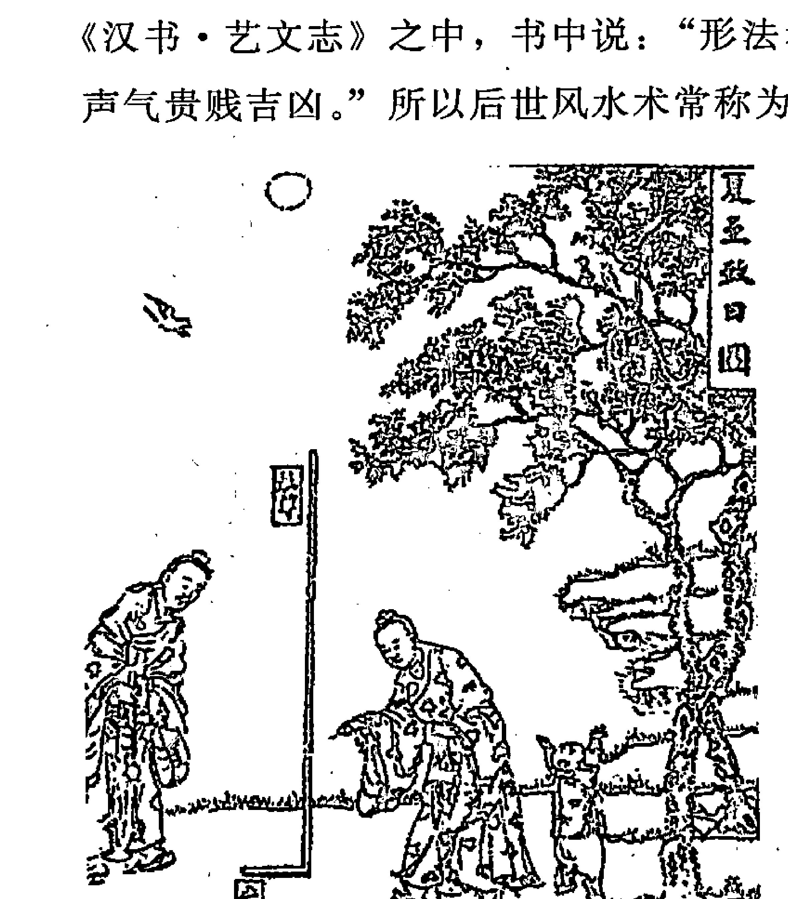

◎夏至致日图：上古时代，羲叔（羲仲之弟）在夏至日用表杆和土圭测量日影

比班固的《汉书》更早一些，《周礼》中就有“形体之法”的论述。所谓“形体之法”，不外乎考察山川地理形势，择其形胜之处，因势随形而营国立都、筑室安居。《周礼·夏官司马》有土方氏“掌土圭之法，以致日景，以土地相宅，而建邦国都鄙”的记载，即土方氏掌理用土圭的办法，通过测定日影，测定方位，选择土地形胜建造房舍，修筑都城。这应该是形法相地相宅的先声。在天道与地道之间，形法似乎更注重对地道的考察；虽然义理侧重有所不同，但它也同“地理”一样，成为风水的重要别称。

## 012 || 汉代形法家是怎么相地的？

班固在记录汉代式术占法时，除在“五行家”中列出堪舆家一派外，也提到了形法一派的术书，如《宫宅地形》。这种术法既然已经有了专门的术书和流派，说明其理论已经成熟。虽然汉代那些讲形法的术书今天都看不到了，但从班固对“形法”所下的定义来看，我们不难猜测对山形地势、地理形貌的考察正是汉代形法的主要内容。

## 013 || 汉代形法是后来形势派风水的源头吗？

如《管子·乘马篇》中说：“凡立国都，非于大山之下，必于广川之上，高毋近阜而水用足，下毋近水而沟防省，因天材，就地利，故城郭不必中规矩，道路不必中准绳。”就是以形法论“立国都”之要旨。《汉书》又有云：“相其阴阳之和，尝其水泉之味，审其土地之宜，观其草木之饶，然后营邑立城。”所谓“相”者，省视也，为察看之意；这里是说先“相”南北方向，再尝水、审土、观植物等的好坏后，再决定是否在此建城。以上这些例子，都说明了汉代形法的宗旨在于考察山川地形，包括地势、气候及景观等，是一门比较朴实的学问。

《汉书》中说：“形法，非有鬼神，数自然也。”是说汉代的形法讲究的是适应自然而非鬼神。这一点与同时代讲究阴阳五行生克、吉凶祸福禁忌的堪舆占法有很大的差别，其根本即是以自然为对象的相学，或者说“象”学，即是以象之“相”推衍附会其吉凶。又由于形法讲究的是因势随形、相其地理，于是又衍生出“相地”、“形势”等称谓，同为风水学的重要术语。

元代赵汸的《葬书问对》曾说：“予尝读张平子《冢赋》（汉代形法派的风水之作），见其自述上下冈陇之状，大略知今葬书寻龙捉脉为之者，岂东汉之末，其说已行于士大夫之间。”这里所说的“寻龙捉脉”，正是古代重要的风水流派形势派的典型做法。形势派素有龙、穴、砂、水相配合的讲究，实际上也是注重对山川形势的考察，这与汉代形法是一脉相承的。所以从传承关系上看，形势派的源头或许便可追溯到汉代的形法。

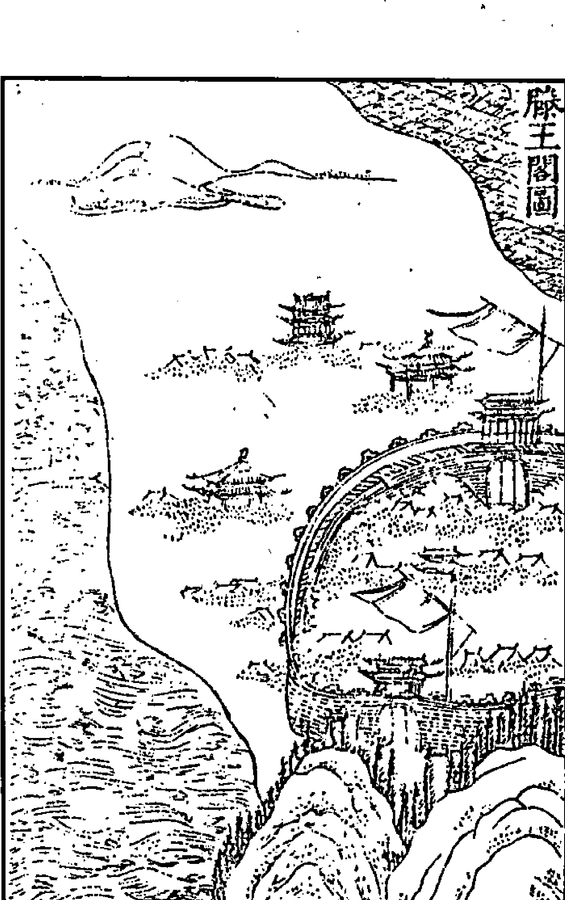

## 014 || 人们为什么把看风水的人叫作“地理先生”？

地理作为风水的别称，一直沿用至今。如我们常听到的“地理先生”，其实就是风水师；看风水，也称作“相地理”。

“地理”一词，最早出现在《周易·系辞上》中，其文云：

> >“易与天地准，故能弥纶天地之道，仰以观于天文，俯以察于地理，是故知幽明之故。”

而俯察地理，即相度土地之宜，其实是风水术的主要内容，所以风水术称为地理也是顺理成章之事。

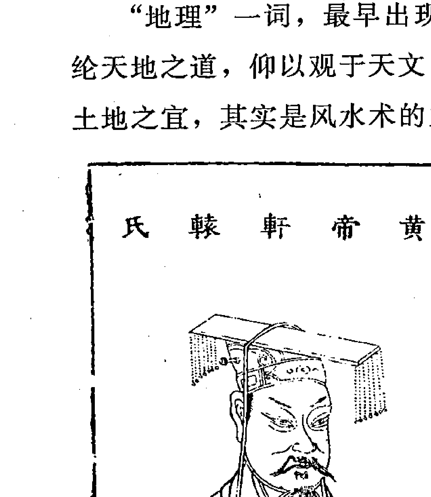

◎黄帝被后人尊为风水术的始祖

什么是地理呢？王充在《论衡·自纪篇》中说：

> >“天有日月星辰谓之文，地有山川陵谷谓之理。”

天文与地理对应，即所谓天道、地道，二者相关而有别，当风水术由“观天文”而向偏重“察地理”衍变之后，地理也正式成了风水的别称。《管子·形势解》说：

> >“上逆天道，下绝地理，故天不予时，地不生财。”

大意是说，如果人上逆天象，下忤风水之理，那是要倒霉的。这里更明白地用“地理”来指称风水术了。

依《周易》的说法，

> >“古者庖牺氏之王天下也，仰则观象于天，俯以则观法于地”

其中的庖牺氏即伏羲。这段记载，也使得后世的许多风水家在追溯地理之术的源头时，都将伏羲宗为始祖。除此之外，晋代葛洪《抱朴子内篇·极言》说，

> >“昔黄帝……相地理则书青乌之说”

则是将风水始祖之名安在了黄帝头上。

唐宋以后，以“地理”命名的风水术书大行于世，比较有名的有《管氏地理指蒙》、《五音地理新书》、《地理人子须知》等。

## 015 || 为什么把“青鸟”作为风水的别称？

风水又被称作青乌术。唐代王维《能禅师碑》里写道：

> >“择吉祥之地，不待青鸟；变功德之林，皆成白鹤。”

清黄宗羲《陈令升先生传》也记载说：

> >“先生于书画古奇器，赏鉴无不精绝，而青乌、素问、龟卜、杂术，皆能言其理。”

把“青鸟”作为风水术的别称可以说由来久远，与古代一位名叫青乌子的风水家有关。青乌子被后世许多术士奉为风水术的鼻祖，名头很响，可他究竟是哪一个时代的人，甚至究竟是否真有其人，至今仍无定论。据史箴先生在《风水典故考略》中的考证，各家

> >“一云青乌子为黄帝时地理家（按：《轩辕本纪》有谓“黄帝始划野分州，有青乌子善相地理，帝问之以制经”），二谓其商周时人，三言为秦人，四称其为汉时人”，众说纷纭，莫衷一是。

但无论如何，古代有冠名“青乌”的相地之术与术书流行于世，而且影响很大，却是一个事实。晋代张玄之在《吴兴山墟名》中提到，吴兴有座山昔年曾经经过青乌子相度，认为是避难隐居的好地方。南朝梁人刘孝标注《世说新语》中有关风水术的一段故事时，也谈到有“青乌子《相冢书》”，应该就是当时择地术的专业指导书。后世的《艺文类聚》（唐欧阳询撰）等典籍中，也不断引用过青乌子《相冢书》书中的话，可见其影响之深远。

《青乌先生葬经》是流传至今的冠以“青乌”之名的古代风水典籍，《古今图书集成》和《四库全书》都有收录。

## 016 || “青囊”如何演变为风水的代称？

古代术士把他们的著述刻在简册上，多放在用青布做成的布囊里，这就叫作青囊。而把青囊作为风水的别称，原出于《晋书·郭璞传》，里边提到：“有郭公者，客居河东，精于卜筮，璞从之受业。公以青囊中书九卷与之，由是遂洞五行、天文、卜筮之书……”从这段引文来看，青囊其实并不专指风水之术，也包括其他的术法。比如传说华佗就曾著有医书《青囊书》（今已佚）；唐刘禹锡有诗云：“案头开缥帙，肘后检青囊。唯有达生理，应无治老方。”（《闲坐忆乐天以诗词问酒熟未》）诗中的“青囊”就是指医书。因为在古代，“山医命相卜”总称五术，所以青囊也是各类术书的总称。只是当郭璞被尊为风水术的祖师爷后，青囊才逐渐成了风水的别称。

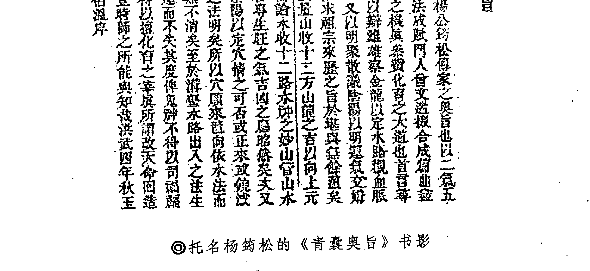

以“青囊”来命名的风水术书，宋代郑樵《通志·艺文略》载有唐代杨筠松及其门生曾文迪所著的《青囊经》，《宋史·艺文志》也提到杨、曾著有《青囊经歌》二卷。到清代，《古今图书集成》录有《青囊奥旨》；《四库全书总目提要》提到《青囊奥语》一书，说“相墓理气一派，从此发源”。

## 017 | “卜宅”与“相宅”分别是指什么？

卜，就是占卜、卜筮。所谓卜宅，也就是通过占卜来决定住宅的营建。商周之时，卜宅是很流行的，上至迁都作邑，下至选择民居，都要占卜，以天意或神鬼的意志来抉择。唐代吕才《五行禄命葬书论》说：“逮乎殷周之际，乃有卜宅之文。”把上古卜宅之文作为风水术的源头，所以风水也称为卜宅。

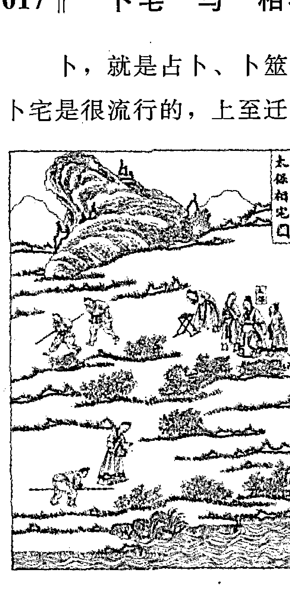

“相宅”一词出自《尚书·召诰》：“成王在丰，欲宅洛邑，使召公先相宅。”所谓的相宅，含有勘察规度宅地的意思，这也成为后世风水的宗旨之一，所以风水也概称相宅或相地，后来衍伸有相墓的说法。

在商周之时，卜宅和相宅的内涵大略相同。卜宅虽然是以天意来择居，可是前提是要经过对各种环境形势的考察，是由气候、水草及其他环境因素决定的，所以说卜宅事实上是以相宅为前提的。

# 二 风水历史与传说

## （一）远古

### 001 | 古代先民有什么实用的择居经验？

据考古发现，原始人类要么在树上筑巢而居，要么以洞穴作为他们的栖身之处。但不管是巢居还是穴居，先民们对栖身之处的选择都是有讲究的。文献资料显示，他们或“就陵阜而居”，或“因丘陵掘穴而处”，已考虑到居住环境中对地形的利用。“陵阜”是指那些靠近河流的土坡。选择在那里居住，既方便取水捕鱼，又能够躲避经常发生的水患，这种“近水而居”的实用经验是和后世风水观念相契合的。

对古代先民居住遗址的考察表明，当时的氏族村落或是分布在江河两岸的台地和坡地上，或是位于江河转弯与两河交汇处。这不仅可以避免洪水的侵袭和方便汲水，而且还适于农业、畜牧、狩猎和捕鱼等生产活动。此外，那些村落的建设还具备了方位的概念，懂得方位与日照和风寒的关系，比如大多数房屋都是朝南的，便于采光。这种依山傍水、背风向阳的择地筑建方式，体现出后世风水术所尊崇的“近水向阳”的原则。

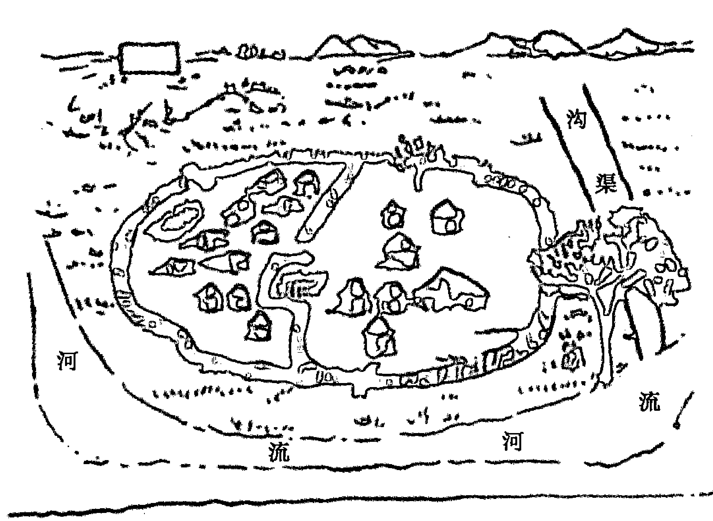

### 002 || 为什么说风水的兴起与农耕文明有密切关系？

古代先民一开始是居无定所的，他们在漫长的岁月中迁徙不定，大多数时候不得不餐风露宿，直到大约距今 6000—7000 年前，原始农业发展起来以后，他们才开始了聚集定居的生活。

在农耕文明兴起后，基于农业对自然环境和规律的依赖，古人在城市、村落和住宅选址上，已经注意到要审查地理形势的向背围合、气候寒暑，以及水土是否肥美，也认识到住房朝向以南向为主，冬夏受益。人们从实用角度去赋予住宅朝向和环境的意义，从而开始主动地调节自己的行为，更好地适应自然的变化。因此说，风水作为一门实用的相地择居之术，它的兴起与农耕文明有着密切的关系。

### 003 || 陕西半坡村遗址体现的风水原则

西安东郊的半坡村，是我国仰韶文化时期的一个原始聚落遗址。

从环境来看，半坡遗址坐落在浐河东岸的一块台地上，这里河川纵横，田野肥沃，是著名的八百里秦川；南边有白鹿原和连绵的秦岭山脉。在古代，白鹿原上是一片茂密的树木，浐河则提供了取之不尽的生产和生活用水，再加上肥沃的土地，使得这里成了人们进行农耕、牧畜和渔猎的理想场所。整个村落的建筑搭建于河边的台地上，既用水方便，又可避免洪水之患。

从方位来看，遗址中的房屋也体现了朝阳的原则。房屋基址大体朝南或向东，如半坡中间的大房子朝东，围绕大房子的氏族成员住的房子多朝南。

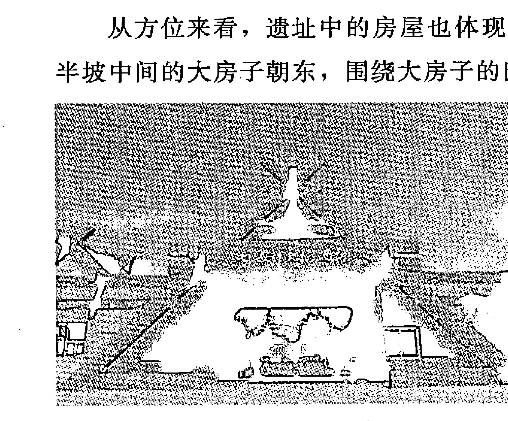

从分区来看，村落面积有一万多平方米，由居住区、制陶作坊和公共墓地三部分组成。为了防止野兽和外族的侵扰，人们还在居住区周围挖掘了一条长约三百米、深达五六米的防御性壕沟。据不完全的发掘，在离半坡不远的浐河、沣河中游长约20公里的河岸台地上，类似的原始村落就有13处之多。这说明了当时原始建筑选址标准的同一性。有趣的是，这些聚落地多为现代村落或城镇所覆盖，可见当时人们择地而居的经验和技术已经相当成熟了。

### 004 || 为什么把河南濮阳西水坡墓葬中的青龙图案称为“中华第一龙”？

在漫长的发展过程中，风水学总结出不少可供遵循的择地模式，其中最有名的就是所谓的“左青龙，右白虎，前朱雀，后玄武”。具体地说，就是选择的地方要依山面水，俯临平原，左右护山环抱，面前朝山、案山拱揖相迎。

> 《葬书》很形象地把这种模式描述为：“玄武垂头，朱雀翔舞，青龙蜿蜒，白虎驯俯。”

玄武、朱雀、白虎、青龙这四种动物形象就是风水学中有名的“四灵”，或称“四神”、“四象”。
“四灵”是怎么产生的呢？在图腾崇拜的原始社会里，先民们是相信万物有灵的，包括天上的星辰也是这样。他们仰观天象，把天上的二十八宿分为四方星座，分别看成是四种有灵性和神性的动物的形象，即东方苍龙、西方白虎、北方玄武、南方朱雀。

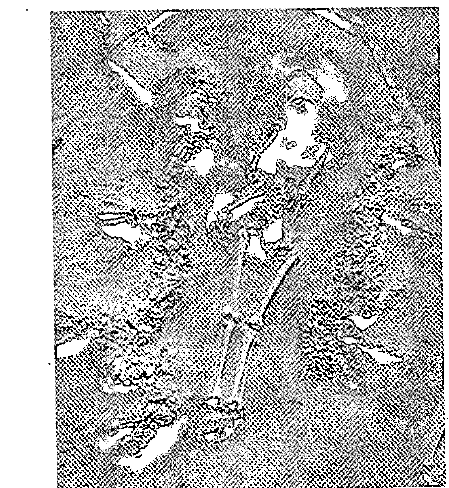

> 据《三辅黄图》记载：“青龙、白虎、朱雀、玄武，天之四灵，以正四方。”

这“四灵”运用到风水中，以确定方位、占卜吉凶，即：北山为“玄武”；东山（或河）为“青龙”；西山（或路）为“白虎”；南山（或水）为“朱雀”。
1988年，考古学家在河南濮阳西水坡属于仰韶文化时期墓葬中，发现了一幅用蚌壳精心砌塑而成的青龙、白虎图案，分别位于被葬者的两侧。这说明，早在仰韶文化时期，就已经出现了“四灵”概念的雏形。如果这一墓葬中的青龙、白虎图案也有指位作用的话，那么后世风水术中关于“青龙蜿蜒，白虎驯俯”的观念就可追溯到仰韶文化时期。

## （二）商周

### 005 || 商周时期的人为什么要以卜筮的方式来选择居所？

上古三代，古人很相信神的力量，每当遇到什么难以决断的事情时，都要请示一下天神的意志，而请示的具体方式，就是卜筮。卜筮在商周时期的社会政治生活中占有十分重要的地位，运用非常广泛，不仅择居需要卜筮，上至国家大事，下至日常生活杂事，都有经过卜筮的时候。如《史记·龟策列传》说：“王者决定诸疑，参以卜筮，断以蓍龟，不易之道也。”“闻古五帝，三五发动举事，必先决蓍龟。”因此，人们在选择宅地居所的时候，也不再单纯地顺应自然，而是加入卜筮这一预测吉凶的术法。

### 006 || 龟卜和占筮是怎么回事？

卜筮，又分为龟卜和占筮。

龟卜，即以龟甲或动物的肩胛骨进行凿钻，再用烧红的木棍对甲骨上的孔眼进行烧灼，使其正面呈现兆纹，并依兆纹得出吉凶结果。兆纹多是“卜”字形的裂纹，因此被称作卜。卜官把卜的全过程刻写在甲骨上，这种记录卜的刻辞就叫作卜辞，这些早期的文字就是我们今天熟知的“甲骨文”。《周礼》中记载有所谓“三兆之法”，大概就是指三种龟卜的方法，分别为玉兆、瓦兆、原兆。

用龟卜来择居，古时称为卜宅或卜居。从殷墟出土的甲骨中，可以找到大量与卜宅活动有关的卜辞，如卜问在唐土作新邑是否合适、武丁作邑上帝是否允许的卜辞等。

占筮与龟卜有很大的不同。占筮包含象和占，象是征象，是事物本身显示出来的情形，而占是占者须求神灵的启示，把预期的征兆求神灵选择出来，给予指示。在上古时代，占筮所用的材料是蓍草，过程较为复杂，简而言之，就是通过蓍草数目的变化，得出一定的卦象，然后根据卦象及卦爻辞等来预测吉凶。如我国古代“群经之首”《易经》，本身就是一部占筮用的书。
两种占卜方式的区别，如《左传》所言：“龟，象也；筮，数也。”一是依据兆象来断吉凶，一是通过数字确定卦象以断吉凶。
此外，何时用卜，何时用筮，也是有讲究的，涉及当时的礼制秩序。一般来说，“筮轻龟重”，“卜”的级别要比“筮”高，大事的决断一定要用龟卜，而次要的事用占筮即可。

### 007 || 为什么说盘庚懂得以风水来兴国？

夏商周三代，都城是迁徙无定的。当时的人们很重视都城的选址和修建，看作与国势的盛衰息息相关的头等大事，部族首领和帝王们往往亲自负责此项工作。根据《尚书序》的记载，商民族从契到成汤时期，曾经经历了八次迁徙。而在汤灭夏之后，又经历了四次迁徙。每一次迁徙和营建都城，都需要经过反复占卜之后才能进行，像今天看到的那些甲骨卜辞就是当时为选址和建造而作的。

在最初的几次迁徙之后，商朝的国势渐渐衰退，但到盘庚时，仍果断地将都城迁到亳地。有关这件事，《尚书·盘庚》上说：“盘庚五迁，将治亳殷，民咨胥怨，作《盘庚》三篇。”其中记载：“盘庚迁于殷。民不适有居。率吁众戚，出矢言，曰：我王来，即爰宅于兹，重我民，无尽刘，不能胥匡以生。卜稽曰：其如台。先王有服，恪谨天命，兹犹不常宁，不常厥邑。于今五邦。今不承于古，罔知天之断命……”

盘庚是商代的第十九个帝王，到他继位的时候，商的国力已经十分衰弱了。为了复兴国势，盘庚决定迁都，他经过亲自反复考察，选中了殷地。不过，在经过几次不成功的迁徙之后，盘庚的迁都之举一开始是遭到众人抱怨的。盘庚于是出来训告说：我用占卜来决定这次迁都，（占辞上）说的都合乎我的主张。当年先王有所行动，必定敬奉天命，谨慎行事，即便这样还是不能长久地定居，至今已五次迁都建国了。而今若不承袭古人遗规，不知天命，哪里还说得上继承发展先人的光荣业绩呢？几番训告之后，怨声渐息，从而实施了迁都的计划。从此，国势果然日益昌隆，眼看快没落的商朝又延续了几百年的时间。至今提到商朝，还常常将其称为殷商，这就说明了盘庚的迁都是成功的，他通过卜居的原始风水活动，成功地实现了兴国大计。

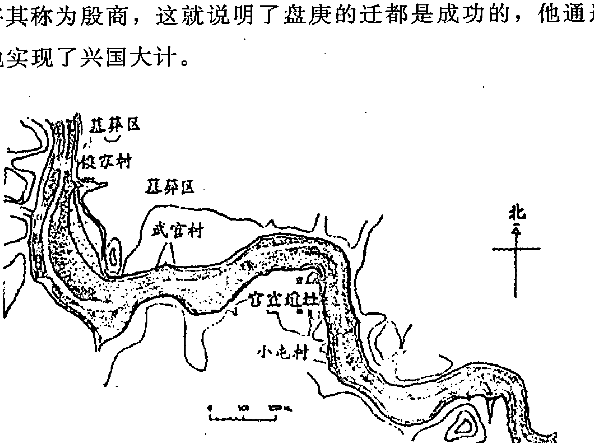

◎河南安阳商朝宫室遗址平面图

### 008 | 《易经》中有关卜筮择居的记录

通过占筮来择居，一般称之为占居。在《易经》中，有好几条卦爻辞是涉及择居活动的筮辞。如：

“坤”卦卦辞说：“安贞居。”李镜池的《周易通义》解释说，这是“占问定居而得吉兆”。又说：“周人以农为主要经济已经很久，农业生产要求过定居的生活，所以占问定居而得吉兆。”

“升”卦爻辞说：“升虚邑。”什么是“虚”呢？《说文解字》说：“虚，大丘也。”也就是大的高地，可以避洪水，所以择丘而居是上古的一件大事。

“涣”卦爻辞说：“涣有丘，匪夷所思。”《周易通义》说：“洪水如果还要涨到山丘那么高的话，那是平常所难以想象的。”这也和“升”卦爻辞一样，指出了居住在高地的重要性。

“屯”卦初九爻和“随”卦初六爻辞都说：“利居贞。”《周易通义》说：“占问安居而得吉利之兆。”

“颐”卦六五爻辞说：“拂经，居贞居。”所谓拂经，就是开辟阡陌，垦荒。《周易通义》说，这是“开垦种植，对定居是有利的”。

## 009 || 为什么说公刘是有史以来第一个风水师？

现有的很多文史资料都可以找到周民族经卜筮而营建城邑的事迹，其中最为后世风水家们所推崇的，当属周人远祖公刘迁豳之事。

周民族原处邰地（今陕西武功县），据《诗经·大雅·公刘》记载，为避夏人之暴虐，周人的祖先公刘率领部族翻过大峪岭，选择泾河边的豳地作为定居之地：

> “笃公刘，逝彼百泉，瞻彼溥原，乃陟南冈，乃觏于京。京师之野，于时处处，于时庐旅，于时言言，于时语语。”

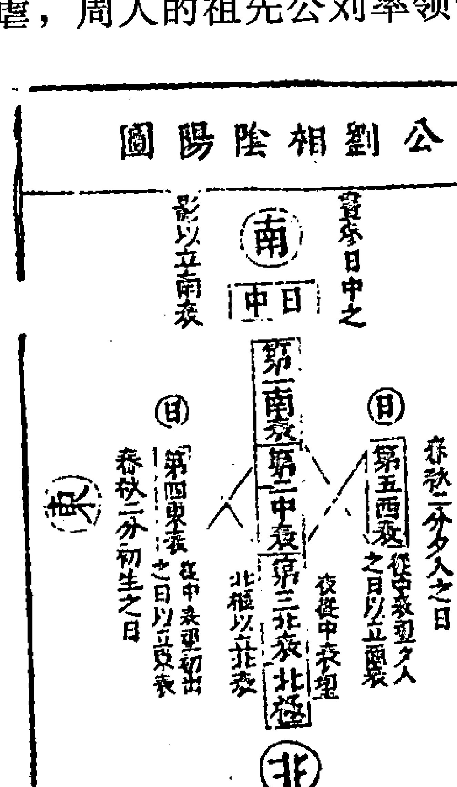

> “笃公刘，既溥既长，既景乃冈，相其阴阳，观其流泉。其军三单，度其隰原。彻田为粮，度其夕阳，豳居允荒。”

这些诗句如实描述了公刘勘察地形、规划营宅的各种细节，被认为是卜宅之文的滥觞。风水被称为“阴阳”，也是典出这里。诗中大意是说，公刘为寻找一个好的定居处，不辞辛劳，长途跋涉。他先站在流泉的岸边，眺望宽广的平原，再登上南边的高岗，察看水源流向，推断阴阳，断定眼前是建都的好地方，于是规划定都，营造住房。所谓的“陟”，就是登临跋涉；所谓的“观”，就是全面观察对比；所谓的“度”，就是实际勘测、衡量。这种讲究择基与立向的相宅活动，其实已经超越了单纯的卜居，正是后代风水学的萌芽，所以公刘也被推崇为风水学的一个远祖。

## 010 || 周朝人在迁都过程中有哪些成功的风水案例？

由于玁狁的侵扰，周民族在周太王（古公亶父）的带领下迁到了岐，其相地定都的工作可见《诗经·大雅·绵》的记载：“爰始爰谋，爰契我龟。曰‘止’曰‘时’，筑室于兹。”仍以龟卜为决断依据，选定了周原这块佳地。

后来周文王又迁都至丰，武王定居于镐，周人逐渐强盛，终于灭商。周灭商后，周成王为了巩固对商朝东方故地的统治，打算把都城迁到洛邑，于是派大臣前往那里察看山川形势、水土状况，看看是否适合建城。这就是《尚书·召诰序》所记载的“成王在丰，欲宅洛邑，使召公先相宅”。于是，太保召公先在瀍、涧两河之间周密勘察地理情况，又经过周公的反复占卜，终于在洛河附近营建洛邑。

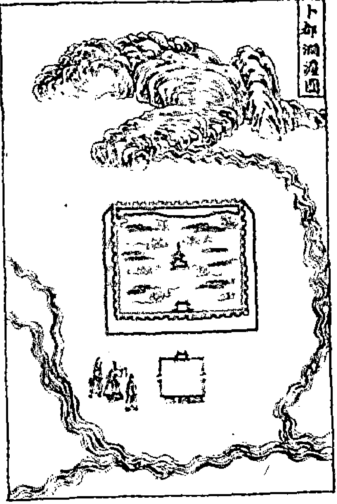

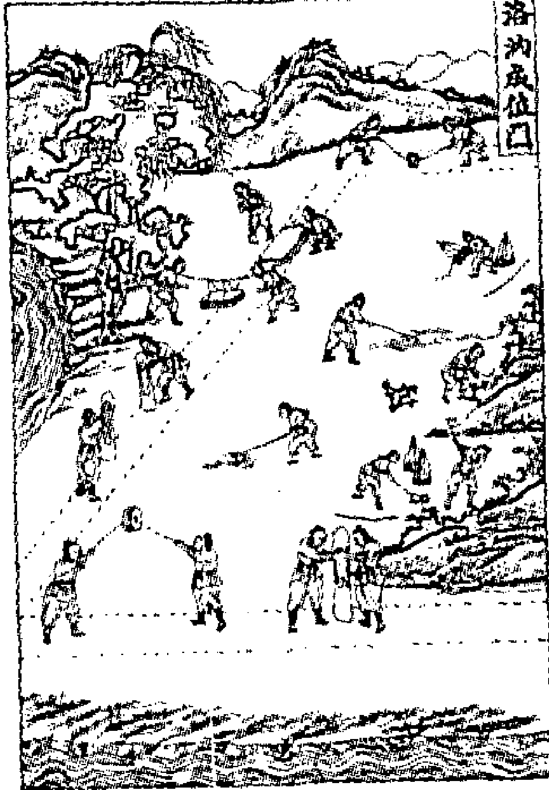

从风水的角度看，召公和周公选定的洛邑地址北依邙山，即以邙山为镇山；前方有嵩山为案山；左成皋、右渑池为青龙、白虎的耳山；后界大河，这样有利于以关中平原为根据地的周王朝，以渭水和黄河为交通要道，进一步向黄河下游、华北平原发展。

洛邑的营建既有严格的勘察相地过程，又经过吉凶的反复卜问，其最终定址也符合后世“风水宝地”的标准，因而被后世视为古代早期经典的风水实践案例，如《青囊奥语》云：“是以圣人卜河洛，涧交华嵩，相其阴阳流水位，卜年卜宅始都宫。”

### （三）春秋战国

## 011 || 阴宅风水在春秋时期为什么不受欢迎？

春秋战国时代，人们对墓葬的看法还是很朴素的，并没有后世阴宅风水那样注重墓地的选择，没有将之与吉凶休咎联系起来。如齐国大夫成子高说，人生要有益于人，死不害于人。我死后选一块不能耕种的地方埋葬，不致占用耕地，妨碍生产。《吕氏春秋·节丧》则从孝道观点阐明选择葬地的目的是为了尽孝子的心意，让死者安息。为了让死者安息，就要选择高燥避水的地方，埋葬深一点，防止野兽破坏死者遗体。在这样的社会背景下，阴宅风水并没有得到人们的“青睐”。

## 012 || 诸子百家思想对风水有什么重要影响？

春秋战国是我国思想史的黄金时代，风水学一些根本思想观念的源头都可以追溯到这一时期。其中影响最大的要数易学思想、阴阳五行思想及精气学说。

战国后期，以邹衍为代表的阴阳家“深观阴阳消息”，结合五行学说，推出了生克衰旺的理论。对《周易》的阐释也在这时候走向成熟，出现了所谓的《易传》“十翼”，人们从《周易》中推衍出一套自然和人生哲学体系。阴阳五行和易经八卦是后世一切术数的思想之源，它们为风水术提供了一套操作性强的推衍和运算的符号系统，使风水术有章可循。

战国时期的宋尹学派则提出了精气学说，认为精气是构成万物的本源，一切事物都是精气化生的结果，包括精神活动。这一精气学说可以说是“气感而应，鬼福及人”这类风水思想的源头，它经由后人的不断完善和发展，成为阴宅风水的理论基础。

## 013 || 为什么说形势派风水来源于兵家和纵横家的实践与理论？

风水中的形势派，也可以说本于春秋战国时期的兵家和纵横家的形势论。《管子》和《孙子》都有以“形”、“势”为题的篇章，如《管子》的《形势》、《形势解》，《孙子》的《形篇》、《势篇》等。《荀子·强国》说秦国“其固塞险，形势便，山林川谷美，天材之利多，是形胜也”，《尉缭子·兵谈》说“土地肥硗而立邑建城，以城称地，以地称人，以人称粟。三相称，则内可以固守，外可以战胜”，都是就兵事而论山川形势。在战争乃家常便饭的情况下，要赢得战争，不仅要强兵马、得天时，还要善于利用地形状况。兵家和纵横家们深知山川形势关乎战事之成败、国家之存亡，所以都把对地理形势的了解作为一门基本功，举凡“名山、通谷、经川、陵陆、丘阜之所在，苴草、林木、蒲苇之所茂，道里之远近，城廓之大小……”，都要通通掌握，而这类知识也恰恰是后来的形势派风水家所应具备的。

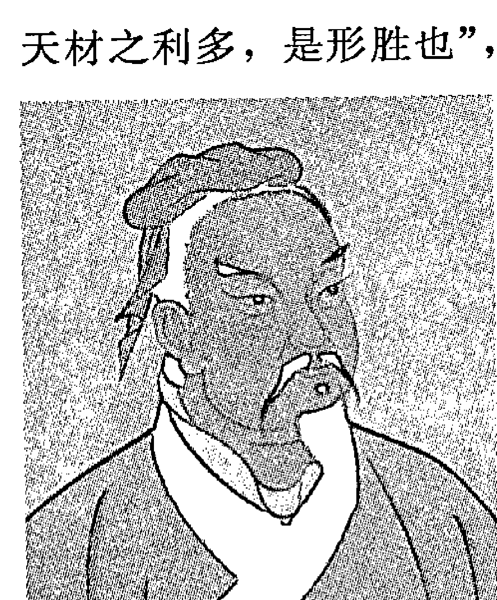

## 014 || 秦简《日书》与后世风水有什么渊源关系？

1975年在湖北省云梦县出土的秦简《日书》，对研究战国时期相地择居的情况有极其重要的价值。这虽是一部讲选择时日、占断吉凶的术书，却也涉及相宅择居。有人认为，《日书》占卜的内容概括起来不外八个字：“生老病死，衣食居行。”其中“居”正是较受重视的一个方面。书中的“门”、“梦”、“生子”、“生人”等部分都讲到居室房屋的环境选择，进而占断吉凶福祸。如在“门”这一部分占文中，我们可以读到造门关乎吉凶的内容。里边有一幅门图，在房屋的东南西北各方共标有二十二个门，逐一占断，并注明吉凶。如南门：“贱人弗敢居。”辟门：“成之即之，盖廿岁必富，大吉，廿岁更。”屈门：“其主昌富，女子为巫。”失行门：“大凶。”不周门：“其主富，八岁更。”大门：“利为邦门，贱人弗敢居，居之，凶。”等等。占断大门方位与吉凶祸福的关系，也正是后世风水相宅的重要内容，这一点足以说明《日书》与后世风水学的渊源之深。蔡达峰先生认为，《日书》中对择居的占断既有方位占法，又有形象占法，其占法框架可以说是后世风水学的直接起源。

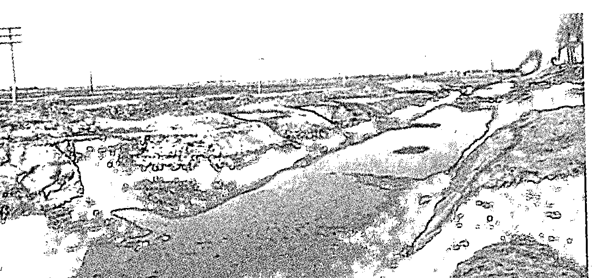

©云梦睡虎地墓葬发掘现场

## 015 || 为什么说司南是风水罗盘的鼻祖？

早在春秋战国时期，由于冶铁技术的兴起和发展，人们发现了天然磁石的存在，并了解了磁石吸铁的现象。大约在战国时期，我国已经有了世界上最早的指示方向的仪器——司南。如《韩非子·有度篇》就记载说：“先王立司南以端朝夕。”《鬼谷子·谋篇》也记载说，郑国的人到远处采玉，就带了司南去，以防迷失方向。

由于天然磁石在琢制过程中，不容易找出准确的极向，而且也容易因受震而失去磁性，因而成品率低。同时也因为这样琢制出来的司南磁性比较弱，而且在和地盘的接触的时候转动摩擦阻力较大，效果不是很好，因此这种司南未能得到广泛的应用。可是，司南的发明使人们对方位的感受更加具体，

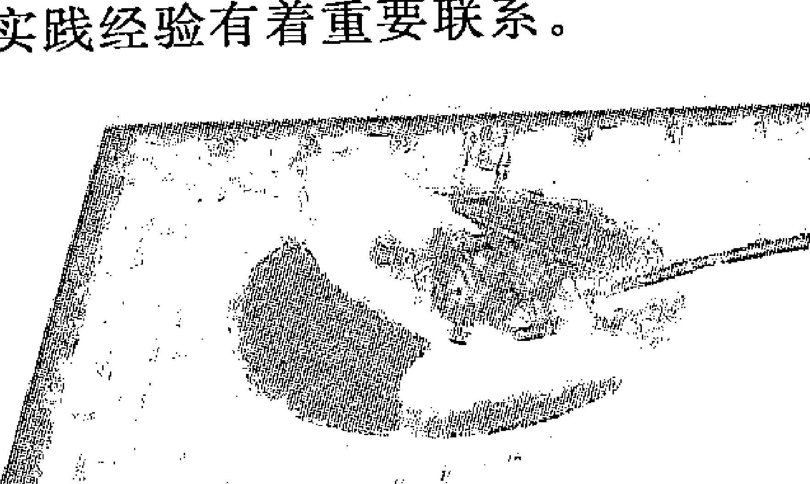

©司南

对方向的分位也由东南西北四方演为八干四维、十二支，合称为二十四向（又称二十四山），这正是后世风水罗盘分度的基本单位。另外，风水罗盘重要的两个组成部分——方位盘和指极磁体，都可以在司南那里找到原型。所以，可以说司南是风水罗盘的鼻祖。

### (四) 秦汉

## 016 || 秦始皇为什么要凿金陵王气？

至迟在秦代，出现了“地脉”的观念。所谓的“地脉”，就是龙脉与王气、天子之气。

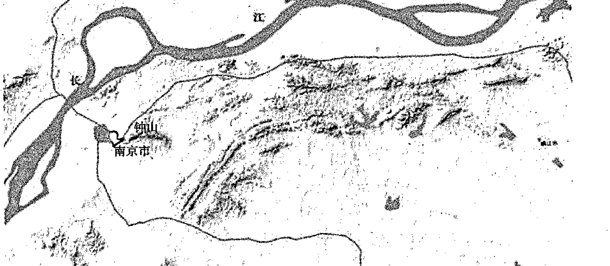

地脉、王气等观念的信奉者，当然也包括向来笃信术数的秦始皇。《史记·高祖本纪》提到，秦始皇怀疑东南方有天子之气，于是起驾东巡。得知这个消息，觉得自己有天子之命的刘邦就躲了起来，因为怕自己头上的天子气（据说呈云气貌）被发现难免性命不保。人们还认为，天子气又是与山川形势密切相关的，山川形势被破坏了，天子气也会散失。《三国志》等文献史料中也有记载，秦始皇东游到金陵（今南京）之地时，望气者云“金陵地形有王者都邑之气”，于是他下令掘断此处连绵的山冈，“掘凿江湖”，“平诸山阜”，“处处辄埋宝物，以当王土之气”，把地名也由“金陵”改为“秣陵”。后来到了三国时，这里已经由吴主孙权把政，有人掘地得“铜匣长二尺七寸，以琉璃为盖，雕镂其上，得一白玉如意，所执处皆刻龙虎及蝉形”，据说就是几百年前秦始皇埋下的宝物。

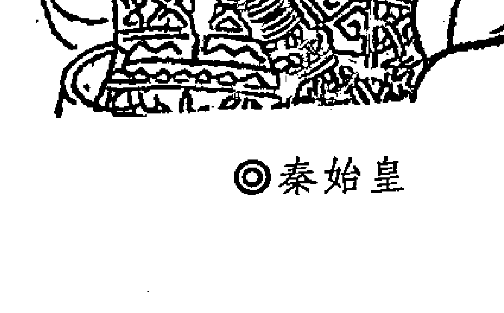

与此类似的事例，是秦始皇凿破岭南山岗，破坏其“雄霸之气”。这一传说可见清人屈大均《广东新语》载：“广州治背山面海，地势开阳，风云之所蒸变，日月之所摩荡，往往有雄霸之气。城北马鞍岗，秦时常有紫云黄气之异，占者以为天子气。始皇遣人衣绣衣，凿破是冈。……故粤谣云‘一片紫云南海起，秦皇频凿马鞍山’。”

## 017 || 秦朝大将蒙恬的死是因为破坏了风水吗？

据《史记·蒙恬列传》记载，秦朝大将蒙恬曾受命督修万里长城和两千里驰道。秦始皇驾崩后，胡亥（即后来的秦二世）与赵高等谋夺皇位，矫诏蒙恬自杀。他在临终前一开始想不明白，“我何罪于天，无过而死乎？”后来想“明白”了：“恬罪固当死矣。起临洮属之辽东，城堑万余里，此其中不能无绝地脉哉？此乃恬之罪也！”也就是说，长城和驰道修得那么长，中间免不了会有破坏“地脉”的事情发生，他把自己的死归咎为在筑修长城和驰道时绝了“地脉”。这或许是风水“龙脉”理论的最早实例。

对于蒙恬的说法，为他立传的司马迁很不以为然，他说：“恬为名将，不以此时间强谏，振百姓之急，养老存孤，务修众庶之和，而阿意兴功，此其兄弟遇诛，不亦宜乎，何乃罪地脉哉！”但不管怎么说，从这个故事中可知，地脉的观念在秦汉之际已经为人们普遍信奉，就连司马迁在批驳蒙恬推卸责任时，也没有专门否定这一观念。

## 018 || 韩信葬母选择了什么样的风水宝地？

秦汉时期，墓葬吉凶的观念也开始大行于世。人们相信“地脉”之说，认为地有灵气，墓地可福荫后人。不光是帝王重葬术，百姓也相信这一套。

《史记·淮阴侯列传》记载：“韩信虽为布衣时，其志与众异。其母死，贫无以葬，然乃行营高敞地，令其旁可置万家。”传说韩信年少时，母亲死后，家里贫穷，无法安葬，韩信就选择一块气势宏伟的“高敞地”为母亲安葬，让旁边“可置万家”。司马迁实地考察过韩母之墓，说确实是这样。这段传说为司马迁所引用，以解释韩信的命运，把他的命运与其母亲之葬地相联系。这说明墓葬福祸荫应的观念在当时已经深入人心，就连还是普通老百姓而且穷得无法葬母的韩信都通晓这个道理。

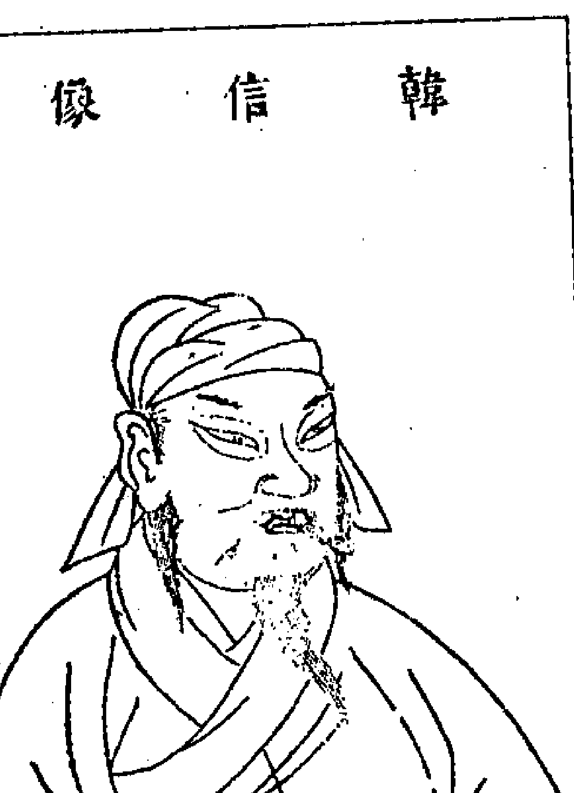

## 019 || 董仲舒：风水术创立的理论推手

董仲舒（前179—前104）是西汉时期著名的哲学大师和今文经学大师，他以《公羊春秋》为依据，将周代以来的宗教天道观和阴阳、五行学说结合起来，吸收法家、道家、阴阳家思想，建立了一个新的思想体系，成为汉代的官方统治哲学，对当时社会所提出的一系列哲学、政治、社会、历史问题，给予了较为系统的回答。

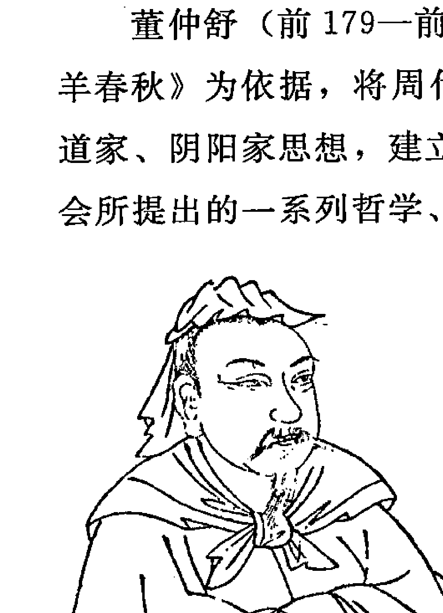

董仲舒的思想对风水理论的最终成熟起了关键的推动作用。董仲舒之前的儒家，只讲阴阳，董仲舒是第一个将阴阳五行合流并用的人，他基本上把大部分的事物都用阴阳五行整合起来了。如时间，一年四季均有相应的五行属性：“木者，春，生之性，农之本也”。“火者，夏，成长，本朝也。”“金者，秋，杀气之始也。”“水者，冬，藏至阴也。”四季以阴阳来统一，则春为少阳，夏为老阳，秋为少阴，冬为老阴。又如方位，四方也可以用五行来统一：“东方者，木，农之本”；“南方者，火也，本朝”；“中央者，土，君官也”；“北方者，水，执法司寇也”；“西方者，金，大理司徒也”。阴阳五行的整合，为风水的发展开辟了新的道路。

此外，董仲舒将庄子的天人合一思想引入，提出了“天人感应”的理论，从而构建了传统文化的主体。如在风水中，五行不仅是代表东、南、西、北、中五个方位，更由于受“人感应”理论的影响，五行被授以不同的属性，赋予不同的德行，从而有了不同的人文含义。天人合一思想的正统化，不仅使风水研究进入理论化阶段，对风水的推广也起到了积极的作用。

## 020 || 为什么说汉代是风水学思想理论的成熟时期？

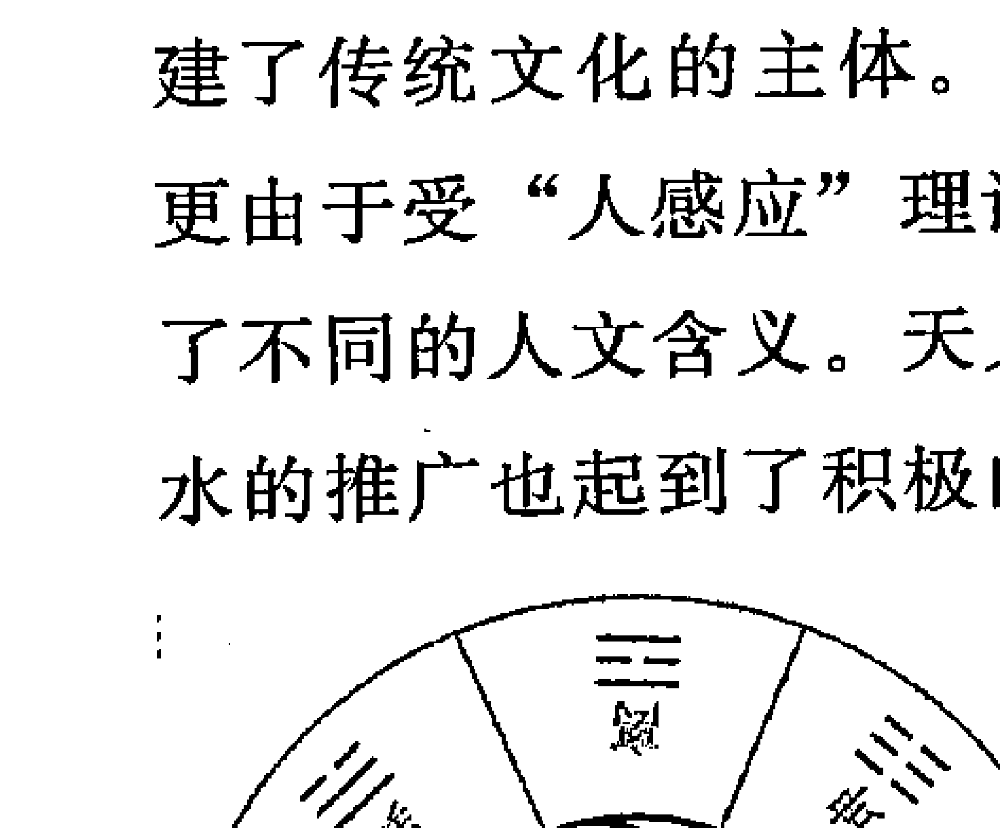

汉代是一个大一统的时代，这个时期的各种哲学思想也表现出鲜明的时代特色。董仲舒集前人思想之大成，力图创造出一套符号系统和推演模式，用阴阳五行来统摄宇宙万物，使杂乱无章的事物、现象渐趋规范有序，就连抽象的时间、方位等也被整合进这套体系。孟喜、京房等汉代象数易学家们则以阴阳八卦符号系统来统一万物，以数字来说明自然万物的变化规律。以上思想，加上汉代流行的谶纬图说，为包括风水在内的术数提供了推断人事吉凶的理论和方法，推动了风水术的最终创立。

## 021 || 秦汉时期的地理学有了怎样的发展？

秦汉时期的地理学水平有了进一步的提高，人们积累了更为丰富的地形、地貌、土质、水文等知识。司马迁为写史踏遍名山大川，《史记》中的《河渠书》、《夏本纪》，可以看作地理专篇，其他许多篇章也涉及汉代中国各地山川河流的形势。班固《汉书》出，在历史上最先设《地理志》。各种地理概念在这一时期得到准确的认识。《尔雅》有《释丘》、《释山》、《释水》，都是解释地理现象的，如“下湿曰隰，大野曰平，广平曰原，高平曰陆，大陆曰阜，大阜曰陵，大陵曰阿”，“水注川曰谿，注谿曰谷，注谷曰沟，注沟曰浍，注浍曰渎”等等，为形法相地提供了理论基础。长沙马王堆出土的西汉《地形图》、《驻军图》、《城邑图》，清楚地标明了山川地形，并且相当准确，足见当时地图知识的丰富。这些地理知识都为形法相地提供了充分的条件。

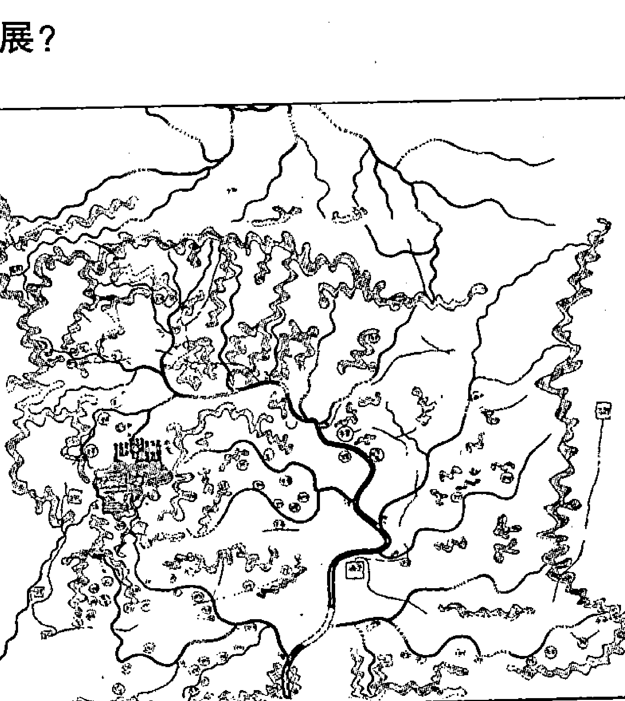

## 022 || 什么是西益宅？

汉代有西益宅的风水禁忌。所谓西益宅，就是向西边增建房屋。关于西益宅，王充的《论衡·四讳》记录有：“俗有大讳四。一曰西益宅。西益宅谓之不祥，不祥必有死亡。相惧以此，故世莫敢西益宅，防禁所从来者远矣。传曰：鲁哀公欲西益宅，史争以为不祥。”当时世俗有四种大的忌讳，而西益宅被排在首位，可见禁忌观念影响之深。

为什么忌讳西益宅？《风俗通义》解释说：“宅不西益。俗说西者为上，上益宅者，妨家长也。”按古代的方位尊卑观念来说，西方是“尊长之位”，在西边增建房屋是对尊长的大不敬，会让尊长受损伤，所以应当禁止。此外，西益宅也被认为是犯了凶神，因为在传统观念中，西方神为太白，其正是凶神。

## 023 || 汉代的人为什么要避太岁？

常言道，“不可在太岁头上动土”。风水中向来有避太岁的说法，而这种禁忌其实在汉代已经盛行。王充的《论衡·难岁》对此也有记述：“移徙法曰：徙抵太岁凶，负太岁亦凶。抵太岁名曰岁下，负太岁名曰岁破，故皆凶也。假令太岁在甲子，天下之人皆不得南北徙，起宅嫁娶亦皆避之。”太岁是中国民间信仰中大名鼎鼎的凶神，与天上的岁星相对应。按风水家的说法，可以根据岁星的位置来推测地上太岁所处及出游之方，并认为在那里要忌修造掘凿，否则会遭殃。

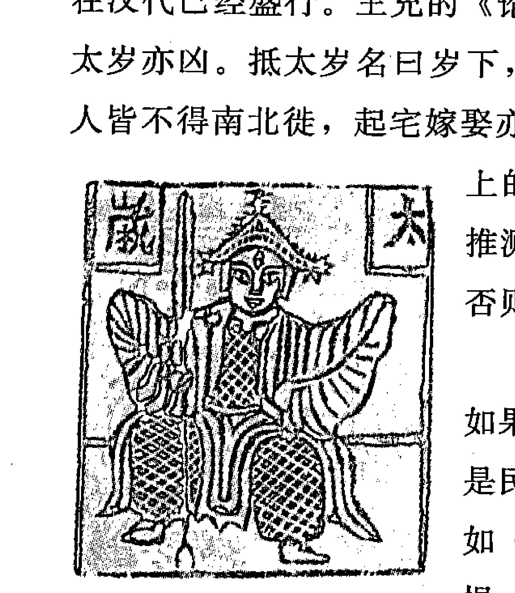

为什么说“太岁头上不能动土”呢？这是因为，古人认为如果在太岁方位兴工动土，就会掘到球样的蠕动的土块，这就是民间常说的太岁土，建宅者应当避忌。汉代之后的很多文献如《酉阳杂俎》也都有太岁主凶的记载，让人对太岁心生恐惧。但现代科学研究发现，太岁土这种奇特的肉团，其实是一种白膜菌类，俗称“肉芝”，本身是没有什么吉凶寓意的。

## 024 || 汉代图宅术对后世风水术有什么影响？

东汉时期出现过两部较重要的与风水有关的术书：一部是《大衍玄基》，编者王景参考不同门类的术数著作，把“家宅禁忌、堪舆日相之属，适于事用者”搜集起来，编汇成一部综合性的术数著作；另一部是《图宅术》，一部专门叙述阳宅风水的著作，并且绘有图形。可惜这两部书都没有流传下来，仅在王充的《论衡》中，我们可以看到《图宅术》残留下的少量佚文。

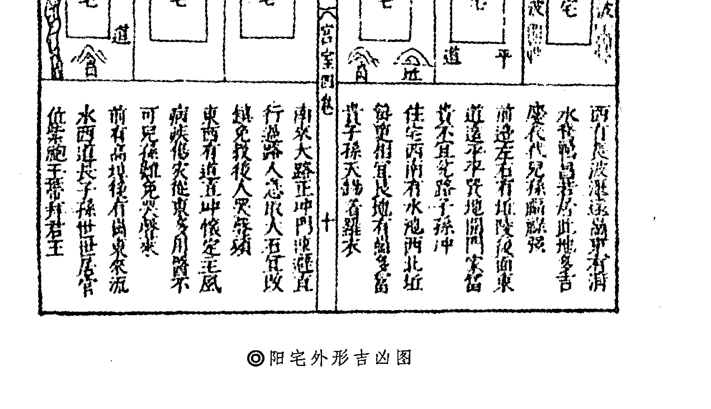

图宅术是汉代除形法之外的一种重要的风水占术。形法相地着眼于大的自然地理形势，而图宅术则以宅舍的方位为占断的重要对象。图宅术的占法据《论衡·诘术》记载：

> 宅有八术，以六甲之名数而第之，第定名立，宫商殊别。宅有五音，姓有五声，宅不宜其姓，姓与宅相贼，则疾病、死亡、犯罪、遇祸。

按以上说法，图宅术将居宅的营建技术分为八种，其一是以干支相纪的办法，按六甲即甲子、甲寅、甲辰、甲午、甲申、甲戌顺序排列次第确定名称，于是得出宫、商、角、徵、羽五音的差别，再与房主姓氏的五音相配，从而得出生克关系。如果房主姓氏与住宅次第的五音相克，房主就会遭到不幸。

按照这个原理，《图宅术》又说“商家门不宜南向，徵家门不宜北向”，即凡是姓氏为商音的人家，家门不宜向南；姓氏为徵音的人家，家门不宜向北。为什么？因为“商金，南方火也；徵火，北方水也。水胜火，火贼金，五行之气不相得”。商音在五行属金，南方在五行属火，按五行生克理论，火克金，不吉利，所以商姓的人家家门不宜南向。徵音在五行属火，北方在五行属水，按五行生克理论，水克火，所以徵姓人家不宜北向。“故五姓之宅，门有宜向。向得其宜，富贵吉多；向失其宜，贫贱衰耗。”

这种图宅术所尊奉的五音姓利说，与汉代盛行的五行生克和谶纬之学有很大关系。这种相宅术的出现，反映了风水术在创立过程中的繁琐化和玄奥化倾向，因此也遭到王充的质疑和批判。比如王充提出了一个反证：匈奴人是没有汉人的姓氏的，那他们的住宅又怎么以此法占断吉凶呢？王充的批判是很有说服力的，不过图宅术的五音五姓占法还是流传下来，对后世风水术产生很大影响，直到唐宋之后才渐渐式微。

## 025 || 汉代六壬式盘的原理是什么？

1977年，安徽阜阳汉汝阴侯墓出土了一件西汉初期的六壬式盘，即汉代栻。到现在，类似的式盘已经发现了数个。

在汉代，六壬术很盛行，这是源于阴阳五行学说的一种占卜术。什么是六壬呢？古人认为，水、火、木、金、土五行之中，以水为首；甲、乙、丙、丁、戊、己、庚、辛、壬、癸十天干中，壬、癸皆属水，壬为阳水，癸为阴水，舍阴取阳，故名为“壬”；在六十甲子中，壬有六个，即壬申、壬午、壬辰、壬寅、壬子、壬戌，故名“六壬”。

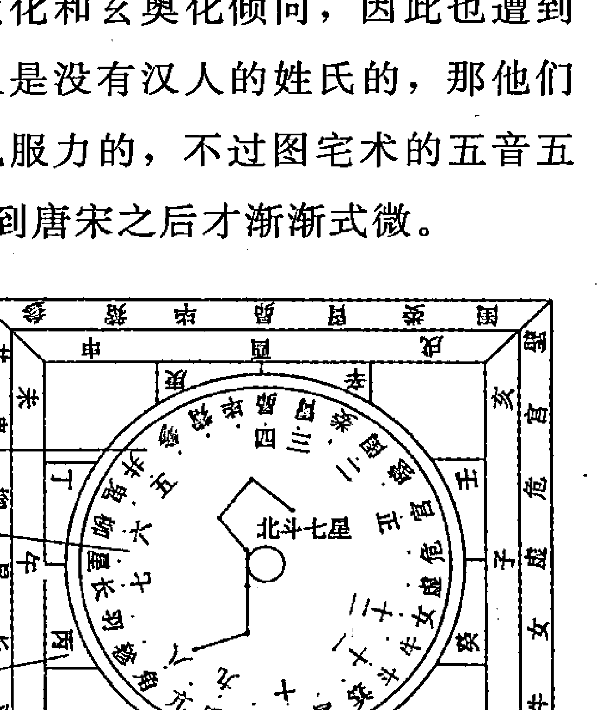

六壬式盘由天盘和地盘组成。天盘呈圆形，置于地盘之上，象征天；地盘呈方形，象征地。天盘中央刻有北斗七星，周围是两层圆圈，内层刻十二月将（正月亥登明、二月戌河魁等），外层刻二十八宿。地盘则分三层，内层刻八干四维（十天干中的八个，以及四维卦象），中层刻十二地支以代表十二辰或十二方位，外层也刻二十八宿。占卜时，转动天盘，使天盘上的月将与地盘上的占时（某时辰）相遇，根据天盘上北斗斗柄所指的方位（即地盘上对应的方位和干支），来判断吉凶。

六壬式盘的原理是基于古代的宇宙模型和阴阳五行学说。它将天象、时间、方位融为一体，通过模拟天道运行来推测人事。这种式盘不仅是占卜工具，也包含了丰富的天文历法知识，反映了汉代“天人感应”的思想。它作为最早的罗盘形式之一，其以中心为原点、分层标示方位和星宿的结构，对后世风水罗盘的创制产生了深远影响。

## 六壬式盘与风水罗盘有什么关系？

子、壬戌，所以叫“六壬”。以六壬为坐标系而推算天时和方位吉凶，即为六壬术。六壬式盘就是当时的人们创造出来供六壬占术使用的工具。

六壬式盘由上下两层同轴叠成。上盘圆形像天，称作天盘；下盘方形法地，称作地盘。天盘正中央是北斗七星，周围有两圈篆文，内圈为十二个数字，代表一年之间的十二个月份，外圈则是二十八宿。地盘四周是三层篆文：内层为八干（壬癸、甲乙、丙丁、庚辛）四维（天、地、人、鬼），中层为十二地支，外层为二十八宿。使用时，转动天盘，以天盘与地盘对位的干支时辰判断吉凶。

> 古人认为，时间和方位存在着一定的对应关系，二者相合则吉，相悖则凶。如《黄帝宅经·凡修宅次第法》说：“正月生气在子、癸，死气在午、丁；二月生气在丑、艮，死气在未、坤；三月生气在寅、甲，死气在申、庚；四月生气在卯、乙，死气在酉、辛；五月生气在辰、巽，死气在戌、乾；六月生气在巳、丙，死气在亥、壬；七月生气在午、丁，死气在子、癸；八月生气在未、坤，死气在丑、艮；九月生气在申、庚，死气在寅、甲；十月生气在酉、辛，死气在卯、乙；十一月生气在戌、乾，死气在辰、巽；十二月生气在亥、壬，死气在巳、丙。”这种时空对应关系，正是汉代六壬式盘的设计原理。

汉代六壬式盘的应用范围很广。《唐六典》卷十四概括为九个方面：“一曰嫁娶，二曰生产，三曰历法，四曰屋宇，五曰禄命，六曰得官，七曰祠祭，八曰发病，九曰殡葬。”举凡一切阴阳之事，都要用到这种占盘。由于也用于判断方位的吉凶，就与风水术发生了联系，像上面所举的“屋宇”、“殡葬”方面，肯定是与风水有关的。

六壬式盘中的地盘为方形盘，虽然没有磁针，不能测定方向，却分层刻画有二十四个吉凶方位。在古代风水典籍《黄帝宅经》中，有以阴阳八卦配干支，分为二十四路，作为建宅的指导原则，正是将六壬式盘应用到相宅中。书中载有阴阳二宅图并有较详细的说明。书中说：“二十四路者，随宅大小中院分四面，作二十四路，十干（应为八干，戊己不用）、十二支、乾、艮、坤、巽，共为二十四路是也。”“二十四路”又称“二十四山”，也就是住宅四面的二十四个方位，其表示法与司南同。

这一特点被风水罗盘直接继承了下来，并演化为圆盘。据《九天玄女青囊海角经》记载：“玄女昼以太阳出没而定方所，夜以子宿分野而定方气，用蚩尤而作指南，是以得分方定位之精微。始有天支方所、地支方气，后作铜盘合局二十四向，天干辅而为天盘，地支分而为地盘。”从中可以知道罗盘的最初型制，就是由天盘和地盘组成，上面主要刻有二十四向。所以大体说来，风水罗盘正是司南与六壬式盘结合的产物。

## （五）三国魏晋南北朝

### 为什么说魏晋时期是风水术的黄金时代？

魏晋时期，社会动荡，战乱频仍。现实的黑暗，使人们都有一种朝不保夕的危机感，觉得人生苦短，命运又不可把握，倒不如切实一点，及时行乐，追逐名利。这些普遍性的心态和观念，加上当时黄道和佛教思想的影响，使包括风水在内的各种术数得以盛行。在相信风水的人们看来，现实中的种种需要，比如改变命运、追求幸福，似乎都可以通过选择居宅、葬址来得到满足，于是风水成为人们精神上的一种重要慰藉，大行于世。

经过秦汉以来的发展，风水术自身也日渐成熟。随着风水的普及，不少文人开始参与这种社会时尚的著书立说，完备的风水理论体系也在这一时期建立起来。据《隋书·经籍志》著录，这一时期出现了大量的风水著作，如《五姓墓图》一卷，《梁有冢书》一卷，《黄帝葬山图》四卷，《五音相墓书》五卷，《五音图墓书》九十一卷等。在这一时期，还出现了两位对后世影响巨大的风水宗师——管辂和郭璞。有关这两人神奇的风水传说在民间流传很广，其中体现出的一些风水观念和原则影响巨大。

### “折臂三公”的传说

魏晋时期，阴宅风水大行其道，蔚然成风。人们深信先人墓葬周围的山川龙脉、河流形势、风向阳光等环境因素，能对葬者家人吉凶祸福产生影响，能够福荫后代。因此，专门的阴宅相士或掌握了择葬之术的高明之士自然受到人们的极大关注，史料中也不乏对他们风水活动的记载。

> 《晋书·羊祜传》记载：“有善相墓者，言祜祖墓所有帝王气，若凿之则无后，祜遂凿之。相者见曰‘犹出折臂三公’，而祜竟坠马折臂，位至公而无子。”有一个方士为羊祜家相祖墓，断言羊祜的祖墓有帝王之气，如果开凿破坏就会遭到断绝子孙的报应。羊祜听了很害怕，担心这些话传到皇帝那里自己不免有灭族的危险，于是就开凿祖坟，以破坏墓地的风水。那位相墓方士看了又说，虽然不能再出帝王了，可是还能出“折臂三公”。后来羊祜果然位列三公，只是一次骑马时摔下来折断手臂，也绝了后裔。这就是风水中“折臂三公”典故的由来。

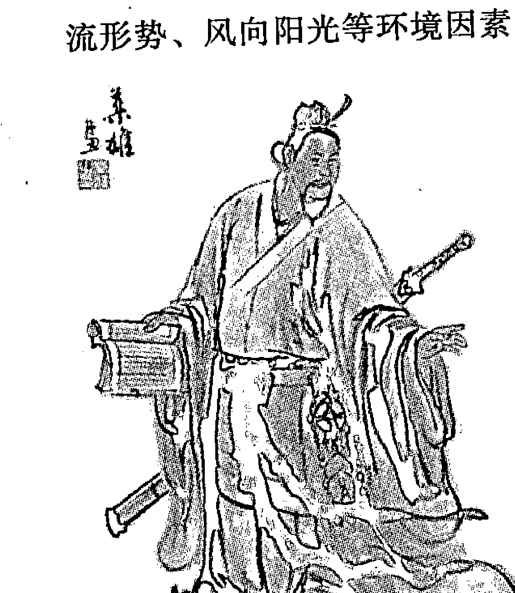

◎ “折臂三公”羊祜，西晋初年著名的军事家

### “牛眠地”的传说

陶侃是东晋一代名将，一生颇具传奇色彩。他早岁孤贫，初为县吏，后举孝廉，官至侍中太尉，封长沙郡公，加都督交、广、宁七州军事，拜大将军，是官运亨通位极人臣的人物。据说这与他先人墓地有好风水有关。

> 据《晋书·周访传》记载：“初，陶侃微时，丁艰，将葬，家中忽失牛而不知所在。遇一老父，谓曰：‘前岗见一牛眠山污中，其地若葬，位极人臣矣。’又指一山云：‘此亦其次，当世出二千石。’言讫不见。侃寻牛得之，因葬其处，以所指别山与访。访父死，葬焉，果为刺史，著称宁益，自访以下，三世为益州四十一年，如其所言云。”大意是说，陶侃还是贫寒布衣的时候，一次家里要办丧事，死者还没下葬，家里的牛却不见了。陶侃出去找，途中遇到一个老人，告诉他牛就睡卧在前面山冈的一处沟中，如果人葬在那里，其后人肯定位极人臣。老人又指着附近的另一座山说，“此亦其次，当世出二千石”，也就是会出享俸二千石的大官。说完老人就不见了。陶侃依照老人的指点找到牛后，葬亲于牛所卧处，还把另一处风水宝地告诉了与他交好的周访。周访父亲死后便葬在那里。后来陶侃果然位极人臣，政绩颇丰；而周访也当上刺史，三代皆为显贵。后世也常以“牛眠地”来作为风水宝地的代称。

### 萧道成的祖墓有什么神奇兆应？

> 《南史·齐本纪》载：“帝旧茔在武进彭山，冈阜相属，数百里不绝，其上常有五色云，又有龙出焉。上（按，指齐高帝）时已贵，宋明帝甚恶之，遣善占墓者高灵文往墓所占相。灵文先给事太祖，还诡答曰：‘不过出方伯耳。’密白太祖曰：‘贵不可言。’明帝意犹不已，遣人践踏，以左道厌之。”

南朝宋明帝刘彧听说自己手下的大将萧道成家祖墓有五色云气，担心这是篡位之兆，便派当时的一位相墓高人前去察看。这位高人却知道萧道成将来必“贵不可言”，和萧悄悄打过招呼后，回来骗明帝说只不过出个大官罢了。明帝还是不放心，派人去践踏破坏，还用上了厌胜之法，可或许是因为仅仅浅表的破坏并不能损其帝王之气，他最终未能阻止萧道成灭宋建齐，当上皇帝。这一史料反映出当时风水术影响之大，甚至已涉及政权的更替斗争。

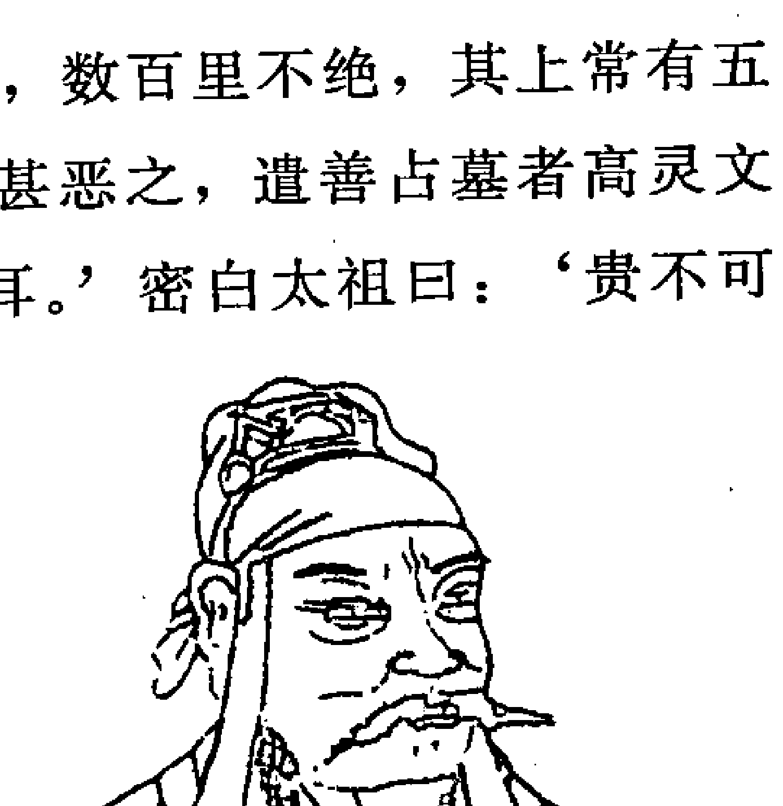

### 梁武帝凿鸟山是怎么回事？

南朝的梁武帝时，民间曾流传有“鸟山出天子”的童谣。为了这个童谣，佞佛迷信的梁武帝决定凿平天下鸟山，以保梁朝社稷平安。于是他派了大批人马四出，只要遇上用鸟来命名的山峦，就都毫不留情地凿断地脉，破坏风水，所以当时江南一带各种名称的鸟山，没有一处是完好的。可是百密一疏，长兴县的雉山却漏网了。这是因为“雉”虽是鸟，却以音异而得以幸免。后来陈霸先取代梁朝称帝建立陈朝，为陈武帝，他的祖坟正是筑在这漏网的雉山之上的，这些竟然应了童谣的说法。

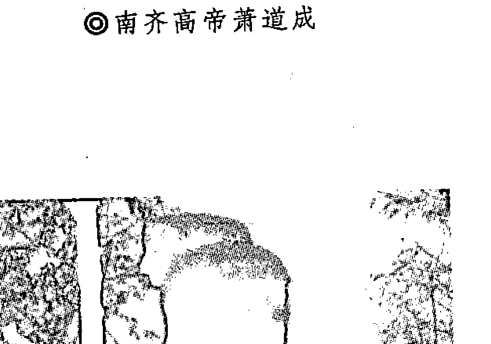

### 为什么说萧统因风水而英年早逝？

萧统（501—531）世称昭明太子，是梁武帝萧衍的长子，他是一位才华横溢的人物，曾经主持编辑了我国古代第一部文学作品选集《文选》，对后世有较大影响。他帮着父亲处理朝政，公允明断、体恤下情，在朝野极有威望。可惜的是，尽管他在两岁时就被立为太子，但还没来得及即位就因病英年早逝，死的时候也才三十岁。

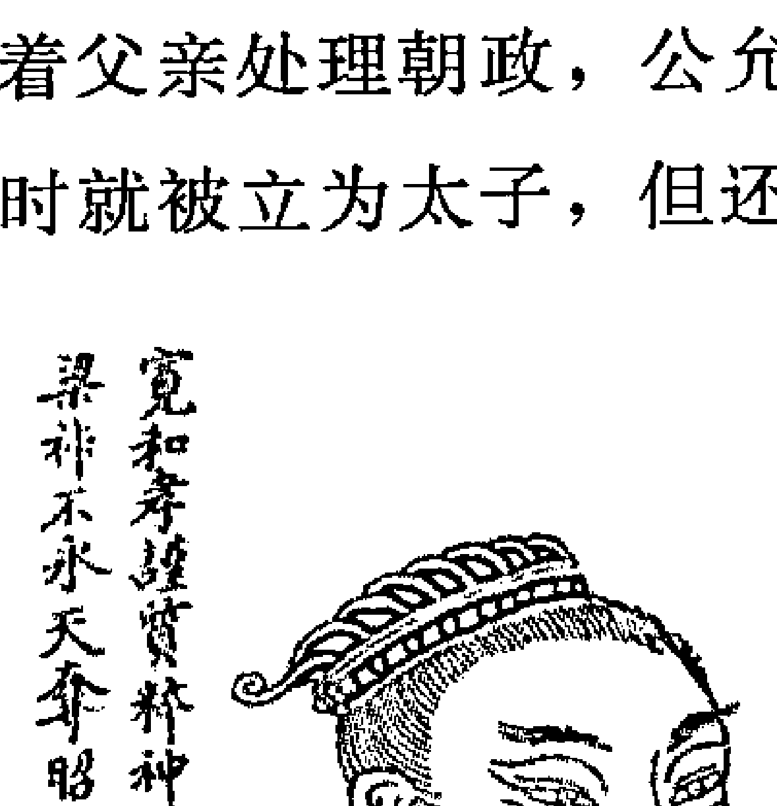

根据史书记载，萧统的英年早逝与一次风水事件有很大关系。

> 据《南史》载：“初，丁贵嫔薨，太子遣人求得善墓地，将斩草，有卖地者因阉人俞三副求市，若得三百万，许以百万与之。三副密启武帝，言太子所得地不如今所得地于帝吉，帝末年多忌，便命市之。葬毕，有道士善图墓，云：‘地不利长子，若厌伏或可申延。’乃为蜡鹅及诸物埋墓侧长子位。有宫监鲍邈之、魏雅者，二人初并为太子所爱，邈之晚见疎于雅，密启武帝云：‘雅为太子厌祷。’帝密遣检掘，果得鹅等物。大惊，将穷其事。徐勉固谏得止，于是唯诛道士，由是太子迄终以此惭慨，故其嗣不立。”

此段大意是说，萧统的生母丁贵嫔去世，他为了安葬母亲，就派人寻找一块风水宝地作为墓地。这时有人想把自己的一块土地高价卖给宫中，就贿赂宦官俞三副帮忙。俞三副遂启奏梁武帝，说太子所买来的地没有自己买的这块地对皇上吉利。梁武帝听信了花言巧语，就买下了那块地，安葬了丁贵嫔。这时有个会看风水的道士对萧统说：“丁贵嫔的墓地对长子不利，如果厌伏之法镇一镇，有可能延长太子的生命。”于是就做了些蜡鹅连同其他一些东西埋在了墓地旁边的长子位上。谁知太子身边有一个失宠的小人，他向武帝告了密。武帝派人挖出那些蜡鹅等物后，他以为这些都是冲着自己来的，十分震怒，打算彻查此事，后来被大臣劝止，事端才没有扩大，只是把那位道士给杀了。当事人萧统蒙受不白之冤，又没法向父皇说明真相，因此甚为羞愧愤郁，以致抑郁成疾，而立之年就辞世了。

### 嵇康与阮侃围绕风水展开的一场笔仗

魏晋时期的士族文人中盛行所谓“清谈”之风，内容不涉政治等“俗务”，只谈老庄等人生哲学和玄学。在玄学思潮的推动下，风水术也成了讨论对象。当时著名的“竹林七贤”的领袖人物嵇康与其友阮侃曾就住宅到底有没有吉凶的问题进行了争议。

阮侃是晋代的一位医家，他是不相信风水的，于是写了《宅无吉凶摄生论》，说人的福祸寿夭都是天命决定的，现在却扯到宅子的选择上，岂不荒谬？针对阮侃的观点，嵇康写《难宅无吉凶摄生论》以问难，力主宅有吉凶之分，人当信天道所存，顺之则昌；同时提出应该修德积福，以成宅之吉，避凶免祸。

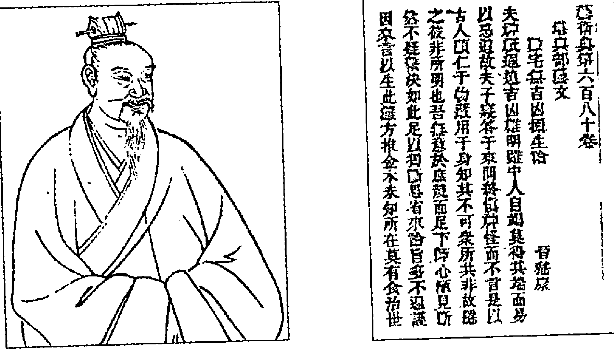

随后，阮侃又有《释难宅无吉凶摄生论》，嵇康为此又作《答释难宅无吉凶摄生论》。两人你来我往，最后嵇康胜出。嵇康的胜利，说明风水术已经得到当时主流文人在观念上的认可和支持。

### 南北朝时期的山水观念与风水学有什么关系？

东晋的建立，使汉人的政治经济中心向南转移。而南方山脉丘陵逶迤，河川沟壑纵横，地形地物远比一马平川的中原故地复杂，从而孕育出自觉的山水审美观念，为风水地理文化的发展提供了厚实的土壤。于是，南北朝时期逐渐兴起的山水自然审美情趣，与风水术相互渗透、相互生发、相互影响。

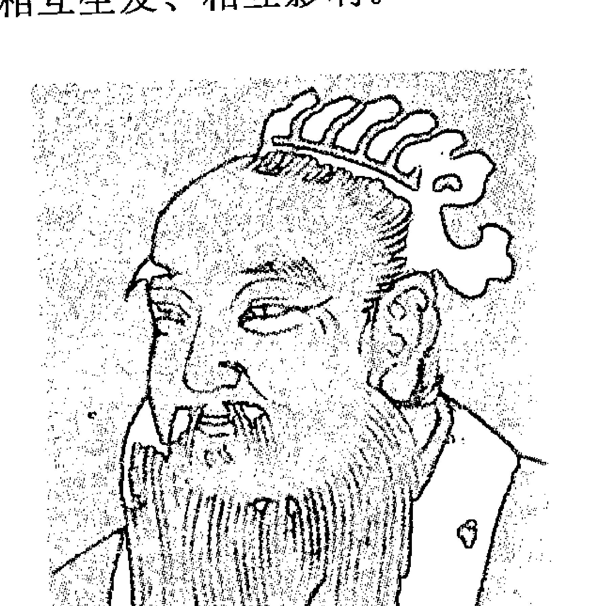

在我国古代艺术史上，这一时期也是山水诗、山水画兴起的重要时期。风水术在长期实践中总结出的对自然山水的处理技巧，可以说是合乎那些画家文士的审美情趣的，为他们所青睐和借鉴。山水诗的开山宗师谢灵运有这样的诗句：“洒泪眺连岗。”（《庐陵王墓下诗》）其中的“连岗”，依唐代李善述此句文“青鸟子《相冢书》曰：天子葬高岗，诸侯葬连岗”，显然是出自阴宅风水观念。

## （六）隋唐宋

### 大兴城的兴造与杨坚的一个梦

史料记载，隋朝开国皇帝杨坚开皇二年（582）开始谋建新都。当时的长安城自汉修建以来年代已久，排水不畅，生活用水污染，水碱太重，而且有被北边的渭河淹没的危险。据《隋唐嘉话》记载，杨坚有一晚梦到都城被水淹没，就下定决心建新都，这就是历史上有名的大兴城的营建。

杨坚从一开始就强调要“以吉凶之土，制长短之命”。经过一番严格的勘察之后，新城地址选在了汉长安城东南二十里的龙首原之南。那里极目远眺，近可闻渭水声响，远可见终南山背影。负责工程设计建造的是左庶子宇文恺。《唐会要》提到他按照《易经》八卦之说，选择龙首原之南坡兴建宫城。南坡有六座冈阜，人称六坡。宇文恺视之为乾卦六爻，并按九一至九六的六爻爻序来设计、布局和建筑宫城、皇城、郭城。城建好之后，为了避免泄掉帝王之气，杨坚还下令宫、皇城之南的居民里坊，取消南北门而仅开东西门。

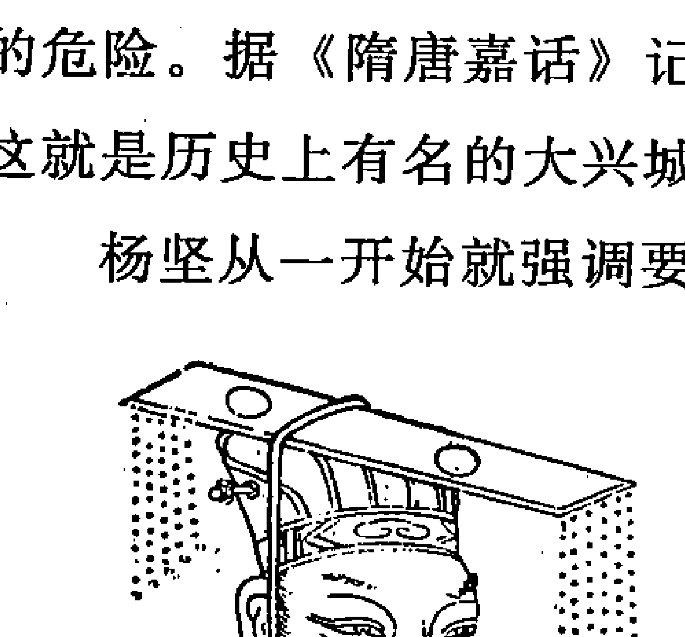

大兴城的营建过程，清晰地体现了风水术在当时建筑活动中的重要作用。

### 吕才对风水术书的整理刊正有何贡献？

隋唐时期，风水类著作尤其是择葬术书大量流传，有泛滥之势。除萧吉的《宅经》、《葬经》等见载于正史的书籍外，还有江湖术士胡编乱造的大量劣作，一时良莠庞杂。于是，唐太宗令吕才主持整理历代包括葬书在内的各类术数著作。

吕才（606—665），山东博州清平（今山东夏津西）人。他出身寒微，自学成才，学术颇受魏征、王珪等唐初名臣的赞赏。唐太宗时，吕才曾治直弘文馆，累迁太常丞，转太子司更大夫。据《旧唐书·吕才传》记载，吕才于唐太宗贞观十五年（641年）奉命刊正历代术书，历时15年，“勒成五十三卷，并旧书四十七卷”。他的整理原则是“以典故质正其理”，即以古今史实为依据，批判整理当时流行的各种术数观点，比如对五音姓利说的批判等。这种实事求是的态度遭到了术士们的反对，但颇合经义，起到了正本清源、重整教纲的作用。

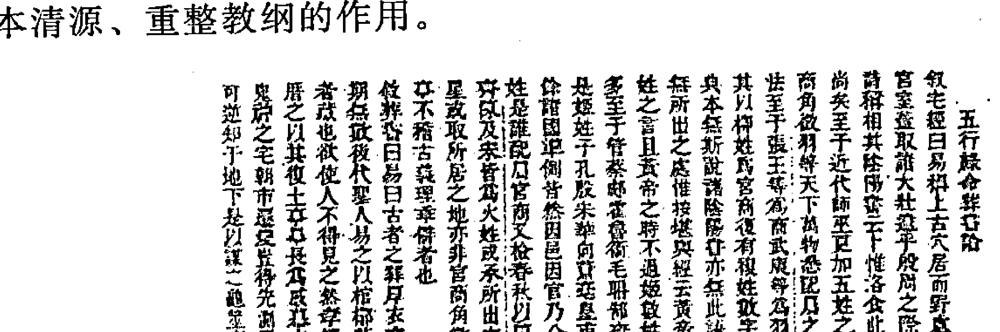

### 长孙无忌等为唐高宗寻陵经历了什么风波？

关于乾陵的选址，有这样一个传说：唐高宗登基不久，就派舅父长孙无忌和专管天文历法的太史令李淳风为自己选择陵寝之地。经过勘察巡视，两人选中了梁山，认为梁山东隔乌水与九嵕山相望，西有漆水与娄敬山、岐山相连，乌、漆二水在山前相合抱，形成水垣，围住地中龙气，真是难得的万年吉壤。

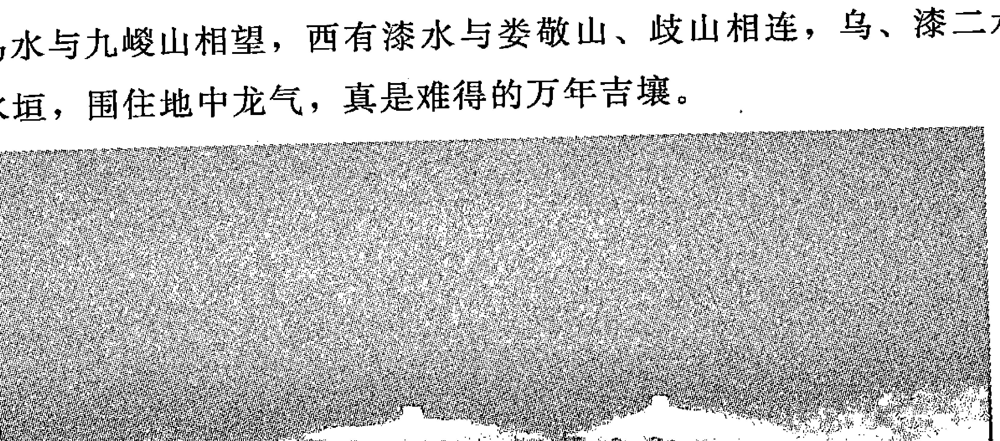

长孙无忌和李淳风选好陵址后，回京禀报高宗。袁天罡听说后，极力反对。原来他曾为高祖选陵址到过梁山，深知此山风水的优劣之处。他告诉高宗说，梁山其实有许多不足之处：一是与太宗龙脉隔断，恐三代后江山有危。因为大唐龙脉从昆仑山分出一支过黄河，入关中，以岐山为首向东蔓延至九嵕山、金粟山、嵯峨山、尧山。今太宗既然已葬九嵕山，为龙首，那么高宗切不可以后居前。何况梁山又非龙首，而是周代龙脉之尾，尾气必衰，主高宗治国无力。二是梁山北峰居高，前有两峰似女乳状，整个山形远观就像少妇平躺一般。高宗选陵于此，恐从此后为女人所控。三是梁山主峰直秀，属木格，南二峰圆利，属金格。三座山峰虽挺拔，但远看方平，为土相。金能克木，土能生金，整座山形龙气助金，地宫营主峰之下，主高宗必为金格之人所控。如果把陵址定于此山，日后必为女人所伤！

可是，袁天罡并没得到高宗的采纳，最后还是定梁山为陵址。袁天罡知道皇帝的成命再难收回，当时就长叹“代唐者，必武昭仪”，此后果然应验。

### 武则天葬乾陵——唐王朝盛极而衰的先兆？

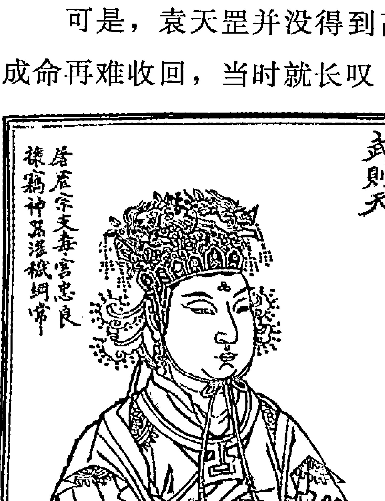

《唐书·严善思传》记载：武则天驾崩后，朝廷准备将她合葬到唐高宗的乾陵里。时任给事中的严善思认为，皇帝为尊，皇后为卑；尊者既然已经先葬了，卑者是不可以后进的。而且，乾陵的元阙石门是用铁水浇铸的，不用攻凿难以打开，一旦攻凿又会惊动神道。从其它方向掘隧进入墓室，也会改变当初下葬时的神位，更加有害。从古制来看，帝后合葬也是不合规矩的，如像实行帝后合葬的魏晋两朝都成了短命的王朝。综合以上理由，为了国运长久，另选一处葬地为宜。但严善思的建议并没有得到采纳，以后唐代盛极而衰，也可以说应验了他当初的预言。

### 中国风水是在什么时候传入日本的？

公元7世纪左右，日本的遣唐使开始大师输入中国文化，一般认为风水学传到日本也是在这个时候。据史料记载，日本7—8世纪的几次都城建设中，都是在“地相师”勘定指导下兴建的，如天武天皇681年的畿内都城的建造、元明天皇710年的平城京的建造等等。也有一种观点，认为中国风水是在公元7世纪左右经由朝鲜而传入日本的。

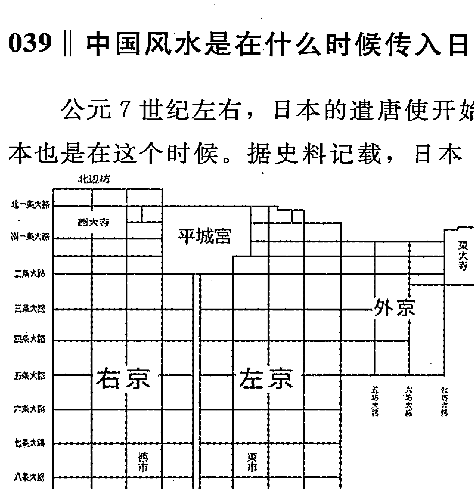

日本平安时代宇多天皇宽平年间（889—898），藤原佐世编成的《日本见在书目录》在著录来自中国的道教经典时，就列有《青乌子》《玄女经》等中国风水著作，这说明中国早期风水著作是与道教经典一起传人日本的。

### 中国风水与日本的家相学有什么关系？

中国风水分为阳宅风水和阴宅风水两个方面。相比较而言，在古代中国，人们更为重视阴宅风水，如“风水”一词即来源于阴宅风水的经典文献《葬书》。

相应地，中国风水在传人日本也分为家相和墓相两个部分。家相相当于阳宅风水，墓相相当于阴宅风水。日本最重要的风水著作《相家》一书，即被认为是在中国《宅经》的基础上写成的。但日本人对家相学的重视更甚于墓相学，他们更为关注居住宅地的吉凶。对此日本学者渡边欣雄解释说，“从祖先传下来的父系的密切关系并不是很重要”，“更重要的是以现在居住的宅地为特征的门第（血统）。所以，重要的不是判断直系祖先墓地的墓相，而是判断宅第的家相”。

日本的家相学也并不完全等同于中国的阳宅风水。日本家相学内容广泛，除讲究方位吉凶外，还重视出门起程的时间和方位的吉凶。此外，日本家相的方位观念与中国也有所出入。中国风水的方位观念是以坐北朝南的南北轴线为基础的，即所谓的子山午向，坐坎朝离。而日本家相学中的方位判断轴线却是坐艮朝坤的。

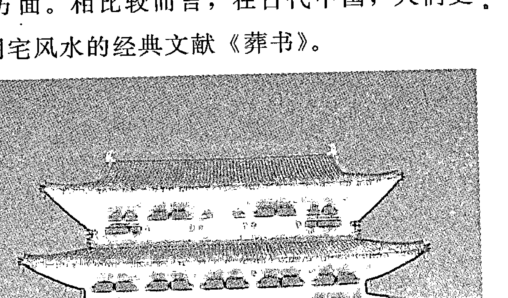

### 五音姓利说对宋代风水有什么影响？

宋代皇帝建陵墓时，必定会依据阴宅风水的术法选址。当时仍然流行五音姓利相墓之法。在宋仁宗敕王洙编纂《地理新书》并定为官书前，当时皇家术士所用的就是这种风水术法。

按照五音相墓法，宋代皇帝姓赵，在五音中属角声，当在南偏东、北偏西的轴向定址为宜。如《宋会要辑稿》中对宋真宗的葬礼记述云：“按经书，壬、丙二方皆为吉地。”对宋代皇陵所体现出来的风水原则，赵彦卫《云麓漫钞》中也有详细记载：“永安诸陵，皆东南地弯，西北地垂；东南有山，西北无山，角音所利如此。

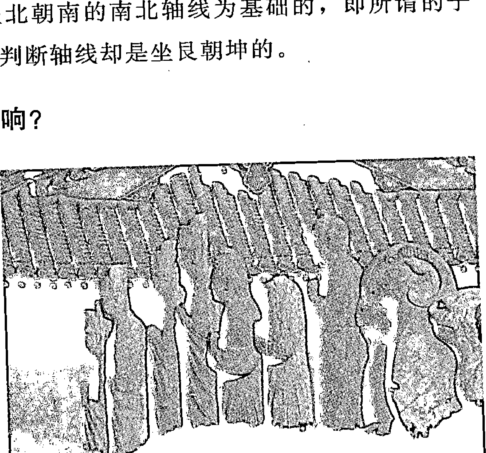

七陵皆在嵩山之北，洛水之南，虽有冈阜，不甚高，互为形势。自永安县西坡上观安、昌、熙三陵在平川，柏林如织，万安山来朝，遥揖嵩山。三陵柏林相接，地平如掌，计一百十三顷，方二十里云。今绍兴攒宫朝向，正与永安诸陵相似，盖取其协于音利……”

五音姓利说经过王充、吕才等历代有识之士的批判，虽在宋代一度回光返照，但以后就渐渐衰落了。

## 042 || 宋代理学先驱陈抟与风水有什么渊源关系？

宋代理学的早期传承，可追溯到宋初一位名叫陈抟的道士那里。而在风水术的传承中，陈抟同样有着重要地位。《四库全书总目提要》提到：“文辿因得筠松之术，后传于陈抟，是书即其所授师说也。”

陈抟的风水术传人有吴景鸾。据《江西通志》记载，吴景鸾的祖父吴法旺“志天文地理之学”，送儿子吴克诚跟从华山道士陈抟受业。一天，陈抟把所有的风水术书都送给吴克诚并让他回去，还告诉他说：“汝子仙才，能绍业。”后来吴克诚之子吴景鸾果然如陈抟所料，成为当时享有盛名的风水大师。此外，陈抟不仅传授《先天图》及易学思想给种放，而且为其先人卜葬地，预言种氏族人名将辈出。相传他还撰有《玉尺经》四卷，收入元代刘秉忠所编《地理大全》。所有这些，都说明陈抟与宋代风水确实有着极深的渊源关系。

## 043 || 宋代理学家是怎么看待风水的？

宋代许多理学大家如朱熹、程颐等，都很相信风水。

程颐（1033—1107）字正叔，人称伊川先生。他与其胞兄程颢共创“洛学”，为理学奠定了基础。他在《葬说》中认为：“地之美者，则其神灵安，其子孙盛，若培壅其根而枝叶茂，理固然矣。地之恶者，则反是。……父子祖孙同气，彼安则此安，彼危则此危，亦其理也。”这种观点与历来葬地荫应的风水观念是一致的。

而朱熹对风水的信奉要比程颐更胜一筹。朱熹本身就成长于风水气氛浓厚的江西。在江西，风水之术“往往人能道之”，也给了他深刻影响。他为了安葬父母，而苦苦寻找风水宝地的传说，在民间流传甚广，这说明他确实是笃信风水的。

宋代理学为阴宅风水理论提供了一套圆通的解释。如宋代的气论思想认为，万事万物都生于五行二气，鬼魂亦不例外。如朱熹说过：“鬼神只是气，屈伸往来者，气也。天地间无非气，人之气与天地之气常相接。无间断，人自不见。人心才动，必达于气，便与这屈伸往来者相感通。如卜筮之类，皆是心自有此物，只说你心上事，才动必应也。”就是说，人死了以后，其气依然存在，而且与生者之气相感应，相互影响。这其实和“乘生气”的风水观念是一脉相通的。

## 044 | 为什么说朱熹也是一个精通风水的人？

朱熹（1130—1200）是宋朝理学的集大成者，是我国历史上影响深远的一代大儒。朱熹不仅相信风水，他和宋代风水大家蔡元定（蔡季通）有师生之谊，曾得到后者的传授，所以也可以说精通风水术。

据《宋史·朱熹传》记载，当时围绕着为孝宗选择山陵的事情，朝官们论战不休，日官荆大声卜地于思陵旁边，而按察使赵彦逾踏勘后认为那里“土肉浅薄，下有水石”，风水不好，后又有孙逢吉奏请重择吉址。刚刚在朝供职的朱熹加入到混乱之中，要求“博访名山，不宜偏信台史，委之水泉沙砾之中”，另择最吉之处，以“使寿皇遗体得安于内，而宗社生灵皆蒙福于外矣”，将皇陵地址的选择与国势的盛衰联系起来。这就是有名的《孝宗山陵议状》，是朱熹身为朝官的第一个奏状。朱熹敢于上书就皇陵择葬之事说明自己的意见，可见他对自己的风水造诣是很有自信的。

朱熹对于风水有一些精辟的看法。如他并不反对当时择皇陵所持的五音姓利之说，但又进一步指出：要按这种原则选择“坐丙向壬之穴”（即坐南向北之穴），应该有个前提，即在大环境的选址上，依照“主势之强弱，风气之聚散，水土之浅深，穴道之偏正，力量之全否”这五个准则选定“形胜之地”。他所持的显然是宋代渐成气候的形势派理论。朱熹还建议在江西、福建这一带选择精神相地之术的专家去为皇室择地，反映了他对当时兴起的理气派和形势派的支持。

朱熹还曾经分析过北京（即当时金朝燕京）的山川形势，赞叹说“冀都是正天地中间，好个大风水”，他的观点影响了后世元明清王朝的择都观念。

## 045 || 指南针的发明对风水有什么重要意义？

随着科技的发展，以及军事、生产和风水活动的需要，宋代出现了一种比司南更准确、更方便的指向仪器——指南针。指南针的出现推动了风水罗盘的发明，从而使风水术有了推演方位、立极定向的基本工具。

根据沈括《梦溪笔谈》“方家以磁石磨针锋，则能指南”的记载可知，北宋时期，人们已经知道用天然磁石摩擦钢针，从而使钢针磁化。不仅如此，沈括还记载，磁针在指南时经常会微微偏向东方，这说明宋代人已经凭借指南针发现了地磁偏角。

《梦溪笔谈》还记载了四种装置磁针的方法：（1）水浮法：在磁针上穿几根灯心草，浮在水面，指示方向；（2）碗唇旋定法：将磁针搁在碗口边缘，磁针可以旋转，指示方向；（3）指甲旋定法：将磁针置于指甲之上，由于指甲面光滑，磁针可以旋转自如，从而指示方向；（4）缕悬法：在磁针中部涂一些蜡，粘一根蚕丝，挂在没有风的地方，从而指示方向。

最初使用的浮针，并没有固定的方位盘。当浮针与方位盘结合起来之后，就出现了水罗盘。最早出现的是一种水罗盘。水罗盘就是把磁针放在一个中间凹陷处盛水、边上标明方向的盘子里，磁针浮在水面上能够自由旋转，静止后两端分别指向南北。南宋时期，这种带有方位盘的指南针就已经用于航海了。除了水罗盘外，还有一种常用的罗盘——旱罗盘。旱罗盘是用一根尖的支轴支在磁针的重心处，尽量减少支点的摩擦力，使磁针在支柱上自由灵活地转动以正确地指向南方。

以后出现的风水罗盘要比作为指南工具的罗盘复杂得多，可是从制作工艺和操作原理来说，其生成的基础仍是指南针。

## （七）明清

### 046 || 李自成与崇祯的风水之战

据《朱元璋系年要目》介绍，明朝开国皇帝朱元璋祖居江苏省句容县通德乡朱家巷。元朝初期，为了逃避官府的苦役，朱元璋的祖父朱初一就携带全家老小，逃到泗州、盱眙一带，居住在古泗州城北13里的孙家岗。1368年，朱元璋在南京建立明朝，朱初一被尊为皇帝，庙号熙祖，谥号裕皇帝。1386年，朱元璋命皇太子朱标，带领文武群臣和工匠，到泗州城北杨家墩，开始修建祖陵。以后陆续增修，经过28年，耗费大量资金，到永乐十一年（1413年）才把他的高祖、曾祖、祖父三代的陵墓全部修建成功。至此，杨家墩改称明祖陵。到了明朝末年，李自成率农民起义军攻破此处后，为了破坏明朝的龙脉，将明祖陵破坏得一塌糊涂。

但李自成在破坏朱氏龙脉的时候，却不能保全自家祖坟的周全。为了打击李自成起义军，崇祯十五年（1642年）正月初八，接到崇祯皇帝密旨的陕西总督汪乔年，命延安府米脂县县令边大绥等人进山寻找李自成的祖、父的墓地，并进行了破坏。

后来，李自成率领农民起义军攻破北京城，逼死了崇祯皇帝，建立了大顺政权，但不久就在吴三桂和满清军队的联合夹击下败亡了。传说中，正是因为李自成和崇祯皇帝互断了对方的龙脉，才造成了这一两败俱伤的结局。

### 047 || 为什么说明清时期风水家的社会地位不高？

风水学在明清两代广泛流行，一般文人雅士或多或少都懂得一点择地相宅方面的知识，更有一些落第文人在举业无望后转作风水先生，无形中提升了这一行当的整体知识水平。在当时所谓的三教九流中，有俗谣说“一流举子二流医，三流丹青四地理，五星六爻，七僧八道九行棋”，风水术士（地理）仅次于读书人、医家和画师，足可见其社会地位之高，也体现了民间对风水的重视。

# 一本书弄懂风水

## 048 | 明清时期风水学研究的兴盛

明清以前，已有大量风水著作传世，经过形势派与理气派的长期实践，风水理论也已经基本定型。这一时期的风水学主要是对已有的著作进行整理，并进一步总结实践，因此，研究和注释风水文献的风气大兴，特别在清代乾嘉学派的影响下，考据之风盛行，更推动了风水学研究的发展。许多以“辟谬”“校补”“笺注”命名的著作在这一时期大量涌现，如明代谢廷柱的《堪舆管见》、杨明勋的《疑龙经校补》、梅漪老人的《阳宅辟谬》等等。

另外，由于《四库全书总目提要》几乎对每一篇文献都有一番考证研究，历代较为流行的风水著作如《葬书》、《黄帝宅经》、《玉尺经》等书的作者和成书年代等，均有了较为详细和严谨的考证，为后世研究风水著作提供了重要参考。

## 049 | 为什么说明清是风水学的集大成时期？

明清时期，前代的风水著作都得到了系统的收集和整理。如官方组织编纂的《永乐大典》、《四库全书》《古今图书集成》等大型丛书，几乎收集了前代所有的风水著作。而在民间，一些风水结集也开始出现，一般冠以“大成”“大全”之类的名称，影响力较大的有王君荣的《阳宅十书》、无名氏的《阳宅大全》、李国木的《地理大全》、叶九升的《地理大成》等。这种编纂和积累风水著作的风气，为后世保存了大量的宝贵文献。

◎《阳宅十书》书影

清代的《四库全书》收录有《宅经》二卷、《葬书》一卷、《撼龙经》一卷、《疑龙经》一卷等，虽数量不多，但考辨精审。尤其《四库全书总目提要》利用目录学成果对其收录的风水书籍进行了精审的考辨，提出的看法极有见地，至今没有著作能超越。

而《古今图书集成》将收录的范围扩大到有关风水的史实、传说、人物及有关风水的论述等，分别编录在堪舆部总论、堪舆部名流列传、艺文、纪事、杂录内，是其一大特色。

### 050 || 慈禧与光绪斗风水

光绪帝的父亲奕譞是道光皇帝的第七个儿子，被封为醇亲王。他的陵墓位于海淀区北安河乡妙高峰东麓，墓址原为明法云寺旧址。奕譞看中了这个地方，在这儿建造了自己的陵墓。人们习惯上称奕譞之墓为“七王坟”。醇亲王墓道前有一棵至少百年的枝繁叶茂的银杏（别名叫白果树），在奕譞死后多年，为光绪皇帝惹来了麻烦。

当时光绪皇帝日益年长，与慈禧之间的权力角逐日趋激烈。据《德宗遗事》（德宗是光绪帝的庙号）记载：“醇亲王墓道前，有银杏树一株，其树八九合抱，高数十丈，盖百年之物。英年诣事太后，谓皇家风水，全被此枝占去，请伐之以利本枝。太后大喜，然未敢轻动，因奏闻于德宗，德宗大怒，并传谕曰：尔等谁敢伐此树者，请先砍我头。乃又求太后，太后坚执益烈，相持月余。一日，上退朝，闻内侍言，太后于黎明带内务府人往七王园寝矣。上急命驾出城，奔至红山口，于舆中号啕大哭，因往时到此，即遥见亭亭如盖之白果树，今却不见。连哭二十里。至园，太后已去，树身倒卧。数百人方斫其根，虑其复生萌叶也。诸臣奏云，太后亲执斧先砍三下，始令诸人伐之，故不敢违也。上无语，步行绕墓三匝，顿足拭泪而归，此光绪二十三年事也。”此事在当时引起了轰动，也反映了风水在当时政治生活中的地位。

# 第一章 风水的来龙去脉

◎醇亲王奕譞之陵墓“七王坟”

# 一本书弄懂风水

### 051 || 西方人什么时候真正接触到中国风水？

西方人真正接触中国风水，开始于传教士来华之时。1582 年从意大利来华的天主教耶稣会士利玛窦，在其著名的《利玛窦中国札记》中，就曾记述了中国人按风水行事的一些见闻，但由于其固有的宗教立场，他把中国风水视为迷信，予以了否定，说：“看风水，对西方人来说是很新奇的。风水师认为风水能决定一家人的健康、财运、功名成就，及一地祸福，真是愚昧极了。”这其中带有很多的误解和偏见。

到了 19 世纪，一些西方学者开始从近代科学的角度对中国风水加以研究，并得出客观公允的结论。如英国基督教传教士伊特尔 1873 年初版的《风水：古代中国神圣的景观科学》，系统分析了中国传统风水理论，并把它介绍给西方读者。他对风水给予了一定的肯定，写道：“在我看来，风水无论如何是自然科学的另一种名称。”“风水理论包含着显著的美学成分和深刻的哲理，中国传统建筑同自然环境完美和谐地有机结合而美不胜收，皆可据此得到说明。”

## （八）近代以来

### 052 || 为什么说香港是一块风水的沃土？

一直以来，风水是香港人日常生活的一部分，很多时候甚至成了人们下决定的一个托付关键。不少香港人置业之时，除了考虑价钱及地区之外，也会考虑房子是不是有好风水。在这方面，许多香港富豪比普通老百姓更迷信风水，每当做生意、买卖股票，以至设计家宅，风水师的意见都举足轻重。

据香港媒体报道，香港不少富豪如长江实业集团主席李嘉诚就经常聘用不同的风水师，就不同项目给予意见，如聘用蔡伯励看墓地等。又如恒基主席李兆基，则笃信道教。不光是年老一辈的富豪相信风水，像李泽楷这样的年轻富豪也一样相信。凡有重大生意，找风水师择日选吉时，不在话下。甚至相约生意朋友吃饭，李泽楷也一样要择日择时。据了解，香港富豪每做成一笔生意，有份出力的风水师就可以获几十万港元红包；有风水师病危时，富豪更会以飞机接载治疗，交通费等一切开支均由富豪支付。

近些年，香港历经了亚洲金融风暴、非典等种种风浪，命运的无常和难以把握，使得不少港人转而求助超现实的力量，风水师行当也由此风生水起。近年来，香港风水行业的发展更开始趋于大众化，不再局限于家传或师徒相授。随着互联网的普及，网上有关于风水的网站更是如雨后春笋，纷纷冒出。开班授徒的香港著名玄学家苏民峰表示，他现在每年开一个风水班，名额 20 名，每位学费高达 15000 港元。尽管收费不菲，仍吸引大批市民报读而竞争激烈。风水甚至进入了堂堂的大学校园。如香港大学校外进修课程和工联会等就有风水在内。在大学风水班任教的风水师柏天心说，他现在的学生当中大约有 5% 最终会成为执业风水师，这种风气起码会再持续十多年。

©香港风水大师苏民峰办的风水班颇受欢迎

香港的风水师也开始冲出国门。据了解，韩国政府数年前在迁都选址时，寻求了 400 名国内风水学家的意见，当中香港风水专家在内的一个风水顾问团，就应韩国政府国情咨询机构之一的大东风水地理学会邀请，前往勘察行政首都选址之一的公州郡，并将有关意见交韩国政府。该风水顾问团一行六人，包括香港风水专家麦荣耀。麦表示，顾问团总结迁都选址的风水地理，结论呈交韩国政府参考。

### 053 || 为什么说香港迪斯尼乐园也相信风水？

在香港的外国企业商行，在长期耳濡目染下，也对中国文化传统之一的风水有着浓厚的兴趣。许多外国大企业在香港开张动土，往往也要找风水师趋吉避凶、摆位挡煞。在 2005 年 9 月启用的香港迪斯尼乐园就是一个典型的例子。这家来自美国的公司，多处布局就是刻意根据风水而设计的，包括把公园入口大门改为斜线排列、迪斯尼站通往人口及码头的行人路亦改为微弯，以确保乐园启用后能够聚集乐园内的财气，不至流入大海。位于乐园旁边的两家迪斯尼酒店也不例外。据香港迪斯尼高层透露，为了确保正能量可以流动，酒店内的餐厅及酒廊到处都可以见到以水为设计主题的装饰，例如水墙及水池等。

◎迪斯尼乐园在香港也“入乡随俗”，遵照风水原则来进行设计

此外，迪斯尼还按香港的风俗，尽量避免用“四（死）”字，两家酒店都没有四楼，其中好莱坞酒店每层房间的编号，也都以吉利的“628”开始，尽量避开“四”字。香港迪斯尼乐园酒店内的大礼堂，面积大小也很有“中国味”，总面积为888平方米，寓意“发发发”，而中菜厅“晶荷轩”内，也设有2238（即粤语“易易生发”的谐音）个水晶荷花。

### 054 || 香港中银大厦经历了哪些风水风波？

◎香港中银大厦

中银大厦从1985年开始破土动工，1989年落成，1990年5月17日正式启用。这座当时香港最高的大厦，全座由最简单的线条所组成，大厦最底的十多层是近乎正方形的。往上向外的一面，向上斜斜延伸，另两边则向中央收窄，与向上斜伸的一面会合。再十多层高后，原来向内收窄的两翼，均向上斜斜收窄，因而使最上的十多层回复一个较小的正方形的建筑形式。而后再上就是几层高的双柱形的具有装饰、通讯、避雷多重作用的长杆形建筑。从整体上看，中银大厦高达351米，总共有70层，线条简单明了，颇具现代感，因而成为香港的新标志。

香港中银大厦由世界著名的华裔建筑师贝聿铭设计，虽然他在设计之初便考虑了风水问题，可还是遇到一些麻烦。在看过设计图纸后，银行方面曾给贝聿铭发来电报，对建筑正面展现的众多加了框的巨型“X”形钢架深表关注。因为在中国，“X”意味着遭殃，虽然银行的高层官员并不见得相信风水，但他们担心，一旦大楼风水不好，就会影响储户和房客的积极性。于是贝聿铭十分精细地把“X”横向架隐藏起来，并把暴露在外的部分改变成类似佛教中的吉祥符号——万字符的形象，这才皆大欢喜。

大厦建成后，虽然贝聿铭把中银大厦比作雨后春笋——中国传统中再生和希望的象征，但在香港风水师的眼里，大楼就像一柄三棱尖刀，每条棱都是一个寒光四射的刀刃，向外辐射着杀气。风水师的说法在社会上引起了不小的恐慌。中银大厦周围随后兴建筑物，要么没有棱角，要么其中轴线避开了“刀刃”的指向。据说，有一条“刀刃”是直指总督府的，当时的总督卫奕信在那条棱和总督府中心位置之间的直线上种了六棵柳树，柳树柔和圆润的形态对大楼尖锐的角起了缓冲作用。还有一条“刀刃”是指向汇丰银行的，汇丰银行为此在其大厦楼顶架了四门大炮，以化解煞气。

### 055 || 为什么说国外兴起了风水热？

据北京大学环境学院教授于希贤的说法，世界上许多国家，包括美国最著名的伯克利大学在1973年就开始招风水的博士研究生。日本有2200所大学，其中110所大学都正式开办了风水班。国际上一些著名的大公司总裁也笃信风水，如微软的比尔·盖茨，他到中国来的时候要租用中国的房子，一定先请风水师看过风水；他在世界任何一个地方要开微软公司分公司的时候，选择住房都要请风水师看过。

追溯海外的风水热，大致发端于20世纪七八十年代。当时香港和台湾出现过一次移民潮，很多华人去了北美。据说，去的有钱人不少，其中很多是信风水的。去了就要置业，自然也不能不讲点风水了。于是，风水也随中国功夫、针灸、中医流行于美国。

在20世纪80年代末期，美国兴起宇宙气场养生学，其主要思想认为：人与天地自然气场是否相符合会影响人的健康、情绪，进而影响到事业的兴衰。与宇宙气场养像类似的“生态气场优选学”、“环境气场优选学”等也相继在国外出现，由此提出了“生态建筑”、“生物住宅”、“文明建筑”等等概念。美国目前有17所大学开设易经风水等专业课程。

欧洲一些发达国家的风水研究机构也是层出不穷。在俄国，人们将极难翻译的《易经》译成俄文，聘请中国学者到大学介绍中国的风水。德国1996年成立了国际风水论坛，成员由德国医生、建筑师、室内装饰师、土木工程师、商人和经理等不同行业的人士组成。他们对风水的作用深信不疑，并努力在日常工作中将其付诸实施。

◎比尔·盖茨也笃信风水

在东南亚，华侨比较集中，许多中国式寺庙的建造都明显受到风水术的影响。许多宾馆和高层建筑都是按照当地华侨风水家们的意见设计。在新加坡，风水业务非常兴隆，风水专家的一个建议，价值从500元到5000元新加坡币不等。

## 056 || 国外的风水研究热潮产生的深层原因是什么？

20世纪以来，现代科学技术飞跃发展，使西方进入一个高速运转的工业社会，带来了丰富的物质财富。但由于从根本上忽视了自然界本身及人类同它的生命联系，终于导致了一系列严重问题，包括严重的生态环境破坏，人们精神情感上的空虚、紧张，人类自然本性的异化等等。这些都引起了西方学者的反思，他们在中国风水“天人合一”的和谐自然观中找到了解决问题之道，重新“发现”了中国风水的价值，于是掀起了风水研究的热潮。西方学者希望将风水的理论方法引入环境规划和设计思想中，给后工业化社会以新的活力。

## 057 || 韩国风水“申遗”是怎么回事？

中国风水是在公元7世纪传入朝鲜半岛的，一千多年来，风水在那里得到了广泛传播和运用。有学者曾对朝鲜半岛李氏朝鲜时代的邑集落进行研究，发现70%的邑集落选址在背山面水或“藏风得水”的北侧控山、南面临水的地带，符合典型的风水模式。又如，风水文化源于《易经》，所以像韩国的国旗、国徽用的也是太极、八卦和阴阳五行的图案。它的首相府——青瓦台，即选在“左青龙，右白虎，北玄武，南朱雀”的风水宝地，并且连建筑也依照这一格局布局建造。

联合国秘书长潘基文当选以后，近两千名风水师及少数佛教人士涌入其家乡山塘一村，发现其家附近一座山岳地形状像一只展开双翅、准备高飞的鹤，风水学认为这是“仙鹤展翅”格局，潘基文也承认了，力挺风水。

在这样的文化背景下，从2003年开始，韩国对风水文化进行了重新梳理，以政府行为启动了韩国“整体风水地理”项目，准备尽快将其列为韩国国家遗产名录和申报世界遗产。该项目由韩国国立中央博物院主持，是联合数十位不同领域的专家进行的国家级项目。

◎风水在朝鲜半岛也有悠久的传统。韩国总统府青瓦台，即选在“左青龙，右白虎，北玄武，南朱雀”的风水宝地

韩国的“申遗”工作引起了中国文化界不小的震动。有论者认为，如果“风水申遗”被韩国先一步获得，中国文化将面临极大威胁：因为风水文化发源于中国，对中国文化和文明产生过深远影响。目前，故宫、明孝陵等等以风水为设计原理的许多历史有形之物已经申遗成功，如果韩国将风水作为自己的文化部分申报世界文化遗产，无疑是对中国历史与文化的一种长期夺占。

## 058 | 中国风水“申遗”有可行性吗？

根据联合国教科文组织的有关规定，申报世界非物质文化遗产须具备5个条件：
- 这种文化必须深深扎根于一个地方的传统和社区文化历史中；
- 能够作为一种手段，体现一个地区的文化特质和价值，对社会团体起到促进作用；
- 是现代和传统的唯一见证；
- 能够进一步开发和持续发展；
- 这种文化在现代文化发展竞争中很容易受到伤害，必须保护。

针对上述条件，国内易学学者余杨元认为，风水完全具备了申请非物质遗产的可行性。第一条，从6000年前仰韶文化阶段的青龙、白虎风水遗迹萌芽阶段开始，风水文化就一直随着我们中华民族一起成长，指导我们合理地和自然对话沟通；第二条，风水在东亚的大中华文化圈内产生巨大影响；第三条，风水文化是大中华文化圈的一个独有的宝贵文化现象；第四条，风水技术和文化一直指导着中华文化圈人民的生活；第五条，风水古迹日益减少，风水学的基本思想需要继承，累积在风水中的精华与糟粕亟需厘清，否则风水很可能失真。

# 三 风水流派

### 001 || 形势派与理气派的分流最早可以追溯到什么时候？

风水术中形势和理气的区别由来已久，可以追溯到秦汉时期。《汉书·艺文志》所录的两部早期的风水术书，《宫宅地形》归于形法类，侧重形胜相地之法，后世所强调相峦头形势便与此一脉相承；《堪舆金匮》则归于五行类，以阴阳五行原理占宅，后世的五行相宅、五音相宅可能与此有关。这可以说是形势和理气分野的开端。

### 002 || 形势派与理气派的分流是如何形成的？

在漫长的发展过程中，中国风水术的具体应用大多是将形势和理气相配合，你中有我，我中有你。直到唐宋时期，风水实践经验的极大丰富，理论与操作方式的日益复杂化，使得风水方家们渐渐难以执其两端，这就有了分宗别派的必要。以唐末杨筠松人江西收徒授术、江西派逐渐兴起为标志，风水界有了流派分宗的趋势。

王祎的《青岩丛录》对两大流派分宗的大致源流记述道：“后世言地理之术者分为二宗：一曰宗庙之法，始于闽中，其源甚远，至宋王伋乃大行。其为说主星卦，阳山阳门，阴山阴向，不相乖错，纯取八卦五星，以定生克之理。其学渐间传之，而今用”

### 003 || 为什么形势派与理气派又分别被称为江西派与福建派？

唐末，形势派开派宗师杨筠松定居虔化（今江西安宁都）怀德乡（今黄陂一带），传徒授业，逐渐形成特色分明的江西风水学派。清代著名学者赵翼在《陔馀丛考》中说：“江西之法，肇于赣州杨筠松、曾文辿、赖大有、谢子逸辈，其为说主于形势，原其所起，即其所止，以定向位，专指龙、穴、砂、水之相配。”自杨筠松以下，形势派主要曾文辿、赖大有、谢子逸等人，或祖籍江西，或是长期在江西寓居，其理论的传播主要是以江西为主，后传及浙江、安徽等地。

理气派风水特别强调五行八卦、方位理气，宋代以后随着罗盘的广泛应用，理气派风水大兴，而以福建最兴盛，所以后人多以福建派相称。《陔馀丛考》中说：“一曰屋宇之法，始于闽中，至宋王伋乃大行。其为说主星卦，阳山阳门，阴山阴向，纯取八卦五星，以定生克之理。”因此，福建派的特点也是理气派的特点。理气派起初以福建为中心，后向浙江、广东、安徽等地传播，其中浙江因处福建东北面，受福建理气派的影响较大，故许多家谱中所记祖墓的位置，都强调方位理气。

◎明十三陵：以形势风水为宗

### 004 || 形势派风水有什么特点？

从应用范围来看，形势主要为择址选型之用，理气则偏重于确定室内外的方位格局。二者相比，形势更为宏观一些，因为它服务的对象并不仅仅局限于某个人，而是一个家庭、家族甚至一个城市；理气则更为具体到某个人或者某个家庭。

形势派着眼于对山水形势的观察，山川形胜和建筑外部自然环境的选择，其理论主要与土地、山脉、河流的走向、形状和数量等自然环境有关。形势派术语通常有形势、形法、峦体等，该派术士以“觅龙、察砂、观水、点穴”为主要内容，特别看重分析地表、地势、地物、地气、土壤及方向，因而需要掌握传统地理学知识。

相比较理气派而言，形势派更加崇尚自然因素，注重自然环境的“辨方正位”，包括对生态与景观诸多因素的讲究。讲究因地制宜，因形选择，原其所起，即其所止，专注山川形势及其构成要素的配合，尽可能使宅基位于山灵水秀之地。

由于形势派理论少有无稽拘忌，因而其学较盛，一直是风水术的主流。宋代以前，各代帝王陵寝已经多讲究形势，唐代诸陵尤其典型，传说唐玄宗一日到金栗山，“睹岗峦有龙盘凤翔之势”，于是将该处作为自己日后的山陵。这里体现的显然是形势派的择地方法。宋代帝王建陵虽仍尊五音姓利说，但同时也重视形势因素。朱熹《山陵议状》就说道：“看山第一是峦头，有了峦头穴可求。”到了明清，形势派风水更是大行于世，皇家墓陵俱以形势为宗。

### 005 || 理气派风水有什么特点？

理气派注重于住宅或墓地营建的方位、朝向和布局。它源自汉代的图宅术，开始也讲究五音姓利，宋代以后才逐渐摒弃这种占宅方式。理气派注重天地人的种种感应，强调方位的重要性，相信方位与人事的吉凶祸福有密切的关系，这是它最核心的理念。

在方位理念的指导下，理气派风水引入阴阳、八卦、河洛、天星、生肖和干支等一系列分析工具，将方位度量细致化。它虽然也讲“辨正方位”，但更侧重于建筑的方位理气的推演，方位的鉴定必须综合主人的生辰八字，以阴阳五行之生、克、制、化以及《易经》八卦之爻变而论得失吉凶。在阴阳、五行、八卦等大原则之下，理气派又分出许多具体操作方法，如福元法、大游年法、穿宫九星法、二十四山法、九宫飞星法，等等。为了将复杂的理论付诸实践，理气派术士将罗盘作为占地相宅的一种必备工具。

理气派风水术发展到后来，复杂化和玄奥化的倾向越来越严重，使它遭到识者激烈的批判。在古代上层文人那里，理气派理论远不如形势派受欢迎。它的影响范围也非常有限，只在浙闽粤等东南沿海地区较为流行。

### 006 || 形势派主要包括哪些流派？

形势派主要包括峦头派、形象派、形法派这三个流派，但实际上这三个流派是互相关联的，并没有完全分离。

峦头派：峦头表示自然界的山川形势，自然地理的峦头包括龙、砂、山。龙是指远处伸展而来的山脉；砂，是指穴场四周三百六十度范围之内的山丘；山，是指穴场外远处的山峰。

形象派：形象实际上是风水中一门高深的学问，因为它是把山的形势生动地看做某一种动物或其他物体。例如某个山的形状象一只狮子。有关形象的名称很多，如美女照镜、七星伴月等不胜枚举。

形法派：形法指的是在形象派的基础上展开的峦头中的一些法则，主要是论述形象与穴场配合的法则。例如有一条道路与穴场对冲，在形法派中称为“一箭穿心”。

总之看形象的，离不开山体（峦头）；看山体的，也脱离不了形象和形法。在中国很多山势高崇的地方，由于其山势影响大，很多风水师都重视山势形象与峦头。

### 007 || 理气派主要包括哪些流派？

理气派将阴阳五行、八卦、河图、洛书、星象、神煞、纳音、奇门、六壬等几乎所有术数的理论观点都纳入其立论原理，形成了十分复杂的风水学说。由于理气派过于繁杂，流派甚为众多，其中最主要的有以下六派：

1. 八宅派。八宅派综合起来只有两点：一是将坐山配游星论吉凶。所谓游星就是：伏位、天医、生气、延年四吉星和五鬼、绝命、祸害、六煞四凶星。以此八星根据住宅的八卦山起伏位，分别将此游星配在先天八卦方位，配吉则吉，配凶则凶。二是根据住宅八卦坐山，分为东四宅与西四宅，然后与人命结合，即东四命配东四宅，西四命配西四宅而论吉凶。

2. 命理派。以宅主命局中的五行喜忌配合廿四山方位的五行及玄空飞星进行风水布局，配合装饰颜色等，对各类阳宅的室内装璜以及风水调整具有很大的指导作用。

◎命理派对各类阳宅的室内装潢以及风水调整具有很大的指导作用

3. 三合派与二十四山头派。以山水为主，将廿四山与坐宅配山论生克关系，所谓坐宅山，实际上是指坐宅在罗盘上的五行与宅外山峰或各个建筑物之间构成的五行生克关系。配水则以十二长生位来论吉凶。十二长生就是命理学中长生、沐浴、冠带、临官、帝旺、衰、病、死、墓、绝、胎、养。一般都以向上配水和水的来去论吉凶，主要是用于阴宅。

4. 翻卦派。以八卦翻出九星卦为主，然后再配合山水以论吉凶。翻卦派有几种翻法，如辅星翻卦，又名黄石公翻卦法，它是根据纳甲起以贪狼、巨门、禄存、文曲、廉贞、武曲、破军、左辅、右弼九星来推断吉凶。

5. 玄空飞星派。是将山向配合元运挨排山向，元盘九星，从而看水山配合室内布局论旺衰吉凶。所谓玄空九星指的是：一白在坎为贪狼，二黑在坤为巨门，三碧在震为禄存，四绿在巽为文曲，五黄中央为廉贞，六白在乾为武曲，七赤在兑为破军，八白在艮为左辅，九紫在离为右弼。玄空学的实质就是注重元运的旺与衰，以及1—9九个数字的生克制化与命局中喜忌配合。

6. 星宿派。星宿派指的是二十八宿，如亢金龙、氐土貉、房日兔、心月狐、尾火虎等，分别代表五行属性。根据坐向论生克，主要是用来确定二十四峦头的理气吉凶。

### 008 || 形势派的代表性著作有哪些？

郭璞的《葬经》可以说是形势派最早的代表性。除了《葬经》，形势派的风水著作还包括托名杨筠松的《疑龙经》、《撼龙经》、《葬法十二杖》，以及黄妙应的《博山篇》等。《四库全书总目提要》对三本书的主要内容曾论述道：“《撼龙经》专言山龙脉络形势，分贪狼、巨门、禄存、文曲、廉贞、武曲、破军、左辅、右弼九星，各为之说。《疑龙经》上篇言干中寻枝，以关局水口为主。中篇论寻龙到头，看面背朝迎之法。下篇论结穴形势，附以‘疑龙十问’，以阐明其义。《葬法》则专论点穴。有倚盖撞沾诸说，倒杖分十二条，即上说而引伸之。附二十四砂葬法，亦临穴时分寸毫厘之辨。”这些内容形成了形势派风水理论的主干。

◎ 《博山篇》书影

《博山篇》，旧题宋黄妙应撰。作者的生平事迹不详。所谓“妙应”者，应当是“有妙算，能灵应”的意思。现存《博山篇》的篇目包括：概论相地法、论龙、论穴、论砂、论水、论阳宅、论平地。全书不谈星占卦气、生克制化，也很少谈祸福关系，而是侧重从相地的基本知识和重要概念入手，来论述寻龙、点穴、察砂、观水之法，所谈的正是典型的形势派风水相地之术。

### 009 || 理气派的代表性著作有哪些？

理气派的代表著作有《宅经》、《九天玄女青囊海角经》等。

《宅经》全名《黄帝宅经》，其实是托名黄帝之作，《四库全书总目提要》对此论述道：“《宅经》二卷，旧本题曰黄帝撰。……是书盖依托也。考书中称《黄帝二宅经》及淮南子、李淳风、吕才等《宅经》二十有九种，则作书之时，本不伪称黄帝，特方技之流欲神菘说，诡题黄帝作耳。……《宋史·艺文志》五行类有《相宅经》一卷，疑即此书，在术数之中犹最为近古者矣。”书中出现了唐代李淳风、吕才等人的大名，说明它显然是唐代或唐代以后的作者，成书之时本没有“伪称黄帝”，只是后来者为了抬高该书地位所使的伎俩。

《宅经》以阴阳为纲，以天干、地支加上八卦中的乾坤艮巽相配合，组成二十四路，分别形成阳宅图和阴宅图。此书的序言说：“今采诸秘验，分为二十四路、八卦、九宫，配男女之位，定阴阳之界。考寻休咎，并无于阴阳二宅，此即养生灵之圣法也。”这一套理论正是理气派的。

托名玄女的《青囊海角经》，据考证为唐以后失意文士所写。全书四卷，七万字，以《周易》为指导，以阴阳、五行、卦理、二十四山向为基本内容，讲阴宅的选择与葬法，特别强调：“凡葬不得吉气，即陷子孙贫贱衰绝，葬地者可无慎乎！”并且说：“有人会得此天机，寅时葬山卯时发。”全书综合性很强，引用一些风水术文献，借鉴了杨筠松、曾文辿等风水宗师的理论，糅合成新的著作。二是偏重理气，诸如干支、卦理、星气等术语充斥全书，使之变得复杂难懂。但对易学有所发挥。

# 四 历代风水大师

### 001 || 青乌子是哪个时代的人？

风水别称“青乌术”，与古代传说中一位著名的风水家青乌子有关。青乌子又名青乌公、青衣乌公等，传说他善相地占墓，著有《相家书》和《青乌先生葬经》等。历史上以“青乌”为名的风水著作不少，也有很多关于青乌子的故事传世，可是他究竟是哪个时代的人，至今仍没有定论。一说青乌子为黄帝时代的人。宋代张君房《云笈七签》载《轩辕本纪》：“黄帝始画野分州，有青乌子，能相地理，帝问之以制经。”一说青乌子为秦人，元代马端临《文献通考》：“秦有青乌子，著《青乌经》。”明代李思聪的《堪舆杂著》中更认为青乌子即秦代人樗里子。一说他是汉代人物。东汉应劭《风俗通》称：“汉有青乌子，善葬术。”《旧唐书·经籍志》记载青乌子是汉代相地家，著有《青乌子》三卷流行于世。此书常被后人引用。如南北朝学者刘孝标注《世说新语》曾引用《青乌子相冢书》一句话：“葬龙之角暴富贵，后当灭门。”传金代丞相兀钦仄注《青乌先生葬经》，序称：“（青乌）先生，汉时人。”也有说青乌子为商周时人，而且是彭祖的弟子。如此等等，莫衷一是。《相冢书》曾在民间流传久远，如唐代《艺文类聚》、宋代《太平御览》中都曾提到或引用到此书，可惜今天早已佚亡。现今能看到的只有《青乌先生葬经》，在《古今图书集成》、《四库全书》中均收载，是现今公认为比较早的葬书之一。

### 002 || 最早将葬地与福祸命运联系起来的术士是谁？

据《史记·樗里子甘茂列传》记载：“昭王七年，樗里子卒，葬于渭南章台之东。曰：‘后百岁，是当有天子之宫夹我墓。’樗里子疾，室在于昭王庙西渭南阴乡樗里，故俗谓之樗里子。至汉兴，长乐宫在其东，未央宫在其西，武库正直其墓。”

樗里子名疾，是当时秦惠王同父异母的弟弟，他能言善辩，足智多谋，被秦人称为“智囊”，有“力则任鄙（秦国力士），智则樗里”的说法。他生前亲自选定自己的葬身之处，并预言百年之后，会有“天子之宫夹我墓”。等到汉初营建宫殿，他的话果然应验了：长乐宫和未央宫就分别建在其墓地的东西两边。可以说，樗里子是历史上最早将墓地与后世之福祸联系起来的术者，他也因此被后世的风水家们奉为一个远祖。

### 003 || 管辂有什么风水轶闻？

管辂（209—256），字公明，山东平原人。他是三国时期曹魏最有名的方士，星占、历算、卜筮等无所不能，各种史料都载有他的占卜异事。他容貌粗丑，不讲礼仪，性好嗜酒，言谈无常，人皆爱之而不敬之。从小就喜欢仰视星辰，每与小儿做游戏，就在地上画天文，人们叹为奇才。成人后，精通周易、风角、占相，远近扬名。曾被曹操召去占卜，预言的蜀国攻势、夏侯渊战死、鲁肃病死、许昌火灾等事情都实现了。他还能预测自己的年寿，说：“天与我才明，不与我年寿，恐四十七八间，不见女嫁儿娶妇也。”后来他果然在48岁死了。

◎西汉长安城“四神”瓦当：“四神”的模式在风水中的运用由来已久

传得神乎其神的也包括他高超的相墓术法。《三国志·魏书·管辂传》记载：“辂随军西行，过毋丘俭墓下，倚树哀吟，精神不乐。人问其故，辂曰：‘树木虽茂，无形可久；碑诔虽美，无后可守。玄武藏头，苍龙无足，白虎衔尸，朱雀悲哭。四危以备，法当灭族。不过二载，其应至矣。’卒如其言。”在这里，管辂通过“玄武藏头，苍龙无足，白虎衔尸，朱雀悲哭”这样的说法来预测吉凶，无疑是后世风水“四灵”（“四象”）择地模式的先祖。正因为管辂在相地葬术方面有很高的地位，后世像《管氏地理指蒙》这样的集大成之作也归到他的名下。

### 004 || 郭璞为什么被奉为风水学的开山祖师？

郭璞（276—324），字景纯，河东闻吉人。他学识渊博，多才多艺，既是文学家和训诂家，又是术数大师。他曾注释《周易》、《山海经》、《穆天子传》、《方言》和《楚辞》等古籍，现今的《辞海》或《辞源》上均到处可见郭璞注释。因为他的研究和注解，《尔雅》成为历代研究本草的重要参考书。郭璞在文学上也颇有造诣，词赋号称“中兴之冠”，是我国古代游仙诗的鼻祖。术数方面，古代民间更有不少关于他占筮、相墓、望气、成仙的故事。

据史载，郭璞“好古文奇字，妙于阴阳历算”，曾从业于客居河东的一位人称郭公的“精于卜筮”的术士。郭公将九卷青囊之书传给了他，郭璞于是“洞五行、天文、卜筮之术”，术法远迈前人。传说他的门人赵载企图偷走他的青囊书，可是还没来得及读，此书就为天火所焚。

据《晋书·郭璞传》记载，郭璞的母亲去世后，他在暨阳择了一块地葬母，而这块地离河水只有百余步。许多人都质疑他的做法，觉得离水太近的地方不适合墓葬，可是郭璞预测这里不久就会变成陆地。果然，后来河沙积淀，郭母之墓的周围数十里都变为桑田。在这里，郭璞看上去很神奇的择葬术很可能归功于他对地理知识的谙熟。

> 《晋书》中的另一个故事则更为神奇：“璞尝为人葬，帝微服往视之。因问主人：何以葬龙角，此法当灭族。主人曰：郭璞云此葬龙耳，不出三年当致天子也。帝曰：出天子邪？答曰：能致天子问耳。帝甚异之。”可见当时郭璞在为人择葬方面的名气之大，就连皇帝也惊动了。皇帝微服私访郭璞曾相过的墓地，不料此举却正应了郭璞的预言。

王祎《青岩丛录》说：“择地以葬，其术本于晋郭璞。”和大多数“江湖”之气浓厚的风水术士不同，郭璞是历史一位著名的文人士大夫，才华横溢，却也精通风水，无形中提高了这门术法的地位，这也是他被追认为风水学开山祖师的重要原因，古代重要的风水典籍《葬经》也归到他的名下。

## 005‖萧吉是如何助杨广登上皇位的？

隋朝是个短命的王朝，只存在了二十多年的时间，不过却出了一位大名鼎鼎、对后世产生了重大影响的风水宗师——萧吉。

萧吉，字文休，是梁代王族后裔。史书上说他“博学多通，尤精阴阳算术”。他在隋朝建立之初官进上仪同，以本官太常考定古今阴阳书。一开始他性格孤峭，不懂得与公卿贵人周旋应酬，又与当时的重臣杨素不协，所以“摈落于世，郁郁不得志”。可是后来他发现当今圣上“好征祥之说”，于是抓住一个时机利用他的专长来献媚，说隋朝有瑞祥之兆云云，听得杨坚龙心大悦，“赐物五百段”。自此萧吉开始受到重视。

按照史料的说法，杨广被选立为太子及登上皇位，都和萧吉有很大的关系。当时的太子还是房陵王，有一天在他所住的东宫发现有鬼魅鼠妖为祸，杨坚让萧吉到那儿去禳邪气。萧吉登坛经过一番作法，成功地赶跑了鬼妖，受到重赏。可他又趁机上言，说这是“太子当不安位”的先兆，使得太子的形象大为受损。这很可能是因为他善于察颜观色，发现杨坚当时有另立太子的想法。而他的占兆之言正中杨坚下怀，杨广就这样成了新太子。

杨坚在皇后死后，请萧吉为她卜择葬地。萧吉“历筮山原”，选了一处风水宝地，声称“卜年二千，卜世二百”，也就是说人葬在那里的话，隋可得福荫，享有两千年的国运。其实他这次择地真正的目的不是为了隋朝国运长久，而是受太子杨广所托，通过卜地荫护杨广早日登基。他认为自己选中的这块地可保“后四载，太子御天下”。四年之后，杨广果然登上皇位，说明萧吉的卜葬是颇具神效的。但萧吉同时也断定一旦杨广成了皇帝，隋朝的日子也很快要到头了。所谓“二千”者，可拆字为“二十”也，不过是萧吉应付杨坚而玩的一个文字游戏。

# 第一章 风水的来龙去脉

## 006 || 萧吉对后世风水学有什么重要影响？

萧吉在担任太常令时有机会遍览历代各种术书，在考订整理前人著作的基础上，自己也结合实践，著撰颇丰。史载他“著《金海》三十卷，《相经要录》一卷，《宅经》八卷，《葬经》六卷，《乐谱》二十卷及《帝王养生方》二卷，《相手版要诀》一卷，《太一立成》一卷”，对后世风水术发展有非常深远的影响。

## 007 || 唐代的风水大师主要有哪几位？

唐代有名的风水大师主要有袁天罡、李淳风、杨筠松、一行、浮屠泓、丘延瀚等。

袁天罡，唐初益州成都（今四川成都）人。善风鉴，累验不爽，曾仕于隋，为盐官令。唐时，为火山令。著有《六壬课》《五行相书》《推背图》《袁天罡称骨歌》等。通志著录，其有《易镜玄要》一卷，今已佚失。传说唐高宗曾让李淳风与袁天罡两人寻山陵龙穴。先是李淳风跑了九九八十一天，找到小梁山龙穴吉壤，埋下一个铜钱；又让袁天罡出去寻找，用了七七四十九天也找到了这个地方，便从头上拔一根银钗插下去。唐高宗让人验证二人所选龙穴吉壤是否一致，结果挖开一看，袁天罡的银钗正好插在铜钱的方孔中。这样的传说未必可信，却反映了民间对袁天罡风水神技的推崇。

李淳风（602—670）生于岐州雍（今陕西凤翔岐山镇），其父李播，隋朝时曾任县衙小吏，以秩卑不得志，弃官而为道士，颇有学问，自号黄冠子，注《老子》、撰方志图十卷、《天文大象赋》等。因此，从小被誉为“神童”的李淳风在其父的影响下，博览群书，尤钟情于天文、地理、道学、阴阳之学，9岁便远赴河南南坨山静云观拜至元道长为师。17岁回到家乡，经李世民的好友刘文静推荐，成为李世民的谋士。618年，李渊称帝封李世民为秦王，李淳风成为秦王府记室参军。唐贞观元年（627年），李淳风以将仕郎直入太史局。

在置掌天文、地理、制历、修史之职的太史局，李淳风充分展现其才智。他不仅是世界科技史上有突出贡献的天文学家，在风水术数方面的造诣名闻宇内。

浮屠泓是唐代名气很大的一位术士。他是湖北黄州人，精通阴阳之术，曾预言李林甫只能当十九年的宰相，其验如神。据《湖广通志》载，浮屠泓为唐玄宗的大臣张说买宅子，告诫他“无穿东北隅地”。过了些日子浮屠泓再来看时，却发现“宅气索然”，于是到宅子的东北角察看，竟发现了三个坑洞。浮屠泓大惊，说：张公只能得一世富贵，而“诸子将不终”。张说慌了，想要补救，浮屠泓却摇头叹息，说宅土无气，与地脉不连，就像病入膏肓，无药可救了。后来张家子孙果然不得善终。

丘延翰也是唐代一位倾誉宇内的风水术士。传说他曾游泰山，在一个石室中遇上仙人，授他一本《海角经》，他因此“洞晓阴阳”，为人择葬求吉屡屡中的，名声很快传开了。但他的高明术法也给自己招来了麻烦。当时的司天监发现丘延翰的家乡有天子气，奏报上去，朝廷赶忙下令掘断地脉，泄掉天子气。这事非同小可，追究下来，发现与丘延翰为同乡择葬时所施的术法有关，于是下诏逮捕他。丘延翰赶紧躲了起来。后来朝廷又下诏宽恕了他的过错，既往不咎，于是丘延翰又主动到皇宫“陈阴阳之说”，进献天书，获拜官进爵之荣。他死后还享祀三仙祠，在当时人心目中简直成了神仙。据说丘延翰传下不少风水术书，《宋书·艺文志》中归到他名下的有《金镜图》一卷、《五家通无局》一卷及《铜函记》一卷等。

## 008 || 为什么僧一行也被称作风水大师？

唐代佛教兴盛，这一时期佛寺的营建，不论在寺址的选择还是寺庙的格局上，都往往遵循风水原则。后世佛寺的兴建有意识地与风水观念结合起来，可说原本于唐。在这种风气之中，唐代出现了一些精通风水的僧人，其中名声最著者当为僧一行。

一行（673—727）是唐代著名的天文学家和佛学家，本名张遂，河北巨鹿人。张遂自幼刻苦学习历象和阴阳五行之学。青年时代即以学识渊博闻名于长安。为避开武则天的拉拢，剃度为僧，取名一行。先后在嵩山、天台山学习佛教经典和天文数学。曾翻译过多种印度佛经，后成为佛教密宗的领袖。一行一生中最主要的成就是编制《大衍历》，他在制造天文仪器、观测天象和主持天文大地测量方面也颇多贡献。在中国风水史上，一行的名头也很响。他曾撰《五音地理新书》三十卷，这是一部典型的以五音姓利来讲风水的术书。他所发明的子午线测地术不仅极大推动了我国古代地理学的发展，还对后世风水产生了重大影响。

除僧一行外，还有一个叫司马头陀的和尚也是当时有名的风水家。

> > 《江西通志》说他“习堪舆家言，历览洪都诸山，钤地一百七十余处，迄今犹验”，可见术法高明。当时著名的同庆寺，据说就是司马头陀选的址。

## 009 || 为什么说杨筠松是形势派的开山祖师？

关于杨筠松的生平经历，整个正史都没留下什么记载，也没有收录他的任何著述，只在一些方志、族谱与杂录中可见他的事迹。最早提及他著作及行事的是南宋时陈振孙的《直斋书录题解》。明朝天启年间修的《赣州府志》卷九《方伎》记载较详细，可以大概知道杨筠松本名杨益，字叔茂，“筠松”是他的号。由于民间关于他以风水术来扶危救贫的传说很多，他又被世人尊称为“杨救贫”。他祖籍庐陵，生长在窦州（即今广东信宜县），十七岁即登科第，辗转至京城长安任职，到唐僖宗时，拜国师，官金紫光禄大夫，享正三品，掌灵台地理事，也就是专管皇陵的勘察营建工作。到公元880年，黄巢起义军攻破长安时，杨筠松与知友仆都监一道携宫中风水等术数秘籍离开京城。杨筠松入昆仑山，辗转步龙南下，至虔化（今江西宁都）怀德乡（今黄陂一带）黄禅寺，为当地风水胜境所吸引，遂定居下来，传徒授业直至去世。

虽然正史鲜有提及，但在民间，杨筠松却享有极高的知名度，有关他的各种传说代代相传，他已经被神化为一个仙人。如赣县有杨仙岭，赣州市有杨仙庙，于都县宽田乡杨救贫墓所在地称杨公坝，号称“中华风水第一村”的兴国县梅窖乡三僚村据说由杨筠松亲自选址，当地还有许多杨公祠，等等。

杨筠松的风水术仍尊袭汉晋以来的阴阳五行之说，但他结合自己的踏勘山水实践，更注意自然环境中地形、地势及地物的影响，主张因地制宜、因形择穴，开创了风水中的形势宗。他的足迹遍及赣南，远至湘闽粤相邻的部分县。经由杨筠松及其弟子的风水实践，江西一带风水盛行、影响遍及海内的局面从此开创。陈振孙说：“江西有风水之学，往往人能道之。”在这种背景下，风水史上的第一个流派江西派也渐渐兴起，至宋代而最终形成并达极盛。

> ◎一代风水宗师杨筠松

> ◎三僚村杨公祠

## 010 || 宋代形势派的风水大师主要有谁？

宋代形势派风水大师主要有赖文俊、吴景鸾等。

赖文俊，原名赖风冈，字文俊，自号布衣子，故也称赖布衣，又号称“先知山人”，江西省定南县凤山冈人。传说他是杨筠松高徒曾文辿之女婿，为江西派第三代传人，根据屈大均《广东新语坟语》记载：“宋有赖布衣者，善相坟地，今广东故家大姓，其始祖二世、三世坟，多历布衣所定穴。予宗有其二焉。谚曰：族有布衣，繁昌必有闻。

赖文俊曾做过官，后来弃官而去，浪迹江湖，在福建一带相墓择地，颇有名声。据《夷坚志》记载：“临川罗彦章酷信风水，有闽中赖先知山人长于水城之学，漂泊无家，一意嗜酒，罗敬爱而延馆之。会丧妻，命卜地，得一处，其穴前小涧水三道，平流，唯第三道不过身而入田，赖吒曰：‘佳哉！此三级状元城也。恨第三不长，如子孙他年策试，正可殿前榜眼耳。’其子邦俊挾十三岁儿在傍，立拊其顶而顾赖曰：‘足矣，足矣，若得状元身边过也得。’所谓儿者，春伯枢密也。年二十六，廷唱为第二人。赖竟没于罗氏，水城文字虽存，莫有得其诀者。”他曾撰有《绍兴大地八铃》及《三十六铃》，此书分龙、穴、砂、水四篇，各为之歌，可惜没有流传下来。后世归到他名下的风水名作有《催官篇》等。

吴景鸾，字仲祥，江西德兴人，西汉长沙王吴芮后裔，他的祖父吴法旺精通天文、地理，是五代时南唐的风水国师。其父亲吴克诚曾师从宋代著名易学家、华山道人陈抟学习《易经》和风水术，因此吴景鸾自幼对风水精研有验。

庆历元年（1041年），宋仁宗下诏选拔阴阳师，本郡学官推举吴景鸾入京入试。他以精湛的风水神术得到宋仁宗赏识，被授予司天监正职。然而不久他在论牛头山陵时，认为那里不适合作为陵寝，直言“坤风侧射，厄当国母；离宫坎水直流，祸应至尊下殿”，引起皇帝震怒而下大狱。一直到仁宗去世，才被大赦，出狱后向皇帝献《中余图》，没有得到赏识，于是佯狂削发，修道于湖北天门县白云山洞，常往来于饶、信二州（均在江西）。著有《理气心印》、《吴公解义》等。

## 011 || 为什么说蔡元定是一位兼通理学与风水的大师？

蔡元定（1135—1198），字季通，号西山，世称“西山先生”。福建省建阳麻沙人。他的父亲蔡发是著名理学家。蔡元定曾筑室于西山山顶，刻苦读书。他与朱熹亦师亦友，被誉为“朱门领袖”、“闽学干城”。庆元二年（1196年），韩侂胄专权，打击理学党徒，朱学被称为伪学，蔡元定谪居道州（今属湖南）。两年后，客死舂陵。朱熹亲往致祭，祭文曰：“呜呼季通，而至此耶。精诣之识，卓绝之才，不可屈之志，不可穷之辩，不复可得而见矣。”

蔡元定是一位颇有建树的理学家，著有《大学说》、《大衍详说》、《律吕本源》等书，曾助朱熹撰成《近思录》、《易学启蒙》、《太极图说解》、《资治通鉴纲目》、《周易参同契考异》等重要著作。他同时也是一位术数大家，尤其精于风水之学，明代人田汝成的《委巷丛读》认为朱熹的风水思想即得蔡元定的传授。他的《发微论》被公认为风水学史上的一部名作。

## 012 || 为什么王伋被尊为理气派的祖师？

王伋字肇卿，一字孔彰，原籍河南开封。其祖父王讷因论历法有差，受到排挤，贬居到江西赣州。王本人早年致力于科举应试；但屡试不第。于是他开始潜心于风水之学，后弃家流浪江湖。后因喜爱欧江龙泉山水，便在此定居下来。

王伋为人相地，获福者甚多，人们称他为“地仙”。据说他葬母舅刘氏于薰山下，记曰：“魏溪坑口望薰冈，黄蛇捕鼠是真龙，但看七寸安正穴，四柱擎天将相峰。若问子孙官职位，寅、申、巳、亥产英雄。”果然在大观四年，刘氏后代刘知新状元及第，真是其验如神。他死后，门人叶叔亮传其所著《心经》及《问答语录》。时人范纯仁为书作跋说：“先生通经博物，无愧古人。异乎太史公所谓阴阳之家者矣！”王伋从江西移居福建后，对福建派（理气派）风水的形成有决定性影响。“其为说主于星卦，阳山阳向，阴山阴向，纯取五星八卦，以定生克之理”，因此，他被后世尊为理气派的祖师。

## 013 || “定陵兆应”的传说与哪位人物有关？

“定陵兆应”的传说与宋代风水大师徐仁旺有关。徐仁旺，江西信州白云山人。据宋代何薳笔记《春渚纪闻》记载，他曾经和丁晋公一起负责“议迁定陵事”。定陵即宋真宗赵恒永定陵。在穴位的定点问题上，徐仁旺与丁晋公的意见不统一，徐仁旺意见穴位的定点在山前的地方，而丁晋公意见穴位的地点在山的后方，两人争议不休。徐仁旺力陈定后山之害，说那“坤水长流”，丙午年定有大灾祸；且穴山丁风直射，在丁未年的年底，定会有火灾与盗贼之害。为了表示自己的预测正确，徐仁旺甚至愿意先将自己关进大理寺监狱，以待三年后看其所预测的吉凶应否，如果预测不准，则甘受处罚。但由于丁晋公是皇亲国戚，位高权重，到后来朝廷还是没有采纳徐仁旺的意见，而是按丁晋公的方案办。后来果然在丙午年，金兵大举进犯，且到了丁未年以后，诸郡都发生了火灾，盗贼四起。此时人们方才大为叹服徐仁旺高超的风水技艺。这就是有名的“定陵兆应”传说。

## 014 || 是谁主持了元大都的营建？

元大都是由元代前期著名的政治家刘秉忠主持营建的。

刘秉忠（1216—1274）字仲晦，初名侃。邢州（今河北邢台）人。邢州在1220年即归蒙古政权统治，他17岁时为邢台节度使府令史。不久辞去吏职，归隐武安山。后出家为僧，法名子聪，号藏春散人，受到北方禅宗临济宗领袖海云的赏识，被推荐入藩王忽必烈（即后来的元世祖）的幕府，为忽必烈信赖和重用，后官至太保，位极人臣，参与了国家典章制度等的规划。刘秉忠曾经建议忽必烈，取《易经》“大哉乾元”之意，以“大元”为国号，忽必烈采纳了，这就是元王朝命名的由来。

据史料记载，刘秉忠博学多才，天文、地理、律历、术数无不精通，可说有很高的风水造诣，他所编的《地理大全》即收有陈抟所撰风水术书《玉尺经》四卷。在建造元大都的过程中，刘秉忠“辨方位，得省基，在今凤池坊之北，以城制地，分纪于紫微垣之次”，从选择基址，到全盘规划，都体现出“象天法地”的原则，使元大都成为古代都城营建规划的风水典范。

## 015 || 为什么说刘基因风水而招来祸事？

刘基（1311—1375），字伯温，青田（今浙江青田）人。元朝元统年间进士。朱元璋起兵，刘陈时务十八策，受到重用。明朝建立后，诸如科举、刑法、乐礼等大典，刘都参与制定。刘基不仅是历史上有名的政治家，也是一位精通术数的大师，在民间历来被渲染成一位神仙般的人物，流传着许多有关他出神入化的风水技艺的故事。朱元璋定都金陵，是刘基相的地；建造的宫殿，也是刘基相的地。据明朝人写的《英烈传》记载，刘基卜筑前湖为正殿基址，立桩水中，朱元璋嫌其逼窄，将桩移立后边。刘基依此断言：“如此亦好，但后来不免有迁都之举。”明成祖后来果然迁了都，被刘基说中了。此外《乐郊私语》记载，刘基在海盐县与风水先生讨论龙脉，认为海盐的山是南方龙的尽头，是风水宝地，只有周公、孔子这样的人才配葬在这里。民间流传的风水著作《堪舆漫兴》即归到刘基的名下。

作为一代智者，刘基深知“伴君如伴虎”的道理。因此，他在功成名就之后选择了激流勇退，于洪武四年（1371年）主动辞去一切职务，告老还乡，回青田隐居起来。他本来希望远离世间是非争夺，但仍免不了卷入政治漩涡中。他在风水方面的名头太大，给他招来祸端。洪武六年（1373年），刘基的政敌胡惟庸当了左丞相，指使别人诬告刘基，说他想霸占一块有王气的宝地做自己的坟墓，图谋不轨。早就对刘基放心不下的朱元璋为此剥夺了刘基的封禄。刘伯温非常惶恐，于是亲自上南京向明太祖谢罪，并留在南京不敢回来，最终却被胡惟庸所害。

## 016 || 为什么说江西风水师在明十三陵选址中起着重要作用？

明成祖朱棣迁都北京后，下诏礼部在全国访求风水术士，为其勘择陵地。江西一地风水之术名噪天下，当时便找到赣州府兴国县三僚村的风水师廖均卿。廖均卿，字兆保，号玉峰，其先祖廖瑀为著名风水宗师杨筠松的传人，也是名扬天下的风水师。廖均卿被请到京城卜择寿陵，择得北京昌平黄土山（后改名天寿山）。明朝皇帝除朱元璋与下落不明的建文帝外，其他的皇帝均在由这块吉地修筑陵墓，这就是著名的明十三陵。

这次卜陵的头功之臣廖均卿被朱棣授四品官衔，为钦天监灵台博士。在古代专业风水术师中，廖均卿受到的恩宠可谓空前绝后。其乡兴国三僚村，也成为著名的中国风水第一村，明代先后有数十人奉诏供职于钦天监衙门，专司皇家风水职事。

嘉靖十五年，明世宗朱厚熜通过考试的方式，由礼部出题，对国内著名风水师进行考试，以确定合适人选为其择地建陵。脱颖而出的廖文政等风水师，也来自兴国三僚村，对永陵的选址起了重要作用。

## 017 | 蒋大鸿对风水学的发展有什么重要贡献？

蒋大鸿（1616—1714），名珂，字平阶，又名诸生、雯阶，号宗阳子，门人称其“杜陵夫子”。他是明末清初的著名风水学家，在风水史上创造性地发展了平原水乡的寻龙之术。

据《清史稿·艺术列传》，蒋大鸿“其祖命习形家之学，十年，始得其传。偏证之大江南北古今名墓，又十年，始得其旨；又十年，始穷其变。自谓视天下山川土壤，虽大荒内外如一也。遂著《地理辨正》，取当世相传之书，订其纰缪，析其是非，惟尊唐杨筠松一人，曾文辿仅因筠松以传。其于廖瑀、赖文俊、何溥以下，视之蔑如。……平阶生于明末，兼以诗鸣。清初诸老，多与唱和。地学为一代大宗，所造罗经，后人多用之，称为“蒋盘”。”《松江府志》上说：“今言三元法者，皆宗平阶。”

蒋大鸿堪称一代风水大师，著有《地理辨正》、《平砂玉尺辨伪》、《天元五歌》《地理古镜歌》等，但他最有代表性的著作，还是五卷本的《水龙经》。这是一部独辟蹊径的开创性风水著作。蒋大鸿发现，以往的风水著作大多论述山区地形的葬法，而不完全适应于平原水乡。他认为，“山水为乾坤二大神器，并雄于天地之间：……后世地理家罔识厥旨，第知山之为龙，而不知水之为龙。……于是山之名独尊，而水之权少细，遂使平阳水地，皆弃置水龙之真机，而附会山龙之妄说，举世茫茫，有如聋聩，此非杨曾以来未晰此义也？”于是他多方搜集专门适用于平原水乡的风水著作，并将其集成一册，这就是《水龙经》，它成为在平原地带观风水的最重要文献。

## 018 || 传说中蒋大鸿的“真诀传人”是谁？

传说中，章仲山是蒋大鸿风水术代代口传的真诀传人。章仲山，名甫，字仲山，自号无心道人，斋号“千墨庵”，江苏无锡人。章氏为蒋大鸿后又一个重要的风水大师，是蒋之后治玄空风水卓然有成之第一人，人称他“独悟真诠，熟推生克制化之用，吉凶消长之理，神明其道于大江南北已三十年”。

清代嘉庆道光年间，玄空风水有六大派，即无常派、滇南派、苏州派、上虞派、湘楚派、广东派，其中无常派是六大派的佼佼者，而章仲山正是开创无常派的宗师。他著有《辨正直解》《心眼指要》《天元五歌阐义》《玄空秘旨批注》《阴阳二宅录验》《二宅玄机》《临穴指南》等书。

## 019 || “沈氏玄空学”的创立者是谁？

沈氏玄空学的创立者是沈竹耈。

沈竹耈（1849—1906），原名沈绍勋，字竹耈，浙江钱塘人。清时著名的风水师，为玄空风水学的重要人物，可以说是对近代风水学研究者影响重大的人物之一。

沈竹耈三岁丧父，十三岁时，太平军攻陷杭州，沈家一门七口全遭杀害，沈氏还被虏去。次年，洋人华尔救出沈氏，自此，他便追随华尔出入战场。翌年，华尔不幸战死沙场，其后沈氏又被英将戈登招揽，并帮助翻译兵书和训练新兵。后弃军而从商。

沈竹耈自小对风水学已有强烈兴趣，他博览群书，又考察不同的墓穴。初习三合派风水，后屡经亲自验证，知道此派风水有不少谬误不足之处。其后发觉有玄空学风水，屡有征验，故此便全心投入研究。

# 第一章 风水的来龙去脉

1875年，26岁的沈竹耟与姻亲胡伯安到无锡，拜访著名玄空风水大师章仲山之后人，以重金要求借章仲山之《阴阳二宅录验》观看一晚。二人遂花上一整夜，将整部书抄写下来。后花上多年时间，方了解此中真谛。从此，沈竹耟便贯通由杨筠松至蒋大鸿、章仲山一脉的玄空风水学，并着手重新补入注释。
沈氏殁后，他的后人和弟子将他生前留下来的手稿结集辑录成书，这就是《沈氏玄空学》。书内详尽介绍理气法的各种基本理论和用法，是第一本最完备的玄空风水学专著。

## 020 || 香港有名的风水大师有哪些？

宋韶光，台湾大学历史系学士，美国伊利诺州大学历史系研究所硕士，曾任教于香港珠海书院、浸会大学历史系。他曾担任香港无线电视的《风生水起》、《红星掌相》以及亚洲电视的《谈风论水》、《风水面面观》、《句句妙》等节目主持。其著作有《风水百宝箱》、《家居好风水》、《古灵精解》、《风水新广场》、《风水百答》等等，议论精辟，文笔浅显生动。从1985年的《虎年运程》一书开始，他每年撰写的流年运程均深受欢迎，销售始终在同类书中独占鳌头。为了照顾外国读者，由英国大出版商HARPERCOLLINS推出此书的英文版，行销世界各地，并有德文、荷兰文、波兰文、泰文等译本。

李居明，于香港浸会大学传理系毕业，曾于报界及电影圈任职达十年，20世纪80年代中期全职于命理术数工作，20世纪90年代中期以业余时间开展佛教教育工作，创办“修明学会”。于2000年6月曾应邀赴美国亚特兰大，为可口可乐全球总部勘察风水，并以其八字神数为可乐批算百年大运盛衰，令可乐把商标颜色更改及以“金水”为其包装及推广策略。在著作方面，李氏分“术数系列”及“密宗系列”出版，至今作品已达五十多种，包括《风水王塔罗牌》、《李居明改运学》、《家居风水大发现》等。

苏民峰，从1983年开始以业余性质为客人分析风水、命理。1986年正式开班，教授面相、掌相及八字命理。1987年苏民峰曾独自前往西藏旅游半年，回港后开设多间店铺（石头店）售卖西藏密教法器及日常用品于有缘人士，又于店内以半职业形式为各界人士观看风水命理。1988年夏，获聘往欧洲多国，包括瑞典、挪威、丹麦及西班牙勘察风水。回港后又受聘往加拿大等地勘察。同年接受《缤纷杂志》访问。1991年推出《现代赖布衣手记之风水入门》录像带。1992 年正式开班教授苏派风水。1994 年首次前往南半球之澳洲勘察风水。1995 年再度发行风水入門緣影帶。1999 年推出首部作品《苏民峰观相知人》。其后推出过多部风水命理著作。2000 年成立网站。此外苏民峰亦间中客串电影演出，如《行运超人》。

麦玲玲，香港风水学家。1987 年念大专时，收听风水专家林真的电台节目，继而向他拜师学艺。1992 年大专毕业后任职秘书，后到吴伯仲律师行当律师文员，并兼职算命。1996 年起转型为全职风水师，客户包括证券行及大型地产公司。麦玲玲为各报张杂志撰写风水命理专栏，也曾到不同的电视台及电台主持玄学节目，间中亦会在电影中客串演出。

# 五 风水典籍文献

## 001 || 《堪舆金匮》与《宫宅地形》的主要内容是什么？

根据班固《汉书·艺文志》记载，秦汉时期，出现了最早的风水方面的两部专著。一部是《堪舆金匮》（十四卷），一部是《宫宅地形》（二十卷）。有研究者认为，后世理气派与形势派的区分最早大约肇始于汉代的这两部著作。可惜这两部书久已失传，难以进一步考证。

《堪舆金匮》为专论堪舆方位之作，被班固列在六术之一的五行类，其中很可能融入了阴阳、八卦、五行和天干地支学说及其相生相克理论。据学者何晓昕推测，六壬术当为《堪舆金匮》的主要内容之一。其依据是，东汉赵晔所撰《吴越春秋》记载：六壬占的上文有“金匮第八”字样，很可能此“金匮第八”就是《堪舆金匮》的第八卷。另外，汉时盛行的图宅术也应该是《堪舆金匮》的内容之一。

《宫宅地形》为专论城邑及房舍选址和规划之作，被班固归入形法类。“宫宅地形”，顾名思义就是与居宅有关的地形，也就是大的自然环境。《汉书·艺文志》中说：“形法者，大举九州之势，以立城郭室舍。”《宫宅地形》中所述的相地术很可能类似后世的形势派风水术，与上古时公刘的“相其阴阳”，战国时《管子》的“因天材，就地利”是一脉相承的。

# 第一章 风水的来龙去脉

## 002 || 在历代以“宅经”命名的风水著作中，《黄帝宅经》有什么突出特色？

历代有许多以“宅经”命名的风水著作，如《文王宅经》《孔子宅经》《李淳风宅经》《三元宅经》等等，而《黄帝宅经》的流传最为广泛。它是阳宅风水文献的开山之作，有多种版本，如《道藏·洞真部众术类》《小十三经》《夷门广牍》《四库全书》《说郛》《民俗丛书》等都载有此书，说明它受到了普遍的重视。

《黄帝宅经》以阴阳为纲，以天干、地支加上八卦中的乾坤巽相配合，组成二十四路，分别形成阳宅图和阴宅图。图中以八卦定位向，乾坎艮震辰为阳；巽离坤兑戌为阴。阳以亥为首，巳为尾；阴以巳为首，亥为尾。所有的方位都与吉凶相关，或凶或吉，顺则昌，逆则亡。

书中首次提出阳宅“五虚”、“五实”的观点，就是要按人口比例来建筑适当的房屋，不要追求太大，也不要过小，太大或过小都对居住者不利；墙院要完整，不要有残缺；大门不要太大；住宅外的排水沟要朝东南方向开，沟水向东南流；不要把井和灶设在不妥当处，等等。这些对住宅环境提出了明确的要求。

书中还阐发了“大地有机说”，写道：“以形势为身体，以泉水为血脉，以土地为皮肉，以草木为毛发，以舍屋为衣服，以门户为冠带，若得如斯，是事严雅，乃为上吉。”直接把住宅形制与人的生命形体进行关联比附，认为居住环境也像人体一样是个有机体，各部分之间是相互协调的，只有在各部分都运转正常的情况下，才称得上是理想环境。这个观点对以后的许多风水著作产生了较大影响。

## 003 || 《黄帝宅经》是如何论述宅的重要性的？

《黄帝宅经》开篇就写到：“夫宅者，乃是阴阳之枢纽，人伦之轨模。非夫博物明贤，未能悟斯道也。……凡人所居，无不在宅。……故宅者人之本，人以宅为家，居家安，即家代昌吉，若不安，则门族衰微。”认为住宅是阴阳的关键，人伦的规范，是人们的生存之本。人以宅为家，居住安逸，就会世代昌盛吉祥；反之，则会家族衰败。上到国家，下到村野、山区，都是一样的道理。个人的命运前程和家族的盛衰沉浮都由居址环境主宰，应当选择最佳住宅环境，建造最适宜居住的房屋，这种思想成为阳宅风水的一个核心理念。

## 004 | 为什么说《葬书》是一部风水理论的奠基之作？

在中国古代风水史上，郭璞的《葬书》具有崇高的地位，被尊为《葬经》。“风水”这一为世人普遍熟知的名词，其最具权威性的定义和解释就出自这部书：“葬者，乘生气也。经曰：气乘风则止，古人聚之使不散，行之使有止，故谓之风水。”

《葬书》首先从“生气说”入手，论述了葬地关乎吉凶祸福的由来，提出“气感而应，鬼福及人”的观点，为风水术择葬求吉的行为提供了理论基础。“生气说”成为后来风水理论的核心。

怎样择葬才能求得吉地呢？《葬书》又进一步提出了“藏风得水说”。书曰：“气乘风则散，界水则止。古人聚之使不散，行之使有止，故谓之风水。”认为风和水是保护生气的关键因素，所以正确的方法应当是“得风为上，藏风次之”，以保持“生气”。

从具体操作来说，要因形顺势。所谓形、势之别，即“千尺为势，百尺为形”，不同的山势地形有不同的吉凶祸福之应。形势之外，墓地的朝向也是要注意的重要因素。书中提出了有名的“四灵”理想模式，即墓地要“左为青龙，右为白虎，前为朱雀，后为玄武”。以“四灵”代表四个方位，而“四灵”是以山体来象征的。四灵坐镇四方，才能形成封闭式的地理环境，才能藏风聚气，才能显示出对称庄重的感觉。“四灵方位说”成了中国古代风水术中一种固有的、不可动摇的经典理论和模式。

《葬书》还提出一些择葬禁忌，如：“山之不可葬者五：气以生和而童山不可葬也；气因形来而断山不可葬也；气因土行而石山不可葬也；气以势止而过山不可葬也；气以龙会而独山不可葬也。”这就是说，童、断、石、过、独山均不可葬，否则会“生新凶，消己福”。此外，还有“三吉”“六凶”之说等。

《葬书》是对古代阴宅风水术影响深远的经典文献，是这一术法理论的集大成者，以后的各类葬书还有很多，但始终都没有超过这部书的水平。

# 第一章 风水的来龙去脉

## 005 || 杨筠松的代表作《龙经》的主要内容是什么？

杨筠松最有名的风水著作当属《龙经》，包括《撼龙经》和《疑龙经》。

《撼龙经》共有十一篇，专言山龙脉络形势。主要从中国山脉三大干龙说出发，论述亚洲山脉（龙脉）的分布以及星象与山形之间的对应关系，山脉的单形（简单地貌类型）和复形（复合地貌类型），地下潜山与地上山脉的关系，山的形态类型等。

其中提出了很多影响深远的创见。如论述了支与垅的关系，认为“平地龙从高岭发”，并认为地面上的山脉（龙脉）只要根据山峰（星峰）的起伏即可辨认，并根据星峰形状的不同，把其分成贪狼、巨门、禄存、文曲、廉贞、武曲、破军、左辅、右弼，加上北辰共十种山形进行论述。同时提出，地下的山脉（龙脉）虽难以认识，但只要根据地面上的水流方向，即可判断平地地下龙脉的走向，如“两水夹处是真龙”；“高水一寸即为山，低水一寸水回环”，等等。

《疑龙经》主要讲到形的真假，穴的结构，干山与支山的关系等。书共分上、中、下三篇，后附有“疑龙十问”，以阐明其义。其上篇言干中寻枝，以关局水口为主。首先以宏观的眼光介绍全国的水系干枝，然后讲述如何找寻正龙。接下去讲怎样寻穴。中篇侧重谈捉穴之法，大抵是看面背朝迎。下篇则专论结穴形势。

◎《撼龙经》书影

## 006 || 赖文俊的《催官篇》有什么主要特色？

《催官篇》二卷，收入《四库全书》中，《四库全书总目提要》介绍：“是书分龙穴砂水四篇，各为之歌。龙以二十四山分阴阳，以震、庚、亥为三吉，巽、辛、艮、丙、兑、丁为六秀，而著其变换。受穴吉凶之应。穴仍以龙为主，而受气有挨左挨右之异。砂水二篇亦以方位为断。”“其言虽颇涉于神怪，而于阴阳五行、生克制化实能言之成理，视悠谬无根之谈，侈言休咎而不能明其所以然者，胜之多矣。”赖文俊虽然被公认形势派的风水代表人物，但这部分著作中的寻龙之术也讲究方位八卦和阴阳五行、生克制化的理论和方法，显示了对形势与理气之法的融合贯通、灵活运用。

## 007 || 《管氏地理指蒙》是一部什么样的风水著作？

《管氏地理指蒙》虽冠以管辂的大名，但实际上却不是管辂的作品。据考证，书中引用了隋朝萧吉的言论，可见其成书年代必在隋之后。
全书十卷一百目，对形势、环境有比较全面的论述。其偏重于形势，书云：“卜兆营室二事，一论山，一论向，为堪舆家第一关键。”说明其对方位吉凶的重视。“山水之三奇以形势言，近代有以方位言者，虽其说根于奇门遁甲，然于地之道静，非若天之道随时运动，未可牵合矣。势言其大者，形言其小者，势欲其来，形欲其止。外势欲圈，内形欲方。”对山势地形有全面的论述，并以物象比喻地形，如“形如拖旗”、“卷脚回头”、“形如弯月”等。关于环境，它的观点是：“泉脉枯竭兮非立人之地，沙漓淋沥兮非积气之墟。有山无水兮则气散而不停，有水无山兮则气涸而不结。”

五行学说在此书中普遍运用，如：“故寻龙之术，惟贵识五行之盛衰，辨二气（阴阳）之清浊。”它以五行学说指导丧葬，助人返本还元，将天、地、人三才统一于气中。总的来说，这是一部内容丰富、观点全面的相地术著作，全面反映了古代风水理论，为形势派与理气派诸家所共同推崇。

## 008 || 《发微论》的精华表现在哪里？

《发微论》是宋代理学家和风水大师蔡元定的经典著作。该书有十六篇，用朴素的辩证法说明风水原理，强调事物的两重性、对立性，以刚柔、动静、聚散、向背、雌雄、强弱、顺逆、生死、微著、分合、浮沉、浅深等相对的哲学范畴说明山形地势。在众多的风水著作中，这本书所表现出的辩证思想是最丰富的。《发微论》认为，万事万物就其体质而言有刚柔之分，就其变通言有动静之别，就其情性言有向背之分，就其禀气而言有强弱之别。选择葬地时尤其要注意对立面之间的和谐配合。首先要注意动静配合（动静者，言乎其变通也），第二要看聚散（聚散者，言乎其大势也），第三要注意向背（向背者，言乎其情性也），第四要注意雌雄（雌雄者，言乎其配合也。夫孤阴不生，孤阳不生。水属阴，山属阳，故山水相对有雌雄。而山之与水各有雌雄：阳龙取阴穴，阴龙取阳穴。雌雄相喜，天地交通，此自然之理），第五注意强弱（强弱者，言乎其禀气也，夫天下之理中而已矣。太刚则折，故须济之于柔；太柔而弱，故须济之于刚），第六注意顺逆（顺逆者，言乎其来去也……立穴之法，要顺中取逆，逆中取顺），第七注意生死（生死者，言乎其取舍也），第八注意分合（分合者，言乎其出没也），第九注意浮沉（浮沉者，言乎其表里也），如此等等。

◎《发微论》书影

此外，蔡元定并不确信葬地的选择能够完全决定人的吉凶福祸，而认为要获幸必须先积德行善之后才会有好报。

> > “谚云：阴地好，不如心地好。此善言感应之理也。是故求地者必以积德为本。若其果德厚，天必以吉地应之。”

## 009 || 为什么说《地理大全》是一部集大成的风水结集？

《地理大全》是明朝人李国木所编。李国木字乔伯，汉阳人。

《地理大全》分一、二集。一集是专论峦头的形法派著作。一集的一卷、二卷为郭璞《葬经》，三卷至六卷为唐丘延翰《天机素书》，七卷至十卷为杨筠松《撼龙经》、《疑龙经》、《葬法倒杖》，十一卷至十四卷为宋廖瑀《九星穴法》，十五卷为蔡元定《发微论》，十六卷为明刘基《披肝露胆经》，十七至三十卷为《搜元旷览》。

其二集为专论理气的理法派著作。二集一卷为唐曾文辿《青囊序》，二卷为杨筠松《青囊奥语》，三卷至六卷为杨筠松《天玉经内传外编》，七卷至十一卷为元刘秉忠《玉尺经》，附遁庵《原经图说》，十二卷至十四卷为宋赖文俊《催官篇》，附遁庵《理气穴法》，十五、十六卷为宋吴克诚《天玉外传四十八局图说》。

由上可知，此书几乎收集了唐宋以来的大部分重要风水著作，而其所做的不仅是辑录，还对这些风水书籍按照自己的看法作了系统的分类。

## 010 || 为什么说《阳宅十书》是专论阳宅的典范之作？

《阳宅十书》，作者不详。这本书见存于《古今图书集成·堪舆部》中，内容丰富，是一部大型的风水著作，且其内容专一，是论阳宅风水的专门著作。全书有十篇，分别是：论宅外形、论福元、论大游年、论穿宫九星、论玄空装卦、论开门修造、论放水、论宅内形、论选择、论符镇。又篇下有目，如修门杂忌、放水歌、竖柱、泥屋等。

◎《阳宅十书》中的门尺图

《阳宅十书》是对阳宅理论与实践的总结，内容涉及面广，资料丰富，观点系统，堪称阳宅风水文献的代表作。书中有许多观点可供建房参考，如在论宅外形时说“大形不善，总内形得法，终不出吉”，即不仅要注意房屋结构，还应当注意大环境的选择；又强调“有水环抱”，“不居草木不生处”、“宅井不可当大门”等等，至今仍值得借鉴。

## 011 || 为什么说《阳宅撮要》是一部专论阳宅的集大成之作？

《阳宅撮要》二卷，作者吴鼐，字山尊，安徽全椒县人。嘉庆四年（1799）进士，官至侍讲学士，曾主讲扬州书院。《阳宅撮要》参考了历代许多阳宅风水文献，包括《钦定协纪辨方书》《宅镜》《金锁匙》《阳宅发真诀》《斗灵经》《游年定宅书》《八宅通书》《阳宅正宗》等，撮合各书要点而成，因而使后人得以看到一些失传的阳宅风水书籍，堪称集大成之作。其中的许多观点，如讲灶不要安在卧室内，卧室内不要太暗、厕所不要建在上首顺风处等，都有合理性，仍值得重视。

清代盛行用大游年法推断住宅吉凶，《阳宅撮要》即为这一方面的理气派代表作。书中八卦、五行、干支、煞、气、禁忌、游年、三元九宫等概念杂陈，理论高深复杂。

## 012 || 为什么说《水龙经》是一部开创性的风水名著？

《水龙经》由明清时的风水大师蒋大鸿（平阶）撰集。全书共四卷，涉及自然水法、论支干、论五星、论四兽、论形局、论异形、论象形等。从序言中可知，此书是蒋平阶根据所收集的书编纂而成。它是第一部专论风水中的“水”的专著，是古代全部风水著作中对水龙叙述得最系统、最权威的著作，有理论也有实践。

《水龙经》认为，山水为乾坤中的两大神器，可世人只知山之为“龙”，却不知水也是“龙”；平原水乡没有山，水就是那儿的“龙”。于是书中所谈气机妙运、自然水法、论干支、理五星等等，皆以水为纲，以“气”为根本。认为“辅行龙者水，故察水之所来而知龙气发源之始；止龙气者水，故察水之所交而知龙气融聚之处”，即水所在就是气所在，根据河川的走向就能找到“生气”。这就为在无山的平原地区寻龙寻“气”提供了理论依据，即“平洋之地，以水为龙”。

## 013 ‖ 《古今图书集成》中收录了哪些重要的风水文献？

《古今图书集成》，原系康熙皇三子胤祉奉康熙之命与侍读陈梦雷等编纂的一部大型类书，康熙皇帝钦赐书名，雍正皇帝写序，《古今图书集成》为此冠名“钦定”，开始于康熙四十年（1701），印制完成于雍正六年（1728），历时两朝二十八年，采集广博，内容丰富，举凡天文地理、人伦规范、文史哲学、自然艺术、经济政治、教育科举、农桑渔牧、医药良方、百家考工等无所不包，图文并茂，因而成为查找古代资料文献的十分重要的百科全书。

《古今图书集成·堪舆部》辑录了历代具有代表性的风水文献，堪称古代风水文献的集大成之作，主要有：
- 《黄帝宅经》
- 《九天玄女青囊海角经》
- 《青乌先生葬经》
- 《管氏地理指蒙》
- 郭璞《古本葬经》
- 杨筠松《青囊奥旨》
- 《杨筠松十二杖法》
- 黄妙应《博山篇》
- 廖禹《十六葬法》
- 胡矮仙《至宝经》
- 谢和卿《神宝经》
- 《玉元子天宝经》
- 刘见道《乘生秘宝经》
- 孙伯刚《瑀林国宝经》
- 空石长者《五星捉脉正变明图》
- 《杨再谪仙人杨公金钢钻本形法葬图诀》
- 刘基《堪舆漫兴》
- 李思聪《总索》、《堪舆杂著》
- 缪希雍《葬经翼》
- 《水龙经》
- 《阳宅十书》

## 014 || 《沈氏玄空学》有什么主要内容？

沈竹初先生为清代风水名家，以玄空风水而闻名宇内。在他去世之后，他的后人沈祖绵和门生将他生前留下来的手稿结集辑录成书，这就是《沈氏玄空学》。书内详尽介绍理气法的各种基本理论和用法，是第一本最完备的玄空风水学专著，产生了巨大的影响。原书初版本为四卷，再版时，沈祖绵及其门生们又从沈竹初先生生前的手稿、信函及笔记中，蒐集了更多的相关内容，增补入书，由四卷增加为六卷。

《沈氏玄空学》主要内容有：《自得斋地理丛说》、《阴宅秘断》、《阳宅秘断》、《九运挨星立成图》、《玄空浅说》、《起星图二百一十六局》、《玄空辑要》、《玄空古义》、《从师随笔》、《地理精纂》等。其中，《自得斋地理丛说》总论玄空风水的基础知识，如罗经、天心、紫白、三星五吉等。

# 六 风水辩证谈

## （一）风水中的科学

### 001 || “风水宝地”蕴含着什么道理？

风水学总结实践经验，提出了一种负阴抱阳、背山面水及“左青龙、右白虎、前朱雀、后玄武”的环境模式，符合这一模式的，就是公认的“风水宝地”。

负阴抱阳、背山面水，即建筑基址后面有座山，称为玄武；建筑基址左面的岗阜山丘称为青龙；建筑基址右面的岗阜山丘或河流称为白虎；山上的植被丰茂，青龙白虎左右围护，形成“虎踞龙盘”之势，起着藏风聚气的作用；建筑基址前面的月牙形池塘称为朱雀。这样建筑基址正好处于山水环抱的中央。

从现代环境科学的角度来看，“风水宝地”的环境模式有利于生态环境和局部小气候的形成。因为我国大部分地区属于季风气候，背山可以挡住冬日北面寒流；青龙白虎左右包围，对阻挡冬季干寒的西北季风侵入明堂有很大作用，可较好地防御霜冻的威胁；夏日天气炎热、气候干燥，朝南方向的开口可以让夏季的东南季风顺利进入，干燥炎热的季风掠过池塘（前朱雀），使居住环境变得湿润清凉，令人舒适；房屋前面朝阳可以争取一年四季得到良好日照；近水可以方便人们的生活与生产，植被可以保持水土，调整小气候。各种自然要素的最佳组合形成了一个良好的生活环境，同时“山环水抱”之势，恰如人伸出双臂的拥抱姿态，这种姿态表示欢迎，很有自然情趣。

### 002 || 风水中的“气”与微波

以现代微波技术对风水进行分析，风水中的“气”很可能实质上是一种微波。所谓的纳气，实际上是一个接受微波的过程。风水学认为山环水抱必有气，其中的“山环”，相当于微波技术中的铁锅状的微波天线。风水学中的马路、气口、通道，相当于微波技术中的“波导管”。风水学中的宅院、房子，相当于微波技术中的“谐振腔”。风水学中的门前煞物及化解法，相当于微波技术产生的“驻波”及匹配元件。如此等等。

### 003 || 风水中的能量、磁场

美国太空总署航太科学家 Barbara Ann Brennan 以能量和磁场等概念来说明宇宙和人体能量之间的关系。指出人体能量场（HEF）是宇宙能量场（UEF）的一部分。其中 UEF 和 HEF 之间能量形式的转换可在能量涡流（Chakras）中测知。风水中的“天人合一”、“物我一体”的原理，完全可以解读为 HEF 与 UEF 之间在特定时间、特定空间、特定向度，以特定的密码，特定波频、特定强度、特定层次的能量接收、发射、转换过程中产生共鸣达到谐振的至善境界。

### 004 || 风水与环境景观学

人类生存在自然大环境中，其中的山川水流花草树木和各种组合，形成了各种自然的环境景观。人们为了营造舒适、美观的生存环境，还会创造一些人文景观和人造园林等建筑景观。这些自然形成和人为营造的环境景观，都会对人类产生种种物理、生理和心理效应。因为人是自动化程度很高、对外界事物的反应能力很强的有机体，周围环境景观形成的构架、色彩乃至引力、气场等等都会对身心健康和事业发展等多方面产生重要的影响。

当人们处在一种美观舒适、色彩和谐的环境景观中，就会感到心情舒畅、心旷神怡，甚至思维更加清晰敏捷，创造灵感也格外活跃。

我国古代非常重视居址环境和住宅本身的美化，认为环境的组合布置，包括方位、材料、色彩、外形等要符合风水学的要求，这样就能有利于身心健康和财运事业。这是传统风水学中朴素的环境景观意识。一般说来，好的风水需要将普遍感觉与特殊体验结合起来，利用空间概念，通过室内外布置，求取最佳组合，才能获得。

### 005 || 风水与生态建筑学

所谓生态建筑学（Ecologies）或称建筑生态学（Arcology），是建立在研究自然界生物与其环境共生关系的生态学（Ecology）理论基础上的建筑规划设计理论与方法。

生态建筑学在依据自然生态系统创造人工生态系统过程中，应实现能量和物质流的平衡，这就是说它必须遵循生态平衡原则。

生态建筑学在现代科学的意义上，关注人与建筑自然的关系，同中国风水学的“天人合一”的自然观，有着根本的一致。风水要求人与自然的和谐，并从自然界得到支持，让人们生活舒适。风水用不同的方法探知大自然的能量，并利用它为我们服务。

风水主要考虑的内容也在地形地貌、周边环境、污染影响情况、季风、采光、地质稳定等情况，其目的也是让居住者能得到自然界的支持并享受自然。

### 006 || 风水与水文地质学

现代水文地质学认为，地球上亿万年演变而成的山川河流、自然地貌、地下水脉和地质构造形成了各种山川、水讯、水质、土质、岩层结构，这些地质构造之中又包含和产生着各种有机和无机的化学元素，这些元素对人体会产生各种有益或有害的影响。例如：铁、锌、有机蛋白等，对人体是有益的，而镭、氡、锶等放射性元素，对人体与智力发展是有害的。由于这些化学元素的含量和组合结构的不同，对人类也会产生不同的正负面的效应。

传统风水学对所勘察的风水区位的地貌、水流、水质特别重视，有时还要闻尝土和水的气味（相土尝水）来选择吉地。如水味甘甜应是吉地，如果水味苦涩则是不吉之地等。其中许多道理与现代水文地质学也是相合相通的。所以风水中的吉地，往往是对人的健康有益的地区；风水中的凶地，则往往是发病率高的地区。

另外，风水学中的龙脉思想，就是现代地质地理学关于山脉、水流与岩层的走向的学问。而风水中“保护龙脉”的思想，也与现代水文地质学说中的水土保持，环境保护等观念相融洽。

### 007 || 风水与气象学

中国幅员辽阔，南方与北方的气候差异很大，对人们饮食起居，尤其是住宅的影响也是显而易见的。北方的房屋要防寒保暖，墙壁砌得很厚，有的是双层玻璃双层墙，古人就干脆挖窑洞避寒，具有冬暖夏凉之效；南方的房屋要防热防潮，门窗开得多，有的还有天井，以利通风凉爽，有些山里人干脆用竹木搭起悬于地面的吊脚楼，既可通风防湿，又可防御野兽虫蛇的侵害。

从传统风水的观点看，北方的房屋建筑方位一般要以坐北朝南方为吉宅，是因为要以门窗朝南向阳采光取暖。南方的房屋坐向就不一定要坐北朝南，而只要顺势，即根据房屋周围的山形水势或路的走向来合理选择，调整方位和坐向，只要顺势通风，凉爽防潮即为吉宅。

可见，传统风水学和气象学也有天然相切相接之处。

### 008 || 林语堂谈风水中的美学

林语堂从美学角度肯定风水文化的正面意义，他认为，风水的基础“是一个泛神的风景欣赏，而堪舆术使我们更敏锐地观察风景。我们乃从山岭的轮廓和一般的地形学上想探索与动物一样的韵律。……它的气脉自东向西的疾驰而同归于一点。又似吾们在山川地形所观得之美，不是静止的匀称的美，而是动态的美。一个弧形的所以可取，大半因其为一个劲疾的姿势，而非因其为一个弧形，故双曲线比之一个完全的圆圈来得受人欢迎。”

## （二）国外学者论风水

### 009 || 韩国英：风水有美学意趣

一位在清乾隆时期来中国的法国传教士韩国英在描述中国园林景观的设计特点时，援引了一位古代建筑大师的叙述，其中清晰地反映出源自风水的美学意趣：“他们首先追求的是空气新鲜，朝向良好，土地肥沃；浅冈长阜，平坂深壑，澄湖急湍，都要搭配得好；他们希望北面有一座山可以挡风，夏季招来凉意，有泉脉下注，天际远景有个悦目的收束，一年四季都可以返照第一道和末一道光线。

### 010 || 伊特尔：风水是自然科学的另一种名称

英国学者伊特尔在 1873 年初版的《风水：古代中国神圣的景观科学》说：

> “在我看来，风水无论如何是自然科学的另一种名称。”

> “风水是可以被称作宗教与科学的完全混合的东西，……从科学的角度看，我们迄今为止只能非常宽容地说，中国物理科学是对自然的粗浅猜测的凝聚物，被怪诞地运用幼稚的模式而发挥了。”

> “风水理论包含着显著的美学成分和深刻的哲理，中国传统建筑同自然环境完美和谐地有机结合而美不胜收，皆可据以得到说明。”

伊特尔在分析中国风水的自然哲学基础时，将风水中所谓的理、数、气、形，分别归纳为自然的法则、自然的数值化、自然的气息、自然的外形，他认为理、数、气都不是可以直接看到的，是影响物之形成的潜在机理，而大地上的一切存在物，都以其外在的“形”，直观地反映着理、气、数，也就是说，形是一定的理和数作用下的气所产生的结果，对自然平衡的破坏将受到气的报复。

### 011 || 李约瑟：风水是一门准科学

世界著名的史学家、英国剑桥大学的李约瑟博士在《中国的科学与文明》一书中，曾经发表过他对中国风水的看法：

> “风水实际上是地理学、气象学、景观学、生态学、城市建筑学等等一种综合的自然科学……是中国古代的景观建筑学。”

> “我初从中国回到欧洲，最强烈的印象之一是与天气失去密切接触的感觉。（在中国）木格子窗糊以纸张，单薄的抹灰墙壁，每一房间外的空阔走廊，雨水落在庭院和小天井内的淅沥之声……而在欧洲的房屋中，人完全被孤立于这种境界之外。”

> “在许多方面，风水对中国人民是有益的，如它提出植树树木和竹林以防风，强调流水近于房屋的价值。虽在其他方面十分迷信，但它总是包含着一种美学成分，遍布中国农田、民居、乡村之美，不可胜收，都可藉此得以说明。”

### 012 || 凯文·林奇等：风水是一门前途无量的学问

美国城市规划权威凯文·林奇在其代表作《都市意象》一书中，高度评价了中国传统的环境哲学，指出风水理论是一门“前途无量的学问”，“教授们组织起来，予以研究推论”，“专家们正在向这方面谋求发展”。

> “美国当代生态建筑学家托德夫妇在《生态学设计基础》中说：中国风水“具有鲜明的生态实用性”。“风水世界观源于对天地的仰观俯察……它是一种大自然和谐协调的方法。”

> “著名英国景观建筑学家帕特里克·阿伯隆比赞誉：“在风水下所展现的中国风景，在曾经存在过的任何美妙风景中，可能是构造最为精美的。”

> “毕业于美国伯克利大学现就职新西兰奥克兰大学的尹弘基教授，在回答风水究竟是迷信、宗教还是科学时说：“风水不属于其中的任一种。西方没有与风水相当的概念，也不能按西方标准将其归类。风水是一门使自然环境概念化的独特的综合理论体系，其宗旨是通过指导人们如何选择吉祥环境及怎样营建与环境相协调的建筑实体（如坟墓、房屋及城市）以达到调控人类生态环境的目的”。

# 第二章 风水的基础知识

### 一 河洛八卦

#### 001 || 《周易》是一部什么样的书？

《周易》是我国古代一部哲学典籍，作为“六经”之一，被尊为“群经之首”。《周易》原只有“经”的部分，后来出现了解释古经的《易传》十篇，汉儒将之连经并行，所以《周易》兼指经与传两部分。

“经”部分的内容为八卦和六十四卦符号以及卦辞六十四则、爻辞三百八十四则。“传”部分包括《文言传》、《彖传》上下、《象传》上下、《系辞传》上下、《说卦传》、《序卦传》、《杂卦传》七种，共十篇，又称为“十翼”。其中，《彖传》分释六十四卦卦名、卦辞和一卦大旨；《象传》阐释各卦的卦象及各爻的爻象，释卦象者称为《大象传》，释爻象者称为《小象传》；《文言》分别解说乾、坤两卦的意旨，故也称《乾文言》、《坤文言》，主要是在《彖》和《象》的基础上作出进一步阐发与拓展；《系辞传》主要申说经文要领，贯彻卦爻辞的基本义理，文中对《周易》经文作了全面的辨析与阐发，一者抒发《易》理之精微，二者展示读《易》之要例；《说卦传》是阐述八卦取象大例的专论；《序卦传》是《周易》六十四卦排列次序的推衍纲要，揭示各卦之间的相承相受；《杂卦传》犹言“杂糅众卦，错综其义”，将六十四卦重新编为三十二对“错综卦”，旨在阐发事物的发展在正反相对因素中体现的变化规律。

关于《周易》的性质，学者或认为是专门占筮之书，或认为是阐论哲理之作。《周易》的经文是当时的筮官或圣人根据占筮的原始记录，经过整理加工编纂而成的。其作用好比后世的工具书，占得某卦，一查《周易》中该卦的卦爻辞，就可以知道吉凶了。但《周易》的创制虽是以卜筮为用，实质却蕴含着深邃的哲理，是一部博大精深的著作，堪称我国文化的源头，对中国几千年来政治、经济、文化等各个领域都产生了极其深刻的影响。无论孔孟之道、老庄学说，还是《孙子兵法》，抑或是《黄帝内经》，无不和《周易》有着密切的联系。

#### 002 || 什么是《周易》成书的“三圣”“三古”之说？

对于《周易》的成书，《汉书·艺文志》说：“《易》道深矣，人更三圣，世历三古。”《周易·乾凿度》也说：“垂皇策者羲，益卦德者文，成名者孔也”。这就是有名的“三圣”、“三古”之说。简而言之，《周易》的产生经过了三位圣人的创造，即：上古时代，通天之黄河现神兽“龙马”，背上布满神奇的图案，圣人伏羲将其临摹下来，并仰观天文、俯察地理，而做八卦；中古时代，姬昌被纣囚禁于羑里，遂体察天道人伦阴阳消息之理，重八卦为六十四卦，并作卦爻辞；下古时代，孔子喜《易》，感叹礼崩乐坏，故撰写《易传》十篇。

#### 003 || 周文王“拘而演《周易》”是怎么回事？

周文王姓姬名昌，商末周部落的首领。商纣时为西伯侯，建国于岐山之下，积善行仁，政化大行，因崇侯虎向纣王进谗言，而被囚于羑里，后得释归。传说周文王被困羑里的时候，潜心揣摩，将伏羲留下来的八卦进行了继承和发扬，将八卦演化成六十四卦，三百八十四爻，并配上爻辞，其中蕴涵了物理、化学、医学、天文、社会、宇宙等的大知识、大智慧，这就是“文王拘而演《周易》”一说的由来。

#### 004 || 为什么说《周易》是风水文化的源头？

从本质上说，《周易》是对天、地、人关系的探究。汉代易学家京房认为，天地间阴阳二气千变万化，新新不停，生生相续，永无止境，这就叫作“易”。有阴阳势力的交感，就有了人事吉凶的变易。而天、地、人是一个不可分割的整体，其中万事万物的荣辱兴衰都是互相联系的。由此而发展出来的易象风水术、易象预测学、易象算命术等，就成为古人改善和把握人生命运的圭臬。古代风水典籍《黄帝宅经》有云：“夫宅者，乃是阴阳之枢纽，人伦之轨模。……人因宅而立，宅因人得存，人宅相扶，感道天地。”其观点即源自易学中的天人感应思想。

《周易》也是风水术中“象天法地”理论原则的源头。所谓“在天成象，在地成形，变化见矣”，人要配合天、效法天才能兴盛发展；违背天理人情，违背自然法则就会失败遭殃。所以风水家们在选择与布建生活环境时，总是要把城市、村落、住宅等与天象结合起来，从而达到“致中和，天地位焉，万物育焉”的境地。源自《周易》的这种文化观念深深地融入我国古代社会之中，在包括住宅选址和大规模居住环境设计等各个方面有着持久而深刻的影响。如江西庐陵的钓源古村，由渭溪和庄山两个自然村组成，呈东西走向，长安岭有如道家太极图的“S”形中分线，为钓源村南向的自然屏障。依东高西低地势一字形跌宕相连的十余口池塘贯穿全村，以二山夹一水，布成了传统八卦中象征美好吉祥的“离”卦。村中古建筑的布局，往往也依八卦成形，处处可见周易文化的痕迹。

《周易》对风水的影响还在于由其所衍生出的一套符号系统，如河图、洛书、八卦、九宫等，为风水术提供了一套推衍、运算的依据。

## 005 || “河出图，洛出书”的传说是怎么回事？

河图、洛书可谓术数之源，最早见于《尚书》，在《易传》等易学典籍中也多有记述。有关河图、洛书的传说出现在春秋战国时代。相传远古伏羲氏时，有一匹神异的马（龙马）浮出洛阳东北的黄河，它背上有从一到十的数字花纹，象征吉庆，人们把它画下来，这就是“河图”。又相传在大禹治水时，洛水中浮出神龟，背上有从一到九的数字纹，人们将这个神纹叫作“洛书”。

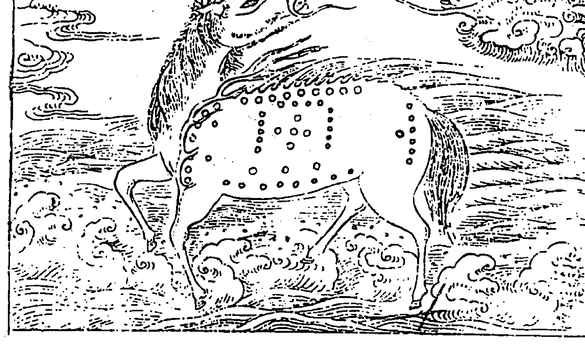

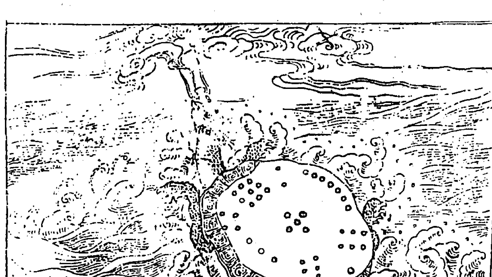

## 006 || 为什么说河图包含着天地之数？

河图由从一到十的十个数字所组成，其绘图概念来自《周易·系辞传》所云“天一，地二，天三，地四，天五，地六，天七，地八，天九，地十”。图中的白圈即奇数为阳，又代表天，称为天数；黑点即偶数为阴，又代表地，称为地数。天数相加之和为二十五，地数相加之和为三十。天地之数相加，共得五十五，这也是古人所称的“凡天地之数，五十有五”。

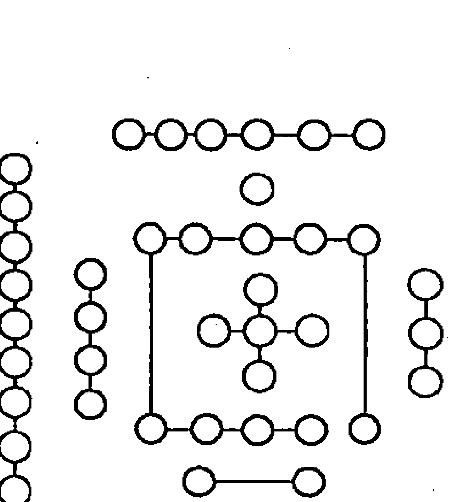

河图的方位排列引入五行的概念，可表示为：一与六共宗居北方，因天一生水，地六成之；二与七为朋居南方，因地二生火，天七成之；三与八为友居东方，因天三生木，地八成之；四与九同道居西方，因地四生金，天九成之；五与十相守居中央，因天五生土，地十成之。

## 007 || 什么是洛书？

所谓洛书，是指由四十五个黑白点组成的图式，以白点表示奇数，以黑点表示偶数。如果把这些黑白点转换成数字，实际上就是一至九的九个数字的排列。古人把这个数字图叫九宫图。“九宫者，即二四为肩，六八为足，左三右七，戴九履一，五居中央。”实际上就是一个所谓的“魔方阵”。它以五为中心，其中的数字无论从纵、横、斜任何一个方向相加，总和必定是十五。

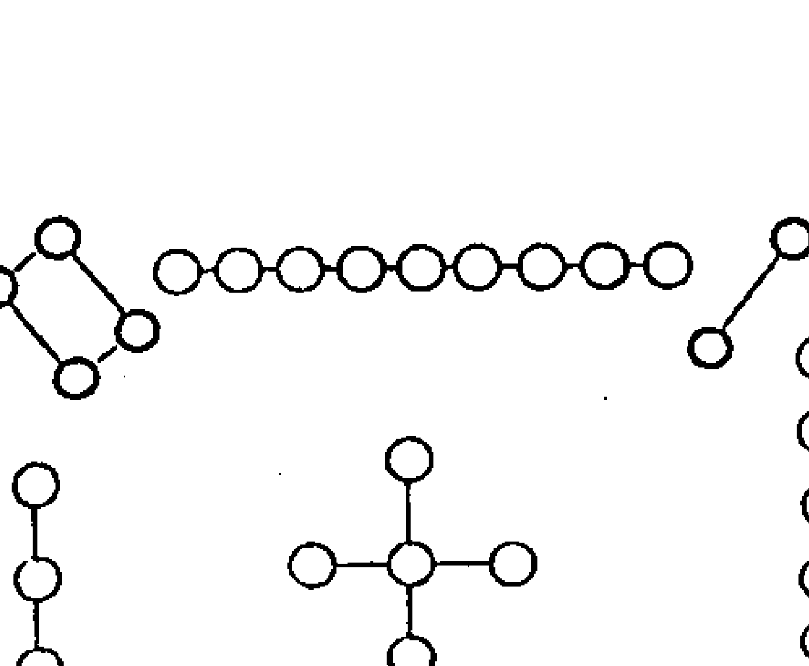

## 008 || 为什么说洛书体现了天地之道？

洛书显示了天地运行的顺序，图中白圈为奇（阳），象征天道；黑点为偶（阴），象征地道。奇数一在北方，表示一阳初生；三在东方，表示阳气渐增；九在南方，表示阳气达到顶峰；七在西方，表示阳气逐渐衰退。这就是所谓天道的运行规律。

又阴气由西南发生，以偶数二表示；阴气逆时针旋转至东南角，至此逐渐增长，以偶数四表示；阴气在东北角达到极盛，以偶数八表示；地数六在西北角，表示阴气逐渐消失。这就是所谓地道运行规律。

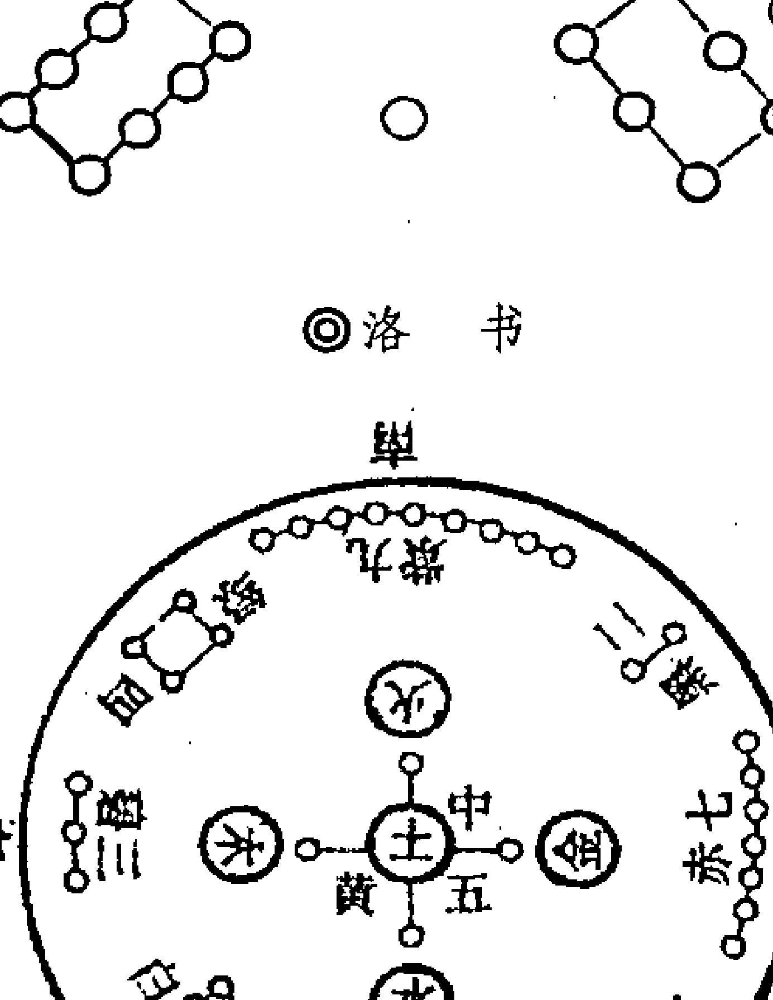

## 009 || 为什么说河图、洛书是中国古代的术数之源？

河图、洛书确定了十个数字的方位，并揭示了数字之间的内在结构关系，将之与天地之道联系在一起，后人又不断赋予它们阴阳、五行、八卦等属性，似乎宇宙万物变化规律都可纳入其中，没有它们不能统摄的事物。这样，河图、洛书逐渐被方术汲取，成为推演吉凶的基本工具。

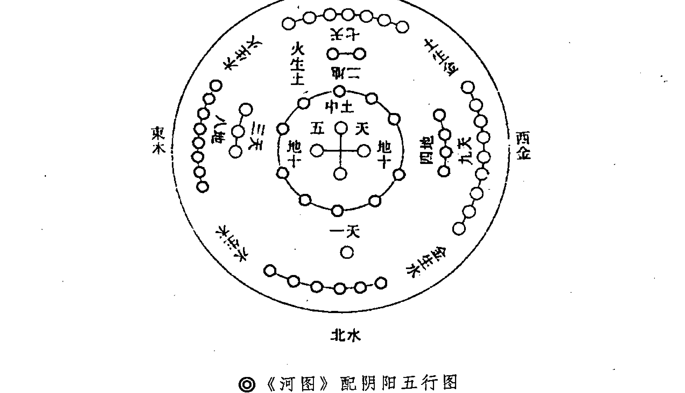

## 010 || 八卦是如何产生的？

八卦即乾、兑、离、震、巽、坎、艮、坤。为什么叫卦呢？唐朝孔颖达说：“卦者，挂也。言悬挂物象以示人，故谓之卦。”卦就是象征自然界各种现象和人类社会各种人事变化的符号，成为描述宇宙万物的模式。

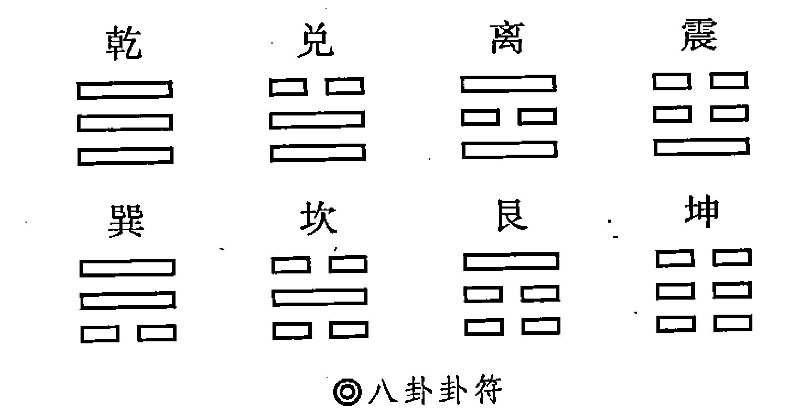

> 据《周易·系辞传》云：“古者包牺氏之王天下也，仰则观象于天，俯则观法于地，观鸟兽之文与地之宜，近取诸身，远取诸物，于是始作八卦，以通神明之德，以类万物之情。”这就是说，远古伏羲氏仰观天象，俯察地理，同时又观察动植物的形态生长状况，近取之于身，远取之于外物，于是做八卦。例如结绳为网，用作捕鱼，就是离卦的卦象的由来。

## 011 || 八卦的阴爻、阳爻包含着什么意义？

卦由一和- -两种符号组成，一代表阳性的事物，称作阳爻；- -代表阴性的事物，称作阴爻。在《易经》中，阳爻有专用名称，叫作“九”；阴爻也有专用名称，叫“六”。八卦的每一卦都由三爻组成。

- 关于爻的起源和含义有多种说法：
    (1) 结绳说。上古结绳记事，大事打一大结，小事打一小结，阳爻和阴爻分别是大结和小结。
    (2) 认为阳爻象征男根，阴爻象征女阴。
    (3) 龟兆说。古代烧灼龟甲以占卜，依其兆纹定吉凶，阳爻和阴爻就是兆纹的规范化，如此等等。

## 012 || 八卦有什么象征意义？

八卦中，乾卦代表天，坤卦代表地，两个符号代表了时间、空间、宇宙；离卦代表太阳，坎卦代表月亮，震卦代表雷，巽卦代表风，艮卦代表高山、陆地，兑卦代表水（海洋、河流、沼泽）。古人认为，宇宙就由这八个大的自然现象组成，它们包罗了一切事物。进一步说，八卦实质上代表的是世间万物的八种性质。《说卦传》说：“乾，健也；坤，顺也；震，动也；巽，入也；坎，陷也；离，丽也；艮，止也；兑，说也。”都是指的事物的性质。

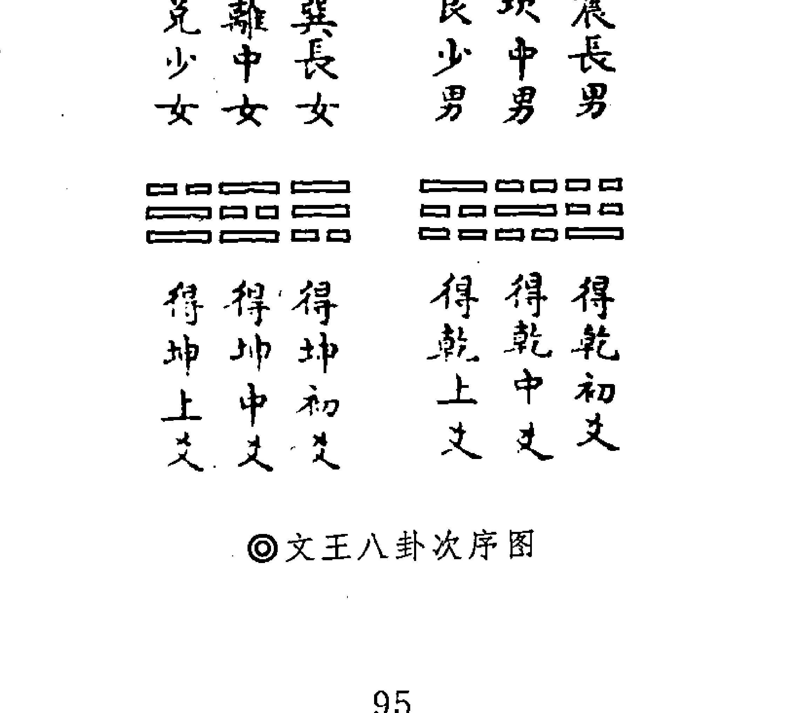

一本书弄懂风水

先天八卦指称的是八大自然现象，其中是没有人的位置的。而在后天八卦那里，用乾代表父，坤代表母，震为长男，坎为中男，艮为少男，巽为长女，离为中女，兑为少女，人于是与八卦和自然界联系起来。发展到后来，为了方便实际运作，各种术家又赋予了八卦更丰富、更复杂、更具体的内涵，如以乾卦来代表君、父、玉、金、健，以坤卦来代表母、后、臣等等。

## 013 || 什么是先天八卦？

关于八卦的具体方位，古代流传下来的有两种排列方式，一种是伏羲八卦，一种是文王八卦。先天八卦，又称为“伏羲八卦”。其方位为：乾南、坤北、离东、坎西、兑东南、震东北、巽西南、艮西北。乾一、兑二、离三、震四、巽五、坎六、艮七、坤八为先天数。

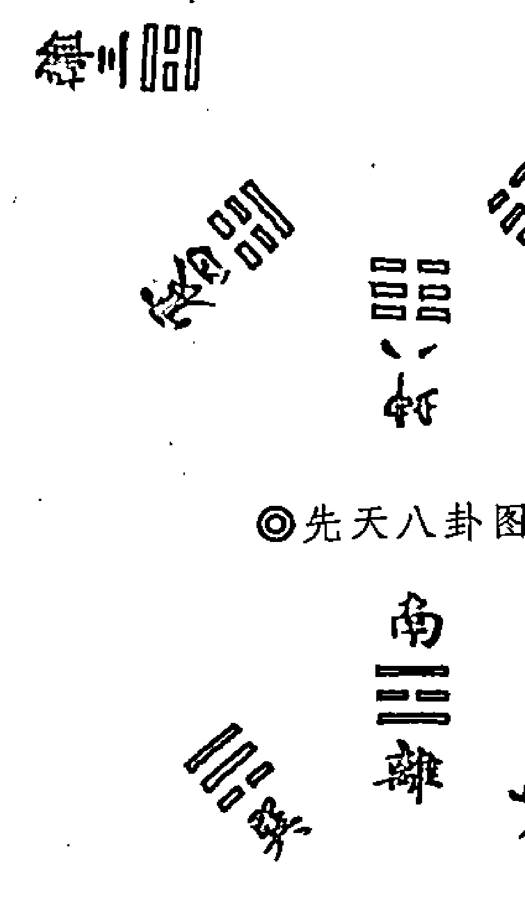

先天八卦相传为伏羲所作，现在我们所见到的先天八卦图是宋代陈抟根据《说卦传》中的文字推演出来的，这段文字就是：“天地定位，山泽通气，雷风相薄，水火不相射，八卦相错，数往者顺，知来者逆，是故易逆数也。” 所以以乾（天）坤（地）定上下之位，离（火）坎（水）列左右之门，艮（山）对兑（泽），巽（风）对震（雷）。乾、兑、离、震为阳，分别以1、2、3、4为序象征天左旋；坤、坎、巽、艮为阴，分别以5、6、7、8为序象征地逆转。两者象征阴阳相错。

## 014 || 什么是后天八卦？

文王八卦，又称为“后天八卦”。其方位为：乾西北、坎北、艮东北、震东、巽东南、离南、坤西南、兑西。后天八卦相传为文王所作。《说卦传》中说：“万物出乎震，震，东方也；齐乎巽，巽，东南也。……离也者，明也，万物皆相见，南方之卦也。……坤也者，地也，万物皆致养焉，故曰致役乎坤。兑，正秋也，万物之所说也……乾，西北之卦也，言阴阳相薄也。坎者，水也，正北方之卦也……艮，东北之卦也，万物之所成终而所成始也。” 后天八卦方位即由此来。西北为乾为天，位最尊，可能与周民族发祥于西北有关。

八卦方位的涵义反映在筮法上，为风水术天尊地卑、阳尊阴卑等观念提供了理论和方法基础。

## 015 || 八卦如何与九宫相配？

九宫，本来是指皇帝按季节祭祀的神宫。历来又有历中九宫、九宫贵神、曲中九宫等说法。如《大戴礼记》中，以九宫和明堂九殿并称。这里所说的九宫，是与八卦对应排列组合的九宫。

按中国传统说法，东、西、南、北为四正位，在它们之间的东南、西南、东北、西北称为四隅。在这四正四隅中加上中央，便成了九方位。在洛书的基础上，按一定的排列规律把八卦分配于九方位中，便成了九宫图。

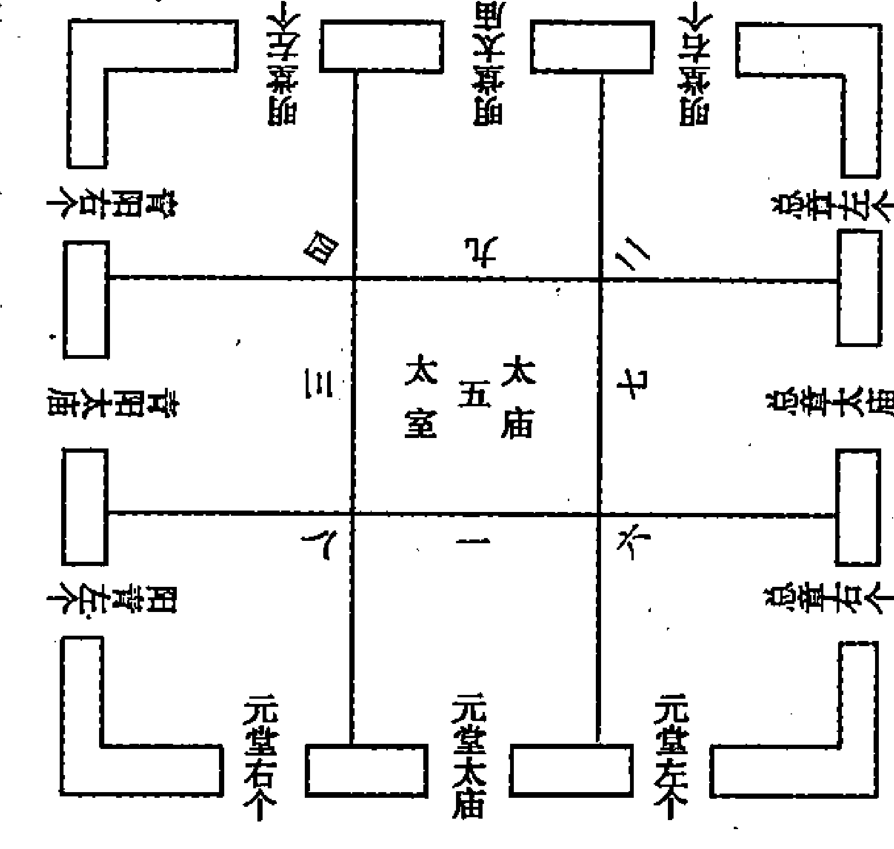

九宫分为四正宫、四维宫和中宫。四正宫指位于正东的震宫、正西的兑宫、正南的离宫、正北的坎宫；四维宫指东南的巽宫、东北的艮宫、西南的坤宫、西北的乾宫；中宫则在中心位置。李约瑟曾称九宫图为“幻方的九个格子”。图中各宫的位置与洛书一样，无论横向、竖向、斜向，三宫相加所得之和也是十五。

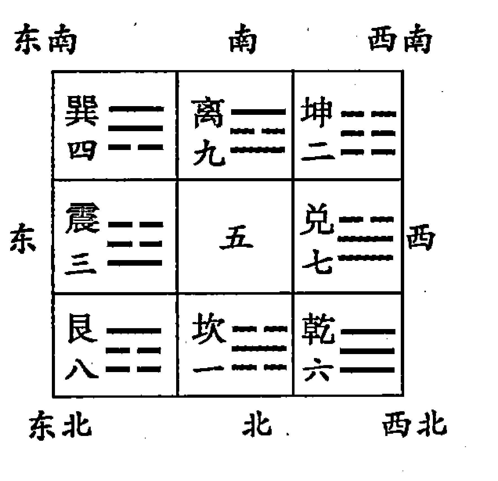

汉代时有九宫占、九宫术、九宫算等，是九宫在占、术、算等方面的应用，其中九宫占术很可能影响到后世风水术。1979年在安徽省阜阳县双古堆汉墓出土的太乙九宫占盘，上面绘有八卦、九宫等内容，可作为八卦、九宫运用于术数占卜的早期实物证明。至今彝族中仍有八卦九宫占盘，用于选择时日和方位。

## 016 || 八卦与阴阳、五行的对应关系是怎样的？

在先天八卦中，乾兑震离为阳，巽坎艮坤为阴。在后天八卦中，乾坎艮震为阳，巽离坤兑为阴。

以后天八卦与五行相配：按照后天八卦方位图，位于四正的震、离、兑、坎四卦分别为东、南、西、北，那么属于四隅的乾、坤、巽、艮如何分配呢？坤象地，艮象山，五行属土；乾有刚健之性，五行属金；巽为阴卦，性柔，与草木相似，五行属木。概括起来，八卦与五行的对应关系就是：震、巽属木，位东方；离属火，位南方；坤、艮属土，位中央；兑属金，位西方；坎属水，位北方。

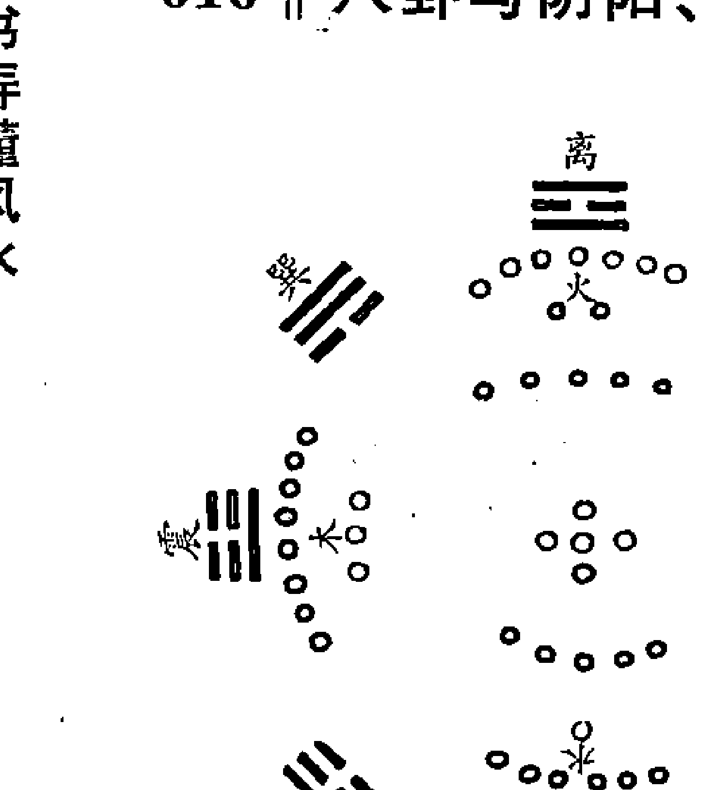

## 017 || 八卦如何演变为六十四卦？

将八卦通过重叠组合，使各卦由三个爻变为六个爻，可推演成六十四卦，也称为重卦或别卦。

上经三十卦卦名是：乾、坤、屯、蒙、需、讼、师、比、小畜、履、泰、否、同人、大有、谦、豫、随、蛊、临、观、噬嗑、贲、剥、复、无妄、大畜、颐、大过、坎、离。

下经三十四卦卦名为：咸、恒、遁、大壮、晋、明夷、家人、睽、蹇、解、损、益、夬、姤、萃、升、困、井、革、鼎、震、艮、渐、归妹、丰、旅、巽、兑、涣、节、中孚、小过、既济、未济。

## 018 || 六十四卦的爻位有什么象征意义？

六十四卦均由六爻组成，六爻所在的位次就叫爻位。爻位自下而上依次排列，分别称作初、二、三、四、五、上。

以爻位比附人事，如《周易·乾凿度》说：“初为元士，二为大夫，三为公，四为诸侯，五为天子，上为宗庙。凡此六者，阴阳所以进退，君臣所以升降，万民所以为象则也。”

还有把爻位两两并列，以象征天、地、人“三才”，即以初、二两爻象征“地”位，三、四两爻象征“人”位，五、上两爻象征“天”位。

爻位又分阴阳、奇偶，即初、三、五爻为奇，属阳位；二、四、上爻为偶，属阴位。

## 019 || 六爻爻位的排列有什么含义？

爻位的排列顺序有一定的含义。从下到上，象征事物周而复始的发展过程和变化规律，或者自然界植物生长周期的循环往复，即初位象征事物发展萌芽，主于潜藏勿用；二位象征事物崭露头角，主于适当进取；三位象征事物功业小成，主于慎警惧审时；四位代表事物进入更高层次；五位象征事物圆满成功，主于处盛戒盈；上位象征事物发展终尽，主于穷极必反。

## 020 || 什么是卦气说？

卦气说主要是借爻象的变化推测气候的变化，进而推断人事的吉凶。所谓卦气，是以八卦或六十四卦配一年四时、十二月、二十四节气、三百六十五日，并以此解释一年节气的变化。具体来说，主要以坎、震、离、兑为四正卦，主一年四季，即坎主冬，震主春，离主夏，兑主秋。这四正卦又分别主管二十四节气中的六个节气，从冬至到惊蛰为坎卦用事，春分到芒种为震卦用事，夏至到白露为离卦用事，秋分到大雪为兑卦用事。又一卦六爻，正好每爻主管一个节气。

| 坎（冬季） | 震（春季） |
| :--- | :--- |
| 冬至 小寒 大寒 立春 雨水 惊蛰 | 春分 清明 谷雨 立夏 小满 芒种 |
| 离（夏季） | 兑（秋季） |
| 夏至 小暑 大暑 立秋 处暑 白露 | 秋分 寒露 霜降 立冬 小雪 大雪 |

> ◎四正卦与四季及二十四节气相配

除了这四正卦，其余六十卦分配于十二月之中，每月五卦，每卦主管六日七分，并配入七十二候。自十一月冬至初候开始，中孚卦用事，为一年节气变化的开始。到次年十一月大雪末候，颐卦用事，为一年节气变化之终。

其中又有十二辟卦，代表十二个月和一年节气中的中气（处于月中的节气），象征一年四时的变化。这十二辟卦为：复、临、泰、大壮、夬、乾、姤、遁、否、观、剥、坤。

其中从复到乾，阳爻自下而上逐渐增加，是阳息阴消的过程；从姤到坤，阴爻逐渐增长，是阴息阳消的过程。所以十二辟卦又被称作十二消息卦，表示一年四季、十二月、二十四节气阴阳二气的消长变化。

| 复 | 临 | 泰 | 大壮 | 夬 | 乾 | 姤 | 遁 | 否 | 观 | 剥 | 坤 |
| :--- | :--- | :--- | :--- | :--- | :--- | :--- | :--- | :--- | :--- | :--- | :--- |
| ☷☷ | ☷☱ | ☷☰ | ☳☰ | ☱☰ | ☰☰ | ☰☴ | ☰☶ | ☰☷ | ☴☷ | ☶☷ | ☷☷ |
| 十一月 | 十二月 | 正月 | 二月 | 三月 | 四月 | 五月 | 六月 | 七月 | 八月 | 九月 | 十月 |
| 冬至 | 大寒 | 雨水 | 春分 | 谷雨 | 小满 | 夏至 | 大暑 | 处暑 | 秋分 | 霜降 | 小雪 |
| 冬 | 冬 | 春 | 春 | 春 | 夏 | 夏 | 夏 | 秋 | 秋 | 秋 | 冬 |
| 一阳生 | 二阳生 | 三阳生 | 四阳生 | 五阳生 | 六爻皆阳 | 一阴生 | 二阴生 | 三阴生 | 四阴生 | 五阴生 | 六爻皆阴 |

卦气用卦爻符号统摄了所有的季节物候，每年节气和物候的变化都由阴阳的升降消息决定，几乎每一天的活动都可以推测出吉凶福祸来。风水术因而把卦气说纳入罗盘中，用来推算阴阳消长、五运六气，从而判断吉凶。

## 021 || 什么是纳甲？

纳甲是由西汉易学家京房创造的筮法。即将甲、乙、丙、丁、戊、己、庚、辛、壬、癸十天干纳于八卦，并与五行、方位相配合。即乾纳甲，坤纳乙，甲乙为木，表示东方；艮纳丙，兑纳丁，丙丁为火，表示南方；坎纳戊，离纳己，戊己为土，表示中央；震纳庚，巽纳辛，庚辛为金，表示西方；乾纳壬，坤纳癸，壬癸为水，表示北方。由于甲为十天干之首，举一以概其余，故名“纳甲”。

| 八卦 | 上爻 | 五爻 | 四爻 | 三爻 | 二爻 | 初爻 |
| :--- | :--- | :--- | :--- | :--- | :--- | :--- |
| 乾☰ | 壬戌 | 壬申 | 壬午 | 甲辰 | 甲寅 | 甲子 |
| 坤☷ | 癸酉 | 癸亥 | 癸丑 | 乙卯 | 乙巳 | 乙未 |
| 震☳ | 庚戌 | 庚申 | 庚午 | 庚辰 | 庚寅 | 庚子 |
| 巽☴ | 辛卯 | 辛巳 | 辛未 | 辛酉 | 辛亥 | 辛丑 |
| 坎☵ | 戊子 | 戊戌 | 戊申 | 戊午 | 戊辰 | 戊寅 |
| 离☲ | 己巳 | 己未 | 己酉 | 己亥 | 己丑 | 己卯 |
| 艮☶ | 丙寅 | 丙子 | 丙戌 | 丙申 | 丙午 | 丙辰 |
| 兑☱ | 丁未 | 丁酉 | 丁亥 | 丁丑 | 丁卯 | 丁巳 |

通过纳甲之法，八卦与五行、天干的方位和时间结合在一起，可以据此为人占卜阴阳宅吉凶。如果推算的结果是衰死，则这个地点不能用，要么换人，要么改时间。纳甲法受到风水的重视，有论者指出：“纳甲有一定之数，即有一定之理，故形家以此察山川之性情，辨阴阳之贵贱，审吉凶之避就。”

# 二 阴阳五行

## 001 || 什么是阴阳？

阴阳最初是指阳光的向背，物体向日的一面为阳，背阳的一面为阴。后来这一概念不断引申，从用来象征气候的寒热到广泛解释自然界与社会生活的所有现象。如明暗、寒热、日月、天地、昼夜、内外、上下、动静、黑白、快慢、君臣、男女、强弱、生死等，这些事物或现象都可以分为相互对应的两个方面，是相互对立又相互依存的统一体。到最后，阴阳概念的内涵被拓展到极致，宇宙间万事万物都可以归结为阴与阳两大类，一切事物的形成和变化，全凭阴阳二气的运动与转换，这就是“阴阳交而生物”。

## 002 || 古代阴阳观念是怎么形成的？

《国语·周语》中载西周末年太史伯阳父的话说：“夫天地之气，不失其序。若过其序，民乱之也。阳伏而不能出，阴迫而不能蒸，于是有地震。”伯阳父关于阴阳的论述是今存古籍中以阴阳为宇宙天地之气的开始，说明人们已经能够自觉地把阴阳作为一种模式、规范，以此去认识世界、阐释世界中的各种变化现象。后《老子》有云：“万物负阴而抱阳。”肯定阴阳的矛盾势力是事物本身固有的。《周易·系辞传》进一步提出“一阴一阳之谓道”的学说，把阴阳交替看作宇宙的根本规律。战国末期，以邹衍为代表的阴阳家，“乃深观阴阳消息，而作怪迂之变”，则把阴阳变成了和“天人感应”说结合的概念。到汉代，董仲舒又进一步提出“阳尊阴卑”说，并用阴阳来比附自然和社会现象，即“天有阴阳，人亦有阴阳”：在自然是天为阳，地为阴，昼为阳，夜为阴；在社会是君为阳，臣为阴；在家庭是父为阳，子为阴，夫为阳，妻为阴……总之，凡属主导的正面的事物都是阳，凡属次要的从属的负面的事物都是阴。

## 003 || 阴和阳之间的关系是怎样的？

在古人眼里，阴阳两者的关系是对立统一的辩证关系。“譬如阴阳，阴中有阳，阳中有阴，阳极生阴，阴极生阳，所以神化无穷。”（《朱子语类》卷九十八）阴阳互含，说明阴阳是互相的，阴阳作为事物的对立面的关系不是绝对的。孤阳不生，独阴不长，任何一方如果失掉对另一方的依存，就没有什么阴阳可言。没有阳，就没有阴；没有阴，也就不可能出现阳；没有地，就没有天；没有天，也就无所谓有地……阴阳又是不断变化着的，阴长则阳消，阳长则阴消，譬如昼夜之过渡、寒暖季节之交替等。阴阳也不是绝对的。在一定条件下，阴阳又是可以向各自的对立面转化的。

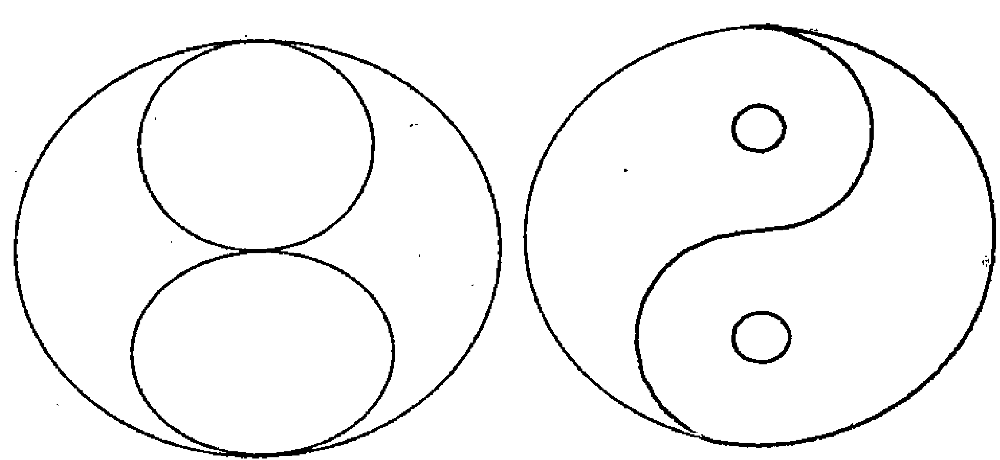

◎阴阳鱼图

## 004 || 形势派风水是如何融入阴阳学说的？

风水形势派理论把山称为阳，水称为阴，山南称为阳，山北称为阴，水北称为阳，水南称阴。风水家论山水，以山主静而属阴，其势高，又为阴中之阳者；水本动而属阳，其势低，又为阳中之阴者。因而讲究山水交会，动静相乘，阴阳相济。《青囊海角经》说：“山水者，阴阳之气也，山有山之阴阳，水有水之阴阳，山者阴盛，水者阳盛。高山为阴，平地为阳。阳盛则喜乎阴，阴盛则欲乎阳。山水之静为阴，山水之动为阳。阳动则喜乎静，阴静则喜乎动。”

缪希雍《葬经翼》说：“概以动静之理言，则水为动为阳，山静为阴；以险易之理言，则坦夷为阳，崇峻为阴。以情势之理言，则开耸为阳，局缩为阴，抽袅为阳，硬滞为阴，面豁为阳，背负为阴。”说明了阴阳不同的变化视角。


◎先天太极图

南宋蔡元定所撰《发微论》说：“夫孤阴不生，独阳不成，天下之物莫不要相配对。地理家以雌雄言之，大概不过相对待之理。何以言之？山属阴水属阳，故山水相对有雌雄。而山之于水，各有雌雄。阳龙取阴穴，阴龙取阳穴，此龙穴相对雌雄。阳山取阴为对，此主客相对有雌雄也。”何溥《灵城精义》曰：“阴用阳朝，阳用阴应，合之固眷属一家；山远收山，水远收水，分之亦互为生旺。”是说山势水流要阴阳相配合、相呼应，生气才能从生到旺，才能凝聚，这些表现出风水运用中阴阳相互依存、对立统一的辩证思想。

## 005 “负阴抱阳”的观念对风水学有什么重要影响？

《老子》所说的“万物负阴而抱阳，冲气以为和”对风水择地有着深刻的影响。所谓“负阴抱阳”有两层意思：一是背靠高山，面对江河。二是背北向南，即坐北朝南，争取充足的阳光。“负阴抱阳”成为风水中的一条基本原则。

古代风水家认为，地之形势要犹如人体，有首、有臂，两臂围合方称安全，这就需要背靠青山，青山环绕。山应高大，居中为玄武，左侧应有青龙山辅佐，右侧有白虎山挡风，南有朱雀山为屏应，前有河水流过，方为理想的之吉地。《堪舆泄秘》云：“凡到一乡之中，先看水城归哪一边，水抱边可寻地，水反边不可下。”这是说村落选址应在河流的弯曲处，以呈马蹄形的自然围合特征。这些理论显然与“负阴而抱阳”的观念是相契的。

## 006 什么是五行？

所谓“五行”，即水、火、木、金、土，古人视之为构成宇宙万物的五种基本元素，自然界和社会人生的各种事物和现象，都可依其性质与这五种基本元素相比拟而进行归类。“行”意味着运动、作用、循环，正是这五种各具特性的基本元素不断运动和作用，才形成了宇宙万物的生长与消亡。

## 007 五行的概念最早见于哪些著作？

“五行”一词，最早见于《尚书·甘誓》：“嗟！六事之人，予誓告汝！有扈氏威侮五行，怠弃三正，天用剿绝其命！”这里的“五行”是何意义，今已无从考定。随后的《尚书·洪范》却明确列举了五行的内容。武王克殷以后，问箕子以天道，箕子的回话里就说到“五行”：一曰水，二曰火，三曰木，四曰金，五曰土。水曰润下，火曰炎上，木曰曲直，金曰从革，土爰稼穑。润下作咸，炎上作苦，曲直作酸，从革作辛，稼穑作甘。认为五行是五种最基本的事物，但还没有认为是构成万物的基本元素。“五行”一开始正如梁启超所言，“不过自然界中一种粗浅微末之现象，绝不含何等深邃之意义”。

## 008 五行的生克原理是什么？

古人总结出一套五行相生相克的规律。五行相生关系为：木生火，火生土，土生金，金生水，水生木。因为木能燃火，故木生火；取火能焚万物成为土，故火生土；金属取于土石之中，故土生金；金属器皿可盛水，故金生水；草木得水而生长，故水生木。

五行相克关系为：木克土，土克水，水克火，火克金，金克木。因为木能阻土流失，故木克土；土能阻水流动，故土克水；火遇水而灭，故水克火；金遇火而变，故火克金；木遇刀斧而被破伐，故金克木。

五行相生相克关系实际上是指自然界某种物质对另一种物质起着促进、滋生，或者起着制约、压抑的作用与反作用，正是有了相生、相克的两面，世间万物才能维持一种稳定的平衡与协调。

五行的生克原理被包括风水在内的古代各种术数运用，将人的命运附会于五种物质的自然属性，以五行生克原理来判断人生的吉凶规律。

## 009 五行如何与方位、季节相配？

在五行学说的统摄下，自然界中的空间方位可划为五方：木居东方、金居西方、火居南方、水居北方、土居中央；五行与四季相配，分别是木主春，火主夏，金主秋，水主冬，土主四季。

第二章 风水的基础知识

### 五行与四季关系表

| 状态 | 木 | 火 | 金 | 水 | 土 |
| :--- | :--- | :--- | :--- | :--- | :--- |
| 旺 | 春 | 夏 | 秋 | 冬 | 四季末 |
| 相 | 冬 | 春 | 四季末 | 秋 | 夏 |
| 休 | 夏 | 四季末 | 冬 | 春 | 秋 |
| 囚 | 四季末 | 秋 | 春 | 夏 | 冬 |
| 死 | 秋 | 冬 | 夏 | 四季末 | 春 |

木本向阳而生，它在春季阳气始生时开始生长。东方正是日出之处，所以木放在东方。火的本性是炎热，夏季炎热，而南方是阳气最盛的季节和方位，所以火放在南方。金的本性是清凉肃杀，秋季树木落叶不再生长，而西方是太阳落山的方位，太阳落山前后阳气衰落，气候清凉，所以金放在西方。水的本性是澄澈寒冷，冬季气候寒冷，我国北方气候也是寒冷，所以把水放在北方。土的本性厚实适中，有利于万物生长，中央地处四方之中，所以土放在中央。

## 010 什么是五色、五音、五味？

五色，即金白、火红、木青、水黑、中央土黄。

五音，即土为宫，金为商，木为角，火为徵，水为羽。

五味，即水咸、火苦、木酸，金辛，土甘。

### 地理事物五行属性表

| 五行 | 五方 | 五季 | 五色 | 五音 | 五气 | 五化 | 五味 | 天体 | 行星 | 数字 | 情志 | 五脏 | 五常 |
| :--- | :--- | :--- | :--- | :--- | :--- | :--- | :--- | :--- | :--- | :--- | :--- | :--- | :--- |
| 木 | 东 | 春 | 青 | 角 | 风 | 生 | 酸 | 星 | 木 | 八 | 怒 | 肝 | 仁 |
| 火 | 南 | 夏 | 赤 | 徵 | 暑 | 长 | 苦 | 日 | 火 | 七 | 喜 | 心 | 礼 |
| 土 | 中 | 长夏 | 黄 | 宫 | 湿 | 化 | 甘 | 地 | 土 | 五 | 思 | 脾 | 智 |

## 011 什么是五行休王论？

在汉代，人们根据五行生克原理，提出五行休王论，即王、相、休、囚、废五气。它们的具体含义是：王，又称旺或壮，处于旺盛状态。相，处于次旺状态。休，休息，休闲，不管事。囚，衰落，被禁锢。废，被克制而废，毫无生气。王相气主吉寿，休废囚气主凶死。五行休王论与四季结合，可用下表表示：

### 五行休王论与四季结合表

| 四季 | 春 | 夏 | 秋 | 冬 | 四季末 |
| :--- | :--- | :--- | :--- | :--- | :--- |
| 五行 | 木旺 | 火旺 | 金旺 | 水旺 | 土旺 |
| 它生的 | 火相 | 土相 | 水相 | 木相 | 金相 |
| 生它的 | 水休 | 木休 | 土休 | 金休 | 火休 |
| 克它的 | 金囚 | 水囚 | 火囚 | 土囚 | 木囚 |
| 它克的 | 土死 | 金死 | 木死 | 火死 | 水死 |

从表中可以看出，当令的为旺，我生的为相，生我的为休，克我的为囚，我克的为死。比如木，春天木当令为旺，木生火，火为相；水生木，水为休；金克木，金为囚；木克土，土为死。如果给人推算住宅吉凶，某人春天生，属木命，就是当令得时。如果属金命，就是被囚不当时。

## 012 五行学说对风水学有什么重要影响？

古人认为，人是有五行属性的；一个人命运的好坏，取决于他初生时禀赋的五行。风水就是根据这种观念，以人的出生时间所对应的五行来预测命运的吉凶。风水术中占断阳宅、阴宅是否吉利，其中很重要的一件事也是要推算宅主人的命运。此外，五行与方位形成对应关系后，对风水术影响也很大。风水家占断宅地方位后，要推算吉凶，即可以五行生克原理为依据。如汉代五音姓利图宅术，就是将人的姓氏与五音、五方整合起来占断吉凶。

# 三 天干地支

## 001 什么是天干地支？

天干、地支，简称干支，是中国古代人们用以记录年、月、日、时的一种专门符号，主要用于古代历法中。干支，又作“干枝”，古人将其比作树干与树枝的关系，干强枝弱，以干为主。其中，天干有十位，依次为：甲、乙、丙、丁、戊、己、庚、辛、壬、癸。地支有十二位，即：子、丑、寅、卯、辰、巳、午、未、申、酉、戌、亥。

在古代风水术的运用中，准确而又熟练地掌握干支纪年月日时的方法，可以说是一种基本功。

## 002 天干有什么象征意义？

十天干包含有万物荣枯盛衰之象。

- 甲：像草木破土而萌，阳在内而被阴包裹。
- 乙：草木初生，枝叶柔软屈曲。
- 丙：炳也，如赫赫太阳，炎炎火光，万物皆炳燃着，见而光明。
- 丁：草木成长壮实，好比人的成丁。
- 戊：茂盛也，象征大地草木茂盛繁荣。
- 己：起也，纪也，万物抑屈而起，有形可纪。
- 庚：更也，秋收而待来春。
- 辛：金味辛，物成而后有味，辛者，新也，万物肃然更改，秀实新成。
- 壬：妊也，阳气潜伏地中，万物怀妊。
- 癸：揆也，万物闭藏，怀妊地下，揆然萌芽。

## 003 地支有什么象征意义？

十二地支的象意与十天干大体相同，也表示植物从生长到衰凋的轮回。

- 子：孳也，阳气始萌，孳生于下也。
- 丑：纽也，寒气自屈曲也。
- 寅：髌也，阳气欲出，阳尚强而髌演于下。
- 卯：冒也，万物冒地而出。
- 辰：伸也，万物舒伸而出。
- 巳：已也，阳气毕布已矣。
- 午：仵也，阴阳交相愕而仵。
- 未：昧也，日中则昃，阳向幽也。
- 申：伸束以成，万物之体皆成也。
- 酉：就也，万物成熟。
- 戌：灭也，万物灭尽。
- 亥：核也，万物收藏，皆坚核也。

## 004 什么是“六十甲子”？

从商代起，人们就将十干与十二支从头到尾依次搭配起来，以它们的最小公倍值六十为周期来计算时间，就形成了“六十甲子”，这是因为其组合起于甲子。具体说来，是用天干的首字“甲”与地支的首字“子”配合列为第一，其次用天干第二字“乙”与地支的第二字“丑”配合得乙丑……这样配合下去，第六十位正好是天干的末字“癸”与地支的末字“亥”配成癸亥。再往下配便又逢甲子了。如此循环往复，以至无穷，这就是古代的干支纪法。

### 六十甲子干支次序表

|   | 1   | 2   | 3   | 4   | 5   | 6   |
|---|-----|-----|-----|-----|-----|-----|
| 1 | 甲子 | 乙丑 | 丙寅 | 丁卯 | 戊辰 | 己巳 |
| 2 | 庚午 | 辛未 | 壬申 | 癸酉 | 甲戌 | 乙亥 |
| 3 | 丙子 | 丁丑 | 戊寅 | 己卯 | 庚辰 | 辛巳 |
| 4 | 壬午 | 癸未 | 甲申 | 乙酉 | 丙戌 | 丁亥 |
| 5 | 戊子 | 己丑 | 庚寅 | 辛卯 | 壬辰 | 癸巳 |
| 6 | 甲午 | 乙未 | 丙申 | 丁酉 | 戊戌 | 己亥 |
| 7 | 庚子 | 辛丑 | 壬寅 | 癸卯 | 甲辰 | 乙巳 |
| 8 | 丙午 | 丁未 | 戊申 | 己酉 | 庚戌 | 辛亥 |
| 9 | 壬子 | 癸丑 | 甲寅 | 乙卯 | 丙辰 | 丁巳 |
| 10| 戊午 | 己未 | 庚申 | 辛酉 | 壬戌 | 癸亥 |

由三个六十甲子推得一百八十年，叫三元。第一个甲子年为上元，第二个为中元，第三个为下元，这就是风水学的三元运气说。

## 005 天干与地支是如何搭配的？

天干与地支搭配是有一定法则的，要由阳干与阳支、阴干与阴支结合，而不能是阳干配阴支、阴干配阳支。十干中，甲、丙、戊、庚、壬为阳，乙、丁、己、辛、癸为阴；十二支中，子、寅、辰、午、申、戌为阳，丑、卯、巳、未、酉、亥为阴。

## 006 怎样推算年的干支？

在风水相宅中，要推算出准确的年、月、日、时的干支，方能预测与分析吉凶。推算年的方法，最简单的是直接查万年历，也可以通过六十甲子表反推，需要查阅历书，找出当年的干支。这里必须注意的是，要以每年的立春而不是正月初一作为划分一年的真正界限，如果正月有立春节气，立春仍用前一年的干支；如果立春在十二月，那么立春后当用下一年的干支。

## 007 怎样推算月的干支？

推算月份，由于十二地支与十二月正好相应，如果已经知道了当年的天干，可通过下表来查阅。

### 从年干推月支表

| 当年天干 | 甲巳 | 乙庚 | 丙辛 | 丁壬 | 戊癸 |
| :--- | :--- | :--- | :--- | :--- | :--- |
| 正月 | 丙寅 | 戊寅 | 庚寅 | 壬寅 | 甲寅 |
| 二月 | 丁卯 | 己卯 | 辛卯 | 癸卯 | 乙卯 |
| 三月 | 戊辰 | 庚辰 | 壬辰 | 甲辰 | 丙辰 |
| 四月 | 己巳 | 辛巳 | 癸巳 | 乙巳 | 丁巳 |
| 五月 | 庚午 | 壬午 | 甲午 | 丙午 | 戊午 |
| 六月 | 辛未 | 癸未 | 乙未 | 丁未 | 己未 |
| 七月 | 壬申 | 甲申 | 丙申 | 戊申 | 庚申 |
| 八月 | 癸酉 | 乙酉 | 丁酉 | 己酉 | 辛酉 |
| 九月 | 甲戌 | 丙戌 | 戊戌 | 庚戌 | 壬戌 |
| 十月 | 乙亥 | 丁亥 | 己亥 | 辛亥 | 癸亥 |
| 十一月 | 丙子 | 戊子 | 庚子 | 壬子 | 甲子 |
| 十二月 | 丁丑 | 己丑 | 辛丑 | 癸丑 | 乙丑 |

这里也必须注意查看节气来确定月份界限，而不能以每月的初一为界。一年二十四个节气，从立春开始，凡排单数的称“节”，凡排双数的称“气”。推月要以“节”为界限。每月初一若在本月节前，用上月干支；若在本月的下一个节后，就得用下个月的干支。

## 008 怎样推算日和时辰的干支？

推日可用历书直接找出当时干支，也可依六十甲子表推算。已知日的干支，可通过下表查时辰的干支。

### 从日干推时干支表

| 当日天干 当时地支 | 甲己 | 乙庚 | 丙辛 | 丁壬 | 戊癸 |
| :--- | :--- | :--- | :--- | :--- | :--- |
| 子时 (23—1) | 甲子 | 丙子 | 戊子 | 庚子 | 壬子 |
| 丑时 (1—3) | 乙丑 | 丁丑 | 己丑 | 辛丑 | 癸丑 |
| 寅时 (3—5) | 丙寅 | 戊寅 | 庚寅 | 壬寅 | 甲寅 |
| 卯时 (5—7) | 丁卯 | 己卯 | 辛卯 | 癸卯 | 乙卯 |
| 辰时 (7—9) | 戊辰 | 庚辰 | 壬辰 | 甲辰 | 丙辰 |
| 巳时 (9—11) | 己巳 | 辛巳 | 癸巳 | 乙巳 | 丁巳 |
| 午时 (11—13) | 庚午 | 壬午 | 甲午 | 丙午 | 戊午 |
| 未时 (13—15) | 辛未 | 癸未 | 乙未 | 丁未 | 己未 |
| 申时 (15—17) | 壬申 | 甲申 | 丙申 | 戊申 | 庚申 |
| 酉时 (17—19) | 癸酉 | 乙酉 | 丁酉 | 己酉 | 辛酉 |
| 戌时 (19—21) | 甲戌 | 丙戌 | 戊戌 | 庚戌 | 壬戌 |
| 亥时 (21—23) | 乙亥 | 丁亥 | 己亥 | 辛亥 | 癸亥 |

## 009 天干地支与五行相配有什么含义？

干支与阴阳五行的结合，也是风水术的一个基本法则。干支的阴阳属性见前。干支与五行相配合后又产生较为复杂的变化。见下表

### 干支五行属性表

| 五行 | | 木 | 火 | 土 | 金 | 水 |
| :--- | :--- | :--- | :--- | :--- | :--- | :--- |
| 天干 | 阳 | 甲 | 丙 | 戊 | 庚 | 壬 |
| | 阴 | 乙 | 丁 | 己 | 辛 | 癸 |
| 地支 | 初 | 寅 | 巳 | 辰戌 | 申 | 亥 |
| | 盛 | 卯 | 午 | 丑未 | 酉 | 子 |
| | 衰 | 辰 | 未 | | 戌 | 丑 |

其中天干与五行配合的象征意义，可以下面的歌诀来表达：甲木属森林大木；乙木属花草小木。丙火属太阳大火；丁火属灯盏小火。戊土属大地之土；己土属田园之土。庚金属斧铁之金；辛金属珠饰之金。壬水属大海之水；癸水属雨露之水。至于地支与五行的关系，如上表所见，每三位代表一种五行，但第一位表示初兴，第二位表示极盛，第三位表示渐衰。唯有辰、戌、丑、未在风水中不但有属土的说法，还分别属木、金、水、火，有“四库”之称。即：丑为金库，生亥子而克寅卯；辰为水库，生寅卯而克巳午；未为木库，生巳午而受金克；戌为火库，克申金而受水制。因此，辰戌丑未又称为“杂气”。每一地支除了本身的五行属性之外，又以一个足以代表自己性质的天干为“本气”，还包含着若干其他气的成分，先列表如下：

# 四 天人感应

## 001 什么是天人感应观？

天人感应观是中国古代哲学中关于天人关系的一种重要思想，对古代风水术产生了深刻影响。这种思想认为，天与人同类相通，相感相应，天能干预人事，人也能感应上天。由此进一步引伸，自然界的现象，都是天神意志的表现，灾异怪变以及吉利瑞祥，也都是天受感应后而施加于人的奖惩。故一切人事均应顺乎自然规律，达到人与自然的和谐。

天人感应观是有其理论基础的，这就是“天人合一”的思想，因为唯有天人一体，方能相互感应。

那么什么是“天人合一”呢？所谓的“天”，也就是宇宙自然的代表。我们古人是以一种整体的眼光来看待世界的，他们认为天、地、人是一个有机的整体，天道与人事、自然界与人类社会在本质上具有一体性，是相类相通的，这就是“以类合之，天人一也”。

天人感应观作为中国传统哲学思想的一个主要观念，也为古代风水术所汲取。既然天人之间存在着一种深奥莫测的因果关系，天数变，人亦变，那么阴宅、阳宅环境的改变也必然能改变人的命运。所谓的风水宝地，首先就是顺天应人之地。

## 002 在古人眼中，人的形体是如何与天相对应的？

在天人合一、天人感应观念的发展过程中，有一种观点是将天地自然与人的肌体作类比的。比如西汉前期成书的《黄帝内经》说：

> “天有日月，人有两目；地有九洲，人有九窍；天有风雨，人有喜怒；天有雷电，人有音律；天有四时，人有四肢；天有五音，人有五脏；天有六律，人有六腑。岁有三百六十五日，人有三百六十节。”

这一观点后来就发展为董仲舒的“人副天数”观：“唯人独能偶天地。人有三百六十节，偶天之数也；形体骨肉，偶地之后也。上有耳目聪明，日月之象也；体有空窍理脉，川谷之象也；心有哀乐喜怒，神气之类也。……是故人之身，首，象天容也；发，象星辰也；耳目清清，象日月也；鼻口呼吸，象风气也；胸中达知，象神明也；腹饱实虚，象百物也。百物者最近地，故腰以下，地也。天地之象，以腰为带。颈以上者，精神尊严，明天类之状也；颈而下者，丰厚卑辱，土壤之比也。足布而方，地形之象也。天以终岁之数，成人之身，故小节三百六十六，副日数也；大节十二分，副月数也；内有五藏，副五行之数也；外有四肢，副四时数也；乍视乍瞑，副昼夜也；乍刚乍柔，副冬夏也；乍哀乍乐，副阴阳也；心有计虑，副度数也；行有伦理，副天地也。”（《春秋繁露》卷十三，《人副天数》）

> “人副天数”观认为，在自然万物之中，唯独人的形体乃至各个部分，都与天数相副，化天数而成。同时人的心理如感知、情感、性格乃至于道德、行为等也都必须与天数相副，化天数而成。

古代风水有一种“大地有如人体”的说法，这与董仲舒的“人副天数”说一脉相承。唐代曾文辿《青囊序》把人体中流动的血液比作自然界的水和气，认为“水是山家血脉精”。《黄帝宅经》在论述住宅周围形势时指出：“以形势为身体，以泉水为血脉，以土地为皮肉，以草木为毛发，以舍屋为衣服，以门户为冠带，若得如斯，是事严雅，乃为上吉”，将大地喻作人体。宋代蔡元定在《发微论》中，也把自然界的水、火、土、石分别比作人身上的血气骨肉。

在天人合一、天人感应观念的影响下，中国风水理论将大自然本身看成一个富有灵性的有机体，人只是这个系统的一部分。所以，风水关注人与建筑、自然的关系，将天、地、人三者紧密结合，“以人之意逆山水之意，以人之情逆山水之情”，让人与自然环境和谐共生，以达到天人合一的境界。

## 004 || 天与人之间的“感应”是怎么实现的？

董仲舒认为，“天地之常，一阴一阳。阳者天之德也，阴者天之刑也。……天亦有喜怒之气、哀乐之心，与人相副。以类合之，天人一也。”（《阴阳义》）他把天与人都各自看作是天之一端，认为天人感应，就是作为一端的天与另一端的人之间的相互感应。而这种天人感应，又是通过天地之间的阴阳之气这一中介物得以实现的。董仲舒说：“天地之间，有阴阳之气，常渐人者，若水常渐鱼也。所以异于水者，可见与不可见耳，其澹澹也。”（《春秋繁露》卷十七，《天地阴阳》）大意是说，人生活在阴阳之气中，就如同鱼生活在水中一样，阴阳之气与水的区别，只是在于水可见而阴阳之气不可见。也正是这种阴阳之气，将人与天相连，起到天人感应的传导作用。


风水也是强调阴阳二气的。如郭璞《葬书》认为阴阳之气“行乎地中而为生气”。所以，风水中作为沟通人与天之间的媒介的，正是“生气”。

## 005 || 风水中怎样看天、地、人三者的关系？

天、地、人，在古代被称为“三才”，《系辞传》说：“有天道焉，有人道焉，有地道焉，兼三才而两之。”天人合一观，实际是强调天、地、人三者之间的协调统一。反映在风水中，这一术法其实也是在试图把握天、地、人相互运作的机制。风水中认为，三才之道以“地道”最为关键。《管氏地理指蒙》卷二说：“三才之道，地道为独重。盖凡在天之丽，莫不由于地；而人则有以相论者，有以心论者，有以命论者，然相生于心，心复生于命，命虽在天，其本则根于地。”也就是说，地道是根本，人最终由地决定。所以，风水学认为地好就得福得吉，地灵则人杰，宅吉即人荣；地不好则有祸殃，甚至某个地点遭受破坏也会影响人的吉凶。有些不好的地，经过人工修补，也可以使人得吉避凶。


## 006 || 为什么说人要讲“地理”，必须先讲“天理”？

根据天人感应的观念，蔡元定等古代风水理论家认为，人要讲“地理”，必须先讲“天理”。不行善积德，求得再好的地也无济于事。所以，“循天理诚为地理之根”。（《儒门崇理哲衷堪舆完孝录》）“家之将兴，必先世多潜德阴，善厚施而不食其报”，这样，“虽不择地而葬，也会子孙昌盛，这是天赐”。（《葬书问对》）“天产佳地，必待有德者得之。若非其人，甚忽轻泄，若与人卜葬，必是积善之家方可下手。如遇造恶之人，悖逆天理，切不可与葬。”（《天宝经序》）

## 007 || 天人感应观在古代建筑中有什么体现？


在古代城市建设的实践中，大致都以天人相通、天人感应为理论前提，以天文星象理论为基础，并通过相土堪舆、阴阳术数等具体手法，以达成“天人合一”的强烈效果。司马迁的《史记》曾专列“天官书”以论日月星辰之象，以中宫天极星为中枢，辅以三公、子属、正妃、后宫，旁及内宫、外职及士农工商，形成一个秩序严整的天上王国，并与地上的人间社会形成对应关系，这就是所谓的“众星列布，体生于地，精成于天，列居错峙，各有所属。在野象物，在朝象官，在人象事”。这种天人合一的观念引入城市营建中，就生出“象天法地”的原则。如《人子须知》讲，帝都乃至尊之地，地理之大莫先于此，必上合天星垣局，下钟正龙王气，然后可建立。

# 五 气论思想

## 001 || 为什么说“气”是古代风水学最核心的概念？

风水特别讲究的是“乘生气”，围绕着“气”来谈阴宅阳宅的吉凶，气的概念因而在风水中运用得最普遍，如生气、死气、阳气、阴气、聚气、纳气等等。风水著作几乎都是气论的产物，比如郭璞《葬书》提出了生气论，体现了阴阳二气的结合。而《管氏地理指蒙》就强调，气是本原，由气生出了阴阳，又分出五行，气的消长各有规

风水学认为，“生气”有昌盛之意，主大吉。葬者得生气，能让“遗体受荫”，子孙也能交好运；对阳宅的选择同样强调乘生气而避死气。因此，“气”是风水学中最核心的概念，整个风水学都是以气论为主旨，以“生气”为寻找目标发生发展的，风水师最关键的技术就是“理气”。

## 002 || 古代哲学中的“气”是什么？


在中国传统文化中，“气”是一个非常重要的哲学概念，在历代不同的学术领域和思维体系中，它得到广泛的应用，其内涵也不断拓展而变得十分宽泛。

气，可以指空气、气流、云气、烟气，这些都是自然界的实有物质，都是我们可以感觉得到的。可是在很多时候，气又是无形的东西。比如说怒气、喜气、人气等等，我们都可以感觉得到，可是却说不出来那究竟是什么。中国传统哲学范畴中的“气”，也就是风水中常说到的“气”，就是这样一种“虚”的、很难说得明白的概念，是一种精神与物质结合为一体的神秘之气。

先哲气论思想普遍认为，气构成万物，为万物之本原。天生于气、地生于气、人生于气，万物皆生于气，它们有着共同的本原。《周易·系辞上》说：“精气为物，游魂为变，是故知鬼神之情状。” “山泽通气，然后能变化，既成万物也。”这里的气或精气就是一种看不见的物质，它们不断运动变化，从而生成万物。


气不仅生成有形的物质，也孕育出人的精神和思想。管子《内业篇》：“气道（通）乃生，生乃思，思乃知，知乃止矣。”就是说有了精气才有了生命，有生命然后才有人类的思想和智能，人类的精神活动是由精气派生出来的。这种观点可以说是阴宅风水的理论基础。

## 003 || 古代气论思想是怎样产生的？

《周易》的阴阳观念是古代气论思想的滥觞。人们对天地万物的认识起初是分为对立的“阴”和“阳”，这就是“一阴一阳之谓道”。随着对客观事物认识的逐步加深，人们开始用“气”来解释阴阳。《夏小正》中有“日冬至，阳气至始动”，这是阴阳二气思想在农业生产中的朦胧表现。又据《国语·周语上》记载，西周末年，太史伯阳父用阴阳二气的失序来解释地震，他说：“夫天地之气，不失其序，若过其序，民乱之也。阳伏而不能出，阴迫而不能蒸，于是有地震。”认为地震是因为阴阳二气失序，阳气受阴气的压迫而不能蒸升，因而发生了地震。这种阴阳二气对待的说法，是最早的哲学意义上的气论思想。

## 004 || 古人对阴阳之气的认识有哪些发展？

古代气论思想认为，气是分阴、阳的，阴阳二气相交相荡，升降反复，千变万化，新新不停，这才形成世间万物的生生相续，永无止境。


老子是历史上第一个将《周易》的阴阳观念与气联系在一起的哲学家，他在《道德经》中说：“万物负阴而抱阳，冲气以为和。”
战国时期，出现了把阴阳二气看作既对立又统一的气论思想，即所谓的“阴阳二气离合”说。《庄子》认识到了虽然“气分阴阳”，但二者能“交通成和”的对立统一关系，他认为阴阳“二者交通成和而万物生焉”。这比“阴阳二气对待”说单纯把阴阳二气对立的观点前进了一大步。
《荀子》在肯定“气分阴阳”的同时，进一步指出“天地合而万物生，阴阳接而变化起”。这一观点为后世风水理论所汲取，大多数风水书都是强调阴阳二气交感的，如《神宝经》说：“阳作必借阴气一吸，阴作必借阳气一嘘，即阴来阳作，阳来阴作之义”。

> “是天地之间，若虚而实，人常渐是澹澹之中，而以治乱之气，与之流通相滑也。”（《春秋繁露》卷十七，《天地阴阳》）

## 005 || 宋代哲学家张载是如何论“气”的？


宋代哲学家张载对“气”进行了前所未有的发挥，赋予“气”许多特别的性格。他在《正蒙·太和》篇中说：“太虚无形，气之本体，其聚其散，变化之客形尔。”气是万物之原，处于千变万化的状态之中，而且是不生不灭。“气之为物，散入无形，适得吾体；聚为有象，不失吾常……聚亦吾体，散亦吾体，知死之不亡者，可与言性矣。”这种可聚可散、不生不灭的“气”的理论，体现在地理方位中便是所谓的生气、死气、阳气、阴气、土气、地气、乘气、聚气、纳气等等。这实际上是对古代“葬者，聚生气也”观念进行的一种哲学解释。

## 006 || 怎样才能“乘生气”？

风水把古代哲学中的“气”发展为“生气”，“生气”的含义是阴阳冲和之气，即和谐、和合之气。它代表一种能带给万物以生命的阴阳之气，能左右万物的盛衰和消长。所以，风水中才会把有生气的地方称为吉、无生气的地方称为凶。

可是气是无形的，看不到的，如何才能“乘生气”呢？这就需要看地之“形”了。生气是隐藏在大地中的，而且由于生气的作用，会使该地活化，呈现高山、丘陵的突起。也就是说，气虽然看不到，可是地形却可以把它表现出来，此即所谓“形者气之著，气者形之微；气隐而难知，形显而易见”。《葬书》中说：“夫土者，气之体，有土斯有气”，“地有吉气，土随而起”。说明形是气的外部表现。比如地震，在古人看来就是阴阳二气失序的表现。


◎土厚水深，水土肥美之地，必有“生气”

“生气”具体到山川地形，则表现为土厚水深，阳光充足，草木丰茂，水土肥美。“山必开阳而后生气聚，水必弯曲而后生气留。山必有起伏、转折活动而后有生气，水必有停蓄之处而后有生机。”（《地理或问叙》）考察地形地势，其实也就是为了找到吉瑞之生气。

## 007 || 什么样的环境利于藏风聚气？

风水学认为，风水理想模式的重要功能之一就是挡风，即藏风，最终目的是保持小环境的生气不会散失。因为生气是化生万物的根本，生气的散失意味着“生机”的丧失，这样的环境是“凶”的表现。


风水学认为，理想的环境应当是一个呈环抱状的风水穴：后有靠山，左右有砂山护卫，前面以水界气。因为风水穴周围形势的每一部分都有它独特的藏风聚气功能：靠山，“势来形止，是谓全气之地”；护卫的砂山，用以挡风护气；穴场周围的水流，能阻止生气的散止，即所谓“气乘风而散，界水则止”；水口紧锁严实，而不直冲，是为了关住生气，等等。

◎西苑图

第二章 风水的基础知识

# 六 坐与向

## 001 || 为什么说坐山朝向是看风水的关键因素？

山，就是背后的靠山。所谓坐山朝向，就如同一个人一样，有前胸就有后背，都有前后，前面是朝向，后面就是坐山。如我们常说一个屋子是坐北朝南的，这里北方就是坐山，南方就是朝向。

风水是讲吉凶的，而吉凶又主要是与方位联系在一起的。所以，坐山与朝向是风水学的两个关键概念。不管是看阴宅、阳宅，还是私宅、商铺，首先要分清什么是坐山，什么是朝向，然后再根据坐山与朝向，运用风水之法来定其吉凶。《地理辨正疏》中的《天玉经》说：“阴阳二字看零正，坐向须知病。”无论是阴宅还是阳宅，只有知道了坐山与朝向后，才能判断周围环境的吉凶如何，可见坐山与朝向是非常重要的。

## 002 || 怎样判断确定建筑物的坐向？

一般来说，山向与大门的方向是一样的，可又不完全是这样。以带院子的屋宅为例，虽然大多数大门都开在主房的正前方，家院的大门也都开在与堂屋相对的正前方，但也有的人家大门不是开在正前方，而开在左右，或左前方，或右前方。在这种情况下，决定屋的坐山朝向必须以高大的主屋为准，不能以门为准。


在现代，高楼大厦或楼房已经很普遍了。高楼大厦或楼房都有总门，而每一层每一家的单个住户或公司办公室，又都有不同方位的室门，这就给勘察山向带来了复杂的问题。一般来说，应该是：以屋宅前面所临出入的马路或挂门牌前街道的地方为之向，其背后即坐山；公寓或大楼应以总门为向，因为全场是从总门进入楼内的，但进了总门后还有各家各户之门，且各家住户的门向都不相同，所以有吉有凶，在论断上要以各家各户自己的门向来论屋宅的坐山与朝向。

现代的建筑物与古代大不相同，各式各样都有。由于形式的不同，其用途也不同。新建的楼房判向比较容易，因为有图纸作参考，要是陈旧的房子就比较麻烦，因为没有图纸参考，又不能爬上楼顶去观察。

◎现代大楼应以总门为向

观看，坐向搞不清楚，一切都无法下手了。这种情况下，判向必须要分为以下步骤：

首先，认定楼形。楼形有多种多样，基本上分为两大类，一类是方形，长方形、正方形、一字形、工字形等，另一类不是方形，包括有三角形、圆形、菱形、井字形等。


第二步，确定楼房的朝向。在实践中楼房的朝向是比较容易确定的。因为它的形状有四边或接近四边的，在确定朝向时可选长边两面作大向，若长边是弯曲的，可以用根绳子将头拉成直线；可以选择朝阳的一面为朝向，也可确定在开门的一边为朝向。如果该宅靠近大路，可选择人车最多的一边为朝向，也可选择光线强的一边，最低的一边，有流水的一边为朝向。

关于判向可总结为以下几种方法：以大楼总门定向，即这座大楼内所有单位或住户都以大门总入口为坐向；以阳面为朝向，即以阳动为向，阴静为山；如屋宅背山面海，背高面低，则以高处或大山为坐山，面海和低处为向；以空旷、路边、河边、湖边来确定朝向；以形象确定山向，形者乃屋的整体形象，以正门定向。

## 003 || 什么是二十四山向？

看一座屋宅，或寻找一处吉穴，其中能有多少坐山朝向呢？通常人们会说“四面八方”，这“八方”指的就是东、西、南、北，再加上东南、东北、西南、西北。将周围360度划分开来看，八个方向各占45度。而风水学分得更详细，又把上述八方中的每一方划分为三个方面，共有二十四个方向，俗称二十四山，每一山各占15度，又合称二十四山向。


## 004 || 怎样确定屋宅的中心点？

要勘察风水，就要确定屋宅的坐向分金度数，以便判断吉凶，而在此之前必须做的，是找到房屋的中心点。在风水学中，这个中心点就叫做立极点或聚气点。只有将这个中心点确定之后，才能找出屋宅八方位之二十四山向的确实位置，以便论断各方位的吉凶。一般

来说，针对不同的屋宅，风水中有以下基本的确定中心点的方法：

对于方形（包括长方形和正方形）的住宅，以四角交叉点为立极点。即可用两根线对角拉上，取当中交叉处为中心点。屋宅外面即使有走廊和阳台，也不用计入。


对于三角形的住宅，以两边斜线的一半作交叉点，然后再与对象划直线，另一斜线，也是同样，两线的交点为中心点。

对于梯形的住宅，可将长的一边与短的一边划一道虚形平均互补，形成四方形，再求出对角线之交叉点，即为屋之中心点。

对于缺角屋，如果所缺的角小于全屋面积的二分之一，需要把所缺部分计算在内，划出对角线，以取得中心点。不论所缺部分的形状或位置如何，也不论所缺之角形，完全按这种方法计算。

对于凸角屋，如果屋宅的凸出部分小于整栋屋宅的二分之一，在测量时应将凸出部分忽略不计。如凸出部分与与缺角部分大致相等者，可在凸出和缺角中间划一条虚线均分开，成为正方形，取其对角线之交叉点为中心点。


但如果屋宅呈不规则的形状，或者根本就找不出中心点，屋内气场紊乱不顺，风水学认为是凶象，不宜久住。

# 第三章 风水应用技法

## 一 形势篇

## 001 || 风水中的“形”与“势”分别指什么？

形指地形，即眼前近处的自然山水和阴阳宅所表现的形象和状态，如龙脉的“蜂腰鹤膝”，峰砂的“尖齐高耸”、“方圆秀丽”，水的“屈曲”、“清亮”等，都属于“形”。
势指地势，即指远处的自然山水表现出来的样子和事物运动变化情况。龙脉从远方蜿蜒而来的急缓变化情况就属于“势”，水从远方而来的变化情况也属于“势”。势，实际就是对“来龙”的判断。风水术中，势被看作“来龙”，来龙大、强、异、专、逆，才会带来吉福，来龙如果太小、太弱、太平常、太多分支，太直奔，就不是吉地。
古代风水学认为，地中储藏着一种生机勃勃的阴阳之气，叫做“生气”。人们看不见“生气”，只有按照地形、地势和水流情况，才能找到有“生气”的地方，这样的吉地、吉宅非常养人，并给人们带来成功的希望。“气”之大小是由地的形势决定的，“气行乎地中”，“地有吉气土随而起”。“气”是“形”的内在构成，“形”是“气”的外部表现。“形”吉，则“气”好；“气”吉，则“形”秀。反之，“气”凶，则“形”粗顽。


## 002 || 如何区分“形”与“势”？

在风水术中，形与势是有区别的。郭璞《葬书》说：“夫千尺为势，百尺为形，势与形顺者，吉。势与形逆者，凶。势凶形吉，百福希一。势吉形凶，祸不旋日。”后人

又在此基础上发挥，详加解释说：千尺为势，百尺为形，形比势小，势比形大。势是远景，形是近观。形是势之积，势是形之崇。有势然后有形，有形然后知势。势立于形之先，形成于势之后。形住于内，势位于外。形得应势，势得就形。势居乎粗，形居乎细。势背而形不住，形行而穴不结。势如城郭垣墙，形似楼台门第。形是单座的山头，势是起伏的群峰。认势惟难，观形则易。由大到小，由粗到小，由远到近。来势为本，住形为末。左右前后谓之“四势”，山水应案谓之“三形”。


## 003 || 怎样判断形与势的好坏？

> 缪希雍《葬经翼》云”：“势来形止，若马之驰，若水之波。形近而势远，形小而势大。审势之法，欲其来，不欲其去。欲其大，不欲其小。欲其强，不欲其弱。欲其异，不欲其常。欲其专，不欲其分。欲其逆，不欲其顺。”

对势的要求是：势必欲行，行则远，远则腾。势不欲止，止则来无所从。势欲其来，势不畏露，势必欲圜，圜则顺。

对形的要求是：形不欲露，露则气散于飘风。形必欲圜，圜则气聚而有融。而有融。形不欲行，行则或东或西。形必欲方，方则正。也就是说，特别重要的一点是形不能外露，露则气散。因为形必须藏风、聚气，才能给葬者带来安宁，给生者带来庇佑。

古代风水家之所以要这样看待形与势，是因为他们把势作为来龙，认为只有来龙大、强、异、专、逆，才会带来好运气。来龙如果太小、太弱、太平常、太多分支、太直奔，那就不会造成好形。形，实际上是指具体的小环境，是由势决定的。形由势造成，形又决定了穴的好坏。形要厚实、积聚、藏气，这样才能结得好穴。有好穴，葬者就会安逸，生者就会发达。为了安逸和发达，就要择好形好势，这是相辅相成的。

## 004 || 形势派的“地理五诀”指的是什么？

形势派风水的理论要点可归纳为所谓的“地理五诀”，即龙、穴、砂、水、向。其实就是把山川地势等自然环境归纳为龙、穴、砂、水四种要素，根据这四种要素本身的条件及其相互间的关系决定建筑基址及位向的布置。这四大要素的最佳组合应为：龙真、穴的、砂环、水抱。因此对龙、穴、砂、水的考察和踏勘成了形势派风水活动的最主要内，称为寻龙、点穴、察砂、观水、立向。


◎浮渡山图：风水学将山川地势等归纳为龙、穴、砂、水四种要素

## 005 || 龙真、穴的、砂环、水抱分别是指什么？

古代风水学认为，寻找生气积聚的风水宝地，可归纳出“龙真”、“穴的”、“砂环”、“水抱”四个标准。

所谓“龙真”，是指生气流动着的山脉。龙是穴的根本，因此只要找着了生气流动的山，并循着山势的绵亘起伏，就可在界水的地方，找到生气凝聚的吉穴。这里的因果关系是寻龙为了点穴，点穴必须寻龙。

所谓“穴的”，是指生气凝聚着的吉穴的位置所在。因为在风水术中，称地脉停顿之处为龙穴。然而，结穴不等于便是吉穴。在风水术中，如要判断结穴的吉与不吉，从而决定择居还是不择居，就得仔细考察结穴周围砂水环境是砂环水抱，还是砂飞水走。

所谓“砂环”，是指穴地背侧和左右山势重叠环抱的大好自然环境。在风水术中，人们惯常把穴地周围的山称之为砂。由于穴地左右和背侧有山环抱，可以使凝聚地中的生气不致被风吹散。

所谓“水抱”，是指穴地面前有水抱流。水有池塘、溪涧、河流，甚至海洋的不同，但不管是什么水，都是环抱的吉，因为这样才能使生气环聚在内，而没有走失的怀疑。

总的来说，如果要找到真正的风水宝地，必须得合乎“龙真”、“穴的”、“砂环”、“水抱”四个标准，缺一不可。其中入山寻龙是第一步，就是要在众多山脉中，探得生气充盈的真龙，然后又循着这生气充盈真龙的走势，找到它的止息之处。而山脉的止息之处，往往就成了生气凝聚的结穴所在。

### （一）寻龙

## 006 || 什么是龙脉？

“龙”是中国风水学专业术语。所谓龙，就是山脉，包括山的走向和起伏变化。中国的地势西北高，东南低，地形复杂，既有东西走向山脉，又有南北走向山脉；既有东北一西南走向山脉，又有西北一东南走向山脉。各地大小山脉绵延起伏，纵横交织，或俊秀，或险峻，或挺拔，或巍峨，恰如龙腾、龙飞、龙伏、龙行之势，又如“人身脉络，气血之所而运行”（《人子须知·地理》）。因此称山脉为“龙脉”。《管氏地理指蒙》指出：“山为龙兮，象形势之腾伏”；“借龙之全体，以喻夫山之形真”。进一步说，土是“龙”的肉，石是“龙”的骨，草木是“龙”的毛。


脉，本义是血管，《素问·脉要精微论》：“夫脉者，血之府包。”引伸为事物的连贯性。《国语·周上》：“农祥晨正，日月底于天庙，土乃脉发。”指土壤开冻，如人身脉动，后人常喻地势有条理和联系。《史记·蒙恬传》：“（长城）起临洮，属之辽东，成堑万余里，此其中不能无绝地脉哉？”《吴越春秋·越王无余外传》：“行到名山大泽，召其神而问之山川脉理。”可见，先民很早就习惯称山川之间的联系为脉。

并不是所有的山都可以称为“龙”。《风水讲义·龙法》对“龙脉”之名有详细解释：“山脉何以龙名？盖因龙妖娇活泼，变化莫测，忽隐忽现，忽大忽小，忽东忽西，忽而潜藏深远，忽而沸腾运销，忽而现首不见尾，忽而兴云布雨，而山脉亦然。踊跃奔腾，聚散无定，或起或伏，或高或低，或转或折，或逶迤千里，或分支片改，或穿田而过水，或截断另起。龙不易令人全见，而山脉过峡处，亦必然有掩护；龙有须角颈眼，而地之将结处，亦必有砂案。山脉之结美穴，亦犹龙之得明珠。二者无一不相类似，因是以龙定名。山脉直呼之曰龙脉，遂为万古不易之名称。”从这段话中可以看出，“龙”必须是有水的山。因为山若无水，便有“死气”，有了水，才能找到“生气”。

风水形势法特别注重蕴藏“生气”的“龙”，有“来龙去脉”、“寻龙捉脉”、“寻龙望势”之说。

若从现代地质地理角度考察，所谓“龙脉”，基本由火成岩、变质岩、沉积岩等岩层褶皱所形成，其中尤以沉积岩褶皱形成的龙脉最为明显。对于这种龙脉状褶的形成过程，王炜、陈丽芳的《揭开风水之谜》作了这样的解释：“泥土沙石被流水带到湖泊或海洋里，便沉积成水平的岩层。可是后来，在不同方向上的水平挤压力的作用下，像人们用手推桌布一样，地层皱起来了——在地质上称为褶皱。由于地球引力作用，岩层便逐渐产生褶皱，形成了高低不同的脉状褶皱山岭。不同的沉积岩层，由于硬度不一，通过褶皱后，坚硬的岩层抗蚀力强，使它保存相当完好的走向，而且或明或暗露出地表，很明显地表现出它的脉络来。褶皱上升的背斜，成为高高低低的山脉，而褶皱的斜向，便成为山谷。由于皱皱，使山川形势特别显得与‘龙’逼真了。”此外，由地层升降断裂形成的断块山脉，看上去也往往酷似形象逼真的龙脉。

## 007 || 辨别寻找龙脉一般有什么标准？

判断龙脉的好坏，其审定标准是山脉的长远、大小兴衰。

山脉是由山岭沿着一定的方向分布组合而成，这个特定的方向就是山脉走向，在风水学中，称为“来龙去脉”。所谓“寻龙”，实际上就是找到山的主脉，俗称“找靠山”。一般要求山势雄伟，来龙清晰绵长，起伏跌宕。来龙绵远的，发福亦绵远；来龙短促的，发福亦短促。此外，还要求植被丰富，云雾缭绕。之所以要求来龙悠远绵长，是因为龙长得水多，龙短得水少。风水有“得水为上，藏风次之”的说法，因此来龙长远的，水流也长，即所谓源远流长。

风水学认为，吉龙应当是山脉光肥圆润，高耸秀美，势雄力足，雄伟磅礴，形神

## 008 || 如何区别干龙与支龙？

山脉有主脉和支脉，所以“龙”也就有“干龙”和“支龙”。干龙一般是一个地区最高大的山脉，如昆仑山等。龙脉有分支，也有大小长短，故谓“龙犹树，有大干，有小干，有大枝，有小枝”。干即大龙，如树干；枝即小龙，如树的枝叶。树干强建的，枝叶必定繁茂。论龙之大小，正是取象于此。然而干有大小，枝有横直，因此龙也有大干龙、小干龙、大枝龙、小枝龙、横龙、直龙等名目。辨别之法，是以水源为定。大干龙以大江大河夹送，小干龙则以大溪大涧夹送；大枝龙以小溪小涧夹送，小枝龙则以田源沟渠夹送。风水学认为，“观水源长短而枝干之大小见矣”。

干龙又分节，起一峰、过一峡即为一节，节数越多，吉富就越长久。“节数多时富贵久，一代风光一节龙”。（《都天宝照经》）

大干龙的祖山必定是名山大川，延绵千百里，跨州连郡，气势恢宏。中国古代一般以干龙脊脉为疆域界限，这种以山形划分地域的做法一致沿用至今。

## 009 || 古代的“三大干龙”指的是什么？

古代风水术以四条大河来划分龙脉，称为三大干龙。长江以南向东南方延伸的山脉为南龙，又称为巽龙；长江、黄河之间成行列的山脉为中龙，又称为震龙；黄河、鸭绿江之间的山脉为北龙，又叫艮龙。三大干龙的起点都是昆仑山。

> 对此，刘基《堪舆漫兴》有云：“昆仑山祖势高雄，三大行龙南北中。分布九州多态度，精粗美恶产穷通。北龙结龙最为佳，万顷山峰入望赊。鸭绿黄河前后抱，金台千古帝王家。中龙尊贵孰堪论？水绕山环四海均。我祖祖陵钟厥秀，须知昭代万年春。南龙一干亦多奇，当代高皇始帝之。惟有金陵称胜概，高祖下作上天梯。”

> 以背靠青藏高原、面向大海为原则，北龙在中原的左边，由左往右转，古人定其性属阴；南龙在中原的右边，从右往左转，其性属阳。《青乌先生葬经》：“气结昆仑，形象质朴，既分南北，则南龙阳而清，北龙阴而浊，有始必有终，有行必有止，始而复终，止而后行，实昆仑主之也。”

每条干龙从起点到入海，又按照远近大小分为远祖、老祖、少祖。越靠近起点昆仑山越老，反之则越嫩。山老了没有生气，嫩才有生气。风水学中有言：“搜嫩不搜老，葬饥不葬饱。乘嫩气中和，葬老乘杀了。”（《地理考索》）因此吉地要在少祖山寻，不能在远祖、老祖山寻。


## 010 || 龙是如何分阴阳（雌雄）的？

按山脉的盘旋方向，龙可分为阴龙和阳龙，又称雌龙和雄龙。天气左旋为阳，地气右旋为阴，而龙气行于地中，也有阴阳作为依据。阴龙是循逆时针方向盘旋的山脉，阳龙则正好相反。另一种划分阴龙和阳龙的方法是按山脉两侧的水流方向来判断。如果水在来脉的左侧，以脉的走向论龙，则为左水右旋，龙脉为阴龙；反之则为右水左旋，是正旋龙，即阳龙。

> 关于阴龙阳龙的入葬吉凶，《青囊海角经》有诗论说：
阳位山来男更多，阴山只是旺青娥。
阴阳相配俱周足，孝义儿孙发福多。
阴山齐起出英雄，昔日黄巢葬祖宗。
二十万军心一片，忽然战败走西东。
阳山齐起号金龙，时暂收他太乙宫。
无奈廉贞多叛逆，此山天上号狂龙。

## 011 || 什么叫“阴来阳受，阳来阴受”？

除了以盘旋方向来分龙的阴阳外，风水中还有一种区分龙的阴阳的方法，即以龙形低平的为阳，尖耸的为阴。从这一认识出发，故凡来龙低平，直至到头结穴时地貌忽又变得突起耸来的，叫做阳龙阴受。《曾杨问答》有云：“何者为阳来阴受？曰：来脉微平，人穴之处，突节起块，是谓阳来阴受。”李思聪《堪舆总索》并有诗说：“龙如仰掌是阳来，自是阳来阴受胎。凸起节包为正受，覆杯相似不须猜。”

与阳来阴受相反的是阴来阳受。大凡来龙脊骨明显，而结穴时地貌忽又变得有窝凹陷的，叫做阴来阳受。《曾杨问答》说道：“何者为阴来阳受？曰：脉来有脊，人穴有窝，是谓阴来阳受。”李思聪《堪舆总索》也有诗说：“显如覆掌是阴龙，阴极阳生生理在中。到穴略开窝有口，其形马迹正相同。”

## 012 || 《管氏地理指蒙》中的“九龙”之说

风水中根据山脉的起伏和形态，将山脉细分为九种态势。可参《管氏地理指蒙》的描述：

- 1. 回龙：形势蟠迎，朝宗顾祖，如舐尾之龙，回头之虎。
- 2. 出洋龙：形势特达，发迹蜿蜒，如出林之兽，过海之船。
- 3. 降龙：形势耸秀，峭峻高危，如入朝大座，勒马开旗。
- 4. 生龙：形势拱辅，支节楞层，如蜈蚣槎爪、玉带瓜藤。
- 5. 飞龙：形势翔集，奋迅悠扬，如雁腾鹰举，两翼开张，凤舞鸾翔，双翅拱抱。
- 6. 卧龙：形势蹲踞，安稳停蓄，如虎屯象驻，牛眠犀伏。
- 7. 隐龙：形势磅礴，脉理淹延，如浮排仙掌、展诰铺毡。（隐龙穴俱在水分水聚之中）
- 8. 腾龙：形势高原，峻险特宽，如仰天壶井，盛露金盘。（穴结于顶无异平地，所谓天穴）
- 9. 领群龙：形势依随，稠众环合，如走鹿驱羊，游鱼飞鸽。

## 013 || 按照气势旺势可以把龙分为哪几种？

按照气势旺衰，可把龙分为生龙、强龙、弱龙、死龙、退龙、病龙。

廖金精曾对这几种龙的特征及吉凶寓言论述说：

生龙者，星峰磊落，枝脚活动，行度摆折，一起一伏，有低有昂，分牙布爪，左趋右闪，活动透迤，如生蛇之度水，如鸾凤之翔飞，入穴端正，应案分明，谓之生龙。此龙最吉，主出富贵大人，人丁生旺，富贵悠久绵长。

强龙者，星峰迥异，体格雄健，形势轩昂，力量盛大，摆折横阔，行度自由，如万马奔腾，似猛虎出林，指爪撄柞，鳞甲竖立，故为强龙。其龙大吉，融结成穴，主骤发富贵，威名天下。

弱龙者，凡星峰骨瘦，拔脚短缩，本体软弱，谓之弱。入首时浮筋露骨，尖小懒缓，随斜无依，陷削而不充实，没有光彩，形如鹅头鸭顶，败柳残花；势如饿马伏枥，孤雁失群者也为弱。此处纵有穴形，也是虚伪，如果误下扞之，主孤贫伶仃，病苦困弱。

死龙者，峰峦模糊，星体直硬，无起无伏，无摆无折，如鱼失水，如木无枝，如顺水随流，如死鳅死鳝，全无生气，故谓死龙。此格最凶，扞之主人穷贱败绝，作神坛社庙亦不显灵。

退龙者，星辰失次，枝脚不伦，行度退后，始小终大，龙低穴高，如人之踏碓，如船之上滩，高下失序，谓之退龙。此龙大凶，纵有形穴，亦为不吉。扞之主一发即退，再无力量。

病龙者，星体虽美，而有瑕疵，或禀气偏驳，美中不纯；或出身行度，起伏跌顿，虽皆可爱，然枝脚，边生边死，边美边恶；或一畔周密，一畔缺陷；或一节活动，一节死硬；或一边圆净，一边破碎等，都是病龙。葬后主祸福参半，美中不足。

## 014 || 什么是龙之“三奇”？

按照龙脉的走势，又有赴、卧、蟠三奇的说法。

《管氏地理指蒙·三奇第五》说：“龙之元微，先式三奇：曰赴、曰卧、曰蟠。形势低昂，相其潜飞，以指其要，为寻龙之机。”其中从远处迢迢而来的叫赴，横倒在面前的叫卧，龙首龙尾环顾的叫蟠。又说：“其赴者正履端操，一起一伏，肢腕翼辅，如经丝摆练，直缕边幅，趋长江而垂垂。其卧者横亘磅礴，迂徐偃息，不枝不挺，如长江隐雾，连城接垒，枕溪渚而迟迟。其蟠者蜿蜒温螑，首尾交顾，周回关镇，如璧带缠绕，旋根错节，临湖涧而规规。”注曰：“龙之变化无穷，不外赴、卧、蟠三式，而三式之结，一趍于长江，一枕于碧溪，一归于河涧。其远近正侧虽不侔，所以契于水者一也。”这里“契于水者”一语很是重要，因为龙的止息之处如果没有水的话，那么地底的生气非但聚不起来，并且还会乘风而散，消失得无影无踪。

## 015 || 什么是龙之“五势”？

依山脉方向，龙势又可分为五势：

- 龙北发朝南来为正势；
- 龙西发，北作穴，南作朝的，为侧势；
- 龙逆水上朝的是逆势；
- 龙顺水下朝的是顺势；
- 龙身回顾祖作朝，是为回势。

以上五势，以逆为贵，顺则力减，所以较逊。

## 016 || 什么是龙之“三落”？

“三落”指龙脉落穴于初段、中段、末段。风水家认为，龙脉生气融聚落穴，有旺于初者，有盛于中者，有归于尽者，所以叫三落。徐善继《人子须知·龙法》说：“龙之落局，融结不一，而其大要有三，有初落、有中落，有末落。”


初落者，是指离祖山不远就结形穴。这样的穴如果形局完密，那么发福也就最快，只是脉气不长，所以所得的福气也不会长久。中落者，是指在龙脉腰中的位置结穴，这时虽然离祖山已远，迢迢而来，而且也有剥换变星，穴星尊重，余枝回转，城郭周密，但这种穴只为干中枝作，未为大贵，其大龙脉气来尽，犹自作势远去。扬筠松《疑龙经》云：“君如见此干龙身，的向干龙穷处觅。”穷处即为末落，龙神大尽，方结形局，故又名为大尽龙。末落之穴，为龙脉生气最后归聚之处，是以真气旺盛，必有大贵结作。然也必须形势完全，朝案特立，明堂开阔，缠山回转，四应有情，方为极地佳城。《地理醒心录·全局入式歌》中又有“四落”的说法：“入式当明四落，有落皆堪作，初落由来近祖山，局势必须完，中落余枝作城郭，吉气於欺斯泊，末落名为大尽龙，气势大英雄，分落后璧脉去，串贯还可取。”也就是比前述三落多一个“分落”。

## 017 || 太祖山、少祖山、父母山分别指的是什么？

古代风水师习惯上用人的家族亲属关系给从起始到尽头的龙脉的某段高耸部分命名，于是有了“太祖山”、“少祖山”、“父母山”等说法。太祖山是从龙脉出发的山，一般高大异常，连州接郡，延绵数百里，或至少也冠盖一邑一方，高耸巍峨，天阴时有云气生于山巅（这样才有生气）。《地理大全》记录：“大抵龙之起身发脉之处，必有高大山峦，谓之太祖。”万里山脉，最先耸起的高山为干龙的太祖山。通常其山“生气”十足，绿意盎然，又因其离龙脉结穴处很远，是判定龙之吉凶参考要素。少祖山，是太祖山之后具有一定高度的高山。自太祖山后迢迢下行，其间小的星峰则不必论，直至再起高山，谓之“少祖山”。也就是说，发源于高大的太祖山之后，第二次明显耸起的高山，称之“少祖山”，又称主山、主星，是聚气的关键。刘基《堪舆漫兴》曰：“近穴名曰少祖山，此山吉凶最相关。开睁展翅为祥瑞，低小孤单力必悭。”少祖山要奇特秀丽、方正开展，才是钟灵毓秀，生气郁积的“风水宝地”。如果欹斜不正、孤露嶙峋、瘦削破碎、臃肿粗恶，都不是吉地。

父母山，指穴后一节的山。《地理大全》云：自此少祖山下，或起或伏，或大或小，或直或曲，但以玄武顶后一节之星，名曰“父母山”。父母山之下，落脉处为胎，如禀受父母的血脉而成胎一样；其下束气处为息，如母之怀胎养息；再起小山头为孕；结穴处为育。


太祖山、少祖山、父母山的定名是相对的，否则按照三大干龙的划分，全中国就只有昆仑山这一座太祖山了。所谓太祖山、少祖山和父母山，是以所定的穴位为主体的，即某山是某穴的太祖山或少祖山、父母山。这种由祖山建立与选址相连的地形次序就是“捉脉”。

祖山与穴相呼应，如果从穴看去节节增高，就是能够福泽子孙后代的福地；反之，如果一重更比一重低，福泽就不会绵长，子孙也会贫穷。在风水理论中，少祖山是非常受重视的，与选址的关系也最为密切，而太祖山由于距离较远，其实对风水无关紧要，这与宗法制下的家族关系由于血缘远近而划分亲疏的准则有相通之处。这些名称体现了尊卑长幼之序，是宗法伦理的表现，给山脉形象增加了一层社会人文的内涵。


## 018 || 什么是入首？

首，就是头，风水中用来形容千里来龙到头之主星。入首，有到头之意。某某龙入首，即穴后或左右二三节之脉，或四五节之入脉。千里来龙，在快结穴时，先束气过峡，忽然耸起山体，准备结穴，此段山龙形势叫做“入首”。风水学认为，“入首”实质上是千里来龙到头一节的阴阳运气。如果入首不佳，一切都是徒劳。

入首形势有两种分类法，一分为三格，即“尽龙直入”、“横龙侧入”、“回龙转入”。一分为六格，即“直龙入首”、“横龙入首”、“飞龙入首”、“潜龙入首”、“回龙入首”、“闪龙入首”。直龙是撞背来，顶对来脉结穴，气势很大，发福极快；横龙是从侧落；飞龙是结上聚；潜龙是落平洋；回龙是曲翻身；闪龙，即龙脉躲闪。

风水家认为，龙脉入首处肥丰圆满，生气充融者，即是发富发贵之真龙。龙脉来得绵远的，发福也绵远；龙脉来得短促的，发福也短促。入首方位，与穴局生旺也应当相配。坎龙坐戌，艮龙坐申，震龙坐寅，巽龙坐卯，离龙坐巳，坤龙坐酉，兑龙坐亥，乾龙坐子，为犯龙上八煞，其龙变假，危害轻的会削减富贵，重则破家绝嗣。

考察来龙入首在风水寻龙术中有很重要的地位，对此徐善继《人子须知·龙法》云：“是则只知以形象定吉凶，不从入首处审慎详察，差以毫厘，谬以千里，遗害有不可胜言者。”又有文论道：“不论来龙千里，只看到头融结。故凡审龙之美恶及诸般龙格，皆以入首穴后之二三节、四五节内，以至少祖山为最要紧切。”

## 019 || 怎样辨别龙的贵贱?

龙是分贵贱的。风水术认为，观龙贵贱的方法，首先要审察其祖宗父母山，这就好比论人的出身贵贱，首要之事就是考察其祖先家世一样。《雪心赋》云：“祖宗耸拔者，子孙必贵。”所以贵龙的祖山必秀丽巍峨，轩昂俊伟，气象尊严，行度之间重重开账。

《人子须知·地理》中张子微的话说：“贵龙自祖宗父母而次，胎息浑厚。及子孙脱胎出世，便如贵家子弟，未尝单独出入。其出入，必有仪从车骑呵殿，先驱行者辟易，观者环堵。或有时微行，则其侍卫必在前后观瞻伺候，不敢相远。一闻号召，趋奔翕合。”这就是贵龙的气象。反观贱龙，其祖宗父母如寒户老翁，终日兀坐，无人侍奉子孙初生，胎养之时，母心忧愁，营卫乖戾。及胎成形，状貌瘦瘁，骨相迷邋，皮肤焦粗，气宇愁戚。

## 020 || 山峦的五星形体指的是什么？

风水中论龙，讲究山峰或峦头的形象，有“星峰”之说，实际上是以山岳与天相配，上应天星，以星辰譬喻分类。其中有五星形体之分，就是按五行说中表征金、木、水、火、土属性的圆、直、曲、锐、方诸形象，将山峦分为金星、木星、水星、火星、土星五种，来评价山峰形象优劣。

- 木星峰：耸直修达，头圆而身直。山形圆滑耸拔，直刺天空，此形可能代表树干。
- 火星峰：尖焰峭锐。形如一团烈焰，因其酷似毛笔，通常称这种山为文笔峰。
- 土星峰：方平厚重。形如平坦的屋顶或中文“几”字，换一种说法，即为顶部平坦，山坡陡峭的突出体。
- 金星峰：周正圆净。山形高大，顶部圆滑没有尖棱锐角，形如地面上巨大的球体。
- 水星峰：屈曲流动，形如水波或活蛇。由很多起伏和缓的山岳连缀而成的山脉即属于此类。

对于五星峰的形体、属性及吉凶变化，刘基在《堪舆漫兴》叙述：“金星形体净而## 021 || 金星峰有什么特征？

金星峰指上部圆正的山峰。

刘基《堪舆漫兴》云：“金星形体净而圆。弓起浑如月半边。”

空石长者《五星捉脉正变明图》云：“金之体，圆而不尖，金之性静而不动。山势定静、光圆则主吉，山面圆肥、平正则主吉，山顶平圆、肥满则主吉，山脚圆齐、肥润则主吉。”

风水术认为，金星如形状秀丽，则主后代出忠义之士；如形状高雄，则主子孙为威武将军。

金星之体，有仰、覆、侧三势，形分太阳金星与太阴金星。体圆高大像覆盖的钟的，为太阳金星，其形体端正、圆丰、秀丽、雄壮不阿；如月媚圆体低小的，为太阴金星，其大抵多矮小，气势平伏，俗称“伏金”。

按金星所生的不同地势，又有高山、平冈、平地三格。高山之金星，形如覆钟覆釜，头圆不斜而光彩肥润者，主吉；平冈之金星，形如斗笠，圆转灵动，如珠走玉盘者，主吉；平地之金星，形如糖饼，肥满光洁，有弦有棱者，主吉。

金星忌枝脚奔窜，山体欹斜，面部臃肿，山头破碎，凡此种种，风水中认为均为恶形，葬之多生逆伦犯上之辈，有夷族、灭门之祸。

## 022 || 木星峰有什么特征？

木星峰指高耸上钝，挺拔如圆柱的山峰。刘基《堪舆漫兴》形容木星山云：“木星身耸万人惊，倒地人看一树横。”空石长者《五星捉脉正变明图》认为：木之体，直而不方，木之性，顺而条畅。山势直硬、清秀则主吉，山面光润、清劲则主吉，山顶直削、圆净则主吉。而欹斜、散漫、石崩、破碎则凶。

木星也有高山、平冈、平地三格。高山之木星，以高耸挺拔，卓立如笔，不斜不侧为吉；平冈之木星，以枝叶宛转、回抱蔓延、势若长鞭袅袅为吉；平地之木星，以软圆平直，枝柯横布而延绵为吉。

木星又有立、坐、眠三体：冲天之木为立木，较低而端正的为坐木，身长倒地平直的为眠木。要星大致山峰如春笋，形体清秀，头圆平为上格峰，若欹斜侧歪为下格峰。

《雪心赋》云：“木之妙无过于东方，北受生，而西受克。”按五行生克的原理来说，木星在东方得木位旺气，在北方则受水生，亦为得气又得位；在西方，则受金之克而减其气及福力。

就五行生克言之，木星后龙以有水星为佳，水生木也，如果后龙为金星，则受克，不吉。

## 023 || 水星峰有什么特征？

水星峰指屈曲如蛇、起伏若波的山峰。水星山龙多曲折，山峰不高，形象如惊蛇行迹，如蜘蛛过水，如水波之剥换而曲洁。《堪舆漫兴》对之形容为：“涨天水星浪交加，或落平洋曲似蛇。”水星若灵蜿蜒，则被认为是发福极长；而如果散荡无制，则是衰败的气象。

水星也有高山、平冈、平地三格。高山之水星，山形呈曲状而带秀丽，形势如长帛，横阔摆列者，主吉；平冈之水星，枝脚铺展，势如行云流水，逶迤曲折者，主吉；平地之水星，要展如铺席之形状，有波浪之层面，主吉。

空石长者《五星捉脉正变明图》认为：水之体动而不静，水之性，沉泥就下。山势横波，叠层者则吉，牵泄荡散者则主凶。山面水泡、磊磊者则吉，懒坦散漫则主凶。山头圆曲，似动者则吉，欹斜凌层则主凶。山脚平铺、流泻者则吉，荡然不收则主凶。

就五星生克原理来说，金生水，所以水星宜有金星为后龙；土克水，所以如果后龙为土星，则受克为凶。

水星一般不独自结穴，多为引龙过气，或与金星木星相兼而结，水性灵动而广平，故主出人巧智聪明，灵秀大度。但水星兼形结穴，最忌少关拦缠护，否则水势荡然无制。主出男轻浮，出女淫荡，家财水洗。

## 024 || 火星峰有什么特征？

火星峰是指上端尖锐的山峰。风水中认为，火星又为廉贞火，山峰巍巍起，耸直冲云霄，大都居在深山中，亦是为祖为宗之祖宗山。

卜则巍《雪心赋》认为：“火星尖秀向南生”，“火星多出高山，贵而无敌。”此言是说，火星在高山者居多，形如龙楼凤阁，势必插汉凌云，而其尊贵无比，亦可作案山当文笔，状元神童定在此家生。

火星也有高山、平冈、平地三格：高山之火星，以峰顶尖秀，似焰烧空者为吉，多作祖宗之山；平冈之火星，枝脚广延，纵横而如火焰之形为吉；平地之火星，以斜正如火，曲中生曜者为吉。

火星性燥而好动，以形体耸拔上腾而又明净秀美为佳，忌巉岩破碎。空石长者《五星捉脉正变明图》认为：火之体，锐而不圆，火之性，炎而不静。山势峭峻，似有焰则吉，不径脱制则主凶；山面平静、下阔者则吉，兀头顶则主凶；山脚飞斜、带曜者则吉，返逆恶陋则主凶。

就五行生克原理来说，木生火，所以火星后龙宜为木星；水克火，所以如果后龙为水，则受克不吉。

火星势大而形陋，故少有结穴，而多作祖宗之山，大抵天下名山峻岳未有不是火星的；纵或结穴，亦须脱卸博换，抽出嫩芽方可。火星不结穴则已，所结者多为大贵极显之穴，王者之葬。

## 025 || 土星峰有什么特征？

土星峰指形方顶钝的山峰。土星又为禄存土，山峰如顿鼓，身圆头平顶，端正而体厚，高大又秀丽。土星在南方得生气，在东方受木克而衰。

刘基《堪舆漫兴》形容土星峰说：“土星高大厚而端，牛背屏风总一般。”如土星位于来龙之位，下临墓穴，主后代世世为官。

土星也有高山、平冈、平地三格：高山之土星，以如仓库如屏风，厚重雄伟，端正方平者为吉；平冈之土星，以形正棱方，端厚齐平，不倾不欹者为吉；平地之土星，则斩削方棱，厚重平齐，有高低大小诸形。

土性浑凝纯厚，常作后龙照穴，宜方正缓厚，忌臃肿倾斜。空石长者《五星捉脉正变明图》认为：土之体，方凝而正；土之性，镇静而迟。山势深厚、高雄者则吉，欹斜倾脑则凶。山面平正、耸立者则吉，臃肿破陷则凶。山脚齐平、消敛者则吉，牵拖破浪则凶。山顶方平，阔厚者则吉，圆角软性则凶。

土星、木星皆为尊星，土星福尤厚，结穴较木星少煞气。

## 026 || 什么是“五星聚讲”？

聚讲，形容如佛祖讲经，众徒群聚而听。风水之聚讲，即指环侍拱卫。五星聚讲，风水中用来形容金、木、水、火、土五种山峰环侍祖山。以其水星帐于北，火星耸于南，木星列于东，金星待于西，土星结穴而居于中央。谓龙脉祖山有此形势，前方必有大贵结作。缠绕众多，愈显祖山尊贵。徐善继《人子须知・龙法》云：“地理家五星聚讲之理，亦与天文五星相聚同，故龙脉有此格者，前去多结大贵之地。”

刘基《堪舆漫兴》云：“火南水北木居东，西有金星土在中，此谓五星来聚讲，天壤正气福无穷。”

杨筠松《撼龙经》云：“（廉贞）乱峰顶上乱石间，此处名为聚讲山，聚讲既成即分去，分宗拜祖迢迢路。”

风水家认为，山川融结者为生气凝聚所生，因此，五星聚讲是生气极盛之征应。缪希雍《葬经翼》云：“气之积而成体也。厥状有五：火言其锐也，水言其波也，木言其直也，金言其圆也，土言其方也。五体咸备，气之至盛者也。”

风水五星聚讲，取法于星象学之五星相聚，即金木水火土五星珠连于某一星区，论者以为正德天子当兴、天下太平之大吉象。风水认为如此上应天星下又合方位，诚为最尊之吉地。

## 027 || 什么是山形九星？

以山形五星说为本，又有变格之说，这就是九星说。九星即贪狼星、巨门星、武曲星、文曲星、破军星、廉贞星、禄存星、左辅星、右弼星，风水中用来指称不同形状的山。九星的说法出自道家的天文理论，清代江永的《河洛精蕴》说：“九星出于北斗，北斗九星，一枢、二机、三璇、四权为魁，五衡、六开阳、七摇光为杓。开阳、摇光之旁有小星，左为辅，右为弼，合为九星。”

《龙山九星歌》曾对九星的形象描述道：“贪狼原象笋初生，巨门走马屏风列。文曲排牙似柳枝，惟有禄存猪尿节。廉贞梳齿挂破衣，武曲馒头甘边辞。破军破伞柏板同，畏弼雌雄如满具。”

九星指代山形，是以五星为基础，再提出四种兼形，分别附以吉凶休咎的内容，以指导风水踏勘活动。九星除以上所指外，还有以太阳星、太阴星、金水星、木星、天财星、天罡星、孤曜星、燥火星、扫荡星为九星者，也是从五星衍化出来，但分别更细。

九星形体皆可还原为五星中的一个，具体说来就是：贪狼——木星；巨门、禄存——土星；文曲、右弼——水星；廉贞——火星；武曲、破军、左辅——金星。

九星中有三吉星，即贪狼、巨门、武曲。另外，辅弼二星亦属小吉，又合称五吉星。而破军、廉贞、禄存、文曲为凶星。葬大吉者为大贵，葬大凶者大祸。

九星所结穴形部位，各有大致类别。贪狼星多结乳头穴，巨门多结窝形穴，武曲结穴多钗钳形，禄廉多结突穴，文曲多结穴于坪，纵高处亦结为掌心穴，破军结穴于两旁，辅星正穴如燕窝，高处如灯笼，平地如鸡窝，弼星隐于平地。

## 028 || 风水中是怎样以八卦来解释龙脉的？

风水术根据八卦方位对穴地周围的隶属于龙脉的山命名，并附以吉凶休咎的评述：

- 乾山高大肥满，其形如天马，崔官最速，又主男人高寿。
- 坎山高大肥满，主人诚实富贵忠孝贤良；若坎山低陷，因北方寒风吹动多，贫苦不利于财。北方低陷的在穴后主夭；其在龙砂，长房有人无财；其在穴前，主中房劳苦不利。
- 离山破损多主眼目之疾，又对中年妇女不利，离为眼睛，又代表中年女性。
- 艮山高大肥满主富，人丁兴旺，少生疾病，生意人发横财；艮处低凹少男易生病。艮为天市、为少男。
- 震山高大肥满多生男，少生女，出武士，主人性直；震方低陷，则生女多生男少，人丁不旺多无后人。
- 巽山高大秀丽，主人清秀、发女贵、又发科甲，巽处低凹主妇人短寿夭亡。
- 兑山清秀，主贤婿，少女得意。
- 坤山高大肥满则出文武全才之人，最利文途，又主家多出秀女，有才有貌又富又贵，宅西南方低凹主年老的女性不长寿，多女少男。

## 029 || “七不葬”与“五不葬”分别指的是什么？

风水家认为，有很多山是不宜安葬的，这方面有“七不葬”和“五不葬”的说法。《青乌先生葬经》中说：“童断与石，过独逼侧，能生新凶，能消已福。”认为童山、断山、石山、过山、独山、逼山、侧山七种山脉不适宜于安葬立墓，否则不仅死者家属要消已受之福，并且还要生出新凶，这自然是件可怕的事。

这七种山是什么样的山呢？“不生草木曰童，崩陷坑堑曰断。童山无衣，断山无气，石则土不滋，过则势不住，独山则无雌雄，逼山则无明堂，侧山则斜欹而不正。”也就是说，童山没有草木为衣，断山崩陷坑堑毫无生气，石山不见土壤为滋，过山中间过度而山势不止，独山孤零零而失却雌雄呼应，逼山地势逼仄而难容生气凝聚的明堂，侧山则山势倾斜而不中正，这些有严重缺陷的凶山在风水家看来都是必须排除的。

郭璞的《葬书》把“七不葬”中的七种山脉除去逼、侧二山，成了“五不葬”，其中说：“山之不可葬者五：气以生和，而童山不可葬也；气因形来，而断山不可葬也；气因土行，而石山不可葬也；气以势止，而过山不可葬也；气以龙会，而独山不可葬也。”也就是说，这五种山不利于生气的运行和蓄聚，均不宜立穴葬棺。当然这“五不葬”也是有变通的，如石山有土穴、童山干燥，也是可葬之山。

## 030 || 什么是过峡？

两座山相连而不是紧靠，中间连接部分就称为峡。所谓过峡，风水中指龙脉经两山相夹处或地势跌断处通过。缪希雍《葬经翼》说：“夫峡者，祖山中干行度之次，敛大为小，变粗为精，两山相夹以成之也。”

从形态上看，过峡是龙（山）的起伏到再起伏的过渡部分。用风水术语来讲，过峡就是自某一节龙的起祖星（山峰）束气降势到下一节龙展气起星的过程。龙从高处到低处的形势称为降势。龙由高到低呈下降之势称为束气，反之谓之展气。这表明龙的生气运动变化旺盛有力。

风水中认为过峡的作用在于脱卸龙脉的凶、邪诸气，过峡多而形态佳，到头才能融结吉穴。反之，龙脉迢迢而来，更不跌断，全无过峡，直至穴场，虽极屈曲而奔走势雄，但因其没有过峡，杀气没有脱卸，这就是一种凶龙。

审度过峡在风水寻龙中是很重要的一个方面。风水家有云：“峡者，乃为龙之真情发现处也。故未有龙真而无美峡，未有峡美而不结吉地者。是以审峡之美恶，则可知龙脉之吉凶，而现龙之术，尤须精于审峡，而为勘舆之秘诀也。”《泄天机·全局入式歌》云：“龙行过峡脉有四，正出左右次，回头顾祖出尤奇，穴状可前知。”也就是说，只凭审峡，便可预先知道穴之形状。

## 031 || 什么是剥换？

剥换，也作博换、驳换。指龙脉前行时山势不断变化，卸除粗老险恶之形，结出新嫩之穴。“剥换者，变化也，凡来龙必须脱清杀气，而剥换即为脱清杀气之法。”《雪心赋》说：“星以剥换为贵。”《泄天机·全局入式歌》：“退卸剥换粗者细，凶星变吉气，老龙抽出嫩枝柯，跌断不嫌多。”

风水中认为，真龙行脉，必多顿伏，断而又连，连而又断，形断而势不断，山不连而气相连；相反，龙脉没有剥换的，则气不全，脉不真，杀气太重，决无融结造化，不必追寻矣。

剥换以由大变小，由粗变细，由老变嫩为佳。《撼龙经》云：“一剥一换大生小，从大剥小最奇异。剥换如换好衣裳，如蝉退壳蚕退筐。”

九星剥换，有一定顺序，依次为：贪狼入巨门，巨门入禄存，禄存人文曲，文曲入廉贞，廉贞入武曲，武曲入破军，破军入辅弼。每类星峰，均有九至十二节由大生小的博换。如贪狼生小贪狼，变尽则往往跌断剥入下星。

## 032 || 如何通过“望气”来寻找龙脉？

通过望气来寻龙也是风水寻龙术的一个重要方面。风水家认为，大抵山川之气，和太阳的出没有着很大的关系，由于中午时太阳高悬空中，“其气潜伏，无可觇验”，所以觇验山川之气的最佳时刻，为太阳还没升起，阳气始兴，或在太阳才一下山，阴气渐萌之时。

古书有云：“黄富而青贫，赤衰而白绝。唯五色之气氤氲，乃绵绵而后杰。”

寻龙至此，能事已毕。爱银海之明，欲灵犀之话。”同时，又有福喜之气、衰败之气的种种不同。“福喜之气，上黄下白，如牛头之触人，如羊群之相迫，如人持斧以腾身，如将举首而向敌。或如堤坂（其气横亘），或如木植（其气森列）”，关键是“其气凝聚有力”。又如“衰败之气，下连上擘，聚而复兴，微而复赫，如卷石扬灰，如乱穰坏帛，如惊蛇飞鸟，如偃鱼（气不踊跃）巨舡（形体横卧，没有振兴之象）”，问题在于“其气零散不凝”。

对于望气寻龙，《青囊海角经》中有诗云：“山势成龙土亦温，茂林修竹木盘根。灵源怪石天然巧，吐气兴云看晓昏。”诗末注解：“冬、夏二至，晨昏雨后，气升如盖。如禽主文，如兽主武，气异极贵。或如石门，或隐隐如千石仓，或如山镇，或如楼屋在云雾中，此异气也。凡气雾浓盛者，此吉地也。”

## 033 || 如何在没有山体的地区寻找龙脉？

既然龙脉其实就是山脉，那么是否意味着，没有山体分布的地区无法寻龙捉脉呢？这就涉及平洋龙法了。杨筠松有云：“行到平洋莫问踪，但看水绕是真龙。”事实上，平地也是有龙脉的，其标志虽然没有山地的龙脉明显，却依然有迹可循，即微地形和水流，正所谓“高一寸为山，低一寸为水”。

水有大水小水的不同，就好比山的有干有支一样。河面宽阔，奔流千里不息的大河自然是干龙，沟渠小河则是枝龙。平地寻龙点穴之法，要依照“大水之中寻小水”的原则去办，取支不取干。正如同山龙取少祖山，不取太祖山。因为地中生气乘风则散，界水则止，大江大河即便有曲折回转，也始终是奔流不息，不藏风聚气，“其气旷渺，与墓宅不亲”。因此，必须取大江大河旁的支流的环流之处。此处水流凝蓄，气脉凝聚，并大水之气脉，收揽而成吉地。然而小干无枝，其局虽大，必久而后发；支龙无干，其效虽捷，而气尽易衰，因此，皆不如支干相扶之地。

例如在大江大湖地区结穴的，要以不见江湖为贵，这就又要仔细辨寻它所分出的众多小而环绕有情的支水了。对于那些有脊势可以推究的平洋地区，可寻找脊势的来源，探求它过咽束气的地方。《难解》第二十四认为，平洋大地的落穴之处，必定要求“开口”：“昔人谓‘平地不开口，神仙难下手’。盖开口方有真明堂，则真气方住。若在水乡平田，专以隔水田丘形势照应，夹拱有情为准要，以来大去小，面前不见大水为佳，纵见亦是一线。立穴必当培土成坟，不宜穴土为葬，如是方不舛错。”由开口而涉及落葬。古人葬在山里的，有时常把棺木深置穴中，并不全要隆起成坟，可是葬在平洋大地的就不同了，总以培土成坟，有隆起的为佳。

## 034 || 什么是水龙？

清人蒋平阶所著《水龙经序》云：“山水为乾坤两大利器，后世言地，但知山之龙，而不知水之龙……古人不云乎，行到平洋莫问踪，只看水绕是真龙。又云，平阳大地无龙虎，漭漭归何处；东西只取水为龙，扞著出三公。其言彰彰久矣。”又云：“平洋之地，以水为龙，水积如山脉之住，水流如山脉之动”。可见，山是龙，水也是龙。

风水术认为，气为水之母，水为气之子，气行则水随，水止则气止。水气相逐正如子母同情。流行于地上，有迹可循的是水，运行于地中，无形可察的是气。因此，要探查地中之气的走向，只需要辨别地上水流的来去方向即可。水来自何方，龙气即源自何处。

◎平原之地，以水为龙

山龙和水龙是什么关系呢？“山有行止，水分向背，乘其所来，从其所会。寻龙点穴，先观水势。观水之法，凡两水之中必可观山。水会即龙尽，水交则龙止。水飞走则生气散，水融注则内气聚。水为龙之血脉，穴之外气。龙非水送，无以明其来；穴非水界，无以明其止。凡属龙穴，端赖水为证应。山管人丁水管财，山水都造福于人。”这里，水即水龙，龙即山龙。

第三章 风水应用技法## 035 || 从现代科学的角度看，风水中的“病龙”的界定有什么道理？

地有吉凶之别，风水学上把“病龙”（即有某些缺陷的山）所在地视为不好的地方，《堪舆漫兴》言：“锄破崩残同一断，纵然成地亦孤寒。”从地质学的角度看，“病龙”所在地可能是断裂、断层所在地，或是两种地质接触带，多发生漏水、火山、地震，是地表不稳定的区域，有隐患，所以称为“病地”。俄罗斯学者发现，地质构造异常影响人类身体健康，对植物生长产生不良影响。如生长在地层断裂带的植物会发生病变。在地质断层特别复杂的地区，人类肿瘤病发病率比其他地区高2—3倍。在地层断裂地带的公路上，交通事故发生率是其他地区的好几倍。地质断层带会释放出放射性气体，引起局部地磁变化，这是引起人体及植物病变的原因，但不是全部原因。可见风水学上讲的病龙地区不是好环境，不是毫无道理的无稽之谈，而是包含有一定的科学道理，不可忽视。

除了“病龙”是不适宜于人类居住的地方外，“龙斗”的地方也不好。它是山脉交错之处，其山形散乱，结构破碎，断壁残垣，怪石嶙峋，是“病龙”的一种，当然也是不适宜人类居住的地方。其理由是：第一，这种地方松动的山岩，散落的石堆，很容易形成山地地质灾害。如滑坡、崩塌、泥石流等。第二，这种地方断裂交叉而与地下深处通连，常有有害气体溢出。第三，这种地方无可耕之地，生态环境差。它的好处是：从找矿角度看，这种地方常有矿床露头或指示性标志，值得重视；从军事设伏的角度看，则是地形复杂的险地。

## 036 || 风水中如何通过考察土质来判断地的吉凶？

在寻龙点穴的过程中，相土法是一种很重要的辅助方法，可以借助察看穴中土质的好坏来判断该地点生气的旺衰。那么如何考察穴土吉凶呢？风水家们总结以下几种方法：

- 一是闻土辨气法。即取深入地下数米深的“开井”之土来嗅闻，“若其味自然袭人，如有一股清香，入人五脏与人调和，如芝兰参苓，扑鼻可爱者，贵穴也。”而地表上的泥土曾经日晒雨淋，其味不可辨，所以不适合这种考察方式。
- 二是辨色法。“辨色法”在郭璞《葬书》中有记载：“夫土欲细而坚，润而不泽，裁肪切玉，备具五色。”土的颜色与气脉的好坏有密切联系。为什么要求穴中有五色土呢？《地理大全》解释为：“五气行乎地中，金气凝则白，木气凝则青，火赤土黄皆吉，唯土黑则凶。五行以黄为正色，故赤以纯色为吉。又红黄相兼，鲜明者尤美，间白亦佳。青则不宜多见，以近于黑色也。"如果土很干燥，土块大小如栗子一样，或者土湿得像腐肉一样，这样的地方都是凶穴，葬之不吉。五色土当中，以红土、黄土最好，紫土、白土次之，而黑土不吉。土又要有纹理，土细腻而不坚硬，土的颜色又鲜明，具有这些条件的土为吉。土质顽硬，砂块松散，则为劣土。
- 三是“秤土法”。即称量单位体积土的重量。方法是：取土一块，四面方一寸，称之，重九两以上为吉地；五七两为中吉；三四两为凶地。或用斗量土，土击碎，量平斗口，称之，每斗以十斤为上等；八、九斤为中等；七斤为下等地。单位质量越高的土壤，则表示该地风水越好。
- 四是度量法。在选定的建筑基址中心，挖一个小坑，将挖出来的土捣细过筛，再将细土填人坑内，不要压实，与地面水平即可，过一夜，次日晨去观察，松土拱起，则地气旺，土吉；如果松土下沉，则说明地气衰，不宜用。《相宅经纂》记录：“于基址中掘地，用围阔一尺二寸，深亦如之，后将原土筛细，复还原坑内，以平满为度，不可按实。过一夜，次早起看，若气旺，则土拱起；气衰，则凹而凶。”

### （二）点穴

## 037 || 什么是穴？

穴，本义是土室。风水中以穴指称死者的葬地或生者的住地。

风水学中所说的“穴”，是山止气住之所，是冲阳和阴，精气所凝之窍，“葬欲乘之，返气纳骨之道也”。（缪希雍《葬经翼》）穴的所在地，就是居址的位置。如果是用于葬死者，则称为“葬口”。穴就是生人或死者的居住之地，以得龙脉生气止聚之处为佳。穴是相对于脉而言的，在千变万化的环境中寻出脉络走向，然后确定穴址，就叫做“点穴”。

从位置上看，穴处于中央；从地形上看，穴是一种小型凹地。《龙经》论穴注文曰：“旋螺如螺壳之回旋也。”这种小型旋卷构造其实也是一种低凹。现代地质学原理认为，岩石受到地质压应力和张应力的作用，产生变形、弯曲、褶皱、断裂，这样，局部就会出现一些凸起或凹陷的小型褶曲。其中一些旋卷状褶曲由于岩层揉皱强烈，易于风化剥蚀，就形成了小的凹地，即风水中所说的“穴”。


但是仅仅有穴的地理形象还不足以称为风水宝地。风水理论认为，真穴是需要水来配合的。缪希雍《葬经翼》就说：“穴者，山水相交，阴阳融聚，情之所钟处也。”所谓“风水之法，得水为上”，真穴之所以被认为是吉地，就是因为它是山和水的最佳结合处。四面环山（藏风）的居处，还必须有有水流交汇（得水、聚气），才是上好吉穴。

穴是一个选定了的范围较大的区域中的一个点，点穴也就是指定建筑基址。中国风水学认为“穴要的”，就是要选中那个最佳位置。点穴是风水寻龙术中的一个重要环节，历来为风水家们所重视。古语有云：“三年求地，十年定穴。”在绵亘的龙脉中，远者百里千里，近者十里二三里，寻龙于浩远之间，选穴场实非易事。点穴如差之毫厘，便会谬之千里，不仅无福，反而有灾，所以不可不慎。

## 038 || 什么是结穴？

结穴也叫结作，指随龙脉所行的生旺之气在一定位置止蓄融聚成龙穴。结穴必须龙真势大，缠护重重，旌旗簇拥，来止之处山环水绕，罗城周密，垣局关锁重重，龙抱虎卫，朝案之山立于前，乐托之山拱于后，这样的地方藏风而聚气。而由于龙势逶迤，飘忽不定，剥换分枝，形势各异，龙脉落局，也各有不同，所以结穴也很少有一定的常规，而多变异。黄妙应《博山篇·论穴》说：“有结水中的，有结石中的，有散平地的，有现山脊的，有藏田心的，有逆跳翻身的，有斩截堂气的，有凭高取势的……”结穴之情，各各有异，所以点穴也需要详加审辨，方能寻得其龙觅得之穴。

## 039 || 穴主要可以分为哪几种形体？

穴主要可分为窝、钳、乳、突四种形体。

窝形：指穴中心圆晕处微有凹窝，这样的穴又称窟穴、开口穴、金盆穴。廖瑀《泄天机·四象葬法》曰：“窝者，即窠坎之谓，微见凹陷，故为老阴。凡晕中或如漩涡、如仰掌、如腹脐、如釜底、近看则有，远看则无方是。”窝穴是阳结之穴，平地高山皆有，高山多于平地。然而穴虽落于凹处，仍须平正，否则水积其中，称为“水里眠”；如果窝中能起突泡，则是佳穴，称作“水里坐”，符合风水术所讲究的“眠干就湿”原则。钳形：指穴星两脚长伸，抱持穴场之形。又称开脚穴、虎口穴、钗钳、仙宫来穴，平地、高山俱有之。杨筠松《疑龙经》曰：“钳穴如钗挂壁隈，唯嫌顶上有水来。钗头不圆多破碎，水倾穴内必生灾。”

乳形：指穴星两臂伸张，中间垂出，如人乳之形，又称悬乳穴、乳头穴，高山平地皆有。乳穴与钳穴的穴星形状相似，区别之处在于有垂为乳，无垂为钳。乳穴正格有长乳、短乳、大乳、小乳，变格有双垂乳、单垂乳。

突形：指穴中顶上微微突起之穴，又称泡穴，其形“如覆杓、如胸乳、如水泡，近看则有，远看则无”（廖瑀《泄天机·四象葬法》），因此又名鸡心、鱼泡、鹅卵、龙珠等。其正格分大突、小突，变格分双突、三突。

自然地形复杂多变，正如人们永远无法找到两片完全相同的树叶，穴形也是如此。但是千变万化不离其宗，穴形虽细分下来不胜枚举，却都属于窝、钳、乳、突四种基本形体的变化。熟悉了这四种基本形体的吉凶判断规则，自然就能够举一反三，依此类推。

## 040 || 怎样看窝穴的吉凶？

窝穴分深窝、浅窝、狭窝、阔窝四格。左右均匀为正格，左右不同为变格，左右交会为藏口，左右不交会为张口。

凡深窝，须深得其宜，窝中有微乳微突者，称阳中有阴，虽深不忌。若无乳突又忌坑陷太深，或目眩棱不圆，左右偏颇，则是假窝。

凡浅窝，须浅得其宜，如金盘荷叶之类，两掬如弓抱，方合格。倘若太浅而弦棱不明，便是假窝。

阔窝要开口中实广，不宜太深，须左右交会，窝中有微乳微突，即以乳突顶按扞，为合格。倘若无乳突，弦棱不明，两掬不交者，不可下。

狭窝，开口虽狭小，但要相称如燕窠、鸡窠，而窝中圆净，弦棱明白，两掬湾抱，方合格。若不圆净、不明白、不湾抱，则此狭窝不可用。

关于窝穴之形，有两点需牢记。首先，窝穴忌倾泻斜坡之状。

杨筠松《疑龙经》有云：“窝穴须要曲如巢，左右不容少偏跛。偏跛不可名巢穴，倒仄倾摧祸奈何。”

刘基《堪舆漫兴》曰：“假窝有穴不堪扦，空亡懒坦缺一边。若见得漏槽并破陷，令人夭折退牛田。”


## 041 || 怎样看钳穴的吉凶？

钳穴要求顶上端圆，这样才能使生气融聚于钳口。最忌钗头破碎，顶上生槽，直水贯顶，顿泻元辰，为大凶之象。

钳形的正格有四种：直钳、曲钳、长钳、短钳；变格有三种：仙宫（一边直，一边曲）、单提（一边长，一边短）、叠指（一边单，一边双）。除了正格、变格外，钳穴还有左右转金、转木、转水、转火、转土，以及一脚转金，一脚转木、水、火、土等二十五格。


## 042 || 怎样看乳穴的吉凶？

乳穴两臂伸张，必须无缺漏凹折，必须两臂抱卫才算合格，否则有风来激荡，生气便会乘风而散。杨筠松《疑龙经》有言：“乳头之穴怕风缺，风若人来人绝灭。必须低下避风吹，莫道低时鳖裙绝。”
乳穴垂出之形宜端正清秀。刘基《堪舆漫兴》有言：“问君何者是假穴，剑脊烟包脚带斜。峻急峻嶒人半个，粗顽臃肿祸三年。”可见若是倾斜、陡泻、粗恶，俱是恶形假穴。


## 043 || 怎样看突穴的吉凶？

突穴大小须适宜（一如前文所述过犹不及的原则），大者不显粗肿懒玩，小者亦不至微弱无力；形状须突而光圆，突象隐微（近看则有，远看则无），龙虎拱聚，藏风聚气。若是耸异暴突，则为孤曜，若为葬地，则家破人亡。
突穴高山平地皆有，但以平地为多。高山突穴必须左右环抱，两臂周遮，切忌孤露受风，生气飘散；平地突穴则以得水为宜，要界水明白，水势注聚或远抱，纵使四面受风，也不为害。一句话，高山突穴要藏风，平地突穴要得水。

## 044 || 帝王陵寝为什么特别重视金井？

金井，是古代风水中为察验地下土质情况而进行挖掘的探井。金者，宝贵也。按风水术讲，金井为风水之穴，便于乘阴阳之气。从明清两代帝王陵寝发掘资料来看，在陵寝地宫的核心，棺床正中有一个圆形通地脉的深孔，这就是颇具神秘色彩的金井。
古代帝王的陵地选定后便是点穴，也就是确定“金井”位置。具体说来，“京都以朝殿为正穴，州郡以公厅为正穴，宅舍以中堂为正穴，坟墓以金井为正穴。”宋代风水家蔡元定说：“定穴必以浅深为准的，当浅而深，则气从上过；当深而浅，则气从下过。”这是说应找出利于保护棺椁的土层。实际上，风水家点穴时，都要进行勘探以判明土质真实情况，如不合适，则要前后左右移位，即“吞吐浮沉左右乘气”，否则，弃之不用。

正因为如此，帝王们生前对陵墓金井格外重视。例如，慈禧太后曾亲自到菩陀峪看视金井，并把她手腕上的十八颗珍珠手串摘下来，投入金井，作为镇墓之宝，以示息壤。慈禧还屡派大臣自内廷前往地宫，在金井中安放了数量惊人的金玉宝器。点穴后，从金井挖出一些土，用来检查穴处土质，然后在金井上覆盖以斛形的木箱，以后

## 045 || 点穴有哪些基本要点？

点穴首先要考虑龙脉与穴的关系。风水理论认为，穴是天造地设的，既有生存之龙，必有生成之穴。看地重在择穴，择穴重在审龙。龙真必结穴。龙脉的走势、方位、位置等千变万化，“高忽而低，亦低而高；北忽行南，亦西而东；有闪走的，有斜飞的；有背水的，有临岸的”（黄妙应《博山篇》）；而穴分四形，四形之中又有正格变格。对于如何在复杂多变的地形中寻到真正的吉穴，《博山篇》提出了几点基本原则：“认穴法何者真，何者假？山水向是为真，山水背是为假。何者生，何者死？风藏水逆气聚是生，风飘水荡气散是死。龙逆水方成龙，穴逆水方得穴。”

因此，点穴的第一要点就是要得水。《青囊海角经》云：“穴虽在山，祸福在水。所以点穴之法，以水定之。中原万里无山，英雄迭出，何故？其贵在水。故曰：有山取山断，无山取水断。”穴有水环绕，使生气凝聚不散，自然是上上吉穴。《葬书》“气乘风则散，界水则止”注曰：“无水则风到而气散，有水则气止而风无……而其中以得水之地为上等，以藏风之地为次等。”可见，得水是聚气的关键。

其次，要藏风。生气乘风则散，因此无论是哪种穴形，都忌破损缺漏，凹陷拗折。生气散漫而无所蓄积的穴，人无法乘生气，自然无法感应天地而泽及子孙，只能是腐骨败椁而已。但是所谓“藏风”，并不是指不能有风，而是避开有害之风，藏聚有利之风。事实上，没有一丝风，空气无法流通的封闭之地，绝对不是理想的人居环境。

点穴还要考虑穴本身。《博山篇》又云：“穴有高的、低的、大的、小的、瘦的、肥的，制要得宜，高宜避风，低宜避水，大宜同作，小宜窄作，瘦宜下沉，肥宜上浮。阴阳相度，妙在一心。”

点穴要考虑气。《博山篇》云：“气不和山不植，不可扞，或有奇纹土隐中，法宜扞。气未止山走趋，不可扞，或腰结，或横龙，法宜扞。气未会山而孤，不可扞，落平阳水局卫，法宜扞。气不来脉断续，不可扞，自然断，断了断，法宜扞，气不行山垒石，不可扞，或异骨土隐中，法宜扞。”这就是说，不能聚气的山不能点穴，但有解救办法，解救得宜，一样可以点穴。

总而言之，点穴最好先登上一方高地，从局外进行全面的审察，再从有情之处细察微茫，以辨穴的真、假、生、气。总结历来的点穴要点，大约有十二项：一要藏风

聚气，二要找生气避死气，三要明堂借水，四要交合分明，五要前后相应，六要左右相济，七要避凶躲煞，八要内外相乘，九要浅深得宜，十要不脱脉情，十一要别其枯润，十二要土色鲜明。

## 046 || 哪些形态的穴被认为是凶穴？

以下这十五种形态的穴被认为是凶穴：

- 粗恶：山势粗壮丑恶，或带大石峦，绝无嫩媚细巧。
- 峻急：山势急峻，不能立足，绝不平坦柔缓。
- 单寒：孤山、独山，四面无依从，临穴孤露。（穴贵周密缓固）
- 臃肿：星辰粗臃肥肿，不开钳窝头面。（穴贵星辰开面）
- 虚耗：龙气虚弱，蝼蚁虫蛇皆得穿漏出入。
- 凹缺：穴出凹陷折陷，贼风射穴，最为不吉，左穴缺亦为不吉。平洋之地四面无遮，不畏风吹；山谷高地若有凹缺，则最为可畏。倘若似凹缺而非，本身龙虎或低或陷，能得外山补障凑缺，则不作凹缺论。
- 瘦削：穴处山形弱瘦削薄之地。
- 突露：穴处不藏聚，突露受风。
- 破面：穴处穴星头面之间，有被掘以取土石，使星辰头面破碎。
- 疙头：星辰白砂石相间错杂，不生植被，只生蔬草，随生随死。
- 散漫：穴地懈坦阔荡，无界水，无突窝。
- 幽冷：阴幽寒冷之地。
- 尖细：穴处尖锐细微，仓头莫下之。
- 荡软：穴处塌阔荡旷，立穴要束聚有生气，荡软是死块，不可捍，平地更忌。
- 顽硬：山形死直不活动，非峻直之山，即急直之山，必无融结，不可立穴。


## 047 || 什么是倒杖？

指立穴放棺，即葬法。杖，为确定穴位的标竿。缪希雍《葬经翼》：“倒杖者，葬家立穴放棺消息准的之要法也。大较各因其入首星辰脉络自然之势，顺适其情，不违其理，的知生气所钟，因放棺以乘之。”倒杖放棺，是风水术中乘生气的最后关键一环，纵然形好势佳，葬法一误，则前功尽弃。郭璞《葬经》所云“穴吉葬凶，与弃尸

“同”即指此。是以立穴放棺，切忌伤脉离脉，深浅于湿不辨，高低深浅不可有分寸之违，否则不惟无吉，亦且有凶。

谢和卿《至宝经》：“阴阳倒杖若能明，开井放棺立葬绳。要识标竿深与浅，休抛后接与前迎。”其后注说：“倒杖之法，入手处先立一标竿，复于明堂合水处立一标竿，将绳牵定，然后将杖头指定，对其标准以立向首，以分浅深，并察脉路来情之顺逆，以定后接前迎之趋舍。”

具体说来，倒杖法的基本方法步骤是：持杖指定来脉入路，以定其“内气”；再转身看杖所指，以察其外气。然后将杖后对峦头的圆顶，前对朝案砂的交会点，倒放在地上，沿其走向标出一条纵线；接着根据左右护砂山的形势，再标出垂直于纵线的横线。纵横线组成的十字形，即为“天心十道”。将杖竖在天心十道上，察其来脉以定穴。

## 048 || 什么是顺杖？

顺杖，穴法，指顺承来龙正脉而结穴。杨筠松《十二杖法》云：“顺者，顺乘本山之来脉而受穴者也。”这种穴位一般位地主山峻拔端正，落脉逶迤而下的山麓之地。那里脉气不强不弱，不软不硬。要求来山力量厚重，其势稍缓，迤逦行来而略带屈曲。定穴须正对气脉。其穴极贵，主后代出王侯状元。

《葬经翼》云：“凡顺杖之法，遇龙势懒缓，脉微屈曲，方可用顺杖。正对入脉而下，插中顺来势以放棺，直施斗接之功，不借饶减人之法，葬后发福绵长。”


## 049 || 什么是逆杖？

逆杖，指侧受穴山来脉而放棺。杨筠松《十二杖法》云：“逆者，逆接乎本山之来脉而倒受穴者也。”这种杖法适合于那些祖山耸拔清秀，而主山却细嫩无脊、平淡无奇的穴位。要求祖山高耸，微微一脉，转折起伏，直到眼前。祖山和主山之间必须开阔无障，保持相当距离。定穴即以祖山为朝山。

《葬经翼》中说：“凡逆杖之法，龙势雄长，气脉急硬。宜铙归一边逆倒杖。放棺而侧侧受，挫急势而归缓地，葬后发福甚骤。”


## 050 || 什么是缩杖？


缩杖，指来脉短缓，凿开穴庭之顶放棺以就气脉。杨筠松《十二杖法》云：“缩者，气聚于山之顶中而缩受穴也。”指来龙长而结势短，气聚于顶，于山脊缩受穴。这种杖法多用于四周山势过于挺拔，而来脉又不很强硬的情况。要求山顶脉尽处有微突，即生气聚处，于此下穴，大致相当于人体头顶之百会穴。因穴位较高，最怕风吹，必须四势高应，明堂远聚。缩杖之穴宜高不宜低，穴低则遭四山凌压，鲜有不绝者。

《葬经翼》云：“凡缩杖之法，来脉缓而短，其脉冲奔在顶。百会之间，必发小突如鸡心状，以其融结上聚，宜缩入脑头正倒杖。凿开天庭放棺。故曰。盖穴名缩杖，下后人财大旺，发福悠久。”

## 051 || 什么是缀杖？


缀杖，指紧贴来脉而立穴放棺。杨筠松《十二杖法》云：“缀者，如线缀衣，缝缀联其穴于脉也。”山势雄力劲，直来而急落，应脱脉而受穴。这种杖法多用在龙势雄急、落脉强健、山形陡峭之地。脉与穴若即若离，有如以线缀衣，故名。缀杖要求穴位距气脉一二尺或三四尺，不高不低。穴如距脉过近，冲杀未脱；距脉太远，生气不接。

《葬经翼》中说：“凡缀杖之法，以其来脉劲直，以杀气既脱之前，取生气已阑之后，脱脉二三尺，正倒仙杖。大堆客土，长接高塍以续脉，此谓缀杖。葬后朝贫暮富。”

## 052 || 什么是开杖？


开杖，指穴场龙脉气硬，来龙直硬压头，冲杀难当，所以宜偏离脉气而在其左右定穴。杨筠松《十二杖法》：“开者，龙势直冲当头，有杀对顶，中分其脉，两边受穴，分开一脉而作两穴，脱中杀而傍脉倚穴者也。”山脊往往风大，所以，闪开山脊线（即所谓的脉气），在其两侧点穴有一定的科学道理。

《葬经翼》中说：“凡开杖之法，脉势雄硬，上之则冲杀难当，下之则气散不结。别寻生气趋向何边，看左右相顾之水，收前后朝应之山，气脉稍转，开睁展翅，脉归两旁，立穴受之。如此，则气可注，杀可脱，而无冲撞之患矣。”

收前后朝应之山，稍离来脉，此谓开杖。经云：直杀冲中，夺葬其旁。然止离二三尺，不可太脱脉也。倚左长先发，倚右小先发，侧受倚穴用开杖。

## 053 || 什么是穿杖？

穿杖，指斜就来脉旁入之势而立穴放棺，犹如以线穿针，以柯斗斧，气从腰入，故谓穿杖。多见于龙脉直来横接或斜来正接。杨筠松《十二杖法》云：“穿者，脉自旁来而正面结局，如线穿针眼，如柯斗斧眼，气从腰入而成穴也。”穿杖要求来龙长远直到，不枝不蔓，回应俱佳。其环境要求不外乎前有朝案，后有峦头，龙虎弯抱，堂中水聚。


> 《葬经翼》中说：“凡穿杖之法，以其来势上直，下无堂气。稍停缓处，必开腌脐窝。其法取中停，或十字，或剪刀交倒杖放棺，横枕乐以靠棺首，截直脉而注棺腰。如斗斧眼、如撞钟槌者，穿杖也。葬后发福久远。”

## 054 || 什么是离杖？

离杖，指来山气势雄壮，忽然急转直下，跌落平地，宜离开穴庭另于平坡之处堆培客土浅葬以利受脉。杨筠松《十二杖法》说：“离者，脱离本山之来脉而受穴者也。”龙脉前行，大起大伏，至结穴处平坦宽阔，犹如蛇蝉脱壳，生气不止，前行距脉二三尺处必有突窝，即生气止聚处，于此定穴，离脉得气。这种杖法常用于龙脉顿跌，而龙虎二砂又远离主山的情况下。可使主山不致压抑居者，又可平衡其与周边的关系，使穴位不致过分臣服于后山而相对疏远了龙虎、朝案诸砂，这符合人际交往之道。


> 《葬经翼》云：“凡离杖之法，龙脉雄急，不可立穴，却于脚下卸作平坡，或如金盘，或如金盘棋局，以乐应齐登，宜就平坡倒杖，脱本脉之急而浮迁。或取微凸之上，或在窝中略去二三尺，土高堆客土为坟，后出宽广之土，慎勿深掘。”

## 055 || 什么是没杖？

没杖，指在阳窝（平位）立穴放棺。杨筠松《十二杖法》云：“没者，本山阴来阳结，急落开窝，窝中立穴者，人首潜伏其气，沉于窝底，杖亦没于窝底，深乘乎本山之来脉而受穴也。”来山盘旋急落而尽头凹陷，生气尽在窝底，所以于窝中立穴，没人气脉。这种杖法要求来龙形势高大，至穴前左右盘旋回转，结成山凹，四周高昂，墓穴深藏。也就是将墓穴选在盆地的最低处。


> 《葬经翼》中说：“凡没杖之法，因乳头肥大圆满，必大开明堂，阔作茔基。凿金井以茔基之中心，放棺以葬，与脉一线泯没。故曰没杖。葬后人丁官爵悠长。乳大脉突用没杖。”

## 056 || 什么是对杖？

对杖，指来山直大高昂，于入首处忽然低下，一片平地，无窝无钳，宜于其地中心立穴。或于其高低分界处对脉立穴。杨筠松《十二杖法》：“对者，杖头紧指有情有处，取其四势登对而中心受穴者也。”在龙真穴正，四势和平，但落脉处却没有明显穴形可选择的山间小盆地，可用对杖法。但因对杖脉高且急，冲杀不尽，故吉凶参半，成败难知。


> 《葬经翼》中说：“凡对杖之法，以脉直昂，忽然低下，居高则急，居卑则弱。上无停，下无平，两旁不结，只于高低相接之处，倒杖放棺，是为对杖。但高脉直张，急杀未尽，虽龙真发福，不免成败有焉。”

## 057 || 什么是截杖？

截杖，指避开穴前余气而在气脉缓急刚柔适中之处立穴放棺。也就是在来山气脉不雄的情况下，于其未尽处，截收气脉而立穴。杨筠松《十二杖法》：“截者，截去其穴前吐出有余之气，左右不包之砂头也。”要求来龙山脚较长，于其气脉不尽处截气定穴，穴高则遭风吹，穴低则受凌压。必须截断气脉，使生气一毫不漏，为截杖之关键。这种穴形的特征是：来脉夹水出，一水横拦，呈长岗之形，左右虽为龙虎夹拱，却难包其长吐之舌，所以要先截去多余的气。


> 《葬经翼》中说：“凡截杖之法，来脉直泻而下，上既不住，下又凌压于稍弱处。气行血通之所，对中阑截，取正放棺如骑马，名截杖。真停正止，截得气住，富贵双全久远。然水本两分，初年未免小败，旋复兴隆也。”

## 058 || 什么是犯杖？

犯杖，指来山短小平缓，凿平穴后长嘴（山势尖突部分）伤犯本山脉气而立穴放棺。杨筠松《十二杖法》：“犯者，伤犯本山之脉而凿开使合杖法也。”若于其脉尽处立穴，则生气太弱，作用不大，故犯脉而坐穴，以受旺气。在四周众山高大，其中一龙低小的情况下选择穴位，其中的落脉不仅低小，而且落势峻急，所以要在高处点穴，就必须大挖土石，难免伤犯脉气，这就是犯杖之“犯”字的由来。

风水中认为这是一种凶法，忌用。《葬经翼》有云：“凡犯杖者，其脉死硬。元武嘴长带杀，误扦嘴穴，此为犯杖。龙雄元武嘴尖长，嘴上安坟杀气昂。此是乱埋为犯杖，翻棺倒骨见刑伤。”


## 059 || 什么是顿杖？

顿杖，指来山高大雄伟，四应低矮，当于其脉落处用土堆起而定穴。杨筠松《十二杖法》说：“顿者，堆顿高垒，积客土以受生气，培假阜以配真局也。”这是因为来龙生气过旺，骤遭水止，其气向上卷浮，顿土而葬，恰受其气而无冲。如不积土成堆，则墓穴遭到气脉直撞急射，下葬人财衰耗。明十三陵中的泰陵，虽脉络清晰，四周众山也不低小，但由于背后笔架山来势雄急，所以为了避开其杀气，使用的正是顿杖法，在穴后山前堆起一个小圆丘。

《葬经翼》中说：“凡顿杖者，来势本刚，落脉又险，明师未明，勉强斗杀、直撞，以遭急射之凶，葬后人财衰耗，不吉。”


## 060 || “四镇十坐”指的是什么？

所谓“镇”，就是“按其前”。“四镇”，一是镇龙头，二是镇龙髻，三是镇龙腹，四是镇龙脚。为什么没有镇龙尾呢？这是因为葬避龙尾是风水的一个重要法则，所以“四镇”不包括龙尾。所谓“坐”，就是“居其上”。“十坐”也是分指龙身的十个部分，一是坐龙颡，二是坐龙耳，三是坐龙鼻，四是坐龙项，五是坐龙肩，六是坐龙髋，七是坐龙脐，八是坐龙乳，九是坐龙腕，十是坐龙胯。“十坐”分逮于“四镇”之中。

- 镇龙头：在山脉一端崇而隆起的整个龙头中，包括颡、耳、角、齿、目、鼻、髋等。其中可以坐居龙头之上而取作穴葬的只有三处，即龙颡、龙耳及龙鼻，这就是“十坐”中的坐龙颡、坐龙耳和坐龙鼻。其他如龙角、龙齿、龙目等部位，葬之则不吉。此外，对于龙鬣，要看具体情况，厚的可坐而薄则不佳。
- 镇龙髻：在整个龙脉中，“龙背之鬖鬖”叫髻，它包括附近的龙背、龙肩、龙项、龙颈。镇龙髻中可以坐居其上的有两处，就是龙肩和龙项，此即坐龙肩和坐龙项。《管氏地理指蒙・四镇十坐第六》对此论说：“镇龙髻，避龙背；坐龙肩，堪负载；坐龙项，当曲会；避龙颈，如伸臂。”注云：“皋陶之背如植髻，谓其丰隆而可镇也。若背则平荡无倚，否则壁立堆容，故当避。肩有肩井可停。颈后曰项，项有去者，回头为卫，故皆可坐。颈直无收，若伸臂者然也。”
- 镇龙腹：龙腹指的是龙脉的头尾之间，背髻下面的广阔地带。其附近部分有龙腰、龙脐、龙乳、龙肋。其中可以坐居其上而立穴的有两座，就是坐龙脐和坐龙乳。其他如龙腰、龙肋，则不可坐。为此，《管氏地理指蒙》总括：“镇龙腹，避龙腰。坐龙脐，自然坳。坐龙乳，如垂髻。避龙肋，不坚牢。”
- 镇龙脚：龙脉旁出远到的地方，好比龙的握拳透爪，所以风水术中把这叫做龙脚。龙脚的范围包括腕、肘、胯、爪。其中可坐居其上而点穴落葬的，有坐龙腕和坐龙胯两坐。《管氏地理指蒙》论述道：“镇龙脚，坐龙腕。避龙肘，势反散。坐龙胯，聚内气。避龙爪，前尖利。”

## （三）察砂

## 061 || 什么是砂？

砂，是“沙”的俗字，指细碎的石头。风水中的砂是指穴前后左右环抱的群山。徐善继《地理人子须知・砂法》曰：“夫砂者，穴之前后左右山也”。察砂，就是考察穴场周围的山体状况。


砂是隶属于龙脉的山体。在成因上，砂是由龙的变化而成的。在风水术中，砂与峰常常同时提到，为便于区别，凡是在龙脉上孤独突起的山头（顶）就称为峰。风水学认为，仅有龙还不能成为吉祥之地，龙的周围还需要各种砂来拱卫和屏障，如果没有砂，宅地就很难聚纳生气。砂的另一个作用是保卫穴场和水口。因此，在考察宅地风水的时候，四周的山砂也很重要，它们的位置和形态也是风水好坏的标志。

## 062 || 龙与砂有什么关系？

在风水术中，龙是山，砂也是山。二者的区别在于，龙是指大范围的山脉，而砂则是组成龙脉的个体单元。龙大，则砂多；龙贵，则砂美；龙强，则砂远。龙行于地上，砂随龙四周相护，如同奴仆侍候主人。因此俗语称“来龙去脉”，而不称“来砂”。
关于龙与砂的关系，《青囊经》描述为：“龙为君道，砂为臣道；君必位乎上，臣必伏乎下；垂头俯伏，行无乖戾之心；布秀呈奇，列有呈祥之象；远则为城为郭，近则为案为几……水口以之而关。”

## 063 || “喝形”是指什么？

喝形，是风水中观测地势山形时常用的术语，是指凭直觉将山形地势比喻为某种动物或物体，以隐喻宅地的吉凶。
风水中认为，有好的形状的峰峦林立堂局四周，其风水格局一般也必佳。佳穴往往具有很好的“峦头”形象，即山形地势符合某种“瑞象”的格局，于是，风水师们就给这些有好格局穴位命名，如“鲤鱼吐珠”之类。有的风水师会根据仙者和祭者的生肖或内在的需求，在坟墓造型上加以剪裁，将墓形造成各种动物的形象，希望墓形的感能达到效果。这是“以形取象”的作法。


风水中的喝形，有所谓笔架山、拜象山、龙凤呈祥、帐下贵人、狮子下山、龟山等祥瑞之物形态，其中最有名的是以四兽方位比喻好风水环境。“以其护卫区穴，不使风吹，环抱有情，不逼不压，不折不窜”。故云：“青龙蜿蜒，白虎驯俯，玄武垂头，朱雀翔舞”。这种喝形取象，意在让人们直观感受峦头形势。

## 064 || 风水中的“朝案”是什么意思？

风水中的“朝”和“案”都是山。风水家认为，龙脉落穴，真气凝聚之所，如王者身怀万宝而燕息，明堂宽绰，池湖缭绕，远山近水，朝揖翕聚，千源万脉，总归一处。远者千里迢迢而来，与穴遥遥相对，俯伏拜揖之状是为朝山；近者自身穴前，如玉几龙案，是为案山。也就是说，离穴近而小的称案，高而大者称朝。

## ◎朝案有情

案，如人据案之义。朝，如宾主抗礼之义。所谓朝案，就是讲究有情有礼，宾见主，臣见君，子奉父，妻从夫，贵贱分明。风水宝地往往山前有案，如玉几、横琴、倒笛、按剑，而山远处有林立的朝山，如宾、臣、子、妻等。“朝案”观念其实是封建伦理等级思想在风水中的运用，其目的是使陵墓的四周体现尊卑秩序。

平原地区无山，如何体现朝案呢？风水中认为，平原以一寸高田为山，以田埂为朝。明朝不如暗拱，平原是暗拱，胜过山区的明朝。朝案格局在风水中有相当重要的作用。风水术认为，有近案则穴前收拾周密，无明堂太旷、气不融聚之患；有远朝则有配对，有证应，无逼窄窒塞之弊。

## 065 || 什么是朝山？

朝山指在前方与龙穴遥相对应的山，位于案山之后，又名朝砂、外阳。与案山相比，远而高大，取百官朝觐之意。朝山须有情朝拱为吉，无情向穴者，虽峻秀也终是无用之物。迢迢远来，两水夹送，特来献秀，拜伏朝拱者乃上格之朝山。横开帐，有情面穴，或两边如排衙唱喏之状的横朝山，次之。虽可见尖峰秀丽，但大势直去无情者叫备朝，乃下等之朝山。下无拜伏之山，上无正应之意，乃是伪朝山，虽有犹无。朝山形象万千，或尖圆，或方平，只要无孤独、逼仄、狭窄、闭塞之嫌，端正秀丽，开阔光明，局势宏大则为吉。

古代风水看朝山，有专门的歌诀：“点穴先须要识朝，朝山不识术非高，纵有真龙朝对恶，亦须凶报不相饶。朝山有各种分类：两水夹来为特朝，朝山此格最清高，尖秀方圆当面起，子孙将相玉横腰。其次还求横朝山，横开帐慢于其间，或作排衙并唱喏，亦须情意两相关。伪朝之山形不一，过我门兮不入室，翻身侧面向他人，空使有凶而无吉。平原看局取回环，高一寸兮即是山，但得水缠看下手，窝钳乳突是元关。”

## 066 || 什么是案山?

案山是指穴正前方低小的山。最靠近穴的称前案，第二、三……重案山则统称为前应，取“贵人据几案处分政令”（徐善继《地理人子须知·砂法》）之意。案山能使穴前萦绕更加周密，有助于生气凝聚不散，增加居处的贵美。穴有案则财富无量，穴无案则生气四处飘荡，涣散难聚，主子嗣破败流离。案山最重形态，以清秀为美，要不高不远，不斜走，不粗恶，不反背。案山之势不宜太过狭窄，对于穴山，要有朝揖之势方为贵。又案山以逆水案为吉。

风水中看案山，也有专门的歌诀：

> >“面前有案值千金，远喜齐眉近应心。案若不来为旷荡，中房破败祸相侵。案山最喜是三台，玉几横琴亦壮哉。笔架眠弓并席帽，凤凰池上锦衣回。案山虽有亦嫌粗，臃肿斜飞不若无。压穴巉岩并丑恶，出人凶狠更顽愚。案山顺水本非良，过穴湾环大吉昌，若有外砂来接应，举人榜上姓名香。外山作案亦堪求，关抱元辰气不流。纵有穴情无近案，中房颠沛走他州。”


## 067 || 什么是罗城?

罗城指前有朝、后有托相连于穴四周，重叠高耸，层层盘绕，补缺空障，圈住真龙，不使生气外泄，有如城墙护卫，又如罗网绵密藏虎，故名罗城，又名垣局。罗城当以宽大而交织绵密为佳，不宜太过逼窄，否则虽贵而气不厚，有格亦不长久。若是拱揖环抱，毫无空缺，则是上吉罗城，又其绕护之山水必须围绕朝揖于明堂，若有背逆缺漏之行，则生气涣散，为空贱之地。

## 068 || 什么是乐山?

乐山为穴后之山，有后托之意。凡横龙穴必须要有乐山后托，否则无穴可结。乐山又分特乐、借乐、虚乐三格。特乐，指远山特来，托穴挺然有力，使穴后不至空旷无当，主人丁旺盛，骤发富贵。借乐指横嶂托穴有力，福祉仅次于特乐。虚乐指既非特来，又非横嶂，而是三三两两的零落小山，在穴后偏旁低闪，不枕穴场，虽有实无，致使穴后空旷，成凶地假穴。总而言之，乐山以端正卓立，障护穴场有力，令穴后没有空缺的便是吉。

## 069 || 什么是“四神砂”？

所谓四神，又称四灵、四象，即朱雀、玄武、青龙、白虎。风水中引入“四神”的概念以命名穴四周的砂，这就是有名的“四神砂”。《礼记·曲礼上》的解释是：“行前朱雀而后玄武，左青龙而右有白虎。”但是这个方位与我们今天看地图时面向北方的朝向是正好相反的，风水是面朝南方，因此相应的方位是前南后北，左东右西。


风水中的青龙指穴场左边的山，又称龙山、左辅、左肩、左臂等。阳宅左边的流水也可称青龙。青龙之山，应该明净舒展，蜿蜒柔顺，拥卧明堂。《葬经》注曰：“左山（即青龙）恬软、宽净、展掌，而情意婉顺也。若敧反倔强，突兀僵硬，则非所谓蜿蜒也。”


白虎是穴场右边的山，又称虎山、右弼、右肩、右臂等。也指阳宅右边的大道。白虎之山，应该低缓俯伏，较青龙更加柔顺，与青龙互相呼应，左拥右抱，拱护穴场。白虎如侍卫护主，贵在驯服，不可露峥嵘凶形，亦不可残缺破损。

朱雀，指穴前方的山，亦指阳宅居室前方的地形。朱雀若为山，应端庄挺拔，秀丽活泼，向穴含情朝揖翔舞，即《葬经》所称“朱雀翔舞”。

玄武，指穴后方的山，也指阳宅后方的小山。玄武之山，应该低头俯伏，山势逐渐向穴场低垂，谓之“玄武垂头”。《葬经》注曰：“垂头言自主峰渐渐而下，如受人之葬也，受穴之处，浇水不流，置坐可安，始合垂头格也。若注水则倾泻，立足不住，即为斛泻之地。”玄武若是昂首，头不垂伏，是龙脉未尽，非结穴之地，是“玄武拒尸”之象，《葬经》注曰：“如不肯受人之葬而据之也。”大凶。

风水中公认“玄武垂头、朱雀翔舞、青龙蜿蜒、白虎低头”为吉祥宅地理想模式。即以玄武砂为靠山，象征稳如泰山；左有青龙砂向内弯曲蜿蜒相护；右有白虎砂低头向外踞蹲；前方朱雀砂秀丽且占吉位，朝应水曲屈弯环，充满生气。

## 070 || 砂的“四危”具体是指什么？

风水中称“玄武藏头、苍龙无足、白虎衔尸、朱雀悲哭”为砂之“四危”，为大凶之象。其典故出自《三国志·魏书·管辂传》：“辂随军西行，过毋丘俭墓下，倚树哀吟，精神不乐。人问其故，辂曰：‘树木虽茂，无形可久；碑诔虽美，无后可守。玄武藏头，苍龙无足，白虎衔尸，朱雀悲哭。四危以备，法当灭族。不过二载，其应至矣。’卒如其言。”

具体来说，玄武若是突兀而断，不见其首，称“玄武藏头”，为不吉。青龙山若是高昂突兀，桀骜不驯，甚至冲压穴场，称“青龙嫉主”，是大凶之相。若是拔地而起，缺少平缓山麓、支脉的挟持，则称“苍龙无足”，祸及子孙后嗣，亦是大凶。白虎若是蹲踞昂首，如虎怒视，则是“白虎衔尸”凶象。朱雀若为水，则应“屈折弯屈，悠扬深缓”，若“直急冲射，湍怒有声”（徐善继《地理人子须知·水法》），则是大凶。《葬经》曰：“以水为朱雀者，衰旺系乎形应，忌乎湍激，谓之悲泣。”“朱雀悲泣”，祸及子孙，也是大凶之象。

## 071 || 察砂有哪些基本要点？

察砂，就是对穴周围群山的考察。砂涉及的山非常广泛，凡朝迎护卫之山，都是砂。

砂依其位置、形状之不同，又分侍砂（两边鹄立，能遮恶风，最为有力）、卫砂（从龙拥抱，外御凹风，内增气势）、朝砂（面前侍立，不论远近，特来为贵）、迎砂（绕抱穴后，平底似揖，参拜之职），根据风向，又以挡风者为上砂，反之为下砂。但不管其名目如何，砂与穴的从主关系是不变的。砂要朝迎揖逊，如群臣拜君；要拱卫环抱，如侍卫护君；要簇拥相从，如臣下随君，因此，风水中的穴与砂也同样被赋予了封建礼法等级的内涵，体现了浓厚的主尊臣卑的等级观念。

判断砂的外观形态的基本准则，以尖圆方正、秀丽光彩之砂为吉，倾斜臃肿、破碎丑恶之砂为凶。黄妙应《博山篇》将砂归为三大类，“肥圆正为富局，秀尖利为贵局，斜臃肿为贱局……破碎的，直强的，狭逼的，低陷的，斜乱的，粗大的，瘦弱的，短缩的，昂头的，背面的，断腰的，皆砂中祸也”。

一般就砂的形状、位置、向背、远近、大小来说，砂以向、内、远、大为吉；以背、外、近、小为凶。砂如果近在眼前，以高不过仞、大不过寻为吉。吉砂高则吉，凶砂高则凶。

如果将砂作为一个整体来看，风水学认为，砂的层次越多越好，如果能够重重叠叠，排列得前后有序，并微微内倾，就是“有情护卫”，再加上潺潺流水环抱，就能“发富发贵”，是极佳的风水宝地。

## （四）观水

## 072 || 水在风水中有什么重要作用？

“风水之法，得水为上”，水在风水中具有举足轻重的地位，有“未看山时先看水，有山无水休寻地”等说法。从自然因素说，古人在选择居住地时，最理想的环境有山、水构成，其中水最重要。《入地眼》中说：“夫以血为荣，水乃地之血。”地球上凡是生命体（人、动物、植物等），在其整个生长发育过程中，时刻都离不开水。因此水又常被称为生命之泉。


> 风水之法，得水为上

> 未看山时先看水，有山无水休寻地

> 夫以血为荣，水乃地之血。

风水理论认为，水可以使龙气蓄积聚留。山不能无水，无水则气散，无水则地不养万物。山若无水，等于没有生气，也就不成龙。水流所止之处，就是生气凝聚之所。众水会聚之处，形成池泽湖泊，是真龙的休憩之地。这一点，蒋平阶《水龙经》有明确记载：“气者，水之母，水者，气之止。气行则不随，而水止则气止，子母同情，水气相逐世。夫益于地外而有迹者为水，行于地中而无形者为气。表里同用，此造化之妙用。故察地中之气由东趋西，即其水之或去或来知之矣。行龙必水辅，气止必有水界。”水的聚气性作用，也已经为现代科学所证实：水是吸收各种波动能的极性分子。而宇宙间所有的射线（声、噪音、电磁波、微波、光、辐射）都具有“波粒两重性”。

> 气者，水之母，水者，气之止。气行则不随，而水止则气止，子母同情，水气相逐世。夫益于地外而有迹者为水，行于地中而无形者为气。表里同用，此造化之妙用。故察地中之气由东趋西，即其水之或去或来知之矣。行龙必水辅，气止必有水界。

总之，山环能“聚气藏气”，水能“载气纳气”。中国风水学在长期的实践中，也形成了“山主富贵水主财”的共识。

◎乘风界水图## 073 || 风水学对观水提出了哪些标准？

观水就是对来水的审察。风水学认为，穴地周围的水应该与龙和砂一起对该地点构成关拦、聚气的围合态势。水口处要有罗星、华表、杠门关拦，忌倾泻直奔而去。朝水要徐徐流淌，忌直射湍怒；去水要有砂关拦锁抱，忌奔流直去；聚水要清洁，没有污浊之味。

怎样的水为好呢？水源深长则龙气旺而发福悠久，水源短浅则发福不远。水要入堂，又要有下关收水，或者水龙暗拱，都是好水。凡水之来，欲其屈曲，横者欲其绕抱，去者欲其盘亘，回顾者欲其澄凝。如果是海水，以其潮头高、水色白为吉。如果是江河，以其流抱屈曲为吉。如果是溪涧，以其悠洋平缓为吉。如果是湖泊，以其一平如镜为吉。如果是池塘，以其生成原有为吉。如果是天池，以其深注不涸为吉。


怎样的水不好呢？凡水之来，若直大冲射、急溜有声、反跳翻弓都不好。水若无情而不到堂，虽有若无。如果水视之不见；践之鞋履尽湿，或掘坑则盈满，冬秋则枯涸，这是山衰脉散所致，不吉。至于腐臭之水，如牛猪涔，最为不吉。如果是泥浆水，得雨则盈，天晴则涸，这是地脉疏漏之象，也不吉。

## 074 || 古代风水中是如何辨别水质的？

水质与“生气”的好坏也息息相关，因此风水中除了观水之法外，也以尝水质来辨别水的吉凶。

《地理或问叙》以水的味道为判定标准：“水味以甘甜为上，辛咸次之，酸苦最下。水本无味，因土而变味。气以变土，土以变味。地有气而后水有味，故盐池皆龙气所钟。其余州郡之大者，城内必多咸水。乡村有咸水者必多富贵，此亦可以卜地气矣。”而《博山篇》则从色、香、味三方面来判别水质：“水色碧，水味甘，水气香，主上贵；水色白，水味清，水气温，主中贵；水色淡，水味辛，水气烈，主下贵。若水酸涩，发馊，不足论”。水的色、香、味的好坏，被认为是优质与劣质环境的反应。

那么如何判断水质是甘甜还是酸苦呢？《地理大全》中有一套尝水味判断阴宅的方法：在夜半子时，先用其他的净水漱口后，再尝水。若是初饮香，再饮甜，则是绝佳的葬地；若是初饮甜，再饮淡，则是有主吉地，已被他人捷足先登。至于“含唇似辣，主以武贵；闭口似苦，岂有贤豪？吐出酸咸及涩，定为神庙；若有腥气在牙，是为铁矿铜山”。

现代研究表明，水中含较多微量元素和矿物质时，便会有微微的甜味，这样的水质能够补充人体必须的矿物质，因此相当有益。溶解有氯化钠及其他盐类的水则是咸的，适当的盐是维持人体健康所必需的，所以说“乡村有咸水者必多富贵”。而水中含有一些重金属及其化合物时便会呈现酸涩等不同口感，如水中含铜量越高，则水的酸性也越高；而含有硫酸镁及硫酸钠的水则是苦的，含有铁盐或大量锰的水是涩的，至于含有较多藻类的水则带腥味，这类水不但直接影响了饮用口感，并且不利于身体健康，可见，风水术对水的判断标准是人类长期以来生产和生活的总结，是先民生活智慧的结晶。

## 075 || 死水、活水、有情水、无情水分别指的是什么？

- 死水，指浑浊、发臭、有污染的水，这样的水没有生气，不具生命能量，当然不利于人的健康，更不可能给人带来好的心情和好的运气。
- 活水，指缓缓流动的水，这样的水蕴含生气，生机勃勃，给人们的生活环境带来清新与活力。风水学认为，让流动的活水在自己的居所环绕流淌，是引财入室。
- 有情水，若水流舒缓，如水池、游泳池、平静的湖泊等，使人感到心境平和开朗，富含生气的，便是有情水。活水就是有情水。
- 无情水，指水势湍急，会影响人的心境而致心态不稳，从而导致事业速败的水流。如果住宅面对的大海或大江波涛汹涌、浪高风急，不具祥和之气，这种水景，除了会导致财源不稳外，对人的心理也会造成影响。


## 076 || 何谓干水成垣？

所谓干水，就是大江大河的主干之水，就好比树木一样，粗大的树身是干，分散的树枝是支。垣，即墙。风水学认为，迢递而来的江河之水，也只有形成了环形的“墙”，才能围住地中生气而不使之消散。如果水流不见回头环绕之处，而是一泻千里，那决不可能结成生气凝聚的吉穴。这是因为直到环绕回顾之处，才是生气止聚的地方，这就是古代风水文献中说的“界龙所以止来龙”。特别在地势平坦之处寻找龙穴，必定要在水城大缠大回之处去作仔细的探求，有些小的屈折回头，只是真龙来气结咽的地方，是无法形成生气凝聚的结穴的。

## 077 || 何谓水之“三吉五凶”？

不论水向是去是来，都须气势停蓄，屈曲反复，转折回顾。所谓水有三吉五凶，三吉，便是宽、平、绕；五凶，则是瀑、潦、浊、濑、滩。

瀑，指飞泉流瀑；潦，指路上流水，是无缘而易竭之水；浊，指混浊不清之水；濑，指湍急流水；滩，指水滩，水浅且多石。

此外，还有将山与水综合起来考察的三吉五凶。山泽原隰以土为壮，平洋濒水以石为固，市井方镇以冲要为奇，此为三吉；也有以连城倚郭、傍驿通衢、明林静坞为三吉。堆砂罅石、深谷穷源、高峭险逼、底陷卑塞、脱落凋零为五凶；山高水倾、山短水直、山逼水割、山乱水分、山露水反，亦为五凶。

## 078 || 随龙水、拱揖水、绕城水、腰带水分别是指什么样的水？

风水学中按水流的形态，可归纳随龙水、拱揖水、绕城水、腰带水四种水。

-   随龙水：指水流顺山势而来，随龙之水不被山脉所伤，并且生旺为吉。
-   拱揖水：指水流从左右相从而至，不喧宾夺主。拱揖之水贵在前面。
-   绕城水：指水流前后循环合抱，环绕而过。绕城之水贵有情。
-   腰带水：指水流如弯弓状从左右流过。腰带之水贵有环湾。

风水认为，山脉在河流环抱处就会“止息结穴”，聚集一股蓬勃的生气，尤其流水呈“玉带环腰”状，则该处气场将更为兴旺蓬勃。

> 《水龙经》称：“之元屈曲应门前，富贵两兼全！”《雪心赋》也说：“发福悠长，水缠玄武。”《管氏地理指蒙》则指出：“抱如玉带围腰，悠扬而停憩……水之妙，无过此者！”

由此可见这种流水吉利的程度。


## 079 || 什么是干流水？

干流水指穴场龙虎之内，隐现微茫，上分下合，绕护穴场之水。其分合绕护之所，即是真龙结穴之处，有界脉束气之功用。干流水高处是山，低处是水，平日无泉水滴沥，雨天有水淋流而下，雨住则止。以平缓悠回为吉，忌八字直长而不合，或者高下呈倾泻之态。

## 080 || 什么是合襟水？

合襟水指穴前界脉的水，上分下合，如胸前衣襟。脉来有分水引，脉止有合水界。合襟水横成三分三合的，是上吉的格局。有分有合是阴阳交济，是真融结；若有分无合，则是阴阳不合，雌雄不配，是假融结。

## 081 || 什么是元辰水？

元辰水是指龙虎之内、穴前合襟处之水。那里的水不论干湿，都属元辰水，为龙之元气，切忌倾走泄漏，必须左右有砂关栏。元辰水不能直去，以屈曲为美。若是直长且无砂拦截，是不结穴之地，极凶。


> ◎《水龙经》水法格局选

## 082 || 什么是真应水？

真应水是指在穴前的泉水，应证真龙之融结，结穴后秀气不泄，溢出而为泉。真应水不分大小，须澄清甘美，四时不溢不涸，潴而不流，静而无声，如此方有大富大贵之地。

## 083 || 什么是天心水？

天心水是指穴前明堂正中处之水。天心水贵融聚，名为“水累吞心”，主巨富、显贵。因此天心水须弯环屈曲，若是穿堂直过，则是“水破天心”，主财不聚，人丁稀少。水直穿则不聚气，因而不能在此点穴。

## 084 || 水城指的是什么？

风水学认为，“气生水，水又聚注以养气，则气必旺”。（《博山篇》）水具有养气、护气、关气的作用，有似于城墙，所以围绕穴山的水流在风水中就叫“水城”。

水城可界限龙脉，使穴气蓄聚。《葬经翼》有云：“求穴大势所在，在乎水城堂局。……看水城弯环所在，即为有情。”《地理人子须知》说：“夫水城者，所以界限龙气，不使荡然散逸者也。”

按形状区分，水城有金、木、水、火、土五种基本类型。其中金城弯环，水城（指水形水城）屈曲，土城平正，火城尖斜，木城直撞。《玉髓经》说：“抱坟婉转是金城，木似牵鼻上绳。火类倒书人字样，水星屈曲之玄形。土星平正多沉汪，更分清浊论音声。”

对于五种水城的吉凶，风水中有歌诀云：

-   抱城弯弯似金城，圆转浑如绕带形。不但荣华及富贵，满门和顺世康宁。
-   屈曲之玄号水城，盘桓故宅似多情。贵人朝堂官极品，更夸世代有名声。
-   峻急直流号木城，势如冲射最有凶。军贼游离及少死，贫穷困苦又伶仃。
-   破碎尖斜号火城，或如交剑急流争。更兼湍激志澎湃，不须此处觅佳城。
-   方正圆平号土城，有吉有凶要详明。悠扬深涨斯为美，争流响峻贼非轻。

可见，五种水城中，金形、水形圆曲环抱，盘桓有情，所以为吉；木形、火形直冲斜折，所以为凶；土城则有吉有凶。

《水龙经》对之论说：“（水龙）言五星，唯取金、水、土为吉，木、火皆凶，与山龙异。……盖水城喜柔荏而恶刚强，宜转抱而忌冲激，金、水柔荏而土形转抱，与木、火之刚强冲激者判然矣。”


## 085 || 什么是水口？

水口，风水中指穴山前的水流进口处。古人一方面认识到水流会影响气：“气之阳者，从风而行，气之阴者，从水而行。”“顺阴阳之气以尊民居。”另一方面又认为水主财，所以特别重视水口。

风水家谓水口形势宜迂回收束，有重山关拦；如果旷阔直去，则生气外泄，不利穴气融结。《雪心赋》云：“水口关拦，不重叠而易成易败。……水口爱其紧如葫芦喉。”《葬经翼》说：“夫水口者，一方众水总出处也。……必重重关锁，缠护周密或起捍门相对特峙，或列旌旗，或出禽曜，或为狮象，蹲踞回护于水上；或隔水山来，缠裹大转大折不见水去，方佳。”

风水学认为，在水口处，凡水来之处谓之天门，若一来不见源流谓之天门开。水去处谓之地户，不见水去谓之地户闭。源宜朝抱有情，不宜直射关闭。去口宜关闭紧密，最怕直去无收。


◎水口在风水学中历来极受重视

水口的范围有大有小。从水流进到水流出，水所经的地区就是水口的范围。《入地眼图说》卷七《水口》云：“自一里至六、七十里或二、三十余里，而山和水有情，朝拱在内，必结大地；若收十余里者，亦为大地；收五、六里、七、八里者，为中地；若收一、二里地者，不过一山一水人财地耳。”这就是说水口范围与富贵成正比例。水口包容的地面越大，所能承受的容积越大，造福的涵盖面越大。

## 086 || 什么是水口砂？

水口砂指水流方向的两岸之山。《葬经翼》曰：“水口砂者……不可空缺，令水直出，必欲其山周密稠叠，交节关锁。”可见，水口砂所处之地实为天然门户，关锁水口，使生气不至于随水漂荡而去。因此，水流来处的水口砂又称为“天门”，水流去处的水口砂则为“地户”。

天地之门户，如同人之口鼻，攸关运命，因此风水术中极为重视水口砂，既须其险要，又须其壮美。若是水口之山周密交接，狭塞高拱，高峰峙立，异石挺拔，形如印笏，如兽禽，如龟蛇，如旗鼓，或如列兵布阵，如猛将当关，重重叠叠，不计其数，迂回数十里，是为水口砂之贵格。水口砂若有华表、捍门、罗星、北辰，则更佳。

为什么说这样的水口砂为贵格呢？这是以山水喻人情。山水情意顾内、横截逆转，犹如人步步回头，恋恋不舍。山水层层排列、密密集集，犹如人团团朝拱、簇簇拥拥。从生活需要看，四周的水越多，资源越丰富。所以风水先生说：水主财，门开则财来，户闭则财用不竭。


## 087 || 华表、捍门、尊星、北辰分别是指什么？

华表：水口中间有奇峰卓然挺立，即为华表。
捍门：水口间，两山对峙，如捍卫门户，即为捍门。
罗星：水口关栏之中，有墩埠特起，或为石，或为土，于平中突然当于门户之间，四面水绕，即为罗星。
北辰：水口间峻岩、石山耸身数仞，形状怪异，从中流挺然朝向穴位，即为北辰，亦称尊星，其质以石最好，土次之。

## 088 || “江右为吉”的法则包含着什么道理？

面朝水流方向观察，风水中历来认为，江河的右岸地区比左岸更适合人类居住，这就是“江右为吉”的法则。再经后世风水专家进一步肯定，“江右”而成为人们建都择地的标准。

什么叫“江右”？面朝水流去的方向，江河的右边地方，即为“江右”；左边的地方，则为“江左”。

地球自西向东转动时，北半球因“惯性作用”，而产生一股向右偏的力量，而这股偏右的力量，使北半球所有河流右岸泥土自然沉积形成肥沃地，因此该地有大量的有益的元素与矿物质，使得草木茂盛、人畜兴旺，成为适于人类与动物生活的宝地。“江左”地区也因受地球“右偏力”作用，致使该地区泥土流失严重，土地营养素与草木茂盛程度，就比不上“江右”地区。

像上海、南京、重庆等城市，就位于长江右岸。这些城市一直是工商业发达、人口稠密的地区。埃及首都开罗，位于尼罗河右侧；韩国首都首尔市位居汉江右侧……

北半球的各大都城有70%以上位于“江右”地区，由此可以看出“江右为吉”法则的普适性。

江右地区通常草木茂盛、生气丰富，极适合人类生存；江左地区则为“外弯反弓”的地方，一般来说，因为流水急、地质侵蚀严重，不适合人居或作为坟地。《地理古镜歌》曰：“反弓之水实堪忧，要当飞沙一样愁，反水不回僧道类，如逢回转客商游”。《水龙经》称：“反跳之水，人离与退财！”《雪心赋》则指出：“水才过而反跳，一文不值！”这些结论，都是风水家长期观察所得到的非常宝贵的经验，值得现代人借鉴。


“江左”虽然不适合作为宅地，但却是渡口、码头、港口的理想地点，像美国纽约港、英国伦敦港……都是在左岸兴建的。

## 089 || 什么是明堂？

明堂本是天子理政，接受诸侯、百官朝拜之所，朝会、祭祀、庆典、选士等国家重要活动都在此举行。《礼记·明堂位》曰：“昔者周公朝诸侯于明堂之位：天子负斧依南乡而立……明堂也者，明诸侯之尊卑也。”

风水中的明堂之说采纳了其中所蕴含的礼法内涵，与中国古代礼法模式一脉相承。“明堂者，穴前水聚处也”（缪希雍《葬经翼》），风水术中的明堂，即穴前平坦开阔、群山环绕、众水相会、生气聚合之所。这与其本义有相通之处。《泄天机》有云：“明堂气聚始为奇，不聚即非宜。凡是穴前坦夷处，便是明堂位。”一般认为，明堂以平正开阔、团聚朝抱为佳。“若明堂不正不聚，倾泻倒侧，则是真气不融，纵有美穴，亦须弃置。”（《人子须知》）

# 第三章 风水应用技法


◎西汉长安南郊明堂复原图

## 090 || 内明堂、外明堂分别是指什么？

明堂按距离穴场的近远，可分为内明堂和外明堂，又称小明堂、大明堂，另有中明堂。穴前是小明堂，龙虎山（穴左右侧邻近的山）里是中明堂，案山（穴正前方的山）内是大明堂。

凡山势缓和，平平结穴，龙虎环抱、近案当前的，是内明堂。内明堂不可太阔，阔则不能藏风；又不可太狭，狭则气机局促，穴不显贵。好的内明堂的标准是宽窄适中，方圆合格，不欹侧、不卑湿、无圆峰内抱、无流泉冲破、不生恶石。

外明堂在内明堂之外，山势急迫，垂下结穴，龙虎与穴相登，前案较远。好的外明堂不可狭窄，还需四山环绕而无空缺，外水曲折，远远朝来。

内明堂贵团聚，不宜开阔；外明堂贵开畅，不宜逼仄。正是风水先师所云：

> “内外明堂发两般，内宜团聚外宜宽。两堂俱备三阳足，此地当知代有官。”

## 091 || 明堂的吉格和凶格分别有哪些？

明堂又分吉格和凶格。

吉格有：
1. 交锁明堂：因明堂之中两边有砂交锁，为最吉格。
2. 周密明堂：为四周巩固而无泄，因堂气周密，则生气自然聚而不散。
3. 朝进明堂：因堂前有特朝之水，汪汪万顷，远朝入穴，方向适中。
4. 宽敞明堂：穴前开广明畅，不狭窄，不逼塞。但是旷野空阔而不周密的不能认为是宽敞。
5. 广聚明堂：真龙大尽，诸山自百余里来，至此大尽，穴前山水团聚重叠，但须山明水秀，如此方为吉格。


凶格包括：
1. 劫杀明堂：明堂中有砂尖咀顺水，或射入穴中，为最凶格。
2. 反背明堂：悖逆之象，当穴宜弓抱拱身，而反突拗反背，百无一成。
3. 颠倒明堂：明堂水倾，龙虎顺随而去。
4. 旷野明堂：穴前一空无际，荡然宽广，无复关联，风飘气散，为极凶。
5. 破碎明堂：明堂中或突、或窟、或尖、或石而不净者亦为凶格。


### 二 理气篇

#### （一）八宅游年

## 001 || 什么是八宅？

以后天八卦方位为基础，将不同坐向的房子与八卦乾、坎、艮、震、巽、离、坤、兑相配，从而可以分成八种住宅：坐北朝南的房子称为坎宅，坐南朝北的房子种为离宅，坐西北朝东南的房子称为乾宅，坐东南朝西北的房子称为巽宅，坐东北朝西南的房子称为艮宅，坐东朝西的房子为震宅，坐西朝东的房子称为兑宅，坐西南朝东北的房子称为坤宅。这就是阳宅风水中所谓的“八宅”。理气派风水中以“八宅”相关原理来论阳宅风水的派别，便称为“八宅派”。

# 002 || 什么是东四宅、西四宅？

八卦与五行相配，乾、兑属金，震、巽属木，坤、艮属土，坎属水，离属火。根据五行相生相克的原理，八卦很自然分成两组相生的体系，一组是坎、离、震、巽，一组是乾、坤、艮、兑。这两个组所配的住宅就是所谓的“东四宅”与“西四宅”。

乾、兑两卦属金，坤、艮两卦属土，金与金、土与土是相互比助的，土与金又是相生的，因此乾、兑、坤、艮都是相生相助的，而且乾、兑、坤三卦都是位于西边，所以乾宅、坤宅、艮宅、兑宅概称为西四宅。

震、巽两卦属木，坎卦属水，离卦属火，形成水生木，木生火，其中震、巽两卦居东边，所以震宅、巽宅、坎宅、离宅概称为东四宅。

◎西四宅的八卦方位
- 乾宅：坐西北朝东南
- 坤宅：坐西南朝东北
- 艮宅：坐东北朝西南
- 兑宅：坐西朝东

◎东四宅的八卦方位
- 坎宅：坐北朝南
- 离宅：坐南朝北
- 震宅：坐东朝西
- 巽宅：坐东南朝西北

八宅派理论认为，东四宅不可与西四宅相混，而西四宅也不可与东四宅相混。凡是属于东四宅的主宅，它的大门或主、卧室门，以及厨房门就不可开在西、西南、西北、东北等方位，否则就是凶而不吉。

> 《八宅明镜》有诗说：“乾坤艮兑四宅同，东四卦爻不可逢。误将它爻混一屋，人口伤亡祸重重。”

反之，凡是属于西四宅的住宅，它的大门或主，卧室门，以及厨房门就不可开在东、东南、南、北等方位上，否则也同样遭凶。

> 《八宅明镜》也有诗说：“震巽坎离是一家。西四宅爻莫犯他。若还一气修成宅，子孙兴旺定荣华。”

# 003 || 八宅如何分吉凶方位？

八宅的八个方位，分为四吉方位和四凶方位两个组。四吉方位，分别叫生气、延年、天医、伏位。四凶方位，分别为五鬼、六煞、祸害、绝命。

四吉方位和四凶方位是根据八卦之间的五行生克关系定出的。例如，巽宅五行属木，其吉方有坎位（因水生木），离位（因木生火），震位（因木比和），巽位（因居本位）。其凶方有艮位（因木克土），坤位（因木克土），兑位（因金克木），乾位（因金克木）。

# 004 || 八宅的吉凶方位各有哪些宜忌？

风水理论认为，四吉方位，宜立宅向、开门、安床、作灶向、书房；宜高、方、整齐为好，忌低、陷、漏、缺。四凶方位，宜置厕所、灶座、烟囱、碓、磨，宜低、平、干净，忌高、大、凸出。

凡要求子、催官出贵、吉庆和顺，都要在生气求吉；凡要身体健康、祛灾除病，都要从天医方位求吉；增寿除病、人丁兴旺，都要从延年方位着手；凡是疾病死亡、疑难杂病、官灾人祸，都犯绝命方位；凡是口舌是非、癌症车祸、火灾鬼邪，都是因为犯了五鬼方位；凡是劫财盗失、淫邪上吊、财运不遂，都是因为犯了六煞方位；凡是仇杀争斗、官非诉讼、孤寡贫穷，都是因为犯祸害方位。

◎东西四宅式图

# 005 || 八宅的方位如何对应九星？

九星包括贪狼、廉贞、武曲、文曲、禄存、巨门、破军、左辅、右弼。九星与八宅方位相对应，分别为生气配上贪狼，五鬼配上廉贞，延年配上武曲，六煞配上文曲，祸害配上禄存，天医配上巨门，绝命配上破军，伏位配上辅弼。

# 006 || 九星的五行属性分别是什么？

九星的五行属性分别为：生气贪狼星属木，延年武曲星属金，天医巨门星属土，辅弼二星属木，五鬼廉贞星属火，绝命破军星属金，祸害禄存星也属土，六煞文曲星属水。

> 八宅派风水中有歌诀可概括九星的五行属性：“生气贪狼是木星，延年武曲本属金。天医巨门原属土，辅弼二星属木行。五鬼廉贞原属火，绝命破军同属金。祸害禄存又属土，六煞文曲水上行。”

# 007 || 九星有什么吉凶寓意？

九星中的吉星有四种，即贪狼星、武曲星、巨门星、伏位（辅弼）。凶星有四种：即破军星，廉贞星、禄存星、文曲星。伏位和其它七个方位各布一星，星吉则吉，星凶则凶。

杨筠松认为，九星赋予人们的吉凶象征意义为：贪狼——丁财贵寿；巨门——发财致富；禄存——凶灾大难；文曲——是非官司；廉贞——痰懒疾病；武曲——官运亨通；破军——破财损丁；左辅——旺丁长寿；右弼——半吉半凶。

# ## 008 | 贪狼星有什么特点？

生气贪狼星属木，是九星中的第一吉星。假设两卦之间，如果上爻不同，下两爻相同，则互生属大吉，那么这两卦便形成了贪狼生气。如乾兑、兑乾、离震、震离、坤艮、艮坤、坎巽、巽坎等两卦之间，都是互相生助。

风水中认为，贪狼星具有积极性的扩散作用，其性主仁慈，出贵催官，利男性，旺人丁；令人有生气，凡事积极向上，且多才多艺，是吉庆和顺之象征。如果读书无成，功名不就，人丁败落，贫苦不堪，可将大门或床位、灶房移在生气方可解。在甲乙亥卯未年月会有应验。

# ## 009 | 巨门星有什么特点？

天医巨门星属土，是九星中的第二吉星。如果两卦之间上一爻相同，下两爻不同，也是互生吉，这两卦便形成了天医巨门的关系，如乾艮、兑坤、离巽，坎震等。都是两卦互相生助的。

风水中认为，巨门星具有建设性的作用，其性主健康，利女性，旺财发富，性格忠厚，包容忍让，易得贵人扶持，祛病消灾。如遇久病不愈，不育或有子难养，生意不顺，财运不遂或遇事无帮无助，可在天医巨门方位开门、安床、设灶。在戊己辰戌丑未年月会有应验。

# ## 010 | 武曲星有什么特点？

延年武曲星属金，是九星中的第三吉星。如果两卦之间，三爻阴阳全不同，相生为吉，那么这二卦就形成武曲延年的关系，如乾和坤，艮和兑，坎和离，震和巽等，都是三爻阴阳全不同，而且二卦之间都是互相生助的关系。

风水中认为，武曲星具有组合性的内聚作用，其性主和顺、果断，交际关系好，利于外交，夫妻和睦，婚姻早成，人丁兴旺，多福多寿。如果遇遗传性短寿，求婚不成，人丁不旺，穷困潦倒，可将大门或床位、灶房安在延年方。庚辛巳酉丑年月会有应验。

# 011 || 左辅右弼星有什么特点？

伏位左辅、右弼属木星，是九星中的第四吉星。相同的二卦所形成的关系就是伏位辅弼，两卦之间，三爻阴阳完全相同，如乾遇乾，坤遇坤等。

风水中认为，伏位辅弼星具有缓和性的扩散作用，主柔顺平静，慈祥宽容，男性主重视家庭，全家和睦。如遇诸事不顺，耗资损财，可在伏位上安床设灶。在甲乙亥卯未年月会有应验。

# 012 || 破军星有什么特点？

绝命破军星属金，是九星中的第一凶星。两卦之间，中间一爻阴阳不同，那么这两卦之间就相克大凶，形成了绝命破军的关系，如离火克乾金，兑金克震木，坤土克坎水，巽木克艮土，两卦之间，皆是相克相仇。

风水中认为，破军星具有杂乱性内聚作用，主冲突，多生疑难杂症、刀伤、车祸、焦虑不安、多病夭寿、官灾人祸、子女缘薄、无子绝嗣。如果在绝命方开后门，主子孙患不治之症，惹是生非。应验时间在庚辛巳酉丑年月。

# 013 || 廉贞星有什么特点？

五鬼廉贞星属火，是九星中的第二凶星。两卦之间，如果上两爻阴阳不同，所形成的关系也是相克大凶，就是五鬼廉贞，比如乾遇震、巽遇坤，艮遇坎，离遇兑。

风水中认为，廉贞星其性具有狂暴的向上作用，主暴躁、无事惹祸、官事口舌、癌病车祸、忤逆不孝、体弱多病、抢劫盗贼、易招火灾等现象。在丙丁寅午戌年月会有应验。

# 014 || 禄存星有什么特点？

祸害禄存星属土，是九星中的第三凶星。如果两卦之间，下一爻阴阳不同，相克为凶，便形成禄存祸害之关系。如乾与巽，震与坤，离与艮，坎与兑等关系皆是禄存祸害。

# 015 || 文曲星有什么特点？

六煞文曲星属水，是九星中的第四凶星。如果两卦之间，中间一爻阴阳相同，而上下两爻阴阳不同，则形成六煞文曲，比如乾与坎，艮与震，巽与兑，离与兑都是六煞文曲。

风水中认为，文曲星具有破坏性的向下作用，主口舌是非、水灾、上吊、忤逆不孝、惊恐失常、度量狭窄、婚姻反复、人口不宁、财运不遂，男性不务正业，女性易惹桃花。在壬癸亥子年月会有应验。

# 016 || 怎样通过八卦变爻来定出九星方位？

九星方位是八卦依据五行生克原理，通过变爻而推出来的，每一星都反映了八卦中的任意两卦之间的关系。

要推出一个房子的九星方位，首先是确定房子的坐宫卦位，作为整个宅院的基准方位，称为“伏位”。伏位卦（三画卦）的卦爻（自下而上依次为初、二、三爻）按照上中下、中上、中下、中的固定程序，进行逐爻变化，从而推出九星，即：初爻变，为生气贪狼木星；初、二爻同时变，为五鬼廉贞火星；初、二、三爻同时变，为延年武曲金星；初、三爻同时变，为六煞文曲水星；三爻变，为祸害禄存土星；二、三爻变，天医巨门土星；二爻变，为绝命破军金星；初、三爻同时变；从此再向上变中爻，就会变回原来的基本卦——伏位，也就不用再变了。

接着，从伏位开始，按照后天八卦方位顺序左旋（即顺时针方向），排布除了伏位辅弼星之外的七星。为了方便记忆，伏位的卦名和七星的星名缩写可形成一句口诀，把每一句口诀按照后天八卦的方位顺序组合，就形成了阳宅风水中有名的“大游年歌诀”：

乾六天五祸绝延生，坎五天生延绝祸六。
艮六绝祸生延天五，震延生祸绝五天六。
巽天五六祸生绝延，离六五绝延祸生天。
坤天延绝生祸五六，兑生祸延绝六五天。

以乾宅为例。乾宅以乾卦为伏位卦进行变化。第一次从初爻开始变化为兑卦，为生气贪狼木星。第二次中爻继续变化，由兑卦变震卦，为五鬼廉贞火星。第三次下爻继续变化，由震卦变坤卦，为延年武曲金星。第四次回过头又变中爻，由坤卦变坎卦，为六煞文曲金星。第五次又变初爻，由坎卦变巽卦，为祸害禄存土星。第六次又从初爻往下变中爻，由巽卦变艮卦，为天医巨门土星。第七次又变初爻，由艮卦变离卦，为绝命破军金星。再向上变中爻，就会变回原来的基本卦乾卦，也就不用再变了。然后，以乾卦为伏位，依后天八卦顺序左旋，分别为坎、艮、震、巽、离、坤、兑，相应星名正是六、天、五、祸、绝、延、生。其他坐向的房子也用同样变化方法进行演变，从而排出九星方位以论吉凶。

# 017 || 如何以大游年法确定宅的吉凶方位？

大游年就是以生年的八卦属性与其周围八卦方位所得卦象来判断阳宅八方吉凶的理论。游即变化，年即年命，故称大游年。要用大游年法确定八宅的吉凶方位，应从伏位开始，按大游年歌诀顺序向下数。如坎宅，即以坎为伏位，按歌诀“坎五天生延绝祸六”排各宫卦，艮为五鬼（廉贞），震为天医（巨门），巽为生气（贪狼），离为延年（武曲），坤为绝命（破军），兑为祸害（禄存），乾为六煞（文曲）。然后再依九星的性质而论其吉凶，是凶则凶，是吉则吉。

◎年命或宅命是坤卦

◎年命或宅命是兑卦

# 018 || 怎样以年命起伏位？

起伏位定游星在八宅法中最关键的一个步骤，由这个步骤才派生出四吉方、四凶方，才能判断阳宅吉凶。但在实际应用中，不同的情况下，起伏位的方法也不同，主要有年命起伏位、坐山起伏位、门上起伏位、高房起伏位等。

以年命卦起伏位是八宅派风水的基本方法。很多人认为好的风水应该不论何人住进去都好，但风水家却不这么认为。他们首先要知宅主多大年岁，出生在哪一年，再按男女查出此人是什么年命，然后再把年命配成卦，再用这个卦和八宅卦相配，看是否相宜。如果命卦和宅子不合，就会产生出不同的凶气。

以年命起伏位，就是在知道宅主命卦的情况下，以命卦为伏位来定游星。如宅主是乾命人，乾就是宅子的伏位。将乾卦按后天八卦方位从左向右顺着数，其次序是乾、坎、艮、震、巽、离、坤、兑。再对照大游年歌诀是“乾六天五祸绝延生”，知其坎位为六煞，艮位为天医，震位为五鬼，巽位为祸害，离位为绝命，坤位为延年，兑位为生气。其余的七卦都仿此法。

# 019 || 怎样从坐山起伏位？

坐山是各派风水中重要的一项，无论哪一派风水都要首先确定坐山，然后才能立向，立向后才能确定出八方二十四方位的吉凶。从坐山起伏位，也是先要确定房子的坐向，进而定下伏位。

八宅中，坐北朝南的房子，即坎宅，应以坎卦为本位卦起伏位；坐南朝北的房子，即离宅，应以离卦为本位卦起伏位；坐西北朝东南的房子，即乾宅，应以乾卦为本位卦起伏位；坐东南朝西北的房子，即巽宅，应以巽卦为本位卦起伏位；坐东北朝西南的房子，即艮宅，应以艮卦为本位卦起伏位；坐东朝西的房子，即震宅，应以震卦为本位卦起伏位；坐西朝东的房子，即兑宅，应以兑卦为本位卦起伏位；坐西南朝东北的房子，即坤宅，应以坤卦为本位卦起伏位。

# 020 || 怎样从门上起伏位？

阳宅风水理论认为，门为进气口，无论旺气、衰气或生气、煞气，都是由大门进出的，所以也有从门上起伏位的。

门上起伏位非常简单，先由坐山起伏位数到大门，看大门在哪个九星上。再以门上起伏位数到坐山，看坐山在哪个九星上，用这样来回起九星的方式之后，若坐山是吉星，这个方位就不宜开后门或窗，避免吉气流走；如果是凶星，则可在这个方位使凶气流出。这种起伏位法主要是看可不可以在坐山后面开门或窗。

以乾宅为例。乾宅在坤方开门，按大游年歌诀的“乾六天五祸绝延生”，坤为乾宅的延年。再从坤上起伏位，按“坤天延绝生祸五六”之歌诀，乾为坤的延年，延年为吉星。所以乾宅若开坤门，坐山之伏位处不可以开后门或开窗。

又乾宅在坎方开门，按“乾六天五祸绝延生”的歌诀，坎为乾宅之六煞。再以坎为伏位，按“坎五天生延绝祸六”之歌诀，乾为坎之六煞。六煞为凶星，故乾宅若开坎门，在坐山后面可以开门或窗，以排泄凶气。

# 021 || 从高房起伏位有什么道理？

在某个区域内，比如一家的院子，或是工厂、机关、学校的里边，一旦盖起高屋，就会使整个气场与景观有很大的改变。所以，从高屋起伏位也有一定的道理。

如果从高楼方位起伏位，会影响大门的吉凶。以乾门为例，如果震方有高屋，则以震为伏位，则按“震延生祸绝五天六”的游年歌诀，从震上起伏位，顺时针巽为延年，离为生气……乾为五鬼。因而此门反又变为五鬼凶门。

# 022 || 人的命卦是指什么？

风水学认为，乾、坎、艮、震、巽、离、坤、兑八卦包含了宇宙万物，而人自然也在其中。每个人可依其出生年，推算出一个相对应的八卦符号，这就是这个人的命卦。从这个命卦，可以推演它与周围他物所得之卦产生的作用，以观其吉凶。

# 023 || 什么是“三元”？

按照古代术数家的说法，以六十年为一个甲子，其中第一甲子为上元，第二甲子为中元，第三甲子为下元，合称“三元”。《晋书·苻坚载记下》说：“从上元人皇起，至中元，穷于下元，天地一变。尽三元而止。”可见古人认为，天地循环，历上、中、下三元而发生变化。

# 第三章 风水应用技法

◎大游年方位十二宅（一）

| 朝向 | 门位 | 伏位卦 | 九星对应 |
| :--- | :--- | :--- | :--- |
| 坐北向南 | 离门 | 坎（坐山） | 延年（武曲） |
| 坐北向南 | 坤门 | 坎（坐山） | 天医（巨门） |
| 坐南向北 | 坎门 | 离（坐山） | 延年（武曲） |
| 坐南向北 | 乾门 | 离（坐山） | 祸害（禄存） |
| 坐南向北 | 艮门 | 离（坐山） | 绝命（破军） |

（注：原文表格OCR识别混乱，根据风水学常识和上下文内容，将其整理为五个典型宅向的吉凶方位简表，以保留核心信息。）

一本书弄懂风水

| 坐东向西坤门宅 | 坐东向西兑门宅 |
|----------------|----------------|
| 坐东向西乾门宅 | 坐西向东震门宅 |
| 坐西向东艮门宅 | 坐西向东巽门宅 |

## ◎大游年方位十二宅（二）

下三元而发生一次大的变化，由来已是很久的了。三元一变以后，周而复始，再从上元开始。比如，自1684年甲子至1743年癸亥为上元，1744年甲子到1803年癸亥为中元，1804年甲子至1863年癸亥为下元。接着又周而复始，从1864年甲子至1923年癸亥为上元，1924年甲子至1983年癸亥为中元，1984年甲子至2043年为下元。如此循环往复，以至无穷。

### 024 || 如何用三元命歌诀的原理来推算命卦？

用三元命歌诀的原理来推算人的命卦，第一步先须了解洛书九宫图的数理结构，继而要将三元命歌诀背熟，即可推命了。


三元命歌诀：“上元甲子坎宫看，中元起巽下兑间。上五中二下八女，男逆女顺是根源。”意思是说，根据三元理论，结合自己的出生年份推算八卦宫位，男有男的推法，女有女的推法。

> “上元甲子坎宫看，中元起巽下兑间。上五中二下八女，男逆女顺是根源。”

比如上元甲子年生男是坎命，从坎一宫逆数，乙丑年生人是离命，丙寅年生人是艮命，丁卯年生人是兑命……一直往下逆推。中元甲子年生男是巽命，从巽四宫逆排，乙丑年生人是震命，丙寅年生人是坤命，丁卯年生人是坎命……下元甲子生男是兑命，从兑七宫起逆数，乙丑年生男是乾六命，丙寅年生男是中五（中五以坤二代表）坤命，丁卯年生男是巽命……

上元甲子年生女，从中五宫起艮，为艮命顺行，乙丑年生为乾命，丙寅年生为兑命，丁卯年生人为艮命……一直往下顺推。中元甲子生女为坤女，从坤二上起，乙丑生人是震三命，丙寅生人是巽四命，丁卯生人中五寄艮命。下元甲子生女足艮命，从艮上起，乙丑生人是离命，丙寅生人是坎命……

### 025 || 如何用“野马跳涧法”来推算命卦？

为了方便推算，古人又用一种叫“野马跳涧”的手掌推算法。只要知是哪一年出生，马上即可知这个人什么命，不用一年一年去细推。

野马跳涧歌：“野马跳涧走，从寅数到狗。一年隔一位，不用亥子丑。”


例：查1958年（戊戌）出生的男性。1958年属于中元，中元应从巽宫起逆行。从1924年在巽宫开始十年十年地逆数，1934年到震，1944年到坤，1954年到坎，然后再一年一年地数，1955年到离，1956年艮，1957年到兑，1958年到乾，则知1958年出生男性是乾命。

又如1958年出生的女性，根据男逆女顺的原则，女命应顺数，从坤二宫开始十年十年的向前数，1934年到震三，1944年到巽四，1954年到中五止，然后再一年的向前数，1955年到乾六，1956年到兑七，1957年到艮八，1958年到离九，则知1958年出生的女性是离命。

### 026 || 怎样通过查表来推出命卦？

可通过查下表来推出命卦。如：1953年生的男命，查1953年为中元癸巳年，在出生年份干支表上找到了“癸巳”，同横行向右查到中元1924—1983男女竖行交叉处，即男性为坤命，女性为巽命。其他上、中、下元各年所生，也都在表中一查便得。

| 出生年份干支 | 上元男 | 上元女 | 中元男 | 中元女 | 下元男 | 下元女 |
|--------------|--------|--------|--------|--------|--------|--------|
| 甲子 癸酉 壬午 辛卯 庚子 己酉 戊午 | 坎 | 艮 | 巽 | 坤 | 兑 | 艮 |
| 乙丑 甲戌 癸未 壬辰 辛丑 庚戌 己未 | 离 | 乾 | 震 | 震 | 乾 | 离 |
| 丙寅 乙亥 甲申 癸巳 壬寅 辛亥 庚申 | 艮 | 兑 | 坤 | 巽 | 坤 | 坎 |
| 丁卯 丙子 乙酉 甲午 癸卯 壬子 辛酉 | 兑 | 艮 | 坎 | 艮 | 巽 | 坤 |
| 戊辰 丁丑 丙戌 乙未 甲辰 癸丑 壬戌 | 乾 | 离 | 离 | 乾 | 震 | 震 |
| 己巳 戊寅 丁亥 丙申 乙巳 甲寅 癸亥 | 坤 | 坎 | 艮 | 兑 | 坤 | 巽 |
| 庚午 己卯 戊子 丁酉 丙午 乙卯 | 巽 | 坤 | 兑 | 艮 | 坎 | 艮 |
| 辛未 庚辰 己丑 戊戌 丁未 丙辰 | 震 | 震 | 乾 | 离 | 离 | 乾 |
| 壬申 辛巳 庚寅 己亥 戊申 丁巳 | 坤 | 巽 | 坤 | 坎 | 艮 | 兑 |

### 027 || 怎样算出 2000 年以前出生的人的命卦？

男性：(100－出生年末尾两位数) ÷ 9，求余数定卦命。

例如：1953年出生的男性，(100－53) ÷ 9＝47÷9＝5…2，余数2，应为坤卦，该男性为坤卦命。

女性：(出生年末尾两位数＋5) ÷ 9，求余数定卦命。

例如：1953年出生的女性，(53＋5) ÷ 9＝58÷9＝6…4，余数4，为巽卦命。

女命也可直接用出生年的年尾数减4除以9，得出的年命数和上述出生年尾加5，除以9的结果一样。例如：1953年出生的女性，(53－4) ÷ 9＝49÷9＝5余4数，女命的4数属巽卦。

### 028 || 怎样算出 2000 年以后出生的人的命卦？

男性：(99－出生年末尾两位数) ÷ 9，求余数定卦命。

例如：2006年出生的男性，（99-6）÷9=93÷9=10…3，余数3，应为震卦命，属于东四命。

女性：（出生年末尾两位数+6）÷9，求余数定卦命。

例如：2006年出生的女性，（66）÷9=12÷9…余3，余数3为震卦命，该年出生的女性都为震卦命，属于东四命。

### 029 || 什么是东四命、西四命？

宅有东四宅与西四宅之分，东四宅即坎、离、震、巽，西四宅为乾、坤、艮、兑。而人命也有东四命与西四命之分，无论男女命，只要遇到所配的卦为坎、离、震、巽者都是东四命，凡遇所配的卦为乾、坤、艮、兑者都是西四命。东四命的人要住东四宅才吉利，西四命的人要住西四宅才吉利。

### 030 || 为什么说东四命的人宜住东四宅，西四命的人宜住西四宅？

古代风水学认为，屋有坐向，命有东西；宅可改变，命不可改变，所以在相宅时直从命配山。在宅、命配合时，因卦与卦之间有相克作用，所以东四命的人，适合东四宅；西四命的人，适合住西四宅。宅与命合，则家运兴旺得财，而且人口平安，吉星高照；如果东西混乱了，就不吉祥了。

属于西四命的人宜居乾向、坤向、艮向、兑向的房子，房子的大门、主房、灶口、收银台、办公桌等等，宜在乾、坤、艮、兑四个方位，这四个方位宜高大、整齐，不宜有障碍物逼近为吉。而灶座、厕所、烟道、垃圾、污水，宜放在坎、离、震、巽的四个方位。由此可知西四宅的坐山朝向，只宜西四命人住之为吉，若是东四命的人不可居住，住之主凶。

如果东西四宅与东西四命配合不上，而又无法改动的话，只有将灶座、厕所放在四大凶方，灶口、床头朝向四大吉方，这样方可补救。

### 031 || 什么叫“福元”？

所谓“福元”，就是根据人的出生年份推算出卦命，看他是东四命还是西四命。如果是东四命的就住东四宅，西四命就住西四宅，这样就会获得很大的吉利，这就是得“福元”。对此，《八宅明镜》里说；“宅之坐山为福德宫。人各有所宜，东四命居东四宅，西四命居西四宅，是为得‘福元’。如西而居东、东而居西，虽或吉，不受福也。”

### 坐南向北门宅吉凶方位图


### 坐西向东门宅吉凶方位图


### 坐西向东门宅截路分房凶吉图


### 坐东向西宅东四位正大乾兑坤门俱不宜本装修盖叔宜造法如左


一本书弄懂风水


## ◎西四位宅图

### 032 || 什么是“来路”的有根与无根？

关于宅命不符，古代风水中有一种“来路”有根无根的说法。比如，命卦属东四命的，本应住在东四宅中，现在忽然从东四宅移到西四宅去居住；命卦属西四命的，本应住在西宅中，现在忽然从西宅移到东四宅去居住，这样便属于来路无根了。阳宅风水认为，来路无根的，一月后难免失财，百日后易致疾病口舌，半年后则更会招来伤子退财的大祸。有根的则是，东四命如果住西四宅，赶快搬去东四宅住，西四命如果住东四宅的，也赶快搬去西四宅住，这样不仅一月后可得小财，并且一年后还会发人财，也有利于健康。

### 033 || 乾命的人宜配什么样的住宅？

乾命的人宜住坐东北向西南的房子大吉，坐西南向东北的房子也吉。坐西朝东的房子，门宜开在东北艮方。坐西北朝东南的房子，宜开西南坤门。大门或房门，宜开在戌、亥、未、申、辛、丑、寅的方向。床位或朝向宜在内室坤、艮、兑三方。家里的灶位宜坐坎、震、巽、离，灶门宜朝向艮、坤、乾、兑。水口宜放甲、乙、壬癸方。

### 034 || 坎命的人宜配什么样的住宅？

坎命的人房子坐坎向离大吉，坐离向坎中吉，坐震向兑也吉。大门宜在辰巽巳方、坎方、离方位。床在房间内宜放在丙、丁、辰、巳、甲、乙方位，床头也是。灶位宜压在乾、坤、艮、兑方位，灶门宜朝震、巽、离方位。宅内通道宜用震方。水口宜走向丑寅申未方大吉。

### 035 || 艮命的人宜配什么样的住宅？

艮命的人房子宜坐东北向西南开坤门，或坐西南向西北开乾门、丑门。大门宜开在戌、亥、未、申方。卧室宜在乾、坤兑方。灶位宜在震、巽、离、坎四凶方，灶口宜朝向未、申、乾吉方。宅中通道宜用西方。宅内水口宜出丙、丁二方。

### 036 || 震命的人宜配什么样的住宅？

震命的人宜居坎、离、震、巽方，忌乾、坤、兑、艮方。大门宜在巽、壬、癸、离、震方。床宜放巽、壬、癸、震位，床头也宜此四吉方。灶位宜放坤、兑、乾、艮位，灶口宜朝向壬、癸方。宅内之水宜出辛、庚方。

### 037 || 巽命的人宜配什么样的住宅？

巽命的人宜居坎、离、震、巽，忌乾、坤、艮、兑方。大门宜放在坎、离、辰、巳、震方。床宜放在坎、离、震位，床头朝向也是。灶位宜坐坤、兑、艮方，灶口宜朝向坎、离、震方。宅中通道宜用东方。宅内之水宜放在辛、庚方。

### 038 || 离命的人宜配什么样的住宅？

离命的人宜住坎、离、震、巽方，忌乾、坤、艮、兑方。大门宜在巽、巳、壬、癸、震、巽、离方。卧室内床宜放巽、震、癸、壬方位。灶位宜坐坤、艮、兑方，灶口宜朝甲、乙、辰、巳方位。宅中通路宜用东方。水道宜走乾方。

### 039 || 坤命的人宜配什么样的住宅？

坤命的人宜住乾、坤、艮、兑，忌坎、离、震、巽方。大门在戌、乾、未、坤、丑方大吉。卧室内床宜乾、坤、兑最好，床头也是如此。灶位宜坐坎、离、震、巽、灶口宜朝乾兑申未方。宅中通道，宜用西方。水口宜向丙丁方位。

### 040 || 兑命的人宜配什么样的住宅？

兑命的人住西屋大吉，北屋宜西间或东向、南屋西向，忌南屋中间，北屋中间，东屋中间。房门宜戌、亥、艮、坤方。床位宜放室内艮、坤、乾方。灶位宜坎、离、震、巽，灶口宜朝向乾、坤、艮、兑方。宅内通道宜用西方。水口宜向丙、丁方向出水。

### 041 || 八宫九星有什么阴阳生克原理？

所谓八宫，指的是乾、坎、艮、震、巽、离、坤、兑八个宫。八宫和九星相配为：贪狼生气属震木，巨门天医属艮土，武曲延年属乾金，文曲六煞属坎水，因为这四个星都在阳方，所以称之为阳星。禄存祸害属坤土，破军绝命属兑金，廉贞五鬼属离火，辅弼伏位属巽木，这四个星都在阴方，所以称之阴星。乾坎艮震四星在阳方，属于阳宫；巽离坤兑在阴方，属于阴宫。

凡是阳星临于阳宫，阴星临于阴宫者叫做宫星相同，不论生克。如果阴星临于阳宫，或者是阳星临于阴宫，都称为宫星相克。宫为内，星为外，星克宫称之为外克内，叫做内战；宫克星称之为内克外，叫做外战。凡是内外相克者皆为凶，内克外吉凶参半，外克内皆凶。

如乾卦属金是阳宫，伏位临于辅弼，辅弼属木是阴星，便是阳金克阴木，因是宫来克星，称之为内克外。又如贪狼星属阳木，临于坤宫，坤宫属阴土，便是阳木克阴土，是星来克宫，叫做外克内。不管是宫克星还是星克宫，只要是阳克阴的都不利于女人。

又如贪狼星属阳木，临于兑宫，兑宫属阴，这是阴金来克阳木，叫做阴宫克阳星，宫来克星就是内克外。禄存星属土，是阴星，临于阳宫坎水，是阴土克阳水，这是星来克宫，叫做外克内。凡是阳性受克的，都不利于男人。


古代歌诀有云：

- 宫生宫位大吉昌，宫来克星最不良。
- 宫生星来田财进，宫来克星事不祥。
- 星来生宫诸事旺，星来克宫把人伤。
- 内克外来多不利，外来克内惹祸殃。
- 外来生内大吉庆，内生外来泄力量。
- 阳克阴来女有祸，阴来克阳男命亡。

### 042 || 阳宅的“三要六事”是指什么？

所谓“三要六事”，是阳宅风水关于住宅建造关键因素的总结。《阳宅三要》说：“三要者，门主灶是也。门乃由之路，主乃居之所，灶取食之方。”三要，即主、门、灶，分别指宅主命卦与住宅的配合（主卧室、床），宅门的方向，厨房炉灶的位置。六事，即门、灶、井、路、厕、碓磨，指这六种事物的方位宜忌。

风水中认为，门在住宅中的地位举足轻重，相宅之法首重门路。“宅之所关，最重要者莫过于门。门者，一家朝夕出入，至要之地，如人之口喉，毫厘之病不可有。半点阴挡即有疾病，应急诊治，非他处所可比也。”门为一家人进出的气口，就像人用来吃饭、呼吸的咽喉，掌管一户吐纳出入。大门既要与主房、厨房相配，又要与东西四命之四吉方相合。宅之后面不宜在正中开门，容易泄气；门不宜多开，多开则散气；房门要大小相配，屋大门小，屋小门大都是不吉之房；屋门切忌不可与仓门、庙门、街道、河流等相冲，犯之主出凶事。

凡人一生，有近一半的时间在床上度过，床对人的影响也很重大。床临旺地者丁兴财旺，床临衰地者丁败财伤。凡一切冲射、克制、侵袭、缠绕、催凶床位物象，皆作不吉论。是以卧室布置关乎性命灾伤，切切不可大意。

灶为一户饮食所在，影响食禄繁衍。家居饮食离不开炉灶，炉灶的位置是需要格外注意的。以八宅法论，以灶位灶口为重，当置于八宅四凶方，压衰向旺。

随着住宅形式的变化，在现代，“三要六事”又有了新的说法：“三要”指门、主卧室、厨房，“六事”指厕所、车库、书房、门厅、小孩房，院落或阳台。


### **043 || 东四命的人应该如何与门、主、灶配合？**

坎命为东四命，五行属水，大门宜开在巽方，巽五行属木，为生气方；主卧房门宜开在震方，震五行属木，为天医方；厨灶向震方，震五行属木为天医方。这样的布局即为“门生主，主生灶，灶生门”。遇到这样的布局，可直接以吉断。

震命为东四命，五行属木，大门宜开在巽位延年方，巽卦五行属木；主卧房门宜放在坎位天医方，坎卦五行属水；厨灶宜向巽位延年方，巽卦五行属木。这样即完全符合“门生主，主生灶，灶生门”的原则。遇到这样布局，可直接宜吉断。

巽命为东四命，五行属木，大门宜在坎方，坎五行属水，为生气门；主卧房门宜放在巽方伏位，巽卦五行属木；灶口宜震方，震方五行属木为延年方，这样符合门主灶相生的原则。遇此者可直断为吉宅。

离命为东四命，五行属火，大门宜开在震方，震卦五行属木，为生气方；主卧室宜放在巽方，巽卦五行属木为延年方；灶口宜朝向巽方，巽卦五行属木，为延年方。这样的布局符合门、主、灶相生的原则，住之大吉。

### **044 || 西四命的人应该如何与门、主、灶配合？**

乾命为西四命，五行属金，大门宜开在兑方，兑五行属金，为生气方；主卧房门宜开在艮方，艮五行属土，为天医方；厨灶宜向乾方，乾五行属金为伏位。这样即完全“符合门生主，主生灶，灶生命”的原则，遇到这样的布局可直接以吉断。

艮命为西四命，五行属土，大门宜开在乾方，乾五行属金，为天医方；主卧房门宜开在坤方，为生气方；厨灶宜向兑方，兑五行属金，为延年方。这样“门生主，主生灶，灶生门”的原则。遇到这样的布局，可直接以吉断。

坤命为西四命，五行属土，大门宜开在艮位生气方，艮卦五行属土；主卧房门宜开在兑位天医方，兑卦五行属金；厨灶宜朝向乾位延年方。这样完全符合“门生主，主生灶，灶生门”的原则，遇到这样布局，可直接以吉断。

兑命为西四命，五行属金，大门宜开在乾位生气方，乾卦五行属金；主卧房门宜开在艮方延年方，艮卦五行属土；厨灶宜朝向兑位，兑卦五行属金。这样，完全符合“门生主，主生灶，灶生门”的原则，遇到这样的布局可以直接以吉断。

## （二）紫白飞星

### 045 || 什么是紫白九星？

所谓紫白九星，就是一白水星、二黑土星、三碧木星、四绿木星、五黄土星、六白金星、七赤金星、八白土星、九紫火星，因为九星中紫白色最多，又称为“紫白九星”。风水学认为，紫白九星，实际上是紫白九气，它们的气场性质不同。紫白九星并不是静态的，而是动态的，各有特定的内涵，各司其职，并按照一定的轨迹不停地运转，星移斗转，带来了气场和时空的变换。

### 046 || 紫白飞星的原理是什么？

紫白飞星是以洛书九宫为基础推排的。洛书九宫的顺序即歌诀所说的：“戴九履一，左三右七，二四为肩，六八为足。”（如图）紫白九星以各宅的坐山为主，用后天八卦方位来分布九星。先以当运之星入中宫，然后按次序顺飞九宫，将中宫卦之五行与其它八宫卦之五行相互生克来决定吉凶，而得出生气、旺气、煞气、泄气、死气等五气。


### 047 | 一白贪狼星有什么吉凶与象征意义？

一白水星又名为贪狼星，五行属水，为九星中第一吉星。为中男，五行属水，掌管官贵、男丁、文书之事。紫白诀云：“一白为官星之应，主宰文章。”于身为血，为精，为肾，为耳。一白星在一运时生旺为吉，六运双星加会为凶。

所代表的颜色是白、蓝、灰黑。套入家居生活之中，与家中厨房、洗手间的水位结下？解之缘。又与鱼缸、泳池、河边有关。一白飞星在运用的时候，影响家居所有与水有关的问题。

风水中认为，一白水星值中宫会旺丁旺财，利文利武，早年文章震世，名扬四海，多生聪明漂亮智慧超人的男丁；仕人遇之，主升官得禄；常人见此，进财见喜。

一白星衰退时，主败男丁，会有桃花劫，容易惹起有酒色带来的祸害，或因酒色而导致家破人亡；身体方面，易患后天性耳聋，或泌尿系统疾病，如肾脏衰弱、妇科等疾病，严重的会出现克妻或眼目出毛病，甚至主夭亡早逝。

### 048 | 二黑巨门星有什么吉凶与象征意义？

二黑土星又名为巨门星、病符星，五行属土，是凶星。为老母，为掌病符、疾病之神。在日常生活摆设中，与陶瓷、杂物、砖头有关。二黑星也代表垃圾桶、阴暗的地方、发霉发臭的东西。在1—2运生旺，用之旺财，其余大运用之为凶。

风水中认为，二黑巨门星值中宫会兴家立业，旺男丁，主妇女当家，勤劳俭朴，人丁兴旺，发财，但易出愚蠢之人，不利文贵。

二黑巨门星衰退时为一极大的凶星，会破财损家，主招惹官非、各种疾病，寡妇传家，又会招小人暗算。

### 049 | 三碧争斗星有什么吉凶与象征意义？

三碧木星又名争斗星、蚩尤星，为长男，五行属木，掌管是非口舌、刑狱之神，所以称之为凶星。紫白诀云：“蚩尤碧色，好勇斗狠之神。”这粒星代表所有不漂亮、枯谢的花草树木，破烂、闲置的旧鞋，过期变黄的书籍，以及裂开的木地板、木门等东西。在2—3运生旺时，用之为吉，其余大运用之不宜。

三碧木星当令时，主大发财源，旺人丁，出文人秀士，兴家立业，功名显达。

三碧木星衰退时，主见官刑狱灾，是非口舌，遭官讼，惹盗贼，又主出现四肢疾病。

## 050 || 四绿文昌星有什么吉凶与象征意义？

四绿木星又名文昌星，五行属木，为长女，也代表图书、生长旺盛的花草树木、木造家具如木床、地板、木刻等。在3—4运生旺之时，用之大吉。紫白诀云：“盖四绿为文昌之神，职司禄位。”其它元运要谨慎运用。

风水中认为，四绿木星当令时主文章显达，金榜题名，君子加官，平民进财，可得贤妻良夫。有利于考试和文学创作，学术研究。

四绿木星失令时，容易出官非讼事，男子酒色败家，妇女淫乱，易出伤亡、意外事故。

## 051 || 五黄廉贞星有什么吉凶与象征意义？

五黄土为廉贞星，又名戊己大煞，又叫都天大煞。五行属土，失令时代表绝症、死亡，是九星最大的凶星。风水学认为，五黄这个煞是隐形的，没有一种东西代表五黄，因为五黄是一项因果数，是一种最难平复的灾难。五黄与二黑有共通点，凡污秽、埋积、潮湿、阴寒的地方都指五黄。

五黄星除非在五行生旺时可用，其他元运时要注意避开。五黄廉贞星所在的方位宜静不宜动，静则荣华极致，多子多孙；动则有祸，轻则灾病，重则损丁破财，凶祸连连，官讼不停。

## 052 || 六白武曲星有什么吉凶与象征意义？

六白金星又名武曲星，又称为官星，五行属金。代表老父，所有金器、铜器、铜床等。在5—6运生旺，用之大吉，其它运双星加会主凶。

风水中认为，六白金星是偏财星，与一白、八白星合称三大财星，生旺时主人丁兴旺，权威显达，升官掌权，富贵荣华。

六白金星衰败时主官非连连，刑妻伤子，孤苦伶仃，而且要提防官讼车祸及金属物所伤。

## 053 || 七赤破军星有什么吉凶与象征意义？

七赤金星为破军星，又名盗贼星。代表少女，在6—7运时生旺，用之大吉，余运不宜。衰败时易惹盗贼、抢劫、口舌是非、肺部方面的病。

## 054 || 八白左辅星有什么吉凶与象征意义？

八白土星为左辅星，又名财帛星。代表少男，其色杏白，其性本慈祥，能化凶神为吉曜，故与一白六白星皆归吉论。并称为三白。在7—8运时生旺，余运不宜。

八白土星当令时事业有成，功名显达，财源兴旺，置业买产，小房得福。衰败时失财失义，且易伤小儿，疾病腹痛，易患腰腿脚病。家中放陶瓷可以增旺八白星，但这是指靓的土，例如工艺陶瓷、紫砂茶壶等。

## 055 || 九紫右弼星有什么吉凶与象征意义？

九紫火星为右弼星，又叫名誉星。代表中女，为喜庆及爱情星，在8—9运时生旺，其余元运根据住宅的具体情况来定吉凶。

九紫火星当令时，发福最快，富贵荣华，丁财两旺，文才盖世，四海扬名。

衰败时，为桃花灾星，为官罢职，损丁破财，身败名裂，易得心血管病、目疾失明等。

## 056 || 什么是三元九运？

古人用十天干、十二地支组合成六十甲子纪年，每60年为一元，分为上、中、下三元，合起来是180年，为一个正元；又每20年为一运，上中下三元一共包括九运。这就是三元九运。

## 057 || 紫白九星怎样与三元九运相配？

把紫白九星和三元九运相配，每一颗星可掌管20年的大运：上元运中，一白星掌管的20年称为“一运”；二黑星掌管的20年称为“二运”；三碧星掌管的20年称为“三运”。中元运中，四绿星掌管的20年称为“四运”；五黄星掌管的20年称为“五运”；六白星掌管的20年称为“六运”。下元运中，七赤星掌管的20年称为“七运”；八白星掌管的20年称为“八运”；九紫星掌管的20年称为“九运”。当九运即180年结束的时候，又再由一白星掌管“一运”，如此循环不息。

## 058 || 根据三元九运原理，我们现在正处于哪一道世运中？

相传在公元前2697年，黄帝命大挠以干支纪年，定这一年为黄帝元年，即甲子纪年的开始。往后以每60年为一元，从黄帝元年六白金星飞人中宫主事开始，至公元2043年止，共有79个元运。元运又称为大运。现今进入了第79个大运。第79个大运从 1984 年开始，到 2043 年为 60 年，属于下元。

进一步细分，从 1984 年到 2003 年为下元七运，由七赤金星主宰这 20 年的人、事、物的运气；从 2004 年到 2023 年为下元八运，由八白土星主宰这 20 年的人、事、物的运气；从 2024 年到 2043 年为下元九运，由九紫火星主宰这 20 年的人、事、物的运气。也就是说，目前地球正处于八运的时候。


◎八运中，房地产业成为兴旺发达的产业

风水家认为，根据九星与人才、行业的对应规律，八白星属土，这代表地产、化妆、美容及与身体有关的行业会兴旺起来。在 2004 年至 2023 年期间，房地产、旅馆、宾馆、旅游、宗教肯定更加兴旺发达，在这些领域出现的富豪、专家更多。

## 059 || 九星是怎样飞布九宫的？

紫白九星飞行轨迹又称为“洛书轨迹”，就是按照洛书数次序，由中宫（五）→乾宫（六）→兑宫（七）→艮宫（八）→离宫（九）→坎宫（一）→坤宫（二）→震宫（三）→巽宫（四）→再进入中宫。即从中宫之星数开始，按照九星的序数由小数到大数排布在后天八卦九宫位上，如此完成一个过程。


如六白星人中宫，顺数七赤到乾，八白到兑宫，九紫到艮，就这样一直按顺序向下排，继续将一白到离，二黑到坎，三碧到坤，四绿到震，五黄到巽，六白又回到中宫。再以九宫飞星之五行，与中宫五行的生克得出五种不同之气，以定祸福。


以上九个星各飞九步，合计八十一步。理气风水师称这种步法为“八十一步量天尺”，又称“罡步”。紫白九星根据三元九运时间人中，按照特定的轨迹飞行，每飞一步，必有一星进人九宫的中心，把其余八星分别布置于震、巽、离、坤、兑、乾、坎、艮八个方位。不管哪一个星进人中宫，其余八星必定按“八十一步量天尺”所规定的轨迹进人特定的方位，形成特定的星盘。

## 060 || 如何推算年紫白星？

要推算每年进入中宫掌运的紫白飞星，我们可以依据以下的歌诀：

> 上元一白起甲子，中元四绿中宫始。下元七赤居中位，年顺星逆皆由此。

上元从一白开始起甲子，逆数。也就是说，上元甲子年是一白人中宫，乙丑年是九紫人中宫，丙寅年是八白人中宫……逆数到二黑再循环。中元从四绿开始起甲子，逆数。也就是说，中元甲子年是四绿人中宫，乙丑年是三碧人中宫，丙寅年是二黑人中宫……逆数到五黄再循环。下元从七赤开始起甲子，也是逆数。也就是说，下元甲子年是七赤人中宫，乙丑年是六白人中宫，丙寅年是五黄人中宫……逆数到八白再循环。


以1998年为例。1984年到2043是下元甲子，1998年戊寅年是属于下元甲子中间的一年。“下元七赤居中位”，于是从1984年甲子年开始，将七赤加入中宫，年顺星逆，乙丑年到六白，丙寅年到五黄……戊寅年到二黑，则知1998年戊寅年是二黑入中宫掌运。

也可用现代数学公式来推算，非常方便。

2000年之前的推算公式：（100一所求年份的最后两个数字）÷9＝取所得的余数。

如要知道1998年是九星中哪一星人中宫，可列算式：100－98＝2（由于2小于9，故直取2），2代表“二黑”，可以知道1998年是二黑星入中宫。

2000年以后的推算公式：（99一所求年份的最后两个数字）÷9＝取所得的余数。

比如想知道2010年是九星中哪一星入宫，可列算式：（99一10）÷9，得出余数为8，可知2010年是八白星入中宫。

## 061 || 如何推算月紫白星？

要推算每个月进入中宫掌运的紫白飞星，以年干支为主，我们可以依据以下的歌诀：“子午卯酉八白宫，辰戌丑未五黄中。寅申巳亥何方法？正月二黑是真宗。”

“子午卯酉八白宫”，是说凡是遇到子午卯酉年的，都从八白艮宫起正月逆飞，月顺数星逆数。如求1996（丙子）年的各月紫白星，则从正月在艮宫起八白，二月在兑宫七赤，三月在乾宫六白，四月在中宫五黄，五月在巽宫四绿，六月在震宫三碧，七月在坤宫二黑，八月在坎宫一白，九月在离宫九紫，十月在艮宫八白，十一月在兑宫七赤，十二月在乾宫六白。周而复始。


◎子午卯酉年月九星图

“辰戌丑未五黄中”，是说凡是遇到辰戌丑未年，就从五黄中宫开始起正月逆飞，二月到四绿巽宫，三月到三碧震宫，四月到二黑坤宫，五月到一白坎宫，六月到九紫离宫，七月到八白艮宫，八月到七赤兑宫，九月到六白乾宫，十月又到五黄中宫，十一月到四绿巽宫，十二月到三碧震宫。


◎辰戌丑未年月九星图

“寅申巳亥何方法？正月二黑是真宗。”是说凡是逢到寅申巳亥之年的，则从二黑起正月，月顺星逆，二月到一白，三月到九紫，四月到八白，五月到七赤，六月到六白，七月到五黄，八月到四绿，九月到三碧，十月到二黑，十一月到一白，十二月到九紫。

如2010年为庚寅年，就是正月二黑入中逆数，二月一白入中，三月九紫入中，四月八白入中，五月七赤入中，六月六白入中，七月五黄入中，八月四绿入中，九月三碧入中，十月二黑入中，十一月一白入中，十二月九紫入中。


月紫白九星的推算大多用于开山立向，动土修方，最忌五黄一星，切不可犯，犯之诸事不利。有关紫白星本身是吉是凶，于开山修方立向关系很大，定其旺衰生死之后才能论其五行生克，方能显示吉凶。

## 062 || 如何推算日紫白星？

要推算每一天当值的紫白九星，也有歌诀可依据：

> 日家紫白不难求，二十四气六宫周。冬至雨水及谷雨，阳顺一七四中游。夏至处暑霜降后，九三六星逆行求。

推算日紫白星，可把一年的二十四个节气分成两组，以冬顺夏逆为原则，也就是冬至后求值日星入中宫一律顺行，夏至后求值日星入中宫一律逆数。

“冬至雨水及谷雨，阳顺一七四中游”中，所谓三时，即冬至、雨水、谷雨三时，这三个时都是甲子日入中宫，逐日顺数，则可知其余的星数；而甲子日入中宫的，就分别是一白星、七赤星、四绿星，这就是所谓的一、七、四。也就是说，冬至后到雨水前的甲子日是一白星入中宫顺飞，乙丑日是二黑星入中宫，丙寅日是三碧星入中宫……雨水后到谷雨前的甲子日是七赤星入中宫顺飞，乙丑起八白，丙寅起九紫……谷雨后到夏至前的甲子日是四绿入中宫顺飞，乙丑起五黄，丙寅起六白……依此类推。

“夏至处暑霜降后，九三六星逆行求”，是说夏至后到处暑前的甲子日是九紫人中宫逆飞，乙丑起八白，丙寅起七赤……处暑后到霜降前的甲子日是三碧人中宫逆飞，乙丑起二黑，丙寅起一白……霜降后到冬至前的甲子日是六白人中宫逆飞，乙丑起五黄，丙寅起四绿……依此类推。

### 日紫白九星值日表

| 顺逆 | 中气 | 紫白星 |
|------|------|--------|
| 阳局顺飞 | 冬至——公历12月21日至23日 | 一二三四五六七八九 |
| | 雨水——公历2月18日至20日 | 七八九一二三四五六 |
| | 谷雨——公历4月19日至21日 | 四五六七八九一二三 |
| 阴局逆飞 | 夏至——公历6月21日至23日 | 九八七六五四三二一 |
| | 处暑——公历8月23日至25日 | 三二一九八七六五四 |
| | 霜降——公历10月23日至25日 | 六五四三二一九八七 |

## 063 || 如何推算时紫白星？

推算时紫白星是最难的，不过也有歌诀可以依据：“时家紫白最妙玄，需知二至与三元。冬至三时一七四，四孟宫中顺而全。夏至九三六星逆，九星挨巽震排之。顺逆两般如日起，戌丑亥寅一般施。”

最关键的是，要把一年二十四节气的冬至与夏至阴阳划分开来，以冬至以后，夏至以前这段时间为阳，顺数；以夏至以后冬至以前这段时间为阴，逆数。

冬至后，一直到夏至前这段时间，凡见子午卯酉日（也叫“四孟”之日）的子时，都以一白星入中宫，丑时为二黑星入中宫，寅时为三碧星入中宫……一律顺数。夏至后，一直到冬至前的子时，都以九紫星入中宫，丑时八白星入中宫，寅时七赤星入中宫……一律逆数。

冬至后，一直到夏至前这段时间，凡见辰戌丑未日（也叫“四季”之日）的子时，都以四绿星入中宫，丑时五黄星入中宫，寅时六白星入中宫……一律顺数。夏至后，一直到冬至前的子时，都以六白星入中宫，丑时五黄星入中宫，寅时四绿星入中宫……一律逆数。

冬至后，一直到夏至前这段时间，凡见寅申巳亥日（也叫“四仲”之日）的子时，都以七赤星入中宫，丑时八白星入中宫，寅时九紫星入中宫……一律顺数。夏至后，一直到冬至前的子时，都以三碧星入中宫，丑时二黑星入中宫，寅时一白星入中宫……一律逆数。

### 时紫白飞星速查表

| 时辰 | 子午卯酉日 (冬至后) | 子午卯酉日 (夏至后) | 辰戌丑未日 (冬至后) | 辰戌丑未日 (夏至后) | 寅申巳亥日 (冬至后) | 寅申巳亥日 (夏至后) |
| :--- | :--- | :--- | :--- | :--- | :--- | :--- |
| 子时 | 一白 | 九紫 | 四绿 | 六白 | 七赤 | 三碧 |
| 丑时 | 二黑 | 八白 | 五黄 | 五黄 | 八白 | 二黑 |
| 寅时 | 三碧 | 七赤 | 六白 | 四绿 | 九紫 | 一白 |
| 卯时 | 四绿 | 六白 | 七赤 | 三碧 | 一白 | 九紫 |
| 辰时 | 五黄 | 五黄 | 八白 | 二黑 | 二黑 | 八白 |
| 巳时 | 六白 | 四绿 | 九紫 | 一白 | 三碧 | 七赤 |
| 午时 | 七赤 | 三碧 | 一白 | 九紫 | 四绿 | 七赤 |
| 未时 | 八白 | 二黑 | 二黑 | 八白 | 五黄 | 五黄 |
| 申时 | 九紫 | 一白 | 三碧 | 七赤 | 六白 | 四绿 |
| 酉时 | 一白 | 九紫 | 四绿 | 六白 | 七赤 | 三碧 |
| 戌时 | 二黑 | 八白 | 五黄 | 五黄 | 八白 | 二黑 |
| 亥时 | 三碧 | 七赤 | 六白 | 四绿 | 九紫 | 一白 |

## 064 || 如何通过九宫飞星定出生旺煞泄死方位？

九宫飞星是以房子的坐山之星加入中宫，以中宫之星为“我”，看中宫之星和八方飞星的五行生克关系，从而得出五种吉凶之气，即生气、旺气、煞气、泄气、死气，由这五种气来定方位的吉凶。

生气方：飞到八方之星来生中宫之星的，谓之生气。也就是说，生气为生我之星，五行相生则吉，万物生长，得生得助，主孝义良善，福寿康宁。

旺气方：同我谓之旺气，即飞到各方之星与中宫之星相同比合。旺气是助我之星，木见木，土见土，金见金，火见火，水见水，主兄友弟恭，子孙昌盛，富贵荣华。

泄气方：我生谓之泄气，也就是中宫之星去生各方之星。泄气又名退气，犯之主人口多病，破财生灾，如果房门在退气方，容易堕胎流产，如果有一白、六白、八白、九紫等吉星同宫，可逢凶化吉。

煞气方：克我谓之煞气，也就是八方飞星克中宫之星。煞气方宜静不宜动，动则有祸。而且该方也不宜有高的物体，如屋角、高塔、电杆、烟囱之类，有的话都是不吉利的。煞气方如果有障碍物，再有响动之声，那更是大凶。

死气方：我克谓之死气，也就是中宫之星去克八方之星。死气方不宜开门，如大门设在死气方容易破财；房门设在死气方，主生女不生男。死气方是我克之妻财之位，如果遇上中宫土去克一白水，中宫震巽木去克八白土，中宫离火克六白金，中宫坎水克九紫火，如遇生旺之运，再没有其它障碍之物，虽然为凶，但主得贤妻而旺财生官，富贵显达。

## 065 || 坐北朝南的房子如何定出五气吉凶方位？

坐北朝南的房子属于坎宅。坎卦的洛书数是一，所以用一白水星入中宫顺飞，再以其他八方飞星的五行与一白水星的五行生克关系，求出五种吉凶之气以定祸福。

八方吉凶方位为：二黑土星飞到乾宫，克中宫一白水，为煞气方。三碧木星飞到兑方，一白水生三碧木，为泄气方。四绿木星飞到艮方，泄中宫一白水，也为泄气方。五黄土星飞到离方，克中宫一白水，为煞气方。六白金星飞到坎方，生中宫一白水，为生气方。七赤金星飞到坤方，生中宫一白水，为生气方。八白土星飞到震方，八白土克中宫一白水，为煞气方。九紫火星飞到巽方，被中宫一白水所克，为死气方。


## 066 || 坐西南朝东北的房子如何定出五气吉凶方位？

坐西南朝东北的房子属于坤宅。坤卦的洛书数是二，所以以二黑土星入中宫顺飞。

八方吉凶方位是：三碧木星飞到乾宫，克中宫二黑土，为煞气方。四绿木星飞到兑宫，巽木克中宫二黑星，为煞气。五黄土星飞到艮宫，五黄为浊气所聚的关煞方位。六白金星飞到离宫，泄中宫二黑土，为泄气方。七赤金星飞到坎宫，金生土，就是泄气方。八白土星飞到坤宫，与中宫二黑土星相比合，为旺气方。九紫火星飞到震宫，离火生坤土，为生气方。一白水星飞到巽方，被二黑土克，为死气方。


## 067 || 坐西朝东的房子如何定出五气吉凶方位？

坐西朝东的房子属于兑宅。兑卦的洛书数是七，所以以七赤金星飞入中宫。

八方吉凶方位是：八白土星飞到乾宫，土生中宫七赤金，为生气方。九紫火星飞到兑方，火克中宫兑金，为煞气方。一白水星飞到艮方，一白水泄七赤，为泄气方。二黑土星飞到离宫，生中宫七赤金，为生气方。三碧木星飞到坎宫，被七赤金所克，为死气方。四绿木星飞到坤宫，被中宫七赤金星所克，为死气方。五黄星到震宫，为浊气所聚之关煞方，诸事不宜。六白金星飞到巽宫，与中宫金星比合，为旺气方。

## 068 || 坐东北朝西南的房子如何定出五气吉凶方位？


坐东北朝西南的房子属于艮宅。艮卦的洛书数是八，所以以八白土星飞入中宫。八方吉凶方位是：九紫火星到乾宫，火生中宫八白土，为生气方。一白水星飞到兑宫，被中宫八白土所克，为死气方。二黑土星飞到艮方，与中宫八白相同比合，为旺气方。三碧木星飞到离宫，克中宫八白土，为煞气方。四绿木星飞到坎方，克中宫八白土，为煞气方。五黄星到坤方，五黄为浊气所聚之关煞方。六白金星到震方，泄中宫八白土，为泄气方。七赤金星飞到巽方，泄中宫土，为泄气方。

## 069 || 坐东朝西的房子如何定出五气吉凶方位？


坐东朝西的房子属于震宅。震卦的洛书数是三，所以以三碧木星飞入中宫。八方吉凶方位是：四绿木星飞到乾宫，与中宫星相比合，为旺气。五黄星飞到兑方，五黄为浊气所聚之关煞方位，诸事不宜。六白金星飞到艮宫，克中宫三碧木，为煞气方。七赤金星飞到离宫，克中宫三碧木，为煞气方。八白土星飞到坎宫，被中宫三碧木所克，为死气方。九紫火星飞到坤宫，火泄中宫三碧木，为泄气方。一白水星到震宫，生中宫三碧木，为生气。二黑土星飞到巽宫，被中宫三碧木克，为死气方。

## 070 || 坐东南朝西北的房子如何定出五气吉凶方位？


坐东南朝西北的房子为巽宅。巽卦的洛书数是四，所以以四绿木星飞入中宫。八方吉凶方位是：一白水星飞到坤宫，生中宫四绿木，为生气方。二黑土星飞到震方，被中宫四绿木所克，为死气方。三碧木星飞到巽宫，与四绿木相同，为旺气方。五黄土星飞到乾宫，五黄土为之煞气，五黄是浊气所聚，为之关煞。六白金星飞到兑宫，克中宫四绿木，为煞气方。七赤金星飞到艮宫，克中宫四绿木，为煞气方。八白土星飞到离宫，八白土被中宫四绿木克，为死气方。九紫火星飞到坎宫，泄中宫四绿木之气，为泄气方。

## 071 || 坐西北朝东南的房子如何定出五气吉凶方位？

坐西北朝东南的房子为乾宅。乾卦的洛书数是六，所以以六白金星入中宫。八方吉凶方位是：七赤金星飞入乾宫，与中宫六白金相同，为旺气方。八白土星飞到兑方，生中宫六白金，为生气方。九紫火星飞到艮宫，克中宫六白金，为煞气方。一白水星飞到离宫，泄中宫六白金，为泄气方。二黑土星飞到坎宫，生中宫六白金，为生气方。三碧木星飞到坤宫，被中宫六白金所克，为死气方。四绿木星飞到震宫，被六白金所克，为死气方。五黄土星飞到巽宫，五黄为浊气所聚之星，为关煞方。


## 072 || 坐南朝北的房子如何定出五气吉凶方位？

坐南朝北的房为离宅。离卦的洛书数是九，所以以九紫火星入中宫。八方吉凶方位是：一白水星飞到乾宫，克中宫九紫火，为煞气方。二黑土星飞到兑方，泄中宫九紫火，为泄气方。三碧木星飞到艮方，生中宫九紫火，为生气方。四绿木星飞到离方，生中宫九紫火，为生气方。五黄土星飞到坎方，五黄为浊气所聚的煞气，所到之方为关煞方。六白金星飞到坤方，被中宫九紫相克，为死气方。七赤金星飞到震方，被中宫九紫火相克，为死气。八白土星飞到巽方，八白土泄中宫九紫火，为泄气方。


## 073 || 九星中有哪四大凶星？

紫白九星中有四种凶星，即五黄星、二黑星、三碧星、七赤星。这四种星被称作“煞气”，风水学认为它们对人们的健康和安全有极大的危害，其中危害性最大的要数五黄星，它可说是第一凶星。二黑星煞气不像五黄星那样严重，但它会使人身体不好，而且致病力要比五黄星大。如果住的房子坐山朝向是旺相的话，最多会给家人带来感冒伤风等小病。可是如果住宅走衰运的话，有可能也会出现严重的疾病。如果二黑星飞到大门或出入通道，可以确定家中成员身体有病，而病轻重可按旺衰来决断，发生什么疾病可按卦象来确定。

三碧星也叫做小人星，它的凶气可使人发生是非口舌。犯冲了三碧星的人很容易遭到他人的猜疑、诬陷、说坏话。甚至本身清清白白的人，谣言也会从天而降，会他背上黑锅，搞得他焦头烂额。遇到这种情况，首先可推算出该年该月的三碧星在什么方位，可用颜色或数字来克制它，如三碧星本身属木，可以在三碧方位用上红色的东西来化解，如火炉、电器、红纸、红布料等。因为风水学中红色属火，可以泄木的五行之气，如能再配合符法来化解为最佳方法。此外，可利用金克木的原理，在三碧方向挂上一把金属剑，或者挂上菜刀，以此克制三碧星的凶性。


七赤星又叫做偷盗星，如果家门开在七赤星的方位，或者在七赤星的方位有带煞性的凶物，触犯了七赤煞气，家中就容易有被偷盗的危险。七赤星最怕与三碧、五黄等凶星同入一宫，如果七赤星所飞到的宫位，再遇到三碧或五黄也同时飞到，那么就不仅仅是偷盗之事，而且会出现其它难以想到的飞灾横祸临门。遇到这种情况，首先要推出七赤星在什么方位，因七赤星的五行属金，可用属水的黑色来耗泄它的煞气，比如可在七赤星所在方位放上鱼缸或花木，鱼缸内的鱼宜放黑颜色，以一条或六条为好，因黑色属水，一六也属水，这样可助水性来泄七赤之气。

## 074 || 对五黄煞有什么需要预防的地方？

五黄星又称为五黄煞。风水学中将五黄分为大运五黄、宅星五黄、流年五黄、流月五黄。对人们影响力最大最快的莫过于流年五黄和流月五黄。其中宅星五黄的影响反应比较慢。


大门是各家进出的地方，属于纳气最强之位，大门的进出会给全宅带来动气，如门开在五黄方，会使家人多灾多病，有意外伤害、工作不顺之事。其次，如果房门开在五黄方，会使房内所住的人身体不好，事业不顺，严重的会出现一些凶灾恶祸。特别要注意床头的位置，因床位的好坏对人来说是很直接的，一旦五黄飞到床头，会直接影响自己的身体。此外，屋内家用电器的摆设也要注意位置，如炉灶、电视机、电冰箱、音响等，在开放时都会引起五黄的凶气。

对五黄星的预防不可掉以轻心。五黄星一旦有了动象，就会出现不可抗拒的杀伤力，会给人们带来破财、车祸等意外灾害。要避免五黄煞，首先就要掌握五黄煞所到的方位和时间，在这个时间和方位要保持不动。无论哪种五黄，所飞到的宫位，如果能保持平静没有动象的话，一般都没有大碍。

现将 1998—2036 年最近四十年五黄所到方位列表如下：

| 年干支 | 公元年 | 五黄 | 年干支 | 公元年 | 五黄 | 年干支 | 公元年 | 五黄 |
| --- | --- | --- | --- | --- | --- | --- | --- | --- |
| 戊寅 | 1998 | 艮 | 辛卯 | 2011 | 震 | 甲辰 | 2024 | 兑 |
| 己卯 | 1999 | 离 | 壬辰 | 2012 | 巽 | 乙巳 | 2025 | 艮 |
| 庚辰 | 2000 | 坎 | 癸巳 | 2013 | 坤 | 丙午 | 2026 | 离 |
| 辛巳 | 2001 | 坤 | 甲午 | 2014 | 乾 | 丁未 | 2027 | 坎 |
| 壬午 | 2002 | 震 | 乙未 | 2015 | 兑 | 戊申 | 2028 | 坤 |
| 癸未 | 2003 | 巽 | 丙申 | 2016 | 艮 | 己酉 | 2029 | 震 |
| 甲申 | 2004 | 中 | 丁酉 | 2017 | 离 | 庚戌 | 2030 | 巽 |
| 乙酉 | 2005 | 乾 | 戊戌 | 2018 | 坎 | 辛亥 | 2031 | 中 |
| 丙戌 | 2006 | 兑 | 己亥 | 2019 | 坤 | 壬子 | 2032 | 乾 |
| 丁亥 | 2007 | 艮 | 庚子 | 2020 | 震 | 癸丑 | 2033 | 兑 |
| 戊子 | 2008 | 离 | 辛丑 | 2021 | 巽 | 甲寅 | 2034 | 艮 |
| 己丑 | 2009 | 坎 | 壬寅 | 2022 | 中 | 乙卯 | 2035 | 离 |
| 庚寅 | 2010 | 巽 | 癸卯 | 2023 | 乾 | 丙辰 | 2036 | 坎 |

## 075 || 五黄星到八方分别会有哪些凶事发生？

风水学认为：

- 五黄到坎方，易惹酒色之灾，对身体易患耳病，肾病、泌尿系统疾病，女性提防流产，孩子不肯读书，工作降职。
- 五黄到坤方，主有火灾之厄，招惹官非，房地纠纷，易得腹疾、皮肤病等。
- 五黄到震方，因财招祸，赌博破家，残足伤妻，惹盗贼招车祸，易出官非。
- 五黄到巽方，主神经系统疾病，以及皮肤病、脱发症，感情烦恼等。
- 五黄到乾方，主头部疾病不利年长之男，为官罢职，远行受阻等。
- 五黄到兑方，主官司口舌，易被金属伤身，又主出盗贼，受牢狱之灾，吸服毒品，并且有桃花风波。
- 五黄到艮方，主运气不通，亲友反目成仇，又主得肠胃疾病，关节神经等病。
- 五黄到离方，主患眼病，心脏病，又主见血光之灾，或因色导致性病。

## 076 || 九宫飞星法在现实运用中如何趋吉化煞？

在实际应用中，以九宫飞星法排出吉凶方位后，先看大门、卧房、炉灶等是否在生、旺之吉位，再看厕所、浴室、储藏室等是否在煞气、死气、泄气等方位。如果吉凶各归其位的话，其家中的运气肯定是平平安安，兴兴隆隆。如果大门、卧房、炉灶在煞气、死气、泄气的位置，那么居住后家运肯定走向衰落。


公司、商场等营业单位，如要财运旺盛，其收银台必须放在生气、旺气的位置。办公室的位置也要放在生气、旺气的位置，这样才能使财源茂盛。

总的来说，生气方主发人丁，旺气方主发财源，煞气方主损人丁，泄气方主遭官讼，死气方主无凶无吉，应用时最好吉凶归位为最佳方法。

要尽量将紫白吉星放在家宅的“动”方，二黑、五黄、七赤等凶星尽量宜静不宜动。关于“静”与“动”的分辨，就是看能否激发起九星之作用。大门、卧房、炉灶都属于动态，最能激发起九星吉凶之性，所在的位置非常重要。其次像电视机、电话机、洗手间、鱼缸以及一切音响等皆属于动态，摆设的位置也相当重要，尽量不要放在凶的方位。

任何一个家宅都有吉凶方位，只要将吉星放在动方，也就是将动态之物放在吉方，将凶星安放在安静不动的位置，如库房、厕所或者放在没有人住的储藏房屋，会使你的家宅住进去平安无事，而且事业发展容易顺利成功。

## （三）玄空九星

## 077 || 什么是玄空风水学？

从字面上来理解，玄，就是天时；空，就是空间方位。玄空风水学就是研究宅地在不同时间与不同空间的吉凶的学问。在古代风水学中，玄空学被认为是一门最深奥复杂的学问。它的具体操作，是以河洛理数及八卦哲理为基础，把宇宙气场、地球气场和人体气场纳入一个大系统中，用阴阳和五行生克原理来分析天运、地运、人运之间的相互关系，研究不同方位和时间的“气”的运行对人的影响，从而定出吉凶，为选择最佳的居住空间作参考。

## 078 || 如何确定玄空九星的旺生退死煞五气？

要确定旺、生、退、死、煞五气，玄空九星与紫白九星飞泊有所不同。九星飞泊是以中宫为基本点，与中宫五行相同之星为旺气，生中宫之星为生气，克中宫之星为煞气，被中宫所克之星为死气，中宫所生之星为泄气。而玄空九星的旺、生、退、死、煞五气分别为：

旺气——当运之星，又叫当令之星，也就是入中宫之星为旺气，如从 2004—2023年是下元八运，八白土星当令，八白星进入中宫后就是当旺之气。八白土星原居艮宫，本来只在艮宫起作用，现在进入中宫，其作用就超出了艮宫的范围，而对整个星盘发生作用，所以在整个星盘中，进入中宫的八白土星就是现今最旺的星，它的气也是最旺的了。凡是当旺之气皆为吉气。如果山星当旺，则人丁大旺，地位显赫；向星当旺，则发财致富，事业辉煌。

生气——未来即将当令之星，谓之生气，如现在是八白星当令，到 2023 年以后九紫当令，所以九紫星就是生气。最接近旺星的生气星，气较强；稍近旺星的生气星，气较弱。对于人世间的吉凶来说，生气星是吉星，会给人带来好运，是人求之不得的好星。山星逢之旺人丁，生贵子，向星逢之得偏财，男娶贤妻，女配良夫。

退气——即刚刚从中宫之位退出来的运星，它已经没有旺气，但也没有衰气，变成一种中性的星。如当今八白星当令，七赤星就是退气之星。对于人世间的旺衰来说，退气之星只起着中性的作用，不旺也不衰。无论山星或向星逢之如能保持现状就比较不错了，没有进展的可能。

死气——离开中宫最久最远之星，它具有最强最凶的死气。如八白星当令，二黑三碧就是死气，山星逢之，主出愚蠢而身弱多病无财无用之人。向星逢之，主家业败落，严重的会损妻破财，家破人亡。

煞气——离开中宫较远较久的运星，具有极凶的煞气。如八白当运，四绿、五黄、六白就是煞气之星。煞气是极凶之气，具有强大的杀伤力，山星逢之，主损丁、横祸、凶死。如平常很健康的人，偶得急病、死亡或伤残，重者有绝嗣、凶杀、发狂、火灾、车祸等凶事出现。向星逢之，主倾家荡产。如果山星和水星都碰上煞气，轻则损丁破财，重则家破人亡。

以下表格即列出各运的旺、生、退、死、煞五气：

## 紫白九星旺衰表

| 三元 | 九运 | 旺气 | 生气 | 退气 | 死气 | 煞气 |
| --- | --- | --- | --- | --- | --- | --- |
| 上元 | 一运 | 一白 | 二黑三碧 | 九紫 | 四绿五黄 | 六白七赤八白 |
| 上元 | 二运 | 二黑 | 三碧四绿 | 一白 | 五黄六白 | 七赤八白九紫 |
| 上元 | 三运 | 三碧 | 四绿五黄 | 二黑 | 六白七赤 | 八白九紫一白 |
| 中元 | 四运 | 四绿 | 五黄六白 | 三碧 | 七赤八白 | 九紫一白二黑 |
| 中元 | 五运 | 五黄 | 六白七赤 | 四绿 | 八白九紫 | 一白二黑三碧 |
| 中元 | 六运 | 六白 | 七赤八白 | 五黄 | 九紫一白 | 二黑三碧四绿 |
| 下元 | 七运 | 七赤 | 八白九紫 | 六白 | 一白二黑 | 三碧四绿五黄 |
| 下元 | 八运 | 八白 | 九紫一白 | 七赤 | 二黑三碧 | 四绿五黄六白 |
| 下元 | 九运 | 九紫 | 一白二黑 | 八白 | 三碧四绿 | 五黄六白七赤 |

## 079 || 玄空九星如何与后天八卦数及其方位相配？

后天八卦数分别为：坎一、坤二、震三、巽四、中五、乾六、兑七、艮八、离九。一数代表坎卦，为一白星，五行属水，位在正北方。二数代表坤卦，为二黑星，五行属土，位在西南方。三数代表震卦，为三碧星，五行属木，位在正东方。四数代表巽卦，为四绿星，五行属木。位在东南方。五数代表中宫，为五黄星，五行属土，位属于中宫。六数代表乾卦，为六白星，五行属金，位在西北方。七数代表兑卦，为七赤星，五行属金，位在正西方。八数代表艮卦，为八白星，五行属土，位在东北方。九数代表离卦，为九紫星，五行属火，位在正南方。

## 080 || 当运星入中宫后，如何顺飞和逆飞？

玄空九星与紫白九星飞泊一样，也是按照洛书数次序，由中宫（五）→乾宫（六）→兑宫（七）→艮宫（八）→离宫（九）→坎宫（一）→坤宫（二）→震宫（三）→巽宫（四）→再进入中宫，如此完成一个过程。当玄空九星中的运星入中宫后，又有顺飞和逆飞之分。所谓顺飞者，就是由人中宫之星开始，按从小到大的数序来排列各宫飞星，如人中宫之星是坎一，飞到乾六宫的是坤二，飞到兑七宫的是震三……飞到巽四宫是离九，逐位顺着往下进行。至于逆飞，飞的路线仍然是洛书轨迹，但它是按从大到小的数序来变，与顺飞正好相反，如坎一入中宫，飞到乾六宫的是离九，飞到兑七宫的是艮八……飞到巽四宫是坤二。

### ◎一白水星入中顺逆图

顺飞

| 九 | 五 | 七 |
| --- | --- | --- |
| 八 | 一 | 三 |
| 四 | 六 | 二 |

逆飞

| 二 | 六 | 四 |
| --- | --- | --- |
| 三 | 一 | 八 |
| 七 | 五 | 九 |

### ◎二黑土星入中顺逆图

顺飞

| 一 | 六 | 八 |
| --- | --- | --- |
| 九 | 二 | 四 |
| 五 | 七 | 三 |

逆飞

| 三 | 七 | 五 |
| --- | --- | --- |
| 四 | 二 | 九 |
| 八 | 六 | 一 |

### ◎三碧木星入中顺逆图

顺飞

| 二 | 七 | 九 |
| --- | --- | --- |
| 一 | 三 | 五 |
| 六 | 八 | 四 |

逆飞

| 四 | 八 | 六 |
| --- | --- | --- |
| 五 | 三 | 一 |
| 九 | 七 | 二 |

### ◎四绿木星入中顺逆图

顺飞

| 三 | 八 | 一 |
| --- | --- | --- |
| 二 | 四 | 六 |
| 七 | 九 | 五 |

逆飞

| 五 | 九 | 七 |
| --- | --- | --- |
| 六 | 四 | 二 |
| 一 | 八 | 三 |

### ◎五黄土星入中顺逆图

顺飞

| 四 | 九 | 二 |
| --- | --- | --- |
| 三 | 五 | 七 |
| 八 | 一 | 六 |

逆飞

| 六 | 一 | 八 |
| --- | --- | --- |
| 七 | 五 | 三 |
| 二 | 九 | 四 |


## 081 || 如何确定山星和向星？

玄空九星中，将坐山所在的飞星叫做山星，将朝向所在飞星叫做向星。如一个八运子山午向的住宅，将八运的八白星放入中宫，其余的星飞布八方得到一个九宫图。子山午向就是坐坎卦朝离卦，对应排好的九宫图，坎卦为四绿星，离卦为三碧星，所以此时的山星为四绿星，向星为三碧星。

在实际应用中，凡是房子外面有山峰、高楼、高压电塔、大树、桥梁等高出地面之物的，统称之为山；房子里面的床位、橱柜、厨灶、桌位、电器，以及一切高大之物，也称为山。

向星也叫水星，包括江、河、湖、海、沟渠、道路，凡是比房屋低下之处皆称之为水。在屋内可把大门、走道、窗口、电梯、浴厕、鱼缸或井等作为向星所在。凡是山星与向星所代表的物体，如在旺气方、生气方为吉，若在退气方、死气方、煞气方为凶。在玄空风水断事上，还要了解两星相会所反映的信息吉凶，以便作出准确的推断。

## 082 || 什么是玄空三盘？

玄空三盘，即运盘、山盘、向盘，又名为宅命盘、飞星盘。例如七运子山午向的形式如下：


## 083 || 如何推排宅命盘？

画出一个九宫格，开始看当时是属于哪一元运，如目前是下元八运，就在九宫格的中宫写上“八”字，再以八字顺飞八宫。而如果房子是1984—2003年间盖的，那就是七运，即可将“七”字填入中宫顺飞九宫。这就是运盘。往后每过二十年就是一运，交运后即须换上一个中宫，九宫图排法如下：

### ◎一运盘

| 九 | 五 | 七 |
| --- | --- | --- |
| 八 | 一 | 三 |
| 四 | 六 | 二 |

### ◎二运盘

| 一 | 六 | 八 |
| --- | --- | --- |
| 九 | 二 | 四 |
| 五 | 七 | 三 |

### ◎三运盘

| 二 | 七 | 九 |
| --- | --- | --- |
| 一 | 三 | 五 |
| 六 | 八 | 四 |

### ◎四运盘

| 三 | 八 | 一 |
| --- | --- | --- |
| 二 | 四 | 六 |
| 七 | 九 | 五 |

### ◎五运盘

| 四 | 九 | 二 |
| --- | --- | --- |
| 三 | 五 | 七 |
| 八 | 一 | 六 |

### ◎六运盘

| 五 | 一 | 三 |
| --- | --- | --- |
| 四 | 六 | 八 |
| 九 | 二 | 七 |

### ◎七运盘

| 六 | 二 | 四 |
| --- | --- | --- |
| 五 | 七 | 九 |
| 一 | 三 | 八 |

### ◎八运盘

| 七 | 三 | 五 |
| --- | --- | --- |
| 六 | 八 | 一 |
| 二 | 四 | 九 |

### ◎九运盘

| 八 | 四 | 六 |
| --- | --- | --- |
| 七 | 九 | 二 |
| 三 | 五 | 一 |把运盘各宫之星数求出之后，把坐山飞星之数字用阿拉伯数字写在中宫运盘的左上方，再按坐山飞星的三元龙阴阳来决定顺飞或逆飞，三元龙的运用方法是逢阳顺飞，逢阴逆飞，这就排好了山盘。

| 午向 | 五 | 一 | 三 |
|---|---|---|---|
| | 四 | ②山 六 ①向 | 八 |
| 子山 | 九 | 二 | 七 |

将山盘排好后，再把运盘中的朝向飞星数字，用阿拉伯数字写在运盘大写字码的右上角，与山星并排，仍以三元龙阴阳决定顺飞或逆飞，逢阳则顺飞，逢阴则逆飞。

如排一个六运子山午向的宅命盘：（1）将六运的“六”字用大写字码写入中宫，顺飞八宫，这就是运盘。（2）坐山是子，子属北方坎卦，运盘的卦数为二，将“2”用阿拉伯数字写在运盘的左上角，这就是山盘。（3）朝向是午，午属南方离卦，运盘的卦数为一，将“1”用阿拉伯数字写在运盘的右上角，称之为向盘。宅命盘到这一步就全部排好了。

## 084 || 二十四山如何与八卦相配？

在古代风水中，二十四山向是用八天干、十二地支和四维卦来表示的，从正北的子山开始，依次是子、癸、丑、艮、寅、甲、卯、乙、辰、巽、巳、丙、午、丁、未、坤、申、庚、酉、辛、戌、乾、亥、壬。二十四山配上后天八卦方位，每个卦包括三山，即“一卦管三山”。分别是：

- 坎卦包括壬、子、癸三个山（正北）；
- 艮卦包括丑、艮、寅三个山（东北）；
- 震卦包括甲、卯、乙三个山（正东）；
- 巽卦包括辰、巽、巳三个山（东南）；
- 离卦包括丙、午、丁三个山（正南）；
- 坤卦包括未、坤、申三个山（西南）；
- 兑卦包括庚、酉、辛三个山（正西）；
- 乾卦包括戌、乾、亥三个山（西北）。


## 085 || 什么是三元龙？

二十四山根据阴阳的不同，可分为三元龙，即天元龙、人元龙、地元龙。

- 地元龙：阳——甲、庚、壬、丙，阴——辰、戌、丑、未。
- 天元龙：阳——乾、坤、艮、巽，阴——子、午、卯、酉。
- 人元龙：阳——寅、申、巳、亥，阴——癸、丁、乙、辛。

在玄空风水中，因三元龙用于辨别二十四山阴阳，在推算飞星顺逆中起主导作用，所以非常重要。

三元龙的阴阳有一定规律，古人总结了两句歌诀：“四墓四旺与癸丁加上乙辛皆属阴，四生四偶与甲庚加之丙壬阳中行。”只要将这首歌诀背熟，对于三元龙的阴阳，即可一目了然。


### 三元龙

风水中把二十四山中的辰、戌、丑、未四个地支称为“四墓”，子、午、卯、酉四支称为“四旺”。子、午、卯、酉、辰、戌、丑、未这八个地支加上乙、辛、丁、癸四个天干共十二个字，都属阴。

又以寅、申、巳、亥四支为“四生”，乾、巽、艮、坤四卦为“四偶”。四生四偶加上甲、庚、丙、壬四个天干共十二个字，都属阳。

## 086 || 怎样以三元龙法推算飞星的顺逆？

以七运坐酉向卯的屋宅为例，以七入中宫排好运盘。坐山的山星为酉，酉山为兑卦天元龙，在运盘的卦数为九，所以酉以“9”入中宫。八卦中，九数为离卦，离卦包括丙午丁三山，其中丙山为地元龙，午山为天元龙，丁山为人元龙。用天元龙午山，对应天元龙酉山，午山属阴，所以逆飞。

|    |    |    |    |    |    |
|----|----|----|----|----|----|
| 1  | 6  | 5  | 1  | 3  | 8  |
| 六 |    | 二 |    | 四 |    |
| 2  | 7  | 9  | 5  | 7  | 3  |
| 五 |    | 七 |    | 九 |    |
| 6  | 2  | 4  | 9  | 8  | 4  |
| 一 |    | 三 |    | 八 |    |

向←卯 坐→酉

又知向星卯向属震卦，为天元龙，在运盘的卦数为五，所以卯向以“5”入中宫。由于五数代表中宫，无山无向，所以仍以“卯”向来确定三元龙，卯山属阴，则逆飞。

又如八运坐庚山甲向的屋宅，先把八安在中宫顺飞，排好运盘。山星为庚，为兑卦地元龙，兑宫运盘卦数为一，所以以"1"入中宫排好。数一为坎宫，坎宫包括壬、子、癸三山，壬为地元龙、子为天元龙，癸为人元龙。则以壬山地元龙与庚山相对应，壬山为阳，所以山星顺飞。

又知向星甲属震卦，为地元龙。运盘数为六；所以向星以"6"入中宫。六数为乾卦，乾卦包括戌、乾、亥三山，戌为地元龙，乾为天元龙，亥为人元龙。则以戌向地元龙对应甲向地元龙，戌山为阴，所以向星应该逆飞。

# 一本书弄懂风水

| 七 | 三 | 五 |
| 六 | 1 6 山向 八 | 一 |
| 二 | 四 | 2 5 九 |

甲向← 庚山

## 087 || 什么是旺山旺向？

在宅命盘中，如果山上的当令旺星飞到家宅的坐山方，而向上的当令旺星也飞到家宅的向方，这就叫旺山旺向，风水学中认为这是极佳的风水格局。如七运酉山卯向住宅，山上当令旺星"7"飞到兑宫山上，向上当令旺星"7"，也飞到震宫向上，这就是典型的旺山旺向。

山星管人，向水管财，所以旺山旺向代表人才两旺，既有财富，也有健康的身体。不过，凡是旺山旺向的住宅山要有山，向要有水，方为大吉。如果向上无水有山，或是山上无山有水，都是凶象。

| 1 6 六 | 5 1 二 | 3 8 四 |
| 2 ⑦ 五 | 9 5 山向 七 | ⑦ 3 九 |
| 6 2 一 | 4 9 三 | 4 八 |

卯← 酉
向 山

## 088 || 旺山旺向的住宅有什么吉凶宜忌？

凡是旺山旺向的屋宅，当令者最吉，如果前面有环抱有情的河水或清洁湖池，或者是块空旷之地，后面有秀丽的山峰、高楼或其它高大的建筑物，这样的住宅就是合局之宅，住在里边的人会丁财两旺，富贵双全。不过，如果宅屋前面有山无水，后面有水无山，这就叫局势相反，反而会损丁破财，凶事连连。

| 2 3 六 | ⑦ ⑦ 二 | 9 5 四 |
| 1 4 五 | 3 2 山向 七 | 5 9 九 |
| 6 8 一 | 8 6 三 | 4 1 八 |

丙↑向
壬⊥山

## 089 || 什么叫双星会向？

在宅命盘中，如果山上与向上的当令旺星同时飞到家宅的向方，就叫作双星会向。如七运壬山丙向的屋宅，山上的当令旺星⑦与向上的当令旺星⑦一同都飞到向首的离宫聚会。

## 090 || 双星会向的住宅如何布局为好？

向（水）星管财，代表财源广进，但坐星到了向方，也就是山神下了水，为水所淹，代表健康出现问题，所以双星会向的住宅是旺财不旺丁。因此像这样的格局，最好在住宅前面临近有空旷马路，或者远处见有高山、高楼或大厦、大树等为吉，只有山水具备，才可旺财又旺丁。

## 091 || 什么是双星会坐？

在宅命盘中，山上的当令旺星，与向上的当令旺星，同时飞到坐山，这就叫双星会坐。
如八运甲山庚向的屋宅，山上的当令旺星⑧，与向上当令旺星⑧同时飞到坐山震宫相会，这样的布局就是双星会坐。
风水学认为山星管人丁，所以双星会坐代表家宅中人丁很壮旺，但向星也飞到坐方，也就是水里龙神飞到山，代表破财。所以这样的格局会使人身体健康，却与财富无缘。

| 7 9 | 2 5 | 9 7 |
|---|---|---|
| 七 | 三 | 五 |
| ⑧ ⑧ | 6 1 | 4 3 |
| 六 | 八 | 一 |
| 3 4 | 1 6 | 5 2 |
| 二 | 四 | 九 |

（表格左侧有“甲山”，右侧有“庚向”）

## 092 || 双星会坐的住宅如何布局为好？

双星会坐的住宅最宜坐山的后面有水池、花园，稍远一点再有高楼、山峰耸立，在农村住宅的后面有河水、田地，后面又有山丘，远处再有高峰作屏拱，这样的格局住之主旺相发贵，而且主出文人秀士。

## 093 || 什么是上山下水？

在宅命盘中，山上的当令旺星飞到向方，而同时向上的当令旺星也飞到坐方，这就是上山下水。
如七运亥山巳向的屋宅，山上当令旺星⑦飞到向首巽宫，向上当令旺星⑦飞到坐山乾方，这种格局就是所谓的“山上龙神下水，水里龙神上山”，是不吉的格局。
山神见到水便会浸死，山星飞到向水，代表丁败、丁亡；水里的龙神，上了山如果飞到有水的地方当然好，但如果飞到山上，便会渴死，水星即向星飞到坐山，代表财败。所以上山下水代表丁财两失。

| 7 5 | 3 1 | 5 3 |
|---|---|---|
| 六 | 二 | 四 |
| 6 4 | 8 6 | 1 8 |
| 五 | 七 | 九 |
| 2 9 | 4 2 | 9 7 |
| 一 | 三 | 八 |

（表格上方有“巳↑向”，下方有“亥山”）

## 094 || 上山下水的住宅布局有哪些需要注意的地方？

犯了“上山下水”的住宅，最好在前面有高楼，或秀丽的山峰，背后有空地、河水、门路，在坐山之后面再有流水或路形成弯抱有情之势为吉，但面前的高楼不宜有逼迫感，否则，丁财两败，凶祸立见。

## 095 || 什么是收山出煞？

玄空风水学认为，“山管人丁水管财”，意思是山星主人丁旺衰，水星（向星）主财运盛衰。又有“山上龙神不下水，水里龙神不上山”的说法，是说如果山与水之龙神颠倒错位，一定会损丁破财。所以，山上当令旺星不可下水，水里排龙不可上山。山上飞星旺气、生气之处有山，或者有高大建筑物为最吉，向上飞星旺气、生气之处有河流或低洼空地之处为吉，这就是山向飞星作用于环境形势的主要诀窍，叫作“收山”。


同样的道理，把山上飞星衰气、死气之处设在有水的地方或低洼处，把向上飞星的衰气、死气之处放在高处，这样的风水处理手法就叫“出煞”。

◎旺气、生气方以有高大建筑物为吉

## 096 || 什么是正神、零神？

玄空风水把每个元运的旺气之位（也就是当令星所在的方位）称为正神之位，正神在后天八卦中相对的方位称为零神之位。由于正神与零神是对峙的，所以称之为阴阳零正。

正神的“正”字，是指“当运”；零神的“零”字，是指“失运”。所以正神代表旺位，零神代表衰位。水以衰为旺，所以正神的位置宜开门收气，忌见有水。而零神的位置开门不吉，却以见水为吉，这些水便是旺财运的水，在事业上也会得心应手。《天玉经》有云：“明得零神与正神，指日入天云。”

## 097 || 三元九运中各运的正神、零神分别是什么？

- 一运，一白星当令，坎一为正神，零神在离位宜见水；
- 二运，二黑星当令，坤二为正神，零神在艮位宜见水；
- 三运，三碧星当令，震三为正神，零神在兑位宜见水；
- 四运，四绿星当令，巽四为正神，零神在乾位宜见水；
- 五运，前十年寄巽四，巽为正神，零神在乾位宜见水；后十年寄乾六，乾为正神，零神在巽位宜见水；
- 六运，六白星当令，乾六为正神，零神在巽位宜见水；
- 七运，七赤星当令，兑七为正神，零神在震位宜见水；
- 八运，八白星当令，艮八为正神，零神在坤位宜见水；
- 九运，九紫星当令，离九为正神，零神在坎位宜见水。

目前是八运，正神旺气在东北方，零神衰气在西南方，因此房子宜在东北方开门收气，而在西南方宜见水。


## 098 || 什么是合十？

在玄空风水学中，九星和八卦的数理结构都是两两相对的，如一白坎水与九紫离火相对，二黑坤土与八白艮土相对，三碧震木与七赤兑金相对，四绿巽木与六白乾金相对，即一对九、二对八、三对七、四对六，相加起来都是十，所以称为合十。

## 099 || 合十在玄空飞星中有什么寓意？

在玄空风水的宅命盘中，九宫的每个宫中的运星和山向之星，它们的数合起来都是十，这种合十就表示全局的各卦之间互相通气，达到了生气流畅，自然人丁兴旺，财运亨通。如果是满盘合十的，最为吉利；如果仅是山向与运星合十的，也是吉利的象征。

不过，如果遇上山下水，或双星在座，而背后又无水的局面，虽然满盘合十，也是不能用的。

## 100 || 什么是父母三般卦？

在玄空飞星的宅命盘中，凡是所排的山星、向星、运盘，它们的数形成一四七、二五八、三六九的格局的，就称为父母三般卦。如八运的申山寅向的屋宅，中宫、坤宫、艮宫的山星、向星、运盘形成了二五八格局，坎宫、巽宫、兑宫形成了一四七格局，震宫、离宫、乾宫形成了三六九格局。

| 4 1 | 9 6 | 2 8 |
| 七 | 三 | 五 |
| 3 9 | 5 2 | 7 4 |
| 六 | 八 | 一 |
| 8 5 | 1 7 | 6 3 |
| 二 | 四 | 九 |

风水学认为，凡是宅命盘合得三般卦的，命中会有贵人相助，事事顺利，但前提是向星挨到之处有水才能用，如果有山无水，反而是大凶之象。

## 101 || 九运中合于父母三般卦的山向各有哪些？

九运中合于父母三般卦的山向包括：

- 二运：艮山坤向，寅山申向，坤山艮向，申山寅向；
- 四运：丑山未向，未山丑向，艮山坤向，坤山艮向；
- 五运：艮山坤向，坤山艮向，寅山申向，申山寅向；
- 六运：丑山未向，未山丑向；
- 八运：艮山坤向，艮山坤向，寅山申向，申山艮向。

## 102 || 什么是连珠三般卦？


在宅命盘中，凡是山星、向星、运盘形成离宫为一二三，坎宫为二三四，坤宫为三四五，震宫为四五六，中宫为六七八，乾宫为七八九，艮宫为九一二的，而且运星必须为中间数字的，称为连珠三般卦。如七运亥山巳向的屋宅。

玄空风水学认为，连珠三般卦的作用与父母三般卦一样，可通三运之气，处处能得贵人相助，事事遂意。但必须向星所到之处有水方能有效。如果连珠三般卦与周围山水环境不合，则反而会有破财伤丁的危险。

## 103 || 九运中合于连珠三般卦的山向各有哪些？

九运中合于连珠三般卦的山向包括：

- 二运：辰山戌向，戌山辰向；
- 三运：巽山乾向，巳山亥向；
- 五运：巽山乾向，巳山亥向，乾山巽向，亥山巳向；
- 七运：巽山乾向，巳山亥向，乾山巽向，亥山巳向；
- 八运：辰山戌向，戌山辰向，乾山巽向，亥山巳向。

## 104 || 令星入囚有什么吉凶意义？

所谓“令星入囚”，就是在各运转换时，原来的山星或向星成为当令星进入中宫。

如七运的戌山辰向的屋宅，当令之星是七赤星，山星为八，向星为六，这时候并没有入囚现象，可是到了八运的时候，曾经的山星八就成了当令星进入中宫，这就成了入囚之局。

令星入囚分为山星入囚和向星入囚。山星是管人丁的，如果山星入囚，就可能造成人丁不旺的结果，甚至有断绝后嗣的危险。向星是财星，如果向星入囚，家中就会财运不佳，严重的还会导致家破人亡。

不过令星也有囚住和囚不住的差别。如果向首有弯曲环抱的有情水，即使是令星入囚也没有大碍，这就是所谓的囚不住。

## 105 ‖ 如何确定城门？

古时候，城池四面的大门称作“城门”。城门也可称作水口，因为池水是从城门出入的。这一概念引伸到风水学中，屋宅朝向两边的宫位就叫作城门。

如果向首左右的洛书数，可以与所在宫卦的洛书数合成某个特定的生成之数，就可以确定为城门了。这生成之数包括一六，二七，三八，四九，即“一六共宗，二七同道，三八为朋，四九为友”。

如子山午向的房子，午向属离宫，离卦数为九，离卦左边的巽宫洛书数为四，这就形成了“四九为友”的生成之数，所以可知巽为正城门。

**正城门**
| | 午向 | |
| :---: | :---: | :---: |
| 巽 (四) | 离 (九) | 坤 (二) |
| 震 (三) | 中宫 | 兑 (七) |
| 艮 (八) | 坎 (一) | 乾 (六) |
**子山**

城门是风水中立宅安墓的关键，有“水法之千言万语无非是城门也”、“只识玄空而不识城门者其术只乃半数也”的说法。风水学认为城门就是水口，必须注重向首与运盘相合，同之一气。如果风水形势不错，城门又符合以上洛书生成之数，定能带来旺运。

## 106 ‖ 流年飞星如何影响室宅的流年运气？

风水学认为，流年紫白飞星能直接影响到屋宅的流年运气。如果流年吉星飞到房屋的大门，则主当年好运临门，求财得财，求官得官；而如果流年凶星飞到大门方位，则表示会有伤丁破财的危险，事事不遂心意。飞星到卧室，会影响个人的运气。吉星飞到办公室、书房、书桌，会使工作顺利，学习专心；而凶星则会让人情绪不稳定、学习易分心，导致工作失误。

如预测财运，流年八白土星飞到兑方，兑的五行属金，因此为土生金，为生旺之相，而公司的收银台又恰在这个方位，那么可以断定这一年会发财。而如果是流年三碧木星飞到兑方，金克木，可断定当年会有被金属所伤的危险。

## 107 ‖ 什么是双星加会？

运星入九宫后，产生了三种飞星，即元运飞星、坐山飞星和向上飞星，每颗星都有自己的名称、属性和数字排列，三种飞星两两会合在一起就会产生出另一个卦，玄空风水学称之为“双星加会”。双星加会是玄空风水学断事最为重要的一个程序，因为双星加会后组成了新卦，人、物、事也产生了新的变化，为占断指示了新的方向。

## 108 || 如何以双星加会来断事吉凶？

双星加会中以山星与向星之间的组合最为重要。“山管人丁水管财”，山星主人丁，向星主财源，如目前是八白运，八白星属艮卦，人物方面代表少男、童子，身体方面主手指、骨、鼻。八白到山，山主人丁，可断少男当权；如果八白到向，向主钱财，主居住之人有钱，又主因少男而发财，或是以动手来财，等等。

山星与向星组合，最好能阴阳相配，避免纯阴或纯阳的毛病。其中，二黑坤土、四绿巽木、七赤兑金、九紫离火是阴性的，一白坎水、三碧震木、六白乾金、八白艮土是阳性的。

山星与向星组合，以生、旺为吉，退、煞为凶，死气则吉凶参半。凡是生旺之星，不受克则吉，如果受克泄则凶。如向星为七赤金，八白土星到向，七赤星会旺上加旺，因八白土对七赤金来产是生气。七赤金如与六白金相遇是比旺，也是属于大吉。但七赤金如果与一白水相会，金生水，七赤金被一白水所泄，就成了退气，为不吉。

目前是八运，以八白艮土、九紫离火为生旺之气。九星飞泊以大门、水位、办公桌、收银台为向盘，在勘测时尽量要把这些安排在八白、九紫方位，以求得生旺之气，这样就能财源广进。山盘管辖形山、高楼及一切高于自家屋宅的建筑物。如果家宅附近有秀丽的山、漂亮的大厦，而且山星在八白、九紫的方位，则主人丁兴旺。

## 三 罗盘的使用

### 001 || 为什么风水罗盘又被称为“罗经”？

风水罗盘要比作为指南工具的罗盘复杂得多。风水罗盘结合了定向的磁针和六壬盘，不但可以用来辨别方向，而且还可以用来推算星象、节气，包含了中国古代天文、地理、哲学等各方面的内容，把人的吉凶福祸与天地万物联系起来，把天、地、人三才包含其中。其圆形的制式象征着整个宇宙；划分的二十四个方位，指南针所指，意味着特定的空间；天干和地支配成年月日时，一个花甲六十天，六个花甲便是一年（取一年三百六十天的整数），于是空间和时间结合起来，遵循一定的规律运行不息。五行相生相克，相济相成，于是象征了宇宙万物的无尽变化之道，四时循环之理。因此，古人又遵称罗盘为“罗经”，取其包罗万象、经天纬地之义。

# 002 || 罗盘有哪些种类？

风水罗盘的种类很多，现在能见到的至少有三十多种。由于风水中有多个门派，各门派的理论和操作方式都各有不同，因此所使用的罗盘也有区别。主要有三元派的三元罗盘与三合派的三合罗盘。

三元盘据说是明末清初的著名风水大师蒋大鸿所创，因此又称“蒋盘”。三元盘以二十四山向，先后天八卦及六十四卦，三百八十四爻，河图、洛书、五行、星宿为依据。以先天八卦为体，后天八卦为用，以阴阳五行配合宇宙周期立论，是用于风水操作不可缺少的主要工具。

三合盘相传为杨筠松所创，因此又称“杨盘”。此盘以二十四山穿天透地、一百二十分金、二十八宿为主，配合五行旺衰的法则来勘察风水。

除三元盘、三合盘外，风水罗盘还有三元三合综合盘、玄空飞星盘、八宅盘、金锁玉关盘等。

此外，也可以按制造地域把罗盘分为沿海与内地两大式，前者包括福建漳州、广东兴宁生产的罗盘，后者包括安徽休宁、江苏苏州生产的罗盘。

# 一本书弄懂风水

# ◎三元罗盘

# ◎三合罗盘

# 003 || 罗盘的基本结构是怎样的？

罗盘的底盘正方形，代表地；中间为圆形盘，代表天，称为天圆地方。底盘上带有穿红色十字线用的四个小孔。内部的圆盘由中心向外，不断地向外画同心圆，多的有三十多层，少的也有二十多层，主要由天盘、地盘、人盘构成，可以转动。罗盘的中央放指针的地方叫“天池”，里面的指针叫磁针。磁针永久指向北方。它的红头指向正南方的“午”字，白头的尾部对准正北方的“子”字，并与天池内的子午黑线对齐。罗盘的每一圈都刻有文字，包含着古代与方位有关的天文、地理、哲学、术数知识，以便把吉凶休咎与方位联系起来，在定位的同时保证风水术的可靠度，避免“经上差一线，富贵不相见”。

# 004 || 罗盘上的“天心十道”是指什么？

罗盘上的“天心十道”是指固定在外盘上且穿过天池中心的两条相互交叉垂直的红线。当转动圆盘的时候，依靠天心十道线就可以读出盘面上的内容，由此可以推知线向方位的吉凶休咎。没有外盘的罗盘则没有天心十道线，使用罗盘时需要弹线定向。

# 005 || 罗盘的盘面上有哪些基本的圈层？

以三合罗盘为例，它共有十九圈，每圈的名称及作用如下：

第一圈：天池。是罗盘的中心，一般用来安置指南磁针；也有不用指南针，而用太极图的，因此天池又称太极。天池一般直径为1寸2分，以象征一年中有12月；深3分，以象征一月有30日。风水理论认为，指南针定子午，天池中藏金水，动而阳，阴而精，因此能判两仪、分四象、定八卦，从而经纬天地。

第二圈：先天八卦。其方位是：乾南、坤北、离东、坎西、震东北、兑东南、巽西南、艮西北，每个方位之间相隔45度，表示四正四维。也有用后天八卦的，其方位是：离南、坎北、兑西、震东、艮东北、巽东南、乾西北、坤西南。先天八卦与地支相配，从而推断来龙与座山的吉凶。

第三圈：洛书方位。即戴九履一，左三右七，二四为肩，六八为足，阳居四正，阴居四维，从而形成九宫。将人的出生时辰与八卦九宫一一对应，就可以实现时间和空间的相互转换，因此，在关于时间的选择上，洛书方位具有特别重要的作用。

◎清《罗经解定》所载罗盘层次

第四圈：反伏黄泉。指八天干（甲、乙、丙、丁、庚、辛、壬、癸）中的墓杀位置。其要点是：八干向，忌四维水来；四维向，忌八干水来；去则吉，来则凶，犯之主损财伤丁。反伏黄泉的口诀是：“庚丁坤上是黄泉，乙丙须防巽水先。甲癸向中忧见艮，辛壬水路怕当乾。”若是阳宅遇到反伏黄泉的情况，宜筑墙遮挡，若是阴宅则应改向。

第五圈：坐山九星。指贪狼、巨门、禄存、文曲、廉贞、武曲、破军、左辅、右弼。风水理论认为，气清上升而成星辰，气浊下沉而成山川，因此在天成象，在地成形。九星运行于天上，与它们统属的地方相互感应。九星配合五行、二十四向，其口诀是：“艮丙贪狼木，巽辛巨门土，乾甲禄存土，离壬寅戌文曲水，震庚亥未廉贞火，兑丁巳丑武曲金，坎癸申辰破军金，坤乙辅弼土木。”

第六圈：天星。风水理论借助古代的天象学知识，从星宿中选出了二十四星，与二十四向相配合，从而创造出二十四天星盘。二十四天星中，天皇星在亥，映紫微垣；艮应天市垣；丙映太微垣；酉映少微垣，这四垣在天星中是最贵的，因此合称“天星四贵”。四贵除少微外，其余三贵均有立国建都之验。二十四山中又有“三吉六秀”之说。“三吉”是指艮、丙、酉；加上巽、辛、丁，合为“六秀”。“六秀”加上巳、亥，合为“八贵”。

第七圈：正针二十四山。

第八圈：二十四节气。一般依照顺时针方向排列，与地盘正针二十四山中的十二地支（代表一年的十二月）相互对应，立以明阴阳消长之理，顺逆进退之数，推明五运六气。

第九圈：穿山七十二龙。六十甲子，加上八干、四维，组成七十二龙，主要用于坐穴。坐穴要避“大空亡”、“小空亡”、“小差错”等煞。“大空亡”位于八干四维，在盘面用空格表示，“小空亡”位于七十二龙的中缝，“小差错”位于二十四山的中缝，均主凶。

# 第十圈：正针一百二十分金。

在地盘正针二十四山之下，每山各设五位，共一百二十位，称正针一百二十分金。其排列方式为将六十甲子按照地支属性的不同，分别排入正针二十四山所对应的十二个地支，再把六十甲子分别纳入正针二十四山中十二地支的顺行方向的相邻之山名下。在一百二十分金中，凡天干为丙、丁、庚、辛的，属于“旺相”；凡天干为戊、己的，属于“龙甲”；凡天干为壬、癸、甲、乙的，属于“孤虚”。“旺相”为吉，“龙甲”和“孤虚”皆为不吉，不可取。

# 第十一圈：中针二十四山。

与正针二十四山相比，中针二十四山沿逆时针方向旋转半格，即七又二分之一度。这样，中针的子午线就对着正针的壬子、丙午之间。

# 第十二圈：透地六十龙。

首先将正针二十四山的八干与四维所占的位置分别兼并到相邻的十二个地支的名下；然后再把六十花甲一次排列到扩张后的十二地支之下，每支各排五位，分别用甲、丙、戊、庚、壬、乙、丁、巳、辛、癸顺排。其用法是将先天六十四卦圆图去掉乾、坤、坎、离四卦，用余卦配入透地六十龙，其配卦的规则是甲子配“比”，丙子配“剥”，戊子配“复”，复卦正当子山正中；然后根据卦象是否冲和来判断吉凶。得震、艮、巽、兑者为冲和，主吉；乾、坤、坎、离为不冲和，主凶。

# 第十三圈：透地奇门。

以十天干中的乙、丙、丁为三奇，以戊、己、庚、辛、壬、癸为六仪；三奇、六仪分置九宫，以甲统领，然后根据加临吉凶，以为趋避，因此又叫“遁甲”，或是“奇门遁甲”。

# 第十四圈：缝针二十四山。

# 第十五圈：缝针一百二十分金。

在天盘二十四山之下，每山各设五位，共一百二十位，其排列规律与正针一百二十分金相同，每山五位中的一、三、五位不可取，二、四位可压。其作用也是为了趋吉避凶。

# 第十六圈：盈缩六十龙。

由于现实的星座分布并不像罗盘上的二十四天星那样整齐，因此为了更加接近实际的天象分布，近代风水师又根据二十八宿所占星度的实际宽狭，将透地六十龙或盈或缩，发明出盈缩六十龙。其作用是格龙乘气。由于盈缩六十龙并没有太多的实用价值，因此有些罗盘并不加入这么一层。

# 第十七圈：宿度五行。

宿度即浑天星度，二十八宿的周天度数共365.25度，对应一年的365天。宿度五行，即浑天星度配上五行，其分位与盈缩六十龙完全一样，也是主要配合盈缩来使用。其用法是，来水度数不可克坐下度数，坐下度数不可克来龙度数，来水度数也不可克来龙的纳音五行。

# 第十八圈：天度吉凶。

将周天度按照金、木、水、火、土的顺序循环配上五行，然后根据分度五行与所在星宿五行的生克关系确定吉凶属性，即为天度吉凶。

# 第十九圈：周天宿度。

即排列了周天二十八宿及其每宿所占的分度。

# 006 || 什么是罗盘的三盘三针？

罗盘有三针三盘，由内到外依次是地盘正针、天盘缝针、人盘中针。三盘同分为每格十五度的二十四山。磁针指向子午正中，称正针；指向壬子、丙午之缝，称缝针；指向子癸、午丁中间，称中针。虽然三针三盘均为二十四山向，但用法各不相同。

> > 清代曹昞《地理犀精附说》认为，“正针可辨方位阴阳，中针可察天星贵贱，缝针可占五行生死”。

地盘正针以地磁为依据，指向地磁方位，即指正向二十四山。在风水中用来正位、立向和格龙，即判定阴宅坐山地脉和确定建筑的坐向。风水理论认为，正针定南北，是纳地之气，因此叫地盘正针。关于地盘正针的创立时间，目前已经不可考，但是最晚在唐代已经开始使用。

天盘缝针，也是二十四山向，不过刻度比地盘正针差了七度半，正好为半个格子。天盘在风水中用来纳水，即判断建筑周围水流的情况。风水学认为，缝针依臬影子午，测日影以定南北，是纳天之光，因此称天盘缝针。根据清末刘公中在《堪舆避谬传真》一书中的说法，缝针二十四山为唐人杨筠松所创，用来测天十二宫，所以又有杨公缝针的说法。

人盘中针，依旧是二十四山向，不过刻度比地盘正针差了十五度，正好一个格子。

在风水中，人盘作为消砂之用。之所以称“人盘”，则是附会天、地、人三才之义。根据清末刘公中在《堪舆避谬传真》一书中的说法，中针二十四山为赖文俊所创，用来测天星，所以又有赖公中针的说法。

◎ 三盘三针图

据研究，三针指向的不同是有其科学依据的，正针与缝针错开半格实出于对磁偏角的校正。李约瑟从磁偏角出发，指出正针所指是天文上的南北，至迟是在公元8世纪上半叶时所定；缝针是杨筠松在公元880年前后观察到当时的磁偏角东移，因而把正针的方向作七又二分之一度西移；到了12世纪，磁偏角又向西倾移，因此赖文俊按正针的方向向东移七又二分之一度。三盘三针是为了适应磁偏角的移动而做的相应改动，同时也忠实地记录了这种偏移现象，成为今天研究中国古代磁偏角现象的实证。

# 007 || 罗盘的“八奇”是指什么？

基于地磁力的影响，古代风水师们根据罗盘的天池内磁针的晃动状态的不同来判断地质的优劣以及杂质的情况，从而发展出了一套完整的理论方法，即罗盘“八奇”——搪、兑、欺、探、沉、逆、侧、正。

搪：惧怕。指磁针浮而不定，不归子午（中线），说明地下有古板古器。向东搪：地下有牛猫狗之类骨头；向南搪：地下有咸泉；向西搪：地下东边有坟；向北搪：地下有磁器；中搪：地下有古钟之类。

兑：突起。指磁针横于水面而不归子午，是地下有金属矿床或铁器所致。向东兑：地下有瓦砾之类；向南兑：地下有甘泉；向西兑：地下南边有顽石；向北兑：地下有异常土质；中兑：地下有强磁电缆之类。

欺：欺诈。指以磁石引针，针转而不稳。向东欺：地下有靠西处是空虚地；向南欺：地下有异样东西；向西欺：地下北向有古庙鬼怪之类；向北欺：地下有古钟铁器之类；中欺：地下有荒冢。

探：下投。指磁针半沉半浮，或是一头沉一头浮。向东探：地下有白石，晶石之类；向南探：地下东南有铁、磁之类；向西探：地下东南有古井；向北探：地下有动气之土；中探：地下有炉、磬之类。

沉：沉没。指磁针完全沉于水底，是地下有铜器所致。向东沉：有蜂蚁蛇虫之穴；向南沉：地下向南有石器或岩石；向西沉：地下向西有伏尸；向北沉：地下有棺材；中沉：地下有古冢石磴之类。

逆：不顺。指磁针浮而乱动无序。向东逆：地下有祭记灵物；向南逆：地下东北有异矿；向西逆：地下东有磁器；向北逆：地下西南有白骨；中逆：地下有灰炭之类。

侧：不正。指磁针偏向两侧，或东或西，不归中线。向东侧：地下有石器；向南侧：地下西南有磁器；向西侧：地下有空虚之地；向北侧：地下有金、锡之类；中侧：地下有古器、旧宝。

正：不斜。指磁针稳定地指向子午。向东正：西有峰石；向南正：地下西北有水穴；向西正：东有古坟；向北正：地下有金银宝器；中正：百祥福祉，百世安宁。

八奇中唯正为吉，其余七种情况都说明其地不吉，不可安坟造宅。至于这些判断标准是依据何种原理，现在已经无从知晓了。

# 008 || 坐山立向时怎样校正罗盘？

在坐山立向时，可依据以下口诀来校正罗盘：“虚危之间针路明，南方张宿上三乘，坎离正位人难识，差却毫厘断不灵。”所谓虚危，是指二十八星宿中的虚宿和危宿。用手转动罗盘内圆盘，如果方盘上固定的“天心十道”红线中的任一线端在虚宿和危宿中间的界缝，也就是圆周刻度的0度，而红线另一端压在二十八星宿中的张宿三度，也就是圆周刻度的180度，天池内表示南北的子午（即坎位与离位）与方盘上的天心十道线互相重合，一点也没有误差，这就证明所使用的罗盘是准确的，否则需要校正。

# 009 || 怎样用罗盘测阳宅建筑物的坐向？

用罗盘初步测量建筑物的方位，要面对建筑物稳定站立，双手执罗盘放在胸前，并使罗盘保持水平状态，并使外盘边线与建筑墙体平行，再用手指转动圆盘，使磁针与天池内的子午线重合（针头指向正南的午方），罗盘上指向建筑物的细红绳压在二十四山某字上，这就是建筑物的坐向。

定建筑物的坐向或门向，有建筑内测向法与建筑外测向法两种方式。在建筑内测坐向时，要立于建筑内的平面中心，先大致观察，背对建筑为坐山，面对建筑为朝向。建筑外测向法，是人站在建筑之外观测，以人面对建筑为坐山，背对建筑为朝向。由于现在的建筑墙体或者家具里有金属材料，所以一般不把罗盘直接靠在建筑的墙体或家具上测量。

测定坐向时，如果测量的地方有金属干扰指南针，指南针就会发生偏差，如此测量出来的坐向就不灵了。所以，为避免磁针偏差，一般要在距离被测量物体约1.5米以上的地方来放罗盘。

# 010 || 内分金法和外分金法分别是指什么？

古代风水认为，对于阴宅来说，有什么样的坐向就可以乘什么样的龙脉生气，所以测定阴宅的立山朝向非常关键。内分金法和外分金法就是用罗盘来测定阴宅坐向的两种方法。内分金法，就是以棺椁首尾中点的连线定坐向方位；外分金法，就是以坟墓的碑碣的坐向来定方位。

# 011 || 选择和使用罗盘应该注意哪些方面？

罗盘在选择和使用方面需要注意以下几个要点：

- 1. 风水分为形势和理气两派，派别不同，用的罗盘也不一样。在选用时，首先要看依据的是哪一派的风水理论。
- 2. 罗盘的磁针要准确，且能灵活摆动。如果磁针死板不灵活，且不够准确，那么差一丝一毫也不能用。
- 3. 盘面字迹要清晰，靠近外边分金的红黑点越清楚越好。
- 4. 看罗盘是不是有扭曲变形的情况，尤其是木质罗盘，在制作之前水分未干容易变形；而金属或有机一类物质的罗盘，容易受人为挤压变形，这些都会影响勘测的准确性。
- 5. 由于各种罗盘大小不一，所以要根据实际情况来选择尺寸合适的罗盘。如果经常勘察阴宅或非常大的阳宅，应选择尺寸较大的罗盘；如果勘察个人住宅或商铺，只用中型盘就可以。如为了方便携带，可选尺寸更小的，但前提是使用者必须对风水理论极为精熟。
- 6. 使用罗盘时，周围不能有电流或磁石，以免影响磁针的灵敏度。
- 7. 罗盘闲置的时候必须平放，以使磁针保持在正确的状态。如果侧放，让磁针打侧落在固定位置，很快便会失去功效。放置罗盘的时候，也要留意附近是否有电流或磁石，有的话同样会使磁针很快失效。

## 第四章 现代实用风水

## 一 吉宅选址

### (一) 地势

#### 001 || 原则之一：因地制宜

风水学主张采取适宜于自然环境的生活方式。中国地域辽阔，气候差异很大，土质不一样，建筑形式也不同。西北干旱少雨，人们就采取穴居式窑洞居住。窑洞多朝南，施工简易，不占土地，节省材料，防火防寒，冬暖夏凉，人可长寿，鸡多下蛋。西南潮湿多雨，虫兽很多，人们就居住在竹楼里。竹楼空气流通，凉爽防潮，大多修建在依山傍水之处。此外，草原的牧民采用蒙古包为住宅，便于随水草而迁徙。贵州山区和大理人民用山石砌房，这些建筑形式都是根据当时当地的具体条件而创立的。中国现存许多建筑都是因地制宜的楷模。湖北武当山是道教名胜，明成祖朱棣当初派三十万人上山修庙，命令不许劈山改建，只许随地势高下砌造墙垣和宝殿。

中国是个务实的国家，因地制宜是务实思想的体现。根据实际情况，采取切实有效的方法，使人与建筑适宜于自然，回归自然，返璞归真，天人合一，这正是风水学的真谛所在。

#### 002 || 原则之二：依山傍水

依山傍水是风水学最基本的原则之一。考古发现的原始部落几乎都在河边台地，这与当时的狩猎和捕捞、采摘经济相适应。传说中大禹治水，有“宅居九隩”的方略。什么是“隩”？根据《说文解字》的解释，“隩”就是“水限崖”，“限”为“水曲”，即水旁岸上有崖，离水近而便用，居高又没有洪涝的危险；水曲处，后有高崖遮蔽，可以御风寒而迎纳阳光，所以是最适合宅居的地方。

依山的形势有两类，一类是“土包屋”，即三面群山环绕，奥中有旷，南面敞开，房屋隐于万树丛中。湖南岳阳县渭乡张谷英村就处于这样的地形。另一种形式是“屋包山”，即成片的房屋覆盖着山坡，从山脚一直到山腰。长江中上游沿岸的码头小镇都是这样，背倚山坡，拾级而上，气宇轩昂。

#### 003 || 原则之三：察形观势

风水择址要善于察形观势。重视山形地势，把小环境放入大环境中考察，强调形要厚实、积聚、藏气。从大环境观察小环境，便可知道小环境受到的外界制约和影响，诸如水源、气候、物产、地质等。任何一块宅地表现出来的吉凶，都是由大环境所决定的，犹如中医切脉，从脉象之洪细弦虚、紧滑浮沉迟速，就可知道身体的一般状况，因为这是由心血管的机能状态所决定的。只有形势完美，宅地才完美。每建一座城市，每盖一栋楼房，每修一个工厂，都应当先考虑山川大环境。大处着眼，小处着手，必无后顾之忧，而后富乃大。

◎自然环境与建筑

## 004 || 原则之四：坐北朝南

中国处于地球北半球，欧亚大陆东部，大部分陆地位于北回归线（北纬23°26'）以北，一年四季的阳光都由南方射入。朝南的房屋便于采取阳光。阳光可以取暖，冬季时，南方比北方的温度高1至2度；阳光可参与人体维生素D的合成，小儿常晒太阳可预防佝偻病；阳光中的紫外线具有杀菌作用，尤其对经呼吸道传播的疾病有较强的灭菌作用；阳光还可以增强人体免疫功能。

坐北朝南，不仅是为了采光，还为了避风。中国的地势决定了其气候为季风型。冬天有西伯利亚的寒流，夏天有太平洋的凉风，一年四季风向变换不定。清末何光廷在《地学指正》中云：“平阳原不畏风，然有阴阳之别，向东向南所受者温风、暖风、谓之阳风，则无妨。向西向北所受者凉风、寒风、谓之阴风，宜有近案遮拦，否则风吹骨寒，主家道败衰丁稀。”坐南朝北就是要避免西北风的侵袭。

## 005 || 宅忌建于阴极之地

住宅建在常年不见阳光的地方，就成了“阴幽室寒”的妖怪宅，《地理阳宅大全》对此指出：“三阳不照，多阴暗，妖怪多藏匿！”从前的山居人家，如果住宅坐落在深山坳里，四周山头高压，自然阳光不照，阴气逼人，成了“阴宅”。风水学认为，居住在“阴极”里的人，好比关在自然界的牢笼中一样，不仅会家业萧条，并且还疾病缠身。

◎住宅被高楼大厦包围，是处阴极之地

同理，在当今大都市中的住宅，如果四周被高楼大厦包围，从而导致家里常年不见阳光的，也会导致不吉。这不仅在于失去阳光给健康带来的诸多不利，同时“暗无天日”还会给居住者在一定程度上造成心理上的压抑。

## 006 || 宅忌建于河流转弯的凹岸

河流转弯内弯处，一般称为“凸岸”，而外弯处则是“凹岸”。现实中有个普遍的现象，即居住在凹岸之人历来贫穷、落后，这是为什么呢？

从现代地质学原理来看，凹岸地区的河床很深，河流在转弯时河道变陡，离心力加大，促使水流速度加快，造成水中搬运沙土的能力大增，不仅水中泥沙不易沉淀，而且对沿岸河床还有侵蚀破坏作用。随着时间的流逝，凹岸土地被冲走的越来越多，弯曲半径也变得更狭窄。在这种情况下，住凹岸的人们不仅取用水不方便，而且房屋的地基也会因为遭到河水侵蚀而不牢固。此外，耕地面积也逐渐缩小，农作物收成减少，也导致了日益贫困。古代风水早就注意到了凹岸不宜建宅的情况，清代的风水家熊起潘曾在《堪舆泄秘》中说：“凡到一乡之中，先看水域的形局，水抱边可寻地，水反边不可下。”

> “凡到一乡之中，先看水域的形局，水抱边可寻地，水反边不可下。”

◎凹岸与凸岸示意图

## 007 || 宅忌建于低洼之地

风水学认为，地势高的地方必定蕴涵着丰富的“生气”，可以使居住在那儿的人兴旺、繁荣，所以高的宅地一直被人们看作是极佳的风水宝地。而与此相反，低洼之地由于四周都高，来水、来气都被挡在外面，气也不能自然流动，因此难以成为有生气之地，被认为是不宜建宅的。

建筑基地较四周地势低者，下雨时容易积聚水气，除较为潮湿外，也让人有不开朗的感觉，仿佛身陷地牢。地势低洼，下暴雨的话容易淹水，住户不但有生命财产损失的可能，也有寸步难行的困扰，何况“大雨过后，必有瘟疫”。在现代因为卫生常识的普及和医疗水平的提高，瘟疫发生的机会不大，但房屋家具经过水泡，湿气重，除了发霉腐烂，也是细菌滋长的温床，对健康及精神方面都有不利的影响。

此外，低洼的地形于通风、采光、排水都不利，那样的地区往往积聚了一些密度较大的浑浊空气，对居住者的健康也有明显的损害。

## 008 || 宅忌靠恶山

风水学认为，恶山就是那种山形狰狞、怪石林立、寸草不生的荒山，住宅靠着恶山，生态环境恶劣，风水学上称“廉贞山”，是枯竭衰败之气。靠着恶山建宅的人在工作生活中会遭到上司或长辈的百般刁难，而手下的人又多阳奉阴违。后山不宜太陡、太高，更不宜贴近山壁盖房子，因为后面没有回旋空间，表示后无退路，气运滞塞不通，事业发展受制。

## 009 || 宅忌前高后低

靠山坡营建的住宅如果要达到理想的景观视野，背后的地势宜较高，而前面的地势宜较低。由于门前的地面比住宅地低，要走进住宅就得登上几个台阶，给人一种向上积极的心理感受。但地势较低的前面宜缓降坡，最忌层层下陷、急降坡甚或悬崖，让人有一泻千里的负面感受。

相反的，住宅最不适宜在前高后低的地势上建筑，因为人要进入住宅得往下走，这种不免会产生落水的感觉。且如果屋宅后方为急降坡或是悬崖者更差，让人产生恐惧感，安全方面也多有顾虑。

## 010 || 宅忌建于悬崖上

住宅建于山边或海边的悬崖上，不论地基是否稳固，由于在潜意识中易有“不踏实”的感觉，精神状态不安定，易造成焦虑和神经衰弱。这种地形风景虽美，危险性却高，建为寺庙或观光饭店为宜，长期居住也是大凶。

## 011 || 宅忌建于三角形地基

有些建地，正好是在两条马路斜对交接的地方，两边都临马路，形成一个三角地带。现代风水学认为，位于三角形或其它不规则建地上的屋宇是不好的，其明显地浪费了可供利用的有效空间，而且由于环境所形成的“场”不正，易造成精神紧张和家庭的不和。

三角形地带不能使住宅凝聚生气。如果三角形的尖角对着住宅，给人一种被刺的感觉，这样容易引起紧张情绪，进而带来心理上的伤害。从便利行车的角度考虑，汽车在三角形地带不易转弯，而房子突出在路口，也有被冲撞的危险。

从建筑的角度来说，三角地的利用价值也不高，在任何三角地建地都相当不经济，与同等面积的四方形房子比起来，建筑费高更高；并且隔间设计也很困难，所以在使用上也无法称心如意。

## 012 || 不居土源性致病地

在一些风水家认为是大凶的地方，土地通过水或植物、动物等食物链作用于人体，如果是土中所含某种人体必需的元素过少或过多，都会引起地方性疾病。如中国台湾南部北门乡人易患乌脚病，几百年来都找不出原因，直到近代，经过科学家的研究才发现，致病原因是该地区土壤的地下水中含砷量过高。又如缺碘，会引起地方性甲状腺病；若缺钙，将引起地方性佝偻病和大骨节病；如缺硒，将引起地方性克山病并诱发肝癌，等等。所以，选宅地，要选不会发生地方病的土质。

## 013 || 不宜在火灾发生过的地方建宅

风水学认为，地气携带着土中所含的各种元素和营养物质，给人以能量和滋养。但如果某块土地曾发生过火灾，土壤的育成作用和净化作用就会消失，地气也难以存在，甚至还有燃烧残留的污染物和致癌物质，因此这样的地方也不适合建宅。

当然，如果非要在这样的地方建宅，可将表面的土挖掉半米到一半，再填加新鲜土壤，这样可化凶为吉。

## 014 || 宅忌四周有排水沟

◎火灾发生过的地方不宜建房

选择宅地的时候，最好先看一下房子周围的环境，特别注意房子的四周有没有排水沟围绕。如果只有房子的一边或两边有排水沟则问题不大，如果四周都有排水沟围绕，那么这样的房子最好不要购买。因为排水沟中排放的都是污水、浊水和废水，如果房子四周都被污水围绕，那还有什么健康可言呢？根据风水学的说法，住宅四周被排水沟围绕，会引起住者灾病连连、官司不断。

◎住宅附近忌建排水沟

## 015 || 住宅围墙忌过高

有庭院的住宅，注意不可把围墙建得过高。从形相上看，住宅与围墙一定要和谐相称。过高的围墙，使人乍一看以为是监狱，把宅主囚禁在里边。如果围墙过高，与住宅不能配合，在风水中是会带来贫乏的不吉之兆。因为从房屋外部看来，围墙与住宅应是一体的，过高的围墙不仅破坏了美观，让人嫌恶，而且也显得宅主似乎是器量狭小、没有修养的人，与周围的社会格格不入。

此外，围墙过高也不利于防盗。因为高耸的围墙正好挡住外面的视线，使小偷的行为不易被人发现。对小偷来说，过高的围墙反而是有利的。

## ◎围墙不宜过高

## 016 || 围墙忌过于靠近住宅

围墙紧贴住宅，这种情况在现代别墅中颇为多见。现代别墅的围墙一般只注意前门和后门的围墙，和屋宇保持一定的距离，而为了节省建筑空间，屋宇两侧的围墙则紧靠楼房。其实，围墙和屋宇之间至少要隔开两公尺以上，不然不但采光、通风不好，还会对住家造成强烈的压迫感和紧张感，使人感觉缚手缚脚，导致家庭矛盾和事业不顺。

现代的独体别墅，一般设有围墙，设有围墙的住宅，围墙不宜过高挡住了整幢屋子，也不可过分贴近屋子，而造成压抑感。还有很重要的一点：不可在围墙上开窗户，围墙上开窗，容易引起过路人透过窗户向内窥探的欲望，使得住户没有隐私感，另外，根据风水学的说法，围墙上开窗叫做“朱雀开口”，易造成不良影响，惹是生非，口舌及麻烦不断，徒增烦恼。

## （二）忌邻煞物

## 017 || 立交桥

立交桥对建筑物的风水财气有极大的冲断，对住户的身心健康及运财不利。住宅被立交桥所包围，相对之下住宅的高度则被压制，周围发展的视野及气脉均被隔断，发展前景不容乐观。而且立交桥虽为交通要道但交通并不方便，车辆往来，高速通行的车辆产生的噪音和涡旋气流会对居住者产生不良影响。还有就是空气质量低劣，常有交通事故发生，极大地影响居住者心态。

◎立交桥对建筑物的风水财气有极大的冲断

位于高架桥或天桥旁边的屋宇，经常饱受噪音和长期的震动，易造成神经衰弱，而如果又位于天桥或高架桥回转处之圆弧外缘，如镰刀割腰，更是不可取。

## 018 || 医院

风水学认为住宅建在医院附近是不吉利的。医院是病人汇聚的地方，病菌肯定很多。住院的人，运气必滞，这么多的滞气积聚在一起，会对周边的气场有强大的影响。医院每天都要开刀动手术，这样煞气过重，也会影响周边的气场。医院更常有人病故，很多冤气也因此而充斥在周边。

对于住在医院附近的人来说，可开当运的房门来吸纳旺气，同时注重清洁卫生，以避免细菌入侵，这样都可在一定程度上化解煞气。

◎医院被认为是煞气过重的地方

## 019 || 加油站

首先，加油站旁是火灾之隐患，车辆往来多噪音大，长期居住会使居住者烦躁不安。其次从五行相克来说，油属火，现代住宅多属钢筋混凝土建成，主属金，火能克金，所以一定要避免选择靠近加油站旁的住宅。

## 020 || 教堂、寺庙

风水学认为，教堂、寺庙等宗教场所都属于孤煞之地。这些地方都是神灵寄托和聚脚的场所，会干扰附近的气场而影响人的生态环境，使人容易在心理上产生恐惧感或幻觉。居住在这些场所附近的人，一家人都会显得孤独，性格容易走极端，要么脾气火爆，要么善良老实，受人欺负等。

## 021 || 菜市场

如果住宅建在菜市场附近的话，运气会变得呆滞，宅运不平稳。这是因为菜市场是味煞的集中地，会散发出鱼腥或肉腥味；那里环境卫生差，成日潮湿，易滋生细菌，也就是有菌煞；且每天有被宰杀的动物的阴灵聚集，使周边的阴气加重。

## 022 || 戏院和电影院

戏院和电影院每天都是放几场而已，放映时，人数众多，气聚作一团；放完后，观众离场，一哄而散，这就属于“聚散无常”。也就是说，人带阳气突然大量聚于一个地方，不长时间却突然大量消失，气场受到严重干扰，这会使住在附近的人运气反复无常，工作也时好时坏，财运时强时弱。

## 023 || 地下车库

许多大型的独幢建筑或是别墅一般都设有车库，而且由于现代都市都是寸金之地，车库大都设在地下室。就风水学的角度来讲，这是非常不好的，尤其是别墅，车库最好建在平地上，而宁可将原有的地下车库改成储藏室。根据中国古代的理气学说，清气上浮，浊气下降，再加上地下车库中汽车所排放出的废气，对人体是极其有害的，家人长期生活在这一片浊气之中，久而久之，整个住宅内浊气弥漫，对身心两方面都会造成可怕的后果。

## 024 || 高压电塔和电视塔

高压电塔或电视塔会产生很强的电磁波，如果人体长期接触这种较强的电磁波，人的神经系统和免疫系统将会受到损害，可能会引起多种较为严重的疾病。而且，也使得人容易冲动，做事易出错。根据科学研究发现，居住在高压电塔附近的儿童，患白血病的几率比正常儿童高出一倍。因此，邻近高压电塔和电视塔的地方最好不要居住。

◎邻近高压电塔的地方最好不要居住

## 025 || 垃圾站

清爽干净是对一个住宅最起码的要求。如果住宅附近就是一个垃圾站，整日恶臭熏天，尤其一到春夏之季，蚊子与苍蝇齐飞，浊气伴臭味并至，会不利于身心健康。且传统风水学认为，灵体喜欢聚集在阴森及有臭味的地方，所以如果住宅邻近垃圾站，则容易有灵体入屋。这种情况若要避免，唯一的方法恐怕只有搬家了。若非如此，长期与浊气共生存，必会导致身体方面的疾病，更有甚者，会引起居者在事业上的败运。

## 026 || 玻璃幕墙

住宅忌位于玻璃幕墙对面。首先，住宅在玻璃幕墙的倒影是对住宅本身的一种压制，形成极大的压抑感。其次，阳光反射，形成光污染，令居室温度有异于常温，生活规律被打乱，对人体健康非常不利。住在附近的人如果每天在对面的玻璃幕墙上见到自己被扭曲的倒影，则感觉会十分难受，生活深受影响。

## (三) 道路

## 027 || 道路对住宅的影响

道路不仅起着交通的作用，它对住宅影响极大。在风水学中，道路就相当于水，被称为“虚水”，甚至比真水的作用还要大。现代的住宅，尤其是都市中的住宅都不接近水，所以道路这种虚水就更加重要。水可带来生气。如路口，尤其是通衢大道的交汇处，人来车往，是得水之处，古今中外都是商业用地的首选。又如果住宅前有道路环抱，为腰带水，则房主人最后可以得财。当然，道路对风水的影响有好的一面也有不好的一面。我们可以根据道路的形状、走向来甄别住宅风水的吉凶状况。

## 028 || 宅忌紧挨路边

住宅太靠近路边，会整天处在灰尘污染、噪音污染及汽车尾气等大气污染中。由于车辆川流不息，大多速度很快，产生很强的气流，影响到周围气场的稳定性。尤其在城市轻轨站附近，由于那里都是全金属结构，体积巨大，对周围的磁场产生了巨大影响，容易造成住在附近的人体力不佳、精神不振，甚至生病。此外，铁路的气势犹如一支铁笔，将周边的运财之势尽数切断，劣处也是不言而喻的。

## 029 || Y形路、T形路、直冲路忌建宅

如果住宅正处在Y字形道路的分岔路口，为两路“夹击”，地基呈三角形，中间的道路直接通向住宅，则犯有严重的“枪煞”；边上的两条道路像一把剪刀一样，对住宅进行剪击。而且，汽车在屋宅左右两边进出，车流过于动乱烦扰，不符合屋宅应四平八稳的原则，会对屋内人的健康、精神造成不利影响。T字路，又名“路冲”、“枪煞”或“直路冲”。房屋处于T字路的冲煞处，会受到冲击。若车流量大，煞气更重，对屋内人的健康、精神、事业都有不利影响，会使人容易生病，精神不振，事业发展受阻。另外，直路冲还会使住宅内的人容易犯官非。所以这种地块不适合居住。如果居住，则对住宅的主人有意外之灾，或者是飞来横祸。如果是作为商业用房，也一定要化解剪刀煞和枪煞。

◎处在 Y 字形道路的路口，容易犯剪刀煞和枪煞

住宅在 T 字形路口前，一条路是横在住宅的前面，一条路是直冲这住宅。这种道路的地形格局也是凶宅，在这个位置的住宅也犯有枪煞，所以也需要化解枪煞，才可以居住。在这里经营的商铺，一般情况下也需要化解枪煞，但是有一种情况下可以不进行化解，那就是经营商铺的主人年轻，命正处在当旺的大运，财运很好的时候，可以把直冲来的煞气化作财气。不过这种情况也需要在经营的商铺里面进行煞气化财气的风水设计。

◎直冲路忌建宅

住宅也不宜面对直冲而来的路。传统风水学中有“喜回旋，忌直冲”的说法。住宅的大门如果正对着大路，就是所谓的“一箭穿心煞”，似乎所有的车辆、行人都笔直地像箭一样朝住宅而来，很不吉利。直冲着住宅的道路，形成笔直的气流，且往往速度极快，使人如处风口，引起情绪紧张，身体处于非正常的状态中。长此以往，会影响身体的健康。

◎反弓路边忌建宅

## 030 || “反弓路”忌建宅

住宅门前的道路，切不可弧形向外弯出，否则正如一把弓，而弓的圆弧向着屋内，路上有车辆驶过时，由于离心力的作用，灰尘、噪音等等对屋内造成威胁。如果在弦的一边有电线杆或直立的大树，正好形成所谓的“一箭穿心”。而且，反弓路既像一把弯刀，又像人向外伸开双臂，既给人以风的压力，又导致气会被散发掉。根据风水学的说法，易造成一家之主的意外，同时对事业以及家中的女性也都不利。

## 031 || 宅忌建于交叉的大道旁

大道的交叉处产生的影响力和立交桥处差不多，不仅向外发展的气势被拦腰截断，而且而向内的运财之气不得其门而入，居住于此，日常的起居已不得安宁，更谈不上发展。

一般情况下，家宅大门都对着一条横路。如若一出家门就碰到岔路口，就形成了典型的“隔角煞”。“隔角煞”属于尖锐的矛盾，其气不正，如若冲入门内，则会影响身体健康，思维也会产生混乱。所以，选房子的时候一定要避开这种状况。

## 032 || 宅忌位于道路尽头

道路尽头，可包括丁字路的尽头和死胡同的尽头。

在战争中，丁字路是最容易遭到攻击的地方，也是狙击的防守要冲。而在自然环境中，丁字路的尽头最容易进风，特别是风暴来袭的时候，大风会顺着两侧建筑，直接吹袭尽头的住宅。发生火灾时，火焰也会随风刮向尽头的住宅。所以，丁字路尽头不宜居住。化解之法，是把住宅适当后退，使宅前有空地，这样便可化凶为吉。

住宅建在死胡同尽头，出入会非常不便。更为严重的是一旦前方发生火灾，往往会逃生无路。

## 033 || 路口、巷尾不宜住

住宅建在路口或巷尾，附近吹来的脏空气容易滞留不散，造成大气污染；而且那里环境场很不稳定，使人体磁场难以适应，容易导致居住者体质衰弱，甚至患病。化解之法，一是加强宅内通风，以排出滞留的污气；二是在对着路口或巷尾的门窗前放置屏风，以缓冲外部风场的冲击。

## 034 || 道路环抱住宅吉

住宅前有环形的路，对住宅形成环抱形，在风水中被称为“玉带揽腰”，可以使气凝聚在住宅前，是一种理想的聚气模式。环抱形的路，就像母亲的怀抱，给人以安全、温馨的感觉，而住宅的中心就成了生气凝结之处，是生机的源泉，旺丁、生财、造福之根本。

## （四）住宅形格及其他

## 035 || 传统的五行宅形包括哪些？

传统风水学按照五行属性，把宅屋分为木、火、土、金、水等不同的形格：

木形宅：凡是屋宅在东方木位连建三间，把屋顶切向一边，并且直披向前，或整个建筑呈一字形高耸或横排的，为木形宅。木形宅宜坐北朝南、坐东朝西或坐东南朝西北，可人丁兴旺；不宜坐西朝东、坐南朝北、坐西北朝东南、坐西南朝东北、坐东北朝西南。

火形宅：凡是宅屋建筑中间正堂高而左右或前后建筑低，前屋檐要橡尖露象牙形的，就是火形宅。此外，前屋阔而后屋尖，或屋边倾斜呈拖尾状的，俗称“火星拖尾”。火形宅宜坐东北朝西南，或坐西北朝东南，这样主人就会发迹。

土形宅：建筑结构正堂均正，四周方合，如遇地基高低而屋檐也随之而高低的，就是土形宅。土形宅宜坐西朝东，坐南朝北，或坐西北朝东南，这样可以荣华富贵。

水形宅：正堂浅阔，旁屋低平，整个建筑物分散而不集中，墙面高低起伏，如同水浪似的，这样的宅屋就是水形宅。水形宅宜坐西朝东、坐东朝西、或坐西北朝东南，这样可以福运悠长。

金形宅：凡是墙垣严整，四檐相照而屋宇明洁的，就是金形宅。金形宅宜坐南朝北。

## 036 || 住宅缺角如何补救？

中国风水讲究屋宅方正平稳，形状以八方完整的为佳。但现代的住宅往往有某一边凹进去或凸出来的形格。凹进去也就是缺角的部分被认为是不吉利的，尤其是西北或东南的缺角，更会使得宅主人财运不佳、事业不顺，身体健康也会出现问题。现代风水学为此总结出如下补救措施：

◎住宅东边缺角 可以富贵竹补救

在缺角方位上放置相应的五行吉祥物，用来增补其生气。缺东角，可放富贵竹、书籍、笛子，这是补木气；缺南角，则放电视、红布，这是补火气；缺北角，则放鱼缸、水盒，这是补水气；缺西角或西北角，则放金钟、铜器，这是补金气。

## 037 || 住宅应力求方正

中国的传统住宅无论是外墙还是内部厅房，大多是方形的，形象四平八稳。在风水学中，也以住宅方正为吉格。也就是说，宅形呈正方形或长方形，四边没有缺角，且左右对称的，就是最理想的住宅形格。因为住宅方正，可以使生气的流布保持到一种平衡状态，从而有利于居住者的身心健康。而形状不规整的住宅，其内部之气要么停滞，要么杂乱无章，能量场分布不均衡，会对人的身心健康有不利的影响。从纯粹的建筑角度看，方正的房子利用率高，摆放家具也方便，且更有利于通风、采光。居住其中，自然身心舒泰，万事遂意。

## 038 || 住宅不宜狭长

风水学认为，宅屋过于狭长，容易导致家人生病。同时狭长的屋形从外观上也毫无美观可言，所以这样的住宅不可长期居住。有的住宅楼为了能容纳更多的住户，采取东西短、南北长的隔间方式。这样的建筑多在北边偏东的地方和西侧设置出入口，而人们又习惯将靠南的房间当作客厅。这样就使得入口到起居室之间有一段相当长的距离，而且餐厅和厨房只能位于房子中央，不管要去哪间房都非通过这两个地方不可。这样的格局，使得家中成员之间的独立性几乎荡然无存。所以，要精心设计家具的摆放，同时利用窗帘来形成间隔，使狭长的房间分成两个部分，化凶为吉。

## 039 || 有哪几种屋顶被认为是不吉利的？

- 三角形的屋顶：三角形且斜度较大的屋顶，容易使屋内外的气体流动变得异常。
- 一面坡的屋顶：容易被太强烈的阳光照射进房子，从而使人体对外气的吸收产生偏颇，身体的节律也会变得不正常。
- 中间高、两边低的屋顶：这样的屋顶在风水学中称为“寒肩”。从外观上看，有孤独之相。按传统风水学的观点，绵延的山峰生气旺盛，而陡峭的山峰被认为是不吉的。而且，水往低处流，中间高、两边低的屋顶凹凸不平，雨水一泻而下，受水的侵袭也就增多，屋顶的连接处会受到不良影响。

## 阳宅内形吉凶图

（此处为多张图片占位符，文本中保留图片引用信息）

## 040 || 宅的“五实五虚”是指什么？

住宅的“五实五虚”是传统风水中的一种说法，其中“五实”是：“宅小人多”为一实，“宅大门小”为二实，“墙院完全”为三实，“宅小六畜多”为四实，“宅水沟东南流”为五实。

反之，“五虚”是：“宅大人少”为一虚，“宅门大内小”为二虚，“墙院不完”为三虚，“井灶不处”（没有好风水）为四虚，“宅地多，屋少，庭院广”为五虚。

> 宅有五虚，令人贫耗。五实，令人富贵。”

## 041 || 宅的面积大小应适中

风水学认为，住宅的面积大小，应该与居住人数的多少形成一个适合的比例。如果人多而面积过小，就会有拥挤的感觉，使得每个人心烦气躁；而且人多屋小也容易造成空气浑浊，呼吸不畅，以致精神不振。如果住宅太大，就会显得冷冷清清，所谓室广多阴，阳不胜阴，缺少人气，容易形成人不胜房，即“房欺人”的格局，使得人的精神容易涣散，思想难以集中。

从现实角度看，住宅面积与人口比例适中，家人之间易有亲和感，家庭和睦，且每个房间都得到合理的利用，人宅相扶，家族和事业都会兴旺。

## 042 || 宅忌比四周高而突出

独栋的住宅高度要和四周其它的建筑物协调，如果高出太多，如同鹤立鸡群，称为“孤阳宅”，古籍云：“孤阴不生，孤阳不长。”居住其间，颇有独孤临风，高处不胜寒的感受。根据传统风水学的观念，孤阳宅的住户易生不测之祸，或在事业中成为众矢之的。

## 043 || 宅忌矮人一等

风水学认为，相对于高大的建筑，矮小的建筑在得“生气”方面处于弱势。生气已经被高大建筑物夺走，生气弱的地方又终年见不到阳光，不利于人的身心健康。如果住宅在周边的建筑群中相形最小，矮人一等，如鸡立鹤群，向外围周边建筑所遮蔽，气势就无从延展，宅主的事业等发展也会受到阻碍。现代建筑大多都注意到这一点，如一个小区的楼房基本上高低都是一样的，这样可使生气强弱达到均衡的状态，不会造成压迫感。

◎比周围的房子高得太多，这样的房子被称为“孤阳宅”

## 044 || 如何根据出生年份选择适宜的楼层？

现代风水学认为，居住者的命相、五行与楼层的选择息息相关。要根据出生年份选择适宜的居住楼层，首先必须了解楼层和五行的关系：

按照洛书方位、数理，一楼和六楼属于北方，属水。尾数是一或六的层面，也是属水，如十一楼、二十一楼、三十一楼等等。

二楼和七楼属于南方，属火。尾数是二或七的层面，也是属火，如十二楼、二十二楼、三十二楼等等。

三楼和八楼属于东方，属木。尾数是三或八的层面，也是属木，如十三楼、二十三楼、三十三楼等等。

四楼和九楼属于西方，属金。尾数是四或九的层面，也属金，如十四楼、二十四楼、三十四楼等等。

五楼和十楼属于中央，属土。尾数是五或十的层面，也是属土，如十五楼、二十五楼、三十五楼等等。

其次，还要了解出生年份与五行的关系：

- 甲子年、丙子年、戊子年、庚子年、壬子年，这些年份的生肖是属鼠，在五行方面属水。
- 乙丑年、丁丑年、己丑年、辛丑年、癸丑年，这些年份的生肖是属牛，在五行方面属土。
- 甲寅年、丙寅年、戊寅年、庚寅年、壬寅年，这些年份的生肖是属虎，在五行方面属木。
- 乙卯年、丁卯年、己卯年、辛卯年、癸卯年，这些年份的生肖是属兔，在五行方面属木。
- 甲辰年、丙辰年、戊辰年、庚辰年、壬辰年，这些年份的生肖是属龙，在五行方面属土。
- 乙巳年、丁巳年、己巳年、辛巳年、癸巳年，这些年份的生肖是属蛇，在五行方面属火。
- 甲午年、丙午年、戊午年、庚午年、壬午年，这些年份的生肖是属马，在五行方面属火。
- 乙未年、丁未年、己未年、辛未年、癸未年，这些年份的生肖是属羊，在五行方面属土。
- 甲申年、丙申年、戊申年、庚申年、壬申年，这些年份的生肖是属猴，在五行方面属金。
- 乙酉年、丁酉年、己酉年、辛酉年、癸酉年，这些年份的生肖是属鸡，在五行方面属金。
- 甲戌年、丙戌年、戊戌年、庚戌年、壬戌年，这些年份的生肖是属狗，在五行方面属土。
- 乙亥年、丁亥年、己亥年、辛亥年、癸亥年，这些年份的生肖是属猪，在五行方面属水。

按照五行相生相克的原理，选择楼层时应注意：楼宇的五行，对居住人之命中五行，有相生和相助作用的为吉。相反，有相克作用，则作不吉论。如果楼宇的层数五行生主命，助主命，为吉；克主命，作不吉论；而主命五行克层数五行，中等论。

一般来说，一家之中的成员可能有几个属相，在选择住宅的楼层时应该以户主为主，或者以出钱的人为主。

## 二 家居布局

## （一）定宅心

### 001 || 为什么要重视强化宅心？

判断住宅风水的优劣，最基本的方法，就是从住宅的中心来看整个住宅的方位，以此来论优劣。居室中心，就是宅心，象征太极。《周易·系辞上传》：“易有太极，是生两仪，两仪生四象，四象生八卦，八卦定吉凶，吉凶生大业。”可见古人认为太极是世界万物的本原，是吉凶祸福的根本。住宅风水的好坏是以宅心作为坐标原点来定方位以确定吉凶的。传统风水学认为，住宅的中心是“皇极”位，是住宅生气的凝聚点，也是住宅旺气的核心地带。

如果说住宅是人的话，宅心就如同人的心脏，只能强化，不能弱化。此外，宅心不得破缺，也不能污染。宅心处不能设厕所、浴室、厨房、走廊。宅心宜摆设吉祥物，以及花草盆景等。

### 002 || 如何确定宅心？

古代住宅一般是方正整规的结构，并以顶梁柱为住宅的中心点。但现代住宅大部分都没有顶梁柱，而且形状也有凸有凹，再不能以传统的方法来定宅心了。现代风水学总结出了适合现代住宅的确定宅心的新方法，主要有：

1.  不管住宅是否有凸出还是缺角的部分，都是将凸出的部分和缺角的部分，作一个均衡的调整后，以假想的矩形来定中心点。
2.  以平面图来定宅心。小阳台可不必列入平面图中，大阳台或被窗封起来的阳台则应列入平面图。至于加盖的部分，如果与主屋毗连，也应列入平面图。在大的院落住宅中，如果有仓库、车库等，或有别的建筑物时，只要其不是和主屋衔接，就以主屋为准来定中心点，而其他建筑物则由其本身，再定一个中心点。
3.  高楼建筑物一律以一楼的中心位置为该栋的中心点，而其他楼层的中心点，不必特别地去测定。不过，一楼有通道则例外。因为通道往往有骑楼，一楼做店铺，二楼以上住家。一楼定宅心不必算骑楼面积，架在骑楼上面的房子则要把骑楼面积加算进去。
4.  多边形的楼房，既可根据多边形求重心的规则定出总的中心点，也可以根据这种楼房多方位采光通风的特点，分别在厅、卧室等单元定出中心点。

### 003 || 怎样设置宅心？

现代风水学认为，在住宅中心设置客厅或起居厅是最恰当的做法。因为宅心是一个家最重要的中心，最适合作为全家人聚会、交谈及休息的地方。

在设置宅心方面，这些做法被认为是不吉利的：有的人把住宅中心空置起来，这就把宅心的旺气给浪费掉了；有的人则在宅心处放置鱼缸养鱼，而水属阴性，是阴气很重的东西，等于是削弱了宅心旺盛的阳气，使阴阳失去平衡；还有些人喜欢在住宅中心配置厕所、厨房及楼梯，也是对自家福地的糟蹋。

## （二）门

### 004 || 传统所谓的阳宅三门是指什么？

阳宅三门，即住宅大门、旁门和后门的总称。蒋大鸿《天元五歌》有云：“宅龙动地水就裁，尤重三门八卦排。只取三元生旺气，引他入室是胞胎。一门乘旺二门囚，少有嘉祥不可留。两门交庆一门休，大事欢欣小事愁。须用门门都合吉，大事福禄永无忧。”也就是说，三门的开向和位置，与命局三元、八卦方位有着极为紧密的联系。而三门中的关键，则在于大门的吉凶。

风水学认为，门的作用，在于撷取清虚横行的天地之气，也就是所谓的“门气”。《崇厚录·阳基章》写道：“阳宅作在地上，不专以地气为用，兼取门气。盖清虚之让，气本横行，门户一启，气即从门而入。”人活世上，清新的空气是必不可少的，“门气”对人的健康与命运有着极为重要的影响。

### 005 || 门为气口要通畅

风水学认为，住宅以大门为气口，纳气则吉，衰气则凶。在现代一些小区住宅中，一些住户往往把废弃的杂物堆放在门口。从风水的角度说，这样的做法会给居住者带来不利的影响：

◎大门为纳气之口

住宅是通过门窗来纳天地之生气的，而门外堆放了很多杂物，就如同设置了许多障碍，使得生气无法通畅入，而浊气也滞留在屋内难以排出，严重影响了整个住宅吐故纳新。

整洁清爽的环境能带给人好的心情。如果门口堆放了杂物，不仅空气会受到污染，人的心情也会受到影响，变得低落恶劣，事业也必定难以顺利发展。

门口堆放杂物，这种没有公德意识的做法必然会占用邻居的空间，也会给邻居带来种种不便，从而容易引起邻里间的纠纷。

因此，住宅的门口一定要保持整洁和通畅。

### 006 || 什么叫气口不当？

大门作为住宅的气口，最忌死气、煞气、散气和泄气，风水中认为这些都是气口不当的表现。

风口将会造成散气和泄气。《葬书》认为“气乘风则散”，因此要求藏风聚气。藏风就是要避风。可是风口风速过大，气场变化太大，人体场与环境场之间就难以平衡，人会感到不适应，导致气损患病。而无风又会造成死气和煞气。人体本身和家庭生活每天排出大量废气，如果通风不良，室内外空气难以交换，废气就会滞留在室内，形成污染。

总的说来，风水讲究藏风聚气，要求空气通畅、清新，同时又要避免“招风惹祸”，正体现了中和之美的原则。

### 007 || 忌贼风入户

贼风，即穿过窗户缝隙的风。贼风吹进家里，会使居住者生病或做噩梦。尤其是吹向床头的贼风，会使人长期头痛而又查不出病因。冬季，因为室内外温差大，贼风更容易吹进来，吹散室内的暖气。

出现缝隙的原因，大部分都是因为窗户或其他建材的结合处连接得不好，尤其是木制建材，特别容易出现缝隙。

### 008 || 门的位置与方向宜忌

风水学认为，大门设置的吉凶，会影响到居住者对外人际关系与事业上的成就等。大门的方向影响人出入刹那间地磁和人体磁场的感应与变化，决定一个人对外的活动力。当方向正确时，可使人在与外界的接触活动中反应正确；当门向错误时，易使人心情浮躁，从而判断出现偏失，造成事业上的不顺利，人缘不好。

要使门的方位与方向处在吉位，必须以住宅主人的命卦来确定。比如，一个人的命卦为乾卦，则门的方向与位置以西南、西方、西北、东北四个方位为吉，宅卦与命卦相配合，可形成武曲、贪狼、辅弼、巨门四个吉星。其中，贪狼为上吉，代表积极性的向外发展；辅弼为小吉，代表有计划地、稳扎稳打地向外发展；巨门为中吉，代表来往奔波，终有所成；武曲为上吉，代表思考力敏捷，处事圆滑，有极佳的人缘。

大门一般不能设在住宅阴气旺盛的方位，一旦处于这种方位，就会进来对人不利的阴气，从而削弱住宅的生旺阳气。

### 009 || 东四宅、西四宅开门方向宜忌

东四命的人住东四宅，西四命的人住西四宅，都不意味着以后就万事大吉了。如果家宅的大门开在不恰当的方位，那仍然是不吉利的。东四宅的大门所开的方位以东、东南、南、北四个方位为吉位，西四宅的大门所开的方位以西、东北、西南、西北四个方位为吉位，如果东四宅的大门方位开在西、东北、西南、西北，或者说西四宅的大门方位开在东、东南、南、北，这些方位都是凶位。

在凶位上所开的门，按照凶位的五行所属，我们可以知道遇见的是哪一种煞。比如说，西四命的人，其大门开在东方，西方是凶位，属木，所以这个家宅的大门便会遇到木煞冲射了。此时，可以把大门开在西四位，或者依据五行相生相克的原理改变大门的颜色来化解，如此，虽然力量比较小，但是至少可以积累福元。

有关家宅与大门的方位关系，八宅派风水有歌诀：

- 乾宅坤门富贵多金，开门艮兑代代腰金。
- 坤宅乾门夫妇和宁，开门艮兑世受皇恩。
- 艮宅兑门最旺子孙，乾坤出入家满黄金。
- 兑宅艮门家道昌亨，乾坤出入祖业丰盈。
- 震宅巽门加官进丁，开门南北平步青云。
- 巽宅震门家出文人，开门南北富贵骄臻。
- 坎宅离门库满仓盈，出入震巽百子千孙。
- 离宅坎门广积金银，出入震巽产子贤能。

### 010 || 住宅开门方位不吉如何补救？

如果东四宅的大门开在西四位，而西四宅的大门开在东四位，还可以用大门的颜色来补救风水：

对于东四命的人来说，大门开在属金的西方和西北、属土的西南和东北都是不吉利的。东四命的五行方位有属木、水、火三种情况，根据五行相生相克的原理，因为火克金、木克土，所以如果大门开在西方或者是西北，则可以用火的颜色红、紫、橙中的任意一种，涂于大门铁闸的中央部位，而其他部分仍然可以使用较浅的色泽；如果大门开在西南或者是东北，则可以把大门涂成青色、绿色，因为这两种颜色是属木的颜色。除了方位，也可以根据家宅主人的五行之命来化解：如果东四宅的大门开在西方或者是西北，而家宅主人是水命，由于水能泄金，所以可以用黑、蓝这两种水的颜色涂于大门铁闸的中央部位；而家宅主人是木命时，由于金生水、水生木，所以也可以用属水的颜色来化解。如果东四宅的大门开在西南或者东北，而家宅主人是木命，由于木克土，故可以把大门涂成青色、绿色，即属木的颜色；而如果家宅主人是火命或者是水命，可以分别使用属金和属木颜色来化解。

对于西四命的人来说，大门开在属木的东方和东南、属水的北方、属火的南方都是不吉利的。西四命的五行方位有属金、土两种情况，根据金克木、土克水、火生土的原则，如果大门开在东方或者是东南，可以用属金的颜色，即金色、白色涂于大门之上来化解；如果大门开在北方，可以用属土的黄色、咖啡色来化解；如果大门开在南方，由于土能泄火煞之气，所以也可以利用属土的颜色来补救。

此外，还可以在大门上张贴一些有着特别颜色的图画，或者在大门前放一块含有特别颜色的垫子，可以起到同样的作用。

### 011 || 门的开启与如何与“四灵”应合？

在风水学中，“四灵”与方位的对应关系是：南朱雀、北玄武、西青龙、东白虎。一般来说，依据这四个方位，住宅的大门可以分为四类：南门（朱雀门）、北门（玄武门）、西门（青龙门）、东门（白虎门）。

根据坐北朝南的原则，南门即一家的前门，也就是最正的大门。一般认为，如果门前有绿茵、水池、平地、停车场等开阔地，这就是所谓的明堂。此时外气聚于前门，适宜开朱雀门以接收。

北门即后门，一般独立的建筑如四合院、郊区农家院、别墅等都会开后门。对于一个家庭来讲，前门是进气之门，后门是出气之门，只有经常的通风、换气，才能保持充沛的活力和崭新的面貌。大门开在北方，家宅主人在中年的时候会走好运，事业顺利发展。

在现代风水学中，道路代表了水，意味着财气、财源，而且地气会从高的方向流转到低的方向。如果大门前的路右高左低，或者是右路长而左路短，则宜开青龙门（西门）以接收地气，大门开向正西，特别有利于做经营的店面，因为左边进进出出的人多，财源旺盛。反之，则宜开白虎门以收截地气，大门开向正东，代表了太阳升起的地方，旭日东升，象征活力朝气，有利于家人创造能力和发展能力。

除了这四种方位之外，大门还有四种开门方位，即东南、东北、西南、西北。风水学认为，如果大门开于东南，有助于家人的大脑思维，从事文学、艺术、教育工作的最好选这个方位；如果大门开于东北，对于律师、医生之类的人家将会大大的有利；

大门开于西南，对于家中主妇的健康大有好处，但对主妇的精神情绪不利，而且也不利于家人的工作和学习；如果大门开于西北，有利于家中男性的工作和学习，但容易造成夫妻感情不和，家庭不睦。另外，除了这八个方位之外，其他方位则不宜开门。

如果大门开于西南，对于家里的男性将会有些不好的影响；如果大门开于西北，家人身体健康，部属能够支持你的工作。

### 012 || 房子门窗忌直冲

大门直冲阳台、窗户，前后门相对冲，前后窗户相对，阳台与窗户对冲，这些都是风水所忌，一是财运不济，易破财，易招盗；二是会身体不好，易生疾病；三是家庭不睦，夫妻容易产生摩擦。

### 013 || 住宅前后门不宜正对

住宅的前后门不能正对，这是风水学上的一个重要法则。如果家中有几个房间都连在一起，切忌从大门经过数扇门之后直通到后门。如此，家中不仅将会没有任何隐私，而且会使天地之生气散佚，不能聚集财富。更为严重的是，一通到底的家宅主人非常容易发生外遇或者是私奔之类的事情，从此家中永无安宁之日。另外，由于“气”的直冲，容易把人吹得嘴歪眼斜，或者身体麻木。补救之法，可封上家里的后门。

◎大门正对走廊，就如同被利剑穿心，可用屏风化煞

### 014 || 门口设屏风有什么作用？

从建筑与生活的角度看，屏风的作用在于改变门位、分隔空间及保护隐私。而在风水学中，屏风在家居中也有重要的化煞作用。

大门如果正对着走廊或通道，这样的格局叫穿心剑，就如同被利剑穿心。要化解这种煞气，可在内部装上屏风，以收改门之效。如果大门正对着向下的楼梯，则家中的财气极有可能流失，因此要在门后设置屏风来阻止内财外流。

### 015 || 怎样选用屏风？

屏风的选择，首重材质，最好是选用木质的屏风，包括竹屏风和纸屏风在内，都属木质屏风。塑料和金属材质的屏风效果则比较差，尤其是金属的屏风，其本身的磁场就不稳定，而且也会干扰到人体的磁场，应当少用。

再者，屏风的高度不可太高，最好不要超过一般人站立时的高度；否则，太高的屏风重心不稳，反而容易给人压迫感，无形中造成使用人的心理负担。

◎屏风

### 016 || 什么是开门三宜？

现代风水学中的开门三宜，即：

- 开门宜见红。一进门，如果看到了红色喜庆的摆设或者是装饰，比如说中国结、红色的墙、红花等等，会给人一种喜气洋洋之感，让人精神振奋、心情舒畅，这也就是俗话说的开门见喜；
- 开门宜见绿。指一开大门，你就看到绿色植物，顿时令人神清气爽，但是所摆放的绿色植物的品种是非常有讲究的，一般情况下最好摆放发财树、开运竹等等，否则会收到相反的效果；
- 开门宜见画。指在开门所见之处摆上一幅精致的意义吉祥的小品或者是图画，不仅能够展现房子主人的涵养和品位，并且可以缓和人们进门之后的局促感。

◎开门见红：中国结

### 017 || 什么是开门三忌？

现代风水学中的开门三忌，即开门忌见灶、厕、镜。

俗话说，“开门见灶，钱财多耗”，即打开大门就能够看到灶火，火气冲人，就阻挡了财气的进入。一般来说尽量不要选这样的房子，否则就得进行风水补救，要么改换大门的位置，要么设置玄关。

开门见厕也是房子的大忌。如果一开大门就能够看到厕所，不仅秽气迎人，而且容易使人心情糟糕。

在我国传统文化中，镜子是用来反射煞气、死气的。因此，打开大门的时候，千万不要看到镜子，否则门神和财神将会被一起吓跑，再好的生意也没法做成。如果有这样的情况，一定要把镜子移开。

### 018 || “开门见山”有什么不好？

这里所说的“山”并不是远山，而是离住宅近的山。如果大门就建在一座山的旁边，而且正对着这座山，这必然使“气”不能顺畅流通，而且对家人造成一种心理压迫感，从而影响身心健康。如果所面对的大山有坟墓，经常见到哭哭啼啼的送葬人，那更是大大的不吉。所以，房子如果一定要建在山脚下，最好是背山而建。

### 019 || 门忌正对楼梯

一般来说，在公寓式的宅子中，往往大门一开，立即就能够看到往下的电梯或者是楼梯，这也是非常不吉利的，因为这是犯冲，本来住宅是聚气养生之所，如今与电梯、楼梯直对，宅内之生气则被其尽数吸去，可谓大忌。补救之法则是在进门处要用屏风或玄关隔开。

又因为开门见梯，会让出门的人突然感觉到身体直往下坠，精神紧张，从而造成不良的后果，比如说发生车祸等，而且这样的家庭也守不住钱财。如果房子面临这种状况，依据折射原理，可以在往下楼梯的墙上或者是转角处安置一面镜子，使得出门看到的情景变为向上走势的楼梯，或者是张贴一些飞禽的图案，让展翅高飞的鸟禽提升运势。

### 020 || 门忌对“虎头”

“虎头”是指另一座建筑物的尖角或者是特殊的建筑物，比如说庙宇、烟囱、高压电塔、电线杆及电箱之类。如果大门刚巧正对“虎头”，就好像正对着一把尖刀，是一种大凶之象。此时，可以在屋前种植树木或者是摆设一些艺术石作为装饰。

### 021 || 大门压梁的化解之法

对于家宅，尤其是比较小的房子，如果大门的上面直接压了根大梁，将是一种大忌讳。因为每天进进出出这样的大门，会让人有一种异常压抑的感觉。如此，家人都会郁郁不得志，甚至有可能患上抑郁症。面对这种情况，一般的化解方法就是在大门前挂上一张喜帖，或是印有五福临门的布幔。

### 022 || 门大屋小有什么不好?

大门和房子应该成为和谐的整体。这就要求二者的大小构成一定的比例，切忌屋大门小或者是屋小门大。屋大门小或者是屋小门大，就好像是一个人的嘴特别大或者是特别小，这样的门面不仅难看，住着也不舒服。按照传统风水学说法，本来住宅主人可以获得更高的成就，可是因为大门太小却只能实现较低层次的目标。比如本来可以成为亿万富翁，但是由于大门的原因，却只能成为百万富翁。大门与房屋的大小比例越和谐，对人的身体健康和事业运程越有利。

### 023 || 如何根据大门的方位来确定大门的颜色?

大门的颜色和大门方位、八卦方位、五行方位都有十分紧密的联系。不同的大门方位对应不同的八卦方位、五行方位，于是大门的颜色就有不同的宜忌。比如说，大门开在东方，八卦方位是震方，五行方位属木，喜水来相生、木来相助，忌金来相克、火来泄耗，而土的影响不大，是为中等。五行有各自不同的颜色，分别是：木是青绿，水是黑蓝，金是金白，火是红紫橙，土是黄啡，等等。可以根据五行属性来确定大门的颜色。

### 024 || 大门颜色怎样与家宅主人的五行相配?

大门的颜色最好与家宅主人的五行之色相匹配，这样，住宅的大门才能够更加完美。可参照下表为大门选择适宜的颜色：

| 五行 | 大门吉祥色 |
|------|------------|
| 金命 | 白色、金色、银色、青色、绿色、黄色、褐色 |
| 木命 | 青色、绿色、黄色、啡色、褐色、灰色、蓝色 |
| 水命 | 灰色、蓝色、红色、橙色、白色、金色、银色 |
| 火命 | 红色、橙色、白色、金色、银色、青色、绿色 |
| 土命 | 黄色、褐色、灰色、蓝色、红色、橙色、紫色 |

### 025 || 门旁摆水或植物可催财

大门是气的入口，也是财的入口，利用好门，可以为家中催财及招财。大门的方位是掌握财运的命脉，最简单的催财方法就是定好吉祥大门的前提下在门边放水。所谓“山主人丁水主财”，有水的地方可带来财气。除了水之外，所有水种植物都有催财的作用，只要放在大门口有效财位处多能生效。

### 026 || 门槛到底要多高才比较适宜？

门槛，指门下的横木，是我国传统住宅中一个必不可少的构件。从风水学的角度看，门槛对整个家宅的运程也有重要的影响。门槛如果断裂，就好像屋中大梁断裂一样，主凶。门槛完整则宅气畅顺，断裂则运气停滞。因此门槛如果断裂，则必须及时更换。

在我国传统的建筑中，大门和门槛的关系就像水和船一样，大门有多么雄伟，门槛也必然随之水涨船高，成为屋宅主人社会地位及其威严与财富的象征，所以才会出现“门槛高”、“高门槛”这样的词汇。那么在现代住宅中，门槛到底应该有多高才是适宜呢？一般来说，门槛设置成一寸二分高即可，这与一年的月份同数。如果大门外面是一片平地而且空旷，则门槛要稍微高一些，以五寸高为最好，这样，屋内的财气、福气等都不会逸走。如果门外有一条很长的直路相冲，这可是大大的不吉利，俗称为“犯枪煞”，此时可先把门槛的高度设为三寸六分，同时在门槛底下加一套五帝古钱（清朝时期所流通的顺治帝、康熙帝、雍正帝、乾隆帝、嘉庆帝制造的古钱）。

### 027 || 如何根据大门方向确定门垫的颜色？

按照现代风水学的理论，不同的大门朝向应该选择不同颜色的地垫，这样可以带给家人有益的影响和效果。

一般来说，大门朝向东、东北方的，地垫宜选黑色；大门朝南、东南的，宜选绿色；大门朝西、西南的，宜选黄色；大门朝北、西北的，宜选乳白色。

## (三) 窗

### 028 || 如何以五行来区分窗户的形状？

窗户的形状、方位与五行相关，运用得当，会有助于加强家居的能量吸收，增加活力。窗户的五行属性和形状的关联是：五行属金的适合开圆形的窗；五行属木的适宜开长形的窗；五行属水的适宜开曲形的窗；而五行属火的则可以开尖形的窗；五行属土的最适宜开方形的窗。

直长形的窗属木型窗，其最适合的方位是住宅的东、南与东南部，它能使住宅的外立面产生一种向上的速度感，并使居住者形成积极向上的心态。

正方形和长方形的窗属土型窗，其最佳的位置是住宅的南、西南、西、西北或东北部，它能使住宅的外立面产生一种较安定稳重的感觉，使居住者形成踏实稳重的作风。这就窗适合用在餐厅和书房。

圆形或拱形的窗户属金型窗，在住宅的西南、西、西北、北与东北为最适用，它能使住宅的外立面产生一种凝聚的吸引力，在家宅中造就团结的氛围。这种窗能给人以优雅恬静的感觉，适合设在卧室、玄关和客厅。

### 029 || 窗户的开启有什么讲究？

窗户最好是向外或向两侧推开，避免妨碍窗户前后的区域。向内开的窗户经常会被窗帘或百叶窗阻挡，影响人的心境，人容易变得畏缩胆小。化解的方法，是在窗户下摆放盆景或音响，以加强这个区域的能量。

◎窗台盆景

如果住宅的窗户往上推时只能推到一半，无法全开，这意味着居住者有志难伸。化解的方法，是把窗台漆上明亮的颜色，窗边还可摆放盆景、水晶球来活化内部的能量。

窗户是整个住宅的“风水眼”，因此要确保所有的窗户都方便打开。每天至少要开一次窗来接纳新鲜空气与光线。

### 030 || 窗忌三角形

三角形的窗户属于火形窗，由于过于尖锐，太具有杀伤力，所以居住者不宜生活在其中。从外形上看，三角形的窗户就好像一个人的脸上长着三角眼，使人感觉没有一点亲和感，甚至会避之惟恐不及。

### 031 || 窗的颜色与方位如何搭配为宜？

窗户的颜色与其所在的方位如果搭配得宜，就会对住宅有很大的益处。一般来说，绿、青、蓝色适宜正东和东南的窗户；红、绿、青色宜于正南的窗户；黄、紫、红色宜于西南的窗户；白、红、黄色宜于正西和西北的窗户；蓝、金、白色适合正北的窗户；红、黄、橙色宜于东北的窗户。

### 032 || 窗户忌过低或过大

窗户的顶端高度必须超过居住者的身高，这既可增加居住的自信和气度，同时居住者在眺望窗外景致时，也不用因弯腰拱背而感到吃力。

卧房通风的窗户更不宜太低，尤忌与床同高而对着人体直吹，夫妇主卧房更忌如此，否则易造成久婚不孕或产后失调等症状。

卧室里如果窗户太大，旺气就会泄漏出去，使居住者精神涣散，从而影响学习和工作效率。

面向东方的窗口如果太大，就会影响早晨睡眠，且刺眼的阳光会让人易躁动、发脾气。面向西方的窗口如果太大，西晒时间过长，则会影响下班后的休息。

### 033 || 窗户朝向宜忌

风水学认为，住宅窗户最佳的朝向是东方。住宅中向东开窗，东方阳气充沛，传统上称为“紫气东来”，是大吉之象。与之相反，住宅的窗户最不应该朝北开启。住家中向北开窗，在我国，特别是在北方地区，冬季凛冽的寒风大多自北方吹来，十分不利于冬天的保暖，不利于家人的健康。由于寒冷的环境是妇女病产生的主要因素，如果窗户朝向北开，寒冷的西北风就会大量地吹进住宅，使屋内阴寒而不舒服，容易招致妇女病，特别是月经不顺。

如果窗户非设在北面不可，为了全家人尤其是家中妇女的健康，切不可把窗户开得过大，并使用防寒效果较好的窗玻璃。为了减淡北边窗户寒冷的感觉，还可在窗内安上暖色调的窗帘。

### 034 || 窗户不宜太多或太少

窗户太多会产生太强的气流，太强的气流对人身体不利。应避免在同一排有3个以上的窗户，此种设计可使气流缓慢。如果气流太强，会把住宅切成两半，以致家庭失和。气流太强对居住者的健康有妨害，使家庭内部问题层出不穷。

而用于窗的玻璃的种类有助于抵消窗过多所带来不利。窗大而家居阳光充沛的环境下，染色玻璃是一个很好的选择。要保护隐私或在宜使用玻璃的情况下，不妨使用毛玻璃、玻璃瓷砖或玻璃砖。

窗户也不宜过少。窗户过少或四面不开窗会显得寒碜小气、暗无天日，居住者也会变得气量狭窄、萎靡退缩。

### 035 || 窗口布置的化煞方法

如果窗口有煞气，会影响家人的健康及财运。具体的煞气及化解方法主要有：

- 如果窗面对尖角形状的物体、似刀锋的建筑物、玻璃的反光照射、电灯柱或电塔，对健康不利，可能有血光或火灾。可挂一把小剑于窗外，向着煞方，斩除凶煞之气。
- 如果窗对着医院、殡仪馆、坟场等，对居住者的财运、事业、健康、情绪等不利。可在窗外挂一个真葫芦，并打开葫芦盖，以收怨煞及污秽之气。
- 如果窗口对着反弓形的路或水流，就有如被人用镰刀横割，代表家人感情破裂、财来财去。可在这个位置放一只貔貅，有辟邪、挡煞、旺财的作用，令金钱较易积聚。
- 如果窗口面对两幢紧靠大厦之间的小空隙，代表易招血光之灾。宜在窗口挂一面小凸镜，或用窗帘遮挡。

### 036 || 怎样选择窗帘的颜色和尺寸？

在不同的日子里，应该时常变换窗帘的颜色，这是符合风水学中因时制宜的原则的：如炎热的夏季，一幅淡绿的窗帘可以为客厅带来丝丝凉意；寒冷的冬季，一幅粉红的窗帘能够把严酷的寒冬挡在窗外；在喜庆的日子里，一幅带有喜庆色彩的窗帘无疑会增色不少。

在选择窗帘颜色的时候，你还应该与房间的朝向相结合：窗户朝南，阳光充足，可以选用绿色、黄色等中性偏冷的颜色；窗户朝北，可以选用奶黄、米黄、浅紫罗兰等偏暖的色调；窗户朝东或者是朝西，可以选用淡青色等。

另外，窗帘的颜色还应该与家具、墙壁的颜色相协调，这样才是完美的客厅色调，给人以愉悦之感：

| 墙壁 | 桌椅 | 窗帘 |
| :--- | :--- | :--- |
| 浅黄色、黄色 | 紫棕色、近褐色 | 黄色、金黄色 |
| 白色、淡象牙色 | 淡黄色 | 橙红色、蓝白相间的花纹（加上白色透明纱效果更佳） |
| 绿色 | 黄色、深棕色、近褐色 | 橘色、蓝绿色、墨绿色 |
| 浅蓝色 | 浅黄色、近白色 | 白底蓝花帷幔，浅黄色透明纱 |
| 蓝色 | 棕色、黄色 | 草绿色 |

窗帘的长度以大约长于窗台20—30厘米为最佳，这样可以避免窗帘被风吹起，露出窗框。如果客厅中的两个窗户相隔非常近，可以用两块窗帘将窗户联成一体。

在选用落地窗帘的时候，高度要高出地面一寸左右，宽度要以窗口宽度乘以1.5—2的比例制成。

### 037 || 窗帘化煞的适宜做法

大城市房屋拥挤，很难避免楼与楼相对。如果窗外遇到对面大厦是玻璃外墙、三叉尖角建筑物，所造成的煞气会影响居住。不过，只要因应煞气所来的方向选配不同款式窗帘，即能化煞。

- 北方有水煞，可用罗马帘来挡。向上拉的罗马帘，能够大幅度地分几截向上拉，这种大幅向上拉的特点，风水学认为属于土，由于土克水，所以能挡住北面属水的煞气。
- 东方及东南方为木煞。由于金克木，所以宜采用属金的铝质窗帘挡住煞气最有效。
- 水波帘挡南方火煞。水波帘由于呈波浪形，因此属水。由于水克火，所以水波帘能够挡住来自南面属火的煞气。
- 人造纤维帘挡西及西北金煞。风水学上，人造纤维属火，火是克金的，所以用人造纤维帘挡来自西及西北面属金的煞最适宜。
- 木百叶帘挡东北及西南土煞。木质百叶帘属木，木是克土的，所以可挡来自东北和西南面属土的煞气。另外，也可用植物做的纸或布窗帘取代，有相同的挡煞作用。
- 纱帘挡光煞。若窗外正对玻璃幕墙大厦，玻璃幕墙会将阳光、海面水光反射入屋，形成光煞，使人情绪不稳，精神易有问题。可设纱帘，每天至日落后才拉开，因为日落后玻璃幕墙大厦只作为一面镜，没有煞气。假如窗外有霓虹光管，就要日夜都落帘，那么就能抵挡光煞了。

◎木百叶帘可挡东北及西南土煞

## (四) 玄关

### 038 || 玄关有什么作用？

玄关可以挡煞。这里所说的“煞”，分为形煞和气煞两种。

形煞是指有形的凶相，最常见的就是刀煞，也称为尖角冲射，即住宅门正对着某个建筑物的转角或者是尖角，这样状况就像是一个楔子，打进了住宅的中心，使得整个居室犹如利刃直指，当然为不吉利的，家宅的主人也会因为这个原因觉得心情压抑。气煞是指煞星飞临的方位。比如说东四命的人住进了西四宅，或者是西四命的人住进了东四宅，这样的住宅便带有气煞。

如果住宅遇到了煞气，那么设置玄关则是必要的。因为玄关可以使得进入大门的外气转向：比如说外气从凶方直入，经过玄关之后，这样的外气就会得到回旋，从而降低对住宅的影响。

玄关还可以防泄。风水学认为，从大门进入住宅的旺气与财气应该尽可能地在屋内回旋，这些旺气与财气被住宅充分利用之后，然后慢慢地流出屋外。如果大门与阳台或者窗户形成一条直线，则从大门流入的旺气和财气便会毫不停留地从阳台或者窗口流走。旺气和财气直入直出，使得家中钱财难以积聚，民间称为“泄水”之局。作为补救的方法，可在家庭设置玄关。玄关，使得旺气和财气流入屋内之后，形成一个回旋的空间，从而留住家中的财运。

玄关还有遮掩的作用。客厅不能太暴露，也不能太隐私。如果客厅毫无遮掩，缺乏私密性，那么家中各人的一举一动便会被外人看得一览无余，家人因此会缺乏安全感；客厅是一家大小日常聚首的所在，是家庭活动的中心，所以也不能像卧室那样太隐蔽。为了使客厅既不暴露也不隐蔽，在进门处设置玄关是最佳的选择。我国的住宅设计，一般都是入门见厅。在北方地区，经常会遇到风沙天气，此时，如果不设置玄关，则坐在客厅的人会深受风沙之扰。如果住宅的大门正对西北或者是北方，也会经常遭到冬天寒风的侵袭。玄关，既可防风，也可防尘，从而保持了屋内的温暖和整洁。

### 039 || 玄关有什么设计原则？

传统风水学认为，玄关是从室外进入客厅的必经之路，是进入客厅的缓冲区。它让进入者静气敛神，同时也是引气入室的必经之道。客厅的玄关除了有防泄、遮掩的风水作用之外，并且还有家居装饰上的美化作用，因此它设置的好坏，可直接影响住宅风水。

如果家居玄关设置不合理，那么就是宅带“气煞”，是对客厅风水的大破坏。设计精美的家居玄关，不但令人一进门便感觉到眼前一亮，精神为之一振，还会使客厅顿玄关的设置要与整个家宅的设计协调。家居设计是一个总体，玄关首当其冲，它是表现整体设计思路的开始。在设计玄关的时候，要根据住宅的实际情况，与其他空间结合自然，过渡不留痕迹。在选择材料的时候要简洁明了，切勿呆板、笨拙。

玄关的间隔不宜太高或太低，而要适中。一般以两米的高度最为适宜；若是客厅玄关的间隔太高，处身其中便会有压迫感。风水学上认为，客厅玄关如果设置得太高，就会完全阻挡了屋外之气，从而隔断了来自大门的新鲜空气或生气，是非常不可取的。而太低，则没有效果，无论在风水方面或是实用方面均不妥当。

玄关要有一定的通透性，而不能全部挡死。在选用装饰玄关的材料之时，可以考虑用磨砂玻璃。因为磨砂玻璃不仅具有装饰作用，同时显得半隐半现，有“柳暗花明”和“犹抱琵琶半遮面”的美感，而且也拥有一定的通透性。如果为追求风格必须采用木板，也应该采用色调较为明亮而非花哨的木板。因为色调太深便易有笨拙之感，令本来并不宽敞的客厅玄关有局促之嫌，容易使人有压抑感。

### ◎玄关材质宜选磨砂玻璃

注意空间的通畅性。玄关处于居室门和客厅连接的咽喉地段，是日常行走最频繁的地区，所以玄关一定不能窒塞，而要具有通畅性。

注重玄关的实用性。家人回家或者外出的时候，都要在这里换鞋、放雨具等，所以要充分考虑利用空间进行储放物品，从而方便人的活动。空间充足的话，还可以设立更衣柜、更衣间。

玄关宜保持整洁清爽，若是在周围堆放太多杂物，不但会令客厅玄关显得杂乱无章，而且也会对住宅风水布局产生影响。客厅玄关处凌乱昏暗，整个居室都会显得挤迫压抑。

## 040 || 玄关不宜过小

玄关的大小要与整个住宅的大小相协调，现代住宅一般以3至5平方米为宜。玄关过小，出入甚至要侧身而过，如果几个人同时进屋，必须鱼贯而过，久而久之，一定会使居住者胸襟狭隘，宅运也随之不顺。如果玄关过低，则身材稍高些的人必须低头方能通过，意味着宅主难有抬头之日，在风水学上也是不吉利的。

## 041 || 怎样在玄关处设置鞋柜？

进门脱鞋已经成为现代城市生活的一种模式。一个简单的鞋柜，能够把杂乱的鞋子井然有序地排列，化零为整，可谓是美化了玄关。而且，“鞋”与谐同音，有着和谐、好合之意；鞋都是成双成对的，这也是一个非常吉利的象征。因此，进门见鞋是非常吉利的，在玄关处摆放鞋柜是极为正确的选择。

### ◎玄关鞋柜

鞋柜不宜太高大或者是太矮小。如果鞋柜的高度超过了户主的身高，那么拿鞋当然就不方便了；如果太矮小，可能会放不下客人的鞋子。一般而言，鞋柜的高度不宜超过房间高度的三分之一。按风水学的说法，房间内层高的上三分之一属于“天才”，中三分之一属于“人才”，下三分之一属于“地才”。鞋子是保护脚的物品，属于地。如果鞋柜太高，侵占了“人才”，有可能会导致居家的人呼吸系统发生点问题，比如说咳嗽、感冒等。

鞋柜的面积宜藏不宜露。在买鞋柜的时候，最好选用有门的鞋柜。这样，即使鞋柜里的鞋子摆放得乱七八糟，也不会碍眼。而且有些鞋柜因为有门的遮掩，所以从外边看，可能根本看不出它是鞋柜，甚至有些人可能会把它看成是一个装饰品，这就达到了既实用又美观的效果。

鞋柜宜向上而不宜向下。鞋柜内的层架大多数是倾斜的，在摆放鞋子的时候就应该注意了，最好把鞋头向上，这样有步步高升的意味。如果你把鞋头向下摆放，就意味着走下坡路。

鞋柜宜侧不宜中。鞋柜虽然实用，但是从某种程度上说，它确实有点难登大雅之堂，因此，摆放鞋柜的时候，最好放在不是非常起眼的地方，一般来说就是侧一点的位置，离开中心焦点。

## 042 || 绿化玄关可增旺气

可以考虑用植物来装饰住宅玄关。一般来讲，用植物布置玄关多会增加生气。但是，在选择植物的时候一定要非常注意，并不是所有的植物都适合摆放的。所要摆放的植物要以高大绿色为主，这样会增加财运。这些高大的绿色植物千万不能带刺，也不能是气味强烈、特殊的植物。比如说，可以在玄关处摆放铁树、发财树、赏叶榕等植物，而不要摆放带刺的仙人掌、玫瑰、杜鹃等植物。并且，一定要常换常新，即使所摆放的植物保持常绿，一旦有枯萎的现象就要更换。

## 043 || 玄关摆放饰物的宜忌

在玄关摆放一些动物造型的工艺品作为装饰，确实是一种不错的选择。但要特别注意，所摆放的动物造型的工艺品千万不要与户主的生肖相冲。具体的十二生肖和忌讳饰物如下表：

| 生肖 | 鼠 | 马 | 牛 | 羊 | 虎 | 猴 | 兔 | 鸡 | 龙 | 狗 | 蛇 | 猪 |
|------|-----|-----|-----|-----|-----|-----|-----|-----|-----|-----|-----|-----|
| 忌讳饰物 | 马 | 鼠 | 羊 | 牛 | 猴 | 虎 | 鸡 | 兔 | 狗 | 龙 | 猪 | 蛇 |

举例来说，户主的生肖属鼠，便不宜在玄关摆放马的饰物；若户主属牛，便不宜在玄关摆放羊的饰物，如此类推。

## 044 || 如何设计玄关的地板？

进出家门都要经过玄关，因此玄关地面的材料一定要耐磨，而且必须易清洗。一般而言，用于地板的材料有玻璃、木地板、石材或者瓷砖等。无论你采用何种材料，都要注意：玄关的地板宜平整。最简单的理由就是，如果地板不平，有可能会导致失足摔跤。玄关的地板颜色宜深不宜浅。地板颜色象征根基深厚，这是一种非常好的寓意。如果想让地板的颜色浅一些，那么可以用深色石料四围包边，而中间部分则采用较浅色的石材。

玄关地板的图案忌讳尖角。玄关地板可以采用花样繁多的图案，但是均应该是寓意吉祥的内容，要避免那些多尖角的图案。如果这些尖角直接冲门，那更是一种不祥的象征，有可能招致一些无妄之灾。

玄关地板的木纹不宜直冲大门。如果玄关选用铺木地板，不论是何种木料，其排列均应使木纹斜向屋内，而不要使木纹直冲大门。

玄关的地板忌讳太光滑。有些人为了美化玄关，往往会把玄关的地板打磨得锃亮锃亮，这反而非常容易弄巧成拙。仅仅从安全的角度考虑，也不能这样做。

## 045 || 如何设计玄关的天花板？

一般来说，玄关天花板的空间往往比较局促，容易产生压抑感。但是，只要布置得好，玄关的天花板一样可以成为极具表现力的室内一景。总的来说，玄关天花板应该简洁、有个性，和整个玄关的设计、客厅的吊顶相配合。

天花板宜高不宜低。本来就非常容易让人产生压抑感的天花板，如果太低的话，就可能会压得家人永无出头之日。天花板高，则玄关的空气可以畅通无阻，对住宅乘“生气”大有益处。

天花板的色调宜轻不宜重。如果天花板的颜色比地板的颜色还深，就会让人产生头重脚轻之感。对于整个家宅来说，则形成了一种天翻地覆的格局。这种格局有可能造成家中长幼失序，上下不睦的结局，因而一定要极力避免。

天花板的灯饰宜方圆不宜三角。玄关顶上灯饰的排列，宜方圆而不宜三角。有人喜欢把数盏筒灯或者射灯安装在玄关顶上来照明，这当然是不错的布置。但是，如果把三盏灯按照三角形排列，那便会弄巧成拙，形成一种“三枝倒插香”的格局，这样对于家人是非常不利的。如果这些灯盏形成方形或者是圆形，则一点问题都没有。因为圆形象征团圆，方形四平八稳。

## (五) 客厅

## 046 || 客厅八位分别代表着什么？

客厅八位即东、西、南、北四正方位及东北、西北、东南、西南四隅方位。

在客厅中，正东方位关系着居住者的健康，喜用色是绿色。在这个区域，如果放置一些茂盛的植物，可以促进家人的健康和长寿。因为水可养木，所以在这个方位摆放属水的物品，如山水画等，也会有一定的帮助。

正西方关系着后代子孙的运势，喜用色是白色、金色和银色。在正西方这个区域，摆放金属雕刻品、六柱中空金属风铃、电视和音响都很适合。由于土可生金，所以摆设白色花瓶或天然水晶也可以助长后代子孙的运势。

正南方位关系着整个家庭的声誉，特别是家主人的名望，喜用色是红色。因此，在客厅的正南方，最好悬挂凤凰、火鹤或日出的图画，红色地毯或红色的木制装饰品（因为木能生火）也不失为一种正确的选择。在这个区域，最好不要悬挂镜子，因为镜子属水，而水克火，它会影响家宅的运势。如果一定要在这个位置摆镜子的话，可以选择一面比较小的镜子。

正北方位代表着事业运，喜用色是蓝色、黑色。在这个方位放置一些属水的物品，如鱼缸、山水画、水车等，则可以在一定程度上帮助家人的事业。如果在这个方位放置黑色的金属饰品也是可以的，因为金生水。

如果家中有正在上学的小孩，那么就要多加注意这个方位了。东北方属土，喜用色是黄色、土色。在区域摆放陶瓷花瓶、天然水晶等物品，都是非常正确的选择。

客厅的西北方位设置适宜，将会有助于增加贵人运和人机关系。西北方位属金，喜用色是白色、金色、银色。所以，在这个区域，最好放置带有这些颜色的金属饰品，如金属雕刻品或金属底座附白色圆形灯罩的台灯，用红绳串六个古钱或悬挂六柱中空金属风铃同样可招引贵人运。

东南方代表整个家庭的财位，喜用色是绿色。因此，这个方位的摆放和正东方位一样，最好放置绿色植物，或者是属水的鱼缸。

如果想增进婚姻或者是恋爱运势，那么客厅的西南方位最为重要。西南方位属土，摆放物品的方法和东北方相同，如吊灯式的台灯，天然水晶或者全家福照片，这样可以促进夫妻和谐。

## 047 || 如何确定客厅的旺位？

客厅的利用率可以说非常高，它是一家老少的活动场所。对于整个家宅来讲，客厅的方位就是全家的“旺位”，关系着全家的财运、事业、名望等兴衰，几乎决定着全家人的命运。一般而言，打开大门就是客厅，这绝对是百分之百的正确布置，可以说是最好的选择。如果必须经过一条走廊才能到达客厅时，那么走廊一定要保持整洁，而且照明也一定要充足，以免阻碍旺气和财气进入客厅。如果住宅是复式结构，那么一定要把客厅置于一层。如果把客厅放置在后方，这对于整个家宅非常不利，可能会造成财运衰退。

对于客厅来讲，旺位是指客厅门所对的斜对角。对角是根据门的轴心看的，而非门背后的对角。客厅的旺位包含以下三种情况：如果客厅门开在左边，旺位就在右边对角线的顶端；如果客厅门开在右边，旺位就在左边的对角线的顶端；如果住宅门开在中间时，左右边对角线都是旺位。

### ◎打开门就是客厅，这是最佳的选择

## 048 || 如何布置客厅的旺位？

对于客厅旺位的处理，会影响到整个家庭成员的运气、健康、心理平衡，必须注意：

旺位的背后最好是坚固的两面墙壁。如此，象征着旺位有靠山可倚，保证无后顾之忧，这样才可以藏风聚气。反过来说，假如旺位的背后是透明的玻璃窗，象征着无山可靠，这样不但难以积聚财富，而且还可能破财。

旺位处不宜是走道或者是开门，旺位上不宜有开放式的窗户，因为开窗可能会导致室内财气外散。在这种状况下，最好用窗帘遮盖，或者直接封窗，旺位才不致外漏。

旺位还要尽量避免柱子和凹处。假如此处正好是通道，可以放置屏风，这样既能避免穿透的尴尬，也可形成一个良好的旺位。旺位也不宜被尖角冲射，以免影响家宅的财运。

如果旺位长期处于凌乱之中，并且经常受到振动的侵扰，那么家宅将很难守住财。所以，在旺位上放置的物品一定要整齐，切忌放置一些经常振动的电视、音响等物品。

旺位应该保持清洁。假如旺位正好在厕所浴室，或者旺位旁边有一些杂物，这样便会玷污旺位，令财运大打折扣，不但不能招财进宝，反而会损耗家财。

旺位是不能受压的。如果旺位受压，那便会导致家财无法增长。倘若在旺位处有沉重的衣柜、书柜或组合柜等等，令旺位压力重重，那对家宅的财运可是有百弊无一利。

旺位宜亮不宜暗。如果旺位明亮，那么家宅就会生气勃勃；如果旺位昏暗，那么家宅的财运有可能停滞。所以，如果旺位处有阳光或灯光的照射，那便对生旺财气大有裨益；如果旺位处昏暗，最好在此处安装长明灯。

旺位宜放吉祥物。旺位是旺气凝聚的所在地。假如在此处摆放一些寓意吉祥的招财物件，如福、禄、寿、三星或者是文武财神的塑像，这样会吉上加吉，锦上添花。

旺位好稳忌水。因此，不宜在此处摆放水种植物，也不宜把鱼缸摆放在旺位。

旺位处宜摆放生机茂盛的植物。不断生长的植物，可以使家中的财气持续旺盛，这样，家中可能会运势更佳。因此在旺位处摆放常绿植物，如黄金葛、橡胶树、金钱树及巴西铁树等最为适宜。但要注意，这些植物应该用泥土来种植，而不能以水培养。

## 049 || 客厅颜色如何与方向搭配？

客厅的整体色调非常重要，不但影响观感，而且能够影响家人的情绪。客厅颜色的搭配，虽然不一定要严格切合户主的五行，但是必须考虑客厅的方向。客厅的方向，主要是以窗户的面向而定。如果窗户朝南，客厅便属于朝南的客厅；如果窗户朝北，客厅便属于朝北的客厅；其他的可以以此类推。

东向客厅宜以黄色来作主色。东方五行属木。按照五行相生相克的原理，木克土为财。土的代表色是黄色。因此，东向的客厅应该以黄色作为主色。在选择沙发、墙纸、茶几等客厅用品的时候，最好采用黄色系列，深浅均可。

南向客厅宜以白色来作主色。根据五行原理，南方属火，火克金为财。金的代表色是白色。因此，南向的客厅应该以白色系列作为主色。在选择沙发、墙纸、茶几等客厅用品的时候，最好选择白色。朝南的窗户虽然有南风吹拂而较清凉，但是因为南方始终是火旺之地，如果采用白色这类冷色来布置，则可以收到消减燥热的效果。

### ◎南向的客厅宜以白色作为主色

西向客厅宜以绿色来作主色。西方属金，金克木为财。绿色是木的代表色，因此，西向的客厅应该以绿色作为主色。朝西的客厅会受到夕阳的困扰，不但酷热而且刺眼，用较清淡且可护目养眼的绿色是极佳的选择。

北向客厅宜以红色来作为主色。北方属水，水克火为财，即火乃水之财。因此，朝北的客厅应该选用红色、紫色以及粉红色。并且，从物理的角度来考虑，朝北的客厅易受到北风的侵扰，故此不宜用蓝色、灰色以及白色这样的冷色。而采用似火的红紫色，则可以收到增添温暖的感觉。

此外，朝东南的客厅最好以黄色为主色；朝西南的客厅最好以蓝色为主色；朝西北的客厅最好以绿色为主色；朝东北的客厅最好以蓝色为主色。

## 050 || 如何设计客厅天花板？

客厅的天花板高高在上，对于整个客厅来说，它就是“天”的象征，因而非常重要。在设计客厅天花板的时候，应当注意：

天花顶宜有天池。在现代城市住宅中，楼层普遍不太高。在这种情况下，如果客厅的屋顶采用假天花来装饰，设计稍有不当，便会显得非常累赘，严重的话可能会让人产生天塌下来的压迫感。生活在这种“天”之下的人们，一般来说会感觉到强烈的压抑感。可以采用四边高而中间低的假天花，来弥补楼层不高的缺憾。这样天花板中间的凹位便会形成聚水的“天池”，对整个住宅来讲可以说是大有裨益。

但千万不要在天花板上装镜子，这是非常大的忌讳。

天花颜色宜轻不宜重。传统风水学认为，最初，天地由混沌一片而分化为二气，气之轻者上扬为天，气之浊者下沉为地，于是有了天地之分。客厅的天花板既然象征“天”，颜色当然应该以浅淡为主。

昏暗的客厅宜在天花板上藏日光灯。一般来说，客厅中都会有一个比较大的窗户，以此接受太阳光的照射，使客厅尽可能的明亮。如果客厅的采光不足，比如在上述客厅中，家人好像都置身于黑夜之中，缺乏阳光照射，暮气沉沉，久处其中，非常容易使人精神低落。在这种情况下，最好在天花板四边木槽中暗藏一些日光灯加以弥补。日光灯的光线从天花板上折射出来，既不刺眼，又最接近太阳光发出的光线，所以对于缺乏天然光的客厅是最为适宜的。

## 051 || 如何设计客厅地板？

客厅是一家人最经常活动的共用空间，每天被踏踩的次数很多，因此客厅的地板以牢固为宜，颜色则以深色为主。客厅地板的质量要好，不能华而不实，应尽量保持平实严整，也不要过于光滑。这样不仅可防止滑倒摔倒等意外事故发生，也能保证家运顺畅。

兴旺的家庭，其客厅地板必然美观而牢固，因此一旦发现地板有破损，应立即更新。如果客厅地板破旧不堪，足可说明该户家道衰微，毫无生气可言。客厅的色彩力求厚实庄重，不仅给人以根基深厚之感，也符合风水学的要求。

由于别墅的客厅通常较大，有的家庭就为了追求所谓的层次感，采用了分区层的设计，利用地板装饰的落差将客厅分割成几个不同功能的空间。事实上，过多高低变化的设计会使得居住者的家运变得起伏坎坷。所以客厅的地板切忌有太多的起伏，避免阶梯，以平坦、光滑为宜。

## 052 || 客厅沙发放置的吉方与凶方

沙发是一家老小日常坐卧的地方，可以说是家庭的焦点，所以一般而言，沙发应该放在客厅的吉方。这样全家人可以沾染这个方位的旺气，一家安康；如果把沙发错摆在不吉利的方位，那么一家老小或多或少都会蒙受其害，严重的可能家无宁日。

对于东四宅而言，沙发应该摆放在客厅的东、南、东南、北这四个方位；对于西四宅而言，沙发应该摆放在客厅的西、西南、西北、东北这四个方位。如果再仔细划分的话，东四宅中有坐东、坐东南、坐南、坐北的不同，西四宅有坐西、坐西南、坐西北、坐东北的不同。这样根据后天八卦卦象的原理，可以找出八宅中客厅沙发的最佳摆放方位如下表：

| 住宅 | 首选方位 | 次选方位 |
|---|---|---|
| 震宅 | 正南 | 正北 |
| 巽宅 | 正北 | 正南 |
| 离宅 | 正东 | 正北 |
| 坎宅 | 正南 | 正东 |
| 坤宅 | 东北 | 正西 |
| 兑宅 | 西北 | 西南 |
| 乾宅 | 正西 | 东北 |
| 艮宅 | 西南 | 西北 |

## 053 || 客厅沙发摆放的注意事项

沙发背后宜有靠。所谓沙发背后有靠，是指沙发后有实墙可靠，使坐在沙发上的人有安全感，无后顾之忧。如果沙发背后是窗户、门或者是通道，那便等于是背后无靠，空荡荡一片。一般认为，这种摆放方法是非常不吉利的，可能影响家宅的运势。如果沙发背后没有墙，可以把矮柜或者屏风摆放在沙发背后。这被称作“人造靠山”，可以起到一些补救的作用。此外，还可以用常绿植物来填补背后的空间。

### ◎客厅沙发背后宜有靠

沙发顶须忌横梁压顶。如果沙发上有横梁压顶，那么影响甚大，一家老小可能都会受到连累，所以最好避免这种状况。假如实在是避不开，可以在沙发两旁的茶几上摆放两盆开运竹，借助开运竹的不断生长、步步高升，来降低横梁压顶所造成的危害。

沙发勿与住宅大门对冲。如果沙发与住宅大门正好在一条直线上，则形成“对冲”，有可能会导致家人流失，无法聚财。补救的方法，是把沙发移开，以免与大门相冲。如果沙发实在没地方移，最好能在玄关处摆放屏风，以此来隔断沙发和大门的“对冲”。

沙发的摆设宜弯不宜直。在摆放沙发的时候，最好是两旁各有一臂伸出，这是最佳方案。如果由于环境所限，沙发不能左右有臂护持，那么可以退而求其次，在去水位摆放另一沙发，不失为一种较佳的放置方法。

沙发顶上不宜有灯直射。沙发顶上有灯光直射，往往会让人产生情绪紧张、头昏目眩之感。如果没有办法避免的话，应该将灯光转向墙壁，以稍微缓解一些紧张的情绪。

沙发背后不宜有镜照后脑勺。有的人为了令客厅看起来更加通透，便会在墙壁上挂一面镜子。如果这面镜子正好照到坐在沙发上的人的后脑勺，有可能会导致人失魂落魄，精神不宁。

## 054 || 客厅茶几摆放宜忌

在现代家居生活中，客厅中的茶几是用来摆放茶壶以及水杯的家具。有客人来要敬茶敬酒，倘若没有茶几来放置茶壶、水杯，确实是非常的不方便，由此可见茶几对现代家居中的重要性。选取茶几的时候，应该注意以下几点：

在长方形的客厅中，宜在沙发两旁摆放茶几，这两旁的茶几便有如青龙、白虎左右护持，令座上之人有左右手辅佐，非但善用空间，而且亦符合风水之道。


◎客厅茶几与沙发必须配合，山水有情，才符合风水之道

沙发是主，茶几是宾；沙发较高是山，而茶几较矮是砂水，二者必须配合，山水有情，才符合风水之道。沙发是主宜高大，茶几是宾宜矮小，如果茶几的面积太大，就是喧宾夺主，并非吉兆，所以沙发前的茶几不宜太大。若摆在沙发前的茶几面积太大，这便是喧宾夺主的格局。

选取茶几，宜以低平为原则。如果人坐在沙发中，茶几高不过膝，则合乎理想。此外，摆放在沙发前面的茶几必须有足够的空间，若是沙发与茶几的距离太近，则有诸多不便。

茶几的形状，以长方形及椭圆形最理想，圆形亦可，带尖角的棱形茶几则绝对不宜选用。倘若沙发前的空间不充裕，则可把茶几改放在沙发旁边。

茶几上除了可摆设饰物及花卉来美化环境之外，并且也可摆设电话及台灯等，既方便又实用。

## 055 || 客厅沙发与组合柜的搭配宜忌

组合柜也是客厅的重要家具之一，一般的客厅布置，主要是以沙发来休息，以组合柜来摆放电视音响及各种饰物。

风水学上以高者为山，而低者是水，客厅中有高有低，有山有水才可产生风水效应。以客厅而论，低的沙发是水，高的组合柜是山，有山有水，有高有矮，有虚有实，这是最理想的搭配。但是，如果采用较低的组合柜，则沙发与组合柜均较矮，这便形成有山无水的格局，不是很吉利，因而必须设法改善。可以在较低的组合柜上面横放一张画，从而增加组合柜的高度。宜以山水画为主。

有些人喜欢把鱼缸摆在低组合柜上，若是如此，便应把鱼缸摆放在柜头靠近窗口的那一边。举例来说，倘若窗口是在组合柜的左方，则应把鱼缸相应地摆放在柜顶的左角，但倘若窗口是在组合柜的右方，便应把鱼缸相应地摆放在柜顶的右角。

摆放在低组合柜上的鱼缸，面积不宜太大，而开头则以长方为宜。倘若厅阔而柜短，形成组合柜的两旁有太多空位，太过空疏，旺气流到那里便会易泄难聚，并非佳兆。遇到这种情况，可把两盆高壮而叶大的常绿植物如铁树、发财树等等来填补空间。摆在短柜两旁的大叶植物，便等如是把两条短臂加长，而在风水学来说，它们成了这短柜的青龙白虎，对纳财纳气均有帮助。


◎客厅中的高组合柜与沙发，一高一矮，一实一虚，是理想的风水配合

客厅中的高组合柜与沙发，一高一矮，一实一虚，是理想的风水配合，很多家庭的客厅均摆放高身组合柜。高组合柜除了可摆放电视及音响器材之外，并且还可在上层摆放各式各样的饰物，既整齐美观而又实用。如果客厅面积细小，却摆放一个高身的组合柜在其中，便会有压迫挤塞之感。若要改善这种情况，可以改用半高身柜，让柜顶与屋顶保持两尺左右的距离。有了这两尺空间作缓冲，客厅的“气”便有足够的回旋余地，可以来去自如，而不会有阻滞。这样一来，客厅的格局便大为改观。

## 056 || 客厅挂字画有什么讲究？

吉利的字画对于提升客厅的气色，营造富贵气息，都有着极为重要的作用。例如，一般来说，楼房一层的住宅会长期处于比较阴暗的环境中，缺乏阳光的照射。居住者在这种晨昏不明的环境中情绪容易低落，有可能影响事业的发展。这时可以在客厅中悬挂一幅含有向日葵的图画，取其“向阳花木易为春”的含意，以此来弥补房屋采光上的缺陷。

客厅不宜悬挂颜色太深或者黑色过多的图画。长期把这种图画悬挂在客厅中，容易令人产生沉重感，使人意志淡薄、悲观，做事情缺乏激情。

不宜悬挂抽象派的图画。这种图画有可能会使家人的情绪波动较大，心里失衡。


◎客厅不宜挂老虎之类的猛兽画

不宜悬掛意境萧条的图画。所谓意境萧条的图画，大至包括惊涛骇浪、落叶萧瑟、夕阳残照、孤藤老树等几类题材。中国人最讲究意境，倘若把这类题材的图画悬挂在客厅，人们触目所及的地方都是不良景象、暮气沉沉，使整个住宅显得无精打采，使人没有精神。

不宜悬挂瀑布一类的图画。瀑布一类的图画蕴含有“一落千丈”的意境，这样有可能会导致家人的运势反复无常。

不宜悬挂老虎之类的猛兽图画。据传统风水学的说法，家中悬挂老虎，会多血光之灾。如果图画中的虎头向内，更意味着大凶。

一般来讲，沙发顶上的字画宜横不宜直。如果沙发与字画形成两条平行的直线，那可以收到相辅相成的效果。

在客厅悬挂山水画的时候，最好要让画中的水势向屋内流，不要向外流。因为传统风水认为，水流入内乃进财之势，水流出乃丧财之势。

## 057 || 客厅挂钟需要注意什么？

现代风水学认为，把时钟放置在吉位则吉，放置在凶位则凶。在客厅中摆放时钟的时候，应该注意以下两点：

1. 时钟宜放置在青龙方，不宜放置在白虎方。因为青龙方是吉位，白虎方是凶位。如果你把时钟放置在青龙方，可能会遇到贵人相助；放置在白虎方，可能会招致小人暗害。
2. 时钟宜放置在朱雀方，不宜放置在玄武方。因为朱雀方属于动位，动则财源滚滚；玄武方则宜静不宜动，动则靠山不稳。

## 058 || 客厅放置鱼缸需要注意什么？

客厅中的鱼缸除了有观赏价值之外，还有一些其他的功用，如鱼与水共生，可以使室内更富有生气。《易经》指出：“说万物者，莫说乎泽；润万物者，莫润乎水。”可见，水是极为重要的。“得水为上”也是风水最基本的法则。而离不开水的鱼缸，在客厅中就变成了“水”的同义词。

鱼缸的大小应和整个客厅的布置相协调，过大或者过小都不适宜。对于一般的家庭来讲，如果鱼缸超过成人站起时眼睛的位置，那便是过高。


### ◎客厅鱼缸不宜过高

鱼缸不宜放在吉方。传统风水学认为，应当“拨水入零堂”。所谓“零堂”是指失运的衰位。“拨水入零堂”的意思就是通过把水引入失运的方位，从而转祸为祥，逢凶化吉。因此，最好把鱼缸摆在凶方，而不宜摆在吉方。

具体地讲，对于东四宅的客厅来说，鱼缸不宜摆放在东、东南、北、南这四个吉方；对于西四宅的客厅来说，鱼缸不宜摆放在西、西南、西北、东北这四个吉方。换句话说，对于东四宅的客厅而言，鱼缸应该摆放在西南、西北、东北、西这四个凶方；对于西四宅的客厅而言，鱼缸应该摆放在东、东南、南、北这四个凶方。

如果把鱼缸摆放在凶方，不但可以化煞，而且能够增加家中的灵气。

鱼缸切忌摆在沙发背后。一般认为，以水来做背后的靠山是不妥当的，因为水性无常，如果以水作为靠山，便很难求得稳定。因此，把鱼缸摆放在沙发背后，一家老小都会经常坐在那里，便会无山可靠，从而影响宅运的安定。

鱼缸切忌与炉灶相冲。鱼缸属水，厨房的炉灶属火，而水火是不相容的。所以，如果客厅的鱼缸与厨房的炉灶形成一条直线，便犯了水火相冲的忌讳，从而影响家人的身心健康。因为水火相冲，水能克火，受害的是属火的炉灶，而靠炉灶煮食的家人当然会受到牵连。

鱼缸切忌摆在财神之下。俗语云：“财归旺位”。所以，福禄寿三星当然应该放在当旺的旺位。把财神摆放在鱼缸之上，便犯了“正神下水”的忌讳，有可能会有破财之灾。

## 059 || 客厅尖角的风水化解方法

由于建筑设计方面的原因，许多现代住宅的客厅存在着尖角，不但影响观感，破坏客厅的和谐统一，而且还会对居住者构成一定的压力。可用以下方法进行化解：

- 用木柜来把尖角填平，高柜或者是地柜均可。
- 把一盆高大而浓密的常绿植物摆放在尖角位。
- 在客厅的尖角位摆放鱼缸。因为鱼缸里的水可以消减尖角的压迫，使得这个角位的气大有回旋余地，不但化解了尖角带来的不利影响，而且可以美化家居景观。
- 还可以把尖角中间的一截掏空，然后设置一个弧形的多层木制花台，放几盆植物，并用射灯照明。这样一来，不但避免了以尖锐示人，而且顿添家中的盎然生趣，化弊为利。

## 060 || 客厅梁柱的风水化解方法

直者为柱，横者为梁。对于住宅来说，梁柱均是用来承托房屋的重量，是不可或缺的，差别只在是否出现于显眼的位置。如果梁柱出现在比较显眼的位置，就会影响整个客厅里的和谐感，因此就需要设法补救化解。

客厅里的柱主要分为两种：一种是与墙相连的柱，称为墙柱；另一种是孤立的柱，称为独立柱。


一般而言，柱之上大多会有梁。因此，坐近柱边，往往就会受到横梁压顶，这当然是不宜的。有些人喜欢在两柱之间摆放沙发，这是一种大错特错的做法。因为柱上大多有横梁，而坐在两柱中间的沙发上，就很可能有横梁压顶，如同受人胯下之辱，是非常不吉利的。如果是把组合柜放置在两柱之间，虽有横梁压顶，但压的是柜而不是人，因此并无大碍。

如果把书柜、酒柜、陈列柜等放置在墙柱旁边，便可将它遮掩得天衣无缝，与客厅的其它部分浑然一体。

在客厅中，独立柱肯定会遮挡部分阳光，所以，最好在柱壁上装置灯光，既可解决客厅中光线不均的弊病，而且又可增加美观。

如果独立柱距离墙壁不远，可以把木板或者矮柜放置在独立柱与墙壁之间，使独立柱与墙壁连成一体。倘若不用矮柜，选用高柜也勉强可以，但会阻挡一部分视线。

还可以直接把独立柱当成成分界线，一边铺地毯，一边则铺石材。也可以在独立柱旁边作成台阶，一边高一边低。这样一来，仿佛客厅原先的设计便是以独立柱作为高低级的分界线，看起来便会自然、舒适、和谐。

## 061 || 客厅楼梯设置宜忌

有人认为，楼梯和房间不同，只是发挥通道的作用。其实不然，楼梯是家中极易发生事故的场所，如果弄错了设置方位，其后果不堪设想。在客厅设置楼梯时，一定要避免客厅的中心。如果楼梯从客厅中央穿过，那就等于是把家一分为二，有可能导致家中多口角，严重的还会发生夫妻不和甚至是离散的后果。最理想的楼梯位置是靠客厅的一面墙而立。


## (六) 卧室

## 062 || 如何确定卧室的吉方？

按照八宅派风水理论，老人的卧室宜设在延年方或天医方；家主夫妇卧室应在天医方或生气方；子女应在生气方或天医方。这些都是吉利的方位。

以东四宅的离宅为例。东方为生气方，这个方位能使年轻人具有健康与活力，精力充沛，是年轻人的理想方位。北方为延年方，这个方位对长女或未婚的女性来说，有利于得到好姻缘；东南方为天医方，这个方位是能量的发源地，是养精蓄锐的最佳方位，因此作为家长卧室的话，在发展运势方面极有效果。

卧室方位吉利的话，就能充分地消除白天工作带来的疲劳，使人迅速恢复活力。而处于大凶方位的卧室则不管睡多久，也难以消除疲劳，长期自然会影响健康。

一般来说，最利于成人的卧室位置是在住宅的西南方与西北方，这两个方位对提升人的成熟度是很有帮助的，而且在工作和生活中也易于得到其他人的尊重。现在社会压力比较大，经常失眠的人很多，位于住宅北方的卧室会对失眠者有利。而要夫妇双方想要提高“性趣”，最好是在住宅西部。对于刚步入社会的年轻人来说，卧室位于住宅的东部或东南部是大有好处的。

## 063 || 主卧室宜位于住宅中心

在风水学中，方位与吉凶有很大关系，方位的原点就是住宅的中心，所以一个家最重要的地方就是住宅的中心点。作为一家之中地位与权势的象征，处于住宅中心点的房间作为主卧室，最恰当。

现代住宅往往把主卧室设在住宅偏远处，家主的地位如此不受尊重，家中必有纷争，家道会日渐衰败，最后弄到无法收拾的地步。

此外，现代风水学认为，睡在位于套宅中央的卧室，乃帝王之兆，是发展仕途的绝佳选择。但是还要有个附加条件，就是一开门看到的是客厅。即必须客厅在前，卧室在后。如果反过来的话，那就是“退宅”，又叫“退财宅”，住在这种住宅里面，不免“肥水倒流外人田”。

## 064 || 老人卧室宜设于东南面

老人卧室设于住宅的南方或东南方，地位隐蔽，较少不方便的情形发生，而且阳光对老年人的健康也大有益处，所以他们的卧室应当设在采光最好的位置。

老人居家时间最多，要特别注意防寒、防暑、通风，使得老人不会由于长期留在住宅内，因空气流通不好而中暑，伤及身体。


◎老人的卧室应当设在采光最好的位置

## 065 || 卧室忌与大门成一直线

卧室的配置，首先要考虑到的两个条件是安全和宁静。尤其安全是绝对需要的条件。卧室靠近玄关，接近大门，都是很危险的，容易受到外来的袭击与骚扰，所以在设计必须特别注意这一点。

卧室与正门成一直线，访客一进门就可以直通卧室，自然缺乏安全感。而且容易受到外来的噪音、汽车尾气等扰乱安眠，使人无法安睡。

还有一种说法，认为卧室与大门连成一线，一则使套宅大门的人气直冲卧室中，违反了风水学中“喜回旋，忌直冲”的原则，二则会使居住者沉于淫欲，过分地迷恋于男女之事，那下半辈子的健康就值得担忧了。

## 066 || 卧室门忌正对厨、厕、镜

卧室的门不可直对厨房的门，防止其湿热之气与卧房门相对流；且依传统风水学的观点，厨房是孤阳之地，卧室门如果与厨房相冲，对卧室内的人不利。卧房门不宜正对储藏室之门，储藏室多有霉气、易藏污纳垢；卧室门也不应两两相对，此谓“门刀煞”，也谓“相骂门”，易于导致家中口角。

卧室门不可正对厕所。厕所充满污气，这样的气场直冲卧室既妨碍卫生，又影响主人的运气。套房式的睡房，厕所门和门框要严密，更要常关；厕所内的排气扇也要经常打开。还应在厕所门外屏风，否则不但犯“泛水桃花”，还容易导致卧室内的人患病。


卧室门也不可正对镜子。就风水学的原理来讲，镜子是用来挡煞的，是把直冲过来的煞气发射回去，所以镜子（即使不是调整风水所用的八卦镜或凹镜）是不适宜对正卧室的。

## 067 || 卧室大小宜忌

风水学强调藏风聚气，而人体也是有气场的，宜聚不宜散。如果这种气场散失到一定程度，人体就会受到外界不利因素的侵袭而生病。现代有些人把卧室弄得宽大无比，一到夜间却难以入睡，身体健康反而下降了，这就是因为人体气场没有得到保护而散失所造成的后果。因为越大的卧室越会消耗身体的能量，使人气与周围的气场相融合，为此，人体自身就要不断地释放能量，来维系人体与周围环境的平衡，也就是传统风水学中所说的房子大会吸人气。

风水学是讲究阴阳平衡的。人散发热量，属于阳性，房子吸收和消耗人体的热量，如果房屋的大小和入住的人数不成正比，那么人气不旺，阴气反盛，阴气侵蚀到人体，对人身体的损耗是很明显的。身体变弱之后，工作无精打采，倒霉的事情也会接踵而来。房子大，消耗人体能量，使人身体素质下降，也会影响生育。所以卧室不能太大，大了不好。当然也不能太小，太小了住着人憋屈。

现代风水学认为，卧室应以 10—20 平方米为宜，最佳为 15 平方米左右。

## 068 || 卧室宜方正

卧室的形状最好是方形。因为方才能正，正才能稳。而卧室是睡眠的地方，需要安静。要得安静，则必须稳，所以卧室宜方正。

卧室不宜狭长，狭长者不宜通风，室内易潮。也不可是斜边形或是多角形状，这会使室内气流不稳定，使人多梦而烦躁，而且斜边容易造成视线上的错觉，多角容易造成压迫，因而增加人的精神负担，长期下来容易导致神经衰弱、失眠等，精力不够则易发生意外。严重的甚至会导致久婚不孕。另外，卧室的墙面忌有凸出的柱角，或者有太多带有方角的家具。因为世界上的每一件东西都是具有能量的，而每件东西的能量与能量之间存在着相互的影响，有些影响对人有益，而有些影响对人有害。卧室中的柱角和家具的直角所产生的能量就对人体有害，不但会容易让人不小心撞伤，而且容易使人精神不稳定。


## 069 || 如何选择卧室的色彩？

卧室的墙面尽可能不要用玻璃、金属和大理石等材料，而使用油漆既能够避免睡卧时气能被反射，又利于墙体呼吸，并且颜色应该柔和，能够令人感觉平静，有助于休息。根据五行的原理，卧室方位与选择颜色应有以下的对应：

- 北——灰白、米色
- 南——淡紫色、黄色、黑色
- 东——绿色
- 西——白色、米色、灰色
- 东南——蓝色
- 西北——黄色、白色、棕色、灰色
- 东北——淡黄、铁锈色
- 西南——黄色、棕色

总体来说还是要和其他房间的颜色相搭配才可以。房间的颜色以白、黄、蓝、绿诸色为佳，木色亦可，忌用黑色，少用灰色。

此外，卧室的颜色选择还应注意：千万不可漆粉红色，这会使居住者神经衰弱，而且夫妻多口角，因此闹出悲剧。以温馨素雅为宜，切勿太过新鲜。房间色彩的选择宜用白色和燕麦色，它能使人迅速平静下来。卧室颜色忌五花十色，不要滚花油漆。卧室地皮应浅色，太深似入地狱。整个卧室颜色搭配要让人看了舒服，应以统一、和谐、淡雅为宜。床单、窗帘、枕套皆使用同一色系，尽量不要用对比色，避免给人太强烈鲜明的感觉而不易入眠。

## 070 || 卧床摆放五宜

床是卧室内最重要的家具，它不但是人们休息睡眠的场所，而且还与繁衍生息息息相关，所以床对人的重要性是不言而喻的。风水学认为，卧床的摆放是很有讲究的。摆放得好，人在床上就容易放松身心，迅速恢复精力；摆得不好，就得不到充分的休养，身心健康受到影响。

具体来说，卧室床位的摆放有五宜，即：

- 床底宜空。床底不要堆放杂物，否则不通风，宜藏湿气，会导致腰酸背痛。有脚的床铺，床下最宜空旷，切不可将床底下当成垃圾堆或储藏室，因为床下是不可能经常打扫的，无法保持长久的清洁。如果每晚睡在一堆垃圾上面，身体是很难好的。另外，如果是孕妇的卧床，则更不可在床下堆积破旧的衣物，否则对胎儿不利。
- 安床宜见门窗。睡在床上的人能够看见卧室的门和窗，并且在黎明时分，有阳光照射到床上，有助于吸收大自然的能量。
- 床位宜选择南北朝向。头朝南或北睡眠，有利于健康，因为在人体的血液循环系统中，主动脉和大静脉最重要，其走向和人的头脚方向一致。人体处于南北睡向时，主动脉和大静脉朝向、人体睡向和地球南北的磁力线方向三者一致，这时人就容易入睡，睡眠质量也最高。床头不能朝西，因为地球由东向西自转，头若朝西，血液经常向头顶直冲、睡眠较不安稳：头朝东睡，就会容易产生一种安宁的感觉。
- 床头柜宜高过于床。这样有利于提升居住者的睡眠质量。对工作了一天的人是很有好处的。
- 床宜有靠。床在安放时一定要有一面的床边靠着墙壁，不可凭空放在卧室中间。如果凭空而不着边际地把床摆在卧室中间，风水学把这叫作“太阳不着星”，会形成一种四面无靠的感觉，当睡在这种空间里，人的心里就会产生一种不安定的感觉，从而由此导致脾气不稳定，心疾也易产生。

> 古人认为犯“太阳不着星”的，屋主人便只能生女儿而少生儿子，《阳宅集成》上说：“卧床须着壁，不可悬空——名曰‘太阳不着星’，多女，少男丁。”最好能把床摆在三面有墙靠位置上，也就是尽可能把床放在一个藏风聚气的地方。

## 071 || 卧床不宜贴地

床的高低，一般以略高于膝盖为好，抬高了就上下吃力，太低则会因为弯腰而不方便，切记不可贴地。有些哈韩哈日一族看到日韩那里的床都是席地而铺，认为这样很时髦，也学着这样睡，其实是不对的。因为日韩他们这样做是和他们的国情气候相对应的，而且现在日本韩国很多年轻人也使用现代家具，不再依照老传统了。

## 072 || 床头宜不靠门或对着门

如果因为卧室空间有限，就把床位放在大门口侧，就犯了卧室的大忌。把床放在房间不受门窗冲射的角落，两面靠墙。如果不行，可在朝门窗的位置上，加上屏风、挡板或者衣柜，目的是遮挡门窗的冲射，使床位能够藏风聚气。床是属于私密性的，如果对着门，那么外人就会对此一览无遗，没有一点安全感，同时也影响休息。如果遇到床门相冲的情况，则用屏风来挡门，这样不仅阻隔了床门的相冲，同时也维护了卧室的私密性。

## 073 || 床不可靠窗

床不可靠窗，还要注意床头也不要朝向走廊、电梯间、楼梯间、厕所的下水管和抽水马桶。因为这些，都是代表阳动的地方。千万不要以为有一堵墙隔着，就什么事也没有。

也没有了。其实走廊、下水管、电梯间、楼梯、冲水马桶，这些都是气流非常不稳定的地方，所以虽然隔着一堵墙，还是会影响到人的脑电波，总是使人们的脑电波处在一种兴奋的状态，容易造成失眠。如果床头是朝着这些地方，应马上更换位置。实在不行，可以在床头的两边放上两个铜葫芦，以达到稳定气场的作用。

## 074 | 不宜有横梁压床

横梁压床会使人精神压迫，影响工作、学习和生活。横梁压床的情况，还包括有在床上悬挂一些装饰性的物品，如吊花篮、缎带花或者豪华的大吊灯、空调机等。因为无论是从现实还是从心理的角度，这些做法都不适宜，容易造成一些心理障碍。

从现实的角度来看，在家居中，要求的是安全和和谐。几乎没有任何悬挂的东西是可以百分百做到安全的。谁都不敢保证天长日久，这些东西不会掉下来伤人。

从心理角度来看，这些悬挂着的东西，吊在人的上方，也会发射出一些能量，给人造成心理上的恐慌暗示，久而久之，则会劳神伤心，形成疲惫紧张的心理状态。不止这些，空调机也不要挂在枕头位上方，有冷风吹头也是很不好的睡觉习惯。

如果出现了横梁压床的情况，应该赶快移床。如果没有办法移床，可在横梁上挂两支竹箫化煞。箫口要朝下，两支箫交叉成15度角，可将横梁的煞气缓缓导引下来。


## 075 | 床不可正对梳妆镜

镜子可以吸收光线，也可以反射光线，因而也成为了可以干扰固有生命场的器物。所以，在家中，镜子可以放置的地方非常少，除了梳妆台、化妆间和洗手间餐厅外，其他地方尽量不要放置。尤其是在对着床的位置，更是不可有镜子，因为人在半梦半醒之间，夜半起床容易被镜中的影像所惊吓，精神不安宁，导致头晕目眩。

其次，人在入睡的时候，身体的各个机能都处于半工作状态，能量降低到低点，在人能量最低的时候把具有吸收和反射能量的镜子对着床，自然会损耗人体能量。特别是年轻的夫妇，如果卧室镜长期对着床，容易患不孕症。

如果有梳妆镜对着床的话，可以在晚上的时候盖住它或者把它转向墙壁，当然最好的办法就是把镜子镶嵌在卧室衣柜内部，照镜子的时候打开，平时不用就将门合上。

## 076 | 卧室摆放植物宜忌

卧室内放置植物，有助于提升休息与睡眠的质量。由于卧室除了放床，余下的面积往往有限，所以应以中小盆或吊盆植物为主。在宽敞的卧室里，可选用站立式的大型盆栽；小一点的卧室，则可选择吊挂式的盆栽，或将植物套上精美套盆后摆放在窗台或化妆台上。

茉莉花、夜来香等能散发香甜气味的植物，可令人在自然的芬芳气息中酣然入睡。而摆放君子兰、黄金葛、文竹等植物，具有柔软感，能松弛神经。卧室的植物植株的培养基可用水苔取代土壤，以保持室内清洁。

另外，卧室内的植物也不宜过多。过多的花草植物容易聚集阴气，并且植物于晚间吸收氧气、释放二氧化碳，所以容易影响人的身体健康。

## 077 | 卧室忌带阳台或低飘窗

卧室带阳台及低飘窗是时下十分流行的建筑形式，但这样的建筑设计从风水学上说是不适宜的，对人体造成了比较坏的影响。人体是有一定的气场的，让人体保持一定强度的能量场，是十分必要的。一个人在休息的时候，由于身体很多机能都停止工作，精神放松，皮肤上的毛孔也会张开，所以人体的能量，在这个时候最容易散失，同时抵抗外部干扰的能力也会大大下降。所以卧室必须是一个有利于我们生理结构的休息环境，以保证我们在睡眠过程中，不但能保存能量，而且还可以补充能量。如果卧室是带阳台的，大多是落地玻璃门；如果是低飘窗的，窗户的面积占了该墙壁的三分之二。如此一来，我们的卧室基本上是敞开的，对人体能量的保存没有任何的好处。会造成能量的散失。所以也就造成睡眠不足、疲惫、赖床等现象。

另一方面，如果卧室窗口太大，射进来阳光就会很多，这种刺眼的阳光和热能，会使我们产生一种不适的感觉，它会让我们不冷静、冲动、易发脾气等等。而这种行为带来的后果是可怕的，比如开车时不冷静，就可能造成车祸；遇到不顺心的时候，脾气不好，就可能会打架，出现血光之灾；买东西的时候不冷静，往往会买到一些不如意或不合用的东西，做成破财，等等。

在一般的房子设计里，房门和阳台门往往都是对着成一线的，而且在现代建筑设计里面，阳台门一般都是设计成几扇落地玻璃拉门。这样一来比大窗口更气散，更不容易聚集能量。破解之法，就是装上厚重的窗帘。


◎卧室带有低飘窗，容易造成人体能量的散失

## 078 | 卧室适合放什么家具？

卧室中最好不要摆放有尖角的家具。尖锐的墙角、柜角和其他家俱的尖角会产生煞气，要特别当心不要与床铺对冲。

床头最好摆放床头柜。现代卧室中的床和床头柜在外形上大多是作为一个整体来考虑的。因为床头柜是为休息在床上人服务的，其位置设定在床的两侧，除传统风格的造型外，现代设计多以单体加组合的形式出现。床头柜可放置照明器具、时钟、电话机、烟灰缸、杯子及睡前读物，此外一些零碎小件放于床头柜中，取拿也很方便。

卧室也需要摆放一个大衣柜。要规划好柜内搁层的设置，各种衣物杂品应分类分区考虑相应的空间搁层放置。以避免收藏物品乱塞乱摆，取拿时不知所放。此外，衣柜的空间分割应根据所放物品实际需要的空间大小来设定。

卧室家具的布置大多取决于房间门与窗的位置。习惯上是站在门外，不能直视到床体的陈设为佳，而窗户与床体成平行方向较适宜。此外，衣柜、小圆桌椅大多布置在床体侧向，电视柜在床的对面，以便于观看。梳妆台的摆放没有固定模式，可与床头柜并行放设，也可与床体成平行方向布置。

卧室里不宜摆放太多的家具。因为卧室是人们最需要松弛和安静的地方，如果摆放太多的家具，会让人产生被层层包围的感觉。


## 079 | 洞房布置宜忌

洞房的布局也必须符合风水摆设布局的常规要求。一般情况下，洞房的床不要被门冲，不要对镜子，也不要在洞房内放置电视机，否则很容易就会出现精神不足，注意力不集中等等神经系统范围内的问题。洞房床位白虎方不可有音响，口舌之争多（伤丁伤人）。洞房床位之青龙方紧靠墙壁或近墙为最佳，易生男（龙为贵）。

洞房颜色应以明亮欢快为主色调，深蓝、深绿、深灰色等凄凉、肃杀的色调，很容易使人有压抑的感觉，心情就容易烦闷，脾气也容易变坏；如果卧室内红色或粉红色的暖色调太浓，很容易使人过于激动、不安、易发脾气，而斗嘴吵架之事就必然会常常发生了。

新婚大照片最好不要悬挂在洞房的床头上方，因为这会导致压迫感过重，使夫妻时生恶梦（发生离异之梦想）。洞房的床头枕头两侧，不可被柜角或橱角、书桌、化妆台冲射，易使人偏头痛。洞房的床位脚部侧面，不可对厕所门，风水学上认为这样的布置会使人脚酸痛。洞房天花板不可有五花十色、奇形怪状的装潢，以致百病丛出。洞房床位不可压梁，如果天花板有装潢则无妨。洞房床位不靠在落地窗边，阳光太烈，夫妻难安。洞房床位头部两边千万不可冲门，易使人心情不安，头痛不愈。

# (七) 书房

## 080 | 书房的四吉方位是什么？

按照传统风水学的观点，书房宜设在震、巽、乾、坎之位，这就是书房的四吉方位：

震方：即东方。设在这个方位的书房，能形成比较活泼的氛围，如果主人是作家的话，他写作青年人喜爱阅读的或比较富有活力的内容最好。

巽方：即东南方。这个方位有利于人集中精力思考问题，读书的效率高，知识丰富，能学以致用，充分发挥其聪明才智。不过，这个方位的阳光不宜过于充足，否则会干扰工作。

乾方：即西北方。在这个方位设书房，能使人心情稳定、头脑清晰，充分发挥聪明才智，多有获得名誉、地位的好运气。在这个方位的书房里，不太适合读与娱乐、漫画方面的书，最好读古典的、大哲学家、思想家以及管理方面的书。

坎方：即北方。这个方位也是设书房的吉位，适合阅读有一定深度的、哲学性的及人性论等方面的书籍。但是，如果过于封闭，会导致运气孤立。室内的色彩最好是浅淡的暖色。

## 081 | 书房的四凶方位是什么？

书房忌设在离、坤、兑、艮四个方位，因为这是传统风水学中设置书房的四凶方位。

离方：即南方。这个方位光线极充足，阳气过于旺盛，一般不太适合读书。从写作方面来讲，如果说执笔是一种“阳”的工作，那么创作过程中的观察和构思则属于“阴”的工作，所以此处阳气过盛，是不利人写作的，否则写出来的东西不会有焦躁的特征和风格。又因为南方位含有附着、远散的意思，因此会招致思虑过多。在运气方面，常会做事散漫或做得太过火，虚荣心重，亲人远离。化解之法，是在晚上才使用书房，这样会有小吉的现象；用稍厚的窗帘遮阳也可转凶为吉。


坤方：即西南方。该方位也不适宜设置书房，道理是和南方位一样的。该方不太

## 082 | 书房中的坐向如何与宅主的五行、职业相配？

风水学认为，在书房中学习和工作时，坐向必须要能够望见室内的门和窗户，并且不能背门而坐或与门同侧而坐，还要尽量不坐在电器的旁边，否则会导致注意力下降，健康不佳。此外，在书房的坐向还要与宅主所从事的行业五行相结合。

属金的行业，包括五金首饰、珠宝金行、汽车交通、金融银行、机械挖掘、鉴定开采、司法律师、政府官员、职业经理、体育运动等。从事这类职业的宅主，宜坐西向东、坐东南向西北、坐东向西、坐西北向东南。


属木的行业，包括文化出版、文学艺术，演艺事业、文体用品、辅导教育、花卉种植、蔬菜水果、木材制品、医务人员、宗教人士、纺织制衣、时装设计、文职会计等。从事这类职业的宅主宜坐西向东、坐西北向东南、坐东北向西南、坐西南向东北。

属水的行业，包括保险推销、航海船务、冷冻食品、水产养殖、旅游导购、清洁卫生、马戏魔术、编辑记者、钓鱼器材、灭火消防、贸易运输、餐饮酒楼等。书房中宜坐南向北、坐北向南。

属火的行业，包括易燃物品、食用油类、热饮熟食、维修技术、电脑电器、电子烟花、光学眼镜、广告摄录、装饰化妆、灯饰炉具、玩具美容等。书房中宜坐北向南、坐东向西、坐东南向西北。

属土的行业，包括地产建筑、土产畜牧、玉石瓷器、顾问经纪、建筑材料、装饰装修、皮革制品、肉类加工、酒店经营、娱乐场所等。书房中宜坐南向北、坐东北向西南、坐西南向东北。

## 083 | 如何确定文昌位？

文昌位即文昌星所在的方位。文昌星其实就是九星中的文曲星，也称为“文昌帝君”。根据家宅主人的八字命理，如果把书房选定在本人的文昌星所在的方位，书房就变成了文昌房。传统风水学认为，文昌星主宰着全天下人的功名、禄位大权，文昌位即是文昌星飞临入宅的方位，每一套住宅里都存在文昌位。只要是书房设于文昌位，对于全家人的读书、考试、写作、筹划等均会有所裨益。

文昌位要由家宅的坐向而定。坐东朝西的震宅，文昌位在西北、正南；坐东南朝西北的巽宅，文昌位在东北、中宫；坐南朝北的离宅，文昌位在正南、正东；坐西南朝东北的坤宅，文昌位在正西、正北；坐西朝东的兑宅，文昌位在西南、正西；坐西北朝东南的乾宅，文昌位在西北、正东；坐北朝南的坎宅，文昌位在东北、西南；坐东北朝西南的艮宅，文昌位在正北、东南。

如果布置书房，可以书房主要使用者出生年的天干为依据，来确定文昌位。可见下表：

| 天干 | 文昌位 |
|------|--------|
| 甲干 | 巳方，即东南方 |
| 乙干 | 午方，即南方 |
| 丙干 | 申方，即西南方 |
| 丁干 | 酉方，即西方 |
| 戊干 | 申方，即西南方 |
| 己干 | 酉方，即西方 |
| 庚干 | 亥方，即西北方 |
| 辛干 | 子方，即北方 |
| 壬干 | 寅方，即东北方 |
| 癸干 | 卯方，即东方 |

根据东四命、西四命的原理，也可以通过命卦来找到文昌位，具体如下表：

| 命卦 | 文昌位 |
|------|--------|
| 坎命 | 东北   |
| 坤命 | 西     |
| 震命 | 西北   |
| 巽命 | 中宫   |
| 乾命 | 东     |
| 兑命 | 西南   |
| 艮命 | 北     |
| 离命 | 南     |

## 084 | 如何运用文昌位？


◎在文昌位吊起毛笔，可催旺文昌位

现代风水学认为，家中如果有正在上学的孩子，在找出住宅的文昌位后，如果能把书台摆放于该处，让孩子坐于该处学习，那当然会让头脑清醒、变得聪明。如果实在没有办法利用文昌位摆放书台时，可以在文昌位摆放一些物品，也可以收到不错的效果。如：在住宅内的文昌位摆放一花瓶扦四支富贵竹；在文昌位摆放一瓶四长一短共五枝的富贵竹，其含义是取其一四同宫，准发科名之显之义；在文昌位处钉一个木架钉，在木架上用小绳吊起四支毛笔，这样虽不美观，但是很有代表性。

以上这些方法，如果是人坐于该文昌位则可直接受益；如不能坐于文昌位，只能把有代表性的用品摆放于此处，这样全家人都可能受益，那力量自然就会较弱，不能对个人有直接的影响。

如果孩子一向都非常精灵，就不用太刻意催旺文昌位，否则可能会造成相反的效果；如果孩子属于“死读书”的类型，那就更加不能催旺，因为文昌属木，而木主忧郁，严重的话可能会使孩子得抑郁症。

## 085 | 书房忌大而无当

书房大小要适中，大小适中才利于身心健康，同时达到旺文的目的。

书房宁可小而雅致，忌大而无当。书房小可以使人注意力集中，不容易分神。有些家居比较宽敞的住家，将书房设置得很大，其实在这样的书房里看书或者写作，都难以集中精神。因为“聚气”是家居风水学中基本原理之一，在这样大的书房里，实在是难以达到“聚气”的效果，难免精神会分散。

## 086 | 书房忌无窗

每一间书房都应该有窗，因为有窗的房间，空气以及光线均较为理想。但要注意以下几点：

书房的窗不宜对正书桌。书桌正对窗户，人便容易被窗外的人或事吸引而分神，难以专心工作和学习，这对尚未定性的青少年来说，影响特别严重。


◎书房的窗不宜对正书桌

窗户的大小应该以与书房整体的户型相协调，大小要适中。如果窗户太大，则难以聚气，虚而不实，影响人集中精神读书；如果窗户太小，则暗淡无光，使人感觉压抑。

书房窗户的朝向最好是东方或者是南方。东方、南方是太阳升起的地方，有利于采光纳气、开启智慧。并且，东方属青龙的方位，有助于文昌位；如果窗户开向南方，则有坐北朝南的说法，北为后，南为前，阳光充足，空气清新，当然会大大有助于读书学习。另外，窗户要避免开向西面，西斜的阳光非常猛烈，令人烦躁而无法安心学习。

## 087 | 如何选择书房的颜色？

书房的颜色，应该按照各人不同的命卦和各个套宅不同的宅相具体搭配。大致来讲，书房的颜色应该以文雅明亮的颜色为佳，最好是以浅绿色为主，而不要用那些过于黑暗阴冷又过于强烈沉重的颜色。如果是太黑暗阴冷而又过于强烈沉重的颜色，会使得人的精神有压抑感，从而不利于学习进展。就文昌星来讲，五行属木，因此应该采用木的颜色，即绿色为宜，这样会扶旺文昌星。另外，即使撇开文昌星不谈，单以生理卫生而言，绿色保护眼睛的视力，对于看书疲劳的眼睛非常适宜，具有“养眼”的作用。

## 088 | 书房家具摆放宜忌

书房中的主要家具是书架、书柜、写字台以及坐椅或沙发。书房是人们学习和工作的地方，在选择书房家具时，除了要注意书房家具的造型、质量和色彩外，必须考虑家具应适应人们的生活工作习惯，并符合风水的基本要求。也就是说，要根据人的活动规律、人体各部位尺寸和在使用家具时的姿势来确定书房家具的结构、尺寸和摆放位置。例如：在休息和读书时，沙发宜软宜低些，使双腿可以自由伸展，获得高度舒适，以消除久坐后的疲劳；书桌座宜稍高，以防弯腰驼背。按照我国正常人体生理测算，写字台高度应750—820mm为佳，其810mm的高度也符合风水要求。

## 089 | 书房灯光宜忌

和谐的灯光是书房风水布置不可缺少的重要组成部分。正确的灯光可以消除工作中的头痛、眼球疲劳和颈部空乏等不适感觉。各种各样的灯具除用来照明，营造美感外，还有增强旺气的作用。

书房的灯光照明以日光灯和白炽灯交织相辉映为佳，可以收到动静自如的效果。阅读需要明暗适度而柔和的光线，并且应易于调节灯的高度和角度。写字台最好放在阳光充足但不直射的窗边。这样在工作疲倦时可以凭窗远眺，以休息眼睛。书房内还可以设有台灯和书柜用射灯，便于阅读和查找书籍。总之，灯光以明暗适中、和谐自然为理想。

灯光的过明过暗都不利于家居风水。读书的时候，灯光太刺眼会对眼睛造成伤害。所以台灯要光线均匀地照射在读书写字的地方，不宜离人太近，以免强光刺眼。而如果在过于强或弱的光线中工作，也会对人的视力带来很大的影响。

日光灯明亮，价格便宜，用电节省，书房内多半使用日光灯照明，但日光灯有肉眼看不见的闪烁，会造成慢性视力损伤，所以最好多盏日光灯同时使用，以减少对眼睛的伤害。另外，日光灯色调偏冷（属冷光），可以在桌上放置一盏小台灯（属暖光），既可弥补日光灯的照明死角，又能增加视觉上的温暖效果。


◎灯光过明或过暗都不利于书房风水

书房忌用过于花哨的彩灯，那会令人眼花缭乱，产生疲惫。还避免用落地大灯直照后脑勺。

与色彩相关的行业宜采用自然光，对需要经常接触色彩的广告业、设计业、印染业或绘画业人士来说，封闭的空间虽然可避免一部分干扰，但人工光源易造成对色彩判断的错误或偏差，所以务必引起注意。

## 090 | 如何选用书房坐椅？

书房的坐椅应该高度适宜，使膝盖微微弯曲，而脚很自然、舒适的放在地板上。椅子还应有一定的灵活性，可以在一定范围内根据需要调节其高度和转向，这样身体既可以前倾来取放桌面上的物品，又可以后仰让身体自由伸展得以放松。

从人体解剖学来说，人的臀部肌肉丰厚坚实，是人体最能耐压的部位之一。所以，合适的坐椅应当设计成使上体的重心落在臀部的骨骼上，这样可以使人学习、工作的效率更高。

坐椅靠背倾斜度要适宜。靠背的倾斜度是随着休息程度的加大和靠背长度的加长而增加的，靠背与坐面的高度、深度、倾斜度和靠背长度的变化是分不开的。随着各种休息功能的增加，靠背倾斜角度向后逐渐增加，支撑点逐渐向上转移，支撑点和支撑角度同时由一个增加到两个，夹角越大，一般说来休息功能越好。

书房坐椅忌过低。当坐面过低至膝角或小于 90 时，腹部肌肉产生挤压，并且增大了背部肌肉的负荷时间，会使人产生痛苦和不适，导致学习工作效率低下。

书房坐椅忌过高。坐面太高以致双腿悬空，则不但腿部肌肉受压，而且大腿、小腿和背部肌肉均呈受拉状态，人体容易疲劳。

书桌忌讳没有靠山，最好靠墙而放，这在古代称为“乐山”。如此摆放，家宅主人会得到贵人相助，上学的孩子会得到老师的宠爱，上班一族将受到上司的赏识与提携。否则，主人将无法集中精力，上学的孩子可能会考试不及格，上班一族也可能连连碰壁。

## 094 || 书橱书柜摆放宜忌

书橱书柜宜用木质的材料为佳。木主春，所以木质的书橱书柜有助于增加阳气；木又带有柔性，可以使人心境平和，有利于读书、学习。

书橱书柜的颜色上宜采用看起来厚重的颜色为好，所以深色为上上之选。

对于书橱书柜的摆放位置，要依据风水学中“书桌坐吉，书柜坐凶”的原理。也就是说，写字台应该摆放到吉利的方位，而书橱书柜则刚好相反，应该放置在不吉利的方位，目的是为了镇压凶煞。


书橱书柜最好挨近书桌摆放，这样有利于读书学习。

在书橱书柜之中，最好不要放置鬼邪书、凶书、淫秽书。鬼邪书阴沉多煞气，不利于人的身心健康；凶书比较恐怖，会损害你的神经系统，容易使人做恶梦；淫秽书当含有邪恶秽气，侵蚀正气，从而降低宅运。

## 095 || 如何保持书房的安静？

书房需要一个安静祥和的环境，这样才有利于房宅主人身心的愉悦和孩子的学习，因为人在嘈杂的环境中效率要比安静环境中低得多。要营造宁静的书房环境，可做到：

书房的墙壁材料最好采用隔音或者具有吸音功能的，一般来说，有隔音或者是吸音功能的墙壁材料用壁纸或者柔性板材比较好，这样才能够消除或者阻挡大量的噪音。

如果书房有一面临街或临近其他噪声源，临街面的窗户要加装双层玻璃，安装时要注意装好窗子的隔音条以阻隔噪声，窗帘要选择较厚的质地，以阻隔窗外的噪声。

书房的墙面、天花板色调应该选用典雅、明净、柔和的浅色，如淡蓝色、浅米色、浅绿色等，这样才能和书房的安静相得益彰。

线条的细密排列组合，能给人一种静谧感。选择书房的墙纸、壁布时，可优先考虑纵向线条图案；选购家具时，可选有线条排列的家具。花卉的选择也宜偏重于纹理线条明显、枝叶排列有序的植物。

书房内的字画可以“静”字入手，如选择横向或纵向尺寸都很细长的字画条幅，其内容可考虑自然山水或与“静”有关的文字，以显现静的意境。

## 096 || 书房悬挂字画需要注意的地方

风水学认为，悬挂好的字画在书房中可收到旺气的效果。字画不仅能显示主人的文化修养，更能渲染居室内的气氛，陶冶性情，愉悦身心。可以根据主人的文化修养与情趣来选择字画。中国画、装饰画、书法、油画、木刻以及重彩、漆画等作品都可用于装饰墙面，但应与墙面及家具的配置协调一致。字画挂在射灯上方，可因灯光照射使字画更具清新感。在字画的一侧放一株常青植物，可使字画的格调更为高雅。

不过，字画如果悬挂不当，也会带来不利的后果。字画悬挂要高度适中，不能过高或过低。人的正常视觉区域是在头不转动时与眼睛水平视线成60度的范围内。平视线约为1.7—1.8米，因此挂画的高度也应在距地面1.5—2.0米处为宜。

字画悬挂位置宜选在书房内与窗成90度的墙壁处，这样可使自然光源与画面和谐统一，真实感强。挂字画宜疏不宜密，同一室中的字画应保持在同一水平高度。画框可平贴墙，也可稍前倾。如果字画悬挂过高过低或参差不齐，这样既影响美观，又不利风水格局。


## （八）儿童房

## 097 || 儿童房设计应有童趣

儿童房在设计上色彩要鲜艳亮丽，富有情趣；家具造型要可爱，并且要注意安全无毒；对于装饰摆设的选择应以有利于孩子的身心健康为前提，比如在开放式玩具柜上摆一些活泼可爱的卡通动物或绿色植物，在墙壁上开辟一个装饰小天地，让孩子在上面画自己想画的，贴自己想贴的。

玩耍占去了儿童大部分的时间，不论是独自一人玩耍还是与小朋友们共同玩耍，都应有专用的空间。所以在设计儿童房时，应尽量小巧实用，留给孩子更多的玩耍空间。

坐椅旁边最好不要有洗手台、水龙头或者饮水机，因为有水出来的地方，就会影响气场。长期坐在洗手台、水龙头或者饮水机旁边的人，会神经系统失调或者运势反复的现象，所以最好能够避开这种情况。洗手台、水龙头或者饮水机属于人们经常走动的地方，不仅容易影响附近磁场的稳定，而且会打扰在书房读书学习的人。

## 093 || 书桌摆放宜忌

风水学认为，一般来说，将书桌对着门放置比较好。比如书房的门朝南开，那么书桌也向南放置即可。但在位置上，书桌却要避开门，不能够和门相对，否则会受到门外煞气直冲，从而无法集中精力学习和工作。

进一步说，还应当把书桌放置在文昌位上，因为这是大吉大利的位置。如果由于房子的先天结构问题，文昌位不能做书房，把书桌放在书房的文昌位，也可以收到同样的效果。如果正好文昌位在先天格局中是厨房或者是厕所，那么最好在这个地方多放置一些水种植物，用来化解文昌受冲。


同时，还应该注意：
书桌忌讳摆放于书房中央。如果书桌摆放于书房中央，就会形成一种四方无靠的格局，这种格局必然影响人气，从而导致事业不顺，学业不进。书桌置于书房的中间，空空荡荡，不利于精神集中，难以营造宁静的学习工作环境。
书桌忌讳摆放于横梁之下。如果书桌摆放于横梁之下，称之为横梁压顶，这将是大大的不吉利，它会导致学业下降，事业逆转，运程受阻。
书桌忌讳面向窗户。由于产生“望空”，从而会造成不良的效果。

儿童房的空间属性应该是多功能和多变的，应该考虑到孩子可随时重新调整摆设。所以儿童房的家具可选用易移动的、组合性强的，方便孩子随时调整空间，使他们的想象力和创造力得到充分发挥。


## 098 || 儿童房设计要有充分的灵活性

儿童成长速度较快。虽然在幼儿期，孩子的生活习惯没有明显的变化，但是到了上学的年龄后，小、中学生对房间的需要就会大不相同。因此在设计儿童房时，还应保持相当的灵活性，给日后孩子提供成长空间。

要具备可弹性利用的空间。配合儿童的成长，可改变儿童室的使用情况。比如在设计时，对于墙面颜色等比较容易改变的地方，可以按孩子现在的喜好安排，而对于家具等不易改变的地方，最好考虑长远一些。

## 099 || 儿童房设计应确保安全

做父母的有责任全心全意保护毫无自我保护能力的孩子，所以在设计儿童房时也要考虑孩子的安全问题。

- 在床头、地面选用软包、地毯、地垫等保护孩子
- 在窗户设护栏
- 选用环保装饰材料
- 选用有圆弧边的家具或尽量避免家具有棱角
- 使用儿童插座，盖好安全盖
- 让孩子远离灯、架子和绳索
- 避免使用长而悬空的电线，等等。

儿童房的装修，地板是重点。因为孩子离开摇篮后，不管你提供给他什么坐椅，他仍然爱在地板上爬，所以软木地板是儿童房地板的首选。


## 100 || 为儿童房选择好的位置

将儿童房设于何处，应该按照儿童的年龄及双亲的想法做决定。孩子还小时，儿童室应紧邻父母的房间；等到小孩长大后拥有了独立的生活，最好与父母保持一定的距离。儿童房最好选择通风比较好，阳光充足，周围环境安静的房间，最好避免户外环境脏乱差、阴湿或临街嘈杂的房间作为儿童房。

从风水学的角度来说，儿童房应设在吉方，避免设在凶方。男孩子最好的方位是生气方，因为生气方有利于孩子的成长和智力的开发。女孩子最吉利的方位是延年方，可培育出她们温柔、文雅的性格，并因此而受到大家喜爱，且学习成绩很优异。

需要避免的凶方位有：六煞方，这容易让孩子变得多动、贪玩。如果无法避免的话，注意窗户不要开得太大，可把童房的桌子移到生气方。五鬼方，会让孩子容易疲劳，头脑不清楚，无法专心学业。祸害方，会让孩子变得爱打架闹事，容易闯祸。绝命方，为大凶之位，绝对不能让孩子住。

## 101 || 儿童房设计禁忌

儿童的卧室不可设在机器房边、阳台底下，设在机器房边易造成脑神经衰弱。

儿童卧室天花板应平坦，以乳白色为佳（暗色为凶）；天花板可装饰纵横木条，但不可悬吊各种奇怪饰物。

儿童卧室不可悬挂太多风铃，以免神经衰弱。

儿童卧室光线应该明亮；主色忌粉、大红、深黑色，以免个性易暴躁不安。

儿童卧室不可装潢太复杂，使房间看起来太乱。

儿童卧室门不可与厕所门对冲。

儿童卧室墙壁不可张贴太花俏的壁纸，以免孩子心乱、烦躁；不可贴奇形怪状的动物画像，以免孩子行为怪异，对孩子造成不良影响。


## 102 || 如何摆放孩子的书桌？

孩子的书桌背后及左右不可冲门。不可面向厕所，也不可背靠厕所浴室；左右不可与厕所浴室门相冲。如果整套的住宅为两层以上结构，书桌位置不可在厨房灶台上下，厕所浴室之上下。书桌前最好不要有高物压迫，如在书桌上设书架，这在风水学中被视为不吉。书桌不可面向屋外巷冲、路冲或水塔。

## 103 || 孩子床位摆放禁忌

孩子的床位不可设在横梁下。如果面向窗户，阳光不宜太强，阳光太强易心烦。床位不可在阳台上（此即扩建后，小孩床位全部或一部分位于阳台上），更不宜靠近阳台之落地窗。床位不可在厨房灶台上下，也不可在厕所上下，易患皮肤病、心烦气躁。床位头部不冲房门，不可靠在厕所马桶之前后；脚部不正冲门或马桶，否则脚易扭伤。

## 104 || 儿童房颜色宜忌

儿童房间的色彩运用，会影响到孩子的性格发展：0--3岁的儿童，要用强烈的纯色，有利于孩子对周围环境的分别。3岁之后按性别分：男孩可以使用较为硬朗的红色、蓝色；女孩可以使用柔和的纯色，如粉红、湖蓝或苹果绿。
一般说来，儿童喜爱的颜色是单纯而鲜明的，这些颜色成年人可能会觉得太鲜艳，但对天真的儿童培养乐观进取、奋发的心理素质和坦诚、纯洁、活泼的性格都是有益的。多种鲜艳颜色的组合，还往往具有使儿童安静下来和表现得很乖的奇特效能。
绿色：绿色是和平色，能起镇静作用，有益消化，能促进身体平衡，对消除疲劳和烦躁情绪有一定作用，婴儿房可适当使用。
蓝色：蓝色环境能使人不知不觉中感到幽雅安静，并能调整身体内环境平衡，居室内可适当作为主色调，但颜色不宜过深，以浅蓝为宜。
红色：虽能刺激神经系统快速兴奋，但也能使人较快地感到疲劳，婴儿房红色不宜过多，否则不利于养成宝宝有规律的生活习惯。
橙色：也容易使神经系统兴奋，并能引起人的注意力，所以环卫工人身穿橙色工装，就能起到警示来往司机注意力的作用。宝宝好奇，如房内橙色过多、过重，会经常吸引孩子注意力而影响宝宝睡眠。
黄色：能刺激神经系统和消化系统，用于进餐地点较适宜，不宜较多使用于婴儿房。
白色：白色具有杀气可能使宝宝感到紧张，对宝宝形成活泼开朗、乐观向上的性格有一定的负面影响。
黑色：黑色容易使人疲劳、精神不振。

## 105 || 不要乱把花草放在儿童房里

花草是供成人欣赏的，儿童并没有必要和能力来欣赏花草，而且儿童对花草（特别是某些花粉）过敏的比例大大高过成年人。某些花草的茎、叶、花都含有毒素，如花叶万年青的枝叶含有某种毒性，入口后直接刺激口腔黏膜，严重的还会使喉部黏膜充血等。要是误食了夹竹桃，幼儿会出现呕吐、腹痛、昏迷等种种急性中毒症状。而水仙花的球茎又很像水果，会使儿童误食发生意外。

## （九）厨房与餐厅

## 106 || 如何确定厨房的吉凶方位？

许多人对住宅的设计只注重客厅和睡房的布置，而忽略厨房的重要性，这是有违风水原则的。风水学认为，厨房所在位置的吉凶，经常会影响家运的兴衰。因此，确定厨房的吉凶方位，营造良好的厨房风水，是家居风水中的一件大事。

东方为震卦位。这是日出的方位，空气新鲜。这个方位的厨房，能使一家人健康、勤劳，充满活力。

东南方为巽卦位。这个方位和东方位一样，有新鲜、干爽的空气，对喜爱清洁、卫生的人来说，这是做厨房的好方位。这个方位的厨房，多能给全家带来好运。

南方为离卦位。这个方位的光线十分充足，夏天又有南风，不过，因为受到阳光热度的辐射影响，温度容易升高，火气太重。加上光线太亮，容易患神经疲劳、神经衰弱、精神紧张及消化器官的疾病。从通风方面来看，厨房里的臭味、热气、湿气，都随着南风吹到其他的房间；此外，南方位的风也比较大，容易导致灶火不稳。

西南方为坤卦位。这个方位虽然采光好，但日晒多，气温高，并且有空气污染，纵使通风设备良好，对人体也不太有利。同时，对食品的保存也会有影响。

西方为兑卦位。这个方位有夕阳照射，因此，多会发生食品变质的现象。不过，墙壁使用隔热材料，又有冰箱，问题就不是太严重。因为西方位是饮食的方位，所以进餐多能较愉快。

西北方为乾卦位。乾位是一家之主的方位，如果将厨房设在西北正中部位，多会有分裂的信息，家人的意见不合、人生观也各异，不喜欢互相交谈，因此没有亲和感。一家之主不喜欢待在家里，时常找借口外出。

北方为坎卦位。厨房设在这个方位，冬天寒风容易吹入，主妇工作不便，甚至连洗菜、淘米都会感到环境不适，不利于她们的健康。不过，由于现代的建筑材料、设备及技术都相当发达，这种影响不算太大。坎方也是比较潮湿的方位，所以要注意排水、除湿的设备。煤气炉及要用火的设备，也不要设在北方位的正中，否则，会增加此方位的凶意。这一方位设厨房会使家人患泌尿系统或精神上的疾病，也会使家中男性体弱多病。


东北方为艮卦位。从二十四山向看，这个方位有丑、艮、寅，都会产生凶意。厨房设在这个方位，家中会出现误会、估计错误或互不合作等情况。如子女和双亲处得不好，有的甚至和父母断绝关系或时常争吵；在人际关系方面，时常和他人发生冲突，因此失去朋友，逐渐地离群索居；在健康方面，容易患高血压、半身不遂、关节方面的疾病或恶性溃疡和肿瘤等。

## 107 || 厨房忌正对大门、卧室及厕所门

厨房门不可与大门相对。厨房为一家财富所在，大门为理气的入口，是家人、朋友进出的地方。大门正对厨房门时，会使厨房对外一览无遗，财气尽露，导致家庭财务困难。

单身女性如何维持身体健康是件相当重要的事情，要从厨房与卧室之间的风水着手，厨房属阴，卧室属阳，厨房的门不可以直接对到卧室，否则如此犯冲的格局，对身体健康很不好。

厨房不可对厕所。厨房为烹调食物的地方，而厕所容易滋养细菌、污物，如果两者相对将会影响卫生，损害家人健康。

卫生间门不要直对餐桌位置。卫生间门对着餐厅的位置，卫生间的秽气往中间发射，这个气场会干扰煮出的菜和饭，秽气吃进肚里，容易产生病痛。从卫生习惯和心理状况而言，坐在这种地方吃东西，也会有食不知味的现象，所以最好能在餐厅的位置摆些水果挂画，以增强人的食欲。

## 108 || 厨卫不宜相邻

现代家居中，有的户型由于面积的限制，为了方便设计和节省空间，往往会把厨房与卫生间相连，甚至把卫生间的门开在厨房里，出入卫生间时先路过厨房然后再到卫生间。这种设计既不利于健康，也违背了风水的原理。

厨房为属火之地，多有“燥火之气”；卫生间则属水之区，多“独阴之气”，“燥火”与“独阴”都属于不吉之气。《雪心赋》所说的“孤阳不生，独阴不长”，指的就是这两股不可调和的阴阳之气。水火并邻，一来会造成磁场相冲；二来会影响整个家居的能量状态。卫生间与厨房相连，两气相冲容易造成水火未济之局，导致一家人身体多疾多灾。

从卫生环境的角度来看，厨房是一家人做饭之地，而卫生间却是平时大小便的地方。卫生间的污秽之气如果混入厨房，再高明的厨师做出的食物也不会变得好吃，不仅会败坏了一家人的胃口、心情，也会影响饭菜的质量。而且，卫生上也会出现问题。卫生间的秽气往往很难清除掉，容易滋生细菌，这样，不但污染食品，还会损害人体身心健康。

厨房和卫生间这种水火相邻的安排是很不适宜的。如果已经住进这种居室又难以改变结构，那一定要把卫生间的门关好。

## 109 || 厨房色彩要适宜

整个厨房空间用色协调，这是家居风水的基本要求。朝北的厨房可以采用暖色来提高室温感；朝东南的房间阳光充足，宜采用冷色达到降温、凉爽的效果。

一般来说，要使狭小的厨房显得宽敞，可选择浅淡而明亮的色彩；纯度低的色彩，会使厨房温馨、亲切、和谐；偏暖的色彩，会使厨房空间气氛显得活泼、热情，可增强食欲。

天花板、上下壁、护墙板的上部，可使用明亮的色彩；护墙板的下部、地面使用偏暗的颜色，这样可使人感到室内重心稳定。


## 110 || 厨房的空间布局要注意什么？

厨房空间布局要达到健康的风水标准，同时要重视人体高度。厨房案台的高度、柜橱或其他设备相互之间的通行间距、头顶上或案台下的储藏柜高低以及适当的光线，这些必须符合人体高度等方面的需要，才能保证使用时操作方便。

书房坐椅忌过宽或过窄。坐面过窄，一方面会让人感到拘谨，另一方面身体两侧的肌肉均有受到挤压的感觉。坐面过宽，两臂必然向外伸张，使背括肌和肩部三角肌等肌腱组织受到拉伸，也很容易影响学习和工作。

书房坐椅忌形状古怪。现代人很多追求新潮流、赶时髦，配备坐椅时选择古怪之状，这样对学习工作及风水都大为不利。

## 091 || 如何确定书房坐椅的坐向？

家居风水中，要注意书房坐椅坐向中所蕴含的吉凶意义，一般认为：

- 坐椅坐西朝东，有利于进取，并且能够增强细心、自信、乐观。不利的地方是会导致宅主野心太大，好高骛远。
- 坐东朝西有利于积蓄财富，生活满足且增加浪漫感。不利之处是宅主易大手大脚，惰性增加并且容易招惹桃花。
- 坐北向南有利于激情四溢、引人注目、社交活跃。不利之处宅主容易压力增大、感情出现波折、口角是非增多。
- 坐南向北有利于成熟稳重、创造潜能、独立自主。不利之处是宅主会落落寡欢、提心吊胆、事业趋于平凡。
- 坐西北朝东南，有利于拓展才能与增强责任感，也彰显尊贵。不利之处是宅主易刚愎自用、疲劳过度。
- 坐东南朝西北，有利于增强领导能力，博得信任和尊敬。不利之处是宅主容易我行我素、傲慢虚伪、干涉他人。
- 坐西南向东北，有利于自我提升、目标明确、勤奋工作。不利之处是宅主变得贪婪自私、过分紧张，容易鲁莽行事。
- 坐东北向西南，有利于家庭和谐、节约开支、贵人相助。不利之处是宅主过分依赖他人，做事首鼠两端、过分小气。

## 092 || 如何摆放书房坐椅？

书房的坐椅最好要有靠背，要背对实墙，此为有“靠山”。但是，这面墙千万不要是卫生间的墙，不要是厨房的墙。并且，坐椅非常忌讳靠门或者是窗户，因为门主虚，窗主空，空虚不实、无依无靠，这容易使人产生不安全的感觉，不利于学习。

方便。在确定炉灶面的排烟罩底边的高度时，要保证使用者能看到炉灶后部的火眼，这样更符合人体生理科学及安全原则。厨房是居室内空气污染的发源地。从这里不断排放出二氧化硫、二氧化碳、烟尘等，因此自然通风一定要良好，并装有抽油烟机。此外，还要尽量少油炸、煎炒，而多蒸、煮。有条件的可使用石油气炉或煤气炉、微波炉。

### 111 | 如何以五行的原理来确定炉灶的位置与方向？

传统风水所谓的“阳宅三要”——门、主、灶，即大门口、主人房和炉灶位置，所以确定炉灶的方位在现代家居风水中也非常重要。

根据五行生克的理论，东方属木，南方属火，故炉灶宜朝向南方火旺方位为佳。其实，炉灶朝向东方或南方是非常符合五行方位的。因为古时用来烧饭的燃料，不外乎野草及柴枝，当烧饭时灶口朝向东方便可以配合风向，容易生火。厨房炉灶要坐煞向吉，则家中人口健康，夫妻感情融洽。相反，婚姻难得美满，经常争吵或体弱多病。炉灶最忌被水龙头冲射，因为这很容易使人染上痢疾和肠胃病。如果洗碗水槽和炉灶成一直线，则为水火不容，会影响夫妻感情和健康。如果炉灶摆放位置与水龙头成曲尺型（L型），则可避免水火冲射，也很符合阴阳之道。

◎炉灶摆放位置与水龙头成曲尺型，则可避免水火冲射，也很符合阴阳之道

### 112 | 炉灶的摆放有哪些禁忌？

进入厨房的时候不宜直接见炉灶。炉灶忌风，因为风来，火容易熄灭，留不住财气，所以正对门口或是背对窗户皆不宜，否则容易导致财务困难。

炉灶方向忌与居室方向不一。家居风水学认为，炉灶的朝向如果和居室的朝向正好相反是不吉的。炉灶的朝向即是炉灶开关的方向，而居室的朝向是指居室大门的方向，并不是指卧室窗户的方向。

炉灶后方不宜空旷，空旷容易招风，使火苗不易稳定，影响财运，尤其忌讳炉灶后方有窗户。

炉灶不宜放置在横梁下，一般而言，横梁承受了整栋房子的能量，就像一条充满高压电的巨大电缆一样，对整个家庭的气场影响很大；如果厨房中有了横梁则会破坏整个房间的气场，万一横梁又刚好压到炉灶，那么，在这里完成的餐食多半也会有问题。横梁压制炉灶主要影响家人的健康，尤其是主掌烹饪的家中妇女。

炉灶不可置于水塔下方，这样则水会灭火，象征不能聚财。

炉灶不可直接与水槽相邻。炉灶生火用于烹饪，水槽用于蓄水、洗碗，两者不宜相连，中间应有料理台隔开，以免水火相冲。

现代家居中自来水的水龙头也不宜与炉灶并列，较好的位置应在炉灶的对面或右边，这样才方便日常生活。

炉灶不可位于上一层楼的厕所下方。这样对健康是很不吉利的，最好变换炉灶的位置。如果无法改位，可安装向上照射的照明灯，化解煞气。

炉灶忌放在窗前或窗下，因为这样象征家庭无依无靠。

炉灶忌位于厨房的角落。这样会使烹调者背对厨房入口而不利健康。

炉灶忌位于厨房的乾方。这样有时会压制家长的运势。

传统的灶有灶口，灶中气由灶口出，所以有灶向之吉凶。而现代电子炉，煤气灶根本没有灶口，只有往上烧，所以不必考虑灶向，更不必考虑八字命方位，否则越弄越复杂。应该理智地去思考判断，不可一味地模仿、套用。

◎现代燃气灶不必考虑灶向，否则越弄越复杂

厨具摆设上，如果用到微波炉或电饭锅，应置于主人的四个吉方之一；电饭锅和微波炉的插座也应位于吉方。厨房中的各种菜刀或水果刀不应悬挂在墙上，或插在刀架上，应该放入抽屉收好。厨房内也不应悬挂蒜头、洋葱、辣椒，因为这些东西会吸收阴气。

### 113 | 冰箱、橱柜安置宜忌

一般说来，冰箱宜放在远离灶位、远离房门的地方，同时冰箱之门应便于开闭，利于食物存拿。为了招来财运，冰箱不可空空如也。冰箱门不要正对灶位，因为正对灶位，水火相克，犯了风水大忌。冰箱门也不宜与厨房门相冲，否则食物保存的期限会缩短。现代风水学将冰箱与厨房门相冲的情况称为犯“门冲煞”。

为了方便，厨房内必摆放一些有关的用具，如碗碟、筷子、调味品等。这些物品都需要地方安放，故很多家庭都在厨房内做一个吊起的橱柜。一方面节省地方，另一方面在使用各样用品时会非常方便。橱柜切不可做得太低，否则是不吉利的。一方面在煮食时碍手碍脚，另外也不安全。橱柜的底部应略高于宅主的头顶为宜。一般的吊柜安放在哪个方位并不重要，但橱柜放在灶的两侧更好。

### 114 | 厨房地面忌高于厅、房

厨房地面应低于厅、房的地面。首先，厨房时常有污水，厨房地面低于厅房，可以防止污水倒流。其次，厅、房是主，厨房为次，由于主次有别，厨房不可凌驾于厅、房之上，否则就是主次颠倒，是不吉利的。再次，厨房地面低于厅、房，从厨房进入餐厅、客厅时，应步步高升之意，反之则有退财的意思。

### 115 | 厨房内宜养植物

要使厨房得到旺气，养植物是一种很好的方式。不论空间大小，厨房应该至少摆上一盆风水植物。

位于南方的厨房，摆放宽叶植物有助于储蓄。厨房由于受强烈的阳光照射，不知不觉会有乱花钱的倾向。宽叶植物可以缓和太阳之阳气，减轻乱花钱的倾向，有助于储蓄。

位于东方的厨房，可在桌子上、电冰箱附近摆放红花，有利于保持身心的健康。

位于西方的厨房，在窗边摆放金黄的花、水仙及三色紫罗兰，不仅可以挡住夕阳的恶气，也能带来财运和旺运。

位于北方的厨房，摆放粉红、橙色的花，可为室内增添活力。

虽然煤气、天然气不至于伤到植物，但较娇弱的植物最好还是不要摆在厨房。厨房的门开关频繁，加上厨房里到处都是散发高热的炉子、烤箱、冰箱等家电用品，容易导致植物干枯，所以摆些普通而富有色彩变化的植物是较好的选择。

### 116 | 在厨房悬挂镜子有什么禁忌？

镜子的正确摆设可增进或改善房间的风水状况，但如果摆设不当，则会对居住者造成很大的伤害。厨房悬挂镜子的禁忌之一，就是镜子不能照到炉火。镜子若悬挂在炉子后面的墙上，而照到锅中的食物，伤害更大。这就是所谓的“天门火”，会使住宅遭受火灾或不幸。另一方面，如果在进餐区悬挂镜子，映照桌上的食物，则有增加家中财富的意义。

### 117 | 餐厅厨房宜相邻

餐厅和厨房相邻在风水学上是适当的格局。最好是一出厨房就进入餐厅。餐厅和厨房的位置如果距离过远，则代表家中运气时好时坏。因两者本是同根，若相距太远，吉气会连接不畅，而对风水有不利影响。

一般认为，住宅的东、东南、南与北方为设置餐厅的吉方。从季节因素考虑，春、秋季的餐厅朝向以东方为好，而夏季以北方为佳，重点是保持整洁和注意食品卫生。同时，要尽量创造轻松的用餐环境。

住宅的南部日照光线充足，而且南面属火，可以使家道如火一般日益兴旺。东方、东南方属木，太阳早晨自东方升起，象征着有强大的生机和活力，是用早餐的极佳位置。

冰箱通常是摆在厨房内的，不过也有摆在餐厅的。若餐厅内设置冰箱，最好是朝北不宜朝南，因为这样可纳北方寒气，并且可以避免因水火不容而导致家中多口角。

一般中式的家居餐厅不宜设在厨房中，因为油烟和热气较大，无法在其中轻松地用餐。

餐厅的布置要简洁优雅，千万不能摆放太多物品以至过于杂乱。不仅要注意餐厅的格局及摆设，而且更应注意保持空气的流通及清洁卫生。

### 118 | 餐厅格局要方正

餐厅和其他房间一样，格局要方正，不可有缺角或凸出的角落。长方形或正方形的格局最佳。格局方正的餐厅，家人吃饭的时候坐起来舒适，能在身心放松的情况下愉快地就餐。

风水学认为，尖锐的屋角和梁柱会放射“煞气”。如果餐厅有尖尖角角，就很容易让人不舒服，影响到就餐心情，进而胃口也受影响。长此以往，于身体健康、精神状态都有不利影响。

如果不得不选购餐厅有尖角的房子，那么可以考虑用橱柜的方式来弥补缺憾。同时要避免坐在梁下，如果无法避免，可用红绳在梁上悬挂两支竹箫，竹箫呈45度角相对，箫口朝下，如此即可化解煞气。另一个方法就是装设仰角照明灯，灯光直射屋梁，也可以在梁下悬挂葫芦，以圆化尖。

### 119 | 餐厅阴阳要平衡

将餐厅布置成阴阳平衡的风水宝地，可以多使用实木家具，通过布艺、鲜花、挂画、灯光等装饰餐厅，以增强餐厅的“阳气”。总的来说，就是让餐厅呈现出暖色调。一个冷冰冰的餐厅格调，是会抑制进餐者的食欲的。另外需要注意是，尽量少用玻璃台面的餐台，因为玻璃台面的餐台会发出冷色调。

### 120 | 餐厅座次要合理

家中成员用餐时的方位也很有讲究。应尽量让家中的老年人坐在主位，其次是男主人。同时还要注重进餐的礼仪，避免进餐时发生口角，否则会非常影响家运的。用餐时间是一家人欢聚的时刻，家庭和乐，家运才会昌旺。如有长者一同进餐，一定要请长辈先用，这不但是出于礼貌，也有福佑晚辈的意义。这样有利于家庭的和睦，塑造男主人的权威，对老年人的身体、男主人的事业都有帮助。

### 121 | 餐厅方位宜忌

餐厅应位于起居室和厨房之间或住宅的中心位置。这样的布局可增进亲子间关系的和谐。餐厅切忌位于上一层楼的卫生间的正下方，败坏了一家人的运势。

餐厅不可直对前门或后门。如果是复式楼，餐厅应位于楼上。餐厅左右两面墙的窗户不应正对，因为气会从一面窗进，而从另一面窗出，无法聚气，不利于住宅的气运。

避免利用邻近卫生间的空间当餐厅，如果难以避免，餐桌应尽量远离卫生间。

### 122 | 餐桌选用宜忌

餐桌不宜过大。尤其必须注意餐桌与餐厅的大小比例。如果餐厅面积并不宽敞，却摆放大型餐桌，形成厅小台大，非但出入不便，而且会阻碍餐厅的风水。有这种情况出现，最好更换面积较小的餐桌，使餐厅与餐桌的大小比例适中，这样对餐厅风水将大有改善。

餐桌的颜色一般宜选用中性的色调，尤以天然木色、咖啡色、黑色等稳重的色彩为佳，尽量避免使用过于鲜艳、刺激的颜色。

餐桌宜选木质。木质餐桌既有亲和力又环保，能给人以稳固的支持，让人放松，要比带着边角的玻璃餐桌更好。木质餐桌虽然没有金属材料的那么坚固，但它同时也没有那种冰冷的感觉。餐桌本来就是一家人团聚，一起吃饭、喝茶、聊天的地方，因此具有温暖气息的木质更能让人亲近。

餐桌选用或圆形或方形的。中国的传统观念是“天圆地方”，因此日常用具大多以圆形及方形为主，传统的餐桌便是典范。形如满月的餐桌，象征一家老少团圆、亲密无间，而且聚拢人气，能够很好地烘托进食的气氛。至于方形的餐桌，小的仅可坐四人，称为四仙桌；大的可坐八人，又称八仙桌。因它们象征四面八方之仙人聚会，也很吉利。方正平稳，象征公平与稳重，虽然四边有角，但因不是尖角而无杀伤力，因此被人乐于采用。

餐桌忌有尖角，如三角形餐桌或菱形餐桌。尖角角度越小便越尖锐，杀伤力也越大。因为三角形餐桌会导致家口不和，健康受损；菱形餐桌则会导致钱财外泄等。

### 123 | 餐桌摆放宜忌

餐厅中餐桌的摆放、选择等要得体，既利风水又利健康。

餐桌不宜正对大门，若实在无法避免，可考虑利用玄关或屏风遮挡，以免入户者直接面对餐桌，不甚雅观。餐厅自身方向最好设在南方，在充足的日照之下，家道将会日益兴旺。若餐厅内摆放冰箱，则方位以北为最佳，不宜向南。

餐桌不宜被门路直冲。餐桌是一家大小吃饭的所在，必须宁静安稳，才可闲适地享用一日三餐。如果有门路直冲，则不但有损风水，更令家人饮食大受影响，而如果餐厅多通道，则犹如置身在漩涡中，对身心健康影响更大。

餐桌不要被厕所门直冲。厕所在风水上被视为污秽之处，如对正餐桌，往往会导致家人身心极不健康。如果餐桌与厕门直冲又确实无法移开，可在餐桌的正中摆放一个小水盘，当中用水浸养铁树头或开运竹，用以化解。

餐桌之上不要使用烛形吊灯。有些吊灯由几支蜡烛形的灯管组成，虽然设计新颖颇有观赏价值，但若把它悬挂在餐桌之上，那便好像是把长短不一的白蜡烛堆放在餐桌之上，不为吉兆。因为白蜡烛是丧事的象征，所以不可把它放在一家人就餐的地方。

餐桌上方的屋顶宜平整无缺。若有横梁压顶，或位于楼梯下或屋顶倾斜，这都会造成家人健康不利。如果餐桌不能移离斜顶之下，则也可用假天花板把斜顶填平。如果餐桌上面有横梁压顶，则可作吊顶进行掩盖，但最好的方法还是将餐桌移至他处。

餐桌如果处于楼梯下，则可把两盆开运竹摆放在梯底下来化解，但要注意使开运竹不断向上生长，保持常青。

## （十） 卫生间

### 124 | 卫生间忌位于宅中心

风水学认为，卫生间是秽气所在，人类若长期接受排泄物射线的磁场，会影响判断力。但同时，卫生间又是我们日常生活中不可或缺的重要场所，在风水中关系到身体的健康与财运的旺衰，不可不重视。

厕所忌设于屋中央部位，古人称这是“秽物居中”，会影响家居吉运。现代建筑学家也认为，仅就空间的运用和上下水管的配置而言，厕所也不宜置于屋中央。最好的设计应当是使厕所靠近卧室和水管之地，不但方便使用，也不会因乱迁水管而增加不必要的麻烦。厕所也不要安排在靠近客厅、餐厅的地方，这样既不雅观，也不卫生。

如果住宅已将马桶放在“中宫”位上，可试着将洗脸盆和马桶对调，或是长期在浴缸中蓄水，可以改善。

中国人认为身体的排泄物包括大小便等，均带有人的元气，所以为保持元气顺畅充盈，厕所应上下管道畅通，室内空气流通，卫生状况良好。同时，厕所忌下水淤塞，加重秽气，给居住者造成麻烦。

### 125 | 浴室忌设于东北、西南方

浴室在风水中代表腹、肠、胃、性器，也代表健康，很讲究私秘性。一般来讲，浴室不宜设在东北和西南方，这是因为东北方向光线不足，午后阴暗，浴室在此容易增加阴湿气，浴室中本就多水，自然不宜设在这个位置。西南方向日照充分，夏天吹南风，通风顺畅，是做客厅和老人房的好地方，用来设置浴室是不妥的。

### 126 | 卫生间不宜设在吉位

八宅风水学把八个方位与九个吉凶星相对应：生气位，为贪狼星；延年位，为武曲星；天医位，为巨门星；伏位，为左辅星；祸害位，为禄存星；六煞位，为文曲星；五鬼位，为廉贞星；绝命位，为破军星。卫生间被认为是污秽之地，所以不宜放在吉位，如天医、延年、生气位等，而应该放在凶位，如绝命位或五鬼位、祸害位、六煞位，以对其压制，达到以毒攻毒的效果，则可化凶为吉。

### 127 | 卫生间忌直对大门

家宅的大门是家人和外界接触的地方，是风水上极重要的“气口”。把大门和阴浊之气很重的卫生间连在一起，会使运气降低，对健康也不好。

现代出现了不少进大门就可看到卫生间的住宅。有人认为这是为了来客的方便，其实这种方便不仅影响了雅观，更是破坏了家居风水。如果已经住在这种格局的居室中，只能把面对大门的卫生间的门做密封处理，并注意平时保持关闭，或采取其他方式处理利用窗户及排气扇通风。

### 128 | 卫生间颜色宜忌

卫生间是属水之地，五行中金生水，所以最好能够选择属金的白色及属水的黑色，这样既能突出卫生间的高雅氛围，也能产生安宁静谧的感觉，利于宅主的思想轻松驰骋。如果选用诸如鲜红等刺眼的色彩，而红色为火，卫生间为强水，则容易产生水火对攻的局面，使宅主情绪烦躁，不利身心健康。

### 129 | 卫生间宜自然采光

卫生间的采光很重要。柔和的自然光线会令卫生间清新、安静。所以自然采光越多越好，因为它是天然的。良好的通风和紫外线照射，能让卫生间保持清洁与干爽，使人体健康。

如果住宅中的卫生间没有自然光进入，就只能完全依靠人工光线来弥补了。一般采用式样简洁的吊顶灯来作为整体照明，而细节光源的选用则可制造某种气氛，比如：在梳洗镜两侧布置小的条形灯或是散射灯，灯光分为暖光和冷光。因卫生间本来阴气较重，所以用暖光的灯更为合适。

### 130 | 卫生间忌门小无窗

一些住宅的卫生间是全封闭的，门小无窗，只有排气扇，而且排气扇也并不是经常开启，这样的卫生间并不是吉利之所。按照家居风水原理，卫生间最好要有窗，同时阳光保持充足，空气流通。道理很简单，这可以让卫生间中的浊气更容易地排出，保持空气的质量。如果完全封闭又缺少通风设备，对家人健康肯定是不利的。即便使用一些空气清新剂，也只是改变了空气的气味，对空气的质量不会改变太大。

### 131 | 卫生间如何保持通气？

风水学认为，卫生间是积聚水流的地方，湿气过重，就会影响人体的健康。水停滞不动则是浊水，而浊水气味在居室内扩散开来，自然不利于人的健康和心情。因此，卫生间一定要有窗户或排气扇，让阳光、空气可以进入卫生间内，从而保持阳光充足、空气流通，这样也能使浊气更容易排出，将过多的水汽蒸发出去，从而拥有新鲜、清洁健康的空气。

有些家居因为空间分布的不合理，或者为了节省面积，将卫生间设置成全封闭式的，没设窗户或者开不了窗，甚至连排气扇也不能经常开启，这样对家人的健康是极为不利的。即使使用了空气清新剂，也难以改善空气的质量。

如果卫生间不干净或潮湿不通风，则会有臭味和霉味散发出来。而为了不让过湿的阴气笼罩整个居室，除了让卫生间保持干爽通风外，还可以选用与墙体颜色反差较大色彩的物品，如柠檬黄、海蓝、浅粉红、象牙色等清淡的颜色，会为卫生间带来洁净感。在卫生间的某些方位还可以放上带有喜庆色彩的香皂和毛巾等，可使卫生间成为既明快又优雅的理想空间。

### 132 | 浴盆忌高过卧室

有些人喜欢在卫生间里砌一个盆台，盆台高出地面一两个台阶，然后将浴盆嵌在盆台里。这样的格局确实非常漂亮，但风水学认为，卫生间的地面不能高于卧室的地面，尤其是浴盆的位置不能高高在上。因为在这样的格局中，水是向下流的，一直流到较低的卧室。长期住在被水滋润的卧室里，容易发生内分泌系统的疾病。

### 133 | 卫生间忌紧连厨房

卫生间紧连厨房为风水一大禁忌。如果卫生间在厨房之下，那么卫生间的污浊之气会无形中飞到厨灶之内，造成无形的污染，是健康生命的大敌，无论对现代强调的健康，还是对传统的家居风水都会带来大的影响。

一些别墅建筑或是一些复式住宅，居住者在选房购房、装修时，往往只考虑楼层平面内各房间之间的搭配，而忽视了上下楼层之间的关系。而在风水学中，上下层之间的关系也是非常重要的，浴厕压在厨房的上面就是糟糕之极的格局，浴厕的浊水、浊气降到厨房之中，将会给居者的健康带来不利影响。

### 134 | 坐便器安置宜忌

风水学认为，坐便器的方向不能与住宅大门同向，因为财秽二气共进退，这是一种典型的退财格局。坐便器也不要和卫生间门相向，亦即坐在坐便器上正好对着门，这样既不雅观且退财，最好和卫生间垂直或错开。坐便器不宜居中，如果便器处在卫生间的正中间，会破坏卫生间的整体和谐，给生活带来不便。坐便器不宜明冲床位，暗冲灶位。在方向上，最重要的一点是坐便器不宜坐北朝南，避免形成水火对攻的局面。

第四章 现代实用风水坐便器不宜一望即见。卫生间如果较大，可将坐便器安排在从门口处望不到的位置，隐于矮墙、屏风和布帘之后，当然还要确保从任何镜子里都看不见它。不过，在一般的居室中，卫生间的排污口已经定位，不易改动。如果要改变坐便器的朝向，就一定要十分注意排污管的坡度，以免堵塞。


## （十一）阳台

### 135 || 阳台朝向宜忌

风水学认为，人们通过阳台吸纳的阳光、空气及雨露，阳台是家宅纳气的重要场所。因此，阳台对家宅风水具有相当重要的作用，其方位朝向必须遵循一定的风水规律。

一般而言，阳台的方位以朝向东方或南方为佳。因为太阳升起在东方，盛壮之时在南方。阳台朝向东方，古人称之为“紫气东来”。所谓“紫气”，就是祥瑞之气。祥瑞之气经过阳台进入住宅之内，一家人必定吉祥平安。而且日出东方，太阳一早就能照射进阳台，全宅显得既光亮又温暖，全家人也因而精力充沛。

至于阳台朝向南方，古人云“熏风南来”，“熏风”和暖宜人，令人陶醉，在风水学上也是极好的。现今，子山午向阳台朝南的住宅售价一般都贵一些，是因为大家都认可阳台朝南或朝东的住宅，住着更舒服。

阳台忌朝向北方和西方。阳台朝向西方，容易导致冬天的冷空气吹人室内，影响人的情绪。如果保暖设备再不足，对身体健康会产生极大的影响。朝向西方的阳台，日照的热气到夜晚仍未能消散，长此以往身心健康都会受到影响。

### 136 || 阳台忌正对大门

在现代住宅格局中，一般采取的都是大门与阳台相对的设计，其实这是不利于家宅风水的。阳台如果正对大门，就形成了风水学上所谓的“穿心煞”。而且，外面的人可以一眼把家宅内的情况一览无余，非常不利于家庭的隐私。

如果阳台正对大门，化解之法，是将窗帘长时间拉上以作为阻绝，也可以做玄关柜阻隔在大门和阳台之间，或在大门入口处放置鱼缸。

### 137 || 阳台不可正对厨房

阳台正对厨房，也会形成一种“穿心煞”的格局，使得家中的团聚功能减弱，在很大程度上易导致丈夫有外遇、老婆红杏出墙、小孩不爱回家等状况。化解的方法是：做一个花架，在上面种满爬藤植物或放置盆栽，使其内外隔绝；阳台落地门的窗帘尽量拉上；在阳台和厨房之间的动线上，用柜子或屏风为遮掩，同时不影响居住者的行动。

### 138 || 阳台不宜封闭

现代许多家庭喜欢把阳台封闭起来，认为这样做扩大了住宅实用面积，有利于挡住尘埃和污物进入室内，甚至还能起到防盗作用。但从风水的角度看，这种做法是因小失大，不但影响了纳气之门，还对人体健康极为不利。

如果阳台被封，就会造成居室内通风不良，使室内空气难以保持新鲜，氧气的含量也随之下降。而且，居室内家人的呼吸、咳嗽、排汗等，会造成人体自身污染，加上炉具、烹饪、热水器等物品散发出的诸多有害气体，都会因阳台被封而停滞于室内。在里边住得久了，易使人出现恶心、头晕、疲劳等症状。

阳光中的紫外线能减少室内病菌的密度，然而封闭阳台则减少了室内阳光的照射，不仅容易造成病菌的泛滥，还可能会造成婴幼儿生长发育不良，出现佝偻病。
所以，阳台还是不封闭为好。

### 139 || 阳台不宜镂空

很多房地产开发商为了扩大商机，往往会采用镂空的阳台来表现异域风情，以增加住宅的卖点。镂空的阳台的确有利于住宅的通风采光，但是，犯了风水学上“膝下虚空”的大忌。外面的人从外望向阳台时，可以轻易地看到居室内的人的膝部以下，不仅会导致居室的隐私全无，而且对人的心理健康也是十分不利的。最好的设计是：阳台下部的三分之一是实墙，而上面的三分之二则是玻璃窗，并且最好经常开启。这样一来，不仅不会有“膝下虚空”的弊端，而且也不会因为关了纳气之门，对住宅的风水有不好的影响。


### 140 || 阳台不宜对街道形成直冲

如果站在阳台上外望，前面有街道直冲，就像猛虎迎面直扑而来，给人以压迫感和危险感，是风水中大凶的格局。现在城市中的车辆越来越多，直冲的路面上快速行驶的车辆以及嘈杂的行人都会产生持续的干扰波，不断经过阳台冲击住户，打乱平和的生命磁场，对住户安静的环境产生影响，非常不利于住户的健康。

### 141 || 阳台忌堆放杂物

家居住宅的前阳台，也是大厅的入口，同样成为纳气的重要通道。如果大门开在侧边的墙，前阳台就成为客厅落地门窗之外的空间，也成为重要的气口。因此，前阳台的风水就和大门一样重要。既然是气口，就不宜堆积杂物，而要保持清爽洁净，以免污染的晦气充斥室内，消磨生机。

前阳台是不少人用来绿化的场所，可以使人感到生趣盎然。所以，阳台种植物可谓一举多得。

### 142 || 阳台宜种有益植物

如果要化解屋外的晦气，阳台往往是第一道防线，因此宜在那里种植有益的植物。由于阳台较为空旷，日光照射充足，因此适合种植各种色彩鲜艳的花卉和常绿植物。在阳台摆放一些花草植物，除了可美化环境之外，还有风水方面的良好效应。适宜种植在阳台的植物有很多，大致可分为生旺与化煞两类。


如果从阳台外望，附近山明水秀，又无任何破坏环境整体和谐的物体出现，便应该摆放那些可收生旺之效的植物。摆放在阳台并且又有生旺作用的植物大致有万年青、金钱树、铁树、棕竹、橡胶树、发财树等。

如果阳台四周环境恶劣，附近有尖角冲射、街道直冲、街道反弓、寺庙、医院及坟场等等，便须摆放些可以化煞的植物。化煞的植物与生旺的植物不同的是，其干茎或花叶有刺，有刺便可冲顶外煞，令其退避三舍，可起到保护家居的作用。这类化煞植物，包括仙人掌、玫瑰、杜鹃等。

◎阳台宜种有益花草

## 三 招财旺运

## (一) 旺铺

### 001 || 旺铺宜选繁华地

在城市里，繁华地段就是指那些车水马龙、人流来往密集的地方。风水学认为，有人就有生气，人越多生气越旺，兴旺的生气就能带来生意上的兴隆。一个处在交通方便、人流旺盛、地段繁华的店铺或公司，有利于将生意做得红火。相反，店铺选在偏僻的地段就等于回避顾客，免不了冷冷清清。一个没有人或很少有人去光顾的公司或店铺，就等于没有生气。在一个人烟稀少的地方，再努力也难以创办一个成功的大企业。所以写字楼的位置，首先要选择周围人口密集、流动快的地理位置为宜。

如南京路和淮海路是上海最繁华的街区，素有“中华商业第一街”之誉，大型商厦与百年老店、名店、特色商店交错林立，互为衬托。新世界商城、华联商厦、一百商厦、广电大厦、轻工大厦、上海商城、锦沧文华大酒店等现代化的大型、高层建筑使南京路更加雄伟、繁荣。据统计，南京路每天客流量在 170 万人次以上。商家为什么要将自己的店铺设在这里呢？最主要的还是看重了它的繁华、旺盛的生气。


另外，还要避免将公司安置在死胡同里。一般来讲，死胡同是气流通的尽头，到了气的尽头，就缺乏生气。缺乏生气，随之而来的就是死气滋生，死气生就易转为凶。且居于死胡同，出入不便，信息不灵通。因此，店铺或公司选址，绝对不能选在死胡同。

### 002 || 旺铺宜选开阔地

店铺要选择周围视野宽阔、光线明亮的地带。

风水学认为，屋前开阔，可接纳八方生气，也可广纳四方来客。按照这一原则，选择店铺的地址时，也要考虑店铺正前方的开阔，要求不能有任何遮挡物，比如大树、围墙、电线杆、广告牌，等等。

讲求商店门前的开阔，可以使商店面向四方，不仅使商店的视野广阔，也使处在较远的顾客和行人都可看到铺面，这样利于将商店经营的商品信息传播四方。风水把这种信息的传递叫做气的流动。有了气的流动，就会生机勃勃。从经商的角度说，顾客和行人接收到了店铺的商品信息，就能前来选购。

店铺一定要考虑地表清爽。从现代建筑学的角度来看，选择房址时，要察看土地的表面是否清爽，主要是为了在居住时，能保证地面的干燥和易于排水。选择用于建房的地表不好，或低洼，或怪石嶙峋，或杂草丛生，或散发臭气等等，都会在房屋建成后产生一些问题，使人心理感到不适。


### 003 || 旺铺宜择好邻而居

店铺选址也要注意左右邻居是否对自己有利。最忌讳店铺周围有带着煞气的建筑，如高压线架、形状怪异的高楼、公共厕所、殡仪馆、垃圾站等建筑物体。如果让店铺的门朝着不吉祥的建筑而开，那些煞气就会扑面而来。常处在这样的环境之中，会感到精神不振，心气不畅，严重的还会染疾，商败人亡。

### 004 || 旺铺宜“山环水抱”

风水学中讲究“山环水抱有情”。所以，在选择店铺地址时，要注意屋后是否有高大的建筑物，这样才能有个靠山，使店铺的运程稳定。在现代城市中，道路代表水，建筑物两侧最好有道路和立交桥等方便的交通设施。山与水要护卫在建筑的周围，形成前朱雀、后玄武、左青龙、右白虎的上佳格局。换句话说，就是前面楼宇要远一些，低一些；后面的建筑要近一些，高一些；左边有河水或车流较缓的道路；右边的建筑要超过自己所在的楼的高度，如果自己前有公园、草坪或平静的湖面，就是极佳的风水了。

### 005 || 旺铺宜坐北朝南

前面说过，在选择住宅的地址时，为了避免夏天烈日的暴晒和冬季的寒风，宜坐北朝南。遵循这一原则，旺铺最好的朝向也还是坐北朝南。

夏季的阳光是火辣辣的，无形中有一股煞气。这一股煞气对店铺的经营活动是不利的。煞气进入室内首先受到干扰的是职员。职员在烈日的暴晒之下，口干舌燥，全身大汗，很难保持良好的情绪，必定心烦气躁，因而也就势必对工作简单处理，马马虎虎得过且过。店铺的经营活动当然也就无法正常进行了。

当然，如果是只能选在朝东西方和面北方的房间时，就要采取相应的措施来制住夏冬两季带来的煞气。在夏季，可在窗前安装百叶窗、遮阳帘等物，以避免烈日的直接进入。在冬季，则需要挂保暖门帘，在室内安装暖气，使店内的温度回升，造就一个适合人们进行正常工作的和谐、舒适的环境。

### 006 || 店铺忌处于T字和Y形路口

店铺如果选择在T字形或Y形路口，会使房屋处在来自大道煞气的冲击之下，这种冲击会干扰屋内的人，会使人惊恐烦躁，因而带来凶患。这一原则，道理在于考虑到了公路大道上的人声、车声、喇叭声等噪音对建筑物的干扰。工作、生活在这样的一种受噪声严重干扰的房屋里的人们，日常办公时，会常常受到超强噪音的刺激，脑神经就会变得十分脆弱，导致工作时精神不易集中，效率不高。

但在现代城镇中，繁华的地段往往都是集中在T字和Y形的路口处，如果不选此作为店铺地址，就会避开了有利于发财的生气。至于T形路或Y形路的不利影响，可用制煞的方法来化解。可在店铺前加建个围屏，或者围障，或者将店铺的入口改由侧进，以挡住和避开迎大路而来的风尘。可在门前栽种树木和花草，以增加生气和消除尘埃。这样既化解了冲煞，又美化了环境。平时注意多在门前洒水消尘，以使空气的清闲；还要勤于前台卫生的清扫和门帘的清洗，以清除沉积的尘土。

### 007 || 商场扶梯不要直冲大门

现在大多数大型商场里，都有自动扶梯。但依照风水中“喜回旋，忌直冲”的原则，不要将自动扶梯对着商场的大门，不然的话，商场里的顾客是参观访问的多，慷慨解囊的少。如果已经形成这样的一个格局，就要用货架尽量遮挡，使得顾客不要一进门就看见扶梯。

有些大型商场为了促销商品，往往在扶梯的出口处摆设柜台，目的当然是要使顾客一踏上楼面就能看见所推销的商品，以增加出售商品的可能性，但这种做法往往使得一些顾客会故意绕开这个柜台，而走向旁边的柜台。不妨将挡在楼梯口的柜台向旁边移开2米，效果往往很理想。


◎商场扶梯不宜正对大门

### 008 || 商场应避声煞

现在许多商场，为了营造卖场热闹的气氛，在商场里播放震耳欲聋的音乐，其实这样做是很不好的。刺耳的音乐在风水中称之为声煞，属于凶煞的一种，使得人们自然而然地产生出烦躁的情绪，对商店的促销只能起到负面的影响。宜选择轻柔雅致的乐声，可以使顾客留连忘返，增加顾客在商场里的逗留时间，从而增加顾客消费的可能性。

### 009 || 商场装潢色调有讲究

现在有许多商场非常注重店面内部的颜色。有些商家通过心理测试认为，例如红色等比较明快的颜色，会令人处于一种相对兴奋的状态，激起人们的购买欲望。从风水的角度而言，店面内部的颜色，要和店主的生辰、店面的朝向以及所售商品的五行属性相结合而考虑，将商品的属性纳入木、火、土、金、水五大类，然后根据业主的命卦和商场的宅卦，具体确定商店内部的装潢色调。

### 010 || 商场门不宜狭小

商场的门是商场的咽喉，是顾客与商品出入与流通的通道。商场的门每日迎送顾客的多少，决定着商场的兴衰。因而，为了使商场能提高顾客的接待量，门不宜做得太小。

商场的门做得过小，按风水的说法就是缩小了屋宅的气口，不利于纳气，使气的流入减少减慢，从而减少屋内的生气，增加死气。

对于经商活动来说，作为出入通道的门做得过小，就会使顾客出入不便，如果顾客还要提携商品的话，就会出现磕磕碰碰，很有可能会损坏已卖出的商品。狭小的门，还会造成人流拥挤，拥挤的人流就有可能使一些顾客见状止步，也会因人流的拥挤发生顾客间的纷争，以及扒窃事件的发生，最终影响商场的正常营业秩序。

### 011 || 商场狭窄的风水改良法

有些商场空间狭窄，或者受遮挡，不利于商场发展经营。改良的方法有四：一是努力拆除店前的遮挡物，使店面显露出来；二是如果店面狭窄而无法改变，就把店牌加大高悬，使较远的地方张眼就能看到，但调整要十分小心，不然很可能变成擎头煞（又称“朱雀昂头”），是风水中大不吉的宅相；三是通过电视、电台、报纸、广告牌等新闻媒介，广泛地进行介绍宣传，尽量使顾客知道商场的地址、经营的商品，以及商品服务的特点；四是积极参加各种社会福利的赞助活动，以扩大商场的知名度。

## （二）商务办公

### 012 || 办公装修设计应五行相宜

金、木、水、火、土，属性不同，吉凶也不同。办公室的装修要遵照五行原理去实施，即可达到开运增福的效果。

坐北朝南的建筑物叫坎宅，五行属水。水的性质利于深沉与藏风聚气，因此办公室的布置，应该予人以深沉不露、别有洞天的感觉，尤利于经营不动产的行业者规划之用。反之，如果水浅露底，冬天时，北风得以长驱直入，则不利大鱼悠游，反有害于聚财获利。

坐东北向西南的建筑物为艮宅，五行属土。土的性质利于厚实宽广，以滋生万物，因此办公室的布置，应予以宽大厚实的感觉，以使事业在稳健中发展茁壮。反之，如果狭窄拥挤，初时虽然无害，久而久之，则不利于福气的绵延久长，事业呈现后继无力的现象。

坐东朝西的建筑物叫震宅，五行属木。木的性质应当深长而方正，所以办公室的布置以方正大气为佳，要造得比较高而深，有一种悠长的纵深感。反之，如果办公室布置宽而浅，则不合木之本性，且亦使人身心不能调适，或有精神方面的疾病发生。

坐东南向西北的建筑物叫巽宅，五行虽然也属木，但此朝向冬天有北风，因此便须宽浅适中，而不可顺木之性，做深长的设计。

坐南朝北的建筑物叫离宅，五行属火。“火宅”的办公室设计，宜采用深色系列的颜色，予人强烈的质感，而有庄严持重的感觉。如色调浅浮，火虚而不实，则易招官司或犯火灾。

坐西南朝东北的建筑物为坤宅，五行属土。和艮宅相同，办公室的格局，应厚实质广，以栽生大树。反之，如狭窄拥挤，则多有事业后继无力的现象。

坐西朝东的建筑物叫兑宅，五行属金，不过这是阴金。因此负责人不是女性的公司，如果办公室太过明亮，则将有伤屋内阳气，而影响男性负责人的财运及身体健康。
坐西北朝东南的建筑物叫乾宅，五行属金。金之性质利于明亮，而切忌光线不足。因此大堂的设计应使其灯火通明，光明灿烂，多予人聪明秀气的感觉。反之，则使负责人思考力迟滞，往往不能有大成就。

### 013 || 商务大楼忌邻庙宇

庙宇附近并不是理想的商务环境。庙宇一般处于风水宝地，尽占旺气，而余气所剩无几。如办公楼建在其后，势必形成外强内弱、生气薄弱的格局。另外，庙宇人来人往，噪声不断，使周围环境很不宁静。


◎商务大楼忌邻庙宇

传统风水学认为，阴阳二气是否平衡，对人的身体健康和心理健康都将产生极大的影响。而神坛、庙宇等地附近，是属于阴气最重的地方。因为一些阴灵都会集中在这里，都属于“阴煞”之地，因此阴气最重，令附近的气场或能量受到干扰而影响人的生活环境。一些人受神灵观念的影响，如果商务楼的正门直对神坛、寺庙、道观、教堂这些地方，就会给公司员工在心灵上产生恐惧或莫名的障碍。

人在遇到忧愁、幽怨、郁闷时，便会到庙宇这类的场所寻求神灵的庇护，烧香拜佛，祈福许愿，以求心情放松。因此，公司如果与庙宇、神祠等地方太靠近，对员工的心理影响，特别是对青年人的影响是极为不妥的。

在都市内，许多神坛都是在巷弄楼房之中，环境嘈杂，纷扰不断。风水学上认为，此种神坛绝不会是真正的正神、正佛降临之处，大多是一些较低层次的神灵，有的假借神佛之名，有求必应，使人信以为真。它在环境上会造成一种阴森的感觉，不利于公司办公，更不利于员工的身心健康。

### 014 || 商务楼应远离墓地

商务楼如果与阴宅，即墓地太靠近，就会产生不良影响，容易让人们感受到人生的暗淡无光，员工会感到生活索然寡味。

当楼宇远离墓地，一个明亮的厅堂内没有人时，也不会有冷清、寂寞之感，仍能给人哄闹的气氛。若离墓地太近，则厅堂里虽有人，可其氛围还是给人阴森、寥落之感。

楼宇选址讲究阴阳和谐，住在墓地附近，阴气森森，人的阳气必然受到侵袭，阳气日渐变弱，人体就容易得病。从现代科学的养生之道来看，如果上班的员工每日进出公司，看到想到的，都是与另一个世界的人有关，对于人的心理和生理都有压力，也不利于健康。

### 015 || 办公楼大门禁忌

大门不可有路冲，即常称的“直路空亡”，即是指大门正对着一条大路，这代表会退财。而且正对着路的大楼易受气场直冲，无形会使大楼内的人身体衰弱、精神恍惚，以致影响事业。

大门不可面对岔路。也就是说一出门就看到两岔路冲入门内，这种交叉的气场会影响主人的决策和判断。

大门不可面对死巷。否则气流会受阻，不顺畅，容易聚积浊气，对健康有不良影响，且象征事业上没有出路、没有发展。

大门前不可有臭水沟流过，门口地面也不可有积污水的坑洞。以现代观点而言，大门宛如一个人的颜而，如有污水，既给人肮脏的感觉，又影响形象，自然对财运不利。


◎办公楼大门不可有路冲

大门附近不要对着烟囱。因为烟囱是排废气之物，每天进出大门看到废气，心理上会不舒服。若是风将废气吹进来，被人吸进体内，更会影响身体健康。

大门前面不可有高长旗杆，也不可正对电线杆或交通信号灯杆，因为这无形中会影响人们的脑神经及心脏。

大门前不可有藤缠树，也不可正对着大树或枯树，因为这不仅会阻挡阳气的进入，也会加重湿气，不利健康和财运。而且雷雨天时易招闪电，所以大门正前方不可有大树。

# 一本书弄懂风水

如果大门有电线杆、小巷、大树、对面墙角等种种无法改变的环境时，就必须找专人来变更；要配合大门景物及实际状况，适当安挂八卦镜或凹凸面镜等来挡煞气。一般来说，如果是要冲消对方之气，宜挂凸面镜；如果要吸纳对方之气，宜挂凹面镜。

现在办公大楼的大门，时兴采用大面玻璃，有的是透明玻璃，有的是暗色玻璃。如果行业是流通事业，则用透明玻璃较佳；如是汽车展示场，则具有极佳的广告效果。

有的办公大楼在大门口两旁设有两盏灯，这对风水是有帮助的，但是必须找出最佳位置及高度。平常要注意夜间灯泡不可熄灭损坏，如果不亮就要及时检修，不可只留一盏灯亮着。


## 016 || 办公室避免设在走廊尽头

公司租用办公室，最好避免走廊的尽头，因为位于路的尽头是很大的忌讳。如果是写字楼，作为长楼道尽头的开间，则最好设计成杂物间、卫生间。因为如果做为经营用，会预示公司发展是在一个阶段的末势，接下来会有一个崭新的开始，或者变很好或者很差。

## 017 || 同级别部门办公室避免门对门

公司选择办公室，有时会租用一个楼层内的一些小开间的办公室。公司同级别部门的办公室免不了会形成门对门的情况。这也是一个忌讳。这样极容易使这些部门之间产生意见冲突，出现内耗的状况，长此以往不利于公司的长远的发展。调整的办法是，可以让对门的部门级别拉开，在靠上位安排级别高的办公室，下位安排级别低的办公室，这样就可以使君臣各安其位。

## 018 || 办公室大小要得当

对一个公司来说，办公室的面积应适量，并要合理安排内部的分配。大而散的公司布局会有很多隐患。公司规模较小，员工较少，不应租用过大的办公空间，否则会有门庭冷落的感觉，员工与上司、员工与员工之间无形中会形成一种离心力。而公司规模较大，员工较多，如果选择过小的办公空间，人员众多，往来嘈杂，不但影响办公效率，更会影响公司的经营状况。所以大小适宜、和谐舒适的办公空间是公司繁荣兴旺的重要一环。

## 019 || 办公楼层与主管五行相宜

一个公司选择办公楼，应依最高管理者命卦的五行来选择楼层。河图洛书的天地生成数口诀说：“天一生水，地六成之；地二生火，天七成之；天三生木，地八成之；地四生金，天九成之；天五生土，地十成之。”根据以上推定，只要找出最高管理者的命卦五行，便可查知应该选择哪个楼层。办公室和住宅楼层的选择基本相同，具体方法可参阅本章第一节。

## 020 || 办公室整体布局宜忌

办公室的布局可分为内、外两部分。

从功用上说，外部宜接待客人，是一个缓冲之地，也可以起到界限、集中疏导的作用。所以办公的进门设计，必须加以仔细地考量。

入口是员工和客人到达办公地区的第一印象，所以入口是非常重要的地方。入口处不要堆放弃置不用的旧设备，不要堆放杂物，也不要放垃圾箱。入口宜亮。如果自然光无法获得满意效果，可以用人工光照来补足。入口宜整洁，所以清洁必须每天进行。入口宜绿，有条件的话可以用植株加以装饰。

接待区是让来访者暂时停留的地方，所以应该醒目，但是接待区不能设在大门的对面，这样会让接待人员处于紧张的气氛之中，最好是在入口的一隅，后有坚实的墙壁为依托，一个比写字台略高的桌子、一把合适的椅子和必要的设备。接待的桌上应该非常整洁，不要堆放杂物。接待处的附近应该有一些休息的椅子和供来访者放置物品的小茶几，并准备水和杯子以及一些杂志、报纸供访者阅读等候。总的来说，一个理想的接待区应该能让来访者放松。

内部为办公之地。员工的位置应该靠近大门，而领导与主管的办公室不能在员工们的前方或正中央，因为两方会互相影响。老板与主管属于领导阶层，如果一举一动都被员工们看得一清二楚，没有隐私权，无形中思绪受干扰，自然设想不出什么战略。


不可忽视的还有会议室。会议室要有大小之分。大型会议室召开全体员工会议或高层会议，而小型会议室则可以因地制宜在办公室中设置。会议室桌子宜选用圆形，圆形桌子容易让人集思广益，讨论氛围好一些。长方形的桌子容易取得结果，所以高层人物的会议可用长方形桌子。

## 021 || 办公室明堂不宜窄小局限

办公室宜宽敞开阔。从九宫八卦的角度而言，办公室正前方的明堂位，正属于离位，离卦在八卦中乃事业的象征。因此可以说，办公室正前方的位置直接关系到这个单位的前程吉凶。如果办公室的明堂狭窄闭塞，这个单位势必前途有限，阻碍众多，开发艰难。反之，如果办公室的内外明堂均开阔明亮，则意指这家公司或这个单位发展顺利，前途一片光明。

## 022 || 办公室不宜阴暗不明，欠缺采光

办公室是否明亮，采光是否充足，与全体事业的成败有绝对的关系。办公室宜采光充足，明亮宜人，意味着公司的业绩方能蒸蒸日上，好人出头，赏罚分明，员工们各尽其所长，负责尽心。反之，幽暗阴霾的办公室，则往往带来阻碍与不顺，令小人当道，员工们失职怠忽、士气低落。


◎办公室采光要充足

## 023 || 办公室不宜犯白虎煞

传统风水学中有所谓“宁可青龙高千丈，不宜白虎乱抬头”的说法。从办公室往前方向望出去，最好是左龙高于右虎，也就是左前方的建筑物宜略高于右前方的建筑物，因这表示整个办公室的运势往往会有正面性的发展，而诸事吉祥、万事顺遂。反之，如果右虎高过左龙，则往往会有恶人当道，好人遭殃，官非口舌，堆满灾厄，好事落空等不良负面的现象发生。

## 024 || 办公室不宜开过多的偏门

开偏门虽是不错的强化办公室气运的方法，尤其是办公室不走旺运时，足够大的办公室可以开偏门以便达到抢运、补运的功效。然而，切记绝对不可开太多偏门，因为过多的偏门，会使人气涣散，斗志消失，财气不聚，或财进财出，无法凝聚出该有的成果与目标。

## 025 || 办公室不宜通路闭塞

办公室的通路正如同人的血脉一般，宜通畅无碍。有些办公室为了所谓的方便，或是疏漏粗心，用一些无用的杂物阻碍了整个通道，这样在风水上来说是极为不宜的，往往使员工运势窘困，财源阻塞，造成沟通不良，行事费力而无绩效等种种毛病，严重影响事业的发展。

## 026 || 办公忌背门而坐

办公桌靠近门摆放，人背门而坐，这在风水学上是要极力避免的。门是人进人出的必经之处，是办公室的气口，也是纳气之所，包括生气和煞气。人如果背着门口而坐，座后没有依靠，背后有人来人往的杂气冲击，这在风水上叫“冷风吹背”。长期如此，坐于此位的办公室人员会时常都处在一种潜意识紧张状态之中，导致思绪杂乱，决策失误，不能安定地做好每件事，甚至会出现肾功能不好，腰疼，工作上遇小人等等怪象。


◎办公宜选择一张有靠背的椅子来坐，这样背后不但有靠了，还能阻断杂气的冲击。

遇到这种情况，最好是调整办公桌的摆放位置，换到不是背门而坐的方位。但对于办公室的小职员来说，他们往往是无权调整办公桌的位置的，因为很多办公桌的位置是因为工作的需要而摆放的，那么他们可以选择一张有靠背的椅子来坐，这样背后不但有靠了，还能阻断杂气的冲击。

## 027 || 办公忌坐靠走道的窗边

窗是房屋的一个进气口，会纳入生气或煞气，但是窗外如果有行人走道，不但会纳入来来往往的杂气，还会有行人的脚步声、喧哗声，以及其他的噪音一类，这些都是声煞，会严重干扰人的工作。如果将办公桌设于行人窗道下，就等于将写字台置于一些形煞之下，如果需要研究公司的机密，自然会担心有一些闲杂之人窥视，自然就难以安下心来做事。

所以，办公桌要尽量离窗户稍远一些，以在过道之人看不清楚办公桌上的文件为宜；同时也要经常用窗帘遮住窗口，避免窗外来回晃动的人影影响工作者的思维。

## 028 || 办公忌座后有窗

现在很多高级办公室都有明亮的落地窗，俯视群楼，有一种高高在上的惬意。有的人喜欢将办公桌与窗平行摆放，将座设于办公桌与落地窗之间，将窗作为靠山。其实，这样摆放办公桌的位置也是错误的。座后面有窗，就如同座后有门一样不可用。窗是光和气的入口，理论与忌坐后靠门一样。

遇到这样的情况，可调整办公桌位置，或者选择一张有高靠背的座椅。

## 029 || 办公忌座后没有靠山

好风水的一大原则是“山环水抱”，也就是说背后有山作依靠，来旺人；前面有水来环绕，来旺财。所以座位背后必须要有靠山才有利于工作者的事业。办公室里的所谓“靠山”就是一堵墙壁，座位要尽量靠着墙壁，墙壁与座位之间最好不要留太多的空间。

## 030 || 容易导致办公室畸恋的风水禁忌

现代风水学认为，以下几种情况容易在办公室导致畸恋情况的发生：


- 玻璃桌面，且桌脚镂空。用玻璃桌面而且下面没有抽屉的办公桌很容易发生畸恋，因为这种桌子没有根基，给人一种浮华不实的感觉，意味着人谈起恋爱来完全不顾后果，只管跟着感觉走。
- 圆型或不规则形桌面。办公桌以正方形或长方形为佳，如果选用圆形或不规则形状的办公桌，容易导致奇怪而前卫的思考，凡事凭感觉，办公室从而容易发生很多奇怪的恋情。
- 办公桌冲厕。正对厕所的办公桌容易发生畸恋，甚至有可能因此而身败名裂。
- 桌上置空花瓶或破花瓶。办公桌或办公室摆设花瓶时要注意，千万不要摆空花瓶或破花瓶，否则这种风水容易导致畸恋的发生。

## 031 || 为办公室选择适宜的颜色

低矮的办公室宜用浅色。老式的办公楼，每间办公室的面积不大，但是房子非常高，容易产生空旷、冷清的感觉，所以通常都有深棕色的木墙围，深色可以使人产生收缩感。

而新式办公楼，办公室面积大，但是房子很矮，很多人集中在一间大屋子里工作，容易感觉拥挤、压抑。要调节建筑本身带来的不舒服感觉，就要选用比较淡雅的浅颜色，因为浅色可以使人产生扩张感，使办公室显大显高。用浅蓝、浅绿做墙面的颜色都不错，但最好不要用米黄色，因为米黄色让人感觉昏昏欲睡，影响工作效率。

背阴的办公室宜用暖色。阳光充足的办公室让人心情愉快，而有些办公室背阴，甚至根本没有窗户，让人觉得很冷，而且要依赖人工光源。因此，这样的办公室最好不要用冷色调，可使用砖红、印度红、橘红等让人觉得温暖的颜色。但不要使用反光能力强的颜色，否则会使员工因光线刺激导致眼疲劳，没有精神，无形之中降低了工作效率。

创意人员的办公室宜用亮色。职员的工作性质也是设计色彩时需要考虑的因素。要求工作人员细心、踏实工作的办公室，如科研机构，要使用清淡的颜色；需要工作人员思维活跃，经常互相讨论的办公室，如创意策划部门，要使用明亮、鲜艳、跳跃的颜色作为点缀，刺激工作人员的想象力。

## 032 || 办公室内宜有间隔

有些机关和银行，因为有接待业务，所以可以不隔间。但从风水学的角度考虑，私人公司就不可一进门就一览无遗，起码主管空间要有屏风，当然最好还是要有适当隔间。

然而，许多办公室采用欧美流行的隔间，同一间办公室中，有许多的小隔间，形成每个人一个独立的办公空间。这样的做法虽然照顾到个人办公的私密性，但是并不适用于所有的办公室，因为会影响整个空间的光线和活动空间，而这两者对办公室的风水来说是很重要的。而且，多数公司讲的是团队合作，一个敞开明亮的空间，格局大，才能开创佳绩；如果是一个个小方块，人与人之间互动减少，容易造成信息闭塞。所以办公室如果一定要用那种隔间，隔间板要矮些，尽量减少光线被遮的情况，光线好才容易生财。

大门正对着内部办公室的门，是风水上的冲煞，气流易直冲而进，容易引起口舌上的是非，必须在内部做隔间时考虑到。

老板办公室一定要单独一间，不可采用开放式办公，因为公司业务一定有其机密性，不可不加以屏蔽。老板及主管的房间数，宜适当或略小而雅，不可大而无当。有些老板为了突显地位，常隔出大房间供自己使用，其实在风水学上是不佳格局，会对事业发展不利。

## 033 || 选择适宜的办公桌

风水学认为，办公桌的材质、形状、大小以及办公桌上物品的摆放情况，都会对个人的工作及运程带来重要影响。

流线型的办公桌能营造出一种更加自然的外观，还可以降低角落产生尖锐、旋转气场的可能性。

大型工作台上宽敞的办公空间，会让人感觉能接受更多工作而不感到有压力。从长远来讲，它能让人雄心勃勃。保持桌面的清洁明亮、储物柜布局的有条不紊，能帮助人们高效工作。

实木桌有助于气场的自由流动，而用木片或者木屑粘和而成的桌子却有可能阻塞气场的流动。塑料材质的桌子也有类似的现象，这些材料往往在表面覆盖了一层薄木板。


◎实木办公桌有助于气场的自由流动

黑实坚硬的木材（例如桃花心木）会比较阳刚，容易创造出严肃正式、富丽堂皇的办公环境。而轻巧的软木（例如松木）更加阴柔，会为人的气场带来更轻松、随意的感觉。

办公桌上的玻璃板会加速表面气场的流动，让人更自发地在此工作。但是，对于希望长期伏案工作的人来说，它那较为阳刚的表面并不是很好的选择。

此外，如果身体的脏器不舒服，也可以通过颜色来进行调理。例如：有的人肝不好，肝五行属木，可以选择绿色的木质办公桌来补肝的五行；有的人肾不好，可以选择属水的颜色来补肾的五行；心脏不好，选择属火的五行；肠胃不好，选择属土的五行；肺不好，选择属金的五行。

还可以选择一种有利于自己的办公桌款式。如有一种办公桌为整张呈圆弧形，像一条腰带包着自己一样，应合了“山环水抱”、“玉带缠腰”的吉祥原则。这种环抱自己的办公桌不但有利于自己，让一些吉气得到聚集，而且最妙之处是能化掉自己面对的一些煞气。不过这种环抱自己的办公桌，对面最好没有同事，不然会给同事带来不吉。

## 034 || 办公桌方位和朝向宜忌

确定办公桌方位时应遵循居中的原则，要不偏不倚。当然如若桌子直对大门，也犯忌，所以古代大门内都设置一座屏风遮挡。而现代人则会将桌子偏移，错开对门的方位，也是有道理的。

从风水的角度看来，工作时不同的朝向让人吸入不同的气能，从而使人有着不同的工作状态。

- 东面：提升活力，增强信心，使人雄心勃勃。对与计算机有关的工作、生意的最初阶段以及信息技术之类的工作最有益处。
- 东南面：提高创造和交际能力，并使人坚持不懈。对从事与沟通、市场营销、分销、旅游以及创造有关的工作的人最有好处。
- 南面：使人思维敏捷，善于表达而引人注目。对从事销售、公关、市场营销和娱乐业的人最有利。
- 西南面：提高素质，巩固合作关系，提高实用性。对于从事人力资源、建筑、客户服务和组建团队之类的工作的人最有利。
- 西面：增强财务意识，提高完成工作的能力并让人更容易满足。对从事财务、会计和投资方面工作的人最有益处。
- 西北面：提高组织能力，领导能力，增强责任感。对管理、决策和前瞻性的工作最有利。
- 北面：增强人的客观性，使人头脑冷静而灵活多变。对从事自我发展、培训和钱币流通工作的人最有益处。
- 东北面：使人刻苦耐劳，充满动力和竞争意识。对从事采购、贸易和建筑工作的人最有好处。

## 035 || 办公座位九禁忌

| 禁忌 | 说明 | 化解方法 |
| :--- | :--- | :--- |
| 座位忌直冲大门 | 大门为整个办公室的气口，座位正对着大门，会被入门的气场冲到，容易影响一个人的潜意识、神经系统，使人心烦气躁，无端生病。 | 在门口立一座屏风或植物。 |
| 座位前方忌紧贴墙壁 | 座位太贴近墙面，看不见四周的人和事物，会造成潜意识的不安，也会影响到神经系统的稳定。 | 保持一定的缓冲区。 |
| 座位忌正对着厕所门 | 厕所是秽气聚集之地，长期正对着厕所门，会因吸了过多的秽气而生病。 | 在厕所和座位间装一道屏风或大型阔叶植物，并随时关上厕所门。 |
| 座位忌在影印机或电脑后方 | 影印机和电脑的外溢磁场比较强，久了容易影响到本身的磁场，造成身心方面的障碍。 | 保持距离，或在中间放盆阔叶植物。 |
| 座位旁忌有洗手台或水龙头 | 水能聚气，也能扰乱磁场。长期坐在旁边，会有神经系统失调或运势反复的现象。 | 最好是避开。 |
| 座位忌有大梁或吊灯 | 头顶有梁或吊灯，潜意识会无形中紧张，久了会耗掉很多能量，容易疲劳。 | 移一下位子。 |
| 座位忌被电器围住 | 电器产生辐射，不良影响。被包围起来，危害更大，噪音也影响健康。 | 让身边这些电器越少越好，离得越远越好。 |
| 座位忌正对着主管或老板的房间门 | 会受到他们一举一动的影响，无法集中精神，久了容易和他们起冲突。 | 调整座位朝向。 |
| 座位忌面对面 | 没有自己的隐私空间，会分散注意力，影响工作。 | 两人之间放一些盆栽或文件隔开。 |


> ◎办公座位旁忌有饮水机

## 036 || 办公宜吸纳东方之气

风水学上讲究“紫气东来”，认为东方之气可以让人们的事业充满活力，积极向上。工作时朝东而坐，这样就能直接将东方之气吸入，如果不能面向东方的话，东南方向也可以。在办公室的东部放上植物来增加东方气场。植物所具有的木气也能更好地引入这种气场。

在家或办公室的东部放一个碗，每天早上在里面盛满清水，这样便能带来更多新鲜的水气场。水和东方的木相生，可以帮助增加这股清晨新生的气场。如果将这碗放到太阳可以直射的地方，这种气场会更强烈。

## 037 || 职员办公室应对小人的风水适宜做法

办公室总会出现一两个小人，他们严重影响了其他职员的情绪，从而导致工作无力集中精神，效率低下。在九星中，三碧木星是非星。可在每年的三碧星飞到的方位插九支红花。如果觉得红花太招摇，可以用九数红色摆设化解，因为三碧星五行属木，红色和九数五行均为火，木生火则被“泄气”，如果摆一个金形小算盘则取了“金克木”之势，效力增强，但容易引发与“小人”间的冲突。

其实化解“小人”的最有效方法是加强老板、上司对自己的信任和赏识。最简捷的方法是在办公椅的背后放八块小石或一块大圆石头。如果不被允许，也可以在椅子上搭一件褐色的衣服。

## 038 || 董事长办公室应在公司最后方

董事长办公室的位置最重要，是企业成败的关键。原则上，宜在办公室的后方，犹如军队的指挥官在后面掌控指挥调度，比较容易掌控员工，员工也比较敬业。反之，如果将董事长的位置摆设在近门口处，犹如君王打前阵，产生君劳臣逸的现象。董事长凡事必躬亲，员工们都比较被动，对公司没有认同感。另外，董事长位置可设在西北位，因西北为“乾”卦之位，乾卦取象主事者也。

## （三）财运

### 044 || 确定住宅财位的方法

藏风、聚气的方位便称为财气位。那么财位在哪里呢？一般来说，办公室入门对角线就是财位的方位。如果大门位于住房的左面，那么大门左上角相对的右下角便是财位；如果大门位于住房的右面，那么大门左下角便是财位；假设大门在住房的中间，它的对角线相对应的左右几个角都是财位。

1. “八宅派”确定住宅财位的方法

前章已经介绍了八宅派风水的理论和方法，知道其包括生气、延年、天医、伏位四吉方位，以及绝命、祸害、五鬼、六煞四凶方位。以上几个吉凶星依据一定的规律分别飞布在房屋的八个方位。八宅派确定财位在生气、延年、天医的方位，例如，震宅房屋的财位在东南巽宫、南方离宫以及北方坎宫。

2. 飞星派确定住宅“财位”的方法

玄空风水学中有云，“山管人丁水管财”，看财位的基本原则是看水。水动山静，住宅中属水的流动性质的东西有喷水池、鱼池、水箱（鱼缸）、洗衣机、自来水等，凡是透光的流动的，低洼之处都算水。
玄空学的“水”，在每一座住宅、每一个元运，都有不同的变化，并不是永恒不变的。运用玄空飞星来确定住宅财位一般都是以住宅飞星盘上向盘当旺或未来当旺之星所在的方位为财位，此外，还可以运用飞星（包括山星、向星、运星）组合含义来确定财位。如2、8组合含义是“巨人艮坤，田连阡陌”；2和1、6和2、1和7组合含义是“土制水复生金，定主田庄之富”，8、2、9组合含义是“天市合丙坤，富堪敌国”，等等。

用紫白九星找财位，各宅财位分别为：

- 坎宅财位在西南位、正北位
- 离宅财位在东北位、西南位
- 震宅财位在正东位、西北位
- 兑宅财位在正南位、东南位、西北位
- 乾宅财位在正南位、西北位
- 坤宅财位在正东位、正南位
- 巽宅财位在西南位、东南位
- 艮宅财位在东北位、西北位

阳宅招财首重客厅，以形象而言，客厅如财库；次重为工作室，若家中财位与客厅、书房重叠为最佳，有锦上添花之象。

### 045 || 以出生日期确定个人财位的方法

出生年月日或时辰不同，其在家中的吉凶方位就不同，财位也有区别。

- 出生日期最后数字为1者，如：1961、1971、1981等，财位在（正西方）酉位。
- 出生日期最后数字为2者，如：1962、1972、1982等，财位在（西北方）亥位。
- 出生日期最后数字为3者，如：1963、1973、1983等，财位在（正北）子位。
- 出生日期最后数字为4者，如：1964、1974、1984等，财位在（东北）寅位。
- 出生日期最后数字为5者，如：1965、1975、1985等，财位在（正东）卯位。
- 出生日期最后数字为6者，如：1966、1976、1986等，财位在（东南）巳位。
- 出生日期最后数字为7者，如：1967、1977、1987等，财位在（正南）午位。
- 出生日期最后数字为8者，如：1968、1978、1988等，财位在（东南）巳位。
- 出生日期最后数字为9者，如：1969、1979、1989等，财位在（正南）午位。
- 出生日期最后数字为10者，如：1970、1980、1990等，财位在（西南）申位。

还有一点须注意：一个家庭如果有多人居住，要以赚钱最多的人为主来利用吉利方位，以便吉祥气场能集聚加强而不被分散。

### 046 || 有助于加薪的风水做法

风水学认为，在办公室中用以下方法有助于提高薪水：

- 在办公室中摆一张相对柔和一点的图。办公室的气场一般来说会比自己家里的气场来得“硬”一些，所以可以摆张柔和的图，在工作量大时，亦能从容以对，谈薪水时也会义正辞婉。
- 东西应放左边。右手的方向是个人的龙位所在，要是把庞杂的东西都挡在右边，当然不容易拿到钱。
- 气通人心爽。桌子上摆个小风扇，可以加速座位附近的气场更加畅通。久而久之，人气攀升，会很快受到主管的善意回应。

买个可以往座位上方照的迷你型灯座，上班时就开着，柔和上方的高速流动能量，让座位可以因人聚而钱聚！

尖锐物品象征不良的煞气，通常样子都有点类似古代的兵器，加薪不成的原因有不少，这点则要特别注意。

在座位旁，可以摆上一株小植物，但要记得选叶子大的阔叶绿型植物，这种植物可以帮助财运爬升！

静石不动，薪水亦同：有的人喜欢把一些可爱的石头摆在桌上，殊不知石头可是阴气很重的东西，把它摆在自己的生财桌不是个聪明的做法！

最后，要避免眼睛所及之处有家具或墙的锐角，因为锐角看久了，财神不会降临。

### 047 || 财位布置五宜

确定了财位，并不意味着从此可以万事大吉了。一般来说，财位的布置也是很有讲究的，要遵循一定的风水原则，才有助于聚拢财气。

财位宜明亮而不宜昏暗。明亮则生气勃勃，同时调整人体的心理信息，所以财位有阳光或灯光照射，这对生旺大有帮助。

财位宜生。应该在财位摆放常绿植物，尤其是以叶大或叶厚的黄金葛、橡胶树及巴西铁树等最为适宜。但要留意，这些植物应用泥土种植，若以水来培养则不宜。财位不宜种植有刺的仙人掌类植物，否则效果会适得其反。

财位宜坐。在风水学来说，财位是公司财气所聚的方位，故此应该尽量加以利用，例如把沙发椅放在财位，当公司员工一起坐在那里休息谈天时，可以多沾染那里的财气，便自然会生意兴隆。

财位宜吉。财位是旺气凝聚的所在地，若在那里摆放一些寓意吉祥的物件，例如福、禄、寿三星，或是文武财神的塑像，这会吉上加吉，有锦上添花的作用。

财位宜卧：人的一生有约三分之一的时间用在睡眠上，所以睡床方位的吉凶对运程有很大的影响。倘若睡床摆在财位，日夕在那里躺卧，日积月累，自会对财运大有益处。有些人误以为睡床是沉重的家具，可能会压损财位，所以不敢把床摆放在那里，这其实是浪费了财位。

此外，摆放财位的时候，还要注意到视觉上的美观和方正。特别注意不要把它放在阴暗的角落以及感觉压抑、肮脏的地方。同时，注意把财位布置和周围连成一体设计。

### 048 || 财位六忌

财位的布置也有一些不适宜的做法，这些做法不但无法发挥财位的作用，还会令财位变成破财之位。

财位忌压：在民间风水学中，财位受压是绝对不适宜的。沉重的大柜、书柜或组合柜等等压在财位上，会对这间房屋财运有损无益。

财位忌水：有些人喜欢把鱼缸摆放在财位，其实这并非适宜，因为这无异于是把财神推落水缸，变成了“见财化水”。同理，财位也不宜摆放用水培养的植物。

财位忌空：财位背后宜有坚固的墙，因为象征有靠山可倚，保证无后顾之忧，这样才可藏风聚气。反过来说，如果财位背后是透明的玻璃窗，这非但难以积聚财富，而且还因为泄气，所以往往会有破财之虞。

财位忌冲：在传统风水学中最忌尖角冲射，因此财位附近不宜有尖角，以免影响财运。

财位忌污：倘若厕所浴室在财位或杂物放在财位，这就会污损财位，令财运大打折扣，不但使财位不能招财进宝，反而会令家财损耗。化解之法，当然最好是把财位收拾干净。

财位忌暗：财位宜亮不宜暗，明亮则生气勃勃，昏暗则暮气沉沉，有滞财运，应该多安装光管和电灯，借此来增加明度，这对财位大有益处。安装在财位的灯，数目应以一盏、三盏、四盏或九盏为宜，而光管亦是以这些数目为宜。

### 049 || 室外风水旺财的风水适宜做法

一要玉带环腰。所谓“玉带环腰”，是指河流或道路呈圆形、半圆形或弧形围着房屋或大厦。风水学也称之为“腰带水”或“顺弓水”。因为有如古代高级官员的腰带，与房屋、大厦有情相绕，所以居者非贵则富，多主事业成功、财运亨通，赚钱比较容易，且能积聚财富。

二要零堂得水。前面说过，玄空风水把当运方位称为正神，以“正”代表旺；而正神对宫的失运衰位为零神，以“空”代表衰。如果零神（失运衰方）为房屋、大厦的明堂（即大门入口前方的开阔位置），简称“零堂”。风水学以水法论财，认为零堂最宜见水，称之为“零堂得水”。房屋、大厦大门入口如向着失运的衰方，最宜向着湖、海、河、溪、水塘、游泳池、喷水池等，正合“正神正位装，拨水入零堂”的旺财风水局，主居家财运亨通。

三要向之字路。现代风水以道路为水，而水又以弯曲为吉论，即迂回曲折的流水或道路，如“S”字形，即之字形的道路正是这样的水。房屋或大厦向着之字形的河流或道路，大利事业和财运，居者容易非富则贵。

四要坐实朝空。“坐实”就是房屋、大厦背后有靠山。包括比本身高大宽阔的建筑物、与本身高度相同且群集的建筑群等。坐后有靠的格局有利于“旺丁”，主家人身体健康、贵人扶助、事业成功。所谓“朝空”，就是指房屋、大厦的前面明堂开阔宽广，向着大海或风景秀丽的公园、宽阔的大马路，与前面的建筑物距离较宽，就容易吸纳当运的旺气，自然生财有道，招财进宝。

### 050 || 有助于炒股的风水适宜做法

要在高风险的股市有所获利，是有一些难度的。首先得遇上好的行情，其次还得有好的财运，才可获得比较大的收益。在风水上，好的财运是可以通过巧妙的布置来得到的。具体的可以尝试以下方法：

财位除了要保持明亮洁净之外，最好还能在财气位上放一个聚宝盆，那么透过聚宝盆的聚财能量，可以带来源源不绝的财源，从而招财进宝、财运亨通顺畅。也可以放绿色植物或风水鱼。一棵常绿植物也可起到催财的作用，但不能放置仙人球、仙人掌一类带刺的植物。

有些股民是在证券公司看大盘的，在选择座位时，最忌坐在大门入口处，这样的话，人来人往不利于静心判断。二来背后虚空，人影晃动，难以做出正确的判断，难有财运。

在水晶中，黄水晶或绿幽灵是提升财运的，可以随身携带，以加强财神爷的关照。在行情操作时，也易提升买到好股票的运气。

在家内看盘的话，最好是后背靠墙。如果电脑朝门，人坐在电脑前，正好是背朝外，这是不利于财运的。

尽量不要坐在空调的下方看盘操作，否则会难以集中精神，会错误连连的。

工作台需要整洁，各项资料或相关报刊杂志等，务必要安放得当，条理清楚，这样投资成功的几率才会比较高。

### 051 || 使婚姻美满的风水适宜做法

按玄空风水学的理论，一白贪狼吉星是桃花星，主婚姻美满幸福，单身朋友也可找到最佳配偶。可在一白贪狼星所飞临的方位放鱼缸，养六条金鱼，有催桃花的作用。另外，在南方放一“合和二仙”的工艺品，对已经结婚的夫妇有很强的亲和作用，对婚后不和，夫妻性冷淡有一定的作用。正南方摆一盆君子兰，对招桃花也有作用，但千万不要放干花，干花容易招桃花劫，对婚姻有害。

从命理学上讲，根据四柱的年支也可找到桃花位，方法是：属虎、马、狗的人桃花位在东方；属猴、鼠、龙的人桃花位在西方；属猪、兔、羊的人桃花位在北方；属蛇、鸡、牛的人桃花位在南方。如果在桃花位上放床、合和二仙及养六条金鱼也主婚姻美满，单身朋友能够找到最佳伴侣。

当自己的丈夫有第三者时，这是导致婚姻不幸的一个原因，可在丈夫睡觉的床头上选一佳时挂一风铃，这样可使丈夫的心永远系着自己；当自己的妻子有红杏出墙的时候，可在妻子睡觉的床的一侧用奇门遁甲选一最佳时间挂一串辣椒，这样可以增加妻子的爱心，从而达到婚姻美满。

◎水晶最适合用来提升爱情热度

### 052 || 恋爱成功的风水适宜做法

住家风水阴阳调和是恋爱成功的必备条件，未婚独居的男女，尤其要注意房间内的风水不可阴气太重或阳气太盛。

如果你很在意对方，但由于工作因素，双方聚少离多，可在客厅的西南方位摆放一对鸳鸯、爱情鸟或交颈天鹅的饰品，有助于维持双方关系。

天然水晶可增强土行之气。水晶最适合用来提升爱情热度。此外，装饰用的花瓶和陶罐也可增强土行能量，如果上面再有象征爱情的图案，则效果更大。可将花瓶和陶罐放在住家的西南方位，并在瓶内放一些宝石。

单身女子的房间切忌悬挂另一个单身女子的图片，这只会使她更形单影只，赶快取下来，换上情侣照片。

如果你想催化恋爱运势，可在卧室的西南方位摆放几枝蜡烛，并使用红色的灯罩。

### 053 || 让爱情更甜蜜的卧室风水

就阳宅风水学而论，卧室的风水摆设与爱情运最为相关，所以若想要得到幸福的恋情，或是让伴侣之间感情更为融洽，就一定不能忽略卧室的风水摆设。具体应做到：

首先，卧房格局要方正。选择方正的卧房格局，可以让恋情发展更为平稳坚固，双方会处在一种平等且和谐的关系中，不会太过也不会不及，对爱情有着理性的思考。反之，如果卧房格局是属于狭长型的，那么彼此都容易脾气暴躁，缺乏耐性，以致争吵不断。

选择方正且属于自己桃花方位的房间当做卧房，这样感情运会特别顺利。但是如果卧房并非方正格局，可以通过物品与环境的布置，让房间“看起来”是一个方正的格局，如可以在缺角的地方装设镜子或布帘等。

其次，房间灯光要柔和。卧室是一个私密的空间，但如果卧室四周密闭，没有窗户可让阳光照射进来，或是光线过于昏暗，都容易导致恋爱双方之间有越来越多误会无法化解，出现不愿相互吐诉心事的倾向。

因此，选择有窗户且可让阳光洒入的房间当主卧室，对恋情的好运与稳定度都有正面的帮助。而选择柔和自然的灯光、简单灯饰，不仅能让双方相处上比较轻松，较少有移情别恋的现象产生。

第三，睡床不宜靠窗摆。卧房中若有窗户，较为通风，但床边尽量不要靠窗，有个小走道较好；再者，床头若对着窗户也不好，这样在夜间睡觉时易受不好的磁场干扰，长久下来，恋情也会慢慢出现裂痕。床与窗成平行状态为佳，并加装窗帘，而夜晚入睡前记得拉上窗帘，可以阻挡掉不好的秽气。

最后，床底要清空，以保持干净。有时候为了节省空间或是美观起见，会将一些不常用到的东西堆放至床下，久而久之不但会积灰尘、生虫等，也会产生不干净的晦气，容易使爱情蒙上阴影。加上床底下不流通，彼此在互动上也易产生沟通不良的问题。最好能将堆在床底的东西收至储藏室。倘若床下一定要摆放物品，那么床单要长且有流苏或大波浪的样式。

354## 054 || 避免男人“花心”的风水适宜做法

风水学认为，男人“花心”的原因在于不好的“水”气太多。如果房间里摆了太多黑色的家具，黑色空间会削弱男人的运势，坏的水气会全往女性身上跑。可以让男人泡个海盐澡，让房间通风晒晒朝阳，水气应该就会收敛些。或找个温泉泡泡，将身上的恶水排出，好运就会跟着来。


另外，女人要勤打扫卫生间，并在那里插鲜花。家中椅子最好都放个垫子，营造舒适悠闲的环境，就能削减男人的花心。可以考虑买套绿色的舒适沙发，鲜艳的绿色有中和过多水气的效果，而毛茸材质的家饰品，则能吸收他身上过多的水气。玄关的地毯或室内拖鞋可选毛茸材质，再买个木制相框，摆着双方的合照。木制框的色泽不宜太深，以自然的浅色泽为宜。多吃炖煮类食物能增强土气，获得安定能量。此外，激昂的音乐旋律也能压抑男人蠢蠢欲动的心，让他不再花心。

## 055 || 摆放结婚照的风水适宜做法

结婚照不仅有独特的纪念意义，更在风水上直接对婚姻产生极大的影响。
在家庭中，住宅的西北方代表丈夫，西南方代表太太。在大厅的西北方挂一幅结婚照片，代表此家庭中，丈夫对太太依然有新婚般的恩爱。同样，在西南方放一张二人结婚或度蜜月时的照片，代表此宫位的人，心中依然视对方为最好的结婚对象。
结婚照片宜放在床头，床头代表坐山，坐山代表丁，向山代表水，结婚照放在床头，代表夫妻间有良好的感情生活。结婚照放在向山，代表二人在金钱上有很多瓜葛和纠缠，但这亦指好的方面，代表二人恩爱有情。

结婚照原则上不能放在床的右方，因右方为白虎位，放在此方会对婚姻造成不利。
结婚照宜放于床的左方青龙位，可使二人之婚姻更加幸福圆满。

## 056 || 按青龙白虎位来确定桃花位

在住宅的厅堂内，面朝大门，则左方是青龙位，右方是白虎位，这两个位置都是桃花位。不过，按照男左女右的原理，右方仅适合男士使用，左方仅适合女士使用。
男士在右白虎催动桃花，将获得女性垂青；女士在左青龙催动桃花，则得到男士亲近。
故男士不得用左青龙催动桃花，女士不得用右白虎催动桃花，除非当事人是同性恋者。

## 057 || 按命卦位确定桃花位

根据八宅派风水的原理，可以按照不同命卦的人的吉凶方位来确定桃花位。四吉方位是：生气、天医、延年、伏位。四凶方位是：祸害、六煞、五鬼、绝命。其中延年所在的方位，便是桃花位。不同的家宅成员，由于命卦有别，故各人的桃花位也有异。比如震命的延年在东南方；巽命的延年在东方；坎命的延年在南方；离命的延年在北方；乾命的延年在西南方；坤命的延年在西北方；兑命的延年在东北方；艮命的延年在西方。

## 058 || 按照家宅大门所在方位确定桃花位

按照传统风水学中二十四山的理论，子、丑、寅、卯、辰、巳、午、未、申、酉、戌、亥十二地支代表着十二个方位。子为北方，丑为东北偏北，寅为东北偏东，卯为东方，辰为东南偏东，巳为东南偏南；午为南方，未为西南偏南，申为西南偏西，酉为西方，戌为西北偏西，亥为西北偏北。

其中，子、午、卯、酉为桃花位，即正东、正南、正西、正北，皆为桃花位。凡家宅大门向寅、午、戌方位，即向东北偏东、向南、向西北偏西的，桃花位在东方；大门向申、子、辰方位，即向东南偏南、向西、向东北偏北的，桃花位在南方；大门向亥、卯、未方位，即向西北偏北的、向东、向西南偏南的桃花位在北方。

此桃花位是属于所有居于家宅内的人士的，不论是什么命卦，也不论什么生肖，都可利用这位置催动桃花。

## 059 || 根据所属的生肖来确定桃花位

我们知道，每一生肖都分别属某一地支，即鼠属子、牛属丑、虎属寅、兔属卯、龙属辰、蛇属巳、马属午、羊属未、猴属申、鸡属酉，狗属戌、猪属亥。各生肖所对应的桃花位如下：

| 生肖 | 桃花位 |
| :--- | :--- |
| 凡生肖属鼠、属龙、属猴 | 桃花位在西方； |
| 凡生肖属马、属狗、属虎 | 桃花位在东方； |
| 凡生肖属鸡、属牛、属蛇 | 桃花位在南方； |
| 凡生肖属兔、属羊、属猪 | 桃花位在北方； |

此桃花位只适用于家宅内属同一生肖的成员，

## 060 || 如何催动桃花位？

催动桃花的工具主要有四种：睡床、花瓶、鱼缸、灶。

### 1. 睡床

用睡床来催动桃花位，只要将睡床压在桃花位上，自己每晚在这里睡觉便可以了。唯有睡在该床上的人才会受桃花影响，不能让桃花位的睡床空着，自己却睡另一张，也不能找其他人代睡。例如，属猴的人，其桃花位在家宅西方，便可以在此设床安睡，催起桃花运。不过，大多数人的家居空间有限，移动床位并不是那样称心如意的。

### 2. 炉灶

依照八宅派风水，只要让灶口向着当事人的延年方位，便能够催动延年的桃花。例如，巽命的人，延年在东方，故炉灶最好放在西方，灶口向东。这种方法特别适合那些经常遭遇失恋挫折及异性朋友虽多，却不获垂青的人。

### 3. 花瓶

在桃花位上摆放一个注了清水、插上了鲜花的花瓶，便可以催动桃花，这方法最简便，但需要特别注意：

花瓶必须注了清水及插上鲜花，如果只有花瓶而没有清水、鲜花，则只能产生失败痛苦的恋情，像苦恋、畸恋、单恋等，或因恋情惹祸。

必须使用鲜花，因为塑胶花、纸花、玻璃花等仿制花都缺乏鲜花的振波，对桃花运完全无效，而鲜花的数最好是四支。

鲜花必须在枯萎凋谢之前更换，若常在桃花位插着凋谢的花，会令恋情产生缺憾，像中道分离，或多争执而勉强结合。

花瓶的颜色应与桃花位所在的方位之五行配合。东方及东南方属木，可使用绿色青色为主的花瓶；南方属火，可使用红色紫色为主的花瓶；北方属水，可使用蓝色黑色为主的花瓶；西方及西北方属金，可使用白色金色为主的花瓶；西南及东北方属土，可使用黄色棕色为主的花瓶。如果是根据青龙白虎定桃花位的，则青龙位用青色绿色的，白虎位用白色的。

花瓶的形状及用料方面，一般不必按五行决定。由于花出自土壤，所以瓶最好是使用土质的，像陶瓷、瓦等均可。至于玻璃，严格而言，它亦含有细砂碎石的成份，也是属土，故亦可使用。形状方面，则以雅致圆滑为首选，尖角多或奇形奇状的则不宜。

选择鲜花时，最好选用颜色鲜艳的，红色、粉红色、黄色、紫色均可，黑色白色则不宜。

### 4. 鱼缸

在桃花位上摆放鱼缸亦可催动桃花，当然，鱼缸内一定要饲养鱼类，而且最好是饲养颜色鲜艳的金鱼。饲养鲤鱼则不宜，因为鲤鱼催财及有利事业，对桃花运无助。饲养龙吐珠亦不宜，因为它的煞气太重。此外，黑色的鱼类也不宜。

可根据自己的命卦五行决定金鱼数目。震命及巽命的五行属木，宜饲养三条浅色鱼及八条深色鱼，合共十一条。坎命属水，宜饲养一条浅色及六条深色鱼，共七条。离命属火，宜饲养二条浅色鱼及七条深色鱼，共九条。乾命及兑命属金，宜饲养四条浅色鱼及九条深色鱼，合共十三条。坤命及艮命属土，宜饲养五条浅色鱼及十条深色鱼，合共十五条。

当然，桃花以成双成对最吉利，因此可不管五行之数，任何人都宜饲养一双金鱼以催桃花。

已婚人士宜忌催动桃花位，因为这易引起婚外情。但青龙白虎位却无妨，已婚人士在此位置催动桃花，会令婚姻更甜蜜，二人如鱼得水。

## 061 || 如何正确摆放财神

民间流传的财神虽然很多，但大致可分为文财神和武财神两种。文财神有二，分为财帛星君，以及福禄寿三星。而武财神亦有二，一是黑口黑脸的赵公明，另一是红面长髯的关公。在摆放财神时必须注意，文财神以及武财神的方向应有区别，必须分清楚。满面祥和的文财神，不论是财帛星君还是福禄寿三星，均应向着自己屋内，而不应向着屋外，否则便意味着向屋外送财。而威风凛凛的武财神则应面向屋外，或是面向大门，这样一方面既可招财入屋，同时又可镇守门户，不让外邪入侵。


◎财神图

担任文职的，以及受雇打工的人均宜摆放或供奉文财神；至于那些经商做老板，以及当兵当差从事武职的人，则应该摆放或供奉武财神。

## 062 || 确定神位的坐向

神位安置方法首先要注意择日，安座的位置也必须配合办公室的吉旺方，否则就会产生不好的作用。坐东向西的房子宜取东方或西北方的位置，坐西向东的房子宜取东南、南方或西北方为吉，坐北朝南的房子应取北或西南方，坐南朝北的房子宜取南方及东北方，坐东北朝西南的房子宜取东北方、西北方，坐西南朝东北的房子宜取西北、西方、北方，坐东南朝西北的房子宜取东南方和西南方。

## 063 || 安置神位的禁忌

神位是一个被视为天人交际的地方，人类的吉凶祸福，也跟着神位有着密切的关系。风水学认为中，只要把它安置在很好的气场上，并且诚心供养的话，相信无形之中神明就会带给人们福报，给职场带来好运和财气。一般认为，在安置神位时必须注意：神位不得为屋角、柱子、尖角所冲煞，因为这会造成神位不安，反易造成对居住者的伤害，此时反而不安神位较好；神位不可与房子坐向相反；神位不可面对厕所、厨房；神位切勿被梁压；神位下方不可置放杂物；供奉神明金身有破损时应即刻修补；清理香炉时不可轻易移动；神桌上不可置放杂物；神桌后方应为坚固墙壁，避免为窗户或楼梯；神位前应视野广阔，成为藏风聚气格局。

## 第四章 现代实用风水

## （一）植物

### 001 || 绿色植物接阳气

传统风水学极为重视对植物的运用。尤其绿色的植物，代表着蓬勃的生命力。植物都必须依靠阳光而存活，每天接受日照成长，正是成熟与阳气旺盛的表征，而家宅之中阳气旺盛自然气场就好。众所周知，所有的植物在阳光下均能进行光合作用，制造供人们需要的有机物质，而植物本身还释放出大量氧气，供人类呼吸之用。风水学认为绿色植物具有“接气”的作用，它们不但可以美化环境，还可以化解一些煞气，所以，客厅的植物不必强求四季鲜花，但必须常绿常青，如有枯萎植物、花卉，应该及时予以更换或清理，使它们常保鲜活、青绿，象征着勃勃生机。


◎绿色植物具有“接气”的作用

阳宅当然就应该多补阳气，从风水的角度考虑，多种植偏阳性的观叶植物最好，但从植物学知识来看，当喜湿性的蕨类植物长得很好的时候，就代表家中湿气过重，而湿气太重对人体健康有不良的影响。所以，家中还是少摆耐阴性的绿色植物。室内观叶植物除了有美化、绿化、阳化的作用之外，也有净化空气、释放氧气的好处，这些都有益于人体健康。不过，因为绿色不属于暖色系，有的专家认为，这对于家中有胃病的人，比较容易引起视觉上阴凉的感觉而引起胃痛。所以不妨在每株绿色植物上结个红彩带，这样视觉上就会有暖和的作用，而且红色也是讨喜的吉兆。

### 002 || 与办公座位协调的植物摆放

在办公座位摆放植物，有助于增强旺气，抵挡可能存在的煞气，对提高工作效率大有益处。植物的摆放宜视办公座位的具体情况而定。

如果座位前方刚好是整个办公室的出入口，可放一排阔叶植物，挡掉人来人往的煞气。

如果座位刚好被走廊冲到，可以放一大型阔叶类盆栽在桌前，挡掉来自走道的煞气；不过盆栽的高度不能太高或太低，最适宜高度为人坐着时，恰好可以挡掉前方视线。

如果办公座位正前方或旁边刚好有厕所时，可在座位和厕所之间，放一些阔叶类大型盆栽，以用它吸掉来自厕所的秽气，挡掉不好的磁场。不过，该植物最好是几个月就换一次，至少也要每隔几个月就让它到外面换气，这样子可避免植物愈来愈脏，吐出来的不再是干净的气，反而让人蒙受污秽之害。

座位前方或后方有大型电器时，可用大型阔叶类盆栽挡在中间。不过，这些用来挡煞气的植物，也最好能每三个月就换掉，或是拿到户外（阳台）晒一天，让植物充分行光合作用，把秽气排出。否则，挡煞植物放久了，不但不能挡煞，还可能反过来变成秽气来源。

座位旁有垃圾桶或垃圾堆时，可用大型绿色盆栽来隔离不良气场的效果。不过在以植物挡煞的同时，平时要多保持垃圾桶或垃圾区的清洁。毕竟，植物挡煞化煞，都只是一种气场净化作用，无法挡掉所有的煞气、秽气。而这些挡煞植物，每隔一段时间，也要换掉或拿到外面换气。

### 003 || 绿色植物的生物场

地球上的植物存在一种“场”，叫作植物生物场，它与人构成了统一的生态环境，对人的健康具有重要的能量作用。

有的植物能释放出治病物质，如桉树、薄荷、蒜、洋葱等可放出“抑制场”杀死病原体，杀死致人感冒的病菌。人在这个植物场中可治好感冒。悬铃花、西红柿可赶走蚊蝇；夹竹桃可驱赶蟑螂；喜树、长春花、三尖杉可释放出抗癌的生物碱，可抑制癌细胞生长；樟树气味能活血化瘀；松柏科植物枝叶气场对肺结核有防治作用；油桐产生的“场”可降血压；竹子之“场”可调治脾胃，治口嘴生疮、鼻出血；罗汉松之“场”有助长寿，如果体瘦、脱发、神经衰弱的人到这个“场”中，会有好处。

植物所组成的生物场，除了能生发治病的物质以外，还可以产生维生素，作用于人的气管、呼吸系统，供身体需要。如玉兰性凉，益心肺，它发出的场有止咳化痰、镇静安神的效应。

另外，植物所产生的场，还每时每刻产生大量水蒸气，润湿空气，使人在干燥的空气中也能感到舒适。植物生物和江河湖海产生的“水场”一样，能产生大量的负离子，抑制病菌生长，调理人体功能。

### 004 || 植物要分清阴阳

天地万物分阴阳，植物也遵循着这个规律或生或灭，须分清其阴阳属性，合理运用，使家居中的人与生物场协调，才能达到天人合一，否则效果只会适得其反。如白兰、玫瑰、茉莉、梅花、牡丹、芍药等为喜阳的植物，如果把它们安放在潮湿阴暗的环境中，就长不好，或不开花；杜鹃、菊花是喜阳植物，在阳光下要有较强的光照度才能开出正常之花。

文竹、龟背竹、绿萝、蓬莱松、巴西铁、万年青等植物为阴性植物，只要一般的光照度，就能正常生长。此类植物可以较长期放置室内。

还有一种植物为中性，其中茶花、桂花阳中要阴；夜合、含笑阴中要阳。这些植物不要直射的阳光也能开花。

总的来说，绿化美化家居，对选用的植物品种要有严格的科学性，应良莠分清，注意阴阳五行；同时还要辨明属性，定好方位，获得天人合一的良好效应。


### 005 || 阳性植物主要有哪些？

阳性植物主要有：杜鹃、菊花、茉莉、洒金榕、大红花、一品红、木芙蓉、大丽花、紫玉兰、紫薇、铁树、仙客来、鸡冠花、五彩铁树、米兰、九里香、瑞香、凌霄、红杏、石榴、洋素馨、桃花、梅花、腊梅、人心果、福建茶、榆树、雀梅、铺地锦、一串红、白花仔、金鱼草、火球、网球花、向日葵、海棠、瓜叶菊、绣球、白兰、黄兰、洋百合、飞燕草、虞美人、老来娇、凤仙花、红桑、玉簪花、月季花、凤尾球、百日红、丁香、石竹、朱顶兰、长春花、荷叶莲、各种多浆植物等。


阳性的植物适应在长日照环境下生长，在室内陈设的时间不宜太长，一般不能超出一周。否则就会影响正常的生长，使花色逐渐由浓变淡，失去了原有的光彩，叶片也逐渐变黄，甚至脱落。要定期到室外接受早晨日光，还要注意经常更换保养，这样才能保持阳性植物花卉的新鲜茂盛。

### 006 || 阴性植物主要有哪些？

阴性植物主要有：兰花、棕竹、散尾葵、苏铁、文竹、鸡蓉芒、鱼尾葵、万年青、绿萝、狮子尾、豆瓣绿、紫基、波士顿蕨、水横枝、吊兰、千年健、花叶寻麻、花叶芋、天鹅绒竹芋、紫背竹芋等等。
阴性植物适应在半阴或阳光较弱或间接光线下生长，观叶植物多属于此类。这种阴性植物适应在室内陈设较长时间，不需经常更换，但又能保持浓绿青翠。如在湿度较大的环境下生长，长势会较快较好。

### 007 || 植物中的五行

植物不仅有阴阳属性，也可以与五行相配，遵循五行生克的规律。如：松树、樟树五行中为木；白杨、白玉兰五行中属金；荷花、水杉五行中属水；木棉、石榴五行中属火：金桂花、黄槐五行中属土。
如临水面的住宅，应栽种五行属水的黑色树木花草，如配叶子乌黑的早莲草、竹柏和蒲桃。如家居中有人要治心脏病，则选用五行属火的红色系列植物，如象牙红、红背桂、红铁、红桑等植物。调节肺部的毛病，应是采用五行属金的植物，如柠檬桉、九里香、白蝉、白睡莲、冷水花等。调治肝病应选用五行属木的绿色植物，如月季花中的绿月季花，牡丹花中的绿牡丹。调治脾胃，又能刺激食欲的植物生物场应是配有黄色的植物，如黄素香、黄金碧玉竹、鸡蛋花、金桂、黄钟花、黄蝉等。调治精神抑郁症，使人心境宁静，应以兰花、米兰、含笑、九里香等香花植物为主，以达到养心怡神的目的。

### 008 || 家居风水植物的选择

住宅之中，不同的地方、房间有不同的功能，宜有针对性地选择风水植物。如果家居内绿化布局不当，选取植物品种不对，将会给居住者带来不良后果。
大门若对楼梯，可用铁树、剑叶红、鱼尾葵、棕竹、仙人掌等旺宅植物，摆放在相对处。又如阳台窗口对面有大烟囱面对，或有高楼直角相对，可用仙人掌、玉麒麟、盆栽葫芦面对相对处，以使家宅旺盛。

客厅要讲究一些，可选用灵芝、君子兰、兰花、蓬莱松、罗汉松、七叶莲、棕竹、巴西铁、龙血树、散尾葵、绿萝等，这些都是象征吉祥如意、聚财发福的植物。

卧室选用仙人掌、仙人球、芦荟、吊兰、郁金香、马蹄莲等，它们能达到宁静、安祥、温和之效果。上述植物花卉还可起到夫妇和美，儿童宁静，容易入睡的作用。

书房要充满书香之气，植物要放在主人的最朝阳位置，可选用山竹花、文竹等植物。这些植物可加强人的思维能力，有利于学习。另外，在书桌上也可以放一盆菖蒲，有宁神通窍、防止失眠的作用。

饭厅是主饮食健康之处，要求整洁统一。植物可选取黄玫瑰、黄康乃馨、黄素馨等，以黄色和橘黄色为主，这样可以增加食欲，促进身体健康。

阳台采光条件比室内好，应按不同方位的阳光条件，选配四时开花的盆景和攀援花卉。如玫瑰、茶花、桂花、茉莉、海棠、杜鹃、菊花、凤仙、夜合、昙花、夜香花，文殊兰、鹤顶兰、石竹、葡萄、西番莲、报春花、紫藤、米兰、九里香、五星花等植物。


◎绿萝象征吉祥如意、聚财发福，宜摆在客厅

### 009 || 确定植物摆放的方位

一般而言，植物宜放在房间的4个角落，不仅使室内环境有平衡之感，而且植物本身的活力生气可以得到最大发挥。另外，靠近大窗户的地方常有不好处理的空间，光线又好，将植物摆放于此，既弥补了空间的空荡荡的感觉，同时阳光使植物更美丽而使室内充满春色。

植物放置在东方，代表着拥有家庭与健康。宜种：玉兰、柳树、樱桃、印度杜鹃花、欧丁香、香忍冬和山茶花。

植物放置在东南方，代表着拥有财富与成功。

植物放置在南方，代表着拥有声誉与学识。宜种：枫树、花楸果树、扁桃、桃树、洋树、洋李、紫藤、玫瑰、栀子和铁线莲。

植物放置在北方，代表着拥有事业。宜种：玉兰、苹果树、梨树、绣球和牡丹。


◎牡丹放置在北方，代表着拥有事业

从植物的阴阳属性来考虑摆放的方向，可遵循以下原则：东和东南方向，天一亮便受到阳光照射，阳光充足，可以种植摆放阳性的植物；西南方向夏季日晒强，通风良好，可种植摆放中性植物；东北方向光线不足，午后变得阴暗，可以种植摆放阴性植物；西北方向凉风较强，尽量不要摆放喜阳植物。

中国民谚中“东种桃柳，西种栀榆，南种梅枣，北种奈杏”，“向阳石榴红似火，背阴李子酸透心”，“白兰屋前种，花香花又多”，是对植物摆放规律的总结。在现代家居的植物摆放上，也要遵循这些科学的旺宅规律，求得与自然的和谐。

## 010 || 植物摆放位置禁忌

- 忌将植物放在经常走动的地方。既影响人的行动，也不利于植物成长。
- 忌植物过大，与办公室不协调。植物在居室中比例过大，会使整体布置失去平衡感。
- 忌将植物放在房间中央。
- 忌采光不好。植物放置于通风采光不好的房间，不仅对植物生长不利，同时也不能很好地观赏红花绿叶，达到放松。

## 011 || 有益的花与树

黄金葛、芦荟、吊兰、虎尾兰、一叶兰、龟背竹：这些植物可以清除空气中的有害物质，特别是在对付甲醛上颇有功效。有研究表明，虎尾兰和吊兰，可吸收室内80%以上多种有害气体，尤其是吸收甲醛的能力超强。芦荟也是吸收甲醛的好手，可以吸收1立方米空气中所含的90%的甲醛。

虎皮兰、虎尾兰、龙舌兰景天、杯状落地生根、观赏凤梨、花叶芋：这些植物能在夜间净化空气，而且容易“伺候”。不需花过多时间精力来打理它，就能生长茂盛。

玫瑰、紫罗兰、茉莉、蔷薇、石竹、铃兰、紫薇：这些芳香花卉产生的挥发性油类具有显著的杀菌作用。紫薇、茉莉、柠檬等植物5分钟内就可以杀灭病原菌，如白喉菌和痢疾菌等。茉莉、蔷薇、石竹、铃兰、紫罗兰、玫瑰、桂花等植物散发出的香味对结核杆菌、肺炎球菌、葡萄球菌的生长繁殖具有明显的抑制作用。

半支莲、月季花、雏菊、万寿菊：它们在抵抗二氧化硫、氟、氯、乙醚、乙烯、一氧化碳、过氧化氮等有害气体上，各有奇佳的效果。办公室中电器、塑料制品等散发的这些有毒气体，因为有了这些植物保镖的抵抗，危害到人的机会就会大大减少。

兰花、桂花、腊梅：它们是天然的除尘器，其纤毛能截住并吸滞空气中的飘浮颗粒及烟尘。

丁香、茉莉、玫瑰、紫罗兰、田菊、薄荷：这些植物可使人放松、精神愉快，有利于提高工作效率，还能使人头脑更清醒。

## 012 || 风水林的妙用

对阳宅来说，风水林可起到挡风聚气的功效，还能维护小环境的生态，使住处环境在形态上完整、美观，在景观上显得内容丰富和有生机。清代林牧《阳宅会心集》卷上“种树说”云：“村乡之有树木，犹人之有衣服，稀薄则怯寒，过厚则苦热，此中道理，阴阳务要冲和。”

从现代科学的角度来看，树木好似一位能够消灭病菌、治疗百病，使人类延年益寿的医生。许多树木能够分泌出芳香的气态物质，有兴奋神经中枢的作用。许多树木能够分泌杀菌素，如肉桂油、柠檬油、天竺葵油等，它们可杀灭空气中的细菌，降低疾病的发生率。

树林中的空气含有非常丰富的阴离子（或称负离子），它有调节神经系统和促进血液循环的作用，可以改善心肌功能，增加心肌营养，促进人体的新陈代谢，提高人体的免疫能力。据检测，城市房屋中，每立方厘米的空间，只有 40—50 个阴离子，而在森林里，每立方厘米空间有阴离子多达 2 万多个。可见风水林的环境保护作用多大。

◎风水林可起到挡风聚气的功效

不过需要注意的是，不是任何地方都适合种风水林的。《阳宅会心集》指出，“如四应山环局窄，阳气不舒，不可有树以助其阴，即或堂局宽平而局外有低山护卫者，亦不可种树，惟于背后左右之处有疏旷者则密植以障其空。若上手不是障空，不必种树以闭天门。”

风水林种成后，不能随便砍伐，要保护。“乡中有千年之乔木，与乡运有关，不可擅伐。”在这种观念影响下，许多风水林得以保存千年以上。山东曲阜的孔林、陕西乾陵、北京昌平十三陵、河北东陵、西陵等处的皇家陵墓风水林，由于历代都有法律保护，故能保存至今。

## 013 || 因地制宜种植风水林

风水林按其分布特点，可以分为挡风林、龙座林、下垫林三种。

挡风林，也叫抵煞林，可抑制煞气。所谓煞气，无非是指寒冷的北风或西北风和东北风，由于这些风严寒，容易使人受凉得病，或使病情加重。即使不是寒冷的风，如果处于风口上，风速大，侵蚀力、冲刷力强，对人的生存也不适宜，古人说的“风箭”之地，就是指这种地方。

龙座林，所谓龙座即指屋基地。一座房子如果建在山坡上，房屋后面没有树林保护，那么房屋基地会被暴雨冲刷，影响地基牢固。四周没有树林阻挡风，风力也会加大，自然会影响房屋主人一家大小的身心健康。夏天阳光直照，没有树木遮荫，难以调节小气候，所以须培植风水林。

下垫林，指房屋前面的树林，它的存在，会使房屋显得更庄重，也会减少雨水的冲刷，减少发生滑坡、崩塌的危险。又是调节小气候的好帮手。但所种的树树冠不宜太高，以免挡住视野。

## 014 || 传统民俗中的植树禁忌

我国民间很多地方忌种柏树，是因为柏树是坟头树，坟墓是阴宅，住宅是阳宅，在阳宅种柏树寓意不祥。

民间有“前不栽桑，后不栽柳，院不栽‘鬼拍手’”的说法，“前不栽桑”是因为“桑”与“丧”谐音，出门见“丧”为不吉。“后不栽柳”，主要原因是柳树不结籽，“柳”又与“留”谐音，若栽于宅后，会使人联想到留不住后代，这当然是最重视传宗接代的中国人的大忌，“鬼拍手”是指杨树，遇到风吹，杨树就会发出一阵阵哗哗啦啦的响声，像是“鬼”在拍手，迷信的人认为会招来鬼魅。

在山东一带又有“院中不栽‘刽子手’”的说法。“刽子手”是指桃树，因为桃树、桃果、桃花都是血红色的，民间认为桃树的血红色容易招惹邪气，所以禁忌在院中栽桃树。另外一些地方禁忌种桃树是因“桃”与“逃”同音。在兵荒马乱的年代，人们一旦将桃树与逃荒联系起来，自然也没有谁愿意在院子里栽桃花了。

楝树长楝子，楝子是苦豆，在院子里种长苦豆的楝树，在一些地方也被认为是禁忌。

梅树和杏树都是吉祥寓意的植物，可是也有一些将它们列为禁忌。天津一带民间因“梅”与“媚”谐音，认为在院中栽梅树寓意主人好色，克妻败家。忌种杏树是因俗语说：“人兴树不兴（杏），树兴（杏）人不兴。”认为种杏树会妨碍人丁的兴旺。

在南方沿海一带，有“榕树不容人”的谚语。

## 015 | 毒花毒草不宜种

绝大部分植物都对人类有益，不宜栽种的只是很少一部分。但在以植物催旺挡煞的同时，也要注意掌握各种植物的特性，进行科学栽植。否则，有益的花草也会变成毒花毒草。

任何绿色植物的存在都是要进行呼吸作用的，特别在夜间进行呼吸作用时将要吸入大量氧气，释放出较多的二氧化碳，造成空气中二氧化碳的浓度增高。长此以往将会影响高血压和心脏病患者人的身心健康。这就需要尽量避免叶子较大类的植物，定期将植物做好轮换摆放。

有些人对花粉和气味过敏，常表现为鼻塞、流鼻涕和流眼泪等，这些人就不宜选择花粉和气味很浓的绿植了。患有哮喘病的则最好避免将夜来香、百合、报春叶、紫荆花、天竺葵、凤仙花和松柏等种在家中。

现代风水学认为，以下植物或多或少地存在一些对人体不利的地方，选择种养时应了解其特性，慎重对待：
- 凤仙花：花瓣散发的气味对鼻咽和食道疾病有刺激作用。
- 水仙：叶片和花瓣中的白色汁液碰到皮肤后会发生红肿症状，鳞茎含拉丁可毒素，食后会呕吐。
- 万年青：其茎叶含有一种有毒的酶和草酸钙，茎叶汁触及皮肤有较强的刺激性，皮肤会产生奇痒。儿童如果误食会引起水肿，造成中毒，严重者还会失音。
- 郁金香：花瓣含有毒碱，接触后会使部分人群感到头晕脑胀，易感人群接触过久严重时导致中毒，表现为眉毛稀疏，毛发脱落等。
- 天竺葵：叶、茎和花瓣的绒毛分泌物与皮肤接触，就会使敏感人群的皮肤过敏和瘙痒。
- 五色梅：花粉微粒与皮肤接触后，皮肤就会出现过敏和瘙痒等。
- 夹竹桃：花瓣散发出来的芳香气味，闻久了会使人昏昏欲睡。家中有小孩的话会影响少儿智力发育，接触过多还易诱发呼吸道、消化系统的严重疾病。它分泌的乳白液体，如果接触过久，也会使人中毒。
- 夜来香：其分泌物在晚上大量散发出强烈刺激嗅觉的微粒和废气，虽可以驱除蚊子，也会使人精神亢奋，难以入眠。时间长了，还能让高血压和心脏病患者病情加重。
- 月季花：它跟玫瑰等都系蔷薇科的。所散发的浓郁香味，在密闭的房间中长时间闻它会使敏感人群产生胸闷不适、憋气与呼吸困难的感觉。
- 含羞草：它的叶茎中含有“羞草碱”，这是一种毒性很强的有机物，皮肤过多接触后也会像郁金香花一样使毛发焦黄和脱落。
- 兰花：散发的香味令人精神亢奋而引起失眠。敏感人群在长期吸入这种气体后会引起眩晕、失眠、咳嗽、气喘和瞬间迟钝。
- 百合花的情况也相类似。
- 虎刺梅：它的刺损伤皮肤后，会出现红肿和瘙痒。
- 报春叶：叶片的毛会造成有些人的皮肤过敏。
- 紫荆花：它的花粉如与皮肤接触，将会诱发哮喘症或使咳嗽的症状加重。
- 松柏：分泌脂类物质，放出较浓的檀香油味，这种气味对人体的肠胃有刺激作用，引起食欲下降，甚至还会影响孕妇的心情，严重时还会有恶心呕吐，头晕目眩等症状。
- 洋绣球花：它所散发的微粒，如与人接触，会使人的皮肤过敏而引发瘙痒症。

## 016 || 摆放盆栽植物的风水适宜做法

在屋子里摆设盆栽，满屋青绿，十分养眼，的确可以美化家居，也能给人以生机勃勃的感觉。但从风水学的角度看，盆栽不但不能太多，而且必须配合户主的五行需要，这才可以收到趋吉避凶的效果。例如一个人在夏天出生，为火命人，屋内最理想是摆设鱼缸、喷水池之类，摆盆栽就不大适宜了。至于五行缺木的人，就可以摆盆栽，但亦不该摆得太多。而且所摆设的盆栽也要经过选择，最佳的是大叶的万年青或者是铁树。

◎仙人掌可起到化煞的作用

摆放的盆景植物一定要健康美观，不可出现枯萎的状况。木行属阳，是五行中惟一具有生命的东西，可以生长、繁殖。切忌使用干燥花，它会吸收阴气，在风水上是不好的。

正东方位是代表健康的方位，住宅或房间要注意这个方位的风水布局，才能常保家人，尤其是家长的健康。由于正东方属木，所以催化这个方位最好的方法，就是在此摆放健康的绿色植物。植物的大小要和房间成比例，而且不可用尖叶的植物。

屋内的盆栽，以常绿植物为宜，如万年青、九重葛等。忌摆设易枯难照顾的植物，否则不但无利反而有害。
万年青、铁树、招财草等厚叶、大叶的绿色植物可生旺、招财。仙人掌、有刺的玫瑰、龙骨等能够达到化煞的作用。

## 017 || 如何选择风水植物的颜色？

风水植物的颜色在调和、平衡能量上占有着一席之地。一般有两种颜色被认为是一年中任何时候都是幸运的颜色——带有强烈阳气的红色与黄色。红色是最幸运的颜色，它的最佳摆置地是在南方，而黄色的最佳摆置地是在西南方与东北方。

蓝色与白色被认为是较阴冷的颜色，所以当选择这方面色彩的植物时，也别忘了找些色彩鲜明的花卉，如红色、橙色、黄色的花卉来搭配，以平衡能量。非洲产的紫罗兰与蓝色钟形草，这类植物与花卉的最佳摆置地是家里或花园的北方、东方以及东南方。

就花的颜色而言，白色的花具有促进人际关系、净化气体的力量；黄色可激发向上的力量，有助财运；蓝色带来祥和、冷静的判断力；红色是活力与精神的代表；绿色有助于健康，代表安全与安心，对心脏跳动的安定性有帮助；紫色则可使头脑清醒，增加艺术感。在花的应用上，如床与门相对，则可放置插有鲜花的花瓶化解；厨房内摆设鲜花可增进主妇的气质，若平时总易焦躁不安、抑郁悲观，则非常适合摆设绿、白、紫色相搭的花。

## 018 || 植物催财的风水原则

植物在风水学上应用的范围很广泛，有用来挡煞，也有用来催财的。很多人想当然地认为只要多放植物就一定能给自己带来财运。其实，种植物催财要讲技巧，其中大有学问。

用来催财的植物一定要合乎以下原则：高身，大叶，多叶。
水种植物一定要高身，而高度则视乎摆放的位置而定；如果放在窗台上的话，六至七寸的就最适合；如果是放在门口的话，则最少要二尺以上为佳；但如果是放置在大厅或全屋财位的话，则最少要身高三尺以上才可以。
植物宜大叶，切忌种一些叶子呈尖长形的植物。
植物宜多叶。切忌一些没有什么叶、只有树干的植物。
植物要水种。水种植物的意思是该植物需要常常淋水，不用常淋水的植物如仙人掌等是风水上的大忌。

根据以上原理，不难发现催财植物最好是万年青、黄金葛、铁树等等。这些植物都合乎催财风水的原则。

# （二）宠物

## 019 || 养狗与住宅大门方位的关系

风水学认为，宠物狗的饲养与住宅的大门方位有着密切的关系。有的大门方位适宜养狗，狗儿会健壮成长；而有的方位却不利于养狗，狗儿容易生病，很快瘦弱下来。

狗在十二地支与“戌”相应。而地支与狗相合的有“寅”及“午”，其次还有“卯”。

- “戌”的方位在乾方，即西北方。
- “寅”的方位在艮方，即东北方。
- “午”的方位在离方，即正南方。
- “卯”的方位在震方，即正东方。

以上四个方位便是与狗相合的。如果住宅大门开在这四个方位，饲养的狗都会比较强壮。

而在十二地支之中，“辰”与狗相冲。“辰”的方位在巽方，即是东南方。如果住宅大门开向东南方，这门与狗相冲，所饲养的狗会比较多病。另外有一个“丑”位，丑与狗相刑。“丑”的方位在坤方，即是西南方。如果大门开在西南方，也不适宜养狗，因为狗会有这样那样的毛病。

如果住宅大门不是开在适宜养狗的四个方位而又必须养狗，可以将狗屋安放在对狗有利的四个吉利的方位上。另外，狗屋是不宜用金属制造的，因为狗在十二地支之中，五行属土，金属制的屋属金，金会泄土，如果以这样的狗屋供狗休息，它们的健康会越来越差。

## 020 || 养猫与住宅大门方位的关系

猫在十二地支属于“寅”字，因为猫与虎同科的，所以可取与虎相合的方位来计算适宜摆设猫的方位。在十二地支中与虎相合的方位有“午”方及“戌”方，其次还有“亥”方。

- “戌”的方位，在乾方，即是西北方。
- “寅”的方位，在艮方，即是东北方。
- “午”的方位，在离方，即是正南方。
- “亥”的方位，在乾方，也是西北方。

换句话说，饲养猫咪有利的方位有东北、正南、西北等方位。大门开在这些方位，一般来说，饲养的猫特别强壮，健康活泼。

同样，如果住宅的大门不是开在这四个方位而又喜欢养猫的话，也可以选择住宅中这四个方位放置猫的窝。

红色地毡五行属火，火会泄耗木的元气，而猫属木，故不宜用红色地毡供猫咪休息。

而在十二地支当中，与“寅”字相冲刑的方位不宜饲养猫，否则，猫体弱多病，不驯服。与猫刑冲的方位有西南、东南两个方位。所以如果猫咪的窝在这两个方位，应尽快换到别的方位。

猫睡觉的地毡，可以选择黑色、蓝色、青色或绿色，因为猫的五行属木，黑色及蓝色地毡属水，水可生木，故利猫咪的生长。而青色及绿色的地毡属木，木可助木，所以也对猫的生长有利。

◎饲养猫咪有利的方位有东北、正南、西北等方位

## 021 || 什么样的人适合养鱼？

一般人认为，养鱼既可以怡情养性，还能起到催财化煞的作用。这样的看法有一定的道理，但并不完全正确。实际上，养鱼旺财的前提是必须找到适宜的方位与命卦。位置不对，或某些人的八字忌水，养鱼对他们是不利的。也就是说，并不是人人都能通过养鱼来改善风水的。

《易经》有云：“润万物者莫润乎水。”鱼缸离不了水，鱼与水有接气化煞的作用；鱼与水共生，使室内更有生机，并对家居风水产生积极的作用。福主八字缺水喜水的，在家里摆放鱼缸便有利于旺财增福。但八字忌水的人如果也要养鱼，只会导致财运流失。

现在的世运为八运，衰位西南方见水容易发财。如果住宅的西南方没有水的，可以在家居的西南角及窗台上摆放鱼缸。但注意有的家中女主人是忌水的，所以不能摆放太多的水，因为西南代表女主人的方位。

## 022 || 鱼缸忌摆放在吉方

养鱼就要用鱼缸放，鱼缸是盛水养鱼的器皿，鱼缸的摆放也就与宅运有了紧密的联系。所谓“山管人丁水管财”，鱼缸如果能放在正确的方位，就会起到催财、旺财的作用；而如果摆放的方位不对，就会破财引灾。要根据不同地运，不同的方位，区别住宅的旺位与衰位，从而确定鱼缸的摆放位置。

鱼缸不宜放在吉方。传统风水学中有“拔水入零堂”的说法，所谓的“零堂”，就是指失运的衰位。意思是说只有把水引入失运的方位，可以转祸为福，逢凶化吉。因此通常鱼缸宜摆在凶方，而不宜摆在吉方。

根据世运排列，2010 年居于下元八运，西南方巽位是最不吉利的方位，所以鱼缸摆放的最佳方位应是西南面。

鱼缸的摆放，还要注意与房间风格的整体协调性，同时还要协调气场与建筑的关系，增加自然的灵气，使房间中增添生机。

至于鱼缸的高低也要注意，从风水学的尺度来计算，最高只能与心脏位置平衡，最低只能与膝头部位平衡。过高、过低对运程都有不好的影响：鱼缸内的水位高于宅主心脏位置，主宅主易得心脏病和思路不清，财运不佳；鱼缸内的水位低于宅主膝头位置，主宅主易得脚气之疾，且缺乏风水灵气的推动，运程也不吉。

## 023 || 鱼缸摆设与生肖属相的搭配

风水学认为，鱼缸的摆设应与福主的属相相宜。不同生肖属相的人，鱼缸摆放的吉凶方位与财位是有区别的。错将鱼缸放在凶位，不但不能起到挡煞旺财的作用，还可能有破财的危险。一般来说：

- 生肖属鼠的人，鱼缸忌坐南（未位）向北，宜坐东向西、坐北向南、坐西向东。财位：甲子年生（坐东南东）、丙子年生（坐正西）、戊子年生（坐正东）。
- 生肖属牛的人，鱼缸忌坐东（辰位）向西，宜坐南向北、坐北向南、坐西向东。财位：乙丑年生（坐南南东）、丁丑年生（坐正西）、己丑年生（坐正北）、辛丑年生（坐东北）、癸丑年生（坐正南）。
- 生肖属虎的人，鱼缸忌坐北（丑位）向南，宜坐东向西、坐南向北、坐西向东。财位：甲寅年生（坐东南东）、丙寅年生（坐正西）、戊寅年生（坐正东）、庚寅年生（坐正东）、壬寅年生（坐正南）。
- 生肖属兔的人，鱼缸忌坐西（戌位）向东，宜坐东向西、坐南向北、坐北向南。财位：乙卯年生（坐南南东）、丁卯年生（坐南南西）、己卯年生（坐正北）、辛卯年生（坐正东）、癸卯年生（坐正南）。
- 生肖属龙的人，鱼缸忌坐南（未位）向北，宜坐东向西、坐北向南、坐西向东。财位：甲辰年生（坐正东）、丙辰年生（坐正北）、戊辰年生（坐正北）、庚辰年生（坐正东）、壬辰年生（坐南南东）。
- 生肖属蛇的人，鱼缸忌坐东（辰位）向西，宜坐南向北、坐北向南、坐西向东。财位：乙巳年生（坐南南东）、丁巳年生（坐正西）、己巳年生（坐正北）、辛巳年生（坐南南东）、癸巳年生（坐正南）。
- 生肖属马的人，鱼缸忌坐北（丑位、子位）向南，宜坐东向西、坐北向南、坐西向东。财位：甲午年生（坐南南东）、丙午年生（坐正西）、戊午年生（坐西北）、庚午年生（坐正东）、壬午年生（坐正南）。
- 生肖属羊的人，鱼缸忌坐西（戌位）向东，宜坐东向西、坐北向南、坐南向北。财位：乙未年生（坐南南东）、丁未年生（坐北北西）、己未年生（坐正北）、辛未年生（坐正南）、癸未年生（坐正南）。
- 生肖属猴的人，鱼缸忌坐南（未位）向北，宜坐东向西、坐北向南、坐西向东。财位：甲申年生（坐东南东）、丙申年生（坐正西）、戊申年生（坐正北）、庚申年生（坐正东）、壬申年生（坐东南东）。
- 生肖属鸡的人，鱼缸忌坐东（辰位）向西，宜坐西向东、坐北向南、坐南向北。财位：乙酉年生（坐南南东）、丁酉年生（坐正西）、己酉年生（坐正北）、辛酉年生（坐南南东）、癸酉年生（坐正南）。
- 生肖属狗的人，鱼缸忌坐北（丑位）向南，宜坐东向西、坐南向北、坐西向北。财位：甲戌年生（坐南南东）、丙戌年生（坐正西）、戊戌年生（坐正北）、庚戌年生（坐南南东）、壬戌年生（坐正南）。
- 生肖属猪的人，鱼缸忌坐西（戌位）向东，宜坐东向西、坐北向南、坐南向北。财位：乙亥年生（坐东南东）、丁亥年生（坐北北西）、己亥年生（坐正北）、辛亥年生（坐正东）、癸亥年生（坐正南）。

## 024 || 鱼缸形状与五行的关系

圆形的鱼缸，五行属金，可以生旺水，故为吉利之象。

长方形的鱼缸，五行属木，虽然泄水气，但二者有相生关系，也可用。

正方形的鱼缸，五行属土，土能克水，出现相克制的力量，故选择鱼缸不宜选择五行属土的四方形。

六角形的鱼缸，以六为水数，故五行属水，可以利用。

三角形或八角形甚至多角形的鱼缸，五行属火，水火驳杂，故不宜用在财位上布局催财。

因此，鱼缸最吉利的形状有长方形及圆形和六角形，有利财位上布局催财的作用。


## 025 || 如何选择鱼的颜色？

在一定程度上，鱼的颜色对整个家宅的财运会带来或多或少的影响。因此，我们在选择鱼时，也要注意到这一点。

鱼的颜色是金色或白色，便是五行属金，金可以生水，故催财力量较强。

鱼的颜色是黑色、蓝色或灰色，便是五行属水，水能旺财，催财力量也很强。

鱼的颜色是青色或绿色，便是五行属木，木会泄水，催财的力量较弱。

鱼的颜色是黄色或咖啡色，五行属土，土能克水，催财的力量很弱。

所以，适宜养金色和白色、黑色、蓝色或灰色的鱼。这些颜色相对空气中的光合作用而言，会把有害的光线反射出去，使气场保持一个干净的空间，比较有利于鱼的健康。如果养红色、绿色或者紫色的鱼，这些鱼吸收射线的能力强，因而不利于饲养。

## 026 || 宜多养金鱼

一般金鱼的生命力都比较强、比较耐养，尤其是七彩神仙、锦鲤、金鱼等色彩鲜艳，鱼性温和，容易养活。金鱼观赏性极高，让饲养的人心情也比较愉悦。而且锦鲤或金鱼，其谐音“利”和“金”，都与人的财富有关，因此较受中国人的喜爱。

少养咸水鱼：咸水鱼由于是用接近海水温度的水来饲养，虽然其颜色的鲜艳会给人带来赏心悦目、怡情养性的效果，但由于难以照料，因此不建议饲养。

不养热带鱼：热带鱼比较难养。如果喂养的生物常常死去，从风水的角度来说不是个好兆头，它会给人心理上产生不愉快的感觉，这往往会影响身体气场的和谐运行，给人带来一些负面的精神影响。

## 027 || 锦鲤旺运招财

锦鲤自古就被中国人视为吉祥之物，旧时通常被饲养于寺院、庙社的池塘中，寓意吉祥富泰。我国南方部分地区的家庭和企业至今仍然沿袭着春节期间购买锦鲤摆放的习俗。事实上，不管是旧习还是时流，锦鲤作为一种风水鱼得以广为流传确有其道理。

所谓“直生煞，曲生情”。锦鲤背高体阔，身形俊秀，柔中带刚；性格雄健沉稳，具有临危不乱、泰然自若的君子风度，自古就被看作是龙的化身。锦鲤长寿，平均年龄达七十岁，其中最长寿者有超过两百年的记录。因为寿命长，又有“祝鱼”的吉称。更为奇特的是，锦鲤还有识人的灵性，当主人巡视池边的时候，它们常会跟在身后，将头部露出水面，就像在水中行走一般，颇为神奇。锦鲤于水中不仅仪态万方，还能荡垢净水，真正是集天地灵气于一身，载水之华贵为一体的风水至宝。

锦鲤品类众多，大体又可分为红白锦、三色锦、丹顶、黄金、乌鲤、金银鳞等几个品类。其中最为官宦人士所喜爱的是素有“官鲤”之称的丹顶。此种锦鲤通体雪白，只有头顶正中有一红色圆斑，游时如白龙翻江，静时若丹阳卧水，在风水上主事业兴旺，官运亨通，因而又有“鸿运当头”的美称。


◎锦鲤

据史料记载，明代大臣叶向高一生酷爱丹顶锦鲤；不仅在做官之前终日于石竹山的鲤鱼湖畔临水愤读，万历十一年考取功名后也在家中池塘饲养数条丹顶。不管是后来举家迁居福清，还是万历三十五年再度回朝，数尾丹顶始终如家人一般伴其左右，在当时被称为“鱼不离叶”。叶向高一生官运亨通，历经三朝，身为“独相”主政八载；即使仕途中稍有波折，也是迎风而解；晚年悠游山水，得享天年。由此，丹顶旺官运、兴考运的说法流传于世。

时下，遍体金色的黄金锦鲤最受商务人士青睐。它全身只有单色金黄，鱼鳞排列整齐，浑身发出如黄金般的灿灿晶光。因它可以招财，摆放在店堂中就如同供奉财神一样吉利。

养风水锦鲤，数量极为关键。最大众的做法是以九条为宜。因为我国的传统，以九为至尊至阳之数，具有极其尊贵含义，而风水学中又素有“三三不尽，六六无穷”的说法。

风水学认为，饲养锦鲤数量只能增，不能减，增是增福，减则是要减寿的。如果其中一条不幸病故，则要及时补充，惟有如此，才会保得风水不失。

## 028 || 养鱼数目宜与户主的五行配合

养鱼的数目应该与户主的命卦五行相配合。根据河图洛书的天地生长数的口诀：“天一生水，地六成之；地二生火，天七成之；天三生木，地八成之；地四生金，天九成之；天五生土，地十成之。”只要找出户主的命卦五行，便可查知养鱼的数目。

属相为鼠、猪的人，五行属水，宜养鱼浅色（白色）一条，深色（红色或黑色）六条；属相为蛇、马的人，五行属火，宜养鱼浅色七条，深色二条；属相为虎、兔的人，五行属木，宜养鱼浅色三条，深色八条；属相为猴、鸡的人，五行属金，宜养鱼浅色九条，深色四条；属相为牛、龙、羊、狗的人，五行属土，宜养鱼浅色五条，深色十条。

另外，也可以洛书数来配合养鱼数目：

- 一条——一白水，可以旺财。
- 二条——二黑土克水，不利财运。
- 三条——三碧木泄水，不利财运。
- 四条——四绿木，虽然泄水，但四绿为文曲星，以吉论。
- 五条——五黄土克水，不利财运。
- 六条——六白金生水，有利财运。
- 七条——七赤金生水，虽为凶星，但有相生之情，以吉论。
- 八条——八白土克水，但八白为左辅星，为吉星，可以旺财。
- 九条——九紫火，但右弼星，为吉星，可以旺财。

如果所养的金鱼条数超过了十条，那么就除去整数，比如十条以一论，二十条以二论，十五条以五论，三十三条以三论。

## （三）摆设与装饰

## 029 || 家电摆放的风水原则

现代家居已离不开各种电器，电器已成为居室重要的一部分。然而这些电器都带有影响人体健康的磁场，如果乱放家用电器，打破了室内阴阳，人的健康就会受到不利影响。因此应该如何实现家电的和谐布置与使用，是实现家居好风水必须重视的问题。

磁场会增加儿童得癌的风险，而且从 2mG（毫高斯）磁场强度起，风险开始加倍。事实上，长期处在磁场超过 1mG 的地方，人就已经受到辐射污染了。带变压器的低压电源一般磁场都很高，在接线的地方可以测到 300mG 以上的磁场强度，不过距离插头30 厘米外就马上降到 1mG 以下了。手机充电器、便携式单放机在插座上的变压器磁场也比较高，所以要保持距离。

千万不要忽视了相邻房间或楼上楼下的影响，特别是一般电器的电线都在墙里，与高磁场一墙之隔的位置就要注意了。如果你经常坐在沙发上，你头后面是墙，而隔壁邻居的电视的尾部刚好对着你的头，那你可就遭殃了。

由于电器对居室的气场与人的身体都有极明显的影响，所以置于吉位、吉方上最佳。东四命的人应放在住宅的东、东南、南、北方位，而西四命宜放在东北、西、西南、西北方位，但要注意不要放在文昌位上。


- 坎命卦的人，电器最忌摆放在西北方；
- 坤命卦的人，最忌摆放在南方；
- 震命卦的人，最忌摆放在东北方；
- 巽命卦的人，最忌摆放在西方；
- 乾命卦的人，最忌摆放在北方；
- 兑命卦的人，最忌摆放在东南方；
- 艮命卦的人，最忌摆放在西南方；
- 离命卦的人，最忌摆放在西南方。

此外还有依人的脑部受刺激传送讯息而影响人的活动力来安排位置的。如果刺激的磁波来自左侧，则右手运用自如；如果刺激的磁波来自右侧，则左手能运用自如。所以习惯用右手握电话筒的，宜将电话机放在左侧；习惯用左手握话筒的，宜将电话放在右侧。

## 030 || 与电脑相关的风水原则

在当今时代，电脑在我们的生活中已经不可或缺。电脑与其他家电一样，所产生的辐射也会对人体健康产生影响。除此之外，按现代风水学的原理，电脑的摆放位置、方向，也会对人的运势产生影响，必须遵守一定的风水原则。

勿将电脑置于喜用神方向。电脑置于喜用神方向，会压制命中的贵人；如果八字中还忌火的话，那就更要小心了。如某人喜用神为东方，其命理忌火，但他却把电脑放在了东方，这样的话木生火旺，对他的运势会产生极为不利的影响。

电脑宜放在电脑桌的左边。这对经常依靠电脑工作的人而言，是比较理想的方位。按风水方位学来说，就是“龙怕臭，虎怕动”，左方是吉方，放电脑最恰当。

电脑忌对床。电脑的显示器如果正对住了卧床，会影响人的精神和睡眠质量。

电脑要避免阳光直射。电脑放置的地方容易受到太阳直射的话，最易招惹是非，容易有口舌之争。但如果摆放在阴暗的地方，也容易情绪低沉，影响工作状态。

电脑忌摆放在空气不流畅的地方。电脑最好摆放在空气比较流通的地方，这样不仅可以减小电脑的辐射，也不会对主人有太多影响；如果是摆在一个空气不太流通的地方，会造人对外界反应缓慢，思路不清晰。

电脑忌近水。电脑一定要远离水池、鱼缸等地方。近水的地方，不但容易让电脑受潮，还由于水火相克，容易诱发心血管类疾病。

电脑周围不要摆放太多杂物。电脑周围有太多杂物，容易让人分心，产生杂念，无法专心工作。

显示器最好与空间匹配。如果房间太小而却用了较大的显示器，容易造成亲朋疏远，同事远离，领导不太重视的情况；反之，如果房间大却用小的显示器，则容易被人忽略，甚至看不起。所以在显示器的选择上不是越大越好，而是与空间相匹配为宜。


## 031 || 悬挂适宜的字画

风水学认为，当室内光线较暗、采光不足时，可以挂字画来弥补。如所挂壁画上为牡丹花或向阳花，则可采收阳刚之气，弥补采光的不足，使生气发生有利的变化。

山水画挂在厅堂上，要观其水势向屋内流，不可向外流。象征富贵荣华的牡丹花画，象征年年有余的莲花和锦鲤图，以及象征健康长寿的“松柏常青”图等等，如摆放在适当的位置，都是吉利的字画。

悬挂花草、植物、山水或是鱼、鸟、马、白鹤、凤凰等吉祥动物画，通常并无禁忌。但如果喜好悬挂龙、虎、鹰等猛兽，则需要特别留意将画中猛兽的头部向上，以形成防卫的格局，而不可将猛兽之头部向内威胁自己。

至于风景画方面可以挂些“日出”、“湖光山色”、“牡丹花”等等。它们能在疲劳时给人带来松弛、舒适之感。

当然，可以将几幅比例均匀的字画横挂一起，可使空间看起来显得宽阔些；几幅小型的图画垂直悬挂，会使空间距离显得高些。

同时也要注意壁挂和字画的内容，应该对应办公室的整体格调，如华丽的房间可以用一些富丽堂皇的画，清雅的房间可以挂置一些明亮清新的壁挂。

颜色太深或者黑色过多的图画不可买，这类画看上去令人有沉重之感，使人意志消沉、悲观和做事缺乏冲劲。

不宜挂多于一幅的人物抽象画，这会令家人的情绪反复大，心理不平衡，容易神经过敏。

日落西沉的画不要挂，因此类画有令人减低冲劲的效果。

不宜挂瀑布之类的图画，因为这些画主家人运气反复。

不要挂上红色太多的图画，因为它会令家人容易受伤或脾气暴躁。

## 032 || 挂钟有讲究

钟具有重要的风水意义。从外形上看，它既与八卦相合，又有风水轮的效应。挂钟的摆动和打鸣声可以提振和清新室内的气能；时钟有韵律的滴答声会给公司的成长带来更多的规律和节奏感。

客厅及办公室宜放挂钟，带钟摆的钟则更佳。因为室内无人时，气是静止的，钟的摆动能令室内的气运动起来，使室内充满活力。但是要注意，钟不挂在厅堂的正中，因为“钟”与“终”谐音，所以挂在厅堂的正中，则无论何人一进门，一抬头就见钟（见终），不吉。宜挂侧旁为吉，并且办公室内的主钟只需一个，其余闹钟不要过多。


在东方及东南方悬挂或摆放的时钟，应该以绿色、青色为主，形状以方形为吉利，因为这两个方位属木。

在南方悬挂或摆放的时钟，应该以红色、紫色、橙色为主，形状以八角形为吉利，因为这个方位属火。

在西南方及东北方悬挂或摆放的时钟，应该以黄色、咖啡色为主，形状以方形为吉利，因为这个方位属土。

在西方或西北方悬挂或摆放的时钟，应该以白色、金色为主，形状以圆形为吉利，因为这个方位属金。

在北方悬挂或摆放的时钟，应该以蓝色、黑色为主，形状以圆形为吉利，因为这个方位属木。

◎钟不宜挂在厅堂的正中

《易经》认为，“吉凶悔吝，生乎动者也”，凡是有动象的物件都会影响风水，所以要特别注意。无论是时钟、挂钟，它的时、分、秒针都会不停地运行，对风水的影响尤为显著。可摆放或悬挂于朱雀方，因为朱雀方即是前方，前方本属动者；可摆放或悬挂于青龙方，因为青龙方为吉方，所以房间的左方也宜放时钟；不要摆放或悬挂于白虎方与玄武方，因为白虎方为凶方，玄武方为后方，都是宜静不宜动，所以房间的右方不宜放时钟；沙发的上方不宜悬挂时钟，否则，常坐这方位的人身体容易出现问题。

## 033 || 牛饰物的风水用法

牛在风水中是吉兽，摆设风水牛能够招来福气、对事业有所帮助、旺运生财。

以黄金打造而成的风水牛为最佳，浑身散发出金色光芒的金牛，将会对工作事业与旺运生财有积极的影响。如果是用铜制的风水牛，则表面也最好能镀金，使得也能散发闪闪的辉彩。假使用陶瓷质材也可以，不过对于摆设的方位则需要多多考量。

切不可用木制的风水牛，因为根据五行中，丑属土，木克土，反而使得无法发挥灵动力。

风水牛的颜色以金黄或黄色为选择。

由于牛属丑，以方位而言是东北偏北的方向，因此把风水牛摆设该处最佳。此外，巳方、西方也都是不错的选择。而西南偏南的未方则因为丑未相冲的原因而不适合摆设，因此生肖属羊的人也不适合摆设风水牛。


◎以黄金打造而成的风水牛为最佳吉祥物

## 034 || 马饰物的风水用法

风水学认为，马的气数难以掌控，它既不像狮子和龙这样威猛，也不像龟那样懂得躲避危险，因此缺乏化煞的功效。不过，马有着强健不息的寓意，所以许多人还是把马饰物摆放在旺位，希望收到捷足先登、马到成功之效。尤其对于想要改变现状，像是晋升、婚姻感情、迁移等事，也是有相当帮助的。

要发挥马饰物的风水效能，摆放的方位非常重要。一般认为，马应该摆放在南方以及西北方。马属午，而午在南方，所以宜选南方。而我国的马匹大多产自西北的新疆和蒙古，那里的草原正是骏马驰骋纵横之所，因此风水马也宜摆在西北方。

马的塑像适宜摆放在南方及西北方，那是就一般情况而言，但若想在短期内对事业及财运有帮助，那便要摆放在当旺的财位了。如果想要实现自己的理想，最好将马头向着该方向。如果有迁移事的话，就将风水马随月份摆设在驿马位。具体为：每逢寅、午、戌之年月，驿马位在申；申、子、辰之年月在寅；亥、卯、未之年月在巳；巳、酉、丑之年月在亥。如果婚姻感情方面的事，则需配合桃花位摆设。

在材质选择上，风水马以金质、玉质或铜质为佳。绝对不要用塑胶，因为那是一点灵动力都没有的。

一般来说，摆放马匹的数目，以二、三、六、八、九匹较为适宜，而其中尤以六匹最为吉利。因为“六”与“禄”同音，因此六匹马一起奔驰，便有“禄马交驰”的好意头。

在马饰物的摆放过程中最忌的是摆放五匹马，因为会有“五马分尸”之忌。要注意，在风水摆设上，马虽然有生旺的作用，但对生肖属“鼠”的人有所冲克。故此属鼠的人不宜在屋内摆放马的塑像，或是悬挂马的图画。对于那些生肖属虎、狗、猪的人来说，摆放马对他们特别有利。

## 035 || 兔饰物的风水用法

兔子是相当喜欢干净而且温和的动物，所以在风水学上被认为是相当吉祥的灵兽，可以其温和的灵动力去化解一些戾气。不过，对一些较强烈的煞气，如路冲、穿心煞、天斩煞等风水兔是比较无能为力的。

卯属木，所以在选择风水兔时，以木质的为最好，陶瓷的也可以，不过如果是金质或玉质的，反而会使化戾气为祥和的灵动无法发挥，只是多了铜臭味。

卯在风水学上属于东方，所以风水兔最适合摆设于东方或东南方，切忌放置在西方，西方属金克木。也适宜摆置在朝向大门的左手边，即青龙方位，这对改善人际关系有相当助益；不宜放在右手方，因白虎方属金，而金是克木的。

因为兔子本身就是比较柔和的动物，所以风水兔应以柔和的颜色为主，其中以白色为最佳，如带有点粉红色，也是相当适宜的。

风水学认为，风水兔还能增加桃花。如果在卧房中的正东方，摆设两只风水兔，百日内就能催发出心中想要的恋情。要注意绝不可以放在西方，因为卯酉相冲的缘故，反而会因为桃花而导致麻烦的事情缠身。

## 036 || 龙装饰物的风水用法

龙是著名的吉祥“四灵”（龙、凤、龟、麒麟），可用来制煞、解运、旺财等。

风水龙要真正地展现其灵动力，首先当重视材质。因为龙是相当尊贵之物，具有祥瑞显吉的能力，所以最好选择金质、玉质或陶瓷为主要材质，如此才有尊贵感。

装饰物对龙的刻画必须要有腾跃感，才能展现龙的气势，否则死板而无律动感，无法发挥出其灵动力，当然更不可像蛇一般。

风水龙最好是辰方，也就是东南靠东方。如果以青龙、白虎等方位而言，则必须摆设在左手边。


> ◎龙是相当尊贵之物，具有祥瑞显吉的能力

## 037 || 风水狮可增强意志力

对于意志力薄弱的人来说，可通过摆设风水狮来改善自己的缺点。狮子被公认为百兽之王，勇不可挡，威震四方，所以古人习惯在大门的两旁摆放石狮，用来镇宅治邪，使门外的邪魔妖怪不敢入屋肆虐。狮子的威力，足以使意志力薄弱的人增强胆气，变得坚毅勇敢。

中国传统风水认为，狮子不但辟邪，而且还可以带来祥瑞之气。最佳的摆设位置为书桌或衣橱上，并且最好是向着房间入口处。这样一来，便可以防止屋内的邪气入侵，使人不仅信心大增，也会变得更加坚强。需要注意的是，风水狮是雌雄成对，摆设时可将雄狮子置于狮子方向的左方，雌狮子置于右方。同时，风水狮还有招财的效果，此时宜置于居家入口且朝外摆设。

## 038 || 合理摆放龟饰物

古人认为，龟会吸收天地山川的灵气，所以特别长寿。因而，龟成为传统风水中最重要的吉祥瑞兽之一，人们在家中饲养乌龟，或是摆放铜龟或石龟，都可以起到化煞的作用。

龟虽然行动缓慢，似乎没有自卫能力，但它却懂得忍辱负重，在遇到危险时，便会把头尾及四肢缩入坚厚的龟壳内，这样就算再凶猛的敌人也对它无可奈何，从而化险为夷。所以，在遇到一些特殊凶险的冲煞时，许多风水师都喜欢用龟来化解，以柔制刚，从而符合“凶煞宜化不宜斗”的风水原则。

龟类的装饰品有多种，有木龟、石龟、瓦龟及铜龟等。选用什么样的材质，与龟的摆放方位有密切关系。一般来说，如果摆放在屋内，或是放在东方及南方，宜用木龟；如果摆放在屋外的栏杆上，或是摆放在西南及西北方，则宜用石龟；如果摆放在鱼缸中，或是摆放在北方，则宜用瓦龟；如果摆放在金属制品上，或是摆放在西及西北方，则宜用铜龟。

活龟同样有化煞的功效。倘若在那些受尖角冲射之处，摆放玻璃缸或瓦盆，内贮清水并饲养活龟，中国龟或是巴西龟均可，这样既可美化室内环境，同时亦可收到化煞之效。

以前很多人会悬挂一只铁镬来化解尖角冲射，很是碍眼。其实，只要留心观察，便会发现铁镬和龟壳的形状颇为相似，两者都是圆形而中间隆起，用来化解尖角冲射，皆有异曲同工之妙。所以，如改在屋内悬挂龟壳或龙龟等物品，只要对准冲射而来的尖角，便可收到化解之效。

## 039 | 如何用金蟾催财？

风水中用以催财的金蟾有着特殊的形态，它是三足蟾，大嘴衔着两串铜钱，头顶太极两仪，脚踏元宝山及写有招财进宝、一本万利、二人同心、三元及第、四季平安、五谷丰登、六合同春、七子团圆、八仙上寿、九世同居、十全富贵等等字样的铜钱。古人认为，金蟾为吉祥物，可镇宅驱邪，还可吐宝发财，使生意兴隆，财源广进。

金蟾有催财、旺财的功能，还与“刘海戏金蟾”的民间传说有关。相传刘海是五代时人，少年时被燕王封为宰相，后因厌倦官场，入山修道，成为“上八仙”之一，又因戏灵物金蟾，得金钱致富，后代奉为福神。民间有“刘海戏金蟾”吉祥物，刘海手扶长串金钱钓金蟾，有“金钱撒到庭院前，荣华富贵万万年”的说法。

摆放金蟾时，一定要将金蟾口朝向屋内，而且要摆放在宅子的吉利方位和宅主人的命卦吉位，并且还要符合当年的流年飞星吉位。不宜向门窗，否则所吐之钱都吐到外面，财往外流，就不能生财了。

## 040 | 如何用貔貅旺财？

貔貅是一种瑞兽，背上有翅，头生独角或双角，神态威武，凶猛异常，喜吸食魔怪的精血，并转化为财富。又相传貔貅为讨主人开心，会咬过路人的钱，所以它成了民间最常用、最有效的催财风水用品。在风水上常用来挡煞、驱邪、镇宅，古代还用它来镇墓，是墓穴的守护兽，一般古墓的墓前都可以看到，可知其杀气的勇猛。

貔貅有趋财旺财的作用。做生意的商人宜安放貔貅在公司或家中，可收旺财之效。尤其对偏行、收入浮动者有奇效，例如销售、经商、外汇、股票、金融、彩马、期货等等。不过，与金蟾的摆放不同的是，摆放貔貅时，必须将头向门外或窗外，原因是使其可以吸取四面八方的财富。

将已开光的貔貅安放在家中，使其成为家中的守护神，可令家中的好运加强，赶走邪气，有镇宅的功效。

貔貅还有化解五黄大煞的作用。五黄煞在风水上是可怕的凶星，它会令宅中人不健康、运滞等。在五黄所到之处安放貔貅可解其凶性，如果在大门上最好是放一对。

貔貅可用很多材质制造，有玉制、石制、木制、瓷制、铜制，还有一些地方是用布来制造的。但一般认为，只有用翡翠和金属制造的貔貅催财力最强。

## 041 | 招财猫的选用

招财猫最早起源于日本，关于招财猫的来历有很多种说法，不同的说法成就了今天招财猫的不同流派，如吉原的招财猫、北海道的招财猫、爱知县的招财猫和越后屋的招财猫等。招财猫一般是陶土做的，还有就是骨制、瓷制的。

招财猫举左手代表着招福，一般都是母猫；举右手代表招财，一般都是公猫。如果两只手都举起来了，却是招福又招财的好口彩。

招财猫胸前挂着的金铃代表开运、招财、招福、缘起的意思。

不同颜色的招财猫也代表了不同的意义：
- 白猫代表幸运；
- 黑猫能辟邪消灾，保平安；
- 粉色代表希望恋爱顺利；
- 红色代表身体健康；
- 绿色代表希望能金榜题名；
- 金色代表财运亨通；
- 黄色代表业务繁荣；
- 黑色则代表保平安和避邪之意；
- 紫色代表美丽、健康、长寿；
- 蓝色代表事业有成。

所以，在选用招财猫的时候，可根据不同颜色代表的寓意来选择。

招财猫除了本来人性化的表情外，身上还绘有很多有象征意义的图案，譬如，宝船寓意财富；翔鹰是梦想的象征；龟鹤象征着长寿；松竹梅是吉祥的代名词；还有象征着富贵的四季花卉等等图案。配饰则包括了万宝槌、葫芦、鲤鱼等，都是蕴涵了美好愿望的饰物。所以，也可根据这些图案所代表的不同含义来选用招财猫。

## 042 | 如何用葫芦增福？

葫芦是我国传统的一种吉祥物，其外形嘴小肚大，可利用这一点做成容器，用来装水、盛酒、珍藏灵药等。成熟的葫芦里葫芦籽众多，可取“多子”之吉意。葫芦又谐音“护禄”、“福禄”，因而又可以用它来祈求幸福。一般用红绳线串绑五个葫芦，称为“五福临门”。

风水学认为，葫芦可用作除病之用，增进身体健康。凡家中有人常常闹病，只须挂在病者的睡床前或摆放在病者的睡侧，就可以吸取病人身上的病气，使其快速好起来。而对于健康的人，则可以吸取人身上的晦气，提升运势。可选三只木葫芦，大小适中，其中一只应较大。用红绳拴好，挂于床头，或住宅的天医吉位，也可选流年飞星吉位。较大者居中，为首领之意。三数为三才之数，又为五行生成数，即天三生阳木，地八阴木成之。因葫芦为木，所以用三阳木之数。

铜葫芦可以增加夫妻缘分，促进家庭和睦，加强生育能力。如果夫妻感情变得冷淡，同床异梦，不妨摆放一只铜葫芦在床头或置于住宅吉位，以增进夫妻感情。

在玄空风水术中，二黑和五黄是病符星，要是飞到门上或中宫，家人会无缘无故地犯病遭灾，这时候可用铜葫芦来化解。二黑、五黄五行属土，用金化解，铜葫芦属金，金可以消化土，消除两个凶星的煞气。

葫芦还可以旺文，主聪明，对孩子的学习有帮助，可让孩子更聪明，更健康。特别是水晶葫芦旺文的作用更强。

葫芦可采用天然葫芦瓜晒成干品或铜制葫芦。但要注意铜器并不一定适合每个人，要视乎人的五行而定。

黄水晶葫芦瓶，观赏性很强，可避邪化煞，增进感情，既有葫芦化解的特性，又有黄水晶的能量，旺偏财效果好。

## 第四章 现代实用风水

## 043 | 风水轮催财

风水轮是时下非常流行的催财用品，它的结构是这样的：在一个铜盆的中央做一条铜柱，围绕铜柱有多个小盆或小杯，而水由中央的铜管引到顶部。当顶部的小盆或小杯盛满水后，便会流下下一层的小盆或小杯，依次流注，最后再流回盆内，重新开始下一个循环。

铜在五行中属于金，以铜盆盛水，取金生水之意；而水主财运，水的不断循环代表着财运不断流转，生生不息。山主阴，水主阳；山主静，水主动，以水的旺盛阳气来催财。因此，风水轮实际上等于一个聚财盆。

在使用风水轮时，可再加灯盏灯胆，以收更实用及装饰之效。另外要注意的是，风水轮上的小盆或小杯的数目宜为六个，因为在河图当中，六的数的目是属水的，有加强水气的力量。

## 044 | 古钱保平安

古钱大多是铜钱，摆放在家中有招财的作用，而佩戴在身上则有利于自己的运程及自身平安。一般常用的古钱是五帝古钱。五帝，即清代顺治、康熙、雍正、乾隆、嘉庆五位皇帝。五帝钱即这五位皇帝统治时期流通的强势货币。一般认为，五位皇帝的统治时期为清代的盛世，可借取其强大的“君王之气”来旺财化煞。

使用时，可将五种铜钱串成一串，再配合大红色的中国结，悬挂于宅中财位处，孔可放置在金库、保险箱，或车中。如果从阳台、窗户向外看冲庙宇、别房屋角、电箱、电线杆、铁塔……等，皆主大凶。宜在该处悬挂一串、予以化解。可以起到趋吉避凶、旺财、化煞的作用。把五帝钱放在门槛内，可挡尖角冲射、飞刃煞、枪煞、反弓煞、开口煞。放在身上可以避邪，不被邪灵骚扰，或封包装着，或用绳穿着挂在颈上，可增加自己的运气。

此外，元宝也代表财运，是极佳的招财之物。多以一对并用，可将一对金元宝放在全屋最大的窗口上，窗台左右角各放一个，目的为把窗外之财吸纳进来，窗口越大气越旺。或是放在大门入屋斜角之角落，那里藏风聚气，也是财位，放上一对金元宝可加强招财进宝之气。

## 045 | 铜钱剑摆放宜忌

铜钱剑是一种由铜钱串成的剑形。风水学认为，把一把铜钱剑悬挂于家宅，具有驱魔伏妖赶鬼的作用。

不过，由于剑为凶器，其形长而尖，一般认为剑锋所向之处，都有煞气。所以不可随意悬挂，否则会使人或物为剑锋所冲，造成不利后果。最直接的影响，是不利宅中人的健康，或容易招意外，有血光之灾等，也有骨折跌伤事发生。尤其不可把铜钱剑悬挂在凶方，悬挂在凶星飞到的位置上，否则煞气更大。

因此，除非是有阴灵犯宅，否则不应悬挂风水铜钱剑。即便有阴灵犯宅，如果威胁已除，剑就应尽快收起来。

平时，铜钱剑也不适合用作装饰品，除非自身从事军警武职等具有煞气的行业。

## 046 | 黑曜石增风水能量

一般认为，如果想将自己有限的精力提高，可以选择黑曜石来帮忙。黑曜石是火山熔岩的一类，也是天然的火山玻璃，从火山口喷出以后，遇冷急速冷却，来不及结晶，从而形成了一种无结晶的块状岩石。从它的形成过程不难看出，它的能量刚烈、强劲，所以历来有“黑金刚武士”之称。黑曜石不仅可以避免负能量的干扰，还能去除难闻的霉味与晦气，不管贴身佩带或是摆放家中，都是生活中最好的守护石。

## 047 | 使你有条不紊的“紫水晶”

如果一个人做事总是缺乏条理性，丢三落四，容易出现迟到、错过约会、错过日期的现象时，他能否成功是值得令人怀疑的。要改变这样的缺陷，不妨选用紫水晶。

紫水晶具有最高贵颜色的水晶，被称为风水石，日本人也称之为能源石。紫水晶是二月的生日石，在中世纪只有教皇或主教才能佩带它。相传佩带紫水晶饰品喝酒不会醉，打仗时都能英勇杀敌，凯旋而归。

紫水晶作为传统意义上的护身符，通常可驱赶邪运、增强个人运气，并能促进智能，平稳情绪，提高直觉力，帮助集中注意力、增强记忆力，给人勇气与力量。紫色主宰右脑世界，即直觉与潜意识。对于白羊座的人来说，特别适宜拥有紫水晶，可促使其精神集中，提高思维活力，使人能在困扰中沉着思考，冷静面对现实的挑战。

紫水晶不仅可以开发智慧、增加记忆能力，并且可以增加脑细胞的活力及脑袋的运转，对于需要长时间动脑的学生及上班族，紫水晶是不可或缺的水晶宝石利器。

## 048 | 镜子摆放风水宜忌

传统风水中的镜子有很多种，例如凹镜、凸镜、八卦镜、白虎镜等等，这些镜子主要是用来“照煞”的。所谓“照煞”，是指悬挂这类镜子，使它对正直冲而来的凶煞，把煞气反照回去，以免被煞气冲克而受损。而正因为镜子有照煞的功能，所以传统风水中对镜子有很多避忌，不宜随便摆放。其摆放的最重要的原则是，镜子不宜对着自己，同时也不宜对正吉利方位。

> ◎镜子有照煞的功能，所以传统风水中对镜子有很多避忌，不宜随便摆放

现代家居装修中常用的平面镜也称作“平光镜”。当人对着平面镜子举起右手，从镜子里看到的却是左手。说明平面镜除具有反射特征外，还具有换向作用，或者说对外来物体有“推回去”的特性，这种特性被电子学称为反馈作用，而且是负反馈作用。反馈有增加的作用，负反馈有减弱的作用。这也正是人体不能被负反馈的平面镜长期照射和大面积照射的原因之一。

所以，镜子虽是每个家庭的必备之物，但如果摆放不当也会破坏家中的风水。在家居布置中，镜子的使用，要遵循如下风水原则：镜子不要摆放在大门、床、书桌、厨房灶口的正面；卧房、书房、老人房、儿童房内不要悬挂镜子，客厅中可以悬挂镜子，但尺寸面积不要太大，更不要对着经常坐人的地方；镜子的负反馈作用，与它的大小、数量有关，因而室内不宜摆放太多的镜子，更不宜摆放大面积的穿心镜和墙面镜；室内转角处、阴暗处不宜摆放镜子；室内被强烈阳光照射处不宜摆放镜子；室内镜子不能悬空而挂，一来谨防大块的镜子掉落，二来求其被照射的物象稳定；尽可能把镜藏在柜内，用的时候才把柜门打开；电视机的荧光幕相等于一面镜，最好不要直照睡床。

需要注意的是，不论采用哪一种镜子来装饰，最好不要有掉脚的情况出现。掉脚，即镜子下沿不到地。如果用矮柜来承托镜片，那就比较理想了。

## 五 镇邪化煞

### (一) 传统的风水化煞法

#### 001 | 厌 胜

厌胜是一种古老的风水化煞术法。“厌胜”的意思是“厌而胜之”，也就是用画瓦书符或诅咒等法术以达到制胜所厌恶的人、物或魔怪的目的。“厌”字在这里通“压”字，有倾覆、抑制、堵塞、压制的意思。

厌胜法起源比较早，唐杜甫在《石犀行》曾写有：“自古虽有厌胜法，天生江水向东流。”据《汉书》记载，汉哀帝时，匈奴单于来朝，哀帝就“以太岁厌胜所在，舍之上林苑蒲陶宫”。当时的皇帝既然很崇信厌胜之术，也说明了这种术法在当时肯定相当盛行。汉代时候的厌胜主要是为了逃避凶神太岁的。据王充《论衡》说：“世俗起土兴功，岁月有所食，必有死者。假令太岁在子，岁食于酉，正月建寅，月食于巳，子寅地兴功，则酉巳之家见食矣。见食之家作起厌胜。以五行之物悬金木水火。……设祭祀以除其凶，或空亡徙以避其殃。连相仿效，皆谓之然。”

直到今天，一些厌胜物仍为现代风水所用，像雕刻的桃版、桃人、玉八卦牌、玉兽牌、刀剑、门神等等。最常见的，是厌胜钱，又叫压胜钱，是铸成钱币模样的吉利品或辟邪品。这种钱正面铸有文字如“千秋万岁”、“天下太平”、“出人大吉”、“宜室宜家”等，背面有星斗、双鱼、龟蛇、龙凤图案，供佩戴赏玩。

#### 002 | 解除

解除，即祭祀鬼神以解除凶祸、魔障。古代建造住宅，开挖基土，当住宅落成后要设祭报谢鬼神。因建宅动土，惧怕冲犯了各方鬼神，具体做法是塑土为偶人，以象神鬼之形，招巫师念咒，即可使鬼神快意而殃祸不生。王充在《论衡·解除》中说：“世信祭祀，谓祭祀必有福。又然解除，谓解除必去凶。解除初礼，先设祭祀，比夫祭祀，若生人相宾客矣。”

#### 003 | 符镇法

风水中的符镇法，主要源于道教，就是以符箓及其他特定物对住宅、墓穴或其他建筑物进行镇禁，并举行相应仪式，以解除不祥的活动。《阳宅十书》上讲：“修宅造门，非甚有力之家难以卒办。纵有力者，非迟延岁月亦难遂成。若宅兆既凶，又岁月难待，惟符镇一法可保平安。”也就是说，如果在修房子的时候，由于某个不得已的原因，没有在吉利的时辰动土，只要日后以符镇法来补救化煞，也一样能保平安。对于大多数古人来说，面对风水不吉的宅屋是无能为力的，因为翻造改建，耗资也实在太大了，于是作为一种权宜之计，符镇法就应运而生了。

◎《阳宅十书》符图

汉唐时期，符镇法流行各地，其形式非常驳杂。与风水有关的符镇法主要是书写符文，举行一定仪式，而后焚化、佩带、张挂、深埋，以镇禁不祥。同时，埋石也很流行。

风水术中也存在着大量有关符镇法的内容，举凡衣食住行，无所不包，主要是对各种怪异现象施行符镇。方法以书写符文及埋石为主，辅以涂抹泥土、刻木为偶等方式，树立石敢当石碑的方法也很流行。

风水术的符镇法，符文取法道教的符咒，用甲骨文、金文的变体及无意义的符号线条组成，以其神秘气氛给人以精神上的安慰。埋石风俗则与古代石头崇拜有关，刻木偶来源于古代的厌胜。有些镇禁法中采用中草药，也有一定的驱邪疗病功用。

从功能上分，符镇有两种，一是方位符镇，如石敢当、山海镇、太极图、八卦符及文字符镇。一般设在宅中凶位，如大门口、道路、房角、屋脊直冲的方位以及宅前屋后不合理法之处。

另一种是时间符镇。在动土修造时，若遇凶日，则可设立文字符号符镇，以求逢凶化吉。

#### 004 | 石敢当

石敢当是一块长方体石碑，或嵌入墙中或独立而置，上刻“石敢当”三字。有的又刻作“泰山石敢当”。“石敢当”三字意味着所向无敌，可镇百鬼、压灾殃。传统风俗，住宅大门正对街巷路口、桥梁时，可将石敢当立于门口，以镇压不祥。

关于石敢当，传说源于黄帝战蚩尤时。蚩尤残暴，头角无人能敌，所向之物，玉石难存，黄帝屡遭惨败。有一次蚩尤登泰山而渺天下，自称天下谁敢当，女娲遂投炼石以制其暴，上面刻着“泰山石，敢当”，终致蚩尤溃败。黄帝乃遍立“泰山石敢当”，蚩尤每见此石，便畏惧而逃，后在逐鹿被擒，囚于北极，从此“泰山石敢当”成为民间辟邪神石。又传说石敢当源于周朝，石敢当即是神名——“石将军”。因姜子牙辅佐西岐文、武二王灭商纣有功，死后遂被谥封“泰山——石敢当”，其神权主执守鬼门关道。因东岳泰山雄伟富有神气，被视为具有无边法力的山神，能镇压任何厉鬼，此后便衍化为驱邪之神。

风水学认为，石敢当不仅可以抵御街道的直冲，并且对桥梁、巷口的直冲也可抵御。其设立的位置，一般以树在正门旁边为较理想。传统阳宅风水刻凿和设立石敢当，须择冬至日后之甲辰日、丙辰日、戊辰日、庚辰日、壬辰日及甲寅日、丙寅日、戊寅日、庚寅日、壬寅日共十日，即所谓“龙（辰）虎（寅）”日，石碑制成，于除夕时用生肉三片祭祀之，新正寅时将石碑立于大门口。

另有一种名为山镇海的符镇法，凡住宅大门为街巷所冲，可用石碑一块，上刻“山镇海”三字，立于大门口，以禁压不祥，实与石敢当作用相同，惟流传不广。

#### 005 | 老北京城五大镇物

明清时，按五行相生相克的理论，在北京的东、西、南、北、中五个方位设置了五个镇物，用来震慑妖魔，以确保京城的平安。
- 东方属木，镇物是广渠门外的金丝楠木；
- 西方属金，镇物是觉生寺（大钟寺）的大钟；
- 南方属火，镇物是永定门的燕墩；
- 北方属水，镇物是颐和园昆明湖边的铜牛；
- 中央属土，镇物是景山，因景山聚土为镇山。

西方属金，镇物是大钟寺的大钟。大钟寺始建于清朝雍正十一年（1733年），是皇帝祈雨的佛寺，原名觉生寺，因建寺当年从万寿寺移来明朝永乐二年（1404年）铸造的大钟而得名。此钟高6.75米，重46.5吨，有世界钟王之称。当时没有吊车，为了移动大钟，从万寿寺开始，一直到大钟寺，每隔半里左右，打上一眼井，冬天用井水泼成冰道，用在冰道上拖拉的办法，将大钟拉到大钟寺。然后用堆土的办法，将大钟一点点地抬高，而在土堆下面，事前已筑好了钟座，四周有六根柱子和大梁，将柱子立好后架上大梁，把大钟悬挂在大梁之后，再将土堆去掉。

#### 006 | 风水塔

中国本无塔，直到佛教传入后，才开始在中国大地上散布开来。塔起源于古代印度，是佛教高僧的埋骨之所。中国的塔，一开始也是神圣的宗教建筑，14世纪以后，塔逐渐走出宗教世界，开始世俗化，从而产生了许多风水塔。

风水塔与佛塔的区别在于，它没有任何宗教功能和实用功能，仅仅是用于镇压风水、修补形势。明清时期的学者屈大均早就注意到了这一点，他认为，塔本来是佛教藏僧人舍利的地方，也就是中国的坟墓。佛塔的本来之意，根本就不是为了风水形势而建的：“塔本浮屠氏所制，以藏诸佛舍利者，即中国之坟也……吾岭南在在有塔，其藏佛舍利者，惟广州城中花塔，是佛之大家也。予推原浮屠氏之意，其塔非为形势而设。”岭南到处有塔，惟独广州城中花塔藏有舍利，是真正的佛冢，其他的塔，十有八九都是风水塔，这也从侧面说明了岭南大地风水塔之盛。

其实建塔锁水口、镇风水在中国古代城市中是很常见的做法。如广州的明代三塔赤岗塔、海龟塔、浮莲塔，就是为了“锁二江”、“束海口”，会聚“扶舆之气”，补全风水形势。还有杭州钱塘江边的六和塔，泉州港口边的六胜塔、姑嫂塔等，在古人看来，主要还是为了补全形势，关锁水口，至于导航功能，倒还是其次了。

#### 007 | 文峰塔

风水塔中有一种祈求文运的塔——文峰塔。某地域附近山峦，如果一峰秀特，状如文笔，风水术中称为“文峰”。文峰的方位，最好在甲、巽、丙、丁的角度上，这用罗盘测量，大致在人盘东方61到75，或东南方121到135，或南方151到165，或南方181到195之间。假如没有文峰，那对文人来说是很不利的。如果要改变这种状况，往往就要建立文峰塔。

也可以在以上所说的方位自建高塔，从而藉以扭转这种对文人不利的颓势。这就是文峰塔的由来。《阳宅三要》：‘凡都省府厅州县，文人不利，不发科甲者，宜于甲、巽、丙、丁四字上，立一文笔塔。只要高过别山，即发科甲。或山上立文笔，或平地修高塔，皆为‘文峰’。’


明清时科举制度达到极端的地步，当时文人纷纷拥上举业这一独木桥，竞争激烈残酷。渴望金榜题名的文人们除了寒窗苦读，也将希望寄托在风水上。在当时社会历史条件下，科举入仕是读书人改变自己乃至整个家族命运前程的主要途径，所以各地也非常重视。从都城省府，到县邑乡村，都能够发现文峰塔的存在。如一向盛行风水的赣南地区就兴起了修建文峰塔的热潮，希望通过行风水之术而文运昌盛。据清代乾隆年间的《瑞金县志》记载，当地曾修建文峰塔达三座之多，可见修筑文峰塔的狂热程度。

文峰塔的位置，依城镇或是乡村的具体情况而定，或矗立于平地，或挺拔于山巅，或镇守于江边，成为一地的标志。文峰塔的造型千姿百态，各有特色，有楼阁式、密檐式等，但主要还是仿造佛塔的结构，尤其以六角形、八角形为主。塔的层数取单数，从3层到13层不等。文峰塔的匾额与楹联的内容均为祈求文运昌盛。如湖北五峰兴文塔楹联为‘云梯直上欣题雁，天阙遥开稳步鳌’；广东潮阳文光塔楹联为‘千秋文笔振金石，百丈光芒贯斗牛’。

## （二）现代家居形煞及其化解方法

### 008 || 反光煞

从风水来看，不恰当的光也是一种煞气。中国传统上特别强调反光为大凶，称反光煞。过去的反光多是建筑物外的池塘、河流而造成的。当晃动的光影映在室内时，就形成了反光煞。现代科学中也将反光煞称为光污染。


如果是河水的反光入室，则产生不稳定的晃动的波影，在室内天花板上形成这种晃动的光影，必然会对人的精神产生刺激，使人不自觉产生一种紧张情绪。时间一长，人就会时常产生恍惚的错觉，这就是不好的征兆了。现代都市中有许多建筑采用玻璃幕墙，从而会对邻近的建筑形成反光，这种玻璃墙的反光十分强烈，射进室内的光线非常刺目。这种强烈的光线最易破坏室内原有的良好气场的，使人产生烦躁冲动的情绪，心神不宁，会使人发生血光之灾或碰撞之伤。对于反光煞，可用凸面镜或麒麟踩八卦来化解。

### 009 || 割脚煞

割脚煞本来在都市中心地很少见，多数在郊外山边或海边，《山龙语类论》：“割脚水，水贴穴前，扣脚行也。”割脚水指是大厦接近水边，“水贴穴前”指水有迫近穴（大厦或房屋）之感，当运者就要利用这段时间进取，能发财，但不长久。割脚煞的化解没有固定的方法，因为它的特点是运气反复，当运时大富大贵，失运时一落千丈。化解法之一是在旺气位安放八白玉，但旺气位每年有变，所以要留意。

### 010 || 镰刀煞

镰刀煞也是河流或道路形成的煞气，其形状实际和玉带围腰一样，只是受冲的位置不同。玉带围腰在弧形或弧形水的内侧，而镰刀煞则在其外围，道路就好象一把镰刀那样，割向家宅。一般人认为这是由天桥形成的，因为有时它的形状如同镰刀一样。但镰刀煞不一定来自天桥，还有平地的镰刀煞，它的形成是由小山丘和马路结合而成的，即是由带弯形的路的平地所造成的，杀伤力都是一样，可招致血光之灾。要化解镰刀煞，可在吉方安放一对铜马及五帝白玉。

### 011 || 孤峰煞

所谓“一楼独高人孤傲”，孤峰煞是指一座楼宇的前后左右都没有靠山或大厦，经云：“风吹头，子孙愁。”凡犯孤峰煞的，都得不到朋友的扶助，子女不孝顺，或远走他乡，或移居外地等。化解方法，只要在吉位或旺气位安放明咒葫芦和铜葫芦，便可令家人上下一心，一团和气。

### 012 || 枪 煞

这是一种无形的气，所谓“一条直路一条枪”，如果住宅大门正对有一条直的走廊，便是犯枪煞。另外窗外晾衣竹竿也属于枪煞的一种。以本身住所作为中心点，见有直路或河流等向着自己冲来（不论开门见或是窗外阳台见均受影响）也是枪煞。犯枪煞的，有血光之灾、疾病等。化解的方法有两种，其一是挂珠帘或放置屏风；其二是在窗口安放金元宝、麒麟、风铃一对，因金元宝能助事业顺利。如煞来自窗外，可安放石敢当化解。

### 013 || 白虎煞

传统的风水模式有“左青龙，右白虎”的说法，而白虎煞就是指右上方有动土，或是在一座大厦的右方有楼宇兴建或拆卸。凡居所犯白虎煞的，重者会有人伤亡，轻则家人会多病或因病而破财。

化解的方法，是在受冲煞位置的墙边放置两串五帝白玉。如果此方同时犯上流年凶星煞，则要放上两只麒麟和明咒葫芦。


◎住宅大门正对有一条直的走廊，便是犯枪煞

### 014 || 天斩煞

如从本身居所向外望，见前方有两座大厦靠得很近，从而使两座大厦中间形成一道相当狭窄的空隙，骤眼望去就好像大厦被从天而降的利斧所破，一分为二似的，这就是犯了天斩煞。天斩煞主有血光之灾、动手术及危险性高的疾病等。

天斩煞的化解，简单的方法是安放铜马，而治本的办法是摆放大铜钱和五帝古钱。如果情况严重，可以一对麒麟正对着煞气冲来的一方以挡煞。


◎麒麟可挡天斩煞

### 015 || 穿心煞

一些建在地下铁路上或隧道上盖的楼宇，因行车会由楼宇的下面穿过，这样的房子就是犯了“穿心煞”。

穿心煞对较低层数的房子影响较大，致使宅运不稳，财运差，且住客身体健康较差，容易发生血光之灾。

要化解穿心煞，可在旺气或吉方安放铜葫芦和五帝明咒，能避免地底穿心煞所造成的运气反复。而地面穿心煞的化解则是在大门安放八白玉，五帝古钱及一对文昌塔。

### 016 || 天桥煞

一条自高而下的天桥常有弯斜的去势。而天桥煞是在高的地方一直向下斜落没有弯段。犯上天桥煞的人，多数财运差，天桥煞和箭煞一样，都是泄财的煞气。天桥煞的化解，可在见到天桥下斜的方位，靠较高的一端，摆放已开光的铜大象，以收外泄之气。

### 017 || 开口煞

住宅大门面对类似“口”字形的物体，如电梯口等，这就是犯了“开口煞”。开口煞也称“虎口煞”，也就是当打开住宅的大门时，见到电梯门的开阖，好像老虎嘴张开要吃人一样。这种面对电梯所造成的冲煞，表面上看方便了家人的出入，但却会造成家运不济、守不住钱财、家中成员容易生病的反效果，同时易得血光之灾。古人云：“冲起乐宫无价宝。”意思是当运就有喜庆之事，但失运就不利家人的健康及财运。要化解开口煞，可在门楣上挂上已开光的明咒观音，另加一套五帝古钱。如果藏在木门槛内，效果更佳。

### 018 || 刀煞

如果住所附近刀状物体直冲，这就是犯了刀煞。比如香港中环的中银大厦，好似一柄尖刀劈向港督府。住宅忌阳台或主卧室正对附近建筑物的转角或尖角，因为转角或尖角就像一个楔子，打进住宅中心，也是犯了刀煞，居住在这种位置的住宅会觉得令人百般难以忍受，心情极为沉闷。一般来说，以大厦的低座最容易犯刀煞，犯此煞者容易受伤或家人有血光之灾，或事业先兴后败。


◎住所附近有刀状的建筑物直冲，这就是犯了刀煞

在家中安放已开光的龙神座，能化解刀煞带来的血光之灾。

### 019 || 冲煞

现今的楼宇每每建至数十层高，从风水的观点来论，居住的层数在五楼以下，比较容易犯上冲煞，因为居所多会遇着被灯柱或树木所挡。犯此煞者，家人容易染病。冲煞的化解：用已开光的文昌五帝古钱去化解。如果受煞方位恰逢流年凶星临，则要按此星特性，配合其他化煞用品如珠帘、屏风等使用。

### 020 || 孤阳煞

孤阳不是孤单的男人，而是纯阳的现象。孤阳煞的产生，来自住所附近电力房或油站、锅炉房等。住所毗邻电力房，油站、锅炉房等算是犯了孤阳煞。犯孤阳煞的后果是脾气暴躁，或因财失义，使家中吵吵闹闹。

化解孤阳煞，可将已开光木葫芦和八卦罗盘挂于受煞方的墙上。如果宅主体弱多病，则于同一位置加放两串明咒葫芦。

### 021 || 独阴煞

“孤阳不长，独阴不生。”住宅的前面如果有公厕或垃圾站，便是犯了独阴煞。五楼以下的住客较容易犯此煞。垃圾站越是邻近自己的住所，凶煞性越重，远者力量减轻。如果犯上独阴煞，要小心家人的身体健康及因病破财。

如果是来自外界的独阴煞，在家中安放木葫芦和五帝古钱可以化解其凶气。如果是室内的独阴煞，则于房内贴近厕所的墙上挂上四串明咒葫芦。

### 022 || 声煞

吵耳声或震耳欲聋之声音皆为声煞。邻近机场、铁道、地铁站或工地等的住宅多犯声煞。声煞对人所造成的影响主要是在精神方面，会令人心绪不宁及烦躁不安，精神不能集中，长时间下来，更会影响健康。

声煞是一种不易化解的煞，如果是在坤方（西南）出现，凶性尤强。可以在坤方安放铜葫芦或两串麒麟风铃，以吸收凶气及镇煞。但即便如此，还不能完全消除。最后应再加上尽量关闭窗户，或选用较厚及隔声效能较佳的玻璃。情况严重时，可用上双层玻璃。


### 023 || 天秤冲射煞

如果从住宅的门前或窗前往外看，可以看到正在建筑中的楼盘，那里有类似天秤的建筑机械（如吊机），这就是犯了天秤煞。这种形煞常与声煞同时出现，同样是来自兴建中的楼盘。如果家中犯天秤煞，距离远者杀伤力较弱，距离近者家人容易受伤或眼部有问题。

这种煞气化解要及时，一发现，要立即在受冲煞的方位安放已开光的龙神座及五帝古钱配白玉化解。

### 024 || 尖射煞

大致上同枪煞一样，其分别在于尖射煞尖角通常不只一个，且不是集中指向某一方。例如：尖石山、家中的假山、仙人球或仙人掌等，这些都是尖射煞，而枪煞则是集中指向一个目标射入家中。如果你在家中向外望，视野内看到尖石山等，便是犯了尖射煞。

尖射煞的化解：在家中见煞方安放莲花杯和五帝古钱，可以减轻该煞之凶性。

### 025 || 反弓煞

住宅门前的道路，切不可弧形向外弯出，否则正如一把弓，而弓的圆弧向着屋内，路上有车辆驶过时，由于离心力的作用，灰尘、噪音等等对屋内造成威胁，这就是犯了反弓煞。如果在弦的一边有电线杆或直立的大树，正好形成所谓的“一箭穿心”。而且，反弓路既像一把弯刀，又像人向外伸开双臂，既给人以风的压力，又导致气会被散发掉。根据风水学的说法，易造成一家之主的意外，同时对事业以及家中的女性也都不利。在地面的反弓煞可以使整座大厦的人容易受血光之灾或破财（因病人入院而要花费一大笔金钱）。出现在东西面的反弓煞，其杀伤力尤大。真水的反弓力量比地面的大，买楼时要小心观察四周环境，免遭损失。

利用已开光的运财童子，可化解反弓煞造成的血光之灾。遇有破财泄运之势时，可在反弓位安放明咒葫芦和五帝古钱。

### 026 || 火形煞

火形煞，即屋外有尖锐状的物体冲射过来，如大厦的墙角（成90度角者）、檐篷、亭角、公园内一些呈尖锐形的艺术雕塑或类似物体、三支或以上的烟囱、对着的道路分叉或成三角形的，等等。

火形煞的影响比较迅速猛烈。身体方面，主易生急性疾病，如盲肠炎；身体容易受伤。宅运方面，则主易生火灾。

化解的方法：可用铜貔貅挡煞，或在门下吊铜钱以加强力量，把煞气向四方扩散以作瓦解。

### 027 || 廉贞煞

住宅后方有靠山是风水中的重要原则之一，有所谓“后靠明山当掌权”（明山者，即树木茂盛或山形秀丽的山）的说法。但假如所靠之山并非“明山”，而是山石嶙峋，寸草不生的穷山，风水学上则称之为廉贞煞，这是煞气大的一种风水恶煞。要化解廉贞煞，当经常把窗帘落下，并于犯煞方挂葫芦或五帝明咒两串。如果煞气较严重，可用貔貅四对挡煞。

### 028 || 刺面煞

门前或窗前见岩岩耸耸的小山坡的，就是犯了刺面煞。在现代的城市中，怪异、奇特的霓虹灯及楼宇外墙都属于刺面煞。犯了刺面煞，住宅主人容易遭打劫或被窃，或者住所内的人容易做出犯法的事。化解刺面煞，可在门前或窗前犯煞之方位挂上两串明咒葫芦或铜大象。


### 029 || 蜈蚣煞

所谓“蜈蚣”，即安装在外墙上的水管和污水管道等，一条主干有多分支，看上去就像一条蜈蚣。如果推开窗户而望见这些物体，便是犯了蜈蚣煞。容易有口舌是非，工作不顺利。蜈蚣煞的化解，以铜鸡一对摆于犯煞方以作化解，取其形以制蜈蚣。

### 030 || 顶心煞

门前或窗前被灯柱或路牌等直柱形物体（垂直）冲射过来，这就是犯了顶心煞。顶心煞影响身体，不利健康，容易使人脾气暴躁，易有血光之灾等。顶心煞的化解，可以五帝明咒两串制煞。

## 第五章 建筑中的风水典范

### 一 皇家陵寝

#### （一）黄帝陵

##### 001 || 选址：“居天下之中”

黄帝陵在历代帝陵中有着特殊的地位，素有“天下第一陵”的称号。相传是中华民族的始祖轩辕黄帝的陵园，位于陕西省中部黄陵县城北的桥山顶上。

黄帝陵园最早建于秦代。刘邦建立大汉后，汉朝初期就在桥山西麓建起“轩辕庙”。宋朝开宝二年，因沮河水连年侵蚀，桥山西麓经常发生崖塌水崩，威胁庙院存亡，地方官员上书朝廷，宋太祖赵匡胤降旨，将轩辕庙由桥山西麓迁移桥山东麓黄帝行宫。这就是当今人们前来拜谒的轩辕庙。在之后的各朝直至当今，黄帝陵庙经历过多'次修缮和扩建。我们现在看到的黄帝陵庙的规模和范围，已远远超过历代。


就风水选址而言，黄陵县古名“中部”，黄帝陵和黄帝黄城实为“居天下之中”，上合天象，下应九州。黄帝陵桥山，也符合黄帝作为中华民族始祖地位。而且，从形势来看，在众山环抱、沮水盘绕之中，桥山也宛'如盆中覆碗，花心之芯。

##### 002 || 桥山与沮水：聚气得水

桥山位于黄陵县城北约一公里处，山体浑厚，气势雄伟，山下有沮水环绕。桥山这条子午岭东麓向东延伸的余脉，与同样源于子午岭东麓沮源关的沮水形影相伴，来到桥山后龙脉蜿蜒，一峰秀出向南延伸。沮水为桥山所阻，只好从桥山西麓向南绕，

##### 003 || 桥山：龙脉与“四灵”吉象

桥山四周，山环水抱。桥山之北，是子午岭继续向东延伸的山塬，而与桥山龙脉相连的孟家塬塬头，却浑圆如龟盖。龙脉向下延伸，为“玄武垂首”之象；桥山南面，山塬环抱，正南的南城塔，被张三丰称为“凤阙”，山形从南山制高点向东、西两翼展开，酷似“朱雀翔舞”；桥山之西10华里，南塬向北延伸的山梁，形如“白虎俯卧”，虎头、虎腰、虎尾隐约可见，山脚下、沮河旁，有一个村庄的名称就叫“老虎尾巴村”，与北塬向南延伸的山梁张寨村，共同形成南北包抄之势；桥山之东25华里，有一个名叫“龙首”的地方，与桥山之西的“虎尾村”遥相呼应，那自西向东延伸的山形与沮水弯曲的水道——“龙湾”，形成“青龙蜿蜒”之象。龙首山以东，南塬向北延伸的山梁上，上翟庄村又与“龙首”形成合抱之势。桥山龙脉，“祖山”牢靠，后照前案。左“砂山”为龙首山，右“砂山”为虎尾山。“案山”自印台至南城村平阔如台；南城塔顶，“朝山”高远，也就是张三丰所说的“巍巍凤阙”；又有马山与桥山隔河相望，分别引领南塬与北山回环合抱，负阴抱阳，形似太极。


##### 004 || 黄帝黄城：天人合一

黄帝黄城遗址以黄帝陵桥山为中宫，周围八方各布一宫对应八卦，分布奇门遁甲八门，总体形成一座方圆40平方公里的“九宫八卦连城”。按照黄帝族图腾神龟居中、二十八星宿环绕一周的布局，“四灵”各领一方（七宿），二十八宿及十二属相就环绕黄帝陵桥山——黄帝黄城中宫一周。城貌对应天象，体现了我国传统“天人合一”的观念。

#### （二）秦始皇陵

##### 005 || 七十万人造皇陵

秦始皇陵既是中国历史上第一个皇帝陵园，也是世界上最大的地下皇陵。据《史记·秦始皇本纪》记载：“始皇初即位，穿治郦山，及并天下，天下徒送诣七十余万人，穿三泉，下铜而致椁，宫观百官奇器珍藏满之。令匠作机弩矢，有所穿近者辄射之。以水银为百川江河大海，上具天文，下具地理。以人鱼膏为烛，度不灭者久之。”
秦始皇很重视陵墓建造，从他即秦王位时就开始进行，后来统一天下后更动用了七十余万人，竟然凿穿了三层地下水，历时数年，直到秦始皇去世之时（公元前210年），这座庞大的地下宫殿仍未竣工，秦二世时又继续进行了两年，历时约四十年，方才完工。据说，坟墓深挖到见水处，便灌入熔化的铜液加固。墓中建有宫殿及百官的位次，并且在墓顶镶上珍珠当日月，墓底用大量水银造成江河大海，并用机械转动使水银流注，水银上还漂浮着金银铸的野鸭和大雁。又用人鱼油膏（人鱼据说是一种四脚鱼，出在东海）做蜡烛当“长明灯”，在墓中点燃特别明亮，能经久不灭。同时，墓中塞满各种珠玉珍宝。为了防止有人进入盗墓，令工匠特制了会自动发射的弓弩。如此倾全国之力建造陵墓，也算是前无古人，后无来者。


##### 006 || 《水经注》对择葬骊山的解释

秦始皇为什么会选择葬在骊山呢？

骊山自古以其特有的温泉和风景而闻名于世。西周末年的周幽王与爱妾褒姒曾在这里演出了一场兴起烽火戏诸侯的历史悲剧，从而葬送了西周王朝。相传秦始皇生前在骊山与神女相遇，想要调戏神女，神女盛怒之下，朝他脸上唾了一口，秦始皇很快就长了一身的烂疮。这里说的是神话故事，却也可以折射出秦始皇与骊山之间的某种缘分。

秦始皇之所以要安葬在骊山之阿，据北魏时期的郦道元解释：“秦始皇大兴厚葬，营建冢圹于骊戎之山，一名蓝田，其阴多金，其阳多美玉，始皇贪其美名，因而葬焉。”也就是说，是因为那里邻近盛产金与“美玉”的蓝田。郦道元的观点受到学术界多数学者的肯定。不过也有学者提出过异议，持否定意见的一方认为，秦始皇陵选在骊山一是取决于当时的礼制，二是受“依山造陵”传统观念的影响。

现在从风水角度来看，秦始皇陵，背依骊山北麓兴建，前临渭河，而且这一带有着优美的自然环境，符合《大汉原陵秘葬经》中的“立冢安坟，须籍来山去水”之陵寝择址标准。

骊山由秦岭的余脉延伸而来，昆仑山应为秦始皇陵的太祖山，秦岭为其少祖山，最后的支峰骊山，则为其父母山，而秦始皇陵刚好是结穴处，综合来看，秦始皇陵确实为一块理想的风水宝地。

1994年中央电视台报道：地质学家根据卫星拍照的图片，看到从骊山至华山正好像一条龙，秦始皇陵正好位于龙头眼睛的位置！

##### 007 || “依山环水”造陵的典范

早在春秋战国时期已兴起了依山造陵的观念。秦始皇陵园南依骊山，北临渭水，应该说是“依山傍水”造陵的典范。

不过，在秦始皇陵的东侧也有一道人工改造的鱼池水。按《水经注》记载：“水出骊山东北，本导源北流，后秦始皇葬于山北，水过而曲行，东注北转，始皇造陵取土，其地于深，水积成池，谓之鱼池也……池水西北流途经始皇家北。”可见鱼池水原来是出自骊山东北，水由南向北流。后来修建秦始皇陵时，在陵园西南侧修筑了一条东西向的大坝，坝长1000余米，一般宽40多米，最宽处达70余米，残高2至8米，它就是人们通常所说的五岭遗址。正是这条大坝将原来出自骊东北的鱼池水改为西北流，绕秦始皇陵东北而过。

此外，在陵园东侧，在川流不息的温泉水经过。据《水经注》记载：“在鱼池水西南有温泉水，世以疗疾。”《三秦记》也说：“骊山西北有温泉。”可见当年的温泉与西北的鱼池水相对应。

由此，不难发现秦始皇陵的风水特点是，南面背山，东西两侧和北面形成三面环水之势。这种“依山环水”的造陵观念对后代建陵产生了深远的影响。西汉帝陵如高祖长陵、文帝霸陵、景帝阳陵、武帝茂陵等就是仿效秦始皇陵“依山环水”的风水思想选择的。以后历代陵墓基本上继承了这个建陵思想。

##### 008 || 开人工改造风水的先例

秦始皇陵南依骊山，如同虎踞；北临渭河，好似水龙盘绕。虽然地形优美，合乎风水原则，但却有缺憾。因为它处在骊山北麓大水沟口的山前洪积冲积扇的前缘地带，这里地势虽然高亢，富有气势，但地面狭小，砾石很大，而地势偏低的地方地质结构疏松，稳定性差。这些缺憾在营建陵墓的工匠手中克服了，开创了人工改造风水地理环境的先例。

### 009｜坐西向东之谜

秦始皇陵墓较为奇特之处，在于它是坐西朝东的。我国历代帝王之陵大部分坐北朝南，以示生前南面而王，死后也要君临天下，而秦始皇陵墓偏偏与众不同，其中有何原因呢？关于这一点，众说纷纭，莫衷一是，目前主要存在三种解释：

- 第一种解释，认为与秦汉之际的礼仪内俗有关。《仪礼·士冠礼》云：“认主人东西（面向东）答拜，乃宿宾。”《史记·项羽本纪》记载鸿门宴时，“项王、项伯东向坐，亚父南向坐。沛公北向坐，张良西坐侍。”这些都说明，依照当时的礼仪，主人应当面向东坐。秦始皇生前是天下之主，死后的陵墓理所当然也要坐西向东了。


◎徐福向秦始皇进书要求东渡日本求灵丹仙药的场景

- 第二，认为与秦始皇的雄心壮志有关。秦国在战国七雄中处西部，秦王嬴政把陵墓朝东建造就是表示一定要征服六国的决心。后来秦统一了六国，秦始皇仍按原方向布局，是为了使自己死后的阴魂注视着东方六国，防止他们复辟。
- 第三，秦始皇生前无法觅到不死之方，死后也要面向东海，以求神仙引渡仙境。秦始皇曾送徐福东渡黄海，寻觅蓬莱、征洲诸仙境，可是徐福一去不返，因而只能在朝东的陵墓中，期待有朝一日灵魂升仙。

## （三）西汉帝陵

### 010｜择陵渭北循古制

位于关中腹地、泾（河）渭（河）之交的咸阳，是西汉皇陵的主要集结地。西汉王朝，历经11位皇帝，建陵园11座。除汉文帝霸陵和汉宣帝杜陵分别位于西安东郊的灞河西岸和西安东南的杜东原上外，其余9座均分布在渭河北岸的咸阳原上。其中最为显贵的有五陵，即高祖长陵、惠帝安陵、景帝阳陵、武帝茂陵和昭帝平陵。这五陵当时均建有陵邑管理，故将其称为“五陵原”。


汉高祖刘邦长陵，在陕西省咸阳市窑店乡北的咸阳原上，坐北朝南，南面是川流不息的渭水，北面是巍峨壮观的九峻山，秦川故道穿逾原下。长陵坐落在咸阳原的南部，居高临下，威武壮观，显示了封建帝王高高在上的尊严。

汉高祖刘邦为什么择葬渭北？从传统风水的角度看，咸阳原东起泾渭交汇处，向西约40公里止于咸阳兴平市境，相对高出关中平原，且越往西去原势愈高。其南北宽十多公里，平坦开阔，土厚水深，良田万顷，是标准的“龙势”。而且，咸阳原南襟渭水而北带泾河，可谓好水环绕，充分具备了“聚气”的条件。

长安附近其他黄土台原，虽然也都地处两河之间，但均比不上咸阳原的原面开阔，气势雄伟，与“龙势”的要求都有较大差距。正因为如此，占尽天时地利的咸阳原以其得天独厚的自然条件，成为西汉主陵区的首选之地。

除了看好渭北的风水外，更重要的是，刘邦受到了传统的“葬者宜在国都之北”思想的影响。《礼记·檀弓下》称，“葬于北方，北首，三代之达礼也，之幽之故也。”刘邦夺得天下不易，他不敢擅改古制，给国运带来意外，所以在都城长安（西安）位于渭水之南的情况下，皇陵区选择在渭北成了一种必然。

### 011｜开创“凿山为陵”的形制

西汉开始，帝王陵墓除了掘地起坟之外，还出现了一种“凿山为陵”的形制。这种形制在当时的一些诸侯王墓中也普遍存在。到了西汉的中晚期，墓室结构发生了重大变化。“凿山为陵”的墓室大多数是横穴式，并且分为耳室、前室和后室等很多部分。而竖穴式的坟则改用砖和石料构建墓室。形制和结构完全模仿了现实生活中的房屋、宫殿和院落。这种墓室起到了椁的作用，所以墓室里的葬具只有棺而没有椁。在这些墓葬里，墙壁上大都绘有彩色的壁画，或者有模印的画像砖，而在石结构的墓葬里则大都是雕刻画像。壁画的题材很广泛，除了神灵怪兽、历史故事之外，主要是表现帝王生前的各种生活场面。

### 012｜茂陵：“东方金字塔”

在西汉的11座帝陵中，最大的当数汉武帝茂陵。在中国历史上，如此规模浩大的皇帝陵，只有秦始皇陵方能与之相比。

茂陵位于今陕西省兴平县东北原上，南位乡的东南部，西距兴平县12公里，东距咸阳市15公里。其北面远依九峻山，南面遥屏终南山。东西为横亘百里的五陵原。这里原属汉时槐里县之茂乡，故称“茂陵”。据《关中记》载：“汉诸陵皆高12丈，方120丈，惟茂陵高14丈，方140丈。”上述与今测量数字基本相符。陵园四周呈方形，平顶，上小下大，形如覆斗，显得庄严稳重。

茂陵的地宫内充满了大量的稀世珍宝。《新唐书·虞世南传》载道：“武帝历年长久，比葬，陵中不复容物。”汉武帝在位年久，又处在经济繁荣的鼎盛时期，所以随葬品很多，除190多种随葬品外，连活的牛马、虎豹、鱼鳖、飞禽等，也一并从葬。另据记载，康渠国国王赠送汉武帝的玉箱、玉杖，以及汉武帝生前阅读的30卷杂经，盛在一个金箱内，也一并埋入陵墓之中。

汉武帝的茂陵从公元前139年开始营建，至公元前87年竣工，历时53年。《晋书》云：“汉天子即位一年而为陵，天下贡赋三分之一，一供山庙，一供宾客，一充山陵。”也就是说，汉武帝动用全国赋税总额的三分之一，作为建陵和征集随葬物品的费用。建陵时曾从各地征调建筑工匠、艺术大师3000余人，工程规模之浩大，令人瞠目结舌。因此茂陵素有“东方金字塔”之称。


## （四）唐代帝陵

### 013｜开“山陵”之先河

唐代是中国封建社会的鼎盛时期。从李渊建立唐王朝到灭亡，前后经历了300年的历史。在这期间，包括武则天在内，共有21个皇帝。这21个皇陵中有大部分都分布于关中盆地北部，陕西渭水北岸之乾县、礼泉、泾阳、三原、富平、蒲城一带山地，东西绵延300余里。其依山背原、两翼展开、面临平原，并且隔渭河与都城长安相望的布局，体现了唐王朝的宏大气势。

尤其是那些依山而建的帝王陵墓，气势更是雄壮异常。唐陵的特点是“依山为陵”，不像秦汉陵墓那样采取人工夯筑的封土高坟，而开“山陵”之先河。这也是唐太宗亲自定下的规矩：“古者因山为坟，看九峻山孤耸回绕，因而傍凿，可置山陵处，朕实有终焉之理。”（《唐会要》卷二十）唐陵中，仅献陵、庄陵、端陵位于平原，余均利用天然山丘，每陵各占一座山头，建筑在山岭顶峰之下，居高临下，形成“南面为立，北面为朝”的形势。

### 014｜昭陵：九嵕来龙显帝威

昭陵是唐太宗李世民的陵墓，位于陕西省礼泉县东22公里的九嵕山主峰。九嵕山与太白、终南诸峰遥相对峙。其山体北坡平缓，与黄土高原相接；南坡受断层影响，山势陡峻，山麓与平坦的关中平原相接。九嵕山比西面的凤凰山和东面的玉皇殿山都要高出不少，一峰独尊，是整个陵园的制高点。


考察昭陵的风水格局可知，昭陵背倚九嵕山，而九嵕山又起始于黄土高原，因而黄土高原为祖山，九嵕山则为主山（来龙）。玉皇殿山与凤凰山分列左右，是为左辅右弼的青龙砂与白虎砂。昭陵前方近有汉家陵阙咸阳原，远有秀丽的秦岭主峰太白、终南诸峰，分别为案山与朝山。更有泾水环绕其后，渭水萦带其前。主山之前，山水环抱之中，来龙结穴之地，正是昭陵地下玄宫所在之处。

由昭陵主峰迤逦而南，有167座功臣贵戚陪葬墓，占地约30万亩。李世民的玄宫居高临下，陪葬墓列置两旁，更衬托出昭陵至尊的地位和气势。

### 015｜乾陵：独一无二的夫妻皇帝合葬陵

乾陵是唐高宗李治和武则天的合葬墓，是世界上独一无二的夫妻皇帝合葬陵墓，在西安市往西不到100公里的梁山最高峰——北峰上。乾陵以山为陵，气势雄伟，规模宏大，是唐代帝王在陕西关中地区十八陵中保存得比较完整的一座，也是唐陵中具有代表性的皇陵。

乾陵墓穴在最高的北峰南麓穿山开凿而成。据《新唐书·高宗本纪》记载，李治于光宅元年（684年）葬于乾陵。神龙二年（706年）重启乾陵墓道，将武则天合葬于墓中。

梁山海拔1049米，呈圆锥形，山巅三峰耸立，北峰居中最高，即乾陵地宫所在，为陵之主体。南面两峰较低，东西对峙而形体相仿，犹如天然门阙华表捍陵。上面各有土阙，望之似乳头，俗称“奶头山”。梁山东有豹谷，西有漠谷，整个地势就像一个头北脚南仰卧在大地上的尸体，似乎有意与“生者南向，死者北首”的制度相合。

文献记载，乾陵陵园“周八十里”，原有城垣两重，内城置四门，东曰青龙门，南曰朱雀门，西曰白虎门，北曰玄武门，取自“四灵”的意象，符合中国风水的法则。

乾陵陵园的所有营建工程经历了武则天、中宗至睿宗朝初期才始告全部竣工，历时长达57年之久。乾陵地宫凿山为穴，辟隧道深入地下。根据考古学家的勘察，乾陵墓道在陵墓的正南方，全部用石条填砌，层叠于墓道口到墓门。石条是交错砌压的，石条之间平面用铁栓板固定，又浇上铁汁。专家们初步鉴定，乾陵没有被盗贼偷窃发掘过。并且认为我们现在如果要进行发掘，困难也是比较大的，因为，石条之间十分紧密牢固，必须利用机械和热能，先将铁卡、铁杆、铁汁软化，才能顺利地将条桌面大的长方形石条，完整地取出。

## （五）宋代帝陵

### 016｜南高北低：独特的地势选择

北宋帝王陵墓，从宋太祖赵匡胤父亲的永安陵起，至哲宗赵煦的永泰陵止，共计八陵，集中于河南巩县境内洛河南岸的台地上。陵区以芝田镇为中心，在相距不过十公里的范围内，形成一个相当大的陵区。

北宋王朝建都开封，陵区却设在巩县，远离京师汴京，其主要原因是这里山水秀丽，土质优良，水位低下，适合挖墓穴和丰殓厚葬。陵区南有嵩岳少室，北有黄河天险，可谓“头枕黄河，足蹬嵩岳”，是被风水家视为“山高水来”的吉祥之地。

不过，宋代帝陵在地形选择上与其他各代迥异。历代帝陵或居高临下，或背山面水，而宋代帝陵则相反，它面嵩山而背洛水，成了“面山背水”之势，而且各陵地形南高北低，置陵台于地势最低处，一反中国古代建筑基址逐渐增高并将主体建筑置于最崇高位置的传统做法。原来，宋代皇帝信奉五音姓利说，而皇帝姓赵，属于“角”音，利于壬、丙方位，必须“东南地穹，西北地垂”。因此宋代帝陵地形皆东南高而西北低。


### 017｜永昌陵风水考

永昌陵是宋太祖赵匡胤的陵墓。与唐代帝陵相比，永昌陵显得有些“寒碜”。原因在于，北宋的陵寝制度大体上沿袭了唐初体制，只是改变了汉唐预先营建寿陵的制度。北宋的陵寝在皇帝死后才开始建造，而且全部工程必须在7个月内完成，因此宋代的陵园规模远远不如唐代。


不过，永昌陵虽显寒碜，但作为开国皇帝的陵墓，仍开创了北宋一代皇陵的典范格局，即：陵园正中为一正方形覆斗状的陵台，其高耸之状用来象征帝王的丰业与尊严。原陵台四周柏树成林，谓之“柏城”。陵台之下为皇堂，也就是安放帝王灵柩的地宫，全部用石条围砌。围绕陵台四周是正方形的神墙，每面正中辟门，四角有阙台（台上原有亭阁）。建筑在陵台之前、南神门的献殿，又称为上宫，是皇帝举行祭扫大典的地方。在举行上陵礼时，于献殿中用太牢（牛、羊、豕三牲）作祭品举行隆重的祭礼。位于陵台西北方的神墙内建有下宫，是皇帝死后供其灵魂衣食起居之所。每朝皇帝朝谒先帝诸陵时，在上宫行祭祀礼之后，还必须来下宫谨拜先帝圣容。整个陵园的布局给人以方正、端庄、拱卫森严之感。

从陵台出南神门，沿神道两侧排列着整齐的石像，包括门狮一对、武士一对、文武朝臣一对、蕃使三对、石虎石羊各两对、仗马与控马官两对、角端一对、瑞禽一对、石象及驯象人一对、望柱一对、乳台一对、鹊台一对。其中狮、虎、羊为辟邪之物，并象征吉祥和尊严；文臣、武将象征宫廷百官；蕃使象征四方来朝；仗马表示仪仗和役使；角端用来表示此乃明君圣主；大象，象征吉祥和江山稳固。

## （六）明代孝陵

### 018｜钟山：“龙蟠”之地

明孝陵坐落在南京市钟山南麓独龙阜玩珠峰下，是朱元璋的陵墓，也是我国现存古代最大的帝王陵之一。据史料说，明洪武十三年（1380年），朱元璋选定钟山作为宝地，次年动工修建陵墓，动用了十万民力。

钟山古称“龙山”，早在三国时期，已被诸葛亮、孙权等人视为“龙蟠”之地。传说诸葛亮看到金陵形势之雄，曾说：“钟山龙蟠，石城虎踞，帝王之宅也。”《明孝陵志》称“钟山上有云气，浮浮冉冉，红紫间之，人言王气，龙藏蜕焉。”朱元璋择金陵“龙脉”以为葬地，以与他开国皇帝的身价相符。

传说中，朱元璋曾经与精通阴阳五行之术的谋士刘基以及开国功臣徐达、汤和等人，踏遍钟山选择陵址，各自挑选出一块风水宝地写在纸上，“藏于袖中”，然后同时打开，结果英雄所见略同，一致选定钟山主峰之下的独龙阜。于是，陵址就这样毫无争议地确定了下来。

### 019｜独龙阜：完美的“四灵”格局

朱元璋选择在钟山之阳建造皇陵，钟山之阴建陪葬功臣墓，南北对应，尊卑昭然，这完全符合形势风水。钟山有东、中、西三峰，在风水上称“华盖三峰”，而以中峰最尊，孝陵地宫恰好在中峰之南玩珠峰下数10米处。

从风水地貌的大环境分析，孝陵的选址是以钟山为龙脉，独龙阜玩珠峰为主山。独龙阜是位于钟山主峰南麓的一个独立山岗，高约70米，直径达三四百米，就象一座巨大的天然坟茔。

孝陵左右有丘阜环护，西侧的一座小山人称“小虎山”，正是处于白虎砂位上，与孝陵东侧的青龙砂形成龙虎环抱之势；而正前方所对的是梅花山，如座如屏，正是孝陵的案山，此为“近案”，更远处有方山，呈俯伏拜揖之状，此为“远朝”；孝陵西南方向是前湖，又有钟山浦逶迤南下，构成了灵动的“朱雀”之象。这样，孝陵就具备了完整的“四灵”格局。加上孝陵的三道御河都是呈由左向右流淌的形式，是非常难得的“冠带水”。因此按照传统的风水学说，独龙阜的确是一个天造地设的皇家风水宝地。

### 020｜独占龙脉王气

钟山山势蜿蜒如龙，山上林木苍翠，浓荫蔽日，山间溪涧清澈，流水潺潺，山顶云气蒸腾，变幻莫测，自古就以“此地多奇岭，千云非一状”的美景而著称。最早将这块地盘视作风水宝地的是梁代高僧宝志和梁武帝萧衍；古代许多著名的寺观和墓葬都建于此处，包括梁武帝为宝志所建造的开善寺（宋元时改称蒋山寺）。朱元璋选择独龙阜作为陵寝，要独占龙脉王气，就必须迁走原来的古刹陵墓。洪武九年（1376年），朱元璋下令动用5万多禁军，将位于所选陵址之上的蒋山寺和宝公塔迁至紫霞洞的南面。但是就在新寺快要落成之时，又有风水师说新寺址对陵园不利，于是只能再次搬迁至钟山东麓，并由朱元璋亲自赐名灵谷寺，号称“第一禅林”。这就是今天钟山风景区的灵谷寺。


### 021｜独一无二的神道布局

在孝陵正对面的梅花山上，有历史上有名的吴国君王孙权的陵墓，为了独占王气，是不是也应该迁走呢？据明末清初文人张岱《梦忆》一书记载，朱元璋尊重孙权也是条好汉，颇有英雄相惜之意，于是嘱咐臣下不要破坏孙权之墓，留下为自己把守门户，甚至在临终之时还明谕“孝陵山川，因其故，勿作改”。


◎ 明孝陵神道

正是朱元璋的这一决定，造就了明孝陵所特有的神道布局形式——完全依山势地形作迂回曲折的布置，这也是我国历代帝王陵中唯一不是直线的神道。它不仅不在陵墓中轴线上，而且因形随势，蜿蜒曲折。我们今天看到的明孝陵的各组建筑，从孝陵起点的下马坊，一直到独龙阜的陵园主体建筑，本应为一中轴线，却是因为梅花山横亘其中，使得神道、石人、石兽等建筑，不得不绕过梅花山，再折向孝陵大门。这样从平面上观察，孝陵主体从大金门经神道直到宝城，孝陵布局呈“北斗七星”的形状。这种巧妙的陵墓格局，深刻地体现了“天人合一”、“君权神授”的设计理念。

### 022｜上下宫合一：开明清500年帝王陵寝规制之先河

唐、宋皇陵，采取的是上、下宫制，地上的用于祭祀的献殿就是上宫，地下安放棺椁和随葬品的寝宫就是下宫，是皇帝的魂魄饮食起居之所。这种上下宫制度强调的是墓主的灵魂，能够像生前一样继续受到臣民的顶礼膜拜，并继续奢侈豪华的生活。而孝陵为了突出皇权，将上下宫合为一宫，在陵前建造长城明楼，并按照皇宫格局，采取“前朝后寝”和前后三进院落的布局模式，所有的建筑，都完全按照儒家礼制的要求，采用中轴对称的布置，前后呼应，左右对称，均匀和谐，从中轴线由南往北，由低到高，逐层推进，最后到达地宫之上的宝顶（也称宝城），从而突出皇权至高无上。

明孝陵开创的这种陵寝建筑的新规制，被其后的明代北京十三陵所沿用，只是将神道合而为一，由十三座陵寝共用；而清东陵、西陵也是完整地继承了孝陵的建筑形制，从这一点看，明孝陵开创明清五百余年帝王陵墓之先河，正与朱元璋开国之君的地位相得益彰。

## （七）明代十三陵

### 023｜择址黄土山：江西派风水夺头功

1403年6月17日，朱棣在南京（应天府）登上明朝帝位，登基仅五个月后的1402年12月18日，便接受礼部尚书李至刚的建议，有意把都城由南京迁往北京。永乐五年（1407年），皇后许氏去世，朱棣没有在南京建陵，而是派人去北京寻找吉壤。

自杨筠松定居江西以后，江西一地风水之术名噪天下，于是赣州府兴国县三僚村的风水师廖均卿等被请到京城卜择寿陵。尽管江西风水师术法高明，但仍足足用了两年时间，才找到几处可供选择的地方。据说，最初选在口外的屠家营，但因皇帝姓朱，“朱”与“猪”同音，猪要进了屠家定要被宰杀，犯地讳不能用。另一处选在昌平西南的羊山脚下，因后面有村叫“狼口峪”，猪旁有狼则更危险，也不能用。也曾选过京西的“燕家台”，可“燕家”与“晏驾”谐音，不吉利。京西的潭柘寺景色虽好，但山间深处，地方狭窄，没有子孙发展的余地，也未能当选。到永乐七年，才最终选定了北京昌平的黄土山。

明成祖朱棣在接到廖均卿的报告后，下诏改黄土山名为天寿山，并着手“营山陵于昌平”，时在永乐七年（公元1409年）。明朝共十六帝，除太祖朱元璋的孝陵在南京，惠帝朱允被逐下落不明，代宗朱祁钰的陵墓被他哥哥英宗毁掉之外，其余十三帝都在这块盆地的山边选中了自己的葬地。这就是著名的十三陵。从长陵以后，依次是献陵、景陵、裕陵、茂陵、泰陵、康陵、永陵、昭陵、定陵、庆陵、德陵、思陵。它们以长陵为主体，分布在盆地北缘的山麓台地上，构成了一个规模宏伟壮丽的陵园。

这次卜陵的头功之臣廖均卿被朱棣授四品官衔。在古代专业风水术师中，廖均卿受到的恩宠可谓空前绝后。其乡兴国三僚村，也成为著名的“中国风水第一村”，明代先后有数十人奉诏供职于钦天监衙门，专司皇家风水职事。

### 024｜十三陵风水的总体格局

明十三陵位于北京市昌平区天寿山麓，是世界上保存较为完整和埋葬皇帝最多的陵区，总面积120余平方公里。自永乐七年（1409）五月始作长陵，到明朝最后一位皇帝崇祯葬入思陵止，其间230多年，先后修建了13座皇帝陵墓。十三陵是一个天然具有规格的山区，其山属太行余脉，西通居庸，北通黄花镇，南向昌平州，不仅是陵寝之屏障，也是京城北方的关隘。陵区所处的地形是北、东、西三面环山，如巨大的屏风。南面开敞，山间溪水汇于陵前河道后，向东南奔泻而去。陵前神道两侧的两座小山，为龙山和虎山，符合东青龙、西白虎的“四灵”方位格局。


总的来看，天寿山山势延绵，龙脉旺盛，陵墓南面而立，背后主峰耸峙，左右护砂环抱，向南远处一直伸展至北京小平原，前景开阔。加上陵墓的明堂平坦宽广，山上草木丰茂，地脉富有生气，无疑是一处天造地设的帝陵吉地。

陵区内水库自西北碓石口处途经泰陵、茂陵、长陵、德陵等处，流到东南神道东侧的东山出口处。按传统风水的说法，即水向由西北天门流至东南地户。昭陵、定陵、永陵的水库聚集处按阳数命名分别设置一孔、三孔、五孔桥、七孔桥，桥将每个陵区的气锁住，可谓水势弯曲、藏风锁气。

### 025 || 定陵：龙穴非真？

定陵是明朝第13位皇帝神宗朱翊钧（1563—1620年）及两位皇后的合葬墓，始建于万历十二年（1584年），万历十八年（1590年）竣工，费时6年，耗白银800万两，相当于当时全国两年的赋税总收入。

在古代中国，依制没有皇帝亲自为自己相度陵址的。但是定陵的陵址就是万历皇帝自己选定的。

当时他的御用风水师看中了两处上佳的风水宝地，一处是形龙山，另一处是小峪山。万历十一年（公元1583年），朱翊钧趁祭陵之便，带领文武官员、术士、钦天监等在天寿山亲自选址，正式定下了小峪山，即现在的定陵陵址，并易小峪山为现名大峪山。

但在开挖地宫时却出现了不祥，风水师定下的将来置放棺椁的地方出现了意外，挖出了一块大石头。宝床下无土，这严重犯了风水大忌。当时一个名叫梁子琦的大臣上书建议，为了大明的万年江山，赶紧择地重建。然而朱翊钧似乎不信邪，称祖宗山陵既卜于天寿山，圣子神孙，千秋万岁，皆当归葬于此山。并下诏，劝大臣不要再争论了，寿宫吉地就是大峪山。不少说大峪山不吉利的大臣，因此还遭受了处罚。

但在6年的建陵过程中，官场和民间关于定陵风水不吉利的议论一直没有停息过。直到万历二十三年，定陵已建成5年了，当年开国功臣、风水大师刘伯温的十一世孙刘世廷，仍上疏奏称，“大峪山寿宫龙穴非真”。

刘氏家学真传，也许说的很有道理。定陵在以后的岁月中的确是屡经磨难，由于朱翊钧搜刮了大量民脂民膏，定陵多次遭到盗墓贼的“光顾”，不仅如此，定陵还在历史上屡遭火焚。明崇祯十七年（1644年），李自成农民起义军攻入昌平，地上木构建筑大部分被焚毁。同年清兵入关，陵园再遭破坏。清乾隆五十至五十二年（1785—1787年）修葺时，祾恩门、祾恩殿被缩小规制重建，但民国年间再次被焚。陵园建筑中只有宝城、明楼、重门和陵垣始终未遭严重破坏。更有人说，定陵300年后被掘开，也算是风水不好的一个明证。


◎定陵地宫

## （八）清代帝陵

### 026 || 关于东陵选址的传说

清东陵坐落在河北省唐山市的遵化市境，西距北京市区125公里。康熙2年（1663年）开始修建。陵区南北长125公里、宽20公里，四面环山，正南象山、天台两山对峙，形成宽仅50公尺的谷口，俗称龙门口。清代在此陆续建成217座宫殿牌楼，组成大小15座陵园，诸陵园以顺治的孝陵为中心，排列于昌瑞山南麓，均由宫墙、隆恩门、隆恩殿、配殿、方城明楼及宝顶等建筑构成。

清代以少数民族入主中原，为巩固统治，努力学习汉族传统文化，包括在陵寝的选址和营建上也完全遵循历代传统，受到风水理论的深刻影响。清代设有司天监，除负责观天象记天文外，还负责营建陵墓的风水工作，“凡相度风水，遇大工营建，钦天监委官，相阴阳，定方向，诹吉兴工，典至重也”。

有关河北遵化马兰峪的清东陵的选址，根据《清世祖章皇帝（顺治）实录》等史料记载，为顺治皇帝亲自选定。顺治到这一带行围打猎，被这一片灵山秀水所震撼，他在凤台岭上选择了一块向阳之地，随后相度了一块风水相宜的地势，说道：“此山王气葱郁，可为朕寿宫。”说完，顺治将手上佩戴的白玉扳指取下，扬下山坡，道：“落地之处定为穴。”后来在这里建立了清东陵的第一座陵寝，即顺治皇帝的孝陵。据说顺治的选址，连专业风水术士也大为叹服：“虽命吾辈足遍海内求之，不克得此吉壤也。”乾隆也说：“昌瑞山乃我世祖行围至此亲定者，初未用风水家也。”据说，明朝末代皇帝崇祯就曾经看中了京东这块盆地，欲在此建陵。于是，推说万寿山已“无佳穴可卜”，遂“有别营遵化之议”。欲借此再度振兴大明。但因当时内忧外患，这件事就暂且搁下了。但他还没来得及为自己建陵，李自成的军队就攻破了北京城，崇祯皇帝上吊自杀，大明王朝也随之烟消云散了。这也许正应了古来之说，“风水本天成，有造化者得之”。

### 027 || 东陵风水考

尽管没有靠风水家择址，东陵却完美地体现了传统风水中的吉地理念：北有昌瑞山做后靠如锦屏翠帐，南有金星山作朝拱状，中间有影壁山作凭依之书案，东有鹰飞倒仰山如青龙盘卧，西有黄花山似白虎雄踞，东西两条大河环绕夹流似两条玉带。群山环抱的堂局辽阔坦荡，雍容不迫，真可谓地臻全美，景物天成，确可称得上是“万年吉地”。


清东陵的15座陵寝是按照“居中为尊”、“长幼有序”、“尊卑有别”的传统观念设计排列的。人关第一帝世祖顺治皇帝的孝陵位于南起金星山，北达昌瑞山主峰的中轴线上，其位置至尊无上，其余皇帝陵寝则按辈分的高低分别在孝陵的两侧呈扇形东西排列开来。孝陵之左为圣祖康熙皇帝的景陵，次左为穆宗同治皇帝的惠陵；孝陵之右为高宗乾隆皇帝的裕陵，次右为文宗咸丰皇帝的定陵，形成儿孙陪侍父祖的格局，突现了长者为尊的伦理观念。同时，皇后陵和妃园寝都建在本朝皇帝陵的旁边，表明了它们之间的主从、隶属关系。

此外，凡皇后陵的神道都与本朝皇帝陵的神道相接，而各皇帝陵的神道又都与陵区中心轴线上的孝陵神道相接，从而形成了一个庞大的枝状系，其统绪嗣承关系十分明显，表达了生生息息、江山万代的愿望。

至今，陵区范围内许多奇特的自然现象仍不能被人诠释。据说，这里一年之中有“七十二场浇陵雨”，即使是大旱之年也不例外。有时，盆地之外晴空万里，而盆地之内则是细雨连绵。在这块上百平方公里的土地上，自有文字记载以来，从无水、旱、风、雹、蝗等自然灾害，这里风调雨顺，百姓衣食丰足。1976年，唐山发生了7.8级的大地震，顷刻间，整座城市夷为平地，仅距百里之遥的清东陵，300多座大小建筑竟安然无恙。有人说，这也许是因为清东陵不仅处在龙脉之上，而且更精准地处“阴阳之枢纽”，因而，“内气萌生，外气成形，内外相乘，风水自成”。

### 028 || 西陵风水考

清西陵位于河北省易县城西15公里处的永宁山下，离北京120多公里。周界约100公里，面积达800余平方公里。其中有帝陵四座：泰陵（雍正皇帝）、昌陵（嘉庆皇帝）、慕陵（道光皇帝）、崇陵（光绪皇帝）。

西陵是雍正时期选定的。雍正的陵址本来是选在清东陵九凤朝阳山，但风水师认为那里“规模虽大而形局未全，穴中之土又带砂石，实不可用”，因而将原址废掉，命另选吉地。当时精通风水之术的两江总督高其倬等踏勘后奏称，易县永宁山下是“乾坤聚秀之区，阴阳汇合之所，龙穴砂水，无美不收。形势理气，诸吉咸备”，于是雍正八年（公元1730年），雍正以此作为自己陵寝所在。自此，清各代皇帝便间隔分葬于东、西两大陵园。

从风水形势分析，泰陵名太平峪，地处永宁山主峰之下。太平峪“山自太行来，巍峨耸拔，脉秀力丰，峻岭崇岗，远拱于外，灵石翠岫，环卫其间”。根据“陵制与山水相称”，即“天人合一”的风水观，永宁山为泰陵的靠山。永宁山是太行山余脉，主峰突起，耸入云端，屏立于陵寝之后。大红门两侧的东西华盖山，烟云在山腰缭绕，颇有渡云之险，恰似陵区两扇大门分列左右。还有九华山、九凤山等，都是风景秀美的天然景观。

另外，风水师对太平峪一些不理想的山川河流进行了妥善的改造。泰陵左方的砂山、后宝山均人为堆积而成。泰陵的案山蜘蛛山亦属人工所为。这些人工堆置的砂山起到了“护卫区穴，不使风吹，环抱有情，不逼不压，不折不窜”的效果。在对河流的处理方面，除去易水河自然流经大红门前的五孔桥外，又在大红门至宝顶的2.5千米神道中，酌量地势，开挖了四条马槽沟和一条环绕陵寝的龙须沟，并分别于上面架设了平桥或拱桥。这些河流极大丰富了环境景观艺术，起到了阴地脉、养真气的最佳效果。


## 二 名城兴造

### （一）风水与城市规划

#### 001 || 城市选址：考都会之形势

古代城市选址中，风水起到了极为关键的作用。

用风水学来对城市进行选址，要基于对四周山川地理形势的审视，对地质情况的考察。

> 清代《宅谱问答指要》中指出，“欲知都会之形势……必先考大舆之脉络。朱子云：两山之中必有一水，两水之中必有一山，水分左右，脉由中行，郡邑市镇之水旁拱侧出似反跳，省会京都之水横来直去如曲尺，……山水依附，犹骨与血，山属阴，水属阳……故都会形势，大者统体一太极，则其小者亦必各具一太极也。”

在为城市选址时，风水学认为所选的吉地“气”要大，“龙”要旺，“脉”要远，“穴”要横阔。

> 《阳宅集成》认为，“至若都省府州县邑，必有旺龙远脉，铺张广布”，“乾龙尽为州府，支龙尽作市村，气大亦大，气小亦小。龙气大则结都会省郡，气小则结县邑市村。”也就是说，“龙气”的大小决定了城市未来的规模。

> 又《阳宅摄要》中说：“凡京都府县，其基阔大，其基既阔，宜以河水辨之，河水之弯曲乃龙气之聚会也，若隐隐与河水之明堂朝水秀峰相对者，大吉之宅也。”

不同规模的市镇，风水的要求也各有不同。“小小县镇，依山者甚多，亦须有水可通舟楫，而后可建，不然只是堡寨去处。至于督藩大府，京都畿甸，皆平野旷阔，水为绕缠，不见山峰。盖不如此则气象不宽，堂局不展。”“山水翕集，四势团近有情，而真穴必居包裹拥从之中，所谓藏风聚气者也。”

风水在对城市选址时，水要比山显得更重要。目前我国的大部分城市，的确多沿海、河或近海。实际上，充足的供水是城市选址最重要的必备条件之一，任何城市都很难没有水而生存下去。


◎古城阆中风水格局图

#### 002 || 风水与城门营造

风水非常重视城市之门的设置。“城门者，关系一方居民，不可不辨，总要以迎山接水为主”。通常是在城市的东西南北四个正位开门，也有在四隅另行开门的。不过，东北方位为鬼门，是凶煞之方，“东北开门，多招怪异”，所以中国古代城市极少有在东北方向开门的。如江西婺源县城在七个方位开有城门，唯独不在东北方位开门，就是这个道理。

风水认为，一城的东南西北四个方向中，以西方的门较难与水势及山势相合，所以常常是先观看大致地形，然后“如有月城者，则以外门收之；无月城者，则于门外建一亭或做一阁，以收之”。

又有风水家认为，城门不能开在龙脉正脊上，许多已经开过的门往往被堵塞。如广东惠东县城的北门，起初就是开在龙脉正脊上的，后据风水家之言堵塞，为方便居民出入，在原北门稍微偏东的位置开了个新北门。

#### 003 || 城墙与阴阳

《易经》中以阴代表人的皮肤，阳代表人的血液循环。风水学将这种譬喻关系延伸到城墙与内部空间的关系上来。即认为墙为表面，代表阴；内部空间象征血液组织，代表阳。阴阳不可缺少，因此城市也不可没有城墙。

墙代表阴，阴又与地相关，所以城墙要与城市四周的地形发生关系，一般可使城墙东、西两墙的透视灭点指向城市龙脉主峰的顶点。又根据《宅经》的说法，东北为鬼门，邪气、煞气多由此方来，所以须在这个方向用一完整的墙面抵挡。如福建地区东北风强烈，必须设墙挡风，因此那里许多城市的城墙就是这种形态。

### 004 || 找到城市的“正穴”

风水学称城市的中心为“正穴”。如何确定城市的“正穴”？《阳宅会心集》认为，“城市之地，其正穴多为衙署诸基用，余者不论东南西北，四向总以高地吉，低处为界水，不可居，城边高地，用为护砂，单弱偏斜不可住”。一般来说，京城，以皇宫内城为主；省城，以大员衙署为中心；州县，以公堂为主。《玉髓经》里对城市中心的布置方法步骤有较详细的记载，反映在规划思想上：“建国之法，先营宗庙，次营宫殿，次营府署、省部等官治；建州县之法，先营正治，次营府库、牢狱……”

### 005 || 布局重点：中轴线的确定

在中国古代城市建设中，风水家往往就相当于城市规划师。风水家对于筑城基地的地势选择，城门、护城河的位置，城内外重要建筑的位置和方向首先提出意见，供官方讨论，然后进行一系列风水方面的改良和修补。


在城市布局中，风水的影响主要表现在城市重要建筑的布局与城市中轴线的确定上。即以全城的中轴线面对某些山峰（祖山、主山、朝砂、案砂），构成一组对景，以壮城之形势。如北京故宫就被设置在全城的中心位置，其中轴线就正对着“大内之镇山”景山。隋唐时洛阳城的营建也运用了这一手法，城中心前端直指龙门山双阙，背后则正对邙山一峰，颇为壮观。又如明清时的广州城的中轴线也被布置在越秀山的正脉上：“越秀耸拔三十余丈，旧有番禺二山前导，今巍然三峰独峙，为南武之镇。城跨山腰而出，下有二门，左曰大北，右曰小北。中峰之正脉，落于越王故宫，故都使司署是也。”

关于中轴线的位置的确定，有几种方法：一种为正南北向，直接以北极星为参考点；一种是以龙脉所在为中轴线，但门不开在龙脉上；一种是以正穴所在地的中心点来确定中轴线，而城市的正穴往往多在衙署所在地，而城市的衙署通常就在中轴线上，这种现象很普遍；另一种中轴线则沿着地势的方向延伸。

中轴线一旦确定，整个城市格局也就能依据宗法礼制而依次展开了。

### （二）北京城

#### 006 || 雄伟形势：“形胜甲天下”

早在3000多年前的春秋战国时期，北京就是蓟、燕等诸侯国的都城，而秦始皇统一六国后，北京更是成为北方重镇和地方中心。元朝定都北京（大都）后，开创了北京作为全国统一政权的都城的历史，并一直持续至今。70余年内，北京历经元、明、清三朝，除了明初短暂的数十年外，一直都是全国的政治、经济、文化中心。

其实北京早在成为一国之都之前，其非凡的风水形势就为有眼光的风水大师所称道。最先论述北京风水格局的是一代风水宗师杨筠松，《地理人子须知》记载着他的话说：

> > 燕山最高，像天市，盖北干之正结。其龙发昆仑之中脉，绵亘数千里……以入中国为燕云，复东行数百里起天寿山（今军都山），乃落平洋，方广千余里。辽东辽西两支关截，黄河前绕，鸭绿后缠，而阴、恒、太行诸山与海中诸岛相应，近则滦河、潮河、桑干河、易水并诸无名小水，夹身数源，界限分明。以地理之法论之，其龙势之长，垣局之美，干龙大尽，山水大会，带黄河，宸天寿，鸭绿缠其后，碣石钥其门，最是合风水法度。以形胜论，燕蓟内跨中原，外控朔漠，真天下都会。形胜甲天下，宸山带海，有金汤之固。

整个风水垣局是背靠燕山、天寿山，面临黄河，后面还有鸭绿江。左右有龙虎砂，碣石是水口，是门户，形成一个封闭式的地理环境。

北宋之时，北京还属于边远地区，为金朝燕都，可是一代大儒朱熹独具慧眼，察人之所未察，当时就曾指出这个地方风水很好。他对北京风水的分析也很中肯，说：

> > 冀都是正天地中间，好个大风水。山脉从云中发来，云中正高脊处。自脊以西之水则西流入于龙门西河；自脊以东之水则东流入于海。前面黄河环绕，右畔是华山耸立为虎。自华来至中原为嵩山，是为前案。遂过去为泰山，耸于左，是为龙。淮南诸山是第二重案，江南诸山及五岭又为第三、四重案，正谓此也。

大意是说，山脉从山西的云中山延绵而来，云中谷的水流入滹沱河，蜿蜒流经天津，汇入北运河，最后流入大海。同时，前有黄河环绕，左有泰山为龙，右有华山为虎，嵩山为前案，淮南诸山为第二重案，又有江南五岭诸山为第三重案，是帝王建都的最佳选择。

就现代眼光看来，北京的近处西部有西山，为太行山脉，北部为燕山山脉。两山脉在北京的南口会合，开成向东南巽方展开的半圆形大山湾，环抱着北京平原，地势是西北向东南微倾。北京人说北京旺气在西北，即源于此。同时，河流又有两水合成的永定河，符合“山环水抱必有气”的格局。

#### 007 || 元大都的兴建

在朱熹称赞北京风水仅仅过了大约100年之后，1279年，元朝灭南宋，建都北京，元大都的兴建也开始了。

这一工程由太保刘秉忠主持。在建造元大都的过程中，刘秉忠“辨方位，得省基，在今凤池坊之北，以城制地，分纪于紫微垣之次”，从选择基址，到全盘规划，都体现出古代风水“象天法地”的原则。宫城和中书省是国家首脑所在地，被确立在都城的中心，为紫微星。紫微星是天上星辰之至尊，天之枢纽，受众星朝贡。刘秉忠将宫城及中书省比作紫微垣星，可谓恰如其分。以此为基点，他确定了全城的中轴线位置，使得宫城的中心位于全城的中轴线上，从而突出了大都以宫城为中心的规划格局。元大都是今日北京城的前身，皇城和中书省是国家首脑所在地，确立在都城的中心。都城的整体形状正南正北，堂堂正正，略为长方形。中轴线对称均匀。皇城居中，内则宫城为大内，一层又一层的城墙，体现了封建等级关系。

元大都面积50余平方公里，街道基本呈棋盘状，东西南北各有九条大街，呈九经九纬之状。“九九”是《周易》老阳之数，称为极阳数，为最大的天数，只能用于国都。太庙（祖庙）在震位，即东方；社稷坛在兑位，即西方。中央的官署中书省在中轴线附近。御史台主刑法，在西北方肃清门内，代表深秋，秋风肃杀而肃清。把积水潭比做天河云汉，而皇城中的三海，使皇宫成为佛、道仙境。

元大都处处体现了易理原则。如国都城门按《考工记》的法则，应为12个门，每边3座门。可是元大都北面只有两座城门，北面正中不设门。为什么这么设计？那是因为设计者刘秉忠按九宫八卦的方位来规划设计的。在河图中，把1—10的自然数分为天数和地数，天数即阳数，为1、3、5、7、9五个奇数；地数即阴数，为2、4、6、8、10五个偶数。将阳数的中位数5和阴数的中位数6相加，得11。这表明阴阳和谐相交，衍生万物，天地相衔，昼夜更替，天地间的变化尽在其中了。故国都城门只能开11个门，不能开12个门。

元大都的城门名称与后天八卦相连。如：健德门，即北西门，用乾卦之义健。此门是国家军队出征必经之门，于时为初冬。崇仁门，即正东门，震卦位，代表仁。和西面的和义门即正西门，兑卦位，代表义。一东一西象征人类社会的心性道德。这也表明元大都的设计是将天、地人三者融合于都城意象之中。齐化门，即东南门，巽卦位，有“齐化”之义，以天地自然的德性教化天下万民。文明门，即东南门，离、巽两卦之间，在复卦中也可以是同人卦，它有“文明以健”之义。如此等等。


◎元大都布局复原图

## 008 || 朱棣对北京风水的改造

燕王朱棣从北京发兵夺取了明惠帝的帝位之后，感同于先贤朱熹对北京山川形势的评价，决定建都北京。他既要利用北京帝王之气，又要清除元代的残余王气，于是，将原来的宫殿中轴东移，使元大都宫殿的中轴落西，处于“白虎”位置，用以克杀元朝的残余王气。朱棣将元朝宫殿的中轴线东移的同时，凿掉了原中轴线上的御道盘龙石，又废掉周桥，建设人工景山（万岁山），原有的玄武主山琼华岛（后名）只成为北海的一个景点而已，不再成为倚靠。这样一加改造，整体形势大变，主山，宫穴，朝案山的新型格局形成，“燕京八景”之一的“金台夕照”成为朝案之山。

有人说，这一改变就使明王朝享有280年的天下。


## 009 || 规划布局：与天地相通

明、清都城北京，其规划设计也遵循“天人合一”的原则，以宫城象征天上的紫微垣。紫禁城位居中央，外面是皇城。位于皇城南北中轴线上的南、北二城门，分别以天、地命名，曰天安门、地安门。皇城外是内城，四周分设天、地、日、月四坛。紫禁城内，建筑的规划布局以及宫殿、宫门的命名，也以宇宙天象为象征。《清宫史续编》云：乾清宫、坤宁宫象征天地；乾清宫东西两庑之日精门、月华门象征日、月。东西六宫，合起来象征十二辰。乾（清宫）东西五所，合起来象征十天干。紫禁城位于全城的中心位置，其中轴线正对“大内之镇山”——景山，并向南、北两端延伸。

> 《清宫史续编》云：乾清宫、坤宁宫象征天地；乾清宫东西两庑之日精门、月华门象征日、月。东西六宫，合起来象征十二辰。乾（清宫）东西五所，合起来象征十天干。

乾清宫和坤宁宫，是皇帝、皇后居住之地，以乾、坤两卦命名。从方位上看是乾下坤上，乾南坤北，乾阳坤阴。乾为天、为阳、为男、为健；坤为地、为阴、为女、为顺。而乾下坤上组成泰卦，其卦为阴阳相交之象：阳气轻盈上升，阴气重浊下降；两者一上一下，谓之交合。《周易·泰·彖传》曰：“泰，小往大来，吉亨。则是天地交而万物通也。上下交而其志同也。内阳而外阴，内健而外顺，内君子而外小人。君子道长，小人道消也。”两宫泰卦之形，象征夫妻之和。皇宫内夫妻和顺，则国家和谐。

> 《周易·泰·彖传》曰：“泰，小往大来，吉亨。则是天地交而万物通也。上下交而其志同也。内阳而外阴，内健而外顺，内君子而外小人。君子道长，小人道消也。”

太和门与太和殿，象征君臣之和；协和门和熙和门，象征文武之和、将相之和；这充分体现了统治者对最高统治集团内部之和谐一致的强烈愿望。宫城内有六和，皇城门有六安（天安、地安、东安、西安、长安左、长安右）。六六谓之大顺，更反映了“内和而外安”的政治愿望。

另外，在北京其他城门的名称上，也遵照《易经》原理起名称。南端的丽正门，合于离卦的卦辞“日月丽乎天”。北端的顺承门、安贞门，合于坤卦“至哉乾元，万物滋生，乃顺承天”、“安贞之地，应地无疆”之说。

北京城的中心是皇城，皇城的中心即紫禁城，紫禁城的中心是太和殿，太和殿的中心又有着象征宇宙中心的须弥山，其上有须弥座，它的九层台阶象征着九重天。这一人间、天上的中心，又称“太极”，《易经》说：“大哉乾元，万物资始，乃统天。”又说：“易有太极，是生两仪。”“两仪”指的是“天、地”，也指的是“阴、阳”，所以太和殿的两仪有象征天、地、阴、阳的建筑物：东立日晷、建文楼（体仁阁）、文华殿、崇文门等；西立嘉量、建武楼（弘义阁）、武英殿、宣武门等，以符合东为阳，为天，西为阴，为地之两仪说。

为了与天地相沟通，北京城除了以中轴象征天轴，使紫禁城成为天帝所居紫微垣在大地上的投影外，明代人还在城中开挖和疏通河道，以水的方式实现山泽通气的设想。比如内外金水河的流向设计就形成了山泽通气的先天八卦形局，以实现北京城与天地相通的布局原则。

总的来说，北京城的规划布局，在遵循《周礼·考工记》“前朝后市，左祖右社”的法则时，把历朝历代不断探寻的宇宙之道，即阴阳、八卦、五行等观念，融入城建之中，大到帝王的皇宫，小到百姓宅舍，其朝向、方位、布局、建筑名称、建筑尺度、建筑色彩无一不纳入阴阳和谐的法则中，使北京在整体布局上，能完全把天、地、人三才合为一体，以体现宇宙生成之道。

## 010 || 故宫为什么被称为“紫禁城”？

紫禁城即我们今天所说的故宫。故宫之名并非明清时期的称呼，而是1924年冬天清朝最后一位皇帝溥仪离开紫禁城时，按历史惯例，称它为“故宫”，以前则称作“紫禁城”。

紫禁城的规划与建筑布局运用了五行学说的观念。在紫禁城，属于阳性的帝王执政的朝廷放在前面，将皇帝、皇后生活的寝宫放在后方，这不仅适应使用功能方面的需要，也符合阴阳之说。前朝安排了三座大殿，后宫部分只有两座宫（即乾清和坤宁二宫），符合单数为阳、双数为阴之说。
为什么叫紫禁城呢？原来，北京城和皇宫的布局，是完全按照天上的星宿来布局的。中国古代天文学家将天空分为上垣太微、中垣紫微、下垣天市三垣，紫微垣为中央之中心，古人认为天帝住在紫微垣，故人间的天子居处必与之顺应，所以皇帝的宫殿禁地应该称为“紫禁宫”；又嫌宫的范围小，故就称为“紫禁城”。


## 011 || 紫禁城：阴阳交济，山水冲和

从紫禁城的总体环境来看，它是由阴阳二气所化生的。紫禁城的阴阳二气是两种物质实体来象征的——即万岁山（景山）和金水河。

紫禁城正北设有玄武门（今神武门），所以其后必须建山作为屏障。于是万岁山耸立于紫禁城的北面，与天寿山遥相呼应。天寿山是永乐时定下的明王朝的龙脉，而天寿山又与昆仑山相通，昆仑山又与天上的元气相通，把龙脉引入宫中，宫中便是龙脉的栖止之处。万岁山高耸通天，面南俯庭，既御寒气，又留生气，有它镇守紫禁城，牢固坚结，护持穴位，达到“穴暖而生万物”的目的。

作为理想的环境，除了气旺的山外，还必须要有水，这样才能形成一个负阴抱阳的区域。明人设计金水河从万岁山之西北方而来，然后沿万岁山西麓而注入紫禁城的护城河中，一是表示金水河傍万岁山而行，是符合“水随山而行，山界水而止”，“水无山则气散而不附，山无水则气塞而不理”的中国传统选址法则。二是表示“气藉水以导之”，因为按照八卦，西北为乾位即天门，存在于天上，故水从西北方即天门引入，则是把天上的生气引入。


万岁山和金水河构成了紫禁城的气局，山归成龙，水归成穴，达到了风水中所谓“阴阳交济，山水冲和”的境地。

### （三）南京城

## 012 || “金陵”之名的由来

南京是中国的四大古都之一，素有“六朝古都”、“十朝都会”的美誉。从东吴建都秣陵起，东晋，南朝宋、齐、梁、陈，南唐，明朝初年，太平天国，中华民国均建都南京，故有“十朝古都”之称。

南京城的风水历来都为风水家所称道。据说，春秋时候楚威王熊商为了镇压南京的“王气”，便埋金于龙湾（南京下关狮子山北的江边），“金陵”之名便是由此而来。而后秦始皇统一六国，南巡至南京，也发现此地有“王气”，于是听从方士之言开凿秦淮河以泄气运，又改金陵为秣陵，意为牧马之地，以破坏王气。


◎金陵山水图

## 013 || 为什么称南京为“龙盘虎踞”之地？

东吴孙权称王后，大臣张紘曾建议定都秣陵（今南京），孙权虽然动心，却未能下定决心。直到诸葛亮出使东吴，勘察过秣陵的地形后，说出“钟山龙蟠，石头虎踞，此乃帝王之宅也”（晋代吴勃《吴录》）这样一番话后，孙权才下定决心，于公元211年定都秣陵，次年建石头城，改秣陵为建业，由此揭开南京作为都城的第一页。至今，在南京清凉山附近还立有武侯驻马坡的石碑，据说就是当年诸葛亮驻马勘察南京地形之地。在清凉山周围，还保存着“龙蟠里”、“虎踞关”这样富含历史意义的地名。

> 所谓“龙盘虎踞”，《康熙江宁府志》有具体的描写：“由钟山而左，有摄山、临沂、雉亭、衡阳诸山，以达于东。又东为白山、大城、云穴、武岗诸山，以达于东南。又南为土张山、青龙、石邑、天印、彭城、雁门、竹堂诸山，以达于南。又南为聚宝山、戚家山、梓桐山、紫阳、夏侯、天阙诸山，以达于西南。又西南绵亘至三山，而止于大江，此诸葛亮所谓龙蟠之势也。由钟山而右，近之为覆舟山、为鸡笼山，皆在六朝宫城之后。又北为直渎山、大壮观山、四望山，以达于西北。又西北为幕府、卢龙、马鞍诸山，以达于西，是为石头城，亦止于江，此亮所谓虎踞之形也。”

按照风水学的形势分析，南京龙脉从东南溯长江而西，数百里而止，西边是鸡笼、覆舟诸山，又西为石头城，为白虎砂，即人们常说的虎踞。钟山峙立东方，为青龙砂，即人们常说的龙蟠。再加上北面长江为玄武，南面有案山为朱雀。这样“四灵”齐全，真是天造地设的好风水。


## 014 || 风水形势：“王气所钟”

明代著名的政治家、“三杨”之一的杨荣曾说过，天下的山川形势，雄伟壮丽，可以作为都城的，莫过于金陵；若论地势宽厚，关塞险要，能扼守中原抵御外敌的，又莫过于燕蓟（北京）了。即便是以长安（西安）之有崤关和函谷关之固、洛邑（洛阳）之在天下正中，也不能像金陵、燕蓟那样，能够建立万亿年太平之基。因此他在《皇都大一统赋》中极力夸赞南京的风水：“金陵之都，王气所钟。石城虎踞之险，钟山龙蟠之雄。伟长江之天堑，势百折而流。炯后湖之环绕，湛宝镜之涵空。状江南之佳丽，汇万国之朝宗。此其大略也。”

按照风水学的理论，长江是中国的最大河流，源远流长，所挟带的“龙气”非常旺盛；从地理上看，南京位于长江下游，是几大干龙的交会之处，“襟带长江而为天下都会”。其北郊、东郊、南郊均为连绵起伏的丘陵，如钟山、聚宝山、覆舟山、鸡笼山、清凉山等，对城区形成三面环抱之势，合围形成一片平坦开阔的盆地，玄武湖、莫愁湖星缀于群山之中；长江自西南滚滚而来，到南京折向，东流入海，环抱城区，形成水口对景；这是非常好的风水格局，不枉担了千古帝都的赞誉。加之南京西接江淮平原，东南邻近太湖平原，物产丰富，又扼守入海通江要道，山川险固，因此历来也是兵家争夺的要地。

### （四）历代名城

## 015 || 伍子胥与苏州城的兴建

苏州城，古代为吴国都城阖闾城，是伍子胥规划设计建造的。

伍子胥是春秋时楚国人。因父亲伍奢、兄伍尚被楚平王追杀，而避难逃奔吴国。后结识吴公子光，并策划刺死吴王僚，帮助公子光夺得王位。阖闾任命他为“行人”，成为吴国重要谋臣。

伍子胥具有雄才大略，又深得吴王阖闾信任。为使吴国能内可守御，外可应敌，他首先建议吴王阖闾“先立城郭，设守备，实仓廪，治兵革”，并亲自受命主持阖闾城的选址和规划布局。

> > 《吴越春秋》有载：“子胥乃使相土尝水、象天法地，造筑大城，周围四十七里，陆门八以象天之八风，水门八以地之八聪。筑小城，周十里，陆门三。”


◎苏州城址示意图

伍子胥提出了“相土尝水，法天象地”的原则。用“其尊卑以天地为法象，其交媾阴阳相配合”的思想进行实地调查，观察土壤的形状与肥沃程度，考究河泉水源与流域分合，由此选定城址。

他将城的结构、位置座向与天象相呼应配合，“阴阳调合、四序顺理、两阳以时、寒暑应气”，开陆门八个以象八风，水门八个以象八卦。“八风”就是八方之风，随季节不同而风向差异。将城墙四周，每边各开二门。四面八方都照顾到，很符合交通原则。东面为娄、匠二门，西为阊、胥二门，南为盘、蛇二门，北为齐、平二门。《史记·律书》中说：“阊，阖风居西方。”向西建此二门以象天门，引人阊风以通天上。吴欲并越，在越国正处于十二生肖的方位蛇上，所以将东南门命名为蛇门。吴的主位正处于龙位，其方向在辰，以龙克蛇，表示吴必胜越。又因为龙以盘为稳，西南于是名盘门。北面的齐、平二门也有“扫平齐国”的意思。楚在西北，于是也将闾门名为破楚门。不难看出，伍子胥是以新建都城的布局来喻意振兴自强，以称霸中原。

吴国在伍子胥的谋划之下，终于灭越、破楚、平齐而称霸海内。这却违背了中国传统风水所追求的人与环境的和谐关系，而用武力手段压夺邻邦，最终四面受敌而使国亡。但他的“法天象地、尝水相土”的办法一直流传下来，成为风水学的准则。他为苏州城所做的选址布局，深得天时地利，所以几千年来苏州城一直都是公认的风水宝地。

## 016 | 秦代咸阳城

秦始皇营造咸阳城时，其设计思想是运用天体观念，仿效天象兴建宫殿。《三辅皇图》中说：“筑咸阳宫，因北陵营殿，端门四达，以则紫宫象帝居，引渭水贯都，以象天汉；横桥南渡，以法牵牛。”天河又称银河、星河、天汉、云汉、银汉等。牵牛星即河鼓二，又叫牛郎星。这里，以渭河作天河，以宫殿比拟天体星座，用复道、甬道、桥梁为联系手段，将诸多宫殿按照天体星象组成一个有机整体，犹如众星拱卫天极一般，突出了帝居咸阳宫的核心地位。

宋代张子微《玉髓真经》卷九在谈到秦都咸阳时说：“长安之龙，起于横山，其山皆是黄石，绵亘八百余里。及至雍州之地，泾水出安定，在雍州之西，自西而南人渭水，而北是为渭（弯曲之处）。渭水出鸟鼠同穴，而鸟鼠为雍州之西山，至泾水所属之地，则为北山。惟此依山狭水，号为天府之国。”

这是从山水形势结合风水理论来分析咸阳的环境特点，称为天府之国。这里讲的“长安之龙”，就是长安所在地的龙脉生气，长安的生气从横山来，绵亘八百余里。秦朝选择咸阳作国都，符合风水理论要求。

从地理角度看，咸阳北依高原，南临渭水，是关中东西大道的分界线，控制关中平原的枢纽。渭水流入黄河，水上交通方便。关中平原是农业基地，物产丰富，给养充足。作为国都，环境条件相当好。

## 017 | 西汉长安城

《史记·留侯世家》载，刘邦统一天下，在选择都城时，娄敬建议定都关中，而左右大臣因大多是山东人，主张定都洛阳。刘邦因此而犹豫不定。这时张良力排众议，支持娄敬的建议。他分析说：“雒阳虽有此固，其中小，不过数百里，田地薄，四面受敌，此非用武之国也。夫关中，左崤函，右陇蜀，沃野千里，南有巴蜀之饶，北有胡苑之利，阻三面而守，独以一面东制诸侯。诸侯安定，河、渭漕挽天下，西给京师；诸侯有变，顺流而下，足以委输。此所谓金城千里，天府之国也。”

刘邦接受了娄敬的意见，决定在长安建都城。他选择渭河南岸的龙首原建筑新都城。

龙首原在渭河南岸，是沣河与灞河之间的分水岭，地势高敞。龙首原北面，地势逐渐向渭河南岸下降，平坦开阔。刘邦以秦始皇的离宫兴乐宫为基础，于高祖七年（公元前200年）修长安宫城。长安，原为咸阳附近一个乡聚名，刘邦以此为首都名，取“长治久安”之义。刘邦修建的长乐宫，成了西汉初年政治中心。不久，在萧何的主持下，又修建了未央宫。宫殿建筑群占据了龙首原北麓的高地。从地理角度看，西汉长安城近渭水南岸，地势较低，水含盐分高。从军事上看也不利于防守。虽然大环境跟咸阳城一样，但小环境不如咸阳城好。

## 018 || 东汉洛阳城

在洛阳建都起于上古。《史记·周本纪》记载，武王曾临洛水之滨，他向南可以看到伊阙、木谷、轩辕，向北望见太行，认为此地是极佳的建都位置。周公则亲自勘测其地，绘制了详细的城市规划图，营建洛邑作为陪都，到周平王时则正式迁都，开创了洛阳作为都城的历史。

光武帝刘秀重新恢复汉室政权之后，决定建都洛阳。他的理由是：第一，洛阳是天下之中，地处中原，距四方的道里大致相等，便于控制全国。这与当初周朝迁都洛阳的理由是一样的。第二，洛阳附近有伊、洛、瀍、涧诸水，自古水利方便，农业发达，给养充足。第三，洛阳西有崤山、函谷关，东有成皋关，南有嵩山，北依黄河，为战略要地，军事上防守比较容易，比较安全。也完全符合风水理论的要求。

东汉洛阳城的规划设计是按易学理论安排的，全城呈南北长方形，南临洛水，北抵邙山，东西六里，南北九里，故又叫九六城。为什么要选九、六这两个数字呢？在《易经·系辞》中，九代表天，六代表地，九六城就是一个小天地。九又代表皇帝，六代表皇后，因此，九六城意思就是皇宫。

此后又有曹魏、西晋、北魏、隋、唐（武后）、后梁、后唐各朝以此为都，是为九朝故都，历时达1300多年。

明朝李思聪在《堪舆杂录》中说，洛阳龙脉发自中岳嵩山，过峡石而北，变作冈龙，人首后分一枝结北邙山托于后。山虽不高，蜿蜒而长，顿起首阳山。远映下首，于巩县而止于黄河之中。嵩山抽中干，起皇陵（即宋陵）。山分出一枝至黑石关，为水口。中扩为堂局，而四山紧拱，前峰秀峙。伊、洛、瀍、涧汇于前，此为龙之右界水；稠桑、弘农、好阳诸涧乃左界水，流入黄河，绕于北邙之后。洛河悠扬，至巩县而与黄河合。真可谓一大都会也。

同时，洛阳也是掌控天下所必须的战略要地。洛阳东面的虎牢关外是一望无际的华北平原，西靠崤山、函谷关这一进入关中平原的咽喉要塞，北依黄河天险及太行王屋二山，可以西挟关陇，东压江淮，北通幽燕，南达荆楚，正如清代顾祖禹在《读史方舆纪要》所言，洛阳“河山拱戴，形势甲于天下”，是兵家必争之要地。

## 019 || 郭璞与温州风水

传说温州城是由一代风水大师郭璞亲自选址与规划设计的。据明嘉靖《温州府志》记载：“初谋城于江北（今新城），郭璞取土称之，土轻，乃过江，登西北一峰（今郭公山）见数峰错立，状如北斗，华盖山锁斗口，谓父老曰：‘若城绕山外，当聚富贵，但不免兵戈水大，城于山，则寇不入斗，可长保安逸。’因城于山，号斗城。”

当初，人们想在江北新城建城，认为那里坐南朝北，背山面水，是块典型的风水宝地，于是请来郭璞来相城地。郭璞取江北的土来称，却认为此地土轻，不宜建成城。于是渡过江，登上西北的一座山，眺望四周诸山，意外地发现数峰错立，华盖、海坛、松台、西郭四山罗列似北斗斗魁，积谷、巽山、仁王三山排列成北斗斗杓，总体呈北斗星象之状，为不可多得的风水宝地。郭璞便对人说：“如果城建在山外，可以聚富贵，但不免有战争之扰，如果建在山内，则可以保证长久的安定。”于是，才有了依山而建的温州。郭璞登的那座山因此而得名“郭公山”，以纪念这位风水大师的功绩。

温州建城七百多年后的1120年，北宋的方腊聚众起义，起义军三个月内先后攻陷了建德、歙县、杭州、金华、衢县、丽水等六个县市。当起义军攻至温州城时，因为温州城池坚固，始终不能攻破，围困了40余天后只得撤走，保证了城内黎民百姓的安全。

至明嘉靖年间，倭寇屡屡侵犯我国沿海地区。嘉靖二十四年攻入杭州，烧毁雷峰塔。但自嘉靖三十一年至四十二年的11年中，温州府城遭日本倭寇六次侵犯，但倭寇始终未能攻破城池。这多半取决于郭璞对温州城池的风水设计。

至民国期间，由于社会的发展，温州城须向外扩张，其城门和城墙需要拆除。1927年开始，先拆除了华盖山至积谷山一段的城门和城墙而建造中山公园，尔后，其它城墙也陆续被拆除。一旦城墙被拆除，就不能抵御外来侵略。1937年，我国抗日战争爆发后，日本帝国主义侵略者轻而易举地攻入温州城，使温州的老百姓遭受了战乱的苦难，这也应了郭璞当初的预言。

## 020 || 隋朝大兴城

由于西汉长安城在环境选择上存在一定的缺陷，所以到隋文帝定都长安时，不是简单地继续把西汉长安城作为都城，而是弃旧图新，在龙首原南麓兴建大兴城。这里大环境跟咸阳城一样，但小环境比秦都咸阳城、西汉长安城都好。它地势高，位于山的阳面，干燥，居住在这里不易生病。离渭水较远，东有灞浐水，水质好，为甜水，不论人畜饮用还是农业灌溉都优于渭水。由于大兴城环境条件好，故唐朝也定都长安城（大兴城改名为长安城）。


由于隋朝大兴城的成功营建，唐朝也继续在此定都，并更名为长安城，图为唐长安城复原图

隋朝兴建的大兴城，由宇文恺规划设计。他利用龙首原南麓大兴地区六条冈阜的地形特点，结合风水和易学理论进行设计。他把六条冈阜看做是乾卦的六爻，最高的一条上九爻置宫阙，是皇帝居住的地方；稍低的第二条为九五爻，九五位贵，不是凡人居住之地，故在此盖庙宇，修玄都观、兴善寺等，让神仙菩萨去住。又低的第三条，为九四爻，因是阴位，不搞建筑；又低的第四条，为九三爻，在此立百司，为中央各部门办公之地。又低的第五条，为九二爻，是阴地，不宜建筑阳宅。最下的一条，为初九爻，是百姓居住之地。这种设计，使统治机构处于全城制高点上，宫室、百官衙门都占据高地，显示出统治者高高在上，主宰天下，权势威严的气派。从安全方面考虑，处于监视下层百姓的位置，对统治者有利。

城建好之后，为了避免泄掉帝王之气，杨坚还下令宫、皇城之南的居民里坊，取消南北门而仅开东西门。大兴城的营建过程，清晰地体现了风水术在当时建筑活动中的重要作用。

## 021 || 上风上水的香港

香港被誉为“东方明珠”，其上佳的风水历来为风水家所推崇。有风水家指出，香港来龙强，龙脉有情，且是阴阳龙，而且其脉相汇相接，甚为难得。

珠江为阳龙。香港地处珠江的河口，和珠海、深圳形成了珠江经济三角洲。其得天独厚的深水港，使香港成为世界贸易运输的重要枢纽。


◎ “东方之珠” 香港

珠江水从西方以及稍偏西北的方向被大屿山截收入维多利亚港，然后经东南方的鲤鱼门消出。整个水局形貌状如喇叭——来水口大张去水口紧小。去水口外还敦塞着一个巨大的禽星——东龙洲。这个水局极为罕见和殊胜。巨大的珠江水气被大屿山拦截，将珠江口所出之大部分水气拉入香港。所谓“山主人丁水主财”，香港聚收巨大的水气，确立了它是一个富局。珠江水是在西北方与西方汇流入香港的，其中西方是主流。风水学以西北方属乾卦对应于六运；西方属兑卦对应于七运。据此我们可以知道六运与七运香港必成富地。1954年到1974年运入六运时代，香港经济开始奋飞；1975年到1995年运入七运时代，香港也进入极盛时代，由一个小渔港一跃成为亚洲国际都会、世界金融中心。在阴龙即山脉方面，香港乃处岭南山系，山势从武夷山经罗浮山延续而至，在新界形成了不可多得的“九龙下海”的风水格局。最主要的是这九条龙的气势稳健壮阔，到了新界即顿住结穴。同时，香港本岛又有“双狮戏球”的回朝格局，再与大屿山“凤凰回巢”的格局相呼应，九龙和港岛也形成一个不可多得的阴阳交媾的风水贵格，使香港的运势昌隆，在经济上一再创造奇迹。

## 第五章 建筑中的风水典范

### 三 宗教寺观

#### （一）道教建筑

##### 001 || 道教与风水学的关系

道教是中国土生土长的宗教，与风水术是在同一片土壤中滋生并发展的。古代的民间巫术、天人合一的宇宙观、阴阳五行八卦学说等等，是道教与风水术共同的文化背景与思想来源。因此，二者的学说自有其相同或是相通之处，如对“生气”的追求，对方位、数字的吉凶判断、对人与自然之间和谐关系的追求，等等，甚至连风水经典之一的《黄帝宅经》也被《道藏》收入其中。

道教建筑往往受到风水的深刻影响，体现出明显的风水法则。因为在社会风水盛行的背景下，修行者也通常认为，风水上好的道观或修行之所，可为求道者升入仙国奠定更为有利的基础。这或许才是风水能够影响道教建筑的真正原因。

道教宣扬阴阳五行，生死造化，又衍生出种种占卜、祝咒、斋醮、符箓等种种术法，而这些也是风水中通行的。道教的“符箓”与风水的“符镇”，道教的“照妖镜”与风水的“悬镜”，均同出一辙。一些地方称看地相墓的风水师为“道士”，而真道士也往往替人勘察风水，消灾去病。因此，凡是名山胜地，总是能够看到道观的身影。


◎道教符箓

##### 002 || 龙虎山上清宫

道教认为，山林是最好的成仙之所，所以道观往往建在高山之上，居于白云深处。这虽与“山环水抱，负阴抱阳”的风水原则有出入，但道观的选址在满足其接近“仙界”的条件之后，仍然重视其环境形势的风水特色。如风水理论中的用来描述最佳环境模式的“四象”——青龙、白虎、朱雀、玄武，也成了道教的保护神。道观的选址几乎都是以此为准则。现存规模最大、历史最悠久的道观之一，江西上清宫，就可作为这方面的典型例子。


◎龙虎山图

上清宫位于中国道教发源地，被尊为“道教祖庭”的龙虎山上。元明清三朝，龙虎山曾统领江南道教，总领三山符箓，成为我国道教传播的中心。上清宫就是历代天师阐教演法、授箓传度和历代高道修身养性之所，素有“道教总会”、“神仙所都”、“百神受职之所”的美誉。位于上清镇东首九龙聚会的风水宝地中。站在宫门口，可以看到“两山对峙，状若龙虎”，群峰连绵起伏，气势恢宏，如同青龙翱翔，白虎生威，显然当初道观的建筑规划充分考虑了周围的风水形势。


◎龙虎山上清宫

##### 003 || 武当山道观

湖北武当山目前保存有遇真宫、元和观、复真观、玉虚宫、五龙宫、紫霄宫等三十三个古建筑群，自唐代以来，就是著名的道教圣地。武当山之所以被尊为道教第一仙山，与它独特的自然环境自然是密不可分。


武当山山势奇特，天柱峰一柱擎天，拔地而起，屹立于群山之巅，周围七十二峰环揖拱立，向主峰倾斜，如同臣僚侍卫参拜帝王；又有幽涧、清泉、深洞星罗棋布，点缀其中，形成了三潭、九泉、十一洞、二十四涧、三十六崖等胜景。这种世所罕见的“七十二峰拜金顶，二十四涧水长流”的天然奇观，自然就担当起了“自古无双胜景，天下第一仙山”的美誉。明初，成祖朱棣即位后，按照宫廷建筑标准大修武当，自此武当成为皇家庙观。宫观的选址和营建，都是由风水师相地定位，整个建筑群，因山就势，错落有致地分布于高山之巅，悬崖之内，巧妙地利用峰峦深涧，讲究山形水脉，藏风聚气，与周边风景极为自然地融为一体。


#### （二）佛教建筑

##### 004 || 佛教与风水学的关系

佛教虽然是外来宗教，但是从传入中国的那天起，就不断地为了适应实际的需要而被改造。早在唐代，佛教本土化、世俗化就已成为潮流。到了宋代，儒释道三教合流之势更是已经凸显，佛教的绘画、雕刻、建筑等无不带着浓厚的本土色彩。因此，佛教的寺院留下的风水痕迹，也是比比皆是。

佛教追求一种超凡脱俗的理想境界，所以佛教寺院多建在远离尘世的僻静山林之中。“天下名山僧占多”，多数寺院更都建立在名山之上。而从风水的角度来看，名山之地往往都有极佳的风水形势。这并不是一种巧合，而是有意为之。佛寺的选址在满足佛教本身的幽静和远离尘世的条件的基础上，同样也注重建筑的风水环境。有的著名僧人如唐代的一行，更拥有不凡的风水造诣。


除了决定寺庙的选址外，风水学还对寺庙的营建和布局有着深远的影响：“寺院又为护法山，或有竹木高墙尤为得宜。一切寺庙庵宇以大殿为主，大殿要高，前后左右要低。如后殿高于大殿者，为之欺主……殿内法象以佛祖为主，故佛像宜大，护法菩萨宜小，若佛像小亦为欺主。”（《虞山藏海寺志》卷下，法统三）现存的许多古寺，特别是明代以后的寺庙，都是以大殿为建筑主体，佛祖像体量高大，凸显佛祖与护法、菩萨、罗汉之间的主次地位。

此外，风水对于寺庙的开门也有所影响。风水学认为，为了保持生气的畅通，门要朝向气口。对于寺庙来说，就是门要对着前方群山的开口处或者低洼处，这样才能保证生气的流通，才能给寺庙带来旺盛的香火。为了实现这一目的，最简单的办法就是通过调整门向来使门与气口相对。从实际用途来说，为众山包围的寺庙，如果将门向对着高耸擎天之峰或是连绵无缺的群山，一则通风效果不佳，二则视线逼仄，眼界局促，自然是气量狭小。反之，寺门遥对低凹山峦，既有通风换气之利，又能形成比较宽广阔大的视野，无疑是更佳的选择。站在寺门举目四眺，美景一览无余，人与建筑、自然环境协调地融为一体，才不愧是荡涤心胸、修身养性的一方宝刹。

##### 005 || 慈溪保国寺

慈溪保国寺位于浙江宁波江北灵山，《慈溪保国寺志》中有关于寺址的描写，其论及古灵山的形势：“推其发脉之祖，乃从四明大兰而下，至陆家埠过江百余里凸而为石柱山，为慈邑之祖山，转南折东崖嵬而特立者，贸之山顶也，顶之下复起三台，若隐若伏，越数百丈为寺基……风水家谓是山乃西来之结脉处。”从中不难看出风水师及风水理论对寺庙选址的影响。

##### 006 || 天台山大智寺

《天台山方外志》有极为详尽的关于天台山山脉的考察和论述：“山有来脉，水有来源，犹人身之有经络，树木之有根本也。水以地载，山以水分，考山犹当考水。知山之所由，后能知山之发脉也。故风水家之言风水云乘风则散，界水则止。山岂为风水之止散？盖山之为气，风则散，水则止耳。”这段对山、水关系的描述，正是对风水名言“气乘风则散，界水则止”的极佳注解。天台山大智寺的选址正是借助风水学而确定的：“师拽杖如之，而溪山排闳，一峰孤秀，赏而面势宽广，远山矗立，绝喧尘，离愦闹，卜之曰吉。”


◎天台山图

##### 007 || 五台山镇海寺

被誉为中国佛教四大名山之首的山西五台山，是大智文殊师利菩萨的道场，佛教历史悠久，寺庙规模宏大（据《古清凉传》记载，在盛唐时期，全山有寺庙300余所，僧侣3000余人），有清凉寺、镇海寺等名寺古刹，其建筑布局就颇具风水“四象”之意。

位于清凉山半山腰处的镇海寺，始建于明代，据说其选址布局乃是出自皇家御用风水师之手。从寺门向下眺望，有清溪在山脚下环流而过，正是典型的背山面水的格局。在庙内可以见到左右有青山环绕，浮云掩映，山色翠绿，正成青龙白虎环抱护卫之势。更难能可贵的是，镇海寺左侧是连绵起伏的群峰，高大俊秀，葱茏郁秀，在远雾缥缈之中蜿蜒逶迤，正如青龙驾雾腾行；而右侧山脉则平伏厚实，植被相对较浅，山石与绿荫交错，少了蜿蜒腾飞之势，却更显柔顺驯服。如此格局，正符合“前朱雀，后玄武，左青龙，右白虎”的四象模式。

##### 008 || 青海瞿昙寺

青海瞿昙寺是明初敕建的藏传佛教寺院，其选址和营建也带有明显的风水色彩。在寺东的御碑亭内，有明仁宗朱高炽于洪熙元年（1425年）撰写的《御制瞿昙寺碑》，碑文中有这样的记载：“于是命官相土，审位面势，简材饬工，肇作兰若，高闳壮丽，赐名瞿昙。”可见瞿昙寺是由朝廷派遣官员勘察风水，考察选址，审定方位，确定朝向。既然是由皇家钦定，风水格局自然是不一般。

> “于是命官相土，审位面势，简材饬工，肇作兰若，高闳壮丽，赐名瞿昙。”

瞿昙寺北倚苍松叠翠的罗汉山，面临环流而过的瞿昙河，是个背山面水的好格局。罗汉山为寺庙的靠山，山势浑圆端正，山前平缓，明堂开阔，呈“玄武垂头”之势，又似一顶巨大的军帐，使得寺院建筑呈“将军坐帐”的吉形。罗汉山的东侧是庙顶子山，山势逶迤，如青龙蜿蜒之势；西侧是卧虎山，山势伏卧，呈驯服温顺之态，正是左辅右弼的青龙砂和白虎砂。瞿昙寺前隔河相对的是凤凰山，是寺庙的朝案之山，山势回旋，以“朱雀翔舞”之势绕寺而过。显然，瞿昙寺符合“四灵”的吉地模式。瞿昙寺的主山与龙砂、虎砂之间各有一条小溪，一左一右地汇入瞿昙河，这在风水学中被称为“龙须水”，是主山来龙的两条龙须。这是瞿昙寺的两条天然排水沟，可以使寺庙免遭洪水和泥沙石流之灾。主山的特殊形态又为寺庙形成了一个伞状的保护区，防止寺庙遭到雷击。600年来，得益于得天独厚的地理环境，瞿昙寺水火不侵，又无雷击焚毁之虞，确实应该归功于风水学。

### 四 村落民居

##### 001 || 徽派建筑的风水范例

明清两代的徽派建筑虽然历经了数百年的沧桑，目前仍基本保存完好，为我们今天研究风水学与中国古代民居之间的关系提供了宝贵的实物材料。具有代表性的徽派建筑主要有黟县宏村、西递村、屯溪老街、歙县古城和棠樾牌坊群、绩溪胡氏宗祠等。


◎ 皖南黟县西递村明清时中心祠堂平面位置

安徽黟县宏村，据说是唐初越国公汪华的后裔所居，村子始建于宋代，虽然北倚黄山余脉羊栈岭、雷岗山，山色俊秀，云蒸霞蔚，自然景观绝佳，但溪水在村西北方流过，并不环绕。于是汪氏祖先以人工引水补基的方法，凿渠绕屋过户，形成九曲十八弯的人工水系，使得水流千家，家家门巷有清泉。据说明永乐年间，宏村村民三次延请休宁风水名师何可达，远赴宏村审形度势，并依其言开挖月塘，以“定主甲科，延绵万亿子孙千家”；万历年间，又因为“内阳之水”尚不足以使子孙逢凶化吉，于是在村南开南湖作为“中阳之水”以避邪。水系提供了生活的方便还是其次，最主要的是，依照风水理论，水是财运和福泽的象征，这是人们所强烈渴求的。

翻开徽州古村落的各个族谱，都不难发现关于其始祖在选择居址时“卜筑”、“卜居”的记载。徽州《湾里裴氏宗谱》中对裴氏聚居地的描述是：“鹤山之阳，黟北之胜地也。面亭子而朝印山，美景胜致，目不给赏。前有溪清波环其室，后有树葱龙荫其居，悠然而虚，渊然而静……裴氏相其宜，度其原，卜筑于是，以为发祥之基。”这种居址模式体现了浓厚的风水色彩。裴氏居址位于鹤山之南（山南水北为阳），后有山、前有溪，是为“背山面水”。鹤山是“黟北之胜地”，山形秀丽，景色怡人自不必说，是为“来龙昂秀”。前有清澈溪水环绕，是水“有情环抱”，又有树荫葱郁，好一派山水田园风光，自然是宜居的“宝地”。

又如黟县西递村“罗峰高其前，阳尖障其扣，石狮盘其北，天马竭其南，中有三水，环绕不之东而之西”；胡适故里、绩溪上庄村背靠大会山脉竹尖峰，“左有上石山，右有上金山，村前大源河潺潺而出”，“其山清以旷，其水环以幽”，都是符合风水理论的吉地。这类型的古村落的主要特征，可以用四个字来概括——枕山、环水。


◎皖南黟县西递村总平面图

值得一提的是，除了在选址上遵循了风水理念，安徽各个古村落在布局和规划上也与风水之说有着或多或少的联系，许多村落的布局、规划等都暗含风水师的手笔。黟县宏村汪氏始祖“卜筑数椽于雷岗之下”，又三次延请风水师指点，开渠引水，将村落规划为牛形：以村首的苍天古树为牛角，雷岗山为牛首，穿村而过的水渠为牛肠，月塘为牛胃，水渠所汇聚之南湖为牛肚，绕村溪河的四座桥梁以为牛腿，村尾古樟树为牛尾。以牛为形，寓意吃苦耐劳，百业兴盛。如此别出心裁的设计，不仅提供了生产、生活的便利，更是造就了一个中国画里的乡村。

又如歙县霞坑镇里方村，是钱姓聚族而居之地。村民将村落轮廓外围构成圆形，

##### 002 || 江西兴国三僚村：中国风水文化第一村

三僚村是位于赣州市兴国县梅窖镇境内的小山村，本来默默无闻。但自从一代风水大师杨筠松看中这里优越的风水形势，在这里定居下来，并授徒传业之后，这里就成为了古代风水文化重镇。自五代十国起，先后出了27位风水国师，明师72位。在明代，兴国三僚村的风水先生，更成为皇家御用风水师，先后有数十人奉诏供职于钦天监衙门，专司皇家风水职事。他们因有勘定明十三陵、故宫紫禁城、明代长城等建筑杰作，使三僚在中国风水文化历史上占有重要位置，被后人誉为“中国风水文化第一村”。

杨筠松当初选择定居三僚村，自然是因为这里是块风水宝地。三僚的地形是浑然天成的一个太极图，杨筠松的弟子曾文辿与廖瑀的后人曾、廖两姓分别居住在太极的两仪。站在两姓界的“和合石”上看，盆地中间一座条状石山“罗经石”恰似罗盘中的指针，曾屋村和廖屋村如太极图中的两仪。为强化八卦图形，后来人为在盆地中间建造了东华、西竺、南极、北斗四座寺庙，在全村营造了九尾杉、和合石、七星池等八个景点，与《易经》中“太极生两仪，两仪生四象，四象演八卦”的原理相合。在这个古老的山村里，还有大大小小42座祠堂，狗形祠、无蚊祠、挂壁天井、龟蛇会、月洲祠，每一座祠堂都有一个与风水相关的故事。

有两条弯延曲折的溪水平行地流淌在三僚村的阴阳两极之间，溪水流至杨公祠前则二溪合而为一地形成了一条大溪流。最有意思的是，大溪流源头的水温左右两岸竟相差五六度。缘由合二为一的那两条溪流水温不同，村里人把左边那条水温更冷的叫阴溪，右边那条水温更热的叫阳溪。

三僚村最富传奇的还是山腰上一棵十几里外就能看见的形似伞盖的大杉树和树底下的形似包裹的两块巨石。传说杨筠松的弟子曾文辿对此评价说：“这是一个好地方，前有金盘玉印，后有华盖遮荫，代代能文武，世世好为官。”杨筠松却当即断言为：“前有罗经吸石，后有包裹随身，住在这里，子孙世世代代端着罗盘，背着包裹出门”。三僚人说，是杨公忍不住泄露了天机，所以他才没有后代，但他的两个徒弟却从此在这大山深处繁衍不息，替人看风水成了世世代代三僚人谋生的祖传技艺。

##### 003 || 郭洞村：江南风水第一村

地处浙南山区武义县境内的郭洞村，素有“江南第一风水村”之美誉。据说元至正十年，深谙风水之道的武义人何寿之进山看望其居住在此地的外婆，见此地翠嶂千重，古木参天，奇峰迭起，便认定此乃“万古不败之地”，于是仿照《内经图》营建村庄，迁居此地。此后，郭洞村民大多高寿体健（目前郭洞村的两千余人口中，70岁以上的古稀老人多达140人，且人均寿命高达85岁），并且人才辈出，在明清两代科场都有不俗成绩（贡生10名，增广生14名，禀膳生10名，府县秀才114名）。

郭洞村三面山环如障，双溪汇注，天赋灵性。难得北面留一平地，远处又有左、右青山相拥，恰好应了“狮象把门”之说。双溪汇合会沿西山环村而流，建于元代的回龙桥跨溪而建，把这块宝地的风水包裹得严严实实。回龙桥原称石虹，先人告诫，石虹不能垮，“其桥既坏，村中事变频兴，四民失业，比年灾，生息不繁”。又有风水家称桥为艮象，“下急而上冲其势，弛弓将西而东不利于宫”，“山为龙山，住则龙回，桥不可废。堰水作桥，龙回气聚”。于是村民着眼于地利，缘根于卦象，选址建桥。十里外的石苍岭，北山上的塔和这座回龙桥几成一条直线，可见古人以风水造形势的一番苦心。

郭洞水口尤具特色。回龙桥东为400米高的陡峭龙山，山上是云罩雾笼的百亩原始森林，一直和荆棘丛生、危岩密布的西山相连。桥外有一道5米高的坚厚城垣，一条大路由此穿过。水口可说是郭洞的灵魂所在。

##### 004 || 诸葛八卦村

诸葛八卦村位于浙江兰溪市西部，原来叫高隆村。据考证，该村是由诸葛亮第二十七世孙诸葛大狮在元代创建的。诸葛大狮曾经留下一段遗训，说：“吾一生精力，尽在阴阳二宅，去后或有灾咎，慎勿疑。”这段话至少透露了两个信息：第一，诸葛大狮一生精力“尽在阴阳二宅”，说明他钻研风水学之深；第二，诸葛八卦村是有意识地依照风水原则建立起来的。后来诸葛大狮的两个孙子都先后获罪，于是有人说这块地是凶

地，但是诸葛大狮既有言在先，他的后代还是按照他的意愿没有迁出诸葛村。在以后的几百年中，诸葛村虽然历经劫难，但都得以幸存，而且后来“资产渐饶，英彦辈出”。

诸葛八卦村最为奇特之处，在于它的布局精巧玄妙。从高空俯视，全村呈八卦形，房屋、街巷的分布走向恰好与历史记载的诸葛亮九宫八卦阵暗合。村子地形复杂，房舍巷弄布局变化无常，村内弄堂似通非通，似连非连，曲折玄妙，犹如迷宫，若无当地人引导，实难找得到出路。据说，北伐期间，国民革命军肖劲光部与军阀孙传芳在村子附近激战三天，村庄竟安然无恙。抗战期间，日寇从高隆岗下大道经过，竟也未发现这一繁华村落。村中建筑千门万户，面面相向，背背相承，巷道纵横，似连却断，似通却闭，虚实难料。陌生人贸然进村，常常不得其道而入，不得其径而出。盗贼到此，往往束手就擒。

诸葛大狮运用自己精湛的风水学知识，按九宫八卦构思，精心设计了整个八卦村的布局：以钟池为核心，八条小巷向外辐射，形成内八卦；妙的是村外刚好有八座小山，形成环抱之势，构成外八卦。村落东南高西北低，背靠山峦，面对流水。村中房舍高下，错落有致；巷道交通，八方呼应。村内房屋分布在八条小巷，虽然历经几百年岁月，人丁兴旺，屋子越盖越多，但是九宫八卦的总体布局一直不变。据说，这是中国第一座八卦布局的村庄。整个村子就是一个巨大的活文物，是中国古村庄、古民居与风水法则完美结合的典范。

## 005 || 云南丽江古城

丽江古城位于云南丽江市，又名大研镇，与四川阆中、山西平遥、安徽歙县并称为“保存最为完好的四大古城”。始建于宋末元初（公元12世纪末至13世纪中叶），至今已有800多年的历史。


◎上风上水的丽江古城

丽江古城是中国历史文化名城中唯一没有城墙的古城，据说是因为丽江世袭统治者姓木，筑城势必如木字加框而成“囚”字之故。古城选址独特，布局上充分利用山川地形及周围自然环境，是一个风水选址的佳作。其北依象山、金虹山，西枕狮子山，东面和南面与开阔坪坝自然相连，既避开了西北寒风，接引东南暖风又朝向东南光源，形成坐靠西北，放眼东南的整体格局，有利于藏风聚气。

“城依水存，水随城在”是丽江古城的一大特色。古城充分利用泉水之便，发源于城北象山脚下的玉泉河水分三股入城后，又分成无数支流，穿街绕巷，流布全城，形成了“家家门前绕水流”的“水格富贵”之相。街道不拘于工整而自由分布，主街傍水，小巷临渠，300多座古石桥与河水、绿树、古巷、古屋相依相映。城中利用城内涌泉修建的多座“三眼井”，上池饮用，中塘洗菜，下流漂衣，是当地民众利用水资源的典范杰作，充分体现出与自然的和谐统一。古城处处有水，“山管人丁水主财”，水给古城带来了鲜活的生机。

## 006 || 张谷英古村

始建于明朝洪武年间的岳阳县张谷英古村（据说明朝洪武年间，张谷英由吴入楚，选择此地聚族而居，因而得名），被誉为“天下第一村”，其村址四面环山，地势北高南低，有“龙形山”由东南向西北绵延数里，浑然一体；又有渭溪之水环绕缠护于村子的东南西三面，形成“金带环抱”之势，正是藏风聚气的风水宝地。


◎张谷英村

站在龙形山顶环顾四周，可以看到雪峰山、韶山、南岳衡山和岳麓山分支的三重山峰，在此汇聚成大峰尖、旭峰尖、笔架尖，如同三片花瓣环抱形山这朵大莲花，秀峰层集，树木葱郁，气势磅礴；东南西北分别有四个坳，如同四个城门，护卫张谷英村，大有一夫当关，万夫莫开之势；旭峰山脉自西向东逶迤于村正南，与张谷英村隔渭溪河相望，重重朝案山与水口山秀美壮丽，有笔架、马鞍、玉凤、文峰（旭峰）等山，皆是应风水喝形而来，足见砂山之美。

群山合护为古村提供了天然的屏障，数百年间，张谷英村一直风平浪静，甚至在抗战期间，岳阳沦陷，而张谷英村却因为地处隐蔽，又有金汤之固，竟然免遭乱世战火之劫。这不得不令人敬佩张谷英的选址之妙，确实深得风水的真道。

## 007 || 北京四合院

在我国的传统民居中，四合院是一种较为普遍的建筑布局形式。根据现有的文物资料分析，早在两千多年前就有四合院形式的建筑出现。在历史发展过程中，中国人特别喜爱四合院这种建筑形式，不仅宫殿、庙宇、官府使用四合院，而且各地的民居也广泛使用四合院。从南到北，从东到西，包括东北地区的大院、云南的“一颗印”、陕西的下沉式窑洞等等，都是四合院的布局。而在这些各有地方特色的四合院中，以老北京四合院最具代表性。

始建于12世纪的老北京四合院，其布局为南北长，东西短，并将子午线定为中轴线，东西南北都有房子，这就是所谓“四合”的来由。所谓四合，“四”指东、西、南、北四面，“合”即四面房屋围在一起，形成一个“口”字形。四合院强调中轴线，采用对称的布局。四合院的主要建筑都位于中轴线上，如倒座、二门、北屋等，这些建筑严格对称且沿南北方向纵深发展，东西厢房和前后院落也采用对称的手法，给人的感觉就是统一和严谨。老北京还喜欢四角齐整的房子，忌讳带刀把形的院落；不喜欢进门“跳坑”，倒下台阶，更不愿意四不挨邻，也排斥挨着祠堂和寺庙。这些都与传统阳宅风水法则深相契合。

北京正规四合院一般依东西向的胡同而坐北朝南，基本形制是分居四面的北房（正房）、南房（倒座房）和东、西厢房，四周再围以高墙形成四合，开一个门。大门辟于宅院东南角“巽”位。四合院中间是庭院，庭院中植树栽花，备缸饲养金鱼，是四合院布局的中心，也是人们穿行、采光、通风、纳凉、休息、家务劳动的场所。

由于日照的影响，四面的房子以座北朝南为最好，北面朝阳的房子定为正房，两侧的房子定为东西厢房，南面的房子为“倒座”。正房或正厅无论在尺度上、用料上、装修的精致程度上都大于、优于其它房屋。长辈住正房，晚辈住厢房，妇女住内院，来客和男仆住外院；符合中国古代家庭生活中要区分尊卑、长幼、内外的礼法要求。


## 你不可不知的風水理論一本通

一本书弄懂风水

风水学，亦称堪舆学，是中国传统文化的一个重要组成部分。本书搜集整理了历史上各派风水大师的理论精华，结合现代科学理论和我们的生活需求，给出了最权威的风水解决之道。本书用浅显的语言配合500余幅图片，把原本深奥复杂的风水理论变得简单而生动，使读者一目了然，全面掌握风水知识，轻松地弄懂风水这门神秘的学问。本书既是一本适合普通读者阅读的居家必备的百科全书，也是一本适合有一定风水学基础的读者收藏研究的有理论、有实践、有深度的著作。所有对风水学感兴趣的读者，都可以从本书中取得意想不到的收获。