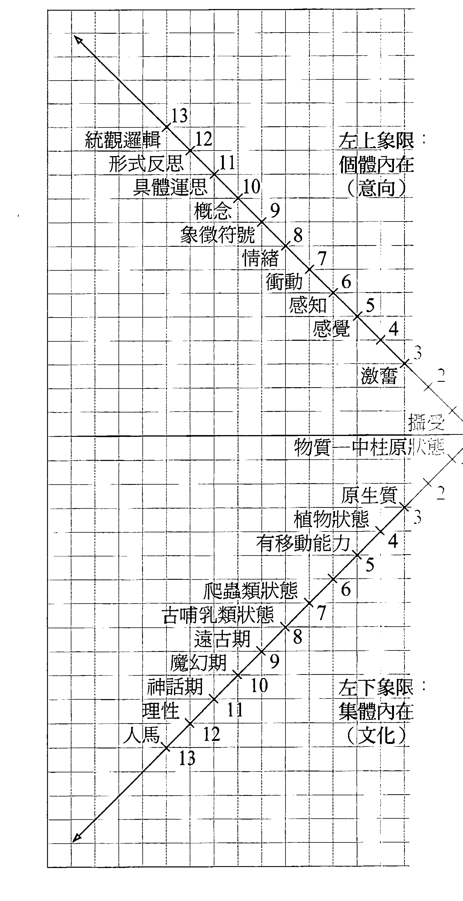
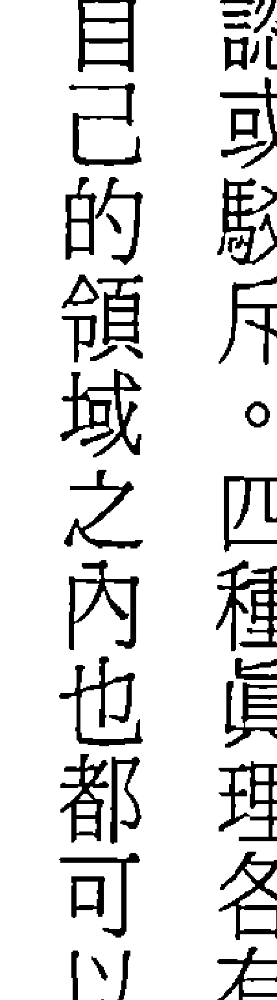
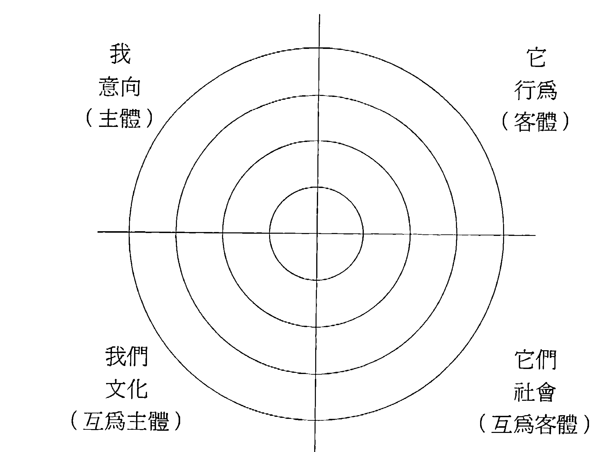
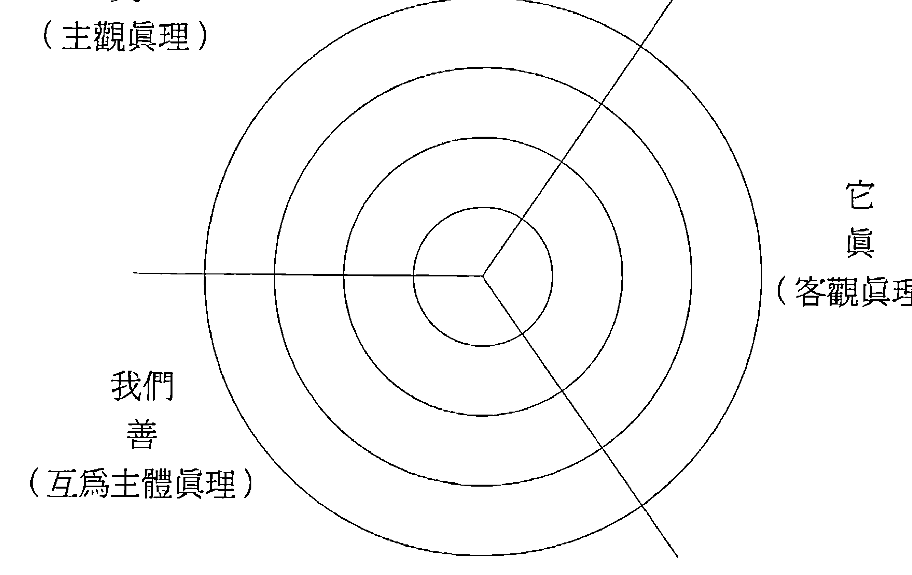
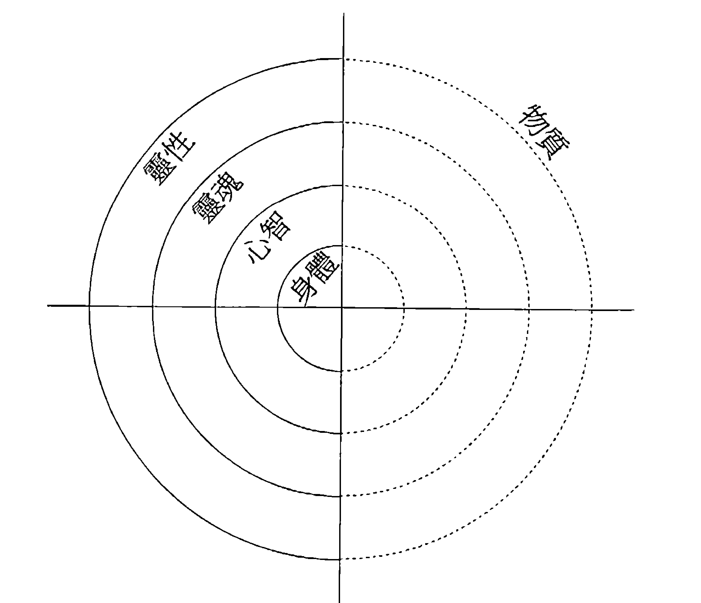
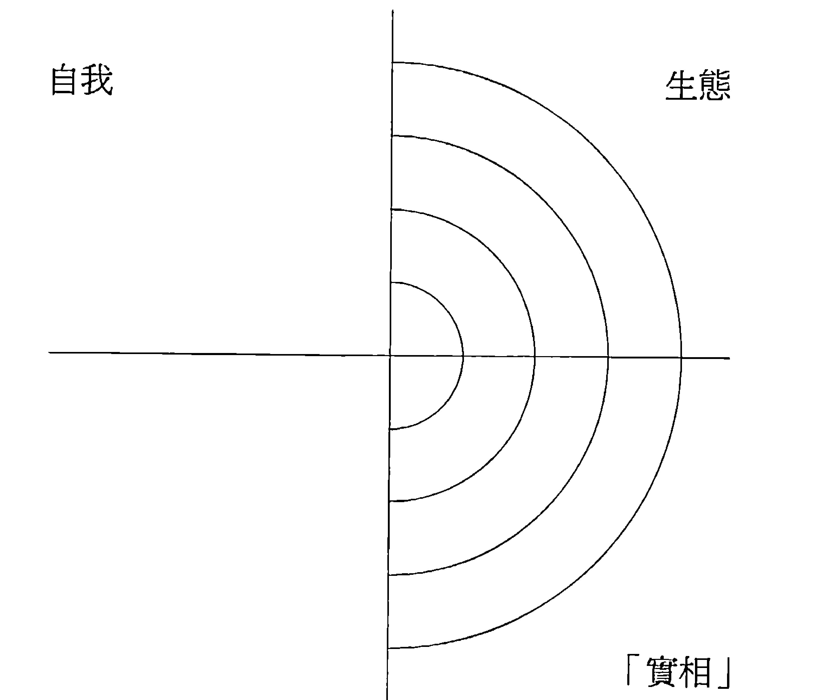

# 万法简史

兩性戰爭、現代解放運動、多元文化主義、生態學、環保倫理，還有多元性的入世與出世等兩途徑的衝突等等，肯恩·威爾伯針對這些世人關注但爭論不休的議題，提出原創而動人的整合觀點，邀請讀者共享一場非比尋常的法界巡禮。

# 皇家聖學院

# 肯恩·威爾伯的整合見地

作家、譯者、身心靈療癒課程講師 胡因夢

隨著理性啟蒙運動的興起，組織化宗教與形上學曾經替世界帶來的魅力效用已逐漸式微，而民主價值觀、個人主義與多元主義的極端發展，也導致整體人類朝著自戀、分化和過度主觀的方向盲進，並因而嚴重地威脅到社會、家庭與關係的連結。不可否認的，人類正普遍面對著一個乏味、膚淺、物化、量化而又迷失了方向的文明。在第二個千禧年的毀滅性災難尚未充分顯相之前，我們到底該如何對待演化、存在與終極實相等攸關人類存亡的議題？在各種知識體系呈現四分五裂、各不相容的情況下，我們要如何替這些不完整的真相找到正確的定位？在傳統宗教已經淪為神話、教條和無從證實的囈語，而科學只能闡述物質的基本事實，卻無法提供意義、價值與倫理之際，我們要如何拉攏二者，使它們相互對話？簡而言之，這股從法界之海奔湧而出的人類識能，如何才能融成一道具有完整階序的彩虹光譜？上述一連串的問題所揭示出的答案，不可避免地涉及了一種整合哲學或整合世界觀的可能性。但整合性的世界觀在本質上往往是獨斷與高壓的，凡受過理性洗禮的知識菁英鮮少有人願意再甘冒「法西斯」之名，去進行具有宏大企圖的統合動作，而且老實說，也鮮有人兼具了絕對真理的體悟與相對真理的邏輯歸納能力，那麼，這股識能中與日俱增的困惑、痛苦及憤怒，又如何才能化解成秩序和清晰的辨識？肯恩·威爾伯此生的貢獻，就是要幫助我們這個時代提出一個由空性含攝知識萬有的整合見地。他的整合哲學是靈性與理性兼具的，他主張我們必須朝著更高的意識發展，而這些高層意識雖然隸屬於主觀的內在精微次元，卻是含攝科學與理性的。就這一點來看，威爾伯的見地其實延續了東西方哲學與宗教傳承的精髓，以及現代性的核心精神。這個傳承起源於畢德哥拉斯、巴曼尼德斯、蘇格拉底、柏拉圖、亞里斯多德，然後傳遞給奧古斯丁、阿奎那斯、邁蒙尼德、史賓諾沙、黑格爾以及海德格。而東方智慧傳承對威爾伯影響最深的，則屬佛教上座部思想、龍樹中觀學派、華嚴學派、唯識學派、整合瑜伽、藏密大手印與大圓滿、論藏、吠檀多哲學、蘇菲神秘主義等等。至於威爾伯的超個人視野，則充分反映了威廉·詹姆斯、榮格、馬斯洛的心理學研究，更涵蓋了六○年代末期西方所發展出來的身心靈整合治療及東方默觀傳承。雖然長青哲學家、整合學家、超個人心理學者皆為人們加諸威爾伯的桂冠，但學界仍將他歸類為超個人心理學者，並視其為這個領域最卓然有成的理論家。

自一九七五年起，威爾伯的著作一直涵蓋超個人運動的完整面向，現年五十六歲的他早已是著作等身的多產作家。他擅長以流暢易懂筆鋒常帶熱情的書寫方式，來解析尖澀、隱微而又繁複無比的學術議題。他的洞悉力、整合力與綿密的歸納能力，吸引了歐美及亞洲世界無數的讀者。在日本，威爾伯被視為一派宗師，在德國，他是學院派熱衷研究的重要現象之一。宗教史權威休斯頓・史密士（Huston Smith）認為威爾伯在整合西方心理學與東方智慧傳承的貢獻上，遠遠超過了榮格；希拉蕊・柯林頓的精神導師珍・休斯頓（Jean Huston）將威爾伯與佛洛伊德放在同等重要的地位；約翰・懷特（John White）則稱其為意識研究領域的愛因斯坦。

一九九三年，威爾伯與過世的妻子合著的《恩寵與勇氣》（Grace and Grit）問世，一九九五年，《性、生態、靈性》（Sex, Ecology, Spirituality）這本重量可以用來槌鯊魚（威爾伯調侃自己的說法）的鉅作在美國出版問世，一年後他又完成了更適合大眾閱讀的普及版《萬法簡史》。這兩本書除了涵蓋他早期的的基本理論之外，還納入了過去從未處理過的系統理論、演化論、女性主義、生態思想，以及現代性與後現代性的哲學議題。

《性、生態、靈性》是威爾伯「法界三部曲」中的第一部，在他進行第二部與第三部的資料蒐集時，又同時完成了兩本著作和數篇論文，其中的一本就是《靈性之眼》（The Eye of Spirit）。此書是威爾伯最滿意的作品，書中結集了多篇整合哲學的論文，所涉及的議題包括了心理學、哲學、認知科學、藝術、文化、政經結構與歷史發展，書中他還以精簡扼要的語言，概述了他迄今為止的所有思想。在完成此書後，威爾伯又出版了《一性一體》（A Theory of Everything）、《整合心理學》（Integral Psychology）、《整合政治學》（Integral Politics）、《整合靈性》（Integral Spirituality）、《整合生活》（Integral Life Practice）等著作。

科學、意識研究、人類學、藝術和文學理論。一九九八年，他再度出版了美國前副總統高爾最心儀的《靈性復興》（The Marriage of Sense and Soul），一九九九年，他的私人札記《一味》（One Taste）也公開發行，此書史無前例地披露了威爾伯證入最高境界的生活實錄。

就這樣一本接著一本，威爾伯單打獨鬥地開闢了靈性洞見與古代唯識學的現代詮釋方式。

當人們還不知道該如何替靈修洞見定位，甚至還不能確定這樣的洞見是否夠資格被合理化為一門知識之前，威爾伯已經有能力以系統化的認識論來釐清這些疑惑。當人們還沒有能力分辨西方心理學與傳統靈修心理學的關係時，威爾伯已經提出結合佛陀與佛洛伊德的創見。他以自己原創的四大象現範，清楚地區分出不同的認知方式、不同的知識領域和不同的真理聲明，然而他所有的立論基礎都奠基在垂手可得的數據資料和早已被廣為接納的學術理論之上，因此並不是從古老傳統中發展出來的空泛形上辯證。近年來威爾伯更進一步地關注早期超個人心理學所忽略的領域，以及榮格學派對宗教和靈修境界的諸多曲解，並指出了世界各大宗教文化對肉身、大自然和女性的貶抑。

威爾伯處理的議題雖然博雜，他的方法論卻簡明而扼要，他認為任何一位思想家或評論家都不可能愚蠢到全錯，每一個人都可能觀察到一些不完整的真相，而各種不同的知識領域在純抽象的層次上，其實是相互融通的。譬如所謂的「神」，如果「神」的抽象定義指的是無限的神性，那麼基督教的「上帝」、佛家的「空性」和猶太教的「神之奧義」便能相互融通。這種處理知識的方法，威爾伯稱之為「定位歸納」或「駁不倒的推論」。一旦有了駁不倒的推論，學者就可以將各種領域的真理串連成緊密相繫的綱狀綱要，然後再利用這個綱要去評定那些較為狹窄的途徑之中，有哪些部分是不夠完整的。威爾伯主要的論點就是要促成人類明智地融合東西方的相對真理，共同以空性做為終極目標，相互交織成完整的脈絡。他強調法界是一直不停在演化的，因此新的真相不斷在顯現，新的啟示不斷被揭露，新的佛也不斷在冒出。法界就在這股自我超越的趨力之下，突破了過往的一切，也含攝了過往的一切。這便是神性無私而又無限的創造之愛。

# 譯序

在個人的翻譯生涯當中，有兩個人（作者）對我的影響最大，一個是深而透徹的老克（克里希那穆提），一個是廣而透徹的老肯（肯恩·威爾伯）。當然，說老肯「廣」而透徹並不妥當；只是「廣」是他明顯的特點，你不能看不到。他其實是深而廣。說他深而廣有兩個意思，一個是說他本人的見地深而廣，一個是說他的研究途徑深而廣。但這兩者往往互為表裡，相輔相成，渾成一體。由於譯者個人的淺薄，老肯本人見地的深廣，譯者只能在其邊緣翹足盼首張望，無法說是要在這裡闡述、見證。但是他研究途徑的深廣，倒是可以在這裡拾人牙慧，略述一二。
其實「深」——「深度」（depth），正是老肯的主要的「觀念」。我們要是說他對於現代與後現代（除了肯定的部分之外）的一切喟嘆、批判、提醒都是以此一觀念提綱挈領，實不為過。在理性自我的現代人心目中，人只有物質與生物兩個層面，除此之外別無他物；人的意識發展，到達理性階段之後，就是最高階段，往上就沒有了。甚至，有的人根本否定人有意識這個東西。因此，老肯的「深度」，指的就是人在物質與生物面之外，另有他「物」——人不是二維平面的東西，而是三維的存有，多出來的一維即是心靈、靈性；人不是只有表面，而是表面之下還有深度，此一深度即是心靈，即是靈性。現代科學理性將一切深度弭為平面，弭為表面；只論位置，不論其他；說了位置，就說了全部的知識；這是他喟嘆的所在，批判的目標，也是他整個學說發揮的著力點。

可是，面對理性科學巨大的力量乃至於主宰現代人思想、文化、世界觀、經濟、生產技術等每一層面的趨勢之下，要伸張此一「深度」，「勢必得有個做法」。於是他從進化論開始梳理。所有考古學的證據都是無可否認的，但是進化歷程中有些環節，科學的解釋卻使不上力。可以說，這些環節，科學的解釋和世人的理解其實是含糊其事。他以進化論認為鳥類的翅膀是由前肢演化而來為例說：「前肢也許是經過一百次的突變才變成有功能的翅膀，半翅半肢還不行；因為半翅半肢既不能飛，也不能跑，沒有一點適應環境的價值。換句話說，如果是半翅半肢，你有的只是淪為他人晚餐的可能而已。這幾百次突變必須在一隻動物身上，在其一生中完成，而且他還要找到一隻同類異性也完成了這幾百次突變，然後牠們還要互相找到對方，兩者都另外有晚餐吃，有東西喝，再進行交配，下一代才會產生真正有功能的翅膀。』套一句現在的人常說的台語：『這哪有可能？』科學的解釋在這裡真的只能含糊其事了。可見，天擇說的『天擇』，其實只是『擇』出已經發生的轉化而已，至於這個轉化的本身，其機制卻沒有人知道。這個『機制』就是奧秘所在。

進化論以『機遇突變』——偶然的突變——解釋宇宙的成因根本說不通。他說了一個故事：根據計算，一千隻猴子隨便（『偶然』）打字，恰好（『機遇』）打出一齣莎士比亞戲劇（『有秩序的宇宙』）的機率是一萬兆兆兆分之一，等於每十億個十億年發生一次。但是，我們這個宇宙到目前為止也不過才一百二十億年而已。根據計算，一百二十億年連偶然產生一種醇素都不可能，遑論產生如許複雜精密的生物域、意識如許發達的人，以及如此浩瀚卻又秩序井然的宇宙。

他在《性、生態、靈性》這本書的引論中開門見山就說：『這個世上有事情發生真是奇怪。起先什麼東西都沒有，然後發生『大爆炸』（Big Bang），於是有了我們大家。這真是奇怪。』科學一向認為無中不能生有，但是宇宙的確是無中生有。愛因斯坦說，他用數學計算這個宇宙，算到最後碰到一道牆，過不去了，那一道牆後面，就是屬於宗教的領域。這一一道牆後面的奧秘，就是創造中的神性。

當然，要論證這個創造中的神性，要論證進化是神性在創造，在顯化的過程，不能空口說白話。我們必須看到進化過程的每一次每一種發展都是往上一層的發展，不是隨意的，有時比原先高，有時比原先低，參差不齊的發展——這個時候，便是「全子」（holon）這個概念進入解釋架構的時候了。所謂全子，任何一個東西都是一個全子；任何一個全子都是「整體兼部分」——本身是完整的，但又是一個更大全子的一部分。較小全子含有較大全子的全部，加上自己另外的一部分；「反之則不然」——從這個「反之則不然」便可以判別哪一個全子屬於相對高階，哪一個屬於相對低階；用在進化歷程中，便可以判別個別進化發展階段是相對高或低，合起來又可以判別整個進化歷程是否真的是有秩序的逐層往上發展，「覺知意識」越來越高。這是一回事。

另外一回事是，每一次每一層的發展，是否確有其事，其內容是否確有其事——這個，在取證的時候，就不能有爭議，否則要見證神性的創造就見證不下去了。作者在這裡提出「定位歸納」（orienting generalization）做法，顯然深明行事義理。他接著以「兒童智力發展」為例說明「定位歸納」，關於兒童的智力發展可以分成幾個階段，各家的說法不一，有說七個階段，有說六個階段，有說三個階段等等；取證之時若是偏用其中一家說法，各家之間一定激辯不止，欲藉此見證神性之創造，殆矣！但是，如果在每一家的每一種階段分法中，我們找出了至少有三個階段是各家看法一致的，這個時候，再來說兒童的智力是分成三個階段照著這樣的順序發展的，便不會有爭議。進化或發展的每一步論證沒有爭議，其發展階段便大致可以確立。依據這樣的定位性通則，確認進化歷程的每一次每一層發展，加上前述高低階的判別，整個進化歷程的階序（除了「序」還要「階」）就大致可以確立了。見證神性是這樣見證的。
這個見證的過程，從作者年輕時初聞老子之道開始，中間歷經各種思辯、取證、論證，一直到近年拈出的「全層次全象限」觀點，作者思想的發展——照他自己的分法——歷經了五個階段，他自己稱之為威（爾伯）一至威五（《萬法簡史》屬於威四時期的著作）。整個期間他發展出幾個基本概念。要了解他，就必須了解這幾個時期和主要概念，限於篇幅，我只簡介他的基本概念：

-   全子。這個概念借自亞瑟·柯思勒（Arthur Koestler）：任何一事一物都是一個全子，都是「整體兼部分」，也就是，自己本身是完整的，都同時又是另一個更大整體的一部分。
-   二十條法則（the twenty tenets）。凡是全子，都依照這二十條法則運作，是為其運作的模式。老肯後來補充了兩條，說是「凡是全子都要寫借據給法界，所有的借據都會在空性中贖回」，十分有趣，十分有意思。
-   前超謬誤（the pre/trans fallacy）。這是作者對於靈性發展的理解一個最有貢獻的理論。我們常把前個人（prepersonal）狀態誤為超個人（transpersonal）狀態，因為兩者都是非個人（nonpersonal）。他常以納粹份子的集體心靈狀態說明這種謬誤。很多人都羨慕兒童的「無我」狀態，說是無異於「得道」之人；或是反過來，說某些「得道」之人都有一顆無我的「赤子」之心。

### 4. (學說的) 五個階段 (the five phases)

老肯的學說，他自己分為五個階段，稱之為威一至（目前的）威五。一般評論家評論他時，依據的常常是他較前期的著作，很麻煩。

### 5. 四大象限 (the four quadrants)

要理解人的意識發展，必須從這四大象限來看才算完整：集體、個體、內在、外在；又可說是社會（集體外在）、文化（集體內在）、意向（個體內在）、行為（個體外在）；又可說是互為客體（集體外在）、互為主體（集體內在）、客體（個體外在）、主體（個體內在）；又可以簡化為我（個體內在）、我們（集體內在）、它（外在）；又可以說是真（外在）、善（集體內在、互為主體、我們）、美（個體內在、我、美）、法（外在）、僧（集體內在、我們、善）。

### 6. 整合哲學 (Integral Philosophy)

整合哲學志在整合前現代、現代、後現代哲學的精髓，但也要避免其中任何極端的形式。

### 7. 十個層次 (the ten levels)

作者針對人的意識發展，提出這個十個階段說，包括四個前個人、三個個人、三個超個人階段。每一個階段如果發生問題，也都有每個階段特有的病理。

### 8. 整合政治學 (Integral Politics)

作者近年來開始將他的整合途徑延伸到政治之上；他提出的觀點是以自由主義的靈性（liberal spirituality）和神秘人本主義（mystical humanism）容納左、右、上（up）——這個「上」是左右派一向都忽視的。

-   進化與內化（退化）。他的觀點從頭到尾都是進化的觀點。有進化，會進化的，不只是自然界，文化、靈性也都會進化。奇妙的是，在背後支持這一股進化驅力的，卻是退化（內化）過程。
-   三種科學（three types of science）。他重寫科學哲學，不但容納自然科學和社會科學，而且加入另一種科學：打坐、瑜伽、禪修。他要求那些否定人有靈性層面，否定人的意識還可以超越理性階段的人自己做實驗，有了實驗所得資料再來評論。因為那些打坐、瑜伽的經驗都是可以依循相同的過程複製，如同科學一般，所以他说那是另一種科學——「軟科學」（soft science）。
-   法界（Kosmos）。他認為整個宇宙不只是物質，裡面還有神性。為了完整表達這樣的意思，他借用了畢達哥拉斯的Kosmos之說，中文恰好有「法界」一詞在意義上與之相應。

這幾個基本概念貫穿於他的各個時期之間，都可以當作我們的路標，在我們跟隨他的思路尋思的時候，知道自己走在什麼路徑之上。透過這些基本概念的穿針引線，我們回頭再看他論證創造中的神性，就知道他是兩頭銜接。一方面當然是在進化歷程中找出一個逐層漸完整漸高超的發展模式（不是機遇，不是偶然）；另一方面則是找出「過去曾經有少數菁英、天賦異稟之人或所謂「時代先驅」達到這種高深階段」背後的模式，印證兩者的相符相應，拈出人在進化路上終必走到靈性的、超個人超理性的階段。他甚至說，這個階段事實上「已經在街邊路口等著我們」。

譯者為了翻譯本書，前前後後看了不下十遍，每次看每次擲書長嘆。擲書長嘆當然是因為感動。作者治學方法之嚴謹，組織能力之高強，有幾分證據說幾分話的誠懇是其餘事；書未根據全子的三種價值申論人必須權利與責任並重，除了享受權利，還必須好好負起責任；這是眼光落在生物、人、地球的生存層面上，其深刻心意流露的警語。至於超越層面，他喟嘆德國從謝林（Schelling）以降——系唯心論曇花一現，見地凋零，致使『人類錯失了一次機會』——錯失了一次意識層次往上超越的機會。試想，人類在那一波唯心論思潮中，曾經有可能超越現代的理性階段，往神性再接近一步……。當然，他說，原因就在這一派人『沒有瑜伽』，沒有實修，因此無法把一時的另類意識狀態（altered states），轉變成永久的特質。因此，他在二〇〇〇年出版的修正版裡面，把最後一章的最後一節改為『整合的觀點』，提出我們如果超越理性為目標，便必須要有『道路』才能達到這個目標。這裡的『道路』，便是實修——四個象限、全象限的實修；不但要在個人情感、心智、靈性面（個體內在）探索，修行，打坐——大家一向都只是在這個象限努力——而且要鍛鍊身體（個體外在），譬如如運動、注重營養、注意飲食等；另外要實踐自己對集體外在的責任，譬如環保；還要處理好自己與家人、朋友、社群的關係（集體內在），使關係成為個人成長的一部分，也降低自我中心傾向，從事社會服務（慈濟基金會在這一方面的事功令人肅然起敬），道德精進等。

> 「兼顧的層面越多，它們所發揮的效果就越大，因為這些方法與你生命的每一個層面都息息相關。你要勤勉地修煉，集中全力讓身心的潛能展露——直到身心的各個層面從空寂中徹底顯露為止。」（摘自胡因夢譯之《一味》）。

人超越的潛能是跨文化的，普世的可能性。作者一生幾十年的探索、撰述，一直是在提醒世人這個潛能的可能性，跨文化的可能性；不但如此，他自己身為一個西方人，其實就是這種潛能的證例。

# 二版序

《萬法簡史》是我最受歡迎的幾本書之一。這本書感人的地方在於，它包含了很多我發展出來的整合觀點。「整合」的意思是說，這種途徑試圖盡可能從各個學科，從東西方，從前現代、現代、後現代，從物理等硬科學到靈性學等軟科學，容納所有的真理，越完整越好。

正如一位評論者說的：「歷史上從未有一研究途徑（如本書一般）容納並榮顯這麼豐富的真理。」我個人寧可相信這是真的。但是，讀者看完這本書，將是最好的裁判。

但如果是真的又怎樣？所謂「整合」指的是什麼？在今天的世界又和我（每一個人）有什麼關係？我們現在就來看看整合的途徑和商業、科學、靈性的關係。

研究人類——前現代、現代、後現代——各方面文化豐富的多元性深感驚訝。那一道美麗的，多元文化的，多種色層的人文彩虹，在宗教、倫理、價值觀、信仰方面顯示出那麼多重的差異。但是，令學者驚訝的，還有那多重的相似，譬如人的語言、認知、生理各方面，不論到了世界的哪個地方都非常類似。不論是哪裡，人都能夠建構影像、符號、概念。概念的內容縱或往往不同，建立概念的能力則一。這一普世的、跨文化的模式啟發了我們一些人類狀況重要的事情；因為，如果你發現的是大部分人乃至所有人共有的東西，那麼或許你已經發現某種深刻的意義。

那麼，如果我們把這種共有的模式拼接起來，我們會看到怎樣的圖像？

這有點像是人類基因排序計畫（the Human Genome Project），只是我們現在要排的是人類的意識和文化，是世界各地人類具備的文化能力。這樣的拼接之後，我們看到的是一幅人類潛能的地圖，人的種種可能性的地圖。這樣的地圖能夠幫助你我找出自己目前尚未具備的能力。這一幅地圖將引導我們向高階成長，引導我們掌握更好的機會。

不過，如果我們告訴你這種意識與文化（排序）計畫（the Consciousness and Culture Project）有很多已經完成，或許你會感到驚訝。這種意識與文化排序計畫是世界各地數以千計研究人員研究的結果，揭露了極深範疇之內的高等意識狀態、成長階段、靈性模式；種種科學研究成果反駁了長久以來經過科學唯物論及只論表面的後現代主義檢查的說法（versions）。

讀者將在本書看到，種種潛能及可能性都是本書即將呈現的這一幅地圖重要部分——這一幅地圖是一種「萬法理論」（萬物理論、一切事物理論）。所謂「萬法理論」是說，如果全世界各地的每一種文化都是重要的部分真理，那麼要怎樣才能夠把這些文化真理拼接成繁美的織錦，拼接成多元中的統一，拼接成多種色彩的彩虹？

還有，一旦拼接完成，接下來又要如何實際應用在我們身上？其實可能很簡單：準確的、完整的人性潛能地圖可以輕易的轉譯成高效能的商業、政治、醫學、教育、靈性。反過來說，如果你的地圖是部分的，斷章取義的，片面的，那麼你在商業、醫學、靈性等方面的途徑也將是部分的，斷章取義的，片面的。狗嘴向來吐不出象牙。

因此，不論你努力的領域是哪一個部分，只要有「萬法理論」，你的努力都會更有效能。所以難怪這幅完整全面的人性潛能地圖已經成了政治、商業、教育、保健、法律、生態、科學、宗教等，幾乎是每一個領域極度關切的事物。這一方面近年實際應用的情形，有興趣的讀者可參閱《萬法理論：商業、政治、科學、靈性的整合觀點》（A Theory of Everything: an integral vision for business, politics, science and spirituality）。

但是基本的東西在本書都已齊備。要判斷這幅地圖對你是否有用，你需要知道一些東西，本書可以提供給你。這幅地圖乍聽之下好像很複雜，但是你只要一掛起來看——一如我在本書所為，你就會發現這幅地圖其實很簡單，很容易用。看完本書，你會具備所有必備的工具，隨心所欲應用之。

最後一點：全面而完整的地圖會使你目前對事物的理解更豐富，而不是否定你目前的理解。有的人不喜歡整合的途徑，覺得整合的途徑意味著他們目前的方式是錯誤的。不過，如果真的這樣認為，那就像是法國菜廚師感覺墨西哥菜威脅到他一樣。其實我們只是增加一些風格，並沒有貶抑原來有的東西。我喜歡法國菜，也喜歡墨西哥菜。兩者都受到欣賞並不會使其任何一種消失。『法國菜廚師』如果會抗拒整合途徑，多半是他原本就鄙視墨西哥菜的緣故……這種態度沒有好處。

因此，讀者將在本書發現一種『料理』上的國際性風格——人性潛能豐盛的自助餐，全部排列成一道亮麗的彩虹，一道你高深潛能的光譜。這幅地圖其實是邀請你一起探索你廣大的意識領域，你幾近無限的『存』（being）與『變』（becoming）的潛能，從這裡抵達你其實從未離開的地方，也就是你自己最深的本性，自己的本來面目。

# 導論

-   問：這本書有沒有提到性？
-   威：有！還有圖表。
-   問：你在開玩笑吧！
-   威：沒錯。不過，性，尤其是性與性別的關係，確實是本書主題之一。
-   問：性和性別不一樣吧？
-   威：一般都用性或性欲指人類繁殖的生物面，性別（gender）指男女在文化上形成的差異。性差異（sexual difference）通常用雄性和雌性來分別；文化差異（cultural difference）則是用男性和女性來分別。雌性雄性是生物面的差異，男性女性是文化面的差異。
-   問：所以，關鍵在於弄清楚哪些特質屬於性，哪些特質屬於性別。
-   威：就某種意義而言，是的。雌雄的性差異主要是生物差異，因此是普世的，跨文化的——普天下的雄性都會製造精子，雌性都會製造卵子、生產、授乳等等。但男女兩性的差異卻是由文化創造或塑造出來的。

今天兩性關係之所以這麼惡劣，部分原因就在這裡。一方面，雌雄差異是生物性與普世的，所以不可能有多大的改變；但男女差異在許多方面卻是由文化創造出來的，因此至少在某些方面是可以改變的。我們的文化正試圖改變兩性角色。這個過程很麻煩。

-   > 問：比如？
-   > 威：比如說，雄性的身體一般比雌性強壯，肌肉也比較發達，但不表示男性一定強壯、界定。

界定了，以致於兩性之間戰爭不斷，彼此都很怨恨對方。
部分的關鍵在於，男女角色固然可以重新塑造和界定——老實說這已經拖太久了——但雌雄差異，怎麼可能不出問題呢？消除男女兩性差異這個想法不錯，抹煞雌雄差異卻不可能。關鍵在於認清其中的分野。

-   > 問：所以，男人和女人的差異有些需要保留，有些卻需要改變？
-   > 威：我們只要探討到男人和女人性與性別的差異，就會發現某些差異普遍存在於各文化之間，甚至存在於各文化的文化部門之間。換句話說，各文化之間普遍存在的不只是性差異而已，還包括一些性別差異。

我想這是因為男女的生物性差異構成的基座太穩固了，以致於影響到文化領域，顯現為文化上的性別差異。所以，性別角色雖然是文化塑造的，不是生物稟賦，但各文化之間還是出現了一些男性常態（masculine constants）和女性常態（feminine constants）。

-   問：男性常態和女性常態這種說法在以前爭議很大，現在好像比較能被接受了；前後才不過十年而已，實在令人驚訝。
-   威：對，不管是性還是性別，雌雄兩性的價值觀常有極大的差異，現在連激進女性主義者都同意這一點。一般而言，男人比較傾向於高度個人性，強調自主、權利、正義、自理；女人則往往對關係很敏感，注重交流、關懷、責任、關係。男人喜歡自主但害怕關係，女人喜歡關係但害怕自主。

這一方面，卡洛・吉莉根（Carol Gilligan）和黛博拉・譚能（Deborah Tannen）的著作非常重要。就像你說的，現在大部分正統學者和女性主義學者都同意，雌雄兩性的價值觀確實有些根本的差異；才不過十年而已，實在令人驚訝。所謂「演化心理學」（evolutionary psychology）這一門新學科，研究的就是生物的演化對心理特質的影響。

麻煩的是，如何才能承認這種差異，但不會像以往那樣利用這種差異來剝奪女性的權益。

-   問：了解。不過，現在的情形好像已經反過來了。有人利用這種差異來佔便宜。你了解嗎？因為通常只要有人說人與人之間有什麼差異，優勢者都會利用這種差異宣稱男人天生就是蠢蛋，是睾酮 (testosterone) 變種，「怎麼說都不懂」，言下之意就是，男人應該敏感一點，對人多一點關懷，多一點愛心，多注重關係。你所謂的雄性價值觀現在到處被批評，說穿了就是在質疑：男人為什麼沒辦法像女人那樣？
-   > > 威：對，聽起來有那麼一點「位置對調，遊戲才公平」的味道。以往大家都說女人是「有缺陷的男人」；最典型的說法就是女人有「陽具妒羨」（penis envy）情結。現在卻反過來說女人「有缺陷的女人」——界定的標準不在於男人「具有」什麼屬性，而是男人「缺乏」女性特質。這兩種說法都很荒謬，更別提貶低兩性、不尊重兩性了。

一開始我就說了，麻煩的地方就在於這兩件事都很困難，又都必須做好，第一是（按照吉莉根的方式）找出雌雄兩性價值觀的差異；第二是找出一些方法來公正的評斷這種差異。目的不是要使男女兩性變成一樣，而是要公正的看待兩者。

大自然將人分成兩性不是沒有理由的，因此想要消除兩性差異實在很愚蠢。只是即便最保守的理論家都承認我們的文化一向偏重雄性價值觀，因此現在要將天秤拉回來，過程才會那麼繁雜、痛苦，搞得雙方都憤恨不平。但是不論如何，大家都要認清，我們不是要消除兩性差異，而是要使兩者平衡。

-   > > 問：這種兩性差異是否源自於生物面的雌雄差異？尤其是賀爾蒙。不論是實驗結果或是觀察跨文化現象，或是胚胎成長，甚至是婦女為了治病而注射睾酮，所有睾酮實驗全部指向一個結論，那就是——抱歉，我不是故意要粗野——睾酮基本上只有兩種驅力，一種是幹，一種是殺。因此，雄性幾乎從出生第一天開始就一直在承受這種生物夢魘；這種事情女性很難想像（除非她們為了治病注射睾酮而發狂。曾經有一位女士對醫生說：「我無時無刻不想到性。拜託，醫生，你能不能讓它停下來？」）。更糟的是，男性有時會將這兩種作用結合、混淆。想想看，幹和殺聯手，當然不會有什麼好結果。女性同胞一定很想指出這一點。
-   > > 問：雌性也有這種雌性特有的東西嗎？
-   > > 威：催產素（oxytocin）吧！你只要摸一下女性的肌膚，這種賀爾蒙就會充滿她的全身。所以有人說催產素是「關係劑」，會使女性產生很深的眷戀、連結感與愛意，想要擁抱、撫摸。不難了解，睾酮和催產素兩者在生物演化中都有其根源。前者用於繁殖和生存，後者有助於養育子女。在動物界，大部分的性交只要幾秒鐘就完成了；而且過程中雙方隨時都可能遭到掠食。這為「晚餐與性」帶來了新的意義，【譯註】因為性交時你隨時可能變成人家的晚餐。所以男人變成了「搞完就走」，不會分享情感，表達情緒或擁抱——男人真的差不多就是這樣。敏感先生這種男人，這種神話人物或小可愛（weenie）是近代才發明的東西；男人或許還要一點時間才會慢慢習慣。

> >【譯註】「晚餐與性」是英文的說法，原意為男女約會先共進晚餐，然後做愛。

但養育子女的生物性條件就不一樣了。母親必須一天二十四小時陪著嬰兒，對嬰兒的痛和餓尤其要特別敏感。催產素讓她待在嬰兒身邊，全神貫注於這一層關係，非常執著。這種情感絕不是幹或殺，而是細心的、全面的、關注的、機敏的呵護。

-   > 問：所以，「敏感先生」這種性別角色和他的性別角色是抵觸的？
-   > 威：從某些層面來看，沒錯，但這並不表示男人無法或不應該敏感一點。今天，這件事已經不容推拖了，不過男人的確必須「接受調教」才有辦法敏感一點。這種角色必須「學習」才演得出來，理由有很多。當男人朝著這種陌生的景象摸索前進時，我們不能讓他們稍有鬆懈的機會。

女性也是一樣。要在今天的世界裡作女人有一些新的條件，其中一部分就是爭取自主，而不是用各種關係來界定自己。當然，這就是女性主義偉大的召喚，要女性以自主和內在價值來界定自己，而不是以自己與他人的關係來界定自己。我們不該貶抑關係的重要性，不過女性的確應該以成熟的自我為榮，而不是面對他人便壓抑自己。

-   問：所以，男女兩性都在對抗自己的生物天性？
-   威：就某方面而言確實是如此。然而這就是整個演化的重點：永遠超越以往的侷限，永遠在拓展新的疆界，然後打破，再超越，進入一個涵蓋更廣、更完整的模式。雄性與雌性的傳統角色曾經必要而且適當，今天卻已經過時，顯得捉襟見肘，不合時宜。所以今日的男女兩性都在努力超越原來的角色——是超越而不是抹煞，這是最麻煩的地方。演化永遠都是超越和包容，容納而又突破。

因此雄性還是會有睪酮衝動——不是幹，就是殺。我們還是得先接受，然後再調適成適當的行為模式。在某一個程度上，男人永遠都想衝破限制、突破桎梏，在過程中發現新東西，創造新的生活模式。

至於女人，正如激進女性主義者堅持的，女性基本上還是一種關係式的存在（relational being），以催產素為核心，可是必須以這個關係式的存在為基礎，建立堅定的自尊和自主。她還是很珍惜關係，但同時也會珍惜成熟的自我。

所以對兩性來說，這個過程一直都是超越又包容，包容又超越。在目前這個演化的階段，不論男女都在努力超越自己的性角色，原本是男人高度注重自主，女人高度注重關係，現在則是男人正在學習接納關係，女人正在學習自主。這個過程很困難，因此男女兩性在彼此眼中都成了怪物。所以我覺得雙方都溫和一點很重要。

-   問：你說雄性取向在我們的社會由來已久，但這種傾向現在已經開始在平衡。
-   威：雄性取向就是一般所謂「父權體制」。大家每次講到「父權體制」這四個字就一副不屑的樣子。但如果真要說是男人把這種體制強加在女人身上，卻未免太草率了一點。照這種講法，只要男人說：「啊，真抱歉！我沒有那個意思要壓制你五千年。我到底在想什麼？」我們可以重新開始嗎？是不是問題就解決了？這種講法顯然太過於天真無知了。

事情絕沒有那麼簡單。人的發展過程一定是因為情況難以避免，才會出現「父權體制」。人類是一直發展到現在才到達不需要這種體制的地步——所以我們現在才開始有能力從根本之處「解構」父權體制，或者說才能夠以比較溫和的方式打平兩性價值的帳目。這不是在革除什麼殘酷的傳統，而是脫離一件已經沒有必要的事，繼續成長下去。

-   問：這樣看父權體制，眼光顯然不一樣。
-   威：好！如果採取標準觀點，說父權體制是一堆虐待狂兼權力飢渴的男人強加在女人身上的東西，那麼我們對男人和女人就只能有一種定義：男人是豬，女人是綿羊。但是，如果認定男人總是在蓄意壓迫另一半的人類，也未免把男人說得太可悲了。男人不管有沒有睪酮，都沒有邪惡到那種地步。

說起來不可思議，這種講法其實是抬舉了男人。本來按照女性主義者的說法，男性因為過度獨立，所以彼此之間不管什麼事都無法取得共識；但現在反過來說他們團結起來共同壓制另一半的人類；更驚人的是，竟然在每一個文化裡都壓制成功！竟然有女性認為男人有辦法做到這一點，身為男人的我真有點受寵若驚。長久以來，這大概是我聽過的女性主義者對男人最高的讚美了。我還要提醒你一點，男人建立的政府從來沒超過幾百年；然而照女性主義者的說法，男人進行這種群體宰制卻已經有五千年之久，甚至有人說已經有十萬年之久。這些男人真行，我愛死他們了。

話又說回來了，強調男人從一開始就在壓迫女性的「強制理論」（imposition theory）所描繪的女性才真的可怕。因為你不可能堅強聰明，卻又受人壓迫。因此這種理論必然會將女性描繪成比男人柔弱，也／或比男人愚蠢的綿羊，而完全忽略男女在演化的每一階段共同創造的兩性互動社會形態，聲稱女人大部分是由另一方塑造出來的。換句話說，這些女性主義者口口聲聲要消除的女性形象（綿羊），其實是她們自己認定，自己假設出來的。其實男性不是沙豬，女性也不是羔羊。

所以我一直在努力的一件事，就是根據晚近的女性主義學術，追溯歷代女性其實一向擁有的力量。歷史上，女性依靠這種力量影響各種文化結構，並且與男性共同創造各種文化結構——包括所謂的父權體制；只是我們現在看不出這種力量罷了。別的不說，我的研究途徑有一部分就是要讓大家了解男人不是蠢蛋，女人也不是被男人洗腦，容易豢養，老是受騙。

-   問：你在各類著述中追溯人類進化的五、六個階段，檢視每一個階段兩性所處的地位。
-   威：對。我相信，觀察人類意識演化的各個階段，檢視各階段男女兩性的地位，可以從其中得到清楚的結論。
-   問：這個研究途徑大致談了些什麼？
-   威：首先，我們要將那些不會隨文化的不同而變動的生物常態找出來，比如男人平均而體力比較好，動作比較敏捷，女性則能夠繁衍子女、分泌乳液等等。這種生物常態看起來好像沒什麼，甚至很瑣碎，但是對兩性的文化差異和性別差異影響卻很大。
-   問：請舉例說明。
-   威：譬如，假設你們的文化是以騎馬放牧為生產手段。珍妮特・雪菲茲（Janet Chafetz）就指出過，參與放牧活動的女性流產率總是很高；若是達爾文進化論的觀點來看，女性不投入生產活動自然比較有利，所以這個時期的生產領域差不多都是男人的天下。沒錯，百分之九十以上的放牧社會都屬於「父權體制」。但是要解釋父權體制並非一定要用「壓迫」觀點。證據顯示，在這種架構之下，當時的女性還是可以自由參與生產活動。反過來說，如果我們落入無知的反射，認為這種社會裡的女性不具備現代女性主義者所認同的作風，勢必是因為受到了壓迫，那我們就是在玩男人是沙豬、女人是綿羊的遊戲。貶抑兩性莫此為甚。沒有人否認這種體制有的的確確有問題，甚至很可怕。但是我們發現，兩性只要互相對立或隔離，雙方都很痛苦。事實上，證據顯示父權社會對一般雄性的要求遠比雌性嚴苛；如果你願意的話我們可以討論其成因。就這一點而言，意識型態和受害者政治學是派不上用場的。

以受害者所享有的優點來交換女性權力，自己就會造成自身的挫敗，到頭來反而預設並強化了她們原先想要克服的問題。

問：所以，你說我們要看清楚兩件事：第一是兩性之間普遍存在的生物性差異。第二是這種恆久不變的生物性差異在人類文化演進的五、六個階段當中產生的作用。一個總的觀點是，從這種研究途徑出發，可以找出歷史上導向男女平權社會，也就是讓男女價值觀處在平等地位的因素。其實，就算是平權社會，也未曾真正平等對待過男女兩性，只是找到了兩者之間的平衡點罷了。今天，大家都在追求和諧，那麼，把這種因素找出來，才會了解什麼東西需要改變，什麼東西可以保留。

因此，我們該學習的是用平等心來評估男女價值觀的差異。這種差異是永遠存在的，就算讓激進女性主義者來看也是一樣。至於怎麼做，我們後面會談到。

# 本書討論的範疇

問：我們現在討論人的進化的各階段，其實只是一個大研究計畫的一部分。我們計畫觀察整體的演化過程，也分別從自然、心智、文化、靈性各領域，也就是潛意識、意識、超意識各階段，觀察演化的過程。你的《意識光譜》（The Spectrum of Consciousness）、《小我計畫》（The Atman Project）、《起自伊甸園》（Up from Eden）、《性、生態、靈性》等十幾本書都有討論到這個問題。我們想做的是逐一檢視意識進化、靈性發展、男人和女人的角色、生態、人在法界中的位置等各方面的觀念，看看是否有一種比較簡單的討論方式，讓大家更容易理解。

威：先從一個驚人的事實說起。演化上有一條軸線是從物質貫穿到生命，再從生命貫穿到心智。物質、生命、心智這幾個領域，有幾個固定的模式，或者說一再出現的法則與習慣。我們可以從這種不尋常的模式開始談起，因為進化的奧秘似乎就暗藏其中。

問：你也觀察了意識演化的高深階段——最恰當的說法應該是靈性（spiritual）階段。

威：對。提到這個階段，就得講到謝林（Schelling）、黑格爾（Hegel）、奧羅賓多（Aurobindo）等東西方演化理論家所提出的主題。重點是，相應於他們所提出的不二法門，將演化視為創造中的神性（spirit-in-action）或形成中的神（God-in-the-making）是最恰當的。神性（Spirit）會在每一個發展階段開顯，每次開顯都更清楚的展現自己，了解自己。神性並不是特定的哪一個階段或哪一種受歡迎的意識型態，更不是某個香火鼎盛的神，而是彰顯其自身的整個過程，在每一個有限階段徹底展現出無限本質的過程。隨著每一次進化的開顯，神性都會更接近自己。

在這種高深階段開始意識到自己，覺察到自己，認識到自己真實的本質。

所以沒有錯，我們可以根據世上偉大的智慧傳承來審視這種演化開顯的高深階段。神性許多人都以為這種高深階段很神秘，很「神奇」，但其實它是很具體、很真實，而且是可以捉摸的。你我都可以進入。那是人人本具的深層潛能。

問：你發現世上偉大的靈修傳承可以分成兩大陣營。

威：對，審視東西南北四方各種試圖領悟「聖神」（the Divine）的途徑，你會發現有兩種靈修類型，我稱之為上溯空性（Ascending）之道和下及萬有（Descending）之道。

上溯空性之道純粹是超越的，來世導向的；表現出來通常是道德嚴謹、禁欲、瑜珈的境界，貶抑或否定身體、感官、性、俗世、肉欲；它不在世間尋找救贖王國，視物質顯化或輪迴為邪惡或虛妄，它追求的是徹底擺脫輪迴。事實上，對上溯空性者而言，任何下及萬有之道都是邪惡或虛妄的。上溯空性之道榮顯太一（the One），不容顯萬殊（the Many）；榮顯空性（Emptiness），不容顯色相（Form）；榮顯天國，不榮顯人世。

下及萬有之道則完全相反。下及萬有之道徹底傾向現世；榮顯萬殊，不榮顯太一；讚美俗世、身體、感官、性欲；認爲感官世界、蓋婭（Gaia）【釋註】、物質即是神性；甚至每一次日出、月升都是人可能擁有的神性。下及萬有之道輕視所有超越的事物，認爲神性遍布於全宇宙。事實上，對下及萬有者而言，任何上溯空性之道都是邪惡的。

【釋註】原為希臘的地球女神之名，代表地球。

問：我們要討論的事情之一就是下及萬有和上溯空性之間的「戰爭」史。這兩邊一向視對方為魔鬼。

威：對，這場仗至少打了兩千年，非常殘忍，仇恨甚深。在西方，大概從奧古斯丁（Augustine）到哥白尼（Copernicus）這段期間，出現了徹底來世觀的上溯空性理想：肉身、俗世、此生皆無法使我們獲得最後的救贖和解脫。意思是說，你的現世可能過得不錯，可是真正有意思的生活卻要等你死後才擁有。

但是當時時代進入現代性（modernity）和後現代性（postmodernity）之後，我們卻看到另一波深遠而徹底的逆轉：上溯空性者出局，下及萬有者進場。

問：你是說「下及萬有者開始稱霸」。這個主題我們後面還會討論。現代世界和後現代世界幾乎完全由純粹的下及萬有觀念，或者說下及萬有世界觀所主宰。

威：平面世界觀——感官、經驗或物質的世界就是唯一的世界。其中沒有什麼較高或較深的潛能，譬如高深的意識演化階段；因此眼睛看得到、手抓得到的就是我們的全部，根本沒有什麼上溯空性的能量，也沒有所謂「超越」這一回事。對下及萬有者而言，所謂上溯空性或超越境界，說好聽是誤導世人，說不好聽根本就是邪惡。

問：但是我認為，最要緊的其實是把上行之道和下行之道兩者的精華融合起來，不是嗎？

威：對，我相信兩者都有很重要的事情要告訴我們。

問：反過來說，如果兩者各行其是，或總是要否定對方，結果只會製造一些狹隘的，偏頗的，壓迫的策略。

威：我相信確實如此。我們都知道純粹的上行之道非常的壓抑，禁欲；這是它的壞處。上行之道總是否定，輕視，乃至於壓抑身體、感官、生命、地球、性等等。反過來，下行之道也有侷限之處。如果完全不講超越，我們就無法超越純然的感官。我們會拘限在表面的感官感覺之上，拘限在膚淺的「門面」之上，把我們每個人隔離，無法互相结合。沒有超越或上行，我們就只有下行世界，就只有膚淺的，異化的，片面的下行世界。

問：你說這種純然的下行世界叫做「平面世界」。

威：對，我們這些現代人和後現代人差不多都活在這種下及萬有的網絡之內——平板、蒼白，無盡的感官享受，擁有的只是單調乏味的表相。不論是資本主義或馬克思主義、工業主義或生態心理學、父權中心科學（patriarchal science）或生態女性主義、我們的神或我們的女神，都是肉眼可見、感官可以感覺，可以用情感包裝，以激情崇拜的神；你可以盡情吸食祂，直到祂形銷骨立為止。

不論自認有無靈性，我們這些平面世界人膜拜的都是純然下及萬有的神、感官的女神、感官的世界，只標明位置不講其他的黑白世界，一個你可以染指的世界。在我們的視野之內，除了這具體可見的神之外，再也沒有什麼高深的東西了。

問：你曾經說過，東西方偉大的不二傳承，都曾經想融合上溯空性之道與下及萬有之

威：對，把超越與無所不在、太一與萬殊、空性與色相、涅槃與輪迴、天國與人世平衡一下。

問：那麼「不二」（Nonduality）指的就是融合上溯空性和下及萬有的狀態嗎？

威：對，沒錯。

問：所以我們要討論的另一個重點就是上溯空性和下及萬有這兩種趨勢，以及這兩種趨勢的融合。

威：這一點很重要。因為上溯空性和下及萬有兩邊都有很重要的事要告訴我們。上溯空性和下及萬有兩種趨勢只有互相融合，彼此才能和諧相處；再繼續鬥爭下去，情況永遠不會改變。兩種趨勢唯有匯合，彼此才會得救。要是大家——你我——都不為這種匯合努力，不但會毀掉我們唯一的人世，也會失去我們唯一可能擁有的天國。

# 部一

# 創造中的神性

## 第一章 萬物聯結的模式

問：我們的故事從「宇宙大爆炸」（the Big Bang）開始，然後從物質到生命再到心智，如此追溯整個演化過程。隨著心智或是人類意識的浮現，我們將探討人類演化的五、六個階段。但這一切都要放在靈性（spirituality）的脈絡、靈性的意義、歷史上的靈修傳承採取過的種種形式，以及未來可能採取的形式來談才可以。我說的對嗎？
威：沒錯，這差不多就是一部萬物史綱了。聽起來很龐大，但其實是奠基在我所謂的「定位歸納」（orienting generalizations）這個原理之上的。定位歸納大大簡化了整件事情。
問：定位歸納到底是什麼意思？
威：從物理學到生物學、心理學、社會學、神學，再到宗教，我們只要檢視人類知識的各個領域，都會發現其中有幾個主題是全面性與普世性的，大家對於這幾個主題的看法都很接近。
譬如，論及道德發展，寇伯格（Lawrence Kohlberg）提出的道德發展細部階段並不是每個人都同意，吉莉根根據他的觀點再做修正，還是有人不同意。不過大家都同意人的道德發展至少有三個階段。

人出生時尚未社會化，也還沒有進入任何道德體制。這是他的「前成規」（preconventional）期。後來，人在自己成長的社會裡開始學習其道德體制。這個道德體制代表的是他那個社會的基本價值觀。這時他開始進入「成規」（conventional）期。接著個體如果繼續成長，就會開始反省自己的社會，和社會保持距離，並且有能力批判或改革社會。這時他就進入了「後成規」（postconventional）期。

這種道德發展的過程，其細部和確實的意義目前大家還在激辯之中；不過大家差不多都同意有這三大階段，都同意這三大階段是普遍存在的。這就是定位歸納。定位歸納告訴我們大家都認為存在的森林地帶在哪裡，至於林帶裡面有多少棵樹則有待辯論。

我的論點是，我們只要從物理學、生物學、心理學、神學等等知識分枝擷取這種定位歸納，再將它銜接起來，將會獲得某種深入而驚人的結論。這種結論看似不尋常，實則體現了大家都有共識的知識。知識的珠子大家已經接受，現在要做的就是將這些珠子串成項鍊。

問：所以我們將在本書串出某條「項鍊」。

威：對，可以這麼說。在進行全面的定位歸納之際，我們將提出一幅地圖，顯示人在他和宇宙、生命、神性的關係之下，有什麼樣的地位。這幅地圖的細部我們可以隨意填寫，不過整幅地圖的大綱既然是以定位歸納法從人類各種知識篩選出來的，當然有許多佐證的支持。

### 法界

問：我們要從物質到生命再到心智，追溯這幾個領域所開顯的演化過程。你說這三個領域是物質、生命、心智，或稱宇宙（cosmos），生物域（biosphere）、心智域（noosphere）。三個領域總合起來你統稱為「法界」（Kosmos）。

威：對，當初畢達哥拉斯學派（the Pythagoreans）提出了「法界」一詞，我們通常譯為「宇宙」。但是，「法界」一詞原來指的是物、心、神（God）等所有存在領域的定型本質或過程，而不是物理宇宙（physical universe）。今天我們說的「宇宙」或「寰宇」（universe）指的都是物理宇宙。所以，今天我要重新提出「法界」這個名詞。就像你所說的，法界包括了宇宙（或物理域〔physiosphere〕）、生物（或生物域）、心靈或心智（或心智域）、神理（theos，或神理域〔theosphere〕）、神性域〔divine domain〕）。譬如，物質在哪裡開始變成生命（或者說，宇宙在哪裡開始變成生物域）大家或許有些爭辯，但正如法蘭西斯柯·瓦瑞拉（Francisco Varela）所說的，只有生命系統才會自動創生（autopoiesis，或自我複製〔self-replication〕）。只有生物域才有自動創生，宇宙沒有。這是一種重大而深奧的顯化，一種驚人的創新。我曾經多次追溯這種法界演化過程中重大而深...

### 二十條法則：萬物聯結的模式

問：所以我們關切的不只是宇宙而是整個法界。

威：對。許多宇宙學家都有一種唯物的偏見和成見，認為物質宇宙是最真實的東西，並以這個物理層面作為最終的參考架構去解釋一切事物。這種方式太粗暴了！等於是把整個法界往化約主義（reductionism）的牆上摔。這一摔，除了物質域以外，其他的領域都在你眼前流血至死。這是看待法界的方法嗎？

所以，我想我們要發展的是法界學，而不是宇宙學。

問：這樣的法界學，我們可以從回顧各個領域的進化特性開始談起。你好像已經找到了其中的二十種特性。從物質到生命，再到心智，演化不管在哪裡發生，似乎都有這二十種特性，這二十條法則。

威：對，根據許多人研究的結果都是這樣。

問：我們舉出其中幾個來說明。第一條法則是：實相（reality）是由整體兼部分（whole/parts），或者說「全子」（holon）所構成的。但實相真是由「全子」構成的嗎？

威：這樣講會不會很怪？會不會聽不懂？好吧，全子這個字是亞瑟·柯思勒（Arthur Koestler）發明的，指的是某個本身已經是整體，但又是其他整體的一部分的實體。仔細觀察已經存在的事物和過程，你會發現所有的事物和過程本身都是一個整體，但雖然其本身是個整體，卻又是另外一個更大事物的部分。這就是整體兼部分，或者全子。譬如原子本身是完整的，但原子是分子的一部分，分子是細胞的一部分，細胞又是生物體的一部分，依此類推。這幾種實體並不是整體「或」部分，而是整體「兼」部分，也就是全子。重點在於，每個事物基本上都是全子。原子論者（atomists）和整體論者（wholists）之間無謂的爭論已經有兩千年之久。他們吵的就是到底整體亦或部分才是終極實相。答案其實是兩者皆非，或者兩者皆是——隨你怎麼看。法界十方上下左右都是整體兼部分，都是全子。

有一則笑話說某個國王去尋訪一位智者。國王問道：「地球為何沒有往下掉？」智者回答說：「因為獅子撐住了地球。」那是什麼東西撐住了獅子？」「大象。」那是什麼東西撐住了大象？」「烏龜。」又是什麼東西撐住了...？」「陛下，你不用再問了，這一路下去都是烏龜。」

一路下去都是烏龜，一路下去都是全子。不論往下走多深，我們看到的都是全子之下有全子又有全子。就算是次原子粒子（subatomic particles），也會消失在一層層的氣泡雲（cloud of bubble）【譯註】、一層層的全子當中。這是一個無限的機率波動，一路下去都是全子。

問：如你所說，一路往上也都是全子，絕對找不到一個最後的整體。

威：沒錯。每一個整體都是其他整體的一部分，既不會確定下來，也沒有止境。時間不斷流逝，今天的整體就是明天的部分：...。

即便是法界這個『整體』，也是下一刻的整體的一部分，絕對不會確定下來；不論在哪一點都找不到整體；因為根本沒有『整體』這種東西，有的只是整體兼部分。

所以，第一條法則就是：實相並不是由事物或過程所構成，也不是由整體或部分所構成，而是由整體兼部分或者說全子構成的；一路往上，一路往下都是如此。

問：因此實相並不是由，譬如次原子粒子構成的。

威：我知道很多人都持這種看法，但是這種看法簡化了太多東西，變成獨尊物質和物理宇宙。真是這樣的話，就變成一切事物——從生命到心智再到精神——最終都是由次原子粒子衍生而來。這絕對講不通的。

但是請注意，次原子粒子也是全子。細胞、符號、意象、概念都是全子。這種實體不待成為什麼東西，就已經是全子了。所以，這個世界並不是由原子、細胞、符號、概念所構成，

【譯註】粒子軌跡探測器氣泡室（bubble chamber）裡面裝液態氫，高速粒子通過液態氫時會產生一連串氣泡，由此測得粒子運動軌跡。

### 自理力和共融力

問：第一條法則是：法界是由全子構成的。第二條法則是：所有的全子都有幾個特性。威：對。因為每一個全子都是整體兼部分，因此都有兩種「趨勢」或者說「驅力」。我們可以說，每一個全子都必須保持自己的「完整性」（wholeness），也必須保持自己的「部分性」（partness）。一方面，全子必須保持自己完整的身份、自主性及自理力；如果無法保持自己的身份或自理力，就只有消滅一途了。所以不管是哪一個領域，全子的特性就在於自理力，在於面對環境壓力時保持自己完整性的能力；如若不然，環境壓力勢必會把它消滅。原子、細胞、生物、物體或觀念都是如此。然而全子不但是整體，也是其他系統或整體的一部分。因此，全子除了必須保持自主以...

既然法界是由全子構成的，那麼只要找出全子的共通點，就能找出各個領域進化的共通點，也可以找出全子在宇宙、生物、心靈、神理域如何開顯，又表現出什麼共通的模式。問：對，沒錯。這就是你的二十條法則（參見「附錄一」）嗎？

### 超越力和解消力

外，既然身為其他事物的一部分，就必須配合其他事物。全子的存在有賴於其適應環境的能力。原子、分子、動物或人都是如此。所以，每一個全子不但有他身為整體的自理力，也有身為其他整體之一部分的「共融力」(communion)。不管是自理力還是共融力，只要其中有一項做不到，就會消滅。

問：每一個全子都有自理力和共融力——這是第二條法則的一部分。你說這兩種力量是全子的「水平」能力。那麼你所謂的「自我超越」(self-transcendence) 和「自我解消」(self-dissolution) 這兩種「垂直」能力，又是什麼東西呢？

威：好。全子如果無法保持自理力和共融力，就會完全崩潰。全子崩潰的時候，會分解成次全子 (subholon)。細胞分解成分，分子分解成原子，原子在巨大的壓力之下，又會不斷的「粉碎」。全子的解體有個奇妙之處，那就是，解體的時候總是倒回去當初建構起來的方向解體。這樣的解體就是「自我解消」，或者說分解成次全子。次全子又可以分解成其次全子，依此類推。

然而再看看反向的過程，看看全子建構及新全子浮現的過程，真的是很了不得。無生命的分子如何開始聚集而形成有生命的細胞呢？

問：比如說？

威：就拿『翅膀是由前肢演化而来』这种标准观点来说，前肢也许经过一百次的突变才变成有功能的翅膀，半翅半肢不行；因为半翅半肢既不能跑，也不能飞，没有一点适应环境的价值。换句话说，如果是半翅半肢，你可能只会沦为他人的晚餐而已。若要产生有功能的翅膀，那麽几百次的突变必须在一只动物身上的一生之内完成，而且还得有一只异性同类也完成了几百次的突变，然后他们还得找到对方，两者都已经有晚餐吃、有东西喝，再进行交配，下一代才会产生真正有功能的翅膀。

说到惊奇，这才是极尽的、无限的、绝对的令人惊奇。偶然的突变根本无法说明这种事情，因为大部分的突变其实都是致命的。那麽要如何才能连续发生一百次突变都不致命呢？别说一百次，四、五次好了？如果这不可置信的转变发生了，天择确实会选出比较好的翅膀。只是这一对比好的翅膀是怎麽来的，却没有人知道。

目前大家都同意这是一种『量子进化』（quantum evolution）或『间断式进化』（punctuated evolution）或『显化式进化』（emergent evolution）。全新创造造成的、复杂得难以置信的全子，在量子般的大跃进当中出现，但为何会有这种大跃进却看不到证据。要生存，就必须连续发生几十次乃至于几百次突变都不致命才行，譬如翅膀或眼球的进化。

不论我们如何判定这种不寻常的转变发生的原因，无可否认它的确发生了。因此耶瑞希·杨齐（Erich Jantsch）等多位理论家才说进化是「藉由自我超越来进行自我实现」。进化是高度自我超越的过程，那种超越过往状态的能力极为惊人。因此进化有一部分是一种超越的过程。这个过程容纳了以前的东西，再加入了崭新的成分。「自我超越」这种驱力就这样纳人了法界的结构中。

### 全子的四种驱力

问：这就是全子的四种「驱力」。如此一来，不管在哪一个层次，我们都有「横向」运作的自理力和共融力，还有往高层或下层「纵向」移动的自我超越力和自我解消力。
威：对。所有的全子都是整体兼部分，必须服膺多种「拉力」（pulls）——成为整体的拉力、成为部分的拉力、往上的拉力以及往下的拉力，也就是自理力、共融力、超越力、解消力。因此第二条法则说的就是：所有的全子都有这四种拉力。

因此，上面举的例子指的是二十条法则的前两条。其余的法则指的则是这四种拉力产生作用时的种种状况。自我超越这种驱力从物质产生生命，再从生命产生心智。二十条法则追## 創造性的顯化

溯出全子——物質、生命、心智，乃至於更高階段——演化過程中所有共通的特性。這個更高的階段甚至包括靈性的階段，不是嗎？

問：所以進化的確有一種統一性。
威：對，這是重點的一部分。自我超越這個「連續」過程會有「中斷」的現象，所以就變成一種躍進，創造性的跳躍。因此進化是斷續的，也是連續的。斷續指的是心智無法再化約成生命，生命無法再化約為物質；連續指的則是進化在物質、生命、心智三個領域都採取了共同的模式。就這個角度來看，法界的確是統一於一個過程中，被一個過程所統合。法界本是一獨篇詩歌」（uni-verse），一首詩歌。

威：對。前面說過，進化的一部分乃是一種自我超越的過程——永遠在超越以往的種種。這種創新，這種顯化，這種創造，會出現新的實體，開展新的模式，創發出新的全子。這個非凡的過程從片面建立成一體，從部分建立成整體。法界似乎就是在「創造性的顯化」這種量子跳躍中開顯的。

問：這一首詩歌你稱之為「創造中的神性」或「形成中的神」。這一點我們以後再討論。
就目前而言這第三條法則只是在說：凡是全子，都會顯化。

問：就是因為這樣，所以一個層次才無法化約為前一個層次，或者說，全子才無法化約為其次全子。

威：對。我的意思是說，分析整體的各個部分其實無妨。但是那樣做，你只會有局部而不會有整體。你可以拆開手錶，分析其中的零件，但這樣分析你不會知道現在是幾點。全子也是一樣。從全子的各個部分都看不到全子的「整體」。一開始就在西方科學界中橫行無阻的化約主義狂熱，就是因為這一點而冷卻的。特別是系統科學的科學家現在已經了解，我們其實是活在「創造性的顯化」的宇宙當中。

問：化約論者現在仍然到處都是，不過潮流似乎已經轉向。現在你已經不需要再向人解釋化約主義為什麼那麼「糟糕」了。從某種角度來說，非化約主義的意思就是說法界是有創造性的。

威：很不錯，是不是？談到「終極範疇」（ultimate categories），亦即思考任何事情所需的基本概念，懷德海（Alfred N. Whitehead）只提出了三個東西，那就是創造、單數（one）及複數（many）。所以，既然每個全子都是單數兼複數，這三個範疇歸結到最後，最重要的還是創造或全子。誠如懷德海說的，重點是「創新的創造性進展才是最後的形上根據」。新的全子創造性的顯化出來。創造、全子——要思考任何事情，我們必須先思考幾個最基本的概念，這兩個是其中之二！

這就是第三條法則：凡是全子都會浮現。而且每個全子都有自理、共融、超越、解消四種力量——我們就是這樣創造法界的。

問：我們的故事說得太快了，我現在還不想討論這個題目。不過你已經把創造和神性連在一塊兒了。

威：嗯，神性如果不叫作創造，那要叫什麼？照懷德海所說，創造是最究竟的東西——要先有這個東西，才會有其他東西，那麼，這個「最後的形上根據」如果不是神性，還會是什麼東西呢？說到神性，我有時也會用佛教的「空性」來說，我們有機會再來討論。神性或空性會生出形式或色相。新的形式顯現，新的全子顯化出來，卻不是憑空顯化。

我們說過，科學界已經承認宇宙整個結構都具有自我超越力。這種自我超越的創造性如果要另外稱呼，就叫作神性，不是嗎？空性，創造性，全子。

問：科學界近年來也有一些人在醞釀，想要用靈性或唯心論觀點解讀宇宙創生。

威：從某種角度來看，這些人的確有這個想法。大爆炸理論使每個會思考的人都成了唯心論者（Idealists）。本來無一物，突然間轟地一聲，就有了東西。這真是非常奇怪的事。畢竟空之中竟然出現了萬物。

對傳統科學而言，這真是夢魘。傳統科學認為「機遇突變」可以解釋宇宙的成因，卻又把這種機遇突變加上了時間限制，真是愚蠢。還記得那個一千隻猴子撰寫莎士比亞戲劇的故事嗎？這個故事旨在說明，如果要由機遇突變產生井然有序的宇宙，會是什麼情況。

問：只要有時間，猴子隨意打字也能打出一齣莎士比亞劇。

威：只要有時間！根據計算的結果，一千隻猴子隨意打字而恰好打出一齣莎士比亞劇的機率大概是一萬兆兆分之一，等於每十億個十億年才會發生一次，可是我們這個宇宙到目前為止只有一百二十億年而已，這就推翻了一切「機遇」之說。

根據弗瑞德・霍伊爾（Fred Hoyle）、薩利斯伯瑞（F. B. Salisbury）等科學家的推算，一百二十億年連偶然產生一種酵素都不夠。

換句話說，推動宇宙的不是機遇而是別的東西。對傳統科學家來說，機遇可以解釋一切，這是他們的救贖，他們的上帝。機遇加上無窮的時間，便可以產生整個宇宙。但是他們卻沒有無窮的時間。所以他們的上帝忤逆了他們。那個上帝已死。機遇無法解釋宇宙創生。事實上，機遇還是宇宙極力要克服的東西，是法界以其自我超越的驅力努力要克服的東西。

問：所以說，自我超越這種力量是內建在宇宙當中的；如你所說的，全子有四種驅力，自我超越乃是其中的一種。

威：對，我的確這麼認為。法界有一股塑造萬物的驅力，有一種最終目的及方向，會朝著某個地方走去。法界的基礎就是空性；其中的驅力是要把形式組織成更加諧調的全子。空性，創造，全子。

問：『宗教的創世論者』對這個理論小題大作，說這個理論完全符合聖經和創世紀。

威：嗯，傳統科學的解釋無法契入這個理論；這個真相日趨明顯；宗教創世論者大大利用了這一點。建造法界的不是機遇而是創造本身。但這並不表示你可以將自己喜歡的神和創造劃上等號，在這個填充題中填上自己喜歡的特質來設定上帝——猶太人的上帝、印度人的上帝、原住民的上帝；上帝守望著我，上帝很仁慈、公正、悲憫云云。這種狹隘而擬人化的特質，我們必須謹慎以對。這就是我喜歡用「空性」一詞的原因之一；因為空性意味著無限或不可言說。

但是這些基本教義派的創世論者卻霸佔了科學飯店的房間，派自己的代表把持整場會議。 他們一聽到有人說創造是一種絕對，便逮住機會聲稱他們那神秘的神就是這種絕對，然後還在這個神的身上塞滿一些特性。其結果卻是他們那種自我中心的癖性更加嚴重。他們說如果你不信這個神，死後到了地獄就要上刀山下油鍋。這實在不是寬容大量的靈性觀。

法界當中有一個靈性的開口，要怎麼填補這個開口，我們必須非常謹慎，必須從一開始就很小心，很單純。最單純的觀點就是神性或空性不可言說，但卻不怠惰、不僵硬，因為祂能夠顯現自身：新的形式會顯化出來，而那種創造力是究竟的。空性，創造性，全子。 這一點我們先放在一邊，看情況再討論。

### 全阶序

問：很好。我們以上討論的是第三條法則「凡是全子都會顯化」。第四條法則是，全子會顯化為全階序（holarchy）全階序？

威：柯思勒用這個字取代階層（hierarchy）。階層這個字在今天可以說已經聲名狼籍，主要是因為大家把支配者階層（dominator hierarchy）和自然階層（natural hierarchy）混為一談的緣故。

自然階層是一種整體而不斷擴大的秩序，例如從粒子擴大為原子，從原子擴大為細胞，再擴大為生物體；從字母擴大為單字，從單字擴大為文句，再擴大為段落。某一層的整體會變成下一層整體的一部分。

換句話說，正常的階層是由全子組成的。因此柯思勒才說「階層」其實應該稱為「全階序」才對。他說的絕對正確。事實上，所有的成長過程，從物質到生命再到心智，都是經由自然階層，或者依循「整體性與完整性不斷增長」這種秩序在進行的——整體變成新整體的一部分——這便是自然階層或全階序。

問：但如果是支配者階層，那就讓人抓狂了。

威：這是有道理的。自然階序裡只要有全子僭越了自己的位置、企圖主宰整體，就會產生生病態階層或支配者階層——比如癌細胞影響整個身體，法西斯獨裁宰制整個社會體系，壓抑的自我影響整個生物體等等。可是要矯正這種病態階序，並不需要除掉階序本身（也不可能），而是要掌握那個傲慢的全子，將它納入自然階序中，或者說，將它放在適當的位置上。很多人都在批評「階序」觀念，卻把病態階序和正常階序混為一談了。所以他們是在幫嬰兒洗澡，但是倒洗澡水的時候卻連嬰兒也倒掉了。

問：他們聲稱自己因為除掉了階級，所以是整全的（holistic）。因為他們對每一件事都是平等的，所以一切事物在他們手裡都能結合在一起。

威：看起來剛好相反。要完整，只有一條路，那就是經由全階序。整全論者說「整體比整體各部分的總和大」，指的是整體在整個組織中所處的層次比各部分要高或深；這就是階層或全階序。唯有那些超越分子層次的特質，才有辦法把個別的分子拉在一起，變成細胞——細胞是以全階序的方式配置而成。若是沒有全階序，你有的只是一堆東西而非整體。換句話說，那些所謂「整體論者」因為否認全階序，反倒成為「堆積論者」，而不是整全論者。他們其實是由化約主義者反串的。

問：但是許多女性主義者和生態哲學家都認為，任何一種階層或「階級劃分」都是對人的壓迫，包括法西斯在內。他們說這種價值的劃分屬於「舊典範」或「父權體制」，所以應該由連結的世界觀取代。他們對這一點甚為冒進，到處提出惡毒的控訴。

威：在這一點上他們不夠誠實，因為你根本避不開階層這個東西。你說的這些反階層理論家也有他們的階層或階級劃分。換句話說，他們認為「連結」比階級劃分好。你看，這就是否定了階層，他們用階級劃分制批評階級劃分不好。

問：你說這叫做「實踐上的矛盾」。

威：對，重點在於，反階層立場有很深的矛盾。就因為如此，所以這些理論家採取的立場往往很虛偽。他們自己有一套階級觀，只是不自知，而且不怎麼思考這個東西。他們自己暗藏階級觀，卻攻擊別人的階層觀。他們很自豪自己「擺脫了」階級劃分；他們指責別人有階級觀，其實自己也有階級觀，只是不承認而已。這實在令人不快。

問：但「階層」這個東西卻常常遭到濫用。這一點你曾經討論過。

威：對，就這一點，我和他們的看法其實相當一致，不過重點不在於除掉階層或階序。那是不可能的。想要消除階級劃分，本身就是一種階級劃分。否定階層，本身就是一種階級意識。法界是由全子組成的，全子又是以全階序的形式存在，所以你根本無法逃脫這種彼此相容的秩序。我們必須把正常的全階序、病態階序或支配者階序分清楚。

問：所以全階序是無法逃脫的。

威：沒錯，因為全子是無法逃脫的。所有的進化模式和發展模式都是依循「階序化」、全攝之道

> 問：好。到目前為止我們討論的是：法界由全子組成，一路往上，一路往下都是如此；所有的全子都有四種基本能力：自理力、共融力、超越力、解消力；所有的全子都會顯化出

一個全階序裡只要有一個全子僭越了自己的位置，只想當整體而不想當部分，那麼這個自然階序或正常的階序就會墮落為病態階序或支配者階序。這就是生理、情感、社會、文化或靈性上的疾病、病理及失常。我們「攻擊」這種病態階層，並不是要剷除這個階層，而是要使自然階層或正常階層各就其位，自然顯化，繼續成長和發展。

所以，連結的確很重要，但連結本身是建立在階級化分和全階序之內的，唯有依靠全階序才能夠存在。因為全階序提供了較高或較深的空間，連結和連接才得以進行。如若不然，就只有片面而沒有整體了。

依循容納和「整體性與完整性不斷增長」這種秩序在進行的。這是以整合能力進行的階級劃分。基於這個道理，所以全階序才會成為整體論的基本原理：較高或較深的層次提供原理，或者說「膠水」或模式，將原本互相分離、衝突、孤立的各部分統一起來，連結成和諧的一體。原本各自分離的部分在這個空間中認識到彼此共同的整合性，因此擺脫了只作部分、只作片斷的命運。

來；全子顯化時都會依照全階序。

> 威：對，這是前四條法則。

> 問：第五條法則是：每一個顯化出來的全子都會超越前者，也包含前者。

> 威：譬如細胞會超越或超出其分子部分，但顯然也包含其分子部分。分子超越且包含原子，原子超越且包含次原子粒子：……

要點是，每一個全子都是整體兼部分，所以整體超越部分，但也包含部分。原來的一堆東西在這種超越中變成了整體；各個部分在這種「包含」中受到平等的含攝和重視，在共通之處和共享的空間中連結，解除了身為「部分」的負荷。

所以，沒錯，進化是一個超越又容納，容納又超越的過程。這個過程是在「創造中的神」的核心展開的。這便是進化衝動的奧秘。

## 第二章 秘密衝動

問：進化衝動的奧祕？

威：分子超越原子也包含原子。『超越』指的是分子並非只是其所有成分的總和，而是還多出了一些新的創造特質。系統理論和整體論的要點就是，組織會產生新的層次，這種新的層次無法化約成先前的層次——此一層次已經超越先前的層次，但是又包含了先前的層次，因為先前的全子就是組成這個新全子的成分。如此這般的既超越又包含。

問：所以，高階含有低階的成分，另外又加入了一些東西。

威：對，這是一種說法。亞里斯多德（Aristotle）最先指出了這一點：

低階所有的成分高階裡面都有，但高階裡面有些成分低階卻沒有；這是建立階層或全階序不變的法則。細胞含有分子，反之則不然。分子含有原子，反之則不然。句子含有單字，反之則不然。維繫階層、全階序、「整體而不斷擴大」這種秩序的，就是這個「反之則不然」。

### 高階和低階

問：兩個層次之間執「高」執「低」這種問題，曾經有過很激烈的論戰，但是要判別事物的高低階順序，你提出的規則卻這麼簡單。

威：對。隨便舉一個例子，就說從原子到分子到細胞再到生物體的進化發展好了。從原子到生物體的發展乃是一種「整體而不斷擴大」或「全子不斷擴大」的順序，其中每一個都超越並包含前者。我們只要做個假想實驗，隨便「摧毀」其中一種全子，你就會發現所有比這個全子高階的全子也都跟著毀滅，但低階全子卻安然無恙。這種假想實驗很簡單，卻能幫你判定事物的高低順序。譬如，如果你把宇宙中所有的分子都摧毀，你會發現所有高階的細胞和生物體都跟著毀滅，但低階全子——原子和次原子粒子——卻安然無恙。

問：我懂了。所以，一個組織是「高階」或「低階」，並不是相對的「價值判斷」。

威：沒錯。我們講的是組織結構的層次。這種階序不是隨便講的，也不是什麼男權傲慢(patriarchal obnoxiousness) 或法西斯意識型態。隨便摧毀一種全子，其高階全子就跟著毀滅，因為這些高階全子有一部分是以低階全子作為成分。但是低階全子沒有高階全子，卻活得好好的。原子沒有分子還是活得好好的；但分子沒有原子就活不下去了。規則很簡單，卻可以判定階序當中哪一個層次是高階，哪一個層次是低階。

這條規則適用於各種發展序列，任何一種階序——道德發展、語言學習、生物分化、電腦程式、核酸轉譯等等都可以，沒有例外；因為整體必須依賴部分，反之則不然；道理就這麼簡單。我們說的這個「反之則不然」就是階序，或者說就是一種整體性與完整性不斷在增長的秩序。

問：所以你才說生物域高於物理域。

威：對，如果你摧毀生物域，也就是說如果你摧毀所有的生命，宇宙或物理域還是存在。
但如果你摧毀物理域，生物域就立刻跟著毀滅。因為生物域超越物理域，也包含物理域，反之則不然。所以在結構的組織上，生物域的層級要比物理域高。這就是高階組織和低階組織的意思，生物域是高階，宇宙則是低階。

問：同理，心智域又高於生物域。

威：同理。心智域從形成心理意象的能力開始。這種能力又是從哺乳類動物（譬如馬）開始產生的。但是討論心智域，我會限定在高度發展的心智和人的文化產物範圍之內，來說明其中牽涉到的東西。這樣，不論是高度發展的心智或人的文化產物，所得到的結果都一樣。

生物域安然存在了幾百萬年，才開始出現人類心智，顯化成心智域。假使你把這個心智域毀掉，生物域還是存在；但假使你把生物域毀了，人的心智就跟著毀了；因為生物域是心智域的一部分，反之則不然。所以，在組織結構的層級上，生物域低於心智域。心智域不但
是生物域的一部分，而且也超越生物域或包含生物域。要是反過來說心智域是生物域的一部分，便是階級化約論。

問：所以，物理域是生物域這個較高整體的一部分，生物域又是心智域這個較高整體的一部分，反之則不然。

威：對。

### 深度和廣度

-   問：但是為什麼有許多人想法剛好相反？
威：可能是因為他們將大小、廣度與深度混為一談的緣故。一般人總以為廣度就是深度，其實剛好相反。

問：所謂「深度」和「廣度」到底在說些什麼？

威：深度是說一個階序有多少層次，廣度是指一個層次有多少全子。

問：所以如果說原子是深度一，那麼分子便是深度二，細胞則是深度三。

威：對，依此類推。說某個東西是「一層」，其實是比喻性的說法。譬如一棟三層樓房，我們可以說每一樓是一層（這是通常的說法），因此這棟樓房可以說是深度三，或者說深度有三層。但我們也可以說樓梯的每一階都是一層。這樣，如果每一層樓梯有二十階，這一棟樓房就是深度六十，或者說深度有六十層。重點是，算法雖然是相對的或有彈性的，其相對位置卻不是隨意的。不論我們說一棟樓房是三層還是六十層，第二層都比第一層高。只要用的算法一致，就不會有什麼問題。這就像用攝氏或華氏量水溫一樣，只要算法一致，都不會有問題。所以，我們可以說夸克（quarks）是深度一，原子是深度二，晶體是深度三，分子是深度四，依此類推。不論我們用的是哪一種算法，這個深度都是真實的。

問：嗯！深度和廣度。

威：但是大家沒有弄清楚的一點是，在後繼的層次中，進化往往是深度變深，廣度卻變小了。此外，大家也常常把集體的「大」（bigness）或大小及廣度與深度混為一談，所以才會把重要的秩序弄反了。

問：進化使深度變深，廣度卻變小了。這就是第八條法則（我們跳過了其中幾條）。能不能請你舉例說明？

威：生物體的數量比細胞少，細胞的數量比分子少，分子的數量比夸克少。每一個都是比較深，卻沒那麼廣。當然，原因就在於高階超越低階且包含低階，因此高階永遠比較少，低階永遠比較多，毫無例外。宇宙間不論有多少細胞，分子一定更多；不論有多少分子，原子一定更多；不論有多少原子，夸克一定更多。所以，深度深的，广度一定比其先行者小。個別全子的深度越來越深，但全子的集體卻越來越小。不過我們向來都認為大就是好，所以常常把判別「重要性」的方向搞錯，把存有的秩序弄反，把實相顛倒過來，把「大」當作「好」來崇拜。

問：全子超越並包含其先行者，深度變深，但群數（population size）卻變小了。這就是所謂的發展金字塔。

威：對。圖2-1摘自厄凡·拉茲羅（Ervin Laszlo）的《進化：大融合》（Evolution: The Grand Synthesis）一書。此書被公認是現代科學進化觀點最清楚最準確的說明。進化的金字塔在圖中很清楚。物質狀況有利之處，生命就會顯現；生命勃發之處，心智就會顯現。我要加一句：心智發達之處，神性就會顯露出來。

從這一張圖，你可以看到縱向的深度越來越深，橫向的廣度卻越來越小。耐人尋味的是，長青哲學（perennial philosophy）依照自己的探索途徑也得到了相同的結論。

> 問：長青哲學...？

> 威：我們可以說世界各偉大智慧傳承的核心就是長青哲學。長青哲學指的是，實相是從物質到生命到心智再到神性的存有及意識大階序。在這層層包覆的全階序當中，每一個層次都超越並包含前一層次；若是以此圖解說明，通常以同心圓或同心圓體來表示。圖2-2說明這種「超越且包含」的情形。每一個後繼層次如果論其包含面與深度，的確比較「大」。我們看到的是，個別全子的統合一一直在擴展，包含的法界也越來越廣，如圖2-2所見。但這個後繼全子的「廣度」其實是越來越小。階層每高一層，全子的數量就少掉一些，因此圖2-2也可以畫成反方向，如圖2-3。深度越深，表示到達該深度的全子越少，所以廣度就越小了，而群數也小了，如圖2-3。這是長青哲學版的發展金字塔。

> 問：所以，我們必須記住這兩種發展：深度越深，廣度越小。

> 威：對。討論進化時，我們都要把這兩張圖解記在心裡。第一張圖解說的是「超越和包含」。

### 圖 2-2：深度漸深

「容」——含攝、包容、統合、包覆等各方面實質上擴大了；但這種「擴大」真正的意義卻是「加深」了：包含或包覆的實相層次或次元越來越多，變成了其構造、存有、複合體的一部分；所以也越来越重要：這表示其內部的法界越來越多，就如同分子包含原子，將原子包覆在自身存有當中一樣。
但是第二個圖解卻提醒我們說，實質體現這種深度的全子其實是越來越少。圖 2-2 呈現深度，圖 2-3 呈現廣度：一個越來越大，另一個越來越小。深度越深，廣度就越小。

### maya-kosha

- 身
  - 粗鈍身（粗鈍）
- 鞘
  1. 飯鞘（物質）
  2. 生命力鞘（生命）
  3. 心造鞘（理性）
  4. 認知鞘（直覺）
  5. 至福鞘（至福）
- 梵－我
- 妙身（精微光明）
- 自性身（自性）

### 圖 2-3：廣度漸小

譯註：鞘，印度教的說法，等於體、身、器等意思。飯鞘意指純粹由食物構成的體、身、鞘、器等。

### 法界意識

問：最高的一層是神性。但神性不是無所不在嗎？神性無所不在，而不是一個階層。

威：每個層次超越又包含前一層，神性超越一切，因此也包含一切。神性遍佈於萬物的顯化當中，但又不只是萬物的顯化而已。神性永存於每一個層次或次元，但又不等於某個層次或次元。祂超越一切，包含一切，是無根基的根基（groundless ground），是顯化萬物的空性。

所以神性是全階序的最高「層」，可以比喻為印著「全階序」這三個字的這張紙；祂是階梯的最高一級，也是製造階梯的木材；祂是整個發展的目標，又是整個發展進行的場域。

我相信只要我們繼續討論下去，這一點就會越來越清楚。

問：我不想說得太快，不過這似乎導向了一種環境倫理。

威：對，真正的環境倫理的重點在於，我們應該在真實的包容當中超越並包含所有的全子。由於人包含物質、生命、心智，以這三者為構成成分，所以我們當然應該尊重這些全子。這種尊重不只是為了這些全子的內在價值——最重要的東西——也是因為這些全子就是我們人的組成成分。毀了這些全子，人無異是自殺。這並不是說傷害生物域最後會波及我們，傷害到我們，而是說生物域本來就在我們人之內，是我們人存有的一部分，我們每一個複合體的一部分——傷害生物域就等於是從內在自殺，所以不是外在問題。因此，我們可以擁有極深的生態觀，不必只是純然的注重生態，凡事都化約為生物域。正因為心智域超越生物域，生物域超越且包容物理域，所以我們需要的是一種超越而又包容生態的途徑。我們不需要那種倒退回去坍平為單次元生命（one-dimensional life），坍平為平面世界生命網絡（the flatland web of life）而獨尊生態的途徑。

問：但很多生態哲學家和生態女性主義者都提到與自然神秘合一的感受，也提到巴克（Bucke）所謂的「宇宙意識」（cosmic consciousness）。在宇宙意識中，一切存有都受到平等看待，沒有階層之分，沒有高低，只有生命的大網絡。

威：對，這種萬物平等的神秘體驗在人類發展的較高階段很常見，我們必須大力表彰這一點，這是很重要的。

但這裡有兩個問題。人的統合感確實能擴展到包含一切萬有（the All）的境界，如圖2-2所示。我們說這就是法界意識，是神秘合體（unio mystica）。個體的統合感擴展至神性，因而包容整個法界，超越一切，又包含一切。這個境界雖然高，可是真正能實現這種至高統合身分的人實在太少，太少了。換句話說，這種深度雖然極深，但廣度卻很小。深度越深，廣度越小。

不過在這種體驗中自覺到的統合感的確是與萬物合一，與法界合一。一切存有，不論高低，不論聖俗，在這種統合狀態中，都是神性圓滿的顯化，都依照他們的本質顯化，不高也不低。與萬有合一，與法界合一，便是最究竟的深度。

不過，雖然所有的存有都是神性的顯化，但並非所有的存有都具備這種統合身分。這種統合身分乃是「成長與超越」此一發展過程或進化過程的結果。

生命網理論家只論及一切存有的平等，卻看不到這種體悟的階序。他們認為，既然螞蟻和類人猿都是神性的圓滿顯化——的確是——兩者的深度也就沒有差別了。這實在是最苦澀的簡約作法。

因此我們希望我們的環境倫理能尊重所有全子，尊重每一個全子都是神性的顯化，無一例外；但我們還是必須很實際地判別每個全子的內在價值，知道踢石頭問題比較小，踢類人猿問題比較大；吃紅蘿蔔問題比較小，吃牛肉問題比較大；靠穀物維生問題比較小，殺哺乳類來吃問題比較大。

如果你同意這種說法，就會承認深度的差別，內在價值的差別；你會承認價值階序的存在。大部分的生態哲人其實都同意這種說法，但是卻說不出為什麼；這是因為他們有一種否定階層觀的階級觀，一種平面世界生命網絡和生物平等觀。這種觀點不但自相矛盾，而且破壞了內在價值，使人癱瘓無力，無法採取實際行動。

### 意識光譜

問：好，這一方面我很想在本書部三多談一些，但我們得照進度來。我們原本談的是進化的方向，法界的最終目的。法界的最終目的並不是一種隨機的東西，而是有一定方向的。

威：對，進化有一定的方向，就是大家常說的「由混沌出現秩序」這個原理；換一種說法，則是朝向較深的深度前進的驅力。機遇失敗之處意義就會浮現。法界的內在價值會隨著每一次開顯而提高。

問：這是第十二條法則，也是我要在本書討論的最後一條法則【釋註】。就這一條法則，你提出了幾個進化方向的指標，我列出如下：進化有一種全面而普遍性的趨勢，而且總是朝著這樣的方向前進，那就是：

- 複雜性增加
- 分化與整合度增加
- 組織與結構性增加
- 相對自主性增加
- 最終目的性增加

威：對，這是大家通常接受的部分，也就是科學界所接受的部分。但是這條法則並沒有說除了前進，不會有退化和解消的情形發生。這兩種情形其實都有（解消是全子的四種能力之一）。這條法則也沒說明短期的發展也是依循這個方向。麥柯·墨菲（Michael Murphy）說過，進化經常迂迴前進。但是在長期的辛勞之後，進化還是有一個全面性的最終目的，一種方向；最明顯的表現就是從原子發展到阿米巴原蟲，再從阿米巴原蟲發展到類人猿這種分化過程！

但是以上所做的科學描述可以總括為一句話，那就是，進化的基本驅力就是要增加深度。

這是法界的自我超越驅力——超越過往的一切，也包含過往的一切，並因而增加自己的深度。

問：可是你現在是將深度與意識合在一起講，因為你說過：「全子的深度越深，意識等級就越高。」

威：對。意識和深度同義。全子不論多麼渺小，都有深度，因為本來就沒有底。深度隨著進化越來越深，意識也越來越高。原子的深度不管有多深，分子的深度一定比原子深，細胞的深度一定比分子深，植物的深度一定比細胞深，靈長類的深度一定比植物深。此即所謂的深度光譜或意識光譜。進化展開了這個光譜。意識總是日漸開展，日漸實現，日漸顯化。神性、意識、深度——說法不同，但都是同一個東西。

問：深度遍及一切，所以意識也遍及一切。

威：進入深度的內部去看，看到的就是意識。沒錯，深度遍及一切，意識遍及一切，神性遍及一切。深度越深，意識就越覺醒，神性就越開顯。說進化使深度加深，意思就是說進化會開顯更高的意識。

問：你用了「開顯」（unfold）和「深藏」（enfold）這兩個詞彙。

威：神性在每一次的超越中開顯，同時又把每一次的超越深藏在新的階段當中。超越和包含，產生與含攝，創造與愛，求生本能（Eros）與死亡本能（Agape），開顯和深藏——說法不一樣，指的卻是同一個東西。

這一切都可以用簡單的一句話來總結：由於進化必須超越過往的狀態，又必須包含過往的狀態，故其本質就是超越與包容；因此必定有一個固定方向，一種秘密衝動，要朝向較深的深度、較高的內在價值及意識演進。進化若想演進，就必須往這個方向走——除此以外沒別的地方可去！

問：這裡面的要點是？

威：嗯，有幾個。一，因為宇宙的發展有方向，所以我們人也有方向。這種運動有其意義，這種含攝有其內在價值。愛默生（Emerson）說，我們都依偎在巨大智能的懷裡；這個巨大智能若有什麼名稱，必定叫作神性。法界的本來面目鐫刻了一個主題：空無（Nothingness）之牆寫了一個模式。祂的每一種風姿都有意義，每一道日光都是恩寵。

我們人及眾生都沉浸在這個意義當中，浮乘在關懷、極深價值、終極意義、內在覺知之流上。我們是這股巨大智能，這份創造中的神性或形成中的神不可或缺的一部分。我們不必將神想成在舞台之外導演著這齣戲的神秘人物，也不必認為祂是消失在自身種種產物之中無所不在的女神。進化是神，也是女神；是超越，也遍及四方。進化遍存於進化的過程之中，交織在法界的結構裡面，但又隨時超越自身的產物，每一瞬間都在創新。

問：超越和包容。

威：沒錯。我相信我們是受邀來覺醒為此一過程的。我們內在的神性受邀來產生自覺（self-conscious）甚或是某些人說的超覺（superconscious）。意識的深度從潛意識到自我意識再到超意識一路加深，最後則是那驚人的證悟（recognition），全然與光輝的萬有合而為一，我們至此終於覺知到這一本體性。

怎麼樣？是不是很瘋狂？那些神秘家和聖者是不是瘋子？他們說的故事都大同小異，不是嗎？有一天早上醒來，你發現自己已經與萬物合一，時間消失了，時空變得永恆而無限。對，這些神聖呆子也許真的是瘋了。他們也許是面對宇宙深淵（the Abyss）喃喃自語的白痴。也許他們需要的是善解人意的治療師。對，我相信那會有幫助的。

但我真正的想法是：也許進化的順序確實是從物質到身體到心智到靈魂，再到靈性；每一個階段都在超越與包容，每一個階段都是深度更深，意識更高，含攝更廣。一旦到達最高進化階段，或許，只是或許，個體的意識真的會觸及無限——完全含攝整個法界——這就是神性覺知到自身真實本性之後的法界意識。

這麼講至少是合理的。科學唯物論者說整個宇宙不過是白痴說故事，繪聲繪影，卻毫無意義。請告訴我，全世界的神秘家、智者所說的那個故事，會比這個白痴說的故事瘋狂嗎？

請聽清楚：這兩個故事哪一個聽起來才是徹底瘋狂的？
我告訴你我的想法。我認為這些聖者身上具有的是促使進化這個秘密衝動前進的成長提示（growing up），是永遠在超越過往的「自我超越」驅力的前導，也是法界「深度加深，意識擴張」這股驅力具體的代表。他們乘在光束的利刃上將前去與神會合。
我認為他們點出了你、我，我們大家身上同樣的深度。我認為他們接通了萬有。法界藉他們的聲音歌詠，神性透過他們的眼睛閃耀。他們揭開了明日世界的面貌，讓我們看到自身命運的核心。這個命運此刻就在當下的永恆中。在這驚人的「證悟」之後，你的聲音即是聖者的聲音，你的眼睛即是聖者的眼睛。你用天使的語言說話；你浸浴在證悟之火的明光中，這把體悟之火不生也不滅。你在法界這面鏡子裡認出了自己的真實面目：你的身分是萬有；你不再是這條川流的一部分，你就是這條川流，萬有不在你周遭開顯，而是在你的內心顯現。
星辰不在天上，而是在你的內心閃爍。超級新星（supernovas）在你的心裡誕生，太陽在你的覺知中照耀一切。因為你超越一切，所以你含攝一切。這裡沒有最終的整體，有的只是無止境的過程。整個過程在你這塊平台、空地或者純粹的空性中展開，永無止境，神奇、恆久而暢快。
這場遊戲，這場進化夢魘還沒結束，你當下的所在正是原先整齣戲開始之處。在本來無明之事造成的乍然震懾之下，你認清了自己的本來面目，大爆炸之前的本來面目；畢竟空以微笑成就了萬物，歌詠出整個法界的本來面目。這一切都在最初的一瞥中結束，留下的只有空性的笑容，還有靜謐深夜裡澄清湖面的月影。

## 第三章 太人性了

問：現在講超意識太快了！我們基本上才討論到進化過程中人的顯現和心智域的萌發而已。你說人類意識進化的每一個階段都遵循二十條法則，所以整個進化從物理域到生物域再到心智域，有其連續的一貫性。

威：這很有道理，不是嗎？進化到達心智域以後，根據尚·蓋普瑟（Jean Gebser）、彼得·索羅金（Pitirim Sorokin）、羅伯·貝拉（Robert Bellah）、裴根·哈伯瑪斯（Jurgen Habermas）、米歇·傅柯（Michel Foucault）、彼得·伯格（Peter Berger）等人的研究，我們可以略述人類發展各時期主要的「世界觀」。這幾種世界觀或許可以總結為遠古期、魔幻期、神話期、理性期、存在期等五個階段。

問：你同時比較了技術經濟發展的幾個階段。

威：對，技術經濟發展的幾個階段是游牧期（foraging）、鋤農業期（horticultural）、犁農業期（agrarian）、工業期（industrial）、資訊期（informational，請參閱頁120的圖5-2）。

問：你說明了各階段的經濟生產類型、世界觀、技術、道德觀點、法律、宗教……
威：在這裡我們也要檢視每一階段男人和女人的地位。由於男人和女人的相對地位隨著這幾個階段的發展產生了很大的變化，因此我們的想法是找出那些造成這種變化的因素。

問：有沒有包括「父權體制」在內？
威：有。根據近年來女性主義研究者凱·汀（Kay Martin）、芭芭拉·佛瑞絲（Barbara Voorhies）、喬艾斯·尼爾森（Joyce Nielsen）、雪菲茲等人的研究，我們可以理出人類發展史上五個進化階段兩性的相對地位。

如果將這些資料整合起來，我們有的是：葛哈德·藍斯基（Gerhard Lenski）提出的五或六個技術經濟的演化階段；雪菲茲、尼爾森等人提出的各階段兩性的相對地位；蓋布瑟、哈伯瑪斯提出的各階段的世界觀。
運用這些資料，加上其他許多不必詳細討論的資料，我們對各階段男女兩性的相對地位可以得到確定的結論；更重要的是，我們可以從這裡找出造成兩性地位差異的因素。

### 游牧社會

問：請你舉例說明。
威：游牧社會（又叫作狩獵與採集社會）男人和女人的角色有嚴格的規定與分別。確實，這個階段的狩獵活動大部分由男人包辦，採集和撫養小孩則大部分由女人包辦。令人驚訝的是，百分之九十七的游牧社會都依循這種模式。由於財產不多（那時連輪子都還沒發明），所以沒有人會偏重男性價值領域或女性價值領域。男人的工作就是男人的工作，女人的工作就是女人的工作，絕對不會混淆；這種混淆在當時是很大的禁忌，女人月經來尤其嚴重——但這一點不能上綱為兩性地位有重大的差異。某些女性主義者就因為這一點（沒有人偏重男性價值領域或女性價值領域）而稱讚游牧社會。但我想這些女性主義者恐怕不會喜歡當時那種兩性角色的嚴格劃分。嗯，恐怕還很討厭呢，我想。

問：這種社會出現在什麼時候？
威：游牧社會大約出現在一百萬年至四十萬年前之間。哈伯瑪斯指出，人和類人猿、原始人的區別不在於經濟或工具，而在於父親這種角色的發明；他稱之為「雄性的家庭化（the familialization of the male）」。父親既參與生產性的狩獵，也參與繁殖性的家庭，因此銜接了這兩個價值領域，也標示了明確屬於人的進化起點。因為雌性會懷孕，無法參與狩獵，這份工作便落在雄性身上，不管他要不要（我猜多半是不要）。但隨著雄性的家庭化，我們看到的卻是後來所有的文明展開了一個巨大、長久、噩夢般的任務，那就是馴服睪酮。干也好殺也好，有事顧家男人（family man）服其勞。你不覺得這很有趣嗎？無論如何，部落結構開始有了家庭或親族系統。不同的部落之間因親族系統不一樣，彼此的關係就變得非常緊張。你要不就偏向于干，要不就偏向于殺。根據藍斯基的報告，這種初期游牧部落的「負載能力」（carrying capacity）大約在四十人上下，平均壽命二十二歲半左右。當然我們講的是原始的部落結構，不是今天的原住民。今天的原住民千百年來已歷經各式各樣的發展，而基本的部落結構指的卻是由親族系統構成的小團體，游牧部落指的則是以前農業期（pre-agriculture）的狩獵與採集為生存手段的部落。生態男性主義者（ecomasculinist），或說深層生態學家，特別喜歡這個時期。

問：他們喜歡這種社會，是因為這種社會的生態很健康。
威：某些原始部落的生態很健康，有的卻不。某些部落大肆砍伐樹木、焚燒森林，有的造成了物種的滅絕。羅薩克（Theodore Roszak）在《地球的聲音》（The Voice of the Earth）一書中說，對自然界抱持「神聖」的看法絕不保證就有健康的生態。不論什麼時代，什麼地方，人都會破壞環境；這大部分是出於無知。瑪雅文化那麼偉大，最後還是消失了，主要原因就是耗盡了雨林資源。現代性對環境的破壞更是嚴重，因為現代性破壞環境的工具更有力。反過來說，原始部落人民的無知造成的後果就沒那麼嚴重。但無知就是無知，不必五十步笑百步。游牧社會「缺乏」破壞環境的「工具」並不等於「擁有智慧」。

今天的確有些人一直在稱讚這種原始部落社會擁有「生態智慧」、「崇敬大自然」、「生活方式不侵犯自然界」，我卻認為這種觀點其實沒什麼佐證。我自己也稱頌這種原始部落社會；但我的理由完全不一樣。我認為我們都是部落子民。原始部落是人類的根，人類的基礎，後繼一切的根基，所有進化賴以進行的結構以及大半歷史所寄託的關鍵地基。

今天還存在的部落、國家、文化及人類的成就，其系譜都可以一路回溯到原始部落這種全子。人類家族大樹（human family tree）就是從這個全子生長出來的。以這樣的觀點回顧我們的祖先，對於他們那種驚人的創造力，那種原創的、突破的創造力，我不能不感到敬畏與佩服。就是因為這種創造力，人類才能在自然界中站起來，開始建立心智域。這個過程把天國降到了地球，把地球躍升為天國；最後，只要你願意，還可以把所有的民族結合成一個全球部落。

要做到這一點，那最初的原始部落必須找到方法，超越自己孤立的部落親族系統，形成超部落（trans-tribal）。那個時候狩獵沒辦法提供超越的方法，於是農業便提供了超越的手段。

### 鋤農業期

問：所以，遊牧最後便把位置讓給了農業。你說過農耕文化有兩種，鋤農業和犁農業。
威：對，鋤農業是用鋤頭或棍子挖地耕作，犁農業則是用動物拉犁耕作。

問：聽起來差別不大。

威：其實差別很大。即使是懷孕的婦女，用起棍子或鋤頭也很輕鬆，因此母親可以同父親一樣耕作。她們也的確在耕作。事實上，這種社會百分之八十的糧食是由婦女生產的（當然，男人還是得外出狩獵）。所以難怪這種社會三分之一只信仰女神，另外三分之一男女神皆信仰；而且男女地位大致平等，只是角色仍然有別。

問：這種社會就是母權體制（matriarchal）社會。
威：嗯，是母系社會。「母權」意指「母親統治」或「母親主宰」，但歷史上從來不曾有過真正的母權體制社會；何況這種母系社會反而比較「平等」，男女的地位大致平等，有許多都是從母親那裡繼承家業，生活的許多方面也都是「母系」式的安排。我剛剛說過，這種社會有三分之一只信仰女神，特別是面貌各不相同的大母（the Great Mother）。【譯註】倒過來說，現在已知的大母社會都是鋤農業社會。不管什麼地方，你只要看到大母宗教，其中幾

【譯註】古東方與希臘羅馬時期的神。其神像造型常是巨乳豐臀，懷抱小孩，象徵生育眾生，養育眾生。

乎都有鋤農業背景。不論東方還是西方，鋤農業社會大約始於紀元前一萬年。

問：這往往是生態女性主義者最喜歡的時期。

威：對，他們喜歡鋤農業社會和沿海社會。生態男性主義者喜歡游牧社會，生態女性主義者偏愛鋤農業社會和大母社會。

問：因為鋤農業社會的生活方式符合自然界的季節變遷，其他方面又符合生態環境。

威：對，只要每年舉行活人祭，讓大母高興，農作物生長，人和自然界就相安無事。根據藍斯基的報告，他們的平均壽命約二十五歲左右；這也很符合自然。

但是你看，其實生態女性主義的問題和生態男性主義者一樣。生態男性主義者歌頌游牧社會，是因為他們認為游牧社會與「未破壞前的自然界」是銜接的，但什麼叫作「未破壞前的自然界」？而生態女性主義者則認為，鋤農業社會這種早期農耕社會，生活方式符合大自然界的季節變遷，與土地銜接，還沒受到人為的干擾，所以是純淨的自然生活方式。可是生態男性主義者卻譴責她們說，只要是農耕，都是在強暴自然，因為你不再只是採集自然給予的東西，而是在種植，以人為方式干預自然界。你挖掘大自然，用農耕技術傷害她的容顏，強暴大地。鋤農業社會在生態女性主義者眼中是天堂，在生態大男性主義者眼中卻是地獄。

所以生態男性主義者認為，鋤農業社會確實屬於大母，農耕這種滔天大罪就是在大母庇護之下開始的。這項嚴重的罪行切割了大地，以人的傲慢凌辱了大自然這個溫和的巨人。因此，他們認為，女性主義者把這些事情變得如此重要，實在是荒謬之至，因為她們根本沒搞清楚狀況。

此歌頌鋤農業期其實是最極致的傲慢——生態男性主義者如是說。

問：你不歌頌游牧社會，也不歌頌鋤農業社會。

威：嗯，因為進化一直在進行，不是嗎？我們是什麼人？有什麼權利論斷一個時代，說這個時代以後的一切都是嚴重的錯誤、兇惡的罪行？到底要根據誰的說法？如果我們真的是活在神性或大母手中，難道我們真的認為她不知道自己在幹什麼嗎？老實說，在我看來這實在是傲慢！

不論如何，我們已經歷過三、四個技術發展期，我很懷疑進化還會為我們而倒轉。

問：你經常提到「發展的辯證」。

威：「發展的辯證」指的是，每一個進化階段最後都會遇到自身固有的侷限，這種侷限會成為一種扳機，啟動該階段的自我超越驅力。各進化階段的侷限會引發混亂乃至於渾沌，整個系統在這裡若不是瓦解（自我解消），就是向上發展出高一層的秩序（自我超越）；這便是所謂的由混亂生秩序。新一層的秩序避開了前一階段的侷限，但也帶來了自身的侷限與問題，沒辦法在自己這一階段解決。

換句話說，進化每向前走一步，都要付出代價。原有的問題解決了，解除了，又產生了新的、甚至更複雜的問題。但不管是生態男性主義者或生態女性主義者，這些倒退的浪漫主義者只會拿現階段的問題與上一階段的成就比較，然後說自從他們喜歡的那個時代之後，一切都在走下坡。這真是顛倒錯亂。

我想每個人都會想要了解，也會歌頌過往文化的偉大成就，盡可能保留並吸收其中的智慧。但不管是好是壞，進化的火車都是一直在前進的，從第一天開始就一直在前進；我們如果只靠後照鏡來駕駛這列火車，只會發生更嚴重的事端。

問：你說我們這個時代一樣也會成為過去。

威：沒有一個時代例外。我們都是餵養明日世界的資糧。這個過程永遠在繼續。神性存在於過程之中，不在某個時代、某時或某地。

### 犁農業期

問：這個稍後再談。我們現在要談的是鋤農業社會和後來轉型到犁農業社會的過程。兩者都是農耕，但是由鋤頭換成犁卻是大轉變。

威：確實是大轉變。懷孕的婦女用棍子挖地很容易，要駕馭動物拉犁就不容易了。尼爾森和雪菲茲指出，這些試圖駕馭動物拉犁耕作的婦女，流產率比較高。換句話說，犁農期的婦女不下田耕作比較有利於進化。因此有了犁這個東西，文化就發生了重大的變化，絕對重大的變化。

首先，所有的糧食開始完全由男性生產。其實男性並不想這樣；他們並沒有「奪走」或「壓制」女性的工作機會、壟斷糧食的生產。沈重的犁耕工作由男人負責，其實是『男女兩性共同決定』的。

所以女人不是綿羊，男人也不是沙豬。男人和女人面對殘酷的環境，雙方自覺的創造了『父權體制』這個東西。對男人而言，這種東西絕對不是去海邊遊玩，也沒有狩獵那麼有趣。更甚者，根據藍斯基和雪菲茲的研究，不論從哪一種『生活品質』的評鑑標準來看，男性在這種父權體制社會的處境其實比女性悲慘。第一個事實是，男性必須擔當防衛工作，冒生命危險保衛家園。只有極為貧血的研究，才會認爲父權體制是大男孩俱樂部，除了玩沒有別的。

這種研究其實都充滿了意識型態。我們從這種社會可以學到一個教訓，那就是，只要兩性各自極端化，亦即兩性價值領域嚴格劃分及分派，兩性都會受到可怕的折磨。

問：父權體制是不是就是這樣？

威：對，兩性的兩極化。

犁農業社會的兩性極化，是任何已知的社會型態中最嚴重的。這並不是男性的陰謀，也不是女性的陰謀，而是這種社會當時的技術形態之下最好的安排。一旦糧食全部由男性生產，神的形象自然就從女性轉變成幾乎都是男性，毫不意外。不論在哪裡，農業社會大約有百分之九十完全只有男神，沒有女神。

問：你在《性、生態、靈性》一書中說：「女性以鋤頭耕種之處，神往往是女性；男性以犁耕種之處，神往往是男性。

威：對，這是扼要的說法。男神和女神其實可以有很深刻的超個人意義；這一點我們後面會談到。但就當時人一般的意識而言，這種神話形象代表的是很普通的事物。在許多情況下，這種神話形象代表的是社會的技術經濟基礎：飯桌上食物的供給者。

問：神是男性——這是「父權體制」的意義之一。

威：對，父權體制，父親統治，這個名稱很正確。這一點我們稍稍觸及了馬克思。他說，社會關係開始根據基本生產力，也就是犁組織起來以後，男性便開始主宰行政、教育、宗教、政治等公領域，女性則主宰家庭、廚房、住所等私領域。這種區分通常指的是男性生產，女性繁殖。東西方犁農業社會大約出現在紀元前四千至兩千年之間，一直到工業革命之前都是人類主要的生產型態。

另外一個深遠的影響則是，進步的農耕技術創造了大量的剩餘糧食，令許多男性有餘裕可以追求食物採集和生產之外的事物，而且是大規模的追求。換句話說，農耕技術解放了若干男性，使他們可以不用再生產（但大部分的女性還是得繁殖）。一個高度專業的階級於焉興起：有些男性可以不用把時間投注在謀生上面，轉而投注在拓展文化上，於是發明了數學、文字、冶金術，也發明了專門的戰爭技術。

充足的糧食解放出來的男性，在睾酮素這股力量的驅使之下，開始建立最初的軍事帝國。於是大約從紀元前三千年開始，全世界相繼出現了亞歷山大、凱撒、薩爾剛（Sargons）【譯註】、蒙古大汗等君王。說來奇怪，他們把原本分散而爭議不斷的部落統一起來，建立了穩固的社會秩序。然而，隨著理性和工業的興起，這種神話君王帝國後來又讓位給現代國家。

同理，犁農業農耕技術也解放了另外一批人，使他們開始思考生命的問題。於是隨著大規模的犁農業文化產生了人類第一波長期的默觀活動。這一波默觀活動不再將神性安置於（從魔幻期到游牧期再到早期的鋤農業期）「外在的」生物域和（從神話期到晚近的鋤農業期，再到早先犁農業期）「上面的」天堂，而是經由深層的主體性、默觀深思和內在覺知，將神性安置於「當下」。於是這個世界上出現了一些偉大的軸心期聖賢（axial sages）。這些軸心期聖賢……

【譯註】紀元前二、三世紀間統治美索不達米亞（Mesopotamia）一帶的歷代君王。

問：都是男性。

威：嗯，犁農業期都是男性。因此後現代世界的靈修課題之一，就是以相關的女性形式來彌補及平衡這種男性取向的靈修。至於現在，我們不能因為這些智慧傳承都是男性所創，就拋棄他們要教導我們的東西，否則勢必釀成災禍，因為這就像是在說輪子是男性發明的，所以我們不用輪子。

不過這些智慧傳承的確是在「男人直接與神對話，女人透過丈夫與神對話」的氛圍中建立起來的。

### 工業期

問：我想回頭討論兩性的靈修課題，因為這和你所說的「上溯空性」和「下及萬有」兩種神性，或男神和女神兩種神性有關，也和如何才能平衡這兩種途徑有關。

不過我們得先把犁農業及犁農業轉變為工業的過程討論完。工業這個東西和「現代性」有什麼關係？

威：「現代性」和「後現代性」這兩種詞的用法很亂。「現代性」通常指笛卡兒到洛克再到康德之間啟蒙運動推動的種種事件，以及同一時期從神話世界觀的封建犁農業到理性世界觀的工業之間的技術發展。「後現代性」就最廣義而言，指的是整個後啟蒙時代的發展，包括後工業時代的發展。

問：所以我們現在要討論的是現代性的開端，從犁農業開始轉型到工業。

威：工業化，不論有多恐怖，邊際效應有多可怕，都是第一種不用人體肌肉，改為用機械力作用於自然界而保障生存的技術手段。農業社會只要還需要以人體勞動（拉犁）求取生存，必然得推崇男性體力和機動性。所以已知的農業社會一點都看不到類似「婦女權利」這種東西。

工業技術不再倚重男性體力而以中性的動力引擎取而代之，但工業化之後才不過一個世紀，歷史上就出現了第一次的女性運動；規模大小姑且不論。瑪麗·沃爾斯東克勞馥（Mary Wollstonecraft）一七九二年寫出《女權辯白》（Vindications of the Rights of Women）一書，是歷史上第一本重要的女性主義著作。

但這並不是女性歷經百萬年的壓迫、欺騙、馴服以後，一夕之間突然變得聰明、強壯與果斷起來，而是因為歷史上社會結構的發展第一次達到體力不再決定權力的境地。凡涉及性別角色的事情，先天的生物性已經不再是一種宿命。才不過幾個世紀，在演化時間上不過一剎那而已，女性已經以閃電般的速度，保障了財產、選舉和「做自己」等等的權利。「做自己」指的就是自己擁有財產。

問：這個觀點似乎有許多資料可以證實，是嗎？

威：我前面提到的幾位女性主義研究者都會提出經驗上的證據。雪菲茲說，她們的證據顯示後期工業社會的女性地位，比歷史上任何一個生產有餘的社會（包括鋤農業社會）都高。

有些女性對大量的證據視而不見，一味厲聲譴責後期工業社會和資訊社會，對大母鋤農業社會卻歌頌不已，再不就是揀取過去的若干美好事物，忽視過去的種種夢魘，然後拿伊甸園與現代性最糟糕的一面來比較。這種做法實在可疑。

現今世界男女兩性的關係並不是已經沒有繼續發展的餘地。不要忘了，兩性的極化對雙方都很難堪。男女兩性都應該從犁農業社會的兩極化解放出來。工業化開始了這種解放，把性別角色拓展到既定的生物稟賦之外——超越與包容——所以我們要繼續發展這種自由和超越。

問：比如說？

威：比如說，我們只要不再理所當然地期待男性扮演主要的生產者、防衛者角色，就會看到男性的平均壽命往上提高，接近女性水平；女性也不再受制於繁殖、家庭、廚房的角色。

我想，痛苦雙方都有，都相等，所以解放也要雙方共享，同蒙其利。其實男性獲得的利益會更多，所以難怪美國的民意調查顯示大部分的男性都支持兩性平權修正案（the Equal Rights Amendment），大部分女性都反對。這項法案最後沒有通過，真是可惜！

問：工業化和生態危機又是怎麼一回事？這是現代性的重大缺失，「發展辯證」的重大缺失。

威：工業化和生態危機確實是災難！前面說過，生態破壞的主因其實只是單純的無知。只有憑藉生物域的科學知識，正確掌握生物域所有全子，包括人類這種生物全子的關聯性，男女兩性的行動才可能和生物域協調。光是尊重大自然無濟於事。以往視大自然為神聖並沒有防止許多部落因無知而破壞環境，也未能防止馬雅人破壞雨林，所以現在也一樣無法防止我們破壞大自然。

羅薩克指出，唯有現代科學，例如生態學及系統科學，才能證明我們的行動如何破壞生物域，又為何破壞生物域。如果原始部落知道砍伐樹木、焚燒森林會毀壞家園，危害自身生命；如果他們具有科學知識，確實認清這一點，那麼他們在開始其生物毀滅行為之前，至少會先考慮一下。如果馬雅人知道毀滅雨林就是自取滅亡，他們應該會立刻停止或至少暫停這種破壞行為。但無知就是無知，不論天真是貪婪，神聖還是世俗，無知就是會破壞生物域。

問：但如今破壞的方法已經不一樣了。

威：對，這是第二個要點。無知若是由原始技術或部落技術支撐，對自然造成的傷害很有限；但同樣的無知一旦由工業技術支撐，卻足以毀滅全世界。所以我們必須明辨這兩個問題，一是無知，一是縱容這種無知的手段；我們憑藉科學與現代性的發展，有史以來第一次知道克服無知的方法，但也製造了一些足以毀滅全世界的工具。

問：所以有好消息，也有壞消息。

威：沒錯，這就是現代性的困境。我們現在終於比較明白了。如果我們不依據這種知識及時行動的話，大家都會滅亡。這為儒家的詛咒「願你活在有趣的時代裡」創造了新的意義。

## 第四章 後現代大革命

問：我們已經討論過每一個時代的技術經濟基礎。那麼與其相應的世界觀呢？

威：總的論點其實很簡單：每個意識成長階段都有自己的世界觀。每個階段的世界看起來都不一樣，也真的不一樣。新的認知能力一旦開顯及發展，法界就會用新的眼光看自己，同時也看到了極為不同的事物。

為了方便起見，我將這些世界觀通稱為遠古、魔幻、神話、理性、存在等五種世界觀。你可以參考圖 5-2。

問：這就是我們看世界的各種視野？

威：對，但是在我們必須非常小心。我或許太吹毛求疵，可是這真的很重要。我要說的是，這個世界並不是唯一既定的世界，只是我們看它的視野不同而已。法界只要更加了解自己，就會顯化出不同的世界。

這有點像橡實長成橡樹一般。橡樹並不是原先橡實中的那個世界變成了另一番景象。橡樹有它本身全新的成分，和橡實中的東西都不一樣。橡樹有樹葉、枝幹、樹根等等。這些東西在橡實的「世界觀」或「世界空間」之中都不曾有過。不同的世界觀創造出不同的世界，演出不同的世界，而並非只是同一個世界看起來不一樣。

### 後現代分水嶺

問：我了解你說的這種差別，但這好像真的有點吹毛求疵。這種差別真的那麼重要嗎？

威：是的，之所以那麼重要，是因為這種差別正是現代和後現代知識途徑的分水嶺。我們不能不把人類知識上這一次重大的革命考慮在內。

事實上，如果不談現代與後現代知識途徑的差異，本章就不用再討論下去了。這個主題其實並不枯燥乏味，許多方面，它都是在後現代世界尋找神性的關鍵。

問：好，現代和後現代……

威：你聽過知識的「新典範」這種講法嗎？

問：嗯，我只聽說好像每個人都在期待新典範或期待某一種新典範，如此而已。

威：對，現在大家都不想要的典範就是啟蒙運動典範（Enlightenment paradigm），又叫現代典範。現代典範有許多名稱，牛頓典範、笛卡兒典範、機械論典範、自然之鏡（the mirror of nature）典範、反映典範（the reflection paradigm）等等都是，不管哪一個，大家講起來口現在大家都認為這個典範已經落伍，至少是十分狹隘的。每個人都很焦躁不安，渴望找到新典範；既然說是新典範，那必定是後現代典範或後啟蒙運動典範。不過，要了解後現代典範是什麼樣子，必須先了解它急於取代的現代典範這頭野獸是什麼樣子。

問：我們必須先了解基本的啟蒙運動典範。

威：啟蒙運動典範又叫作「呈現範式」（representation paradigm）。這個觀念是，一方面你有自我或主體，另一方面你有的是經驗世界或感官世界；為這個經驗世界，為這個唯一的、簡單的「既定」世界畫出地圖，便是有效的知識。這幅地圖如果很準確且正確的呈現出經驗世界，與經驗世界吻合，便是「真理」。

問：這就是呈現範式。

威：對。這種地圖可以是真正的地圖，也可以是一種理論、假設、觀念、表格、概念，或某種呈現——總之就是客觀世界的地圖。

所有重要的啟蒙運動理論家，不論屬於整體論、原子論或中間派，都贊同呈現範式，都可以用經驗方法耐心繪製其地圖的經驗世界。請記住，不論世界是原子的或整體的，在這裡都不相干；唯一的共識就在這個製圖典範。

問：這個呈現典範有什麼不對嗎？我的意思是，我們不是一直都在運用呈現典範嗎？

威：呈現典範沒什麼不對，只是太狹隘太狹窄了。但呈現典範的困境非常微妙，大家也是經過了很長，事實上是幾百年才了解問題所在。

要提呈現典範的侷限之處，或「知識基本上存在於描繪世界的地圖中」這個觀念的侷限之處，可以有許多方式，最簡單的就是，這種地圖遺漏了製圖者。製圖者會把一些東西加到地圖裡面，但我們卻完全忽略了這個事實。

問：他們的反映法、製圖法都遺漏了製圖者。

威：對。後現代人士抨擊的東西或許各自不一，可是對於呈現典範的抨擊卻是有志一同。他們抨擊反映典範，抨擊「自然之鏡」典範——也就是：「有一個經驗的世界或經驗的自然世界，知識完全存在於這個真實世界的反照、反映之中，或者描繪這個世界的地圖之中。」所有的「後啟蒙」或「後現代」陣營都認為「自然之鏡」這種觀念非常無知，絕對無知。

我們發現，從康德到黑格爾、叔本華、尼采、狄爾泰（Dilthey）、海德格、傅柯，一直到德希達（Derrida）等「後現代」理論家，都曾經抨擊過製圖典範，說製圖典範從一開始就沒有把那個製圖的自我（self）考慮在內。自我有它自己的特徵、結構、發展和歷史，不是單單一個身體從天而降；自我在那個所謂「唯一」的世界裡會看到什麼東西，能夠看到什麼東西，都會受自己的特徵、結構、發展及歷史所影響和宰制。這個自我完全沉浸在那些決定它會看到什麼東西的脈絡和背景之中！因此後現代最偉大的發現就是自我或世界都不是「既定」的，而是存在於具有歷史及發展的脈絡與背景中。

問：這種脈絡及背景是會進化的！

威：對，都會進化。這個製圖者並不是無影無形、無歷史、自給自足的單子，孤立又抗拒，不受它所描繪的世界的影響。自我沒有不變的本質，卻有歷史；它在自己的歷史、成長、發展的每一個階段描繪出來的地圖都不一樣。

這個發展過程的每一個階段，主體所描繪的世界都不一樣，但是它依據的並不是某一既定世界「外在」的東西，而是主體自己帶了什麼東西到地圖裡。

問：這就是康德所謂的「哥白尼革命」：心創造了世界而不是世界創造了心。

威：也不盡然，不過在許多方面確實是這樣。但是後來黑格爾又加了一個重要的論點，那就是，心或主體「只有在發展出來之後才能被理解」。這個論點在某一方面設定了所有後現代理論的基調。

比如尼采就把這一點發展成系譜學（genealogy），拿我們視為理所當然、放諸四海皆準的世界觀，追溯其歷史，最後總是證明此種世界觀非常狹隘，深受歷史情境所限。不管是哪一條路，後現代之路最後都通往尼采。

問：所以，整個論點是？

威：整個論點是，主體並不是疏離、孤立、既定、完全成形、從天而降的實體，然後又以天真的心態來「描繪」自己在這個「真實的」世界、「真實的」領域或既定的世界看到的東西。

主體其實位於自身的發展、歷史、進化的脈絡與潮流當中；他所描繪的「這個世界」的「圖像」，絕大部分並不是「這個世界」本身，而是其「歷史」。

問：好，我了解。這就和我們現在要討論的主題有關了。但是有什麼樣的關係呢？

威：我們想做的一件事就是追溯種種世界觀的歷史。世界觀是人類進化的一部分；也就是說，世界觀其實都是創造中的神性透過人的心智開顯出來的東西。法界在每一個發展階段都會用新的眼光看自己，因此創造了之前未嘗存在的世界。

### 後現代的兩條路徑

問：這些世界觀都在不斷的發展。

威：對。整個重點就在於世界觀都在不斷的發展——世界和自我都不是既定的。這就是後現代的偉大發現。

面對「不是既定」這種發現，理論家要穿過嶄新、令人困惑而又缺乏根本性的後現代景致，便只能在兩條路中擇一而行。大家最常走的一條路就是極端的建構論（constructivism）——這是「非既定」觀的強勢版本。亦即，既然世界觀「不是既定的」，因此你可以說它們都是主觀看法；都是文化根據經常變化的口味「建構」出來的東西，沒有什麼實質可言。

因為有這種建構論，我們才會看到有那麼多書都叫作「性的社會建構」、「食物的社會建構」、「勞動的社會建構」、「服飾的社會建構」等等，不一而足。我一直在想，搞不好有一天我們會在書店看到「大腸的社會建構」之類的書。凡事都是「社會建構的」——這是後現代主義極端一派的咒語。他們認為各種文化的世界觀都是主觀的認定，都寄託於權力、偏見、這個「主義」或那個「主義」——兩性差異論、種族主義、物種主義、男性中心主義、資本主義、邏輯中心主義，或是我最喜歡的男性邏輯中心主義……哇！那隻狗狗是不是裝了電池？【譯註】

【譯註】本書是對話體，因此有時會出現非常口語化的句子；本句即是。電動玩偶裝了電池就可以動。建構論者認為凡事都是任意建構的，而能夠被建構的東西竟然有那麼多，包括「這個主義，那個主義」……沒完沒了，就好像電動狗裝了電池就可以叫個不停一樣。「小狗」（puppy）這個字也有「自負青年」之意。

問：傅柯不是經常和極端建構論有關嗎？

威：當然有。只不過這種建構論實在太極端了。世界觀不是隨便成立的，它會受到法界各種潮流的影響。所有文化的「建構」，都會受這種潮流「限制」。比如大家都同意的世界觀裡面，就沒有一種會說這個世界是男人生孩子或蘋果往上掉。所謂「主觀的」世界觀也是這樣。這些世界觀都不是完全相對或主觀的，「純粹是建構出來的」。哪怕是德希達現在都已經承認這一點了。

不管我們以什麼字眼來說「鑽石」、「切割」、「玻璃」，也不論我們是在何種文化裡發現這些東西，鑽石就是能夠切割玻璃。我們實在沒有必要走過頭，乃至於全盤否定感覺運動的世界本來就存在！這麼說吧，這個感覺運動的世界——宇宙和生物域——其實是「從下面」來影響我們的世界觀。

另外，文化建構也會受到心智域各種潮流的影響與約束。心智域有發展，文化建構就跟著進化。也就是說，文化建構還是要依循二十條法則。心智域潮流對文化建構的影響與限制最明顯。

法界的真實潮流以種種方式約束我們的世界觀，防止我們的世界觀成為人類的集體幻覺。我們後面會討論到，世界觀依據有效性判準而成立，既然法界潮流是真實的，這些判準就行得通。

威：對，這條路是他帶頭的，結果卻發現死路一條。

問：為何是死路一條？

威：建構論的立場要是堅持到底，一定會自我挫敗。建構論者主張，所有的世界觀都是主觀的，一切真理都是相對的，都受到文化的影響，因此並沒有普世性的真理。但是這個論點卻宣稱自己是普世性真理：因為我的真理是絕對的，普世性的，所以別人的真理都是相對的。只有我擁有普世性真理，你們這些笨蛋的真理都是相對的、受文化影響的。所有極端的多元文化後現代運動都潛藏著這種實行上的矛盾。他們的絕對真理說其實只是一種意識型態，並且是最糟的菁英主義。傅柯也說自己早期的這種企圖很「傲慢」。可惜美國一群追隨他的人大部分都忽略了這一點，實在不幸。這種極端的建構論其實就是後現代版的虛無主義：法界沒有真理，只有某人硬塞給別人的種種概念。這種虛無主義直視著法界的臉，看到的卻是沒有止境的鏡廳，裡面的鏡子沒有讓他看到什麼東西，只是把他的陰險不斷的反映出來罷了。這種虛無主義隱匿難見的核心即是自戀：置真理於不顧，卻代之以理論家自己的自我。這就是美國大學的主流運動！

問：極端的建構論。這是後現代走的一條路。

威：對，這個強勢版的建構論確太強烈，太大建構論了。另外一條路比較溫和，屬於溫和的建構論，最常見的是現在的發展建構論或進化建構論；在其多變的各種形式中，代表人物有黑格爾、馬克思、尼采、海德格、蓋布瑟、皮亞傑、貝拉、傅柯、哈伯瑪斯等人。

這種途徑發現世界和世界觀都不是既定而是在歷史中發展的，所以他們只研究世界觀「真實的」歷史和開顯，並視其為部分受進化潮流約束的進化模式或發展模式，而非武斷的主觀見解。

問：也是受到二十條法則的約束。

威：對，在我自己的發展理論中，這種世界觀的發展的確受二十條法則的約束。但那是我個人的觀察方法。

問：你提到這些世界觀可分成遠古、魔幻、神話、理性、存在等五個時期，而且以後還會有更高的階段出現。

威：對，這是一種說法，概略的說法。如果你願意的話，我們以後可以詳細討論這些世界觀。現在我想把人類進化每一個階段「心智上的」世界觀和「物質的」生產模式結合起來。

所以，相應於你剛才所說的五種世界觀，我們有的是游牧、鋤農業、犁農業、工業、資訊等五種階段的生產模式。我將來會經常使用「神話犁農業」、「理性工業」等複合詞，因為這些東西常常互相重疊，互相混合。

問：一言以蔽之……

威：世界觀屬於神性的心，其基礎是神性的身。這種身心（bodymind）會進化，在過程中形成新的世界；因為神性會開顯自己的潛能，如同法界之春一般綻放花朵——不是大爆炸，而是大綻放。

每一個發展階段，這個世界看起來都不一樣。這便是偉大的後現代啟示。

### 明日的邊緣

問：我有兩個技術性的問題。第一個是，後現代之路如何克服所謂笛卡兒二元論（Cartesian Dualism）？

威：呈現典範之所以是二元對立，原因是他們認為：製圖的主體並非他所描繪的世界的一部分。這個疏離的製圖者繪製那張既定世界的地圖時，總是站得遠遠的，好像他們兩者沒什麼關係似的。

「新典範」之路大部分還是掉進了這種二元對立陷阱，因為這種陷阱實在太微妙了，難以覺察。他們認為只要製出比較精確的地圖，就可以解決這種二元對立問題；只要整體論和系統地圖可以取代原子論和機械論地圖，就能矯正二元對立弊病。

但是黑格爾（等人）指出，這根本無法解決問題，反而使問題更加複雜，更難以察覺。

這條路仍然認為思想過程與真實世界根本有別，因此思想過程反映世界時要不是正確而整全，就是片面而失準。這種信念裡就潛藏著笛卡爾二元論。

黑格爾說我們必須了解思想不只是實相的反映，同時也是實相本身的運動。思想不是一面反映獨立事物的鏡子，而是認識事物的一種作用力（performance）。因此，製圖者、自我、思考與知的主體，其實是這個主體想要認識與呈現的那個東西所產生的作用力與產物。

簡而言之，思想就是它想認識的那個東西本身的運動。不是一邊有地方，另一邊有地圖——這是笛卡爾的二元對立論——而是地圖即是它所表達的那個地方的作用力。

這種非二元對立路線並不完全否定呈現典範，但的確認為在比較深的層次上，思想根本無法脫離法界潮流的影響，因為思想就是法界潮流的作用力與產物。因此，哲學課題並不只是釐清地圖，修正地圖偏離實相之處，而是要闡明思想無法偏離的法界深層潮流是什麼！

問：簡單的說法就是？

威：禪宗有句話說：「大道不可離。」換句話說，知識確實修正不精確的地圖，但是在比較深的层次，卻有一個我們未曾偏離，也無法偏離的道或法界潮流。我們的工作有一部分就是要找出這股深層的潮流，這個道，然後予以表達、闡釋、讚頌。

只要我們一味地想要修正地圖，就無法了解地圖無論正確與否，都是神性的表現。

所以「新典範」路線，譬如同態哲學家，一直在說我們已經偏離自然，雖然是真話，但也顯示這些理論家不清楚我們無法偏離的大道為何物。東西方的無分別智傳承就是要闡釋這個深層真理，也能夠真正矯正笛卡兒的二元對立論！

我想後面討論到高層的發展時，這一點或許就會比較清楚了，如何？

問：事實上，這就是我要問的第二個問題。如果人的世界觀已經從遠古期發展到魔幻期，然後到神話期、理性期及存在期，誰敢說以後不會有更高層的世界觀了呢？

威：沒錯，這才是要點，不是嗎？套一句聖經上的話：「天地間有許多事是你的世界觀夢想不到的。」

魔幻期的人作夢也想不到神話期會戰勝魔幻期。神話諸神從來沒想過理性竟然能把他們摧毀。現在我們坐在這裡懷抱著理性世界觀，也是自信滿滿的認為不會再有更高的東西從天而降，摧毀我們的認知，破壞我們的基礎。

其實超理性正在等著我們。這一頭新種野獸已經在角落靜待，而且非常飢餓。每一個新階段都在超越和含攝，因此無法避免的，太陽有一天終將以數學般的精準度，從超越理性的

### 明日世界升起：

### 超越和壓制

問：你怎麼知道各種世界觀的優劣？

威：超越和包容。高階意識顯化及發展時，會包含前一期世界觀的基本成分，再加上新的、分化更完整的知覺。高階意識會進行超越和包容；因為含攝面比較廣，所以也比較充足。

因此並不是以前的世界觀完全錯誤，新的世界觀完全正確，而是以前的世界觀充足，後來的世界觀更充足。如果不是更充足，進化就不會選它，而它也無法趕上法界潮流；於是它就會流到旁邊去，成為新世界觀海岸邊的浮木和垃圾。

當然這不表示「比較高階的」世界觀就沒有問題——其實是有的。就像錢幣的兩面一樣，只要有超越的可能，就有壓制的可能。高階世界觀不會只是超越和包容，有時也會壓制、排斥、異化、解離。

因此，若想追溯各階段世界觀的顯化，我們就必須注意歷史進程中已經發生、而且現在還在發生的壓制和解離。

重點是，這一頭野獸既然能超越，就必定會壓制——不管哪一個層次都是如此。比如馬雅人已經從游牧期進入了鋤農業期，這不但表示他們能統一各部落，建立大的、穩固的社會結構，解放一批教士開始發展數學及天文，也表示他們會消耗雨林——這是游牧民族絕對做不到的。他們超越了游牧期，卻在某些重大方面逸出生物域，與生物域解離；這完全是自殺。

他們不是分化與整合，而是解離與疏離；沒有超越與包容，而是壓制與否定。因為生物域是人這種全子的內在成分，於是人就以這樣的壓制與否定了自己的毀滅。

「超越對壓制」乃是歷史發展絕對關鍵的主題。因此不論是集體或個人，我們都應該注意人的進化每一個階段的壓制跡象，當然也包含理性與工業化的大問題在內。

問：所以，每一種新世界觀都會面臨自己的問題。

威：每一種新世界觀都會製造自己的問題。解決了原來的問題就會製造出新的問題——雖然新問題總是在世界觀行將式微之際才顯現出來，但新問題總是跟著原有問題的解決而來。

這正是世界觀的奇妙之處，也是世界觀的噩夢。

心智的、理性的、工業的世界觀已開始遭遇其自身結構固有的問題。我們處在這個點上，也開始碰到自身的侷限。我們已經和敵人遭遇，這個敵人當然就是我們自己。現代性正在掙扎，不想讓位給後現代性。

我們正在吸收自己排放的廢氣。如何處理這個問題，如何集體的處理這個問題，將決定我們階段性明確，也適合這個階段的現代世界觀已經達成目的，現在正活在自己的廢氣中。

我們正在吸收自己排放的廢氣。如何處理這個問題，如何集體的處理這個問題，將決定我們到底是埋葬在自己的廢物中，還是讓比較寬廣的世界觀顯現出來以解決問題。

神性在祂顯現的這個階段已經達到極限。這朵非凡的現代之花曾經在燦爛的春天盛開，現在卻只能看著自己枝葉凋零，落到新起的明日土地上。不知道那一片新園地將綻出放什麼樣的花朵？

## 第五章 法界四方

問：所以，你認為我們已經接近理性工業世界觀的極限——說你有這種看法正確嗎？

威：應該這樣說，我們必須很謹慎的詮釋這個看法。「現代性」的興起——我所謂的「現代性」，特指理性工業世界觀，泛指整個啟蒙運動——已經完成了許多有用且非凡的事物，其中值得一提的是民主政治的發展，廢除奴隸制度，自由女性主義的出現，藝術、科學、道德三者的分化（這一點我後面會討論）以及經驗科學（包括系統科學和生態科學）的發達，人類平均壽命增加約三十歲，相對論和透視主義（perspectivism）進入藝術、道德、科學領域，人類從部族中心道德觀發展為世界中心道德觀，同時在許多方面都推翻了社會支配階層等等。

這些成就都很了不起，但是一些反現代性的評論家雖然享盡現代性的好處，又沒幹什麼事，卻口口聲聲批評現代性，在我看來實在是極端偽善。

可是另一方面也有些人輕率的推崇現代性，認定現代性是偉大的進步，卻忽略了有些問題。

問：現代性固有的問題或侷限。

威：對，理性工業世界觀的問題或侷限。

問：所以超越現代性、進入「後現代性」到底需要什麼東西？

威：簡單的說，所謂超越並包容現代性——在「超越」這一部分指的是，我們必須：

- 對超越理性的各種意識狀態保持開放態度；
- 將這一類意識置入各種超工業的技術經濟結構裡。換句話說，就是將意識的變化置入體制的變化中，兩者缺一都不足以成事。

問：超理性，超工業。

威：對，要記得理性和工業兩者都得包含進來，但卻是一個比較平衡，涵容而完整的狀態裡的一部分。這個狀態容納但也限制理性與工業。這樣的工業和理性，我們或許可以稱之為永續的理性（sustainable rationality）、永續的工業（sustainable industry）。

但是現代性的理性和工業，因為任其自由發展的緣故，在某些方面已經變成人民全體的腫瘤，長成荒煙蔓草，造成了嚴重的後果。理性和工業逾越了自己的限度，誇大了自己的功能，逐漸變質為支配階層。因此要超越現代性，就必須否決或限制這種過度橫行的面向，但同時也要包含其良性與有益的面向。未來的轉化將超越並吸收現代性的這些特質，容納其精髓，但節制其力量。似乎大家都在期待這種新的、奇妙的轉化，不過，新的轉化還是會帶來問題和侷限。這種轉化可以去除理性與工業的某些問題，的確很不錯，但本身又會製造出一些問題。所以，如果我們所謂的未來轉化就是這個樣子——而不是某種瘋狂的新時代烏托邦——那麽，沒錯，我相信這個轉化已經開始了。

### 四大象限

問：所以未來的轉化有一部分涉及到意識的轉變和體制的轉變。

威：對，我相信是。它涉及到一種新的世界觀，新的技術經濟基礎，新的自我意識（self-sense），新的行為模式。

問：好，這就必須談到你所謂的四大象限（the four quadrants）了（見圖5-1）。但是要談這個四大象限，首先我很好奇你是怎麼建立這個觀念的？這個觀念我從來沒聽說過，不知道你是怎麼想出來的。

威：你是什麼意思四大象限的過程嗎？

問：對。

威：從整體論者、生態女性主義者、深層生態學家到系統思想家等等，你只要看看這些「新典範」理論家，就會發現他們全都提出了這樣或那樣的全階序，這樣或那樣的階層觀；就連反階層的生態哲學家也有他們的階層觀。這種階層觀通常指的是：原子是分子的一部分，分子是細胞的一部分，細胞是生物體的一部分，生物體是家族的一部分，家族是文化的一部分，文化又是整體生物域的一部分等等。這是他們界定的階層或全階序，除了「生物域」的意義有些混淆之外，其他都算是非常正確。

同樣的，正統派研究者也有他們的階層觀。我們在道德發展、自我發展、認知發展、自我需求、防衛機轉等方面都看到他們提出的階層觀。這種階層觀大部分都很正確。另外，從馬克思主義、結構主義、語言學到電腦程式設計，我們也看到了發展的全階序……太多了，講不完。

換句話說，這種世界地圖，不管研究者、理論家自己不知道，大部分都是一種全階序地圖；道理很簡單，因爲全階序是無法避免的（全子是無法避免的）。天圓地方，東西南北，從古至今，我們有太多太多的這種全階序地圖，其中有許多的確也包含了製圖者。

有一天我開始收集這種地圖，傳統的、新時代的、東方的、西方的、前現代的、現代的、後現代的；系統理論、大存有鏈（the Great Chain of Being）、佛教唯識學、皮亞傑、馬克思、寇伯格、印度吠檀多哲學葉鞘說（koshas）、羅文傑（Loevinger）、卡巴拉教派（Kabbalah）等等，我都收集。我家地板上漸漸鋪滿了幾百張這種「地圖」。

一開始的時候，我還以爲這些地圖標示的都是，姑且這麼說，同一個領域，都是基本上類似的全階序，只是版本不同罷了。這些地圖相似和重疊的地方實在太多了，我還以為這些地圖各有各的呈現方式，但只要經過分析比對，都可以在彼此之間找到共同的基本全階序。

可是我越是分析比對，就越覺得行不通。這些全階序確實有些地方很相似，但是在極深的層面上卻有差異，然而到底是什麼樣的差異卻不清楚。最令人困惑的是，這種全階序地圖中的全子有的隨著發展而變大，有的卻隨著發展而變小（那時我還不知道進化是深度越深，廣度越小，完全沒有條理。有好幾次我都想把這些地圖丟掉算了，因為覺得再繼續研究下去也不會有什麼結果的。

可是後來我繼續看，終於發現原來這些全階序其實可以分為四種——四種整體順序，彼此都不一樣。就像你所說的，我想以前從來沒有人發現到這一點；也許是因為太簡單的緣故吧！但不論如何，這對我來講的確是個好消息。我發現我只要將這些全階序分成四組，它們立刻各就各位，你可以看出每一組的全階序講的都是同一個領域，總共有四個領域。

問：這四個領域，這四個整體順序，你稱之為四大象限。

威：對，你可以參考圖5-1。圖5-2，我開始放一些東西進去。必須強調的一點是，圖5-2所舉出的各象限實例其實只是少數幾個，但可以讓你了解個大概。

如此一來問題就變成：這四種全階序彼此有沒有關聯？這四種整體順序不可能完全沒有關聯，不論如何一定在某些地方有銜接。

最後我終於看出來，這四大象限的基礎其實非常簡單，那就是，四種全階序其實是從全子的「個體」一面與「群體」一面，來處理該全子的「內在」和「外在」——這就是四大象限。

內在、外在、單數、複數——這是區分事物最簡單的方法。這麼簡單的特質其實存在於所有的全子當中，從而產生了四大象限——至少我這麼認為。這四種全階序處理的都是真實全子的各個真實面向，就是這個道理，這四種全階序才會重複出現在各種地圖中。

這四大象限或法界四方，似乎就是究竟實相。

### 意向與行為

問：舉幾個例子吧。

威：四大象限就是「個體」和「群體」的「內在」與「外在」。你可以參閱圖5-1和5-2。我們可以從個體全子開始論及其內在與外在；也就是從左上象限和右上象限開始。圖5-3詳細說明了這兩個象限。如果你先看右邊這一欄，你會看到所有標準生物學課本都會提到的全階序。這一個全階序的每一層都超越前一層，也包含前一層。每一層都包含前一層的基本成分，再加入自己的特質及新成因子。每一層都遵循二十條法則。但是請注意，這一欄描述的都是外在的東西，都是從外在的、客觀的、經驗的層面看全子所看到的東西。所以你會看到科學教本詳細敘述大腦邊緣系統：其成分、生化學、何時演化、如何演化以及和生物體其他部分的關係等等。你可能還會看到課本裡說這個邊緣系統是性慾、攻擊性、恐懼、慾望等幾種基本情感的源頭，在人、馬或者猿身上都一樣。但科學課本當然不會敘述情感的內容，因為情感屬於邊緣系統的內在體驗。情感以及我們對情感的覺知，乃是具有邊緣系統的全子內在的體驗。客觀科學不會描述這種內在意識狀態。

### 圖 5-2：四大部分細節

右上象限：
個體外在
（行為）

- 1. 原子
- 2. 分子
- 3. 原核生物
- 4. 真核生物
- 5. 神经元生物体
- 6. 神经束
- 7. 爬虫类脑叶
- 8. 边缘系统
- 9. 大脑新皮质（三一结构脑）
- 10. 复合新皮质
- 11. 结构功能一
- 12. 结构功能二
- 13. 结构功能三

右下象限：
集体外在
（社会）

- 1. 银河系
- 2. 行星
- 3. 大地体系
- 4. 非自足生态系
- 5. 分工社会
- 6. 分工社会
- 7. 社群/家庭
- 8. 社群/家庭
- 9. 部落
- 10. 部落/庄园
- 11. 早期国家/帝国
- 12. 民族/国家
- 13. 全球

### 左上象限：个体内在（意向）

- 13. 统观逻辑
- 12. 形式反思
- 11. 具体运思
- 10. 概念
- 9. 象征符号
- 8. 情绪
- 7. 冲动
- 6. 感知
- 5. 感觉
- 4. 激奋
- 3. 摄受

### 物质—中柱原状态

- 1. 原生质
- 3. 植物状态
- 4. 有移动能力
- 5. 爬虫类状态
- 6. 古哺乳类状态
- 7. 远古期
- 8. 魔幻期
- 9. 神话期
- 10. 理性
- 11. 人马

### 左下象限：集体内在（文化）

態，因為檢查客觀經驗的方法無法進入這個內在空間。你只能從內在去「感受」這些情緒。假設你今天體驗到一種原始的喜悅感，就算你是腦生理學家，也不會說：哇！真是很邊緣系統的一天。你會以親切的、個人的、情感的、主觀的說法來描述這種感受；你會說：我覺得很美妙、活著真好之類的話。

所以左邊這一欄你可以看到幾種基本的主觀意識或內在覺知，分別呼應右邊這一欄的幾種客觀或外在事物。「激奮」（irritability）這種回應環境刺激的能力從細胞開始出現；「感覺」（sensations）從神經元生物體開始出現；「知覺」（perceptions）隨著神經束出現；「衝動」（impulses）隨著腦幹出現；基本情感隨著邊緣系統出現。依此類推。

這也是一種全階序，但卻是主觀或內在的全

| 左上 | 右上 |
| --- | --- |
| 攝受（prehension） | 原子 |
| 激奮 | 細胞（基因的） |
| 基本感覺 | 代謝生物體（例如植物） |
| 感覺 | 原生神經元生物體（例如腔腸動物） |
| 知覺 | 神經元生物體（例如環節動物） |
| 知覺／衝動 | 神經束（魚／兩生綱動物） |
| 衝動／情感 | 腦幹（爬蟲動物） |
| 情感／意象 | 邊緣系統（原始哺乳類動物） |
| 象徵 | 新皮質層（靈長目動物） |
| 概念 | 複雜新皮質層（人） |

### 圖 5-3：個體內在與外在

階序。其中每一層都超越前一層而又包含前一層，也符合二十條法則——一直都是這樣。這是一個左手全階序和右手全階序一樣，都建立在現有的證據之上。我們後面可以再討論。問：你說過，這個深層面就是意識；或者說，這個深層面如果從內在來看就是意識。威：對。全子從內在來看，就是左手象限；從外在來看，就是右手象限。內在、外在；意識、形式；主觀、客觀。問：我們對右上象限最熟悉，因為右上象限是標準的、客觀的、經驗的、科學的地圖的一部分。威：沒錯。我們可以假設這個象限精確度很高。這個象限以客觀詞彙描述個體全子的典型全階序：先是原子，接著是分子，然後是細胞（早期細胞或原生質（prokaryotes））和高等細胞或真核生物（eukaryotes），再來是簡單生物體（最先是有神經網絡，而後有高等神經束），最後進展到複雜的生物體，也就是從爬蟲類進展到原始哺乳類，再進展到人類。人類的腦是三一結構（triune brain），非常複雜，已經超越且包含了前一層，不但具有爬蟲類的腦幹和原始哺乳類的邊緣系統，而且又加上了新的東西，複雜的新皮質層（neocortex）。這個新皮質層使我們能夠進行抽象邏輯、語言、統觀邏輯（vision-logic）思考（這種複雜的能力，我在圖5-2當中列為結構功能一、二、三；這一點我會再說明）。

### 文化和社会

圖5-3列出的每一樣東西是否確實就在那個位置，大家的看法可以不同，但大多數人都同意每一個層次皆有類似的東西出現。

問：以上說的是圖5-2的上半部，或是個體部分。現在要講下半部，也就是集體部分。
威：對。個體全子只有在等深全子（similar-depth holons）社群當中才能生存。所以我們必須從圖5-3兩欄中把那些和個體全子有關的群體全子（communal holons）找出來。
問：這一個群體面向也有內在與外在之分，也就是左下象限和右下象限。
威：沒錯。
問：你說這兩個象限是「文化的」和「社會的」。
威：是的。「文化」指的是我們和同類社群共有的內在意義、價值及認同感，至於這種同類社群到底是部落、國家或世界，都沒有關係。「社會」指的是這種社群外在的、物質的、體制的一切：技術經濟基礎、建築型態、成文法規、人口規模等等，隨便講幾個都是社會。
所以大體而言，「文化」指的是集體共有的世界觀，「社會」指的是這種世界觀的物質基礎（當然，我現在說的只是人這種全子，後面會討論人以外的全子）。說到「社會」，凡是客觀的、具體的、物質的成分皆屬之，尤其是技術經濟基礎，所以我列出了游牧、鋤農業、犁農業、工業四種；還有村落、國家、世界聯邦等三種地緣結構，都是圖5-2列出的集體外在事物。

問：我想這已經很清楚了。我們現在討論一下非人類全子。在我們心目中，非人類全子通常沒有什麼共同的世界觀或世界空間，也就是沒有共同的文化。

威：如果意識是一種深度，而深度會一直深化下去，那麼共有的深度或文化的深度就會一直深化下去。

問：什麼意思？

威：換句話說，如果全子擁有外在共同的東西，就會擁有內在共同的東西。

問：這就是它們的『文化』，應該是的。

威：對。我所謂全子的『文化』或『世界空間』，指的是如果深度相同的全子都會對某一空間起反應，這個空間就是它們的共有空間：夸克（quarks）【譯註】不會對環境中所有的刺激都起反應，因為何者對夸克有意義，何者會影響夸克，夸克只『測出』了很小的一部分，所以只對這一小部分之內的刺激有反應。夸克（其實是所有的全子）只對適合自己世界空間的東西起反應，其他的都是『外物』，都是『外語』。研究全子對什麼事物起反應，就是在研究完全子的共有世界空間。那是深度相同的全子都會有反應的世界——它們的文化。

【註】目前科學界所知道的最小粒子，比我們平常所知的電子、質子、中子等都小。

問：好，舉個例吧。

威：非人類的文化也可以是非常複雜的。比如野狼就有共同的情感空間。他們擁有邊緣系統，一套屬於某些基本情感的內在關聯物（correlates）。他們依靠這種情感的認知引導自己和同類在這個世界裡生存；他們不但有爬蟲類的認知，感覺運動的認知，還有情感的認知。

野狼運用一套複雜的情感訊號系統進行分組、協調及狩獵。這是他們共有的情感世界空間。

除了這個世界空間以外，他們的腦測不出環境中的其他東西。我的意思是，你可以讀哈姆雷特（Hamlet）給他們聽，不過那是對牛彈琴。你和那本書只是他們的晚餐罷了，而且最後還要吐出一些東西來。

這裡的要點在於，全子只對、也只對進入其世界空間和世界觀的刺激起反應；其他的東西等於不存在。

問：人也一樣。

威：對，人也一樣。生物演化到新皮質或複雜的三一結構腦，以及整個意象、符號、概念等內在關聯物以後，這些東西的世界空間就會連結成極其複雜的認知結構。這種世界空間包含前階段世界空間的基本成分，譬如細胞的激奮反應、爬蟲類的本能、原始哺乳類的情感，再加上一些新的成分，全部連結或開顯成新的世界觀。

但是我們說過，法界在其中的每個階段看起來都不一樣，因為法界的確每一個階段都不一樣。法界在每一個階段都用新的眼光在看自己，因而創造了前所未有的新世界。

左下象限所列舉的就是這種文化世界空間。你可以看到這種文化世界空間從物質依序進化到植物、爬蟲類（uroboric「蛇類的」）、邊緣系統情感（typhonic「哺乳類的」），再進化到比較明確的原始人類和人類各階段：遠古期、魔幻期、神話期、理性期、人馬期（cen-tauric，或稱「存在期」）；而且以後還會有更高的階段發展出來。

這種世界觀與支撐這種世界觀及其個體的各種外在「社會結構」都有關聯。這種「社會結構」和深度一樣，也是一路不斷深化，譬如從原生質蓋婭系統（pokyotic Gaia system）依序發展到（神經生物體的）分工社會、原始哺乳類團體或家庭，再發展到接近人類的各種社會結構：從游牧部落依序發展為鋤農業村落、犁農業帝國、工業國家，最後發展為資訊全球聯邦。這是依據目前所有的證據建立的名單，位置在右下象限。

問：那麼這四大象限到底有什麼關聯呢？

威：我對這方面有一定的看法，但目前還不想提出自己的理論；暫且先提出這樣的定位歸納，那就是，我們若是將這四大象限貶抑為相同的東西，一定會造成嚴重的扭曲和損害。

我們要承認這四大象限自身都是完整的，但四者同時互有關係，互相作用，或者說每一個在其他三個裡面都有關聯物——我們只要這麼說就可以了。光是這樣，裡面就有許多東西要探討論。等到後面討論到每個象限各自的真理時，你就會了解我的意思了。

### 實例

> > 問：你何不以「念頭」（thought）為例，說明它在四大象限裡都有其關聯物。我們我想可以簡單的討論一下這個例子。

威：好。假設我起了一個念頭，譬如想去雜貨店買東西。我起這個念頭的時候，實際體驗到的是這個念頭本身，是這個內在的念頭及其意義，也就是種種的符號、意象、「去雜貨店買東西」這個概念等等；這一切都屬於左上象限。

我起這個念頭的時候，腦中當然會跟著發生一些相關的變化：多巴胺（dopamine）的分泌增加，乙醯膽素（acetylcholine）開始進入神經突觸（synapse），腦部β波增強等等；這一切都屬於右上象限。

但這個內在念頭又必須放在我的文化背景裡才有意義。如果我說的是另一種語言，那麼構成這個念頭的符號就不一樣，意義也不一樣。又假設我是活在一百萬年前的原始部落社會，那麼我連「去雜貨店買東西」這個念頭都不會有；有的或許會是「該去獵熊了」。重點是，我的念頭是從一個文化背景中產生的，這個文化背景賦予我的念頭意義、脈絡、肌理；而且，真的，若不是活在一个可以跟人说话，由诸多个体构成的社群里，我甚至连「自己说话」都不可能。因此，文化社群成了我所有念头的原始背景。我的念头并不是凭空蹦进我的脑袋里，而是从文化背景里蹦出来的。我有时候可能会脱离这个背景，但不论如何我都不可能完全脱离。如果没有这个背景，我甚至连连念头都不会有。或许你听说过「狼童」（wolf boy）的故事。这个狼童是在狼群中长大的。他的故事证明人的脑子如果少掉了文化背景，就不会产生语言意念（linguistic thoughts）。人的自我绝不是启蒙时代的人想像的那种自力更生的单子。总而言之，我的念头只有在文化实务、语言、意义构成的广大背景之下才可能存在；没有这个背景，我的念头完全不可能形成。这个广大的背景就是我的文化、我的文化世界观以及我的世界空间。这是左下象限。但我的文化又不是无形无体、虚悬在唯心的半空中。我的文化有物质成分，正如我的念头有脑部物质成分一样。凡是文化事项都有社会关联物存在，包括各种技术、生产力（锄农、犁农、工业等）、体制、成文法规、地缘政治领域（市镇、村落、国家等）等等。要断定一个文化世界属于何种类型，这种物质的、社会的、经验上可见的成分，也就是实际的社会系统，便是关键所在。综合以上所论，一个所谓个别的「念头」事实上至少就有四个面向或四个层面，也就是意向、行為、文化及社會。我們有的是這樣的循環：社會系統影響文化世界觀，文化世界觀影響我的念頭，我的念頭又可以從我的大腦生理中測出。這種循環，你要正著走倒著走都可以，但總歸這四大象限就是互相交織、互相決定的；每一個象限都是另三個象限的肇因，也都是另三個象限所造成的。

問：因為每一個全子都有這四個面向。

威：對。每一個全子都有這四個面向，這四個象限。就像有四個面的鑽石一樣，每一個全子都同時活在這四個象限或四個面向裡面，而不是活在這一個面向或那一個面向裡。

當然，這四個面向互相交織，非常複雜，但至少都有這四個面向。不管是什麼全子，若想了解它，最低限度不能不從這四個面向下手；要了解高等轉化和高等意識狀態更是如此——我想我們到後面就會了解了。

### 未來事物的模樣

問：一開始我們討論到廣義的轉化，也討論到特定的、未來可能會有的轉化，

威：不論有沒有你和我，未來的轉化都已經發生了。如果我們想搭上這班飛機，想找出這個正在我們的存有當中進行的進化趨勢，如果我們想參與創造中的神性，那麼這四大象限確實可以引導我們，幫助我們覺察已經發生的狀況，了解那些已經在我們周遭流動，出入於我們的身心，也在我們身心裡面流動的趨勢。我們可以說，神性顯化出來就是四大象限。神性不只是高等自性（Self）、蓋婭、覺知、生命網絡、一切客觀現象的總和，也不只是超越意識，而是四大象限、已知的法界四大方位的所有面向。這個所有面向的每一個都需要準確的引導。所以我想我們要談的就是這個即將來臨的轉化，也就是後續的幾個高等靈性階段在四大象限顯化出來的樣子。何謂高等靈性？何謂大腦高等功能？何謂身心的轉化？何謂高層文化或深層文化？這種文化如何進入廣大的社會體系？所謂發展甚深的意識是什麼東西？這種意識如何寄託於新社會體制中？崇高（the sublime）位於何處？

這一切看起來會是什麼模樣？我們如何在四大象限中協助這種轉化，而不是只著眼於自性、蓋婭、世界邦聯？因為這一切都將共同顯現，否則就不會顯現。

> > 問：這是批發生意。

> > 威：的確是批發生意。意識發展的高層階段或深層階段讓我看到了自我、個體行為、文化及社會中深而廣的模式，並且看到了意向、行為、文化及社會這四大象限的全部。我想即使我們不理會四大象限，四大象限還是會自行展開轉化。這種轉化還是會發生，而且已經在發生了，可是我們卻還坐在自己喜歡的象限裡向別人解釋我們何以會有新典範；但轉化是不理會我們的，它早已揚帆遠去。若是這樣的話，我們將不再全方位參與那些已經在產生作用的力量。我們將跛腳走入未來，有的只是困惑及苦笑。我們勢必無法在自己的存有當中推動這巨大的趨勢，反而會變成此壯闊河流岸邊的浮木；我們會把倚杖而行當作解脫；我們提供給世人的其實是我們的傷口；我們流著血進入未來，卻面帶微笑自以為光榮。我認為這絕對行不通。我們需要的是容納所有四大象限，容納神性四種面貌的整合途徑。高等轉化的奧秘也許就在這種平衡的、完全的、整合的途徑當中。你覺得呢？

## 第六章 神的雙手

問：我覺得「真理使你自由」。但是現在你卻說每個象限的真理都不一樣！這樣看來我們好像並沒有在向什麼整合的、包容的觀點前進，反而是是在走向部分，走向片面，走向各種差異。

威：對，不過這其實是好消息。了解這些真理，承認這些真理，我們就會以同理心去體認法界，最後甚至會接通萬有，乃至於成為法界意識本身。聽起來好像很奇怪是不是？其實不然。事情可能很簡單。我認為我們要先了解這些真理，這些真理才會對我們說話，在我們內心說話，透過我們說話！我們也會開始聽到他們的聲音，開始榮顯他們，邀請他們加入彩虹聯盟，加入整合的含攝。

後現代的大反動後面其實都有這些真理。這些真理是通往內在次元與超越次元的關鍵，藉著看不見的神與天使的語言雄辯滔滔，指著諸全子的心，邀請我們進入那個內在世界。這些真理是今天當道的褪色平面世界的解毒劑。我們甚至可以說，這四種真理就是神性的四種面貌，照耀著表象世界。

問：請告訴我這不是很複雜的事。

威：不但不複雜，而且好玩。有個方法可以把到有點不應該。有個方法可以把它整理出來，抓個摘要，一下子就很簡單。

許多理論家都曾經接通了某一象限的真理，圖 6-1 是一些理論家。每個象限都討論幾個理論家的觀點，將會有助於我們的理解。

### 心和腦

問：好，就從這裡開始。你把心——生活經驗、意象、象解。

- 左手之道
    - 解釋的
    - 詮釋的
    - 意識
- 右手之道
    - 獨白的
    - 經驗的，實證的
    - 形式

個體

佛洛伊德
榮格
皮亞傑
奧羅賓多
柏羅丁
佛陀

史基納
華森
洛克
經驗主義
行為主義
物理學、生物學、神經科學等

集體

孔恩
狄爾泰
蓋普瑟
韋伯
高達瑪

系統理論
帕森斯
孔德
馬克思
藍斯基

圖 6-1：各象限中一些代表性理論家

徵、感受、思想——放在左上象限，腦放在右上象限。可見你認為腦和心不一樣。

威：我們承認兩者關係非常密切，但也不能不承認兩者在許多方面都有重大的差異。我們尊重這種差異，也要解釋這種差異。

例如，腦生理學家研究人腦的時候，著重的是神經組織、神經突觸、血清素（serotonin）、多巴胺等傳導素及腦波等客觀成分。這些東西都是人客觀的或外在的東西。腦雖然是在人體「裡面」，腦生理學家卻只知道腦部客觀與外在的部分。

除非你把自己的頭蓋骨切開，拿一面鏡子來看，否則你不可能看到自己的腦這個「客體」。要看，就只有切開頭蓋骨來看。可是你卻可以直接看到或感受到自己的心，現在就可以，而且是立即而直接的。往內看你的意識本身，你所看到的就是心。從外面看到的則是你的腦。

> 問：這樣來看的話兩者完全不一樣。

> 威：對。你的腦看起來像一串萎縮的葡萄，但你的心卻不是。當下的直接體驗——意象、衝動、思想——就是你的心。也許以後人類會斷定心和腦其實是同一個東西，或者平行，或者二元對立等等；但目前兩者在現象上的確差異極大。我們必須從這個無可否認的事實開始探討。

> 問：但是有一種觀念說這兩者其實是同一個東西，只是我們還不知道如何證明這一點。

威：我們來看看腦方面的專家——就說腦生理學家好了。腦生理學家可以知道我腦裡的每一樣東西；他可以把我綁到腦電儀上面，用斷層儀描或是用放射顯影劑追蹤，檢查我的腦生理現象，檢驗神經傳導素的濃度；他可以知道我的腦的每一粒原子在做什麼，但是沒辦法知道我的任何一個心思。

這真是奇妙無比。他要是想知道我心裡在想什麼，只有一個方法，那就是跟我說話。他如果不問我，不跟我說話，不和我溝通，那麼他，甚至於所有的人，絕對無法知道我心裡在想什麼。反過來說，如果我不想告訴你，你也絕對不可能知道我的想法。當然你可以拷問我，強迫我說出來；但重點就在這裡：你必須強迫我「說」。

所以，你可以知道我腦部所有的東西，但依舊不知道我心裡的想法。要知道我心裡的想法，只有跟我說話才行。換句話說，你必須和我對話（dialogue），不能獨白（monologue）。你必須進行互為主體的溝通，不能把我當作經驗性研究或經驗性注視的對象，否則你就毫無所獲。

後面我們會詳細討論這一點，那就是，所有的右手次元都可以藉由經驗性的注視、「獨白式」的注視、客體化的觀點或經驗性的定位法進入，因為你研究的只是外部或表象，只是全子可以從經驗上「看到」的部分，也就是右手的層面，腦就屬於這裡。

但左手層面或內在次元，卻只能藉由溝通和詮釋、對話與「對話式」的途徑進入。這種...「對話式」的途徑不是「注視」外在，而是「共享」內在；不是客體而是互為主體；不是表象而是深度。 所以我可以一直研究你的腦，但永遠不了解你的心。我可以用客觀方法了解你的腦，但只有和你交談才能了解你的心。

### 左手之道和右手之道

問：這樣我們就看出左手之道和右手之道的差異了。

威：對。不管東方還是西方，各種學識的探索途徑從一開始就落入到這兩大陣營之中，不是這一邊就是那一邊——內在對外在，左手對右手。我們在心理學（佛洛伊德對華森）、社會學（韋伯對孔德）、哲學（海德格對洛克）、人類學（泰勒對藍斯基）、語言學（詮釋學對結構主義），乃至於神學（奧古斯丁對阿奎那）當中，都可以看到這一點！

有時候你會發現左手和右手次元並重的途徑；這我一定樂於推薦。但平常你看到的多半是這兩種途徑彼此在鬥爭。這兩種途徑都很重要，卻少有整合的時候。所以我們認為我們應該認清這兩種途徑都能幫助我們了解人類，都有很大的貢獻，缺一不可。

再說，如果不同時考量這兩種途徑，也不可能了解靈性發展的高層階段。

### 獨白式的注視：右手之道的關鍵

> 問：我們一個一個討論吧！右手之道：

> 威：右手邊的每一個東西，圖5-2右半部所有的東西，都是一些客體或外在事物，也都以藉由感官和感官的延伸（顯微鏡、望遠鏡、照相機等）從經驗上去觀察。這些東西都是可以看到「看到」的「表象」，也都有明確的位置。你只要觀察它們的客觀行為就可以，不必和它們說話。你注視原子的行為，或細胞、人群、個體、社會、生態系的行為。

> 問：你說這叫做「獨白」。

> 威：對，右手邊所有的東西基本上都是獨白；意思是說都可以在「獨白」中看到，不必觸及它們的內部或意識。你不需要對話或深度交流，因為你只看它們的外在。假設你去做腦部斷層掃描，掃描室的技師除非不得已是不會和你說話的，「能不能請你把頭往這邊移一下？」他一點都不管你的內在深度，因為他要捕捉的只是你的外在表象；雖然這種外在表象是在你身體「裡面」，依然還是客體。他照了你腦部的客觀照片以後，是不是就看到真正的你了呢？他到底有沒有看到「你」？沒有，他只是把你當作「獨白式注視」的「客體」，而不是與他溝通的「主體」。這正是經驗醫學這麼沒有人性的原因。技師要的只是你的「右手」而非「左手」，他不要你的意識、感受、意義、價值觀、意向、希望、恐懼；他只要事實——小姐！只要外在就好了，外

問：女性主義者總是罵男性把女性當作注視的物件。

威：這個道理是一樣的。女性常罵男性把她們當作物件，當作性目標，這其實是同一種現象，都是獨白式的注視：把你從一個能夠與他人溝通的主體貶為觀察的對象，變成一塊肉，一個沒有深度的客體。『他從來不和我說話。』可以想見女性一定會有反應。然而另一方面，男性如果因為某件事不懂而必須請求指示時，也會變成被動的客體；這時他們往往寧可當場死掉。

右手之道或經驗與科學之道沒什麼不對；只是它並非故事的全部。依據右手之道生活，就像是實驗室技師的注視之下生活，完全是經驗主義、行為主義、獨白式的注視、漂亮的表相、黑白的客體；沒有內在，沒有深度，也沒有意識。

我不想把故事的進度超前太多，但是我們現在可以說，啟蒙典範的不足就在急於實踐經驗主義，於是不知不覺之間造成法界左手次元的崩塌，變成了右手次元。也就是說，他們將內在深度貶為可觀察的表象，還自認為既然已將這種經驗性的外在事物表象做了清楚的定位，那麼值得人類學習的一切知識就已經完備了。孰不知這裡面其實遺漏了那個繪圖的人、意識、內在事物或左手次元。足足一兩百年以後，他們才突然驚覺自己活在一個沒有價值、沒有意

### 詮釋：左手之道的關鍵

問：那是我們下一章要討論的。我們現在要談的是左手之道和右手之道的差別。

威：對。我們說過，看圖5-2就會發現右手邊的每一個全子都可以實際去體驗，都有簡單明確的位置，因為這就是所有全子屬於物理物質的關聯物。因此，右手邊的每一樣東西你都可以用手指著它說「在這裡」。你的手可以直接指染它可以這麼說。這是腦，這是細胞，那個市鎮在這裡，生態系統在那裡。即使次原子粒子都可以是某時在某一位置被發現的或然存有！

但左手邊沒有一樣東西可以用這種方法來觀察，因為左手邊的東西都沒有明確的位置。你可以指著腦，指著石頭，指著市鎮說「在那裡」，但是你無法指著嫉妒、驕傲、意識、價值、意向或欲望說「在那裡」。請指給我看，欲望在哪裡？石頭你指得出來，但欲望你指不出來，因為欲望大部分屬於內在次元，沒有明確的位置。

但這並不表示欲望不真實。這只是表示欲望沒有明確的位置罷了。所以你無法用顯微鏡、望遠鏡或感官經驗之類的儀器看到欲望。

問：那麼我們要如何才能進入或「看到」內心深處呢？

威：這就是「詮釋」進場的時候了。凡右手之道都涉及知覺，凡左手之道都涉及詮釋。

道理很簡單：表象看得到，但深層面向卻必須加以詮釋。就像你現在和我談話，你並不是在看某個表象、看某張笑臉或某個經驗的對象而已；你也想知道我內在的想法。你不只是看我在做什麼，還想知道我內心的感受、想法，我的內在以及我的意識裡有什麼東西。

所以你會問我：「怎麼樣？你有什麼想法，什麼感受？」於是我告訴你一些事情；我們交談，你用心了解我的意思，「詮釋」我的意思。我的每句話你都必須詮釋其意義。他這麼說是什麼意思？喔，我懂了，你是這個意思，等等。

除了詮釋，沒有別的方法可以進入我的內在。我們必須交談，你必須詮釋。這絕對無法避免。就算你是通靈人能夠看透我的心思，你還是要詮釋我的思想意義何在。

問：這和獨白式的注視很不一樣。

威：對，這絕對不是盯著某個明確的表象，報告觀察的結果，然後說這是石頭、那是細胞，這是生態系統、那是腦的某部分。深層面向不會坐在那裡等著你看！深度需要溝通，溝通則需要詮釋。

因此，圖5-2左手邊的每一件東西都需要某種詮釋。要進入彼此的深層面向，絕對只有詮釋這個方法。
所以，左手之道和右手之道之間有一個區分的方法，很簡單，那就是表象可以看得到，深層面向卻必須加以詮釋。

問：這種區分很清楚。

威：對。所以右手之道總是在問：「那個東西在做什麼？」左手之道則總是在問：「那個東西是什麼意思？」

這種區分非常重要，因為這麼一來，我們研究意識或了解意識就有了兩種截然不同的途徑。這兩種途徑都對人類有重大的貢獻，但兩者必須謹慎的整合或平衡。反過來，這又決定了我們在個人和集體轉化中邁向高層意識的途徑——這跟我們的靈性進化有直接的關係。

可以說我們現在討論的就是神的雙手，就是神性顯化在人世的種種。要掌握這個顯化的種種，我們必須雙手並用！

### 那個夢有何含意？

問：也許我們可以舉一些例子來說明這兩種途徑。就從心理學說起好了。

威：基本上，精神分析學派是一種詮釋方式，或者說是一種左手途徑；古典行為主義學派則是經驗性的方法或右手途徑。

問：這種區分很清楚。

在精神分析這一邊，佛洛伊德第一本鉅作《夢的解析》（The Interpretation of Dreams），光是書名就說明了一切。夢是內在事件，由種種象徵所組成。象徵只能經由詮釋來理解。這個夢有何含意？佛洛伊德諸多偉大發現之一就是，夢並非毫無條理的，其中有隱藏的意義，可以加以詮釋或揭露。

所以，如果要總的敘述佛洛伊德，最簡單的一句話就是「談話治療」（talking cure）——「對話」治療；不是獨白，而是對話。意思是，我們必須恰如其分的詮釋自己的意識深度。

我們受到焦慮、憂鬱等症狀的折磨，我們飽受困擾。我們自問，為什麼我這麼抑鬱不樂？這表示什麼？我們在精神分析的過程中開始看自己的夢，看自己的症狀、焦慮、憂鬱，在裡面找出個道理來。我們會試著詮釋這些東西，藉以揭露自己的內在。

也許我發現自己對一向缺席的父親隱藏著一股憤怒，但這股憤怒卻偽裝成憂鬱。我的潛意識將這股憤怒「錯解」成憂鬱，因此我必須在治療中試著正確的詮釋憂鬱症狀。我會試著將「悲傷」轉譯為「憤怒」。我會觸及自己內心深處這一股憤怒。以前我一直錯解、誤譯、偽裝這個面向，或者隱藏這個面向讓自己看不到。

我詮釋自己的內心越正確，越能了解自己的「悲傷」其實是「憤怒」，就越能消除我的症狀、我的憂鬱。因為我忠實的詮釋我的內心深處，所以這個深處就不再用種種痛苦的症狀折磨我了。

問：這就是詮釋法或左手途徑，也就是左上象限的方法。

威：沒錯。這種方法不只應用在精神分析，凡是「談話治療」，不管是認知治療法、人際治療法、榮格治療法、完形治療法，還是溝通分析法（Transactional Analysis），都建立在這個原理之上。也就是說，都必須正確的詮釋人的內心深處，為我的夢、我的症狀、我的深度、我的生命、我的存有找出正確的意義。

我的生命並不是一些平面的客觀事件，好像石頭一般攤在我面前，位置都很清楚，等著我去注視，看清楚上面的表象。我的生命含有很深的主體成分需要我去了解，然後解釋給自己聽。生命不但有表象，還有深度。表象可以用看的，深度卻必須加以詮釋才行。我詮釋自己的深層真相越正確，我的生命就越透明。我看得越清楚，越了解自己，生命就越不會躲在晦暗之處阻礙我，使我困惑，令我痛苦。

問：右上象限的那些治療法呢？你怎麼看那些從外部趨近個體的途徑？

威：行為主義、生物精神醫學（biological psychiatry）等右上象限方法，如果從極端的角度來看，根本和詮釋、深度、內在或意向毫無關係。這些方法對「內在」，對「黑盒子」裡的事物再輕忽不過了；它們多數甚至認為黑盒子並不存在，因此只對可觀察、可經驗的外部行為感興趣。

譬如行為主義，你只需把你想加強或抑制的行為找出來加強或消除就可以了。你的內在無關緊要，你的意識也派不上用場。就行為主義而言，治療師會運用操作制約學習法（operant conditionings）來強化你想要的行為，消除你不要的行為。

生物精神醫學也差不多。精神科醫師會開百憂解、贊安諾（Xanax）、躍樂維（Elavil）這類的藥物給你，讓你的行為穩定。多數精神科醫師都是初診就開藥給你，以後只是定期回診，確認藥物的效果罷了。當然也有醫師會做一點談話治療，但大部分都不會。這便是「純粹」右上象限的手法。

就純粹的生物精神醫學、純粹的行為主義而言，你的存在並非必要。也就是說，他們不想了解症狀的意義，不想對你的困境做全面的詮釋，也不想幫助你了解自己，探索你的內心深處，徹底了解自身的存有。

> 問：我想你這樣說，並不是在批判這種外在途徑。

> 威：當然不是，否則就走錯方向，錯失重點了。每個全子都有四個面向、四大象限。要研究全子的外在，經驗主義和行為主義是很好的方法。到目前為止，這種方法基本上很正確，我完全贊同。

但問題在於這種方法也有很大的侷限。贊同這種方法的同時也必須批判它，因為這種方法不只否定了其他象限的重要性，甚至否定了其他象限的存在。你會憂鬱不是因為你的生命缺乏價值感、意義或優點，而是因為你缺乏血清素；因此縱使把你的腦袋灌滿血清素，你還是發展不出自己的價值感，不過你會憂鬱的確是缺乏血清素的關係。
換句話說，我憂鬱可能是因為父親缺席而由內產生了這種感覺。這個憂鬱的外在關聯物是腦裡面的血清素含量太低。在某種程度上，百憂解可以調整血清素的失衡狀態，有時還真的很有幫助。但百憂解沒辦法幫助我了解內在的痛苦，解釋我的痛苦，讓我了解其中的意義，清楚的看到自己。如果你對這一切都沒興趣，沒興趣了解自己的內心深處，那麼百憂解對你也就夠了。

但你若想看清楚自己的深層問題，正確的解釋自己的深層面向，就必須跟研究過這個深層面向，而且已經在幫助人正確解釋這個面向的人談一談。跟這種治療助人者進行互為主體的對話，你會掌握正確的詮釋之道，走上正確的詮釋之道。你會進入「互為主體的深度一循環中。你越能清楚的解釋及闡釋這種深層面向，對自己就越不困惑，看自己就越清楚，而你也就越透明了。
最後你甚至會通徹神性，解脫於自身無限的深度中。但如果你一味擁抱表象，這一切都不會發生。

### 社會科學對文化

問：那集體面向呢？你對左下象限和右下象限途徑，也就是文化和社會的看法是什麼？

威：好。社會學和心理學一樣，幾乎從一開始便分成兩大陣營，一是詮釋性的（左手邊），一是自然主義或經驗性的（右手邊）。一是研究文化或文化的意義，企圖以同理心從內在追尋這種意義；另一個則是以實證及經驗方法，從外在研究社會體系或社會結構和功能。
所以，前者詢問的是：「這是什麼意思？」後者則問的是：「這是做什麼？」
問：請你逐一說明。
威：理解文化意義就是一種詮釋性事務。你必須學習語言，沉浸在你研究的文化中，弄清楚各種行為的意義。這就是文化的詮釋學，包括狄爾泰、韋伯、海德格、高達美、里格爾（Paul Ricoeur）、葛茲（Clifford Geertz）、道格拉斯（Mary Douglas）、阿培爾（Karl-Otto Apel）、泰勒（Charles Taylor）、孔恩等人都是。
這種方法涉及同理心的共鳴、分享、交談，是對話性的、詮釋性的。他們要的是內在意義而不只是外在行為。他們想進入黑盒子一探究竟。他們想進入左手次元。要進入深度，唯一的方法就是詮釋。
但是大體上，經驗性社會科學是以局外人的態度來研究出生率、生產方法、建築類型、自殺率、貨幣流通量、人口統計、人口分佈、技術類型等社會行為；這些都是外在行為，不是內在意向。你連和文化上的本地人談都不用，就可以收集到這種統計資料。這裡面沒有難搞的黑盒子。

因此，這種方法大部分都是獨白式的、經驗性的、行為主義的。你觀察的是「社會行動系統」（social action system）的行為，不是在探索文化的內在意義或深度。就算你是在研究其意義或價值，多半也都會讓這種意義或價值符合社會體制。這就是標準實證主義的、自然主義的、經驗性的社會科學——孔德、馬克思、帕森斯、魯曼（Niklas Luhmann）、藍斯基等人都是。

> 問：你曾經以印地安霍皮族祈雨舞（Hopi Rain Dance）為例，說明左右手途徑的差別。
威：就左手的方法或詮釋的途徑而言，它想知道的是霍皮族祈雨舞有什麼意義。原住民下場跳舞，對他們有什麼意義？他們為什麼那麼重視這件事？詮釋法研究者要變成「參與的觀察者」，才會了解祈雨舞是在讚頌大自然的神聖，也是在祈求神聖的大自然以雨水庇祐大地。你之所以會了解這一點，是因為在尋求相互理解的過程中，祈雨舞的參與者為你解說。
但這並不是右手之道想要的東西。他們觀察的是這種行為在整個社會體系中有什麼功能。他們不關心原住民認為這種舞有什麼意義，因此只把這種行為放在整個可觀察的體系中來看。因此他們得到的結論是：這種祈雨舞的作用是在社會行動系統中促進社會團結。換句話說，這種祈雨舞提供的是社會的統一性。

> 問：就我的理解，你認為兩者都對。

威：這兩者是理解社群全子的左手途徑和右手途徑。左手了解祈雨舞的意義和價值。右手了解祈雨舞在做什麼，在社會體系的可觀察行為中具有什麼功能。這只有置身於局外，站在體系之外才能斷定。左手之道和右手之道的差別就在這裡。

### 詮釋學

一般而言，歐陸哲學家，尤其是德、法，執行的是哲學的詮釋部分。英國、北美的盎格魯薩克遜哲學家卻迴避這個部分，焦點大部分放在實用和經驗分析的研究之上。這依然是左手之道和右手之道自古即有的戰爭。

> 問：「詮釋學」（hermeneutics）的意義就是提出詮釋。

威：對。詮釋學一開始是為了理解詮釋本身而建立的。因為當你詮釋文字內容的時候，方法有好有壞。深深沉浸在背景脈絡之中的，而這個背景脈絡會回過來影響我們的詮釋。泰勒的論文集《詮釋與人的科學》（Interpretation and the Sciences of Man）當初出版會造成轟動也是這個原因。他的觀念是，所謂「客觀的科學理論」其實是他表示，要理解文化運動，必須知道詮釋的背景脈絡。盎格魯薩克遜哲學家對這種觀點只有震驚，因為他們的知識典範只是獨白式的注視：我在看石頭。
所以，請不要忘了，就連「詮釋學」三個字都很複雜。詮釋是進入左手次元的鑰匙。左手邊由深度構成，要進入這種深度，唯一的方法就是詮釋。海德格說過：詮釋是一路往下走。
問：但經驗主義者卻說詮釋不客觀；因為不客觀，所以不是「真正真實」的。
威：就說研究哈姆雷特好了。拿一本《哈姆雷特》，從經驗的角度來看，你看到的只是一疊紙和墨跡。從經驗上研究《哈姆雷特》，你知道的就是這些——七公克的油墨。這七公克的油墨是由許多分子製成的，這些分子又是由許多原子組成的——這就是你在右上象限可以找到的東西。
你若是想了解《哈姆雷特》的意義，就必須研讀它。你必須進行互為主體的了解，詮釋其中的意義。
沒錯，這確實不是客觀事務，但也不是主觀幻想。這一點很重要，因為經驗科學家總是說，一件東西只要從經驗來看是不真實的，就不真實。可是詮釋並非主觀上的幻想。詮釋哈姆雷特的方法有好有壞。比如哈姆雷特並不是在說戰爭的樂趣，要是有人這麼說就錯了，就是壞的詮釋。
問：所以，詮釋是否有效是有準則的。

威：對。左手次元有這麼大的部分都屬於詮釋性的，並不表示左手次元是隨意的、沒有根據的、純主觀的或特異的幻想。詮釋有好有壞，有適當的，也有錯誤及扭曲的；有比較貼切的，也有比較不貼切的。

這可以由一群曾經探索同一深刻面向的人來判斷。前面我說過，哈姆雷特的意義並不是「祝你有美好的一天」。凡是讀過或研究過哈姆雷特的人，凡是曾經進入哈姆雷特的內在，了解其深刻含意的人，輕易就可以否定這種詮釋。

可能你對哈姆雷特有你自己的詮釋，這也無妨，因為你的詮釋仍然是根據現實，根據你實際的生活脈絡做出來的。重點是，詮釋並不是隨意捏造的！

詮釋的知識和經驗的知識一樣重要，從某些方面看來甚至更重要一些。當然詮釋有點麻煩，需要複雜的思考，比不上獨白式的注視那麼清楚明白。可是啊！就是有人心智簡單到認為只有位置明確的東西才是真實的存有；只是他這種想法本身的位置就不明確。所以呢……

### 所有的詮釋都受制於脈絡

問：你說詮釋的主要特質就在受到脈絡的限制。

威：對。詮釋的主要規則就是：所有的意義都受到脈絡的限制。比如「the bark of a tree」（樹的樹皮）和「the bark of a dog」（狗吠），每一句都有一個「bark」，但意義卻不一樣。

重點在於脈絡有助於判斷哪一種詮釋才正確。 當然，脈絡本身也是存在於自身的脈絡之中。我們就這樣展開了「詮釋的循環」。其原面，無有止境。 因當然是所有的事物都是全子；全子互相包覆，沒有止境；全子在全子裡面，脈絡在脈絡裡因此所有的意義都依賴脈絡而生，但脈絡本身卻完全不受限制，我們前面說過，後現代主義主要的目標之一就是強調詮釋的重要。事實上庫勒（Jonathan Culler）總括一切解構學（影響最大的是後現代運動，由德希達所創）就說：「因此我們可以將解構和「脈絡決定意義」以及「脈絡無限延伸」雙原理等同視之。」換句話說，一切意義都依賴脈絡而生，但是脈絡本身卻毫無邊界。我們從四大象限和全子的本質發現了這個真理，德希達則是從研究語言發現了這個真理。語言即是「全子」之內又有全子、毫無止境」的最佳實例（當然，解構也可能用得太過，變成極端解構學；但是我們不著走這條路）。這裡的要點是，由於我們發現實相的「無限全子」的本質，所以我們和後現代主義最透徹的洞見是一致的。全子層層包覆——永無止境的脈絡——顯示的是，我們必須對背景脈絡敏感一點，才能理解其意義。我們考量到的情境脈絡越豐富，我們的詮釋就越豐富——一路往上或往下都一樣。

### 非人本領域的詮釋

問：詮釋的這種因素用在人以外的全子也一樣嗎？

威：只要你想了解全子的內在深層面向，是的。要進入任何一個全子的內在，除了詮釋，你還能怎麼樣？

你和你家的狗互動時，不能只對他的外在行為有興趣。狗的邊緣系統和人很像，所以狗和人的情感世界空間（哺乳類）也很像。你的狗也會悲傷、恐懼、快樂，牠肚子餓的時候你也會有感覺。大多數人和這種內在情感都有互動，都想分享這種內在的感受。他家的狗如果快樂，他很容易就能分享那份快樂。但是你必須對狗的感受作敏感的詮釋才行。當然這種詮釋並不是語言文字的溝通，而是和狗的內在、他的深處或意識相應。狗的意識層級或許沒有你那麼高，但並不代表牠的意識層級是零。

你做出這種同理心的詮釋，狗對你也一樣——你們彼此都與對方的內在共鳴。這個時候，你們的世界空間是一樣的，都是相同的情感世界空間。當然你可以運用概念去思考這個世界空間，而狗卻沒有辦法。不過你們之間基本的情感是一樣的。你詮釋狗的內在感受，然後和這種感受連結。有隻狗，你想擁有牠，這便是關鍵所在，不是嗎？

當然全子的階層越低，深度越淺，其意識就越薄弱，內在就越貧乏，因此你能夠詮釋和共鳴的東西也越少。不過我們都知道有些人在玩石頭，這或許能帶給你一點啟示。

問：由於你和狗有某種相同的背景——這個背景是情感世界空間——所以，在某種程度上，你們可以互相詮釋。

威：沒錯。相同的共同空間提供了相同的脈絡，所以才能互相詮釋，互相分享。我們說過，所有的詮釋都需要脈絡。我們眼前的這個例子之中情感世界空間，就是他們藉以互相詮釋的脈絡。那是我們和狗共有的文化。

當然，我們還有其他較低的共有世界空間，在物理上面有重力，在植物上面有生命，在爬蟲類上面有飢餓等等。我們人也有爬蟲類的腦幹，所以能夠和蜥蜴互動，不過這可不太好玩，不是嗎？再往下說到石頭，我們和石頭共有的就是質量和重力。深度越淺，相同的東西就越少。沒錯，你和石頭一樣的地方，就在於你們墜落的速度是相同的。

問：不過，一旦進入人的脈絡：：：

威：對。一旦進入人的脈絡，除了細胞、爬蟲類腦幹、哺乳類的邊緣系統等前期背景之外，人還有複雜的認知、概念、語言背景。我們依據這種相同的文化背景（左下象限）互相詮釋。溝通的進行除此之外別無他法。

問：但這種背景都會演進。

威：對，四大象限都會演進，依循的都是二十條法則。就文化背景（左下象限）而言，我們看到人類文化從遠古期發展到魔幻期，然後到神話期、後理性期，再進化到存在期，可能還在邁向更高階的世界觀當中。每一種世界觀都影響了我們詮釋法界的方法。那麼你我究竟該如何詮釋法界呢？是以魔幻期的觀點，還是以神話期或理性期的觀點？抑或是超越理性的觀點？但不論如何你現在已經明白，並沒有一個既定的世界在那裡等著我們用獨白的眼光注視，進行白痴般的思考。

問：難怪人類的科學自始就分為兩大陣營：右手對左手。表象可以觀看，但深層面向卻必須加以詮釋。

問：如果是靈性的轉化或靈性的體驗，詮釋重要嗎？

威：舉個例子吧。

問：假設我直接體驗到自己內在的明光，體驗到令人目眩神迷的內在明光？

威：這種體驗本身的確是直接的、當下的，你甚至還會跟這明光合而為一。但接著你會從這種狀態出來，開始想要告訴我這件事。你想和我談這種狀態，想跟自己談這件事。這時你就必須詮釋這種奧秘體驗是什麼。這道明光到底是什麼東西？是耶穌基督嗎？是佛性嗎？ 是原型？天使？外星人的幽浮？還是腦筋錯亂？這個東西到底是什麼？是上帝嗎？還是因為吃進肚子裡的肉消化不良？是女神嗎，還是食物過敏？

不管是哪一種，你都必須詮釋！如果你判斷那的確是真實的靈性體驗，那麼它屬於何種類型？是阿拉嗎？是王冠（keter）嗎？還是拙火？有分別三昧（Savikalpa-samadhi）嗎？榮格的原型？還是柏拉圖的「形式」？這個問題絕非次要或不重要，絕不是在理論上吹毛求疵，也不是純學術問題。絕對不是。你對這種體驗做什麼樣的詮釋，決定了你將如何和別人探討這道明光，如何與世人分享這種體驗，如何納入你的自我系統，如何跟人講述這種體驗，甚至決定了你以後跟這道明光有什麼樣的關係！

舉凡詮釋，不論是哈姆雷特或內在明光，都涉及到好壞。那麼這次你對內在明光的詮釋，到底要做好的詮釋，還是壞的詮釋？

換句話說，就算這個明光體驗超越心智，語言文字難以形容，你仍然是個複合體，而不是只有靈性的層次——雖然這或許就是那明光發生的所在。你的構成除了靈性，還有心智、身體、物質。在心智上，你必須詮釋、說明、釐清其中的意義。倘若你無法正確的詮釋，那種經驗可能會把你逼瘋。你無法正確的詮釋，就無法與這個經驗整合。你不知道其中有什麼意義。因為你無法詮釋自身非凡的深度，所以你的深度也會逃避你、迷惑你、蔽障你。

問：因此，即使是靈性體驗或超越心智的體驗，詮釋也是其中非常重要的部分。

威：絕對是的。今天有許多人都有這種靈性體驗或超越心智的體驗，都有這種意識進化到高深階段的體驗，但是卻不會詮釋。他們有這種非凡的直觀，卻無法恰如其份的解讀。因為詮釋不充分，下一步的轉化便隨之流產、出軌、毀壞。

問：所以，什麼樣的詮釋算是壞的詮釋呢？我們怎麼知道詮釋是好是壞？

威：要記得詮釋的基本規則之一，就是所有的意義都受到脈絡的限制。所以只要想詮釋這種靈性經驗，我們都要盡可能確定自己藉以詮釋此一體驗的脈絡是完全、完整的。換句話說，我們必須運用四大象限來檢證我們的詮釋。我們要的是「全象限」（all-quadrants）觀點，以法界四方所有次元為完整的脈絡進行詮釋。

然而目前的情況是，許多人都是根據某一一個象限，有時只是某一一個象限的單一層面，來詮釋這種體驗。這不但踐踏了其他三大象限，也破壞了詮釋的完整性及經驗的完整性。

問：比如說呢？

威：許多人基本上都是用左上象限來詮釋靈性體驗，認為這種經驗就是高等自性、高等意識、原型、人格型態（enneagram）、靈魂的呵護、內在的聲音、超越性的覺察等等，而完全忽略了文化、社會及行為的部分。正因為如此，他們的觀點是殘缺的，無法闡明其他象限與高等自性的關係，反而自戀的將其他象限詮釋為自性的延伸。新時代運動就充斥著這種「獨導自性」（Self-only）的解釋。

還有人認為這種經驗基本上是腦狀態——右上象限——的產物。他們認為這種經驗完全或大部分源於腦的θ波、腦內嗎啡大量分泌或腦左右半球的同步化等等，因此完全排除了文化和社會的成份，尤其忽略掉意識本身的內在狀態。這實在是過度客觀，只看技術面。

又有些人，尤其是那些『新典範』生態理論家，往往用右下象限來解釋這種體驗，認為生命、蓋婭、生物域或社會系統構成的生命經驗網絡就是『究竟實相』，從而將所有的全子簡化為生命奇妙網絡的網線。這種途徑踐踏了內在意識發展的階段，將左手的構成要素簡化為右手的生命網絡之網線。這完全是將深度誤認為廣度，將垂直深度解釋成水平廣度，結果就成了種種生態法西斯主義——這樣的稱呼再正確也不過了。

還有一些人用集體文化意識和將臨的轉化解釋靈性體驗；這是左下象限的說法。這種說法完全忽略了個體意識所能做的事，也否定了社會結構和體系支援，以及吸收這種經驗的重要性。

問：以上各種詮釋途徑都失之於片面。

威：這些『單一象限』的詮釋途徑都瞥見過真相，而且是很重要的一瞥；但因為沒有涵括其他象限，所以破壞了原來的靈性體驗。他們對這種靈性體驗的直觀解讀非常貧乏，非常零碎。這種零碎的詮釋不但無助於更深的靈性直觀，反而破壞了靈性過程本身。

問：重點是？

威：創造中的神性是同時顯化於四大象限的，因此要完整的解釋靈性經驗，就應該將四大象限全部納入考量。這不只是因為我們有物質、身、心、靈魂、靈性等各種層次，而且也因為這幾個層次都會從意向、行為、文化、社會的四大面向顯化出來。

問：所以一個平衡或整合的觀點可以容納這所有的一切，包括每一個層次、每一個象限在內。

威：對，我想是這樣。真正整合的觀點是「全層次，全象限」的。

在檢視人成長與發展的高深階段以及意識進化的進階時，這種全層次、全象限的觀點特別重要。如果我們未來真的可以轉化的話，那麼這種轉化一定是發生在高深階段。但只有了解並尊重各種顯化出來使我們解脫的真理，才有辦法進入此一豐富而完整的階段。

問：說到「全層次，全象限」，我想很多人都了解「全層次」這部分。他們雖然不會用那些名詞，卻知道有個物質、身體、心智、靈魂、靈性逐層發展的意識光譜。但是我不知道有多少人了解「全象限」這部分。你前面說有很多人都用單一象限的觀點來解釋自己的靈性明光經驗，這個實例已經證明了這一點。我想我會再和你討論意識進化的層次（見部二）。不過現在我們還是只討論全象限這部分；因為，誠如你所說的，如果不能用平衡、整合而又包容的觀點來了解每一個象限，那麼高等層次就不會完整的顯化出來。

威：這所有的層次與象限正是法界的各個層面，我們這個存有的各個層面。所以，我想整個重點是，我們必須和法界的每一個部分相應，好像回家一般的回歸法界，並觸及每一個象限的真理。要做到這一點，首先我們必須注意每一個象限對我們講話的聲音都不一樣。我們只要仔細聆聽，就會聽到每一個聲音都在輕聲細說著真理，最後彙集成大合唱，無聲的呼喚著我們回家。這些能夠使我們解脫的真理，只要我們能辨識出來並予以榮顯，就能徹底與其產生共鳴。

從接通（attunement）到救贖（atonement），再到合一（at-onement），我們發現法界同理心就在法界意識的旁邊全然擁抱著我們。

只要我們能仔細的聆聽。

## 第七章 接通法界

問：我們必須非常仔細的聆聽才行。你的意思是四種真理都得聽進去？

威：從最廣義的說法來看，真理就是接通實相；真正觸及真、善、美，對不對？但是會接通，就表示也會脫節。我們可能會迷失，被朦蔽，會錯意，評估錯誤。我們可能會脫離真、善、美。所以集體人類在進化過程中，經過痛苦的試誤，找到了幾種方法可以驗證我們是否接通了法界，是否觸及了真理，或者迷失在虛假之中。我們到底是在揚善或隱善，是感動於美還是助長了墮落。

換句話說，人類經過痛苦的學習和努力，才找到一些有效性判準，來幫助我們驗證自己是否觸及了實相，是否正確無誤的接通了豐富多元的法界。

問：所以這種判準……

威：這種判準本身就是我們連接神性的途徑，也是接通法界的方法。這種判準強迫我們面對實相，遏止我們的自我幻想和自我中心傾向，並且向法界要求證據迫使我們走出自己的侷限！這是法界憲法中的制衡條文。

問：前面說過，善待四大象限及其真理，高層意識才會平衡而完整的浮現。要得到全層次，首先必須掌握全象限。

威：我覺得這是很真確的。

問：所以也許我們可以環繞四大象限，簡單敘述一下這四種真理是什麼，如何進行有效性判準。

威：這些東西都列在圖7-1當中。開始討論以後，我保證會用很簡單的話扼要的說明！

|        | 內在左手之道 (主體) | 外在右手之道 (客體) |
|--------|---------------------|---------------------|
| 個體   | 真實 誠懇 正直 誠信 | 真理 一致 呈現 命題 |
| (我它)|                     |                     |
| 集體 (我們它) | 公正 文化適應 互相了解 正當 互為主體 | 功能適應 系統理論網絡 結構功能 社會系統網絡 互為客體 |

### 圖 7-1：有效的判準

### 命題真理

問：「真理」能不能有一個簡單的定義？

威：大多數人所說的真理都是呈現式真理（representational truth），講的是明確的位置或對應關係。我提出一個聲明或命題，指稱或敘述具體世界的某個事物。譬如我說「外面在下雨」，我們想知道這句話是真是假，想知道這句話的有效性或「真實狀態」，於是我們走到外面看一看。如果外面真的在下雨，我們就說「外面在下雨」這個聲明是真的。

問：或者這個命題是真的。

威：沒錯。這是一個很簡單的定位程序。我們會做個驗證，看看命題是否符合事實，與事實一致，地圖是否反映了真實領域（真正的情況往往比較複雜。我們可能還會反證地圖；反證若是不成，我們便假設地圖是正確的）。但是在這裡，基本的觀念卻是，憑藉呈現式真理或命題真理，我的聲明不論如何都指稱了一個客觀事物的狀態，而精確的與這個事物、對象或過程對應。

問：所以，命題真理基本上只處理了外部、客觀或右手次元的東西？

威：對。右上象限和右下象限包含的是全子看得到的、經驗性的、外在的面向。這樣的面向都有很明確的位置，很容易就看得到。因此我們用命題式真理將這種對象、過程、事物與我們的聲明連結起來，這又叫做真理相應論（the correspondence theory of truth）。

這樣而已，況且這並不是最有趣的部分。這一切都有道理，也很重要；我絕不會否定經驗性呈現法的重要。問題是故事不只是……

### 真實性

問：所以，我們可以用經驗性定位程序來呈現腦、行星、生物體、生態系統等客觀事物狀態。這種經驗性地圖和『外面在下雨』這種說法大同小異。這就是客觀命題。

威：對。但如果我們轉過來看左上象限個體全子的內在，卻會看到另一種完全不同的命題。左上象限的問題不是『外面在下雨嗎？』，而是『我告訴你外面在下雨，我說的是真的，還是假的？』

這時問題已經不在於地圖是否符合客觀領域，而是製圖者是否可信。

左上象限說的不只是客觀真理，還特別說到內在真相。我的意思是，外面是不是在下雨你可以自己看，但是要知道我的內在、我的深層面向，唯一的方式就是問我，與我交談。

在前面已經說過了。我說明我的內在狀態時，也許會告訴你真話，也許會說謊。除了交談、對話、詮釋，你沒有別的方法可以進入我的內在，況且我還可能會扭曲、掩飾、誤導；簡單的說就是，我會說謊。

所以我們在右手象限行進的時候，用的是命題式真理——簡單的說就是『真』——這種標準，但是在左上象限行進時，用的卻是真實、真誠、誠實、可靠等標準。這時重要的是主觀的誠實而不是客觀真相。真相和誠實——這兩種標準截然不同。

問：兩種標準截然不同。

威：對。這件事非同小可。內在事件是位於意識狀態裡面，而不在客觀事物裡面；不是弄清楚位置就一切了然了：要靠溝通和詮釋，而不是獨白式的注視。

但是在溝通的過程中我也許會欺騙你。基於種種原因，我可能不想呈現自己的內在；明明是這回事卻說成另外一回事。我把整個左手次元往欺騙之牆甩過去；我對你說謊。

甚至，這一點很重要——我還會欺騙自己，掩飾自己內在深處的某些地方，不讓自己知道。我也許是故意，也許是出於「潛意識」，但不論如何，我對自己的內在深層面向會做出錯誤的解釋；對我自己內在的事物，我可能會說謊。

從某個層面來看，「潛意識」乃是我用來欺騙自己的種種方法產生之處。我會朦騙自己，我可能因為環境當中發生的劇烈創傷而欺騙自己，可能是從父母那學來的，也可能是因為不願面對更痛苦的真相，而不得不採取防衛機制。

但不論如何，我的不真誠、對自己的不真實，對自己的主觀深層面向、內在狀態、深層欲望與意圖無法真實面對，這一切的所在即是潛意識。潛意識便是謊言所在。

問：所以我們談到心理分析和詮釋治療時，你才會說這種治療法的目標是在提供真實的詮釋。

威：對，完全是如此。「深度心理學」（depth psychology）和治療法的重點乃是要幫助人真實的詮釋自己。左手象限都是一些詮釋，治療也是以真實或完整的詮釋為主要目標。

我們曾經以某人對自己的父親缺席感到「悲傷」和「憤怒」為例。這個例子表示我在童年的某個時刻開始把憤怒詮釋為憂鬱。或許我根本就是氣我父親老是不在，可是這種憤怒對小孩子而言太危險了，萬一我因為這種憤怒而殺死我父親怎麼辦？我最好不要有這種憤怒，因為不論如何我還是愛他的。所以我就氣自己，打自己。我很差勁，我不好，壞到骨子裡。

這就有點令人沮喪了。一開始是憤怒，現在我卻說那是悲傷。

無論如何，我對自己的內在作了錯誤的詮釋，扭曲了自己內在的深沈真相。我開始把憤怒說成是悲傷，從此帶著謊言過日子。我不能對自己真實，否則就太痛苦了——這份痛苦就是我想殺死我所愛的父親——所以我寧可欺騙自己。於是我就這麼做了。我的「陰影」、我的「潛意識」現在成了謊言所在，成了不真誠的集中地，以及我躲避自己的內在空間。

我欺騙自己，然後又忘記自己在欺騙自己，所以我才會欺騙你而不自知。我會顯得很真誠。事實上，如果我真的完全矇騙了自己，甚至可能認爲自己是在說真話。你要是給我測謊，結果會顯示我在說真話。經驗性的測試往往會這樣。

最後，因為我錯解了自己的內在，所以我也時常錯解你的內在。我從自己的內在切掉了某個東西——我跟這個東西解離，壓抑這個東西，脫離這個東西——我從這樣的狀態來扭曲自己的詮釋，對自己對別人都是如此。我的詮釋用謊言來加料，滲入了一些不誠實的東西。我錯解了自己，並且經常錯解你。

你可能會注意到我這一點，發現有個東西已經偏了。而我可能對你說出一些愚蠢的話，這時你可能回答說：『我不是那個意思！』同時心裡想著：『他到底是怎麼搞的？』

問：所以，心理分析、完形治療、榮格學派等各種詮釋治療法都能幫助人接觸自己的內在，做真實的詮釋。

威：對，沒錯。在這幾種療法中，思想不是用來繪製客觀世界正確的地圖，而是要解除抗拒的心理，進入你的內心深處，學習對別人，更重要的是對自己報告你的內在真相。

這樣你的行為就會符合你的內在真相。你會言行一致，也就是說，你會左右兩邊一致。你會「說到做到」；你的左手會知道你的右手做了什麼事。一般我們說這叫做正直（integrity），也有「完整」的意思。你會感覺這個人不會欺騙你，因為他從來沒有欺騙過自己。

當然，如果你是活在實驗室裡的技師——經驗主義者、行為主義者、系統理論者、奔馳的電腦、獨白的狂熱份子——的世界裡，就不會在意內心的真相，因為你不在乎內心的活動，你反正就是不在意。你要的是獨白式的真相，客觀的表相，經驗性的行為，系統網絡。你不在乎內在的深度，不在乎真誠與真實。事實上，經驗主義的地圖上沒有一樣東西可以和真誠沾上一點邊！

你知道，「實相」這個東西不會有明確的位置。它不是經驗性的事物狀態，所以也不會在經驗地圖上出現；不管是物理學的地圖、生物學的地圖、神經學的地圖、系統理論的地圖、生態系統的地圖，都不會出現。實相屬於左手，不屬於右手！

然而，左手邊是你全部的生活世界，你實際覺知的一切，你的內在深層面。如果你活得很有深度，你就會從自己的真實、誠懇或可靠去了解自己和別人的內在深層面。

重點在於這一條深度之路已經被自欺和矇騙堵住了。你一想進入內在，就會碰到路障：你必須面對瞞騙和自欺。

但就是因為這個道理，我們在這個領域裡才需要用真理來導航。是的，左手象限所有的治療法都是在處理這個東西，要你對自己的內在作真實的詮釋。

問：可是不一樣的詮釋治療法，往往產生不同的詮釋。

威：對，這個說來話長。或許我只能說，各種詮釋治療法的差別主要在於詮釋的深淺或高低。我們說過，左上象限其實是一種意識光譜——人的覺知發展程度的光譜。各種治療法接通的覺知層次都不一樣，也都以自己偏愛的層次作為參考點，而發展出自己的詮釋體系。我們知道所有的詮釋都受制於情境的脈絡，各種治療法都有自己偏愛的情境脈絡，也在自己偏愛的脈絡中發展出詮釋。這沒什麼對錯，只是我們必須找出其情境脈絡及偏愛的層次，公正

問：那左下象限呢？

因為光是真理還不足以使你自由，只有實相才能讓你自由——這真是一個驚人的事實。

問：所以，全光譜（full-spectrum）模式屬於一種合成故事，涵括意識光譜的每一個層次及每一個層次最有效的治療法。

威：對，這是全光譜模式的課題之一，已經有許多人在做研究了（後面會討論）。這個領域已經有一本很好的概論書，那就是羅傑·沃許（Roger Walsh）和法蘭西斯·沃恩（Frances Vaughan）合著的《超越自我之道》（Paths Beyond Ego）。

威：左下象限的關鍵就在於，主體的世界乃是位於互為主體的空間或文化空間之內。主體空間一開始之所以會產生，就是因為有這個互為主體的空間。沒有這個文化背景，我個人的思想就毫無意義了，甚至連對自己解釋自己思想的工具都沒有，連思想都不會發展出來；我會變成「狼童」。

換句話說，主體空間和互為主體空間是分不開的。這是後現代或後啟蒙時代最偉大的發現。

因此，左下象限的判準不在於客觀的命題式真理，也不在於主觀的真實，而在於互為主體的適應性。因為這個文化背景提供了共同的情境脈絡，才使得我的思想和詮釋有了意義。

所以，這裡的判準涉及的是人和這個背景的「文化適應性」（cultural fit）。

問：那麼這個判準的目標到底是什麼？我們有客觀真理，有主觀真實，有互為主體的什麼呢？

威：這裡的目標是「互相的了解」。不是說我們一定要互相「同意」，但至少可以互相「了解」吧？如果不能互相了解，我們絕對無法共同存在於一個文化之下。首先，如果沒有這份了解，你我有辦法安排什麼互為主體的空間，讓我們對某些事彼此會心嗎？我們有辦法找到共同的文化背景而有利於彼此的溝通嗎？我們之間有辦法找到文化適應性，共同的意義嗎？若想有溝通，這一切都必須有某種程度的基礎才行！

問：所以，這裡的目標並非客觀真理的定位，也不是真實而已，而是要互相了解？

威：對。這裡面有非常多的面向。你我如果想在同一個地方生活，就必須先對某種道德和倫理達成共識；找出共同的法律。我們必須找到一種共同的東西，交疊在每個人身上，顯示出大家的相同之處，某種集體性的認同。這樣我們才會在別人身上看到自己也有的東西，彼此才會關懷照應。

文化的適應性涉及的就是這個東西，亦即共同的意義、正當性、公正性等等有關背景的東西。我說過，這個背景就像你我共同制訂的契約，譬如社會契約，有時根本就是社會契約。

譬如我們會對投票權年齡或高速公路時速限制等問題達成協議。這就是文化的適應性；我們彼此同意一些規則，一些共同的意義，如此才能互相適應。

但文化的適應性多半不是自覺的契約，多半存在於很深的背景之內，連我們自己都不知道。某些深植於背景脈絡之內的語言結構、文化行為，我們至今還在發掘，還在了解（這是海德格的主題）。但重點是，這些結構或行為不論來自何處，都無法逃脫讓主體空間得以發展的互為主體網絡！

相互了解之所以不得了，不在於我能夠用「狗」這個字來描述狗，不在於我能夠說「這是我的意思」。互相了解之所以不得了，就在於我這樣做的時候，你竟然知道我的意思！至於那種純屬經驗性的指稱，就算了吧！看看這份互為主體的了解，那才真是神奇呢。互為主體的了解，表示你我在某種程度之內可以進駐對方的內心；你和我有共同的深度。我們共同指向真理，你我都處於真實當中，所以我們才會互相了解。這真是奇蹟。尋找神性，可以從這裡開始。

問：這就是文化適應性，或者說公正性。

威：對。這就是共同的善、正當性、公正性。共同的善是如何達到的呢？要讓大家在共同的文化空間裡活得公平而有尊嚴，我們需要什麼正當而又適當的東西呢？

我們的主體性存在完全依靠共同的互為主體空間，共同的世界空間，然而我們該如何安排自己的主體空間，使其與我們共同的互為主體空間、共同的世界空間密切相連，一起運作呢？

不是在位置明確的空間裡安排客體，而是在集體文化的內在空間裡安排主體。

這不只是真實而已；不只是真，同時也是善。

問：所以你說過的，文化適應性或公正性，從倫理、道德、法律，到團體、集體認同或文化的背景脈絡等等，包含了一切東西。

威：對，我們將這一切總合成共同的世界觀或世界空間，並且說其是「文化的」，屬於左下象限。

記住，每一個全子都有這麼一個文化空間，不是簡單的、單純的全子就沒有。所以互為主體性交織在法界的每一個層面。不是「我」裡面的神性，「他」裡面的神性，「他們」裡面的神性，而是「咱們」大家裡面的神性。
我們後面討論環保倫理的時候也會發現，我們要的是眾生都達到公正的境界，也就是每一個人都達到深層的善。

### 功能適應

問：右上象限和右下象限的差別在哪裡？你曾經說兩者的判準不一樣。

威：右上象限是個體的外在象限，右下象限是系統的外在象限。所以右上象限是最嚴格的命題真理，指的是單一的事實。右下象限的命題指的是社會體系，其判準乃是功能適應性（functional fit）——各個全子在整個客觀體系之內互相適應。

問：但左下象限不也包含體系嗎？你說過的，文化適應性即是個體適應整個文化背景。
這不也是系統理論嗎？

威：不是，原因是後現代的整個發展都在反抗啟蒙現代性。從某個角度來看，整個後笛卡兒時代的革命，都在強烈指陳系統理論其實是最糟的笛卡兒二元論。釐清其中的原因乃是後現代性之所以進步的精髓所在。

問：我們現在就來討論一下這個題目，因為你的說法和系統理論家的說法正好相反。他們說他們是在矯正基本啟蒙運動典範。

威：正好相反。我們知道基本啟蒙運動典範是一種呈現典範、地圖典範、獨白典範，系統理論家做的也是这种事情，只是做得比較多而已。系統理論家並沒有矯正什麼，反而是複製。右下象限和左下象限處理的都是最廣義的「系統」，因為整個下半邊都屬於集體面。但左下象限卻是從內部及內在描述系統，描述意識、價值、世界觀、倫理、集體認同。右下象限則是以純然客觀和外在的說法從外部描述系統，它並不想知道大家如何在相互了解中互為主體的擁有集體價值觀，只想知道其客觀關聯物如何在功能上適應整個社會體系，而這個體系在這裡只是很明確的有個位置罷了。所以，打開任何一本系統理論的書，你都找不到倫理標準，找不到互為主體的價值、道德傾向、相互的了解、真實、真誠、深度、完整性、審美觀、詮釋、詮釋學、美、藝術、崇高。只要是系統理論的書，打開來看，裡面都找不到這裡所說的任何一項；找到的都是其客觀的外在關聯物。只要是系統理論，你找到的都是在訊息處理管道中奔馳的資訊單位，電腦神經的回饋線路，獨白寫實網絡的動態活動，一層藏著一層的無限過程。這一切在社會體系和客觀網絡的過程中都有明確的位置，但是在個體之中就沒有。這一切都是真實的！但這一切完全不理會人的內在，不理會實際的生活經驗、價值、生命的世界——獨尊集體的右手象限，卻棄左手象限不顧。

問：但是你為什麼就不能和系統理論家一樣，直接了當的說系統理論乃是基本現實，主體面向只是這基本現實的一部分，一個大網絡的一部分而已。就其基本性質而言，這個網絡已經包含了一切事物。

威：就外在性質而言是這樣沒錯！這個大網絡的位置一向都很清楚！就系統理論的方法而言，要「彌補」主體和客體之間的分裂，只要將主體簡化為「整體」系統中的客體就可以了。系統理論將種種主體和互為主體的狀況簡化為互為客體的適應性（interobjective fit）、功能適應性、獨白式的適應性。
這就是基本的啟蒙運動典範。泰勒、傅柯、哈伯瑪斯都指出過，系統理論依舊是一種化約主義夢魘，而且更甚！他們把左手邊所有的面向都簡化為大系統、大網絡當中的右手主張。

問：這就是你所說的隱微化約主義（subtle reductionism）。

威：沒錯，隱微化約主義。粗糙化約主義我們都知道，就是將所有事物都化約為右上象限的原子；的確很粗糙。隱微化約主義不幹這種事！事實上，隱微化約主義對粗糙化約主義的批評是很厲害的！但接著它自己卻馬上落入粗糙化約主義裡，把左手所有的面向都簡化為右手的關聯項目。由於右手層面普遍具有功能適應性和系統觀點，所以看起來好像十分完整又無所不包，但其實你已經把整個法界的內在開腸破肚，把所有全子的生命世界搗爛了。系統之內有重重的客觀系統——生物體之內有細胞，細胞之內有原子；生物體是生態系統的一部分，生態系統是生物域的一部分，依此類推。換句話說，這就是功能適應性。右下象限的真理呈現於個體全子與整體系統的功能適應之中，也可以說個別全子乃是互聯網絡的網線，而這個互聯網才是最初的現實。所以，系統理論家總是在談集體系統——蓋婭、生態系統、互動互聯網、生命網絡，以客觀定位表達的資訊流程表、行星聯邦、全球網路等等，這些都是以客觀的、獨白式的說法在談問題。

這一切都是真的，可是卻完全忽略了左手層面。因此，系統理論家抨擊粗糙化約主義固然可佩，但自己卻完全陷在隱微化約主義的獨白式狂熱之中。最近有學者指出，這正是啟蒙運動夢魘的根源。

問：系統理論的確自稱為獨白科學。
威：對，這一點我們不用和他們爭辯。他們完全正確，也說明了一切。
問：左下象限與文化適應性，右下象限與功能適應性，兩者之間的差異，會不會和研究祈雨舞的兩種途徑的差異一樣？

威：對，非常像。左下象限是變成參與其中的觀察者來研究社群，試圖從內部了解社群。要記得，左下象限的判準乃是相互了解；這種相互了解是從參與其中成為觀察者而達成的。
你進入了社群的內在意義。但唯有了解其文化適應性——唯有依據祈雨舞與整個文化、語言意義、行為構成的背景相互調適的情形來解析祈雨舞的意義，才能了解社群的內在意義。參與其中的觀察者或進行解釋的詮釋者，可能會發現祈雨舞乃是一種自然神聖儀式。這就是它的內在意義；你必須沈浸在那個文化背景中，了解其中共同的世界空間、共同的情境脈絡，才能了解其內在意義；這樣你才能作正確的詮釋。

然而，今日的標準系統科學家或系統理論家，竟然對任何內在意義都沒興趣，反而對祈雨舞在社會系統中執行的功能有興趣。當地人說這種舞蹈有什麼意義並不重要，重要的是這種舞蹈本來是客觀社會系統的一部分。這個客觀系統多方面決定了個體參與者要做些什麼事。
這種舞蹈真正的功能就在於提供系統自動創生性的自我維護（autopoietic self-maintenance）功能。祈雨舞是社會系統維持其社會完整性，亦即功能適應性這個做法的一部分。它提供了一個共同的儀式，將社會凝聚力組織起來。這一點可以從客觀的觀點，從「經驗的」、「實證的——客觀與獨白式的」觀點判斷出來。你甚至可以用獨白式觀點畫出其中的流程表，但絕對無關乎原住民對這種舞蹈的體驗！

問：但是，你應該不至於認為這兩種途徑一個對一個錯吧！

威：照我的看法，我認為兩者都正確。一個是從內在研究社會文化全子，一個是從外在。
一個討論主體在文化空間之內如何互相調和，討論你我如何相互了解，如何達成相互主體性；
另一個則討論客體在實體空間、完全客觀的系統內或相互客觀性之中如何互相調和。一個運用詮釋學或內在深度詮釋法，一個運用經驗分析式觀察法或可觀察行為為之客觀分析法。亦即
「這是什麼意思？」對「這是在幹什麼？」。
兩者都成立；兩者都是對方的關聯物。事實上，兩者都是神性顯現在集體的左手和右手面向。但是，唉！這兩門學科彼此卻處得不太好。兩隻貓打架，我們最好避開一點。

### 結論：神性的四個面貌

問：好。所以我們現在有的是四個象限，每一個都有屬於自己類型的真理、自己的聲音，都有自己檢驗真理的方法，自己的判準，如圖7-1所示。

威：對。這四種知識都是有效的知識，因為各自都建立在全子四個面向的一個面向之上。因此，這四種判準也可以由適當的社群予以改良、確認或駁斥。四種真理各有各的判準，可以經由制衡原理，謹慎的引導我們追求知識。各自在自己的領域之內也都可以除去錯誤；意思是說，錯誤的判準可以因為該領域發現了新證據而被推翻。所以，要是有哪一個象限宣稱只有他們的判準可以除錯，只有他們的真理值得學習，我們就一笑置之吧！

幾千年來，人類經過痛苦的試誤，才學會了檢驗真理的基本程序。
問：就是因為這樣，這種檢驗程序才這麼重要。

威：當然。這種真理是全體人類的寶藏，是人類面對虛偽、錯誤、欺瞞、欺騙，付出血汗，歷經淚水與動亂贏來的。百萬年來，人類慢慢的逐漸學會了分辨真相與表象，善與腐敗，
美與頹廢，真誠與欺騙。總而言之，這四種真理乃是神性照耀在表象世界的四種面貌。其中的判準端看我們如何與神性聯結，如何接通法界。正如我們一開始所說的，判準會強迫我們面對實相，抑制我們自以為是的幻想和自我中心傾向，並要求我們從法界尋找證據，迫使我們超越侷限！這是法界憲法的制衡條文。

所以只要遵循這條真理之路，我們就能順應法界之流，讓這道急流解放我們、超越我們自己；迫使我們克制那些自我維護的方式，使我們既深且廣的契入真理之內。從接通到和好，乃至於合一，直到在頓然的衝擊之下認清了自己的本來面目。這本來面目在每一個真理之中對著我們微笑，隨時在我們耳邊低語：請記得真，請記得善，請記得美。

這個在法界每一個地方低語的聲音說道：讓真理和真善美如虛空法印般照耀我們，永遠不會棄我們而去，也不能棄我們而去。

## 第八章 真善美

問：我想開始討論高深階段或者超個人階段。但是之前你曾經提過，你可以用很簡單的話扼要說明四大象限及其真理和有效性判準。

威：對。基本的區分是：凡右手邊的東西，都可以說是「它」（it）；凡左上象限的東西，都可以說是「我」（I）；凡左下象限的東西，都可以說是「我們」（we）。

問：「我」、「我們」、「它」，的確很簡單。

### 三大領域

問：圖7-1和圖5-2四大象限的內角有註明這三個部分。

威：是的。「它」語言描述客觀的、中性的、不涉及價值的表象。這是經驗性的、分析的、系統的科學所使用的標準語言，適用於物理學、生物學、生態學、自動控制（cybernetics）、實證社會學、行為主義、系統理論等等。

換句話說，這是獨白，是描述『它』的表象式獨白。『它』語言描述客觀的外在事物及其相互關係，以及可以用感官或其延伸工具來觀察的表象及模式，不論這種經驗性表象是在你的『內在』，譬如你的腦和肺；或『外在』，譬如生態系統，情況都一樣。即使是訊息管理裡面流動的資訊，也可以用『它』語言來描述。事實上，大家把資訊界定為負熵（negative entropy），說的就是『它』的事，不需要你在場。

但是『我』語言卻要你在場，要你的意識、你的主觀覺知在場。左上象限的東西基本上都是用『我』語言或內在主體性語言來描述的。凡是全子，其主體成分都是『我成分』。當然，這個『我』、這個自我、這個主體會隨著深度而擴展，譬如猿的主體性比昆蟲強。但這裡的重點是，這種『我』成分不論如何都不可以用『它』語言來描述，因為那會把主體改變為客體；我們都會在本能上抗拒這種改變，而且是攻擊性的抗拒。主體是讓我們了解的，客體卻可以讓我們操縱。

問：實驗室的技師……

威：對，那是一個例子。實驗室的技師總是把你的『我』當作『it』來看待。這種『它』客體不論是單一的東西還是奇妙大網絡的網線，在本能上我們都知道這種簡化很危險。

問：那麼，第三種語言呢？

威：第三種語言是『我們』語言，屬於左下象限，或者說，屬於文化次元或互為主體次元。左上象限說的是「我」怎麼看這個世界，也就是我們在自己的時空和文化中所抱持的集體世界觀。這種世界觀是會演化的，所以我們人才會有遠古、魔幻、神話、理性等時期；這些前面已經說過了。

因此就最低限度而言，我們有這三種基本語言，三種各自不同、說法也不同的領域。但人因為分不清這三種語言，所以造成了極大的混亂。

問：你說這三種語言是「三大領域」（The Big Three）。

威：對。四大象限簡化以後就是三大領域，因為右邊上下兩個象限的東西都是客觀外在，或者說，都是「它」。所以四大象限通常可以簡化為「我」、「我們」、「它」三大領域。

因此，當我們說每一個全子都有四大象限，或者都有三大領域時，我們的意思是每一個全子同時具有這幾個面向或面貌，其中每一個都必須用這三種語言的一種來描述。這三種語言之所以不能互相化約，與四大象限不能互相化約道理一樣。我們若要正確而完整的描述全子及其四大象限，就要用到這三種語言，不能獨尊一個象限或一種語言。但我們常常看到這種獨尊一個象限或語言的事情。

問：這就是三大領域。你曾指出許多東西都和這三大領域有關，譬如：道德、科學、藝術、柏拉圖的真善美等都是。

威：對，以下是「三大領域」的種種：

我（左上）：意識、主體、自我、自我表達（包括藝術、審美觀）、真實、真誠。 我們（左下）：倫理與道德、世界觀、共同脈絡、文化、互為主體之意義、互相了解、 正當性、公正性。 它（右手邊）：科技、客觀性、各種經驗（包括腦、社會系統）、命題真理（個別適應 與功能適應）。

科學——經驗科學——處理的是客體，是「它」，是種經驗模式。 道德和倫理處理的 是「我們」，是我們互為主體的世界。 藝術處理的是觀看者——「我」——眼中的美。 科學、 道德、藝術這三者，基本上正是柏拉圖所說的真（就命題式真理、客觀真理或「它」的意義 而言）、善（道德、「我們」）、美（每一個「我」知覺到的審美次元）。

這三大領域在卡爾·波普爵士（Sir Karl Popper）的用語裡則是客觀（它）、主觀（ 我）、文化（我們）。 在哈伯瑪斯則是三種判準：客觀真理（objective truth）、主觀真誠 性（subjective sincerity）、互為主體公正性（intersubjective justness）。

更具歷史意義的是康德產生極大影響的三大領域：純粹理性批判（The Critique of Pure Reason），也就是客觀科學；實踐理性批判（The Critique of Practical Reason）——道德，和判斷力批判（The Critique of Judgment）——美感判斷和藝術。 還有許多例子可舉，不過以上大致就是三大領域一般的情形。

問：好。我想回頭簡單的討論一下基本啟蒙運動典範，也就是整個「現代性」運動，請你用三大領域的辭彙解釋一下。
我認為這很重要，因為所有的「新典範」途徑都宣稱要矯正啟蒙運動典範的問題，但是你卻說這些「新典範」其實還是陷在同樣的問題裡。比如你說系統理論遵循的依然是啟蒙運動典範。所以，如果用三大領域語言來說，啟蒙運動典範到底是什麼東西？
威：噢，很簡單！基本啟蒙運動典範將全部的「我」和「我們」都簡化成「它」。啟蒙運動的主流認為，一切現實都可以用「它」語言來描述，只有「它」語言才是「真正真實」的。因此，啟蒙運動典範將三大領域簡化成一個「它」語言的平面世界。換句話說，啟蒙典範將左手所有的面向簡化成右手面向。這其實是隱微的化約主義。清楚了嗎？
問：啟蒙典範排除意識與道德，偏愛科學？
威：從某個角度來看，沒錯。然而要處理現代性及啟蒙運動的消極面，最好的方法就是了解其積極的貢獻。要記得，每個發展階段都有「發展的辯證」——簡單的說就是，每一次新的發展都是好消息，也是壞消息。我們曾經強調過某些壞消息，但如果不知道有什麼好消息與此對應，那麼強調壞消息就沒有意義了。所以我先簡單的說一些好消息，否則我們只是在賣弄一些沒有用的反現代主義論調。

### 好消息：三大領域的分化

問：基於好奇的緣故，現代性的「好消息」也可以用三大領域的說法來說嗎？

威：可以。從韋伯到哈伯瑪斯等理論家都認為，現代的好消息就是人在歷史上第一次想要徹底分辨這三大領域，也就是徹底分辨藝術、道德、科學，或是自我、文化、自然。這三個領域從此不再混成一團，不再混合或混淆了。

以我們現代人來看，這種分化是理所當然的，卻忘了人類前一個階段的神話世界觀是怎麼一回事。那時藝術、科學、宗教道德全部混在一起，沒有任何分別。是混合（fused）而不是整合（integrated）！這兩者完全不一樣。

我很喜歡舉一個例子。當初伽利略發現木星有衛星時，有一個理論冒出來「駁斥」他而廣為眾人所肯定：「動物的頭部有七個窗口，能夠讓空氣進入肉體殿堂，照亮、溫暖並滋養肉體。在小法界，這七個窗口是什麼東西呢？就是兩個鼻孔、兩隻眼睛、兩個耳朵和一張嘴；天上的大法界亦然，也應該有兩個吉星、兩個凶星、兩個發光星體和一個模糊而普通的水星。大自然這一類的定數，例如七種金屬，極多，不勝枚舉，因此我們可以斷定行星的數目必然是七個。」

問：身體有七竅，所以天上必然也有七顆行星。

威：沒錯。換句話說，主體空間和客體空間的分別並不清楚，因此發生在一方的事必然左右另一方。此外，在這一點上，主體空間和文化空間的分別也不清楚，因此你如果不認同教會，不認同此一文化背景，你就是異端，也是政治犯——你會因為異端而遭到教會審判，因為叛國而遭到國家審判；因為此時教會和國家尚未分化。

換句話說，在這個案例中，「我」、「我們」、「它」這三個領域的分化都不清楚——不是整合，而是沒有分化！這兩者是不一樣的。

我現在發覺，有些「新典範」理論家想把這種神話期的未分化狀態視為圓滿天堂，不過我想他們其實不會喜歡待在那種時代氛圍裡面的。在那種時代氛圍之下，他們的「新典範」觀念大部分都會遭到異端與叛國的指控——此乃塵世為神話式帝國文化所設計的補救措施。

因此，我認為他們對神話世界觀的歌頌，是既不了解狀況，也不真實。

問：所以，啟蒙運動或現代性首度分化出了三大領域。

威：對，比較大規模的分化。有關這一方面，康德的三大批判是最完美的例子。

藝術、道德、科學三大領域的分化是人的能力的一種量子跳躍。因此，韋伯和哈伯瑪斯才把這三大領域的分化稱為現代性之尊嚴；我完全同意。之所以是現代性的尊嚴，乃是因為我、我們、它這三個領域可以各自追求自己的知識，不再受到別的領域的干擾，甚至受到懲罰。你可以用伽利略的望遠鏡觀看行星而不會被人綁在木樁上燒死。的確是個好消息。

三大領域的分化有很多好處，以下是其中幾項：

- 自我（我）和文化（我們）的分化，直接促成了民主政治的興起，因為每個自我都有投票權，不會被教會或國家的神話階層支配者宰制。自由民主政治因而普遍興起。
- 心智（我）和自然（它）的分化，促成了解放運動，包括婦女與奴隸的解放，因為心智域的優劣不再和生物域有關。自由女性主義興起，奴隸制度被廢除，成為普遍而有效的運動。
- 文化（我們）和自然（它）的分化，促成了經驗科學、醫學、物理學、生物學的興起，因為國家和教會的神話不再是真理。生態科學等等的興起也是如此。

### 壞消息：三大領域的解離

問：所以，自由民主、女性主義、生態科學、廢除奴隸制度等都和三大領域的分化有直接的關係。這是現代性的好消息。那麼，壞消息呢？

威：我們知道二十條法則中有一條是，進化是藉由分化和整合來進行的。現代性的好消息是分化了三大領域，壞消息是還不懂得整合三大領域。

所以，現代性的尊嚴遂一變成了現代性的災難。三大領域不止於分化，還瀕臨解離！

三大領域互相解離、無法整合與平衡，遂被侵略性較強的「它」領域一一掠奪。

如果你願意，我們可以討論其中的各種原因。總之，「它」領域爆發而快速的進展，使其開始凌越「我」領域及「我們」領域，在三者之間稱霸。科學開始排擠意識和道德。

經驗科學從文藝復興到啟蒙運動之間進展甚鉅是無可否認的，以至於所有的現實都採用獨白式的「它」語言或客觀的科學詞彙來描述及處理。如果某事某物不能用客觀的、經驗性的方法加以研究及描述，這個東西就變成不是「真正真實」的。三大領域至此簡化為科學唯物論，簡化為科學的、外在的、客體的、系統的「獨大領域」（Big One）。

「它」這一條路線開始在「我」領域和「我們」領域殖民。所有的知識都必須是客觀的「它」知識。因此現實開始變成一群一群的「它」，沒有主體，沒有意識，沒有自我，沒有道德，沒有德性，沒有價值感，沒有內在，沒有深度。「我」和「我們」兩個左手次元遂崩塌為右手的獨大領域。

問：三大領域崩塌為獨大領域的平面世界。

威：對，沒錯。這種化約乍看之下似乎很有道理，因為每個全子的確都有客觀面向或者說右手面向，左手的每一成分都有其經驗的、客觀的、右手的關聯物（從圖5-2可以看出來）。就算是靈魂出竅，也會在屬於經驗面向的腦部留下某些痕跡！

和冗長的詮釋、互為主體的詮釋學、同理心的相互了解起來，經驗性和獨白式研究法真是太簡單了。既然如此，把知識限定在經驗領域及右手次元也就合情合理了。這完全可以說是高尚之舉。

地圖，反映世界。這就是羅蒂（Rorty）所說的「自然之鏡」。

問：這是製圖（定位）典範，呈現式典範。

威：對，只是完全遺漏了製圖者和內在。這個世界已經「既定」，很清楚明白，不需要詮釋。這個既定世界的位置是簡單明瞭的，你只要畫出它的地圖就夠了。

在這個橫掃一切的啟蒙運動議程之下，自然界是一個和諧而相關的系統，一個龐大的「它」系統。以「它」語言從經驗上耐心的繪製這個「它」系統的地圖，便成了知識。這個龐大而和諧的「它」系統，這個完美而完整的「它」系統，便是基本的啟蒙運動路線網絡，也是激進啟蒙運動絕對的基礎。

問：但是，「新典範」的理論家卻強烈認為啟蒙運動典範是以原子論為其基本要素，因此他們要用整體論或系統理論取代原子論，矯正啟蒙典範的問題。

威：沒錯，他們是這樣說的。可是這種說法實在令人困惑，極度困惑。我不知道是誰開始這樣胡說八道的，真的是胡說八道。

這就是基本啟蒙運動典範所做的事。這種知識探究法可以讓理性自我以「它」語言簡化地圖，反映世界。這就是羅蒂（Rorty）所說的「自然之鏡」。

問：你在《性、生態、靈性》裡大略討論了這個題目。我在這個段落（頁 131 — 132）作了記號，現在唸給大家聽：

例如，這些理論家宣稱，啟蒙運動的巨大「負資產」（negative legacy）就在於其原子論和歧見紛生的本體論 (ontology)。但啟蒙運動的主題其實不是原子論。只要經過詳細的討論，我們就會了解——當代的歷史家都已經闡明——啟蒙運動的主題乃是「存有連鎖式的和諧秩序」。這個和諧系統存在於亞當·史密斯 (Adam Smith) 「看不見的手」(invisible hand)、洛克「大連鎖秩序」(great interlocking order)、宗教改革者和自然神論者的「互連存有大和諧整體」(vast harmonious whole of mutually interrelated beings) 等等觀念的背後。舉幾個例子來說，查爾斯·泰勒 (Charles Taylor) 提出學者們都同意的結論，說「就啟蒙運動的主流而言，自然界作為客觀實在界的整體連鎖系統——其中所有的存有（包括人在內）都有一自然的存在模式，而且與其他萬物的存在模式互相吻合——為幸福生活，亦即為善提供了基本模型或基本藍圖。啟蒙運動為自然界，包括人性，發展出一個交織無間和諧完整的模型」。而且，「秩序的大一統是一種連鎖集合，需要的是形成一種和諧而完整的行動」。代表一個世代的亞歷山大·波普 (Alexander Pope) 也說過：「這就是從秩序、聯合、事物彼此完全的同意當中產生的大和諧；其中的事物不論大小，不論強弱，都（互相）服務而非受苦；互相裨益而非互相侵犯；部分與整體相聯；一切事物都服侍他人也接受他人服侍；沒有一件事物是孤立的。」身為啟蒙運動思想堡壘的百科全書派 (Encyclopedie) 人士早就宣稱：「自然界的一切都連結在一起。「勒夫喬伊（Lovejoy）指出：「他們總是習慣口若懸河的議論宇宙系統這個完美的整體。」

威：對，啟蒙運動的主題其實就在這個巨大的「生命網絡」概念，也在於連鎖的存有秩序，以及每一個事物都與其他事物相互交織「這個概念。有的人確實是原子論怪客——從德謨頡利圖（Democritus）以降，一直都有這種人。但是他們並不代表啟蒙運動主流的中心主題；這一點以上所說的學者已經闡明。

問：那啟蒙運動真正的「負資產」到底是什麼東西？

威：我們說過，啟蒙運動的生命網絡概念的確是一種整體的、互相交織的概念，可是他們卻又只承認右手次元的全階序。以他們自己的說法，他們並不承認左手次元的全階序。啟蒙運動的生命網絡概念使三大領域瓦解為獨大領域，使互相交織的我、我們、它……瓦解成只有「它」的平面國度。

如此一來，原先的意識、文化、自然三大領域，就只剩下感官的自然是真實的，也唯有反映此唯一現實的知識才是真實的。這就是反映典範，自然之鏡。但這也是法界的崩潰。

因此系統理論不但無法償付啟蒙運動負資產，甚至還是這個夢魘的一部分！

問：平面世界的一部分。

威：對。蒙福（Mumford）說這叫做喪失資格的宇宙，因為「它」語言在本質上是不談價值的，中性的；只講數量，不講性質。因此，你如果以量、客觀外在、網路程序、系統變數等說法描述事物，就無法區分事物的性質，有的只是一個喪失資格的宇宙罷了。

要記得，右手邊的每一種事物都有明確的位置，可大可小，但絕對沒有所謂好壞。開放的心態固然比狹隘偏執的心態好，但岩石卻不比行星好。因為右手邊有某種物理性的延伸，輕易就可以量化或計算——一、二、三、四、五。你有的是數量，但是沒有道德。七固然比三大，但是不比三好。就這樣，只要把整個世界當作一個客體來看待，不論整體不整體，你必然會剝除一切價值——我保證，你會使法界失去品質。

幹了這種事，再停下來看一看，連你自己都會非常驚訝，因為你發現自己竟然置身於一個平板而黯淡的宇宙，沒有意義，沒有深度，沒有詮釋，沒有美善，沒有德性，沒有崇高事物，只有一堆功能適應良好的，整體的「它」。

問：懷海德有句名言說：「一個魯鈍的東西，無聲、無色、無嗅，只有物質勿忙來去，永無止盡，毫無意義。」

威：對，他又加上一句：「因此現代哲學已成廢墟。」但更確切的說法是，現代人的生命已成廢墟。你只要從內在走到外在，從心走到腦，從慈悲走到血清素，就是從價值走到無價值，從德性走到敗德，從值得走到不值得。

只要你認為只有「它」領域是真實的，你就會認為所有的價值和德性都是「純然主觀的」。也就是說，你會認爲那種東西只是個人的選擇，沒有什麼實在的根據。你看不到價值是法界本有的東西，意識是法界本有的東西。這種東西在你自己所處的黑白世界裡已經消失，遭到否定，被驅逐出境。既然已經將法界的意識、德性、價值清除殆盡，這個時候你若是再覺得自己的生命很空虛、空洞，也怪不得別人了。這時你再埋怨生命空虛，就好像殺了雙親卻埋怨自己是孤兒一樣。

### 後現代性的課題：三大領域的整合

問：所以清理啟蒙運動的負資產到底要怎麼做？

威：首先我們不能用獨白式整體論和平面世界系統理論取代獨白式原子論，因爲系統整體論和原子論一樣，都是右手邊的化約法，只不過一個比較粗糙，另一個比較精細而已，但都是化約法。我們的答案也不應該是退化到神話期或魔幻期三大領域未分化狀態——那是自我、文化、自然都沒有分別的狀態。我們必須維護現代性的尊嚴，即使想補救現代性的禍害，也不能犧牲這份尊嚴。這份尊嚴就在於三大領域的分化；一旦解離就會發生災難。所以，如果現代性謀求的是三大領域全面的分化，那麼其整合就有賴於後現代性。進化的趨勢——二十條法則——規範了這種分化和整合；我們現在正處於這個趨勢的轉捩點。

問：開始需要後現代性，需要整合的觀點。

威：對。但這並不是說凡是「後現代性」的東西都志在這種整合。後現代思想大多是極端的、虚無的、自戀的。從黑格爾、海德格、哈伯瑪斯、傅柯到泰勒，這幾個人所表達的比較真實的後現代思想，都在試著使整個狀況平衡一點；也就是對科學、道德、美學三者平等尊崇，而不是放縱理論暴力，將一方化約為另一方。因此，後現代世界整合心智、文化、自然的方法才是我們要注意的東西。也就是說，我們要注意的是後現代世界用什麼方法尊崇四大象限的神性，認識神性的四種面貌或三大領域，接通真善美，置身於真善美中，護佑真善美。

### 靈性的三大領域

問：說到這裡，我們又觸及了靈性問題。你將佛、法、僧三者和三大領域銜接在一起。

威：對。這就是意識進化到高層領域、超意識領域，或超個人領域之後的三大領域。當然，這是用佛教的辭彙來說的，用別種辭彙來說也可以。

問：我們逐項討論一下吧！

威：圖5-2列出的只是一般意識或集體意識發展到目前，發展到現代理性之前各階段的里程碑（左上象限的「形式反思」（formop）和「統觀邏輯」）。超過這幾個階段之後，還有超理性、超個人或純粹的靈性發展；我想我們很快就會討論到。我的看法是，這種高階發展階段也是四大象限同時進行；簡單的說就是，這種高階發展階段也是三大領域同時進行；在我、我們、它三個領域同時進行。

因此，「我」到了終極就是佛，「我們」到了終極就是僧，「它」到了終極就是法。

問：譬如說？

威：我們可以有幾種說法。

如果你對自己絕對誠實，你終將明白且承認「我就是佛」，我就是神性。沒有這個東西，什麼都是騙人的，都是自我的謊言，「獨立我」（separate-self）這種幻覺編造的謊言，都是面對無限（infinity）不由自主的痙攣。在至高的合一當中，你的意識最幽微處直接與神性交融。不是我，而是基督住在我內，也就是說，終極的我便是基督。這並不是你終於創造出來的狀態，而是你本來一直在認知在承認的無時間狀態；你說「我就是佛」的時候，就是在絕對誠實的面對自己。這便是終極之美。

因此，終極的文化適應性或公正性指的就是：「我們都是神性社群裡的一員。」一切有情眾生——事實上就是所有的全子——都具有佛性，都有深度、意識、內在價值、神性，因此我們都是萬有議會的議員，神秘教會的一員，終極的「我們」的一員。這便是終極倫理，終極之善。

因此終極的客觀真理指的就是，一切存有都是神性或空性的圓滿示現——我們都是終極的終極之真。

終極的我，終極的我們，便是佛、僧、法。

問：就是因為這一點，了解四大象限或三大領域，對於了解高階發展或靈性發展才這麼重要。也是因為這樣，我們才需要「全層次、全象限」觀點。

威：對，我是這麼想的。神性本來就平等的示現在四大象限裡。因此若想體會神性之所以圓滿、完全、顛撲不破，就必須同時考量四大象限（或三大領域）。

問：所以佛……？

威：我們還沒討論過左上象限的高等階段，不過其中的根本要點就在於，這種高等階段揭露了意識的高深階層，使個別的「我」發現自己本來就與神性合一——這種合一性你要怎麼設想都可以。

佛教徒會說「我」發現了自己先前的本質就是空性；孤立和異化的「我」在這裡融入了完全開放、虛空、透明的法界中。蘇菲教徒說這是至高的合一——靈魂和神性至高的合一。禪宗說無我或完全沒有個別的我就是真我；這是一切色相穿透之後的太初空性。基督教則說「讓這個耶穌基督之內的意識進入你之內」。

只是證據顯示，每一個我都會發現到太初的、不可說的根基，每一個我都在和這個法界根基直接互動。終極自性就是每一個全子每一個有情眾生身上的佛性或佛心。這個終極的自我，終極的我，就是佛。這是左上象限。

問：那法呢？

威：法指的是神性所涉及的客觀事實或客觀事態。法界終極的「它」即是法；真理或一切全子的客觀如是狀態、如其所是狀態或如如狀態便是法。法是所有條件的條件，所有本質的本質，所有全子的「它性」（Itness）。法是客觀的真理，是一切全子如其所是，處於自身「它性」，成為空性、神性的圓滿示現。此乃終極之真！

問：僧又是什麼？

威：僧伽意指結集或社群，是靈性的「我們」。以基督教的神秘學詞彙來說，就是教會，亦即基督的聖餐，體悟之互為主體的交流，聖神的文化。此乃左下象限。

正因為神性是在四大象限或三大領域平等示現出來的，所以我們才能主觀的說神性就是人本自俱足的佛心，或神性之一「我」與真；我們才能客觀的說神性是法，或神性之一「它」與善。四大象限或三大領域乃是神性或空性的各種面貌。空性顯現出來，既成為主體，也成為客體，可以是單數，也可以是複數，因此我們才會有四大象限或三大領域。所以神性可以也必須用我、我們、它三種語言同時描述。

此外，這幾個領域都會進化。也就是說，每一個都會越來越開顯其靈性，並因而體悟其靈性。這種進化到了極致，我、我們、它會越來越了然自身的真實本性，每一個都散發出自身所在境地的光輝。

在這種光輝的覺醒中，每一個「我」都會變成神；每一個「我們」都是對神最度誠的禮敬；每一個「它」都是神最肅穆的殿堂。

# 部一

# 創造中的神性再擴展

# A Brief History of Everything

## 第九章 意识的进化

問：所謂的整合途徑，是全象限、全層次的。我們已經討論過全象限，現在開始討論全層次。本章我想要探討意識從最低階段發展到最高階段，亦即從物質、身體、心智、靈魂到靈性的進化過程。

威：這都是內在的我（inward I）走向至高統合時經歷的各個階段。從潛意識經過自我意識，而後到達超意識——這就是神性的開顯過程，意識進化的弧線，從孑然一身躍向寂然一體。

圖9-1是這種進化全程的簡圖。傳統的「物質、身體、心智、靈魂、靈性」地圖我們列在右邊，現在要使用的擴增版地圖則列在左邊。但首先我要強調的是，我們現在只討論左上象限內在意識的進化，不討論右上象限與此相關的諸階段變化，不討論腦幹、邊緣系統、新皮質、腦波（α波、β波或θ波）的變化，也不討論兩個腦半球的統合或神經傳導素失衡病理等現象。

同理，雖然其他象限也很重要，但我們現在不特別考量與個體意識發展密不可分的文化趨勢（左下象限）或社會結構（右下象限）。如果文化是病態的，那麼自我在其中整合而調適得良好，到底是好還是不好呢？作納粹黨員而適應良好意味著什麼？那樣的心理算是健康嗎？要是我在納粹社會裡適應不良，能不能說那個社會只有這個人心智健全？

這一切都是關鍵問題。不論是哪一個象限，只要發生畸形（malformation）、病理或「疾病」，其效應都會擴及四大象限。這是因為每個全子都有這四個面向所致。因此一個社會如果具有異化的生產方式（右下象限），例如無人性的勞動，所得卻只是奴工的工資，這種異化一定會反映成勞工的自尊低落（左上象限）、大腦化學成分失常（右上象限）等等；如此一來酗酒就會體制化，變成一種「自我治療」的方法。同理，一種文化的世界觀如果貶抑女性，就會製造一股傷害女性潛能的趨勢，進而引發大腦化學成分的變化，使人必須服用百憂解以解抑鬱。

整個四大象限就是這樣運作的。一個象限受傷，四個象限全部會失血。不過我們這一次的討論要暫時放開這一切，把家族治療、腦化學作用、大腦狀態、文化與社會分析等因素暫時放在一邊，焦點只集中在左上象限，探討意識各層次出現在個人身上的情形。

這並不是說其他象限不重要，因為我們很快就會了解，「個體」的病理只是冰山一角；冰山下面還包括世界觀、社會結構、通往內在的文化進路等等。個體的治療並非不重要，但是在許多方面差不多都是次要的。現在我們把焦點暫時放在左上象限。要注意的是：這一章以抽象觀念討論意識的進化，後兩章以許多具體實例來討論。所以如果讀起來有點抽象難解，請務必堅持。

### 發展的更高等階段

問：圖 9-1 簡略說明了左上象限。

威：好。比較圖 9-1 和圖 5-2，你會發現圖 5-2 所列的最高階段是「統觀邏輯」，但統觀邏輯在圖 9-1 卻只是第六個階段。這是因為圖 5-2 表達的只是到目前為止集體歷史中一般意識的發展階段，但圖 9-1 所列的是人可能有的更高或更深的階段。

問：問題來了，這是否表示以前的人，譬如神話型農業期的人沒有進路可以到達高等階段？

威：當然不是。不管什麼時代，都有人超越一般層次，有人低於一般層次。左下象限表現的是一般的意識層次。

每個社會都有一個重心，其倫理、典章、規範、規則、基本體制都依循此重心組織而成；這個重心為該社會提供了基本的文化凝聚力及社會整合力。

這個文化重心對個體發展的作用就如同磁鐵。如果你低於一般層次，這個文化重心就會把你往上拉；如果你試圖超越，這個文化重心就把你往下拉。文化重心如同測步器，又像磁鐵，將你往上拉到可以期之於一般人的意識層次。但如果你超過這個層次，就只有自求多福了，因為這塊磁鐵會把你往下拉。不論你是低於或超過一般層次，就這個文化重心而言，你都是「非法的」。

問：所以，不管哪一個文化，一般模式與最高模式是不一樣的。

### 圖 9-1：意識基本結構

威：對。舉例來說，假設五百年後有一個人類學家研究美國，讀到克里希那穆提（Krishnamurti）的著作，因而判斷我們這個時代所有的美國意識發展都和克里希那穆提一樣，當然很愚蠢。但是現在很多新時代理論家對以前的時代就經常做出這種結論，拿那個時代意識發展最高的模式，比如薩滿巫師（shaman），下結論說那個時代的人已經到薩滿階段。照這種說法，十萬年前每個人都應該是薩滿才對。但事實上，十萬年前差不多沒有薩滿巫師。薩滿巫師可能每一個部落只有一個，天賦異稟，難得一見，絕大多數人都不會有薩滿意識狀態，也無從理解薩滿巫師所處的高層覺知狀態；其實，那個時候的人大多還會恐懼薩滿巫師的。所以，我想要做的一件事就是，首先審視以往的幾個世代，界定當代一般的文化重心——遠古期、魔幻期、神話期、理性期、存在期——然後檢查那些超越一般意識、稀有的、菁英主義的、天賦異稟的個體——他們通常因而付出了極大的代價——揭露較高或較深的覺知模式（薩滿巫師、瑜伽行者、聖人、賢者）。這種較高或較深的覺察模式即是圖9-1所指的通靈（psychic），精微（subtle），自性（causal），不二（nondual）層次。

問：真的是那樣一階一階階段分明嗎？

威：圖 9-1 看起來的確像階梯，把很多人都搞糊塗了。他們以為發展模式是絕對「直線式的」，但這是對發展模式的意向有所誤解。

### 基本結構：階梯

問：好，階梯、攀登者，觀點。我們先從階梯的層次或領域開始吧。

其實最好將圖 9-1 視為一連串的同心圓（concentric circles）或同心圓體（nested spheres），每一個階段都超越並包含前一個階段。這是一個實現階序，其中每一個階段都是自己開顯，並包含前一個階段。圖 9-1 其實只是從這塊同心圓派切下一片來看的情形。你可以把整張圖畫成無數同心圓，如前面圖 2-2 那樣。圖 2-2 畫的是物質（感覺運動）、身體（情感和生命）、心智（從呈現式心智到統觀邏輯）、靈魂（通靈和精微光明）、神性（自性與無分別智），圖 9-1 把圖 2-2 擴大。我們以後會發現，這個大意識階序其實就是世界各大智慧傳統的脊柱，是跨文化而普遍共通的。

但更重要的是，這九個階層或同心圓體所處理的，只是整個意識發展的一部分而已。意識發展除了圖 9-1 所謂的「階梯」之外，還有攀登階梯的人，階梯的每一階所見的觀點又各自不同。這三部分沒有一個是純然直線式的逐步漸進過程！

威：這九層或九圈是意識的基本結構，如圖9-1。
記誦這幾個階段是沒有必要的，不過為了參考起見，我們還是要提一下。圖9-1包括感覺與知覺（感官生理）、衝動與意象（幻想與情緒）、象徵與概念（呈現式心智）、具體規則（規則／角色思維，或「概念運思」），具體運思，形式反思、統觀邏輯（整合），之後是通靈、精微、自性等高深階段或超個人階段。印這張圖的這張紙可以代表「最高」階段，但這個時候這個階段已經不能說是「階段」，而是全體展現的不同境地。神性既是最高層次（自性），也是所有層次的本來境地。

這張圖並不詳盡，僅僅是抽樣代表。
這些東西我們等一下再討論。這些東西只是意識發展各階段的里程碑其中的幾個，因此問：這種階段既然是重重的同心球體，你為什麼要畫成階梯狀呢？

威：因為「階梯」的比喩很好用，這個比喩可以顯示意識的基本成分呈示時的的確是階段分明；若是有一階的梯檔毀壞，那麼這一階以上的所有高階梯檔都會跟著毀壞。階梯這個比喩無法表現的一點是，每一個階段並不是真的位於前一階段的上端，而是將前一階段包覆起來，如同細胞包含分子，分子包含原子一樣。我說過，這是一個重重包覆的全階序。我之所以以經常運用「階梯」這個比喩，目的是要強調其中各個意識成長的層次。

舉例而言，整個發展過程是先有意象而後有象徵，有象徵而後有概念，有概念而後才有規則（參見圖5-2、5-3、9-1）。這個順序無法逆轉，不論社會如何制約，這個順序都不會改變。我們也知道不會有什麼社會改變過這個順序。這是全階序的、跨文化的，絕對沒有例外。正如你一定要先學會單字才會造句，最後才寫得出文章一樣。這種基本全子是建立在前一階層之上，同時又吸納前一階層。此即這種順序無法逆轉的原因；高層梯檔位於低階梯檔之上。

### 自我：攀登者

問：這個階梯是覺知階梯，或者說是覺知階序的基本梯檔。

威：對。但是，這麼說吧！實際的創造並不是發生在這裡。我們固然可以將這個基本結構想像成「階梯」，不過真正在創造的卻是攀登階梯的人。這個攀登者就是自我，有時稱為自我系統。客觀的，或者以它語言來說是一個自我系統；主觀而言，則是個人、自我、自我感。這兩種意義我都採用。

問：那麼，這個自我或自我系統有自己的特質嗎？

威：有。自我這個攀登者有自己的特質和能力，是階梯本身所沒有的。但自我卻會佔用梯檔，或者說與梯檔合而為一。這樣的佔用或合一產生了各種自我統合及自我成長階段，直到自我從階梯落入徹底的空無——講到這個，我們已經超前了。但重點在於，階梯與爬階梯的人是兩回事！
至於自我的特質，我在《意識轉化》（Transformations of Consciousness）一書中列出的是認同、組織、意志或關注、防衛、新陳代謝、導向這六項。
這幾種特質在這裡沒有必要詳細討論，不過我要順便提一下，譬如「導向」涉及所有的全子，包括自我全子，都具有的四種驅力，也就是自理、共融、自我超越、自我解消（退化）。自我成長與發展的每一梯檔，無論朝哪個方向發展，都有這四種路線的選擇。這四種驅力只要有一個太過或不及，自我就會產生病理困擾；是哪一種病理，端視困擾發生在九個基本梯檔的哪一個階檔而定。

問：所以，自我攀登或跋涉這種基本梯檔時，每個梯檔或階段都可能出錯？

威：對，自我也許是在攀登意識擴展的梯檔，但關鍵是，自我在任何一個梯檔都有可能摔斷手腳！
這種發展的開顯只要有一個階段出錯，自我的某些面向就會受傷或遭到「遺棄」。這種「遺棄」現象稱為退化、解離、異化。自我在任何一個階段都可能摔斷手腳；一有這種差錯，就會形成該階段特有的病理現象。
這種病理，我們看過的包括精神病、邊緣人格、精神官能症、存在問題、靈性急症等等，端視「意外」在何處發生而定。等一下我會提出幾個具體實例來說明。現在的重點是，這種基本結構都會成長與進化；自我必須跋涉、攀登這種意識擴張的發展階梯，但每一個梯檔都有可能踩空一步而受到重傷。

### 進化支點

問：你說每一步都是一個進化支點（fulcrum）？

威：對，這個觀念出自瑪格麗特·瑪勒（Margaret Mahler）、奧圖·肯恩伯格（Otto Kernberg）、海因茨·柯特（Heinz Kohut）、葛楚德·布朗克（Gertrude Blanck）、羅勃·布朗克（Robert Blanck）等理論家與臨床醫師的研究；榮格在個體化（individuation）方面的前瞻研究就更不用說了。進化支點說的是人性成長和發展當中重大的分化與整合過程。

瑜伽行者貝拉（Berra）有句機鋒之語：

> When you come to a fork in the road, take it.
> 【譯註】嗯，進化支點就是發展之路關鍵的岔口，自我必須選擇。自我如何選擇决定了它後來的命運。

【譯註】此句是雙關語，一個意思是「在路上看到叉子就帶走」，另一個意思是「碰到岔路就走」。

問：所以，九個基本結構表示有九個相應支點或步驟供自我跋涉？

威：沒錯。但是整個過程其實是一個不間斷的過程；我們說的這些里程碑只是路上的路標而已。自我必須在基本階梯上一階一階往上爬，每一階都是該階段的支點。每個支點都有一個「一二三」結構，那就是：一，自我進化、發展或往上爬到新的一個覺知層次，與該層次合一、成為一體。二，自我開始離開該層次，或者說從該層次分化出來、不再認同，甚或完全超越。三，自我又與一個新的高等層次合一，安頓於其中。新的梯檔的確是安置在先前的梯檔之上，因此先前的梯檔必然會包含並整合在整個擴展過程當中。這種整合或包含即是此一支點發展的第三期，也是最後一期（參見圖9-2）。所以，你會記得每一個支點都有這種一二三結構：合一、不再認同、整合；或者說是融合、分化、整合；也可以說是嵌入（embed）、超越、包含。

| 階梯 | 攀爬者 | 觀點 |
| :--- | :--- | :--- |
| 基本覺知梯檔一旦浮現，就以意識的基本積木或全子而存在 | 基本梯檔的攀爬者攀爬的每一步都是一個進化支點，一個一二三過程： (1)融合或合一 (2)分化或超越 (3)整合或包含 | 每一個階段對自己與他人的觀點改變，包括： 自我認同 自我需求 道德感 |

### 圖 9-2：階梯、攀爬者、觀點

### 新世界顯現出來：觀點改變

問：我們談過階梯及其基本梯檔，也談過自我或攀登者及其進化支點。這些東西都會造成種種觀點。

威：是的。意識發展開顯過程的每一個梯檔都有一套對世界、自我及他人的觀點，也就是都有一個世界觀。這個世界在意識發展開顯的每一個梯檔看起來都不一樣，也真的不一樣！我們都知道，意識一旦進化，眼中所見的世界空間或世界就不一樣了；並沒有一個既定的世界可以用獨白法來反映。

我要在這裡特別強調的是，我們在每一個梯檔的自我認同、自我需求都不一樣，道德觀也不一樣（參見圖9-3）。各個梯檔或覺知次元開顯的世界都有這種種面向。

以下是大致的說明。由基本覺知梯檔構成的階梯，藉著支點攀登這個階梯的攀登者，每一級梯檔看到的世界觀。階梯、攀登者、觀點。

問：請舉幾個具體的實例。

威：我們這個意識發展模型是根據東西西方大約六、七十位理論家的著作建立的。圖9-3列出了其中三位：馬斯洛、羅文傑、寇伯格。我以他們三位為例，乃是因為他們廣為人知。

問：請說明其中的基本要點，以規則與角色心智為例，說明這張圖表的每一欄。

威：兒童在七歲前後開始發展規則與角色心智。這是一種在心智上建立複雜規則，扮演社會角色的能力。兒童從這時間開始了解自己不只是一個帶有衝動與慾望的身體，同時也是必須和他人相處的社會我（social self），因此必須適應這種社會文化角色。這是一個艱苦的嘗試時期。

規則與角色心智運作的情形如下。規則與角色心智的基本結構一出現，兒童的自我便面臨到意識的新梯檔。所以，自我必須踏上該梯檔，踐涉該層次的進化支點，展開進入新意識層次的一二三過程。自我必須先踩上該梯檔，與該梯檔合一，與遵守規則、扮演角色的能力合一。換句話說，自我會跟規則與角色的心智合一（這是位於進化支點的第一期）。

這個時候的自我屬於規則與角色的自我，這是它的核心身分，它的基本自我感，一種遵守規則與角色的自我感。所以在羅文傑這一欄，亦即規則與角色這一階，你看到的是歸屬感。在寇伯格的道德觀這一欄，你看到的是他人的認可。

問：整張圖表看過去就是這樣，階梯、攀登者、觀點。

威：對，基本上是的。這張圖表簡化了許多東西，希望你能了解。這裡說的只是一般的概念。

問：這樣繼續發展下去會怎麼樣？

威：繼續發展下去，自我終將超越目前這一階段的觀點，再度擴展它的意識。要能夠這樣，自我必須踏出、不再認同或超越目前所在的梯檔——這種分化或超越乃是進化支點的第二期，然後會與高一層的梯檔合一，這是第三期；從這裡又有新的支點，我們又開始發展，直到發展的休止期為止。

問：現在我們就要討論到觀點的改變了。觀點的改變也有階段，對不對？馬斯洛、羅文傑、寇伯格都提出了這方面的階段說。

威：對，不過都是一般意義之下的階段說。這也叫許多評論家感到很困惑。寇伯格、吉莉根、沃納（Heinz Werner）、皮亞傑、哈伯瑪斯、歇爾曼（Robert Selman）、艾力克森（Erik Erikson）、薇德（Jenny Wade）、葛瑞夫（Clare Graves）、紀根（Robert Kegan）、庫克—葛露特（Susanne Cook-Greuter）、布勞頓（John Broughton）、克娜瑪（Deirdre Kramer）、阿蒙（Cheryl Armon）、包德溫（J.M. Baldwin）、阿利葉提（Silvano Arieti），乃至於柏羅丁、蓮花生大士、天台智顗、法藏等，所有的發展論者都有階段說或階梯說，長與發展階段說，毫無例外。他們之所以會建立階梯全階序，是因為他們的資料顯示的的確有這樣的結構。這種階段都是從經驗的、現象學的、詮釋的證據和大量研究資料所得的結果，而不是因為喜歡階層制，才編造出這些材料。但這種全階序最重要的一點就在於，不論處在發展的哪一點，自我對於事物的反應通常是百分之五十出自該階層，百分之二十五出自高一階層，百分之二十五出自下一階層。自我絕對不會「完全」處於某一個階段，而是會發生各種退化、迴旋（spiral）、暫時躍進、高峰經驗等現象。

問：不會完全是平均狀態。

威：對，這一點很像我們前面所說的文化重心；有的人會超越這個重心，有的人則落在重心之下。

同理，自我系統可以說也有自己的重心。這表示它內在有些成分超越了它的一般意識，某些則落在下面。換句話說，階梯的攀登者不是形體分明的實體，反而像水滴一樣，在意識擴展基本球體上流溢。我說過，發展是一個沒有間斷的過程。

### 病理

問：你說自我在任何一個梯檔都可能摔斷手腳，受到傷害。

威：對，攀登者這一粒水滴的某些面向會困在低層梯檔。這一滴水滴分裂出了小水滴，被困在較低階段上面。

問：這就是壓抑（repression）。

威：就廣義而言，確實如此。我們可以用道德發展階段為例。

由圖9-3可以發現，道德發展的早期低等階段是自我中心的、自戀的、唯我取向的；衝動而好逸樂。這是寇伯格所謂的前成規期。接下來中間的階段叫做成規期，這時人總是指向於順從——不管對或錯，我的國家就是我的國家。接下來的高等階段則稱為後成規期，人這時開始超越成規期或順從模式，而聚焦於普世多元主義（universal pluralism）及個體權利。比如後成規期更高的階段稱為「後後成規期」或靈性階段，我們等一下再討論。

現在假設某人小時候，就說三、四歲的前成規期好了，歷次受到嚴重創傷，那麼情況就會有如下的演變：自我的重心會落在前成規期的衝動階段，此衝動自我的某些面向會解離或分裂出去。如果情形很嚴重，自我的發展就會停滯。但不論解離或不解離，自我多半還是會一路跛行下去，還是會繼續發展，繼續攀登意識擴展的基本結構。它也許會血流滿地，不過還是會繼續往上爬。

但是，那個衝動自我的某個面向畢竟已經分裂或解離了。這個分裂出去的面向不會繼續往上爬，不會成長或發展，反而在地下室開起店來。其道德觀還停留在第一階段，因為解離就是發生在這個階段。自我的其他部分仍然會繼續成長或發展，但這一部分卻停留在道德階段一。這個分裂出去的面向是完全自戀、自我中心的，只知道自己要什麼，徹底衝動，繼續以原始階段或老舊階段的意義範疇來詮釋世界。
自我大水滴已經往階梯的上一級流動，小水滴卻還落在後頭，仍然用精神病來破壞自我。大水滴爬高了，世界觀更廣了，小水滴卻還是忠於唯我的、自戀的、老舊的世界觀，聽任前成規期衝動和需求來支使它。
大水滴現在或許已經到達道德階段三、四、五……於是大水滴和階段一小水滴之間產生了衝突；這種內在衝突具有相當的破壞力，不是外在的衝突而是內戰。不管怎麼說，內戰就是病理。

本書後面會討論到，我們在發展過程中要做的一件事就是平息這種內戰。

### 狀態與階段

問：這是是不是表示人必須跋涉過每一個低等階段，亦即從第一到第六階段，然後高等階段或靈性階段才會開顯出來？

威：絕對不是。人差不多在每一個成長階段都會有靈性體驗或高峰經驗。意識從最低層到最高層，其基本結構之中都有這種結構性的潛能。因此你在狂歡、性激情、過度的壓力、忘我的快感、嗑藥狀態、精神病暫歇等狀況之下都有可能進入高等次元。

但是讓我們來看看進入高等次元之後會怎麼樣。假設有一個人位於寇伯格所說的道德階段三、四、五……於是大水滴和階段一小水滴之間產生了衝突；這種內在衝突具有相當的破壞力，不是外在的衝突而是內戰。不管怎麼說，內戰就是病理。

不管是哪一個梯檔，只要這個一二三過程出錯，你就會摔斷手腳。你摔斷手腳的當時世界是什麼模樣，你的疤痕就是什麼模樣。一般來說，梯檔越低，病理就越嚴重。

| 階梯 | 攀登者 | 馬斯洛 (自我需求) | 羅文傑 (自我感) | 寇伯格 (道德觀) |
| :--- | :--- | :--- | :--- | :--- |
| **基本結構** | | | | |
| 感覺實體 | F-1 | (生理) | 自閉 共生 | (前道德) |
| 幻象與情感的 | F-2 | | 初期衝動 | 0. 魔幻般的期望 |
| 呈現式心智 | F-3 | 安全感 | 衝動 | 1. 前成規 1. 懲罰／遵守 |
| 規則／角色心智 | F-4 | 歸屬感 | 順從 良知者一順從 | 2. 成規 2. 天真的逸樂 3. 他人的認可 4. 律法與秩序 |
| 形式反思 | F-5 | 自尊心 | 良知 個人主義 | 3. 後成規 5. 個人權利 6. 個人良知原則 |
| 統觀邏輯 | F-6 | 自我實現 | 自主 整合 | |
| 通靈 | F-7 | 自我超越 | | 寇伯格另提一個更高的第七階段 |
| 精微光明 | F-8 | 自我超越 | | 7. 普世與靈性 |
| 自性 | F-9 | 自我超越 | | |

### **圖 9-3：階梯、攀登者、觀點部分實例**

問：這樣繼續發展下去會怎麼樣？

威：繼續發展下去，自我終將超越目前這一階段的觀點，再度擴展它的意識。要能夠這樣，自我必須踏出、不再認同或超越目前所在的梯檔——這種分化或超越乃是進化支點的第二期，然後會與高一層的梯檔合一，這是第三期；從這裡又有新的支點，我們又開始發展，直到發展的休止期為止。

問：現在我們就要討論到觀點的改變了。觀點的改變也有階段，對不對？馬斯洛、羅文傑、寇伯格都提出了這方面的階段說。

威：對，不過都是一般意義之下的階段說。這也叫許多評論家感到很困惑。寇伯格、吉莉根、沃納（Heinz Werner）、皮亞傑、哈伯瑪斯、歇爾曼（Robert Selman）、艾力克森（Erik Erikson）、薇德（Jenny Wade）、葛瑞夫（Clare Graves）、紀根（Robert Kegan）、庫克—葛露特（Susanne Cook-Greuter）、布勞頓（John Broughton）、克娜瑪（Deirdre Kramer）、阿蒙（Cheryl Armon）、包德溫（J.M. Baldwin）、阿利葉提（Silvano Arieti），乃至於柏羅丁、蓮花生大士、天台智顗、法藏等，所有的發展論者都有階段說或階梯說，長與發展階段說，毫無例外。他們之所以會建立階梯全階序，是因為他們的資料顯示的的確有這樣的結構。這種階段都是從經驗的、現象學的、詮釋的證據和大量研究資料所得的結果，而不是因為喜歡階層制，才編造出這些材料。但這種全階序最重要的一點就在於，不論處在發展的哪一點，自我對於事物的反應通常是百分之五十出自該階層，百分之二十五出自高一階層，百分之二十五出自下一階層。自我絕對不會「完全」處於某一個階段，而是會發生各種退化、迴旋（spiral）、暫時躍進、高峰經驗等現象。

問：不會完全是平均狀態。

威：對，這一點很像我們前面所說的文化重心；有的人會超越這個重心，有的人則落在重心之下。

同理，自我系統可以說也有自己的重心。這表示它內在有些成分超越了它的一般意識，某些則落在下面。換句話說，階梯的攀登者不是形體分明的實體，反而像水滴一樣，在意識擴展基本球體上流溢。我說過，發展是一個沒有間斷的過程。

### 病理

問：你說自我在任何一個梯檔都可能摔斷手腳，受到傷害。

威：對，攀登者這一粒水滴的某些面向會困在低層梯檔。這一滴水滴分裂出了小水滴，被困在較低階段上面。

問：這就是壓抑（repression）。

威：就廣義而言，確實如此。我們可以用道德發展階段為例。

由圖9-3可以發現，道德發展的早期低等階段是自我中心的、自戀的、唯我取向的；衝動而好逸樂。這是寇伯格所謂的前成規期。接下來中間的階段叫做成規期，這時人總是指向於順從——不管對或錯，我的國家就是我的國家。接下來的高等階段則稱為後成規期，人這時開始超越成規期或順從模式，而聚焦於普世多元主義（universal pluralism）及個體權利。比如後成規期更高的階段稱為「後後成規期」或靈性階段，我們等一下再討論。

現在假設某人小時候，就說三、四歲的前成規期好了，歷次受到嚴重創傷，那麼情況就會有如下的演變：自我的重心會落在前成規期的衝動階段，此衝動自我的某些面向會解離或分裂出去。如果情形很嚴重，自我的發展就會停滯。但不論解離或不解離，自我多半還是會一路跛行下去，還是會繼續發展，繼續攀登意識擴展的基本結構。它也許會血流滿地，不過還是會繼續往上爬。

但是，那個衝動自我的某個面向畢竟已經分裂或解離了。這個分裂出去的面向不會繼續往上爬，不會成長或發展，反而在地下室開起店來。其道德觀還停留在第一階段，因為解離就是發生在這個階段。自我的其他部分仍然會繼續成長或發展，但這一部分卻停留在道德階段一。這個分裂出去的面向是完全自戀、自我中心的，只知道自己要什麼，徹底衝動，繼續以原始階段或老舊階段的意義範疇來詮釋世界。
自我大水滴已經往階梯的上一級流動，小水滴卻還落在後頭，仍然用精神病來破壞自我。大水滴爬高了，世界觀更廣了，小水滴卻還是忠於唯我的、自戀的、老舊的世界觀，聽任前成規期衝動和需求來支使它。
大水滴現在或許已經到達道德階段三、四、五……於是大水滴和階段一小水滴之間產生了衝突；這種內在衝突具有相當的破壞力，不是外在的衝突而是內戰。不管怎麼說，內戰就是病理。

不管是哪一個梯檔，只要這個一二三過程出錯，你就會摔斷手腳。你摔斷手腳的當時世界是什麼模樣，你的疤痕就是什麼模樣。一般來說，梯檔越低，病理就越嚴重。

### 狀態與階段

問：這是是不是表示人必須跋涉過每一個低等階段，亦即從第一到第六階段，然後高等階段或靈性階段才會開顯出來？

威：絕對不是。人差不多在每一個成長階段都會有靈性體驗或高峰經驗。意識從最低層到最高層，其基本結構之中都有這種結構性的潛能。因此你在狂歡、性激情、過度的壓力、忘我的快感、嗑藥狀態、精神病暫歇等狀況之下都有可能進入高等次元。

但是讓我們來看看進入高等次元之後會怎麼樣。假設有一個人位於寇伯格所說的道德階段三，結果他發生了某種精微階段的體悟或注入（influx）現象，也許是內在強烈的啟明經驗（illumination）。於是他的生活開始產生重大變化；他開始發現新的世界、新的次元、新的覺知。

又一個可能是他的意識在此時開始轉化、進化與發展。這時你如果對他進行道德階段的測驗，會發現他確實已經由階段三轉化到階段四。其實除了階段四，他也沒別的地方可去了！你無法繞過哪一個階段越級而上，就如同你不能從原子繞過分子到達細胞一樣。因此，一個人在道德階段三若是發生了玄秘的靈性體驗，或許會因此受到激發而進入下一個階段——階段四。但不論如何，他都不會由階段三跳到階段七。

真正的靈性階段或超個人階段（寇伯格的階段七以及以上的階段）若是發展，必須依賴前面階段的發展。前面幾個階段每一個都是不可或缺的絕對的東西。人可以有高層的高峰經驗，但他的自我還是必須成長、發展、進化，才能永遠適應此高層次元，才能夠將一時的「另類意識狀態」（altered state）轉變成「永久的特質」（permanent trait）。

> 問：你引用過奧羅賓多的話說：「靈性進化必然遵循次第開顯的邏輯。只有確實完成之前的重大次第，才會進入下一個主要的新次第。即使之前或許合併了某些小次第，意識還是回頭確認那幾個跳過的境地已安然增建在你的新狀態之中。（發展的）速度增加或集中焦點（這是可能的）並不能取消這幾個次第本身或依序攀升的必要性。」

威：確實沒錯。目前超個人心理學的問題之一就是，一開始就把焦點放在高峰經驗上。只要你有自我，就是不好的；只要沒有自我，不管是什麼狀態，都是好的。這裡面的觀點其實就是，凡不是自我的東西都是神。所以有自我就是不好……沒有自我就是好……這麼一來，你擁有的便是一種一步登天的轉化模式。你從分割的、分析的、理性的、不悅的自我，直接邁入擴展的、解放的、法界的神性意識。除掉自我，你就擁有了神性。這種天真的一步登天轉化觀點已經和純粹的平面世界觀掛勾，「宇宙意識」已經從難以嚇的牛頓式自我，轉變為「新物理學生命網絡與合一蓋姬自我」。我們因為跟平面世界合一而得到啟蒙，於是拯救了地球。唉，事情並沒有那麼簡單。我們無法從橡實一樣量子跳躍為橡樹林。凡是成長——包括人的成長——都要循序漸進。這種基本階段，我列出了其中的九個，只是摘要而已，有大量經驗性的、現象學的、詮釋的、默觀的、跨文化的佐證為根據。這種階段我們至今還在研究推敲，仍然有許多問題需要解答。因此，「一步登天」的轉化模式似乎是太天真了。所以人人都可能有靈性體驗、高峰經驗或各式各樣的另類意識狀態，但這種經驗還是得放在自身的結構之中才行。他們還是要繼續成長，發展，直到適應高峰經驗開拓出來的深度為止。「狀態」必須轉變為「特質」。你必須先從橡實變成橡樹，然後才能和橡樹林合而為一。「狀態」固然重要，「階段」更重要。

### 平面世界的宗教

問：所以，高峰（peak）經驗其實是一種「偷窺」（peek）經驗；那種高等階層你只能驚鴻一瞥，無法掌握。

威：對。不過這裡有一個破壞性很強的問題。自我在階梯上可能不願意爬得那麼高。用技術語言來說就是，認知發展是道德發展的必要條件而不是充分條件。這表示人雖然有能力到達如第五層次的理性階段，能夠在知識上發展得很高，卻仍然停留在道德階段一。我們都看過這種人。基本上，很聰明的納粹份子就是這樣。攀登者落在階梯下方，耽留在低階梯檔。所以了解高等發展是一回事，真正成為那樣的人則是另一回事！

靈性體驗也有這種情形。人可以暫時進入意識階梯或覺知圈的極高梯檔，卻不肯活在那個層次上——他們其實並沒有到達那個層次。他們的重心依然很低，甚至還在往下掉。因此，他們如果想實踐自己的靈性體驗，就必須成長，發展。他們必須展發式的開顯，全階序的擴展，並安住於意識擴展的領域裡。他們的重心必須轉移或轉化到此一高或深的意識領域。光是將這種意識境界當作理想，清談理論，議論宗教，是不會有什麼發展的。所以，你盡可以有高深的高峰經驗或開悟境界，但是一天、一個星期、一個月過後，你

> 問：不過「新典範」圈子對這種階段論卻懷有抗拒心態。

威：沒錯，這和抗拒階序或全階序的心態一樣。這種反對的聲音有的很真誠，很有善意，我們都會納入考量。但是如果你否定階段和全階序，那麼你對那些證明全階序發展的大量證據就必須另做解釋。再說，否定階段和全階序之後，若還要解釋研究者為何不斷在跨文化中發現全階序，就一定得採用攻擊性的意識形態。可是就這一點，我還沒看見有誰成功過。

然而有些人的抗拒就不是那麼真誠。有許多美國人都不喜歡階層觀念，因為美國人向來不喜歡深度差別觀點。我們是平面世界的具體化身。

問：不過「新典範」圈子對這種階段論卻懷有抗拒心態。

要往何處去尋找此等高峰經驗呢？有了這種經驗之後你會怎麼樣？該安住於何處？你的自我或自我重心只能以自身的結構、能力、成長階段來適應這種經驗。靈性經驗不會允許你跳過哪一個成長與發展階段的，因為每一個階段都是涵養靈性體悟的所在。所以奧羅賓多才說：進化可以加速，但無法跨越。

因此，我們喜歡的「靈性」觀是那種不管自己是在哪個層次都接受的靈性觀；是那種提供「一步登天」方法，如同微波爐快速加熱般地把我們立即送到上帝面前的靈性觀。我們完全否定『階段』，最後只得到極為平面世界的概念。我們擁抱各種平面世界典範，完全是因為這種典範不要求實質的轉化，只想「一步登天」；這不啻是逛街購物，一次買齊。你只要聲稱自己是整體網絡的網線，一切都能得到救贖。更甚的是，你還否定有什麼階段存在！

> 問：我一直都遇到有人懷著這種反全階序偏見，實在是好鬥成性。

> 威：事情是這樣的：這些「新典範理論家」很多都有一個目標，那就是從孤立的、異化的個人將意識擴張為某種全球性的法界意識——物質域、生物域、心智域都包括在內。我們很能夠理解這種整體目標。但是這些理論家往往不知道從孤立的肉身自我發展到全然含攝的法界意識，需要多次內在的轉化。他們有目標，卻沒有道路。所以，我們可以同意他們的目標，然後幫助他們找到真正的道路和其中的各個階段。

### 佛洛伊德和佛陀

> 問：回到自我在意識光譜裡面跋涉的過程，我們剛剛討論的「低等階段發生的壓抑會破壞高等階段」，就是我們身上的「內戰」。

> 威：對，我認為是的。自我如果壓抑或解離了自身的某些面向，那麼供它進一步演化與發展的潛能就會比較少。這遲早會使它的發展停頓下來。

我不想這麼輕易地用量化法談事情，不過姑且舉個例子來說。假設我出生時的自我有一百單位的潛能，但是在初期成長的道德階段有個小水滴解離掉了，於是到達道德階段二時，自我便只剩下九十單位的潛能。這樣，這個人在道德階段二只剩下百分之九十的自我，另外百分之十的覺知力卡在道德階段一，卡在地下室的潛意識小水滴之中，而且還用這百分之十的覺知要求整個生物體依據其原始願望、衝動及詮釋行動。如此這般，人繼續成長，發展。重點在於，等到自我長到成年時，它可能已經喪失百分之四十的潛能。這百分之四十的潛能變成分裂出去的、解離的小自我或小水滴，或者變成一些隱藏起來的小主體，停留在當初分裂出去的層次上。這一堆小野人在你的地下室亂跑，要求你餵養、迎合它們的需要，而且還想當宇宙的中心。沒有餵飽它們，它們就鬧、叫喊，咬你，抓你。由於你並沒有清楚意識到它們的存在，因此將這種內在騷動解釋為憂鬱、妄想、焦慮或其他惱人的精神官能症狀。

> 問：這就妨礙了高階的發展？

> 威：對。重點是，這種解離的自我——這些墨守低階世界觀的小主體——會消耗你大量的能量。它們本身會消耗能量，你防衛它們也會消耗能量。如此一來，要不了多久，你的能量就耗盡了。

沒錯，這會妨礙高階的發展或超個人階段的發展。假設進入通靈階段或精微光明階段需要六十五個單位的能量，可是你只剩六十個單位，那麼你就進不去了。廣義來說，這就是我們要整合佛洛伊德與佛陀，整合低階的「深層心理學」和「高階心理學」（height psychology）的原因。

事實上，我們正處於人類進化充滿希望的時刻，因為人類歷史上現在是第一次同時擁有佛洛伊德和佛陀。具有心理動力的潛意識是獨屬西方的發現，這一個重大的發現的確可以和東、西方的神秘傳承及默觀傳承結合，構成「全光譜」途徑。

- 問：佛洛伊德與佛陀觀點整合之後的觀點就是，你只要有四十單位的意識陷在地下室，就無法進入高等層次。

威：就通常的規則而言是這樣的。不善待佛洛伊德，你就很難接近佛陀。

所以我們必須運用「深層」心理學——說「深層」心理學其實是錯誤的。深層心理學其實是一種淺層心理學（shallow psychology），因為它處理的其實是全階序當中最低最淺的層次。不過正因為如此，它們（低淺層次）那種狹窄自戀的觀點才會使人寸步難行。

重點是，「深層」心理學讓我們重新接觸低階全子，使其揭露於意識之中。這樣才能把它們從固著（fixation）與解離之中釋放出來，重新加入意識進化的行列，不再從覺知的地下室對上層進行那種倒退的、反應式的、反進化的拉扯。你的低階全子可以和你主要的自我重新整合，使你的主要自我擁有七、八十個單位的潛能可用，因而繼續成長，晉升到超個人層次。

果真如此，在超個人階段緊密的成長之下，你不只是往上攀登階梯而已，甚至是跳出整個階梯。如同禪修者所說，百尺竿頭，更進一步。那麼你要如何才能跳出百尺竿頭？你跳了，接下來呢？

跳出階梯，在空性中自由墜落。這個時候，內在在外、主體客體完全失去了終極意義。你不再從「這裡」看「那裡」的世界。你不再觀看法界，因為你就是法界。一味（One Taste）的宇宙宣告自身的成就，光耀清澈，明亮澄淨，內外皆空，大圓滿身姿自行成就。每一道光每一個聲音都閃耀著神性，汝即是彼。太陽不是照射在你身上，而是從你的內在照射出來；星系在你心裡生滅。時空起舞，彷如空性面貌上的光輝影像，整個宇宙失去了重量。你一口氣吸盡銀河，將蓋姬捧在掌上護佑，這是世間最平常的事，你毋需費思量。

## 第九章 意識的進化

## 第十章 邁向全球之一

問：這年頭我們常常聽到大家在說「全球觀點」、「全球意識」——放眼全球，在地行動等等。「新典範」途徑大多很強調我們是活在地球村或全球網絡的，所以必須有一幅全球地圖或系統地圖來反映這種全球觀點。

威：不過描繪全球地圖是一回事，繪圖者有辦法活得像那麼回事，則又是另一回事了。全球觀點不是人與生俱來的，嬰兒不會帶著全球觀點出生，猿類也不會有全球觀點。全球觀點其實非常罕見、精粹、非凡，曾經到達那種深度的人非常少（深度越深，廣度越小）。我們必須了解全球意識的進化與顯化，才能真正實踐「新典範」——如果這真是我們想要的東西的話。

問：你說過的，新典範理論家往往以法界意識為目標，卻不知道道路在哪裡。

威：對。「新典範」所謂的全球地圖或系統地圖上面，完全看不到繪圖者身上有這種內在的發展在進行，但內在的發展卻是目前最重要的課題。所以「新典範」人士推行的全球地圖或系統其實用途很有限——那其實只是右手象限地圖——而我們的關鍵課題卻是左手象限的發展：也就是如何才能往上層發展，直到真正擁有全球意識為止。只有進入這種狀態，真正的靈性階段或超個人階段才會從這種全球觀點之內及之上示現出來，因為這時神性才開始認識自己的全球次元。

問：我要談的就是這一點。之前我們都是用抽象詞彙，如階梯、攀登者、觀點等等來探討這個課題，現在我想看的卻是這種全球發展在進化上的實例，全球我（global1）的實例。讓我們來攀爬整座階梯，從起點開始。

### 原初母體

威：我們暫且說這個過程是由出生開始。剛出生的嬰兒基本上只是一種感覺運動生物體，這種全子之中含有細胞、分子、原子等次全子，但又超越這些次全子。可是嬰兒沒有語言、邏輯或敘事能力；沒辦法掌握歷史時間，無法辨識內在心理空間的方向。嬰兒基本上認同的是感官次元，或者圖 9-1 的第一階段。如同皮亞傑所說：「這個階段的自我可以說完全是物質的。」

這個時期的自我當然並不完全是物質，但的確是位於最低、最基本的次元，也就是物質與感覺運動次元。事實上，這個時期的自我大部分認同的是感覺運動世界，甚至到內外不分的地步。物質的自我和物質的世界融合在一起——也就是沒有分化。嬰兒分不出內外的差別，對他而言，大拇指和椅子是同樣的東西。初期的這種融合狀態通常叫做「原初母體」（primary matrix），這種母體在後續的發展階段才會開始分化。原初母體又叫做原初自閉（primary autism）、原初自戀（primary narcissism）、海洋狀態、原生質（protoplasmic）狀態、無一（adualistic）狀態、未解離狀態等等。

前面說過，每一個進化支點都是一種一一一二一三的過程：首先是自我與梯檔合一或與之融合，接著自我與梯檔分化或者超越梯檔，最後是自我整合梯檔或把梯檔包含進來。

> 問：這種原初的融合狀態超越了主客對待。
> 威：不是，是主客對待尚未發展。許多浪漫主義人士很喜歡把這種原初融合狀態看作宇宙意識、神秘合一意識、不二狀態等等的前身。可是這種原初融合狀態並沒有超越主客對待，其實根本無法分辨兩者的差別。處在這種原初的自戀狀態，封閉的自我吞噬了物質世界——嬰兒就是那張嘴巴，世界無非是食物罷了。什麼事都是物化的。

這種狀態沒有什麼靈性成分可言。這種狀態無法扮演別人的角色，只是閉鎖在自我中心的軌道裡，缺乏互為主體的愛與慈悲。由於無法分辨物質的內在與外在，因此很「廣」，也很「淺」。這種狀態在水平面上無可阻撓，在垂直線上卻等於陷在地下室裡。平面世界理論家一味強調這種廣度——主客不分！卻完全忽略了關鍵的因素，那就是其中並沒有垂直的深度可言。因此這種狀態比起後續的發展階段不是比較自由，而是比較不自由。這是你窮盡想像力可能想到的最淺、最緊縮的意識狀態！

最後必須提到的是，這個初期融合狀態無法扮演他人的角色。也就是說這種狀態沒有認知能力，所以無法「穿別人的鞋子」，用他人的眼光看世界——完全卡在感覺運動次元的第一印象之中，極度自戀。因此這種狀態無法表露任何類似於愛的東西——因為若是無法了解別人的觀點，無法優先考慮別人的觀點，就不可能真正愛別人。這裡面不會有慈悲，不會有真正的愛，不會有寬容、仁慈，也不會有利他之心。

因此這種融合狀態在各方面都是真正靈性覺知、慈悲或愛的反面。當然，我們不能排除嬰兒也會發生某種靈性狀態。我們說過，發展的每一個階段都可能發生轉換狀態及高峰經驗。然而，縱使如此，這種狀態還是必須轉化成永久的特質，靈性才會成熟，穩定，覺察力持續不斷，能夠理解他人的角色，進而反映在真實的愛與關懷之中。所以還是一樣，「狀態」或「階段」卻更重要。

### 出生創傷

問：那麼這種狀態之前的子宮內狀態呢？你的理論模型有沒有包括子宮內狀態？

威：子宮內狀態和出生創傷（birth trauma）的證據爭議很大。不過我覺得其中有些是有道理的。這種更前面的發展階段，我稱之為支點零。所有的支點都有一、二、三過程，支點零亦然。一開始是跟子宮融合，接著展開痛苦的分化過程（出生創傷），最後是以分化出去的物體的身分，重新整合之前的支點（後子宮期）。到了這個階段，嬰兒的自我開始進入支點一過程——此時它開始跟物質世界融合在一起。

史坦·葛羅夫（Stan Grof）曾著書廣泛討論出生過程的幾個階段。他稱出生過程為「基本產期母體」（Basic Perinatal Matrices）。【譯註】他的研究顯示，這個過程的每一階段產生的創傷都會造成一種病理情結。但是反過來在巨大的壓力之下，譬如進行某種冥思或嗑藥的關係，自我也會退化到這個支點零而重新經歷其中各個階段和創傷，故而使病理緩解。葛羅夫的研究結果非常具有啟發性，讀者如果對這方面有興趣，我強烈建議從這裡開始研究。

### 虛假的自我

問：所以出生過程的創傷會造成病理情結，影響後續的發展。

威：對，不過這只是一個例子。它說明的是一個普遍的現象，那就是，任何一個支點的創傷都會形成病理情結而「感染」後續的發展。前面說過，自我在九個左右的支點上的每一點都可能踩空，但會造成什麼樣的病理，就要看這個意外發生在哪一個梯檔而定。

問：為什麼會如此？

威：自我在意識擴展中每往上升一階，都要面對一—二—三過程。這一—二—三過程的每一個階段——融合、分化、整合——都可能出錯。自我可能停留在融合狀態，卡在這個階段，於是就有了階段一的問題：「固著狀態」。自我可能在分化階段失敗，或者在支點的階段二失敗——分化不清楚、不徹底，所以無法在這個層次上建立責任界限。自我可能在整合階段或階段三失敗——未能整合或包含前面的層次，反而異化、解離或壓抑。沒有超越及包含，反而解離或壓抑。

不論是哪一個層次，只要發生這種意外，只要有了這種「低階段的畸形發展」，這種病理就會在意識上形成傷口，從而感染、扭曲後續的發展。這種病理像是珍珠裡的砂子一般推，擠，扭，把所有後續的層次全部「擠壞」了。

問：攀登者摔斷手腳。

威：對，現在自我有了一些自己不承認、不認識、無法擁有的部分，於是開始逃避自己，欺騙自己。真正的自我上面長出一個假的自我系統。真正的自我本來一直都在那裡，現在卻開始遭到否定、扭曲和壓抑。所謂的壓抑，基本上就是不能真實面對自己心靈中運作的東西。

個人潛意識於為展開自己的生涯。前面說過，意識的某些層面分裂了出去——這種「小水滴」、小我、小主體被迫進入陰暗的地下室，停留在當初遭到否定或分裂出去的發展層次上不再成長；留在當初受壓抑的層次的認同狀態。它一直躲在地下室，而地下室的門是由謊言把守的。於是你某方面的潛能就被這種解離狀態封鎖住了，並且開始吞噬你的能量和意識。那是一條會妨害你進一步成長與發展的陰溝。那是一種僵固的重擔，一個本該超越的老舊重擔，可是卻受到謊言的保護，一直在那裡脅迫著你。

問：所以要治療的是那些謊言或不真實。
威：對。從佛洛伊德學派、榮格學派、完形治療到認知治療，所有詮釋療法都是在處理謊言。這一點我們在前面已經討論過（第七章）。
問：因此我們通過意識擴展的階段時，必須留意的是這種進化支點可能會出問題；阻礙全球意識顯化的就是這個東西，對不對？
威：沒錯，這就是要點。

### 支點一：實體我的孵化

威：对，自我认同感觉运动世界的物质——这是原初融合状态或者原初自恋。

这个时期，自我的对象是物质、物质次元或物质界。

到了四个月大左右，婴儿开始分辨出身体的物质感觉和环境的物质感觉是不一样的。婴儿发现咬毛毯不会痛，可是咬自己的大拇指就会痛。他开始发现毛毯和大拇指不一样。在这个阶段，他展开了支点一的分化活动。根据这方面的研究先驱玛格丽特·玛勒所言，这个阶段通常在一岁之前完成，大约是五到九个月大。

她说这叫做「孵化」（hatching）阶段——物质我从原初融合的母体孵化出来（换句话说，这种孵化就是支点一的阶段二），可以说这种孵化乃是物质我的「真正诞生」。

不只是玛勒，梅兰妮·克莱恩（Melanie Klein）、艾狄丝·贾克逊（Edith Jacobson）、勒内·史毕兹（Rene Spitz）等人，也都对这个最早的分化阶段特别感兴趣。女性对这种早期的发展阶段感受好像特别敏锐。很有意思，不是吗？

不论如何，反正这种孵化就是物质我的诞生。如果自我在这一次分化中失败了——如果自我卡在原始母体里，停留在认同此一母体的融合状态里——婴儿就无法分辨身体与椅子的分界，很容易受所谓无二状态的影响。这是精神病的基本特征之一。

正是因为这个道理，所以许多人都研究的结果都显示出真正严重的病理——精神病、精神分裂、情感性疾患（affective disorders）——有部分的病因就是源自于支点一发生的问题。

因此我们现在可以看到，病## 圖 10-1：意識結構與進化支點、病理、治療法的關聯

| 意識基本結構 | 相對應的進化支點 | 各層次特有病理 | 治療形式 |
| :--- | :--- | :--- | :--- |
| 0- 未分化或原初母體 | F-0 | 周產期精神病 | 密集退化治療法 |
| 1- 感覺與實體 | F-1 | 精神病 | 生理方法／安撫技法 |
| 2- 幻象與情緒 | F-2 | 自戀與邊緣人格 | 揭露法 |
| 3- 呈現式心智 | F-3 | 精神神經官能症 | 建構法 |
| 4- 規則／角色（概念運思） | F-4 | 腳本病理 | 腳本分析 |
| 5- 形式反思（形式運思） | F-5 | 認同性精神官能症 | 內省 |
| 6- 人馬（統觀邏輯） | F-6 | 存在層病理 | 存在治療法 |
| 7- 通靈 | F-7 | 通靈層疾病 | 自然神秘論 |
| 8- 精微光明 | F-8 | 精微層病理 | 本尊神秘論 |
| 9- 自性 | F-9 | 自性層病理 | 無相神秘論 |

理是何種類型與意識在哪一層發生問題有關。

問：圖10列出了其中一部分。

威：對。以精神病而言，其病理就是嚴重的扭曲現實，尤其是無一狀態；自我連物質界線都建立不起來（支點一）；通常會有幻覺式的原初歷程意象與思緒、自戀式的關聯妄想、意識無法安住於肉體之內，對他人和對自己的思緒混淆不清。有時會有精微覺知或超個人覺知的匯入現象，但是很少見，有的話往往也是嚴重而扭曲的。

### 支點二：情感我的出生

問：如果支點一的發展都很順利呢？

威：如果支點一的穿越過程順利，嬰兒就開始進入支點二，也就是情感幻象支點（emotional-phantasmic fulcrum）。這個時期嬰兒已經完成了支點一，建立了物質我的真實界線，但卻還沒建立起情感我的界線。所以這個時期他能分辨物質我和物質環境，卻無法分辨情感我和情感環境。這表示他的情感我和周遭的人，尤其是母親，是融合在一起或者說是合一的（這是支點二最初的融合階段）。

前一個階段的物質融合狀態沒有什麼「深入」或「深刻」的東西，情感融合狀態亦然。

雖然聽起來有種「與世界整體合一」的感覺，好像很棒，但實際上並沒有什麼「深入」或「深刻」的東西。研究者指出，這種狀態依然極度自我中心或自戀。瑪勃說，這個階段的自我「對待世界是為所欲為的」。正因為無法分辨自己與周遭情感的、生命的世界，所以嬰兒的自我會把世界當作自己的延伸——嚴格的說就是一種自戀。
這種嚴重的自戀在這個階段很正常，不是病態，並不表示嬰兒總是自私的想到自己，而是他根本沒能力想到自己。他無法將自己從外界或情感世界分化出來，所以總認為自己的感受就是世界的感受，自己想要的東西就是世界想要的東西，自己見到什麼，世界就見到什麼。
他以單純的眼光玩捉迷藏，認為如果他看不到你，你就看不到他。他的觀點是眼前唯一的觀點。
換句話說，自我在這裡是一種純粹生態的自我，生物域的自我，原欲的自我，自然衝動的自我。不論內在或外在，它都認同了整個存有的生機情感次元。它跟著自己的生機力量隨波逐流，無法將自己從生態流分化出來。它以生物中心（biocentric）或生態中心（ecocentric）為合一對象，內外都跟生物域融合在一起。
正因為固著在自然界的生物域，或衝動、生機與情感領域之內，所以無法提升到這種固著傾向之上，看到自己的觀點並非現有唯一的觀點。我們以後將不斷發現生物中心就是極度的自我中心，或許有某種水平廣度，卻沒有什麼垂直深度可言，這就是這個層次之所以淺薄自戀的原因（可是浪漫主義人士因追求「統合」，卻都在利用這種情感融合狀態。我理解他們的追求，但是我相信他們在這種狀態裡尋找是搞錯了地方（請參閱第十六章）。

> 問：所以，這個階段的自我還沒有清楚的情感界限。

> 威：沒錯。從技術上來說，這時自我和客體表徵仍然融合在一起，造成了本階段普遍呈現出「魔幻的」、「自戀的氛圍」。一直到十五到二十四個月大的時候，情感我才開始將自己從情感環境裡分化出來。瑪勒稱此階段為「嬰兒的心理誕生期」，至此才「誕生」為獨立的情感我和感受我（此時自我已經從支點二的融合階段邁向中間階段或分化階段）。嬰兒開始察覺自己獨立存在於跟自己隔離的世界裡。他已經到達「可怕的兩歲」（terrible twos）。

> 問：這和「孵化」不一樣。

> 威：對。支點一是實體我的孵化或出生。支點二是情感我的出生。真正的獨立自我感，包括各種的快樂與恐懼都是在支點二覺醒的。

> 問：許多理論家都認為這是異化的開端，真正極深的異化的開端。他們稱之為基本錯誤、基本預設、基本二元對立、主客分裂或意識分裂……。

> 威：對，我知道。他們把太多的東西都解讀成分化，或是前一階段情感融合狀態的「失落」。他們認為那是逐出原始天堂、高度異化的開始，人類悲劇的開演，失樂園的肇因。我看連蛀牙都是從這裡開始的。不過我不太確定。

這裡的基本問題就是，大多數的理論家都將解離和分化搞混了。分化乃是所有進化、成長和發展過程裡絕對必要且不可避免的部分，與更高的整合是相應的。但這些理論家卻認為分化是前一階段美妙祥和狀態的中斷，而不是高階整合狀態的序曲。這不啻是說從橡實長出橡樹便是違背了橡實一樣。然後他們又懷舊的回顧分化之前那種奇妙的橡實狀態，咬牙切齒的悲歡樂園的喪失。他們實在把這種原始的未分化狀態過度理想化了。自我沒有覺察到苦，並不表示已經具有積極的靈性至福狀態。沒有覺知並不表示樂園存在！

> 問：可是那些浪漫主義人士卻不是這樣看的。他們看到了許多正向的美德，所以認定這種融合狀態的喪失很可悲。

> 威：對，他們將融合與解脫搞混了。其實融合和解脫正好相反。融合是一種拘禁，你尚未超越的東西仍然宰制著你。當然，超越性的成長過程是極為困難、艱險而痛苦的。物質世界是一個殘酷的世界，人一覺察到這一點，他的痛苦就開始了。這個物質世界，這個輪迴的世界，本身就是一個已經異化的地方，也是一個令人異化的地方。嬰兒只要模糊糊覺察到這一點，就會感到極為痛苦。是的，非常痛苦，但卻是所謂的覺醒。

這就像生凍瘡一樣。一開始根本沒感覺，一切無恙，你彷彿身在毫無痛苦的天堂裡。你生病了，自己卻不知道。然後，凍瘡解凍了，感覺和情緒開始浮現，於是你痛得有點無法忍受。但這些理論家卻將「痛得無法忍受」和疾病混為一談。

不是的。支點二只是讓你剛開始覺知輪迴的疾病罷了。你覺察到自己身為獨立而敏感的情感存有，乖違命運的弓箭隨時都會射中你。你將置身於痛苦、苦難的世界、充滿惡夢的地獄。這時你會有兩種選擇，也只有兩種選擇，一是退避到先前的融合狀態，一是繼續成長。前者是退避到先前的凍瘡裡，因而覺察不到異化狀態；後者是繼續成長、超越，直到你在靈性覺醒中超越這種異化狀態為止。
但是倒退的浪漫主義理論家卻稱頌凍瘡狀態，視其為神性覺醒的前身，某種未察覺的天堂。但這種融合狀態並不是什麼未察覺的天堂，而是未察覺的地獄。只是進化支點二這個地獄進入了意識當中，如此而已。這是個很大的進展。

問：只是進化支點二是一種「不快樂」的發展。

威：對，又苦又甜。但前一個狀態卻是麻木而非不二；是無知而非至福。我們家的狗一樣不會因焦慮而倒地抽搐，但這同樣不是至福狀態。足見喚起狗意識或什麼「成熟的」狗意識，還是不足以解脫。
我們只要覺知自己是獨立的情感我，連帶其中的種種快樂與痛苦，就已經超越了先前的融合狀態。這時我們已經有了某種程度的覺醒，有了一部分的深度和較為清楚的意識。這本身就是有價值的，有其內在價值。不過意識的進展和所有的成長一樣，都要付出代價。這便是「發展的辯證」。

問：如果進化支點二一切都很順利呢？

威：我們先說進化支點二如果不順利會怎麼樣，也就是說比正常的混亂情況還糟的話。自我若不是停留在這種自戀式的融合狀態（所謂的自戀性人格疾患），就是開始分化卻沒有完成而發生某種解離（所謂的邊緣性人格疾患）。我們在柯特、馬斯特森（Master-son）、寇伯格、瑪勒、史東（Stone）、基多（Gedo）等人的著作都可以看到對這種病態和病因的探討。

不論是哪一種，自我都沒有建立明確的情感界限。自戀症候群與邊緣性人格症候群的人都缺乏一種凝聚的自我感。這可能就是這兩種病理的主要病徵。自我看待世界猶如自己的延伸（自戀性），再不就是一直受到外界的侵犯與困擾（邊緣性）。這一層病理之所以稱為邊緣性人格疾患，因為它是介乎精神病與精神官能症之間，有時又稱為「持續性不穩定狀態」（stably unstable）。自我在成長過程的第二條岔路跌了一跤。

## ## 支點三：概念我的出生

問：但如果進化支點二一切都很順利呢？

威：如果一切都還算順利，自我就不再唯獨認同情感階層，而是開始超越這個層次，開始認同心智我或者概念我。這是進化支點三的開端，呈現式心智的開端。

呈現式心智類似於皮亞傑所說的前運算認知（preoperational cognition）。我運用這個名詞，意思包括意象、象徵、概念。這些東西都列在圖5-3上面。

意象大約在七個月大時開始出現。心理意象或多或少都貌似其代表的客體。閉上眼睛想像狗的模樣，那模樣和真的很像。這就是意象。反過來說，象徵雖然也能代表客體，但模樣根本不像其所代表的客體。這種認知工作比較難。「費多」這個象徵代表我家的狗，可是這兩個字看起來一點都不像我家的狗。象徵大約在出生後第二年開始出現，通常是「媽」或「爸爸」這類字眼先出現，發展得很快。大體而言，象徵是嬰兒兩到四歲間的主要覺知方式。

因此，「狗」這個字代表所有的狗，不只是我家的費多。這個差事又更難一些。概念是嬰兒四到七歲之間覺知的主要方式。當然，凡概念皆是意識的基本結構，一旦出現在覺知當中，便是意識裡現成的基本能力。

然而當概念出現時，一種心智我或概念我也開始顯現。自我一開始和這個概念心智合一，我們便到達了進化支點三。一到達支點三，自我就不只是一連串的感覺、衝動、情感，還會有一些象徵與概念。自我從此開始進入語言世界，進入心智域。說得保守一點，一切都開始改變了。自我從支點一的物質域進入支點二的生物域，現在又發展到了支點三的心智域。

## # 每一種精神官能症都是生態危機

問：有關這個語言自我，你認為最重要的是什麼？

威：這個嶄新的自我存在於心智域，而心智域會壓抑生物域。就個人而言，這會造成精神官能症；就集體而言，這會造成生態危機。

換句話說，這個語言世界的確是個嶄新的世界，新的世界空間。在這個階段，自我開始有能力想到過去，計畫未來（這有時間，有歷史）；它可以控制身體功能，可以在心裡想像未實際呈現在其感官中的事物。因為能預期未來的種種，因而會擔憂、焦慮；能思考過去的種種，因而感到懊悔、愧疚、後悔。這一切都是這個新世界、語言世界或心智域的一部分。

正因為概念心智是存在於這種新的、較為廣闊的世界裡，所以才能壓抑其低等衝動並解離之。也就是說，正因為心智域超越生物域，不但能超越又包容，也會壓抑、扭曲、否定生物域；不但能分化，還會解離；不論在個人或集體皆是如此。在個體會造成精神官能症；在集體會造成生態危機。

問：先談個體好了，否則主題就跑掉了。

威：在個人，心智域壓抑生物域的結果稱為精神神經官能症，簡稱精神官能症。心智會壓抑自然，不論是外在自然（生態危機）或內在自然（欲力）都一樣。

嚴格的說，精神官能症意味著一種相當穩定而一貫的心智我已經顯現，但這個心智概念我（自我）卻會壓抑或解離身體的驅力或衝動。遭到壓抑或扭曲的衝動（通常是性欲或攻擊性）遂呈現出偽裝的、痛苦的精神官能症。 換句話說，每一種精神官能症都是一個小型的生態危機。

> 問：有意義的是，嚴格意義下的壓抑和古典精神官能症就是出現在進化支點三。

> 威：一般來說，是的。你看在前一階段的邊緣症狀中，嚴格意義的壓抑並不明顯——自我還沒強到足以壓抑什麼東西！自我不但無法壓抑情感，反而會被情感淹沒，迷失浮沉於其中。進化支點二既然一開始就沒有什麼壓抑，也就沒什麼「被壓抑的潛意識」可以挖掘。就是因為這樣，所以這種情境通常稱為「前精神官能症狀態」。所以邊緣人格（進化支點二）的治療法實際上叫做「建構治療法」（structure building therapies）。建構治療法協助脆弱的自我分化、穩定、建立結構。精神官能症（進化支點三）的「揭露療法」（uncovering therapies）正好相反，目標在於解除壓抑的心理障礙，讓案主重新接觸那些被強大的精神官能自我所壓抑的衝動、情感或感覺。事實上，建構治療法的目標之一，就是要將邊緣狀態「升級」為壓抑的能力！

> 問：所以，精神官能症其實是一種進步！

> 威：沒錯，但接著你勢必要處理這個精神官能症。正如懷倫特（Vailant）所說，重點在於各種防衛機制也是循著發展階序而出現的。典型的進化支點一的防衛機制就是投射認同，

### 示例文档标题

這是一個示例段落，用於演示文檔提取功能。由於未提供實際圖片內容，此處為假設文本。

-   項目一
-   項目二
-   項目三

> > 這是一個引用文本的示例。

請注意，由於圖片內容不可訪問，此輸出基於常見文檔結構生成，僅作為格式示例。

問：那麼假我會發生什麼情況呢？

威：不論屬於哪一個層次，假我都有可能一輩子掌握主導權，人就這樣跛行度過不真誠的一生。但比較常見的情形是，假我被自己令人窒息的重量壓垮——「崩潰」。人於是面臨幾種選擇，一是休養復原後重新回到原來的假我軌道；二是嗑藥讓自己覺察不到兩難的困境；三是在行為上加強逃避傾向；四是開始研究謊言的成長史——這通常需要治療師協助你真實的詮釋自己內在的意向。

問：詮釋治療法或左手向度治療法。

威：對。在一個安全的，充滿同理心、融洽和接納氛圍的環境裡，人可以說出內在的真相，不必害怕受到報復。這樣，假我（不論在哪個層次）便失去了存在的理由。謊言——對真實的抗拒——得到了詮釋；隱藏的痛苦、驚恐、焦慮都顯露了出來；假我在真實覺知之火當中燃燒殆盡。人在關懷與慈悲互為主體的交流中，互相分享真實的內在，將真實的內在從自我欺瞞的監牢裡釋放出來，加入意識成長的行列——真我之美綻放光明，意識深層面本有的喜悅就是自身的報償。

到目前為止，我們討論了前三個進化支點以及其中發展出來的疾患：精神疾病、邊緣人格、精神官能症。其實整個發展過程都有這種現象在運作，連高等的、超個人的領域都不能倖免。不論在哪一個發展層次，我們都可以做真誠的真我，也可以做欺瞞的假我。謊言的層次不一樣，病理的層次就不一樣。

### 初期世界觀：遠古的、魔幻的、神話的

問：我們討論到進化支點三——前三個意識成長層次，每一個都有各自的世界觀。

威：對。我們說過，世界觀乃是從意識的某一梯檔所見到的法界模樣。當你只有感覺和衝動時，你所看到的法界是什麼模樣？我們稱之為遠古世界觀。然後當你加上意象和象徵時，法界是什麼模樣？魔幻世界觀。當你再加上規則和角色，法界又是什麼模樣？神話世界觀。

等等到形式運思顯現時，你看到的是什麼世界？理性世界觀。依此類推。

問：你何不簡單說明一下這幾個世界觀，好讓我們繼續討論後面的高階發展。

威：「遠古」期是一個雜物箱階段，總的代表原始人類之前所有的階段。遠古期是進化支點一的世界觀，基本上是一種感覺運動世界觀。

問：魔幻期呢？

威：大約在進化支點二時期，當意象和象徵開始顯現時。這種初期意象與象徵並未與其代表的客體完全分化。因此，這個階段的人會以為只要能操縱意象，就能改變意象所代表的客體。我只要製造一個你的雛形，釘上釘子，你就會發生倒楣的事。兒童就是活在這種以魔幻想像來進行「替代」和「濃縮」的世界。這是非常「原始的過程」，很魔法式的。

同理，正因為我與所有的他者尚未完全分化，所以兒童世界的客體總是具有想像特徵——他們的那種魔幻世界觀是萬物有靈論（animistic）世界觀。我指的這個萬物有靈論，並不是精微層次的泛靈論哲學（panpsychic philosophy），而是一種粗糙的、極度自我中心的觀點，比如天上的雲會動，是因為它在跟隨我，想要看我；下雨是因為老天爺要幫我洗澡；打雷是因為老天爺生我的氣。這是因為心智和外界分化不清楚，所以兩者的特徵很容易就「魔法般」的混淆相融了。不論是內在還是外在，兩者都很自我中心，很自戀。

### 問：神話期呢？

威：發展到進化支點三以後，兒童開始了解自己無法魔法般的命令周遭世界。雖然他總是躲在枕頭底下，可是別人仍找得到他！魔法在這裡已經行不通，魔法實際上並不靈驗。自我的力量不足以用魔法來改變周遭世界，但是卻認為別人或許可以。於是整個場景就不請自來了男女諸神、魔鬼、妖精、殊勝力，假藉各種瑣碎但千篇一律的理由來擱置自然法則。兒童會要求父母將討厭的菠菜變成糖果，而不知道物質世界無法如此運作。

接著兒童又發展出一套非常複雜的神話世界觀，充滿著各種自認可以改變周遭世界的自我中心力量。這種力量全部集中在兒童的自我之上。嬰兒在前一個魔幻階段自以為用語言魔法就可以改變世界，現在則是訴諸各種神、魔、殊勝力，但事情通常更糟。自我中心式的祈求和儀式，如今取代了自我中心式的力量。兒童不斷和各種殊勝力「討價還價」：只要我把晚餐吃光，善的殊勝力就會讓我不再牙痛。

神話世界觀由具象思考開始，經過規則與角色思維階段，然後隨著理性世界觀的出現而消逝。人在理性世界觀階段開始了解，若要改變現實，必須靠自己努力；若沒有相對的成長，沒有人能夠用魔法或神話來拯救你。

你可以在圖5-2中看到這種對應關係。世界觀列於左下象限，因為世界觀是以集體方式影響個人在其水平視野內的知覺（魔幻或神話階段是否具有真正的靈性面向，第十一章再討論）。

### 支點四：角色我的出生

問：好，那我們就開始討論進化支點四了。你在這裡列舉出來的基本結構是「規則與角色」思維（rule/role mind）。

威：是的。規則與角色思維大致上相當於皮亞傑的具體運思認知（concrete operational cognition），一般是在六、七歲之間開始，主宰兒童的覺知一直到十一至十四歲之間。「具體運思」聽起來十分單調枯燥，但其實內容豐富有趣。具體運思涉及心智建立規則、扮演角色的能力。兒童最終必須學會扮演他人的角色；這一點至為關鍵。

皮亞傑與殷海德（Inhelder）有一項實驗清楚說明了此一現象。我簡單的說明一下。假設你手上有一個球，一半紅色，一半綠色，你把這個球放在你和一個小孩子中間，問他兩個問題，一個是『你看到什麼顏色？』，一個是『我看到什麼顏色？』如果這個小孩還在前運思期，他對這兩個問題的答案會是一樣的。也就是說，如果他看到的是綠色，他會說他看到的是綠色，你看到的也是綠色。他不知道你看到的是紅色。他無法站在你的立場或以你的眼光來看世界。他卡在自己的觀點裡，卡在仍然極度自我中心、前成規期、以自己為中心的觀點。但如果他已經到達具體運思期，他就會說：『我看到的是綠色，你看到的是紅色。』這個階段的孩子已經可以扮演他人的角色；這正是邁向全球之路，邁向世界中心觀點重大的一步。小孩子這時固然還沒到達以世界為中心這一步，卻已經開始往正確的方向前進；他已經開始了解自己的觀點並不是這世界唯一的觀點！在這個階段，他的整個道德態度從相當自我中心或前成規期的態度，轉換為成規期的態度，並且往往是高度順從的態度——也就是『不論對或錯，都是我的國家』，『遵守法律與秩序』這個階段。

### 典範的轉換

問：觀點改變了。

威：是世界觀改變了——你也可以說是典範轉換。這一次典範轉換與前三個意識梯檔或前三次范式转换一样，都涉及到自我认同、道德感、自我需求等方面极深的变化。这种观点的改变请见图9-3。

问：所以这九个意识进化阶段，每一个其实都是一种范式转换。

威：广义而言，是的。因此我们可以说，在我们这个文化里，凡是典型的成人都已经过六、七次重大的范式转换，世界观的转换——从远古、魔幻、神话、理性，一直到存在层或存在层附近。你我或许都不记得自己曾经历过几次意识革命，但研究这类事情的人却指出这种意识革命仿佛一种心理地震。

不过，我们总是会把这种心理地震密封起来不让自己意识到。在这一点上，有一堆很有趣的故事。譬如，如果你在前运算期的小孩子面前，将矮杯子的水倒到高杯子里，然后问他哪一杯的水比较多，他会说高杯子的水比较多；纵使他亲眼看着你把水从矮杯子倒进高杯子里，结论还是一样。他没有办法「保留体积」（体积守恒）。某些「明显」的事情我们看到了，他们就是「看不到」，因为他生活的世界空间和我们不一样。不论你将等量的水在高矮杯子之间倒来倒去多少次，他们还是坚持高杯子的水比较多。这是多么「纯洁」、多么「没有扭曲」的儿童知觉。

几年以后，他的具体运算意识显现了。这时如果你再做同样的实验，他就会说两个杯子的水一样多。这时他已经可以在心里「保留」体积，不会被杯子混淆。他有一个内在规则（具体运算规则）在自动运作。如果你把前一期的实验录影下来，现在再放给他看，他一定说那不是他！他会说你剪接过录影带。他无法想象有人会笨到认为高杯子的水比较多。他经历了这么巨大的范式转换，意识却丝毫不记得。他的自我现在开始用新的世界观重新诠释先前生命史的每一个事件，用新的、高阶的范式完全改写生命史。

他——我们大家——会用这时的新观点回溯以前的事件，重新解读。不过这时我们会认为这种新观点是我们从一开始就有的。回想自己四、五岁的时候，想到当时我们身边的人——父母、兄弟姊妹、朋友，我们会想像当时他们对我们有什么看法，对某些事物有什么感受，心中有什么想法。但事实上我们四、五岁时根本不了解这些东西！那时我们还无法扮演别人的角色，所以现在便自动（下意识的）采用最新显现的世界观来「回溯解读」过去的一生，想像自己从一开始就知道这些东西。

不用说，这完全扭曲了那个时候的实际情况。要「报告」童年的事情，记忆是最靠不住的东西。这引发了许多问题。浪漫主义人士认为童年美妙时光所看到的世界虽然和现在一样，却是比较「自然」（spontaneous）、比较自由的。远古期是无我的无分别乐园，魔幻期是无所不能无缺憾的奇幻世界，神话期则是与神灵同在。天啊，一切都那么美妙，那么自由。这些浪漫主义者虽然能力足以到达高阶的反思觉知世界观，却用这种荒谬的论调来解读童年。他们需要看到自己的童年（譬如有录影带的话），一定会完全否认那是真的！

### 邪恶虐杀与幽浮祭祀

问：所以，童年的记忆到底找不找得回来？

威：童年种种事件的印象好比心灵的乌青红肿，当然仍旧存在着。这一类印象所保有的世界观，就是事件发生当时人的意识所处层次的世界观——通常以原始期和魔幻期居多。

但成人回想这一类印象时，却会用现在的高阶世界观重新诠释，把他现在所关心的事情灌注到原来的印象中，而以为那些事情是从一开始就存在的。这时你不会感觉自己在重新诠释这一类的印象，因为这个重新诠释的过程是在潜意识或前意识层进行的，所以你看到的全面改写之后显示在意识上的结果。

你可以在某种强烈的倒退状态——某种治疗、冥想、药物、巨大压力——之下想起最初的印象（完全是因为高阶范式暂时停止运作的关系），不过要不了几秒钟或几分钟，高阶世界观就会马上回来，于是是你开始全面改写解读这一类印象。我们必须非常小心这种事情。

问：你是指杀儿童来祭祀这种事吗？

威：没错，这是一个例子。许多人都说有这种事情，但联邦调查局却找不到一点证据，这些人是真的深信这种事情，并不觉得自己在捏造事实。这一类印象历历如绘存在着，轻易就通过了测谎器的测试。这就是因为改写的工作是在潜意识层面进行的关系。

轮回是个残酷的所在。用隐喻来说，轮回就是虐杀仪式进行的领域，本身就是一套恐怖机制。每个人都必须处理这种梦魇。最简单的方法就是想像引发这种虐杀仪式的原因，一定存在于你个人的生命史中。你在「友善的」治疗师协助之下追查自己童年的「记忆」，终于找到了原因：对，我有一个手握屠刀的妈妈。「妈妈拿刀」这个印象很可能是真的。感恩节那天妈妈拿着刀在切火鸡。这个印象是真的。不过一经改写，火鸡却变成了你。

问：那么外星人绑架事件，幽浮绑架事件呢？这一类故事的结构都很像。老是重复同样的事情：绑架、医学实验、肛门探针、收集精液、送回地球，通常还附带一个人类的信息。

威：我认为这种事情最初的印象或许得回溯到进化支点二或进化支点一，甚至是进化支点零。不过不一样，这一类印象也都经过了大幅度的改写。有的人甚至联想到原型资料或荣格资料——荣格认为幽浮其实是投射出来的一种原型。幽浮与肛门探针——这是弗洛伊德与荣格一致之处。

不过这些人的生活后来真的为之改变。

不过这类印象本身所保有的依然是非常自恋的世界观。试想：人类在外星人的智能指引之下，即将进入一个崭新的阶段；全世界那么多的人，他们却选你来传递这个消息；外星人之所以要从你身上收集精子或卵子，乃是因为他们打算创造出新的种族，而你将是这个新种族的父亲或母亲。新的救世主即将降临，因此需要处女生子。

这真是再自恋、再自我中心也不过了。依我之见，这些人触动了极深的支点二（甚至更早）资料，然后又注入了当今属于成人的所谓拯救盖娅、治疗地球的「信息」——这些想法都很好，却掩藏不了其中的幻想，那就是，你是新世界的中心、新的高等种族的父亲或母亲。

原来真实的印象经过改写再注入成人资料之后，就变成非常真实，历历如绘得吓人，但其中还保留了支点二（或更早）的世界观，也就是强烈的自恋，然后通常是在「友善的」治疗师协助之下，经过你的允许，改写成强大的救世典范。

问：这里面难道没有一点灵性成分吗？

威：到目前为止我们还没讨论到什么高等阶段，但是人在支点二资料之下的确有可能「管窥」到某种超个人次元或灵性次元，然后往往是在治疗师的共谋之下，转译成一套说法，既满足案主进化支点二的固着情结，也和他捏造的「救世」典范契合。这些东西看起来都历历如绘，不容否认。前面说过，这些人总是能够通过测谎器的测试，因为他们真的相信自己的想法，他们的治疗师也相信。没有人看得出这是谎言，因为极深的改写工作早就将印象改造成真相。

其实，研究这种现象的治疗师本来有机会率先观察到一种新的，属于我们这个纷扰时代的歇斯底里症候群。但历历如绘的印象却说服了他们，故而声称自己处理的是本体存在的现实；所以他们错失了良机。他们将现象变成了本体。最糟的是，他们受到自己极深的自恋所驱使，自认为是新种族的治疗师；再不他们也变成了集体歇斯底症的催化者。可以想见，这已经将他们自己置于混乱及自取其辱的痛苦情境。

我在想，虐杀儿童这种撒旦仪式和幽浮绑票之说其实都是有力的实例，说明灵性实相在一种否定灵性实相的文化里会变成什么状况——这是迈向全球意识之路发生的伤亡，人的灵魂如今正在虚伪文化岛屿的岸边饱受冲蚀。

## 第十一章 迈向全球之二

问：前一章我们讨论到「迈向全球意识之路」途中发生的内在转化，也讨论到阻碍这种全球意识显现的一些问题。

威：对，我们讨论到范式从前成规期到成规期的转换，也就是从进化支点三迈向支点四的转换——这一点尤其会呈现在扮演他人角色的能力上。我们在这种转换过程中看到自我中心状态持续在消失。事实上，人性发展的整个方向或整个目标都是在消除自我中心状态。不过只是原则上如此。宇宙之间的战争一向都是进化对自我中心的战争。我们说到在进化过程中不断在开拓深度的那一股驱力，指的就是克服自我中心，追求更深广的整体，不断开显出统合性的驱力。分子克服原子的自我中心，细胞克服分子的自我中心。这种趋势在人性的发展过程中明显。

### 进化对自我中心

问：所以，进化就是自我中心倾向逐渐消失。

威：对，不断的「去中心化」。霍华·贾德纳（Howard Gardner）对这个领域的研究结果做过的完整叙述；让我来引述他的一段话。

他首先指出，总的来说，发展的特征就是「自我中心逐渐消失」。他说：「小孩是全然自我中心的，但并不是说他只想到自己，而是他没办法想到自己。自我中心的小孩没有能力把自己与外界分化开来。他还没有能力将自己与他人或客体分开。他觉得别人分享着他的痛苦或快乐，也听得懂他的喃喃自语；每一个人都分享他的观点，连动物和植物也参与了他的意识。玩捉迷藏的时候，他会「躲」在别人的视野里面，因为他的自我中心倾向使他不了解别人知道他的位置。人性发展的整个过程可以看成是自我中心倾向不断消失的过程……。」

问：所以自恋或自我中心在进化支点一最强，而后开始逐渐消失？

威：对，正是。因为分化程度最低，所以自恋也最深！

婴儿的合一状态从以物质为中心转换到以生物为中心，也就是从进化支点一转换到进化支点二的时候，自我中心状态就开始松动了。这时小孩子不再将物质世界当作自己的延伸，因为物质我和物质世界已经分化了。但情感我和情感世界还没有分化，所以整个情感世界对他而言还是自我的延伸；情感的自恋在此达到巅峰。因此，进化支点二的生物中心我或生态我依然非常自我中心。自己感觉到什么，就认为世界也感觉到什么。

这种自恋倾向随着概念我（进化支点三）的显现，进一步松动或消失。这时的我是一种概念的自我，但这个自我依然无法扮演他人的角色，因此这个早期的自我还是很自恋，很自我中心，很前成规期。

因此我有时会概略的说，这种自恋倾向从物质中心到生物中心再到自我中心逐步减低；这三种状态大致上都是自我中心状态，只是逐渐消灭。等到扮演他人角色的能力开始显现时，这种自我中心观点便彻底转换，成为以社会为中心的倾向。

问：换句话说就是转换为进化支点四。

威：对。对我而言，这个阶段的关键之处并不在于我如何调适自己的冲动，而是我如何调适自己的角色，适应团体、同侪，乃至更广阔的国家、人民。我现在要扮演他人的角色，所以适应他人的角色就变得很重要。我再一次解除了自我中心倾向，再度分化、再度超越——我的自我不再是宇宙唯一的自我。

这种以社会为中心的倾向，是从前三个进化支点的自我中心倾向发展出来的重大转化或范式转换。不过要注意的是，在进化支点四，照顾或关怀他人的心虽然已经扩及团体，但却仅止于此！如果你是我们这个团体的一份子，属于我们这个部落、神话、意识形态，你就和我们一样能够「得救」。如果你属于另一种文化、团体、神话，信仰另外一种神，你就该遭到天谴。

所以，这种社会中心倾向或成规期倾向往往非常「同族中心」（ethnocentric）。照顾和关怀他人之心虽然已经从我扩展到我的团体，但也仅止于此。

所以我称这种成规期立场或社会中心倾向为神话会员制。进化支点四的世界观仍然是神话世界观，因此照顾和关怀他人之情会扩展到信仰同一种神话、意识形态、教派或文化的人身上，可是就到此为止了。如果你是同一个神话的成员，信仰的神话和我一样，你就是我的兄弟，我的姊妹；如果不是，你就下地狱去吧！

换句话说，我可以解除我的自我中心倾向，把中心扩展到我的团体，但是却无法去除以团体为中心的倾向。我的团体是宇宙唯一的团体。我无法从社会中心立场和同族中心立场，转移到世界中心、宇宙中心或全球中心立场——亦即解除一切中心，进入普世性的多元立场。

可是我会发展到这种立场其实已经是在向全球意识迈进，一路上每个阶段都有一次极深的解除中心、自我中心松动、自恋倾向松动、超越浅层、揭露深层的经验。解除中心、超越、消除自我中心——这种种名相讲的都是进化这件事。

事实上，再下一个进化支点就是后成规期全球意识或世界中心意识了，也就是进化支点五。

问：好，先讲完进化支点四。从自我中心合一状态转移到社会中心合一状态。

威：对。自我不再只是跟身体当下的冲动有关，同时也有了角色和规则。自我现在拿到了几种脚本，或者说必须学习一些角色和规则。它必须演出这些角色，遵守这些规则。它拿到的这些脚本大部分是有用的，也能够帮你脱离自身、进入互为主体的文化循环圈——照顾、关怀、关系、责任的循环圈。你开始在别人身上看到扩展之后的自己，并且将关怀扩展到每个人身上。你开始透过他人的眼光来看这个世界。你会看到一个广大的意识超越了我以及我所有。

如果这个脚本出了差错，譬如遭受扭曲、虐待或适应不良，我们称之为「人生脚本病理」（script pathology）。人都会有虚假的、扭曲的社会面具和神话。受伤的人很可能会说「我是个大烂人，我不好，什么事都做不好」等等。这种脚本很伤人，会使人的自我感到挫败。

简单的说，这些都是谎言。错误脚本是属于支点四种类的谎言，假我就是仰赖这种社会谎言而活的。假我不但无法了解自己的情感，而且不知道自己在文化的世界里可以有什么样的自我——虽然它一直告诉自己办不到，其实它什么样的正向角色都可以扮演。

问：这是认知治疗师要处理的问题。

威：对，还有家族治疗、沟通分析法、热门的叙事治疗法（Narrative Therapy）都可以处理。这一类治疗法主要并不是在追溯过去的、早期的进化支点，或挖掘、揭露埋藏的情感及冲动；只是这一切肯定都会发生。这一类治疗法往往是直攻虚假扭曲的规则、脚本及游戏。这些脚本都不是真实的，而是谎言、神话，根据的都是神话性质的东西而非现前的证据，也不接受理性的验证。譬如，认知治疗法的先驱亚隆·贝克（Aron Beck）发现，罹患忧郁症的人大部分都有一些虚假的脚本或想法。他们会把这些神话当成真的——一直重复着。我们抑郁沮丧时会跟自己讲一些不真实的事情，例如「如果他不喜欢我，就表示每一个人都不喜欢我。如果这件事我做不好，就表示每一件事都做不好。如果我得不到这份工作，这一生就完了。如果她不爱我，别人也不会爱我」等等。这种虚假的脚本或许在早期的进化支点就已经写好了——也许是支点三，也许是支点二，乃至于更早。以精神分析为治疗途径的治疗师（或称「揭露治疗师」）会挖掘早期的创伤，弄清楚案主为何会产生这种神话（甚至是魔幻式的信念或原始冲动）。但认知治疗师会从正面攻击这种神话。他们会要求案主注意自己内在的对话，从其中找出神话来，而后以理性和证据检验之。例如：「好吧！即使得不到这份工作，也不代表我的人生就完了。」

问：大部分的治疗法似乎都是在这个层次处理问题。

威：大部分的疗法——你的诠释派心理治疗师——都是合并使用支点三和支点四的技法。

这种疗法大部分都是先讨论你的问题，治疗师再从中找出你为何认为自己是烂人、失败者，认为自己不好等等的脚本。建立在神话和欺骗之上的假我掌握了你的生活，治疗师帮你删除这种错误的脚本，以你对自己比较真实的解释来取代；假我就在此时让位给真我。

治疗师也许不会使用「脚本」、「神话」、「叙事分析」等名词，但进化支点四或脚本病理所谈的大致上就是这些东西。神话造成了病理症状，用证据检验神话，症状就消失了。

这里面的观念是，想法不一样，感受就不一样。

但案主如果有一些强烈的感受、情感、冲动无法处理，难以承认，治疗师通常会采用「揭露技法」（uncovering mode）。譬如你对此有何感觉？你有什么感受？治疗师也会发现你有某些觉得不自在的感觉和冲动——你有某些「埋藏的情绪」。这时治疗的方向就转向揭露这些被压抑的情绪。

因此，典型的心理治疗往往交互运用支点三的揭露分析法和支点四的脚本分析法，只是每个治疗师使用的工具和技巧各有不同。

进化支点二通常由精神科医师开立药方处理。进化支点二通常由专精于建构的治疗师来处理。建构疗法由柯恩伯格、柯特、马斯特森、布朗克夫妇开创，并参考了玛勒全新的研究成果，我们之前曾讨论过一些。葛罗夫的全方位呼吸疗法（holotropic breathwork）、贾诺（Janou）的根本治疗法（primal therapy）等极端的回归治疗法（regressive therapy）都声稱可以处理到进化支点零，但是争议性很大。

### 支点四（续）：生命的社会脚本

### 支点五：世界中心的自我或成熟的自我

问：我们在这里开始讨论到进化支点五。

威：在我们的文化中，儿童大约在十一至十五岁时，就会出现「形式运算」这种觉知能力。具体运算是在具体的世界运作，形式运算则是在思考之上运作。形式运算不但思考世界，也思考自己的思想。听起来好像很抽象又枯燥乏味，其实不然！皮亚杰曾经用一项实验来说明这种极为重要的显化、范式转换或世界观的转换。这项实验的内容简单的说是这样的：你给实验对象三杯不同颜色的液体，然后告诉他如果用一种方法混合这三杯液体，就会产生黄色。然后你要求他调出黄色。

具体运算期的小孩会随意混合这些液体，直到瞎猫碰到死老鼠，恰好出现黄色为止，再不然就是放弃。换句话说，顾名思义，具体运算期的小孩只会操作具体的步骤，必须具体实践才行。

但形式运算期的青少年却会先构思如何用A杯液体混合B杯液体，再用A杯液体混合C杯液体，然后用B杯液体混合C杯液体。如果你问他为什么要这么做，他会说：「我需要先系统地试验各种可能的调配组合。」换句话说，他的心智中有个形式运算的过程，有个基模让他知道必须先试验所有可能的组合。

问：听起来还是很抽象，很枯燥乏味。

威：其实不然。因为这表示人类开始能够想像不一样的世界。他第一次能掌握「如果」（what if）和「似乎」（as if）的情境，故而能够进入真正梦想家的狂放世界。各种理想的可能性都出现了，人的意识开始梦想尚未实现的事，想像属于未来可能出现的世界，并依照梦想来改变现实世界。你可以想像自己会成为什么样的人！青春期是野性的时期，不只是因为性的发展臻于成熟之故，也是因为心智之眼看到了各种可能的世界——这便是「理性与革命的年代」。

同理，思考自己的思想意味着开始能够真的内省。内在世界首次在心智之眼前面展开，显现出心理空间这个令人振奋的新领域。内在景象（inward visions）在脑中起舞，不过首次不是来自于外在的自然界、神话中的神、成规期的他人，而是从自己内在传来的奇妙之音。

这又意味着另外一件也非常重要的事，那就是，既然你已经能够反思自己的思想，所以你也能判断前一阶段那些未经反省的角色和规则是否合理。这时你的道德立场便从成规期演进到后成规期（见图9-3）。你开始能批判自己所属的成规社会。因为你能「反思自己的思想」，所以你能「权衡标准」。这些标准你或许认同或许不认同，但重点在于你已经能检查。它們而不只是認同，於是是你和標準之間就有了批判性的距離。你已經在一個程度之上超越了社會標準。當然，這就是從進化支點四向進化支點五前進的一二三過程。你原先在支點四是和成規期的角色與規則融合在一起——你與它們合一，認同它們（因此也任由它們支使，成為真正的體制順從者）。然後你與它們分化開來，或者超越它們，擺脫它們，進入下一個更高的階段（進化支點五）。在支點五，你還是必須整合原來的社會角色——你還是可以當父親，但是卻不會迷失在那個角色裡。你大致上已經脫離了社會中心的角色，與之分離，不再完全認同它。你開始檢查自己的社會中心觀點和民族中心觀點是否合理。在這之前你根本不會，也辦不到。簡單的說，你已經從社會中心轉換到世界中心。這時自戀傾向再度降低，再一次去除中心化，再一次超越。你現在不但能為自己和同胞思考何謂正常、公平，更能夠為所有的民族思考何謂正常、公平。你現在採取的是後成規期的、全球的或世界中心的立場，同樣重要的是，你現在也開始接近真正屬靈的、超個人的開端。所以，自我在這一次從社會中心到世界中心的轉變之中，再度減低了自我中心傾向。宇宙不再只有我們這個團體、我們這個民族、我們的神、我們的意識型態。自我已經解除了自我中心傾向而到達以團體為中心的境地；現在自我再次解除以團體為中心的傾向，進入以世界為中心的狀態，故而從同族中心轉到了世界中心。這樣的轉化非常困難！然而一旦成功（這是相當罕見的，因為深度越深，廣度越小），我們就會擁有真正普世性的、全球的或世界中心的立場。整個意識的發展和進化過程到達這裡，終於有了世界中心觀點和全球中心觀點。這條路是多麼漫長，多麼坎坷啊！

同樣重要的是，往後所有更高的、進一步的階段，都將以這個世界中心平台為發展的基礎。這樣的轉變絕不會逆轉。一旦開始以全球觀點來看世界，就算你故意阻止自己也不可能反轉了。你絕對不可能回頭了。

因此在進化過程中，你首度透過自己的眼睛看到一個全球世界。這個全球世界已經去除「我及我所有」的傾向，並要求我們達到照顧、關懷、慈悲及堅信。神性在這裡開顯出內在的價值，但只有那些勇於站在世界中心空間的人才能傳達祂的聲音，護衛祂免於淺薄的體現。

> 問：道德立場及多樣性跟多元文化主義（multiculturalism）似乎有直接的關係。我的意思，這是否就是此階段會被稱為後成規期的原因？成規期的道德是社會中心的，後成規期的道德因為是根據普世多元原理和全球性的寬容與公平原則，所以是以世界為中心的。

威：對，沒錯。

問：這和多元文化主義一樣嗎？

威：嗯，在這裡我們要謹慎一點。多元文化主義的確強調文化的多元性。但這種支點五的狀態畢竟是少數菁英的重大成就。你看，要達到這種以世界為中心的狀態，必須跋涉多遠的路途！

你現在或許已經從自我中心經由同族中心，進化到世界中心的觀點。所以你很清楚每個人不論種族、性別、信仰，都應該賦予平等的機會與尊重。你從這種普世多元的態度出發，成了真正多元文化和後成規期的人。問題是，你以這種普世態度對待人，但是大部分的人都沒有這種普世主義的態度。他們仍然是徹底的自我中心或同族中心之人。所以，你用普世主義態度對待的人絕不會用相同的態度回報你。

典型的多元文化主義者因而陷入一連串怪異的衝突中。首先他們宣稱自己是非菁英主義者或反菁英主義者。但後成規期以世界為中心的多元能力，的確是一種罕見的菁英成就。一項調查研究顯示，全美國只有百分之四的人達到這種高度發展的階段。所以多元文化主義就是一種高度菁英化的主義，可是卻宣稱自己不是菁英。換句話說，他們掩飾了自己的身分。

問：譬如說？

威：多元文化主義從一個解除自我中心的觀點出發，的確懷抱著公平對待每一個人的高貴動力——每一個人都是平等的——但接著他們卻忘了到達該狀態乃是極為罕見的成就。他們忽略了「到達」普世多元狀態的過程多麼艱辛不易，卻把這個過程的結果擴張到還沒有到達這種狀態的人身上。這些人自然十分願意接受他們這種美好的普世多元態度，好好利用一番。

既然每一種立場都是平等的，多元文化主義者自然會說我們必須完全平等對待每一個人，對待每一種文化運動；然而這其實是搞錯了，他們自己也說不出為什麼應該避開納粹和三K黨。如果我們真的支持多元文化，贊成多樣性，又怎能排斥納粹呢？每個人不都是平等的嗎？答案當然是否定的，並不是每一種立場都是平等的。世界中心比同族中心好，同族中心都建立在一種優越種族的神話之上，但如果用世界中心的觀點去判斷，卻能評斷出那是一種低劣的狀態。

但典型的多元文化主義者卻不容許這種判斷，因為他們完全否定了各種道德立場之間的差別——每一種立場都是平等的，不容許判斷（這就是極端後現代主義者典型的「反階層」立場）！

所以，很自然的，他們接著就會毫不寬容的對待那些反對他們看法的人。他們知道自己

的立場高尚而超越（部分的確如此），但因為不知道自己怎麼發展出這種狀態，所以就把自己的觀點硬塞給每個人。人人平等！每一種道德立場都一樣好！於是我們就開始以寬容之名行不寬容之實，以慈悲之名行檢查之實；一堆菁英份子以「我們最懂」的思想警察態度及愚蠢的政治正確論，試圖否定他人是菁英。這件事要不是在根本上已經弄擰了，否則還真是有趣呢。

> > 問：這和本階段的病理有關嗎？

威：對，本階段和下一個階段。一旦到達世界中心的狀態，開始有能力檢查自己的文化，擺脫社會中心或同族中心偏見而獨立自主，你會是什麼樣的人呢？你會如何塑造自己的身分？你活著是為什麼？你要做什麼樣的人？你到底是誰？艾力克森說這叫做「認同危機」（identity crisis）。本階段進化支點主

多元文化主義者遭遇了重大的身分危機。他們的正規立場是「凡菁英主義都不好」，但他們的自我實際上就是一種菁英，所以只好隱瞞自己真正的身分——他們必須隱瞞、扭曲、欺騙。

所以，他們一開始是秉持非同族中心的立場，聲稱每一個人都應該受到公平的評斷，最後卻改口說人都不應該被評斷，每一種道德立場都是平等的；當然，除了他們的立場之外。

### 支點六：人馬階段的身心整合

問：接著討論到最後一個「正統」階段，或者說，大部分成規期研究者承認的最高階段。

威：對，進化支點六。這個階段的基本結構是統觀邏輯，從圖5-2、10-1都可以看到這個階段。統觀邏輯或網絡邏輯（network-logic）是一種綜合覺知（synthesizing awareness）和整合覺知（integrating awareness）。形式運思在許多方面也是綜合及整合的，但還是帶有二分或二選一的邏輯，很像亞里斯多德邏輯。

威：是的，這種事在美國的大學裡似乎很普遍。他們鼓勵每一種的自我中心界分、同族中心界分、牢騷政治（grievance politics）、自戀政治，實際上造成了美國的「重新部落化」。說每一種立場都平等——即是在鼓舞每一種前成規期和同族中心的淺薄事物。我們可以說，這使得美國這個國家整個面臨了認同危機。不過這是另外一個問題。

問：這真是叫人毛骨悚然。他們就是歐威爾（Orwell）筆下以新的論調蠱惑人心的思想警察。不過這種事情似乎相當普遍，每一間大學都被他們把持了。

在這個每件事事物都不該優越的世界，唯有他們的道德立場是優越的（要命不要命！）。所以，他們的菁英立場否定了自己的菁英主義——他們朦騙自己真正的身分，他們的自我系統是假的。這就是認同危機。

但統觀邏輯卻把這兩個部分總合起來，看到了兩個部分的互動網絡。統觀邏輯如果只以客觀或右手方式運作，產生的只是一般的客觀系統理論；但如果成為內在轉化的根本——沒有被系統理論掩蓋！——支持的卻是一種整合人格。自我的重心一旦與統觀邏輯合一，人一旦活在那個層次，就具備了高度整合的人格，一種體現全球意識觀點的自我，不是只有空口說白話而已。

因此，統觀邏輯的高度整合能力支持的是一個平等整合的自我。所以我才說這個階段的自我為「人馬」（centaur），意思是相對的獨立自我的身心整合，以及心智域和生物域的整合。這裡所謂的相對的獨立自我並不是孤立的、原子式的、自我中心的自我，而是整合於責任與服務網絡中的自我。

> > 問：布勞頓雖然不是很有名的研究者，可是你論及這個階段時經常提到他。

> > 威：羅文傑、歇爾曼、哈伯瑪斯、艾力克森、馬斯洛等幾位研究者都曾探究過這個階段，但是我一向喜歡布勞頓的研究結論。他說，在這個階段「身心都是一種『完整自我』的經驗」。

這句話語言簡意賅，道盡了一切。首先，這個階段的身心都是自我覺知到的經驗。也就是說，這個時期觀照的自我（observing self）開始超越心智和身體，能夠覺察心智和身體的經驗，把它們當作客體來體驗。這個時候已經不是心智在看世界，而是觀照的自我同時在看心智和身體。

### 無透視觀的瘋狂狀態

問：你又稱人馬階段為存在層次（existential level）。

威：嗯，到了這個階段，你開始能做真實的自己，至少在這個進化點是如此。你不再盲目信仰社會的成規、角色和規則。你已經不再是同族中心和社會中心傾向的人。你已經深入世界中心的空間，這個空間………

問：這個階段是世界中心階段嗎？

威：凡是屬於形式運思（進化支點五）和超越形式運思的階段，都屬於世界中心意識或智和世界。這是一種極為高超的超越，而且在後續更高的階段還會越來越高超。其次，正因為觀照的自我已經開始超越心智和身體，所以能夠整合心智和身體，成為「人馬」。

在這個進化支點上，我們一樣可以看到其他進化支點都有的一二三過程，也就是融合、分化、整合。這個過程在進化支點六，一開始認同的是（支點五的）形式運思心智，然後是觀照的自我從運思心智分化出來，並將心智視為客體。這時觀照的自我既然不再完全認同心智，於是能夠把心智和意識的其他成分整合在一起，把心智、身體以及身體的衝動整合在一起。這就產生人馬——身和心都是一種完整的自我經驗。

全球意識，都是以後成規期觀點和普世觀點為基礎。這種高深階段一步步深入真正靈性的領域，開顯出越來越大的世界中心自由空間。這已經講到後面去了。
在人馬的存在階層，你不再以自我或同族為中心；你已經深入世界中心的空間。不過，你在這種新的自由空間裡還是一樣會滑倒或跌跤；多元傾向的人文到主義者就是這樣。

問：你說這種新的自由是「無透視觀」（aperspectival）。
威：對，這是尚·蓋普瑟（Jean Gebser）的用語。統觀邏輯總合各種觀點，很自然的不會讓任何一種觀點凌駕其他觀點之上——這就是無透視觀。同時考慮各種觀點會讓你暈頭轉向，沒有透視觀則會失去方向。

在統觀邏輯這種無透視觀的意識中，你會極度失落，因為這時所有的觀點都變成相對的，互為緣起的；沒有一樣東西是絕對根本的；你的思考找不到什麼最終之處，隨時都可以停下來說我找到了！
不過，雖然所有的觀點都是相對的，但並不表示完全沒有優勢觀點。所有的觀點都是相對的這件事，並不能阻礙某些觀點永遠相對地優於其他觀點！世界中心觀點比同族中心觀點好，同族中心觀點比自我中心觀點好，因為每一個階段的深度都比前一個階段深。
但如果你忘了這一點而一味的注意觀點的相對性，就會陷入無透視觀的瘋狂狀態，意志和判斷力會開始麻痺，使你暈頭轉向。「一切都是相對的，沒有好壞之分，沒有哪一種立場

優於其他立場。「你這樣想就會忽略一個事實，那就是這種立場本身已經顯示出自己優於別種立場。這就是標準的實踐上的矛盾。多元文化主義者偶爾會到達統觀邏輯層次。他們通常會臣服於這種無透視觀的瘋狂狀態，然後立即販賣給天真無邪、毫不起疑的學生。」

但是，統觀邏輯這種無透視觀的空間狀態，其實只代表神性透過無限而奇妙的觀點在看這個世界。這種無透視觀並不表示神性在這個過程中瞎了眼，反而是更進一步解除了自我中心、更進一步的超越，在進化過程中逆轉了自我中心，再度迴旋而上。

### 接近超個人

問：這是存在階段或人馬階段的好消息。

> > 威：對。這個（人馬）階段的真我，特徵之一就是不再接受成規期那種麻癱人心的慰藉——齊克果（Kierkegaard）說，（這時候）自我已經無法再靠瑣碎卑微之事來讓自己安祥。

這種更加真實或存在性的自我顯現，正是進化支點六的議題。

有限的自我即將死亡——魔幻救不了，神話諸神救不了，理性科學也救不了——面對這個嚴酷的事實，乃是轉為真實的過程的一部分。海德格經常提到的重點，這是其中之一：接受人的必朽和有限——這是人發現自己真正「存在於世間」（真正共融中的自理）的過程的一部分。

存在主义者对这种真实的自我，这种真实的人马自我——其特徵、存有样态及人间立场——分析得很漂亮；但最重要的是，他们分析了那些破坏这种真实的错误信念和谎言。我们建构不朽的象徵来蒙蔽自己的必朽和有限——这是企图击败时间，让自己永存于某种神话天堂、理性计画、伟大艺术作品的无谓尝试；我们把面对死亡的无能投射于其中，宁可眼睁睁来的焦虑，却迴避丰富的当下。我们投射自己过去的愧疚、未的焦虑，却迴避丰富的当下。我们投射自己过去的愧疚、未的焦虑，却迴避丰富的当下。我们投射自己过去的愧疚、未的焦虑，却迴避丰富的当下。我们投射自己过去的愧疚、未的焦虑，却迴避丰富的当下。

这样的分析，我完全同意。因为就我的观点来看，这种存在的真实状态不但本身很重要，而且也必须以这种真实为前提，才能进入不背负神话、魔幻式之期望、自我中心之自满与同。

族中心之自满与同。

问：但是这些存在主义者身上却有一股阴鬱的气息。

威：没错，那是典型的存在性惊懼、绝望、焦虑、恐惧、颤慄；觉得自已快要死了——

完全是因为失去了一切慰藉的缘故！

这一切都很真实，但因为他们并不承认人还有比这个阶段更高的意识领域，所以就卡在

存在世界观里，使自己的知觉侷限在这个地平线之内。

所以他們認真而痛苦的擁抱存在夢魘，視其為無上的光榮。你要宣稱存在性焦慮之上還有更高階的意識狀態，那一定是因為你已經墜落到否認死亡、不朽計畫、不真實、壞信念之中才會如此。只要有人說還有更高的階段，必然遭到他們橫眉冷對，而對你做出『不真實』這種嚴重的控訴。你只要還會笑，就有可能是不真實的，因為你已經打破了永遠煩悶的神聖循環。

> 問：卡在人馬階段，與人馬及其存在觀合一——這是進化支點六的融合期。

> 威：對。這種存在性的深埋狀態（existential embeddedness）變成了你觀察一切實相的參考點。你越表現出焦慮，越是咬牙切齒的證實世界是瘋狂的，你就越真實。若想對你有所幫助，還可以在額頭釘上幾根釘子，以資提醒。但不管什麼事情，絕對絕對不要讓他們看到你笑，否則你的不真實就穿幫了。

這個存在階層的重點就在於，這時你尚未到達超個人層次，但也不再完全停留於個人層次。於是所有的個人領域都開始走味，嚴重失去意義。面臨這種狀態，你當然沒有微笑以對的理由。個人領域有什麼好呢——終不免一死啊，有什麼好活的？

進化支點六的病理，主要的特質就在於這種對意義的關切與意義的全面匱乏，而所採取的就是存在治療（Existential Therapy）。

不過有一點很有意思的是，從所有正統的標準來看，人馬本來應該很快樂、充實及喜悅

個自我都應該隨時露出笑容才對。但事實上這個自我不笑的時候比較多。它很不快樂。它完

整，獨立自主，卻很悲傷。
它嚐遍了個人領域所有的一切，但還是不夠。世界在它要求之下變成了平面，再也沒什
麼事經驗起來是好的，什麼都令人不滿，都不值得追求。這並不是因為你無法從中得到報酬，
而是因為你已經盡情完成了一切，嚐遍了一切，卻覺得這一切還是匱乏。

麼事經驗起來是好的，什麼都令人不滿，都不值得追求。這並不是因為你無法從中得到報酬，
而是因為你已經盡情完成了一切，嚐遍了一切，卻覺得這一切還是匱乏。
這樣的靈魂自然不會經常有笑容。對這樣的靈魂來說，一切慰藉都已經酸臭。這個世界
在最高勝利的一刻變得空泛而乏味。盛宴已經散去，只有骷髏頭在冷笑這整件事。盛宴就算
沐浴在最大的榮耀之中，依然是那麼短暫。我曾經在那麼多事情上寄託過我熱切的希望、意
義及欲望，如今這些事卻在漫漫長夜的某一刻化為輕煙，煙消雲散了。我能對誰高唱歡樂雀
躍之歌？有誰能聽到我在地獄的暗夜裡求救？我要去哪裡獲得毅力來忍受每日刀槍穿身？甚
至，我何須做這種努力，反正一切都會化為塵土，不是嗎？那個時刻來臨我又在哪裡呢？反
抗或屈服其實並沒有差別，因為我生活的目標最後還是會在絕望中失血而死。
所有的欲望對這個靈魂而言都是稀薄、蒼白、無力的。面對整個存在，這個靈魂已經徹

在最高勝利的一刻變得空泛而乏味。盛宴已經散去，只有骷髏頭在冷笑這整件事。盛宴就算
沐浴在最大的榮耀之中，依然是那麼短暫。我曾經在那麼多事情上寄託過我熱切的希望、意
義及欲望，如今這些事卻在漫漫長夜的某一刻化為輕煙，煙消雲散了。我能對誰高唱歡樂雀
躍之歌？有誰能聽到我在地獄的暗夜裡求救？我要去哪裡獲得毅力來忍受每日刀槍穿身？甚
至，我何須做這種努力，反正一切都會化為塵土，不是嗎？那個時刻來臨我又在哪裡呢？反

至，我何須做這種努力，反正一切都會化為塵土，不是嗎？那個時刻來臨我又在哪裡呢？反
抗或屈服其實並沒有差別，因為我生活的目標最後還是會在絕望中失血而死。
所有的欲望對這個靈魂而言都是稀薄、蒼白、無力的。面對整個存在，這個靈魂已經徹
底厭倦。個人層面在他已經索然無味。換句話說，這個靈魂已經接近超個人層次了。

# # 第十二章 超意識領域之一

> > 問：我們現在要轉進超個人階段或超意識領域（superconscious domain）了。我們已經討論過人馬期階段。你說這個階段是觀照之我開始覺察到身體與心智，並且超越身體與心智。
> 威：對，連正統的研究都已經確認了這一點；我們也舉了布勞頓、羅文傑等人為例。大致說來，觀照之我在人馬階段開始目睹或證身體與心智。這表示觀照之我在許多方面已經開始超越了身體與心智。意識繼續進化下去，觀照之我所顯露的深度或高度就會越來越深或越高。但這觀照之我到底是什麼東西？到底能夠進展到多深或多高？
> 世上的偉大神秘家和聖哲所提出的答案都是，觀照之我可以直通上帝的神性（Spirit）或聖神（the Divine）。一旦通達到意識的最深處，就開始和無限感通。
> 這個觀照之我通常稱為自性（Self），目睹者（Witness），清淨的存在（pure Presence），清淨識或真如意識（consciousness as such）。這個身為透明目睹者的自性本是神性之光。這個終極之我（I）就是基督、佛陀、空性本身。這是世上的偉大神秘家與聖哲驚人的

### 見證。

### 心歇之處

問：所以，這目睹者是一種顯化嗎？

威：不盡然，因為純粹的意識本身並不是一種顯化。不論全子位於成長的哪個階段，這個自性或目睹者從最基本的覺知開始就一直存在——呈現為領會（prehension）、感官知覺、衝動、情緒、象徵、理性——只是隨著每一階段的成長與超越越來越明顯。換句話說，這目睹者，這真如意識，便是所有全子內在的深層面。我們說過，深度即是意識。深度越深，意識的光芒就越耀眼。

到了人馬階段，人身上這個能觀的目睹者已經不再認同身心——超越並包含身心——因此才能目睹身心，才能夠說「身和心都是一種「完整之我」的經驗」。

問：目睹者開始超越了身心。

威：對。這裡面並沒有什麼玄秘陰森的東西。我們已經討論過人的身分從物質到身體再到心智的轉化過程，其中每一步都涉及到不再認同較低的次元。到了人馬期，這個過程仍然在進行，但意識開始不再認同心智次元。這就是意識能夠目睹、觀照、體驗心智活動的原因。

心智不再是主體而開始變成客體，變成能觀的自性所見證的客體，目睹本身所見證的客體。

因此，心智歇止之處正是神秘的、默觀的、瑜伽的傳承接手之處。能觀的自性開始超越心智而變成跨心智或超心智，或者說是上心智、超理性、超自我、超個人。默觀傳承發現了這個能觀的自性。

默觀傳承建立在一系列的覺察實驗之上：如果追溯這目击者直到其源頭，你會看到什麼東西？如果你往內參究，一步一步的直探意識本源，會發生什麼事？如果你深入於心智之外或之上，進入不受自我或個體自我所限的意識深處，會是什麼光景？你會發現什麼東西？在這種可以重複的意識實驗之中，你會發現什麼東西？

這些問題有個最著名的答案：「精微本質遍佈於一切現實，是一切萬有的實相，一切萬有的基礎；此精微本質即是一切，即是真如。而汝，汝即是彼。」

換句話說，這能觀的自性最後揭露了自己的本源，揭露了神性或空性自身。因此神秘家才會說能觀的自性就是光輝的法界深淵與絕對境界這顆太陽的光輝；整個外顯的法界所依據的便是此深淵與絕對境界。你的自性與整個法界的自性感應交融——這種至高的合一使整個外顯世界黯然失色，也解開了每個小我的心結，將其埋葬在光中。

這就是從物質到身體到心智再到神性的發展過程；其中每一個階段，意識或能觀的自性都擺脫了自己對前一個次元的認同，迎向更深、更高、更廣的境界，最後終於向自己最深的神性展開知覺。

基本上，超個人成長及發展的次第，即是能觀的自性回歸其終極居所的次第。這個終極居所就是純粹的神性或純粹的空性，也是整個法界開顯的基地、道路或結果。

### 超個人階段

問：這幾個階段……所以超個人成長還分成幾個階段？

威：對！沒錯。說到這種高等階段，我們知道從古至今曾經有極少數人勇敢的違逆過體制，力抗平庸與正常而進入了嶄新的高階意識。在這種追求的過程中，他們加入僧團或同修團體，發展出一些可以揭露高等境界的修行方法、指令及典範。這些指令、典範或內在實驗的結果可以重複操作，並藉此檢驗他們的發現而證實（或否定）之。他們把這種內在旅程的地圖留給我們，不過卻加上了一條但書說，光是記住地圖沒有用，如同只看巴哈馬的地圖無法代替真正前往該地一樣。

因此，我們收集世界各大默觀傳承留下來的地圖和修行路線，進行比較研究（還需要進行實際的練習！這屬於觀察者的左手象限做法，不是學院派清談的右手象限做法）。某些修行路線比較完整，某些則專精於某一層次，還有的根本不理會某個層次，另外的一些將某一層次再分成許多階層。

我們根據實修做這種跨文化比較研究，企圖創造出一個「主模」（master template），然後透過這個主模，呈現出人可能到達的各個高等意識階層的完整地圖。這種高等基本結構就存在於我們每個人之內的潛能，它一直在等著實際的顯現、成長及發展。

問：這種高等意識地圖有多複雜？

威：嗯，默觀傳統有的把意識發展細分成幾百個小階段與成分，相當精細。但是根據現在的研究狀況來看，適當的說法應該是，超個人的發展或進化至少可以分成四個階段。

我稱這四個階段為通靈、精微光明、自性，無分別智（請參見圖9-1；無分別智相當於畫這張圖的紙所形成的背景空間。這一點我後面會解釋）。這四個階段都是意識的基本結構，自然各有各的世界觀，我分別稱之為自然神祕論（natural mysticism）、本尊神祕論（deity mysticism）、無相神祕論（formless mysticism）、無分別神祕論（nondual mysticism）。

問：這種基本結構為什麼說是階段呢？

威：這種基本結構本身都是可以清楚辨認的階層，各自的世界觀都非常特定，彼此的差異很容易辨識，也很重要。這幾種世界觀都有自己的結構、自己的認知，而支撐的自我感、道德立場、自我需求等也都不一樣。

但「階梯」從來就不是實際行動所在。實際的行動主要在於爬階梯的人——自我系統——以及隨攀爬行動而產生的進化支點。我們說過，在這個過程中，自我是無處不在的。它可以擁有高層次的高峰經驗，但還是會掉下來，回到自己目前所處的階段。反過來說，嚐到高等狀態雖然大家都喜歡——那畢竟太令人興奮了——但還是要回到實際的發展與進化道途之上。

進入這幾個領域，那一時的狀態就必須轉化成永久的特質才可以。因此，轉換狀態和不二閱《整合心理學》〔Integral Psychology〕一書。但是，我們也說過，如果要在發展上永久精微光明、自性、不二等領域的高峰經驗；其中每一個情形都可能會有「靈性經驗」（請參超個人領域的高峰經驗。譬如說，自我在魔幻、神話、理性、存在等層次可能就會有通靈、威：我們前面說過，自我在發展的每一個階段都可能有各種高峰經驗或轉換狀態，包括問：更別提還有一些轉換狀態。迴旋的發展曲線。

威：對，不是的。高等基本結構一樣是階梯狀的——這種基本結構呈現出同心圓或層層包含的全階序——並不表示攀緣其上的成長過程也是階梯狀。其實裡面有種種的起伏及上下問：就「直線式」（linear）一詞嚴格的意義而言，自我在超個人階段的成長並不是直線式的。

層次的況味也可能使自我深受困擾，因而退化到之前仍然有某些固著、壓抑、未完成事務的進化支點。這時只要自我的轉譯解除，這些「黏著點」就會跳出來。次第的。

問：各個默觀傳統都提出了自己的次第。

威：是的，他們都知道次第是存在的。他們各有各的成長和發展次第，也了解每一個階段的特徵。是進展或退化，他們都看得出來。奧羅賓多、柏羅丁、阿瓦巴沙（Da Avabasa）都指出過，這幾個發展階段雖然可以加速，但根本不可能跳過去不顧。你可以有高峰經驗，可以往前跳躍，但還是得回來補救早期的問題，使其得到整合，讓基礎更穩固一些。要不然你可能會「頭重腳輕」，一直往上飄而踩不到地，無法連結較低的結構，跟身、心、人間、感官連不起來。

### 支點七：通靈階層

問：超個人次第的第一個階段是通靈階層？

威：在我的詞彙裡，通靈階層是從——感覺運動、理性、存在等——普通的、粗鈍的現實，進化到超個人領域的一大轉變。超常事件（paranormal events）在通靈階層發生的次數會增加，但這一點不能用來界定本層次。這個層次的深層結構及特性就是意識不再侷限於個人，實，進化到超個人領域的一大轉變。超常事件（paranormal events）在通靈階層發生的次數會增加，但這一點不能用來界定本層次。這個層次的深層結構及特性就是意識不再侷限於個人問：各個默觀傳統都提出了自己的次第。

威：是的，他們都知道次第是存在的。他們各有各的成長和發展次第，也了解每一個階段的特徵。是進展或退化，他們都看得出來。奧羅賓多、柏羅丁、阿瓦巴沙（Da Avabasa）都指出過，這幾個發展階段雖然可以加速，但根本不可能跳過去不顧。你可以有高峰經驗，可以往前跳躍，但還是得回來補救早期的問題，使其得到整合，讓基礎更穩固一些。要不然你可能會「頭重腳輕」，一直往上飄而踩不到地，無法連結較低的結構，跟身、心、人間、感官連不起來。

## 第十二章 超意識領域之一

問：也許你可以舉幾個例子。

威：在通靈階層，人的自我感（自我或人馬）會暫時消解而跟整個粗鈍世界或感覺運動世界合一——這便是所謂的自然神秘境界。你閉適的在大自然中散步，覺知變得輕快而廣大。你看著一座秀麗的山，突然轟的一聲！觀者不見了，只剩下了山——你就是山。你已經不在這邊看著那邊的山，而是只有山在看著自己，或者說你從山裡面看著山。現在這座山比你的皮肉還接近你。

換句話說，主客體之間，你和「彼方」的自然界之間，已經沒有任何分別。內外的分別不再有任何意義。你還是很清楚自己的身體和環境之間的分際。這不是精神病的無二狀態「以成熟的形態復辟」，而是你在進化支點七展現出高等自性，也可以稱之為生態—純知—自性（Eco-Noetic Self），還有的人稱之為超靈（Over-Soul）或世界靈（World Soul）。這是進化支點七的融合期。這時你已經變成「自然神秘家」。

問：但是從人馬期演化成與自然合一的境界，好像轉變得太大突然了。這裡面我看不到漸進的演化過程。

威：其實這裡面根本談不上什麼躍進。我認為大家之所以會困惑，是因為我們說到合一狀態從「個體」身心轉到「整體世界」的緣故。聽起來的確相當突兀。但實際的情形並不突兀。我們來看看這裡面所涉及的東西。人的意識在以世界為中心的人馬階段，便已經從對物質次元（進化支點一）、生物次元（進化支點二）的認同，轉向對心智我（進化支點三）的認同。這個屬於早期發展的心智我和前面的兩個進化支點一樣，都是很自我中心、很自戀的。但是到了進化支點四，個體就從認同自我中心（或自我束縛）轉為認同社會中心（或團體的約束）。你的意識到這個階段已經超越個體層面。你的意識或你目前的狀態是建立在文化角色、集體認同、共同價值觀之上的。你的意識現在不再跟身體合一，而是跟角色合一了。因此，當你說我為人之父、我為人之母、我為人之夫、我為人妻子、我為人妻女、我為自己這個職務努力、我重視這個目標等等的時候，都是在認同超越身體的東西。你已經超越個體的身體及其感覺，進入一系列互為主體的角色、價值觀及目標裡面。你用來稱呼自己的這些名目，大部分都不是自我中心的，而是以文化和社會為中心。你感受你的「自我」時，其實感受的是一系列互為主體的事件。你不是活在自己的皮肉之內，而是存在於該文化圈內。你已經解除身體的制約，超越對肉身的認同。沒有這個文化圈，你連想像自己是什麼人都沒辦法。這個文化圈早就超越於你的皮肉之外了！到了進化支點五的理性期，你的合一狀態再度解除中心化的傾向而更擴張。這一次是不再認同同族中心或社會中心，故而進入了後成規期對世界中心的認同。你實際上已經開始用全球觀點來辨識自己，再也無法用同族中心觀點來辨識自己。你不再是一個同族中心的存有，否則你會很難過；同族中心言論會使你很尷尬。你再度解除中心化的傾向，再度超越。你的認同開始移轉到世界中心意識或全球意識之上，依照世界中心意識或全球意識而存在。這是一種對全人類的認同。

從這裡只要再跨出一小步，你就會體驗到自己不但和所有的人合一，而且是跟所有生命合一的。全球意識或世界中心意識這時算是往上跨了一步，掙脫了人類中心的偏見，開始宣佈自己等同於一切有情眾生。這時你體驗到的就是世界靈的境界。

因此，只要思考一下意識已經擴張的身份認同，就知道由世界中心到世界靈其實只是小小的一步，只是超越與包容、開顯與深藏這個進化過程自然而單純的延續罷了。每一次的顯化都解除了一種中心化傾向，都是一種超越，都會發現「外在世界」其實是「內在」或自己存有的一部分。

某天早上分子醒了過來，發現原子竟然深藏在自己整個存有裡面。又一天早上，細胞醒過來，發現分子竟然在自己裡面，是自己存有的一部分。同理，某天早上你醒過來時也許發現自然竟然是你的一部分，你存有的內在部分。你並不是自然的一部分，而是自然本是你的一部分。正是因為這個道理，所以你對待自然應該像對待自己的肺臟和腎臟一樣。你心裡湧出一種自然而然的環境倫理，你再也不會像以前那樣對待河流、樹葉、鹿或小鳥了。除非你自己有這種體驗，否則這些話聽來會很奇怪，很離譜。也許你可以去問問阿波羅號上的太空人！

問：所以，這其實是一種很自然的進展。

威：的確如此。我說過，由於我們總認為人馬階段是一種完全被身體束縛的意識狀態，所以從人馬到世界中心的轉變在我們看來才是完全被身體束縛。一旦通過進化支點二，之後的每個階段都已經超越對自我或身體的認同！麻煩的是，有人竟然把這種超個人的意識轉化界定為從「皮囊我」「一步登天」來到了世界靈的層次。但這個過程絕不是一步登天——至少要七步！至少要經過七個進化支點，七個重大的典範轉換，才能夠使你體現世界靈的境界！

### 深層生態學與生態女性主義

問：深層生態學、生態心理學、生態女性主義往往非常強調這個深層自我，這生態—純知—自性。

威：對，就這一點而言，我是他們的書迷。他們有一個重大的信息要帶給現代世界，那就是，找出那個能容納整體自然界的深層自性，如同尊重自己的存有一般的尊重自然。

但他們認為他們也是在這裡遇到了問題。他們接受這種生態—純知—自性體驗或世界靈體驗，可是卻將其簡化為右下象限的「我們都是生命大網絡的網線」——這是經驗性的整體論，右手象限的整體論，一種功能上的適應——完全挖掉了內在層面。這些理論家將法界簡化為社會體系——他們稱之為蓋姬——的獨白地圖，平面世界地圖，而無視其中六、七次的內在深層轉化。他們忘了自己正是因為這樣的轉化，才能夠設想出這樣的全球體系。

這麼一來，這個本來真實而高貴的生態—純知—自性的直觀，遂崩塌為「我們都是生命大網絡的網線」。但生態—純知—自性體驗絕不是這樣的。在這種自然神秘體驗當中，你就是整個生命網絡，不是什麼生命網絡的網線。這個階段你所做的事是網線做不到的——擺脫「網線性」，超越以及認同整個網絡。你的正式立場本來應該是網線，但現在既然你已經能覺察整個體系，表示你不再是網線了。

所以，這種體驗用系統理論或「生命網絡」的說法來「解釋」就未免太貧乏了。生態男性主義者喜歡系統理論之說，生態女性主義者喜歡生態感性（eco-sentientalism）之說和強調關係的說法。她們鄙視系統理論，認為太過陽剛，太過抽象，但其實兩者都建立在只講位置的黑白世界、經驗的或右手象限世界之上。

但只要你相信平面世界化約論，就會認為轉化世界的方法就是讓大家都同意你的黑白地圖。你已經忘了製圖者必須經過六、七個階段，才能到達你可以同意之處。

問：這很像多元文化主義者。

威：對，你和多元文化主義者一樣，已經忘記所有使你到達這高貴之處的超越階段。於是你不但莫名其妙的譴責超越本身（實修之道），還使這幾個超越階段全部瓦解，變成簡單得難以置信的「一步登天」轉化步驟：相信我的蓋姬地圖，你就會得救。於是這些人就像多數的多元文化主義者一樣，變得憤恨不平，狹隘難容；他們宣稱網絡上每一條網線都一樣重要，可是卻看不起不同意他們看法的網線。因此我們必須將左手象限的內在次元納入考量——不只考量右手象限，還要考量左手象限。我們必須考量語言與文化背景，詮釋方法，意識進化次第，道德發展與解除中心的次第，真實、真誠、公正三者的判準，全階序深度，擴張性的自我認同、超越方法——這一切都是左手象限次元，其中任何一項在獨白式的右手象限蓋姬地圖上都找不到！就因為這個道理，所以你看不到任何深層生態學、生態女性主義、生態哲學著作曾經討論其中任何一種因素。但缺少了這些因素，你就永遠到不了新世界；因為沒有這些因素，你根本不知道如何才能讓人登船，出航。

問：所以，生態——純知——自性體驗非常真實，但其分析或詮釋卻非常不足。

威：我認為是的。所以我們想要給它一個比較完整的詮釋，來挽救這個生態——純知——自性的深刻直觀及萬有社群觀（Community of all beings）。這個比較完整的詮釋奠基在四大象限之上，而不是將四大象限簡化為右下象限或「蓋婭」。把這種化約主義「新典範」地圖當作「轉化的核心」來推銷，會使大家忽視左手象限，但那卻是真正轉化發生的所在。所以，這一類途徑完全破壞了真正的超越與轉化過程，致使整個轉化過程出軌，又鼓舞了各個片斷部分在自身所在的適應階層上集結為部落，至於其所處的層次有多淺薄就不論了。任何一個自我中心的人都可以販賣蓋婭中心地圖。

問：所以要點是，記得左手之道！

威：對，非常正確。我們不想陷在平面世界地圖裡面。我們知道，啟蒙運動就是以整體平面世界地圖為其基本典範。這是很隱微的化約手段，將左手象限瓦解為右手象限，將所有「我的」和「我們的」簡化為「它的」，將所有的內在深度瓦解為外在的廣度，將所有的價值瓦解為純然的功能上的適應，將所有的超邏輯事物和對話事物化約成獨白事物。這是所有「它的」交織成一個整體網絡。

他們或許真的有生態—純知—自性之直觀，我相信其中一定有某些人有，但他們卻把這種直觀瓦解成平面世界和獨白的右手象限說法，這不但無法促進全球轉化，反而使人的意識再度分化為部落，退化為片面。因此這種說法到最後往往發現其實是前成規期途徑，會在不知不覺中造成人的自我中心意識。然而他們看不到這一點，因為他們的地圖沒有這個東西。

### 人格九型圖和基本骨架

問：我想等到我們討論平面世界和蓋婭宗教（請參見部三）時再回來討論這些。不過，剛剛我們討論生態——純知——自性時，你說這是意識發展到了通靈層的種種形式之一。那其他的呢？

威：所有的通靈階層都有一個共通點，那就是，一腳踩在粗鈍的、平常的個人領域，一腳踩在超個人領域。因此，這種通靈現象不管看起來多不尋常，背後的結構都一樣，都涉及到開始超越粗鈍的現實界，超越平常的身體、心智及文化。

這種超越現象包括初步的冥想狀態，薩滿靈視（vision）和靈體出遊（voyage），拙火能量生起（精微脈輪、能量、明點「essences」）等整個靈體組織的顯露），無可抑制的聖靈降臨感，自發的靈性覺醒，深層的過去創傷乃至於出生創傷再現，與大自然的事物合一——與植物合一，與動物合一——乃至於與整個自然界合一（宇宙意識、自然神祕境界、世界靈）。

問：你怎麼知道這些現象確實存在？

威：能觀的自性一旦超越人馬階段，較高或較深的意識次元就開始顯化，新的世界觀或世界空間也開始顯露。剛剛所說的種種通靈現象都是這個通靈世界裡可以直接感知的東西。這些東西在通靈世界空間裡非常真實，就如同石頭在感覺運動世界空間裡非常真實、概念在心智世界空間裡非常真實一樣。

只要你的認知能力發展或覺醒到這個階層，你就會像在感官世界裡知覺到石頭、在心智世界裡知覺到意象一樣的知覺到這些東西；這些東西會自己呈現出來，你根本沒有必要浪費時間去想這些東西到底存不存在。

當然，如果你還沒有喚醒通靈的認知能力，自然就跟石頭看不到心理意象一樣的看不見這些東西。然後你就會對那些看得到的人做出不悅的批評。

問：所以，通靈階層是一個廣大的空間或廣大的世界空間，其中可能發生種種現象。

威：對，其實每一個世界空間都是這樣。我敘述過的這幾個意識的基本結構，從最高到最低，其實都只是一個豐富的現實骨架。要讓這副骨架長出血肉，不論是較高領域還是較低領域，我們都有很重要的課題要做。

譬如霍華·賈德納對多重智力（multiple intelligence）的研究。他提出一個觀念說，人類可發展的能力不只一種，而是多種獨立的能力（音樂、藝術、數學、運動等等），甚至還可以測定其深度。我認為這個說法非常正確。這種能力仍然屬於意識發展的基本結構，但本身卻是獨立的能力，依自身的邏輯而開顯。這一切都没办法否定。事實上我非常贊同這種研究路線。

參考圖9-1，你會看到每一個基本結構都以持續發展的曲線往外延伸。譬如感覺運動知覺能力雖然列在第一層，但並不表示這種知覺能力的發展僅止於第二層之前。感覺運動次元一旦進入高階發展層次，並融入其中，某些極為高妙的感覺運動技巧就會浮現出來。所以現在大家都承認「運動有通靈的一面」。麥柯·墨菲說，許多偉大的運動員、舞蹈家都會進入某種奧妙的通靈空間，從而轉譯成幾近不可思議的演出。

問：各種人格類型如何納入意識光譜裡面？

威：大部分的類型學描繪的都是性格建構類型，每一種都可以發生，也的確會發生在每一個階層上（除了最末端）。最簡單、最為人所知的類型大概就是所謂內向和外向了。內向、外向不是意識階層，而是意識層次上面發生的類型。所以你可以位於第四階層，可是也許內向，也許外向。

問：那人格九型圖（Enneagram）呢？

威：一樣。人格九型圖將人格分為九種。這九種人格不是意識階層，而是存在於每一個意識階層上的人格類型。所以在九個左右的意識階層的每一層都有這九種人格類型——這樣你就可以想見真正的多次元全光譜人格模型是什麼模樣了。

人格在前三個進化支點期間開始成長和發展，大部分依據的是自我的主要防衛機制和主要的內在特長，而落入人格九型圖中的一種人格類型。這種人格類型大致上到進化支點七或超個人領域開展之前，一直主宰著我們的意識；超個人領域之後才開始轉化為與其相應的智慧或本質。

### 支點八：精微光明次元

問：這是什麼意思？

威：這個觀念依據的是一個重要的譚崔（tantric）觀念，見於蘇菲教派、佛教等宗派，那就是，如果你以清明的覺知探入低等狀態乃至於染污狀態，那個狀態就會轉化成與其相應的智慧。因此，如果帶著覺知探入激情，你將發現慈悲，帶著覺知探入憤怒，你將發現清明；依此類推。各個傳統對這種轉化所提出的說法各有不同，但是你可以看到其中的共同點，我很能接受這個說法。人格九型到了高等發展階段，一樣也會顯現出相應的本質或智慧。

人格九型圖沒有完全涵蓋精微光明次元，自性次元則是完全沒有觸及，不過確實包含了初步的超個人智慧，所以可以當作右手象限有力的工具來運用。人格九型圖主要是由奧斯卡·伊恰佐（Oscar Ichazo）首創，經過海倫·帕爾瑪（Helen Palmer）精益求精的改善，近年來唐·瑞索（Don Riso）開始結合意識光譜運用型圖，這我當然贊同。哈爾·阿里（Hameed Ali）的「鑽石途徑」（Diamond Approach）就是源自於人格九型圖和蘇菲教派，後來又加上了自己的有效方法和觀點。

人格九型圖目前在美國非常流行，大家都把它當作心理遊戲來玩：「想了解你的自我嗎？選一個數字！」——這真是不幸。

問：所以，最好的情況是：類型和層次分別涵蓋了水平面和垂直面，兩者都很重要。

威：對。討論到高等層次的時候，我會拿羅傑·沃許研究的薩滿教為例。沃許將通靈與精微光明、自性、無分別智這三個基本階層定為垂直標度；然後再用一個非常精細的水平標度來分析每一層的控制力、亢奮狀態、情感狀態、專注力等等。他因而建立了一個分析超個人狀態的多次元方格圖（multidimensional grid）。這種方格圖大大增加了我們這個領域的知識。

我提出的基本骨架要如何才能長出血肉，以上所說就是例證。但是我們將焦點放在這個骨架的進化上面，並不表示其他方面不重要。

問：所以，總的進化過程是由通靈進入精微光明……？

威：所謂「精微」，指的是比粗鈍的、正常的清醒意識還要精微的狀態，包括內明、內音，原型形式及模式，極度精微的至福感、真知（shabd, nada），廣大的愛與慈悲狀態，乃至於所謂的法界畏怖（Kosmic terror），法界邪惡勢力（Kosmic evil），法界驚懼（Kosmic horror）種種精微病態。同樣的，由於發展辯證的關係，這一段精微光明發展過程肯定不會像海灘的一天那麼愉快美好。

整個來說，我們稱這種神祕狀態為本尊神祕境界，因為這種神祕境界涉及你的原型形式，你和神的結合，你和有屬性的梵（saguna Brahman）之結合，或是一種有分別三昧（savikalpa samadhi）等等。這種和神祇結合或融合、與神性合一的狀態，隨便怎麼說都可以，乃是進化支點八的開端或融合階段。

這種境界超越自然神秘境界，不只跟粗鈍世界或自然世界——佛教所說的化身（Nirmanakaya）——結合，而且是更深入的與報身（Sambhogakaya）這個精微光明次元結合。

報身是內在的大樂身或轉化身，超越且包容粗鈍領域或自然領域，卻不受這個領域的限制。自然神秘境界在這裡把位置讓給了本尊神秘境界。

問：這種高等層次顯現之前，是否早已完整的存在於人的身上，在那裡靜待著顯現的機會？

威：完全成形倒是沒有。就我們所知，這種高等層次的深層結構是以潛能形式存在於人身上的。等到這種深層潛能開始顯現時，實際的表層結構就會由四大象限共同創造或塑造出來。也就是說，由意向、行為、文化、社會四種模式創造出來。

要是人（可能是在瀕死經驗中）體驗到強烈的內明或精微次元之明光，可以說就是這種狀況的一種典型。基督徒認為這個層次的人是基督、天使或聖徒；佛教徒認為是報身或佛陀的大樂身；榮格學派則認為是自性的原型經驗。前面說過，所有的深度都需要詮釋。但如果沒有整個背景脈絡提供詮釋的工具，詮釋就不可能成立。人的個人背景、文化背景、所處社會的體制，在這種深度經驗的詮釋中都佔有一席之地。這是沒辦法避免的。

所以，這種高層結構並不是整箱寶藏已經完整的埋在你心靈深處，等著你去發掘。其中的深層結構已經有了，但表層結構還是闕如；另外此一經驗還涉及到詮釋，如果缺乏各種的背景脈絡，詮釋就無法進行，但這種背景脈絡又非純然存在於你的心靈裡面！

可是就算我們不接受這種深層結構已經「預設」的說法，也不表示我們應該犯建構主義這種極端的錯誤。內明這樣的精微體驗是一種根本實相，並不是純然或隨意地由文化建構出來的，因為這種體驗乃是跨文化現象；甚至有許多情況還是文化背景根本否定或禁制的，但這種現象依然在發生。

所以這種體驗具有詮釋成分並不表示它完全是文化的產物。你觀賞夕陽西下，也會對這種體驗進行詮釋；也許是浪漫的，也許是理性的，每一種都沾染了文化色彩；但不表示如果你們的文化消失，太陽也會跟著消失！

不是這樣的，這種體驗是存有的真實事件，確實存在，有真實的指涉對象。但這種指涉對象並不存在於感覺運動的世界空間，也不存在於理性的世界空間或存在的世界空間。這幾個空間裡都找不到這種體驗存在的證據！其實這種體驗存在於精微光明的世界空間裡，從那裡可以找到許多證據。

### 榮格與原型

問：你前面提到精微光明次元是一種原型階層，但我知道你所說的這個原型並不是榮格的原型（archetype）。

威：對。這個問題很複雜，我不認為我們有時間公正的討論。我只能說榮格的原型絕大部分是基本的、人類集體傳承的意象或形式，屬於意識中的魔幻和神話次元，不應該和通靈及精微光明層次混為一談。

問：榮格的原型是……？

威：典型的榮格原型乃是人類心靈一些傳承下來的基本意象或形式。這些基本意象或原型意象呈現的是出生、母親、父親、陰影（shadow）、智慧老人（wise old man）、惡作劇的妖精（trickster）、自我（ego）、阿尼瑪斯（animus）和阿尼瑪（anima）——即男性和女性，等等人類共通的經驗。

人類過去百萬次複百萬次的見到這種典型情境，可以說已經將這種基本意象深深烙印在集體心靈中。你會發現這種基本而原始的意象全世界都有，偉大的神話裡特別多。

既然這種基本型態的神話意象已經嵌入個體的心靈中，那麼當你接觸，譬如你的母親時，你接觸的就不只是你自己的母親，而且還接觸到烙印在你心靈之中幾百萬年來的母親原型或母親基本意象。因此，你不但是在跟你的母親互動，也是在跟宇宙之母（World Mother）或大母互動。這麼一來，這個原型意象對你的影響便遠遠超過你自己的母親對你的影響。

所以，在典型的榮格分析當中，你不僅要分析及詮釋個人的潛意識——你的一生曾經發生什麼事件跟你的父母、你的陰影有關——而且也要分析及詮釋集體層次的原型資料。

譬如你某個時候觸發了「吃人的母親」（Devouring Mother）這個原型。它也許跟你的母親並沒有關係；也許她平時都很慈愛，很關懷別人，可是你卻害怕被這一層關係吞沒，被親情所吞噬，被人與人之間的親密撕裂。這或許和你母親沒有任何關係，而是你被這個原型控制住了。如果顯現在夢中，也許就是一隻黑色的大蜘蛛想要吃掉你。

因此當你分析這個集體原型層次時，你想要做的事情之一就是去研究世上的偉大神話，因為它們儲藏了早期的、典型的（因此是原型的）經驗，其中包括撫育者在內。換句話說，它們可以提供背景讓你詮釋原初意象，使你真誠而真實的研究這種意象，做出清楚的詮釋。

原本這種意象總是掐著你覺知的脖子不放，現在你卻可以從中脫離出來，謹慎的加以整合。

我覺得這其中大有真理。

問：因此，榮格的原型乃是人類基本的、集體的、典型的接觸經驗的儲藏庫。

威：沒錯，大部分是這樣。就他到目前為止的說法而言，我在根本上都贊同這種榮格原型。我幾乎完全同意榮格大部分的觀點。就這一點而言，我認為我是榮格論者。

但關鍵就在於，所謂集體並不一定就是超個人。我們剛才說過，榮格的原型大部分都是嵌在魔幻期和神話期結構內的原始意象，從進化支點二、三、四牽引我們的意識，其中並沒有什麼超理性或超個人的東西。調和這種原型，予以分化和整合（超越和包容）非常重要，但這種原型絕不是超個人意識或真實靈性意識的源頭。事實上，這些東西大部分仍然是意識中的退化性牽引力，只要加重高階發展的負擔——不但要包容它們，還要克服。

集體並不一定就是超個人——這才是重點。同樣是集體，我們可以分出集體前個人結構（魔幻和神話期）、集體個人結構（理性和存在期）和集體超個人結構（通靈和精微光明次元）。集體指的是某一結構——感覺、知覺、衝動、情緒等——是普遍存在的，因此不一定是超個人的；其實乃是集體的、共同的。比如說，我們大家都遺傳了十隻腳趾頭；但我體驗到我的腳趾頭的時候，並不是一種超個人體驗。

問：但是珍．波倫（Jean Bolen）的《每個女性身上的女神》（Goddesses in Everywoman）和《每個男性身上的男神》（Gods in Everyman）這類流行讀物要怎麼說呢？這種書必然是根據神話主題或原型來闡述靈性的事物，不是嗎？

威：這就要看你所說的「靈性的」是什麼意思了。如果你指的是「超個人境界」，那麼答案是，我認為這種書並不屬於超個人領域的研究。我也很喜歡這幾本書，但其中真的沒有什麼超個人或屬靈的東西。從爐灶女神海夏（Hestia）的穩重與耐心、愛神阿芙黛特（Aphrodite）的性欲與肉欲，到狩獵女神阿蒂蜜絲（Artemis）的力量與獨立，這幾本書道盡了男人和女人集體傳承的「原型」男神及「原型」女神。但這種神並不能代表超個人意識或神秘之光，而是一般男女在日常生活中可能採取的自我意象和自我角色，只不過是把每個地方的男女具有的一般典型潛能呈現出來的自我概念（進化支點三）和自我角色（進化支點四）罷了。

如果從這個角度來看，這些神話角色是很有用的，譬如你是女性，但是對自己內在的力量和獨立性不知不覺，那麼看了阿蒂蜜絲的神話和故事，也許你會比較能進入自己心靈裡面的原型層次，發揮出你生命本有的潛能。這是很好的。

不過這並不是超個人次元的狀態，而是一種神話會員制角色，一種人格面具，一種自我關係而非超自我境界。集體原型並不是超個人境界。只不過是接觸到你內在強大的阿蒂蜜絲自我這麼平凡的事，就說是超個人或屬靈之事；這便是美國人的集體靈性貧血症的一部分現象，實在悲哀——真的。

問：那麼榮格原型有沒有超個人或超理性的成分？

威：榮格原型或神話原型大部分都屬於前個人或前理性期（魔幻和神話期）。其中有幾個屬於個人（自我、人格面具）階段，還有幾個勉強算是超個人（智慧老人、自性、曼陀羅）階段。但這種「超個人」原型若是和我們知道的超個人領域比較起來，絕對是非常貧乏的。

舉一個例子來說，密宗大手印概略的舉出超個人成長十八個階段的次第，非常詳盡的描述了高等意識或超個人意識的進化過程。這十八個階段沒有一個出現在世界的典型神話之中。不論是天神宙斯、特洛伊英雄赫克特（Hector），還是小紅帽，你在他們身上絕對找不到這種次第。 原因是，這十八個觀想開顯階段，描述的都是人透過通靈、精微光明、自性三個層面而 成就的超個人成長，是極為罕見、極不尋常的。這十八個階段不是從典型的、共同的、日常 的經驗裡產生的，所描述的也不是這一類的經驗；因此原始期、魔幻期、神話期三種結構裡 找不到這種開顯階段，典型神話裡面也沒有。宙斯的妻子希拉（Hera）、穀神狄蜜特（Demeter）、高蒂拉克絲（Goldilocks）、阿蒂蜜絲、冥府女王泊瑟芬（Persephone）、韓賽爾與 葛麗特（Hansel and Gretel）都未曾體驗過這種次第的況味－羅勃·布萊（Robert Bly）、詹姆斯·希爾曼（James Hillman）、愛德華·艾丁格（Edward Edinger）、瑪莉一露易絲·法蘭茲（Marie-Louise von Franz）、華爾特·歐德金克（Walter Odajnyk）等人，乃至於任何榮格學派復興運動者的身上，都找不到這種高等階段。

問：這在宗教研究上造成了各種混淆；因為長久以來，榮格一向是鎮上唯一的遊戲。

威：沒錯。我說過，榮格神話原型很真實，也很重要，但榮格一直沒有明辨原型的前個人、個人、超個人三種成分。由於這三種成分都是集體遺傳下來的東西，因此一直有人把集體意識（以及「原型」）和超個人、靈性或神秘境界三者混為一談。

所以榮格代表的其實是心理學之中相當退化的運動。他們把意識分成個人和集體兩個領域，又傾向於承認集體意識，稱之為靈性、神秘、超個人境界；然而其中大部分其實是屬於前個人期、前理性期、前成規期，而且是退化的。

因此，我們有一些頗受歡迎的理論家，由於厭倦後成規期世界中心理性觀的負擔，於是就建議大家回歸及退化到自我中心、原欲衝動、多態性、幻象與情緒——換句話說，他們建議的是進化支點二的自我，但卻說這個支點二自我就是「靈魂」。他們希望大家都活在那個層次。依我之見，這種途徑不但沒有超越自我，甚至還妨礙了自我的顯化，可是他們卻要大家依循這個途徑追求神性。

問：什麼才是「真正的」原型呢？

威：從西方的新柏拉圖哲學，到東方的吠檀多、大乘、三身（trikaya）等傳承，都認為真正的原型就是一切心物賴以顯現的精微種子形式。在甚深的默觀狀態裡，人開始了解整個法界都是從空性、最初的清淨識、無屬性之梵或法身（Dharmakaya）直接顯化出來的；起來最先顯化的是最初的形式（Form），後來的一切次形式都仰仗這個最初的形式而存在。

這個最初的形式才是真正的原型——原型這個字的意思就是「原模」（original pattern）或「初模」（primary mold）。相形之下，這最初之光（the Light）令後來所有的光看起來像灰影；這最初之樂使後來所有的快樂狀似貧血的慾樂，這最初之識使後來所有的認知形若反影，這太初之音使後來所有的聲音如同模糊的回音。這才是真正的原型。我們可以從柏羅丁、無著（Asanga）、葛拉·多傑（Garab Dorje）、阿昆納維古陀（Abhinavagupta）、商羯羅（Shankara）等人的論述中找到這種東西；同時也可以確定這不是理論的直覺、形而上的假說，而是經驗上直接的揭露，從實相的精微次元直接湧出；雖然他們是根據個人背景來詮釋，但的確是從至深的本體實相（ontological reality）或精微次元世界空間裡湧出的。

如果你想知道這些人到底在講什麼，你就必須修練默觀，遵守指令，依循典範，自己進行實驗。這種原型或真正的原型都是禪修體悟；不自己進行實驗是無法了解的。這種原型不是存在於神話空間裡的意象，也不是存在於理性空間之中的哲學觀念，而是存在於精微光明空間裡的禪修現象。

禪修實驗會揭露這種原型資料，然後你就可以和大家一起詮釋其中的意義。到目前為止，大家最能接受的詮釋就是，你在默觀中看見的便是整個顯化世界的根本形式。你看見的便是神性呈現出來的面貌。愛默生說，吩咐入侵者脫下鞋子，因為內在的神就在眼前。

## 第十三章 超意識領域之二

問：你說真正的原型是神性呈現出來的面貌，是神性顯現出來的第一種形式。可是現代研究者大部分駁斥這種說法，認為這種說法充其量只是「純粹的形上學」，根本無法驗證。

威：嗯，你必須自己進行實驗，親自檢視這些資料，才能詮釋這些東西。如果你自己不做實驗——不遵循冥想上的指令、模範或典範——就不會有資料可以做正確的詮釋。

一個人的世界觀如果屬於魔幻期或神話期，那麼向他說明直角三角形的兩邊平方等於斜邊平方，是說不清楚的。因為你說明的這個東西在他的經驗世界裡找不到，沒有清楚的路線可尋。可是事實上你說的並沒有錯。你做的是內在意識的實驗；你的運算結果可以被那些做同樣實驗的人驗證。這種知識是公開的，可以複製，可以反證，也是大家共有的；其結果存在於理性的世界空間裡，隨時可以由進入這個空間進行實驗的人予以驗證。

內在意識的各種實驗都是這樣；其中冥想實驗最古老，最多人做過，最多人驗證過。因為此心懷疑這種態度是健康的，所以我們邀請你自己去弄清楚。我們邀請你和我們一起進行這種內在實驗，親自取得資料，幫助我們詮釋這個東西。但如果你自己不做實驗，請不要嘲笑那些做實驗的人。然而到目前為止，那些已經見過這種資料的人最一致的詮釋都是：我見到了聖神。

### 支點九：自性

問：你說這個精微光明形式或原型形式是直接源自空性，源自自性。我們接下來要討論的進化支點九階段就是這個東西。

威：你藉某種禪修尋找觀照的自性或目睹者，一旦到達其清淨空性的本源，意識中就不再有任何客體生起。這是一種獨立的、可以辨認的覺知，也就是未顯現的定（unmanifest absorption）或減盡（cessation），又稱為無分別三昧、智慧三昧（jnana samadhi）、眼（ayin）、遺忘（Vergezzen）、減（nirodh）、典型涅槃、未知之雲。這是一種因地狀態，一種獨立的狀態，和深沉無夢狀態很像，只不過不是一片空白，而是十足圓滿的。它體驗起來是這樣的——如同浸淫在存有的無限圓滿之中，圓滿到任何一種心物的顯現都無法包含它。這個清淨的自性因為無法以客體視之，所以才稱為純粹的空寂。

問：這樣講太抽象了，能不能具體一點？

威：現在你能覺察到自己的存在，對不對？

問：對。

威：此刻如果我問你：你是什麼人？你就會開始形容自己——你是人父、人母、人夫或人妻；你是某人的朋友、律師、職員、教師、經理等等，你有你的好惡，你喜歡吃某種東西，有某種的衝動或欲望等等。

問：對，我會列出我自己的各種事物。

威：你會列出你「自己的各種事物」。

問：對。

威：你的各種事物都是你意識中的客體。這些東西都是一些意象、觀念、概念、欲望、感覺，在你的意識中來來去去，對不對？這些東西都是你意識中的客體。

問：對。

威：這些客體都不是能觀的自性，都不是真實的自性，不是那個觀者（the seer）本身，而是觀者所觀的客體。當你「形容自己」的時候，你描述的這些客體並不是你真實的自性，而是內在或外在的客體；不是觀看這些客體的觀者，不是真實的自性。你列出自己的種種事務來描述自己的時候，你所提出的一切都只是一份錯誤的身分名單，一份謊言清單，一份根本不是你自己的真相的清單。

那麼那個真實的觀者到底是什麼東西？那個能觀的自性究竟是什麼人，什麼東西？

拉馬納尊者（Ramana Maharshi）說這個目睹者為「我─我」（the I-I），因為這目睹者可以看的我或自我，但是他自己卻不可見。所以，這個「我─我」，這個目睹者，這個清淨的、觀照的自性到底是什麼東西？

這深層的內在自性不但能目睹外在世界，也能目睹你內在所有的思想。這觀者能看到自我、身體和自然界——這一切全都在他「面前」來來去去。但這觀者本身卻不可見。舉凡是可見的東西都是客體；這些客體都不是這觀者，不是這見證者。你如此這般的一直追蹤下去：

我是什麼人？那不可見的觀者是什麼人，什麼東西？你「返回」自己的意識源頭，開始「解除」自己以及自己所認同的一切客體。

這自性、觀者或目睹者並不是思想，因為思想是我可以看見的客體。這觀者也不是感覺，因為感覺是我可以看見的客體。這能觀的自性既不是身體，也不是心智，也不是自我，因為這一切都是我可以看見的客體。那麼，看著這一切客體的到底是什麼東西？從你內在看著這一切客體——看著自然界及其景觀，看著身體及其感覺，看著心智及其思想的，到底是什麼東西？

現在請試著感覺你自己，好好感受一下你自己的感覺，請注意，這個自己其實只是你意識中的一個客體罷了。這個自己不是什麼真實的主體或真實的自我，而是意識中的一個客體。

這個小小的我及其思想在你面前來來去去，就像浮雲從天空飄過一樣。真正目睹這一切的你，目睹這小小的客體我的你，到底是什麼東西？是什麼人？回返這個清淨的主體（subjectivity）、這個觀者的時候，你不會把他看成客體——你無法把他看成客體，因為他根本就不是客體！他不是你能看到的什麼東西。但如果安住在這能觀的覺知之中，看心智、身體、自然界的現象飄浮而過，也許你會發現自己真正感受到的其實是一種自由或解脫的感覺，一種不受你所靜觀的客體限制的感覺。你不是看到了什麼東西，而是徜徉在廣大的自由之中。

白雲在你面前飄過，你的思想在你面前掠過，身體的感覺在你面前流過，但這一切都不是你。你是這一切客體來來去去的自由空間。你是一個開口，一塊平地，一片虛空（Emptiness），一個廣大的空間，一切的客體都在其中來來去去。白雲來了又去，思想來了又去，身體顯現，稍做停留，隨即逝去。思想來了又去，可都不是你。你是那個廣大的自由，廣大的空性，廣大的開口，任由所有的身。這個觀者不是事物，不是客體，不是你能夠看到或掌握的東西，而是一種廣大的自由，因為它本身不是一個東西，不會進入充滿壓力、緊張與各種事物的塵塵世界。這個清淨的目睹者即是純粹的空寂，它任由一切的主體、客體在其中生起，稍做停留，隨即消失。因此這個清淨的目睹者不是看得見的東西！把這個目睹者當作客體來看，來理解，都只是在時間之流中攀緣執著而已。這目睹者並不在時間之流中，它是整個時間之流所由生的廣大自由空間。

所以你無法抓住它說：「啊哈，我看到了！」不行，因為它是觀者，不是什麼可以看得到的東西。安住在這目睹者之上，你感覺到的是廣大的虛空，廣大的自由，廣大的空間——是一片透明的開口或平地，任由一切主體、客體在其中生起。這些主體、客體你都看得到，但目睹這些主體、客體的目睹者你卻看不到。目睹這一切就是一種徹底的解脫，絕對的自由，不再陷入騷動、欲望、恐懼或期望中。當然我們總是會認同這些主體或客體——這才是問題所在！我們認同這些可見的渺小事物——此即束縛和不自由的開端。我們其實就是那廣大的自由本身，但我們卻認同那些有限的、不自由的主體或客體。這些東西都是可見的，都在受苦，都不是我們的本來面目。波坦闍利（Patanjali）說過，這種束縛就是「觀者認同了所觀的對象」——那些主體或客體，卻不認同這些主體客體所由生的開口、平地或空性。如果我們安住在這純淨的目睹者之上，就不會視這目睹者為客體。不管什麼東西，只要你看得到的，都不是這目睹者。這目睹者是既無主體也無客體的，它是自由的。安住在這純淨的目睹者之上，你經驗到的這個空寂的背景並不是客體，而是一種廣大無邊的自由，一種解脫；你不再認同那些被時間的急流所擠軋的主體客體，因此也不再受到壓縮。當你安住在這清淨的觀者或清淨的目睹者之上時，你是不可見的，看不到的。你沒有任何一部分可以被看見，因為你並不是客體。你的身體可見，你的心智可見，自然界也都可見，但這一切都不是你。你是純粹覺知的源頭，不是從覺知之中生起的什麼東西。所以你只是成為覺知本身，並安住於其中。

事物在覺知中生起，稍作停留，然後逝去。事物來來去去；在空間中生起，在時間中移動。這目睹者只是如如不動，永恆不變；它不是外在的客體，所以永遠不會進入時間之流、空間之流、生死之流。

時間、空間、生死——這一切俱屬體驗，都是客塵，來了又去。但你並沒有來來去去，沒有進入時空之流。你能覺知這一切，所以你不會陷入其中。目睹者覺察到時間，覺察到空間，但擺脫了時間，擺脫了空間。因此而擺脫了時間，擺脫了空間。沒有時間，沒有空間——時間和空間在純淨的空性之中來來去去。所以，這個清淨的觀者是先於生死、先於時間與騷動、先於空間與運動、先於物質顯化，甚至先於「宇宙大爆炸」。這並不是說清淨的自性在宇宙大爆炸之前就已經存在，而是說自性在時間之前就已經存在——如此而已。這個清淨的自性從未進入時間之流；能覺知時間，因此不受時間的束縛——完全沒有時間感。因為完全沒有時間感，所以是永恆的——不是永遠存在，而是完全沒有時間感。

這個清淨的自性不生、不滅；從來不進入時間之流。這種廣大無邊的自由乃是一種非凡的無生狀態。佛陀說：「有一不生不滅不變異者；若無此不生不滅不變異者，何能脫離生死變異。」安住於廣大的自由空間，即是安住在這非凡的無生狀態、廣大的虛空裡。不生即是不死。既然不是和你的肉身一起創生，就不會與你的肉身同朽。這並不是說它在你肉身敗壞之後還活著，而是說它從一開始就沒有進入時間之流。它不是在你肉身敗壞之後還活著，而是先於肉身——向來就是這樣。它並不是在時間當中永久存在著，而是先於時間。

空間、時間、客體——這一切都是來來去去的。但你是目睹者，是清淨的觀者，而這觀者就是純粹的空寂，純然的自由、清淨的開口以及非凡的虛空。一切都在其中來去，卻不會觸摸你、誘惑你、傷害你或安慰你。正因為有這麼一個廣大的虛空、非凡的無生狀態，所以你能夠從受生受造、時空、客塵之苦、時空片面的恐怖機制以及所謂的輪迴解脫出來。

問：你說了那麼多，我總算稍稍可以體驗到那個東西了。威：大部分人都可以很快就和這個目睹者銜接。但是要活在那種自由當中卻需要一點練習。就這點而言，靜坐特別有用。

問：你有沒有什麼明確的建議？威：嗯，各種靜坐法針對的超個人領域都不一樣。有的針對通靈經驗，有的針對精微光明的本尊體悟，有的針對自性目睹的無色無相神秘境界與解脫，有的針對不二的一體或一味境界，都不一樣。後者我們等一下會討論到。

我的建議是，遵循哪一種偉大的默觀傳統都沒有關係，只要導師已經明心見性，就可以由他開始引領；譬如基亭神父（Father Thomas Keating）、夏洛米拉比（Rabbi Zalman）任何偉大傳統明心見性的導師都可以。整合修練（integral practice）很重要。整合修練擷取各偉大傳承的精華，再和現代西方心理治療法的精華整合，構成了「全層次，全象限」的轉化修練法。也許後面我們可以討論一下其重要性。

> 問：當然。不過我們已經討論到進化支點九和目睹。這個目睹者和未顯現的自性有什麼關係？

> 威：這目睹者就是未顯現的自性本身，就是純粹的空寂。修練瑜伽，長期探索這個觀者的源頭或這個觀者的主體性，不久你就會發現其中完全不再有主、客體生起。這就是無分別智（nirvikalpa）或滅盡——真正的瑜伽狀態，一種截然有別於其他狀態的狀態（也就是進化支點九的融合階段）。這是純粹的無相神秘境界——所有的客體，包括作為知覺對象的神，全都消失滅盡了；本尊神秘境界就在這裡把位置讓給了無相神秘境界。因為所有可能的客體都不再生起，所以是純粹的空寂完全未顯化的狀態。你在這種狀態中「看到」的乃是無盡的虛空；意思就是，因為這虛空太過於圓滿，以至於無法包含在任何主體、客體、現象、音聲當中。這是清淨識或純然的覺知，先於時空的顯現——先於主體和客體、現象、全子或一切事物；完全沒有時空，沒有客體，因此是根本而無限的，不受時間、空間、客體的限制與擠壓，完全沒有時空片面事物固有的苦惱。追尋這個目睹者，我們不一定要用哪一種瑜伽修行法門；所有的修行法門都可以，重點在於發現這個觀者本身未顯現出來的本源。基於這個道理，因此許多修行傳統，譬如佛教瑜伽行派（Yogacara）都將空性與覺識等同視之。我們不必討論技術性的細節，不必爭論，只要建立一個基本觀點，那就是，這目睹者或純然的覺知既不是事物，也不是過程、性質或存有實體，說得徹底一點就是無法界定，因為它是究竟而純粹的空寂。

> 問：為什麼說這個目睹者或清淨識是「因果狀態」（causal）？
威：因為它是所有次級次元的支柱、起因或開端。誠如懷海德所言，我們已經了解「究竟的形上原理就在於創發的向新的領域推進」。創造乃是宇宙的部分基礎。不論怎麼樣，就是會有新的全子顯現，真是奇妙無比。我說的是從空寂裡顯化出來，但這創造性的本源隨你怎麼稱呼都可以。有人說它是上帝，有人說女神，有的人稱之為道、梵、王冠（Keter）、本覺（Rigpa）、法身、瑪特（Maat）、理（Li）等等，都可以。比較有科學傾向的人譬如楊許覺（Jansch），稱之為宇宙「自我超越」的能力……都沒有關係。重點是有東西出現了。真是奇妙極了！說那是什麼都沒關係。空性、創造、全子——我們第一章一開始所討論的就是這些東西。全子生起為主體或透明的客體，既是單數，又是複數——也就是四大象限；遵循二十條法則——這是全子生起時的顯化模式。這個模式是空寂、法身或神性的潛能。我們依循二十條法則為模式，乘坐在全子的進化趨力之上，回歸其本源。這個模式體現的是向更深、更大、更廣的顯化邁進的創造性驅力。這種永遠存在的顯化最後將到達純粹的空寂，無限的境界。但這空寂本身並不是一種顯化因子，而是先於時間的創造性本源，到最後則變成能夠覺知空寂、神性及無軌則之境的全子。這純然的意識或空寂一向是每一個全子最深的狀態。逐漸卸除所有的表層形式，直到無形無相為止——深度變成了無限，時間變成了永恆，內在空間即是一切空間，自理力即是聖神自身：這就是空境，就是道果。

### 無分別智

問：因此這未顯化的因地就是最後的終點嗎？它就是時間的終點、進化的終點、歷史的終點嗎？就是最後的奧米茄點（Omega point）嗎？

威：嗯，很多傳統都認為滅盡就是最後的境界，一切發展與進化的終點，沒錯。他們認為這種境地就是圓滿的開悟，最後的解脫，清淨的涅槃。但是從無分別智的傳統來看，這並不是「故事的結局」。因為你一旦在某個時刻探索到目睹者，安住於目睹者之上，「當下」那種作為目睹者的感覺便完全消失，而目睹者會漸漸成為目睹的一切。自性在這裡把位置讓給了不二境界，無相神秘境界把位置讓給了不二神秘境界。「色即是空，空即是色。」從技術上來說，這時你連目睹者都不再認同，而是跟一切顯化融合了。換句話說，這就是進化支點九的第二階段和第三階段——之後就是進化支點十了。進化支點十其實已經不是什麼獨立的支點或階層，而是所有階層、所有狀態及所有狀況的實相或真如（suchness）。這就是空寂的第二個意義，也是最深刻的意義——不是獨立的狀態，而是所有狀態的實相，所有狀態的真如。你已經從自性到達了無分別智境界。

> > 問：空性有兩種意義嗎？

> > 威：對，這很令人困惑。一方面我們說過，空性是一種獨立的、可辨識的覺知狀態，也就是未顯化的定或滅盡（無分別三昧、眼、智慧三昧、滅、涅槃）。這是一種自性狀態，一種獨立的狀態。但第二種意義卻說空性不只是各種狀態中的一種，而是所有狀態的實相、真如與條件；不是和其他狀態有別的什麼狀態，而是所有狀態——不論高低、聖俗、平凡或超凡——的實相或條件。

> > 問：第一種意義所指的獨立狀態我們已經討論過。現在我們要討論不二狀態。

> > 威：好。這種不二真如「體驗」和我們先前所說的與自然合一的體驗很像，只是現在這份體驗的對象不再是外在的粗鈍色相，而是所有內在的精微形式。用佛教術語來說就是，這不只是化身——粗鈍或自然神秘境界；不只是報身——精微或本尊神秘境界；也不只是法身——自性或無相神秘境界，而是自性身——三身合一，超越自然神秘境界、本尊神秘境界及無相神秘境界——是其中每一個境界的實相或真如，因此也含攝、整合每一個境界。這個自性身含攝整個意識光譜——超越一切，包容一切。

問：我再問一個技術性的問題。這種不二神祕境界或許有個比較直接的講法吧？
威：好，一言以蔽之，你所有身為觀者、目睹者或自性的感覺完全消失。你不再注視天空，因為你即是天空；你體驗到了天空，而天空不在外面。禪宗說一口飲盡西江水。你一口吞下了整個法界——因為此時你的覺知已經不再分裂為此處的觀看主體與彼處的所見客體，存在的只是清淨的觀照本身。意識和意識的顯化已經無二無別。萬物無時無刻不在生起，卻沒有人在看著這種顯化，有的只是顯化本身，大圓滿自發的光明情態。目睹者的清淨空性到最後與所目睹的每一個現象合而為一了。這便是「不二」的根本意義。

問：還是要請你說清楚一點。

威：嗯，你可以從進入目睹狀態開始做起，也就是讓自己安住在清淨的觀照覺知中——你並不是什麼可見的客體——不是自然界的事物，不是身體，也不是思想，你只是安住在清淨的目睹覺知中。這時你會「感覺」到那正在目睹的覺知——感覺到自由、輕安、廣大無邊。
你安住在這種狀態裡，「感覺」到那目睹狀態的廣大無邊之後，你開始：……就說看山好了，這時你會發現那目睹的感覺和山的感覺竟然是同一個。你所感受到的清淨自性與那座山是合一的。
換句話說，真實的世界沒有分成兩次呈現出來，一次在外，一次在內。這「兩次」(twiceness)便是「二元」(duality)的意思。真實世界的呈現只有當下那一次——那是一種感受，其中只有一味，而一味之中是圓滿自足的，沒有割裂為觀者與所觀、主體與客體、片段與片段。這種感覺是單數，裡面卻是未知的複數。你嚐到了山的味道；那種味道和你的自性是完全合一的。那不是外面的東西反射到裡面——真實體驗的當下不存在這種二元性。真實的體驗或實相本身是「無分別」的。真實的體驗被你切成兩半之前，並不包含二元性。你還是你，山還是山，但你和山卻是一次體驗的兩面——這份體驗在當下是唯一的實相。只要你能夠放鬆的進入自己目前的體驗，你就會發現原先那種明顯的自我感突然舒鬆下來；你不再對生活怯步；你突然不再有任何經驗，因為你就是所有經驗的本身；你不是在「此」看著「彼」——因為這時你已經裡外合一，不再陷入於「此」。突然你已經不在身心之內。身心脫落了。風不再吹在你身上而是穿過你，進入你裡面。你不再看山，因為你就是山；你的皮肉都沒有山離你那麼近。汝即是彼，你不存在了——存在的只有每一剎那自然生起的光之顯化。明顯的自我感已經無處可尋。整個「重量」突然脫落，因為你已經不在法界之內，而是法界在你之內；你就是最清淨的空性。整個宇宙都是聖神的透明淨光，最初的「淨光」(Purity)。但聖神不在別處，這淨光本身就是聖神。它是自己在看著自己，只有一味；不在彼處。

問：這時主體和客體是無二無別的？

威：你知道禪宗有個公案說：「什麼是單手擊掌聲？」當然，我們通常需要兩隻手才能擊掌出聲，平常的經驗都是這樣的。我們會感覺自己是此處的主體，世界是彼處的客體。我們擁有的通常是這種主客二元的「兩隻手」經驗。平常的經驗是兩手擊掌製造擾動和聲音。彼處客體撞擊到我這個主體，於是我有了一次經驗——兩手擊掌，經驗隨之顯現。所以平常的經驗結構就像是臉上挨耳光一樣。平常的自我就是那個挨打的人——它被「外面」的宇宙打得很慘。這個自我處處瘀傷和疤痕。這便是經驗的兩隻手擊掌的結果。這種瘀傷就叫作「苦」（dukkha）。克里希那穆提曾經說過，人所有的痛苦盡在主客的分裂之中。但若是處在無分別狀態裡，你就會覺得存在的不再是兩隻手。突然，主體和客體變成了一隻手。突然，你的外面不再有什麼東西來打你，傷你，折磨你。突然，你不再有什麼經驗，反而自己便是當下生起的每一份經驗，因此你立即解脫，進入所有的空間：你和整個法界合成了一隻手、一份經驗、一次顯化，一種大圓滿的身姿。外界已經沒有什麼東西足以讓你攀緣、附會和追求——你的靈魂擴展到了宇宙的每一個角落，以無限的歡喜擁抱著一切事物。你完全圓滿，徹底飽足，圓滿飽和到你和法界之間的界限完全瓦解，獨留你沉浸在愛的無盡海洋裡，沒有時間，沒有空間，不知何時，也不知何方。你解放到一切萬有之中，成為一切萬有——你就是光輝的法界，自己在看著自己；你便是一味的宇宙，而這種滋味即是無限。所以什麼叫做單手擊掌？那一味到底是什麼滋味？如果外界不再有什麼東西能夠打你、傷你、壓迫你、拉扯你，那種單手擊掌會是什麼樣的聲音？

你有沒有看到山上的陽光？有沒有感覺涼風在吹拂？有！那麼，還有什麼事情不清楚的？還有誰未曾開悟？

> > 曾經有一名禪師說：「我聽到鐘聲時，沒有我，也沒有鐘，只有鐘聲。」

當下的體驗裡沒有兩次，沒有兩方（oneness）！無內無外，無主客之分——只有當下的覺知，當下的單手擊掌。所以，你並不是在這裡，從一扇透明窗子看著外面的宇宙。透明的窗子已經破了，你的身心已經脫落，你永遠擺脫了那種侷限，不再躲在「自己的臉後面」看著法界——你就是法界。你就是所有的一切，所以你才能吞食宇宙，橫跨世紀，卻沒有移動任何東西。

單手擊掌便是宇宙大爆炸的聲音，就是超級新星在太空爆炸的聲音，也是小鳥的啼聲、瀑布在晴朗的天空墜落的聲音、諸相之音——亦即你自己的聲音。就是因為這樣，所以你的本來面目並不侷限在「此處」。宇宙之光所顯現的純粹空寂或透明才是你的本來面目。法界生起，那就是你；沒有任何東西生起，那也是你；不論有無，汝即是彼。不論有無，你都不在「此處」。窗子破了，主客之分已經消失，兩次或兩方已無處可尋——世界永遠只對你呈現一次，絕對不是兩次——汝即是彼。你就是那一味。這種狀態並不是你製造的。這種不二狀態或一味狀態是每個經驗被你切成兩半之前的本質。這一味無法刻意製造，是你開始造作之前一切經驗的實際狀況。這種無為的狀態先於有為、先於執著、先於逃避，是你有所為——包括想要「无分别的看它」——之前的真实世界。所以要使觉知或经验呈现不二状态，你不必有任何作为。觉知或经验从一开始就是不二的，其本质就是不二的；先于执著，先于有为，先于谋取。有为，没有关系；无为，也没有关系。不论有为或无为，存在的只有当下的一味；它先于有为，也先于无为。所以，这种状态一定不难进入；反过来说一定难以逃避。一向如此。你不曾有过一刻不在体验一味——整个法界只有这个常数，所有现实中的实相。千百亿年以来，你不曾有过一秒钟不在觉知这一味；这一味就像是极地的寒风，不曾有一秒钟不在吹袭你的本来面目。当然我们经常在欺骗自己，经常不诚实——经常否认这宇宙的味、最初的单手击掌声、自己的本来面目。所以历来的无分别智传承目标都不在制造这种状态——因为那是不可能的——而是向你指出这种状态，使你不再忽视，不再欺骗自己，隐瞒自己的本来面目。

> > 问：所以，身心二元、左右象限二元的本质也是不二状态吗？
>
> 威：对。这最初的状态是先于整个二元色相世界，却和二元色相世界没有分别，所以没有主客、内外、左右的分别。所有的二元事物是后来才开始生起，但都属于相对真理，而非绝对真理或原初真理。钟声是最初的真理，“我”和“钟”、心和身、主体和客体都是相对真理。它们都有相对的真实性，但正如艾克哈特（Eckhart）所说，这些都不是最后的道。因此这种二元性固有的困境无法在相对层面上得到解决。你无法让“我”或“钟”成为一体。

你只能放松下来，进入那最初的钟声、当下的体验、困境未生起的那一刻。困境无法刻意解决，只能自然消解——不是把主体简化为客体，把客体简化为主体，而是认识两者都只反映了那最初境地的一半。二元性——心和身，心和脑，意识与形色，心和自然界，主体与客体，左手和右手等等——固有的困境，无法在相对层面得到解决，原因就在这里。传统哲学向来未曾解决这个问题，原因也在这里。这个问题无法解决，只能在原初的状态自然消解；否则二元性就会一成不变，仍然是因袭的、相对的现实，虽然在自身的领域里很真实，却不是绝对实相。

### 纯然存在的当下性

### 開悟

羅素認爲詹姆士是「主流」哲學家或「公認的」哲學家裡面第一個到達這個境地的。這一點很正確。當然，這些東西所有的神祕家或默觀聖人已經說了幾千年了，所以令詹姆士千古留芳的，其實是他拿這個東西衝撞了主流哲學……而且還說服了羅素。詹姆士在一篇題名爲〈「意識」存在嗎？〉（Does "Consciousness" Exist?）的論文裡提出了「不二」這個觀念。

他自己的回答則是意識並不存在；這一點把許多人都搞糊塗了，但他的意思其實是說，如果你仔細的觀察意識的話，就會發現意識不是事物、不是客體、不是實體。仔細的看，你會發現意識與當下生起的東西根本是同體的——譬如我們前面說看山；並不是主體的你看到客體的山，而是你和山在這個當下的經驗中是一體的。從這個角度來看，並沒有一個主體意識到某個客體的存在——沒有一個獨立的東西在體驗另一個獨立的東西。這個當下的經驗只有一味。所以純粹的經驗沒有內外之分——沒有兩次，沒有兩方！詹姆士說得很好：「我認爲，經驗本身並沒有這種不合一（duplicity）的情況。」要注意，「不合」這個字有「兩個」和「欺騙」的意思。說經驗有兩個根本就是謊言，是最原始的不誠實；無知和欺騙就是從這裡開始，自我從這裡開始挨打，輪迴從這裡開始循環，甚至無限的內在所藏的謊言也從這裡開始進行。每一次的經驗都是一味——沒有分裂的主體和客體。這種分裂或不合一種根本是一種謊言，是從起頭便說說的不誠實——我們的「小我」，我們那個挨打的自我就是從這裡開始把自己的本來面目隱藏在種種的苦難中。難怪偉大的禪宗學者鈴木大拙（D.T. Suzuki）會說，詹姆斯的激進經驗主義（或不二經驗主義）是西方最接近「無心」或空性觀點的。這個說法或許太過牽強，不過你應該了解重點所在。柏羅丁、奧古斯丁、艾克哈特、謝林、叔本華、愛默生等默觀哲學家或聖人，早就解決或消解了這個主客二元對立的問題，不過羅素對這一點顯然不甚了了。但除了這種不解之外，羅素確實明白點出了詹姆斯的偉大成就：〈「意識」存在嗎？〉這篇論文的目的，主要是否認主客對待是一種基本的關係形式。在這個事情當中，知者（knower）或主體知覺到了另一個實體，也就是被知的事物或客體（經驗的「兩隻手」）。哲學家認為那個知者就是心或靈魂，或者是自我意識中的知者本身。大家所承認的哲學裡面，幾乎每一樣東西都和主客二元對立有密切的關係。但如果否定主體與客體的對待是基本的界分，那麼心和物的界分、傳統的「真理」觀，就需要全盤重新考量了。

羅素做了這段溫和的論述之後，隨即又說：「以我來看，我認為詹姆斯在這個問題上是正確的，而且光憑這一點，他就足以在哲學家中佔有崇高的地位了。」

問：所以他們都發現了無分別智。

威：我想是的。要瞄到一眼無分別智其實很容易。大多數人都可以「光憑聽聞就進入這種狀態」；這是羅素自己說的。他說「我很確定詹姆斯在這個問題上是正確的」，之後又補充了一句：「我本來並不這麼認為，是他用他學說的真理說服了我。」我想詹姆斯應該是直接了當指給他看的！看到山了嗎？你的心在哪裡？山和心……了無分別！

問：所以，他們真的嚐到了禪味？嚐到了無分別智的滋味？

威：嗯，瞥見了一道微光，嚐到了一點味道，看到了一些線索——這是很容易領略的。不過在無分別智的傳統裡，這只是剛開始而已。你安住在當下清淨的無為狀態或清淨的自由當中，會發生一些奇怪的事情。你之前所認同的主觀習性——所有在觀者與所見客體之間製造裂縫的小我和主體——都會浮上來，在自由的無分別智裡焚燒，然後死亡。這一個階段很有意思。你安住在一味原初的自由中，不再依據主觀習性行動，所以這些習性基本上是悶死的，不過也算是一種死亡吧。由這種解脫而產生的死亡震盪非常劇烈，但你什麼都不用做，只要穩住就好——或是放下。兩者都無所謂。整件事到最終實際上是由原始的無限自由自動完成的。但你仍然會被活活燒死，老天，這真是讓你笑不出來，卻又是人生最大的樂趣。從根本上來看，不論生起的是哪一種經驗都沒關係——單純的、自然的、無分別的、無造作的狀態總是先於經驗，先於二元對立，所以也都樂於容納一切經驗。奇怪的事情發生了，這時你必須守住「無為而為」，不斷的小死一番。這裡我們看到了真正的修行境地。

> > 問：你說：無分別智並不排斥任何一個層次的二元對立現象。
> 威：對，要不就完全不得要領了。即使到達無分別智，這種二元對立——主體和客體、內部和外部、左邊和右邊的二元對立——還是會生起，也應該生起。這種二元對立是心物顯化的機制。神性——實相下的清淨真如——顯化為主體和客體，既有單數也有複數；換句話說，神性顯現為四大象限。所以我們不該隨便排除這四個象限——這是神性顯現的輝煌榮光。但我們應該透過這種象限直達其本源與真如。光是瞄到一眼是沒用的。這一昧遍及一切層次、一切象限、一切心物的顯化。這是世上最簡單的事情，正因為如此，所以也是最難的事。這種無為之為需要的是堅忍、苦修、誠懇、誠實；可以透過清醒狀態、作夢狀態、無夢狀態來探索。在此我們必須重拾各種無分別智的修練法門。

問：在各種無分別智法門之間，「開悟」的意涵是否有不同的地方？

威：從某種角度來看，的確如此。講到「開悟」狀態，有兩個派別分別對應我們討論過的「空性」的兩種意義。第一個派別認為止（無分別、滅）的因地狀態或未顯化狀態便是其典範。那是一種非常明確的、獨立的、可辨識的狀態。因此，你如果認為這種滅盡狀態便是開悟，那麼一個人是否「圓滿開悟」通常是可以明確判斷的。大體上，對南傳佛教和數論瑜伽行派（Samkhya yogic schools）而言，進入這種未顯化的止境，會燒掉一些游移不去的無明源頭及其病態。每進入一次，就燒掉一些。幾次以後——通常是四禪——可以燒毀的病態差不多已經全部燒毀；從此之後你開始自由的進入這種狀態，永遠安住於涅槃，不再輪迴，整個現象界的活動也不再生起。但無分別智傳承卻不以此為最後目標。他們會經常利用這種狀態，駕御它。更重要的是，無分別智傳承，譬如吠檀多哲學、大乘佛教、金剛乘佛教，比較喜歡指出無分別的真如狀態。那不是一種獨立出來的知覺狀態，而是一切意識狀態的基礎或空性條件。所以他們感興趣的並不在於發現那脫離現象界（或輪迴）的空寂，而是包容諸相、容許諸相不斷生起的空性。因為對無分別智傳承而言，涅槃和輪迴不二，空寂和諸相也是不二。這麼一來，事情就不一樣了。就因地傳承而言，你可以很明確的說一個人是否已經進入止息狀態；它很明顯，不會弄錯。你擁有的，這麼說吧，是一支刻度分明的尺，可以用來判斷開悟狀態。但是在無分別智傳承，往往你剛開始修行不久，師父就為你指出了無分別狀態；直接了當指出你的意識中已經是不二狀態的部分。

問：怎麼指出呢？

威：很像我們之前討論目睹者時，我多多少少「讓你見聞了那種狀態」，使你瞄到了一眼無分別智狀態。你甚至還嚐到了人和山無分別的一味。無分別智傳承有許多「一點化」的方法可以指出你的意識本俱的東西。你的種種經驗，不論你自己知道不知道，本來就是無分別的，所以要發現無分別智，根本不需要改變自己的意識狀態。你所有的意識狀態都沒什麼問題，因為每一種狀態都圓滿的呈現為無分別境界。所以無分別智傳承的重點並不在於意識狀態的改變，而在於認出無分別境界——認出一切本來如是。改變意識狀態沒有什麼用處，只會讓你分心罷了。因此你會經常得到老師的指點，他們會直指這種本來如是的無分別境界。我說過，我覺得詹姆斯當初應該也這樣指點過羅素。認真的觀察自己當下的覺知，就會發現主客其實是一體的，本來是一體的。你需要的只是認出這個東西，不必再先營造出什麼狀態來看這個東西。任何狀態其實本來就是一味，所以任何一種意識狀態都沒問題。

問：直接指出來就可以了。

威：對。報紙上經常有一些愚蠢的猜謎遊戲，譬如：「這張大海的圖片裡隱藏了十五個美國總統。你有辦法找出來嗎？」

問：這種東西，滑稽的薩杜奇神父（Father Guido Sarducci）開過一個玩笑說：「在披薩裡面找教宗。」

威：講這個會惹麻煩的！我們還是講總統好了；反正他們已經習慣被羞辱了。舉這種遊戲為例，要點在於你本來就已經看到那些總統的肖像了。你的意識早已具備一切必要的東西。你早就看到答案了——那幾個總統的肖像早就出現在你眼前——可是你卻認不出來。然後有個人走過來指著圖片說：「在這裡！在那裡！」這時你才打一下自己的頭說，對啊！我已經看到了嘛！一味的無分別狀態便是如此。你早就看到了，當下早就看到了。無分別狀態的一點一滴，當下無不在你的覺知中，是全部而不是大部分。絕對是全部都在你當下的意識中，你只是認不出來罷了。這時如果有人指出來給你看，你就會打一下頭說，對嘛，當然，我本來就看到了嘛！

問：修行過程就是如此嗎？

威：對。有時一開始就是如此，有時晚一點，不過這種傳心的方法的確非常重要。但我們討論的是，既然無分別狀態是一切狀態的本質或真如——既然空寂和生起諸現相都是一體的——那麼色相的生起便不會中斷，而你和色相的關係也是不會中斷的。所以你不是要擺脫色相、遠離色相、擱置色相，而是要徹底融入色相。色相的生起不會中斷，你也永遠不會到達終點、然後說：「這就是了，我已經徹底了悟了。」對無分別智傳承而言，開悟就是在色相不斷生起的過程裡，永遠把它們看成空中生妙有罷了。你和生起的諸相是一體的。從這個角度來看，你早就「開悟」了；但是從另外一種角度來看，因為色相一直不斷在生起，所以了悟也一直在持續著。你絕不會處在一個沒有進步的獨立悟境裡。你總是在學習新的事物，因此你的整體狀態也一直在進化。所以你可以有某種突破性的開悟經驗，例如日本禪宗所說的見性（satori），但這只是一個無止境的過程的開端罷了，你將乘著現象的波浪不斷了悟。
因此以無分別智的角度來看，你不可能「完全」開悟，就如同你不能說自己「受完了所有的教育」一樣；這是沒什麼意義的。

> 問：無分別智傳承有的很瘋狂，特別是譚崔。

威：對，他們有些人很瘋狂。他們不擔心輪迴，反而時常利用輪迴之勢。他們不捨棄染污狀態，反而熱烈的進入其中，戲耍、誇大這種狀態；完全不在乎自己位階高低；因為世上的一切都是神聖的。換句話說，所有的經驗都是相同的一味。沒有一個經驗比較接近一味或比較遠。你沒有什麼方法可以更接近神，因為世上的一切都是神的化現——這是無分別智教派的根本奧義。但是這種瘋狂還要在一個非常堅固的道德架構之內發生才行，你不能讓自己變成修行上的無賴，而又聲稱自己處在無分別境界裡。事實上，在大部分的修行傳統裡，你都必須先掌握超個人發展的前三個階段（通靈、精微光明、自性），而後才談得到第四個階段或無分別智境界。「顯慧」（crazy wisdom）必須發生在一種極為嚴謹的道德氛圍中。

很重要的一點是，在無分別智傳承裡，你必須發願，發神聖的誓願；那是你一切修行的基礎。你必須發願自己永遠不消失在滅盡中——不遁入涅槃，不在止息的境界中消失，不棄絕人世或藏匿於無分別三昧。你不但不棄絕人世藏匿於無分別三昧，反而乘著輪迴之浪前進，直到浪中所有的眾生都明白一切皆空為止。你的誓願是盡快通過滅盡進入無分別智，然後幫助眾生就在他們的此生認出那一無生」狀態。所以無分別智傳承不認爲情感、思想、欲望、個性必須捨棄。修行課題就在於觀照諸相背後的空性，而不是泯滅色相。色相不斷生起，你就在上面衝浪。開悟本身的確是一種原初狀態，但這開悟境界卻是永遠在進行的，而且形態永遠在改變，因爲色相一直在生起，而你和色相根本是一體的。因此無分別智傳承的召喚就是安住於空性，包容諸相。解脫是在空性而非色相裡發生的；但空性能包容諸相，猶如明鏡反映一切客體一般。色相不斷生起，而你即是諸相，猶如單手擊掌一般。你就是諸相的示現。清淨的空性便是你的本來面目；你每次攬鏡自照都看到了整個法界。你和宇宙合成了一味。清淨的空性便是你的本來面目；你每次攬鏡自照都看到了整個法界。你和宇宙合成了一味。

# 部三

# 平面世界之上

## 第十四章 上行與下行

問：最後這一系列的討論，我們要把前面所有的章節融合為一種真正整合的觀點。我們要討論意識、治療法、靈性、轉化修練法的「全層次，全象限」途徑。我們也要討論妨礙此一整合觀點的種種，譬如平面世界。但是開始討論這個問題之前，是否可以請你把我們之前討論過的部分簡單的再敘述一次？

威：好。讀者如果不想再看這一段敘述，可以跳過去，下一段就會繼續討論本書的主題。

### 簡單的總結

威：我們一開始討論到空性、創造、全子，或是神性、創造、全子。換句話說就是，全子創發的從空性顯現出來。

全子顯現之後，就開始進化。這種進化，或者說，這種創造中的神性，不論在哪裡出現，都有幾個共通的特性。我將這種特性總結為二十條法則，其中幾條我們已經討論過。這種法則即是萬物賴以顯化的模式。例如，我們討論到所有的全子都有自理、共融、超越、解消這四種能力。因為有超越力，所以才會有新的全子顯現出來，而且是顯現在全階序之中。全子既超越又包容。分子超越原子又包容原子，細胞超越分子又包容分子，依此類推。因此，法界超越力所產生的全子深度會越來越深。全子的深度越深，其意識等級——其他的暫且不說——也就越高。但深度越深卻表示可能出錯的地方也越多。比如，狗會得癌症，而原子卻不會。每一個轉折點都有發展的辯證過程，這種發展的辯證過程實在談不上愉快、甜蜜。但全子並非只有內外之分，還會分別以個體和集體的形式存在。這表示每個全子都有四個面向，我們稱之為意向（intentional）、行為（behavioral）、文化（cultural）、社會（social）四大象限。請參閱圖5-2。我們追蹤這四大象限的進化，直到人出現的階段。在這個階段，人開始反省這四個象限，思考這四個象限，發現自己也是嵌在這四個象限裡面。人嘗試了解自己的狀況，因而開始追求種種知識，追求真理。這四大象限每一個都在處理全子的一個面向，因此每一個都有一種真理，一種有效性判準。人經過漫長而痛苦的試煉，慢慢學會了一些檢驗有效性的方法——也就是把知識建立在每一象限的實相之上的方法。這個，我們稱之為真理、真實、公正、功能適應。

由於右邊的兩個象限——客觀象限與或外在象限——都能用客觀的「它語言」來描述，所以我們將四大象限簡化為「我」、「我們」、「它」三大領域，也就是自我、道德、科學，或是藝術（自我與自我表達）、倫理、客體的探討，或是美、善、真；若是在靈性領域，就是佛、僧、法——究竟的「我」、究竟的「我們」、究竟的「它」。

這三大領域還可以進一步簡化。左手層面（「我」和「我們」）只能憑藉內省和詮釋進入，右手層面則是以知覺和經驗來認識——這便是所謂的左手之道和右手之道。也就是說，右手面向是全子的外部，因此可以藉由經驗來觀察。但左手象限——意向層面和文化層面——卻涉及內在的深度，只能藉由詮釋進入。廣義來說，詮釋意味著由內而發的同理性共鳴，而不是由外作客觀的注視。表相看得見，深度卻必須靠詮釋。這就是左手之道和右手之道。

但這只是討論全子四大面向的種種說法，重點在於不要把這四大象限混淆在一起。簡化，可以；但不要將這四個象限彼此劃上等號，因為這四大象限每一個都有屬於它自己類型的真理，也是任何一個全子都有的四個基本面向。將某個象限化約成其他任何一個象限，不但無法解釋該象限，反而毀了那個象限。

因此，我們追蹤全子的進化過程時，不只是追蹤全子的外在：原子、分子、細胞、有機系統、蓋婭等等，也要追查其相關的內在面向：感覺、意象、概念、規則等等，直到精微光明階段和自性階段而後止。簡而言之，這就是內在進化從前個人發展到個人再發展到超個人的過程。

我們討論過，這種內在進化涉及階梯、攀登者、觀點；階梯指的是意識的階梯或基本結構或層層包容的全階序；攀登者指的是每一階段進化支點（融合、分化、整合這個「二一三過程）上的攀登者或自我；觀點指的是每個階段世界觀（遠古、魔幻、神話、理性等等）的轉變，每一種世界觀都產生了自己的自我身分、需求及道德感。

我們看到自我的身分、需求、道德反應等等從實體物質中心發展到生物中心，再依次發展到自我中心、同族中心，再到世界中心；後者乃是所有高等階段和真正靈性階段賴以發展的平臺。我們也討論過，不論哪一個階段，只要有「意外」發生，就會產生屬於該階段特有的病理（精神病、邊緣人格、精神官能症、腳本病理等等）。

最後，我們特別討論到四個高等階段和進化支點，也就是超個人的四個階段：通靈、精微光明、自性、無分別智。我們了解這四個階段各有自己的世界觀，因此也各有自己的神秘境界，亦即自然神秘境界、本尊神秘境界、無相神秘境界、無分別神秘境界。

這種高等階段極為罕見，屬於非常菁英的層次，也是非常高的精神成就。在過去，只有少數人——孤獨的薩滿巫師、洞穴閉關的瑜伽行者、小僧侶、修道院修士等真正智慧的追尋者——曾經達到這種成就。一般人的覺知或人類的集體意識從來不曾接近這種高深境地。我們若是檢視一般人的意識，就會發現圖5-2所顯示的情形，亦即意識進化的最高點僅止於人馬、統觀邏輯和具有全球道德觀或世界中心道德觀的全球聯邦境界——更何況最後的這種「全球聯邦」境界對大部分人而言，仍然是有待實現的理想。如果這種高等階段或超個人階段未來在我們集體進化的過程中出現，那麼這種顯化將會同時出現在意向、行為、文化、社會四大象限裡。雖然我們都是在個人範圍之內追求這種高等階段，不過我們還是有可能促成這種集體進化。但要點是，在這種高等的超個人階段，存在於整個進化過程中的神性會越來越意識到自己。祂已經從潛意識進化到自我意識，再進化到超意識，每一個階段所顯露的自己都更多，也更加包容自己。神性原本沉睡在自然界，然後在心智中覺醒，最後在超個人領域認識到自己是神。然而在整個過程裡，從根本於道再成就果，這神性始終是同一個。神性驚訝的發現自己，但諸相仍舊不斷的生起及進化，不過奧秘已經顯示出來：諸相皆是一味的宇宙中空性的示現，無限透明，全然神聖；其中沒有極限，沒有基底，沒有休止之處，有的只是空寂和無盡的恩寵。如此這般，這場明光大戲歡喜而瘋狂的上演，展現出一個又一個無時間性的身姿，釋放出光芒，狂喜的捨離一切，無盡的圓滿之外又是無盡的圓滿；這是神奇的自我解脫之舞，卻完全沒有人觀看，沒有人吟唱稱頌。

### 大全階序

問：你剛剛簡述的是一種整合觀點，其中包括沿著每一個層次（物質、身體、心智、靈魂、靈性）發展的每一個象限（我、我們、它）。但是這種整合觀點在西方總是遭到否定，在東方往往也是；因為其中排除了某些層次或象限。你何不為我們說明一下？

威：對，沒錯。尤其是在現代西方，所有高等的、超個人的、靈性的層次都會遭受懷疑的眼光，乃至於遭到敵視。事實上，科學唯物論世界觀身為現代西方「正統的」世界觀，不但完全否定了意識發展的高等階段，甚至根本否定了「意識」這個東西；對他們而言，最後只有泥土才是真實的。

問：平面世界。

威：對，平面世界，其表現形式也許是隱妙的化約主義，也許是粗糙的化約主義（gross reductionism）；前者將一切內在或左手象限事件化約為右手象限相關事件；後者將右手象限系統化約為右手象限原子。不論是哪一種，都否認左手象限是不可以化約的東西：失去了性質的宇宙沒有意識，沒有心智，沒有靈魂，沒有靈性，沒有價值，沒有深度，沒有聖神，只有種種的「它」，甚至原子式的它交織而成的網絡。這真是瘋狂的世界觀，你不覺得嗎？

問：我們想盡可能詳細的追溯歷史上這種平面世界觀興起的過程，如果不這樣做，我們就永遠看不到另一種真正整合的觀點。

讓我們暫時先看左上象限的個人意識光譜，總共有九個基本層次。從圖14-1來看，你會發現柏羅丁和奧羅賓多提出的基本的基本上是同樣的意識光譜，同樣的大全階序。請注意，從他們兩個人的觀點來看，這個全階序並不是一級一級進階的，而是一層包覆一層的。但誠如勒夫喬伊說的，這個大全階序真正有意思的地方就在於，其中的大部分其實是東方大多數人的正規哲學。即使是最早的游牧文化，我們都可以發現簡單的天、地、人全階序。創巴仁波切（Chögyam Trungpa）在《香巴拉：精神勇士聖道》（Shambhala: The Sacred Path of the Warrior）書中闡述這一點就很有說服力。這個基本全階序後來發展為物質、身體、心智、靈魂、靈性等五個次元（有的分得更細）。但是重點在於，類似這個大全階序的東西，在絕大部分的歷史中一直是大多數人文文化背景的一部分。但這是說到西方啟蒙運動興起為止。之後，在基本的啟蒙典範之下，人開始用經驗性的獨白式語言描述所有的實相（包括大全階序）；將意識、道德、價值、意義放在「獨白式注視」的顯微鏡下觀看，雖然意圖沒有什麼不好，可是卻把事情完全搞擰了。之後，我們看到的是什麼情形？內在的深度從視野中完全消失。獨白式的注視因為看不到內在的深度，於是就宣布內在深度不存在，是幻覺，是衍生出來的次級現象——但這種說法還都是客氣話，他們真正想說的內在深度根本「不是真實的」。他們把所有「我的」、「我們的」現象都簡化成「它的」——可能是原子論或整體論，端視你的偏好而定——最了不起只剩下「功能適應」而已。

這種綿密交織的「它」沒辦法說哪一個「它」比較好，比較深，比較高或比較有價值。每一個「它」都行走在客觀系統中，都是平板的表面，並且一直在褪色，其中沒有一點跡象可以看到價值、深度、特質、善、美這些東西。

問：我們有的只是平面世界。

威：我們有的只是平面世界。我們認為這是好消息，也是壞消息。「現代性」的好消息就是三大領域終究清楚的分化為藝術、科學、道德三者。壞消息則是這三大領域尚未整合，於是爆炸性的科學勢力隨之起而宰制一切，入侵「我」和「我們」這兩個領域。

因此，啟蒙運動不好的地方就在於將所有的左手次元約為右手次元，認為只有將外部經驗作成定位地圖式的知識，所謂自然之鏡、寫實典範，才是值得追求的。但是這種知識排除了製圖者——排除了意識、內部、左手象限——而造成種種平板的、褪色的表象，構築成一個赤裸裸的黑白世界。

因此，追隨「啟蒙運動導師」約翰·洛克的腳步所進行的，就是以經驗性的說法來描繪整個法界的現代地圖製圖大賽。這場比賽進行了一個世紀之久，大家競相把整個法界改變成客觀的「它」（我們後面會討論到這一點）；可是有一天早上，啟蒙運動醒來，突然發現自己竟然活在一個完全沒有特質的宇宙裡——一個價值、意義、意識、特質等等全部闕如的宇宙。

### 入世對出世

問：法界崩塌了。

威：對，法界崩塌了。獨白式觀點全面橫掃，完全瓦解了存有、意識、深度等等內在次元；換句話說就是瓦解了意識大全階序。不論是前個人、個人或超個人階段，只要是用獨白式眼光來看，都找不到意識這個東西。既然如此，意識一定是不存在的，一定不是「真正真實的」。

基本上就是這樣，我們之所以進不去大全階序，完全是因為現代西方世界的關係。

問：這種瓦解過程令人聞之心酸。你所做的歷史研究，似乎挑戰了長久以來大家對柏拉圖以降西方傳統所抱持的諸多迷思。

威：從圖14-1就知道，要在這個大全階序行進，可以有兩個方向：一是從物質上升到靈性，一是從靈性下降到物質。向上是超越，向下則是遍及四方。向上是出世，向下則是入世。

問：你在這裡提出了「上行」和「下行」兩種靈性進路。

威：對。多數人都認為柏拉圖是上行哲學家或「出世」哲學家，因為他認為這個世界之外還有一個真實的世界。我們這個顯相的世界，這個地球以及地球上的一切，都只是那個真實世界永恆形式的副本或影子罷了。

問：生態哲學家認為西方人對現世的「憎恨」可以溯及柏拉圖。

威：對，但這種假設並不正確。勒夫喬伊指出，柏拉圖其實描述了兩種運動，也就是我們所謂的上行和下行；就柏拉圖而言，這兩種運動都很重要。第一種的上行運動是從萬有到太一。我們可以從這種運動看到萬物的顯化是暗昧而稍縱即逝的。但這一切事物的背後，卻有一個本源（source），一個無軌則的境地（groundless ground），一個絕對者（the Absolute）；我們在此處開始了解「絕對的善」（the absolute Good）。

問：我們在這種意義下開始「上行」。

威：對。但是對柏拉圖而言，另外一種運動也很重要，那就是太一將自身放空，進入一切造化和顯相（形式）之中。因此，所有的造化都是神性的完美顯現。所以柏拉圖才說這個世界或這個地球是「看得到、感覺得到的神」。

問：太一「下行」為萬有。

威：沒錯。西方人的出世哲學的確大部分都是從柏拉圖那裡來的；但勒夫喬伊極力闡述的，是柏拉圖其實也給了西方人一套描述入世之樂，頌揚可見可感之神的說法。這一套說法認為整個表象世界是善或絕對的顯化或體現，因此的確應該受到世人讚頌！這個世界越是多元，就越充滿神性的榮光與善德。

的確，西方的入世哲學大部分源自於柏拉圖。勒夫喬伊說：「柏拉圖不但賦予歐洲人出世哲學的形式、措辭、辯證法，也從完全相反的方向給了歐洲人快樂的入世哲學的形式、措辭和辯證法。這一點非常重要，可是卻很少有人知道。」

勒夫喬伊的結論是，上行和下行、出世和入世、超越和遍及四方，這兩股相反的趨勢在柏拉圖的哲學中得到了統一。他說：「柏拉圖思想的兩條路線在這裡融合為一。」 上行和下行統一，整合在一起——這應該是柏拉圖最後的論點。

但後來的歷史發展卻是，這兩條路線硬是給粗暴的扯開了。唯上行路線擁護者和唯下行路線擁護者之間產生了極大的分裂。這兩種趨勢本來應該統一、整合的，卻分裂為上行者和下行者互相對抗的局面，真是不幸。雙方這一交戰的歷史是我探討的題目之一。

問：你認為兩者可以整合。

威：對，沒錯。懷海德曾說過一句名言。他說，西方傳統基本上只是一系列開示柏拉圖的註腳罷了——或許沒錯，但這些註腳卻是零碎的；大家總是採取自己喜歡的那一「一半」柏拉圖，也許是出世，也許是入世，就是不採取他的完整觀點。

這種零碎的註腳我們可以不接受。上行和下行兩股趨勢在柏拉圖哲學之中本來就是統一的，在柏羅丁的哲學裡也是。

問：但是從柏羅丁之後，整個西方思想就「分裂」了。

威：對，某個角度來看是這樣的。大家都同意柏羅丁闡述柏拉圖哲學的要義比較完整。

從圖14-1看，柏羅丁的哲學概括了整個存有大階序，也概括了這個層層包容的全階序中的上行和下行兩種運動，或柏羅丁所謂的回流（Redux）和流出（Efflux）這兩種運動。神性不斷向世界流出或放空自己，因此整個世界和世人都是神性的圓滿顯現。同理，整個世界也不斷回返或回流至神性，因此整個世界都是徹底屬靈的——可見可感的神。

根據柏羅丁的看法，這個大全階序裡面，每一個資深次元都超越並包容其資淺次元，因此每一事每一物，毫無例外都圓滿的包容在神性或太一當中。所以這種神性或太一天衣無縫的整合，統一了上行和下行、回流和流出、超越和遍及四方。

問：你指出，這一點可以從柏羅丁對諾斯替教（Gnostics）的批判看出來。

威：對，沒錯。諾斯替教徒大部分都是上行者。他們認為一切下行事物都是邪惡，所以整個表象世界——現世——都是虛幻、陰暗、敗壞、罪惡的。只有避開萬有上升到太一，才能獲得救贖。

| 柏羅丁 | 奧羅賓多 |
|--------|----------|
| 絕對太一（神性） | 真理意識至福狀態／超心（神性） |
| 神理（直觀心）（精微） | 直觀心／超心 |
| 靈魂／世界靈（通靈） | 啟明世界—心 |
| 創造性的理性（統觀邏輯） | 高層心／網絡心 |
| 邏輯能力（形式運思） | 邏輯心 |
| 概念與意見 | 具體心（概念運思） |
| 意象 | 低層心（前運思） |
| 快樂／痛苦（情感） | 生命情感，衝動 |
| 知覺 | 知覺 |
| 感覺 | 感覺 |
| 植物生命機能 | 植物 |
| 物質 | 物質（物理） |

### 圖14-1 柏羅丁與奧羅賓多提出之大全階序

高舉柏拉圖火炬的柏羅丁如果思想真是出世的話，一定會加入諾斯替教，讚美他們的唯上行論，並且回過頭來批判一切入世行爲。但柏羅丁卻強烈的批判諾斯替教上行者，原因正是因爲下行趨勢和上行趨勢一樣重要，可是大家卻不重視。

換句話說，諾斯替教徒已經發現自性的太一，卻沒有推進到太一和萬有不二的無分別境，所以也不了解空寂與色相不二，入世與出世乃是一味，上行和下行必須整合爲無分別智。

於是柏羅丁強烈的批判諾斯替教，衝撞諾斯替教，而且很有說服力。他在有史以來最美的靈性散文中提醒諾斯替教徒說，這個可見的世界都是神性的顯現，因此要像對待神性一般來關愛。

諾斯替教徒如果真的像他們自己所說的那樣熱愛神性，那麼就應該愛神子才對；可是他們卻輕蔑神子。事實上，柏羅丁的確指控諾斯替教徒有靈性的虛無傾向。

問：你在《性、生態、靈性》裡面摘錄了他批判的內容。能不能請你唸給我們聽？

威：柏羅丁說：

> 不要認爲人能透過輕蔑這個世界及其中所有的美而變得良善。他們（諾斯替教徒）沒有權利僭稱自己尊敬現世以上的神。我們愛一個人，就會連他所有東西都一起愛。我們愛爲人父母者，就會把這種愛延伸到他們的子女身上。每個靈魂都是神性之女。現世如何能與靈性世界隔離呢？和神性這麼接近的東西，他們卻那麼輕蔑神子，這只證明了他們完全不懂靈性世界，只知其名……

> 讓他（任何一個靈魂）藉由沈思默想來免除欺瞞（不實）和一切蠱惑粗俗靈魂的東西，使自己高貴到懂得默觀神性這巨靈（The Great Soul）。這巨靈使萬物歸於沈靜，令周遭一片祥和；大地、海洋、天空歸於寂靜，天堂則在一旁靜侍。讓他觀察這巨靈從四面八方流入注入、滲入，並照亮這個靜謐的世界。正如陽光照亮烏雲為之鑲上金邊一樣，巨靈進入天堂之後也給了天堂生命和永恆的美，將天堂從睡夢中喚醒。巨靈將這個世界奠基在永恆的運動之中，在其中注滿智能，世界因而成為一個活的、受到庇佑的存有……

> 神性（巨靈／神性）化入天堂這個廣大身軀的每一點；雖然其中大大小小各部分都分隔成種種空間和特質，有的甚至互相對立，有的則互相依賴，但是神性卻把自己交付給每一個部分。不過他自己始終是完整的，並沒有因為給每一個體生命而分裂。

> 萬物都依靠完整巨靈（沒有等級，沒有階層，只有純淨的存在）而活。神性無所不在。

> 在巨靈的力量之下，廣大多樣的天堂與我們神聖的世界合為一體。太陽是神聖的，星辰亦然；我們人如果有什麼價值，也是因為巨靈的緣故。藉著神性你可以通達於神，無須向遠處尋找……

### 智慧與慈悲

問：這很清楚的顯示了柏羅丁的無分別智思想。你認為這種上行和下行的整合可以和智慧與慈悲的統一相提並論。

威：對，東方和西方都可以看到這種東西。從萬有到太一的上行之道就是智慧之道。智慧之道在一切色相和現象的背後看到了太一，看到了善與無可名之的空寂。在空寂之下，一切色相皆是虛妄的、瞬間即逝的、無常的。智慧就是從萬有回歸太一。在東方，般若或智慧之道便主張色即是空。

另一方面，下行之道乃是慈悲之道。慈悲之道發現太一的顯化就是萬有，因此必須以友愛、慈悲及仁慈之心平等對待一切色相。事實上，慈悲或善即是萬物顯化的機制。太一透過無限的慈悲與善顯化為萬有，我們也以同樣的慈悲心和關懷來包容萬有。慈悲心以關懷和溫柔的驚嘆連結萬物。在東方，悲（Karuna）或慈悲之道便主張空即是色。

所以我們有的是：智慧視萬有為太一，慈悲視太一為萬有。東方的般若之道主張色即是空，慈悲之道則認爲空即是色。

問：智慧和慈悲又可以說是生之本能（Eros）和死亡本能（Agape）。

威：對，上行的生之本能以及下行的死亡本能，超越和無所不在：上達之愛和下達之愛……

### 男神與女神

這一切當中有一個很重要的歷史觀，那就是，不論西方的柏羅丁或東方的龍樹（Nagarjuna），我們都可以在他們的無分別智思想體系中看到這兩種運動的平衡與整合。智慧、生之本能或般若這股上行趨勢或超越趨勢，必須和慈悲或死亡本能這股下行趨勢或遍及四方趨勢平衡。太一和萬有、空性和色相、智慧和慈悲統合成一味的無分別之心，即是真正靈性的本源、目標或基地。

問：生之本能和死亡本能、智慧和慈悲、上行和下行……也可以拿男神和女神來比喻。

威：廣義來說，是的。鋤農業期的守護神大母、犁農業期的天上大父王等比較屬於區域性或特定階段的觀念，我們暫且不談（這種神話意象對整個情況的思考沒有什麼幫助），如果我們只談男神（God）和女神（Goddess）之類的普世觀點，那麼顯現出來的平衡觀點大致是這樣的：

神性的男性面貌——主要就是生之本能，也就是法界的上行趨勢和超越趨勢，永遠都在追尋更大的整體以及更寬廣的統一，突破侷限往上攀升，從更大的善和榮耀獲取無盡的啟示，永遠排除淺薄追尋深度、排除低階追尋高階。

神性的女性面貌——主要是死亡本能或慈悲，也就是法界的下行趨勢、遍及四方趨勢或顯化趨勢；一種體現法則、肉身輪迴、關係、在關係中顯現出包容，以平等圓滿的恩寵及一切存有；不排斥任何事物，包容一切萬有。生之本能能在超越性智慧中追求太一的善，死亡本能以善和遍及四方的關懷包容萬有。

問：你認為譚崔結合了這兩者。

威：大致而言，譚崔以神和女神、濕婆（Shiva）和夏克提（Shakti）、空性和色相的性結合呈現出最後的無分別實相。最後，上行或下行都不是究竟；兩者無一佔優勢，而是如同原初的陰和陽一般相生相倚，彼此沒有對方都無法存在，而且要融入對方才會發現自身真實的存在，最後一起覺醒、共同融入至樂之中而成為整體法界，發現永恆與時間的產物正在狂戀；無分別之大心照射成萬物，庇佑著萬物，讚頌這永恆的包容——也要我們在我們的意識裡時時刻刻、不停的、奇妙的履行這種包容，以之作為當下一味的示現。這就是無分別智的視見，亦即回流與流出、男神與女神、空性與色相、智慧與慈悲、生之本能與死亡本能、上行與下行的統一——圓滿而至樂的結合在一味、單手擊掌的究竟之聲中。

### 兩種神

問：這與柏羅丁的無分別整合觀一樣。

威：對。但是在西方後來的歷史中，上行和下行的統一卻遭到嚴重破壞，以至於出世上行者與入世下行者之間經常發生衝突，而且往往非常嚴重。所以我才想在這裡追溯這種戰爭的歷史。這種戰爭在西方歷史佔有關鍵地位，決定了西方人的思想。

問：上行者和下行者之間的戰爭。

威：對。嚴重得不得了。從奧古斯丁開始，上行者和下行者之間就一直衝突到現在，也帶給了西方人兩種相互衝突的神，丟給他們一顆燙手山芋。

上行者的神是完全出世的——我的王國不在現世。上行者是禁欲的，僧院清修的，視身體、肉體，尤其是性，為原罪。他們規避萬有，追尋太一，純然的超越，對於在現世是否能找到快樂總是很悲觀。他們規避短暫的事物，一心嚮往永恆，見到現世的陰影就蒙著臉不看，引以為恥。

問：你追溯的是這兩種神之間的戰爭。

下行者的神所規勸的事物正好相反。下行者規避太一，包容萬有；與可見可感的神，有時候是女神，相戀。他們的神純粹是造化本身或無所不在的顯化。他們嚮往萬有，並且在慶賀萬有的多樣性時發現了自己的榮光。他們的神，目標不在廣大的一體性，而是繁複的多樣性。下行者讚頌感官、身體、性、俗世。他們因創造的靈性而歡喜，從每一天的日出、月昇都看到聖神的庇佑。

威：對，沒錯。在西方，從奧古斯丁到哥白尼這一千年之間，我們幾乎只看到上行的理念。這個時期一開始是犁農業結構，人開始選擇以男性為中心的靈性，因而將重心放在生之本能、上行、太一，而不是放在死亡本能、下行或是對萬有的排拒或憎惡上。

因此，現世、身體、今生都找不到真正的救贖，真正的解脫。上行理念是完全出世的。

肉體是罪惡，性是罪惡，俗世是罪惡，身體也是罪惡，無論你如何替「創造」本身說盡好話都沒用。於是夏娃——女人、身體、感官、自然、肉欲——當然就是罪惡之源：這一切全都成了最深的禁忌。對於唯上行者而言，唯下行者從頭至尾都是惡魔。

問：東西方都一樣。

威：沒錯。農業社會不論出現在哪裡都有一個傾向，就是任由上行趨勢宣稱現世的邪惡或虛妄，並且譴責俗世、身體、感官、性（和女人）。當然也有例外，但這是所有農業社會常有的傾向：完全出世，我的王國不在這個世界，極欲脫離輪迴，進入涅槃。從早期的猶太教、各種諾斯替教、早期佛教，一直到大部分的基督教及伊斯蘭教，你都可以看到這一點。

西方，尤其是從奧古斯丁到哥白尼的這一段時期，的確就是這樣。一個幾近排他的上行理念主宰了歐洲人的意識達一千年之久。為了完美與德性，教會提出的規勸就是上行之道；要得到救贖，一個可以確定的方法就是不把這個俗世當寶貝看待，意思就是不要在這個俗世裡尋找寶貝。

教會對這個俗世的讚美或許也讚不絕口，但底線卻是你無法在這俗世的一生得到解脫或救贖——其中的意思已經很清楚了：生命的確不錯，不過死後才真的好玩。也就是說，要脫離俗世才好玩。這個俗世只是起飛之前的跑道，並非真正成就之處。

問：這一切不久就變了。

威：對，不但變了，還變得很厲害，開端是文藝復興和現代性的興起，後來在啟蒙時代和理性時代達到巔峰。要形容這個時代，最簡單的一句話就是上行者出局，下行者進場。

對唯下行者而言，凡上行者必蔑視之。事實上，這個時期輪到上行者變成了邪惡之人。

在下行的神看來，上行者永遠是魔鬼。

因此從現代性以降，凡是上行途徑，不管是哪一種，都變成了新型態的罪。現代性興起，摒斥上行，擁抱全然的下行世界——這一切全都一起出現了。

我們在這裡追溯到了現代西方世界否定超個人次元的軌道。我們在這裡看到的是，對真實的靈修及超個人境界的驅逐、排斥，乃至於邊緣化；我們看到平面世界開始蒙受榮耀，大家開始擁抱下行網絡。一切超越性的智慧或上行事務都開始失勢，整個現代性的面貌籠罩了一層陰影。這層陰影正是我們這個時代的標記。

### 下行網絡

問：這個平面世界和下行網絡就是整個現代性和後現代性的標記。

威：對。由政治、科學、現世宗教的復興、馬克思主義、工業化、消費主義、重新分化為部落、性、回歸鋤農業、科學唯物論、大地女神、生態哲學等等所提供的救贖，都只能從俗世、現象、現象界、色相、純粹的無所不在及下行網絡中去尋找。比這個更高的真理是找不到的；沒有上行趨勢，也沒有什麼超越的事物。事實上，凡是「高階的」、「超越的」事，現在都成了惡魔、最大的敵人；男神和女神現在都浸淫於世俗和感官中，超越的事物卻成了破壞它們的元兇。基本上，一切現代和後現代事物幾乎都屬於下行網絡，全部在平面網絡中行走。

問：所以其實並沒有整合上行和下行……

威：對，其實完全是下行者支配一切。

不但「正統的」現實是如此，甚至每一種「反文化」或「反現實」中都是如此。下行網絡變得如此根深蒂固，深深埋伏在潛意識與背景之中，所以連「新典範」的反動份子也落入了它的掌握；不論正統或前衛、因襲派或改革派、工業家或生態主義份子，一概受到感染。

問：這是我下一章要討論的焦點。

## 第十五章 法界崩塌

问：现代和后现代世界完全落在下行网络之内运作。所以，问题显然是：为什么？

威：发展的辩证过程到了现代重重地跌了一跤。进化这辆车子撞到了路上的土堆，车子侧翻，滑到路边才停了下来。意识、文化、自然这三大领域的分化（differentiation）开始侧滑，变成三大领域的解离（dissociation），接着便崩塌为平面独大领域。当然，进化是一种会自行修正的过程，而且也的确在慢慢地导正自己。很像股票市场，一个整体上扬的趋势——往上或往下都有——有成长周期，也有萧条周期。从十八世纪开始，文化股市就面临了大萧条；历史上类似的情况很少见，我们现在才刚开始要克服这个问题。

问：所以这种崩塌并非你在其他文化见到的化约主义造成的崩塌。

威：基本上不是。前现代文化既没有从分化而来的好消息，也没有从分化而来的坏消息。这一点一般评论家都看不懂。因为其他文化一开始就没所谓三大领域的分化，所以也不会简化这三大领域，使其崩塌。三大领域的分化本是一大进展，但也造成了崩塌这个大悲剧。现代性的尊严侧滑成现代性的灾难，然而现代和后现代世界依旧安在：一个支离破碎的世界，自我、道德、科学三者彼此互相叫骂。但这三者互相斗争的目的并不在于整合，而是想主宰其他两者；每个都否认其他象限也是一种真实，想要藉此收拾支离破碎的世界。就这样，进化的这一次大跃进造成了进化的第一个大灾难；第一个现代形式的发展辩证以鲜血染遍了现代性这一块新地毯。

问：开始讨论这个坏消息之前，你何不很快地回顾一下现代性的好消息，因为许多评论家似乎都延误了这些好消息。

威：这个好消息很重要，必须强调，因为反现代主义者总是强调坏消息，完全忘了好消息。

魔幻期和神话期都尚未到达后成规期，但随着发展阶段转移到理性和世界中心道德观阶段，我们看到的是现代解放运动的兴起：奴隶的解放，女性的解放，贱民的解放。这个阶段不再是对我、我的部落、我的种族、我的神话或我的宗教是有利的，而是不论种族、性别、阶级、信仰，只要对全人类而言是公平、公正、合乎正义的，就是好的。因此大约在一七八八到一八八八年的一百年间，地球上所有的理性工业社会便陆续宣布废除奴隶制度。但若是从之前的前成规自我中心期和成规同族中心期的道德观来看，奴隶制度其实是可以接受的，因为这个时期，尊严和价值都平等这种观念只适用于自己的部落、种族或自己所选择的神，尚未扩及到每一个人身上。但是从后成规期的道德观来看，奴隶制度却是完全错误、不能被容忍的。这是历史上首次出现废除奴隶制度的社会型态！依照蓝斯基收集的大量证据显示，早期虽然有几个社会没有产生过奴隶制度，但一直到理性工业社会出现之前，一般的社会没一个可以免于奴隶制度。全世界无论东西南北皆然：白人、黑人、黄种人、红种人都在奴役自己的同胞，丝毫不以为意。有一部分的社会，譬如早期的游牧社会，比较没有奴隶制度，但游牧民族也未曾完全免于奴隶制度。事实上发明奴隶制度的正是游牧社会。美国社会的梦魇之一就是，这个国家是在农奴社会转向工业无奴隶社会的过渡期间建立的。事实上，美国宪法主要是农业社会宪法；当时的美国人仍然视奴隶制度为理所当然，所以宪法对这件事提都不提；女人当时不算是公民（这一点宪法连解释一下都没有）。但随着文化重心从神话农业阶段转移到理性工业阶段，奴隶制度终于废除，只留下了一些伤痕与我们同在。

问：可以说，女性也“解放”了。

威：对，原因几乎完全一样。我们发现大约从一七九二年的玛丽·沃尔史东克劳馥这个人开始，女性主义和妇女运动就方兴未艾，蔚为一种文化。许多解放运动都是在这个时期兴起的。这一切几乎都是理性工业化的产物，必须列入现代性的诸多成就之内。之前，三大领域尚未分化（心智域和生物域尚未解离），男性体力这项生物决定因素就是主要的文化决定因素，因为两者尚未分化：男性体力意味的就是男性文化力量。如果当时的生产方法并不需要太多体力劳动，譬如锄农业文化的生产方法，妇女就会比较幸运，社会也会比较“平等”；当时如果要决定事情，妇女总是被动的一方。但随着自我、文化、自然的分化（三大领域的分化），生物决定因素也越来越无关紧要。生物层面不再决定人的命运。生物域是大鱼吃小鱼，永远达不到权利平等。可是在心智域却可以做到权利平等——至少可以当成目标来追求。自由派女性主义就是在历史上的这一刻（之前不行）兴起的，它向世人宣示了这个全新显现的真理——女人在心智域可以拥有平等的权利，这是以后成规期深度及世界中心心理性为准的真理。

问：民主运动也是这个时候兴起的。

威：对，本质上是同样的现象。倒退的浪漫主义者曾经赋予神话世界观美好的意义，但神话世界观其实并不如他们说的那么美好，从所有的实例来看，反而清一色都是支配者阶层在掌控。神话世界观的神乃是特定族群的神，是社会中心和同族中心的，不是后成规期的世界中心观点。要这个神成为众人的神，就必须众人都膜拜它才行，因此唯有“强迫皈依”，必要时再加上“军事征服”，这个神才会成为“世界的中心”；这一点从阿兹特克、印加、罗马、蒙古、埃及等神话君王帝国就可以看出来。这种统治阶级一般是最上面有一个头头，以教宗、国王、法老、大汗等为首，其下分成各种等级的奴隶。这类君王以他们的神或女神之名讨伐别人，众人都必须臣服。因此理性时代就是革命时代，亦即推翻神话统治阶级的革命。启蒙运动的主题之一就是“不要神话！”，因为神话会使人与人分裂、敌对，彼此以同族中心思想互相对抗，藉自己所选之神的名义对不信者施加种种残酷的暴行。所以伏尔泰（Voltaire）这一句充满激情的呐喊“不要忘了那种残暴的事”，才会响遍整个欧洲大陆。不要忘记他们以神话诸神之名对人施以酷行；不要忘记曾经有数以万计的人遭到火刑，名义是为了拯救其灵魂；不要忘记宗教审判曾经将教条烙印在受审者的身上；不要忘记政治不平等是神话统治阶级固有的东西；不要忘记假借慈悲之名施行的暴行曾经毁灭了无数灵魂。

反之，后成规期道德观则是将平等的机会扩及所有人身上，不再理会其种族、性别、教义、信仰、神话、神等因素。虽然并非每个人都能实践这个后成规期或世界中心的理念，但随着现代性的开展，这种理念确实已经深深嵌入社会体制中，其初衷在社会体制中已经受到维护。无数人在“我也许不同意你的说法，但我将誓死捍卫你言论自由的权利”这句口号之下，纷纷为中心期的宽容原理和普遍多元主义奋斗、牺牲。若是以大规模的尺度来看，这根本是个全新的东西。早期的希腊式民主并没有这种普世性的观点。不要忘了在希腊的“民主政体”之下，每三个人就有一个人是奴隶，妇女和小孩也不例外，农业社会的基础本身并无法使奴隶解放。所有的城邦都有自己的神话之神，雅典城也不例外。所以，由雅典城流传下来的一份起诉书才会说：“苏格拉底因拒绝承认我邦诸神而有罪。”有人依照惯例询问检察官是否可以提议减轻刑罚，检察官建议苏格拉底终生吃免费的牢饭。但苏格拉底扬弃神话，选择了理性，因此吞下了毒药。一千五百年之后，这个世界终于赶上他的脚步，但这一次是城邦强迫众神喝下毒药，于是众神死亡，现代民主制度于焉兴起。

### 现代性的灾难

问：科学也开始发展；我想这也是好消息吧。

威：对，三大领域的分化使理性经验科学得以发展，不再受神话教条的阻碍。这是经验科学首次大规模地发展起来。经验科学意味着透过“由假设再演绎”程序将理性与可观察的经验性事物结合在一起。经验科学这件事不会有什么争论，但说到科学主义：……嗯，这又是另一头怪兽了。我们或许现在就可以来看看三大领域整合失败这个坏消息。意识、道德、科学三大领域这时确实已脱离魔幻期和神话期的不别状态；每个领域都释放出自己的力量、真理和趋向法界的途径；三大领域要说的事都一样重要。可是到了十八世纪末，科学快速的进展——也的确是个了不起的发展——却令整个系统开始失衡。“它”领域的发达开始淹没一切，进而否定了“我”领域和“我们”领域的价值与真理。三大领域因而崩塌成一个独大的领域，亦即崩塌成经验科学，变成只有经验科学才能宣示终极实相。我们说过，这时科学变成了科学主义；这表示科学不再只是追求自己的真理，而是开始否定自己之外还有其他的真理。我说过，尤其是从十八世纪开始，科学逐渐把左手象限和内在次元约为右手象限的关联物。从这时候开始，只有位置清楚、客观的“它”才是“真正真实的”！整个全子、人等等的内在次元完全被掏空，于是禁闭在机械中的幽灵开始了它孤独而悲伤的现代呻吟；繁缭不去的哀号再怎么大声，都无法吸引人的注意。既然只有位置清楚而客观的“它”才是真正真实的，人的心智就一变而为完全空白的白板，最后只塞满了客观与感官自然这个唯一实相的图像或表相；不再有真正的神性或真正的智慧，只有经验性的自然；不再有超意识或自我意识，只有潜意识在广大的、互相交织的“它”系统之中无意义而又无止尽地流窜。整个大全阶序完全崩溃，好像午后狂风横扫过的纸屋一样，只剩下带着清楚位置的大自然网络。因此，欢迎各位来到现代纯粹下行的世界。只有“它”的、单一性质的客观与经验程序是值得认识的真理——任何上行之道已经没有必要。这个平面世界的下行网络，这个看似正常的类人猿世界，真是彻头彻尾的贫乏。

### 工具理性：“它”的世界

问：问题的核心好像就在这里。但科学如何凌压其他领域，为的又是什么呢？

威：伽利略、克卜勒（Kepler）、牛顿、哈维（Harvey）、凯文（Kelvin）、克劳西欧斯（Clausius）、卡诺（Carnot）等人获得了经验科学上的卓越成就，配合工业化带来的大规模转变，两者共同在“它”领域努力，彼此在一种恶性循环中互相助长，终于把其他的事情都推到了一边。换句话说，“它”领域有两股巨大的力量在支撑，一是经验科学的成就，一是工业化的力量。

社会的技术经济基础（右下象限）决定了该文化的活动以及活动的具体形式。技经基础虽然不像马克思主义所主张的那样决定了文化的上层结构，但是却设定了各种局限和可能性（例如，在农业基础上就不可能宣布奴隶制度非法或宣扬女性的权利）。

于是工业就开始以“工具生产”作为基础。当然弓箭也是生产工具，锄头也是，犁也是——但蒸汽机呢？内燃机呢？引擎和机器在许多方面都是生产力的一种进化。生产力的进化可以一路回溯到人第一次用石头作石棍、用木棍当矛的时候。就这个角度而言，工业化和过去还是连在一起的，并没有中断。不论哪一个时代、哪一个地方，人都在改良各种方法，以工具或器具来满足自己的基本需求。但随着这个象限的发展越来越复杂，机器的力量或工业基础的力量就把工具生产推上了显著而嚣张的地位。

文化的可能性是在技经基础的范围之内开展的。于是，在工业基础的范围之内，一种完全强调生产、技术与工具的心态于焉展开。这种心态，几乎是出于必要，必须独尊“它”领域。许多——事实上是大部分——评论家都认为工业化有许多问题。他们认为工业化造成了机械世界观，破坏了有机文化和社会的凝聚力，令这个世界分崩离析，引发了生态危机，损伤了人对精神事物的敏感度。这些问题都很重要，但我认为这些问题都是后来衍生出来的，真正的重点在于注重生产的工业基础对人的意识构成了压力，迫使人不得不选择“它”领域。也就是说，工业化的力量加上经验科学的成就，选择了一个唯有“它”才是真实的世界。其他的一切都是从这个“它”衍生出来的。

“它”领域的成长就像癌症（病理阶层）一样，侵入、支配了“我”领域和“我们”领域，在其中殖民。文化很快就把道德决定权交给了科学和技术。科学能解决所有的问题。“我”领域和“我们”领域的问题全部变成了“它”领域的技术问题。因此，理论的和技术的科学不但能解决所有问题，甚至“能够”决定一件事是不是问题——决定什么事情是真实的，什么事情是假的。

问：所以问题不在于科学是分析的、分割的、不完整的、非系统取向的。

威：绝对不是。问题在于不论是分析性的科学或整体论的科学，都是“它主义”（itism）；两者都造成了法界的崩塌。分析性的“它”、整体论的“它”都是根本梦魇。

问：但是我们经常听到“新典范”那一批人说，我们之所以活在支离破碎的世界，乃是因为“牛顿”科学是机械论的、切割的、分析的；这种分割观念侵入社会，才使得社会支离破碎；所以社会需要的是赶上新整体科学观（量子物理学、系统理论等）的脚步，来弥补这个世界的分裂。但你现在却说整体观和分析观都是罪行。

威：对，没错。科学宣称自己的使命时，就等于在宣告“它”领域是唯一真实的领域。“独白式注视下的自然”这个经验世界才是唯一真实的世界。人是这个自然网络不可分割的一部分，所以可以用一种经验性的、客观的方法来认识它。你想了解人的意识吗？不必跟我说，切开大脑看就对了！这就是独白式的注视。这里面的观念就是，大脑乃是自然的一部分；唯有自然才是真实的，因此用经验性的方法研究大脑就可以找到意识。
这是将一切事物化约为独白式表相的做法，真是恐怖。

问：不过大脑的确是自然的一部分啊！

威：对，大脑是自然的一部分，但心智却不是大脑的一部分。心智或意识属于内在次元，客观的大脑是其外在关联物。心智属于“我”，大脑属于“它”。因此我们前面也讨论过，大脑和经验性自然界的每一件事，都可以用独白式的注视和经验分析法来认识，但心智只能经由内省、沟通、诠释来认识。大脑可以观察，心智却必须经过交谈——不但要观察，还要诠释才行。所以一旦将全子的所有面向都化约为经验性的表相独白式网络，其内在次元就毁了。植物、鲸鱼、狼、猩猩的内在层面，在独白式注视的烈焰焚烧之下，全部化成了黑烟，全都变成客观网络的网线，没有生活圈，没有文化。因此，一旦将法界化约为经验性的自然大网络，便同时去除了自然界的内在各种性质。你所拥有的只剩下经验性的自然、独白式的自然、无性质的自然；法界已经崩塌，只剩下空壳：所有的“我”，所有的“我们”，全部化约成交织的“它”，化约成由明确位置构成的大网络。但意识并没有明确的位置。意识存在于其内部的各个层面；这些层面必须从内部进入，藉着诠释而认识，在真诚之心的引导之下，经由互相了解来彼此分享。由于这一切都没有明确的位置，所以你若想藉经验性的客观足迹寻找内在这一头野兽，捕捉这一头野兽，势必会失去这头野兽的本体。这样你就会根据物理延伸性来安排存有的全阶序——量的重要性便取代了意义的重要性。这么一来，你所有的“巢”（nests）就完全依据大小来区分了：原子是分子的一部分，分子是细胞的一部分，细胞是生物体的一部分，生物体是生物领域的一部分。你的整体系统地图就是这样建立的，只是你已经完全落入怀德海所所说的“只讲位置”的谬误（fallacy of simple location）：“一样东西如果无法在物理空间找到明确的位置，就不是真正真实的。”你可以找到盖娅的位置，所以盖娅确实存在。你可以找出细胞的位置，所以细胞真的存在。你可以找出大脑的位置，所以大脑确实存在。所以你无法在感官自然的大网络中看到这些东西，找到这些东西。你无法用手指指出这些东西的位置。于是这些东西就变成了有机系统里面可悲的幻觉、机器里面的鬼魂；它们唠叨不停，却又受尽讪笑；好似纯属个人喜好的主观幻想。在一个已经失去各种特质的宇宙（可以染指的宇宙），内在层面根本毫无价值可言。

讽刺的是，可以染指的宇宙当然是毫无意义的宇宙。意识、价值、意义本是法界深层固有的东西，在时空中当然找不到。也就是说，这些东西是法界左手次元而非右手次元固有的东西。因此如果你的眼中只有感官表相，那么你一定会将法界的价值、意识、意义、深度全部扫除——保证会这样。基本上这是有史以来大全阶序第一次遭到了遗弃。机器里面的鬼魂真的变成了鬼魂，因为他刚刚自杀。

### 基本的启蒙运动典范

问：是不是因为这个原因，所以傅柯这样的理论家才会强烈抨击十八世纪兴起的“人之科学”（sciences of man）？

威：完全正确。关于这种独白式的疯狂，傅柯有句话说得很漂亮：“人变成了资讯物件，而非相互交流的主体。”也就是说，科学家研究人，研究所有的全子，都只研究其客观的、经验的次元，故而把人化约成了大网络中的“它”，既没深度，也无内在意向，更无个别性可言。这是个实验室技术的粗暴世界，其中有的只是一块块的肉。因此，与科学主义的兴起相关的，就是把人贬为资讯物件的“人之科学”的兴起，又称为“丧失人性的人文主义”。

**问：傅柯说这叫做“人的时代”（Age of Man）。为什么？**

**威：** 因为作为科学研究对象的“人”其实是“发明”出来的。人变成了独白式的理性研究的对象，是人类史上前所未有的事（因为三大领域从未分化之后随即瓦解）。傅柯可能会用他怪异的方式说：“人以前从不存在过。”“人”是被“发明”出来的一个东西。所以傅柯渴望“人的终结”。他在《事物的秩序》（The Order of Things）一书当中，以一个动人的隐喻总结说：“谁都可以打赌人会像画在沙滩上的脸一样被冲刷掉。”

这正是后现代主义者的目标：终结“客体化”这件事。终结无人性的人文主义；终结“人”；终结把人客体化为独白表相这件事。把主体贬为连接网中的客体，其实是权力自诩为知识，也是独白式注视施行的暴政，可笑的平面世界理性。这都是傅柯抨击的主要目标。

- 黑格尔
- 韦伯
- 哈伯马斯
- 泰勒
- 傅柯

或评论家，你会发现他们的想法相当一致。他们都认为现代性有几个基本特质：一个游离出来的主体检视着整体的“它”世界，而他用来探索这个世界的知识只是一种纯粹经验式的、客观呈现式的地图（表象典范或自然之镜）；主体领域和互为主体领域就这样被贬为经验性研究的对象——把“我”和“我们”化约为互相交织的“它”——于是人变成了“资讯物件”而非相互交流的主体。现代性把三大领域化约为一个独大领域，产生了科学唯物论，制造出丧失人性的人文主义以及失去特质的世界，却还想主宰整个现代世界和后现代世界。

## 没有神性，没有心智，只有自然

问：你所谓的一个支离破碎的神取代了原本支离破碎的神，应该就是这个意思。

威：是的，上行理念主宰西方人意识至少有一千年之久；我们从这个几乎完全上行的观念一下子来到几乎完全下行的世界；这个下行世界至今仍然主宰着现代性和后现代性。其中没有超越逻辑的神性，没有对话式的心智活动，有的只是独白的自然，表相的自然，单一的自然，感官和物质的世界。这就是现代和后现代世界的“男神”及“女神”。

这里有几张图解可以说明这一点。我们若是回头看图2-2，便会想起传统的存有全阶序是从物质、身体、心智、灵魂，以迄于灵性，每一层都超越并包容前一层。从中心（最基本的物质）往上升，是进化过程（由生之本能推动的回流或上升）；由（最重大的）灵性往下降，是退化过程（由死亡本能推动的流出或下降）。每一层都是一次浮现，都具有前一层没有的特质。灵性既是最高层（超越所有层次，包容所有层次），也是所有层次存在的本境（可以由印着这一张图解的纸来代表）。

但是这个传统的大存有巢，不论规模大或小，却没有清楚分辨四大象限。譬如说，属于身体器官的脑和所有的物质一样都排列在存在的最低阶，却没有分辨出脑只是内在意识状态未能分辨意識和物質性的腦有密切的關係，所以意識似乎總是飄浮在一切物質之上，是超越的，形而上的，而且是完全出世的（後來發現在腦狀態裡面都有其關聯物——所有左手象限事件在右手象限裡面都有其關聯物——對大存有鏈及一切傳統所知的形上學造成了嚴重的打擊。這一發現當然很正確，只是後來走過了頭，造成了法界的崩塌，變成了純然的科學唯物論）。

同理，傳統的大存有鏈也不了解文化脈絡（左下象限）深深塑造了人的知覺，不了解技術基礎（右下象限）強烈的影響了個人意識，而且也不了解世界觀、個人意識、生產手段等的演化。大存有鏈對這一類還有其他事物的了解極其有限（但是很多人依然把大存有鏈當作左上象限個人靈性發展所依循的完整地圖，包括伯羅丁等許多人都是這樣。但是這種侷限的的確影響到大存有鏈對於實相各層面——我們今天所說的四大象限——的敏感性）。

問：不過現代人的確分辨了四大象限。

威：對。這一切都跟著現代性和三大領域全面的分化而改變了。這一點可以由圖 15-1 呈現（簡化如圖 15-2）。在這裡，大存有鏈分化為四大象限（或三大領域）。這種整合觀點本來以前就可能出現，現在也有可能浮現，但實際上並沒有浮現。倒是反過來，各個層次和象限總是崩塌為自身的物質（或經驗的、客觀的）關聯物，造成了平面世界、科學唯物論、感官性

圖 15-1 大存有鏈與四大象限

圖 15-2 三大領域

圖 15-3 內在（意識）狀態在外在（物質）狀態中的關聯物

圖 15-4 平面世界（下行的）

問：你說過，法界之所以崩塌，是因為左手象限的每個事件在右手象限或「它」領域都有其關聯物。「它」和工業及客觀科學聯手，接收了這個世界。

威：沒錯。左手象限的每一事件在物質（或客觀）世界都有其右手象限關聯物或經驗性關聯物。所以我們常常忍不住把前者（需要用心詮釋的深度）化約為後者（很容易就可以看到的表象）。這就是我們所謂的隱微化約法。

參考圖15-3 可以了解這一點。請注意，每一層次都超越並包容前一層次。在內在領域，我們看到神性域（靈魂／神性）超越並包容心智域（心智）；心智域超越並包容生物域。這是內在意識發展九個左右層次或進化支點的速寫。

但是和這一點一樣重要的是，每一種內在意識狀態（從身體意識到靈性意識），在物質性或客觀的腦及有機體（右上象限）上面也都有其關聯物。所以，一個人要是發生了靈性經驗（左上象限），他的客觀腦波都會產生變化，可以用腦電圖掃描器（EEG）測量出來（右上象限）。

但是意識狀態、價值觀、深度、意圖這些東西卻無法化約為腦波，因為，我們可以說某人的價值觀比另一個人好，但是卻不能說某人的腦波比另一個人好。你現在心裡滿懷慈悲，你知道慈悲心比仇恨心好；你心裡滿懷慈悲，你的腦就會產生一種腦波，然後腦波掃描器便可以測量出來（右上象限）。

會偵測出來。但是，雖然你知道慈悲心比仇恨心好，你的腦波掃描器卻不會說「這種腦波比較有價值；這種腦波比較有道德；這種腦波比較美。」腦波掃描器只能顯示某一種腦狀態和另一種腦狀態不一樣，而不能顯示某一種狀態比另一種狀態好。要做這種判斷，你必須從內在意識、深度及價值認知著手。你必須從「質」的全階序著手，但腦電圖顯示的只是「量」的全階序。我們說過，把左手象限化約為右手象限即是將所有的質化約為量，如此一下子便跌入了失去特質的宇宙裡——又稱平面世界。

問：現在的情況便是這樣。

威：現在的情況便是這樣。我們討論過了，現在的情形是，一切左手象限和內在的事件都被化約為右手象限過程及事物及「它」。理性的自我橫掛在半空中，它身上的根、它自身內在發展的靈性與高等狀態已經被切斷，除了拿唯一的自然實相（自然之鏡）攬鏡自照，已經無事可幹。靈性已逝，其本身即是實相的心智已逝，留下來的只有感官的自然，只有整體的它構成的經驗性網絡。

問：換句話說，留下來的只有平面世界。

威：對，平面世界。這一張圖15-4可以呈現。整個內在領域只剩下理性自我，甚至連理性自我是否存在也開始受到挑戰。現在大家認為唯有生態，或者作為真如本性的自然，右手象限世界，才是最後的真實。平面世界這個純粹下行的世界現在已經是最後的實相了。

### 工業網絡的聲音

問：從這裡你可以看出現代性的分化如何造成了現代的解離，進而崩塌為平面世界。所以說有好消息，也有壞消息。

威：對，沒錯。講完了平面世界興起的歷史故事，也許我們可以再回到我們的重點，那就是，若要具備整合的觀點，就必須擷取古老智慧的精華（也就是從身體到心智到靈魂的「全層次」），和現代性的精華（也就是分化三大領域的「全象限」）融合，從而發展出「全層次，全象限」的觀點。

問：就像圖 15-1、15-2、15-3 呈現的東西。

威：對，沒錯。但是，目前現代人擁抱的還是圖 15-4 所說的「實相」。現代性和平面世界、下行網絡以及「它」世界工業存有還在熱戀之中。

問：你說過，現代的生態危機主要是下行網絡造成的。

威：每個人都可以說他思考事情是「全球性的」，但真正具有世界中心觀點或後成規期觀點的人卻不多。我們前面也討論過，要體現世界中心觀點或普世觀點，人的內在必須經過五、六個轉化和超越階段。但我們如果忽視或貶抑左手象限的內在層面，目光滯留在蓋婭或系統性的客觀「全球」地圖上，就看不到真正使人到達全球觀點或世界中心境界的道路。我們會有目標卻沒有道路。我們的地圖無法描繪超越次元，但實際上超越次元就是道路！
這種忽視或無知都可以直溯基本啓蒙運動典範的隱微化約論。雖然理性分化了三大領域，
但工業化卻使這三大領域崩塌為自然獨大的領域，或者可以說只剩下經驗性自然及其明確的
位置，也就是圖15-4的世界。換句話說，這個單一的自然事實上是純粹工業化存有。『唯
有經驗性的自然才是真實的』這種論點就是現代的下行網絡；現代的下行網絡就是以工業為
本體的網絡。工業化使平面世界有用武之地，讓只講位置的客觀世界變成了基本實相，進而
對內在層面進行殖民宰制，將內在層面化約為可觀察的表相比此一大網絡的工具性網線。『唯
有自然才是真實的——就是工業網絡的聲言。

問：你發現其他的文化並沒有這種崩塌現象。

威：沒錯。魔幻期的自然是前分化與自我中心的；神話期則是貶抑自然以崇揚神話式的
來世。若從柏羅丁及蓮花生大士來看，自然乃是神聖的展現或體現——神聖超越自然，也包
容自然。但歷史上的觀點從來沒有像現代工業本體這樣，把分化出來的自然視為終極實相！
把超越邏輯的神性和對話式的心智活動化約為獨白式的自然。對現代工業本體而言，自然就
是終極實相，只有自然才是真實的。

問：在這個意義之下，自然變成了工業化的產物。

威：對，看起來是。我們前面說過『只有自然才是真實的——正是工業網絡繞不去的

聲言。因此說到神性，你可能會做兩件事，一是完全否定神性，一是宣稱自然即是神。啟蒙運動哲學家選擇了前者，浪漫主義回歸自然的反動人士選擇了後者。不過兩者其實都行走在單一自然這個猖狂的工業本體的下行網絡之內。

問：柏羅丁在墳墓裡面一定輾轉難安吧？

威：你大可以這麼想像！讓我再說一次，對柏拉圖、柏羅丁或愛默生、艾克哈特、耶喜措嘉（Lady Tsogyal）而言，自然乃是神性的展現。事實上，柏羅丁認為心智和自然都是神性的展現，神性在一味的完整含攝之中超越且包容心智和自然。佛教也說過，神性的法身生起了心智的報身，心智的報身又生起了身體、色相、自然等化身。但如果我們只承認化身，只承認自然呢？這時法界就會崩塌為經驗性的平面世界。工業本體入侵其他領域，在其中進行殖民宰制，就會產生這種具體的結果。於是乎，自然就成了唯一的實相。

因此必須先有下行的現代性，才會有充分發展的自然浪漫主義和生態哲學。他們都在街上的同一邊工作，都在同一個平面世界執勤，也在感官自然的下行世界尋找他們的神，而這個下行世界是由工業網絡秘密的維持運作，他們都擁抱圖15-4 描繪的世界。

問：這表示生態浪漫主義運動並不是工業的反動，而是工業的產物。

威：在很多方面，沒錯。經驗性的自然便是終極實相—— 這就是工業本體論。生態浪漫

主義者以最忠誠最莊嚴的態度拒絕了工業，卻保留了工業本體論。換句話說，他們排除了表面的問題，卻緊緊擁抱內在的災難。工業本體悄然佔據了他們的心，他們成了工業本體論最熱烈的擁護者。他們好像被歹徒綁架的被害人，飽受歹徒毆打之虞，卻開始和歹徒談起了戀愛。蓋姬宗教和自然崇拜都是一種工業宗教，都屬於工業靈性，也助長了工業典範。

問：但魔幻期的游牧社會也是崇拜自然的。
威：沒有，不完全正確。魔幻期的游牧社會其實還沒有和自然分化。那種社會完全不一樣。魔幻期社會的自然屬於萬物有靈論，充滿著自我中心的衝動和未分化的感受。現代生態浪漫主義者所崇拜的自然，則是已經分化出來的自然。現代浪漫主義者不至於認為雲會動是因為雲要追著他跑，也不會認為火山之所以爆發是因為生他的氣（除非他已經退化到邊緣性人格）。

因此，生態浪漫主義者崇拜的現代自然是已經完全分化的自然。對他們而言，這樣的自然乃是至高無上的實相。換句話說，他們所崇拜的自然是三大領域分化之後顯示出來的自然。他們認為這個自然才是唯一的實相。也就是說，他們從三大領域崩塌為一大領域之中製造了一個神——一個獨白式的自然神。唯有這單一的自然是真實的。這就是他們的男神和女神。我們說三大領域崩塌為一大領域主要是工業化的結果，而這種崩塌是由工業化的力量造成的。

換句話說，生態浪漫主義者崇拜的自然乃是工業化平面世界的自然。兩者都是單一的自然。蓋婭崇拜既是一種工業化的活動，也是工業化的產物，它維繫著經驗性工業典範、感覺運動世界這個原始的實相，以及法界的崩塌狀態。這個現代下行網絡如今正在摧毀蓋婭，掏空內在層面，使我們找不到相互調和及互為主體的智慧。蓋婭宗教其實只是現代下行網絡繁殖的方法之一。我們可以說，這就是下行網絡狡猾的地方。現代下行網絡正在摧毀蓋婭，蓋婭宗教則是其基本策略之一。

問：這真是諷刺。

威：嗯，你知道的，現代性的諷刺。重點在於，下行網絡破壞了三大領域的全部——破壞了心智、文化和自然——下行網絡維繫著三大領域互相解離、各自為政的狀態，搞得每一個部分都流血致死。三大領域的破碎與化約不但破壞了蓋婭或自然，也破壞了人的意識和文化。三大領域長期互相解離的結果便是生態危機——這是順理成章的結果，不是嗎？我們無法讓自然、文化、意識各就其位，讓自然、道德、心智各就其位。在這個稍嫌瘋狂的現代性裡，我們全都變得支離破碎。如果我們的救贖真的存在，那麼這救贖必定是三大領域的整合，而非任何一個領域佔優勢。但只要我們繼續活在平面世界下行網絡之中，三大領域的整合就會受到阻礙。因此生態浪漫主義者所提出的答案——回歸自然，根本就不是答案，只是在維繫下行網絡或工業網絡的存在罷了。

所以其實是反超越的！

威：對，唯下行論者都認為凡是超越或上行，不論形式如何，都是邪惡的。既然這麼想，他們自然會認為是「超越」毀滅了蓋婭。他們大肆強調這一點：超越毀滅了蓋婭！超越是一切邪惡的開端！

這就是現代工業網絡藉著下行論者的嘴巴講出來的話。工業本體控制了他們的想法。他們是這場下行災難的傀儡。他們認為超越正在破壞蓋婭，然而，所有的碎片要能夠重新拼齊、整合，進而得救，唯有超越一途。他們把超越誤解為壓抑，把分化誤認為解離，把支配階層誤判為自我實現階層。不要超越！只要接近自然就夠了——其實這正是問題的肇因而非矯治的方法。

現代和後現代世界目前正在行走，甚或掙扎，於下行網絡中。這個下行網絡決定了我們的目標，我們的欲望，我們的消費行為，我們的救贖；大規模的控制了主流文化，也控制了反文化，卻博得前衛改革派和體制順從派同聲讚美。下行網絡顯揚那些攤護現代性的人，然後將憎惡現代性的人關進了沒有人知道的圍欄裡。下行網絡躲在自我的背後，擁抱生態運動，但又攻擊生態運動。下行網絡把一切上行事務丟進地獄，還在他們的耳畔輕聲的說：我是為了你們好。

現代性抱著頭對下行網絡的鐵欄杆直撞，卻把濺出來的血稱為知識；為自己弄出來的創傷痛苦呻吟，卻說那種痛苦才是真實的；它對平面網絡的擁抱足以致死，卻說那種死亡的擁抱是一種熱情；它最想證明自己對這個無情無義的下行世界是有貢獻的，卻聲稱那種服役是一種救贖。這個下行網絡把冷酷無情的利爪戳進了任何一個會動的東西裡面。然而，我們再做最後一次的嘲諷——那些被利爪抓得最深的人，往往是歌頌得最大聲的人。

## 第十六章
自我與生態

問：我們在追尋一種整合的觀點，一種「全層次，全象限」的觀點。這種觀點將融合古代智慧（全層次）的精華和現代性（全象限）的精華。但是這種觀點，主要的障礙就在於純粹的下行世界，純粹的平面世界。

威：對，我相信是的。當然，每個人都可以有自己的整合觀點，不過我們希望的是他的整體觀或整合觀可以有整個文化大體上的支持。

問：某種全面的「後平面世界」（post-flatland）觀點。

威：對，沒錯。各種的「後平面世界」反動——針對啟蒙運動平面世界觀的反動——實際上在啟蒙運動之後不久就開始了。了解這種後平面世界觀的意向，可以創造出真正整合世界觀的可能，甚或使之實現。

問：後啟蒙運動或後現代性的反動，大約是在十八世紀和十九世紀之間開始的。

威：對。啟蒙運動基本典範中的嚴重矛盾引發了一連串憾動世界的發展，迫使現代性的

醜陋弱點不得不與其正面優點同時俱現。現代性的尊嚴和現代性的災難正面衝突，我們至今依然活在這場大戰的硝煙廢墟之中。這一場戰事，我們可以稱之為自我對生態（the Ego versus the Eco）的戰爭。

### 自我對生態

問：理性啟蒙運動——你所謂的「自我陣營」和自然浪漫主義——你所謂的「生態陣營」之間因彼此的差異而對抗，但你卻認為這兩者其實都陷在現代下行網絡中。

威：對。尤其是工業化的攻勢之下，純粹的下行世界觀頃時崩塌下來；所有的「它」交織而成的大網絡，如同潮濕的毯子一般，整個籠罩在現代心智和後現代心智之上，我們至今依然在這樣的大網絡中生活、行動、思考與感受。

因此，若說理性啟蒙運動和自然浪漫主義都以純粹的工業本體作為最終的參考點，也就不足為奇了。兩者根本上都起源自平面世界，起源自經驗的、感官的、客觀的自然——所謂的「真正真實的」世界——右手象限世界。換句話說，兩者都接受圖15-4描繪的世界。可是兩者還是有個不同之處。自我陣營想要從自然向後退，以疏遠的、理性的、計算的、科學的方法描繪自然地圖；生態陣營則想要以情感和同理心的交流接近自然。
這種差異就是，啟蒙運動乃是以理性的、工業的計畫來看待平面下行世界，浪漫主義則

### 平面世界雙胞胎

是以感受、感性或情緒來面對。我們在感受之中與平面世界、自然、色相世界合而為一；而 且認為與現象界或下行世界「合一」就是救贖。自然浪漫主義者並不想控制平面世界，而是 想跟平面世界合而為一。

問：既然自我和生態同樣都陷在平面世界裡，那他們又在吵什麼呢？

威：因為兩者都認為自己是在解決三大領域解離之後的固有問題，但其實兩者都是現代性災難的肇因。

問：他們在許多方面都有很大的歧見，可到底是什麼樣的歧見呢？

威：好。他們都在純粹的下行網絡之內運作，但兩者卻完全背道而馳。

從笛卡兒到洛克，再到費希特（Fichte）等人，理性自我陣營或基本的啟蒙運動陣營大體上都想控制、計畫，乃至於征服自然。自然界的生命是孤立的、貧乏的、污穢的、殘暴的、短暫的，甚至是非常無道德價值觀的——不論程度如何。因此他們深感自己的任務就是擺脫這粗暴而無道德的網絡。理性自我的任務就是脫離自然網絡。因為如此，我們才會說理性自我乃是疏離的自我、我行我素的自我、獨立的自我，云云（參閱圖15-4，你可以看到這個「我行我素的」自我是橫吊在半空中的）。

但是生態浪漫主義反動人士都認為這個理性自我很難容忍，主要是因為它造成了自我和自然界的嚴重對立與分裂。生態浪漫主義的反動波瀾壯闊——從各方面來看，推動者有盧梭（Rousseau）、赫爾德（Herder）、施勒格兄弟（Schlegels）、席勒（Schiller）、諾瓦利斯（Novalis）、柯立芝（Coleridge）、華滋華斯（Wordsworth）、惠特曼（Whitman）等人。他們想引介的是他們心目中自我與世界之間完整、和諧而統一的東西。他們尤其想看到自我和自然在宇宙的生命之流中合而為一。生態主義不是在一個距離之外呈現自然，而是以同理心理融入自然的大網絡裡——我們必須動員一切知識與行動來達到這個終極現實。簡單的說，他們要的就是與自然合一，從而與自己合一。

但是請注意，他們這個自然依然還是那個自我陣營獨白式的自然，只不過他們對這個自然的意圖完全不一樣而已，他們不是要控制自然、計畫自然、支配自然，而是與自然合一，從而尋獲自身的「完整性」。

問：他們兩邊都被感官性自然的聲音迷住了。
威：對。就是因為這樣，所以查爾斯·泰勒才會在他的巨著《自性的起源》（Sources of the self）之中說到，不論是啟蒙運動或浪漫主義，兩者的自然都是建立在現代性的自然概念之上，亦即自然作為經驗性過程的巨大互聯系統或秩序，其本身就是終極實相或根本真正的實相。自我會從這個實相「反映」出來（「自然之鏡」），生態則與之合一，但兩者其實都

屬於『它』。
問：所以，一邊是自我啟蒙運動，一邊是生態浪漫主義的反動。
威：以最廣義而言，沒錯。隨著法界的崩塌，從那片廢墟之中爬出了兩個斷手斷腳的倖存者；兩人就地展開鬥爭。他們都看不起對方，都相信自己能夠解決現代性的解離問題，但其實兩人都卡在下行網絡之內。這個網絡才是問題所在，但卻從來沒有人質疑。

### 自我的真理

問：所以，這場戰爭……
威：問題是，自我陣營和生態陣營都有一些不可否認的真理——法界崩塌之後倖存的片面性真理的確非常重要，非常關鍵，所以兩邊都不願意放棄自己的真理。
問：先講自我陣營的真理。
威：自我陣營從經驗主義朝向康德和費希特演進的時候，之所以會從自然『出走』，主要是因為感官自然界沒有自覺的道德價值觀。這並不是說自然是反道德的，而是說自然與道德無關，缺乏有意識的道德判斷。『它』這個右手象限世界沒有左手象限世界的道德感！
我們已經知道人一開始是生物中心、自我中心的，迷失在種種衝動當中，無法了解他人扮演的角色。後來自我中心讓位給社會中心，於是人開始對待自己團體中的其他人如同對待

自己一樣，然後進展到以世界為中心的道德觀，這時才開始以平等的尊嚴，至少是以平等的機會來對待所有人（隨後又進展到世界靈階段，這種善意開始擴及一切有情眾生，只是它們無法回應）。

在最好的情況下，理性自我陣營呈現的是後成規期與世界中心的道德觀，是普遍的多元主義；這也是啟蒙時代民主化運動顯現的尊嚴的一部分。他們指出世界中心道德觀在感官自然的世界是不存在的；這一點很正確。自然界當然也可以看到許多利他行為，但那只是一種功能適應和基因性含攝（genetic inclusion）的不自覺表現。自覺的世界中心道德觀只有在人身上才看得到；事實上，也只有少數高度發展的人才能達到這種境界（深度越深，廣度越小）。要達到這種少見的、高等的普世關懷境界，我必須超越自然的生物衝動（性欲和求生欲），超越我的自我中心欲望、同族中心傾向，轉而站在一個以世界為中心的道德意識的立場。不再淺薄的涉世，才會使人的境界大幅提昇，因為這時我已經接通了一個高等的、深層的、真實的自己。當然，我這樣說就是在說康德。康德曾經提出非常了不起，而且確實很振奮人心的訴求，這正是其中的一部分。唯有超越我的自我中心衝動，超我的自然欲望，超越全體一致的、同族中心的觀點——康德說這一切都叫做「他律性」（heteronomy）——超越這種淺薄的立場，采取深层的、高等的世界中心观点，我才能找到最高的抱负，最真实的自己（这时我们会说自己至少已经进化到支点五或六）。这样我才会具有普世的关怀能力，普世的慈悲力量。这种普世的关怀与慈悲力量是一种不再涉入浅薄事物之后而有的自由。唯有上行，唯有超越低等秩序，我才能超越卑下的本能，找到普世性的、宽容的道德立场。这个时候，如果我再把实相化约成右手象限的单一自然世界，我就会失去这一切！整整一个世代，康德一直坚信世界中心意识这种道德自由。这样的自由，不折不扣正是趋势想要冲破经验性自然的下行网络，因为其中找不到自觉的道德意识。从超越唯下行世界，超越冲动、唯我（me-ness）、我行我素的平面世界开始的。这股上行趋势想要冲破经验性自然的下行网络，因为其中找不到自觉的道德意识。康德被休谟（Hume）那种完全不讲心智的经验主义惹火了，或者说从昏睡在其教条中突然清醒过来，他回应出来的东西，许多人都认为是西方最精密的哲学。不论我们怎么批判，他的超越观念论（transcendental idealism）哲学确实令人感受深刻；就我们所知，费希特、谢林、荷尔德林（Hölderlin）、黑格尔、叔本华、尼采、布拉德雷（Bradley）、胡塞尔（Husserl）、海德格尔等现代超越性思潮几乎是从康德一脉承袭而来的。我们可以说，康德是第一个以高贵英勇之道和山怪（troll）、穴居人（troglodyte）战斗的现代人。这就是自我阵营恒久的真理。唯有在法界的左手象限趋势当中，我们才能找到一种高尚

### 自我的问题

威：对，所有的自我阵营都有一个很大的问题。确实，康德所说的每件事都是真的，确实只有在实践的心智或道德的心智里面，才找得到世界中心道德观，感官自然的范畴内是找不到的：那种自然确实是要超越的。但接下来呢？接下来你要如何整合心智与自然？你要如何超越自然，而且又包容自然？心智与自然的分裂你要怎么处理？这种分裂就是我本身这个存有的分裂——我的心智和我的身体的分裂。心智和外在的自然分裂，也和内在的自然分裂。这一切要怎么办？道德的代价难道就是解离吗？

问：但是你说过，自我阵营，包括康德在内，都有一些严重的局限。

康德试图用美学弥补道德知识和自然知识的分裂，但是没有得到究竟的答案。请注意，他曾经试图整合各行各业的美学、道德、科学三大领域。他很努力，可是却未竟其事。

我们知道三大领域的分化是现代性的伟大进展，康德的三大批判触及科学、伦理、艺术，成就令人肃然起敬。但我们知道现代性的重大挫败是无法整合三大领域，康德也不能免。评论家（例如黑格尔）不久就指出了这一点。

而宏大的观点，让普世性的宽容与慈悲活跃起来。更大的死亡本能唯有和更大的生之本能同行，才能发挥作用。

### 自我与压抑

所以从康德开始。也就是说，从现代性开始，我们就面临了巨大的困境：心智、道德、自然这三者如何才能统一？但可不是重新统一！因为三者从一开始就未曾统一或整合过（因为从一开始就未曾分化）。三大领域现代性的分化是个全新的东西，解离也是全新的东西——

这是染遍整张新地毯的血水。

这就是工业荒原的梦魇；人从未见过的梦魇；康德发现了，努力了，可是却无法把我们从这个梦魇唤醒。

> 问：自我阵营固然有其真理，心智与自然还是严重的分裂。
> 威：对。我们在这里看到了自我阵营受到的重大批判，我认为这个批判非常正确。确实，

自我阵营显示了极高的超越境界，但超越向来是容易过头而变成压抑的。

理性自我想要超越自然及自身的肉体冲动，达到一种自然界没有的普世性的慈悲境界，最后却往往压抑了自然冲动；压抑了自己的生物域、生命汁液的源头及活力的根源。自我想要压抑外在的自然与内在的自然（本能冲动，id）。这种压抑显然和弗洛伊德有关。从他出来以后（之前从未有过），现代性的解离问题就开始去看医生了（图15-4正确呈现了这种解离现象：自我和自己的身体，和外在世界之间横遭切断，吊在半空中）。

这所有的二元对立问题一直让浪漫主义者深感困扰。自我好像无处不在制造分裂、二元对立、解离，而浪漫主义者却极力追寻整体、和谐、统一。

自我很高兴自己能够用客观的、独白的方式描绘这个世界；在过程里当然也解除了这个世界的魔咒。这个疏离的、置身事外的自我完全用写实知识描绘经验性的自然世界；如果自我在这个过程中能同时解除自然界的魔咒，那岂不是更好！自我正是因为解除了自然界的魔咒，才解放了自己！于是自我说道：『这个世界的魔咒解除了，很好！很好！很好！』

但生态阵营却是绝对的惊恐不安。他们认为这种除魅已经变质为开肠破肚。压抑、解离、干枯；这就是理性的自我带给我们的东西。生态阵营为了回应这悲惨之事而兴起，毅然以恢复这个世界的魅力为己任。

于是狂热、奇妙、惊人、非比寻常的恢复魅力的行动于焉展开。

### 恢复世界的魅力

问：所以生态阵营的开端就是批判理性自我。

威：基本上是的。浪漫主义者的批判，有一部分可以总结为对自我阵营的压抑倾向感到极度不安。理性的自我——『它』宇宙的伟大主人——其实是把自己的个人根源和超个人之光封存了起来，视而不见。他们切除了（或者自认已经切除）潜意识的意图及超意识的启示。因此，理性自我的成就固然很了不起，但这个独立自主的自我在奔往理性天堂的时候，一路上却撞死了不少动物。

问：这种批判很真实。

威：对，这种批判非常真实，也是浪漫阵营下手之处。他们觉得道德对自然、心智对自然、心智对身体的那种压抑性的分裂——都是相同的分裂——令人难以忍受。可以想见他们要的就是整体性和统一。所以，康德和费希特所强调的是人要远离自然与低下本能，保持独立自主；浪漫主义者所强调的却是活力十足的、坦诚的与自然结合，彼此融入生命与爱的大洪流之中。

弥补道德与自然之间的压抑性分裂是必要也是可行的——这是浪漫主义者宣布的伟大真理。这项真理和康德所说的「超越的必要」同样历久弥新。

问：但是，一定得有个做法才行。

威：对，我们在历史的这个阶段已经走入彻底的困境，哲学上的彻底困境，自我阵营与生态阵营之间全面性的僵局。你要如何才能调和这两种观点呢？超越自然的必要，与自然合一的必要，这两者如何才能调和呢？如何才能调和自我与生态？这在现今的世界依旧是非常重要的问题，不是吗？如何才能调和自我与生态？这在现今的世界依旧是非常重要的问题，不是吗？

我们说过，自我阵营并没有提出令人满意的答案。但几乎每个人都认为生态浪漫主义的答案一样不能令人满意。他们那种「独一生之流」（one Life stream）的「答案」受到了自我阵营的强烈抨击。自我阵营质问道，与自然合而为一，结成一体，完全依据自然的冲动行事，如何能保持我们拼命维护的世界中心道德观与后成规期道德观呢？对于这种批评，浪漫主义者的回应非常愚蠢；它大体上提出了「自然」的两种定义，但却差异极大，而且完全相互矛盾。他们为了自己的目的，在这两种定义之间不断摆荡徘徊。这是很严重的困境，不是吗？

### 回归自然

> 问：浪漫主义对自然提出了两种定义？
> 威：对。不过请看，浪漫主义的说法其实隐藏着两个互相矛盾的定义。首先他们认为自然合摄了万有。这当然是现代的下行网络，但浪漫主义者却把其中的钓钩、钓线、钓锤全都吞了下去，声称文化已经脱离自然、与自然分裂，跟生命的大洪流失去了接触，甚至还在毁灭自然是绝然的唯一实相，所有的生物体（包括人）都是这实相的一部分。就这个意义而言，自然绝对包容一切，没有一样东西可以置身于自然之外。自然是最后的、涵容一切的实相。但凡有事情发生，都是这最终实相里面的行为。

但接着他们却又认为文化已经偏离自然，在某种程度上已经和自然分裂。事实上文化还在毁灭自然呢！这么一来我们就有了两种自然，一个你无法偏离，另一个你则会偏离；两者显然不一样。他们偷偷的塞进了这两种自然。

所以，一个是涵容一切的实相自然，一个是受到文化摧残而与文化有别的自然，两者之间到底有什么关系呢？

问：他们认为实相自然包含并统一了文化与自然。

威：对。所以还是一样，这个实相自然和自然之间究竟有什么样的关系？你看，这就是整个问题所在。

浪漫主义运动就是因为这种内在的矛盾而撞车，起火燃烧，烧个精光。浪漫主义精英想说的是，实相自然就是神性；因为涵容一切的神性的确超越并包容文化与自然这两者。这一点说得很好，也符合实情。

但由于浪漫主义者陷在错乱得不可置信的下行网络，因此也就把自然当成了实相自然，把感官的自然当成了神性，把整个可见可感的右手象限世界当成神性，把自然大网络当作神。

### 性。

他们就是在这里开始燃烧，发生自恋的、自我中心的、灿烂的爆炸。越接近前成规期的自然，就越自我中心。浪漫主义者为了追求真如本性（Nature），一头栽进了自然（nature）。

### 生态与退化

> 问：因此所谓的法界崩塌，就是真如本性崩塌为自然。
> 威：对，没错。但如果你属于自我阵营，否认一切灵性实相，其实也没什么关系；你只要保持在一定距离之外来描绘经验性的自然，其实也没什么问题。这样你充其量只是个没有思想却很快乐的傻瓜罢了。

但如果你有一颗善良敏感的心，不排斥灵性体验，可心里却还暗藏着工业本体论，那么你就会认为自然便是神性。你的灵性直观或许是真实的，但你却依循工业网络的轨道诠释你的直观。这么一来，你心目中唯一的实相——经验性的自然，必然就成了究竟的灵性实相。

所以，纵然你曾直接体验过世界灵甚或不二境界——啪！你还是会被这种体验诠释成源自于自然。工业网络的运作是你不自觉的，它驱使你做出这种诠释，而你不知不觉已经陷在那个平面世界的架构当中。你抱着这个不悦的、阴暗而感伤的、沉闷而幻灭的阴影又亲又吻，还说这浅薄的东西就是你的神、你的女神。这个平面世界其实是个只讲位置的简单世界，一个

可以指染的世界，但你却渴望与之合而为一，你的神如今已经变成了绿色。
这么一来，你就只能一味的提倡「回归自然」，而不会在进化的过程中演进到自然神秘境界或神性（世界灵）显现的阶段，而把自然和分离的心统一起来。你不会演进到自然神秘境界，而是回归自然。
问：这种退化现象是大多数浪漫主义运动，乃至今日的生态哲学家都有的问题。
威：的确是这样。这也使这种退化现象产生了重大的历史意义，在现代和后现代世界形成一股影响力大得难以置信的潮流。
既然自然或生物域就是唯一的根本实相或是「神」，那么，浪漫主义者宣称——不论是什么东西，只要偏离了自然，都是在杀害神。文化偏离自然，所以文化一定是在杀害神。这么说来，既然他们这唯一的自然是终极实相，文化当然就成了原始的罪行。
但我们这里所说的不只是文化可以发展到压抑自然的地步，也不只是心智会压抑身体的冲动——这一切都是真的——浪漫主义者反抗的其实比这种东西要深刻得多，强烈得多。他们认为，光是文化本身必然有某种东西会干犯自然；既然自然是唯一的灵性实相，那么文化本身必然有某种东西是反灵性的。事实上，文化抵触了自然的自由与灵性的丰美，破坏了原始天堂，所以是一种原始的罪行。
他们这种种的「灵性洞见」（spiritual insight），乃是古往今来生态浪漫主义运动的核心

### 失乐园

哲学。然而从较深的意义来看，他们这种「洞见」并不是什么灵性上的洞见，而是完全符合工业网络秘密要件之一规定的一种诠释。现代下网有许多看不见的方法在抗拒一切种类的超越性与真正的灵性，这种「洞见」只是其中之一。这也是某种世界观所具有的防卫机制，旨在维护「有限的自然虽然有限，依旧是唯一的实相」这种荒诞的谎言。这样的世界观必须把自然呈现为神性，把每一个偏离自然的事物都呈现为恶魔。

> 『回归自然』、『高贵野人』、『失乐园』，还有之前饱受可怕的文化罪行所侵犯和扭曲的原始伊甸园等极具影响力的运动，就这么跟着这种洞见展开了。

为了寻找纯粹的实相、真实的自我、真诚的感情和公平的社会，我们必须回到文化罪行发生之前的时代，重新发现历史上未曾发生这种罪行的时光。我们要是找到了这种失乐园，一定要把它列入社会进程里，要大家回归这种原始的、最初的、纯朴的生活方式，或者在现代世界重新纳入这种生活方式，实现应许之地（the Promised Land）。

倒退的浪漫主义坍方就是这样开始的。

问：从原始的浪漫主义一直到现代的生态哲学家，这种坍方现象曾经在十几个地方发生。

威：对。这种坍方是怎么开始的，其实很容易看出来。三大领域到了现代性算是完成了

历史上第一次的分化，包括心智与自然的分化。但由于现代性还无法整合三大领域，于是三大领域便各自游移而解离。浪漫主义者对这一点戒慎恐惧，反应十分正确。这种反应完全可以理解；事实上还很高贵。我相信，浪漫主义者曾经设法解决这个问题，我们每个人都应该鼓掌。

这种解离叫人这么戒慎恐惧，浪漫主义者想当然尔的做了一件事，不过却很天真无知——他们认为问题就出在分化本身：事实上我们从一开始就不该让三大领域分化。他们不明白分化是整合的前奏，所以他们认为回归分化以前的时光就是解决的方法。不是回到解离之前，而是回到分化之前！要解决橡树的问题，唯一的方法就是回头作橡树种子！

唯一的办法就是回到旧日的美好时光，那个时候文化与自然尚未分化；那是人的橡实时代，人还没有对自然犯下可怕的罪行。于是他们把历史想像成一连串严重的错误，误导人一步一步的远离当初心智与自然「合一」的纯朴状态。但是他们漫不经心的忽略了一个事实，那就是，这种原始的「纯朴状态」之所以没有现代性的灾难，正是由于没有现代性的尊严之故。对浪漫主义者而言，橡树不论如何都违反了橡实，人的任务就是重新发现橡实，回归橡实。

问：照这么说，真正的解答到底是什么？

威：或许我们都同意传统文化或成规期文化并没有什么大不了的灵性面。但补救的方法应该是走向后成规期而不是回到前成规期；是走向后成规期的神性而不是回到前成规期

的自然。神性超越且包容文化与自然，因此也整合且统一两者。但如果你倡导的是回到前成规期状态，回到橡实，回到“纯朴的”自然状态，那么你就不可能整合已经分化的三大领域，反而是退化到三大领域显现之前的时期，故而也毁了三大领域。你一方面享受现代性的尊严与自由，一方面却埋怨现代性有多麽腐败，并转而提倡魔幻期的浑沌（indissociation）状态或神话期的浸入状态（mythic immersion），真是太虚伪了。

不是超越逻辑的神性，也不是令人望而生畏的对话式文化，而是纯粹的、单一的、独白式的自然——我藉着自己那鬼鬼祟祟的双重定义，宣告自然就是神性或自然神秘主义。我要远离文化罪行，回归失乐园。我会在自己身上发现高贵野人；一旦不再有现代性的分化来要求我分别自我与实相，一旦不再背负这种重担，我就会发现原始的伊甸园。这样我就可以控制现代性，要现代性听我的话，早早回归无语的自然。

问：但是在自然之中，你确实可以有强烈的灵性体验。这是很平常的事。我认为这就是自然浪漫主义者所谓的神性。

威：对，你确实可以，但这种灵性感受并非来自于自然本身。你可以看着落日许久，然后从心智域退化到生物域，确实摆脱了现代性的灾难，但也摆脱了现代性的尊严与要求。

后突然进入世界灵的境界，感觉自己与整个自然万物合而为一了。这很好，但这种直观并非来自于自然。昆虫、老鼠、狐狸、鼴鼠虽然感官经常比我们人敏锐，看自然界的事物也比我们清楚，但是他们不会盯着落日看，惊讶落日之美，然后在其中超越自己！因此，自然并不是这种美感的源头而是这种美感的标的。美感的源头在于超越的神性，自然只是神性之光的展现而已。

因此只要你在自然里放下了我执，安住在开放而清明的觉知中，自然会诱使人如此去做，那么世界灵的荣光和力量就会经由这清明的空间源源注入，一时之间你会被其中的美感与奥妙感动至死，那种美使你屏息无语，令你忘我；那种美赋予落日全新的光辉，使自然变得异常鲜明。

但如果你用完全下行的观点来诠释这种灵性体验——如果工业网络盘据了你的思维——那么你就会把单纯的自然当作神性。你会倒果为因。你看不到自己之所以进入世界灵的直观中，完全是因为自己已经从感官生物中心发展到自我中心，又从自我中心发展到社会中心，然后从社会中心再发展到世界灵的境界；其中每一阶段都超越前一阶段而又包容前一阶段。

因为你把那个使你深受感动的世界灵之美误认为感官自然之美，所以你不会倡导从自然走向文化再走向神性，反而希望我们直接回归自然；然而坐在你身旁的鼴鼠却搞不懂自己为什么看不到你所看见的东西。

由于你认为世界灵或神性只是一种感官冲击——等于自然本身——所以你就开始思索，认为文化并不是发展到神性或自性的必经之路，反而隐藏和扭曲了你的「真实自我」所居住的单一自然界。因此文化并不是迈向真实自性之路，而是触犯你的生物中心「真我」的罪行。简单的说就是，你不会倡导我们向第七进化支点和生态——纯知——自性迈进，反而希望我们回归第二进化支点和生物中心的我、生态中心的我或生态之我。
问：但是我环顾四周，所见无物——不是自然的一部分。我这个生物体是自然的一部分；整个四周的景色，那些云、湖、森林、人、动物，无一不是自然的一部分。既然如此，为什么还说生态途径无法包含一切？
威：你环顾四周——关键就在这里。如果你不是环顾四周，而是向内看，你看到的故事就不一样了。你看到的意识的成长与发展的故事。一如图15-3描绘的，这种内在成长的每一个阶段在经验性的自然世界中的确都有其关联物。但要是你把这种内在事物化约为外在关联物，把一切都化约为生态或自然或感觉运动世界，那么你就一头栽进了所有的它交织而成的世界——又称平面世界（请见图15-4）。反过来说，真正整合的观点是同时包括自我与生态，内在与外在，左手象限和右手象限的，但我们着目的却是，如你所说，认为「所有事物都是自然的一部分」的观点。
问：我漫不经心的接受了平面世界网络。

> 威：对，浪漫主义者也是——过去和现在都是。但是平面世界网络却是退化的，因为它忽视内在阶层，把我们丢在感官与物质的世界里，这个感官与物质的世界又牵扯着我们坠入自己前成规期的、自我中心的层次。

> 问：你曾经说这种退化竟然转变成对现代性的批判。

> 威：对，此一途径真正的恶梦就在于它完全忽略了现代性问题真正的起因。真正的问题是三大领域的解离，并且崩塌为单一的自然独大领域，也就是工业本体。浪漫主义者发现并拒绝了工业令人不悦之处，却没有注意到工业本体。因此他们一方面批判表面的问题，一方面却助长了深层的问题。这才是真正的梦魇所在。

其实有一个令人惊讶的事实是，生态智慧并不在于如何与自然和谐共处，而在于如何使大家同意要跟自然和谐共处。

这种智慧不在于浸淫生物域，而是在心智域达成一种互为主体的协议。生物域的任何一种表象都不会产生这种智慧。没有任何一种对外在表相的描述或感官下的惊叹可以产生这种智慧。生态智慧是先有一种真诚的理解，而后依据这种理解建立互为主体的协议；所以在发展上有自己的阶段、自己的逻辑。这种智慧在经验性的自然是找不到的。

但如果前成规期生物域是你的女神，那么你会冀望回头接近感官性的自然，以获得救赎。由于现代性已经将这个自然分化，所以你能回归的必然是这种分化之前的时代。你不论如何## 時光回轉機

都會回到現代性之前的時代。 問：這就是退化性的坍方。 威：對。所以自我陣營延續的是壓抑，生態陣營提倡的是退化。壓抑和退化過去是，現在也是這個平面世界遊戲的雙引擎，工業本體的雙子機器。

問：生態浪漫主義者非常肯定以往的榮光。

威：對。從十八世紀開始到今日，生態浪漫主義者基本上一直把他們的時光回轉機設定在自己最喜歡的時代。他們認為那個時代的文化與自然的分化程度最低。失樂園的追尋就是從這裡開始的。

他們並不是在追尋那個不被時間侷限，但因我們的執著及緊縮傾向而已經疏離的無限神性。他們追尋的是歷史上乃至於史前某個時代曾經存在，但如今已遭受文化罪行或父權罪行或這種罪行殺害的「神」。

問：原始的浪漫主義者好像很喜歡古希臘。

威：是的，對席勒等早期的浪漫主義者而言，古希臘是退化快車最喜歡停靠的一站，因為他們認為那時人心和自然是一體的（他們確實還沒怎麼分化）。其實當時的希臘每三人之中就有一人是奴隸，而且女人和兒童很可能都是奴隸；這個你就別管了！古希臘很少有因為現代性而產生的災難——沒錯，但也沒有現代性的尊嚴。

不過現在古希臘已經不再合乎浪漫主義者的口味，主要是因為古希臘是犁農業社會，而犁農業社會是父權體制。於是浪漫主義者就在回轉機上再退一階，回到了鋤農業社會。鋤農業社會是當今生態女性主義者最愛回歸的地方。我們說過，鋤農業社會通常是母系中心社會，由大母統治。

然而所有的鋤農業社會都有為了確保穀物豐收而施行的人祭（human sacrifice）等重要儀式；這一點我們暫時不管。根據藍斯基大量的資料來看，這種社會有百分之四十四經常在打仗，百分之五十以上有時候打仗（對愛好和平的大母社會而言，未免太多了一點）；百分之六十一有私有財產，百分之十四擁有奴隸，百分之四十五有新娘交易；這些我們也暫時不管。

誠如生態男性主義者指出的，鋤農業社會其實一點都不「純潔而純樸」。

問：生態男性主義者喜歡的是游牧社會。

威：是的，所以生態男性主義者（「深層生態學家」）便往後再退一階，回到「純潔而純樸」的游牧文化。照生態男性主義者所說，生態女性主義者喜愛的鋤農業文化在接近自然時其實並不純潔，因為那種社會仰賴農耕，而農耕實際上就是強暴土地。狩獵和採集才是純潔而純樸的。

然而資料顯示，游牧社會有百分之十有奴隸制度，百分之三十七有新娘交易，百分之五十八經常打仗或有時打仗。這一切或許我們也暫時不管了！對，這必然是純潔而純樸的狀態，因為已經沒辦法再退讓了！所以我現在要忽略這種社會裡每一件令人不悅的事情，說他們是高貴的野人……就這樣吧！

當然按照邏輯來看，我們應該再繼續退化到類人猿時代，因為類人猿沒有奴隸，沒有新娘交易，沒有戰爭。我的意思是，我們何不認真的把這種倒退當一回事，然後退化到底，一直到得出一個結論為止，那就是，宇宙大爆炸之後，每件事情都是大錯誤（Big Mistake）？ 你只要將分化和解離混為一談，就會卡在這種邏輯裡面。你會認為凡是分化就是錯的——橡樹乃是觸犯橡實的一種罪行。 如此這般，純潔而純樸的狀態竟是這樣追尋的 —— 一步一步的向後退把法界深度一層層的剝掉，讓浪漫主義者潤飾自然，尋找純潔而純樸的狀態。但你其實是在用退化治療壓抑，用剷除深度治療疾病。也就是說，你讓自己變得越來越淺薄。

### 現代性大戰：費希特對史賓諾莎

問：所以，這就是自我陣營與生態陣營之間的歷史僵局：自我想要征服生態，生態想要剷除自我。

威：對。所謂的僵局就在於，你到底是要超越自然而找到道德的自由與自主，抑或是與自然合一而找到整體與一體？你是超越的自我，抑或是遍及四方的生態？
也就是說，你是純粹上行抑或是純粹下行？
這是最根本的問題。這種二元對立很麻煩！上行者與下行者之間的這一場——決定了西方大部分傳統的——戰爭已經打了兩千年之久，目前只是以現代形式重新呈現為自我與生態的戰爭而已。
這場千年對抗很快就在費希特和史賓諾莎（Spinoza）身上找到了原型擁護者。
問：請簡單說明一下。
威：簡單說明一下。費希特為了彌補自我與生態的分裂，試圖將自我絕對化；此乃上行之道。必須是純粹的我，必須是純粹而超越的自性，才有得解脫。費希特對著上行的神行禮，然後說純粹的自我越多，生態越少，對人就越好。
當然，生態浪漫主義者是在另一個神的注視之下，朝著完全相反的方向行進的。他們試圖將生態絕對化，想藉此彌補自我與生態的分裂；此乃下行之道。因此，生態陣營會在他們以豐富的想像力所詮釋的史賓諾莎身上找到自己的原型擁護者（他們想像史賓諾莎所說的實相指的就是自然。但是請不要介意，他已經夠好了）。因此純粹的自由就是完全沈浸在整個自然大系統純粹的生態之中。浪漫主義者對著塵世祭壇上純粹下行的神行禮，然後說生態越多，自我越少，對人就越好。

問：因此，自我與生態之間，費希特與史賓諾莎之間，就這樣一直僵持著。

威：沒錯，這可不是個小問題；這是西方人試圖覺醒時，位於其核心的一場已經打了兩千年的戰爭僵局。這個問題實在惱人，因為每個人都模模糊糊直覺到其實雙方都對。但是到底為什麼都對？

因此四處都有人在喊：我們必須整合康德與歌德！不論哪一種，都是同一個主題的變奏。這真是一個世代，尤其是十八世紀末最令人牽掛的事。

問：那麼，誰贏了呢？

威：啊，所以我們又回到了同樣的問題：你如何能超越自然，獲得道德的自由，然後又與自然合一而維持完整呢？自主對完整，你要哪一個？超越自然的自由，或是與自然合一的自由？兩者如何兼得？上行與下行如何整合？這一切問題都是柏拉圖哲學零碎的註腳！何處才能獲得救贖？你的神要安置在哪裡？

問：這一場戰爭當中，有一個人你顯然很喜歡，這個人或許真正解決了我們的困局。在你的書裡面朗讀了一封信來介紹這個人。你介意我讀一下這封信嗎？

威：請！

## 第十七章 下行者主宰

> > 問：『謝林對著一群蔚為奇觀的聽眾演講；但擁擠的會場實在太吵了，有人議論，有人吹口哨，外面還有進不來的人在敲窗戶。再這樣下去，簡直會讓人想要放棄了。聽他第一次演講，簡直就像在冒生命的危險。不過因為我已經產生信心，所以敢再度冒生命危險來聽演講。如果某些東西能夠在聽講的過程中開展出來，即使冒再大的險，也甘之如飴。為了聽謝林說話，有什麼事是不能做的呢？

> > 「我很興奮自己聽了謝林的第二次演講——真是難以形容。當他提到「實相」這個字以及哲學與實相的關係時，我心中的思想胎兒為之雀躍不已。他後來所說的每一個字我幾乎都記得。某些問題或許從這個觀點終於可以得到釐清。這個字使我想起我在哲學上所遭遇的痛苦和辛酸——因此她（即「我心中的思想胎兒」）或許也能了解我的喜悅。我真的很想再回到她身邊；我會熱切的勸誘自己相信這個方向是正確的，啊！但願我可以——現在我已經將希望全部寄託在謝林的身上……」

威：對，這是齊克果一八四一年所寫的一封信，講的是謝林在柏林演說的情形。聽眾除了他之外，還有柏克哈特（Jakob Burkhardt）、巴古寧（Michael Bakunin）、馬克思的同志恩格斯（Friedrich Engels）等等。

問：能不能請你簡單敘述一下他的論點，尤其是心智和自然合一的看法？

威：謝林開宗明義就說，如果說啟蒙運動的成功在於分化了心智與自然（或心智域和物域），那麽它也遺忘了兩者的超越與合一，所以也就傾向於解離心智與自然——這便是現代性的災難。因為心智以科學研究方法——我們所謂的「呈現」典範——來「反映」自然，所以一定會造成心與自然的解離，自我與生態的解離。謝林指出，呈現典範在外在客體的自然與反思的自我主體之間造成了分歧或分裂，人因此變成了自己的客體——我們前面說過，這就是喪失人性的人文主義。他說，呈現一旦變成目的，就成了「靈性的瘟疫」（spiritual malady）。這一點，他和浪漫主義者是一致的。事實上，謝林本來就是浪漫主義的創立者之一，只是後來超越了浪漫主義，拒絕再退化回歸到自然。換句話說，他認清了一點：重回感受的當下性、『回返人類的童年』並不能彌補心與自然的解離。他知道我們不能再退回到生態的自然。他認為我們必須向前演進，超越理性，才會發現心和自然其實是一個絕對神性的兩種運動。這個神性在不斷開顯的各個階段逐漸示現自己。他的同僚黑格爾後來也說，神性並非有別於萬有的太一，而是太一經由萬有展現自己的過程，是在發展的過程裡示現出自己的一種無限的活動。換成我們現在的說法就是，神性在整個進化過程中都在表述自己。

### 進化：全階序在時間中開顯

> > 問：所以發展或進化這個概念或論點並不是達爾文首創的。

> > 威：絕對不是。從萊布尼茲開始，大存有鏈理論家早就了解對存有鏈最正確的解釋就是，存有並非一下子便完整成形，而是在極長的歷史時間與地理時間中逐步開顯的：先有物質，然後各種生命才出現了感覺，再來是知覺，接下來是衝動，最後是意象等等。因此大約在達爾文之前一個世紀，學界人士就認為大存有鏈其實是在極長的時間之內逐漸開顯或發展的——這是關鍵的一點——因為大存有鏈不會有「缺口」或破洞（因為神性沛然，充滿一切空間），所以研究計畫就變成要找出進化過程中所有「失落的環節」（missing links）。

> > 問：「失落的環節」這句話就是從這裡來的嗎？

> > 威：對，大存有鏈中所有失落的環節。於是學界開始大規模的探索各種物種之間「失落的環節」。這個觀念在當時非常流行，甚至平常到有點理所當然，連聲名狼藉的馬戲團班主巴農（P.T. Barnum）所做的宣傳廣告，都聲稱他的博物館有「連接海豹和鴨子的環節——鴨嘴獸；連結鳥和魚的兩種飛魚；連接爬蟲類和魚的環節——泥蜥，還有連結生氣蓬勃的大存有鏈裡面的其他動物」。這是達爾文出版《物種的起源》（Origin of species）前二十年的景況。

問：真是好玩。

威：也很奇妙，竟然會這樣子尋找失落的環節。微生物也是這樣找出來的；萊布尼茲當初完全根據大存有鏈理論就推論出有微生物的存在——大存有鏈明顯有些缺口，非要微生物的存在來填補不可。「別的星球上也有生命」這種信念的背後也有這個東西——這是布魯諾（Giordano Bruno）根據大存有鏈推論出來的。因此「物種之間失落的環節」這種看法，一開始根據的就不是什麼經驗性的科學證據，而是大存有鏈這種理念。

問：一種新柏拉圖理念。

威：對，這一切在某方面都要回溯到柏羅丁身上。他說神性是如此圓滿而完整，所以當祂放空自己開始創造的時候，是不會遺漏什麼東西的——祂不會留下什麼破洞、缺口，「失落的環節」。一切環節或層次，從物質到神，彼此一路聯結、包容、層層包覆，這便是柏羅丁的大全階序。因此你如果接受他提出的這個大全階序（圖14-1），了解這個全階序是在時間裡面開顯——經過很長的時間逐步開顯的，那麼你了解的便是今天一般人所知道的進化階序。

進化確實是從物質進展到感覺、知覺、衝動，再到意象，而後是象徵等等。當然，我們這些現代人除外；現代人致力於下行網絡，到達理性之後就不再有更高的進化階段了；我們完全用經驗詞彙及自然辭彙來詮釋大存有鏈。就是因為這樣，所以進化論雖然是我們現代人的神，我們卻無法理解或解釋進化的自我超越力！但重點在於，柏羅丁大全階序世俗化以後即等於進化論，而且早在達爾文之前一個世紀就已經建立，廣為世人接受了。謝林在一八〇〇年左右寫出超越哲學；巴農在一八四〇年左右登出他的廣告；達爾文在一八六〇年左右出版進化論，而這已經是大家跑去博物館看「失落的環節」之後二十年的事了。對於這個大家已經接受的觀念，達爾文與華勒斯（Wallace）的貢獻並不在於進化論，而是天擇說（natural selection）。但是後來發現天擇說根本無法解釋宏觀演化（macroevolution）！所以華勒斯才會一直主張天擇不是「神性的創造方法與模式」的肇因，而是其結果。就算達爾文也是很勉強才把神性從進化的本質剔除。所以，如果你必須選出柏拉圖之後對西方人心靈影響最大的兩位哲學家，那應該就是柏羅丁和謝林了。原因無他，柏羅丁完整的拈出了大全階序，謝林則讓大全階序在發展時程及進化中不至於沉沒。如果說現代人和後現代人的思想有一個觀念在主宰，那應該就是「進化」無疑了。我們已經來到歷史上的一個關鍵點，開始了解原來大全階序是隨著時間的推移而發展的。站在這個分水嶺之上的就是謝林。

### 進化：創造中的神性

問：我相信對謝林而言，發展或進化都是靈性運動。

威：不這樣理解，其他的看法都很難成立。這一點謝林自己也知道。進化的每一個階段都有神性的存在，進化過程本身神性的展現。黑格爾不久就說到，絕對精神（the Absolute）即是「祂自身變化的過程，只能藉由自身的發展才變得具體或實在」。

> 問：引自黑格爾的一段話："這個世界的歷史及其年鑑所呈現出的各種變動不拘的情景，就是神性的發展與實現過程——唯有這樣的洞識才能調和神性與世界歷史。過去已經發生的種種，現在所發生的種種，非但不是「沒有神」，反而本質上就是神的事功。"

威：對，所以禪宗才會說「若可偏離，即非真道」。謝林的論點就是，自然不是實相，心智不是實相，神性才是實相。但神性為了創造顯相的世界，必須走出自己，放空自己，顯現自己。神性下行而顯化，但縱使下行了，這種顯化還是神性本身，還是神性自身的一種形式或表達。所以，神性首先是走出自己，創造自然——「客觀的」神性。到達進化的這一點，神性仍然是「不自覺的」。這樣的自然，謝林稱之為「沉睡的神性」。但自然並非自我陣營所說的心智背後的工具性背景或魯鈍的背景，而是「能夠自我組織的動態系統」或「神性的客觀顯化」——這不折不扣正是柏拉圖所謂的「看得到、感覺得得到的神」，只是現在是在發展的過程中起作用罷了。

所以，自然絕非靜態的、決定論的機器。對謝林而言，自然乃是「形成中的神」。自然的發展過程就是靈性的過程，完全是在追求靈性的覺醒，因為自然的發展過程就是客觀的神性在努力實現自己（生之本能）。
所以謝林在這裡等於是承認了生態浪漫主義的主張，亦即自然的確不是機械化的，魯鈍的背景，而是從裡到外都是屬靈的。但這時的神性還是沉睡的神性，還沒有自覺，所以法界也無法自覺的反思自己。後來隨著心智的顯現，神性開始有了自覺。這自覺的神性開始把自覺的道德等等東西引進了這個世界。道德這個東西本來在自然裡面是找不到的，所以這代表的是一種進展，至少是超越了沉睡的自然。謝林在這裡承認了理性自我陣營及其不可抹滅的貢獻。神性開始喚醒自己，並透過象徵和概念來認識自己，其結果是宇宙開始反思自己——於是產生了理性世界，尤其是產生了自覺性的道德世界。因為這樣，所以謝林才會說自然是客觀的神性，心是主觀的神性。但是他和自我陣營不一樣的地方就在於，他堅定認為自我陣營這一波運動只是神性實現自己的進程中的一剎那。他不肯停留在生態學派或自我學派，徑自對著無分別智前進。但是他也認為在這歷史性的一刻，在心智與自然分化的這一刻，這個世界，也就是映照的心和被映照的自然之間，的確出現了巨大的裂縫。但是他和激進的自我陣營與純粹的生態陣營都不一樣；自我陣營獨尊心智，生態陣營獨尊自然；他卻認為兩者都是邁向神性之路必經的過程；神性最後終將超越兩者，吸納兩者，並自覺到自己至高的狀態。

問：所以，身處現代的我們，就暫時卡在心智與自然、自我與生態之間的戰爭裡了。

威：對，現代性敏銳的自我意識要誕生是如此的痛苦，但卻是神聖覺醒進程必要的一部分。我們現代人不能不過這個火【註】。後退只是一種逃避，無法產生任何轉化。

所以謝林堅定的認為我們不該退回到分裂之前，而是要往前超越自我和生態這兩種自稱為「絕對」的東西。但是他所說的這兩種「表面的絕對」（apparent absolutes），後來卻在神性的第三次大運動中融合了，也就是超越了心智與自然，使兩者形成最根本的統一。

問：這使我們想起了費希特和史賓諾莎。

威：對，這使我們想起了費希特和史賓諾莎。

無別的融合，就是主體與客體在一個無時間性的自我認知行動中合而為一，在神性認清自己就是神的行動中合而為一。他說，神性認清自己就是神，乃是一種深奧的直觀，不論是客觀自然的感受或主觀心智的思維，沒有任何東西居間傳達了什麼。

在這裡，我們已經從深刻的一瞥確實無誤的瞥見了無相、不二與無軌則的本質，純粹的

> 【註】過火，很多民俗祭神儀式都有這一項。以台灣為例，通常是信徒從一排焚燒的金紙赤腳走過去，意思是通過神的試煉。

一味空性。這一味，這空性，謝林承襲艾克哈特、波梅（Boehme）、戴奧尼修斯（Dionysius），經常稱之為「漠然」（indifference）或「深淵」（Abyss）。「神聖存有這個終極的、黑暗的深淵，這個最初的本源或者最初的原理、因、因素（Urgrund），是沒有分化而只有純粹的合一。」這就是我們所說的至高的合一。因此，對謝林（及其友人兼學生的黑格爾）而言，神性走出自己而生出客觀的自然，接著在主觀心智中自覺到自己，然後在純粹不二的覺知之中復原成自己；到了這個階段，主客觀都成為純粹的當下，並且在已經實現的神性中統一自然與心智。就是這樣，神性從客觀得知自己是自然，從主觀得知自己是心智；從絕對得知自己是神性，是整個階序的本源、頂點（the Summit）、生之本能。

### 不二境界的微光

問：這三次大運動也可以說是潛意識、自我意識、超意識。

威：或是前個人、個人、超個人；前理性、理性、超理性；生物域、心智域、神理域。這裡不必說得太詳細。

問：但是，這種觀點既然沒有強迫自我和生態合併，那要如何整合兩者的成果呢？

威：謝林的關鍵性洞見就是，那個在至高的合一狀態中自覺的實現自己的神，事實上就是呈現為整個進化過程的那個神性。可以說神性的全部在每個階段都呈現為一種開顯的過程。

### 早已解脫

問：這樣的觀點和生態浪漫觀點有什麼不同？

神性在每個階段都顯示出更多的自己，實現了更多的自己，因而從沉睡於自然轉而在心智中覺醒，最後實現為神的本身。這個實現自己的神，就是顯化或自我覺醒過程的那個神性。所以，如果要回答你的問題，我們就應該說謝林能夠整合自我和生態，亦即整合費希特和史賓諾莎、自律和整體。因為他曾經指出，你一旦實現至高的合一而成為神性本身，便達成了圓滿的自律——因為萬物都在你之內，於是也就達成了圓滿的整體或統一。在至高的合一當中，圓滿的自律和圓滿的統一是同樣的東西。所以人不必犧牲自律或意志，因為人的意志終究是跟整個法界結盟的。

你最深層的自性的所做所為就是法界。你就是整個法界。圓滿的自律，圓滿的整體。這是自我和生態、上行和下行、超越和遍及四方的至深整合，神性下行到最低等狀態又上行回歸自己的至深整合。神在實現自己的每個階段始終存在於世間，祂的宇宙大戲在法界的每一個活動中展開；在這場戲的進展過程裡，祂也越來越發現到自己；在宇宙的每一種姿態裡祂全然而神聖的舞動著，未曾迷失，也從未回來；一路下來祂一直都在那裡，從那光輝的深淵裡向我們頻頻眨眼，點頭。

威：純粹的浪漫主義者從來就不承認心和神性是超越自然的，因為他們認為沒有任何東西超越自然。世上只有自然，基於某種原因，心與神性就是這自然或自然的總和，或是這個自然網絡的網線。所以大部分的生態浪漫主義者都無法了解「若可偏離，即非真道」這句話。生態哲學家一直告訴我們人已經悖離某個東西，這顯示出他們只覺知到自然而不知有真如本性。他們根本不了解真實的道或神性。根據唯心論者和各地無分別智聖者的說法，那個超凡而詭譎的奧秘就是，最終的解脫其實早已達成。所謂「最後一步」其實就是脫離時間的循環，找到那個從一開始就在那裡的「無時間境界」。這個無時間境界從一開始就在那裡，一路上也都存在於每一個地方，未曾須臾偏離。黑格爾說：「善，絕對的善，永遠在世間實現自己，其結果是，不必坐待吾人，它早已圓滿成就。」最後再從黑格爾思想最成功的詮釋者之一芬德雷（Findlay）那引述一段話：「要有能力了解這一點，才能判別真正的黑格爾和他那些雖然勤奮，卻受到嚴重誤導的錯解者有何不同。那些錯解者一直在渴望絢麗的高潮，渴望絕對精神會在一群鴿子的陪同之下翩然降臨……黑格爾教導說，此時此地有限的存在儘管有種種侷限，但只要正確的看待與接納，就等於是永恆及無所不在的無限存在。人只要活在正確的精神之中，那麼住在大街就如同住在聖城一樣。」柏羅丁知道，龍樹菩薩也教導說，此岸即彼岸，一切色相都是本來如是的空性。至高的合一根本的奧秘就在於，只有神，只有一真法界，而且早就圓滿俱足，本來就是圓滿成就。

### 見地的凋零

單手擊掌。說我們會偏離這個東西，這種看法本身就是自我的虛妄傲慢，是那「神聖的自我」戴著面具，對著自我的各種瑟縮趨勢所留下的硝煙廢墟幸災樂禍。然而，自然可以由我們來維護，但是我們卻必須依靠如本性來維護。

問：然而幾十年來，唯心論者的見地幾乎已經凋零殆盡了。

威：對。下行網絡生活剝了唯心論，然後再從口中啐出蓋姬中心救贖法；此一救贖法不論是馬克思主義、生態中心主義或資本主義，都屬於同一種網絡，都是在掌控自然（自我陣營）以及與自然合一（生態陣營）這兩個東西之間擺盪。

問：所以，現在的問題是不是就在於把某種唯心論找回來？

威：不盡然，因為進化是一直往前推進的。今天我們的技術經濟基礎已經和以往大不相同，過去提出的唯心論如今在功能上已經不適用。我們可以說，未來應該會有一種新的唯心論；未來的佛說的將是數位語言。不過這又是另一個題目了。無論如何，我們就是不能停留在謝林或任何一個唯心論者身上。我對創造中的神性所做的論述是正確的——我確信如此。

然而這些唯心論者沒有一個真正了解四大象限；他們對超個人領域的各個階段和實際細節的掌握也很薄弱。我認為這種缺失可以總括為兩點。第一個是，他們沒有發展出任何真正的默觀修行法門，也就是說，沒有發展出任何真正的典範，任何可以遵法再製的範例或超個人的實修方法。換另外一種說法就是，他們沒有瑜伽，沒有靜坐，沒有實修實證，因此無法在意識中再生出唯心論立言者的超個人洞見與直觀。因爲這樣，世人才會把偉大的唯心論看成形上學，當成一套沒有實際指涉對象，早就被康德消滅的「純粹表象」哲學。然而也就是因爲唯心論者缺乏超個人修行法，所以康德嚴厲的批判在許多方面都很正確，可悲啊！唯心論很容易墮落爲獨白式的形上學，所以也遭遇了所有純粹形上學——純然只是以地圖描繪世界，卻不提供內在技術來改變製圖者——的命運。

問：所以，他們的第一個缺失就是沒有瑜伽，沒有超個人修行法可以再現唯心論者的洞見。

威：對，他們沒有方法可以在修行社群中再現超個人覺知；沒有方法可以在共修社群（「我們」或僧伽）裡具體揭露深層的自我（「我」或佛），表述更深的真理（「它」或法）。真的，一句話，就是沒有瑜伽。

問：那第二個缺失呢？

威：雖然對超個人領域的深奧直觀顯然就是——我必須說「就是」——推動唯心論運動的某種主要力量，但這種直觀和洞見幾乎完全屬於統觀邏輯階層，也幾乎完全用統觀邏輯的語言在表達，這使得「理性」背負了一個永遠無法完成的任務。尤其是黑格爾，超個人和超理性的神性在他的觀念裡幾乎完全變成了統觀邏輯或成熟理性，這使得理性注定要在無法承受的重擔之下全盤崩潰。「凡真實的就是理性的，凡理性的就是真實的」——黑格爾口中的理性就是統觀邏輯。但這樣是行不通的；因為統觀邏輯只是神性在人馬階段的表述罷了。一七九六年黑格爾爲賀德林寫了一首詩，裡面說道：「思想無法領會那遺忘自己從時空中預知無限而後重新覺醒的靈魂。不管是誰，只要想把這種靈魂之事說給人聽，縱有天使之舌，也會感到詞窮。」但願黑格爾也一直處在這種詞窮的狀態！但是他沒有。他反而以爲理性可以而且應該發揮天使之舌的能耐。這些觀點，只要他有可靠的修行方法可以開顯高等超個人階段，其實都沒什麼問題。禪師也常常講空性，但是他們有修行方法，有方法論，坐禪、靜坐，讓自己的直觀可以在經驗性的、公開的、可複製的、可驗證的標準中落實。禪不是形上學！不是畫張地圖就算了！但是唯心論者這一切都沒有。他們的洞見無法仿製，也無法證偽（fallibilistic），所以才被摒斥爲「純粹的形上學」。毫無疑問的，西方人因此而錯失了一個無價良機。要知道自己是否能迎接世界靈未來的下降，西方人只好再試試看了。

問：可是唯心論者能夠完成這麼多東西，其實已經很驚人了。

威：可不是嗎？！我一直在想一個故事：二次世界大戰結束之後，沙特（Jean-Paul Sartre）去參訪俄國的史塔林格勒（Stalingrad）。那裡曾經進行過一場艱苦的戰事，在許多方面都是二次大戰的轉捩點。俄國人在那裡進行了一場絕對英勇的保衛戰；戰死的德國士兵逾二十萬。沙特看完戰地之後，嘴裡一直說：『真是驚人，真是驚人。』當然，大家都知道他很同情共產主義，終於有人問他說：『你是說俄國人嗎？』『不是，是德國人。他們竟然能有這樣的表現。』每次想到唯心論者，我心裡就一直在回味這句話：他們竟然能有這樣的表現。

### 下行者的宰制

問：不過他們還是失敗了。有一句話很有名，那就是，黑格爾之後大家都在說『回歸康德』！

威：對，這句話最終的意思是回歸理性及其感官基礎；換句話說就是回歸單一自然。唯心論的式微使得塑造現代性的下行者再也沒有人挑戰了。唯心論在左手象限的意識和超個人神性方面獲得一些成就之後，隨即被工業網絡併吞，然後在費爾巴哈和馬克思手中轉變成強硬的唯物論和「自然主義」（naturalistic）。從此之後，要逃離現代性的下行網絡幾乎不可能。唯心論者做了一些英勇的反抗之後，就被野蠻人趕出了城外。於是黑格爾的學生費爾巴哈很快便宣稱，凡是所謂的靈性或上行路線，都是將人的潛能投射到一個完全出自想像的「來世」。按照他的說法，將人的潛能投射到「神性」次元而造成了世人的殘廢，才是人之所以異化的原因。當然，像這樣將高等內在超個人潛能與古老神話的來世論混為一談的說法，是十分無知的。不過就因為這種無知，他才會擁抱下行網絡，認為唯有自然才是真實的事物。馬克思和恩格斯十分重視他的說法。恩格斯說：「除了自然和人之外，其他的東西都不存在；我們的宗教會幻想創造性的高等存在形式，其實只是在對我們自身的本質作幻想式的反映罷了。我們暫時都還是費爾巴哈的追隨者；大家都普遍都這麼熱烈的感覺。」事實上，整個現代和後現代世界都是費爾巴哈的追隨者。

### 網際網路

問：但是像網際網路這種電腦網路又該怎麼看待呢？網際網路一次可以結合三千萬以上的人進行資訊交換，這個東西難道是下行的嗎？這個東西不就是全球性的嗎？不正是指向全球意識之路嗎？

威：如果納粹份子擁有網路，會不會有好處？你了解問題所在嗎？網際網路純粹是外在的社會結構，屬於右下象限。可是網路裡面流通的東西，嗯，就涉及到內在意識、道德與價值觀了。然而那些一味宣稱網路建立了全球意識的人，對這一切連提都不提。這是最糟糕最下行的平面世界，破壞力也可能也最大。

網路是新科技基礎（右下象限）的一部分，對使用網路的意識而言是中性的。凡是屬於右手象限的結構都是中性、無價值色彩的。電腦科技（和資訊時代）的意義在於，這個技術基礎可以支持世界中心觀點，支持全球意識，但並不保證全球意識成立。前面說過，認知的發展乃是道德發展的必要條件而不只是充分條件；通常是要先有認知手段，而後才會有攀登意識擴展階段梯的意願。網路提供了可能性，卻不能保證什麼。

這就是網路達不到全球意識，不等於全球意識的原因。譬如，假設有三千萬人的意識發展處於道德階段一，而際網路會大量散播其自我中心的道德觀，你想這會有好處嗎？如果納粹份子擁有網路，會有好處嗎？

只要一味的把注意力放在只講位置的整體網絡上，就可能忽略這一切。你只會在意外在的網絡，但是對網絡之內流通的東西卻視而不見。平面世界觀通常認為，因為際網路是全球性的，所以使用際網路的意識也是全球性的。唉！人大部分還是處在意識的前成規期和成規期，大部分還是自我中心、同族中心的。什麼系統地圖、際網路都不會改變這一切。

全球整體地圖或全球網路都不會孕育出人類內在的轉化，而且往往反過來造成轉化的停滯乃至於退化。網路上的男性很多都是數位世界的掠食獸；這些自我中心的電腦戰士根本就不屑什麼互為主體的合作、互為主體的認知。什麼全球意識，他們根本不屑一顧。那些還沒有達到世界中心觀點的人，如果把世界中心的方法提供給他們，只會被他們（濫）用來推動他們自己的計畫。如果納粹現在還活著，一定會愛死網路了。新納粹份子肯定會喜歡。根據聯邦調查局的報告，拜網路之賜，仇恨組織（hate-group）的活動大為猖狂，因為網路可以讓你很容易找到自己要找的人。

### 蓋姬宗教

問：所以還是一樣，我們必須同時容納左手象限和右手象限的發展，才能具備真正全球性的意識。

威：對，這才是要點。

問：那麼人口膨脹、臭氧層破洞這些問題又該怎麼看待？這些問題對蓋姬——對我們全體都是迫在眉睫的危機。生態浪漫主義者已經做過正面的抨擊了。

威：蓋姬主要的問題並不是工業化、臭氧層破洞、人口膨脹、資源枯竭，而是大家在心智域的層次上處理這些問題時沒有互相了解、達成共識。我們如果無法在全球共同的問題上，依世界中心的道德觀，取得互相的了解與共識，就沒有辦法駕馭工業。我們必須經過內在的成長、超越這痛苦艱辛的過程，才能促成以世界為中心的道德觀點；全球地圖做不到，系統地圖做不到，生態地圖也做不到。但下行網絡完全排斥超越，因此也蔑視蓋姬真正救贖的源頭。其實，這樣怨恨超越，正是下行網絡狡詐之處。下行網絡用這種方式延續自己與平面世界的戀情，延續整體鎖鏈對「我」和「我們」兩個領域的殖民，延續真、善、美三大領域的苦澀分裂，讓心智、文化及自然陷於根本衝突，每一個都成了不可信任的朋友，都在處心積慮的試圖報復，對彼此都形成了巨大的威脅。當然，旗幟鮮明而粗暴的理性自我陣營因試圖控制及支配自然，也助長了人類對蓋婭的掠奪。不過現代性最後的諷刺卻是連蓋婭宗教也陷入了下行網絡；下行網絡便是最根本的破壞力。蓋婭宗教竟然宣誓效忠這個殺害蓋婭的網絡。就這樣，現代性的可怕真相開始逐漸明朗，原來平面世界是以怨恨超越爲方法在它所破壞的人類意識中繁殖。

## 第十八章 解讀神

- 我們對靈性直觀的詮釋
- 環境倫理
- 世界未來的
- 整合觀點

### 預告危機

問：首先，你認為許多人都有很深的靈性直觀，但是他們對這種直觀的解釋多數不是很恰當。

威：我相信這種靈性直觀往往非常真實而確切，但他們的解釋或解讀卻往往不很恰當，因為完全落入了現代性的下行網絡，也陷入了自我、文化、自然之間的巨大解離狀態，於是把靈性直觀擠壓到支離破碎的下行網絡之內，自然是不太愉快。

問：譬如說？

威：譬如說，也許你體驗到法界意識或直觀到含攝萬物的世界靈，但是卻用所謂「發現了高等自性」這種說法來解釋。接著你又想到，我既然已經發現了高等自性或高等意識，一切問題自然會得到化解。這時你所做的就是費希特的動作——純粹的自性將會解決所有事情。但你卻忽略了行為、社會、文化這三種因素對轉化而言是絕對必要的。你會陷在一種自戀傾向裡面，認為既然找到了真實自性，這個世界就不再有問題了。

如果不是這樣，也許你會走向另一個極端。你會體驗到法界意識或世界靈，或者感覺與世界合而為一，但是卻認為這個與你合一的世界純屬經驗性的自然或單一的自然。你的確感覺自己和山、海、眾生合而為一，但因為你陷在現代網絡裡面，所以看不到那個容許你與山合一的主體空間。因此你認為這個「合一」所涉及的對象只是自然而已。如此一來你就會判斷說，只要我們都能與蓋婭合一，與純粹的生態合一，一切重大的問題都將迎刃而解。你會拿起那製作精良的世界系統地圖，要大家同意我們每一個人都是「大網絡」之中的網線，卻忽略了光是想掌握住這種系統觀點，意識內在就必須先有重大的改變才行。所以你做的便是史賓諾莎的動作，以為只要進入這個遍及四方的大系統，我們就會獲得拯救；你忽略了只有經歷艱辛的內在超越過程，才能跟這個遍及四方的大系統合而為一（這個內在超越的過程至少涉及六、七個發展支點）。

現代社會的這種解離情境已經深植於你我的集體心靈之中，所以當真正的靈性直觀下行時，就會進入現代性破碎的詮釋網絡裡面。靈性直觀剛出現時總是帶著一種整體感，但如果

### 超人式的自我

問：所以，自我和生態這兩個陣營都陷在低劣的詮釋裡面。

威：沒錯，經常這樣。我們說過，自我陣營有許多人曾經直觀到世界靈（或高等意識），但卻從更高的我、內在聲音（Inner Voice）、原型心理學、諾斯替教派、內觀、靈魂的呵護、內在的目睹、宇宙心、純淨覺知、人格九型圖、超越意識或類似於左上象限的理念來解釋他們直觀到的東西。他們直觀到的左上象限的境界不論有多真實，解讀方式都遺漏或嚴重削弱了「我們」和「它」這兩個層面，他們對於神性展現為互為主體的社群、社會服務、文化活動等，都无法做出恰當的解釋，也漠視神性以客體形式所呈現的技經下層結構及社會系統。自我陣營的詮釋偏重在意向層面，卻忽視了行為、文化及社會層面，忽視三大象限，至少是將這三大象限貶為低下的、次要的地位。這個「更高的我」陣營就是因為不懂得社會關懷而惡名昭彰。一個人不論發生了什麼事，他們都說那是他「自己的選擇」——不論發生什麼事，都是超級自理的更高的我（Higher self）在負責——這根本是完全解離的獨白式。社會與文化交流在構成神性的顯化上面，其實和自理力一樣重要。「更高的我」這個想法背後的觀念好像在說，只要我能接觸到我的高等層次，其他一切問題自然迎刃而解。可悲的是，這種想法沒有看到神性一向同時顯化為法界四大象限。神性不論在哪個層次，都會顯現為一個以社群為背景的自我，其中有社會、文化以及客觀的關聯物。因此凡是所謂的「更高的我」，無可避免都會涉及一個存在於客觀事物深層狀態中的廣大社群。接觸到更高的我並不是所有問題的結束，反而是剛要開始在四大象限展開龐大艱鉅的工作。

問：但這個陣營的確認为「你创造你的实相」。

威：你不可能创造自己的实相，只有精神病患者才会创造自己的实相。我的了解是，真正属灵的自性确实会显化出自己的实相。

印度教吠檀多哲学有一个古老的故事。有人跑去找一个开悟圣者，当然是要去问生命的意义何在。圣者为他说明了吠檀多的哲学观点：整个世界就是由无上的大梵或神之源头所形成的，而你的目睹觉知与大梵是合一的。你的自性和这个至高无上的神是合一的。大梵创造了一切，你的最高自性又跟大梵是合一的，所以你的最高自性创造了一切。听起来很像是新时代的说法。这个人听了圣者的话，认为自己已经了解生命的意义就在于自性即是神，而且创造了一切实相。回家途中，他决心要考验一下这个非凡的观点。这时前方来了一头大象，于是他就往路中间一站，既然自己就是神，大象一定伤不了他。骑在大象上的那个人一直喊「走开！走开！」，他却不为所动，最后差一点就被大象踩扁了。他跛著脚回去找圣者，说既然大梵或神即是一切，既然他的自性与神是合一的，那么大象应该伤不了他才对。圣者回答说：「没错，一切都是神，但神叫你走开，你为什么不走开呢？」

一切实相确实都是神创造的，而你又是跟神性合一的，所以你会发现自己的确参与了创造的活动。但创造的活动却是同时显化在四大象限，而不是只显化在你的意识里或者只从你的意识里显化出来的。如果你将灵性觉知解释成更高的我，就会忽视其他象限的神性——你會忽視大象，或者認為那頭大象不真實，不重要——你會忽視文化、社會、行為三方面的工作。但如果要在這幾個領域充分表現你的神性，這三方面的工作都迫切的需要完成。只要忽視這一點，你遲早會被某種大象踩扁，你會生病，你會失業，關係會破裂——大象會從你身上踩過去——然後你會十分自責，認為自己就是因為沒有體悟自性，所以大象才會傷害你。

問：自我陣營的人認為，你越是觸及高等意識或更高的我，就越不必擔心這個世界。

威：是的，他們的真我真是超人！超人從來沒有煩惱！反過來說，如果有煩惱，會擔憂這個世界的貧窮、痛苦、不公不義，就是還沒找到真我。事實正好相反。你越觸及更高的我，就越愛心這個世界；因為這個世界就是你自性的一部分，是每一個自性及所有自性的一部分。色即是空。人間就是大梵；徹底入世，就是與大梵合一。如果你真的連結了你的更高的我，你想做的第一件事就是餵食大象而不是忽視大象。也就是說，你會在四大象限同時精進，幫助神性顯化，視每一個全子為神性的顯化。有了這至高的一體悟，你才會常存於根本的解脫之中。但這種解脫卻會顯現為慈悲的行動、愛心的關懷。從解脫中顯示出的現象就是悲憫，或者牽掛那些為覺醒而奮鬥的人。菩薩每天飲泣，眼淚落在法界十方；這顆大心將及那些神性未及之處。這種工作是熱情的，也是痛苦的；自性早就圓成，但也永遠沒有達成。如果這雖然不至於傷害別人，卻會嚴重阻礙你自己的靈性發展，切斷神性遍及四方的實現。你會一直往自己的內在意識退縮，直到那口井乾涸為止，最後只落得開始厭惡這個表象世界，因為你認為這個表象世界「貶低」了你的「真實」自我。反過來說，恰當的解讀卻能促進靈性直觀的進展和深化，完整的觸及「我」、「我們」、「它」三個領域：這不但是在實現更高的我，而且還看到更高的我涵攝在文化之中，體現在自然裡面，並嵌入社會體系之內。實現、含攝、體現、嵌入：恰當的詮釋會涵蓋四大象限；因為神性本來就顯化在四大象限裡。神性一直在要求詮釋，恰當的詮釋將促成神性的誕生。恰當的詮釋將為神性接生，為神性的下行接生。我越是能恰如其分的詮釋神性直觀，神性直觀顯示給我的就越多，接通的管道就越多；從接通到交流再到連結，最後合而為一——至高無上的合一。

### 美好的大網路蓋姬自性

問：但是另外一個陣營——生態陣營，同樣陷在解離性的詮釋當中，只是換成另一個極端罷了。

威：對，有許多美好的靈魂都有過極深的神性直觀，但是卻完全用「它」辭彙來解讀，說神性就是一切現象或過程交織在大一統的體系、網路、網絡、看不見的秩序或統一場裡面。這其實是右下象限的說法。這些當然都沒錯，但是他們的辭彙所揭露的卻完全遺漏了「我」和「我們」這兩個內在領域。這種貧乏的詮釋乃是獨白式的、徹頭徹尾的平面世界語言。這是史賓諾莎的老路，也是基本啟蒙運動典範的另一個極端，生態陣營的浪漫反動。這種觀點認為原子論和機械論都是敵人，又認為只要證明宇宙乃是大一統的系統、秩序或網絡，問題就解決了。他們從物理學到生物學到系統理論，提出了大量的科學證據和廣泛的論證——全都是獨白式的！只為了從客觀角度證明宇宙的整體本質。但他們卻不了解一點，那就是，抓一堆只知道原子論概念的自我來教他們宇宙的本質是整體的，教出來的充其量也只是一堆只知道整體論概念的自我。正因為這種獨白式的方法以低劣的詮釋忽略或漠視了「我」和「我們」這兩個次元原本就是一種真正的直觀體悟，所以他們才不了解內在轉化的真正本質，也不了解如果要發現含攝萬有的合一，絕對需要一些內在超越性的進階。談萬有盡可以談，但這並不能讓事情產生根本的改變。

這個經驗性的自然世界——大生物域（Biosphere）——便是他們的神，他們的女神。他們的摯愛是自然，不是真如本性。因此他們最初的神性直觀不論有多麼真實（這一點我並不懷疑），都不是他們那種片面的詮釋促成的。他們採用的詮釋，都阻礙了轉化的發生。他們的詮釋最初是由神性的真實直觀推動的，後來卻未能促成神性下行。他們實在不懂得如何為神性接生。

問：所以，他們的詮釋妨礙了神性的實現。

威：只要將你的法界意識體驗解釋為與單一自然合一，就會破壞其他象限的神性。你一直販賣平面世界蓋姬地圖，雖然也有人買，可是真正根本的東西都沒有改變。他們並沒有轉化，只是變成了意識型態論者，一味想說服別人買他們的地圖而已。於是我就變成了眼神空洞的沮喪靈魂。他們說我之所以如此沮喪，是因為蓋姬一直遭受破壞，但是他們對自己在這個下行迴旋中所玩的把戲卻不自知。他們擁抱只講位置的工業本體，還抱著輾斃蓋姬的輪子猛親。我們說過，這個路線最後只會造成退化——個體與文化兩方面的退化；個體退化到生物中心觀點和自我中心觀點，文化退化到部落型態或鋤農業型態。將法界化約為平面世界的感官自然，又沈浸於以生物為中心的狀態，並且與這種自然合而為一，乃至於對這種自然作出極度退化、前成規期、偏重肉體而又自戀的顯揚。這便是浪漫主義坍方帶給我們的教訓：你越貼近自然，就越自我中心。所以還是一樣，奧妙的靈性直觀如果詮釋錯誤，造成的結果是不會愉快的。

問：你說過：生態智慧並不在於如何與自然和諧相處，而在於使各主體一致同意如何與自然和諧相處。換句話說就是如何整合三大領域。

威：對，人並不是天生就懂得照顧蓋姬。『全球關懷』這種高貴的境界，必須經過長久而艱辛的成長與超越才能達到。但典型的生態路線卻與多元文化主義者一樣，反對能夠產生這種高貴境界的超越之道。這不但阻礙他人達到這種高貴境界，也令每一個人鬆動，坍方，墜落到自己最低的可能性。這種事已經發生在多元文化主義者身上，大多數的生態路線者亦然。真的，多元文化主義者和生態理論家已經聯手造成美國文化退回到部落狀態。

問：但多元文化主義者的基本理念就是要尊重個體的差異。

威：是的，不過那只能在多元主義世界中心觀的保護之下才做得到。但多元主義要到後成規階段（第五、第六乃至於更高的階段）才會顯現，我們既沒有要求也沒有用什麼方法來讓大家演進到這種高等階段，只是一味的鼓勵大家膚淺的涉入其中。因此，雖然只有世界中心觀能保護多元主義理念，但真正有抱負想要發展世界中心觀的人並不多。多元主義者倒是反過來把每一種重回部落型態的、片面的、前成規的、自我中心的、同族中心的淺薄觀念，這一切「多樣性」的東西，都歌頌為反集中的世界中心觀。事實上，阻礙與破壞世界中心觀的，正是這些東西；而且這些東西還率著世界中心觀的手進行日益退化的涉入，自戀式的政治。這種自戀式的政治要是成功的話，本來可以保護多元主義的世界中心觀點就毀了。

世界中心觀毀了，接下來就是壓榨、種族戰爭、帝國主義；我們所有的解放運動，原本受到啟蒙運動及世界中心寬容精神所保護的一切，至此都將遭到破壞。如此一來，你最後的結局就是不成長、不發展、不超越，也不進化。你促成了一種退化的文化，自戀的政治，卻高興的告訴自己說，這一切終於使你掙脫了現代性這個東西的壓迫。

### 超越後現代心智

問：說到現代性，你也知道世上大部分的智慧傳承都反對現代性，認為現代性乃是大規模的反宗教運動，大規模的理性世俗化運動。它「扼殺」神。

威：對，扼殺了神話式的神。但神性仍然存在於整個過程裡，不在某人偏愛的某個時代、時期或某個地方。理性的深度比神話深，因此代表的其實是神性潛能的進一步開顯。現代性運動本身就是神性解放的集體進展，這點可以從界定現代性的大規模解放運動中得到證實。

譬如，你可以稱讚光榮的神話犁農業帝國，說那種帝國受到了你最愛的神話之神的庇佑。你也可以推崇上帝，說上帝是自由、慈善、慈悲的化身。但是像你這樣稱讚上帝，推崇上帝，其實是忽略了一點，那就是，所有向上帝致敬的殿堂、紀念碑，那些偉大的金字塔、大教堂，都是建立在多少奴隸骨折的背脊之上，多少待遇如同豬狗的婦孺身上。那些向神話式的神或女神致敬的紀念碑上的碑文，其實都是鐫刻在千萬人的血肉之軀上。神性顯化為解放是一回事；神性顯化為政治的民主體制又是另一回事。理性將埋沒於神話之下的光明釋放出來，也解放了被壓迫者的俗世束縛，而且不只是應許之地才這樣。讚頌以往而憎恨現在，這種舉動多半是將高等發展模式和一般模式混為一談的緣故。這一派人把現代性最糟糕的一面拿來和以往發展至最高的模式相比，看到的當然只有退化，沒有別的。

你說大部分的宗教傳承都對現代性和後現代性深感不安——但這只是其中一個實例。其不了解現代性——怎麼個不了解法？

威：人類的進化史上，每一個時代都有一個核心觀念在影響那個時代，總括該時代面對神性和法界所採取的途徑，告訴我們一些奧秘的事物。每一個時代的觀念都是以前一個時代的作為為基礎，然後發展出自己那個時代的觀念。這些觀念往往簡單扼要，一句話就可以講完。

游牧期：神與土地交織。游牧文化都歌頌這種奧秘真理。大地是我們的血，我們的骨，我們的髓；我們都是土地的子女，神在大地間自由來去。

鋤農業時期：這個時期的神會要求犧牲祭祀。犧牲祭祀乃是所有鋤農業文化社會最重要的主題，而且不止於我們確實看到的、具體的、真實的牲祭而已。其中很重要且普遍的觀念就是，人必須採取某些步驟以配合神。一般的人性或典型的人性必須讓開，也就是必須犧牲，好讓神的光降臨。換句話說，神性意義圓滿實現之路必須遵循一些特定的步驟。

犁農業時期：這幾個步驟其實已經安排在大存有鏈中。「大存有鏈」是每一個神話犁農業社會主要的、主宰的、逃避不了的主題，毫無例外。既然「文明史」大部分都是犁農業史，因此勒夫喬伊所說的「大存有鏈是主宰大部分文明的觀念」，確實很正確。

現代性時期：大存有鏈在演化的時間中逐步開顯，這就是我們現在常說的進化。經常置神性於不顧，乃是現代性的災難而不是現代性的尊嚴，也不是現代性的定義。進化是懸掛在現代性每一種運動後面的背景概念，是現代性的上帝。但事實上，進化卻是一種高度的靈性實現，因為不論進化是否意識到自己是屬靈的，都已經百折不回的接通了人與法界，總結出一個驚人而逃避不了的事實，那就是，人是自身進化的共同創造者，他自己的歷史和世界空間的共同創造者。因為在後現代時期，世上的事物沒有一樣是既定的；這個世界不只是我們知覺的產物，也是詮釋的產物。這會讓許多後現代主義者陷入無透視觀的瘋狂狀態，但這並不是我們所關切的東西。沒有一樣事是既定的——這是後現代的大發現。這種發現使人接通了一個可以塑造，也可以由人共同創造的法界。神性以最高度的敏銳自覺到自己正朝向超意識的震撼邁進。

問：以上所說的這些都是每個時代決定性的觀念。所以你對反現代性的宗教思想家的看法是？

威：沒錯，他們完全陷在犁農業社會的世界觀裡面。不論是現代性還是後現代性，都沒有和神性達成協議。他們在羞愧中從現代性的奇蹟和尊嚴移開了眼光，開始歌頌往日的奇蹟。大部分的傳統宗教思想家甚至認為進化根本沒發生！他們領略不到神性已經顯化為現代性，也不知道進化乃是華勒斯說的「神性創造的方式與模式」。他們領略不到現代性分化為三大領域的精義，因此也看不到現代解放運動的尊嚴，看不到廢除奴隸、女性運動、自由民主政治等運動為人帶來的尊嚴。這些運動，每一種都是他們嚮往的神話犁農業夢境從未聽說過的自由；每一次都讓神性透過一種新的自由放聲歌詠。他們認為，由於現代性為自己帶來了前所未有的災難，所以我們必須拒絕進化；可憐的是他們領略不到其中的發展辯證。

從現代性來到後現代性，他們一樣無法領略神性已經顯化為後現代性的事物。這個世上沒有一樣事物是既定的。但是從犁農業期的角度來看，凡事當然都是既定的、靜態的，不會隨著時間的進展或發展的開顯而轉變。整個世界已經由神話的神奇之神預定了，救贖端看我們是否完全接受這種既定的世界——但這種既定的狀態其實是先知講的；他們不願意讓自己的承諾接受有效性判準的檢驗，遂令世人無法再挑戰既定的秩序。因此，不同意這種犁農業世界觀就是永恆的罪。

至於說這種世界觀其實是同族中心、種族主義、父權體制、驍武好戰的，那你就別管了，因為那是既定的神說出來的光榮話語。所以，沒錯，這些「宗教權威」既然是維繫在犁農業世界觀之上的，當然得唾棄現代性，唾棄進化，唾棄這個一直在削弱他們權威的歷程。可是他們將這種靜態的、既定的犁農業世界觀和神性混為一談，正是妨礙現代世界和後現代世界認識神性的障礙。然而，只要神性指的是犁農業神話的神，現代性是絕不會接受的。反過來，若要採取整合觀點，認清神性是在全層次全象限上面運作的，就必須認識並榮顯神性已經有過的顯化，承認並榮顯神性存在於現代及後現代的成就之中。

### 世界的轉變和文化差距

問：你認為目前整個世界正在產生重大的轉變嗎？

威：是的，但總是走走停停，徘徊躑躅。大約從二次大戰以後，我們就一直看到這個世界從理性工業社會慢慢轉變為統觀邏輯的資訊社會。這並不是什麼「新時代」的靈性轉化，絕對不是，而是很深刻的轉變。我們暫時以右下象限為指標來看。人類的演化，從游牧期、鋤農業期、犁農業前期、犁農業後期、工業前期、工業後期、再到資訊前期，大約有六、七個巨大的轉變階段。人類的形成有六、七次極深的世界性的轉變；我們目前正瀕臨其中一次的開端。這幾個階段經常簡化為農耕、工業、資訊三個階段，所以我們今天是在「第三波」（third wave）的開端。可是別忘了，以我的看法，我們還是必須以（至少是）四大象限的方式來分析這一次的轉化，否則我們會遺漏許多實際上會造成轉變的因素。這一次的轉變是由新的技術經濟基礎（資訊）推動的，但卻帶來了新的世界觀、新型態的自我、新的意向和新的行為，並且落實在新的文化世界空間裡，由新的社會體系來維繫。如往常一樣，有的人也可以達到這種可能性，有的也許做不到。

問：這一次的轉化，我們就四個象限都談一談吧！

威：一個新的社會文化重心正在逐漸開顯——統觀邏輯的資訊社會抱持的是存在世界觀或無透視觀世界觀（左下象限），落實在「數位資訊交換」這種技術經濟基礎（右下象限）和人馬自我（左上象限）之上；而人馬自我必須整合其身、心、物，也就是整合生物域、心智域、物理域，好讓行為（右上象限）可以在功能上適應新的世界空間。這真的很難；真正的關鍵就在於，新的轉化會為世界增加負擔。這可不值得熱烈慶祝！每一次新顯化出來的東西，每一次的轉變和發展，都帶來了新的要求和責任：高等必須整合低等。這才是超越與包容。超越的深度越深，包含的責任就越大。

問：這是個問題。

威：這是個大問題。真正的噩夢就在於，即使新的、高等的世界空間已經俱足，每個人還是必須從原地開始發展。每個人都必須從進化支點一開始，沒有例外；而且一定要經過前面幾個階段的成長、發展，才能到達目前這個新的，已經顯現出來的高等階段。因此，一個人即使是在崇高的、光輝的全球統觀邏輯文化裡出生，還是要從物理中心層次開始發展，經過生物中心層次，然後是自我中心層次，再進展到社會中心層次，最後是後成規期的世界中心層次。我們都躲不掉這個共同的過程。即使你要撰寫大部頭的三部曲小說，用的還是小時候學的字母；小時候不學字母，現在就無法寫這部小說。但是一個文化的垂直成長層次越多，可能出岔的事情就越多。我說過，一個社會的深度越深，加諸其公民教育和轉化的責任就越大。深度越深，可能發生的巨大的、悲慘的、恐怖的不幸就越多。層次越多，撒謊（發生病理）的機會就越多。我們這個社會的各種病態是游牧時代的人無法想像的。

問：所以，社會的深度越深，面對的問題就越多。

威：對，四大象限都會出問題！因此當衆人都在興奮不已的議論那即將來臨的轉變時，我看到的反而是巨大的噩夢正朝著我們逼近。

問：你能不能舉幾個例子？

威：有人說貧富差距是西方社會的主要問題，這確實是真的。但這其實是平面世界的觀點——把問題完全量化為金錢差距。其實和這種外在差距一樣令人擔憂的是內在的差距——文化的差距、意識的差距、深度的差距。這種差距更令人憂心。

一個社會的引力中心負荷越來越重的時候，也就是從自我中心發展到社會中心再到世界中心（或更高階段）的個體越來越多的時候，社會就會承受巨大的重擔，必須把每一個發展階段的個體做垂直性的整合。一個文化的引力中心深度越深，這種垂直性整合的要求就越大，重擔也越重。

所以，貧富之間的經濟差距本來已經很嚴重了，可是更嚴重也更隱匿難見的，卻是文化的差距、價值觀的差距、深度的差距。這種深度上的差距是文化提供的一種潛力，但每個人只能按照自己的情況去開顯這個深層的面向。

更新更高的引力中心會提供其公民更深更高的結構，但並不保證一定如此。一個社會的引力中心負荷越來越重的時候，遭到摒棄及邊緣化的個體也就越多，他們本俱的開顯可能性將因此遭到排斥，無論是內在意識、價值觀或價值等各方面都會蒙受最嚴重的打擊。這會在文化內部造成一種緊張。「富有者」（haves）和「匱乏者」（have nots）的差距，指的不只是金錢，還包括意識、道德觀、深度的差距；這種內在的緊張是有破壞力的。當文化產生新的轉變時，發生文化差距或意識差距的可能性就越大。唉！

問：這和你所說的個體病理很像。

威：沒錯。個人主要的自我或引力中心，與他那些解離的、排除在外的「小我」之間的差距。這種內部的緊張或自身的內戰會把人逼瘋。社會和文化也是一樣。文化的深度越深，差距就越大。文化所能夠開顯該深度的人之間的差距，也就越大。這種文化差距製造的內部緊張會把一個文化逼瘋。

問：游牧一類的文化內部問題比較少就是這個原因嗎？

威：是的。

問：你有什麼解決的方法可以建議嗎？

威：嗯，就某種意義而言，文化差距並不是真正的問題。真正的問題是，我們甚至不允許思考這種文化差距問題。之所以不允許思考這個問題，乃是因為我們生活在平面世界的緣故。在平面世界，我們不承認有深度、價值、價值觀等級。每個人的深度都一樣，一切都是零。既然不承認有深度，我們就無法認識深度的差距、文化的差距、意識的差距，所以這種差距就一直在已開發國家和「文明」國家裡釀成災禍。除非我們承認這個最關鍵的問題，否則我們不會採取措施來處理這個問題。

問：因此要討論解決的辦法，首先至少得承認有這個問題。

威：沒錯。平面世界的一切事物都在阻礙你認識這個問題。平面世界的方法無法解決文化差距這樣一個巨大的垂直性整合問題；因為平面世界完全否定垂直層次的存在、內在的轉化與超越，以及真正屬於人類文化資本財的九個內在意識發展階段；平面世界的帳簿從來不登記這一筆資本財。

問：這一切和現今躊躇不前的全球轉變有什麼關係？

威：要記得我們的假設是，現代性分化出三大領域，所以現代性必須整合三大領域。如果沒有完成這種整合，那麼二十條法則就配合不來，進化也不會起動，最後只好進行某種重大的調整，但這種調整往往是極不愉快的。重點就在於你無法在平面世界整合三大領域。三大領域落在平面世界最輕微的後果是相互解離，最嚴重的就是崩塌。我們所知道的社會系統，沒有一個經歷過這種巨大的解離還能跛行進入未來。這種混亂的張力如果沒有導向自我超越，就會導向自我解消。對於垂直線上每一次顯現的契機，進化都會提供這兩種令人望之生畏的選擇。不過我們很快就會看到，文化差距導致文化崩塌的事情所以會發生，正是因為平面世界從一開始就不承認有這個問題。

### 環境倫理

問：所以你認為文化差距的問題比環境危機迫切嗎？

威：兩者其實是同一件事，同一個問題。自我中心者和同族中心者根本不關心全球共同的問題，除非你嚇到了他們，讓他們親眼看到環境危機，也影響了他們那種自戀式的存在，不過這麼一來反而會強化他們那種自我中心式的生存動機，而這種生存動機正是問題發生的原因。生態恐嚇戰術只會強化這一切。

問：對，只有在全球性的、後成規期的世界中心觀點（進化支點五、六以上）之下，個體才能認清環境危機的全球面向；更重要的是，才能具備道德視野和果斷力，然後以全球為基礎向前進。所以很明顯的，必須有相當多的個體在發展上達到後成規期和世界中心階段，才能形成一股有作用的全球關懷生態改革力量。換句話說，必須有效的處理文化差距，才能有效的處理生態危機；這兩種差距其實是同一種差距，同一個問題。

問：所以，文化差距和生態危機都跟平面世界觀有關。

威：對，文化差距和生態危機都是平面世界觀留給我們的問題。平面世界宗教否認垂直深度和內在的超越性，但只有這種東西才能使人類在保護生物域解決全球共同的問題上，達成世界中心全球性的協議。

問：你說過，只要掃除平面世界觀，就會出現一種環境倫理。或許我們現在可以討論一下。

威：環境倫理的討論通常集中在所謂的價值論（axiology）上面。環境價值論可以分成四大派別。

第一派是生物平等說：所有活著的全子價值都相等。昆蟲和類人猿價值相等。這種觀點的變奏：只要動物具有基本的感覺，我們就應該賦予某種基本的權利。

第二派屬於動物權（animal rights）觀點的變奏：依據自己合理的假設，推斷一直到哪種動物還有感覺和感受，劃分出來的界線都不一樣。依照他們的建議，目前最低的分界線是在蝦子和軟體動物（當然，照這樣一路往下推，最後還是會回到「所有的活全子權利都相等」這種生物平等說）。

第三派是階級或全階序說：通常以懷德海的哲學為基礎（如柏克〔Birch〕和考伯〔Cobb〕）。這一派人認為進化是一種全階序式的開顯，複雜度越高的生物，擁有的權利就越多。人類的進化程度最高，因此擁有的權利也最多，但並不包括掠奪其他生物的權利在內，因為其他生物也有某些基本而重要的權利。

第四派是各種管理人（stewardship）之說：只有人類才有權利，但人類的權利也包括照顧及管理地球與其生物住民的權利。許多傳統的宗教理論家都採取這種觀點，把環境的關懷落實為一種道德義務（如歐爾施萊格〔Max Oelschlaeger〕）。

我自己的環境倫理觀，並不是一開始就綜合以上這些派別，只是我相信最後還是會包含每個派別基本的觀點。

問：所以，以上所說的是四種價值論派別。你的理論也是以幾種價值為依據。

威：對，簡單的說有根本價值、內在價值、外在價值三種。

每一個全子的根本價值都一樣。也就是說，每一個全子，從原子到類人猿，都是空性或神性的圓滿顯化，沒有高低好壞之分。每一個全子，恰如其份，都是空性的完美顯化，神性的光輝風姿。每一個全子作為「絕對精神」的顯化，其根本價值都一樣。一切色相與空性無異。這就是根本價值。

但每一個全子除了是「絕對精神」的展現之外，也都是「相對的整體」，也是「相對的部分」。作為一個整體，每個全子都有其內在價值，或者都有其完整性或深度的價值。因此全子越完整，或者深度越深，內在價值就越大。內在價值表示這個全子本身就是有價值的；全子的深度本身就是有價值的，因為那個深度把法界諸面向包含在自身的存在裡面。全子本身的存在包含的法界面越多，深度越深，其內在價值就越高。類人猿包含細胞、分子、原子；這一切都包含在他的內部結構裡面——深度越深，越完整，內在價值就越高。因此，雖然類人猿和原子都是神性的圓滿表達（兩者根本價值一樣），但類人猿的深度比較深，比較完整，所以內在價值也比較高。原子也有內在價值，但是比較低（比較低並不是沒有價值）。

同理，全子的深度越深，意識等級就越高；即使換個說法，說類人猿因為比較有覺知，# 第十八章 解讀神

所以內在價值比原子高，道理還是一樣。但每一個全子不但是整體，同時也是部分。全子作為一個部分，自有其對他人的價值——它是其他全子賴以生存的那個整體的一部分。因此，身為一個部分，每個全子都有其外在價值，工具性的價值，對其他全子的價值。越是精微的部分，外在價值就越高。譬如原子的外在價值就比類人猿要高；類人猿即使全都滅亡了，宇宙也不會受到多大的影響；但如果是原子全毀了，那麼除了次原子粒子之外，宇宙也會跟著全毀——原子對其他全子而言具有極大的外在價值與工具性價值；因為原子是整體不可或缺的部分。

問：你把這一點和權利與責任結合在一起。

威：是的。大家常說權利和責任是在一起的，可究竟是如何在一起卻不甚了了。權利和責任之所以不可分，是因為每一個全子都是一個整體兼部分的緣故。權利和責任是這個事實的兩個固有的面向。作為一個整體，有一些權利表現了它的相對自主性。說權利，其實只是在「描述」它賴以維持其完整性的必要「條件」。如果這些權利沒有得到滿足，整體就會解消為次全子。植物如果不澆水就會死掉。權利代表一個全子的內在價值賴以維繫的條件，全子的整體性賴以維繫的必要條件，其自理力和深度賴以維繫的必要條件。

但不只是這樣，每一個全子又是其他整體的「一部分」。作為一個部分，全子有責任維繫整體的生存。說責任，其實只是在「描述」每一個全子成為整體的一部分時應該具備的「條件」。它如果沒有盡到這些責任，便無法維持自己對整體的功能適應性，於是就會遭到排斥（要不就會毀掉整體）。它沒有盡責，就無法再作整體的一部分。所謂「責任」，表達的是全子的外在價值賴以存在的條件，是維繫它的部分性、共融力及廣度的必要條件。不論是哪一個全子，只要想成為某個整體的一部分，就必須盡一些責任。這不是說盡責任很高尚，而是說非得盡責，否則就無法維繫自己的共融力、文化的適應性、功能的適應性。

問：所以，自理力和共融力，內在價值和外在價值，權利和責任，是每一個全子的三個面向；因為每一個全子都是一個整體兼部分。

威：對，一個層層包覆，複雜度和深度不斷在增加的全階序當中的整體兼部分。人的深度比草履蟲深，所以享有的權利也比較多，要維繫人這個整體的存在，需要的條件也比較多；但我們必須盡的責任也比較多；不但對我們身處的人類社會是如此，對我們本身所有的次全子所處的社群也是這樣。我們和物理域、生物域、心智域的所有全子都活在層層的關係網路中；在這三個領域裡，我們享有較多的權利，因此也絕對會要求我們盡較大的責任。沒有盡這些責任，表示未能滿足我們的全子與次全子賴以共存的共融條件——意味著我們本身的毀滅。同理，這並不是說盡這些責任很高尚，而是這是生存的條件。這是強制性的，非做不可，否則我們的共融力就消失了，我們亦然。不過當然，我們人往往只想伸張權利，不想盡責任。

我們只想成為整體，卻不想成為任何事物的一部分！我們只想我行我素！

問：這就是你所說的自戀文化。
威：對；自戀，退化，重回部落文化。我們沉浸在追求權利卻不盡責任的狂歡會；每個人都想自成一個整體，為自己的自理力要求權利，卻不想成為他人的一部分，為此相應的共融力盡責。可是，你要了這個就不能不要那個。大家都在競逐權利其實只是一個跡象，表示我們一直在分裂成更加自我中心的「整體」，只想滿足自己的需求而不肯成為任何事物的一部分。
問：自我陣營和生態陣營是否解決了這個問題？
威：我想沒有。現代平面世界典範有自我和生態兩種版本，但兩者都有一個最大的問題，那就是，「權利與責任」這個觀念在這兩個陣營都已經式微，不復可尋。
問：比如說？
威：比如說，就自我啟蒙運動而言，疏離而自主的自我把自主性完全分配給了自己。也就是說，唯有理性自我是自給自足的整體，所以唯有理性自我才有內在價值，也唯有理性自我我能享有權利。除了它之外，其他一切全子都是整個互聯秩序的一部分，所以也只有做部分的價值、外在價值、工具性的價值，根本沒有權利可言。對於自我陣營來說，這些全子都是工具。所以這個疏離的自我可以我行我素，隨自己的意思壓榨環境，因為對它來說，其他一切事物都是它的工具。

反過來，就生態浪漫主義而言，整個大互聯網絡是唯一的基本實相，因此自主價值是分配給這個互聯網絡的，會思考的自我反而沒有自主價值。這個大互聯網是最後的實相，因此也是唯一具有整體價值或內在價值的東西，其他所有全子（人乃至於其他一切）都只是維持其自動創生的工具而已。也就是說，其他全子都只是這個大互聯網絡的一部分或網線，因此有的也只是外在價值、工具性價值。這種觀點就是生態法西斯主義。只有大互聯網絡才有權利，其他一切全子都是臣服於它的部分。如果你代表這個大互聯網發言，那我們要做得由你來告訴我們才行，因為只有你才是內在價值的發言人。但是因為生態浪漫主義陣營往往還要追求靈性的價值與和諧，所以把這種生態法西斯主義搞得更加複雜難懂。不過他們還是像每一次的現代與後現代運動一樣，只用純粹平面世界與下行的說法來詮釋及解讀他們的靈性直覺，所以一下子就把內在價值和根本價值弄混了，才會出現「生物平等」這種糊塗的說法。亦即他們把內在價值誤解為根本價值（所有全子的絕對價值都一樣），這一點是正確的，但認為所有全子的相對價值都一樣，這一點就錯了），而搞出了「生物平等」這種說法。換句話說，他們認為凡是全子內在價值都一樣——跳蚤和水鹿的內在價值沒有差別。很多生態運動都可以看到這種工業本體論。

問：所以，我們應該同時並重三種價值。

威：對，我想我們要的是每一個全子的三種價值（根本價值、內在價值、外在價值）同時並重的環境倫理。我們希望我們的環境倫理能毫無例外地尊重每一個全子都是神性的顯化，但是又很實際的區分每一個全子的內在價值，了解踢石頭比踢類人猿的傷害較小，吃紅蘿蔔比吃牛肉妥當，靠穀類維生比靠哺乳類維生要善良一些。

### 問：你說這種全子生態學包含了環境倫理四個派別的基本論點。我們該怎麼做呢？

### 威：我們和生物平等論者一樣，認為所有全子的根本價值都一樣；我們也尊崇這些理論家想要表達的靈性洞察。但是，如果論及內在價值，那就不是所有的全子都一樣了；所以我們同意動物權運動家和懷海德派學者說，生命的意識有一等級狀的階層或全階序，所以一有情眾生在這個全階序上的階層越高，我們就越沒有權為自己的需要犧牲他。最後，我們也同意管理理論者所說，因為人的深度最深，所以對於生物域的安好責任（或管理權）也最大。

### 問：這樣的全子生態學具體應用起來是怎樣？實際的意義在哪裡？

### 威：我們的環境倫理第一條的規則就是，在追求維生所需的時候，消耗或破壞的深度越淺越好。盡可能不要傷害意識，盡可能少去破壞內在價值。倒過來用積極的說法則是，盡可能保護深度，提升深度。但是，我們卻不能僅止於這個指令，因為這個指令只涵蓋深度，沒有涵蓋廣度；只涵蓋自洽力，沒有涵蓋共融力；只涵蓋整體，沒有涵蓋部分。所以我們要在最大的廣度之內保護最大的深度。不能只維護最大的深度，否則就會變成以人類為中心的法西斯主義。也不能只維護最大的廣度，否則就會變成生態法西斯主義或集權主義。我們要在最大的廣度之內維護最大的深度。

### 基本的道德感

問：你說這就是基本的道德感。
威：對。這個基本的道德原理（Basic Moral Institute）就是：「在最大的廣度之內維護最大的深度。」我相信靈性直觀化實際就是這個樣子。這就是靈性直觀的結構。換句話說，當我們直觀到神性時，我們其實是直觀到出現在四大象限的神性（因為神性會顯現為四大象限；簡單的說則是顯現為「我」、「我們」、「它」三大領域）。因此當我清楚直觀到神性時，我不只在自己身上、自己的深度內或自己的「我」領域裡直觀到祂的寶貴，也同樣在其他一切存有的領域中直觀到祂；這些存有與我共享神性（每一個體自身的深度）。所以我不只在自己身上，也在一切擁有神性的存有身上維護並提升神性。我清楚的直觀到神性時會感動，因而想要在許多的存有身上實踐這種神性的開顯，而且越多越好：我直觀到神性不只是「我」，不只是「我們」，同時也是一股想要在這個世界的「客觀事物狀態」（「它」）裡實踐自己的驅力。

正因為神性實際上顯現為四大象限（或者說顯現為「我」、「我們」、「它」），所以當我清楚的理解神性時，我們會了解祂是一股想要在事物的客觀狀態裡將「我」的深度延伸到「我們」的廣度的驅力，這相當於佛、僧、法。這就是在最大的廣度之內維護最大的深度，提升最大的深度。我相信這是賦予所有全子、人及一切萬物的基本道德原理。但是，一個全子的深度越深，越能清楚的直觀到最深的根基（Ground），也越能完整的解讀那基本的道德原理，並且在過程中把這個基本道德感延伸到更多的全子身上。

問：深度與廣度兼顧。
威：對。

其中的觀念是，在最大的廣度之內提升最大的深度時，必須切實的判斷內在價值的差異，判斷我們為了維生所破壞的深度是什麼等級；弄清楚吃紅蘿蔔比吃牛肉妥當。

> 曾經有人問艾倫·華茲（Alan Watts）為什麼吃素，他直截了當的說：「因為牛的叫聲比紅蘿蔔大！」

但是這樣的判斷必須兼顧廣度，才能防止支配階層出現。

> 舉一個唐突的例子，如果殺十幾隻類人猿和殺艾爾·卡彭（Al Capone）【譯註】。這兩件事要我選擇，我會殺艾爾·卡彭。

人類全子這個觀念並不是神聖不可侵犯的。人類全子本身並沒有什麼意義，只不過是最糟糕的人類中心觀點罷了。

我希望你大體上已經理解整個全階序倫理。不只是維護深度，不只是橫跨廣度維護深度，而且奠基是在一個先驗的根本價值之上的。安住於空性，在最大的廣度之內提升最大的深度。我相信菩薩的眼淚灑落四方就是這個意思。

### 整合觀點

問：所以，一切的問題——和文化差距、垂直整合、環境倫理有關的一切問題——解決的關鍵端賴我們是不是能揚棄平面世界觀而定。

威：確實是如此。我們之前談到人類即將發生重大的轉變，其實這一次的轉變在許多方面已經開始了。可是如果沒有整合三大領域，我不相信這一次轉化能夠順利平安的進行。

大領域的解離就是現代性的失敗留在我們意識中的傷口。這一次後現代性的轉變必須整合這三個碎片，否則無法滿足二十條法則的要求——無法超越又包容。分化之後若是沒有整合就無法再進化，就會造成錯誤；如此一來，進化只好將它取消。我們無法把明天建立在昨日的傷口之上。

這表示我們必須發展新型的社會來整合意識、文化、自然，從而為藝術、道德、科學找到空間，為個人價值、集體智慧、技術知識找到空間。

要做到這一切，必須掙脫平面世界觀的箝制。唯有揚棄平面世界觀，才能整合真、善、美。

唯有揚棄平面世界觀，我們才能認識神性在各個蒼翠領域光輝的表現。

唯有揚棄平面世界觀，我們才能建立真實的環境倫理和一切存有的議會，使每一個存有都快樂的向這一份最美圓滿的恩寵禮敬。唯有揚棄平面世界觀，我們才能彌補那具有破壞性的文化差距，解放個體，讓個體在一種勇敢的文化中開顯自身最深層的可能性。唯有揚棄平面世界觀，我們才能掙脫單一自然的束縛，真正整合自然，尊重自然，而不是把自然捏造成神，反而造成自然本身的惡性毀滅。唯有揚棄平面世界觀，我們才能擺脫自我中心的、同族中心的、民族主義的帝國主義，將全球的共用權釋放出來，暢通交流，不再受困於種族戰爭、流血戰爭、賞金戰爭。唯有揚棄平面世界觀，我們才能發動真正的統觀邏輯潛能，瞄準物理域、生物域、心智域，將三者整合，徹底展現三者本有的歡樂。唯有揚棄平面世界觀，才能使網際網路這種技術基礎變成共融力，而不是作數位無政府狀態的主人；這樣，網際網路才能宣告全球會合——而非全球分裂——的曙光已經出現。唯有揚棄平面世界觀，世界邦聯（World Federation）或國家大家庭（Family of Nations）才能繞著世界靈階層會合成一種全階序，進而保護這個以世界為中心的空間；這就是神性的現代之聲，在祂慈悲的擁抱中綻放榮光。因此——回到靈性與超個人主題——唯有揚棄平面世界觀，有志於靈性發展的人才能整合上行趨勢與下行趨勢。在平面世界觀裡，你只能上行或下行；你要不是完全否定平面世界觀的存在（上行者），就是試圖讓平面世界觀變成神（下行者）。問：所以，我們繞了一圈又回到西方傳統核心的原型戰爭，也就是上行者對下行者的戰爭。

> 威：對。純粹下行的路線絕對藐視上行之道，認為人類和蓋姬所有的問題都要怪他們。可是不用擔心，因為雙方都互相厭惡；上行者認為下行者根本就是陷溺在自我消散和只看外境的無明之中；他們認為這才是人類動亂真正的原因。兩千年了，上行者和下行者還是吵——兩邊都宣稱自己才是整體，都指控對方邪惡；兩邊都犯了自己原先藐視對方的那種錯亂。這麼久了，上行者和下行者還是一樣瘋狂。
問：重點就在於整合人的上行趨勢和下行趨勢，使之平衡。
威：對，重點就在於如何使這兩種趨勢互相調和。這樣智慧與慈悲才能攜手發現那超越且包容這個世界的神性；發現那永遠先驗於這個世界，卻又以無限的愛與慈悲、關懷與關切、溫柔的憐憫及榮耀的目光，擁抱這個世界與一切存有的神性。
不論下行宗教能幫助我們認識或感知多少可見可感的神和女神，都已經為有限的蓋姬加上了無法承擔的重負。蓋姬或許能夠長久的成長，但長久的成長並不是恆久的靈性；可是我們卻迫切的需要這兩者。我們必須參與、發動、培養人的上行趨勢；只有超越自身有限而必朽的自我，才能找到一切有情的本源和根基；是這個本源賦予了落日新的光輝，在每一種風姿中散發出恩寵。唯上行論者和唯下行論者都把法界撕裂成自己偏愛的片面，也引發了兩者之間的戰爭，然後又試圖將自身的疾病擴散給對方，向對方誇示傷口，想藉此改變對方，壓制對方。但我們唯有在上行和下行的融合中才能找到和諧，在雙方殘酷的戰爭中是找不到的。

我們可以說，唯有雙方統一，兩邊才能得救。

問：這樣的話，我們就要探討到整合觀點了。

威：對，探討到某種整體的，整合的觀點。我一直在說一種包含並榮顯前現代（大存有巢）、現代（三大領域的分化）、後現代（三大領域的整合）精華的途徑，試圖從這裡達成一真正「全層次，全象限」的途徑。

問：達成圖15-1、15-2、15-3呈現的那種整合觀點。

威：對，沒錯。這種全層次，全象限的途徑以前在歷史上是不可能的，因為整塊披薩總是缺了那麼幾片。前現代是全層次，卻沒有全象限。現代是全象限，卻不是全層次（所以全象限便崩塌為平面世界，更糟糕）。後現代本來想把那缺少的幾片找回來補齊各象限，卻墜入平面世界的重力場，結果是拉扯得比原來更支離破碎。

然而，所有的碎片其實都在；現在需要的是一種能夠把這些碎片完整拼接的觀點。這就是所謂「全層次，全象限」觀點的目標。這種整合觀點如果成功的話，可以立即應用在商業、教育、醫療、保健、政治、文化研究、心理學、人文發展各方面，不一而足。

問：不論從事哪一個領域的工作，大家都可以應用四大象限建立自己的整合觀點。

威：沒錯，拿醫療來說好了，你可以看到凡是有效的保健都是不只考慮客觀的用藥、實體治療（右上象限），而且還考慮病患的主觀想法與期望（左上象限），文化對於疾病的態度、希望、恐懼（左下象限），社會體制、經濟因素、就醫途徑（右下象限）。所有這一切都對病患的疾病過程有因果關係（因為每一象限受其他每一象限的影響，也影響其他每一象限）。凡是法律、教育、商業、政治、環境倫理、各派女性主義、監獄改革、哲學體系等等，無一不可做如是分析。

而且這樣做會有具體的收穫。如果四大象限是真的，那麼不管哪一個保健系統，只要包含全部四大象限，效能一定會比較高（所以成本效益也比較好）。任何商業體系，只要把全部四大象限考慮在內，效率一定會比較好，所以所得利潤也比較多。只要把四大象限考慮在內，教育系統會比較有效率，政治的反應力會比較強，靈性的轉化力也會比較高。其他的東西都是。

這是實踐整合觀點的第一步——也就是從單象限途徑邁向全象限途徑。第二步則是從全象限途徑邁向「全層次，全象限」途徑。

問：這樣的話，就要追溯每一象限之內的各種發展波（wave）或發展流（stream）了。

威：沒錯。我們已經探討過左上象限的發展——整個意識光譜之內九個左右的進化支點，以及從物質、身體、心智、靈魂以迄於靈性的種種需求、動機、價值觀、世界觀、自我統合等等。但是這一切發展在其他每一象限都有其關聯物。所以我們也要追溯這些關聯物。我們不但要看醫學包含四大象限時是什麼樣子，也要看醫學在每一象限都涵蓋整個意識光譜時是什麼樣子。我們不但要看用物質觸及身體時如何治病，同時也要看觸及心智、靈魂、靈性時如何治病。全光譜醫學是什麼樣子？同理，全光譜教育是什麼樣子？全光譜經濟是什麼樣子？全光譜政治、商業、婚姻制度、電影、藝術是什麼樣子？

問：追溯每一個象限的全光譜。我、我們，它三大領域都從身體、心智、靈魂以迄於靈性逐層發展。這就是全層次全象限。

威：對。尤其我們還記得，我們把靈魂和靈性包含在整合觀點當中時，我們是上溯空性和下及萬有兩邊同時顧及。我們不但要包含智慧的解脫，也要包含慈悲的輪迴；前者引領我們從身體、心智、靈魂以迄於靈性一直往上超升，後者引領靈魂與靈性下降到身體、俗世、生命、關係——這是男神與女神同獲尊崇。

這種整合觀點是很多人研究的題目。有一千多篇畢業論文探討到實踐全層次全象限途徑的方法（各象限當中的發展層和發展線的問題，請參閱《整合心理學》一書）。但是讀者也可以利用很多簡單易行的方法，在日常生活中實踐自己的整合觀點。

問：譬如個人轉化、靈性修練等等。但是，既然說整合的轉化修練法是全層次、全象限的，那麼實際上該怎麼做呢？

威：如果喜歡的話，以下這些書有一些途徑可以依循：東尼·史瓦茲（Tony Schwartz）的《事關緊要》（What Really Matters）、麥可·墨菲（Michael Murphy）與喬治·雷奧納（George Leonard）的《The Life We Are Given》以及我的《一味》。

總的觀念很簡單，大體上就是在自我、文化、自然之間修練我們的身體、心智、靈魂、靈性。

> 問：這就是整合觀點。

威：對，整合觀點。這個觀點最後的結果只是要喚醒永恆的你，喚醒此一整合展現的真正作者——神性。

在這裡，深藏於心性（the Heart）秘窟不可見處的男神和女神終於結合；空性擁抱一切色相，猶如失而復得的摯愛；永恆歡喜的詠頌高貴的時間；濕婆禁不住為光輝的夏克提神魂顛倒；上行和下行在單手擊掌聲中恣意擁抱——法界在永遠一味的宇宙裡認識了自己的真實本性，在不言而喻的體悟中看見了自己，卻不讓任何一個靈魂說出這驚奇的故事。還記得嗎？在大心之中，這對法侶終於結合；但是進化的噩夢，這一場遊戲，尚未結束。你當下所在之處正是原先整齣戲開始之處。在本來自明之事所造成的頓然震懾之下，你認清了自己的本來面目，大爆炸之前的本來面目；究竟空性微笑成一切受造物，歌詠成整個法界之前的本來面目。這一切並沒有在那最初的一瞥中結束，剩下的只是空性的一抹笑容，還有深夜裡靜謐池塘上的月影。

# 附錄二 二十條法則

不論在什麼地方，只要觀察進化系統，都可以看到其中的幾個基本趨勢，這就是二十條法則，是為基本的「法界模式」（Kosmic patterns）。 「二十」這個數字在這裡並沒有那麼刻板嚴格。二十條法則裡面有些其實只是定義，其他才是真正的進化趨勢。 法則二實際上有四條，法則十二實際上有五條（這樣總共有十九條），另外補充三條（總共二十二條）。 但可以另外找到一些，自行添加。

-   1. 實相作為一個整體，不是由事物或過程構成，而是由全子構成（全子：自己是整體，但又是其他更大整體之部分的整體；譬如整體原子是整體分子的一部分，整體分子是整體細胞的一部分，整體細胞又是整體生物體的一部分等等，依此類推）。
    a. 自我維護（自理力）
    b. 自我調適（共融力）
    c. 自我超

-   2. 凡是全子，都會展現出四種能力：
    a. 自我維護（自理力）
    b. 自我調適（共融力）
    c. 自我超## 〔附錄二〕

## 延伸閱讀

- 《超個人心理治療——心理治療與靈性轉化的整合》（2005），布蘭特·寇特萊特（Brant Courtright），心靈工坊。
- 《鑽石途徑 III ——探索真相的火焰》（2005），阿瑪斯（A. H. Almaas），心靈工坊。
- 《鑽石途徑 II ——存在與自由》（2004），阿瑪斯（A. H. Almaas），心靈工坊。
- 《鑽石途徑 I ——現代心理學與靈修的整合》（2004），阿瑪斯（A. H. Almaas），心靈工坊。
- 《探索意識極境》（2004），史坦尼斯拉弗·葛羅夫（Stanislav Grof, M.D.），光點。
- 《超越自我之道——超個人心理學的大趨勢》（2003），羅傑·渥許，法蘭西絲·方（Roger Walsh, Frances Vaughan）編著，心靈工坊。
- 《後民族格局》（2002），哈伯瑪斯（Jurgen Habermas），聯經出版公司。
- 《神話的智慧——時空變遷中的神話》（2002），約瑟夫·坎伯（Joseph Campbell），立緒。
- 《現代性》（2002），安東尼·紀登斯（Anthony Giddens），聯經出版公司。
- 《事事本無礙》（2002），肯恩·威爾伯（Ken Wilber），光啟。
- 《超個人心理學——心理學的新典範》（2002），李安德（Andre Lefebvre），桂冠。
- 《超心理學》（2001），艾哇著，老古文化。
- 《宗教經驗之種種》（2001），威廉·詹姆斯（William James），立緒。
- 《靈性復興——科學與宗教的整合道路》（2000），肯恩·威爾伯（Ken Wilber），張老師文化。
- 《超越後現代心靈》（2000），休斯頓·史密士（Huston Smith），立緒。
- 《眾妙之門》（2000），赫胥黎（Aldous Huxley），新雨。
- 《宇宙與歷史》（2000），耶律亞德（Mircea Eliade），聯經出版公司。
- 《榮格心靈地圖——人類的先知神秘心靈世界的拓荒者》（1999），Murray Stein，立緒。
- 《人及其象徵》（1998），榮格（C. G. Jung）主編，立緒。
- 《恩寵與勇氣》（1998），肯恩·威爾伯（Ken Wilber），張老師文化。
- 《身心合一——肢體心靈和諧的現代健康法》（1998），肯恩·戴特沃德（Ken Dychtwald），生命潛能。
- 《導讀榮格》（1997），Robert H. Hopcke，立緒。
- 《意識革命——人類心靈的終極探索》（1997），史坦尼斯拉夫·葛羅夫，郝爾·吉那·班奈特（Stanislav Grof, Hal Zina Bennett），生命潛能。
- 《謝林》（1995），鄧安慶，東大圖書。
- 《西方心靈的激情》（1995），理查·塔那斯（Richard Tarnas），正中。
- 《明日之我》（1991），Piero Ferrucci，光啟。
- 《內觀自得》（1990），Pet A. Campbell, Edwin M. McMahon，光啟。
- 《論康德與黑格爾》（1986），Richard Jacob Kroner，聯經出版公司。
- 《西洋古代美學》（1981），Wladyslaw Tatariewi，聯經出版公司。

## 緒論

3. 凡是全子，都會浮現。

4. 全子浮現時，都是按照全階序浮現。

5. 每一個浮現出來的全子，都超越並且包含之前的全子。

6. 較低全子影響較高全子的可能性，較高全子影響較低全子的機率。

7. 一全階序包含的層數決定了此一階序是「淺」或「深」；任何一層上面的全子數則稱之為「廣度」。

8. 進化的每一個後續階層都會深度變深，廣度變小。 補充(1)：全子的深度越深，其意識程度越高。

9. 破壞任何一個全子，也就破壞此一全子之上的所有全子，但不會破壞之下的所有全子。

10. 全階序彼此會共同演化。

11. 小全子（the micro）會在大全子（the macro）深度中的每一個層次與大全子建立交換的關係。

12. 進化有方向性。
a. 越來越複雜
b. 越來越分化／整合
c. 越來越相對獨立
d. 越來越有組織／結構
e. 最終目的性越來越明確

補充 (2)：凡是全子，都要寫借據給法界。

補充 (3)：所有的借據都在空性中贖回。

心靈工坊
PsyGarden
Holistic 050

# 萬法簡史
A Brief History of Everything

作者—肯恩·威爾伯 (Ken Wilber)
譯者—廖世德
校閱、審訂—胡因夢

出版者 心靈工坊文化事業股份有限公司
發行人—王浩威 諮詢顧問召集人—余德慧
總編輯—王桂花 執行編輯 周旻君
通訊地址—106台北市信義路四段53巷8號2樓
郵政劃撥—19546215 戶名 心靈工坊文化事業股份有限公司
電話—02）2702-9186 傳真 02）2702-9286
Email—service@psygarden.com.tw 網址—www.psygarden.com.tw

製版・印刷—中茂分色製版印刷股份有限公司
總經銷—大和書報圖書股份有限公司
電話—02）8990-2588 傳真—02）2990-1658
通訊地址—242新北市新莊區五工五路2號 (五股工業區)
初版一刷—2005年11月 初版五刷—2013年2月
ISBN—986-7574-52-4 定價—520元

A Brief History of Everything by Ken Wilber
Copyright © 1996, 2000 by Ken Wilber
Published by arrangement with Shambhala Publications, Inc.,
www.shambhala.com through Bardon-Chinese Media Agency
Complex Chinese translation copyright © 2005 by PsyGarden Publishing Company
All Rights Reserved.

國家圖書館出版品預行編目資料
萬法簡史
肯恩・威爾伯 (Ken Wilber) 作 ; 廖世德譯.
-- 初版 . -- 臺北市 : 心靈工坊文化, 2005 [民 94] 面 : 公分 .
譯自 : A Brief History of Everything
ISBN 986-7574-52-4 (平裝)
1. 人生哲學 2. 宇宙論 3. 演化論—哲學，原理

每一個當下都是其他意識的一部分，那個不斷流動、今天你意識到的，可能是明天的一部分。透過這個意識之流，不斷流動、變化。在這個意識之流上，我們是宇宙生命之流的一部分。每一個意識的神聖，形成你的神聖的一部分。進化及進化的過程之內，交織在世界的每一個意識，不斷超越的生物。每一個當下都創新。

進化的順序是從物質身體，到心智，到靈魂，到超越，從超越，到自我實現，到超意識，每個階段都超越前一個階段，意識更整合，意識更整合。回到源頭進化個體，個體的意識及整合，更廣闊的整體而為，這就是意識的整合 (Kosmic Consciousness)。

你將在這裏發現超越自己的意識，你的身體是河流，你不是河流，而是河流的一部分。你就是這條河流。展現在地球上，而是在你內心流動，來自你的本質，來自你的意識中。這遊戲沒有盡頭，有的只是無止境的愛與學習。這遊戲沒有盡頭，有的只是無止境的愛與學習。

# 萬法簡史
A Brief History of Everything

肯恩・威爾伯的整合哲學，是感性與理性兼具的。他認為人類的各種知識，如物理學、生物學、心理學、宗教及神學等，以及世界各地的文化傳承，就像一顆顆彩色的珠子。而他最大的貢獻，就是以驚人的整合能力，將這些珠子串成項鍊，呈現出整體的圖像和意義。

因此，讀者將在本書發現一種「料理」的國際風格：以靈性進化為主題的豐盛自助餐，全部排列成一道亮麗的彩虹，一道關於人類高深潛能的光譜，一幅標示出各種可能性的成長地圖。這一幅地圖將邀請你一起探索你廣大的意識領域，你幾近無限的「存有」(being) 與「變化」(becoming) 的潛能，從這裡抵達你其實從未離開的地方，也就是你自己最深的本性，早已與宇宙合一的本來面目。