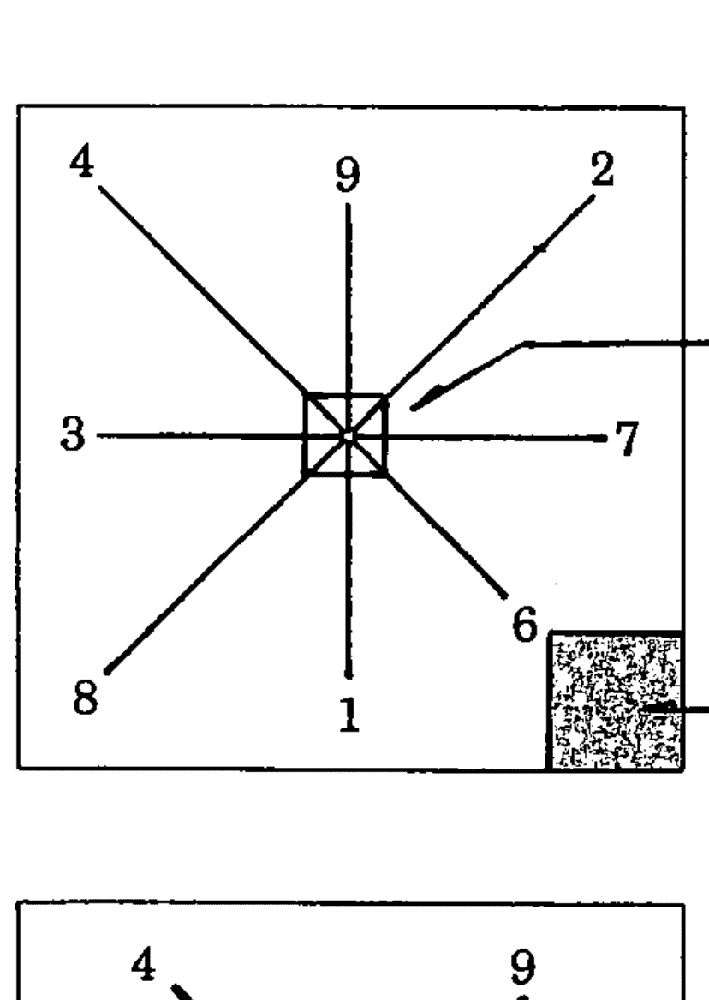
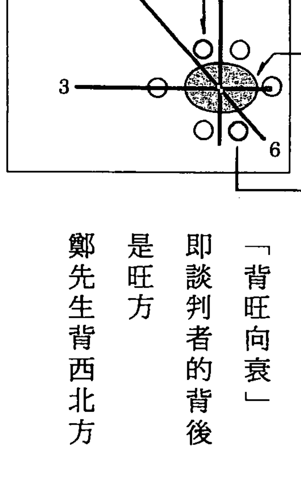
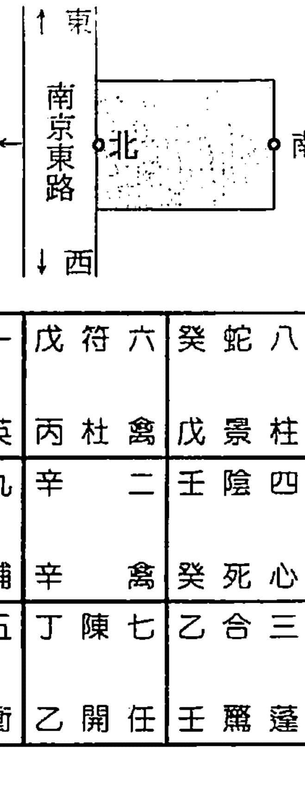
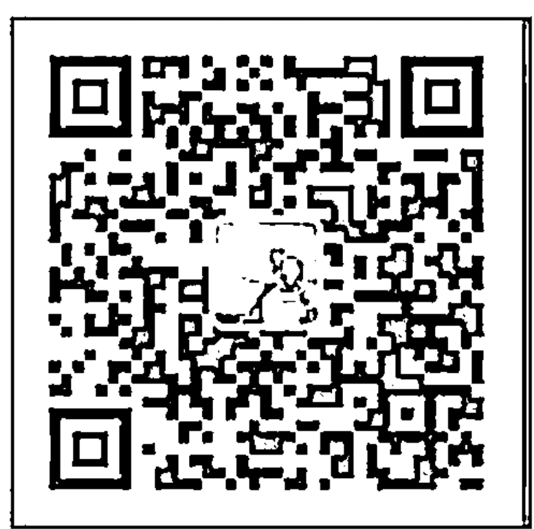
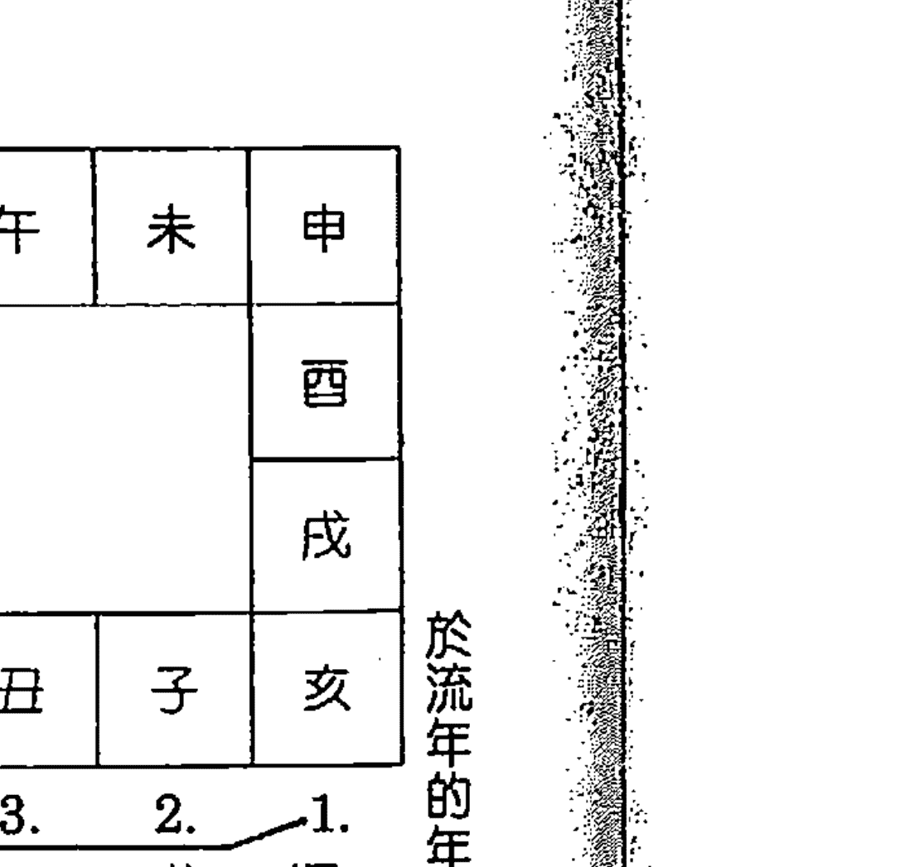
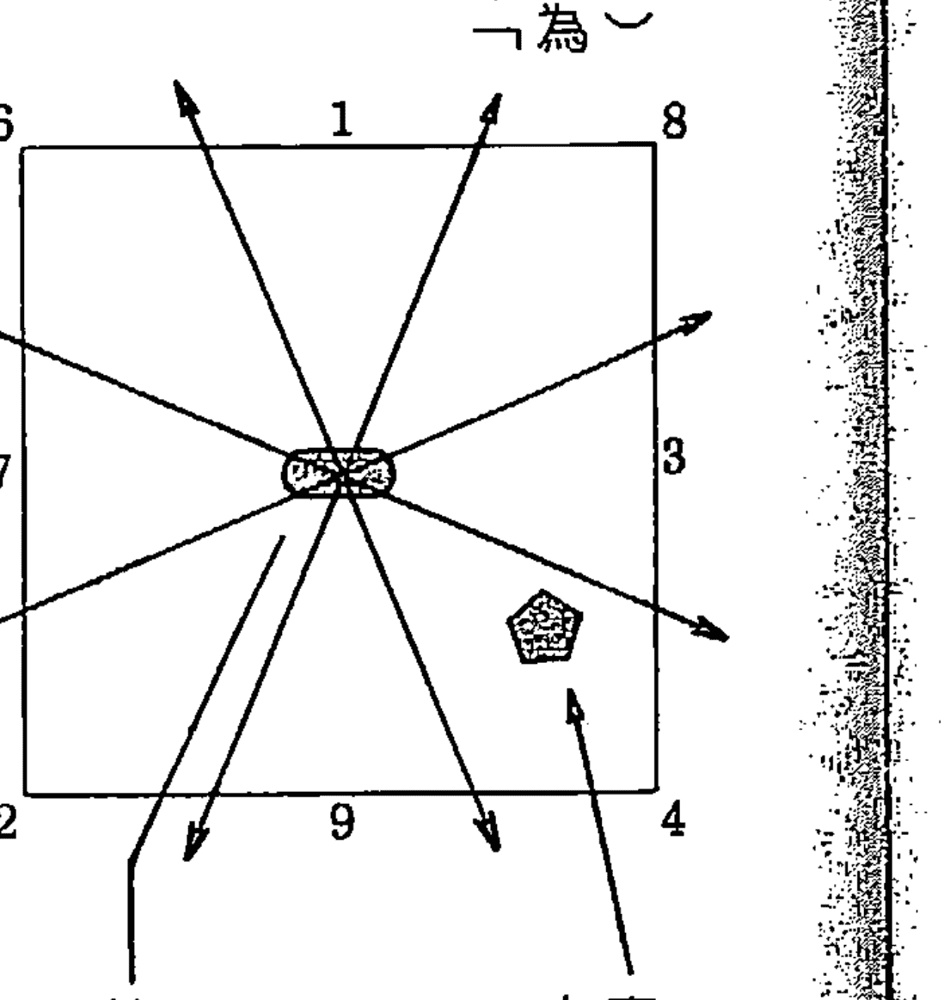
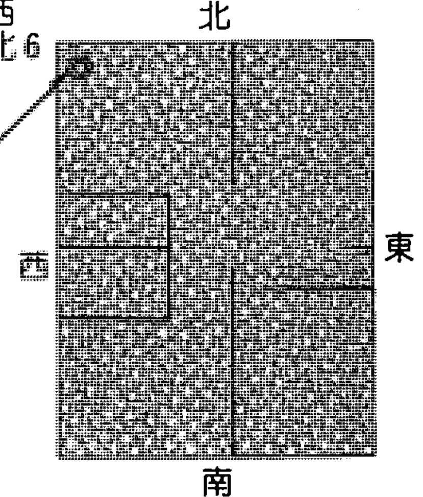
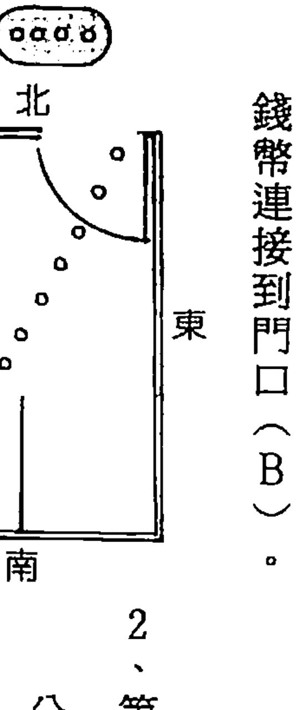

# 万真生活化奇门遁甲

## 「生活化奇門遁甲」序

「奇門遁甲」乃帝王將相之玄學，密術中之密術。由於年代久遠，其創始者已無法詳加查考，但依據奇門遁甲總序：「竊惟黃帝戰蚩尤於涿鹿，夢天神授符，而命風后演就奇門，此遁甲所由始也，帝堯命大禹治水，得玄女傳文，而因洛龜畫敘九疇，此遁甲所由著也。」及奇門遁甲統宗源流：「奇門之說，論者謂始於黃帝，刪於呂望、張良。漢以前散見於風后、子房，僅一二代，奇門遁甲之學，論者謂始於黃帝，刪於呂望、張良。漢以前散見於風后、子房，僅一二代，奇門遁甲之學，論者謂始於黃帝，刪於呂望、張良。漢以前散見於風后、子房，僅一二代，奇門遁甲之學，論者謂始於黃帝，刪於呂望、張良。漢以前散見於風后、子房，僅一二代，奇門遁甲之學，論者謂始於黃帝，刪於呂望、張良。漢以前散見於風后、子房，僅一二代，奇門遁甲之學，論者謂始於黃帝，刪於呂望、張良。漢以前散見於風后、子房，僅一二代，奇門遁甲之學，論者謂始於黃帝，刪於呂望、張良。漢以前散見於風后、子房，僅一二代，奇門遁甲之學，論者謂始於黃帝，刪於呂望、張良。漢以前散見於風后、子房，僅一二代，奇門遁甲之學，論者謂始於黃帝，刪於呂望、張良。漢以前散見於風后、子房，僅一二代，奇門遁甲之學，論者謂始於黃帝，刪於呂望、張良。漢以前散見於風后、子房，僅一二代，奇門遁甲之學，論者謂始於黃帝，刪於呂望、張良。漢以前散見於風后、子房，僅一二代，奇門遁甲之學，論者謂始於黃帝，刪於呂望、張良。漢以前散見於風后、子房，僅一二代，奇門遁甲之學，論者謂始於黃帝，刪於呂望、張良。漢以前散見於風后、子房，僅一二代，奇門遁甲之學，論者謂始於黃帝，刪於呂望、張良。漢以前散見於風后、子房，僅一二代，奇門遁甲之學，論者謂始於黃帝，刪於呂望、張良。漢以前散見於風后、子房，僅一二代，奇門遁甲之學，論者謂始於黃帝，刪於呂望、張良。漢以前散見於風后、子房，僅一二代，奇門遁甲之學，論者謂始於黃帝，刪於呂望、張良。漢以前散見於風后、子房，僅一二代，奇門遁甲之學，論者謂始於黃帝，刪於呂望、張良。漢以前散見於風后、子房，僅一二代，奇門遁甲之學，論者謂始於黃帝，刪於呂望、張良。漢以前散見於風后、子房，僅一二代，奇門遁甲之學，論者謂始於黃帝，刪於呂望、張良。漢以前散見於風后、子房，僅一二代，奇門遁甲之學，論者謂始於黃帝，刪於呂望、張良。漢以前散見於風后、子房，僅一二代，奇門遁甲之學，論者謂始於黃帝，刪於呂望、張良。漢以前散見於風后、子房，僅一二代，奇門遁甲之學，論者謂始於黃帝，刪於呂望、張良。漢以前散見於風后、子房，僅一二代，奇門遁甲之學，論者謂始於黃帝，刪於呂望、張良。漢以前散見於風后、子房，僅一二代，奇門遁甲之學，論者謂始於黃帝，刪於呂望、張良。漢以前散見於風后、子房，僅一二代，奇門遁甲之學，論者謂始於黃帝，刪於呂望、張良。漢以前散見於風后、子房，僅一二代，奇門遁甲之學，論者謂始於黃帝，刪於呂望、張良。漢以前散見於風后、子房，僅一二代，奇門遁甲之學，論者謂始於黃帝，刪於呂望、張良。漢以前散見於風后、子房，僅一二代，奇門遁甲之學，論者謂始於黃帝，刪於呂望、張良。漢以前散見於風后、子房，僅一二代，奇門遁甲之學，論者謂始於黃帝，刪於呂望、張良。漢以前散見於風后、子房，僅一二代，奇門遁甲之學，論者謂始於黃帝，刪於呂望、張良。漢以前散見於風后、子房，僅一二代，奇門遁甲之學，論者謂始於黃帝，刪於呂望、張良。漢以前散見於風后、子房，僅一二代，奇門遁甲之學，論者謂始於黃帝，刪於呂望、張良。漢以前散見於風后、子房，僅一二代，奇門遁甲之學，論者謂始於黃帝，刪於呂望、張良。漢以前散見於風后、子房，僅一二代，奇門遁甲之學，論者謂始於黃帝，刪於呂望、張良。漢以前散見於風后、子房，僅一二代，奇門遁甲之學，論者謂始於黃帝，刪於呂望、張良。漢以前散見於風后、子房，僅一二代，奇門遁甲之學，論者謂始於黃帝，刪於呂望、張良。漢以前散見於風后、子房，僅一二代，奇門遁甲之學，論者謂始於黃帝，刪於呂望、張良。漢以前散見於風后、子房，僅一二代，奇門遁甲之學，論者謂始於黃帝，刪於呂望、張良。漢以前散見於風后、子房，僅一二代，奇門遁甲之學，論者謂始於黃帝，刪於呂望、張良。漢以前散見於風后、子房，僅一二代，奇門遁甲之學，論者謂始於黃帝，刪於呂望、張良。漢以前散見於風后、子房，僅一二代，奇門遁甲之學，論者謂始於黃帝，刪於呂望、張良。漢以前散見於風后、子房，僅一二代，奇門遁甲之學，論者謂始於黃帝，刪於呂望、張良。漢以前散見於風后、子房，僅一二代，奇門遁甲之學，論者謂始於黃帝，刪於呂望、張良。漢以前散見於風后、子房，僅一二代，奇門遁甲之學，論者謂始於黃帝，刪於呂望、張良。漢以前散見於風后、子房，僅一二代，奇門遁甲之學，論者謂始於黃帝，刪於呂望、張良。漢以前散見於風后、子房，僅一二代，奇門遁甲之學，論者謂始於黃帝，刪於呂望、張良。漢以前散見於風后、子房，僅一二代，奇門遁甲之學，論者謂始於黃帝，刪於呂望、張良。漢以前散見於風后、子房，僅一二代，奇門遁甲之學，論者謂始於黃帝，刪於呂望、張良。漢以前散見於風后、子房，僅一二代，奇門遁甲之學，論者謂始於黃帝，刪於呂望、張良。漢以前散見於風后、子房，僅一二代，奇門遁甲之學，論者謂始於黃帝，刪於呂望、張良。漢以前散見於風后、子房，僅一二代，奇門遁甲之學，論者謂始於黃帝，刪於呂望、張良。漢以前散見於風后、子房，僅一二代，奇門遁甲之學，論者謂始於黃帝，刪於呂望、張良。漢以前散見於風后、子房，僅一二代，奇門遁甲之學，論者謂始於黃帝，刪於呂望、張良。漢以前散見於風后、子房，僅一二代，奇門遁甲之學，論者謂始於黃帝，刪於呂望、張良。漢以前散見於風后、子房，僅一二代，奇門遁甲之學，論者謂始於黃帝，刪於呂望、張良。漢以前散見於風后、子房，僅一二代，奇門遁甲之學，論者謂始於黃帝，刪於呂望、張良。漢以前散見於風后、子房，僅一二代，奇門遁甲之學，論者謂始於黃帝，刪於呂望、張良。漢以前散見於風后、子房，僅一二代，奇門遁甲之學，論者謂始於黃帝，刪於呂望、張良。漢以前散見於風后、子房，僅一二代，奇門遁甲之學，論者謂始於黃帝，刪於呂望、張良。漢以前散見於風后、子房，僅一二代，奇門遁甲之學，論者謂始於黃帝，刪於呂望、張良。漢以前散見於風后、子房，僅一二代，奇門遁甲之學，論者謂始於黃帝，刪於呂望、張良。漢以前散見於風后、子房，僅一二代，奇門遁甲之學，論者謂始於黃帝，刪於呂望、張良。漢以前散見於風后、子房，僅一二代，奇門遁甲之學，論者謂始於黃帝，刪於呂望、張良。漢以前散見於風后、子房，僅一二代，奇門遁甲之學，論者謂始於黃帝，刪於呂望、張良。漢以前散見於風后、子房，僅一二代，奇門遁甲之學，論者謂始於黃帝，刪於呂望、張良。漢以前散見於風后、子房，僅一二代，奇門遁甲之學，論者謂始於黃帝，刪於呂望、張良。漢以前散見於風后、子房，僅一二代，奇門遁甲之學，論者謂始於黃帝，刪於呂望、張良。漢以前散見於風后、子房，僅一二代，奇門遁甲之學，論者謂始於黃帝，刪於呂望、張良。漢以前散見於風后、子房，僅一二代，奇門遁甲之學，論者謂始於黃帝，刪於呂望、張良。漢以前散見於風后、子房，僅一二代，奇門遁甲之學，論者謂始於黃帝，刪於呂望、張良。漢以前散見於風后、子房，僅一二代，奇門遁甲之學，論者謂始於黃帝，刪於呂望、張良。漢以前散見於風后、子房，僅一二代，奇門遁甲之學，論者謂始於黃帝，刪於呂望、張良。漢以前散見於風后、子房，僅一二代，奇門遁甲之學，論者謂始於黃帝，刪於呂望、張良。漢以前散見於風后、子房，僅一二代，奇門遁甲之學，論者謂始於黃帝，刪於呂望、張良。漢以前散見於風后、子房，僅一二代，奇門遁甲之學，論者謂始於黃帝，刪於呂望、張良。漢以前散見於風后、子房，僅一二代，奇門遁甲之學，論者謂始於黃帝，刪於呂望、張良。漢以前散見於風后、子房，僅一二代，奇門遁甲之學，論者謂始於黃帝，刪於呂望、張良。漢以前散見於風后、子房，僅一二代，奇門遁甲之學，論者謂始於黃帝，刪於呂望、張良。漢以前散見於風后、子房，僅一二代，奇門遁甲之學，論者謂始於黃帝，刪於呂望、張良。漢以前散見於風后、子房，僅一二代，奇門遁甲之學，論者謂始於黃帝，刪於呂望、張良。漢以前散見於風后、子房，僅一二代，奇門遁甲之學，論者謂始於黃帝，刪於呂望、張良。漢以前散見於風后、子房，僅一二代，奇門遁甲之學，論者謂始於黃帝，刪於呂望、張良。漢以前散見於風后、子房，僅一二代，奇門遁甲之學，論者謂始於黃帝，刪於呂望、張良。漢以前散見於風后、子房，僅一二代，奇門遁甲之學，論者謂始於黃帝，刪於呂望、張良。漢以前散見於風后、子房，僅一二代，奇門遁甲之學，論者謂始於黃帝，刪於呂望、張良。漢以前散見於風后、子房，僅一二代，奇門遁甲之學，論者謂始於黃帝，刪於呂望、張良。漢以前散見於風后、子房，僅一二代，奇門遁甲之學，論者謂始於黃帝，刪於呂望、張良。漢以前散見於風后、子房，僅一二代，奇門遁甲之學，論者謂始於黃帝，刪於呂望、張良。漢以前散見於風后、子房，僅一二代，奇門遁甲之學，論者謂始於黃帝，刪於呂望、張良。漢以前散見於風后、子房，僅一二代，奇門遁甲之學，論者謂始於黃帝，刪於呂望、張良。漢以前散見於風后、子房，僅一二代，奇門遁甲之學，論者謂始於黃帝，刪於呂望、張良。漢以前散見於風后、子房，僅一二代，奇門遁甲之學，論者謂始於黃帝，刪於呂望、張良。漢以前散見於風后、子房，僅一二代，奇門遁甲之學，論者謂始於黃帝，刪於呂望、張良。漢以前散見於風后、子房，僅一二代，奇門遁甲之學，論者謂始於黃帝，刪於呂望、張良。漢以前散見於風后、子房，僅一二代，奇門遁甲之學，論者謂始於黃帝，刪於呂望、張良。漢以前散見於風后、子房，僅一二代，奇門遁甲之學，論者謂始於黃帝，刪於呂望、張良。漢以前散見於風后、子房，僅一二代，奇門遁甲之學，論者謂始於黃帝，刪於呂望、張良。漢以前散見於風后、子房，僅一二代，奇門遁甲之學，論者謂始於黃帝，刪於呂望、張良。漢以前散見於風后、子房，僅一二代，奇門遁甲之學，論者謂始於黃帝，刪於呂望、張良。漢以前散見於風后、子房，僅一二代，奇門遁甲之學，論者謂始於黃帝，刪於呂望、張良。漢以前散見於風后、子房，僅一二代，奇門遁甲之學，論者謂始於黃帝，刪於呂望、張良。漢以前散見於風后、子房，僅一二代，奇門遁甲之學，論者謂始於黃帝，刪於呂望、張良。漢以前散見於風后、子房，僅一二代，奇門遁甲之學，論者謂始於黃帝，刪於呂望、張良。漢以前散見於風后、子房，僅一二代，奇門遁甲之學，論者謂始於黃帝，刪於呂望、張良。漢以前散見於風后、子房，僅一二代，奇門遁甲之學，論者謂始於黃帝，刪於呂望、張良。漢以前散見於風后、子房，僅一二代，奇門遁甲之學，論者謂始於黃帝，刪於呂望、張良。漢以前散見於風后、子房，僅一二代，奇門遁甲之學，論者謂始於黃帝，刪於呂望、張良。漢以前散見於風后、子房，僅一二代，奇門遁甲之學，論者謂始於黃帝，刪於呂望、張良。漢以前散見於風后、子房，僅一二代，奇門遁甲之學，論者謂始於黃帝，刪於呂望、張良。漢以前散見於風后、子房，僅一二代，奇門遁甲之學，論者謂始於黃帝，刪於呂望、張良。漢以前散見於風后、子房，僅一二代，奇門遁甲之學，論者謂始於黃帝，刪於呂望、張良。漢以前散見於風后、子房，僅一二代，奇門遁甲之學，論者謂始於黃帝，刪於呂望、張良。漢以前散見於風后、子房，僅一二代，奇門遁甲之學，論者謂始於黃帝，刪於呂望、張良。漢以前散見於風后、子房，僅一二代，奇門遁甲之學，論者謂始於黃帝，刪於呂望、張良。漢以前散見於風后、子房，僅一二代，奇門遁甲之學，論者謂始於黃帝，刪於呂望、張良。漢以前散見於風后、子房，僅一二代，奇門遁甲之學，論者謂始於黃帝，刪於呂望、張良。漢以前散見於風后、子房，僅一二代，奇門遁甲之學，論者謂始於黃帝，刪於呂望、張良。漢以前散見於風后、子房，僅一二代，奇門遁甲之學，論者謂始於黃帝，刪於呂望、張良。漢以前散見於風后、子房，僅一二代，奇門遁甲之學，論者謂始於黃帝，刪於呂望、張良。漢以前散見於風后、子房，僅一二代，奇門遁甲之學，論者謂始於黃帝，刪於呂望、張良。漢以前散見於風后、子房，僅一二代，奇門遁甲之學，論者謂始於黃帝，刪於呂望、張良。漢以前散見於風后、子房，僅一二代，奇門遁甲之學，論者謂始於黃帝，刪於呂望、張良。漢以前散見於風后、子房，僅一二代，奇門遁甲之學，論者謂始於黃帝，刪於呂望、張良。漢以前散見於風后、子房，僅一二代，奇門遁甲之學，論者謂始於黃帝，刪於呂望、張良。漢以前散見於風后、子房，僅一二代，奇門遁甲之學，論者謂始於黃帝，刪於呂望、張良。漢以前散見於風后、子房，僅一二代，奇門遁甲之學，論者謂始於黃帝，刪於呂望、張良。漢以前散見於風后、子房，僅一二代，奇門遁甲之學，論者謂始於黃帝，刪於呂望、張良。漢以前散見於風后、子房，僅一二代，奇門遁甲之學，論者謂始於黃帝，刪於呂望、張良。漢以前散見於風后、子房，僅一二代，奇門遁甲之學，論者謂始於黃帝，刪於呂望、張良。漢以前散見於風后、子房，僅一二代，奇門遁甲之學，論者謂始於黃帝，刪於呂望、張良。漢以前散見於風后、子房，僅一二代，奇門遁甲之學，論者謂始於黃帝，刪於呂望、張良。漢以前散見於風后、子房，僅一二代，奇門遁甲之學，論者謂始於黃帝，刪於呂望、張良。漢以前散見於風后、子房，僅一二代，奇門遁甲之學，論者謂始於黃帝，刪於呂望、張良。漢以前散見於風后、子房，僅一二代，奇門遁甲之學，論者謂始於黃帝，刪於呂望、張良。漢以前散見於風后、子房，僅一二代，奇門遁甲之學，論者謂始於黃帝，刪於呂望、張良。漢以前散見於風后、子房，僅一二代，奇門遁甲之學，論者謂始於黃帝，刪於呂望、張良。漢以前散見於風后、子房，僅一二代，奇門遁甲之學，論者謂始於黃帝，刪於呂望、張良。漢以前散見於風后、子房，僅一二代，奇門遁甲之學，論者謂始於黃帝，刪於呂望、張良。漢以前散見於風后、子房，僅一二代，奇門遁甲之學，論者謂始於黃帝，刪於呂望、張良。漢以前散見於風后、子房，僅一二代，奇門遁甲之學，論者謂始於黃帝，刪於呂望、張良。漢以前散見於風后、子房，僅一二代，奇門遁甲之學，論者謂始於黃帝，刪於呂望、張良。漢以前散見於風后、子房，僅一二代，奇門遁甲之學，論者謂始於黃帝，刪於呂望、張良。漢以前散見於風后、子房，僅一二代，奇門遁甲之學，論者謂始於黃帝，刪於呂望、張良。漢以前散見於風后、子房，僅一二代，奇門遁甲之學，論者謂始於黃帝，刪於呂望、張良。漢以前散見於風后、子房，僅一二代，奇門遁甲之學，論者謂始於黃帝，刪於呂望、張良。漢以前散見於風后、子房，僅一二代，奇門遁甲之學，論者謂始於黃帝，刪於呂望、張良。漢以前散見於風后、子房，僅一二代，奇門遁甲之學，論者謂始於黃帝，刪於呂望、張良。漢以前散見於風后、子房，僅一二代，奇門遁甲之學，論者謂始於黃帝，刪於呂望、張良。漢以前散見於風后、子房，僅一二代，奇門遁甲之學，論者謂始於黃帝，刪於呂望、張良。漢以前散見於風后、子房，僅一二代，奇門遁甲之學，論者謂始於黃帝，刪於呂望、張良。漢以前散見於風后、子房，僅一二代，奇門遁甲之學，論者謂始於黃帝，刪於呂望、張良。漢以前散見於風后、子房，僅一二代，奇門遁甲之學，論者謂始於黃帝，刪於呂望、張良。漢以前散見於風后、子房，僅一二代，奇門遁甲之學，論者謂始於黃帝，刪於呂望、張良。漢以前散見於風后、子房，僅一二代，奇門遁甲之學，論者謂始於黃帝，刪於呂望、張良。漢以前散見於風后、子房，僅一二代，奇門遁甲之學，論者謂始於黃帝，刪於呂望、張良。漢以前散見於風后、子房，僅一二代，奇門遁甲之學，論者謂始於黃帝，刪於呂望、張良。漢以前散見於風后、子房，僅一二代，奇門遁甲之學，論者謂始於黃帝，刪於呂望、張良。漢以前散見於風后、子房，僅一二代，奇門遁甲之學，論者謂始於黃帝，刪於呂望、張良。漢以前散見於風后、子房，僅一二代，奇門遁甲之學，論者謂始於黃帝，刪於呂望、張良。漢以前散見於風后、子房，僅一二代，奇門遁甲之學，論者謂始於黃帝，刪於呂望、張良。漢以前散見於風后、子房，僅一二代，奇門遁甲之學，論者謂始於黃帝，刪於呂望、張良。漢以前散見於風后、子房，僅一二代，奇門遁甲之學，論者謂始於黃帝，刪於呂望、張良。漢以前散見於風后、子房，僅一二代，奇門遁甲之學，論者謂始於黃帝，刪於呂望、張良。漢以前散見於風后、子房，僅一二代，奇門遁甲之學，論者謂始於黃帝，刪於呂望、張良。漢以前散見於風后、子房，僅一二代，奇門遁甲之學，論者謂始於黃帝，刪於呂望、張良。漢以前散見於風后、子房，僅一二代，奇門遁甲之學，論者謂始於黃帝，刪於呂望、張良。漢以前散見於風后、子房，僅一二代，奇門遁甲之學，論者謂始於黃帝，刪於呂望、張良。漢以前散見於風后、子房，僅一二代，奇門遁甲之學，論者謂始於黃帝，刪於呂望、張良。漢以前散見於風后、子房，僅一二代，奇門遁甲之學，論者謂始於黃帝，刪於呂望、張良。漢以前散見於風后、子房，僅一二代，奇門遁甲之學，論者謂始於黃帝，刪於呂望、張良。漢以前散見於風后、子房，僅一二代，奇門遁甲之學，論者謂始於黃帝，刪於呂望、張良。漢以前散見於風后、子房，僅一二代，奇門遁甲之學，論者謂始於黃帝，刪於呂望、張良。漢以前散見於風后、子房，僅一二代，奇門遁甲之學，論者謂始於黃帝，刪於呂望、張良。漢以前散見於風后、子房，僅一二代，奇門遁甲之學，論者謂始於黃帝，刪於呂望、張良。漢以前散見於風后、子房，僅一二代，奇門遁甲之學，論者謂始於黃帝，刪於呂望、張良。漢以前散見於風后、子房，僅一二代，奇門遁甲之學，論者謂始於黃帝，刪於呂望、張良。漢以前散見於風后、子房，僅一二代，奇門遁甲之學，論者謂始於黃帝，刪於呂望、張良。漢以前散見於風后、子房，僅一二代，奇門遁甲之學，論者謂始於黃帝，刪於呂望、張良。漢以前散見於風后、子房，僅一二代，奇門遁甲之學，論者謂始於黃帝，刪於呂望、張良。漢以前散見於風后、子房，僅一二代，奇門遁甲之學，論者謂始於黃帝，刪於呂望、張良。漢以前散見於風后、子房，僅一二代，奇門遁甲之學，論者謂始於黃帝，刪於呂望、張良。漢以前散見於風后、子房，僅一二代，奇門遁甲之學，論者謂始於黃帝，刪於呂望、張良。漢以前散見於風后、子房，僅一二代，奇門遁甲之學，論者謂始於黃帝，刪於呂望、張良。漢以前散見於風后、子房，僅一二代，奇門遁甲之學，論者謂始於黃帝，刪於呂望、張良。漢以前散見於風后、子房，僅一二代，奇門遁甲之學，論者謂始於黃帝，刪於呂望、張良。漢以前散見於風后、子房，僅一二代，奇門遁甲之學，論者謂始於黃帝，刪於呂望、張良。漢以前散見於風后、子房，僅一二代，奇門遁甲之學，論者謂始於黃帝，刪於呂望、張良。漢以前散見於風后、子房，僅一二代，奇門遁甲之學，論者謂始於黃帝，刪於呂望、張良。漢以前散見於風后、子房，僅一二代，奇門遁甲之學，論者謂始於黃帝，刪於呂望、張良。漢以前散見於風后、子房，僅一二代，奇門遁甲之學，論者謂始於黃帝，刪於呂望、張良。漢以前散見於風后、子房，僅一二代，奇門遁甲之學，論者謂始於黃帝，刪於呂望、張良。漢以前散見於風后、子房，僅一二代，奇門遁甲之學，論者謂始於黃帝，刪於呂望、張良。漢以前散見於風后、子房，僅一二代，奇門遁甲之學，論者謂始於黃帝，刪於呂望、張良。漢以前散見於風后、子房，僅一二代，奇門遁甲之學，論者謂始於黃帝，刪於呂望、張良。漢以前散見於風后、子房，僅一二代，奇門遁甲之學，論者謂始於黃帝，刪於呂望、張良。漢以前散見於風后、子房，僅一二代，奇門遁甲之學，論者謂始於黃帝，刪於呂望、張良。漢以前散見於風后、子房，僅一二代，奇門遁甲之學，論者謂始於黃帝，刪於呂望、張良。漢以前散見於風后、子房，僅一二代，奇門遁甲之學，論者謂始於黃帝，刪於呂望、張良。漢以前散見於風后、子房，僅一二代，奇門遁甲之學，論者謂始於黃帝，刪於呂望、張良。漢以前散見於風后、子房，僅一二代，奇門遁甲之學，論者謂始於黃帝，刪於呂望、張良。漢以前散見於風后、子房，僅一二代，奇門遁甲之學，論者謂始於黃帝，刪於呂望、張良。漢以前散見於風后、子房，僅一二代，奇門遁甲之學，論者謂始於黃帝，刪於呂望、張良。漢以前散見於風后、子房，僅一二代，奇門遁甲之學，論者謂始於黃帝，刪於呂望、張良。漢以前散見於風后、子房，僅一二代，奇門遁甲之學，論者謂始於黃帝，刪於呂望、張良。漢以前散見於風后、子房，僅一二代，奇門遁甲之學，論者謂始於黃帝，刪於呂望、張良。漢以前散見於風后、子房，僅一二代，奇門遁甲之學，論者謂始於黃帝，刪於呂望、張良。漢以前散見於風后、子房，僅一二代，奇門遁甲之學，論者謂始於黃帝，刪於呂望、張良。漢以前散見於風后、子房，僅一二代，奇門遁甲之學，論者謂始於黃帝，刪於呂望、張良。漢以前散見於風后、子房，僅一二代，奇門遁甲之學，論者謂始於黃帝，刪於呂望、張良。漢以前散見於風后、子房，僅一二代，奇門遁甲之學，論者謂始於黃帝，刪於呂望、張良。漢以前散見於風后、子房，僅一二代，奇門遁甲之學，論者謂始於黃帝，刪於呂望、張良。漢以前散見於風后、子房，僅一二代，奇門遁甲之學，論者謂始於黃帝，刪於呂望、張良。漢以前散見於風后、子房，僅一二代，奇門遁甲之學，論者謂始於黃帝，刪於呂望、張良。漢以前散見於風后、子房，僅一二代，奇門遁甲之學，論者謂始於黃帝，刪於呂望、張良。漢以前散見於風后、子房，僅一二代，奇門遁甲之學，論者謂始於黃帝，刪於呂望、張良。漢以前散見於風后、子房，僅一二代，奇門遁甲之學，論者謂始於黃帝，刪於呂望、張良。漢以前散見於風后、子房，僅一二代，奇門遁甲之學，論者謂始於黃帝，刪於呂望、張良。漢以前散見於風后、子房，僅一二代，奇門遁甲之學，論者謂始於黃帝，刪於呂望、張良。漢以前散見於風后、子房，僅一二代，奇門遁甲之學，論者謂始於黃帝，刪於呂望、張良。漢以前散見於風后、子房，僅一二代，奇門遁甲之學，論者謂始於黃帝，刪於呂望、張良。漢以前散見於風后、子房，僅一二代，奇門遁甲之學，論者謂始於黃帝，刪於呂望、張良。漢以前散見於風后、子房，僅一二代，奇門遁甲之學，論者謂始於黃帝，刪於呂望、張良。漢以前散見於風后、子房，僅一二代，奇門遁甲之學，論者謂始於黃帝，刪於呂望、張良。漢以前散見於風后、子房，僅一二代，奇門遁甲之學，論者謂始於黃帝，刪於呂望、張良。漢以前散見於風后、子房，僅一二代，奇門遁甲之學，論者謂始於黃帝，刪於呂望、張良。漢以前散見於風后、子房，僅一二代，奇門遁甲之學，論者謂始於黃帝，刪於呂望、張良。漢以前散見於風后、子房，僅一二代，奇門遁甲之學，論者謂始於黃帝，刪於呂望、張良。漢以前散見於風后、子房，僅一二代，奇門遁甲之學，論者謂始於黃帝，刪於呂望、張良。漢以前散見於風后、子房，僅一二代，奇門遁甲之學，論者謂始於黃帝，刪於呂望、張良。漢以前散見於風后、子房，僅一二代，奇門遁甲之學，論者謂始於黃帝，刪於呂望、張良。漢以前散見於風后、子房，僅一二代，奇門遁甲之學，論者謂始於黃帝，刪於呂望、張良。漢以前散見於風后、子房，僅一二代，奇門遁甲之學，論者謂始於黃帝，刪於呂望、張良。漢以前散見於風后、子房，僅一二代，奇門遁甲之學，論者謂始於黃帝，刪於呂望、張良。漢以前散見於風后、子房，僅一二代，奇門遁甲之學，論者謂始於黃帝，刪於呂望、張良。漢以前散見於風后、子房，僅一二代，奇門遁甲之學，論者謂始於黃帝，刪於呂望、張良。漢以前散見於風后、子房，僅一二代，奇門遁甲之學，論者謂始於黃帝，刪於呂望、張良。漢以前散見於風后、子房，僅一二代，奇門遁甲之學，論者謂始於黃帝，刪於呂望、張良。漢以前散見於風后、子房，僅一二代，奇門遁甲之學，論者謂始於黃帝，刪於呂望、張良。漢以前散見於風后、子房，僅一二代，奇門遁甲之學，論者謂始於黃帝，刪於呂望、張良。漢以前散見於風后、子房，僅一二代，奇門遁甲之學，論者謂始於黃帝，刪於呂望、張良。漢以前散見於風后、子房，僅一二代，奇門遁甲之學，論者謂始於黃帝，刪於呂望、張良。漢以前散見於風后、子房，僅一二代，奇門遁甲之學，論者謂始於黃帝，刪於呂望、張良。漢以前散見於風后、子房，僅一二代，奇門遁甲之學，論者謂始於黃帝，刪於呂望、張良。漢以前散見於風后、子房，僅一二代，奇門遁甲之學，論者謂始於黃帝，刪於呂望、張良。漢以前散見於風后、子房，僅一二代，奇門遁甲之學，論者謂始於黃帝，刪於呂望、張良。漢以前散見於風后、子房，僅一二代，奇門遁甲之學，論者謂始於黃帝，刪於呂望、張良。漢以前散見於風后、子房，僅一二代，奇門遁甲之學，論者謂始於黃帝，刪於呂望、張良。漢以前散見於風后、子房，僅一二代，奇門遁甲之學，論者謂始於黃帝，刪於呂望、張良。漢以前散見於風后、子房，僅一二代，奇門遁甲之學，論者謂始於黃帝，刪於呂望、張良。漢以前散見於風后、子房，僅一二代，奇門遁甲之學，論者謂始於黃帝，刪於呂望、張良。漢以前散見於風后、子房，僅一二代，奇門遁甲之學，論者謂始於黃帝，刪於呂望、張良。漢以前散見於風后、子房，僅一二代，奇門遁甲之學，論者謂始於黃帝，刪於呂望、張良。漢以前散見於風后、子房，僅一二代，奇門遁甲之學，論者謂始於黃帝，刪於呂望、張良。漢以前散見於風后、子房，僅一二代，奇門遁甲之學，論者謂始於黃帝，刪於呂望、張良。漢以前散見於風后、子房，僅一二代，奇門遁甲之學，論者謂始於黃帝，刪於呂望、張良。漢以前散見於風后、子房，僅一二代，奇門遁甲之學，論者謂始於黃帝，刪於呂望、張良。漢以前散見於風后、子房，僅一二代，奇門遁甲之學，論者謂始於黃帝，刪於呂望、張良。漢以前散見於風后、子房，僅一二代，奇門遁甲之學，論者謂始於黃帝，刪於呂望、張良。漢以前散見於風后、子房，僅一二代，奇門遁甲之學，論者謂始於黃帝，刪於呂望、張良。漢以前散見於風后、子房，僅一二代，奇門遁甲之學，論者謂始於黃帝，刪於呂望、張良。漢以前散見於風后、子房，僅一二代，奇門遁甲之學，論者謂始於黃帝，刪於呂望、張良。漢以前散見於風后、子房，僅一二代，奇門遁甲之學，論者謂始於黃帝，刪於呂望、張良。漢以前散見於風后、子房，僅一二代，奇門遁甲之學，論者謂始於黃帝，刪於呂望、張良。漢以前散見於風后、子房，僅一二代，奇門遁甲之學，論者謂始於黃帝，刪於呂望、張良。漢以前散見於風后、子房，僅一二代，奇門遁甲之學，論者謂始於黃帝，刪於呂望、張良。漢以前散見於風后、子房，僅一二代，奇門遁甲之學，論者謂始於黃帝，刪於呂望、張良。漢以前散見於風后、子房，僅一二代，奇門遁甲之學，論者謂始於黃帝，刪於呂望、張良。漢以前散見於風后、子房，僅一二代，奇門遁甲之學，論者謂始於黃帝，刪於呂望、張良。漢以前散見於風后、子房，僅一二代，奇門遁甲之學，論者謂始於黃帝，刪於呂望、張良。漢以前散見於風后、子房，僅一二代，奇門遁甲之學，論者謂始於黃帝，刪於呂望、張良。漢以前散見於風后、子房，僅一二代，奇門遁甲之學，論者謂始於黃帝，刪於呂望、張良。漢以前散見於風后、子房，僅一二代，奇門遁甲之學，論者謂始於黃帝，刪於呂望、張良。漢以前散見於風后、子房，僅一二代，奇門遁甲之學，論者謂始於黃帝，刪於呂望、張良。漢以前散見於風后、子房，僅一二代，奇門遁甲之學，論者謂始於黃帝，刪於呂望、張良。漢以前散見於風后、子房，僅一二代，奇門遁甲之學，論者謂始於黃帝，刪於呂望、張良。漢以前散見於風后、子房，僅一二代，奇門遁甲之學，論者謂始於黃帝，刪於呂望、張良。漢以前散見於風后、子房，僅一二代，奇門遁甲之學，論者謂始於黃帝，刪於呂望、張良。漢以前散見於風后、子房，僅一二代，奇門遁甲之學，論者謂始於黃帝，刪於呂望、張良。漢以前散見於風后、子房，僅一二代，奇門遁甲之學，論者謂始於黃帝，刪於呂望、張良。漢以前散見於風后、子房，僅一二代，奇門遁甲之學，論者謂始於黃帝，刪於呂望、張良。漢以前散見於風后、子房，僅一二代，奇門遁甲之學，論者謂始於黃帝，刪於呂望、張良。漢以前散見於風后、子房，僅一二代，奇門遁甲之學，論者謂始於黃帝，刪於呂望、張良。漢以前散見於風后、子房，僅一二代，奇門遁甲之學，論者謂始於黃帝，刪於呂望、張良。漢以前散見於風后、子房，僅一二代，奇門遁甲之學，論者謂始於黃帝，刪於呂望、張良。漢以前散見於風后、子房，僅一二代，奇門遁甲之學，論者謂始於黃帝，刪於呂望、張良。漢以前散見於風后、子房，僅一二代，奇門遁甲之學，論者謂始於黃帝，刪於呂望、張良。漢以前散見於風后、子房，僅一二代，奇門遁甲之學，論者謂始於黃帝，刪於呂望、張良。漢以前散見於風后、子房，僅一二代，奇門遁甲之學，論者謂始於黃帝，刪於呂望、張良。漢以前散見於風后、子房，僅一二代，奇門遁甲之學，論者謂始於黃帝，刪於呂望、張良。漢以前散見於風后、子房，僅一二代，奇門遁甲之學，論者謂始於黃帝，刪於呂望、張良。漢以前散見於風后、子房，僅一二代，奇門遁甲之學，論者謂始於黃帝，刪於呂望、張良。漢以前散見於風后、子房，僅一二代，奇門遁甲之學，論者謂始於黃帝，刪於呂望、張良。漢以前散見於風后、子房，僅一二代，奇門遁甲之學，論者謂始於黃帝，刪於呂望、張良。漢以前散見於風后、子房，僅一二代，奇門遁甲之學，論者謂始於黃帝，刪於呂望、張良。漢以前散見於風后、子房，僅一二代，奇門遁甲之學，論者謂始於黃帝，刪於呂望、張良。漢以前散見於風后、子房，僅一二代，奇門遁甲之學，論者謂始於黃帝，刪於呂望、張良。漢以前散見於風后、子房，僅一二代，奇門遁甲之學，論者謂始於黃帝，刪於呂望、張良。漢以前散見於風后、子房，僅一二代，奇門遁甲之學，論者謂始於黃帝，刪於呂望、張良。漢以前散見於風后、子房，僅一二代，奇門遁甲之學，論者謂始於黃帝，刪於呂望、張良。漢以前散見於風后、子房，僅一二代，奇門遁甲之學，論者謂始於黃帝，刪於呂望、張良。漢以前散見於風后、子房，僅一二代，奇門遁甲之學，論者謂始於黃帝，刪於呂望、張良。漢以前散見於風后、子房，僅一二代，奇門遁甲之學，論者謂始於黃帝，刪於呂望、張良。漢以前散見於風后、子房，僅一二代，奇門遁甲之學，論者謂始於黃帝，刪於呂望、張良。漢以前散見於風后、子房，僅一二代，奇門遁甲之學，論者謂始於黃帝，刪於呂望、張良。漢以前散見於風后、子房，僅一二代，奇門遁甲之學，論者謂始於黃帝，刪於呂望、張良。漢以前散見於風后、子房，僅一二代，奇門遁甲之學，論者謂始於黃帝，刪於呂望、張良。漢以前散見於風后、子房，僅一二代，奇門遁甲之學，論者謂始於黃帝，刪於呂望、張良。漢以前散見於風后、子房，僅一二代，奇門遁甲之學，論者謂始於黃帝，刪於呂望、張良。漢以前散見於風后、子房，僅一二代，奇門遁甲之學，論者謂始於黃帝，刪於呂望、張良。漢以前散見於風后、子房，僅一二代，奇門遁甲之學，論者謂始於黃帝，刪於呂望、張良。漢以前散見於風后、子房，僅一二代，奇門遁甲之學，論者謂始於黃帝，刪於呂望、張良。漢以前散見於風后、子房，僅一二代，奇門遁甲之學，論者謂始於黃帝，刪於呂望、張良。漢以前散見於風后、子房，僅一二代，奇門遁甲之學，論者謂始於黃帝，刪於呂望、張良。漢以前散見於風后、子房，僅一二代，奇門遁甲之學，論者謂始於黃帝，刪於呂望、張良。漢以前散見於風后、子房，僅一二代，奇門遁甲之學，論者謂始於黃帝，刪於呂望、張良。漢以前散見於風后、子房，僅一二代，奇門遁甲之學，論者謂始於黃帝，刪於呂望、張良。漢以前散見於風后、子房，僅一二代，奇門遁甲之學，論者謂始於黃帝，刪於呂望、張良。漢以前散見於風后、子房，僅一二代，奇門遁甲之學，論者謂始於黃帝，刪於呂望、張良。漢以前散見於風后、子房，僅一二代，奇門遁甲之學，論者謂始於黃帝，刪於呂望、張良。漢以前散見於風后、子房，僅一二代，奇門遁甲之學，論者謂始於黃帝，刪於呂望、張良。漢以前散見於風后、子房，僅一二代，奇門遁甲之學，論者謂始於黃帝，刪於呂望、張良。漢以前散見於風后、子房，僅一二代，奇門遁甲之學，論者謂始於黃帝，刪於呂望、張良。漢以前散見於風后、子房，僅一二代，奇門遁甲之學，論者謂始於黃帝，刪於呂望、張良。漢以前散見於風后、子房，僅一二代，奇門遁甲之學，論者謂始於黃帝，刪於呂望、張良。漢以前散見於風后、子房，僅一二代，奇門遁甲之學，論者謂始於黃帝，刪於呂望、張良。漢以前散見於風后、子房，僅一二代，奇門遁甲之學，論者謂始於黃帝，刪於呂望、張良。漢以前散見於風后、子房，僅一二代，奇門遁甲之學，論者謂始於黃帝，刪於呂望、張良。漢以前散見於風后、子房，僅一二代，奇門遁甲之學，論者謂始於黃帝，刪於呂望、張良。漢以前散見於風后、子房，僅一二代，奇門遁甲之學，論者謂始於黃帝，刪於呂望、張良。漢以前散見於風后、子房，僅一二代，奇門遁甲之學，論者謂始於黃帝，刪於呂望、張良。漢以前散見於風后、子房，僅一二代，奇門遁甲之學，論者謂始於黃帝，刪於呂望、張良。漢以前散見於風后、子房，僅一二代，奇門遁甲之學，論者謂始於黃帝，刪於呂望、張良。漢以前散見於風后、子房，僅一二代，奇門遁甲之學，論者謂始於黃帝，刪於呂望、張良。漢以前散見於風后、子房，僅一二代，奇門遁甲之學，論者謂始於黃帝，刪於呂望、張良。漢以前散見於風后、子房，僅一二代，奇門遁甲之學，論者謂始於黃帝，刪於呂望、張良。漢以前散見於風后、子房，僅一二代，奇門遁甲之學，論者謂始於黃帝，刪於呂望、張良。漢以前散見於風后、子房，僅一二代，奇門遁甲之學，論者謂始於黃帝，刪於呂望、張良。漢以前散見於風后、子房，僅一二代，奇門遁甲之學，論者謂始於黃帝，刪於呂望、張良。漢以前散見於風后、子房，僅一二代，奇門遁甲之學，論者謂始於黃帝，刪於呂望、張良。漢以前散見於風后、子房，僅一二代，奇門遁甲之學，論者謂始於黃帝，刪於呂望、張良。漢以前散見於風后、子房，僅一二代，奇門遁甲之學，論者謂始於黃帝，刪於呂望、張良。漢以前散見於風后、子房，僅一二代，奇門遁甲之學，論者謂始於黃帝，刪於呂望、張良。漢以前散見於風后、子房，僅一二代，奇門遁甲之學，論者謂始於黃帝，刪於呂望、張良。漢以前散見於風后、子房，僅一二代，奇門遁甲之學，論者謂始於黃帝，刪於呂望、張良。漢以前散見於風后、子房，僅一二代，奇門遁甲之學，論者謂始於黃帝，刪於呂望、張良。漢以前散見於風后、子房，僅一二代，奇門遁甲之學，論者謂始於黃帝，刪於呂望、張良。漢以前散見於風后、子房，僅一二代，奇門遁甲之學，論者謂始於黃帝，刪於呂望、張良。漢以前散見於風后、子房，僅一二代，奇門遁甲之學，論者謂始於黃帝，刪於呂望、張良。漢以前散見於風后、子房，僅一二代，奇門遁甲之學，論者謂始於黃帝，刪於呂望、張良。漢以前散見於風后、子房，僅一二代，奇門遁甲之學，論者謂始於黃帝，刪於呂望、張良。漢以前散見於風后、子房，僅一二代，奇門遁甲之學，論者謂始於黃帝，刪於呂望、張良。漢以前散見於風后、子房，僅一二代，奇門遁甲之學，論者謂始於黃帝，刪於呂望、張良。漢以前散見於風后、子房，僅一二代，奇門遁甲之學，論者謂始於黃帝，刪於呂望、張良。漢以前散見於風后、子房，僅一二代，奇門遁甲之學，論者謂始於黃帝，刪於呂望、張良。漢以前散見於風后、子房，僅一二代，奇門遁甲之學，論者謂始於黃帝，刪於呂望、張良。漢以前散見於風后、子房，僅一二代，奇門遁甲之學，論者謂始於黃帝，刪於呂望、張良。漢以前散見於風后、子房，僅一二代，奇門遁甲之學，論者謂始於黃帝，刪於呂望、張良。漢以前散見於風后、子房，僅一二代，奇門遁甲之學，論者謂始於黃帝，刪於呂望、張良。漢以前散見於風后、子房，僅一二代，奇門遁甲之學，論者謂始於黃帝，刪於呂望、張良。漢以前散見於風后、子房，僅一二代，奇門遁甲之學，論者謂始於黃帝，刪於呂望、張良。漢以前散見於風后、子房，僅一二代，奇門遁甲之學，論者謂始於黃帝，刪於呂望、張良。漢以前散見於風后、子房，僅一二代，奇門遁甲之學，論者謂始於黃帝，刪於呂望、張良。漢以前散見於風后、子房，僅一二代，奇門遁甲之學，論者謂始於黃帝，刪於呂望、張良。漢以前散見於風后、子房，僅一二代，奇門遁甲之學，論者謂始於黃帝，刪於呂望、張良。漢以前散見於風后、子房，僅一二代，奇門遁甲之學，論者謂始於黃帝，刪於呂望、張良。漢以前散見於風后、子房，僅一二代，奇門遁甲之學，論者謂始於黃帝，刪於呂望、張良。漢以前散見於風后、子房，僅一二代，奇門遁甲之學，論者謂始於黃帝，刪於呂望、張良。漢以前散見於風后、子房，僅一二代，奇門遁甲之學，論者謂始於黃帝，刪於呂望、張良。漢以前散見於風后、子房，僅一二代，奇門遁甲之學，論者謂始於黃帝，刪於呂望、張良。漢以前散見於風后、子房，僅一二代，奇門遁甲之學，論者謂始於黃帝，刪於呂望、張良。漢以前散見於風后、子房，僅一二代，奇門遁甲之學，論者謂始於黃帝，刪於呂望、張良。漢以前散見於風后、子房，僅一二代，奇門遁甲之學，論者謂始於黃帝，刪於呂望、張良。漢以前散見於風后、子房，僅一二代，奇門遁甲之學，論者謂始於黃帝，刪於呂望、張良。漢以前散見於風后、子房，僅一二代，奇門遁甲之學，論者謂始於黃帝，刪於呂望、張良。漢以前散見於風后、子房，僅一二代，奇門遁甲之學，論者謂始於黃帝，刪於呂望、張良。漢以前散見於風后、子房，僅一二代，奇門遁甲之學，論者謂始於黃帝，刪於呂望、張良。漢以前散見於風后、子房，僅一二代，奇門遁甲之學，論者謂始於黃帝，刪於呂望、張良。漢以前散見於風后、子房，僅一二代，奇門遁甲之學，論者謂始於黃帝，刪於呂望、張良。漢以前散見於風后、子房，僅一二代，奇門遁甲之學，論者謂始於黃帝，刪於呂望、張良。漢以前散見於風后、子房，僅一二代，奇門遁甲之學，論者謂始於黃帝，刪於呂望、張良。漢以前散見於風后、子房，僅一二代，奇門遁甲之學，論者謂始於黃帝，刪於呂望、張良。漢以前散見於風后、子房，僅一二代，奇門遁甲之學，論者謂始於黃帝，刪於呂望、張良。漢以前散見於風后、子房，僅一二代，奇門遁甲之學，論者謂始於黃帝，刪於呂望、張良。漢以前散見於風后、子房，僅一二代，奇門遁甲之學，論者謂始於黃帝，刪於呂望、張良。漢以前散見於風后、子房，僅一二代，奇門遁甲之學，論者謂始於黃帝，刪於呂望、張良。漢以前散見於風后、子房，僅一二代，奇門遁甲之學，論者謂始於黃帝，刪於呂望、張良。漢以前散見於風后、子房，僅一二代，奇門遁甲之學，論者謂始於黃帝，刪於呂望、張良。漢以前散見於風后、子房，僅一二代，奇門遁甲之學，論者謂始於黃帝，刪於呂望、張良。漢以前散見於風后、子房，僅一二代，奇門遁甲之學，論者謂始於黃帝，刪於呂望、張良。漢以前散見於風后、子房，僅一二代，奇門遁甲之學，論者謂始於黃帝，刪於呂望、張良。漢以前散見於風后、子房，僅一二代，奇門遁甲之學，論者謂始於黃帝，刪於呂望、張良。漢以前散見於風后、子房，僅一二代，奇門遁甲之學，論者謂始於黃帝，刪於呂望、張良。漢以前散見於風后、子房，僅一二代，奇門遁甲之學，論者謂始於黃帝，刪於呂望、張良。漢以前散見於風后、子房，僅一二代，奇門遁甲之學，論者謂始於黃帝，刪於呂望、張良。漢以前散見於風后、子房，僅一二代，奇門遁甲之學，論者謂始於黃帝，刪於呂望、張良。漢以前散見於風后、子房，僅一二代，奇門遁甲之學，論者謂始於黃帝，刪於呂望、張良。漢以前散見於風后、子房，僅一二代，奇門遁甲之學，論者謂始於黃帝，刪於呂望、張良。漢以前散見於風后、子房，僅一二代，奇門遁甲之學，論者謂始於黃帝，刪於呂望、張良。漢以前散見於風后、子房，僅一二代，奇門遁甲之學，論者謂始於黃帝，刪於呂望、張良。漢以前散見於風后、子房，僅一二代，奇門遁甲之學，論者謂始於黃帝，刪於呂望、張良。漢以前散見於風后、子房，僅一二代，奇門遁甲之學，論者謂始於黃帝，刪於呂望、張良。漢以前散見於風后、子房，僅一二代，奇門遁甲之學，論者謂始於黃帝，刪於呂望、張良。漢以前散見於風后、子房，僅一二代，奇門遁甲之學，論者謂始於黃帝，刪於呂望、張良。漢以前散見於風后、子房，僅一二代，奇門遁甲之學，論者謂始於黃帝，刪於呂望、張良。漢以前散見於風后、子房，僅一二代，奇門遁甲之學，論者謂始於黃帝，刪於呂望、張良。漢以前散見於風后、子房，僅一二代，奇門遁甲之學，論者謂始於黃帝，刪於呂望、張良。漢以前散見於風后、子房，僅一二代，奇門遁甲之學，論者謂始於黃帝，刪於呂望、張良。漢以前散見於風后、子房，僅一二代，奇門遁甲之學，論者謂始於黃帝，刪於呂望、張良。漢以前散見於風后、子房，僅一二代，奇門遁甲之學，論者謂始於黃帝，刪於呂望、張良。漢以前散見於風后、子房，僅一二代，奇門遁甲之學，論者謂始於黃帝，刪於呂望、張良。漢以前散見於風后、子房，僅一二代，奇門遁甲之學，論者謂始於黃帝，刪於呂望、張良。漢以前散見於風后、子房，僅一二代，奇門遁甲之學，論者謂始於黃帝，刪於呂望、張良。漢以前散見於風后、子房，僅一二代，奇門遁甲之學，論者謂始於黃帝，刪於呂望、張良。漢以前散見於風后、子房，僅一二代，奇門遁甲之學，論者謂始於黃帝，刪於呂望、張良。漢以前散見於風后、子房，僅一二代，奇門遁甲之學，論者謂始於黃帝，刪於呂望、張良。漢以前散見於風后、子房，僅一二代，奇門遁甲之學，論者謂始於黃帝，刪於呂望、張良。漢以前散見於風后、子房，僅一二代，奇門遁甲之學，論者謂始於黃帝，刪於呂望、張良。漢以前散見於風后、子房，僅一二代，奇門遁甲之學，論者謂始於黃帝，刪於呂望、張良。漢以前散見於風后、子房，僅一二代，奇門遁甲之學，論者謂始於黃帝，刪於呂望、張良。漢以前散見於風后、子房，僅一二代，奇門遁甲之學，論者謂始於黃帝，刪於呂望、張良。漢以前散見於風后、子房，僅一二代，奇門遁甲之學，論者謂始於黃帝，刪於呂望、張良。漢以前散見於風后、子房，僅一二代，奇門遁甲之學，論者謂始於黃帝，刪於呂望、張良。漢以前散見於風后、子房，僅一二代，奇門遁甲之學，論者謂始於黃帝，刪於呂望、張良。漢以前散見於風后、子房，僅一二代，奇門遁甲之學，論者謂始於黃帝，刪於呂望、張良。漢以前散見於風后、子房，僅一二代，奇門遁甲之學，論者謂始於黃帝，刪於呂望、張良。漢以前散見於風后、子房，僅一二代，奇門遁甲之學，論者謂始於黃帝，刪於呂望、張良。漢以前散見於風后、子房，僅一二代，奇門遁甲之學，論者謂始於黃帝，刪於呂望、張良。漢以前散見於風后、子房，僅一二代，奇門遁甲之學，論者謂始於黃帝，刪於呂望、張良。漢以前散見於風后、子房，僅一二代，奇門遁甲之學，論者謂始於黃帝，刪於呂望、張良。漢以前散見於風后、子房，僅一二代，奇門遁甲之學，論者謂始於黃帝，刪於呂望、張良。漢以前散見於風后、子房，僅一二代，奇門遁甲之學，論者謂始於黃帝，刪於呂望、張良。漢以前散見於風后、子房，僅一二代，奇門遁甲之學，論者謂始於黃帝，刪於呂望、張良。漢以前散見於風后、子房，僅一二代，奇門遁甲之學，論者謂始於黃帝，刪於呂望、張良。漢以前散見於風后、子房，僅一二代，奇門遁甲之學，論者謂始於黃帝，刪於呂望、張良。漢以前散見於風后、子房，僅一二代，奇門遁甲之學，論者謂始於黃帝，刪於呂望、張良。漢以前散見於風后、子房，僅一二代，奇門遁甲之學，論者謂始於黃帝，刪於呂望、張良。漢以前散見於風后、子房，僅一二代，奇門遁甲之學，論者謂始於黃帝，刪於呂望、張良。漢以前散見於風后、子房，僅一二代，奇門遁甲之學，論者謂始於黃帝，刪於呂望、張良。漢以前散見於風后、子房，僅一二代，奇門遁甲之學，論者謂始於黃帝，刪於呂望、張良。漢以前散見於風后、子房，僅一二代，奇門遁甲之學，論者謂始於黃帝，刪於呂望、張良。漢以前散見於風后、子房，僅一二代，奇門遁甲之學，論者謂始於黃帝，刪於呂望、張良。漢以前散見於風后、子房，僅一二代，奇門遁甲之學，論者謂始於黃帝，刪於呂望、張良。漢以前散見於風后、子房，僅一二代，奇門遁甲之學，論者謂始於黃帝，刪於呂望、張良。漢以前散見於風后、子房，僅一二代，奇門遁甲之學，論者謂始於黃帝，刪於呂望、張良。漢以前散見於風后、子房，僅一二代，奇門遁甲之學，論者謂始於黃帝，刪於呂望、張良。漢以前散見於風后、子房，僅一二代，奇門遁甲之學，論者謂始於黃帝，刪於呂望、張良。漢以前散見於風后、子房，僅一二代，奇門遁甲之學，論者謂始於黃帝，刪於呂望、張良。漢以前散見於風后、子房，僅一二代，奇門遁甲之學，論者謂始於黃帝，刪於呂望、張良。漢以前散見於風后、子房，僅一二代，奇門遁甲之學，論者謂始於黃帝，刪於呂望、張良。漢以前散見於風后、子房，僅一二代，奇門遁甲之學，論者謂始於黃帝，刪於呂望、張良。漢以前散見於風后、子房，僅一二代，奇門遁甲之學，論者謂始於黃帝，刪於呂望、張良。漢以前散見於風后、子房，僅一二代，奇門遁甲之學，論者謂始於黃帝，刪於呂望、張良。漢以前散見於風后、子房，僅一二代，奇門遁甲之學，論者謂始於黃帝，刪於呂望、張良。漢以前散見於風后、子房，僅一二代，奇門遁甲之學，論者謂始於黃帝，刪於呂望、張良。漢以前散見於風后、子房，僅一二代，奇門遁甲之學，論者謂始於黃帝，刪於呂望、張良。漢以前散見於風后、子房，僅一二代，奇門遁甲之學，論者謂始於黃帝，刪於呂望、張良。漢以前散見於風后、子房，僅一二代，奇門遁甲之學，論者謂始於黃帝，刪於呂望、張良。漢以前散見於風后、子房，僅一二代，奇門遁甲之學，論者謂始於黃帝，刪於呂望、張良。漢以前散見於風后、子房，僅一二代，奇門遁甲之學，論者謂始於黃帝，刪於呂望、張良。漢以前散見於風后、子房，僅一二代，奇門遁甲之學，論者謂始於黃帝，刪於呂望、張良。漢以前散見於風后、子房，僅一二代，奇門遁甲之學，論者謂始於黃帝，刪於呂望、張良。漢以前散見於風后、子房，僅一二代，奇門遁甲之學，論者謂始於黃帝，刪於呂望、張良。漢以前散見於風后、子房，僅一二代，奇門遁甲之學，論者謂始於黃帝，刪於呂望、張良。漢以前散見於風后、子房，僅一二代，奇門遁甲之學，論者謂始於黃帝，刪於呂望、張良。漢以前散見於風后、子房，僅一二代，奇門遁甲之學，論者謂始於黃帝，刪於呂望、張良。漢以前散見於風后、子房，僅一二代，奇門遁甲之學，論者謂始於黃帝，刪於呂望、張良。漢以前散見於風后、子房，僅一二代，奇門遁甲之學，論者謂始於黃帝，刪於呂望、張良。漢以前散見於風后、子房，僅一二代，奇門遁甲之學，論者謂始於黃帝，刪於呂望、張良。漢以前散見於風后、子房，僅一二代，奇門遁甲之學，論者謂始於黃帝，刪於呂望、張良。漢以前散見於風后、子房，僅一二代，奇門遁甲之學，論者謂始於黃帝，刪於呂望、張良。漢以前散見於風后、子房，僅一二代，奇門遁甲之學，論者謂始於黃帝，刪於呂望、張良。漢以前散見於風后、子房，僅一二代，奇門遁甲之學，論者謂始於黃帝，刪於呂望、張良。漢以前散見於風后、子房，僅一二代，奇門遁甲之學，論者謂始於黃帝，刪於呂望、張良。漢以前散見於風后、子房，僅一二代，奇門遁甲之學，論者謂始於黃帝，刪於呂望、張良。漢以前散見於風后、子房，僅一二代，奇門遁甲之學，論者謂始於黃帝，刪於呂望、張良。漢以前散見於風后、子房，僅一二代，奇門遁甲之學，論者謂始於黃帝，刪於呂望、張良。漢以前散見於風后、子房，僅一二代，奇門遁甲之學，論者謂始於黃帝，刪於呂望、張良。漢以前散見於風后、子房，僅一二代，奇門遁甲之學，論者謂始於黃帝，刪於呂望、張良。漢以前散見於風后、子房，僅一二代，奇門遁甲之學，論者謂始於黃帝，刪於呂望、張良。漢以前散見於風后、子房，僅一二代，奇門遁甲之學，論者謂始於黃帝，刪於呂望、張良。漢以前散見於風后、子房，僅一二代，奇門遁甲之學，論者謂始於黃帝，刪於呂望、張良。漢以前散見於風后、子房，僅一二代，奇門遁甲之學，論者謂始於黃帝，刪於呂望、張良。漢以前散見於風后、子房，僅一二代，奇門遁甲之學，論者謂始於黃帝，刪於呂望、張良。漢以前散見於風后、子房，僅一二代，奇門遁甲之學，論者謂始於黃帝，刪於呂望、張良。漢以前散見於風后、子房，僅一二代，奇門遁甲之學，論者謂始於黃帝，刪於呂望、張良。漢以前散見於風后、子房，僅一二代，奇門遁甲之學，論者謂始於黃帝，刪於呂望、張良。漢以前散見於風后、子房，僅一二代，奇門遁甲之學，論者謂始於黃帝，刪於呂望、張良。漢以前散見於風后、子房，僅一二代，奇門遁甲之學，論者謂始於黃帝，刪於呂望、張良。漢以前散見於風后、子房，僅一二代，奇門遁甲之學，論者謂始於黃帝，刪於呂望、張良。漢以前散見於風后、子房，僅一二代，奇門遁甲之學，論者謂始於黃帝，刪於呂望、張良。漢以前散見於風后、子房，僅一二代，奇門遁甲之學，論者謂始於黃帝，刪於呂望、張良。漢以前散見於風后、子房，僅一二代，奇門遁甲之學，論者謂始於黃帝，刪於呂望、張良。漢以前散見於風后、子房，僅一二代，奇門遁甲之學，論者謂始於黃帝，刪於呂望、張良。漢以前散見於風后、子房，僅一二代，奇門遁甲之學，論者謂始於黃帝，刪於呂望、張良。漢以前散見於風后、子房，僅一二代，奇門遁甲之學，論者謂始於黃帝，刪於呂望、張良。漢以前散見於風后、子房，僅一二代，奇門遁甲之學，論者謂始於黃帝，刪於呂望、張良。漢以前散見於風后、子房，僅一二代，奇門遁甲之學，論者謂始於黃帝，刪於呂望、張良。漢以前散見於風后、子房，僅一二代，奇門遁甲之學，論者謂始於黃帝，刪於呂望、張良。漢以前散見於風后、子房，僅一二代，奇門遁甲之學，論者謂始於黃帝，刪於呂望、張良。漢以前散見於風后、子房，僅一二代，奇門遁甲之學，論者謂始於黃帝，刪於呂望、張良。漢以前散見於風后、子房，僅一二代，奇門遁甲之學，論者謂始於黃帝，刪於呂望、張良。漢以前散見於風后、子房，僅一二代，奇門遁甲之學，論者謂始於黃帝，刪於呂望、張良。漢以前散見於風后、子房，僅一二代，奇門遁甲之學，論者謂始於黃帝，刪於呂望、張良。漢以前散見於風后、子房，僅一二代，奇門遁甲之學，論者謂始於黃帝，刪於呂望、張良。漢以前散見於風后、子房，僅一二代，奇門遁甲之學，論者謂始於黃帝，刪於呂望、張良。漢以前散見於風后、子房，僅一二代，奇門遁甲之學，論者謂始於黃帝，刪於呂望、張良。漢以前散見於風后、子房，僅一二代，奇門遁甲之學，論者謂始於黃帝，刪於呂望、張良。漢以前散見於風后、子房，僅一二代，奇門遁甲之學，論者謂始於黃帝，刪於呂望、張良。漢以前散見於風后、子房，僅一二代，奇門遁甲之學，論者謂始於黃帝，刪於呂望、張良。漢以前散見於風后、子房，僅一二代，奇門遁甲之學，論者謂始於黃帝，刪於呂望、張良。漢以前散見於風后、子房，僅一二代，奇門遁甲之學，論者謂始於黃帝，刪於呂望、張良。漢以前散見於風后、子房，僅一二代，奇門遁甲之學，論者謂始於黃帝，刪於呂望、張良。漢以前散見於風后、子房，僅一二代，奇門遁甲之學，論者謂始於黃帝，刪於呂望、張良。漢以前散見於風后、子房，僅一二代，奇門遁甲之學，論者謂始於黃帝，刪於呂望、張良。漢以前散見於風后、子房，僅一二代，奇門遁甲之學，論者謂始於黃帝，刪於呂望、張良。漢以前散見於風后、子房，僅一二代，奇門遁甲之學，論者謂始於黃帝，刪於呂望、張良。漢以前散見於風后、子房，僅一二代，奇門遁甲之學，論者謂始於黃帝，刪於呂望、張良。漢以前散見於風后、子房，僅一二代，奇門遁甲之學，論者謂始於黃帝，刪於呂望、張良。漢以前散見於風后、子房，僅一二代，奇門遁甲之學，論者謂始於黃帝，刪於呂望、張良。漢以前散見於風后、子房，僅一二代，奇門遁甲之學，論者謂始於黃帝，刪於呂望、張良。漢以前散見於風后、子房，僅一二代，奇門遁甲之學，論者謂始於黃帝，刪於呂望、張良。漢以前散見於風后、子房，僅一二代，奇門遁甲之學，論者謂始於黃帝，刪於呂望、張良。漢以前散見於風后、子房，僅一二代，奇門遁甲之學，論者謂始於黃帝，刪於呂望、張良。漢以前散見於風后、子房，僅一二代，奇門遁甲之學，論者謂始於黃帝，刪於呂望、張良。漢以前散見於風后、子房，僅一二代，奇門遁甲之學，論者謂始於黃帝，刪於呂望、張良。漢以前散見於風后、子房，僅一二代，奇門遁甲之學，論者謂始於黃帝，刪於呂望、張良。漢以前散見於風后、子房，僅一二代，奇門遁甲之學，論者謂始於黃帝，刪於呂望、張良。漢以前散見於風后、子房，僅一二代，奇門遁甲之學，論者謂始於黃帝，刪於呂望、張良。漢以前散見於風后、子房，僅一二代，奇門遁甲之學，論者謂始於黃帝，刪於呂望、張良。漢以前散見於風后、子房，僅一二代，奇門遁甲之學，論者謂始於黃帝，刪於呂望、張良。漢以前散見於風后、子房，僅一二代，奇門遁甲之學，論者謂始於黃帝，刪於呂望、張良。漢以前散見於風后、子房，僅一二代，奇門遁甲之學，論者謂始於黃帝，刪於呂望、張良。漢以前散見於風后、子房，僅一二代，奇門遁甲之學，論者謂始於黃帝，刪於呂望、張良。漢以前散見於風后、子房，僅一二代，奇門遁甲之學，論者謂始於黃帝，刪於呂望、張良。漢以前散見於風后、子房，僅一二代，奇門遁甲之學，論者謂始於黃帝，刪於呂望、張良。漢以前散見於風后、子房，僅一二代，奇門遁甲之學，論者謂始於黃帝，刪於呂望、張良。漢以前散見於風后、子房，僅一二代，奇門遁甲之學，論者謂始於黃帝，刪於呂望、張良。漢以前散見於風后、子房，僅一二代，奇門遁甲之學，論者謂始於黃帝，刪於呂望、張良。漢以前散見於風后、子房，僅一二代，奇門遁甲之學，論者謂始於黃帝，刪於呂望、張良。漢以前散見於風后、子房，僅一二代，奇門遁甲之學，論者謂始於黃帝，刪於呂望、張良。漢以前散見於風后、子房，僅一二代，奇門遁甲之學，論者謂始於黃帝，刪於呂望、張良。漢以前散見於風后、子房，僅一二代，奇門遁甲之學，論者謂始於黃帝，刪於呂望、張良。漢以前散見於風后、子房，僅一二代，奇門遁甲之學，論者謂始於黃帝，刪於呂望、張良。漢以前散見於風后、子房，僅一二代，奇門遁甲之學，論者謂始於黃帝，刪於呂望、張良。漢以前散見於風后、子房，僅一二代，奇門遁甲之學，論者謂始於黃帝，刪於呂望、張良。漢以前散見於風后、子房，僅一二代，奇門遁甲之學，論者謂始於黃帝，刪於呂望、張良。漢以前散見於風后、子房，僅一二代，奇門遁甲之學，論者謂始於黃帝，刪於呂望、張良。漢以前散見於風后、子房，僅一二代，奇門遁甲之學，論者謂始於黃帝，刪於呂望、張良。漢以前散見於風后、子房，僅一二代，奇門遁甲之學，論者謂始於黃帝，刪於呂望、張良。漢以前散見於風后、子房，僅一二代，奇門遁甲之學，論者謂始於黃帝，刪於呂望、張良。漢以前散見於風后、子房，僅一二代，奇門遁甲之學，論者謂始於黃帝，刪於呂望、張良。漢以前散見於風后、子房，僅一二代，奇門遁甲之學，論者謂始於黃帝，刪於呂望、張良。漢以前散見於風后、子房，僅一二代，奇門遁甲之學，論者謂始於黃帝，刪於呂望、張良。漢以前散見於風后、子房，僅一二代，奇門遁甲之學，論者謂始於黃帝，刪於呂望、張良。漢以前散見於風后、子房，僅一二代，奇門遁甲之學，論者謂始於黃帝，刪於呂望、張良。漢以前散見於風后、子房，僅一二代，奇門遁甲之學，論者謂始於黃帝，刪於呂望、張良。漢以前散見於風后、子房，僅一二代，奇門遁甲之學，論者謂始於黃帝，刪於呂望、張良。漢以前散見於風后、子房，僅一二代，奇門遁甲之學，論者謂始於黃帝，刪於呂望、張良。漢以前散見於風后、子房，僅一二代，奇門遁甲之學，論者謂始於黃帝，刪於呂望、張良。漢以前散見於風后、子房，僅一二代，奇門遁甲之學，論者謂始於黃帝，刪於呂望、張良。漢以前散見於風后、子房，僅一二代，奇門遁甲之學，論者謂始於黃帝，刪於呂望、張良。漢以前散見於風后、子房，僅一二代，奇門遁甲之學，論者謂始於黃帝，刪於呂望、張良。漢以前散見於風后、子房，僅一二代，奇門遁甲之學，論者謂始於黃帝，刪於呂望、張良。漢以前散見於風后、子房，僅一二代，奇門遁甲之學，論者謂始於黃帝，刪於呂望、張良。漢以前散見於風后、子房，僅一二代，奇門遁甲之學，論者謂始於黃帝，刪於呂望、張良。漢以前散見於風后、子房，僅一二代，奇門遁甲之學，論者謂始於黃帝，刪於呂望、張良。漢以前散見於風后、子房，僅一二代，奇門遁甲之學，論者謂始於黃帝，刪於呂望、張良。漢以前散見於風后、子房，僅一二代，奇門遁甲之學，論者謂始於黃帝，刪於呂望、張良。漢以前散見於風后、子房，僅一二代，奇門遁甲之學，論者謂始於黃帝，刪於呂望、張良。漢以前散見於風后、子房，僅一二代，奇門遁甲之學，論者謂始於黃帝，刪於呂望、張良。漢以前散見於風后、子房，僅一二代，奇門遁甲之學，論者謂始於黃帝，刪於呂望、張良。漢以前散見於風后、子房，僅一二代，奇門遁甲之學，論者謂始於黃帝，刪於呂望、張良。漢以前散見於風后、子房，僅一二代，奇門遁甲之學，論者謂始於黃帝，刪於呂望、張良。漢以前散見於風后、子房，僅一二代，奇門遁甲之學，論者謂始於黃帝，刪於呂望、張良。漢以前散見於風后、子房，僅一二代，奇門遁甲之學，論者謂始於黃帝，刪於呂望、張良。漢以前散見於風后、子房，僅一二代，奇門遁甲之學，論者謂始於黃帝，刪於呂望、張良。漢以前散見於風后、子房，僅一二代，奇門遁甲之學，論者謂始於黃帝，刪於呂望、張良。漢以前散見於風后、子房，僅一二代，奇門遁甲之學，論者謂始於黃帝，刪於呂望、張良。漢以前散見於風后、子房，僅一二代，奇門遁甲之學，論者謂始於黃帝，刪於呂望、張良。漢以前散見於風后、子房，僅一二代，奇門遁甲之學，論者謂始於黃帝，刪於呂望、張良。漢以前散見於風后、子房，僅一二代，奇門遁甲之學，論者謂始於黃帝，刪於呂望、張良。漢以前散見於風后、子房，僅一二代，奇門遁甲之學，論者謂始於黃帝，刪於呂望、張良。漢以前散見於風后、子房，僅一二代，奇門遁甲之學，論者謂始於黃帝，刪於呂望、張良。漢以前散見於風后、子房，僅一二代，奇門遁甲之學，論者謂始於黃帝，刪於呂望、張良。漢以前散見於風后、子房，僅一二代，奇門遁甲之學，論者謂始於黃帝，刪於呂望、張良。漢以前散見於風后、子房，僅一二代，奇門遁甲之學，論者謂始於黃帝，刪於呂望、張良。漢以前散見於風后、子房，僅一二代，奇門遁甲之學，論者謂始於黃帝，刪於呂望、張良。漢以前散見於風后、子房，僅一二代，奇門遁甲之學，論者謂始於黃帝，刪於呂望、張良。漢以前散見於風后、子房，僅一二代，奇門遁甲之學，論者謂始於黃帝，刪於呂望、張良。漢以前散見於風后、子房，僅一二代，奇門遁甲之學，論者謂始於黃帝，刪於呂望、張良。漢以前散見於風后、子房，僅一二代，奇門遁甲之學，論者謂始於黃帝，刪於呂望、張良。漢以前散見於風后、子房，僅一二代，奇門遁甲之學，論者謂始於黃帝，刪於呂望、張良。漢以前散見於風后、子房，僅一二代，奇門遁甲之學，論者謂始於黃帝，刪於呂望、張良。漢以前散見於風后、子房，僅一二代，奇門遁甲之學，論者謂始於黃帝，刪於呂望、張良。漢以前散見於風后、子房，僅一二代，奇門遁甲之學，論者謂始於黃帝，刪於呂望、張良。漢以前散見於風后、子房，僅一二代，奇門遁甲之學，論者謂始於黃帝，刪於呂望、張良。漢以前散見於風后、子房，僅一二代，奇門遁甲之學，論者謂始於黃帝，刪於呂望、張良。漢以前散見於風后、子房，僅一二代，奇門遁甲之學，論者謂始於黃帝，刪於呂望、張良。漢以前散見於風后、子房，僅一二代，奇門遁甲之學，論者謂始於黃帝，刪於呂望、張良。漢以前散見於風后、子房，僅一二代，奇門遁甲之學，論者謂始於黃帝，刪於呂望、張良。漢以前散見於風后、子房，僅一二代，奇門遁甲之學，論者謂始於黃帝，刪於呂望、張良。漢以前散見於風后、子房，僅一二代，奇門遁甲之學，論者謂始於黃帝，刪於呂望、張良。漢以前散見於風后、子房，僅一二代，奇門遁甲之學，論者謂始於黃帝，刪於呂望、張良。漢以前散見於風后、子房，僅一二代，奇門遁甲之學，論者謂始於黃帝，刪於呂望、張良。漢以前散見於風后、子房，僅一二代，奇門遁甲之學，論者謂始於黃帝，刪於呂望、張良。漢以前散見於風后、子房，僅一二代，奇門遁甲之學，論者謂始於黃帝，刪於呂望、張良。漢以前散見於風后、子房，僅一二代，奇門遁甲之學，論者謂始於黃帝，刪於呂望、張良。漢以前散見於風后、子房，僅一二代，奇門遁甲之學，論者謂始於黃帝，刪於呂望、張良。漢以前散見於風后、子房，僅一二代，奇門遁甲之學，論者謂始於黃帝，刪於呂望、張良。漢以前散見於風后、子房，僅一二代，奇門遁甲之學，論者謂始於黃帝，刪於呂望、張良。漢以前散見於風后、子房，僅一二代，奇門遁甲之學，論者謂始於黃帝，刪於呂望、張良。漢以前散見於風后、子房，僅一二代，奇門遁甲之學，論者謂始於黃帝，刪於呂望、張良。漢以前散見於風后、子房，僅一二代，奇門遁甲之學，論者謂始於黃帝，刪於呂望、張良。漢以前散見於風后、子房，僅一二代，奇門遁甲之學，論者謂始於黃帝，刪於呂望、張良。漢以前散見於風后、子房，僅一二代，奇門遁甲之學，論者謂始於黃帝，刪於呂望、張良。漢以前散見於風后、子房，僅一二代，奇門遁甲之學，論者謂始於黃帝，刪於呂望、張良。漢以前散見於風后、子房，僅一二代，奇門遁甲之學，論者謂始於黃帝，刪於呂望、張良。漢以前散見於風后、子房，僅一二代，奇門遁甲之學，論者謂始於黃帝，刪於呂望、張良。漢以前散見於風后、子房，僅一二代，奇門遁甲之學，論者謂始於黃帝，刪於呂望、張良。漢以前散見於風后、子房，僅一二代，奇門遁甲之學，論者謂始於黃帝，刪於呂望、張良。漢以前散見於風后、子房，僅一二代，奇門遁甲之學，論者謂始於黃帝，刪於呂望、張良。漢以前散見於風后、子房，僅一二代，奇門遁甲之學，論者謂始於黃帝，刪於呂望、張良。漢以前散見於風后、子房，僅一二代，奇門遁甲之學，論者謂始於黃帝，刪於呂望、張良。漢以前散見於風后、子房，僅一二代，奇門遁甲之學，論者謂始於黃帝，刪於呂望、張良。漢以前散見於風后、子房，僅一二代，奇門遁甲之學，論者謂始於黃帝，刪於呂望、張良。漢以前散見於風后、子房，僅一二代，奇門遁甲之學，論者謂始於黃帝，刪於呂望、張良。漢以前散見於風后、子房，僅一二代，奇門遁甲之學，論者謂始於黃帝，刪於呂望、張良。漢以前散見於風后、子房，僅一二代，奇門遁甲之學，論者謂始於黃帝，刪於呂望、張良。漢以前散見於風后、子房，僅一二代，奇門遁甲之學，論者謂始於黃帝，刪於呂望、張良。漢以前散見於風后、子房，僅一二代，奇門遁甲之學，論者謂始於黃帝，刪於呂望、張良。漢以前散見於風后、子房，僅一二代，奇門遁甲之學，論者謂始於黃帝，刪於呂望、張良。漢以前散見於風后、子房，僅一二代，奇門遁甲之學，論者謂始於黃帝，刪於呂望、張良。漢以前散見於風后、子房，僅一二代，奇門遁甲之學，論者謂始於黃帝，刪於呂望、張良。漢以前散見於風后、子房，僅一二代，奇門遁甲之學，論者謂始於黃帝，刪於呂望、張良。漢以前散見於風后、子房，僅一二代，奇門遁甲之學，論者謂始於黃帝，刪於呂望、張良。漢以前散見於風后、子房，僅一二代，奇門遁甲之學，論者謂始於黃帝，刪於呂望、張良。漢以前散見於風后、子房，僅一二代，奇門遁甲之學，論者謂始於黃帝，刪於呂望、張良。漢以前散見於風后、子房，僅一二代，奇門遁甲之學，論者謂始於黃帝，刪於呂望、張良。漢以前散見於風后、子房，僅一二代，奇門遁甲之學，論者謂始於黃帝，刪於呂望、張良。漢以前散見於風后、子房，僅一二代，奇門遁甲之學，論者謂始於黃帝，刪於呂望、張良。漢以前散見於風后、子房，僅一二代，奇門遁甲之學，論者謂始於黃帝，刪於呂望、張良。漢以前散見於風后、子房，僅一二代，奇門遁甲之學，論者謂始於黃帝，刪於呂望、張良。漢以前散見於風后、子房，僅一二代，奇門遁甲之學，論者謂始於黃帝，刪於呂望、張良。漢以前散見於風后、子房，僅一二代，奇門遁甲之學，論者謂始於黃帝，刪於呂望、張良。漢以前散見於風后、子房，僅一二代，奇門遁甲之學，論者謂始於黃帝，刪於呂望、張良。漢以前散見於風后、子房，僅一二代，奇門遁甲之學，論者謂始於黃帝，刪於呂望、張良。漢以前散見於風后、子房，僅一二代，奇門遁甲之學，論者謂始於黃帝，刪於呂望、張良。漢以前散見於風后、子房，僅一二代，奇門遁甲之學，論者謂始於黃帝，刪於呂望、張良。漢以前散見於風后、子房，僅一二代，奇門遁甲之學，論者謂始於黃帝，刪於呂望、張良。漢以前散見於風后、子房，僅一二代，奇門遁甲之學，論者謂始於黃帝，刪於呂望、張良。漢以前散見於風后、子房，僅一二代，奇門遁甲之學，論者謂始於黃帝，刪於呂望、張良。漢以前散見於風后、子房，僅一二代，奇門遁甲之學，論者謂始於黃帝，刪於呂望、張良。漢以前散見於風后、子房，僅一二代，奇門遁甲之學，論者謂始於黃帝，刪於呂望、張良。漢以前散見於風后、子房，僅一二代，奇門遁甲之學，論者謂始於黃帝，刪於呂望、張良。漢以前散見於風后、子房，僅一二代，奇門遁甲之學，論者謂始於黃帝，刪於呂望、張良。漢以前散見於風后、子房，僅一二代，奇門遁甲之學，論者謂始於黃帝，刪於呂望、張良。漢以前散見於風后、子房，僅一二代，奇門遁甲之學，論者謂始於黃帝，刪於呂望、張良。漢以前散見於風后、子房，僅一二代，奇門遁甲之學，論者謂始於黃帝，刪於呂望、張良。漢以前散見於風后、子房，僅一二代，奇門遁甲之學，論者謂始於黃帝，刪於呂望、張良。漢以前散見於風后、子房，僅一二代，奇門遁甲之學，論者謂始於黃帝，刪於呂望、張良。漢以前散見於風后、子房，僅一二代，奇門遁甲之學，論者謂始於黃帝，刪於呂望、張良。漢以前散見於風后、子房，僅一二代，奇門遁甲之學，論者謂始於黃帝，刪於呂望、張良。漢以前散見於風后、子房，僅一二代，奇門遁甲之學，論者謂始於黃帝，刪於呂望、張良。漢以前散見於風后、子房，僅一二代，奇門遁甲之學，論者謂始於黃帝，刪於呂望、張良。漢以前散見於風后、子房，僅一二代，奇門遁甲之學，論者謂始於黃帝，刪於呂望、張良。漢以前散見於風后、子房，僅一二代，奇門遁甲之學，論者謂始於黃帝，刪於呂望、張良。漢以前散見於風后、子房，僅一二代，奇門遁甲之學，論者謂始於黃帝，刪於呂望、張良。漢以前散見於風后、子房，僅一二代，奇門遁甲之學，論者謂始於黃帝，刪於呂望、張良。漢以前散見於風后、子房，僅一二代，奇門遁甲之學，論者謂始於黃帝，刪於呂望、張良。漢以前散見於風后、子房，僅一二代，奇門遁甲之學，論者謂始於黃帝，刪於呂望、張良。漢以前散見於風后、子房，僅一二代，奇門遁甲之學，論者謂始於黃帝，刪於呂望、張良。漢以前散見於風后、子房，僅一二代，奇門遁甲之學，論者謂始於黃帝，刪於呂望、張良。漢以前散見於風后、子房，僅一二代，奇門遁甲之學，論者謂始於黃帝，刪於呂望、張良。漢以前散見於風后、子房，僅一二代，奇門遁甲之學，論者謂始於黃帝，刪於呂望、張良。漢以前散見於風后、子房，僅一二代，奇門遁甲之學，論者謂始於黃帝，刪於呂望、張良。漢以前散見於風后、子房，僅一二代，奇門遁甲之學，論者謂始於黃帝，刪於呂望、張良。漢以前散見於風后、子房，僅一二代，奇門遁甲之學，論者謂始於黃帝，刪於呂望、張良。漢以前散見於風后、子房，僅一二代，奇門遁甲之學，論者謂始於黃帝，刪於呂望、張良。漢以前散見於風后、子房，僅一二代，奇門遁甲之學，論者謂始於黃帝，刪於呂望、張良。漢以前散見於風后、子房，僅一二代，奇門遁甲之學，論者謂始於黃帝，刪於呂望、張良。漢以前散見於風后、子房，僅一二代，奇門遁甲之學，論者謂始於黃帝，刪於呂望、張良。漢以前散見於風后、子房，僅一二代，奇門遁甲之學，論者謂始於黃帝，刪於呂望、張良。漢以前散見於風后、子房，僅一二代，奇門遁甲之學，論者謂始於黃帝，刪於呂望、張良。漢以前散見於風后、子房，僅一二代，奇門遁甲之學，論者謂始於黃帝，刪於呂望、張良。漢以前散見於風后、子房，僅一二代，奇門遁甲之學，論者謂始於黃帝，刪於呂望、張良。漢以前散見於風后、子房，僅一二代，奇門遁甲之學，論者謂始於黃帝，刪於呂望、張良。漢以前散見於風后、子房，僅一二代，奇門遁甲之學，論者謂始於黃帝，刪於呂望、張良。漢以前散見於風后、子房，僅一二代，奇門遁甲之學，論者謂始於黃帝，刪於呂望、張良。漢以前散見於風后、子房，僅一二代，奇門遁甲之學，論者謂始於黃帝，刪於呂望、張良。漢以前散見於風后、子房，僅一二代，奇門遁甲之學，論者謂始於黃帝，刪於呂望、張良。漢以前散見於風后、子房，僅一二代，奇門遁甲之學，論者謂始於黃帝，刪於呂望、張良。漢以前散見於風后、子房，僅一二代，奇門遁甲之學，論者謂始於黃帝，刪於呂望、張良。漢以前散見於風后、子房，僅一二代，奇門遁甲之學，論者謂始於黃帝，刪於呂望、張良。漢以前散見於風后、子房，僅一二代，奇門遁甲之學，論者謂始於黃帝，刪於呂望、張良。漢以前散見於風后、子房，僅一二代，奇門遁甲之學，論者謂始於黃帝，刪於呂望、張良。漢以前散見於風后、子房，僅一二代，奇門遁甲之學，論者謂始於黃帝，刪於呂望、張良。漢以前散見於風后、子房，僅一二代，奇門遁甲之學，論者謂始於黃帝，刪於呂望、張良。漢以前散見於風后、子房，僅一二代，奇門遁甲之學，論者謂始於黃帝，刪於呂望、張良。漢以前散見於風后、子房，僅一二代，奇門遁甲之學，論者謂始於黃帝，刪於呂望、張良。漢以前散見於風后、子房，僅一二代，奇門遁甲之學，論者謂始於黃帝，刪於呂望、張良。漢以前散見於風后、子房，僅一二代，奇門遁甲之學，論者謂始於黃帝，刪於呂望、張良。漢以前散見於風后、子房，僅一二代，奇門遁甲之學，論者謂始於黃帝，刪於呂望、張良。漢以前散見於風后、子房，僅一二代，奇門遁甲之學，論者謂始於黃帝，刪於呂望、張良。漢以前散見於風后、子房，僅一二代，奇門遁甲之學，論者謂始於黃帝，刪於呂望、張良。漢以前散見於風后、子房，僅一二代，奇門遁甲之學，論者謂始於黃帝，刪於呂望、張良。漢以前散見於風后、子房，僅一二代，奇門遁甲之學，論者謂始於黃帝，刪於呂望、張良。漢以前散見於風后、子房，僅一二代，奇門遁甲之學，論者謂始於黃帝，刪於呂望、張良。漢以前散見於風后、子房，僅一二代，奇門遁甲之學，論者謂始於黃帝，刪於呂望、張良。漢以前散見於風后、子房，僅一二代，奇門遁甲之學，論者謂始於黃帝，刪於呂望、張良。漢以前散見於風后、子房，僅一二代，奇門遁甲之學，論者謂始於黃帝，刪於呂望、張良。漢以前散見於風后、子房，僅一二代，奇門遁甲之學，論者謂始於黃帝，刪於呂望、張良。漢以前散見於風后、子房，僅一二代，奇門遁甲之學，論者謂始於黃帝，刪於呂望、張良。漢以前散見於風后、子房，僅一二代，奇門遁甲之學，論者謂始於黃帝，刪於呂望、張良。漢以前散見於風后、子房，僅一二代，奇門遁甲之學，論者謂始於黃帝，刪於呂望、張良。漢以前散見於風后、子房，僅一二代，奇門遁甲之學，論者謂始於黃帝，刪於呂望、張良。漢以前散見於風后、子房，僅一二代，奇門遁甲之學，論者謂始於黃帝，刪於呂望、張良。漢以前散見於風后、子房，僅一二代，奇門遁甲之學，論者謂始於黃帝，刪於呂望、張良。漢以前散見於風后、子房，僅一二代，奇門遁甲之學，論者謂始於黃帝，刪於呂望、張良。漢以前散見於風后、子房，僅一二代，奇門遁甲之學，論者謂始於黃帝，刪於呂望、張良。漢以前散見於風后、子房，僅一二代，奇門遁甲之學，論者謂始於黃帝，刪於呂望、張良。漢以前散見於風后、子房，僅一二代，奇門遁甲之學，論者謂始於黃帝，刪於呂望、張良。漢以前散見於風后、子房，僅一二代，奇門遁甲之學，論者謂始於黃帝，刪於呂望、張良。漢以前散見於風后、子房，僅一二代，奇門遁甲之學，論者謂始於黃帝，刪於呂望、張良。漢以前散見於風后、子房，僅一二代，奇門遁甲之學，論者謂始於黃帝，刪於呂望、張良。漢以前散見於風后、子房，僅一二代，奇門遁甲之學，論者謂始於黃帝，刪於呂望、張良。漢以前散見於風后、子房，僅一二代，奇門遁甲之學，論者謂始於黃帝，刪於呂望、張良。漢以前散見於風后、子房，僅一二代，奇門遁甲之學，論者謂始於黃帝，刪於呂望、張良。漢以前散見於風后、子房，僅一二代，奇門遁甲之學，論者謂始於黃帝，刪於呂望、張良。漢以前散見於風后、子房，僅一二代，奇門遁甲之學，論者謂始於黃帝，刪於呂望、張良。漢以前散見於風后、子房，僅一二代，奇門遁甲之學，論者謂始於黃帝，刪於呂望、張良。漢以前散見於風后、子房，僅一二代，奇門遁甲之學，論者謂始於黃帝，刪於呂望、張良。漢以前散見於風后、子房，僅一二代，奇門遁甲之學，論者謂始於黃帝，刪於呂望、張良。漢以前散見於風后、子房，僅一二代，奇門遁甲之學，論者謂始於黃帝，刪於呂望、張良。漢以前散見於風后、子房，僅一二代，奇門遁甲之學，論者謂始於黃帝，刪於呂望、張良。漢以前散見於風后、子房，僅一二代，奇門遁甲之學，論者謂始於黃帝，刪於呂望、張良。漢以前散見於風后、子房，僅一二代，奇門遁甲之學，論者謂始於黃帝，刪於呂望、張良。漢以前散見於風后、子房，僅一二代，奇門遁甲之學，論者謂始於黃帝，刪於呂望、張良。漢以前散見於風后、子房，僅一二代，奇門遁甲之學，論者謂始於黃帝，刪於呂望、張良。漢以前散見於風后、子房，僅一二代，奇門遁甲之學，論者謂始於黃帝，刪於呂望、張良。漢以前散見於風后、子房，僅一二代，奇門遁甲之學，論者謂始於黃帝，刪於呂望、張良。漢以前散見於風后、子房，僅一二代，奇門遁甲之學，論者謂始於黃帝，刪於呂望、張良。漢以前散見於風后、子房，僅一二代，奇門遁甲之學，論者謂始於黃帝，刪於呂望、張良。漢以前散見於風后、子房，僅一二代，奇門遁甲之學，論者謂始於黃帝，刪於呂望、張良。漢以前散見於風后、子房，僅一二代，奇門遁甲之學，論者謂始於黃帝，刪於呂望、張良。漢以前散見於風后、子房，僅一二代，奇門遁甲之學，論者謂始於黃帝，刪於呂望、張良。漢以前散見於風后、子房，僅一二代，奇門遁甲之學，論者謂始於黃帝，刪於呂望、張良。漢以前散見於風后、子房，僅一二代，奇門遁甲之學，論者謂始於黃帝，刪於呂望、張良。漢以前散見於風后、子房，僅一二代，奇門遁甲之學，論者謂始於黃帝，刪於呂望、張良。漢以前散見於風后、子房，僅一二代，奇門遁甲之學，論者謂始於黃帝，刪於呂望、張良。漢以前散見於風后、子房，僅一二代，奇門遁甲之學，論者謂始於黃帝，刪於呂望、張良。漢以前散見於風后、子房，僅一二代，奇門遁甲之學，論者謂始於黃帝，刪於呂望、張良。漢以前散見於風后、子房，僅一二代，奇門遁甲之學，論者謂始於黃帝，刪於呂望、張良。漢以前散見於風后、子房，僅一二代，奇門遁甲之學，論者謂始於黃帝，刪於呂望、張良。漢以前散見於風后、子房，僅一二代，奇門遁甲之學，論者謂始於黃帝，刪於呂望、張良。漢以前散見於風后、子房，僅一二代，奇門遁甲之學，論者謂始於黃帝，刪於呂望、張良。漢以前散見於風后、子房，僅一二代，奇門遁甲之學，論者謂始於黃帝，刪於呂望、張良。漢以前散見於風后、子房，僅一二代，奇門遁甲之學，論者謂始於黃帝，刪於呂望、張良。漢以前散見於風后、子房，僅一二代，奇門遁甲之學，論者謂始於黃帝，刪於呂望、張良。漢以前散見於風后、子房，僅一二代，奇門遁甲之學，論者謂始於黃帝，刪於呂望、張良。漢以前散見於風后、子房，僅一二代，奇門遁甲之學，論者謂始於黃帝，刪於呂望、張良。漢以前散見於風后、子房，僅一二代，奇門遁甲之學，論者謂始於黃帝，刪於呂望、張良。漢以前散見於風后、子房，僅一二代，奇門遁甲之學，論者謂始於黃帝，刪於呂望、張良。漢以前散見於風后、子房，僅一二代，奇門遁甲之學，論者謂始於黃帝，刪於呂望、張良。漢以前散見於風后、子房，僅一二代，奇門遁甲之學，論者謂始於黃帝，刪於呂望、張良。漢以前散見於風后、子房，僅一二代，奇門遁甲之學，論者謂始於黃帝，刪於呂望、張良。漢以前散見於風后、子房，僅一二代，奇門遁甲之學，論者謂始於黃帝，刪於呂望、張良。漢以前散見於風后、子房，僅一二代，奇門遁甲之學，論者謂始於黃帝，刪於呂望、張良。漢以前散見於風后、子房，僅一二代，奇門遁甲之學，論者謂始於黃帝，刪於呂望、張良。漢以前散見於風后、子房，僅一二代，奇門遁甲之學，論者謂始於黃帝，刪於呂望、張良。漢以前散見於風后、子房，僅一二代，奇門遁甲之學，論者謂始於黃帝，刪於呂望、張良。漢以前散見於風后、子房，僅一二代，奇門遁甲之學，論者謂始於黃帝，刪於呂望、張良。漢以前散見於風后、子房，僅一二代，奇門遁甲之學，論者謂始於黃帝，刪於呂望、張良。漢以前散見於風后、子房，僅一二代，奇門遁甲之學，論者謂始於黃帝，刪於呂望、張良。漢以前散見於風后、子房，僅一二代，奇門遁甲之學，論者謂始於黃帝，刪於呂望、張良。漢以前散見於風后、子房，僅一二代，奇門遁甲之學，論者謂始於黃帝，刪於呂望、張良。漢以前散見於風后、子房，僅一二代，奇門遁甲之學，論者謂始於黃帝，刪於呂望、張良。漢以前散見於風后、子房，僅一二代，奇門遁甲之學，論者謂始於黃帝，刪於呂望、張良。漢以前散見於風后、子房，僅一二代，奇門遁甲之學，論者謂始於黃帝，刪於呂望、張良。漢以前散見於風后、子房，僅一二代，奇門遁甲之學，論者謂始於黃帝，刪於呂望、張良。漢以前散見於風后、子房，僅一二代，奇門遁甲之學，論者謂始於黃帝，刪於呂望、張良。漢以前散見於風后、子房，僅一二代，奇門遁甲之學，論者謂始於黃帝，刪於呂望、張良。漢以前散見於風后、子房，僅一二代，奇門遁甲之學，論者謂始於黃帝，刪於呂望、張良。漢以前散見於風后、子房，僅一二代，奇門遁甲之學，論者謂始於黃帝，刪於呂望、張良。漢以前散見於風后、子房，僅一二代，奇門遁甲之學，論者謂始於黃帝，刪於呂望、張良。漢以前散見於風后、子房，僅一二代，奇門遁甲之學，論者謂始於黃帝，刪於呂望、張良。漢以前散見於風后、子房，僅一二代，奇門遁甲之學，論者謂始於黃帝，刪於呂望、張良。漢以前散見於風后、子房，僅一二代，奇門遁甲之學，論者謂始於黃帝，刪於呂望、張良。漢以前散見於風后、子房，僅一二代，奇門遁甲之學，論者謂始於黃帝，刪於呂望、張良。漢以前散見於風后、子房，僅一二代，奇門遁甲之學，論者謂始於黃帝，刪於呂望、張良。漢以前散見於風后、子房，僅一二代，奇門遁甲之學，論者謂始於黃帝，刪於呂望、張良。漢以前散見於風后、子房，僅一二代，奇門遁甲之學，論者謂始於黃帝，刪於呂望、張良。漢以前散見於風后、子房，僅一二代，奇門遁甲之學，論者謂始於黃帝，刪於呂望、張良。漢以前散見於風后、子房，僅一二代，奇門遁甲之學，論者謂始於黃帝，刪於呂望、張良。漢以前散見於風后、子房，僅一二代，奇門遁甲之學，論者謂始於黃帝，刪於呂望、張良。漢以前散見於風后、子房，僅一二代，奇門遁甲之學，論者謂始於黃帝，刪於呂望、張良。漢以前散見於風后、子房，僅一二代，奇門遁甲之學，論者謂始於黃帝，刪於呂望、張良。漢以前散見於風后、子房，僅一二代，奇門遁甲之學，論者謂始於黃帝，刪於呂望、張良。漢以前散見於風后、子房，僅一二代，奇門遁甲之學，論者謂始於黃帝，刪於呂望、張良。漢以前散見於風后、子房，僅一二代，奇門遁甲之學，論者謂始於黃帝，刪於呂望、張良。漢以前散見於風后、子房，僅一二代，奇門遁甲之學，論者謂始於黃帝，刪於呂望、張良。漢以前散見於風后、子房，僅一二代，奇門遁甲之學，論者謂始於黃帝，刪於呂望、張良。漢以前散見於風后、子房，僅一二代，奇門遁甲之學，論者謂始於黃帝，刪於呂望、張良。漢以前散見於風后、子房，僅一二代，奇門遁甲之學，論者謂始於黃帝，刪於呂望、張良。漢以前散見於風后、子房，僅一二代，奇門遁甲之學，論者謂始於黃帝，刪於呂望、張良。漢以前散見於風后、子房，僅一二代，奇門遁甲之學，論者謂始於黃帝，刪於呂望、張良。漢以前散見於風后、子房，僅一二代，奇門遁甲之學，論者謂始於黃帝，刪於呂望、張良。漢以前散見於風后、子房，僅一二代，奇門遁甲之學，論者謂始於黃帝，刪於呂望、張良。漢以前散見於風后、子房，僅一二代，奇門遁甲之學，論者謂始於黃帝，刪於呂望、張良。漢以前散見於風后、子房，僅一二代，奇門遁甲之學，論者謂始於黃帝，刪於呂望、張良。漢以前散見於風后、子房，僅一二代，奇門遁甲之學，論者謂始於黃帝，刪於呂望、張良。漢以前散見於風后、子房，僅一二代，奇門遁甲之學，論者謂始於黃帝，刪於呂望、張良。漢以前散見於風后、子房，僅一二代，奇門遁甲之學，論者謂始於黃帝，刪於呂望、張良。漢以前散見於風后、子房，僅一二代，奇門遁甲之學，論者謂始於黃帝，刪於呂望、張良。漢以前散見於風后、子房，僅一二代，奇門遁甲之學，論者謂始於黃帝，刪於呂望、張良。漢以前散見於風后、子房，僅一二代，奇門遁甲之學，論者謂始於黃帝，刪於呂望、張良。漢以前散見於風后、子房，僅一二代，奇門遁甲之學，論者謂始於黃帝，刪於呂望、張良。漢以前散見於風后、子房，僅一二代，奇門遁甲之學，論者謂始於黃帝，刪於呂望、張良。漢以前散見於風后、子房，僅一二代，奇門遁甲之學，論者謂始於黃帝，刪於呂望、張良。漢以前散見於風后、子房，僅一二代，奇門遁甲之學，論者謂始於黃帝，刪於呂望、張良。漢以前散見於風后、子房，僅一二代，奇門遁甲之學，論者謂始於黃帝，刪於呂望、張良。漢以前散見於風后、子房，僅一二代，奇門遁甲之學，論者謂始於黃帝，刪於呂望、張良。漢以前散見於風后、子房，僅一二代，奇門遁甲之學，論者謂始於黃帝，刪於呂望、張良。漢以前散見於風后、子房，僅一二代，奇門遁甲之學，論者謂始於黃帝，刪於呂望、張良。漢以前散見於風后、子房，僅一二代，奇門遁甲之學，論者謂始於黃帝，刪於呂望、張良。漢以前散見於風后、子房，僅一二代，奇門遁甲之學，論者謂始於黃帝，刪於呂望、張良。漢以前散見於風后、子房，僅一二代，奇門遁甲之學，論者謂始於黃帝，刪於呂望、張良。漢以前散見於風后、子房，僅一二代，奇門遁甲之學，論者謂始於黃帝，刪於呂望、張良。漢以前散見於風后、子房，僅一二代，奇門遁甲之學，論者謂始於黃帝，刪於呂望、張良。漢以前散見於風后、子房，僅一二代，奇門遁甲之學，論者謂始於黃帝，刪於呂望、張良。漢以前散見於風后、子房，僅一二代，奇門遁甲之學，論者謂始於黃帝，刪於呂望、張良。漢以前散見於風后、子房，僅一二代，奇門遁甲之學，論者謂始於黃帝，刪於呂望、張良。漢以前散見於風后、子房，僅一二代，奇門遁甲之學，論者謂始於黃帝，刪於呂望、張良。漢以前散見於風后、子房，僅一二代，奇門遁甲之學，論者謂始於黃帝，刪於呂望、張良。漢以前散見於風后、子房，僅一二代，奇門遁甲之學，論者謂始於黃帝，刪於呂望、張良。漢以前散見於風后、子房，僅一二代，奇門遁甲之學，論者謂始於黃帝，刪於呂望、張良。漢以前散見於風后、子房，僅一二代，奇門遁甲之學，論者謂始於黃帝，刪於呂望、張良。漢以前散見於風后、子房，僅一二代，奇門遁甲之學，論者謂始於黃帝，刪於呂望、張良。漢以前散見於風后、子房，僅一二代，奇門遁甲之學，論者謂始於黃帝，刪於呂望、張良。漢以前散見於風后、子房，僅一二代，奇門遁甲之學，論者謂始於黃帝，刪於呂望、張良。漢以前散見於風后、子房，僅一二代，奇門遁甲之學，論者謂始於黃帝，刪於呂望、張良。漢以前散見於風后、子房，僅一二代，奇門遁甲之學，論者謂始於黃帝，刪於呂望、張良。漢以前散見於風后、子房，僅一二代，奇門遁甲之學，論者謂始於黃帝，刪於呂望、張良。漢以前散見於風后、子房，僅一二代，奇門遁甲之學，論者謂始於黃帝，刪於呂望、張良。漢以前散見於風后、子房，僅一二代，奇門遁甲之學，論者謂始於黃帝，刪於呂望、張良。漢以前散見於風后、子房，僅一二代，奇門遁甲之學，論者謂始於黃帝，刪於呂望、張良。漢以前散見於風后、子房，僅一二代，奇門遁甲之學，論者謂始於黃帝，刪於呂望、張良。漢以前散見於風后、子房，僅一二代，奇門遁甲之學，論者謂始於黃帝，刪於呂望、張良。漢以前散見於風后、子房，僅一二代，奇門遁甲之學，論者謂始於黃帝，刪於呂望、張良。漢以前散見於風后、子房，僅一二代，奇門遁甲之學，論者謂始於黃帝，刪於呂望、張良。漢以前散見於風后、子房，僅一二代，奇門遁甲之學，論者謂始於黃帝，刪於呂望、張良。漢以前散見於風后、子房，僅一二代，奇門遁甲之學，論者謂始於黃帝，刪於呂望、張良。漢以前散見於風后、子房，僅一二代，奇門遁甲之學，論者謂始於黃帝，刪於呂望、張良。漢以前散見於風后、子房，僅一二代，奇門遁甲之學，論者謂始於黃帝，刪於呂望、張良。漢以前散見於風后、子房，僅一二代，奇門遁甲之學，論者謂始於黃帝，刪於呂望、張良。漢以前散見於風后、子房，僅一二代，奇門遁甲之學，論者謂始於黃帝，刪於呂望、張良。漢以前散見於風后、子房，僅一二代，奇門遁甲之學，論者謂始於黃帝，刪於呂望、張良。漢以前散見於風后、子房，僅一二代，奇門遁甲之學，論者謂始於黃帝，刪於呂望、張良。漢以前散見於風后、子房，僅一二代，奇門遁甲之學，論者謂始於黃帝，刪於呂望、張良。漢以前散見於風后、子房，僅一二代，奇門遁甲之學，論者謂始於黃帝，刪於呂望、張良。漢以前散見於風后、子房，僅一二代，奇門遁甲之學，論者謂始於黃帝，刪於呂望、張良。漢以前散見於風后、子房，僅一二代，奇門遁甲之學，論者謂始於黃帝，刪於呂望、張良。漢以前散見於風后、子房，僅一二代，奇門遁甲之學，論者謂始於黃帝，刪於呂望、張良。漢以前散見於風后、子房，僅一二代，奇門遁甲之學，論者謂始於黃帝，刪於呂望、張良。漢以前散見於風后、子房，僅一二代，奇門遁甲之學，論者謂始於黃帝，刪於呂望、張良。漢以前散見於風后、子房，僅一二代，奇門遁甲之學，論者謂始於黃帝，刪於呂望、張良。漢以前散見於風后、子房，僅一二代，奇門遁甲之學，論者謂始於黃帝，刪於呂望、張良。漢以前散見於風后、子房，僅一二代，奇門遁甲之學，論者謂始於黃帝，刪於呂望、張良。漢以前散見於風后、子房，僅一二代，奇門遁甲之學，論者謂始於黃帝，刪於呂望、張良。漢以前散見於風后、子房，僅一二代，奇門遁甲之學，論者謂始於黃帝，刪於呂望、張良。漢以前散見於風后、子房，僅一二代，奇門遁甲之學，論者謂始於黃帝，刪於呂望、張良。漢以前散見於風后、子房，僅一二代，奇門遁甲之學，論者謂始於黃帝，刪於呂望、張良。漢以前散見於風后、子房，僅一二代，奇門遁甲之學，論者謂始於黃帝，刪於呂望、張良。漢以前散見於風后、子房，僅一二代，奇門遁甲之學，論者謂始於黃帝，刪於呂望、張良。漢以前散見於風后、子房，僅一二代，奇門遁甲之學，論者謂始於黃帝，刪於呂望、張良。漢以前散見於風后、子房，僅一二代，奇門遁甲之學，論者謂始於黃帝，刪於呂望、張良。漢以前散見於風后、子房，僅一二代，奇門遁甲之學，論者謂始於黃帝，刪於呂望、張良。漢以前散見於風后、子房，僅一二代，奇門遁甲之學，論者謂始於黃帝，刪於呂望、張良。漢以前散見於風后、子房，僅一二代，奇門遁甲之學，論者謂始於黃帝，刪於呂望、張良。漢以前散見於風后、子房，僅一二代，奇門遁甲之學，論者謂始於黃帝，刪於呂望、張良。漢以前散見於風后、子房，僅一二代，奇門遁甲之學，論者謂始於黃帝，刪於呂望、張良。漢以前散見於風后、子房，僅一二代，奇門遁甲之學，論者謂始於黃帝，刪於呂望、張良。漢以前散見於風后、子房，僅一二代，奇門遁甲之學，論者謂始於黃帝，刪於呂望、張良。漢以前散見於風后、子房，僅一二代，奇門遁甲之學，論者謂始於黃帝，刪於呂望、張良。漢以前散見於風后、子房，僅一二代，奇門遁甲之學，論者謂始於黃帝，刪於呂望、張良。漢以前散見於風后、子房，僅一二代，奇門遁甲之學，論者謂始於黃帝，刪於呂望、張良。漢以前散見於風后、子房，僅一二代，奇門遁甲之學，論者謂始於黃帝，刪於呂望、張良。漢以前散見於風后、子房，僅一二代，奇門遁甲之學，論者謂始於黃帝，刪於呂望、張良。漢以前散見於風后、子房，僅一二代，奇門遁甲之學，論者謂始於黃帝，刪於呂望、張良。漢以前散見於風后、子房，僅一二代，奇門遁甲之學，論者謂始於黃帝，刪於呂望、張良。漢以前散見於風后、子房，僅一二代，奇門遁甲之學，論者謂始於黃帝，刪於呂望、張良。漢以前散見於風后、子房，僅一二代，奇門遁甲之學，論者謂始於黃帝，刪於呂望、張良。漢以前散見於風后、子房，僅一二代，奇門遁甲之學，論者謂始於黃帝，刪於呂望、張良。漢以前散見於風后、子房，僅一二代，奇門遁甲之學，論者謂始於黃帝

## 目 錄

- 一、序言 …………………………………………………… 1
- 二、引言 …………………………………………………… 15
- 三、學員感言和學習心得 ……………………………… 17
- 四、「生活化奇門遁甲」的應用篇 …………………… 27
  - 1 何謂「奇門遁甲」 …………………………………… 27
  - 2 奇門遁甲的用途 …………………………………… 27
  - 3 本書「生活化奇門遁甲」主要目的及四大特點 … 29
  - 4 如何進入「生活化奇門遁甲」的境界 …………… 30
    - (一) 先學習如何判斷方位、方向的觀念 ………… 30
      - ① 「奇門遁甲」時盤上的方位 …………………… 30
      - ② 羅盤上的方位 …………………………………… 31
      - ③ 十二地支也是方位 ……………………………… 32
      - ④ 地圖上的方位 …………………………………… 33
      - ⑤ 指北針或指南針上的方位 ……………………… 34
      - ⑥ 如何運用方位 …………………………………… 35
    - (二) 「生活化奇門遁甲」的應用 ………………… 36
      - A、提升運氣（養氣、充電、蓄電、開運） ……… 37
      - B、拜神祈願（求財、姻緣、升遷、考試、健康、解厄、消除霉運。） ……………………… 39
      - C、談判（商洽客戶、談判、索債、收帳、買賣、借貸。） …………………………………… 41
      - D、求醫（門診、探病、生產、手術、治療、檢驗、保健、預防……。） …………………… 43
      - E、訴訟（官司、調解、講和、報案、遞送訴狀……。） …………………………………… 45
      - F、張貼廣告（尋人尋物、房屋租售、招募員工、商品廣告。） ……………………………… 47

二、將每一種「奇門遁甲的用途」該如何應用，以詳盡、易懂及「古語今說」之方式解說，好比只要您懂得「1 2 3」按鈕，就可以輕易「發射」飛彈。

三、將最神秘、神奇的「剋應現象」大公開。

是將過去神秘的帝王玄學問述發揚為現代男女老少皆可學習、終生受用的造命轉運法，使諸位讀者皆能掌握此命運之鑰，開啟人生幸運之門。

一九九六年（丙子）端月 萬真 序於心園

賜教處：台北市南京東路三段一八九號三樓之一

電話：（02）2506-4811・2507-8398

# 生活化奇門遁甲

## 5 九星的用途

九星在奇門遁甲中扮演著重要的角色，它們不僅代表著不同的能量場，還與我們的日常生活息息相關。了解九星的特性，可以幫助我們更好地把握時機，趨吉避凶。

### 一、九星的基本特性

1.  **天蓬星**：代表智慧、謀略，但也與盜賊、風險有關。在風水中，它與北方、水元素相關。
2.  **天芮星**：代表疾病、問題，但也與學習、研究有關。在風水中，它與西南、土元素相關。
3.  **天衝星**：代表衝動、行動力，但也與衝突、意外有關。在風水中，它與東方、木元素相關。
4.  **天輔星**：代表輔助、教育，但也與依賴、被動有關。在風水中，它與東南、木元素相關。
5.  **天禽星**：代表中心、穩定，但也與固執、僵化有關。在風水中，它與中央、土元素相關。
6.  **天心星**：代表決策、領導，但也與壓力、責任有關。在風水中，它與西方、金元素相關。
7.  **天柱星**：代表口舌、是非，但也與溝通、表達有關。在風水中，它與西方、金元素相關。
8.  **天任星**：代表誠信、穩重，但也與保守、緩慢有關。在風水中，它與東北、土元素相關。
9.  **天英星**：代表光明、文化，但也與虛榮、浮誇有關。在風水中，它與南方、火元素相關。

### 二、九星在日常生活中的應用

*   **選擇時間**：在進行重要活動（如簽約、開業、搬家）時，可以選擇與活動性質相合的九星當值的時間，以增強正面能量。
*   **佈局環境**：根據九星的方位特性，調整家居或辦公室的佈局，可以改善氣場，促進健康、事業和人際關係。
*   **預測趨勢**：通過分析九星的組合與變化，可以預測事件發展的趨勢，提前做好準備。
*   **個人運勢**：了解自己出生時的九星特質，可以更好地發揮優勢，規避弱點。

### 三、注意事項

*   九星的應用需要結合具體的時間、空間和事件，不能孤立看待。
*   奇門遁甲是一門深奧的學問，九星只是其中的一部分，需要綜合其他因素（如八門、八神、三奇六儀等）進行分析。
*   在實際應用中，應保持理性，避免迷信，將其作為一種決策參考工具。

通過學習和實踐九星的用途，我們可以更深入地理解奇門遁甲的智慧，並將其運用於現代生活，實現人與環境的和諧共處。

## ◎ 耕耘心靈
規劃人生。

◎ 人不能
「不勞而獲」！
但也不可
「勞而不獲」！

◎ 一技在身，
受用一生。

◎ 願與有緣人，
攜手規劃新的人生。

| ◎ 專業傳授 ◎ | ◎ 服務項目 ◎ |
|---|---|
| · 奇門遁甲轉運法 | 1 紫微八字論命 |
| · 觸機神卦 | 2 嫁娶合婚擇日 |
| · 紫微斗數 | 3 公司行號命名 |
| · 八字命理 | 4 嬰孩命名、個人改名 |
| · 陽宅、開運納財法 | 5 家宅公司鑑定 |
| · 姓名改運法 | 6 風水鑑定、選地、造作 |
| · 手相、面相 | 7 卜卦問事 |
| · 易經（象數理氣） | 8 奇門遁甲轉運法 |
| · 職業專修班 | 9 公司、個人顧問 |

※命的好壞，隨著心轉動；唯有不斷的學習新知識，才是改變命運的最好方法。

◎ 心園生活事業規劃站
巫老師 親目服務
(02) 2506-4811、2507-8398
FAX：(02) 2517-2185

+ 陰八局

## 二、引言：

本書「生活化奇門遁甲」，乃在於教導您如何有效地掌握「地球磁場變化」之最有利、最好的方法，使能清醒頭腦、儲存電能、改變運氣增強實力，同時發揮您的潛能，提昇您的運勢，以達趨吉避凶、扭轉劣勢、改善命運之效，進而造福家人及協助他人。

本書「生活化奇門遁甲」的五大特點：

- (1) 將最神秘、玄奧的學問以最淺出、易學的方式表達。
- (2) 將每一種「奇門遁甲」的用途該如何應用，以詳盡、易懂及「古語今說」之方式解說，好比只要您懂得「1 2 3」按鈕，就可以輕易「發射飛彈」。
- (3) 將最神秘、神奇的「剋應現象」大公開。例如：何時在那一方位地區將有穿戴何種顏色？持杖何物？那些現象？那些事物會出現？「時空轉移」讓您料事如神，使用「奇門遁甲」更為精準。
- (4) 一○八○局的時盤，將吉門（開休生）及好的格局用雙色標示，是學習「奇門遁甲」的人，最需要必備的一本參考書。
- (5) 男女老少皆可學習，終身受用。保護自己、與人結緣、進而造福他人。

研習心境：

- (1) 古語要今說：古代的時空生活背景和現今社會截然不同，剋應的運用必須以現代的語言和時空背景的思考角度來修正、判斷、解說。
- (2) 五術要生活化：學問術法無論它如何奧秘，都必須經常運用在日常生活中，例如商場上、求財上、感情上、官場上、考運上……等和生活結合，去驗證體會如此才是您的術法。

如果您想進一步學習，研習專線：（02）2506-4811．2507-8398
作者親自傳授

## 三、學員感言和學習心得。

### 1 購屋如願 價格意外 鄭榮輝（保險售屋老闆）

在一九九五年計劃想買不動產以備退而不休的工作室，看遍了無數，不是錢不夠就是不中意，一直到七月三十日（壬戌日）甲辰時，借用「奇門遁甲」的天遁，到西北方的大廟，備妥鮮花素果祈求眾神引導我找到理想的房子，上了香，順著忠誠路走回家，正巧看到有一戶房子要賣，整棟大樓初步印象很好，於是向該大樓管理員詢問，據說二月份開價貳仟捌佰萬元，曾有人出價貳仟貳佰萬元，屋主不同意賣。

我將所學的陽宅用羅盤定位，座西北朝東南，進門一看，大環境格局、室內旺位、動線均佳，在屋子裡停留了好一會兒，覺得似乎開始心動，有愛不釋手的情緒衝動。因為有鑽研五術，於是起卦供參考，並請教老師。老師建議利用晚上談判，再配合「奇門遁甲」的應，價位在壹仟陸佰萬元至壹仟捌佰萬元之間。聽完老師的建議，我深感納悶，心想，別人出價貳仟貳佰萬元，屋主都不肯賣，那有可能賣我這樣的價格？但是如果從卦中看，確實有這樣的數，於是我就積極進行，每次進行皆配合「奇門遁甲」的日盤、時盤，經過幾次談價，最後以壹仟捌佰萬元成交，左鄰右舍及管理員都感到奇怪得很，為何會有這樣的價格成交，到目前連我自己還感到莫名其妙，或許這是老祖宗的智慧，有這麼神奇的學問，可讓一般人在日常生活中運用的如此順利。

### 2 晉升考試 超越群雄 林小姐（板信襄理）

於82年10月份，公司內傳言將於年底舉辦乙次升等考試，晉升人員僅乙人。我請老師為我卜卦，老師告知此事不會有結果；但還是鼓勵我多準備，以平常心應考。很巧的是，當年度公司因故未能如期舉辦考試、升等之事，就如老師所料，沒有結果。

83年九月底再因此事求教於老師，老師指點我每天走奇門遁甲的景門方，同時配合陽宅的文昌位唸書，將可提升我的運勢，增加晉升的機會，我雖照老師指示的方式去作，但當正式公佈考試日期及參加人員名單時，我內心還是十分惶恐，要晉升則不知要等到何年何月了，因此再請老師指點，老師要我多充實自己，同時在考試當天一大早先走景門方出門聚氣，然後到考場外停留20分鐘後走開門方進入考場，當天考試我真是如魚得水般快活，一看題目，答案自動在腦海中出現，筆試一考完我已有十分把握。但董監事會一直是重男輕女的，尤其主管階層，更不願由女性出任，但很不幸的是，我的筆試成績讓他們刮目相看，就算在口試時給男性同仁滿分的成績，還是無法超越我，我就如此順順利利的打敗群雄獲得晉升。

### 3 求偏財：（摸彩、買彩券、中獎、股票短線買賣、標會、……）

於84年9月13日在「生活化奇門遁甲」上時課時，我提醒來學習的學員要注意9月14日（戊申日）日盤9 2 7 陰六局，這一天中有三個時辰：①辰時 ②未時 ③申時，建議學員回去在自己的居家或辦公室，有吉格的時辰，配合一些動作例如換水，置樹、打掃……種種陽宅學上的造財法。結果：

- 1 高先生在「光華商場20週年慶」摸彩中，得到一部50ＣＣ摩托車。
- 2 李小姐父親心情大開，替她出「奇門遁甲轉運法」的學費。
- 3 蔡小姐婆婆發給她一張壹佰萬元的定存單。
- 4 郭小姐整理多年廢棄的文件書本中，意外找到一個信封內裝有壹拾貳萬元。
- 5 蔡小姐參加花藝協會摸彩，抽中頭獎，得到電冰箱壹台。
- 6 宋小姐旅遊香港，在百貨公司的週年慶摸彩，抽中二個金幣。
- 7 李小姐發票中了6000元。
- 8 楊先生發票中了4000元。
- 9 周先生公司被積欠二年多的工程尾款大約貳拾多萬，對方自動匯入償清。

### 4 錦囊妙計 美夢成真 張先生（公司總經理）

台北縣公路旁的祖居閒置多年，兄弟經常商討如何應用，有人提議出售，有人建議出租，就在意見分歧難以抉擇，最後請教巫老師卜卦以供參考。

由卦象顯示出租較為適當，但出租又是一大難題，因為兄弟大部份都很忙，要如何處理？巫老師建議我們，選在×月×日×時，訂製綠底白字的出租招牌廣告，在早上9點至11點在那塊地的東方路邊，只要依交付的「錦囊妙計」裏頭指示的兆應出現，立即豎立起招牌，七天內就會出租順利。

接過「錦囊妙計」立即連絡托付廣告製造，並約定在指定時辰和地點，打開錦囊上頭指示：①背負小孩的婦女；②有鑼鼓聲；③有飛行器如鳥、飛機飛過；④有跛腳的人經過。非常的神奇這些指示兆應一樣一樣出現，這時我們立即豎起廣告招牌，這時我心裡非常納悶，為什麼奇門遁甲這樣奇妙，莫非老師神機妙算，但老師謙虛的說不是他厲害，是我們老祖宗的智慧學問精準。

果真就在第三天某家汽車公司來接洽要承租做營業場所及修護場，而且非常順利如我們原先預計的金額承租。

### 5 宇宙磁場 提升運勢 陳先生（自由業）

奇門遁甲雖僅是依宇宙大地的磁場，編定適切的方向，以供我們順應良好的吉氣，提升運勢，但其功效，確令人有不得不信的神效，自接觸奇門遁甲後，逢吉事方向前往行天官拜拜，在八點多上班時段，幾乎每次均能順利的將車停入，如果剛好沒有位置，稍候一下，就有人來到旁邊，將車開走，而騰出空位給我來停，確是有神妙的地方。

兩年前，公司營運走了下坡，加上內部主流及非主流的鬥爭，我個人的職位上有相當大的變化，依據紫微排盤及卜卦結果，似乎是不得不揮別已效忠十多年的公司了，而非主流人士也被砍差不多了，因此，特別選擇好的奇門日，配合奇門方，依時、方向和主管詳談，不願接受公司的調動，反而自請遣散，結果商談愉快，上級也同意，並撥發遣散費，不以自動離職論斷，有一少筆的資金，也較能先讓自己平息煩躁的心態，以再行出發。

### 6 秉持對「奇門遁甲」的信心，找到了人生的新方向！陳先生

談到奇門遁甲，確實有其奧妙的地方，在八十二年時，外甥小德考高中聯招竟然失利，考完時就猛搖頭，頗為沮喪，接下來的五專聯招，也連帶的很沒有信心，於是是很慎重的研究考試兩天的各處方位，細心的排定奇門方向，由早上的路途行徑，休息的地方，先作一番紙上的沙盤推演，結果考試成績下來，成績處於中上階段，如依據往年的編排，公立學校可能難以上榜，僅可選擇宜蘭工商專校。到登記日時，前往登記的意願就變得不高，有意選擇高工，以後再視情況發展，經我個人一再的催促，並再用奇門到方的方式，於台北工專的東南方，先行儲存氣場，時間到時再進入登記，小德雖有滿懷的無奈，也祇好姑且一試。

結果，一等到登記時，發現雖然公立專科均滿，但明志工專尚有餘額，立即當機立斷登記明志工專的工管科，也順利的取得學籍，在當時對其人生的目標，也瞬間有一定的方向。就讀迄今，固定的上課、校外實習，不但充實經驗、智識，工讀的收入貼補學費，也減輕不少家中負擔，若當時不秉持對奇門遁甲的信心，輕言放棄，則今日不知成何模樣，說起來，還真要感謝奇門遁甲的功效。

### 7 掌握自己，充滿希望 郁小姐（公司秘書）

前兩天上班的時候，在電梯裡遇到幾位同事，他們莫不異口同聲的追問說，是否我變瘦了，氣色變好了，如何辦到的：云云。

過去幾年來，始終因擾我的肥胖問題，似乎真的獲得了改善，但我自己明白能夠堅持決心，每天早上勤走「吉事方」的結果，正在漸漸地顯現出來，並不僅僅只是胖或瘦而已。

只不過二個月之前，因為工作的壓力，健康衰退，加以日常生活之中種種的不順遂，整個人的情緒，跌入了谷底，而每天清晨醒來，唯一的感覺，只有厭、煩，對生命厭煩，對生活厭煩，對於這麼多年以來，安於作一個溫良敦厚的好人的「甘如飴」之心，也產生了動搖與懷疑，向來開朗、樂觀的心情受到極大的挑戰，每天陷入自怨自艾，覺得自己浪費生命，一事無成。

我在如此的困境之中掙扎，想要擺脫消沈絕望的心情，這麼多年以來，受限於為五斗米折腰的一份無奈工作，早出晚歸，我犧牲掉許多學習新知的時間，縱使是曾對自己有「每天多認識一個英文生字也是進步」的期許，我卻總是沒有做到過。以前，在報章雜誌上看到「奇門遁甲」的招生廣告，幾番躍躍欲試，但卻不免對之抱以神秘邪說的懷疑，直到自己在因緣巧合的情況下，由朋友的引薦而終於有機會拜師學習這所謂的「帝王之學」。

第一堂課，老師開宗明義的說明：所謂奇門遁甲即教導我們如何利用好的時辰、好的方向，來保護自己的古人智慧結晶之學，我忐忑不安的心，也變為一片坦然。

緣自易經的奇門遁甲，對我來說是新奇有趣的，而十天干，十二地支，在以前，不過是個沒有任何意義的名詞，如今，卻生動活潑，觸類旁通。我不是個用功的學生，但每次在課堂上的收穫，卻讓我有入寶山不會空手而回的喜悅。

在老師的指點之下，我於月前開始每天早上開始向著吉事方散步半小時以上。說老實話，過去每天除了上班，下班，幾年不曾注意過週遭的環境，而一個多月以來，我因為要早起散步，不再賴床。對於每天行走於不同的方向，可以欣賞不同的風景、晨露、清風、冷雨、朝陽、鳥鳴，種種大自然的景象和聲音更豐富了我的生活。那種歡喜、自和有所期待的感覺更能使我恢復了活力，而奇妙的是，以前老是感冒腰酸、背痛和水腫的毛病，彷彿不藥而癒，更神奇的是，原先在右手掌生命線上的兩個明顯的島紋，在開始走吉事方之後約半個月，已經慢慢的褪去，幾乎消失不見了。

不敢期望自己能將奇門遁甲學到怎樣的精通，但是，因為親身的體驗，我知道這門學問博大精深，集先人智慧之大成，如果能細心鑽研，印證於生活之中，必有莫大的助益。

現在的我，每天醒來，想到又可以藉著散步的時候，發現許多曾經被忽略的事情，就滿心歡喜，而在不知不覺之中，住家的週遭環境變得更乾淨，有許多新蓋的房子，有許多新闢的馬路，每一步走來，都是「新機」。

我在奇門遁甲之中，學習成長，在「吉事方」之旅之中印證所學，彷彿一切都掌握在自己的手中，因著規律的運動步行，身體變健康了，心情，變得輕鬆快樂了，工作的壓力變得不重要了，有一種脫胎換骨，充滿希望和朝氣的感覺。

放下筆，立起身，我又去走了一趟「吉事方」一個小時6.68KM，滿身汗。冬夜裡疾走的滋味，還真不賴！

### 三才學員學習心得

## 四、「生活化奇門遁甲」的應用篇

### 1 何謂「奇門遁甲」：

「奇門遁甲」乃是一門結合「時間」、「空間」和天時、地利。用以發揮無形力量，創造最佳機運、提昇您的潛能，進而改造人生、運勢和命運。並且也是一門富有挑戰性、攻擊性和創造性的學問。

因為它具有侵略性及傷害性，應用者須心術善良，留一線情，日後好相見。切記！

### 2 奇門遁甲的用途：

- 古代：被用在奪天地造化、神秘之學。用於「作戰取勝」「戰爭決定命運」「勝者為王」，故號稱「帝王之學」秘而不宣，非其人不傳。
- 現代：競爭激烈、瞬息萬變，思考差人分毫，腳步即落後千里，若能適當運用「奇門遁甲」之學，發揮潛能，提昇實力，則可增加成功的機率，產生速戰速決的效果，是以現代之「奇門遁甲」用途更為寬廣，舉凡：
    - 商場上：接洽客戶、談判、索債、工程招標、洽接訂單、買賣、開市、開幕。
    - 財運上：股市證券、偏財、彩券、比賽、標會、金融投資、房地產買賣、借貸、事業投資、財運亨通。
    - 感情上：反敗為勝、男女夫妻和合、約會、戀愛、相親、訂婚、結婚。
    - 官場上：應徵求職、招募員工、升遷、上任、謁貴、選舉、官運步步高升。
    - 考場上：發揮您的潛能、提昇您的實力、入學、升遷、檢定考試順利、金榜題名。
    - 健康上：驚嚇惡夢、霉運去除、旅遊平安、強身保健、求醫、祛病。
    - 陽宅、陰宅：建築、修造、裝璜、動土、破土、定嚬、安神位、安床、搬家、入厝、安葬、啟攢、火化、進塔、謝土。
    - 旅遊：娛樂、宴會、購物、休閒、比賽、出國、旅行。
    - 其他：移民、訴訟、簽證等等皆可運用。

### 3 本書「生活化奇門遁甲」主要目的及四大特點：

本書「生活化奇門遁甲」，乃在於教導您如何有效地掌握「地球上磁場變化」之最有利、最好的方法，使能清醒頭腦、儲存電能、改變運氣和增強實力，同時發揮您的潛能，提昇您的運勢，以達趨吉避凶、扭轉劣勢、改善命運之效，進而造福家人及協助他人。

本書「生活化奇門遁甲」的四大特點：

- (一) 將最神秘、玄奧的學問以最淺出、易學的方式表達。
- (二) 將每一種「奇門遁甲的用途」該如何應用，以詳盡、易懂及「古語今說」之方式解說，好比只要您懂得「1 2 3」按鈕，就可以輕易「發射」飛彈。
- (三) 將最神秘、神奇的「剋應現象」大公開。例如：何時在那一方位地區將有穿何種顏色、持杖何物、那些現象、事物會出現、讓您料事如神，使用「奇門遁甲」更精準。
- (四) 男女老少皆可學習，終身受用。保護自己、與人結緣、進而造福他人。

### 4 如何進入「生活化奇門遁甲」的境界：

- (一) 學習如何判斷方位、方向的觀念：「奇門遁甲」是五術中對於「方位方向」研究及運用最透徹、最實用的一門學問。要熟練「奇門遁甲」須先建立「方位」觀念：
    - ① 「奇門遁甲」時盤上的方位：（見第208頁起1080局陰陽遁時盤）

| 巽 4 東南 | 南離 9 | 坤 2 西南 |
|---|---|---|
| 辰 | 午 | 未 |
| 卯 | 中宮 | 酉 |
| 寅 | 子 | 亥 |
| 震 3 東 | 坎 1 北 | 乾 6 西北 |
| 艮 8 東北 | | 兌 7 西 |

口訣：
戴九履一
左三右七
二四為肩
六八為足
五十居中

- ② 羅盤上的方位：（本書附有透明膠片羅盤一副）※請郵寄：（附印花）

104 台北市南京東路三段189號3樓之一
心園生活文教出版社收

- ③「十二地支」也是方位：

※註：
十二地支可代表
1 時間
2 方位

- ④「生活化奇門遁甲」的應用篇

- ④ 地圖上的方位：「地圖的上方」會標示北方，所以一張地圖的方位：

- ⑤ 指北針或指南針上的方位：將「指北針」放置水平時「針面上」顯示的方位。

- ⑥如何運用方位：
    - (一) A、以「昨天晚上睡覺的地方」為太極。
    - B、太極：就是坐標的中心。也是「奇門遁甲」裡的「甲」。
    - C、使用「奇門遁甲」的人：為「甲」、為「我」。
    - D、如果你想前往「時盤」上的「吉事方」充電、辦事：您先從地圖上找出「你的位置點」，再利用「紙羅盤」覆置上面，讓「地圖的上方—北方」和「紙羅盤的北方」方位一致，那「吉事方」好的方位就顯示出來。

（地圖的上方為北方）
將透明紙羅盤的北方與地圖上的地方，擺置為同一方向時（見上圖所示），就可以找出你當時所在位置之時盤上頭顯示的「吉事方」的方位了。
例如：85年8月8日午時，查閱「簡易隨身攜帶式」之「吉事方」表格為8 3 4，配合地圖上的位置點，可得知8—東北，3—東，4—東南這三個方位，即是目前所在位置上的好方位了。

## 四、「生活化奇門遁甲」的應用篇

- (二)「生活化奇門遁甲」的應用：

### A、提升運氣（養氣、充電、蓄電、開運）：

人生皆有定數，數乃成於氣；養氣可以移數，改變運勢。

霉氣運滯：因為霉運的氣濁下沉，運程蹇滯。所以碰撞接觸多為一些小人或同為運背運滯的人。

旺氣運順：因為旺運的氣輕上昇，運程順暢。所以碰撞遇見多是貴人相扶。自然氣旺運順。

養氣提升運氣最好的方法：(一)積德修行(二)常走「吉事方」。

如何使用「吉事方」來養氣、提升運勢：

1. 由「昨晚睡覺的地方」為太極—中心點。（從地圖上找出「我」所站立點，定出方位）
2. 從時盤「吉事方」上找出，今天此時的好方位

例如：85年5月7日 辰時（早上7—9）是761

- 1 — 北方 — 生門
- 6 — 西北方 — 休門
- 7 — 西方 — 開門

在這三個方向中的任一方位都是該時辰磁場最好最有利充電養氣的方位。您可以前往那一方位走路、運動、上市場、吃早點、洗髮……動作15分至30分鐘以上。

效果：養氣充電、儲存運氣、運氣改善、多貴人相扶、小人減少、大事化小、逢凶化吉、突破困境瓶頸、發揮潛能。

在「奇門方—吉事方」撿到的金錢、財物有萬倍的財運或福份。

### B、拜神祈願：（求財、姻緣、升遷、考試、健康、解厄、消除霉運、……）

個案：鄭先生於84年7月30日（壬戌日）（陰四局）早上辰時（七～九點），利用西北方（6乾）有好格局天遁、天輔時。

前往在家西北方的「三玉宮」祭拜五穀先帝、土地公，祈求指引找到理想中的房子。

6 西北方：開門會丙
天遁
天輔時
祭神求財利，萬事皆吉。

結果：上好香祭拜後，順著天母忠誠路一路找來，正巧有戶自1995年2月開價2800萬，堅持2500萬才肯脫手的房屋，鄭先生用學過的「陽宅」常識和「羅盤」定位，發現格局和大環境不錯，於是配合「卜卦」，得知可買到每坪28.6萬或1800～1600萬。

最後鄭先生配合「奇門遁甲」及「卦象」顯示方法，於當晚戌時（晚上七～九點）選擇奇門6乾西北方，前往談判出價，最後遂以1800萬成交。

往吉門方的廟宇祈願，感應奇佳祈願易成。

八門：可用開、休、生、景門。

吉格：有天輔時、天遁、神遁、懂怡、相佐更佳。

## 四、「生活化奇門遁甲」的應用篇

### C、談判：（商洽客戶、談判、索價、買賣、借貸……。）

個案：鄭先生於84年7月30日（壬戌日）庚戌時（晚7—9）（陰四局）
為了購屋前往西北方談判殺價（由原價2500萬殺價為1800萬元成交。）

壬戌日（庚戌時）（陰四局）—見P358頁：

| 4 | 9 | 2 |
|---|---|---|
| 3 |   | 7 |
| 8 | 1 | 6 |

吉格：鬼遁、重詐
兆應（剋應現象）：
1 生在乾：逢貴人車馬、有貴人相助。
2 丙會生：逢眼疾、跛腳、相鬥人物。
3 丙到乾：有黑衣人、見雙飛禽、飛行物。
戌時—晚上七—九點在西北方，有見到這些兆應即可進入談判。

鄭先生晚上七點來到屋主家西北方的一家咖啡店停留，見到了前述的兆應即進入樓上談判。進入屋主家內又掌握「背旺向衰」方位和屋主談判。（參見左二圖）

結果：1 掌握見到兆應就進入。2 進入屋內「背旺向衰」。3 配合「卜卦」的卦象震卦「中共揭彈效應」利用對方急著要脫售心理，為談判籌碼。由原來2500萬殺價到1800萬，立即交付200萬元為訂金而成交。

## ◎四、【生活化奇門遁甲】的應用篇

### D、求醫：（門診、檢驗、探病、生產、手術、治療、保健、預防……。）

現代生存條件的變異，新病怪病接二連三的出現，健康仍是最重要的課題。如何保健、預防、問診、求醫治療、名醫在何方、如何醫治根除……。借用「奇門遁甲」來輔助尋得名醫貴助，這是非常恰當實用。

例：有位蔡小姐常常腹痛送醫急診，醫生通腸通便僅在腹疾治療，一舒服就回家。但隔幾天卻又發作，連續來回醫院多次，家人前來問卦。卦象顯示：名醫在東方，須往「肝、膽」方面診斷。於是替他排定隔天：

84年1月16日（丁未日）陽五局午時（中午11時至13時）

1 8 3
生門

3 東方的醫院求診，抽血驗肝，恰好有位肝科權威林醫生輪值。

結果：檢查報告確實是因肝病引起，對症下藥，徹底治療而痊癒。

| 丁 蛇 四 | 庚 陰 九 | 己 合 二 |
| 乙 傷 芮 | 壬 杜 柱 | 丁 景 心 |
| 壬 符 三 | 戊 五 | 癸 陳 七 |
| 丙 生 英 | 戊 禽 | 庚 死 蓬 |
| 乙 天 八 | 丙 地 一 | 辛 雀 六 |
| 辛 休 輔 | 癸 開 衝 | 己 驚 任 |

※疾病（以居家為中心點，往吉門方進入醫院，則生命力強、手術平安、有名醫貴助，得到更好的醫療效果。遇難呈祥、逢凶化吉。）

吉格：休詐、天遁、神遁、虎遁、龍返（青龍返首）、跌穴（飛鳥跌穴）、權怡、相佐。

九干：甲、乙、丙、丁。

九星：天輔、天英、天心、天禽星。

八門：生門最好，或開、休門亦佳。

八神：六合、直符、九天、九地、太陰。陰神保佑。

## 四、「生活化奇門遁甲」的應用篇

### E、訴訟：（官司、調解、講和、報案、遞送訴狀……。）

社會文明愈進步，人與人相處的摩擦，會漸漸由過去武力的解決，逐漸淡化成為近代文明鬥爭的訴訟，這是難以避免的。告人或是被告更是常易發生的了。如何運用「奇門遁甲」來提升運勢、解決官司，這是非常珍貴的方法之一。

例：李先生公司不小心被人倒債3000萬，對方已先行脫產轉組另一家新公司。在鑑定李先生公司的地理陽宅後，建議季先生(一)首先運用在陽宅學上破除官非的手續，置水按燈後。(二)替他擬定出庭前後幾天的時盤上好方位。

結果：(一)法官採信了李先生的陳訴證據，查封了對方隱藏的錢財(二)迫使對方最後先償還1000萬元，其餘分二年攤還和解。

84年2月8日（庚午日）陽五局巳時（早上九—十一點）出庭：

| 辛 陰 四 | 丙 合 九 | 乙 陳 二 |
|---|---|---|
| 乙 開 任 | 王 休 衡 | 丁 生 輔 |
| 癸 蛇 三 | 戊 五 | 壬 雀 七 |
| 丙 驚 遲 | 戊 禽 | 庚 傷 英 |
| 己 符 八 | 庚 天 一 | 丁 地 六 |
| 辛 死 心 | 癸 景 柱 | 己 杜 芮 |

辛己時

※訴訟：以「八門」及「奇門到方」為主，有吉格又更佳。

- 開門：法官的自由心證，較易被採信、突破困境、有法官緣。
- 休門：大事化小、早日結束、用於和解。
- 生門：有新希望、趨吉避凶。
- 傷門：請求民事賠償。
- 驚門：讓對方心驚膽跳、錯亂腳步。
- 景門：提出訴狀、證據、報案。（較受重視。）

建議：8點40分由居家前往南方的法院。在法院的4東南停留。見到兆應後就進入法院。

1 乙到巽：有青衣人、鑼鼓聲。
2 乙會開：遇見執杖老人。
3 開到巽：遇見男人唱歌、僧道。

## ○生活化奇門遁甲

### F、張貼廣告：（尋人尋物、房屋租售、招募員工、商品廣告……。）

1 張貼在店家門口：以家店的中心劃分出八個東西南北方位，選出一個時盤有奇門到方在門口時，將廣告張貼上去，會有意收奇效的結果（迅速、順利、多人來應）。

2 張貼在戶外他處：選一時盤的奇門方前去張貼。

例：李先生欲租售南京東路的辦公室，坐南朝北，門口在北方1的方位，於是他選在84年2月14日（丙子日）申時（下午三—五點）（陽二局）

門口在北方1的方位：
1、開在坎：四足相鬥
2、乙會開：執杖老人
3、乙在坎：鼓樂聲

果真李先生在下午3點20分時見到：
1 有兩隻狗在門口相鬥玩。
2 有位手拿著雨傘的老先生從公司店前經過。

於是就在門口1北方處張貼「售租紅紙」。隨即又前往公司的北方有一處可以張貼廣告的公告欄張貼廣告。

結果：接連三天，來看或打電話來詢問的人次共有28人次，最後以得到理想中的價位2800萬成交售出。

※刊登報紙或上第四台電視廣告：
1 以收件的代理商或報社、電視台為「目的地」。
2 挑選一個時盤上，「目的地」是在我的「奇門方」，打電話或親自前去刊登廣告。
效果就會有很大的收穫。

## ○四、「生活化奇門遁甲」的應用篇

## # 更多资料

↓ ↓ ↓

--------------------------------------------------

## # 【中华古籍库】

↓ 点击链接 ↓

https://www.fozhu920.com/list/

珍版刻印 / 海外流传 / 家传手抄 / 民间失传

【易】【医】【道】【武】【文】【奇】【画】【书】

1000000+高清古书籍

## # 打包下载

微信：mbook86

### G 考試：（面試、檢定考、會考、資格考、升等考……各種考試。）

現代社會「一舉成名」已非考不可，尤其考試五花八門（空中大學、博士、碩士、大學聯考、高中、五專、四技二專、夜大、軍事、警官、調查人員、高普考、郵務士……）如何應用「奇門遁甲」發揮您的潛能，提昇您的實力，讓您順利金榜題名，這
是您我非學不可的了。

例：余小姐已經參加「律師考試」連續十年都只差那幾分而落榜，84 年元月份前來論命，問是否命中註定沒有高中律師的命格。如果真是如此就要放棄。但從命盤詳查她與司法軍警有緣，只是近年來考運不佳而已，於是鼓勵她並建議：

- （一）每天勤走「吉事方」充電、清醒頭腦、儲存電能、改變運氣和增強實力，進而發
揮潛能。
- （二）充分利用居家的「文昌位」讀書，考前「文昌位」保持光亮、潔淨、通風並且需
連續點燈七天。
- （三）每天起床前第一個動作：坐在床上，面向時盤的開門方，大聲在心中吶喊，「我
今年一定會考得上，我今年一定會金榜題名」連續四次。才下床。

一般向「奇門方」充電的意念力，可以發揮自己的潛能，提昇百分之十以上的實力，也就是您如果有五○○分的實力，那就可以提昇五○分以上。

- （四）考試前一個月，掌握你先天本命的幸運顏色，如余小姐的卦命為離火，故宜多穿
戴紅色、紫色、咖啡色的依物，多洗溫水澡，每星期喝一杯紅蘿蔔汁。
- （五）考前一星期，應前往居家東方（該方位為 84 年流年的文昌位）的寺廟教堂拜神祈
福，以達天人合一。奇蹟自然就會出現。
- （六）考試那幾天可由二妹陪考。
- （七）12 月 23、24、25 日考試，可穿粉紅色衣物、鉛筆盒放置三支紅色原子筆。

結果：余小姐心情穩定、精神清爽、思路源源而出，將自己原有的潛能一一發揮出來，最神奇的是在考前的猜題和考試中模擬兩可、左右難定的都一一被猜中。這或許就是「奇門遁甲」的神奇感應吧！果真金榜題名，高中律師。

12月25日考試第三天：（庚寅陽四局七點辰時）

| 壬陳三 | 乙雀八 | 戊地一 |
| 戊杜任 | 癸景衝 | 丙死輔 |
| 丁合三 | 己 四 | 癸天六 |
| 乙傷蓬 | 己 禽 | 辛麗英 |
| 庚陰七 | 辛蛇九 | 丙符五 |
| 壬生心 | 丁休柱 | 庚開禽 |

庚辰時

在考場的1北方停留，等待考試鈴聲響後，才進入考場。

12月24日考試第二天：（己丑日陽四局七點辰時）

| 戊符三 | 癸蛇八 | 丙陰一 |
| 戊死輔 | 癸驚英 | 丙開芮 |
| 乙天二 | 己 四 | 辛合六 |
| 乙景衝 | 己 禽 | 辛休柱 |
| 壬地七 | 丁雀九 | 庚陳五 |
| 壬杜任 | 丁傷蓬 | 庚生心 |

戊辰時

在考場的2西南方停留，等待考試鈴聲響後，才進入考場。

12月23日考試第一天：（戊子日陽七局，七點辰時）

| 辛地六 | 己天二 | 癸符四 |
| 丁休蓬 | 庚生任 | 壬傷衝 |
| 乙雀五 | 丙 七 | 丁蛇九 |
| 癸開心 | 丙 禽 | 戊杜輔 |
| 戊陳一 | 壬合三 | 庚陰八 |
| 己麗柱 | 辛死芮 | 乙景英 |

丙辰時

在考場的4東南方停留，等待考試鈴聲響後，才進入考場。

### H、求財緣、求貴助：（貴人高照、喜事重重。）

1 流年遇到「龍德」。（龍德：為紫微、土地公）
流年前往「龍德方」充電、祭拜祈福。
（容易得到貴人提拔。生意興隆、財利大進。）

2 每月15日子時去「土地公廟」拜拜祈福、燒早香。

※ 時盤的八門：有開門、生門又更好。

時盤的吉格：有青龍返首（龍返）、飛鳥跌穴（鳥跌）、天遁、神遁、真詐、重詐、相佐、懂怡：…等，這些吉格效果更佳。

個案1：有位陳小姐民國41年壬辰年生，今年恰好是流年的龍德年，於農曆84年8月15日癸卯日陰三局子時前往他家東南方的土地公廟祈福求財緣。於九月底前接到一筆新加坡的訂單，替他賺進了一筆1500萬的財富。

「龍德位」
即辰年生的人（生肖龍）
今年流年遇到「龍德」

於流年的年支為1
84年（乙亥年）順數到第六位為「龍德年」→「龍德位」

| 巳 | 午 | 未 | 申 |
|---|---|---|---|
| 辰 | | | 酉 |
| 卯 | | | 戌 |
| 寅 | 丑 | 子 | 亥 |

## 四、「生活化奇門遁甲」的應用篇

| 乙地二 | 辛雀六 | 己陳九 |
| 乙休輔 | 辛生英 | 己傷芮 |
| 戊天一 | 丙 三 | 癸合五 |
| 戊開衝 | 丙 禽 | 癸杜柱 |
| 壬符六 | 庚蛇八 | 丁陰四 |
| 壬驚任 | 庚死蓬 | 丁景心 |

壬子時

農曆84年8月15日癸卯
日陰三局子時的時盤

地圖上的居家位置

東南方的一家
土地公廟

### 一、偏財：（摸彩、買彩券、中獎、股票短線：：：）

1 擇吉日吉時。有開休生的時盤，尤其遇到吉格：有青龍返首（龍返）、飛鳥跌穴（鳥跌）、真詐、重詐、天遁、神遁尤佳。

2 可配合陽宅（居家或公司）置水、置樹、點燈、懸掛銅鈴、動土或打掃。

個案 1：於 84 年 9 月 13 日在「奇門遁甲轉運法」上課時，我提醒來學習的學員注意 9 月 14 日（戊申）日盤 9 2 7 陰六局

- ① 辰時 1 8 3 — 8 東北方有「青龍返首」吉格和「奇門到方」。
- ② 未時 9 2 7 — 7 西方有「神遁」。吉格和「奇門到方」。
- ③ 申時 3 4 9 — 9 南方有「神遁」、「天遁」。吉格和「奇門到方」。

並建議學員回去在自己的居家，有吉格的時辰、配合動作置水、置樹、或打掃：：：種種陽宅學上的造財法：

結果：

1 高先生在「光華商場 20 週年度」摸彩中，得到一部 50 C C 摩托車。

2 季小姐父親心情大開，替她出「奇門遁甲轉運法」的學費。
3 蔡小姐婆婆發給她一張壹佰萬元的定存單。
4 郭小姐打掃時，整理多年廢棄文件書本時，意外找到裝有壹拾貳萬元的信封。
5 蔡小姐參加花藝協會摸彩，抽中頭獎，得到冰箱壹台。
6 宋小姐旅遊香港，在百貨公司週年慶摸彩抽中二個金幣。
7 季小姐發票中了 6000 元。
8 程先生發票中了 4000 元。
9 周先生公司被積欠二年多的工程尾款貳拾多萬自動匯入償清。

### J、尋求緣份：（男女姻緣、人際關係、機緣、久年未婚尋偶）

- 1、擇日前往溫泉區或森林區，休閒三天至五天。
- 2、在居家的「流年天喜方」，可以栽置一紅花、果樹。
- 3、於農曆每月的初一、十五一前往教堂或廟宇去「鮮花獻佛」。

※於子、午、卯、酉的日、時，或男女命的桃花日動作。
時盤中有人遁、神遁、玉女守門方、相佐、憧怡的吉格更佳。

個案1：
張小姐己亥年生，今年84年已經37歲而仍然未婚，因為數度相親不成功而心灰意冷，前來論命。詢問是否天生的孤寡命？但從命盤中詳查，姻緣的確遲緩，但不至於小姑獨處。於是為她安排了「生活化奇門遁甲」的日盤、時盤建議她：

①在她居家的「流年天喜方」：

由「酉」宮安「子」順數至年支位

| 辰 | 卯 | 寅 | 丑 |
|---|---|---|---|
| 巳 | 午 | 未 | 申 |
| 巳 | 辰 | | 酉 |
| 午 | 卯 | | 戌 |
| 未 | 寅 | 丑 | 子 | 亥 |
| 未 | 申 | 酉 | 戌 |

84年流年乙亥的年支「亥」

※「戊」為6一西北方
（民）84年（乙亥）的流年天喜方一在6

②84年8月16日（己卯日）（日盤834）中午11點10分（午時的時盤349）（陰一局）前往東南方即「烏來」休假三天。

| 丙地九 | 丁雀五 | 己陳七 |
| 丁休衝 | 己生輔 | 乙傷英 |
| 庚天八 | 癸 一 | 乙合三 |
| 丙開位 | 癸 禽 | 辛杜芮 |
| 戊符四 | 王蛇六 | 辛陰二 |
| 庚驚蓬 | 戊死心 | 王景柱 |

結果：回來的第二星期，經同事介紹相親，非常奇妙兩人一拍即合馬上來電，就在年底結婚。

### K、約會：（男女約會、戀愛、相親、談情說愛、隱私合和。）

- 1 穿戴雙方幸運顏色的衣物，較易來電。
- 2 選擇雙方都是奇門吉方的方位約會，進行順利。
- 3 如果看見「奇門到方」的兆應動作更佳。

※八門：有開、休、生、吉門為佳。景門用於快速短暫玩樂。
吉格：有人遁、天輔時、玉女守門方、相佐、懂怡更佳。

個案 1：
陳先生 55 年次，今年 30 歲，有位交往已經三年的女友，每次向她求婚時，對方都會回答：「再過一段時間。」於是經人介紹前來請教：如何運用「生活化奇門遁甲」讓對方心甘情願答應他的求婚。於是替他設計了「約會求婚的奇門遁甲盤」並建議：

| 陰五局己卯日壬申時 | 庚合二 | 丁陳九 | 壬雀四 |
|---|---|---|---|
| 辛杜衝 | 癸傷任 | 己生蓬 |
| 己陰七 | 戊五 | 乙地三 |
| 丙景輔 | 戊禽 | 庚休心 |
| 癸蛇六 | 辛符一 | 丙天八 |
| 乙死英 | 壬驚禽 | 丁開柱 |

於 84 年 10 月 15 日穿戴綠、白色的衣物，帶上四朵紅色花朵，己卯日日盤 8 3 4 陰五局下午三點申時，約會在他家東北方的餐廳吃飯，選擇背面是東方的位置，讓對方背面是西方，相對而坐，如看見穿戴淡綠色的老年人就可以向對方求婚了。

結果：這一次的求婚，女友不僅當場答應，並且又和他討論起婚嫁的事宜和結婚後的家庭計劃。

### L、開幕：（新公司、商店、工廠開張、開市、動工、謝土、拜拜：：：）

- 1 先要選擇良辰吉日。
- 2 奇門到方的時辰、方位拜拜祈福。
- 3 在老闆「主帥位」、「財位」安置「甕」，內裝大小錢幣11個。（日日見財法。）

### 個案1：

張老闆新設立一家房地產公司，聘請我前去「陽宅鑑定」及設定「老闆主帥位」及「財位」，並替他調整辦公室及辦公桌，在陽宅手續完畢後並建議：

- 1、於開幕前一天84年8月12日（乙亥日）陰八局下午三點申時先從西南（A）處撒錢幣連接到門口（B）。

- 2、第二天84年8月13日（丙子）早上丑時即一點十五分從（B）打開大門即見到錢幣，而後一個一個將它撿起集中放置在（A）處的甕內，安置在左邊的抽屜內。

### 乙亥日甲申時（天輔時）

| 二 蛇 癸 | 九 符 己 | 四 天 庚 |
| 遙 開 丁 | 心 驚 壬 | 柱 死 乙 |
| 七 陰 辛 | 五 戊 | 三 地 丁 |
| 任 休 庚 | 禽 戊 | 丙 景 丙 |
| 六 合 丙 | 一 陳 乙 | 八 雀 壬 |
| 衝 生 己 | 輔 傷 癸 | 英 杜 辛 |

- 3 丑時在屋外門前擺設香桌祭拜，並於見到(1)黑衣人或持杖的人(2)相門打的人或物的兆應現象時開始燃放鞭炮，讓炮煙跑入公司內部。

結果：自開幕至今已近九個月，營業成績奇佳，在房地產如此蕭條的景氣，房地產同業大家都覺得非常奇特。這是「生活化奇門遁甲」中非常實用的個案之一。

### M、步步高陞、提升運勢：

1 於「新正」—農曆正月初一。「立春」—國曆2月初4日。
「重陽」—農曆九月九日。「元旦」—國曆正月初一日。

2 利用奇門—開、休、生、吉方：登高—高山、教堂、廟宇或較高的摩天大廈—去登高、拜神祈願、約會。

3 向「心中的長官、對象、客戶」—強烈祈求吶喊21次（心中的期望）。

※如此可以祈求升遷、造運、提昇運氣，增進婚姻人緣、步步高陞。並達到避邪、延壽、趨吉避凶的效果。

個案1：
西元一九九七年新年「新正」—（國）86年2月7日庚辰日陽八局可以選擇①子時往3東方、8東北方②辰時3東方、4東南方③午時9南方、2西南方。選擇在您家這些好方位的高處或教堂寺廟去登高或拜拜，心中祈求吶喊：「新的一年今年會更好、新計劃、新希望必能實現。」若在這些吉方有主管、長輩、師長、客戶或好友，亦可向他們拜年問好—增進人緣、易得貴助。

個案2：
今年85年（農曆）9月9日（庚寅日）陰三局。

- ①子時6西北方有重詐
- ②卯時4東南方有風遁、真詐。
- ③戌時3東方有飛鳥跌穴、休詐、天遁。

可以：

- ①登高—對升遷、步步高陞、提升運勢有利。
- ②約會—約會、送禮物、表達情意、增進情緣。
- ③插戴或種植茱萸或菊花—可以避邪除惡、增年益壽。
- ④洗澡—消除惡疾。（水中加菊花。菊—「吉」延壽。）

### N、冬至（三三三）地雷復—一陽生）節氣的造命轉運法：

①「冬至」有（一陽復始、萬象更新）之象。
白晝由最短，開始漸漸轉長。
陽氣漸升、萬象更新。

②地雷復，植物種子初生萌芽：
所以有轉機、突破、開創、啟蒙、初生之象。

③「冬至」起81天是一年中最寒冷的季節，所以須「補陽」—消寒，除霉。

※可以
①提親、說媒、約會、孕育子女—啟蒙，由無而有。
②祭祖、拜神、拜師、探望師長、回娘家—「混沌初分」有團圓、啟蒙之效。
③「補冬吃補」吃紅豆或進補。烹煮「枸杞根」—當茶喝補陽氣。扶陽—有「消寒」，「除霉」之意。

④靜坐—吸取「氧」氣—陽氣。陽強陰去。

⑤走「吉事方」—充電—電、陽、能源，陽盛陰消。

⑥栽種梅花—消除霉運及寒冷、增強陽氣。

個案1：今年冬至85年12月22日（癸巳日）陰一局
①子時6西北、卯時2西南方、巳時1北方、戌時3東方可以靜坐、補冬，走吉事方
或去提親、孕育小孩、拜神、祭祖、拜師、探望師長。

②今天的動作如果能夠全家動作，效果會更佳。
最好再配合「陽宅」居家環境的吉方動作，更是「天地人」三才合一，如此全年（新的一年）運勢會更提昇。

### ○、旅遊平安：（休閒、出國、商旅、留學、遊學、移民……）

- 1 出門由「吉方」出，回程亦須由「吉方」回來。
- 2 先選定日盤上是吉方。
- 3 再配合出發的時盤是好門。

個案 1：從事委託行的胡小組和林小姐於民國 82 年 11 月 4 日要前往香港採購，計劃搭乘早上 10 點 20 分由中正機場起飛的班機。前來問「奇門遁甲盤的吉方」旅遊，（因為她們每次出國旅行、採購、配合「奇門遁甲的吉方」出門及回來，不只平安愉快，每次採購的貨品都很順利暢銷而且利潤很好。）核查當天日盤及時盤如下：

82 年 11 月 4 日（己丑日）陰二局，日盤 4 9 2

| 時間 | 數字 | 門 |
| :--- | :--- | :--- |
| 卯時（早上 5 — 7） | 4 9 2 | 生門 |
| 辰時（早上 7 — 9） | 1 8 3 | 景門 |
| 巳時（早上 9 — 11） | 8 3 4 | 杜門 |
| 午時（早上 11 — 1） | 6 1 8 | 死門 |

※由日盤 4 9 2 — 香港在台灣的「生門」2 西南方。很好，大吉大利。尤其求財更佳。時盤如果搭乘 10 點 20 分的班機到達香港的時辰是午時 6 18 — 2 死門方—不利。於是建議她們提早一班的班機，於是他們改搭早上 8：30 的華航班機。

※就在當天華航一架編號 B — 一六五波音七四七 — 四○○型客機，於早上 10 點 20 分由中正機場起飛前往香港（原先胡、林二位要搭乘的飛機）在 11 點 40 分（午時）降落香港啟德機場時，由於當地下雨跑道積水導致煞車不住、衝出跑道、落入海中。事後她們二位回國不只特地來感謝我們這奇門遁甲的「趨吉避凶」之法，更立即報名開始參加「生活化奇門遁甲」的課程。她們逢人就說「一技在身、受用終身」。確實，若能掌握「生活化奇門遁甲」，保護自己和家人就受用不盡了。

### P、破土、動土（陰陽宅的修造、移位、轉向、搬遷、裝璜、改路疏通、安神位、財位、文昌位、主師位、床位、桌位：：）

1 配合陰陽宅的破土動土的擇日、乘時造運轉變禍福
2 配合吉日，乙丙丁三奇和開休生吉門又有好的格局，如飛鳥跌穴、青龍返首、真詐、重詐、休詐、懂怡、相佐：：小作小發，大作大發。

※宅舍的動土動作，會改變原來週遭的磁場氣流，所以利用「奇門遁甲」選擇吉門吉方動作，會產生祥吉的電磁感應。

個案 1：鄭老闆經營旅遊業多年。有次公司重新裝修，地下室的鐵櫃要搬到一樓的 6 西北乾的方位，他利用 84 年 5 月 19 日（庚戌日）陽五局的午時（上午 11 點 10 分）動作。

庚戌日陽五局壬午時的時盤：
6 西北方有吉格：休詐、飛鳥跌穴、懂怡、又遇生門。

| 癸 蛇 二 | 己 符 九 | 庚 天 四 |
| :--- | :--- | :--- |
| 丁 開 蓬 | 壬 驚 心 | 乙 死 柱 |
| 辛 陰 七 | 戊 五 | 丁 地 三 |
| 庚 休 任 | 戊 禽 | 丙 景 芮 |
| 丙 合 六 | 乙 陳 一 | 壬 雀 八 |
| 己 生 衝 | 癸 傷 輔 | 辛 杜 英 |

壬午時

※結果：動作後，生意案件接二連三湧入、應接不暇。尤其最值得研究的，是因為他已經在二個月前就沒有再作廣告宣傳了，這些客戶都是自動經人介紹而來。

## 五、時盤基本使用法簡介

1由時盤看方位：

2由時盤看內容：（◎大吉 ○吉 ×凶 △半吉半凶）

八神：直符、九天、太陰、六合、勾陳、朱雀、騰蛇

紫白飛星：一白、六白、八白、九紫、五黃、三綠、二黑、四碧、七赤

天盤：甲、乙、丙、丁、戊、己、庚、辛、壬、癸

地盤：甲、乙、丙、丁、戊、己、庚、辛、壬、癸

八門：開、休、生、景、死、傷、杜、驚

九星：天輔、天禽、天心、天任、天衝、天芮、天柱、天英

### 3 整個時盤的使用：

①以「八門」為重，用事的為主。代表「天地人三才」的「人事」盤。
以「天盤」代表「天地人三才」的「天時」盤。
以「地盤」代表「天地人三才」的「地利」盤。

②有「吉門」——開、休、生即為吉格，為好的、有利的。
其餘吉干、吉神、吉星的配合和吉格多少增減其旺盛效果。

③認識八門的吉凶及五行：

| 2 西南、坤 | 9 南、離 | 4 東南、巽 |
| :---: | :---: | :---: |
| ×二死（土） | ○九景（火） | △四杜（木） |
| 7 西、兌 | | 3 東、震 |
| △七驚（金） | | △三傷（木） |
| 6 西北、乾 | 1 北、坎 | 8 東北、艮 |
| ◎六開（金） | ◎一休（水） | ◎八生（土） |

④八門的用途：

- ◎吉——開、休、生三吉門。
- ○中吉——景門。
- ×小凶——杜、傷、驚門。
- △大凶——死門。

◎開門：（開創、開辦、首次辦事、重新開始、貴人寶物財喜。）
本意：衝破突破難關，首次要做的事、首次要見的人、首次要去的地方、重新開始、公開的、正財性質、名正言順的。

用途：征討、拜訪長輩、新客戶、約會、相親、嫁娶、新官上任、就職、開市開工開幕開張、動工破土、人神祭拜祈福、拜師求仙修道、訴訟中討回公道、法官採信、反訴上訴、出外遠行、所向通達、萬事皆吉。

◎休門：（休息、休閒、充電、解除、煩惱、安定、和解）
本意：休息輕鬆休閒旅遊。除厄消除霉氣霉運。解除煩惱大事化小。安定平安除

### ◎ 生門

本意：（生長、新生、生命、生活、生財、發展、活躍）

用途：生財（正財偏財橫財）獲利多倍、財運旺盛生生不息、談判洽商借貸收帳。生命力活躍、探病求醫、保健、手術、休養、求得良醫遇難呈祥。談判打戰背旺向衰百戰百勝。逃難逃命最好的生門新生婚娶、產育生生不息、出兵、挖寶、人神溝通、法事祭祀、祈福、諸事皆利。

### △ 傷門

本意：（破壞、傷害、請求賠償、變動、遠行、奪取）

用途：打獵、捕漁、釣魚、捕捉盜賊、索債（惡意債務）、投機、賭博、破壞、傷害、變動、遠行、附帶請求賠償、重考。官司請求對方賠償、索債、投機賭博。

### △ 杜門

本意：（安靜、避難、逃亡、堵塞、隱藏、埋伏、隱居）

用途：潛藏、埋伏、藏匿、匿跡、隱避、隱身、幽會秘密會議、會商、呈送密件、秘密證人、不想遇見熟人、不願曝光、逃難。隱密幽會不為人知、逃難陰佑避避開、埋伏藏匿匿跡。

### ○ 景門

本意：（明麗、繁榮、提升身份地位、廣告、文書、考運）

用途：考試、面試、求職、獻策建言、上書、競選、選舉、提升地位身份、廣告書暢順。明麗引人注意、虛張聲勢、外美內虛、廣告提升名位、考運潛能發揮、文

### ⑤ 九星的用途：

× 死門：（結束、死亡、停止、保守、人鬼溝通）
本意：結束、行刑、埋葬、停止、除掉。
用途：行刑、誅戮、弔祭、送葬、埋葬、墳墓破土、人鬼招魂、溝通、牽亡、明辨善惡。返凶為吉、避煞。

△ 驚門：（驚恐、受驚、不安、平息紛擾）
本意：驚嚇虛驚受驚不安、尋人。
門訟使對方緊張、攻擊、平息、鎮暴。

用途：掩捕盜賊、捉拿壞人、攻擊對方、警告、嚇驚、尋人逃家的妻子、子女。惡作劇、開玩笑。賭博、訴訟使對方緊張、平息紛擾、鎮壓、鎮暴。

、報案、遞送告訴訟狀、娛樂、社交、公開消費購物、演講、文書、口才、求婚。

### 1 九星的吉凶及五行：（◎上吉 ○吉 △半吉半凶 ×凶）

| 符號 | 星名 | 五行 |
|---|---|---|
| × | 天芮星 | （土） |
| △ | 天英星 | （火） |
| ◎ | 天輔星 | （木） |
| ◎ | 天心星 | （金） |
| × | 天蓬星 | （水） |
| ○ | 天任星 | （土） |
| ○ | 天衝星 | （木） |
| ◎ | 天禽星 | （土） |
| △ | 天柱星 | （金） |

### 2 九星的用途：（九星簡寫：心、蓬、任、衝、輔、英、芮、柱、禽）

| 符號 | 星名 | 四時吉凶 | 用途 |
|---|---|---|---|
| ◎ | 天心星 | 秋冬吉、春夏凶 | 求道、求醫、增壽、婚娶、建築、謁貴、百事皆吉。 |
| × | 天蓬星 | 春夏吉、秋冬半凶 | 適爭訟、靜守、謙忍。 |
| ○ | 天任星 | 四時皆吉 | 求貴人、求財、祭祀、安葬、買賣、婚嫁、慶功。 |
| ○ | 天衝星 | 春夏吉 | 求貴人、宜主動、積極用事。 |
| ◎ | 天輔星 | 四時皆吉 | 攻守皆可、可積極使用、求財利、起造、移徙、嫁娶。 |
| △ | 天英星 | 春夏吉 | 求貴、社交、遠行、娛樂 ※不利求財。 |
| × | 天芮星 | 秋冬吉、春夏凶 | 靜守為安、培養實力、拜師、求道。 |
| △ | 天柱星 | 秋冬吉、春夏凶 | 守成、隱秘、不求名利。 |
| ◎ | 天禽星 | 四時皆吉 | 遠行、經商、埋葬、祭祀、謁貴、賞功。 |

### ③ 五、時盤基本使用法簡介：

## ◎ 生活化奇門遁甲

⑥ 八神的用途：◎直符、九天—吉神、陽神、宜公開、顯現之事。
○太陰、六合、九地—陰神、陰佑庇護、宜合和、隱詐。
×騰蛇、勾陳、九地—凶神。

八神：（八神簡寫：符、蛇、陰、合、陳、雀、地、天）

| 神 | 五行 | 性質 | 主事 | 用事 |
|---|---|---|---|---|
| ◎ 1 直符 | 陽木 | 天乙貴神 | 百惡消散、諸凶寂滅 | 事急逃方、利上任、謁貴、求財、興訟 |
| × 2 騰蛇 | 陰水 | 虛詐之神 | 主驚恐、恍惚 | 陽奉陰違、變化多端、百事無成 |
| ○ 3 太陰 | 陰金 | 陰佑之神 | 主溫和 | 急難避禍方、伏兵求勝、利求財、開工 |
| ○ 4 六合 | 陰木 | 護衛之神 | 主和平、仲介 | 利婚娶、交易、埋伏避難 |
| × 5 勾陳 | 陽土 | 凶惡之神 | 主乖張、頑固 | 凶厄災危、糾紛爭執 |
| × 6 朱雀 | 陰火 | 南方火神 | 主奸諂、口舌、破耗 | 不利求財、慎防不測、須防奸細 |
| ○ 7 九地 | 陰火 | 堅牢之神 | 宜守 | 利守、偏財重於正財、利陰謀、隱伏 |
| ◎ 8 九天 | 陽金 | 威猛之神 | 宜攻 | 利攻、求正財、利謁貴、上任 |

⑦ 天地盤：由十天干組合。
1 乙、丙、丁為三奇。
2 戊、己、庚、辛、壬、癸為六儀。
3 時盤中沒有「甲」，都遁藏在六儀之中。

| 天干 | 用神 | 五行 | 用途 |
|---|---|---|---|
| 甲 | 天尊 | | 求官（身份、官位） |
| 乙 | 日、乙奇 | | 求安（幸福、安全） |
| 丙 | 月、丙奇 | | 求財（財產、金錢） |
| 丁 | 星、丁奇 | | 求智（名聲、智慧） |
| 戊 | 青龍 | | 求信（交際、信用） |
| 己 | 地戶 | | 求情（人緣、愛情） |
| 庚 | 太白 | | 求壽（健康、壽命） |
| 辛 | 天牢 | | 求道（宗教、信仰） |
| 壬 | 天羅 | | 求勝（競爭、勝敗） |
| 癸 | 地網 | | 求定（束縛、定著） |

## ◎ 五、時盤基本使用法簡介：

### ⑧ 真太陽時差

（全部以國曆，「一」為延後；「十」為提早）

### ⑨「地方時差」—東南亞和台灣各地的經度和加減時間：

| 地名 | 經度 | 加減時間 | 地名 | 經度 | 加減時間 | 地名 | 經度 | 加減時間 |
|---|---|---|---|---|---|---|---|---|
| 宜蘭 | 121度44分 | +6分56秒 | 花蓮 | 121度37分 | +6分28秒 | 開羅 | 31度17分 | -5分55秒 |
| 基隆 | 121度44分 | +6分56秒 | 台東 | 121度9分 | +4分35秒 | 加爾各答 | 88度21分 | -128分36秒 |
| 台北 | 121度31分 | +6分4秒 | 元山 | 127度25分 | +29分44秒 | 廣州 | 113度18分 | -26分48秒 |
| 桃園 | 121度18分 | +5分12秒 | 芹川 | 129度2分 | +36分8秒 | 南京 | 118度46分 | -4分56秒 |
| 新竹 | 120度58分 | +3分52秒 | 京城 | 126度59分 | +27分56秒 | 上海 | 121度29分 | +5分56秒 |
| 苗栗 | 120度49分 | +3分16秒 | 唐津 | 129度58分 | +39分52秒 | 漢口 | 116度17分 | -22分52秒 |
| 臺中 | 120度43分 | +2分52秒 | 京都 | 135度45分 | +63分0秒 | 北平 | 116度28分 | -14分8秒 |
| 彰化 | 120度41分 | +2分44秒 | 廣島 | 132度27分 | +49分48秒 | 溫州 | 120度40分 | +2分40秒 |
| 南投 | 120度41分 | +2分44秒 | 神戶 | 135度11分 | +60分44秒 | 武昌 | 114度19分 | -22分44秒 |
| 嘉義 | 120度27分 | +1分48秒 | 大阪 | 135度29分 | +61分56秒 | 天津 | 117度8分 | -11分28秒 |
| 新營 | 120度20分 | +1分20秒 | 東京 | 139度45分 | +79分0秒 | 關州 | 103度45分 | -65分0秒 |
| 台南 | 120度12分 | +0分48秒 | 名古屋 | 136度55分 | +67分40秒 | 重慶 | 106度24分 | -54分24秒 |
| 高雄 | 120度16分 | +1分16秒 | 香港 | 116度10分 | -23分23秒 | 長沙 | 112度44分 | -29分4秒 |
| 屏東 | 120度29分 | +1分56秒 | 馬尼拉 | 120度58分 | +3分52秒 | 大連 | 121度40分 | +6分40秒 |
| 恆春 | 120度45分 | +3分0秒 | 西貢 | 105度42分 | -53分12秒 | 長春 | 125度18分 | +21分12秒 |
| 澎湖 | 120度33分 | -1分48秒 | 曼谷 | 100度29分 | -78分4秒 | 潛陽 | 123度23分 | +13分32秒 |
| | | | 新加坡 | 103度53分 | -64分28秒 | 哈爾濱 | 128度37分 | +25分28秒 |
| | | | 孟買 | 72度49分 | -183分44秒 | 成都 | 104度10分 | -63分20秒 |

### ⑩ 如何調整時差：

※（標準太陽時）＝（鐘錶時）±（真太陽時差）±（地方時差）（經緯度時差）

＋提早（換時、換局）

－延後（換時、換局）

## 五、時盤基本使用法簡介

### ⑩ 如何調整時差：

※（標準太陽時）＝（鐘錶時）±（真太陽時差）±（地方時差）（經緯度時差）

+ 提早（換時、換局）
- 延後（換時、換局）

例：1 求台北市國曆3月15日之標準太陽時：
① 由「真太陽時差」3月15日查出為－9分鐘
② 台北市的「地方時差」為＋6分4秒
由①＋②得知「標準太陽時」為－9＋6分4秒 ＝－2分56秒
即3月15日各時辰為延後2分56秒換局換時。

例：2 求高雄市國曆10月10日之標準太陽時：
① 由「真太陽時差」10月10日查出為＋13分鐘
② 高雄市的「地方時差」為＋1分4秒
由①＋②得知「標準太陽時」為＋13＋1分4秒 ＝＋14分4秒
即10月10日高雄市各時辰為提早14分4秒，換局換時。

## 六、剋應現象：（兆應）

A、三奇（乙丙丁）到各宮的剋應現象：

甲：數之始。六儀之宰革。故鼎新重謀別用。

乙：日奇，太陽之精。

乙到乾宮：有穿戴黃色衣物、纏錢（扛、提、運錢財）及麻衣人（穿孝服人）來應。在壹百日內或一年內。代表會有進財物。

乙到坎宮：有穿戴黑色衣物的人。有鼓樂聲來應。或執持金銀器後，七日內。代表能進人口、人才和財物。或穿戴多色衣物的人來應，代表會大發財利。

乙到艮宮：有雙禽或飛行物北來。或穿戴青衣人物。姓名有水、「三」的人送物來應。或提持鐵器的人。或黑白禽物。代表一年內可進財物。三年內會大發財物名利。

乙到震宮：有漁獵人、產婦或小孩三五成群或軍警、保全持刀鎗或聽見雷聲或鼓樂聲。

乙到巽宮：有穿戴白色衣物乘坐馬、機車、開車。火驚或小孩來。或看見枯死的樹木。或東方有人自縊。東方失火或見紅光。代表能大發財利後或一年內得貴子、進田地、不動產。三七日內進財利。其東方有產難之事。主大發。

乙到離宮：有眼疾人、騎牛、白色飛禽、犬豬。或患足疾的人前來或見小孩牽牛來。黑自飛禽飛行物從東南方飛來。三七日內進豬犬財物後。一年內大發。

乙到坤宮：見穿孝服人或雞犬牛馬。雷電或患有有眼疾的人。或有雷傷西方牛馬。代表大發，三七日內進豬雞財物。六十日內進契書

乙到兌宮：見少女。或見持鐵器的人或見到破缺損壞的器物來應。或東方的人家牛馬物器自損。或三五群來的女人。三七日內有進商姓（金、口）人的田地或生物之財物。

## ◎六、剋應現象：（兆應）

## ◎生活化奇門遁甲

丙：月奇，太陰之精。利明麗、不利暗黑。

丙到乾宮：有穿戴黑色衣物的人或看見雙飛禽或飛行器。或南方人家女子生產不順。百日內可進女人的財物，或女貴人前來扶助。

丙到坎宮：有執杖人或白色禽物東方而來。西方驚散。或黃白飛禽從而北方來。東方人家有火警。或看見水電、水火的事物。

丙到艮宮：看見小孩或持鐵器的人、見牛馬。或穿青色衣物的人或官員經過或小兒啼哭之聲。或漁獵人。代表能大發後，六十日或一百二十日內可進地契、證書、合約。

丙到震宮：見軍警、保全、武士。持鐵器的人。聞雷聲或鼓樂聲。見漁獵人或小孩成群而來。三七日內可進金銀財物青色物器。百日內進田契不動產。一年內進白馬財物、機車、汽車。

丙到巽宮：有色衣人或官貴的人來應。聞鑼鼓樂曲聲。或南方有驚慌的事、或見火驚。主大發。七日內貴人到家。進色衣人財物。進田契書、合約。

丙到離宮：黑黃二鳥或飛行物來應。見田畔蠶絲、農產物。七日內或六十日內進橫財。一年內進田契大發。

丙到坤宮：見皂衣人。聽見東方人吵雜聲、鼓樂聲、鵲鳥、鳥雀叫聲。三七日內進女人財物。一年後大發，進房產田地。

丙到兌宮：有執杖人。或抱小孩人。聽見鼓樂聲。或艮坤二方有老人死亡。代表能大發財利。七日內進財帛、衣物。百日進人口、人才。一年內進田地、房產。

## ◎六、剋應現象（兆應）

## ⑥ 生門化奇門遁甲

丁：玉女，星奇。得之者生；失之者死。

丁到乾宮：見執斧人（持利器的人）或牽豬人來應。三七日內進金銀錢物。

丁到坎宮：見抱小孩的人。西北風雨大作。或西北方有人自縊暴卒。主大發。二七日內進黑色財物。

丁到艮宮：見小孩持青色或黃色物器。或有人持文書紙筆。或小孩抱鐵器而來。

丁到震宮：有人持牲畜、酒食而來。南方有飛禽（飛行物）來應。或見兩女人從南方來，看見有人擔提酒物到。三七日內進青黃白色財物。一百二十日進人口契書、房產。

丁到巽宮：見小孩乘牛（騎車）。遇風雨。見有人落水、戲水。七日內主進黃白物及牲畜財物。三日內進人口、人才。三七日內進橫財。

丁到離宮：見赤衣人或東方有人砍木。或穿戴青衣人來或青鳥或成群而來。七日內有人送酒物。進人口。進錢財。

丁到坤宮：有黑色飛禽或飛行物。女人擔提水。或青衣人來。三七日內進水中物、水產品。此方水沖田破、（放水）時發。

丁到兌宮：有人持紙筆或張網的人。黃鳥或飛行物來應。七日內進豬雞財物。二七日進契書房產。艮坤二方有人暴卒或火驚時，大發。

## ※附：丁奇會合王神剋應：

丁會青龍：見馬奔騰。

丁會六合：見子孫遠行。

丁會太陰：見女人走。

丁會六庚六辛：為凶動。

丁會朱雀：見口舌爭鬥。

丁會勾陳：見兵戈動。

丁會白虎：見孝服。

丁會螣蛇：見馬走。

## ⑥ 八、剋應現象（兆頭）

### B、吉門（開休生）和三奇（乙丙丁）會合的剋應現象：

乙會開門：路上遇見執杖老人。或哭泣的人、或穿戴紅衣人或公吏官員、軍警。可埋葬、豎造、動土、破土。主：子孫富貴。

乙會休門：路上遇見牛馬成群或車隊。或有人扛抬物具。埋葬豎造、動土、破土。主：子孫世代延續代代見官祿。

乙會生門：路上遇見兩物相鬥或穿戴孝服衣物。百鳥、風雲、微雨、車隊來迎。破土、動土。埋葬。主：子孫延續繁榮、功成名就。

丙會開門：路上遇見持杖物具的老人或悲啼困苦的老人。埋葬豎造、動土、破土。主：子孫富貴、繁榮。

丙會休門：逢五十五，里聽見鼓樂聲、有鳥鳥、風雲、白鶴飛行物來應。

丙會生門：路上遇見患有眼疾或跛腳的人。或相鬥打的物事。埋葬、豎造、動土、破土。主子孫富貴、繁榮。

丁會開門：路上遇見小孩持杖。戊、亥日時與天英會合。有黑鳥、白鶴或黑白飛行物。雷鳴聲。主：富貴。得貴助。

丁會休門：路上遇見皂衣人。或女人二十里來應。埋葬、豎造、動土、破土。主：子孫富貴、繁榮。

丁會生門：路上遇見鷹犬田獵或軍警、司法人員。埋葬、豎造、動土、破土。主：子孫延續繁盛。代代得官祿。

## ◎六、剋應現象（兆應）

### C、八門在八卦九宮的剋應現象：

開門在乾宮：走六尺十六尺六十尺六里十六里，看見官貴的人或相鬥打的人物。
主：能得貴人相助。喜得錢財寶物。

開門在坎宮：走一尺十尺一里十里，遇見四足畜物相鬥或見穿戴皂色衣物的女人。或聽到談論功名之事物。

開門在艮宮：走八尺八十尺八里十八里，遇見喪葬或宗教人物或四足的動物。
主：得貴人和財喜。開張、開市大吉。買賣大獲財利。

開門在震宮：走三尺三十尺三里十三里，遇見女人車馬、車隊相隨或有人弄火或從事電能、家電器物。
主：爭得錢財房屋事物或可得貴人相助。

開門在巽宮：四尺十四尺四里十四里，遇見留長髮者、僧道者或有風吹起、有人唱歌來呼應。
主：凡事會多變動、更改、遷徙或搬家。

開門在離宮：九尺十九尺九里十九里，遇見官貴人、機車、車隊、開路或見文書處理的事、書報來應。
主：可得貴人相助、須慎防有文書過失。

開門在坤宮：二尺十二尺二里十二里，遇見哭啼的老人。見動土破土或埋葬、喪葬事物、有土產、房地產之事來應。
主：先憂後喜，慎防官司驚憂之事。

開門在兌宮：七尺十七尺七里十七里，遇見父女、兄妹同行或見娛樂、唱飲之事或見湖澤、凹洞物地來應。
主：慎防口舌官非。可得貴人來助。

### ※開門加時干論斷：

開門＋時干甲：求財、求名俱可得到。

開門＋時干乙：可求得小財。

開門＋時干丙：可得貴人、官事、升遷。

開門＋時干丁：得文書、音訊的喜事。

開門＋時干戊：同甲。

開門＋時干己：諸事比較不穩定。

開門＋時干庚：意見分歧，慎防訴訟官非。

開門＋時干辛：女人礙事。

開門＋時干壬：旅遊、遠行有失。

開門＋時干癸：女人失財。

※歌云：

見官得理

作事欣然

覓人得見

上官大利

求財必遂

病人易安

出行易安

出行合伴

行人將還

貿易開張移徙吉利

謁貴利濟

造作獲安。

百事惡吉無不洞然

休門在乾宮：六尺十六尺六里十六里，遇見有人在打架、爭執、嘆氣或禽物在相鬥打。

休門在坎宮：一尺十一尺一里十一里、遇見穿戴青色衣物夫婦或唱歌低吟的人。
主：求得財利、進人口、有官貴來相助、動土修造大利。拜見長輩、長官順利。

休門在艮宮：八尺十八尺八里十八里、遇見穿戴黃色或暗色衣物的公務人員或婦人。
主：得女人的財物或得貴人相助。願望遲緩但終會實現。

休門在震宮：三尺十三尺三里十三里、遇見工匠拿木材、木器或穿戴暗色衣物的公務人員。
主上任官職有喜慶，但求財不順。有變動事物，分產不利。

休門在巽宮：四尺十四尺四里十四里、遇見穿戴青色衣物的人，蓄留長髮的人或見婦女牽引孩童行走唱歌。
主：慎防破財、遭遇小偷，失物較難尋找。

休門在離宮：九尺十九尺九里十九里，遇見黑衣或紅衣人或公務人員或見人騎馬、乘坐機車人來。
主：易得文書過失。慎防口舌是非。

休門在坤宮：二尺十二尺二里十二里、遇見喪葬、孝服、哭泣事物。有綠衣人相伴隨。尼姑。下雨。
主求文書印信官非、僧道、遠行不利、求醫不吉。

休門在兌宮：七尺十七尺七里十七里，遇見黑衣人赤足。婦人牽引小孩。
主：破財、疾病、驚恐、要慎言卻勿投機。

※休門加時干論斷：
休門+時干甲：財物合和。平常心即可得到。
休門+時干乙：謀求願望重大的不易得到；謀求願望輕小的卻可得實現。
休門+時干丙：文書和合順利、有喜慶事物。
休門+時干丁：諸訟休息、卻勿爭端。
休門+時干戊：同甲。財物合和。平常心可得。

### 生門在乾宮：六尺十六尺六里十六里，遇見官員車隊。

或見蛇咬豬者、對撞車禍。

### 生門在坎宮：一尺十一尺一里十一里，遇見穿戴黑色或藍色衣飾的人或敲打鐵器的人。

主：可得見貴人相助。求財大發大利。

### 生門在艮宮：八尺十八尺八里十八里，遇見紅色衣物人的貴人官員、或看見小孩。寺廟。狗。牙醫。門窗店。

主：有女人來求。求財得利。

### 生門在震宮：三尺十三尺三里十三里，遇見軍公教人員持棍杖、指揮器，或培土栽樹挖路情景。

主：親友多變動、道路不通。應修心養性，等待時機。

### 生門在巽宮：四尺十四尺四里十四里，遇見有人拿彩色物具邊走邊唱歌。或長聲嘆息，看見婦人牽引小孩。

主：慎防有陰謀陷阱，或因女人而破財。

### 生門在離宮：九尺十九尺九里十九里，遇見貴人，官員多人跟隨或車隊。或廣場上有小孩成群。

主：女人小孩較不安寧或遭遇文書過失。先失後得。

### 生門在坤宮：二尺十二尺二里十二里，遇見喪葬、哭泣、廟會、僧尼、動土、農產。老婦、媽媽牽小孩。

主：易有田宅不動產的官非。遇難呈祥。

### 生門在兌宮：七尺十七尺七里十七里，遇見有人趕動物。有人提起談論訴訟事、孩事或

# 生活化奇門遁甲

田產事。

主：爭取財物、訴訟有利、病久反吉。

※生門加時干論斷：

生門＋時干甲：用於男女嫁娶、求財、進見官貴皆吉。

生門＋時干乙：女人生產遲延可吉。

生門＋時干丙：得見貴人、印綬、婚喜、書信等喜慶。

生門＋時干丁：訴訟、婚娶、財利大吉。

生門＋時干戊：同甲。用於嫁娶、求財、進見官貴皆吉。

生門＋時干己：深得貴人來助。

生門＋時干庚：慎防財產爭訟、破財不利。

生門＋時干辛：官非、疾病之事過後反吉。

生門＋時干壬：被盜、遺失財物；失而獲得。

生門＋時干癸：婚娶不成，餘事皆吉。

### 九地坤宮（北應）

### D、天地盤的十天干的剋應現象（×凶，○半吉，◎大吉）：

| 天盤 | 地盤 | 吉凶 | 格 | 局 | 應現象 |
|---|---|---|---|---|---|
| 甲 | 甲 | × | 雙木成林 | 伏吟，閉塞阻礙，靜守為安。 |
| 甲 | 乙 | ○ | 青龍合靈（藤蘿絆木） | 逢開休生景吉；餘門為凶。貴人提拔、有靠。 |
| 甲 | 丙 | ◎ | 青龍返首 | 動作大吉大利。正財、獲利多倍。逢凶化吉。 |
| 甲 | 丁 | ◎ | 青龍耀明（乾柴烈火） | 長上貴助。求名得利。請願順利。 |
| 甲 | 戊 | × | 同甲甲，或（禿山孤木） | 閉塞阻礙、靜守為安。孤掌難鳴。孤立無援。 |
| 甲 | 己 | × | 貴人入獄（根制鬆土） | 貴人受阻，公事私事皆不利。須志同道合。 |
| 甲 | 庚 | × | 值符飛宮（飛宮砍伐） | 諸事皆凶。大凶不用。樹倒猴散、徹底瓦解。 |
| 甲 | 辛 | × | 青龍折足（木棍碎片） | 遇傷驚死杜凶門招災，破財、足傷。宜靜守。 |
| 甲 | 壬 | × | 青龍入天牢（隻帆漂洋） | 諸事不宜。有去無回。浮萍無根。 |
| 甲 | 癸 | ○ | 青龍華蓋（樹根露水） | 逢開休生景相輔。志同道合，遇難呈祥。 |

## 六、剋應現象（兆應）

| 天盤 | 地盤 | 吉凶 | 格 | 局 | 應現象 |
|---|---|---|---|---|---|
| 乙 | 甲 | ○ | 藤蘿絆木（錦上添花） | 利陰人陰事，凶門易破財傷人。喜慶加喜。 |
| 乙 | 乙 | ○ | 日奇伏吟（伏吟雜草） | 伏吟，靜守本份吉。不宜強取。 |
| 乙 | 丙 | ◎ | 奇儀順遂（三奇順遂） | 逢九星輔禽心吉星升遷。凶星分離。不利婚姻。 |
| 乙 | 丁 | ◎ | 奇儀相佐（三奇相佐） | 有利考試、文書、文件。百事大吉。 |
| 乙 | 戊 | × | 同乙甲；（鮮花名瓶） | 利陰人陰事、入凶門易破財傷人。利旅遊、婚姻。 |
| 乙 | 己 | × | 日奇入霧（日奇得使） | 凶門不利。以寡擊眾。以柔克剛。四兩破千斤。 |
| 乙 | 庚 | × | 日奇披刑 | 因錢產爭訟。夫妻異心失和、同床異夢。 |
| 乙 | 辛 | × | 青龍逃走 | 眾叛親離。子女被拐；六畜傷亡。 |
| 乙 | 壬 | × | 日奇入地（荷葉蓮花） | 下犯上、奴欺主；訴訟官非。但利旅遊、嫁娶。 |
| 乙 | 癸 | ○ | 華蓋逢星（綠野朝露） | 退隱修道，浪跡天涯。見光者死。 |

## ◎ 生活化奇門遁甲

| 天盤 | 丙 | 丙 | 丙 | 丙 | 丙 | 丙 | 丙 | 丙 | 丙 | 丙 |
|---|---|---|---|---|---|---|---|---|---|---|
| 地盤 | 甲 | 乙 | 丙 | 丁 | 戊 | 己 | 庚 | 辛 | 壬 | 癸 |
| 吉凶 | ◎ | ◎ | × | ◎ | ◎ | ○ | × | ○ | × | × |
| 格 | 飛鳥跌穴 | 日月並行（豔陽麗花） | 月奇孛師（伏吟洪光） | 三奇順遂 | 飛鳥跌穴（月奇得使） | 太孛入刑（大地普照） | 焚入太白 | 日月相會 | 火入天羅（江暉相映） | 華蓋孛師（黑雲遮月） |
| 局 | 百事大吉大利；不勞而獲，請願順遂。 | 公事私事內外皆大吉大利。 | 伏吟；因文書過錯、有勇無謀而破財耗失。 | 利文書考試得貴人相助。 | 百事大吉大利；不勞而獲。 | 受刑責，但文書得利。吉門大吉。 | 遭盜侵損，門戶破敗。 | 謀事有成，病人不凶。 | 訪友為客不利。多是非。求財有利。 | 小人陷害、設計、中傷；災禍頻生。 |

## ◎ 六、剋應現象（兆應）

| 天盤 | 丁 | 丁 | 丁 | 丁 | 丁 | 丁 | 丁 | 丁 | 丁 | 丁 |
|---|---|---|---|---|---|---|---|---|---|---|
| 地盤 | 甲 | 乙 | 丙 | 丁 | 戊 | 己 | 庚 | 辛 | 壬 | 癸 |
| 吉凶 | ◎ | ◎ | ◎ | ◎ | ◎ | ○ | × | ○ | × | × |
| 格 | 青龍轉光 | 燒田種作（人遁吉格） | 星隨月轉（嫦娥奔月） | 奇入太陰（兩火成災） | 同丁甲；（有火有爐） | 火入勾陳（星墜勾陳） | 火煉真金 | 朱雀入獄（燒毀珠玉） | 星奇得使 | 朱雀投江 |
| 局 | 升遷大利。常人鴻圖大展。 | 諸事順遂，求官得名、婚喜、不動產有財利吉。 | 越級高陞；慎防樂極生悲。須謙恭為懷。 | 文書大利，萬事順遂。 | 升遷大利。安祥福壽。諸事順遂成功。 | 因女人事、慎防陷井、暗算。 | 文書順暢；行人必歸。 | 蒙冤受囚；官貴失降。 | 謁貴求職受賞助；訟獄公平得勝。 | 文書過失，口舌是非，音訊失利。不利官訟。 |

## 六 魁應現象（兆應）

| 天盤 | 地盤 | 吉凶 | 格 | 局 | 應現象 |
|---|---|---|---|---|---|
| 己 | 甲 | ○ | 犬遇青龍 | 八門吉諸事順暢；八門凶白費心力。 |
| 己 | 乙 | ○ | 墓神不明（柔情蜜意） | 應退隱修行；不宜求財。 |
| 己 | 丙 | × | 火孛地戶 | 雙方互傷；男遭冤害、女受淫污。 |
| 己 | 丁 | ○ | 朱雀入墓 | 訟訟官非，先難後順。 |
| 己 | 戊 | ○ | 同己甲 | 八門吉諸事順暢；八門凶白費心力。 |
| 己 | 己 | × | 地戶逢鬼（伏吟軟弱） | 病疾不利不用；他事不吉。 |
| 己 | 庚 | × | 刑格返名（顛倒刑格） | 女色桃花害事；動舉官非不利。 |
| 己 | 辛 | × | 遊魂入墓（濕泥污玉） | 遇小人、驚嚇、鬼怪諸事。因小失大。 |
| 己 | 壬 | × | 地網高張（反吟濁水） | 奸情糾害；為了不肖小孩而困惑。 |
| 己 | 癸 | × | 地利玄武 | 病災、官非、牢訟。不利方位最好不用。 |

## 生門奇門遁甲

| 天盤 | 地盤 | 吉凶 | 格 | 局 | 應現象 |
|---|---|---|---|---|---|
| 戊 | 甲 | × | 雙木成林（巨石厭木） | 伏吟，閉塞阻礙，冤屈難伸、靜守為安。 |
| 戊 | 乙 | ○ | 青龍合靈 | 逢開休生景吉；餘門不為凶。 |
| 戊 | 丙 | ◎ | 青龍返首（日出東山） | 動作大吉大利。正財，獲利多倍。先難後易。 |
| 戊 | 丁 | ◎ | 青龍耀明（火燒赤壁） | 長上賞助。求名得利。以寡擊眾。 |
| 戊 | 戊 | × | 同甲甲（伏吟峻山） | 閉塞阻礙、進退兩難，靜守為安。 |
| 戊 | 己 | × | 貴人入獄（物以類聚） | 貴人受阻，公事私事皆不利。貪逸惡勞。 |
| 戊 | 庚 | × | 值符飛宮（助紂為虐） | 諸事皆凶。大凶不用。招凶不吉。 |
| 戊 | 辛 | × | 青龍折足（反吟洩氣） | 遇傷驚死杜凶門招災，破財，足傷。成事不足。 |
| 戊 | 壬 | × | 青龍入天牢（山明水秀） | 諸事不宜。有去無回。 |
| 戊 | 癸 | ○ | 青龍華蓋（岩石浸蝕） | 逢開休生景相輔。凶門招凶。 |

## 六、剋應現象：（兆應）

| 天盤 | 辛 | 辛 | 辛 | 辛 | 辛 | 辛 | 辛 | 辛 | 辛 | 辛 |
|---|---|---|---|---|---|---|---|---|---|---|
| 地盤 | 癸 | 壬 | 辛 | 庚 | 己 | 戊 | 丁 | 丙 | 乙 | 甲 |
| 吉凶 | × | × | × | × | × | × | ○ | × | × | × |
| 格 | 天牢華蓋 | 凶蛇入獄（寒塘月影） | 伏吟天庭（伏吟相剋） | 白虎出力 | 入獄自刑 | 同辛甲（反吟被傷） | 獄神得奇 | 干合孛師 | 白虎猖狂 | 困龍被傷（月下松影） |
| 局 | 行為反常，不利強求。易入天網和圈套。 | 三角戀愛，兩男爭女，動者犯官獄。外美內虛。 | 私心犯刑，慎防官獄。 | 血光凶災，退讓安守，強行禍殃。 | 反客為主，眾叛親離，訴訟不利。 | 靜守為安；冒進破敗。 | 天赦人和。獲利數倍。經商得利。 | 求財多失，意願難望。因財生是非糾紛。 | 諸事不利，財破人失。易遭車禍血光。 | 懷才不遇，靜守為安，冒進破敗。 |

# 生活化奇門遁甲

| 天盤 | 庚 | 庚 | 庚 | 庚 | 庚 | 庚 | 庚 | 庚 | 庚 | 庚 |
|---|---|---|---|---|---|---|---|---|---|---|
| 地盤 | 癸 | 壬 | 辛 | 庚 | 己 | 戊 | 丁 | 丙 | 乙 | 甲 |
| 吉凶 | × | × | × | × | × | × | ○ | × | ○ | × |
| 格 | 反吟大格 | 金化水流（耗敗小格） | 白虎干格（鐵鎚碎玉） | 太白同宮（伏吟戰格） | 官符刑格 | 同庚甲 | 亭亭之格（有爐無火） | 太白入熒 | 太白逢星 | 太白伏宮（伏宮摧殘） |
| 局 | 諸事不利，產厄母子傷凶。事業破敗。 | 諸事無奈多遺失，遠行迷失。 | 血光、意外，車禍不利。 | 官非不斷，凶災血光，諸事不宜。 | 自甘墮落、官符刑重。 | 諸事不宜。 | 自私不利、吉門尚可。 | 客利、主凶易破財。慎防盜賊。 | 以退為進，急進不吉。 | 諸事不宜。失官、虧財。 |

## ◎ 生活化奇門遁甲

| 天盤 | 地盤 | 吉凶 | 格 | 局 | 應現象 |
|---|---|---|---|---|---|
| 壬 | 甲 | ◎ | 小蛇化龍 | 事業順暢；產婦安穩。婚姻喜吉。 |
| 壬 | 乙 | ○ | 格名小蛇 | 女柔男嘆；問生子吉；祿壽全。 |
| 壬 | 丙 | × | 水蛇入火 | 官非災厄不斷。易文書過失。 |
| 壬 | 丁 | ○ | 干合蛇刑 | 文書官非，貴人不明；男吉女凶。 |
| 壬 | 戊 | ◎ | 蛇化青龍 | 事業順暢，產婦安穩。婚姻喜吉。 |
| 壬 | 己 | × | 蛇入刑獄 | 宜靜守。防災厄；訴訟理虧敗訴。 |
| 壬 | 庚 | × | 太白擒蛇（騰蛇相纏） | 刑獄公正，愛恨分明；靜守為安。 |
| 壬 | 辛 | × | 膝蛇互門 | 易受騙或犯小人。遇開休生也不吉。 |
| 壬 | 壬 | × | 蛇入地羅（伏吟地網） | 反覆不安，內憂外患。 |
| 壬 | 癸 | × | 幼女姦淫 | 醜事外揚，轉福為禍。 |

## ◎ 六、剋應現象：（兆應）

| 天盤 | 地盤 | 吉凶 | 格 | 局 | 應現象 |
|---|---|---|---|---|---|
| 癸 | 甲 | ◎ | 天乙會合（楊柳甘露） | 財緣廣進，嫁娶百合，貴人多扶。遇難呈祥。 |
| 癸 | 乙 | ○ | 華蓋逢星（梨花春雨） | 財祿俱佳，平安吉祥。 |
| 癸 | 丙 | ◎ | 華蓋李師 | 技藝進財，貴人扶助。 |
| 癸 | 丁 | × | 睦蛇妖嬌 | 官非訟爭，文書錯誤，慎防火厄。 |
| 癸 | 戊 | ◎ | 同癸甲（天乙會合） | 財緣廣進，嫁娶百合，貴人多扶。 |
| 癸 | 己 | × | 華蓋地戶 | 修行閉關，隱居躲難。 |
| 癸 | 庚 | × | 太白入網（反吟浸白） | 自暴自棄，頑固墮落，爭訟不吉。 |
| 癸 | 辛 | × | 網蓋天牢（陰盛陽衰） | 疾病訴訟皆凶。 |
| 癸 | 壬 | × | 復見騰蛇（沖天奔地） | 嫁娶不吉，子緣淡薄。急躁敗事。 |
| 癸 | 癸 | × | 天網四張（伏吟天羅） | 諸事不利，遠行、官非、易傷。 |

## 七、時盤上的吉格和凶格：

### A、吉格：

1. 三奇吉門格：（簡單、求財、求貴、求利、諸事吉）

乙、丙、丁

2. 九遁：（天遁、地遁、人遁、風遁、龍遁、雲遁、虎遁、神遁、鬼遁）

① 天遁：（開張、祭神、祈願、遠行、求財利、與「天」溝通、萬事吉旺）

天盤 八門 地盤
丙 丙 丙
生 生 開
丁 戊

（例(1)陽四局乙庚日乙酉時）
(2)陰六局戊癸日庚申時）

② 地遁：（隱遁、設伏、陰謀、安葬、與「地」有關、有吉無凶）

天盤 八門 地盤
乙 開 己

（例：陽一局丙辛日辛卯時）

③ 人遁：（人和人有關，如：溝通、請託、和談、社交、百事吉利）

天盤 八門 地盤
丁 休 丙

（例：陽七局乙庚日丙子時）

④ 雲遁：（學道、祭祀、遠行、娛樂、婚娶、生產）

天盤 八門 地盤
乙
辛
太陰（八神）

⑤ 龍遁：（與「水」有關，如：祈雨、造橋、水產養殖、游泳、結婚、生子、旅遊）

天盤 乙
八門 開、休、生
地盤 辛，於一坎宮

⑥ 風遁：（和「風」有關：廣告、遠行、宣傳、婚娶、約會）

天盤 乙
八門 開、休、生
於四巽宮（例：陽七局戊癸日戊午時）

⑦ 虎遁：（建基地、鎮邪、招降、設陷阱、用計謀）

天盤 乙
八門 休
地盤 辛，於八艮宮（例：陽五局丁壬日丙午時）

⑧ 神遁：（人神溝通、化煞祛邪、宗教儀式、修塑神像、祈禱、靜坐）

天盤 丙
八門 生
九天（八神）
（例：陽一局乙庚日甲申時）

⑨ 鬼遁：（掃墓、超渡、偷營、設伏、驅鬼）

天盤 乙
八門 杜
九天（八神）
（例：陽七局乙庚日戊寅時）

3. 五假：（真真假假、虛虛實實、用於待人處事）

丁
九天（八神）
生
（例：陽一局甲己日戊辰時）

### ◎ 生活化奇門遁甲

① 天假：（選舉、應試、消除霉運、提升地位）

天盤 乙、丙、丁
八門 景
九天（八神）

② 地假：（埋伏、避難、隱藏）

天盤 丁、己、癸
八門 杜
九地（八神）

③ 人假：（利捕、逃亡）

天盤 丁、己、癸
八門 驚
太陰（八神）

④ 神假：（安神位、祭祖、求貴人相助）

天盤 壬
八門 開
六合（八神）

⑤ 鬼假：（超渡、化煞）

天盤 丁、己、癸
八門 傷
九天（八神）

4. 三詐：（兵不厭詐、取勝之道。利嫁娶、通商、遠行）

① 真詐：（開張、買賣、旅行、求貴人、婚娶、營造）

天盤 乙、丙、丁
八門 開、休、生
太陰（八神）

② 重詐：（受降、招募人才、商賈買賣、求偏財）

天盤 乙、丙、丁
八門 開、休、生
九地（八神）

③ 休詐：（求醫、求藥、長壽、祛邪、祭祀、和解、求貴人）

天盤 乙、丙、丁
八門 開、休、生
六合（八神）

5. 青龍返首（龍返）：（吉從天降、意外收穫、求財、求利、婚娶、借貸、買賣、建造、上任、訴訟）

天盤 戊
符首 ○丙
地盤 ○丙

飛鳥跌穴（跌穴）：（求正財、婚娶、求貴、建造、下葬、買賣、捉賊、訴訟、借貸）

天盤
丙 ○
丙 ○
符首
戊

6. 玉女守門方（玉女）：（求貴人、和解、喜慶、社交、約會、洽商、談判、男女陰私合和、娛樂）

天盤
丁 ○（八門直使）
丁 ○（八門直使）

三奇得使：
(1) 日奇得使：乙—在（六乾宮）（九離宮）
(2) 月奇得使：丙—在（一次宮）（二坤宮）
(3) 星奇得使：丁—在（八艮宮）（四巽宮）

三奇升殿格：
(1) 乙奇升殿：天盤乙—在（三震宮）日出扶桑
(2) 丙奇升殿：天盤丙—在（九離宮）日照瑞門
(3) 丁奇升殿：天盤丁—在（七兌宮）見西方天神

8. 相佐格

天盤
乙、丙、丁

權怡格：

地盤
乙、丙、丁

### B、凶格：（例陽四局丙辛日戊子時）

1. 青龍逃走（龍走）：（主客不利、求財不利、部下潛逃、拐跑錢財）

天盤 地盤
（乙 ○ 辛）

白虎猖狂（虎猖）：（遠行傷害、家敗人亡）

天盤 地盤
（辛 ○ 乙）

2. 螣蛇妖嬌（蛇嬌）：（官司、糾紛、文書牽連）

天盤 地盤
（癸 ○ 丁）

朱雀投江（朱投）：（音訊全無、文書失誤）

天盤 地盤
（丁 ○ 癸）

9. 天輔時格：（天赦、有罪自釋、容易得到原諒、求人寬賜）

- (1) 甲、己日—己巳時
- (2) 乙、庚日—甲申時
- (3) 丙、辛日—甲午時
- (4) 丁、壬日—甲辰時
- (5) 戊、癸日—甲寅時

3. 熒惑入太白（熒白）：（門戶破敗、盜賊為患）

天盤 地盤
（丙 ○ 庚）

太白入熒惑（太熒）：（主利進財、客失破失）

天盤 地盤
（庚 ○ 丙）

4. 五不遇時：（忌：遠行、出兵、就職、上官、修造）

※時干剋日干、且陰剋陰、陽剋陽

| 甲日庚午時 | 乙日辛巳時 | 丙日壬辰時 | 丁日癸卯時 | 戊日甲寅時 |
|---|---|---|---|---|
| 己日乙丑時 | 庚日丙子時 | 辛日丁酉時 | 壬日戊申時 | 癸日己未時 |

5. 門迫宮（六儀受制）（制、迫—即「剋」）（吉事不成、凶事更甚）

6. 六儀擊刑（由六甲地支三刑、互刑、自刑而起）（使人有壓迫感）

7. 伏（八門五行與基本宮之五行同類）

伏吟（天地盤不動）
返吟（門、九星、直符入對宮）

| 巳 | 午 | 未 |
|---|---|---|
| 辰 | 壬癸 | 辛 | 己 | 申 |
| 卯 | 戊 | 酉 |
| 寅 | 庚 | 戌 |
| 丑 | 子 | 亥 |

## 八、簡易日盤明查表：

### A、日盤陽局：（冬至後～夏至前）（奇門遁甲的吉日）（方位有吉格）

| 日干支 | 開休生 | 日干支 | 開休生 | 日干支 | 開休生 | 日干支 | 開休生 | 日干支 | 開休生 | 日干支 | 開休生 |
|---|---|---|---|---|---|---|---|---|---|---|---|
| 甲子 | 618 | 甲戌 | 349 | 甲申 | 183 | 甲午 | 834 | 甲辰 | 276 | 甲寅 | 618 |
| 乙丑 | 618 | 乙亥 | 349 | 乙酉 | 492 | 乙未 | 834 | 乙卯 | 927 | 乙巳 | 927 |
| 丙寅 | 618 | 丙子 | 761 | 丙戌 | 492 | 丙申 | 349 | 丙午 | 183 | 丙辰 | 927 |
| 丁卯 | 927 | 丁丑 | 761 | 丁亥 | 492 | 丁酉 | 349 | 丁未 | 183 | 丁巳 | 927 |
| 戊辰 | 927 | 戊寅 | 761 | 戊子 | 618 | 戊戌 | 349 | 戊申 | 183 | 戊午 | 834 |
| 己巳 | 927 | 己卯 | 276 | 己丑 | 618 | 己亥 | 349 | 己酉 | 492 | 己未 | 834 |
| 庚午 | 834 | 庚辰 | 276 | 庚寅 | 927 | 庚子 | 761 | 庚戌 | 492 | 庚申 | 834 |
| 辛未 | 834 | 辛巳 | 276 | 辛卯 | 927 | 辛丑 | 761 | 辛亥 | 492 | 辛酉 | 349 |
| 壬申 | 834 | 壬午 | 183 | 壬辰 | 927 | 壬寅 | 761 | 壬子 | 618 | 壬戌 | 349 |
| 癸酉 | 349 | 癸未 | 183 | 癸巳 | 927 | 癸卯 | 276 | 癸丑 | 618 | 癸亥 | 349 |

### ※使用法：

1. 日盤陽局範圍：
每年自「冬至」後（即每年大約在國曆12月22日）起至
次年到「夏至」前（即每年大約在國曆6月22日）止。

2. 日盤陽局明查表使用法：
例如：一九九六年二月五日（壬申日）—為陽五局
明查表：第一橫行第九直行
壬申日的日盤

4 東南—生門
3 東—休門
8 東北—開門
（。3）—（。更吉）

### B、日盤陰局：（夏至後～冬至前）（奇門遁甲的吉日）（方位有吉格）

| 日干支 | 開休生 | 日干支 | 開休生 | 日干支 | 開休生 | 日干支 | 開休生 | 日干支 | 開休生 | 日干支 | 開休生 |
|---|---|---|---|---|---|---|---|---|---|---|---|
| 甲子 | 。492 | 甲戌 | 。761 | 甲申 | 。927 | 甲午 | 。276 | 甲辰 | 。834 | 甲寅 | 。492 |
| 乙丑 | 。492 | 乙亥 | 。761 | 乙酉 | 。618 | 乙未 | 。276 | 乙巳 | 。834 | 乙卯 | 。183 |
| 丙寅 | 。492 | 丙子 | 。349 | 丙戌 | 。618 | 丙申 | 。276 | 丙午 | 。927 | 丙辰 | 。183 |
| 丁卯 | 。183 | 丁丑 | 。349 | 丁亥 | 。618 | 丁酉 | 。761 | 丁未 | 。927 | 丁巳 | 。183 |
| 戊辰 | 。183 | 戊寅 | 。349 | 戊子 | 。492 | 戊戌 | 。761 | 戊申 | 。927 | 戊午 | 。276 |
| 己巳 | 。183 | 己卯 | 。834 | 己丑 | 。492 | 己亥 | 。761 | 己酉 | 。618 | 己未 | 。276 |
| 庚午 | 。276 | 庚辰 | 。834 | 庚寅 | 。492 | 庚子 | 。349 | 庚戌 | 。618 | 庚申 | 。276 |
| 辛未 | 。276 | 辛巳 | 。834 | 辛卯 | 。183 | 辛丑 | 。349 | 辛亥 | 。618 | 辛酉 | 。761 |
| 壬申 | 。276 | 壬午 | 。927 | 壬辰 | 。183 | 壬寅 | 。349 | 壬子 | 。492 | 壬戌 | 。761 |
| 癸酉 | 。761 | 癸未 | 。927 | 癸巳 | 。183 | 癸卯 | 。834 | 癸丑 | 。492 | 癸亥 | 。761 |

### C、日盤的使用法：

- 1. 每天第一次出門，可使用日盤。
- 2. 出遠行，連續兩個時辰以上。
- 3. 活動方位固定。
- 4. 時盤不佳，但日盤有奇門時。
- 5. 時盤遇到「五不遇時」的時辰，可配合日盤。
- 6. 時盤配合日盤，有重疊吉方時。
- 7. 無時盤參考時，可用日盤。時效有24小時。
- 8. 原則上優先使用時盤。
- 9. 特殊用途時，以日盤出發，到對方用時盤停留。
- 10. 日盤和時盤不要同時為死門方。
- 11. 時盤的太極形成要20分鐘以上，日盤要2小時以上。

例如：

| 星期 | 一 | 二 | 三 | 四 | 五 | 六 | 日 |
| :--- | :--- | :--- | :--- | :--- | :--- | :--- | :--- |
| 月日 | 5/27 | 5/28 | 5/29 | 5/30 | 5/31 | 6/1 | 6/2 |
| 日干支 | 甲子 | 乙丑 | 丙寅 | 丁卯 | 戊辰 | 己巳 | 庚午 |
| 日盤局數 | 六 | 六 | 六 | 六 | 六 | 六 | 六 |
| 子 (11~1) | 618 | 276 | 183 | 349 | 492 | 618 | 492 |
| 丑 (1~3) | 761 | 834 | 834 | 834 | 618 | 183 | 349 |
| 寅 (3~5) | 834 | 761 | 492 | 927 | 618 | 349 | 276 |
| 卯 (5~7) | 927 | 492 | 276 | 618 | 927 | 927 | 183 |
| 辰 (7~9) | 183 | 927 | 927 | 618 | 276 | 492 | 927 |
| 巳 (9~11) | 276 | 761 | 618 | 927 | 618 | 761 | 834 |
| 午 (11~1) | 349 | 183 | 618 | 834 | 834 | 834 | 761 |
| 未 (1~3) | 492 | 618 | 492 | 349 | 183 | 276 | 618 |
| 申 (3~5) | 276 | 618 | 183 | 927 | 492 | 349 | 618 |
| 酉 (5~7) | 618 | 349 | 276 | 761 | 761 | 618 | 834 |
| 戌 (7~9) | 618 | 761 | 761 | 276 | 349 | 618 | 183 |
| 亥 (9~11) | 349 | 492 | 183 | 183 | 618 | 834 | 492 |

1. 如果5／27辰時，第一次出門用日盤618或時盤183都可以。1、8兩個方位重疊，可優先使用。
2. 如果從台北要到中南部，就須卯時927出發，因為中南部為台北的7西方、2西南方，如果辰時出發時往2西南方是日盤618的死門方，所以第一次出門充電以吉方最佳。

## 九、隨身攜帶「時盤吉事方」

西元一九九六年（見圖八十五）

| 星期 | 一 | 二 | 三 | 四 | 五 | 六 | 日 |
|---|---|---|---|---|---|---|---|
| 月日 | 5/27 | 5/28 | 5/29 | 5/30 | 5/31 | 6/1 | 6/2 |
| 日干支 | 甲子 | 乙丑 | 丙寅 | 丁卯 | 戊辰 | 己巳 | 庚午 |
| 局數 | 六 | 六 | 六 | 六 | 六 | 六 | 六 |
| 日盤 | 618 | 618 | 618 | 927 | 927 | 927 | 834 |
| 子 (夜早 11~1) | 618 | 276 | 183 | 349 | 492 | 618 | 492 |
| 丑 (早 1~3) | 761 | 834 | 834 | 834 | 618 | 183 | 349 |
| 寅 (3~5) | 834 | 761 | 492 | 927 | 618 | 349 | 276 |
| 卯 (5~7) | 927 | 492 | 276 | 618 | 927 | 927 | 183 |
| 辰 (7~9) | 183 | 927 | 927 | 618 | 276 | 492 | 927 |
| 巳 (9~11) | 276 | 761 | 618 | 927 | 618 | 761 | 834 |
| 午 (中午 11~1) | 349 | 183 | 618 | 834 | 834 | 834 | 761 |
| 未 (下午 1~3) | 492 | 618 | 492 | 349 | 183 | 276 | 618 |
| 申 (3~5) | 276 | 618 | 183 | 927 | 492 | 349 | 618 |
| 酉 (5~7) | 618 | 349 | 276 | 761 | 761 | 618 | 834 |
| 戌 (晚上 7~9) | 618 | 761 | 276 | 349 | 618 | 618 | 183 |
| 亥 (9~11) | 349 | 492 | 183 | 183 | 618 | 834 | 492 |

6/2 (6月2日) 三 (陽三局)

4—生門—東南方
3—休門—東方
8—開門—東北方

(日盤)

8—開門—西北方
1—休門—北方
6—生門—東北方

(時盤)—6月2日下午1—3點

※由「簡易表」的開、休、生門而知全部八門：

1. 由（開、休、生）門順時間方向排列為：（傷、杜、景、死、驚）
2. 8 開門→杜門 2
3. 休門→景門 7（這四組永遠相對，每組數的和為10）
4. 生門→死門 6
9. 傷門→驚門 1

### ◎ 生活化奇門遁甲

※ 有「特定目的地」的「生活化奇門遁甲」

例如：證券公司或經銷商在我公司或我家的西北方 6，如欲前往開戶、收帳、推銷：
從 5／27 至 6／1 可以選擇「6 西北方」在您前往最恰當的時間，5／27 已時或申時；5／28 未時或申時。

※「無特定目的地」的「生活化奇門遁甲」

例如：想去充電、或拜神祈福，於 5／27 早上辰時 1 8 3
即 3 — 東方
8 — 東北方 三個方位皆可只要您想去的地方恰好在這方位，使用方便即可
1 — 北方

如果想前往的目的地不是這三方位，無妨只要您先從這方位出門有 15 分鐘以上，再轉往「目的地」即可。

※ 臨時約好特定目的地，不在該時辰的吉方時：

例如：如果 5／27 上午 10 點客戶約好在（4 東南方）的咖啡廳談判，可先從（2 西南方開門方）出發 5 — 10 分鐘，再轉往（4 東南方）的咖啡廳，到現場記住掌握（背旺向衰）即您的背方為已時 2 7 6。

※ 本社每年都有編印「隨身攜帶時盤吉事方」，購買此書的「心園之友」。
本社第一年會免費郵寄給您。如有變更地址要提早通知。

### ◎ 生活事業規劃站

奇門遁甲・紫微斗數・陽宅學・腦機神卦・手相面相・陰宅學・（實用班）（職業班） (02)506-4811

| 星期 | 月/日 | 日干支 | 局數 | 子 (11~1) | 丑 (1~3) | 寅 (3~5) | 卯 (5~7) | 辰 (7~9) | 巳 (9~11) | 午 (11~1) | 未 (1~3) | 申 (3~5) | 酉 (5~7) | 戌 (7~9) | 亥 (9~11) |
|---|---|---|---|---|---|---|---|---|---|---|---|---|---|---|---|
| 一 | 1/6 | 戊申 | 四 | 183 | 927 | 618 | 492 | 183 | 276 | 761 | 183 | 349 | 834 | 618 | 349 |
| 二 | 1/7 | 己酉 | 二 | 492 | 618 | 927 | 276 | 618 | 834 | 492 | 761 | 349 | 618 | 927 | 349 |
| 三 | 1/8 | 庚戌 | 三 | 492 | 276 | 492 | 761 | 834 | 276 | 618 | 834 | 183 | 834 | 618 | 492 |
| 四 | 1/9 | 辛亥 | 三 | 492 | 276 | 618 | 834 | 761 | 618 | 349 | 618 | 183 | 834 | 492 | 349 |
| 五 | 1/10 | 壬子 | 三 | 618 | 927 | 276 | 618 | 834 | 927 | 834 | 927 | 183 | 276 | 618 | 492 |
| 六 | 1/11 | 癸丑 | 三 | 618 | 276 | 618 | 349 | 276 | 834 | 492 | 276 | 618 | 276 | 183 | 349 |
| 日 | 1/12 | 甲寅 | 八 | 618 | 349 | 761 | 492 | 183 | 834 | 927 | 618 | 927 | 618 | 834 | 492 |
| 一 | 1/13 | 乙卯 | 八 | 183 | 761 | 761 | 183 | 349 | 834 | 618 | 927 | 276 | 618 | 834 | 349 |
| 二 | 1/14 | 丙辰 | 八 | 927 | 761 | 276 | 183 | 492 | 618 | 618 | 927 | 492 | 618 | 834 | 276 |
| 三 | 1/15 | 丁巳 | 八 | 492 | 761 | 349 | 618 | 618 | 183 | 276 | 927 | 492 | 834 | 761 | 618 |
| 四 | 1/16 | 戊午 | 五 | 349 | 618 | 618 | 834 | 492 | 349 | 276 | 183 | 927 | 761 | 618 | 276 |
| 五 | 1/17 | 己未 | 五 | 834 | 927 | 183 | 492 | 761 | 492 | 618 | 927 | 276 | 618 | 834 | 761 |
| 六 | 1/18 | 庚申 | 五 | 834 | 834 | 183 | 276 | 761 | 618 | 276 | 618 | 276 | 618 | 834 | 834 |
| 日 | 1/19 | 辛酉 | 五 | 349 | 761 | 927 | 761 | 183 | 618 | 618 | 349 | 761 | 492 | 183 | 834 |

### ◎ 生活事業規劃站

奇門遁甲・紫微斗數・陽宅學・腦機神卦・手相面相・陰宅學・（實用班）（職業班） (02)506-4811

| 星期 | 月/日 | 日干支 | 局數 | 子 (11~1) | 丑 (1~3) | 寅 (3~5) | 卯 (5~7) | 辰 (7~9) | 巳 (9~11) | 午 (11~1) | 未 (1~3) | 申 (3~5) | 酉 (5~7) | 戌 (7~9) | 亥 (9~11) |
|---|---|---|---|---|---|---|---|---|---|---|---|---|---|---|---|
| 一 | 2/3 | 丙子 | 六 | 183 | 834 | 492 | 276 | 927 | 618 | 618 | 492 | 183 | 276 | 761 | 183 |
| 二 | 2/4 | 丁丑 | 六 | 349 | 834 | 927 | 618 | 618 | 927 | 834 | 349 | 927 | 761 | 276 | 183 |
| 三 | 2/5 | 戊寅 | 六 | 492 | 618 | 618 | 492 | 183 | 618 | 834 | 183 | 492 | 761 | 349 | 618 |
| 四 | 2/6 | 己卯 | 二 | 276 | 761 | 761 | 183 | 349 | 834 | 618 | 927 | 276 | 618 | 834 | 349 |
| 五 | 2/7 | 庚辰 | 二 | 276 | 183 | 276 | 492 | 618 | 618 | 183 | 276 | 618 | 276 | 183 | 349 |
| 六 | 2/8 | 辛巳 | 二 | 183 | 927 | 492 | 618 | 492 | 349 | 618 | 927 | 492 | 834 | 761 | 618 |
| 日 | 2/9 | 壬午 | 二 | 492 | 761 | 349 | 618 | 618 | 183 | 276 | 927 | 492 | 834 | 761 | 618 |
| 一 | 2/10 | 癸未 | 二 | 349 | 618 | 834 | 492 | 761 | 349 | 276 | 183 | 927 | 761 | 618 | 276 |
| 二 | 2/11 | 甲申 | 五 | 618 | 834 | 183 | 492 | 927 | 618 | 618 | 927 | 276 | 618 | 834 | 761 |
| 三 | 2/12 | 乙酉 | 五 | 834 | 927 | 183 | 276 | 761 | 618 | 276 | 618 | 276 | 618 | 834 | 834 |
| 四 | 2/13 | 丙戌 | 五 | 761 | 492 | 927 | 761 | 183 | 618 | 618 | 349 | 761 | 492 | 183 | 834 |
| 五 | 2/14 | 丁亥 | 五 | 492 | 276 | 618 | 618 | 492 | 492 | 349 | 276 | 183 | 492 | 349 | 834 |
| 六 | 2/15 | 戊子 | 五 | 618 | 618 | 927 | 618 | 927 | 618 | 927 | 761 | 276 | 183 | 618 | 834 |
| 日 | 2/16 | 己丑 | 二 | 618 | 927 | 276 | 618 | 834 | 183 | 492 | 761 | 349 | 618 | 618 | 183 |

◎ 九、隨身攜帶的「時盤吉事方」

六一五 137
九一六 138

## 十、簡易時盤「陰陽遁局數」明查表

### (1) 簡易奇門遁甲萬年曆詳說

| 月別 | 正月大 | 二月大 | 三月小 | 四月大 | 五月小 | 六月大 |
|---|---|---|---|---|---|---|
| 干支 | 丙寅 | 丁卯 | 戊辰 | 己巳 | 庚午 | 辛未 |
| 九星 | 五黃 | 四綠 | 三碧 | 二黑 | 一白 | 九紫 |
| 節氣 | 雨水 驚蟄 | 春分 清明 | 穀雨 立夏 | 小滿 芒種 | 夏至 小暑 | 大暑 |
| 甲局數 | 陽遁 甲局 | 陽遁 甲局 | 陽遁 甲局 | 陽遁 甲局 | 陽遁 甲局 | 陽遁 甲局 |
| 日期 | 初一 2 10 丁卯 | 3 12 丁酉 | 4 11 丁卯 | 5 11 丁酉 | 6 9 丙寅 | 7 9 丙申 |
| | 初二 2 11 戊辰 | 3 13 戊戌 | 4 12 戊辰 | 5 12 戊戌 | 6 10 丁卯 | 7 10 丁酉 |
| | 初三 2 12 己巳 | 3 14 己亥 | 4 13 己巳 | 5 13 己亥 | 6 11 戊辰 | 7 11 戊戌 |
| | 初四 2 13 庚午 | 3 15 庚子 | 4 14 庚午 | 5 14 庚子 | 6 12 己巳 | 7 12 己亥 |
| | 初五 2 14 辛未 | 3 16 辛丑 | 4 15 辛未 | 5 15 辛丑 | 6 13 庚午 | 7 13 庚子 |
| | 初六 2 15 壬申 | 3 17 壬寅 | 4 16 壬申 | 5 16 壬寅 | 6 14 辛未 | 7 14 辛丑 |
| | 初七 2 16 癸酉 | 3 18 癸卯 | 4 17 癸酉 | 5 17 癸卯 | 6 15 壬申 | 7 15 壬寅 |
| | 初八 2 17 甲戌 | 3 19 甲辰 | 4 18 甲戌 | 5 18 甲辰 | 6 16 癸酉 | 7 16 癸卯 |
| | 初九 2 18 乙亥 | 3 20 乙巳 | 4 19 乙亥 | 5 19 乙巳 | 6 17 甲戌 | 7 17 甲辰 |
| | 初十 2 19 丙子 | 3 21 丙午 | 4 20 丙子 | 5 20 丙午 | 6 18 乙亥 | 7 18 乙巳 |
| | 十一 2 20 丁丑 | 3 22 丁未 | 4 21 丁丑 | 5 21 丁未 | 6 19 丙子 | 7 19 丙午 |
| | 十二 2 21 戊寅 | 3 23 戊申 | 4 22 戊寅 | 5 22 戊申 | 6 20 丁丑 | 7 20 丁未 |
| | 十三 2 22 己卯 | 3 24 己酉 | 4 23 己卯 | 5 23 己酉 | 6 21 戊寅 | 7 21 戊申 |
| | 十四 2 23 庚辰 | 3 25 庚戌 | 4 24 庚辰 | 5 24 庚戌 | 6 22 己卯 | 7 22 己酉 |
| | 十五 2 24 辛巳 | 3 26 辛亥 | 4 25 辛巳 | 5 25 辛亥 | 6 23 庚辰 | 7 23 庚戌 |

※ (一局有五天) (每局第一天為甲、己天干)

- 國曆 (國曆) 日期
- 國曆 (國曆) 月份
- 陰曆 (農曆) 日干支

### (2) 由隨身推帶時盤「指事方」看時盤陰陽遁局數

西元一九九六年 (民國八十五年)

| 星期 | 一 | 二 | 三 | 四 | 五 | 六 | 日 |
|---|---|---|---|---|---|---|---|
| 月日 | 5/27 | 5/28 | 5/29 | 5/30 | 5/31 | 6/1 | 6/2 |
| 日干支 | 甲子 | 乙丑 | 丙寅 | 丁卯 | 戊辰 | 己巳 | 庚午 |
| 局數 | 六 | 六 | 六 | 六 | 六 | 三 | 三 |
| 日盤 | 618 | 618 | 618 | 927 | 927 | 927 | 834 |
| 夜早 11~1 | 618 | 276 | 183 | 349 | 492 | 618 | 492 |
| 早 1~3 | 761 | 834 | 834 | 834 | 618 | 183 | 349 |
| 寅 3~5 | 834 | 761 | 492 | 927 | 618 | 349 | 276 |
| 卯 5~7 | 927 | 492 | 276 | 618 | 927 | 927 | 183 |
| 辰 7~9 | 183 | 927 | 618 | 927 | 276 | 492 | 927 |
| 巳 9~11 | 276 | 761 | 618 | 927 | 618 | 761 | 834 |
| 中午 11~1 | 349 | 183 | 834 | 834 | 834 | 618 | 761 |
| 下午 1~3 | 492 | 618 | 492 | 349 | 183 | 276 | 618 |
| 申 3~5 | 276 | 618 | 183 | 927 | 492 | 349 | 618 |
| 酉 5~7 | 618 | 349 | 276 | 761 | 761 | 618 | 834 |
| 戌 7~9 | 618 | 761 | 761 | 276 | 349 | 618 | 183 |
| 亥 9~11 | 349 | 492 | 183 | 183 | 618 | 834 | 492 |

陰陽遁局數：(陽六局—自5月27日至5月31日，一共五天)

陽遁：一、二、三、四、五、六、七、八、九

陰遁：①、②、③、④、⑤、⑥、⑦、⑧、⑨

1、2、3、4、5、6、7、8、9

## 十、簡易時盤「陰陽遁局數」明查表

## 西元1992年（壬申）民國81年

| 月別 | 正月 | 二月 | 三月 | 四月 | 五月 | 六月 |
|---|---|---|---|---|---|---|
| 干支 | 壬寅 | 癸卯 | 甲辰 | 乙巳 | 丙午 | 丁未 |
| 九星 | 一黑 | 二白 | 九紫 | 八白 | 七赤 | 六白 |
| 節 | 立春 雨水 | 驚蟄 春分 | 清明 穀雨 | 立夏 小滿 | 芒種 夏至 | 小暑 大暑 |
| 氣 | 初六 亥時 | 初七 申時 | 初八 亥時 | 初九 未時 | 初十 戌時 | 十一 卯時 |
| | 十六 酉時 | 十七 申時 | 十八 寅時 | 十九 寅時 | 二十 午時 | 廿三 亥時 |
| 甲局數 | 一 | 二 | 三 | 四 | 五 | 六 |
| 農曆 | 國曆干支 | 國曆干支 | 國曆干支 | 國曆干支 | 國曆干支 | 國曆干支 |
| 初一 | 2 4 庚戌 | 3 4 己卯 | 4 3 己酉 | 5 3 己卯 | 6 1 戊申 | 6 30 丁丑 |
| 初二 | 2 5 辛亥 | 3 5 庚辰 | 4 4 庚戌 | 5 4 庚辰 | 6 2 己酉 | 7 1 戊寅 |
| 初三 | 2 6 壬子 | 3 6 辛巳 | 4 5 辛亥 | 5 5 辛巳 | 6 3 庚戌 | 7 2 己卯 |
| 初四 | 2 7 癸丑 | 3 7 壬午 | 4 6 壬子 | 5 6 壬午 | 6 4 辛亥 | 7 3 庚辰 |
| 初五 | 2 8 甲寅 | 3 8 癸未 | 4 7 癸丑 | 5 7 癸未 | 6 5 壬子 | 7 4 辛巳 |
| 初六 | 2 9 乙卯 | 3 9 甲申 | 4 8 甲寅 | 5 8 甲申 | 6 6 癸丑 | 7 5 壬午 |
| 初七 | 2 10 丙辰 | 3 10 乙酉 | 4 9 乙卯 | 5 9 乙酉 | 6 7 甲寅 | 7 6 癸未 |
| 初八 | 2 11 丁巳 | 3 11 丙戌 | 4 10 丙辰 | 5 10 丙戌 | 6 8 乙卯 | 7 7 甲申 |
| 初九 | 2 12 戊午 | 3 12 丁亥 | 4 11 丁巳 | 5 11 丁亥 | 6 9 丙辰 | 7 8 乙酉 |
| 初十 | 2 13 己未 | 3 13 戊子 | 4 12 戊午 | 5 12 戊子 | 6 10 丁巳 | 7 9 丙戌 |
| 十一 | 2 14 庚申 | 3 14 己丑 | 4 13 己未 | 5 13 己丑 | 6 11 戊午 | 7 10 丁亥 |
| 十二 | 2 15 辛酉 | 3 15 庚寅 | 4 14 庚申 | 5 14 庚寅 | 6 12 己未 | 7 11 戊子 |
| 十三 | 2 16 壬戌 | 3 16 辛卯 | 4 15 辛酉 | 5 15 辛卯 | 6 13 庚申 | 7 12 己丑 |
| 十四 | 2 17 癸亥 | 3 17 壬辰 | 4 16 壬戌 | 5 16 壬辰 | 6 14 辛酉 | 7 13 庚寅 |
| 十五 | 2 18 甲子 | 3 18 癸巳 | 4 17 癸亥 | 5 17 癸巳 | 6 15 壬戌 | 7 14 辛卯 |
| 十六 | 2 19 乙丑 | 3 19 甲午 | 4 18 甲子 | 5 18 甲午 | 6 16 癸亥 | 7 15 壬辰 |
| 十七 | 2 20 丙寅 | 3 20 乙未 | 4 19 乙丑 | 5 19 乙未 | 6 17 甲子 | 7 16 癸巳 |
| 十八 | 2 21 丁卯 | 3 21 丙申 | 4 20 丙寅 | 5 20 丙申 | 6 18 乙丑 | 7 17 甲午 |
| 十九 | 2 22 戊辰 | 3 22 丁酉 | 4 21 丁卯 | 5 21 丁酉 | 6 19 丙寅 | 7 18 乙未 |
| 二十 | 2 23 己巳 | 3 23 戊戌 | 4 22 戊辰 | 5 22 戊戌 | 6 20 丁卯 | 7 19 丙申 |
| 廿一 | 2 24 庚午 | 3 24 己亥 | 4 23 己巳 | 5 23 己亥 | 6 21 戊辰 | 7 20 丁酉 |
| 廿二 | 2 25 辛未 | 3 25 庚子 | 4 24 庚午 | 5 24 庚子 | 6 22 己巳 | 7 21 戊戌 |
| 廿三 | 2 26 壬申 | 3 26 辛丑 | 4 25 辛未 | 5 25 辛丑 | 6 23 庚午 | 7 22 己亥 |
| 廿四 | 2 27 癸酉 | 3 27 壬寅 | 4 26 壬申 | 5 26 壬寅 | 6 24 辛未 | 7 23 庚子 |
| 廿五 | 2 28 甲戌 | 3 28 癸卯 | 4 27 癸酉 | 5 27 癸卯 | 6 25 壬申 | 7 24 辛丑 |
| 廿六 | 2 29 乙亥 | 3 29 甲辰 | 4 28 甲戌 | 5 28 甲辰 | 6 26 癸酉 | 7 25 壬寅 |
| 廿七 | 3 1 丙子 | 3 30 乙巳 | 4 29 乙亥 | 5 29 乙巳 | 6 27 甲戌 | 7 26 癸卯 |
| 廿八 | 3 2 丁丑 | 3 31 丙午 | 4 30 丙子 | 5 30 丙午 | 6 28 乙亥 | 7 27 甲辰 |
| 廿九 | 3 3 戊寅 | 4 1 丁未 | 5 1 丁丑 | 5 31 丁未 | 6 29 丙子 | 7 28 乙巳 |
| 三十 | | 4 2 戊申 | 5 2 戊寅 | | | 7 29 丙午 |

## 西元1992年（壬申）民國81年

| 月別 | 七月 | 八月 | 九月 | 十月 | 十一月 | 十二月 |
|---|---|---|---|---|---|---|
| 干支 | 戊申 | 己酉 | 庚戌 | 辛亥 | 壬子 | 癸丑 |
| 九星 | 五黃 | 四綠 | 三碧 | 二黑 | 一白 | 九紫 |
| 節 | 立秋 處暑 | 白露 秋分 | 寒露 霜降 | 立冬 小雪 | 大雪 冬至 | 小寒 大寒 |
| 氣 | 初九 申時 | 十一 酉時 | 十三 巳時 | 十五 午時 | 十七 寅時 | 十九 申時 |
| | 廿五 卯時 | 廿七 丑時 | 廿八 午時 | 廿八 巳時 | 廿八 亥時 | 廿八 巳時 |
| 甲局數 | 七 | 八 | 九 | 一 | 二 | 三 |
| 農曆 | 國曆干支 | 國曆干支 | 國曆干支 | 國曆干支 | 國曆干支 | 國曆干支 |
| 初一 | 7 30 丁未 | 8 28 丙子 | 9 26 乙巳 | 10 26 乙亥 | 11 24 甲辰 | 12 24 甲戌 |
| 初二 | 7 31 戊申 | 8 29 丁丑 | 9 27 丙午 | 10 27 丙子 | 11 25 乙巳 | 12 25 乙亥 |
| 初三 | 8 1 己酉 | 8 30 戊寅 | 9 28 丁未 | 10 28 丁丑 | 11 26 丙午 | 12 26 丙子 |
| 初四 | 8 2 庚戌 | 8 31 己卯 | 9 29 戊申 | 10 29 戊寅 | 11 27 丁未 | 12 27 丁丑 |
| 初五 | 8 3 辛亥 | 9 1 庚辰 | 9 30 己酉 | 10 30 己卯 | 11 28 戊申 | 12 28 戊寅 |
| 初六 | 8 4 壬子 | 9 2 辛巳 | 10 1 庚戌 | 10 31 庚辰 | 11 29 己酉 | 12 29 己卯 |
| 初七 | 8 5 癸丑 | 9 3 壬午 | 10 2 辛亥 | 11 1 辛巳 | 11 30 庚戌 | 12 30 庚辰 |
| 初八 | 8 6 甲寅 | 9 4 癸未 | 10 3 壬子 | 11 2 壬午 | 12 1 辛亥 | 12 31 辛巳 |
| 初九 | 8 7 乙卯 | 9 5 甲申 | 10 4 癸丑 | 11 3 癸未 | 12 2 壬子 | 1 1 壬午 |
| 初十 | 8 8 丙辰 | 9 6 乙酉 | 10 5 甲寅 | 11 4 甲申 | 12 3 癸丑 | 1 2 癸未 |
| 十一 | 8 9 丁巳 | 9 7 丙戌 | 10 6 乙卯 | 11 5 乙酉 | 12 4 甲寅 | 1 3 甲申 |
| 十二 | 8 10 戊午 | 9 8 丁亥 | 10 7 丙辰 | 11 6 丙戌 | 12 5 乙卯 | 1 4 乙酉 |
| 十三 | 8 11 己未 | 9 9 戊子 | 10 8 丁巳 | 11 7 丁亥 | 12 6 丙辰 | 1 5 丙戌 |
| 十四 | 8 12 庚申 | 9 10 己丑 | 10 9 戊午 | 11 8 戊子 | 12 7 丁巳 | 1 6 丁亥 |
| 十五 | 8 13 辛酉 | 9 11 庚寅 | 10 10 己未 | 11 9 己丑 | 12 8 戊午 | 1 7 戊子 |
| 十六 | 8 14 壬戌 | 9 12 辛卯 | 10 11 庚申 | 11 10 庚寅 | 12 9 己未 | 1 8 己丑 |
| 十七 | 8 15 癸亥 | 9 13 壬辰 | 10 12 辛酉 | 11 11 辛卯 | 12 10 庚申 | 1 9 庚寅 |
| 十八 | 8 16 甲子 | 9 14 癸巳 | 10 13 壬戌 | 11 12 壬辰 | 12 11 辛酉 | 1 10 辛卯 |
| 十九 | 8 17 乙丑 | 9 15 甲午 | 10 14 癸亥 | 11 13 癸巳 | 12 12 壬戌 | 1 11 壬辰 |
| 二十 | 8 18 丙寅 | 9 16 乙未 | 10 15 甲子 | 11 14 甲午 | 12 13 癸亥 | 1 12 癸巳 |
| 廿一 | 8 19 丁卯 | 9 17 丙申 | 10 16 乙丑 | 11 15 乙未 | 12 14 甲子 | 1 13 甲午 |
| 廿二 | 8 20 戊辰 | 9 18 丁酉 | 10 17 丙寅 | 11 16 丙申 | 12 15 乙丑 | 1 14 乙未 |
| 廿三 | 8 21 己巳 | 9 19 戊戌 | 10 18 丁卯 | 11 17 丁酉 | 12 16 丙寅 | 1 15 丙申 |
| 廿四 | 8 22 庚午 | 9 20 己亥 | 10 19 戊辰 | 11 18 戊戌 | 12 17 丁卯 | 1 16 丁酉 |
| 廿五 | 8 23 辛未 | 9 21 庚子 | 10 20 己巳 | 11 19 己亥 | 12 18 戊辰 | 1 17 戊戌 |
| 廿六 | 8 24 壬申 | 9 22 辛丑 | 10 21 庚午 | 11 20 庚子 | 12 19 己巳 | 1 18 己亥 |
| 廿七 | 8 25 癸酉 | 9 23 壬寅 | 10 22 辛未 | 11 21 辛丑 | 12 20 庚午 | 1 19 庚子 |
| 廿八 | 8 26 甲戌 | 9 24 癸卯 | 10 23 壬申 | 11 22 壬寅 | 12 21 辛未 | 1 20 辛丑 |
| 廿九 | 8 27 乙亥 | 9 25 甲辰 | 10 24 癸酉 | 11 23 癸卯 | 12 22 壬申 | 1 21 壬寅 |
| 三十 | | | 10 25 甲戌 | | 12 23 癸酉 | 1 22 癸卯 |

## 西元1993年（癸酉）民國82年

| 月別 | 正月 | 二月 | 三月 | 閏三月 | 四月 | 五月 | 六月 |
|---|---|---|---|---|---|---|---|
| 干支 | 甲寅 | 乙卯 | 丙辰 | | 丁巳 | 戊午 | 己未 |
| 九星 | 八白 | 七赤 | 六白 | | 五黃 | 四綠 | 三碧 |
| 節 | 立春 雨水 | 驚蟄 春分 | 清明 穀雨 | | 立夏 小滿 | 芒種 夏至 | 小暑 大暑 |
| 氣 | 十二寅時 | 十三亥時 | 十四丑時 | | 十四戌時 | 初一巳時 | 初二酉時 |
| 農曆 | 國曆干支 | 國曆干支 | 國曆干支 | 國曆干支 | 國曆干支 | 國曆干支 | 國曆干支 |
| 初一 | 1 23 甲辰 | 2 21 癸酉 | 3 23 癸卯 | 4 22 癸酉 | 5 21 壬寅 | 6 21 壬申 | 7 19 辛丑 |
| 初二 | 1 24 乙巳 | 2 22 甲戌 | 3 24 甲辰 | 4 23 甲戌 | 5 22 癸卯 | 6 22 癸酉 | 7 20 壬寅 |
| 初三 | 1 25 丙午 | 2 23 乙亥 | 3 25 乙巳 | 4 24 乙亥 | 5 23 甲辰 | 6 23 甲戌 | 7 21 癸卯 |
| 初四 | 1 26 丁未 | 2 24 丙子 | 3 26 丙午 | 4 25 丙子 | 5 24 乙巳 | 6 24 乙亥 | 7 22 甲辰 |
| 初五 | 1 27 戊申 | 2 25 丁丑 | 3 27 丁未 | 4 26 丁丑 | 5 25 丙午 | 6 25 丙子 | 7 23 乙巳 |
| 初六 | 1 28 己酉 | 2 26 戊寅 | 3 28 戊申 | 4 27 戊寅 | 5 26 丁未 | 6 26 丁丑 | 7 24 丙午 |
| 初七 | 1 29 庚戌 | 2 27 己卯 | 3 29 己酉 | 4 28 己卯 | 5 27 戊申 | 6 27 戊寅 | 7 25 丁未 |
| 初八 | 1 30 辛亥 | 2 28 庚辰 | 3 30 庚戌 | 4 29 庚辰 | 5 28 己酉 | 6 28 己卯 | 7 26 戊申 |
| 初九 | 1 31 壬子 | 3 1 辛巳 | 3 31 辛亥 | 4 30 辛巳 | 5 29 庚戌 | 6 29 庚辰 | 7 27 己酉 |
| 初十 | 2 1 癸丑 | 3 2 壬午 | 4 1 壬子 | 5 1 壬午 | 5 30 辛亥 | 6 30 辛巳 | 7 28 庚戌 |
| 十一 | 2 2 甲寅 | 3 3 癸未 | 4 2 癸丑 | 5 2 癸未 | 5 31 壬子 | 7 1 壬午 | 7 29 辛亥 |
| 十二 | 2 3 乙卯 | 3 4 甲申 | 4 3 甲寅 | 5 3 甲申 | 6 1 癸丑 | 7 2 癸未 | 7 30 壬子 |
| 十三 | 2 4 丙辰 | 3 5 乙酉 | 4 4 乙卯 | 5 4 乙酉 | 6 2 甲寅 | 7 3 甲申 | 7 31 癸丑 |
| 十四 | 2 5 丁巳 | 3 6 丙戌 | 4 5 丙辰 | 5 5 丙戌 | 6 3 乙卯 | 7 4 乙酉 | 8 1 甲寅 |
| 十五 | 2 6 戊午 | 3 7 丁亥 | 4 6 丁巳 | 5 6 丁亥 | 6 4 丙辰 | 7 5 丙戌 | 8 2 乙卯 |
| 十六 | 2 7 己未 | 3 8 戊子 | 4 7 戊午 | 5 7 戊子 | 6 5 丁巳 | 7 6 丁亥 | 8 3 丙辰 |
| 十七 | 2 8 庚申 | 3 9 己丑 | 4 8 己未 | 5 8 己丑 | 6 6 戊午 | 7 7 戊子 | 8 4 丁巳 |
| 十八 | 2 9 辛酉 | 3 10 庚寅 | 4 9 庚申 | 5 9 庚寅 | 6 7 己未 | 7 8 己丑 | 8 5 戊午 |
| 十九 | 2 10 壬戌 | 3 11 辛卯 | 4 10 辛酉 | 5 10 辛卯 | 6 8 庚申 | 7 9 庚寅 | 8 6 己未 |
| 二十 | 2 11 癸亥 | 3 12 壬辰 | 4 11 壬戌 | 5 11 壬辰 | 6 9 辛酉 | 7 10 辛卯 | 8 7 庚申 |
| 廿一 | 2 12 甲子 | 3 13 癸巳 | 4 12 癸亥 | 5 12 癸巳 | 6 10 壬戌 | 7 11 壬辰 | 8 8 辛酉 |
| 廿二 | 2 13 乙丑 | 3 14 甲午 | 4 13 甲子 | 5 13 甲午 | 6 11 癸亥 | 7 12 癸巳 | 8 9 壬戌 |
| 廿三 | 2 14 丙寅 | 3 15 乙未 | 4 14 乙丑 | 5 14 乙未 | 6 12 甲子 | 7 13 甲午 | 8 10 癸亥 |
| 廿四 | 2 15 丁卯 | 3 16 丙申 | 4 15 丙寅 | 5 15 丙申 | 6 13 乙丑 | 7 14 乙未 | 8 11 甲子 |
| 廿五 | 2 16 戊辰 | 3 17 丁酉 | 4 16 丁卯 | 5 16 丁酉 | 6 14 丙寅 | 7 15 丙申 | 8 12 乙丑 |
| 廿六 | 2 17 己巳 | 3 18 戊戌 | 4 17 戊辰 | 5 17 戊戌 | 6 15 丁卯 | 7 16 丁酉 | 8 13 丙寅 |
| 廿七 | 2 18 庚午 | 3 19 己亥 | 4 18 己巳 | 5 18 己亥 | 6 16 戊辰 | 7 17 戊戌 | 8 14 丁卯 |
| 廿八 | 2 19 辛未 | 3 20 庚子 | 4 19 庚午 | 5 19 庚子 | 6 17 己巳 | 7 18 己亥 | 8 15 戊辰 |
| 廿九 | 2 20 壬申 | 3 21 辛丑 | 4 20 辛未 | 5 20 辛丑 | 6 18 庚午 | 7 19 庚子 | 8 16 己巳 |
| 三十 | | 3 22 壬寅 | 4 21 壬申 | | 6 19 辛未 | | 8 17 庚午 |

## 西元1993年（癸酉）民國82年

| 月別 | 七月 | 八月 | 九月 | 十月 | 十一月 | 十二月 |
|---|---|---|---|---|---|---|
| 干支 | 庚申 | 辛酉 | 壬戌 | 癸亥 | 甲子 | 乙丑 |
| 九星 | 二黑 | 一白 | 九紫 | 八白 | 七赤 | 六白 |
| 節 | 立秋 處暑 | 白露 秋分 | 寒露 霜降 | 立冬 小雪 | 大雪 冬至 | 小寒 大寒 |
| 氣 | 初六午時 | 初八辰時 | 初九酉時 | 初九申時 | 初十寅時 | 初九申時 |
| 農曆 | 國曆干支 | 國曆干支 | 國曆干支 | 國曆干支 | 國曆干支 | 國曆干支 |
| 初一 | 8 18 辛未 | 9 16 庚子 | 10 15 己巳 | 11 14 己亥 | 12 13 戊辰 | 1 12 戊戌 |
| 初二 | 8 19 壬申 | 9 17 辛丑 | 10 16 庚午 | 11 15 庚子 | 12 14 己巳 | 1 13 己亥 |
| 初三 | 8 20 癸酉 | 9 18 壬寅 | 10 17 辛未 | 11 16 辛丑 | 12 15 庚午 | 1 14 庚子 |
| 初四 | 8 21 甲戌 | 9 19 癸卯 | 10 18 壬申 | 11 17 壬寅 | 12 16 辛未 | 1 15 辛丑 |
| 初五 | 8 22 乙亥 | 9 20 甲辰 | 10 19 癸酉 | 11 18 癸卯 | 12 17 壬申 | 1 16 壬寅 |
| 初六 | 8 23 丙子 | 9 21 乙巳 | 10 20 甲戌 | 11 19 甲辰 | 12 18 癸酉 | 1 17 癸卯 |
| 初七 | 8 24 丁丑 | 9 22 丙午 | 10 21 乙亥 | 11 20 乙巳 | 12 19 甲戌 | 1 18 甲辰 |
| 初八 | 8 25 戊寅 | 9 23 丁未 | 10 22 丙子 | 11 21 丙午 | 12 20 乙亥 | 1 19 乙巳 |
| 初九 | 8 26 己卯 | 9 24 戊申 | 10 23 丁丑 | 11 22 丁未 | 12 21 丙子 | 1 20 丙午 |
| 初十 | 8 27 庚辰 | 9 25 己酉 | 10 24 戊寅 | 11 23 戊申 | 12 22 丁丑 | 1 21 丁未 |
| 十一 | 8 28 辛巳 | 9 26 庚戌 | 10 25 己卯 | 11 24 己酉 | 12 23 戊寅 | 1 22 戊申 |
| 十二 | 8 29 壬午 | 9 27 辛亥 | 10 26 庚辰 | 11 25 庚戌 | 12 24 己卯 | 1 23 己酉 |
| 十三 | 8 30 癸未 | 9 28 壬子 | 10 27 辛巳 | 11 26 辛亥 | 12 25 庚辰 | 1 24 庚戌 |
| 十四 | 8 31 甲申 | 9 29 癸丑 | 10 28 壬午 | 11 27 壬子 | 12 26 辛巳 | 1 25 辛亥 |
| 十五 | 9 1 乙酉 | 9 30 甲寅 | 10 29 癸未 | 11 28 癸丑 | 12 27 壬午 | 1 26 壬子 |
| 十六 | 9 2 丙戌 | 10 1 乙卯 | 10 30 甲申 | 11 29 甲寅 | 12 28 癸未 | 1 27 癸丑 |
| 十七 | 9 3 丁亥 | 10 2 丙辰 | 10 31 乙酉 | 11 30 乙卯 | 12 29 甲申 | 1 28 甲寅 |
| 十八 | 9 4 戊子 | 10 3 丁巳 | 11 1 丙戌 | 12 1 丙辰 | 12 30 乙酉 | 1 29 乙卯 |
| 十九 | 9 5 己丑 | 10 4 戊午 | 11 2 丁亥 | 12 2 丁巳 | 12 31 丙戌 | 1 30 丙辰 |
| 二十 | 9 6 庚寅 | 10 5 己未 | 11 3 戊子 | 12 3 戊午 | 1 1 丁亥 | 1 31 丁巳 |
| 廿一 | 9 7 辛卯 | 10 6 庚申 | 11 4 己丑 | 12 4 己未 | 1 2 戊子 | 2 1 戊午 |
| 廿二 | 9 8 壬辰 | 10 7 辛酉 | 11 5 庚寅 | 12 5 庚申 | 1 3 己丑 | 2 2 己未 |
| 廿三 | 9 9 癸巳 | 10 8 壬戌 | 11 6 辛卯 | 12 6 辛酉 | 1 4 庚寅 | 2 3 庚申 |
| 廿四 | 9 10 甲午 | 10 9 癸亥 | 11 7 壬辰 | 12 7 壬戌 | 1 5 辛卯 | 2 4 辛酉 |
| 廿五 | 9 11 乙未 | 10 10 甲子 | 11 8 癸巳 | 12 8 癸亥 | 1 6 壬辰 | 2 5 壬戌 |
| 廿六 | 9 12 丙申 | 10 11 乙丑 | 11 9 甲午 | 12 9 甲子 | 1 7 癸巳 | 2 6 癸亥 |
| 廿七 | 9 13 丁酉 | 10 12 丙寅 | 11 10 乙未 | 12 10 乙丑 | 1 8 甲午 | 2 7 甲子 |
| 廿八 | 9 14 戊戌 | 10 13 丁卯 | 11 11 丙申 | 12 11 丙寅 | 1 9 乙未 | 2 8 乙丑 |
| 廿九 | 9 15 己亥 | 10 14 戊辰 | 11 12 丁酉 | 12 12 丁卯 | 1 10 丙申 | 2 9 丙寅 |
| 三十 | | | 11 13 戊戌 | | | |

# 西元1994年（甲戌）民國83年

| 月別 | 正月 | 二月 | 三月 | 四月 | 五月 | 六月 |
|---|---|---|---|---|---|---|
| 干支 | 丙寅 | 丁卯 | 戊辰 | 己巳 | 庚午 | 辛未 |
| 九星 | 五黃 | 四綠 | 三碧 | 二黑 | 一白 | 九紫 |
| 節 | 雨水 | 驚蟄 | 春分 | 清明 | 穀雨 | 立夏 |
| | 初十卯時 | 廿五寅時 | 初十寅時 | 廿五辰時 | 初十申時 | 廿六丑時 |
| 氣 | | | | | | |
| 農曆 | 國曆干支 | 國曆干支 | 國曆干支 | 國曆干支 | 國曆干支 | 國曆干支 |
| 初一 | 2 10 丁卯 | 3 12 丁酉 | 4 11 丁卯 | 5 11 丁酉 | 6 9 丙寅 | 7 9 丙申 |
| 初二 | 2 11 戊辰 | 3 13 戊戌 | 4 12 戊辰 | 5 12 戊戌 | 6 10 丁卯 | 7 10 丁酉 |
| 初三 | 2 12 己巳 | 3 14 己亥 | 4 13 己巳 | 5 13 己亥 | 6 11 戊辰 | 7 11 戊戌 |
| 初四 | 2 13 庚午 | 3 15 庚子 | 4 14 庚午 | 5 14 庚子 | 6 12 己巳 | 7 12 己亥 |
| 初五 | 2 14 辛未 | 3 16 辛丑 | 4 15 辛未 | 5 15 辛丑 | 6 13 庚午 | 7 13 庚子 |
| 初六 | 2 15 壬申 | 3 17 壬寅 | 4 16 壬申 | 5 16 壬寅 | 6 14 辛未 | 7 14 辛丑 |
| 初七 | 2 16 癸酉 | 3 18 癸卯 | 4 17 癸酉 | 5 17 癸卯 | 6 15 壬申 | 7 15 壬寅 |
| 初八 | 2 17 甲戌 | 3 19 甲辰 | 4 18 甲戌 | 5 18 甲辰 | 6 16 癸酉 | 7 16 癸卯 |
| 初九 | 2 18 乙亥 | 3 20 乙巳 | 4 19 乙亥 | 5 19 乙巳 | 6 17 甲戌 | 7 17 甲辰 |
| 初十 | 2 19 丙子 | 3 21 丙午 | 4 20 丙子 | 5 20 丙午 | 6 18 乙亥 | 7 18 乙巳 |
| 十一 | 2 20 丁丑 | 3 22 丁未 | 4 21 丁丑 | 5 21 丁未 | 6 19 丙子 | 7 19 丙午 |
| 十二 | 2 21 戊寅 | 3 23 戊申 | 4 22 戊寅 | 5 22 戊申 | 6 20 丁丑 | 7 20 丁未 |
| 十三 | 2 22 己卯 | 3 24 己酉 | 4 23 己卯 | 5 23 己酉 | 6 21 戊寅 | 7 21 戊申 |
| 十四 | 2 23 庚辰 | 3 25 庚戌 | 4 24 庚辰 | 5 24 庚戌 | 6 22 己卯 | 7 22 己酉 |
| 十五 | 2 24 辛巳 | 3 26 辛亥 | 4 25 辛巳 | 5 25 辛亥 | 6 23 庚辰 | 7 23 庚戌 |
| 十六 | 2 25 壬午 | 3 27 壬子 | 4 26 壬午 | 5 26 壬子 | 6 24 辛巳 | 7 24 辛亥 |
| 十七 | 2 26 癸未 | 3 28 癸丑 | 4 27 癸未 | 5 27 癸丑 | 6 25 壬午 | 7 25 壬子 |
| 十八 | 2 27 甲申 | 3 29 甲寅 | 4 28 甲申 | 5 28 甲寅 | 6 26 癸未 | 7 26 癸丑 |
| 十九 | 2 28 乙酉 | 3 30 乙卯 | 4 29 乙酉 | 5 29 乙卯 | 6 27 甲申 | 7 27 甲寅 |
| 二十 | 3 1 丙戌 | 3 31 丙辰 | 4 30 丙戌 | 5 30 丙辰 | 6 28 乙酉 | 7 28 乙卯 |
| 廿一 | 3 2 丁亥 | 4 1 丁巳 | 5 1 丁亥 | 5 31 丁巳 | 6 29 丙戌 | 7 29 丙辰 |
| 廿二 | 3 3 戊子 | 4 2 戊午 | 5 2 戊子 | 6 1 戊午 | 6 30 丁亥 | 7 30 丁巳 |
| 廿三 | 3 4 己丑 | 4 3 己未 | 5 3 己丑 | 6 2 己未 | 7 1 戊子 | 7 31 戊午 |
| 廿四 | 3 5 庚寅 | 4 4 庚申 | 5 4 庚寅 | 6 3 庚申 | 7 2 己丑 | 8 1 己未 |
| 廿五 | 3 6 辛卯 | 4 5 辛酉 | 5 5 辛卯 | 6 4 辛酉 | 7 3 庚寅 | 8 2 庚申 |
| 廿六 | 3 7 壬辰 | 4 6 壬戌 | 5 6 壬辰 | 6 5 壬戌 | 7 4 辛卯 | 8 3 辛酉 |
| 廿七 | 3 8 癸巳 | 4 7 癸亥 | 5 7 癸巳 | 6 6 癸亥 | 7 5 壬辰 | 8 4 壬戌 |
| 廿八 | 3 9 甲午 | 4 8 甲子 | 5 8 甲午 | 6 7 甲子 | 7 6 癸巳 | 8 5 癸亥 |
| 廿九 | 3 10 乙未 | 4 9 乙丑 | 5 9 乙未 | 6 8 乙丑 | 7 7 甲午 | 8 6 甲子 |
| 三十 | 3 11 丙申 | 4 10 丙寅 | 5 10 丙申 | | 7 8 乙未 | |

# 西元1994年（甲戌）民國83年

| 月別 | 七月 | 八月 | 九月 | 十月 | 十一月 | 十二月 |
|---|---|---|---|---|---|---|
| 干支 | 壬申 | 癸酉 | 甲戌 | 乙亥 | 丙子 | 丁丑 |
| 九星 | 八白 | 七赤 | 六白 | 五黃 | 四綠 | 三碧 |
| 節 | 立秋 | 處暑 | 白露 | 秋分 | 寒露 | 霜降 |
| | 初二丑時 | 十七酉時 | 初三卯時 | 十八未時 | 初四戌時 | 十九夜子 |
| 氣 | | | | | | |
| 農曆 | 國曆干支 | 國曆干支 | 國曆干支 | 國曆干支 | 國曆干支 | 國曆干支 |
| 初一 | 8 7 乙丑 | 9 6 乙未 | 10 5 甲子 | 11 3 癸巳 | 12 3 癸亥 | 1 1 壬辰 |
| 初二 | 8 8 丙寅 | 9 7 丙申 | 10 6 乙丑 | 11 4 甲午 | 12 4 甲子 | 1 2 癸巳 |
| 初三 | 8 9 丁卯 | 9 8 丁酉 | 10 7 丙寅 | 11 5 乙未 | 12 5 乙丑 | 1 3 甲午 |
| 初四 | 8 10 戊辰 | 9 9 戊戌 | 10 8 丁卯 | 11 6 丙申 | 12 6 丙寅 | 1 4 乙未 |
| 初五 | 8 11 己巳 | 9 10 己亥 | 10 9 戊辰 | 11 7 丁酉 | 12 7 丁卯 | 1 5 丙申 |
| 初六 | 8 12 庚午 | 9 11 庚子 | 10 10 己巳 | 11 8 戊戌 | 12 8 戊辰 | 1 6 丁酉 |
| 初七 | 8 13 辛未 | 9 12 辛丑 | 10 11 庚午 | 11 9 己亥 | 12 9 己巳 | 1 7 戊戌 |
| 初八 | 8 14 壬申 | 9 13 壬寅 | 10 12 辛未 | 11 10 庚子 | 12 10 庚午 | 1 8 己亥 |
| 初九 | 8 15 癸酉 | 9 14 癸卯 | 10 13 壬申 | 11 11 辛丑 | 12 11 辛未 | 1 9 庚子 |
| 初十 | 8 16 甲戌 | 9 15 甲辰 | 10 14 癸酉 | 11 12 壬寅 | 12 12 壬申 | 1 10 辛丑 |
| 十一 | 8 17 乙亥 | 9 16 乙巳 | 10 15 甲戌 | 11 13 癸卯 | 12 13 癸酉 | 1 11 壬寅 |
| 十二 | 8 18 丙子 | 9 17 丙午 | 10 16 乙亥 | 11 14 甲辰 | 12 14 甲戌 | 1 12 癸卯 |
| 十三 | 8 19 丁丑 | 9 18 丁未 | 10 17 丙子 | 11 15 乙巳 | 12 15 乙亥 | 1 13 甲辰 |
| 十四 | 8 20 戊寅 | 9 19 戊申 | 10 18 丁丑 | 11 16 丙午 | 12 16 丙子 | 1 14 乙巳 |
| 十五 | 8 21 己卯 | 9 20 己酉 | 10 19 戊寅 | 11 17 丁未 | 12 17 丁丑 | 1 15 丙午 |
| 十六 | 8 22 庚辰 | 9 21 庚戌 | 10 20 己卯 | 11 18 戊申 | 12 18 戊寅 | 1 16 丁未 |
| 十七 | 8 23 辛巳 | 9 22 辛亥 | 10 21 庚辰 | 11 19 己酉 | 12 19 己卯 | 1 17 戊申 |
| 十八 | 8 24 壬午 | 9 23 壬子 | 10 22 辛巳 | 11 20 庚戌 | 12 20 庚辰 | 1 18 己酉 |
| 十九 | 8 25 癸未 | 9 24 癸丑 | 10 23 壬午 | 11 21 辛亥 | 12 21 辛巳 | 1 19 庚戌 |
| 二十 | 8 26 甲申 | 9 25 甲寅 | 10 24 癸未 | 11 22 壬子 | 12 22 壬午 | 1 20 辛亥 |
| 廿一 | 8 27 乙酉 | 9 26 乙卯 | 10 25 甲申 | 11 23 癸丑 | 12 23 癸未 | 1 21 壬子 |
| 廿二 | 8 28 丙戌 | 9 27 丙辰 | 10 26 乙酉 | 11 24 甲寅 | 12 24 甲申 | 1 22 癸丑 |
| 廿三 | 8 29 丁亥 | 9 28 丁巳 | 10 27 丙戌 | 11 25 乙卯 | 12 25 乙酉 | 1 23 甲寅 |
| 廿四 | 8 30 戊子 | 9 29 戊午 | 10 28 丁亥 | 11 26 丙辰 | 12 26 丙戌 | 1 24 乙卯 |
| 廿五 | 8 31 己丑 | 9 30 己未 | 10 29 戊子 | 11 27 丁巳 | 12 27 丁亥 | 1 25 丙辰 |
| 廿六 | 9 1 庚寅 | 10 1 庚申 | 10 30 己丑 | 11 28 戊午 | 12 28 戊子 | 1 26 丁巳 |
| 廿七 | 9 2 辛卯 | 10 2 辛酉 | 10 31 庚寅 | 11 29 己未 | 12 29 己丑 | 1 27 戊午 |
| 廿八 | 9 3 壬辰 | 10 3 壬戌 | 11 1 辛卯 | 11 30 庚申 | 12 30 庚寅 | 1 28 己未 |
| 廿九 | 9 4 癸巳 | 10 4 癸亥 | 11 2 壬辰 | 12 1 辛酉 | 12 31 辛卯 | 1 29 庚申 |
| 三十 | 9 5 甲午 | | | 12 2 壬戌 | | 1 30 辛酉 |

# 西元1995年（乙亥）民國84年

| 月別 | 正月 | 二月 | 三月 | 四月 | 五月 | 六月 |
|---|---|---|---|---|---|---|
| 干支 | 戊寅 | 己卯 | 庚辰 | 辛巳 | 壬午 | 癸未 |
| 九星 | 二黑 | 一白 | 九紫 | 八白 | 七赤 | 六白 |
| 節 | 立春 雨水 | 驚蟄 春分 | 清明 穀雨 | 立夏 小滿 | 芒種 夏至 | 小暑 大暑 |
| 氣 | 初五 二十 | 初六 廿一 | 初六 廿一 | 初七 廿二 | 初九 廿五 | 初十 廿六 |
| 時 | 申時 午時 | 巳時 巳時 | 未時 亥時 | 辰時 亥時 | 午時 卯時 | 亥時 申時 |
| 局數 | 甲局 數 | 甲局 數 | 甲局 數 | 甲局 數 | 甲局 數 | 甲局 數 |
| 農曆 | 國曆干支 | 國曆干支 | 國曆干支 | 國曆干支 | 國曆干支 | 國曆干支 |
| 初一 | 1 31 壬戌 | 3 1 辛卯 | 3 31 辛酉 | 4 30 辛卯 | 5 29 庚申 | 6 28 庚寅 |
| 初二 | 2 1 癸亥 | 3 2 壬辰 | 4 1 壬戌 | 5 1 壬辰 | 5 30 辛酉 | 6 29 辛卯 |
| 初三 | 2 2 甲子 | 3 3 癸巳 | 4 2 癸亥 | 5 2 癸巳 | 5 31 壬戌 | 6 30 壬辰 |
| 初四 | 2 3 乙丑 | 3 4 甲午 | 4 3 甲子 | 5 3 甲午 | 6 1 癸亥 | 7 1 癸巳 |
| 初五 | 2 4 丙寅 | 3 5 乙未 | 4 4 乙丑 | 5 4 乙未 | 6 2 甲子 | 7 2 甲午 |
| 初六 | 2 5 丁卯 | 3 6 丙申 | 4 5 丙寅 | 5 5 丙申 | 6 3 乙丑 | 7 3 乙未 |
| 初七 | 2 6 戊辰 | 3 7 丁酉 | 4 6 丁卯 | 5 6 丁酉 | 6 4 丙寅 | 7 4 丙申 |
| 初八 | 2 7 己巳 | 3 8 戊戌 | 4 7 戊辰 | 5 7 戊戌 | 6 5 丁卯 | 7 5 丁酉 |
| 初九 | 2 8 庚午 | 3 9 己亥 | 4 8 己巳 | 5 8 己亥 | 6 6 戊辰 | 7 6 戊戌 |
| 初十 | 2 9 辛未 | 3 10 庚子 | 4 9 庚午 | 5 9 庚子 | 6 7 己巳 | 7 7 己亥 |
| 十一 | 2 10 壬申 | 3 11 辛丑 | 4 10 辛未 | 5 10 辛丑 | 6 8 庚午 | 7 8 庚子 |
| 十二 | 2 11 癸酉 | 3 12 壬寅 | 4 11 壬申 | 5 11 壬寅 | 6 9 辛未 | 7 9 辛丑 |
| 十三 | 2 12 甲戌 | 3 13 癸卯 | 4 12 癸酉 | 5 12 癸卯 | 6 10 壬申 | 7 10 壬寅 |
| 十四 | 2 13 乙亥 | 3 14 甲辰 | 4 13 甲戌 | 5 13 甲辰 | 6 11 癸酉 | 7 11 癸卯 |
| 十五 | 2 14 丙子 | 3 15 乙巳 | 4 14 乙亥 | 5 14 乙巳 | 6 12 甲戌 | 7 12 甲辰 |
| 十六 | 2 15 丁丑 | 3 16 丙午 | 4 15 丙子 | 5 15 丙午 | 6 13 乙亥 | 7 13 乙巳 |
| 十七 | 2 16 戊寅 | 3 17 丁未 | 4 16 丁丑 | 5 16 丁未 | 6 14 丙子 | 7 14 丙午 |
| 十八 | 2 17 己卯 | 3 18 戊申 | 4 17 戊寅 | 5 17 戊申 | 6 15 丁丑 | 7 15 丁未 |
| 十九 | 2 18 庚辰 | 3 19 己酉 | 4 18 己卯 | 5 18 己酉 | 6 16 戊寅 | 7 16 戊申 |
| 二十 | 2 19 辛巳 | 3 20 庚戌 | 4 19 庚辰 | 5 19 庚戌 | 6 17 己卯 | 7 17 己酉 |
| 廿一 | 2 20 壬午 | 3 21 辛亥 | 4 20 辛巳 | 5 20 辛亥 | 6 18 庚辰 | 7 18 庚戌 |
| 廿二 | 2 21 癸未 | 3 22 壬子 | 4 21 壬午 | 5 21 壬子 | 6 19 辛巳 | 7 19 辛亥 |
| 廿三 | 2 22 甲申 | 3 23 癸丑 | 4 22 癸未 | 5 22 癸丑 | 6 20 壬午 | 7 20 壬子 |
| 廿四 | 2 23 乙酉 | 3 24 甲寅 | 4 23 甲申 | 5 23 甲寅 | 6 21 癸未 | 7 21 癸丑 |
| 廿五 | 2 24 丙戌 | 3 25 乙卯 | 4 24 乙酉 | 5 24 乙卯 | 6 22 甲申 | 7 22 甲寅 |
| 廿六 | 2 25 丁亥 | 3 26 丙辰 | 4 25 丙戌 | 5 25 丙辰 | 6 23 乙酉 | 7 23 乙卯 |
| 廿七 | 2 26 戊子 | 3 27 丁巳 | 4 26 丁亥 | 5 26 丁巳 | 6 24 丙戌 | 7 24 丙辰 |
| 廿八 | 2 27 己丑 | 3 28 戊午 | 4 27 戊子 | 5 27 戊午 | 6 25 丁亥 | 7 25 丁巳 |
| 廿九 | 2 28 庚寅 | 3 29 己未 | 4 28 己丑 | 5 28 己未 | 6 26 戊子 | 7 26 戊午 |
| 三十 | | 3 30 庚申 | 4 29 庚寅 | | | |

# 西元1995年（乙亥）民國84年

| 月別 | 七月 | 八月 | 閏八月 | 九月 | 十月 | 十一月 | 十二月 |
|---|---|---|---|---|---|---|---|
| 干支 | 甲申 | 乙酉 | | 丙戌 | 丁亥 | 戊子 | 己丑 |
| 九星 | 五黃 | 四綠 | | 三碧 | 二黑 | 一白 | 九紫 |
| 節 | 立秋 處暑 | 白露 秋分 | 寒露 | 霜降 立冬 | 小雪 大雪 | 冬至 小寒 | 大寒 立春 |
| 氣 | 十三 廿八 | 十四 廿九 | 十五 | 十六 初一 | 十六 初二 | 十六 初二 | 十六 初二 |
| 時 | 辰時 夜子 | 午時 戌時 | 丑時 | 卯時 卯時 | 丑時 亥時 | 申時 巳時 | 丑時 亥時 |
| 局數 | 甲局 數 | 甲局 數 | 甲局 數 | 甲局 數 | 甲局 數 | 甲局 數 | 甲局 數 |
| 農曆 | 國曆干支 | 國曆干支 | 國曆干支 | 國曆干支 | 國曆干支 | 國曆干支 | 國曆干支 |
| 初一 | 7 27 己未 | 8 26 己丑 | 9 25 己未 | 10 24 戊子 | 11 22 丁巳 | 12 22 丁亥 | 1 20 丙辰 |
| 初二 | 7 28 庚申 | 8 27 庚寅 | 9 26 庚申 | 10 25 己丑 | 11 23 戊午 | 12 23 戊子 | 1 21 丁巳 |
| 初三 | 7 29 辛酉 | 8 28 辛卯 | 9 27 辛酉 | 10 26 庚寅 | 11 24 己未 | 12 24 己丑 | 1 22 戊午 |
| 初四 | 7 30 壬戌 | 8 29 壬辰 | 9 28 壬戌 | 10 27 辛卯 | 11 25 庚申 | 12 25 庚寅 | 1 23 己未 |
| 初五 | 7 31 癸亥 | 8 30 癸巳 | 9 29 癸亥 | 10 28 壬辰 | 11 26 辛酉 | 12 26 辛卯 | 1 24 庚申 |
| 初六 | 8 1 甲子 | 8 31 甲午 | 9 30 甲子 | 10 29 癸巳 | 11 27 壬戌 | 12 27 壬辰 | 1 25 辛酉 |
| 初七 | 8 2 乙丑 | 9 1 乙未 | 10 1 乙丑 | 10 30 甲午 | 11 28 癸亥 | 12 28 癸巳 | 1 26 壬戌 |
| 初八 | 8 3 丙寅 | 9 2 丙申 | 10 2 丙寅 | 10 31 乙未 | 11 29 甲子 | 12 29 甲午 | 1 27 癸亥 |
| 初九 | 8 4 丁卯 | 9 3 丁酉 | 10 3 丁卯 | 11 1 丙申 | 11 30 乙丑 | 12 30 乙未 | 1 28 甲子 |
| 初十 | 8 5 戊辰 | 9 4 戊戌 | 10 4 戊辰 | 11 2 丁酉 | 12 1 丙寅 | 12 31 丙申 | 1 29 乙丑 |
| 十一 | 8 6 己巳 | 9 5 己亥 | 10 5 己巳 | 11 3 戊戌 | 12 2 丁卯 | 1 1 丁酉 | 1 30 丙寅 |
| 十二 | 8 7 庚午 | 9 6 庚子 | 10 6 庚午 | 11 4 己亥 | 12 3 戊辰 | 1 2 戊戌 | 1 31 丁卯 |
| 十三 | 8 8 辛未 | 9 7 辛丑 | 10 7 辛未 | 11 5 庚子 | 12 4 己巳 | 1 3 己亥 | 2 1 戊辰 |
| 十四 | 8 9 壬申 | 9 8 壬寅 | 10 8 壬申 | 11 6 辛丑 | 12 5 庚午 | 1 4 庚子 | 2 2 己巳 |
| 十五 | 8 10 癸酉 | 9 9 癸卯 | 10 9 癸酉 | 11 7 壬寅 | 12 6 辛未 | 1 5 辛丑 | 2 3 庚午 |
| 十六 | 8 11 甲戌 | 9 10 甲辰 | 10 10 甲戌 | 11 8 癸卯 | 12 7 壬申 | 1 6 壬寅 | 2 4 辛未 |
| 十七 | 8 12 乙亥 | 9 11 乙巳 | 10 11 乙亥 | 11 9 甲辰 | 12 8 癸酉 | 1 7 癸卯 | 2 5 壬申 |
| 十八 | 8 13 丙子 | 9 12 丙午 | 10 12 丙子 | 11 10 乙巳 | 12 9 甲戌 | 1 8 甲辰 | 2 6 癸酉 |
| 十九 | 8 14 丁丑 | 9 13 丁未 | 10 13 丁丑 | 11 11 丙午 | 12 10 乙亥 | 1 9 乙巳 | 2 7 甲戌 |
| 二十 | 8 15 戊寅 | 9 14 戊申 | 10 14 戊寅 | 11 12 丁未 | 12 11 丙子 | 1 10 丙午 | 2 8 乙亥 |
| 廿一 | 8 16 己卯 | 9 15 己酉 | 10 15 己卯 | 11 13 戊申 | 12 12 丁丑 | 1 11 丁未 | 2 9 丙子 |
| 廿二 | 8 17 庚辰 | 9 16 庚戌 | 10 16 庚辰 | 11 14 己酉 | 12 13 戊寅 | 1 12 戊申 | 2 10 丁丑 |
| 廿三 | 8 18 辛巳 | 9 17 辛亥 | 10 17 辛巳 | 11 15 庚戌 | 12 14 己卯 | 1 13 己酉 | 2 11 戊寅 |
| 廿四 | 8 19 壬午 | 9 18 壬子 | 10 18 壬午 | 11 16 辛亥 | 12 15 庚辰 | 1 14 庚戌 | 2 12 己卯 |
| 廿五 | 8 20 癸未 | 9 19 癸丑 | 10 19 癸未 | 11 17 壬子 | 12 16 辛巳 | 1 15 辛亥 | 2 13 庚辰 |
| 廿六 | 8 21 甲申 | 9 20 甲寅 | 10 20 甲申 | 11 18 癸丑 | 12 17 壬午 | 1 16 壬子 | 2 14 辛巳 |
| 廿七 | 8 22 乙酉 | 9 21 乙卯 | 10 21 乙酉 | 11 19 甲寅 | 12 18 癸未 | 1 17 癸丑 | 2 15 壬午 |
| 廿八 | 8 23 丙戌 | 9 22 丙辰 | 10 22 丙戌 | 11 20 乙卯 | 12 19 甲申 | 1 18 甲寅 | 2 16 癸未 |
| 廿九 | 8 24 丁亥 | 9 23 丁巳 | 10 23 丁亥 | 11 21 丙辰 | 12 20 乙酉 | 1 19 乙卯 | 2 17 甲申 |
| 三十 | 8 25 戊子 | 9 24 戊午 | | | 12 21 丙戌 | | 2 18 乙酉 |

# 西元1996年（丙子）民國85年

| 月別 | 正月 | 二月 | 三月 | 四月 | 五月 | 六月 |
|---|---|---|---|---|---|---|
| 干支 | 庚寅 | 辛卯 | 壬辰 | 癸巳 | 甲午 | 乙未 |
| 九星 | 八白 | 七赤 | 六白 | 五黃 | 四綠 | 三碧 |
| 節 | 雨水 驚蟄 | 春分 清明 | 穀雨 立夏 | 小滿 芒種 | 夏至 小暑 | 大暑 立秋 |
| 氣 | 初二 酉時 | 初三 戌時 | 初四 亥時 | 初五 子時 | 初六 丑時 | 初七 寅時 |
| 奇門遁甲局數 | 陽六 | 陽九 | 陽三 | 陽六 | 陽九 | 陽三 |

| 農曆 | 國曆 | 干支 | 陽 | 國曆 | 干支 | 陽 | 國曆 | 干支 | 陽 | 國曆 | 干支 | 陽 | 國曆 | 干支 | 陽 | 國曆 | 干支 | 陽 |
|---|---|---|---|---|---|---|---|---|---|---|---|---|---|---|---|---|---|---|
| 初一 | 2 | 19 | 丙戌 | 3 | 19 | 乙卯 | 4 | 18 | 乙酉 | 5 | 17 | 甲寅 | 6 | 16 | 甲申 | 7 | 16 | 甲寅 |
| 初二 | 2 | 20 | 丁亥 | 3 | 20 | 丙辰 | 4 | 19 | 丙戌 | 5 | 18 | 乙卯 | 6 | 17 | 乙酉 | 7 | 17 | 乙卯 |
| 初三 | 2 | 21 | 戊子 | 3 | 21 | 丁巳 | 4 | 20 | 丁亥 | 5 | 19 | 丙辰 | 6 | 18 | 丙戌 | 7 | 18 | 丙辰 |
| 初四 | 2 | 22 | 己丑 | 3 | 22 | 戊午 | 4 | 21 | 戊子 | 5 | 20 | 丁巳 | 6 | 19 | 丁亥 | 7 | 19 | 丁巳 |
| 初五 | 2 | 23 | 庚寅 | 3 | 23 | 己未 | 4 | 22 | 己丑 | 5 | 21 | 戊午 | 6 | 20 | 戊子 | 7 | 20 | 戊午 |
| 初六 | 2 | 24 | 辛卯 | 3 | 24 | 庚申 | 4 | 23 | 庚寅 | 5 | 22 | 己未 | 6 | 21 | 己丑 | 7 | 21 | 己未 |
| 初七 | 2 | 25 | 壬辰 | 3 | 25 | 辛酉 | 4 | 24 | 辛卯 | 5 | 23 | 庚申 | 6 | 22 | 庚寅 | 7 | 22 | 庚申 |
| 初八 | 2 | 26 | 癸巳 | 3 | 26 | 壬戌 | 4 | 25 | 壬辰 | 5 | 24 | 辛酉 | 6 | 23 | 辛卯 | 7 | 23 | 辛酉 |
| 初九 | 2 | 27 | 甲午 | 3 | 27 | 癸亥 | 4 | 26 | 癸巳 | 5 | 25 | 壬戌 | 6 | 24 | 壬辰 | 7 | 24 | 壬戌 |
| 初十 | 2 | 28 | 乙未 | 3 | 28 | 甲子 | 4 | 27 | 甲午 | 5 | 26 | 癸亥 | 6 | 25 | 癸巳 | 7 | 25 | 癸亥 |
| 十一 | 2 | 29 | 丙申 | 3 | 29 | 乙丑 | 4 | 28 | 乙未 | 5 | 27 | 甲子 | 6 | 26 | 甲午 | 7 | 26 | 甲子 |
| 十二 | 3 | 1 | 丁酉 | 3 | 30 | 丙寅 | 4 | 29 | 丙申 | 5 | 28 | 乙丑 | 6 | 27 | 乙未 | 7 | 27 | 乙丑 |
| 十三 | 3 | 2 | 戊戌 | 3 | 31 | 丁卯 | 4 | 30 | 丁酉 | 5 | 29 | 丙寅 | 6 | 28 | 丙申 | 7 | 28 | 丙寅 |
| 十四 | 3 | 3 | 己亥 | 4 | 1 | 戊辰 | 5 | 1 | 戊戌 | 5 | 30 | 丁卯 | 6 | 29 | 丁酉 | 7 | 29 | 丁卯 |
| 十五 | 3 | 4 | 庚子 | 4 | 2 | 己巳 | 5 | 2 | 己亥 | 5 | 31 | 戊辰 | 6 | 30 | 戊戌 | 7 | 30 | 戊辰 |
| 十六 | 3 | 5 | 辛丑 | 4 | 3 | 庚午 | 5 | 3 | 庚子 | 6 | 1 | 己巳 | 7 | 1 | 己亥 | 7 | 31 | 己巳 |
| 十七 | 3 | 6 | 壬寅 | 4 | 4 | 辛未 | 5 | 4 | 辛丑 | 6 | 2 | 庚午 | 7 | 2 | 庚子 | 8 | 1 | 庚午 |
| 十八 | 3 | 7 | 癸卯 | 4 | 5 | 壬申 | 5 | 5 | 壬寅 | 6 | 3 | 辛未 | 7 | 3 | 辛丑 | 8 | 2 | 辛未 |
| 十九 | 3 | 8 | 甲辰 | 4 | 6 | 癸酉 | 5 | 6 | 癸卯 | 6 | 4 | 壬申 | 7 | 4 | 壬寅 | 8 | 3 | 壬申 |
| 二十 | 3 | 9 | 乙巳 | 4 | 7 | 甲戌 | 5 | 7 | 甲辰 | 6 | 5 | 癸酉 | 7 | 5 | 癸卯 | 8 | 4 | 癸酉 |
| 廿一 | 3 | 10 | 丙午 | 4 | 8 | 乙亥 | 5 | 8 | 乙巳 | 6 | 6 | 甲戌 | 7 | 6 | 甲辰 | 8 | 5 | 甲戌 |
| 廿二 | 3 | 11 | 丁未 | 4 | 9 | 丙子 | 5 | 9 | 丙午 | 6 | 7 | 乙亥 | 7 | 7 | 乙巳 | 8 | 6 | 乙亥 |
| 廿三 | 3 | 12 | 戊申 | 4 | 10 | 丁丑 | 5 | 10 | 丁未 | 6 | 8 | 丙子 | 7 | 8 | 丙午 | 8 | 7 | 丙子 |
| 廿四 | 3 | 13 | 己酉 | 4 | 11 | 戊寅 | 5 | 11 | 戊申 | 6 | 9 | 丁丑 | 7 | 9 | 丁未 | 8 | 8 | 丁丑 |
| 廿五 | 3 | 14 | 庚戌 | 4 | 12 | 己卯 | 5 | 12 | 己酉 | 6 | 10 | 戊寅 | 7 | 10 | 戊申 | 8 | 9 | 戊寅 |
| 廿六 | 3 | 15 | 辛亥 | 4 | 13 | 庚辰 | 5 | 13 | 庚戌 | 6 | 11 | 己卯 | 7 | 11 | 己酉 | 8 | 10 | 己卯 |
| 廿七 | 3 | 16 | 壬子 | 4 | 14 | 辛巳 | 5 | 14 | 辛亥 | 6 | 12 | 庚辰 | 7 | 12 | 庚戌 | 8 | 11 | 庚辰 |
| 廿八 | 3 | 17 | 癸丑 | 4 | 15 | 壬午 | 5 | 15 | 壬子 | 6 | 13 | 辛巳 | 7 | 13 | 辛亥 | 8 | 12 | 辛巳 |
| 廿九 | 3 | 18 | 甲寅 | 4 | 16 | 癸未 | 5 | 16 | 癸丑 | 6 | 14 | 壬午 | 7 | 14 | 壬子 | 8 | 13 | 壬午 |
| 三十 | 4 | 17 | 甲申 | 6 | 15 | 癸未 | 7 | 15 | 癸丑 |

# 西元1996年（丙子）民國85年

| 月別 | 七月 | 八月 | 九月 | 十月 | 十一月 | 十二月 |
|---|---|---|---|---|---|---|
| 干支 | 丙申 | 丁酉 | 戊戌 | 己亥 | 庚子 | 辛丑 |
| 九星 | 二黑 | 一白 | 九紫 | 八白 | 七赤 | 六白 |
| 節 | 處暑 白露 | 秋分 寒露 | 霜降 立冬 | 小雪 大雪 | 冬至 小寒 | 大寒 立春 |
| 氣 | 初八 卯時 | 初九 辰時 | 初十 巳時 | 十一 午時 | 十二 未時 | 十三 申時 |
| 奇門遁甲局數 | 陰二 | 陰五 | 陰八 | 陰二 | 陰五 | 陰八 |

| 農曆 | 國曆 | 干支 | 陰 | 國曆 | 干支 | 陰 | 國曆 | 干支 | 陰 | 國曆 | 干支 | 陰 | 國曆 | 干支 | 陰 | 國曆 | 干支 | 陰 |
|---|---|---|---|---|---|---|---|---|---|---|---|---|---|---|---|---|---|---|
| 初一 | 8 | 14 | 癸未 | 9 | 13 | 癸丑 | 10 | 12 | 壬午 | 11 | 11 | 壬子 | 12 | 11 | 壬午 | 1 | 9 | 辛亥 |
| 初二 | 8 | 15 | 甲申 | 9 | 14 | 甲寅 | 10 | 13 | 癸未 | 11 | 12 | 癸丑 | 12 | 12 | 癸未 | 1 | 10 | 壬子 |
| 初三 | 8 | 16 | 乙酉 | 9 | 15 | 乙卯 | 10 | 14 | 甲申 | 11 | 13 | 甲寅 | 12 | 13 | 甲申 | 1 | 11 | 癸丑 |
| 初四 | 8 | 17 | 丙戌 | 9 | 16 | 丙辰 | 10 | 15 | 乙酉 | 11 | 14 | 乙卯 | 12 | 14 | 乙酉 | 1 | 12 | 甲寅 |
| 初五 | 8 | 18 | 丁亥 | 9 | 17 | 丁巳 | 10 | 16 | 丙戌 | 11 | 15 | 丙辰 | 12 | 15 | 丙戌 | 1 | 13 | 乙卯 |
| 初六 | 8 | 19 | 戊子 | 9 | 18 | 戊午 | 10 | 17 | 丁亥 | 11 | 16 | 丁巳 | 12 | 16 | 丁亥 | 1 | 14 | 丙辰 |
| 初七 | 8 | 20 | 己丑 | 9 | 19 | 己未 | 10 | 18 | 戊子 | 11 | 17 | 戊午 | 12 | 17 | 戊子 | 1 | 15 | 丁巳 |
| 初八 | 8 | 21 | 庚寅 | 9 | 20 | 庚申 | 10 | 19 | 己丑 | 11 | 18 | 己未 | 12 | 18 | 己丑 | 1 | 16 | 戊午 |
| 初九 | 8 | 22 | 辛卯 | 9 | 21 | 辛酉 | 10 | 20 | 庚寅 | 11 | 19 | 庚申 | 12 | 19 | 庚寅 | 1 | 17 | 己未 |
| 初十 | 8 | 23 | 壬辰 | 9 | 22 | 壬戌 | 10 | 21 | 辛卯 | 11 | 20 | 辛酉 | 12 | 20 | 辛卯 | 1 | 18 | 庚申 |
| 十一 | 8 | 24 | 癸巳 | 9 | 23 | 癸亥 | 10 | 22 | 壬辰 | 11 | 21 | 壬戌 | 12 | 21 | 壬辰 | 1 | 19 | 辛酉 |
| 十二 | 8 | 25 | 甲午 | 9 | 24 | 甲子 | 10 | 23 | 癸巳 | 11 | 22 | 癸亥 | 12 | 22 | 癸巳 | 1 | 20 | 壬戌 |
| 十三 | 8 | 26 | 乙未 | 9 | 25 | 乙丑 | 10 | 24 | 甲午 | 11 | 23 | 甲子 | 12 | 23 | 甲午 | 1 | 21 | 癸亥 |
| 十四 | 8 | 27 | 丙申 | 9 | 26 | 丙寅 | 10 | 25 | 乙未 | 11 | 24 | 乙丑 | 12 | 24 | 乙未 | 1 | 22 | 甲子 |
| 十五 | 8 | 28 | 丁酉 | 9 | 27 | 丁卯 | 10 | 26 | 丙申 | 11 | 25 | 丙寅 | 12 | 25 | 丙申 | 1 | 23 | 乙丑 |
| 十六 | 8 | 29 | 戊戌 | 9 | 28 | 戊辰 | 10 | 27 | 丁酉 | 11 | 26 | 丁卯 | 12 | 26 | 丁酉 | 1 | 24 | 丙寅 |
| 十七 | 8 | 30 | 己亥 | 9 | 29 | 己巳 | 10 | 28 | 戊戌 | 11 | 27 | 戊辰 | 12 | 27 | 戊戌 | 1 | 25 | 丁卯 |
| 十八 | 8 | 31 | 庚子 | 9 | 30 | 庚午 | 10 | 29 | 己亥 | 11 | 28 | 己巳 | 12 | 28 | 己亥 | 1 | 26 | 戊辰 |
| 十九 | 9 | 1 | 辛丑 | 10 | 1 | 辛未 | 10 | 30 | 庚子 | 11 | 29 | 庚午 | 12 | 29 | 庚子 | 1 | 27 | 己巳 |
| 二十 | 9 | 2 | 壬寅 | 10 | 2 | 壬申 | 10 | 31 | 辛丑 | 11 | 30 | 辛未 | 12 | 30 | 辛丑 | 1 | 28 | 庚午 |
| 廿一 | 9 | 3 | 癸卯 | 10 | 3 | 癸酉 | 11 | 1 | 壬寅 | 12 | 1 | 壬申 | 12 | 31 | 壬寅 | 1 | 29 | 辛未 |
| 廿二 | 9 | 4 | 甲辰 | 10 | 4 | 甲戌 | 11 | 2 | 癸卯 | 12 | 2 | 癸酉 | 1 | 1 | 癸卯 | 1 | 30 | 壬申 |
| 廿三 | 9 | 5 | 乙巳 | 10 | 5 | 乙亥 | 11 | 3 | 甲辰 | 12 | 3 | 甲戌 | 1 | 2 | 甲辰 | 1 | 31 | 癸酉 |
| 廿四 | 9 | 6 | 丙午 | 10 | 6 | 丙子 | 11 | 4 | 乙巳 | 12 | 4 | 乙亥 | 1 | 3 | 乙巳 | 2 | 1 | 甲戌 |
| 廿五 | 9 | 7 | 丁未 | 10 | 7 | 丁丑 | 11 | 5 | 丙午 | 12 | 5 | 丙子 | 1 | 4 | 丙午 | 2 | 2 | 乙亥 |
| 廿六 | 9 | 8 | 戊申 | 10 | 8 | 戊寅 | 11 | 6 | 丁未 | 12 | 6 | 丁丑 | 1 | 5 | 丁未 | 2 | 3 | 丙子 |
| 廿七 | 9 | 9 | 己酉 | 10 | 9 | 己卯 | 11 | 7 | 戊申 | 12 | 7 | 戊寅 | 1 | 6 | 戊申 | 2 | 4 | 丁丑 |
| 廿八 | 9 | 10 | 庚戌 | 10 | 10 | 庚辰 | 11 | 8 | 己酉 | 12 | 8 | 己卯 | 1 | 7 | 己酉 | 2 | 5 | 戊寅 |
| 廿九 | 9 | 11 | 辛亥 | 10 | 11 | 辛巳 | 11 | 9 | 庚戌 | 12 | 9 | 庚辰 | 1 | 8 | 庚戌 | 2 | 6 | 己卯 |
| 三十 | 9 | 12 | 壬子 | 11 | 10 | 辛亥 | 12 | 10 | 辛巳 |

# 西元1997年（丁丑）民國86年

| 月別 | 正月 | 二月 | 三月 | 四月 | 五月 | 六月 |
|---|---|---|---|---|---|---|
| 干支 | 壬寅 | 癸卯 | 甲辰 | 乙巳 | 丙午 | 丁未 |
| 九星 | 五黃 | 四綠 | 三碧 | 二黑 | 一白 | 九紫 |
| 節 | 雨水 | 驚蟄 | 春分 | 清明 | 穀雨 | 立夏 | 小滿 | 芒種 | 夏至 | 小暑 | 大暑 |
| 氣 | 十二亥時 | 廿七亥時 | 十二亥時 | 廿八丑時 | 十四巳時 | 廿九戌時 | 十五辰時 | 初二子時 | 十七申時 | 初三巳時 | 十九寅時 |
| 農曆 | 國曆干支 | 國曆干支 | 國曆干支 | 國曆干支 | 國曆干支 | 國曆干支 |
| 初一 | 2 7 庚辰 | 3 9 庚戌 | 4 7 己卯 | 5 7 己酉 | 6 5 戊寅 | 7 5 戊申 |
| 初二 | 2 8 辛巳 | 3 10 辛亥 | 4 8 庚辰 | 5 8 庚戌 | 6 6 己卯 | 7 6 己酉 |
| 初三 | 2 9 壬午 | 3 11 壬子 | 4 9 辛巳 | 5 9 辛亥 | 6 7 庚辰 | 7 7 庚戌 |
| 初四 | 2 10 癸未 | 3 12 癸丑 | 4 10 壬午 | 5 10 壬子 | 6 8 辛巳 | 7 8 辛亥 |
| 初五 | 2 11 甲申 | 3 13 甲寅 | 4 11 癸未 | 5 11 癸丑 | 6 9 壬午 | 7 9 壬子 |
| 初六 | 2 12 乙酉 | 3 14 乙卯 | 4 12 甲申 | 5 12 甲寅 | 6 10 癸未 | 7 10 癸丑 |
| 初七 | 2 13 丙戌 | 3 15 丙辰 | 4 13 乙酉 | 5 13 乙卯 | 6 11 甲申 | 7 11 甲寅 |
| 初八 | 2 14 丁亥 | 3 16 丁巳 | 4 14 丙戌 | 5 14 丙辰 | 6 12 乙酉 | 7 12 乙卯 |
| 初九 | 2 15 戊子 | 3 17 戊午 | 4 15 丁亥 | 5 15 丁巳 | 6 13 丙戌 | 7 13 丙辰 |
| 初十 | 2 16 己丑 | 3 18 己未 | 4 16 戊子 | 5 16 戊午 | 6 14 丁亥 | 7 14 丁巳 |
| 十一 | 2 17 庚寅 | 3 19 庚申 | 4 17 己丑 | 5 17 己未 | 6 15 戊子 | 7 15 戊午 |
| 十二 | 2 18 辛卯 | 3 20 辛酉 | 4 18 庚寅 | 5 18 庚申 | 6 16 己丑 | 7 16 己未 |
| 十三 | 2 19 壬辰 | 3 21 壬戌 | 4 19 辛卯 | 5 19 辛酉 | 6 17 庚寅 | 7 17 庚申 |
| 十四 | 2 20 癸巳 | 3 22 癸亥 | 4 20 壬辰 | 5 20 壬戌 | 6 18 辛卯 | 7 18 辛酉 |
| 十五 | 2 21 甲午 | 3 23 甲子 | 4 21 癸巳 | 5 21 癸亥 | 6 19 壬辰 | 7 19 壬戌 |
| 十六 | 2 22 乙未 | 3 24 乙丑 | 4 22 甲午 | 5 22 甲子 | 6 20 癸巳 | 7 20 癸亥 |
| 十七 | 2 23 丙申 | 3 25 丙寅 | 4 23 乙未 | 5 23 乙丑 | 6 21 甲午 | 7 21 甲子 |
| 十八 | 2 24 丁酉 | 3 26 丁卯 | 4 24 丙申 | 5 24 丙寅 | 6 22 乙未 | 7 22 乙丑 |
| 十九 | 2 25 戊戌 | 3 27 戊辰 | 4 25 丁酉 | 5 25 丁卯 | 6 23 丙申 | 7 23 丙寅 |
| 二十 | 2 26 己亥 | 3 28 己巳 | 4 26 戊戌 | 5 26 戊辰 | 6 24 丁酉 | 7 24 丁卯 |
| 廿一 | 2 27 庚子 | 3 29 庚午 | 4 27 己亥 | 5 27 己巳 | 6 25 戊戌 | 7 25 戊辰 |
| 廿二 | 2 28 辛丑 | 3 30 辛未 | 4 28 庚子 | 5 28 庚午 | 6 26 己亥 | 7 26 己巳 |
| 廿三 | 3 1 壬寅 | 3 31 壬申 | 4 29 辛丑 | 5 29 辛未 | 6 27 庚子 | 7 27 庚午 |
| 廿四 | 3 2 癸卯 | 4 1 癸酉 | 4 30 壬寅 | 5 30 壬申 | 6 28 辛丑 | 7 28 辛未 |
| 廿五 | 3 3 甲辰 | 4 2 甲戌 | 5 1 癸卯 | 5 31 癸酉 | 6 29 壬寅 | 7 29 壬申 |
| 廿六 | 3 4 乙巳 | 4 3 乙亥 | 5 2 甲辰 | 6 1 甲戌 | 6 30 癸卯 | 7 30 癸酉 |
| 廿七 | 3 5 丙午 | 4 4 丙子 | 5 3 乙巳 | 6 2 乙亥 | 7 1 甲辰 | 7 31 甲戌 |
| 廿八 | 3 6 丁未 | 4 5 丁丑 | 5 4 丙午 | 6 3 丙子 | 7 2 乙巳 | 8 1 乙亥 |
| 廿九 | 3 7 戊申 | 4 6 戊寅 | 5 5 丁未 | 6 4 丁丑 | 7 3 丙午 | 8 2 丙子 |
| 三十 | 3 8 己酉 | 5 6 戊申 | 7 4 丁未 |

# 西元1997年（丁丑）民國86年

| 月別 | 七月 | 八月 | 九月 | 十月 | 十一月 | 十二月 |
|---|---|---|---|---|---|---|
| 干支 | 戊申 | 己酉 | 庚戌 | 辛亥 | 壬子 | 癸丑 |
| 九星 | 八白 | 七赤 | 六白 | 五黃 | 四綠 | 三碧 |
| 節 | 立秋 | 處暑 | 白露 | 秋分 | 寒露 | 霜降 | 立冬 | 小雪 | 大雪 | 冬至 | 小寒 | 大寒 |
| 氣 | 初五戌時 | 廿一巳時 | 初六夜子 | 廿二辰時 | 初七未時 | 廿二酉時 | 初八酉時 | 廿三未時 | 初八巳時 | 廿三寅時 | 初七亥時 | 廿二未時 |
| 農曆 | 國曆干支 | 國曆干支 | 國曆干支 | 國曆干支 | 國曆干支 | 國曆干支 |
| 初一 | 8 3 丁丑 | 9 2 丁未 | 10 2 丁丑 | 10 31 丙午 | 11 30 丙子 | 12 30 丙午 |
| 初二 | 8 4 戊寅 | 9 3 戊申 | 10 3 戊寅 | 11 1 丁未 | 12 1 丁丑 | 12 31 丁未 |
| 初三 | 8 5 己卯 | 9 4 己酉 | 10 4 己卯 | 11 2 戊申 | 12 2 戊寅 | 1 1 戊申 |
| 初四 | 8 6 庚辰 | 9 5 庚戌 | 10 5 庚辰 | 11 3 己酉 | 12 3 己卯 | 1 2 己酉 |
| 初五 | 8 7 辛巳 | 9 6 辛亥 | 10 6 辛巳 | 11 4 庚戌 | 12 4 庚辰 | 1 3 庚戌 |
| 初六 | 8 8 壬午 | 9 7 壬子 | 10 7 壬午 | 11 5 辛亥 | 12 5 辛巳 | 1 4 辛亥 |
| 初七 | 8 9 癸未 | 9 8 癸丑 | 10 8 癸未 | 11 6 壬子 | 12 6 壬午 | 1 5 壬子 |
| 初八 | 8 10 甲申 | 9 9 甲寅 | 10 9 甲申 | 11 7 癸丑 | 12 7 癸未 | 1 6 癸丑 |
| 初九 | 8 11 乙酉 | 9 10 乙卯 | 10 10 乙酉 | 11 8 甲寅 | 12 8 甲申 | 1 7 甲寅 |
| 初十 | 8 12 丙戌 | 9 11 丙辰 | 10 11 丙戌 | 11 9 乙卯 | 12 9 乙酉 | 1 8 乙卯 |
| 十一 | 8 13 丁亥 | 9 12 丁巳 | 10 12 丁亥 | 11 10 丙辰 | 12 10 丙戌 | 1 9 丙辰 |
| 十二 | 8 14 戊子 | 9 13 戊午 | 10 13 戊子 | 11 11 丁巳 | 12 11 丁亥 | 1 10 丁巳 |
| 十三 | 8 15 己丑 | 9 14 己未 | 10 14 己丑 | 11 12 戊午 | 12 12 戊子 | 1 11 戊午 |
| 十四 | 8 16 庚寅 | 9 15 庚申 | 10 15 庚寅 | 11 13 己未 | 12 13 己丑 | 1 12 己未 |
| 十五 | 8 17 辛卯 | 9 16 辛酉 | 10 16 辛卯 | 11 14 庚申 | 12 14 庚寅 | 1 13 庚申 |
| 十六 | 8 18 壬辰 | 9 17 壬戌 | 10 17 壬辰 | 11 15 辛酉 | 12 15 辛卯 | 1 14 辛酉 |
| 十七 | 8 19 癸巳 | 9 18 癸亥 | 10 18 癸巳 | 11 16 壬戌 | 12 16 壬辰 | 1 15 壬戌 |
| 十八 | 8 20 甲午 | 9 19 甲子 | 10 19 甲午 | 11 17 癸亥 | 12 17 癸巳 | 1 16 癸亥 |
| 十九 | 8 21 乙未 | 9 20 乙丑 | 10 20 乙未 | 11 18 甲子 | 12 18 甲午 | 1 17 甲子 |
| 二十 | 8 22 丙申 | 9 21 丙寅 | 10 21 丙申 | 11 19 乙丑 | 12 19 乙未 | 1 18 乙丑 |
| 廿一 | 8 23 丁酉 | 9 22 丁卯 | 10 22 丁酉 | 11 20 丙寅 | 12 20 丙申 | 1 19 丙寅 |
| 廿二 | 8 24 戊戌 | 9 23 戊辰 | 10 23 戊戌 | 11 21 丁卯 | 12 21 丁酉 | 1 20 丁卯 |
| 廿三 | 8 25 己亥 | 9 24 己巳 | 10 24 己亥 | 11 22 戊辰 | 12 22 戊戌 | 1 21 戊辰 |
| 廿四 | 8 26 庚子 | 9 25 庚午 | 10 25 庚子 | 11 23 己巳 | 12 23 己亥 | 1 22 己巳 |
| 廿五 | 8 27 辛丑 | 9 26 辛未 | 10 26 辛丑 | 11 24 庚午 | 12 24 庚子 | 1 23 庚午 |
| 廿六 | 8 28 壬寅 | 9 27 壬申 | 10 27 壬寅 | 11 25 辛未 | 12 25 辛丑 | 1 24 辛未 |
| 廿七 | 8 29 癸卯 | 9 28 癸酉 | 10 28 癸卯 | 11 26 壬申 | 12 26 壬寅 | 1 25 壬申 |
| 廿八 | 8 30 甲辰 | 9 29 甲戌 | 10 29 甲辰 | 11 27 癸酉 | 12 27 癸卯 | 1 26 癸酉 |
| 廿九 | 8 31 乙巳 | 9 30 乙亥 | 10 30 乙巳 | 11 28 甲戌 | 12 28 甲辰 | 1 27 甲戌 |
| 三十 | 9 1 丙午 | 10 1 丙子 | 11 29 乙亥 | 12 29 乙巳 |

# 西元1998年（戊寅）民國87年

| 月別 | 正月 | 二月 | 三月 | 四月 | 五月 | 閏五月 | 六月 |
|---|---|---|---|---|---|---|---|
| 干支 | 甲寅 | 乙卯 | 丙辰 | 丁巳 | 戊午 | | 己未 |
| 九星 | 二黑 | 一白 | 九紫 | 八白 | 七赤 | | 六白 |
| 節 | 立春 雨水 | 驚蟄 春分 | 清明 穀雨 | 立夏 小滿 | 芒種 夏至 | 小暑 | 大暑 立秋 |
| 氣 | 初八辰時 | 初八寅時 | 初九辰時 | 十一丑時 | 十二卯時 | 十四申時 | 初一巳時 |
| 奇門適甲局數 | 甲局數 | 甲局數 | 甲局數 | 甲局數 | 甲局數 | 甲局數 | 甲局數 |
| 農曆 | 國曆干支 | 國曆干支 | 國曆干支 | 國曆干支 | 國曆干支 | 國曆干支 | 國曆干支 |
| 初一 | 1 28 乙亥 | 2 27 乙巳 | 3 28 甲戌 | 4 26 癸卯 | 5 26 癸酉 | 6 24 壬寅 | 7 23 辛未 |
| 初二 | 1 29 丙子 | 2 28 丙午 | 3 29 乙亥 | 4 27 甲辰 | 5 27 甲戌 | 6 25 癸卯 | 7 24 壬申 |
| 初三 | 1 30 丁丑 | 3 1 丁未 | 3 30 丙子 | 4 28 乙巳 | 5 28 乙亥 | 6 26 甲辰 | 7 25 癸酉 |
| 初四 | 1 31 戊寅 | 3 2 戊申 | 3 31 丁丑 | 4 29 丙午 | 5 29 丙子 | 6 27 乙巳 | 7 26 甲戌 |
| 初五 | 2 1 己卯 | 3 3 己酉 | 4 1 戊寅 | 4 30 丁未 | 5 30 丁丑 | 6 28 丙午 | 7 27 乙亥 |
| 初六 | 2 2 庚辰 | 3 4 庚戌 | 4 2 己卯 | 5 1 戊申 | 5 31 戊寅 | 6 29 丁未 | 7 28 丙子 |
| 初七 | 2 3 辛巳 | 3 5 辛亥 | 4 3 庚辰 | 5 2 己酉 | 6 1 己卯 | 6 30 戊申 | 7 29 丁丑 |
| 初八 | 2 4 壬午 | 3 6 壬子 | 4 4 辛巳 | 5 3 庚戌 | 6 2 庚辰 | 7 1 己酉 | 7 30 戊寅 |
| 初九 | 2 5 癸未 | 3 7 癸丑 | 4 5 壬午 | 5 4 辛亥 | 6 3 辛巳 | 7 2 庚戌 | 7 31 己卯 |
| 初十 | 2 6 甲申 | 3 8 甲寅 | 4 6 癸未 | 5 5 壬子 | 6 4 壬午 | 7 3 辛亥 | 8 1 庚辰 |
| 十一 | 2 7 乙酉 | 3 9 乙卯 | 4 7 甲申 | 5 6 癸丑 | 6 5 癸未 | 7 4 壬子 | 8 2 辛巳 |
| 十二 | 2 8 丙戌 | 3 10 丙辰 | 4 8 乙酉 | 5 7 甲寅 | 6 6 甲申 | 7 5 癸丑 | 8 3 壬午 |
| 十三 | 2 9 丁亥 | 3 11 丁巳 | 4 9 丙戌 | 5 8 乙卯 | 6 7 乙酉 | 7 6 甲寅 | 8 4 癸未 |
| 十四 | 2 10 戊子 | 3 12 戊午 | 4 10 丁亥 | 5 9 丙辰 | 6 8 丙戌 | 7 7 乙卯 | 8 5 甲申 |
| 十五 | 2 11 己丑 | 3 13 己未 | 4 11 戊子 | 5 10 丁巳 | 6 9 丁亥 | 7 8 丙辰 | 8 6 乙酉 |
| 十六 | 2 12 庚寅 | 3 14 庚申 | 4 12 己丑 | 5 11 戊午 | 6 10 戊子 | 7 9 丁巳 | 8 7 丙戌 |
| 十七 | 2 13 辛卯 | 3 15 辛酉 | 4 13 庚寅 | 5 12 己未 | 6 11 己丑 | 7 10 戊午 | 8 8 丁亥 |
| 十八 | 2 14 壬辰 | 3 16 壬戌 | 4 14 辛卯 | 5 13 庚申 | 6 12 庚寅 | 7 11 己未 | 8 9 戊子 |
| 十九 | 2 15 癸巳 | 3 17 癸亥 | 4 15 壬辰 | 5 14 辛酉 | 6 13 辛卯 | 7 12 庚申 | 8 10 己丑 |
| 二十 | 2 16 甲午 | 3 18 甲子 | 4 16 癸巳 | 5 15 壬戌 | 6 14 壬辰 | 7 13 辛酉 | 8 11 庚寅 |
| 廿一 | 2 17 乙未 | 3 19 乙丑 | 4 17 甲午 | 5 16 癸亥 | 6 15 癸巳 | 7 14 壬戌 | 8 12 辛卯 |
| 廿二 | 2 18 丙申 | 3 20 丙寅 | 4 18 乙未 | 5 17 甲子 | 6 16 甲午 | 7 15 癸亥 | 8 13 壬辰 |
| 廿三 | 2 19 丁酉 | 3 21 丁卯 | 4 19 丙申 | 5 18 乙丑 | 6 17 乙未 | 7 16 甲子 | 8 14 癸巳 |
| 廿四 | 2 20 戊戌 | 3 22 戊辰 | 4 20 丁酉 | 5 19 丙寅 | 6 18 丙申 | 7 17 乙丑 | 8 15 甲午 |
| 廿五 | 2 21 己亥 | 3 23 己巳 | 4 21 戊戌 | 5 20 丁卯 | 6 19 丁酉 | 7 18 丙寅 | 8 16 乙未 |
| 廿六 | 2 22 庚子 | 3 24 庚午 | 4 22 己亥 | 5 21 戊辰 | 6 20 戊戌 | 7 19 丁卯 | 8 17 丙申 |
| 廿七 | 2 23 辛丑 | 3 25 辛未 | 4 23 庚子 | 5 22 己巳 | 6 21 己亥 | 7 20 戊辰 | 8 18 丁酉 |
| 廿八 | 2 24 壬寅 | 3 26 壬申 | 4 24 辛丑 | 5 23 庚午 | 6 22 庚子 | 7 21 己巳 | 8 19 戊戌 |
| 廿九 | 2 25 癸卯 | 3 27 癸酉 | 4 25 壬寅 | 5 24 辛未 | 6 23 辛丑 | 7 22 庚午 | 8 20 己亥 |
| 三十 | 2 26 甲辰 | | | 5 25 壬申 | | | 8 21 庚子 |

# 西元1998年（戊寅）民國87年

| 月別 | 七月 | 八月 | 九月 | 十月 | 十一月 | 十二月 |
|---|---|---|---|---|---|---|
| 干支 | 庚申 | 辛酉 | 壬戌 | 癸亥 | 甲子 | 乙丑 |
| 九星 | 五黃 | 四綠 | 三碧 | 二黑 | 一白 | 九紫 |
| 節 | 處暑 白露 | 秋分 寒露 | 霜降 立冬 | 小雪 大雪 | 冬至 小寒 | 大寒 立春 |
| 氣 | 初二申時 | 初三未時 | 初四夜子 | 初四戌時 | 初四巳時 | 初四戌時 |
| 奇門適甲局數 | 甲局數 | 甲局數 | 甲局數 | 甲局數 | 甲局數 | 甲局數 |
| 農曆 | 國曆干支 | 國曆干支 | 國曆干支 | 國曆干支 | 國曆干支 | 國曆干支 |
| 初一 | 8 22 辛丑 | 9 21 辛未 | 10 20 庚子 | 11 19 庚午 | 12 19 庚子 | 1 17 己巳 |
| 初二 | 8 23 壬寅 | 9 22 壬申 | 10 21 辛丑 | 11 20 辛未 | 12 20 辛丑 | 1 18 庚午 |
| 初三 | 8 24 癸卯 | 9 23 癸酉 | 10 22 壬寅 | 11 21 壬申 | 12 21 壬寅 | 1 19 辛未 |
| 初四 | 8 25 甲辰 | 9 24 甲戌 | 10 23 癸卯 | 11 22 癸酉 | 12 22 癸卯 | 1 20 壬申 |
| 初五 | 8 26 乙巳 | 9 25 乙亥 | 10 24 甲辰 | 11 23 甲戌 | 12 23 甲辰 | 1 21 癸酉 |
| 初六 | 8 27 丙午 | 9 26 丙子 | 10 25 乙巳 | 11 24 乙亥 | 12 24 乙巳 | 1 22 甲戌 |
| 初七 | 8 28 丁未 | 9 27 丁丑 | 10 26 丙午 | 11 25 丙子 | 12 25 丙午 | 1 23 乙亥 |
| 初八 | 8 29 戊申 | 9 28 戊寅 | 10 27 丁未 | 11 26 丁丑 | 12 26 丁未 | 1 24 丙子 |
| 初九 | 8 30 己酉 | 9 29 己卯 | 10 28 戊申 | 11 27 戊寅 | 12 27 戊申 | 1 25 丁丑 |
| 初十 | 8 31 庚戌 | 9 30 庚辰 | 10 29 己酉 | 11 28 己卯 | 12 28 己酉 | 1 26 戊寅 |
| 十一 | 9 1 辛亥 | 10 1 辛巳 | 10 30 庚戌 | 11 29 庚辰 | 12 29 庚戌 | 1 27 己卯 |
| 十二 | 9 2 壬子 | 10 2 壬午 | 10 31 辛亥 | 11 30 辛巳 | 12 30 辛亥 | 1 28 庚辰 |
| 十三 | 9 3 癸丑 | 10 3 癸未 | 11 1 壬子 | 12 1 壬午 | 12 31 壬子 | 1 29 辛巳 |
| 十四 | 9 4 甲寅 | 10 4 甲申 | 11 2 癸丑 | 12 2 癸未 | 1 1 癸丑 | 1 30 壬午 |
| 十五 | 9 5 乙卯 | 10 5 乙酉 | 11 3 甲寅 | 12 3 甲申 | 1 2 甲寅 | 1 31 癸未 |
| 十六 | 9 6 丙辰 | 10 6 丙戌 | 11 4 乙卯 | 12 4 乙酉 | 1 3 乙卯 | 2 1 甲申 |
| 十七 | 9 7 丁巳 | 10 7 丁亥 | 11 5 丙辰 | 12 5 丙戌 | 1 4 丙辰 | 2 2 乙酉 |
| 十八 | 9 8 戊午 | 10 8 戊子 | 11 6 丁巳 | 12 6 丁亥 | 1 5 丁巳 | 2 3 丙戌 |
| 十九 | 9 9 己未 | 10 9 己丑 | 11 7 戊午 | 12 7 戊子 | 1 6 戊午 | 2 4 丁亥 |
| 二十 | 9 10 庚申 | 10 10 庚寅 | 11 8 己未 | 12 8 己丑 | 1 7 己未 | 2 5 戊子 |
| 廿一 | 9 11 辛酉 | 10 11 辛卯 | 11 9 庚申 | 12 9 庚寅 | 1 8 庚申 | 2 6 己丑 |
| 廿二 | 9 12 壬戌 | 10 12 壬辰 | 11 10 辛酉 | 12 10 辛卯 | 1 9 辛酉 | 2 7 庚寅 |
| 廿三 | 9 13 癸亥 | 10 13 癸巳 | 11 11 壬戌 | 12 11 壬辰 | 1 10 壬戌 | 2 8 辛卯 |
| 廿四 | 9 14 甲子 | 10 14 甲午 | 11 12 癸亥 | 12 12 癸巳 | 1 11 癸亥 | 2 9 壬辰 |
| 廿五 | 9 15 乙丑 | 10 15 乙未 | 11 13 甲子 | 12 13 甲午 | 1 12 甲子 | 2 10 癸巳 |
| 廿六 | 9 16 丙寅 | 10 16 丙申 | 11 14 乙丑 | 12 14 乙未 | 1 13 乙丑 | 2 11 甲午 |
| 廿七 | 9 17 丁卯 | 10 17 丁酉 | 11 15 丙寅 | 12 15 丙申 | 1 14 丙寅 | 2 12 乙未 |
| 廿八 | 9 18 戊辰 | 10 18 戊戌 | 11 16 丁卯 | 12 16 丁酉 | 1 15 丁卯 | 2 13 丙申 |
| 廿九 | 9 19 己巳 | 10 19 己亥 | 11 17 戊辰 | 12 17 戊戌 | 1 16 戊辰 | 2 14 丁酉 |
| 三十 | 9 20 庚午 | | 11 18 己巳 | 12 18 己亥 | | 2 15 戊戌 |

# 西元1999年（己卯）民國88年

| 月別 | 正月 | 二月 | 三月 | 四月 | 五月 | 六月 |
|---|---|---|---|---|---|---|
| 干支 | 丙寅 | 丁卯 | 戊辰 | 己巳 | 庚午 | 辛未 |
| 九星 | 八白 | 七赤 | 六白 | 五黃 | 四綠 | 三碧 |
| 節 | 雨水 驚蟄 | 春分 清明 | 穀雨 | 立夏 小滿 | 芒種 夏至 | 小暑 |
| 氣 | 初四巳時 十九辰時 | 初四巳時 十九未時 | 初五戌時 廿一辰時 | 初七戌時 廿三午時 | 初九寅時 廿四亥時 | 十一申時 廿七辰時 |
| 農曆 | 國曆干支 | 國曆干支 | 國曆干支 | 國曆干支 | 國曆干支 | 國曆干支 |
| 初一 | 2 16 己亥 | 3 18 己巳 | 4 16 戊戌 | 5 15 丁卯 | 6 14 丁酉 | 7 13 丙寅 |
| 初二 | 2 17 庚子 | 3 19 庚午 | 4 17 己亥 | 5 16 戊辰 | 6 15 戊戌 | 7 14 丁卯 |
| 初三 | 2 18 辛丑 | 3 20 辛未 | 4 18 庚子 | 5 17 己巳 | 6 16 己亥 | 7 15 戊辰 |
| 初四 | 2 19 壬寅 | 3 21 壬申 | 4 19 辛丑 | 5 18 庚午 | 6 17 庚子 | 7 16 己巳 |
| 初五 | 2 20 癸卯 | 3 22 癸酉 | 4 20 壬寅 | 5 19 辛未 | 6 18 辛丑 | 7 17 庚午 |
| 初六 | 2 21 甲辰 | 3 23 甲戌 | 4 21 癸卯 | 5 20 壬申 | 6 19 壬寅 | 7 18 辛未 |
| 初七 | 2 22 乙巳 | 3 24 乙亥 | 4 22 甲辰 | 5 21 癸酉 | 6 20 癸卯 | 7 19 壬申 |
| 初八 | 2 23 丙午 | 3 25 丙子 | 4 23 乙巳 | 5 22 甲戌 | 6 21 甲辰 | 7 20 癸酉 |
| 初九 | 2 24 丁未 | 3 26 丁丑 | 4 24 丙午 | 5 23 乙亥 | 6 22 乙巳 | 7 21 甲戌 |
| 初十 | 2 25 戊申 | 3 27 戊寅 | 4 25 丁未 | 5 24 丙子 | 6 23 丙午 | 7 22 乙亥 |
| 十一 | 2 26 己酉 | 3 28 己卯 | 4 26 戊申 | 5 25 丁丑 | 6 24 丁未 | 7 23 丙子 |
| 十二 | 2 27 庚戌 | 3 29 庚辰 | 4 27 己酉 | 5 26 戊寅 | 6 25 戊申 | 7 24 丁丑 |
| 十三 | 2 28 辛亥 | 3 30 辛巳 | 4 28 庚戌 | 5 27 己卯 | 6 26 己酉 | 7 25 戊寅 |
| 十四 | 3 1 壬子 | 3 31 壬午 | 4 29 辛亥 | 5 28 庚辰 | 6 27 庚戌 | 7 26 己卯 |
| 十五 | 3 2 癸丑 | 4 1 癸未 | 4 30 壬子 | 5 29 辛巳 | 6 28 辛亥 | 7 27 庚辰 |
| 十六 | 3 3 甲寅 | 4 2 甲申 | 5 1 癸丑 | 5 30 壬午 | 6 29 壬子 | 7 28 辛巳 |
| 十七 | 3 4 乙卯 | 4 3 乙酉 | 5 2 甲寅 | 5 31 癸未 | 6 30 癸丑 | 7 29 壬午 |
| 十八 | 3 5 丙辰 | 4 4 丙戌 | 5 3 乙卯 | 6 1 甲申 | 7 1 甲寅 | 7 30 癸未 |
| 十九 | 3 6 丁巳 | 4 5 丁亥 | 5 4 丙辰 | 6 2 乙酉 | 7 2 乙卯 | 7 31 甲申 |
| 二十 | 3 7 戊午 | 4 6 戊子 | 5 5 丁巳 | 6 3 丙戌 | 7 3 丙辰 | 8 1 乙酉 |
| 廿一 | 3 8 己未 | 4 7 己丑 | 5 6 戊午 | 6 4 丁亥 | 7 4 丁巳 | 8 2 丙戌 |
| 廿二 | 3 9 庚申 | 4 8 庚寅 | 5 7 己未 | 6 5 戊子 | 7 5 戊午 | 8 3 丁亥 |
| 廿三 | 3 10 辛酉 | 4 9 辛卯 | 5 8 庚申 | 6 6 己丑 | 7 6 己未 | 8 4 戊子 |
| 廿四 | 3 11 壬戌 | 4 10 壬辰 | 5 9 辛酉 | 6 7 庚寅 | 7 7 庚申 | 8 5 己丑 |
| 廿五 | 3 12 癸亥 | 4 11 癸巳 | 5 10 壬戌 | 6 8 辛卯 | 7 8 辛酉 | 8 6 庚寅 |
| 廿六 | 3 13 甲子 | 4 12 甲午 | 5 11 癸亥 | 6 9 壬辰 | 7 9 壬戌 | 8 7 辛卯 |
| 廿七 | 3 14 乙丑 | 4 13 乙未 | 5 12 甲子 | 6 10 癸巳 | 7 10 癸亥 | 8 8 壬辰 |
| 廿八 | 3 15 丙寅 | 4 14 丙申 | 5 13 乙丑 | 6 11 甲午 | 7 11 甲子 | 8 9 癸巳 |
| 廿九 | 3 16 丁卯 | 4 15 丁酉 | 5 14 丙寅 | 6 12 乙未 | 7 12 乙丑 | 8 10 甲午 |
| 三十 | 3 17 戊辰 | | | | | |

# 西元1999年（己卯）民國88年

| 月別 | 七月 | 八月 | 九月 | 十月 | 十一月 | 十二月 |
|---|---|---|---|---|---|---|
| 干支 | 壬申 | 癸酉 | 甲戌 | 乙亥 | 丙子 | 丁丑 |
| 九星 | 二黑 | 一白 | 九紫 | 八白 | 七赤 | 六白 |
| 節 | 處暑 白露 | 秋分 寒露 | 霜降 立冬 | 小雪 大雪 | 冬至 小寒 | 大寒 立春 |
| 氣 | 十三亥時 廿九巳時 | 十四戌時 初一丑時 | 十六寅時 初一卯時 | 十六寅時 三十亥時 | 十五申時 三十辰時 | 十五丑時 廿九戌時 |
| 農曆 | 國曆干支 | 國曆干支 | 國曆干支 | 國曆干支 | 國曆干支 | 國曆干支 |
| 初一 | 8 11 乙未 | 9 10 乙丑 | 10 9 甲午 | 11 8 甲子 | 12 8 甲午 | 1 7 甲子 |
| 初二 | 8 12 丙申 | 9 11 丙寅 | 10 10 乙未 | 11 9 乙丑 | 12 9 乙未 | 1 8 乙丑 |
| 初三 | 8 13 丁酉 | 9 12 丁卯 | 10 11 丙申 | 11 10 丙寅 | 12 10 丙申 | 1 9 丙寅 |
| 初四 | 8 14 戊戌 | 9 13 戊辰 | 10 12 丁酉 | 11 11 丁卯 | 12 11 丁酉 | 1 10 丁卯 |
| 初五 | 8 15 己亥 | 9 14 己巳 | 10 13 戊戌 | 11 12 戊辰 | 12 12 戊戌 | 1 11 戊辰 |
| 初六 | 8 16 庚子 | 9 15 庚午 | 10 14 己亥 | 11 13 己巳 | 12 13 己亥 | 1 12 己巳 |
| 初七 | 8 17 辛丑 | 9 16 辛未 | 10 15 庚子 | 11 14 庚午 | 12 14 庚子 | 1 13 庚午 |
| 初八 | 8 18 壬寅 | 9 17 壬申 | 10 16 辛丑 | 11 15 辛未 | 12 15 辛丑 | 1 14 辛未 |
| 初九 | 8 19 癸卯 | 9 18 癸酉 | 10 17 壬寅 | 11 16 壬申 | 12 16 壬寅 | 1 15 壬申 |
| 初十 | 8 20 甲辰 | 9 19 甲戌 | 10 18 癸卯 | 11 17 癸酉 | 12 17 癸卯 | 1 16 癸酉 |
| 十一 | 8 21 乙巳 | 9 20 乙亥 | 10 19 甲辰 | 11 18 甲戌 | 12 18 甲辰 | 1 17 甲戌 |
| 十二 | 8 22 丙午 | 9 21 丙子 | 10 20 乙巳 | 11 19 乙亥 | 12 19 乙巳 | 1 18 乙亥 |
| 十三 | 8 23 丁未 | 9 22 丁丑 | 10 21 丙午 | 11 20 丙子 | 12 20 丙午 | 1 19 丙子 |
| 十四 | 8 24 戊申 | 9 23 戊寅 | 10 22 丁未 | 11 21 丁丑 | 12 21 丁未 | 1 20 丁丑 |
| 十五 | 8 25 己酉 | 9 24 己卯 | 10 23 戊申 | 11 22 戊寅 | 12 22 戊申 | 1 21 戊寅 |
| 十六 | 8 26 庚戌 | 9 25 庚辰 | 10 24 己酉 | 11 23 己卯 | 12 23 己酉 | 1 22 己卯 |
| 十七 | 8 27 辛亥 | 9 26 辛巳 | 10 25 庚戌 | 11 24 庚辰 | 12 24 庚戌 | 1 23 庚辰 |
| 十八 | 8 28 壬子 | 9 27 壬午 | 10 26 辛亥 | 11 25 辛巳 | 12 25 辛亥 | 1 24 辛巳 |
| 十九 | 8 29 癸丑 | 9 28 癸未 | 10 27 壬子 | 11 26 壬午 | 12 26 壬子 | 1 25 壬午 |
| 二十 | 8 30 甲寅 | 9 29 甲申 | 10 28 癸丑 | 11 27 癸未 | 12 27 癸丑 | 1 26 癸未 |
| 廿一 | 8 31 乙卯 | 9 30 乙酉 | 10 29 甲寅 | 11 28 甲申 | 12 28 甲寅 | 1 27 甲申 |
| 廿二 | 9 1 丙辰 | 10 1 丙戌 | 10 30 乙卯 | 11 29 乙酉 | 12 29 乙卯 | 1 28 乙酉 |
| 廿三 | 9 2 丁巳 | 10 2 丁亥 | 10 31 丙辰 | 11 30 丙戌 | 12 30 丙辰 | 1 29 丙戌 |
| 廿四 | 9 3 戊午 | 10 3 戊子 | 11 1 丁巳 | 12 1 丁亥 | 12 31 丁巳 | 1 30 丁亥 |
| 廿五 | 9 4 己未 | 10 4 己丑 | 11 2 戊午 | 12 2 戊子 | 1 1 戊午 | 1 31 戊子 |
| 廿六 | 9 5 庚申 | 10 5 庚寅 | 11 3 己未 | 12 3 己丑 | 1 2 己未 | 2 1 己丑 |
| 廿七 | 9 6 辛酉 | 10 6 辛卯 | 11 4 庚申 | 12 4 庚寅 | 1 3 庚申 | 2 2 庚寅 |
| 廿八 | 9 7 壬戌 | 10 7 壬辰 | 11 5 辛酉 | 12 5 辛卯 | 1 4 辛酉 | 2 3 辛卯 |
| 廿九 | 9 8 癸亥 | 10 8 癸巳 | 11 6 壬戌 | 12 6 壬辰 | 1 5 壬戌 | 2 4 壬辰 |
| 三十 | 9 9 甲子 | | | | | |

# 西元2000年（庚辰）民國89年

| 月別 | 正月 | 二月 | 三月 | 四月 | 五月 | 六月 |
|---|---|---|---|---|---|---|
| 干支 | 戊寅 | 己卯 | 庚辰 | 辛巳 | 壬午 | 癸未 |
| 九星 | 五黃 | 四綠 | 三白 | 二黑 | 一白 | 九紫 |
| 節 | 雨水 驚蟄 | 春分 清明 | 穀雨 | 立夏 小滿 | 芒種 夏至 | 小暑 大暑 |
| 氣 | 十五 申時 | 三十 未時 | 十五 申時 | 三十 戌時 | 十六 丑時 | 初二 未時 | 十八 丑時 | 初四 酉時 | 二十 巳時 | 初六 寅時 | 廿一 亥時 |
| 奇門遁甲局數 | 陽六 | 陽三 | 陽六 | 陽八 | 陽八 | 陽八 |
| 農曆 | 國曆干支 | 陽六 | 國曆干支 | 陽三 | 國曆干支 | 陽六 | 國曆干支 | 陽八 | 國曆干支 | 陽八 | 國曆干支 | 陽八 |
| 初一 | 2 5 癸巳 | 3 6 癸亥 | 4 5 癸巳 | 5 4 壬戌 | 6 2 辛卯 | 7 2 辛酉 |
| 初二 | 2 6 甲午 | 3 7 甲子 | 4 6 甲午 | 5 5 癸亥 | 6 3 壬辰 | 7 3 壬戌 |
| 初三 | 2 7 乙未 | 3 8 乙丑 | 4 7 乙未 | 5 6 甲子 | 6 4 癸巳 | 7 4 癸亥 |
| 初四 | 2 8 丙申 | 3 9 丙寅 | 4 8 丙申 | 5 7 乙丑 | 6 5 甲午 | 7 5 甲子 |
| 初五 | 2 9 丁酉 | 3 10 丁卯 | 4 9 丁酉 | 5 8 丙寅 | 6 6 乙未 | 7 6 乙丑 |
| 初六 | 2 10 戊戌 | 3 11 戊辰 | 4 10 戊戌 | 5 9 丁卯 | 6 7 丙申 | 7 7 丙寅 |
| 初七 | 2 11 己亥 | 3 12 己巳 | 4 11 己亥 | 5 10 戊辰 | 6 8 丁酉 | 7 8 丁卯 |
| 初八 | 2 12 庚子 | 3 13 庚午 | 4 12 庚子 | 5 11 己巳 | 6 9 戊戌 | 7 9 戊辰 |
| 初九 | 2 13 辛丑 | 3 14 辛未 | 4 13 辛丑 | 5 12 庚午 | 6 10 己亥 | 7 10 己巳 |
| 初十 | 2 14 壬寅 | 3 15 壬申 | 4 14 壬寅 | 5 13 辛未 | 6 11 庚子 | 7 11 庚午 |
| 十一 | 2 15 癸卯 | 3 16 癸酉 | 4 15 癸卯 | 5 14 壬申 | 6 12 辛丑 | 7 12 辛未 |
| 十二 | 2 16 甲辰 | 3 17 甲戌 | 4 16 甲辰 | 5 15 癸酉 | 6 13 壬寅 | 7 13 壬申 |
| 十三 | 2 17 乙巳 | 3 18 乙亥 | 4 17 乙巳 | 5 16 甲戌 | 6 14 癸卯 | 7 14 癸酉 |
| 十四 | 2 18 丙午 | 3 19 丙子 | 4 18 丙午 | 5 17 乙亥 | 6 15 甲辰 | 7 15 甲戌 |
| 十五 | 2 19 丁未 | 3 20 丁丑 | 4 19 丁未 | 5 18 丙子 | 6 16 乙巳 | 7 16 乙亥 |
| 十六 | 2 20 戊申 | 3 21 戊寅 | 4 20 戊申 | 5 19 丁丑 | 6 17 丙午 | 7 17 丙子 |
| 十七 | 2 21 己酉 | 3 22 己卯 | 4 21 己酉 | 5 20 戊寅 | 6 18 丁未 | 7 18 丁丑 |
| 十八 | 2 22 庚戌 | 3 23 庚辰 | 4 22 庚戌 | 5 21 己卯 | 6 19 戊申 | 7 19 戊寅 |
| 十九 | 2 23 辛亥 | 3 24 辛巳 | 4 23 辛亥 | 5 22 庚辰 | 6 20 己酉 | 7 20 己卯 |
| 二十 | 2 24 壬子 | 3 25 壬午 | 4 24 壬子 | 5 23 辛巳 | 6 21 庚戌 | 7 21 庚辰 |
| 廿一 | 2 25 癸丑 | 3 26 癸未 | 4 25 癸丑 | 5 24 壬午 | 6 22 辛亥 | 7 22 辛巳 |
| 廿二 | 2 26 甲寅 | 3 27 甲申 | 4 26 甲寅 | 5 25 癸未 | 6 23 壬子 | 7 23 壬午 |
| 廿三 | 2 27 乙卯 | 3 28 乙酉 | 4 27 乙卯 | 5 26 甲申 | 6 24 癸丑 | 7 24 癸未 |
| 廿四 | 2 28 丙辰 | 3 29 丙戌 | 4 28 丙辰 | 5 27 乙酉 | 6 25 甲寅 | 7 25 甲申 |
| 廿五 | 2 29 丁巳 | 3 30 丁亥 | 4 29 丁巳 | 5 28 丙戌 | 6 26 乙卯 | 7 26 乙酉 |
| 廿六 | 3 1 戊午 | 3 31 戊子 | 4 30 戊午 | 5 29 丁亥 | 6 27 丙辰 | 7 27 丙戌 |
| 廿七 | 3 2 己未 | 4 1 己丑 | 5 1 己未 | 5 30 戊子 | 6 28 丁巳 | 7 28 丁亥 |
| 廿八 | 3 3 庚申 | 4 2 庚寅 | 5 2 庚申 | 5 31 己丑 | 6 29 戊午 | 7 29 戊子 |
| 廿九 | 3 4 辛酉 | 4 3 辛卯 | 5 3 辛酉 | 6 1 庚寅 | 6 30 己未 | 7 30 己丑 |
| 三十 | 3 5 壬戌 | 4 4 壬辰 | | | 7 1 庚申 | |

# 西元2000年（庚辰）民國89年

| 月別 | 七月 | 八月 | 九月 | 十月 | 十一月 | 十二月 |
|---|---|---|---|---|---|---|
| 干支 | 甲申 | 乙酉 | 丙戌 | 丁亥 | 戊子 | 己丑 |
| 九星 | 八白 | 七赤 | 六白 | 五黃 | 四綠 | 三碧 |
| 節 | 立秋 處暑 | 白露 秋分 | 寒露 霜降 | 立冬 小雪 | 大雪 冬至 | 小寒 大寒 |
| 氣 | 初八 未時 | 廿四 寅時 | 初十 申時 | 廿六 丑時 | 十一 辰時 | 廿六 巳時 | 十二 寅時 | 廿七 辰時 | 十二 寅時 | 廿六 亥時 | 十一 未時 | 廿六 辰時 |
| 奇門遁甲局數 | 陽四 | 陽七 | 陽七 | 陽九 | 陽九 | 陽九 |
| 農曆 | 國曆干支 | 陽四 | 國曆干支 | 陽七 | 國曆干支 | 陽七 | 國曆干支 | 陽九 | 國曆干支 | 陽九 | 國曆干支 | 陽九 |
| 初一 | 7 31 庚寅 | 8 29 己未 | 9 28 己丑 | 10 27 戊午 | 11 26 戊子 | 12 26 戊午 |
| 初二 | 8 1 辛卯 | 8 30 庚申 | 9 29 庚寅 | 10 28 己未 | 11 27 己丑 | 12 27 己未 |
| 初三 | 8 2 壬辰 | 8 31 辛酉 | 9 30 辛卯 | 10 29 庚申 | 11 28 庚寅 | 12 28 庚申 |
| 初四 | 8 3 癸巳 | 9 1 壬戌 | 10 1 壬辰 | 10 30 辛酉 | 11 29 辛卯 | 12 29 辛酉 |
| 初五 | 8 4 甲午 | 9 2 癸亥 | 10 2 癸巳 | 10 31 壬戌 | 11 30 壬辰 | 12 30 壬戌 |
| 初六 | 8 5 乙未 | 9 3 甲子 | 10 3 甲午 | 11 1 癸亥 | 12 1 癸巳 | 12 31 癸亥 |
| 初七 | 8 6 丙申 | 9 4 乙丑 | 10 4 乙未 | 11 2 甲子 | 12 2 甲午 | 1 1 甲子 |
| 初八 | 8 7 丁酉 | 9 5 丙寅 | 10 5 丙申 | 11 3 乙丑 | 12 3 乙未 | 1 2 乙丑 |
| 初九 | 8 8 戊戌 | 9 6 丁卯 | 10 6 丁酉 | 11 4 丙寅 | 12 4 丙申 | 1 3 丙寅 |
| 初十 | 8 9 己亥 | 9 7 戊辰 | 10 7 戊戌 | 11 5 丁卯 | 12 5 丁酉 | 1 4 丁卯 |
| 十一 | 8 10 庚子 | 9 8 己巳 | 10 8 己亥 | 11 6 戊辰 | 12 6 戊戌 | 1 5 戊辰 |
| 十二 | 8 11 辛丑 | 9 9 庚午 | 10 9 庚子 | 11 7 己巳 | 12 7 己亥 | 1 6 己巳 |
| 十三 | 8 12 壬寅 | 9 10 辛未 | 10 10 辛丑 | 11 8 庚午 | 12 8 庚子 | 1 7 庚午 |
| 十四 | 8 13 癸卯 | 9 11 壬申 | 10 11 壬寅 | 11 9 辛未 | 12 9 辛丑 | 1 8 辛未 |
| 十五 | 8 14 甲辰 | 9 12 癸酉 | 10 12 癸卯 | 11 10 壬申 | 12 10 壬寅 | 1 9 壬申 |
| 十六 | 8 15 乙巳 | 9 13 甲戌 | 10 13 甲辰 | 11 11 癸酉 | 12 11 癸卯 | 1 10 癸酉 |
| 十七 | 8 16 丙午 | 9 14 乙亥 | 10 14 乙巳 | 11 12 甲戌 | 12 12 甲辰 | 1 11 甲戌 |
| 十八 | 8 17 丁未 | 9 15 丙子 | 10 15 丙午 | 11 13 乙亥 | 12 13 乙巳 | 1 12 乙亥 |
| 十九 | 8 18 戊申 | 9 16 丁丑 | 10 16 丁未 | 11 14 丙子 | 12 14 丙午 | 1 13 丙子 |
| 二十 | 8 19 己酉 | 9 17 戊寅 | 10 17 戊申 | 11 15 丁丑 | 12 15 丁未 | 1 14 丁丑 |
| 廿一 | 8 20 庚戌 | 9 18 己卯 | 10 18 己酉 | 11 16 戊寅 | 12 16 戊申 | 1 15 戊寅 |
| 廿二 | 8 21 辛亥 | 9 19 庚辰 | 10 19 庚戌 | 11 17 己卯 | 12 17 己酉 | 1 16 己卯 |
| 廿三 | 8 22 壬子 | 9 20 辛巳 | 10 20 辛亥 | 11 18 庚辰 | 12 18 庚戌 | 1 17 庚辰 |
| 廿四 | 8 23 癸丑 | 9 21 壬午 | 10 21 壬子 | 11 19 辛巳 | 12 19 辛亥 | 1 18 辛巳 |
| 廿五 | 8 24 甲寅 | 9 22 癸未 | 10 22 癸丑 | 11 20 壬午 | 12 20 壬子 | 1 19 壬午 |
| 廿六 | 8 25 乙卯 | 9 23 甲申 | 10 23 甲寅 | 11 21 癸未 | 12 21 癸丑 | 1 20 癸未 |
| 廿七 | 8 26 丙辰 | 9 24 乙酉 | 10 24 乙卯 | 11 22 甲申 | 12 22 甲寅 | 1 21 甲申 |
| 廿八 | 8 27 丁巳 | 9 25 丙戌 | 10 25 丙辰 | 11 23 乙酉 | 12 23 乙卯 | 1 22 乙酉 |
| 廿九 | 8 28 戊午 | 9 26 丁亥 | 10 26 丁巳 | 11 24 丙戌 | 12 24 丙辰 | 1 23 丙戌 |
| 三十 | | 9 27 戊子 | | 11 25 丁亥 | 12 25 丁巳 | |

# 西元2001年（辛巳）民國90年

| 月別 | 正月 | 二月 | 三月 | 四月 | 閏四月 | 五月 | 六月 |
|---|---|---|---|---|---|---|---|
| 干支 | 庚寅 | 辛卯 | 壬辰 | 癸巳 | | 甲午 | 乙未 |
| 九星 | 二黑 | 一白 | 九紫 | 八白 | | 七赤 | 六白 |
| 節 | 立春 雨水 | 驚蟄 春分 | 清明 穀雨 | 立夏 小滿 | 芒種 | 夏至 小暑 | 大暑 立秋 |
| 氣 | 十二丑時 | 十一戌時 | 十二丑時 | 十三戌時 | 十四夜子 | 初一申時 | 初三寅時 |
| 農曆 | 國曆干支 | 國曆干支 | 國曆干支 | 國曆干支 | 國曆干支 | 國曆干支 | 國曆干支 |
| 初一 | 1 24 丁亥 | 2 23 丁巳 | 3 25 丁亥 | 4 23 丙辰 | 5 23 丙戌 | 6 21 乙卯 | 7 21 乙酉 |
| 初二 | 1 25 戊子 | 2 24 戊午 | 3 26 戊子 | 4 24 丁巳 | 5 24 丁亥 | 6 22 丙辰 | 7 22 丙戌 |
| 初三 | 1 26 己丑 | 2 25 己未 | 3 27 己丑 | 4 25 戊午 | 5 25 戊子 | 6 23 丁巳 | 7 23 丁亥 |
| 初四 | 1 27 庚寅 | 2 26 庚申 | 3 28 庚寅 | 4 26 己未 | 5 26 己丑 | 6 24 戊午 | 7 24 戊子 |
| 初五 | 1 28 辛卯 | 2 27 辛酉 | 3 29 辛卯 | 4 27 庚申 | 5 27 庚寅 | 6 25 己未 | 7 25 己丑 |
| 初六 | 1 29 壬辰 | 2 28 壬戌 | 3 30 壬辰 | 4 28 辛酉 | 5 28 辛卯 | 6 26 庚申 | 7 26 庚寅 |
| 初七 | 1 30 癸巳 | 3 1 癸亥 | 3 31 癸巳 | 4 29 壬戌 | 5 29 壬辰 | 6 27 辛酉 | 7 27 辛卯 |
| 初八 | 1 31 甲午 | 3 2 甲子 | 4 1 甲午 | 4 30 癸亥 | 5 30 癸巳 | 6 28 壬戌 | 7 28 壬辰 |
| 初九 | 2 1 乙未 | 3 3 乙丑 | 4 2 乙未 | 5 1 甲子 | 5 31 甲午 | 6 29 癸亥 | 7 29 癸巳 |
| 初十 | 2 2 丙申 | 3 4 丙寅 | 4 3 丙申 | 5 2 乙丑 | 6 1 乙未 | 6 30 甲子 | 7 30 甲午 |
| 十一 | 2 3 丁酉 | 3 5 丁卯 | 4 4 丁酉 | 5 3 丙寅 | 6 2 丙申 | 7 1 乙丑 | 7 31 乙未 |
| 十二 | 2 4 戊戌 | 3 6 戊辰 | 4 5 戊戌 | 5 4 丁卯 | 6 3 丁酉 | 7 2 丙寅 | 8 1 丙申 |
| 十三 | 2 5 己亥 | 3 7 己巳 | 4 6 己亥 | 5 5 戊辰 | 6 4 戊戌 | 7 3 丁卯 | 8 2 丁酉 |
| 十四 | 2 6 庚子 | 3 8 庚午 | 4 7 庚子 | 5 6 己巳 | 6 5 己亥 | 7 4 戊辰 | 8 3 戊戌 |
| 十五 | 2 7 辛丑 | 3 9 辛未 | 4 8 辛丑 | 5 7 庚午 | 6 6 庚子 | 7 5 己巳 | 8 4 己亥 |
| 十六 | 2 8 壬寅 | 3 10 壬申 | 4 9 壬寅 | 5 8 辛未 | 6 7 辛丑 | 7 6 庚午 | 8 5 庚子 |
| 十七 | 2 9 癸卯 | 3 11 癸酉 | 4 10 癸卯 | 5 9 壬申 | 6 8 壬寅 | 7 7 辛未 | 8 6 辛丑 |
| 十八 | 2 10 甲辰 | 3 12 甲戌 | 4 11 甲辰 | 5 10 癸酉 | 6 9 癸卯 | 7 8 壬申 | 8 7 壬寅 |
| 十九 | 2 11 乙巳 | 3 13 乙亥 | 4 12 乙巳 | 5 11 甲戌 | 6 10 甲辰 | 7 9 癸酉 | 8 8 癸卯 |
| 二十 | 2 12 丙午 | 3 14 丙子 | 4 13 丙午 | 5 12 乙亥 | 6 11 乙巳 | 7 10 甲戌 | 8 9 甲辰 |
| 廿一 | 2 13 丁未 | 3 15 丁丑 | 4 14 丁未 | 5 13 丙子 | 6 12 丙午 | 7 11 乙亥 | 8 10 乙巳 |
| 廿二 | 2 14 戊申 | 3 16 戊寅 | 4 15 戊申 | 5 14 丁丑 | 6 13 丁未 | 7 12 丙子 | 8 11 丙午 |
| 廿三 | 2 15 己酉 | 3 17 己卯 | 4 16 己酉 | 5 15 戊寅 | 6 14 戊申 | 7 13 丁丑 | 8 12 丁未 |
| 廿四 | 2 16 庚戌 | 3 18 庚辰 | 4 17 庚戌 | 5 16 己卯 | 6 15 己酉 | 7 14 戊寅 | 8 13 戊申 |
| 廿五 | 2 17 辛亥 | 3 19 辛巳 | 4 18 辛亥 | 5 17 庚辰 | 6 16 庚戌 | 7 15 己卯 | 8 14 己酉 |
| 廿六 | 2 18 壬子 | 3 20 壬午 | 4 19 壬子 | 5 18 辛巳 | 6 17 辛亥 | 7 16 庚辰 | 8 15 庚戌 |
| 廿七 | 2 19 癸丑 | 3 21 癸未 | 4 20 癸丑 | 5 19 壬午 | 6 18 壬子 | 7 17 辛巳 | 8 16 辛亥 |
| 廿八 | 2 20 甲寅 | 3 22 甲申 | 4 21 甲寅 | 5 20 癸未 | 6 19 癸丑 | 7 18 壬午 | 8 17 壬子 |
| 廿九 | 2 21 乙卯 | 3 23 乙酉 | 4 22 乙卯 | 5 21 甲申 | 6 20 甲寅 | 7 19 癸未 | 8 18 癸丑 |
| 三十 | 2 22 丙辰 | 3 24 丙戌 | | 5 22 乙酉 | | 7 20 甲申 | |

| 月別 | 七月 | 八月 | 九月 | 十月 | 十一月 | 十二月 |
|---|---|---|---|---|---|---|
| 干支 | 丙申 | 丁酉 | 戊戌 | 己亥 | 庚子 | 辛丑 |
| 九星 | 五黃 | 四綠 | 三碧 | 二黑 | 一白 | 九紫 |
| 節 | 處暑 白露 | 秋分 寒露 | 霜降 立冬 | 小雪 大雪 | 冬至 小寒 | 大寒 立春 |
| 氣 | 初五巳時 | 初七辰時 | 初七申時 | 初八未時 | 初八寅時 | 初八未時 |
| 農曆 | 國曆干支 | 國曆干支 | 國曆干支 | 國曆干支 | 國曆干支 | 國曆干支 |
| 初一 | 8 19 甲寅 | 9 17 癸未 | 10 17 癸丑 | 11 15 壬午 | 12 15 壬子 | 1 14 辛巳 |
| 初二 | 8 20 乙卯 | 9 18 甲申 | 10 18 甲寅 | 11 16 癸未 | 12 16 癸丑 | 1 15 壬午 |
| 初三 | 8 21 丙辰 | 9 19 乙酉 | 10 19 乙卯 | 11 17 甲申 | 12 17 甲寅 | 1 16 癸未 |
| 初四 | 8 22 丁巳 | 9 20 丙戌 | 10 20 丙辰 | 11 18 乙酉 | 12 18 乙卯 | 1 17 甲申 |
| 初五 | 8 23 戊午 | 9 21 丁亥 | 10 21 丁巳 | 11 19 丙戌 | 12 19 丙辰 | 1 18 乙酉 |
| 初六 | 8 24 己未 | 9 22 戊子 | 10 22 戊午 | 11 20 丁亥 | 12 20 丁巳 | 1 19 丙戌 |
| 初七 | 8 25 庚申 | 9 23 己丑 | 10 23 己未 | 11 21 戊子 | 12 21 戊午 | 1 20 丁亥 |
| 初八 | 8 26 辛酉 | 9 24 庚寅 | 10 24 庚申 | 11 22 己丑 | 12 22 己未 | 1 21 戊子 |
| 初九 | 8 27 壬戌 | 9 25 辛卯 | 10 25 辛酉 | 11 23 庚寅 | 12 23 庚申 | 1 22 己丑 |
| 初十 | 8 28 癸亥 | 9 26 壬辰 | 10 26 壬戌 | 11 24 辛卯 | 12 24 辛酉 | 1 23 庚寅 |
| 十一 | 8 29 甲子 | 9 27 癸巳 | 10 27 癸亥 | 11 25 壬辰 | 12 25 壬戌 | 1 24 辛卯 |
| 十二 | 8 30 乙丑 | 9 28 甲午 | 10 28 甲子 | 11 26 癸巳 | 12 26 癸亥 | 1 25 壬辰 |
| 十三 | 8 31 丙寅 | 9 29 乙未 | 10 29 乙丑 | 11 27 甲午 | 12 27 甲子 | 1 26 癸巳 |
| 十四 | 9 1 丁卯 | 9 30 丙申 | 10 30 丙寅 | 11 28 乙未 | 12 28 乙丑 | 1 27 甲午 |
| 十五 | 9 2 戊辰 | 10 1 丁酉 | 10 31 丁卯 | 11 29 丙申 | 12 29 丙寅 | 1 28 乙未 |
| 十六 | 9 3 己巳 | 10 2 戊戌 | 11 1 戊辰 | 11 30 丁酉 | 12 30 丁卯 | 1 29 丙申 |
| 十七 | 9 4 庚午 | 10 3 己亥 | 11 2 己巳 | 12 1 戊戌 | 12 31 戊辰 | 1 30 丁酉 |
| 十八 | 9 5 辛未 | 10 4 庚子 | 11 3 庚午 | 12 2 己亥 | 1 1 己巳 | 1 31 戊戌 |
| 十九 | 9 6 壬申 | 10 5 辛丑 | 11 4 辛未 | 12 3 庚子 | 1 2 庚午 | 2 1 己亥 |
| 二十 | 9 7 癸酉 | 10 6 壬寅 | 11 5 壬申 | 12 4 辛丑 | 1 3 辛未 | 2 2 庚子 |
| 廿一 | 9 8 甲戌 | 10 7 癸卯 | 11 6 癸酉 | 12 5 壬寅 | 1 4 壬申 | 2 3 辛丑 |
| 廿二 | 9 9 乙亥 | 10 8 甲辰 | 11 7 甲戌 | 12 6 癸卯 | 1 5 癸酉 | 2 4 壬寅 |
| 廿三 | 9 10 丙子 | 10 9 乙巳 | 11 8 乙亥 | 12 7 甲辰 | 1 6 甲戌 | 2 5 癸卯 |
| 廿四 | 9 11 丁丑 | 10 10 丙午 | 11 9 丙子 | 12 8 乙巳 | 1 7 乙亥 | 2 6 甲辰 |
| 廿五 | 9 12 戊寅 | 10 11 丁未 | 11 10 丁丑 | 12 9 丙午 | 1 8 丙子 | 2 7 乙巳 |
| 廿六 | 9 13 己卯 | 10 12 戊申 | 11 11 戊寅 | 12 10 丁未 | 1 9 丁丑 | 2 8 丙午 |
| 廿七 | 9 14 庚辰 | 10 13 己酉 | 11 12 己卯 | 12 11 戊申 | 1 10 戊寅 | 2 9 丁未 |
| 廿八 | 9 15 辛巳 | 10 14 庚戌 | 11 13 庚辰 | 12 12 己酉 | 1 11 己卯 | 2 10 戊申 |
| 廿九 | 9 16 壬午 | 10 15 辛亥 | 11 14 辛巳 | 12 13 庚戌 | 1 12 庚辰 | 2 11 己酉 |
| 三十 | | 10 16 壬子 | | 12 14 辛亥 | | 2 12 庚戌 |

# 西元2002年（壬午）民國91年

| 月別 | 正月 | 二月 | 三月 | 四月 | 五月 | 六月 |
|---|---|---|---|---|---|---|
| 干支 | 壬寅 | 癸卯 | 甲辰 | 乙巳 | 丙午 | 丁未 |
| 九星 | 八白 | 七赤 | 六白 | 五黃 | 四綠 | 三碧 |
| 節 | 雨水 驚蟄 | 春分 清明 | 穀雨 立夏 | 小滿 芒種 | 夏至 小暑 | 大暑 立秋 |
| 氣 | 初八 寅時 | 初八 寅時 | 初八 未時 | 初十 未時 | 十一 亥時 | 十四 辰時 |
| | 廿三 丑時 | 廿三 辰時 | 廿四 子時 | 廿六 卯時 | 廿七 申時 | 三十 丑時 |
| 奇門 | 甲局 數 | 甲局 數 | 甲局 數 | 甲局 數 | 甲局 數 | 甲局 數 |
| 農曆 | 國曆干支 | 國曆干支 | 國曆干支 | 國曆干支 | 國曆干支 | 國曆干支 |
| 初一 | 2 12 辛亥 | 3 14 辛巳 | 4 13 辛亥 | 5 12 庚辰 | 6 11 庚戌 | 7 10 己卯 |
| 初二 | 2 13 壬子 | 3 15 壬午 | 4 14 壬子 | 5 13 辛巳 | 6 12 辛亥 | 7 11 庚辰 |
| 初三 | 2 14 癸丑 | 3 16 癸未 | 4 15 癸丑 | 5 14 壬午 | 6 13 壬子 | 7 12 辛巳 |
| 初四 | 2 15 甲寅 | 3 17 甲申 | 4 16 甲寅 | 5 15 癸未 | 6 14 癸丑 | 7 13 壬午 |
| 初五 | 2 16 乙卯 | 3 18 乙酉 | 4 17 乙卯 | 5 16 甲申 | 6 15 甲寅 | 7 14 癸未 |
| 初六 | 2 17 丙辰 | 3 19 丙戌 | 4 18 丙辰 | 5 17 乙酉 | 6 16 乙卯 | 7 15 甲申 |
| 初七 | 2 18 丁巳 | 3 20 丁亥 | 4 19 丁巳 | 5 18 丙戌 | 6 17 丙辰 | 7 16 乙酉 |
| 初八 | 2 19 戊午 | 3 21 戊子 | 4 20 戊午 | 5 19 丁亥 | 6 18 丁巳 | 7 17 丙戌 |
| 初九 | 2 20 己未 | 3 22 己丑 | 4 21 己未 | 5 20 戊子 | 6 19 戊午 | 7 18 丁亥 |
| 初十 | 2 21 庚申 | 3 23 庚寅 | 4 22 庚申 | 5 21 己丑 | 6 20 己未 | 7 19 戊子 |
| 十一 | 2 22 辛酉 | 3 24 辛卯 | 4 23 辛酉 | 5 22 庚寅 | 6 21 庚申 | 7 20 己丑 |
| 十二 | 2 23 壬戌 | 3 25 壬辰 | 4 24 壬戌 | 5 23 辛卯 | 6 22 辛酉 | 7 21 庚寅 |
| 十三 | 2 24 癸亥 | 3 26 癸巳 | 4 25 癸亥 | 5 24 壬辰 | 6 23 壬戌 | 7 22 辛卯 |
| 十四 | 2 25 甲子 | 3 27 甲午 | 4 26 甲子 | 5 25 癸巳 | 6 24 癸亥 | 7 23 壬辰 |
| 十五 | 2 26 乙丑 | 3 28 乙未 | 4 27 乙丑 | 5 26 甲午 | 6 25 甲子 | 7 24 癸巳 |
| 十六 | 2 27 丙寅 | 3 29 丙申 | 4 28 丙寅 | 5 27 乙未 | 6 26 乙丑 | 7 25 甲午 |
| 十七 | 2 28 丁卯 | 3 30 丁酉 | 4 29 丁卯 | 5 28 丙申 | 6 27 丙寅 | 7 26 乙未 |
| 十八 | 3 1 戊辰 | 3 31 戊戌 | 4 30 戊辰 | 5 29 丁酉 | 6 28 丁卯 | 7 27 丙申 |
| 十九 | 3 2 己巳 | 4 1 己亥 | 5 1 己巳 | 5 30 戊戌 | 6 29 戊辰 | 7 28 丁酉 |
| 二十 | 3 3 庚午 | 4 2 庚子 | 5 2 庚午 | 5 31 己亥 | 6 30 己巳 | 7 29 戊戌 |
| 廿一 | 3 4 辛未 | 4 3 辛丑 | 5 3 辛未 | 6 1 庚子 | 7 1 庚午 | 7 30 己亥 |
| 廿二 | 3 5 壬申 | 4 4 壬寅 | 5 4 壬申 | 6 2 辛丑 | 7 2 辛未 | 7 31 庚子 |
| 廿三 | 3 6 癸酉 | 4 5 癸卯 | 5 5 癸酉 | 6 3 壬寅 | 7 3 壬申 | 8 1 辛丑 |
| 廿四 | 3 7 甲戌 | 4 6 甲辰 | 5 6 甲戌 | 6 4 癸卯 | 7 4 癸酉 | 8 2 壬寅 |
| 廿五 | 3 8 乙亥 | 4 7 乙巳 | 5 7 乙亥 | 6 5 甲辰 | 7 5 甲戌 | 8 3 癸卯 |
| 廿六 | 3 9 丙子 | 4 8 丙午 | 5 8 丙子 | 6 6 乙巳 | 7 6 乙亥 | 8 4 甲辰 |
| 廿七 | 3 10 丁丑 | 4 9 丁未 | 5 9 丁丑 | 6 7 丙午 | 7 7 丙子 | 8 5 乙巳 |
| 廿八 | 3 11 戊寅 | 4 10 戊申 | 5 10 戊寅 | 6 8 丁未 | 7 8 丁丑 | 8 6 丙午 |
| 廿九 | 3 12 己卯 | 4 11 己酉 | 5 11 己卯 | 6 9 戊申 | 7 9 戊寅 | 8 7 丁未 |
| 三十 | 3 13 庚辰 | 4 12 庚戌 | | 6 10 己酉 | | 8 8 戊申 |

| 月別 | 七月 | 八月 | 九月 | 十月 | 十一月 | 十二月 |
|---|---|---|---|---|---|---|
| 干支 | 戊申 | 己酉 | 庚戌 | 辛亥 | 壬子 | 癸丑 |
| 九星 | 二黑 | 一白 | 九紫 | 八白 | 七赤 | 六白 |
| 節 | 處暑 | 白露 秋分 | 寒露 霜降 | 立冬 小雪 | 大雪 冬至 | 小寒 大寒 |
| 氣 | 十五 申時 | 初二 寅時 | 初三 戌時 | 初三 亥時 | 初四 申時 | 初四 丑時 |
| | | 十七 未時 | 十八 亥時 | 十八 戌時 | 十九 辰時 | 十八 戌時 |
| 奇門 | 甲局 數 | 甲局 數 | 甲局 數 | 甲局 數 | 甲局 數 | 甲局 數 |
| 農曆 | 國曆干支 | 國曆干支 | 國曆干支 | 國曆干支 | 國曆干支 | 國曆干支 |
| 初一 | 8 9 己酉 | 9 7 戊寅 | 10 6 丁未 | 11 5 丁丑 | 12 4 丙午 | 1 3 丙子 |
| 初二 | 8 10 庚戌 | 9 8 己卯 | 10 7 戊申 | 11 6 戊寅 | 12 5 丁未 | 1 4 丁丑 |
| 初三 | 8 11 辛亥 | 9 9 庚辰 | 10 8 己酉 | 11 7 己卯 | 12 6 戊申 | 1 5 戊寅 |
| 初四 | 8 12 壬子 | 9 10 辛巳 | 10 9 庚戌 | 11 8 庚辰 | 12 7 己酉 | 1 6 己卯 |
| 初五 | 8 13 癸丑 | 9 11 壬午 | 10 10 辛亥 | 11 9 辛巳 | 12 8 庚戌 | 1 7 庚辰 |
| 初六 | 8 14 甲寅 | 9 12 癸未 | 10 11 壬子 | 11 10 壬午 | 12 9 辛亥 | 1 8 辛巳 |
| 初七 | 8 15 乙卯 | 9 13 甲申 | 10 12 癸丑 | 11 11 癸未 | 12 10 壬子 | 1 9 壬午 |
| 初八 | 8 16 丙辰 | 9 14 乙酉 | 10 13 甲寅 | 11 12 甲申 | 12 11 癸丑 | 1 10 癸未 |
| 初九 | 8 17 丁巳 | 9 15 丙戌 | 10 14 乙卯 | 11 13 乙酉 | 12 12 甲寅 | 1 11 甲申 |
| 初十 | 8 18 戊午 | 9 16 丁亥 | 10 15 丙辰 | 11 14 丙戌 | 12 13 乙卯 | 1 12 乙酉 |
| 十一 | 8 19 己未 | 9 17 戊子 | 10 16 丁巳 | 11 15 丁亥 | 12 14 丙辰 | 1 13 丙戌 |
| 十二 | 8 20 庚申 | 9 18 己丑 | 10 17 戊午 | 11 16 戊子 | 12 15 丁巳 | 1 14 丁亥 |
| 十三 | 8 21 辛酉 | 9 19 庚寅 | 10 18 己未 | 11 17 己丑 | 12 16 戊午 | 1 15 戊子 |
| 十四 | 8 22 壬戌 | 9 20 辛卯 | 10 19 庚申 | 11 18 庚寅 | 12 17 己未 | 1 16 己丑 |
| 十五 | 8 23 癸亥 | 9 21 壬辰 | 10 20 辛酉 | 11 19 辛卯 | 12 18 庚申 | 1 17 庚寅 |
| 十六 | 8 24 甲子 | 9 22 癸巳 | 10 21 壬戌 | 11 20 壬辰 | 12 19 辛酉 | 1 18 辛卯 |
| 十七 | 8 25 乙丑 | 9 23 甲午 | 10 22 癸亥 | 11 21 癸巳 | 12 20 壬戌 | 1 19 壬辰 |
| 十八 | 8 26 丙寅 | 9 24 乙未 | 10 23 甲子 | 11 22 甲午 | 12 21 癸亥 | 1 20 癸巳 |
| 十九 | 8 27 丁卯 | 9 25 丙申 | 10 24 乙丑 | 11 23 乙未 | 12 22 甲子 | 1 21 甲午 |
| 二十 | 8 28 戊辰 | 9 26 丁酉 | 10 25 丙寅 | 11 24 丙申 | 12 23 乙丑 | 1 22 乙未 |
| 廿一 | 8 29 己巳 | 9 27 戊戌 | 10 26 丁卯 | 11 25 丁酉 | 12 24 丙寅 | 1 23 丙申 |
| 廿二 | 8 30 庚午 | 9 28 己亥 | 10 27 戊辰 | 11 26 戊戌 | 12 25 丁卯 | 1 24 丁酉 |
| 廿三 | 8 31 辛未 | 9 29 庚子 | 10 28 己巳 | 11 27 己亥 | 12 26 戊辰 | 1 25 戊戌 |
| 廿四 | 9 1 壬申 | 9 30 辛丑 | 10 29 庚午 | 11 28 庚子 | 12 27 己巳 | 1 26 己亥 |
| 廿五 | 9 2 癸酉 | 10 1 壬寅 | 10 30 辛未 | 11 29 辛丑 | 12 28 庚午 | 1 27 庚子 |
| 廿六 | 9 3 甲戌 | 10 2 癸卯 | 10 31 壬申 | 11 30 壬寅 | 12 29 辛未 | 1 28 辛丑 |
| 廿七 | 9 4 乙亥 | 10 3 甲辰 | 11 1 癸酉 | 12 1 癸卯 | 12 30 壬申 | 1 29 壬寅 |
| 廿八 | 9 5 丙子 | 10 4 乙巳 | 11 2 甲戌 | 12 2 甲辰 | 12 31 癸酉 | 1 30 癸卯 |
| 廿九 | 9 6 丁丑 | 10 5 丙午 | 11 3 乙亥 | 12 3 乙巳 | 1 1 甲戌 | 1 31 甲辰 |
| 三十 | | | 11 4 丙子 | 12 4 丙午 | | |

# 西元2003年（癸未）民國92年

| 月別 | 正月 | 二月 | 三月 | 四月 | 五月 | 六月 |
|---|---|---|---|---|---|---|
| 干支 | 甲寅 | 乙卯 | 丙辰 | 丁巳 | 戊午 | 己未 |
| 九星 | 五黃 | 四綠 | 三碧 | 二黑 | 一白 | 九紫 |
| 節 | 立春 雨水 | 驚蟄 春分 | 清明 穀雨 | 立夏 小滿 | 芒種 夏至 | 小暑 大暑 |
| 氣 | 初四未時 | 初四辰時 | 初四未時 | 初六卯時 | 初七午時 | 初八亥時 |
| | 十九巳時 | 十九巳時 | 十九戌時 | 廿一戌時 | 廿三寅時 | 廿四未時 |
| 農曆 | 國曆干支 | 國曆干支 | 國曆干支 | 國曆干支 | 國曆干支 | 國曆干支 |
| 初一 | 2 1 乙巳 | 3 3 乙亥 | 4 2 乙巳 | 5 1 甲戌 | 5 31 甲辰 | 6 30 甲戌 |
| 初二 | 2 2 丙午 | 3 4 丙子 | 4 3 丙午 | 5 2 乙亥 | 6 1 乙巳 | 7 1 乙亥 |
| 初三 | 2 3 丁未 | 3 5 丁丑 | 4 4 丁未 | 5 3 丙子 | 6 2 丙午 | 7 2 丙子 |
| 初四 | 2 4 戊申 | 3 6 戊寅 | 4 5 戊申 | 5 4 丁丑 | 6 3 丁未 | 7 3 丁丑 |
| 初五 | 2 5 己酉 | 3 7 己卯 | 4 6 己酉 | 5 5 戊寅 | 6 4 戊申 | 7 4 戊寅 |
| 初六 | 2 6 庚戌 | 3 8 庚辰 | 4 7 庚戌 | 5 6 己卯 | 6 5 己酉 | 7 5 己卯 |
| 初七 | 2 7 辛亥 | 3 9 辛巳 | 4 8 辛亥 | 5 7 庚辰 | 6 6 庚戌 | 7 6 庚辰 |
| 初八 | 2 8 壬子 | 3 10 壬午 | 4 9 壬子 | 5 8 辛巳 | 6 7 辛亥 | 7 7 辛巳 |
| 初九 | 2 9 癸丑 | 3 11 癸未 | 4 10 癸丑 | 5 9 壬午 | 6 8 壬子 | 7 8 壬午 |
| 初十 | 2 10 甲寅 | 3 12 甲申 | 4 11 甲寅 | 5 10 癸未 | 6 9 癸丑 | 7 9 癸未 |
| 十一 | 2 11 乙卯 | 3 13 乙酉 | 4 12 乙卯 | 5 11 甲申 | 6 10 甲寅 | 7 10 甲申 |
| 十二 | 2 12 丙辰 | 3 14 丙戌 | 4 13 丙辰 | 5 12 乙酉 | 6 11 乙卯 | 7 11 乙酉 |
| 十三 | 2 13 丁巳 | 3 15 丁亥 | 4 14 丁巳 | 5 13 丙戌 | 6 12 丙辰 | 7 12 丙戌 |
| 十四 | 2 14 戊午 | 3 16 戊子 | 4 15 戊午 | 5 14 丁亥 | 6 13 丁巳 | 7 13 丁亥 |
| 十五 | 2 15 己未 | 3 17 己丑 | 4 16 己未 | 5 15 戊子 | 6 14 戊午 | 7 14 戊子 |
| 十六 | 2 16 庚申 | 3 18 庚寅 | 4 17 庚申 | 5 16 己丑 | 6 15 己未 | 7 15 己丑 |
| 十七 | 2 17 辛酉 | 3 19 辛卯 | 4 18 辛酉 | 5 17 庚寅 | 6 16 庚申 | 7 16 庚寅 |
| 十八 | 2 18 壬戌 | 3 20 壬辰 | 4 19 壬戌 | 5 18 辛卯 | 6 17 辛酉 | 7 17 辛卯 |
| 十九 | 2 19 癸亥 | 3 21 癸巳 | 4 20 癸亥 | 5 19 壬辰 | 6 18 壬戌 | 7 18 壬辰 |
| 二十 | 2 20 甲子 | 3 22 甲午 | 4 21 甲子 | 5 20 癸巳 | 6 19 癸亥 | 7 19 癸巳 |
| 廿一 | 2 21 乙丑 | 3 23 乙未 | 4 22 乙丑 | 5 21 甲午 | 6 20 甲子 | 7 20 甲午 |
| 廿二 | 2 22 丙寅 | 3 24 丙申 | 4 23 丙寅 | 5 22 乙未 | 6 21 乙丑 | 7 21 乙未 |
| 廿三 | 2 23 丁卯 | 3 25 丁酉 | 4 24 丁卯 | 5 23 丙申 | 6 22 丙寅 | 7 22 丙申 |
| 廿四 | 2 24 戊辰 | 3 26 戊戌 | 4 25 戊辰 | 5 24 丁酉 | 6 23 丁卯 | 7 23 丁酉 |
| 廿五 | 2 25 己巳 | 3 27 己亥 | 4 26 己巳 | 5 25 戊戌 | 6 24 戊辰 | 7 24 戊戌 |
| 廿六 | 2 26 庚午 | 3 28 庚子 | 4 27 庚午 | 5 26 己亥 | 6 25 己巳 | 7 25 己亥 |
| 廿七 | 2 27 辛未 | 3 29 辛丑 | 4 28 辛未 | 5 27 庚子 | 6 26 庚午 | 7 26 庚子 |
| 廿八 | 2 28 壬申 | 3 30 壬寅 | 4 29 壬申 | 5 28 辛丑 | 6 27 辛未 | 7 27 辛丑 |
| 廿九 | 3 1 癸酉 | 3 31 癸卯 | 4 30 癸酉 | 5 29 壬寅 | 6 28 壬申 | 7 28 壬寅 |
| 三十 | 3 2 甲戌 | | | 5 30 癸卯 | | |

| 月別 | 七月 | 八月 | 九月 | 十月 | 十一月 | 十二月 |
|---|---|---|---|---|---|---|
| 干支 | 庚申 | 辛酉 | 壬戌 | 癸亥 | 甲子 | 乙丑 |
| 九星 | 八白 | 七赤 | 六白 | 五黃 | 四綠 | 三碧 |
| 節 | 立秋 處暑 | 白露 秋分 | 寒露 霜降 | 立冬 小雪 | 大雪 冬至 | 小寒 大寒 |
| 氣 | 十一辰時 | 十二巳時 | 十四丑時 | 十五申時 | 十四戌時 | 十五辰時 |
| | 廿六亥時 | 廿七戌時 | 廿九寅時 | 三十午時 | 廿九未時 | 三十丑時 |
| 農曆 | 國曆干支 | 國曆干支 | 國曆干支 | 國曆干支 | 國曆干支 | 國曆干支 |
| 初一 | 7 29 癸卯 | 8 28 癸酉 | 9 26 壬寅 | 10 25 辛未 | 11 24 辛丑 | 12 23 庚午 |
| 初二 | 7 30 甲辰 | 8 29 甲戌 | 9 27 癸卯 | 10 26 壬申 | 11 25 壬寅 | 12 24 辛未 |
| 初三 | 7 31 乙巳 | 8 30 乙亥 | 9 28 甲辰 | 10 27 癸酉 | 11 26 癸卯 | 12 25 壬申 |
| 初四 | 8 1 丙午 | 8 31 丙子 | 9 29 乙巳 | 10 28 甲戌 | 11 27 甲辰 | 12 26 癸酉 |
| 初五 | 8 2 丁未 | 9 1 丁丑 | 9 30 丙午 | 10 29 乙亥 | 11 28 乙巳 | 12 27 甲戌 |
| 初六 | 8 3 戊申 | 9 2 戊寅 | 10 1 丁未 | 10 30 丙子 | 11 29 丙午 | 12 28 乙亥 |
| 初七 | 8 4 己酉 | 9 3 己卯 | 10 2 戊申 | 10 31 丁丑 | 11 30 丁未 | 12 29 丙子 |
| 初八 | 8 5 庚戌 | 9 4 庚辰 | 10 3 己酉 | 11 1 戊寅 | 12 1 戊申 | 12 30 丁丑 |
| 初九 | 8 6 辛亥 | 9 5 辛巳 | 10 4 庚戌 | 11 2 己卯 | 12 2 己酉 | 12 31 戊寅 |
| 初十 | 8 7 壬子 | 9 6 壬午 | 10 5 辛亥 | 11 3 庚辰 | 12 3 庚戌 | 1 1 己卯 |
| 十一 | 8 8 癸丑 | 9 7 癸未 | 10 6 壬子 | 11 4 辛巳 | 12 4 辛亥 | 1 2 庚辰 |
| 十二 | 8 9 甲寅 | 9 8 甲申 | 10 7 癸丑 | 11 5 壬午 | 12 5 壬子 | 1 3 辛巳 |
| 十三 | 8 10 乙卯 | 9 9 乙酉 | 10 8 甲寅 | 11 6 癸未 | 12 6 癸丑 | 1 4 壬午 |
| 十四 | 8 11 丙辰 | 9 10 丙戌 | 10 9 乙卯 | 11 7 甲申 | 12 7 甲寅 | 1 5 癸未 |
| 十五 | 8 12 丁巳 | 9 11 丁亥 | 10 10 丙辰 | 11 8 乙酉 | 12 8 乙卯 | 1 6 甲申 |
| 十六 | 8 13 戊午 | 9 12 戊子 | 10 11 丁巳 | 11 9 丙戌 | 12 9 丙辰 | 1 7 乙酉 |
| 十七 | 8 14 己未 | 9 13 己丑 | 10 12 戊午 | 11 10 丁亥 | 12 10 丁巳 | 1 8 丙戌 |
| 十八 | 8 15 庚申 | 9 14 庚寅 | 10 13 己未 | 11 11 戊子 | 12 11 戊午 | 1 9 丁亥 |
| 十九 | 8 16 辛酉 | 9 15 辛卯 | 10 14 庚申 | 11 12 己丑 | 12 12 己未 | 1 10 戊子 |
| 二十 | 8 17 壬戌 | 9 16 壬辰 | 10 15 辛酉 | 11 13 庚寅 | 12 13 庚申 | 1 11 己丑 |
| 廿一 | 8 18 癸亥 | 9 17 癸巳 | 10 16 壬戌 | 11 14 辛卯 | 12 14 辛酉 | 1 12 庚寅 |
| 廿二 | 8 19 甲子 | 9 18 甲午 | 10 17 癸亥 | 11 15 壬辰 | 12 15 壬戌 | 1 13 辛卯 |
| 廿三 | 8 20 乙丑 | 9 19 乙未 | 10 18 甲子 | 11 16 癸巳 | 12 16 癸亥 | 1 14 壬辰 |
| 廿四 | 8 21 丙寅 | 9 20 丙申 | 10 19 乙丑 | 11 17 甲午 | 12 17 甲子 | 1 15 癸巳 |
| 廿五 | 8 22 丁卯 | 9 21 丁酉 | 10 20 丙寅 | 11 18 乙未 | 12 18 乙丑 | 1 16 甲午 |
| 廿六 | 8 23 戊辰 | 9 22 戊戌 | 10 21 丁卯 | 11 19 丙申 | 12 19 丙寅 | 1 17 乙未 |
| 廿七 | 8 24 己巳 | 9 23 己亥 | 10 22 戊辰 | 11 20 丁酉 | 12 20 丁卯 | 1 18 丙申 |
| 廿八 | 8 25 庚午 | 9 24 庚子 | 10 23 己巳 | 11 21 戊戌 | 12 21 戊辰 | 1 19 丁酉 |
| 廿九 | 8 26 辛未 | 9 25 辛丑 | 10 24 庚午 | 11 22 己亥 | 12 22 己巳 | 1 20 戊戌 |
| 三十 | 8 27 壬申 | | | 11 23 庚子 | | 1 21 己亥 |

# 西元2004年（甲申）民國93年

| 月別 | 正月 | 二月 | 閏二月 | 三月 | 四月 | 五月 | 六月 |
|---|---|---|---|---|---|---|---|
| 干支 | 丙寅 | 丁卯 | | 戊辰 | 己巳 | 庚午 | 辛未 |
| 九星 | 二黑 | 一白 | | 九紫 | 八白 | 七赤 | 六白 |
| 節 | 立春 雨水 | 驚蟄 春分 | 清明 | 穀雨 立夏 | 小滿 芒種 | 夏至 小暑 | 大暑 立秋 |
| 氣 | 十四 戌時 | 廿九 申時 | 十五 未時 | 三十 未時 | 十五 酉時 | 初二 丑時 | 十七 午時 | 初三 丑時 | 十八 申時 | 初四 巳時 | 十九 寅時 | 初六 戌時 | 廿二 午時 |
| 農曆 | 國曆干支 | 國曆干支 | 國曆干支 | 國曆干支 | 國曆干支 | 國曆干支 | 國曆干支 |
| 初一 | 1 22 庚子 | 2 20 己巳 | 3 21 己亥 | 4 19 戊辰 | 5 19 戊戌 | 6 18 戊辰 | 7 17 丁酉 |
| 初二 | 1 23 辛丑 | 2 21 庚午 | 3 22 庚子 | 4 20 己巳 | 5 20 己亥 | 6 19 己巳 | 7 18 戊戌 |
| 初三 | 1 24 壬寅 | 2 22 辛未 | 3 23 辛丑 | 4 21 庚午 | 5 21 庚子 | 6 20 庚午 | 7 19 己亥 |
| 初四 | 1 25 癸卯 | 2 23 壬申 | 3 24 壬寅 | 4 22 辛未 | 5 22 辛丑 | 6 21 辛未 | 7 20 庚子 |
| 初五 | 1 26 甲辰 | 2 24 癸酉 | 3 25 癸卯 | 4 23 壬申 | 5 23 壬寅 | 6 22 壬申 | 7 21 辛丑 |
| 初六 | 1 27 乙巳 | 2 25 甲戌 | 3 26 甲辰 | 4 24 癸酉 | 5 24 癸卯 | 6 23 癸酉 | 7 22 壬寅 |
| 初七 | 1 28 丙午 | 2 26 乙亥 | 3 27 乙巳 | 4 25 甲戌 | 5 25 甲辰 | 6 24 甲戌 | 7 23 癸卯 |
| 初八 | 1 29 丁未 | 2 27 丙子 | 3 28 丙午 | 4 26 乙亥 | 5 26 乙巳 | 6 25 乙亥 | 7 24 甲辰 |
| 初九 | 1 30 戊申 | 2 28 丁丑 | 3 29 丁未 | 4 27 丙子 | 5 27 丙午 | 6 26 丙子 | 7 25 乙巳 |
| 初十 | 1 31 己酉 | 2 29 戊寅 | 3 30 戊申 | 4 28 丁丑 | 5 28 丁未 | 6 27 丁丑 | 7 26 丙午 |
| 十一 | 2 1 庚戌 | 3 1 己卯 | 3 31 己酉 | 4 29 戊寅 | 5 29 戊申 | 6 28 戊寅 | 7 27 丁未 |
| 十二 | 2 2 辛亥 | 3 2 庚辰 | 4 1 庚戌 | 4 30 己卯 | 5 30 己酉 | 6 29 己卯 | 7 28 戊申 |
| 十三 | 2 3 壬子 | 3 3 辛巳 | 4 2 辛亥 | 5 1 庚辰 | 5 31 庚戌 | 6 30 庚辰 | 7 29 己酉 |
| 十四 | 2 4 癸丑 | 3 4 壬午 | 4 3 壬子 | 5 2 辛巳 | 6 1 辛亥 | 7 1 辛巳 | 7 30 庚戌 |
| 十五 | 2 5 甲寅 | 3 5 癸未 | 4 4 癸丑 | 5 3 壬午 | 6 2 壬子 | 7 2 壬午 | 7 31 辛亥 |
| 十六 | 2 6 乙卯 | 3 6 甲申 | 4 5 甲寅 | 5 4 癸未 | 6 3 癸丑 | 7 3 癸未 | 8 1 壬子 |
| 十七 | 2 7 丙辰 | 3 7 乙酉 | 4 6 乙卯 | 5 5 甲申 | 6 4 甲寅 | 7 4 甲申 | 8 2 癸丑 |
| 十八 | 2 8 丁巳 | 3 8 丙戌 | 4 7 丙辰 | 5 6 乙酉 | 6 5 乙卯 | 7 5 乙酉 | 8 3 甲寅 |
| 十九 | 2 9 戊午 | 3 9 丁亥 | 4 8 丁巳 | 5 7 丙戌 | 6 6 丙辰 | 7 6 丙戌 | 8 4 乙卯 |
| 二十 | 2 10 己未 | 3 10 戊子 | 4 9 戊午 | 5 8 丁亥 | 6 7 丁巳 | 7 7 丁亥 | 8 5 丙辰 |
| 廿一 | 2 11 庚申 | 3 11 己丑 | 4 10 己未 | 5 9 戊子 | 6 8 戊午 | 7 8 戊子 | 8 6 丁巳 |
| 廿二 | 2 12 辛酉 | 3 12 庚寅 | 4 11 庚申 | 5 10 己丑 | 6 9 己未 | 7 9 己丑 | 8 7 戊午 |
| 廿三 | 2 13 壬戌 | 3 13 辛卯 | 4 12 辛酉 | 5 11 庚寅 | 6 10 庚申 | 7 10 庚寅 | 8 8 己未 |
| 廿四 | 2 14 癸亥 | 3 14 壬辰 | 4 13 壬戌 | 5 12 辛卯 | 6 11 辛酉 | 7 11 辛卯 | 8 9 庚申 |
| 廿五 | 2 15 甲子 | 3 15 癸巳 | 4 14 癸亥 | 5 13 壬辰 | 6 12 壬戌 | 7 12 壬辰 | 8 10 辛酉 |
| 廿六 | 2 16 乙丑 | 3 16 甲午 | 4 15 甲子 | 5 14 癸巳 | 6 13 癸亥 | 7 13 癸巳 | 8 11 壬戌 |
| 廿七 | 2 17 丙寅 | 3 17 乙未 | 4 16 乙丑 | 5 15 甲午 | 6 14 甲子 | 7 14 甲午 | 8 12 癸亥 |
| 廿八 | 2 18 丁卯 | 3 18 丙申 | 4 17 丙寅 | 5 16 乙未 | 6 15 乙丑 | 7 15 乙未 | 8 13 甲子 |
| 廿九 | 2 19 戊辰 | 3 19 丁酉 | 4 18 丁卯 | 5 17 丙申 | 6 16 丙寅 | 7 16 丙申 | 8 14 乙丑 |
| 三十 | | 3 20 戊戌 | | 5 18 丁酉 | 6 17 丁卯 | | 8 15 丙寅 |

| 月別 | 七月 | 八月 | 九月 | 十月 | 十一月 | 十二月 |
|---|---|---|---|---|---|---|
| 干支 | 壬申 | 癸酉 | 甲戌 | 乙亥 | 丙子 | 丁丑 |
| 九星 | 五黃 | 四綠 | 三碧 | 二黑 | 一白 | 九紫 |
| 節 | 處暑 白露 | 秋分 寒露 | 霜降 立冬 | 小雪 大雪 | 冬至 小寒 | 大寒 立春 |
| 氣 | 初八 寅時 | 廿三 申時 | 初十 子時 | 廿五 辰時 | 初十 巳時 | 廿五 巳時 | 初一 辰時 | 十六 丑時 | 初十 戌時 | 廿五 未時 | 初十 辰時 | 廿五 戌時 |
| 農曆 | 國曆干支 | 國曆干支 | 國曆干支 | 國曆干支 | 國曆干支 | 國曆干支 |
| 初一 | 8 16 丁卯 | 9 14 丙申 | 10 14 丙寅 | 11 12 乙未 | 12 12 乙丑 | 1 10 甲午 |
| 初二 | 8 17 戊辰 | 9 15 丁酉 | 10 15 丁卯 | 11 13 丙申 | 12 13 丙寅 | 1 11 乙未 |
| 初三 | 8 18 己巳 | 9 16 戊戌 | 10 16 戊辰 | 11 14 丁酉 | 12 14 丁卯 | 1 12 丙申 |
| 初四 | 8 19 庚午 | 9 17 己亥 | 10 17 己巳 | 11 15 戊戌 | 12 15 戊辰 | 1 13 丁酉 |
| 初五 | 8 20 辛未 | 9 18 庚子 | 10 18 庚午 | 11 16 己亥 | 12 16 己巳 | 1 14 戊戌 |
| 初六 | 8 21 壬申 | 9 19 辛丑 | 10 19 辛未 | 11 17 庚子 | 12 17 庚午 | 1 15 己亥 |
| 初七 | 8 22 癸酉 | 9 20 壬寅 | 10 20 壬申 | 11 18 辛丑 | 12 18 辛未 | 1 16 庚子 |
| 初八 | 8 23 甲戌 | 9 21 癸卯 | 10 21 癸酉 | 11 19 壬寅 | 12 19 壬申 | 1 17 辛丑 |
| 初九 | 8 24 乙亥 | 9 22 甲辰 | 10 22 甲戌 | 11 20 癸卯 | 12 20 癸酉 | 1 18 壬寅 |
| 初十 | 8 25 丙子 | 9 23 乙巳 | 10 23 乙亥 | 11 21 甲辰 | 12 21 甲戌 | 1 19 癸卯 |
| 十一 | 8 26 丁丑 | 9 24 丙午 | 10 24 丙子 | 11 22 乙巳 | 12 22 乙亥 | 1 20 甲辰 |
| 十二 | 8 27 戊寅 | 9 25 丁未 | 10 25 丁丑 | 11 23 丙午 | 12 23 丙子 | 1 21 乙巳 |
| 十三 | 8 28 己卯 | 9 26 戊申 | 10 26 戊寅 | 11 24 丁未 | 12 24 丁丑 | 1 22 丙午 |
| 十四 | 8 29 庚辰 | 9 27 己酉 | 10 27 己卯 | 11 25 戊申 | 12 25 戊寅 | 1 23 丁未 |
| 十五 | 8 30 辛巳 | 9 28 庚戌 | 10 28 庚辰 | 11 26 己酉 | 12 26 己卯 | 1 24 戊申 |
| 十六 | 8 31 壬午 | 9 29 辛亥 | 10 29 辛巳 | 11 27 庚戌 | 12 27 庚辰 | 1 25 己酉 |
| 十七 | 9 1 癸未 | 9 30 壬子 | 10 30 壬午 | 11 28 辛亥 | 12 28 辛巳 | 1 26 庚戌 |
| 十八 | 9 2 甲申 | 10 1 癸丑 | 10 31 癸未 | 11 29 壬子 | 12 29 壬午 | 1 27 辛亥 |
| 十九 | 9 3 乙酉 | 10 2 甲寅 | 11 1 甲申 | 11 30 癸丑 | 12 30 癸未 | 1 28 壬子 |
| 二十 | 9 4 丙戌 | 10 3 乙卯 | 11 2 乙酉 | 12 1 甲寅 | 12 31 甲申 | 1 29 癸丑 |
| 廿一 | 9 5 丁亥 | 10 4 丙辰 | 11 3 丙戌 | 12 2 乙卯 | 1 1 乙酉 | 1 30 甲寅 |
| 廿二 | 9 6 戊子 | 10 5 丁巳 | 11 4 丁亥 | 12 3 丙辰 | 1 2 丙戌 | 1 31 乙卯 |
| 廿三 | 9 7 己丑 | 10 6 戊午 | 11 5 戊子 | 12 4 丁巳 | 1 3 丁亥 | 2 1 丙辰 |
| 廿四 | 9 8 庚寅 | 10 7 己未 | 11 6 己丑 | 12 5 戊午 | 1 4 戊子 | 2 2 丁巳 |
| 廿五 | 9 9 辛卯 | 10 8 庚申 | 11 7 庚寅 | 12 6 己未 | 1 5 己丑 | 2 3 戊午 |
| 廿六 | 9 10 壬辰 | 10 9 辛酉 | 11 8 辛卯 | 12 7 庚申 | 1 6 庚寅 | 2 4 己未 |
| 廿七 | 9 11 癸巳 | 10 10 壬戌 | 11 9 壬辰 | 12 8 辛酉 | 1 7 辛卯 | 2 5 庚申 |
| 廿八 | 9 12 甲午 | 10 11 癸亥 | 11 10 癸巳 | 12 9 壬戌 | 1 8 壬辰 | 2 6 辛酉 |
| 廿九 | 9 13 乙未 | 10 12 甲子 | 11 11 甲午 | 12 10 癸亥 | 1 9 癸巳 | 2 7 壬戌 |
| 三十 | | 10 13 乙丑 | | 12 11 甲子 | | 2 8 癸亥 |

# 西元2005年（乙酉）民國94年

| 月別 | 正月 | 二月 | 三月 | 四月 | 五月 | 六月 |
|---|---|---|---|---|---|---|
| 干支 | 戊寅 | 己卯 | 庚辰 | 辛巳 | 壬午 | 癸未 |
| 九星 | 八白 | 七赤 | 六白 | 五黃 | 四綠 | 三碧 |
| 節 | 雨水 驚蟄 | 春分 清明 | 穀雨 立夏 | 小滿 芒種 | 夏至 | 小暑 大暑 |
| 氣 | 初十亥時 | 十一戌時 | 十二辰時 | 十四辰時 | 十五申時 | 初二巳時 |
| | 廿五戌時 | 廿七子時 | 廿七酉時 | 廿九亥時 | | 十八丑時 |
| 奇門 | 遁甲局數 | 遁甲局數 | 遁甲局數 | 遁甲局數 | 遁甲局數 | 遁甲局數 |
| 農曆 | 國曆干支 | 國曆干支 | 國曆干支 | 國曆干支 | 國曆干支 | 國曆干支 |
| 初一 | 2 9 甲子 | 3 10 癸己 | 4 9 癸亥 | 5 8 壬辰 | 6 7 壬戌 | 7 6 辛卯 |
| 初二 | 2 10 乙丑 | 3 11 甲午 | 4 10 甲子 | 5 9 癸巳 | 6 8 癸亥 | 7 7 壬辰 |
| 初三 | 2 11 丙寅 | 3 12 乙未 | 4 11 乙丑 | 5 10 甲午 | 6 9 甲子 | 7 8 癸巳 |
| 初四 | 2 12 丁卯 | 3 13 丙申 | 4 12 丙寅 | 5 11 乙未 | 6 10 乙丑 | 7 9 甲午 |
| 初五 | 2 13 戊辰 | 3 14 丁酉 | 4 13 丁卯 | 5 12 丙申 | 6 11 丙寅 | 7 10 乙未 |
| 初六 | 2 14 己巳 | 3 15 戊戌 | 4 14 戊辰 | 5 13 丁酉 | 6 12 丁卯 | 7 11 丙申 |
| 初七 | 2 15 庚午 | 3 16 己亥 | 4 15 己巳 | 5 14 戊戌 | 6 13 戊辰 | 7 12 丁酉 |
| 初八 | 2 16 辛未 | 3 17 庚子 | 4 16 庚午 | 5 15 己亥 | 6 14 己巳 | 7 13 戊戌 |
| 初九 | 2 17 壬申 | 3 18 辛丑 | 4 17 辛未 | 5 16 庚子 | 6 15 庚午 | 7 14 己亥 |
| 初十 | 2 18 癸酉 | 3 19 壬寅 | 4 18 壬申 | 5 17 辛丑 | 6 16 辛未 | 7 15 庚子 |
| 十一 | 2 19 甲戌 | 3 20 癸卯 | 4 19 癸酉 | 5 18 壬寅 | 6 17 壬申 | 7 16 辛丑 |
| 十二 | 2 20 乙亥 | 3 21 甲辰 | 4 20 甲戌 | 5 19 癸卯 | 6 18 癸酉 | 7 17 壬寅 |
| 十三 | 2 21 丙子 | 3 22 乙巳 | 4 21 乙亥 | 5 20 甲辰 | 6 19 甲戌 | 7 18 癸卯 |
| 十四 | 2 22 丁丑 | 3 23 丙午 | 4 22 丙子 | 5 21 乙巳 | 6 20 乙亥 | 7 19 甲辰 |
| 十五 | 2 23 戊寅 | 3 24 丁未 | 4 23 丁丑 | 5 22 丙午 | 6 21 丙子 | 7 20 乙巳 |
| 十六 | 2 24 己卯 | 3 25 戊申 | 4 24 戊寅 | 5 23 丁未 | 6 22 丁丑 | 7 21 丙午 |
| 十七 | 2 25 庚辰 | 3 26 己酉 | 4 25 己卯 | 5 24 戊申 | 6 23 戊寅 | 7 22 丁未 |
| 十八 | 2 26 辛巳 | 3 27 庚戌 | 4 26 庚辰 | 5 25 己酉 | 6 24 己卯 | 7 23 戊申 |
| 十九 | 2 27 壬午 | 3 28 辛亥 | 4 27 辛巳 | 5 26 庚戌 | 6 25 庚辰 | 7 24 己酉 |
| 二十 | 2 28 癸未 | 3 29 壬子 | 4 28 壬午 | 5 27 辛亥 | 6 26 辛巳 | 7 25 庚戌 |
| 廿一 | 3 1 甲申 | 3 30 癸丑 | 4 29 癸未 | 5 28 壬子 | 6 27 壬午 | 7 26 辛亥 |
| 廿二 | 3 2 乙酉 | 3 31 甲寅 | 4 30 甲申 | 5 29 癸丑 | 6 28 癸未 | 7 27 壬子 |
| 廿三 | 3 3 丙戌 | 4 1 乙卯 | 5 1 乙酉 | 5 30 甲寅 | 6 29 甲申 | 7 28 癸丑 |
| 廿四 | 3 4 丁亥 | 4 2 丙辰 | 5 2 丙戌 | 5 31 乙卯 | 6 30 乙酉 | 7 29 甲寅 |
| 廿五 | 3 5 戊子 | 4 3 丁巳 | 5 3 丁亥 | 6 1 丙辰 | 7 1 丙戌 | 7 30 乙卯 |
| 廿六 | 3 6 己丑 | 4 4 戊午 | 5 4 戊子 | 6 2 丁巳 | 7 2 丁亥 | 7 31 丙辰 |
| 廿七 | 3 7 庚寅 | 4 5 己未 | 5 5 己丑 | 6 3 戊午 | 7 3 戊子 | 8 1 丁巳 |
| 廿八 | 3 8 辛卯 | 4 6 庚申 | 5 6 庚寅 | 6 4 己未 | 7 4 己丑 | 8 2 戊午 |
| 廿九 | 3 9 壬辰 | 4 7 辛酉 | 5 7 辛卯 | 6 5 庚申 | 7 5 庚寅 | 8 3 己未 |
| 三十 | | 4 8 壬戌 | | 6 6 辛酉 | | 8 4 庚申 |

| 月別 | 七月 | 八月 | 九月 | 十月 | 十一月 | 十二月 |
|---|---|---|---|---|---|---|
| 干支 | 甲申 | 乙酉 | 丙戌 | 丁亥 | 戊子 | 己丑 |
| 九星 | 二黑 | 一白 | 九紫 | 八白 | 七赤 | 六白 |
| 節 | 立秋 處暑 | 白露 秋分 | 寒露 霜降 | 立冬 小雪 | 大雪 冬至 | 小寒 大寒 |
| 氣 | 初三酉時 | 初四亥時 | 初六午時 | 初六申時 | 初七辰時 | 初六戌時 |
| | 十九巳時 | 二十卯時 | 廿一申時 | 廿一未時 | 廿二丑時 | 廿一未時 |
| 奇門 | 遁甲局數 | 遁甲局數 | 遁甲局數 | 遁甲局數 | 遁甲局數 | 遁甲局數 |
| 農曆 | 國曆干支 | 國曆干支 | 國曆干支 | 國曆干支 | 國曆干支 | 國曆干支 |
| 初一 | 8 5 辛酉 | 9 4 辛卯 | 10 3 庚申 | 11 2 庚寅 | 12 1 己未 | 12 31 己丑 |
| 初二 | 8 6 壬戌 | 9 5 壬辰 | 10 4 辛酉 | 11 3 辛卯 | 12 2 庚申 | 1 1 庚寅 |
| 初三 | 8 7 癸亥 | 9 6 癸巳 | 10 5 壬戌 | 11 4 壬辰 | 12 3 辛酉 | 1 2 辛卯 |
| 初四 | 8 8 甲子 | 9 7 甲午 | 10 6 癸亥 | 11 5 癸巳 | 12 4 壬戌 | 1 3 壬辰 |
| 初五 | 8 9 乙丑 | 9 8 乙未 | 10 7 甲子 | 11 6 甲午 | 12 5 癸亥 | 1 4 癸巳 |
| 初六 | 8 10 丙寅 | 9 9 丙申 | 10 8 乙丑 | 11 7 乙未 | 12 6 甲子 | 1 5 甲午 |
| 初七 | 8 11 丁卯 | 9 10 丁酉 | 10 9 丙寅 | 11 8 丙申 | 12 7 乙丑 | 1 6 乙未 |
| 初八 | 8 12 戊辰 | 9 11 戊戌 | 10 10 丁卯 | 11 9 丁酉 | 12 8 丙寅 | 1 7 丙申 |
| 初九 | 8 13 己巳 | 9 12 己亥 | 10 11 戊辰 | 11 10 戊戌 | 12 9 丁卯 | 1 8 丁酉 |
| 初十 | 8 14 庚午 | 9 13 庚子 | 10 12 己巳 | 11 11 己亥 | 12 10 戊辰 | 1 9 戊戌 |
| 十一 | 8 15 辛未 | 9 14 辛丑 | 10 13 庚午 | 11 12 庚子 | 12 11 己巳 | 1 10 己亥 |
| 十二 | 8 16 壬申 | 9 15 壬寅 | 10 14 辛未 | 11 13 辛丑 | 12 12 庚午 | 1 11 庚子 |
| 十三 | 8 17 癸酉 | 9 16 癸卯 | 10 15 壬申 | 11 14 壬寅 | 12 13 辛未 | 1 12 辛丑 |
| 十四 | 8 18 甲戌 | 9 17 甲辰 | 10 16 癸酉 | 11 15 癸卯 | 12 14 壬申 | 1 13 壬寅 |
| 十五 | 8 19 乙亥 | 9 18 乙巳 | 10 17 甲戌 | 11 16 甲辰 | 12 15 癸酉 | 1 14 癸卯 |
| 十六 | 8 20 丙子 | 9 19 丙午 | 10 18 乙亥 | 11 17 乙巳 | 12 16 甲戌 | 1 15 甲辰 |
| 十七 | 8 21 丁丑 | 9 20 丁未 | 10 19 丙子 | 11 18 丙午 | 12 17 乙亥 | 1 16 乙巳 |
| 十八 | 8 22 戊寅 | 9 21 戊申 | 10 20 丁丑 | 11 19 丁未 | 12 18 丙子 | 1 17 丙午 |
| 十九 | 8 23 己卯 | 9 22 己酉 | 10 21 戊寅 | 11 20 戊申 | 12 19 丁丑 | 1 18 丁未 |
| 二十 | 8 24 庚辰 | 9 23 庚戌 | 10 22 己卯 | 11 21 己酉 | 12 20 戊寅 | 1 19 戊申 |
| 廿一 | 8 25 辛巳 | 9 24 辛亥 | 10 23 庚辰 | 11 22 庚戌 | 12 21 己卯 | 1 20 己酉 |
| 廿二 | 8 26 壬午 | 9 25 壬子 | 10 24 辛巳 | 11 23 辛亥 | 12 22 庚辰 | 1 21 庚戌 |
| 廿三 | 8 27 癸未 | 9 26 癸丑 | 10 25 壬午 | 11 24 壬子 | 12 23 辛巳 | 1 22 辛亥 |
| 廿四 | 8 28 甲申 | 9 27 甲寅 | 10 26 癸未 | 11 25 癸丑 | 12 24 壬午 | 1 23 壬子 |
| 廿五 | 8 29 乙酉 | 9 28 乙卯 | 10 27 甲申 | 11 26 甲寅 | 12 25 癸未 | 1 24 癸丑 |
| 廿六 | 8 30 丙戌 | 9 29 丙辰 | 10 28 乙酉 | 11 27 乙卯 | 12 26 甲申 | 1 25 甲寅 |
| 廿七 | 8 31 丁亥 | 9 30 丁巳 | 10 29 丙戌 | 11 28 丙辰 | 12 27 乙酉 | 1 26 乙卯 |
| 廿八 | 9 1 戊子 | 10 1 戊午 | 10 30 丁亥 | 11 29 丁巳 | 12 28 丙戌 | 1 27 丙辰 |
| 廿九 | 9 2 己丑 | 10 2 己未 | 10 31 戊子 | 11 30 戊午 | 12 29 丁亥 | 1 28 丁巳 |
| 三十 | 9 3 庚寅 | | 11 1 己丑 | | 12 30 戊子 | |

# 西元2006年（丙戌）民國95年

| 月別 | 正月 | 二月 | 三月 | 四月 | 五月 | 六月 |
|---|---|---|---|---|---|---|
| 干支 | 庚寅 | 辛卯 | 壬辰 | 癸巳 | 甲午 | 乙未 |
| 九星 | 五黃 | 四綠 | 三碧 | 二黑 | 一白 | 九紫 |
| 節 | 立春 雨水 | 驚蟄 春分 | 清明 穀雨 | 立夏 小滿 | 芒種 夏至 | 小暑 大暑 |
| 氣 | 初七辰時 廿二寅時 | 初七丑時 廿二丑時 | 初八卯時 廿三未時 | 初九子時 廿四未時 | 十一寅時 廿六亥時 | 十二未時 廿八辰時 |
| 奇門 | 甲局 數 | 甲局 數 | 甲局 數 | 甲局 數 | 甲局 數 | 甲局 數 |
| 農曆 | 國曆干支 | 國曆干支 | 國曆干支 | 國曆干支 | 國曆干支 | 國曆干支 |
| 初一 | ① 29 戊午 | 2 28 戊子 | 3 29 丁巳 | 4 28 丁亥 | 5 27 丙辰 | 6 26 丙戌 |
| 初二 | 1 30 己未 | 3 1 己丑 | 3 30 戊午 | 4 29 戊子 | ⑤ 28 丁巳 | 6 27 丁亥 |
| 初三 | 1 31 庚申 | 3 2 庚寅 | 3 31 己未 | ④ 30 己丑 | 5 29 戊午 | 6 28 戊子 |
| 初四 | 2 1 辛酉 | 3 3 辛卯 | 4 1 庚申 | 5 1 庚寅 | 5 30 己未 | 6 29 己丑 |
| 初五 | 2 2 壬戌 | 3 4 壬辰 | ④ 2 辛酉 | 5 2 辛卯 | 5 31 庚申 | 6 30 庚寅 |
| 初六 | 2 3 癸亥 | ③ 5 癸巳 | 4 3 壬戌 | 5 3 壬辰 | 6 1 辛酉 | 7 1 辛卯 |
| 初七 | 2 4 甲子 | 3 6 甲午 | 4 4 癸亥 | 5 4 癸巳 | 6 2 壬戌 | ⑦ 2 壬辰 |
| 初八 | ② 5 乙丑 | 3 7 乙未 | 4 5 甲子 | 5 5 甲午 | 6 3 癸亥 | 7 3 癸巳 |
| 初九 | 2 6 丙寅 | 3 8 丙申 | 4 6 乙丑 | 5 6 乙未 | ⑥ 4 甲子 | 7 4 甲午 |
| 初十 | 2 7 丁卯 | 3 9 丁酉 | 4 7 丙寅 | ⑤ 7 丙申 | 6 5 乙丑 | 7 5 乙未 |
| 十一 | 2 8 戊辰 | 3 10 戊戌 | 4 8 丁卯 | 5 8 丁酉 | 6 6 丙寅 | 7 6 丙申 |
| 十二 | 2 9 己巳 | 3 11 己亥 | ④ 9 戊辰 | 5 9 戊戌 | 6 7 丁卯 | 7 7 丁酉 |
| 十三 | 2 10 庚午 | ③ 12 庚子 | 4 10 己巳 | 5 10 己亥 | 6 8 戊辰 | 7 8 戊戌 |
| 十四 | 2 11 辛未 | 3 13 辛丑 | 4 11 庚午 | 5 11 庚子 | 6 9 己巳 | ⑦ 9 己亥 |
| 十五 | ② 12 壬申 | 3 14 壬寅 | 4 12 辛未 | 5 12 辛丑 | ⑥ 10 庚午 | 7 10 庚子 |
| 十六 | 2 13 癸酉 | 3 15 癸卯 | 4 13 壬申 | 5 13 壬寅 | 6 11 辛未 | 7 11 辛丑 |
| 十七 | 2 14 甲戌 | 3 16 甲辰 | 4 14 癸酉 | ⑤ 14 癸卯 | 6 12 壬申 | 7 12 壬寅 |
| 十八 | 2 15 乙亥 | 3 17 乙巳 | 4 15 甲戌 | 5 15 甲辰 | 6 13 癸酉 | 7 13 癸卯 |
| 十九 | 2 16 丙子 | 3 18 丙午 | ④ 16 乙亥 | 5 16 乙巳 | 6 14 甲戌 | 7 14 甲辰 |
| 二十 | 2 17 丁丑 | ③ 19 丁未 | 4 17 丙子 | 5 17 丙午 | 6 15 乙亥 | 7 15 乙巳 |
| 廿一 | 2 18 戊寅 | 3 20 戊申 | 4 18 丁丑 | 5 18 丁未 | 6 16 丙子 | ⑦ 16 丙午 |
| 廿二 | ② 19 己卯 | 3 21 己酉 | 4 19 戊寅 | 5 19 戊申 | ⑥ 17 丁丑 | 7 17 丁未 |
| 廿三 | 2 20 庚辰 | 3 22 庚戌 | 4 20 己卯 | 5 20 己酉 | 6 18 戊寅 | 7 18 戊申 |
| 廿四 | 2 21 辛巳 | 3 23 辛亥 | 4 21 庚辰 | ⑤ 22 庚戌 | 6 19 己卯 | 7 19 己酉 |
| 廿五 | 2 22 壬午 | 3 24 壬子 | 4 22 辛巳 | 5 22 辛亥 | 6 20 庚辰 | 7 20 庚戌 |
| 廿六 | 2 23 癸未 | 3 25 癸丑 | ④ 23 壬午 | 5 23 壬子 | 6 21 辛巳 | 7 21 辛亥 |
| 廿七 | 2 24 甲申 | ③ 26 甲寅 | 4 24 癸未 | 5 24 癸丑 | 6 22 壬午 | ⑦ 22 壬子 |
| 廿八 | 2 25 乙酉 | 3 27 乙卯 | 4 25 甲申 | 5 25 甲寅 | ⑥ 23 癸未 | 7 23 癸丑 |
| 廿九 | ② 26 丙戌 | 3 28 丙辰 | 4 26 乙酉 | 5 26 乙卯 | 6 24 甲申 | 7 24 甲寅 |
| 三十 | 2 27 丁亥 | | 4 27 丙戌 | | ⑥ 25 乙酉 | ③ 1 乙酉 |

# 西元2006年（丙戌）民國95年

| 月別 | 七月 | 閏七月 | 八月 | 九月 | 十月 | 十一月 | 十二月 |
|---|---|---|---|---|---|---|---|
| 干支 | 丙申 | | 丁酉 | 戊戌 | 己亥 | 庚子 | 辛丑 |
| 九星 | 八白 | | 七赤 | 六白 | 五黃 | 四綠 | 三碧 |
| 節 | 立秋 處暑 | 白露 | 秋分 寒露 | 霜降 立冬 | 小雪 大雪 | 冬至 小寒 | 大寒 立春 |
| 氣 | 十五子時 三十申時 | 十六寅時 | 初二午時 十七酉時 | 初二亥時 十七亥時 | 初二戌時 十七未時 | 初三辰時 十八丑時 | 初二酉時 十七未時 |
| 奇門 | 甲局 數 | 甲局 數 | 甲局 數 | 甲局 數 | 甲局 數 | 甲局 數 | 甲局 數 |
| 農曆 | 國曆干支 | 國曆干支 | 國曆干支 | 國曆干支 | 國曆干支 | 國曆干支 | 國曆干支 |
| 初一 | 7 25 乙卯 | 8 24 乙酉 | 9 22 甲寅 | ⑩ 22 甲申 | 11 21 甲寅 | 12 20 癸未 | 1 19 癸丑 |
| 初二 | 7 26 丙辰 | 8 25 丙戌 | 9 23 乙卯 | 10 23 乙酉 | 11 22 乙卯 | 12 21 甲申 | 1 20 甲寅 |
| 初三 | 7 27 丁巳 | 8 26 丁亥 | ⑨ 24 丙辰 | 10 24 丙戌 | 11 23 丙辰 | 12 22 乙酉 | ① 21 乙卯 |
| 初四 | 7 28 戊午 | ⑧ 27 戊子 | 9 25 丁巳 | 10 25 丁亥 | 11 24 丁巳 | 12 23 丙戌 | 1 22 丙辰 |
| 初五 | 7 29 己未 | 8 28 己丑 | 9 26 戊午 | 10 26 戊子 | 11 25 戊午 | ⑩ 24 丁亥 | 1 23 丁巳 |
| 初六 | ⑦ 30 庚申 | 8 29 庚寅 | 9 27 己未 | 10 27 己丑 | ⑪ 26 己未 | 12 25 戊子 | 1 24 戊午 |
| 初七 | 7 31 辛酉 | 8 30 辛卯 | 9 28 庚申 | 10 28 庚寅 | 11 27 庚申 | 12 26 己丑 | 1 25 己未 |
| 初八 | 8 1 壬戌 | 8 31 壬辰 | 9 29 辛酉 | ⑩ 29 辛卯 | 11 28 辛酉 | 12 27 庚寅 | 1 26 庚申 |
| 初九 | 8 2 癸亥 | 9 1 癸巳 | 9 30 壬戌 | 10 30 壬辰 | 11 29 壬戌 | 12 28 辛卯 | ① 27 辛酉 |
| 初十 | 8 3 甲子 | 9 2 甲午 | ⑨ 1 癸亥 | 10 31 癸巳 | 11 30 癸亥 | 12 29 壬辰 | 1 28 壬戌 |
| 十一 | 8 4 乙丑 | ⑨ 3 乙未 | 9 2 甲子 | 11 1 甲午 | 12 1 甲子 | 12 30 癸巳 | 1 29 癸亥 |
| 十二 | 8 5 丙寅 | 9 4 丙申 | 10 3 乙丑 | 11 2 乙未 | 12 2 乙丑 | ⑩ 31 甲午 | 1 30 甲子 |
| 十三 | ⑧ 6 丁卯 | 9 5 丁酉 | 10 4 丙寅 | 11 3 丙申 | ⑫ 3 丙寅 | 12 1 乙未 | 1 31 乙丑 |
| 十四 | 8 7 戊辰 | 9 6 戊戌 | 10 5 丁卯 | 11 4 丁酉 | 12 4 丁卯 | 1 2 丙申 | 2 1 丙寅 |
| 十五 | 8 8 己巳 | 9 7 己亥 | 10 6 戊辰 | ⑪ 5 戊戌 | 12 5 戊辰 | 1 3 丁酉 | 2 2 丁卯 |
| 十六 | 8 9 庚午 | 9 8 庚子 | ⑩ 7 己巳 | 11 6 己亥 | 12 6 己巳 | 1 4 戊戌 | 2 3 戊辰 |
| 十七 | 8 10 辛未 | 9 9 辛丑 | 10 8 庚午 | 11 7 庚子 | 12 7 庚午 | ① 5 己亥 | ② 4 己巳 |
| 十八 | 8 11 壬申 | ⑨ 10 壬寅 | 10 9 辛未 | 11 8 辛丑 | 12 8 辛未 | 1 6 庚子 | 2 5 庚午 |
| 十九 | 8 12 癸酉 | 9 11 癸卯 | 10 10 壬申 | 11 9 壬寅 | 12 9 壬申 | ① 7 辛丑 | 2 6 辛未 |
| 二十 | ⑧ 13 甲戌 | 9 12 甲辰 | 10 11 癸酉 | 11 10 癸卯 | ⑫ 10 癸酉 | 1 8 壬寅 | 2 7 壬申 |
| 廿一 | 8 14 乙亥 | 9 13 乙巳 | 10 12 甲戌 | 11 11 甲辰 | 12 11 甲戌 | 1 9 癸卯 | 2 8 癸酉 |
| 廿二 | 8 15 丙子 | ⑨ 14 丙午 | 10 13 乙亥 | ⑪ 12 乙巳 | 12 12 乙亥 | ① 10 甲辰 | 2 9 甲戌 |
| 廿三 | 8 16 丁丑 | 9 15 丁未 | 10 14 丙子 | 11 13 丙午 | 12 13 丙子 | 1 11 乙巳 | 2 10 乙亥 |
| 廿四 | 8 17 戊寅 | 9 16 戊申 | ⑩ 15 丁丑 | 11 14 丁未 | 12 14 丁丑 | 1 12 丙午 | ② 11 丙子 |
| 廿五 | 8 18 己卯 | ⑨ 17 己酉 | 10 16 戊寅 | 11 15 戊申 | 12 15 戊寅 | 1 13 丁未 | 2 12 丁丑 |
| 廿六 | 8 19 庚辰 | 9 18 庚戌 | 10 17 己卯 | 11 16 己酉 | 12 16 己卯 | ① 14 戊申 | 2 13 戊寅 |
| 廿七 | ⑧ 20 辛巳 | 9 19 辛亥 | 10 18 庚辰 | 11 17 庚戌 | ⑫ 17 庚辰 | 1 15 己酉 | 2 14 己卯 |
| 廿八 | 8 21 壬午 | 9 20 壬子 | 10 19 辛巳 | 11 18 辛亥 | 12 18 辛巳 | 1 16 庚戌 | 2 15 庚辰 |
| 廿九 | 8 22 癸未 | 9 21 癸丑 | 10 20 壬午 | ⑪ 19 壬子 | 12 19 壬午 | ① 17 辛亥 | 2 16 辛巳 |
| 三十 | 8 23 甲申 | ⑨ 22 甲寅 | 10 21 癸未 | 11 20 癸丑 | | 1 18 壬子 | 2 17 壬午 |

# 西元2007年（丁亥）民國96年

| 月別 | 正月 | 二月 | 三月 | 四月 | 五月 | 六月 |
|---|---|---|---|---|---|---|
| 干支 | 壬寅 | 癸卯 | 甲辰 | 乙巳 | 丙午 | 丁未 |
| 九星 | 二黑 | 一白 | 九紫 | 八白 | 七赤 | 六白 |
| 節 | 雨水 | 驚蟄 | 春分 | 清明 | 穀雨 | 立夏 |
| 氣 | 初一 巳時 | 十七 辰時 | 初三 辰時 | 十八 午時 | 初四 戌時 | 廿一 卯時 |
| 甲局數 | 甲局數 | 甲局數 | 甲局數 | 甲局數 | 甲局數 | 甲局數 |
| 農曆 | 國曆干支 | 國曆干支 | 國曆干支 | 國曆干支 | 國曆干支 | 國曆干支 |
| 初一 | 2 18 癸未 | 3 19 壬子 | 4 17 辛巳 | 5 17 辛亥 | 6 15 庚辰 | 7 14 己酉 |
| 初二 | 2 19 甲申 | 3 20 癸丑 | 4 18 壬午 | 5 18 壬子 | 6 16 辛巳 | 7 15 庚戌 |
| 初三 | 2 20 乙酉 | 3 21 甲寅 | 4 19 癸未 | 5 19 癸丑 | 6 17 壬午 | 7 16 辛亥 |
| 初四 | 2 21 丙戌 | 3 22 乙卯 | 4 20 甲申 | 5 20 甲寅 | 6 18 癸未 | 7 17 壬子 |
| 初五 | 2 22 丁亥 | 3 23 丙辰 | 4 21 乙酉 | 5 21 乙卯 | 6 19 甲申 | 7 18 癸丑 |
| 初六 | 2 23 戊子 | 3 24 丁巳 | 4 22 丙戌 | 5 22 丙辰 | 6 20 乙酉 | 7 19 甲寅 |
| 初七 | 2 24 己丑 | 3 25 戊午 | 4 23 丁亥 | 5 23 丁巳 | 6 21 丙戌 | 7 20 乙卯 |
| 初八 | 2 25 庚寅 | 3 26 己未 | 4 24 戊子 | 5 24 戊午 | 6 22 丁亥 | 7 21 丙辰 |
| 初九 | 2 26 辛卯 | 3 27 庚申 | 4 25 己丑 | 5 25 己未 | 6 23 戊子 | 7 22 丁巳 |
| 初十 | 2 27 壬辰 | 3 28 辛酉 | 4 26 庚寅 | 5 26 庚申 | 6 24 己丑 | 7 23 戊午 |
| 十一 | 2 28 癸巳 | 3 29 壬戌 | 4 27 辛卯 | 5 27 辛酉 | 6 25 庚寅 | 7 24 己未 |
| 十二 | 3 1 甲午 | 3 30 癸亥 | 4 28 壬辰 | 5 28 壬戌 | 6 26 辛卯 | 7 25 庚申 |
| 十三 | 3 2 乙未 | 3 31 甲子 | 4 29 癸巳 | 5 29 癸亥 | 6 27 壬辰 | 7 26 辛酉 |
| 十四 | 3 3 丙申 | 4 1 乙丑 | 4 30 甲午 | 5 30 甲子 | 6 28 癸巳 | 7 27 壬戌 |
| 十五 | 3 4 丁酉 | 4 2 丙寅 | 5 1 乙未 | 5 31 乙丑 | 6 29 甲午 | 7 28 癸亥 |
| 十六 | 3 5 戊戌 | 4 3 丁卯 | 5 2 丙申 | 6 1 丙寅 | 6 30 乙未 | 7 29 甲子 |
| 十七 | 3 6 己亥 | 4 4 戊辰 | 5 3 丁酉 | 6 2 丁卯 | 7 1 丙申 | 7 30 乙丑 |
| 十八 | 3 7 庚子 | 4 5 己巳 | 5 4 戊戌 | 6 3 戊辰 | 7 2 丁酉 | 7 31 丙寅 |
| 十九 | 3 8 辛丑 | 4 6 庚午 | 5 5 己亥 | 6 4 己巳 | 7 3 戊戌 | 8 1 丁卯 |
| 二十 | 3 9 壬寅 | 4 7 辛未 | 5 6 庚子 | 6 5 庚午 | 7 4 己亥 | 8 2 戊辰 |
| 廿一 | 3 10 癸卯 | 4 8 壬申 | 5 7 辛丑 | 6 6 辛未 | 7 5 庚子 | 8 3 己巳 |
| 廿二 | 3 11 甲辰 | 4 9 癸酉 | 5 8 壬寅 | 6 7 壬申 | 7 6 辛丑 | 8 4 庚午 |
| 廿三 | 3 12 乙巳 | 4 10 甲戌 | 5 9 癸卯 | 6 8 癸酉 | 7 7 壬寅 | 8 5 辛未 |
| 廿四 | 3 13 丙午 | 4 11 乙亥 | 5 10 甲辰 | 6 9 甲戌 | 7 8 癸卯 | 8 6 壬申 |
| 廿五 | 3 14 丁未 | 4 12 丙子 | 5 11 乙巳 | 6 10 乙亥 | 7 9 甲辰 | 8 7 癸酉 |
| 廿六 | 3 15 戊申 | 4 13 丁丑 | 5 12 丙午 | 6 11 丙子 | 7 10 乙巳 | 8 8 甲戌 |
| 廿七 | 3 16 己酉 | 4 14 戊寅 | 5 13 丁未 | 6 12 丁丑 | 7 11 丙午 | 8 9 乙亥 |
| 廿八 | 3 17 庚戌 | 4 15 己卯 | 5 14 戊申 | 6 13 戊寅 | 7 12 丁未 | 8 10 丙子 |
| 廿九 | 3 18 辛亥 | 4 16 庚辰 | 5 15 己酉 | 6 14 己卯 | 7 13 戊申 | 8 11 丁丑 |
| 三十 | | | 5 16 庚戌 | | | 8 12 戊寅 |

# 西元2007年（丁亥）民國96年

| 月別 | 七月 | 八月 | 九月 | 十月 | 十一月 | 十二月 |
|---|---|---|---|---|---|---|
| 干支 | 戊申 | 己酉 | 庚戌 | 辛亥 | 壬子 | 癸丑 |
| 九星 | 五黃 | 四綠 | 三碧 | 二黑 | 一白 | 九紫 |
| 節 | 處暑 | 白露 | 秋分 | 寒露 | 霜降 | 立冬 |
| 氣 | 十一 戌時 | 廿七 巳時 | 十三 酉時 | 廿九 子時 | 十四 寅時 | 廿九 寅時 |
| 甲局數 | 甲局數 | 甲局數 | 甲局數 | 甲局數 | 甲局數 | 甲局數 |
| 農曆 | 國曆干支 | 國曆干支 | 國曆干支 | 國曆干支 | 國曆干支 | 國曆干支 |
| 初一 | 8 13 己卯 | 9 11 戊申 | 10 11 戊寅 | 11 10 戊申 | 12 10 戊寅 | 1 8 丁未 |
| 初二 | 8 14 庚辰 | 9 12 己酉 | 10 12 己卯 | 11 11 己酉 | 12 11 己卯 | 1 9 戊申 |
| 初三 | 8 15 辛巳 | 9 13 庚戌 | 10 13 庚辰 | 11 12 庚戌 | 12 12 庚辰 | 1 10 己酉 |
| 初四 | 8 16 壬午 | 9 14 辛亥 | 10 14 辛巳 | 11 13 辛亥 | 12 13 辛巳 | 1 11 庚戌 |
| 初五 | 8 17 癸未 | 9 15 壬子 | 10 15 壬午 | 11 14 壬子 | 12 14 壬午 | 1 12 辛亥 |
| 初六 | 8 18 甲申 | 9 16 癸丑 | 10 16 癸未 | 11 15 癸丑 | 12 15 癸未 | 1 13 壬子 |
| 初七 | 8 19 乙酉 | 9 17 甲寅 | 10 17 甲申 | 11 16 甲寅 | 12 16 甲申 | 1 14 癸丑 |
| 初八 | 8 20 丙戌 | 9 18 乙卯 | 10 18 乙酉 | 11 17 乙卯 | 12 17 乙酉 | 1 15 甲寅 |
| 初九 | 8 21 丁亥 | 9 19 丙辰 | 10 19 丙戌 | 11 18 丙辰 | 12 18 丙戌 | 1 16 乙卯 |
| 初十 | 8 22 戊子 | 9 20 丁巳 | 10 20 丁亥 | 11 19 丁巳 | 12 19 丁亥 | 1 17 丙辰 |
| 十一 | 8 23 己丑 | 9 21 戊午 | 10 21 戊子 | 11 20 戊午 | 12 20 戊子 | 1 18 丁巳 |
| 十二 | 8 24 庚寅 | 9 22 己未 | 10 22 己丑 | 11 21 己未 | 12 21 己丑 | 1 19 戊午 |
| 十三 | 8 25 辛卯 | 9 23 庚申 | 10 23 庚寅 | 11 22 庚申 | 12 22 庚寅 | 1 20 己未 |
| 十四 | 8 26 壬辰 | 9 24 辛酉 | 10 24 辛卯 | 11 23 辛酉 | 12 23 辛卯 | 1 21 庚申 |
| 十五 | 8 27 癸巳 | 9 25 壬戌 | 10 25 壬辰 | 11 24 壬戌 | 12 24 壬辰 | 1 22 辛酉 |
| 十六 | 8 28 甲午 | 9 26 癸亥 | 10 26 癸巳 | 11 25 癸亥 | 12 25 癸巳 | 1 23 壬戌 |
| 十七 | 8 29 乙未 | 9 27 甲子 | 10 27 甲午 | 11 26 甲子 | 12 26 甲午 | 1 24 癸亥 |
| 十八 | 8 30 丙申 | 9 28 乙丑 | 10 28 乙未 | 11 27 乙丑 | 12 27 乙未 | 1 25 甲子 |
| 十九 | 8 31 丁酉 | 9 29 丙寅 | 10 29 丙申 | 11 28 丙寅 | 12 28 丙申 | 1 26 乙丑 |
| 二十 | 9 1 戊戌 | 9 30 丁卯 | 10 30 丁酉 | 11 29 丁卯 | 12 29 丁酉 | 1 27 丙寅 |
| 廿一 | 9 2 己亥 | 10 1 戊辰 | 10 31 戊戌 | 11 30 戊辰 | 12 30 戊戌 | 1 28 丁卯 |
| 廿二 | 9 3 庚子 | 10 2 己巳 | 11 1 己亥 | 12 1 己巳 | 12 31 己亥 | 1 29 戊辰 |
| 廿三 | 9 4 辛丑 | 10 3 庚午 | 11 2 庚子 | 12 2 庚午 | 1 1 庚子 | 1 30 己巳 |
| 廿四 | 9 5 壬寅 | 10 4 辛未 | 11 3 辛丑 | 12 3 辛未 | 1 2 辛丑 | 1 31 庚午 |
| 廿五 | 9 6 癸卯 | 10 5 壬申 | 11 4 壬寅 | 12 4 壬申 | 1 3 壬寅 | 2 1 辛未 |
| 廿六 | 9 7 甲辰 | 10 6 癸酉 | 11 5 癸卯 | 12 5 癸酉 | 1 4 癸卯 | 2 2 壬申 |
| 廿七 | 9 8 乙巳 | 10 7 甲戌 | 11 6 甲辰 | 12 6 甲戌 | 1 5 甲辰 | 2 3 癸酉 |
| 廿八 | 9 9 丙午 | 10 8 乙亥 | 11 7 乙巳 | 12 7 乙亥 | 1 6 乙巳 | 2 4 甲戌 |
| 廿九 | 9 10 丁未 | 10 9 丙子 | 11 8 丙午 | 12 8 丙子 | 1 7 丙午 | 2 5 乙亥 |
| 三十 | | 10 10 丁丑 | 11 9 丁未 | 12 9 丁丑 | | 2 6 丙子 |

# 西元2008年（戊子）民國97年

| 月別 | 正月 | 二月 | 三月 | 四月 | 五月 | 六月 |
|---|---|---|---|---|---|---|
| 干支 | 甲寅 | 乙卯 | 丙辰 | 丁巳 | 戊午 | 己未 |
| 九星 | 八白 | 七赤 | 六白 | 五黃 | 四綠 | 三碧 |
| 節 | 雨水 驚蟄 | 春分 清明 | 穀雨 | 立夏 小滿 | 芒種 夏至 | 小暑 大暑 |
| 氣 | 十三未時 廿八未時 | 十三未時 廿八酉時 | 十五丑時 | 初一午時 十七子時 | 初二申時 十八辰時 | 初五丑時 廿戌時 |
| 奇門遁甲局數 | 陽六 | 陽三 | 陽六 | 陽八 | 陽八 | 陽八 |

| 農曆 | 國曆干支 | 國曆干支 | 國曆干支 | 國曆干支 | 國曆干支 | 國曆干支 |
|---|---|---|---|---|---|---|
| 初一 | 2 7 丁丑 | 3 8 丁未 | 4 6 丙子 | 5 5 乙巳 | 6 4 乙亥 | 7 3 甲辰 |
| 初二 | 2 8 戊寅 | 3 9 戊申 | 4 7 丁丑 | 5 6 丙午 | 6 5 丙子 | 7 4 乙巳 |
| 初三 | 2 9 己卯 | 3 10 己酉 | 4 8 戊寅 | 5 7 丁未 | 6 6 丁丑 | 7 5 丙午 |
| 初四 | 2 10 庚辰 | 3 11 庚戌 | 4 9 己卯 | 5 8 戊申 | 6 7 戊寅 | 7 6 丁未 |
| 初五 | 2 11 辛巳 | 3 12 辛亥 | 4 10 庚辰 | 5 9 己酉 | 6 8 己卯 | 7 7 戊申 |
| 初六 | 2 12 壬午 | 3 13 壬子 | 4 11 辛巳 | 5 10 庚戌 | 6 9 庚辰 | 7 8 己酉 |
| 初七 | 2 13 癸未 | 3 14 癸丑 | 4 12 壬午 | 5 11 辛亥 | 6 10 辛巳 | 7 9 庚戌 |
| 初八 | 2 14 甲申 | 3 15 甲寅 | 4 13 癸未 | 5 12 壬子 | 6 11 壬午 | 7 10 辛亥 |
| 初九 | 2 15 乙酉 | 3 16 乙卯 | 4 14 甲申 | 5 13 癸丑 | 6 12 癸未 | 7 11 壬子 |
| 初十 | 2 16 丙戌 | 3 17 丙辰 | 4 15 乙酉 | 5 14 甲寅 | 6 13 甲申 | 7 12 癸丑 |
| 十一 | 2 17 丁亥 | 3 18 丁巳 | 4 16 丙戌 | 5 15 乙卯 | 6 14 乙酉 | 7 13 甲寅 |
| 十二 | 2 18 戊子 | 3 19 戊午 | 4 17 丁亥 | 5 16 丙辰 | 6 15 丙戌 | 7 14 乙卯 |
| 十三 | 2 19 己丑 | 3 20 己未 | 4 18 戊子 | 5 17 丁巳 | 6 16 丁亥 | 7 15 丙辰 |
| 十四 | 2 20 庚寅 | 3 21 庚申 | 4 19 己丑 | 5 18 戊午 | 6 17 戊子 | 7 16 丁巳 |
| 十五 | 2 21 辛卯 | 3 22 辛酉 | 4 20 庚寅 | 5 19 己未 | 6 18 己丑 | 7 17 戊午 |
| 十六 | 2 22 壬辰 | 3 23 壬戌 | 4 21 辛卯 | 5 20 庚申 | 6 19 庚寅 | 7 18 己未 |
| 十七 | 2 23 癸巳 | 3 24 癸亥 | 4 22 壬辰 | 5 21 辛酉 | 6 20 辛卯 | 7 19 庚申 |
| 十八 | 2 24 甲午 | 3 25 甲子 | 4 23 癸巳 | 5 22 壬戌 | 6 21 壬辰 | 7 20 辛酉 |
| 十九 | 2 25 乙未 | 3 26 乙丑 | 4 24 甲午 | 5 23 癸亥 | 6 22 癸巳 | 7 21 壬戌 |
| 二十 | 2 26 丙申 | 3 27 丙寅 | 4 25 乙未 | 5 24 甲子 | 6 23 甲午 | 7 22 癸亥 |
| 廿一 | 2 27 丁酉 | 3 28 丁卯 | 4 26 丙申 | 5 25 乙丑 | 6 24 乙未 | 7 23 甲子 |
| 廿二 | 2 28 戊戌 | 3 29 戊辰 | 4 27 丁酉 | 5 26 丙寅 | 6 25 丙申 | 7 24 乙丑 |
| 廿三 | 2 29 己亥 | 3 30 己巳 | 4 28 戊戌 | 5 27 丁卯 | 6 26 丁酉 | 7 25 丙寅 |
| 廿四 | 3 1 庚子 | 3 31 庚午 | 4 29 己亥 | 5 28 戊辰 | 6 27 戊戌 | 7 26 丁卯 |
| 廿五 | 3 2 辛丑 | 4 1 辛未 | 4 30 庚子 | 5 29 己巳 | 6 28 己亥 | 7 27 戊辰 |
| 廿六 | 3 3 壬寅 | 4 2 壬申 | 5 1 辛丑 | 5 30 庚午 | 6 29 庚子 | 7 28 己巳 |
| 廿七 | 3 4 癸卯 | 4 3 癸酉 | 5 2 壬寅 | 5 31 辛未 | 6 30 辛丑 | 7 29 庚午 |
| 廿八 | 3 5 甲辰 | 4 4 甲戌 | 5 3 癸卯 | 6 1 壬申 | 7 1 壬寅 | 7 30 辛未 |
| 廿九 | 3 6 乙巳 | 4 5 乙亥 | 5 4 甲辰 | 6 2 癸酉 | 7 2 癸卯 | 7 31 壬申 |
| 三十 | 3 7 丙午 | | 5 5 乙巳 | 6 3 甲戌 | | |

# 西元2008年（戊子）民國97年

| 月別 | 七月 | 八月 | 九月 | 十月 | 十一月 | 十二月 |
|---|---|---|---|---|---|---|
| 干支 | 庚申 | 辛酉 | 壬戌 | 癸亥 | 甲子 | 乙丑 |
| 九星 | 二黑 | 一白 | 九紫 | 八白 | 七赤 | 六白 |
| 節 | 立秋 處暑 | 白露 秋分 | 寒露 霜降 | 立冬 小雪 | 大雪 冬至 | 小寒 大寒 |
| 氣 | 初七午時 廿三丑時 | 初八申時 廿四子時 | 初十卯時 廿五巳時 | 初十巳時 廿五卯時 | 初十丑時 廿五戌時 | 初十未時 廿五卯時 |
| 奇門遁甲局數 | 陰一 | 陰四 | 陰七 | 陰四 | 陰一 | 陰七 |

| 農曆 | 國曆干支 | 國曆干支 | 國曆干支 | 國曆干支 | 國曆干支 | 國曆干支 |
|---|---|---|---|---|---|---|
| 初一 | 8 1 癸酉 | 8 31 癸卯 | 9 29 壬申 | 10 29 壬寅 | 11 28 壬申 | 12 27 辛丑 |
| 初二 | 8 2 甲戌 | 9 1 甲辰 | 9 30 癸酉 | 10 30 癸卯 | 11 29 癸酉 | 12 28 壬寅 |
| 初三 | 8 3 乙亥 | 9 2 乙巳 | 10 1 甲戌 | 10 31 甲辰 | 11 30 甲戌 | 12 29 癸卯 |
| 初四 | 8 4 丙子 | 9 3 丙午 | 10 2 乙亥 | 11 1 乙巳 | 12 1 乙亥 | 12 30 甲辰 |
| 初五 | 8 5 丁丑 | 9 4 丁未 | 10 3 丙子 | 11 2 丙午 | 12 2 丙子 | 12 31 乙巳 |
| 初六 | 8 6 戊寅 | 9 5 戊申 | 10 4 丁丑 | 11 3 丁未 | 12 3 丁丑 | 1 1 丙午 |
| 初七 | 8 7 己卯 | 9 6 己酉 | 10 5 戊寅 | 11 4 戊申 | 12 4 戊寅 | 1 2 丁未 |
| 初八 | 8 8 庚辰 | 9 7 庚戌 | 10 6 己卯 | 11 5 己酉 | 12 5 己卯 | 1 3 戊申 |
| 初九 | 8 9 辛巳 | 9 8 辛亥 | 10 7 庚辰 | 11 6 庚戌 | 12 6 庚辰 | 1 4 己酉 |
| 初十 | 8 10 壬午 | 9 9 壬子 | 10 8 辛巳 | 11 7 辛亥 | 12 7 辛巳 | 1 5 庚戌 |
| 十一 | 8 11 癸未 | 9 10 癸丑 | 10 9 壬午 | 11 8 壬子 | 12 8 壬午 | 1 6 辛亥 |
| 十二 | 8 12 甲申 | 9 11 甲寅 | 10 10 癸未 | 11 9 癸丑 | 12 9 癸未 | 1 7 壬子 |
| 十三 | 8 13 乙酉 | 9 12 乙卯 | 10 11 甲申 | 11 10 甲寅 | 12 10 甲申 | 1 8 癸丑 |
| 十四 | 8 14 丙戌 | 9 13 丙辰 | 10 12 乙酉 | 11 11 乙卯 | 12 11 乙酉 | 1 9 甲寅 |
| 十五 | 8 15 丁亥 | 9 14 丁巳 | 10 13 丙戌 | 11 12 丙辰 | 12 12 丙戌 | 1 10 乙卯 |
| 十六 | 8 16 戊子 | 9 15 戊午 | 10 14 丁亥 | 11 13 丁巳 | 12 13 丁亥 | 1 11 丙辰 |
| 十七 | 8 17 己丑 | 9 16 己未 | 10 15 戊子 | 11 14 戊午 | 12 14 戊子 | 1 12 丁巳 |
| 十八 | 8 18 庚寅 | 9 17 庚申 | 10 16 己丑 | 11 15 己未 | 12 15 己丑 | 1 13 戊午 |
| 十九 | 8 19 辛卯 | 9 18 辛酉 | 10 17 庚寅 | 11 16 庚申 | 12 16 庚寅 | 1 14 己未 |
| 二十 | 8 20 壬辰 | 9 19 壬戌 | 10 18 辛卯 | 11 17 辛酉 | 12 17 辛卯 | 1 15 庚申 |
| 廿一 | 8 21 癸巳 | 9 20 癸亥 | 10 19 壬辰 | 11 18 壬戌 | 12 18 壬辰 | 1 16 辛酉 |
| 廿二 | 8 22 甲午 | 9 21 甲子 | 10 20 癸巳 | 11 19 癸亥 | 12 19 癸巳 | 1 17 壬戌 |
| 廿三 | 8 23 乙未 | 9 22 乙丑 | 10 21 甲午 | 11 20 甲子 | 12 20 甲午 | 1 18 癸亥 |
| 廿四 | 8 24 丙申 | 9 23 丙寅 | 10 22 乙未 | 11 21 乙丑 | 12 21 乙未 | 1 19 甲子 |
| 廿五 | 8 25 丁酉 | 9 24 丁卯 | 10 23 丙申 | 11 22 丙寅 | 12 22 丙申 | 1 20 乙丑 |
| 廿六 | 8 26 戊戌 | 9 25 戊辰 | 10 24 丁酉 | 11 23 丁卯 | 12 23 丁酉 | 1 21 丙寅 |
| 廿七 | 8 27 己亥 | 9 26 己巳 | 10 25 戊戌 | 11 24 戊辰 | 12 24 戊戌 | 1 22 丁卯 |
| 廿八 | 8 28 庚子 | 9 27 庚午 | 10 26 己亥 | 11 25 己巳 | 12 25 己亥 | 1 23 戊辰 |
| 廿九 | 8 29 辛丑 | 9 28 辛未 | 10 27 庚子 | 11 26 庚午 | 12 26 庚子 | 1 24 己巳 |
| 三十 | 8 30 壬寅 | | 10 28 辛丑 | 11 27 辛未 | | 1 25 庚午 |

# 西元2009年（己丑）民國98年

| 月別 | 正月 | 二月 | 三月 | 四月 | 五月 | 閏五月 | 六月 |
|---|---|---|---|---|---|---|---|
| 干支 | 丙寅 | 丁卯 | 戊辰 | 己巳 | 庚午 | | 辛未 |
| 九星 | 五黃 | 四綠 | 三碧 | 二黑 | 一白 | | 九紫 |
| 節 | 立春 雨水 | 驚蟄 春分 | 清明 穀雨 | 立夏 小滿 | 芒種 夏至 | 小暑 | 大暑 立秋 |
| 氣 | 初十子時 | 廿四戌時 | 初九戌時 | 廿四戌時 | 初十子時 | 廿五辰時 | 十一酉時 | 廿七卯時 | 十三亥時 | 廿九未時 | 十五辰時 | 初二丑時 | 十七酉時 |
| 奇門遁甲局數 | | | | | | | |
| 農曆 | 國曆干支 | 國曆干支 | 國曆干支 | 國曆干支 | 國曆干支 | 國曆干支 | 國曆干支 |
| 初一 | 1 26 辛未 | 2 25 辛丑 | 3 27 辛未 | 4 25 庚子 | 5 24 己巳 | 6 23 己亥 | 7 22 戊辰 |
| 初二 | 1 27 壬申 | 2 26 壬寅 | 3 28 壬申 | 4 26 辛丑 | 5 25 庚午 | 6 24 庚子 | 7 23 己巳 |
| 初三 | 1 28 癸酉 | 2 27 癸卯 | 3 29 癸酉 | 4 27 壬寅 | 5 26 辛未 | 6 25 辛丑 | 7 24 庚午 |
| 初四 | 1 29 甲戌 | 2 28 甲辰 | 3 30 甲戌 | 4 28 癸卯 | 5 27 壬申 | 6 26 壬寅 | 7 25 辛未 |
| 初五 | 1 30 乙亥 | 3 1 乙巳 | 3 31 乙亥 | 4 29 甲辰 | 5 28 癸酉 | 6 27 癸卯 | 7 26 壬申 |
| 初六 | 1 31 丙子 | 3 2 丙午 | 4 1 丙子 | 4 30 乙巳 | 5 29 甲戌 | 6 28 甲辰 | 7 27 癸酉 |
| 初七 | 2 1 丁丑 | 3 3 丁未 | 4 2 丁丑 | 5 1 丙午 | 5 30 乙亥 | 6 29 乙巳 | 7 28 甲戌 |
| 初八 | 2 2 戊寅 | 3 4 戊申 | 4 3 戊寅 | 5 2 丁未 | 5 31 丙子 | 6 30 丙午 | 7 29 乙亥 |
| 初九 | 2 3 己卯 | 3 5 己酉 | 4 4 己卯 | 5 3 戊申 | 6 1 丁丑 | 7 1 丁未 | 7 30 丙子 |
| 初十 | 2 4 庚辰 | 3 6 庚戌 | 4 5 庚辰 | 5 4 己酉 | 6 2 戊寅 | 7 2 戊申 | 7 31 丁丑 |
| 十一 | 2 5 辛巳 | 3 7 辛亥 | 4 6 辛巳 | 5 5 庚戌 | 6 3 己卯 | 7 3 己酉 | 8 1 戊寅 |
| 十二 | 2 6 壬午 | 3 8 壬子 | 4 7 壬午 | 5 6 辛亥 | 6 4 庚辰 | 7 4 庚戌 | 8 2 己卯 |
| 十三 | 2 7 癸未 | 3 9 癸丑 | 4 8 癸未 | 5 7 壬子 | 6 5 辛巳 | 7 5 辛亥 | 8 3 庚辰 |
| 十四 | 2 8 甲申 | 3 10 甲寅 | 4 9 甲申 | 5 8 癸丑 | 6 6 壬午 | 7 6 壬子 | 8 4 辛巳 |
| 十五 | 2 9 乙酉 | 3 11 乙卯 | 4 10 乙酉 | 5 9 甲寅 | 6 7 癸未 | 7 7 癸丑 | 8 5 壬午 |
| 十六 | 2 10 丙戌 | 3 12 丙辰 | 4 11 丙戌 | 5 10 乙卯 | 6 8 甲申 | 7 8 甲寅 | 8 6 癸未 |
| 十七 | 2 11 丁亥 | 3 13 丁巳 | 4 12 丁亥 | 5 11 丙辰 | 6 9 乙酉 | 7 9 乙卯 | 8 7 甲申 |
| 十八 | 2 12 戊子 | 3 14 戊午 | 4 13 戊子 | 5 12 丁巳 | 6 10 丙戌 | 7 10 丙辰 | 8 8 乙酉 |
| 十九 | 2 13 己丑 | 3 15 己未 | 4 14 己丑 | 5 13 戊午 | 6 11 丁亥 | 7 11 丁巳 | 8 9 丙戌 |
| 二十 | 2 14 庚寅 | 3 16 庚申 | 4 15 庚寅 | 5 14 己未 | 6 12 戊子 | 7 12 戊午 | 8 10 丁亥 |
| 廿一 | 2 15 辛卯 | 3 17 辛酉 | 4 16 辛卯 | 5 15 庚申 | 6 13 己丑 | 7 13 己未 | 8 11 戊子 |
| 廿二 | 2 16 壬辰 | 3 18 壬戌 | 4 17 壬辰 | 5 16 辛酉 | 6 14 庚寅 | 7 14 庚申 | 8 12 己丑 |
| 廿三 | 2 17 癸巳 | 3 19 癸亥 | 4 18 癸巳 | 5 17 壬戌 | 6 15 辛卯 | 7 15 辛酉 | 8 13 庚寅 |
| 廿四 | 2 18 甲午 | 3 20 甲子 | 4 19 甲午 | 5 18 癸亥 | 6 16 壬辰 | 7 16 壬戌 | 8 14 辛卯 |
| 廿五 | 2 19 乙未 | 3 21 乙丑 | 4 20 乙未 | 5 19 甲子 | 6 17 癸巳 | 7 17 癸亥 | 8 15 壬辰 |
| 廿六 | 2 20 丙申 | 3 22 丙寅 | 4 21 丙申 | 5 20 乙丑 | 6 18 甲午 | 7 18 甲子 | 8 16 癸巳 |
| 廿七 | 2 21 丁酉 | 3 23 丁卯 | 4 22 丁酉 | 5 21 丙寅 | 6 19 乙未 | 7 19 乙丑 | 8 17 甲午 |
| 廿八 | 2 22 戊戌 | 3 24 戊辰 | 4 23 戊戌 | 5 22 丁卯 | 6 20 丙申 | 7 20 丙寅 | 8 18 乙未 |
| 廿九 | 2 23 己亥 | 3 25 己巳 | 4 24 己亥 | 5 23 戊辰 | 6 21 丁酉 | 7 21 丁卯 | 8 19 丙申 |
| 三十 | 2 24 庚子 | 3 26 庚午 | | | 6 22 戊戌 | | |

# 西元2009年（己丑）民國98年

| 月別 | 七月 | 八月 | 九月 | 十月 | 十一月 | 十二月 |
|---|---|---|---|---|---|---|
| 干支 | 壬申 | 癸酉 | 甲戌 | 乙亥 | 丙子 | 丁丑 |
| 九星 | 八白 | 七赤 | 六白 | 五黃 | 四綠 | 三碧 |
| 節 | 處暑 白露 | 秋分 寒露 | 霜降 立冬 | 小雪 大雪 | 冬至 小寒 | 大寒 立春 |
| 氣 | 初四辰時 | 十九戌時 | 初五卯時 | 二十年午時 | 初六申時 | 廿一申時 | 初六午時 | 廿一辰時 | 初七丑時 | 廿二戌時 | 初六午時 | 廿一卯時 |
| 奇門遁甲局數 | | | | | | |
| 農曆 | 國曆干支 | 國曆干支 | 國曆干支 | 國曆干支 | 國曆干支 | 國曆干支 |
| 初一 | 8 20 丁酉 | 9 19 丁卯 | 10 18 丙申 | 11 17 丙寅 | 12 16 乙未 | 1 15 乙丑 |
| 初二 | 8 21 戊戌 | 9 20 戊辰 | 10 19 丁酉 | 11 18 丁卯 | 12 17 丙申 | 1 16 丙寅 |
| 初三 | 8 22 己亥 | 9 21 己巳 | 10 20 戊戌 | 11 19 戊辰 | 12 18 丁酉 | 1 17 丁卯 |
| 初四 | 8 23 庚子 | 9 22 庚午 | 10 21 己亥 | 11 20 己巳 | 12 19 戊戌 | 1 18 戊辰 |
| 初五 | 8 24 辛丑 | 9 23 辛未 | 10 22 庚子 | 11 21 庚午 | 12 20 己亥 | 1 19 己巳 |
| 初六 | 8 25 壬寅 | 9 24 壬申 | 10 23 辛丑 | 11 22 辛未 | 12 21 庚子 | 1 20 庚午 |
| 初七 | 8 26 癸卯 | 9 25 癸酉 | 10 24 壬寅 | 11 23 壬申 | 12 22 辛丑 | 1 21 辛未 |
| 初八 | 8 27 甲辰 | 9 26 甲戌 | 10 25 癸卯 | 11 24 癸酉 | 12 23 壬寅 | 1 22 壬申 |
| 初九 | 8 28 乙巳 | 9 27 乙亥 | 10 26 甲辰 | 11 25 甲戌 | 12 24 癸卯 | 1 23 癸酉 |
| 初十 | 8 29 丙午 | 9 28 丙子 | 10 27 乙巳 | 11 26 乙亥 | 12 25 甲辰 | 1 24 甲戌 |
| 十一 | 8 30 丁未 | 9 29 丁丑 | 10 28 丙午 | 11 27 丙子 | 12 26 乙巳 | 1 25 乙亥 |
| 十二 | 8 31 戊申 | 9 30 戊寅 | 10 29 丁未 | 11 28 丁丑 | 12 27 丙午 | 1 26 丙子 |
| 十三 | 9 1 己酉 | 10 1 己卯 | 10 30 戊申 | 11 29 戊寅 | 12 28 丁未 | 1 27 丁丑 |
| 十四 | 9 2 庚戌 | 10 2 庚辰 | 10 31 己酉 | 11 30 己卯 | 12 29 戊申 | 1 28 戊寅 |
| 十五 | 9 3 辛亥 | 10 3 辛巳 | 11 1 庚戌 | 12 1 庚辰 | 12 30 己酉 | 1 29 己卯 |
| 十六 | 9 4 壬子 | 10 4 壬午 | 11 2 辛亥 | 12 2 辛巳 | 12 31 庚戌 | 1 30 庚辰 |
| 十七 | 9 5 癸丑 | 10 5 癸未 | 11 3 壬子 | 12 3 壬午 | 1 1 辛亥 | 1 31 辛巳 |
| 十八 | 9 6 甲寅 | 10 6 甲申 | 11 4 癸丑 | 12 4 癸未 | 1 2 壬子 | 2 1 壬午 |
| 十九 | 9 7 乙卯 | 10 7 乙酉 | 11 5 甲寅 | 12 5 甲申 | 1 3 癸丑 | 2 2 癸未 |
| 二十 | 9 8 丙辰 | 10 8 丙戌 | 11 6 乙卯 | 12 6 乙酉 | 1 4 甲寅 | 2 3 甲申 |
| 廿一 | 9 9 丁巳 | 10 9 丁亥 | 11 7 丙辰 | 12 7 丙戌 | 1 5 乙卯 | 2 4 乙酉 |
| 廿二 | 9 10 戊午 | 10 10 戊子 | 11 8 丁巳 | 12 8 丁亥 | 1 6 丙辰 | 2 5 丙戌 |
| 廿三 | 9 11 己未 | 10 11 己丑 | 11 9 戊午 | 12 9 戊子 | 1 7 丁巳 | 2 6 丁亥 |
| 廿四 | 9 12 庚申 | 10 12 庚寅 | 11 10 己未 | 12 10 己丑 | 1 8 戊午 | 2 7 戊子 |
| 廿五 | 9 13 辛酉 | 10 13 辛卯 | 11 11 庚申 | 12 11 庚寅 | 1 9 己未 | 2 8 己丑 |
| 廿六 | 9 14 壬戌 | 10 14 壬辰 | 11 12 辛酉 | 12 12 辛卯 | 1 10 庚申 | 2 9 庚寅 |
| 廿七 | 9 15 癸亥 | 10 15 癸巳 | 11 13 壬戌 | 12 13 壬辰 | 1 11 辛酉 | 2 10 辛卯 |
| 廿八 | 9 16 甲子 | 10 16 甲午 | 11 14 癸亥 | 12 14 癸巳 | 1 12 壬戌 | 2 11 壬辰 |
| 廿九 | 9 17 乙丑 | 10 17 乙未 | 11 15 甲子 | 12 15 甲午 | 1 13 癸亥 | 2 12 癸巳 |
| 三十 | 9 18 丙寅 | | 11 16 乙丑 | | 1 14 甲子 | 2 13 甲午 |

# 西元2010年（庚寅）民國99年

| 月別 | 正月 | 二月 | 三月 | 四月 | 五月 | 六月 |
|---|---|---|---|---|---|---|
| 干支 | 戊寅 | 己卯 | 庚辰 | 辛巳 | 壬午 | 癸未 |
| 九星 | 二黑 | 一白 | 九紫 | 八白 | 七赤 | 六白 |
| 節 | 雨水 | 驚蟄 | 春分 | 清明 | 穀雨 | 立夏 | 小滿 | 芒種 | 夏至 | 小暑 | 大暑 | 立秋 |
| 氣 | 初六丑時 | 廿一子時 | 初六丑時 | 廿一卯時 | 初七未時 | 廿二夜子 | 初八午時 | 廿四寅時 | 初十戌時 | 廿六未時 | 十二辰時 | 廿七夜子 |
| 農曆 | 國曆干支 | 國曆干支 | 國曆干支 | 國曆干支 | 國曆干支 | 國曆干支 |
| 初一 | 2 14 乙未 | 3 16 乙丑 | 4 14 甲午 | 5 14 甲子 | 6 12 癸巳 | 7 12 癸亥 |
| 初二 | 2 15 丙申 | 3 17 丙寅 | 4 15 乙未 | 5 15 乙丑 | 6 13 甲午 | 7 13 甲子 |
| 初三 | 2 16 丁酉 | 3 18 丁卯 | 4 16 丙申 | 5 16 丙寅 | 6 14 乙未 | 7 14 乙丑 |
| 初四 | 2 17 戊戌 | 3 19 戊辰 | 4 17 丁酉 | 5 17 丁卯 | 6 15 丙申 | 7 15 丙寅 |
| 初五 | 2 18 己亥 | 3 20 己巳 | 4 18 戊戌 | 5 18 戊辰 | 6 16 丁酉 | 7 16 丁卯 |
| 初六 | 2 19 庚子 | 3 21 庚午 | 4 19 己亥 | 5 19 己巳 | 6 17 戊戌 | 7 17 戊辰 |
| 初七 | 2 20 辛丑 | 3 22 辛未 | 4 20 庚子 | 5 20 庚午 | 6 18 己亥 | 7 18 己巳 |
| 初八 | 2 21 壬寅 | 3 23 壬申 | 4 21 辛丑 | 5 21 辛未 | 6 19 庚子 | 7 19 庚午 |
| 初九 | 2 22 癸卯 | 3 24 癸酉 | 4 22 壬寅 | 5 22 壬申 | 6 20 辛丑 | 7 20 辛未 |
| 初十 | 2 23 甲辰 | 3 25 甲戌 | 4 23 癸卯 | 5 23 癸酉 | 6 21 壬寅 | 7 21 壬申 |
| 十一 | 2 24 乙巳 | 3 26 乙亥 | 4 24 甲辰 | 5 24 甲戌 | 6 22 癸卯 | 7 22 癸酉 |
| 十二 | 2 25 丙午 | 3 27 丙子 | 4 25 乙巳 | 5 25 乙亥 | 6 23 甲辰 | 7 23 甲戌 |
| 十三 | 2 26 丁未 | 3 28 丁丑 | 4 26 丙午 | 5 26 丙子 | 6 24 乙巳 | 7 24 乙亥 |
| 十四 | 2 27 戊申 | 3 29 戊寅 | 4 27 丁未 | 5 27 丁丑 | 6 25 丙午 | 7 25 丙子 |
| 十五 | 2 28 己酉 | 3 30 己卯 | 4 28 戊申 | 5 28 戊寅 | 6 26 丁未 | 7 26 丁丑 |
| 十六 | 3 1 庚戌 | 3 31 庚辰 | 4 29 己酉 | 5 29 己卯 | 6 27 戊申 | 7 27 戊寅 |
| 十七 | 3 2 辛亥 | 4 1 辛巳 | 4 30 庚戌 | 5 30 庚辰 | 6 28 己酉 | 7 28 己卯 |
| 十八 | 3 3 壬子 | 4 2 壬午 | 5 1 辛亥 | 5 31 辛巳 | 6 29 庚戌 | 7 29 庚辰 |
| 十九 | 3 4 癸丑 | 4 3 癸未 | 5 2 壬子 | 6 1 壬午 | 6 30 辛亥 | 7 30 辛巳 |
| 二十 | 3 5 甲寅 | 4 4 甲申 | 5 3 癸丑 | 6 2 癸未 | 7 1 壬子 | 7 31 壬午 |
| 廿一 | 3 6 乙卯 | 4 5 乙酉 | 5 4 甲寅 | 6 3 甲申 | 7 2 癸丑 | 8 1 癸未 |
| 廿二 | 3 7 丙辰 | 4 6 丙戌 | 5 5 乙卯 | 6 4 乙酉 | 7 3 甲寅 | 8 2 甲申 |
| 廿三 | 3 8 丁巳 | 4 7 丁亥 | 5 6 丙辰 | 6 5 丙戌 | 7 4 乙卯 | 8 3 乙酉 |
| 廿四 | 3 9 戊午 | 4 8 戊子 | 5 7 丁巳 | 6 6 丁亥 | 7 5 丙辰 | 8 4 丙戌 |
| 廿五 | 3 10 己未 | 4 9 己丑 | 5 8 戊午 | 6 7 戊子 | 7 6 丁巳 | 8 5 丁亥 |
| 廿六 | 3 11 庚申 | 4 10 庚寅 | 5 9 己未 | 6 8 己丑 | 7 7 戊午 | 8 6 戊子 |
| 廿七 | 3 12 辛酉 | 4 11 辛卯 | 5 10 庚申 | 6 9 庚寅 | 7 8 己未 | 8 7 己丑 |
| 廿八 | 3 13 壬戌 | 4 12 壬辰 | 5 11 辛酉 | 6 10 辛卯 | 7 9 庚申 | 8 8 庚寅 |
| 廿九 | 3 14 癸亥 | 4 13 癸巳 | 5 12 壬戌 | 6 11 壬辰 | 7 10 辛酉 | 8 9 辛卯 |
| 三十 | 3 15 甲子 | | 5 13 癸亥 | | 7 11 壬戌 | |

# 西元2010年（庚寅）民國99年

| 月別 | 七月 | 八月 | 九月 | 十月 | 十一月 | 十二月 |
|---|---|---|---|---|---|---|
| 干支 | 甲申 | 乙酉 | 丙戌 | 丁亥 | 戊子 | 己丑 |
| 九星 | 五黃 | 四綠 | 三碧 | 二黑 | 一白 | 九紫 |
| 節 | 處暑 | 白露 | 秋分 | 寒露 | 霜降 | 立冬 | 小雪 | 大雪 | 冬至 | 小寒 | 大寒 |
| 氣 | 十四未時 | 初一丑時 | 十六午時 | 初一酉時 | 十六戌時 | 初二亥時 | 十七酉時 | 初二未時 | 十七辰時 | 初三子時 | 十七酉時 |
| 農曆 | 國曆干支 | 國曆干支 | 國曆干支 | 國曆干支 | 國曆干支 | 國曆干支 |
| 初一 | 8 10 壬辰 | 9 8 辛酉 | 10 8 辛卯 | 11 6 庚申 | 12 6 庚寅 | 1 4 己未 |
| 初二 | 8 11 癸巳 | 9 9 壬戌 | 10 9 壬辰 | 11 7 辛酉 | 12 7 辛卯 | 1 5 庚申 |
| 初三 | 8 12 甲午 | 9 10 癸亥 | 10 10 癸巳 | 11 8 壬戌 | 12 8 壬辰 | 1 6 辛酉 |
| 初四 | 8 13 乙未 | 9 11 甲子 | 10 11 甲午 | 11 9 癸亥 | 12 9 癸巳 | 1 7 壬戌 |
| 初五 | 8 14 丙申 | 9 12 乙丑 | 10 12 乙未 | 11 10 甲子 | 12 10 甲午 | 1 8 癸亥 |
| 初六 | 8 15 丁酉 | 9 13 丙寅 | 10 13 丙申 | 11 11 乙丑 | 12 11 乙未 | 1 9 甲子 |
| 初七 | 8 16 戊戌 | 9 14 丁卯 | 10 14 丁酉 | 11 12 丙寅 | 12 12 丙申 | 1 10 乙丑 |
| 初八 | 8 17 己亥 | 9 15 戊辰 | 10 15 戊戌 | 11 13 丁卯 | 12 13 丁酉 | 1 11 丙寅 |
| 初九 | 8 18 庚子 | 9 16 己巳 | 10 16 己亥 | 11 14 戊辰 | 12 14 戊戌 | 1 12 丁卯 |
| 初十 | 8 19 辛丑 | 9 17 庚午 | 10 17 庚子 | 11 15 己巳 | 12 15 己亥 | 1 13 戊辰 |
| 十一 | 8 20 壬寅 | 9 18 辛未 | 10 18 辛丑 | 11 16 庚午 | 12 16 庚子 | 1 14 己巳 |
| 十二 | 8 21 癸卯 | 9 19 壬申 | 10 19 壬寅 | 11 17 辛未 | 12 17 辛丑 | 1 15 庚午 |
| 十三 | 8 22 甲辰 | 9 20 癸酉 | 10 20 癸卯 | 11 18 壬申 | 12 18 壬寅 | 1 16 辛未 |
| 十四 | 8 23 乙巳 | 9 21 甲戌 | 10 21 甲辰 | 11 19 癸酉 | 12 19 癸卯 | 1 17 壬申 |
| 十五 | 8 24 丙午 | 9 22 乙亥 | 10 22 乙巳 | 11 20 甲戌 | 12 20 甲辰 | 1 18 癸酉 |
| 十六 | 8 25 丁未 | 9 23 丙子 | 10 23 丙午 | 11 21 乙亥 | 12 21 乙巳 | 1 19 甲戌 |
| 十七 | 8 26 戊申 | 9 24 丁丑 | 10 24 丁未 | 11 22 丙子 | 12 22 丙午 | 1 20 乙亥 |
| 十八 | 8 27 己酉 | 9 25 戊寅 | 10 25 戊申 | 11 23 丁丑 | 12 23 丁未 | 1 21 丙子 |
| 十九 | 8 28 庚戌 | 9 26 己卯 | 10 26 己酉 | 11 24 戊寅 | 12 24 戊申 | 1 22 丁丑 |
| 二十 | 8 29 辛亥 | 9 27 庚辰 | 10 27 庚戌 | 11 25 己卯 | 12 25 己酉 | 1 23 戊寅 |
| 廿一 | 8 30 壬子 | 9 28 辛巳 | 10 28 辛亥 | 11 26 庚辰 | 12 26 庚戌 | 1 24 己卯 |
| 廿二 | 8 31 癸丑 | 9 29 壬午 | 10 29 壬子 | 11 27 辛巳 | 12 27 辛亥 | 1 25 庚辰 |
| 廿三 | 9 1 甲寅 | 9 30 癸未 | 10 30 癸丑 | 11 28 壬午 | 12 28 壬子 | 1 26 辛巳 |
| 廿四 | 9 2 乙卯 | 10 1 甲申 | 10 31 甲寅 | 11 29 癸未 | 12 29 癸丑 | 1 27 壬午 |
| 廿五 | 9 3 丙辰 | 10 2 乙酉 | 11 1 乙卯 | 11 30 甲申 | 12 30 甲寅 | 1 28 癸未 |
| 廿六 | 9 4 丁巳 | 10 3 丙戌 | 11 2 丙辰 | 12 1 乙酉 | 12 31 乙卯 | 1 29 甲申 |
| 廿七 | 9 5 戊午 | 10 4 丁亥 | 11 3 丁巳 | 12 2 丙戌 | 1 1 丙辰 | 1 30 乙酉 |
| 廿八 | 9 6 己未 | 10 5 戊子 | 11 4 戊午 | 12 3 丁亥 | 1 2 丁巳 | 1 31 丙戌 |
| 廿九 | 9 7 庚申 | 10 6 己丑 | 11 5 己未 | 12 4 戊子 | 1 3 戊午 | 2 1 丁亥 |
| 三十 | | 10 7 庚寅 | | 12 5 己丑 | | 2 2 戊子 |

# 西元2011年（辛卯）民國100年

| 月別 | 正月 | 二月 | 三月 | 四月 | 五月 | 六月 |
|---|---|---|---|---|---|---|
| 干支 | 庚寅 | 辛卯 | 壬辰 | 癸巳 | 甲午 | 乙未 |
| 九星 | 八白 | 七赤 | 六白 | 五黃 | 四綠 | 三碧 |
| 節 | 立春 雨水 | 驚蟄 春分 | 清明 穀雨 | 立夏 小滿 | 芒種 夏至 | 小暑 大暑 |
| 氣 | 初二午時 | 初三卯時 | 初三午時 | 初四卯時 | 初五巳時 | 初七戌時 |
| | 十七辰時 | 十七辰時 | 十八酉時 | 十九酉時 | 廿一丑時 | 廿三未時 |
| 奇門 | 甲局數 | 甲局數 | 甲局數 | 甲局數 | 甲局數 | 甲局數 |
| 通 | 數 | 數 | 數 | 數 | 數 | 數 |

| 農曆 | 國曆干支 | 國曆干支 | 國曆干支 | 國曆干支 | 國曆干支 | 國曆干支 |
|---|---|---|---|---|---|---|
| 初一 | 2 3 己酉 | 3 5 己未 | 4 3 戊子 | 5 3 戊午 | 6 2 戊子 | 7 1 丁巳 |
| 初二 | 2 4 庚寅 | 3 6 庚申 | 4 4 己丑 | 5 4 己未 | 6 3 己丑 | 7 2 戊午 |
| 初三 | 2 5 辛卯 | 3 7 辛酉 | 4 5 庚寅 | 5 5 庚申 | 6 4 庚寅 | 7 3 己未 |
| 初四 | 2 6 壬辰 | 3 8 壬戌 | 4 6 辛卯 | 5 6 辛酉 | 6 5 辛卯 | 7 4 庚申 |
| 初五 | 2 7 癸巳 | 3 9 癸亥 | 4 7 壬辰 | 5 7 壬戌 | 6 6 壬辰 | 7 5 辛酉 |
| 初六 | 2 8 甲午 | 3 10 甲子 | 4 8 癸巳 | 5 8 癸亥 | 6 7 癸巳 | 7 6 壬戌 |
| 初七 | 2 9 乙未 | 3 11 乙丑 | 4 9 甲午 | 5 9 甲子 | 6 8 甲午 | 7 7 癸亥 |
| 初八 | 2 10 丙申 | 3 12 丙寅 | 4 10 乙未 | 5 10 乙丑 | 6 9 乙未 | 7 8 甲子 |
| 初九 | 2 11 丁酉 | 3 13 丁卯 | 4 11 丙申 | 5 11 丙寅 | 6 10 丙申 | 7 9 乙丑 |
| 初十 | 2 12 戊戌 | 3 14 戊辰 | 4 12 丁酉 | 5 12 丁卯 | 6 11 丁酉 | 7 10 丙寅 |
| 十一 | 2 13 己亥 | 3 15 己巳 | 4 13 戊戌 | 5 13 戊辰 | 6 12 戊戌 | 7 11 丁卯 |
| 十二 | 2 14 庚子 | 3 16 庚午 | 4 14 己亥 | 5 14 己巳 | 6 13 己亥 | 7 12 戊辰 |
| 十三 | 2 15 辛丑 | 3 17 辛未 | 4 15 庚子 | 5 15 庚午 | 6 14 庚子 | 7 13 己巳 |
| 十四 | 2 16 壬寅 | 3 18 壬申 | 4 16 辛丑 | 5 16 辛未 | 6 15 辛丑 | 7 14 庚午 |
| 十五 | 2 17 癸卯 | 3 19 癸酉 | 4 17 壬寅 | 5 17 壬申 | 6 16 壬寅 | 7 15 辛未 |
| 十六 | 2 18 甲辰 | 3 20 甲戌 | 4 18 癸卯 | 5 18 癸酉 | 6 17 癸卯 | 7 16 壬申 |
| 十七 | 2 19 乙巳 | 3 21 乙亥 | 4 19 甲辰 | 5 19 甲戌 | 6 18 甲辰 | 7 17 癸酉 |
| 十八 | 2 20 丙午 | 3 22 丙子 | 4 20 乙巳 | 5 20 乙亥 | 6 19 乙巳 | 7 18 甲戌 |
| 十九 | 2 21 丁未 | 3 23 丁丑 | 4 21 丙午 | 5 21 丙子 | 6 20 丙午 | 7 19 乙亥 |
| 二十 | 2 22 戊申 | 3 24 戊寅 | 4 22 丁未 | 5 22 丁丑 | 6 21 丁未 | 7 20 丙子 |
| 廿一 | 2 23 己酉 | 3 25 己卯 | 4 23 戊申 | 5 23 戊寅 | 6 22 戊申 | 7 21 丁丑 |
| 廿二 | 2 24 庚戌 | 3 26 庚辰 | 4 24 己酉 | 5 24 己卯 | 6 23 己酉 | 7 22 戊寅 |
| 廿三 | 2 25 辛亥 | 3 27 辛巳 | 4 25 庚戌 | 5 25 庚辰 | 6 24 庚戌 | 7 23 己卯 |
| 廿四 | 2 26 壬子 | 3 28 壬午 | 4 26 辛亥 | 5 26 辛巳 | 6 25 辛亥 | 7 24 庚辰 |
| 廿五 | 2 27 癸丑 | 3 29 癸未 | 4 27 壬子 | 5 27 壬午 | 6 26 壬子 | 7 25 辛巳 |
| 廿六 | 2 28 甲寅 | 3 30 甲申 | 4 28 癸丑 | 5 28 癸未 | 6 27 癸丑 | 7 26 壬午 |
| 廿七 | 3 1 乙卯 | 3 31 乙酉 | 4 29 甲寅 | 5 29 甲申 | 6 28 甲寅 | 7 27 癸未 |
| 廿八 | 3 2 丙辰 | 4 1 丙戌 | 4 30 乙卯 | 5 30 乙酉 | 6 29 乙卯 | 7 28 甲申 |
| 廿九 | 3 3 丁巳 | 4 2 丁亥 | 5 1 丙辰 | 5 31 丙戌 | 6 30 丙辰 | 7 29 乙酉 |
| 三十 | 3 4 戊午 | | 5 2 丁巳 | 6 1 丁亥 | | 7 30 丙戌 |

# 西元2011年（辛卯）民國100年

| 月別 | 七月 | 八月 | 九月 | 十月 | 十一月 | 十二月 |
|---|---|---|---|---|---|---|
| 干支 | 丙申 | 丁酉 | 戊戌 | 己亥 | 庚子 | 辛丑 |
| 九星 | 二黑 | 一白 | 九紫 | 八白 | 七赤 | 六白 |
| 節 | 立秋 處暑 | 白露 秋分 | 寒露 霜降 | 立冬 小雪 | 大雪 冬至 | 小寒 大寒 |
| 氣 | 初九卯時 | 十一辰時 | 十二夜子 | 十三丑時 | 十三戌時 | 十三卯時 |
| | 廿四戌時 | 廿六酉時 | 廿八丑時 | 廿八子時 | 廿八未時 | 廿七夜子 |
| 奇門 | 甲局數 | 甲局數 | 甲局數 | 甲局數 | 甲局數 | 甲局數 |
| 通 | 數 | 數 | 數 | 數 | 數 | 數 |

| 農曆 | 國曆干支 | 國曆干支 | 國曆干支 | 國曆干支 | 國曆干支 | 國曆干支 |
|---|---|---|---|---|---|---|
| 初一 | 7 31 丁亥 | 8 29 丙辰 | 9 27 乙酉 | 10 27 乙卯 | 11 25 甲申 | 12 25 甲寅 |
| 初二 | 8 1 戊子 | 8 30 丁巳 | 9 28 丙戌 | 10 28 丙辰 | 11 26 乙酉 | 12 26 乙卯 |
| 初三 | 8 2 己丑 | 8 31 戊午 | 9 29 丁亥 | 10 29 丁巳 | 11 27 丙戌 | 12 27 丙辰 |
| 初四 | 8 3 庚寅 | 9 1 己未 | 9 30 戊子 | 10 30 戊午 | 11 28 丁亥 | 12 28 丁巳 |
| 初五 | 8 4 辛卯 | 9 2 庚申 | 10 1 己丑 | 10 31 己未 | 11 29 戊子 | 12 29 戊午 |
| 初六 | 8 5 壬辰 | 9 3 辛酉 | 10 2 庚寅 | 11 1 庚申 | 11 30 己丑 | 12 30 己未 |
| 初七 | 8 6 癸巳 | 9 4 壬戌 | 10 3 辛卯 | 11 2 辛酉 | 12 1 庚寅 | 12 31 庚申 |
| 初八 | 8 7 甲午 | 9 5 癸亥 | 10 4 壬辰 | 11 3 壬戌 | 12 2 辛卯 | 1 1 辛酉 |
| 初九 | 8 8 乙未 | 9 6 甲子 | 10 5 癸巳 | 11 4 癸亥 | 12 3 壬辰 | 1 2 壬戌 |
| 初十 | 8 9 丙申 | 9 7 乙丑 | 10 6 甲午 | 11 5 甲子 | 12 4 癸巳 | 1 3 癸亥 |
| 十一 | 8 10 丁酉 | 9 8 丙寅 | 10 7 乙未 | 11 6 乙丑 | 12 5 甲午 | 1 4 甲子 |
| 十二 | 8 11 戊戌 | 9 9 丁卯 | 10 8 丙申 | 11 7 丙寅 | 12 6 乙未 | 1 5 乙丑 |
| 十三 | 8 12 己亥 | 9 10 戊辰 | 10 9 丁酉 | 11 8 丁卯 | 12 7 丙申 | 1 6 丙寅 |
| 十四 | 8 13 庚子 | 9 11 己巳 | 10 10 戊戌 | 11 9 戊辰 | 12 8 丁酉 | 1 7 丁卯 |
| 十五 | 8 14 辛丑 | 9 12 庚午 | 10 11 己亥 | 11 10 己巳 | 12 9 戊戌 | 1 8 戊辰 |
| 十六 | 8 15 壬寅 | 9 13 辛未 | 10 12 庚子 | 11 11 庚午 | 12 10 己亥 | 1 9 己巳 |
| 十七 | 8 16 癸卯 | 9 14 壬申 | 10 13 辛丑 | 11 12 辛未 | 12 11 庚子 | 1 10 庚午 |
| 十八 | 8 17 甲辰 | 9 15 癸酉 | 10 14 壬寅 | 11 13 壬申 | 12 12 辛丑 | 1 11 辛未 |
| 十九 | 8 18 乙巳 | 9 16 甲戌 | 10 15 癸卯 | 11 14 癸酉 | 12 13 壬寅 | 1 12 壬申 |
| 二十 | 8 19 丙午 | 9 17 乙亥 | 10 16 甲辰 | 11 15 甲戌 | 12 14 癸卯 | 1 13 癸酉 |
| 廿一 | 8 20 丁未 | 9 18 丙子 | 10 17 乙巳 | 11 16 乙亥 | 12 15 甲辰 | 1 14 甲戌 |
| 廿二 | 8 21 戊申 | 9 19 丁丑 | 10 18 丙午 | 11 17 丙子 | 12 16 乙巳 | 1 15 乙亥 |
| 廿三 | 8 22 己酉 | 9 20 戊寅 | 10 19 丁未 | 11 18 丁丑 | 12 17 丙午 | 1 16 丙子 |
| 廿四 | 8 23 庚戌 | 9 21 己卯 | 10 20 戊申 | 11 19 戊寅 | 12 18 丁未 | 1 17 丁丑 |
| 廿五 | 8 24 辛亥 | 9 22 庚辰 | 10 21 己酉 | 11 20 己卯 | 12 19 戊申 | 1 18 戊寅 |
| 廿六 | 8 25 壬子 | 9 23 辛巳 | 10 22 庚戌 | 11 21 庚辰 | 12 20 己酉 | 1 19 己卯 |
| 廿七 | 8 26 癸丑 | 9 24 壬午 | 10 23 辛亥 | 11 22 辛巳 | 12 21 庚戌 | 1 20 庚辰 |
| 廿八 | 8 27 甲寅 | 9 25 癸未 | 10 24 壬子 | 11 23 壬午 | 12 22 辛亥 | 1 21 辛巳 |
| 廿九 | 8 28 乙卯 | 9 26 甲申 | 10 25 癸丑 | 11 24 癸未 | 12 23 壬子 | 1 22 壬午 |
| 三十 | | | 10 26 甲寅 | | 12 24 癸丑 | |

## 十一、如何排「奇門遁甲的時盤」：

(1) 先決定陽（陰）遁幾局：（局數）

(2) 排地盤：（時干下盤）（基礎盤）

(3) 排天盤：（時干上盤）

(4) 排轉盤：

(5) 排八門盤：

(6) 排九星盤：

(7) 排八神盤：

習題：

- (1) 試排今天的奇門總盤。
- (2) 試排今年除夕的奇門總盤。
- (3) 試排你生日（今年）那天奇門總盤。
- (4) 試排農曆 8 月 15 日的奇門總盤。
- (5) 試排國曆 12 月 25 日的奇門總盤。

## 十一、如何排「奇門遁甲的時盤」：

(1) 先決定局數：

陽遁一—九局（冬至後—夏至前）。陰遁九—一局（夏至後—冬至前）。

例如：(一) 要排 83 年 2 月 15 日午時的時盤：

必須先查出局數，由第 146 頁十、「簡易時盤陰陽遁局數明查表」西元一九九四年 83 年 2 月 15 日（壬申日），查出為陽五局。

(二) 要排 85 年 10 月 26 日午時的時盤

必須先查出局數，由第 149 頁十、「簡易時盤陰陽遁局數明查表」西元一九九六年 85 年 10 月 26 日（丙申日），查出為陰五局。

## ◎ 生活化奇門遁甲

### (2) 試排陽遁、陰遁地盤（時干下盤）（基礎盤）

※ 陽遁順排（順儀奇逆佈）（戊、己、庚、辛、壬、癸、丁、丙、乙）。

例如：試排陽五局

| 四 | 九 | 二 |
|---|---|---|
| 乙 | 壬 | 丁 |
| 丙 | 五戊 | 庚 |
| 辛 | 癸 | 己 |
| 八 | 一 | 六 |

陽一局

| 辛 | 乙 | 己 |
|---|---|---|
| 庚 | 壬 | 丁 |
| 丙 | 戊 | 癸 |

陽二局

| 庚 | 丙 | 戊 |
|---|---|---|
| 己 | 辛 | 癸 |
| 丁 | 乙 | 壬 |

陽三局

| 己 | 丁 | 乙 |
|---|---|---|
| 戊 | 庚 | 壬 |
| 癸 | 丙 | 辛 |

陽四局

| 戊 | 癸 | 丙 |
|---|---|---|
| 乙 | 己 | 辛 |
| 壬 | 丁 | 庚 |

陽五局

| 乙 | 壬 | 丁 |
|---|---|---|
| 丙 | 戊 | 庚 |
| 辛 | 癸 | 己 |

陽六局

| 丙 | 辛 | 癸 |
|---|---|---|
| 丁 | 乙 | 己 |
| 庚 | 壬 | 戊 |

陽七局

| 丁 | 庚 | 壬 |
|---|---|---|
| 癸 | 丙 | 戊 |
| 己 | 辛 | 乙 |

陽八局

| 癸 | 己 | 辛 |
|---|---|---|
| 壬 | 丁 | 乙 |
| 戊 | 庚 | 丙 |

陽九局

| 壬 | 戊 | 庚 |
|---|---|---|
| 辛 | 癸 | 丙 |
| 乙 | 己 | 丁 |

※ 陰遁逆排（逆儀奇順行）：（戊、己、庚、辛、壬、癸、丁、丙、乙）

例如：試排陰五局

| 四 | 九 | 二 |
|---|---|---|
| 己 | 癸 | 辛 |
| 庚 | 五戊 | 丙 |
| 丁 | 壬 | 乙 |
| 八 | 一 | 六 |

五、四、三、二、一、九、八、七、六

## ◎ 十一、如何排「奇門遁甲的時盤」

## ◎ 生活化奇門遁甲

※ 每一局有五天。

一天有 12 個時辰，每一時辰 2 小時用一個時盤。

每一局有 60 個時盤，而 60 個時盤的地盤都一樣。

(3) 天盤（時干上盤）：

1 六甲：甲子、甲戌、甲申、甲午、甲辰、甲寅。

2 符首：乃六甲遁於六儀之下：甲子旬戊為符首，甲戌旬己為符首，甲申旬庚為符首，甲午旬辛為符首，甲辰旬壬為符首，甲寅旬癸為符首。

| 陰九局 | 陰四局 |
|---|---|
| 癸 戊 丙 | 戊 壬 庚 |
| 丁 壬 庚 | 己 乙 丁 |
| 己 乙 辛 | 癸 辛 丙 |

| 陰八局 | 陰三局 |
|---|---|
| 壬 乙 丁 | 乙 辛 己 |
| 癸 辛 己 | 戊 丙 癸 |
| 戊 丙 庚 | 壬 庚 丁 |

| 陰七局 | 陰二局 |
|---|---|
| 辛 丙 癸 | 丙 庚 戊 |
| 壬 庚 戊 | 乙 丁 壬 |
| 乙 丁 己 | 辛 己 癸 |

| 陰六局 | 陰一局 |
|---|---|
| 庚 丁 壬 | 丁 己 乙 |
| 辛 己 乙 | 丙 癸 辛 |
| 丙 癸 戊 | 庚 戊 壬 |

| 陰五局 |
|---|
| 己 癸 辛 |
| 庚 戊 丙 |
| 丁 壬 乙 |

### 3 旬首求法：

| 甲申 | 甲午 | 甲辰 | 甲寅 |
|---|---|---|---|
| 酉 | 巳 | 卯 | 丑 |
| 甲戌 | | | 甲子 |
| 亥 | | | |

### 4 天地盤排法：

① 找出地盤時辰的符首○，時辰的天干為△。

② 將符首○，按在時干△之上，其餘各干順移（依順時鐘方向）。

③ 「中五」寄「坤二」。

例如：83 年 2 月 15 日（壬申日）陽五局午時為庚午時

① 庚午時（由五鼠遁日表找出）

② 庚午時在甲子旬，所以符首為戊（由右表查出）

| 時 | 甲子 | 甲戌 | 甲申 | 甲午 | 甲辰 | 甲寅 |
|---|---|---|---|---|---|---|
| 乙丑 | 乙亥 | 乙酉 | 乙未 | 乙巳 | 乙卯 |
| 丙寅 | 丙子 | 丙戌 | 丙申 | 丙午 | 丙辰 |
| 丁卯 | 丁丑 | 丁亥 | 丁酉 | 丁未 | 丁巳 |
| 戊辰 | 戊寅 | 戊子 | 戊戌 | 戊申 | 戊午 |
| 己巳 | 己卯 | 己丑 | 己亥 | 己酉 | 己未 |
| 庚午 | 庚辰 | 庚寅 | 庚子 | 庚戌 | 庚申 |
| 辛未 | 辛巳 | 辛卯 | 辛丑 | 辛亥 | 辛酉 |
| 壬申 | 壬午 | 壬辰 | 壬寅 | 壬子 | 壬戌 |
| 癸酉 | 癸未 | 癸巳 | 癸卯 | 癸丑 | 癸亥 |
| 甲子旬 | 甲戌旬 | 甲申旬 | 甲午旬 | 甲辰旬 | 甲寅旬 |
| 戊 | 己 | 庚 | 辛 | 壬 | 癸 |

## ◎ 十二、如何排「奇門遁甲的時盤」

## ◎ 生活化奇門遁甲

### ※ 五鼠遁日表：

| 圓平 | 甲、乙 | 乙、庚 | 丙、辛 | 丁、壬 | 戊、癸 |
| :--- | :--- | :--- | :--- | :--- | :--- |
| 子 | 甲子 | 丙子 | 戊子 | 庚子 | 壬子 |
| 丑 | 乙丑 | 丁丑 | 己丑 | 辛丑 | 癸丑 |
| 寅 | 丙寅 | 戊寅 | 庚寅 | 壬寅 | 甲寅 |
| 卯 | 丁卯 | 己卯 | 辛卯 | 癸卯 | 乙卯 |
| 辰 | 戊辰 | 庚辰 | 壬辰 | 甲辰 | 丙辰 |
| 巳 | 己巳 | 辛巳 | 癸巳 | 乙巳 | 丁巳 |
| 午 | 庚午 | 壬午 | 甲午 | 丙午 | 戊午 |
| 未 | 辛未 | 癸未 | 乙未 | 丁未 | 己未 |
| 申 | 壬申 | 甲申 | 丙申 | 戊申 | 庚申 |
| 酉 | 癸酉 | 乙酉 | 丁酉 | 己酉 | 辛酉 |
| 戌 | 甲戌 | 丙戌 | 戊戌 | 庚戌 | 壬戌 |
| 亥 | 乙亥 | 丁亥 | 己亥 | 辛亥 | 癸亥 |

② 將地盤上符首戊按在地盤時干庚之上，其餘各干順時鐘方向移動一宮，即為天盤。

| 壬 | 乙 | 丙 |
| :--- | :--- | :--- |
| 丁 | 壬 | 乙 |
| 丁 | 中五寄坤二 | 辛 |
| 震 | 戊 | 丙 |
| 庚 | 己 | 癸 |
| 己 | 癸 | 辛 |

### (4) 排轉盤：

- ① 找六甲旬的地支—「旬支」
- ② 找時辰的地支—「時支」
- ③ 找八門盤的「直使」
- ④ 從「旬支」順時鐘方向數至「時支」（陽遁順數，陰遁逆數）

例如：85年5月18日（乙卯）陽二局丙戌時，試排轉盤：

- ① 丙戌時的六甲旬—甲申旬，旬支—「申」
- ② 丙戌時的時辰地支—「戌」
- ③ 找出八門盤的直使（地盤符首的落宮在八門基本宮位）

## ◎ 十一、如何排「奇門遁甲的時盤」：

## ◎生活化奇門遁甲

### ※八門基本宮位：

| 二死 | 九景 | 四杜 |
| 七驚 | | 三傷 |
| 六開 | 一休 | 八生 |

陽二局地盤符首（庚）落在四巽宮

| 二 | 九 | 四 |
| 戊 | 丙 | 庚 |
| 癸 | 辛 | 己 |
| 壬 | 乙 | 丁 |
| 六 | 一 | 八 |

∴「八門直使」為「四杜」

④八門直使——「四杜」從旬支「申」順數至時辰時支「戌」（陽遁）順時鐘方向，向順數——四杜→四→五→六至「戌」位，順時鐘方向六乾——即為「八門直使」的落宮——六乾宮

順時鐘方向，陽遁順數

①六甲旬「旬支」——甲「申」旬

| 申 | 未 | 午 | 巳 |
| 酉 | | | 辰 |
| 戌 | | | 卯 |
| 亥 | 子 | 丑 | 寅 |

④四杜 五（庚）乾↑八門「直使」落宮

②時辰的「時支」——丙「戌」時

③八門盤直使：四杜

| 戊 | 庚 | ○ |
| 癸 | 辛 | 庚 |
| 杜壬 | 乙 | 己 |
| | | 丁 |

時盤八門「直使」落宮。

例如：85年8月11日（庚辰日）丙戌時：

①丙戌時——甲申旬——旬支「申」

②丙戌時的時支——「戌」

③「八門直使」——「九景」（地盤符首的落宮——九景）

陰二局的地盤

| 二 | 九 | 四 |
| 戊 | 庚 | 丙 |
| 壬 | 丁 | 乙 |
| 癸 | 己 | 辛 |
| 六 | 一 | 八 |

∴地盤符首在（庚）——即在九離宮，∴由八門基本盤上的「八門直使」——「九景」。

## ◎十一、如何排「奇門遁甲的時盤」

## ◎ 生活化奇門遁甲

④ 八門直使「九景」，從旬支「申」順時鐘方向逆數至時支「戌」上（陰遁順時鐘方向逆數），即九→八→七→即七兌宮為八門直使「九景」的直使落宮—七兌，七兌—八門直使落宮。

| 巳 | 午 | 未 | 申 |
|---|---|---|---|
| 辰 | | | 酉 |
| 卯 | | | 戌 |
| 寅 | 丑 | 子 | 亥 |

① 六甲旬「旬支」：甲「申」旬

② 時辰的「時支」：丙「戌」時

③ 八門盤「直使」：九景

④ 九景，陽遁順數→ 八門「直使」落宮

| 戊 | | |
|---|---|---|
| 己 | 辛 | 癸 |
| 丁 | 乙 | 杜壬 |

時盤八門「直使」落宮：七兌

### (5) 排八門盤：

① 由轉盤得知八門「直使」的落宮。

② 將其餘七門、順時鐘方向排入。

③ 八門「直使」若在「中五」時，奇入「坤二」。

例：乙巳日陽二局，丙戌時，甲申旬庚

| 己 | 庚 | 丙 |
|---|---|---|
| 庚開 | 丙休 | 戊辛生 |
| 丁 | | 戊辛 |
| 己驚 | | 癸傷 |
| 乙 | 壬 | 癸 |
| 丁死 | 乙景 | 壬杜 |

① 八門 直使

② 將其餘七門順時鐘方向排入，「四杜」落在六乾宮

## ◎ 如何排「奇門遁甲的時盤」

## ◎ 生活化奇門遁甲

例：乙巳日陰二局，丙戌時，甲申旬庚

① 八門 直使：「四杜」落在七兌宮

| 庚 丙生 | 戊丁 庚傷 | 壬 戊丁杜 |
| 丙 乙休 | 丁 | 癸 壬景 |
| 乙 辛開 | 辛 己驚 | 己 癸死 |

② 將其餘七門順時鐘方向排入

## ◎ 十二 如何排「奇門遁甲的時盤」

例：丁丑日 陽三局，壬寅時，甲午旬辛

| 丁 己死 | 乙庚 丁驚 | 壬 乙庚開 |
| 己 戊景 | 庚 (符) | (使) 休 |
| 戊 癸杜 | 癸 丙傷 | 丙 (生) |

③ 「中五」寄「坤二」

八門直使：六「開」

「旬支」：甲「午」旬

| 巳 | 午 | 未 | 申 |
| 辰 | | | 酉 |
| 卯 | | | 戌 |
| 寅 | 丑 | 子 | 亥 |

順時鐘方向，六「開」（陽遁順數）

「時支」：壬「寅」時

時盤八門直使落宮：「五中」

### (6) 排九星盤：

- ① 由地盤「符首」的宮位，找出該基本宮位的九星，當作「九星直符」。
- ② 將「九星直符」安在天盤符首○與地盤時干△重疊的宮位。
- ③ 將其他八星，順時鐘方向排入各宮。
- ④ 中宮「天禽星」可寄入「坤二」宮，隨「天芮星」轉動。

例：乙巳日陽二局，丙戌時，甲申旬庚

| 己 | 丙 |
|---|---|
| 丁 | 戊辛 |
| 乙 | 癸 |

○② 天輔星，○ 安在，△ 在星

③ 順時鐘方向 ↓ 排九星

① 找出「九星直符」：天輔星

② 將其餘七門順時鐘方向排入

- ① 丙戌時甲申旬—庚。陽二局的地盤符首庚在四巽宮
- ② 由九星基本宮位—四巽宮為「天輔星」當作「九星直符」
- ③ 將九星直符—「天輔」按在天盤符首庚及地盤時干丙之重疊宮位—九
- ④ 其餘八星—順時鐘方向排入各宮
- ⑤ 中五「天禽星」寄坤二隨「天芮星」動

### ※九星基本宮位

| 四 | 九 | 二 |
|---|---|---|
| 天輔 | 天英 | 天芮 |
| 天衝 | 天禽 | 天柱 |
| 天任 | 天蓬 | 天心 |
| 八 | 一 | 六 |

三

七

例：乙巳日陰二局，丙戌時，甲申旬庚

| 壬 | 戊丁 | 庚 |
|---|---|---|
| 癸 | | 丙 |
| 壬景心 | 丁禽 | 乙休輔 |
| 己 | 辛 | 乙 |
| 癸丁蓬 | 己驚任 | 辛開衝 |

○② 安在，○ 天英，△ 在星

① 找出九星直符—天英

③ 順時鐘方向 ↓ 排九星

② 將其餘七門順時鐘方向排入

### (7) 排八神：

① 在天盤○地盤△重疊宮位，安八神「直符」。

② 將八神各神（陽遁順行）（陰遁逆行）排入。

※ 八神順序：值符、騰蛇、太陰、六合、勾陳、朱雀、九地、九天。

例：乙巳日陽二局 丙戌時 甲申旬庚

其餘八神 陽遁順行

| 己 天 | (符) 符 | 丙蛇 |
| (開) 開 衝 | (休) 休 輔 | 戊辛生英 |
| 丁 地 | | 戊 辛 陰 |
| 己 驚 任 | 辛 禽 | 癸 傷 芮 |
| 乙 雀 | 壬 陳 | 癸 合 |
| 丁 死 蓬 | 乙 景 心 | 壬 杜 柱 |

八神「直符」 安在○○△

例：乙巳日陰二局 丙戌時 甲申旬庚

| (符) 符 | 戊丁天 | 壬 地 |
| (生) 生 英 | (傷) 傷 芮 | 戊丁杜柱 |
| 丙 蛇 | | 癸 雀 |
| 乙 休 輔 | 丁 禽 | 壬 景 心 |
| 乙 陰 | 辛 合 | 己 陳 |
| 辛 開 衝 | 己 驚 任 | 癸 死 蓬 |

① 在○△安 八神「直符」

② 陰遁逆行 其餘八神

### (8) 排陰陽遁的時盤，不同的地方：

① 地盤排盤時，陽遁順佈，陰遁逆佈。

例如：陽八局的地盤排盤

| 丁 | 壬 | 乙 |
|---|---|---|
| 庚 | 戊 | 丙 |
| 己 | 癸 | 辛 |

陰八局的地盤排盤

| 辛 | 癸 | 己 |
|---|---|---|
| 丙 | 戊 | 庚 |
| 丁 | 壬 | 乙 |

② 找八門直使的落宮時，陰遁順時逆數、陽遁順時順時。

例如：陽三局庚戌時甲辰旬，找八門直使落宮。

1 庚戌時的時支「戌」。

2 甲辰旬的旬支「辰」。

3 「八門直使」為「七驚」

| 乙 | 丁 | 己 |
|---|---|---|
| 丙 | 庚 | 戊 |
| 辛 | 丙 | 癸 |

4 找八門直使的落宮：將「八門直使」—七驚按在旬支「辰」，陽遁順時順數至時支「戌」

| 乙 | 丁 | 己 |
|---|---|---|
| 丙 | 庚 | 戊 |
| 辛 | 丙 | 癸 |

## ⑨ 十二 如何排奇門遁甲的時盤

# 生活化奇門遁甲

例如：陰三局庚戌時，甲辰旬、找八門直使落宮。

- 1 庚戌時—時支「戌」。
- 2 甲辰旬—旬支「辰」。
- 3 八門直使—為

| 乙 | 辛 | 己 |
|---|---|---|
| 戊 | 丙 | 癸 |
| 庚 | 丁 |

4 找八門直使的落宮：將八門直使—「八生」按在旬支—「辰」。陰遁順時逆數至時支—「戌」。

① 排八神時：陽遁順行，陰遁逆行。

例如：陽三局庚戌時的八神：

| 地 | 天 | 符 |
|---|---|---|
| 己 | 丁 | 乙 |
| 雀 | 蛇 |
| 戊 | 丙 | 辛 |
| 陳 | 合 | 陰 |

陰三局庚戌時的八神：

| 雀 | 陳 | 合 |
|---|---|---|
| 乙 | 辛 | 己 |
| 地 | 陰 |
| 戊 | 丙 | 癸 |
| 天 | 符 | 蛇 |
| 丁 |

## 如何排「奇門遁甲的時盤」

| 乙 | 丁 | 己生 |
|---|---|---|
| 戊 | 庚 | 癸 |
| 庚 | 丁 |

### (9) 較易排錯的時盤：

① 地盤符首落宮在「中五」時，八門直使為「五死」非「二死」。

例如：85年10月3日癸酉日陰一局，戊午時 甲寅旬符首癸

| 丁 | 己 | 乙(癸) |
|---|---|---|
| 丙 | (癸) | 辛 |
| 庚 | 戊 | 壬 |

順時逆數：二 一坎宮，三，四，五死

| 巳 | (癸) | 未 | 申 |
|---|---|---|---|
| 辰 | | | 酉 |
| 卯 | | | 戌 |
| (癸) | 丑 | 子 | 亥 |

| 丁 | 己 | 乙(癸) |
|---|---|---|
| 丙 | (癸) | 辛 |
| 庚 | (癸) 死 | 辛 |

② 時干與符首相同時的時盤：

例如：85年2月21日戊子日 陽六局，甲寅時

因為甲寅時的六甲旬為甲寅旬，所以甲寅旬的符首為「癸」，甲寅時的時干為甲但藏於地盤符首癸。

| 丙 | 辛 | (癸) |
|---|---|---|
| 丁 | 乙 | 己 |
| 庚 | 壬 | 戊 |

## ③ 十二、如何排一奇門遁甲的時盤

| 六甲時 | 甲子時 | 甲戌時 | 甲申時 | 甲午時 | 甲辰時 | 甲寅時 |
|---|---|---|---|---|---|---|
| 六甲旬 | 甲子旬 | 甲戌旬 | 甲申旬 | 甲午旬 | 甲辰旬 | 甲寅旬 |
| 符首 | (癸) | (戊) | (己) | (庚) | (辛) | (癸) |
| 時干甲以符首代替 | (癸) | (戊) | (己) | (庚) | (辛) | (癸) |

## 奇門遁甲時盤一千零八十局

心轉忌解；
己心轉忌。

- 心園生活文教出版社與您共勉 -

# 陽一局甲己日

乙9.丙8.丁7.

| 乙陳九 | 己雀五 | 丁地七 |
| 辛杜英 | 乙景芮 | 己死柱 |
| 辛合八 | 壬一 | 癸天三 |
| 庚傷輔 | 壬禽 | 丁驚心 |
| 庚陰四 | 丙蛇六 | 戊符二 |
| 丙生衡 | 戊休任 | 益開蓬 |

癸酉時

| 丙蛇九 | 庚陰五 | 辛合七 |
| 辛死任 | 乙驚衡 | 己開輔 |
| 戊符八 | 壬一 | 乙陳三 |
| 益景蓬 | 壬禽 | 丁休英 |
| 癸天四 | 丁地六 | 己雀二 |
| 丙杜心 | 戊傷柱 | 癸生芮 |

庚午時

| 己雀九 | 丁地五 | 癸天七 |
| 辛休芮 | 乙生柱 | 己傷心 |
| 乙陳八 | 壬一 | 戊符三 |
| 庚開英 | 壬禽 | 益杜蓬 |
| 辛合四 | 庚陰六 | 丙蛇二 |
| 丙驚輔 | 戊死衡 | 癸景任 |

丁卯時

| 辛合九 | 乙陳五 | 己雀七 |
| 辛杜輔 | 乙景英 | 己死芮 |
| 庚陰八 | 壬一 | 丁地三 |
| 庚傷衡 | 壬禽 | 丁驚柱 |
| 丙蛇四 | 戊符六 | 癸天二 |
| 丙生任 | 益休蓬 | 癸開心 |

甲子時

| 辛地九 | 乙天五 | 己符七 |
| 辛杜輔 | 乙景英 | 己死芮 |
| 庚雀八 | 壬一 | 丁蛇三 |
| 庚傷衡 | 壬禽 | 丁驚柱 |
| 丙陳四 | 戊合六 | 癸陰二 |
| 丙生任 | 戊休蓬 | 癸開心 |

甲戌時

| 戊符九 | 丙蛇五 | 庚陰七 |
| 益傷蓬 | 乙杜任 | 己景衡 |
| 癸天八 | 壬一 | 辛合三 |
| 庚生心 | 壬禽 | 丁死輔 |
| 丁地四 | 己雀六 | 乙陳二 |
| 丙休柱 | 戊開芮 | 癸驚英 |

辛未時

| 辛合九 | 乙陳五 | 己雀七 |
| 辛驚輔 | 乙開英 | 己休芮 |
| 庚陰八 | 壬一 | 丁地三 |
| 庚死衡 | 壬禽 | 丁生柱 |
| 丙蛇四 | 戊符六 | 癸天二 |
| 丙景任 | 益杜蓬 | 癸傷心 |

戊辰時

| 癸天九 | 戊符五 | 丙蛇七 |
| 辛驚心 | 益開蓬 | 己休任 |
| 丁地八 | 壬一 | 庚陰三 |
| 庚死柱 | 壬禽 | 丁生衡 |
| 己雀四 | 乙陳六 | 辛合二 |
| 丙景芮 | 戊杜英 | 癸傷輔 |

乙丑時 (×己日不用)

| 乙天九 | 己符五 | 丁蛇七 |
| 辛驚英 | 益開芮 | 己休柱 |
| 辛地八 | 壬一 | 癸陰三 |
| 庚死輔 | 壬禽 | 丁生心 |
| 庚雀四 | 丙陳六 | 戊合二 |
| 丙景衡 | 戊杜任 | 癸傷蓬 |

乙亥時 (×己日不用)

| 丁地九 | 癸天五 | 戊符七 |
| 辛開柱 | 乙休心 | 己生蓬 |
| 己雀八 | 壬一 | 丙蛇三 |
| 庚驚芮 | 壬禽 | 丁傷任 |
| 乙陳四 | 辛合六 | 庚陰二 |
| 丙死英 | 戊景輔 | 癸杜衡 |

壬申時

| 丁地九 | 癸天五 | 戊符七 |
| 辛景柱 | 乙死心 | 益驚蓬 |
| 己雀八 | 壬一 | 丙蛇三 |
| 庚杜芮 | 壬禽 | 丁開任 |
| 乙陳四 | 辛合六 | 庚陰二 |
| 丙傷英 | 戊生輔 | 癸休衡 |

己巳時 (天輔時)

| 庚陰九 | 辛合五 | 乙陳七 |
| 辛生衡 | 乙傷輔 | 己杜英 |
| 丙蛇八 | 壬一 | 己雀三 |
| 庚休任 | 壬禽 | 丁景芮 |
| 戊符四 | 癸天六 | 丁地二 |
| 益開蓬 | 戊驚心 | 癸死柱 |

丙寅時

# 陽一局乙庚日

乙9.丙8.丁7.

| 丙天九 | 庚符五 | 辛蛇七 |
| 辛傷任 | 杜衡 | 己景輔 |
| 戊地八 | 壬一 | 乙陰三 |
| 庚生蓬 | 壬禽 | 丁死英 |
| 癸雀四 | 丁陳六 | 己合二 |
| 丙休心 | 戊開柱 | 癸驚芮 |

乙酉時

| 辛地九 | 乙天五 | 己符七 |
| 辛休輔 | 乙生英 | 己傷芮 |
| 庚雀八 | 壬一 | 丁蛇三 |
| 庚開衡 | 壬禽 | 丁杜柱 |
| 丙陳四 | 戊合六 | 癸陰二 |
| 丙驚任 | 戊死蓬 | 癸景心 |

壬午時

| 辛地九 | 乙天五 | 己符七 |
| 辛傷輔 | 乙杜英 | 己景芮 |
| 庚雀八 | 壬一 | 丁蛇三 |
| 庚生衡 | 壬禽 | 丁死柱 |
| 丙陳四 | 戊合六 | 癸陰二 |
| 丙休任 | 戊開蓮 | 癸驚心 |

己卯時

| 癸陰九 | 戊合五 | 丙陳七 |
| 辛死心 | 乙驚蓮 | 己開任 |
| 丁蛇八 | 壬一 | 庚雀三 |
| 庚景柱 | 壬禽 | 丁休衡 |
| 己符四 | 乙天六 | 辛地二 |
| 杜芮 | 戊傷英 | 癸生輔 |

丙子時 (×庚日不用)

| 乙陰九 | 己合五 | 丁陳七 |
| 辛休英 | 乙生芮 | 己傷柱 |
| 辛蛇八 | 壬一 | 癸雀三 |
| 庚開輔 | 壬禽 | 丁杜心 |
| 庚符四 | 丙天六 | 戊地二 |
| 驚衡 | 戊死任 | 癸景蓬 |

丙戌時 (×庚日不用)

| 丙陳九 | 庚雀五 | 辛地七 |
| 辛杜任 | 乙景衡 | 己死輔 |
| 戊合八 | 壬一 | 乙天三 |
| 庚傷蓬 | 壬禽 | 丁驚英 |
| 癸陰四 | 丁蛇六 | 己符二 |
| 丙生心 | 戊休柱 | 驚芮 |

癸未時

| 丁蛇九 | 癸陰五 | 戊合七 |
| 辛開柱 | 乙休心 | 己生蓮 |
| 己符八 | 壬一 | 丙陳三 |
| 驚芮 | 壬禽 | 丁傷任 |
| 乙天四 | 辛地六 | 庚雀二 |
| 丙死英 | 戊景輔 | 癸杜衡 |

庚辰時

| 庚雀九 | 辛地五 | 乙天七 |
| 辛杜衡 | 乙景輔 | 己死英 |
| 丙陳八 | 壬一 | 己符三 |
| 庚傷任 | 壬禽 | 驚芮 |
| 戊合四 | 癸陰六 | 丁蛇二 |
| 丙生蓮 | 戊休心 | 癸開柱 |

丁丑時

| 癸雀九 | 戊地五 | 丙天七 |
| 辛驚心 | 乙開蓮 | 己休任 |
| 丁陳八 | 壬一 | 庚符三 |
| 庚死柱 | 壬禽 | 驚衡 |
| 己合四 | 乙陰六 | 辛蛇二 |
| 丙景芮 | 戊杜英 | 癸傷輔 |

丁亥時

| 辛蛇九 | 乙陰五 | 己合七 |
| 辛杜輔 | 乙景英 | 己死芮 |
| 庚符八 | 壬一 | 丁陳三 |
| 驚衡 | 壬禽 | 丁驚柱 |
| 丙天四 | 戊地六 | 癸雀二 |
| 丙生任 | 戊休蓮 | 癸開心 |

甲申時 (×庚日不用)

| 己符九 | 丁蛇五 | 癸陰七 |
| 景芮 | 乙死柱 | 己驚心 |
| 乙天八 | 壬一 | 戊合三 |
| 庚杜英 | 壬禽 | 丁開蓮 |
| 辛地四 | 庚雀六 | 丙陳二 |
| 丙傷輔 | 戊生衡 | 癸休任 |

辛巳時 (×乙日不用)

| 戊合九 | 丙陳五 | 庚雀七 |
| 辛生蓮 | 乙傷任 | 己杜衡 |
| 癸陰八 | 壬一 | 辛地三 |
| 庚休心 | 壬禽 | 丁景輔 |
| 丁蛇四 | 己符六 | 乙天二 |
| 丙開柱 | 驚芮 | 癸死英 |

戊寅時

# 陽一局丙辛日

乙9.丙8.丁7.

| 戊雀九 | 丙地五 | 庚天七 |
| --- | --- | --- |
| (辛)休蓬 | 乙(生)任 | 己伤衡 |
| 癸陈八 | 壬 一 | (辛)符三 |
| 庚(开)心 | 壬 禽 | (禽)杜辅 |
| 丁合四 | 己阴六 | 乙蛇二 |
| 丙惊柱 | 戊死芮 | 癸景英 |

丁酉时 (×辛日不用)

| (辛)符九 | 乙蛇五 | 己阴七 |
| --- | --- | --- |
| (禽)杜辅 | 乙景英 | 己死芮 |
| 庚天八 | 壬 一 | 丁合三 |
| 庚伤衡 | 壬 禽 | 丁惊柱 |
| 丙地四 | 戊雀六 | 癸陈二 |
| 丙(生)任 | 戊(休)蓬 | 癸(开)心 |

丙午时

| (庚)符九 | 辛蛇五 | 乙阴七 |
| --- | --- | --- |
| (禽)死衡 | 乙惊辅 | 己(开)英 |
| 丙天八 | 壬 一 | 己合三 |
| (庚)景任 | 壬 禽 | 丁(休)芮 |
| 戊地四 | 癸雀六 | 丁陈二 |
| 丙杜蓬 | 戊伤心 | 癸(生)柱 |

辛卯时

| 己合九 | 丁陈五 | 癸雀七 |
| --- | --- | --- |
| 辛(开)芮 | 乙(休)柱 | 己(生)心 |
| 乙阴八 | 壬 一 | 戊地三 |
| (庚)惊英 | 壬 禽 | 丁伤蓬 |
| 辛蛇四 | (庚)符六 | 丙天二 |
| 丙死辅 | (禽)景衡 | 癸杜任 |

戊子时

| 丁合九 | 癸陈五 | 戊雀七 |
| --- | --- | --- |
| (辛)死柱 | 乙惊心 | 己(开)蓬 |
| 己阴八 | 壬 一 | 丙地三 |
| 庚景芮 | 壬 禽 | 丁(休)任 |
| 乙蛇四 | (辛)符六 | 庚天二 |
| 丙杜英 | (禽)伤辅 | 癸(生)衡 |

戊戌时

| 庚天九 | (辛)符五 | 乙蛇七 |
| --- | --- | --- |
| (辛)(生)衡 | (禽)伤辅 | 己杜英 |
| 丙地八 | 壬 一 | 己阴三 |
| 庚(休)任 | 壬 禽 | 丁景芮 |
| 戊雀四 | 癸陈六 | 丁合二 |
| 丙(开)蓬 | 戊惊心 | 癸死柱 |

乙未时

| 戊地九 | 丙天五 | (庚)符七 |
| --- | --- | --- |
| 辛(休)蓬 | 乙(生)任 | 己伤衡 |
| 癸雀八 | 壬 一 | 辛蛇三 |
| (庚)(开)心 | 壬 禽 | 丁杜辅 |
| 丁陈四 | 己合六 | 乙阴二 |
| 丙惊柱 | 戊死芮 | 癸景英 |

壬辰时 (×丙日不用)

| 戊地九 | 丙天五 | (庚)符七 |
| --- | --- | --- |
| 辛景蓬 | 乙死任 | (禽)惊衡 |
| 癸雀八 | 壬 一 | 辛蛇三 |
| (庚)杜心 | 壬 禽 | 丁(开)辅 |
| 丁陈四 | 己合六 | 乙阴二 |
| 丙伤柱 | 戊(生)芮 | 癸(休)英 |

己丑时

| 丙地九 | 庚天五 | (辛)符七 |
| --- | --- | --- |
| (辛)伤任 | 乙杜衡 | (禽)景辅 |
| 戊雀八 | 壬 一 | 乙蛇三 |
| 庚(生)蓬 | 壬 禽 | 丁死英 |
| 癸陈四 | 丁合六 | 己阴二 |
| 丙(休)心 | 戊(开)柱 | 癸惊芮 |

己亥时

| 己阴九 | 丁合五 | 癸陈七 |
| --- | --- | --- |
| (辛)(开)芮 | 乙(休)柱 | 己(生)心 |
| 乙蛇八 | 壬 一 | 戊雀三 |
| 庚惊英 | 壬 禽 | 丁伤蓬 |
| (辛)符四 | 庚天六 | 丙地二 |
| (禽)死辅 | 戊景衡 | 癸杜任 |

丙申时

| 丁陈九 | 癸雀五 | 戊地七 |
| --- | --- | --- |
| 辛杜柱 | 乙景心 | 己死蓬 |
| 己合八 | 壬 一 | 丙天三 |
| (庚)伤芮 | 壬 禽 | 丁惊任 |
| 乙阴四 | 辛蛇六 | (庚)符二 |
| 丙(生)英 | 戊(休)辅 | (禽)(开)衡 |

癸巳时

| 辛蛇九 | 乙阴五 | 己合七 |
| --- | --- | --- |
| 辛(生)辅 | 乙伤英 | 己杜芮 |
| (庚)符八 | 壬 一 | 丁陈三 |
| (禽)(休)衡 | 壬 禽 | 丁景柱 |
| 丙天四 | 戊地六 | 癸雀二 |
| 丙(开)任 | 戊惊蓬 | 癸死心 |

庚寅时

# 陽一局丁壬日

乙9.丙8.丁7.

| 辛地九 | 乙天五 | 己符七 |
| 辛(休)辅 | 乙(生)英 | 己(伤)禽 |
| 庚雀八 | 壬 一 | 丁蛇三 |
| 庚(开)衡 | 壬 禽 | 丁杜柱 |
| 丙陈四 | 戊合六 | 癸阴二 |
| 丙惊任 | 戊死莲 | 癸景心 |

己酉時

| 癸阴九 | 戊合五 | 丙陈七 |
| 辛伤心 | 乙杜莲 | 己景任 |
| 丁蛇八 | 壬 一 | 庚雀三 |
| 庚(生)柱 | 壬 禽 | 丁死衡 |
| 己符四 | 乙天六 | 辛地二 |
| 己(休)禽 | 戊(开)英 | 癸惊辅 |

丙午時

| 癸陈九 | 戊雀五 | 丙地七 |
| 辛杜心 | 乙景莲 | 己死任 |
| 丁合八 | 壬 一 | 庚天三 |
| 庚伤柱 | 壬 禽 | 丁惊衡 |
| 己阴四 | 乙蛇六 | 辛符二 |
| 丙(生)芮 | 戊(休)英 | 己(开)辅 |

癸卯時 (×丁日不用)

| 乙蛇九 | 己阴五 | 丁合七 |
| 辛惊英 | 乙(开)芮 | 己(休)柱 |
| 辛符八 | 壬 一 | 癸陈三 |
| 己死辅 | 壬 禽 | 丁(生)心 |
| 庚天四 | 丙地六 | 戊雀二 |
| 丙景衡 | 戊杜任 | 癸伤莲 |

庚子時

| 丁蛇九 | 癸阴五 | 戊合七 |
| 辛杜柱 | 乙景心 | 己死莲 |
| 己符八 | 壬 一 | 丙陈三 |
| 己伤禽 | 壬 禽 | 丁惊任 |
| 乙天四 | 辛地六 | 庚雀二 |
| 丙(生)英 | 戊(休)辅 | 癸(开)衡 |

庚戌時

| 庚雀九 | 辛地五 | 乙天七 |
| 辛(开)衡 | 乙(休)辅 | 己(生)英 |
| 丙陈八 | 壬 一 | 己符三 |
| 庚惊任 | 壬 禽 | 己伤禽 |
| 戊合四 | 癸阴六 | 丁蛇二 |
| 丙死莲 | 戊景心 | 癸杜柱 |

丁未時

| 辛地九 | 乙天五 | 己符七 |
| 辛杜辅 | 乙景英 | 己死禽 |
| 庚雀八 | 壬 一 | 丁蛇三 |
| 庚伤衡 | 壬 禽 | 丁惊柱 |
| 丙陈四 | 戊合六 | 癸阴二 |
| 丙(生)任 | 戊(休)莲 | 癸(开)心 |

甲辰時 (天辅時)

| 辛符九 | 乙蛇五 | 己阴七 |
| 己(生)辅 | 乙伤英 | 己杜芮 |
| 庚天八 | 壬 一 | 丁合三 |
| 庚(休)衡 | 壬 禽 | 丁景柱 |
| 丙地四 | 戊雀六 | 癸陈二 |
| 丙(开)任 | 戊惊莲 | 癸死心 |

辛丑時

| 己符九 | 丁蛇五 | 癸阴七 |
| 己惊禽 | 乙(开)柱 | 己(休)心 |
| 乙天八 | 壬 一 | 戊合三 |
| 庚死英 | 壬 禽 | 丁(生)莲 |
| 辛地四 | 庚雀六 | 丙陈二 |
| 丙景辅 | 戊杜衡 | 癸伤任 |

辛亥時

| 戊合九 | 丙陈五 | 庚雀七 |
| 辛景莲 | 乙死任 | 己惊衡 |
| 癸阴八 | 壬 一 | 辛地三 |
| 庚杜心 | 壬 禽 | 丁(开)辅 |
| 丁蛇四 | 己符六 | 乙天二 |
| 丙伤柱 | 己(生)禽 | 癸(休)英 |

戊申時

| 乙天九 | 己符五 | 丁蛇七 |
| 辛(生)英 | 己伤禽 | 己杜柱 |
| 辛地八 | 壬 一 | 癸阴三 |
| 庚(休)辅 | 壬 禽 | 丁景心 |
| 庚雀四 | 丙陈六 | 戊合二 |
| 丙(开)衡 | 戊惊任 | 癸死莲 |

乙巳時

| 丙地九 | 庚天五 | 辛符七 |
| 辛景任 | 乙死衡 | 己惊辅 |
| 戊雀八 | 壬 一 | 乙蛇三 |
| 庚杜莲 | 壬 禽 | 丁(开)英 |
| 癸陈四 | 丁合六 | 己阴二 |
| 丙伤心 | 戊(生)柱 | 癸(休)芮 |

壬寅時

# 陽一局戊癸日

乙9.丙8.丁7.

| 符九 | 戊蛇五 | 丙陰七 |
|---|---|---|
| 開心 | 乙休蓮 | 己生任 |
| 丁天八 | 壬一 | 庚合三 |
| 驚柱 | 壬禽 | 丁傷衡 |
| 己地四 | 乙雀六 | 辛陳二 |
| 死芮 | 戊景英 | 杜輔 |

辛酉時

| 庚合九 | 辛陳五 | 乙雀七 |
|---|---|---|
| 傷衡 | 杜輔 | 景英 |
| 丙陰八 | 壬一 | 己地二 |
| 生任 | 壬禽 | 死芮 |
| 戊蛇四 | 符六 | 丁天二 |
| 休蓮 | 開心 | 驚柱 |

戊午時

| 丁天九 | 符五 | 戊蛇七 |
|---|---|---|
| 景柱 | 死心 | 驚蓮 |
| 己地八 | 壬一 | 丙陰三 |
| 杜芮 | 壬禽 | 開任 |
| 乙雀四 | 辛陳六 | 庚合二 |
| 傷英 | 生輔 | 休衡 |

乙卯時

| 辛地九 | 乙天五 | 己符七 |
|---|---|---|
| 死輔 | 驚英 | 開禽 |
| 庚雀八 | 壬一 | 丁蛇三 |
| 景衡 | 壬禽 | 休柱 |
| 丙陳四 | 戊合六 | 癸陰二 |
| 杜任 | 傷蓮 | 生心 |

壬子時

| 己地九 | 丁天五 | 符七 |
|---|---|---|
| 死芮 | 驚柱 | 開心 |
| 乙雀八 | 壬一 | 戊蛇三 |
| 景英 | 壬禽 | 休蓮 |
| 辛陳四 | 庚合六 | 丙陰二 |
| 杜輔 | 傷衡 | 生任 |

壬戌時

| 己地九 | 丁天五 | 符七 |
|---|---|---|
| 死芮 | 驚柱 | 開心 |
| 乙雀八 | 壬一 | 戊蛇三 |
| 景英 | 壬禽 | 休蓮 |
| 辛陳四 | 庚合六 | 丙陰二 |
| 杜輔 | 傷衡 | 生任 |

己未時

| 丙陰九 | 庚合五 | 辛陳七 |
|---|---|---|
| 生任 | 傷衡 | 杜輔 |
| 戊蛇八 | 壬一 | 乙雀三 |
| 休蓬 | 壬禽 | 景英 |
| 符四 | 丁天六 | 己地二 |
| 開心 | 驚柱 | 死芮 |

丙辰時

| 丙陳九 | 庚雀五 | 辛地七 |
|---|---|---|
| 杜任 | 景衡 | 死輔 |
| 戊合八 | 壬一 | 乙天三 |
| 傷蓬 | 壬禽 | 驚英 |
| 癸陰四 | 丁蛇六 | 己符二 |
| 生心 | 休柱 | 開禽 |

癸丑時

| 辛陳九 | 乙雀五 | 己地七 |
|---|---|---|
| 杜輔 | 景英 | 死芮 |
| 庚合八 | 壬一 | 丁天三 |
| 傷衡 | 壬禽 | 驚柱 |
| 丙陰四 | 戊蛇六 | 符二 |
| 生任 | 休蓬 | 開心 |

癸亥時

| 戊蛇九 | 丙陰五 | 庚合七 |
|---|---|---|
| 休蓬 | 生任 | 傷衡 |
| 符八 | 壬一 | 辛陳三 |
| 開心 | 壬禽 | 杜輔 |
| 丁天四 | 己地六 | 乙雀二 |
| 驚柱 | 死芮 | 景英 |

庚申時

| 乙雀九 | 己地五 | 丁天七 |
|---|---|---|
| 驚英 | 開芮 | 休柱 |
| 辛陳八 | 壬一 | 符三 |
| 死輔 | 壬禽 | 生心 |
| 庚合四 | 丙陰六 | 戊蛇二 |
| 景衡 | 杜任 | 傷蓬 |

丁巳時

| 辛陳九 | 乙雀五 | 己地七 |
|---|---|---|
| 杜輔 | 景英 | 死芮 |
| 庚合八 | 壬一 | 丁天三 |
| 傷衡 | 壬禽 | 驚柱 |
| 丙陰四 | 戊蛇六 | 符二 |
| 生任 | 休蓬 | 開心 |

甲寅時

218

217

## 陽二局甲己日

| 己雀一 | 庚地六 | 丙天八 |
|---|---|---|
| 庚杜衡 | 丙景輔 | 戊死英 |
| 丁陳九 | 辛二 | 戊符四 |
| 己傷任 | 辛禽 | 癸驚芮 |
| 乙合五 | 壬陰七 | 癸蛇三 |
| 丁生蓮 | 乙休心 | 壬開柱 |

| 戊符一 | 癸蛇六 | 壬陰八 |
|---|---|---|
| 庚開芮 | 丙休柱 | 戊生心 |
| 丙天九 | 辛二 | 乙合四 |
| 己驚英 | 辛禽 | 癸傷蓮 |
| 庚地五 | 己雀七 | 丁陳三 |
| 丁死輔 | 乙景衡 | 壬杜任 |

| 壬陰一 | 乙合六 | 丁陳八 |
|---|---|---|
| 庚杜心 | 丙景蓬 | 戊死任 |
| 癸蛇九 | 辛二 | 己雀四 |
| 己傷柱 | 辛禽 | 癸驚衡 |
| 戊符五 | 丙天七 | 庚地三 |
| 丁生芮 | 乙休英 | 壬開輔 |

| 庚地一 | 丙天六 | 戊符八 |
|---|---|---|
| 庚杜輔 | 丙景英 | 戊死芮 |
| 己雀九 | 辛二 | 癸蛇四 |
| 己傷衡 | 辛禽 | 癸驚柱 |
| 丁陳五 | 乙合七 | 壬陰三 |
| 丁生任 | 乙休蓮 | 壬開心 |

| 庚蛇一 | 丙陰六 | 戊合八 |
|---|---|---|
| 庚杜輔 | 丙景英 | 戊死芮 |
| 己符九 | 辛二 | 癸陳四 |
| 戊傷衡 | 辛禽 | 癸驚柱 |
| 丁天五 | 乙地七 | 壬雀三 |
| 丁生任 | 乙休蓮 | 壬開心 |

| 庚地一 | 丙天六 | 戊符八 |
|---|---|---|
| 庚景輔 | 丙死英 | 戊驚芮 |
| 己雀九 | 辛二 | 癸蛇四 |
| 己杜衡 | 辛禽 | 癸開柱 |
| 丁陳五 | 乙合七 | 壬陰三 |
| 丁傷任 | 乙生蓮 | 壬休心 |

| 庚地一 | 丙天六 | 戊符八 |
|---|---|---|
| 庚生輔 | 丙傷英 | 戊杜芮 |
| 己雀九 | 辛二 | 癸蛇四 |
| 己休衡 | 辛禽 | 癸景柱 |
| 丁陳五 | 乙合七 | 壬陰三 |
| 丁開任 | 乙驚蓬 | 壬死心 |

| 乙合一 | 丁陳六 | 己雀八 |
|---|---|---|
| 庚驚蓬 | 丙開任 | 戊休衡 |
| 壬陰九 | 辛二 | 庚地四 |
| 己死心 | 辛禽 | 癸生輔 |
| 癸蛇五 | 戊符七 | 丙天三 |
| 丁景柱 | 戊杜芮 | 壬傷英 |

| 戊合一 | 癸陳六 | 壬雀八 |
|---|---|---|
| 庚傷芮 | 丙杜柱 | 戊景心 |
| 丙陰九 | 辛二 | 乙地四 |
| 己生英 | 辛禽 | 癸死蓮 |
| 庚蛇五 | 己符七 | 丁天三 |
| 丁休輔 | 戊開衡 | 壬驚任 |

| 丁陳一 | 己雀六 | 庚地八 |
|---|---|---|
| 庚休任 | 丙生衡 | 戊傷輔 |
| 乙合九 | 辛二 | 丙天四 |
| 己開蓬 | 辛禽 | 癸杜英 |
| 壬陰五 | 癸蛇七 | 戊符三 |
| 丁驚心 | 乙死柱 | 戊景芮 |

| 癸蛇一 | 壬陰六 | 乙合八 |
|---|---|---|
| 庚傷柱 | 丙杜心 | 戊景蓬 |
| 戊符九 | 辛二 | 丁陳四 |
| 戊生芮 | 辛禽 | 癸死任 |
| 丙天五 | 庚地七 | 己雀三 |
| 丁休英 | 乙開輔 | 壬驚衡 |

| 丙天一 | 戊符六 | 癸蛇八 |
|---|---|---|
| 庚死英 | 戊驚芮 | 戊開柱 |
| 庚地九 | 辛二 | 壬陰四 |
| 己景輔 | 辛禽 | 癸休心 |
| 己雀五 | 丁陳七 | 乙合三 |
| 丁杜衡 | 乙傷任 | 壬生蓬 |

## 陽二局乙庚日

乙1.丙9.丁8.

| 癸合一 | 壬陳六 | 乙雀八 |
|---|---|---|
| (庚)生柱 | 丙傷心 | 戊杜蓮 |
| 戊陰九 | 辛二 | 丁地四 |
| 己(休)芮 | 辛禽 | 癸景任 |
| 丙蛇五 | (庚)符七 | 己天三 |
| 丁(開)英 | (三角)驚輔 | 壬死衡 |

乙酉時

| 癸陳一 | 壬雀六 | 乙地八 |
|---|---|---|
| 庚(休)柱 | 丙(生)心 | 戊傷蓮 |
| 戊合九 | 辛二 | 丁天四 |
| 己(開)芮 | 辛禽 | 癸杜任 |
| 丙陰五 | 庚蛇七 | (己)符三 |
| 丁驚英 | 乙死輔 | (三角)景衡 |

壬午時

| 庚蛇一 | 丙陰六 | 戊合八 |
|---|---|---|
| 庚景輔 | 丙死英 | 戊驚芮 |
| (己)符九 | 辛二 | 癸陳四 |
| (三角)杜衡 | 辛禽 | 癸(開)柱 |
| 丁天五 | 乙地七 | 壬雀三 |
| 丁傷任 | 乙(生)蓮 | 壬(休)心 |

己卯時

| 丁天一 | (己)符六 | 庚蛇八 |
|---|---|---|
| 庚(休)任 | (三角)生衡 | 戊傷輔 |
| 乙地九 | 辛二 | 丙陰四 |
| (己)(開)蓮 | 辛禽 | 癸杜英 |
| 壬雀五 | 癸陳七 | 戊合三 |
| 丁驚心 | 乙死柱 | 壬景芮 |

丙子時 (×庚日不用)

| 己天一 | (庚)符六 | 丙蛇八 |
|---|---|---|
| (庚)(開)衡 | (三角)(休)輔 | 戊(生)英 |
| 丁地九 | 辛二 | 戊陰四 |
| 己驚任 | 辛禽 | 癸傷芮 |
| 乙雀五 | 壬陳七 | 癸合三 |
| 丁死蓬 | 乙景心 | 壬杜柱 |

丙戌時 (×庚日不用)

| 壬雀一 | 乙地六 | 丁天八 |
|---|---|---|
| 庚杜心 | 丙景蓮 | 戊死任 |
| 癸陳九 | 辛二 | (己)符四 |
| (己)傷柱 | 辛禽 | (三角)驚衡 |
| 戊合五 | 丙陰七 | 庚蛇三 |
| 丁(生)芮 | 乙(休)英 | 壬(開)輔 |

癸未時

| (己)符一 | 庚蛇六 | 丙陰八 |
|---|---|---|
| (三角)(生)衡 | 丙傷輔 | 戊杜英 |
| 丁天九 | 辛二 | 戊合四 |
| (己)(休)任 | 辛禽 | 癸景芮 |
| 乙地五 | 壬雀七 | 癸陳三 |
| 丁(開)蓮 | 乙驚心 | 壬死柱 |

庚辰時

| 丙陰一 | 戊合六 | 癸陳八 |
|---|---|---|
| 庚驚英 | 丙(開)芮 | 戊(休)柱 |
| 庚蛇九 | 辛二 | 壬雀四 |
| (己)死輔 | 辛禽 | 癸(生)心 |
| (己)符五 | 丁天七 | 乙地三 |
| (三角)景衡 | 乙杜任 | 壬傷蓬 |

丁丑時

| 戊陰一 | 癸合六 | 壬陳八 |
|---|---|---|
| (庚)(休)芮 | 丙(生)柱 | 戊傷心 |
| 丙蛇九 | 辛二 | 乙雀四 |
| 己(開)英 | 辛禽 | 癸杜蓬 |
| (庚)符五 | 己天七 | 丁地三 |
| (三角)驚輔 | 乙死衡 | 壬景任 |

丁亥時

| (庚)符一 | 丙蛇六 | 戊陰八 |
|---|---|---|
| (三角)杜輔 | 丙景英 | 戊死芮 |
| 己天九 | 辛二 | 癸合四 |
| 己傷衡 | 辛禽 | 癸驚柱 |
| 丁地五 | 乙雀七 | 壬陳三 |
| 丁(生)任 | 乙(休)蓬 | 壬(開)心 |

甲申時 (×庚日不用)

| 乙地一 | 丁天六 | (己)符八 |
|---|---|---|
| 庚死蓬 | 丙驚任 | 戊(開)衡 |
| 壬雀九 | 辛二 | 庚蛇四 |
| (己)景心 | 辛衡 | 癸(休)輔 |
| 癸陳五 | 戊合七 | 丙陰三 |
| 丁杜柱 | 乙傷芮 | 壬(生)英 |

辛巳時 (×乙日不用)

| 乙地一 | 丁天六 | (己)符八 |
|---|---|---|
| 庚(開)蓬 | 丙(休)任 | (三角)(生)衡 |
| 壬雀九 | 辛二 | 庚蛇四 |
| (己)驚心 | 辛禽 | 癸傷輔 |
| 癸陳五 | 戊合七 | 丙陰三 |
| 丁死柱 | 乙景芮 | 壬杜英 |

戊寅時

## 陽二局丙辛日

| 壬陰一 | 乙合六 | 丁陳八 |
|---|---|---|
| 庚開心 | 丙休蓬 | 戊生任 |
| 癸蛇九 | 辛二 | 己雀四 |
| 己驚柱 | 辛禽 | 癸傷衝 |
| 戊符五 | 丙天七 | 庚地三 |
| 死禽 | 乙景英 | 壬杜輔 |

| 庚地一 | 丙天六 | 戊符八 |
|---|---|---|
| 庚杜輔 | 丙景英 | 戊死芮 |
| 己雀九 | 辛二 | 癸蛇四 |
| 己傷衝 | 辛禽 | 癸驚柱 |
| 丁陳五 | 乙合七 | 壬陰三 |
| 丁生任 | 乙休蓬 | 壬開心 |

| 丁地一 | 己天六 | 庚符八 |
|---|---|---|
| 庚生任 | 丙傷衡 | 戊杜輔 |
| 乙雀九 | 辛二 | 丙蛇四 |
| 己休蓬 | 辛禽 | 癸景英 |
| 壬陳五 | 癸合七 | 戊陰三 |
| 丁開心 | 乙驚柱 | 壬死芮 |

| 丁地一 | 己天六 | 庚符八 |
|---|---|---|
| 庚死任 | 丙驚衡 | 戊開輔 |
| 乙雀九 | 辛二 | 丙蛇四 |
| 己景蓬 | 辛禽 | 癸休英 |
| 壬陳五 | 癸合七 | 戊陰三 |
| 丁杜心 | 乙傷柱 | 壬生芮 |

| 庚地一 | 丙天六 | 戊符八 |
|---|---|---|
| 庚景輔 | 丙死英 | 戊驚禽 |
| 己雀九 | 辛二 | 癸蛇四 |
| 己杜衡 | 辛禽 | 癸開柱 |
| 丁陳五 | 乙合七 | 壬陰三 |
| 丁傷任 | 乙生蓬 | 壬休心 |

| 乙合一 | 丁陳六 | 己雀八 |
|---|---|---|
| 庚生蓬 | 丙傷任 | 戊杜衡 |
| 壬陰九 | 辛二 | 庚地四 |
| 己休心 | 辛禽 | 癸景輔 |
| 癸蛇五 | 戊符七 | 丙天三 |
| 丁開柱 | 驚禽 | 壬死英 |

| 壬陳一 | 乙雀六 | 丁地八 |
|---|---|---|
| 庚景心 | 丙死蓬 | 戊驚任 |
| 癸合九 | 辛二 | 己天四 |
| 己杜柱 | 辛禽 | 癸開衡 |
| 戊陰五 | 丙蛇七 | 庚符三 |
| 丁傷芮 | 乙生英 | 休輔 |

| 丙蛇一 | 戊陰六 | 癸合八 |
|---|---|---|
| 庚傷英 | 丙杜芮 | 戊景柱 |
| 庚符九 | 辛二 | 壬陳四 |
| 生輔 | 辛禽 | 癸死心 |
| 己天五 | 丁地七 | 乙雀三 |
| 丁休衡 | 乙開任 | 壬驚蓬 |

| 癸蛇一 | 壬陰六 | 乙合八 |
|---|---|---|
| 庚休柱 | 丙生心 | 戊傷蓬 |
| 戊符九 | 辛二 | 丁陳四 |
| 開禽 | 辛禽 | 癸杜任 |
| 丙天五 | 庚地七 | 己雀三 |
| 丁驚英 | 乙死輔 | 壬景衡 |

| 丙天一 | 戊符六 | 癸蛇八 |
|---|---|---|
| 庚傷英 | 杜禽 | 戊景柱 |
| 庚地九 | 辛二 | 壬陰四 |
| 己生輔 | 辛禽 | 癸死心 |
| 己雀五 | 丁陳七 | 乙合三 |
| 丁休衡 | 乙開任 | 壬驚蓬 |

| 乙雀一 | 丁地六 | 己天八 |
|---|---|---|
| 庚杜蓬 | 丙景任 | 戊死衡 |
| 壬陳九 | 辛二 | 庚符四 |
| 己傷心 | 辛禽 | 驚輔 |
| 癸合五 | 戊陰七 | 丙蛇三 |
| 丁生柱 | 乙休芮 | 壬開英 |

| 庚符一 | 丙蛇六 | 戊陰八 |
|---|---|---|
| 驚輔 | 丙開英 | 戊休芮 |
| 己天九 | 辛二 | 癸合四 |
| 己死衡 | 辛禽 | 癸生柱 |
| 丁地五 | 乙雀七 | 壬陳三 |
| 丁景任 | 乙杜蓬 | 壬傷心 |

## 陽二局丁壬日

乙1.丙9.丁8.

| 乙蛇一 | 丁陰六 | 己合八 |
|---|---|---|
| 庚死蓮 | 丙驚任 | 戊開衡 |
| 壬符九 | 辛二 | 庚陳四 |
| 景心 | 辛禽 | 癸休輔 |
| 癸天五 | 戊地七 | 丙雀三 |
| 丁杜柱 | 乙傷芮 | 壬生英 |

己酉時

| 癸天一 | 壬符六 | 乙蛇八 |
|---|---|---|
| 庚生柱 | 壬傷心 | 戊杜蓬 |
| 戊地九 | 辛二 | 丁陰四 |
| 己休芮 | 辛禽 | 癸景任 |
| 丙雀五 | 庚陳七 | 己合三 |
| 丁開英 | 乙驚輔 | 壬死衡 |

丙午時

| 己雀一 | 庚地六 | 丙天八 |
|---|---|---|
| 庚杜衡 | 丙景輔 | 戊死英 |
| 丁陳九 | 辛二 | 戊符四 |
| 己傷任 | 辛禽 | 癸驚禽 |
| 乙合五 | 壬陰七 | 癸蛇三 |
| 丁生蓬 | 乙休心 | 壬開柱 |

癸卯時 (丁日不用)

| 戊符一 | 癸蛇六 | 壬陰八 |
|---|---|---|
| 戊杜禽 | 丙景柱 | 戊死心 |
| 丙天九 | 辛二 | 乙合四 |
| 己傷英 | 辛禽 | 癸驚蓬 |
| 庚地五 | 己雀七 | 丁陳三 |
| 丁生輔 | 乙休衡 | 壬開任 |

庚子時

| 壬符一 | 乙蛇六 | 丁陰八 |
|---|---|---|
| 戊休心 | 丙生蓬 | 戊傷任 |
| 癸天九 | 辛二 | 己合四 |
| 己開柱 | 辛禽 | 癸杜衡 |
| 戊地五 | 丙雀七 | 庚陳三 |
| 丁驚芮 | 乙死英 | 壬景輔 |

庚戌時

| 丁陰一 | 己合六 | 庚陳八 |
|---|---|---|
| 庚驚任 | 丙開衡 | 戊休輔 |
| 乙蛇九 | 辛二 | 丙雀四 |
| 己死蓮 | 辛禽 | 癸生英 |
| 壬符五 | 癸天七 | 戊地三 |
| 戊景心 | 乙杜柱 | 壬傷芮 |

丁未時

| 庚陳一 | 丙雀六 | 戊地八 |
|---|---|---|
| 庚杜輔 | 丙景英 | 戊死芮 |
| 己合九 | 辛二 | 癸天四 |
| 己傷衡 | 辛禽 | 癸驚柱 |
| 丁陰五 | 乙蛇七 | 壬符三 |
| 丁生任 | 乙休蓬 | 壬開心 |

甲辰時 (天輔時)

| 庚地一 | 丙天六 | 戊符八 |
|---|---|---|
| 庚驚輔 | 丙開英 | 戊休禽 |
| 己雀九 | 辛二 | 癸蛇四 |
| 己死衡 | 辛禽 | 癸生柱 |
| 丁陳五 | 乙合七 | 壬陰三 |
| 丁景任 | 乙杜蓬 | 壬傷心 |

辛丑時

| 戊地一 | 癸天六 | 壬符八 |
|---|---|---|
| 庚開芮 | 丙休柱 | 戊生心 |
| 丙雀九 | 辛二 | 乙蛇四 |
| 己驚英 | 辛禽 | 癸傷蓬 |
| 庚陳五 | 己合七 | 丁陰三 |
| 丁死輔 | 乙景衡 | 壬杜任 |

辛亥時

| 戊地一 | 癸天六 | 壬符八 |
|---|---|---|
| 庚傷芮 | 丙杜柱 | 戊景心 |
| 丙雀九 | 辛二 | 乙蛇四 |
| 己生英 | 辛禽 | 癸死蓬 |
| 庚陳五 | 己合七 | 丁陰三 |
| 丁休輔 | 乙開衡 | 壬驚任 |

戊申時 (壬日不用)

| 己合一 | 庚陳六 | 丙雀八 |
|---|---|---|
| 庚景衡 | 丙死輔 | 戊驚英 |
| 丁陰九 | 辛二 | 戊地四 |
| 己杜任 | 辛禽 | 癸開芮 |
| 乙蛇五 | 壬符七 | 癸天三 |
| 丁傷蓬 | 戊生心 | 壬休柱 |

乙巳時

| 丁陳一 | 己雀六 | 庚地八 |
|---|---|---|
| 庚死任 | 丙驚衡 | 戊開輔 |
| 乙合九 | 辛二 | 丙天四 |
| 己景蓬 | 辛禽 | 癸休英 |
| 壬陰五 | 癸蛇七 | 戊符三 |
| 丁杜心 | 乙傷柱 | 戊生禽 |

壬寅時

## 陽二局戊癸日

| 丙地一 | 戊天六 | 癸符八 |
|---|---|---|
| 庚景英 | 丙死芮 | 戊驚柱 |
| 庚雀九 | 辛二 | 壬蛇四 |
| 己杜輔 | 辛禽 | 癸開心 |
| 己陳五 | 丁合七 | 乙陰三 |
| 丁傷衡 | 乙生任 | 壬休蓬 |

| 丙地一 | 戊天六 | 癸符八 |
|---|---|---|
| 庚景英 | 丙死芮 | 戊驚柱 |
| 庚雀九 | 辛二 | 壬蛇四 |
| 己杜輔 | 辛禽 | 癸開心 |
| 己陳五 | 丁合七 | 乙陰三 |
| 丁傷衡 | 乙生任 | 壬休蓬 |

| 丁合一 | 己陳六 | 庚雀八 |
|---|---|---|
| 庚休任 | 丙生衡 | 戊傷輔 |
| 乙陰九 | 辛二 | 丙地四 |
| 己開蓮 | 辛禽 | 癸杜英 |
| 壬蛇五 | 癸符七 | 戊天三 |
| 丁驚心 | 戊死柱 | 壬景芮 |

| 庚陳一 | 丙雀六 | 戊地八 |
|---|---|---|
| 庚死輔 | 丙驚英 | 戊開芮 |
| 己合九 | 辛二 | 癸天四 |
| 己景衡 | 辛禽 | 癸休柱 |
| 丁陰五 | 乙蛇七 | 壬符三 |
| 丁杜任 | 乙傷蓬 | 戊生心 |

| 己陳一 | 庚雀六 | 丙地八 |
|---|---|---|
| 庚傷衡 | 丙杜輔 | 戊景英 |
| 丁合九 | 辛二 | 戊天四 |
| 己生任 | 辛禽 | 癸死芮 |
| 乙陰五 | 壬蛇七 | 癸符三 |
| 丁休蓬 | 乙開心 | 戊驚柱 |

| 壬蛇一 | 乙陰六 | 丁合八 |
|---|---|---|
| 庚開心 | 丙休蓬 | 戊生任 |
| 癸符九 | 辛二 | 己陳四 |
| 戊驚柱 | 辛禽 | 癸傷衡 |
| 戊天五 | 丙地七 | 庚雀三 |
| 丁死芮 | 乙景英 | 壬杜輔 |

| 戊天一 | 癸符六 | 壬蛇八 |
|---|---|---|
| 庚死芮 | 戊驚柱 | 戊開心 |
| 丙地九 | 辛二 | 乙陰四 |
| 己景英 | 辛禽 | 癸休蓬 |
| 庚雀五 | 己陳七 | 丁合三 |
| 丁杜輔 | 乙傷衡 | 壬生任 |

| 丙雀一 | 戊地六 | 癸天八 |
|---|---|---|
| 庚杜英 | 丙景芮 | 戊死柱 |
| 庚陳九 | 辛二 | 壬符四 |
| 己傷輔 | 辛禽 | 戊驚心 |
| 己合五 | 丁陰七 | 乙蛇三 |
| 丁生衡 | 乙休任 | 壬開蓬 |

| 庚雀一 | 丙地六 | 戊天八 |
|---|---|---|
| 庚杜輔 | 丙景英 | 戊死芮 |
| 己陳九 | 辛二 | 癸符四 |
| 己傷衡 | 辛禽 | 戊驚柱 |
| 丁合五 | 乙陰七 | 壬蛇三 |
| 丁生任 | 乙休蓬 | 壬開心 |

| 癸符一 | 壬蛇六 | 乙陰八 |
|---|---|---|
| 戊驚柱 | 丙開心 | 戊休蓬 |
| 戊天九 | 辛二 | 丁合四 |
| 己死芮 | 辛禽 | 癸生任 |
| 丙地五 | 庚雀七 | 己陳三 |
| 丁景英 | 乙杜輔 | 壬傷衡 |

| 乙陰一 | 丁合六 | 己陳八 |
|---|---|---|
| 庚生蓮 | 丙傷任 | 戊杜衡 |
| 壬蛇九 | 辛二 | 庚雀四 |
| 己休心 | 辛禽 | 癸景輔 |
| 癸符五 | 戊天七 | 丙地三 |
| 戊開柱 | 乙驚芮 | 壬死英 |

| 庚雀一 | 丙地六 | 戊天八 |
|---|---|---|
| 庚杜輔 | 丙景英 | 戊死芮 |
| 己陳九 | 辛二 | 癸符四 |
| 己傷衡 | 辛禽 | 戊驚柱 |
| 丁合五 | 乙陰七 | 壬蛇三 |
| 丁生任 | 乙休蓬 | 壬開心 |

辛酉時

戊午時

乙卯時

壬子時

壬戌時

己未時

丙辰時

癸丑時

癸亥時

庚申時

丁巳時

甲寅時

## 陽三局甲己日

| 丁陰二 | 乙合七 | 壬陳九 |
|---|---|---|
| 己杜英 | 丁景芮 | 乙死柱 |
| 己蛇一 | 庚 三 | 辛雀五 |
| 戊傷輔 | 庚 禽 | 壬驚心 |
| 戊符六 | 癸天八 | 丙地四 |
| 生衡 | 丙休任 | 辛開蓬 |

| 丙地二 | 癸天七 | 戊符九 |
|---|---|---|
| 己生蓬 | 丁傷任 | 乙杜衡 |
| 辛雀一 | 庚 三 | 己蛇五 |
| 戊休心 | 庚 禽 | 壬景輔 |
| 壬陳六 | 乙合八 | 丁陰四 |
| 癸開柱 | 丙驚芮 | 辛死英 |

| 癸天二 | 戊符七 | 己蛇九 |
|---|---|---|
| 己驚任 | 戊開衡 | 乙休輔 |
| 丙地一 | 庚 三 | 丁陰五 |
| 戊死蓬 | 庚 禽 | 壬生英 |
| 辛雀六 | 壬陳八 | 乙合四 |
| 癸景心 | 丙杜柱 | 辛傷芮 |

| 己蛇二 | 丁陰七 | 乙合九 |
|---|---|---|
| 己杜輔 | 丁景英 | 乙死芮 |
| 戊符一 | 庚 三 | 壬陳五 |
| 戊傷衡 | 庚 禽 | 壬驚柱 |
| 癸天六 | 丙地八 | 辛雀四 |
| 癸生任 | 丙休蓬 | 辛開心 |

癸酉時

庚午時 (×甲日不用)

丁卯時

甲子時

| 己符二 | 丁蛇七 | 乙陰九 |
|---|---|---|
| 戊杜輔 | 丁景英 | 乙死芮 |
| 戊天一 | 庚 三 | 壬合五 |
| 戊傷衡 | 庚 禽 | 壬驚柱 |
| 癸地六 | 丙雀八 | 辛陳四 |
| 癸生任 | 丙休蓬 | 辛開心 |

| 壬陳二 | 辛雀七 | 丙地九 |
|---|---|---|
| 己死柱 | 丁驚心 | 乙開蓬 |
| 乙合一 | 庚 三 | 癸天五 |
| 戊景芮 | 庚 禽 | 壬休任 |
| 丁陰六 | 己蛇八 | 戊符四 |
| 癸杜英 | 丙傷輔 | 生衡 |

| 己蛇二 | 丁陰七 | 乙合九 |
|---|---|---|
| 己開輔 | 丁休英 | 乙生芮 |
| 戊符一 | 庚 三 | 壬陳五 |
| 戊驚衡 | 庚 禽 | 壬傷柱 |
| 癸天六 | 丙地八 | 辛雀四 |
| 癸死任 | 丙景蓬 | 辛杜心 |

| 丙地二 | 癸天七 | 戊符九 |
|---|---|---|
| 己傷蓬 | 丁杜任 | 景衡 |
| 辛雀一 | 庚 三 | 己蛇五 |
| 戊生心 | 庚 禽 | 壬死輔 |
| 壬陳六 | 乙合八 | 丁陰四 |
| 癸休柱 | 丙開芮 | 辛驚英 |

甲戊時

辛未時

戊辰時

乙丑時 (×己日不用)

| 癸地二 | 戊天七 | 己符九 |
|---|---|---|
| 己生任 | 丁傷衡 | 杜輔 |
| 丙雀一 | 庚 三 | 丁蛇五 |
| 戊休蓬 | 庚 禽 | 壬景英 |
| 辛陳六 | 壬合八 | 乙陰四 |
| 癸開心 | 丙驚柱 | 辛死芮 |

| 辛雀二 | 丙地七 | 癸天九 |
|---|---|---|
| 己休心 | 丁生蓬 | 乙傷任 |
| 壬陳一 | 庚 三 | 戊符五 |
| 戊開柱 | 庚 禽 | 杜衡 |
| 乙合六 | 丁陰八 | 己蛇四 |
| 癸驚芮 | 丙死英 | 辛景輔 |

| 戊符二 | 己蛇七 | 丁陰九 |
|---|---|---|
| 景衡 | 丁死輔 | 乙驚英 |
| 癸天一 | 庚 三 | 乙合五 |
| 戊杜任 | 庚 禽 | 壬開芮 |
| 丙地六 | 辛雀八 | 壬陳四 |
| 癸傷蓬 | 丙生心 | 辛休柱 |

| 乙合二 | 壬陳七 | 辛雀九 |
|---|---|---|
| 己休芮 | 丁生柱 | 乙傷心 |
| 丁陰一 | 庚 三 | 丙地五 |
| 戊開英 | 庚 禽 | 壬杜蓬 |
| 己蛇六 | 戊符八 | 癸天四 |
| 癸驚輔 | 死衡 | 辛景任 |

乙亥時 (×己日不用)

壬申時

己巳時 (天輔時)

丙寅時

## 陽三局乙庚日

乙2.丙1.丁9.

| 己地二 | 丁天七 | 乙符九 |
|---|---|---|
| 己生輔 | 丁傷英 | 杜禽 |
| 戊雀一 | 庚三 | 壬蛇五 |
| 戊休衡 | 庚禽 | 壬景柱 |
| 癸陳六 | 丙合八 | 辛陰四 |
| 癸開任 | 丙驚蓬 | 辛死心 |

乙酉時

| 丙雀二 | 癸地七 | 戊天九 |
|---|---|---|
| 己景蓮 | 丁死任 | 乙驚衡 |
| 辛陳一 | 庚三 | 己符五 |
| 戊杜心 | 庚禽 | 開輔 |
| 壬合六 | 乙陰八 | 丁蛇四 |
| 癸傷柱 | 丙生芮 | 辛休英 |

丙午時

| 己符二 | 丁蛇七 | 乙陰九 |
|---|---|---|
| 傷輔 | 丁杜英 | 乙景芮 |
| 戊天一 | 庚三 | 壬合五 |
| 戊生衡 | 庚禽 | 壬死柱 |
| 癸地六 | 丙雀八 | 辛陳四 |
| 癸休任 | 丙開蓬 | 辛驚心 |

己卯時

| 壬合二 | 辛陳七 | 丙雀九 |
|---|---|---|
| 己開柱 | 丁休心 | 乙生蓬 |
| 乙陰一 | 庚三 | 癸地五 |
| 戊驚芮 | 庚禽 | 壬傷任 |
| 丁蛇六 | 己符八 | 戊天四 |
| 癸死英 | 景輔 | 辛杜衡 |

丙子時 (×庚日不用)

| 丙合二 | 癸陳七 | 戊雀九 |
|---|---|---|
| 己傷蓮 | 丁杜任 | 乙景衡 |
| 辛陰一 | 庚三 | 己地五 |
| 戊生心 | 庚禽 | 壬死輔 |
| 壬蛇六 | 乙符八 | 丁天四 |
| 癸休柱 | 開禽 | 辛驚英 |

丙戌時 (×庚日不用)

| 乙陰二 | 壬合七 | 辛陳九 |
|---|---|---|
| 己杜芮 | 丁景柱 | 乙死心 |
| 丁蛇一 | 庚三 | 丙雀五 |
| 戊傷英 | 庚禽 | 壬驚蓬 |
| 己符六 | 戊天八 | 癸地四 |
| 生輔 | 丙休衡 | 辛開任 |

癸未時

| 癸地二 | 戊天七 | 己符九 |
|---|---|---|
| 驚任 | 丁開衡 | 乙休輔 |
| 丙雀一 | 庚三 | 丁蛇五 |
| 戊死蓬 | 庚禽 | 壬生英 |
| 辛陳六 | 壬合八 | 乙陰四 |
| 癸景心 | 丙杜柱 | 辛傷芮 |

庚辰時

| 戊天二 | 己符七 | 丁蛇九 |
|---|---|---|
| 己休衡 | 生輔 | 乙傷英 |
| 癸地一 | 庚三 | 乙陰五 |
| 戊開任 | 庚禽 | 壬杜芮 |
| 丙雀六 | 辛陳八 | 壬合四 |
| 癸驚蓬 | 丙死心 | 辛景柱 |

丁丑時

| 丁天二 | 乙符七 | 壬蛇九 |
|---|---|---|
| 己開英 | 休禽 | 乙生柱 |
| 己地一 | 庚三 | 辛陰五 |
| 戊驚輔 | 庚禽 | 壬傷心 |
| 戊雀六 | 癸陳八 | 丙合四 |
| 癸死衡 | 丙景任 | 辛杜蓬 |

丁亥時

| 己地二 | 丁天七 | 乙符九 |
|---|---|---|
| 己杜輔 | 丁景英 | 乙死禽 |
| 戊雀一 | 庚三 | 壬蛇五 |
| 戊傷衡 | 庚禽 | 壬驚柱 |
| 癸陳六 | 丙合八 | 辛陰四 |
| 癸生任 | 丙休蓬 | 辛開心 |

丙申時

| 辛陳二 | 丙雀七 | 癸地九 |
|---|---|---|
| 己生心 | 丁傷蓬 | 乙杜任 |
| 壬合一 | 庚三 | 戊天五 |
| 戊休柱 | 庚禽 | 壬景衡 |
| 乙陰六 | 丁蛇八 | 己符四 |
| 癸開芮 | 丙驚英 | 死輔 |

辛巳時 (×乙日不用)

| 丁蛇二 | 乙陰七 | 壬合九 |
|---|---|---|
| 己死英 | 丁驚芮 | 乙開柱 |
| 己符一 | 庚三 | 辛陳五 |
| 景輔 | 庚禽 | 壬休心 |
| 戊天六 | 癸地八 | 丙雀四 |
| 癸杜衡 | 丙傷任 | 辛生蓬 |

戊寅時

## 陽三局丙辛日

乙2.丙1.丁9.

| 壬天二 | 辛符七 | 丙蛇九 |
|---|---|---|
| 己驚柱 | 辛開心 | 乙休蓮 |
| 乙地一 | 庚三 | 癸陰五 |
| 戊死芮 | 庚禽 | 壬生任 |
| 丁雀六 | 己陳八 | 戊合四 |
| 癸景英 | 丙杜輔 | 辛傷衡 |

丁酉時 (×辛日不用)

| 己陳二 | 丁雀七 | 乙地九 |
|---|---|---|
| 己杜輔 | 丁景英 | 乙死芮 |
| 戊合一 | 庚三 | 壬天五 |
| 戊傷衡 | 庚禽 | 壬驚柱 |
| 癸陰六 | 丙蛇八 | 辛符四 |
| 癸生任 | 丙休蓮 | 辛開心 |

甲午時

| 癸陳二 | 戊雀七 | 己地九 |
|---|---|---|
| 己驚任 | 丁開衡 | 乙休輔 |
| 丙合一 | 庚三 | 丁天五 |
| 戊死蓮 | 庚禽 | 壬生英 |
| 辛陰六 | 壬蛇八 | 乙符四 |
| 癸景心 | 丙杜柱 | 辛傷禽 |

辛卯時

| 壬蛇二 | 辛陰七 | 丙合九 |
|---|---|---|
| 己景柱 | 丁死心 | 乙驚蓮 |
| 乙符一 | 庚三 | 癸陳五 |
| 辛杜禽 | 庚禽 | 壬開任 |
| 丁天六 | 己地八 | 戊雀四 |
| 癸傷英 | 丙生輔 | 辛休衡 |

戊子時

| 丙蛇二 | 癸陰七 | 戊合九 |
|---|---|---|
| 己傷蓬 | 丁杜任 | 乙景衡 |
| 辛符一 | 庚三 | 己陳五 |
| 辛生心 | 庚禽 | 壬死輔 |
| 壬天六 | 乙地八 | 丁雀四 |
| 癸休柱 | 丙開芮 | 辛驚英 |

戊戌時

| 乙地二 | 壬天七 | 辛符九 |
|---|---|---|
| 己景芮 | 丁死柱 | 辛驚心 |
| 丁雀一 | 庚三 | 丙蛇五 |
| 戊杜英 | 庚禽 | 壬開蓬 |
| 己陳六 | 戊合八 | 癸陰四 |
| 癸傷輔 | 丙生衡 | 辛休任 |

乙未時

| 戊雀二 | 己地七 | 丁天九 |
|---|---|---|
| 己死衡 | 丁驚輔 | 乙開英 |
| 癸陳一 | 庚三 | 乙符五 |
| 戊景任 | 庚禽 | 辛休禽 |
| 丙合六 | 辛陰八 | 壬蛇四 |
| 癸杜蓮 | 丙傷心 | 辛生柱 |

壬辰時 (×丙日不用)

| 乙符二 | 壬蛇七 | 辛陰九 |
|---|---|---|
| 辛休禽 | 丁生柱 | 乙傷心 |
| 丁天一 | 庚三 | 丙合五 |
| 戊開英 | 庚禽 | 壬杜蓬 |
| 己地六 | 戊雀八 | 癸陳四 |
| 癸驚輔 | 丙死衡 | 辛景任 |

己丑時

| 辛符二 | 丙蛇七 | 癸陰九 |
|---|---|---|
| 辛死心 | 丁驚蓬 | 乙開任 |
| 壬天一 | 庚三 | 戊合五 |
| 戊景柱 | 庚禽 | 壬休衡 |
| 乙地六 | 丁雀八 | 己陳四 |
| 癸杜芮 | 丙傷英 | 辛生輔 |

己亥時

| 戊合二 | 己陳七 | 丁雀九 |
|---|---|---|
| 己生衡 | 丁傷輔 | 乙杜英 |
| 癸陰一 | 庚三 | 乙地五 |
| 戊休任 | 庚禽 | 壬景芮 |
| 丙蛇六 | 辛符八 | 壬天四 |
| 癸開蓬 | 辛驚心 | 辛死柱 |

丙申時

| 辛陰二 | 丙合七 | 癸陳九 |
|---|---|---|
| 己杜心 | 丁景蓬 | 乙死任 |
| 壬蛇一 | 庚三 | 戊雀五 |
| 戊傷柱 | 庚禽 | 壬驚衡 |
| 乙符六 | 丁天八 | 己地四 |
| 辛生禽 | 丙休英 | 辛開輔 |

癸巳時

| 己地二 | 丁天七 | 乙符九 |
|---|---|---|
| 己杜輔 | 丁景英 | 乙死禽 |
| 戊雀一 | 庚三 | 壬蛇五 |
| 戊傷衡 | 庚禽 | 壬驚柱 |
| 癸陳六 | 丙合八 | 辛陰四 |
| 癸生任 | 丙休蓬 | 辛開心 |

庚寅時

## 陽三局丁壬日

乙2.丙1.丁9.

| ①符二 | 辛蛇七 | 丙陰九 |
|---|---|---|
| ▲開柱 | 丁休心 | 乙生蓬 |
| 乙天一 | 庚 三 | 癸合五 |
| 戊驚芮 | 庚 禽 | ①傷任 |

己酉時

| 癸合二 | 戊陳七 | 己雀九 |
|---|---|---|
| 己死任 | 丁驚衡 | 乙開輔 |
| 丙陰一 | 庚 三 | 丁地五 |
| 戊景蓬 | 庚 禽 | ①休英 |

丙午時

| 癸陰二 | 戊合七 | 己陳九 |
|---|---|---|
| 己杜任 | 丁景衡 | 乙死輔 |
| 丙蛇一 | 庚 三 | 丁雀五 |
| 戊傷蓬 | 庚 禽 | 壬驚英 |

癸卯時 (×丁日不用)

| 乙地二 | 壬天七 | ①符九 |
|---|---|---|
| 己休芮 | 丁生柱 | 乙傷心 |
| 丁雀一 | 庚 三 | 丙蛇五 |
| 戊開英 | 庚 禽 | 壬杜蓬 |

庚子時

| 丁地二 | 乙天七 | ①符九 |
|---|---|---|
| 己驚英 | 丁開芮 | 乙休柱 |
| 己雀一 | 庚 三 | 辛蛇五 |
| 戊死輔 | 庚 禽 | ①生心 |

庚戌時

| 乙天二 | ①符七 | 辛蛇九 |
|---|---|---|
| 己生芮 | ▲傷柱 | 乙杜心 |
| 丁地一 | 庚 三 | 丙陰五 |
| 戊休英 | 庚 禽 | ①景蓬 |

丁未時

| 己雀二 | 丁地七 | 乙天九 |
|---|---|---|
| 己杜輔 | 丁景英 | 乙死芮 |
| 戊陳一 | 庚 三 | ①符五 |
| 戊傷衡 | 庚 禽 | ▲驚柱 |

甲辰時 (天輔時)

| 己陳二 | 丁雀七 | 乙地九 |
|---|---|---|
| 己開輔 | 丁休英 | 乙生芮 |
| 戊合一 | 庚 三 | 壬天五 |
| 戊驚衡 | 庚 禽 | 壬傷柱 |

辛丑時

| 戊陳二 | 己雀七 | 丁地九 |
|---|---|---|
| 己景衡 | 丁死輔 | 乙驚英 |
| 癸合一 | 庚 三 | 乙天五 |
| 戊杜任 | 庚 禽 | ①開芮 |

辛亥時

| 辛蛇二 | 丙陰七 | 癸合九 |
|---|---|---|
| 己景心 | 丁死蓬 | 乙驚任 |
| ①符一 | 庚 三 | 戊陳五 |
| ▲杜柱 | 庚 禽 | ①開衡 |

戊申時 (×壬日不用)

| 丁地三 | 乙天七 | ①符九 |
|---|---|---|
| 己休英 | 丁生芮 | ▲傷柱 |
| 己雀一 | 庚 三 | 辛蛇五 |
| 戊開輔 | 庚 禽 | ①杜心 |

乙巳時

| 丁雀二 | 乙地七 | 壬天九 |
|---|---|---|
| 己死英 | 丁驚芮 | 乙開柱 |
| 己陳一 | 庚 三 | ①符五 |
| 戊景輔 | 庚 禽 | ▲休心 |

壬寅時

## 陽三局戊癸日

乙2.丙1.丁9.

| 辛地二 己休心 | 丙天七 玉天神 女通通 丁生蓮 | 癸符九 相神 庚佐假 癸傷任 |
|---|---|---|
| 壬雀一 庚 三 戊蛇五 | 乙卯時 | 戊開柱 庚 禽 壬杜衡 |
| 乙陳六 庚懼 怡 癸驚芮 | 丁合八 丙死英 | 己陰四 辛景輔 |

| 己雀二 丁地七 地假 庚 庚假 | 丁地七 庚 庚假 | 乙天九 庚 庚假 |
|---|---|---|
| 己傷輔 丁杜英 乙景芮 | 壬子時 | 戊陳一 庚 三 壬符五 |
| 癸合六 丙陰八 貞天 詐通 癸休任 | 丙開蓮 辛驚心 | 辛蛇四 |

| 壬雀二 辛地七 丙天九 煩白 庚 | 己驚柱 丁開心 乙休蓮 | 乙陳一 庚 三 癸符五 |
|---|---|---|
| 戊死芮 庚 禽 癸生任 | 壬戌時 | 丁合六 懼怡 朱投英 己陰八 地假 癸景英 |

| 癸符二 戊蛇七 己陰九 地假 庚假 | 癸生任 丁傷衡 乙杜輔 | 丙天一 跌穴 戊休蓮 |
|---|---|---|
| 庚 三 庚 禽 | 己未時 | 壬景英 |
| 辛地六 壬雀八 乙陳四 庚 龍走 癸開心 | 丙驚柱 辛死芮 |

| 丁合二 乙陳七 庚 壬雀九 | 己景英 丁死芮 乙驚柱 | 己陰一 地假 戊杜輔 |
|---|---|---|
| 庚 三 庚 禽 | 丙辰時 | 壬開心 |
| 戊蛇六 癸符八 龍相 返佐 癸傷衡 | 癸生任 辛休蓮 | 丙天四 |

| 丙陰二 癸合七 蛇嬌 庚 戊陳九 | 己杜蓮 丁景任 乙死衡 | 辛蛇一 庚 三 己雀五 |
|---|---|---|
| 戊傷心 庚 禽 壬驚輔 | 癸丑時 | 壬符六 乙天八 庚龍通 太惑 丁地四 重詐 辛開英 |
| 癸生柱 丙休芮 |

| 己陰二 地假 己杜輔 | 丁合七 丁景英 乙陳九 庚 庚假 乙死芮 | 戊蛇一 庚 三 壬雀五 |
|---|---|---|
| 戊傷衡 庚 禽 壬驚柱 | 癸亥時 | 癸符六 丙天八 辛地四 |
| 癸生任 丙休蓮 辛開心 |

| 辛地二 丙天七 癸符九 相佐 庚佐假 | 己開心 丁休蓮 乙生任 | 壬雀一 庚 三 戊蛇五 |
|---|---|---|
| 戊驚柱 庚 禽 壬傷衡 | 丙申時 | 乙陳六 庚懼 怡 癸死芮 |
| 丁合八 丙景英 己陰四 地假 辛杜輔 |

| 丙天二 天通 己開蓮 | 癸符七 相佐 蛇嬌 癸休任 | 戊蛇九 庚 乙生衡 |
|---|---|---|
| 辛地一 庚 三 己陰五 神假 | 丁巳時 | 壬傷輔 |
| 戊驚心 庚 禽 壬雀六 乙陳八 庚 太惑 丁合四 地假 癸死柱 | 丙景芮 辛杜英 |

| 己陰二 地假 己杜輔 | 丁合七 丁景英 乙陳九 庚 庚假 乙死芮 | 戊蛇一 庚 三 壬雀五 |
|---|---|---|
| 戊傷衡 庚 禽 壬驚柱 | 甲寅時 (天輔時) (X戊日不用) | 癸符六 丙天八 辛地四 |
| 癸生任 丙休蓮 辛開心 |

## 陽四局甲己日

乙3.丙2.丁1.

| 乙天三 惺怡 (戊)杜衡 | 戊符八 森景輔 | 癸蛇一 己 丙死英 |
|---|---|---|
| 壬地二 己 四 丙陰六 己 | 己 禽 | 辛驚芮 |
| 丁雀七 庚陳九 辛合五 | 壬(生)蓬 丁(休)心 庚(開)柱 |

癸酉時

| 庚陳三 丁雀八 壬地一 | (戊)驚心 癸(開)蓬 己 丙(休)任 | 辛合二 己 四 乙天六 雲遁 龍走 虎猖 | 乙死柱 己 禽 辛(生)衡 |
|---|---|---|---|
| 丙陰七 己 玉女 蛇嬌 | 癸蛇九 (戊)符五 | 壬景芮 丁杜英 森傷輔 |

庚午時 (X甲日不用)

| 辛合三 庚陳八 丁雀一 神 己假 | (戊)(休)柱 癸(生)心 丙傷蓮 | 丙陰二 己 四 壬地六 己 貞天 詐遁 | 乙(開)芮 己 禽 辛杜任 |
|---|---|---|---|
| 癸蛇七 (戊)符九 相佐 | 乙天五 天假 | 壬驚英 森死輔 庚景衡 |

丁卯時

| (戊)符三 癸蛇八 丙陰一 己 己 | (森)杜輔 癸景英 丙死芮 | 乙天二 己 四 辛合六 | 乙傷衡 己 禽 辛驚柱 |
|---|---|---|---|
| 壬地七 丁雀九 庚陳五 | 壬(生)任 丁(休)蓬 庚(開)心 |

甲子時

| 戊地三 癸天八 丙符一 (C)龍跌相惺 (G)返穴佐怡 | 戊杜輔 癸景英 丙死禽 | 乙雀二 己 四 辛蛇六 | 乙傷衡 己 禽 辛驚柱 |
|---|---|---|---|
| 壬陳七 丁合九 休詐 庚陰五 | 壬(生)任 丁(休)蓬 庚(開)心 |

甲戌時

| 丁雀三 惺怡 壬地八 乙天一 己 | (戊)(生)蓬 癸傷任 丙杜衡 | 庚陳二 己 四 (戊)符六 | 乙(休)心 己 禽 森景輔 |
|---|---|---|---|
| 辛合七 丙陰九 己 癸蛇五 | 壬(開)柱 丁驚芮 庚死英 |

辛未時

| (戊)符三 癸蛇八 丙陰一 己 貞天 己 詐遁 | (森)死輔 癸驚英 丙(開)芮 | 乙天二 己 四 辛合六 天假 | 乙景衡 己 禽 辛(休)柱 |
|---|---|---|---|
| 壬地七 丁雀九 神假 庚陳五 | 壬杜任 丁傷蓬 庚(生)心 |

戊辰時

| 癸蛇三 丙陰八 己 神假 辛合一 己 | (戊)(生)英 癸傷芮 丙杜柱 | (戊)符二 己 四 庚陳六 相佐 | (森)(休)輔 己 禽 辛景心 |
|---|---|---|---|
| 乙天七 壬地九 丁雀五 | 壬(開)衡 丁驚任 庚死蓬 |

乙丑時 (X己日不用)

| 辛蛇三 庚陰八 丁合一 地惺 (C)假怡 | (戊)(生)柱 癸傷心 丙杜蓬 | 丙符二 己 四 壬陳六 相佐 | (森)(休)禽 己 禽 辛景任 |
|---|---|---|---|
| 癸天七 戊地九 乙雀五 | 壬(開)英 丁驚輔 庚死衡 |

乙亥時 (X己日不用)

| 丙陰三 己 跌惺 穴怡 辛合八 庚陳一 太 己惑 | (戊)景芮 癸死柱 丙驚心 | 癸蛇二 己 四 丁雀六 | 乙杜英 己 禽 辛(開)蓬 |
|---|---|---|---|
| (戊)符七 乙天九 壬地五 | 森傷輔 丁(生)衡 庚(休)任 |

壬申時

| 壬地三 乙天八 (戊)符一 龍相 返佐 | (戊)傷任 癸杜衡 丙景輔 | 丁雀二 己 四 癸蛇六 | 乙(生)蓬 己 禽 辛死英 |
|---|---|---|---|
| 庚陳七 辛合九 丙陰五 己 太惑 | 壬(休)心 丁(開)柱 庚驚芮 |

己巳時 (天輔時)

| 壬地三 乙天八 (戊)符一 相龍 佐返 | (戊)(開)任 癸(休)衡 森(生)輔 | 丁雀二 己 四 癸蛇六 神假 | 乙驚蓬 己 禽 辛傷英 |
|---|---|---|---|
| 庚陳七 辛合九 丙陰五 己 地假 焚白 | 壬死心 丁景柱 庚杜芮 |

丙寅時

## 陽四局乙庚日

乙3.丙2.丁1.

| 丁蛇三 | 壬陰八 | 乙合一 |
|---|---|---|
| 戊景蓮 | 癸死任 | 丙驚衡 |
| 庚符二 | 己四 | 戊陳六 |
| 杜心 | 己禽 | 辛開輔 |
| 辛天七 | 丙地九 | 癸雀五 |
| 壬傷柱 | 丁生芮 | 庚休英 |

乙酉時

| 庚陰三 | 丁合八 | 壬陳一 |
|---|---|---|
| 戊死心 | 癸驚蓬 | 丙開任 |
| 辛蛇二 | 己四 | 乙雀六 |
| 乙景柱 | 己禽 | 辛休衡 |
| 丙符七 | 癸天九 | 戊地五 |
| 杜禽 | 丁傷英 | 庚生輔 |

戊寅時

| 戊地三 | 癸天八 | 丙符一 |
|---|---|---|
| 戊休輔 | 癸生英 | 丙傷禽 |
| 乙雀二 | 己四 | 辛蛇六 |
| 乙開衡 | 己禽 | 辛杜柱 |
| 壬陳七 | 丁合九 | 庚陰五 |
| 壬驚任 | 丁死蓮 | 庚景心 |

己卯時

| 戊地三 | 癸天八 | 丙符一 |
|---|---|---|
| 戊傷輔 | 癸杜英 | 景禽 |
| 乙雀二 | 己四 | 辛蛇六 |
| 乙生衡 | 己禽 | 辛死柱 |
| 壬陳七 | 丁合九 | 庚陰五 |
| 壬休任 | 丁開蓮 | 庚驚心 |

丙子時（×庚日不用）

| 丙地三 | 辛天八 | 庚符一 |
|---|---|---|
| 戊生芮 | 癸傷柱 | 杜心 |
| 癸雀二 | 己四 | 丁蛇六 |
| 乙休英 | 己禽 | 辛景蓮 |
| 戊陳七 | 乙合九 | 壬陰五 |
| 壬開輔 | 丁驚衡 | 庚死任 |

丙戌時（×庚日不用）

| 癸天三 | 丙符八 | 辛蛇一 |
|---|---|---|
| 戊杜英 | 景禽 | 丙死柱 |
| 戊地二 | 己四 | 庚陰六 |
| 乙傷輔 | 己禽 | 辛驚心 |
| 乙雀七 | 壬陳九 | 丁合五 |
| 壬生衡 | 丁休任 | 庚開蓮 |

癸未時

| 壬陳三 | 乙雀八 | 戊地一 |
|---|---|---|
| 戊杜任 | 癸景衡 | 丙死輔 |
| 丁合二 | 己四 | 癸天六 |
| 乙傷蓬 | 己禽 | 辛驚英 |
| 庚陰七 | 辛蛇九 | 丙符五 |
| 壬生心 | 丁休柱 | 開禽 |

庚辰時

| 丁合三 | 壬陳八 | 乙雀一 |
|---|---|---|
| 戊開蓬 | 癸休任 | 丙生衡 |
| 庚陰二 | 己四 | 戊地六 |
| 乙驚心 | 己禽 | 辛傷輔 |
| 辛蛇七 | 丙符九 | 癸天五 |
| 壬死柱 | 景禽 | 庚杜英 |

丁丑時

| 乙合三 | 戊陳八 | 癸雀一 |
|---|---|---|
| 戊驚衡 | 癸開輔 | 丙休英 |
| 壬陰二 | 己四 | 丙地六 |
| 乙死任 | 己禽 | 辛生芮 |
| 丁蛇七 | 庚符九 | 辛天五 |
| 壬景蓮 | 杜心 | 庚傷柱 |

丁亥時

| 戊陳三 | 癸雀八 | 丙地一 |
|---|---|---|
| 戊杜輔 | 癸景英 | 丙死芮 |
| 乙合二 | 己四 | 辛天六 |
| 乙傷衡 | 己禽 | 辛驚柱 |
| 壬陰七 | 丁蛇九 | 庚符五 |
| 壬生任 | 丁休蓮 | 開心 |

甲申時

| 乙雀三 | 戊地八 | 癸天一 |
|---|---|---|
| 戊驚衡 | 癸開輔 | 丙休英 |
| 壬陳二 | 己四 | 丙符六 |
| 乙死任 | 己禽 | 生禽 |
| 丁合七 | 庚陰九 | 辛蛇五 |
| 壬景蓮 | 丁杜心 | 庚傷柱 |

辛巳時（×乙日不用）

| 丙符三 | 辛蛇八 | 庚陰一 |
|---|---|---|
| 戊景禽 | 癸死柱 | 丙驚心 |
| 癸天二 | 己四 | 丁合六 |
| 乙杜英 | 己禽 | 辛開蓮 |
| 地七 | 乙雀九 | 壬陳五 |
| 壬傷輔 | 丁生衡 | 庚休任 |

戊寅時

## 陽四局丙辛日

乙3.丙2.丁1.

| 壬合三 | 乙陳八 | 戊雀一 |
|---|---|---|
| 戊(生)任 | 癸傷衡 | 丙杜輔 |
| 丁陰二 | 己四 | 癸地六 |
| 乙(休)蓬 | 己禽 | (辛)景英 |
| 庚蛇七 | (辛)符九 | 丙天五 |
| 壬(開)心 | (金)驚柱 | 庚死芮 |

丁酉時 (×辛日不用)

| 戊雀三 | 癸地八 | 丙天一 |
|---|---|---|
| 戊杜輔 | 癸景英 | 丙死芮 |
| 乙陳二 | 己四 | (辛)符六 |
| 乙傷衡 | 己禽 | (金)驚柱 |
| 壬合七 | 丁陰九 | 庚蛇五 |
| 壬(生)任 | 丁(休)蓬 | 庚(開)心 |

甲午時

| 癸雀三 | 丙地八 | 辛天一 |
|---|---|---|
| 戊(開)英 | 癸(休)芮 | 丙(生)柱 |
| 戊陳二 | 己四 | (庚)符六 |
| 乙驚輔 | 己禽 | (金)傷心 |
| 乙合七 | 壬陰九 | 丁蛇五 |
| 壬死衡 | 丁景任 | (庚)杜蓬 |

辛卯時

| (庚)符三 | 丁蛇八 | 壬陰一 |
|---|---|---|
| (金)傷心 | 癸杜蓬 | 丙景任 |
| 辛天二 | 己四 | 乙合六 |
| 乙(生)柱 | 己禽 | 辛死衡 |
| 丙地七 | 癸雀九 | 戊陳五 |
| 壬(休)芮 | 丁(開)英 | (庚)驚輔 |

戊子時

| (辛)符三 | 庚蛇八 | 丁陰一 |
|---|---|---|
| (金)景柱 | 癸死心 | 丙驚蓬 |
| 丙天二 | 己四 | 壬合六 |
| 乙杜芮 | 己禽 | (辛)(開)任 |
| 癸地七 | 戊雀九 | 乙陳五 |
| 壬傷英 | 丁(生)輔 | 庚(休)衡 |

戊戌時

| 庚蛇三 | 丁陰八 | 壬合一 |
|---|---|---|
| 戊(休)心 | 癸(生)蓬 | 丙傷任 |
| (辛)符二 | 己四 | 乙陳六 |
| (金)(開)柱 | 己禽 | (辛)杜衡 |
| 丙天七 | 癸地九 | 戊雀五 |
| 壬驚芮 | 丁死英 | 庚景輔 |

乙未時

| 壬陰三 | 乙合八 | 戊陳一 |
|---|---|---|
| 戊死任 | 癸驚衡 | 丙(開)輔 |
| 丁蛇二 | 己四 | 癸雀六 |
| 乙景蓬 | 己禽 | 辛(休)英 |
| (庚)符七 | 辛天九 | 丙地五 |
| (金)杜心 | 丁傷柱 | (庚)(生)芮 |

壬辰時 (×丙日不用)

| 丙地三 | 辛天八 | (庚)符一 |
|---|---|---|
| 戊死芮 | 癸驚柱 | 丙(開)心 |
| 癸雀二 | 己四 | 丁蛇六 |
| 乙景英 | 己禽 | 辛(休)蓬 |
| 戊陳七 | 乙合九 | 壬陰五 |
| 壬杜輔 | 丁傷衡 | (庚)(生)任 |

己丑時

| 癸地三 | 丙天八 | (辛)符一 |
|---|---|---|
| 戊(開)英 | 癸(休)芮 | 丙(生)柱 |
| 戊雀二 | 己四 | 庚蛇六 |
| 乙驚輔 | 己禽 | (辛)傷心 |
| 乙陳七 | 壬合九 | 丁陰五 |
| 壬死衡 | 丁景任 | 庚杜蓬 |

己亥時

| 癸地三 | 丙天八 | (辛)符一 |
|---|---|---|
| 戊死英 | 癸驚芮 | (金)(開)柱 |
| 戊雀二 | 己四 | 庚蛇六 |
| 乙景輔 | 己禽 | (辛)(休)心 |
| 乙陳七 | 壬合九 | 丁陰五 |
| 壬杜衡 | 丁傷任 | 庚(生)蓬 |

丙申時

| 辛天三 | (庚)符八 | 丁蛇一 |
|---|---|---|
| 戊杜柱 | (金)景心 | 丙死蓬 |
| 丙地二 | 己四 | 壬陰六 |
| 乙傷芮 | 己禽 | 辛驚任 |
| 癸雀七 | 戊陳九 | 乙合五 |
| 壬(生)英 | 丁(休)輔 | (庚)(開)衡 |

癸巳時

| 戊陳三 | 癸雀八 | 丙地一 |
|---|---|---|
| 戊(休)輔 | 癸(生)英 | 丙傷芮 |
| 乙合二 | 己四 | 辛天六 |
| 乙(開)衡 | 己禽 | 辛杜柱 |
| 壬陰七 | 丁蛇九 | (庚)符五 |
| 壬驚任 | 丁死蓬 | (金)景心 |

庚寅時

## 陽四局丁壬日

乙3.丙2.丁1.

| 庚地三 | 丁天八 | 壬符一 |
|---|---|---|
| 戊生心 | 朱投 | 龍相 |
| 辛雀二 | 己四 | 乙蛇六 |
| 丙陳七 | 癸合九 | 戊陰五 |

己酉時

| 庚地三 | 丁天八 | 壬符一 |
|---|---|---|
| 戊景心 | 朱投 | 龍相 |
| 辛雀二 | 己四 | 乙蛇六 |
| 丙陳七 | 癸合九 | 戊陰五 |

丙午時

| 丙天三 | 辛符八 | 庚蛇一 |
|---|---|---|
| 戊杜芮 | 景柱 | 丙死心 |
| 癸地二 | 己四 | 丁陰六 |
| 戊雀七 | 乙陳九 | 壬合五 |

癸卯時 (×丁日不用)

| 乙陳三 | 戊雀八 | 癸地一 |
|---|---|---|
| 戊驚衡 | 癸開輔 | 丙休英 |
| 壬合二 | 己四 | 丙天六 |
| 乙死任 | 己禽 | 辛生芮 |

庚子時

| 丙陳三 | 辛雀八 | 庚地一 |
|---|---|---|
| 戊開芮 | 癸休柱 | 丙生心 |
| 癸合二 | 己四 | 丁天六 |
| 乙驚英 | 己禽 | 辛傷蓬 |

庚戌時

| 癸合三 | 丙陳八 | 辛雀一 |
|---|---|---|
| 戊開英 | 癸休芮 | 丙生柱 |
| 戊陰二 | 己四 | 庚地六 |
| 乙驚輔 | 己禽 | 辛傷心 |

丁未時

| 戊陰三 | 癸合八 | 丙陳一 |
|---|---|---|
| 戊杜輔 | 癸景英 | 丙死芮 |
| 乙蛇二 | 己四 | 辛雀六 |
| 乙傷衡 | 己禽 | 辛驚柱 |

甲辰時 (天輔時)

| 戊雀三 | 癸地八 | 丙天一 |
|---|---|---|
| 戊景輔 | 癸死英 | 丙驚芮 |
| 乙陳二 | 己四 | 辛符六 |
| 乙杜衡 | 己禽 | 辛開柱 |

辛丑時

| 辛雀三 | 庚地八 | 丁天一 |
|---|---|---|
| 戊死柱 | 癸驚心 | 丙開蓬 |
| 丙陳二 | 己四 | 壬符六 |
| 乙景芮 | 己禽 | 辛休任 |

辛亥時

| 壬符三 | 乙蛇八 | 戊陰一 |
|---|---|---|
| 辛傷任 | 癸杜衡 | 丙景輔 |
| 丁天二 | 己四 | 癸合六 |
| 乙生蓬 | 己禽 | 辛死英 |

戊申時 (×壬日不用)

| 乙蛇三 | 戊陰八 | 癸合一 |
|---|---|---|
| 戊休衡 | 癸生輔 | 丙傷英 |
| 壬符二 | 己四 | 丙陳六 |
| 辛開任 | 己禽 | 辛杜芮 |

乙巳時

| 丁陰三 | 壬合八 | 乙陳一 |
|---|---|---|
| 戊傷蓬 | 癸杜任 | 丙景衡 |
| 庚蛇二 | 己四 | 戊雀六 |
| 乙生心 | 己禽 | 辛死輔 |

壬寅時

## 陽四局戊癸日

乙3.丙2.丁1.

| 壬雀三 | 乙地八 | 戊天一 |
|---|---|---|
| 戊生任 | 癸伤衡 | 丙杜辅 |
| 丁陈二 | 己四 | 癸符六 |
| 乙休莲 | 己禽 | 癸景英 |
| 庚合七 | 辛阴九 | 丙蛇五 |
| 壬开心 | 丁惊柱 | 庚死芮 |

辛酉时

| 癸符三 | 丙蛇八 | 辛阴一 |
|---|---|---|
| 癸景英 | 癸死芮 | 丙惊柱 |
| 戊天二 | 己四 | 庚合六 |
| 乙杜辅 | 己禽 | 辛开心 |
| 乙地七 | 壬雀九 | 丁陈五 |
| 壬伤衡 | 丁生任 | 庚休莲 |

戊午时

| 丙蛇三 | 辛阴八 | 庚合一 |
|---|---|---|
| 戊开芮 | 癸休柱 | 丙生心 |
| 癸符二 | 己四 | 丁陈六 |
| 癸惊英 | 己禽 | 辛伤莲 |
| 戊天七 | 乙地九 | 壬雀五 |
| 壬死辅 | 丁景衡 | 庚杜任 |

乙卯时

| 戊阴三 | 癸合八 | 丙陈一 |
|---|---|---|
| 戊惊辅 | 癸开英 | 丙休芮 |
| 乙蛇二 | 己四 | 辛雀六 |
| 乙死衡 | 己禽 | 辛生柱 |
| 癸符七 | 丁天九 | 庚地五 |
| 癸景任 | 丁杜莲 | 庚伤心 |

壬子时

| 辛阴三 | 庚合八 | 丁陈一 |
|---|---|---|
| 戊惊柱 | 癸开心 | 丙休莲 |
| 丙蛇二 | 己四 | 壬雀六 |
| 乙死芮 | 己禽 | 辛生任 |
| 癸符七 | 戊天九 | 乙地五 |
| 癸景英 | 丁杜辅 | 庚伤衡 |

壬戌时

| 乙地三 | 戊天八 | 癸符一 |
|---|---|---|
| 戊伤衡 | 癸杜辅 | 丙景英 |
| 壬雀二 | 己四 | 丙蛇六 |
| 乙生任 | 己禽 | 辛死芮 |
| 丁陈七 | 庚合九 | 辛阴五 |
| 壬休莲 | 丁开心 | 庚惊柱 |

己未时

| 乙地三 | 戊天八 | 癸符一 |
|---|---|---|
| 戊伤衡 | 癸杜辅 | 癸景英 |
| 壬雀二 | 己四 | 丙蛇六 |
| 乙生任 | 己禽 | 辛死芮 |
| 丁陈七 | 庚合九 | 辛阴五 |
| 壬休莲 | 丁开心 | 庚惊柱 |

丙辰时

| 丁天三 | 癸符八 | 乙蛇一 |
|---|---|---|
| 戊杜莲 | 癸景任 | 丙死衡 |
| 庚地二 | 己四 | 戊阴六 |
| 乙伤心 | 己禽 | 辛惊辅 |
| 辛雀七 | 丙陈九 | 癸合五 |
| 癸生柱 | 丁休芮 | 庚开英 |

癸丑时

| 戊天三 | 癸符八 | 丙蛇一 |
|---|---|---|
| 戊杜辅 | 癸景英 | 丙死芮 |
| 乙地二 | 己四 | 辛阴六 |
| 乙伤衡 | 己禽 | 辛惊柱 |
| 壬雀七 | 丁陈九 | 庚合五 |
| 壬生任 | 丁休莲 | 庚开心 |

癸亥时

| 丁陈三 | 壬雀八 | 乙地一 |
|---|---|---|
| 戊休莲 | 癸生任 | 丙伤衡 |
| 庚合二 | 己四 | 戊天六 |
| 乙开心 | 己禽 | 辛杜辅 |
| 辛阴七 | 丙蛇九 | 癸符五 |
| 壬惊柱 | 丁死芮 | 癸景英 |

庚申时

| 庚合三 | 丁陈八 | 壬雀一 |
|---|---|---|
| 戊死心 | 癸惊莲 | 丙开任 |
| 辛阴二 | 己四 | 乙地六 |
| 乙景柱 | 己禽 | 辛休衡 |
| 丙蛇七 | 癸符九 | 戊天五 |
| 壬杜芮 | 癸伤英 | 庚生辅 |

丁巳时

| 戊天三 | 癸符八 | 丙蛇一 |
|---|---|---|
| 戊杜辅 | 癸景英 | 丙死芮 |
| 乙地二 | 己四 | 辛阴六 |
| 乙伤衡 | 己禽 | 辛惊柱 |
| 壬雀七 | 丁陈九 | 庚合五 |
| 壬生任 | 丁休莲 | 庚开心 |

甲寅时

248

247

## 陽五局甲己日

| 癸合四 | 辛陳九 | 丙雀二 |
|---|---|---|
| 地假 | | 跌慼玉 |
| 乙杜蓬 | 壬景任 | 穴怡女 |
| | | 丁死衡 |
| 己陰三 | 戊五 | 乙地七 |
| 神假 | | |
| 丙傷心 | 戊禽 | 庚驚輔 |

| 丙雀四 | 乙地九 | 壬天二 |
|---|---|---|
| | | 玉 |
| 乙杜衡 | 壬景輔 | 女 |
| | | 丁死英 |
| 辛陳三 | 戊五 | 丁符七 |
| | | |
| 丙傷任 | 戊禽 | 驚禽 |

| 乙地四 | 壬天九 | 丁符二 |
|---|---|---|
| 重風 | | 相慼 |
| 詐遁 | | 佐怡 |
| 乙開輔 | 壬休英 | 生禽 |
| 丙雀三 | 戊五 | 庚蛇七 |
| | | |
| 丙驚衡 | 戊禽 | 庚傷柱 |

| 乙地四 | 壬天九 | 丁符二 |
|---|---|---|
| 鬼遁 | | 相慼 |
| | | 佐怡 |
| 乙杜輔 | 壬景英 | 丁死禽 |
| 丙雀三 | 戊五 | 庚蛇七 |
| | | |
| 丙傷衡 | 戊禽 | 庚驚柱 |

癸酉時

庚午時

丁卯時

甲子時

| 庚蛇八 | 丁符一 | 壬天六 |
|---|---|---|
| | 朱 |
| | 投 |
| 辛生柱 | 休禽 | 己開英 |

| 癸合八 | 己陰一 | 庚蛇六 |
|---|---|---|
| | | |
| 辛生蓬 | 癸休心 | 己開柱 |

| 辛陳八 | 癸合一 | 己陰六 |
|---|---|---|
| | | 地假 |
| 辛死任 | 癸景蓬 | 己杜心 |

| 辛陳八 | 癸合一 | 己陰六 |
|---|---|---|
| | | |
| 辛生任 | 癸休蓬 | 己開心 |

| 乙陳四 | 壬雀九 | 丁地二 |
|---|---|---|
| | | 戊鬼 |
| 乙杜輔 | 壬景英 | 戊假 |
| | | 丁死芮 |
| 丙合三 | 戊五 | 庚天七 |
| | | |
| 丙傷衡 | 戊禽 | 庚驚柱 |

| 己陰四 | 癸合九 | 辛陳二 |
|---|---|---|
| | | |
| 乙驚心 | 壬開蓬 | 丁休任 |
| 庚蛇三 | 戊五 | 丙雀七 |
| 太惑 | | 變白 |
| 丙死柱 | 戊禽 | 庚生衡 |

| 乙地四 | 壬天九 | 丁符二 |
|---|---|---|
| | | 相慼 |
| 乙景輔 | 壬死英 | 佐怡 |
| | | 丁驚芮 |
| 丙雀三 | 戊五 | 庚蛇七 |
| | | |
| 丙杜衡 | 戊禽 | 庚開柱 |

| 丁符四 | 庚蛇九 | 己陰二 |
|---|---|---|
| 相 | | 地 |
| 佐 | | 假 |
| 生禽 | 壬傷柱 | 丁杜心 |
| 壬天三 | 戊五 | 癸合七 |
| | | |
| 丙休英 | 戊禽 | 庚景蓬 |

甲戌時

辛未時

戊辰時

乙丑時 (×己日不用)

| 辛陰八 | 癸蛇一 | 己符六 |
|---|---|---|
| | | |
| 辛生任 | 癸休蓬 | 開心 |

| 丁符八 | 壬天一 | 乙地六 |
|---|---|---|
| | | |
| 景禽 | 癸杜英 | 己傷輔 |

| 辛陳八 | 癸合一 | 己陰六 |
|---|---|---|
| | | |
| 辛傷任 | 癸生蓬 | 己休心 |

| 乙地八 | 丙雀一 | 辛陳六 |
|---|---|---|
| 重雲 | 龍 |
| 詐遁 | 走 |
| 辛開輔 | 癸驚衡 | 己死任 |

| 己符四 | 癸蛇九 | 辛陰二 |
|---|---|---|
| 相 | | 戊 |
| 佐 | | |
| 景心 | 壬死蓬 | 丁驚任 |

| 壬天四 | 丁符九 | 庚蛇二 |
|---|---|---|
| | | |
| 乙死英 | 驚禽 | 丁開柱 |

| 辛陳四 | 丙雀九 | 乙地二 |
|---|---|---|
| 虎猖 | | 慼 |
| | | 戊怡 |
| 乙休任 | 壬生衡 | 丁傷輔 |

| 庚蛇四 | 己陰九 | 癸合二 |
|---|---|---|
| | 地 |
| | 假 |
| 乙傷柱 | 壬杜心 | 丁景蓬 |

乙亥時 (×己日不用)

壬申時

己巳時 (天輔時)

丙寅時

## 陽五局乙庚日

乙4.丙3.丁2.

| 庚符四 | 己蛇九 | 癸陰二 |
|---|---|---|
| 相佐 | 神蛇 | 戊假嬌 |
| 休柱 | 壬生心 | 丁傷蓬 |
| 丁天三 | 戊五 | 辛合七 |
| 戊龍返 | | |
| 丙開芮 | 戊禽 | 庚杜任 |
| 壬地八 | 乙雀一 | 丙陳六 |
| 辛驚英 | 癸死輔 | 己景衡 |

乙酉時

| 庚天四 | 己符九 | 癸蛇二 |
|---|---|---|
| | | 玉蛇 |
| 乙死柱 | 驚心 | 丁開蓬 |
| 丁地三 | 戊五 | 辛陰七 |
| 戊龍返 | | |
| 丙景芮 | 戊禽 | 庚休任 |
| 壬雀八 | 乙陳一 | 丙合六 |
| 辛杜英 | 癸傷輔 | 己生衡 |

壬午時

| 乙陳四 | 壬雀九 | 丁地二 |
|---|---|---|
| | | 戊重玉 |
| 乙死輔 | 壬驚英 | 丁開芮 |
| 丙合三 | 戊五 | 庚天七 |
| 丙景衡 | 戊禽 | 庚休柱 |
| 辛陰八 | 癸蛇一 | 己符六 |
| 辛杜任 | 癸傷蓬 | 己生心 |

己卯時

| 癸蛇四 | 辛陰九 | 丙合二 |
|---|---|---|
| | | 跌穴 |
| 乙生蓬 | 壬傷任 | 丁杜衡 |
| 己符三 | 戊五 | 乙陳七 |
| 龍相返佐 | | |
| 休心 | 戊禽 | 庚景輔 |
| 庚天八 | 丁地一 | 壬雀六 |
| 辛開柱 | 癸驚芮 | 己死英 |

丙子時 (×庚日不用)

| 己蛇四 | 癸陰九 | 辛合二 |
|---|---|---|
| 乙死心 | 壬驚蓬 | 丁開任 |
| 庚符三 | 戊五 | 丙陳七 |
| 龍相太返佐惡 | | 跌催穴怡 |
| 景柱 | 戊禽 | 庚休衡 |
| 丁天八 | 壬地一 | 乙雀六 |
| 辛杜芮 | 癸傷英 | 己生輔 |

丙戌時 (×庚日不用)

| 丙合四 | 乙陳九 | 壬雀二 |
|---|---|---|
| 乙杜衡 | 壬景輔 | 丁死英 |
| 辛陰三 | 戊五 | 丁地七 |
| 丙傷任 | 戊禽 | 庚驚芮 |
| 癸蛇八 | 己符一 | 庚天六 |
| 辛生蓬 | 休心 | 己開柱 |

癸未時

| 壬雀四 | 丁地九 | 庚天二 |
|---|---|---|
| 戊重鬼 | | |
| 乙休英 | 壬生芮 | 丁傷柱 |
| 乙陳三 | 戊五 | 己符七 |
| 丙開輔 | 戊禽 | 杜心 |
| 丙合八 | 辛陰一 | 癸蛇六 |
| 辛驚衡 | 癸死任 | 己景蓬 |

庚辰時

| 丁地四 | 庚天九 | 己符二 |
|---|---|---|
| 戊 | | 相佐 |
| 乙驚芮 | 壬開柱 | 休心 |
| 壬雀三 | 戊五 | 癸蛇七 |
| 丙死英 | 戊禽 | 庚生蓬 |
| 乙陳八 | 丙合一 | 辛陰六 |
| 辛景輔 | 癸杜衡 | 己傷任 |

丁丑時

| 壬地四 | 丁天九 | 庚符二 |
|---|---|---|
| 戊神假 | | 相佐 |
| 乙生英 | 壬傷芮 | 杜柱 |
| 乙雀三 | 戊五 | 己蛇七 |
| 丙休輔 | 戊禽 | 庚景心 |
| 丙陳八 | 辛合一 | 癸陰六 |
| 辛開衡 | 癸驚任 | 己死蓬 |

丁亥時

| 乙雀四 | 壬地九 | 丁天三 |
|---|---|---|
| 戊 | | |
| 乙杜輔 | 壬景英 | 丁死芮 |
| 丙陳三 | 戊五 | 庚符七 |
| 丙傷衡 | 戊禽 | 驚柱 |
| 辛合八 | 癸陰一 | 己蛇六 |
| 辛生任 | 癸休蓬 | 己開心 |

甲申時 (天輔時)

| 辛陰四 | 丙合九 | 乙陳二 |
|---|---|---|
| 虎猖 | 休詐 | 戊 |
| 乙開任 | 壬休衡 | 丁生輔 |
| 癸蛇三 | 戊五 | 壬雀七 |
| 丙驚蓬 | 戊禽 | 庚傷英 |
| 己符八 | 庚天一 | 丁地六 |
| 死心 | 癸景柱 | 己杜芮 |

辛巳時 (×乙日不用)

| 丁地四 | 庚天九 | 己符二 |
|---|---|---|
| 戊神假 | | 相佐 |
| 乙傷芮 | 壬杜柱 | 丁景心 |
| 壬雀三 | 戊五 | 癸蛇七 |
| 丙生英 | 戊禽 | 庚死蓬 |
| 乙陳八 | 丙合一 | 辛陰六 |
| 辛休輔 | 癸開衡 | 己驚任 |

戊寅時

## 陽五局丙辛日

乙4.丙3.丁2.

| 己地四 | 癸天九 | 辛符二 |
| 乙開心 | 壬休蓮 | 辛生任 |
| 庚雀三 | 戊五 | 丙蛇七 |
| 丙驚柱 | 戊禽 | 庚傷衝 |
| 丁陳八 | 壬合一 | 乙陰六 |
| 辛死芮 | 癸景英 | 己杜輔 |

丁酉時 (×辛日不用)

| 乙陰四 | 壬合九 | 丁陳二 |
| 乙杜輔 | 壬景英 | 丁死芮 |
| 丙蛇三 | 戊五 | 庚雀七 |
| 丙傷衡 | 戊禽 | 庚驚柱 |
| 辛符八 | 癸天一 | 己地六 |
| 辛生任 | 癸休蓮 | 己開心 |

甲午時

| 癸陰四 | 辛合九 | 丙陳二 |
| 乙景蓮 | 壬死任 | 丁驚衡 |
| 己蛇三 | 戊五 | 乙雀七 |
| 丙杜心 | 戊禽 | 庚開輔 |
| 庚符八 | 丁天一 | 壬地六 |
| 辛傷柱 | 癸生芮 | 己休英 |

辛卯時

| 壬地四 | 丁天九 | 庚符二 |
| 乙景英 | 壬死芮 | 丁驚柱 |
| 乙雀三 | 戊五 | 己蛇七 |
| 丙杜輔 | 戊禽 | 庚開心 |
| 丙陳八 | 辛合一 | 癸陰六 |
| 辛傷衡 | 癸生任 | 己休蓮 |

戊子時

| 己地四 | 癸天九 | 辛符二 |
| 乙傷心 | 壬杜蓮 | 丁景任 |
| 庚雀三 | 戊五 | 丙蛇七 |
| 丙生柱 | 戊禽 | 庚死衡 |
| 丁陳八 | 壬合一 | 乙陰六 |
| 辛休芮 | 癸開英 | 己驚輔 |

戊戌時

| 辛符四 | 丙蛇九 | 乙陰二 |
| 辛休任 | 壬生衡 | 丁傷輔 |
| 癸天三 | 戊五 | 壬合七 |
| 丙開蓬 | 戊禽 | 庚杜英 |
| 己地八 | 庚雀一 | 丁陳六 |
| 辛驚心 | 癸死柱 | 己景芮 |

乙未時

| 丁天四 | 庚符九 | 己蛇二 |
| 乙傷芮 | 辛杜柱 | 丁景心 |
| 壬地三 | 戊五 | 癸陰七 |
| 丙生英 | 戊禽 | 庚死蓮 |
| 乙雀八 | 丙陳一 | 辛合六 |
| 辛休輔 | 癸開衡 | 己驚任 |

壬辰時 (×丙日不用)

| 丙陳四 | 乙雀九 | 壬地二 |
| 乙開衡 | 壬休輔 | 丁生英 |
| 辛合三 | 戊五 | 丁天七 |
| 丙驚任 | 戊禽 | 庚傷芮 |
| 癸陰八 | 己蛇一 | 庚符六 |
| 辛死蓬 | 癸景心 | 辛杜柱 |

己丑時

| 丁陳四 | 庚雀九 | 己地二 |
| 乙生芮 | 壬傷柱 | 丁杜心 |
| 壬合三 | 戊五 | 癸天七 |
| 丙休英 | 戊禽 | 庚景蓬 |
| 乙陰八 | 丙蛇一 | 辛符六 |
| 辛開輔 | 癸驚衡 | 辛死任 |

己亥時

| 丙蛇四 | 乙陰九 | 壬合二 |
| 乙景衡 | 壬死輔 | 丁驚英 |
| 辛符三 | 戊五 | 丁陳七 |
| 辛杜任 | 戊禽 | 庚開芮 |
| 癸天八 | 己地一 | 庚雀六 |
| 辛傷蓬 | 癸生心 | 己休柱 |

丙申時

| 辛合四 | 丙陳九 | 乙雀二 |
| 乙杜任 | 壬景衡 | 丁死輔 |
| 癸陰三 | 戊五 | 壬地七 |
| 丙傷蓬 | 戊禽 | 庚驚英 |
| 己蛇八 | 庚符一 | 丁天六 |
| 辛生心 | 辛休柱 | 己開芮 |

癸巳時

| 乙雀四 | 壬地九 | 丁天二 |
| 乙驚輔 | 壬開英 | 丁休芮 |
| 丙陳三 | 戊五 | 庚符七 |
| 丙死衡 | 戊禽 | 辛生柱 |
| 辛合八 | 癸陰一 | 己蛇六 |
| 辛景任 | 癸杜蓬 | 己傷心 |

庚寅時

## 陽五局丁壬日

乙4.丙3.丁2.

| 癸陳四 神假 乙傷蓬 | 辛雀九 壬杜任 | 丙地二 跌玉 戊穴女 丁景衡 |
|---|---|---|
| 己合三 | 戊 五 | 乙天七 |
| 丙生心 | 戊 禽 | 庚死輔 |
| 庚陰八 | 丁蛇一 戊 朱投 | 壬符六 |
| 辛休柱 | 癸開芮 | 驚英 |

己酉時

| 丁蛇四 戊神假 乙傷芮 | 庚陰九 壬杜柱 | 己合二 玉 戊女 丁景心 |
|---|---|---|
| 壬符三 龍相返佐 | 戊 五 | 癸陳七 |
| 生英 | 戊 禽 | 庚死蓮 |
| 乙天八 虎雲龍 遁遁走 | 丙地一 重天 詐遁 | 辛雀六 |
| 辛休輔 | 癸開衡 | 己驚任 |

丙午時

| 壬合四 | 丁陳九 戊 | 庚雀二 |
|---|---|---|
| 乙杜英 | 壬景芮 | 丁死柱 |
| 乙陰三 | 戊 五 | 己地七 |
| 丙傷輔 | 戊 禽 | 庚驚心 |
| 丙蛇八 跌懼 穴怡 | 辛符一 | 癸天六 |
| 辛生衡 | 癸休任 | 己開蓮 |

癸卯時 (×丁日不用)

| 庚雀四 | 己地九 | 癸天二 玉蛇 戊女 嬌 |
|---|---|---|
| 乙開柱 | 壬休心 | 丁生蓮 |
| 丁陳三 戊龍返 | 戊 五 | 辛符七 |
| 丙驚芮 | 戊 禽 | 傷任 |
| 壬合八 | 乙陰一 | 丙蛇六 |
| 辛死英 | 癸景輔 | 己杜衡 |

庚子時

| 辛雀四 虎猖 | 丙地九 重跌懼 詐穴怡 | 乙天二 戊 |
|---|---|---|
| 乙休任 | 壬生衡 | 丁傷輔 |
| 癸陳三 | 戊 五 | 壬符七 |
| 丙開蓬 | 戊 禽 | 杜英 |
| 己合八 | 庚陰一 | 丁蛇六 戊玉女 |
| 辛驚心 | 癸死柱 | 己景芮 |

庚戌時

| 丙地四 | 乙天九 懼怡 | 壬符二 相 戊佐 |
|---|---|---|
| 乙死衡 | 壬驚輔 | 開英 |
| 辛雀三 | 戊 五 | 丁蛇七 戊 |
| 丙景任 | 戊 禽 | 庚休芮 |
| 癸陳八 | 己合一 神假 | 庚陰六 |
| 辛杜蓬 | 癸傷心 | 己生柱 |

丁未時

| 乙天四 | 壬符九 | 丁蛇二 戊 |
|---|---|---|
| 乙杜輔 | 景英 | 丁死芮 |
| 丙地三 | 戊 五 | 庚陰七 |
| 丙傷衡 | 戊 禽 | 庚驚柱 |
| 辛雀八 | 癸陳一 | 己合六 |
| 辛生任 | 癸休蓬 | 己開心 |

甲辰時 (天輔時)

| 乙陰四 | 壬合九 | 丁陳二 戊 |
|---|---|---|
| 乙死輔 | 壬驚英 | 丁開芮 |
| 丙蛇三 | 戊 五 | 庚雀七 |
| 丙景衡 | 戊 禽 | 庚休柱 |
| 辛符八 | 癸天一 | 己地六 |
| 杜任 | 癸傷蓬 | 己生心 |

辛丑時

| 庚陰四 | 己合九 神假 | 癸陳二 蛇嬌 戊 |
|---|---|---|
| 乙生柱 | 壬傷心 | 丁杜蓬 |
| 丁蛇三 戊龍人 返遁 | 戊 五 | 辛雀七 |
| 丙休芮 | 戊 禽 | 庚景任 |
| 壬符八 | 乙天一 | 丙地六 |
| 開英 | 癸驚輔 | 己死衡 |

辛亥時

| 丙地四 | 乙天九 懼怡 | 壬符二 相 佐 |
|---|---|---|
| 乙景衡 | 壬死輔 | 丁驚英 |
| 辛雀三 | 戊 五 | 丁蛇七 戊 |
| 丙杜任 | 戊 禽 | 庚開芮 |
| 癸陳八 神假 | 己合一 | 庚陰六 |
| 辛傷蓬 | 癸生心 | 己休柱 |

戊申時 (×壬日不用)

| 壬符四 相佐 | 丁蛇九 戊懼怡 | 庚陰二 戊 |
|---|---|---|
| 開英 | 壬休芮 | 丁生柱 |
| 乙天三 | 戊 五 | 己合七 神假 |
| 丙驚輔 | 戊 禽 | 庚傷心 |
| 丙地八 | 辛雀一 | 癸陳六 |
| 辛死衡 | 癸景任 | 己杜蓬 |

乙巳時

| 癸天四 | 辛符九 | 丙蛇二 跌 戊穴 |
|---|---|---|
| 乙驚蓬 | 開任 | 丁休衡 |
| 己地三 鬼假 | 戊 五 | 乙陰七 貢詐 |
| 丙死心 | 戊 禽 | 庚生輔 |
| 庚雀八 | 丁陳一 戊 朱投 | 壬合六 |
| 辛景柱 | 癸杜芮 | 己傷英 |

壬寅時

## 陽五局戊癸日

乙4.丙3.丁2.

| 丙陰四 | 乙合九 | 壬陳二 |
| 乙傷衡 | 壬杜輔 | 丁景英 |
| 辛蛇三 | 戊 五 | 丁雀七 |
| 丙生任 | 戊 禽 | 庚死芮 |
| 癸符八 | 己天一 | 庚地六 |
| 休蓬 | 癸開心 | 己驚柱 |

辛酉時

| 庚地四 | 己天九 | 癸符二 |
| 乙驚柱 | 壬開心 | 丁休蓬 |
| 丁雀三 | 戊 五 | 辛蛇七 |
| 丙死芮 | 戊 禽 | 庚生任 |
| 壬陳八 | 乙合一 | 丙陰六 |
| 辛景英 | 癸杜輔 | 己傷衡 |

戊午時

| 癸符四 | 辛蛇九 | 丙陰二 |
| 驚蓬 | 壬開任 | 丁休衡 |
| 己天三 | 戊 五 | 乙合七 |
| 丙死心 | 戊 禽 | 庚生輔 |
| 庚地八 | 丁雀一 | 壬陳六 |
| 辛景柱 | 癸杜芮 | 己傷英 |

乙卯時

| 乙天四 | 壬符九 | 丁蛇二 |
| 乙驚輔 | 壬開英 | 丁休芮 |
| 丙地三 | 戊 五 | 庚陰七 |
| 丙死衡 | 戊 禽 | 庚生柱 |
| 辛雀八 | 癸陳一 | 己合六 |
| 辛景任 | 癸杜蓬 | 己傷心 |

壬子時

| 己天四 | 癸符九 | 辛蛇二 |
| 乙開心 | 休蓬 | 丁生任 |
| 庚地三 | 戊 五 | 丙陰七 |
| 丙驚柱 | 戊 禽 | 庚傷衡 |
| 丁雀八 | 壬陳一 | 乙合六 |
| 辛死芮 | 癸景英 | 己杜輔 |

壬戌時

| 壬陳四 | 丁雀九 | 庚地二 |
| 乙景英 | 壬死芮 | 丁驚柱 |
| 乙合三 | 戊 五 | 己天七 |
| 丙杜輔 | 戊 禽 | 庚開心 |
| 丙陰八 | 辛蛇一 | 癸符六 |
| 辛傷衡 | 癸生任 | 休蓬 |

己未時

| 辛蛇四 | 丙陰九 | 乙合二 |
| 乙生任 | 壬傷衡 | 丁杜輔 |
| 癸符三 | 戊 五 | 壬陳七 |
| 休蓬 | 戊 禽 | 庚景英 |
| 己天八 | 庚地一 | 丁雀六 |
| 辛開心 | 癸驚柱 | 己死芮 |

丙辰時

| 己合四 | 癸陳九 | 辛雀二 |
| 乙杜心 | 壬景蓬 | 丁死任 |
| 庚陰二 | 戊 五 | 丙地七 |
| 丙傷柱 | 戊 禽 | 庚驚衡 |
| 丁蛇八 | 壬符一 | 乙天六 |
| 辛生芮 | 休英 | 己開輔 |

癸丑時

| 乙合四 | 壬陳九 | 丁雀二 |
| 乙杜輔 | 壬景英 | 丁死芮 |
| 丙陰三 | 戊 五 | 庚地七 |
| 丙傷衡 | 戊 禽 | 庚驚柱 |
| 辛蛇八 | 癸符一 | 己天六 |
| 辛生任 | 休蓬 | 己開心 |

癸亥時

| 丁雀四 | 庚地九 | 己天二 |
| 乙死芮 | 壬驚柱 | 丁開心 |
| 壬陳三 | 戊 五 | 癸符七 |
| 丙景英 | 戊 禽 | 休蓬 |
| 乙合八 | 丙陰一 | 辛蛇六 |
| 辛杜輔 | 癸傷衡 | 己生任 |

庚申時

| 庚地四 | 己天九 | 癸符二 |
| 乙休柱 | 壬生心 | 傷蓬 |
| 丁雀三 | 戊 五 | 辛蛇七 |
| 丙開芮 | 戊 禽 | 庚杜任 |
| 壬陳八 | 乙合一 | 丙陰六 |
| 辛驚英 | 癸死輔 | 己景衡 |

丁巳時

| 乙合四 | 壬陳九 | 丁雀二 |
| 乙杜輔 | 壬景英 | 丁死芮 |
| 丙陰三 | 戊 五 | 庚地七 |
| 丙傷衡 | 戊 禽 | 庚驚柱 |
| 辛蛇八 | 癸符一 | 己天六 |
| 辛生任 | 休蓬 | 己開心 |

甲寅時

## 陽六局甲己日

乙5.丙4.丁3.

| 癸地五 | 己天一 | 戊符三 |
| 乙地鬼 | | 相 |
| 假遁 | | 乙佐 |
| 丙杜芮 | 辛景柱 | 癸死心 |

| 庚陰五 | 丁合一 | 丙陳三 |
| 太 | 休 | 乙 |
| 慈 | 詐 | |
| 丙休任 | 辛生衡 | 癸傷輔 |

| 壬蛇五 | 庚陰一 | 丁合三 |
| | | 休 朱 |
| | | 乙 詐 投 |
| 丙驚蓬 | 辛開任 | 癸休衡 |

| 丙陳五 | 辛雀一 | 癸地三 |
| | | 乙 鬼 |
| | | 乙 假 |
| 丙杜輔 | 辛景英 | 癸死芮 |

癸酉時

庚午時

丁卯時

甲子時

| 辛雀四 | 乙 六 | 壬蛇八 |
| | | |
| 丁傷英 | 乙 禽 | 己驚蓬 |

| 壬蛇四 | 乙 六 | 辛雀八 |
| 玉 | | |
| 女 | | |
| 丁開蓬 | 乙 禽 | 己杜英 |

| 戊符四 | 乙 六 | 丙陳八 |
| 相 | | |
| 佐 | | |
| 癸死心 | 乙 禽 | 己生輔 |

| 丁合四 | 乙 六 | 己天八 |
| 神 | | |
| 假 | | |
| 丁傷衡 | 乙 禽 | 己驚柱 |

| 丙陳九 | 丁合二 | 庚陰七 |
| 變 | 休 | |
| 白 | 詐 | |
| 庚生輔 | 壬休衡 | 戊開任 |

| 戊符九 | 己天二 | 癸地七 |
| | | 乙 懼 |
| | | 怡 |
| 癸驚心 | 壬死柱 | 戊景芮 |

| 己天九 | 癸地二 | 辛雀七 |
| | 乙 地鬼 |
| | 假遁 |
| 庚景柱 | 壬杜芮 | 戊傷英 |

| 庚陰九 | 壬蛇二 | 戊符七 |
| | | |
| | | |
| 庚生任 | 壬休蓬 | 戊開心 |

| 丙雀五 | 辛地一 | 癸天三 |
| | | 乙 |
| | | 乙 |
| 丙杜輔 | 辛景英 | 癸死芮 |

| 己天五 | 戊符一 | 壬蛇三 |
| | | 乙 |
| | | |
| 丙開柱 | 癸休心 | 癸生蓬 |

| 丙陳五 | 辛雀一 | 癸地三 |
| | | 乙 |
| | | 乙 |
| 丙傷輔 | 辛杜英 | 癸景芮 |

| 癸地五 | 己天一 | 戊符三 |
| 乙 | | 相 |
| | | 乙佐 |
| 丙景芮 | 辛死柱 | 癸驚心 |

甲戌時

辛未時

戊辰時

乙丑時 (×己日不用)

| 丁陳四 | 乙 六 | 己符八 |
| 神 | | |
| 假 | | |
| 丁傷衡 | 乙 禽 | 己驚柱 |

| 癸地四 | 乙 六 | 庚陰八 |
| 乙 | 蛇 | |
| | 嬌 | |
| 丁驚芮 | 乙 禽 | 己傷任 |

| 丁合四 | 乙 六 | 己天八 |
| 休 | | |
| 詐 | | |
| 丁生衡 | 乙 禽 | 己死柱 |

| 辛雀四 | 乙 六 | 壬蛇八 |
| | | |
| | | |
| 丁杜英 | 乙 禽 | 己開蓬 |

| 庚合九 | 壬陰二 | 戊蛇七 |
| | | |
| | | |
| 庚生任 | 壬休蓬 | 戊開心 |

| 辛雀九 | 丙陳二 | 丁合七 |
| | | 地 懼 |
| | | 假 怡 |
| 庚死英 | 壬景輔 | 戊杜衡 |

| 庚陰九 | 壬蛇二 | 戊符七 |
| | | |
| | | |
| 庚休任 | 壬開蓬 | 戊驚心 |

| 丙陳九 | 丁合二 | 庚陰七 |
| 變 | 休 | |
| 白 | 詐 | |
| 庚傷輔 | 壬生衡 | 戊休任 |

| 辛地五 | 癸天一 | 己符三 |
| 乙 雲 | 龍 | 相 神 |
| 遁 | 走 | 乙 佐 假 |
| 丙休英 | 辛生芮 | 癸傷柱 |

| 丁合五 | 丙陳一 | 辛雀三 |
| | | 虎 |
| | | 乙 狙 |
| 丙死衡 | 辛驚輔 | 癸開英 |

| 辛雀五 | 癸地一 | 己天三 |
| 乙 | 龍 | 乙 |
| | 走 | |
| 丙死英 | 辛驚芮 | 癸開柱 |

| 戊符五 | 壬蛇一 | 庚陰三 |
| 龍 相 | | 乙 |
| 返 佐 | | |
| 癸生心 | 辛傷蓬 | 癸杜任 |

乙亥時 (×己日不用)

壬申時

己巳時 (天輔時)

丙寅時

| 丙雀四 | 乙 六 | 戊蛇八 |
| 天 | | |
| 遁 | | |
| 丁開輔 | 乙 禽 | 己杜心 |

| 庚陰四 | 乙 六 | 癸地八 |
| | | 乙 重 |
| | | 詐 |
| 丁景任 | 乙 禽 | 己休芮 |

| 丙陳四 | 乙 六 | 戊符八 |
| | | |
| | | |
| 丁景輔 | 乙 禽 | 癸休心 |

| 己天四 | 乙 六 | 丁合八 |
| | | |
| | | |
| 丁休柱 | 乙 禽 | 己景衡 |

| 丁陳九 | 庚合二 | 壬陰七 |
| 玉 | | |
| 女 | | |
| 庚驚衡 | 壬死任 | 戊景蓬 |

| 壬蛇九 | 戊符二 | 己天七 |
| | | |
| | | |
| 庚杜蓬 | 癸傷心 | 戊生柱 |

| 丁合九 | 庚陰二 | 壬蛇七 |
| 地 | | |
| 假 | | |
| 庚杜衡 | 壬傷任 | 戊生蓬 |

| 癸地九 | 辛雀二 | 丙陳七 |
| 乙 重 | | 跌 懼 |
| 詐 | | 穴 怡 |
| 庚開芮 | 壬驚英 | 戊死輔 |

## 陽六局乙庚日

乙5.丙4.丁3.

| 戊地五 | 壬天一 | 庚符三 |
| 龍返 | | 相佐 |
| 丙休心 | 辛生蓬 | 癸傷任 |
| 己雀四 | 乙六 | 丁蛇八 |
| 丁開柱 | 乙禽 | 己杜衡 |
| 癸陳九 | 辛合二 | 丙陰七 |
| 乙權怡 | | 跌穴 |
| 庚驚芮 | 壬死英 | 戊景輔 |

乙酉時

| 庚合五 | 丁陳一 | 丙雀三 |
| 太惑 | | 乙 |
| 丙傷任 | 辛杜衡 | 癸景輔 |
| 壬陰四 | 乙六 | 辛地八 |
| 丁生蓮 | 乙禽 | 己死英 |
| 戊蛇九 | 己符二 | 癸天七 |
| | | 乙 |
| 庚休心 | 三角開柱 | 戊驚芮 |

壬午時

| 丙雀五 | 辛地一 | 癸天三 |
| 天遁 | | 乙 |
| 丙開輔 | 辛休英 | 癸生芮 |
| 丁陳四 | 乙六 | 己符八 |
| 玉女 | | 神假 |
| 丁驚衡 | 乙禽 | 三角傷柱 |
| 庚合九 | 壬陰二 | 戊蛇七 |
| 庚死任 | 壬景蓬 | 戊杜心 |

己卯時

| 己符五 | 戊蛇一 | 壬陰三 |
| 龍相返佐 | | 乙 |
| 三角死柱 | 辛驚心 | 癸開蓮 |
| 癸天四 | 乙六 | 庚合八 |
| 乙天假蛇嬌 | | |
| 丁景芮 | 乙禽 | 己休任 |
| 辛地九 | 丙雀二 | 丁陳七 |
| 庚杜英 | 壬傷輔 | 戊生衡 |

丙子時 (×庚日不用)

| 庚符五 | 丁蛇一 | 丙陰三 |
| 龍相太返佐惑 | | 乙 |
| 三角景任 | 辛死衡 | 癸驚輔 |
| 壬天四 | 乙六 | 辛合八 |
| 丁杜蓬 | 乙禽 | 己開英 |
| 戊地九 | 己雀二 | 癸陳七 |
| 乙 | | |
| 庚傷心 | 壬生柱 | 戊休芮 |

丙戌時 (×庚日不用)

| 辛地五 | 癸天一 | 己符三 |
| 乙天假龍走 | | 相佐 |
| 丙杜英 | 辛景芮 | 三角死柱 |
| 丙雀四 | 乙六 | 戊蛇八 |
| 丁傷輔 | 乙禽 | 己驚心 |
| 丁陳九 | 庚合二 | 壬陰七 |
| 庚生衡 | 壬休任 | 戊開蓬 |

癸未時

| 壬陰五 | 庚合一 | 丁陳三 |
| | | 朱投 |
| 丙驚蓬 | 辛開任 | 癸休衡 |
| 戊蛇四 | 乙六 | 丙雀八 |
| | | 跌權穴怡 |
| 丁死心 | 乙禽 | 己生輔 |
| 己符九 | 癸天二 | 辛地七 |
| 乙 | | |
| 三角景柱 | 壬杜芮 | 戊傷英 |

庚辰時

| 戊蛇五 | 壬陰一 | 庚合三 |
| 龍返 | | 乙 |
| 丙生心 | 辛傷蓬 | 癸杜任 |
| 己符四 | 乙六 | 丁陳八 |
| 相佐 | | 權怡 |
| 三角休柱 | 乙禽 | 己景衡 |
| 癸天九 | 辛地二 | 丙雀七 |
| 乙 | | 跌穴 |
| 庚開芮 | 壬驚英 | 戊死輔 |

丁丑時

| 丁蛇五 | 丙陰一 | 辛合三 |
| 貞詐 | | 虎猖 |
| 丙開衡 | 辛休輔 | 乙癸生英 |
| 庚符四 | 乙六 | 癸陳八 |
| 相佐 | | 乙神假 |
| 三角驚任 | 乙禽 | 己傷芮 |
| 壬天九 | 戊地二 | 己雀七 |
| 庚死蓬 | 壬景心 | 戊杜柱 |

丁亥時

| 丙陰五 | 辛合一 | 癸陳三 |
| 乙 | | 乙 |
| 丙杜輔 | 辛景英 | 癸死芮 |
| 丁蛇四 | 乙六 | 己雀八 |
| 神假 | | |
| 丁傷衡 | 乙禽 | 己驚柱 |
| 庚符九 | 壬天二 | 戊地七 |
| 三角生任 | 壬休蓬 | 戊開心 |

甲申時 (天輔時)

| 癸天五 | 己符一 | 戊蛇三 |
| 乙天假 | | 乙 |
| 丙景芮 | 三角死柱 | 癸驚心 |
| 辛地四 | 乙六 | 壬陰八 |
| 丁杜英 | 乙禽 | 己開蓬 |
| 丙雀九 | 丁陳二 | 庚合七 |
| 變白 | | |
| 庚傷輔 | 壬生衡 | 戊休任 |

辛巳時 (×乙日不用)

| 丁陳五 | 丙雀一 | 辛地三 |
| | | 虎猖 |
| 丙景衡 | 辛死輔 | 乙癸驚英 |
| 庚合四 | 乙六 | 癸天八 |
| | | 乙地權通怡 |
| 丁杜任 | 乙禽 | 己開芮 |
| 壬陰九 | 戊蛇二 | 己符七 |
| 庚傷蓬 | 壬生心 | 三角休柱 |

戊寅時

## 陽六局丙辛日

乙5.丙4.丁3.

| 癸蛇五 | 己陰一 | 戊合三 |
|---|---|---|
| 丙死芮 | 辛驚柱 | 癸開心 |
| 辛符四 | 乙 六 | 壬陳八 |
| 景英 | 乙 禽 | 己休蓬 |
| 丙天九 | 丁地二 | 庚雀七 |
| 庚杜輔 | 壬傷衡 | 戊生任 |

丁酉時 (×辛日不用)

| 丙天五 | 辛符一 | 癸蛇三 |
|---|---|---|
| 丙杜輔 | 景英 | 癸死芮 |
| 丁地四 | 乙 六 | 己陰八 |
| 丁傷衡 | 乙 禽 | 己驚柱 |
| 庚雀九 | 壬陳二 | 戊合七 |
| 庚生任 | 壬休蓬 | 戊開心 |

甲午時

| 壬天五 | 庚符一 | 丁蛇三 |
|---|---|---|
| 丙死蓬 | 驚任 | 癸開衡 |
| 戊地四 | 乙 六 | 丙陰八 |
| 丁景心 | 乙 禽 | 己休輔 |
| 己雀九 | 癸陳二 | 辛合七 |
| 庚杜柱 | 壬傷芮 | 戊生英 |

辛卯時

| 癸陳五 | 己雀一 | 戊地三 |
|---|---|---|
| 丙傷芮 | 辛杜柱 | 癸景心 |
| 辛合四 | 乙 六 | 壬天八 |
| 丁生英 | 乙 禽 | 己死蓬 |
| 丙陰九 | 丁蛇二 | 庚符七 |
| 庚休輔 | 壬開衡 | 驚任 |

戊子時

| 壬陳五 | 庚雀一 | 丁地三 |
|---|---|---|
| 丙景蓬 | 辛死任 | 癸驚衡 |
| 戊合四 | 乙 六 | 丙天八 |
| 丁杜心 | 乙 禽 | 己開輔 |
| 己陰九 | 癸蛇二 | 辛符七 |
| 庚傷柱 | 壬生芮 | 休英 |

戊戌時

| 丁地五 | 丙天一 | 辛符三 |
|---|---|---|
| 丙開衡 | 辛休輔 | 癸生英 |
| 庚雀四 | 乙 六 | 癸蛇八 |
| 丁驚任 | 乙 禽 | 己傷芮 |
| 壬陳九 | 戊合二 | 己陰七 |
| 庚死蓬 | 壬景心 | 戊杜柱 |

乙未時

| 辛合五 | 癸陳一 | 己雀三 |
|---|---|---|
| 丙驚英 | 辛開芮 | 癸休柱 |
| 丙陰四 | 乙 六 | 戊地八 |
| 丁死輔 | 乙 禽 | 己生心 |
| 丁蛇九 | 庚符二 | 壬天七 |
| 庚景衡 | 杜任 | 戊傷蓬 |

壬辰時 (×丙日不用)

| 己雀五 | 戊地一 | 壬天三 |
|---|---|---|
| 丙生柱 | 辛傷心 | 癸杜蓬 |
| 癸陳四 | 乙 六 | 庚符八 |
| 丁休芮 | 乙 禽 | 景任 |
| 辛合九 | 丙陰二 | 丁蛇七 |
| 庚開英 | 壬驚輔 | 戊死衡 |

己丑時

| 庚雀五 | 丁地一 | 丙天三 |
|---|---|---|
| 丙傷任 | 辛杜衡 | 癸景輔 |
| 壬陳四 | 乙 六 | 辛符八 |
| 丁生蓬 | 乙 禽 | 己死英 |
| 戊合九 | 己陰二 | 癸蛇七 |
| 庚休心 | 壬開柱 | 戊驚芮 |

己亥時

| 辛符五 | 癸蛇一 | 己陰三 |
|---|---|---|
| 傷英 | 辛杜芮 | 癸景柱 |
| 丙天四 | 乙 六 | 戊合八 |
| 丁生輔 | 乙 禽 | 己死心 |
| 丁地九 | 庚雀二 | 壬陳七 |
| 庚休衡 | 壬開任 | 戊驚蓬 |

丙申時

| 戊地五 | 壬天一 | 庚符三 |
|---|---|---|
| 丙杜心 | 辛景蓬 | 死任 |
| 己雀四 | 乙 六 | 丁蛇八 |
| 丁傷柱 | 乙 禽 | 己驚衡 |
| 癸陳九 | 辛合二 | 丙陰七 |
| 庚生芮 | 壬休英 | 戊開輔 |

癸巳時

| 丙陰五 | 辛合一 | 癸陳三 |
|---|---|---|
| 丙開輔 | 辛休英 | 癸生芮 |
| 丁蛇四 | 乙 六 | 己雀八 |
| 丁驚衡 | 乙 禽 | 己傷柱 |
| 庚符九 | 壬天二 | 戊地七 |
| 死任 | 壬景蓬 | 戊杜心 |

庚寅時

## 陽六局丁壬日

乙5.丙4.丁3.

| 癸雀五 | 己地一 | 戊天三 |
|---|---|---|
| 丙景芮 | 辛死柱 | 癸驚心 |
| 辛陳四 | 乙 六 | 壬符八 |
| 丁杜英 | 乙 禽 | 開蓬 |

己酉時

| 壬符五 | 庚蛇一 | 丁陰三 |
|---|---|---|
| 生蓬 | 辛傷任 | 癸杜衡 |
| 戊天四 | 乙 六 | 丙合八 |
| 丁休心 | 乙 禽 | 己景輔 |

丙午時

| 丁地五 | 丙天一 | 辛符三 |
|---|---|---|
| 丙杜衡 | 景輔 | 死英 |
| 庚雀四 | 乙 六 | 癸蛇八 |
| 丁傷任 | 乙 禽 | 己驚芮 |

癸卯時 (×丁日不用)

| 己陰五 | 戊合一 | 壬陳三 |
|---|---|---|
| 丙休柱 | 辛生心 | 癸傷蓬 |
| 癸蛇四 | 乙 六 | 庚雀八 |
| 丁開芮 | 乙 禽 | 己杜任 |

庚子時

| 丁陰五 | 丙合一 | 辛陳三 |
|---|---|---|
| 丙死衡 | 辛驚輔 | 癸開英 |
| 庚蛇四 | 乙 六 | 癸雀八 |
| 丁景任 | 乙 禽 | 己休芮 |

庚戌時

| 庚蛇五 | 丁陰一 | 丙合三 |
|---|---|---|
| 丙休任 | 辛生衡 | 癸傷輔 |
| 壬符四 | 乙 六 | 辛陳八 |
| 開蓬 | 乙 禽 | 己杜英 |

丁未時

| 丙合五 | 辛陳一 | 癸雀三 |
|---|---|---|
| 丙杜輔 | 辛景英 | 癸死芮 |
| 丁陰四 | 乙 六 | 己地八 |
| 丁傷衡 | 乙 禽 | 己驚柱 |

甲辰時 (天輔時)

| 丙天五 | 辛符一 | 癸蛇三 |
|---|---|---|
| 丙生輔 | 傷英 | 癸杜芮 |
| 丁地四 | 乙 六 | 己陰八 |
| 丁休衡 | 乙 禽 | 己景柱 |

辛丑時

| 戊天五 | 壬符一 | 庚蛇三 |
|---|---|---|
| 丙傷心 | 杜蓬 | 癸景任 |
| 己地四 | 乙 六 | 丁陰八 |
| 丁生柱 | 乙 禽 | 己死衡 |

辛亥時

| 辛陳五 | 癸雀一 | 己地三 |
|---|---|---|
| 丙驚英 | 辛開芮 | 癸休柱 |
| 丙合四 | 乙 六 | 戊天八 |
| 丁死輔 | 乙 禽 | 己生心 |

戊申時 (×壬日不用)

| 己地五 | 戊天一 | 壬符三 |
|---|---|---|
| 丙驚柱 | 辛開心 | 癸休蓬 |
| 癸雀四 | 乙 六 | 庚蛇八 |
| 丁死芮 | 乙 禽 | 己生任 |

乙巳時

| 戊合五 | 壬陳一 | 庚雀三 |
|---|---|---|
| 丙驚心 | 辛開蓬 | 癸休任 |
| 己陰四 | 乙 六 | 丁地八 |
| 丁死柱 | 乙 禽 | 己生衡 |

壬寅時

## 陽六局戊癸日

| 辛天五 | 癸符一 | 己蛇三 |
|---|---|---|
| 丙景英 | 癸死芮 | 癸驚柱 |
| 丙地四 | 乙六 | 戊陰八 |
| 丁杜輔 | 乙禽 | 己開心 |
| 丁雀九 | 庚陳二 | 壬合七 |
| 庚傷衡 | 壬生任 | 戊休蓬 |

| 庚陳五 | 丁雀一 | 丙地三 |
|---|---|---|
| 丙生任 | 辛傷衡 | 癸杜輔 |
| 壬合四 | 乙六 | 辛天八 |
| 丁休蓬 | 乙禽 | 己景英 |
| 戊陰九 | 己蛇二 | 癸符七 |
| 庚開心 | 壬驚柱 | 癸死芮 |

| 丙地五 | 辛天一 | 癸符三 |
|---|---|---|
| 丙驚輔 | 辛開英 | 癸休芮 |
| 丁雀四 | 乙六 | 己蛇八 |
| 丁死衡 | 乙禽 | 己生柱 |
| 庚陳九 | 壬合二 | 戊陰七 |
| 庚景任 | 壬杜蓬 | 戊傷心 |

| 丙合五 | 辛陳一 | 癸雀三 |
|---|---|---|
| 丙開輔 | 辛休英 | 癸生芮 |
| 丁陰四 | 乙六 | 己地八 |
| 丁驚衡 | 乙禽 | 己傷柱 |
| 庚蛇九 | 壬符二 | 戊天七 |
| 庚死任 | 癸景蓬 | 戊杜心 |

辛酉時

戊午時

乙卯時

壬子時

| 壬合五 | 庚陳一 | 丁雀三 |
|---|---|---|
| 丙休蓬 | 辛生任 | 癸傷衡 |
| 戊陰四 | 乙六 | 丙地八 |
| 丁開心 | 乙禽 | 己杜輔 |
| 己蛇九 | 癸符二 | 辛天七 |
| 庚驚柱 | 癸死芮 | 戊景英 |

| 丁雀五 | 丙地一 | 辛天三 |
|---|---|---|
| 丙傷衡 | 辛杜輔 | 癸景英 |
| 庚陳四 | 乙六 | 癸符八 |
| 丁生任 | 乙禽 | 癸死芮 |
| 壬合九 | 戊陰二 | 己蛇七 |
| 庚休蓬 | 壬開心 | 戊驚柱 |

| 癸符五 | 己蛇一 | 戊陰三 |
|---|---|---|
| 癸死芮 | 辛驚柱 | 癸開心 |
| 辛天四 | 乙六 | 壬合八 |
| 丁景英 | 乙禽 | 己休蓬 |
| 丙地九 | 丁雀二 | 庚陳七 |
| 庚杜輔 | 壬傷衡 | 戊生任 |

| 己地五 | 戊天一 | 壬符三 |
|---|---|---|
| 丙杜柱 | 辛景心 | 癸死蓬 |
| 癸雀四 | 乙六 | 庚蛇八 |
| 丁傷芮 | 乙禽 | 己驚任 |
| 辛陳九 | 丙合二 | 丁陰七 |
| 庚生英 | 壬休輔 | 戊開禽 |

壬戌時

己未時

丙辰時

癸丑時

| 丙地五 | 辛天一 | 癸符三 |
|---|---|---|
| 丙杜輔 | 辛景英 | 癸死芮 |
| 丁雀四 | 乙六 | 己蛇八 |
| 丁傷衡 | 乙禽 | 己驚柱 |
| 庚陳九 | 壬合二 | 戊陰七 |
| 庚生任 | 壬休蓬 | 戊開心 |

| 戊陰五 | 壬合一 | 庚陳三 |
|---|---|---|
| 丙開心 | 辛休蓬 | 癸生任 |
| 己蛇四 | 乙六 | 丁雀八 |
| 丁驚柱 | 乙禽 | 己傷衡 |
| 癸符九 | 辛天二 | 丙地七 |
| 癸死芮 | 壬景英 | 戊杜輔 |

| 己蛇五 | 戊陰一 | 壬合三 |
|---|---|---|
| 丙杜柱 | 辛景心 | 癸死蓬 |
| 癸符四 | 乙六 | 庚陳八 |
| 癸傷芮 | 乙禽 | 己驚任 |
| 辛天九 | 丙地二 | 丁雀七 |
| 庚生英 | 壬休輔 | 戊開衡 |

| 丙地五 | 辛天一 | 癸符三 |
|---|---|---|
| 丙杜輔 | 辛景英 | 癸死芮 |
| 丁雀四 | 乙六 | 己蛇八 |
| 丁傷衡 | 乙禽 | 己驚柱 |
| 庚陳九 | 壬合二 | 戊陰七 |
| 庚生任 | 壬休蓬 | 戊開心 |

癸亥時

庚申時

丁巳時

甲寅時

## 陽七局甲己日

乙6.丙5.丁4.

| 乙蛇六 | 辛陰二 | 己合四 |
|---|---|---|
| 丁杜心 | 庚景蓬 | 壬死任 |
| 戊符五 | 丙七 | 癸陳九 |
| 壬傷柱 | 丙禽 | 戊驚衡 |
| 壬天一 | 庚地三 | 丁雀八 |
| 己生芮 | 辛休英 | 乙開輔 |

癸酉時

| 壬天六 | 戊符二 | 乙蛇四 |
|---|---|---|
| 丁驚芮 | 開柱 | 壬休心 |
| 庚地五 | 丙七 | 辛陰九 |
| 癸死英 | 丙禽 | 戊生蓮 |
| 丁雀一 | 癸陳三 | 己合八 |
| 己景輔 | 辛杜衡 | 乙傷任 |

庚午時 (×甲日不用)

| 戊符六 | 乙蛇二 | 辛陰四 |
|---|---|---|
| 生柱 | 庚傷心 | 壬杜蓮 |
| 壬天五 | 丙七 | 己合九 |
| 癸休芮 | 丙禽 | 戊景任 |
| 庚地一 | 丁雀三 | 癸陳八 |
| 己開英 | 辛驚輔 | 乙死衡 |

丁卯時

| 丁雀六 | 庚地二 | 壬天四 |
|---|---|---|
| 丁杜輔 | 庚景英 | 壬死芮 |
| 癸陳五 | 丙七 | 戊符九 |
| 癸傷衡 | 丙禽 | 戊驚柱 |
| 己合一 | 辛陰三 | 乙蛇八 |
| 己生任 | 辛休蓮 | 乙開心 |

甲子時

| 丁陰六 | 庚合二 | 壬陳四 |
|---|---|---|
| 丁杜輔 | 庚景英 | 壬死芮 |
| 癸蛇五 | 丙七 | 戊雀九 |
| 癸傷衡 | 丙禽 | 戊驚柱 |
| 己符一 | 辛天三 | 乙地八 |
| 己生任 | 辛休蓬 | 乙開心 |

甲戌時

| 己合六 | 癸陳二 | 丁雀四 |
|---|---|---|
| 丁景任 | 庚死衡 | 壬驚輔 |
| 辛陰五 | 丙七 | 庚地九 |
| 癸杜蓬 | 丙禽 | 戊開英 |
| 乙蛇一 | 戊符三 | 壬天八 |
| 己傷心 | 生柱 | 乙休芮 |

辛未時

| 丁雀六 | 庚地二 | 壬天四 |
|---|---|---|
| 丁景輔 | 庚死英 | 壬驚芮 |
| 癸陳五 | 丙七 | 戊符九 |
| 癸杜衡 | 丙禽 | 戊開柱 |
| 己合一 | 辛陰三 | 乙蛇八 |
| 己傷任 | 辛生蓬 | 乙休心 |

戊辰時

| 癸陳六 | 丁雀二 | 庚地四 |
|---|---|---|
| 丁休衡 | 庚生輔 | 壬傷英 |
| 己合五 | 丙七 | 壬天九 |
| 癸開任 | 丙禽 | 戊杜芮 |
| 辛陰一 | 乙蛇三 | 戊符八 |
| 己驚蓬 | 辛死心 | 景柱 |

乙丑時 (×己日不用)

| 壬陳六 | 戊雀二 | 乙地四 |
|---|---|---|
| 丁休芮 | 庚生柱 | 壬傷心 |
| 庚合五 | 丙七 | 辛天九 |
| 癸開英 | 丙禽 | 戊杜蓬 |
| 丁陰一 | 癸蛇三 | 己符八 |
| 己驚輔 | 辛死衡 | 景任 |

乙亥時 (×己日不用)

| 庚地六 | 壬天二 | 戊符四 |
|---|---|---|
| 丁傷英 | 庚杜芮 | 景柱 |
| 丁雀五 | 丙七 | 乙蛇九 |
| 癸生輔 | 丙禽 | 戊死心 |
| 癸陳一 | 己合三 | 辛陰八 |
| 己休衡 | 辛開任 | 乙驚蓬 |

壬申時

| 辛陰六 | 己合二 | 癸陳四 |
|---|---|---|
| 丁開蓬 | 庚休任 | 壬生衡 |
| 乙蛇五 | 丙七 | 丁雀九 |
| 癸驚心 | 丙禽 | 戊傷輔 |
| 戊符一 | 壬天三 | 庚地八 |
| 死柱 | 辛景芮 | 乙杜英 |

己巳時 (天輔時)

| 庚地六 | 壬天二 | 戊符四 |
|---|---|---|
| 丁死英 | 庚驚芮 | 壬開柱 |
| 丁雀五 | 丙七 | 乙蛇九 |
| 癸景輔 | 丙禽 | 戊休心 |
| 癸陳一 | 己合三 | 辛陰八 |
| 己杜衡 | 辛傷任 | 乙生蓬 |

丙寅時

## 陽七局乙庚日

乙6.丙5.丁4.

| 辛陳六 | 己雀二 | 癸地四 |
|---|---|---|
| 丁開蓮 | 庚休任 | 壬生衡 |
| 乙合五 | 丙 七 | 丁天九 |
| 癸驚心 | 丙 禽 | 戊傷輔 |
| 戊陰一 | 壬蛇三 | 庚符八 |
| 己死柱 | 辛景芮 | 杜英 |

乙酉時

| 乙地六 | 辛天二 | 己符四 |
|---|---|---|
| 丁驚心 | 庚開蓮 | 休任 |
| 戊雀五 | 丙 七 | 癸蛇九 |
| 癸死柱 | 丙 禽 | 戊生衡 |
| 壬陳一 | 庚合三 | 丁陰八 |
| 己景芮 | 辛杜英 | 乙傷輔 |

壬午時

| 丁陰六 | 庚合二 | 壬陳四 |
|---|---|---|
| 丁生輔 | 庚傷英 | 壬杜芮 |
| 癸蛇五 | 丙 七 | 戊雀九 |
| 癸休衡 | 丙 禽 | 戊景柱 |
| 己符一 | 辛天三 | 乙地八 |
| 己開任 | 辛驚蓬 | 乙死心 |

己卯時

| 乙地六 | 辛天二 | 己符四 |
|---|---|---|
| 丁景心 | 庚死蓬 | 壬驚任 |
| 戊雀五 | 丙 七 | 癸蛇九 |
| 癸杜柱 | 丙 禽 | 戊開衡 |
| 壬陳一 | 庚合三 | 丁陰八 |
| 己傷芮 | 辛生英 | 乙休輔 |

丙子時 (×庚日不用)

| 癸地六 | 丁天二 | 庚符四 |
|---|---|---|
| 丁傷衡 | 庚杜輔 | 壬景英 |
| 己雀五 | 丙 七 | 壬蛇九 |
| 癸生任 | 丙 英 | 戊死芮 |
| 辛陳一 | 乙合三 | 戊陰八 |
| 己休蓬 | 辛開心 | 乙驚柱 |

丙戌時 (×庚日不用)

| 癸蛇六 | 丁陰二 | 庚合四 |
|---|---|---|
| 丁杜衡 | 庚景輔 | 壬死英 |
| 己符五 | 丙 七 | 壬陳九 |
| 傷任 | 丙 禽 | 戊驚芮 |
| 辛天一 | 乙地三 | 戊雀八 |
| 己生蓬 | 辛休心 | 乙開柱 |

癸未時

| 辛天六 | 己符二 | 癸蛇四 |
|---|---|---|
| 丁開蓬 | 休任 | 壬生衡 |
| 乙地五 | 丙 七 | 丁陰九 |
| 癸驚心 | 丙 禽 | 戊傷輔 |
| 戊雀一 | 壬陳三 | 庚合八 |
| 己死柱 | 辛景芮 | 乙杜英 |

庚辰時

| 己符六 | 癸蛇二 | 丁陰四 |
|---|---|---|
| 開任 | 庚休衡 | 壬生輔 |
| 辛天五 | 丙 七 | 庚合九 |
| 癸驚蓬 | 丙 禽 | 戊傷英 |
| 乙地一 | 戊雀三 | 壬陳八 |
| 己死心 | 辛景柱 | 乙杜芮 |

丁丑時

| 庚符六 | 壬蛇二 | 戊陰四 |
|---|---|---|
| 死英 | 庚驚芮 | 壬開柱 |
| 丁天五 | 丙 七 | 乙合九 |
| 癸景輔 | 丙 禽 | 戊休心 |
| 癸地一 | 己雀三 | 辛陳八 |
| 己杜衡 | 辛傷任 | 乙生蓬 |

丁亥時

| 丁天六 | 庚符二 | 壬蛇四 |
|---|---|---|
| 丁杜輔 | 景英 | 壬死芮 |
| 癸地五 | 丙 七 | 戊陰九 |
| 癸傷衡 | 丙 禽 | 戊驚柱 |
| 己雀一 | 辛陳三 | 乙合八 |
| 己生任 | 辛休蓬 | 乙開心 |

甲申時 (天輔時)

| 庚合六 | 壬陳二 | 戊雀四 |
|---|---|---|
| 丁死英 | 庚驚芮 | 壬開柱 |
| 丁陰五 | 丙 七 | 乙地九 |
| 癸景輔 | 丙 禽 | 戊休心 |
| 癸蛇一 | 己符三 | 辛天八 |
| 己杜衡 | 傷任 | 乙生蓬 |

辛巳時 (×乙日不用)

| 戊雀六 | 乙地二 | 辛天四 |
|---|---|---|
| 丁傷柱 | 庚杜心 | 壬景蓬 |
| 壬陳五 | 丙 七 | 己符九 |
| 癸生芮 | 丙 禽 | 死任 |
| 庚合一 | 丁陰三 | 癸蛇八 |
| 己休英 | 辛開輔 | 乙驚衡 |

戊寅時

## 陽七局丙辛日

乙6.丙5.丁4.

| 辛符六 相玉 佐女 | 己蛇二 | 癸陰四 神假 |
|---|---|---|
| 休蓬 | 庚生任 | 壬傷衡 |
| 乙天五 | 丙七 | 丁合九 地假 |
| 癸開心 | 丙禽 | 戊杜輔 |
| 戊地一 | 壬雀三 丙跌懂 穴怡 | 庚陳八 |
| 己驚柱 | 辛死芮 | 乙景英 |

丁酉時 (×辛日不用)

| 丁合六 地假 | 庚陳二 | 壬雀四 丙 |
|---|---|---|
| 丁杜輔 | 庚景英 | 壬死芮 |
| 癸陰五 神假 | 丙七 | 戊地九 |
| 癸傷衡 | 丙禽 | 戊驚柱 |
| 己蛇一 | 辛符三 | 乙天八 |
| 己生任 | 休蓬 | 乙開心 |

甲午時

| 乙合六 休風 詐遁 | 辛陳二 | 己雀四 |
|---|---|---|
| 丁生心 | 庚傷蓬 | 壬杜任 |
| 戊陰五 | 丙七 | 癸地九 |
| 癸休柱 | 丙禽 | 戊景衡 |
| 壬蛇一 丙天遁 | 庚符三 | 丁天八 |
| 己開芮 | 驚英 | 乙死輔 |

辛卯時

| 己雀六 玉女 | 癸地二 鬼假 | 丁天四 丙 |
|---|---|---|
| 丁景任 | 庚死衡 | 壬驚輔 |
| 辛陳五 | 丙七 | 庚符九 |
| 癸杜蓬 | 丙禽 | 開英 |
| 乙合一 | 戊陰三 | 壬蛇八 丙 |
| 己傷心 | 辛生柱 | 乙休芮 |

戊子時

| 壬雀六 丙 | 戊地二 | 乙天四 |
|---|---|---|
| 丁驚芮 | 庚開柱 | 壬休心 |
| 庚陳五 | 丙七 | 辛符九 |
| 癸死英 | 丙禽 | 生蓬 |
| 丁合一 | 癸陰三 地假 | 己蛇八 神假 |
| 己景輔 | 辛杜衡 | 乙傷任 |

戊戌時

| 庚陳六 | 壬雀二 丙天遁 變白 | 戊地四 龍返 丙 |
|---|---|---|
| 丁驚英 | 庚開芮 | 壬休柱 |
| 丁合五 朱投 | 丙七 | 乙天九 |
| 癸死輔 | 丙禽 | 戊生心 |
| 癸陰一 | 己蛇三 | 辛符八 相虎 佐猖 |
| 己景衡 | 辛杜任 | 傷蓬 |

乙未時

| 癸地六 蛇嬌 | 丁天二 惺怡 | 庚符四 龍相 太慈 返佐 |
|---|---|---|
| 丁驚衡 | 庚開輔 | 休英 |
| 己雀五 | 丙七 | 壬蛇九 跌天 穴遁 |
| 癸死任 | 丙禽 | 戊生芮 |
| 辛陳一 | 乙合三 龍走 | 戊陰八 |
| 己景蓬 | 辛杜心 | 乙傷柱 |

壬辰時 (×丙日不用)

| 戊陰六 | 乙合二 惺怡 | 辛陳四 丙 |
|---|---|---|
| 丁傷柱 | 庚杜心 | 壬景蓬 |
| 壬蛇五 丙 | 丙七 | 己雀九 |
| 癸生芮 | 丙禽 | 戊死任 |
| 庚符一 | 丁天三 | 癸地八 |
| 休英 | 辛開輔 | 乙驚衡 |

己丑時

| 癸陰六 蛇嬌 | 丁合二 | 庚陳四 太慈 丙 |
|---|---|---|
| 丁景衡 | 庚死輔 | 壬驚英 |
| 己蛇五 | 丙七 | 壬雀九 丙跌天 穴遁 |
| 癸杜任 | 丙禽 | 戊開芮 |
| 辛符一 | 乙天三 惺龍 雲龍 怡遁 遁走 | 戊地八 |
| 傷蓬 | 辛生心 | 乙休柱 |

己亥時

| 戊地六 | 乙天二 | 辛符四 龍相 返佐 |
|---|---|---|
| 丁生柱 | 庚傷心 | 壬杜蓬 |
| 壬雀五 丙 | 丙七 | 己蛇九 |
| 癸休芮 | 丙禽 | 戊景任 |
| 庚陳一 | 丁合三 惺怡 | 癸陰八 |
| 己開英 | 辛驚輔 | 乙死衡 |

丙申時

| 壬蛇六 丙 | 戊陰二 | 乙合四 |
|---|---|---|
| 丁杜芮 | 庚景柱 | 壬死心 |
| 庚符五 | 丙七 | 辛陳九 |
| 傷英 | 丙禽 | 戊驚蓬 |
| 丁天一 | 癸地三 | 己雀八 |
| 己生輔 | 辛休衡 | 乙開任 |

癸巳時

| 丁天六 | 庚符二 | 壬蛇四 丙 |
|---|---|---|
| 丁休輔 | 生英 | 壬傷芮 |
| 癸地五 | 丙七 | 戊陰九 |
| 癸開衡 | 丙禽 | 戊杜柱 |
| 己雀一 | 辛陳三 | 乙合八 |
| 己驚任 | 辛死蓬 | 乙景心 |

庚寅時

## 陽七局丁壬日

乙6.丙5.丁4.

| 乙陰六 | 辛合二 | 己陳四 |
| 丁傷心 | 庚杜蓮 | 壬景任 |
| 戊蛇五 | 丙七 | 癸雀九 |
| 癸生柱 | 丙禽 | 戊死衡 |
| 壬符一 | 庚天三 | 丁地八 |
| 休芮 | 辛開英 | 乙驚輔 |

己酉時

| 丁地六 | 庚天二 | 壬符四 |
| 玉鬼女假 | | 丙龍跌權相天返穴怡佐遁 |
| 丁死輔 | 庚驚英 | 壬開芮 |
| 癸雀五 | 丙七 | 戊蛇九 |
| 癸景衡 | 丙芮 | 戊休柱 |
| 己陳一 | 辛合三 | 乙陰八 |
| 己杜任 | 辛傷蓮 | 乙生心 |

丙午時

| 己蛇六 | 癸陰二 | 丁合四 |
| 丁杜任 | 庚景衡 | 壬死輔 |
| 辛符五 | 丙七 | 庚陳九 |
| 傷蓮 | 丙禽 | 戊驚英 |
| 乙天一 | 戊地三 | 壬雀八 |
| 己生心 | 辛休柱 | 乙開芮 |

癸卯時 (×丁日不用)

| 乙天六 | 辛符二 | 己蛇四 |
| 丁死心 | 驚蓮 | 壬開任 |
| 戊地五 | 丙七 | 癸陰九 |
| 癸景柱 | 丙禽 | 戊休衡 |
| 壬雀一 | 庚陳三 | 丁合八 |
| 己杜芮 | 辛傷英 | 乙生輔 |

庚子時

| 庚天六 | 壬符二 | 戊蛇四 |
| 丁開英 | 丙跌權穴怡 | 丙龍返 |
| 丁地五 | 丙七 | 乙陰九 |
| 癸驚輔 | 丙禽 | 戊傷心 |
| 癸雀一 | 己陳三 | 辛合八 |
| 己死衡 | 辛景任 | 乙杜蓮 |

庚戌時

| 壬符六 | 戊蛇二 | 乙陰四 |
| 丙相佐 | | 權怡 |
| 杜芮 | 庚景柱 | 壬死心 |
| 庚天五 | 丙七 | 辛合九 |
| 癸傷英 | 丙禽 | 戊驚蓮 |
| 丁地一 | 癸雀三 | 己陳八 |
| 己生輔 | 辛休衡 | 乙開任 |

丁未時

| 丁地六 | 庚天二 | 壬符四 |
| 地假 | | 丙龍跌權相天返穴佐怡 |
| 丁杜輔 | 庚景英 | 壬死芮 |
| 癸雀五 | 丙七 | 戊蛇九 |
| 癸傷衡 | 丙禽 | 戊驚柱 |
| 己陳一 | 辛合三 | 乙陰八 |
| 己生任 | 辛休蓮 | 乙開心 |

甲辰時 (天輔時)

| 丁合六 | 庚陳二 | 壬雀四 |
| 神假 | | 丙 |
| 丁傷輔 | 庚杜英 | 壬景芮 |
| 癸陰五 | 丙七 | 戊地九 |
| 癸生衡 | 丙禽 | 戊死柱 |
| 己蛇一 | 辛符三 | 乙天八 |
| 己休任 | 開蓮 | 乙驚心 |

辛丑時

| 辛合六 | 己陳二 | 癸雀四 |
| 丁景蓮 | 庚死任 | 壬驚衡 |
| 乙陰五 | 丙七 | 丁地九 |
| 癸杜心 | 丙禽 | 戊開輔 |
| 戊蛇一 | 壬符三 | 庚天八 |
| 己傷柱 | 生芮 | 乙休英 |

辛亥時

| 癸雀六 | 丁地二 | 庚天四 |
| 蛇嬌 | | 太惑 |
| 丁生衡 | 庚傷輔 | 壬杜英 |
| 己陳五 | 丙七 | 壬符九 |
| 癸休任 | 丙禽 | 景芮 |
| 辛合一 | 乙陰三 | 戊蛇八 |
| 己開蓮 | 辛驚心 | 乙死柱 |

戊申時 (×壬日不用)

| 己陳六 | 癸雀二 | 丁地四 |
| | | 重權人詐怡遁 |
| 丁驚任 | 庚開衡 | 壬休輔 |
| 辛合五 | 丙七 | 庚天九 |
| 癸死蓮 | 丙禽 | 戊生英 |
| 乙陰一 | 戊蛇三 | 壬符八 |
| 己景心 | 辛杜柱 | 傷芮 |

乙巳時

| 戊地六 | 乙天二 | 辛符四 |
| | | 龍相返佐 |
| 丁開柱 | 庚休心 | 生蓮 |
| 壬雀五 | 丙七 | 己蛇九 |
| 癸驚芮 | 丙禽 | 戊傷任 |
| 庚陳一 | 丁合三 | 癸陰八 |
| 己死英 | 辛景輔 | 乙杜衡 |

壬寅時

## 陽七局戊癸日

乙6.丙5.丁4.

| 壬合六 | 戊陳二 | 乙雀四 |
| 丁死芮 | 庚驚柱 | 壬開心 |
| 庚陰五 | 丙七 | 辛地九 |
| 癸景英 | 丙禽 | 戊休蓬 |
| 丁蛇一 | 癸符三 | 己天八 |
| 己杜輔 | 癸傷衝 | 乙生任 |

辛酉時

| 乙雀六 | 辛地二 | 己天四 |
| 丁開心 | 庚休蓬 | 壬生任 |
| 戊陳五 | 丙七 | 癸符九 |
| 癸驚柱 | 丙禽 | 癸傷衝 |
| 壬合一 | 庚陰三 | 丁蛇八 |
| 己死芮 | 辛景英 | 乙杜輔 |

戊午時

| 戊陳六 | 乙雀二 | 辛地四 |
| 丁傷柱 | 庚杜心 | 壬景蓮 |
| 壬合五 | 丙七 | 己天九 |
| 癸生芮 | 丙禽 | 戊死任 |
| 庚陰一 | 丁蛇三 | 癸符八 |
| 己休英 | 辛開輔 | 癸驚衝 |

乙卯時

| 丁地六 | 庚天二 | 癸符四 |
| 丁休輔 | 庚生英 | 癸傷芮 |
| 癸雀五 | 丙七 | 戊蛇九 |
| 癸開衝 | 丙禽 | 戊杜柱 |
| 己陳一 | 辛合三 | 乙陰八 |
| 己驚任 | 辛死蓬 | 乙景心 |

壬子時

| 辛地六 | 己天二 | 癸符四 |
| 丁休蓬 | 庚生任 | 癸傷衝 |
| 乙雀五 | 丙七 | 丁蛇九 |
| 癸開心 | 丙禽 | 戊杜輔 |
| 戊陳一 | 壬合三 | 庚陰八 |
| 己驚柱 | 辛死芮 | 乙景英 |

壬戌時

| 庚陰六 | 壬合二 | 戊陳四 |
| 丁景英 | 庚死芮 | 壬驚柱 |
| 丁蛇五 | 丙七 | 乙雀九 |
| 癸杜輔 | 丙禽 | 戊開心 |
| 癸符一 | 己天三 | 辛地八 |
| 癸傷衝 | 辛生任 | 乙休蓬 |

己未時

| 辛地六 | 己天二 | 癸符四 |
| 丁休蓬 | 庚生任 | 壬傷衝 |
| 乙雀五 | 丙七 | 丁蛇九 |
| 癸開心 | 丙禽 | 戊杜輔 |
| 戊陳一 | 壬合三 | 庚陰八 |
| 己驚柱 | 辛死芮 | 乙景英 |

丙辰時

| 戊蛇六 | 乙陰二 | 辛合四 |
| 丁杜柱 | 庚景心 | 壬死蓮 |
| 壬符五 | 丙七 | 己陳九 |
| 癸傷芮 | 丙禽 | 戊驚任 |
| 庚天一 | 丁地三 | 癸雀八 |
| 己生英 | 辛休輔 | 乙開衝 |

癸丑時

| 丁蛇六 | 庚陰二 | 壬合四 |
| 丁杜輔 | 庚景英 | 壬死芮 |
| 癸符五 | 丙七 | 戊陳九 |
| 癸傷衝 | 丙禽 | 戊驚柱 |
| 己天一 | 辛地三 | 乙雀八 |
| 己生任 | 辛休蓬 | 乙開心 |

癸亥時

| 己天六 | 癸符二 | 丁蛇四 |
| 丁生任 | 癸傷衝 | 壬杜輔 |
| 辛地五 | 丙七 | 庚陰九 |
| 癸休蓬 | 丙禽 | 戊景英 |
| 乙雀一 | 戊陳三 | 壬合八 |
| 己開心 | 辛驚柱 | 乙死芮 |

庚申時

| 癸符六 | 丁蛇二 | 庚陰四 |
| 癸驚衝 | 庚開輔 | 壬休英 |
| 己天五 | 丙七 | 壬合九 |
| 癸死任 | 丙禽 | 戊生芮 |
| 辛地一 | 乙雀三 | 戊陳八 |
| 己景蓬 | 辛杜心 | 乙傷柱 |

丁巳時

| 丁蛇六 | 庚陰二 | 壬合四 |
| 丁杜輔 | 庚景英 | 壬死芮 |
| 癸符五 | 丙七 | 戊陳九 |
| 癸傷衝 | 丙禽 | 戊驚柱 |
| 己天一 | 辛地三 | 乙雀八 |
| 己生任 | 辛休蓬 | 乙開心 |

甲寅時

## 陽八局甲己日

| 戊符七 | 壬蛇三 | 癸陰五 |
|---|---|---|
| 杜任 | 已景衡 | 辛死輔 |
| 庚天六 | 丁八 | 已合一 |
| 壬傷蓬 | 丁禽 | 乙驚英 |
| 丙地二 | 乙雀四 | 辛陳九 |
| 戊生心 | 庚休柱 | 丙開芮 |

| 已合七 | 辛陳三 | 乙雀五 |
|---|---|---|
| 癸開英 | 已休芮 | 辛生柱 |
| 癸陰六 | 丁八 | 丙地一 |
| 壬驚輔 | 丁禽 | 乙傷心 |
| 壬蛇二 | 戊符四 | 庚天九 |
| 戊死衡 | 景任 | 丙杜蓬 |

| 丙地七 | 庚天三 | 戊符五 |
|---|---|---|
| 癸開心 | 已休蓬 | 辛生任 |
| 乙雀六 | 丁八 | 壬蛇一 |
| 壬驚柱 | 丁任 | 乙傷衡 |
| 辛陳二 | 已合四 | 癸陰九 |
| 戊死芮 | 庚景英 | 丙杜輔 |

| 癸陰七 | 已合三 | 辛陳五 |
|---|---|---|
| 癸杜輔 | 已景英 | 辛死芮 |
| 壬蛇六 | 丁八 | 乙雀一 |
| 壬傷衡 | 丁禽 | 乙驚柱 |
| 戊符二 | 庚天四 | 丙地九 |
| 戊生任 | 庚休蓬 | 丙開心 |

癸酉時

庚午時

丁卯時

甲子時

| 癸天七 | 戊符三 | 辛蛇五 |
|---|---|---|
| 癸杜輔 | 景英 | 辛死芮 |
| 壬地六 | 丁八 | 乙陰一 |
| 壬傷衡 | 丁禽 | 乙驚柱 |
| 戊雀二 | 庚陳四 | 丙合九 |
| 戊生任 | 庚休蓬 | 丙開心 |

| 丙地七 | 庚天三 | 戊符五 |
|---|---|---|
| 癸死心 | 已驚蓬 | 開任 |
| 乙雀六 | 丁八 | 壬蛇一 |
| 壬景柱 | 丁禽 | 乙休衡 |
| 辛陳二 | 已合四 | 癸陰九 |
| 戊杜芮 | 庚傷英 | 丙生輔 |

| 癸陰七 | 已合三 | 辛陳五 |
|---|---|---|
| 癸傷輔 | 已杜英 | 辛景芮 |
| 壬蛇六 | 丁八 | 乙雀一 |
| 壬生衡 | 丁禽 | 乙死柱 |
| 戊符二 | 庚天四 | 丙地九 |
| 戊休任 | 庚開蓬 | 丙驚心 |

| 乙雀七 | 丙地三 | 庚天五 |
|---|---|---|
| 癸休柱 | 已生心 | 辛傷蓬 |
| 辛陳六 | 丁八 | 戊符一 |
| 壬開芮 | 丁禽 | 杜任 |
| 已合二 | 癸陰四 | 壬蛇九 |
| 戊驚英 | 庚死輔 | 丙景衡 |

甲戌時

辛未時

戊辰時

乙丑時

| 戊雀七 | 壬地三 | 癸天五 |
|---|---|---|
| 癸開任 | 已休衡 | 辛生輔 |
| 庚陳六 | 丁八 | 已符一 |
| 壬驚蓬 | 丁禽 | 傷英 |
| 丙合二 | 乙陰四 | 辛蛇九 |
| 戊死心 | 庚景柱 | 丙杜芮 |

| 壬蛇七 | 癸陰三 | 已合五 |
|---|---|---|
| 癸驚衡 | 已開輔 | 辛休英 |
| 戊符六 | 丁八 | 辛陳一 |
| 死任 | 丁禽 | 乙生芮 |
| 庚天二 | 丙地四 | 乙雀九 |
| 戊景蓬 | 庚杜心 | 丙傷柱 |

| 庚天七 | 戊符三 | 壬蛇五 |
|---|---|---|
| 癸生蓬 | 傷任 | 辛杜衡 |
| 丙地六 | 丁八 | 癸陰一 |
| 壬休心 | 丁禽 | 乙景輔 |
| 乙雀二 | 辛陳四 | 已合九 |
| 戊開柱 | 庚驚芮 | 丙死英 |

| 辛陳七 | 乙雀三 | 丙地五 |
|---|---|---|
| 癸景芮 | 已死柱 | 辛驚心 |
| 已合六 | 丁八 | 庚天一 |
| 壬杜英 | 丁禽 | 乙開蓬 |
| 癸陰二 | 壬蛇四 | 戊符九 |
| 戊傷輔 | 庚生衡 | 休任 |

乙亥時

壬申時

己巳時

丙寅時

## 陽八局乙庚日

乙7.丙6.丁5.

| 辛雀七丁 | 乙地三 | 丙天五 |
|---|---|---|
| 朱投 | 重地詐遁 | 玉女丁 |
| 癸驚芮 | 己開柱 | 辛休心 |
| 己陳六 | 丁八 | 庚符一 |
| 相佐 | | |
| 壬死英 | 丁禽 | 生蓮 |
| 癸合二 | 壬陰四 | 戊蛇九 |
| 龍返 | | |
| 戊景輔 | 庚杜衡 | 丙傷任 |

乙酉時

| 辛蛇七丁 | 乙陰三 | 丙合五 |
|---|---|---|
| 朱投 | 真惟地詐怡遁 | 休詐丁 |
| 癸驚芮 | 己開柱 | 辛休心 |
| 己符六 | 丁八 | 庚陳一 |
| | | |
| 死英 | 丁禽 | 乙生蓮 |
| 癸天二 | 壬地四 | 戊雀九 |
| 龍返 | | |
| 戊景輔 | 庚杜衡 | 丙傷任 |

壬午時

| 癸天七 | 巳符三 | 辛蛇五 |
|---|---|---|
| 神假 | | 玉女丁 |
| 癸傷輔 | 杜英 | 辛景芮 |
| 壬地六 | 丁八 | 乙陰一 |
| | | |
| 壬生衡 | 丁禽 | 乙死柱 |
| 戊雀二 | 庚陳四 | 丙合九 |
| | | |
| 戊休任 | 庚開蓮 | 丙驚心 |

己卯時

| 庚陳七 | 戊雀三 | 壬地五 |
|---|---|---|
| | | 玉女丁 |
| 癸傷蓬 | 己杜任 | 辛景衡 |
| 丙合六 | 丁八 | 癸天一 |
| 休詐 | | |
| 壬生心 | 丁禽 | 乙死輔 |
| 乙陰二 | 辛蛇四 | 己符九 |
| 真詐 | | 龍相返佐 |
| 戊休柱 | 庚開芮 | 驚英 |

丙子時 (×庚日不用)

| 己陳七 | 辛雀三 | 乙地五 |
|---|---|---|
| | 丁神假 | 鬼龍丁遁走 |
| 癸生英 | 己傷芮 | 辛杜柱 |
| 癸合六 | 丁八 | 丙天一 |
| | | 天假 |
| 壬休輔 | 丁禽 | 乙景心 |
| 壬陰二 | 戊蛇四 | 庚符九 |
| 龍相返佐太惑 | | |
| 戊開衡 | 庚驚任 | 死蓬 |

丙戌時 (×庚日不用)

| 巳符七 | 辛蛇三 | 乙陰五 |
|---|---|---|
| | 丁惟玉怡女 | 龍走丁 |
| 死杜英 | 己景芮 | 辛死柱 |
| 癸天六 | 丁八 | 丙合一 |
| 神假 | | |
| 壬傷輔 | 丁禽 | 乙驚心 |
| 壬地二 | 戊雀四 | 庚陳九 |
| | | 太悲 |
| 戊生衡 | 庚休任 | 丙開蓬 |

癸未時

| 丙合七 | 庚陳三 | 戊雀五 |
|---|---|---|
| 休詐 | | 丁 |
| 癸休心 | 己生蓬 | 辛傷任 |
| 乙陰六 | 丁八 | 壬地一 |
| 真詐 | | |
| 壬開柱 | 丁禽 | 乙杜衡 |
| 辛蛇二 | 巳符四 | 癸天九 |
| 丁 | | |
| 戊驚芮 | 死生英 | 丙景輔 |

庚辰時

| 壬地七 | 癸天三 | 巳符五 |
|---|---|---|
| | | 相佐 |
| 癸死衡 | 己驚輔 | 辛開英 |
| 戊雀六 | 丁八 | 辛蛇一 |
| | | 虎猖 |
| 壬景任 | 丁英 | 乙休芮 |
| 庚陳二 | 丙合四 | 乙陰九 |
| | 變白 | 真詐 |
| 戊杜蓬 | 庚傷心 | 丙生柱 |

丁丑時

| 乙地七 | 丙天三 | 庚符五 |
|---|---|---|
| 重風詐遁 | 神假遁 | 相佐 |
| 癸休柱 | 己生心 | 辛傷蓬 |
| 辛雀六丁 | 丁八 | 戊蛇一 |
| | | |
| 壬開芮 | 丁蓬 | 乙杜任 |
| 己陳二 | 癸合四 | 壬陰九 |
| | | |
| 戊驚英 | 庚死輔 | 丙景衡 |

丁亥時

| 癸合七 | 己陳三 | 辛雀五 |
|---|---|---|
| 地假 | | 丁 |
| 癸杜輔 | 己景英 | 辛死芮 |
| 壬陰六 | 丁八 | 乙地一 |
| | | |
| 壬傷衡 | 丁禽 | 乙驚柱 |
| 戊蛇二 | 庚符四 | 丙天九 |
| | | 天遁 |
| 戊生任 | 庚休蓬 | 丙開心 |

甲申時 (天輔時)

| 壬地七 | 癸天三 | 巳符五 |
|---|---|---|
| 神假 | | 相佐丁 |
| 癸生衡 | 己傷輔 | 死杜英 |
| 戊雀六 | 丁八 | 辛蛇一 |
| | | 虎猖玉女 |
| 壬休任 | 丁禽 | 乙景芮 |
| 庚陳二 | 丙合四 | 乙陰九 |
| | 變白 | |
| 戊開蓬 | 庚驚心 | 丙死柱 |

辛巳時 (×乙日不用)

| 乙陰七 | 丙合三 | 庚陳五 |
|---|---|---|
| | 跌惟穴怡 | 丁 |
| 癸景柱 | 己死心 | 辛驚蓬 |
| 辛蛇六丁 | 丁八 | 戊雀一 |
| | | |
| 壬杜芮 | 丁禽 | 乙開任 |
| 巳符二 | 癸天四 | 壬地九 |
| | | |
| 死傷英 | 庚生輔 | 丙休衡 |

戊寅時

## 陽八局丙辛日

乙7.丙6.丁5.

| 癸地七 | 己天三 | 辛符五 |
|---|---|---|
| 地假 | | 玉相惺 |
| | | 女佐怡 |
| 癸杜輔 | 己景英 | 辛死芮 |
| 壬雀六 | 丁八 | 乙蛇一 |
| 壬傷衡 | 丁芮 | 乙驚柱 |
| 戊陳二 | 庚合四 | 丙陰九 |
| | | 貞天 |
| | | 詐通 |
| 戊生任 | 庚休蓬 | 丙開心 |

丁酉時 (×辛日不用)

| 癸地七 | 己天三 | 辛符五 |
|---|---|---|
| 地假 | | 玉相惺 |
| | | 女佐怡 |
| 癸杜輔 | 己景英 | 辛死芮 |
| 壬雀六 | 丁八 | 乙蛇一 |
| 壬傷衡 | 丁禽 | 乙驚柱 |
| 戊陳二 | 庚合四 | 丙陰九 |
| | | 貞天 |
| | | 詐通 |
| 戊生任 | 庚休蓬 | 丙開心 |

甲午時 (×辛日不用)

| 乙地七 | 丙天三 | 庚符五 |
|---|---|---|
| | | 相 |
| | | 丁佐 |
| 癸傷柱 | 己杜心 | 辛景蓬 |
| 辛雀六 | 丁八 | 戊蛇一 |
| 壬生芮 | 丁禽 | 乙死任 |
| 己陳二 | 癸合四 | 壬陰九 |
| 戊休英 | 庚開輔 | 丙驚衡 |

辛卯時

| 壬陰七 | 癸合三 | 己陳五 |
|---|---|---|
| | | 玉 |
| | | 丁女 |
| 癸驚衡 | 己開輔 | 辛休英 |
| 戊蛇六 | 丁八 | 辛雀一 |
| 壬死任 | 丁禽 | 乙生芮 |
| 庚符二 | 丙天四 | 乙地九 |
| | 跌惺 | 煩 |
| | 穴怡 | 白 |
| 辛景蓬 | 庚杜心 | 丙傷柱 |

戊子時

| 丙陰七 | 庚合三 | 戊陳五 |
|---|---|---|
| 貞 | | |
| 詐 | | |
| 癸生心 | 己傷蓬 | 辛杜任 |
| 乙蛇六 | 丁八 | 壬雀一 |
| 壬休柱 | 丁禽 | 乙景衡 |
| 辛符二 | 己天四 | 癸地九 |
| 丁 | | 鬼假 |
| 辛開芮 | 庚驚英 | 丙死輔 |

戊戌時

| 壬雀七 | 癸地三 | 己天五 |
|---|---|---|
| 癸驚衡 | 己開輔 | 辛休英 |
| 戊陳六 | 丁八 | 辛符一 |
| 丁 | | 相佐 |
| | | 虎猖 |
| 壬死任 | 丁禽 | 辛生芮 |
| 庚合二 | 丙陰四 | 乙蛇九 |
| | 煩白 |
| 戊景蓬 | 庚杜心 | 丙傷柱 |

乙未時

| 戊蛇七 | 壬陰三 | 癸合五 |
|---|---|---|
| | | 蛇嬌 |
| 癸開任 | 己休衡 | 辛生輔 |
| 庚符六 | 丁八 | 己陳一 |
| | | 神假 |
| 辛驚蓬 | 丁禽 | 乙傷英 |
| 丙天二 | 乙地四 | 辛雀九 |
| 跌穴 | 惺怡 | 丁 |
| 戊死心 | 庚景柱 | 丙杜芮 |

壬辰時 (×丙日不用)

| 丙天七 | 庚符三 | 戊蛇五 |
|---|---|---|
| 天假 | | 丁 |
| 癸景心 | 辛死蓬 | 辛驚任 |
| 乙地六 | 丁八 | 壬陰一 |
| 鬼遁 | | |
| 壬杜柱 | 丁禽 | 乙開衡 |
| 辛雀二 | 己陳四 | 癸合九 |
| 丁神假 | | |
| 戊傷芮 | 庚生英 | 丙休輔 |

己丑時

| 己天七 | 辛符三 | 乙蛇五 |
|---|---|---|
| 神假 | 丁 | 惺怡 |
| | | 龍走 |
| 癸傷英 | 辛杜芮 | 辛景柱 |
| 癸地六 | 丁八 | 丙陰一 |
| 壬生輔 | 丁禽 | 乙死心 |
| 壬雀二 | 戊陳四 | 庚合九 |
| | | 太悲 |
| 戊休衡 | 庚開任 | 丙驚蓬 |

己亥時

| 戊陳七 | 壬雀三 | 癸地五 |
|---|---|---|
| | | 蛇嬌 |
| 癸死任 | 己驚衡 | 辛開輔 |
| 庚合六 | 丁八 | 己天一 |
| 壬景蓬 | 丁禽 | 乙休英 |
| 丙陰二 | 乙蛇四 | 辛符九 |
| 跌穴 | | 丁龍相 |
| | | 返佐 |
| 戊杜心 | 庚傷柱 | 辛生芮 |

丙申時

| 庚符七 | 戊蛇三 | 壬陰五 |
|---|---|---|
| 辛杜蓬 | 己景任 | 辛死衡 |
| 丙天六 | 丁八 | 癸合一 |
| 壬傷心 | 丁禽 | 乙驚輔 |
| 乙地二 | 辛雀四 | 己陳九 |
| 重詐 | 丁惺玉 |
| | 怡女 |
| 戊生柱 | 庚休芮 | 丙開英 |

癸巳時

| 癸合七 | 己陳三 | 辛雀五 |
|---|---|---|
| 丁 | | 丁 |
| 癸死輔 | 己驚英 | 辛開芮 |
| 壬陰六 | 丁八 | 乙地一 |
| | | 重詐 |
| 壬景衡 | 丁禽 | 乙休柱 |
| 戊蛇二 | 庚符四 | 丙天九 |
| | | 神遁 |
| 戊杜任 | 辛傷蓬 | 丙生心 |

庚寅時

## 陽八局丁壬日

乙7.丙6.丁5.

乙7.丙6.丁5.

## 陽八局丁壬日

| 戊天七 | 壬符三 | 癸蛇五 |
| :--- | :--- | :--- |
| 癸景任 | 死衡 | 辛驚輔 |
| 庚地六 | 丁 八 | 己陰一 |
| 壬杜蓮 | 丁 禽 | 乙開英 |
| 丙雀二 | 乙陳四 | 辛合九 |
| 戊傷心 | 庚生柱 | 丙休芮 |

己酉時

| 乙陳七 | 丙雀三 | 庚地五 |
| :--- | :--- | :--- |
| 癸休柱 | 己生心 | 辛傷蓬 |
| 辛合六 | 丁 八 | 戊天一 |
| 壬開芮 | 丁 禽 | 乙杜任 |
| 己陰二 | 癸蛇四 | 壬符九 |
| 戊驚英 | 庚死輔 | 死景衡 |

丙午時

| 辛符七 | 乙蛇三 | 丙陰五 |
| :--- | :--- | :--- |
| 死杜芮 | 己景柱 | 辛死心 |
| 己天六 | 丁 八 | 庚合一 |
| 壬傷英 | 丁 衡 | 乙驚蓮 |
| 癸地二 | 壬雀四 | 戊陳九 |
| 戊生輔 | 庚休衡 | 丙開任 |

癸卯時 (×丁日不用)

| 庚合七 | 戊陳三 | 壬雀五 |
| :--- | :--- | :--- |
| 癸開蓬 | 己休任 | 辛生衡 |
| 丙陰六 | 丁 八 | 癸地一 |
| 壬驚心 | 丁 禽 | 乙傷輔 |
| 乙蛇二 | 辛符四 | 己天九 |
| 戊死柱 | 死景芮 | 丙杜英 |

庚子時

| 辛合七 | 乙陳三 | 丙雀五 |
| :--- | :--- | :--- |
| 癸生芮 | 己傷柱 | 辛杜心 |
| 己陰六 | 丁 八 | 庚地一 |
| 壬休英 | 丁 禽 | 乙景蓮 |
| 癸蛇二 | 壬符四 | 戊天九 |
| 戊開輔 | 死驚衡 | 丙死任 |

庚戌時

| 庚地七 | 戊天三 | 壬符五 |
| :--- | :--- | :--- |
| 癸驚蓬 | 己開任 | 辛休衡 |
| 丙雀六 | 丁 八 | 癸蛇一 |
| 壬死心 | 丁 衡 | 乙生輔 |
| 乙陳二 | 辛合四 | 己陰九 |
| 戊景柱 | 庚杜芮 | 丙傷英 |

丁未時

| 癸蛇七 | 己陰三 | 辛合五 |
| :--- | :--- | :--- |
| 癸杜輔 | 己景英 | 辛死芮 |
| 壬符六 | 丁 八 | 乙陳一 |
| 壬傷衡 | 丁 禽 | 乙驚柱 |
| 戊天二 | 庚地四 | 丙雀九 |
| 戊生任 | 庚休蓬 | 丙開心 |

甲辰時 (天輔時)

| 癸地七 | 己天三 | 辛符五 |
| :--- | :--- | :--- |
| 癸景輔 | 己死英 | 辛驚芮 |
| 壬雀六 | 丁 八 | 乙蛇一 |
| 壬杜衡 | 丁 禽 | 乙開柱 |
| 戊陳二 | 庚合四 | 丙陰九 |
| 戊傷任 | 庚生蓮 | 丙休心 |

辛丑時

| 庚地七 | 戊天三 | 壬符五 |
| :--- | :--- | :--- |
| 癸死蓮 | 己驚任 | 死開衡 |
| 丙雀六 | 丁 八 | 癸蛇一 |
| 壬景心 | 丁 禽 | 乙休輔 |
| 乙陳二 | 辛合四 | 己陰九 |
| 戊杜柱 | 庚傷芮 | 丙生英 |

辛亥時

| 己陰七 | 辛合三 | 乙陳五 |
| :--- | :--- | :--- |
| 癸開英 | 己休芮 | 辛生柱 |
| 癸蛇六 | 丁 八 | 丙雀一 |
| 壬驚輔 | 丁 禽 | 乙傷心 |
| 壬符二 | 戊天四 | 庚地九 |
| 死驚衡 | 庚景任 | 丙杜蓬 |

戊申時 (×壬日不用)

| 丙雀七 | 庚地三 | 戊天五 |
| :--- | :--- | :--- |
| 癸傷心 | 己杜蓬 | 辛景任 |
| 乙陳六 | 丁 八 | 壬符一 |
| 壬生柱 | 丁 禽 | 死驚衡 |
| 辛合二 | 己陰四 | 癸蛇九 |
| 戊休芮 | 庚開英 | 丙驚輔 |

乙巳時

| 乙蛇七 | 丙陰三 | 庚合五 |
| :--- | :--- | :--- |
| 癸休柱 | 己生心 | 辛傷蓬 |
| 辛符六 | 丁 八 | 戊陳一 |
| 死開芮 | 丁 禽 | 乙杜任 |
| 己天二 | 癸地四 | 壬雀九 |
| 戊驚英 | 庚死輔 | 丙景衡 |

壬寅時

## 陽八局戊癸日

乙7.丙6.丁5.

乙7.丙6.丁5.

## 陽八局戊癸日

| 戊地七 | 壬天三 | 戊符五 |
| :--- | :--- | :--- |
| 戊戊生任 | 己傷衡 | 戊杜輔 |
| 庚雀六 | 丁 八 | 己蛇一 |
| 壬戊蓮 | 丁 禽 | 乙景英 |
| 丙陳二 | 乙合四 | 辛陰九 |
| 戊戊心 | 庚驚柱 | 丙死芮 |

辛酉時

| 辛陰七 | 乙合三 | 丙陳五 |
| :--- | :--- | :--- |
| 戊死芮 | 己驚柱 | 辛戊心 |
| 己蛇六 | 丁 八 | 庚雀一 |
| 壬景英 | 丁 禽 | 乙戊蓮 |
| 戊符二 | 壬天四 | 戊地九 |
| 戊杜輔 | 庚傷衡 | 丙戊任 |

戊午時

| 庚雀七 | 戊地三 | 壬天五 |
| :--- | :--- | :--- |
| 戊戊蓮 | 己傷任 | 辛杜衡 |
| 丙陳六 | 丁 八 | 戊符一 |
| 壬戊心 | 丁 禽 | 戊景輔 |
| 乙合二 | 辛陰四 | 己蛇九 |
| 戊戊柱 | 庚驚芮 | 丙死英 |

乙卯時

| 癸蛇七 | 己陰三 | 辛合五 |
| :--- | :--- | :--- |
| 癸戊輔 | 己戊英 | 辛傷芮 |
| 戊符六 | 丁 八 | 乙陳一 |
| 戊戊衡 | 丁 禽 | 乙杜柱 |
| 戊天二 | 庚地四 | 丙雀九 |
| 戊驚任 | 庚死蓮 | 丙景心 |

壬子時

| 己蛇七 | 辛陰三 | 乙合五 |
| :--- | :--- | :--- |
| 戊景英 | 己死芮 | 辛驚柱 |
| 戊符六 | 丁 八 | 丙陳一 |
| 戊杜輔 | 丁 禽 | 乙戊心 |
| 壬天二 | 戊地四 | 庚雀九 |
| 戊傷衡 | 庚戊任 | 丙戊蓮 |

壬戌時

| 壬天七 | 戊符三 | 己蛇五 |
| :--- | :--- | :--- |
| 戊傷衡 | 戊杜輔 | 辛景英 |
| 戊地六 | 丁 八 | 辛陰一 |
| 壬戊任 | 丁 禽 | 乙死芮 |
| 庚雀二 | 丙陳四 | 乙合九 |
| 戊戊蓮 | 庚戊心 | 丙驚柱 |

己未時

| 丙陳七 | 庚雀三 | 戊地五 |
| :--- | :--- | :--- |
| 戊戊心 | 己戊蓮 | 辛戊任 |
| 乙合六 | 丁 八 | 壬天一 |
| 壬驚柱 | 丁 禽 | 乙傷衡 |
| 辛陰二 | 己蛇四 | 戊符九 |
| 戊死芮 | 庚景英 | 戊杜輔 |

丙辰時

| 戊符七 | 癸蛇三 | 己陰五 |
| :--- | :--- | :--- |
| 戊杜衡 | 己景輔 | 辛死英 |
| 戊天六 | 丁 八 | 辛合一 |
| 戊傷任 | 丁 禽 | 乙驚芮 |
| 庚地二 | 丙雀四 | 乙陳九 |
| 戊戊蓮 | 庚戊心 | 丙戊柱 |

癸丑時

| 戊符七 | 己蛇三 | 辛陰五 |
| :--- | :--- | :--- |
| 戊杜輔 | 己景英 | 辛死芮 |
| 壬天六 | 丁 八 | 乙合一 |
| 壬傷衡 | 丁 禽 | 乙驚柱 |
| 戊地二 | 庚雀四 | 丙陳九 |
| 戊戊任 | 庚戊蓮 | 丙戊心 |

癸亥時

| 乙合七 | 丙陳三 | 庚雀五 |
| :--- | :--- | :--- |
| 戊驚柱 | 己戊心 | 辛戊蓮 |
| 辛陰六 | 丁 八 | 戊地一 |
| 壬死芮 | 丁 禽 | 乙戊任 |
| 己蛇二 | 戊符四 | 壬天九 |
| 戊景英 | 戊杜輔 | 丙傷衡 |

庚申時

| 戊地七 | 壬天三 | 戊符五 |
| :--- | :--- | :--- |
| 戊戊任 | 己戊衡 | 辛傷輔 |
| 庚雀六 | 丁 八 | 己蛇一 |
| 壬戊蓮 | 丁 禽 | 乙杜英 |
| 丙陳二 | 乙合四 | 辛陰九 |
| 戊驚心 | 庚死柱 | 丙景芮 |

丁巳時

| 戊符七 | 己蛇三 | 辛陰五 |
| :--- | :--- | :--- |
| 戊杜輔 | 己景英 | 辛死芮 |
| 壬天六 | 丁 八 | 乙合一 |
| 壬傷衡 | 丁 禽 | 乙驚柱 |
| 戊地二 | 庚雀四 | 丙陳九 |
| 戊戊任 | 庚戊蓮 | 丙戊心 |

甲寅時

## 陽九局甲己日

乙8.丙7.丁6.

## 陽九局甲己日

乙8.丙7.丁6.

| 辛地八 | 壬天四 | 戊符六 |
| :--- | :--- | :--- |
| 壬杜衡 | 戊景輔 | 庚死英 |
| 乙雀七 | 癸 九 | 庚蛇二 |
| 辛傷任 | 癸 英 | 丙驚芮 |

癸酉時

| 辛地八 | 壬天四 | 戊符六 |
| :--- | :--- | :--- |
| 壬休衡 | 戊生輔 | 癸傷英 |
| 乙雀七 | 癸 九 | 庚蛇二 |
| 辛開任 | 癸 禽 | 丙杜芮 |

庚午時 (×甲日不用)

| 己陳八 | 乙雀四 | 辛地六 |
| :--- | :--- | :--- |
| 壬死蓬 | 戊驚任 | 庚開衡 |
| 丁合七 | 癸 九 | 壬天二 |
| 辛景心 | 癸 禽 | 丙休輔 |

丁卯時

| 壬天八 | 戊符四 | 庚蛇六 |
| :--- | :--- | :--- |
| 壬杜輔 | 戊景英 | 庚死芮 |
| 辛地七 | 癸 九 | 丙陰二 |
| 辛傷衡 | 癸 禽 | 丙驚柱 |

甲子時

| 己陳三 | 丁合五 | 丙陰一 |
| :--- | :--- | :--- |
| 乙生蓬 | 己休心 | 丁開柱 |

| 己陳三 | 丁合五 | 丙陰一 |
| :--- | :--- | :--- |
| 乙驚蓬 | 己死心 | 丁景柱 |

| 丙陰三 | 庚蛇五 | 戊符一 |
| :--- | :--- | :--- |
| 乙杜柱 | 己傷芮 | 戊生英 |

| 乙雀三 | 己陳五 | 丁合一 |
| :--- | :--- | :--- |
| 乙生任 | 己休蓬 | 丁開心 |

| 壬合八 | 戊陳四 | 庚雀六 |
| :--- | :--- | :--- |
| 壬杜輔 | 戊景英 | 庚死芮 |
| 辛陰七 | 癸 九 | 丙地二 |
| 辛傷衡 | 癸 禽 | 丙驚柱 |

甲戌時

| 庚蛇八 | 丙陰四 | 丁合六 |
| :--- | :--- | :--- |
| 壬生芮 | 戊傷柱 | 庚杜心 |
| 戊符七 | 癸 九 | 己陳二 |
| 戊休英 | 癸 禽 | 丙景蓬 |

辛未時

| 壬天八 | 戊符四 | 庚蛇六 |
| :--- | :--- | :--- |
| 壬景輔 | 戊死英 | 庚驚芮 |
| 辛地七 | 癸 九 | 丙陰二 |
| 辛杜衡 | 癸 禽 | 丙開柱 |

戊辰時

| 丙陰八 | 丁合四 | 己陳六 |
| :--- | :--- | :--- |
| 壬開柱 | 戊休心 | 庚生蓬 |
| 庚蛇七 | 癸 九 | 乙雀二 |
| 辛驚芮 | 癸 禽 | 丙傷任 |

乙丑時 (×己日不用)

| 乙蛇三 | 己符五 | 丁天一 |
| :--- | :--- | :--- |
| 乙生任 | 己休蓬 | 丁開心 |

| 壬天三 | 辛地五 | 乙雀一 |
| :--- | :--- | :--- |
| 乙開輔 | 己驚衡 | 丁死任 |

| 乙雀三 | 己陳五 | 丁合一 |
| :--- | :--- | :--- |
| 乙傷任 | 己生蓬 | 丁休心 |

| 戊符三 | 壬天五 | 辛地一 |
| :--- | :--- | :--- |
| 戊死英 | 己景輔 | 丁杜衡 |

| 辛陰八 | 壬合四 | 戊陳六 |
| :--- | :--- | :--- |
| 壬驚衡 | 戊開輔 | 庚休英 |
| 乙蛇七 | 癸 九 | 庚雀二 |
| 辛死任 | 癸 禽 | 丙生芮 |

乙亥時 (×己日不用)

| 戊符八 | 庚蛇四 | 丙陰六 |
| :--- | :--- | :--- |
| 戊驚英 | 戊開芮 | 庚休柱 |
| 壬天七 | 癸 九 | 丁合二 |
| 辛死輔 | 癸 禽 | 丙生心 |

壬申時

| 丁合八 | 己陳四 | 乙雀六 |
| :--- | :--- | :--- |
| 壬傷心 | 戊杜蓬 | 庚景任 |
| 丙陰七 | 癸 九 | 辛地二 |
| 辛生柱 | 癸 禽 | 丙死衡 |

己巳時 (天輔時)

| 乙雀八 | 辛地四 | 壬天六 |
| :--- | :--- | :--- |
| 壬傷任 | 戊杜衡 | 庚景輔 |
| 己陳七 | 癸 九 | 戊符二 |
| 辛生蓬 | 癸 禽 | 戊死英 |

丙寅時

| 己陳三 | 丁天五 | 丙地一 |
| :--- | :--- | :--- |
| 乙景蓬 | 己杜心 | 丁傷柱 |

| 辛地三 | 乙雀五 | 己陳一 |
| :--- | :--- | :--- |
| 乙景衡 | 己杜任 | 丁傷蓬 |

| 庚蛇三 | 戊符五 | 壬天一 |
| :--- | :--- | :--- |
| 乙休芮 | 戊開英 | 丁驚輔 |

| 丁合三 | 丙陰五 | 庚蛇一 |
| :--- | :--- | :--- |
| 乙休心 | 己開柱 | 丁驚芮 |

## 陽九局乙庚日

乙8.丙7.丁6.

乙8.丙7.丁6.

## 陽九局乙庚日

| 丁陰八 | 己合四 | 乙陳六 |
| :--- | :--- | :--- |
| 壬驚心 | 戊開蓮 | 庚休任 |
| 丙蛇七 | 癸 九 | 辛雀二 |
| 辛死柱 | 癸 禽 | 丙生衡 |
| 庚符三 | 戊天五 | 壬地一 |
| 景芮 | 己杜英 | 丁傷輔 |

乙酉時

| 己符八 | 乙蛇四 | 辛陰六 |
| :--- | :--- | :--- |
| 開蓮 | 戊休任 | 庚生衡 |
| 丁天七 | 癸 九 | 壬合二 |
| 辛驚心 | 癸 禽 | 丙傷輔 |
| 丙地三 | 庚雀五 | 戊陳一 |
| 乙死柱 | 己景芮 | 丁杜英 |

壬午時

| 壬合八 | 戊陳四 | 庚雀六 |
| :--- | :--- | :--- |
| 壬景輔 | 戊死英 | 庚驚芮 |
| 辛陰七 | 癸 九 | 丙地二 |
| 辛杜衡 | 癸 禽 | 丙開柱 |
| 乙蛇三 | 己符五 | 丁天一 |
| 乙傷任 | 己生蓮 | 丁休心 |

己卯時

| 庚雀八 | 丙地四 | 丁天六 |
| :--- | :--- | :--- |
| 壬生芮 | 戊傷柱 | 庚杜心 |
| 戊陳七 | 癸 九 | 己符二 |
| 辛休英 | 癸 禽 | 景蓮 |
| 壬合三 | 辛陰五 | 乙蛇一 |
| 乙開輔 | 己驚衡 | 丁死任 |

丙子時 (×庚日不用)

| 辛雀八 | 壬地四 | 戊天六 |
| :--- | :--- | :--- |
| 壬死衡 | 戊驚輔 | 庚開心 |
| 乙陳七 | 癸 九 | 庚符二 |
| 辛景任 | 癸 禽 | 丙休芮 |
| 己合三 | 丁陰五 | 丙蛇一 |
| 乙杜蓬 | 己傷心 | 丁生柱 |

丙戌時 (×庚日不用)

| 丙地八 | 丁天四 | 己符六 |
| :--- | :--- | :--- |
| 壬杜柱 | 戊景心 | 庚死蓬 |
| 庚雀七 | 癸 九 | 乙蛇二 |
| 辛傷芮 | 癸 禽 | 丙驚任 |
| 戊陳三 | 壬合五 | 辛陰一 |
| 乙生英 | 己休輔 | 丁開衡 |

癸未時

| 丙地八 | 丁天四 | 己符六 |
| :--- | :--- | :--- |
| 壬死衡 | 戊驚心 | 庚開蓬 |
| 庚雀七 | 癸 九 | 乙蛇二 |
| 辛景芮 | 癸 禽 | 丙休任 |
| 戊陳三 | 壬合五 | 辛陰一 |
| 乙杜英 | 己傷輔 | 丁生衡 |

庚辰時

| 戊陳八 | 庚雀四 | 丙地六 |
| :--- | :--- | :--- |
| 壬休英 | 戊生芮 | 庚傷柱 |
| 壬合七 | 癸 九 | 丁天二 |
| 辛開輔 | 癸 禽 | 丙杜心 |
| 辛陰三 | 乙蛇五 | 己符一 |
| 乙驚衡 | 己死任 | 景蓮 |

丁丑時

| 乙陳八 | 辛雀四 | 壬地六 |
| :--- | :--- | :--- |
| 壬杜任 | 戊景衡 | 庚死輔 |
| 己合七 | 癸 九 | 戊天二 |
| 辛傷蓬 | 癸 禽 | 丙驚英 |
| 丁陰三 | 丙蛇五 | 庚符一 |
| 乙生心 | 己休柱 | 開芮 |

丁亥時

| 壬地八 | 戊天四 | 庚符六 |
| :--- | :--- | :--- |
| 壬杜輔 | 戊景英 | 庚死芮 |
| 辛雀七 | 癸 九 | 丙蛇二 |
| 辛傷衡 | 癸 禽 | 丙驚柱 |
| 乙陳三 | 己合五 | 丁陰一 |
| 乙生任 | 己休蓬 | 丁開心 |

甲申時 (天輔時)

| 乙蛇八 | 辛陰四 | 壬合六 |
| :--- | :--- | :--- |
| 壬傷任 | 戊杜衡 | 庚景輔 |
| 己符七 | 癸 九 | 戊陳二 |
| 開蓮 | 癸 禽 | 丙死英 |
| 丁天三 | 丙地五 | 庚雀一 |
| 乙休心 | 己開柱 | 丁驚英 |

辛巳時 (×乙日不用)

| 丁天八 | 己符四 | 乙蛇六 |
| :--- | :--- | :--- |
| 壬驚心 | 開蓮 | 庚休任 |
| 丙地七 | 癸 九 | 辛陰二 |
| 辛死柱 | 癸 禽 | 丙生衡 |
| 庚雀三 | 戊陳五 | 壬合一 |
| 乙景芮 | 己杜英 | 丁傷輔 |

戊寅時

## 陽九局丙辛日

乙8.丙7.丁6.

乙8.丙7.丁6.

## 陽九局丙辛日

| 丙陳八 | 丁雀四 | 己地六 |
| :--- | :--- | :--- |
| 壬驚柱 | 戊開心 | 庚休蓬 |
| 庚合七 | 癸 九 | 乙天二 |
| 辛死芮 | 癸 禽 | 丙生任 |
| 戊陰三 | 壬蛇五 | 辛符一 |
| 乙景英 | 己杜輔 | 辛傷衡 |

丁酉時 (×辛日不用)

| 壬蛇八 | 戊陰四 | 庚合六 |
| :--- | :--- | :--- |
| 壬杜輔 | 戊景英 | 庚死芮 |
| 辛符七 | 癸 九 | 丙陳二 |
| 辛傷衡 | 癸 禽 | 丙驚柱 |
| 乙天三 | 己地五 | 丁雀一 |
| 乙生任 | 己休蓬 | 丁開心 |

甲午時 (天輔時)

| 丙蛇八 | 丁陰四 | 己合六 |
| :--- | :--- | :--- |
| 壬景柱 | 戊死心 | 庚驚蓬 |
| 庚符七 | 癸 九 | 乙陳二 |
| 辛杜芮 | 癸 禽 | 丙開任 |
| 戊天三 | 壬地五 | 辛雀一 |
| 乙傷英 | 己生輔 | 丁休衡 |

辛卯時

| 戊天八 | 庚符四 | 丙蛇六 |
| :--- | :--- | :--- |
| 壬生英 | 辛傷芮 | 庚杜柱 |
| 壬地七 | 癸 九 | 丁陰二 |
| 辛休輔 | 癸 禽 | 丙景心 |
| 辛雀三 | 乙陳五 | 己合一 |
| 乙開衡 | 己驚任 | 丁死蓬 |

戊子時

| 乙天八 | 辛符四 | 壬蛇六 |
| :--- | :--- | :--- |
| 壬開任 | 辛休衡 | 庚生輔 |
| 己地七 | 癸 九 | 戊陰二 |
| 辛驚蓬 | 癸 禽 | 丙傷英 |
| 丁雀三 | 丙陳五 | 庚合一 |
| 乙死心 | 己景柱 | 丁杜芮 |

戊戌時

| 戊陰八 | 庚合四 | 丙陳六 |
| :--- | :--- | :--- |
| 壬傷英 | 戊杜芮 | 庚景柱 |
| 壬蛇七 | 癸 九 | 丁雀二 |
| 辛生輔 | 癸 禽 | 丙死心 |
| 辛符三 | 乙天五 | 己地一 |
| 辛休衡 | 己開任 | 丁驚蓬 |

乙未時

| 庚符八 | 丙蛇四 | 丁陰六 |
| :--- | :--- | :--- |
| 辛休芮 | 戊生柱 | 庚傷心 |
| 戊天七 | 癸 九 | 己合二 |
| 辛開英 | 癸 禽 | 丙杜蓬 |
| 壬地三 | 辛雀五 | 乙陳一 |
| 乙驚輔 | 己死衡 | 丁景任 |

壬辰時 (×丙日不用)

| 己合八 | 乙陳四 | 辛雀六 |
| :--- | :--- | :--- |
| 壬傷蓬 | 戊杜任 | 庚景衡 |
| 丁陰七 | 癸 九 | 壬地二 |
| 辛生心 | 癸 禽 | 丙死輔 |
| 丙蛇三 | 庚符五 | 戊天一 |
| 乙休柱 | 辛開芮 | 丁驚英 |

己丑時

| 庚合八 | 丙陳四 | 丁雀六 |
| :--- | :--- | :--- |
| 壬景芮 | 戊死柱 | 庚驚心 |
| 戊陰七 | 癸 九 | 己地二 |
| 辛杜英 | 癸 禽 | 丙開蓬 |
| 壬蛇三 | 辛符五 | 乙天一 |
| 乙傷輔 | 辛生衡 | 丁休任 |

己亥時

| 丁雀八 | 己地四 | 乙天六 |
| :--- | :--- | :--- |
| 壬休心 | 戊生蓬 | 庚傷任 |
| 丙陳七 | 癸 九 | 辛符二 |
| 辛開柱 | 癸 禽 | 辛杜衡 |
| 庚合三 | 戊陰五 | 壬蛇一 |
| 乙驚芮 | 己死英 | 丁景輔 |

丙申時

| 壬地八 | 戊天四 | 庚符六 |
| :--- | :--- | :--- |
| 壬杜輔 | 戊景英 | 庚死芮 |
| 辛雀七 | 癸 九 | 丙蛇二 |
| 辛傷衡 | 癸 芮 | 丙驚柱 |
| 乙陳三 | 己合五 | 丁陰一 |
| 乙生任 | 己休蓬 | 丁開心 |

癸巳時

| 壬地八 | 戊天四 | 庚符六 |
| :--- | :--- | :--- |
| 壬開輔 | 戊休英 | 庚生芮 |
| 辛雀七 | 癸 九 | 丙蛇二 |
| 辛驚衡 | 癸 禽 | 丙傷柱 |
| 乙陳三 | 己合五 | 丁陰一 |
| 乙死任 | 己景蓬 | 丁杜心 |

庚寅時

## 陽九局丁壬日

乙8.丙7.丁6

乙8.丙7.丁6

## 陽九局丁壬日

| 丙合八 跌穴怡 ①傷柱 | 丁陳四 玉女 戊杜心 | 己雀六 癸 庚景蓮 |
| 庚陰七 癸 九 乙地二 | 辛①生芮 癸 禽 丙死任 | 戊蛇三 ①符五 辛天一 |
| 乙①英 ①開輔 丁驚衡 | |

己酉時

| 己雀八 ①開蓮 | 乙地四 重詐 戊①任 | 辛天六 癸 庚①衡 |
| 丁陳七 癸 九 ①符二 龍相返佐 | 辛驚心 癸 禽 ①傷輔 | 丙合三 庚陰五 戊蛇一 玉女 |
| 乙死柱 己景芮 丁杜英 | |

丙午時

| 己地八 地假 壬杜蓮 | 乙天四 天假 戊景任 | ①符六 ① 庚死衡 |
| 丁雀七 惺玉神怡女假 ①傷心 | 癸 九 壬蛇二 | 丙驚輔 |
| 丙陳三 庚合五 戊陰一 | 乙①柱 己①芮 丁①英 |

癸卯時 (×丁日不用)

| 己地八 乙天四 ①符六 | 壬①蓮 戊傷任 ①杜衡 |
| 丁雀七 惺玉怡 ①①心 | 癸九 壬蛇二 |
| 丙陳三 庚合五 戊陰一 | 乙①柱 己驚芮 丁死英 |

庚子時

| 乙地八 惺怡 ①驚任 | 辛天四 戊①衡 | ①符六 ① ①①輔 |
| 己雀七 癸 九 戊蛇二 龍返 | 辛死蓬 癸 禽 丙①英 | 丁陳三 丙合五 庚陰一 神假 蛇嬌 |
| 乙景心 己杜柱 丁傷芮 | |

庚戌時

| 丁陳八 惺怡 ①①心 | 己雀四 戊①蓮 | 乙地六 ① 庚傷任 |
| 丙合七 癸 九 辛天二 休天詐遁 | 辛①柱 癸 禽 丙杜衡 | 庚陰三 戊蛇五 ①符一 相佐 |
| 乙驚芮 己死英 ①景輔 | |

丁未時

| ①符八 ①杜輔 | 戊蛇四 戊景英 | 庚陰六 ① 庚死芮 |
| 辛天七 癸 九 丙合二 | 辛傷衡 癸 禽 丙驚柱 | 乙地三 己雀五 丁陳一 重詐 |
| 乙①任 己①蓬 丁①心 | |

甲辰時 (天輔時)

| 壬蛇八 戊陰四 庚合六 | 壬死輔 戊驚英 庚①芮 |
| ①符七 癸 九 丙陳二 | ①景衡 癸 禽 丙①柱 |
| 乙天三 己地五 丁雀一 神假 | 乙杜任 己傷蓬 丁①心 |

辛丑時

| 戊蛇八 庚陰四 神假 丙合六 ①白 | ①①英 戊傷芮 庚杜柱 |
| ①符七 癸 九 丁陳二 | ①①輔 癸 禽 丙景心 |
| 辛天三 虎猖 乙地五 己雀一 | 乙①衡 己驚任 丁死蓬 |

辛亥時

| 辛天八 ①符四 戊蛇六 | ①死衡 ①驚輔 庚①英 |
| 乙地七 龍走 癸 九 庚陰二 太惑 | 辛景任 癸 禽 丙①芮 |
| 己雀三 丁陳五 神假 丙合一 休天詐遁 | 乙杜蓬 己傷心 丁①柱 |

戊申時 (×壬日不用)

| 庚陰八 ① 丙合四 跌穴 戊傷柱 | 丁陳六 玉女朱投 庚杜心 |
| ①①芮 戊蛇七 癸 九 己雀二 | 辛①英 癸 禽 丙景蓬 |
| ①符三 相佐 辛天五 乙地一 | ①①輔 己驚衡 丁死任 |

乙巳時

| ①符八 壬蛇四 戊陰六 | ①①衡 戊①輔 庚傷英 |
| 乙天七 惺雲怡通 龍走 癸 九 庚合二 ①地假 太惑 | ①①任 癸 禽 丙杜芮 |
| 己地三 丁雀五 丙陳一 | 乙驚蓬 己死心 丁景柱 |

壬寅時

## 陽九局戊癸日

乙8.丙7.丁6.

乙8.丙7.丁6.

## 陽九局戊癸日

| 丙蛇八 | 丁陰四 | 己合六 |
| 壬驚柱 | 戊開心 | 庚休蓮 |
| 庚符七 | 癸 九 | 乙陳三 |
| 死禽 | 癸 禽 | 丙生任 |
| 戊天三 | 壬地五 | 辛雀一 |
| 乙景英 | 己杜輔 | 丁傷衡 |

辛酉時

| 戊天八 | 庚符四 | 丙蛇六 |
| 壬景英 | 死禽 | 庚驚柱 |
| 壬地七 | 癸 九 | 丁陰二 |
| 辛杜輔 | 癸 禽 | 丙開心 |
| 辛雀三 | 乙陳五 | 己合一 |
| 乙傷衡 | 己生任 | 丁休蓮 |

戊午時

| 丁陰八 | 己合四 | 乙陳六 |
| 壬生心 | 戊傷蓮 | 庚杜任 |
| 丙蛇七 | 癸 九 | 辛雀二 |
| 辛休柱 | 癸 禽 | 丙景衡 |
| 庚符三 | 戊天五 | 壬地一 |
| 開禽 | 己驚英 | 丁死輔 |

乙卯時

| 壬符八 | 戊蛇四 | 庚陰六 |
| 景輔 | 戊死英 | 庚驚芮 |
| 辛天七 | 癸 九 | 丙合二 |
| 辛杜衡 | 癸 禽 | 丙開柱 |
| 乙地三 | 己雀五 | 丁陳一 |
| 乙傷任 | 己生蓮 | 丁休心 |

壬子時

| 庚符八 | 丙蛇四 | 丁陰六 |
| 死禽 | 戊驚柱 | 庚開心 |
| 戊天七 | 癸 九 | 己合二 |
| 辛景英 | 癸 禽 | 丙休蓮 |
| 壬地三 | 辛雀五 | 乙陳一 |
| 乙杜輔 | 己傷衡 | 丁生任 |

壬戌時

| 己合八 | 乙陳四 | 辛雀六 |
| 壬休蓮 | 戊生任 | 庚傷衡 |
| 丁陰七 | 癸 九 | 壬地二 |
| 辛開心 | 癸 禽 | 丙杜輔 |
| 丙蛇三 | 庚符五 | 戊天一 |
| 乙驚柱 | 死禽 | 丁景英 |

己未時

| 辛雀八 | 壬地四 | 戊天六 |
| 壬傷衡 | 戊杜輔 | 庚景英 |
| 乙陳七 | 癸 九 | 庚符二 |
| 辛生任 | 癸 禽 | 死禽 |
| 己合三 | 丁陰五 | 丙蛇一 |
| 乙休蓮 | 己開心 | 丁驚柱 |

丙辰時

| 乙地八 | 辛天四 | 壬符六 |
| 壬杜任 | 戊景衡 | 庚死輔 |
| 己雀七 | 癸 九 | 戊蛇二 |
| 辛傷蓮 | 癸 輔 | 丙驚英 |
| 丁陳三 | 丙合五 | 庚陰一 |
| 乙生心 | 己休柱 | 丁開芮 |

癸丑時

| 壬地八 | 戊天四 | 庚符六 |
| 壬杜輔 | 戊景英 | 庚死芮 |
| 辛雀七 | 癸 九 | 丙蛇二 |
| 辛傷衡 | 癸 禽 | 丙驚柱 |
| 乙陳三 | 己合五 | 丁陰一 |
| 乙生任 | 己休蓮 | 丁開心 |

癸亥時

| 壬地八 | 戊天四 | 庚符六 |
| 壬杜輔 | 戊景英 | 死禽 |
| 辛雀七 | 癸 九 | 丙蛇二 |
| 辛傷衡 | 癸 禽 | 丙驚柱 |
| 乙陳三 | 己合五 | 丁陰一 |
| 乙生任 | 己休蓮 | 丁開心 |

庚申時

| 乙陳八 | 辛雀四 | 壬地六 |
| 壬開任 | 戊休衡 | 庚生輔 |
| 己合七 | 癸 九 | 戊天二 |
| 辛驚蓮 | 癸 禽 | 丙傷英 |
| 丁陰三 | 丙蛇五 | 庚符一 |
| 乙死心 | 己景柱 | 杜芮 |

丁巳時

| 壬地八 | 戊天四 | 庚符六 |
| 壬杜輔 | 戊景英 | 庚死禽 |
| 辛雀七 | 癸 九 | 丙蛇二 |
| 辛傷衡 | 癸 禽 | 丙驚柱 |
| 乙陳三 | 己合五 | 丁陰一 |
| 乙生任 | 己休蓮 | 丁開心 |

甲寅時

解讀“命理“，不在命的好壞，
但求在其中找到解決困境的方法。

－認命。識運－
才是真正改變命運的關鍵。

## 奇門遁甲時盤一千零八十局

## 陰九局甲己日

## 陰九局甲己日

| 戊符八 | 丙天四 | 庚地六 |
| 益杜英 | 戊景芮 | 丙死柱 |
| 癸蛇七 | 壬九 | 辛雀二 |
| 丁伤辅 | 壬禽 | 庚惊心 |
| 丁阴三 | 己合五 | 乙陈一 |
| 己生衡 | 乙休任 | 辛开蓬 |

| 己合八 | 丁阴四 | 癸蛇六 |
| 癸死任 | 戊惊衡 | 丙开辅 |
| 乙陈七 | 壬九 | 戊符二 |
| 丁景莲 | 壬禽 | 益休英 |
| 辛雀三 | 庚地五 | 丙天一 |
| 己杜心 | 乙伤柱 | 辛生芮 |

| 丙天八 | 庚地四 | 辛雀六 |
| 癸休芮 | 戊生柱 | 丙伤心 |
| 戊符七 | 壬九 | 乙陈二 |
| 益开英 | 壬禽 | 庚杜莲 |
| 癸蛇三 | 丁阴五 | 己合一 |
| 己惊辅 | 乙死衡 | 辛景任 |

| 癸蛇八 | 戊符四 | 丙天六 |
| 癸杜辅 | 益景英 | 丙死芮 |
| 丁阴七 | 壬九 | 庚地二 |
| 丁伤衡 | 壬禽 | 庚惊柱 |
| 己合三 | 乙陈五 | 辛雀一 |
| 己生任 | 乙休蓬 | 辛开心 |

| 癸地八 | 戊雀四 | 丙陈六 |
| 癸杜辅 | 戊景英 | 丙死芮 |
| 丁天七 | 壬九 | 庚合二 |
| 丁伤衡 | 壬禽 | 庚惊柱 |
| 己符三 | 乙蛇五 | 辛阴一 |
| 益生任 | 乙休莲 | 辛开心 |

| 乙陈八 | 己合四 | 丁阴六 |
| 癸伤莲 | 戊杜任 | 丙景衡 |
| 辛雀七 | 壬九 | 癸蛇二 |
| 丁生心 | 壬禽 | 庚死辅 |
| 庚地三 | 丙天五 | 戊符一 |
| 己休柱 | 乙开芮 | 益惊英 |

| 癸蛇八 | 戊符四 | 丙天六 |
| 癸伤辅 | 益杜英 | 丙景芮 |
| 丁阴七 | 壬九 | 庚地二 |
| 丁生衡 | 壬禽 | 庚死柱 |
| 己合三 | 乙陈五 | 辛雀一 |
| 己休任 | 乙开莲 | 辛惊心 |

| 辛雀八 | 乙陈四 | 己合六 |
| 癸惊心 | 戊开莲 | 丙休任 |
| 庚地七 | 壬九 | 丁阴二 |
| 丁死柱 | 壬禽 | 庚生衡 |
| 丙天三 | 戊符五 | 癸蛇一 |
| 己景芮 | 益杜英 | 辛伤辅 |

| 戊雀八 | 丙陈四 | 庚合六 |
| 癸惊英 | 戊开芮 | 丙休柱 |
| 癸地七 | 壬九 | 辛阴二 |
| 丁死辅 | 壬禽 | 庚生心 |
| 丁天三 | 己符五 | 乙蛇一 |
| 己景衡 | 益杜任 | 辛伤蓬 |

| 丁阴八 | 癸蛇四 | 戊符六 |
| 癸开衡 | 戊休辅 | 丙生英 |
| 己合七 | 壬九 | 丙天二 |
| 丁惊任 | 壬英 | 庚伤芮 |
| 乙陈三 | 辛雀五 | 庚地一 |
| 己死蓬 | 乙景心 | 辛杜柱 |

| 庚地八 | 辛雀四 | 乙陈六 |
| 癸景柱 | 戊死心 | 丙惊莲 |
| 丙天七 | 壬九 | 己合二 |
| 丁杜芮 | 壬禽 | 庚开任 |
| 戊符三 | 癸蛇五 | 丁阴一 |
| 益伤英 | 乙生辅 | 辛休衡 |

| 丁阴八 | 癸蛇四 | 戊符六 |
| 癸生衡 | 戊伤辅 | 益杜英 |
| 己合七 | 壬九 | 丙天二 |
| 丁休任 | 壬禽 | 庚景芮 |
| 乙陈三 | 辛雀五 | 庚地一 |
| 己开蓬 | 乙惊心 | 辛死柱 |

## 陰九局乙庚日

乙1.丙2.丁3.

## 陰九局乙庚日

乙1.丙2.丁3.

| 己雀八 神假 癸傷任 | 丁陳四 戊杜衡 | 癸合六 壬丙景輔 |
| 乙地七 重詐 丁生蓬 | 壬九 壬禽 | 戊陰二 庚死英 |
| 辛天三 己休心 | 庚符五 相佐 開柱 | 丙蛇一 辛驚芮 |

乙酉時

| 辛陰八 癸休心 | 乙蛇四 戊生蓮 | 己符六 龍相神 返佐假 丙傷任 |
| 庚合七 壬九 丁開柱 | 壬九 壬任 | 丁天二 庚杜衡 |
| 丙陳三 王跌懼 穴怡 己驚芮 | 戊雀五 乙死英 | 癸地一 辛景輔 |

壬午時

| 癸地八 神假 癸傷輔 | 戊雀四 戊杜英 | 丙陳六 壬丙景芮 |
| 丁天七 玉女 丁生衡 | 壬九 壬禽 | 庚合二 庚死柱 |
| 己符三 乙蛇五 龍通 乙開蓮 | 辛陰一 辛驚心 |

己卯時

| 辛陰八 癸死心 | 乙蛇四 戊驚蓮 | 己符六 龍相 返佐 開任 |
| 庚合七 壬九 丁景柱 | 壬九 壬禽 | 丁天二 庚休衡 |
| 丙陳三 王跌懼 穴怡 己杜芮 | 戊雀五 乙傷英 | 癸地一 辛生輔 |

丙子時 (×庚日不用)

| 戊陰八 癸景英 | 丙蛇四 王跌穴 戊死芮 | 庚符六 龍相太 返佐惑 開柱 |
| 癸合七 地假 蛇嬌 丁杜輔 | 壬九 壬禽 | 辛天二 庚開心 |
| 丁陳三 神假 己驚衡 | 己雀五 乙生任 | 乙地一 辛休蓮 |

丙戌時 (×庚日不用)

| 己符八 杜任 | 丁天四 戊景衡 | 癸地六 鬼假 壬丙死輔 |
| 乙蛇七 壬九 丁傷蓮 | 壬九 壬禽 | 戊雀二 庚驚英 |
| 辛陰三 庚合五 丙陳一 王天通 辛開芮 |

癸未時

| 庚合八 癸開柱 | 辛陰四 戊休心 | 乙蛇六 壬丙生蓮 |
| 丙陳七 壬九 丁驚芮 | 壬九 壬禽 | 己符二 神假 傷任 |
| 戊雀三 癸地五 丁天一 己死英 | 乙景輔 | 辛杜衡 |

庚辰時

| 丁天八 朱投 癸開衡 | 癸地四 戊休輔 | 戊雀六 龍返 王丙生英 |
| 己符七 相佐 驚任 | 壬九 壬禽 | 丙陳二 王贊白 庚傷芮 |
| 乙蛇三 懼怡 己死蓮 | 辛陰五 虎猖 乙景心 | 庚合一 辛杜柱 |

丁丑時

| 辛天八 癸驚心 | 乙地四 重詐 戊開蓮 | 己雀六 王丙休任 |
| 庚符七 相佐 死柱 | 壬九 壬禽 | 丁陳二 懼怡 庚生衡 |
| 丙蛇三 王 戊陰五 癸合一 神假 己景芮 | 乙杜英 | 辛傷輔 |

丁亥時

| 癸合八 地假 癸杜輔 | 戊陰四 戊景英 | 丙蛇六 王丙死芮 |
| 丁陳七 神假 丁傷衡 | 壬九 壬禽 | 庚符二 驚柱 |
| 己雀三 乙地五 重龍 詐通 己生任 | 乙休蓮 | 辛開心 |

甲申時 (天輔時)

| 丙陳八 王 癸景芮 | 庚合四 戊死柱 | 辛陰六 王丙驚心 |
| 戊雀七 壬九 丁杜英 | 壬九 壬禽 | 乙蛇二 庚開蓮 |
| 癸地三 神假 己傷輔 | 丁天五 玉女 乙生衡 | 己符一 開休任 |

辛巳時 (×乙日不用)

| 乙蛇八 風通 癸生蓮 | 己符四 神假 傷任 | 丁天六 王丙杜衡 |
| 辛陰七 壬九 丁休心 | 壬九 壬禽 | 癸地二 庚景輔 |
| 庚合三 丙陳五 王 戊雀一 己開柱 | 乙驚芮 | 辛死英 |

戊寅時

## 陰九局丙辛日

## 陰九局丙辛日

| 乙天八 | 己地四 | 丁雀六 |
|---|---|---|
| 風遁 | | 神假 |
| 癸休蓮 | 戊生任 | 丙傷衡 |
| 辛符七 | 壬 九 | 癸陳二 |
| 玉相 | | |
| 女佐 | | |
| 開心 | 壬 禽 | 庚杜輔 |
| 庚蛇三 | 丙陰五 | 戊合一 |
| 己驚柱 | 乙死芮 | 辛景英 |

丁酉時 (×辛日不用)

| 癸陳八 | 戊合四 | 丙陰六 |
|---|---|---|
| | | 王 |
| 癸杜輔 | 戊景英 | 丙死芮 |
| 丁雀七 | 壬 九 | 庚蛇二 |
| 神假 | | |
| 丁傷衡 | 壬 禽 | 庚驚柱 |
| 己地三 | 乙天五 | 辛符一 |
| 己生任 | 乙休蓮 | 開心 |

甲午時 (天輔時)

| 丁陳八 | 癸合四 | 戊陰六 |
|---|---|---|
| 朱投 | | 龍返 |
| 癸死衡 | 戊驚輔 | 丙開英 |
| 己雀七 | 壬 九 | 丙蛇二 |
| | | 王跌慼 |
| 丁景任 | 壬 禽 | 庚休芮 |
| 乙地三 | 辛天五 | 庚符一 |
| 鬼遁 | 虎猖 | |
| 己杜蓮 | 乙傷心 | 生柱 |

辛卯時

| 丙蛇八 | 庚符四 | 辛天六 |
|---|---|---|
| 王天遁 | | 王 |
| 癸開芮 | 休柱 | 丙生心 |
| 戊陰七 | 壬 九 | 乙地二 |
| 玉女 | | 慼怡 |
| 丁驚英 | 壬 禽 | 庚傷蓮 |
| 癸合三 | 丁陳五 | 己雀一 |
| 己死輔 | 乙景衡 | 辛杜任 |

戊子時

| 庚蛇八 | 辛符四 | 乙天六 |
|---|---|---|
| | | 王 |
| 癸死柱 | 驚心 | 丙開蓮 |
| 丙陰七 | 壬 九 | 己地二 |
| 王 | | |
| 丁景芮 | 壬 禽 | 庚休任 |
| 戊合三 | 癸陳五 | 丁雀一 |
| 神假 | 慼怡 | |
| 己杜英 | 乙傷輔 | 辛生衡 |

戊戌時

| 丁雀八 | 癸陳四 | 戊合六 |
|---|---|---|
| 朱投 | | 龍返 |
| 癸死衡 | 戊驚輔 | 丙開英 |
| 己地七 | 壬 九 | 丙陰二 |
| | | 王貞詐 |
| 丁景任 | 壬 禽 | 庚休芮 |
| 乙天三 | 辛符五 | 庚蛇一 |
| | 相佐 | 虎猖 |
| 己杜蓮 | 傷心 | 辛生柱 |

乙未時

| 戊陰八 | 丙蛇四 | 庚符六 |
|---|---|---|
| | 王跌天 | 龍相 |
| 癸休英 | 戊生芮 | 丙傷柱 |
| 癸合七 | 壬 九 | 辛天二 |
| 蛇嬌 | | |
| 丁開輔 | 壬 柱 | 庚杜心 |
| 丁陳三 | 己雀五 | 乙地一 |
| 玉女 | | 龍走 |
| 己驚衡 | 乙死任 | 辛景蓮 |

壬辰時 (×丙日不用)

| 乙地八 | 己雀四 | 丁陳六 |
|---|---|---|
| | | 王女 |
| 癸景蓮 | 戊死任 | 丙驚衡 |
| 辛天七 | 壬 九 | 癸合二 |
| | | |
| 丁杜心 | 壬 禽 | 庚開輔 |
| 庚符三 | 丙蛇五 | 戊陰一 |
| 王 | | |
| 傷柱 | 乙生芮 | 辛休英 |

己丑時

| 己地八 | 丁雀四 | 癸陳六 |
|---|---|---|
| 神假 | | 王 |
| 癸傷任 | 戊杜衡 | 丙景輔 |
| 乙天七 | 壬 九 | 戊合二 |
| | | |
| 丁生蓮 | 壬 禽 | 庚死英 |
| 辛符三 | 庚蛇五 | 丙陰一 |
| | | 王跌慼 |
| 休心 | 乙開柱 | 辛驚芮 |

己亥時

| 丙陰八 | 庚蛇四 | 辛符六 |
|---|---|---|
| 王貞天 | | 龍相 |
| 癸開芮 | 戊休柱 | 生心 |
| 戊合七 | 壬 九 | 乙天二 |
| | | |
| 丁驚英 | 壬 禽 | 庚傷蓮 |
| 癸陳三 | 丁雀五 | 己地一 |
| | | 地假 |
| 己死輔 | 乙景衡 | 辛杜任 |

丙申時

| 庚符八 | 辛天四 | 乙地六 |
|---|---|---|
| | | 王 |
| 杜柱 | 戊景心 | 丙死蓮 |
| 丙蛇七 | 壬 九 | 己雀二 |
| 王 | | |
| 丁傷芮 | 壬 禽 | 庚驚任 |
| 戊陰三 | 癸合五 | 丁陳一 |
| | | |
| 己生英 | 乙休輔 | 辛開衡 |

癸巳時

| 癸合八 | 戊陰四 | 丙蛇六 |
|---|---|---|
| | | 王 |
| 癸生輔 | 戊傷英 | 丙杜芮 |
| 丁陳七 | 壬 九 | 庚符二 |
| | | |
| 丁休衡 | 壬 禽 | 景柱 |
| 己雀三 | 乙地五 | 辛天一 |
| | | |
| 己開任 | 乙驚蓮 | 辛死心 |

庚寅時

## 陰九局丁壬日

乙1.丙2.丁3.

| 辛地八 | 乙雀四 | 已陳六 |
|---|---|---|
| 癸景心 | 戊死蓮 | 丙驚任 |
| 庚天七 | 壬九 | 丁合二 |
| 丁杜柱 | 壬禽 | 庚開衡 |
| 丙符三 | 戊蛇五 | 癸陰一 |
| 丙傷禽 | 乙生英 | 辛休輔 |

己酉時

| 癸陰八 | 戊蛇四 | 丙符六 |
|---|---|---|
| 癸驚輔 | 戊開英 | 丙休禽 |
| 丁合七 | 壬九 | 庚天二 |
| 丁死衡 | 壬禽 | 庚生柱 |
| 已陳三 | 乙雀五 | 辛地一 |
| 已景任 | 乙杜蓮 | 辛傷心 |

丙午時

| 辛符八 | 乙天四 | 已地六 |
|---|---|---|
| 辛杜心 | 戊景蓮 | 丙死任 |
| 庚蛇七 | 壬九 | 丁雀二 |
| 丁傷柱 | 壬禽 | 庚驚衡 |
| 丙陰三 | 戊合五 | 癸陳一 |
| 已生芮 | 乙休英 | 辛開輔 |

癸卯時
(×丁日不用)

| 戊合八 | 丙陰四 | 庚蛇六 |
|---|---|---|
| 癸驚英 | 戊開芮 | 丙休柱 |
| 癸陳七 | 壬九 | 辛符二 |
| 丁死輔 | 壬禽 | 辛生心 |
| 丁雀三 | 已地五 | 乙天一 |
| 已景衡 | 乙杜任 | 辛傷蓮 |

庚子時

| 丁合八 | 癸陰四 | 戊蛇六 |
|---|---|---|
| 癸開衡 | 戊休輔 | 丙生英 |
| 已陳七 | 壬九 | 丙符二 |
| 丁驚任 | 壬禽 | 丙傷禽 |
| 乙雀三 | 辛地五 | 庚天一 |
| 已死蓮 | 乙景心 | 辛杜柱 |

庚戌時

| 庚天八 | 辛地四 | 乙雀六 |
|---|---|---|
| 癸杜柱 | 戊景心 | 丙死蓮 |
| 丙符七 | 壬九 | 已陳二 |
| 丙傷禽 | 壬禽 | 庚驚任 |
| 戊蛇三 | 癸陰五 | 丁合一 |
| 已生英 | 乙休輔 | 辛開衡 |

丁未時

| 癸陰八 | 戊蛇四 | 丙符六 |
|---|---|---|
| 癸杜輔 | 戊景英 | 丙死禽 |
| 丁合七 | 壬九 | 庚天二 |
| 丁傷衡 | 壬禽 | 庚驚柱 |
| 已陳三 | 乙雀五 | 辛地一 |
| 已生任 | 乙休蓮 | 辛開心 |

甲辰時
(天輔時)

| 癸陳八 | 戊合四 | 丙陰六 |
|---|---|---|
| 癸生輔 | 戊傷英 | 丙杜芮 |
| 丁雀七 | 壬九 | 庚蛇二 |
| 丁休衡 | 壬禽 | 庚景柱 |
| 已地三 | 乙天五 | 辛符一 |
| 已開任 | 乙驚蓮 | 辛死心 |

辛丑時

| 已陳八 | 丁合四 | 癸陰六 |
|---|---|---|
| 癸傷任 | 戊杜衡 | 丙景輔 |
| 乙雀七 | 壬九 | 戊蛇二 |
| 丁生蓮 | 壬禽 | 庚死英 |
| 辛地三 | 庚天五 | 丙符一 |
| 已休心 | 乙開柱 | 辛驚禽 |

辛亥時

| 戊蛇八 | 丙符四 | 庚天六 |
|---|---|---|
| 癸休英 | 辛生禽 | 丙傷柱 |
| 癸陰七 | 壬九 | 辛地二 |
| 丁開輔 | 壬禽 | 庚杜心 |
| 丁合三 | 已陳五 | 乙雀一 |
| 已驚衡 | 乙死任 | 辛景蓮 |

戊申時
(×壬日不用)

| 乙雀八 | 已陳四 | 丁合六 |
|---|---|---|
| 癸死蓮 | 戊驚任 | 丙開衡 |
| 辛地七 | 壬九 | 癸陰二 |
| 丁景心 | 壬英 | 庚休輔 |
| 庚天三 | 丙符五 | 戊蛇一 |
| 已杜柱 | 辛傷禽 | 辛生英 |

乙巳時

| 丙陰八 | 庚蛇四 | 辛符六 |
|---|---|---|
| 癸景芮 | 戊死柱 | 丙驚心 |
| 戊合七 | 壬九 | 乙天二 |
| 丁杜英 | 壬心 | 庚開蓮 |
| 癸陳三 | 丁雀五 | 已地一 |
| 已傷輔 | 乙生衡 | 辛休任 |

壬寅時

## 陰九局戊癸日

| 辛陳八 | 乙合四 | 己陰六 |
|---|---|---|
| 癸開心 | 戊休蓮 | 丙生任 |
| 庚雀七 | 壬九 | 丁蛇二 |
| 丁驚柱 | 壬禽 | 庚傷衝 |
| 丙地三 | 戊天五 | 癸符一 |
| 己死芮 | 乙景英 | 杜輔 |

辛酉時

| 丁蛇八 | 癸符四 | 戊天六 |
|---|---|---|
| 癸傷衝 | 杜輔 | 丙景英 |
| 己陰七 | 壬九 | 丙地二 |
| 丁生任 | 壬禽 | 庚死芮 |
| 乙合三 | 辛陳五 | 庚雀一 |
| 己休蓮 | 乙開心 | 辛驚柱 |

戊午時

| 庚雀八 | 辛陳四 | 乙合六 |
|---|---|---|
| 癸景柱 | 戊死心 | 丙驚蓮 |
| 丙地七 | 壬九 | 己陰二 |
| 丁杜芮 | 壬禽 | 庚開任 |
| 戊天三 | 癸符五 | 丁蛇一 |
| 己傷英 | 生輔 | 辛休衡 |

乙卯時

| 癸陰八 | 戊蛇四 | 丙符六 |
|---|---|---|
| 癸生輔 | 戊傷英 | 丙杜禽 |
| 丁合七 | 壬九 | 庚天二 |
| 丁休衡 | 壬禽 | 庚景柱 |
| 己陳三 | 乙雀五 | 辛地一 |
| 己開任 | 乙驚蓮 | 辛死心 |

壬子時

| 己陰八 | 丁蛇四 | 癸符六 |
|---|---|---|
| 癸生任 | 戊傷衡 | 丙杜輔 |
| 乙合七 | 壬九 | 戊天二 |
| 丁休蓮 | 壬輔 | 庚景英 |
| 辛陳三 | 庚雀五 | 丙地一 |
| 己開心 | 乙驚柱 | 辛死芮 |

壬戌時

| 丙地八 | 庚雀四 | 辛陳六 |
|---|---|---|
| 癸死芮 | 戊驚柱 | 丙開心 |
| 戊天七 | 壬九 | 乙合二 |
| 丁景英 | 壬禽 | 庚休蓮 |
| 癸符三 | 丁蛇五 | 己陰一 |
| 杜輔 | 乙傷衡 | 辛生任 |

己未時

| 己陰八 | 丁蛇四 | 癸符六 |
|---|---|---|
| 癸生任 | 戊傷衡 | 杜輔 |
| 乙合七 | 壬九 | 戊天二 |
| 丁休蓮 | 壬禽 | 庚景英 |
| 辛陳三 | 庚雀五 | 丙地一 |
| 己開心 | 乙驚柱 | 辛死芮 |

丙辰時

| 丙符八 | 庚天四 | 辛地六 |
|---|---|---|
| 杜禽 | 戊景柱 | 丙死心 |
| 戊蛇七 | 壬九 | 乙雀二 |
| 丁傷英 | 壬禽 | 庚驚蓮 |
| 癸陰三 | 丁合五 | 己陳一 |
| 己生輔 | 乙休衡 | 辛開任 |

癸丑時

| 癸符八 | 戊天四 | 丙地六 |
|---|---|---|
| 杜輔 | 戊景英 | 丙死芮 |
| 丁蛇七 | 壬九 | 庚雀二 |
| 丁傷衡 | 壬禽 | 庚驚柱 |
| 己陰三 | 乙合五 | 辛陳一 |
| 己生任 | 乙休蓮 | 辛開心 |

癸亥時

| 乙合八 | 己陰四 | 丁蛇六 |
|---|---|---|
| 癸休蓮 | 戊生任 | 丙傷衡 |
| 辛陳七 | 壬九 | 癸符二 |
| 丁開心 | 壬禽 | 杜輔 |
| 庚雀三 | 丙地五 | 戊天一 |
| 己驚柱 | 乙死芮 | 辛景英 |

庚申時

| 戊天八 | 丙地四 | 庚雀六 |
|---|---|---|
| 癸驚英 | 戊開芮 | 丙休柱 |
| 癸符七 | 壬九 | 辛陳二 |
| 死輔 | 壬禽 | 庚生心 |
| 丁蛇三 | 己陰五 | 乙合一 |
| 己景衡 | 乙杜任 | 辛傷蓮 |

丁巳時

| 癸符八 | 戊天四 | 丙地六 |
|---|---|---|
| 杜輔 | 戊景英 | 丙死芮 |
| 丁蛇七 | 壬九 | 庚雀二 |
| 丁傷衡 | 壬禽 | 庚驚柱 |
| 己陰三 | 乙合五 | 辛陳一 |
| 己生任 | 乙休蓮 | 辛開心 |

甲寅時

## 陰八局甲己日

乙9.丙1.丁2.

| 癸天七 | 壬地三 | 乙雀五 |
|---|---|---|
| 壬杜衡 | 乙景輔 | 丁死英 |
| 戊符六 | 辛八 | 丁陳一 |
| 癸傷任 | 辛禽 | 己驚芮 |
| 丙蛇二 | 庚陰四 | 己合九 |
| 戊生蓬 | 丙休心 | 庚開柱 |

癸酉時

| 丁陳七 | 己合三 | 庚陰五 |
|---|---|---|
| 壬開芮 | 乙休柱 | 丁生心 |
| 乙雀六 | 辛八 | 丙蛇一 |
| 癸驚英 | 辛禽 | 己傷蓬 |
| 壬地二 | 癸天四 | 戊符九 |
| 戊死輔 | 丙景衡 | 壬杜任 |

庚午時
(×甲日不用)

| 庚陰七 | 丙蛇三 | 戊符五 |
|---|---|---|
| 壬開心 | 乙休蓬 | 戊生任 |
| 己合六 | 辛八 | 癸天一 |
| 癸驚柱 | 辛芮 | 己傷衡 |
| 丁陳二 | 乙雀四 | 壬地九 |
| 戊死芮 | 丙景英 | 庚杜輔 |

丁卯時

| 壬地七 | 乙雀三 | 丁陳五 |
|---|---|---|
| 壬杜輔 | 乙景英 | 丁死芮 |
| 癸天六 | 辛八 | 己合一 |
| 癸傷衡 | 辛禽 | 己驚柱 |
| 戊符二 | 丙蛇四 | 庚陰九 |
| 戊生任 | 丙休蓬 | 庚開心 |

甲子時

| 壬合七 | 乙陰三 | 丁蛇五 |
|---|---|---|
| 壬杜輔 | 乙景英 | 丁死芮 |
| 癸陳六 | 辛八 | 己符一 |
| 癸傷衡 | 辛禽 | 己驚柱 |
| 戊雀二 | 丙地四 | 庚天九 |
| 戊生任 | 丙休蓬 | 庚開心 |

甲戌時

| 庚陰七 | 丙蛇三 | 戊符五 |
|---|---|---|
| 壬景心 | 乙死蓬 | 丁驚任 |
| 己合六 | 辛八 | 癸天一 |
| 癸杜柱 | 辛禽 | 己開衡 |
| 丁陳二 | 乙雀四 | 壬地九 |
| 戊傷芮 | 丙生英 | 庚休輔 |

辛未時

| 壬地七 | 乙雀三 | 丁陳五 |
|---|---|---|
| 壬生輔 | 乙傷英 | 丁杜芮 |
| 癸天六 | 辛八 | 己合一 |
| 癸休衡 | 辛禽 | 己景柱 |
| 戊符二 | 丙蛇四 | 庚陰九 |
| 戊開任 | 丙驚蓬 | 庚死心 |

戊辰時

| 丙蛇七 | 戊符三 | 癸天五 |
|---|---|---|
| 壬驚蓬 | 戊開任 | 丁休衡 |
| 庚陰六 | 辛八 | 壬地一 |
| 癸死心 | 辛禽 | 己生輔 |
| 己合二 | 丁陳四 | 乙雀九 |
| 戊景柱 | 丙杜芮 | 庚傷英 |

乙丑時
(×己日不用)

| 丁蛇七 | 己符三 | 庚天五 |
|---|---|---|
| 壬傷芮 | 戊杜柱 | 丁景心 |
| 乙陰六 | 辛八 | 丙地一 |
| 癸生英 | 辛禽 | 己死蓬 |
| 壬合二 | 癸陳四 | 戊雀九 |
| 戊休輔 | 丙開衡 | 庚驚任 |

乙亥時
(×己日不用)

| 戊符七 | 癸天三 | 壬地五 |
|---|---|---|
| 戊休任 | 乙生衡 | 丁傷輔 |
| 丙蛇六 | 辛八 | 乙雀一 |
| 癸開蓬 | 辛禽 | 己杜英 |
| 庚陰二 | 己合四 | 丁陳九 |
| 戊驚心 | 丙死柱 | 庚景芮 |

壬申時

| 己合七 | 庚陰三 | 丙蛇五 |
|---|---|---|
| 壬傷柱 | 乙杜心 | 丁景蓬 |
| 丁陳六 | 辛八 | 戊符一 |
| 癸生芮 | 辛禽 | 戊死任 |
| 乙雀二 | 壬地四 | 癸天九 |
| 戊休英 | 丙開輔 | 庚驚衡 |

己巳時

| 乙雀七 | 丁陳三 | 己合五 |
|---|---|---|
| 壬死英 | 乙驚芮 | 丁開柱 |
| 壬地六 | 辛八 | 庚陰一 |
| 癸景輔 | 辛禽 | 己休心 |
| 癸天二 | 戊符四 | 丙蛇九 |
| 戊杜衡 | 戊傷任 | 庚生蓬 |

丙寅時

## 陰八局乙庚日

乙9.丙1.丁2.

| 己蛇七 | 庚符三 | 丙天五 |
|---|---|---|
| 壬死柱 | ▲驚心 | 丁開蓬 |
| 丁陰六 | 辛八 | 戊地一 |
| 癸景芮 | 辛禽 | 己休任 |
| 乙合二 | 壬陳四 | 癸雀九 |
| 戊杜英 | 丙傷輔 | 庚生衡 |

| 己符七 | 庚天三 | 丙地五 |
|---|---|---|
| ▲休柱 | 乙生心 | 丁傷蓬 |
| 丁蛇六 | 辛八 | 戊雀一 |
| 癸開芮 | 辛禽 | 己杜任 |
| 乙陰二 | 壬合四 | 癸陳九 |
| 戊驚英 | 丙死輔 | 庚景衡 |

| 壬合七 | 乙陰三 | 丁蛇五 |
|---|---|---|
| 壬景輔 | 乙死英 | 丁驚芮 |
| 癸陳六 | 辛八 | 己符一 |
| 癸杜衡 | 辛禽 | 己開柱 |
| 戊雀二 | 丙地四 | 庚天九 |
| 戊傷任 | 丙生蓬 | 庚休心 |

| 戊雀七 | 癸陳三 | 壬合五 |
|---|---|---|
| 壬景任 | 乙死衡 | 丁驚輔 |
| 丙地六 | 辛八 | 乙陰一 |
| 癸杜蓬 | 辛禽 | 己開英 |
| 庚天二 | 己符四 | 丁蛇九 |
| 戊傷心 | ▲生柱 | 庚休芮 |

乙酉時

壬午時

己卯時

丙子時
(×庚日不用)

| 癸雀七 | 壬陳三 | 乙合五 |
|---|---|---|
| 壬開衡 | 乙休輔 | 丁生英 |
| 戊地六 | 辛八 | 丁陰一 |
| 癸驚任 | 辛禽 | 己傷芮 |
| 丙天二 | 庚符四 | 己蛇九 |
| 戊死蓬 | ▲景心 | 庚杜柱 |

| 庚天七 | 丙地三 | 戊雀五 |
|---|---|---|
| 壬杜心 | 乙景蓬 | 丁死任 |
| 己符六 | 辛八 | 癸陳一 |
| ▲傷柱 | 辛禽 | 己驚衡 |
| 丁蛇二 | 乙陰四 | 壬合九 |
| 戊生芮 | 丙休英 | 庚開輔 |

| 癸陳七 | 壬合三 | 乙陰五 |
|---|---|---|
| 壬生衡 | 乙傷輔 | 丁杜英 |
| 戊雀六 | 辛八 | 丁蛇一 |
| 癸休任 | 辛禽 | 己景芮 |
| 丙地二 | 庚天四 | 己符九 |
| 戊開蓬 | 丙驚心 | ▲死柱 |

| 乙陰七 | 丁蛇三 | 己符五 |
|---|---|---|
| 壬驚英 | 乙開芮 | ▲休柱 |
| 壬合六 | 辛八 | 庚天一 |
| 癸死輔 | 辛禽 | 己生心 |
| 癸陳二 | 戊雀四 | 丙地九 |
| 戊景衡 | 丙杜任 | 庚傷蓬 |

丙戌時
(×庚日不用)

癸未時

庚辰時

丁丑時

| 丁陰七 | 己蛇三 | 庚符五 |
|---|---|---|
| 壬休芮 | 乙生柱 | ▲傷心 |
| 乙合六 | 辛八 | 丙天一 |
| 癸開英 | 辛禽 | 己杜蓬 |
| 壬陳二 | 癸雀四 | 戊地九 |
| 戊驚輔 | 丙死衡 | 庚景任 |

| 壬陳七 | 乙合三 | 丁陰五 |
|---|---|---|
| 壬杜輔 | 乙景英 | 丁死芮 |
| 癸雀六 | 辛八 | 己蛇一 |
| 癸傷衡 | 辛禽 | 己驚柱 |
| 戊地二 | 丙天四 | 庚符九 |
| 戊生任 | 丙休蓬 | 庚開心 |

| 乙陰七 | 丁蛇三 | 己符五 |
|---|---|---|
| 壬死英 | 乙驚芮 | 丁開柱 |
| 壬合六 | 辛八 | 庚天一 |
| 癸景輔 | 辛禽 | 己休心 |
| 癸陳二 | 戊雀四 | 丙地九 |
| 戊杜衡 | 丙傷任 | 庚生蓬 |

| 丙地七 | 戊雀三 | 癸陳五 |
|---|---|---|
| 壬開蓬 | 乙休任 | 丁生衡 |
| 庚天六 | 辛八 | 壬合一 |
| 癸驚心 | 辛禽 | 己傷輔 |
| 己符二 | 丁蛇四 | 乙陰九 |
| ▲死柱 | 丙景芮 | 庚杜英 |

丁亥時

甲申時
(天輔時)

辛巳時
(×乙日不用)

戊寅時

## 陰八局丙辛日

乙9.丙1.丁2.

| 壬陰七 | 乙蛇三 | 丁符五 |
|---|---|---|
| 壬杜輔 | 乙景英 | 丁死禽 |
| 癸合六 | 辛八 | 己天一 |
| 癸傷衡 | 辛禽 | 己驚柱 |
| 戊陳二 | 丙雀四 | 庚地九 |
| 戊生任 | 丙休蓬 | 庚開心 |

丁酉時
(×辛日不用)

| 壬陰七 | 乙蛇三 | 丁符五 |
|---|---|---|
| 壬杜輔 | 乙景英 | 丁死禽 |
| 癸合六 | 辛八 | 己天一 |
| 癸傷衡 | 辛禽 | 己驚柱 |
| 戊陳二 | 丙雀四 | 庚地九 |
| 戊生任 | 丙休蓬 | 庚開心 |

甲午時
(天輔時)

| 丁陰七 | 己蛇三 | 庚符五 |
|---|---|---|
| 壬生芮 | 乙傷柱 | 丁杜心 |
| 乙合六 | 辛八 | 丙天一 |
| 癸休英 | 辛禽 | 己景蓬 |
| 壬陳二 | 癸雀四 | 戊地九 |
| 戊開輔 | 丙驚衡 | 庚死任 |

辛卯時

| 戊地七 | 癸雀三 | 壬陳五 |
|---|---|---|
| 壬死任 | 乙驚衡 | 丁開輔 |
| 丙天六 | 辛八 | 乙合一 |
| 癸景蓬 | 辛禽 | 己休英 |
| 庚符二 | 己蛇四 | 丁陰九 |
| 戊杜心 | 丙傷柱 | 庚生芮 |

戊子時

| 庚地一 | 丙雀三 | 戊陳五 |
|---|---|---|
| 壬休心 | 乙生蓬 | 丁傷任 |
| 己天六 | 辛八 | 癸合一 |
| 癸開柱 | 辛禽 | 己杜衡 |
| 丁符二 | 乙蛇四 | 壬陰九 |
| 戊驚禽 | 丙死英 | 庚景輔 |

戊戌時

| 乙蛇七 | 丁符三 | 己天五 |
|---|---|---|
| 壬死英 | 丁開柱 | 丁開柱 |
| 壬陰六 | 辛八 | 庚地一 |
| 癸景輔 | 辛禽 | 己休心 |
| 癸合二 | 戊陳四 | 丙雀九 |
| 戊杜衡 | 丙傷任 | 庚生蓬 |

乙未時

| 庚符七 | 丙天三 | 戊地五 |
|---|---|---|
| 戊景心 | 乙死蓬 | 丁驚任 |
| 己蛇六 | 辛八 | 癸雀一 |
| 癸杜柱 | 辛禽 | 己開衡 |
| 丁陰二 | 乙合四 | 壬陳九 |
| 戊傷芮 | 丙生英 | 庚休輔 |

壬辰時
(×丙日不用)

| 乙合七 | 丁陰三 | 己蛇五 |
|---|---|---|
| 任傷英 | 乙杜芮 | 丁景蓬 |
| 壬陳六 | 辛八 | 庚符一 |
| 癸生輔 | 辛禽 | 戊死心 |
| 癸雀二 | 戊地四 | 丙天九 |
| 戊休衡 | 丙開任 | 庚驚蓬 |

己丑時

| 癸合七 | 壬陰三 | 乙蛇五 |
|---|---|---|
| 壬景衡 | 乙死輔 | 丁驚英 |
| 戊陳六 | 辛八 | 丁符一 |
| 癸杜任 | 辛禽 | 戊開禽 |
| 丙雀二 | 庚地四 | 己天九 |
| 戊傷蓬 | 丙生心 | 庚休柱 |

己亥時

| 丙雀七 | 戊陳三 | 癸合五 |
|---|---|---|
| 壬驚蓬 | 乙開任 | 丁休衡 |
| 庚地六 | 辛八 | 壬陰一 |
| 癸死心 | 辛禽 | 己生輔 |
| 己天二 | 丁符四 | 乙蛇九 |
| 戊景柱 | 戊杜禽 | 庚傷英 |

丙申時

| 丙天七 | 戊地三 | 癸雀五 |
|---|---|---|
| 壬杜蓬 | 乙景任 | 丁死衡 |
| 庚符六 | 辛八 | 壬陳一 |
| 戊傷心 | 辛禽 | 己驚輔 |
| 己蛇二 | 丁陰四 | 乙合九 |
| 戊生柱 | 丙休芮 | 庚開英 |

癸巳時

| 壬陳七 | 乙合三 | 丁陰五 |
|---|---|---|
| 壬驚輔 | 乙開英 | 丁休芮 |
| 癸雀六 | 辛八 | 己蛇一 |
| 癸死衡 | 辛禽 | 己生柱 |
| 戊地二 | 丙天四 | 庚符九 |
| 戊景任 | 丙杜蓬 | 庚傷心 |

庚寅時

## 陰八局丁壬日

乙9.丙1.丁2.

## 己酉時

| 丙合七 跌懂 穴怡 | 戊陰三 | 癸蛇五 蛇 嬌 |
| --- | --- | --- |
| ①死蓬 | 乙驚任 | 丁①開衡 |
| 庚陳六 | 辛 八 | ①符一 |
| 癸景心 | 辛 禽 | ①休輔 |
| 己雀二 | 丁地四 辛神假 | 乙天九 |
| 戊杜柱 | 丙傷芮 | 庚①生英 |

## 丙午時

| 己雀七 | 庚陳三 | 丙合五 玉 辛女 |
| --- | --- | --- |
| ①生柱 | 乙傷心 | 丁杜蓬 |
| 丁地六 辛重詐 | 辛 八 | 戊陰一 |
| 癸①休芮 | 辛 禽 | 己景任 |
| 乙天二 | ①符四 龍相 返佐 | 癸蛇九 |
| 戊①開英 | ①驚輔 | 庚死衡 |

## 癸卯時 (×丁日不用)

| 己天七 | 庚地三 | 丙雀五 跌懂玉 ①穴怡女 |
| --- | --- | --- |
| 壬杜柱 | 己景心 | 丁死蓬 |
| 丁符六 辛神假 朱投 | 辛 八 | 戊陳一 |
| 癸①傷禽 | 辛 禽 | 己驚任 |
| 乙蛇二 | 壬陰四 | 癸合九 |
| 戊①生英 | 丙①休輔 | 庚①開衡 |

## 庚子時

| 庚陳七 | 丙合三 休詐 | 戊陰五 辛 |
| --- | --- | --- |
| ①①休心 | 乙①生蓬 | 丁傷任 |
| 己雀六 | 辛 八 | 癸蛇一 |
| 癸①開柱 | 辛 禽 | 己杜衡 |
| 丁地二 辛 | 乙天四 | ①符九 |
| 戊驚芮 | 丙死英 | ①景輔 |

## 庚戌時

| 戊陰七 | 癸蛇三 | ①符五 相佐 辛 |
| --- | --- | --- |
| ①驚任 | 乙①開衡 | ①①休輔 |
| 丙合六 | 辛 八 | 乙天一 |
| 癸死蓬 | 辛 禽 | 己①生英 |
| 庚陳二 | 己雀四 | 丁地九 辛神假 |
| 戊景心 | 丙杜柱 | 庚傷芮 |

## 丁未時

| ①符七 | 乙天三 辛鬼假 | 丁地五 辛假 |
| --- | --- | --- |
| ①杜輔 | 乙景英 | 丁死芮 |
| 癸蛇六 辛神假 | 辛 八 | 己雀一 |
| 癸①傷衡 | 辛 禽 | 己驚柱 |
| 戊陰二 | 丙合四 休詐 | 庚陳九 |
| 戊①生任 | 丙①休蓬 | 庚①開心 |

## 甲辰時 (天輔時)

| 壬陰七 | 乙蛇三 | 丁符五 ①相懂 佐怡 |
| --- | --- | --- |
| 壬傷輔 | 乙杜英 | 丁景禽 |
| 癸合六 | 辛 八 | 己天一 |
| 癸①生衡 | 辛 禽 | 己死柱 |
| 戊陳二 | 丙雀四 辛天遁 | 庚地九 |
| 戊①休任 | 丙①開蓬 | 庚驚心 |

## 辛丑時

| 戊陰七 | 癸蛇三 | ①符五 相佐 |
| --- | --- | --- |
| ①①開任 | 乙①休衡 | 丁①生輔 |
| 丙合六 | 辛 八 | 乙天一 |
| 癸驚蓬 | 辛 輔 | 己傷英 |
| 庚陳二 | 己雀四 | 丁地九 辛玉地 女假 |
| 戊死心 | 丙景柱 | 庚杜芮 |

## 辛亥時

| 丁地七 辛懂神 怡假 | 己雀三 | 庚陳五 辛 |
| --- | --- | --- |
| ①傷芮 | 乙杜柱 | 丁景心 |
| 乙天六 | 辛 八 | 丙合一 |
| 癸①生英 | 辛 禽 | 己死蓬 |
| ①符二 | 癸蛇四 | 戊陰九 |
| ①①休輔 | 丙①開衡 | 庚驚任 |

## 戊申時 (×壬日不用)

| 癸蛇七 | ①符三 相佐 | 乙天五 龍走 辛 |
| --- | --- | --- |
| ①景衡 | ①死輔 | 丁驚英 |
| 戊陰六 | 辛 八 | 丁地一 辛重詐 |
| 癸杜任 | 辛 禽 | 己①開芮 |
| 丙合二 跌穴 | 庚陳四 太惑 | 己雀九 |
| 戊傷蓬 | 丙①生心 | 庚①休柱 |

## 乙巳時

| ①符七 | 己天三 辛神假 | 庚地五 辛 |
| --- | --- | --- |
| ①①生禽 | 乙傷柱 | 丁杜心 |
| 乙蛇六 | 辛 八 | 丙雀一 |
| 癸①休英 | 辛 禽 | 己景蓬 |
| 壬陰二 | 癸合四 | 戊陳九 |
| 戊①開輔 | 丙驚衡 | 庚死任 |

## 壬寅時

## 陰八局戊癸日

乙9.丙1.丁2.

## 辛酉時

| 丙陰七 貞詐 壬①休蓬 | 戊蛇三 乙①生任 | ①符五 玉相神蛇 女佐假嫡 丁傷衡 |
| --- | --- | --- |
| 庚合六 辛 八 壬天一 | 辛 衡 | 己杜輔 |
| ①①心 辛 衡 | 己杜輔 | 己陳二 丁雀四 乙地九 |
| 戊驚柱 | 丙死芮 | 庚景英 |

## 戊午時

| 乙地七 壬景英 | 丁雀三 虎猖 乙死芮 | 己陳五 辛 丁驚柱 |
| --- | --- | --- |
| 壬天六 辛 八 庚合一 | 辛 禽 | 己①心 |
| ①杜輔 辛 禽 | 己①心 | ①符二 神假 戊蛇四 丙陰九 貞詐 變白 |
| ①傷衡 | 丙①生任 | 庚①休蓬 |

## 乙卯時

| 戊蛇七 壬①任 | ①符三 相佐 ①生衡 | 壬天五 玉女 辛 丁傷輔 |
| --- | --- | --- |
| 丙陰六 貞跌懼天 詐穴怡遁 ①①蓬 辛 禽 | 辛 八 | 乙地一 鬼遁 己杜英 |
| 庚合三 己陳四 丁雀九 辛 | 戊驚芮 | 丙死柱 | 庚景芮 |

## 壬子時

| ①符七 乙天三 丁地五 辛 玉地 辛女假 ①①生輔 乙傷英 丁杜芮 |
| --- | --- | --- |
| 癸蛇六 辛 八 己雀一 | 辛 禽 | 己景柱 |
| ①①衡 辛 禽 | 己景柱 | 戊陰二 丙合四 庚陳九 |
| 戊①任 | 丙驚蓬 | 庚死心 |

## 壬戌時

| ①符七 神假 ①傷衡 壬天三 乙杜輔 乙地五 龍走 辛 丁景英 |
| --- | --- | --- |
| 戊蛇六 辛 八 丁雀一 | 辛 禽 | 己死芮 |
| ①①生柱 辛 禽 | 己死芮 | 丙陰二 貞跌 詐穴 庚合四 太惑 己陳九 |
| 戊①蓬 | 丙①心 | 庚驚柱 |

## 己未時（×癸日不用）

| 庚合七 丙陰三 貞詐 乙①蓬 壬①心 乙①蓬 戊蛇五 辛 丁①生任 |
| --- | --- | --- |
| 己陳六 辛 八 ①符一 神假 ①傷衡 |
| ①驚柱 辛 禽 | ①傷衡 | 丁雀二 乙地四 壬天九 |
| 戊死芮 | 丙景英 | 庚杜輔 |

## 丙辰時

| 丁雀七 辛 己陳三 庚合五 辛 丁①心 |
| --- | --- | --- |
| 壬死芮 乙驚柱 |
| 乙地六 懂怡 辛 八 丙陰一 貞詐 己①蓬 |
| ①景英 辛 禽 | 己①蓬 | 壬天二 ①符四 龍相神 返佐假 ①傷衡 戊蛇九 |
| 戊杜輔 | ①傷衡 | 庚①生任 |

## 癸丑時

| 乙天七 懂怡 ①杜英 丁地三 辛 虎猖 乙景芮 己雀五 辛 丁死柱 |
| --- | --- | --- |
| ①符六 辛 八 庚陳一 |
| ①傷輔 辛 禽 | 己驚心 | 癸蛇二 戊陰四 龍返 丙合九 休天 詐遁 變白 |
| 戊①衡 | 丙①任 | 庚①開蓬 |

## 癸亥時

| 壬天七 乙地三 丁雀五 辛 辛 丁死芮 |
| --- | --- | --- |
| 壬杜輔 乙景英 |
| ①符六 神假 ①傷衡 辛 八 己陳一 |
| 辛 禽 | 己驚柱 | 戊蛇二 丙陰四 貞詐 庚合九 |
| 戊①生任 | 丙①休蓬 | 庚①開心 |

## 庚申時

| 己陳七 庚合三 丙陰五 貞詐 辛 丁①休蓬 |
| --- | --- | --- |
| 壬驚柱 乙①心 |
| 丁雀六 懂怡 朱投 辛 八 戊蛇一 |
| ①死芮 辛 禽 | 己①生任 | 乙地二 壬天四 ①符九 神假 ①傷衡 |
| 戊景英 | 丙杜輔 | ①傷衡 |

## 丁巳時

| 丙陰七 貞詐 戊蛇三 ①符五 相佐 蛇嫡 辛 丁杜衡 |
| --- | --- | --- |
| 壬①生蓬 乙傷任 |
| 庚合六 辛 八 壬天一 |
| ①①心 辛 禽 | 己景輔 | 己陳二 丁雀四 乙地九 |
| 戊①柱 | 丙驚芮 | 庚死英 |

## 甲寅時（天輔時）（×戊日不用）

## 陰七局甲己日

乙8.丙9.丁1.

## 癸酉時

| 丙陰六 | 癸蛇二 | 戊符四 |
| --- | --- | --- |
| 辛杜英 | 丙景芮 | 癸死柱 |
| 辛合五 | 庚 七 | 己天九 |
| 任傷輔 | 庚 禽 | 戊驚心 |
| 壬陳一 | 乙雀三 | 丁地八 |
| 乙生衡 | 丁休任 | 己開蓬 |

## 庚午時 (×甲日不用)

| 丙陰六 | 癸蛇二 | 戊符四 |
| --- | --- | --- |
| 辛生英 | 丙傷芮 | 癸杜柱 |
| 辛合五 | 庚 七 | 己天九 |
| 壬休輔 | 庚 柱 | 戊景心 |
| 壬陳一 | 乙雀三 | 丁地八 |
| 乙開衡 | 丁驚任 | 己死蓬 |

## 丁卯時

| 乙雀六 | 壬陳二 | 辛合四 |
| --- | --- | --- |
| 辛驚任 | 丙開衡 | 癸休輔 |
| 丁地五 | 庚 七 | 丙陰九 |
| 壬死蓬 | 庚 禽 | 戊生英 |
| 己天一 | 戊符三 | 癸蛇八 |
| 乙景心 | 戊杜柱 | 己傷芮 |

## 甲子時

| 辛合六 | 丙陰二 | 癸蛇四 |
| --- | --- | --- |
| 辛杜輔 | 丙景英 | 癸死芮 |
| 壬陳五 | 庚 七 | 戊符九 |
| 壬傷衡 | 庚 禽 | 戊驚柱 |
| 乙雀一 | 丁地三 | 己天八 |
| 乙生任 | 丁休蓬 | 己開心 |

## 甲戌時

| 辛陳六 | 丙合二 | 癸陰四 |
| --- | --- | --- |
| 辛杜輔 | 丙景英 | 癸死芮 |
| 壬雀五 | 庚 七 | 戊蛇九 |
| 壬傷衡 | 庚 禽 | 戊驚柱 |
| 乙地一 | 丁天三 | 戊符八 |
| 乙生任 | 丁休蓬 | 己開心 |

## 辛未時

| 戊符六 | 己天二 | 丁地四 |
| --- | --- | --- |
| 戊死柱 | 丙驚心 | 癸開蓮 |
| 癸蛇五 | 庚 七 | 乙雀九 |
| 壬景芮 | 庚 禽 | 戊休任 |
| 丙陰一 | 辛合三 | 壬陳八 |
| 乙杜英 | 丁傷輔 | 己生衡 |

## 戊辰時

| 辛合六 | 丙陰二 | 癸蛇四 |
| --- | --- | --- |
| 辛開輔 | 丙休英 | 癸生芮 |
| 壬陳五 | 庚 七 | 戊符九 |
| 壬驚衡 | 庚 禽 | 戊傷柱 |
| 乙雀一 | 丁地三 | 己天八 |
| 乙死任 | 丁景蓬 | 己杜心 |

## 乙丑時 (×己日不用)

| 丁地六 | 乙雀二 | 壬陳四 |
| --- | --- | --- |
| 辛傷蓬 | 丙杜任 | 癸景衡 |
| 己天五 | 庚 七 | 辛合九 |
| 壬生心 | 庚 禽 | 戊死輔 |
| 戊符一 | 癸蛇三 | 丙陰八 |
| 戊休柱 | 丁開芮 | 己驚英 |

## 乙亥時 (×己日不用)

| 乙地六 | 壬雀二 | 辛陳四 |
| --- | --- | --- |
| 辛死任 | 丙驚衡 | 癸開蓬 |
| 丁天五 | 庚 七 | 丙合九 |
| 壬景蓬 | 庚 禽 | 戊休英 |
| 戊符一 | 戊蛇三 | 癸陰八 |
| 戊杜心 | 丁傷柱 | 己生芮 |

## 壬申時

| 己天六 | 丁地二 | 乙雀四 |
| --- | --- | --- |
| 辛休心 | 丙生蓬 | 癸傷任 |
| 戊符五 | 庚 七 | 壬陳九 |
| 戊開柱 | 庚 禽 | 戊杜衡 |
| 癸蛇一 | 丙陰三 | 辛合八 |
| 乙驚芮 | 丁死英 | 己景輔 |

## 己巳時 (天輔時)

| 壬陳六 | 辛合二 | 丙陰四 |
| --- | --- | --- |
| 辛景衡 | 丙死輔 | 癸驚英 |
| 乙雀五 | 庚 七 | 癸蛇九 |
| 壬杜任 | 庚 禽 | 戊開芮 |
| 丁地一 | 己天三 | 戊符八 |
| 乙傷蓬 | 丁生心 | 戊休柱 |

## 丙寅時

| 癸蛇六 | 戊符二 | 乙天四 |
| --- | --- | --- |
| 辛景芮 | 戊死柱 | 癸驚心 |
| 丙陰五 | 庚 七 | 丁地九 |
| 壬杜英 | 庚 禽 | 戊開蓬 |
| 辛合一 | 壬陳三 | 乙雀八 |
| 乙傷輔 | 丁生衡 | 己休任 |

## 陰七局乙庚日

乙8.丙9.丁1.

## 乙酉時

| 己地六 | 丁雀二 | 乙陳四 |
| --- | --- | --- |
| 鬼假 | 惺怡 | 惺 |
| 辛死心 | 丙驚蓬 | 癸開任 |
| 戊天五 | 庚七 | 壬合九 |
| 壬景柱 | 庚禽 | 戊休衡 |
| 癸符一 | 丙蛇三 | 辛陰八 |
| 相佐 | | |
| 杜禽 | 丁傷英 | 己生輔 |

## 壬午時

| 丁天六 | 乙地二 | 壬雀四 |
| --- | --- | --- |
| 天假 | | 庚 |
| 辛景蓬 | 丙死任 | 癸驚衡 |
| 己符五 | 庚七 | 辛陳九 |
| 杜心 | 庚禽 | 戊開輔 |
| 戊蛇一 | 癸陰三 | 丙合八 |
| | 庚 | 休跌惺 |
| 乙傷柱 | 丁生芮 | 詐穴怡 |

## 己卯時

| 辛陳六 | 丙合二 | 癸陰四 |
| --- | --- | --- |
| | | 庚 |
| 辛傷輔 | 丙杜英 | 癸景芮 |
| 壬雀五 | 庚七 | 戊蛇九 |
| 壬生衡 | 庚禽 | 戊死柱 |
| 乙地一 | 丁天三 | 己符八 |
| 重詐 | 王女 | |
| 乙休任 | 丁開蓮 | 驚心 |

## 丙子時 (×庚日不用)

| 戊蛇六 | 己符二 | 丁天四 |
| --- | --- | --- |
| | 龍相 | 朱 |
| 辛開柱 | 返佐 | 投 |
| | 休心 | 癸生蓮 |
| 癸陰五 | 庚七 | 乙地九 |
| 庚 | | |
| 壬驚芮 | 庚禽 | 戊傷任 |
| 丙合一 | 辛陳三 | 壬雀八 |
| 乙死英 | 丁景輔 | 己杜衡 |

## 丙戌時 (×庚日不用)

| 丙蛇六 | 癸符二 | 戊天四 |
| --- | --- | --- |
| | 龍相太 | 庚 |
| 辛驚英 | 返佐惑 | 癸休柱 |
| | 開禽 | |
| 辛陰五 | 庚七 | 己地九 |
| 壬死輔 | 庚禽 | 戊生心 |
| 壬合一 | 乙陳三 | 丁雀八 |
| | | 神假 |
| 乙景衡 | 丁杜任 | 己傷蓬 |

## 癸未時

| 癸陰六 | 戊蛇二 | 己符四 |
| --- | --- | --- |
| 庚地假 | 龍返 | 庚 |
| 辛杜芮 | 丙景柱 | 死心 |
| 丙合五 | 庚七 | 丁天九 |
| 壬傷英 | 庚禽 | 戊驚蓬 |
| 辛陳一 | 壬雀三 | 乙地八 |
| 虎猖 | | 重惺地 |
| 乙生輔 | 丁休衡 | 詐怡遁 |

## 庚辰時

| 癸陰六 | 戊蛇二 | 己符四 |
| --- | --- | --- |
| 庚 | 龍返 | |
| 辛驚芮 | 丙開柱 | 癸休心 |
| 丙合五 | 庚七 | 丁天九 |
| 壬死英 | 庚心 | 戊生蓬 |
| 辛陳一 | 壬雀三 | 乙地八 |
| 虎猖 | | 惺怡 |
| 乙景輔 | 丁杜衡 | 己傷任 |

## 丁丑時

| 壬雀六 | 辛陳二 | 丙合四 |
| --- | --- | --- |
| | | 贊白 |
| 辛休衡 | 丙生輔 | 癸傷英 |
| 乙地五 | 庚七 | 癸陰九 |
| 重詐 | | 地假 |
| 壬開任 | 庚禽 | 戊杜芮 |
| 丁天一 | 己符三 | 戊蛇八 |
| | 相佐 | |
| 乙驚蓬 | 死心 | 己景柱 |

## 丁亥時

| 丁雀六 | 乙陳二 | 壬合四 |
| --- | --- | --- |
| 辛杜蓬 | 丙景任 | 癸死衡 |
| 己地五 | 庚七 | 辛陰九 |
| 神假 | | |
| 壬傷心 | 庚禽 | 戊驚輔 |
| 戊天一 | 癸符三 | 丙蛇八 |
| | 相佐 | 天遁 |
| 乙生柱 | 休禽 | 己開英 |

## 甲申時 (天輔時)

| 辛陰六 | 丙蛇二 | 癸符四 |
| --- | --- | --- |
| | | 庚 |
| 辛杜輔 | 丙景英 | 死禽 |
| 壬合五 | 庚七 | 戊天九 |
| 壬傷衡 | 庚禽 | 戊驚柱 |
| 乙陳一 | 丁雀三 | 己地八 |
| 乙生任 | 丁休蓮 | 己開心 |

## 辛巳時 (×乙日不用)

| 己符六 | 丁天二 | 乙地四 |
| --- | --- | --- |
| | 神假 | 鬼遁 |
| 生心 | 丙傷蓬 | 癸杜任 |
| 戊蛇五 | 庚七 | 壬雀九 |
| 壬休柱 | 庚禽 | 戊景衡 |
| 癸陰一 | 丙合三 | 辛陳八 |
| 庚 | | |
| 乙開芮 | 丁驚英 | 己死輔 |

## 戊寅時

| 丙合六 | 癸陰二 | 戊蛇四 |
| --- | --- | --- |
| | 庚太惑 | 庚 |
| 辛死英 | 丙驚芮 | 癸開柱 |
| 辛陳五 | 庚七 | 己符九 |
| 壬景輔 | 庚禽 | 休心 |
| 壬雀一 | 乙地三 | 丁天八 |
| | | 惺怡 |
| 乙杜衡 | 丁傷任 | 己生蓮 |

## 陰七局丙辛日

## 丁酉時 (×辛日不用)

| 戊雀六 己陳二 丁合四 |
| --- | --- | --- |
| 辛驚柱 丙開心 癸休蓬 |
| 癸地五 庚七 乙陰九 |
| 壬死芮 庚禽 戊生任 |
| 丙天一 辛符三 壬蛇八 |
| 乙景英 杜輔 己傷衡 |

## 甲午時 (天輔時)

| 辛符六 丙天二 癸地四 |
| --- | --- | --- |
| 杜輔 丙景英 癸死芮 |
| 壬蛇五 庚七 戊雀九 |
| 壬傷衡 庚禽 戊驚柱 |
| 乙陰一 丁合三 己陳八 |
| 乙生任 丁休蓬 己開心 |

## 辛卯時

| 癸符六 戊天二 己地四 |
| --- | --- | --- |
| 傷禽 丙杜柱 癸景心 |
| 丙蛇五 庚七 丁雀九 |
| 壬生英 庚禽 戊死蓮 |
| 辛陰一 壬合三 乙陳八 |
| 乙休輔 丁開衡 己驚任 |

## 戊子時

| 壬合六 辛陰二 丙蛇四 |
| --- | --- | --- |
| 辛休衡 丙生輔 癸傷英 |
| 乙陳五 庚七 庚符九 |
| 壬開任 庚禽 杜禽 |
| 丁雀一 己地三 戊天八 |
| 乙驚蓬 丁死心 己景柱 |

## 戊戌時

| 丁合六 乙陰二 壬蛇四 |
| --- | --- | --- |
| 傷蓬 丙杜任 癸景衡 |
| 己陳五 庚七 辛符九 |
| 壬生心 庚禽 杜死輔 |
| 戊雀一 癸地三 丙天八 |
| 乙休柱 丁開芮 己驚英 |

## 乙未時

| 癸地六 戊雀二 己陳四 |
| --- | --- | --- |
| 景芮 丙死柱 癸驚心 |
| 丙天五 庚七 丁合九 |
| 壬杜英 庚禽 戊開蓮 |
| 辛符一 壬蛇三 乙陰八 |
| 傷輔 丁生衡 己休任 |

## 壬辰時 (×丙日不用)

| 戊天六 己地二 丁雀四 |
| --- | --- | --- |
| 辛生柱 丙傷心 癸杜蓮 |
| 癸符五 庚七 乙陳九 |
| 休禽 庚禽 戊景任 |
| 丙蛇一 辛陰三 壬合八 |
| 乙開英 丁驚輔 己死衡 |

## 己丑時

| 乙陳六 壬合二 辛陰四 |
| --- | --- | --- |
| 辛景任 丙死衡 癸驚輔 |
| 丁雀五 庚七 丙蛇九 |
| 壬杜蓮 庚禽 戊開英 |
| 己地一 戊天三 癸符八 |
| 乙傷心 丁生柱 休禽 |

## 己亥時

| 己陳六 丁合二 乙陰四 |
| --- | --- | --- |
| 辛死心 丙驚蓬 癸開任 |
| 戊雀五 庚七 壬蛇九 |
| 壬景柱 庚禽 戊休衡 |
| 癸地一 丙天三 辛符八 |
| 乙杜芮 丁傷英 生輔 |

## 丙申時

| 壬蛇六 辛符二 丙天四 |
| --- | --- | --- |
| 辛生衡 傷輔 癸杜英 |
| 乙陰五 庚七 癸地九 |
| 任休任 庚禽 戊景芮 |
| 丁合一 己陳三 戊雀八 |
| 乙開蓬 丁驚心 己死柱 |

## 癸巳時

| 辛陰六 丙蛇二 癸符四 |
| --- | --- | --- |
| 辛杜輔 丙景英 死禽 |
| 壬合五 庚七 戊天九 |
| 壬傷衡 庚禽 戊驚柱 |
| 乙陳一 丁雀三 己地八 |
| 乙生任 丁休蓬 己開心 |

## 庚寅時

| 辛陰六 丙蛇二 癸符四 |
| --- | --- | --- |
| 辛開輔 丙休英 癸生禽 |
| 壬合五 庚七 戊天九 |
| 壬驚衡 庚禽 戊傷柱 |
| 乙陳一 丁雀三 己地八 |
| 乙死任 丁景蓬 己杜心 |

## 陰七局丁壬日

乙8.丙9.丁1.

| 戊陳六 | 己合二 | 丁陰四 |
| --- | --- | --- |
| 辛開柱 | 丙休心 | 癸生蓬 |
| 癸雀五 | 庚七 | 乙蛇九 |
| 壬驚芮 | 庚禽 | 戊傷任 |
| 丙地一 | 辛天三 | 壬符八 |
| 乙死英 | 丁景輔 | 杜衡 |

己酉時

| 乙蛇六 | 壬符二 | 辛天四 |
| --- | --- | --- |
| 辛死任 | 驚衡 | 癸開輔 |
| 丁陰五 | 庚七 | 丙地九 |
| 壬景蓬 | 庚禽 | 戊休英 |
| 己合一 | 戊陳三 | 癸雀八 |
| 乙杜心 | 丁傷柱 | 己生芮 |

丙午時

| 乙陰六 | 壬蛇二 | 辛符四 |
| --- | --- | --- |
| 辛杜任 | 丙景衡 | 益死輔 |
| 丁合五 | 庚七 | 丙天九 |
| 壬傷蓬 | 庚禽 | 戊驚英 |
| 己陳一 | 戊雀三 | 癸地八 |
| 乙生心 | 丁休柱 | 己開芮 |

癸卯時 (×丁日不用)

| 乙陰六 | 壬蛇二 | 辛符四 |
| --- | --- | --- |
| 辛休任 | 丙生衡 | 癸傷輔 |
| 丁合五 | 庚七 | 丙天九 |
| 壬開蓬 | 庚輔 | 戊杜英 |
| 己陳一 | 戊雀三 | 癸地八 |
| 乙驚心 | 丁死柱 | 己景芮 |

庚子時

| 丁陰六 | 乙蛇二 | 壬符四 |
| --- | --- | --- |
| 辛驚蓬 | 丙開任 | 癸休衡 |
| 己合五 | 庚七 | 辛天九 |
| 壬死心 | 庚衡 | 戊生輔 |
| 戊陳一 | 癸雀三 | 丙地八 |
| 乙景柱 | 丁杜芮 | 己傷英 |

庚戌時

| 癸雀六 | 戊陳二 | 己合四 |
| --- | --- | --- |
| 辛生芮 | 丙傷柱 | 癸杜心 |
| 丙地五 | 庚七 | 丁陰九 |
| 壬休英 | 庚禽 | 戊景蓬 |
| 辛天一 | 壬符三 | 乙蛇八 |
| 乙開輔 | 驚衡 | 己死任 |

丁未時

| 辛天六 | 丙地二 | 癸雀四 |
| --- | --- | --- |
| 辛杜輔 | 丙景英 | 癸死芮 |
| 壬符五 | 庚七 | 戊陳九 |
| 壬傷衡 | 庚禽 | 戊驚柱 |
| 乙蛇一 | 丁陰三 | 己合八 |
| 乙生任 | 丁休蓬 | 己開心 |

甲辰時 (天輔時)

| 辛符六 | 丙天二 | 癸地四 |
| --- | --- | --- |
| 辛開輔 | 丙休英 | 癸生芮 |
| 壬蛇五 | 庚七 | 戊雀九 |
| 壬驚衡 | 庚禽 | 戊傷柱 |
| 乙陰一 | 丁合三 | 己陳八 |
| 乙死任 | 丁景蓬 | 己杜心 |

辛丑時

| 壬符六 | 辛天二 | 丙地四 |
| --- | --- | --- |
| 益休衡 | 丙生輔 | 癸傷英 |
| 乙蛇五 | 庚七 | 癸雀九 |
| 壬開任 | 庚禽 | 戊杜芮 |
| 丁陰一 | 己合三 | 戊陳八 |
| 乙驚蓬 | 丁死心 | 己景柱 |

辛亥時

| 己合六 | 丁陰二 | 乙蛇四 |
| --- | --- | --- |
| 辛景心 | 丙死蓬 | 癸驚任 |
| 戊陳五 | 庚七 | 壬符九 |
| 壬杜柱 | 庚禽 | 益開衡 |
| 癸雀一 | 丙地三 | 辛天八 |
| 乙傷芮 | 丁生英 | 己休輔 |

戊申時 (×壬日不用)

| 丙地六 | 癸雀二 | 戊陳四 |
| --- | --- | --- |
| 辛休英 | 丙生芮 | 癸傷柱 |
| 辛天五 | 庚七 | 己合九 |
| 壬開輔 | 庚禽 | 戊杜心 |
| 壬符一 | 乙蛇三 | 丁陰八 |
| 驚衡 | 丁死任 | 己景蓬 |

乙巳時

| 丙天六 | 癸地二 | 戊雀四 |
| --- | --- | --- |
| 辛生英 | 丙傷芮 | 癸杜柱 |
| 辛符五 | 庚七 | 己陳九 |
| 益休輔 | 庚禽 | 戊景心 |
| 壬蛇一 | 乙陰三 | 丁合八 |
| 乙開衡 | 丁驚任 | 己死蓬 |

壬寅時

## 陰七局戊癸日

乙8.丙9.丁1.

| 辛酉時 | 戊午時 | 乙卯時 | 壬子時 |
| --- | --- | --- | --- |
| (表格内容省略) | (表格内容省略) | (表格内容省略) | (表格内容省略) |

| 壬戌時 | 己未時 (×癸日不用) | 丙辰時 | 癸丑時 |
| --- | --- | --- | --- |
| (表格内容省略) | (表格内容省略) | (表格内容省略) | (表格内容省略) |

| 癸亥時 | 庚申時 | 丁巳時 | 甲寅時 (天輔時) (×戊日不用) |
| --- | --- | --- | --- |
| (表格内容省略) | (表格内容省略) | (表格内容省略) | (表格内容省略) |

## 陰六局甲己日

乙7.丙8.丁9.

| 辛雀五 | 庚陳一 | 丁合三 |
| --- | --- | --- |
| 庚杜衡 | 丁景輔 | 壬死英 |
| 丙地四 | 己六 | 壬陰八 |
| 辛傷任 | 己禽 | 乙驚芮 |
| 癸天九 | 戊符二 | 乙蛇七 |
| 丙生蓬 | 禽休心 | 戊開柱 |

癸酉時

| 戊符五 | 癸天一 | 丙地三 |
| --- | --- | --- |
| 震驚心 | 丁開蓬 | 壬休任 |
| 乙蛇四 | 己六 | 辛雀八 |
| 辛死杜 | 己禽 | 乙生衡 |
| 壬陰九 | 丁合二 | 庚陳七 |
| 丙景芮 | 癸杜英 | 戊傷輔 |

庚午時 (×甲日不用)

| 乙蛇五 | 戊符一 | 癸天三 |
| --- | --- | --- |
| 風遁 | 相佐 | 神假 |
| 庚休柱 | 禽生心 | 壬傷蓬 |
| 壬陰四 | 己六 | 丙地八 |
| 辛開芮 | 己禽 | 乙杜任 |
| 丁合九 | 庚陳二 | 辛雀七 |
| 丙驚英 | 癸死輔 | 戊景衡 |

丁卯時

| 庚陳五 | 丁合一 | 壬陰三 |
| --- | --- | --- |
| 庚杜輔 | 丁景英 | 壬死丙 |
| 辛雀四 | 己六 | 乙蛇八 |
| 辛傷衡 | 己禽 | 乙驚柱 |
| 丙地九 | 癸天二 | 戊符七 |
| 丙生任 | 癸休蓬 | 禽開心 |

甲子時

| 庚陰五 | 丁蛇一 | 壬符三 |
| --- | --- | --- |
| 庚杜輔 | 丁景英 | 壬死禽 |
| 辛合四 | 己六 | 乙天八 |
| 辛傷衡 | 己禽 | 乙驚柱 |
| 丙陳九 | 癸雀二 | 戊地七 |
| 丙生任 | 癸休蓬 | 戊開心 |

甲戌時

| 癸天五 | 丙地一 | 辛雀三 |
| --- | --- | --- |
| 庚生蓬 | 丁傷任 | 壬杜衡 |
| 戊符四 | 己六 | 庚陳八 |
| 禽休心 | 己禽 | 乙景輔 |
| 乙蛇九 | 壬陰二 | 丁合七 |
| 丙開柱 | 癸驚芮 | 戊死英 |

辛未時

| 庚陳五 | 丁合一 | 壬陰三 |
| --- | --- | --- |
| 庚死輔 | 丁驚英 | 壬開芮 |
| 辛雀四 | 己六 | 乙蛇八 |
| 辛景衡 | 己禽 | 乙休柱 |
| 丙地九 | 癸天二 | 戊符七 |
| 丙杜任 | 癸傷蓬 | 禽生心 |

戊辰時

| 丁合五 | 壬陰一 | 乙蛇三 |
| --- | --- | --- |
| 庚死英 | 丁驚芮 | 壬開柱 |
| 庚陳四 | 己六 | 戊符八 |
| 辛景輔 | 己禽 | 禽休心 |
| 辛雀九 | 丙地二 | 癸天七 |
| 丙杜衡 | 癸傷任 | 戊生蓬 |

乙丑時 (×己日不用)

| 辛合五 | 庚陰一 | 丁蛇三 |
| --- | --- | --- |
| 庚死衡 | 丁驚輔 | 壬開英 |
| 丙陳四 | 己六 | 壬符八 |
| 辛景任 | 己禽 | 禽休禽 |
| 癸雀九 | 戊地二 | 乙天七 |
| 丙杜蓬 | 癸傷心 | 戊生柱 |

乙亥時 (×己日不用)

| 壬陰五 | 乙蛇一 | 戊符三 |
| --- | --- | --- |
| 庚景任 | 丁死柱 | 禽驚心 |
| 丁合四 | 己六 | 癸天八 |
| 辛杜英 | 己禽 | 乙開蓬 |
| 庚陳九 | 辛雀二 | 丙地七 |
| 丙傷輔 | 癸生衡 | 戊休任 |

壬申時

| 壬陰五 | 乙蛇一 | 戊符三 |
| --- | --- | --- |
| 庚傷芮 | 丁杜柱 | 壬景心 |
| 丁合四 | 己六 | 癸天八 |
| 辛生英 | 己心 | 乙死蓬 |
| 庚陳九 | 辛雀二 | 丙地七 |
| 丙休輔 | 癸開衡 | 戊驚任 |

己巳時 (天輔時)

| 丙地五 | 辛雀一 | 庚陳三 |
| --- | --- | --- |
| 庚開任 | 丁休衡 | 壬生輔 |
| 癸天四 | 己六 | 丁合八 |
| 辛驚蓬 | 己禽 | 乙傷英 |
| 戊符九 | 乙蛇二 | 壬陰七 |
| 禽死心 | 癸景柱 | 戊杜芮 |

丙寅時

## 陰六局乙庚日

乙7.丙8.丁9.

| 癸合五 | 丙陰一 | 辛蛇三 |
| --- | --- | --- |
| 庚景蓮 | 丁死任 | 壬驚衡 |
| 戊陳四 | 己六 | 庚符八 |
| 辛杜心 | 己禽 | 開輔 |
| 乙雀九 | 壬地二 | 丁天七 |
| 丙傷柱 | 癸生芮 | 戊休英 |

乙酉時

| 庚陰五 | 丁蛇一 | 壬符三 |
| --- | --- | --- |
| 庚生輔 | 丁傷英 | 杜禽 |
| 辛合四 | 己六 | 乙天八 |
| 辛休衡 | 己禽 | 乙景柱 |
| 丙陳九 | 癸雀二 | 戊地七 |
| 丙開任 | 癸驚蓮 | 戊死心 |

壬午時

| 庚陰五 | 丁蛇一 | 壬符三 |
| --- | --- | --- |
| 庚景輔 | 丁死英 | 壬驚禽 |
| 辛合四 | 己六 | 乙天八 |
| 辛杜衡 | 己禽 | 乙開柱 |
| 丙陳九 | 癸雀二 | 戊地七 |
| 丙傷任 | 癸生蓮 | 戊休心 |

己卯時

| 戊地五 | 癸雀一 | 丙陳三 |
| --- | --- | --- |
| 庚驚心 | 丁開蓬 | 壬休任 |
| 乙天四 | 己六 | 辛合八 |
| 辛死柱 | 己禽 | 乙生衡 |
| 壬符九 | 丁蛇二 | 庚陰七 |
| 景禽 | 癸杜英 | 戊傷輔 |

丙子時 (×庚日不用)

## 陰六局乙庚日

乙7.丙8.丁9.

| 壬地五 | 乙雀一 | 戊陳三 |
| --- | --- | --- |
| 庚生芮 | 丁傷柱 | 壬杜心 |
| 丁天四 | 己六 | 癸合八 |
| 辛休英 | 己禽 | 乙景蓮 |
| 庚符九 | 辛蛇二 | 丙陰七 |
| 開輔 | 癸驚衡 | 戊死任 |

丙戌時 (×庚日不用)

| 癸雀五 | 丙陳一 | 辛合三 |
| --- | --- | --- |
| 庚杜蓬 | 丁景任 | 壬死衡 |
| 戊地四 | 己六 | 庚陰八 |
| 辛傷心 | 己禽 | 乙驚輔 |
| 乙天九 | 壬符二 | 丁蛇七 |
| 丙生柱 | 休禽 | 戊開英 |

癸未時

| 壬符五 | 乙天一 | 戊地三 |
| --- | --- | --- |
| 開禽 | 丁休柱 | 壬生心 |
| 丁蛇四 | 己六 | 癸雀八 |
| 辛驚英 | 己禽 | 乙傷蓮 |
| 庚陰九 | 辛合二 | 丙陳七 |
| 丙死輔 | 癸景衡 | 戊杜任 |

庚辰時

| 丁蛇五 | 壬符一 | 乙天三 |
| --- | --- | --- |
| 庚杜英 | 景禽 | 壬死柱 |
| 庚陰四 | 己六 | 戊地八 |
| 辛傷輔 | 己禽 | 乙驚心 |
| 辛合九 | 丙陳二 | 癸雀七 |
| 丙生衡 | 癸休任 | 戊開蓬 |

丁丑時

| 辛蛇五 | 庚符一 | 丁天三 |
| --- | --- | --- |
| 庚驚衡 | 開輔 | 壬休英 |
| 丙陰四 | 己六 | 壬地八 |
| 辛死任 | 己禽 | 乙生芮 |
| 癸合九 | 戊陳二 | 乙雀七 |
| 丙景蓬 | 癸杜心 | 戊傷柱 |

丁亥時

| 庚符五 | 丁天一 | 壬地三 |
| --- | --- | --- |
| 杜輔 | 丁景英 | 壬死芮 |
| 辛蛇四 | 己六 | 乙雀八 |
| 辛傷衡 | 己禽 | 乙驚柱 |
| 丙陰九 | 癸合二 | 戊陳七 |
| 丙生任 | 癸休蓬 | 戊開心 |

甲申時 (天輔時)

| 乙天五 | 戊地一 | 癸雀三 |
| --- | --- | --- |
| 庚傷柱 | 丁杜心 | 壬景蓮 |
| 壬符四 | 己六 | 丙陳八 |
| 生禽 | 己禽 | 乙死任 |
| 丁蛇九 | 庚陰二 | 辛合七 |
| 丙休英 | 癸開輔 | 戊驚衡 |

辛巳時 (×乙日不用)

| 丙陳五 | 辛合一 | 庚陰三 |
| --- | --- | --- |
| 庚休任 | 丁生衡 | 壬傷輔 |
| 癸雀四 | 己六 | 丁蛇八 |
| 辛開蓬 | 己禽 | 乙杜英 |
| 戊地九 | 乙天二 | 壬符七 |
| 丙驚心 | 癸死柱 | 景禽 |

戊寅時

## 陰六局丙辛日

乙7.丙8.丁9.

| 丙蛇五 | 辛符一 | 庚天三 |
| --- | --- | --- |
| 庚生任 | 辛伤衡 | 壬杜辅 |
| 癸阴四 | 己六 | 丁地八 |
| 辛休蓬 | 己禽 | 乙景英 |
| 戊合九 | 乙陈二 | 壬雀七 |
| 丙开心 | 癸惊柱 | 戊死芮 |

丁酉时 (×辛日不用)

| 庚天五 | 丁地一 | 壬雀三 |
| --- | --- | --- |
| 庚杜辅 | 丁景英 | 壬死芮 |
| 辛符四 | 己六 | 乙陈八 |
| 辛伤衡 | 己禽 | 乙惊柱 |
| 丙蛇九 | 癸阴二 | 戊合七 |
| 丙生任 | 癸休蓬 | 戊开心 |

甲午时 (天辅时)

| 丁天五 | 壬地一 | 乙雀三 |
| --- | --- | --- |
| 庚开英 | 丁休芮 | 壬生柱 |
| 庚符四 | 己六 | 戊陈八 |
| 辛惊辅 | 己禽 | 乙伤心 |
| 辛蛇九 | 丙阴二 | 癸合七 |
| 丙死衡 | 癸景任 | 戊杜莲 |

辛卯时

| 戊陈五 | 癸合一 | 丙阴三 |
| --- | --- | --- |
| 庚伤心 | 丁杜莲 | 壬景任 |
| 乙雀四 | 己六 | 辛蛇八 |
| 辛生柱 | 己禽 | 乙死衡 |
| 壬地九 | 丁天二 | 庚符七 |
| 丙休芮 | 癸开英 | 辛惊辅 |

戊子时

| 乙陈五 | 戊合一 | 癸阴三 |
| --- | --- | --- |
| 庚景柱 | 丁死心 | 壬惊莲 |
| 壬雀四 | 己六 | 丙蛇八 |
| 辛杜芮 | 己禽 | 乙开任 |
| 丁地九 | 庚天二 | 辛符七 |
| 丙伤英 | 癸生辅 | 辛休衡 |

戊戌时

| 戊合五 | 癸阴一 | 丙蛇三 |
| --- | --- | --- |
| 庚休心 | 丁生莲 | 壬伤任 |
| 乙陈四 | 己六 | 辛符八 |
| 辛开柱 | 己禽 | 辛杜衡 |
| 壬雀九 | 丁地二 | 庚天七 |
| 丙惊芮 | 癸死英 | 戊景辅 |

乙未时

| 丙阴五 | 辛蛇一 | 庚符三 |
| --- | --- | --- |
| 庚生任 | 丁伤衡 | 辛杜辅 |
| 癸合四 | 己六 | 丁天八 |
| 辛休蓬 | 己禽 | 乙景英 |
| 戊陈九 | 乙雀二 | 壬地七 |
| 丙开心 | 癸惊柱 | 戊死芮 |

壬辰时 (×丙日不用)

| 丙阴五 | 辛蛇一 | 庚符三 |
| --- | --- | --- |
| 庚死任 | 丁惊衡 | 辛开辅 |
| 癸合四 | 己六 | 丁天八 |
| 辛景莲 | 己辅 | 乙休英 |
| 戊陈九 | 乙雀二 | 壬地七 |
| 丙杜心 | 癸伤柱 | 戊生芮 |

己丑时

| 癸阴五 | 丙蛇一 | 辛符三 |
| --- | --- | --- |
| 庚开蓬 | 丁休任 | 辛生衡 |
| 戊合四 | 己六 | 庚天八 |
| 辛惊心 | 己衡 | 乙伤辅 |
| 乙陈九 | 壬雀二 | 丁地七 |
| 丙死柱 | 癸景芮 | 戊杜英 |

己亥时

| 丁地五 | 壬雀一 | 乙陈三 |
| --- | --- | --- |
| 庚死英 | 丁惊芮 | 辛开柱 |
| 庚天四 | 己六 | 戊合八 |
| 辛景辅 | 己禽 | 乙休心 |
| 辛符九 | 丙蛇二 | 癸阴七 |
| 辛杜衡 | 癸伤任 | 戊生蓬 |

丙申时

| 乙雀五 | 戊陈一 | 癸合三 |
| --- | --- | --- |
| 庚杜柱 | 丁景心 | 辛死莲 |
| 壬地四 | 己六 | 丙阴八 |
| 辛伤芮 | 己禽 | 乙惊任 |
| 丁天九 | 庚符二 | 辛蛇七 |
| 丙生英 | 辛休辅 | 戊开衡 |

癸巳时

| 庚符五 | 丁天一 | 壬地三 |
| --- | --- | --- |
| 庚休辅 | 丁生英 | 辛伤芮 |
| 辛蛇四 | 己六 | 乙雀八 |
| 辛开衡 | 己禽 | 乙杜柱 |
| 丙阴九 | 癸合二 | 戊陈七 |
| 丙惊任 | 癸死莲 | 戊景心 |

庚寅时

## 陰六局丁壬日

乙7.丙8.丁9.

| 庚陰五 | 丁蛇一 | 壬符三 |
| --- | --- | --- |
| 庚生輔 | 丁傷英 | 壬杜芮 |
| 辛合四 | 己六 | 乙天八 |
| 辛休衡 | 己芮 | 乙景柱 |
| 丙陳九 | 癸雀二 | 戊地七 |
| 丙開任 | 癸驚蓮 | 戊死心 |

己酉時

| 戊地五 | 癸雀一 | 丙陳三 |
| --- | --- | --- |
| 庚景心 | 丁死蓮 | 壬驚任 |
| 乙天四 | 己六 | 辛合八 |
| 辛杜柱 | 己禽 | 乙開衡 |
| 壬符九 | 丁蛇二 | 庚陰七 |
| 壬傷芮 | 癸生英 | 戊休輔 |

丙午時

| 壬雀五 | 乙陳一 | 戊合三 |
| --- | --- | --- |
| 庚杜芮 | 丁景柱 | 壬死心 |
| 丁地四 | 己六 | 癸陰八 |
| 辛傷英 | 己禽 | 乙驚蓮 |
| 庚天九 | 辛符二 | 丙蛇七 |
| 丙生輔 | 辛休衡 | 戊開任 |

癸卯時 (×丁日不用)

| 辛符五 | 庚天一 | 丁地三 |
| --- | --- | --- |
| 辛驚衡 | 丁開輔 | 壬休英 |
| 丙蛇四 | 己六 | 壬雀八 |
| 辛死任 | 己禽 | 乙生芮 |
| 癸陰九 | 戊合二 | 乙陳七 |
| 丙景蓮 | 癸杜心 | 戊傷柱 |

庚子時

| 壬符五 | 乙天一 | 戊地三 |
| --- | --- | --- |
| 壬杜芮 | 丁景柱 | 壬死心 |
| 丁蛇四 | 己六 | 癸雀八 |
| 辛傷英 | 己禽 | 乙驚蓮 |
| 庚陰九 | 辛合二 | 丙陳七 |
| 丙生輔 | 辛休衡 | 戊開任 |

庚戌時

| 丁蛇五 | 壬符一 | 乙天三 |
| --- | --- | --- |
| 庚開英 | 辛休芮 | 壬生柱 |
| 庚陰四 | 己六 | 戊地八 |
| 辛驚輔 | 己禽 | 乙傷心 |
| 辛合九 | 丙陳二 | 癸雀七 |
| 丙死衡 | 癸景任 | 戊杜蓮 |

丁未時

| 庚陰五 | 丁蛇一 | 壬符三 |
| --- | --- | --- |
| 庚杜輔 | 丁景英 | 壬死芮 |
| 辛合四 | 己六 | 乙天八 |
| 辛傷衡 | 己禽 | 乙驚柱 |
| 丙陳九 | 癸雀二 | 戊地七 |
| 丙生任 | 癸休蓮 | 戊開心 |

甲辰時 (天輔時)

| 庚天五 | 丁地一 | 壬雀三 |
| --- | --- | --- |
| 庚休輔 | 丁生英 | 壬傷芮 |
| 辛符四 | 己六 | 乙陳八 |
| 辛開衡 | 己禽 | 乙杜柱 |
| 丙蛇九 | 癸陰二 | 戊合七 |
| 丙驚任 | 癸死蓮 | 戊景心 |

辛丑時

| 乙天五 | 戊地一 | 癸雀三 |
| --- | --- | --- |
| 庚死柱 | 丁驚心 | 壬開蓮 |
| 壬符四 | 己六 | 丙陳八 |
| 壬景芮 | 己禽 | 乙休任 |
| 丁蛇九 | 庚陰二 | 辛合七 |
| 丙杜英 | 癸傷輔 | 戊生衡 |

辛亥時

| 丙陳五 | 辛合一 | 庚陰三 |
| --- | --- | --- |
| 庚傷任 | 丁杜衡 | 壬景輔 |
| 癸雀四 | 己六 | 丁蛇八 |
| 辛生蓮 | 己禽 | 乙死英 |
| 戊地九 | 乙天二 | 壬符七 |
| 丙休心 | 癸開柱 | 壬驚芮 |

戊申時 (×壬日不用)

| 辛合五 | 庚陰一 | 丁蛇三 |
| --- | --- | --- |
| 庚休衡 | 丁生輔 | 壬傷英 |
| 丙陳四 | 己六 | 壬符八 |
| 辛開任 | 己禽 | 壬杜芮 |
| 癸雀九 | 戊地二 | 乙天七 |
| 丙驚蓮 | 癸死心 | 戊景柱 |

乙巳時

| 癸陰五 | 丙蛇一 | 辛符三 |
| --- | --- | --- |
| 庚傷蓮 | 丁杜任 | 辛景衡 |
| 戊合四 | 己六 | 庚天八 |
| 辛生心 | 己禽 | 乙死輔 |
| 乙陳九 | 壬雀二 | 丁地七 |
| 丙休柱 | 癸開芮 | 戊驚英 |

壬寅時

## 陰六局戊癸日

乙7.丙8.丁9.

| 丙天五神遁庚生任 | 辛地一丁傷衡 | 庚雀三己壬杜輔 |
|---|---|---|
| 癸符四己六丁陳八 | 己禽 | 乙景英 |
| 戊蛇九龍返丙開心 | 乙陰二惺怡癸驚柱 | 壬合七己戊死芮 |

辛酉時

| 丁陳五庚景英 | 壬合一己丁死芮 | 乙陰三己壬驚柱 |
|---|---|---|
| 庚雀四己六戊蛇八 | 己禽 | 乙開心 |
| 辛杜輔辛地九丙傷衡 | 丙天二跌懼神穴怡遁癸生任 | 癸符七己休衡 |

戊午時

| 壬合五己庚開芮 | 乙陰一真玉詐女丁休柱 | 戊蛇三己壬生心 |
|---|---|---|
| 丁陳四己六癸符八相神佐假 | 己禽 | 傷蓮 |
| 辛驚英庚雀九太惑丙死輔 | 辛地二癸景衡 | 丙天七跌穴戊杜任 |

乙卯時

| 庚陰五庚驚輔 | 丁蛇一丁開英 | 壬符三己壬休芮 |
|---|---|---|
| 辛合四己六乙天八 | 己禽 | 乙生柱 |
| 辛死衡丙陳九丙景任 | 癸雀二癸杜蓬 | 戊地七戊傷心 |

壬子時

| 乙陰五庚驚柱 | 戊蛇一丁開心 | 癸符三己休蓮 |
|---|---|---|
| 壬合四己六丙天八神遁 | 己禽 | 乙生任 |
| 辛死芮丁陳九丙景英 | 庚雀二癸杜輔 | 辛地七戊傷衡 |

壬戌時

| 乙陰五庚驚柱 | 戊蛇一丁開心 | 癸符三壬休蓮 |
|---|---|---|
| 壬合四己六丙天八神遁 | 己蓬 | 乙生任 |
| 辛死芮丁陳九丙景英 | 庚雀二癸杜輔 | 辛地七戊傷衡 |

己未時 (×癸日不用)

| 辛地五庚傷衡 | 庚雀一丁杜輔 | 丁陳三己壬景輔 |
|---|---|---|
| 丙天四己六壬合八己 | 己禽 | 乙死芮 |
| 辛生任癸符九龍相返佐休蓮 | 戊蛇二癸開心 | 乙陰七戊驚柱 |

丙辰時

| 癸雀五庚杜蓮 | 丙陳一丁景任 | 辛合三己壬死衡 |
|---|---|---|
| 戊地四己六庚陰八 | 己禽 | 乙驚輔 |
| 辛傷心乙天九丙生柱 | 壬符二己休芮 | 丁蛇七戊開英 |

癸丑時

| 庚雀五庚杜輔 | 丁陳一丁景英 | 壬合三己壬死芮 |
|---|---|---|
| 辛地四己六乙陰八 | 己禽 | 乙驚柱 |
| 辛傷衡丙天九神遁丙生任 | 癸符二癸休蓮 | 戊蛇七戊開心 |

癸亥時

| 癸符五休蓮 | 丙天一神天遁遁丁生任 | 辛地三己壬傷衡 |
|---|---|---|
| 戊蛇四己六庚雀八 | 己禽 | 乙杜輔 |
| 辛開心乙陰九丙驚柱 | 壬合二己死芮 | 丁陳七戊景英 |

庚申時

| 戊蛇五庚死心 | 癸符一相蛇佐嬌驚蓮 | 丙天三天己遁壬開任 |
|---|---|---|
| 乙陰四己六辛地八虎猖 | 己禽 | 乙休衡 |
| 辛景柱壬合九己地假丙杜芮 | 丁陳二神惺怡假怡朱投癸傷英 | 庚雀七惺怡戊生輔 |

丁巳時

| 庚雀五庚杜輔 | 丁陳一丁景英 | 壬合三己壬死芮 |
|---|---|---|
| 辛地四己六乙陰八 | 己禽 | 乙驚柱 |
| 辛傷衡丙天九神遁丙生任 | 癸符二癸休蓮 | 戊蛇七戊開心 |

甲寅時 (天輔時) (×戊日不用)

## 陰五局甲己日

乙6.丙7.丁8.

| 癸蛇四 | 辛符九 | 丙天二 |
|---|---|---|
| 己杜英 | 景禽 | 辛死柱 |
| 己陰三 | 戊 五 | 乙地七 |
| 庚傷輔 | 戊 禽 | 丙驚心 |
| 庚合八 | 丁陳一 | 壬雀六 |
| 丁生衡 | 壬休任 | 乙開蓬 |

癸酉時

| 丙天四 | 乙地九 | 壬雀二 |
|---|---|---|
| 己開柱 | 癸休心 | 辛生蓬 |
| 辛符三 | 戊 五 | 丁陳七 |
| 驚禽 | 戊 禽 | 丙傷任 |
| 癸蛇八 | 己陰一 | 庚合六 |
| 丁死英 | 壬景輔 | 乙杜衡 |

庚午時 (×甲日不用)

| 乙地四 | 壬雀九 | 丁陳二 |
|---|---|---|
| 己杜心 | 癸景蓬 | 辛死任 |
| 丙天三 | 戊 五 | 庚合七 |
| 庚傷柱 | 戊 禽 | 丙驚衡 |
| 辛符八 | 癸蛇一 | 己陰六 |
| 生禽 | 壬休英 | 乙開輔 |

丁卯時

| 己陰四 | 癸蛇九 | 辛符二 |
|---|---|---|
| 己杜輔 | 癸景英 | 辛死芮 |
| 庚合三 | 戊 五 | 丙天七 |
| 庚傷衡 | 戊 禽 | 丙驚柱 |
| 丁陳八 | 壬雀一 | 乙地六 |
| 丁生任 | 壬休蓬 | 乙開心 |

甲子時

| 己符四 | 癸天九 | 辛地二 |
|---|---|---|
| 己杜輔 | 癸景英 | 辛死芮 |
| 庚蛇三 | 戊 五 | 丙雀七 |
| 庚傷衡 | 戊 禽 | 丙驚柱 |
| 丁陰八 | 壬合一 | 乙陳六 |
| 丁生任 | 壬休蓬 | 乙開心 |

甲戌時

| 己陰四 | 癸蛇九 | 辛符二 |
|---|---|---|
| 己傷輔 | 癸杜英 | 景禽 |
| 庚合三 | 戊 五 | 丙天七 |
| 庚生衡 | 戊 禽 | 丙死柱 |
| 丁陳八 | 壬雀一 | 乙地六 |
| 丁休任 | 壬開蓬 | 乙驚心 |

辛未時

| 己陰四 | 癸蛇九 | 辛符二 |
|---|---|---|
| 己休輔 | 癸生英 | 辛傷芮 |
| 庚合三 | 戊 五 | 丙天七 |
| 庚開衡 | 戊 禽 | 丙杜柱 |
| 丁陳八 | 壬雀一 | 乙地六 |
| 丁驚任 | 壬死蓬 | 乙景心 |

戊辰時

| 丁陳四 | 庚合九 | 己陰二 |
|---|---|---|
| 己死任 | 癸驚衡 | 辛開輔 |
| 壬雀三 | 戊 五 | 癸蛇七 |
| 庚景蓬 | 戊 禽 | 丙休英 |
| 乙地八 | 丙天一 | 辛符六 |
| 丁杜心 | 壬傷柱 | 生禽 |

乙丑時 (×己日不用)

| 乙陳四 | 壬合九 | 丁陰二 |
|---|---|---|
| 己景心 | 癸死蓬 | 辛驚任 |
| 丙雀三 | 戊 五 | 庚蛇七 |
| 庚杜柱 | 戊 禽 | 丙開衡 |
| 辛地八 | 癸天一 | 己符六 |
| 丁傷芮 | 壬生英 | 休輔 |

乙亥時 (×己日不用)

| 壬雀四 | 丁陳九 | 庚合二 |
|---|---|---|
| 己生蓬 | 癸傷任 | 辛杜衡 |
| 乙地三 | 戊 五 | 己陰七 |
| 庚休心 | 戊 禽 | 丙景輔 |
| 丙天八 | 辛符一 | 癸蛇六 |
| 丁開柱 | 驚禽 | 乙死英 |

壬申時

| 辛符四 | 丙天九 | 乙地二 |
|---|---|---|
| 景禽 | 癸死柱 | 辛驚心 |
| 癸蛇三 | 戊 五 | 壬雀七 |
| 庚杜英 | 戊 禽 | 丙開蓬 |
| 己陰八 | 庚合一 | 丁陳六 |
| 丁傷輔 | 壬生衡 | 乙休任 |

己巳時 (天輔時)

| 庚合四 | 己陰九 | 癸蛇二 |
|---|---|---|
| 己驚衡 | 癸開輔 | 辛休英 |
| 丁陳三 | 戊 五 | 辛符七 |
| 庚死任 | 戊 禽 | 生禽 |
| 壬雀八 | 乙地一 | 丙天六 |
| 丁景蓬 | 壬杜心 | 乙傷柱 |

丙寅時

## 陰五局乙庚日

乙6.丙7.丁8.

| 丙陳四 | 乙合九 | 壬陰二 |
|---|---|---|
| 己(休)柱 | 癸(生)心 | 辛傷蓬 |
| 辛雀三 | 戊 五 | 丁蛇七 |
| (庚)(開)芮 | 戊 禽 | 丙杜任 |
| 癸地八 | 己天一 | (庚)符六 |
| 丁驚英 | 壬死輔 | (景)衡 |

乙酉時

| 丙雀四 | 乙陳九 | 壬合二 |
|---|---|---|
| (己)(生)柱 | 癸傷心 | 辛杜蓬 |
| 辛地三 | 戊 五 | 丁陰七 |
| 庚(休)芮 | 戊 禽 | 丙景任 |
| 癸天八 | (己)符一 | 庚蛇六 |
| 丁(開)英 | (驚)輔 | 乙死衡 |

壬午時

| (己)符四 | 癸天九 | 辛地二 |
|---|---|---|
| (死)輔 | 癸驚英 | 辛(開)芮 |
| 庚蛇三 | 戊 五 | 丙雀七 |
| 庚景衡 | 戊 禽 | 丙(休)柱 |
| 丁陰八 | 壬合一 | 乙陳六 |
| 丁杜任 | 壬傷蓬 | 乙(生)心 |

己卯時

| 壬合四 | 丁陰九 | 庚蛇二 |
|---|---|---|
| (己)(生)蓬 | 癸傷任 | 辛杜衡 |
| 乙陳三 | 戊 五 | (己)符七 |
| 庚(休)心 | 戊 禽 | (景)輔 |
| 丙雀八 | 辛地一 | 癸天六 |
| 丁(開)柱 | 壬驚芮 | 乙死英 |

丙子時 (×庚日不用)

| 乙合四 | 壬陰九 | 丁蛇二 |
|---|---|---|
| 己死心 | 癸驚蓬 | 辛(開)任 |
| 丙陳三 | 戊 五 | (庚)符七 |
| (庚)景柱 | 戊 禽 | (休)衡 |
| 辛雀八 | 癸地一 | 己天六 |
| 丁杜芮 | 壬傷英 | 乙(生)輔 |

丙戌時 (×庚日不用)

| 庚蛇四 | (己)符九 | 癸天二 |
|---|---|---|
| (己)杜衡 | (景)輔 | 辛死英 |
| 丁陰三 | 戊五 | 辛地七 |
| 庚傷任 | 戊禽 | 丙驚芮 |
| 壬合八 | 乙陳一 | 丙雀六 |
| 丁(生)蓬 | 任(休)心 | 乙(開)柱 |

癸未時

| 癸天四 | 辛地九 | 丙雀二 |
|---|---|---|
| (己)(休)英 | 癸(生)芮 | 辛傷柱 |
| (己)符三 | 戊 五 | 乙陳七 |
| (開)輔 | 戊 禽 | 丙杜心 |
| 庚蛇八 | 丁陰一 | 壬合六 |
| 丁驚衡 | 任死任 | 乙景蓬 |

庚辰時

| 辛地四 | 丙雀九 | 乙陳二 |
|---|---|---|
| (己)驚芮 | 癸(開)柱 | 辛(休)柱 |
| 癸天三 | 戊 五 | 壬合七 |
| 庚死英 | 戊 禽 | 丙(生)蓬 |
| (己)符八 | 庚蛇一 | 丁陰六 |
| (景)輔 | 壬杜衡 | 乙傷任 |

丁丑時

| 癸地四 | 辛雀九 | 丙陳二 |
|---|---|---|
| 己(生)英 | 癸傷芮 | 辛杜柱 |
| 己天三 | 戊 五 | 乙合七 |
| (庚)(休)輔 | 戊 禽 | 丙景心 |
| (庚)符八 | 丁蛇一 | 壬陰六 |
| (開)衡 | 壬驚任 | 乙死蓬 |

丁亥時

| 己天四 | 癸地九 | 辛雀二 |
|---|---|---|
| 己杜輔 | 癸景英 | 辛死芮 |
| (庚)符三 | 戊 五 | 丙陳七 |
| (傷)衡 | 戊 禽 | 丙驚柱 |
| 丁蛇八 | 壬陰一 | 乙合六 |
| 丁(生)任 | 壬(休)蓬 | 乙(開)心 |

甲申時 (天輔時)

| 丁陰四 | 庚蛇九 | (己)符二 |
|---|---|---|
| (己)(開)任 | 癸(休)衡 | (生)輔 |
| 壬合三 | 戊 五 | 癸天七 |
| 庚驚蓬 | 戊 禽 | 丙傷英 |
| 乙陳八 | 丙雀一 | 辛地六 |
| 丁死心 | 壬景柱 | 乙杜芮 |

辛巳時 (×乙日不用)

| 丁陰四 | 庚蛇九 | (己)符二 |
|---|---|---|
| (己)傷任 | 癸杜衡 | (景)輔 |
| 壬合三 | 戊 五 | 癸天七 |
| 庚(生)蓬 | 戊 輔 | 丙死英 |
| 乙陳八 | 丙雀一 | 辛地六 |
| 丁(休)心 | 壬(開)柱 | 乙驚芮 |

戊寅時

## 陰五局丙辛日

乙6.丙7.丁8.

| 乙地四 重地風 詐遁遁 己(開)心 | 壬雀九 癸(休)蓬 | 丁陳二 惺 戊怡 (辛)生任 |
|---|---|---|
| 丙天三 變 白 庚驚柱 | 戊 五 戊 禽 | 庚合七 太 惑 丙傷衡 |
| (辛)符八 戊 玉相 女佐 (A)死芮 | 癸蛇一 壬景英 | 己陰六 地 假 乙杜輔 |

丁酉時 (×辛日不用)

| 己陰四 地 假 己杜輔 | 癸蛇九 癸景英 | (辛)符二 戊 戊 (A)死芮 |
|---|---|---|
| 庚合三 庚傷衡 | 戊 五 戊 禽 | 丙天七 丙驚柱 |
| 丁陳八 丁(生)任 | 壬雀一 壬(休)蓬 | 乙地六 重 詐 乙(開)心 |

甲午時 (天輔時)

乙6.丙7.丁8.

| 壬陰四 己(休)蓬 | 丁蛇九 朱 投 癸(生)任 | (庚)符二 戊 (A)傷衡 |
|---|---|---|
| 乙合三 休 惺 詐 怡 (庚)(開)心 | 戊 五 戊 禽 | 己天七 丙杜輔 |
| 丙陳八 辛雀一 戊 | 壬死芮 | 乙景英 |

辛卯時

| 壬陰四 己景蓬 | 丁蛇九 朱 投 癸死任 | (庚)符二 (A)辛驚衡 |
|---|---|---|
| 乙合三 惺 怡 (庚)杜心 | 戊 五 戊 衡 | 己天七 丙(開)輔 |
| 丙陳八 辛雀一 戊 | 壬(生)芮 | 乙(休)英 |

戊子時

| 己陰四 神 假 己傷輔 | 癸蛇九 癸杜英 | (辛)符二 戊 (A)景芮 |
|---|---|---|
| 庚合三 庚(生)衡 | 戊 五 戊 芮 | 丙天七 丙死柱 |
| 丁陳八 丁(休)任 | 壬雀一 壬(開)蓬 | 乙地六 乙驚心 |

戊戌時

| 丁陳四 己(休)任 | 庚合九 癸(生)衡 | 己陰二 神 假 戊 (辛)傷輔 |
|---|---|---|
| 壬雀三 庚(開)蓬 | 戊 五 戊 禽 | 癸蛇七 丙杜英 |
| 乙地八 丁驚心 | 丙天一 壬死柱 | (辛)符六 戊 相 虎 狙 (A)景芮 |

乙未時

| 辛雀四 戊 己傷芮 | 丙陳九 癸杜柱 | 乙合二 龍 走 辛景心 |
|---|---|---|
| 癸地三 戊 五 壬陰七 | (庚)(生)英 戊 禽 | 丙死蓬 |
| 己天八 (庚)符一 丁蛇六 | 丁(休)輔 (A)(開)衡 | 乙驚任 |

壬辰時 (×丙日不用)

| (庚)符四 己天九 癸地二 | (A)(開)衡 癸(休)輔 戊 辛(生)英 |
|---|---|---|
| 丁蛇三 惺 怡 戊 五 辛雀七 戊 龍 返 (庚)驚任 戊 禽 丙傷芮 |
| 壬陰八 乙合一 丙陳六 | 丁死蓬 壬景心 乙杜柱 |

己丑時

| (辛)符四 戊 (A)(生)芮 | 丙天九 癸傷柱 | 乙地二 惺 鬼 龍 戊 怡 遁 走 (辛)杜心 |
|---|---|---|
| 癸蛇三 戊 五 壬雀七 | 庚(休)英 戊 禽 | 丙景蓬 |
| 己陰八 庚合一 丁陳六 | 玉 女 丁(開)輔 壬驚衡 乙死任 |

己亥時

| 庚合四 己景衡 | 己陰九 癸死輔 | 癸蛇二 戊 (辛)驚英 |
|---|---|---|
| 丁陳三 庚杜任 | 戊 五 戊 禽 | (辛)符七 戊 龍 相 返 佐 (A)(開)芮 |
| 壬雀八 乙地一 重 詐 丁傷蓬 壬(生)心 乙(休)柱 |

丙申時

| 丁蛇四 (庚)符九 己天二 | 己杜任 (A)景衡 辛死輔 |
|---|---|---|
| 壬陰三 戊 五 癸地七 | (庚)傷蓬 戊 禽 丙驚英 |
| 乙合八 休 詐 丙陳一 辛雀六 戊 虎 狙 丁(生)心 壬(休)柱 乙(開)芮 |

癸巳時

| 己天四 癸地九 辛雀二 戊 戊 | 己驚輔 癸(開)英 辛(休)芮 |
|---|---|---|
| (庚)符三 戊 五 丙陳七 | (庚)死衡 戊 禽 丙(生)柱 |
| 丁蛇八 壬陰一 乙合六 | 丁景任 壬杜蓬 乙傷心 |

庚寅時

## 陰五局丁壬日

乙6.丙7.丁8.

| 壬符四 | 丁天九 | 庚地二 |
|---|---|---|
| 驚蓮 | 癸開任 | 辛休衡 |
| 乙蛇三 | 戊 五 | 己雀七 |
| 庚死心 | 戊 禽 | 丙生輔 |
| 丙陰八 | 辛合一 | 癸陳六 |
| 丁景柱 | 壬杜芮 | 乙傷英 |

己酉時

| 辛合四 | 丙陰九 | 乙蛇二 |
|---|---|---|
| 己傷芮 | 癸杜柱 | 辛景心 |
| 癸陳三 | 戊 五 | 壬符七 |
| 庚生英 | 戊 禽 | 死蓬 |
| 己雀八 | 庚地一 | 丁天六 |
| 丁休輔 | 壬開衡 | 乙驚任 |

丙午時

| 癸蛇四 | 辛符九 | 丙天二 |
|---|---|---|
| 己杜英 | 景芮 | 辛死柱 |
| 己陰三 | 戊 五 | 乙地七 |
| 庚傷輔 | 戊 禽 | 丙驚心 |
| 庚合八 | 丁陳一 | 壬雀六 |
| 丁生衡 | 壬休任 | 乙開蓬 |

癸卯時 (×丁日不用)

| 丙天四 | 乙地九 | 壬雀二 |
|---|---|---|
| 己杜柱 | 癸景心 | 辛死蓬 |
| 辛符三 | 戊 五 | 丁陳七 |
| 傷芮 | 戊 輔 | 丙驚任 |
| 癸蛇八 | 己陰一 | 庚合六 |
| 丁生英 | 壬休輔 | 乙開衡 |

庚子時

| 丁天四 | 庚地九 | 己雀二 |
|---|---|---|
| 己休任 | 癸生衡 | 辛傷輔 |
| 壬符三 | 戊 五 | 癸陳七 |
| 開蓬 | 戊 禽 | 丙杜英 |
| 乙蛇八 | 丙陰一 | 辛合六 |
| 丁驚心 | 壬死柱 | 乙景芮 |

庚戌時

| 庚地四 | 己雀九 | 癸陳二 |
|---|---|---|
| 己死衡 | 癸驚輔 | 辛開英 |
| 丁天三 | 戊 五 | 辛合七 |
| 庚景任 | 戊 禽 | 丙休芮 |
| 壬符八 | 乙蛇一 | 丙陰六 |
| 杜蓬 | 壬傷心 | 乙生柱 |

丁未時

| 己雀四 | 癸陳九 | 辛合二 |
|---|---|---|
| 己杜輔 | 癸景英 | 辛死芮 |
| 庚地三 | 戊 五 | 丙陰七 |
| 庚傷衡 | 戊 禽 | 丙驚柱 |
| 丁天八 | 壬符一 | 乙蛇六 |
| 丁生任 | 休蓬 | 乙開心 |

甲辰時 (天輔時)

| 己陰四 | 癸蛇九 | 辛符二 |
|---|---|---|
| 己死輔 | 癸驚英 | 辛開芮 |
| 庚合三 | 戊 五 | 丙天七 |
| 庚景衡 | 戊 禽 | 丙休柱 |
| 丁陳八 | 壬雀一 | 乙地六 |
| 丁杜任 | 壬傷蓬 | 乙生心 |

辛丑時

| 丙陰四 | 乙蛇九 | 壬符二 |
|---|---|---|
| 己生柱 | 癸傷心 | 杜蓬 |
| 辛合三 | 戊 五 | 丁天七 |
| 庚休芮 | 戊 禽 | 丙景任 |
| 癸陳八 | 己雀一 | 庚地六 |
| 丁開英 | 壬驚輔 | 乙死衡 |

辛亥時

| 丙陰四 | 乙蛇九 | 壬符二 |
|---|---|---|
| 己景柱 | 癸死心 | 辛驚蓬 |
| 辛合三 | 戊 五 | 丁天七 |
| 庚杜芮 | 戊 蓬 | 丙開任 |
| 癸陳八 | 己雀一 | 庚地六 |
| 丁傷英 | 壬生輔 | 乙休衡 |

戊申時 (×壬日不用)

| 癸陳四 | 辛合九 | 丙陰二 |
|---|---|---|
| 己開英 | 癸休芮 | 辛生柱 |
| 己雀三 | 戊 五 | 乙蛇七 |
| 庚驚輔 | 戊 禽 | 丙傷心 |
| 庚地八 | 丁天一 | 壬符六 |
| 丁死衡 | 壬景任 | 杜蓬 |

乙巳時

| 壬雀四 | 丁陳九 | 庚合二 |
|---|---|---|
| 己驚蓬 | 癸開任 | 辛休衡 |
| 乙地三 | 戊 五 | 己陰七 |
| 庚死心 | 戊 禽 | 丙生輔 |
| 丙天八 | 辛符一 | 癸蛇六 |
| 丁景柱 | 杜芮 | 乙傷英 |

壬寅時

## 陰五局戊癸日

乙6.丙7.丁8.

| 庚陰四 | 己蛇九 | 癸符二 |
|---|---|---|
| 己傷衡 | 癸杜輔 | 戊景英 |
| 丁合三 | 戊五 | 辛天七 |
| 休詐 | | 戊龍返 |
| 庚生任 | 戊禽 | 丙死芮 |
| 壬陳八 | 乙雀一 | 丙地六 |
| 丁休蓬 | 壬開心 | 乙驚柱 |

辛酉時

| 庚陰四 | 己蛇九 | 癸符二 |
|---|---|---|
| 己傷衡 | 癸杜輔 | 辛景英 |
| 丁合三 | 戊五 | 辛天七 |
| 休詐 | | 戊龍返 |
| 庚生任 | 戊英 | 丙死芮 |
| 壬陳八 | 乙雀一 | 丙地六 |
| 丁休蓬 | 壬開心 | 乙驚柱 |

戊午時

## 陰五局戊癸日

乙6.丙7.丁8.

| 壬陳四 | 丁合九 | 庚陰三 |
|---|---|---|
| 己驚蓬 | 癸開任 | 辛休衡 |
| 乙雀三 | 戊五 | 己蛇七 |
| 庚死心 | 戊禽 | 丙生輔 |
| 丙地八 | 辛天一 | 癸符六 |
| 玉女 | | 相神佐假 |
| 丁景柱 | 壬杜芮 | 癸傷英 |

乙卯時

| 己雀四 | 癸陳九 | 辛合二 |
|---|---|---|
| 己驚輔 | 癸開英 | 辛休芮 |
| 庚地三 | 戊五 | 丙陰七 |
| 庚死衡 | 戊禽 | 丙生柱 |
| 丁天八 | 壬符一 | 乙蛇六 |
| 天假 | | |
| 丁景任 | 壬杜蓬 | 乙傷心 |

壬子時

| 乙雀四 | 壬陳九 | 丁合二 |
|---|---|---|
| 風遁 | 地遁心 | 休詐 |
| 己開心 | 癸休蓬 | 辛生任 |
| 丙地三 | 戊五 | 庚陰七 |
| 贊白 | | 太惑 |
| 庚驚柱 | 戊禽 | 丙傷衡 |
| 辛天八 | 癸符一 | 己蛇六 |
| 戊 | | |
| 丁死芮 | 癸景英 | 乙杜輔 |

壬戌時

| 癸符四 | 辛天九 | 丙地二 |
|---|---|---|
| 癸景英 | 癸死芮 | 辛驚柱 |
| 己蛇三 | 戊五 | 乙雀七 |
| 庚杜輔 | 戊禽 | 丙開心 |
| 庚陰八 | 丁合一 | 壬陳六 |
| 休詐 | | |
| 丁傷衡 | 壬生任 | 乙休蓬 |

己未時 (×癸日不用)

| 丁合四 | 庚陰九 | 己蛇二 |
|---|---|---|
| 休詐 | | 戊 |
| 己生任 | 癸傷衡 | 辛杜輔 |
| 壬陳三 | 戊五 | 癸符七 |
| 庚休蓬 | 戊禽 | 龍相返佐 |
| 癸景英 | | |
| 乙雀八 | 丙地一 | 辛天六 |
| 戊 | | 虎猖 |
| 丁開心 | 壬驚柱 | 乙死芮 |

丙辰時

| 乙蛇四 | 壬符九 | 丁天二 |
|---|---|---|
| 己杜心 | 癸景蓬 | 辛死任 |
| 丙陰三 | 戊五 | 庚地七 |
| 贊白 | | 太惑 |
| 庚傷柱 | 戊禽 | 丙驚衡 |
| 辛合八 | 癸陳一 | 己雀六 |
| 戊 | | |
| 丁生芮 | 壬休英 | 乙開輔 |

癸丑時

| 己蛇四 | 癸符九 | 辛天二 |
|---|---|---|
| 己杜輔 | 癸景英 | 辛死芮 |
| 庚陰三 | 戊五 | 丙地七 |
| 庚傷衡 | 戊禽 | 丙驚柱 |
| 丁合八 | 壬陳一 | 乙雀六 |
| 休詐 | | |
| 丁生任 | 壬休蓬 | 乙開心 |

癸亥時

| 辛天四 | 丙地九 | 乙雀二 |
|---|---|---|
| 戊 | 跌穴 | 雲龍 |
| 己死芮 | 癸驚柱 | 辛開心 |
| 癸符三 | 戊五 | 壬陳七 |
| 癸景英 | 戊禽 | 丙休蓬 |
| 己蛇八 | 庚陰一 | 丁合六 |
| 丁杜輔 | 壬傷衡 | 乙生任 |

庚申時

| 丙地四 | 乙雀九 | 壬陳二 |
|---|---|---|
| 重詐 | 惟怡 | 戊 |
| 己休柱 | 癸生心 | 辛傷蓬 |
| 辛天三 | 戊五 | 丁合七 |
| 戊 | | 地假 |
| 庚開芮 | 戊禽 | 丙杜任 |
| 癸符八 | 己蛇一 | 庚陰六 |
| 相蛇 | | |
| 癸驚英 | 壬死輔 | 乙景衡 |

丁巳時

| 己蛇四 | 癸符九 | 辛天二 |
|---|---|---|
| 己杜輔 | 癸景英 | 辛死芮 |
| 庚陰三 | 戊五 | 丙地七 |
| 庚傷衡 | 戊禽 | 丙驚柱 |
| 丁合八 | 壬陳一 | 乙雀六 |
| 休詐 | | |
| 丁生任 | 壬休蓬 | 乙開心 |

甲寅時 (天輔時) (×戊日不用)

## 陰四局甲己日

乙5.丙6.丁7.

| 庚地三 乙 憶鬼 怡遁 | 丁雀八 | 丙陳一 乙 變白 |
|---|---|---|
| (戊)杜芮 | 壬景柱 | 庚死心 |
| 壬天二 | 乙 四 | 辛合六 |
| 己傷英 | 乙 禽 | 丁驚蓬 |
| (戊)符七 | 己蛇九 | 癸陰五 |
| (鑫)生輔 | 辛(休)衡 | 丙(開)任 |

癸酉時

| 癸陰三 | 己蛇八 | (戊)符一 相佐 乙 |
|---|---|---|
| (戊)(休)任 | 壬(生)衡 | (鑫)傷輔 |
| 辛合二 | 乙 四 | 壬天六 |
| 己(開)蓬 | 乙 禽 | 丁杜英 |
| 丙陳七 | 丁雀九 | 庚地五 乙 太惑 |
| 癸驚心 | 辛死柱 | 丙景芮 |

庚午時 (×甲日不用)

| 辛合三 | 癸陰八 | 己蛇一 |
|---|---|---|
| (戊)驚蓬 | 壬(開)任 | 癸(休)衡 |
| 丙陳二 | 乙 四 | (戊)符六 相佐 |
| 己死心 | 乙 禽 | (鑫)生輔 |
| 丁雀七 朱投 | 庚地九 乙 鬼遁 龍走 | 壬天五 |
| 癸景柱 | 辛杜芮 | 丙傷英 |

丁卯時

| (戊)符三 | 壬天八 | 庚地一 乙 |
|---|---|---|
| (鑫)杜輔 | 壬景英 | 庚死芮 |
| 己蛇二 神假 | 乙 四 | 丁雀六 |
| 己傷衡 | 乙 禽 | 丁驚柱 |
| 癸陰七 | 戊合九 | 丙陳五 天遁 |
| 癸(生)任 | 戊(休)蓬 | 丙(開)心 |

甲子時

| 戊天三 | 壬地八 | 庚雀一 乙 |
|---|---|---|
| 戊杜輔 | 壬景英 | 庚死芮 |
| (己)符二 神假 | 乙 四 | 丁陳六 |
| (鑫)傷衡 | 乙 禽 | 丁驚柱 |
| 癸蛇七 | 辛陰九 | 丙合五 休天 詐遁 |
| 癸(生)任 | 辛(休)蓬 | 丙(開)心 |

甲戌時

| 丁雀三 憶怡 | 丙陳八 | 辛合一 虎猖 |
|---|---|---|
| (戊)(開)柱 | 壬(休)心 | 庚(生)蓬 |
| 庚地二 乙 | 乙 四 | 癸陰六 神假 蛇嬌 |
| 己驚芮 | 乙 禽 | 丁傷任 |
| 壬天七 | (戊)符九 | 己蛇五 |
| 癸死英 | (鑫)景輔 | 丙杜衡 |

辛未時

| (戊)符三 | 壬天八 | 庚地一 乙 |
|---|---|---|
| (鑫)傷輔 | 壬杜英 | 庚景芮 |
| 己蛇二 | 乙 四 | 丁雀六 |
| 己(生)衡 | 乙 禽 | 丁死柱 |
| 癸陰七 | 辛合九 | 丙陳五 |
| 癸(休)任 | 辛(開)蓬 | 丙驚心 |

戊辰時

| 癸陰三 | 己蛇八 | (戊)符一 相佐 |
|---|---|---|
| (戊)景任 | 壬死衡 | 庚驚輔 |
| 辛合二 | 乙 四 | 壬天六 |
| 己杜蓬 | 乙 輔 | 丁(開)英 |
| 丙陳七 | 丁雀九 | 庚地五 乙 重詐 太惑 |
| 癸傷心 | 辛(生)柱 | 丙(休)芮 |

乙丑時 (×己日不用)

| 辛陰三 | 癸蛇八 | (己)符一 神相 假佐 |
|---|---|---|
| 戊(休)蓬 | 壬(生)任 | 庚傷衡 |
| 丙合二 | 乙 四 | 戊天六 |
| 休憶跌 詐怡穴遁 | | |
| (己)(開)心 | 乙 衡 | 丁杜輔 |
| 丁陳七 朱投 | 庚雀九 乙 龍走 | 壬地五 |
| 癸驚柱 | 辛死芮 | 丙景英 |

乙亥時 (×己日不用)

| 己蛇三 | (戊)符八 | 壬天一 |
|---|---|---|
| (戊)(生)衡 | (鑫)傷輔 | 庚杜英 |
| 癸陰二 | 乙 四 | 庚地六 乙 |
| 己(休)任 | 乙 禽 | 丁景芮 |
| 辛合七 | 丙陳九 | 丁雀五 |
| 亥(開)蓬 | 辛驚心 | 丙死柱 |

壬申時

| 壬天三 | 庚地八 乙 | 丁雀一 |
|---|---|---|
| (戊)死英 | 壬驚芮 | 庚(開)柱 |
| (戊)符二 | 乙 四 | 丙陳六 |
| (鑫)景輔 | 乙 禽 | 丁(休)心 |
| 己蛇七 | 癸陰九 神假 | 辛合五 |
| 癸杜衡 | 辛傷任 | 丙(生)蓬 |

己巳時 (天輔時)

| 丙陳三 跌憶天 穴怡遁 | 辛合八 | 癸陰一 地假 乙 |
|---|---|---|
| (戊)(生)心 | 壬傷蓬 | 庚杜任 |
| 丁雀二 | 乙 四 | 己蛇六 |
| 己(休)柱 | 乙 禽 | 丁景衡 |
| 庚地七 乙 重詐 | 壬天九 人假 | (戊)符五 龍相 返佐 |
| 癸(開)芮 | 辛驚英 | (鑫)死輔 |

丙寅時

## 陰四局乙庚日

乙5.丙6.丁7.

| 戊陰三 | 壬蛇八 | 庚符一 |
|---|---|---|
| 戊休輔 | 壬生英 | 庚傷芮 |
| 己合二 | 乙 四 | 丁天六 |
| 己開衡 | 乙 芮 | 丁杜柱 |
| 癸陳七 | 辛雀九 | 丙地五 |
| 癸驚任 | 辛死蓮 | 丙景心 |

乙酉時

| 癸蛇三 | 己符八 | 戊天一 |
|---|---|---|
| 戊傷任 | 杜衡 | 寅景輔 |
| 辛陰二 | 乙 四 | 壬地六 |
| 己生蓮 | 乙 禽 | 丁死英 |
| 丙合七 | 丁陳九 | 庚雀五 |
| 癸休心 | 辛開柱 | 丙驚芮 |

壬午時

| 戊天三 | 壬地八 | 庚雀一 |
|---|---|---|
| 戊開輔 | 壬休英 | 庚生芮 |
| 己符二 | 乙 四 | 丁陳六 |
| 驚衡 | 乙 禽 | 丁傷柱 |
| 癸蛇七 | 辛陰九 | 丙合五 |
| 癸死任 | 辛景蓮 | 丙杜心 |

己卯時

| 丁陳三 | 丙合八 | 辛陰一 |
|---|---|---|
| 戊死柱 | 壬驚心 | 庚開蓮 |
| 庚雀二 | 乙 四 | 癸蛇六 |
| 己景芮 | 乙 禽 | 丁休任 |
| 壬地七 | 戊天九 | 己符五 |
| 癸杜英 | 辛傷輔 | 生衡 |

丙子時（×庚日不用）

| 癸陳三 | 己合八 | 戊陰一 |
|---|---|---|
| 戊景任 | 壬死衡 | 庚驚輔 |
| 辛雀二 | 乙 四 | 壬蛇六 |
| 己杜蓮 | 乙 禽 | 丁開英 |
| 丙地七 | 丁天九 | 庚符五 |
| 癸傷心 | 辛生柱 | 休芮 |

丙戌時（×庚日不用）

| 壬地三 | 庚雀八 | 丁陳一 |
|---|---|---|
| 戊杜英 | 壬景芮 | 庚死柱 |
| 戊天二 | 乙 四 | 丙合六 |
| 己傷輔 | 乙 禽 | 丁驚心 |
| 己符七 | 癸蛇九 | 辛陰五 |
| 生衡 | 辛休任 | 丙開蓮 |

癸未時

| 辛陰三 | 癸蛇八 | 己符一 |
|---|---|---|
| 戊驚蓮 | 壬開任 | 休衡 |
| 丙合二 | 乙 四 | 戊天六 |
| 己死心 | 乙 禽 | 丁生輔 |
| 丁陳七 | 庚雀九 | 壬地五 |
| 癸景柱 | 辛杜芮 | 丙傷英 |

庚辰時

| 丙合三 | 辛陰八 | 癸蛇一 |
|---|---|---|
| 戊生心 | 壬傷蓮 | 庚杜任 |
| 丁陳二 | 乙 四 | 己符六 |
| 己休柱 | 乙 禽 | 景衡 |
| 庚雀七 | 壬地九 | 戊天五 |
| 癸開芮 | 辛驚英 | 丙死輔 |

丁丑時

| 己合三 | 戊陰八 | 壬蛇一 |
|---|---|---|
| 戊開衡 | 壬休輔 | 庚生英 |
| 癸陳二 | 乙 四 | 庚符六 |
| 己驚任 | 乙 禽 | 傷芮 |
| 辛雀七 | 丙地九 | 丁天五 |
| 癸死蓮 | 辛景心 | 丙杜柱 |

丁亥時

| 戊陰三 | 壬蛇八 | 庚符一 |
|---|---|---|
| 戊杜輔 | 壬景英 | 死芮 |
| 己合二 | 乙 四 | 丁天六 |
| 己傷衡 | 乙 禽 | 丁驚柱 |
| 癸陳七 | 辛雀九 | 丙地五 |
| 癸生任 | 辛休蓮 | 丙開心 |

甲申時（天輔時）

| 庚雀三 | 丁陳八 | 丙合一 |
|---|---|---|
| 戊休芮 | 壬生柱 | 庚傷心 |
| 壬地二 | 乙 四 | 辛陰六 |
| 己開英 | 乙 禽 | 丁杜蓮 |
| 戊天七 | 己符九 | 癸蛇五 |
| 癸驚輔 | 死衡 | 丙景任 |

辛巳時（×乙日不用）

| 己符三 | 戊天八 | 壬地一 |
|---|---|---|
| 景衡 | 壬死輔 | 庚驚英 |
| 癸蛇二 | 乙 四 | 庚雀六 |
| 己杜任 | 乙 禽 | 丁開芮 |
| 辛陰七 | 丙合九 | 丁陳五 |
| 癸傷蓮 | 辛生心 | 丙休柱 |

戊寅時

## 陰四局辛丙日

| 庚合三 乙 | 丁陰八 | 丙蛇一 |
|---|---|---|
| 戊死芮 | 壬驚柱 | 庚開心 |
| 壬陳二 | 乙 四 | 辛符六 |
| 己景英 | 乙 禽 | 丙休蓮 |
| 戊雀七 | 己地九 | 癸天五 |
| 癸杜輔 | 辛傷衡 | 丙生任 |

| 戊雀三 | 壬陳八 | 庚合一 |
|---|---|---|
| 戊杜輔 | 壬景英 | 庚死芮 |
| 己地二 | 乙 四 | 丁陰六 |
| 己傷衡 | 乙 禽 | 丁驚柱 |
| 癸天七 | 辛符九 | 丙蛇五 |
| 癸生任 | 辛休蓮 | 丙開心 |

| 辛雀三 | 癸陳八 | 己合一 |
|---|---|---|
| 戊死蓬 | 生驚任 | 庚開衡 |
| 丙地二 | 乙 四 | 戊陰六 |
| 己景心 | 乙 禽 | 丁休輔 |
| 丁天七 | 庚符九 | 壬蛇五 |
| 癸杜柱 | 辛傷芮 | 丙生英 |

| 庚符三 | 丁天八 | 丙地一 |
|---|---|---|
| 辛傷芮 | 壬杜柱 | 庚景心 |
| 壬蛇二 | 乙 四 | 辛雀六 |
| 己生英 | 乙 禽 | 丁死蓬 |
| 戊陰七 | 己合九 | 癸陳五 |
| 癸休輔 | 辛開衡 | 丙驚任 |

丁酉時 (×辛日不用)

甲午時 (天輔時)

辛卯時

戊子時

| 辛符三 | 癸天八 | 己地一 |
|---|---|---|
| 辛景蓬 | 壬死任 | 庚驚衡 |
| 丙蛇二 | 乙 四 | 戊雀六 |
| 己杜心 | 乙 禽 | 丁開輔 |
| 丁陰七 | 庚合九 | 壬陳五 |
| 癸傷柱 | 辛生芮 | 丙休英 |

| 丁陰三 | 丙蛇八 | 辛符一 |
|---|---|---|
| 戊開柱 | 壬休心 | 庚生蓬 |
| 庚合二 | 乙 四 | 癸天六 |
| 己驚芮 | 乙 蓬 | 丁傷任 |
| 壬陳七 | 戊雀九 | 己地五 |
| 癸死英 | 辛景輔 | 丙杜衡 |

| 壬蛇三 | 庚符八 | 丁天一 |
|---|---|---|
| 戊驚英 | 辛開芮 | 庚休柱 |
| 戊陰二 | 乙 四 | 丙地六 |
| 己死輔 | 乙 禽 | 丁生心 |
| 己合七 | 癸陳九 | 辛雀五 |
| 癸景衡 | 辛杜任 | 丙傷蓬 |

| 丁天三 | 丙地八 | 辛雀一 |
|---|---|---|
| 戊生柱 | 壬傷心 | 庚杜蓬 |
| 庚符二 | 乙 四 | 癸陳六 |
| 辛休芮 | 乙 禽 | 丁景任 |
| 壬蛇七 | 戊陰九 | 己合五 |
| 癸開英 | 辛驚輔 | 丙死衡 |

戊戌時

乙未時

壬辰時 (×丙日不用)

己丑時

| 癸天三 | 己地八 | 戊雀一 |
|---|---|---|
| 戊驚任 | 壬開衡 | 庚休輔 |
| 辛符二 | 乙 四 | 壬陳六 |
| 辛死蓬 | 乙 禽 | 丁生英 |
| 丙蛇七 | 丁陰九 | 庚合五 |
| 癸景心 | 辛杜柱 | 丙傷芮 |

| 壬陳三 | 庚合八 | 丁陰一 |
|---|---|---|
| 戊傷英 | 壬杜芮 | 庚景柱 |
| 戊雀二 | 乙 四 | 丙蛇六 |
| 己生輔 | 乙 禽 | 丁死心 |
| 己地七 | 癸天九 | 辛符五 |
| 癸休衡 | 辛開任 | 辛驚蓬 |

| 丙地三 | 辛雀八 | 癸陳一 |
|---|---|---|
| 戊杜心 | 壬景蓬 | 庚死任 |
| 丁天二 | 乙 四 | 己合六 |
| 己傷柱 | 乙 禽 | 丁驚衡 |
| 庚符七 | 壬蛇九 | 戊陰五 |
| 辛生芮 | 辛休英 | 丙開輔 |

| 戊陰三 | 壬蛇八 | 庚符一 |
|---|---|---|
| 戊杜輔 | 壬景英 | 辛死芮 |
| 己合二 | 乙 四 | 丁天六 |
| 己傷衡 | 乙 禽 | 丁驚柱 |
| 癸陳七 | 辛雀九 | 丙地五 |
| 癸生任 | 辛休蓬 | 丙開心 |

己亥時

丙申時

癸巳時

庚寅時

## 陰四局丁壬日

乙5.丙6.丁7.

| 庚天三 | 丁地八 | 丙雀一 |
|---|---|---|
| 乙天假 | 鬼憧假怡 | 贊白 |
| 戊景芮 | 壬死柱 | 庚驚心 |
| 壬符二 | 乙四 | 辛陳六 |
| 杜英 | 乙禽 | 丁開蓮 |
| 戊蛇七 | 己陰九 | 癸合五 |
| 癸傷輔 | 辛生衡 | 丙休任 |

己酉時

| 辛陳三 | 癸合八 | 己陰一 |
|---|---|---|
| | 神假 | 地假 |
| 戊生蓮 | 壬傷任 | 庚杜衡 |
| 丙雀二 | 乙四 | 戊蛇六 |
| 己休心 | 乙禽 | 丁景輔 |
| 丁地七 | 庚天九 | 壬符五 |
| 重詐 | 朱投 | 龍走 |
| 癸開柱 | 辛驚芮 | 死英 |

丙午時

| 己地三 | 戊雀八 | 壬陳一 |
|---|---|---|
| 地假 | | 乙 |
| 戊杜衡 | 壬景輔 | 庚死英 |
| 癸天二 | 乙四 | 庚合六 |
| 神假 | | 乙 |
| 己傷任 | 乙禽 | 丁驚芮 |
| 辛符七 | 丙蛇九 | 丁陰五 |
| 跌憧穴怡 | | 貞詐 |
| 生蓮 | 辛休心 | 丙開柱 |

癸卯時 (×丁日不用)

| 丁陰三 | 丙蛇八 | 辛符一 |
|---|---|---|
| 貞玉人詐女通 | | 相虎佐猖 |
| 戊休柱 | 壬生心 | 傷蓮 |
| 庚合二 | 乙四 | 己天六 |
| 乙休地詐通 | | 蛇嫡 |
| 己開芮 | 乙禽 | 丙杜任 |
| 戊陳七 | 戊雀九 | 己地五 |
| 戊驚英 | 辛死輔 | 丙景衡 |

庚子時

| 己陰三 | 戊蛇八 | 壬符一 |
|---|---|---|
| | | 相佐 |
| 戊死衡 | 壬驚輔 | 庚開英 |
| 癸合二 | 乙四 | 庚天六 |
| | | 乙 |
| 己景任 | 乙禽 | 丁休芮 |
| 辛陳七 | 丙雀九 | 丁地五 |
| | | 重鬼詐通 |
| 癸杜蓮 | 辛傷心 | 丙生柱 |

庚戌時

| 癸合三 | 己陰八 | 戊蛇一 |
|---|---|---|
| 戊休任 | 壬生衡 | 庚傷輔 |
| 辛陳二 | 乙四 | 壬符六 |
| | | 相佐 |
| 己開蓮 | 乙禽 | 杜英 |
| 丙雀七 | 丁地九 | 庚天五 |
| | 鬼假 | 天假 太悲 |
| 癸驚心 | 辛死柱 | 丙景芮 |

丁未時

| 戊蛇三 | 壬符八 | 庚天一 |
|---|---|---|
| | | 乙 |
| 戊杜輔 | 景英 | 庚死芮 |
| 己陰二 | 乙四 | 丁地六 |
| 神假 | | |
| 己傷衡 | 乙禽 | 丁驚柱 |
| 癸合七 | 辛陳九 | 丙雀五 |
| | | 天遁 |
| 癸生任 | 辛休蓮 | 丙開心 |

甲辰時 (天輔時)

| 戊雀三 | 壬陳八 | 庚合一 |
|---|---|---|
| | | 乙 |
| 戊生輔 | 壬傷英 | 庚杜芮 |
| 己地二 | 乙四 | 丁陰六 |
| | | |
| 己休衡 | 乙禽 | 丁景柱 |
| 癸天七 | 辛符九 | 丙蛇五 |
| | | |
| 癸開任 | 驚蓮 | 丙死心 |

辛丑時

| 丙雀三 | 辛陳八 | 癸合一 |
|---|---|---|
| 跌穴 | | 乙 |
| 戊傷心 | 壬杜蓮 | 庚景任 |
| 丁地二 | 乙四 | 己陰六 |
| 重鬼詐通 | | |
| 己生柱 | 乙禽 | 丁死衡 |
| 庚天七 | 壬符九 | 戊蛇五 |
| 乙 | | 龍返 |
| 癸休芮 | 開英 | 丙驚輔 |

辛亥時

| 壬符三 | 庚天八 | 丁地一 |
|---|---|---|
| | 乙憧怡 | 玉女 乙 |
| 傷英 | 壬杜芮 | 庚景柱 |
| 戊蛇二 | 乙四 | 丙雀六 |
| | | |
| 己生輔 | 乙禽 | 丁死心 |
| 己陰七 | 癸合九 | 辛陳五 |
| | | |
| 癸休衡 | 辛開任 | 丙驚蓮 |

戊申時 (×壬日不用)

| 己陰三 | 戊蛇八 | 壬符一 |
|---|---|---|
| | | 相佐 |
| 戊驚衡 | 壬開輔 | 庚休英 |
| 癸合二 | 乙四 | 庚天六 |
| | | 乙 |
| 己死任 | 乙英 | 丁生芮 |
| 辛陳七 | 丙雀九 | 丁地五 |
| | | 神假 |
| 癸景蓮 | 辛杜心 | 丙傷柱 |

乙巳時

| 丙蛇三 | 辛符八 | 癸天一 |
|---|---|---|
| 跌穴 | | 乙 |
| 戊驚心 | 開蓮 | 庚休任 |
| 丁陰二 | 乙四 | 己地六 |
| | | |
| 己死柱 | 乙禽 | 丁生衡 |
| 庚合七 | 壬陳九 | 戊雀五 |
| 乙 | | 龍返 |
| 癸景芮 | 辛杜英 | 丙傷輔 |

壬寅時

## 陰四局戊癸日

乙5.丙6.丁7.

| 壬雀三 | 庚陳八 | 丁合一 |
|---|---|---|
| 戊景英 | 壬死芮 | 庚驚柱 |
| 戊地二 | 乙 四 | 丙陰六 |
| 己杜輔 | 乙 禽 | 丁開心 |
| 己天七 | 癸符九 | 辛蛇五 |
| 癸傷衡 | 任 | 丙休蓮 |

辛酉時

| 癸符三 | 己天八 | 戊地一 |
|---|---|---|
| 任 | 壬傷衡 | 寅杜輔 |
| 辛蛇二 | 乙 四 | 壬雀六 |
| 己休蓬 | 乙 禽 | 丁景英 |
| 丙陰七 | 丁合九 | 庚陳五 |
| 癸開心 | 辛驚柱 | 丙死芮 |

戊午時

| 丙陰三 | 辛蛇八 | 癸符一 |
|---|---|---|
| 戊驚心 | 壬開蓬 | 庚休任 |
| 丁合二 | 乙 四 | 己天六 |
| 己死柱 | 乙 禽 | 丁生衡 |
| 庚陳七 | 壬雀九 | 戊地五 |
| 癸景芮 | 辛杜英 | 丙傷輔 |

乙卯時

| 戊蛇三 | 士符八 | 庚天一 |
|---|---|---|
| 戊開輔 | 士休英 | 庚生芮 |
| 己陰二 | 乙 四 | 丁地六 |
| 己驚衡 | 乙 禽 | 丁傷柱 |
| 癸合七 | 辛陳九 | 丙雀五 |
| 癸死任 | 辛景蓬 | 丙杜心 |

壬子時

| 辛蛇三 | 癸符八 | 己天一 |
|---|---|---|
| 戊休蓬 | 任 | 庚傷衡 |
| 丙陰二 | 乙 四 | 戊地六 |
| 己開心 | 乙 禽 | 丁杜輔 |
| 丁合七 | 庚陳九 | 壬雀五 |
| 癸驚柱 | 辛死芮 | 丙景英 |

壬戌時

| 己天三 | 戊地八 | 壬雀一 |
|---|---|---|
| 戊傷衡 | 壬杜輔 | 庚景英 |
| 癸符二 | 乙 四 | 庚陳六 |
| 任 | 乙 禽 | 丁死芮 |
| 辛蛇七 | 丙陰九 | 丁合五 |
| 癸休蓬 | 辛開心 | 丙驚柱 |

己未時 (×癸日不用)

| 庚陳三 | 丁合八 | 丙陰一 |
|---|---|---|
| 戊死芮 | 壬驚柱 | 庚開心 |
| 壬雀二 | 乙 四 | 辛蛇六 |
| 己景英 | 乙 禽 | 丁休蓬 |
| 戊地七 | 己天九 | 癸符五 |
| 癸杜輔 | 辛傷衡 | 任 |

丙辰時

| 丁地三 | 丙雀八 | 辛陳一 |
|---|---|---|
| 戊杜柱 | 壬景心 | 庚死蓬 |
| 庚天二 | 乙 四 | 癸合六 |
| 己傷芮 | 乙 禽 | 丁驚任 |
| 士符七 | 戊蛇九 | 己陰五 |
| 任 | 辛休輔 | 丙開衡 |

癸丑時

| 戊地三 | 壬雀八 | 庚陳一 |
|---|---|---|
| 戊杜輔 | 壬景英 | 庚死芮 |
| 己天二 | 乙 四 | 丁合六 |
| 己傷衡 | 乙 禽 | 丁驚柱 |
| 癸符七 | 辛蛇九 | 丙陰五 |
| 任 | 辛休蓬 | 丙開心 |

癸亥時

| 丙陰三 | 辛蛇八 | 癸符一 |
|---|---|---|
| 戊開心 | 壬休蓬 | 任 |
| 丁合二 | 乙 四 | 己天六 |
| 己驚柱 | 乙 禽 | 丁傷衡 |
| 庚陳七 | 壬雀九 | 戊地五 |
| 癸死芮 | 辛景英 | 丙杜輔 |

庚申時

| 丁合三 | 丙陰八 | 辛蛇一 |
|---|---|---|
| 戊開柱 | 壬休心 | 庚生蓬 |
| 庚陳二 | 乙 四 | 癸符六 |
| 己驚芮 | 乙 禽 | 任 |
| 壬雀七 | 戊地九 | 己天五 |
| 癸死英 | 辛景輔 | 丙杜衡 |

丁巳時

| 戊地三 | 壬雀八 | 庚陳一 |
|---|---|---|
| 戊杜輔 | 壬景英 | 庚死芮 |
| 己天二 | 乙 四 | 丁合六 |
| 己傷衡 | 乙 禽 | 丁驚柱 |
| 癸符七 | 辛蛇九 | 丙陰五 |
| 任 | 辛休蓬 | 丙開心 |

甲寅時 (天輔時) (×戊日不用)

## 陰三局甲己日

| 丁合二 | 庚陰七 | 壬蛇九 |
|---|---|---|
| 地假 | | 丙 |
| 乙杜心 | 辛景蓮 | 己死任 |
| 癸陳一 | 丙 三 | 戊符五 |
| 神假 | | |
| 戊傷柱 | 丙 禽 | 畢驚衡 |
| 己雀六 | 辛地八 | 乙天四 |
| 丙 | | |
| 壬生芮 | 庚休英 | 丁開輔 |

| 己雀二 | 癸陳七 | 丁合九 |
|---|---|---|
| 丙 | | 休人 詐遁 |
| 乙驚芮 | 辛開柱 | 己休心 |
| 辛地一 | 丙 三 | 庚陰五 |
| | | |
| 戊死英 | 丙 禽 | 癸生蓮 |
| 乙天六 | 戊符八 | 壬蛇四 |
| 天假 | | 玉女 |
| 壬景輔 | 畢杜衡 | 丁傷任 |

| 癸陳二 | 丁合七 | 庚陰九 |
|---|---|---|
| | 玉神 女假 | 太惑 |
| 乙生柱 | 辛傷心 | 己杜蓮 |
| 己雀一 | 丙 三 | 壬蛇五 |
| 丙 跌惺 穴怡 | | |
| 戊休芮 | 丙 禽 | 癸景輔 |
| 辛地六 | 乙天八 | 戊符四 |
| | | 相佐 |
| 壬開英 | 庚驚輔 | 畢死衡 |

| 乙天二 | 辛地七 | 己雀九 |
|---|---|---|
| | | 丙 |
| 乙杜輔 | 辛景英 | 己死芮 |
| 戊符一 | 丙 三 | 癸陳五 |
| | | |
| 戊傷衡 | 丙 禽 | 癸驚柱 |
| 壬蛇六 | 庚陰八 | 丁合四 |
| | | 休詐 |
| 壬生任 | 庚休蓮 | 丁開心 |

癸酉時

庚午時 (×甲日不用)

丁卯時

甲子時

| 乙陰二 | 辛蛇七 | 己符九 |
|---|---|---|
| | | 丙 龍跌相惺 返穴佐怡 |
| 乙杜輔 | 辛景英 | 己死芮 |
| 戊合一 | 丙 三 | 癸天五 |
| | | |
| 戊傷衡 | 丙 禽 | 癸驚柱 |
| 壬陳六 | 庚雀八 | 丁地四 |
| | | 重詐 |
| 壬生任 | 庚休蓮 | 丁開心 |

| 壬蛇二 | 戊符七 | 乙天九 |
|---|---|---|
| | | 丙 |
| 乙休任 | 畢生衡 | 己傷輔 |
| 庚陰一 | 丙 三 | 辛地五 |
| | | |
| 戊開蓮 | 丙 禽 | 癸杜英 |
| 丁合六 | 癸陳八 | 己雀四 |
| | | 丙 |
| 壬驚心 | 庚死柱 | 丁景芮 |

| 乙天二 | 辛地七 | 己雀九 |
|---|---|---|
| 天假 | | 丙 |
| 乙景輔 | 辛死英 | 己驚芮 |
| 戊符一 | 丙 三 | 癸陳五 |
| | | |
| 戊杜衡 | 丙 禽 | 癸開柱 |
| 壬蛇六 | 庚陰八 | 丁合四 |
| | | 休詐 |
| 壬傷任 | 庚生蓮 | 丁休心 |

| 戊符二 | 乙天七 | 辛地九 |
|---|---|---|
| 相佐 | 雲遁 龍走 | 丙 |
| 畢休衡 | 辛生輔 | 己傷英 |
| 壬蛇一 | 丙 三 | 己雀五 |
| | | 丙 |
| 戊開任 | 丙 禽 | 癸杜芮 |
| 庚陰六 | 丁合八 | 癸陳四 |
| | | 蛇嬌 |
| 壬驚蓮 | 庚死心 | 丁景柱 |

甲戌時

辛未時

戊辰時

乙丑時 (×己日不用)

| 己符二 | 癸天七 | 丁地九 |
|---|---|---|
| 丙 相佐 | | 惺神 怡假 |
| 畢休芮 | 辛生柱 | 己傷心 |
| 辛蛇一 | 丙 三 | 庚雀五 |
| | | |
| 戊開英 | 丙 禽 | 癸杜蓮 |
| 乙陰六 | 戊合八 | 壬陳四 |
| | | |
| 壬驚輔 | 庚死衡 | 丁景任 |

| 辛地二 | 己雀七 | 癸陳九 |
|---|---|---|
| 虎猖 | 丙 | 丙 |
| 乙傷英 | 辛杜芮 | 己景柱 |
| 乙天一 | 丙 三 | 丁合五 |
| 惺怡 | | 朱投 |
| 戊生輔 | 丙 禽 | 癸死心 |
| 戊符六 | 壬蛇八 | 庚陰四 |
| | | |
| 畢休衡 | 庚開任 | 丁驚蓮 |

| 庚陰二 | 壬蛇七 | 戊符九 |
|---|---|---|
| | | 龍相 返佐 |
| 乙開蓮 | 辛休任 | 畢生衡 |
| 丁合一 | 丙 三 | 乙天五 |
| 惺怡 | | |
| 戊驚心 | 丙 禽 | 癸傷輔 |
| 癸陳六 | 己雀八 | 辛地四 |
| | 丙 贊白 | |
| 壬死柱 | 庚景芮 | 丁杜英 |

| 庚陰二 | 壬蛇七 | 戊符九 |
|---|---|---|
| | | 龍相 返佐 |
| 乙死蓮 | 辛驚任 | 己開衡 |
| 丁合一 | 丙 三 | 乙天五 |
| 惺怡 | | |
| 戊景心 | 丙 衡 | 癸休輔 |
| 癸陳六 | 己雀八 | 辛地四 |
| | 丙 神假 贊白 | |
| 壬杜柱 | 庚傷芮 | 丁生英 |

乙亥時 (×己日不用)

壬申時

己巳時 (天輔時)

丙寅時

## 陰三局乙庚日

乙4.丙5.丁6.

| 庚符二 | 壬天七 | 戊地九 |
|---|---|---|
| 相佐 | 龍返丙 | |
| 開蓮 | 辛休任 | 己生衡 |
| 丁蛇一 | 丙三 | 乙雀五 |
| 戊驚心 | 丙禽 | 癸傷輔 |
| 癸陰六 | 己合八 | 辛陳四 |
| 跌穴怡 | 煩白 | |
| 壬死柱 | 庚景芮 | 丁杜英 |

乙酉時

| 丁地二 | 庚雀七 | 壬陳九 |
|---|---|---|
| 乙驚心 | 辛開蓮 | 己休任 |
| 癸天一 | 丙三 | 戊合五 |
| 戊死柱 | 丙禽 | 癸生衡 |
| 己符六 | 辛蛇八 | 乙陰四 |
| 景芮 | 庚杜英 | 丁傷輔 |

壬午時

| 乙陰二 | 辛蛇七 | 己符九 |
|---|---|---|
| 貞風詐遁 | 龍跌權相返穴怡佐 | |
| 乙生輔 | 辛傷英 | 杜芮 |
| 戊合一 | 丙三 | 癸天五 |
| 戊休衡 | 丙禽 | 癸景柱 |
| 壬陳六 | 庚雀八 | 丁地四 |
| 玉鬼女假 | | |
| 壬開任 | 庚驚蓬 | 丁死心 |

己卯時

| 乙陰二 | 辛蛇七 | 己符九 |
|---|---|---|
| 龍跌權相返穴怡佐 | | |
| 乙景輔 | 辛死英 | 驚芮 |
| 戊合一 | 丙三 | 癸天五 |
| 戊杜衡 | 丙芮 | 癸開柱 |
| 壬陳六 | 庚雀八 | 丁地四 |
| 重詐 | | |
| 壬傷任 | 庚生蓬 | 丁休心 |

丙子時 (×庚日不用)

| 癸陰二 | 丁蛇七 | 庚符九 |
|---|---|---|
| 神假 | 龍相太返佐惡 | |
| 乙傷柱 | 辛杜心 | 己景蓬 |
| 己合一 | 丙三 | 壬天五 |
| 休跌天詐穴遁 | | |
| 戊生芮 | 丙禽 | 癸死任 |
| 辛陳六 | 乙雀八 | 戊地四 |
| 懼怡 | | |
| 壬休英 | 庚開輔 | 丁驚衡 |

丙戌時 (×庚日不用)

| 戊合二 | 乙陰七 | 辛蛇九 |
|---|---|---|
| 龍走 | | |
| 乙杜衡 | 辛景輔 | 己死英 |
| 壬陳一 | 丙三 | 己符五 |
| 戊傷任 | 丙禽 | 驚芮 |
| 庚雀六 | 丁地八 | 癸天四 |
| 重詐 | 蛇嬌 | |
| 壬生蓬 | 庚休心 | 丁開柱 |

癸未時

| 庚雀二 | 壬陳七 | 戊合九 |
|---|---|---|
| 龍返丙 | | |
| 乙杜蓬 | 辛景任 | 己死衡 |
| 丁地一 | 丙三 | 乙陰五 |
| 神假 | | |
| 戊傷心 | 丙禽 | 癸驚輔 |
| 癸天六 | 己符八 | 辛蛇四 |
| 煩白 | | |
| 壬生柱 | 休芮 | 丁開英 |

庚辰時

| 壬陳二 | 戊合七 | 乙陰九 |
|---|---|---|
| 貞權詐怡 | | |
| 乙開任 | 辛休衡 | 己生輔 |
| 庚雀一 | 丙三 | 辛蛇五 |
| 戊驚蓬 | 丙禽 | 癸傷英 |
| 丁地六 | 癸天八 | 己符四 |
| 玉鬼女假 | 相佐 | |
| 壬死心 | 庚景柱 | 杜芮 |

丁丑時

| 辛陳二 | 己合七 | 癸陰九 |
|---|---|---|
| 虎猖 | | |
| 乙死英 | 辛驚芮 | 己開柱 |
| 乙雀一 | 丙三 | 丁蛇五 |
| 玉女朱投 | | |
| 戊景輔 | 丙禽 | 癸休心 |
| 戊地六 | 壬天八 | 庚符四 |
| 相佐 | | |
| 壬杜衡 | 庚傷任 | 生蓬 |

丁亥時

| 乙雀二 | 辛陳七 | 己合九 |
|---|---|---|
| 乙杜輔 | 辛景英 | 己死芮 |
| 戊地一 | 丙三 | 癸陰五 |
| 戊傷衡 | 丙禽 | 癸驚柱 |
| 壬天六 | 庚符八 | 丁蛇四 |
| 壬生任 | 休蓬 | 丁開心 |

甲申時 (天輔時)

| 辛蛇二 | 己符七 | 癸天九 |
|---|---|---|
| 虎猖 | | |
| 乙死英 | 驚芮 | 己開柱 |
| 乙陰一 | 丙三 | 丁地五 |
| 重詐朱投 | | |
| 戊景輔 | 丙禽 | 癸休心 |
| 戊合六 | 壬陳八 | 庚雀四 |
| 壬杜衡 | 庚傷任 | 丁生蓬 |

辛巳時 (×乙日不用)

| 癸天二 | 丁地七 | 庚雀九 |
|---|---|---|
| 神假 | 地假 | 太惡 |
| 乙傷柱 | 辛杜心 | 己景蓬 |
| 己符一 | 丙三 | 壬陳五 |
| 跌天穴遁 | | |
| 生芮 | 丙禽 | 癸死任 |
| 辛蛇六 | 乙陰八 | 戊合四 |
| 貞詐 | | |
| 壬休英 | 庚開輔 | 丁驚衡 |

戊寅時

## 陰三局丙辛日

| 庚陳二 | 壬合七 | 戊陰九 |
|---|---|---|
| 乙(休)蓮 | 辛(生)任 | 己傷衡 |
| 丁雀一 | 丙 三 | 乙蛇五 |
| 戊(開)心 | 丙 禽 | 癸杜輔 |
| 癸地六 | 己天八 | 辛(符)四 |
| 壬驚柱 | 庚死芮 | (景)英 |

| 乙蛇二 | 辛(符)七 | 己天九 |
|---|---|---|
| 乙杜輔 | (景)英 | 己死芮 |
| 戊陰一 | 丙 三 | 癸地五 |
| 戊傷衡 | 丙 禽 | 癸驚柱 |
| 壬合六 | 庚陳八 | 丁雀四 |
| 壬(生)任 | 庚(休)蓮 | 丁(開)心 |

| 丁蛇二 | 庚(符)七 | 壬天九 |
|---|---|---|
| 乙(生)心 | (傷)蓮 | 己杜任 |
| 癸陰一 | 丙 三 | 戊地五 |
| 戊(休)柱 | 丙 禽 | 癸景衡 |
| 己合六 | 辛陳八 | 乙雀四 |
| 壬(開)芮 | 庚(驚)英 | 丁死輔 |

| 壬天二 | 戊地七 | 乙雀九 |
|---|---|---|
| 乙景任 | 辛死衡 | 己驚輔 |
| 庚(符)一 | 丙 三 | 辛陳五 |
| (杜)蓮 | 丙 禽 | 癸(開)英 |
| 丁蛇六 | 癸陰八 | 己合四 |
| 壬傷心 | 庚(生)柱 | 丁(休)芮 |

丁酉時 (×辛日不用)

甲午時 (天輔時)

辛卯時

戊子時

| 己天二 | 癸地七 | 丁雀九 |
|---|---|---|
| 乙傷芮 | 辛(杜)柱 | 己景心 |
| 辛(符)一 | 丙 三 | 庚陳五 |
| (生)英 | 丙 禽 | 癸死蓮 |
| 乙蛇六 | 戊陰八 | 壬合四 |
| 壬(休)輔 | 庚(開)衡 | 丁驚任 |

| 辛(符)二 | 己天七 | 癸地九 |
|---|---|---|
| (驚)英 | 辛(開)芮 | 己(休)柱 |
| 乙蛇一 | 丙 三 | 丁雀五 |
| 戊死輔 | 丙 禽 | 癸(生)心 |
| 戊陰六 | 壬合八 | 庚陳四 |
| 壬景衡 | 庚杜任 | 丁傷蓮 |

| 戊地二 | 乙雀七 | 辛陳九 |
|---|---|---|
| 乙驚衡 | 辛(開)輔 | 己(休)英 |
| 壬天一 | 丙 三 | 己合五 |
| 戊死任 | 丙 禽 | 癸(生)芮 |
| 庚(符)六 | 丁蛇八 | 癸陰四 |
| (景)蓮 | 庚(杜)心 | 丁傷柱 |

| 癸陰二 | 丁蛇七 | 庚(符)九 |
|---|---|---|
| 乙驚柱 | 辛(開)心 | (休)蓮 |
| 己合一 | 丙 三 | 壬天五 |
| 戊死芮 | 丙 禽 | 癸(生)任 |
| 辛陳六 | 乙雀八 | 戊地四 |
| 壬景英 | 庚(杜)輔 | 丁傷衡 |

戊戌時

乙未時

壬辰時 (×丙日不用)

己丑時

| 戊陰二 | 乙蛇七 | 辛(符)九 |
|---|---|---|
| 乙景衡 | 辛(死)輔 | (驚)英 |
| 壬合一 | 丙 三 | 己天五 |
| 戊杜任 | 丙 禽 | 癸(開)芮 |
| 庚陳六 | 丁雀八 | 癸地四 |
| 壬傷蓮 | 庚(生)心 | 丁(休)柱 |

| 戊陰二 | 乙蛇七 | 辛(符)九 |
|---|---|---|
| 乙(生)衡 | 辛(傷)輔 | 己杜英 |
| 壬合一 | 丙 三 | 己天五 |
| 戊(休)任 | 丙 英 | 癸景芮 |
| 庚陳六 | 丁雀八 | 癸地四 |
| 壬(開)蓮 | 庚(驚)心 | 丁死柱 |

| 己合二 | 癸陰七 | 丁蛇九 |
|---|---|---|
| 乙杜芮 | 辛景柱 | 己死心 |
| 辛陳一 | 丙 三 | 庚(符)五 |
| 戊傷英 | 丙 禽 | (驚)蓮 |
| 乙雀六 | 戊地八 | 壬天四 |
| 壬(生)輔 | 庚(休)衡 | 丁(開)任 |

| 乙雀二 | 辛陳七 | 己合九 |
|---|---|---|
| 乙(休)輔 | 辛(生)英 | 己傷芮 |
| 戊地一 | 丙 三 | 癸陰五 |
| 戊(開)衡 | 丙 禽 | 癸杜柱 |
| 壬天六 | 庚(符)八 | 丁蛇四 |
| 壬(驚)任 | (死)蓮 | 丁景心 |

己亥時

丙申時

癸巳時

庚寅時

## 陰三局丁壬日

| 丁陰二 | 庚蛇七 | 壬符九 |
|---|---|---|
| 神假 | | 龍相返佐 |
| 乙傷心 | 辛杜蓮 | 丙景任 |
| 癸合一 | 丙三 | 戊天五 |
| 戊生柱 | 丙禽 | 癸死衡 |
| 己陳六 | 辛雀八 | 乙地四 |
| 丙跌惺穴怡 | | 重玉詐女 |
| 壬休芮 | 庚開英 | 丁驚輔 |

| 丁陰二 | 庚蛇七 | 壬符九 |
|---|---|---|
| | | 龍相返佐 |
| 乙死心 | 辛驚蓮 | 己開任 |
| 癸合一 | 丙三 | 戊天五 |
| 戊景柱 | 丙禽 | 癸休衡 |
| 己陳六 | 辛雀八 | 乙地四 |
| 丙跌惺穴怡 | | 重玉詐女 |
| 壬杜芮 | 庚傷英 | 丁生輔 |

| 壬合二 | 戊陰七 | 乙蛇九 |
|---|---|---|
| | | 丙 |
| 乙杜任 | 辛景衡 | 己死輔 |
| 庚陳一 | 丙三 | 辛符五 |
| 戊傷蓬 | 丙禽 | 丙傷英 |
| 丁雀六 | 癸地八 | 己天四 |
| | | 丙天遁 |
| 壬生心 | 庚休柱 | 丁開芮 |

| 丁雀二 | 庚陳七 | 壬合九 |
|---|---|---|
| | | 丙 |
| 乙死心 | 辛驚蓮 | 己開任 |
| 癸地一 | 丙三 | 戊陰五 |
| 戊景柱 | 丙禽 | 癸休衡 |
| 己天六 | 辛符八 | 乙蛇四 |
| 丙 | | |
| 壬杜芮 | 丙傷英 | 丁生輔 |

己酉時

丙午時

癸卯時 (×丁日不用)

庚子時

| 辛雀二 | 己陳七 | 癸合九 |
|---|---|---|
| 虎猖 | 丙 | 丙 |
| 乙開英 | 辛休芮 | 己生柱 |
| 乙地一 | 丙三 | 丁陰五 |
| 戊驚輔 | 丙禽 | 癸傷心 |
| 戊天六 | 壬符八 | 庚蛇四 |
| | | |
| 壬死衡 | 丙景任 | 丁杜蓬 |

| 己陳二 | 癸合七 | 丁陰九 |
|---|---|---|
| 丙天遁 | | 貞玉詐女 |
| 乙開芮 | 辛休柱 | 己生心 |
| 辛雀一 | 丙三 | 庚蛇五 |
| 戊驚英 | 丙禽 | 癸傷蓬 |
| 乙地六 | 戊天八 | 壬符四 |
| 惺怡 | | 相佐 |
| 壬死輔 | 庚景衡 | 丙杜任 |

| 乙地二 | 辛雀七 | 己陳九 |
|---|---|---|
| 鬼遁 | | 丙 |
| 乙杜輔 | 辛景英 | 己死芮 |
| 戊天一 | 丙三 | 癸合五 |
| 戊傷衡 | 丙禽 | 癸驚柱 |
| 壬符六 | 庚蛇八 | 丁陰四 |
| | | 貞詐 |
| 丙生任 | 庚休蓬 | 丁開心 |

| 乙蛇二 | 辛符七 | 己天九 |
|---|---|---|
| | | 丙天假 |
| 乙傷輔 | 丙杜英 | 己景芮 |
| 戊陰一 | 丙三 | 癸地五 |
| 戊生衡 | 丙禽 | 癸死柱 |
| 壬合六 | 庚陳八 | 丁雀四 |
| 鬼假 | | |
| 壬休任 | 庚開蓬 | 丁驚心 |

庚戌時

丁未時

甲辰時 (天輔時)

辛丑時

| 庚蛇二 | 壬符七 | 戊天九 |
|---|---|---|
| | | 龍返丙 |
| 乙景蓬 | 丙死任 | 己驚衡 |
| 丁陰一 | 丙三 | 乙地五 |
| 戊杜心 | 丙禽 | 癸開輔 |
| 癸合六 | 己陳八 | 辛雀四 |
| 神假 | 丙贊白 | |
| 壬傷柱 | 庚生芮 | 丁休英 |

| 戊天二 | 乙地七 | 辛雀九 |
|---|---|---|
| | 龍走 | 丙 |
| 乙生衡 | 辛傷輔 | 己杜英 |
| 壬符一 | 丙三 | 己陳五 |
| 丙休任 | 丙禽 | 癸景芮 |
| 庚蛇六 | 丁陰八 | 癸合四 |
| | | 蛇嬌 |
| 壬開蓬 | 庚驚心 | 丁死柱 |

| 壬符二 | 戊天七 | 乙地九 |
|---|---|---|
| 相佐 | | 重詐丙 |
| 丙驚任 | 辛開衡 | 己休輔 |
| 庚蛇一 | 丙三 | 辛雀五 |
| 戊死蓬 | 丙禽 | 癸生英 |
| 丁陰六 | 癸合八 | 己陳四 |
| 惺怡 | 地假 | 丙神假 |
| 壬景心 | 庚杜柱 | 丁傷芮 |

| 癸地二 | 丁雀七 | 庚陳九 |
|---|---|---|
| 惺怡 | | 太惑 |
| 乙開柱 | 辛休心 | 己生蓬 |
| 己天一 | 丙三 | 壬合五 |
| 丙跌穴 | | |
| 戊驚芮 | 丙禽 | 癸傷任 |
| 辛符六 | 乙蛇八 | 戊陰四 |
| | | |
| 丙死英 | 庚景輔 | 丁杜衡 |

辛亥時

戊申時 (×壬日不用)

乙巳時

壬寅時

## 陰三局戊癸日

| 己蛇二 | 癸符七 | 丁天九 |
|---|---|---|
| 乙死芮 | 丙驚柱 | 己開心 |
| 辛陰一 | 丙三 | 庚地五 |
| 戊景英 | 丙禽 | 癸休蓮 |
| 乙合六 | 戊陳八 | 壬雀四 |
| 壬杜輔 | 庚傷衡 | 丁生任 |

| 丁天二 | 庚地七 | 壬雀九 |
|---|---|---|
| 乙開心 | 辛休蓮 | 己生任 |
| 癸符一 | 丙三 | 戊陳五 |
| 丙驚柱 | 丙禽 | 癸傷衡 |
| 己蛇六 | 辛陰八 | 乙合四 |
| 壬死芮 | 庚景英 | 丁杜輔 |

| 癸符二 | 丁天七 | 庚地九 |
|---|---|---|
| 丙傷柱 | 辛杜心 | 己景蓮 |
| 己蛇一 | 丙三 | 壬雀五 |
| 戊生芮 | 丙禽 | 癸死任 |
| 辛陰六 | 乙合八 | 戊陳四 |
| 壬休英 | 庚開輔 | 丁驚衡 |

| 乙地二 | 辛雀七 | 己陳九 |
|---|---|---|
| 乙休輔 | 辛生英 | 己傷芮 |
| 戊天一 | 丙三 | 癸合五 |
| 戊開衡 | 丙禽 | 癸杜柱 |
| 壬符六 | 庚蛇八 | 丁陰四 |
| 丙驚任 | 庚死蓮 | 丁景心 |

辛酉時

戊午時

乙卯時

壬子時

| 庚地二 | 壬雀七 | 戊陳九 |
|---|---|---|
| 乙休蓮 | 辛生任 | 己傷衡 |
| 丁天一 | 丙三 | 乙合五 |
| 戊開心 | 丙禽 | 癸杜輔 |
| 癸符六 | 己蛇八 | 辛陰四 |
| 丙驚柱 | 庚死芮 | 丁景英 |

| 辛陰二 | 己蛇七 | 癸符九 |
|---|---|---|
| 乙景英 | 辛死芮 | 丙驚柱 |
| 乙合一 | 丙三 | 丁天五 |
| 戊杜輔 | 丙禽 | 癸開心 |
| 戊陳六 | 壬雀八 | 庚地四 |
| 壬傷衡 | 庚生任 | 丁休蓮 |

| 辛陰二 | 己蛇七 | 癸符九 |
|---|---|---|
| 乙景英 | 辛死芮 | 己驚柱 |
| 乙合一 | 丙三 | 丁天五 |
| 戊杜輔 | 丙禽 | 癸開心 |
| 戊陳六 | 壬雀八 | 庚地四 |
| 壬傷衡 | 庚生任 | 丁休蓮 |

| 癸合二 | 丁陰七 | 庚蛇九 |
|---|---|---|
| 乙杜柱 | 辛景心 | 己死蓮 |
| 己陳一 | 丙三 | 壬符五 |
| 戊傷芮 | 丙禽 | 丙驚任 |
| 辛雀六 | 乙地八 | 戊天四 |
| 壬生英 | 庚休輔 | 丁開衡 |

壬戌時

己未時

丙辰時

癸丑時

| 乙合二 | 辛陰七 | 己蛇九 |
|---|---|---|
| 乙杜輔 | 辛景英 | 己死芮 |
| 戊陳一 | 丙三 | 癸符五 |
| 戊傷衡 | 丙禽 | 丙驚柱 |
| 壬雀六 | 庚地八 | 丁天四 |
| 壬生任 | 庚休蓮 | 丁開心 |

| 戊雀二 | 戊陳七 | 乙合九 |
|---|---|---|
| 壬生任 | 辛傷衡 | 己杜輔 |
| 庚地一 | 丙三 | 辛陰五 |
| 戊休蓮 | 丙禽 | 癸景英 |
| 丁天六 | 癸符八 | 己蛇四 |
| 壬開心 | 丙驚柱 | 丁死芮 |

| 戊陳二 | 乙合七 | 辛陰九 |
|---|---|---|
| 壬驚衡 | 辛開輔 | 己休英 |
| 壬雀一 | 丙三 | 己蛇五 |
| 戊死任 | 丙禽 | 癸生芮 |
| 庚地六 | 丁天八 | 癸符四 |
| 壬景蓮 | 庚杜心 | 丙傷柱 |

| 乙合二 | 辛陰七 | 己蛇九 |
|---|---|---|
| 乙杜輔 | 辛景英 | 己死芮 |
| 戊陳一 | 丙三 | 癸符五 |
| 戊傷衡 | 丙禽 | 丙驚柱 |
| 壬雀六 | 庚地八 | 丁天四 |
| 壬生任 | 庚休蓮 | 丁開心 |

癸亥時

庚申時

丁巳時

甲寅時

## 陰二局甲己日

乙3.丙4.丁5.

| 辛陳一 | 乙合六 | 丙陰八 |
|---|---|---|
| 丙杜任 | 庚景衡 | 戊死輔 |
| 己雀九 | 丁二 | 庚蛇四 |
| 乙傷蓮 | 丁禽 | 壬驚英 |
| 癸地五 | 壬天七 | 戊符三 |
| 辛生心 | 己休柱 | 戊開芮 |

癸酉時

| 庚蛇一 | 戊符六 | 壬天八 |
|---|---|---|
| 丙杜英 | 戊景芮 | 戊死柱 |
| 丙陰九 | 丁二 | 癸地四 |
| 乙傷輔 | 丁禽 | 壬驚心 |
| 乙合五 | 辛陳七 | 己雀三 |
| 辛生衡 | 己休任 | 癸開蓮 |

庚午時(×甲日不用)

| 丙陰一 | 庚蛇六 | 戊符八 |
|---|---|---|
| 丙開輔 | 庚休英 | 戊生芮 |
| 乙合九 | 丁二 | 壬天四 |
| 乙驚衡 | 丁芮 | 壬傷柱 |
| 辛陳五 | 己雀七 | 癸地三 |
| 辛死任 | 己景蓮 | 癸杜心 |

丁卯時

| 丙陰一 | 庚蛇六 | 戊符八 |
|---|---|---|
| 丙杜輔 | 庚景英 | 戊死芮 |
| 乙合九 | 丁二 | 壬天四 |
| 乙傷衡 | 丁禽 | 壬驚柱 |
| 辛陳五 | 己雀七 | 癸地三 |
| 辛生任 | 己休蓮 | 癸開心 |

甲子時

| 丙雀一 | 庚陳六 | 戊合八 |
|---|---|---|
| 丙杜輔 | 庚景英 | 戊死芮 |
| 乙地九 | 丁二 | 壬陰四 |
| 乙傷衡 | 丁禽 | 壬驚柱 |
| 辛天五 | 己符七 | 癸蛇三 |
| 辛生任 | 己休蓮 | 癸開心 |

甲戌時

| 癸地一 | 己雀六 | 辛陳八 |
|---|---|---|
| 丙死心 | 庚驚蓮 | 戊開任 |
| 壬天九 | 丁二 | 乙合四 |
| 乙景柱 | 丁禽 | 壬休衡 |
| 戊符五 | 庚蛇七 | 丙陰三 |
| 戊杜芮 | 己傷英 | 癸生輔 |

辛未時

| 丙陰一 | 庚蛇六 | 戊符八 |
|---|---|---|
| 丙傷輔 | 庚杜英 | 戊景芮 |
| 乙合九 | 丁二 | 壬天四 |
| 乙生衡 | 丁禽 | 壬死柱 |
| 辛陳五 | 己雀七 | 癸地三 |
| 辛休任 | 己開蓮 | 癸驚心 |

戊辰時

| 壬天一 | 癸地六 | 己雀八 |
|---|---|---|
| 丙休柱 | 庚生心 | 戊傷蓮 |
| 戊符九 | 丁二 | 辛陳四 |
| 戊開芮 | 丁禽 | 壬杜任 |
| 庚蛇五 | 丙陰七 | 乙合三 |
| 辛驚英 | 己死輔 | 癸景衡 |

乙丑時(×己日不用)

| 辛天一 | 乙地六 | 丙雀八 |
|---|---|---|
| 丙開任 | 庚休衡 | 戊生輔 |
| 己符九 | 丁二 | 庚陳四 |
| 乙驚蓬 | 丁禽 | 壬傷英 |
| 癸蛇五 | 壬陰七 | 戊合三 |
| 辛死心 | 己景柱 | 癸杜芮 |

乙亥時

| 乙合一 | 丙陰六 | 庚蛇八 |
|---|---|---|
| 丙驚衡 | 庚開輔 | 戊休英 |
| 辛陳九 | 丁二 | 戊符四 |
| 乙死任 | 丁禽 | 戊生芮 |
| 己雀五 | 癸地七 | 壬天三 |
| 辛景蓬 | 己杜心 | 癸傷柱 |

壬申時

| 己雀一 | 辛陳六 | 乙合八 |
|---|---|---|
| 丙生蓬 | 庚傷任 | 戊杜衡 |
| 癸地九 | 丁二 | 丙陰四 |
| 乙休心 | 丁禽 | 壬景輔 |
| 壬天五 | 戊符七 | 庚蛇三 |
| 辛開柱 | 戊驚芮 | 癸死英 |

己巳時(天輔時)

| 戊符一 | 壬天六 | 癸地八 |
|---|---|---|
| 戊景芮 | 庚死柱 | 戊驚心 |
| 庚蛇九 | 丁二 | 己雀四 |
| 乙杜英 | 丁禽 | 壬開蓮 |
| 丙陰五 | 乙合七 | 辛陳三 |
| 辛傷輔 | 己生衡 | 癸休任 |

丙寅時

## 陰二局乙庚日

乙3.丙4.丁5.

| 戊天一 | 壬地六 | 癸雀八 |
|---|---|---|
| 丁龍返 | | 蛇嬌 |
| 丙驚芮 | 庚開柱 | 戊休心 |
| 庚符九 | 丁二 | 己陳四 |
| 相佐 | | |
| 死英 | 丁禽 | 壬生蓮 |
| 丙蛇五 | 乙陰七 | 辛合三 |
| 辛景輔 | 己杜衡 | 癸傷任 |

乙酉時

| 戊合一 | 壬陰六 | 癸蛇八 |
|---|---|---|
| 丁龍返 | | 玉女蛇嬌 |
| 丙驚芮 | 庚開柱 | 戊休心 |
| 庚陳九 | 丁二 | 己符四 |
| | | |
| 乙死英 | 丁禽 | 生蓮 |
| 丙雀五 | 乙地七 | 辛天三 |
| 辛景輔 | 己杜衡 | 癸傷任 |

壬午時

| 丙雀一 | 庚陳六 | 戊合八 |
|---|---|---|
| | | 丁休玉詐女 |
| 丙驚輔 | 庚開英 | 戊休芮 |
| 乙地九 | 丁二 | 壬陰四 |
| | | |
| 乙死衡 | 丁禽 | 壬生柱 |
| 辛天五 | 己符七 | 癸蛇三 |
| 辛景任 | 己杜蓮 | 癸傷心 |

己卯時

| 己符一 | 辛天六 | 乙地八 |
|---|---|---|
| 龍相神返佐假 | | 丁 |
| 傷蓮 | 庚杜任 | 戊景衡 |
| 癸蛇九 | 丁二 | 丙雀四 |
| | | |
| 乙生心 | 丁禽 | 壬死輔 |
| 壬陰五 | 戊合七 | 庚陳三 |
| 辛休柱 | 己開芮 | 癸驚英 |

丙子時（×庚日不用）

| 庚符一 | 戊天六 | 壬地八 |
|---|---|---|
| 龍相太返佐惑 | 丁神惺假怡 | 丁 |
| 生英 | 庚傷芮 | 戊杜柱 |
| 丙蛇九 | 丁二 | 癸雀四 |
| | | |
| 乙休輔 | 丁禽 | 壬景心 |
| 乙陰五 | 辛合七 | 己陳三 |
| 辛開衡 | 己驚任 | 癸死蓮 |

丙戌時（×庚日不用）

| 庚陳一 | 戊合六 | 壬陰八 |
|---|---|---|
| 太惑 | 丁 | 丁 |
| 丙杜英 | 庚景芮 | 戊死柱 |
| 丙雀九 | 丁二 | 癸蛇四 |
| | | |
| 乙傷輔 | 丁禽 | 壬驚心 |
| 乙地五 | 辛天七 | 己符三 |
| 辛生衡 | 己休任 | 開蓮 |

癸未時

| 癸蛇一 | 己符六 | 辛天八 |
|---|---|---|
| | | 丁 |
| 丙休心 | 生蓮 | 戊傷任 |
| 壬陰九 | 丁二 | 乙地四 |
| | 鬼遁 | |
| 乙開柱 | 丁禽 | 壬杜衡 |
| 戊合五 | 庚陳七 | 丙雀三 |
| 辛驚芮 | 己死英 | 癸景輔 |

庚辰時

| 壬陰一 | 癸蛇六 | 己符八 |
|---|---|---|
| | | 相佐 |
| 丙死柱 | 庚驚心 | 戊開蓮 |
| 戊合九 | 丁二 | 辛天四 |
| 丁 | | |
| 乙景芮 | 丁禽 | 壬休任 |
| 庚陳五 | 丙雀七 | 乙地三 |
| 辛杜英 | 己傷輔 | 癸生衡 |

丁丑時

| 乙陰一 | 丙蛇六 | 庚符八 |
|---|---|---|
| 真風詐遁 | 跌惺穴怡 | 相佐 |
| 丙休衡 | 庚生輔 | 戊傷英 |
| 辛合九 | 丁二 | 戊天四 |
| 虎猖 | | 丁 |
| 乙開任 | 丁英 | 壬杜芮 |
| 己陳五 | 癸雀七 | 壬地三 |
| 辛驚蓬 | 己死心 | 癸景柱 |

丁亥時

| 丙蛇一 | 庚符六 | 戊天八 |
|---|---|---|
| | | 丁 |
| 丙杜輔 | 庚景英 | 戊死芮 |
| 乙陰九 | 丁二 | 壬地四 |
| | | |
| 乙傷衡 | 丁禽 | 壬驚柱 |
| 辛合五 | 己陳七 | 癸雀三 |
| 辛生任 | 己休蓬 | 癸開心 |

甲申時（天輔時）

| 乙地一 | 丙雀六 | 庚陳八 |
|---|---|---|
| 重風詐遁 | 贊白 | 丁 |
| 丙生衡 | 庚傷輔 | 戊杜英 |
| 辛天九 | 丁二 | 戊合四 |
| 虎猖 | | 丁 |
| 乙休任 | 丁禽 | 壬景芮 |
| 己符五 | 癸蛇七 | 壬陰三 |
| 開蓬 | 己驚心 | 癸死柱 |

辛巳時（×乙日不用）

| 壬陰一 | 癸蛇六 | 己符八 |
|---|---|---|
| | | 相丁佐 |
| 丙景柱 | 庚死心 | 驚蓮 |
| 戊合九 | 丁二 | 辛天四 |
| 丁地假 | | |
| 乙杜芮 | 丁禽 | 壬開任 |
| 庚陳五 | 丙雀七 | 乙地三 |
| 辛傷英 | 己生輔 | 癸休衡 |

戊寅時

## 陰二局丙辛日

| 癸陰一 | 己蛇六 | (辛)符八 |
|---|---|---|
| 丙(開)心 | 庚(休)蓬 | 戊(生)任 |
| 壬合九 | 丁二 | 乙天四 |
| 乙驚柱 | 丁禽 | 壬傷衡 |
| 戊陳五 | 庚雀七 | 丙地三 |
| (辛)死芮 | 己景英 | 癸杜輔 |

| 丙地一 | 庚雀六 | 戊陳八 |
|---|---|---|
| 丙杜輔 | 庚景英 | 戊死芮 |
| 乙天九 | 丁二 | 壬合四 |
| 乙傷衡 | 丁禽 | 壬驚柱 |
| (辛)符五 | 己蛇七 | 癸陰三 |
| (辛)生任 | 己(休)蓬 | 癸(開)心 |

| 壬地一 | 癸雀六 | 己陳八 |
|---|---|---|
| 丙傷柱 | (庚)杜心 | 戊景蓬 |
| 戊天九 | 丁二 | 辛合四 |
| 乙(生)芮 | 丁禽 | 壬死任 |
| (庚)符五 | 丙蛇七 | 乙陰三 |
| (辛)休英 | 己(開)輔 | 癸驚衡 |

| 乙陰一 | 丙蛇六 | (庚)符八 |
|---|---|---|
| 丙傷衡 | (庚)杜輔 | (辛)景英 |
| 辛合九 | 丁二 | 戊天四 |
| 乙(生)任 | 丁禽 | 壬死芮 |
| 己陳五 | 癸雀七 | 壬地三 |
| 辛(休)蓬 | 己(開)心 | 癸驚柱 |

丁酉時 (×辛日不用)

甲午時 (天輔時)

辛卯時

戊子時

| 癸陰一 | 己蛇六 | (辛)符八 |
|---|---|---|
| 丙(生)心 | 庚傷蓬 | (辛)杜任 |
| 壬合九 | 丁二 | 乙天四 |
| 乙(休)柱 | 丁禽 | 壬景衡 |
| 戊陳五 | 庚雀七 | 丙地三 |
| (辛)開芮 | 己驚英 | 癸死輔 |

| 乙天一 | 丙地六 | 庚雀八 |
|---|---|---|
| 丙驚衡 | 庚(開)輔 | 戊(休)英 |
| (辛)符九 | 丁二 | 戊陳四 |
| (辛)死任 | 丁禽 | 壬(生)芮 |
| 己蛇五 | 癸陰七 | 壬合三 |
| (辛)景蓬 | 己杜心 | 癸傷柱 |

| 辛合一 | 乙陰六 | 丙蛇八 |
|---|---|---|
| 丙(開)任 | (庚)(休)衡 | 戊(生)輔 |
| 己陳九 | 丁二 | (庚)符四 |
| 乙驚蓬 | 丁禽 | (辛)傷英 |
| 癸雀五 | 壬地七 | 戊天三 |
| 辛死心 | 己景柱 | 癸杜芮 |

| 癸雀一 | 己陳六 | 辛合八 |
|---|---|---|
| 丙景心 | (庚)死蓬 | 戊驚任 |
| 壬地九 | 丁二 | 乙陰四 |
| 乙杜柱 | 丁禽 | 壬(開)衡 |
| 戊天五 | (庚)符七 | 丙蛇三 |
| 辛傷芮 | (辛)生英 | 癸(休)輔 |

戊戌時

乙未時

壬辰時 (×丙日不用)

己丑時

| 庚雀一 | 戊陳六 | 壬合八 |
|---|---|---|
| 丙傷英 | 庚杜芮 | 戊景柱 |
| 丙地九 | 丁二 | 癸陰四 |
| 乙(生)輔 | 丁禽 | 壬死心 |
| 乙天五 | (辛)符七 | 己蛇三 |
| (辛)休衡 | (辛)開任 | 癸驚蓬 |

| (辛)符一 | 乙天六 | 丙地八 |
|---|---|---|
| (辛)死任 | 庚驚衡 | 戊(開)輔 |
| 己蛇九 | 丁二 | 庚雀四 |
| 乙景蓬 | 丁禽 | 壬(休)英 |
| 癸陰五 | 壬合七 | 戊陳三 |
| (辛)杜心 | 己傷柱 | 癸(生)芮 |

| 己陳一 | 辛合六 | 乙陰八 |
|---|---|---|
| 丙杜蓬 | (庚)景任 | 戊死衡 |
| 癸雀九 | 丁二 | 丙蛇四 |
| 乙傷心 | 丁禽 | 壬驚輔 |
| 壬地五 | 戊天七 | (庚)符三 |
| 辛(生)柱 | 己(休)芮 | (辛)開英 |

| 丙蛇一 | (庚)符六 | 戊天八 |
|---|---|---|
| 丙死輔 | (辛)驚英 | 戊(開)芮 |
| 乙陰九 | 丁二 | 壬地四 |
| 乙景衡 | 丁禽 | 壬(休)柱 |
| 辛合五 | 己陳七 | 癸雀三 |
| 辛杜任 | 己傷蓬 | 癸(生)心 |

己亥時

丙申時

癸巳時

庚寅時

## 陰二局丁壬日

| 辛雀一 | 乙陳六 | 丙合八 |
|---|---|---|
| 丙景任 | 庚死衡 | 戊驚輔 |
| 己地九 | 丁二 | 庚陰四 |
| 乙杜蓬 | 丁禽 | 壬開英 |
| 癸天五 | 壬符七 | 戊蛇三 |
| 辛傷心 | 生柱 | 癸休芮 |

| 壬符一 | 癸天六 | 己地八 |
|---|---|---|
| 景柱 | 庚死心 | 戊驚蓬 |
| 戊蛇九 | 丁二 | 辛雀四 |
| 乙杜芮 | 丁禽 | 壬開任 |
| 庚陰五 | 丙合七 | 乙陳三 |
| 辛傷英 | 己生輔 | 癸休衡 |

| 戊陳一 | 壬合六 | 癸陰八 |
|---|---|---|
| 丙杜芮 | 庚景柱 | 戊死心 |
| 庚雀九 | 丁二 | 己蛇四 |
| 乙傷英 | 丁禽 | 壬驚蓬 |
| 丙地五 | 乙天七 | 辛符三 |
| 辛生輔 | 己休衡 | 開任 |

| 己蛇一 | 辛符六 | 乙天八 |
|---|---|---|
| 丙開蓬 | 休任 | 戊生衡 |
| 癸陰九 | 丁二 | 丙地四 |
| 乙驚心 | 丁禽 | 壬傷輔 |
| 壬合五 | 戊陳七 | 庚雀三 |
| 辛死柱 | 己景芮 | 癸杜英 |

| 戊蛇一 | 壬符六 | 癸天八 |
|---|---|---|
| 丙生芮 | 傷柱 | 戊杜心 |
| 戊陰九 | 丁二 | 己地四 |
| 丙休英 | 丁禽 | 壬景蓬 |
| 丙合五 | 乙陳七 | 辛雀三 |
| 辛開輔 | 己驚衡 | 癸死任 |

| 庚陰一 | 戊蛇六 | 壬符八 |
|---|---|---|
| 丙驚英 | 庚開芮 | 戊休柱 |
| 丙合九 | 丁二 | 癸天四 |
| 乙死輔 | 丁柱 | 壬生心 |
| 乙陳五 | 辛雀七 | 己地三 |
| 辛景衡 | 己杜任 | 癸傷蓬 |

| 丙合一 | 庚陰六 | 戊蛇八 |
|---|---|---|
| 丙杜輔 | 庚景英 | 戊死芮 |
| 乙陳九 | 丁二 | 壬符四 |
| 乙傷衡 | 丁禽 | 驚柱 |
| 辛雀五 | 己地七 | 癸天三 |
| 辛生任 | 己休蓬 | 癸開心 |

| 丙地一 | 庚雀六 | 戊陳八 |
|---|---|---|
| 丙景輔 | 庚生英 | 戊驚芮 |
| 乙天九 | 丁二 | 壬合四 |
| 乙杜衡 | 丁禽 | 壬開柱 |
| 辛符五 | 己蛇七 | 癸陰三 |
| 傷任 | 己生蓬 | 癸休心 |

| 己地一 | 辛雀六 | 乙陳八 |
|---|---|---|
| 丙死蓬 | 庚驚任 | 戊開衡 |
| 癸天九 | 丁二 | 丙合四 |
| 乙景心 | 丁禽 | 壬休輔 |
| 壬符五 | 戊蛇七 | 庚陰三 |
| 杜柱 | 己傷芮 | 癸生英 |

| 庚陰一 | 戊蛇六 | 壬符八 |
|---|---|---|
| 丙開英 | 庚休芮 | 生柱 |
| 丙合九 | 丁二 | 癸天四 |
| 乙驚輔 | 丁禽 | 壬傷心 |
| 乙陳五 | 辛雀七 | 己地三 |
| 辛死衡 | 己景任 | 癸杜蓬 |

| 癸天一 | 己地六 | 辛雀八 |
|---|---|---|
| 丙傷心 | 庚杜蓬 | 戊景任 |
| 壬符九 | 丁二 | 丙陳四 |
| 生柱 | 丁禽 | 死衡 |
| 戊蛇五 | 庚陰七 | 丙合三 |
| 辛休芮 | 己開英 | 癸驚輔 |

| 壬合一 | 癸陰六 | 己蛇八 |
|---|---|---|
| 丙休柱 | 庚生心 | 戊傷蓬 |
| 戊陳九 | 丁二 | 辛符四 |
| 乙開芮 | 丁禽 | 杜任 |
| 庚雀五 | 丙地七 | 乙天三 |
| 驚英 | 己死輔 | 癸景衡 |

## 陰二局戊癸日

乙2.丙3.丁4.

乙3.丙4.丁5.

## 陰二局戊癸日

| 辛地一 | 乙雀六 | 丙陳八 |
|---|---|---|
| 丙(生)任 | 庚傷衡 | 戊杜輔 |
| 己天九 | 丁二 | 庚合四 |
| 乙(休)蓬 | 丁禽 | 壬景英 |
| (癸)符五 | 壬蛇七 | 戊陰三 |
| (開)心 | 己驚柱 | (癸)死芮 |

辛酉時

| 戊陰一 | 壬蛇六 | (癸)符八 |
|---|---|---|
| 丙死芮 | 庚驚柱 | (開)心 |
| 庚合九 | 丁二 | 己天四 |
| 乙景英 | 丁禽 | 壬(休)蓬 |
| 丙陳五 | 乙雀七 | 辛地三 |
| 辛杜輔 | 己傷衡 | (癸)生任 |

戊午時

| 己天一 | 辛地六 | 乙雀八 |
|---|---|---|
| 丙死蓬 | 庚驚任 | 戊(開)衡 |
| (癸)符九 | 丁二 | 丙陳四 |
| (景)心 | 丁禽 | 壬(休)輔 |
| 壬蛇五 | 戊陰七 | 庚合三 |
| 辛杜柱 | 己傷芮 | (癸)生英 |

乙卯時

| 丙合一 | 庚陰六 | 戊蛇八 |
|---|---|---|
| 丙(休)輔 | 庚(生)英 | 戊傷芮 |
| 乙陳九 | 丁二 | (壬)符四 |
| 乙(開)衡 | 丁禽 | (癸)杜柱 |
| 辛雀五 | 己地七 | 癸天三 |
| 辛驚任 | 己死蓬 | 癸景心 |

壬子時

| 庚合一 | 戊陰六 | 壬蛇八 |
|---|---|---|
| 丙景英 | 庚死芮 | 戊驚柱 |
| 丙陳九 | 丁二 | (癸)符四 |
| 乙杜輔 | 丁禽 | (開)心 |
| 乙雀五 | 辛地七 | 己天三 |
| 辛傷衡 | 己(生)任 | (癸)(休)蓬 |

壬戌時

| 乙雀一 | 丙陳六 | 庚合八 |
|---|---|---|
| 丙傷衡 | 庚杜輔 | 戊景英 |
| 辛地九 | 丁二 | 戊陰四 |
| 乙(生)任 | 丁禽 | 壬死芮 |
| 己天五 | (癸)符七 | 壬蛇三 |
| 辛(休)蓬 | (開)心 | (癸)驚柱 |

己未時 (×癸日不用)

| (癸)符一 | 己天六 | 辛地八 |
|---|---|---|
| (開)心 | 庚(休)蓬 | 戊(生)任 |
| 壬蛇九 | 丁二 | 乙雀四 |
| 乙驚柱 | 丁禽 | 壬傷衡 |
| 戊陰五 | 庚合七 | 丙陳三 |
| 辛死芮 | 己景英 | (癸)杜輔 |

丙辰時

| 乙陳一 | 丙合六 | 庚陰八 |
|---|---|---|
| 丙杜衡 | 庚景輔 | 戊死英 |
| 辛雀九 | 丁二 | 戊蛇四 |
| 乙傷任 | 丁禽 | (壬)驚芮 |
| 己地五 | 癸天七 | (壬)符三 |
| 辛(生)蓬 | 己(休)心 | (開)柱 |

癸丑時

| 丙陳一 | 庚合六 | 戊陰八 |
|---|---|---|
| 丙杜輔 | 庚景英 | 戊死芮 |
| 乙雀九 | 丁二 | 壬蛇四 |
| 乙傷衡 | 丁禽 | 壬驚柱 |
| 辛地五 | 己天七 | (癸)符三 |
| 辛(生)任 | 己(休)蓬 | (開)心 |

癸亥時

| 壬蛇一 | (癸)符六 | 己天八 |
|---|---|---|
| 丙驚柱 | (開)心 | 戊(休)蓬 |
| 戊陰九 | 丁二 | 辛地四 |
| 乙死芮 | 丁禽 | 壬(生)任 |
| 庚合五 | 丙陳七 | 乙雀三 |
| 辛景英 | 己杜輔 | (癸)傷衡 |

庚申時

| 戊陰一 | 壬蛇六 | (癸)符八 |
|---|---|---|
| 丙(休)芮 | 庚(生)柱 | 戊傷心 |
| 庚合九 | 丁二 | 己天四 |
| 乙(開)英 | 丁心 | 壬杜蓬 |
| 丙陳五 | 乙雀七 | 辛地三 |
| 辛驚輔 | 己死衡 | (癸)景任 |

丁巳時

| 丙陳一 | 庚合六 | 戊陰八 |
|---|---|---|
| 丙杜輔 | 庚景英 | 戊死芮 |
| 乙雀九 | 丁二 | 壬蛇四 |
| 乙傷衡 | 丁禽 | 壬驚柱 |
| 辛地五 | 己天七 | (癸)符三 |
| 辛(生)任 | 己(休)蓬 | (開)心 |

甲寅時 (天輔時) (×戊日不用)

## 陰一局甲己日

乙3.丙4.丁5.

## 陰一局甲己日

乙2.丙3.丁4.

| 辛陰九 | 壬蛇五 | 戊符七 |
|---|---|---|
| 丁杜柱 | 己景心 | 乙死蓮 |
| 乙合八 | 癸一 | 庚天三 |
| 丙傷芮 | 癸禽 | 辛驚任 |
| 己陳四 | 丁雀六 | 丙地二 |
| 庚生英 | 戊休輔 | 壬開衡 |

癸酉時

| 丙地九 | 丁雀五 | 己陳七 |
|---|---|---|
| 丁休衡 | 己生輔 | 乙傷英 |
| 庚天八 | 癸一 | 乙合三 |
| 丙開任 | 癸禽 | 辛杜芮 |
| 戊符四 | 壬蛇六 | 辛陰二 |
| 震驚蓮 | 戊死心 | 壬景柱 |

庚午時 (×甲日不用)

| 戊符九 | 庚天五 | 丙地七 |
|---|---|---|
| 壬死蓮 | 己驚任 | 乙開衡 |
| 壬蛇八 | 癸一 | 丁雀三 |
| 丙景心 | 癸禽 | 辛休輔 |
| 辛陰四 | 乙合六 | 己陳二 |
| 庚杜柱 | 戊傷芮 | 壬生英 |

丁卯時

| 丁雀九 | 己陳五 | 乙合七 |
|---|---|---|
| 丁杜輔 | 己景英 | 乙死芮 |
| 丙地八 | 癸一 | 辛陰三 |
| 丙傷衡 | 癸禽 | 辛驚柱 |
| 庚天四 | 戊符六 | 壬蛇二 |
| 庚生任 | 戊休蓬 | 壬開心 |

甲子時

| 丁蛇九 | 己符五 | 乙天七 |
|---|---|---|
| 丁杜輔 | 己景英 | 乙死芮 |
| 丙陰八 | 癸一 | 辛地三 |
| 丙傷衡 | 癸禽 | 辛驚柱 |
| 庚合四 | 戊陳六 | 壬雀二 |
| 庚生任 | 戊休蓬 | 壬開心 |

甲戌時

| 乙合九 | 辛陰五 | 壬蛇七 |
|---|---|---|
| 丁生芮 | 己傷柱 | 乙杜心 |
| 己陳八 | 癸一 | 戊符三 |
| 丙休英 | 癸禽 | 震景蓮 |
| 丁雀四 | 丙地六 | 庚天二 |
| 庚開輔 | 戊驚衡 | 壬死任 |

辛未時

| 丁雀九 | 己陳五 | 乙合七 |
|---|---|---|
| 丁景輔 | 己死英 | 乙驚芮 |
| 丙地八 | 癸一 | 辛陰三 |
| 丙杜衡 | 癸禽 | 辛開柱 |
| 庚天四 | 戊符六 | 壬蛇二 |
| 庚傷任 | 戊生蓬 | 壬休心 |

戊辰時

| 辛陰九 | 壬蛇五 | 戊符七 |
|---|---|---|
| 丁開柱 | 己休心 | 乙生蓬 |
| 乙合八 | 癸一 | 庚天三 |
| 丙驚芮 | 癸禽 | 辛傷任 |
| 己陳四 | 丁雀六 | 丙地二 |
| 庚死英 | 戊景輔 | 壬杜衡 |

乙丑時 (×己日不用)

| 丙陰九 | 丁蛇五 | 己符七 |
|---|---|---|
| 丁驚衡 | 己開輔 | 乙休英 |
| 庚合八 | 癸一 | 乙天三 |
| 丙死任 | 癸禽 | 辛生芮 |
| 戊陳四 | 壬雀六 | 辛地二 |
| 庚景蓬 | 戊杜心 | 壬傷柱 |

乙亥時 (×己日不用)

| 己陳九 | 乙合五 | 辛陰七 |
|---|---|---|
| 丁驚英 | 己開芮 | 乙休柱 |
| 丁雀八 | 癸一 | 壬蛇三 |
| 丙死輔 | 癸禽 | 辛生心 |
| 丙地四 | 庚天六 | 戊符二 |
| 庚景衡 | 戊杜任 | 震傷蓬 |

壬申時

| 壬蛇九 | 戊符五 | 庚天七 |
|---|---|---|
| 丁驚心 | 震開蓬 | 乙休任 |
| 辛陰八 | 癸一 | 丙地三 |
| 丙死柱 | 癸禽 | 辛生衡 |
| 乙合四 | 己陳六 | 丁雀二 |
| 庚景芮 | 戊杜英 | 壬傷輔 |

己巳時 (天輔時)

| 庚天九 | 丙地五 | 丁雀七 |
|---|---|---|
| 丁傷任 | 己杜衡 | 乙景輔 |
| 戊符八 | 癸一 | 己陳三 |
| 震生蓬 | 癸禽 | 辛死英 |
| 壬蛇四 | 辛陰六 | 乙合二 |
| 庚休心 | 戊開柱 | 壬驚芮 |

丙寅時

## 陰一局乙庚日

乙2.丙3.丁4.

乙2.丙3.丁4.

## 陰一局乙庚日

| 壬陰九 | 戊蛇五 | 庚符七 |
|---|---|---|
| 丁驚心 | 己開蓮 | 癸休任 |
| 辛合八 | 癸一 | 丙天三 |
| 丙死柱 | 癸禽 | 辛生衡 |
| 乙陳四 | 己雀六 | 丁地二 |
| 庚景芮 | 戊杜英 | 壬傷輔 |

乙酉時

| 戊陳九 | 庚合五 | 丙陰七 |
|---|---|---|
| 丁開蓮 | 己休任 | 乙生衡 |
| 壬雀八 | 癸一 | 丁蛇三 |
| 丙驚心 | 癸禽 | 辛傷輔 |
| 辛地四 | 乙天六 | 己符二 |
| 庚死柱 | 戊景芮 | 癸杜英 |

壬午時

| 丁蛇九 | 己符五 | 乙天七 |
|---|---|---|
| 丁景輔 | 癸死英 | 乙驚芮 |
| 丙陰八 | 癸一 | 辛地三 |
| 丙杜衡 | 癸禽 | 辛開柱 |
| 庚合四 | 戊陳六 | 壬雀二 |
| 庚傷任 | 戊生蓬 | 壬休心 |

己卯時

| 乙天九 | 辛地五 | 壬雀七 |
|---|---|---|
| 丁生芮 | 己傷柱 | 乙休心 |
| 己符八 | 癸一 | 戊陳三 |
| 癸休英 | 癸禽 | 辛景蓮 |
| 丁蛇四 | 丙陰六 | 庚合二 |
| 庚開輔 | 戊驚衡 | 壬死任 |

丙子時 (×庚日不用)

| 丙天九 | 丁地五 | 己雀七 |
|---|---|---|
| 丁死衡 | 己驚輔 | 乙開英 |
| 庚符八 | 癸一 | 乙陳三 |
| 癸景任 | 癸禽 | 辛休芮 |
| 戊蛇四 | 壬陰六 | 辛合二 |
| 庚杜蓬 | 戊傷心 | 壬生柱 |

丙戌時 (×庚日不用)

| 丙陰九 | 丁蛇五 | 己符七 |
|---|---|---|
| 丁杜衡 | 己景輔 | 乙死英 |
| 庚合八 | 癸一 | 乙天三 |
| 丙傷任 | 癸英 | 辛驚芮 |
| 戊陳四 | 壬雀六 | 辛地二 |
| 庚生蓬 | 戊休心 | 壬開柱 |

癸未時

| 辛地九 | 壬雀五 | 戊陳七 |
|---|---|---|
| 丁死柱 | 己驚心 | 乙開蓮 |
| 乙天八 | 癸一 | 庚合三 |
| 丙景芮 | 癸禽 | 辛休任 |
| 己符四 | 丁蛇六 | 丙陰二 |
| 癸杜英 | 戊傷輔 | 壬生衡 |

庚辰時

| 己符九 | 乙天五 | 辛地七 |
|---|---|---|
| 癸休英 | 己生芮 | 乙傷柱 |
| 丁蛇八 | 癸一 | 壬雀三 |
| 丙開輔 | 癸禽 | 辛杜心 |
| 丙陰四 | 庚合六 | 戊陳二 |
| 庚驚衡 | 戊死任 | 壬景蓮 |

丁丑時

| 庚符九 | 丙天五 | 丁地七 |
|---|---|---|
| 癸開任 | 己休衡 | 乙生輔 |
| 戊蛇八 | 癸一 | 己雀三 |
| 丙驚蓬 | 癸禽 | 辛傷英 |
| 壬陰四 | 辛合六 | 乙陳二 |
| 庚死心 | 戊景柱 | 壬杜芮 |

丁亥時

| 丁地九 | 己雀五 | 乙陳七 |
|---|---|---|
| 丁杜輔 | 己景英 | 乙死芮 |
| 丙天八 | 癸一 | 辛合三 |
| 丙傷衡 | 癸禽 | 辛驚柱 |
| 庚符四 | 戊蛇六 | 壬陰二 |
| 癸生任 | 戊休蓬 | 壬開心 |

甲申時 (天輔時)

| 庚合九 | 丙陰五 | 丁蛇七 |
|---|---|---|
| 丁傷任 | 己杜衡 | 乙景輔 |
| 戊陳八 | 癸一 | 己符三 |
| 丙生蓬 | 癸禽 | 癸死英 |
| 壬雀四 | 辛地六 | 乙天二 |
| 庚休心 | 戊開柱 | 壬驚芮 |

辛巳時 (×乙日不用)

| 壬雀九 | 戊陳五 | 庚合七 |
|---|---|---|
| 丁傷心 | 己杜蓬 | 乙景任 |
| 辛地八 | 癸一 | 丙陰三 |
| 丙生柱 | 癸禽 | 辛死衡 |
| 乙天四 | 己符六 | 丁蛇二 |
| 庚休芮 | 癸開英 | 壬驚輔 |

戊寅時

## 陰一局丙辛日

乙2.丙3.丁4.

| 辛符九 | 壬天五 | 戊地七 |
|---|---|---|
| 玉相女佐 | | 癸 |
| 本驚柱 | 己開心 | 乙休蓬 |
| 乙蛇八 | 癸一 | 庚雀三 |
| 癸 | | |
| 丙死芮 | 癸禽 | 辛生任 |
| 己陰四 | 丁合六 | 丙陳二 |
| 地假 | | |
| 庚景英 | 戊杜輔 | 壬傷衡 |

丁酉時 (×辛日不用)

| 丁合九 | 己陰五 | 乙蛇七 |
|---|---|---|
| 地假 | | 癸 |
| 丁杜輔 | 己景英 | 乙死芮 |
| 丙陳八 | 癸一 | 辛符三 |
| | | |
| 丙傷衡 | 癸禽 | 辛驚柱 |
| 庚雀四 | 戊地六 | 壬天二 |
| | | |
| 庚生任 | 戊休蓬 | 壬開心 |

甲午時 (天輔時)

## 陰一局丙辛日

乙2.丙3.丁4.

| 辛合九 | 壬陰五 | 戊蛇七 |
|---|---|---|
| | | 癸 |
| 丁景柱 | 己死心 | 乙驚蓬 |
| 乙陳八 | 癸一 | 庚符三 |
| 癸 | | |
| 丙杜芮 | 癸禽 | 辛開任 |
| 己雀四 | 丁地六 | 丙天二 |
| 神假 | 重玉鬼詐女遁 | |
| 庚傷英 | 戊生輔 | 壬休衡 |

辛卯時

| 己雀九 | 乙陳五 | 辛合七 |
|---|---|---|
| 玉女 | 癸神假 | 虎猖 |
| 丁生英 | 己傷芮 | 乙杜柱 |
| 丁地八 | 癸一 | 壬陰三 |
| 重人詐遁 | | |
| 丙休輔 | 癸禽 | 辛景心 |
| 丙天四 | 庚符六 | 戊蛇二 |
| 跌天憧癸穴遁怡白 | | |
| 庚開衡 | 辛驚任 | 壬死蓬 |

戊子時

| 庚雀九 | 丙陳五 | 丁合七 |
|---|---|---|
| | | 休詐朱投 |
| 丁開任 | 己休衡 | 乙生輔 |
| 戊地八 | 癸一 | 己陰三 |
| 龍返 | | 神假 |
| 丙驚蓬 | 癸禽 | 辛傷英 |
| 壬天四 | 辛符六 | 乙蛇二 |
| | | 癸 |
| 庚死心 | 戊景柱 | 壬杜芮 |

戊戌時

| 己陰九 | 乙蛇五 | 辛符七 |
|---|---|---|
| 神假 | 癸 | 相佐虎猖 |
| 丁傷英 | 己杜芮 | 辛景柱 |
| 丁合八 | 癸一 | 壬天三 |
| 休詐 | | |
| 丙生輔 | 癸禽 | 辛死心 |
| 丙陳四 | 庚雀六 | 戊地二 |
| 癸白 | | |
| 庚休衡 | 戊開任 | 壬驚蓬 |

乙未時

| 乙陳九 | 辛合五 | 壬陰七 |
|---|---|---|
| 癸風遁 | 蛇嬌 | 癸 |
| 丁休芮 | 己生柱 | 乙傷心 |
| 己雀八 | 癸一 | 戊蛇三 |
| | | |
| 丙開英 | 癸禽 | 辛杜蓬 |
| 丁地四 | 丙天六 | 庚符二 |
| 憧怡 | 跌穴 | |
| 庚驚輔 | 戊死衡 | 辛景任 |

壬辰時 (×丙日不用)

| 戊蛇九 | 庚符五 | 丙天七 |
|---|---|---|
| | | 天假 |
| 丁傷蓬 | 辛杜任 | 乙景衡 |
| 壬陰八 | 癸一 | 丁地三 |
| | | 鬼假 |
| 丙生心 | 癸禽 | 辛死輔 |
| 辛合四 | 乙陳六 | 己雀二 |
| | 癸 | |
| 庚休柱 | 戊開芮 | 壬驚英 |

己丑時

| 乙蛇九 | 辛符五 | 壬天七 |
|---|---|---|
| 癸蛇嬌 | | 人假 |
| 丁景芮 | 辛死柱 | 乙驚心 |
| 己陰八 | 癸一 | 戊地三 |
| 地假 | | |
| 丙杜英 | 癸禽 | 辛開蓬 |
| 丁合四 | 丙陳六 | 庚雀二 |
| 神假 | 跌天穴遁 | |
| 庚傷輔 | 戊生衡 | 壬休任 |

己亥時

| 壬天九 | 戊地五 | 庚雀七 |
|---|---|---|
| | | |
| 丁景心 | 己死蓬 | 乙驚任 |
| 辛符八 | 癸一 | 丙陳三 |
| 龍相返佐 | | 跌天憧穴怡遁 |
| 辛杜柱 | 癸禽 | 辛開衡 |
| 乙蛇四 | 己陰六 | 丁合二 |
| 神假 | | 休詐 |
| 庚傷芮 | 戊生英 | 壬休輔 |

丙申時

| 壬陰九 | 戊蛇五 | 庚符七 |
|---|---|---|
| | | 相佐 |
| 丁杜心 | 己景蓬 | 乙死任 |
| 辛合八 | 癸一 | 丙天三 |
| | | |
| 丙傷柱 | 癸任 | 辛驚衡 |
| 乙陳四 | 己雀六 | 丁地二 |
| 癸憧怡 | | 重詐 |
| 庚生芮 | 戊休英 | 壬開輔 |

癸巳時

| 丁地九 | 己雀五 | 乙陳七 |
|---|---|---|
| 重詐 | | 癸 |
| 丁開輔 | 己休英 | 乙生芮 |
| 丙天八 | 癸一 | 辛合三 |
| | | |
| 丙驚衡 | 癸禽 | 辛傷柱 |
| 庚符四 | 戊蛇六 | 壬陰二 |
| | | |
| 辛死任 | 戊景蓬 | 壬杜心 |

庚寅時

## 陰一局丁壬日

乙2.丙3.丁4.

| 辛蛇九 | 壬符五 | 戊天七 |
|---|---|---|
| 丁傷柱 | 杜心 | 乙景蓮 |
| 乙陰八 | 癸一 | 庚地三 |
| 丙生芮 | 癸禽 | 辛死任 |
| 己合四 | 丁陳六 | 丙雀二 |
| 庚休英 | 戊開輔 | 壬驚衡 |

己酉時

| 戊天九 | 庚地五 | 丙雀七 |
|---|---|---|
| 丁開蓮 | 己休任 | 乙生衡 |
| 壬符八 | 癸一 | 丁陳三 |
| 驚心 | 癸禽 | 辛傷輔 |
| 辛蛇四 | 乙陰六 | 己合二 |
| 庚死柱 | 戊景芮 | 壬杜英 |

丙午時

## 陰一局丁壬日

乙2.丙3.丁4.

| 己陰九 | 乙蛇五 | 辛符七 |
|---|---|---|
| 丁杜英 | 己景芮 | 乙死柱 |
| 丁合八 | 癸一 | 壬天三 |
| 丙傷輔 | 癸禽 | 驚心 |
| 丙陳四 | 庚雀六 | 戊地二 |
| 庚生衡 | 戊休任 | 壬開蓮 |

癸卯時 (×丁日不用)

| 戊地九 | 庚雀五 | 丙陳七 |
|---|---|---|
| 丁生蓮 | 己傷任 | 乙杜衡 |
| 壬天八 | 癸一 | 丁合三 |
| 丙休心 | 癸禽 | 辛景輔 |
| 辛符四 | 乙蛇六 | 乙陰二 |
| 開柱 | 戊驚芮 | 壬死英 |

庚子時

| 庚地九 | 丙雀五 | 丁陳七 |
|---|---|---|
| 丁驚任 | 己開衡 | 乙休輔 |
| 戊天八 | 癸一 | 己合三 |
| 丙死蓮 | 癸禽 | 辛生英 |
| 壬符四 | 辛蛇六 | 乙陰二 |
| 景心 | 戊杜柱 | 壬傷芮 |

庚戌時

| 壬符九 | 戊天五 | 庚地七 |
|---|---|---|
| 休心 | 己生蓮 | 乙傷任 |
| 辛蛇八 | 癸一 | 丙雀三 |
| 丙開柱 | 癸禽 | 辛杜衡 |
| 乙陰四 | 己合六 | 丁陳二 |
| 庚驚芮 | 戊死英 | 壬景輔 |

丁未時

| 丁陳九 | 己合五 | 乙陰七 |
|---|---|---|
| 丁杜輔 | 己景英 | 乙死芮 |
| 丙雀八 | 癸一 | 辛蛇三 |
| 丙傷衡 | 癸禽 | 辛驚柱 |
| 庚地四 | 戊天六 | 壬符二 |
| 庚生任 | 戊休蓬 | 開心 |

甲辰時 (天輔時)

| 丁合九 | 己陰五 | 乙蛇七 |
|---|---|---|
| 丁死輔 | 己驚英 | 乙開芮 |
| 丙陳八 | 癸一 | 辛符三 |
| 丙景衡 | 癸禽 | 休柱 |
| 庚雀四 | 戊地六 | 壬天二 |
| 庚杜任 | 戊傷蓬 | 壬生心 |

辛丑時

| 己合九 | 乙陰五 | 辛蛇七 |
|---|---|---|
| 丁生英 | 己傷芮 | 乙杜柱 |
| 丁陳八 | 癸一 | 壬符三 |
| 丙休輔 | 癸禽 | 景心 |
| 丙雀四 | 庚地六 | 戊天二 |
| 庚開衡 | 戊驚任 | 壬死蓬 |

辛亥時

| 丙雀九 | 丁陳五 | 己合七 |
|---|---|---|
| 丁死衡 | 己驚輔 | 乙開英 |
| 庚地八 | 癸一 | 乙陰三 |
| 丙景任 | 癸禽 | 辛休芮 |
| 戊天四 | 壬符六 | 辛蛇二 |
| 庚杜蓮 | 傷心 | 壬生柱 |

戊申時 (×壬日不用)

| 乙陰九 | 戊蛇五 | 壬符七 |
|---|---|---|
| 丁死芮 | 己驚柱 | 開心 |
| 己合八 | 癸一 | 戊天三 |
| 丙景英 | 癸禽 | 辛休蓬 |
| 丁陳四 | 丙雀六 | 庚地二 |
| 庚杜輔 | 戊傷衡 | 壬生任 |

乙巳時

| 丙陳九 | 丁合五 | 己陰七 |
|---|---|---|
| 丁休衡 | 己生輔 | 乙傷英 |
| 庚雀八 | 癸一 | 乙蛇三 |
| 丙開任 | 癸禽 | 杜芮 |
| 戊地四 | 壬天六 | 辛符二 |
| 庚驚蓬 | 戊死心 | 景柱 |

壬寅時

## 陰 一 局 戊 癸 日

乙 2. 丙 3. 丁 4.

| 丙合九 | 丁陰五 | 己蛇七 |
|---|---|---|
| 丁傷衡 | 己杜輔 | 乙景英 |
| 庚陳八 | 癸 一 | 乙符三 |
| 丙生任 | 癸 禽 | 辛死禽 |
| 戊雀四 | 壬地六 | 辛天二 |
| 庚休蓬 | 戊開心 | 壬驚柱 |

辛酉時

| 戊雀九 | 庚陳五 | 丙合七 |
|---|---|---|
| 丁休蓬 | 己生任 | 乙傷衡 |
| 壬地八 | 癸 一 | 丁陰三 |
| 丙開心 | 癸 禽 | 辛杜輔 |
| 辛天四 | 乙符六 | 己蛇二 |
| 庚驚柱 | 戊死禽 | 壬景英 |

戊午時

## 陰 一 局 戊 癸 日

乙 2. 丙 3. 丁 4.

| 丁陰九 | 己蛇五 | 乙符七 |
|---|---|---|
| 丁死輔 | 己驚英 | 辛開禽 |
| 丙合八 | 癸 一 | 辛天三 |
| 丙景衡 | 癸 禽 | 辛休柱 |
| 庚陳四 | 戊雀六 | 壬地二 |
| 庚杜任 | 戊傷蓬 | 壬生心 |

乙卯時

| 丁陳九 | 己合五 | 乙陰七 |
|---|---|---|
| 丁景輔 | 己死英 | 乙驚芮 |
| 丙雀八 | 癸 一 | 辛蛇三 |
| 丙杜衡 | 癸 禽 | 辛開柱 |
| 庚地四 | 戊天六 | 壬符二 |
| 庚傷任 | 戊生蓬 | 壬休心 |

壬子時

| 庚陳九 | 丙合五 | 丁陰七 |
|---|---|---|
| 丁生任 | 己傷衡 | 乙杜輔 |
| 戊雀八 | 癸 一 | 己蛇三 |
| 丙休蓬 | 癸 禽 | 辛景英 |
| 壬地四 | 辛天六 | 乙符二 |
| 庚開心 | 戊驚柱 | 辛死禽 |

壬戌時

| 己蛇九 | 乙符五 | 辛天七 |
|---|---|---|
| 丁景英 | 辛死禽 | 乙驚柱 |
| 丁陰八 | 癸 一 | 壬地三 |
| 丙杜輔 | 癸 禽 | 辛開心 |
| 丙合四 | 庚陳六 | 戊雀二 |
| 庚傷衡 | 戊生任 | 壬休蓬 |

己未時 (×癸日不用)

| 辛天九 | 壬地五 | 戊雀七 |
|---|---|---|
| 丁驚柱 | 己開心 | 乙休蓬 |
| 乙符八 | 癸 一 | 庚陳三 |
| 辛死禽 | 癸 禽 | 辛生任 |
| 己蛇四 | 丁陰六 | 丙合二 |
| 庚景英 | 戊杜輔 | 壬傷衡 |

丙辰時

| 乙陰九 | 辛蛇五 | 壬符七 |
|---|---|---|
| 丁杜芮 | 己景柱 | 乙死心 |
| 己合八 | 癸 一 | 戊天三 |
| 丙傷英 | 癸 禽 | 辛驚蓬 |
| 丁陳四 | 丙雀六 | 庚地二 |
| 庚生輔 | 戊休衡 | 壬開任 |

癸丑時

| 丁陰九 | 己蛇五 | 乙符七 |
|---|---|---|
| 丁杜輔 | 己景英 | 乙死禽 |
| 丙合八 | 癸 一 | 辛天三 |
| 丙傷衡 | 癸 禽 | 辛驚柱 |
| 庚陳四 | 戊雀六 | 壬地二 |
| 庚生任 | 戊休蓬 | 壬開心 |

癸亥時

| 壬地九 | 戊雀五 | 庚陳七 |
|---|---|---|
| 丁開心 | 己休蓬 | 乙生任 |
| 辛天八 | 癸 一 | 丙合三 |
| 丙驚柱 | 癸 禽 | 辛傷衡 |
| 乙符四 | 己蛇六 | 丁陰二 |
| 辛死禽 | 戊景英 | 壬杜輔 |

庚申時

| 乙符九 | 辛天五 | 壬地七 |
|---|---|---|
| 辛杜禽 | 己景柱 | 乙死心 |
| 己蛇八 | 癸 一 | 戊雀三 |
| 丙傷英 | 癸 禽 | 辛驚蓬 |
| 丁陰四 | 丙合六 | 庚陳二 |
| 庚生輔 | 戊休衡 | 壬開任 |

丁巳時

| 丁陰九 | 己蛇五 | 乙符七 |
|---|---|---|
| 丁杜輔 | 己景英 | 乙死芮 |
| 丙合八 | 癸 一 | 辛天三 |
| 丙傷衡 | 癸 禽 | 辛驚柱 |
| 庚陳四 | 戊雀六 | 壬地二 |
| 庚生任 | 戊休蓬 | 壬開心 |

甲寅時 (天輔時) (×戊日不用)
