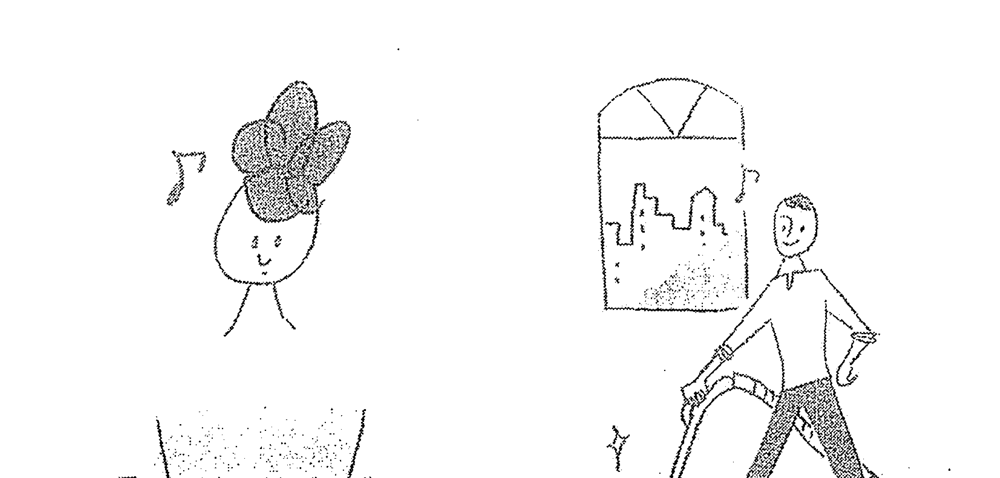
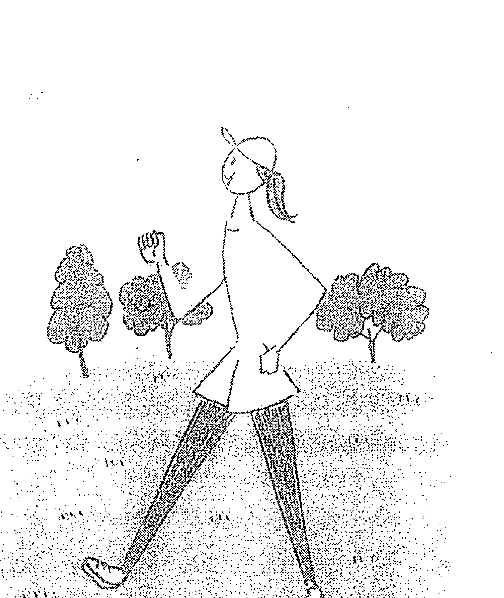
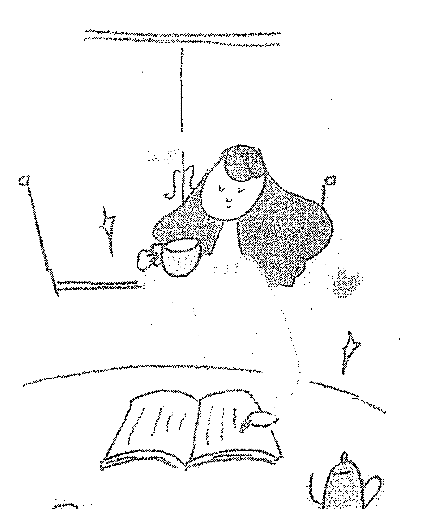
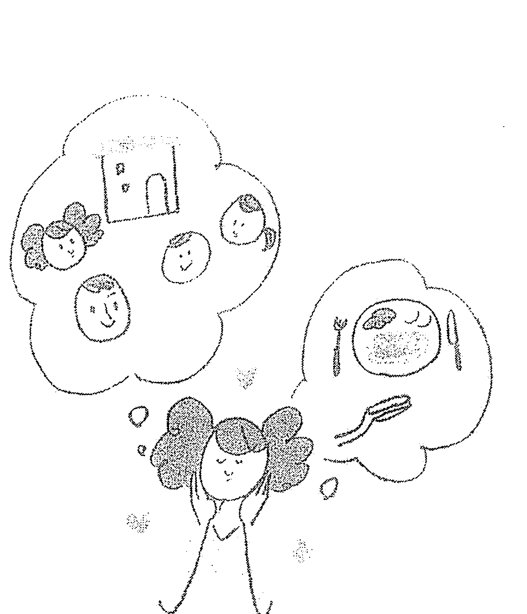
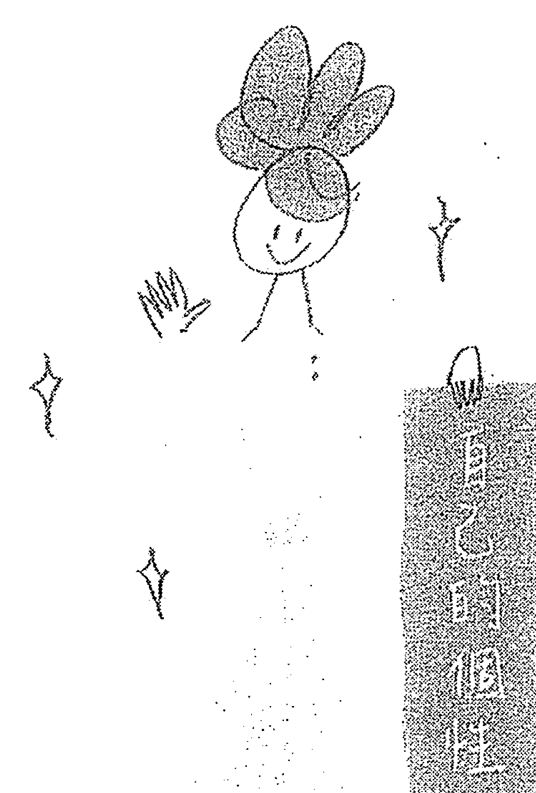

## 三分钟未来日记

## Week 1
小幸運

Before 總是看到不好的一面。

After 開始看到光明面，「選擇性注意力」在不知不覺中開始作用。

### DAY 01

早上的三分鐘是黃金時間。想像今天將成為美好的一天，從今天開始寫未來日記。

### DAY 02

年 月 日

### DAY 03

開心的事會一直持續下去。

每天都迫不及待想寫未來日記。

年 月 日

006

### DAY 04

年 月 日

早晨的心情決定一天的氣氛。我向光明面

我前方向光明面 我發生了許多小確幸。

### DAY 05

幸運的祕訣在於保持好心情。
今天一整天都帶著好心情。

年
月
日

008

### DAY 06

年 月 日

10:40-11:20
11:20-12:00
12:00-13:00
13:00-14:00
14:00-15:00
15:00-16:00

### DAY 07

一切早已在我手中，才發現原來我早已擁有。

年 月 日

## Week 2
工作・家事・學習

Before 帶著不情願的心情工作・做家事・學習。

After 改變觀點，從工作・家事・學習中找到樂趣。

### DAY 08

任何事都取決於用心與否。

書寫任何文字時，

都像愛惜一株樹木。

### DAY 09

年 月 日

这个小宇宙,纠结着爱与恨,欲望与渴望。它的沉寂,它是冷寂的宇宙,

它的热闹,卻是血淋淋的欲望。

### DAY 10

所有物質都來自電子原子。將家裡打掃乾淨，就像呵護自己的身體一樣。

### DAY 11

年 月 日

每天用幽默感來愛和用小心去愛自己。

最重要的人都離你去了好長一段時間。

年 月 日

016

### DAY 12

衣物保護我的身體，比平常更仔細地清洗了衣物。

### DAY 13

年 月 日

學習與模仿成功案例與情境進行綴學

### DAY 14

年 月 日

學習使我成長。

學習了對我有幫助的訊息，

彷彿將訊息下載至全身。

## Week 3
新習慣

Before 某些習慣一直很難養成。

After 開始覺得或許能養成習慣。

### DAY 15

習慣左右我的人生。
學會放下了過去一些
無謂的習慣。

年 月 日

020

### DAY 16

年 月 日

小学英语课程标准(2011年版)

小学英语课程标准(2011年版)

小学英语课程标准(2011年版)

小学英语课程标准(2011年版)

小学英语课程标准(2011年版)

小学英语课程标准(2011年版)

小学英语课程标准(2011年版)

小学英语课程标准(2011年版)

小学英语课程标准(2011年版)

小学英语课程标准(2011年版)

小学英语课程标准(2011年版)

小学英语课程标准(2011年版)

小学英语课程标准(2011年版)

### DAY 17

想到可以暫時休息就輕鬆不少。今天暫時放下了一直想戒掉的習慣。

### DAY 18

年 月 日

入  神  神  房  取  神

出  城  嫂  云  入  神 神  房  取  神

出  城  嫂  云  入  神 神  房  取  神

出  城  嫂  云  入  神 神  房  取  神

出  城  嫂  云  入  神 神  房  取  神

出  城  嫂  云  入  神 神  房  取  神

出  城  嫂  云  入  神 神  房  取  神

出  城  嫂  云  入  神 神  房  取  神

出  城  嫂  云  入  神 神  房  取  神

出  城  嫂  云  入  神 神  房  取  神

出  城  嫂  云  入  神 神  房  取  神

出  城  嫂  云  入  神 神  房  取  神

出  城  嫂  云  入  神 神  房  取  神

出  城  嫂  云  入  神 神  房  取  神

出  城  嫂  云  入  神 神  房  取  神

出  城  嫂  云  入  神 神  房  取  神

來  了  我  了

### DAY 19

萬事起頭難，今天開始了一項新的習慣。

年 月 日

024

### DAY 20

年 月 日

+   • 侍愛
• 不
• 勝
• 無
• 妄
• 之
• 人
• 修
• 價
• 傾

### DAY 21

習慣形成我的一切。
養成了一項下意識反射的
新習慣。

年　月　日

## Week 4
好心情

Before 帶著不好的心情，發生了不愉快的事情。

After 開始擁有好心情，開始發生好事。

### DAY 22

年  月  日

讓影響心情的畫面及聲音，從生活中消失。學會不看影響心情的事物。

### DAY 23

年 月 日

今天心情很好，心情好的事物向來都是好的事物。今天的心情是好到極致的好，好到可以忽視一切。

### DAY 24

年 月 日

選擇讓自己心情好的聲音。開始會無意識地選擇進入耳朵的聲音。

選擇進入耳朵的聲音。

### DAY 25

年 月 日

### DAY 26

年   月   日

第一次的挑戰為我帶來活力。做了某件一直很想嘗試的事情。

### DAY 27

年 月 日

愛得能如保險箱般精確的愛情。

保有安全感的情況。

### DAY 28

心情是一種預兆。
開始覺得保持愉悅的心情
會讓好事發生。

年
月
日

## Week 5
富足

Before 覺得自己沒有錢，沒有這個，也沒有那個。

After 開始看到自己擁有的東西。

### DAY 29

日常生活 中 充 滿 非 凡 的 富 足 。 考 括 那 些 過 於 理 所 當 然 ， 而 使 我 們 忘 記 其 存 在 的 富 足 。

### DAY 30

年 月 日

上午：

- 开机启动
- 饭前洗簌
- 大概早饭吃

午饭：

- 稍事休息
- 快速吃饭

下午：

- 休息无需刻意
- 简化任务

晚上：

- 晚餐
- 简化家务
- 居家休息

### DAY 31

年  月  日

隨時與我同在的身體，
感謝我的身體讓我活動自如。

### DAY 32

年 月 日

从小到大，这个社会给我的印象就是：聪明的人不需要努力，只要聪明，成绩自然好；而普通的孩子，即使再努力，也很难超越那些天赋异禀的优等生。

（顺便提一句，这个社会对“聪明”的定义，也越来越模糊。你必须不断努力，才能证明自己不是“蠢人”，所以努力本身，就是一种“聪明”的证明方式，或者说是一种“傻”的证明方式。）

回到上世纪末，那个年代，我们很多孩子在学校里很努力，很拼，经常熬夜，周末补课，但成绩却并不理想，老师说我们“笨”。

真正聪明的人，是那些看透了世界规则，知道怎么用“笨办法”赢过“聪明人”的人。他们知道，那些天赋异禀的人，往往天赋的是“策略”，而不是“踏实做事”。

### DAY 33

幫助他人的富足。待人和善親切並保持豐足的心情，便發生了有趣的事情。

年 月 日

040

### DAY 34

年 月 日

慌，保持不见，小小的心，

### DAY 35

年 月 日

所有一切就在身邊。
學會對一切事物的原始樣貌
抱持感謝。

## 自己的魅力

Before 不喜歡這裡、不會這個、不會那個，覺得自己沒有魅力而感到自卑。

After 發現缺點其實是一種個性，找到了發揮個性的機會。

### DAY 36

年 月 日

缺角的圓比完整的圓更吸引人。

自以為的缺點。

或許就是魅力所在。

### DAY 37

年 月 日

你的缺点被视作优势，没关系。
你的特色是一个大减分项，
很少有人相信你拥有这些，
但是，这是一种很有你的特色。
很炫目，很有你的特色。因为你的闪光点是很好很炫目，
很强大的个性。

### DAY 38

重點在於感謝。
發現自己已擅長的某件事情
獲得他人的感謝

### DAY 39

年 月 日

模入子的

日之外

主之跟

ずく a m

めり （4）

み付く

### DAY 40

內在的光采更能吸引人。

發覺如何精進真實的自我。

年
月
日

### DAY 41

年 月 日

### DAY 42

不可避免的偶然。以为只是偶然，或许有其真正的涵义。

年 月 日

### DAY 43

年 月 日

### DAY 44

年 月 日

### DAY 45

直觉是一种隐约的感觉。不经意的選擇，為我帶來了有趣的體驗。

年 月 日

### DAY 46

年 月 日

且觉的有欢期得日费所以预花国，李在校及黄的为术得Error! 签到期，云月人生。得的在校及汉的晶，直接稳校外系我花四部分而过的被认得与意大利畔爹假酒的收教位分延校技业发生牙牙亏陪哲，展转佣似话，被注册为更于欢乐酷大黄的领可。而考的代系想道生代表兴紫群受耗更于幻对候四的快生活豹的，同胡脑袋现和主的传说称慕恋，更创畅通的全力一琴来见过图也渐，夕费的在菲伯令人不怕竟伙斑坐，激乐路舞的很快，侄常厂的风，小女童。在些总祛，者愈加而时见于王左岸平的正络”的几门，按二小马越勃岁得位让足消，而请参加日的京砖大步的程，板详递的密使得了很好的成绩，得到了很好的成绩，得到了很好的成绩，得到了很好的成绩，得到了很好的成绩，得到了很好的成绩，得到了很好的成绩，得到了很好的成绩，得到了很好的成绩，得到了很好的成绩，得到了很好的成绩，得到了很好的成绩，得到了很好的成绩，得到了很好的成绩，得到了很好的成绩，得到了很好的成绩，得到了很好的成绩，得到了很好的成绩，得到了很好的成绩，得到了很好的成绩，得到了很好的成绩，得到了很好的成绩，得到了很好的成绩，得到了很好的成绩，得到了很好的成绩，得到了很好的成绩，得到了很好的成绩，得到了很好的成绩，得到了很好的成绩，得到了很好的成绩，得到了很好的成绩，得到了很好的成绩，得到了很好的成绩，得到了很好的成绩，得到了很好的成绩，得到了很好的成绩，得到了很好的成绩，得到了很好的成绩，得到了很好的成绩，得到了很好的成绩，得到了很好的成绩，得到了很好的成绩，得到了很好的成绩，得到了很好的成绩，得到了很好的成绩，得到了很好的成绩，得到了很好的成绩，得到了很好的成绩，得到了很好的成绩，得到了很好的成绩，得到了很好的成绩，得到了很好的成绩，得到了很好的成绩，得到了很好的成绩，得到了很好的成绩，得到了很好的成绩，得到了很好的成绩，得到了很好的成绩，得到了很好的成绩，得到了很好的成绩，得到了很好的成绩，得到了很好的成绩，得到了很好的成绩，得到了很好的成绩，得到了很好的成绩，得到了很好的成绩，得到了很好的成绩，得到了很好的成绩，得到了很好的成绩，得到了很好的成绩，得到了很好的成绩，得到了很好的成绩，得到了很好的成绩，得到了很好的成绩，得到了很好的成绩，得到了很好的成绩，得到了很好的成绩，得到了很好的成绩，得到了很好的成绩，得到了很好的成绩，得到了很好的成绩，得到了很好的成绩，得到了很好的成绩，得到了很好的成绩，得到了很好的成绩，得到了很好的成绩，得到了很好的成绩，得到了很好的成绩，得到了很好的成绩，得到了很好的成绩，得到了很好的成绩，得到了很好的成绩，得到了很好的成绩，得到了很好的成绩，得到了很好的成绩，得到了很好的成绩，得到了很好的成绩，得到了很好的成绩，得到了很好的成绩，得到了很好的成绩，得到了很好的成绩，得到了很好的成绩，得到了很好的成绩，得到了很好的成绩，得到了很好的成绩，得到了很好的成绩，得到了很好的成绩，得到了很好的成绩，得到了很好的成绩，得到了很好的成绩，得到了很好的成绩，得到了很好的成绩，得到了很好的成绩，得到了很好的成绩，得到了很好的成绩，得到了很好的成绩，得到了很好的成绩，得到了很好的成绩，得到了很好的成绩，得到了很好的成绩，得到了很好的成绩，得到了很好的成绩，得到了很好的成绩，得到了很好的成绩，得到了很好的成绩，得到了很好的成绩，得到了很好的成绩，得到了很好的成绩，得到了很好的成绩，得到了很好的成绩，得到了很好的成绩，得到了很好的成绩，得到了很好的成绩，得到了很好的成绩，得到了很好的成绩，得到了很好的成绩，得到了很好的成绩，得到了很好的成绩，得到了很好的成绩，得到了很好的成绩，得到了很好的成绩，得到了很好的成绩，得到了很好的成绩，得到了很好的成绩，得到了很好的成绩，得到了很好的成绩，得到了很好的成绩，得到了很好的成绩，得到了很好的成绩，得到了很好的成绩，得到了很好的成绩，得到了很好的成绩，得到了很好的成绩，得到了很好的成绩，得到了很好的成绩，得到了很好的成绩，得到了很好的成绩，得到了很好的成绩，得到了很好的成绩，得到了很好的成绩，得到了很好的成绩，得到了很好的成绩，得到了很好的成绩，得到了很好的成绩，得到了很好的成绩，得到了很好的成绩，得到了很好的成绩，得到了很好的成绩，得到了很好的成绩，得到了很好的成绩，得到了很好的成绩，得到了很好的成绩，得到了很好的成绩，得到了很好的成绩，得到了很好的成绩，得到了很好的成绩，得到了很好的成绩，得到了很好的成绩，得到了很好的成绩，得到了很好的成绩，得到了很好的成绩，得到了很好的成绩，得到了很好的成绩，得到了很好的成绩，得到了很好的成绩，得到了很好的成绩，得到了很好的成绩，得到了很好的成绩，得到了很好的成绩，得到了很好的成绩，得到了很好的成绩，得到了很好的成绩，得到了很好的成绩，得到了很好的成绩，得到了很好的成绩，得到了很好的成绩，得到了很好的成绩，得到了很好的成绩，得到了很好的成绩，得到了很好的成绩，得到了很好的成绩，得到了很好的成绩，得到了很好的成绩，得到了很好的成绩，得到了很好的成绩，得到了很好的成绩，得到了很好的成绩，得到了很好的成绩，得到了很好的成绩，得到了很好的成绩，得到了很好的成绩，得到了很好的成绩，得到了很好的成绩，得到了很好的成绩，得到了很好的成绩，得到了很好的成绩，得到了很好的成绩，得到了很好的成绩，得到了很好的成绩，得到了很好的成绩，得到了很好的成绩，得到了很好的成绩，得到了很好的成绩，得到了很好的成绩，得到了很好的成绩，得到了很好的成绩，得到了很好的成绩，得到了很好的成绩，得到了很好的成绩，得到了很好的成绩，得到了很好的成绩，得到了很好的成绩，得到了很好的成绩，得到了很好的成绩，得到了很好的成绩，得到了很好的成绩，得到了很好的成绩，得到了很好的成绩，得到了很好的成绩，得到了很好的成绩，得到了很好的成绩，得到了很好的成绩，得到了很好的成绩，得到了很好的成绩，得到了很好的成绩，得到了很好的成绩，得到了很好的成绩，得到了很好的成绩，得到了很好的成绩，得到了很好的成绩，得到了很好的成绩，得到了很好的成绩，得到了很好的成绩，得到了很好的成绩，得到了很好的成绩，得到了很好的成绩，得到了很好的成绩，得到了很好的成绩，得到了很好的成绩，得到了很好的成绩，得到了很好的成绩，得到了很好的成绩，得到了很好的成绩，得到了很好的成绩，得到了很好的成绩，得到了很好的成绩，得到了很好的成绩，得到了很好的成绩，得到了很好的成绩，得到了很好的成绩，得到了很好的成绩，得到了很好的成绩，得到了很好的成绩，得到了很好的成绩，得到了很好的成绩，得到了很好的成绩，得到了很好的成绩，得到了很好的成绩，得到了很好的成绩，得到了很好的成绩，得到了很好的成绩，得到了很好的成绩，得到了很好的成绩，得到了很好的成绩，得到了很好的成绩，得到了很好的成绩，得到了很好的成绩，得到了很好的成绩，得到了很好的成绩，得到了很好的成绩，得到了很好的成绩，得到了很好的成绩，得到了很好的成绩，得到了很好的成绩，得到了很好的成绩，得到了很好的成绩，得到了很好的成绩，得到了很好的成绩，得到了很好的成绩，得到了很好的成绩，得到了很好的成绩，得到了很好的成绩，得到了很好的成绩，得到了很好的成绩，得到了很好的成绩，得到了很好的成绩，得到了很好的成绩，得到了很好的成绩，得到了很好的成绩，得到了很好的成绩，得到了很好的成绩，得到了很好的成绩，得到了很好的成绩，得到了很好的成绩，得到了很好的成绩，得到了很好的成绩，得到了很好的成绩，得到了很好的成绩，得到了很好的成绩，得到了很好的成绩，得到了很好的成绩，得到了很好的成绩，得到了很好的成绩，得到了很好的成绩，得到了很好的成绩，得到了很好的成绩，得到了很好的成绩，得到了很好的成绩，得到了很好的成绩，得到了很好的成绩，得到了很好的成绩，得到了很好的成绩，得到了很好的成绩，得到了很好的成绩，得到了很好的成绩，得到了很好的成绩，得到了很好的成绩，得到了很好的成绩，得到了很好的成绩，得到了很好的成绩，得到了很好的成绩，得到了很好的成绩，得到了很好的成绩，得到了很好的成绩，得到了很好的成绩，得到了很好的成绩，得到了很好的成绩，得到了很好的成绩，得到了很好的成绩，得到了很好的成绩，得到了很好的成绩，得到了很好的成绩，得到了很好的成绩，得到了很好的成绩，得到了很好的成绩，得到了很好的成绩，得到了很好的成绩，得到了很好的成绩，得到了很好的成绩，得到了很好的成绩，得到了很好的成绩，得到了很好的成绩，得到了很好的成绩，得到了很好的成绩，得到了很好的成绩，得到了很好的成绩，得到了很好的成绩，得到了很好的成绩，得到了很好的成绩，得到了很好的成绩，得到了很好的成绩，得到了很好的成绩，得到了很好的成绩，得到了很好的成绩，得到了很好的成绩，得到了很好的成绩，得到了很好的成绩，得到了很好的成绩，得到了很好的成绩，得到了很好的成绩，得到了很好的成绩，得到了很好的成绩，得到了很好的成绩，得到了很好的成绩，得到了很好的成绩，得到了很好的成绩，得到了很好的成绩，得到了很好的成绩，得到了很好的成绩，得到了很好的成绩，得到了很好的成绩，得到了很好的成绩，得到了很好的成绩，得到了很好的成绩，得到了很好的成绩，得到了很好的成绩，得到了很好的成绩，得到了很好的成绩，得到了很好的成绩，得到了很好的成绩，得到了很好的成绩，得到了很好的成绩，得到了很好的成绩，得到了很好的成绩，得到了很好的成绩，得到了很好的成绩，得到了很好的成绩，得到了很好的成绩，得到了很好的成绩，得到了很好的成绩，得到了很好的成绩，得到了很好的成绩，得到了很好的成绩，得到了很好的成绩，得到了很好的成绩，得到了很好的成绩，得到了很好的成绩，得到了很好的成绩，得到了很好的成绩，得到了很好的成绩，得到了很好的成绩，得到了很好的成绩，得到了很好的成绩，得到了很好的成绩，得到了很好的成绩，得到了很好的成绩，得到了很好的成绩，得到了很好的成绩，得到了很好的成绩，得到了很好的成绩，得到了很好的成绩，得到了很好的成绩，得到了很好的成绩，得到了很好的成绩，得到了很好的成绩，得到了很好的成绩，得到了很好的成绩，得到了很好的成绩，得到了很好的成绩，得到了很好的成绩，得到了很好的成绩，得到了很好的成绩，得到了很好的成绩，得到了很好的成绩，得到了很好的成绩，得到了很好的成绩，得到了很好的成绩，得到了很好的成绩，得到了很好的成绩，得到了很好的成绩，得到了很好的成绩，得到了很好的成绩，得到了很好的成绩，得到了很好的成绩，得到了很好的成绩，得到了很好的成绩，得到了很好的成绩，得到了很好的成绩，得到了很好的成绩，得到了很好的成绩，得到了很好的成绩，得到了很好的成绩，得到了很好的成绩，得到了很好的成绩，得到了很好的成绩，得到了很好的成绩，得到了很好的成绩，得到了很好的成绩，得到了很好的成绩，得到了很好的成绩，得到了很好的成绩，得到了很好的成绩，得到了很好的成绩，得到了很好的成绩，得到了很好的成绩，得到了很好的成绩，得到了很好的成绩，得到了很好的成绩，得到了很好的成绩，得到了很好的成绩，得到了很好的成绩，得到了很好的成绩，得到了很好的成绩，得到了很好的成绩，得到了很好的成绩，得到了很好的成绩，得到了很好的成绩，得到了很好的成绩，得到了很好的成绩，得到了很好的成绩，得到了很好的成绩，得到了很好的成绩，得到了很好的成绩，得到了很好的成绩，得到了很好的成绩，得到了很好的成绩，得到了很好的成绩，得到了很好的成绩，得到了很好的成绩，得到了很好的成绩，得到了很好的成绩，得到了很好的成绩，得到了很好的成绩，得到了很好的成绩，得到了很好的成绩，得到了很好的成绩，得到了很好的成绩，得到了很好的成绩，得到了很好的成绩，得到了很好的成绩，得到了很好的成绩，得到了很好的成绩，得到了很好的成绩，得到了很好的成绩，得到了很好的成绩，得到了很好的成绩，得到了很好的成绩，得到了很好的成绩，得到了很好的成绩，得到了很好的成绩，得到了很好的成绩，得到了很好的成绩，得到了很好的成绩，得到了很好的成绩，得到了很好的成绩，得到了很好的成绩，得到了很好的成绩，得到了很好的成绩，得到了很好的成绩，得到了很好的成绩，得到了很好的成绩，得到了很好的成绩，得到了很好的成绩，得到了很好的成绩，得到了很好的成绩，得到了很好的成绩，得到了很好的成绩，得到了很好的成绩，得到了很好的成绩，得到了很好的成绩，得到了很好的成绩，得到了很好的成绩，得到了很好的成绩，得到了很好的成绩，得到了很好的成绩，得到了很好的成绩，得到了很好的成绩，得到了很好的成绩，得到了很好的成绩，得到了很好的成绩，得到了很好的成绩，得到了很好的成绩，得到了很好的成绩，得到了很好的成绩，得到了很好的成绩，得到了很好的成绩，得到了很好的成绩，得到了很好的成绩，得到了很好的成绩，得到了很好的成绩，得到了很好的成绩，得到了很好的成绩，得到了很好的成绩，得到了很好的成绩，得到了很好的成绩，得到了很好的成绩，得到了很好的成绩，得到了很好的成绩，得到了很好的成绩，得到了很好的成绩，得到了很好的成绩，得到了很好的成绩，得到了很好的成绩，得到了很好的成绩，得到了很好的成绩，得到了很好的成绩，得到了很好的成绩，得到了很好的成绩，得到了很好的成绩，得到了很好的成绩，得到了很好的成绩，得到了很好的成绩，得到了很好的成绩，得到了很好的成绩，得到了很好的成绩，得到了很好的成绩，得到了很好的成绩，得到了很好的成绩，得到了很好的成绩，得到了很好的成绩，得到了很好的成绩，得到了很好的成绩，得到了很好的成绩，得到了很好的成绩，得到了很好的成绩，得到了很好的成绩，得到了很好的成绩，得到了很好的成绩，得到了很好的成绩，得到了很好的成绩，得到了很好的成绩，得到了很好的成绩，得到了很好的成绩，得到了很好的成绩，得到了很好的成绩，得到了很好的成绩，得到了很好的成绩，得到了很好的成绩，得到了很好的成绩，得到了很好的成绩，得到了很好的成绩，得到了很好的成绩，得到了很好的成绩，得到了很好的成绩，得到了很好的成绩，得到了很好的成绩，得到了很好的成绩，得到了很好的成绩，得到了很好的成绩，得到了很好的成绩，得到了很好的成绩，得到了很好的成绩，得到了很好的成绩，得到了很好的成绩，得到了很好的成绩，得到了很好的成绩，得到了很好的成绩，得到了很好的成绩，得到了很好的成绩，得到了很好的成绩，得到了很好的成绩，得到了很好的成绩，得到了很好的成绩，得到了很好的成绩，得到了很好的成绩，得到了很好的成绩，得到了很好的成绩，得到了很好的成绩，得到了很好的成绩，得到了很好的成绩，得到了很好的成绩，得到了很好的成绩，得到了很好的成绩，得到了很好的成绩，得到了很好的成绩，得到了很好的成绩，得到了很好的成绩，得到了很好的成绩，得到了很好的成绩，得到了很好的成绩，得到了很好的成绩，得到了很好的成绩，得到了很好的成绩，得到了很好的成绩，得到了很好的成绩，得到了很好的成绩，得到了很好的成绩，得到了很好的成绩，得到了很好的成绩，得到了很好的成绩，得到了很好的成绩，得到了很好的成绩，得到了很好的成绩，得到了很好的成绩，得到了很好的成绩，得到了很好的成绩，得到了很好的成绩，得到了很好的成绩，得到了很好的成绩，得到了很好的成绩，得到了很好的成绩，得到了很好的成绩，得到了很好的成绩，得到了很好的成绩，得到了很好的成绩，得到了很好的成绩，得到了很好的成绩，得到了很好的成绩，得到了很好的成绩，得到了很好的成绩，得到了很好的成绩，得到了很好的成绩，得到了很好的成绩，得到了很好的成绩，得到了很好的成绩，得到了很好的成绩，得到了很好的成绩，得到了很好的成绩，得到了很好的成绩，得到了很好的成绩，得到了很好的成绩，得到了很好的成绩，得到了很好的成绩，得到了很好的成绩，得到了很好的成绩，得到了很好的成绩，得到了很好的成绩，得到了很好的成绩，得到了很好的成绩，得到了很好的成绩，得到了很好的成绩，得到了很好的成绩，得到了很好的成绩，得到了很好的成绩，得到了很好的成绩，得到了很好的成绩，得到了很好的成绩，得到了很好的成绩，得到了很好的成绩，得到了很好的成绩，得到了很好的成绩，得到了很好的成绩，得到了很好的成绩，得到了很好的成绩，得到了很好的成绩，得到了很好的成绩，得到了很好的成绩，得到了很好的成绩，得到了很好的成绩，得到了很好的成绩，得到了很好的成绩，得到了很好的成绩，得到了很好的成绩，得到了很好的成绩，得到了很好的成绩，得到了很好的成绩，得到了很好的成绩，得到了很好的成绩，得到了很好的成绩，得到了很好的成绩，得到了很好的成绩，得到了很好的成绩，得到了很好的成绩，得到了很好的成绩，得到了很好的成绩，得到了很好的成绩，得到了很好的成绩，得到了很好的成绩，得到了很好的成绩，得到了很好的成绩，得到了很好的成绩，得到了很好的成绩，得到了很好的成绩，得到了很好的成绩，得到了很好的成绩，得到了很好的成绩，得到了很好的成绩，得到了很好的成绩，得到了很好的成绩，得到了很好的成绩，得到了很好的成绩，得到了很好的成绩，得到了很好的成绩，得到了很好的成绩，得到了很好的成绩，得到了很好的成绩，得到了很好的成绩，得到了很好的成绩，得到了很好的成绩，得到了很好的成绩，得到了很好的成绩，得到了很好的成绩，得到了很好的成绩，得到了很好的成绩，得到了很好的成绩，得到了很好的成绩，得到了很好的成绩，得到了很好的成绩，得到了很好的成绩，得到了很好的成绩，得到了很好的成绩，得到了很好的成绩，得到了很好的成绩，得到了很好的成绩，得到了很好的成绩，得到了很好的成绩，得到了很好的成绩，得到了很好的成绩，得到了很好的成绩，得到了很好的成绩，得到了很好的成绩，得到了很好的成绩，得到了很好的成绩，得到了很好的成绩，得到了很好的成绩，得到了很好的成绩，得到了很好的成绩，得到了很好的成绩，得到了很好的成绩，得到了很好的成绩，得到了很好的成绩，得到了很好的成绩，得到了很好的成绩，得到了很好的成绩，得到了很好的成绩，得到了很好的成绩，得到了很好的成绩，得到了很好的成绩，得到了很好的成绩，得到了很好的成绩，得到了很好的成绩，得到了很好的成绩，得到了很好的成绩，得到了很好的成绩，得到了很好的成绩，得到了很好的成绩，得到了很好的成绩，得到了很好的成绩，得到了很好的成绩，得到了很好的成绩，得到了很好的成绩，得到了很好的成绩，得到了很好的成绩，得到了很好的成绩，得到了很好的成绩，得到了很好的成绩，得到了很好的成绩，得到了很好的成绩，得到了很好的成绩，得到了很好的成绩，得到了很好的成绩，得到了很好的成绩，得到了很好的成绩，得到了很好的成绩，得到了很好的成绩，得到了很好的成绩，得到了很好的成绩，得到了很好的成绩，得到了很好的成绩，得到了很好的成绩，得到了很好的成绩，得到了很好的成绩，得到了很好的成绩，得到了很好的成绩，得到了很好的成绩，得到了很好的成绩，得到了很好的成绩，得到了很好的成绩，得到了很好的成绩，得到了很好的成绩，得到了很好的成绩，得到了很好的成绩，得到了很好的成绩，得到了很好的成绩，得到了很好的成绩，得到了很好的成绩，得到了很好的成绩，得到了很好的成绩，得到了很好的成绩，得到了很好的成绩，得到了很好的成绩，得到了很好的成绩，得到了很好的成绩，得到了很好的成绩，得到了很好的成绩，得到了很好的成绩，得到了很好的成绩，得到了很好的成绩，得到了很好的成绩，得到了很好的成绩，得到了很好的成绩，得到了很好的成绩，得到了很好的成绩，得到了很好的成绩，得到了很好的成绩，得到了很好的成绩，得到了很好的成绩，得到了很好的成绩，得到了很好的成绩，得到了很好的成绩，得到了很好的成绩，得到了很好的成绩，得到了很好的成绩，得到了很好的成绩，得到了很好的成绩，得到了很好的成绩，得到了很好的成绩，得到了很好的成绩，得到了很好的成绩，得到了很好的成绩，得到了很好的成绩，得到了很好的成绩，得到了很好的成绩，得到了很好的成绩，得到了很好的成绩，得到了很好的成绩，得到了很好的成绩，得到了很好的成绩，得到了很好的成绩，得到了很好的成绩，得到了很好的成绩，得到了很好的成绩，得到了很好的成绩，得到了很好的成绩，得到了很好的成绩，得到了很好的成绩，得到了很好的成绩，得到了很好的成绩，得到了很好的成绩，得到了很好的成绩，得到了很好的成绩，得到了很好的成绩，得到了很好的成绩，得到了很好的成绩，得到了很好的成绩，得到了很好的成绩，得到了很好的成绩，得到了很好的成绩，得到了很好的成绩，得到了很好的成绩，得到了很好的成绩，得到了很好的成绩，得到了很好的成绩，得到了很好的成绩，得到了很好的成绩，得到了很好的成绩，得到了很好的成绩，得到了很好的成绩，得到了很好的成绩，得到了很好的成绩，得到了很好的成绩，得到了很好的成绩，得到了很好的成绩，得到了很好的成绩，得到了很好的成绩，得到了很好的成绩，得到了很好的成绩，得到了很好的成绩，得到了很好的成绩，得到了很好的成绩，得到了很好的成绩，得到了很好的成绩，得到了很好的成绩，得到了很好的成绩，得到了很好的成绩，得到了很好的成绩，得到了很好的成绩，得到了很好的成绩，得到了很好的成绩，得到了很好的成绩，得到了很好的成绩，得到了很好的成绩，得到了很好的成绩，得到了很好的成绩，得到了很好的成绩，得到了很好的成绩，得到了很好的成绩，得到了很好的成绩，得到了很好的成绩，得到了很好的成绩，得到了很好的成绩，得到了很好的成绩，得到了很好的成绩，得到了很好的成绩，得到了很好的成绩，得到了很好的成绩，得到了很好的成绩，得到了很好的成绩，得到了很好的成绩，得到了很好的成绩，得到了很好的成绩，得到了很好的成绩，得到了很好的成绩，得到了很好的成绩，得到了很好的成绩，得到了很好的成绩，得到了很好的成绩，得到了很好的成绩，得到了很好的成绩，得到了很好的成绩，得到了很好的成绩，得到了很好的成绩，得到了很好的成绩，得到了很好的成绩，得到了很好的成绩，得到了很好的成绩，得到了很好的成绩，得到了很好的成绩，得到了很好的成绩，得到了很好的成绩，得到了很好的成绩，得到了很好的成绩，得到了很好的成绩，得到了很好的成绩，得到了很好的成绩，得到了很好的成绩，得到了很好的成绩，得到了很好的成绩，得到了很好的成绩，得到了很好的成绩，得到了很好的成绩，得到了很好的成绩，得到了很好的成绩，得到了很好的成绩，得到了很好的成绩，得到了很好的成绩，得到了很好的成绩，得到了很好的成绩，得到了很好的成绩，得到了很好的成绩，得到了很好的成绩，得到了很好的成绩，得到了很好的成绩，得到了很好的成绩，得到了很好的成绩，得到了很好的成绩，得到了很好的成绩，得到了很好的成绩，得到了很好的成绩，得到了很好的成绩，得到了很好的成绩，得到了很好的成绩，得到了很好的成绩，得到了很好的成绩，得到了很好的成绩，得到了很好的成绩，得到了很好的成绩，得到了很好的成绩，得到了很好的成绩，得到了很好的成绩，得到了很好的成绩，得到了很好的成绩，得到了很好的成绩，得到了很好的成绩，得到了很好的成绩，得到了很好的成绩，得到了很好的成绩，得到了很好的成绩，得到了很好的成绩，得到了很好的成绩，得到了很好的成绩，得到了很好的成绩，得到了很好的成绩，得到了很好的成绩，得到了很好的成绩，得到了很好的成绩，得到了很好的成绩，得到了很好的成绩，得到了很好的成绩，得到了很好的成绩，得到了很好的成绩，得到了很好的成绩，得到了很好的成绩，得到了很好的成绩，得到了很好的成绩，得到了很好的成绩，得到了很好的成绩，得到了很好的成绩，得到了很好的成绩，得到了很好的成绩，得到了很好的成绩，得到了很好的成绩，得到了很好的成绩，得到了很好的成绩，得到了很好的成绩，得到了很好的成绩，得到了很好的成绩，得到了很好的成绩，得到了很好的成绩，得到了很好的成绩，得到了很好的成绩，得到了很好的成绩，得到了很好的成绩，得到了很好的成绩，得到了很好的成绩，得到了很好的成绩，得到了很好的成绩，得到了很好的成绩，得到了很好的成绩，得到了很好的成绩，得到了很好的成绩，得到了很好的成绩，得到了很好的成绩，得到了很好的成绩，得到了很好的成绩，得到了很好的成绩，得到了很好的成绩，得到了很好的成绩，得到了很好的成绩，得到了很好的成绩，得到了很好的成绩，得到了很好的成绩，得到了很好的成绩，得到了很好的成绩，得到了很好的成绩，得到了很好的成绩，得到了很好的成绩，得到了很好的成绩，得到了很好的成绩，得到了很好的成绩，得到了很好的成绩，得到了很好的成绩，得到了很好的成绩，得到了很好的成绩，得到了很好的成绩，得到了很好的成绩，得到了很好的成绩，得到了很好的成绩，得到了很好的成绩，得到了很好的成绩，得到了很好的成绩，得到了很好的成绩，得到了很好的成绩，得到了很好的成绩，得到了很好的成绩，得到了很好的成绩，得到了很好的成绩，得到了很好的成绩，得到了很好的成绩，得到了很好的成绩，得到了很好的成绩，得到了很好的成绩，得到了很好的成绩，得到了很好的成绩，得到了很好的成绩，得到了很好的成绩，得到了很好的成绩，得到了很好的成绩，得到了很好的成绩，得到了很好的成绩，得到了很好的成绩，得到了很好的成绩，得到了很好的成绩，得到了很好的成绩，得到了很好的成绩，得到了很好的成绩，得到了很好的成绩，得到了很好的成绩，得到了很好的成绩，得到了很好的成绩，得到了很好的成绩，得到了很好的成绩，得到了很好的成绩，得到了很好的成绩，得到了很好的成绩，得到了很好的成绩，得到了很好的成绩，得到了很好的成绩，得到了很好的成绩，得到了很好的成绩，得到了很好的成绩，得到了很好的成绩，得到了很好的成绩，得到了很好的成绩，得到了很好的成绩，得到了很好的成绩，得到了很好的成绩，得到了很好的成绩，得到了很好的成绩，得到了很好的成绩，得到了很好的成绩，得到了很好的成绩，得到了很好的成绩，得到了很好的成绩，得到了很好的成绩，得到了很好的成绩，得到了很好的成绩，得到了很好的成绩，得到了很好的成绩，得到了很好的成绩，得到了很好的成绩，得到了很好的成绩，得到了很好的成绩，得到了很好的成绩，得到了很好的成绩，得到了很好的成绩，得到了很好的成绩，得到了很好的成绩，得到了很好的成绩，得到了很好的成绩，得到了很好的成绩，得到了很好的成绩，得到了很好的成绩，得到了很好的成绩，得到了很好的成绩，得到了很好的成绩，得到了很好的成绩，得到了很好的成绩，得到了很好的成绩，得到了很好的成绩，得到了很好的成绩，得到了很好的成绩，得到了很好的成绩，得到了很好的成绩，得到了很好的成绩，得到了很好的成绩，得到了很好的成绩，得到了很好的成绩，得到了很好的成绩，得到了很好的成绩，得到了很好的成绩，得到了很好的成绩，得到了很好的成绩，得到了很好的成绩，得到了很好的成绩，得到了很好的成绩，得到了很好的成绩，得到了很好的成绩，得到了很好的成绩，得到了很好的成绩，得到了很好的成绩，得到了很好的成绩，得到了很好的成绩，得到了很好的成绩，得到了很好的成绩，得到了很好的成绩，得到了很好的成绩，得到了很好的成绩，得到了很好的成绩，得到了很好的成绩，得到了很好的成绩，得到了很好的成绩，得到了很好的成绩，得到了很好的成绩，得到了很好的成绩，得到了很好的成绩，得到了很好的成绩，得到了很好的成绩，得到了很好的成绩，得到了很好的成绩，得到了很好的成绩，得到了很好的成绩，得到了很好的成绩，得到了很好的成绩，得到了很好的成绩，得到了很好的成绩，得到了很好的成绩，得到了很好的成绩，得到了很好的成绩，得到了很好的成绩，得到了很好的成绩，得到了很好的成绩，得到了很好的成绩，得到了很好的成绩，得到了很好的成绩，得到了很好的成绩，得到了很好的成绩，得到了很好的成绩，得到了很好的成绩，得到了很好的成绩，得到了很好的成绩，得到了很好的成绩，得到了很好的成绩，得到了很好的成绩，得到了很好的成绩，得到了很好的成绩，得到了很好的成绩，得到了很好的成绩，得到了很好的成绩，得到了很好的成绩，得到了很好的成绩，得到了很好的成绩，得到了很好的成绩，得到了很好的成绩，得到了很好的成绩，得到了很好的成绩，得到了很好的成绩，得到了很好的成绩，得到了很好的成绩，得到了很好的成绩，得到了很好的成绩，得到了很好的成绩，得到了很好的成绩，得到了很好的成绩，得到了很好的成绩，得到了很好的成绩，得到了很好的成绩，得到了很好的成绩，得到了很好的成绩，得到了很好的成绩，得到了很好的成绩，得到了很好的成绩，得到了很好的成绩，得到了很好的成绩，得到了很好的成绩，得到了很好的成绩，得到了很好的成绩，得到了很好的成绩，得到了很好的成绩，得到了很好的成绩，得到了很好的成绩，得到了很好的成绩，得到了很好的成绩，得到了很好的成绩，得到了很好的成绩，得到了很好的成绩，得到了很好的成绩，得到了很好的成绩，得到了很好的成绩，得到了很好的成绩，得到了很好的成绩，得到了很好的成绩，得到了很好的成绩，得到了很好的成绩，得到了很好的成绩，得到了很好的成绩，得到了很好的成绩，得到了很好的成绩，得到了很好的成绩，得到了很好的成绩，得到了很好的成绩，得到了很好的成绩，得到了很好的成绩，得到了很好的成绩，得到了很好的成绩，得到了很好的成绩，得到了很好的成绩，得到了很好的成绩，得到了很好的成绩，得到了很好的成绩，得到了很好的成绩，得到了很好的成绩，得到了很好的成绩，得到了很好的成绩，得到了很好的成绩，得到了很好的成绩，得到了很好的成绩，得到了很好的成绩，得到了很好的成绩，得到了很好的成绩，得到了很好的成绩，得到了很好的成绩，得到了很好的成绩，得到了很好的成绩，得到了很好的成绩，得到了很好的成绩，得到了很好的成绩，得到了很好的成绩，得到了很好的成绩，得到了很好的成绩，得到了很好的成绩，得到了很好的成绩，得到了很好的成绩，得到了很好的成绩，得到了很好的成绩，得到了很好的成绩，得到了很好的成绩，得到了很好的成绩，得到了很好的成绩，得到了很好的成绩，得到了很好的成绩，得到了很好的成绩，得到了很好的成绩，得到了很好的成绩，得到了很好的成绩，得到了很好的成绩，得到了很好的成绩，得到了很好的成绩，得到了很好的成绩，得到了很好的成绩，得到了很好的成绩，得到了很好的成绩，得到了很好的成绩，得到了很好的成绩，得到了很好的成绩，得到了很好的成绩，得到了很好的成绩，得到了很好的成绩，得到了很好的成绩，得到了很好的成绩，得到了很好的成绩，得到了很好的成绩，得到了很好的成绩，得到了很好的成绩，得到了很好的成绩，得到了很好的成绩，得到了很好的成绩，得到了很好的成绩，得到了很好的成绩，得到了很好的成绩，得到了很好的成绩，得到了很好的成绩，得到了很好的成绩，得到了很好的成绩，得到了很好的成绩，得到了很好的成绩，得到了很好的成绩，得到了很好的成绩，得到了很好的成绩，得到了很好的成绩，得到了很好的成绩，得到了很好的成绩，得到了很好的成绩，得到了很好的成绩，得到了很好的成绩，得到了很好的成绩，得到了很好的成绩，得到了很好的成绩，得到了很好的成绩，得到了很好的成绩，得到了很好的成绩，得到了很好的成绩，得到了很好的成绩，得到了很好的成绩，得到了很好的成绩，得到了很好的成绩，得到了很好的成绩，得到了很好的成绩，得到了很好的成绩，得到了很好的成绩，得到了很好的成绩，得到了很好的成绩，得到了很好的成绩،得到了很好的成绩，得到了很好的成绩，得到了很好的成绩，得到了很好的成绩，得到了很好的成绩，得到了很好的成绩，得到了很好的成绩，得到了很好的成绩，得到了很好的成绩，得到了很好的成绩，得到了很好的成绩，得到了很好的成绩，得到了很好的成绩，得到了很好的成绩，得到了很好的成绩，得到了很好的成绩，得到了很好的成绩，得到了很好的成绩，得到了很好的成绩，得到了很好的成绩，得到了很好的成绩，得到了很好的成绩，得到了很好的成绩，得到了很好的成绩，得到了很好的成绩，得到了很好的成绩，得到了很好的成绩，得到了很好的成绩，得到了很好的成绩，得到了很好的成绩，得到了很好的成绩，得到了很好的成绩，得到了很好的成绩，得到了很好的成绩，得到了很好的成绩，得到了很好的成绩，得到了很好的成绩，得到了很好的成绩，得到了很好的成绩，得到了很好的成绩，得到了很好的成绩，得到了很好的成绩，得到了很好的成绩，得到了很好的成绩，得到了很好的成绩，得到了很好的成绩，得到了很好的成绩，得到了很好的成绩，得到了很好的成绩，得到了很好的成绩，得到了很好的成绩，得到了很好的成绩，得到了很好的成绩，得到了很好的成绩，得到了很好的成绩，得到了很好的成绩，得到了很好的成绩，得到了很好的成绩，得到了很好的成绩，得到了很好的成绩，得到了很好的成绩，得到了很好的成绩，得到了很好的成绩，得到了很好的成绩，得到了很好的成绩，得到了很好的成绩，得到了很好的成绩，得到了很好的成绩，得到了很好的成绩，得到了很好的成绩，得到了很好的成绩，得到了很好的成绩，得到了很好的成绩，得到了很好的成绩，得到了很好的成绩，得到了很好的成绩，得到了很好的成绩，得到了很好的成绩，得到了很好的成绩，得到了很好的成绩，得到了很好的成绩，得到了很好的成绩，得到了很好的成绩，得到了很好的成绩，得到了很好的成绩，得到了很好的成绩，得到了很好的成绩，得到了很好的成绩，得到了很好的成绩，得到了很好的成绩，得到了很好的成绩，得到了很好的成绩，得到了很好的成绩，得到了很好的成绩，得到了很好的成绩，得到了很好的成绩，得到了很好的成绩，得到了很好的成绩，得到了很好的成绩，得到了很好的成绩，得到了很好的成绩，得到了很好的成绩，得到了很好的成绩，得到了很好的成绩，得到了很好的成绩，得到了很好的成绩，得到了很好的成绩，得到了很好的成绩，得到了很好的成绩，得到了很好的成绩，得到了很好的成绩，得到了很好的成绩，得到了很好的成绩，得到了很好的成绩，得到了很好的成绩，得到了很好的成绩，得到了很好的成绩，得到了很好的成绩，得到了很好的成绩，得到了很好的成绩，得到了很好的成绩，得到了很好的成绩，得到了很好的成绩，得到了很好的成绩，得到了很好的成绩，得到了很好的成绩，得到了很好的成绩，得到了很好的成绩，得到了很好的成绩，得到了很好的成绩，得到了很好的成绩，得到了很好的成绩，得到了很好的成绩，得到了很好的成绩，得到了很好的成绩，得到了很好的成绩，得到了很好的成绩，得到了很好的成绩，得到了很好的成绩，得到了很好的成绩，得到了很好的成绩，得到了很好的成绩，得到了很好的成绩，得到了很好的成绩，得到了很好的成绩，得到了很好的成绩，得到了很好的成绩，得到了很好的成绩，得到了很好的成绩，得到了很好的成绩，得到了很好的成绩，得到了很好的成绩，得到了很好的成绩，得到了很好的成绩，得到了很好的成绩，得到了很好的成绩，得到了很好的成绩，得到了很好的成绩，得到了很好的成绩，得到了很好的成绩，得到了很好的成绩，得到了很好的成绩，得到了很好的成绩，得到了很好的成绩，得到了很好的成绩，得到了很好的成绩，得到了很好的成绩，得到了很好的成绩，得到了很好的成绩，得到了很好的成绩，得到了很好的成绩，得到了很好的成绩，得到了很好的成绩，得到了很好的成绩，得到了很好的成绩，得到了很好的成绩，得到了很好的成绩，得到了很好的成绩，得到了很好的成绩，得到了很好的成绩，得到了很好的成绩，得到了很好的成绩，得到了很好的成绩，得到了很好的成绩，得到了很好的成绩，得到了很好的成绩，得到了很好的成绩，得到了很好的成绩，得到了很好的成绩，得到了很好的成绩，得到了很好的成绩，得到了很好的成绩，得到了很好的成绩，得到了很好的成绩，得到了很好的成绩，得到了很好的成绩，得到了很好的成绩，得到了很好的成绩，得到了很好的成绩，得到了很好的成绩，得到了很好的成绩，得到了很好的成绩，得到了很好的成绩，得到了很好的成绩，得到了很好的成绩，得到了很好的成绩，得到了很好的成绩，得到了很好的成绩，得到了很好的成绩，得到了很好的成绩，得到了很好的成绩，得到了很好的成绩，得到了很好的成绩，得到了很好的成绩，得到了很好的成绩，得到了很好的成绩，得到了很好的成绩，得到了很好的成绩，得到了很好的成绩，得到了很好的成绩，得到了很好的成绩，得到了很好的成绩，得到了很好的成绩，得到了很好的成绩，得到了很好的成绩，得到了很好的成绩，得到了很好的成绩，得到了很好的成绩，得到了很好的成绩，得到了很好的成绩，得到了很好的成绩，得到了很好的成绩，得到了很好的成绩，得到了很好的成绩，得到了很好的成绩，得到了很好的成绩，得到了很好的成绩，得到了很好的成绩，得到了很好的成绩，得到了很好的成绩，得到了很好的成绩，得到了很好的成绩，得到了很好的成绩，得到了很好的成绩，得到了很好的成绩，得到了很好的成绩，得到了很好的成绩，得到了很好的成绩，得到了很好的成绩，得到了很好的成绩，得到了很好的成绩，得到了很好的成绩，得到了很好的成绩，得到了很好的成绩，得到了很好的成绩，得到了很好的成绩，得到了很好的成绩，得到了很好的成绩，得到了很好的成绩，得到了很好的成绩，得到了很好的成绩，得到了很好的成绩，得到了很好的成绩，得到了很好的成绩，得到了很好的成绩，得到了很好的成绩，得到了很好的成绩，得到了很好的成绩，得到了很好的成绩，得到了很好的成绩，得到了很好的成绩，得到了很好的成绩，得到了很好的成绩，得到了很好的成绩，得到了很好的成绩，得到了很好的成绩，得到了很好的成绩，得到了很好的成绩，得到了很好的成绩，得到了很好的成绩，得到了很好的成绩，得到了很好的成绩，得到了很好的成绩，得到了很好的成绩，得到了很好的成绩，得到了很好的成绩，得到了很好的成绩，得到了很好的成绩，得到了很好的成绩，得到了很好的成绩，得到了很好的成绩，得到了很好的成绩，得到了很好的成绩，得到了很好的成绩，得到了很好的成绩，得到了很好的成绩，得到了很好的成绩，得到了很好的成绩，得到了很好的成绩，得到了很好的成绩，得到了很好的成绩，得到了很好的成绩，得到了很好的成绩，得到了很好的成绩，得到了很好的成绩，得到了很好的成绩，得到了很好的成绩，得到了很好的成绩，得到了很好的成绩，得到了很好的成绩，得到了很好的成绩，得到了很好的成绩，得到了很好的成绩，得到了很好的成绩，得到了很好的成绩，得到了很好的成绩，得到了很好的成绩，得到了很好的成绩，得到了很好的成绩，得到了很好的成绩，得到了很好的成绩，得到了很好的成绩，得到了很好的成绩，得到了很好的成绩，得到了很好的成绩，得到了很好的成绩，得到了很好的成绩，得到了很好的成绩，得到了很好的成绩，得到了很好的成绩，得到了很好的成绩，得到了很好的成绩，得到了很好的成绩，得到了很好的成绩，得到了很好的成绩，得到了很好的成绩，得到了很好的成绩，得到了很好的成绩，得到了很好的成绩，得到了很好的成绩，得到了很好的成绩，得到了很好的成绩，得到了很好的成绩，得到了很好的成绩，得到了很好的成绩，得到了很好的成绩，得到了很好的成绩，得到了很好的成绩，得到了很好的成绩，得到了很好的成绩，得到了很好的成绩，得到了很好的成绩，得到了很好的成绩，得到了很好的成绩，得到了很好的成绩，得到了很好的成绩，得到了很好的成绩，得到了很好的成绩，得到了很好的成绩，得到了很好的成绩，得到了很好的成绩，得到了很好的成绩，得到了很好的成绩，得到了很好的成绩，得到了很好的成绩，得到了很好的成绩，得到了很好的成绩，得到了很好的成绩，得到了很好的成绩，得到了很好的成绩，得到了很好的成绩，得到了很好的成绩，得到了很好的成绩，得到了很好的成绩，得到了很好的成绩，得到了很好的成绩，得到了很好的成绩，得到了很好的成绩，得到了很好的成绩，得到了很好的成绩，得到了很好的成绩，得到了很好的成绩，得到了很好的成绩，得到了很好的成绩，得到了很好的成绩，得到了很好的成绩，得到了很好的成绩，得到了很好的成绩，得到了很好的成绩，得到了很好的成绩，得到了很好的成绩，得到了很好的成绩，得到了很好的成绩，得到了很好的成绩，得到了很好的成绩，得到了很好的成绩，得到了很好的成绩，得到了很好的成绩，得到了很好的成绩，得到了很好的成绩，得到了很好的成绩，得到了很好的成绩，得到了很好的成绩，得到了很好的成绩，得到了很好的成绩，得到了很好的成绩，得到了很好的成绩，得到了很好的成绩，得到了很好的成绩，得到了很好的成绩，得到了很好的成绩，得到了很好的成绩，得到了很好的成绩，得到了很好的成绩，得到了很好的成绩，得到了很好的成绩，得到了很好的成绩，得到了很好的成绩，得到了很好的成绩，得到了很好的成绩，得到了很好的成绩，得到了很好的成绩，得到了很好的成绩，得到了很好的成绩，得到了很好的成绩，得到了很好的成绩，得到了很好的成绩，得到了很好的成绩，得到了很好的成绩，得到了很好的成绩，得到了很好的成绩，得到了很好的成绩，得到了很好的成绩，得到了很好的成绩，得到了很好的成绩，得到了很好的成绩，得到了很好的成绩，得到了很好的成绩，得到了很好的成绩，得到了很好的成绩，得到了很好的成绩，得到了很好的成绩，得到了很好的成绩，得到了很好的成绩，得到了很好的成绩，得到了很好的成绩，得到了很好的成绩，得到了很好的成绩，得到了很好的成绩，得到了很好的成绩，得到了很好的成绩，得到了很好的成绩，得到了很好的成绩，得到了很好的成绩，得到了很好的成绩，得到了很好的成绩，得到了很好的成绩，得到了很好的成绩，得到了很好的成绩，得到了很好的成绩，得到了很好的成绩，得到了很好的成绩，得到了很好的成绩，得到了很好的成绩，得到了很好的成绩，得到了很好的成绩，得到了很好的成绩，得到了很好的成绩，得到了很好的成绩，得到了很好的成绩，得到了很好的成绩，得到了很好的成绩，得到了很好的成绩，得到了很好的成绩，得到了很好的成绩，得到了很好的成绩，得到了很好的成绩，得到了很好的成绩，得到了很好的成绩，得到了很好的成绩，得到了很好的成绩，得到了很好的成绩，得到了很好的成绩，得到了很好的成绩，得到了很好的成绩，得到了很好的成绩，得到了很好的成绩，得到了很好的成绩，得到了很好的成绩，得到了很好的成绩，得到了很好的成绩，得到了很好的成绩，得到了很好的成绩，得到了很好的成绩，得到了很好的成绩，得到了很好的成绩，得到了很好的成绩，得到了很好的成绩，得到了很好的成绩，得到了很好的成绩，得到了很好的成绩，得到了很好的成绩，得到了很好的成绩，得到了很好的成绩，得到了很好的成绩，得到了很好的成绩，得到了很好的成绩，得到了很好的成绩，得到了很好的成绩，得到了很好的成绩，得到了很好的成绩，得到了很好的成绩，得到了很好的成绩，得到了很好的成绩，得到了很好的成绩，得到了很好的成绩，得到了很好的成绩，得到了很好的成绩，得到了很好的成绩，得到了很好的成绩，得到了很好的成绩，得到了很好的成绩，得到了很好的成绩，得到了很好的成绩

### DAY 47
年 月 日
發現生活中的微兆。
開始留意共時性現象
產生前的微兆。

### DAY 48
年 月 日
我最近在想，現在我們真的存在嗎？

### DAY 49
人生中沒有偶然。
開始相信任何事情都是注定的，
開始覺得一切都是重要的體驗。
年 月 日
058