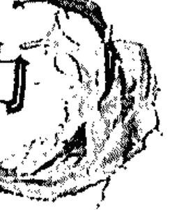
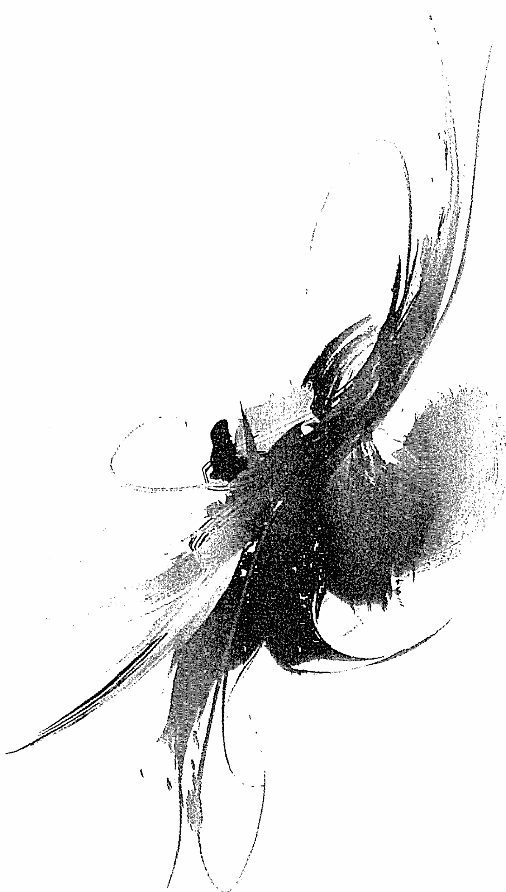
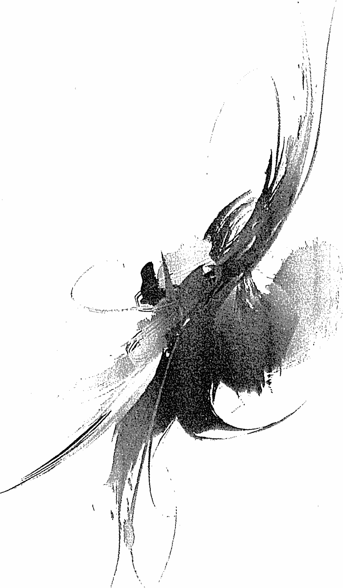
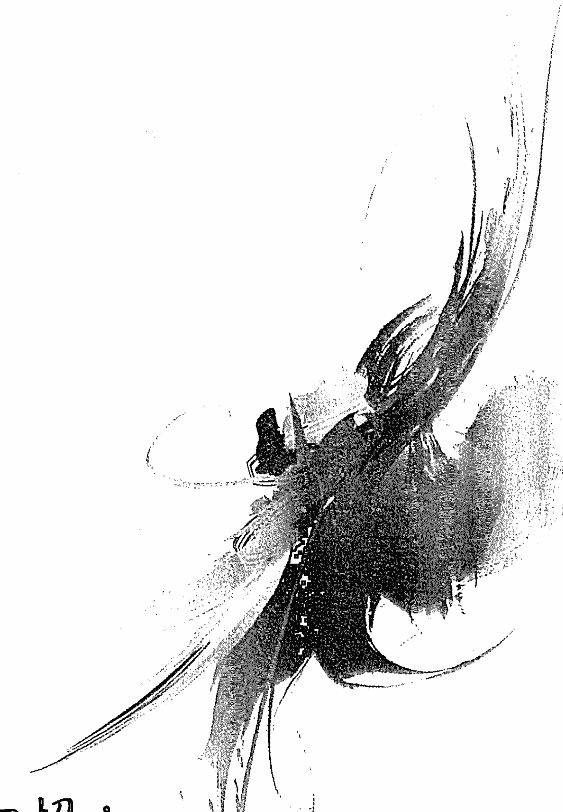

# 三大超能力：冥想力、想像力和直覺力

僅以此書獻給大衛·鮑伊（David Bowie）：

你是我心中的超級英雄，雖然你已在天國。
感謝你能看見我，過去那麼多年來讓我感覺到自己的重要性。
當你這麼做時，我發現看見人的本性的力量有多強大，
對於人生的轉變又有多深遠。
由於你的啟發，如今我也在世界各地與眾人共舞。

——桑妮雅·喬凱特

# 推薦序一

## 傳奇的開始

還記得上一次去看超級英雄片的感覺嗎？想像著自己是其中一員，擁有無比的力量，保護弱小，與黑暗勢力抗爭，最後解救地球的快感嗎？那個樣子多麼有力量，多麼讓人感到熱血沸騰！但當燈光亮起，字幕跑完，好像我們就回歸普通的生活，再次變回普通人，當時的激情與自信隨著電影的結束，也慢慢地消逝了。這一切的力量和解救世界能力就像做了一場夢，永遠消失了。可是，事情真的是如此嗎？

我們往往會認為，所謂的超能力只存於電影中或別人身上，跟我一點關係都沒有。但在身為表達藝術治療師的過程中，我見證了許多生命的綻放，他們經歷了一些無法想像的磨難，但還是有辦法找到力量——找到那在苦難當中還能微笑的能力，在平淡生活的點滴中還能創造驚喜的魔法，以及與黑暗的抗爭中保持平靜慈悲的光彩，他們打敗的不是外在的黑暗，而是內心的陰暗。這些人在我眼裡，不輸任何的超級英雄，擁有的能力不亞於任何所謂的超能力，因為他們所擁有的力量可以戰勝

許翊誠

# 推薦序—傳奇的開始

自我，實現生命的奇蹟，溫暖他人的身心。

這些人與你我並沒有什麼不同，我們都擁有相同的潛力，差別只是在於有沒有啟動並開發我們與生俱來的禮物。所以在這裡我想要特別感謝桑妮雅．喬凱特所寫的這本《三大超能力》，在這資訊豐富，甚至爆炸的時代，寫了這本協助我們啟動超能力的秘笈，分享了一趟清晰、人人都可輕易深入的自我開發之旅。這不只是一本充滿珍貴智慧的書，同時也是一本有效的工具手冊，協助我們把所學的扎扎實實地落實在生活當中。

這本書的三大核心：冥想、想像和直覺，也是我身為一位身心靈工作者時常強調並協助個案發展的。這三項不只是療癒內在所需，它也是讓生命獲得喜悅不可或缺的元素。

冥想提供了我們覺察的力量，讓我們有機會看見真實的內在與外在。想像是創意的泉源，讓我們化不可能為可能，擁有創造與顯化的力量。直覺給予我們與超越自我的力量連結，讓生命可以擁抱不同的能量與支持，提供一個渠道讓所謂的高靈、宇宙、天使、神性等等與我們接觸並陪伴我們實現人生。這是這三個核心的禮物，也是這本書為我們鋪下的超能力之路，藉由分享、故事與練習讓我們快速啟動這無

# 三大超能力

比的超能力。
生命是可以有趣又充滿力量的，我們可以選擇，選擇當眾多故事裡的觀眾，或者，去開啟我們自己的超能力，開始寫出一篇篇屬於我們的傳奇。雖然這不一定會很輕鬆，但你已經擁有一切的條件了。現在所需要的，只是在此刻問自己，你，準備好了嗎？

許翊誠

- 美國加州生命藝術諮商中心（Living Arts Counseling Center）心理治療師
- 美國加州整合碩博院教授
- 美國精神疾病聯盟（NAMI）家庭支持課程帶領者

# 導 讀

你是否曾發覺，所有人都具有三種不可思議的超能力天賦，能讓你以安定平靜的心過生活，創造出你想要的任何事物，並以引導和保護的方式帶領你度過人生中的一切？

你是否知道，如果適當的培養這三種超能力能讓你永恆不朽、常年不老、無限發展，而且活力充沛？

而且這些超能力能夠指引你做出最佳的抉擇、挑選最佳的時機，並以最協調的方式順應人生？這樣生活的同時也能增加魔力並吸引歡樂？

你知道這三種超能力能同時改善健康、紓解壓力、消除恐懼、讓生活更豐富，又能幫你達成人生的目標嗎？

對，我知道很難讓人相信這些都是真的，然而確實如此。我們每個人都能取得這三種超能力，若是發展到最圓滿的境界，還可以讓我們有能力過一個最魔幻最幸福的人生。

# 三大超能力

更好的是，要發展這三種超能力並不困難，因為這些是我們每個人與生俱來的能力。我們身為有靈性的生命，培養這三種與生俱來的特質就有能力活出超凡的人。而且要培養這些特質也是輕而易舉，隨手可得。

那麼，你可能會想知道，這三種超能力究竟是什麼呢？

能結合並經常使用冥想、想像和直覺這三大超能力，能決定你人生旅程中的偉大和品質，邁開人生旅途中的每一步都能讓你安全又安心。

發展這三種超能力並不難，因為它們是每個人與生俱來的能力。

我們身為有靈性的生命，培養這三種與生俱來的特質，就有能力活出超凡的人，而且要培養這些特質其實是輕鬆、容易，甚至是樂趣無窮的。

這些超能力是這樣運作的……

當我們運用第一個超能力——冥想力時，我們能控制自己的意識及反應一段時間，讓我們的心得到自由與安定。我們脫離野猴之心，並記得這些智識或情緒並不是我們，而是走在人生旅程中的靈性生命，具有思維和感覺的能力，但卻不會被

# 導 讀

這些思維感受所限制。冥想能平靜我們的心、清除我們腦中的雜念，紓解充滿壓力的思維和感受模式。它能給我們空間恢復精神、重拾活力、超越世俗及私我心智的反應，以便記得我們真實的本性，是神聖和充滿創造力的靈魂，並繼續掌控自己的命運。

藉著培養我們的第二個超能力——想像力，發展出觀想和創造的能力，在對我們重要的各個層面實現夢想，豐富我們的人生。想像力是一枝彩繪我們人生景致的畫筆，它決定我們要選擇成為什麼樣的人，如何選擇我們的人生，還有我們選擇要做什麼事。想像力是決定人生如何展開的力量，它是所有創造力背後的活力泉源。我們無法創造出自己想像不出來的東西，而能想像出來的東西總是能創造出來。想像力能驅使人類每個層次的表達和經驗：包括心理、情緒和生理。

當我們運用第三種超能力——直覺力時，就能獲得內在引導系統的好處，引導我們得到心之所欲，同時能避開危險。直覺能讓我們忠於自己，保持完整的真實本性。作為神聖的生命，我們都有專為達成完全潛力、最真誠表達自我和至高良善而設的內在引導系統，同時又能讓我們遠離不符合本性和不能實現人生目標的方向，在人生的道路中保護我們的安全。直覺是天生的羅盤，在我們啟航尋找偉大的夢想

# 三大超能力
Your 3 best super power
Meditation, Imagination & Intuition

時，讓我們保持正確的航向，指出良好的機會，同時在我們有危險或偏離真正的目標時也會發出警示。

當我們發展出這三種超能力，並在生活中身體力行時，我們會變得踏實沉穩、充滿靈感、富有創造力、精神豐富和體力充沛，安心跟著目標順流而去，與周遭的世界和諧共存。

這三種超能力能讓我們打開心房、卸下防衛心、喚醒靈性、創造夢想。它們能舒緩我們的恐懼、去除憂慮、給我們力量從容地面對人生的困境，幫助我們辨識並抓緊良機，時時刻刻為我們展現通往成功的道路。

我指引和輔導過的所有圓滿成功的人士都具有這三種超能力。這是他們成功的秘訣，我希望它也能成為你的秘訣。

你的超能力是天生的

幸好要培養你的三大超能力並不困難，它只需要意願、專注和持續，不需要耗費太複雜的力氣和大量的時間。這是因為我們所有人天生就有這些超能力。

# 導 讀

我們是天生就是愛冥想的生物，小時候花了無數的時間做白日夢就足以證明。我們很自然地隨時都在幻想，雖然有些幻想不見得是正面的，而且我們也很自然的擁有直覺。只不過在大部分的情況下，總有人勸我們不要聽從直覺。只要有一點覺察力，下一點功夫就能喚醒你內在的這些超能力，你可以預期將來會看見人生出現巨大的轉變。

或許你已經在運用一或兩種超能力，比方說，你已經在冥想打坐了。或者有瘋狂和美妙的想像力，又或許你的直覺感應很強，擅長聆聽你的第六感。若是如此的話，你已經發現擁有一種超能力在你的人生中具有多好的正面影響力。

使用一種，甚至這兩種超能力的確會有很大的差別，也許還會有重大的轉變。但我一次又一次地發覺，同時持續運用這三種超能力的時候，會產生相輔相成的變化，人生會獲得一種勢如破竹、超級成功的動力。唯有將這三種超能力發揮到淋漓盡致，才會產生這種強大的衝力。它們能彼此協同、相輔相成，就像能持續不斷產生能量的機器。一種又一種的超能力緊接相續，直到能量的轉輪啟動，將人生中最美好的事物直接吸引到你面前為止。

# 三大超能力

然也能產生正面的轉變，但卻無法達到經常運用這三種超能力同樣的程度。這種情形發生的時候，注意看！人生會急遽轉向更美好的未來。

我多年來輔導個案時，已經發現這是真實不虛的，我自己也親身體驗過，現在我要你也能體驗這些事實。

你期待能從本書中得到什麼

本書分成三個部分：冥想、想像和直覺。每一個部分都充滿許多趣事和簡單上手的提示和方法，它將指引你如何喚醒和增進某一項超能力，並將它融入日常生活中。

這裡建議兩種類型的活動，能幫助你培養和發揮每一種超能力。有些是一次性的練習，我稱之為「快速啟動」，因為這些是專為快速啟動這些超能力而設計的。

這些練習得花一點時間和稍作規劃，但做這些努力都是值得的。

其他方法是一些如何快速將你的超能力融入日常生活中的提示，我稱之為「輔助法」。這些提示並不會耗費太多時間，而是提供一些在不打亂正常生活，也不改

# 導 讀

變日常行程的情況下，培養這些超能力的簡易方式。
發展這三種超能力並不困難，只要每天花幾分鐘練習，帶著一份嘗試新鮮事物的意願，以及那份支持你成功，而不會阻礙你的內在靈活性。

當一種超能力發展完成之後，就會為喚醒和支持下一個超能力打下根基。冥想能冷靜大腦，瓦解負面和緊張的慣性思考模式，因而能解放想像力，專注在更啟發人心、更有創造力的事物上。想像力一旦重新被喚醒之後，會打開通往直覺和內在引導的微妙能量大門。它是讓我們跟直覺接觸，認識高頻靈性護持系統的橋樑，例如，我們的指導靈和天使。更重要的是，它能讓我們感受到神聖的天父／母上帝無條件的愛與支持，祂在每一個呼吸間，都與我們同在。

## 如何使用本書

我鼓勵你先從頭到尾讀完整本書，看看裡面大概在講什麼，然後再回到前面慢慢細讀。以開放的心胸閱讀每一個部分，對所有的技巧都嘗試一下。這樣你就能發現，哪幾種對你有用，哪幾種沒用。

# 三大超能力

你不需要時時使用所有的技巧來駕馭你的超能力，只要使用每個部份中的一或兩種，每天練習，直到養成習慣，讓它們發展成超能力。藉著每天的練習，你會立刻開始看到生活中的變化和改善。剛開始的改善也許很微小，但假以時日，效果就會像滾雪球一樣快速變大。

想像和直覺部分的後段練習需要做筆記，所以在你開始練習這些部分之前，你也會需要一本小筆記本。買一本容易攜帶的筆記本，在你勤練這兩種超能力時隨時帶在身上。它自然會成為一個很重要又很強大的工具。

我教導這三種技巧超過三十五年，我發現對不同類型的人，有些技巧管用，有些不管用。在本書中，我提供最良好、最簡單、最有趣和最吸引人的點子和練習法，這是我數十年來在輔導各種不同背景、來自世界各地的學生後，所收集挑選出來的方法。我保證你一定能從中找到能喚醒你的超能力，並能立刻上手的方法。

鼓勵我寫這本書的原因有很多，不只是因為讓人徹底和迅速地獲得超能力能帶

# 導 讀

給我最大的喜悅，也基於我認知到我們像一個全人類大家庭般緊密相連。會影響你的事情也會影響我，反之亦同，我們所有人無時不刻都在相互影響著。

因此，每一個人擁有更強大更圓滿的力量時，我們共享的世界也就會更美好。

我們越快發現自己內在的和平，就越接近世界和平。我們個人的生活越圓滿越豐富，就越能慷慨地為他人創造圓滿和豐富的人生。

發展你的三大超能力最棒的部分是，你為這個宇宙添加了美麗、祥和、創造力與和諧。而這三種超能力天賦，能讓你持續為這個世界付出。

# 三大超能力

Your 3 best super powers
Meditation, Imagination & Intuition

# 你的第一大超能力：
冥想力

# 三大超能力
Your 3 best super power
Meditation, Imagination & Intuition

在我們人類能培養的三大超能力中，我相信冥想是最重要的，因為它不僅能賦予我們力量，而且還能為其他兩種超能力——想像力和直覺力打下根基，並發揮出它們最大的潛力。

我們以冥想為開始有幾個理由，首先，思想能創造我們的人生，不管是好是壞，所以只要能控制思想——或者，至少能掌控讓思想對我們生活產生的影響力——這樣對我們的人生就能產生巨大的效果。

當我們心中充滿正面、慈愛、接納、慈悲、療癒的思想時，生活自然會變得更好。然而卻很少人能持續保持這種昂揚的情緒，大部分的人會發現自己經常被過多的憂慮、壓力、自我懷疑、批判、恐懼和孤立的思想所分心。若置之不理的話，這些負面的思想就會控制和奴役我們，最後導致我們的身心靈生病。

若能長期持續冥想練習，它就能將我們從控制的思想習慣中解放，更棒的是，有些類型的冥想甚至能開始用更善良、關愛和慈悲的想法取代嚴厲的思緒。這種情況出現時，我們會開始感覺更好、有更多的自信，而且更能享受人生。

# 你的第一大超能力：冥想

## 什麼是冥想？

冥想就是每天練習靜心和放鬆。它不會讓我們停止思考，但能幫助我們不被思緒佔有，或奴役我們，冥想能減緩我們對內在和外在世界的衝動反應。

冥想能提醒我們呼吸，呼吸本身就是一種很大的紓解，尤其是那些經常忙來忙去，想處理超出自己能輕鬆應付的事務，或難以跟上生活需求的人來說。我們可能會發現自己處在古老原始的戰或逃模式，變得呼吸淺薄，心跳加速，長時間處在緊張狀態，這些對我們的生理或心理上的健康都沒有好處。如果是這種情況，冥想就成了我們的良藥。

它能提醒我們，在腦中飛馳的思緒不是我們，而這些思緒大多是負面的擔憂或充滿焦慮和懼怕。冥想會鼓勵我們退後一些，溫和地觀察自己的思緒，感覺它們就像路過我們的車子那樣。當我們冥想時，可以學會讓它們飛馳而過，而不會跟著追過去。這樣能產生距離，超越那些讓我們感到緊張和不安的思緒及感覺。

冥想會在我們腦中產生更開放的空間，在體內產生更寬廣的處所，讓我們能呼吸、放鬆、重整、冷靜下來，從戰或逃的模式變成觀察和客觀的反應，做出意識更

# 三大超能力
Your 3 best super power
Meditation, Imagination & Intuition

清醒的回應。冥想能幫助我們在生活中做出更好的選擇。
冥想會軟化我們的心靈，打開心智並減輕我們的壓力，它能夠將心中那隻經常欺負、逼迫我們、讓我們感覺像處於戰火之中卻毫無防衛之力的那隻「老虎」給擺脫，讓我們每天能屈服於造物主、天父／母上帝慈愛的撫觸中。在冥想時，我們能脫離外在的時空，進入永恆的國度，到一個聖靈生存的所在，而且這個力量真的非常強大。

## 將我帶入冥想世界的唱誦

我個人是透過唱誦的方式初次進入冥想世界，那是在我仍是青少年時，從我的第一個靈媒發展老師查理·古德曼（Charlie Goodman）那裡學到的冥想法。
查理對我說，他要教我冥想，然後叫我閉上眼睛，跟著他示範的方法做，他先做一個很大的深呼吸，隨後發出非常宏亮的「OOMMM」（譯註：發音像又口ㄩ），把我嚇了一大跳。
我立刻笑出來，而且還笑個不停。我對這個毫無心理準備，所以嚇了一跳。

# 你的第一大超能力：冥想

因為緊張才一直笑個不停。他完全不理我，繼續重複吸氣，然後一次又一次地發出「OOOMMM」的聲音。

我笑了五分鐘，他也唱誦了五分鐘，我們兩個都沒因為對方的動作停下來。但後來我身上出現了奇怪的事情，我停下笑聲，試著唱誦。我吸了一口不算深的深呼吸，發出微弱、不安的青少年式的「ooommm」。

當我小聲的「om」跟他大聲地「OM」結合時，我感覺兩人發出的共鳴聲湧進來，竄過我的全身。我愛極了那種感覺，它能讓我冷靜下來，讓腦子變安靜。因為這樣，我一次又一次地唱誦，那時就開始在冥想了。我們又繼續了整整十分鐘。

起先我只是在跟查理上課時才會唱「om」，但幾個禮拜後，我發現自己在晚上睡前會輕聲地唱誦，這樣的冥想法讓我覺得很放鬆。我是個很敏感的小孩，這樣唱誦能幫助我放下少女的憂愁。而且當我這麼做時，我睡得更好，還做了很棒的夢。

不久之後，我就發現自己白天也在「om」，上學途中在車上「om」，放學回家途中也「om」，我在浴缸裡「om」，做晚飯和飯後洗盤子時也在「om」，甚至還出聲唱了好幾次「Om, Om on the Range」。

我喜歡唱誦「om」，它讓我不會再胡思亂想和憂心忡忡，它有安撫我的效果，

# 三大超能力

Your 3 best super power
Attitude, Imagination & Gratitude

幫助我感覺更沉穩更能活在當下。它讓每件事情都變得簡單多了，我每次唱誦得越久，就會覺得越平靜越放鬆。
因此我就這樣認識了我的第一個超能力，開始終身投入冥想的力量和喜悅中。

## 冥想—快速啟動「OM」

也許你現在就對唱誦「OM」感到有點好奇。
那就去試試看吧！
確保你是獨自一人，才不會感到難為情或不自然。
首先做個大大的深呼吸，但不是大口地吞進空氣，而是捲起嘴唇，像用吸管吸飲料般，吸氣時間盡可能長一點，吸氣時肚子保持柔軟。
當你嘴唇呈圓形吸氣，讓肺部吸飽了空氣之後，這時讓空氣慢慢地從口中吐出，同時發出長長的OOOOOO音，從腹部把聲音推出來，直到你的氣幾乎快用光為止，
然後閉起雙唇，以MMMMMM音做結尾。
就是這樣。

# 你的第一大超能力：冥想

你辦到了。

現在再重複一遍，只不過第二次試著放鬆你的喉嚨，讓聲音從腹部發動，像霧角那樣順暢地通過喉嚨和下巴。

好好享受這種經驗，別太嚴肅，否則你做這件事情無法感覺到樂趣和益處。

繼續做，只是這一次閉上眼瞼，把眼球帶到額頭中心點，你的第三眼位置，也就是內在的直覺之眼。

記得肩膀要放鬆。把空氣吸進肚子裡，再把 OOOOOOMMM 的聲音從肚子裡推出來。

這樣重複至少十次，可能的話，多做幾次。每次發 OM 音之前要深呼吸，每次發 OM 音時，吐氣要慢，不要急著把氣吐完。

這樣做之後，你可能會覺得頭有點暈，所以當你做完最後一次 OM 之後，繼續閉著眼睛，同時恢復正常的呼吸模式，直到你覺得體內變得沉穩和踏實為止。

然後慢慢地摩擦雙掌，把手掌放到眼睛上。接著用兩手的中指輕敲第三眼的位置，然後再把手掌放到大腿上。

睜開眼睛，目光垂視地面，同時自然呼吸。

# 三大超能力
Your 3 best super power
Meditation, Imagination & Intuition

在下一次吸氣時，眼神平視前方並呼吸。
讓眼神移到上方的空間並呼吸。
最後，把唇角拉向兩耳處，微笑和吸氣。
閉氣一會兒，然後吐氣和放鬆。
就這樣。

你剛剛完成了你的第一次簡易的冥想練習。
如果你很喜歡這個方式，那就每天做個幾次。

### 冥想的另一個理由

冥想最好的一個理由，它能放慢你的衝動反應，幫助你做出強大更正念的決定。它讓你不會太快做反應，或是太過衝動，那樣通常會產生自動化又不具成效的決定，或者表現出毫無助益的行為。冥想能給你一點空間冷靜反省和完整檢視各種選擇和你當前的情況，甚至能讓你產生直覺，知道什麼選擇對你最好之後，才開始採取行動。

# 你的第一大超能力：冥想

比如說，我一位個案羅伯特，他是密西根州一所公立高中的輔導老師，很努力要讓學生在艱難的情況下感到安心和支持。大部分的時候，他放學回到家都覺得精疲力竭，疲憊不堪，好像他想竭盡所能幫助學生的同時，自己也變得精神不濟。

然而他還是勉強能打起精神，直到一位野心勃勃的新校長出現為止。她急於提升學校的綜合項目排名，開始監督校內所有教師和輔導老師，包括羅伯特在內，開始批評他們做得不夠好（根據她個人的見解）。她特別針對羅伯特，責備他在校內的團體中不夠積極，不夠正面。她甚至還說他的態度惡劣，難以溝通，以前從沒有人這樣指責過他，他覺得很不合理。

一天天的過去，在這些永無休止的指責中，羅伯特開始感覺越來越暴躁，防衛心也越來越強，有一天，處理完兩個學生之間特別難纏的狀況之後，他脾氣失控，這時校長又剛好出現在錯誤的時刻，他對她大吼，叫她不要一直找他麻煩，結果校長又給他另一個不良的評論。

不用說，這件事情的收場並不好，他被記了個警告，校長對他說，若要保住這個工作，他就得去上改善溝通的課程。羅伯特打電話給我，說他感覺異常憤怒，認為對方是故意找他麻煩，覺得既憤怒又害怕，即使他知道非想辦法解決不可，但卻不知道該怎麼改變這種情況。顯然他不能像上次那樣自由的發洩情緒，即使他現在的工作除了壓力本來就很大之外，現在還碰到持續的挑撥和批評，但他還是得想辦法控制好情緒。

我鼓勵羅伯特開始冥想，把這當成一種緩解部分壓力和衝動行事的一種方式。

我說明得很清楚，雖然冥想不可能取代自我控制，但卻能強化他執行自我控制的能力。

他絕望之下，情急地同意了，開始慢慢地使用四四呼吸冥想技巧來幫助他冷靜下來，我鼓勵他記得要每天練習，在沒有冥想的時候，碰到任何壓力就做幾次這種呼吸法之後再做反應。

有個東西能給他抓住，讓他感覺安心許多，於是很高興地同意試試看。幾個月後，他打電話來告訴我說，冥想挽救了他的工作，很可能還救了他的命，因為他已經不再那麼神經緊繃，原本以為他隨時會心臟病發作。

他說，雖然校長仍繼續挑釁他，但他靠冥想學會不再像以前那樣衝動反應。他後來發現，校長的批評來自她的野心，因此不會把她的意見看成針對他的人身攻擊。

儘管他仍然很討厭那個女人，但他不會因為她而質疑自己在學校中的價值。相反的，當她批評他時，他會答說：「好的，我盡力而為。」讓他大感驚訝的是，上個月底在每月的教職員會議中，校長竟然還在其他老師面前讚美他，誇他是模範員工，並感謝他這麼認真看待她的意見。

當然，這時其他的老師會嘲笑他，但他也藉著呼吸法安然承受。他知道他永遠不可能討好所有人，而且他的工作就是要盡他所能地照顧學生，這點才是最重要的。

持續冥想一段時間之後，他已經不再反應過度、防衛心強、發洩情緒，感覺不像以前那樣憤怒，每天不會像以前那樣好像情緒隨時要爆炸似的。

他對自己這樣的結果非常滿意，甚至還在學校舉辦課程將冥想法介紹給學生，很多學生對冥想的反應都跟他一樣好。這能讓他們起伏不定的荷爾蒙平靜下來，幫助學生變得更沉穩更專注，這對一個老師來說就是最好的禮物。有了冥想的幫助，他甚至還說，他認為自己可以再繼續工作六年，直到退休為止。

冥想的超能力能讓我們超脫主觀反應的心理狀態，讓我們更安定，不管別人的行為舉止如何都一樣。你想要的改變也許不會很快出現，也許全部一起出現，但只要持之以恆地練習，改變一定會出現。

# 三大超能力
Your 3 best super power
Meditation, Imagination & Intuition

### 快速啟動—四四呼吸冥想方式

以下是我跟羅伯特分享的四四呼吸法。

首先找一個五到十分鐘內不會受到干擾的安靜地點坐下。

等坐定之後，看看房間四周，同時開始做幾次深呼吸。

等你覺得放鬆之後，把你的拇指和食指靠在一起，吐氣時，將眼睛閉上。

閉著眼睛，吸氣時從一數到四，然後吐氣時從一數到四，閉氣時從一數到四。再重複一次，在你吸氣、閉氣、吐氣和閉氣時，慢慢地從一數到四，不要急。在你計數時，想像你眼睛後面的地方在放鬆，這樣真的能幫你進入更深層的靜定中。

繼續重複這個練習十次，然後慢慢地回到正常的呼吸，輕輕地睜開眼睛。

等你張開眼睛後，不要急著站起來。慢慢地回到周圍的環境中很重要，多花幾秒鐘會讓你的感覺大不同。

這整個過程只要花幾分鐘就能輕鬆的平靜你的情緒，紓解壓力和焦慮。

# 你的第一大超能力：冥想

### 活在當下

當我們冥想時，讓注意力脫離過去和未來，全心全意地放在當下這一刻，確定我們不會錯過我們的人生。

當我冥想時，我能感覺到當下的平靜。我覺得很快樂和輕鬆自在，發現自己不需要等到某個未來將發生的事情發生之後才會感到滿足。我真的喜愛自己人生中的每一個真實自然的層面。

冥想讓我不會因為過去失落的經驗被困在苦澀和怨恨的情緒中。它讓我保持信念和幽默，也幫我培養耐性和接納人生。

我們的心經常會執著在過去和未來中，消耗我們的精力，阻礙我們體驗當下的時刻。當我們的思緒過於專注於過去時，通常會變得沮喪和煩躁，甚至對過去早年人生中的某些經驗感到憤怒不滿。我們被困在過去情緒的流沙中，連在當下時刻無力站穩，更別說要往未來邁進了。

相形之下，當我們的心專注在未來時，會陷入焦慮和恐懼之中，感覺自己很脆弱，對我們無法控制的事情充滿不確定感。在這種心事重重，憂心恐懼的心理狀態下，我們其實已經離開了自己的身體，既不在這裡也不在那裡。

注意力放在過去和未來的思維會奪走我們良好的感覺和創意的能量，切斷了我們跟自己的直覺和他人護持力量的聯繫。當我們忙著專注於未來或回顧過去時，我們就會完全錯過眼前的時刻。

我發現這句話對我剛離婚的那段時間形容得特別貼切。那個時候，我糾結在憤怒、失敗、怨恨和恥辱的感覺中，對陌生的事物特別害怕，因為我在二十出頭時就結婚了。我感覺好像失去了一小部分的自我。

那時一切都變了，我的財務狀況一團亂，我的壓力指標衝到頂點，我的情緒煩躁，心裡覺得不知該如何是好。

我對自己任何部分的人生都不再覺得自在，住在以前跟前夫同住的屋子裡覺得很不舒服，在我們曾一起住了三十幾年的都市裡也覺得不自在，做我們曾為夫妻時一起做過的事情都會覺得不舒服。我在絕望和憤怒之間擺盪，當我回想失去的一切，眼見前途茫茫時，情緒便直墜而下，陷入極度的焦慮中。

而冥想救了我，每次我發現自己就要陷入過去和未來思緒帶來的痛苦時，我就坐下來冥想二十分鐘，發現它能讓我在那個時刻保持沉穩，我在這個地方能夠管理好情緒，能夠找到痛苦的紓解。

當下這時刻是我們唯一真正有能力做選擇、創造的地方，可以將人生導向我們當下想要體驗的方式，這就是為什麼經常冥想是一種強大的超能力。

它能讓我們從過去和未來的邊境中解脫出來，把我們當下生活的人生還給我們。

如果每天練習，冥想能讓我們獲得更完整的體驗，並享受當下的時刻。冥想確實為我做到了這點。

### 輔助法—活在當下

花一分鐘抬眼仔細的觀察，慢慢地從鼻子吸氣，然後慢慢地從鼻子吐氣。這樣做個兩三次，盡量不要急。在你呼吸時，注意聽周圍的聲音，盡可能全神貫注的聆聽。注意你的心跳聲，你的心正在有規律地跳著或者急促地跳著。不要批判它，只要注意它，同時繼續緩慢地呼吸。接下來，注意看眼睛前方的事物，在你呼吸時，讓眼神循著你看到的物體輪廓勾勒，然後看每一個東西的整體。

比如說，你可能會看到眼前的窗戶，在心裡用眼睛描繪窗戶的輪廓外形，在你呼吸的同時，專注在每一個細節上。當你做完之後，再看窗戶的整體，結束時看最後一次並默念「窗戶」。

轉移到另一個物件上，重複這個程序。這樣做四到五次，不要急，慢慢來，這整個練習頂多只會花一兩分鐘，然而卻是重新將注意力回到當下時刻的強力工具。

當你做完之後，注意你內心的狀況，呼吸和放鬆，如果你的心情很平靜、很安寧，你覺得很安詳和全神貫注在當下，也不要感到驚訝。

如果不是這樣的話，再多練習一會兒。

不要強迫它，只要好奇的注意，全心全意活在當下是什麼感覺。

放鬆和呼吸，然後回去繼續做你剛才在做的事情。

### 冥想能改善你的身體健康

我曾輔導過一位名叫麗莎的個案，她從少女時期開始就很難控制體重，當我見到她的時候，她已經超重八十磅了，不管她嘗試什麼樣的飲食法，始終無法減下來，而且很快又會復胖。

麗莎的情緒很低落，有一次她在療程裡向我坦承，她對減肥已心灰意冷。我問她是否知道如何冥想，她說，她以前試過幾次，但老覺得沒做對。

「不過，如果我認為這對我有幫助的話，」她說：「我很樂意再嘗試看看。」

體重問題不僅讓她情緒低落，而且她現在也被診斷出有糖尿病，這讓她十分擔憂。

「我不希望體重問題害死我，我擔心糖尿病和心臟問題，然而我嘗試過各種飲食法都不成功，我不知道該怎麼辦才好，真的很害怕。」她坦承道。

我鼓勵她嘗試冥想幾個月看看，暫時不要去管飲食的問題。「我們專心來緩和妳的神經系統，讓妳更安定一些。在那之後，我們再來看看情況怎麼樣。」我建議道。

我沒有叫她嘗試另一種減肥法，這讓她放心了許多，於是同意試試看。

她練習我教她的一種非常簡單的「吸入聖靈」呼吸法。接下來的三個月，她都全心練習這種呼吸法，然後非常興奮地打電話給我，要求後續的輔導療程。

「妳絕對不會相信的，桑妮雅，不需要任何減肥法，光是冥想我就瘦了十磅耶！」她驚呼道。

「麗莎，妳覺得這是怎麼回事？」我好奇地問道。

「我知道是怎麼回事，」她毫不猶豫地答道：「我每次焦慮或緊張的時候就會吃東西，而且經常這樣。但是冥想對這點很有幫助，我坐下來練習妳教我的呼吸法，因為這樣我的焦慮感似乎就降低了。如果我讓自己在想吃東西的時候冥想，想暴飲暴食的衝動就會過去。」

「我沒有每次都這麼做，」她坦承道：「但即使我沒有冥想，我也會注意讓自己已比以前少吃一點，因為我知道我不是真的餓，只是因為壓力大而已。」

「總的來說，每天冥想能幫我減輕體重。」她說。

「我甚至還準備嘗試一種新的飲食法，或者至少改用不同的方式吃東西，現在我知道如何讓自己更放鬆一些，我真的覺得可以改變自己。」

我從麗莎那裡聽到這個消息時真的很高興，她對冥想產生的效果非常樂觀並充滿信心。她現在能使用這種超能力幫助自己，我覺得她真的能減輕體重和改變人生。

麗莎在冥想的經驗對她有用是因為她的動機很強，真的很想要冥想成功。她以開放的心胸接納它，而且通常會持續地練習。等她的體重開始降低後，她練習的動機就更強了。

我深深相信，只要我們肯努力，冥想能幫我們減輕各種生理上的病痛。當然，這並不表示當你碰到健康問題時，就不該聽從醫生的指示，你一定要遵從。不過，如果你給冥想一個機會的話，它能協助你痊癒，同時也能幫助你適應生理和心理的困境。

原因一點都不神秘，當我們冥想時，它能減輕焦慮和恐懼，因而大幅降低壓力的程度。身體上的壓力減輕，表示健康也會得以改善。

根據許多研究指出，冥想能增進更深層的睡眠，更好的專注力，以及更適切的放鬆，冥想也能改善下列的狀況：

- 降低血壓
- 減緩心跳速度
- 減少得心臟病的風險
- 提升免疫力
- 舒緩失眠症

冥想甚至能幫助提升身體治癒疾病和傷口的能力。它的好處還有：

- 降低膽固醇
- 增加血清素，因而讓心情更好
- 緩解慢性病疼痛
- 增加活力
- 提升專注力
- 減少衝動反應
- 紓解焦慮和憂鬱
- 增進專注和學習的能力
- 通常會提升總體的幸福感

即使你沒有心理和生理上的病痛，就像均衡的飲食和充足的運動跟睡眠一樣，冥想也是預防疾病的良藥。嘗試冥想沒有缺點，卻有很多的優點。

# 你的第一大超能力：冥想

冥想這個……

如果你苦於身體上的病痛，我相信你現在的壓力程度一定比平常還要高。

除了持續遵照醫生的指示參加身體的治療之外，試著增加下面的冥想練習來加強你的能量療法。

### 快速啟動—吸入聖靈呼吸法

找一個幾分鐘內不會被打擾的地方安靜地坐下。

做幾次深呼吸，睜著眼睛，用鼻子吸氣，用嘴巴吐氣。

保持輕柔的專注力，只要享受用這種方式做幾次吸氣和吐氣的感覺。

接下來，在你吐氣時，讓眼睛輕輕地閉上，回到平常時用鼻子吸氣和吐氣的方式。

一手放在肚子上，另一手放在胸口，同時繼續呼吸，每次呼吸時觀察胸部的起伏，肚子的擴大和收縮。

每次吸氣時，輕輕說：「我吸入聖靈。」同時觀察每次呼吸時，胸部和肚子隨著吸入的空氣擴大。

每次吐氣時說：「我釋放出無益於我的東西。」同時觀察胸部和肚子在空氣離開身體時的收縮感。

慢慢地重複這個動作二十次，如果有時間有意願的話，可多做幾次。

做這個動作時慢慢來，吸氣和吐氣時都盡量用同樣長的時間。

如果你的心在這時跑掉了，別擔心，把思緒當作路上經過的車子。如果你注意到自己的心在胡思亂想，看到它在追逐車子，就輕輕地把它拉回來。然後回到呼吸上，再重頭開始。

不要責怪自己失去注意力，把你的心看成愛玩又容易分心的小狗。你的工作就是要訓練它，而且我們都知道，訓練小狗需要很大的耐心。發脾氣只會招來反效果，如果心跑掉的時候，只要輕輕地把心帶回呼吸和禱文上，而且心是一定會亂跑的。

讓自己好好的享受這種體驗，保持簡單，感覺聖靈的力量在給你生命和療癒力，每吸一口氣都讓你恢復圓滿的自我，在你吐氣時，就清除、洗滌和釋放出你的身心不需要的、不利於你圓滿和福祉的一切。

每次吸氣時說：「我吸入聖靈。」吸氣的同時也吸入這個天國的力量來療癒自己。

每次吐氣時說：「我吐出所有無益於我的東西。」吐氣的同時，吐出所有會擾亂你健康和內心平靜的毒素、壓力和不愉快。

當你做完之後，再多呼吸幾次，讓心隨意神遊，做它想做的事情。

隨後輕輕地睜開眼睛，讓眼神垂到地面上，同時呼吸。

保持一種輕柔的專注力，讓眼神平視前方，同時呼吸。

最後，對著上方專心做一次呼吸。然後起身做伸展動作，開始你當天的行程。

繼續感覺聖靈在體內與你同在，跟著你的呼吸在體內循環，從此刻開始，每次你想到健康時，就會想到聖靈。

### 處理意外

我相信冥想是超能力的另一個原因是，如果你經常冥想，就能更泰然自若、更安於當下的面對意外和充滿壓力的情況，遠比沒有冥想時更好。

今年初剛搬到巴黎時，我發現自己身在一個令人極不安又恐懼的地方。我租了一間靠近蒙馬特區的住處，短期租屋網廣告上說是深具魅力的兩房公寓，結果我碰到的不是深具魅力的兩房，而是一間簡單的套房公寓，中間搭了一道臨時牆壁隔開而已。房間一邊是大窗戶，另一邊棲息著數十隻咕咕叫的臭鴿子。這裡是充滿醉漢，到處堆滿垃圾的簡陋社區，還說什麼深具魅力的公寓呢！

當我在胡思亂想時，還記得要讓心和肚子呼吸和放鬆。利用腳步來計數，吸氣時從一數到四，閉氣時從一數到四，然後吐氣時從一數到四，閉氣時從一數到四，然後再重來一遍。每走一步，每呼吸一次，我都對自己說：「我很平靜，我很安全，我很平靜，我很安全。」一直這樣做到我回到新家為止。

等我回到公寓時，真的覺得很平靜很安全，我稍早前的慌亂感已經消失了，取而代之的是，全神貫注的好奇心。這個我可以辦到，我暗自想道，這件事情不會超出我的能力，只是有點陌生的經驗，讓我覺得有點不舒服而已。我可以調適，可以信任我的指導靈也在這裡。我很好，而且我正在做一場大冒險。

我多年來冥想的經驗那天對我助益很大，儘管我對這間廣告不實的公寓不甚滿意，我還是決定在那裡住三個月，還稍微笑了一下，提醒自己情人眼裡出西施。也許我的房東真的覺得這是一間深具魅力的公寓，而且平心而論，這裡的確走路只要十分鐘就能到蒙馬特區。

我沒有驚慌失措，只是放鬆，讓自己感到失望，但卻不讓失望完全控制我的心。我仍然不高興，但已經不再害怕。當我坐下呼吸時，我沒有抗拒任何事情。一接納和放鬆，接納和放鬆。我這樣告訴自己，同時慢慢進入更深的冥想中。

我讓呼吸穩定我的心，做了幾次呼吸之後，直覺地感到一切都會順利。正如我希望巴黎能療癒我破碎的心，我也能在這裡成為這個城市需要的部分正面能量，療癒它破碎的心。在這方面來說，我們是相依相連的。

人生總會帶來意外，而且經常是惱人的情況。這是無法改變的事實，但是如果你每天冥想訓練自己，就有心理準備以沉穩的方式來面對這些事。這樣能培養你的心以更安定更客觀的方式來回應意外之事。這種方式能幫助你碰到意外的突發狀況時不會驚慌失措。你不但沒有驚慌失措，反而可以保持頭腦清醒，以一種有效率的方式回應，而不是對當前遇到的事情再火上加油。

### 輔助法 — 我很平靜

當你碰到意外時，你也可以用我到巴黎第一天時使用的技巧，來讓自己保持沉穩冷靜。如果時間和情況允許的話，到附近的街巷散步五分鐘，如果這樣做不到的話，在室內來回走幾圈也可以。這樣能幫助你釋放一些湧進體內的腎上腺素，否則

# 你的第一大超能力：冥想

你可能會感覺困在其中，甚至觸發更多的壓力。在你散步或走動時邊走邊從一數到四，吸氣時走四步，閉氣時走四步，吐氣時走四步，閉氣時走四步，然後再重複。在你吸氣時，對自己說：「我很平靜。」在你吐氣時，再說一遍。吸氣：「我很平靜。」吐氣：「我很平靜。」繼續做到你覺得平靜為止。如果時間許可的話，這樣做五到十分鐘後，應該足夠重啟你驚慌失措的按鈕。你這時不會覺得害怕，應該處在你能接受的沉穩狀態中，能仔細把事情想清楚，以有責任感和有效率的方式來處理手邊的情況。在街巷轉個一兩圈，或在室內來回走個十次之後，通常就能平靜下來了。在你平靜之後再決定要怎麼做，在那之前不要下決定。

### 冥想能保護你的安定感

當我們經常冥想時，會對干擾我們安定感的事物變得越來越有警覺，也應該如何保護它。

去年我搬家之前，有一天上了車要去辦幾件雜事，心不在焉地打開收音機。我立刻就被全國公共電台駭人的新聞報導給突擊了，報導中說，又有一個美國醫護人員被伊波拉病毒感染，美國股市因此重挫。後來更糟，廣播主持人訪問某個人，那個人說，除非伊波拉在西非地區的治療在六個禮拜內有轉機，否則這致命的疾病會在全世界大肆蔓延，我們全部人都會淪陷。

等我來到要辦事的第一站時，才短短十分鐘的路程，我的心已在胸口怦怦狂跳。當我轉到這個電台，聽到全國電台發布的新聞，就被這個可怕的焦慮病毒感染了。當我把車開進停車位時，發現自己焦慮地想著，不知道我的家人、我的存款和我自己能否平安無事，若是不行的話，我到底應該怎麼做才能保護自己。

我正要關掉收音機重整心情時，廣播員說，儘管這個新聞很可怕，在美國感染伊波拉病毒的機會微乎其微，股市先前重挫之後，現在已經稍微回升了。換句話說，我們這一次安全了。

我深吸一口氣，感覺好像剛躲過一發子彈，讓我鬆了一口氣的竟是這句：「這一次。」這把我拉回現實，並提醒我要時刻保持正念。雖然我的身體仍然受到湧進血管中的腎上腺影響，但我的心智已經清醒了。

我望向窗外，這是一個美麗的秋天，鮮豔華麗的紅色、黃色和橘色秋葉在樹林間飛舞著。剛才被吸進廣播電台的劇情裡，我這才發覺開車過來時，完全沒注意到這些。事實上，我根本不記得有看到任何東西，這甜美的靜寂之音舒緩了我的神經系統。

哇，我心想，我上車時心情本來好得很，然而，僅僅十分鐘後，卻覺得非常緊張焦慮，這可不好。學到教訓了。

為了保護你的安定感和個人的感知力，不要被恐怖的新聞報導或不必要的干擾給劫持了。我們的靈魂是很敏感的，即使我們對這點並不自覺。我們渴望、需要平靜，所以這得靠我們努力創造和保護。只有上癮的心才會在混亂騷動和過度刺激中成長茁壯，深陷其中並不會讓我們好受，也不會讓我們在任何方面強大。你有對戲劇和心靈干擾說不的能力，我保證你越使用這個力量，就越能立即感受到它。

只有今天，向所有會奪取你的能量、自信、安定的心境和喜悅的侵入能量說「不」，弄清楚這些侵入的事物是什麼，這樣你才能有心理準備來制止它們，才不會被伏擊，被弄得驚慌失措。

可能會打擾你的寧靜和奪取你安定感的事物包括：

- 看電視新聞
- 聽八卦
- 增添八卦
- 上網閒逛
- 看負面的電視劇
- 接聽只想抱怨或倒垃圾給你的人的電話

如果你真的想成功地安定你的內心，有意識地選擇更平靜的行為，從生活中設立平靜的界線開始。

冥想不能保證我們不會失去安定感，但它能協助我們把醒覺帶進心裡，這樣當你受到誘惑，安定感被偷走時，至少能夠察覺出來。

### 輔助法—呼吸的空間

每次碰到會干擾你靈性的事情時，就做一下呼吸法：休息一分鐘冥想。閉上眼睛，感覺體內的緊繃感，然後用鼻子吸氣，用嘴巴吐氣，就像要吹熄十根生日蠟燭那樣。當你這麼做時，讓所有的緊張感流出你的身體。觀想你的心臟正中央有一盞燈打開，在你呼吸時燈光朝所有六個方向擴大，在你四周創造出一個清靜不受干擾的空間。每次吐氣時，看著這個清靜的空間朝你心臟的上方和下方擴大，往心臟的前後和兩邊擴大。繼續呼吸，直到清靜的空間擴大到超出身體六到十吋為止。這是你的私人空間，你「呼吸的空間」。重複做二到四次，然後再回到正常的呼吸方式。

做完這個之後，你會注意到急切和緊張的感覺比之前少了很多，你的身心也更加安詳寧靜了。

我很喜歡我這個一分鐘「呼吸的空間」冥想，這是一種很能安定身心、保護自己的冥想方式，它能保護你的心靈不受干擾，無論是來自外界還是內心都有效。

### 冥想會拉長時間

當我經常冥想時，我對生活是隨遇而安，不會強求反抗。其中一個原因是我不會焦急忙亂。我不確定怎麼會這樣，但冥想似乎能拉長時間。當我有做冥想時，我能完成遠比平常更多的事情，同時還能找到時間放鬆和享受生活。這是冥想給我們的最棒的禮物，因為時間是最寶貴的東西。我們一分鐘都不想浪費，因為時間一旦過去了，它就永遠不會再回來了。

我發覺擔憂（當我沒有進行冥想的時候，特別會這樣）很耗時間，不管我做什麼是都會覺得更難完成。抗拒我正在做的事情，會讓過程變得無聊至極，時間開始從我手上溜走，還會變成一種惡性循環。

有冥想的時候，我發現自己的心能安住在當下正在做的事情，而且所有的事情大致都會很順利。回顧我過去的工作生涯，我很驚訝自己竟然能找到時間寫出二十幾本書，同時還要做全職的輔導工作，到世界各地主持教學工作坊，還有時間養育女兒，享受母女相處的時間，找時間跟朋友聚會，大致擁有一個圓滿的生活。我知道冥想給了我時間，這真是個好禮物。如果這還不是冥想的好理由，我真不知道還有什麼理由。

### 冥想前的準備

現在你已經（希望如此）能接受這個偉大超能力的好處，也嘗試了幾種我到目前為止所分享的簡易冥想技巧。現在該是認真進入更深入、甚至更強大的冥想練習。與其被動式的使用冥想，當成一種處理壓力狀況的方式，不如現在就開始主動地冥想，養成每天練習冥想的習慣，這樣你就能以平靜和安定的心境面對每一種情況。

冥想很像烤蛋糕，如果你想要得到滿意的結果，在你開始之前備齊你需要的東西很重要。就像在烤蛋糕的時候，如果你中途得停下來跑去店裡買一種材料就烤不成蛋糕。在冥想時，如果你的手機因為新進的簡訊不停地響著，冥想就不管用。事前做一點準備工作對確保成功的冥想經驗大有幫助。

### 立下誓願

能對冥想立下一個嚴肅的誓願最好，而且也是準備讓冥想成功的最重要方式。這並不只是嘗試許諾立誓，這表示要全心投入，不找任何藉口。如果你每天冥想，它就能為你的人生大量充電。如果不這麼做的話，那就不管用。

我在輔導學生時，從一開始他們對這件事能立多大的誓願，我就可以立刻看出，他們是否能成功獲得這個超能力。那些說「我試試看」的人，很可能會失敗，而那些說「我要做這件事」的人通常會成功。

這都得看你立誓的意願有多強，不管發生什麼事都會堅持執行。那些決心要認真冥想的人會在他們的生活中建立能量空間讓此事變得可行。那些軟弱無力的說會試試看的人，不願為這件事騰出餘裕，通常不到一個禮拜就會放棄。原因很容易看出來，生活上有很多耗時費力的需求，如果你極度敏感，責任心又很重，或者習慣把別人的需求擺在自己之上的話，要撥出時間來冥想就會加倍困難。

如果你很容易分心或者立下過重的誓願，或容易怠惰、放棄自己或太早放棄無法給你立即滿足感的事物，也會讓冥想變得更加困難。我有時候也會出現上述所有的情況，所以我很清楚把冥想時間擺到一旁是多麼容易的事情，而且每次我這麼做時都會後悔。

這就是為什麼你必須立誓每天冥想的原因，至少冥想幾分鐘也好，理想上是早晨第一件事，不管怎麼樣都要先做冥想。沒有立下這種誓願，你很可能會失敗。我建議立誓早上冥想有幾個原因，首先，你的心仍有點昏沉，所以你比較不需要跟雜念奮戰。而且，這是一個開啟一天的最佳方式，它能讓你的心感覺平靜、沉穩，而且處在正面的心境中，這樣比較能促成美好的一天。

而且，早上做的第一件事就是冥想比較能成功，因為大部分的人心在早晨通常都比較安靜，或者仍在半夢半醒之間。所以大體上心情的能量都比白天稍晚後更平靜。在心裡允許自己使用這段時間無憂無慮、單純的放鬆和呼吸。

然而，如果你剛好是不適合早上冥想的人，對你來說，提前幾分鐘起床幾乎是不可能的事，那就找一個對你可行的時間，立誓要在睡覺之前找個時段來冥想。事實上，睡前可能是個好時段，比方說，或許不看晚間新聞或愚蠢的電視節目，改成冥想時間。重點是，立下誓願後，要確實執行，就這樣，每天都要冥想。

把冥想當成每天固定要吃的維他命丸，或是為了健康要吃的藥，像是降血壓或控制膽固醇的藥，這個方式或許能幫助你成功。不管是早上還是晚上，不管你想不想冥想都一樣，去冥想就對了。

即使是現在，冥想了這麼多年後，如果我早上第一件事情不是冥想的話，後來就幾乎排不出時間了。但我還是會維持冥想的習慣，否則我的感覺會不一樣。我那天會過得不那麼順利，會變得更沒耐心、更衝動。我會忽略該為自己做的其他事情，感覺更容易焦躁緊張和壓力過大，而且感覺時間不夠用。就像在滑溜的斜坡滑下去，不冥想對我來說就像不吃東西一樣有害。這對我的健康就是這麼重要，我相信將來對你也會這樣。

### 快速啟動—冠軍早餐

這是一個很棒的晨間冥想法，它能讓你心中充滿神聖的天父／母上帝的祝福、恩典和無條件的愛，給你能量，讓你輕鬆的面對當天需要面對的種種挑戰。因此我稱它為「冠軍早餐」。

方法如下：

找一首你喜愛的、能感動你的心、至少持續十分鐘的美妙音樂，像是選自韋瓦第（Vivaldi）的《四季》（Four Seasons），莫札特或巴哈的古典音樂都很適合，因為這些選曲會跟心靈起共鳴，讓心臟隨著它的節奏同步跳動，彷彿處在深度的靜定中。如果你寧願跟我聽一樣的音樂「獲取源泉」，或者換句話說，從神聖的源頭吸取能量時，每天早上將你需要的一切灌滿你的身心：聽克莉斯娜·達斯（Krishna Das）唱的這首《普濟女神》（Devi Puja），內容主要是虔誠的呼喚天國聖靈，祈求保佑和祝福。

等你選好了音樂之後（暫時還不要播放），先設定你的目的，記住你的動機，找一個能讓你放鬆，在十到十二分鐘內不會被干擾的舒適地方。

開始時先做三次深呼吸，用鼻子吸氣，用嘴巴吐氣。在你吐氣時，把舌頭頂在上顎，牙齒後方，將空氣全部從肺部吐出來，吐氣時肚子縮進去，好像要吹熄生日蛋糕上的蠟燭那樣。把舌頭頂在上顎的方式能平靜和安定你的心。

再次吸氣，注意你這一次吸氣更深入了多少。再次把舌頭頂在上顎和牙齒後方，完完整整地吐氣，跟先前一樣將肺部的空氣完全清空。

再一次吸氣，這一次把清淨的空氣牽引到太陽神經叢。吐氣，只不過這一次要張開嘴巴，打開心房和喉嚨，發出啊啊的聲音，然後放鬆。

放鬆地再多做幾次呼吸，在你呼吸時，想像有道美麗的白光從你心口中央擴大。開始正常呼吸，同時觀想白光慢慢地從你身體朝全部六個方向擴大，上下、前後和左右兩邊，然後進入身體外的空間。

用你的想像力，觀想這道光繼續打開你體內的空間和你身體周圍的空間。開始播放你的音樂，使用耳機或不用耳機都可以，只要你兩手空著就行。

將眼睛輕輕地閉上。摩擦兩個手掌，再輕輕地分開，感覺能量在兩掌之間流動。做這個動作可以啟動你手部的脈輪和能量中心點。

等你感覺有暖意流動時，你手部的脈輪這時已經打開，準備接收上帝的恩典和慈愛，能量會慢慢地流進來。

聆聽美妙的音樂，將兩手掌心朝上，以深入和放鬆的方式呼吸，用鼻子吸氣和吐氣。放鬆地沉浸在音樂中，想像上帝將無止盡、無條件的愛灌進你朝上的雙掌中心。在你繼續呼吸的同時，心中觀察這美妙的能量竄上你的手臂，進入你的心臟，然後將恩典、祝福、滋養和力量湧入並充滿你的全身。想像這種慈愛的能量在灌溉你心中欲求之事的種子，讓它們生氣勃勃。想像上帝的愛會給你所需的一切，讓這一天成為你生命中最美好的一天。繼續呼吸和接收能量，直到音樂結束為止。

然後，仍然閉著眼睛，不慌不忙地，輕輕摩擦雙掌，放到眼瞼上，吸氣。在你吐氣時，雙掌向下放到大腿上，輕輕地睜開眼睛，讓眼神目視大腿或下方的地面，呼吸。再次不疾不徐地呼吸，眼神上移平視前方，再輕輕的環顧房間四周。眼神移到上方，細看四周的環境，再做一次深呼吸。再次吐氣時，目視前方，把嘴角往上拉到耳邊，保持不動，呼吸和微笑。站起來，做個伸展動作，慢慢地進入你這一天的行程。

如果冠軍早餐冥想法太多了，或者你早上精神不濟，那就在早上或睡前換成更簡易的冥想方式。

### 快速啟動—早晨或睡前的簡易冥想

設定鬧鐘，或用手機設三到二十分鐘，看你想冥想多長時間而定。以舒適的姿勢坐好，看看房間四周。在你這麼做的時候，設定這次冥想的目的。清楚的知道今天這個冥想為什麼對你很重要。等你設定好目的之後，就可以開始了。

睜著眼睛，開始做幾次深呼吸，用鼻子吸氣，用嘴巴吐氣。在你呼吸時，看看房間四周，把注意力集中在身邊的環境。讓你的心開始放鬆。現在輕輕地閉上眼睛。

注意閉上眼睛讓你感覺有什麼不同。讓你的心隨著每一次輕鬆的深呼吸更加放鬆。

接下來，從頭到腳趾彷彿用掃描機般掃描全身，留意體內所有緊繃、壓力和不舒服的感覺。在你掃描全身時，不要太專注任何一個地方，只要注意你身體的感覺，同時繼續輕鬆地呼吸，用嘴巴吸氣和吐氣。

現在把注意力回到呼吸上。每次吸氣和吐氣計數一次，從一數到十，數完再重複。

雜念會來來去去，這樣很正常，不用擔心。你一發現自己迷失在雜念中，只要回到呼吸上，再從一開始數。

繼續呼吸和數息，直到鬧鐘響為止。

鬧鐘響了之後，不要急著睜開眼睛，而是要輕輕摩擦雙掌，然後把手掌放到臉上。接著用雙手的中指輕輕拍打第三眼的位置，刺激第三眼的直覺和創造力。把手掌放到大腿上，吸氣時睜開眼睛，目光垂視地面，吐氣。接下來，吸氣時讓視焦集中在眼睛的高度，平視正前方，吐氣。吸氣時眼神移到上方，然後吐氣。最後，做一次深呼吸，把嘴角拉向耳邊，保持不動一秒鐘，微笑。等你準備好之後，就站起來，做個伸展動作，然後繼續你這一天的行程。

### 一次做一分鐘

現在你知道立誓對冥想的成功有多重要了，你可能會猶豫，等一下，你可能會想，立這個誓願要多大？要是我不喜歡呢？要是我討厭它呢？要是我做不到呢？那該怎麼辦？

以上所有的問題都是合理的擔心，事實上，我最近在巴黎認識一位名叫闘妮的女子，她似乎對冥想很感興趣，但她卻說：「老實說，桑妮雅，我的心就像賽車道上的跑車，我早上一睜開眼睛，它就跑掉了。想到要靜靜地坐在那裡二十分鐘，對我來說簡直是折磨。我沒辦法想像我能做得到，所以我猜我大概沒辦法冥想對吧？」

我跟她說，事實絕不是這樣，如果你的心像妳說的那樣（老實說，誰不是這樣呢？），妳只是需要每次練習增加一點冥想的定力，如此而已。在妳沒有好好嘗試之前，先不要決定能否成功地冥想。立誓專心嘗試一段時間，然後再做決定。

首先，我建議她嘗試連續冥想四十天，然後再決定適不適合她。通常要培養一個新的習慣和感覺到效果的時間就需要這樣長。

其次，立一個合理的誓願，不要過度承諾每天能冥想的時間。比方說，如果立誓接下來的四十天每天都要冥想一個小時，這樣很可能不到週末就會放棄了，因為立這樣的誓太大了，而且不必要。

每天早上開始嘗試短短幾分鐘，再立誓慢慢增長時間。如果你四十天毫不間斷地完成冥想的誓願，即使只是一兩分鐘，我保證你一定會體驗到它的療癒效果。

成功的關鍵是耐心和持續。

> 提示：如果你以前從不曾冥想過，或者腦子經常胡思亂想，剛開始先嘗試靜坐兩分鐘。每隔三天再增加一分鐘，一直持續增加。等到四十天後，你就能成功地每天冥想至少十到十五分鐘，這樣就足以獲得冥想美妙的益處了。

### 切合實際的期望

準備成功冥想的下一步是，在你開始之前，對練習冥想保持實際、踏實的期望。

當我剛開始學鋼琴時（順便一提，這是一種很棒的冥想形式），我熱情有加。學音階很簡單，我很喜歡，每天都期望能彈至少三十分鐘。但幾個禮拜後，要開始學彈簡單的歌曲，然後練習更困難的曲子。這對我來說並不像彈音階那麼簡單，無可避免的，我就犯了一個又一個錯誤，我對這個經驗變得越來越沮喪。不久之後，我就開始找各種理由逃避練習，幾個禮拜後，我就完全不再彈鋼琴了。我認為我不擅長此事，其實我只是沒耐心而已，我的自我意識不喜歡做這種初學者不斷重複的基本練習。我總是急著想彈好鋼琴，並不想慢慢來，不想定下心來要求自己做這些進階必備的基礎練習。

我相信很多第一次開始冥想的人也會有類似的情況。我輔導過的個案中，有很多人都回來說：「我在你的班上或工作坊裡冥想時都好好的，可是我自己練習時，甚至沒辦法安靜地坐幾分鐘，然後就開始分心了，所以我乾脆就放棄了。」對他們來說，冥想感覺就像褲子裡有螞蟻似的，每分鐘都是跟自己狂亂的心做一番痛苦、漫長和惱人的奮戰。他們感覺比學冥想前更緊張更難受，難怪他們會放棄。

我了解他們的挫折感，剛開始冥想時，原本應該是很舒服的，可是努力冥想的感覺並不是很好。事實上，感覺好像我們並未完成任何事情，又好像費盡力氣要把一隻熊推進籠子裡，或是捕捉一條滑溜的魚，怎麼樣都不成功。這並不令人驚訝，冥想剛開始似乎感覺不到它宣稱的好處，所以我們就放棄離開了。

我們喜歡感覺自己是大師，而不是初學者，如果我們感覺對某件事情沒有進步神速，惱怒和自尊心就會佔上風，我們就放棄了。我們對冥想有很高的期望，但剛開始時的經驗跟這些期望實在差太多了，因此培養這種神奇的超能力時，要懷抱一種初學者的心態，不期待快速得到熟練的效果。

保持簡單的期望：

- 預期你的心會胡思亂想。
- 預期有時候會變得焦躁不安。
- 預期有時候會不想冥想。
- 預期你剛開始可能沒什麼感覺。
- 預期即使過了一段時間可能也沒什麼感覺。
- 預期即使你沒有馬上注意到，仍然能獲益。
- 預期假以時日，冥想會變得越來越容易。
- 預期你的努力會得到回報。
- 預期這是一個令人愉快的、療癒性的休息，而不是需要熟練的差事。

# 三大超能力
Your 3 best super power
meditation, imagination & intuition

### 找到你個人的冥想風格

- 預期如果你堅持下去就會進步，能夠更快進入越來越深層的冥想中。
- 預期每件小事都算數。

做好準備的其中一部份是，你需要找到適合自己的冥想方法。好消息是，冥想的方法有很多種，每種都有效。你不需要單盤坐姿，閉著眼睛，背部打直——也就是說，除非你想這麼做。你可以選擇你要冥想的方式——隨時改變你冥想的方式——它仍會持續帶來真正的效益。

多年來我經常變換個人的冥想風格，現在也一樣。剛開始冥想時，我使用唱誦和簡易的呼吸法。後來我開始每天做正念行走冥想。我在練瑜珈時也會冥想，現在我每種都會做。

現在我通常都每天冥想兩次：早上做一次「冠軍早餐」冥想，晚上做二十分鐘的唱誦冥想。可能的話，下午也會增加正念行走冥想（我在本書後面的章節會再詳談）。我不是酷愛冥想的瘋子，我這麼做是因為我真的很享受所有這些冥想方式，它們對我的助益很大，能強化我的工作能力。

你可能在想，我怎麼會有時間每天做一小時正念行走和冥想？我會想辦法找時間，這比你想像的還容易。（當然，我不太常看電視也有幫助。）我經常會把冥想排進我每天的例行公事中，有時候我泡澡、打掃屋子或切菜的時候會唱誦，去雜貨店買東西的時候也可能做正念行走冥想。做某種特別不愉快的家事，像是吸地板時，也會冥想，事實上，這樣讓時間過得特別快，而且讓我感覺精力充沛，而不會精疲力竭。

任何形式的冥想只要每天練習幾分鐘的話，就足以獲得良好的回報。

### 同一地點和同一時間效果最佳

剛開始訓練你的大腦放鬆的時候，在同一時間冥想幫助很大，如果可能的話，每天在同一地點更好。這樣可以重複提示潛意識的心在這個時間安定下來冥想。

我小時候在學校剛吃完午餐之後，老師每天都會要求我們把頭趴在書桌上十五分鐘，告訴我們這是放鬆的時間。除了少數幾個特別好動的小孩之外，我們大家都會趴在桌上，一兩分鐘後就全都放鬆下來了。

我當時不太曉得那樣就是在冥想，但的確是如此。我們的心習慣每天重複這種例行公事，知道這個時間要靜下來補充精力，所以我們真的做到了。即使特別好動的小孩，過一段時間後也會靜下來，他們只是需要長一點的時間而已。

我相信如果每天的午睡隨機不定，而不是同一時間的話，我們要放鬆就很難成功。持之以恆是我們成功的主因。

持之以恆可能很難維持，雖然我每天冥想，但我跟你們保證，即使過了這麼多年，一個禮拜的七天之中，我至少還是會有兩天沒有心情冥想。我可能得趕去赴約，也許只是想偷懶或不理它。我只是忽視這種抗拒的念頭，像是耐吉的廣告詞：「做就對了。」最後我發現，這樣簡單多了，心裡也比較不會掙扎，反正去冥想就是了。

什麼樣的時間地點對你比較適合？選一個你個人的固定時間，然後確實執行。

> ※提示：在開始之前設定一個你比較喜歡的冥想例行常規。首先，選一個不會被打擾的時間和地點，其次，關上你的電腦，手機關靜音，減少其他可能會讓你分心的事物（例如，如果外面車聲很吵的話，就關上窗戶）。第三，舒適地坐在沙發、椅子、蒲團或地毯上。第四，開始冥想。

### 正念

等你習慣在冥想時把心靜下來後，下一步就是在冥想之外，保持住那種心境——正念的冥想。正念冥想是練習將注意力專注在你當下正在做的事上，而不是被其他的事情分心或是心不在焉。這個練習的目的是要讓你能主導如何回應生活中的事務，而不是讓生活逼迫拉扯、驚嚇或威脅你。

我每週花數天，每天花數個小時輔導一些個案，雖然這是我熱愛的工作，但它也會讓我精神疲乏，讓身體疲累。

過完一天之後，出去做正念行走冥想，切斷跟客戶和他們人生的繩索，把注意力重新集中在我的能量和我的人生，這對我來說很重要。

我的正念行走冥想通常會持續二十到三十分鐘，在行走時，穿過巴黎美麗的街道，我會把所有的注意力放在周遭的世界。正念行走冥想包括把頭抬高，讓自己注意當下，保持覺察力。我對眼前看到的所有事物都充滿極大的興趣：街道兩旁的店面、塞納河畔美麗的金色街燈、狗主人跟他們養的寵物像極了的模樣、人們身上穿戴的衣飾、家家戶戶栽種的繁花都在綻放。做完短程的散步之後，我就能再度平衡、放鬆了，然後準備吃晚餐。當你保持正念行走時，不管你在何處散步，每個地方都會跟巴黎的街道一樣迷人美妙。

### 強化煞車器

保持正念需要專注力、自制力和練習，如果你願意讓自己的心稍微慢下來一點，就能跟生活中的每一個部分結合。剛開始在早上練習保持正念，煮咖啡或泡茶時，保持注意力和覺察力。在日出時傾聽窗外的鳥叫聲，注意聞咖啡的香味或烤麵包機內的麵包香。安靜地坐著，花整整五到十分鐘的時間，保持正念地啜飲杯中的茶或咖啡而沒有匆忙的感覺。只要放輕鬆、呼吸，注意周遭的事物，沉浸在安詳寂靜中。聽起來似乎很容易做到，但如果你跟我一樣，每天早上都很匆忙，要讓自己整整十分鐘保持正念，全神貫注在當下可能很困難，如果你有小孩，那就更難做到了。若是這樣的話，那麼比平常提早十分鐘起床，這樣能偷到十分鐘正念的安閒時光，然後再全心照顧他們的需求。如果你早上需要帶狗出去散步的話，那就保持正念地跟狗一起散步，不要匆忙趕路，也不要讓手機之類的東西分散你的注意力。

保持正念不一定要你騰出時間專心練習，反而是一種把所有的注意力放在每天日常的活動中，而不是邊做事邊想別的事情。保持正念的關鍵不是要多做或少做一些事，而是在做平常做的事情時，不要分散注意力或匆忙地趕時間。等你養成習慣增加一點正念之後，你在生活中會一天天地開始感到更滿意更祥和，因為你有認真在體驗這些事，而不會因為趕得太匆忙而錯過它。

> 保持正念的提示：

留意什麼事情會讓你覺得不高興或不快樂，什麼事情會讓你覺得歡喜、舒適、內心放鬆。把這些事情寫下來，牢記在心中。

例如：

- 看電視新聞會讓我不高興。
- 跟青少年期的女兒爭執會讓我不高興。
- 太晚出門和上班遲到會讓我不高興。
- 跟家人談論政治會讓我不高興。

提醒自己這些平常的互動和行為不會為你的生活帶來寧靜和喜悅，這樣在你想做出不快樂的選擇時會比較容易發現和阻止自己。首先要察覺，然後保持正念地選擇不要去從事這些事。停下來，呼吸，然後做不同的選擇，去做你喜歡做的事情。

例如：

- 我喜歡在上床前泡個熱水澡。
- 我喜歡在早上安靜地冥想。
- 我喜歡擁抱我愛的人。
- 我喜歡早點出門去工作，這樣我就能從容悠閒地開始這一天。

每天提醒自己這些令人滿足的事情——然後去做這些事。我們很容易陷入會讓我們痛苦和緊張的習慣性行為和心態中，完全忘了或忽略了我們喜愛的事物。保持正念將我們的注意力還給會讓我們快樂和內心平靜的事物。

### 輔助法一正念行走

正念行走是一種把注意力放在你的步伐和周遭事物，而不是陷入自己思緒中的練習。這是一種替代靜坐冥想的好方式，我一周至少會做四到五次，白天輔導完許多個案之後，正念行走能幫我清理思緒，重新調整心境。

方法如下：

在行走時，把頭抬起來，專心看眼前的事物。

注意周遭的一切。

如果你停下來跟某人說話，那就給他全部的注意力。

如果你停下來看某樣東西，也給它你全部的注意力。

如果你聽到什麼聲音，像是鳥兒歌唱的聲音，那就停下來全心享受牠們的歌聲。

以舒適的步伐走路，不要太快，不要太慢。

全心體會你跨出的每一步。

做一次正念行走對許多人來說是一種奢侈，或者感覺似乎是這樣。只是短時間的正念行走也是可以的，即使只是十或十五分鐘的正念行走也能對你身心靈產生神奇的效果。

工作一天之後去做一次這樣的散步似乎不可能，尤其是有家人在等著你回家的時候，然而如果這件事情對你很重要的話，總會有辦法撥出時間來：

- 下班一回到家就帶狗去散步。
- 晚餐後去散步，這時每個人都去忙他們晚上固定做的事情了。
- 邀請你的伴侶或小孩跟你一起去散步，把這變成一種家庭活動。
- 停好車之後，在附近走一圈再進去工作，或下班後在巷口走一下再回家。

最重要的是，你允許自己把全部的注意力放在散步上，放在你碰到的每件事和每個人身上。享受你散步的經驗而不會有匆忙的感覺。正念行走的重點是，全心地活在當下，注意眼前的事物，而不是放在過去和未來的思緒中，讓自己好好地放鬆。

### 輔助法—兩分鐘自由時間

如果你是極度緊張或容易衝動的人，或者你從混亂或不愉快的情境中過來，這樣可能特別難讓心情放鬆到足以保持正念的狀態。你或許覺得非常焦慮，難以放鬆，因為你忙著巡邏生活中的邊界，感覺不安全，或者好像總是在值勤的感覺。

有一種方式能讓你脫離這種極度緊張的狀態，那就是開始做兩分鐘的正念休息。

沒錯，整整兩分鐘閉上眼睛，喘口氣，傾聽自己心跳的聲音，就這樣而已。

方法是這樣的：

事前計畫好這兩分鐘的休息冥想，可能是在你剛起床時，或早上沖完澡後，進公司前仍坐在車內時，或是下班後要進門跟家人打招呼之前。如果這是你的唯一的選擇，即使在廁所裡也可以。成功的關鍵是，每天大約在同一個時段做這兩分鐘的休息。這樣一來，你的大腦會漸漸習慣，知道在這兩分鐘裡，你可以自由的放鬆，放下一切，專心呼吸，你的大腦就會合作。

叫其他人在你給自己兩分鐘自由時間時不要打擾你，若能選一個別人都不在身邊的時段更好。如果你身邊一直都有人，你也可以要求他們尊重你這兩分鐘的自由時間。如果你把這個冥想時間當作日常例行工作的一部分，就連幼兒也會了解和配合。

在開始你的兩分鐘之前，花點時間做準備。把手機關靜音，鬧鐘設兩分鐘，選一個柔和的鬧鐘聲音，音量調低，這樣兩分鐘到時才不會嚇到你。

在椅子上找個舒適的坐姿，打量房間四周。這麼做是要讓你安心，知道自己很安全。

先皺眉，然後放鬆眉頭，幫助你紓緩緊繃感。

張開嘴巴，直到你耳中聽到喀一聲，放鬆下巴，又紓緩緊繃的感覺。

在手機上啟動計時器，閉上眼睛，輕輕地嘆一口氣。

接下來的兩分鐘，只要專注在呼吸上，不要擔心你的心會反抗，開始到處亂跑，只要重複地對自己說：「可以安心放鬆了。」

把舌頭頂在上顎，慢慢地呼吸，同時把手放在橫膈膜上。在你吸氣時，肚子凸出來，吸飽氣後，讓肚子縮進去，好像要縮到背部似的慢慢地吐氣。這種方法能幫助大腦冷靜下來（你可以在正式開始之前練習幾次）。

在你呼吸時，偶爾要再次放鬆你的眉頭和前額。這樣能紓解皺眉時的緊繃感。

兩分鐘不知不覺過去，你的鬧鐘就響了。鬧鐘響時，再吸最後一口氣，慢慢地張開眼睛。再吸一兩口氣之後，做個伸展動作，然後起身繼續過你的一天。

### 與上帝同坐

我最喜歡的方式之一是透過每天祈禱的力量靜心和冥想。當我禱告時，首先會讓把注意力集中在呼吸上，專注在它如何進入和離開我的身體，尤其是在吸氣與吐氣之間的暫停空檔。對我來說，這是我跟神聖慈愛的造物者，神聖的天父／母上帝取得聯繫的時刻。

有時候，尤其是我很疲累的時候，付出太多的自我，或者感到迷失困惑或沒有靈感的時候，我會用這種冥想的方式與上帝同坐，沐浴在祂神聖的光輝中，補充精力。當我淨空心靈和靈魂時會發現淨空之後那個寧靜是深沉的療癒。我從沒期待上帝會回應我，我心中感覺天國能一定能聽到並知道我內心是怎麼一回事，能夠療癒和平靜所有擾亂我靈性的一切。你也可以試試看，看這個方式對你是否也有同樣的效果。

#### 快速啟動—與上帝同坐

當你進入這個冥想時，想像你是一個小孩，正投入一個讓人最舒適最安心的懷抱。

請上帝幫助你記得你是誰，安撫你，不管你當時在想什麼或感覺什麼，一切都會平安無事的。

在你吸氣和吐氣時，靜靜地將你的心傾注給上帝，將你所有的擔憂，所有的憂慮，你心中所渴望的一切都向上帝傾吐。

每一次呼吸，把你所有的擔心和憂慮都交給上帝，每一次呼吸都讓你更加信賴上帝會照顧你。

請上帝聆聽你的心聲，幫你確認你的思想和情緒都是朝向至高良善，為服務這個星球的最大潛力的道路前進。

請上帝消除會讓你陷入黑暗，不利於你靈性的思想和感受。

做這種祈禱式的冥想時，要放鬆和呼吸，享受每個呼吸之間的暫停空檔。

安靜地多做幾次呼吸，或是直到當你傾訴完心聲為止。只要放鬆地呼吸，讓上帝來撫慰你。

這就是跟神性接觸的地方，也是你與上帝相見之處。

### 結論

我希望你現在已經準備好開始你個人的冥想練習，開始體驗你人生中驚人的超能力。它是免費的、簡單的，而且是很值得的。

不要把冥想變成另一個你非熟練不可的沉重工作，而是把每天的冥想看做成一個尋找庇護、紓解、接納、復原、平靜、安寧和慈愛的地方。它能讓你平靜下來，讓你專注在當下正在發生的事情。冥想是給你自己的禮物，它能讓你感覺人生中的每個層面都變得更平靜、沉穩，不難處理。

對成功冥想的一般提示：

- 不要急——轉化是需要花時間的。
- 每天同一時間持續冥想。
- 不要每天記錄內心的變化，冥想的好處會隨時間慢慢地出現。
- 了解人生是寶貴的，冥想能讓你慢下來，足以體驗人生的寶貴之處。
- 堅持不懈。

只要投入時間練習，你很快就會發現冥想是很美好的事情。不管你剛開始進入冥想時的感覺如何，但你結束之後的感覺一定很棒。你很快就會不想錯過這種冥想帶來的美妙感受。我保證，冥想會讓你人生剩餘的時間變得更豐富和圓滿。

你現在已經發覺冥想的快樂，也已經準備好啟動第二個超能力：想像力。開始冥想之後，你現在已經有心理準備，去重新發現這個自然的力量並讓它為你所用。

冥想能讓心安靜下來，足以打斷慣性思考模式（通常是負面的），創造出以美妙和創意的方式想像的空間，就像你小時候那樣，天生就愛幻想。

# 你的第二大超能力：想像力

我們第二個最棒的超能力是想像力。它是我們的魔法、魔力，一種神奇的能量，我們用這種力量來創造人生。想像力決定我們能讓自己發揮多大的效力，敢懷多大的夢想，想像力是我們的創造力和人生的孵化器。

我們沒辦法創造自己無法想像的事物，反之，我們總是會創造自己想像的事物。因此，掌控想像力，引導它來創造出我們真正想要的人生，是一種強大的超能力。

想像力能塑造我們經驗的內心世界和外在居住的世界。當我們想像人生是美好的，就能體驗到美好的人生。事實上，奧斯卡最佳影片《美麗人生》（Life is Beautiful）裡面描述猶太籍圖書館員和他的兒子面對大屠殺時的情形，完美的體現出想像力能有多驚人。在影片中，這對父子用想像力保護他們不受集中營恐怖的迫害，甚至在人類最糟糕的困境中，創造出一個美麗的人生。

另一方面，當我們想像人生很糟糕的時候——當你想像我們不受人喜愛、不安和沒人要時——我們內在的人生就會變成一個私人的地獄。我們的想像會形成並影響我們回應他人的方式；因為我們的心境是負面的，就會提高防衛心，封閉內心，而變得衝動，排拒他人，因此反而讓我們想像中最害怕的事情成真。

我們的想像力是很強大的，它隨時在努力創造我們的生活經驗，不管我們是否知道如何使用它。因此掌控這個超能力才會如此重要，我們要利用它來創造自己美麗的人生，而不是創造自己個人的地獄。

## 想像力創造我們周遭的一切

暫停一下，看看你現在坐著讀這本書的房內四周，你所看到的每一樣東西，從你坐著的椅子和腳上踩的地板，從房內的燈光到窗戶、牆壁、傢俱、採光、美術品——每樣東西都是某個人先想像出來後才變成這個樣子的。

花一分鐘時間研究你此刻所處空間中所有的細節，注意鮮明的顏色和地毯複雜的圖案，如果你有壁爐的話，仔細看壁爐周邊的細部刻紋，電燈的形狀，甚至電燈內的燈泡。這所有的創作品都是來自某人巧妙非凡的想像力完全展現出來的成果。

當我停下來看周遭的世界時，我忍不住對人的想像力竟能創造出如此驚奇的事物感到驚嘆不已。有人想像飛機，現在我們就有可以同時承載數百人飛越地球上空的飛機。有人想像網路，現在我們幾乎每個人都能上網取得大量的資訊，在電話或電腦上按一個按鍵就能跟全世界的人說話。有人想像會說話的老鼠，現在我們全世界都有令人驚奇的遊樂園。有人想像飛上月球，現在我們還發現火星上可能有生物。淨水系統、器官移植、人造肢體、吊橋、飛車、虛擬實境體驗機、助聽器，有數不完的東西，每一種都是某人為了讓成千上萬的大眾過得更好，主動想像出來的成果。

這些只是我們人類擁有無限想像力的例子，當我們想像它是可能的，我們能創造的東西就永無止境。

我們越能發展和使用想像的超能力，我們的創造物就越能實現越奇妙，不僅能影響我們個人生活的品質，還可讓我們有能力改善其他人類同胞的生活。

### 聖誕快樂，聖誕老人

我首次發現想像的超能力是在十歲的聖誕假期。某個週六早上，我跟平常一樣在看卡通影片時，出現一個本地新聞的廣告，它說有個神秘的聖誕老人會在我當時住的丹弗市開車到處逛，在人們家中的窗戶上尋找「聖誕快樂，聖誕老人」的標語。如果神秘的聖誕老人開車經過你家，看到你貼的標語，他就會送你一個很大的聖誕禮物。

這個建議深深的吸引了我的想像力，我當時一心一意只想要神秘的聖誕老人來拜訪我。我想要那個很大的禮物，而且認為一定會收到禮物。我立刻開始動手製作最棒的標語海報，好讓聖誕老人能在我們家前面的窗口看到它。

我拿出學校的幾張作業簿紙，把它們黏在一起，做出一張超大的標語海報，這樣他就不會錯過它。然後我拿出蠟筆，盡可能寫出最大的字體：聖誕快樂，聖誕老人。接下來，我替每個字體上色，並在邊緣抹上亮粉，使它閃閃發光，讓我的標語更加強烈有力。我花了好幾個小時做這個標語，邊做邊唱聖誕歌曲，全程都感覺很快樂，我好像在心中知道，聖誕老人一定會看到我的標語，我很快就會收到我的大禮物了。

最後我還畫了聖誕小精靈和麋鹿，一張我們全家人滿臉笑容對神秘老人揮手的圖畫，那真是張傑作。

在製作標語時，我想像著當聖誕老人開車過來，停在我們家門口時，我的家人會有多驚訝，看到他拿著超大的禮物走上我們家的前廊時，我們的鄰居有多好奇。我想像聖誕老人送禮物過來時，每個人臉上的笑容。

# 三大超能力

我很想知道我們得到的禮物會有多大，因為他們在廣告上保證說是很大的禮物。也許是一個我們可以帶去公園玩的超大雪橇，也許是一個游泳池，或是給我爸媽的一台新車，或是給我們全家七個小孩的玩具，或是一匹小馬，誰知道呢？

我哥哥安東尼看到時，問我在做什麼，我跟他說，我在做一個標語海報，好讓神秘的聖誕老人開車經過時能看到，並送我們一個禮物。

他笑了起來，笑我竟真的認為聖誕老人會看到我的標語，但我當然不理他。我心中真的認為——不，我就是知道——聖誕老人一定會看到它，我一定會贏得獎品。毫無疑問，我一定會成功。

當我著完色和抹完亮粉之後，我把標示貼在我們家前面的窗戶上，並在晚餐時對全家人宣布，聖誕老人很快就會送一個超大的禮物給我們，要全家人準備好迎接他。

每個人都在嘲笑我，笑我在胡說八道，但我完全不理他們。

「記住我的話，」我說（這是我媽常用的詞語），「聖誕老人一定會來我們家送大禮，你們等著瞧好了。」

周一下午，我從學校回來剛進家門，我媽就滿臉笑容地迎接我。

# 你的第二大超能力：想像力

「妳一定猜不到妳今天早上出門上學後有誰來了。」她說：「我打開門時，身上穿著睡衣，頭上還上著髮捲呢！」

我的心被提了起來。「誰？」我尖叫道，仍不敢相信。

「聖誕老人，」她答道：「身後跟著一整隊的電視人員，就跟妳說的一樣。顯然他是看到妳的標語海報停下來的。門鈴響的時候，我怎麼也想不到有誰會這麼早來這裡。我還以為是你們幾個孩子不知道是誰忘了什麼東西，即使還沒換衣服，卻想都沒想就打開門。」

「想像我當時有多驚訝，開門後看到的不是你們，而是電視台的攝影鏡頭突然轉到我的臉上，聖誕老人蹦蹦跳跳地走上我們前門的台階，大喊著：『呵呵呵！聖誕快樂！』他身後有三個精靈正抬著包著禮物紙的大箱子。」

她笑著跟我說這個過程，仍難以置信地搖著頭。

「我那個樣子出現在電視上真的很丟臉，」她仍笑著說道：「但聖誕老人和他的精靈似乎不介意。事實上，我覺得他們還很享受，全程都在笑個不停。而且他留了某個東西給妳，妳去客廳看就知道了。」

我趕快跑過去一看，擺在客廳角落裡的，是我這輩子從不曾見過的超大彩色電視！

# 三大超能力

我真不敢相信，我的計劃竟然成功了！

在那之前，每次我們想看電視節目時，全家人都得圍在小小的黑白電視前面，而且收訊模糊，天線經常都調不清楚。我們爭著坐在電視機前面最好的位置，而且我通常都會搶輸我的哥哥們。現在可以全部舒服地坐在一起看我們喜歡的節目了，真是太棒了！

我們家的其他人也不敢相信，這是我們的聖誕奇蹟。

那次的事件在我生命中留下深刻又持久的印象，我學到的一件事：如果你想像某件事情，如果你全心全意以行動去支持你想像的事情，它就會在你生活中出現。

從那個時候開始，我領悟到我可以用我想像的超能力來吸引和創造我在人生中真正想要的東西。我深深相信，如果能成功一次，以後就會再次成功。

至於多年後的今日，我可以老實說，那個事件塑造出我整個未來。我學到想像是一種力量，從那次以後，我就懂得善加利用它。

你越快相信你自己的想像力，就越快能讓這個超能力為你所用。

# 你的第二大超能力：想像力

### 想像沒有極限

在你的想像中，只有天空是極限，一旦你懂得駕馭這個超能力，你的人生就會像鏡子般反映出你想像的事物。當你想像並相信你想像的事物時，它會釋放出一種磁力，開始把這些能量吸引到你的生命中。

好消息是，要深入挖掘這個驚人的超能力永遠不會太遲，我們天生就擁有這種驚人的想像力，每個人都能用它來塑造我們的人生。然而，在我們成長期間，發現自己需要依賴身邊力量強大的人，像是我們的父母，或是取悅有權力的人，像是我們的老師，我們就開始失去跟自己想像力的聯繫，反而專注在盡量討好這些有力人士。以大部分的情況來說，我們不再感覺能自由想像自己想要的事物，反而把自己交給他人，由他們決定該怎麼做，通常是要求我們怎麼看世界，什麼事情對我們才是有可能的。等到我們長大之後，可能只是驚鴻一瞥地體驗到不受拘束的想像力，我們無法期待這種靈光一現的想像力能產生多大的力量。

為了真正地駕馭想像的力量，我們需要做的不只是偶爾想像夢想，反而要全心全意、深深地、持續穩定的把想像力專注在我們真正感覺和想要的事物一段時間。

# 三大超能力

比如說，當我想要聖誕老人來拜訪我們時，我花好多個小時專心想著我要什麼，在我製作標語時，全心沉浸在自己的想像和我想要的結果中，就是這種強烈的想像力讓它得以成真。當我們想像要讓夢想成真時，就需要這種強烈的專注力。

有時候我們想像的事物會馬上出現，就像我想像聖誕老人那樣，有時候會花長一點的時間，我想像的其他事物就是這樣。不管要花多長時間創造或吸引你想像的事物，我向你保證，只要你保持想像力夠長時間，夠穩定，賦予夠多的感覺和信念，不管是好是壞，它遲早會出現。

我知道這聽起來可能像新世紀風的無稽之談，但是，相信我，這種超能力並不是什麼新鮮事，也不是荒謬的無稽之談。所有領域中的創意天才、開拓者和革新者——藝術家、科學家、運動員、生意人和政治領導人——都知道我們的想像力能帶給我們創造的力量，如果學會如何正確地使用它們，我們幾乎能讓所有事情，從想像變成真實的存在。

畢卡索肯定了想像力：「你能想像的每件事情都是真實的。」

蕭伯納也認同這種力量，他寫道：「想像是創造的開端。你想像自己要什麼，就會得到想像中的事物，最後還能創造出你想要的東西。」

# 你的第二大超能力：想像力

九十六歲的陶·波芺·林奇（Tao Porchon-Lynch）是世界上最老的瑜珈教練，同時也是精力最旺盛的社交舞舞者。林奇想像她不會老。「我不相信老化，」她說：「人生中有太多要看和要體驗的事物，我不想錯過任何一件。」在她的想像中，她是永遠不老的，她的身體也同意這點。

還有莎拉·布蕾克莉（Sara Blakely），她想像要創造出在佛羅里達州大熱天能穿的舒適褲襪，因為外面賣的褲襪讓她很不舒服。她把想像付諸行動，後來就找到了完美的解決之道，創造出舒適又透氣的內衣褲。儘管被無數的褲襪工廠拒絕多次，她對自己遠見的信心毫不動搖。她從不曾希望成功，她只是想像會成功。老天！結果她真的成功了！她現在是擁有 Spanx 內衣公司的億萬富翁，她想像的內衣夢成真了。

馬修·納格（Matthew Nagle）脖子以下全身癱瘓，生活完全得倚賴他人。他在腦中植入矽晶片之後，只花四天時間觀想，然後就成功的移動電腦螢幕上的游標，打開電子郵件信箱，玩電腦遊戲，控制機器手臂，完全不靠任何人的幫忙。他的超能想像力讓他重獲部分的自主能力，因此改變了他的人生。

歷史上幾乎每一個在各種領域中成功的人，不管成就是大是小，都要歸功於他們的想像力。不管是有意還是無意，他們每天都像使用肌肉般的鍛鍊想像力，直到想像的力量變得異常強大，習慣將全部的身心都朝他們想要的結果和方向前進。只有我們意識到這種力量，才能真正開始運用它，發揮出它最具優勢的潛力。這時生活就會變得非常刺激有趣。

# 三大超能力

Your 3 best super power
Meditation, Imagination & Intuition

### 快速啟動—喚醒你的想像力

拿出你的小筆記本，把活得毫無侷限的感覺寫下來，包括身體、文化、社會和情緒上的一切。至少專注在你當下感覺有所拘束的三件事上，然後列出至少三件若沒有這些侷限的話，你會想做的事情。現在想像你正在做這些事。

舉例來說：如果我沒有幽閉恐懼症限制的話，我就會去：

- 一、洞穴探險。
- 二、學戴水肺潛泳。
- 三、坐電梯到帝國大廈頂樓。

# 你的第二大超能力：想像力

### 快速啟動—你也是偉大的造物者

我在前面提到的這些人，運用他們的想像力創造出令人驚奇的事物。現在你也可以使用你的想像力創造出很棒的事物。

不要用你的筆記本，這次改用另一張紙，寫下到目前為止，所有在你人生中曾經成功地想像並創造出來的事物，像是：

- 有意義的工作。
- 一個家庭。
- 一個超棒的假期。
- 一段美好的親密關係。
- 良好的健康。
- 一個美麗的家。
- 許多好朋友。
- 有意義的社群。
- 在比賽中得到的第一個獎。
- 個人特別擅長的運動。
- 一塊美味的蛋糕。

花點時間慢慢寫，盡可能多寫下幾種你創造出來的成果，不管是大是小，只要你能記得的全都寫下來。在你回顧時，留意你在事情成真之前，多麼善於想像這些事情的成功。你已經在多方面運用你想像的超能力了！

把這張清單放在一個顯眼的地方，把它當成一種遊戲，把你每天成功創造出來的事物都添加上去。可能是在擁擠的購物中心找到一個停車位這種簡單的事情，或是在家煮一頓頂級的餐點，或是完成已經進行一段時間的大案子。

這種練習能讓你習慣辨識如何將想像的超能力付諸行動。不要讓任何一天白白過去，也就是別讓清單上留白。比方說，把這變成全家人的練習，在晚餐時間邀請每個家庭成員分享他們當天最棒的創作成果。這樣做一個月之後，我保證你的人生將從一個有時僥倖成功變得勝券在握。

# 你的第二大超能力：想像力

### 想像最好的情況

每天早上我們上學之前，我媽都會說：「要期望好事，你們回家時我期望聽到這些好事。」

這真是開始一天的超級有力的方式！由於她的命令，我不只期望好事，我的眼睛和耳朵隨時會打開期待它們出現。在期待好事發生時，我立下目標要創造和吸引這些好事。我養成在人生中期待正面事情的習慣——把杯子看成半滿，而不是半空。我從不曾考慮可能會失敗，每件事情我都想像最後一定會成功。如果行不通的話，這只是表示它尚未結束而已。

從那時開始，我一輩子都在想像和期待好事。因為這樣，好事總是會出現。儘管每個人都跟我說這是不太可能的事情，但我還是期待我的第一本書得以出版；我想像和期待要去環遊世界，雖然幾乎我認識的每個人都跟我說，太貴了，不要說這種不切實際的話；我想像和期待我遇到的人都很親切善良、心胸開朗和熱心助人，雖然很多人都警告我要小心點，不要離家太遠，要提防壞人，尤其是我在巴黎的新家受到多次恐怖攻擊之後。我當然會多注意，但我還是期望在法國和世界各地都能遇到很棒的人，我全心期望這種情況會持續下去。

我期望有很多道門會打開，期望奇蹟會發生，期望仁愛會戰勝一切。至於我，這些期望經常都以最神奇的方式實現。如果你也能這樣想像的話，你也會得到同樣的結果。

期待是隱藏在想像力背後的魔法，我們期待什麼通常都會得到什麼。如果你期待正面的事物，它們就會出現。如果你期待可怕的事情，它們也會出現，想像的力量不會有差別待遇。

驚奇！

多年以前，我的第一本書《心靈小徑》（The Psychic Pathway）剛出版不久，芬蘭一位熱心的女子經營的一間小出版公司拿到這本書後，她喜愛至極，於是邀請我飛到赫爾辛基市去指導一個工作坊。

等我下了飛機之後，她極為親切熱心，照顧周到，真心想讓我在那段時間過得很愉快，也希望這個工作坊能獲得莫大的成功。為了達成這兩種服務目的，她問我需要她如何幫忙，我上課需要什麼東西。

我對她說，我只需要好的麥克風和適合放音樂的良好音響設備，因為我們在工作坊中會跳一點舞。

當我提到跳舞時，她震驚的倒抽一口氣。「哦，桑妮雅，」她說：「妳一定得記得，我們是在芬蘭，這裡的人太保守，不會跳舞的。我覺得妳應該把工作坊的這一部分去掉，因為聽眾是不會跟妳一起跳的，妳和他們都會覺得不自在。」

我只是安靜地聽她說，在她說話時點點頭，然後決定完全不理會這點。

我反而說：「既然這樣，他們可以坐著看我跳舞，因為這是我計畫要做的事情。」

她勉強同意我的要求，但對此事不是很滿意。也許主要不是為我擔心，反而是為她自己擔心。她並不希望工作坊失敗，為了邀我去那裡，她投資了很多，我的計畫並無法讓她對此事的結果放心。

隔天早上，學生們非常安靜地進入教室，在他們坐下時，我不得不承認，看起來真的是我教學多年來所遇過最壓抑的團體。他們在我面前各自落座時，我暗自想著：也許主辦人說得對，也許芬蘭人真的是不跳舞的。從表面判斷，看起來好像真的需要很大的動力才能讓他們動起來。

我決定要挑戰自己，不管怎麼樣，我都要讓這些人跳舞，但願會出現讓大家感到驚奇的結果。為了鼓勵他們和我自己，我播放的第一首歌是頑童合唱團的《我是信徒》（I'm a Believer），這是我一直以來最喜愛的歌曲之一。

讓我的主辦人震驚和詫異，也讓我放下心來的是，很多人都認得這首歌，很自然地跟著唱起來，然後開始跟著我一起唱歌跳舞。起先他們有點遲疑，但唱到副歌時，壓抑的情緒就飛到九霄雲外了。那種感覺好好玩，幾分鐘後，有的聽眾甚至站到椅子上跳舞。

我們大家都度過了一段很棒的時光——除了一個人。教室內唯一沒跳舞的人是主辦人。她的表情震驚至極，連一塊肌肉也沒動。

那天稍晚之後，她跟我坦承，也許不是芬蘭人不跳舞，而是她不讓自己放鬆，享受一點樂趣，就把這個想法投射到別人身上。她的想像力太過閉鎖，無法放鬆，所以就認為每個人都是這樣。

「桑妮雅，是我自己而不是芬蘭人無法想像跳舞，」她說：「哦，我的天啊！我真的需要好好放鬆自己！」

我當時只是哼著《我是信徒》這首歌來當作回應。

### 輔助法—想像最好的情況

找一天，試著想像每一件事情和每一個人都是最好的，不管你過去曾經歷過什麼事。說話和動作都把別人當作是最棒、最美、最討人喜歡的人，也這樣說出來。伸展你的想像力，必要的話，用假裝的也好。記住，這是一種運用你的想像力來創造新鮮事情的實驗，所以盡全力去做，看看結果會怎麼樣。

### 快速啟動—放聲高歌

獨自一個人在房間播放頑童合唱團的《我是信徒》這首歌時，放聲跟著唱，在你唱歌時，甚至更進一步，像貓王在舞台上那樣舞動。來啊，試試看！反正你也沒什麼損失，反而能重獲你想像的超能力。

# 三大超能力

Your 3 best super powers
Meditation, imagination & intuition

### 你永遠不會知道

我有一位老師在多年前跟我說過：「永遠不要假設你完全了解某個人，你對別人的想法很少是準確的，所以保持開放的心，否則你可能會錯過美好的事情。」

還有另一句話說：「你看到的不是他們真正的樣子，而是你自己的樣子。」

我曾經有機會親自見證到上面兩句話的真實性。

多年以前，我在當時居住和工作的自家居住做直覺諮詢時，遇到一位內科醫生。

我們做了一個很棒的諮詢療程，但就在他準備離開之際，他嘆口氣說道：「我真希望我太太的觀念能更開放一點，這樣她就能跟我一起探索直覺，就像我和妳一樣。她的觀念封閉到令人沮喪的地步，我無法想像跟她談論直覺、夢想、創意或任何抽象的事情。她對這種事一點都不感興趣，對這個世界的看法也很封閉，如果她知道我來這裡的話，可能會跟我離婚。」

就在這時門鈴響了，我回應對講機，並讓下一位客戶進來，這位醫生的臉色頓時發白。

「怎麼了？」我問道，很訝異看到他突然變得這麼震驚。

「哦，我的天啊！」他倒抽了一口氣。「門口那位是我太太。」

就在她敲門時，他驚慌失措地從後門逃走了。

這個事件最諷刺的地方是，他對他太太的了解。他說的話很可能是真的，當她在他身邊時，她的觀念不是很開明，對直覺這類的事情不感興趣也不好奇。可是並不是因為她沒辦法這樣，而是因為這位先生的想像力不允許她這樣。

一旦我們把別人想像成某種特定的樣子，通常就會這樣對待他們，因為我們只能引起這樣的行為反應；如果我們想像他們是很棒的人，他們對待我們時就會變成這樣的人；如果我們把他們想像成酸葡萄，那我們就會得到酸言酸語。他們只是單純地反映出我們投射在他們身上的形象，或許他們本人根本不是這個樣子。

### 快速啟動—有趣的實驗

找一兩個你很熟的人一起做實驗。

在另外一張紙上列出十件最能形容其他人的事情。

同時列出十件最能形容你自己的事情。

這兩種情況中，誠實和友善很重要，這樣你和你的朋友們在這個練習中才能彼此信任，有安全感。這不是批評人和被批評那種「達到你」的時刻，反而是一種擴展你的想像力，用超越主觀的觀點去看他人的方式。

等你們寫完之後，叫你的朋友們唸出他們對自己的描述。然後叫他們唸出對你的描述，你也一樣這麼做。

把你們的形容互相比較。

這些描述吻合嗎？

有任何完全相反的事情？

有任何令人吃驚的描述嗎？

你看自己和他人的視角是否有所侷限？

你或他們提到的描述中是否有被忽略的良好特質？

你們看彼此是否有不同之處？

你或他們看到的任何特質，在別人指出之前，是否曾經看到或者不知道？

這裡最重要的事情並不是同意或不同意彼此的觀點，而是延伸你自己的觀點，把你平常看不到的事情也包括進來。例如，你可能認為某個朋友非常謹慎小心，但他或她卻形容自己喜歡冒險。雖然你對這個人的經驗可能不是這樣，與其反駁對方，不如說：「哇，我以前從沒發現你這個特質。告訴我你去哪裡冒險？你都怎樣冒險？」因為我很想知道你這一方面的特質。再次重複，要小心你溝通的方式。你真正感興趣的口氣和隱約帶著挑戰意味的口氣是很不一樣的。好好享受這個練習的樂趣，如果你以正確的心態投入的話，這是一種令人大開眼界的方式。

### 快速啟動—白日夢信念

拿出你的小筆記本，寫下來或簡單地出聲回答下列的幾個問題。每個問題花二十到三十秒鐘試著用你所有的感官去觀想。比如說，你看起來是什麼樣子？你穿什麼衣服？你聽到周圍有什麼聲音？現在聞到什麼味道？你的皮膚感覺怎麼樣？你在看什麼東西？有誰可能在看你？你的感覺如何？你在微笑嗎？有發出什麼聲音嗎？像在看電影那樣，看你反映出來的鮮活色彩。如果你不擅長想像畫面，那就用其他的感官做實驗。你的想像哪種感官最強？現在先嘗試幾種，稍後再回來多嘗試幾種。

想像一下：

- 在星光下跳舞。
- 成為搖滾巨星。
- 在高空鞦韆上搖擺。
- 駕駛飛機。
- 踩在火炭上行走。
- 做你真正喜歡的事情。
- 真正的戀愛。
- 喜歡真實呈現自己的感覺。
- 擁有和使用一種超能力。

# 你的第二大超能力：想像力

### 想像力輔助法

以下有一些活動能刺激你的想像力，現在就選一種試試看，之後再選另一種來嘗試。

- 讀一些兒童書籍和童話，而不是看報紙。
- 買蠟筆或彩色筆和紙，花十五分鐘著色。
- 看兒童卡通片，而不是看新聞。
- 讀一些關於想像，並成功地在專業領域中成就偉大事業人物的故事。
- 瀏覽有關你將來很想去的世界各地美景的網站。
- 看建築設計雜誌，打開想像力，為你的家找出美化的好點子。

### 持續下去，快速啟動—多運用你的想像力

嘗試下列的觀想練習，協助加強你的想像力。如果你有智慧手機，你可以把你每次的練習錄音下來。

# 三大超能力
Your 3 best super power
Meditation, Imagination & Intuition

做幾次深呼吸，放鬆的呼吸，用鼻子吸氣，用嘴巴吐氣。
吐氣時紓解你身體的緊張感。
現在閉上眼睛，把注意力集中在你的心。
讓自己專注在人生這個階段最想體驗的某件事情上。
可以是你想要的任何事情，只有天空是極限。
在你做這個練習時，運用你全部的感官。
現在出聲回答下列的問題，同時在手機上錄音：
在妳美妙的個人夢想中，你是什麼樣子？
你身上穿戴什麼衣物？
你人在哪裡？
你聞到什麼味道？
你看到什麼顏色、形狀和畫面？
你的白日夢中有什麼背景聲音？
這個體驗在你的指尖的感覺像什麼？
它嘗起來像什麼？

# 你的第二大超能力：想像力

還有誰在你體驗的夢想中？
你們正在一起做什麼？
在你想像的體驗中，別人在做什麼？
當你的心開始侷限或阻擋你的時候，提醒自己，這只是一個夢，在你的夢中一切都是毫無極限的。

如果剛開始有困難，別氣餒，想像是一種力量，如果你不習慣使用這種方式使用它，剛開始自然會有點抗拒。
好消息是，如果給它一個機會和一點鼓勵的話，這種超能力很快就會活躍起來。

## 好奇的力量

好奇是強化想像超能力的一種強大工具。
當我們好奇時，我們會打開想像的大門，得以走進去。
達文西要他的徒弟每天對一百種事物產生好奇心，作為一種日漸擴展、延伸想像力的方式，以便發掘越來越多的可能性和靈感。多年以前，我自己跟學生一起開始這麼做時，發現這是一種很強大的想像力輔助法。

### 快速啟動—好奇心

在你的小筆記簿上寫下你想知道的一百件事情，這個課程結束之前請持續書寫。你可以好奇任何事情，從「我想知道為什麼天空是藍色的」到「我想知道為什麼酵母能讓麵包膨脹」，或是「我想知道毛毛蟲在繭囊中每天的變化究竟是怎樣」。

「想知道」成功的關鍵是，你只是在思索這些問題而不去尋找答案，甚至不想去找答案。只需把自己的心打開，面對周遭生命的神秘。

好奇會打開我們的心，引導我們去思考以前從不曾考慮過的可能性。它會喚醒我們的想像力，讓我們脫離習慣性和僵硬的思考，甚至是懶惰的思考和看事情的模式。好奇心能擴展我們的想像力，幫助我們跟周遭的世界取得直接的接觸，不會以扭曲我們的觀點，和嚴重侷限我們生活的負面濾鏡和假設，來看待事情。

### 輔助法—改變話題

下一次你跟朋友出去吃晚餐，與其談論你們經常談論的老話題，不如邀他們跟你一起做想像力練習。把下列的問題拿出來討論，讓你們的想像力一起自由奔馳。在你深入問題之前，先確定每個人都了解這是邀請大家來想像各種可能性，不是想像悲觀或負面的時間，因為這樣會毀了樂趣，破壞了這個練習真正的目的。

- 什麼事情最能啟發你？
- 什麼事情最讓你開心？
- 你能想像自己的人生會有多美好？
- 到目前為止，你最好的創作是什麼？
- 你能舒適地接收多少正面的能量？
- 你的心現在想要什麼？
- 今天什麼事情吸引了你的想像力？
- 你想知道什麼事情？
- 你對熟識的人有什麼新發現？

# 你的第二大超能力：想像力

### 快速啟動—觀想一個願景

製作一個觀想板是強化想像超能力的最佳方式，如果你很難用心眼想像新的事物，這個方法特別有效。觀想板是一堆拼圖或照片，雜誌上剪下來的圖片，一些啟發的文字，能表達並反映出你人生中最想體驗的事情，把這些排列在大型海報版上，放在一個你每天能看到的明顯位置。

製作觀想板很有趣，尤其是你邀請朋友或家人也一起製作他們的觀想板時更好玩。除了圖片之外，你也可以運用亮片、馬克筆、蠟筆，或任何能讓它精彩奪目的素材都可以。製作的整個過程本身就是一個完整的想像練習。

我一年都會做好幾張，每次我製作時，不久之後，我觀想板上的事物都會神奇地出現在我的生命中。真的很神奇，在你製作觀想板之後，人生會開始微妙地為你的成功鋪路，尤其你製作之後，每天都去看它，更會成功。

日以繼日的看它不僅能吸引外界的可能性，也會開始轉化和改變內在世界，可能會突然發現不同的方式能將你想像中渴望的事物變成現實。

我有一位住在德國的個案瑪格，她非常想參加我在芝加哥附近一個小鎮舉辦的進階師資訓練班，唯一的問題是，她沒有機票錢讓這件事情成真。她毫不氣餒，堅決在心中清楚地想像要來參加的畫面。

她曾參加過幾年前我在同一個小鎮舉辦的工作坊，很熟悉這種奇特有趣的氣氛，她想像自己看著小鎮四周的節慶裝飾品，享受著當地這個時節到處瀰漫的熱可可和蘋果汁味道。她在心中看見自己跟其他學生開懷大笑，感覺能在那裡學習新的技巧，並帶回去給在漢堡的學生是很棒的事情。

她看到自己跟我在一起，一刻都不曾懷疑她是否能來的可能性。她不知道要怎樣讓這趟旅行成真，所以她只是單純地信任自己的觀想，繼續夢想著她的計畫。開課的兩周前，仍然找不到買機票的辦法，後來她坐在書桌前工作時，突然有種想停下手邊的工作，打開抽屜和整理東西的衝動。

這一點都不像她，停下正在做的事情，開始做這個新的雜事是很讓人分神的事情，但她忍不住想做。整理抽屜十五分鐘後，她從抽屜尾端拿出一本舊書時，書裡突然掉出一千歐元的鈔票，顯然是她很久以前放在那裡，後來就忘了此事。這筆錢剛好足夠買一張漢堡到芝加哥的來回機票。她開心地笑起來，感謝上帝和她的天使讓她的夢想之旅成真，但心中卻一直知道，她一定能來。

### 快速啟動—純粹好玩

為一個理想的假期製作觀想板，你需要：

- 大塊的海報板
- 膠水和口紅膠
- 一堆旅行、設計、建築和時裝雜誌
- 製作時播放的音樂
- 你想一起旅行的人和你自己的照片
- 一兩個想跟你一起製作觀想板的朋友

（幾個人同時聚集起來製作觀想板能強化它的力量，協助這個觀想板所代表的憧憬成真。）

在你開始之前，用簡短的禱告來設定你的目的，創造一個美妙的經驗，類似下面這段禱詞：

> 「神聖的天父／母上帝，
> 請祝福我的創作，
> 以各種方式達成我心之所願。
> 請讓天國所有的幫手
> 支持我實現這個夢想。
> 請看我的觀想板，甚至改善它
> 請幫助我把它做得更好。
> 提前感謝您聆聽和回應我的禱告。
> 阿門。

現在開始動手做這項有趣的工作，把能代表你理想假期的所有圖片、文字和句子都貼到海報版上。不要擔心這件事情要如何發生，只要專注在你夢想的假期是「什麼」和在「哪裡」，讓「如何」成為一個驚喜。

在你製作時，想像你自己身在這個畫面中，享受你人生中最美好的時光。如果這是一個滑雪假期，想像你在蔚藍的天空下，從山頂上飛馳而下時，感覺到冷風吹拂著你的臉頰，想像你繞過滑雪坡的彎道，從山上俯衝而下時，盡情開懷大笑是什麼感覺。在腦中顯現坐在滑雪木屋巨大的壁爐旁，啜飲著熱巧克力，在你凝望窗外的山景時，看著外面柔軟的雪花在微風中飛舞。想像你興奮地滑雪玩了幾個小時後，在火爐旁溫暖你的腳趾時，融雪從你的靴子滴落到地板上。

如果你的度假地是在巴黎，想像法國手風琴的音樂聲飄進你的耳裡，若能放愛迪·琵雅芙（Edith Piaf）的法語歌來培養氣氛更好。想像你獨自漫步在香榭大道，或在溫暖的夏夜乘船遊塞納河。想像著在法國咖啡館啜飲著可口的歐蕾咖啡，吃著法國麵包夾起司，看著人們手挽著手，笑著漫步走過。想像你自己走過巴黎著名的大橋之一，華麗街燈金黃色的光芒映照在路面上，拍一張以艾菲爾塔為背景的「自拍照」，四周有許多情侶停下來親吻，然後手牽著手輕快走著。現在想像你跟你的情人漫步走過一座橋，跟你的情人親吻，你也輕快地走著。

也許你寧願到充滿異國風情的海島度最迷人的海灘假期。想像在溫暖的藍色海水中游泳，幾隻海豚環繞四周，或是去衝浪，然後躺在海灘傘下的白色沙灘上放鬆，凝望著滾滾的海潮。想像在海邊看著最美麗的日出或日落，海浪輕輕地沖刷著你的腳趾，孩子們在背後尖叫，桶子裡裝滿了建沙堡的海沙。想像背景中播放著神秘的熱帶風情海島音樂，面帶微笑的侍者端來一杯最清爽的新鮮果汁給你。

你應該了解這個意思，或者，至少我希望你了解。製作觀想板會需要用到你所有的感官，在你動手做時，讓你的想像力活躍起來，讓自己沉醉在純粹玩樂的體驗中。

邊做邊播放能激發你度假感覺的音樂，一面做觀想板一面哼著你最愛的歌曲。完成之後，把你的觀想板擺在每天看得見的顯眼地方，每次經過時，就停下來觀看一會兒，全心期待它描述的事情會成真。

然後打包你的行李，準備成行，相信我，你一定能成行。（當然，你可以為你想要的任何事情製作觀想板，不一定是度假，只要盡情想像，享受樂趣即可。）

## 伯樂之眼

我多年來輔導過的眾多個案和學生都跟我說，要讓他們想像人生中正面的事情很困難。他們說，他們的人生一直都很令人失望，有太多創傷，太痛苦了，他們無法想像情況會跟過去體驗到的有何不同。

我了解他們的感受，我的人生中確實也有過很艱難、很痛苦和很挑戰的時期，我覺得沮喪至極，無法想像我的未來會有正面或令人振奮的事情。比如說，剛跟我丈夫分居之後，練跆拳道傷了膝蓋的時候，我擔心我極度想去的朝聖之旅無法成行。八個禮拜都拄著拐杖跳著走路，在我爬樓梯的時候，幾乎無法將所有的重量舒適地放在受傷的膝蓋上，想到要走五百英里，爬兩座山簡直像在做夢，根本不可能成真。無法想像我能成功，我只能想像前面阻礙重重。

然而我知道，為了創造這個經驗，首先我得想像它是可能的。所以面對這些令人氣餒的阻礙時，我知道這時候需要尋求協助來支持我的想像力。

這時候我會召喚我所謂的「伯樂之眼」（Believing Eyes）。

多年前，《創作，是心靈療癒的旅程》（The Artist's Way）的作者，我的好友茱莉亞·卡麥隆初次指引我，說我需要找個「伯樂之眼」。

茱莉亞建議說，當我們嘗試創造嶄新的、更美好和更美妙的事物，卻發現自己心中充滿懷疑和恐懼時，就要去尋找大方又有愛心的朋友，讓他們支持、反映、保護並相信我們的夢想，直到我們自己也相信為止。

當我第一次想要出書，卻懷疑這個可能性時，她親自給了我這些支持的力量。

茱莉亞以前曾來找我做直覺諮商輔導，做完諮商之後，她突然直覺地轉到我渴望成為作家的事，然後詢問我「寫書」的情形。

我沒料到她會問起這個，坦白說，這是我心中的秘密，我想寫關於發展直覺和創造夢想的書。但是我告訴她說，我以前從沒寫過書，對於現在是否能寫書其實沒什麼自信。

我羞怯地從櫥櫃裡拿出我嘗試寫的草稿，之前曾錯誤地跟另一位身為編輯的客戶分享。我滿懷希望能成功地實現夢想，特別請這位編輯幫我看一下稿子，希望能得到一點鼓勵的話。結果，她看完還給我時，附上一張字條，問我英文是不是我的母語。

她的評語讓我尷尬不已，也毀了我想成為作家的自信心。我把草稿塞進櫥櫃裡，當下決定，永遠別讓寫書這種事來丟自己的臉了。後來我就把這件事情拋到腦後了。

也就是說，在茱莉亞提起的這一刻前，都不曾再想過此事。

她說，那個編輯不了解自己在說什麼，她建議我跟她分享我的書，因為她等不及要讀了。她也建議我每天寫信告訴她一些關於直覺指引的生活情形。因為她當時住在新墨西哥州的陶斯鎮，所以我建議我把信件傳真給她。

她非常熱心地鼓勵我，儘管我有所保留，還是同意照她的要求做。在那之後連續數個月，每天我都會寫一篇如何發展直覺能力的論文，並傳真給她。她急切地等待我的傳真，收到後過了幾個小時，她傳真回覆我類似下列的話，大意是說：「這真是太令人興奮了，桑妮雅，我學到了好多東西，請再多傳一點給我，我等不及要收到妳下一封傳真了。」她的熱誠和支持加強了我的自信心，不久之後，每天傳我的文章讓她讀，變成了我最大的喜悅。

三個月後，茱莉亞傳真回信給我：「我認為你已經寫完一本書了，桑妮雅。」後來，她幫我把論文整理成我出版的第一本書《心靈小徑》（The Psychic Pathway），這個夢想就成真了。

我相信我絕找不到寫那本書和其他書的自信心。

我心中的願望因為有一位全心相信我的人而實現了，沒有她的「伯樂之眼」，有了她的幫助，我才能相信自己。感謝茱莉亞讓我領悟到，我們不需要跟有限的想像力和信心搏鬥，也不需要被它阻礙。我們反而要擺脫障礙，請別人相信我們，陪著我們，直到我們能開始相信自己為止。他們的「伯樂之眼」成了我們想像力的訓練之輪。

多年來，我一直在研究那些成功達成夢想和那些無法實現夢想的人有何差別。幾乎在每一個案例中，成功的人不僅能運用想像的超能力，而且他們身邊至少會有另一雙「伯樂之眼」。這件事情不斷地提醒我，如果我們想成功地取得這種天生的偉大超能力，就需要別人的支持，也需要讓自己能夠自然要求並接受幫助。

（對了，有了我兩個女兒的協助，充當我朝聖之旅的「伯樂之眼」的兩個月後，我的朝聖之旅真的成行了，我從頭到尾全程走完，甚至把我的經驗寫成了一本書《走回家：從謙卑到治癒的朝聖》（Walking Home: A Pilgrimage from Humbled to Healed）

### 尋找「伯樂之眼」

茱莉亞這樣的朋友相信妳，但我生命中沒有這樣的人。」

聽完這個故事之後，有些學生對我說：「桑妮雅，妳只是運氣好而已。你有像

我能遇到願意充當我「伯樂之眼」的人，看起來好像是運氣好，但我不會把它完全歸功於運氣。當然，這是上帝的恩典沒錯，我對這點很感激。但這也是因為在茱莉亞當我的「伯樂之眼」之前，在她找我諮詢時，我已經為她這麼做了。

道理是這樣的，你越相信別人，越為他們打氣，他們也越能為你做同樣的事，這是很自然的事。

令人難過的是，這麼多年來，我發現似乎很少人願意以這種方式免費鼓勵別人。看到這麼少人願意為彼此表現出真誠大方的支持令人難過。

我更常看到人們阻撓別人，而不是鼓勵他人。會出現這種的情況有很多原因，他們會變得焦慮、嫉妒和好競爭，或者純粹是害怕落後，所以無意間會阻礙他人，以便保護他們自己的不安全感。

然而，願意鼓勵他人的人，卻是真正的地上天使。這些人的心胸是敞開的，他們的靈魂是慷慨的，願意免費提振他人士氣，他們已經獲得自己的想像超能力才能快速啟動和幫助那些想像力較受侷限的人。就像給空電池充電，這些人將想像力和信心借給那些難以感覺到能量，無法激活自己想像力的人。

這樣的人能了解這個世界沒有「他們」，只有「我們」。我們是一體的，靈性是合而為一的，當我們之中的一人得以成功快樂，最終我們全體都能獲益。

### 那你呢？

你是某人的「伯樂之眼」嗎？妳有鼓勵他人想像並相信他們的夢想嗎？你有一起相信他們嗎？你有給他們信心，說如果他們堅持下去，願望就會成真嗎？當他們氣餒和懷疑的時候，你有給他們信心嗎？

舉例來說，當某人說：「將來有一天我要自己創業做生意。」你會鼓勵他們追尋夢想嗎？你會說：「好棒的創意，我知道你一定會成功的，等你成功發達的時候，我會去當你的第一位顧客，我還會帶所有的朋友去捧場」？或是說：「祝你好運了，大部分的生意都會在第一年倒閉。」

當你聽某人說：「我想再次戀愛，」你會回答：「我相信那個適合的人正朝你這邊邁進。你為這人神魂顛倒只是遲早的事」？或是說：「我實在很不願意告訴你實話，但像你這個年紀的人，大部分的好伴侶都已經有對象了。」

你要當你朋友的「伯樂之眼」，還是要當那個我稱為「惡眼」的人，那種充滿負面想法的眼神只看得到厄運、悲慘和失敗？

我不知道你是否有注意到，但我發現這種吝嗇的人有吝嗇的想像力，慷慨的人有慷慨的想像力。當個慷慨的靈魂，相信他人不用花什麼錢，只要花一點點的時間，而且會很快地讓你的想像力出現美妙的效用。當別人的「伯樂之眼」最棒的是，你自己的想像力會跟著慷慨的靈魂一起提升，你也會開始相信自己的夢想。

### 輔助法—成為某人一天的「伯樂之眼」

問你關心的某個人，他們心中渴望著什麼。當他們跟你分享時，告訴他們說，你相信他們的夢想，繼續這麼做直到他們也體會到這點為止。如果他們不領情地說：「這只是一個夢想而已。」那就告訴他們，這些夢想會成真，你會幫他們相信這個夢想，直到他們也相信為止。做完之後，留意你有什麼感覺。當某人的「伯樂之眼」是你給自己的禮物，你越常跟別人一起夢想，只希望他們得到最好的，你自己的想像力也會跟著提升和擴大，同時也邀請別人為你做同樣的事。就像回力棒一樣，你越支持別人的夢想，別人和整個宇宙也會支持你的夢想。

## 信念的力量

有人跟我說，想像是「不切實際」的，因為他們有許多「責任」要顧，無法放縱自己空想、做白日夢。這只表示他們已經跟想像的超能力失去聯繫了。

我告誡你要小心這種「實際」，它真正的涵義是「我怕會失望」。

有些人不想冒讓自己失望的風險，甚至連嘗試想像美好的事物都不願意。這種人已經習慣在嘗試成功之前就先放棄，然後抱怨在「現實中」運氣不好，而不是責怪他們自己有限的想像力。

有這種感覺的人也容易認為每個人的感覺都跟他們一樣，以便給他們的自我放棄找一種正當的理由。

就在今天，我跟一位名叫蘿拉的個案談話，她害怕離開一份無法給她滿足感的工作，不敢換另一份工作，因為她擔心會找不到工作，或者更糟的是，她最後去做一個她痛恨至極的工作。她不相信外面有更令人滿意的工作，即使她根本沒去找過。

她不但沒去找新工作，反而說：「外面到處都有人財務困難，所以我最好實際一點，乖乖待在原來的工作崗位，就算我受不了這份工作。」

她這不是實際，她只是相信宿命論，還因為這樣自己的生活痛苦不堪。她有其他的選擇，只是不願意去探索它們。她忽視自己的想像力，寧願選擇肯定會痛苦的方式。

大部分自稱實際的人，其實是想像的失敗者。

我的一位個案——艾芙琳，急著要賣掉房子，因為她女兒剛生了一對雙胞胎，其中一個天生有嚴重的心臟缺陷。艾芙琳需要幫女兒減少過多的醫療費用，同時也要幫忙照顧外孫。對艾芙琳來說，盡快賣掉房子，搬到她女兒家附近才是合理的。

我們談話時，她非常心慌意亂。「我得趕快搬到馬里蘭州去幫我女兒，我擔心如果現在沒賣掉房子的話，就沒辦法幫到她。每個地方的房市行情都很低迷，我的房地產經紀人跟我說，可能要花好幾個月才能吸引到買主。實際上，我被困在這棟房子裡，沒辦法照我的需要盡快搬走，這真是太糟了。」

我告訴她說，她並不知道什麼好賣，什麼不好賣，不用這麼「現實」地把她的

# 你的第二大超能力：想像力

願望之門給關上，還丟掉鑰匙。
我建議她喚醒想像力，每天至少這樣對自己出聲說十次：「我好興奮，我賣掉了房子，還是照我要求的全額賣出。」這麼說的同時，還要感覺這是真的。
艾芙琳起先反駁我，我告訴她說，反正她也沒什麼損失，為什麼不試試看呢？
在我的堅持下，她最後終於不情願地同意了。她心想我會建議這麼瞎的點子簡直是個瘋子。
我的回答是：「假裝相信，直到妳成功為止。只要把這當作實驗試試看，看會有什麼結果，妳不必相信我，只要試驗這個理論就好。」
「好吧！我會的。」她笑著說道：「有何不可。」
兩個月後，她打電話給我，一位意想不到的別州買主，想搬到附近來照顧她年邁的母親，以全額的價錢買下了她的房子，還當場付現訂屋，因為這裡剛好離她媽媽住的地方只隔兩條街。看樣子這位買主跟艾芙琳同樣有想幫助家人的動機，所以她們取得聯繫似乎很不可思議。
「真令人難以置信，」艾芙琳驚喘道：「沒有人會相信竟會發生這種事——連我自己都難以相信！」

# 三大超能力

Your 3 best super power
Meditation Imagination & Intuition

### 恐懼和擔憂

> 我笑著說道：「我相信。」

對很多人來說，奪走我們想像超能力的是超具破壞力的恐懼和擔憂。這些就像是醜陋的想像力的繼姊妹，搬進來後就把我們生活中所有的樂趣和喜悅奪走了。恐懼和擔憂會脅持我們的想像力當人質，用他們自己黑暗的力量來脅迫我們。

如果你不認為如此，那就回想過去有多少的恐懼和擔憂佔據了你的想像力。就算你恐懼和擔憂的事情原本不會出現，這時可能也會發生，因為它們佔據了你心靈這麼多的空間，只剩下極少的空間可以體驗或注意到別的事情。

馬克吐溫注意到這點時說道：「我經歷過人生中許多恐怖的事情，有的真的發生過」

想想那些你恐懼和擔憂的事情。
這些事情佔據你腦袋多少的空間？
你每天給這些想法多少的能量？

# 你的第二大超能力：想像力

這些煩惱憂慮耗費了多少的時間？
當恐懼和擔憂佔領你的心時，你得費多少力氣才有辦法管理你的人生？
只要去留意這點就好，然後呼吸，試著做做下列的練習。

### 快速啟動—清空垃圾

這是我最喜歡的清除恐懼和擔憂的方法之一，讓你的想像力重新調整到更高、更有創意的頻率。按照你的需要經常使用它，頂多只會花幾分鐘的時間。
以舒服的姿勢坐在一張椅子上，做幾次深呼吸。接下來，出聲地說出你害怕的事情，比如說：「我害怕會付不出帳單。」
然後吸氣，挑選你面前的一樣物體，像是窗戶或門。看著它，專心注意這個物體越多的細節越好，然後出聲說：「我看到門。」然後再吸氣。
接下來，想像你把恐懼或擔憂剛從想像畫面中移除，把它丟到垃圾桶裡，吐氣。
隨後出聲說另一件事情，舉例來說：「我擔心沒人愛，會一輩子孤單終老。」
再次深呼吸，出聲說出你面前物體的名字：「我看到腳下的木造地板。」

# 三大超能力

專心看越多的細節越好。
然後想像把恐懼或憂慮放進垃圾桶裡，再吐氣。
繼續不停地做到你再也找不出害怕或擔心的事情為止。
接下來，閉上眼睛想像，垃圾車開過來收垃圾時，把這個垃圾桶交給收垃圾的人，看著垃圾車開走。
注意你清掉這些恐懼和擔憂，重新回到當下時刻之後，現在的心情有多平靜。
睜開眼睛，再次注意並說出你面前物體的名字，這樣更能將你完全定在當下的時刻，從過去執著的恐懼和擔憂中解脫出來。
吸一口氣，出聲說：「現在這一刻，一切都很好，這才是最重要的。」吐氣。
站起來做個伸展動作，享受清掉垃圾之後那種輕安的感覺。
每天這樣做持續一個月，這只會花一兩分鐘，卻能讓你解放你的想像力，讓它以強大和護持的方式為你所用，而不是阻礙你。

# 你的第二大超能力：想像力

### 記住我的話

你的話具有力量，要用它來表達你至高的潛力，而不是你最糟的恐懼，讓你的想像力為你所用。

在我的成長期間，我媽常說：「記住我的話，它會發生的。」

我的確記住了她的話，而她說的事通常也真的發生了。我們並不驚訝，因為我們一直期待它發生。

我跟一位輔導個案分享此事，她也把這句話銘記在心。她是銷售團隊中的一員，正參加比賽要贏得一輛福特出品的「紅色野馬」。她說：「記住我的話，桑妮雅，我一定會贏得這輛汽車。」

她不只想像有這個可能，而且期望會贏，比賽期間的每天都這麼說。結果你猜怎麼樣？她真的贏了，甚至還寫了一本書來述說此事。

語言文字有這麼大力量的原因是，它們會透露出你想像和相信的事情。甚至可以更進一步地編成歌詞，強化你想要的結果。反覆不停地唱著某件事情，能將它深印在潛意識中並留下印記。

# 三大超能力

Your 3 best super power
Meditation, Imagination & Gratitude

我有個朋友經常唱道：「樂透獎是我的，樂透獎是我的，嗨喝，啦啦哩，樂透獎是我的。」

他這麼唱的時候，每個月至少中一次獎，不過都是小獎而已。

他說他這樣就很快樂了。

他結合所有想像力、語言、重複和信念的力量，玩樂透這個嗜好讓他過得很開心。

### 輔助法—最喜愛的肯定宣言

下面有一些我最喜愛的肯定宣言，今天選一句宣言，對自己重複說二十五次，明天再選另一句。

- 上帝愛我，我也愛我。
- 我受到祝福，美麗又富足。
- 我行走在上帝的恩典中，有許多天使為伴。
- 我很討人喜歡，也有很多人愛我。

# 你的第二大超能力：想像力

你是否在想像最糟糕的狀況？

- 一切都好，我很感恩有上帝的保佑。
- 不用擔心，一切都好。
- 我的需求永遠不會太多，將以完美的方式得到滿足。
- 我不受過去束縛，人生所有的幸福都在此時此刻，或是即將出現。
- 我對自己的人生很感恩。
- 我需要的時候就會擁有我需要的一切。
- 我愛我自己。

我經常發現人們將他們的想像力用在相反的地方。不去想像美好的事物，反而去想像最糟糕的事情。他們透過負面期望的鏡頭去看世界，這種負面的期望會變成自行實現的預言。這樣使用想像力就會變成：「看吧！我早跟你說過，一定會發生這種事的。」

> 正如耶穌所說：「他們恐懼的事物將會降臨到他們身上。」

# 三大超能力

幾年前，我的朋友瑪拉來巴黎來找我時，再次提醒了我，想像最糟的事物會多快吸引到同樣的結果。

她已經好一陣子沒來巴黎了，在她來之前，有人提醒過她好幾次（包括我在她剛到達時也說過一次，我對這點很抱歉），要她夏天要特別小心在巴黎的扒手，他們在夏天特別活躍，而且非常擅長偷東西。

她有好幾次詢問關於扒手的事情，想要確保能避開他們，可是因為我們在一起的大部分時間，我都告訴她說，別擔心，我知道要小心什麼事情，要注意哪些人。

有一天早上，她決定要帶她的兒子去艾菲爾塔，問我要不要跟她一起去。我婉拒了，因為那裡我已經去過幾十次了，所以她和她兒子就自行前往。

他們早上八點鐘離開，十點就回來了。我很興奮想聽聽他們的旅遊情況，結果卻聽到這個不幸的消息，她說她送兒子到頂層去看風景時，五分鐘後，她的東西就被巴黎最厲害的扒手給偷了。

「我就知道會發生這種事。」她說：「我一直有這種感覺，這是無可避免的。」

因為了解想像的力量，所以我很同意。

她一直想像會發生這種事，就把扒手給吸引過來了，就像蒼蠅受到光線的吸引

# 你的第二大超能力：想像力

一般。

幸好，這個損失很小，並沒有毀了她的旅行，但可惜這個事件還是稍微減損了她對巴黎的喜愛。

### 持之以恆的力量

有人曾經挑戰我堅持想像是我們三大超能力之一的看法，問我說：「妳的意思是說，我們想像的每件事情都會成真囉？」

幸好不會這樣，如果這樣的話，我們大家現在早就不存在了，因為我們有時難免會想像一些負面的事情。

想像力能創造現實，但只在我們想像得夠深入，持續夠久，感覺夠強，想像的事情才會透過我們的身體將它付諸實現。因此恐懼是想像的強大刺激物。把強大的感覺同時打擊在身、心、靈三個層次上。

如果我們能把想像恐懼事物的同等能量用在想像我們樂於體驗的事物上，就能享有最快樂的體驗。

# 三大超能力

在我自己的人生中，還有多年來看到我客戶的人生裡，我發現我們時時刻刻專注在某些事上，常常想著，或用文字或語言不斷重複的事情效果最好。即使我們沒有特別注意自己說的話或做的事也會管用。我到今天才發覺，過去五年來常上的網站，它們的安全提問都是：「你最想住在哪個地方？」

我的答案是「巴黎」，這是我多年來的夢想。我登入帳戶，安全提問跳出來，當我鍵入「巴黎」二字時，我發現這正是我現在居住的地方。

當我發覺這點時，不由得笑了起來。過去幾年來不停地鍵入這個答案，結果就讓它成真了。

（順便一提，從那以後，我就改了安全提問和答案。新的提問是：「你最好的朋友是誰？」答案是：「達賴喇嘛。」）

# 你的第二大超能力：想像力

### 輔助法—純粹好玩

創造十個你想像的安全提問和答案。以下有幾個建議可以幫你起頭：

- 你最喜歡度假的地方是哪裡？
- 你想住在哪裡？
- 你夢想中的工作是什麼？
- 誰愛你？

這樣你就了解意思了，把這當作好玩的事。

把這些提問和答案放在一個你每天能看到的顯眼地方，像是衛浴間的鏡子或手機蓋的背後。每天都去讀它，直到變成自動化的習慣為止。讀完之後不要去想它，只要讓魔法自然發生即可。

# 三大超能力

Your 3 best super power
meditation, imagination & intuition

### 害怕失敗

我經常會碰到一些人告訴我說，他們就是不知道心裡想要什麼。他們的想像力封閉到無法清楚的專心去創造，讓他們感覺很沮喪，不知如何是好，即使他們相信，如果他們知道自己想要什麼的話就能創造出來。

我相信問題還是恐懼佔了上風。他們太習慣避免恐懼，乾脆把想像力也全部關閉。我這麼多年來在輔導個案時也觀察到，人們最大的恐懼是害怕失敗。這個恐懼太強大，他們不允許自己去夢想任何事情，因為他們擔心不會有好結果，他們不想冒失敗的風險。這是很瘋狂的想法，但通常是後天習得的。

舉例來說，我有個朋友湯姆，他的父親非常會迴避風險，警告所有的孩子，包括湯姆在內，說永遠不要冒任何風險，不要做太大的夢想，而且不要離家太遠，不要期望任何事情，凡事安全至上。

想像力受到如此壓制的結果是，所有七個小孩，包括湯姆，都過著謹慎平凡的生活，發現自己心中充滿無數的挫敗和無聊。在輔導的課程中，經過漫長的抱怨之後，我試著問湯姆，他一生中最想要什麼時，他只是說：「我也不知道，反正不是」

# 你的第二大超能力：想像力

我現在這樣就是了。」

我發現有個方式可以繞過想像的障礙，所以對湯姆建議這個方法。這是下列的練習，我稱它為「深潛覓金」（Diving for Gold）。這個方法是想像的練習，你潛入心靈深處，幫你悄悄繞過恐懼，接觸隱藏在內心深處，真正重要的事情。它能幫助你接觸到你真正渴望的事情，將它們帶回生活中。如果你不清楚自己想要在人生中創造什麼，那就試試這種練習，看你會發現什麼。

### 快速啟動—深潛覓金法

先看看房間四周，做幾次深呼吸。等你感覺放鬆之後，拿出手機，將鬧鐘設在三分鐘後響。

然後閉上眼睛，在下一次呼吸中，把你的注意力從頭部轉移到心臟中心。當你發現自己身在心靈的空間裡時，想像跟你的靈魂，你真正的自我連結。想像你的靈魂現在會引導你找到真正的渴望。

吸氣，閉著眼睛出聲回答下列的問題，一遍又一遍的說，直到鬧鐘響為止。

# 三大超能力

「如果我不害怕的話，我就……【自行填上空白處】。」

等到鬧鐘響時，最後再深吸一口氣，放鬆。注意讓自己的心自由說話，不受恐懼阻礙時是什麼感覺。放鬆，注意你的感覺有多平靜。

然後把注意力放在你剛才說過的事，表達這些事情讓你有什麼感覺。通常它們會深深地觸動心靈，有時候這個方式甚至會引起很多淚水。我相信這是因為它顯露出你隱藏在心靈深處真正的渴望，講出這個事實能帶來一種深層感官的紓解。它讓真正的你說出心裡的話。

然而，更令人興奮的是，我發現像這樣持續從心底開口說話，具有它自己的吸引力，強大到能像磁鐵般吸引你心中渴望的事情。

### 永遠不嫌遲

我的一位個案艾倫，今年六十八歲，是一位剛退休不久的護士，她使用這個方法來吸引一位新男友進入她的生活中，當事情真的發生時，她卻十分震驚。多年來她一直有個想法，認為自己太老了，無法找到愛情，此外，她總感覺所有的「好男

# 你的第二大超能力：想像力

人「都有對象了，剩下的男人都不值得花時間交往。然而，當她第一次出聲說：「如果我不害怕的話，我就……」令她大感驚訝的是，從她口中說出來的竟是：「遇到一個很棒的男人，跟他談場戀愛。」
她不敢相信自己會說出這樣的話來，因為長久以來她都這樣告訴自己，還有人願意聽她說這件事的話——二十三年前經過一場恐怖的離婚之後，她很滿意現在的單身生活。
艾倫沒想到自己會說出「談戀愛」，但等她說出口之後，她發覺這是真的。這正是她暗中渴望的事情，但卻太害怕而不敢承認。
這激起了她的好奇心，決定稍微放鬆她恐懼的韁繩，按照我的建議，她在每天洗澡時重複這個練習。每天這麼做時，她的行為似乎產生了一點變化，這也讓她感到驚訝。
其中一點是，她開始接受朋友的邀約，一起出門去做一些活動，而這些她通常都會拒絕的。她受邀去參加一個橋牌社，她發現她真的很開心能成為這個社團的一員。艾倫也受邀跟一位朋友去新教會，她這次同意去了，不過在此之前，她都一再拒絕這位朋友的邀約。

# 三大超能力

她在新教會認識一名女子，問她願不願意加入她在教會中的外語電影社，這是另一項艾倫一直很感興趣，但卻一直懶得參加的項目。她也同意參加這個社團，就在這裡她遇到了哈洛德，一個幾年前妻子死於癌症的鰥夫。他非常幽默、熱心、聰明、和善，最重要的是，他對她很感興趣。

艾倫不敢相信，她只做深潛覓金的練習一個月而已，這是二十三年來她第一次有男性伴侶。

她臉紅地對我說道：「我真的在哈洛德身上找到黃金，我在開始做深潛覓金法之前，從沒想到有寶藏的存在。哇！」

### 回歸於你，輔助法—深潛覓金法

每天做深潛覓金法三分鐘，持續幾個禮拜，看它對你會有什麼影響。

為了方便你做深潛覓金法，你可以照我建議艾倫的那樣，在早上沖澡時練習，或者在開車去上班時練習。或是在你有三分鐘獨處時間，可以自由開口的任何時刻練習。你每天使用這個方法時，可能會發現自己找到了新的「黃金」，一種跟前一

# 你的第二大超能力：想像力

天全然不同心中的渴望。但我經常發現，同樣的渴望會不停地出現。這些通常是
你埋藏最久的最真誠最真實的夢想。
當你在做深潛覓金練習時，不要擔心要如何實現這些渴望，只要讓你的心開口
說出來，每天做整整三分鐘，再看會有什麼結果。
我多年來觀察到這個方法能引導想像力繞過恐懼的障礙，直接將它引進你最深
處最真誠的渴望。你越常使用它，你的想像力和你的能量就越能釋放出來，自然地
開始朝你的夢想邁進，同時從宇宙中吸取能量來幫助你完成夢想。

### 不要問如何實現

多年以來我一直很想見到大衛．鮑伊（David Bowie），因為他是我長久以來
最愛的搖滾巨星。我記得我在少女時代，在他的代表作《阿拉丁般的理智》（Aladdin
Sane）剛推出不久時，我曾告訴所有的朋友說，將來有一天我要去見大衛．鮑伊。
我對這個夢想異常地執迷。
我當時很迷大衛．鮑伊，還跟那時的好朋友藍迪．羅伯茲把臉塗抹得像大衛．

# 三大超能力

Your 3 best super power
Meditation, Imagination & Intuition

鮑伊唱片封面上的樣子，連續好幾個月幾乎每個週末都化妝成那樣出去跳舞。
他後來在最新唱片中發表《英雄》（Heroes）這首歌時，我把這個夢想提升到全
新的渴望層次，這首就是我的主題曲，我不只是聽歌，我還感覺它就活在我的心中。
在那之後，我跟每個願意聽我說的人保證，我將來一定要見到他，親口跟他說，
他是我的英雄，別人聽了都在笑。

過了一段時間之後，我成了空服員。有一天在芝加哥飛往費城的班機上執勤時，
猜猜看是誰坐在我這班飛機上，而且還是我負責的這一區？
是大衛·鮑伊，隱瞞身份坐在經濟艙第二十三排靠走道的座位。

我看到他時差點昏倒。我不想在那裡大喊大叫，也不能尖叫，因為我可能會丟
了工作，但當我將餐盤放到他桌上時興奮得差點尿褲子。我剛開始時太害怕不敢說
話，只是在他身邊走過二十次，跟白痴一樣發笑而已。但就在飛機降落之前，我去
收他的餐盤時，終於開口了，因為這是我最後的機會。

我彎下身說道：「我是你的頭號粉絲，真不好意思，見到你是我最大的夢想之
一。我的名字是桑妮雅，如果我不引人注意的話，你介意給我一張親筆簽名嗎？」
他微笑著對我眨眼說道：「幫我拿一張紙來。」

# 你的第二大超能力：想像力

他不只給我一張親筆簽名，還在上面畫了一個小圖案，說要邀請我當天晚上在費城舉辦的演唱會。他悄聲說道：「只要拿這個給現場取票處的人看就可以了，我會通知我的經理，說妳會來。」

事情並未到此結束，幾年後，我跟芝加哥另一位知名的音樂家結為朋友，他邀請我去看大衛·鮑伊的演唱會，當作為我慶生。演唱會結束後，他帶我去後台，我再次見到大衛·鮑伊。這一次有人正式引介，我們聊了幾分鐘。我後來認識他的樂團成員，在那之後，還有幾位團員成了我的客戶。

大衛·鮑伊在二○一六年一月出乎意外地死於肝癌時，我心痛欲絕。因為在我們首次見面之後，他又提升到更高的層次，成了世界級的偶像巨星。我感到非常榮幸在他生前有機會見到他，並親自跟他聊過話。他創意的精神直至今日仍給我強大又持續的啟發。

### 想像寬恕

我離婚後剛搬到巴黎時，心裡一團亂。我覺得很受傷，也很氣我的前夫，經常

# 三大超能力

Your 3 best super powers
Meditation, Imagination & Intuition

哭泣，感覺受盡委屈，更不用說被傷害得很徹底。

我心裡想著，嘴巴唸著，有時甚至尖聲大叫說：「你怎麼可以這樣對我？」每當想到過去發生的事情，我就心煩意亂，心裡有一股深深的心碎感，同時又很氣我自己，氣我的前夫，還氣上帝。

當我完成朝聖之旅後，我以為我已經忘卻怨恨了，但那是在我前夫突然決定要求離婚，而不是照他先前說的，要想辦法挽救我們的婚姻之前。

如果我對自己誠實點的話，就會明白我深深地、直覺地知道，在靈魂的層次上，離婚對我們兩人都好，也符合我們靈魂的最高福祉。但當時我不想接受，一點也不。

事實上，我並不想離婚。我感覺被欺騙，受委屈，覺得都是因為我前夫派翠克決定提出此事才被拋棄，我怨恨至極，經常覺得日子很難熬。

我知道這種怨恨對自己不好，對我女兒或對他都不好，可是我的感覺就是這樣。

有一天我無意中在電話上跟朋友說道：「我真的無法想像會有忘卻這件事的一天。」一當我聽到自己說這話的那一刻，我就知道該怎麼做了，這時也該這麼做了。

唯一的問題是我得先原諒我前夫，而我並不想原諒他。我太沉溺於憤怒、委屈和被傷害的痛苦中，在回顧時，我領悟到所有這些感覺都只是因為我想藉這種方式

# 你的第二大超能力：想像力

來抓住那些已不存在於我生命中的事物，但在當時，我並不清楚這一點。

我只覺得我是靈修的失敗者，在寬恕這點上很失敗，而且這件事情是他造成的。

幸好，身在巴黎讓我不至於完全被吞進巨大的痛苦深淵中，因為巴黎的有趣與美妙讓我無法每天花太多時間沉淪在自己的傷痛中。感謝上帝，我脫離苦海了。

我的絕望和憤怒大部分都在夜間發作，當一切都變得安靜無聲時，它就一波波地像潮水般湧過來，讓我掙扎著想往高處爬，卻一直不成功。幸好那些潮浪開始隨時間消退，離婚大概一年後，我心裡知道該放下了，該忘懷過去，向未來邁進了。

我體內的每一個細胞，每一次呼吸都感覺得到，但我仍無法想像我要怎麼辦到這點，即使我很清楚知道，我非做到不可。

我需要外力幫我原諒，因為我自己沒辦法做到。就在這時，我想到尋求我的指導靈瑪麗·德蓮（Mary Magdalene）幫助我學習寬恕。我心想，如果瑪麗·德蓮能夠原諒她一生中所遭遇到的悲慘事件，那或許她也能幫我寬恕我個人的悲慘境況。

每天晚上我開始想像跟她對話，我很受傷，要原諒對方有多困難，即使我知道非原諒不可。我想真正的寬恕對方，而不是強迫自己原諒，或是因為內疚而原諒，因為我知道我非得這麼做不可。

我每天晚上都想像著把心事向她傾吐，告訴她，在受傷和憤怒底下，我其實只是害怕和寂寞而已。

我夜夜懇求她安撫我的心，教我那些我該學習的事情，這樣我就能寬恕，然後安心過未來的日子。我請她治療我的傷口，消除我的批判。不只是我對前夫的那些批判，也包括對自己更強烈的批判。

我懇求她請求上帝和聖母瑪利亞來幫助我，解除我的痛苦。然後我會想像她以無條件的愛擁抱我，在我睡覺時，消除我靈魂深處的所有痛苦。

雖然這一切都發生在我的想像中，我對她的感覺卻是真實的。我感覺她的能量碰觸到我受傷的靈魂，慢慢地療癒我的心靈。我感覺她對我的和善和慈愛，對我前夫也是那樣。

最重要的是，我感覺她的慈悲環抱著我的心，慢慢地紓解我的悲痛。等到聖誕節時，我的感覺開始轉變了。我逐漸找到我祈求的寧靜，我一年多以來每天晚上想像的事情，現在終於開始成真了。

我每天出去散步，就在聖誕節前三天，我突然明白，我想像跟瑪麗・德蓮的對話很成功，所有的痛苦和對我前夫的憤怒都消失了，取而代之的是，深深的原諒我們倆和我們倆過去所犯的錯誤。

我不再憤怒，甚至不再傷痛，我自由了，我只想祝我前夫和我自己幸福。我想像一切都在完美神聖的秩序中，我們在靈魂的層次上仍緊密相連。只是我們得各走各的路，不再併肩同行了。

多虧了我的想像力，讓我在那些痛苦的夜晚有了跟瑪麗．德蓮對話的能力，沒有她當我的密友和治療者，我相信我到今天都還會活在痛苦中，掙扎著想原諒對方和自己。有了她的幫助，我才能想像寬恕，並將它具體實現。

寬恕並無法快速地創造出來，它需要時間和耐心，但當我終於能夠寬恕時，就是徹底的寬恕，我心中滿懷喜悅。我感覺身心又完整了，過去有段時間我無法想像會有這樣的事情發生。

### 快速啟動｜尋求協助

如果你真的想改變你的人生，我鼓勵你像我那樣，從天使的靈界中祈求你需要的協助。藉著祈求幫助你寬恕在過去曾傷害過你的人和情況，你能找到紓解，獲得你應得的心靈和靈魂的寧靜。

第一件要做的事情是，停止在腦中反覆不停地重播你遭受的傷害。你的心遭到第一次的打擊已經夠苦了，不要再給自己第二次的打擊。我了解，我用毒箭射自己夠多次了，很清楚這樣永遠無法幫你痊癒。

我們為身在痛苦中而責備、譴責、羞辱自己。想太多、感覺太多，認為自己活該受苦。

與其把你的想像力用在這方面，不如想像上帝愛你現在的原貌，想像你是個美麗的靈魂，正經歷一段艱難的靈魂歷程，但你的天使、指導靈和神聖的天父／母上帝會無條件的愛你，陪伴你度過這段艱難時期。

禱告祈求幫助，想像這是真實的。用想像的超能力跟你的聖靈助力對談，告訴他們你心中的痛苦，請他們幫忙治癒你。祈求撫慰、紓解，聖靈會聽到你的祈求，回應你的要求。

此外，從「伯樂之眼」中尋求支持，這些朋友會安慰你，不管發生什麼事，你仍然是可愛的。

如果你真的被困住了，就尋求心理諮詢，你可能需要專業人員幫你脫離負面的自我對話、自我羞辱和自責的想像。

所有人在某方面都受過傷害，因為這些傷害，我們有時候也用行為去傷害他人。

這不是產生傷害行為的藉口，但這是事實。我們經常不自知自己有時多麼傷人，所以用我們的想像力練習寬恕，在需要寬恕時尋求協助，才能有這麼強大的力量。

你可以慢慢來，相信寬恕是可能的，時候到了自然就能原諒。祈求幫助找到自愛和耐心，直到你真正做到為止。

然後期待好事發生。

### 結論

我希望這時你的想像之輪已經開始轉動，積極地想像你個人的美好人生。你了解過去你曾使用過想像力，並展現出擁有的力量，而你現在已經準備好將這種強大的超能力，導向實現未來嶄新美好的創作。想像力跟冥想一樣是免費的、無限制的，同時也是無價之寶。

想像力是魔力的泉源，會讓你覺得生活中的每個層面變得更加刺激、充實、令人滿意。

最重要的是，開心地享受想像力給你帶來的樂趣，給想像力一點它需要成長的時間和空間。不要問別人的意見，只要轉向內心，想像你個人能實現的各種可能性。

#### 給成功想像的一般提示：

- 製造想像的時間——關掉電視和電腦。
- 想像運用你所有的感官——視覺、聽覺、嗅覺、味覺、觸覺和感覺。
- 不要讓別人壓制你的夢想。
- 每天確認你的成功和好的創作。
- 開心的玩。

活躍的想像力得以修復後，你很快就會發現創造是很刺激很好玩的事。不管你現在對你的潛力有什麼感覺，把心打開去接納，留意和相信全新的看待自己和看待人生更有力的方式。不久之後，我保證你能吸引到你真正想要的事物而不會有被拋棄或被遺漏的感覺。

現在你已經發覺想像的快樂，已經準備好啟動第二大超能力：直覺。結合冥想跟想像，你現在已經完全準備好重新喚醒這個與生俱來的力量，讓它立刻為你所用。你已經學到冥想能讓心安靜到足以打斷我們的慣性思考模式（通常都是負面的），創造出空間再次以美好、創意的方式來想像，就跟小時候一樣，這是你天生就會想像的方式。想像力會把你的世界變成一個具有敞開的門和充滿可能性的世界。它會激起你的創造力，因為想像力能讓你內在的孩子感到喜悅。它能幫你同時看到內在和外在的美麗，讓人生再次變得美好。結合冥想和想像力的能量，為學習成功地取得你的直覺力做準備，進入絕美流暢的生命。那麼，既然你現在已經準備好了，我們就開始吧！

# 你的第三大超能力：直覺力

直覺是我們天生的GPS，我們內在的導航、雷達、防護、誠實藥水、連接器、內在之光和高階自我的聲音。它是我們跟天使、指導靈和神聖的天父／母上帝的內在熱線，上帝會無條件地永遠愛我們。直覺是我們人人具有的神性智慧，能幫我們找到在這世上的位置，完成所居住的這個偉大神聖宇宙中的目標。

直覺是我們最強大的超能力，然而。唯有透過練習前面兩種超能力，冥想和想像力，我們才能持續的運用直覺，它讓上天賦予我們的三種神性力量更圓滿，讓我們能在人間的旅程中成為能人。

直覺會讓我們知道如何將我們想像的一切事物成真，讓在冥想練習中連結的一切成為可能實現的目標。一旦另外兩種超能力清空我們的大腦、打開我們的心、設定好企圖心，讓我們創造新的事物，直覺會引導我們找到對的人，對的地點、對的時刻，讓我們的夢想得以實現。

我們的直覺會引導我們達成神聖的目標，讓我們遠離不利於我們至高至善的人事物，指引我們如何從此時的處境中到達真正想去的地方。

## 我的故事

在我成長期間，我們家人認為直覺是所有感官中，第一個和最重要的感官。我媽媽從小就教我和其他兄弟姊妹，每個人心中都有內在的靈光，能在人生旅程中指引我們，不論如何，我們都得聽從直覺的指引。我們從很小的時候就受到訓練，要特別注意直覺給我們的細微徵兆——胸口的緊繃感，心中的嗡嗡聲，想後退而不是向前的意向，當我們聽到什麼聲音卻又不確定是否真實的時候——永遠不要跟我們感應到的事情爭論，也不要懷疑。這個方式很簡單：「永遠信任你的直覺感應。」

我媽媽堅持說，在人生中失去其他感官的協助還能過得去，但少了直覺就過不去。她就是活生生的實例，因為小時候生病導致她失去了聽力。肉體的感官聽不見，然而多虧了這個直覺，她還是能清楚地知道周圍發生的一切。二次世界大戰時，她從羅馬尼亞的家園逃難時跟家人失散了，當時她才十二歲，幸好有直覺保護她不受傷害。即使碰到無數威脅生命安全的情況，包括在德國戰俘營內的恐怖生活中，她仍堅信直覺能幫她活下去。在美國人救了她之後，直覺有很長一段時間持續成為引導她的靈光。獨自在異國生活，只有少數求生技巧和方式，她藉著直覺找到食物和居所，最重要的是支持她生存下來的友情。

她深信直覺的引導，最後遇見了我父親，當時她才十五歲，十六歲時她就嫁給了他，跟他一起搬到美國來，在這裡生了七個小孩。在我成長期間，她的直覺是我們家安全防護的基石，每當她的直覺說好，所有的安全防護系統就會放行。每當她的直覺說不好，再爭論也沒用。我們太常看到她的「直覺感應」有多準，所以不管我們喜不喜歡，都知道要毫無疑問地聽從。她的直覺一向非常準確，她要我們遵從的決心也毫不動搖。

因為直覺在她的生命中是如此強大的超能力，她堅持直覺也要成為我們的超能力。與其向他人尋求指引，包括她自己，她要我們向我們自己的心和靈魂尋求指示。

在少女時期，有一次我的好朋友維琪邀我去參加一場由跨城鎮的另一所學校，一個我完全不認識的學生舉辦的派對。當我問我媽可不可以去時，她猶豫了一下，然後注視著我的眼睛說：「在我回答之前，桑妮雅，妳何不查看一下你的直覺感應？妳認為這是個好主意嗎？」

老實說，我並不認為。那個舉辦派對的學生名聲很不好，聽說經常接觸毒品。

我告訴我媽說，我需要一分鐘來感應一下，就回房間去了。維琪在房內等我，急著聽我媽媽是否准許我去，我把我媽說的話告訴她。

「好極了，這表示我們可以去了。」她興奮地說道。

「不算是，」我答道：「我對這件事真的沒有好的預感，維琪，也許我不該去。」

她很熟悉我的直覺感應，哀聲說道：「妳和妳的直覺感應真的好遜喔！這本來是今年最棒的派對，我很努力爭取才讓人家邀我們去的。妳非去不可，不會有事的，去啦！去就是了。」

我是想去，可是還是感覺不大對勁，我有種不好的預感。

「不，我覺得我們不該去。」我最後決定。「感覺不大對。」

維琪在我這麼回答後很不高興，想讓我改變主意，但卻不成功。我心中知道那種不好的預感是什麼感覺，我太害怕，不敢忽略它。

維琪不停地勸我。「妳會錯過一場最棒的派對，我真不敢相信妳竟然不想去。」

我自己也不敢相信，我想表現得很酷的樣子，不想錯過這麼棒的派對，可是我不想碰到不好的事情，尤其我已經收到預警了，我不能冒這個險。

那天晚上，維琪沒有我陪同，獨自去參加，顯然那個主辦人的父母出城去了，派對鬧得失控，到處都擺著大麻，在七○年代，這是嚴重違法的。鄰居打電話報警，警察在晚上十一點左右來派對抓人。

我的朋友維琪跟其他十幾個青少年因為持有大麻被抓去監獄，她媽媽還得去警察局保釋她出獄。維琪因此陷入超大的麻煩中，不得不請一位律師幫她解決。最後她被判一年緩刑和社區服務，還留下被捕的紀錄。

這場災難發生後不久，我們坐在一間咖啡廳，她搖著頭對我說：「幸好妳沒去，桑妮雅，我只希望妳當時也沒讓我去。」

那天讓我徹底下了決心，維琪出了這件事之後，我決定以後不管受到多大的壓力或誘惑，一定要聽從我的直覺感應。從那次以後，直覺就成了我個人在各方面的力量、安全和指引。

我不知道沒有這個超能力協助我的話，人生會變成什麼樣子。事實上，我不知道別人沒有直覺的指引怎能感到真正安全、安心和沉穩。我們天生就具有這種超能力，天生就該會使用它。直覺是人類的基本操作系統，我們需要它才能在人生中獲得成功。

幸好，不像其他五種感官，我們無法失去這種超能力，可以忽視它、否認它、低估它、不信任它，甚至抗拒它，但我們沒辦法失去它。它存在我們心中，只要我們的心臟仍在跳動，直覺就會引導我們成為真實和最佳的自己。只要我們注意到這個超能力，跟著心中的感覺走就可以了。

感謝上帝，我從小就被教導這樣做。這不只是我人生的根基，把這個必要的真相盡可能告訴更多人是我人生的目的，就像我受到的教導那樣。

跟自己的直覺失聯就像夜間沒有手電筒，沒有防護設備，要在驚險重重的濃密叢林中找路一樣，讓我們迷失在黑暗中，任憑能力有限的，經常是恐懼不安、反應過度和收到錯誤資訊的自我處置。我們變得緊張不安，懷疑周遭的每件事和每個人。

沒有內在之光的指引，經常變得防衛心重、疲累不堪、精力耗盡。我們迷失自己的路，無謂地掙扎尋求安全感和等著別人認可我們的價值。我們不信任自己，遺棄自己，感覺只能討好那些能力勝過我們的人，才能找到安全感，結果卻讓我們感覺不真誠、被剝削、遭人背叛、受傷和憤怒。

直覺能將我們從這種無謂的焦慮和不確定感中解脫，讓我們保住自己的本性，教我們如何表達真誠的性情，成功的創造出我們渴望的人生，在生活的各個層面都感到安全和受到保護。

若沒有這個超能力以它專設的功能來掌握和引導我們的人生，就很難發揮全部的潛力，經常錯失機會的大門，忽略我們真實的呼喚，只能專心地想辦法求生存，而不是像神性的生靈般充滿活力、創意和喜悅地成長茁壯。

## 每個人本身就具有直覺

我們每個人天生下來就具有直覺，這是我們靈性感知的智慧，幫我們存活的器官。心不只是身體的機能器官，也是我們的第一個大腦，靈魂降生到身體時，帶給我們生命的地方。以每個心跳聲跟我們對話，它不僅積極地告知和指引我們如何對我們的本性保持忠誠，同時也透露我們周遭世界的真實本質。

透過源自內心的脈動，擴大到全身，直覺會告訴我們是否處在正確的軌道上。它會以許多方式引起我們的注意，可能感覺像內在的聲音，胸口輕微的揪緊，手臂上的雞皮疙瘩，太陽穴上的緊繃感，雙腳焦躁不安，或是其他肉體上的徵兆。它會透過神經系統敲響我們注意力的大門，借助其他的感官跟我們說話。

因為我們是獨特的個體，直覺在我們生命中會以獨特的方式顯現，有人透過視覺接收到直覺感應，有人收到的是直覺預感或是感覺，對某些人來說，直覺會透過突來的靈感出現，有的人是在夢裡跟直覺取得聯繫，有的人聽到內在的聲音，有的人只是直覺地感應或透過一般籠統又難以解釋的理由清楚知道什麼是對的，什麼是和真實的。

### 轉變：快速啟動—直覺是細微的感應

停下片刻，回想你過去可能有過的任何直覺經驗，不要尋找某些誇張的反應，直覺經常都是以細微的方式呈現，如果有注意到它，會讓你跟這個世界的互動產生大不同的結果。比如說，你能否回想當你突然想到某人時，結果那個人很快就打電話給你或直接來找你？

你是否曾經有種感覺叫你改變平常去上班的路線，後來發現你慣走的道路因意外事件被封閉了？

你是否曾經突然感覺你需要跟某人聯絡，後來這個人變成你生命中最重要的人？

拿出你的小筆記簿，把你記得的幾個難忘的直覺經驗寫下來。盡可能回想任何小細節。

> （提示：如果你沒辦法從大腦中回想到任何直覺經驗，那就跟朋友或家人坐下來，一起回想過去直覺出現的時刻，聆聽他人的直覺體驗，那樣經常能勾起我們自己的回憶。）

### 輔助法—直覺出現在身體上的徵兆

為了加強這種天生的超能力，首先注意直覺如何在你身上引起你的注意。下列的問題，出聲回答或是寫在筆記簿上：

- 你的直覺會在腦中出現一閃而逝的畫面嗎？
- 它會在腹部發出隆隆聲嗎？
- 你是否會全身感覺到被拉向或拉離某人或某事？
- 你曾體驗到喉嚨緊縮的感覺嗎？
- 你頸背或手臂上的毛是否會豎立起來？
- 你是否全身感受到正面或負面的感覺，尤其是在心臟的區域？
- 你會「聽到」內在的聲音嗎？
- 直覺會以另一種方式在你身體上出現嗎？

一旦你下意識地注意到直覺如何顯現在你的身體上，當它要出現時，你自然會更注意這些徵兆。

### 直覺會跟隨你自然的興趣和先後次序

直覺最常出現在最會影響我們的事情上提示我們，發出的信號也最強烈。比如說，母親對她孩子們的安危通常都有強烈的直覺。

做投資理財工作的人對投資經常會有第六感。

寫小說的人在寫整個故事時，經常收到他們所謂的直覺靈感「下載」，他們書中的角色會莫名地出現自我的意識。對其他類型的藝術家也是如此，音樂家會直覺地聽到音樂，最後終於譜出曲子來。畫家會在腦中看到畫面，最後畫在帆布上。

有些醫生在檢測結果送回之前，就已經直覺地感應到病人有什麼問題。科學家跟著他本能的直覺和預感走，最後在科學領域中獲得大突破。建築者經常只看一眼就能立刻感知到腳下的土地是否夠堅固，能否在上面建造建築物。

職業運動員在眼睛看到球飛往何處之前，身體已經轉到那個方向了。偵探追蹤罪犯時經常跟隨預感。我們大家在自己最愛的領域中似乎都有第六感。

### 轉變：快速啟動—你最喜歡和感興趣的領域是什麼？

在你的小筆記簿上寫下你最感興趣和最重要的事情。想想你一生中第一次參與的事務，你投注許多時間的事，尤其是在你閒餘時間做的事。

現在寫下直覺在這些領域中出現的次數，比如說，如果你把時間投注在推動事業上，列出直覺曾經協助你的時刻。如果你把時間投資在人際關係上，列出你感覺到直覺在這些關係上引導你的時候。對你生命中重要的領域也用同樣的方式做紀錄。

### 別用腦袋想……要運用感覺

直覺並不是大腦的功能，它是心靈的功能，是自然的感覺和感知的部分。所以當你要尋找方向和答案時，用腦筋的邏輯去「理解」不真實或不清楚的事情，通常都會鑽進死胡同。

左腦的理解功能在很多方面都效用良好，像是做電腦運算、檢索事實、獲取邏輯結論，或是讀地圖，所以我們當然一定要在合適的情況下使用這個大腦功能。

只是大腦並不適用每一種情況，有時候，可能尚未得知一些事實。而且，我們運用的這些「事實」有時候並不準確，可能會有個人意見和偏見被當成事實。偏見經常是別人的信念和恐懼偽裝成事實，留傳下來後，被人接納為真實的事。

這時直覺就要過來幫我們，它能從我們的心靈智商獲取資訊，跟我們分享左腦無法取得的訊息。當事實不在場、不準確、不固定，尤其不真實的情況下，直覺就會告知我們。它會透露暗藏在我們周遭世界、我們體內和超越所知範圍的本質。

直覺會架起物質和非物質、所知和未知世界的橋樑。它能幫我們連結非局部的覺知，以及不在我們眼前、不在我們腦中，甚至不在這個物質世界的事物。換句話

# 三大超能力

說，直覺能讓我們連結能量世界，靈性世界，尤其是我們自我的靈性，包括我們的天使、指導靈，還有我們的造物主，神聖的天父／母上帝。

直覺會顯露出看不見的世界，人生中尚未顯明，尚未決定，尚未出現，或者永遠不會出現的具體證據。它能讓邏輯性大腦不清楚的事情更清楚，顯示出眼睛看不見的事物。它會透露出隱藏或不在視線中的事物。它會給我們一些可以獲取、可以學習的線索，指引我們在人生旅程中航行，因此擁有直覺才會這麼重要。它能一直保護我們，連結對我們的目的、我們所愛的、我們的平安、我們的安全和成功有關的所有真實和有意義的事物。

它或許不同，但等你學會技巧之後，下意識調整接收直覺並不困難。最直接的方式就是開口問你的心，在當下的情況中，心的感覺是什麼。然後自己出聲回答，在回答時，去感覺你心靈的脈動。注意心有多寬大、多開放、多真誠，要真實地回答你心中的感覺。直覺在你出聲表達時，每個細胞也會認同的起共鳴。

# 你的第三大超能力：直覺力

### 輔助法—用直覺做決定

閉上眼睛片刻，專注在特定的問題或那些讓你感覺不確定、不清楚或困惑不解的事情上。

現在把這種不確定感轉換成一個問題。

舉例來說，你可能會想知道你是否該換工作，甚至換不同的行業。或許你對現有的工作不滿意，但你猶豫不決，不知道該不該辭職，或轉換跑道，因為你擔心會有失去工作的風險，失去生活保障。

更複雜的是，你還接到另一個不同領域工作的邀約，你對這個職位很感興趣，但工作比較沒保障，你在這方面也比較沒經驗。

你可能也有財務上的責任，比如說要付房貸，或子女扶養費，所以你擔心這個新工作的所得不夠支付你的帳單。這個改變很吸引你，但你就是沒辦法清楚地知道該怎麼辦。

首先盡可能簡化你的問題，不要使用「應該」這個字詞。

比如說：

# 三大超能力

Your 3 best super power
Meditation, Imagination & Intuition

關於我的工作（或你想詢問的任何情況），此時什麼是最真誠最能支持我的靈性（和家人，或其他的責任）下個階段的發展？

接下來，讓你的自我回答這個問題，出聲說：「我的大腦說：……」然後填上空白處。不斷地重複這個程序，直到沒有事情可以補充為止。

在你開口說話時，感覺到能量在你體內竄流。注意自我的聲音留給你的感覺，感覺清楚嗎？簡潔嗎？明朗嗎？真實嗎？或者感覺很沉重？濃厚？縮緊？害怕？

當你的大腦已經沒有其他可說之後，清除你的能量。深吸一口氣，看看房間四周，注意你眼前看到的東西，就像你在本書前面冥想部分做的那樣，然後吐氣。

閉上眼睛，再深吸一口氣，在你吐氣時，把注意力從腦部下移到心臟中心，然後再深深的吸氣，吐氣時發出「啊」一聲。

接下來，把你的手放在心口上，問同樣的問題，只是這一次，用「我的心說：……」做開口說出來，並填上空白處，不停地重複這個步驟。在回答前深深地吸氣，但不要等太久才回答。如果等太久的話，檢查一下，確定你是不是又回去用大腦思考。如果是的話，別擔心。只要再吸一口氣，把注意力重新轉到心上，再試一次。

# 你的第三大超能力：直覺力

繼續以心回答同樣的問題，直到你覺得心中安靜下來為止。注意當你的心在說話時有什麼感覺。這個能量跟使用大腦時一樣？還是不一樣？能量沉重還是輕盈？是開放還是閉鎖？它會抑制你還是讓你感覺尚有更多的內在空間？緊縮還是擴張？注意用大腦回答和用心回答有什麼不同點，哪一種感覺更好？更真誠？更有力？仔細聆聽這些。

### 重新取回直覺

大部分的人都直接或間接受到他人的影響，在他們人生中看到別人的示範，因此忽視或否認他們的直覺，在人生中任由恐懼來主宰。有些人深受習慣的影響，沒察覺到還有內在的聲音能指引他們，更沒想到直覺很可靠。

重新取回直覺是一種過程，一次學習一步就好。下列的步驟能開啟你這個重獲直覺的旅程。

# 三大超能力

Your 3 best super powers
Meditation, Imagination & Intuition

### 打開你的心，接納直覺

啟動直覺的第一步是為它打開心，雖然這看似很明顯，大部分的人卻不會。打開心接納直覺就像打開心的接收器，這樣你才能收到直覺傳送出來的微細能量訊號。除非你能打開心接納直覺，否則你會完全錯過這些強烈的訊號。如果你心中的接收器始終處在「關閉」的狀態，很遺憾，你就會一直無法跟天生強大的超能力取得聯繫，繼續在黑暗中掙扎。

我問過很多人，他們自認為過去多年來對直覺的開放程度如何，讓我驚訝的是，很多人說，他們在我問這個問題之前甚至從沒想過這個問題。這通常是因為在他們成長的家庭環境中，沒有人會談論直覺，更別說鼓勵使用它了。有的人說，小時候在家裡，特別是保守的宗教家庭，直覺通常被認為是負面的，公然制止、被貶低的，而且被認為是非常邪惡的，這樣說似乎很瘋狂。

然而有些人說，他們學會把直覺當成失誤，將它從腦中去除，而且所受到的教導是要根據生活中的事實來做決定。

我的一位諮詢個案——戴爾，來自於一個高知識分子家庭，戴爾的父親是一位大學教授，卻公然詆毀他兒子的感覺——或別人的感覺——堅稱為人生做決定時，應該只使用邏輯思考。因為這樣，戴爾就關掉直覺，跟著家人給他的示範學習。他所做的最符合邏輯的決定是在大學畢業後從事房地產，因為至少對他來說，這是賺大錢最快的途徑，又能讓他當自己的老闆，不用受僱於人是他最想要的事情。再說，他的家人在房地產業有悠久和成功的歷史，他的祖父和好幾個叔伯過去都曾擁有成功發展的房地產公司，因為這個事業生活過得非常富裕。對戴爾來說，跟隨他們的慣例再合理不過了，畢竟，他的血液裡就擁有做這行的能力。唯一的問題是，雖然他的血液裡有做這行的能力，他的心中卻沒有。他拿到房地產的經營執照，在當地的仲介公司找到工作，但他對這個工作卻興致缺缺，甚至成功的機會很少。他固執地堅守著他的邏輯所做的決定，留在原崗位上，即使所有的徵兆都顯示，不管是賺錢還是快樂方面，他都入錯了行。他拒絕聆聽如何改變人生方向的心靈指引。他被困住了，既不快樂又賺不到錢。他浪費了好幾年的時間苦幹，頂多只能勉強糊口，每經過一季不成功的業績，對自己的感覺就越來越不好。他對人生缺乏熱誠和成就，他女朋友也覺得很厭煩，逐漸對他失去了興趣。跟他在一起很沒趣，身上一直都沒什麼錢，把批評她當成發洩自我批判的方式，無疑地他暗中是在影射他自己。他們的關係受挫，最後她很不情願地跟他分手。他固執地拒絕轉向內在，拒絕聆聽自己心靈的聲音，不肯考慮轉換跑道，使他變成很難相處的伴侶。

就在她跟他分手後，他才醒覺到也許他的邏輯對他沒幫助，他很愛她，不得不承認他想事業有成的計畫並不成功。他的大腦在理智上勸他，房地產是最適合他的事業，在現實中卻將他引向一個又一個的死巷。

他發覺到自己的錯誤，說服他的女友再給兩人的關係一個機會。她同意了，但只有一個條件：他了解到他所謂的邏輯極限，必須回去跟他的感覺和直覺聯繫，這樣他才能決定哪個種事業比較適合他。

藉著一位有才能的治療師協助，他慢慢地開始重新發掘心靈的智慧。這對戴爾來說是全新的體驗，但卻激起他強烈的好奇心。因為這跟他所受到的教導相互抵觸，進度也很緩慢，但似乎真的對他有幫助，最後指引他朝以前從未考慮過的全新職業發展。他記得以前很喜歡寫作，過去還一度對教學充滿熱誠。他開始考慮去唸研究所，以後準備當大學教授，也許還能兼職當作家，這個想法令他很興奮，即使這條路似乎比較不賺錢。他還是會暫時繼續做房地產的工作，但這已經不再是他通往夢想《綠野仙蹤》裡翡翠城的黃磚路。他仍然小心謹慎，但不得不承認，開啟他的直覺產生了正面和吸引人的改變，這似乎正是他需要的。

### 轉變：快速啟動—你對自己的直覺有多開放？

拿出你的筆記簿，回答下列的問題：

- 你認同直覺是你與生俱來的能力嗎？
- 你接受你的心是有智慧的器官，有能力給你健全可靠的指引嗎？
- 跟別人談論你的直覺時你感覺自在嗎？
- 你們家中是否有人能公開和以正面的態度跟你談論他們的直覺？
- 你人生中是否有楷模對你強調使用直覺的重要性？他們是誰？
- 你過去或現在是否有對你影響甚大的人阻擋你使用直覺？
- 那是在你小時候嗎？還是現今？如果是的話，是誰？

現在已經有很多證據顯示，我們每個人都有強大的第六感，你願意打開心胸接

# 三大超能力

Your 3 best super power
Meditation, Imagination & Intuition

### 受直覺嗎？

### 輔助法 — 說出來

如果打開心、接受直覺對你來說很陌生，開口說出來肯定你的決定也會有幫助。試著使用下列的肯定宣言，要經常大聲地說出來：

- 我信任我的直覺。
- 我會聽自己的心聲。
- 我會順從我的直覺。
- 我信任我的預感。
- 我的心善於引導我。
- 我尊重自己的直覺。
- 我信任自己的感覺。
- 我會跟隨我本能的直覺。
- 我做決定前會先檢查直覺感應。
- 我的心說：……

像這類的肯定宣言不只認同你的超能力，也能帶你進入當下時刻（注意這些句子都是用現在式），將你在早年能力比較弱時，銘刻在你心中的侷限信念，釋放出來。

### 期待你的直覺來引導你

第二步是期待你的直覺來引導你。當你期待某件事情的時候，你就會去尋找它，吸引它，這是因為期待的效果就像磁鐵一樣，會把期待的事物吸引過來。

吉娜和蕾秋是一對姊妹，在學識活躍的家庭中長大，才智聰明的父母經常邀請世界各地的人來他們家作客，這對姊妹一輩子都在接觸這些夜晚刺激的談話和辯論。雖然這為姊妹倆打下根基，使她們成為聰穎的思想家，但她們在某個地方略有不同。吉娜能自在地仰賴直覺來做決定，她從餐桌上的許多賓客身上觀察到自己的天賦，也培養出這樣的才能，就是能跟賓客對答如流的方法。她小時候和少女時期就被允許聆聽和參與大人的談話。她期望直覺能夠引導她，因此從未對直覺失望過。

而另一方面，她的妹妹蕾秋就完全仰賴才智學識來引導她，拒絕讓直覺在她生命中扮演任何角色。她非常仰慕經常來她們家作客的偉大教授和學者，決定除了才智學識之外，她不需要任何東西。當吉娜談到自己的直覺時，她甚至不了解吉娜在說什麼。除非蕾秋可以用才智證實某件事，否則那件事對她就不是真實的。

吉娜決定要念醫學院預科，然而就在她參加醫學院入學考試之前突然發覺，這條路不適合她，然後就放棄了。她對自然療法比醫學博士更感興趣，吉娜順從她的直覺，於是開始往這條路走。

她的妹妹蕾秋是天生的歌手，把她熱愛的歌唱看作無法謀生的事業而否決了，反而去念經濟學和公共政策。即使這個選擇讓她不快樂，她還是繼續追尋下去，最後到紐約大學念博士班。

吉娜繼續發展能量按摩療法和整體養生療法，她在家中營業，非常熱愛她的工作，生意興旺，財務大增。她宣稱她的成功和滿意的職業，均歸功於穩定的直覺，她一直仰賴直覺指引她方向。

另一方面，蕾秋卻換了一個又一個的工作，大部分的工作她都很厭惡，結果就一直不停地離職，因為她非常不快樂。由於工作造成的壓力，使她多年來出現一個接一個嚴重的健康問題，而無法完成她的學業。除了壓力和挫敗感的問題，蕾秋還很煩惱要如何恢復健康和在工作上找到快樂。

吉娜鼓勵蕾秋試著不要用大腦去思考，轉而尋求心靈的指引。她提醒蕾秋熱愛的唱歌和表演藝術，建議她在這方面尋找機會。

蕾秋認為這是她聽過最荒謬的忠告了。「我怎能指望這麼難以理解的東西？」她反駁道：「我怎能確定那些門會打開？機會大門就是不會開，我得實際點。」

吉娜的事業持續發達成功，蕾秋仍繼續掙扎奮鬥，她們各自都得到自己期望的事物。

我們通常會收到自己期望收到的事物。至於直覺，期待收到指引將擴大你全新的開放態度，讓你把注意力轉向直覺發出的細微訊號。期望會激勵你尋找內在聲音的指引，而不會忽視它。一旦你期望直覺來引導你時，它就會神奇的出現。它會將你的注意力引到你可能一直忽略的事物。期待它來引導你，能讓直覺做它該做的事，也就是幫助你。

我對此事的信念並不孤單，其他人也有同樣的想法。

> 「直覺至少在兩方面總是正確的；
它總是會回應某件事。
它總是衷心地為你的最佳福祉著想。」
——摘自蓋文·德·貝克的《求生之書：危險年代裡，如何確保安全》(The Gift of Fear: Survival Signals That Protect Us from Violence)

> 「你經常得仰賴直覺。」
——比爾·蓋茲 (Bill Gates)

> 「要有勇氣去跟隨你的心和直覺，它們似乎已經知道你真正想要成為什麼樣的人，其他的事情都是次要的。」

> 「我會非常徹底的研究新的點子，問很多人他們的經驗和想法，但在很多情況下，我會跟隨自己的直覺：你不能只根據數據和報告來做決定。」
——史蒂夫·賈伯斯（Steve Jobs）二○○五年於史丹佛大學的演講詞

> 「我一輩子都信任直覺那個寧靜、細小的聲音，我唯一做錯事的時候，都是因為不肯聽直覺的聲音。」
——理察·布蘭森爵士（Sir Richard Branson）

> 「我一輩子都信任直覺那個寧靜、細小的聲音，我唯一做錯事的時候，都是因為不肯聽直覺的聲音。」
——歐普拉·溫芙蕾（Oprah Winfrey）

跟隨這些模範楷模，期望你的直覺也能引導你成為跟他們一樣偉大的人。

### 一定會有解決之道

我在成長期間受到的教導，除了期待好事之外，不管我人生中碰到什麼挑戰和麻煩，一定會有解決之道，而且我的直覺一定會引導我找到它。有了這個肯定，我每次需要解決辦法時，都會滿心期待直覺會引導我找到它，即使當時看起來解決之道不太可能會及時出現，我也不會失望。

我在巴黎蒙馬特區不怎麼豪華的公寓三個月租約快到期了，準備找個更合適的地方住時，我開始列出一張清單，我想要的新住家需要具備哪些條件，還有我願意為這些條件付出多少錢。

我找了幾間租賃仲介公司，開始搜尋，並告知我列出的要求和我願意付的價錢。每次他們都告訴我，要找到這麼多功能的設施不太可能，像是現代化的廚房、洗碗機、洗衣機和乾衣機，挑高的天花板，良好的採光，位在僻靜的街巷，還要這麼低廉的租金。甚至有人看我的樣子好像認為我瘋了。在這個價位範圍內，他們帶我去看的地方比我當時住的還要糟，所以我決定不要聽那些租賃經紀人的話，自己去找下一間公寓。我叫我的直覺帶我去找新的地方，即使時間緊迫，也開始覺得有點壓力，卻從不懷疑它會不會幫我。

有天早上，我在當地最愛的咖啡館享受美味的咖啡之後，突然有種衝動想再去看短期租屋網站，即使以前到那裡時的運氣不太好。現在再去那裡找房子實在沒什麼道理，因為大部分的度假公寓都是短期出租，而我需要租長期的，我已經決定把巴黎當作我的新家了。

不要緊，我的直覺說再去看一下，所以我就去了。這一次我找到一間很棒的公寓，真的比其他間好多了，但價格很昂貴，而且只能簽短期租約。

我不理會租屋列出的條件，我還是要求去看房子。我一走進去馬上就愛上了那間公寓，只有兩個麻煩問題。每月的租金比我願意付的還要多很多，而且只能選擇短期租約。

我告訴仲介經紀人說，我非常喜愛這個地方，請她去問屋主，願不願意大幅調降租金，並允許我租一或兩年。「像這樣好的地方我真的認為不太可能，而且這間是難得一見的好公寓。」她告訴我她的想法，想勸我放棄。「不過，我還是會幫妳問。」

「好的，拜託妳問一下，」我強烈要求道。「而且拜託妳告訴屋主，我會當個最棒的好房客，也會為這個地方帶來正面的能量。」她聽到這話笑了起來，明顯地讓我知道，這是她第一次聽想租房子的人說出這種話來。

「我會通知妳。」她說完搖著頭就走了。

我感覺既興奮又緊張，這是我開始找房子到現在所看到最好的一間公寓，我真的覺得可以在這裡住得很舒適，把這裡當作我的家。雖然我的心很緊張，我的直覺卻告訴我放輕鬆，別擔心，一切都會順利的。我不得不相信這點，因為現在這個住處的租約到期前，我只剩一個禮拜時間找新公寓，這時已經沒有退路了。

三天過去後，我終於收到經紀人的簡訊。顯然經過重重考慮和檢閱我的申請書之後，這間公寓的屋主同意了我提出的條件。他按照我的要求降低租金，也答應讓我租長期。

「真令人難以置信，」經紀人說：「我真不敢相信他竟然會答應妳的租屋條件，這種事在巴黎從不曾發生過。」我那天滿心感激地簽下合約書，幾天後就搬進去住了，剛好在我的舊公寓租屋到期之前搬走。

後來發現我的房東和他的太太是很熱心又好相處的人，從此以後，他們成為我在巴黎最要好的兩位朋友。我再次全心期待我的直覺會引導我找到正確的解決之道，也願意承受其他的壓力和看似不太可能的機會，結果卻完美地解決了我的租屋問題。

我坦承有短暫的時刻，我的確有點懷疑，尤其當其他人問說：「如果妳沒辦法及時找到新住處的話，妳打算怎麼辦？」但在我心深處，就跟過去每次我碰到問題時一樣，我期待解決之道會自己出現。

那是個奇蹟，我用這個字詞來形容直覺帶來的不太可能發生的事情，還有上帝恩賜的良善，總在最危急的時刻出現。奇蹟帶來豐富和美麗的福氣。我有很多的福氣，也期待將來會有更多好運出現。

### 轉變：輔助法—直覺能吸引解決之道

期待你的直覺來引導你，是需要培養的新習慣，以下有幾個能幫助你的提示：

- 清楚你需要什麼樣的指引，並把它說出來。
- 把你需要協助找尋的事情列出一張清單。
- 要有絕對的信心，它一定會出來。
- 在做任何決定之前，停下來，開口說：「讓我檢視一下我的直覺，我相信它會指引我。」
- 在冥想時提出你想問的問題，然後等著答案出現，它一定會出現的。
- 以全身去聆聽，如果有事情引起共鳴，期待直覺會告訴你是真是假。
- 放慢速度，注意你的直覺，檢視你的心，注意你當下感覺的能量。認出它是你的指引。
- 告訴別人你有直覺感應，不要為此道歉。
- 向高我尋找指引，然後用心聆聽。
- 即使沒什麼道理可循，也要照你的預感去做。
- 不要把別人的意見誤解成事實。

這些小小的練習能培養出期待直覺引導你的習慣，你越期待它，就越會注意到你的直覺，因為你在等著它出現。

### 信任你的直覺

第三步是當它出現時，要信任你的直覺。

直覺並沒有那麼難以理解，大部分人都會聽我的勸告，或是感覺直覺比他們所

# 你的第三大超能力：直覺力

知的更常出現，問題是，他們不夠相信它，所以沒注意到它。他們不但不注意，反而忽視它、否認它、反駁它、或是抗拒它。換句話說，他們怎麼樣都不肯相信和跟隨他們的直覺，所以當直覺能幫助他們的時候就錯過了。

我做心理諮詢的一位個案——露易絲，是一位住在加州的五十二歲事業有成的房地產仲介，她曾直覺地認為，跟她約會的那名男子不是他外表所展現出來的那種好男人。他很浪漫、迷人、體貼，對她家人也關懷備至，正是她期盼找到的紳士。

當她的朋友問起他時，她的回答是他似乎「完美得不像真的」，部分的她的感覺如此。但因為她喜歡得到他的關注，而且厭倦孤單了，她就選擇忽視這種惱人的感覺。當他拿著美麗的鑽戒求婚時，讓她很驚訝，因為他們只認識三個月。

她深感榮幸，但對她來說，這時候結婚太快了點，因為他們彼此還不是很熟悉。他極不贊同她的說法，堅稱以他們的年紀，沒理由再等下去。他說他自己想要什麼，而他想要娶她。

他竭力的勸說壓倒了她直覺的猶豫，最後不情願地答應了。兩星期後他們在拉斯維加斯結婚。婚禮過後不久，她的惡夢就開始了。

# 三大超能力

他突然不再表現得像紳士，堅持要她把財務交給他管理，因為他現在是「一家之主」，如果她的穿著沒得到他的認可，就指責她是「蕩婦」。他變得粗魯，愛控制人、愛嫉妒。換句話說，他從紳士亨利·傑基爾博士變成邪惡的海德先生。

在短短的七個月中，他使她的生活變得像人間地獄，心力交瘁，但露易絲卻不是太驚訝，因為從一開始她就有這種懷疑他的感覺，最後調查了他的身世背景——在她有不好的直覺感應時早該這麼做了。

她驚訝地發現，他竟然是個詐騙高手，之前結婚八次以上，全都是為了剝削經濟獨立的女人。

露易絲知道他竟是為了騙她的錢才娶她，覺得很丟臉，立刻要求跟他離婚。接下來是一場鬧得很難看的離婚，幾乎徹底毀了她的財務。

「我是個聰明的女人，」她感嘆道：「我心裡早就知道好像有哪裡不對勁，但我被感情沖昏了頭，並不信任自己的直覺，我怎麼會這麼笨呢？」

「這種事絕不會再發生了，」她對我發誓道：「絕不會再發生了。」

很多人因為不信任自己的直覺都有恐怖的過往，會發生這種事情有很多的原因。

# 你的第三大超能力：直覺力

像露易絲的情況，我們有些時候不想去聽信直覺，因為受到我們想要的東西誘惑。我們可能直覺的警覺到有什麼地方不對勁，完美得不太真實，或者不像表面那樣，然而我們卻不想去驗證直覺是否正確，因為我們不想放棄這個幻夢。有時候我們會壓制直覺感應，因為不想回答我們要尋找的問題，接受答案太痛苦了，所以我們忽視第六感或否定它。

凱瑟琳嫁給一個獻身保衛他人的職業軍人。他們有一個兒子名叫大衛，他的靈魂比父親溫和多了，但大衛想達到父親的期望，成為一名「鐵漢」，所以跟隨父親的腳步，加入海軍陸戰隊。

顯然這不是他最好的選擇，一路走來步步艱難，情緒上也因此而受苦。海軍陸戰隊的一切都不適合他的靈魂。他考試未通過，跟長官吵架，陷入深深的憂鬱中。這三年來他的媽媽和妻子都很清楚地看出來了，但他父親卻看不出來，還說大衛只是需要「堅強起來」，應該停止抱怨。

有一天，大衛沒有在工作崗位上出現，完全地消失了，但有人發現他的車子停在常有人跳水自殺的橋邊。三天後，他們仍找不到他的屍體。

# 三大超能力
Your 3 best super power
Meditation, Imagination & Intuition

沒有人知道大衛到底跑到哪裡去了，也沒有明確的證據證明他確實跳水了。他的父親因此精神崩潰，凱瑟琳和大衛的妻子也差點追隨他而去。

當凱瑟琳打電話給我尋求答案時，她說，她心中一片空白，看不到也感覺不到她的兒子在哪裡。我聽著她的訴說，為她感到心碎。

「大衛在哪裡？」她哭喊道：「他到底在哪裡？」

我好一會兒都沒說話，等她激動的情緒過去，當她冷靜下來後，我說：「問妳的心，凱瑟琳，妳知道的。」

她沉默了整整一分鐘，隨後說道：「我的確知道，他在天堂，對他來說，過這種錯誤的生活太痛苦了，他不知道該怎樣才能解脫。他那天早上跳水了，我前一天晚上就感覺到不對勁。我感覺他在我刷牙時離開，但我把這件事情拋在腦後，我知道這是事實。我不需要看到他的屍體來確認此事。」隨後她就變得很安靜。

等她認同直覺地知道的事情後，就放鬆下來了。雖然承認此事很痛苦，忽視她兒子已死的事實反而更糟。

「我現在打算讓自己哀悼失去他的痛苦，」她終於滿懷決心地說道：「總比假裝不知道的好。」

# 你的第三大超能力：直覺力

她向我道謝後就掛上電話，她的直覺會幫她療傷，並為此事找到終結。她前面還有很長的路要走，但至少她現在可以開始這個旅程。

像這種家庭悲劇只是忽視直覺的其中一個案例，大衛的父親忽視他的直覺，沒辦法看出來或支持兒子真實的本性，反而要兒子堅持他設下的僵化標準。凱瑟琳忽視她的直覺，沒有更早向大衛伸出援手，沒有聽從她常出現的預感，沒有詢問兒子做的選擇。大衛的妻子忽視她的直覺，假裝他沒事，因為丈夫堅稱他沒事，便沒有堅持要他面對事實，尋求幫助。大衛忽視他自己的直覺，堅持要走顯然是錯誤的道路，傷害了自己的靈魂。結果讓所有人都悲痛欲絕。

## 轉變：快速啟動—付出的代價

要避免這種靈魂悲劇的其中一個方式是，承認忽視這種重要的直覺超能力所要付出的代價。我們坦白承認這個後果時，就很難忽視我們的直覺。

# 三大超能力

再次拿出你的筆記簿，回答下列的問題：
- 你過去什麼時候曾經忽視你的直覺感應？
- 你付出了什麼代價？
- 你現在對什麼事情有直覺感應，但卻沒有證據？
- 在你承認這些感覺很真實之後，注意你現在的感覺如何。你能否用文字形容你的感覺？是否感覺鬆了口氣？滿意？輕鬆？
- 特別注意你身上和身上任何地方有什麼改變。
- 把這些感覺全部都寫下來，不管多細微，都要盡可能鉅細靡遺地描述。把這些答案寫在你的筆記簿上，你越能承認你的感覺，就會越能調準到直覺的頻率。

### 害怕信任你的直覺感應

我們經常不信任直覺，是因為害怕它可能會出錯。我們很習慣只看當下時刻查覺到的事實，忽視或不全相信心靈深處的感覺在提示我們，事情可能不如表面看來那樣。我們會順從表面看起來像是真實的事情，而不願意相信我們的感覺是真實的。

# 你的第三大超能力：直覺力

忽視內在的警訊系統。我們不想當「掃興的人」，或者被認為是瘋子或不切實際的人。所以把直覺感應拋到一邊，隨順大眾的共識，結果這件事最後都會回來糾纏我們。

馬克在他的朋友兼合夥人唐諾德建議將他們正在成長中的公司跟別間合併時，他很感興趣。

按照計畫，如果他們跟別間公司合併的話，他和唐諾德仍會留在那裡處理公司的日常事務，只不過不再負責公司的重大決策，為此他們也會得到優渥的補償。

唐諾德非常熱衷於合併，試著說服馬克說，這對他們來說是雙贏的事情：錢更多，壓力更少。馬克聽了他的話，但總覺得另一間公司的重要幹部有哪裡不對勁。不管怎麼說，馬克不得不承認，他和唐諾德兩人過去幾年來都工作得非常辛苦，若能減少一些壓力也是好事。再說，那筆錢也很吸引人——這點他無法否認。他熱愛他的公司，還有在那裡工作的人。儘管馬克對管理那間公司的人有不好的感覺，他還是同意合併。

結果合併不到一年，這間新公司的總裁開始把公司拆開來賣。儘管他們曾承諾馬克和唐諾德不會這麼做，他們辛苦二十幾年所建立的公司卻在幾個月之內被解散了。在公司成長期間服務多年的員工現在突然丟了工作，雖然馬克和唐諾德在這筆交易中的財務上受惠，但兩人都覺得在道德上他們是破產的。

馬克把這次的災難怪罪在唐諾德身上，導致兩人的友情破裂。但馬克很清楚地知道，如果他信任自己的直覺，從一開始就出面反對的話，情況可能會有所不同。他私下覺得大家失去工作都是他的錯，不能怪唐諾德，這使他好幾個晚上都睡不好覺。

### 轉變：快速啟動—記錄和收穫

如果你不常練習信任你的直覺，這麼做會讓你感覺可能很冒險，這是很容易理解的事。

要克服你的恐懼事實上很簡單，每次你有「預感」、「啊哈」的時刻、感應、直覺、模糊的警告，或是紅燈或綠燈，只要把它寫在你的筆記簿上，或用另一種方式記錄下來，像是記錄在智慧手機上。

這麼做的時候，會開始產生三種重要的轉變：

- 一、寫下來或記錄下來的東西會開始證明自己是準確的，提供確實的證據證明直覺是值得傾聽的。
- 二、當你以實際的方式把直覺記錄下來後，不管是寫下來或錄音，你就把這些感覺放在重要的地位上。這個行為會告訴你潛意識中的心：你不會再忽視直覺了。所以你潛意識的心會收到這個訊息，知道直覺很重要，甚至發出更響更長的訊號。
- 三、一旦你把直覺的感覺寫下來後，你會發現有很多以前沒有注意到的直覺洞察力。把直覺的感覺寫下來能打開水閘門，讓越來越多的感應湧進你的意識中，就像打開一扇充滿深刻洞察力寶藏的門一般。

這些轉變會一個接一個地開始建立出讓你信任直覺的理由，而且還非常有趣。

我做諮詢的一位個案麥可，決定要測試這個理論。他開始詢問他的直覺，早上學校的火車幾點會到，這班火車抵達的時間非常不準時，讓人很火大。如果他計算錯誤，即使遲到一兩分鐘（他經常如此），也只能等下一班火車，結果上學就會遲到。

他第一次問自己，火車幾點會到時，他感覺應該早上七點整會到。他就把這寫下來，把鬧鐘設在七點整，然後算好時間出發去火車站。結果鬧鐘在七點一響的時候，火車剛好進站，這時他已經站在那裡準備好上車了。

他很驚訝，但還是需要更多的證據，當他下車準備換車時，又問自己交接的班車（同樣不準時）幾點會到。他直覺的感覺十三分鐘後會到，於是再次在手錶上設好鬧鐘，然後等待。鬧鐘剛剛響起時，火車就進站了。

連續兩次的成功讓他開始相信，即使這些只是小事情，卻足以讓他決定以後碰到更大的事情時，要多注意直覺。

### 轉變：快速啟動—把它寫下來

再次拿出你的小筆記簿，回答下列的問題：

- 直到目前為止，你的直覺告訴你的事情，哪些是你尚不知道的？
- 你有這種感覺多長時間？
- 在你開始寫下來之後，是否有新的感應出現？
- 即使得知你所紀錄的事情會讓你不舒服，它讓你產生什麼樣的感覺？在筆記簿上寫下最後一件事時，盡可能鉅細靡遺地形容你的感覺。你越能詳細地定義直覺如何出現，它就會變得越強烈。

### 輔助法—找一個良好的共鳴板

要信任你的感應，除了記錄你直覺的感覺之外，另一種非常有效的方式是找人當你的共鳴板，把你的直覺感應跟這個人分享。

說出直覺感應的力量很強大，你越跟人分享你的直覺，你就越有信心去信任你的直覺。比如說這樣的話：「你紀錄得越多，收穫就越多。」

選擇會支持你，能不加批判地聽你訴說，會鼓勵你信任直覺的人。

梅蕾迪絲知道這時該離開她不快樂的婚姻了，她和她丈夫不再溝通，他大部分的時間都不在家。她是在家帶小孩的媽媽，自從她的孩子出生之後，二十幾年來都沒有工作。為了要離婚，她得找個謀生的方式，她焦慮異常，不知該做什麼工作。

除了當媽媽和家庭主婦之外，沒有任何專長，這讓她很沒安全感。她擔心沒辦法賺到足夠謀生的錢讓她跟丈夫分居。

# 三大超能力
Your 3 best super power
Meditation, Imagination & Intuition

梅蕾迪絲跟一位朋友訴說她的恐懼和困惑，她朋友聽完之後，叫她把自己的才能列舉出來，而不是恐懼感。她開始列舉這些事情，不久之後她就發覺，她除了擁有帶小孩和做家事的技能之外，也具備傾聽、調解糾紛和解決家庭問題的能力。基於這點，她突然有種直覺，想去找排解家庭糾紛的工作。這件事給她的所有感覺都很正面，她全身都起了共鳴，認為這是她擅長做的事。

不過她從沒想過要做這一行，當她跟朋友分享觀點時，這個點子就像電燈泡在腦中突然一亮。在她出現這個「啊哈」的時刻過後，發現就在她住的城市裡剛好有讓她能馬上報名的專業調解訓練班。她當天就註冊了，不只是這個點子好，而且時機也很完美，因為這個訓練班一年只開一次課，而且兩個星期後就開始上課。

梅蕾迪絲相信要是她沒有去找她朋友當共鳴板的話，可能永遠都不會想到這個好點子。

從我的經驗看來，跟一位可信任的朋友一起探索你內心世界通常會打開通往你直覺的大門。它會將這個超能力從俗語說的「櫃子」裡引出來，把隱藏在你內心深處、容易被錯過的東西拿到白晝之下，你在這裡可以公然地探索可能的答案，同時獲得直覺的力量。

# 你的第三大超能力：直覺力

把它全部集合起來，將你的直覺付諸行動

現在你已經打開通往直覺的門，喚醒了你的直覺，期望它能引導你，信任它會將你引到正確的方向，現在應該開始將你的直覺付諸行動了，因為在你付諸行動之前，它對你並沒有任何好處。我們大部分人都有過忽視直覺，或是注意到它的時候已經太遲了的經驗，因此承受大大小小不愉快的事件，甚至可能因為這樣而產生威脅生命的後果。

我發現在大部分的案例中，能及早將你的直覺付諸行動，對它能幫助你多少有大不同的效果。在有些情況下，你會有時間考慮你的直覺感應後，再付諸行動。但在大部分的情況下，你越早聽從這個超能力，對你未來的好處越大。我發現大部分的情況下，最好是聽從直覺立刻採取行動。

蕾秋注意到右胸有個細小、幾乎無法察覺的硬塊，立刻有種惱人的感覺。她的直覺叫她盡快去做檢查，但她太忙了，一個單親媽媽有全職工作，又要照顧三個小孩，兩個月後她才找醫生檢查。

將硬塊做切片檢查之後，結果是第二期的乳癌。她當然很難過，但卻不怎麼驚訝。還責備自己為何這麼久才去檢查，若是她早點聽從直覺去做檢查，不知道會不會有更好的抗癌機會，現在她永遠不會知道了。

決定按照直覺付諸行動而不是把這件事推到一邊，能替你省掉一些時間、麻煩和金錢——甚至可能救你一命。當碰到要直覺保護你時，時間經常是最重要的事情。它會經常出現，讓你知道有些事情怪怪的，或不對勁，必須要立刻處理。否則麻煩就會繼續下去，負面的影響力會持續增加。

伊莉娜是一位小工作坊的主持人，為了完成一件工作，她在電腦前坐下來，但正當她要坐定時，卻有種強烈的感覺要去查看臉書帳號，她經常在這裡張貼告示，通知客戶即將展開的工作坊。她對突然出現這個感覺很心煩，把它當作分散注意力的小事，不理會它的感覺，重新專注在工作上。那種煩人的感覺又來了，這次比之前更強烈。她選擇再次忽視它，試著強迫自己把注意力放在工作上。五分鐘後，那種煩人的感覺又出現了，這一次還非常頑固。顯然，這件事會一直來煩她，於是她停下正在做的工作，打開臉書帳號。

她一打開帳號就驚訝地發現，有駭客從加拿大侵入她的帳號後，冒名登了一個需收取她兩百塊美元的廣告費，更糟的是，這個人還預訂了未來的廣告——在未來一個禮拜，每天要扣九千塊錢的廣告費。她還發現這個駭客有辦法讓她找不到他，無法終止已經下的廣告訂單，不讓她對帳號做任何改變。她立刻聯絡臉書管理人，通報這筆詐欺案。

幸好，那個大筆的費用仍未處理，所以她還可以關閉帳號，因為她這麼快就發現，所以只蒙受了一點損失。

然而，要是沒有及早發現的話，可能就很難攔截，會造成極大的損害。她花了很多時間和精力來收拾殘局，但至少她及早發現，沒有讓她損失很多錢。她很感激那天下午她的直覺這麼堅持，即使她很想忽視它，卻不肯讓她忽視這種感覺。

### 先在小事上擴展你的直覺

如果你經常練習的話，按直覺感應付諸行動很簡單，先從小事開始做起，幾乎像玩遊戲一樣，練到它讓你覺得很自在和熟悉為止。每天做直覺練習能強化這種能量，同時幫助你更精準地感應你的直覺。在不危及生命的小事上練習將直覺付諸行動，碰到更重大的事件時，要照直覺行動就會更容易，因為你已經培養出這種習慣了。

# 三大超能力
Your 3 best super power
Meditation, Imagination & Intuition

比如說，在尋找停車位的時候，你可以在擁擠的停車場請教直覺，調準你的直覺，請它指引你找到下一個空的停車位。然後立刻跟著你的直覺感應找空位。

站在一排電梯前面等時，站到你感覺會先開門的電梯門口等。如果你的直覺對了，那就恭喜你自己，並記住將你吸引到那個電梯前面的感覺。換言之，如果你選的電梯不對的話，那就聳聳肩說：「哎，不要緊。」算了，反正只是遊戲嘛。

你搞錯時，檢查內心，注意你對直覺是否真的感應正確，或者你只是在猜測而已。通常會有人坦承，他們玩這個遊戲時並未真的調準直覺，只是隨便猜答案而已。

猜測跟啟動直覺感應是不一樣的，猜測不用特別注意，不用感應移動的能量，如果只是隨便猜，難怪不一定中了。

這得花點時間練習才能養成習慣毫不猶豫地按直覺行動。你越常在不會造成嚴重後果的情況下練習，它就會變得越容易。

### 轉變：輔助法—大聲說出來

- 電話響時，在你看來電者身分顯示之前，用你的直覺去確認來電者。在你聽到鈴響的當下，把它說出來：「是我老闆，」「或」「我老公」「或」「我女兒」，或者不管你感覺到的人是誰，在看手機螢幕或拿起家用電話之前，先把它說出來，然後再檢查你的直覺準不準。
- 當你收到郵局寄來的信件時，在拆信之前，調準直覺去感應寫信的日期，並把它說出來。然後打開信，如果是你不熟悉的寄件人地址，就去感應是誰寄來的。是男人，還是女人？你感應得到嗎？一點點？還是很多？
- 當你收到帳單時，在打開之前，去感應帳單的詳細數字。給汽車加油時也一樣，在你加汽油之前，用直覺去感應加多少油的詳細數字。去雜貨店買東西時也試試看，在結帳之前，去感應要付多少錢的詳細數字。你能準確地感應到嗎？你有感覺到你的直覺，還是只是隨便猜？你能判別不同之處嗎？你是否有開始感覺到直覺傳送的訊息？

以上練習的重點是要在日常情況中使用直覺，這些方式很簡單、有趣，也能得到信息反應。這樣能加強你的直覺能力，同樣讓你練習在不危及生命的小事上按直覺行動。

# 三大超能力

玩這類的直覺遊戲能給你需要的一點刺激，然後你會開始自動地按直覺行動。如果你常常這麼做，它就會變得很自然，開始滲入你生活中的所有領域。關鍵是，你的直覺不一定要「對」，而是要在培養新技巧時享受樂趣。我多年來教過的許多學生都回報說，他們玩這類的小遊戲時，會突然發現自己比以前更常按直覺行事。不久之後，就不知不覺地變成再自然不過的事情了。

蘭妮有兩個兒子，年紀分別是八歲和十歲，她很愛跟兒子們玩這種直覺的小遊戲，尤其是他們坐在車子裡的時候。他們會預測下一輛從對面方向過來的汽車是什麼車款，或者直覺的說出下個紅綠燈路口會出現的車輛顏色。他們用直覺搜尋停車位，在他們去購物中心時，還將遊戲擴展到什麼東西正在拍賣。他們去餐廳時會用直覺去感應送菜服務生的名字。將遊戲擴展到他們一起做的每一件事情，而且玩得很愉快，一面學習一面開懷大笑。最後他們在每件事上都會毫無疑問地跟隨直覺的預感，讓這件事變得很正常。

有天晚上，他們坐在車裡正要去最喜歡的溫斯義大利餐廳，他們每個週末晚上都會去這裡。在途中，蘭妮的大兒子麥可突然莫名其妙地說：「我的直覺告訴我，## 你的第三大超能力：直覺力

今晚不要去溫斯餐廳，我們得去別的地方。」因為他們玩直覺遊戲好幾個月了，蘭妮毫不質疑地順從，開車轉往不同的方向，改去吃漢堡。他們點了普通餐，不久之後就回家了。隔天早上，蘭妮在當地新聞廣播中聽到，前一天晚上去溫斯餐廳的客人出現食物中毒現象。結果十幾個人去住院，有一個兩歲的小孩特別嚴重，正在加護病房裡。感謝老天，蘭妮和她的兒子們並不在這些病人當中。

### 轉變：快速啟動—把它記錄下來

再次拿出你的筆記簿，把下列問題的答案寫下來，寫得越清楚越好：你過去何時曾經聽從直覺行事？你當時有什麼感覺？那感覺有多強烈？它是大事或是小事，當天後來卻產生大不同的結果？那是一天當中的什麼時候？它跟誰或什麼事情有關？結果怎麼樣？

# 三大超能力

Your 3 best super powers
Meditation, Imagination & Intuition

你的直覺什麼時候不準？你當時情緒受到影響嗎？如果是的話，被誰影響，以什麼方式影響你？是你想要的某件事情沒發生嗎？你對結果的感覺是普通或投入了很多情緒？

你有感應到直覺嗎？或者只是猜測結果？你能分辨不同點嗎？你能形容嗎？

你曾隨興地照直覺行事，不知道你為什麼會有這種感覺，但卻很高興你這麼做？

說了那些話和做了那些事之後，你有什麼感覺？

在你寫下答案時，注意你的身體、能量、心理感覺有什麼變化。

你是否感覺對自己更誠實？你是否感覺情緒更沉穩？你是否感覺跟你的靈性更能合而為一？是或不是，只要注意在你自然認同直覺時產生的變化。

### 轉變：輔助法—直覺信號

以下有幾個更簡單卻強大的方式，能幫你養成在生活中感應直覺的習慣：

- 在車上聽廣播的時候，說出下一首歌的名字。
- 在看手錶之前先說出時間。
- 如果你感覺不舒服就離開那個地方——不需要任何理由。
- 當你感覺想轉到不同方向，或是去不同的地方時，就直接去做。
- 如果你不喜歡某個人，要相信一定有原因。
- 如果你懷疑某人，要相信一定有原因。
- 如果你感覺某人在說謊，要相信你的直覺。
- 如果你直覺感應想要打電話給某人，停下你正在做的事情，打電話給那個人。
- 如果你直覺感應想要改變計畫，那就改變計畫。
- 如果你在餐廳感覺食物裡有某些東西不對勁，那就別吃它，把食物退回去。
- 如果有人給你正面的好感，那就告訴他們。
- 如果你有取消或改變計畫的衝動，那就這麼做。
- 如果你覺得報名某個課程是個好主意，那就去報名。
- 如果你有預感你會很擅長某件事情，那就去試試看。
- 如果你感覺需要辭職，那就立刻開始找新工作。
- 如果你想寫書或開始另一個創意計畫，那今天就開始做。
- 如果你感覺飲食中不該吃某些東西，那就把那樣東西排除在外。
- 如果你的身體叫你上床睡覺，那就去睡覺。
- 如果你需要時間獨處，那就找時間獨處。
- 如果你在上路前感覺想要檢查輪胎，那就去檢查。
- 如果你對某人有不好的預感，那就走開。

在這些小事上照直覺行事會累積出你需要的內在力量，將來你在較大的事上就比較能按直覺行事。很快地，照直覺行事就會變得很自然，而且是你生活的唯一方式，因為你將會得到很多正面的結果。

### 相信你的直覺感應

不管你去哪裡，跟誰在一起，多注意能量變化，相信你的感覺。就像獵犬靠嗅覺在路上追蹤那樣，讓這種內在的超能力掃描你生活中所有事物的能量，看看哪些是真實、可靠和對你有益的事情。把跟直覺協商當成一種日常習慣，當成你做事和做決定的預設值，是你選擇接受和不接受事情的方法；換句話說，把它當成你正常生活的一部分。

因為我經常旅行各地，晚上需要睡個好覺，我總是在剛進旅館房間時先掃描裡面的能量，如果我感覺那個房間不對勁，我會打電話給櫃檯，要求換房間。我感覺不需要告訴他們原因，但如果對方問起，我會說我對那個房間有不好的感應。

當我說出我的理由時，從不曾有人跟我爭論。他們有的人會了解，有的人認為我瘋了，不管怎麼樣，他們都會配合。即使房間所剩不多，我總是會得到新的房間。

我不需要知道或解釋為什麼會有這麼感覺，只要有這種感覺對我就夠了，讓直覺對你也一樣，當你這麼做的時候，是一種很棒的解脫感。

當我進入餐廳時，我也同樣會這麼做。如果感覺不對勁，我就離開，即使我已經坐到位子上也一樣。我感覺不需要解釋，你應該也不需要。

我會掃描我吃的食物，掃描我穿的衣服，掃描接到的工作機會，掃描我讀的電子郵件，掃描我跟別人的對話。

我會尋找真相，尋找什麼對我是真實、穩固、可靠和真誠的。我會尋找什麼是跟我靈性起共鳴的事情，跟我的心和靈魂一致的人事物。我掃描支持的力量和注意各種障礙物。掃描活路和死路，直覺掃描對我來說是全自動的反應，好像我內在的GPS導航系統始終都是開啟的。我不會停下來想它，我只是跟著直覺走。如果我感應到某些事情，我會信任它。我不需要確切地知道感應到什麼，只要注意我的直覺告訴我什麼就夠了，我不會提出問題。

對，有時候這樣子很危險，不，並不能保證你的直覺永遠都是正確的。你可能，也可能不會得到證實，但你會比以往更能掌控自己的人生，這才是最重要的。

### 轉變：輔助法——檢視一下

開始用直覺掃描你日常生活中每件事的能量。

- 當你跟人握手時，掃描他們的能量，這樣才能準確地了解這個人。
- 當你進入一個房間時，掃描裡面的能量是否和諧和穩定，是否充滿負面、不和諧的能量或不好的頻率。
- 當你在電話中跟某人講電話時，傾聽他們聲音以外的東西，聽他們能量的頻率，以便能更清楚的感應，他們實際上在溝通什麼，或者不溝通什麼。
- 當你買東西時，不管是大是小，掃描這個貨品，看它們給你的感覺是否很對、堅固和可靠。
- 當你要做決定時，在答應之前，先跟你的直覺協商。
- 當你在聽某人說話時，仔細聽他們的意思，不要只聽他們說的話，去感覺他們告訴你的全部都是事實嗎？他們隱瞞了什麼，或是忽略什麼沒說？他們是否不穩定？他們是否可靠和值得信任？
- 計畫旅行時，掃描你準備去的地方，看那裡對這時的你是否吉利，天氣會好嗎？旅館還可以嗎？
- 感覺生病時，掃描你的身體，尋找問題真正的根源。
- 吃藥時，掃描看看，它是否適合你。
- 每天掃描所有的事情。

當你不再感覺需要外在的事情來證實你的直覺是否準確時，你的超能力會變得更強大。只要你心中知道，只要這樣就夠了。如果你感覺對，那就去做，如果感覺不對，那就走開。到最後就會變得這麼簡單。

### 活出真實的人生

雖然你的直覺能幫你找停車位，幫你找到鑰匙，甚至保護你不受傷害的感覺很不錯，它之所以是最重要的超能力，是因為它是能指引如何活出真實和有意義人生的內在羅盤。

當我們順應直覺時，靈性會帶動我們做出能支持內心深處真實和有目標的選擇，帶給我們內心最大的平靜和喜悅。

法文字 *coeur* 的意思是「心」，勇敢的生活表示能戰勝你的恐懼，跟隨你的心。

雖然這樣對一個以邏輯主導的人來說，可能覺得很魯莽，但這是一個人能做的最明智的選擇。心是很明智的，有意識的器官，能在人生路上的每個階段指引我們。它會引導我們轉到真正渴望的方向，遠離對我們不真實、不切實、不安全、不正確的道路。再也沒有比隨順我們的心意更好的生活了，因為它會帶來一種真誠和祥和的感覺，對整個世界來說，再也沒有比這個更好的事了。我們能給這個世界最好的禮物，就是快樂平和的心。心具有感染力，但這樣做需要勇氣。

我曾跟一位名叫傑森，住在愛荷華州鄉下社區的個案談話，他做了一個很棒的生活發展設備，來有效地協助及提供當地農夫水源和其他資源。他的公司生意興隆也賺了很多錢，但有一天他醒悟過來，心中知道他已經不想再繼續做這個工作了。並不是因為這個工作不適合他，而是他的靈性已經完成這個事業，現在他渴望給他自己和家人一個截然不同的生活。他想搬到厄瓜多，擁有更多的時間陪妻子和小孩，以他現在的情況，並沒有足夠的時間陪家人。這個夢想沒有什麼明智的理由，他以前不曾出國旅遊過，也不曾去過厄瓜多，他不會說外語，也沒有護照。然而厄瓜多卻在呼喚他，不肯放棄。這似乎像是很瘋狂的主意，他的生意和收入都很穩定。他擁有生活所需的一切，對自己的生活也能完全自主。他的父母和兄弟姊妹認為他腦子有毛病，完全不支持他的想法。他們提醒他說，如果他這樣放棄工作的話，沒有其他謀生的方法和收入，將會陷全家人於險地，說這是自私又愚蠢的行為，甚至差點禁止他去。但事實上，他的心和靈魂已經辭職，不再投入手上的生意，公司業績也顯現出來了。營業利潤下滑，他碰到一個又一個的麻煩，每天的生活毫無樂趣，充滿挫敗感。

當我們談話時，他問我追尋這這個夢想是不是像大家說的那樣，是個天大的錯誤？他以後會不會後悔搬到厄瓜多？我靜靜地聽了一分鐘，讓他的問題像壓在他頭頂上的烏雲般懸在半空中。

感覺好像過了很久，但其實只過三十秒鐘左右，然後他回答了自己的問題。「我不知道我為什麼要問妳這個問題，桑妮雅，我心裡很清楚隨順我的心意搬到厄瓜多是正確的事。我的妻子也贊成，並且信任我。我的孩子們還小，去哪裡都可以。我相信不管我住在哪裡，都能賺到足夠的錢養家，因為我有創意，也很肯吃苦。我知道，沒有保證能成功的事情，但我的心跟我確認，這樣做對我的家人是正確的，我們到時會過得很好。」

我靜靜地聆聽著，他的聲音像是著了火般充滿熱誠，他的感覺也是這樣，他笑著說道：「謝謝妳沒回答我的問題，就算妳給我答案，我還是會質問我自己。我需要一點空間讓自己想出答案來。現在我明白了，我準備要做這個改變。」

他又滿懷決心地笑了起來，再次感謝我。

傾聽他的直覺和決定照直覺行事，給他機會擁有真正的力量、喜悅、創意、動力、自我引導的人生，他真的很喜歡這樣。他只需要放下抑制和恐懼，進入呼喚他的真實人生。

我們談話的那天他就決定了。

我不知道傑森和他的家人後來過得怎麼樣，但我的直覺告訴我，一切都會順順利利的。我很想知道他們搬到那裡生活之後的結果。

### 結論

等你停止抗拒，跟隨心靈而不是大腦行動後，就會開始了解，你是擁有超能力的靈性生物，擁有偉大的力量和天生的能力，準確地感應你真正的道路。當你允許自己信任直覺之後，這個能力就開始了，別人沒有能力這麼做，它來自你的心，因為這個力量屬於你。

不過，我想警告你，會有很多人勸阻你，不想讓你成為擁有這個力量的人。他們可能會嘲笑你，對你翻白眼，說你是瘋子，對你搖頭，甚至遠離你，但他們沒辦法決定你是否能傾聽自己的直覺。只有你才辦得到，但伴隨這個決定的是，你需要對你自己的人生百分之百負責。只有那樣你才能完全獲得這個超能力。你不能再希望、渴望、期望或要求別人照顧你，不管你多想要都不行。你可能會處在虛幻的想像中，認為別人會幫你做這個，或應該幫你做，只要你照他們說的話去做就可以了。但事實上，這種安排會隨童年逝去。等你長大成人之後，沒有人應該為你負責，（除非你是殘障無行為能力的人，即使這樣你還是你自己的人）。為你的人生負全部的責任，是你能做到的最有利的事情，這件事情能將你所有的直覺調整到最大功能，開始引導你成功地創造出你想要的人生。最後，讓直覺引導你是你這輩子做過最有利的選擇之一。它會把你放在掌握自我的駕駛座上，讓你開往你的心想要去的地方。跟著你一起去的會是最平靜放鬆的心和活躍創意的想像力。這三種超能力會合作無間地創造出一個令人興奮、祥和和令人滿意的人生，而且這是你本來就該擁有的人生。

結合所學的一切，
成為自己人生中的超能英雄

# 三大超能力

Your 3 best super power
Meditation, Imagination & Intuition

這個時候你對結合冥想、想像和直覺這三種強大的工具，可能會覺得多得有點不知所措，想到這些練習，你怎麼還有時間做你平常做的事情呢？

事實上，轉變到這種超強的生活方式遠比你想像中的來得簡單多了。為了幫你想像如何展開這種生活，我創造了一個名叫莎拉的虛構角色。莎拉是一位有三個小孩的單親媽媽，兩個小孩念中學，一個是青少年，還在丹佛市一間大公司擔任廣告設計師。我要描述她如何展開這種超能生活當作例子，你也可以參考這個方式把這些練習融入你的生活中。

## 充滿超能力的一天

早上六點零五分，莎拉起床念了一段簡短的祈禱詞，感恩又能醒來面對美麗的一天。她坐起來後，走到房間角落一張椅子上，戴上耳機，放一段美妙的音樂，開始做冠軍早餐的晨間冥想。

六點二十分，莎拉起身，做了個伸展動作，然後出去沖澡。洗澡的時候做深潛覓金練習，說：「如果我不害怕，我就……」自行填上空白處，練習三分鐘。然後她關掉蓮蓬頭，開始穿衣服。特別留意剛才在深潛覓金時說，她決定今天要在下午五點離開辦公室，不要超時工作。

六點四十分，專心地想她今天想創造的事物，莎拉下樓去吃早餐，正念專注地開啟咖啡機。接著她坐下來，等待咖啡煮好時，她想像當天要做的事情。她在腦中看到自己成功地完成放在書桌上的兩個案子，其中一個案子的客戶很難處理，她期待會有正面的能量和緩解，她會帶著這個能量進辦公室。

六點五十分，莎拉從冰箱拿出要加到咖啡裡的奶精時，看到冰箱門上的磁鐵下貼著一張過去製作的清單，她出聲說出來：「我等不及要把今天晚上把當天完成的交易加註到這張清單上。」在她關上冰箱門時，對自己微笑。

六點五十分到七點鐘，莎拉啜飲著咖啡，深深的呼吸，一面望著窗外，一面享受著咖啡。

七點到七點十五分。莎拉給自己和孩子們準備午餐。

七點十五分到七點四十五分，莎拉叫醒孩子們，把早餐放到桌上，然後催孩子們出門去搭校車。

七點四十五分到八點十分，莎拉清理完碗盤，然後穿上大衣，拿起公事包，出門去上班了，一邊唱著「我是信徒」一邊走到停車處。

八點十分到九點，莎拉開車去上班。開車時掃描交通，檢視自己的直覺，看她平常走的路線是否有交通事故。雖然沒有感應到交通問題，她卻感應到要立刻打電話回公司。沒有質疑自己的直覺，她連上藍芽，打電話給老闆。老闆告訴她說，幸好她打電話來，因為他們原先計畫今天早上要在公司開的會，剛剛改在客戶的飯店舉行。感謝老天，因為她打了電話，現在她就能及時趕上會議了。莎拉改變行車路線，暗中感謝她的高我事先提醒她。

九點十分，莎拉抵達飯店，會議準時開始。她感覺客戶並未完全贊同他們展示的企劃，沒有忽視自己的直覺，她詢問客戶的回應，問客戶他們該怎樣把企劃做得更好。客戶很驚訝在他開口之前，莎拉就已經觀察到了，她的客戶打開話匣子，說出做這個可行的改變要多少錢，他們已經準備答應這些條件，然後雙方握手，敲定了這項交易。

十點三十分，回到辦公室，莎拉現在要完成另一項交易。她後面的牆上是她跟孩子們在星期天晚上做的觀想板，展示出今年年底大家想去度假的地點。

十二點二十分，莎拉放下下午開會要展示的工作，開始午休，關上辦公室的門。她靠到椅背上冥想，觀想下午的會議。她做「我很冷靜」的冥想法，最後加一句她很平和、冷靜和沉穩的肯定宣言。隨後拿出午餐盒，打開手機上的古典音樂，保持正念、放鬆地吃著午餐。

下午一點，莎拉準備去參加下午的會議。她收拾好東西，以正念冥想的方式走到會議室。她是第一個到的人，所以她先掃視會議室，看看她的感應如何。她注意到這裡的能量有點沉重，所以她把房門完全打開，為這個房間祈福，給它輸送正面的能量。她深深的吸氣，再次肯定她是冷靜沉穩的，同時準備會見困難的客戶。

下午一點三十分，莎拉的客戶跟她團隊中的成員一起抵達。她直覺地感應到他們之間的氣氛很緊張，所以開始平靜地深呼吸，而不是被他們的負面能量拉走。在他們坐下時，她下意識地保持沉穩冷靜，並調準她的直覺感應。直覺將引導她把冷靜的能量投注到客戶身上，感覺他很想讓別人聽見他的想法，所以她先徵詢他的意見。雖然每個人在她說話時都很緊張，她把心打開認真地傾聽。她並未把他的批評或要求當成針對她的人身攻擊，也沒讓自己害怕這些批評。最後，她做個深呼吸，真心地感謝他提供寶貴的意見。他感覺到她的真誠後，放鬆下來，每個人的氣息都輕鬆了許多。他們跟她的客戶保證會立刻處理他要求的事情，並同意在三天內再次會面為這次的交易做總結。這位客戶對這個結果很滿意，跟每個人握手後離開了。

莎拉回到自己的辦公室，思考著他們要如何完成剛才答應的事情。

下午三點，莎拉沒有在休息時間喝咖啡，反而離開辦公桌，到戶外的街巷用正念冥想地走了一圈。在她散步時，專心注意周遭的每個事物，把工作暫時拋開十分鐘。她回來時感覺神清氣爽，準備好要完成今天的工作。

下午三點二十分，莎拉安靜地坐在辦公桌前三分鐘，想像她輕鬆地完成這個案子，並及時達成客戶的所有新要求。她閉上眼睛，立刻出現直覺感應畫面，要她打電話給一個兩年多沒合作的供應商。她毫不猶豫地拿起電話，撥了那個號碼。他接電話時，她問他能否在這麼緊急的情況下湊齊她要的材料。他笑著說，她的電話打得真是時候，他們那天才剛剛收到一批新貨，有多餘的貨品，所以他可以立刻幫她湊齊材料。掛上電話後，她深深地吐了口氣，微笑起來。她感謝直覺引導她，同時讓她的團隊成員知道她已經找到及時完成這個案子的材料。

下午五點整，莎拉闖上公事包，走出公司回家。她沒有回頭或猶豫，也沒有人阻止她。回家的路上，她想像著全家度假時該打包哪些行李，距離現在只剩六個月了，她很肯定一定會成行。

下午五點四十分，莎拉回到家，孩子們跟她打招呼。在他們做功課時，她準備晚餐。她以正念不疾不徐地攪拌煮義大利麵的水，將直覺調準到三個小孩身上，一次感應一個孩子。幸好，今天一切似乎都很順利。

晚上六點三十分，她在晚餐時間告訴孩子們，她今天完成了一個設計的大案子，又解決了另一個案子的難題，說晚餐後她要把這些寫到冰箱上的清單上。然後她逐一詢問孩子們，今天在學校發生了哪些事。他們非常踴躍談話，一面分享當天發生的事情，一面開懷大笑。

晚上八點，晚餐後，莎拉舒服地坐下來，享受跟孩子相處的時光。他們討論大家一起做的度假計畫，每個人要打包什麼東西。他們對這次的旅遊計畫聊得非常愉快。莎拉問他們說，哪個人在上床前要跟她一起去附近散步。第一個人說要去之後，三個小孩全都說好。他們散步時，每個人都會注意到新的事物，彼此像玩遊戲般互相說出那些東西的名字。

### 結合所學的一切，成為自己人生中的超能英雄

晚上十點，莎拉準備上床，睡前說了另一段祈禱詞，感謝過了成功圓滿的一天。她花了一點時間，思索她當天需要原諒的某個人或某件事，以便能安穩的睡個好覺。幸好，今天腦中沒有出現需要原諒的人或事。她恭喜自己創造了美好的一天，稍微讀了一下書，然後就沉沉睡去了。

我希望你可以從這裡看出來，使用你的超能力是實際、簡易甚至很好玩的事情，完全不會干擾你的日常生活，將超能力引進你的生活中反而能解除壓力，邀請舒適感流進來。

### 快速啟動—創造你個人超能動力的一天

最後一個練習，回顧三個部分中的所有方法和提示，規劃出你自己每天的超能動力行程，就像我為莎拉的生活規劃那樣。我建議剛開始時，你不要在行程中塞太多的東西，剛開始的前幾天，早上使用一兩種方法或提示，下午使用一種，晚上使用一兩種就好。然後再慢慢的增加，兩個禮拜後，你大概可以創造出理想的充滿超能動力的一天。

你會發現要過一個超能動力的生活不僅比你想像的更容易，以這種方式生活其實很有趣。而且比掙扎奮鬥、憂心忡忡和感覺被困要容易多了。如果你真心努力，我保證你一定會得到令你愉快的結果。

等你嚐到一點超能動力生活的滋味，你就永遠不會想回到過去的老方式。尤其是練習冥想法時，要信任學習過程，耐心點。把你的進展寫在筆記簿裡，最重要的是，享受其中的過程，不要把這當成負擔，要把它當成一種喜悅。

我有信心你很快就會開始享受你渴望和應得的喜悅，在享受的途中，以你喜悅和祥和的存在來祝福這個星球。

> —— 獻上我所有的愛，
桑妮雅

# 謝 辭

我想感謝我親愛的朋友和最出色的編輯琳達·凱恩（Linda Kahn）給我很大的幫助和支持，過去十二年來跟我一起工作，協助我在本書和過去大部分的書中，以最佳的方式表達自己的想法。再次感謝妳熱心和忠實的協助，並將此書塑造成能讓我驕傲的作品。沒有妳的幫助，我真會不知所措。

我也想感謝我的母親，她在我人生中是永遠存在的絕妙的光亮。如果有人能示範出絕佳的慈愛、信心、祈禱和想像的力量，那就是妳。我真的很感謝妳教我跟隨我的心，傾聽我靈性的聲音，無懼地活出真實的自我。

給我迷人又可愛的女兒們，桑妮雅·蘇羅亞（Sonia Soraya）和莎賓娜·伊莎貝爾（Sabrina Isabel），妳們從一出生就帶給我難以衡量的喜悅。妳們讓我成為最好的母親，做最好的人，支持我度過艱難險惡的歲月，原諒我犯下的過錯，跟我一起哭一起笑，一路走來始終相信我。妳們是我最好的朋友，最大的寶藏。感謝妳們成為我人生中的光亮和愛。

我還想感謝我終身的好朋友，天資聰穎的直覺導師露安·葛萊茲麥爾（LuAnn Glatzmaier），感謝妳過去四十多年來照亮我的道路，讓我即使在黑暗時刻也能保持歡笑和愛心。妳是我最偉大的超能英雄，我感恩妳的智慧、幽默、洞察力和友誼。

給我的朋友茱莉亞·卡麥隆，感謝妳在我不相信自己的時候相信我，給我寫作的信心，這是我人生中最大的福氣和喜樂。妳幫我打開了寫作這條路，茱莉亞，我深深地感謝妳相信我。

我也想對我親愛的朋友、生意夥伴和經理雷恩·凱瑟（Ryan Kaiser）表達謝意，感謝你對我持續的幫助、你的創意和完美的忠誠，有你掌舵才能讓我輕鬆地專心寫作、輔導和教學。謝謝你當一位最偉大沉穩的人，以及世上最好的夥伴。你是穩住我的磐石，我永遠感激你的愛心、專業能力和堅固的支持。

我也要感謝我在賀氏書屋（Hay House）的家人，我很幸運從一開始就受到你們「伯樂之眼」的祝福。感謝露易絲·賀（Louise Hay），她是我們永恆偉大的領導人。還要感謝瑞德·翠西，瑪格麗特·尼爾森、米雪兒·皮立、派蒂·吉福特，還有我美麗的編輯莎莉·馬森，以及賀氏書屋所有的幕後工作人員，感謝你們將我的信息帶給全世界。我對你們的感激無法言喻，你們是世上真正有超能力的人，我很榮幸能成為你們明亮的光橋，深深地祝福和感恩大家，衷心地感謝你們。

# 生命潛能出版圖書目錄

| 心靈成長系列 | 作者 | 譯者 | 定價 |
|---|---|---|---|
| ST01124 預見未知的高我 | 弗瑞德·思特靈 Fred Sterling | 林瑞堂 | 380 |
| ST01125 邀請你的指導靈 | 桑妮雅·喬凱特 Sonia Choquette | 邱俊銘 | 380 |
| ST01126 來自寂靜的信息 | 李耳納·傑克伯森 Leonard Jacobson | 鄭羽庭 | 320 |
| ST01127 呼吸的神奇力量 | 德瓦帕斯 Devapath | 黃翎展 | 270 |
| ST01128 當靜心與諮商相遇 | 史瓦吉多 Svagito R. Liebermeister | 莎薇塔 | 380 |
| ST01129 靈性法則之光 | 黛安娜·庫柏 Diana Cooper | 沈文玉 | 320 |
| ST01130 塔羅其實很簡單 | M. J. 阿芭迪 M. J. Abadie | 盧娜 | 280 |
| ST01134 齊瑞爾訊息：創世基質 | 弗瑞德·思特靈 Fred Sterling | 邱俊銘 | 340 |
| ST01136 綻放直覺力 | 金·雀絲妮 Kim Chestney | 許桂綿 | 280 |
| ST01137 點燃療癒之火 | 凱若琳·密思博士 Caroline Myss, Ph.D. | 林瑞堂 | 380 |
| ST01138 地心文明桃樂市 (2) | 奧瑞莉亞·盧意詩·瓊斯 Aurelia Louise Jones | 黃愛淑 | 300 |
| ST01139 我值得擁有一切美好的改變 | 露易絲·賀 Louise L. Hay | 蕭順涵 | 250 |
| ST01140 齊瑞爾訊息：重返列木里亞 | 弗瑞德·思特靈 Fred Sterling | 林瑞堂 | 380 |
| ST01142 克里昂訊息：DNA 靈性 12 揭密 | 李·卡羅 Lee Carroll | 邱俊銘 | 380 |
| ST01143 重拾靈魂悸動 | 桑妮雅·喬凱特 Sonia Choquette | 丘羽先 | 280 |
| ST01144 朵琳夫人的天使水晶治療書 | 朵琳·芙秋博士 Doreen Virtue, Ph.D. & 茱蒂斯·洛克斯基 Judith Lukomski | 陶世惠 | 300 |
| ST01146 地心文明桃樂市 (3) | 奧瑞莉亞·盧意詩·瓊斯 Aurelia Louise Jones | 黃愛淑 | 380 |
| ST01147 女人愈熟愈美麗 | 莎拉·布洛考 Sarah Brokaw | 盧秋瑩 | 350 |
| ST01149 你的人生不一樣 | 露易絲·賀 Louise L. Hay & 雪柔·李察森 Cheryl Richardson | 江孟蓉 | 250 |
| ST01150 發現亞特蘭提斯 | 黛安娜·庫柏 Diana Cooper & 莎朗·赫頓 Shaaron Hutton | 林瑞堂 | 380 |
| ST01154 創造生命的力量 (附光碟) | 露易絲·賀 Louise L. Hay | 吳品瑜 | 280 |
| ST01155 開心曼陀羅 | 林妙香 | | 280 |
| ST01156 天使之藥 2013 年新版 | 朵琳·芙秋博士 Doreen Virtue, Ph.D. | 陶世惠 | 340 |
| ST01157 願望 | 安潔拉·唐諾凡 Angela Donovan | 楊佳蓉 | 300 |
| ST01158 居家魔法整理術 | 泰絲·懷特赫思特 Tess Whitehurst | 林群華 | 300 |
| ST01159 通向宇宙的鑰匙 | 黛安娜·庫柏 Diana Cooper & 凱西·克洛斯威爾 Kathy Crosswell | 黃愛淑 | 380 |
| ST01161 中年不敗 | 潔西卡·卡吉爾湯普生 Jessica Cargill-Thompson & 約翰·歐康乃爾 John O'Connell | 游懿萱 | 250 |

| 编号 | 书名 | 作者 | 译者 | 价格 |
|---|---|---|---|---|
| ST01162 | 不费力的静坐 | 阿嘉彦·波伊斯 Ajayan Borys | 舒灵 | 300 |
| ST01163 | 水晶高频治疗 (2) | 卡崔娜·拉斐尔 Katrina Raphaell | 奕兰 | 300 |
| ST01164 | 梦想的显化艺术 | 伟恩·戴尔博士 Wayne W. Dyer | 非语 | 300 |
| ST01165 | 凯若琳的人格原型书 | 凯若琳·密思 Caroline Myss | 林瑞堂 | 360 |
| ST01167 | 通往幸福的奇迹课程 | 盖布丽儿·伯恩丝坦 Gabrielle Bernstein | 谢明宪 | 360 |
| ST01168 | 新世代小孩与人类意识大蜕变 | P.M.H. 阿特沃特 P. M. H. Atwater | 杨仕音 | 350 |
| ST01170 | 人间天使的决断力 | 朵琳·芙秋博士 Doreen Virtue, Ph.D. | 林瑞堂 | 300 |
| ST01171 | 水晶光能传导 (3) | 卡崔娜·拉斐尔 Katrina Raphaell | 思逸 | 350 |
| ST01173 | 奥修静心治疗 | 史瓦吉多 Svagito R. Liebermeister | 陈伊娜 | 420 |
| ST01174 | 召唤天使 (2014 年新版) | 朵琳·芙秋博士 Doreen Virtue, Ph.D. | 王愉淑 | 280 |
| ST01175 | 为人生带来奇迹的魔法书 | 山川紘矢 & 山川亚希子 | 李琼祺 | 300 |
| ST01176 | 来自长岛灵媒的疗愈讯息 | 特蕾莎·卡普托 Theresa Caputo | 非语 | 320 |
| ST01177 | 遇见神奇独角兽 | 黛安娜·库柏 Diana Cooper | 黄爱淑 | 380 |
| ST01178 | 托尔特克爱的智慧之书 | 唐·梅桂尔·鲁伊兹 Don Miguel Ruiz | 非语 | 260 |
| ST01179 | 初学者的内观禅修 | 杰克·康菲尔德 Jack Kornfield | 舒灵 | 250 |
| ST01180 | 疗愈破碎的心 | 露易丝·贺 Louise Hay & 大卫·凯斯勒 David Kessler | 谢明宪 | 280 |
| ST01181 | 当下是良师 | 佩玛·丘卓 Pema Chödrön | 舒灵 | 280 |
| ST01182 | 天使塔罗全书 | 朵琳·芙秋博士 Doreen Virtue, Ph.D. & 罗赖·瓦伦坦 Radleigh Valentine | 星宿老师 (林乐卿) | 350 |
| ST01183 | 看见神性生命的奇迹 | 伟恩·戴尔博士 (Wayne W. Dyer) | 非语 | 420 |
| ST01184 | 灵性能量净化书 | 泰丝·怀特赫思特 Tess Whitehurst | 陈丽芳 | 300 |
| ST01185 | 天使能量排毒法 | 朵琳·芙秋博士 Doreen Virtue Ph.D. & 罗伯·李维 Robert Reeves | 黄爱淑 | 420 |
| ST01186 | 天使占星学 | 朵琳·芙秋博士 Doreen Virtue, Ph.D. & 亚思敏 Yasmin Boland | 陈萱芳 | 720 |
| ST01187 | 情绪艺术 | 露西雅·卡帕席恩博士 Lucia Capacchione Ph.D. | 沈文玉 | 350 |
| ST01188 | 五次元的灵魂扬升 | 黛安娜·库柏 Diana Cooper & 提姆·威德 Tim Whild | 黄爱淑 | 450 |
| ST01189 | 天使数字书 (2016 年版) | 朵琳·芙秋博士 Doreen Virtue, Ph.D. | 王愉淑 | 300 |
| ST01190 | 催眠之声伴随你 (2016 年版) | 米尔顿·艾瑞克森 Milton H. Erickson & 史德奈·罗森 Sidney Rosen | 萧德兰 | 450 |
| ST01191 | 假面恐惧 | 丽莎·兰金博 Dr. Lissa Rankin | 非语 | 450 |
| ST01192 | 天使梦境国度 | 朵琳·芙秋博士 Doreen Virtue, Ph.D. & 梅丽莎·芙秋 Melissa Virtue | 黄春华 | 320 |

| 编号 | 书名 | 作者 | 译者 | 定价 |
|---|---|---|---|---|
| ST01193 | 高敏感族自在心法 | 伊莲·艾融 Elaine N. Aron | 张明玲 | 480 |
| ST01194 | 喜悦之道 | 珊娜雅·罗曼 Sanaya Roman | 王季庆 | 400 |
| ST01195 | 开放通灵 | 珊娜雅·罗曼 Sanaya Roman & 杜安·派克 Duane Packer | 罗孝英 | 450 |
| ST01196 | 创造金钱 | 珊娜雅·罗曼 Sanaya Roman & 杜安·派克 Duane Packer | 罗孝英 | 450 |
| ST01197 | 个人觉知的力量 | 珊娜雅·罗曼 Sanaya Roman | 罗孝英 | 420 |
| ST01198 | 如是 | 许宜铭 | | 350 |
| ST01199 | 光行者 | 朵琳·芙秋 博士 Doreen Virtue, Ph.D | 林瑞堂 | 400 |
| ST01200 | 灵魂之爱 | 珊娜雅·罗曼 Sanaya Roman | 罗孝英 | 450 |
| ST01201 | 七道神圣火钥 | 奥瑞莉亚·卢意诗·琼斯 | 陈菲 | 450 |
| ST01202 | 灵魂 DNA 第一部 | 雷·强德兰 & 罗伯·波洛克 Rae Chandran & Robert Mason Pollock | 林瑞堂 | 750 |

| 心灵塔罗系列 | 作者 | 译者 | 定价 |
|---|---|---|---|
| ST11016 圣地国度卡 | 柯蕾·鲍隆瑞 Colette Baron-Reid | 王培欣 | 850 |
| ST11020 扬升大师神谕卡 (2013 年新版) | 朵琳·芙秋博士 Doreen Virtue, Ph.D. | 郑婷玫 | 850 |
| ST11024 靛蓝天使指引卡 | 朵琳·芙秋博士 Doreen Virtue, Ph.D. & 查尔斯·芙秋 Charles Virtue | 王培欣 | 850 |
| ST11026 神奇花朵疗愈占卜卡 | 朵琳·芙秋博士 Doreen Virtue, Ph.D. & 罗伯·李维 Robert Reeves | 陶世惠 | 850 |
| ST11030 生命疗愈卡 (2015 年新版) | 凯若琳·密思 Caroline Myss, Ph. D & 彼得·奥奇葛罗素 Peter Occhiogrosso | 林瑞堂 | 850 |
| ST11032 守护天使塔罗牌 | 朵琳·芙秋博士 Doreen Virtue, Ph.D. & 罗赖·瓦伦坦 Radleigh Valentine | 林瑞堂 | 1280 |
| ST11033 神奇美人鱼与海豚指引卡 (2016 年版) | 朵琳·芙秋博士 Doreen Virtue Ph.D. | 陶世惠 | 1180 |
| ST11034 大天使神谕占卜卡 (2016 年版) | 朵琳·芙秋 Doreen Virtue, Ph.D. | 王愉淑 | 1180 |
| ST11035 天使回应占卜卡 (2016 年版) | 朵琳·芙秋 博士 Doreen Virtue & 罗赖·瓦伦坦 Radleigh Valentine | 黄春华 | 1180 |
| ST11036 天使梦境神谕卡 (2016 年版) | 朵琳·芙秋 博士 Doreen Virtue, Ph.D. & 梅丽莎·芙秋 Melissa Virtue | 黄春华 | 1200 |
| ST11037 天使疗愈卡 (2016 年版) | 朵琳·芙秋 博士 Doreen Virtue, Ph.D. | 陶世惠 | 1180 |
| ST11038 天使塔罗牌 | 朵琳·芙秋博士 Doreen Virtue, Ph.D. & 罗赖·瓦伦坦 Radleigh Valentine | 王培欣、王芳屏 | 1680 |
| ST11039 爱希斯埃及女神卡 | 阿莲娜·菲雀尔德 Alana Fairchild | 黄春华 | 1280 |
| ST11040 爱的絮语占卜卡 | 安洁拉·哈特菲尔德 Angela Hartfield | 黄春华 | 1380 |
| ST11041 观音神谕卡 | 阿莲娜·菲雀尔德 Alana Fairchild | 黄春华 | 1580 |
| ST11042 自然絮语占卜卡 | 安洁拉·哈特菲尔德 Angela Hartfield | 黄春华 | 1380 |
| ST11043 守护天使指引卡 | 朵琳·芙秋 博士 Doreen Virtue, Ph.D. | 陶世惠 | 1180 |

| 奥修灵性成长系列 | 作者 | 译者 | 定价 |
|---|---|---|---|
| ST6041 叛逆的灵魂 - 奥修自传 (DVD) | 奥修 OSHO | 黄琼莹 | 450 |
| ST6042 奥修谈身心平衡 (CD) | 奥修 OSHO | 陈明尧 | 300 |
| ST6043 灵魂之药 (DVD) | 奥修 OSHO | 陈明尧 | 280 |
| ST6044 与先哲奇人相遇 (DVD) | 奥修 OSHO | 陈明尧 | 320 |
| ST6045 奥修谈瑜伽 (DVD) | 奥修 OSHO | 林妙香 | 280 |
| ST6046 奥修谈勇气 (DVD) | 奥修 OSHO | 黄琼莹 | 300 |
| ST6047 奥修谈自我 (DVD) | 奥修 OSHO | 莎薇塔 | 380 |
| ST6048 奥修谈成熟 (DVD) | 奥修 OSHO | 黄琼莹 | 280 |
| ST6049 奥修谈觉察 | 奥修 OSHO | 黄琼莹 | 280 |
| ST6050 奥修谈直觉 (DVD) | 奥修 OSHO | 沈文玉 | 280 |
| ST6051 奥修谈恐惧 (DVD) | 奥修 OSHO | 陈伊娜 | 300 |
| ST6053 奥修谈创造力 (DVD) | 奥修 OSHO | 莎薇塔 | 300 |
| ST6054 奥修谈亲密 (DVD) 2015 年新版 | 奥修 OSHO | 陈明尧 | 280 |
| ST6055 梦幻泡影 | 奥修 OSHO | 陈伊娜 | 300 |
| ST6056 城市里的静心手札 | 奥修 OSHO | 非语 | 350 |
| ST6057 奥修脉轮全书 (DVD) | 奥修 OSHO | 莎薇塔 | 580 |

| 两性互动系列 | 作者 | 译者 | 定价 |
|---|---|---|---|
| ST0218 灵欲情色爱 | 许宜铭 | | 200 |
| ST0224 男女大不同 身心健康对策 | 约翰·葛瑞博士 John Gray, Ph.D | 许桂绵 | 320 |
| ST0227 爱的沟通不打烊 | 琼恩、卡森 | 周晴燕 | 280 |
| ST0229 Office 男女大不同 职场轻松沟通 | 约翰·葛瑞博士 John Gray, Ph.D | 邱温、许桂绵 | 320 |
| ST0232 男人来自火星 女人来自金星 | 约翰·葛瑞博士 John Gray, Ph.D | 苏晴 | 320 |
| ST0233 灵魂伴侣 | 艾莉儿·福特 Arielle Ford | 李怡萍 | 380 |
| ST0234 男孩们的那些鸟事 | 安德鲁·史迈勒 Andrew P. Smiler | 林瑞堂 | 450 |
| ST0235 欲望的回归 | 吉娜·奥格登 Gina Ogden | 钟莉方 | 450 |
