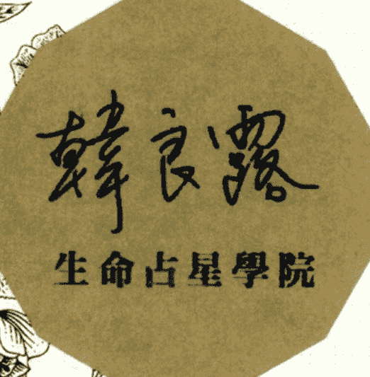
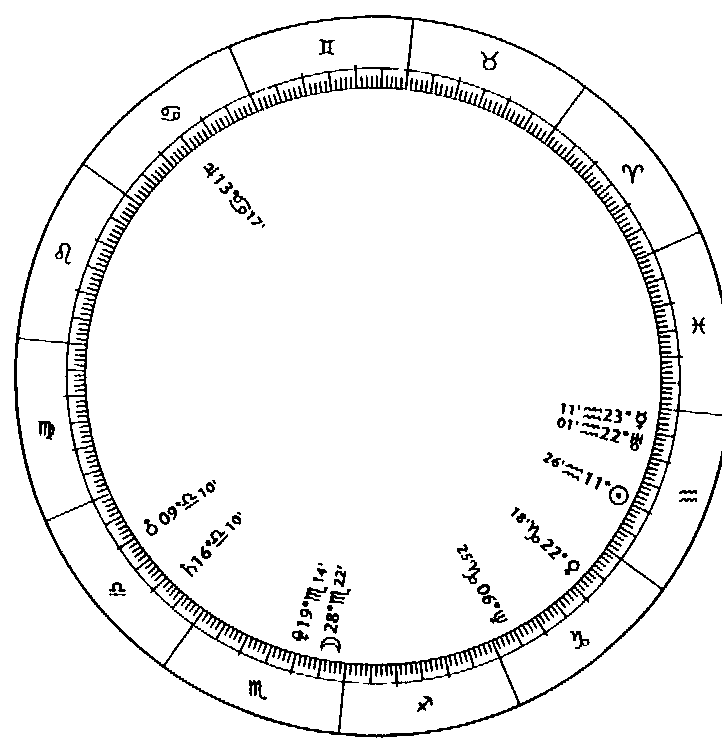
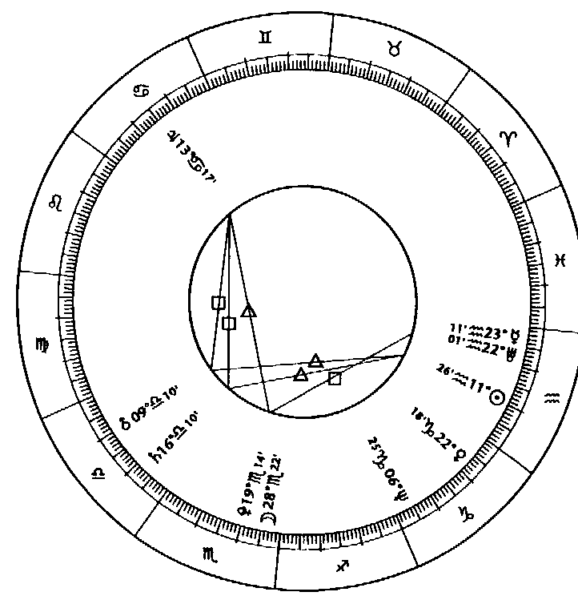

# 上升星座

生命地圖的起點  

上昇是靈魂選擇的現身舞台，  
每個人的誕生都像太陽從地平線上昇起，  
從這個起點開始，  
我們展開了獨一無二的人生旅程。  

韓良露 著  

# 出版緣起  

興趣廣泛、身份多元的知名文化人韓良露，除了大家熟知的作家、媒體人及文化推動者身份之外，她也是藝文圈中最受重視的占星學大師。  

二〇〇三年起她在金石堂金石書院（現龍顏講堂）開設占星課程，由於口耳相傳、好評不斷，課程一直持續到二〇一〇年才劃下休止符。在長達八年的四百多堂課中，她以歷史、哲學、心理學、社會學的角度，將占星的深層智慧化為生動的教學內容，讓大家在學習與命運對話的同時，獲得看待人生的更高視野。  

這一系列課程不但架構了宇宙法則的邏輯，也融入她對人性與社會的觀察，但因資料整理工程浩大，成書計劃一直未能完成，為避免這些珍貴課程內容成為絕響，南瓜國際透過多年來數量龐大的上課錄音及相關資料，依據當時課程的規劃邏輯，整理成為系列書籍，期望能藉由文字重現精彩、動人且充滿智慧的上課盛況。  

获取更多好书，请加微信：13641926204 或 QQ:715104687  

获取更多好书，请加微信：13641926204 或 QQ:715104687  

10  

# PART 1  
個人星圖中的  
生命密碼  

获取更多好书，请加微信：13641926204 或 QQ:715104687  

12  

# Chapter 1  

# 透過占星學與生命深度對話  

想要認識人生與智慧，希臘哲人蘇格拉底告訴我們要「認識自己」。每個人最了解的就是自己，只有自己會知道自己所有的祕密。占星學是一門為個人打造的學問，每個人的星圖都是一部完整的個人史，我們可以透過這個工具不斷的跟自己對話，進而不斷深刻的理解自己生命的結構與軌跡。占星學不僅僅是一個知識系統，更重要的是必須將知識化成對生命的體驗，讓生命獲得更完整的發揮。它絕對不只是算命，它是你跟生命的一個擁抱。  

廣大的星空中有著數不盡的恆星與行星，古人將天空假想成一個圓形的球面，距離遙遠的恆星就像是天球表面固定不動的背景圖案，許多恆星被人類組合、命名，形成了不同的星座。  

從宇宙的觀點來看，太陽系行星以太陽為中心，各自以不同的軌道公轉。但是從地球上人類的觀點來看，太陽東昇西落繞著地球形成了一條軌道，我們稱之為黃道，太陽、月亮、水星、金星、火星、木星、土星沿著黃道不停繞著地球旋轉，有其各自的規律卻又互相協調，彼此的關係如同  

# 獨一無二的生命藍圖  

音樂中的七個音階，演奏著宇宙奇妙的天籟。  

為了理解浩瀚宇宙的奧祕，古人以三百六十度的黃道為基準，並以天球對應黃道的十二個恆星群為座標，建立了一套觀測星體運行的知識系統，這套知識系統不僅能歸納、累積天體運行的法則，它對應於人類生命事件時也符合邏輯，這就是我們所稱的『占星學』。  

我們都是時間、空間的旅者，當我們在地球上誕生，我們就在地球上創造了一個專屬於自己的小宇宙，一天上如是，地上亦然。占星學就是天上星辰的『大宇宙』跟地上每一個人的『小宇宙』之間的對應關係。占星學最重要的工具就是個人星圖，也就是每個人誕生時天上的星象圖。  

天上星辰的分布隨著時間的不同而改變，同樣的時間，不同的地點看到的星空也不一樣，要產生完全一樣的星圖，需要大約兩萬五千八百年，因此每個人的星圖都是獨一無二的。  

我們常說『人生如戲』，每個人打從出生就展開了一場人生大戲，直到死亡才會落幕，每張星圖都包括行星（註）、星座、相位與宮位，這些元素代表了共通的宇宙法則，它們在人生戲劇當中各有不同的意義。  

  

# 行星與星座  

星圖中各式各樣的能量，都必須透過太陽、月亮等天體發揮出來，它們就像各自擔負不同角色的演員，共同演出了每個人的人生大戲。而行星能量的表達方式會因落入不同的星座而不同，星座就像是戲劇角色的性格，角色有可能性格火爆、性格拘謹，也可能充滿心機。  

  

## 相位  

行星之間會形成不同的角度，代表行星彼此的能量是互相協調或者是互相衝突。相位就像是演出生命戲劇的各個角色彼此之間是互相協調，或者是衝突不斷，行星相位決定了這些角色之間會產生怎樣的情節。  

# 「上昇點」指的是出生時間地點黃道與東方地平線的交點，往上昇點看過去的星座，就是上昇星座。出生時子午線與黃道的交點就是每個人的天頂與天底。出生時間與地點決定了上昇點，上昇點決定了下降及天頂、天底，也決定了十二個宮位，將各個星辰與星辰落入的星座及角度放入不同的宮位，這個人的生命藍圖就出現了。十二個宮位各自代表生命舞台中不同的領域，當我們在地球誕生的那一刻，宮位就將我們綁在大地上，演出了我們在地球上的命運。  

每個人誕生時的星圖代表我們將出生時的星空帶到了地球上，出生星圖並不等於整個天空，但它被占星學篩選出來的生命架構，也是西洋占星學研究命運軌跡、格式、形狀的濃縮指標。這張星圖幫助我們了解為什麼我們會在一個特定的時間、特定的地點來到這個世界，它也說出了每個人一生中過去、現在、未來，所有時間與空間的奧祕。  

宮位對一個人的影響非常大，它代表了這一生你會在怎樣的舞台上演生命戲碼。每一年都有其獨特的配戴，同年同月同日生的人配戴更是相似，但同日不同運，行星影響力能量本質相似，但是這些能量會在大眾舞台演出，或在私人舞台演出，對當事人來說，就會有很顯著的不同。  
上昇是第一宮的起點，不同的出生時間與地點決定了不同的上昇點，這些配戴因而有了不同。的舞台，於是奠定了每個人生命的特殊性。每個人出生時的日出、日落、日正當中，以及夜半這四個點，就是星圖中的上昇、下降、天頂與天底。這四個點將星圖切成了四大塊，也決定了我們  

# 生命中最大的幾個舞台設計。十二個宮位代表的生命領域簡述如下：  

- 第一宮 自我形象  
- 第二宮 個人資產  
- 第三宮 沟通與基礎教育  
- 第四宮 內心之家  
- 第五宮 創造、戀愛、賭博、子女  
- 第六宮 工作與健康  
- 第七宮 伴侶及合夥關係  
- 第八宮 性、權力、死亡與他人的資產  
- 第九宮 宗教、哲學、高等教育、外國事物  
- 第十宮 事業  
- 第十一宮 志同道合的同儕團體  
- 第十二宮 內心世界的無意識領域  

# 第一、四、七、十宮是驅動宮，代表人與環境的關係，也就是當一個人進入某個情境時，當事人與這個環境人事物之間的關係。第一宮是『自己』與『自己』的關係，它是自我之宮、本位之宮，有著自私與獨占的特性；第四宮是『自己』與『家庭』的關係，它是每個人的殼或繭，代表了內在的安全感；第七宮是『自己』與『他人』的關係，它是你的伴侶、同居人，它是你的合夥人，它可以是互補的另一半，也可以是公開對立的敵人；第十宮是『自己』與『社會』的關係，代表了社會舞台、事業與地位。  

第二、五、八、十一宮代表的是個人與資源的關係。第二宮與個人資產有關，包括自己賺到及擁有的東西，它代表個人所得這一類個人『獨占』的資源；第五宮是人『創造』出的遊玩資源，像是創造力、才藝、自我表達、小孩、賭博、樂透、投機等等；第八宮是人與別人『分享』的資源，例如遺產、繼承、股票、資源的死亡與再生、稅務機構；第十一宮是人與『公共資源』的關係，代表非特定他人的集體金錢，如獎金、社會捐贈、NGO（非營利組織）、沒有商業利益的資源互換及流動。  

第三、六、九、十二宮代表人與外界溝通的關係。第三宮是人與『常識』的關係，包含中小學的初級教育、基本資訊的溝通、八卦、大眾媒體；第六宮是人與「運作系統」的關係，包括知識、工作、健康、高中與大學等社會與身體的運作系統；第九宮是人與「智慧」關係的學院之宮，包括研究所、高等學習、哲學與道德及行為相關的宗教、異國文化與遙遠的學習；第十二宮是人與「覺悟」的關係，包括了宗教與覺悟相關的部分（而非宗教的組織）、心靈與靈魂的運作、醫院、精神病院、輪迴運作。  

一宮到六宮位於星圖下方，不管是家庭生活或者每天的職場生活，都不屬於站在鎂光燈下，或者擁有很大社交舞台的領域；七宮到十二宮位於星圖上方，不管是志同道合的同好組織，或者帶來社會地位的人生志業，這六個宮位都屬於在社會上拋頭露面的領域。  

上昇是我們展開生命旅程的起點，它的重要性在於：這個起點不但形塑了我們面對外界的樣貌，也塑造了我們面對生命情境時的直覺反應。在個人星圖中，上昇點決定了之後，十二個宮位的起點與終點也隨之出現，並依序落入不同的星座。十二個宮位代表了十二個不同的生命領域，而每個宮位落入的星座則會呈現出當事人面對這個生命領域時的基本態度，這些態度背後的思考邏輯，也同樣來自於上昇星座的童年處境。  

# Chapter/2  

# 生命戲劇的起點：上昇  

雖然「上昇星座」已經是一個約定俗成的名詞，但事實上它並不是指哪個行星落入的星座，它只是一個「背景」，它是靈魂選擇的前門。  

上昇帶來長相上及氣質上的特質，它是每個人讓別人看到最直接的樣子，透過上昇星座可以看出一個人是怎樣表露他的氣質，以及他的外在個性。  

有人說上昇是靈魂在地平線升起時浮現的臉孔，這個臉孔是逐漸形成的，它來自父母的遺傳，也來自童年經驗。上昇是第一宮的起點，也是十二宮的終點，從星圖中的十二宮可以看出很多遺傳的事物，不管是心理的遺傳或者是生理的遺傳，都跟十二宮有關，當一個靈魂選擇了一個上昇點，就等於選擇了一個特定的家庭遺傳，也等於選擇一個童年環境。父母的基因與家庭遺傳影響了我們的長相，而童年環境塑造出我們與環境互動的習慣，這種習慣就成為了我們的氣質。  

上昇星座也代表了當事人的父親與他們相處的狀況。在占星學中，第四宮與上昇都跟父親有關。我們要了解，父親的面向絕對不僅止於跟你相處的那個樣子，四宮與父親相關時，代表的是身為一家之主的父親是如何在家庭中扮演他的角色，這是當事人的父親在家庭中展現出來的形象，包含了他對待妻子與別的小孩時的面向；而上昇是專屬於父親跟當事人之間的相處方式，有的父親或許在家庭中扮演的形象非常嚴肅，但對其中某一個小孩特別寵愛，因此儘管父親都是同一個人，但因為父親對待每個小孩的不同模式，每個小孩的上昇可能也就有所差異。

## 透過星圖中點理解生命課題

我們每個人都是出生在地球上，而地球上，有著芸芸眾生，當我們來到這個世界，出生的時間與地點，就成為每個人獨一無二的時空座標，不同的經緯度畫出不同的地平線與子午線，因此決定我們的上昇、下降、天頂與天底。這四個交點非常重要，它們是星圖上的四個入口，是每個人生命中四個最重要的門。

上昇代表的是 who you are。你是誰。你生命的輪廓是什麼？

下降代表的是 whom do you want。雖然一般人都會把它投射到另一半身上，但更重要的是，它代表了我們與自己內在靈魂伴侶的和諧。

天頂代表的是 what you do。你在這個社會上要做什麼。它不單指工作，它也是與生命自我實現有關的志業。

天底代表的是 how do you feel。你對生命有什麼感覺？你不能只關心自己在社會上要做什麼（天頂），而不去好好處理自己對生命的感覺（天底），否則不管你在社會上到達怎樣的地位，都無法獲得真正心靈的和諧。

星圖中所有的二元、所有的對立、所有的兩極，都意味著展現靈魂的不同面孔：上昇是前門，下降是後門，天頂是屋頂，下降是地窖。我們的意識透過上昇的前門流放出去，潛意識中想要跟上昇意識平衡的渴望則隱藏在下降；我們將職業與社會形象放在天頂的屋頂上讓別人欣賞，而我們的祕密及過往則隱藏在我們內心深處的天底裡。

出生時黃道與地平線的兩個交點就是我們的上昇與下降，我們藉由上昇跟外界溝通，一般人的認識的通常是上昇的你，而每一個人的下降，就是我們隱藏的自己。上昇跟下降是我們的顯意識與潛意識，它們一個是意識的光，一個是這道光投射出來的陰影。它們都是你。

很多傳統占星書常說下降代表你的伴侶或重要合夥人，這是人類根據已知問題而訂出來的答案，很多人會為了解決人生的问题而這麼做，即使這樣會帶來更大的問題。

人的存在是二元一體的，上昇跟下降分別代表了出生時地平線的東邊與西邊，它們都是自我的一部分，如果地平線的西邊不屬於自己而屬於別人，就意味著當我們沒有能力實現自我整合，我們常常會把隱藏的自我向外投射，利用一個象徵性的另一半或合夥人來填補自己上昇缺乏的能力。傳統占星學的解釋會使很多人將下降當成自己的真命天子——真命天子往往是最危險的人，依據下降互補的特質而幫人合婚，通常會合出很多後來離婚的婚。下降是每個人自我的影子，是被自己隱藏起來的另一半，是我們在內心深處渴求的另一個溫柔和善的自己。每一個人都需要將想要投射出去的下降，內化成自己另外一面的性格。每一個人都要誠實的面對自己的上昇會有的課題，而不是找一個具有下降特質的別人來填滿上昇的缺憾。唯有當事人強烈了解到下降不是他人，它也是自己內在的一部分，這個時候才有辦法跟他人建立良好的關係。

在個人星圖中，左半邊都跟個人意識有關，右半邊則代表與他人意識的連結。「自我意識」及「與他人意識連結」原本都是自我生命經驗的一部分，但很多人卻把「與他人意識連結」變成「他人」，變成了為他人而做，而不是為了自我生命的整合而做。

比如「我」帶著孩子去學鋼琴，原本應該是想要藉由帶孩子學音樂的行為，讓「自己」有機會重新去接觸音樂；比如「我」帶孩子去動物園玩，是為了「我自己」內在的赤子之心想要看一看動物。但是很多人帶孩子去玩、去學習，都只是為了讓孩子能夠得到一個較好的童年，他們做這些事情的時候只是百無聊賴的坐在一旁。當這些原來應該要成為自己生命經驗的事情變成了對別人的責任，我們就不是為了自己活，而是為了別人活。

星圖中右邊所有與他人的連結，其實都是屬於我們自己的一部分，但我們卻將這個連結切斷，變成了「他人」，這樣的話，我們就會失去了下降應該有的能量。

星圖中的上半部代表了我們要給別人看到的部分，也就是我們要為世界做的事情；下半部代表了我們心底深處的東西，代表了我們的隱私，以及我們自己要為自己做的事情。

職業本來應該是發自內在，讓我們與這個世界連結的途徑，而不只是一個身分、地位，不只是一個我們在社會上扮演的角色，但是我們往往只把它當成一種社會地位的選擇。所有形於外的事物與我們的內在本來都應該屬於生命的一部分，它們都應該由內在產生而形之於外，可是當它們都被物化成我們的工作、野心、社會目標與責任時，它們就不再從內在出發。

上昇是我們面對這個世界的態度，是我們對外的窗口；下降是我們希望他人面對我們的態度，是一種對內的關係；天頂是我們對外顯意識中，我們想要在社會舞台扮演的角色；天底是我們內心潛意識中想要擁有的狀況。

我們想要的個人自我、想要的相處方式、想要的社會認可、想要的內在安全感，這四個渴望天生就是衝突的。太在乎事業的人，內心就不可能平靜；太在乎伴侶的人，就會失去自我；太在乎自我的人，就會失去伴侶之間的和諧。將上昇、下降、天頂、天底這四個點直線相連，就成了 一個十字架，命運給每個人一個與生俱來的十字架，就是在告訴我們，當你執著於一端，永遠就會有另一端的對立面。這個十字架帶給我們的壓力可以非常大，也可以非常小。上昇、下降、天頂、天底如果各自發展，想隱藏的極力隱藏，想表現的極力表現，這四個點就會越來越遠，十字架也就因此變大；但是當這四個點往中間靠近，將生命的能量往內在走的時候，這個十字架就會變小。

占星學跟宗教及各種靈性學習一樣，我們在學習占星學的過程認識的每一個符號、每一個命運的可能性、每一個人際緣份，其中最重要的是要學習找到一個中點，讓你可以不是站在火星的位置看別人，不是站在金星的位置看自己，不是站在二宮的位置去看別人，不是站在十宮的位置看自己，而是能夠透過一個不動於心的中點去看生命中的所有戲劇。

除非天生就是得道高人，否則沒有人可以一開始就站在中點看事情。我們在占星學中學習到每一個星辰、星座的能量，以及各個宮位的情境，都是讓我們學習跳脫習以為常的觀點，這樣才有可能真正了解內心的自我與內在狀態，也才能產生真正的自我覺察。

## 上昇點位於星座末端

一般來說，大部分出生地點在北回歸線及赤道附近的人，星圖的宮位大致上都比較平均，接近等宮制，但出生在高緯度地區的人，星圖宮位大小就未必平均了，往往靠近地平線的宮位較為複雜，一個宮位可能會橫跨兩三個星座，而靠近子午線的宮位所占的度數較少，宮位的狀態相對單純。

對於在台灣出生的讀者來說，由於出生地緯度不高，大部分讀者宮位與宮位落入的星座對應關係都與本章內容相同，但有時候也會出現宮位不均等的例外狀況，如果星圖中宮位不均等，宮位與落入的星座對應也有可能會產生差異，由於篇幅所限，無法一一詳述，但如果遇到這種情況，可以掌握一個大原則：宮頭所在的星座具有決定性的影響，它是當事人的主觀態度，而宮位中其他星座往往是因應生命情境做出的被動反應，兩者有著明顯的主被動差異。

對於大多數人來說，宮頭（宮位的起始點）落在的星座在該宮所占的比例也比較大，當事人面對宮位代表的生命領域時，會很單純的以該星座的態度來應對，但對於 Late asc（Late ascendant，簡稱Late asc，上昇點位於該星座的尾端）的人來說，因為宮頭落在星座的尾端，所以宮頭落在的星座在該宮位的實際度數並不多，比如上昇牡羊 Late asc 的人，可能第一宮的宮頭在牡羊二十六度，表示當事人第一宮當中，牡羊只占四度，而其他的二十六度都在金牛，當事人面對宮位的態度與情境就會比較複雜。

出生在兩個星座交界（cus）的人，也就是上昇點位在星座末端，緊鄰下一個星座的人，上昇星座的特質也會稍有不同。

當一個人的上昇點接近上昇點落入星座的前面時，當事人的第一宮大部分都會在上昇點的星座中，他們就會充分發揮這個星座的特質；當一個人的上昇點落在該星座末端時，當事人仍然會呈現上昇點的星座特質，但他們同時也會有一個隱藏的第二特質。儘管這些都會造成影響，但是當事人的主要特質仍然取決於上昇點落入的星座。

對於 Late asc 的人來說，既然當事人第一宮大部分都落在上昇點的下一個星座，他們的童年生活就不會單純的只呈現出上昇星座的狀態。比如上昇牡羊 Late asc 的人可能出生在一個父母忙著打拚事業而無暇照顧他們的家庭，但幾年之後父母的經濟狀況穩定，或許父母依舊忙於事業，但很可能會請一個很會照顧人的保母，於是當事人一宮的後半部就出現了金牛座的情境；又如上昇處女 Late asc 的人可能出生在嚴格管教的家庭，他們進了學校之後也會遇到很嚴厲的老師，但對於上昇處女 Late asc 的人來說，由於第一宮大部分落在天秤，他們可能同樣家教很嚴，但是上學之後老師都對他們很溫和。

上昇是生命早期的情境，是一種生命態度。對於 Late asc 的人來說，儘管第一宮大部分落在下一個星座，上昇點的星座還是有著三分之二以上的影響力。比如我的上昇在人馬二十五度，我面對事情時還是會用人馬的態度，並不會因為第一宮摩羯比例很高，我就變成三人馬加三分之—摩羯；比如上昇在天秤二十五度的人，第一宮會有二十五度都在天蠍，當事人呈現出來的還是天秤，他的個性與氣質並不會變成天秤與天蠍混合。上昇點落入的星座決定了這個人的態度，即使我的上昇人馬只占了五度，其他二十五度都在摩羯，我整個個人的態度都是人馬，就算上昇在人馬二十九度也一樣，只不過在我的人生中會遇到很多情境，那些情境會激發我必須要用摩羯的方式去面對，因此摩羯的影響力也會逐漸展現。

上昇星座是我們每個人一出生就定下來的鑄模。如果我們把每個人都想像成一個模子，這個模子最外層的樣貌永遠是由我們的上昇、下降、天頂、天底所決定，它是生命最早被決定下來的部分。至於當事人內在的情緒與生命狀態，也就是模子內側的部分，這些才是 Late asc 宮位中第二個星座決定的事情。

對於 Late asc 的人來說，如果當事人對自己的理解不夠，他們就會感覺到自己所有的生命狀態都很複雜、混亂。但是當他們願意去了解自己的時候，就能體會到這是一種獨特的宇宙設計，讓他們在每一個生命情境中都必須要去面對兩種互相衝突的選擇。

## 靈魂學習的神聖計劃

上昇點是我們在地球上誕生的時空座標，我們在特定的時間與空間誕生在地球上的時候──也就是上昇點被決定了的時候，意味著我們的靈魂做出了一个選擇。

Late asc 的人生命狀態永遠會出現兩種不同的能量互相影響，常常需要在兩個星座的能量中求取平衡，永遠會有一個內在的調整，讓他們不管在做任何事情的時候全然的去做單一的事情。

我有一個 Late asc 的朋友，上昇點在天秤，但第一宮大部分都落在天蠍，因而經常需要面對天秤與天蠍這兩種不同的生命處境。他以前很羨慕單純上昇天秤或天蠍之中都有一些他不想要的特質，而恰巧就是單純上昇天蠍的人，最無法抗拒與逃避的能量。

Late asc 意味著上昇星座的能量被削弱，對他們來說，好的地方固然沒有辦法像單純上昇的人那麼好，但是壞的地方也沒有那麼壞。他們主控上昇星座能量的能力固然比較弱，在個人能量的突破上面，Late asc 的人比不過單純上昇的人；但在躲避生命能量的過度狀況時，他們會比較有自主權。就靈性方面來說，這其實是一件好事。

在輪迴占星學中有一派說法：在千萬劫輪迴中，每個人生生世世有著不同的故事、不同的學習與不同的功課，因此每個人每一生都有一個獨特的印記，這個印記必須要能夠包含、記錄眾生累世個人與他人相互間的關係，而這個特殊的印記，很可能就是上昇點。就像寫程式需要一個起點一樣，生命也要從一個起點展開無數的可能性。我們這一生的起點始於我們離開母體吸進第一口氣的時候，此時此刻的時空座標，也就是我們的上昇。座標中的時間、地球的經緯度與太陽行走的黃道東西南北相交之後，形成了我們的星圖。星圖說明了我們跟地球的緣分，也意味著我們的靈魂選擇了地球做為靈魂淨化的舞台。星圖是我們帶到這個世界的生命藍圖，每張星圖的背後都有著靈魂的計劃，裡面有著我們在這個地球上幾十年必須面對的靈魂課題。

研究占星學不能不理解占星學背後的神學意義。研究過佛學的人可能會覺得這個部分很耳熟：我們的靈魂是來自太陽系之外的宇宙，靈魂在那裡是以一種共靈的狀態存在，沒有差異、沒有分別。靈魂在那裡是一個沒有分別相的靈，沒有星座的差別，甚至沒有命運。靈魂最重要的任務是學習成長，唯有經歷很多的事件，才能學會各種情感課題，產生意識的成長過程，因此靈魂就會依照他們需要學習的課程誕生在地球上。

但是靈魂本身是不被這些課題所決定的，靈魂超越星座與星辰。

获取更多好书，请加微信：13641926204 或 QQ:715104687

## 上昇牡羊的特徵及童年生活

上昇牡羊的人通常會出生在一個必須依靠自己的環境，從小就不會有人追在背後生怕他們吃得不夠，他們從小就不會被人捧在手心上保護、疼愛。  
有的上昇牡羊是孤兒，也有的上上升小時候父母很忙無暇好好照顧他們，有的人雖然家境小康，但從小就是鑰匙兒童。

由於從小生長在艱困的環境，上昇牡羊從小就必須很勇敢，從小就知道讓自己生存下來很重要。他們很敢做自己，很敢要自己想要的東西。他們知道在任何的處境之下都要先搶先贏，如果桌上有一盤菜，他們會知道如果不趕快去吃，等一下就沒有了——他們不能等別人來餵，必須直接自己去要，他們也因此都有很強的生存競爭力。

對上昇牡羊的人來說，生命潛意識中最理想的人際關係，就是他們的下降——天秤。上昇與下降的伴侶關係本來是宇宙中的一個能量投射，每個人的下降都是自我的影子，是被隱藏起來的另一半。這並不是一種經過思考的理性決定，而是潛意識知道上昇跟下降必須找到一個中心點才能平衡，當上昇牡羊受天秤吸引時，意味著他們在內心深處想要尋找另一個溫柔和善的自己。

理論上來說，在理想的關係中，當對方演出某一種自己渴求、缺乏而被自己隱藏的特質時，我們可以從對方身上體驗這種特質中的正面能量，藉由長期相處的薰陶，你自己的也能夠擁有這種原本被隱藏的特質，這種互相學習的關係，才是真正的互補。但每個人都有理智的盲點，與其自己跟自己平衡，不如去找一個跟自己平衡的人就好，於是很多人尋找能跟自己互補的人，讓對方成為有用的伴侶。但這在邏輯上是衝突的，因為當對方不想被你用，或者你不想被對方用的時候，有用的伴侶就成為無用的敵人。

上昇牡羊如果不意識到天秤是他們生命中求取自我平衡的內在靈魂需求，而以為內在靈魂伴侶要從另一個人身上尋找的話，當一個天秤能量很強的人出現時，上昇牡羊就會跟這些人演出一場戲──除非他們越像牡羊，否則雙方的關係就不能獲得平衡。因為對方是懷著對他們牡羊的需求而來，一旦形成了這種互補的角色扮演關係，自我能量的發展就會受到阻礙。

上昇牡羊的人從小就被迫要很勇敢，他們雖然很自私，但是很誠實；天秤從小就很注重別人的一面，就會開始懂得跟別人的相處之道。他們很有野心、很能吃苦耐勞接受磨練、很能實踐自我，他們是可以白手起家的人。

## 上昇牡羊十二個宮位的生命情境

### 一宫牡羊

上昇牡羊的人投胎前靈魂做了一個決定，他們希望這一生能夠成為一個無所畏懼、永遠保持自我的人，但是往往出生之後就忘記了，當他們一味執著於扮演牡羊的角色，這一生就會非常疲累。如果他們能夠面對自己內心脆弱的地方，了解心底真正的渴求，才有可能讓自己學習平衡，因而獲得他們最渴望的安全感。

上昇牡羊通常成長於鼓勵運動的環境中，他們非常好動，天生就有律動感，即使沒有受過專業訓練，也都會喜歡各種運動，時常展現身體的活力。他們絕對不會好吃懶做、四體不勤，總是精力旺盛，整天動來動去，所以不太會變胖，就算稍微胖了一點，也會馬上注意到這件事情，不會放縱身材走樣。

上昇牡羊多半很有活力，很像運動員，他們年輕的時候經常會顯現出一種『性感』的感覺——這與『性感』略有不同，上昇牡羊的人釋放出來的是一種動物性本能。上昇與一個人的外表有密切關係。

### 二宮金牛

由於出生於艱困的環境，上昇牡羊很能理解缺乏資源的痛苦，因此他們喜歡賺錢，也喜歡自己管自己的錢。上昇牡羊從父母那邊得到的資源很少，每一分錢都是自己賺來的，因此他們在金錢上都很務實，必須靠著自己白手起家。

### 三宮雙子

上昇牡羊講話之前不會先察言觀色，也不擔心脫口而出的話會不會顯得沒大腦，他們秉持先搶先贏的習慣，想到什麼就說什麼。

對於某些上昇星座的人，比如上昇天秤、上昇雙魚來說，他們從小就長於社交，從小就知道在學校裡應該怎麼跟同學相處，但上昇牡羊得要先扭轉自己的天性才學得會社交與應對，上昇牡羊在還沒有學到這一點之前，很容易會照著牡羊好鬥的邏輯待人接物，因此年輕的上昇牡羊常會遇到人際關係上的困難。

### 四宮巨蟹

上昇牡羊本質上是不懂跟別人相處的孤獨者，他們得等到長大之後才學得會人際相處時的應對方法。他們在小學、中學時期很難跟人打成一片，在學校中一定人緣不好，常常覺得受到排擠，覺得自己不受歡迎。但他們從小就很誠實，也很敢表達自我，這種特質使得老師對他們的態度很兩極｜不是很喜歡，就是很討厭。

上昇牡羊的人每天動來動去，內在缺乏安全感，因此他們最需要巨蟹帶給他們家庭的安全。上昇牡羊的女性通常都會是一個非常認真的好媽媽。儘管上昇牡羊的女性往往看起來很中性，但當她們生了小孩，便會充分發揮她天底巨蟹的力量，而這一點往往上昇牡羊的男性做不到。女性通常不會完全忽略自己的天底，她們每次月經來時，都會感受到自己內在的一部分。她們就算嫁給跟自己互補的另一半，先生畢竟不可能幫她生小孩、餵母乳。對女性而言，她們的天底永遠不會完全被壓抑而不發展。

但很多男性上昇牡羊會忽略自己的下降及天底，而將發展下降、天底的工作推給另一半。他們通常不肯面對渴望溫柔的自己及脆弱的內心之家，他們的下降與天底因而一直被壓抑。第四宮是每個人的內心之家，是每個人隱藏在地窖中的自我。上昇牡羊最大的渴求就是希望有一個溫暖的、充滿了愛的家，裡面有愛他們的父母，有愛他們的家人，這些都是他們童年沒有得到的東西。很多上昇牡羊的男性因而會找一個讓他們感覺母性很強、很會持家的女性來幫他們完成這個願望，讓他們的內在自我得到滿足。當他們找到這樣的人，如果不知道該怎麼跟這樣的人相處，或太偏重於自己跟外在世界的關係的話，他們往往結婚之後就每天為事業打拼而不回家，終於導致跟伴侶的關係失敗，於是又回到了孤單無依的狀態。

### 五宮獅子

上昇牡羊談起戀愛時非常熱烈，宛如偶像劇一般，有聲有色十分浪漫。

### 六宮處女

上昇牡羊的人在工作上會顯得冷靜踏實，在戀愛上，上昇牡羊談起戀愛時非常熱烈，宛如偶像劇一般，有聲有色十分浪漫。

### 七宮天秤

當上昇牡羊開始踏入社會的那一天，他們就知道自己的苦日子快要結束了，因為一旦脫離童年期，就能開始靠自己賺取資源，自我依賴對他們而言很重要。很多上昇牡羊在大學時就開始半工半讀，他們一定會比其他人更願意接受辛苦的工作，會比別人願意接受加班、超時以及其他工作上的考驗。

上昇牡羊在工作上唯一會遇到的問題是：他們比較適合獨立作業。他們不擅長團體合作，也不是聽話的人，他們沒辦法當別人的助理，也不適合在組織中做行政工作。

上昇牡羊的第七宮在天秤，他們很容易受到天秤能量的人吸引，而天秤能量強的人也容易受到他們吸引。兩者在星圖上有一種互補關係，雙方很容易將對方視為自己失落的另一半。

上昇牡羊特別會指揮、特別會領導，不管在什麼環境，他們都會希望自己是做主的那個人；天秤特質強的人缺乏這類本能的活力，當他們遇到很有主張、很有活力的上昇牡羊時，就很容易被他們吸引。

### 八宮天蠍

上昇牡羊的人行為看起來很大膽，非常敢冒險，但是他們對於資產卻非常小心謹慎。在二宮

基於上昇跟下降彼此互補，許多傳統的星座書會說下降就是你的另一半，但是這種伴侶關係卻經常以失敗收場。這是因為下降是他們潛意識中想要學習和諧的渴望，但是當對方扮演起天秤的角色時，上昇牡羊就沒有機會練習天秤的那一面。當兩人遇到了問題，如果上昇牡羊不扮演理直氣壯、大聲講話的那一方，雙方就會覺得關係變了。於是在現實生活中，互補的需求成了固定的角色扮演——你扮演忍氣吞聲的那一方、扮演好說話的那一方、扮演吵架時先道歉的一方；我扮演自作主張的那一方、扮演愛怎麼樣就怎麼樣的那一方、扮演自私的那一方；你扮演小媳婦，我扮演小霸王。終於小媳婦受不了小霸王，小霸王也受不了小媳婦。

我認識一個上昇牡羊的女性，她在事業上是個女強人，家中的事物幾乎都是她在管——開車是她在開、買菜是她在買，連家中的水電都是她自己修。她嫁給一個太陽天秤的男性，但後來還是因為丈夫外遇而分手，一開始很可以互補的對象到了後來變成無法依賴。上昇牡羊本來就不容易依賴別人，當伴侶不再互補又無法依賴時，上昇牡羊就又回到只能依賴自我的孤獨狀態。

### 九宮人馬

上昇牡羊從小成長於艱苦環境，就像是岩縫中的野草，一有機會，就一定要想辦法讓這棵小樹長成大樹，所以他們在九宮領域中的人生哲學、高等心智的學習，都朝著這個目標前進。

他們的意志非常堅定，從來不會胡思亂想或三心二意，因為他們唯一的目標，就是要讓自己從小時候掙扎求生的小草堅強的長成大樹，也就是完成十宮摩羯的社會形象。

### 十宮摩羯

上昇牡羊的人天頂通常位於摩羯，他們很獨斷，不喜歡聽別人的意見，因此在事業上最容易出現摩羯過於權威的問題。

在領域的金錢觀上，他們很能按部就班讓自己一步一步白手起家，在八宮領域的權力與財產上，他們也抓得很牢。因為這些資產全都得來不易，他們不會讓它們一不小心就從指縫間溜走。

由於上昇牡羊有依賴自我的習慣，因此他們也會想要掌握眾人的資源，不管是一起合作集資，或者是開公司當老闆，他們都會希望自己是掌錢掌權的人，他們不會願意將這些權力下放給別人。

### 十一宮寶瓶

天頂是個人的自我對外在世界最大化的領域，是最容易被世人看到的地方。上昇跟天頂都是顯意識的自我。上昇是本能的自我，天頂是社會化的自我，兩者在意識上有著互相補償的關係，當一個人覺得自己小時候的資源不夠，長大以後就會特別希望自己擁有社會資源。上昇牡羊的人外表看起來具有孩童特質，但在事業上精於打算。為了證明自己已經長大，他們不會是夢想家，他們要的是能被社會主流價值認可的成功，因為如果不被社會主流認可，就無法補償他們小時候艱困的自我。

上昇牡羊從小就不會被過度保護，一直得靠自己打天下，他們習慣面對陌生的環境，也不怕面對陌生人。由於經常得跟陌生人往來，上昇牡羊比較不會先入為主去論斷他人，不管貧富貴賤，就算對方被一般人視為怪人，上昇牡羊也都會一視同仁平等對待，絕不大小眼。

上昇牡羊是天生的孤獨者，他們跟人往來時能夠保持客觀，用適當的態度結交各式各樣的朋友，不過也因此他們雖然朋友很多，但是他們跟朋友之間都還是會維持一定的距離，不會過於親密。

### 十二宮雙魚

上昇牡羊的十二宮在雙魚，這意味著他們在過去世中經歷了雙魚的迷惘與軟弱，因此這一輩子他們的靈魂要讓自己成為一個最勇敢、最堅強的人，不管環境多麼惡劣，他們都要能成為奮戰到底的倖存者。

## Chapter / 2

## 上昇金牛

我有一個關於上昇金牛的小測驗，很多上昇金牛的父母都對它的準確度大吃一驚：只要問上昇金牛當事人的父母，是不是這個小孩一出生，家中忽然就有錢了？答案應該幾乎都是肯定的。

我有一次去聽音樂會，剛好遇到一個老朋友也帶著小孩來欣賞，閒談了幾句，發現他的小孩上昇在金牛——帶著小孩去聽音樂會本來也就是上昇金牛的父母會做的事。我笑著問這個朋友，是不是這個小孩一出生，家裡的環境就忽然變好？他們夫妻倆點頭不已，朋友的太太表示，小孩誕生之前，家裡簡直一點錢都沒有，但從小孩呱呱落地，先生的事業就忽然變得很成功，時間點巧得不得了。

不過，雖然小孩一出生家裡就很有錢，但是這個小孩從小就很吝嗇、很小氣，家中的舊玩具即使早就已經不玩了，她也不肯送人。

為了安慰他們，我告訴他們我認識另外一個上昇金牛小孩更小氣，他媽媽如果想要用他房間裡的桌子，還得付他租金，沒想到朋友的小孩一聽，若有所思的說：「為什麼我都沒有想到這個」

## 物質環境的美感訓練

將上昇金牛與上昇牡羊相比，就可以看出兩者的明顯差異。上昇牡羊出生在一個毫無資源的環境，一生必須不斷靠自己從外界獲取資源。上昇牡羊的人想要出人頭地，得靠著自己的雙手打出一片江山，而這正是上昇金牛避之唯恐不及的事。但如果想要不靠自己，當然就得依靠既有的物質資源，因此他們一定會誕生在一個資源很充足的家中。

由於金牛是一種保守的能量，因此上昇金牛的人往往誕生在比較保守的家庭中。家庭是人類關係中很重要的結構，人類的社會制度有個特色，會去維持某種社會制度的人，一定比較在乎它，在乎制度的人一定會比不在乎制度的人保守。保守的父母比較會努力去維持一個安全感充足的物質環境，當一個人選擇誕生在比較有安全感的環境，也就代表這個家庭比較保守。

金牛也跟美感有關，上昇金牛的人小時候不但吃得飽、穿得暖，而且會誕生在一個具有美感的環境中。經濟能力好的家庭比較有錢可以添購各種家庭物品，而且父母當時手頭寬裕，不必終日為生計忙碌，所以也會有比較多的心力去布置居家，讓這個孩子可以誕生在一個比較美、比較舒適的環境中。也因為環境富裕，他們絕對不會給孩子用很爛的嬰兒車、很爛的嬰兒床、很爛的枕頭被子，或者穿別人穿過的二手嬰兒服。有時候大人的衣服花了大錢也未必好看，但是像是嬰兒服、嬰兒床等等嬰兒用品，只要肯花錢，買到的東西一定不會差。

金牛代表了一切感官世界的總和，所以上昇金牛的人也因此會有音樂及美術天分，他們可能天生就有這樣的天份，也可能是因為生在充滿美好視覺、聽覺等五感刺激的環境，所以長大之後對於美特別有感受力。很難說哪一個是因，哪一個是果，因為這兩者是同時發生的。

上昇金牛喜歡所有跟美有關的事物，其中也包括舞蹈。他們喜歡舞蹈的美，但是他們的身體不合跳舞，舞蹈對他們而言有一點吃力，因此他們喜歡看勝過於自己跳。我的侄子有一次看到有人跳踢踏舞，就跟媽媽說也想學，但上了課之後發現他的身體比較「慢」，踢踏舞需要跟著節拍迅速的將拍子打出來，這對於上昇牡羊或者上昇雙子沒問題，但對於上昇金牛來說，這種美不是他們身體所能控制得來的，他們可以優美，但沒辦法很有活力。舞蹈需要火星的能量，光靠上昇金牛的力量是不夠的。

為他們天生具有一種物質主義的傾向，同時又對美有鑑賞力，如果能夠透過學習而擁有一項表達美的工具，就可以將對於物質主義的執著轉化成美的事物，而不致於一直陷在物質世界中。

由於我很了解上昇金牛的特質，所以打從小侄子一出生，我就不斷鼓吹一定要讓他學音樂。

## 我弟弟聽了在旁說風涼話｜學音樂不是說學就能學，這也得看他有沒有興趣。這倒是真的，要小孩學音樂，的確得要他們真的非常有興趣才學得下去，像我這個三分鐘熱度的上昇人馬就是標準的反面教材：我小時候大概學過包括鋼琴、小提琴等十幾種樂器，連薩克斯風都學過，我們家對我又很寵，不管想學什麼，不但讓我學，而且每學必定先買樂器，但往往才去山葉音樂教室上了兩天課，鋼琴才剛買好送到家，我就已經不想學了。事實證明侄子的確很有音樂天分，從小小提琴就拉得非常好，還成為學校交響樂團年紀最小的小提琴手。

剛剛提到的小開朋友在這方面就很吃虧，他的父母不知道上昇金牛有這樣的天分與需求，因此沒讓他從小學音樂，但是他對音樂的濃厚興趣，使他成為古典樂唱片的收藏家，他收藏的古典樂、歌劇的唱片，即使不是我認識的人中最多的，也算名列前茅，花在音響設備上的錢，更是以數百萬計。

音樂跟繪畫不同，對於有繪畫天分的人來說，即使到了六十歲才開始畫畫都不算遲，但是如果你沒有從小學音樂，長大以後就算再喜歡，也沒有辦法跨入音樂的門檻。對我這個朋友來說，小時候父母沒有送他去學音樂，等於是抑制了他在這方面的發展，現在就算成為了古典音樂的收藏家，也還是高不成低不就。人都會有創造的需要，對於有音樂天賦的人來說，光是做一個鑑賞家是不會快樂的。

## 上昇金牛的不同面向

上昇金牛之所以會被保護得這麼好，是因為他們的天底在獅子。天底是一個人受家庭影響最深的自我意識，上昇金牛的天底獅子，代表他們在家園中唯我獨尊的地位。一個人如果不是很重視，就不會被家庭保護得這麼好，正因為他們是這個家庭中的天之驍子，所以才會格外受到保護。因為重視，才會在物質上盡其所能的讓他們不虞匱乏。

上昇代表生命早期最重要的陽性能量，意味著上昇金牛會有一個很重視物質環境、很務實、很努力工作的父親，如果不是因為有這樣的父親，上昇金牛也會享受不到這樣的環境。家境富裕不一定代表父親一定努力工作，比如上昇天蠍的人也有可能誕生在很有錢的家庭，但是上昇天蠍的家庭充滿了衝突，不會像上昇金牛的家庭這麼安定。

務實而努力的父親提供了上昇金牛物質環境的安全感，但如果父親太實際、太務實，父親跟當事人之間就不會有足夠的情感互動，因此上昇金牛的人雖然很有安全感，但是他們內在情感深處都會有一種缺乏，這種情感上的缺乏，在童年時期依靠母親來彌補，所以上昇金牛的人都會跟母親很親近。

上昇金牛的下降在天蠍，代表當事人會有一個占有欲很強的母親，如果不是因為母親的占有欲很強，怎麼會二十四小時不讓小孩離開視線，把小孩當成一個唯我獨尊的人來對待？這完全說明了一個人的氣質形成背後的心理作用力。

下降天蠍代表母親對當事人複雜的情感與情感上的控制，於是這成為他們潛意識的需求。他們長大以後就會受很會操控人、情感上很複雜、能夠提供強烈情感的人的吸引，但問題在於當他們真的找到一個這樣的伴侶時，對方畢竟不是他們的母親，因此當事人會感到壓力很大。他們在選擇婚姻或合作夥伴時的難題就在這裡：他們尋找的對象或夥伴是生命早期提供他們感情的母親，但母親提供的情感是任何他者無法取代的。

上昇金牛的天頂在寶瓶，一個這麼需要安全感、這麼自覺尊貴的人，在面對社會自我時，反而敢在社會形象上，做出完全不符合社會認定的選擇，這裡面有一些矛盾，但這個矛盾非常合理。

因為他們的內在有一種驕傲跟尊貴，所以當他們選擇天頂的社會形象時，他們會去做想做的事情，而不見得一定得要去尋找一般社會大眾認可的形象。相反的，像上昇牡羊這麼自我中心、這麼堅持要做自己的人，在十宮的社會形象上，反而一定會選擇社會認可的形象，因為只有達到了摩羯代表的社會地位，才表示上昇牡羊一切白手起家的努力獲得了社會認可，他們才能夠證明自己真的已經憑著雙手打出了天下。

但是對於已經很有安全感的上昇金牛來說，他們本來就覺得自己很重要，面對社會舞台時，根本不需要為了一般社會認可而妥協，摩羯型的社會形象對他而言，並不會讓他們的自我繼續增強，因此他們面對社會時，可以很任性的去選擇任何讓他們覺得唯我獨尊的社會自我。

天頂寶瓶是果不是因，如果一個人沒有堅強內在與驕傲自我的話，面對社會舞台時絕對不敢特立獨行，而一個很在乎社會看法的人，就代表了他的內在非常沒有安全感。我們看一個人的社會自我形象時，其實要看的是那些沒有呈現出來的地方，一個缺乏內在安全感的人，他們就會希望自己能夠在社會上受人歡迎，因而想盡辦法要呈現大家都能接受的外在形象；完全不在乎社會上一般人怎麼看他的人，一定從小在家就是天之驍子，所以他真的不在乎社會上其他人對他的看法。

從占星學理論來看，上昇金牛的人從小會得到很充裕的物資，卻不會得到很多甜言蜜語與溫柔擁抱，他們會得到細心的照顧，卻不會得到太多情感的交流。以前我不了解為什麼占星學會有這樣的理論，因為照一般人的邏輯思考，父母花了這麼多時間與金錢去買很好、很昂貴的嬰兒用品，而且母親可能在家專心照顧或者請專人照顧，怎麼可能跟小孩缺乏情感交流？後來我實際觀察了一些身邊的例子，發現「照顧」跟「情感交流」，兩者的確不能混為一談。比如我認識一個上昇金牛的小孩，他的父母的確給了他非常充足的照顧，但這對父母相信「小孩不能被溺愛」的教育理論，所以他們會給小孩大量的資源，但是不會小孩一哭就哄，也不會經常擁抱小孩。上昇金牛因為一生下來就會有人隨時注意他們的狀況，按時餵奶、換尿布，因此他們會很有安全感，但從另一方面來說，二十四小時被人細心照顧，這也意味著二十四小時都有人盯著他們，充足的安全感跟過度保護只有一線之隔。充足資源讓上昇金牛很有安全感，但這種安全感也是他們的囚籠。

大人都很喜歡帶上昇金牛的小孩出門，因為他們看起來很優雅、很有教養，但是優雅及教養的背後有其艱難的一面。所有小孩頑皮搆蛋的事情，上昇金牛從小都不准做——吃飯的時候不能有任何踰矩的行為；從來沒有跑出去跟別的小孩玩，因為媽媽不允許；他們也從來不去任何髒兮兮的地方，一方面可能天生就不喜歡，而且家裡管得嚴，他們也不習慣去那些地方。他們看起來很優雅，但是他們的優雅都是從小被嚴格的規範鍛鍊出來的；他們很有安全感，因為他們等於是 在溫室裡頭長大。昆蟲、野獸進不了溫室，但他們也關在溫室裡面出不來。

## 上昇金牛十二個宮位的生命情境

上昇金牛不會誕生在物資缺乏的環境中，即使上昇點位在星座的尾端，還是不會影響上升點的特質，但是當事人的生命情境可能會有一些不同。如果當事人的上昇點很接近下一個星座雙子的話，當事人出生的時候家裡很有錢，但是可能兩三歲的時候因為某些因素得將當事人交給別人帶，因此得跟別的小朋友一起住。假如當事人上昇點位於牡羊座末端很接近金牛的話，這樣上昇依舊是牡羊，當事人還是會出生在物資匱乏、父母無暇照顧的家庭，但兩三歲以後父母或許事業有成，母親因而辭職在家專心照顧小孩，或者請了一個非常盡責的保姆來照顧。

由於金牛是土象星座，因此當事人的一、五、九宮分別落在金牛、處女、摩羯，這三個土象星座對於比較需要動能的一、五、九宮過於保守，所以當事人在展現自我能量、戀愛與創造力、外國事務與人生哲學上，也會有過於保守的傾向。

## 一宮金牛

上昇金牛的人從小到大都不會看起來瘦巴巴，他們長大以後也容易有較為豐滿的傾向，因為他們的感官能力很強，基本上都很愛吃，從小就能培養出對於美食的鑑賞力。比如我的小侄子才不過七歲，就已經分辨得出哪一間餐廳比較好吃，也知道魚的哪一個部分最好吃，很多人活了幾十歲也未必有這種能力。上昇金牛對於感官的享受有一種本能，這樣的人長大之後，除非星圖上有其他能夠讓他們自我節制的能量，否則他們會因為愛吃而容易變胖。

## 二宮雙子

上昇金牛的人家庭環境都不差，但是他們通常很小氣，如果沒什麼錢的人小氣，大家會覺得可以接受，但是對於上昇金牛這種有錢人來說，當他們不自覺做出小氣的行徑的時候，就會格外惹大家生氣，因為他們在日常生活中經常很浪費。

上昇金牛的小氣行徑可能來自從小的教養，也可能來自一種節流心態。因為他們優渥的環境並不是靠自己賺來的，本身沒有讓資源增加的能力，所以格外會想出很多奇特的、麻煩的省錢方式，而且由於他們的天底在獅子，所以他們內在具有一種唯我獨尊的個性，往往會用這套方法架在別人身上，因此讓人覺得他們小氣得令人難以忍受。

## 三宮巨蟹

上昇金牛一出生就會受到妥善而嚴密的照顧，照顧他們的人不見得一定是當事人的父母，也可能是父母請來的保姆。由於金牛是土象的固定星座，所以即使照顧他們的是保姆，也一定會是同一個人，而不會經常換人。也就是說，上昇金牛小時候絕對不會一張開眼，就發現照顧他的人是不同的人，這使得他們會很有安全感。但是當他們在與外界溝通時，也就是星圖中三宮領域，就會出現因為被過度保護而過於封閉的巨蟹特質，因此他們常常會因溝通障礙而情緒受挫。

## 四宮獅子

四宮代表的是一個人的內心之家，上昇金牛小時候是家中的天之驍子，因此在家庭生活中都會顯現出一種內在的驕傲與尊貴，但這樣的特質遇到了家庭中其他成員同樣也很強勢的時候，比如他們如果選擇了同樣很強勢的天蠍為配偶的話，就會出問題。因為當事人在童年的時候已經習慣了母親是用天蠍式的付出來對待他，但這是因為她是當事人的母親，願意把自己 的小孩當成天之驍子，換成另外一個人，就不可能也這麼做了。

## 五宮處女

上昇金牛因為一出生就在資源充足的環境，因此他們會有一種與生俱來的安全感，他們跟別人相處的時候，也會给人很穩定的感觉。这与他們的家庭环境有关，不过，由於家庭对他们保护得太周到，使得他们太容易陷在习惯的模式当中，他们不会让人觉得很不安，但也不会让人感觉很刺激。

他们通常年纪越小越讨人喜欢，因为他们气质中的稳定与自足，都不是一般小孩会有的特质，这种独有的特质在他们小时候，会格外令人觉得他们很有家教、很稳定、特别的成熟，跟别的小孩很不一样。但是这种风度随著年龄增长，就会变成一种一成不变的习惯，容易让人感到无趣。在代表恋爱与创造力的五宫领域当中，无趣的情人，恐怕不会是一个非常讨人喜欢的对象。

## 六宮天秤

上昇金牛会出生在富裕的家庭，他们是命中带财的小孩，但一个人命中带财跟他会不会赚钱是两回事。由於童年优渥的环境，上昇金牛的人天生有一点懒惰，说起赚钱的能力与拚劲，可能还比不上天生艱困的上昇牡羊。因此他们在工作方面不会太苦幹實幹，他们比较讲究工作场合中人与人的和谐，也比较注重工作的形象。由於上昇金牛不喜欢流汗，也不喜欢让自己看起來髒兮兮，所以他们即使要运动，也会选择衣服漂亮、看起來帅气的运动，比如打高爾夫球可以，但是沙灘排球就不行；打網球還可以，但是曲棍球、美式足球就絕對不行。

## 七宮天蠍

上昇金牛會有一個很務實、很勤奮的父親，他們很可能會太過於重視物質世界，因此他們會有一個很保護他們、很有占有欲的母親，來補足他們內心深處缺乏的溫暖，也就是七宮天蠍的特質。長大之後，對於情感也會有這樣的需求，他們需要的情感必須具有深度，具有爆發力、感染力與控制性，當他們無法自己產生的時候，就會改向伴侶那邊尋求。但問題在於他們的伴侶永遠不可能是自己的母親，沒有人能夠提供跟自己母親同樣的愛，於是他們在伴侶關係上就會出現問題。

## 八宮人馬

上昇金牛不像太陽金牛這麼願意努力賺錢，也不太有冒險精神，但是上昇金牛非常重視物質帶來的舒適與安全感，還好他們的八宮在人馬，因此在八宮代表的『他人的錢』上面很幸運。由於上昇金牛出生在比較富裕的家庭，他們往往可以拿到豐厚的遺產，或者在基金與股票上獲利。

## 九宮摩羯

上昇金牛的一、五、九宮都落在土象星座，土象星座對於這三個宮位來說都略嫌保守，代表異國與哲學的九宮落在摩羯，代表上昇金牛必須很費力才能踏出「舒適圈」。上昇金牛從小都在舒適的環境中長大，所以他們很痛恨不舒適、骯髒的環境。比如當他們去衛生條件不佳的地方旅遊的時候，他們對於骯髒的廁所格外無法忍受，也就是說，他們對於陌生環境的適應力較差。

## 十宮寶瓶

個性保守的上昇金牛在十宮社會舞台上的形象是特立獨行的寶瓶，這固然因為他們從小就被家裡視為天之驍子，因而不在乎社會對他們的看法。但從另外一個方面來說，上昇金牛的天頂寶瓶，也可能是當事人在有意無意間，用一個特立獨行的「社會我」形象來反抗上昇金牛保守父親的影響，用特立獨行的行為來脫離下降天蠍母親的控制。

## 十一宫雙魚

上昇金牛的人對朋友很願意無私的奉獻，因而頗有人緣。他們雖然在生活上有點小氣，但是對朋友很樂於付出，而且不求回報。比如之前說過的小開朋友，以前我做電視晨間節目的時候，有個工作人員住得比較遠，節目預算又不足以租旅館，由於小開朋友家離電視公司不遠，房子也非常大，我們就情商借住他家，而且住的時間還不短。對於公司來說，省了很多預算；對於工作人員來說，省了很多時間，大家都解決了問題，只有把房子借給別人的上昇金牛沒有從中得到任何好處，但是這個朋友十分大方，完全不跟大家計較。

## 十二宮牡羊

每個人十二宮落入的星座都代表他們過去世當中最想要拋棄的事物，上昇金牛的十二宮在牡羊，意味著上昇金牛內心深處對牡羊代表的好鬥很不安，他們的靈魂深處最擔心的就是這一生會在某個時間點上，必須得要像牡羊一樣依靠自己向外爭取資源，所以足夠的安全感對上昇金牛非常重要。十二宮的牡羊反而促使上昇金牛特別會選擇一個很實際、很確切、很保守的人生。他們一出生就資源充足，不需要向外界奮力爭取，一生都在別人為他們安排好的環境。

## 上昇雙子

境中舒適的長大，他們對自己擁有的東西很知足，因此在個性上都會有一點懶惰，不過這樣的人生或許太過乏味，所以我們可以看到下一個上昇星座，也就是上昇雙子，他們的人生永遠對於擁有的東西不滿足，所以需要不斷的向外吸取新刺激，兩者呈現完全不同的生命風貌。

获取更多好书，请加微信：13641926204 或 QQ:715104687

76

## 多變而複雜的童年

上昇雙子的人很會扮一種「猴子臉」，他們常用這種表情來扮小丑逗人開心，看起來真的滿滑稽，猴子臉有點像是假笑，但是他們並不是故意假笑，這是他們跟世界打交道的方式。如果跟他們很熟的話就會知道，當他們在扮猴子臉的時候，代表他們感覺到自己是在一個不安的處境，所以戴上了這個猴子臉面具，他們如果跟你越熟，越不會感覺不安，他們就越不會出現這種猴子臉表情。

上昇雙子的人從一誕生就選擇了一個比較複雜的多元家庭，從這裡展開一個有趣、複雜而刺激的人生旅程，但也由於上昇雙子經常會在變動的環境中長大，這種環境對兒童早期的發展會造成一些不利的影響。上昇代表父親與小孩的關係以及父親對待小孩的方式，在一個家庭中，如果每個小孩的上昇不同，代表家中爸爸會以不同的方式對待。上ersistence雙子代表當事人父親自己當時的狀態比較年輕、比較不負責任、比較不穩定，他們對小孩的注意力不夠，比如爸爸當時還在念書還沒畢業，或剛進社會還在適應職場生活，也就是說，上昇雙子的人會養成一種雙重個性：他們基本上都有很會溝通的一面，而同時他們也很會自己跟自己玩。每一個人的上昇都是當事人與環境相處的人格面具，對於上昇雙子來說，他們的面具比其他人都來得厚一些，因為他們戴了兩個面具。

雙子代表資訊，上昇落在雙子意味著當事人的父親會給小孩很大的閱讀空間，在家中也會有大量活動，他們會在有大量外在刺激的環境下長大，從小就從環境中接受很多心智上的刺激。他們在童年得到的注意力不是來自父親或家庭，而是來自外界，父親很少將注意力放在他們身上。他們小時候家裡就像是社交場所，家庭活動的重心不是家庭本身，比如爸爸是在家開業的律師，或者家中經常請客、常常有活動，因此他們都很會社交，很能跟人相處。

他們都很愛熱鬧，但是他們也會花很多時間跟自己相處，特別的是，他們跟自己相處的方式並不是孤獨、退縮，而是自己跟自己玩。這是因為他們從小就常常會有一種跟環境格格不入的感覺，內心知道他們跟自己的家人很不同，因此養成了一種自己幫自己找樂子的習慣，上昇雙子的人通常都有很多興趣嗜好，不管是讀書、遊戲，或者各式各樣的收集，這是他們自己跟自己玩的方式。

## 兩個面具，兩個認同

我有個太陽巨蟹的朋友，她看起來一點都不像巨蟹這麼安靜，反而非常伶俐，甚至有一點狡猾的感覺，果然她的上昇在雙子。我問她小時候是不是父母離婚、再婚，也就是童年時有兩個爸爸或兩個媽媽？答案是沒有，但是她小時候是在鄉下外祖父母家長大，而外祖父母家住著許多阿姨、舅舅的小孩，這也同樣符合上昇雙子的特質。

她大概五六歲時曾經跟外婆大吵過兩次，還驚天動地的離家出走走了很遠，最後被鄰村的人帶回家，五六歲的小孩在外出走了好幾個小時，可是比成年人環遊世界更遠的事。上昇雙子跟上昇牡羊都是童年時被忽略的小孩，兩者最大的不同在於，上昇牡羊缺乏的是物質資源，上昇雙子不會感覺「自滅」，但他們常常感覺要「自生」。

他們終其一生都對周遭環境保有很大的好奇心，喜歡去探索外在環境，他們也很樂於跟周遭環境互動。他們喜歡自由自在做自己，也很喜歡跟陌生人交朋友，並且對於交新朋友很有一套。不熟的人會特別感覺到上昇雙子的友善。上昇雙子很願意跟別人溝通往來，很好相處，有一種很容易跟他們講話的感覺。他們一輩子都很重視自我表達，這是他們與世界建立關係的最重要方法。

上昇雙子的人永遠同時活在兩個世界裡，他們往往朋友圈跟工作圈之間完全沒有重疊，很多當事人往往一直保有兩份工作、兩種身分、兩種生活方式。

我有個上昇雙子的朋友出生在很奇特的家庭：她的父母原先都是已婚狀態，在牌桌上認識之後各自離婚再結婚，然後生下這個小孩。雖然他們組成了一個很單純的核心家庭，但是有時候她會看到爸爸以前的小孩或媽媽以前的小孩，所以她從小就有一種很小大人的傾向。很多上昇雙子出生於很複雜的家庭，家庭當中可能充滿了許多勾心鬥角，而這些勾心鬥角又都是壓抑的，因此養成了一種兩面性格：他們通常顯現給外人看的是愉悅的那一面，跟別人友善相處是讓他們感到安全部的性格面具，但是其實他們回到家之後很麻煩、很挑剔、很緊張。對於不跟他們同住一個屋簷下的人來說，實在無法想像這麼好相處的上昇雙子，同在一個屋簷下會這麼難相處。這是因為他們的天底在處女。

由於小時候家庭比較複雜，他們內心深處都有一點不安，因此長大以後對家庭生活很挑剔，回到家的時候也不像在人前這麼風趣。這很像是我們常常會看到媒體報導的許多明星的特質：他們上台表演的時候很活潑、很有趣、有很多話，但是回到家就不要開口了，但其實這跟占星學中上昇下降天頂天底彼此對立的能量有關。當大家看到一個人在外界呈現非常活躍的能量時，表示他一定有一個完全相反的能量會呈現在一般人看不到的地方。

上昇雙子受很機靈、很有意見的人吸引，因為他們沒有耐心，所以他們最討厭自己的伴侶不聰明或反應慢。反應快慢跟聰明與否其實完全是兩回事，但是對上昇雙子來說，只要反應有點慢，他們就會覺得對方不聰明。上昇雙子的下降在人馬，這意味著他們不但有一個對他們有點忽略的父親，也會有一個給他們很大空間的母親。

總是戴著兩個面具的上昇雙子，他們選擇伴侶最重要的標準是：對方絕對要能讓他們過著雙重的人生，要讓他們保持很自由的生活。由於他們從小會在一個不被管、不受限制的環境中長大，從小到大在生活上享受很大的自由，因此他們會選擇一個喜歡自由的人來當伴侶，因為喜歡自由的人通常比較不會想要管別人。也因為上昇雙子期待伴侶能夠給他們很大的自由，因此他們會先給對方很大的自由。

他們會希望自己的伴侶要有一顆開放的心，喜歡對方是外國人或有一些異國經驗，或者比較年輕，比較喜歡運動，比較好奇，更重要的是，他們希望對方要很樂觀、要能夠扮小丑、要能夠逗他們開心。因為儘管上昇雙子在人前總是很樂觀，很會逗人開心，但是他們在家中卻很悶，很容易心情低落，因此他們會需要一個能扮演啦啦隊的伴侶。

## 上昇雙子十二個宮位的生命情境

上昇雙子的父母不會用嚴格的方式管教小孩，他們小時候家中人進人出，童年生活熱鬧輕鬆，但是對於還在建構自我意識的小孩來說，他們在環境中要處理的資訊太多，因而精神上無法放鬆，他們的童年雖然不是一部恐怖片，但像是一部小孩看不懂的節奏太快的電影。他們太早接觸成人世界各種複雜的人際關係，對於一個小孩來說太過困難，因此他們會顯得反應很輕快、很滑頭。但是人不可能只有輕快的一面，上昇雙子往往將生命中沉重的那些事物壓到意識的底層，如果對此沒有自覺，人生就會發生一些問題。

### 一宮雙子

上昇雙子的人不論年紀大小，外表都帶有一種小飛俠彼得潘的特質，他們跟上昇牡羊一樣，外貌都比較不容易顯老，看起來都比實際年齡年輕，兩者的差異在於，上昇牡羊的年輕是看起來像小孩，而上昇雙子則喜歡扮年輕，而且不管年紀再大，上昇雙子都很喜歡扮小丑逗人開心。我有個上昇雙子的朋友，平常不用面對外人的時候，看起來就是一個中年人，不但白頭髮很多，個性也很自閉，但是只要出門工作，他就立刻會完全變了一個樣，讓人不敢相信這個活潑、年輕、有活力的人跟出門前是同一個人。

### 二宮巨蟹

上昇雙子的二宮巨蟹，代表他們在金錢方面缺乏安全感。雖然上昇雙子對於外界很好奇、很敢冒險，但是對於金錢很沒有安全感，相對於上昇金牛童年不虞匱乏的物質環境，上昇雙子的童年常常會出現家裡的錢不夠用的經驗，因此很多上昇雙子長大以後甚至身上要帶著不少現金，才敢放心出門。

### 三宮獅子

上昇雙子很早熟，因為他們從小就必須周旋在許多人之間，跟各式各樣的人打交道，在這種複雜環境成長的小孩，長大以後絕對很會說話。

上昇雙子最大的特徵是他們誕生的家庭具有雙重性，不管是出生在有同父異母、同母異父兄弟姊妹的家庭，或者童年住在親戚或保姆家，或者童年時家中活動不斷，經常有很多人進出，這些情境都意味著他們從小不但得要學會如何跟別的小孩打交道，還得常常和在家中進進出出的客人說話，他們因此培養出一種很機靈的反應，而且很懂得說場面話。

上昇雙子童年家庭的雙重性也有可能是因為領養。很多領養的小孩都是上昇雙子跟上昇雙魚，兩者的差別在於：上昇雙子通常會知道自己是被領養。很多領養的小孩，而上昇雙魚的人通常自己不知道。不管是被領養，或者家中還有父母前一次婚姻的其他小孩，他們在童年都會因此感到有點被忽略，而且不管是被領養、過繼或父母再婚，都意味著他們可能從小就得叫別人爸爸、媽媽，也因此他們對於家庭缺乏安全感，他們的內心世界不好相處，回到家之後很容易心情低落，對於家庭生活很挑剔、很神經質。

他們對於四宮的家庭生活非常的挑剔，我有個上昇雙子的朋友買房子時看了八十九戶才買，對於像我這種怕麻煩的上昇人馬來說，我看房子永遠看不到十間就失去耐心，因此常常買到的比隔壁或對街稍微差一點的房子，我這個朋友看到第八十八戶的時候幾乎要付訂金了，但他還是很有耐心繼續再看第八十九戶，果然，第八十九戶更為完美。

### 五宮天秤

比較這幾個上昇星座可以發現，上昇牡羊除非他們有需要，否則他們不開口；上昇金牛從小物質充足，他們不需要開口；但上昇雙子從小生長的環境太複雜，如果不開口，就更沒有人會注意到他們了，因此上昇雙子最重視的就是溝通。他們理想中的愛情比較像是友情，談戀愛時重視的是心智上的溝通，而非肉體上的刺激。如果跟對方聊不起來，他們就很難跟對方繼續交往。但他們在親密關係中有個很特殊的地方：上昇雙子雖然很愛社交，但是他們不喜歡一對一的關係，如果另一半想要找他一起去逛街，他們多半沒興趣，因為他們喜歡的是熱鬧，喜歡心智上的刺激，但是他們不擅長陪伴，這往往也會是上昇雙子進入一對一伴侶關係時最常遇到的問題。

### 六宮天蠍

上昇雙子的天頂雙魚往往讓人覺得他們很慵懶、夢幻，但其實他們工作時，尤其是談工作待遇時，非常精明、犀利，一點都不迷糊，這是因為他們有一個精明的天底處女，又有一個掌控力很強的六宮天蠍。當一個小孩子會假笑、很擅長社交，代表這個小孩非常有謀略，而這個謀略是藏在他們的無意識裡。

### 七宮人馬

上昇雙子的七宮在人馬，代表他們在伴侶關係上最重視的是自由，相較之下，外表就不是那麼重要了。他們不會非常看重伴侶的外表，他們看重伴侶是否有豐富的生活經驗與靈活的反應，以及是否能給他們充分的空間。以前我有個上升雙子的朋友曾經跟一個長得非常好看，外型有如電影明星的對象交往，但在交往的那段期間，我經常聽到他抱怨交往的對象很笨。外貌對他們的重要性，遠不如豐富的生活經驗。

### 八宮摩羯

上昇雙子之所以童年環境不安定，很多都是因為家中的錢不夠用，因此很多上昇雙子出社會後需要幫家裡解決債務問題，而且他們也不像上昇金牛這麼有機會拿到遺產。不過也因為他們在人際關係方面從小見多識廣，所以面對八宮他人的金錢與權力時特別有謀略，再搭配著雙子上昇的狡猾、天底處女的精明、六宮天蠍的掌控能力，雖然略嫌冷淡，但他們在這些領域相當執著。

### 九宮寶瓶

不同於上昇金牛面對陌生環境的退縮內向，上昇雙子從小就很能跟各種人打交道，也很喜歡探索陌生的外在環境，他們對世界有很大的好奇心，他們喜歡旅行，也喜歡不管是書本，或是電視、電影等各種形式的閱讀。他們其實都有一點寂寞，所以他們心裡都很希望外面能夠有一個很遼闊的世界，可以讓他們不斷的去探索。

### 十宮雙魚

上昇雙子的十宮雙魚使得他們的社會形象比較懶散，比較不積極進取。他們喜歡輕鬆、可以隨時逃跑的工作，因此不會選擇很累、很刻苦的工作。我有個朋友母親的上昇在雙子，她告訴我她從前寫了一陣子小說，雖然寫得很好，但還不如在牌桌上賺來的錢，於是就不再寫了。他們跟世界相處時有一種玩世不恭的態度，希望與世界之間保持一點距離。他們希望自己的一生要盡可能有趣，而不是被束縛在某一個範疇裡。

### 十一宮牡羊

上昇雙子從小就跟各式各樣的人來往，所以從小他們就很清楚的認知到別人與自己的不同，儘管他們對外界很好奇、很喜歡交朋友，但是他們不會有非常親密的、一對一的死黨。他們天生就有一種雙胞胎性格，雖然看起來很熱愛社交，但是永遠會保留一些時間自己陪自己玩，因為他們知道，生命中最好的玩伴永遠不是別人，而是自己。

### 十二宮金牛

每個人的十二宮都是上昇的反作用力，我們的靈魂藉由想要脫離十二宮處境的力量，指出這一生生命情境的方向。上昇雙子的十二宮在金牛，代表他們受不了金牛內向、退縮的生活，所以他們這一輩子的人生要好玩、要有更多的可能性，要能和更多的人打交道。雖然沒有那麼多保障，但是生活絕對不會保守而無聊。

能力可以被活用，但是不要被重用。承擔重任對他們來說壓力太大，不符合他們與世界相處的模式。

获取更多好书，请加微信：13641926204 或 QQ:715104687

[PAGE 95]

## 上昇巨蟹

### 上昇巨蟹的童年

上昇巨蟹通常會誕生在家境小康以上的家庭，家中經濟絕對有餘裕迎接新成員。雖然可能不如上昇金牛這麼富裕，但家庭一定會在物質上、精神上提供足夠的安全感，而且家庭氣氛比較傳統保守，他們出生後也會得到足夠的照顧與注意力，這些特質在他們的父親身上尤其明顯。上昇巨蟹的人與父親的關係特別好，他們的父親在這個小孩出生時，特別會變得不像傳統男主外的父親形象，在當事人的成長過程中，父親會擔任很多母職，有如奶爸或家庭主夫，對這個小孩特別溫柔親切，這是上昇巨蟹的人獨有的緣份，家中其他小孩未必能得到父親這麼多的照顧，也可以說，當事人與父親之間彼此特別有緣，因而會對父親產生一種情緒的臍帶，他們之間有著重要的情緒連結。

如果上昇巨蟹受剋，意味著父親在當事人童年時狀況不好，有的父親當時身體虛弱，也有的父親當時有情緒困擾，不過父親還是會努力扮演好溫柔慈父的角色；從另一方面來說，當父親因為各種不同的原因需要被照顧，也會使小孩更加關心父親，也因此更強化了父子間的連結。在十二個上昇星座當中，上昇巨蟹跟上昇雙魚都有可能會遇到虛弱的父親，而兩者的差別在於，上昇巨蟹的父親雖然虛弱，但還是有能力關心這個小孩，還是能讓小孩感受到父親對他的關心，父子之間會有一種互相關懷、互相照顧的感覺。上昇雙魚的父親則是已經虛弱到失去照顧小孩的能力，因而讓小孩感到父親很可憐、很令人同情。

不管他們的父親是基於什麼原因變得比較軟弱，由於上昇巨蟹的人下降在摩羯，代表他們小時候母親一定是家中比較強悍的一方。這與母親本身個性是否強悍無關，他們母親的個性可能本來未必很強悍，但是在上昇巨蟹出生的那段時間，母親剛好必須扮演起家中重要的支撐角色，因而成為家中做主掌權的人。所以上昇巨蟹從小就會發現家中的掌權者是母親，扮演管教者角色的也是母親，希望他們把書讀好、出人頭地、對他們有要求、有期望的都是母親。因此長大以後，即使是男性的上昇巨蟹，他們也不介意家中掌權的是自己的配偶。

上昇巨蟹給人一種很溫和、很溫柔、很好相處的外在氣質，由於巨蟹帶有陰性特質，因此上昇巨蟹絕對不會給人很陽性的感覺，但這又與上昇天秤的溫和不同，上昇天秤的溫和優雅會讓人覺得來自於很好的家教，彷彿是被儀態學校訓練出來的彬彬有禮，但並不等於情緒上的溫柔，因為天秤屬於風象星座，它是一種本身不帶情緒的理性能量，天秤可能給人一種溫文儒雅的紳士印象，但是你不會感受到這個紳士是否對你特別關心。相較之下，上昇巨蟹的男性就顯得比較會傾聽，他們對待別人的溫柔態度中，有著比較多的情感連結。

物負起責任，這是他們從小習慣的人格面具，因為他們是有責任心的父母養育成人，被用負責任的方式帶大。因為從小得到了很好的照顧而個性乖順，因此長大後也會成為一個負責任的人。這是父母給他們的印記，他們相信人要顯得很穩重，要表現得很負責任，這才是良好的人生態度。

上昇巨蟹的小孩童年時特別乖，即使是男孩也很安靜，不哭不鬧，這其實與父母照顧得好有關，有被好好照顧的小孩就不容易吵鬧，也因此，上昇巨蟹的人長大以後通常都會對家庭、家人有一定程度的依戀。他們永遠是家中最乖順的小孩，他們不會忤逆父母、很守紀律、常常被選成模範生、永遠服從當時的權威。

不過他們在十二歲以前的乖，其實是基於膽小、謹慎與害羞，他們絕對不敢跟人吵架，很多事情他們不敢做，因而顯得很乖，甚至容易讓人覺得懦弱，這種情況在上昇巨蟹的男性身上格外明顯。然而由於一個人到了青春期以後太陽意志會逐漸增強，上昇巨蟹的小孩到了青春期之後也就不像小時候那麼乖，有的父母會認為這是青春期的叛逆，其實不是，這是因為這些上昇巨蟹小孩剛好有一個比較不乖的太陽星座，例如寶瓶或牡羊，隨著太陽意識的發展，小孩也會逐漸展現出自己太陽的面向，因而與童年時期展現出來的上昇形象大為不同。

上昇巨蟹除了青少年時期因為發展太陽意志而可能顯得有點叛逆外，他們一生通常都會比較服從權威，也比較接受世界的紀律。家庭環境的和諧培養出他們的服從性格，因為他們從家中得到了足夠安全感，自然會對這個帶來安全感的「保護殼」感到依戀，而不會去挑戰權威與紀律。這個殼絕對不會只是物質意義上的「保護殼」，還包括了「保護殼」內孕育的各種事物，包括價值、觀念、想法、信念、宗教等等，上昇巨蟹都會加以吸收。因此上昇巨蟹的人價值觀不會跟他們的父母親差距很大，他們很容易會吸收父母潛意識的想法，也很容易吸收身邊的人的想法與觀念。

大多數在台灣出生的上昇巨蟹天頂會落在牡羊，如果當事人的天頂有行星，這些行星就很可能也會落在牡羊，而這就會形成一個非常特殊的情境：上昇巨蟹的人在天頂代表的社會面具方面非常有競爭心，因為位於牡羊座。他們的社會形象（天頂）與自我形象（上昇）兩個顯意識的形象之間有著很大的差距。

上昇巨蟹的自我形象比較服從權威，很肯負責任，也很願意妥協，他們甚至都不是團體裡的黑羊，可是上昇巨蟹在工作上展現出來的是天頂牡羊的那一面，他們就會變得很強勢、很有競爭心，而且特別喜歡做可以獨立自主的事。上昇巨蟹會發覺自己跟世界的關係有幾個轉變階段：第一個轉變階段是青少年時期。有很多上昇巨蟹的人在小學與國中時期跟同學的人際關係比較容易，到了高中大學就很困難，因為那時候他們還沒有開始發展天頂的社會自我，但高中大學時就容易發現別人對他們有敵意，因為那時候他們的社會自我開始發展，他們開始有競爭心，只是自己不知道。由於他們的天頂在牡羊，所以他們在表達社會自我的競爭心時很直接、很魯莽、很像小嬰兒般不經修飾，他們會直接表達出「我比你好」的競爭意識，因而引起別人的敵意。通常人都是對人失望才會形成敵意，而不會無緣無故的由愛生恨，這是上昇巨蟹年輕的時候比較不理解的地方。

第二個轉變階段就是出社會時。別忘了上昇巨蟹有很負責任的習慣，所以他們出社會後也會很服從權威、尊重紀律，如果老闆很信任的把工作交給他們，他們會用負責任的方式全力以赴，久而久之就會變成好像自己是自己的老闆，並漸漸的從上昇巨蟹的那一面轉換成天頂牡羊的那一面。

即使位階不高（也許只是個小妹），他們也會表現出希望自己是自己的老闆，希望自己獨立把事情完成而不要別人來干預的心態，在同儕當中就會顯得很奇怪或令人受不了，尤其他們平常在開始給人的印象很溫和、很良善，又很不會說難聽話，於是大家會開始覺得他們是兩面人。

特別是他們也有個獅子座二宮，使得上昇巨蟹看起來非常溫和，可是如果他們是兩面人，上昇巨蟹在事業上入自己無法做主，什麼事情都要問老闆或都得與別人配合，他們就會受不了。上昇巨蟹在事業上希望的是只要為自己負責就可以了，職位不用很高，例如當個部門主管，或一個人就能獨立完成的工作。所以很多天頂牡羊喜歡自己雇用自己，也就是當自己的老闆，不需要去聽別人的指揮。如果他們在大公司上班，他們會喜歡以完成計劃為單位，而不是以位階高低為單位的工作。

上昇巨蟹不適合在權力結構很複雜的公司中工作，否則比較吃虧，因為他們永遠想要保持置身事外。這種置身事外的習慣來自於童年時期的自我保護機制，他們會把某些情緒隱藏起來，所以上昇巨蟹不會在公司說別人壞話，可是一般工作環境往往會需要你和盟友一起說很多人的壞話，這樣才能加強跟盟友的關係。他們不喜歡捲入公司的政治當中，而且習慣不表態，但不表態就意味著他們立刻少了至少一半的盟友。他們儘管想在態度上不得罪人，可是卻往往他們在做事上就已經先得罪人了，這些都會使得他們沒有盟友。

上昇巨蟹十二個宮位的生命情境

很多人會覺得上昇巨蟹天頂牡羊是兩面人，但事實上他們不是。他們只是對人與對事的態度很不同。他們對人很溫和，可是對事業的要求很直接。人們本來會期待他們是辦公室裡面最溫和、最好說話、最沒有競爭心的人，可是等到工作上與跟他們打交道的時候，才發現他們很堅持、很專斷、很要自己做主，比起許多其他上昇星座的人還要難纏許多，尤其如果當事人的太陽、火星、冥王星也在十宮的話，他們會顯得更霸道。這種上昇跟天頂的形象落差，會使得他們的工作夥伴難以接受。

一般人看到的是上昇巨蟹溫和、退縮的一面，然而他們拚事業時展現的卻是霸道的天頂牡羊，回家後家人看到的則是天底天秤息事寧人的那一面，這些互相對立的能量，往往會讓身邊的人難以適應。

上昇巨蟹的五宮落在天蠍，使得他們在戀愛時有一定程度的激情、保護欲或佔有欲。因為他們自己小時候被照顧得很好，從小就很安全、很重視家人，所以他們對子女也會給予非常多全面性的安全保護，而會有過度保護或過度關心的傾向。他們如果從事創作，作品當中會表達出很激烈的情感。天蠍座喜歡鑽研的特質也會使他們將鑽研事物作為娛樂消遣。

上昇巨蟹的六宮落在人馬，他們喜歡從事可以到處學習探索的工作，他們在工作上需要很多自由，不喜歡一成不變，最好能夠增廣見聞、充滿理想，並且帶來成長與發展的機會。他們的工作態度積極正面，相信努力就會帶來好運，在工作上有好為人師愛說教的傾向。健康方面，他們要小心與大腿、臀部有關的損傷，尤其要注意的是不能因為過度樂觀，而對健康問題掉以輕心。

上昇巨蟹的七宮落在摩羯，他們所戴的人格面具絕對不會是陽剛的氣質，而他們往往會尋找具有下降屬性（摩羯）的配偶。他們不會排斥比較成熟的女性，也不排斥女性當家作主，所以上昇巨蟹當事人的母親或配偶往往都是比較強勢的人，而且對他們會有強烈的期許。此外，由於上昇巨蟹並不是一個與性感有關的位置，所以他們在結婚之後，不管男女，大部分都不太喜歡家中的性活動，他們會覺得人生有伴侶這件事情已經達成了，幹嘛還要上床？在還沒生小孩之前，他們的性生活基本上會跟小孩有關，生了小孩之後，他們往往就更對性生活不感興趣。性欲的本質具有攻擊性，在本質上與戰爭類似，而上昇巨蟹本身很缺乏這種攻擊性，性活動的攻擊性並不是他們的上昇與天底會喜歡的特質，他們把攻擊性都放在事業上，所以如果他們碰到很在意性生活的伴侶時，就會造成生活中潛藏的問題。不過他們通常會碰到一個很實際的伴侶（下降摩羯），而且他們在家裡又不吵架不生是非，除非伴�//!員本身特別有性需求，否則這種潛在的暗流可以在上昇巨蟹的婚姻中維持很久。

上昇巨蟹的八宮落在寶瓶，使得他們對性的態度是理性疏離而不執著的，富有好奇心或研究精神，但觀念態度保守，因此僅止於說說。他們極有緣分接觸到關於神祕學、心理學或生死的議題，也傾向以開放而理性的研究態度對待。有些人甚至會有神通感應的經驗。對於共同資源的處理態度則是開放而不落入俗套，不受世俗框架限制，或者要求獨立自主。

上昇巨蟹的九宮落在雙魚，他們適合做可以單獨被評估績效的工作，因為他們會很努力、很肯在工作上辛勤付出，即使要付出很多的體力或勞動都沒問題。這種很肯負責任的巨蟹特質也使得他們容易被委以重任，他們確實也能做得很好，可是前提必須是可以讓他們獨立完成的工作，否則天頂牡羊的他們常常會在一個需要團隊合作的工作中做得很糟，甚至弄到天怒人怨，這是原先為了他們溫和的外表而挑選他們加入團隊的人不能了解的。當他們可以獨立作業時，天頂牡羊加上上昇巨蟹的組合可說是數一數二的超級業務員。原因在於，假如他們負責的是以計劃為單位的獨立工作，由於天頂牡羊，他們會是少數肯每天加班工作十六小時的人；再加上上昇巨蟹的溫和形象，他們會運用非常溫和而且能夠體貼客戶心意的方式做銷售，這一點對於很多客戶來說是很受用的。他們是最懂得柔性銷售（soft sell）的人，他們會想盡辦法達成目標，但是永遠不會過於強迫推銷，又很肯努力，所以很容易把工作做好。

上昇巨蟹對人都很友善、很有耐心、很溫和、很沒有攻擊性、很容易給人好感。基本上所有的巨蟹──尤其是太陽巨蟹──都有防衛特質，可是上昇巨蟹相較之下卻不會給人過度防衛的感覺。儘管他們人緣好，但其實不喜歡交朋友，原因是上昇巨蟹的十一宮是金牛座，他們對於人脈經營的態度傾向保守、小心，不容易随便讓人進入他們的朋友圈。依戀家庭的他們把生命的主要精力留給了家人與家庭，以及非常親近的少數幾個人。他們待人友善，但他們不是花蝴蝶，他們不喜歡把人拉進近距離的生活圈。

此外，上昇巨蟹一貫的溫和態度會讓人覺得他們很有同情心，但其實並非如此。第一他們絕對不是濫情的人，因為他們的下降在摩羯，所以他們有非常理性而實際的一面。第二他們絕對是只掃門前雪的人，因為他們有保護自己的傾向，不喜歡管閒事，很怕捲入問題當中。他們會把關心的目標放得比較狹窄，同情與關懷集中在親近的人身上就好，感情只保留給家人，也只肯幫助家人解決問題。第三上昇巨蟹需要大量的和諧與平靜，所以他們最喜歡照顧的對象就是家人和一起工作的同事。他們最願意將時間撥給家人，也喜歡身邊有家人環繞，至於其他不相干的人，他們其實不太能夠付出同樣的關心。此外，他們容易受到有地位或富裕的人吸引，而且一旦成為朋友後，會把朋友與人脈視為可運用的資產，進而努力鞏固友誼。

另外太陽巨蟹、月亮巨蟹的人都有收藏東西的習慣，月亮巨蟹尤其喜歡收藏古董，特別喜歡老東西，我所認識的十二個古董狂都是月亮巨蟹；太陽巨蟹可能喜歡收藏東西但未必是古董，例如可能好幾年的帳單都收著也不會丟；唯獨上昇巨蟹不喜歡在家收集雜七雜八的東西，因為他們的天底在天秤，是少數最怕家裡亂七八糟的人，他們希望家裡保持乾乾淨淨整齊齊。

上昇巨蟹即使工作認真，可是不會希望工作到死。當他們退休，不需要再討生活、不需要完成社會自我後，上昇巨蟹會變成居家型的人。他們最希望可以有漂亮、安全的家庭，以及家人環繞的家庭生活。這正是他們一生努力所追求的結果。

上昇巨蟹的十二宮落在雙子，十二宮代表當事人想逃離的過去世議題，雙子的生活或許充滿刺激與變化，但是一生都必須不斷的因應環境而做出變化；雖然朋友很多，但內心深處十分寂寞。將所有雙子的問題總結來看，最大的議題在於安全感。十二宮在雙子座代表上昇巨蟹將缺乏安全感的議題放入潛意識中，因此他們出生時會選擇成為家庭中的重要小孩，父親也會以「慈父」的面貌讓他們展開這一生，進而探索各種人生的可能。

## 上昇獅子十二個宮位的生命情境

上昇獅子是出了名的寵小孩，因為他們五宮在人馬。他們肯花錢在居家生活上、肯花錢在車子上、肯花錢在吃穿上、肯花錢在聽音樂看表演上。他們都很喜歡娛樂，儘管娛樂的類型會隨著他們的年齡與文化環境而不同，但他們的家庭中一定充滿了電影、表演會、音樂會。因為上昇獅子喜歡影視藝文與吃喝玩樂。

程度比較高的上昇獅子父母可能會帶子女去聽歌劇、去劇場，我甚至有個上昇獅子的朋友會帶小孩去看崑曲。我是被兩個上昇獅子養大的小孩，從小我就看我父母在家開舞會、請外燴、張燈結綵、吃喝玩樂。小時候家住北投，我父母每星期都會有兩三天開車帶我從北投到台北吃飯，吃完飯後再去聽歌，大人聽歌的時候，我就跑去後台看冉肖玲、金燕這些大明星。那時歌廳很少出現小孩，所以她們對我都很好，那時我還被冉肖玲抱著，坐在她的腿上。

上昇獅子對於小孩非常寬容。例如有些上昇獅子讓小孩高中就可以帶男女朋友回家，我高中時跟朋友出去玩到天亮，父母也只說「以後記得先打電話回家」，並沒有嚴厲責備。前幾年我有個上昇獅子朋友的小孩去參加墾丁春吶，一般中產階級家庭的父母，通常不放心讓家中十幾歲的小孩跑去參加這種活動，因為出入分子複雜，每一年媒體都會報導有人因為吸毒而被抓，但這個上昇獅子朋友一點都不擔心，她說：「就算真的有什麼事，他們也不會笨到被抓吧？」

上昇獅子的五宮在人馬，所以這些父母對子女都會有種奇怪的寬容。被這樣的父母教養長大的小孩，日後想必也會是見過世面的孩子。

## 六宮摩羯

上昇獅子的六宮在摩羯，這讓他們在工作時適合待在結構分明的傳統組織、大企業與研究機構，他們在工作時容易展現出按部就班與埋頭苦幹的態度，使得他們在工作上面容易隨工作年資而累積成果。雖然摩羯的冷漠與獅子的強勢有時容易危及他們與同事或上司間的關係，但像這樣的危機通常都可以靠上昇獅子的好人緣來化解。

在身體健康方面，六宮在摩羯的上昇獅子要小心關節與膝蓋相關的問題，他們也容易有脊椎、風濕性關節炎、膝蓋退化或痛風等病痛。

## 七宮寶瓶

上昇獅子的下降在寶瓶，代表他們跟母親關係比較疏離，也代表他們在無意識中儲藏了很多比較疏離與冷靜的東西，這些東西都會壓在他們比較深的潛意識當中。上昇與下降彼此對立，我們特別在乎的東西就是你的顯意識，我們特別排斥、特別擔心、特別不敢表現出來的東西則會被擠到潛意識中。就像擠牙膏一樣，後面的東西被擠到前面去時，後面就空了，那些被我們排斥的面向都會被擠到我們的下降，留在下降的東西並不會消失，它們會成為潛意識的一部分，有些上昇獅子因而將這些潛意識中的需求投射到自己的配偶身上。

通常他們都容易嫁娶寶瓶特質很強的配偶。像我認識的朋友當中，也有些人嫁娶了太陽或上昇寶瓶的配偶，也有的人太太是月亮寶瓶或金星寶瓶。他們配偶的寶瓶特質不管是是否反應在太陽上，只要他們選擇寶瓶能量很強的人當伴侶，這就形成了一種互補與對立的關係。

上昇獅子很看重自己也很獨立，因此他們會很受同樣也很獨立、而且絕不干預別人自由的寶瓶吸引。但是問題出在上昇獅子不喜歡被管，但是喜歡管別人，寶瓶不喜歡管別人，也不喜歡被別人管，兩人就容易因為獅子愛管別人的個性而起衝突。最麻煩的地方在於：上昇獅子喜歡領導統御，寶瓶的不受管反而會激起上昇獅子愛管人的熱情，對方越不受管他們就越愛管，因為如果不受管的人願意服從他們的領導，這樣才能顯出獅子的特殊與唯我獨尊。

這些原因使得寶瓶對於上昇獅子來說很有吸引力，當上昇獅子碰到寶瓶很強的伴侶時，如果雙方都很文明，在互相理解的狀況下，是可以相安無事的。他們可能會過著分偶生活，因為寶瓶型的伴侶偶爾會鬧失蹤，但上昇獅子並不會隨便消失。如果上昇獅子與寶瓶型的配偶可以建立起互相了解、相敬如賓的關係，看來或許不錯，但上昇獅子的第四宮天蠍卻會讓他們在面對伴侶時，容易潛藏內在的不滿與憎恨，因為上昇獅子雖然喜歡獨立，但他們喜歡的獨立是兩人親密的在一起，可以各過各的日子，而不是對方跑得遠遠的去幹什麼他都不知道的那種獨立，他們的理智與內在可以接受對方合理的做生意與出差，可是內心很怕孤單，他們那麼會交朋友也跟怕孤單有關。所以上昇獅子的人是可以自由，但不能孤獨，但寶瓶強的人則既可自由又可孤獨。

## 八宮雙魚

上昇獅子的人會願意跟別人一起花錢，因為他們八宮在雙魚。上昇獅子的人最希望自己有很多錢，可以大家一起花，所以最好命的上昇獅子就是有錢的慈善家。

上昇獅子星圖如果配置良好，就不會將二宮處女的錢給賠掉，但如果沒有星圖上的良好配置，就會滿悲慘。

上昇獅子有很多不同的星圖組合，如果是月亮在金牛、處女的上昇獅子都不會將金錢賠光，因為十宮金牛可以管上昇獅子的二宮處女；上昇獅子的人如果重要行星落在處女最安全，因為落在處女的行星會增強二宮的能量，守住二宮的錢財。上昇獅子最怕太陽、月亮落在雙魚、雙子（像我父母）或人馬，其中以落在雙魚的最慘，因為太陽月亮在雙魚跟二宮處女的計算完全相反，而且落在雙魚的行星可能會從八宮跟二宮形成對立相位，他們會因為太不在乎與人分享金錢而產生問題。

## 九宮牡羊

九宮代表高層心智的發展。上昇獅子的九宮在牡羊，這讓他們容易成為捍衛自我信仰或宗教理念的鬥士，他們喜歡追求自成一格的風格，也會希望自己在理念上能引領時代。他們在國外時容易從事很多活動，也會渴望透過宗教、高等教育或國外旅遊來展現自我。

## 十宮金牛

上昇獅子的第十宮在金牛，他們通常在社會自我上對於自己的要求很高，而且會希望得到世界承認的物質成功，因為上昇獅子的人習慣也喜歡住好房子，只要能力允許，他們都會住比較大的房子。十宮金牛的對面是四宮天蠍，四宮天蠍代表上昇獅子內心深處缺乏安全感，因而希望自己能在十宮金牛的物質世界中找到依靠。

## 十一宮雙子

上昇獅子在星圖中如果行星有金牛、摩羯與處女的相位就非常好，這會形成二、六、十宮的和諧相位，意味著這個上昇獅子可以賺得到錢。對於上昇獅子來說，如果他們很有賺錢的本領的話，不管對自己或對身邊的人，都是皆大歡喜的事情，因為當他們把賺來的錢分給別人時，別人固然獲利，而他們也能從自己慷慨的舉動中感到愉悅。但如果當事人十宮金牛沒有相位，而且太陽月亮落在不是很努力的星座的話，當事人還是會很愛錢，卻不會努力去賺。這樣一來，代表當事人社會自我的十宮金牛就會比較難以完成。

上昇獅子對於認識新朋友與維持舊交情都很有一套。上昇獅子的十一宮是具有二元性的雙子座，他們喜歡老朋友跟新朋友，但不是所有的老朋友都喜歡一直跟他們攪和在一起，所以他們常常會不自覺的老酒摻新酒，趁著請客時要老朋友順便帶一些新朋友來互相交流，這也成為他們社交生活的一種方式。

上昇獅子不管對熟人或陌生人都是非常友善，他們的熱情令人印象深刻，也因此很容易結交新朋友。一般人到了年老以後比較不易交朋友，像我先生的父母就是這樣，他從小就很少看他父母交新朋友。但我父母兩個人都是上昇獅子，一個太陽雙子一個太陽雙魚，我從小看我父母幾乎一天到晚都在交新朋友，一直到七八十歲始終如一。

他們也很注重跟老朋友之間的關係，能夠維持一些從小到大的老交情，像我父親每年都有個年聚，成員本來有七八十個，現在因為凋零只剩五六個，他們都是他從五六歲就認識的家鄉朋友。其實我們都有這樣的 老朋友，只是多數都不再聯絡了，但上昇獅子不會。

戀舊的上昇巨蟹或許會維持跟老朋友的交情，像我弟弟永遠都會跟他師大附中的同學聯絡，但他們累積新朋友的速度很慢，上昇獅子卻可以在看重老朋友的同時，一路結交新朋友，再將新朋友變成老朋友繼續又交新朋友，他們的朋友群其實是非常龐大的，所以上昇獅子的人不去選立委實在很可惜。

通常他們對於革命性的知識、非主流知識、烏托邦與世界理想等議題有很大的興趣，他們也會喜歡加入這方面的研討團體，或是認識具有相同興趣、可以一起切磋的朋友。他們在這樣的組織中，也容易展現他們的口舌才能並表現明星魅力。但要注意的是，在社會人道議題上，上昇獅子容易停留在只有心智討論而欠缺行動力的展現。

## 十二宮巨蟹

上昇獅子是很容易被人喜歡的對象，但他們內在都有一份不容易表現出來的潛藏孤獨。很少有人可以看出他們的孤獨，我們卻可以透過星圖看到這個問題，你如果就這點詢問當事人，他們可能會將你當成知音，因為很少有人可以了解他們內在的這個部分。

十二宮代表隱藏及無法發揮的能量，也代表當事人出生之前的懷孕狀況，當十二宮位在代表母親的巨蟹，十二宮會讓巨蟹的能量難以施展，暗示了當事人的母親有可能在懷孕的時候還沒有準備好要接受這個小孩。當事人的母親也許年紀很小就懷孕了，她雖然努力想要克盡母職，但心態上卻還沒有準備好，也或者是因為來自長輩的要求壓力，造成媳婦不得不快點懷孕。上昇獅子雖然是被看重的小孩，但是其實需要他們、看重他們的是父親而非母親。

除此之外，由於上昇獅子的下降在寶瓶，這些人雖然非常受到父親的重視，可是童年時期母親對待他們的方式，都讓他們覺得有點疏離，覺得自己不是被母親滿心期待的小孩。這樣的問題會讓上昇獅子在顯意識中不斷追求被更多人重視、尊敬與關懷，因為他們內心中一直有一個隱藏的不安，從生命最早期的子宮經驗開始，他們潛意識當中就覺得自己被愛得不夠。

從十二宮巨蟹的子宮經驗，到一出生下降寶瓶的母親對待，上昇獅子在潛意識中感覺到自己在子宮裡並沒有被完全接受，而出生之後養育他們的母親又很疏離，這兩個原因造成他們內在的孤獨與不安。

## 上昇處女

上昇處女的人對於細節很敏銳，他們能看到一般人看不到的部分。有一次我家新居落成，邀請一個上昇處女的朋友來作客，他只不過去上個廁所，就告訴我浴室的窗子裝得不齊，而我在那邊住了半年都沒發現。

我從很年輕的時候就跟上昇處女很有緣分，因為上昇處女的三宮在天蠍，我的太陽與金星也在天蠍，當時這種緣分讓我很疲倦，讓他們很受傷。直到我學習占星學之後，跟上昇處女相處時才變得容易許多。我常常覺得上昇處女的生活很艱苦，儘管他們自己不見得這麼認為——他們對於細節很敏銳，但對自己的情緒不太敏感。他們對於細節的執著用在工作上或許很有幫助，但在日常生活中，卻往往讓自己完全無法放鬆。

上昇處女跟太陽處女都很注意細節，他們都很適合從事服務性質的工作，尤其適合固定、重複的工作。他們做事時都很安靜，總是無止境的注意細節，不怕付出勞力，可以長時間不厭其煩地做很規律的事。我發現很多攝影師都是上昇處女或太陽處女，因為攝影的本質是一種服務，而非天馬行空的藝術創作，處女座攝影師拍照時總是會多花很多工夫多拍一兩百張，即使派不上用場，而且別人也未必看得出來。

以發揮處女座重視細節的能量而言，太陽處女是從意志出發，上昇處女只是一種跟環境的互動模式，因此太陽處女會比上昇處女容易成功。太陽處女像是追求完美的雕刻家，他們可以雕琢聲音，如张清芳、黄莺莺；可以雕琢文字，如舒國治、周芬伶、柯裕棻；可以雕琢建築，如汉宝德；可以雕琢琉璃，如杨惠珊、王侠军；甚至雕琢舞蹈，如罗曼菲、许芳宜。许芳宜告訴我，她住在紐約的那段期間，每天要練十幾個小時舞，生活只有舞臺、家跟練舞場，在紐約住了這麼久，大部分的觀光景點她都没去過。

太陽是一個人意志的呈現，其中含有個人目的，而上昇則只是一種人與環境間的對應模式，上昇不是個人天生具有的能量，它是一種從環境中學習、培養出來的習慣，它是每個人為了因應環境而必須養成的能力，因此太陽處女與上昇處女在展現服務精神時也很不一樣。舉例來說，當我們去一間公司開會時，如果遇到的是太陽處女，由於他們有一點勢利眼，如果他們重視你，才會幫你倒茶，如果遇到的是上昇處女，不管你是不是重要人物，他們都會幫你倒茶。太陽處女多半為自己服務，即使為他人服務，也一定是為自己看得上的人服務；上昇處女則一視同仁，對服務是一種習慣。

## 上昇處女的童年生活

上昇處女的童年很辛苦。與缺乏關注的上昇牡羊、上昇寶瓶相反，上昇處女的童年是被過度關注、過度管束，雖然他們會感覺到被人關心，但這種關心是出於一種責任，而不是出於溫暖的情感。

不論男女，上昇處女童年都會受到斯巴達式的訓練。當事人的父親通常非常一板一眼，對他們有很多實際的要求，而且一定會設下很多行為規範，甚至嚴厲到像是欺負、虐待的程度。吃完飯碗裡不能有飯粒、離開座位椅子要歸位，或是衣服要整齊、鞋子要擦乾淨……他們從小就得像軍人一樣，達到高標準的整齊、清潔、秩序，而且必須要以尊敬、服從的方式來跟父親相處，既不能撒嬌，也不能耍賴。

除非當事人上昇點位於處女座末端（Late Asc），否則他們整個童年不但會成長在教養嚴格的家庭，還很容易遇到嚴格的老師。嚴格的老師未必會對所有的學生都很嚴厲，但往往會因為覺得某些人是可教之才，而對他們特別嚴格，上昇處女的人在童年時特別會吸引到這種能量。舉例來說，小學時代我常忘記帶手帕、衛生紙，卻從來沒有因此受罰──因為我那雙魚母親常會送禮，請老師放寬標準。上昇處女的童年就比較倒楣，他們可能每天都記得帶，但是檢查那天剛好少一樣，因而被嚴厲的懲罰。從另一個角度來說，由於上昇人馬從小被過度縱容，不但難管，而且即使管了效果也有限；但上昇處女不同，他們永遠會讓老師感到他們可以表現得更好，因此特別容易被嚴管。

由於不斷被家長、老師挑剔，上昇處女的童年過度缺乏安全感，從小就會比其他小孩更重視細節，總是想達到完美的境界，但這是不可能達成的目標，畢竟小孩沒有能力顧慮到所有細節，因此他們總是覺得自己表現得不夠好。從小受到這樣的養成教育，雖然壓力很大，可是也養成了上昇處女注重細節的能力，他們心中有一把尺，長大以後適合從事所有重視細節的工作。

上昇處女從小受到的要求有個共通特色，就是它們都長大以後成為一個有用的人。很多上昇處女長大以後經常會保持不斷學習、進修的習慣，因此他們會希望自己長大以後成為一個有用的人。很多上昇處女長大以後經常會保持不斷學習、進修的習慣，因此他們會希望自己長大以後成為一個有用的人。

上昇處女很適合做服務工作，尤其適合從事跟人事物健康有關的服務工作，比如：機器的健康，要靠維修技師與工程師；電腦的健康，要靠系統維護人員；人體的健康，要靠醫師、牙醫、藥劑師、護理人員；植物的健康，要靠園藝專家；動物的健康，要靠獸醫。以上這些都是很多上昇處女會選擇的工作。

上昇處女對於細節的敏銳與執著，也讓他們能夠勝任許多必須注重細節的工作。諸如維修飛機、交通器材、電腦系統，或者與生命相關的醫護工作，這些事情是開不得玩笑的，每個人的能力、特質都不同，如果大而化之的上昇人馬去做藥劑師，現實感薄弱的上昇雙魚去做護理人員，病人可能就不安全了。

## 上昇處女十二個宮位的生命情境

上昇處女的人手很巧。他們的手巧跟雙子的手巧不同，雙子是風象星座，代表動態的能量，雙子的巧手適合彈鋼琴、彈吉他、打網球、打拳，這些都是跟溝通有關的領域；處女的手巧則是一種工藝，它是一種土象的具象表達，並且具有實用目的。上昇處女擅長的補牙、園藝都不是溝通，而是一件工作，目的是要修整某些事物，讓它們恢復應有的秩序。上昇處女巧在細節，對病人來說，上昇處女的牙醫比上昇雙子的牙醫要好得多，因為補牙要的不是溝通，病人要的是牙醫將牙齒補到完美。

上昇處女很重視細節，對事情的標準很高，他們對各種事物都非常挑剔。我從很久以前就發現上昇處女不太愛吃東西，通常不愛吃東西的人是因為對食物沒興趣，但上昇處女不是，他們是因為味覺過度纖細，別人覺得還可以接受的味道，未必過得了他們這關。

上昇處女在飲食方面的喜好可能很窄化，但一定非常專精。我認識一個從小不喝咖啡、茶以及任何酒的朋友，他去法國學飲食的時候，發現自己可以分得出葡萄酒中各種香氣的差異，於是朝著這個專業領域發展，最後以第一名的成績畢業，成為優秀的品酒師。品酒師的工作是分辨酒中細微的香味而不是享受美酒，他們品酒時並不會真的將酒喝下去，而是會將品嘗過的酒吐到固定的容器中，面對美酒的誘惑，真正愛酒的人恐怕未必做得到，上昇處女就像是飲食界的營養學家——大家不要以為營養學家一定很熱愛美食，對他們來說，吃東西不是享樂，而是一種服務性質的工作。基於同樣的道理，上昇處女也很適合當營養學家。

## 一宮處女

上昇處女的一宮在處女，他們的生活一直很自制、很緊繃，因此很少會有過胖的問題。不管長相好不好看，上昇處女看起來都很端正清秀，但即使他們長得很漂亮，也總是壓抑自己的表情，不會對人展現自己的美麗。他們一定會給人一種乾乾淨淨、整整齊齊的印象，尤其上昇處女的女性，出門時衣服一定非常平整，連鞋子都乾淨得發亮。我十八九歲時認識一個上昇處女的女孩，她連內衣褲都會先燙過再穿。其實她的家境並不富裕，但是只要走出家門，她一定會先將自己的外表擦亮——跟她一起出去，大而化之的我，不是扣子鬆了就是衣服皺了，常常連裙子穿歪也毫無自覺，簡直像是乞丐的小孩。

我有個上昇處女的朋友，他的父親非常反對資本主義，因此他的童年彷彿住在勞改營，雖然家境並不窮，但過得非常清簡，不但得注重規矩，而且不能有任何浪費與放縱，雖然他也常抱怨小時候父親對他的管束，但是長大之後就是改不掉拮据的生活習慣。

上昇處女的自制與節儉不同，也與小氣無關，它是一種被環境養成的制約。以這個朋友為例，通常他不接受別人請客，即使難得出席，面對一桌大餐，他也永遠只吃面前少數的幾樣菜，而且永遠不會吃超過一個便當的量，絕對不會因此而放縱。

## 二宮天秤

由於童年不斷被挑剔，上昇處女對細節很敏銳，也渴望被人肯定。二宮代表當事人對個人資產的基本態度，上昇處女的二宮落在天秤，表示他們重視擁有物的品質，不會接受未達標準的物品。

在財務方面，他們不但會留意很多細節，還會很注意是否能與他人達成和諧，希望能夠面面俱到。但是也因為這樣的個性，往往讓他們鑽入牛角尖而無法自拔，反而無法放鬆精神享受資產帶來的舒適愉悅。

## 三宮天蠍

上昇處女的童年經驗讓他們對外界感到不安，因而顯得退縮、自卑。他們的三宮落在極度自我保護的天蠍座，所以他們會築起一道牆，不願意主動跟陌生人產生交流。面對不熟悉的社交環境時需要別人幫他們慢慢暖身，通常剛開始十幾二十分鐘他們不太開口說話，完全讓別人採取主動。

天蠍討厭膚淺，對於三宮在天蠍的上昇處女來說，他們之所以不喜歡聊天，一部分的原因也在於他們討厭沒有營養的話題，如果想讓他們打開話匣子，聊天內容得要有一點深度。

## 四宮人馬

上昇只是一種面對外界的面具，有的人可能在人群中很熱情，但是回到家一個人的時候非常悶，上昇處女則相反，儘管他們面對人群時看起來很悶、不愛講話、有點彆扭，但是不代表他們自己一個人的時候也是這樣。

上昇處女的人非常會跟自己相處，當他們獨處時非常有活力、非常有想法。上昇處女的四宮在人馬，代表當事人需要大量的個人自由，他們很能享受單身生活，他們不喜歡私生活受到干擾，他們的私人生活很有深度，很能自得其樂。人馬本質上不需要他人，要不是因為上昇處女有性需求，他們其實根本不需要跟人打交道。

## 五宮摩羯

上昇處女談起戀愛時很吃虧。由於他們總是以實際的行動來表達關心，不懂得用寵愛的方式表達情感，浪漫的言語或舉動對他們來說都是沒有實際功用的事情。但問題是戀愛時大家需要的是情緒的表露，而不是照顧或者幫助，因此即使上昇處女談戀愛時付出很多實際的行動來表達情感，但對方往往不見得能感受到他們的愛意。

## 六宮寶瓶

上昇處女的六宮落在寶瓶，這意味著他們的健康問題多半出在神經系統，從小到大日積月累的壓力，使得很多上昇處女都會出現神經性胃痛、下背痛、坐骨神經痛等問題。

上昇處女都是某種程度的工作狂。他們看待工作的態度很嚴肅，總是在自我批評，永遠覺得自己應該要做得更好，這也使得他們常常會有健康上的問題。比如我有個上昇處女的朋友不能坐沙發，只能坐硬椅子，因為坐沙發的時候身體得要靠腰力支撐，他的坐骨神經跟椎間盤都有問題，因此一坐沙發就很痛。

工作與健康都屬於六宮的議題，上昇處女注重工作也注重健康，但他們常常因為工作而影響了健康。他們的健康問題多半是因為工作時間過長，或因為工作時太專注導致長時間姿勢不良，或者長期精神壓力過大而影響了健康。因此他們格外需要放鬆精神，否則越緊張就越不健康。

## 七宮雙魚

上昇處女很節制、很小心謹慎，他們重視細節、自我要求很高、經常自我批評，但偏偏他們經常受到沒有人生方向、生活很混亂、很情緒化的人吸引。剛開始與這種人交往時，他們不會感覺自己因此變得比較柔軟、浪漫，而且會覺得自己很有用 — 遇到一個邋里邋遢、完全不會理財不懂得過生活的對象，上昇處女不但能幫對方打理生活，還能隨時提供救援。但是如果兩個人因此成為伴侶，上昇處女往往會想要改變對方混亂的習性，想要幫助對方脫離混亂，雙方就會產生很大的衝突。上昇處女往往被『要求完美』的習慣制約，他們用這種標準要求自己，也用這種標準要求別人。在伴侶關係中，除非他們能夠讓自己的內在軟化，否則對方一定會難以承受，進而導致分手。

上昇處女的下降在雙魚，他們在潛意識中有種希望自己能夠柔軟的渴望，當他們自己做不到時，就容易被帶有雙魚能量的人吸引，兩個人就這樣達成人際關係的平衡，但往往互補不成反而變成了對立。畢竟每個人都是獨立的個體，當一個人想要藉由別人來平衡自己時，關係就很容易失敗。與其藉由柔軟的他人來滿足自己追求柔軟的渴望，不如在生活中為自己找尋一些藝術上的追求，自己讓自己柔軟，這樣才能真正滿足潛意識的渴望。

上昇處女平常看起來退縮、拘謹、嚴肅，大部分人想當然耳認為他們在性方面也是這樣，但令人完全意想不到的是，上昇處女在性方面非常大膽。上昇處女的八宮落在牡羊，不論男女，他們在性方面不但需求大，而且非常敢冒險，活躍程度遠非其他星座的人可比擬。

## 九宮金牛

上昇處女的九宮在金牛，他們對很多哲學議題很感興趣，但也很固執己見。他們絕對是有深度的人，但在面對世界的時候，他們很難透過人與人之間的溝通直接表達他們的想法，而必須透過文字或者技術、工藝，以間接方式呈現。上昇處女思考的豐富性都在他們各式各樣的作品中。

上昇處女雖然拙於社交，不愛談戀愛，但他們喜歡單純的性愛。如果我們把人與人之間的親密感想成一杯咖啡，日常生活中經常與人接觸的話，這杯咖啡就會被不斷的稀釋；但對於平常跟人保持距離的上昇處女來說，當他們能夠跟特定對象發生關係時，這杯咖啡的純度就會非常高。他們對於「性」非常敏銳，一旦他們對別人產生興趣，或者別人對他們有興趣，他們立刻就感受得到。

他們喜歡肌肉男或性感女，也不排斥一夜情或純粹只有性關係的朋友。對於很多其他上昇星座的人來說，上床可能只是一種親密感，但上昇處女的八宮牡羊會使他們在性上面很重視肉體的快感，他們對肌肉、皮膚、尺寸都很敏感，如果婚姻伴侶無法滿足他們在性上面的狂想，他們可能會偷偷打野食。有趣的是，他們即使偷吃，通常也不會被發現，除了因為他們本來就很謹慎，更因為大家先入為主的認為他們不可能是這種人。

## 十宮雙子

上昇處女的社會自我很多元，很多上昇處女會同時做兩份不同領域的工作，或者一份工作加一份可當正業的嗜好。他們喜歡無止境的追求細節，能在一段時間內專精於某個特定領域成為專家，但受到天頂雙子的影響，他們也性情多變，過了一段時間，他們可能又對別的領域產生興趣而深入鑽研，因而又成為另一個領域的專家。

上昇處女的天頂雙子讓他們很願意對外界表達自我，因此上昇處女的作家寫作時百無禁忌。一般人的祕密通常只會在私下聊天的時候跟很親近的朋友談一談，而不會將自己的祕密寫進文章裡，但我有個上昇處女的朋友，他的祕密通常我都得透過他的文章才能得知，平常聊天的時候反而三緘其口。對他們來說，發表文章不需要跟讀者直接接觸，但聊天的時候，他們面對的所有人都像是童年時的父親，他們就會將自己的祕密隱藏起來。如果只認識上昇處女的文章或作品，一定會認為這個人非常有趣，這是他們的社會自我。但如果他是坐在你辦公桌對面的同事，你一定會發現上昇處女完全不像他文章中顯現出來的社會形象那麼有趣。

## 十一宮巨蟹

上昇處女的十一宮在巨蟹，他們跟陌生人相處時會明顯的有一種不安的狀態，就像戴著一個冰冷的面具，他們不會輕易表露自己的情緒。由於喜歡鑽研細節，上昇處女通常會是某些領域的專家，雖然平常不喜歡聊天，但如果話題跟他們的專業有關，他們就非常能跟人溝通。他們在自己專長的領域中就像是回到家一樣，只有這個時候他們才願意打開堅硬的外殼，讓別人進入他們的內心。

## 十二宮獅子

上昇處女的十二宮落在獅子，最能發光發熱的獅子被鎖在他們的十二宮裡面，意味著上昇處女這一生選擇了一個面具，這個面具使他們沒辦法自然的散發個人獨特的光與熱。但也因為十二宮獅子，儘管上昇處女常常自我挑剔，顯得很自卑，但如果跟他們熟了以後，你會發現他們的自我評價其實很高。

儘管他們不會稱讚自己，永遠不會趾高氣揚、神氣活現，就算表現得再好，也會表現出一種自抑的態度，總是表現得很謙卑，但他們不是真的覺得自己不好，而是是一種習慣性的壓抑。真正自信低落的人不會這麼努力，因為反正一定做不好；自信高但從小常常被讚美的人常常過於自滿，也不會這麼努力。上昇處女是自信高但不自滿的人，他們其實在內心中都覺得自己很強，但由於從小沒有接受讚美的習慣，所以會覺得自己必須更努力，才有辦法把自己的更好的才能表現出來。

星圖當中的四宮跟上昇都與父親有關，四宮代表的是父親在家中的形象，上昇代表的是父親對待當事人的態度；前者是指父親在家裡當一家之主的樣子，後者則是父親跟這個小孩之間一對一的相處狀況。對於上昇天秤來說，這兩種父親面向有著很大的差距。我有個上昇天秤的朋友對於父親的印象一直不太好，在他記憶中，父親對家人很冷漠，對家用很小氣，這是四宮一家之主的父親形象；但其實他是父親最寵愛的小孩，比起其他兄弟姊妹，父親對他格外溫和，甚至到他長大以後，父親還常常討好他，這才是上昇呈現的父親與當事人之間的情況。

天秤喜歡的愉悅、奢華與摩羯講求的清簡差距很大，因此上昇天秤經常感覺他們跟家庭之間格格不入。不見得每一個上昇都會跟自己的天底互相衝突，比如上昇人馬的天底雙魚，兩者之間其實並沒有很嚴重的衝突，但上昇天秤的人這方面的問題就比較明顯。

上昇天秤天生有繪畫、音樂等等藝術天分，但他們在這方面運氣比較差，因為他們的四宮摩羯過於實際，代表了在童年時，他們的父母不太肯花錢讓他們去學這些東西，我有個上昇天秤的朋友小時候想要學鋼琴，但是父母不肯，卻讓他的妹妹去學，儘管他認為自己比妹妹有天分。因為爸爸認為男孩子學鋼琴沒什麼用，但女孩子學鋼琴卻是一個很好的嫁妝——後來妹妹果然因此嫁得很不錯。摩羯的價值觀或許過於保守，但不能小看他們對於現實世界的判斷力。

不同的社會有著不同的文化，在某些講求紳士風範的西方社會，上昇天秤的優雅並不足為奇，但在對於不那麼重視儀態的台灣社會來說，上上升天秤英式紳士淑女般的舉止，就會格外讓人印象深刻。其實上昇天秤並不是不會焦慮，但是他們習慣戴著天秤的社會面具，這不能說是一種假面具，而是一種習慣扮演的角色，他們通常不會讓焦慮顯現出來。但我們永遠不要被上昇天秤平衡的外表給欺騙了，對於平常看起來就很顛簸、跳躍的牡羊或人馬來說，不平衡狀態就是一種動態平衡，但是對於向來平衡的上昇天秤來說，當波濤洶湧的這一面浮上檯面時，就代表他們已經失去平衡的能力，恐怕馬上就要面臨翻船的危險。

上昇天秤小時候不喜歡運動，因為運動不但很累，而且會滿身大汗，打躲避球之類的活動也讓他們感覺太粗魯，所以小時候他們常常跟女生一起玩。其實他們並不是特別喜歡女生，而是不喜歡男生玩的遊戲，因此沒辦法跟男生一起玩，但他們又沒辦法像上昇牡羊或上上升寶瓶那樣可以不跟別人玩，因為對於上昇天秤來說，跟別人分享是很重要的事情。

上昇天秤有個特色，他們在靈魂誕生的過程中，並不是以個體的方式誕生，在所有的上昇星座當中，上昇天秤是最以群體的方式誕生在這個世界，所以他們最不喜歡一個人的狀態，比太陽天秤的人更不喜歡。

上昇代表每個人一生的起點，是每一個『自我』的開始，當一個人星圖中代表『自我』生命起點的『上昇』，放在代表『他人』的天秤，這是一個很不尋常的設計，它意味當事人這一生的靈魂是朝著『他人』的方向前進，是以他人為主的觀點誕生在這個世界上，它的意義與任何其他上昇星座的十二籤驗更多好書，請加微信：13641926204 或 QQ:715104687

上昇天秤的父親有兩個形象，母親也有兩個形象，而且兩個形象之間落差都很大。當上昇天秤不平衡的時候就會突然出現下降牡羊的特質，由於上昇天秤很重視他人的想法，所以他們的下降牡羊能量多半是透過他人（比如童年是透過母親）展現，而不會自己展現出來。

上昇天秤顯意識中的母親是十宮巨蟹，巨蟹是一個非常具有母性、非常能照顧人的星座，十宮代表的是母親希望展現的形象，以及母親教導他要如何與社會相處的方式：要溫和、要體貼、要善解人意，即使有點軟弱也無妨，十宮巨蟹母親的形象是一個好母親、會照顧小孩、會考慮小孩的需要。

但是他們的母親實際對待他們的方式，以及當事人在潛意識中母親對待他們的狀況，卻是下降牡羊，童年時期，他們的母親會用一種很強勢的方式跟他們相處。所以上昇天秤在尋找伴�parator的時候，也會尋找一個強勢的、能夠領導做主的人當伴侶來擔任母親領導做主的角色。

上昇天秤最荒唐的莫過於大事可以自己決定，但小事卻完全得靠別人。比如在餐廳裡頭，他們可能會問你他們喝檸檬汁比較好，還是喝柳橙汁比較好——既然他們知道這兩者不一樣，為什麼無法自己選？但如果你很配合的幫他們下了決定做出選擇，他們就會覺得你對他們比較好。

上昇天秤很不能做決定，因此他們很容易受到剛好相反特別愛做決定的上昇牡羊吸引，問題是雖然兩者互相吸引，但是兩方其實有很大的衝突。一開始上昇天秤會很受牡羊的吸引，但是由於牡羊永遠不考慮他們的感受，所以他們也會很受傷。在他們不夠成熟的時候，天秤跟牡羊很容易會因為互相吸引而結婚。不過上昇天秤如果在三十歲以前結婚的話，第一次婚姻可能不容易成功。但別的上昇可能結好幾次婚也學不到教訓，還好上昇天秤年過三十以後，不管是第二次婚姻或晚婚都會比較幸福。上昇天秤特別依賴他們的伴侶，但是雖然他們喜歡依賴伴侶，卻不喜歡伴侶依賴他們，更不喜歡伴侶控制他們。這也就是他們的婚姻最容易出問題的地方：他們喜歡我來依賴你，不喜歡你來控制我。下降牡羊既是伴侶也是他自己，當他們顯現出依賴伴侶的那一面時，這是上昇天秤自己的需求，是上昇天秤找上對方的牡羊，對方的牡羊只不過是在配合上昇天秤演出，而非對方的牡羊主動找上門；如果情況相反，當對方的牡羊主動找上門想要控制他們的時候，上昇天秤自己的下降牡羊就會跑出來跟對方的牡羊對抗了。

如果不了解上昇天秤隱藏的下降牡羊潛意識的話，往往彼此都會因為上昇天秤忽然冒出的牡羊脾氣，而讓雙方都大吃一驚。

上昇天秤十二個宮位的生命情境

一宮天秤

由於上昇天秤是十二個上昇星座中的第七個，這也意味著當事人所有的宮位都會跟原來搭配的星座完全相反，這是靈魂的一個非常有意義而獨特的選擇，這個選擇使得『伴侶關係』成為當事人這輩子靈魂前進的方向，生命中不管是幸運與災難，都跟伴侶關係有關。他們這一生涯主要工作，就是透過伴侶關係去學習所有的生命功課。他們這一生涯每一個功課都跟宮位原本搭配的星座相反，雖然在現實生活中會造成許多困難，但在靈性上面有很重要的意義。

上昇天秤小時候大家都會覺得他們很好看，他們看起來有一種古典、優雅的平衡之美，不過當他們過了十二歲以後，大家對於美會有許多不同的標準，大家還是會覺得上昇天秤好看，但他們不會像小時候這麼受到矚目。

因為長得好看而且行為良好，上昇天秤小時候也特別討人喜歡，不同於上昇獅子是因為很被看重而必須表現良好，上昇天秤的表現良好來自於模範生般的自我約束，加上他們會因為喜歡自己被人喜歡而格外表現得討人喜歡，因此在青少年時期前特別有人緣。青少年是每個人

二宮天蠍

開始學習太陽能量的時期，上昇天秤如果太陽在獅子，這個時候會特別唯我獨尊；上昇天秤如果太陽在處女，這個時候會特別吹毛求疵。由於青少年都是以很粗魯、很直接的方式使用太陽的能量，這時上昇天秤就不像小時候這麼有人緣了。

上昇天秤二宮在天蠍，代表原先應該屬於他們自己的資源會被別人分享。他們常常會自動將金錢的主控權交給別人管理，我有個朋友在她母親過世前，從來沒有管過一天錢，所有的存摺、印章都在媽媽手上。另一個朋友本身是個職業婦女，她把每個月賺來的薪水原封不動交給先生，家用及各項開銷還得跟先生報帳請款。這種情形很可怕，因為把自己的資產交給別人，很有可能會把自己賣了也不知道。

但相反來說，他們的八宮在金牛，八宮金牛代表把應該分享出去的資源抓在自己手上，八宮代表的 we share 變成了金牛的 I have，意思就是雖然他們把錢交給別人，這不但不代表他們不愛錢，反而顯示他們非常在乎錢。比如我那個把錢交給媽媽管的朋友是因為她覺得媽媽很會管錢，所以錢交給媽媽理財的話比較好，當她讓媽媽管錢的時候，其實她還是對錢很執著，只是她把所有跟金錢有關的庸俗事全部推給媽媽，當她意識到這一點的時候，生命中就不再

三宮人馬

有一個『他者』代表占有欲強的一方，而『自己』扮演無辜的一方，因為這些都是她自己。她的生命能量也就因此轉化了。

四宮摩羯

四宮代表了內心之家，也代表了晚年生活。上昇天秤的人四宮在摩羯，當事人如果沒有克服四宮議題的話，晚年就會很孤獨。

我們的晚年有可能會重現生命早期的議題，除非我們將它轉化。比如我有個寶瓶四宮的朋友，小時候家裡開保齡球館，可想而知，他的晚年家庭生活應該也不會太平靜，不過他現在都在

上昇天秤的人童年比想像中更獨立，三宮人馬代表他們童年比較自由，常有機會發展自己的興趣，但也表示他們小時候多多少少得要自己照顧自己，雖然不致於像上昇牡羊或上昇雙子這麼孤寂，但也不會像上昇金牛或上昇巨蟹那樣像被放在溫室一般被保護。由於上昇天秤四宮在摩羯，代表當事人父母當時都在做他們認為更重要的事情，小孩並不是他們生活上的重心，以致於當事人會有一點輕微的被忽略的感覺。

五宮寶瓶

上昇天秤從小在彼此相敬如賓的家庭中長大，他們不習慣表露真正的情感，因為真實的情感可能會傷害到很不容易建立起來的和諧關係。當代表創造與戀愛的五宮落入寶瓶，意味著他們談起戀愛時有一點疏離，雖然彬彬有禮的上昇天秤很容易給人良好的第一印象，但是進一步與人交往時，對方往往會覺得他們少了一點熾熱的激情。

六宮雙魚

上昇天秤的個性有一點慵懶，因為他們不喜歡太辛苦，所以他們會喜歡藝術也很理所當然。

七宫牡羊

他們不適合做太辛苦的勞力工作，因為人只要累到一種程度就會出現一些醜態，而他們絕對不會喜歡讓自己看起來忙到焦頭爛額。上昇天秤基本上身體都不好，六宮雙魚代表內在的焦慮不安經常在意識底層不斷活動，因而使得他們的身體很脆弱。大多數的人內心不安的時候會透過脾氣和情緒表達，但上昇天秤不會向外表達脾氣和情緒，所有的內在壓力就需要有別的出口，於是就會反映在健康上。

六宮雙魚通常代表消化、皮膚、血液的困擾，上昇天秤年紀大時都容易有皮膚的問題，皮膚問題反應了內心的不安，只要上昇天秤情緒不安，一定會反應在皮膚上面。這是他們必須格外注意的地方。

上昇天秤受傷的時候就會表現出下降牡羊的那一面。平常他們會保持很公平、很正義的形象，但是如果有人真的把他們給得罪了的話，他們就會展現出很凶、很霸道的潛意識牡羊狀態了。

這個時候不但對方會大吃一驚，連他們自己也會非常吃驚，不過他們牡羊的這一面很快的就會又退回潛意識，他們也就恢復原狀。這證明了牡羊也是他們自己會有的狀態。上昇天秤要學習的功課在於，他們必須要學習適度釋放自己內在的自我保護及自主性，不能老是在狗急

八宮金牛

上昇天秤的八宮金牛與十宮巨蟹都是比較戀舊的星座，因此他們也適合收藏、買賣老東西。上昇天秤都是很精明、謹慎的生意人，因為他們的八宮在金牛，這使得他們對於資源的擁有有著強烈的執著，如果不是對於資源如此執著，怎麼可能會有能力將一個硬幣或一張老郵票收藏幾十年？這代表他們對物件本身是有熱情的，因而特別適合從事這一類的工作，並從中得利。

九宮雙子

九宮是宗教、哲學與生命教育之宮，是人生哲學的深度智慧，當它落在短小輕薄的雙子座，代表他們這個領域的需求可能靈活有餘而深度不足。不過，當事人如果能夠整合雙子對於資訊掌控的迅速與多樣性的特質，也可以從雙子的廣度中得到許多生命智慧的啟發。

跳牆非常狀態時才出現，他們應該要學習在日常生活中就能適度釋放牡羊的能量，要能夠適度表達自我、為自己做主，不能老是過度忍讓。

十宮巨蟹

巨蟹不是一個可以服務他人，或者可以跟別人分享成果的星座，十宮在巨蟹的人不適合為他人工作，他們需要的是可以被單獨檢視、獨立作業的工作，因此他們適合在大機構裡面有自己獨立負責的業務，或者在小公司裡獨當一面，他們不適合團隊工作。因此很多十宮巨蟹的人喜歡自己當老闆，不過巨蟹本身並不是一個適合領導的星座，所以十宮巨蟹的人如果當老闆會有一些特質：不能夠太強勢、太需要領導別人，或者太有競爭心，否則他們就會壓力太大。他們適合跟美有關的獨立工作，包括藝術收藏、古董、拍賣、房地產仲介、餐飲業等等。他們很關心跟大眾需求有關的事物，不管是藝術或者衣食住行相關領域提供服務的工作，或者教育或諮商類型的工作，都很適合他們。

上昇天秤與處女提供的服務不同之處在於，處女可以團隊合作，但上昇天秤的服務必須論件或者論他個人來計價，上昇天秤的十宮巨蟹不喜歡擔任祕書或助理，而比較喜歡當會計，因為會計可以評估出他們做得好不好，但祕書或助理做得好不好，只有老闆知道，而且難以客觀評估，加上祕書必須全面性的配合老闆，不是一種可以獨立作業的工作，因此不會是上昇天秤理想中的工作。

十一宮獅子

上昇天秤原本就很注重人與人之間關係的和諧，很看重別人的需求，因此他們很樂於在志同道合的朋友之宮的十一宮領域展現自己長袖善舞的一面。上昇天秤的十一宮獅子意味著他們在朋友圈中他們會因為熱情與溫暖而受到歡迎。不過尊貴的獅子不可能對別人展現出自己的不安全感與負面情緒，當他們離開了讓自己發光發熱的朋友圈之後，終究得獨自面對內心深處的孤寂。

十二宮處女

上昇天秤早年的才華是藝術，如果有靈性上的學習的話，他們晚年的才華是治療，但不是所有的上昇天秤都會有治療的才華，是要懂得經過轉化的上昇天秤才能夠擁有這個能力。←治療─其實就是幫助人維持平衡，上昇天秤所有的生命處境都處於不平衡狀態，所以他們最懂得什麼是平衡。

上昇天秤的治療能力在於他們有一對好耳朵，他們很懂得傾聽，不會一味的論斷別人，也不會沒有耐心。他們是很好的治療者，卻不是解決問題的人，他們不會兩肋插刀，也永遠不會讓自己捲入問題中。由於天秤是風象星座，因此他們的治療屬於理念的傳達，治療者最重要

的任務不在於自己跳下來解決問題，否則成了愛管閒事。由於他們的天頂在巨蟹，上昇天秤從來不會過分捲入別人的關係，在自我與別人的問題之間，他們永遠保持一個距離。

巨蟹是一個很能付出關心的星座，但是巨蟹關心別人的前提永遠在於先想到自己。這跟雙魚不同，雙魚是濫情，而巨蟹絕不濫情，巨蟹永遠不會危害自己的前提永遠在於先想到自己。這跟雙魚害自己去幫助別人，雙魚會移情、同情，也會濫情，但巨蟹會選擇跟他們比較親近的關係，尤其是對於跟他們的家庭或者職業有關時才會付出關心，上昇天秤的天頂在巨蟹，所以他們跟社會相處時會展現出很肯傾聽、很有愛心，看起來很溫暖的一面。但是當你遇到危難的時候，他們不會是真正伸出援手的人。

Chapter/8

上昇天蠍

每個上昇星座都有他們獨特的童年經驗或困難，但上昇天蠍的童年比起其他上昇星座，難以承受的程度大概是數一數二的。天蠍代表人與人之間算總帳的終極議題，它是最艱難的人間道場。上昇天蠍的童年就接觸到很多跟性、金錢、暴力有關的議題，這就是父母婚姻關係的終結，也是婚姻關係算總帳的處境，這些連大人都不願意去面對的困難問題，更超乎七、八歲的小孩能夠理解的範圍。

有些上昇星座童年過得比較舒服，但是他們也都會有各自不同的壓力。比如上昇獅子雖然從小備受重視，但為了證明別人對他的重視是他應得的，他們從小就會很努力，自我要求很高；上昇巨蟹小時뽀被保護得很厲害，由於代表父親的上昇落在巨蟹，意味著當事人父親會用充滿母性的方式和他們相處，但可能因為被照顧得太過無微不至，當事人長大以後回想起童年，反而會有一種無法呼吸的感覺；上昇金牛則是誕生在物質資源充足的的家庭，但家中往往對金錢過於謹慎，

因此缺乏使用金錢的自由，像我認識一個上昇金牛，他的父親認為小孩應該從小就要有金錢概念，所以他小時候的零用錢反而比我這個上昇人馬少很多。

有些上昇星座的童年比較辛苦或奇特，比如上昇牡羊可能是孤兒或是因故被忽略的小孩，他們從小就被孤零零的丟在世界上，很少獲得旁人的扶助，這樣的童年雖然不快樂，但還算可以承受的處境，被人忽略也意味著可以我行我素，每天野來野去都不會被人管，儘管有時候可能跌得全身是傷，但因為自己貪玩跌傷總比被人打傷要好得多；上昇雙子的家庭很複雜，他們可能得和爸爸前妻的小孩、媽媽前夫的小孩一起生活，或是被迫寄養到親戚家和表姊妹堂兄弟相處；上昇處女家裡可能很嚴，從小父母就不准他們吃糖、吃零食，或者要他們遵守很多規矩；上昇寶瓶童年家裡可能會有一些奇怪的狀況，而上昇摩羯會誕生在一個物質資源特別少、特別貧困的家庭中……這些事情對小孩都不容易，也很好承受，但是並不會因此造成童年創傷，家裡的奇怪狀況只能歸咎於命運，而家境貧困更不能算是刻意虐待。

但上昇天蠍童年遭遇的困難既非來自大環境，也無法歸因於命運，而是來自於跟人有關的處境，如果是隨機的陌生人可能還不會這麼恐怖，但他們的恐懼往往來自於身邊認識的人，對於沒有能力脫離環境的兒童來說，上昇天蠍遇到的困難處境最令人難以承受。

## 被逼提早面對的生命黑暗

暗情境的上升天蠍來說，他們的童年最像恐怖片。

由於掌管天蠍的冥王星和祖先及血親有關，上升則代表陽性力量，因此，除了父親之外，上升天蠍的危險也有可能來自於當事人的祖父、外公，或者其他成長環境裡的陽性角色，例如：伯叔舅、表哥、堂哥等。

天蠍代表跟性的黑暗面有關的課題，比如性與背叛，而上升是一種與環境有關的生命情境，因此很多上升天蠍的人，不分男女，他們童年的恐怖片裡有很多牽扯到性的黑暗情節。被家庭裡有血緣的親戚不適當的觸摸可能還算輕微，有的人會經歷到更嚴重的可怕事件。

其他上升星座有些在童年也會遇到跟性有關的議題，但他們未必會見識到性的黑暗與恐怖的那一面，比如上升雙子小時候可能跟同父異母或親戚的小孩同住，他們可能會互相在對方身上展開對於性的探索。雖然長大以後想起來覺得不太應該，但往往一笑置之，不至於產生心理陰影；上升牡羊對性也很有興趣，但他們會做的事情多半是偷看鄰居洗澡，或者偷掀女生裙子，這些都是對於性的好奇或跟性有關的惡作劇，這種頑童行徑也都還在兒童的接受範圍以內。

通常人活到二、三十歲就有能力理解人類的黑暗，像是離婚或性侵，可是上升天蠍的特殊之處，不在於人類的黑暗有多麼難以理解，而是這些議題遠遠超乎十二歲以下小孩的理解範圍。當他們在沒有能力承受時，提早面對了這些黑暗，這些經歷就會成為他們生命中無法解決的陰影。

我有一位上升天蠍的朋友小時候父親生意失敗，母親扛起家裡的經濟責任。童年記憶中有許多他不能理解的事情，比如只要他做錯一點點事情，就會被父親吊起來打，而且往往都發生在父母吵架後。此外，他好像看過母親和叔叔在父親不在時做了什麼事，因而形成了童年陰影。小孩可能了解性遊戲，但無法了解大人的性背叛；小孩也無法理解父母吵架後，他會被打是因為父親不敢打母親，只好拿他出氣，打給母親看。

上升天蠍童年的困難和恐怖有很多的可能性，第一個可能性是當事人跟父親的關係十分困難，他們在童年動輒得咎，經常被父親嚴厲責罰。即使在體罰還很普遍的年代，他們遭受責打的殘暴程度，幾乎讓人懷疑他們不是親生的。儘管處罰總是因為不乖或犯錯，但世界上又有哪個小孩是乖的？他們跟父親彷彿是前世的仇人，父親算準了他們這輩子會投胎做他的小孩，一有機會就會像是找他們麻煩似的一頓猛打。

上升天蠍家裡的父系通常有暴力傳統，這些人其實是藉此表達隱藏的憤怒。因此，上升天蠍當事人的父親本質上是軟弱的，只有在展現暴力時才是強壯的。上升代表一個人最外在的能量，而天蠍卻代表最內在、最內縮的能量。當它被放在一個理應最外在的位置時，就代表這個父親某種程度是無能的，不管是性或對於外在環境的無能，或是有野心但無法發揮，這會讓一個男性充滿憤怒，而用暴力的形式去表現。

像是寫出《查泰萊夫人的情人》的英國作家大衛·勞倫斯（D.H. Lawrence）就是上升天蠍，他跟母親的關係很複雜，跟父親的關係則非常壞，從小被當礦工的父親吊起來打。以小說《野性的呼喚》聞名的美國作家傑克·倫敦（Jack London）小時候也曾被父親虐待。

## 上升天蠍與太陽天蠍

某位曾經造訪台灣的日本知名女性作家則是太陽在獅子座的上升天蠍，她的作品有著獅子的開朗調性，但處理的主題卻是家庭的黑暗面與童年創傷。她用通俗劇的方式書寫很恐怖的童年、很恐怖的父母。她的父親是一位知名的左派人士，日本文壇都知道他們父女倆曾經多年不相往來，但沒人知道原因，他們也從未說出兩人之間發生過什麼事。

占星學上說，太陽天蠍的男性和父親有很艱難的關係，太陽天蠍的女性則沒有這個問題。對女性而言，那個太陽指的是父親而不是自己，所以她反而會和父親的關係特別好，甚或有戀父情結。太陽天蠍的人從小會發現有一個人以極端嚴厲、極端掌控性的方式對待他們，那個人多半是父親。他控制你但也愛你，他有激情也有暴力，所以太陽天蠍會對父親又愛又恨，這是一種由特定對象出發的關係。

可是上升天蠍不會有這個差別，上升天蠍代表當事人會有一個天蠍的童年，不分男女，都是在這個天蠍的環境裡成長。當事人所經驗到的上升天蠍事物，都是因為身邊的陽性角色對他們做了什麼事。所以他們不會感受到天蠍的複雜情緒，不會感受到這些人對他們做不好的事情時是因

## 上升天蠍的童年創傷

上升天蠍的童年創傷多半發生在十二歲以前。當事人到了青春期之後，生命能量發展的重點就會轉移到太陽，很多的生命情境也會因為他們的太陽而改變。隨著年紀長大懂事了，也不再那麼脆弱，進而有能力對從小虐待他們的人說不。他們生命情境的改變，絕不是生活環境裡的人改過自新，而是當事人開始有能力說不。

對於太陽天蠍的人來說，就算童年受到了傷害，只要當事人長大，就能夠重新找回自己的力量，那個力量本來就是他們擁有的，當事人可以透過事業成功來證明自己的強大，進而自我平衡。不去治療童年創傷，或許他們會不快樂，但也不會有太大問題。可是上升天蠍的童年創傷是環境造成的生命陰影，光靠事業成功不足以療癒這些創傷，當事人必須尋求轉化與治療。

上升天蠍談到嚴肅的事情，尤其是跟他們的祕密有關時，就會非常封閉、非常緊繃，可能是因為這些事情會帶動他們內心當中某種不想被提起的情緒。上升天蠍的人生命中都有一些重要陰影，都隱藏著負擔、壓力與黑暗。但天蠍代表祕密，不管他們長大以後是好是壞，都無法訴說這些童年遇到的黑暗祕密，這是一種說不出來的精神上的苦。

上升天蠍從小就容易招惹暴力，通常長大之後情況會好得多，因為離開了童年的環境，他們就比較不容易遇到同樣的危險。因此很多上升天蠍為了早點脫離童年環境，可能十八、二十歲就結婚了。儘管童年處境很艱難，但是進入社會舞台之後，他們往往就能發揮出另一個生命面向。

上升天蠍的人需要比一般人更重視暴力對他們的傷害。如果星圖裡有別的困難相位，譬如火星在天蠍或有冥王星與火星的負面相位時，當事人一輩子會更容易招惹不同形式的暴力，包括出車禍等外在世界對他們的暴力。他們在日常生活當中也需要想辦法去釋放內在的暴力，同時盡量

## 上升天蠍的人際關係

上升天蠍往往會有和別人相處的困難，這也和他們的童年有關。如果一個人小時候遇到很多超出年齡範圍內可承擔的經驗和情感時，就不得不在心中築起一道牆來保護自我。當他們童年被虐待時，會築起一道冷漠的牆，好讓自己非人化，才能承受這些傷痛。他們並不是沒有情緒，只是不想讓你知道他們小時候的痛苦和傷心。童年有很多秘密的人會盡量不和人來往，因為和人來往總會被問東問西。他們小時候會是孤獨不合群的小孩，長大就會習慣不和人來往。和人來往意味著沒有安全感，這就是上升天蠍對於人際關係的邏輯。

也就是說，上升天蠍的人長大以後也特別不愛在外頭跑來跑去，不太參加聚會，也不熱衷社交。

## 上升天蠍十二個宮位的生命情境

他們如果出現，一定有原因或目的。長大之後的上升天蠍在重要場合中會假笑，別忘了他們天頂在獅子，當他們想要隱藏內心的防禦情緒時，會對人展開天頂獅子那溫暖的、大大的咧嘴笑容。只要是上升天蠍認為重要的場合，就會用天頂獅子去應對；遇到休閒的場合，則是用上升天蠍那一面應對，因而露出很防禦、很小心、很緊繃的表情。

如果你不是上升天蠍的家人或工作夥伴，除非他們跟你有宿世的緣份，否則他們通常不是隨便便就可以認識的那種人。即使曾在社交場合有過幾面之緣，如果沒有機會跟他們發展出一對一或一對二的私人情誼，你也不可能了解他們，或對他們有熟悉的感覺。往往認識了三年，你心中還是很清楚你們之間不熟，需要跨越一個門檻或一道分水嶺之後，才會熟起來。

在十二個上升星座裡，上升天蠍是最會隱藏自己的人。上升天蠍有種難以親近的外表，有點隱藏、有點黑暗。他們通常都不願接近別人，喜歡保持孤立、保持躲藏。上升天蠍既不是害羞，也不是退縮，不是不敢跟人打交道，只是習慣把自己整個繃緊。他們的人格結構密度較高，對自我的保護絕不渙散，有如鋼筋水泥。

## 一宮天蠍

通常在第一次看到上升天蠍時就會感受到這個人絕對不好惹，他們有一種自我防衛系統，除非在能夠讓他們放鬆的環境當中，否則他們會把自己完全緊縮起來，讓人無法越雷池一步。他們對人有強烈的喜惡跟判斷的能力，基本上，他們在人群當中很容易不安，而且不太說話。他們會保持一種很謹慎、很防禦的態度，會把自己藏在面具的後面，小心的跟別人互動。如果你在社交或讓他們緊張的場合看到上升天蠍，最容易看出他們負面的外表及敵意。由於上升天蠍的人都會有種神秘感，他們有一種黑暗和性的磁場，即使他們長相可能不漂亮，但看起來會很迷人，很有性的魅力。上升天蠍的人通常臉部表情不多，有點像撲克臉，但上升天蠍和上升摩羯的撲克臉不同，上升摩羯的撲克臉下面沒東西，上升天蠍的撲克臉下面萬潮洶湧，一直有火山在爆發。

## 二宮人馬

上升天蠍的人二宮在人馬，這是一個有利的位置，意味著他們很能吸引金錢，不管是自己很容易得到錢，或者配偶很會賺錢，上升天蠍的人一輩子在金錢方面都有好運。他們在使用自己的資源時非常大方，但仍保有上升天蠍對財務的精明和警覺。他們大方可是不會愚蠢，用

## 三宮摩羯

錢大方的同時很懂得算計。上升天蠍不會把錢一次全部捐給一個特定機構，我認識一個上升天蠍的企業家，每年會花兩億去做兩個基金會，五年下來花了十億，即使裡面有七個基金會倒了，還是有三個繼續運作。

除非有不利的相位，否則上升天蠍的二宮人馬讓他們敢在金錢上冒很大的險，這也使他們很容易賺到大錢。不過，有趣的是，上升天蠍可以讓別人替他們花大錢，但他們往往不會自己花大錢。假設你是他的設計師，你可以幫他買很昂貴的家具，可是換成他自己出馬去買就買不下手，因為他們覺得很多花費不合理，因而不願意付錢。

這種特殊的人格特質和他們上升天蠍及下降金牛的強烈佔有欲有關，他們常會將跟他們自己有關的錢交給旁人去付款，這麼一來，錢就不算是從他們口袋裡掏出來，也就比較不會感到那麼難受。

上升天蠍的三宮在摩羯，代表他們小時候跟兄弟姊妹的關係很疏遠。很多當事人的兄弟姊妹會告訴我，說他跟當事人從小不講話，長大之後才變得有話講，這也意味著上升天蠍的人童年往往非常孤獨。例如我有個上升天蠍的朋友，雖然家裡有七、八個小孩，唯獨只有他一個人

## 四宮寶瓶

小時侯住在外公、外婆家，從小陪伴他的是兩個老人，因此童年時在情緒和人際關係上是被孤立的。

因為三宮在摩羯的關係，他們小時候在學校裡不容易有朋友，也不太受歡迎，學習很緩慢。他們不是那種聰明伶俐的小孩。但從小讀書讀得很好或反應很快的人可能大學畢業後，就把知識丟到一邊去了，跟那些人相比，上升天蠍的人一輩子都保持學習的習慣，而且非常認真。

譬如我認識的上升天蠍企業家，因為工作所需經常長途飛行，在飛機上永遠是一趟長途飛行一本書，看過至少三、四千本經濟及商業書籍。他看的可不是一般流行的商業書籍，而是最艱深、最經典的著作，所以他從頭到尾都知道自己在做什麼生意，不管是選擇生意的模式，或是做生意的過程，背後都有書裡學來的知識結構做支撐。

可是這也會產生一種狀況，三宮在摩羯的人不會閒聊閒扯，只想聊正經事。這個企業家每次只要上電視或碰到記者，就一定要拉他太太做伴。其實他是個很會說話的人，也常有公開演講，但就是沒辦法應付記者和電視，因為他不回答所有閒聊閒扯的東西，一碰到這種東西他就停住，別人會覺得這個人有語言障礙，但對他而言，如果是不值得回答的問題，他就不想開口。

低等心智代表我們和別人的溝通、閒聊及八卦，是一種青少年式的溝通。上升天蠍的三宮落

## 五宮雙魚

在代表老人的摩羯座，意味著他們缺乏低等心智，從小他們的腦子就不像小孩。這會有幾種可能性，第一是當事人小時候就懂大人的事，第二是當事人從小不會和人溝通，第三是當事人小時候基礎教育學得很辛苦。三宮摩羯也正好可以解釋上升天蠍的人從小不會和人互動的狀況。

由於下降金牛的特質，上升天蠍的人都會遇到佔有欲很強的母親、妻子或丈夫。可是上升天蠍的人天底在寶瓶，而天底寶瓶最痛恨別人的佔有欲和干預。

天底在寶瓶意味著上升天蠍的人通常都來自心理或實體上破碎的家庭，他們的家庭生活肯定都有一些異樣，異樣情況則因人而異，譬如說因為父親去世，母親改嫁而成為拖油瓶，那個家就不是一個完整的狀態；或者他被送到外公、外婆家，那也不是一個完整的家庭；或者家中父母親的角色是相反的，女主外男主內，這也是一個異樣的家庭。

上升天蠍童年的家庭生活一定有很多奇奇怪怪、非主流、驚世駭俗、不正常；或者是破碎家庭、搬家搬得很厲害、不能安頓下來的家；或者家裡住了一些外人。總之，他們不會有一個安靜的、正常的家，他們的家庭生活不太像是一般的 核心家庭，在他們最親密的家庭環境當中

## 六宮牡羊

充滿了很多不相識的人，或是很多群體，而有種大家庭的感覺。

譬如說我認識的人當中，有一個人他印象裡的本家永遠是眷村裡頭的活動中心，因為他媽媽很喜歡在家裡打麻將，他們家不需要鑰匙，回家進門或吃飯時，家裡一直都有很多人。另外有一個人小時候他的外公、外婆是開麵攤的，幾乎是在麵攤長大的他永遠被一群外人環繞。

我認識的另一個上升天蠍家裡做過很多奇怪的生意，開保齡球館、開夜總會、蓋教堂，總是不停的搬家。天底在寶瓶的人一生都有四海為家的情況，他們小時候可能家裡一直換房子，一直在不同的環境中長大，成人後則可能會換城鎮、換國家。

上升天蠍四宮的內心之家落在疏離分裂的寶瓶，代表情緒的獨立跟分離對他們很重要。他們在內心當中希望自己的人生完全不受控制、不被干擾，他們內在的深處是一個怪人、一位隱士、一座孤島、一匹孤獨的狼。這是上升天蠍的人一輩子都會有的強烈矛盾，天蠍的佔有欲最強，可是他們內心深處想要脫離所有的佔有欲。這種獨立與分離的需求被上升天蠍隱藏得很深，如果他們不瞭解自己或身邊的人不了解他們，就很難親密相處，因為他們在外表上所從事的活動跟潛意識想要的東西完全不同。

跟上升天蠍結婚的人必須了解，因為上升天蠍的人童年沒有穩定的、正常的家庭生活，所以

## 七宮水瓶

他們一輩子都不會喜歡那種緊密的家庭生活，他們的家人因而不得不全然配合他們在私生活的怪異。譬如說我認識一個上升天蠍，他的太太從結婚以後，就不得不配合上升天蠍丈夫家裡不上鎖的怪習慣，這個奇怪習慣其實跟上升天蠍面對外界的行為很不同，上升天蠍在外面是很小心的，可是在家裡卻不需要上鎖。

上升天蠍的人在家庭生活當中發生的細微問題，完全在於天底寶瓶和下降金牛、上升天蠍的衝突。因為天底寶瓶是不能被干預的，所以他們常會有逃離家庭、環境的渴求。他們會喜歡一種志同道合的社群式生活，大家的關係並不固定。

由於四宮也代表晚年，所以上升天蠍的人一生當中或晚年所追求的都不是傳統的家庭生活。他們對於傳統的家庭生活沒有信賴感，因此上升天蠍的人喜歡外國，很肯到外國去生活。

他們對於自己的國家有著太多童年記憶，出了國就可以遠離童年環境的問題，因此他們容易在異國找到家的感覺，會有歸屬感，會得到情緒的安全感。

上升天蠍最主要的问题是執著，他們的人生過分的停留或附著在黑暗面或童年記憶當中。

上升天蠍如果過著傳統的、一對一的核心家庭生活，裡面只有夫妻和小孩，頂多加上幾個孫子，對當事人來講，就等於是又重複了自己的童年生活，但這不會是他們想要的晚年，他們會希望晚年生活能破除自己童年的狀況。

## 七宮雙子

上昇天蠍的人敢去冒很多奇奇怪怪、不值得一提的險，譬如說有一個上昇天蠍在一九八〇年代沒有俄國簽證卻敢去俄國，那時的俄國簽證很難拿，他們想從西伯利亞闖關邊境，結果在邊境被抓。我聽過好幾個上昇天蠍生命當中發生過的事件，很多都是平常人會嚇死的事情。他們完全沒有恐懼意識，但那個膽大不是上昇天蠍，而是天底寶瓶的東西。其實他們在潛意識裡一直要把自己逼到天蠍的絕境，讓天蠍的能量可以發揮出來，所以上昇天蠍的人一生當中都會有種火鳳凰的特質。上昇天蠍在做危機處理時絕不情緒化、有張撲克臉，而且他們口風很緊，在事後絕口不提，這也意味著上昇天蠍的人有能力做很多跟情報、安全有關的工作。

上昇天蠍的人從小就意識到父親雖然暴力，但其實在家中是無能的，母親才是家中擁有最多資源的人，往往養家的人也是母親，因為上昇天蠍的下落在金牛。在上昇天蠍的家庭裡，母親的角色很特別，他們的母親非常獨立、能幹、實際，可是很不溫暖，甚至有點冷漠，有可能會是一個忙著做生意賺錢的媽媽，即使後來家境變得很富裕，這個母親還是想賺錢，永遠充滿野心。

上昇天蠍的人不管男女，他們的母親都不會是傳統典型。我認識一個小時候住在眷村的女生，在她父親摔飛機過世之後，母親帶著四個小孩再嫁，對方既沒結過婚也沒小孩，這不是尋常女人能夠做到的事情，如果那個母親沒有特殊魅力，怎麼能讓一個沒有結過婚的男人願意娶帶了四個小孩的女人？

下降金牛讓上昇天蠍一輩子都有緣分跟有資源的人在一起，如果是男性當事人往往會娶家裡很有資源的太太，如果是女性當事人就容易嫁到家裡有資源的先生。上昇天蠍的人很看重金錢關係，不喜歡在金錢上被騙，也討厭金錢關係很混亂的人。下降金牛也代表伴侶關係裡的對方是很務實、有金錢概念、比較穩定、比較有物質基礎，而且可以把生活照料好的人。

上昇天蠍的八宮在雙子，因此他們會對所有神祕的事情感到好奇，對性也是如此。所以上昇天蠍當中同性戀或雙性戀的比例不低，像是英國作家大衛勞倫斯就是有名的雙性戀。

理論上來講，八宮是雙子的人不太可能是純粹的異性戀，尤其上昇天蠍又跟性有關。這是所謂的性行為印記，上昇天蠍的人如果是女性，小時候虐待或性侵她的是個男性，往往會產生一種對於男性的恐懼；上昇天蠍的男性如果被男性性侵，也會產生某種印記，因而成為他們性方面的課題。

## 九宮巨蟹

上昇天蠍的九宮在巨蟹，所以非常多上昇天蠍的人會把配偶的家當成自己的第二個家，只要九宮沒有土星或困難的剋相，配偶的家都很舒服，都能提供家的溫暖。

九宮也跟異國事務有關，九宮巨蟹代表他們一輩子都和外國很有緣份，只要九宮沒有不利的星星或不好的相位，外國及外國人和他們之間很能產生情緒連結，像是可能會結交異國情人，也比較容易把外國當做家，過著四海為家的生活。

## 十宮獅子

上昇天蠍這一生當中，對他們最困難的是人際關係，而且是越親密越難，因為他們的上昇、下降、天頂、天底分別落在天蠍、金牛、獅子、寶瓶，其中只有獅子對他們來說比較容易，其他三個功課都十分困難。

天頂獅子是他們的社會自我，意味著他們可以透過獅子座的發光發熱，將社會自我的特質表達出來。十宮獅子也意味著當事人的母親從小對他們的要求就很高，希望孩子將來能夠成為有頭有臉的人，因而他們出了社會之後會很好強。獅子座很強的人在社會舞臺上本來就很容易成為巨星，上昇天蠍的獅子落在最容易被世人看見的天頂，如果星圖相位不錯的話，他們很容易在社會舞台上得到很大的成功。但由於上昇天蠍的天底在寶瓶，很多上昇天蠍的人二十幾歲以前很退縮、容易緊張、有點古怪，不太能跟人相處，表現得也很遲緩，不會讓人覺得他們特別聰明。他們年輕的時候多半過著不正統的奇怪生活，缺乏專注力，別人不知道他們在做什麼，因此被視為麻煩製造者，他們在沒踏入社會之前常可能是被父母放棄的人。可是他們往往會在進入社會舞台後人生翻盤，原先的寶瓶翻成了獅子，讓本來很擔心或很看不起他們的父母嚇一跳。

當他們進入社會之後，天頂獅子的強烈自尊心就會出現，會使他們願意花很大的精力讓自己冒出頭，因而開始變成火雞群裡的孔雀，變成最有企圖心的人。當他培養出社會自我的時候，由於表現突出，很容易被人注意到，也因此可以出人頭地。由於獅子的位置是在十宮，所以他們的表現欲也僅限於事業領域，在其他方面，他們依然維持著與人群保持距離的習慣。

上昇天蠍年輕時很容易嫉妒別人擁有很多而他們缺少的東西，尤其是在他們的天蠍還沒有發展得很成熟之前，會有很多內在的憤怒，看什麼事都不順眼。等到他們成熟，有了社會自我之後，會希望自己受歡迎，也會自我要求，這時他們的顯意識會接受很多社會上要求出人頭地需要做到的事情，於是他們就會開始壓抑天底寶瓶，把那些非主流的、革命的、特立獨行的，所有古怪的東西統統埋藏起來，轉而非非常有意識的發展天頂獅子。

## 十一宮處女

上昇天蠍的童年使他們對於別人很有戒心，防衛心很強。在十一宮的朋友領域當中，一定是他們挑朋友而非朋友挑他們。也由於十一宮在處女，他們對人具有一種很準確的判斷力，如果你被上昇天蠍的人挑為朋友，意味著你大概不是壞人，因為上昇天蠍的人在挑朋友的時候，絕對會先仔細觀察，他們寧願保持孤立，也不會將稍微有點危險的人納入生活圈當中。

上昇天蠍的人朋友圈不大，不喜歡浮泛的人際關係，寧可和一、兩個朋友交流，也不會有興趣和二、三十個人交際。也由於三宮在摩羯的緣故，他們喜歡結交很有學識、在心智上可以溝通的朋友。

十一宮處女使得他們的朋友圈有著精挑細選的特質，也帶有一種潔癖的意味。不過，基於處女座的服務精神，他們很願意為朋友服務、幫朋友做事。

## 十二宮天秤

上昇天蠍最喜歡的人際關係是可以和一個人談論很深的事情，最喜歡的相處模式是一對一的、深入的，而且大家都不知道他們是朋友的隱藏關係。這是因為他們的十二宮在天秤，他們心目中最理想的一對一關係是他們最不希望讓大眾知道的事情。

十二宮也代表母親懷孕當時的狀態，十二宮所在的星座通常都意味著母親在懷孕期間經歷的困難。十二宮在天秤意味著當他們在母親子宮裡時，母親正經歷人際關係的困難，帶著這樣的記憶出生的上昇天蠍，一生最大的課題都跟人際關係有關，他們靈魂裡最困難的功課就是合作，不管是親密的婚姻伴侶、家人或重要的合夥對象，他們人生最困難、最重的業力就在人際關係。

## 上昇人馬

# 資源無上限的童年生活

從別人眼中來看，上昇人馬三十歲以前的人生真是多災多難，他們常常會因為不小心而惹出各式各樣對自己或對別人的麻煩，但一般人認為的災難，上昇人馬卻覺得沒什麼大不了，人馬代表好運，或許上昇人馬的好運其實在於他們看待世界的樂觀態度。

上昇人馬會誕生在能提供他們最多資源的環境，但並不等同於家境富裕。譬如我認識很多誕生在富裕家庭的上昇金牛，但他們並不會感受到父母對他們很大方，在他們的童年記憶中，父親甚至常常會跟他們講東西很貴不能買、要有金錢概念之類的話。

上昇人馬絕對不會誕生在貧窮的家庭，當事人的父親通常都會擁有一定程度的社會資源，他們小時候從來不會聽到爸爸對他們說「不」、「沒有」、「不夠」、「家裡很窮」。他們的父親或許未必比其他人有錢，但絕對比別人肯在小孩身上花大錢。由於上昇人馬的父親特別看重這個小孩，因此都會給予當事人足夠的物質和金錢的安全感，即使上昇人馬長大成人，他們的父親也會是他們這輩子精神上和物質上的供應者與支持者。

我自己就是上昇人馬，我的童年生活就是一個很明顯的例子。小時候同學裡不乏有企業家甚至議長的小孩，這些童年玩伴當中，就屬我的零用錢最多，而且沒有上限，因此我一直以為我家很有錢，但是我去這些同學家玩的時候才發現，這些住在比我家居更大、更漂亮的房子裡的同學，才是真正的有錢人。在我小時候的照片裡，我們家有個外國進口的鞦韆，有整套德國進口的火車在客廳跑，還有遙控飛機，這些在一九六〇年代是很不可思議的。我問了其他上昇人馬的人，他們也都有類似情形，比如其中一位，他的父親其實只是個中等生意人，但他從小就擁有昂貴的進口變速腳踏車。

上昇人馬的人不會感受到物質環境的限制。我認識非常多上昇人馬都是這樣，他們有多少錢就花多少錢，在物質上沒有限制的觀念，享有足夠的資源。在教養上也是，上昇人馬童年受到的寵愛跟社會有關，我的父親雖然供應了很富裕的環境，也有帶我去玩，但是他在小孩很明顯的是毫無約束與限制，完全沒有社會制約幾乎是所有上昇人馬會出現的傾向。

# 愉快但鬆散的生命能量

我身上花的時間其實並不是真的那麼多，我的童年得到最大的富裕是跟著我的父親獲得了很多社會化的富裕，雖然社會化的富裕未必適合小孩，但是上昇人馬的童年，常常會有機緣見識到社會的繁榮。

我父親從小就會帶著我們去各大酒店和知名西餐廳吃東西看表演，像是我六、七歲就在西餐廳看上空秀，還在香港看過脫衣舞秀，這全都是孩童不宜的場所。我們的座位永遠是最靠近舞台的位置，那時在中央酒店唱歌的是白嘉莉、鄧麗君，因為我還小，所以能去後台看她們。

由於人馬的守護星是木星，因此上昇人馬的童年其實是被一個社會化的環境寵愛，這跟上昇獅子的太陽、上昇巨蟹的月亮受寵的形式很不同。上昇人馬是以一種木星的方式受寵，它比較個人化，而不是很社會化。比如小時候我們去豪華酒店是因為父母自己很愛玩，我是跟著他們一起玩；而我擁有的火車、遙控飛機等玩具，也不是會送給小女孩的東西，由於人馬是一種男性能量，所以我被以比較男性的方式教養，而我會得到的資源也不會是女性的資源。

上昇星座代表的是靈魂前進的方向，上昇人馬的星圖當中有沒有好的土星相位很要緊，尤其是指土星和上昇點形成相位，包括合相、一百二十度，甚至是土星和上昇九十度，或星圖當中其他重要的土星相位，都會對上昇人馬的能量造成影響。即使土星能量在三十歲以前的力量比較不強，但總比沒有好。

如果缺乏好的土星的協調，這個上昇人馬很有可能一生都像一盤散沙，很愉快但很不容易有力量，因為上昇人馬是最即興的位置，很容易受外界影響，因外界狀況而隨機應變，根本沒辦法把能量組織起來。

假如上昇人馬的人不但沒有土星的好相位或壞相位，而有天王星或海王星的相位，那就慘了。我認識一個上昇人馬的人從十三歲吸毒吸了幾十年，吸毒這件事除了他有海王星，還要加上膽子夠大，所以沒有土星好相位的上昇人馬的人都要小心這個事情。

我們說上昇人馬是 happy go lucky（樂天派），但他也會 happy go unlucky，關鍵是即使他 unlucky，他也照樣 happy。上昇人馬裡有很多人賭性十足，多數人賭博輸了以後會很痛苦，但如果你認識一個上昇人馬的人很喜歡賭博，你要小心，因為他賭輸了不會痛苦，這種人學乖的機會，比賭輸了會痛苦的人少很多。

上昇人馬的星圖裡如果沒有土星相位，會很缺乏組織力和持久力，常射很多箭。非常多上昇人馬的人會同時做很多件事情，像是我認識的一個男生，他自己在賣包子，和爸爸做外銷雜貨，同時又和女朋友開咖啡館，但沒有一件做得好，他會樣樣做、樣樣鬆、樣樣沒有完成。很多上昇人馬的人同時進行五個計劃案，最後一個也沒完成。

還有，很多上昇人馬在年輕時都會有不能專心的問題，看起來很聰明，但學習事物會有困難，因為他們無法專心，所以星圖當中土星的位置就非常重要。上昇人馬的小孩在小時候一定比較不容易帶，因為他們本身缺乏自制力，家裡也不會有人制約他們。

但要記住的是，上昇人馬的小孩在小時候一定比較不都很聰明，否則不會生在上昇人馬，你千萬不要在十二歲以前用功課來衡量他們，很多上昇人馬的人小時候功課不好，長大以後未必如此。

上昇人馬的人從小自我表達能力不太會受到干預，他們有大量空間可以延伸自己。有不少上昇人馬的人都跟我表示，他們從小就感受到自己在家裡占有比較大的空間，像有個女生是獨生女，她自己睡一個房間，她的兩個哥哥則同睡一間，因此她的空間比較大；或者他們可能是長子或長女，在弟弟妹妹還未出生之前，他們有比較長的時間可以獨自享用所有資源，甚至弟弟妹妹出生之後，因為他們身為長子長女而可以分配資源，身為分配資源者，意味著他們占有的資源一定比較多。甚至還有一些奇怪的處境，譬如說一個人去外婆家住，因而占有很多資源，不需要跟兄弟姊妹分享。

上昇人馬是天生的推銷員，最會推銷的就是自己，他們給人的感覺非常友善輕快。在人口比例中，上昇人馬是少數最人來瘋、最不怕生的人，他們看到任何陌生人都很有興趣去打招呼，不會有一點點遲疑。很多上昇星座看到陌生人都會寧可不打招呼，像是上昇摩羯、上昇處女或上昇金牛，在十二個上昇星座裡，上昇人馬可能是最喜歡和人打招呼、最有熱度的，他們對陌生人的熱度尤其高。

我認識一個上昇人馬的女生開舊書店，每次我帶陌生人去她店裡，不論是來自台灣、中國或其他地方，只要帶她沒見過的人進去，她整個人都會馬上啟動，對陌生人很興奮、很熱心，碰到陌生人，通常是她最有精神的時候。我帶過幾十個人去，每次都像我初次認識她的時候一樣，像是講解他們家三代怎麼做舊書，雖然內容和戲碼都差不多，但每次我都能感受到那個熱度是真的，絕非官方文章虛應了事。

上昇人馬看起來很樂觀、很有活力，讓你覺得很開心，這種人來瘋的樣子是其他火象星座沒有的本領，譬如說上昇獅子，雖然很熱心，但他們有一種比較「端」的樣子；上昇牡羊雖然有熱度，但他們的積極會讓人覺得好像有什麼企圖。只有上昇人馬特別讓人覺得就是人來瘋，而且熱度比獅子和牡羊都來得高，因為熱度高，感覺會特別像小孩子，所以很多人都會覺得上昇人馬有強烈的頑童特質。

對剛認識的人來講，上昇人馬在群體裡特別討人喜歡。上昇人馬大部分時候都看起來很輕鬆，很能夠表達幽默感，有很多即興的趣味，很喜歡取悅別人。只有在和上昇人馬熟了之後，才會發現他們討人喜歡的外表下有一些缺點。

上昇人馬的人有一種「輕然諾」的特質，很容易隨便答應人家事情，尤其是很年輕的上昇人馬，他們答應你的事全都不太相信。因為上昇人馬太熱心了，很容易就衝動答應一些事情，接著他們會退縮，會拖延實現諾言，但是他們並不會反悔，不是不想做他們答應的事情，只是答應時通常都太衝動，而且可能同時答應了十幾個人，而你就被放在這十幾個人之後。但如果你下回提醒他們，他們不會反悔說我不做了，只不過你又要重新排進承諾名單裡頭，等他們一條條實踐，比較沒耐心的人有時候會很受不了這樣的特質。

上昇人馬代表的是外型和肉體的構造，他們的下半部是馬，上半部是人和胸，結構是半人半馬，所以，上昇人馬一輩子的發展，就像是從馬的腿部、臀部，慢慢走向人的內在、人的頭。半馬狀態的上昇人馬都比較肉欲，比較關心肉體世界的事，無論情感或生活皆如此，可是他們慢慢會往半人的部分去發展，每個人發展的時間不同，各有自己不同的狀況。

上昇人馬其實是分成馬型和人型，但他一定是跟馬、跟人都有關係，所有人馬座一定會經過馬的階段，沒有人馬座從小到大都是人，有的人馬座可能到了五十歲還在做馬，有的人馬座可能二、三十歲就開始做人，但他們一定都會經歷馬的階段。

非常多上昇人馬的人從小就喜歡各種運動，喜歡跑來跑去，都會對身體的延伸有興趣，因此，所有的上昇人馬都會有自己在行的某項運動，這是他們很重要的一個特徵，比太陽人馬還厲害。像我自己從小學到國二都是運動健將，我在小五、小六時玩過十項全能，一般女生頂多參加一、兩項，但我撐竿跳、跳遠、丟鉛球、短跑全都會；國中時我參加過兩年的籃球校隊，還會自己一個人從北投騎單車到淡水，再騎淡水大屯山脈的產業道路，總之都在運動，沒有認真讀書。

上昇人馬喜歡運動，因為這也是肉體延展的一部分。上昇牡羊也愛運動，上昇雙子則是愛打球，像網球那種要和別人溝通的和諧性運動，就算練球也要和別人一起練；上昇人馬喜歡不用和別人溝通、比較個人化的運動。上昇金牛、上昇巨蟹都不喜歡運動，他們對於延展自己的身體和冒險沒興趣。

上昇人馬比太陽人馬更不容易保持身材，所以上昇人馬年紀大以後變胖的比例比太陽人馬多。當你發現上昇人馬開始讀大量的書，他們就不運動了，曾經運動過的人一旦不運動，就容易變胖，而且上昇人馬又吃很多。相對的，我認識幾個到現在運動還是很厲害的上昇人馬，他們就比較少讀書。

年輕的上昇人馬追求的比較是物質世界、人際關係、社會地平線的延展，他們不會是只認識同班同學的那種年輕人，而是有一種迫切的渴望要去延伸人際地平線，對於情感的延展會很有興趣。非常多的上昇人馬在十多歲時除了和同齡的人談戀愛，還會有跟年紀較大的人談戀愛，也是一種人際關係的經驗，因為和同齡的人談戀愛是一種人際關係，和大個十歲、十五歲的人談戀愛，他們的背後就是有個驅策力，想要嘗試新經驗，如果上昇人馬年紀大了又沒有朝內在發展，就會變得比較喜歡跟年輕人談戀愛，這是同樣的道理，因為他喜歡和有不同經驗的人發展不同的關係。

二十多歲之後，上昇人馬的人就會對外國、旅行、異國文化有興趣，想去跨越國籍地平線，非常多的上昇人馬如果有機會，會選擇出國深造，去接觸異國文化。我認識很多分布在不同國家的上昇人馬，他們自然而然就是比較會主動去學習新語言、接觸新文化。上昇人馬從小就喜歡外國的東西，也會有外國的緣分。

上昇人馬都會過一種「上昇」，也就是比較完整的、各種的生活，多元或變化很大。我認識一個上昇人馬的男生，他在二十五歲過的日子、交過的女朋友、經驗過的人生，可能比五十歲的人多兩倍；還有一個出生在美國的小孩，因為父親工作的關係，小時候每隔兩、三年就搬到不同地方，同的國家，他才二十幾歲，就已經住過二、三十個國家；我還認識一個三十幾歲的人，已經做過十幾個行業。而我自己早年做過那麼多事情，設計家具、寫連續劇、辦影展，但真的被人家認為有成就是在三十八、九歲以後，代表我那時才把做過的事情整合起來。

上昇人馬會用很短的人生經驗很多事情，他們在二、三十歲時如果有能力，就會去比較多的國家、認識比較多的人、談比較多的戀愛、做過比較多的工作，他們喜歡新經驗，所以在他們能力範圍內，只要有機會，他們就會改變工作、改變配偶、改變很多東西，這個和他們四個主要交點都在變動星座──上昇人馬、下降雙子、天底雙魚、天頂處女有關，所以上昇人馬最願意接受變動生活。

上昇人馬年輕時敢去嘗試很多事情，而上昇人馬都必須找到一個東西，有的人在三十歲找到，有的人在其他年齡找到，這個東西就是超我（super ego）。對上昇人馬的人而言，人的自我不受約束，充滿欲望，一心追求肉體的冒險，他們要的自我是完全不受限制，完全自由，所以找到超我非常重要，因為超我能帶領上昇人馬脫離自我（ego）。

上昇人馬在年輕時都會比較像人馬，隨著年紀漸增，或多或少會學到一些土星的能量，不會再像早期那麼散漫不專心，生活當中也不會有那麼多緊張不安和變化。到了生命比較成熟的時侯，少數的上昇人馬會去開拓靈性的地平線。上昇人馬通常都緊緊張張，很愛湊熱鬧，很容易興奮、

## 上昇人馬的進化之路

狂熱，總是不休息，只有找到了靈性地平線之後，這些上昇人馬才可以擁有內在的安靜與平和。只有在這個時候，上昇人馬才不再是一個永遠在奔馳、衝衝衝的馬。

所有上昇人馬的人在生命當中都會很自然的顯現最輕快愉悅的那一面，可是他們有些隱藏狀況，要等到年紀很大之後才會慢慢被發現——他們的十二宮潛意識在天蠍。

上昇點代表一個人的靈魂這輩子登陸和前進的方向，所以必須透過十二宮潛意識在天蠍。魂才可以前進。十二宮是我們永遠的業力課題，因此，十二宮在天蠍的人事實上有大量天蠍的陰鬱功課，可是經由這些功課的轉換，這輩子他的靈魂才可以擺脫天蠍的課題。上昇人馬意味著當人事人有機會透過人馬的自由與社會的原則及道德去淨化十二宮，但靈魂前進的方向並不代表一定可以到達靈魂淨化的目的地，這哪是那麼容易的事情。

如果你的上昇點度數是比較前面的，譬如說在人馬四度，意味著過去世有二十六度的天蠍功課要做，這一輩子出生時，二十六度天蠍的陰暗面就會被藏在十二宮的潛意識當中，因此要先把天蠍的功課做完，你的靈魂才能轉換到這輩子人馬的前進方向。如果你的上昇點度數比較後面，

很愉悅、很友善，也為此很開心，可是人家會感覺他們在友善中帶有一點不好惹，他們的人馬小丑特質和摩羯權威特質是並存的，他們是國王小丑或小丑國王，可是當事人只意識到上昇的人馬，而沒意識到自己摩羯的那部分。

在占星學上，掌管人馬的木星同時象徵貪杯好色和智慧，既愛玩又完全沒有規範，所以人馬可以夜夜笙歌，但他們也會從馬的部分變成人。上昇人馬通常意味著他們生命當中要轉化一性一件事，上昇人馬的人在年輕時會對性比較有興趣，年紀大時對性的興趣會降低，這有兩個原因，第一人馬通常要從好色的木星變成智慧的木星，從馬的木星變成人的人的木星；第二則代表上昇人馬要從十二宮天蠍的性控制欲和金錢執著裡解脫，否則他們無法真正發展出比較有靈性的那一面。

上昇人馬如果有很強的十二宮，會因為十二宮天蠍的關係而有很多隱藏的憤怒，所以大部分的上昇人馬在人前非常好相處，人後則不好相處。所有的上昇都在處理十二宮的負面能量，上昇天蠍要處理十二宮天秤的虛偽，上昇獅子要處理十二宮巨蟹的膽小，上昇人馬這輩子就是要從所有的天蠍主題解脫，要處理十二宮天蠍的執著、憤怒、暴力的傾向和負面的能量。至於上昇點度數比較後面的上昇人馬已經發展出一部分人馬，他們要處理的就是過去世裡頭人馬的浮誇和不負責任。

不管多麼單純的上昇人馬，雖然他們年輕時很容易讓人覺得有點四肢發達、頭腦簡單，都帶有天真、活潑、可愛、好玩、小丑化的傾向，可是所有的上昇人馬都不會是小時了了、大未必佳，長期下來你會發現，他們都不像表面上看起來那麼簡單，因為他們有個很複雜的十二宮天蠍，也就是有個像火藥庫般的潛意識，這使得他們內在都有和潛意識接觸的強大力量，他們需要用自己上昇人馬的超意識把潛意識打開，一旦打開後，就會開啟及結合一個非常豐富的內在世界。

上昇人馬的人都帶著比很多人更沈重、與家庭有關的業力而來。因為他們的天蠍在十二宮，而天蠍代表的祖先是指父母之外更深的家族血緣，所以上昇人馬可能跟祖父母或更年長的長輩，甚至整個家族有很深的關係，也意味著他們承繼了家庭裡面某些集體業力，如果有很好的家譜或家族史，會比較能夠幫助他們了解自己內在的狀況。天底雙魚則代表他們這輩子帶著轉化家庭業力的課題投胎，他們的靈魂和內心之家，一個在天蠍，另一個在雙魚，都是落在和業力有關的十二宮，而其中最大的業力問題來自家族。

儘管上昇人馬跟過去世的關係很深，但也意味著過去世的問題其實已經適度的轉化到一定程度，這輩子才會是相對愉快的上昇人馬。十二宮天蠍其實是一個集體的資源，也是重要的發電廠，裡頭即使有破壞性的力量，也有很強大的建設力量，當上昇人馬的人肯安靜下來時，對他們會很有幫助。

上昇人馬的人通常在二、三十歲後會對生活有很強的想法，當他們開始接觸自己的潛意識，都會在神祕主義、靈性、生命意義有很強的探索，對於人生有強烈的追求。靈魂之所以會選擇在上昇人馬這個位置誕生，就意味著他們這輩子要去完成一個有意義的人生，要去追求一個豐富的人生，所以他們一定會經歷不同的階段，只因他們要過的不只是個簡單的人生。

上昇人馬的外在性格有一種自動笑臉，這是他們要過的不只是個簡單的人生，但不代表他們的內心世界很單純。這個生命力使得他們永遠可以保持在很快樂的狀況去探索人生，但不代表他們的外表看起來不開朗。

譬如說我認識一個三十歲的年輕人，這輩子經歷過許多恐怖的事，像是販毒被抓、偷老大的錢、差點被通緝、被追殺、生活一塌糊塗，女朋友起碼交了幾十個，跟爸爸關係不清不楚，跟繼母關係也不好。如果是別的上昇星座，這個人應該會每天愁眉苦臉，他卻可以用一種沒事人的態度，跟你談論他所有的內心狀況。

他們可以把事情看得很深，可是他們不覺得需要愁眉苦臉，這是上昇人馬獨特的能量，他們不是不知道人生的苦難與黑暗，可是就是沒辦法不樂觀。基本上，他們的靈魂選擇上昇人馬這個位置誕生，意味著這輩子就是要做探險者，他們對生命抱著探險家的態度。如果按照正常人的標準來看，所有探險家的人生都令人覺得何苦來哉，他們幹嘛跑到南極去長凍瘡？他們為什麼要橫越撒哈拉大沙漠？理論上這些事情統統不該做，甚至該哭著拍照，可是他們做這些事情時卻很開心，這正是探險家的生命態度。

## 上昇人馬十二個宮位的生命情境

上昇人馬的星圖有個很有意思的現象，雖然他們有著輕鬆愉快的外表，可是內心世界卻很敏感，因為掌管內在狀況的四、八、十二宮分別落在最深沉、最敏感的雙魚、巨蟹和天蠍，所以上昇人馬這輩子最重要的功課，其實是自己和內在情緒之間的關係，熱鬧的五、七、十一宮都只是他們生命當中的插曲，上昇人馬都能輕易過關，他們比較不能應付，但更需要去面對和學習的生 命功課在四、八、十二宮。上昇是這輩子靈魂前進的方向，而四、八、十二宮是人類最重要的三個情緒出口，上昇人馬代表靈魂選擇將業力裡雙魚、巨蟹和天蠍這些水象的敏感和情緒，經由人馬的火象能量統統燒掉。

對於這些生命當中隱藏的過度水氣，上昇人馬必須先感受再超越，超越的方法不是陷在水裡頭，而是用上昇人馬熱情的火蒸發掉累生累世積在四、八、十二宮的過多情感，用行動、用樂觀來蒸發掉很多隱藏在生命當中跟家人、跟祖先、跟環境的情緒，這些情緒需要適度轉移，生命才會有轉化。

## 一宮人馬

標準的上昇人馬看起來會有一種人馬擴展、揮發、延長的特質，如果星圖當中沒有土星的限制，他們的外表比較會是長手長腳、長臉、長耳朵、長脖子等，例如黛安娜王妃（Diana, Princess of Wales）。我常講黛安娜王妃很難說是漂亮，如果以五官協調的嚴格標準來講，她的臉太長，但是她修長的手腳更讓人印象深刻。

上昇人馬的人很有吸引力、很顯眼、很特別，看一眼就不會忘記，好看與否和有沒有吸引力並無直接關係。而且，上昇人馬的人不一定要很高，但他們的比例是長的，像是有個上昇人馬的女生身高一百六十公分，但因為手長腳長，看起來比同樣一百六十公分但手短腳短的人更高。

## 二宮摩羯

上昇人馬的二宮在摩羯，他們看起來雖然是很放鬆、很漫不經心的人，可是對自己資源的運用都很小心，除非二宮受剋，否則他們不會是沒有金錢或資源概念的人。他們會在乎事物有沒有長久的價值，所以非常多上昇人馬的人會對古老、傳統、陳舊的資源有興趣，他們通常不會太浪費，一定會把錢用在他們覺得值得的資源上面，我認識非常多上昇人馬的人都不買名牌，因為他們覺得名牌不是資源，可是他們願意把錢拿去做他們覺得比較有價值的事。上昇人馬的二宮資源，最有利於和土地、房地產有關的資源，因為它們可以維持最久，有些上昇人馬可以從家族的老人那裡繼承財富，這也跟八宮在巨蟹有關。簡言之，上昇人馬可以得到一些財富，可是這些財富都要經過時間、經過老的過程。

## 三宮寶瓶

上昇人馬的四宮在雙魚，它是一個海王星式的家庭，既不會好好管教小孩，也不太有紀律，親戚聊一些比較瑣碎的日常話題，但親戚們不會和我聊這些話題。譬如說在家族聚會裡，我會決定大家要去哪裡吃飯，吃完飯要做什麼，我的弟弟妹妹則會和上昇人馬的三宮在寶瓶，代表他們從小在家裡很特立獨行，他們跟兄弟姊妹及近親的關係不是那麼親近，而是扮演一個獨立的、疏離的、怪人的角色，因為上昇人馬強烈的要做自己。

## 四宮雙魚

上昇人馬的五宮在牡羊，他們會對生命裡的自我表達有強烈需要，年輕時會談大量的戀愛，喜歡賭博、冒險和探索生命的各種可能性。牡羊在五宮的人都不喜歡小小孩，最討厭需要照顧的嬰兒，對還沒有自主能力的小孩很沒耐性，只有在小孩會講話，甚至可以獨立自主、可以帶出去、可以一起玩，他們才會開始喜歡小孩。除此之外，他們對小孩、對情人有強烈的侵略性和控制性，也要小心他們有很多衝動造成的風流韻事，因為五宮在牡羊的上昇人馬會很主動。

## 五宮牡羊

上昇人馬的六宮在金牛，他們在工作上很認真、很穩定，可是也會很頑固，甚至會有不太願意改變的狀況，如果他們的星圖以金牛為主，代表他們喜歡做很多和財務有關的工作；如果有很強的雙子，代表他們工作不穩定，會喜歡做很多不同的差事，比較偏好和傳播、溝通有關的工作。由於六宮也和健康有關，上昇人馬的六宮在金牛會有過食的傾向，吃太多，動太少，要小心和體重有關的疾病，但一般而言他們身體都很好，因為金牛的體力很強，所以生病來也會很突然。

## 六宮金牛

上昇人馬的七宮在雙子，意味著他們小時候可能有兩個媽媽，像是父母離婚而有了繼母，或是有別的照顧者如外婆、阿姨，或者其他狀況。有不少上昇人馬的人，小時候照顧他們、和他們互動的女性不是只有一個媽媽，這意味著他們生命裡有某個部分躲著一些不同於上昇人馬光明的隱藏問題。但上昇人馬本身就是變動星座，所以非常會適應環境，比較不容易把環境裡的問題發展成很嚴重的問題，當然也不是完全沒問題，只不過這些問題對別人來講可能很嚴重，對他們卻沒有那麼嚴重，譬如說有兩個媽媽。因為他們本身的上昇人馬，讓他們對所有事情都採取比較寬大、放任、自由、無所謂的態度，所以外界產生的事件對上昇人馬的影響力不是那麼大。

下降雙子還意味著它是十二個上昇星座裡最容易離婚的兩個星座之一，另一個是上昇獅子，上昇獅子的下降在寶瓶，即使他們不離婚，也可能以奇怪的方式共處或接受開放式婚姻。而上昇人馬之所以不容易保持婚姻關係，是因為他們不受任何事物制約，而婚姻的本質，就是一種制約。很多上昇人馬的結婚對象會是他們年輕時就認識的朋友，而雙子代表國高中同學，所以在年輕時就有所謂的緣份。下降是雙子，也意味著桃花比較多，所以上昇人馬很早就情竇初開，對象多半是只差幾個月或者一兩歲的朋友，他們是真正每天在一起的小情侶，不是猜來猜去的暗戀關係。

上昇人馬的七宮如果大部分落在雙子，當事人一生很可能會有兩次婚姻，雙子代表他們很容易去追求不一樣的婚姻型態，也代表他們的家庭和手足會影響他們婚姻的狀況。上昇人馬如果越早婚，結兩次婚的可能性越高；越晚婚的話，結兩次婚的可能性就相對較低。因為下降在雙子，他們和伴侶的關係其實比較偏向心智層面，也唯有如此，才不會讓需要大量自由的上昇人馬覺得被綁住。上昇人馬有兩次婚姻的緣份也和十一宮天秤有關，十一宮代表朋友、繼子和繼女，這暗示了即使上昇人馬在六、七十歲時喪偶，他們再婚的可能性還是很高。

## 七宮雙子

上昇人馬的八宮在巨蟹，代表當事人跟集體潛意識及另一個世界有直覺的溝通關係，這種關係使得上昇人馬很敏感，很容易進入別人的內心世界；此外，他們對於分享金錢、性或生命潛意識等八宮議題也同樣敏銳。很多上昇人馬在你剛跟他們認識時，都會覺得他們很單純，可是你跟他們變熟之後，會發現他們其實很敏感，與他們看起來傻兮兮的外表大不相同。

上昇人馬的九宮在獅子，所以很多上昇人馬對自己的高等心智有很強的自信，因此要小心避免和別人過度爭辯的情況，尤其是與九宮直接相關的宗教領域。由於九宮代表高等心智，而獅子與自我有關，九宮獅子也代表當事人可以利用九宮的高等心智去完成上昇想做的事，譬如說上昇人馬想去旅行，九宮獅子就會去實踐，促使上昇的念頭比較容易成功。

上昇人馬的天頂在處女，代表他們對人生有很確切的想法，服務性質的工作對他們的人生很重要，因此很多上上升人馬的人對醫學、療癒和教育有關的工作很感興趣。天頂在處女意味著他們很適合當老師，也代表會有好幾個不同的工作型態。

天頂處女讓他們會很努力工作、完成所有責任、把事情做好。天頂處女的完美主義傾向和上昇人馬的散漫特質很不同，這是因為上昇人馬的天底在雙魚，他們的內在之家很混亂，因此需要一個秩序分明而且很有組織的外在世界。如果他們的天頂落在比較靠近天秤的位置，他們的社會自我和本身的上昇人馬才會配合得比較好，比較能跟人合作。否則天頂處女自我批評和批評別人的習慣，會成為他們工作和社會領域上很大的障礙。

天頂代表的事業，基本上是年紀大了以後的事，天頂處女意味著當上昇人馬年紀大了以後，會用比較有效率的方式來對待工作，也可以處理比較多屬於知識性的東西，這一點跟上昇人馬「Pisces」的生命經驗有關，由於看過的東西比較多，頭腦比較精細，代表他們有能力處理大量資訊，所以我們會發現，很多上昇人馬後來從事的工作往往跟知識管理有關。一個人判斷東西好壞的能力跟見識多寡有關，簡單來說，看過一百雙鞋子跟只看過一雙鞋子的人，前者的判斷力絕對比較好。

上昇人馬的十二宮在天蠍，代表當事人母親的子宮在懷他們的時候處於天蠍座的狀態，對胎兒來說，這是一個動盪不安的環境，因為天蠍本身有自毀傾向，他們的母親懷孕時可能有一些黑暗想法，但不見得真的去實踐，例如母親不太想要這個小孩，但同時又矛盾的很愛他們，胎兒也不能確定母親提供的子宮要不要留住他們，以致於當事人在出生前都處在不太有安全感的狀態，因此上昇人馬出生之後都會有一種潛意識的不安，在與父母的關係裡，他們也明顯和父親比較好，和母親的關係比較緊張，對母親有著一種內在的憤怒。

獲取更多好書，請加微信：13641926204 或 QQ:715104687

## 上昇摩羯的人際關係

他們年輕的時候，由於有點老氣，因而不太容易讓人覺得可親。他們不管男女都不是那種很活潑跳躍、可愛討喜的類型，行動舉止絕對不會像上昇牡羊、上昇雙子那樣讓人覺得很輕快，他們雖然從小扮演小大人，卻都有點退縮，不論男女在三十五歲之前都不是很有自信心。他們傾向拘謹、克制、退縮、緩慢，不是衝鋒陷陣型的人，會給人一種少年老成的感覺。

此外，上昇也關乎氣質，上昇摩羯待人處事會給人一種官方正式的感覺，像是在公事公辦、在商言商。他們很實際，不喜歡站在前線，不太會公開表達情緒，他們也很冷靜、很溫和，很會講場面話，而且彬彬有禮、很客氣（這也與天頂天秤有關）。他們對老人家特別有禮貌。此外，在聚會場合他們很安靜、很少講話，因為他們需要儲存精力。

對於上上升牡羊、上昇雙子、上昇人馬來說，當事人在年輕時就很容易表露他們上昇星座的特質，因為這些星座的本質是年輕的。

但也有一些上昇星座並不是在年輕時就能表現出上昇的力量，譬如上昇摩羯，由於年輕的特質本身與摩羯的特質衝突，所以對上昇摩羯來說，在他們年紀還小時，反而比較容易與自己的下降有接觸，上昇摩羯的下降在巨蟹，因此上昇摩羯年輕時會比較顯露出下降的潛意識巨蟹特質。

儘管上昇摩羯年輕時比別人像小大人，但也有些人會表現得比較有依賴性，比較膽小，比較自我防禦。上昇摩羯小時候因為環境中缺乏自己的資源，也沒有獲得寵愛，所以非常沒有安全感，因此他們在關係上會有一個很明顯的特色，那就是他們常常會在年輕時找一個摩羯來取代自己的上昇，也因此，上昇摩羯往往有著戀父戀母情結。他們從小是在被強力控制的環境中長大，家中長輩都會強烈教導他們要很會自我控制，他們長大後跟配偶之間的狀況，也通常會有被控制或者控制這兩種狀況。

此外，上昇摩羯天生外表老成持重，從小就比較有老人緣，在他們的環境裡看到的都是老人，不太有機會跟同輩小朋友或者表兄弟姊妹之類的親戚一起玩，加上他們又是個老靈魂，不喜歡與同年齡的人相處，因此使得他們很年輕時就有能力跟比他們大十七八歲的異性相處。他們分得出年紀大的人的特質或魅力，所以上昇摩羯在情感關係上會有一個非常特別的現象──他們會在年輕時喜歡上年紀大的對象。

我曾聽過一個令人感到不可思議的例子，當事人從十幾歲時就喜歡上一個年紀大他快三十歲的阿姨，儘管當時不曉得對方幾歲，卻暗戀了很多年。而等到他自己三十幾歲要結婚了，由於在喜宴上會遇到那個長輩，這件事情居然還會讓他感到緊張，婚禮中見到這個長輩時，儘管對方已經是個六十多歲的老女人，可是他還是感覺自己有被對方吸引。

這個特別的現象同樣也來自於下降巨蟹，巨蟹象徵母親，而女性不到一個年齡是做不成母親的，而且不只是要到達有生育能力的年齡，還要大上一輩（可以做你母親那一輩的年紀）才行。

上昇摩羯這輩子的主題都與控制有關。他們在年輕的時候會進入被別人控制的關係中，常會與年紀大上很多的人交往，被年紀大的人控制，這種情況會一直持續到大約三十歲。等到他們人格成熟後，他們就有能力去控制別人。上昇摩羯在長大了之後，才會越來越真正展現出摩羯的那一面，因為他們長期以來所學習的成熟事物，必須要在年紀比較大的時候才比較可以表達。

很多上昇摩羯女性年輕時會跟年長很多的人結婚，對方可能會比她們大了十五、二十歲，足以當她們的長輩，可是上昇摩羯的女性三十五歲前婚緣並不好，由於從小跟爸爸很疏離，她們年輕的時候傾向與年紀大或很強悍的男人來往，很容易去找一個像爸爸的對象，可是這些人其實並不適合她們，這些對象都等於是她們的上昇，而不是下降，所以上昇摩羯的女性到了後來反而會變成這些父親替代品的媽媽。

這種尋找父親替代品、依賴父權象徵的需求，通常會在上昇摩羯的心智完全成熟，或是會地位成熟後就不再需要。此時的上昇摩羯挑選的對象通常會出現巨蟹的特質：聽話、顧家、女性格、母性強大而且願意照顧他們，不論男性或女性的上昇摩羯，都喜歡挑選具有母性的男人或女性。

上昇摩羯的人，女性，而且他們的配偶也會是一個能夠提供資源的人，這些配偶往往是他們情緒的、精神的或金錢的提供者。

真正適合他們的對象，是可以像母親一樣（不論男女）照顧他們、具有母性特質的人，是一個陰性的、不強悍、個性比較內向、完全沒有權威的對象。所以上昇摩羯女性如果年紀大後開始接受年紀小的男生，或是與比較具有陰性特質而富有母性的男生交往的話，會比較容易找到適合的伴侶。上昇摩羯的男性尤其特別會想尋找一個母親、一個情緒上可以依靠的對象，可是他們並不會讓這個對象在情緒上依賴他們，因此他們的配偶會有孤獨感，覺得自己永遠都是在做提供者。

上昇摩羯的下降如果發展得不好，當事人會特別不了解別人的情緒需要。這一點對於上昇摩羯男性比女性困難得多，原因在於女性天生不會與自己的下降完全連結，不會完全將自己下降的能量投射出去，所以比較會整合摩羯與巨蟹的特質。但是非常多上昇摩羯男性完全與自己的下降完全脫離，通常這種男人特別嚴格、冷酷、不浪漫，特別小氣吝嗇。他們會娶一個標準的賢妻良母，然後完全不做家事、完全不管太太的感受，只顧自己實際的生活。他們會對太太很嚴厲，像是太太的嚴父，對妻子的情緒需求也都不會有所反應。這種上昇摩羯男性最難相處。

即使如此，冷酷嚴厲、沒有情緒需求的上昇摩羯男性卻對兩件事情絕不冷感：一個是食物，一個是性。上昇摩羯的人都有美食和性愛需要，這非常特別。他們有很強的感官需求，他們都喜

## 太陽摩羯與上昇摩羯

歡比較豐腴、口味濃厚的食物，很多上昇摩羯的人也會對植物、烹飪等可以滿足感官喜悅的事物有興趣。

此外，上昇摩羯的人儘管與父親無緣，但是與母親特別有緣。尤其是上昇摩羯男性，他們這輩子不太可能不照顧母親，母親甚至可能會是他們一生中最重要的夥伴，他們除了會與母親特別親密，也比較喜歡跟個性不強、可以配合他、比較內向的人交往，也容易娶年紀比他們小十幾歲的配偶。

我看過非常多上昇摩羯的男性即使結了婚，往往還是會把媽媽當成另一半，他們有事情總是會先和媽媽商量，他們不太能把母親排除在生活之外，除非有一天母親不在了，他們的妻子才能取代母親的地位。所以對於不太能夠伺候婆婆的女性來說，如果想要嫁給上昇摩羯的男人，就得先好好考慮清楚了。

上昇摩羯的人在事業上很有野心，他們從小就知道建立自己的價值很重要，因為父母給的資源很少，他們很早就必須依靠自己，所以會很看重自己的發展，而他們年長後都可以變成別人的依賴或顧問。上昇摩羯具有容易成功的特質：他們有決心、有意志力，考慮非常周到，他們非常有能力，也非常有謀略。此外，上昇摩羯的野心會隨著年齡成長，年紀越大，野心也越大。他們都是很願意辛苦工作的人，他們對於工作很有耐心，在自己所選擇的領域裡會很努力。他們通常

## 上昇摩羯十二個宮位的生命情境

比較適合為自己工作，還有不要忘了，他們星圖中的四個端點都位在啟動星座（摩羯、巨蟹、牡羊、天秤），所以他們很不喜歡依靠別人，很喜歡自己做主。他們年紀越大越喜歡做自己的老闆，越需要有地位，所以他們最好要找到一些可以讓他們依靠為生的技藝。

上昇是一個個人跟環境相處的方式，上昇摩羯的人待人接物時顯得小心翼翼，但儘管他們外表顯得保守，腦子卻很靈活。太陽摩羯一輩子性格都很刻板，相形之下，上昇摩羯比太陽摩羯有彈性得多。

上昇摩羯通常思考過程比較像年紀大的人，長大後也會用社會主流的方式去思考人生。他們年紀越大越保守務實，越老越精明，越老越會顯現出摩羯的特質。

上昇摩羯的人生觀通常很實際，他們會比太陽摩羯的人有更實際的人生目標、更有野心、更不希望自己在社會上是不被人家重視的人，這個傾向會隨著年紀而越來越強。

他們很務實，在生涯發展上的選擇也比較進取，很多上昇摩羯可能三十歲前都在鬼混，但是三十歲之後，他們通常就會開始有一個努力的方向，並朝著具體目標邁進，他們往往對政治與商

## 一宮摩羯

業很有天分，年紀越大越容易在物質世界成功，通常會在老年時達成他們設定的社會目標。然而有時候這種過強的野心會造成他們人生的困難，所以需要注意自己在靈性上的問題，因為他們可能太過度強調物質世界的成功。

此外，由於上昇是一宮的起點，也是十二宮的終點，前後宮位與宮位之間都互相關聯，也互相支持，因此上昇摩羯與太陽摩羯的不同在於：上昇摩羯背後有十二宮人馬的支持而太陽摩羯沒有。上昇摩羯受到童年環境的影響，使得他們顯得小心翼翼，有如摸著石子過河，可是很多上昇摩羯的人骨子裡其實很膽大，十二宮隱藏的人馬特質就會出現，所以表面上看，上昇摩羯他們很小心，但是跟他們越熟越覺得他們大膽，他們不像太陽摩羯這麼容易捉摸。

因為他們的天底在牡羊，上昇摩羯通常都有個很暴躁、很不穩定的內在世界。他們會有一種內在的憤怒，那是他們對於父愛缺席或父親嚴厲，或是從小吃不飽等等整個狀況的憤怒與不滿，這會使得上昇摩羯一輩子不容易平靜下來。四宮牡羊代表他們從小所有被壓抑與控制的情緒都隱藏在四宮，這些情緒都在他們的天底被壓抑得很深。他們外表很酷，可是內心很不平靜而且很不穩定。

## 上昇摩羯的進化之路

這也意味著他們在家會很暴躁，不容易享受家庭生活。上昇摩羯的家庭生活有可能是家中環境容易因為爭吵而讓上昇摩羯的人覺得不平靜，或者是他們內心有著太多隱藏的憤怒，使得他們穩定性不夠，喜歡往外跑，無法常常待在家。而他們的天頂在天秤，他們在外工作時會有一種平和的面具，使得他們有能力在外面與他人相處時顯得很溫和、很合作、很友善愉快，呈現自己最好的一面給社會看。親人最容易看見的是他們天底牡羊不平靜的這一面，他們的天頂天秤帶來的外界稱讚，是他們的親人往往不了解的社會面具。

從天蠍到雙魚這五個星座，能量展現都特別受到靈性進化程度的影響。意味著當人們有重要的行星或相位落入這些已經超越個人之上的星座時，星座能量在靈性發展上的影響是很大的。所以對於包含上昇摩羯在內的這後五個上昇星座，一定要特別去觀察他們的十二宮，因為十二宮意味著他們前世的旅程。

每一個星座的能量都可能有從低到高的三種階段，可謂星座本身的靈性發展三部曲，也代表三種靈性境界。例如摩羯可分為在水裡游著的羯（傳說中的半魚半羊生物）、走在平原上的羊，以及爬上山頂的山羊。如果上昇摩羯搭配很好的十二宮，可能過去世已經走到平原上了，或者已經爬到半山，那麼這輩子往山頂爬就很容易，但如果上昇摩羯而十二宮有剋相，就代表要從很困難的狀況開始發展。十二宮若是空宮，則代表是中性的，要看與其他星星的關係。

摩羯座原型最重視組織，因為掌管摩羯的土星象徵組織與社會的力量，所以摩羯的社會發展是以群體為前提，而不是以個人為前提。隨著年齡成長，太陽摩羯與上昇摩羯當事人的能力會表現在運用組織上。他們喜歡運用組織的力量，意味著他們永遠會重視組織的需求，永遠會融於組織當中。而上昇摩羯也通常代表他們會去創造組織，或是尋找組織的連結。他們在政治上絕對不會做孤立者，也絕對會在社會資源上去找有利的組織來達成重要的合作或聯盟關係。太陽與上昇摩羯的人都不會是單打獨鬥的人，他們的崛起一定都和組織有關，不論個人地位多麼顯赫，他們的背後都不會沒有組織，他們在組織面前都會低頭，這一點與寶瓶很不同。

任何上昇星座在一生中會有三個階段的發展過程。第一階段是十二歲以前的懵懵懂懂，此時呈現出非常多上昇星座代表的自然環境現象，可是這些環境的現象都還沒有內化成當事人的氣質，也沒有養成當事人對自己的外在環境的某種特定理解；第二階段是十二歲到三十歲，太陽等行星開始發展的時期，尤其是太陽，而等到第三階段三十歲以後，就會面臨上昇與太陽的整合或上昇與太陽的掙扎，在兩者的辯證過程中，有的人會無意識的變來變去，例如陌生不熟悉時會表現出

## 二宮寶瓶

獲取更多好書，請加微信：13641926204 或 QQ:715104687

## 三宮雙魚

上昇摩羯的二宮在寶瓶，在工作與金錢上，上昇摩羯很喜歡也很適合在大型的公司組織做事，他們常常有很多元而且另類的賺錢管道及獲取資源的方式，所以他們比較不適合做固定的職業，也不太適合朝九晚五領固定薪水的工作。大部分上昇摩羯的人比較沒有太陽摩羯的小氣吝嗇問題，上昇摩羯的二宮寶瓶使他們對賺錢或社會資源有不同於一般人的想法，他們願意提供自己的資源與大眾共享。不過他們有一點點物質主義傾向，上昇摩羯的下降落在巨蟹，摩羯和巨蟹都有惜物的習慣，因此他們對物質會特別執著。

上昇摩羯的當事人常常會有很困難的手足關係，因為他們三宮在雙魚。很多上昇摩羯與家中兄弟姊妹有前世的關係，這代表他們這輩子往往要來償還前世欠下的債，因此需要為兄弟姊妹而犧牲。此外，上昇摩羯如果三宮相位很好，他們會是不錯的作家，而且通常會有演講的天分，也很善於溝通。他們很容易了解別人的想法，不要看他們是摩羯，由於三宮落在雙魚，其實他們有心靈感應的能力，對身邊發生的事情很敏感，而且溝通時會顯得比太陽摩羯的人更柔軟、更感性，非常善於運用語言或聲音的魅力，也很會用媒體的力量去對大眾催眠，因而很多上上升摩羯會從事廣告業、寫小說或其他大眾傳播媒體的相關工作，發揮他們集體催眠般的影響力。

## 四宮牡羊

上昇摩羯四宮在牡羊，代表他們很關心探索內在自我。牡羊使得四宮內心之家過度騷動，心靜不下來，不過雖然內心世界很急躁，但牡羊是個勇士，因此他們在心靈上也很勇於冒險。此外，四宮也代表一個人老年的狀況，所以他們是比較不認老的人，即使在老年時還是會保持高度活躍的狀態，也因此上昇摩羯的野心可以維持很久，因為一個很有野心又不服老的人會終生不斷努力，不受年齡限制。

## 五宮金牛

上昇摩羯的五宮落在金牛，金牛代表他們很喜歡享受，尤其是跟肉體感官有關的享受。而五宮也代表戀愛，很多上昇摩羯的人覺得小時候自己根本沒有玩到、沒有「一年輕過」，要脫離家庭環境才逐漸放得開，因此他們對於情感與欲望的追求都很堅持，尤其五宮也代表青少年時期，因此上昇摩羯不論男女，很多人在青少年時期就開始談戀愛，很早就會進入性的誘惑。可是要注意的是，由於金牛過度執著於感官的享受，他們基本上不是很能分得清情愛與情欲間的差別，他們容易情欲在前，情愛在後，比較不進化的上昇摩羯因此容易有很多情欲上的執著，尤其年輕時特別會因此有情欲方面的困擾。

## 六宮雙子

但非常古怪的是，上昇摩羯都很晚婚，因為他們的七宮在巨蟹，這可能跟他們個性不太衝動，也是非常挑三揀四有關，在婚姻方面，很多上昇摩羯的人都會有一種蹉跎了青春的感覺。

五宮也代表子女，五宮金牛的上昇摩羯會是很負責任的父母，可是他們常有太過強勢主導的缺點，他們喜歡規定、控制小孩，希望小孩聽命於他們，導致他們與小孩相處困難。

上昇摩羯在工作上完全不同於他們給人的保守、古板印象，他們的六宮在雙子，代表他們工作時腦筋很伶俐，經常在工作中展現出靈活的那一面，他們也很喜歡從事很多元、多變化的工作，或是身兼數職，因而很適合媒體工作或各種跟知識有關的工作，他們能在這些領域中充分表現出雙子的靈活特質。

由此可以看得出來，上昇摩羯的人遠比太陽摩羯來得複雜、多變，這是因為上昇不但跟十二宮之間有著因果關係，而且會隨每一宮落入不同的星座，而有不同的能量展現，而太陽則否。

六宮也代表健康，上昇摩羯因為六宮落在雙子，所以要小心過度快節奏、過度多元及過度緊張的生活而影響健康。不過也因為雙子很留意各種資訊，他們本身都是很注重身體健康的人，所以除非六宮有剋相，否則這些小毛病都不會造成大麻煩。

## 七宮巨蟹

上昇摩羯的人不容易和婚姻伴侶形成性伴侶的關係，他們往往當情人時會對對方有性趣，但結婚之後性趣就沒了。原因在於婚姻伴侶對他們來說，在本質上是一種親人，他們的另一半都會扮演起母親的角色，而母親這個角色本身與「性」是有衝突的，所以他們結了婚之後，反而在性關係上會產生困難。

## 八宮獅子

上昇摩羯二宮在寶瓶，因此他們願意成為資源的提供者，可是這不代表他們完全是基於無私心態，他們可以給予，但這些資源必須要由他們來作主分配。因為他們的八宮落在獅子，這使得他們在分享時，喜歡當國王當支配者，他們要能作主決定，要唯我獨尊，要照他的遊戲規則去玩，這也使得上昇摩羯的人在親密關係中也會有專制獨裁傾向，他們在親密關係中要做領導者，因而造成關係困難。

在性上面也是如此，不管男女，上昇摩羯都是比較主動的，如果女性的上昇摩羯碰到比較被動的男生，因為一般而言，男性在性方面多半比較主動，這對女性當事人的影響比較大。

## 九宮處女

上昇摩羯九宮落在處女，代表他們在高等心智的發展上會非常挑剔。他們通常很有條理、很有紀律、很會分析，面對數字、系統等領域時腦筋很清楚，也很有分辨真相的能力，他們都不會是一個很輕信的人。

九宮處女的對面是三宮雙魚，這代表上昇摩羯在接受小學、中學等基礎教育的時候比較懶惰，但長大接受高等教育、宗教及人生哲學時就很認真且務實，由於處女很注重實際功能，他們很能理解並發揮宗教當中的實際功能，也很適合從事教育或與心智有關的工作，尤其是關於高等教育或是高等心智發展的工作。九宮處女與三宮雙魚也呈現了他們的生活態度：他們很擅長處理難的問題，但是處理一般比較簡單的問題時，他們就比較不那麼認真。

## 十宮天秤

上昇摩羯通常十宮在天秤，所以上昇摩羯也比太陽摩羯更有社交手腕，更知道如何在社會上表現出好人緣，也更懂得在與人交流時，提高自己的社交能力。然而，他們在處理感情關係時，如果對方是比較有主見、愛發號施令的女性，就會和對方發生衝突，因為他們不喜歡被人控制，尤其是他們的另一半在他們眼裡就等於母親的代表，他們其實不太願意把另一半當成「性伴侶」，而是當成「精神伴侶」，所以當對方完全掌控他們時，他們就會受不了。因此不管在任何與分享有關的事物或者在親密關係上，上昇摩羯都一定要小心自己的控制傾向。

## 十一宮天蠍

上昇摩羯的十一宮在天蠍，代表他們這輩子遇到的重要社會關係，都是在社會上很有影響力的人。他們很容易與影響力很大的社會財經組織或資源產生關聯，也非常懂得把社會資源放在公共團體裡面，也就是說，他們不但很有能力去處理募款等社會資源，也有能力把資源帶到團體中。

十一宮代表的是共同理想、願景的團體，天蠍代表集體資源。當與大眾有關的十一宮落在有共享特質的天蠍座，也意味著上昇摩羯的人很適合做共享利益的工作，他們有這樣的緣份，也有這樣的能力。他們可以做大型慈善事業或大型組織，把一些特定人的利益分享給大眾。

## 十二宮人馬

十一宮所在的天蠍座本身有著從低到高的可能性，因此當事人有可能完全以自我利益為出發點，只發揮自私的低階天蠍這一面，也可能充分發揮與人分享、與人共享的高階天蠍特質。當事人可能爬得很高，也可能會摔得很深，隨著靈性進化程度的不同，生命情境的變化差別也會很大。如果懂得搭配善用二宮寶瓶的力量，二宮與十一宮的關係可以讓他們達到很高的成就。

上昇摩羯也許童年生活很艱苦，但是往往長大可以成為大人物。上昇摩羯的十二宮在人馬，意味著他們在過去世通常來歷不凡。十二宮人馬代表當事人過去世是有地位、有智慧的人，而且如果十二宮相位不錯，代表過去世累積了比較好的因果，所以這輩子遇到的麻煩會比較少，也比較容易發揮摩羯正面的力量，也就是說，他們這輩子會比較有權威也很有影響力，因而比較容易成大事；如果十二宮問題多，代表過去世曾經濫用影響力、濫用人馬的智慧，當事人這輩子就會面對上昇摩羯特別辛苦的那一面。

## 思考犀利行為前衛

上昇寶瓶的人下降在獅子，因此他們跟母親的關係比較親近。我們家良憶也是如此。雖然她跟我母親的月亮都在牡羊，兩人免不了會因為一些情緒上的衝突而吵架，但母女之間有著很深的連結，家中老照片裡，常會見到良憶跟我媽媽穿著母女裝的合照，她們會一起上理容院剪髮，彼此的興趣也相通。

十一宮是志同道合的友誼之宮，是最適合寶瓶發揮的宮位。由於我的十一宮有四個行星，所以寶瓶座一直跟我很有緣。除了長大邁入社會後，自己交到的寶瓶朋友之外，還有許多寶瓶朋友都很我有著深遠的年少情誼，其中有不少是我在中山女高時期結識的文友。

我在高中參加詩社之後，就認識很多上昇與太陽寶瓶，打從年輕時代起，我這些寶瓶朋友們就開始出現種種不合時宜的舉措，像是被學校留級、退學、未婚懷孕等等，但這些人日後也一個個展現出特立獨行的特質——有些人從事女性運動，有的倡議人權，還有個朋友先是當了人本雜誌的編輯，並且很早就去了原住民電視台工作，現在是原民台的台長。

像太陽寶瓶詩人羅智成，在高中時就發起全省現代詩詩社的串連活動，當時全台灣寫現代詩的人都認識他，他曾經是很多年輕現代詩人的偶像；又如上昇寶瓶的劉鐵虎，他是台灣很早就開始研究占星的專家。我這些寶瓶朋友都具有清晰的表達力、智性很高、非常有理念，很容易被一般人視為高智商一族，尤其在年輕時代。

後來我常常會嘲笑這些老朋友「一小時了了，大未必佳」，因為這些在二十歲以前就能把話說得井井有条，理念表達精準無比的寶瓶們，隨著年齡的增長，會逐漸發現自己純然理性的世界，開始被一個個後生晚輩超越了。這主要是因為一般人在年輕時所顯現的智商還不算很多元，在這樣的狀態下，上昇寶瓶的特有智性就會顯得非常卓越。可惜的是，除了理念智商之外，我們面對社會時還需要情緒、人際關係、行政乃至於生意頭腦等等，這些都是上昇寶瓶所欠缺的能力。

很多上昇寶瓶從小就具有抽象型的思辨力，他們一直對知識充滿熱情與興趣，也從小就容易嶄露頭角，許多我認識的上昇寶瓶都會提前入學，像我妹妹良憶就是早讀，一開始只是隨班附讀，到小學四年級以後才透過關係補上學籍。儘管她比全班同學年紀小很多，但成績依舊能夠名列前茅。曾有朋友認為良憶可能是因為早讀的關係，所以性格中帶有明顯的批判色彩，直到學了占星學之後，我才發現這是上昇寶瓶的共同特色。

每個星座都有不同層次的發展階段，低階狀態的寶瓶只能活在抽象的理念世界中，他們有很多想法，思想不斷的變動，但在整合時卻是一團混亂，難以在抽象之中找出人事物之間的因果關係。他們必須在這種混亂之中邁入釐清因果關係的第二階段，並進一步前行到超越因果的第三階段之後，才有能力將寶瓶價值與生命實相統整起來。

年輕的上昇寶瓶還沒有能力發展出有因有果的理念——雖然很多年紀大的上昇寶瓶也不見得可以跳脫這個階段——所以經常會處於一團混亂的狀態，當寶瓶停留在比較分散分裂的低階狀態時，很容易會根據某些抽象觀念來評議所有人事物，卻欠缺實際的行動力，這讓他們顯得批判性，甚至帶有一些犬儒色彩。不過，當他們進步到下一個階段後，他們就能夠漸漸蛻下這種犀利到劍拔弩張的色彩了。

上昇寶瓶除了愛批判之外，行為也很前衛，當初我在中山女高認識一位上昇寶瓶的學姊，在我所有朋友之中，她是第一位去墮胎的，後來還留級一年，十分叛逆，當她第二次懷孕時，原本打算把小孩生下來，還找了人辦假結婚，但三四個月後孩子流掉了，後來這故事還被翻拍成電影，連我這種上昇人馬的自由派，在那年代，都認為她實在非常特立獨行。

年輕的上昇寶瓶因為還在與社會磨合，所以容易與制度發生衝撞，他們年輕時還找不到屬於自己的圈子，所以有時會顯現出不太正常的那一面。可是當他們長大，選對圈子後，作為上反而就不再這麼驚世駭俗了。

## 如魚得水的同儕關係

上昇寶瓶在群體中時，會展現出他們最友善、最放鬆的那一面。但由於上昇代表一個人與環境相處的方式，也就是說，越不熟的人越容易看得到一個人的上昇面具。如果是久識，像同事老友或家人這種社交場合中，通常比較容易展現在外的則是一個人的太陽或月亮面向。像我與妹妹良憶不管從小在家中相處，或者看她跟男友的往來，看到的多半是她月亮牡羊的那一面，直到她上大學之後，有一回她在家中請客開趴，我才發現她居然是個完美的宴會主人，她可以與每個人友善互動並照顧好每個人，非常稱職，這方面她比我優秀許多──像我這種上昇人馬辦起派對時往往太過人來瘋，有時連來了哪些客人都搞不清楚，更別提好好照顧每一個客人了。

透過我妹妹，我才發現上昇寶瓶在人群中，可以對每個人都很友善，看起來如魚得水。但我後來也發現，只有在面對比較大的群體而且當中沒有太多深交關係的時候，他們才能夠展現出一種同仁的友善，所以他們很適合處理這種非家族性的群體活動。也正因為我妹妹有這種能力，後來有人將我妹妹拉去做公關經理，不過因為上昇寶瓶雖然有公關能力，卻未必能好好運用在工作上，所以那也是她從事過最短命的工作。

與性傾向無關，所有的上昇寶瓶都可以說是天生的廣義的同志，他們也都容易與同志結交，像我妹妹就有上百個同志朋友。很多人在同志面前，都不敢開同志玩笑，擔心會因為立場不同而冒犯人家，但這樣反而讓人不自在，其實同志族群會往來的朋友，許多反而是在他們面前能夠放鬆開玩笑的人，上昇寶瓶非常懂得拿捏其中的分寸，所以能夠廣交同志好友。

上昇寶瓶的人相當頑固，可是一般人不見得能夠發現到這一點，因為他們跟朋友交往時都很友善，可是你不要以為上昇寶瓶的人跟你相處得很愉快，就認為貼心、很平易近人就是他們的全部。

我們不要忘了上昇寶瓶是固定星座，雖然他們可以顯得非常開明，可是那種開明只是態度與表面，裡面的他們其實是非常固執且無法妥協的，想要要求一個上昇寶瓶的人依照你的方式去做事，其實是非常難的，越給他壓力，他越不遵守，他不僅絕不遵守，而且會離開。上昇牡羊與上昇人馬的人可能會跟你吵鬧不休，但過程當中多少可能還可以調整立場，上昇寶瓶則永遠冷酷如昔，動也不動。這種頑固的個性有時會讓他們做出驚人之舉，像我曾經認識一個上昇寶瓶的人，在失戀時將自己的舌頭咬掉一半，後來送醫急救，雖然沒有全斷，可是傷勢已經非常嚴重了。

上昇寶瓶很不喜歡委曲求全，當他們要被迫妥協時，就會變得很憂鬱，很容易生病，這些人在衝突之中會採用瞬間切斷的方式來應對。像我以前跟某位上昇寶瓶的前男友交往時就是這樣，我通常認為大吵之後，應該過個十分鐘陪陪笑臉扮小丑就可以和好，我是個能屈能伸的人，我也會希望對方是這樣，但每次當我真正得罪這位仁兄時，他會完全切斷電話線，讓外人找不到他，即使後來他稍微氣消了點，把話筒重新放回去電話接通之後，他也會擺出一副非常冷淡的樣子，這時我只能裝作完全沒看見這個人的不正常，跟他東扯西扯一筆帶過，才能讓氣氛逐漸緩和下來，但要恢復到吵架前的狀態，也沒那麼快，大概還得再等上兩三天才能慢慢回溫。

上昇寶瓶的人在壓力之下會將自己完全關起來，這種習慣有時候也讓人十分火大，我跟這個上昇寶瓶男友交往的時候，如果是我自己不對的時候要我陪笑臉、扮小丑道歉當然沒問題，但有時遇到明明錯不在我，他也這樣擺臉色，免不了就會令人火冒三丈了。

大部分的上昇寶瓶不是那麼有耐心，所以在朋友關係中，他們無法在一对一的狀態下維持很久，他們喜歡群體俱樂部型的關係，像我有個上昇寶瓶朋友，每次跟我見面吃飯時都不喜歡一對一，他一定會另外再拉個伴。因為在他的定義下，朋友跟親密關係不同，它不屬於一對一的關係。

以占星學理論來看，金星九宮的人有異國緣，容易在外國談戀愛，但他們談戀愛的對象可能是當地華僑與留學生，而不見得會是外國人，但許多上昇寶瓶的人卻可以在台灣與外國人談戀愛，因為他們比較抽離，比較可以接受一個人本來的樣貌。我在一九七○年代曾經認識一個女作家，她接待了一名愛荷華州過來的學者，最後嫁到美國去了，像我妹妹良憶以及我認識的幾個上昇寶瓶都曾經與外國人交往，後來良憶還遠嫁荷蘭。

因為上昇寶瓶有四海一家的心態與平等獨立的特質，他們跟外國人交往或結婚，彼此之間的金錢關係往往是各自獨立的，像我妹妹跟她先生在結婚之前，曾經簽下婚前協議書，我看過那份協議書，內容其實還滿公平的，水電費雜支費等等各有一套算法，並且有律師見證。

我認識的許多上昇寶瓶都過著奇怪的生活，像我認識一個上昇寶瓶的女生，她在三十歲之前完全無法維持正常的男女關係，親密關係一片混亂，過著很奇怪的生活。比方說她去電影院碰到一個男生，如果那個男生約她，她就可以跟對方上床，好在她碰上的對象也都還不錯，像她曾有個男友就是某報社的社長，她往來的對象也遍及各個年齡層，她在二十幾歲時，就曾與七十幾歲的男友交往，當時這男的太太已經死了，他們的性生活雖然不協調，但也同居了兩三年，這當中她還在電影院認識了一位公務部門的高級主管，每週見面一次，這人就等於是她的炮友。這女生比我還大很多，所以我說的是幾十年前的往事，如果有人有機會看見這女生，一定難以想像她會有這種人生經驗，因為上昇寶瓶通常外表看起來都冷冷的，一般人很難將他們與性生活混亂聯想在一起。他們雖然會與許多不同人發生關係，但從不糾纏，他們可以接受單純只有性行為或只有理念交流的關係。

如果上昇寶瓶的人願意開口告訴你這些私事，通常代表你與他並不夠熟，因為這些人反而不容易知道這些人的祕密，他們對於親疏遠近的看法其實跟一般人是相反的，跟他們越疏遠的人反而越容易知道他們的祕密。所以，如果不是有人告訴我誰是我妹妹良憶的男友，我是不會知道的，這個族群完全顛覆了一般人對待關係遠近的模式。

上昇寶瓶的人在親密關係中，都會有種外表的酷，可是他們內在的自我其實是很要強的，我們不要忘記他們雖然上昇寶瓶，但下降的潛意識是獅子。經過很多年自我分析後我才能理解，像我以前那位上昇寶瓶男友雖然外表很酷，但內在的他對情感的要求其實比較多，而上昇人馬的我外表很熱情，但對於情感要求卻沒有那麼嚴重，因為上昇人馬的下降在雙子。

人在年輕的時候其實很難看出自我的各個面向，我們很容易根據某種態度來斷定自己，像我常對另一半甜言蜜语，但其實甜言蜜语並不代表真的付出很多，以前我男友每次跟我吵架時都會指責我不夠愛他，經過很多年以後我才了解，從愛的定義上來說，我在很多關鍵時刻都沒有到達那個愛的能量點，是愛就應該會有適度的忍讓、適度的犧牲、適度的忠誠與適度的包容，但年輕的我絕對不會去犧牲、包容與忍耐。可惜我們可能要花上很長的人生，才能想清楚這一點。

## 上昇寶瓶十二個宮位的生命情境

上昇寶瓶的人真的會相信某些事、某些理念是可以超越個人價值的，雖然他們自己也未必做得到。像我妹妹雖然嫁到荷蘭，但她也認為雙方開銷應該各自分攲，她負擔三分之一的貸款是天經地義的事情，但要是我的話，就會覺得這房子又不在我妹妹名下，為何她要負擔三分之一？上昇寶瓶會有一套很理性的邏輯，都是理性勝過實際的觀念，有時聽來雖然不錯，但有時其實是行不通的，上昇寶瓶對人往往只有一套想法，但世界其實很複雜，想法應該要跟著人來變動，遇到什麼人就用什麼方法，好相處的人就用好相處的方法，不好相處的有不好相處的方法來對待。

我認識的很多上昇寶瓶的人在過了三十歲以後，活動範圍會越來越窄而選擇過著比較單純的生活，因為他們其實並沒有能力去應付那麼複雜的人生，我這些上昇寶瓶的朋友在年長之後，都不再顯得那麼怪異，尤其當他們投身於某個社群的話，因為依附了某種符號，並將它們轉化為自我特質，這也使得他人不再會繼續將目光投射於這些人原有的特異之處。從朋友立場來看，我反而覺得這群人比不上年輕時那麼好玩可愛了，他們成為隸屬於某種制度下的人物，也許這就是他們這一生的靈性課題，從靈性上來說，他們奮鬥的方向是從個人轉為非個人，再從非個人進化為超個人，也許是個不錯的進程，可是因為這群人都是我年輕時代起就認識的，所以我會覺得恍若失去了一個個老朋友，轉而得到的是協會式的交情，從此我跟這些朋友之間，永遠都隔了一層以人本、素食、原住民、女權等議題編織而成的紗幔，不再像以前那麼容易貼近了。

## 一宮寶瓶

上昇寶瓶的男女都有相同的特色，不管在打扮或者個性上，最精確的形容詞就是一Class 2nd，他們看起來一定乾淨俐落、輪廓鮮明，他們不喜歡過於繁複、過於浪漫，或者讓自己看起來拖泥帶水的樣子。他們絕對不會給人一種很羅曼蒂克，或是很多愁善感、很敏感的印象。儘管他們有時會顯得不太有耐心，但一定看起來很獨立、有點犀利、有點酷，不會拖拖拉拉。

## 二宮雙魚

我有個上昇寶瓶的朋友曾經服務於某家廣播公司，他是公司旗下金雞母電台的台長，打從建台開始他就在那裡奮鬥，直到五年之後電台股份被人買去，他只好另尋頭路，後來他也待過其他公司，台灣重要產業的大躍進他統統有參與，而且他都是當中的先驅者、領導者，但是過程中所有的財富都跟他錯身而過。這是因為上昇寶瓶的二宮是在雙魚，所以他們雖然有很多原創性的想法，但都欠缺生意頭腦。

他們因為雙魚在二宮，所以錢很容易流出去，很好騙，像我前男友就曾經被他的製片騙得很慘，我妹妹也曾經被她好幾個朋友騙。很多上昇寶瓶的人欠缺金錢觀念，像我以前的男友，儘管他父母年年都會將生活費匯給他，但他對待父母卻很冷淡，有時他父母要跟他吃頓飯還要先打電話給我，希望透過我敲敲邊鼓從中牽線，他不願意跟父母吃飯的原因是他覺得跟父母吃飯很無聊，他寧願窩在房間看書看電影，也不願意做浪費時間的事，他認為花父母的錢與陪父母吃飯是兩回事。

他每個月月初都會領點錢出來放在抽屜，需要用錢時就從抽屜拿幾張出來，直到花完為止，既不記帳，也從來搞不清楚自己領了多少、花了多少。這人完完全全沒有金錢概念，我妹妹也是這樣，她家中會有許多忘記兌現的支票，散落在信封內或夾在書本中，她常常看了一眼就順手放在某處，也不去領兌，對於金錢他們往往都是一副很不在乎的樣子。

上昇寶瓶的人外表保持某種我行我素的態度，但其實在生活中很容易受騙，他們除了將自己關起來這點不容易受人左右之外，其他地方其實非常容易受人擺布——包括整個人生。上昇寶瓶的人其實不知道身邊的人在搞什麼鬼，因為他們不願意這樣去看待世界，對他們來說，這樣做人太累了，由於他們太強調自我個性與自我維護，如果有人懂得如何跟上昇寶瓶的人相處，懂得放任他們自由不干預他們的決定的話，不管在上昇寶瓶背後搞多大的鬼，上昇寶瓶的人都不會知道。我妹妹也有這種特性，像我曾經警告過她要小心男友可能背著她搞鬼，當時她跟對方已經交往了九年，並不相信我的說法，直到兩年後她哭哭啼啼對我說男友劈腿，當時我念了她一頓，但她認為事情會發生就是會發生，就算事前再怎麼提醒也無濟於事。多年後回想起來，我妹妹跟這個男生也不見得適合，因為我妹妹並沒有對人家很好，對方也覺得我妹妹對他不夠親密。上昇寶瓶的人可以做到分手之後還是朋友，這是我做不到的能力。

只有那種牡羊的表面式的聰明，他們在表達與寫作上面會顯得很有特色，但有好的土星與天王星相位，才可能是真正的聰明，不然他們會有專注力不夠的問題，這些人有時也會被自己表現出的尖銳給蒙蔽，當這些人沒有好的土星、天王星輔佐時，他們的尖銳無法深化，使得他們看待事物時，不容易深入到某種程度。

## 四宮金牛

上昇寶瓶在看待事情時很容易從自我觀點與想法出發，但這不是出於自私。他們很理性，所以適合跟比較理性的人相處，他們碰到個人主義比較強的人，反而容易相安無事。

上昇寶瓶的人很個人主義，在十二個上昇星座中，他們可能是最個人主義的一個，這個特質也讓他們特別懂得維護他人的個人主義，他們從來不會主動去囉唆別人，也不會去窺探別人的隱私，但有時候也會出問題。比如有一次我妹妹有個獅子座的朋友自殺了，這件事讓我妹妹很難過。這個獅子座女生平常很開朗，看似是個快樂的人，但在她自殺前幾天，有天晚上顯得很不對勁，打電話跟我妹妹聊了許久，當時她並沒有講出些什麼，我妹妹也沒有詢問她是否碰到什麼困境，因為我妹妹是個堅持不主動探聽別人私事的人，但之後她感到很後悔，她認為那天晚上如果她能多詢問多探聽一點，可能這個女生得以藉此將心中的不快宣泄出來，就不會自殺了。

他們喜歡在舒適的物質環境中過日子。上昇寶瓶其實是很懶得動的人，寶瓶的外表容易讓人誤以為他們老在變動，但其實都是動腦不動身，尤其四宮代表一個人的晚年，上昇寶瓶通常越老越會懶。

## 五宮雙子

上昇寶瓶的人在談戀愛時，非常重視對象是否能夠與他們的心智溝通，他們往往會以理念為主導，又非常個人主義。他們對於同時交往兩個對象完全沒有罪惡感——這也包括在交往前後曖昧階段時，他們容易同時與兩個對象約會。上昇寶瓶的人五宮通常在雙子，如果加上太陽也是寶瓶，在這麼強烈的風象能量影響下，當然不會對陷入情網這種事情有太大興致了。

## 六宮巨蟹

所有的上昇寶瓶都具有抽象思考的能力，這通常是一般人在年紀小的時候特別缺乏的能力，越老越會悶在家中，越懶得動。他們其實很重視物質的安全感，他們會希望家中很舒適，希望家中好看一點。在舒適的家庭環境中，他們可以窩很久，什麼都不動，他們的老年生活也會有這種傾向。對於上昇寶瓶來說，這點其實並不好，這些人容易越老越保守，年輕時這些人也許觀念很先進，可是等到上了年紀之後，他們反而不像牡羊一般可以永遠保持年輕，他們曾有的先進難以與時俱進，當他們的先進成為一般人的常識之後，這些人反而會慢慢變得保守起來。

## 七宮獅子

上昇寶瓶的七宮落在獅子，這使得他們對獨立有非常強烈的需求，他們會喜歡像獅子座那種人格獨立的對象，但寶瓶座與獅子座的獨立是不一樣的，上昇寶瓶是完全個人式的獨立，獅子座的獨立則是與伴侶結盟後所形成的獨立集體。上昇寶瓶通常會希望別人忠誠但未必需要忠貞，他們就算發現對方不忠貞，也不會太嚴重，但他們會希望別人能夠對他們全心全意，雖然他們自己難以對別人全心全意。

上昇寶瓶的人基本上都會喜歡很活潑熱情的人，喜歡有自我表現性格的人，通常他們也會喜歡比較光彩與漂亮的人，但這不代表他們的另一半一定是漂亮的。我認識好幾個上昇寶瓶的男生，都會跟女明星或演藝工作者在一起，女生也是一樣，她們會喜歡熱情的人，以彌補自己比較酷、比較冷的那一面。

他們不想讓另一半窒息，也不希望另一半讓他們感到窒息，他們喜歡與配偶保持分住的狀態，也不排斥聚少離多，這樣就可以不用天天跟配偶黏在一起。與配偶相處時，他們雖然會表現得很酷，可是他們很喜歡被擁抱，很喜歡別人說他們好話，很喜歡被別人歡迎，也很喜歡別人給他們熱情。

即便如此，他們還是會保持疏離，他們會用腦袋中的邏輯來處理所有的情緒，他們喜歡將關係理出全貌。他們的腦袋常會跳到局外來看待自己與別人的相處，同時他們也希望自己的配偶能扮演比較主動的角色，因為上昇寶瓶是不動的風象固定星座，所以他們通常需要動能強大的火象星座，好比獅子座，這樣才可以給他們的情感生活搧風點火。

## 八宮處女

上昇寶瓶的人八宮落在處女，這是他們最大的問題，因為在親密關係中，他們是非常挑剔的，也很容易跟別人區分彼此，八宮是個分享宮位，當分享的宮位落在處女，就會特別容易造成性關係的障礙，這些人在性關係中都很難放鬆，容易有疏離的感覺或者因此挑剔他人。

## 九宮天秤

很多上昇寶瓶的人九宮落在天秤，基本上來說，他們非常在乎自己意志的展現是否與環境協調，也都希望自己在教育文化上有優雅的表現，他們通常都會喜歡異國文化，異國文化也容易讓他們產生身心的和諧感。

## 十宮天蠍

上昇寶瓶通常都會有隱藏的野心，他們會希望自己在社會與人群的面前是成功的，他們具有天生的研究精神，也可以深入的認知人我之間隱藏的關係，在事業上，他們不太喜歡跟別人合作與分享，比較獨斷。這些人在工作上的競爭心很強，所以他們跟事業方面的朋友不好相處，在事業環境中這些人容易對他人抱持敵意。

## 十一宮人馬

上昇寶瓶最擅長的是群體性的人際關係，這會比一對一關係更讓他們容易放鬆，他們對於友誼通常都沒有太多要求，一般人與人交往時，對於友誼都會有所期待，例如很多人會將加入扶輪社之類的組織視為人脈的延伸。但上昇寶瓶在與人群往來時，真的可以比較自在。他們最美好的人際關係，通常都是群體相處的關係，他們很少會有美好的同事關係、家庭關係或同學關係，但他們在沒有利害糾葛，沒有競爭性的社群之中，可以擁有最好的相處關係。在這種環境下往來的朋友都會很喜歡他們，他們也可以得到朋友的重要幫助，他們在朋友圈中會很受歡迎。

## 十二宮摩羯

上昇寶瓶十二宮通常落在摩羯，代表過去世中，這些人往往曾經有過被某些社會結構箝制與囚禁的經驗，因此他們這輩子都會希望掙脫某種束縛。由於十二宮摩羯跟體內循環系統有關，也跟骨骼結晶有關，所以很多上昇寶瓶的人都會有關節問題與痛風困擾，也有些上昇寶瓶的人會有腎結石或其他器官結石的問題，一般來說女生在五十歲以前不應該有痛風，但我的妹妹良憶就曾經痛風發作，對於年紀不大的女性來說，骨頭中出現結晶並不尋常，這代表她們將壓力與情緒結晶化了。也說明他們是非常頑固的族群，他們不想跟世界妥協，但世界是變化無常的，世界的力度一定比個人的力量大，他們對於世界有自己的想法，但常常都是很抽象的，他們都不是行動派，都是坐在椅子上用腦子想的社會主義者，他們在觀念上可以非常開明，可是行為上則不見得。

因為他們處在個人關係之中時，往往會表現得格格不入，但是當他們致力於動物權、人權或維基百科時，卻能彰顯出自己的優點。另一方面來說，如果我們逼迫上昇寶瓶的人去過平常的日子時，也容易造成他們自己與別人的災難。往好的方面來想，也許我們的社會就是需要這十二分之一與眾不同族群的存在，才能引動整體的進步與成長。

## 上昇雙魚的童年困境

上昇雙魚當事人都會經驗到非常辛苦的童年，上昇雙魚與上昇牡羊童年不同的地方在於，年幼的上昇牡羊可能會被環境忽略，需要靠自己才能存活，但是不管被丟在任何地方，他們都可以長得很好，牡羊的生命力就像野草一樣強韌，即使無依無靠也不會讓人感到病懨懨似的；但上昇雙魚在水面附近載浮載沉、奮鬥不懈，時不時還得逆流上行；另一條則掩藏在水底礁岩之下，成為一條退縮敏感、不讓人看見的、情緒化的問題魚。這兩種面向不僅會在上昇雙魚的生命中交叉出現，甚至還可能在一天之內互換好幾次。

雙魚則不同，童年時期的上昇雙魚由於常生病、常有意外，即使備受父母照顧，他們還是顯得欠缺生命力。

一般來說，上昇雙魚都不太好相處，童年的孤獨容易誘發他們的退縮慣性，情緒變化大，而且健康狀況通常也不好。他們內向退縮的性格與小時候經常進出醫院有關，幼小的上昇雙魚經常得要獨自面對世界，這些人從小有著豐富的想像力，很會編故事，經常自問自答或者一個人跟空氣講話，但是當他們把腦海中稀奇古怪的想像事物與人分享時，別人卻往往會覺得這些人不過是在胡言亂語，這種反應也會造成上昇雙魚在面對世界時更加的退縮。

他們童年時期的虛弱不安有三種常見的原因，通常與父母能力不足、出生體質虛弱或是從小被領養有關。

上昇雙魚的孩子容易碰上不太負責任的父親，當事人會有點像是在半被父親遺棄的狀態下長大，他們的父親可能事業失敗、酗酒，或者因為精神、情緒、肉體上的各種原因難以照顧小孩。

父母不大會照料這些孩子，這些人也經常生病。同時這些人也有可能會因為早產而體質很差，有些上昇雙魚的小孩子從小就有特殊疾病，需要在特別的醫院長大，或者常常要跑醫院，甚至還來不及出生就胎死腹中。

根據醫學統計，其實大約有八分之一的人在受精時是雙胞胎，但是其中一在大約一到三個月的時候就死了，於是成為寄生在另外一個胎兒身上的畸胎瘤，往往要多年以後才會被發現。儘管難以統計印證，但以占星學的理論來說，上昇雙魚在總人口中佔有的比例較低，很多上昇雙魚可能會因為母親子宮的各種狀況，根本還來不及出世便已經夭折，即使被生了下來，因為先天體質較差，這些人也很不好帶。對於父母來說，將上昇雙魚的孩子養大過程非常艱辛，很多上上升雙魚的小孩就這樣在成長過程中夭折了。此外，童年時期的上昇雙魚也很容易碰到意外，「水」對於上昇雙魚的影響力尤其大，上昇雙魚容易遇到水厄。我認識非常多上昇雙魚的人都在十二歲以前有水厄的經歷，像文化界名人詹宏志就曾經碰過兩次。除此之外，上昇雙魚有很多是被領養的孩子。他們也許是父母雙亡、父親過世、父親不詳或母親無法自立，只好送給別人領養的孩子，這些孩子的健康通常也不會太好。有些被領養的孩子會成為另一個家庭的獨生子或獨生女，在我手上的例子中有好幾個上昇雙魚還是等到一定年紀之後，才知道自己是被領養的。

比如我有個朋友是到了娶妻之後，有一回婆婆口角，婆婆情急之下才說出兒子是養子的事實，媳婦聽了之後大吃一驚，追究後才確定了自己丈夫真是被收養的孩子。之前我一直都不知道這個朋友的出生時間，但我朋友太太跟我提到這件事之後，我用上昇雙魚的時間來反推我朋友的星圖，核對之下發現居然與他的人生情境相當吻合。

## 易被干擾的老靈魂

由於打從出生起就屢經凶險，不像其他小孩可以自然長大，能夠活下來的上昇雙魚都代表他們有一種運氣，加上他們在生命開端就經歷了掙扎求生的過程，因此若能生存下來長大成人的話，這些人通常會有個不得了的人生。

俗語說的「一家有夜啼郎」，往往指的就是這些難帶的上昇雙魚小孩。他們都是老靈魂，帶著一些過去世解不開的問題來到人間，從出生起，這些人就會對世界感到疏離與抗拒，得要花一些時間才會有踏入人間的感覺。

上昇雙魚從小到大都會有些奇異之處，在十二個上昇星座中，他們是唯一可能帶著過去記憶來投胎的族群，尤其在十二歲以前，前世經驗與他們如影隨形，這讓幼小的上昇雙魚很容易受到干擾。

很多上上升雙魚自小就有非常強的靈通能力，原因有二：一是因為他們跟過去世的連結太深，二是因為過分敏感。他們被囚禁於皮表之下的心靈太容易感受到無形世界的存在，有一些上昇雙魚會在經過訓練之後成為通靈人。

魚長大以後會對此能力有所克制，但也有不少上昇雙魚會在經驗過訓練之後成為通靈人。

雙魚永遠帶著一種雙重性，上昇雙魚也分為兩種不同的魚：有的上昇雙魚對於生命有著強烈的渴求，很有野心，可以承擔很多實際的工作，這種逆流而上實際的魚，通常與星圖中行星位置與宮位配置有關；另一種不切實際、愛夢想的魚，則容易有吸毒酗酒、精神困擾的問題。上昇雙魚的人生命中永遠都住著兩條魚，不管以哪種魚為主導，都免不了生命出現的頻繁變動，其中一條魚也許會在某個時期成為主要的生命面具，但另一條魚永遠都在，永遠不會消失。即使是外在表現最努力、最逆流而上、最成功的上昇雙魚，你也能感受到他們內在有種虛無，有種不滿與困擾，他們永遠都不會是眼光肯定與自信流露的人。我看過很多成功的上昇雙魚，即使正在成功頂巔的上昇雙魚，都會流露出一種不安，與一般成功者應有的肯定自足非常不同。

但從另一方面來說，即使是正在吸毒或正處於墮落深淵的雙魚，我們也都還可以看見他們的內在具有改變的可能，永遠都不是單一存在的個體。即使在最不堪的狀態下，他們仍會保有強烈向上的渴求。

## 上昇雙魚的進化之路

雙魚座是黃道十二星座中最後的一個星座，這使得上昇雙魚落在一個最欠缺個體表達力的位置，所有上昇雙魚都欠缺強大的肉身能量，他們的肉體都有點虛弱，因為他們是個太敏感的族群，光是應付自己的敏感，就會耗掉這些人很多能量。他們跟上昇牡羊相反，牡羊把許多能量用於跟別人爭吵打架，而上昇雙魚卻得將許多能量用於應付自己感覺上的敏感，原先一百分的能量，還沒拿出來用之前就已經內耗掉六十分，所以他們可以用於爭吵打架與奔跑的能量自然就少了很多。這些人如果不試圖提升自我的肉身能量，也容易一直活在情緒之中。

前面提過，上昇雙魚會有兩種不同的形式表現。其中有一種會有強烈的偉人意識，具有想要犧牲與幫助別人的情懷，這種上昇雙魚通常會表現得安靜、內省、疏離且具有同情心，占星學上有一個說法，這種上昇雙魚的靈性，就像是海水被蒸發後留在地表的鹽巴結晶，極少數的上昇雙魚可以讓自己的靈性結晶為鹽。這個比喻跟基督教中提到，「你們是世上的鹽」的意涵極為相似。

另一方面來說，因為這些人都有強烈的助人企圖，這也是非常辛苦的過程。像我有位上昇雙魚的女性朋友，一直沉浸在密宗信仰中，努力修行。或者比方像剛才提到的詹宏志，不管是跟了他二十幾年的祕書或是三十幾年的朋友，都會說這人最大的問題，就是偉人意識，這不是恭維，而是他平日在處理事情的時候，常常會因此特質引起干擾。

另一種隨波逐流的上昇雙魚則難以面對失敗，很容易情緒化，也很容易失望。這種上昇雙魚常會仰賴很多事物來安撫情緒，他們通常比較難以控制自己對於食物的依賴，情緒很容易不安，也很容易對於酒精、藥品、電玩產生依賴。

具有偉人意識的上昇雙魚並非沒有這種墮落的面向，但是他們懂得如何抗衡，詹宏志曾經跟我說過，他之所以事業有成，是因為他一直過著很嚴謹刻板的生活，每次演講時，他都會要求自己完全照本宣科，一字不變，所以一般觀眾第一次聽到他演講時，會覺得講得真好，但聽到第二次就會開始覺得很無聊。他不願意自己的演說有任何失誤，事先沒有查證的事情，他絕對不敢拿出來講。一個人要能在語言上達到這樣的精準度是很困難的——逆流而上的那條魚主導了他的生活。大學時期的好友詩人羅智成曾經說過，詹宏志是他所有老朋友中改變最大的人，他花了三十年的時間，從大學時期的語焉不詳、全然不切實際的性格，變成只談實務的人——從一條不實際、情緒化的魚，轉成為努力奮鬥、實際的魚。但他原來不實際的那個部分並不是死掉了，只是躲在礁石之下，藏在生命底層。

與上昇雙魚相處時，敏感的人永遠都可以感受到他們背後的緊張，就像我與詹宏志相處時，有百分之九十的時間他會顯得非常實際，但我永遠可以看見他沉靜背後的深淵。他開會時會用很冷靜的語言要求下屬：「我必須要這樣，因為我比你們更敏感，我不能讓你們失去控制。」對於像我這種日子過得瘋瘋的人來說，隨時失去自我又隨時拉回來對我們問題不大，可是對於上昇雙魚來說，由於對於自己的敏感有深切體認，所以他們無法忍受一丁點的失控。

## 上昇雙魚十二個宮位的生命情境

對上昇雙魚而言，這輩子的輪迴是很重要的靈魂轉捩點，他們這一世之中一定會經驗到內在的孤獨，這也是少數可以讓他們脫離自我肉體，轉化自我意識的重要生命階段。在生活中的上昇雙魚，永遠都會感到分裂，感受到自我與社會本質的差異，感受到自己的過度敏感，他們必須透過外在事物來反省自己的靈性課題，他們生命的學習並不是在表面，而是深化自我與了解內在，經驗他們所經驗的一切事物，從中學得教訓。

上昇雙魚的一、五、九宮大都落在水象星座（雙魚、巨蟹、天蠍），這區塊的表現會顯得超級敏感；落在風象星座的宮位，也就是四、八、十二宮（雙子、天秤、寶瓶），則顯得超級不可捉摸。所以跟上昇雙魚相處的關係中，最難的是家人，因為這個族群在四、八、十二宮表現得最不可靠，最無法被預期，他們完全不願受限，他們在無意識中追求自由解放的程度遠勝於其他上昇星座，本質上他們都不願意接受現實生活，他們內在有個全然孤寂的世界，不管你跟他們多熟，他們都不會與你分享他生命的底層，他們是完全的自由主義者，你只能任他們自由來去。

如果這些人出國旅行不告訴你，你也只能選擇接受，其實就連上昇寶瓶也不敢做出這種事情。

## 四宮雙子

刻板。他們並不喜歡跟人家說些有的沒的，這些人在談話中通常都帶有企圖心，像我有個上昇雙魚的朋友，會在開會前將所有內容跟所有與會者喬好，以保證會議能夠順利進行，他們並不相信自由討論這回事，儘管他們表面看起來並不像這種人。

上昇雙魚不喜歡在同一个地方待太久，他們喜歡將自己的家當成一個基地，可以來來去去，他們會歡迎別人到他們家中留宿，或是討論事情，可是不要待太久。很多上上升魚的家都像工作室，朋友會來聊天談話，可是也並不是永遠如此，當他想這樣的時候，他的家就是個開放空間，當他不想這樣的時候，你根本就找不到他，他會躲在外面，不會待在自己家裡。

我有個上昇雙魚的朋友就是這樣，他家可以接待遠來的陌生賓客，但當他不想這樣的時候，他就會失蹤，連家人都不知道他躲哪兒隱居去了。一般來說，上昇雙魚很願意讓家中成為工作營，他們尤其喜歡自己的家成為心智活動與知識討論的中心。可是我們要記住，這一點跟上昇雙魚的隱居特質是衝突的。第一，上昇雙魚喜歡去外國隱居，因為他們九宮落在天蠍；第二，他們喜歡在咖啡館隱居；第三，他們會躲到別人不知道的地方隱居。很多上昇雙魚的人會搞失蹤，可是當他能夠出現在家人面前時，也很可以跟家人互動。做為上昇雙魚的家人要

## 五宮巨蟹

記住，家人是無法捉住他們的，即使在家中，他們也需要大量的自由，不管他們是活潑或是抑鬱，你都得接受，因為這兩種狀態總是會在他們身上同時並陳。

上昇雙魚的人五宮落在巨蟹，這讓他們對於情感非常敏感，他們會照顧他們喜歡的人，他們在自我表達上具有很強的想像力與創造力，但他們不容易用直接的方式表達出來，他們有許多才能，常常需要趁著獨處的時間才得以展現，他們可以完全沉浸於自我想像之中，所以他們常常會趁家人睡覺的時間從事自己的活動，這也是他們最敏感的時間。

不論男女，上昇雙魚都有做菜的天分，因為他們對於食物的需要量很大，他們很喜歡吃，對食物很敏感，飲食通常可以帶給他們很大的安慰，他們也很了解食物，吃客當久了之後，這些人往往也會開始自己學著做菜，他們會將食物當成是重要的自我表達工具，食物也可以增加他們內心的安全感。

## 六宮獅子

上昇雙魚的六宮在獅子，這跟他們二宮牡羊的狀況一樣，這些人外表看起來溫良恭儉讓，但

在工作上他們其實非常有野心也很勤奮，他們會希望自己可以領導他人，在十二個上上升星座中，上昇雙魚也是唯一會因為工作過度（六宮）導致心臟（獅子）負擔過大的人。我認識一個太陽牡羊、上昇在獅子的人，有一陣子他跟上昇雙魚的朋友合作，不到半年就拆夥了，上昇獅子說這位上昇雙魚的合夥人，表面看來似乎都在退讓，但工作上卻事事都要自己作主。上昇雙魚外表看來沒有這種態勢，但這種軟調面具其實對他們還滿有幫助的，像我這位上昇獅子的朋友跟上昇雙魚合作時吃了虧，卻沒有人願意相信吃虧的是上昇獅子這一方。上昇雙魚這種複雜的面向，往往也只有藉由星圖才能看得出來。

我認識的很多人都還是很佩服成功的上昇雙魚，這樣的上上升雙魚，他們的人生中會經驗許多事情，也達到成功，但你也許偶爾會羨慕這些人，卻不會嫉妒他們，因為他們似乎永遠都活在失落之中，他們從來都不會感到滿足快樂與安心，他們永遠會覺得人生當中有些事情是不對勁的。

比方說前幾年，我有個上昇雙魚的朋友因為土星跟月亮的相位得了憂鬱症，起因是有人在報紙上寫了篇文章罵他過於商業化，內容其實也不嚴重，如果這件事情發生在上昇摩羯的人身上，他們應該會一笑置之，上昇摩羯會認為被批評又如何，如果自己不夠分量，就算有人批評報紙也不會登，但上昇雙魚卻無法接受自己成功才被挨罵的事實。上昇雙魚有一面是理想主義

## 七宮處女

的魚，另一面是實際的魚，實際的魚會讓當事人按照市場規模與主流價值，讓計畫容易成功。但他內在永遠會有一條魚隱藏在礁石之下，發出自我反對的聲音，那個聲音相信少數價值，相信邊緣社群，所以當他看到自己在報上挨罵的時候，躲在礁石下方的聲音就會讓他開始自我譴責。這是一種真正的折磨，他無法真正遵循主流，也不具備就事論事、一笑置之的本能，他如果是一個脫離現實的人，就不會有這種矛盾。所以我們常說成功的雙魚比失敗的雙魚更慘，因為失敗的雙魚還可以獲得同情。可是成功的雙魚，在成功同時還希望獲世人愛戴，這是不可能的。世人只會愛戴失敗者或羨慕、嫉妒成功者，但成功與受人愛戴其實是不可能同時存在的事。其實追根究柢還是因為他們想要的太多，所以才會因為被罵而崩潰。如果有批評上昇雙魚幹了什麼壞事，即使與其他人相比，只是丁點小壞，但這批評卻會對上昇雙魚造成很大的打擊。所以上昇雙魚真正的敵人，其實是躲在礁石中發聲的那個自我。

基本上，上昇雙魚在工作上可以很成功，但如果他們做的工作欠缺服務精神，他們是不會快樂滿足的，因為他們是老靈魂，與其他上昇星座不同，很多人一輩子就算不曾服務過他人也從不會不快樂，只有上昇雙魚的人容易因此不快樂，不管他們跟生命有多少妥協，他們生命藍圖的設計一定會有某一個部分與靈性有關，他們如果沒有碰觸到自己靈性設計的那個生命面向，就永遠無法感到快樂。

## 八宮天秤

上昇雙魚的八宮在天秤，這意味著上昇雙魚的人在自我進化與自我新生方面的重點，是要去學習如何與人分享性、金錢並達到和諧，這對於上昇雙魚很重要，他們要的並不是去奧修在印度的普納社區，找個看對眼的人上床的那種性自由，而是像瑜伽的譚崔（Hatha）雙修一般，用性來進行靈性轉化。對於世上多數人而言，這種修行方式是不可能達到的夢想，但如果是上昇雙魚這輩子可以碰到自己很愛很信任的人，並與他們發展出類似曼陀羅之類的性關係的話，這會是非常重要的生命經驗。

## 九宮天蠍

雖然占星學理論說上昇雙魚可以做得到，卻不代表他們一定遇得到這樣的對象，但他們如果真的遇到的話，會為他們的修行帶來很大的助益。因為上昇雙魚可以在性行為中與對方完全融為一體，很多人做不到這點，但上昇雙魚可以。通常經歷過這種關係後的上昇雙魚會獲得某種新生，得到某種幸福感，我有個上昇雙魚的朋友告訴過我他就有過這樣的經驗。很多宗教與靈性修行都有提到雙修，這其實是專屬於上昇雙魚的特殊設計，即使對上昇雙魚來說，難度還是很高。上昇雙魚在人生中可能會碰到不適合的對象，但如果他們能夠找到極度和諧的性關係，性靈合一對他們的意義會勝過其他。可惜的是，我碰到的很多上昇雙魚幾乎都在過著無性的生活。

上昇雙魚不管他們是否從事靈性、心智相關工作，他們對於追求生命意義與靈性、高等教育、高等宗教等議題都有著強烈熱情。

他們都不是簡單的人，隨著年齡進展，他們都會逐步進入「一人為何而活」的人生課題，即使九宮有剋相也會如此。如果九宮受剋，當事人在追求解答的過程中，他們會產生困擾，但仍然不會減損他們追求的熱情。如果九宮相位很好，他們很容易碰到適當的靈性指導者，如果

## 十宮人馬

上昇雙魚的十宮落在人馬，代表他們不但容易對於異國有很大的熱情，工作也很容易與此相關。他們的二、六、十宮，也就是金錢、工作、志業之宮都在火象星座，所以他們會積極工作、努力賺錢，如果相位不錯時，他們也會有行政與領導能力，他們對於事業都非常有野心，

相位不好時，則可能碰上神棍。天蠍九宮的上昇雙魚特別喜歡旅行，但他們不會是喜歡去義大利或法國的那種人，他們會喜歡去極端的地方進行探索，好比南北極、非洲、西藏等等，他們對於奧祕探索充滿了熱情，對於出版與高等教育文化等事物，也抱持很強的興趣。上昇雙魚的轉化程度如果比較高，他們都會喜歡接觸身心靈療癒領域，比較屬靈主義的上昇雙魚也會對於心理治療與醫學，尤其是神祕醫學充滿興趣，也有不少上昇雙魚會往宗教領域發展。

比如我有個上昇雙魚的朋友，五年來她與丈夫之間一直都沒有性生活，直到她開始吃番薯，三餐只吃番薯這件事情成了她的信仰。吃了三個月番薯之後，她就決定跟她先生簽字離婚了。這個女生長年有便祕，是個很容易緊張的人，所以吃番薯在她身上特別有用，而且這個信仰也為她的生命帶來重要改變。

## 十一宮摩羯

事業上也有很不錯的運氣，通常他們都可以在事業上做到不錯的位置，容易對別人產生影響力。他們在與事業工作有關的場合，也會顯得非常活潑、友善。

我們說過雙魚有兩條魚，通常會在二、六、十宮跑來跑去的魚，由於落在火象星座，都是那隻逆流而上的魚，而躲在礁石之下的那條魚，通常會出現在三宮、七宮與十一宮，由於這三個宮位落在水象星座，因此，在這三個領域當中，他們會顯得非常難搞、非常挑剔。由於社交朋友的十一宮落在摩羯，他們只允許少數人成為自己親密的朋友，他們的好友絕對在十個手指內就可以算完，而且他們很少告訴別人自己的私事，即使是相識四十年的老友也一樣。

這些人有個特色，就是從年輕起，就很能夠跟老人往來，這是他們天大的本領，他們十幾二十幾歲時，就可以跟四五十分的人說話交往，擁有忘年之交的關係，通常一般人在十幾二十歲時不可能跟比他們大這麼多的人有這麼多話可聊，他們是真的跟年紀大他們很多的人很聊得來，因為他們在交朋友時有點挑剔，他們會希望跟可以教他們一些東西的人往來，他們會希望朋友有智慧、值得尊敬，可以指引他們。

上昇雙魚不僅只跟少數人交往，就算與朋友互動時也很頑固，朋友如果想要將他們挖出來聚

## 十二宮寶瓶

會並不容易。在事業上他們可以同時跟十幾二十幾個人往來，但跟事業無關時，他們只肯將心思放在少數人身 上。

許多夭折的孩子很可能都是上昇雙魚，因為他們的十二宮落在寶瓶，這是一個最不利胎兒的位置，十二宮寶瓶代表母親的子宮是一個很不穩定的環境，也就是說，他們的母親往往在懷胎期間遇到一些對胎兒不利的狀況，有可能是當時母親太忙或太窮，或是母親在懷孕期間做了一些不該做的動作，或遇到了什麼異常狀況，造成母親在懷孕階段容易流產、胎位不正。

也有些上昇雙魚嬰兒生出來就有先天性疾病，像我有個朋友的小孩，出生時就有先天性心臟病。童年的上昇雙魚特別虛弱難帶，因為在十二個上昇星座當中，他們碰上的是最脆弱的懷胎環境，即使長大之後他們的身體也經常會出狀況。

## 附錄 1  
出生證明申請辦法

如果將占星學視為一種可以實證的研究理論，想要有正確的結果，資訊當然越正確越好。一般科學實驗在實驗室中可以嚴格控制溫度、濕度等必要條件，但是人畢竟不比實驗室，記錄出生資訊的人也絕不可能是當事人自己，出生地點通常比較不會出問題，但出生時間往往會有或大或小的誤差，如果不做任何校正就照單全收，整個星圖就可能會完全錯誤。

出生是一個人命運的起點，準確的出生時間不管對哪一種算命系統都很重要。占星學對出生時間的定義為每個人一出生吸進第一口氣的時候，星圖中以每四分鐘為一度，大家以往習慣以十二時辰記錄出生時間，一個時辰為兩小時，也就是一百二十分鐘，在星圖中可能造成三十度的誤差，等於橫跨了一整個星座。想要確認出生時間是否正確，第一步就是先從辨別上昇星座開始。

現代人多半在醫院出生，出生證明中的時間可提供較為準確的參考依據，不過出生證明上面記錄的時間到底是離開母體的那一刻、手術結束的那一刻，或是剪斷臍帶的那一刻，這些細微差別都無法得知，即使只有十五分鐘的差異，在星圖中也會產生四度誤差，對於上昇點位在星座交界處或行星位在宮位邊緣的人來說，就會影響到星圖的準確度。因此，如果發現當事人排出來的星圖跟事實差距很多的時候，應該要進一步求證。

製作個人的星圖（出生圖）需要具備個人的出生時間與地點等正確出生資訊，以做出準確有參考價值的星圖。在此考量下，出生時的出生證明將會是絕佳的資訊依據。

出生證明書內容中通常會記載產婦及產婦配偶資料、新生兒出生時間、醫療院所等基本資訊。

根據現行法規，新生兒在出生後，出生證明將隨同出生登記申請書一同保存於原申報的戶政事務所（不必然與出生地相同）。因此若要申請個人的出生證明書，必須備妥相關證件，向原申報出生登記之戶政事務所請領檔存之出生證明書影本。

然而若您的原申報戶籍是位於新北市，新北市各戶政事務所有提供跨所傳真核發轄區內之出生證明書影本，可以多加利用。

如您不清楚原申報戶籍的戶政事務所時，可持本人之國民身分證、印章洽全國任一戶政事務所申請戶籍謄本或閱覽戶籍資料查閱。

## 申請出生證明的辦法：

- 1. 親自申請：持本人的國民身分證正本即可辦理。
- 2. 委託申請：可請父母親或委託人（須另具委託書）持本人的國民身分證正本前往辦理。
- 3. 通信申請：亦可以信函替代申請書，利用郵寄方式申請通訊辦理。信函中應詳載當事人姓名、住址、申請份數及聯絡電話，並簽名或蓋章；另檢附當事人國民身分證影本，影本須註明與正本相符並加蓋印章，連同申請規費（出生證明書為每張新臺幣十元）、書妥收件人姓名住址及貼足掛號郵資之回郵信封。唯通信申請不得委託他人代為申辦。

※如仍有疑問，請電話洽詢各地戶政事務所。

## 占星學常用符號

### 主要行星

| 符號 | 名稱 |
|------|------|
| ♅  | 冥王星 |
| ♃  | 海王星 |
| ♄  | 天王星 |
| ♁  | 土星 |
| ♃  | 木星 |
| ♆  | 火星 |
| ♀  | 金星 |
| ♁  | 水星 |
| ☾  | 月亮 |
| ☉  | 太陽 |

### 十二星座

| 符號 | 名稱 |
|------|------|
| ♓  | 雙魚座 |
| ♒  | 寶瓶座 |
| ♑  | 摩羯座 |
| ♐  | 人馬座 |
| ♍  | 天蠍座 |
| ♎  | 天秤座 |
| ♍  | 處女座 |
| ♌  | 獅子座 |
| ♊  | 巨蟹座 |
| ♋  | 雙子座 |
| ♊  | 金牛座 |
| ♈  | 牡羊座 |

## 個人星圖查詢網站

1. Astrodiens: Horoscope and Astrology  
網址：http://www.astro.com/  
點選首頁右上角的『My Astro』免費註冊，輸入出生資料後就可以排出本命星圖。若需文化，還可以點選首頁右上角『中文』按鈕。

2. astrotheme.com  
網址：http://www.astrotheme.com/  
在首頁左側的『Free Astrology』點選『Horoscope, Sign, and Ascendant』進入填寫出生資料頁面，輸入資料後點選『next』，確定無誤後再次點選『next』，就可以排出一張包含小行星的本命星圖。如果不需要顯示小行星，可以將下方『Display Parameters』欄位中『asteroids』前面的打勾取消。

3. 占星之門 http://astrodoor.cc/  
全中文占星網站，進入首頁後直接點選右上角『選單』，並選取『星座命盤』，就可以輸入資料排出文化星圖。

## The Ascendant

## 為什麼星座有時候像我，有時候不像？  
三十歲以後到底要看上昇星座還是太陽星座？

我們都是時間、空間的旅者，在時間與空間中特定的一點誕生在地球上。上昇是每個人生命旅程的起點，從這個起點開始，我們展開了所有生命情節與人際互動的無限可能。

上昇帶來長相上及氣質上的特質，它是每個人讓別人看到最直接的樣子，而這個樣子來自父母的遺傳，也來自童年經驗。當一個生命選擇了一個特定的上昇點，就等於選擇了一個特定的家庭遺傳與童年環境。父母的基因影響了我們的長相，而童年環境塑造出我們與環境互動的習慣。因此上昇說明了我們與外界互動的樣貌，也塑造了我們面對生命的直覺反應。透過了解上昇星座，我們才會了解命運是用什麼方式展現它的影響力。

占星學是了解自我，與生命擁抱的最實用工具，儘管不是每個人都可以或需要成為占星學家，但就像不可能人人都成為醫生或心理學家，這並不意味著人人就不能擁有一些必要的醫學知識、心理學知識或占星學知識。

當我們不懂得整合生命能量時，往往該發生的好事會少，該發生的壞事一件不少；藉由占星學習自我整合，讓我們擁有看待生命地圖的更高視野，不再白白錯過生命中的美好風景。

## 透過本書可以：

- 了解我們用什麼方式來到這個世界，用什麼方式跟環境相處。  
- 了解自己生命的起點，與自己的過去和解。  
- 藉由星圖站在人生地圖制高點，觀賞生命全貌。  
- 找出孩子的潛能，從人生的起點正確規劃更好的人生。