# MARVELLOUS ANCIENT WORLD
# 不可思议的古文明
II

## 世界之初
魔法秘境

[俄] 维克多·卡拉什尼科夫 著 傅文宝 译

追本溯源世界神秘文化
稀见珍藏再现史前记忆

陕西出版传媒集团
陕西人民出版社

先知都是什么样的人，他们的预言是否能成真？
利莫里亚、姆大陆，众多传说中的王国都去向何方？
纳斯卡荒漠中的神秘图形是否意味着我们与外星文明之间的某种联系？
蛇只是中国龙的前身吗，还是对于世界多个民族都具有重要意义？
狼原本是为人类守护亡灵、预防战争的，如何演变成狰狞的狼人？
《魔戒》中的精灵是否源自埃尔夫小天使？
作者凭借丰厚的历史积淀，撷取冬宫罕见的珍贵资料，带领我们走进神秘文化的世界，展开一段探索世界古文明未解之谜的旅程。

陕西出版传媒集团
陕西人民出版社

图书在版编目（C I P）数据

不可思议的古文明. 1, 世界之初与魔法秘境 /
（俄罗斯）卡拉什尼科夫著；傅文宝译. -- 2版. --西安：陕西人民出版社，2013

ISBN 978-7-224-10629-9

I. ①不… II. ①卡… ②傅… III. ①世界史一古代史一文化史一通俗读物 IV. ① K12-49

中国版本图书馆CIP数据核字（2013）第127759号

Copyright © 2004 by Bely Gorod Ltd.

Simplified Chinese edition © 2010 by Shaanxi People's Publishing House

All rights reserved.

著作权合同登记号：陕版出图字25-2009-001号

本书文字及图片版权均归俄罗斯白城出版社所有，未经许可，不得使用，违者必究。

## 不可思议的古文明 I
世界之初与魔法秘境

作 者 [俄] 维克多·卡拉什尼科夫 著 傅文宝 译

出版发行 陕西出版传媒集团 陕西人民出版社 （西安北大街147号 邮编：710003） 发货联系电话（传真）：（010）88203378

印 刷 北京兴鹏印刷有限公司

开 本 787mm×1092mm 16开 12.625印张 170千字

版 次 2013年7月第1版 2013年7月第1次印刷

书 号 ISBN 978-7-224-10629-9

定 价 42.00元

玻璃橱存放的书稿。
纤尘罩封盖的金子，
你怀念昔日的国度，
你思索远去的女子，
首容笑貌、甜言蜜语。
你突然醒悟，这一切
已成过去。
你面临的，命中注定
是早被忘却的幽灵，
惊慌恐惧、乞哀讨情。
——玛利亚·里利克《回忆》

## 印度贾夫尼斯特庙

对于他们，半青不黄、顽固不化的人，
我们的怀疑简直就是谵妄和呓语。
世界平淡无奇，他们反复开导我们，
童话故事里一丁点儿真实也没有。

> ——赫尔曼·盖斯《对牛弹琴》

编写这本书专门是为了你，也仅仅是为了你。

我编写《不可思议Ⅰ——世界之初与魔法秘境》花了很长时间，也遇到过许多困难。我对插图的选择相当挑剔，目的是力图证明书中所说的一切并非我个人的想象，而都是很久以前在我们星球上确实发生过的事情。不过，几千年来它们被彻底地遗忘，只是保留在一些童话和传说里，而今的人们认为最好别把它们真的当回事儿。他们担心，所谓生活无穷无尽而多姿多彩的实话，会破坏他们对周围事物的认识。

古代的各族人民，绝对没有天真幼稚的毛病，他们实实在在地跟神仙、鬼怪、智慧动物和‘异人’比邻生活过。能够证明这一点的就是，不同大陆上的部族在同一时间里都相信过鬼神，而且对‘神仙’的描绘和叙述完全一致：埃及拜斯的外貌和印度吠沙分毫不差，跟爱尔兰的守护神也一模一样；人们过去认为是凯尔特的说书人，接着是日耳曼的说书人想象出来的埃尔夫，早就以一个个长着翅膀的小精灵被描绘在古埃及的一张图画中了。

许多人都知道赫尔墨斯是古希腊的商业神，可一些古老的传说都讲他是在埃及祭司门下求过学的歌手。我们常常听到有人翻来覆去地讲述歌手俄耳甫斯的故事，而他却曾是故乡色雷斯的大传教士。

人们揣测，我们的星球上从前可能来过外星人。秘鲁小城伊卡郊外的岩石上，就雕刻着外星人创造的尼安德特文明的兴衰史。墨西哥帕伦克城的一座寺庙里的玛雅人的精美浮雕，清晰地描绘着外星来客的肖像和他们飞船的内饰。

这样的例子不胜枚举。需要的只是消除我们对这景象万千、生命永恒的世界 的恐惧。这正是我想要讲述的。正因为时时想着你，意识到你，我才得以写完这本书。

然而，它只会在通往法术道路上迈出的第一步。之后，你一定还能找到并读到《不可思议Ⅱ》，届时你会从中得到更多的关于业已消亡的一些民族的信息。这将是神秘知识小径上的第二步，而这样的脚步还会有很多很多。

再见。

作者

## THE WORLD OF UNSOLVED MYSTERY 不可思议
## 目录 CONTENTS

## 口口相传

+   “洪水灭世前”的生命或灾变前的生命 / 10
+   灾变后的生命 / 12
+   世界的始母和她的丈夫 / 14
+   宇宙树 / 16
+   圣树林 / 18
+   神仙和魔鬼——宇宙的瓜分 / 20
+   宇宙的春天和宇宙蛇 / 22
+   蛇——人类的敌人和师傅 / 24
+   蛇守护着古老的宝藏 / 26
+   传说中的鸟 / 28
+   蛇文明的终结 / 30
+   传说中的狼和狗 / 32
+   会变化的怪物 / 34
+   传说中的马 / 36
+   神仙的坐骑 / 38
+   独角兽 / 40
+   肯陶洛斯·半人半马怪 / 42

## 原质之神灵

+   地神 / 60
+   火神 / 62
+   水神 / 64
+   气仙 / 66

## 泥人

+   最早的人 / 70
+   向众神挑战·寒冬和第二次洪水 / 72
+   第二次洪水·人类的祖先 / 74
+   新世界的法律 / 76
+   英雄 / 78
+   神奇的武器 / 80
+   牲畜和女人的抢盗者 / 82
+   先知·回忆过去·预告未来 / 84

## 传说中的王国

+   利莫里亚 / 88
+   姆大陆 / 90
+   大西洲 / 92
+   古埃及 / 94
+   迦勒底及其邻国 / 96
+   极北诸国 / 98
+   卡什瓦拉诸国——雅利安人的福地 / 100
+   阿尔卡伊姆 / 102

## 非神，非人……

+   天使的官阶 / 46
+   其他民族的天神 / 48
+   埃尔夫小天使 / 50
+   仙女 / 52
+   巨人 / 54
+   守护神 / 56

## 香巴拉·香格里拉 / 104
+   蓬 莱 / 106
+   阿斯加尔德 / 108
+   瓦恩人的国家 / 110
+   德鲁伊特 / 112
+   格里维——古普鲁士人的祭司 / 114
+   凯尔特人的“圣岛” / 116
+   阿瓦朗 / 118
+   卡梅洛特 / 120
+   约翰长老的王国 / 122
+   布阳岛 / 124
+   雷特拉——水上圣城 / 126
+   白水国 / 128
+   基捷日城的传说 / 130

## 在哥伦布发现前的美洲之奥秘

+   蒂亚瓦纳哥——美洲永恒的城市 / 134
+   帕拉卡斯——被遗忘的升天路 / 136
+   纳斯卡: 梦幻和现实中的飞行 / 138
+   印加人: 日父, 月母 / 140
+   奥尔梅克·美洲豹人 / 142
+   托尔特克——“羽蛇”之子 / 144
+   孤独的天才——玛雅人 / 146
+   阿兹特克人——颠沛流离三百年 / 148

## 魔法师和法术

+   赫尔墨斯·特里斯梅吉斯特——头号法师 / 152
+   查拉图斯特拉——被认为是巫师的光明预言家 / 154
+   摩西: 魔法高于妖术和法术 / 156
+   阿恩多拉的女巫师 / 158
+   所罗门-苏莱曼 / 160
+   比尔基斯——示巴女王 / 162
+   俄耳甫斯: 劝化靠光明 / 164
+   毕达哥拉斯——法师的弟子 / 166
+   毕达哥拉斯——秘传大师 / 168
+   毕达哥拉斯信徒会: 爱情与革命 / 170
+   奥丁, 是神还是巫师 / 172
+   梅 林 / 174
+   阿波隆尼——神秘的法师 / 176
+   宣称自己是上帝的巫师西门 / 178
+   不信人言的多马——印度的奇迹 / 180
+   但丁——“他下过地狱！ ” / 182
+   罗吉尔·培根: 方济各会修士和法师的两次生命 / 184
+   诺斯特拉达穆斯——未来的预见者 / 186
+   日尔·德·瑞——蓝胡子 / 188
+   山林长老 / 190
+   牛顿之谜: 从数学家到神秘论者 / 192
+   两个浮士德——乔治和约翰, 巫师和神学家 / 194

## 留给未来的知识

## 地图索引

## 灾变后的生命

1. 埃及的祭司们对访问他们的希腊先哲说：“啊，梭伦啊，梭伦！你们希腊人就像孩童，古代的事情什么也不知道。”于是告诉这位希腊人，消灭城市和国家居民的灾变之后，活下来的只是一些“头脑简单的大老粗”、“羊工、牛郎和猪倌”。有些学者推测，灾变期间，我们星球的磁场发生过剧烈变化，导致大部分人的“记忆消失”。作家亚历山大·戈尔波夫斯基补充说：“可以设想，从前高度发达民族的某些代表，在灾变后得以幸免。然而他们的大多数面对敌对的自发势力和野蛮的部落却显得软弱无力。”

恐怕谁也说不清地球上永恒的黑夜、终年的寒冬和首次的洪水是何时出现的。只知道，公元前18000年，冰川稍稍消退，大地渐渐回暖了，人们走出山洞，在阿尔卑斯山脉的西麓，距日内瓦湖不远处，形成了所谓的索留斯特里亚文化。

回潮的寒冬将人们随着退走的温暖赶往南方。他们来到里海的北岸，接着来到比利牛斯半岛，从那里转往非洲。那时的地球是什么样子呢？这一点在各民族的宗教书籍里都有所记载：北方人记下了极其可怕的无穷无尽而严酷无情的寒冬，南方人则在心里铭刻下无边无际的海洋淹没大部分陆地的情景。然而，无论北方人还是南方人，每当想起永恒的黑暗，既不见阳光灿烂的白天，也不见满天星斗的夜晚，个个都不寒而栗。

古埃及人在《金字塔经文》里写道：“既不见天空，也不见大地。既没有陆地，也没有蛇。只见一眼望不到边的汪洋大海。”在另一本书里，埃及人对灾变之后生命的描述稍稍有所不同：“起先只有混沌与深渊、无穷与无尽、黄昏与黑暗、狂风与暴雨——四对夫妻，八位上天庞然大物。他们创造了地和天……”苏美尔人说：“从前，天和地浑然一体，上面没有青草，没有芦苇，没有树木，没有鱼虾，没有野兽，也没有人类。它们就像空间的一座大山，灌满了南姆洋的女儿——万物始母那永不干涸的海水。她生下了一男一女，阿娜一天和吉一地，并让他们分居两处。”

阿卡得人和巴比伦人在叙事长诗《上古之时》里写道：“上古之时，天尚无号，地亦无名，唯有创世之上帝——世界洋阿普苏及其谋士蒙姆，加上万物之母季阿马特……彼等身居大洋，将水域合成一体。”

古印度人同样留下了对无边无际的海洋和黑暗的回忆：“最初，既没有，也没无。既没空，空上也没天。既没死，也没永生。没有白昼和黑夜。然而有东西，它在呼吸，但不振动空气。除它而外，一切皆无。世界一片黑暗。全是无法分辨的深渊和真空。”

在讲述始祖盘古的中国传说里，我们可以读道：“昔二仪未分，溟涬鸿蒙，未有成形。天地日月未具，状如鸡子，混沌玄黄。已有盘古真人，孕乎其中。逾万八千岁，方始苏醒……”

圣经《创世记》里说：“地是空虚混沌。渊面黑暗；神的灵运行在水面上。”

基切印第安人的经书里写道：“地面那时还没出现。有的只是冰冷的海水和广漠的天空。还没有任何化合物，什么也发不出响声，没有任何能在天上移动或者抖动或者发出响声的东西。没有任何曾经生存过和能够生存的东西；有的只是冰冷的水、平静的海，一模一样，无波无浪。什么也没有……有的只是静止和死寂。”

凯尔特人在一些传说里记录了自古就有的利翁海。

对于斯堪的纳维亚人，终年的寒冬并未完全消失。它只是退居次要地位，失去了往日的威势和无上权力。他们在《新伊达》里说：“地球形成前的许多世纪，黑暗世界——尼弗利海姆已经出现。”后来，恶毒的河水变成了冰霜。它让位于光明和春天，深深地躲进了地下。”

斯拉夫人没有忘记玛拉或叫莫雷拉——毁灭性寒冷、死亡的女性化身。据说她那独揽的大权持续了七千四百七十天。至今，在圣约翰节(夏至)那天，人们还将她扎成草人，或扔进篝火里烧毁，或沉入水中淹死，或把她碎尸万段。”

寒冬、黑夜和洪水退却了。大地渐渐变得和暖而又舒适。然而，人类主宰大地的日子还在后头。最初，人类并不是我们这个星球的主人。”

2-3. 北方(撒哈拉)和南方(前罗得西亚)的非洲岩画，记录了灾变之后各种各样的生活情景。因阳光普照而感到高兴的不仅是人和动物，而且还有当时生活在地上而不是天上的巨人。图中浅色长发和楔形胡须的睡神(外貌说明他不是黑皮肤的非洲人)的卧姿很具代表性。埃及人在稍晚时代也是这样描绘大地之神赫柏的。”

## 世界的始母和她的丈夫

1. 对世界始母的膜拜自新石器时代已为人所共知。所绘的生活恩赐女神的手里通常都带只财富之角。有些学者认为，女人右手拿的是月牙，表示她是崇拜月亮的祭司。这幅新石器时代的浮雕作于两万年前。法国拉塞尔石窟。

像乌龟遇到危险就缩进壳里一样，灾变后的生命也蜷缩在一个小小的统一空间里。关于这一点、说得最好的是古希腊哲学家柏拉图的一段寓言：“从前我们人的样子不像现在，人的身体都是滚圆的，不分后背和前胸；四只胳膊，四条腿；每人的脖子上有两张一模一样的脸；而朝着相反方向的两张脸的头是共有的。”诸神害怕这些无性怪物的气力和凶猛，于是将他们一分两半，造出了人的祖先，第一批男人和女人……手术进行得很顺利，不过还是留下了对昔日整体的怀念。哲学家写道：“……所以，每个人时刻都在寻找与自己相对应的另一半儿。”相似的传说存在于许多民族中。混沌世界的分裂，造成了世上一切的对偶性：出现了天和与之相对的地，而后是白昼接替黑夜，短暂的夏接替漫长的冬，整个空间有了生气，它活动的源头，就是无所不在的一些矛盾：左与右，东与西，水与火，治与乱，白与黑，道与魔，男与女。

古希腊诗人赫西俄德在叙事长诗《论神仙的起源》中说，混沌之神卡奥斯出生后，大地女神盖亚出世。她孤身无依，没有丈夫，于是盖亚将自己一分为二：一半为大地，一半为星空——天王星，自己的丈夫。盖亚跟他陆续生下了提坦诸神和一些可怕的怪物。

伊朗的斯潘达玛特——大地之母，去自己的孩子伊朗人家串门时，手里总带着一束非常漂亮的麝香玫瑰花，这花可是画家们创作的源泉。

古罗马人将自己的始母尊称为泰露丝，一年数次，春天开播之前和秋季护苗越冬之时，教廷的祭司和卡庇托林的大祭司都会向她供奉怀胎的母牛，订婚之时，人们会请泰露丝到场，新婚之夜，小夫妻要在刚刚翻过的田地里度过，罗马人要把过世者交给大地始母，并请求善待他们。

蒙古人景仰艾图庚——与天上的丈夫滕格里各居一方的大地之母：她是萨满教崇拜的对象，是自然界万物之神，是她生出了一切：植物、动物、人类、神灵。

叶尼塞河两岸的克特人深信不疑，他们的始母霍塞黛姆最初同丈夫叶塞姆住在天上，后来她下凡生儿育女——克特人，并永远留在了人间。

美洲的印第安人——基切人的始母，起先也同丈夫住在天上……他俩以自己的法力创造了可见世界。经书里写道：“从前没有人类，没有动物，没有飞鸟，没有鱼虾，也没有树木、石头、花草，更没有森林；有的只是天空，地面那时还没出现。有的只是冰冷的大海和无边的天空……只是静止和死寂。”

“只有两个造物主泰佩芙和库库马茨，始母和始祖……本质上，他们都是大智大贤……于是他们一起讨论、商议，将自己的话语和思想整合在一起。他们开始明白，霞光出现之际，也应该出现人。”

古时候，始母受到各民族的崇敬和爱戴。然而，可以认为大地就是女性吗？会否只是一种诗学隐喻呢？今天，瑜伽说的信奉者拉马洽拉卡在人定时就见过始母是位异常美丽的女性：“有一次，我感到难以忍受的烦闷……突然间……我觉得一切皆空。眼前出现一片神的海洋，无边无际，光耀夺目。我充满无限的喜悦。我全身心地感觉到仙女般始母的存在。”

稍后，在分析自己的所见时，拉马洽拉卡写道：“我至圣的始母是位元神……她生育了世界。而全世界都把她珍藏在自己的心里。”

“我学会了，”他在总结自己的信教经验时说，“将每一位女性都看成我神圣的母亲。”

或许，柏拉图、赫西俄德、维尔吉、查拉图斯特拉、拉马洽拉卡和其他许多人，都明白那些相信大地不过是我们脚下的土壤而已的人所无法理解的真理。

2. 《来自混沌宇宙秩序的生母》。圣城腾吉尔(今登杰拉)哈托尔庙圣者祈祷室。古埃及。3. 澳大利亚。带世界始母形象的土著人的壁画。4. 阿尔汉格尔斯克刺绣。女衬衣披肩，带传统题材：世界始母和圣鸟。19世纪末。

## 宇宙树

1. 树是宇宙的象征，因为根和枝从地狱伸向天庭，而它的果实是水、土和太阳能共同作用的结果。日耳曼-斯堪的纳维亚人的神话中的伊格德拉西尔塔就是这样的。
2. 俄罗斯人虽然皈依了基督教，但仍保留着古老的信仰。绣巾上的宇宙树。列宁格勒州。20世纪初。

浩劫过后，大地慢慢复苏。永久的寒冬和黑夜，带着死亡之水渐渐让位于早春。冰川抛下巨大的漂石，向北缓缓撤退。人们小心翼翼地伸头窥探，接着钻出山洞，惊诧不已地四下察看。辽阔的空间超乎想象：满眼奇观美景，到处是食物、春意和阳光！对万象更新的世界这一令人惊喜的发现，按我们的纪年，大约是在公元前12000年。

然而，人类并非是这世界上最早、最主要的居民，它的空间早被其他智力更高的生物所利用。古人观察着、铭记着眼前的一切，把所见所闻编成小曲儿，代代相传，以后又记录下来。通过一些神话，我们才得以了解数千年前世界的模样。在地球人的文化里，都保留着对连接三界——天堂、人间和地狱——的宇宙树的记忆。古印度《吠陀经》里，就有关于阿湿瓦特哈宇宙树的描述：“据说，这树的顶端结有甜果，唯不想知道自己始祖的人才不愿去摘它。”古代中国人认为宇宙树就是蟠桃树，人吃了它的果实能长生——不仅能长生，还能成仙。《西游记》里就描写了一片大桃园，树上的果子熟得很慢：有的三千年一熟，有的六千年，有的九千年。第一种，人吃了成仙得道；第二种，人吃了长生不老；第三种，人吃了与天地齐寿，日月同庚。中国的寿星老儿就被画成一位手托仙桃、面带笑容的老人。想必他只尝过三千年一熟的桃子：成仙了，却没变成小伙子。古代斯堪的纳维亚人认为，世界的中心是伊格德拉西尔桡：“它比任何树木都高大而漂亮。树冠遍遮大地，高过天际。这树有三条根，伸得很远很远。《老伊达》里说：树顶有只聪明绝顶的大雕；一条根旁有所房子，住着睿智的诺娜姐妹仁，主司人的气运和寿命；另一条根旁有眼智慧泉，守护者是巨人米米尔。总之，宇宙树就是住着一些怪异非凡生物的世界。

斯拉夫的宇宙树长在布扬岛上。岛上会聚了大自然所有的创造力量、世间所有的奇异之物。这里是大地的肚脐，因此岛中央长着一棵四季常青的橡树，树根扎向星球的中心，枝叶直达天堂。树上有未卜先知的美人鸟和人面鸟。树旁有块神奇的灵石，灵石之下暗藏着全部的地力。灵石四周盘绕着加拉腓纳蛇，谁向动物和飞鸟下手，它就咬谁。

宇宙树指示着世界的方向。标志这些方向的是四种神物、四位神仙或四种颜色。玛雅印第安人的几位恰卡神守护着四方，每位都有自己的象征色：东红，北白，西黑，南黄。印度教神话里的世界保护神是：东有因陀罗，北有俱毗罗，西有伐楼拿，南有阎罗王。

《圣经》里描述了长着智慧树的天堂花园。雅赫维神栽培了一些树，它们的果子既好看又好吃。伊甸园中央长着一棵分别善恶树。上帝在园子里安置了第一人——亚当，让他护理园里的植物，不过吩咐说：“园中各样树上的果子，都可以随意吃，只是分别善恶树上的果子，你不可吃，因为你吃的日子必定要死。”可是，亚当违背了禁条，被赶出了园子。

从智慧树那儿得到智慧的还有斯堪的纳维亚的主神奥丁。他把自己作为祭品，用长矛将自己钉在伊格拉德西尔宇宙树上，吊了九天九夜。

3. 南罗得西亚的岩画不仅刻画了宇宙树，而且刻画了萨满的灵魂沿着它的树干向天堂攀登的情景。

4. 乌普萨拉市最古老的瑞典教堂上的宇宙树——伊格拉德西尔塔的形象。早在两百年前，这座基督教教堂旁曾有棵硕大的、深受本堂教民敬重的树。此树被他们看做对无形宇宙树的回忆。

## 圣树林

1. 凯尔特人的大祭司——得鲁伊特在圣树林中向大自然的神灵做祈祷。瑞士象征派画家的这幅画也叫《圣树林》。

人的记忆仿佛能将昔日的事件压缩成一个整体——“远古”。要弄清上万年和数千年前的事件之差别是可以的，而要触摸和感知它们却是困难的。可我们仍然试图做到这一点，暂时按下宇宙树不提，先说一说圣树林。

俄国著名的民俗学家亚·尼·阿法纳西耶夫写道：“随着时间的推移，关于天堂果园的传说开始贴近人间的森林和小树林，并赋予它们神圣的品格。”

的确，许多印欧民族都崇拜树木，给安放着请来的神仙塑像的小树林围上栅栏。小树林守护得很严，进去打猎砍柴、采蘑摘果可犯不上，搅扰神灵会有生命危险。瞎子、儿童或外国人例外——“不知者不怪罪”。他们会被祭司助手或树林看守礼貌而又不容分说地赶出来。

所有这些地方并非没有居民。圣树林仿佛成了万象更新的宇宙中昔日世界的自然保护区。只有在这里，下凡的神仙才能感觉到置身故土。小精灵埃尔夫和人鱼公主们、林仙树精和他们的妻儿统统与世隔绝，不得与人谋面。动物可逍遥自在地觅食，不用担心侧旁会飞来箭矢。鸟巢没人去捣毁。就在这里，大祭司要度过自己漫长的一生。他幼年册封，从此不能见人。农民们得在指定地点为他献上食物。

在树林的寂静中，他关注着未来。每当他预感到有灾难威胁部族，便将圣杖交给助理。助理们带着圣杖走家串户，而后再将它交还大祭司，并聚集在圣橡树旁，聆听大祭司亲口传达的神的旨意。他传达的神谕被认为是最重要的：怎么说就怎么办。

圣树林不计其数。在波罗的海沿岸，在罗姆，在献给雷神皮尔库纳斯的大橡树下，都燃烧着长明火，火中煅烧着燧石。煅烧后的燧石被认为是圣火的载体，谁也经受不住带这种箭头的箭矢。如果守护长明火的女祭司疏忽大意，一般认为，要受到雷神亲自惩处。但雷神也常替人治病，预告凶吉，助人渡过难关。在俄国诺夫哥罗德附近，有个奥尔缅湖，这里曾有一片圣树林。海外旅客、俄国商贾和军人乘船经过，无不面向茂密的树林，把一份份厚礼抛入水中，祈求顺顺当当穿越汹涌的波涛。

1909年，乌克兰杰斯纳河清淤时，从河底挖出一段橡树化石：树干上嵌进四个长着獠牙的野猪的颌骨，形成正方形。神秘的出土物被从树干上锯下，转送学者研究。著名的考古学家赫沃依科一眼就认出是波利安部族的圣物——许多代人顶礼膜拜过的老橡树的残骸。

圣地不会空无一物。基督教的寺院一般都建于昔日曾有过庙宇和圣树林的地方。德国主教管辖区出现在吕根岛，就是因为这里曾是整个斯拉夫世界的祭祀中心——阿尔科纳。

东正教的中心之一拉多涅日，就形成于曾建有别罗波格异教教堂的地方。研究古拉多涅日的学者谢·切尔诺夫写道：“无论沿哪条路往拉多涅日走，你所见到的景象都完全一样：树林向两旁分开，辽阔平原的中央闪烁着钟楼的金顶。再往前走，主易圣容教堂、小城围墙和哥罗多克镇尽收眼底。似乎这就是古城原址上留下的一切……据传，14世纪初，这里有过一座白衣神仙庙。树林为斯拉夫人所崇奉，因而庙”

在立陶宛，有棵圣橡树叫巴乌布利斯（意为“有窟窿的”），人们向它叩首祷告还是基督出世前的事。1811年，牧羊人因不慎而

## 神仙和魔鬼——宇宙的瓜分

丰收、与他有关的财富和公正世界的建立。弗莱尔违心地娶了阿斯卡女神格尔德，可这段婚姻并没给他带来幸福。妹妹弗莱娅像瓦恩那样精通法术，是爱和美的化身。就这样，世界被神仙和妖魔瓜分了。胜利者高居天堂，失败者屈居地府。大地依旧是中立地带，机缘巧合，让给了人类。神仙有时会下凡到人间——人对他们敬畏有加。妖魔偶尔也来到地上——他们对他们深恶痛绝，同他们进行殊死的斗争。

然而，世界一分为三的时日不会长久：时代之末，妖魔会冲出地府，同神仙进行一场恶斗并战而胜之，神仙将死去，人类将遭殃，世界将毁灭。但据古代冰岛诗集《老伊达》说，接着是世界的复活。世界剧变中活下来的神仙和妖魔将握手言和，从此和睦相处。躲避覆亡命运的人——里弗和里弗特拉西尔将再造人类…… 其实，人类已不止一次地经历过可谓“世界末日”的全球灾难。那么，或许下一次也会如此：地上人的面目一新的生活和天上神的生活仍将继续下去。

期五，人们为她供奉馅饼，这一天也不干活：

斯堪的纳维亚人的神灵也分“内”和“外”，阿瑟和瓦恩。二者既非善神，也非恶神。只不过阿瑟人是英雄，世界的缔造者，而瓦恩人是巫师，智慧而又阴险。有些瓦恩人也成了斯堪的纳维亚人的神。比如，尼奥尔德成了丰收神，主司海、风和火，庇护海员和渔民。他娶了巨人之女，置下产业，但后来终于想起自己的身世，回到了同胞中间。他的孩子弗莱尔和弗莱娅落为奥丁的人质，成了斯堪的纳维亚人的神：哥哥弗莱尔庇护植物生长、

的版画上，妖魔被表现为地狱的畸形产儿。神的一方是美丽的天使……很难怀疑这些对立势力的亲缘关系。4. 印度的神话里详细描述了神与他们的仇敌厮杀的情景。这里描绘的是因陀罗大战牛头怪。5. 象征主义艺术返回地球生活的源头。无论对于作家米哈伊尔·莱蒙托夫，还是对于画家米哈伊尔·弗鲁别利，“战败的妖魔”根本不是撒旦的仆从，而是不幸的、被诅咒的和受到难以想象痛苦的造物：“可怜的妖魔，逐出的灵魂，漂泊于罪恶大地的上空，对昔日美好时光的回忆，一幕幕浮现在他的眼前。”

## 宇宙的春天和宇宙蛇

1. 欧洲的神秘论者往往把无限长的宇宙蛇描画成咬自己尾巴的样子——绕地球一圈。阿兹特克人则使用另一种象征手法——蛇头位于蛇样躯体的两端。青金石马赛克镶嵌塑像。阿兹特克人的艺术。公元1350-1520年。收藏于伦敦不列颠博物馆。

2. 澳大利亚土著人的部族图腾——袋鼠和宇宙蛇，刻在澳大利亚北部的山崖上。

3. 印度神毗湿奴躺在他征服的舍舍——千首宇宙蛇的身上。在印度神话里，宇宙的呼吸被看做是动与静的周期：婆罗贺摩的白天和黑夜。在自己三位一体的实质里，他处于一枚作为自己本身的阿南特—舍舍蛇的金蛋内。这蛇是他的卧榻：蛇遨游的宇宙洋。整个宇宙就是蛇体内的梦，出得蛇体宇宙才物质化。

要讲蛇的文明，还需要从冰川期后的时代回到地球生命的伊始。我们星球上的有机生命始于三十亿年前。五亿七千万年前开始古生代，两亿四千万年起代之以持续了一亿七千三百万年的中生代。之所以用千万和亿为单位来计算，是因为我们对它们一无所知或知之甚少。在如此漫长的时间里，可能会出现非常缓慢地发展和逐渐地消失过许多文明，但不一定是人类的文明。众所周知，在地球上长期为王的是爬行动物。恐龙、迷齿龙的祖先在二叠纪便已闻名天下，而蜥蜴直到侏罗纪才成为星球之主。许多证据表明，爬行动物熬过了冰川期。一万四千年前回暖时，走出山洞的人类，发现蜥蜴在空中、水里和地上横行无忌，其中有些还存活至今。

阿特拉斯人冰川期前文明的继承者古埃及人，早在公元前20世纪就编出了《遭遇沉船者的故事》，说的是人与发达得更多的文化的代表——蛇相遇的情形。“这时，只听得一声巨响。我心想，这是海浪吧。木头在嘎嘎响，地在瑟瑟抖。我把捂着脸的手挪开，只见一条蛇向我游来，身长三十肘，胡须两肘多……它张开大嘴冲着我，我直挺挺地躺着。它对我说：‘是谁把你带到这儿来的，谁带你来的，孩子？’我吓晕了过去。它把我叼起来，带回住处，放在地上，我毫发无损。它又问我：

'是谁把你带来的，谁带你来的，孩子？是谁把你带到这孤岛上的？’我恭敬地回答了它……接着，先知先觉的蛇对人说，他一定能回家，拥抱妻子和儿女。关于自己的家，它说了下面一段话：“我跟兄弟和子女住在这里，总共七十五口，还不算我祈祷得来的小女儿。一天，突然掉下一颗星星，把它们全烧死了。出事那天，我不在家。回来发现一堆烧焦的尸体，我差点儿没背过气去。”连它这最后一口也得死。它临别时对人说：“你就要离开这地方，再也见不到它了，因为它要变成泽国。”

也许，跟人交谈的是宇宙蛇阿波普的玄孙。人类认为，它是太阳神帕的死对头。它蛰居宽阔的地府，闲游地下的尼罗，竭力阻挠太阳早上升起，可每次都以失败而告终 在古印度，蛇也不受尊崇。为首的蛇怪弗里特拉是因陀罗的死敌。他狡猾、奸诈，生于黑暗，传播混乱。《梨俱吠陀》里说，他“非人非神”，蛇身、无手、无足、无肩，说起话来咝咝响。他是蛇国之王。国中九十九座难以攻克的要塞，全归他儿子指挥。他挑战因陀罗，被其打败，“身首异处”。一截截碎尸上有水流过，洗刷着它们。蛇虽战败，被剁成碎块，但被水救活，钻入地府，在他神往的黑暗和寂静中继续他那无尽无休的日子。《吠陀经》里还提到一条叫舍沙的千首蛇，长生不老，紫衣衫，白项链。他跟同类不一样的是：有两只手，拿着搅和棒，还有犁。他用搅和棒搅过大洋的水，为的是要得到长

生水——甘露。 宇宙蛇留在了全世界各民族的记忆中。在伊朗，就是弗尔特拉格纳和甘达列瓦。在巴比伦和苏美尔，是金谷和阿萨格。希腊和罗马人没忘记提丰、皮丰和赫里翁。斯堪的纳维亚人一提起叶尔蒙冈德蛇就浑身发抖。凯尔特人管他叫格连代利，东斯拉夫人管他叫戈雷内奇。在中国的古字典《尔雅》里，宇宙蛇被称做“蟒”。在中世纪，明清王朝时，蛇王被画成四爪蟒，蟒袍赐给大臣穿。只有皇帝自己才能穿绣有五爪龙的龙袍。 在埃文克人的传说里，巨蛇佳勃达尔甚至参加过创造世界，同猛犸赛利一道排干了地上的积水，用自己的身体打通河道。他留在了人间，为人治病消灾。 越南的龙王骆龙君走得更远。他教古越南人种稻养蚕。骆龙君建立了第一个越人国，采用一切手段保护自己的子民不受敌人侵犯。他娶天仙妪姬为妻。妻子一次产子百个，其中五十个随父回归大海，另五十个随母进山，有一个后来成了皇帝，治理文郎国。

4. 能吞下和吐出整个世界的宇宙蛇的硕大和相应的威力，突出表现在现代印度插图上。宇宙蛇曾为许多民族所知晓。蒙古人管他叫阿弗拉加，认为他是本民族的始祖。他常常从地下宫殿出来，穿过一孔孔洞穴，来到地面偷盗春产羊羔。后来英雄们用石头堵住阿弗拉加的洞口。中国西藏地区的人说，六条巨蛇是从宇宙金龟生下的蛋里脱壳而出的。与自己的印度同类所不同的是，这些“鲁”只有蛇身，而它们的头可任意变化：鱼头、蛙头或蝎头。弟兄中最厉害的是黑“鲁”，它常周游三界，换乘黑色坐骑。

## 蛇——人类的敌人和师傅

1. 魔法师在蛇的直接监管下作法。阿兹特克人的浮雕。在中美洲许多民族的宗教观念里，蛇是人类的创造者和师傅。

2. 在印度教的神话里,有一些蛇身单首或多首的半神。他们叫做龙神,被认为是具有魔法才能的智者。他们住在地下世界,那儿有他们的首府帕格瓦基和无数的宝藏。龙神的形象常见于阿旃陀(公元5-6世纪)和马哈巴利普拉姆(7世纪)的山洞寺庙里。这幅古印度的浅浮雕上刻画的是蛇人之王纳盖拉扎。

在各民族的叙事文学中,有关宇宙蛇的传说,大约形成于公元前11下纪。至少,晚了许多才记录下来的传说,将自己的听众引向了那些遥远的年代。斗转星移,人类渐渐习惯变化了的世界,对自己的力量慢慢有了信心,对蛇不再害怕了。于是蛇失去了昔日万能的光环。蛇族之王是否因被天神打败,躲进难以进入的地府而只留下变小的后代——蛇人了呢?

龙人终于收拾了奥尼翁特角蛇,把他那曾在山崖上打过隧道的角用做猎场或战场上的辟邪之物。赫梯人一直纪念雷雨神对巨蟒伊卢扬卡的胜利:在圣城涅里克的普鲁里节上,为得胜者大碗痛饮啤酒。南方的斯拉夫人不再担心哈拉蛇会给他们的果园和庄稼降下浓雾,使之绝收……人们克服了对蛇族万能的恐惧。就连蛇自己也终于发现,爱找麻烦的邻居开始对他们比较亲切了。叙事文学里开始出现对外国蛇人的记叙。

是的,因得不到供品,世界霸主阿古奴阿蛇从美拉尼西亚人身边悄悄溜走。他怨恨不已,让岛上居民饱受了饥饿和内乱。专偷美女的日本八岐大蛇因饮酒过量,被英雄素戋鸣尊所斩,血染肥河。印第安古……（后续内容因图片显示不全，按现有提取）

在印度的《吠陀经》里,他们被称做楼陀罗和龙神。伊朗人认识了扎克哈克蛇。苏美尔和巴比伦的居民认识了阿萨格蛇怪。希腊人熟悉了蛇脚巨人以及蛇族文明英雄卡德马、阿斯克列皮亚,等等。斯堪的纳维亚人编出了关于格拉维特尼尔蛇和他无数后代的诗歌。凯尔特人代代传说着涅梅江蛇的故事。斯拉夫人记住了图加林、加斯托、西罗威特和契巴奇蛇。不仅如此,他们还把小游蛇带回家,用大碗给它们喂奶。而那些蛇作为“家神",则帮助人们收拾大肆繁殖的老鼠。

宇宙蛇的这些后代的特点是:有令人费解的语言、异常的外貌、古怪的习俗和神奇的知识。他们不仅帮助人类,而且还驾驭人类。腓尼基就有过几个蛇皇。其中之一的卡德姆漂洋过海,登岸后建立了维奥蒂亚的锡韦城。他教给希腊人的文

## 蛇守护着古老的宝藏

1,2. 法老的陵墓有多重保护，物理的和法术的，以防亵渎者和盗贼。英国学者卡特的考古队尤其相信这一点。该考古队的成员不明不白地全部丧生。关于这次灾难的原因，其说不一：有的说是毒草，有的说是致命细菌，有的甚至推测，是被杀死在这里的奴隶工在报复学者。人们只是没想起法老王冠上的乌列依——圣眼镜蛇。它正是护卫陵墓内木乃伊和财宝的主要的、具有魔力的致命武器。

3. 在印度的许多地方，尤其在查谟和克什米尔，不仅流传着有关智慧的蛇人、人类的祖先和师傅的故事。这里还珍藏着业已消失的民族存在过的物质证据——带大

终于有一天，人和蛇不堪忍受比邻而居了。人被这些畜生的傲慢和支配欲望所激怒，他们的外貌也叫人反感。而蛇们很可能是过腻了光天化日之下的忙碌生活。他们气质忧郁，渴望昏暗与寂静。仿佛在昏暗和寂静中，才能从容观察时光的流逝，缅怀和幻想昔日的辉煌。总之，他们离开了人类，钻进洞穴，躺到河底，带走了法力无边的宝贝。这些宝物他们会赠与该得的人。宝藏可以借助魔力偷盗出来，也可用暴力予以夺取，杀死古老文化的守护者。印度蛇人.龙神之王.就曾将非凡的气力赐给了壮士比马。事情的发生几乎是偶然的。壮士的胃口简直如狼似虎，一天跟国王外出狩猎，仇人给他下了毒，然后将他手脚紧绑，扔进了大河……河里有许多毒蛇。毒蛇一见喝了毒药而浑身肿得像木墩似的比马，便围上去撕咬起来。这一撕咬反倒救了比马：蛇毒中和了喝下的毒药。比马苏醒过来，一见窘迫如此，勃然大怒，运足气力，挣断绳索。因没意识到大难不死是多亏了蛇毒，他扑向无辜的毒蛇，逮住便一扯两段。龙神之王在河底一直注视着这场战斗。他决定制止比马对自己子民的屠杀，于是吩咐几位使者将比马带到殿前。等比马带到，他称赞道：“你力大无比，不过还能更大些。”比马只顾东张西

望，怎么也闹不明白：怎么到了河底也没憋死呢？ 蛇人拉起壮士的手，将他领进偏殿，那儿放着几排大罐子。“这些大罐，”他说，“不是凡物。每只罐里都装有千头大象的气力。你把它们都喝了，如果你想变得所向无敌的话！”壮士不用多劝，他正渴得要命呢。他咕嘟咕嘟一口气喝干了所有的罐子，顿时睡着了，把龙神之王、水下宫殿和神奇的礼物忘得一干二净。等壮士在岸边醒来，已过了七天七夜。他感觉体内有股非凡的气

### 传说中的鸟

+   1. 美人鸟是俄罗斯北方民间壁画的惯用题材。
2. 维克多·瓦斯涅佐夫油画上的美人鸟和人面鸟。
3. 中美洲印第安人的这些金鼻饰形象生动，令人惊叹！的确，在静态刻画中如何表现鸟儿不光会飞翔，而且会说人话呢？画普通的鸟时，通常

### 传说中的鸟

声——安祖德回来了。王子躲了起来。鸟妈妈连叫几声，不见小鸟回应：她大惊失色，连忙收翅落到窝里，然而立时放下心来：孩子吃饱睡着了。神鸟猜到是怎么回事，叫道：‘现身吧，不管是人是神！你做了好事，喂了我的孩子，为此，我会实现你的任何愿望！’王子壮了壮胆，从树干后露了面。他不要神枪与魔剑，也不要财宝和荣耀。心里纳闷的神鸟唱道：

亲爱的王子，你这是为何，怎不肯把愿望告诉我？你快想一个！我决不食言。你的未来，在于你一张口！

“王子这才壮起胆子请神鸟赐给他跑而不累的本领，神鸟自然爽快地答应了这小小的请求。王子成了飞毛腿，追上了将他抛下不管的部队，为自己的家乡立下了许多战功……”

公元前6000多或5000多年，印度鸟王加卢达为争夺长生水，向那加蛇宣战。战争旷日持久，血流成河。鸟王终于获胜，蛇消失了。几乎是同时，费尔-波尔格怪物在远离印度的爱尔兰消灭了涅麦加纳蛇。但胜利看来只是暂时的。后来，爱尔兰圣徒巴特里克不得不再度向蛇开战。

或许，是阿卡得的残疾鹰首先明白与蛇为敌对他的部族并未好处。公元前3千纪的传说里讲，幼发拉底河畔基什城的执政王埃坦纳梦见夏马西神对他说：“快进山，去深谷，找到残疾鹰。帮他一把，他也会帮你的。”埃坦纳醒来，立刻赶往山里，找到一条最深的山谷，在谷底发现了被打残的雄鹰：他双翅折断，

羽毛零落、爪甲掉光。“啊，可怜！”执政王惊叫道，“是谁对你如此残忍？”鹰轻轻叹道：“是我自作自受。多年来我住在一棵大树上，树根下住着一条蛇。我们和睦相处，友好为邻，互相通报危险，常常分享猎物。有一天，她家出了一些蛇崽，我心生歹意，等她外出觅食，我一头扑到树下，把她的孩子撕碎吃了。蛇回到洞里，发誓要惩罚凶手。不久她就如愿以偿了。她在树根旁放了头野牛，一段时间里我尽量不去踩那肉，也不去踩那诱人的肉香。但是尽管我的孩子们一再劝阻，我还是忍不住扑向蛇的猎物……她一下把我逮住，折断我的翅膀，拔光我的羽毛，扔进山谷，让我在这里饿死。要不是你来帮我……”埃坦纳帮了鹰，鹰也回报了他，赐他子孙满堂，继位有后……

据公元前21世纪河间地区编撰的《皇家名录》记载，幼发拉底河畔的基什城里确实有个埃坦纳，是第十二代执政王。王朝没有败在他任内。他的子孙在很长一段时间内治理有方，深受同胞爱戴。也许，神鸟和蛇的恩怨不会以相互残杀而告终，如果不是人类掺和的话……

只要加个鸟嘴；画类人鸟时一般画鸟身和女人的头，往往再加上女人的胸脯。而印第安的匠人塑造的鸟则带着张开的嘴，也就是会说话的嘴。4. 许多共同的特点使两种古代文化——埃及和中美洲文化很相似。除了直观的相似物——墨西哥和尼罗河畔的金字塔外，还有更紧密的、精神上的联系。埃及人熟悉人的灵魂存在的几种形式，而其中最直观的叫做“巴”，并且有着未卜先知鸟的外形。

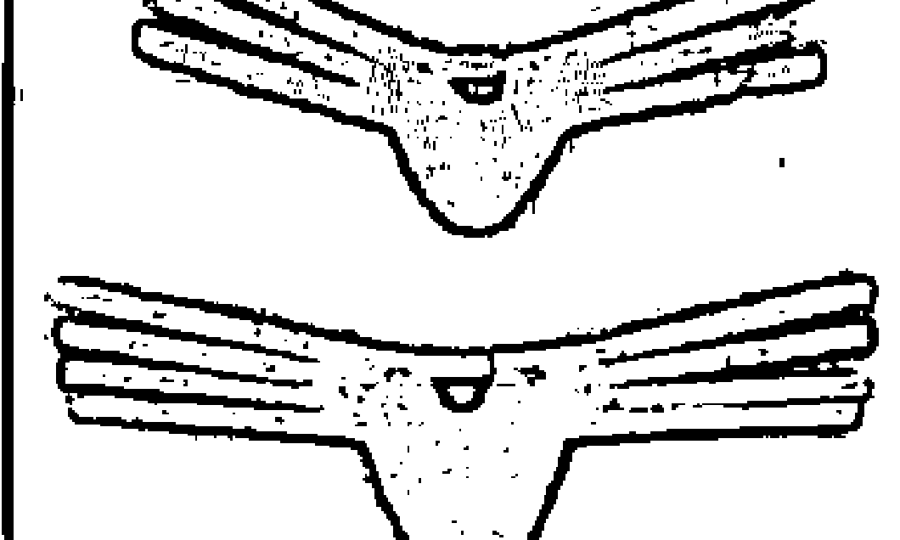

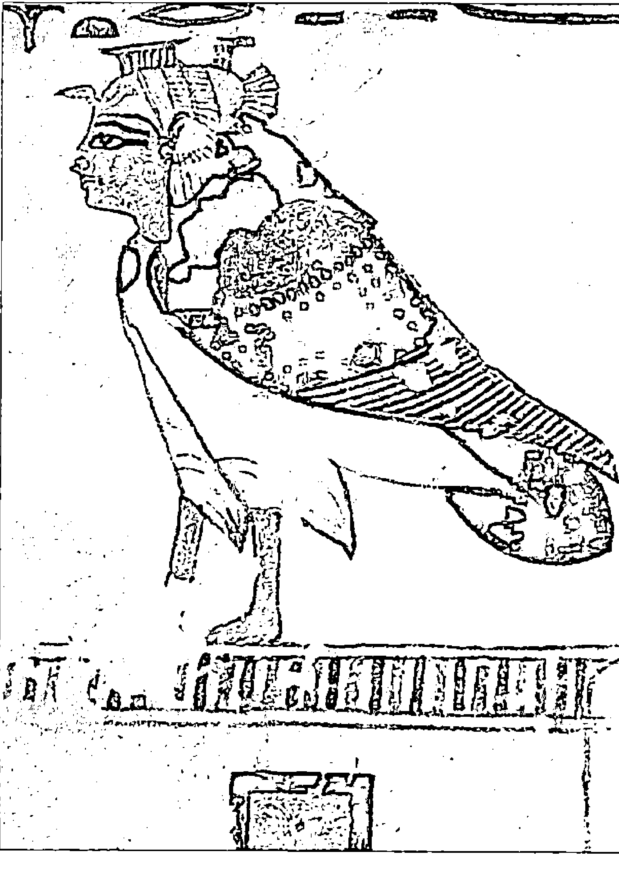

## 蛇文明的终结

蛇和蛇怪在各民族的叙事文学里常常被混淆。它们可能是亲属，不过不是近亲.也许蛇的辈分稍高，因为神话里提及的多是创世之初的宇宙蛇，而英雄、勇士和铁匠大战的是蛇怪.这些疑惑在朝鲜蚺蛇的历史中或许能找到答案。这种庞然大物应当多年蛰伏海底，只有经过变种才能成为蛇怪：若能得到宝珠一颗，这蛇怪还能升天.朝鲜人认为蚺蛇是能带来吉祥的神灵.

+   1. 湿婆神在战败的神龙头上跳舞。2. 会飞的剧毒眼镜蛇乌列依，是保卫太阳、巴和法老的埃及女神乌托的化身。3. 法老埃赫纳通(阿孟霍特普四世)和他的妻子涅菲尔提头冠上的乌列依女卫士。

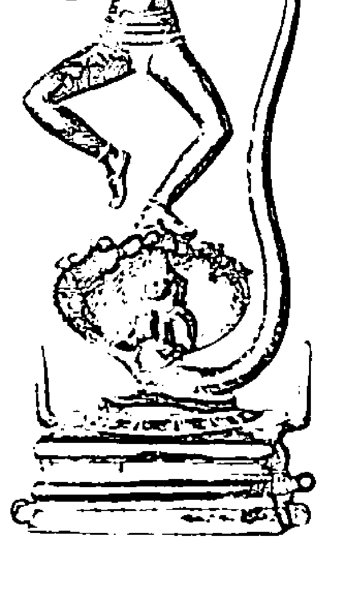

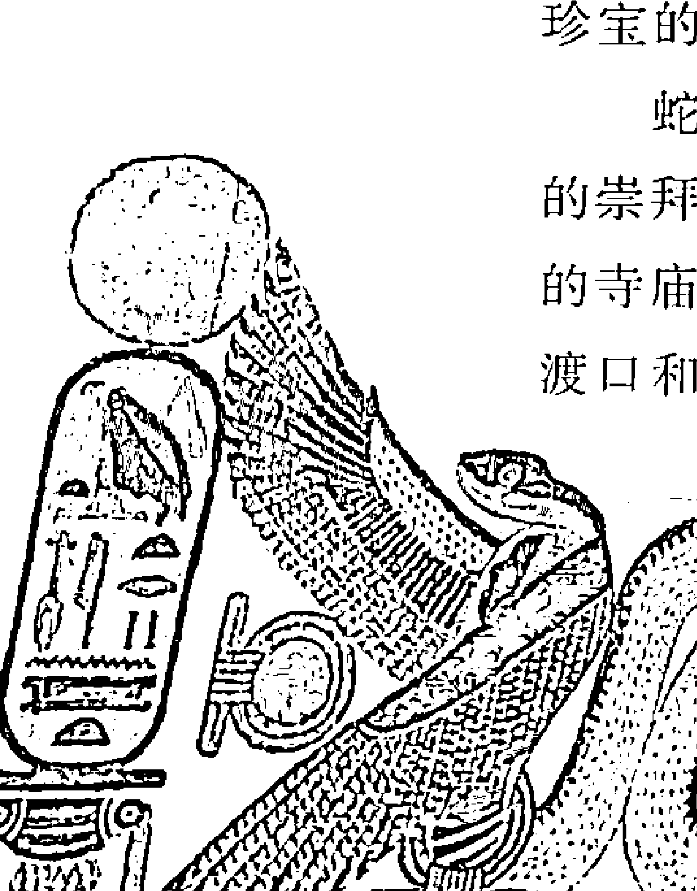

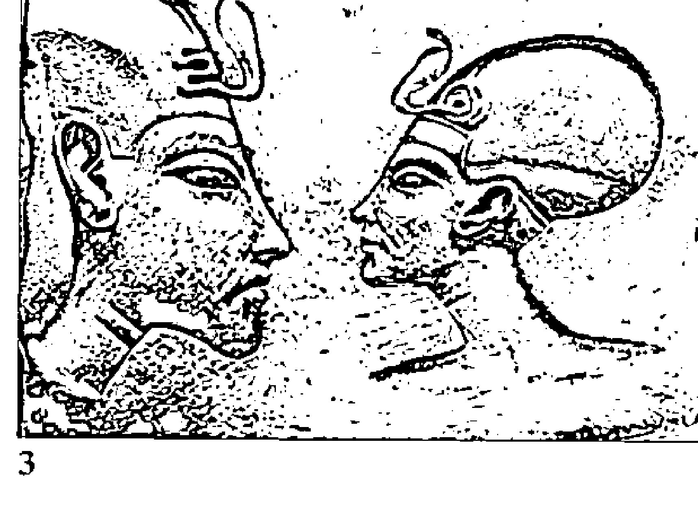

不知为何，蛇怪在东方文化里留下了极其清晰的痕迹.这里认为他是善神，而不是欧洲认为的那种妖孽。最著名的蛇怪叫龙王，汉语直译的意思是“蛇怪之王”.据古文献记载，他与同类的差别是身长出奇(约半公里)，威力无穷.一切自然现象都归他掌管.他有变化的本领，能变成白胡子老人的模样.跟蛇怪一样，龙王住在水下宫殿里，是无数珍宝的守护者.

蛇怪在民间被简称为龙.对龙的崇拜在旧中国特别普遍。供奉他的寺庙遍布城乡，往往建于河、湖、渡口和井边.祈求庇护的有海员、

农夫和卖水人.他们确信水下泉眼由龙王掌管，与大海相连。每遇大旱，人们就把龙王塑像或者手持龙杖、头套龙首的老者从庙里请出，放到太阳下暴晒.向龙王证明受灾程度，让他感到内疚。如若无效，便将塑像直接抛入水中。中国皇帝视龙像如同活物:向他求教，给他授爵，或因某种过失而将他发配充军。越南龙陶昆很像中国同类，他也能变成白发老人.然而与龙王不同的是，陶昆更平易近人。他不住大海，而与人为邻，同居一室。因此越南人相信，他们的龙什么都看得见，随时会出手相助。他们长年辛勤劳作，只是农历新年前告假一周，上天谒见寡皇，小住几日。而人间这几天严禁动土。历尽艰辛的土地在这几天休养生息，新年伊始才醒来投入新的劳作。

朝鲜龙阴王受到特别的尊敬。就连他的名字也很瘆人，因为它的意思恰好就是“阴曹之王”。江河湖海一切水域都归他管辖。四海龙王及其妻女和虾兵蟹将构成他的随

从。他的麾下还有全部五色水下王国的龙主：绿、红、黄、白，还有黑龙——北方和冬天的守护者。 阴王乘辇可随意下海上天，引来人间朝廷的更替。在他的宫殿里，日月可找到歇脚之所，应邀前来的也有凡身肉胎。

早在三国时期（公元前1世纪至公元7世纪），朝鲜人对阴王及其手下崇拜成风。许多开国者都以与龙有亲缘关系而感到骄傲。新罗开国皇帝的母亲说，她是从龙的左肋生下的。百济武王的母亲坚信不疑，她的儿子是她跟龙睡出来的。而这被认为是巨大的荣耀。

欧洲则不同。宙斯用计战胜了百头怪提丰。阿波罗斩杀了巨蟒皮同。赫拉克勒斯打败了勒尔那的九头水蛇许德拉。蛇足巨兽们注定要受苦受难：或被困锁山岩，或被打进地狱。浴血奋战的斩蛇英雄有：斯堪的纳维亚一日耳曼人西古尔德、拉格纳尔、弗罗蒂、洛得伯罗克、沃尔夫季德里赫。斯拉夫人也不甘落后：伊里亚·穆罗维茨和多勃雷尼亚·尼基季奇、杜奈和波托克挥剑斩蛇怪；铁匠柯斯莫杰米扬痛揍蛇怪，让他拉犁在基辅城周围翻耕一大片兹米约夫土丘，蛇怪如约完成劳作后，铁匠仍将他处死了。

蛇的家族时时处处遭殃，每个骑士都认为自己的义务就是斩杀哪怕一条蛇怪。其实，被杀的蛇怪也不一定都有偷女霸妻的罪孽。在献给苏美尔英雄宁季拉斯的赞歌里就特别指出，他斩杀了一条“善良的蛇怪”。 满身羽毛的蛇怪凯察尔夸特尔离开崇敬他的托尔特克印第安人

时，许诺几百年后重返故里。他履行了诺言。然而当他返回现在时，美洲已面目全非：汽车司机们当众指责他、嘲笑他，认为他是蹩脚的广告宣传。蛇怪痛苦而羞惭地大叫着东奔西突，越过大西洋，逃往东方，奔向太阳升起的地方，因而错把斯堪的纳维亚的灯塔当成太阳，一头撞死了。或许，浑身羽毛的凯察尔夸特尔就是理智的蛇怪家族里的最后一员……人胜利了。

+   4. 消灭蛇妖的骑士，是许多画家喜爱的题材。瓦西里·康丁斯基的油画《圣格奥尔吉和蛇》。 5. 上帝斩杀海中巨兽利维坦。古斯塔夫·多莱为《圣经》所作的插图。

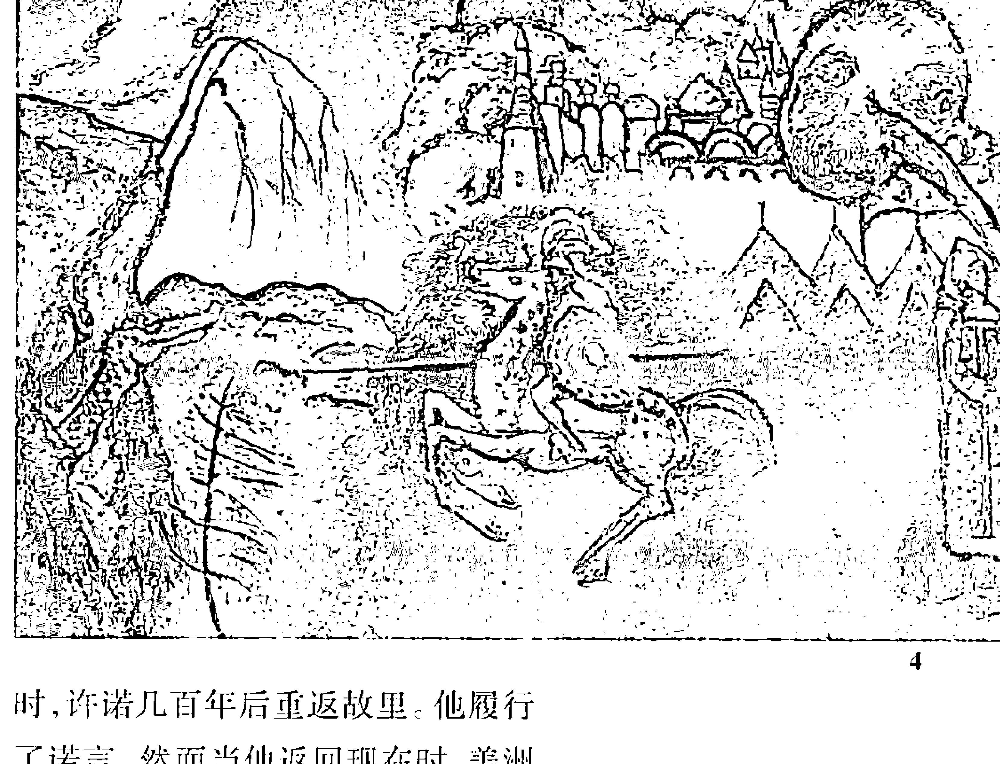

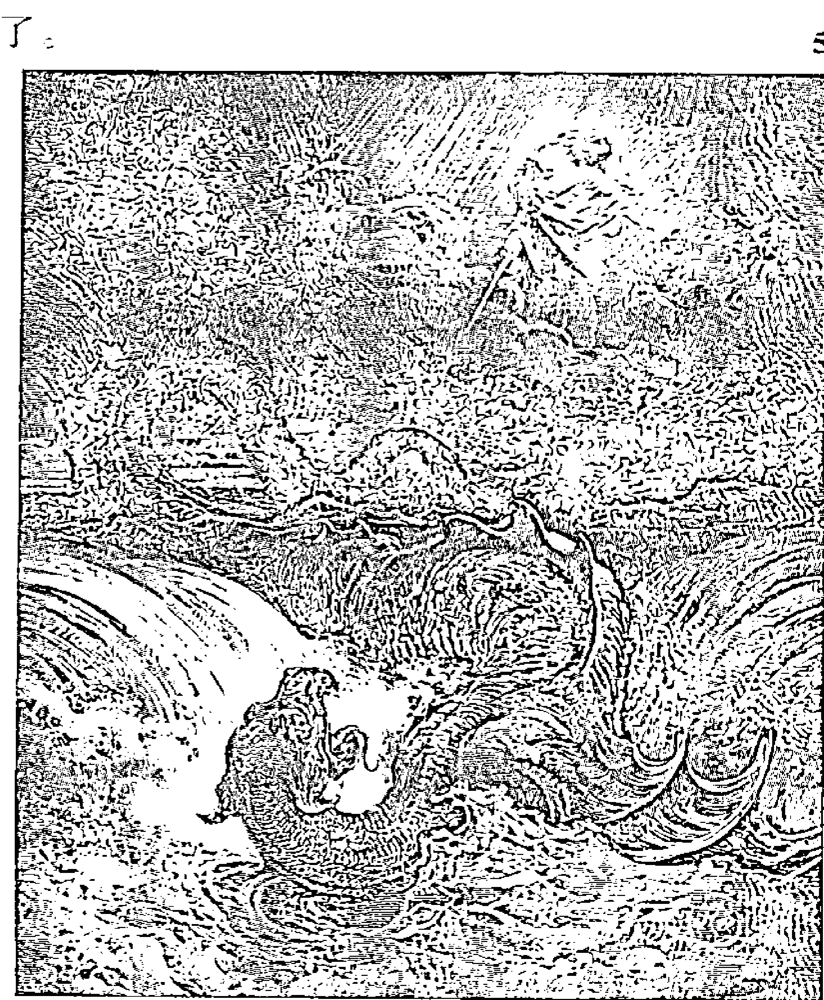

## 传说中的狼和狗

+   1. 赫拉克勒斯的一次功勋——为得到三首恶犬刻耳柏洛斯而征讨冥司。宙斯之子将战败的恶犬带出地狱时，它嘴里流着哈喇子。据传说，哈喇子所滴落的地方，立刻会长出毒草乌头。

+   2. 伊特鲁里亚人常用绘画来表现传说中的狗和狼。花瓶上画着一位飞仙站在地狱守卫者——三首恶犬刻耳柏洛斯的身旁。公元前4世纪。

+   3. 古埃及神安努毕斯——冥土灵魂的向导，通常被画成黑色胡狼或狼头人身的样子。有时它的身份是萨布狗——神的判官。

正当蛇怪在世界各民族的叙事文学里渐渐消失的时候，陆续前来接班的是狼和狗。通常认为，公元前4000多年，古人终于驯服了狼，正是那时出现了最初的狗——猎人的助手和朋友。然而一切并非那么简单：神话里的动物都有神奇的本领，能够变化成别的动物，甚至人。家族起源于狗，当时被认为是一种荣耀，这说明命中注定会成为神仙、皇帝或英雄。“狗的子孙”就有日耳曼–斯堪的纳维亚的英雄阿特利、爱尔兰的库胡令、蒙古人博东察尔——成吉思汗的祖先，等等。

最高天神的标志物一定是狗、仆人和使者。印度神因陀罗的狗叫飞毛腿萨拉马，它生了一批沙巴尔恶狗，替死神阎罗王看守地府。斯堪的纳维亚的雷神奥丁的狼狗叫盖利和弗列基——老饕和馋痨。这样的狼狗格鲁吉亚的格梅尔奇也有几条。他常派它们下凡帮助或惩罚人类。斯拉夫人没能记住雷神佩伦的一群狗，但这并不说明古斯拉夫万神殿里没天狗。其中一条就是霍尔斯，基辅为它立塑像时，弗拉基米尔大公还当朝。

在白俄罗斯，人们要在斯塔夫罗斯祖先纪念日举行庆祝会。斯塔夫罗斯就是昔日波依大公的两条狗——斯塔夫拉和加夫拉名字的缩写。大公吩咐要像尊重自己的亲信一样尊重它们。狗死后，他特别规定了纪念日，为它们上坟。在狗坟前举行的盛宴通宵达旦。

纪念死狗有着久远的历史根源。比如，在古伊朗，人们要供奉影响极大的弗拉瓦什灵位——不仅是人，还有动物的牌位。许多民族的

人都相信，正是一些狗在守护冥府的大门。

在古埃及，守护亡灵安息的是胡狼阿努比斯和狼伍普阿特，就像伊特鲁里亚人的狼卡鲁一样。亡故的阿兹特克人不可能独自到达极乐世界，他们得骑上一条小红狗。离开人世的古阿布哈兹人试图通过鬃毛桥进入冥府时，有只猫会千方百计地干扰他：往桥上抹油，让人滑倒，跌下深渊。给他解围的是条小狗：它把油舔掉，降低通往极乐世界道路的难度。

守卫地府的希腊三首犬刻耳柏洛斯的相貌极其可怕：它全身充满致命的毒素——从它的肚子里长出的毒蛇不停地蠕动；尾巴尖上有根尖锐的毒刺；三张嘴边流着带毒的哈喇子。哈喇子滴在地上，立时长出一棵棵乌头花，女巫师美狄亚熬制魔汤用的就是它。

然而，斯堪的纳维亚的宇宙狗芬里尔，可能比它所有的同类都厉害。手艺高超的守护神阿尔维用奇特的材料（猫步的声响、山脉的根须、飞禽的唾液、鱼虾的气息）打造出极其结实的链条，才得以制伏芬里尔。就连这种链条也用不长久：它一旦被挣断，芬里尔逃脱时，那就是世界的末日。狗会吞掉太阳，永恒的黑暗也就随之降临。

其实，狗跟人一样，有恶也有善。中国的天狗本身就是神灵。它的出现意味着和平和安定。它有狐狸那样火红的毛皮，雪白的脑袋，用自己的吠声防止灾难和不幸。亚美尼亚神灵阿拉列兹的祖先就是狗，能证明这一点的就是它们的行为：

它们来自天堂，为了舔净阵亡者的伤口，让他们起死回生。亚美尼亚神阿拉·盖黑齐克就是它救活的；宇宙树上住着一条印度-伊朗飞狗桑穆尔夫，它不仅管理天空，还管理大地和海洋。会飞而又对人友善的还有斯拉夫的灰狼。它根本不是被人驯化的野兽，也不是图腾崇拜的动物：奔跑起来，穿越群山如履平地，而且比人聪明，能先知先觉。有些狼的名字就叫恶和战争的预防者、疾病的破坏者……这一主题将在下一章叙述。这些名字里没有半点嗜血成性和憎恨人类的影子。多半是我们自己、我们对狼的态度，将智慧和强大的朋友变成了敌人。

4. 俄罗斯人是拉先（伊特鲁里亚人的自称）的直系亲属。民间故事中保留着聪明的大灰狼——流浪王子的帮手形象。维·瓦斯涅佐夫为童话《王子伊万和美女瓦西里萨》所作的插图。

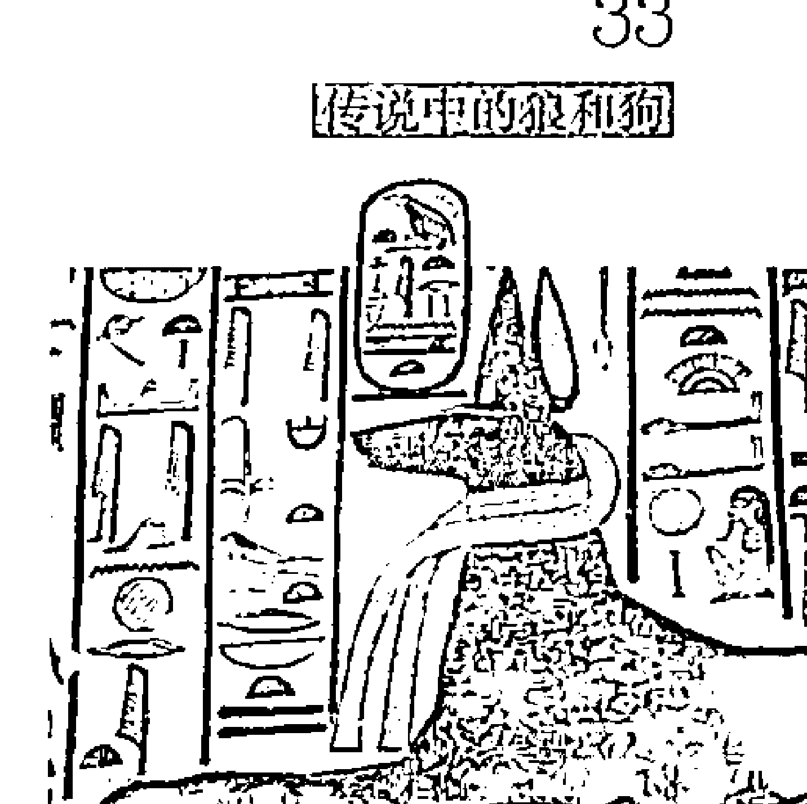

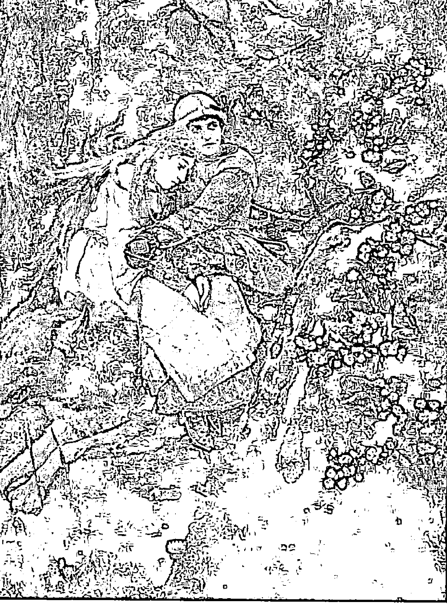

## 会变化的怪物

1. 许多部落都崇拜过这种或那种动物：印加人崇拜美洲狮；俄罗斯人——“豹人”，崇拜豹。今厄瓜多尔境内生活过托利塔-丘马科部落。他们跟猫人攀过亲，可以证明这一点的是现实主义风格的塑像《小男孩儿》。公元前1000年。

2. 古代居住在西欧的许多民族，包括凯尔特人和挤走他们的日耳曼人，都相信有会变化的人。最为流行的是关于好狼成癖者的概念。据民间的传说，人狼夜里穿上狼皮，白天脱掉。然而

神仙能任意改变自己的模样，变成这种或那种动物。宙斯与情人约会时就是这样做的。妖魔同样有变化的本领。爱沙尼亚的林妖梅特萨瓦依玛有时变成牧兔的男孩儿，有时变成后身像烂树桩似的半人，有时变成熊、狼或者蛇。跟妖怪婚生的孩子也能变化。狗的儿子——爱尔兰英雄库胡灵，临战会突然变化：“这时他变得多面、可怕、难认、古怪：大胯、肢体、关节全都抖动起来。皮下肌肉离奇地凸了出来，脚后跟、小腿肚和大腿冲着前面……”

尔塔克——“游走狼”，跟真正的狼毕竟有所区别：变狼后，人的牙齿不变，跟人一样的思维不变，但语言能力却会丧失。这些不幸的造物多半是被乡村巫师诅咒的，只有等他们死后才能恢复原形。他们身上会重现原来的物品：领带、琥珀项链、念珠、订婚戒指。

斯拉夫的好狼成癖者知道，要想变化，就半夜时分去林中空地，空地中央有个树墩，往树墩上插把刀，念过咒语，三次跳越树墩。要想恢复人形，应当返回空地，站到先前外形发生变化的那一点上，念过咒语，以相反的顺序跳越树墩三次……只要一个细节出错，就永远变不回来了。从今往后，要辨认他们只能看眼睛，那眼睛聪慧而充满难以形容的惆怅。

俄罗斯会变化的大公沃尔赫出世那一刻，大地一阵颤抖：“鱼游回蓝色的大海，鸟飞往九霄云外，兽奔进茫茫森林。”快十岁那年，他掌握

了变化的诀窍，能变鹰、狼或野山羊。沃尔赫召集近卫部队，出征讨敌。一路上，让官兵惊讶不已，他让他们变狼逮野兽，变鹰捉野禽。他们不睡不歇，官兵们累坏了。来到敌方城下，沃尔赫又摇身变成白

## 传说中的马

传说中的八骏是：赤骥、盗骊、白义、逾轮、山子、渠黄、华骝、绿耳。《天子穆传》中说，神马足不践土，行越飞禽，夜驰千里。其中一骏，身有肉翅，兄弟七骏，皆不相让。

亚美尼亚叙事长诗《大卫萨舜斯基》中描写了一匹神马，叫库尔基克·扎拉利。英雄萨那萨尔得到了它，下到住着许多骏马的海底。跟俄罗斯童话里的神马一样，这是匹能喷火的马，它不仅能蹄踏敌人，还能鼻喷火焰，将他们烧成灰烬。

应该说，希腊海神波塞冬并非始终是水域的主宰：宙斯、冥王和波塞冬三兄弟瓜分宇宙之前，后者是骑兵的庇护神——他去海底时带走了战马，因此塞萨利亚人拜波塞冬为马神。

苏格兰的海草神是匹湖马。它常以在水边吃草的骏马形象出现，建议过路人骑上它到湖底兜兜风。人们记忆中保留的不仅有战马，还有役马，比如，顿河左岸草原上斯堪的纳维亚众神的城市就是巨人和他的役马斯瓦得利法里在极短的时间内建成的。

或许，最先制服神马的是小亚细亚的赫梯神皮尔瓦。在宗教诗中，他被称做“年轻的战士”，跨着骏马，带着猎鹰，从高高的山冈上注视着世界。他的名字的意思是“第一”。

古印度的居民达罗毗荼人也知道骑士神，直接管他叫阿伊那尔——“先生”这位长角的丰收神、人的保护者，有时骑的是象，可是赤陶马毕竟是阿伊那尔庙里必有的典型标志物。

就连诗的象征飞马珀伽索斯也名驹有主——古希腊的柏勒洛丰。其实这是个绰号，意思是“巴罗尔的杀手”，为纪念他战胜一个科林西亚人，他的真名是马叫的名字——吉珀那。

柏勒洛丰借助飞马赢得了一系列令人信服的胜利，可他骄傲起来，决定攻打诸神居住的奥林匹斯山。宙斯放出牛虻，咬了马一口。马狂怒之下甩掉骑手，骑手虽然没死，但腿折眼瞎，失去了理性。衣衫褴褛的他在阿列伊山谷（流浪谷）乞讨度日，直至临终。而由被珀尔修斯所杀的戈耳工林妖墨杜萨的滴血所生的珀伽索斯却上了奥林匹斯山，在宙斯身边听用，为他安排雷电。有一天，飞马下凡，一蹄刨下，掀开灵泉——可赋予诗人以灵感的马泉。

起先，这些骄傲的奇蹄目动物无拘无束，不承认自己上头还有神权。它们天马行空，任意驰骋。就连神仙自己也不反对变成骏马，不反对以它那强壮之躯领略一下情欢艳遇。只是后来，因为懒惯了，这才制伏了这些骄傲的动物为己所用。

## 古希腊的神话，映在伊特鲁里亚人的镜中反射出来，往往面目全非。如果说希腊人只有一匹飞马珀加索斯，那么地中海沿岸的邻居就有俩。或许，伊特鲁里亚人是以此嘲笑一下亚该亚人、伊奥尼亚人和多利安人的天真信仰。然而，拉斯人的工匠们创作的如此杰出的艺术品，至今仍令人赞叹不已。他们的后裔——古罗马人未能达到雕刻的这种高峰。而岁月一再强调：古罗马早已崩溃，稀世飞马却千古长存。

## 神仙的坐骑

天神的坐骑各种各样，有猪、鹅、山羊……阿波罗更喜欢四套马车。他的四骏就这样被刻画在公元前500年的希腊高浮雕上。该题材大受欢迎，几个世纪后，艺术庇护神的驷马双轮车被安放在莫斯科大剧院正面的三角门梁上。

早在人类之先，神仙、精灵和英雄巨人就驯服了骏马。从此，诸神每日云游天堂就乘坐金马黄辇了。战神们则摒弃车舆，跨马驰骋。喷火黑马成了阴曹的象征。

## 希腊的红胎双耳罐上刻画着“绯红的”黎明女神厄俄斯。她坐在套着双马的马车上疾驰。女神飞驰在大海上——马蹄下有海豚的身影。公元440年左右。

## 画家B.克莱恩将希腊神话设计在油画《涅普顿的骏马》上。白鬃海马可能是白沫海浪的隐喻。而在不列颠和爱尔兰，人们所熟悉的是淡水马。

## 独角兽

天马的这位亲属，身处凡间，但不服任何人管，也不属于任何人能制伏它的只有黄花女。

公元前3千纪，古印度文明就在书里记下了一种独角公牛，它可能就是独角兽的先祖。

最神奇的独角兽在古波斯：一条腿、六只眼、九张嘴、一只空心角，它立于大洋之中，用那神奇的独角清除着浪里的污秽。

在古中国，独角兽叫麒麟。从不同的描述来看，它是鹿身而个头稍小，狼颈、牛尾、单角，角从脑门长出，顶端有个软疙瘩，它的毛色各不相同：有白的，有花的，有栗色的，也有浅绿的。麒麟是种神物，有时能飞；如在陆上行走，它不会踏倒一棵小草，也不会踩到一只哪怕最小的昆虫，所有野兽都尊它为王，听它指挥，人们认为，麒麟现身意味着安定和繁荣，或预示圣贤将出世。

## 肯陶洛斯·半人半马怪

在希腊神话里，赫拉克勒斯以马人的毁灭者而闻名。值得一提的是，肯陶洛斯闻名河间地区，要比希腊人来伯罗奔尼撒早得多。赫拉克勒斯和肯陶洛斯。古代。奥林匹亚。公元前8世纪。

古希腊时期所塑造的马人与古典时期有所不同。

肯陶洛斯的特点是性情粗鲁，好惹是生非。这表现在瑞士画家阿诺尔德·勃克林的油画《肯陶洛斯的大会战》中。

不知为何，一般都认为肯陶洛斯——半人半马怪在古希腊才有。其实，伊特刺斯坎人的神话里早有关于马里斯——半人半马怪的记载。这位马里斯活到一百二十三岁，两度起死回生。在一面镜子的背面图案里，他被刻画成手持三枚圆锥形权标——人的少年、中年和老年这三个年龄段的象征——的仙翁。肯陶洛斯是天马和仙女结合的产物。他们似乎是在变化过程中突然失去了随意变化的能力：已经不是马，可又没完全成人形。对于神仙，什么形体都能变，什么肉身都一样。在他们看来，人并不强于动物，尽管要理智些。印度女神萨兰亚就曾抛下丈夫，变成了母马。丈夫随即变成公马，在马群中四处寻找妻子，跟她言归于好，重温爱慕与和谐。狡猾的斯堪的纳维亚火魔洛基曾变成母马，勾引帮主人建设阿斯加尔德城的役马。古阿卡得的母道和交欢女神伊西塔，曾被英雄吉尔伽美什指责过分眷恋公马。加上许多别的过错，伊西塔被诸神打入地狱。这一发配的结果很可悲：世上从此不再有恋爱；女人不生孩子；动物渐渐死光；植物慢慢枯萎。因而人们央求她重返阳间，从此不问她往日的过错，将她尊为“万神之灵”、“王中之王”，甚至“凶猛的母狮”。俄罗斯也曾有过一个肯陶洛斯，叫基托弗拉斯。斯拉夫民间文学研究者Г. С. 别利亚科娃写道：“‘基托弗拉斯’一词来自希腊语，然而形象本身的源头当在东方，在古印度。在那里，同样的神话动物叫冈达尔武，多半由此而出现了基托弗拉斯的别名——肯陶洛斯。”

## THE WORLD OF UNSOLVED MYSTERY

## 非神, 非人……

淅淅降下夜幕,
忽闻蹄声突突,
裙声伴着笑语,
好似有人赶路,
经过这片荒漠,
心里记得清楚,
林中便是旧途,
可这林中没路。
——理查德·吉卜林《林中的路》

你得承认,把普通人的视力不可感知的东西进行分类是很困难的。许多人都说,神灵不存在,除非是假设,而半人半神就更是无稽之谈了……

然而古人却熟悉他们,并能清楚地加以区分。最高天使们虽然反射着上帝的光辉,但毕竟不是神。后来天上发生过战斗。天堂的悲哀,柳齐费尔划过一道火红的圆弧,摔下深渊,并得了个新的名字——撒旦,意思是“敌人”。他和他的追随者成了恶魔。也有这样一些天使,他们不偏不倚,未曾参与争斗,因而没受到打入十八层地狱的惩罚,但继续待在天上已不可能。落得灰天使的名声后,他们下凡到了人间。他们是:阿德拉梅利克和阿里埃尔、阿里奥克和拉米埃尔。很可能,他们成了自然界的精灵。人们对仙女和小精灵、财神和土地、水怪和人鱼这些低等神灵的态度各不相同。有人认为他们是恶神,多数人认为他们无害。然而他们是不是臆造呢?是不是民间幻想的结果呢?

没有或者不曾有过的东西,臆造起来是很复杂的。基因记忆所保存下来的东西才能想得起来。安斋·萨普科夫斯基在长篇小说《小精灵的血》里写道：“在河的上游,我们看到了他们的城池,那么纤柔,好像是用朝雾织出来的。仿佛它们眼看就会消散,随着吹皱水面的微风飞走……突然间,在记忆的某些遥远的角落里,浮现出一些蛇怪和狮身鹰首怪、半人半鸟海妖和自然女神、空气女神和森林女神的名字。还有白色的独角兽,它们借着暮色来到河边,朝水面低下那俊美的头。我们似乎重新给它们起了名字。于是一切又渐渐地变得熟悉而亲切了。”

“不光是这些。他们跟我们看来十分相像,可却又格格不入。”

话说的是小精灵。发生了两种文明的碰撞:一是较早的,非人类的;一是较晚的,人类的。我们没能共处,是傲慢自大和互为异类的意识在作怪。一方因为失败而被迫离走;另一方作为胜利者,为了不再担惊受怕,需要忘掉战败者。再说,还记得那些不会再有的精灵干什么呢?

萨普科夫斯基在长篇小说《巫师》中写到人与小精灵的冲突：“‘你们人类这是仇视一切,哪怕耳朵的形状跟你们稍有不同,’一个小精灵不紧不慢地接着说,‘所以,是你们抢占了我们的土地,把我们赶出家园,逼进深山……’

‘是的,我们在挨饿。没错,我们面临死亡的威胁。太阳不是先前的太阳,空气不是先前的空气,水也不是先前的水。我们从前吃的都在退化、在消失。我们从来不事农桑。跟你们人不同,我们从来没用锄头、犁耙折磨过土地。土地如今是用血汗向你们纳贡,而过去它是给我们馈赠。土地从前还为我们长过鲜花呢!因为它爱过我们。是啊,没有一种爱能够长久。可是我们想活下去。’

不过

关于自然界的神灵,俄罗斯的幻想作家达尼尔·安德烈耶夫写道：“小精灵的故事完全不是童话,善良的、迷人的小生物的栖息层确实存在。也可以把它叫做小精灵国。”

隐藏着植物根和种子的地壳表面薄薄的一层,在物质外世界里有自己的对应物——达拉樱娜国,一个培育根和种子的有益精灵的区域。达拉樱娜的居民是些极小的生物,像白色的尖顶帽。每顶小帽上面还有一顶小帽,它更小,就像只小脑袋;还有一对柔嫩而灵活的肢体——介于手与翅之间。他们在空中缓缓地游荡,小帽的皱褶发出沙沙的声响——这就是他们的语言,相互交流的一种方式……

不过

还是让我们来看看跟自然界的神灵——邻居、帮手、敌人、对手——一起相处的古人给我们留下哪些描述吧。

## 天使的官阶

+   1. 俄国画家亚·伊万诺夫的油画《约瑟夫的梦》里，描绘的是一位给他带来好梦的天使。
+   2. 在俄国画家安德烈·鲁布廖夫和达尼尔·乔尔内的画笔描绘了阿尔汉格尔·米哈伊尔。他的名字在古闪语里的意思是“像上帝一样的人”。
+   3. 最高天使中最不一般的就是“轮”。有些学者甚至认为他们来自其他星球。
+   4. 天使的主要义务是赞颂上帝。在天主教的绘画里，这往往表现得很直接，将上天造物刻画成吹拉弹唱。
+   5. 天上除了拯救人的灵魂免遭魔鬼阴谋的天兵天将以外，还有许许多多的势力。公元最初几世纪的早期基督教马赛克画。
+   6. 在圣像壁上，安德烈·鲁布廖夫和达尼尔·乔尔内的画笔描绘了阿尔汉格尔·加夫里尔的形象。他名字的意思是“神的力量”。他通常以上帝的使者面目出现，他的使命是向人们揭示一些预兆的含义。

天上的精灵，诸神的使者，联系人类及其创造者的独特的生命线，他们为许多民族所知晓。古斯堪的纳维亚的海盗管他们叫瓦尔基里娅，古希腊人管他们叫奥拉，波斯人管他们叫弗拉瓦什，可也有人常常将他们与救难女神佩里和无性的女人气的古里娅混为一谈。古罗马人知道他们是保佑人的神灵，而印度人将天上的高等精灵叫做阿苏尔，低等的叫阿普萨尔。天使也存在于拜火教、佛教和道教中，他们还为亚述和美索不达米亚的贤哲所熟悉。摩尼教信徒的传奇里充满着对天使的信赖。萨满教的活动都是以结识飞行信使为前提的。天使是分三等九级的各种精灵的总称。其中的第一等或最高等，是宝座、撒拉弗和基路伯。

被称为宝座，是因为他们比其他天使离上帝宝座更近，是奉献和牺牲的最高力量。关于他们，当代学者索菲·别尔恩海姆在自己的《天使集》中写道：“在上帝的宝座旁，天使们是无形的，他们在那里是一股纯洁的初始能量，硕大的、神通的火球，像一颗颗超新星，盘旋、回转、疾驰在黑色的空间。他们被称做轮或座，而且不可能被象征性地描述出来。然而看到过他们或听到过他们震耳欲聋的缄默的神秘主义者们，无不为这一股力量所折服。”不过，有时宝座们被画成带翅的火轮。他们的身体仿佛是由无数只洞察秋毫的眼睛所构成的。也许，他们是天使中唯一没有一点儿人样的。

火神撒拉弗在他们那生着六只翅膀的体内，体现着博爱的大宇宙原则。他们的名字在迦勒底语里，意思是“爱”。他们的外貌在旧约《以赛亚书》里有相当详尽的描述：“其上有撒拉弗侍立，各有六个翅膀：用两个翅膀遮脚，两个翅膀飞翔。彼此呼喊说：‘圣哉！圣哉！圣哉！万军之耶和华，他的光荣充满全地！’”

由于根深蒂固的误解，有人认为基路伯是低等天使，并把它们画成带翅膀的小孩子。其实，基路伯是最高一等的上天造物，象征着智慧和无穷的力量，他们是天界的守卫者。基路伯比宝座和撒拉弗更像人：“还可以看见基路伯的翅膀下有一双人手的类似物呢。”

关于天界最高神灵的职责，爱德华·舒尔在《神的进化》一书里写道：“最高一等( 宝座、撒拉弗和基路伯)是幸福和鼓舞力量的三位一体。这些力量在宇宙范围内发挥作用，构成天界的一部分，因为他们实际上像上帝一样高居于空间和时间之上，他们在时空里显现着上帝。”

接着是天使的第二个三位一体——权力、力量和统治。公元5世纪，拜占庭神学家狄奥尼斯·阿列奥帕希特认为，统治是他们当中的第一级，排天神官阶的第四位。如果说一等天使的职责是散布神光、智慧和灵感，那么二等天使的职责就是调节和平衡。最高天使管理宇宙，中层天使则管理行星，其中包括我们的地球。如果说一等天使是在星际空间传播思想，那么二等天使则是协调一切存在的形式及其运动，缩短总体思想具体落实的过程。

与人类过往较密的是第三个三位一体——天使主管、天使长和天使本身。他们管理个人和圣火的思想，甚至人的生活。他们这支战斗队肩负着最为复杂的任务：地球对于他们就是战场，而人类就是这场战斗的目的。扬·汪·鲁伊斯勃卢克在《官升七级》一书中说：“天使的最高一等( 撒拉弗、基路伯和宝座)不参与我们同罪恶间的斗争。只有当我们超越一切分歧而与上帝在外部世界、自我内心世界和永恒的爱上结为一体时，他们才会跟我们一起。”的确，人家是管理宇宙星系的，哪能弄得清我们每个凡人的苦乐呢？只有天使们，按民间迷信传说，才始终待在每个人的右肩后面，了解我们的酸甜苦辣，并在我们困难的时候连忙伸手相助。

尔·乔尔内所画的圣像上，刻画了在犹太教、基督教及伊斯兰教里闻名的天使阿尔汉格尔·米哈伊尔。他的名字在古闪语里的意思是“像上帝一样的人”。

天使也存在于拜火教、佛教和道教中，他们还为亚述和美索不达米亚的贤哲所熟悉。摩尼教信徒的传奇里充满着对天使的信赖。萨满教的活动都是以结识飞行信使为前提的。天使是分三等九级的各种精灵的总称。其中的第一等或最高等，是宝座、撒拉弗和基路伯。之所以称为宝座，是因为他们比其他天使离上帝宝座更近，是奉献和牺牲的最高力量。关于他们，当代学者索菲·别尔恩海姆在自己的《天使集》中写道：“在上帝的宝座旁，天使们是无形的，他们在那里是一股纯洁的初始能量，硕大的、神通的火球，像一颗颗超新星，盘旋、回转、疾驰在黑色的空间。他们被称做轮或座，而且不可能被象征性地描述出来。然而看到过他们或听到过他们震耳欲聋的缄默的神秘主义者们，无不为这一股力量所折服。”不过，有时宝座们被画成带翅的火轮。他们的身体仿佛是由无数只洞察秋毫的眼睛所构成的。也许，他们是天使中唯一没有一点儿人样的。

火神撒拉弗在他们那生着六只翅膀的体内，体现着博爱的大宇宙原则。他们的名字在迦勒底语里，意思是“爱”。他们的外貌在旧约《以赛亚书》里有相当详尽的描述：“其上有撒拉弗侍立，各有六个翅膀：用两个翅膀遮脚，两个翅膀飞翔。彼此呼喊说：‘圣哉！圣哉！圣哉！万军之耶和华，他的光荣充满全地！’”

## 其他民族的天神

+   1. 有翅妖魔、半人半兽,为许多东方文化所熟悉。乌拉尔图,亚美尼亚。
+   2. 墨西哥韦拉克鲁斯州印第安人的鹰神状鼻饰。中美洲。公元10-16世纪。
+   3. 伊斯兰教禁用活物图形。伊斯兰天使马来依克的这幅图案实为一般准则中罕见的例外。
+   4. 亚述人威力强大的神——让人免受妖魔祸害的保护者。
+   5. 印度的犍陀罗仙不用翅膀也能翱翔蓝天。他们也有性别——男和女。作为天庭舞女——水仙阿布沙罗斯,她们抛却虚伪的自重,迷惑的对象既有众神,也有不能长生的英雄。

如前所说,天界的飞行使者为许多民族所熟知,就连希腊语的“安琪儿”,在成为上帝使者的称呼之前,就是宙斯和赫拉的女儿的名字：人们叫她“安格拉”,或者叫英国化的安热拉。托付自然女神养育的小姑娘日子过得乐乐和和,无忧无虑。她一心想着快些长大,成为真正的美女。为加快这一过程,她从妈妈身边偷来化妆品,尽已所能,浓妆艳抹。可后来她害怕了,因为赫拉一定会生气,大概会惩罚她。她胆战心惊,连忙躲了起来,先跑进一个产妇家,接着改变主意,又躲进一个亡女家。恶魔卡比尔抓住死者的阴魂,又随手捉住吓得筛糠似的安格拉,飞往冥府,并在阿哈鲁依湖里给阴魂和安格拉洗了澡,这一来返回阳世就不可能了。

宙斯的妻子弄清了原委,原谅了小淘气,急忙前往营救。可是晚了一步,安格拉已属于阴曹了。从此她要去阳间,除非是为了接收死者的阴魂。可怜的姑娘成了死神安琪儿……

然而,印度天庭的舞女可没空寂寞,迷人的美女成天玩得筋疲力尽。据《梨俱吠陀》所载,当神仙和恶魔来到水界搅起泡沫以得到长生水——甘露时,水中女仙阿布沙罗斯们才偶尔出现。美女们原本乐不可支——眼前这么多潜在的未婚夫.可是谁也不肯聘娶她们。受了委屈的姑娘们飘然飞往天庭,过起了自由的生活.她们相中谁,就能慷慨献身.疯狂的爱恋不仅送给神仙,而且还送给人类。所以,甚至有过摆脱天女魅力的咒语。

水中女仙也分等级,最高的叫傣依卡,是神仙的密友,最低的跟人有关系。起先她们只有十来个,后来自从茫茫天穹里繁衍至几十万. 其中有名的有：密娜卡、乌尔瓦什、普拉姆洛查、占洛塔玛、等等 通常她们是诸神的“特别使者”：被派去迷惑潜心修炼的妖魔或苦行僧. 因为他们得道后能与神仙分庭抗礼. 所以必须将他们诱入歧途. 密娜卡就以自己的舞姿迷晕了隐士维什瓦特尔，跟他生下一女叫沙坤塔拉. 她的女友拉姆波哈想步其后尘，再建“爱勋”，结果几乎可以说是落得个大火所望：维什瓦特尔不仅没被她的美色所迷倒，反而一怒之下，将她变成了石头.

怀端坐；宫殿之前，摩肩接踵！神灵圣贤熙来攘往，仙娥舞女小跑疾步，琴师鼓手紧跟慢随. 宫殿高墙重门，四大天王严密把守，以防下界的妖魔鬼怪混入这天堂仙境.

天仙有时也会下界. 三位朝鲜天使就降临人间，建立了耽罗国.《高丽史》中记载着他们的名字：梁乙那、高乙那和夫乙那. 他们很可能是下界逃难的——至少没打算返回天庭 起先以打猎为生，后来娶了三位日本公主，生儿育女，饲养牲畜，从事农桑.在射出的箭矢落下之处，修建了三座城. 这三位天使至今被认为是三个大姓——梁、高、夫——的祖先.

印古什的混血儿谢拉-萨塔为天神和凡人所生，是位非常漂亮的女子. 她非但没有下界，反而往上迁移. 她活动的痕迹直到现在还留在夜空中，银河就是她抱往上天铺洞房时用干草撒下的碎屑.

天神，远远多于地上的人类，这一点很容易理解：你抬起头来——我们的星球之上，长空深不可测，宽不可量，层不可数. 地球上既已人满为患，那为何太空却依然寂寥空虚呢?

后来，水中女仙们找到了较为可敬的职业——为战死的英雄们抒怀解愁. 他们需要医治心灵的创伤、恢复为活着而高兴的能力. 各个国家战死的士兵都不计其数 穆斯林的战士有迷人的救难仙女佩里们送来温存. 斯堪的纳维亚的战争女神瓦尔基里们并非坐等阵亡战士的英魂自己摸到瓦尔哈拉宫，而是主动前往战地搜寻他们.

然而. 不要以为天庭的精灵都是女性. 中国的二十八星宿上可能居住着大量的天神。连它们的最底层——兜率天. 也建起了十分轩敞的宫殿群：中央大殿，弥勒尊佛敞

## 巨人

神话中的英雄，是像斯维亚托戈尔这样的巨人同凡女的爱情结果。弗鲁别利的油画中所描绘的显然是巨人变小的后代。

巨人的颅骨，1911年发现于美国拉夫洛克洞穴中。出土文物的总长度为两米半。

塞赫梅特女神的主要义务是，保护法老，陪伴法老作战，以自己威严的长相和雷鸣般的嗓门儿吓唬敌人。

从凯尔特人的这幅浮雕来看，巨人和人并不总是共同作战的，更常见的是他们互相为敌。

希腊的提坦诸神和巨人，斯堪的纳维亚的耶通和苏伊斯，斯拉夫的沃洛托克和珀洛尼克，印度的达纳福和卡乌尔，兴都库什的尤什和阿巴斯，都比诸神年长。他们都自认为是开天辟地的始祖之后。印度人把始祖称为普鲁沙（原人），斯堪的纳维亚人称其为伊米尔，中国人称其为盘古。身躯庞大而心地憨厚的人们便成了我们星球的第一批移民。再说跟谁去耍心眼儿呢？他们又没有对手。然而，时世变迁，岁月流逝。如同小天使与人类争夺大地的主宰权一样，古时的巨人也跟诸神动起了干戈并败于他们手下。斯堪的纳维亚的奥丁把一拨手下败将发配到耶通海姆，把另一拨驱赶到雾乡尼夫利海姆。还有一拨，奥丁在遥远的北方给他们划了块地，叫李斯兰德，好像就在欧洲和格陵兰之间。希腊的天神乌拉诺斯将自己的几个体形庞大的儿子打入了地府。哲人赫西俄德在《论神仙的起源》中说，父亲对几个儿子的勇猛、相貌和身量感到吃惊，遂心生怨恨，将他们囚禁于地府。

因陀罗取得了对于达纳福的辉煌胜利之后，把他们赶进无法穿越的森林和难以进入的山区。从此，他们便居住在地洞、山谷和密林里了。

亚美尼亚的巨人阿米拉尼暂时也藏身于山洞。高加索山区的群峰之上，常有壮士纳尔塔骑着高头大马疾驰而过。只有多石的土壤才能撑得住斯拉夫巨人斯维亚托戈尔那超常的体重。壮士米库拉·谢利亚尼诺维奇是过路的，可他的旅行袋里藏着神秘的重物——地力。

大海之母伊莉塔玛尔所生的卡累利阿——芬兰的壮士维亚依涅梅年，能在海上长时间地奔波，直至到达陆地。他栽下的第一棵树是橡树，那橡树长得粗壮无比，枝叶掩盖全国，遮天蔽日。壮士自己也无力将它砍掉，只得向母亲求援。他话音刚落，只见从水底钻出一个侏儒，身披铜盔甲，“身长不过一指”。维亚依涅梅年讥笑小铜人道：“说实在的，你算哪门子男子汉？哪门子壮士？你也就比僵尸有点样儿，比死人多口气儿！”没等他把话说完，小人儿摇身变成了巨人，脑袋直顶云霄！他三板斧砍倒橡树，让大地重见了阳光。

诸神战胜了巨人，把他们赶走，也就不再理睬他们了。兴都库什的尤什着手建筑庞大的城堡，清除鹿砦，加固隘口的城墙；斯堪的纳维亚的特罗利亚们在苦役矿场一刻不停地干活；雅库特的独眼阿巴斯们在不断地创造一些无用的，在人类看来甚至是有害的动植物。

巨人们或许还能这样活到今天，若不是人类将他们视为祸根的话，人类跟巨人拼力气显然不行，他们用计谋取得了胜利。

梅格利尔人的童话《人、巨人和狐狸》里说：“古时候，巨人越来越多……会说话的野兽们传出话来，说出了一种无所不能的动物——”

人，于是巨人要跟人比一比气力，可是他碰上了一个过去从没见过的滑头儿：梅格利尔人皮季鲁什把巨人绑到树上，抡起斧子，照着动弹不得的巨人的脑袋就砍：‘你这是干什么？’巨人叫道，‘要比试，就把我放开呀！’‘我这是先试一试，看值不值得跟你比。’皮季鲁什回答，嘴上虽这么说，可他只管一斧又一斧！欣呀欣——就这样把巨人砍死了。”

斯堪的纳维亚的编年史作家斯诺里·斯图鲁森在《环球》中描写过一个卑鄙的巫师，他借着拜过的奥丁神的名义云游欧洲，来到北国，从巨人手中骗走了土地……

总之，巨人被赶出自己的家园，被消灭了。最后剩下的带巨人血脉的是些女壮士，她们远离人类，必要时还能抵挡一阵。可是，没有男性，孤掌难鸣，女壮士们渐渐死绝……地球上又有一种智能动物越来越少了。

巨人的部族并未被彻底消灭，至少有一位活到我们今天。英国多塞特一个冈坡上的这幅画的高度为五十五米。

## 守护神

只有日耳曼各部族及其近邻才知道守护神，这一说法是不对的。最初的一位守护神，在日耳曼人知道守护神之前很久，就在古埃及出现了，人们叫他拜斯。拜斯的主要任务就是看家护院，让人不受恶魔欺负。他的塑像跟其他神和人完全不同：矮个子，罗圈腿，满脸长须，戴着相当难看的面具。他对恶魔无法使用拳脚和法术，因此他的武器库里只有面具和鬼脸。他跟守护神的相似之处还有：头上戴顶羽毛或树叶做的大帽子。这头饰的原型，或许就是地下人的小尖帽。他的塑像有时手里拿把刀，这时人叫他拜斯-阿哈——战神拜斯。兴致一来，他能自唱自跳，这时人叫他拜斯-西特——舞神拜斯。这位阴晴不定的矮子的声名简直大得出奇，远播四海：西亚、地中海和爱琴海沿岸、黑海北岸、乌拉尔、西伯利亚和中亚。

儿、罗圈腿、大肚皮。夜叉忠实地服务于财神俱毗罗，守卫他在凯拉斯山的一些秘密花园，看护藏在地下和山洞里的财宝。 无数的“地下人”，在古希腊也家喻户晓，他们是达克吉利、库列忒斯、科律班忒斯、卡比里和俾格米。希腊人认为，俾格米居住在埃及以南，以及小亚细亚和印度。俾格米的意思是“小拳头”，词义本身就能说明他们的个头——相当于一般人的拳头到胳膊肘的长度。 小亚细亚的达克吉利以发明炼铁而闻名，有几个名字尽人皆知：化

+   1. 并非总能找到印度神和欧洲神话中半神的对应物。住在地下的矮人夜叉，可以称为南亚的守护神。而他们漂亮的妻子毕竟跟埃尔夫的血缘更近。印度陶俑“开心的夜叉”。公元前2世纪。
+   2. 善良的白胡子守护神成了民间文学的常客，没有他们，任何童话故事都不可思议。

阿布哈兹的阿灿，个头小得钻进茅草就很难看得清。他们爬棵蕨菜就像爬棵大树，别看他们个头小，可气力却非凡而超群。起先他们不住山洞，从事放牧和打猎。永冬降临时，许多守护神都冻死了，活下来的仅仅是躲进山洞的。人们将建造方形和圆形房屋的功劳归于他们。这种房屋在阿布哈兹高山地区至今仍随处可见。

跟他们有许多相似之处的有阿迪格人的小壮士和奥塞梯的普岑，不过他们都成了对往昔的回忆。

全世界守护神的始祖是埃及的拜斯。远古时期，他独自以丑陋的长相保护人不受妖魔鬼怪的祸害。

守护神的木乃伊，1932 年美国学者塞西尔·梅恩和弗兰克·卡罗姆发现于怀俄明州圣佩德罗山。木乃伊身高三十五厘米。

光阴流逝，印度的守护神夜叉留起了浓密的胡须，很像北方国家的同类。但在热带气候条件下，他们更喜欢光头光膀子。然而这并不妨碍他们照常保卫财神俱毗罗的宝库和花园，因此他们受到婆罗门教和印度教信徒的敬重。后来夜叉被列入低等神灵和佛教的神祇。

爱尔兰绿岛岩石上刻画的鼓眼睛、长胡子、身体壮实的矮人。与许多国家不同的是，这里的人们跟守护神相处得很和睦。

## THE WORLD OF UNSOLVED MYSTERY

## 原质之神灵

哎哟,我的小帅哥!\n你那顶凉帽上头,\n插着海底的花朵——\n世间不长银莲花,\n你哪是凡夫俗流?

> ——亨利·海涅《巧遇》

人们古时就知道，宇宙的基础就是宇宙四大要素：火、空气、水和土。它们支配着万物：神仙、人类和妖魔的世界。桀骜不驯的火神有：谢赫梅特(古埃及)，埃拉(美索不达米亚和小亚细亚)，阿格尼和马鲁特(印度和伊朗)，阿瑞斯(希腊)，马尔斯(罗马)，萨拉曼德拉火精(日耳曼和凯尔特)，亚里罗(斯拉夫)，祝融(中国)，迦具土(日本)，施派-托泰克(美洲印第安)。

掌管空气的神灵有：舒(埃及)，阿迪吉、伐楼拿、瓦尤和瓦塔(印度和伊朗)，厄菲尔和埃俄洛斯(希腊)，西尔夫(日耳曼)，魏、季依、波赫维斯特和斯特雷(斯拉夫)，风婆、气(中国)，滕格尔天神(蒙古)，库恰维纳和凯察尔夸特尔(美洲印第安)。

不安分的原质水的体现者是：阿坡普蛇、乌列依、塞特(古埃及)，雅姆、利维坦(圣经)，蒂亚马特(两河平原和小亚细亚)，阿希-布吉尼亚和达奴(印度和伊朗)，波塞冬、塞任和许德拉(希腊)，韦尼利亚(罗马)，叶尔蒙甘特和安丁女神(斯堪的纳维亚和日耳曼)，水妖、人鱼(斯拉夫)，共工、龙王、夔(中国)，素戋鸣尊(日本)，温克泰西(美洲印第安)。

土的神灵是：盖布、安克尔和塔年(埃及)，基和尼奴尔塔(两河地区)，斯潘达尔马特和普里赫季维(印度和伊朗)，盖亚和提坦诸神(希腊)，萨图耳努斯、孔斯、奥普斯(罗马和伊特鲁里亚)，叶尔得和守护神(日耳曼)，后土(中国)，土氏(日本)，艾图根(蒙古)。

随着时间的流逝，人们失去了对许多神仙的信仰。然而神仙作为永生之神，并没有死，只是离开了我们凡间，成为我们意识不到和感觉不出的东西。而原质神灵则是另一回事，他们跟人类更亲近些，跟人类比邻而居，有时吵架拌嘴，常常讨价还价。因此他们跟人类保持关系更长一些，差不多到18世纪，所以才有许多多关于小天使、火精、人鱼、守护神和仙女的传奇、传说和童话，记录下来的时间相对不是很久。神灵的一些特点为人所共知：其中之一就是神人同形。因而有些美丽异常，有些则丑陋无比。他们具有高超的音乐才能，喜爱在月光下跳舞。他们害怕巨大的声响，尤其是天空的雷鸣和教堂的钟声。人类的金属物——“冷兵器”对于他们是致命的。时间对于他们和凡人也不一样：天上的一天相当于地上的一年或十年。神灵对人类有时很和善，有时则漠不关心，会表现出憎恶，也会报复和伤害。

原质神灵的一个主要特点，就是他们会隐形，瞬间真身出现，霎时又消失得无影无踪。对于隐身特点的解释各不相同：有人说是法术，有人说是小体形，有人说是他们特别好动和小心。然而所有这些解释都很少能让人理解神灵的本质。他们的出现比人类要早得多，进化的程度也更大。他们住在我们看不见的外星世界，只是偶尔在我们习惯的环境里物质化一回。如果说外星世界对我们来说只是寄托情感之物，那么对于神灵已是现实的、可及的物质世界。神灵在自己的发展上往前先走了一步，更接近上天，进入了更微妙的世界。如果精神对于人类尚属逻辑层面，那么对于小天使、仙女等已是表达感情的范畴；如果意念对于人类是种高级理智，那么对于神灵则是逻辑思维。直觉对于人类是种顿悟，对于神灵则是理智。正因为有这种差距，才有神和人的互补交往。这些交往吸取了人和物的气息，如此便发生了能量交换。没有昔日的这种交换，生命就不可思议。

英国童话《郁金香小天使》里说的正是这一点。一位老婆婆种的花里住着小天使。不久她发现“郁金香比花园里别的花凋谢得慢，她甚至觉得它们根本不凋谢。有一天老婆婆弯腰察看郁金香，突然发现，花儿因为小天使的气息而变得更漂亮，气味更好闻，像是百合花和玫瑰。过了一年又一年，老婆婆的大限来到了……没人照料老婆婆的坟墓，可是坟上从来不长杂草。就像当年老婆婆护理小天使的郁金香一样，如今小天使护理着她的坟墓。没人在坟地上种花，可每到夜里，坟地上老婆婆生前喜爱的花就竞相开放：迷迭香和紫罗兰，薰衣草和勿忘我……

没有小天使的照料，植物早死了，跟着它们死的就是牲畜和它们的主人。想跟自然界神灵断绝关系的人类是在劫难逃的。

## 地神

1. 自然女神达佛涅，像狩猎女神阿耳忒弥斯一样，发誓保持童贞。可是阿波罗一见美丽的仙女，欲火中烧，决定无论如何要让她放弃所发的誓言。自然女神曾试着逃避爱上她的艺术之神。当艺术之神强力将她留下后，她哀求父亲相助。姑娘的哀求被奥林匹斯山诸神听到，于是诸神将她变成了一株月桂树。自然女神变化的一刻被刻画在这件陶俑上。

地下财宝守护神和其他地神栖身于地面和冥府之间。比如，印度的游神维安塔拉占据了非常固定的地点——地面和地狱之间。维安塔拉来自七个部族，只有金普鲁刹才算本来意义上的地下财宝守护神。其余的是些幽灵、保护神、怪物、鬼、巨蛇和地下乐手。

活：在海边洗洗澡，晒晒太阳，钓钓鱼。这种情况一直持续到马尔加沙人渡海而来，并建立伊墨里那国为止。瓦西姆巴被迫出走，躲藏起来：海里、岸边的沙里或山洞里。然而他们并不隐瞒对人的怨恨：夜里给他们托梦，劝善。如果有人不听劝告，他们就会治他。特别严厉的是拉诺罗，他会在医神的面前打小报告。这样一来，犯错的人可就要吃不了兜着走！

虾夷人住在日本的北方，他们管自己的守护神叫呼罗泊-久流，意思是“住在底下的人”。虾夷矮人从前住在地面上，但是为了躲避人类，也被迫离开了。

马达加斯加岛的地神瓦西姆巴是该地区的首批移民。据传说，因为这里没有猛兽，所以他们什么也不用怕。侏儒般的小个儿并不妨碍他们享受生活：在海边洗洗澡，晒晒太阳，钓钓鱼。这种情况一直持续到马尔加沙人渡海而来，并建立伊墨里那国为止。瓦西姆巴被迫出走，躲藏起来：海里、岸边的沙里或山洞里。然而他们并不隐瞒对人的怨恨：夜里给他们托梦，劝善。如果有人不听劝告，他们就会治他。特别严厉的是拉诺罗，他会在医神的面前打小报告。这样一来，犯错的人可就要吃不了兜着走！

爱尔兰地下老头儿克鲁拉康大概安顿得最理想。据说，他在严密看管葡萄酒窖和啤酒桶，可实际上他自己却要三天两头解解馋。所以他有时心情一爽，就来到酿酒人身边，将藏酒的地方告诉他们。

俄国画家亚·尼·伯努瓦的风景油画上，描绘的是在其钟爱的月桂树旁弹琴的艺术之神。倾听他弹琴的是萨梯里（中低级森林神）和已变成月桂树的达佛涅。

冥王哈得斯盗抢美丽的珀耳塞福涅。珀耳塞福涅成为他的妻子和女王后，把三分之二的时间献给了土壤的肥力和春苗，只有冬天才回到死者的灵魂那里。

## 火神

如果守护神是地神，那么水神通常认为是温迪娜（人鱼），气仙是西尔夫（埃尔夫的近亲），火精是萨拉曼德拉（火蜥蜴）。原质在初级神仙之间的划分，表明人们认识到土、水、气和火是生命的基本要素。

因此，在印度哲人首先建立的古神秘主义学说的核心，就是火——信念、宇宙组织和众神工具学说。

拜火教的信徒崇拜神火，所以人们称其为拜火教徒。希腊旅行家帕夫萨尼亚斯在拜访了吕底亚波斯人的庙宇之后写道：“……每一座庙宇里都有个不大的圣堂，圣堂的祭台上有一堆灰，而这灰的颜色都不一般。你走进圣堂，在祭台上码上些干木柴 …… 对神灵念一通咒语……接着木柴就会自己燃烧起来，越烧越旺。”希腊的大哲学家、伊奥尼亚学派的领头人赫拉克利特·爱非斯基写道：“火是生成和萌生的自然元素，正是它的这些变性，无论在它点燃之际，抑或凝聚之时，都在产生万物……补充一句，火不仅是万物生长的基本要素，而且是万物毁灭的基本要素：宇宙生之于火，也该当借助于火而化为乌有。”

著名的神秘论者

## 火神

化的火，印欧古代的形象。印欧古代的传说，说明上帝创造了天、水、地、植物、动物、人，“同时也分配了火”。

《老伊达》里说到创世之前存在的火国穆斯佩尔。书中说，穆斯佩尔的儿女——火人，冲出国门，与诸神决战：“火人乘大船自东方走水路……”参加战斗的还有火国巨人苏尔特。

神火显示它的巨大威力往往通过一些雷神：因陀罗、弗里德尔、巴鲁、亚穆、宙斯，等等。

送人最后一程的也是火。立陶宛人、亚特维亚格人和普鲁士人的火化传统的开创者是苏维。据传说，事情是这样的：“苏维打猎时捉到一头野猪，宰杀后交给儿子，让他们做熟。孩子们把野猪烤熟就自己吃了，一点儿也没给父亲留。父亲伤心至极，决定离开儿子们，接着又索性离开人世去了阴间。人死了，可阴魂却不离躯体。他的一个儿子找到父亲，把他埋在一棵大树的树干里，可是埋得不好。转天早上，苏维抱怨并没得到渴望已久的安宁，在地下挨蚊子叮蛆虫咬。只有火化以后，苏维才说，就像婴儿在摇篮里一样，安安稳稳地睡了一个囫囵觉。”

神火能够穿透万物：日日夜夜照耀着天堂；帮助神的铁匠铺打造器物；在地深处不停地翻腾，只是偶尔随火山爆发喷射出来……

波斯古经里的阿刹·瓦希什塔，跟罗马的维斯塔一样，守护着家园。最古的希腊天神和地神的长女赫斯吉亚守护着统一天界、凡间和每个家庭的长明火。贞洁未婚的处女赫斯吉亚住在奥林匹斯山上，象征着不可动摇的指南。

而萨拉曼德拉火精呢……她是那么冷静，最猛烈的大火也无法将她烧化。相反，她的冷静却能够扑灭任何火焰。能活至少五百年的凤凰，最能完整体现神火的原则——永恒的革新。

-   2. 俄国画家伊·比利宾为叶尔绍夫的神话《马驹戈尔布诺克》所配的插图里的火鸟。
-   3. 法国中世纪城堡正面堡徽里的蝾螈。
-   4. 小亚细亚的航海庇护神帮助希腊铁匠业庇护神赫菲斯托斯干活。弗兰茨·弗洛里斯的油画上描绘的是在丈夫铁匠铺里的爱与美的女神阿佛洛狄忒。

## 水神

1. 俄国画家伊·列宾的油画《萨得科在水下王国》(局部)上，描绘了相亲的场面：诺夫哥罗德的商人和琴师萨得科的面前走过海王的女儿们。

2. 希腊神话中爱与美的女神阿佛洛狄忒的名字含“阿弗罗斯”（浪花）一词，意为“浪花所生的”。意大利庞培古城阿佛洛狄忒庙内的这幅壁画与神话故事完全相符，上面描绘着女神在塞浦路斯岛海岸边从浪花里出生的情景。

3. 所有民族的神话观念都是相似的。就连伊斯兰这样严格的宗教也无法彻底铲除信徒们脑海中对人鱼公主的回忆。在这幅波斯微型画上，水仙女被描绘成双腿、披发和着草裙的模样。

许多民族的人都相信，陆地是从最初的海洋里露出来的。神还没出世，星球上就有了水精——苏美尔的阿波祖和吉阿马特，他们创造了最早的神。后来神杀死了他们：先杀了丈夫，后杀了妻子。马杜克神腰斩了吉阿马特：用一半做了天，另一半做了地。

关于这段历史，古希腊人也有自己的说法：他们的一位神叫奥克安(奥克阿诺斯)。奥克安的意思是“洋”。他所管的可不是洋，而是围绕整个大地、环抱几块大陆的世上最长的一条河。他出身巨人家族，守卫阴阳两界之间，跟特菲达结婚后，成了三千大洋神女和数量相同的儿子——河流的父亲。心地善良的奥克安没有参与同门弟跟宙斯的争斗，所以他保住的生命和自由，还有对海洋深处的管辖权。宙斯的兄弟波塞冬也不过只能管管海洋的水面而已。

波塞冬在弟兄们瓜分世界时注定得到的是水界：宙斯自己得天堂和地界，把地府给了哈德斯，海洋给了绿胡子兄弟波塞冬。波塞冬从前可是整个三界之主。他绝对权力的象征，就是那根魔杖——三叉戟。为纪念往日的辉煌，他常常闹出个地震。他喜欢赛马，庇护骑手，培育出大批马头鱼身的水中怪兽。他在洋面上乘巨浪而飞奔，可后来却被塑造成了乘辇的神。

在俄罗斯童话中，海王被尊称为奥克安-莫列，被比做海蛇丘多-尤多。研究斯拉夫民间文学的著名学者亚历山大·阿法纳西耶夫在《生命树》中说：“……海王有双重性格。他起先是司雨的雷公。”赞颂诺夫哥罗德商人萨得科的壮士歌里说，船员们把古斯里琴手萨得科扔下水。萨得科没淹死，被海浪带去见了海王。海底有所大木屋。商人一进屋，只见长凳上躺着海王：“哎呀，贵客！”海王对他说，“你让我—”

4. 帕提亚人创作的‘根本不可能有的生物’的小塑像，有翅海马女仙。塔赫提—桑金。帕提亚。公元前2世纪。
5. 绿肤神尼拉·赫卡吉，相传住在阿斯旺以南的山洞里。比加岛，第一个石滩旁。

## 水·神

水妖通常栖身于淡水水体：急流旋涡之内，芦苇苔草之中。那儿建有青石大殿。她们还饲养自己的马、牛、羊、猪，每天夜里把它们赶到

周围浸水草地上吃草。白天水妖藏身水底深处，夜间浮出水面，甚至出水上岸，在那儿用鱼骨梳子梳理她们的绿发碧云。月色皎洁的夜晚，她们常常出来嬉戏解闷，拍打水面——那响亮的击打声老远都能听见。跟所有的仙妖精怪一样，她们能突然出现和消失，以肉眼看不清的速度钻入水中，无声无息中会突然腾起一团水雾，卷起一阵浪花，跃出一个水怪，又刹那间消失不见。水妖几乎都要嫁娶，生育许多后代。在斯拉夫，他们的意中人是海员、水妖、人鱼和溺水者。斯拉夫的女水妖同希腊的海妖、德国的河妖和水怪一样，女身鱼尾。她们常常将上身露出水面，亮起迷人的歌喉，诱惑入世未深的青年。俄罗斯民间故事传说：聪明的女妖会变成白天鹅和小金鱼。她们若是被捉住并扔到岸上，就会摇身变成美女，嫁给童话的主人公，用她们的妖术迷住所有的人……

成了阴性——伏尔霍娃。”萨得科与河女的结合，就是雷神与云女的联姻；他在蓝色大海上乘坐的舟船就是乌云的模样。要想海上的风暴停歇下来，除非萨得科扯断琴弦，不再弹奏。还有个童话，说海王去追一对私奔的男女——女儿瓦西里萨·普列姆得拉娅和伊万王子。老王驾乌云，打闪电，在天空疾驰。洞察一切的姑娘把心上人变成鱼，自己变成了河。怒气冲天的海王咒骂女儿：“让你做河三年整！”也就是让她变回原始的自然状态。水妖通常栖身于淡水水体：急流旋涡之内，芦苇苔草之中。那儿建有青石大殿。她们还饲养自己的马、牛、羊、猪，每天夜里把它们赶到

## 气仙

天要比我们的地大得多，因此气仙之众，数不胜数。中国关于九天的古老传说可以为证。九天又叫九野。它们是：中央的钧天，东方的苍天，北方的玄天，南方的炎天，西方的颢天，东南的阳天，西南的朱天，西北的幽天和东北的变天。天的下方有天门。天门开启，放出凛冽的西风，或者接纳下界升天的教徒。很有可能，正是从这天门里呼啸着冲出了各时代各民族的风神和气仙。古印度有两个风神——瓦塔和瓦尤。一个是原始的自然要素，另一个是后来的人形神仙。瓦塔是至高无上、不可遏止的暴风。他无影无形，只有凭他特有的啸叫声才能将他辨认出来。他在天际疾驰，横扫道上的一切。他是个元神，世界的儿子，四海的朋友，众神的气息。他只服从宇宙的和谐。他无时无刻不在奔忙，随身携带的不光是威胁，还有治病的仙方和长寿的秘诀。后来，瓦尤取而代之。取代的过程不知不觉，所以人们有时会把他俩搞混。瓦尤面目可亲，尽管他有上千只眼睛。他手脚麻利，为天地所生。他驰骋天空乘坐的是金辇，但从不独来独往，始终由因陀罗陪伴。瓦尤乐善好施，用儿子奖

励施主,分散财物,提供庇护,扫除仇敌.

在希腊,提坦为众神所取代,接着后者又为半神半人和气仙所排挤.风的主宰埃俄洛斯育有六男六女,最出名的是南风之神诺托斯、西风之神泽菲尔、北风之神波列依和东风之神埃夫尔.

俄罗斯的童话和歌曲充满向风求助的内容.古人认为,风是自然界的主要力量.有则童话讲的就是农夫路遇日神、风神和冬神的故事。农夫停下给三位神仙鞠了个躬,接着又单独给风神鞠了一躬。这下可惹怒了日神。“等着瞧,乡巴佬!”口神说,“哪天烧死你!”风神搭腔道：“我吹点儿冷气,压掉你的火气.”冬神也愤愤不平:“乡巴佬,冲你这大不敬,哪天冻死你!”风神又插嘴说：“我吹点儿热气,让你近不了人身!”

斯拉夫气神和风主涅米泽的头 上戴着光环,长着翅膀。胸前饰有一只飞鸟,而他自己则化成一片轻盈的小羽毛,在空中悠悠荡荡,飘然而行.每当炎热难耐的时刻吹来一丝凉风,人们就说,这是涅米泽扇了一下翅膀

空气原质之神斯特利博格呼吸均匀而又雄壮,在海洋之间信步闲逛.可只要他一发怒,立时呼呼直喘,长号短啸,狂卷疾旋,刮得桅倾船翻.

斯拉夫人不仅熟悉男气仙,还熟悉一些女气仙.面容开朗的黎明之神吉姆采尔拉,波戈达神的妻子,让人对即将来临的一天充满信心。她一向用露水洗脸.姑娘们若照此办理,也能变得一样漂亮.午间炎热的空中,常常飘下一位仙女.她来监管农民,不让他们此刻出来劳动,对不服管理者则用中暑予以惩罚.快活的有时甚至调皮的气仙,是保护神,设法跟人接近。她们用迷人的歌喉吟唱动听的歌曲,同埃尔夫小精灵一样,初夏时分借着月光在池塘边围圈歌舞。她们也有更重要的活计——保护人类不受吸血鬼祸害。所以人们才叫她们保护神。斯拉夫人的气仙很多很多,可是他们已经成为传说和童话。据传说,女气仙维拉和萨莫维拉失去了翅膀,不能飞翔,渐渐变成了普通的妇女。不过她们还保持着一些法力。她们是非常出色的巫医,能预告死期,尽管自己也不能长生。如果有人惹她们非常生气,她们会狠狠地予以报复,其后果不堪设想.

4. 法国象征派画家皮维斯·德夏瓦纳的油画《梦》。女气仙半透明的身影在画中得到了真实的反映。

## THE WORLD OF UNSOLVED MYSTERY
泥 人

第六天上帝讲：
我终于完成了
这绝妙的举创——
实现我的理想……
从此天界地上，
处处我的影像；
人类惊诧不已，
为我颂歌永唱！
——亨利·海涅《生命之歌》

## 最早的人

各个民族关于人类起源的传说都惊人的相似。首先，人是永生的上帝或神仙创造的，而不是以其他方式出现的。其次，人类是自然界创造的最后阶段：早就有了天与地、太阳与星辰、海洋与河流、植物与动物、飞鸟与鱼虾，以及其他造物，如天使、埃尔夫、守护神。再次，最早的人与上帝相比，都是些小人儿；而相对于我们，也即他们的后代，又是些巨人。他们并非全部成了人类的祖先，有的为造物主所收拾——造人的过程反复了若干次。最后，古代的始祖是同一的，是泥捏的，然后才有了灵魂，有了生命。不过，地球上别的“建材”似乎多得是，人类大可由植物、动物或其他智能生物生成。从这个意义上说，民间幻想有着无限广阔的空间。然而，尽管古代传说的传人并不熟悉其他民族（往往是相距非常遥远的部族）的传奇故事，尽管在传说的细节上有所差异，但在其主要点——人的起源上始终是一致的。这种整齐划一性就足以证明，传说并非凭空臆造，而是深深地铭刻在人类脑海中的实实在在的事情。

欧洲人因为读《圣经》而掌握了一些真知灼见，可是你再读读住在新西兰岛上的毛利人前辈是如何叙述这段历史的……伟大的上帝塔涅来到大地之母的怀抱，用泥捏了个人形。接着他吹了口气，也就是给这无生命的物体吹进了灵魂，或者用毛利人的话说，吹进了奥拉（生命的气息），让它活了起来。小人长长地叹了口气，接着像新生儿那样打了个喷嚏，清了清呼吸道，然后睁开双眼，站立起来。就这样，世上出现了一位用泥捏出来的姑娘，她是世间的第一人。男人的出现要稍晚一些。

白尼罗河两岸的非洲部族希卢克人同样坚信，比泥还强的造人材料俯拾皆是。造人活动的过程是这样的：世界的创造者尤奥克抓起一块泥，暗忖道：“我要造个人，不过他应该会走、会跑，会在地里干活儿，所以我得给他装上像弗拉明戈那样的长腿。”上帝在接手臂、捏嘴巴，装舌头、挖眼睛和安耳朵时也大致这样想。就这样，造出了一个完善的人。这人高兴得连蹦带跳，跑向世界。

太平洋北岸（美国和加拿大西岸地区）的印第安人认为，单说上帝用泥，甚至是赋予灵魂的泥造人，是不够的。被他们直呼为老头儿或头儿的最高上帝从天上来到凡间，拔下五根胡须。这五根胡须立刻神奇地变成了五个亭亭玉立的姑娘。

第一个姑娘说，她最想成为一个女人，生儿育女，但她既不愿为未来的后代牺牲自己的空余时间，也不愿意牺牲凡间生活给予她的快乐。至于她的孩子是成为小偷、淫棍，还是凶手，这就跟她无关了。她给了他们生命，而如何度过一生，是他们的的事。老头听了，叹了口气，说道：“因为你，这美好的世界就要有痛苦和死亡了。”

第二个姑娘笑盈盈地说，她内心的愿望跟自己的朋友一个样，想尽可能多地生儿育女。所不同的只是，她将把自己的全部时间、所有精力和知识都献给孩子们，让他们成为才华横溢、诚实可靠和品德高尚的人。“你真傻，”第一个姑娘立刻叫道，“你就是为他们付出整个生命，他们也不会感谢你。”

“我能知道我的孩子们一切都好，我也就心满意足了。”第二个姑娘淡然回答道。第三个姑娘说，她觉得单单生儿育女，好的坏的，还不够，她想当个日后能再回到她身边的万物之母。于是老头儿就指派她当滋润大地之母。

第四个姑娘决定成为火，而第五个拿定主意成为水，让人清洁和智慧。她们的愿望都得到了满足。火、土和水进入了前两位姑娘的体内，她们怀上了胎。老头儿说，她们将成为全人类的始母。开始将是恶人多于好人，而后好人会更多。接着末日来到，死人和活人统统将集中到一起。土、火和水将还其原来的面目：成为美丽的姑娘，一切将会改变和更新。

关于人类的起源和终结，准确地说更新，老辈的印第安人如是说。就是这些传说，跟《圣经》和其他经书里说的也没多大出入。

## 最早的人

古印度人知道十四个摩奴——始祖:七个过去的和七个未来的。

始祖建立过一个氏族，氏族渐渐衰败，按照神的旨意在自然界巨变或战争中相继死亡。后一个摩奴生出明显优于前人的新一代。古印度的纪年始于公元前8千纪，那个时代被称为圆满时代；过了一千年，三分时代开始，过了同样长的时间，二分时代来临；从公元前4千纪至今是争斗时代。古希腊和斯堪的纳维亚的纪年要晚一些，但也可追溯

到公元前2世纪。他们把印度的二分时代称做金器时代或斧钺时代。希腊人把4世纪(疑为“公元前4千纪”——译者)称为银器时代，而斯堪的纳维亚人和日耳曼人则称之为刀剑时代。古希腊人认为，公元前3千纪是青铜器时代，公元前2千纪为铁器时代或罪犯时代。各民族都认为生活在走下坡路：从金器到铁器，从光荣的斧钺到可耻的罪犯……然而革新和新生活的希望始终都存在。

## 向众神挑战·寒冬和第二次洪水

很长一段时间，我们都在懵懵懂懂中过日子，觉得《圣经》里说的全世界大洪水不过是个美丽的童话而已，不愿意相信随着一些犯罪行为而来的必然是严厉的惩罚。现在的情况也一样。自相残杀的战争过后，往往是一场自然灾害：强烈的地震、飓风或水灾。《世界大洪水》。古斯塔夫·多莱为《圣经》所作的插图。

我们这个世界上所发生的一切都不是偶然的。《漂泊的荷兰人》船上海员们的无数罪行注定他们将永远的漂泊。凡事都有始有终。金器时代结束了。同神一样的人们离去了。确切些说，是有了新的生活：天使的生活。取而代之的是另一种人……他们发展很慢，却很高傲。他们决心打上天庭，推翻众神。为此，加富斯王子跨上巨鹰，直冲云天。同样的事苏美尔的埃塔纳也干过。希腊人柏勒洛丰借助的是飞马珀伽索斯。露过一手的还有斯堪的纳维亚人维龙德。瓦、希腊的女妖墨杜萨、凯尔特的巴洛尔。埃及人传说，太阳神瑞向凡间派出了母狮哈托尔·索赫密特：“它夜以继日滥杀无辜，于血泊尸山畅饮狂食。” 赫梯神库马比召集众神，“宣布消灭人类的决定”。印度始祖摩奴得到在海里捉住的一条大鱼的警告：“荡涤世界的大洪水就要来临了。”

人类很快就忘记了过去的一次次灾难。一万年前发生的灾难更被忘得一干二净！各朝各代的人都心想：那样的灾难会轮到我们头上！？会的。印度人所理解的这些灾难就是世界毁灭的黑夜，斯堪的纳维亚人所理解的就是神灵死亡的永冬。

犹太人在《圣经》里对这些事件有过这样的描写：“洪水泛滥在地上四十天，水往上涨，把方舟从地上漂起……水势在地上极其浩大，天下的高山都被淹没了……凡在地上有血肉的动物……都死了；凡在旱地上、鼻孔有气息的生灵都死了。”

按照诸神的意志消灭人类的事已不止一次地发生过。消灭人类也不必非得采用冰冻或洪水，其他办法有的是。古阿兹特克人记下了四颗太阳的几个时代。头一次发生在特斯特卡利波克神主宰时期，当时巨人统统被美洲豹所消灭；第二次在凯察尔夸特尔时代，飓风席卷全球，人类退化成猿猴；第三次在特拉洛克时代，爆发了一场世界大火。此后，洪涛巨浪涌上美洲大陆，到第四个太阳时代，查尔丘特利库神主宰时期才宣告结束；第五次，托纳季乌神主宰的时期一直持续至今…… 古伊朗人将时代的交替解释为两股势力——善神阿胡拉·玛兹达和恶魔安格罗·麦纽的斗争。后者就是人类心理恶意的象征。安格罗·麦纽生出了各种罪孽、魔法、妖术、寒冬、死亡、疾病、衰老、蛇蝎、害虫…… 然而任何时候都有给世界带来幸福安宁的人。在《圣经》里，就是义士诺亚及其家属；在印度，就是为大鱼所救的摩奴；在中国，就是鲧和禹父子…… 中国的传说里讲：“有一天，地上洪水暴发。汹涌的洪水遍地横流，淹没了五岳以外的所有地方。风啸浪吼掩盖了无助灾民们的呼号。没有一位神灵想到过不幸的人。” 无论义士们如何努力，每一个新的时代都大不如前。圆满时代，人们具备一切优点，无灾无病；三分时代，正义渐渐丧失，罪恶纷纷出现，并非人人严格遵守教规，祭祀慢慢风行；二分时代，恶行开始占据上风，统一的教义开始解体，出现各种信仰和教堂。争斗时代，美德走向彻底衰败，人的寿命不断缩短，战争频发，地球人互相残杀。君王横征暴敛，罪犯称心如意，女子沦落风尘……此种时代末日的状况在古埃及手稿中有所描述：“污泥浊水遍及全国……强盗成了财主；富人成了强盗……千真万确：外甥杀舅舅，路上无行人……请看：种地的没粮吃，不种地的粮满仓。” 不必慨叹“世人辛劳有何用”，争斗时代过去，必是金器时代。有道是，黑夜过后是白昼，寒冬过去便是春。

就像美国画家阿尔贝特·赖德所画的那样。西欧的英雄们认为同蛇怪厮杀是自己的义务，而东方人则对它十分崇敬。在这块中国地毯上，描绘了麒麟拯救人类免遭全世界大洪水侵害的场景。“夫”山和“妻”山——当代日本人的景仰之地。许多人相信，最早的两个人——伊奘诺尊和伊奘冉尊在这里躲过了大洪水。

就像美国画家阿尔贝特·赖德所画的那样。3. 西欧的英雄们认为同蛇怪厮杀是自己的义务，而东方人则对它十分崇敬。在这块中国地毯上，描绘了麒麟拯救人类免遭全世界大洪水侵害的场景。“夫”山和“妻”山——当代日本人的景仰之地。许多人相信，最早的两个人——伊奘诺尊和伊奘冉尊在这里躲过了大洪水。

## 第二次洪水·人类的祖先

在居斯塔夫·多莱所作的插图上，描绘了上帝创造人的情景。这个神话传说可能是古犹太人在巴比伦囚虏时听说的。将这个神话传说讲给巴比伦人听的是阿卡得人或苏美尔人。讲给阿卡得人或苏美尔人听的是当代学者归于乌北文化的那些民族。

埃尔科勒·列利的《亚当与夏娃》。意大利博洛尼亚。人体解剖研究所博物馆。这两具人体解剖蜡像对于“百科”时代是很典型的。

在

我们星球不同大陆无数的新石器时代的图案里，都画过造物主的巨掌。它的旁边是第一批人的小小身影。南非。

迦南居民的旧约传说里，讲述了堕落的天使和凡女的后代——拉法伊姆巨人的故事。这是一些身长十八肘、牙齿十六排的怪物。正是他们首先发明了杀人武器，开始了流血的战争。由于从自己的父亲——堕落的天使那里得到了有害的知识，拉法伊姆们掌握着对大自然的巨大权力。巨人部族的终结引来了世界大洪水，正如《圣经》里所说：“那时候有伟人在地上。后来神的儿子与人的女儿交合生子……耶和华见人在地上罪恶很大……耶和华说：‘我要将所造的人……都从地上除灭，因为我造他们后悔了。’” 希腊最古老的居民是佩拉斯吉人，他们的首领是神出身的君王佩拉斯格。他的儿子利卡昂称霸阿卡迪亚，以凶残暴戾和桀骜不驯而闻名。对于利卡昂的兽行，国中早已议论纷纷，奥林匹斯众神也有所闻。为查明虚实，宙斯化成游方僧造访阿卡迪亚王府。利卡昂怀疑来客为神的化身，于是杀子款待，以试真伪。宙斯勃然大怒，掀翻酒席，将利卡昂变成野狼，一道闪电将其家小化为灰烬，对其余人等降下了洪水。破例放生的只有义士捷夫卡利翁和他的妻子皮拉。按照普罗米修斯的指点，捷夫卡利翁建造了一艘大方舟，因此他和妻子才在毁灭全人类的持续十九天的洪水中得以幸存。第十天上，义士发现帕尔那索斯山的顶峰，靠了上去。宙斯的使者赫耳墨斯闪电般飞过空荡荡的大地，出现在义士面前，说：“人神之主宙斯念你一片虔心，命你自选奖赏；只要你说出你的愿望，主的儿子克罗纳就会让它实现。”义士回答道：“啊，伟大的赫耳墨斯，我只有一点儿想祈求宙斯，求他再让大地遍住人类。”赫耳墨斯立刻返回奥林匹斯。捷夫卡利翁为感戴宙斯相救而设坛祭祀，并得到繁衍人类的神谕：包头蒙面，宽衣解带，夫妻双双将“始母之骨”从身体的一边扔到另一边。捷夫卡利翁悟出“始母之骨”指的是石头——地球人共同的母亲之骨，立刻依神谕而行。后来他们果然生出了自己的孩子——阿姆菲克吉翁、普罗托格涅亚和埃林。后者

阿卡得的阿特拉哈西斯（意为‘智慧超群’）得救于最高神恩奇神建议他造艘保命大船。义士用船装上了一家大小、工匠师傅、全部财产、大量的粮食，以及食草动物。神还拯救了其他一些义士，他们成了许多民族的始祖，其中有苏美尔的齐乌苏得拉、《圣经》里的诺亚和穆斯林的努赫、印度的梅顿加成了希腊人的始祖，接着捷夫卡利翁下山，在雅典和洛克利德各造了一座宙斯庙，他在雅典去世并葬于该地 中国的英雄鲧（意为‘大鱼’）发誓治水，筑坝九年，劳而无功。于是鲧奔赴天庭，从天帝身边盗出神土。天帝一觉醒来，低头往人间一看，惊呆了：淹没高山的大水开始减退，人在山坡开始播种，着手修建被冲毁的房屋。天帝顿时醒悟，是鲧欺骗于他，为拯救百姓而盗走了神土。天帝大怒，将鲧发配至中国北部的羽山，后鲧在羽山被处死。临死之际，他腹中生出双角龙形的儿子——大禹，子承父志，继续治水。他开沟渠，打隧洞，却也无法治住汹涌的洪流。大禹的所为感动了诸天神，他们纷纷下凡相助。治水期间，大禹的足迹遍布中国，将全国分为九州，疏导九条河道，修治九个湖泊，凿通九条山脉。他教会百姓栽种水稻，确定各地贡品赋税。舜帝对治水英雄的智慧和辛劳赞赏不已，遂将帝位禅让大禹。于是具有变化各种动物能力的英雄成了中国夏朝的创建者。

西和西莫婷兄妹与阿尔泰性格完全相反的乌利根和隘尔里克兄弟、缅甸的利特拉隆和耶利——大乌鸦、美洲以及印第安人许多部族的英雄越南的神陶颂和陶刚特地下凡拯救构成人类的各民族的代表，八只大葫芦里各装三百三十个民族的人，三百三十种植物的子，预告未来的书 洪水退去，葫芦分发各国——葫芦里走出许多现代民族的祖先。

## 新世界的法律

洪水期间，诺亚在方舟里待了整整一年。水退地干，他在亚拉腓山走出方舟，设坛祭主：“……拿各类洁净的牲畜、飞鸟献在祭坛上为燔祭。耶和华闻那馨香之气，就心里说：‘我不再因人的缘故诅咒地（人从小时心里怀着恶念），也不再按着我才行的，灭各种的活物了。’” 上帝吩咐诺亚和他的儿子在空荡荡的地上生育繁殖，赋予人类管理动物的权力，允许他们将去血的肉用做食物。禁止杀人，违者处死：“凡流人血的，他的血也必为人所流。因为神造人，是照自己的形象造的。” 公元前2千纪后半期（埃及第19王朝期间），耶和华对这些法律进行了补充。他对摩西说：“除我之外，你不可有别的神。不可为自己雕刻偶像……不可妄称耶和华的神名……当纪念安息日，守为神日……当孝敬父母……不可杀人。不可奸淫。不可偷盗。不可作假见证陷害人。不可贪念人的房屋；也不可贪恋人的妻子、仆婢、牛驴，并他一切所有的。” 按神旨传达生活新规则的传奇立法者，各个民族都有：在印度是摩奴，在古伊朗是卡尤马尔斯，在苏美尔和巴比伦是恩卡。在克里特岛，立法者是弥诺斯，宙斯和欧罗巴生的儿子。惨死于西西里岛之后，他成了冥府的三个判官之一。据传，他九年一次升天向父亲述职。

为学习弥诺斯的法律，与希腊诗人荷马同时代的利库尔格王子从斯巴达来到克里特。他对许多地方重新理解，加以补充，决心改变本国国体予以推行。返回斯巴达后，他发布新政，由三十位族长组成的长老会取代双王。长老会研究一切大事，采取对策。人民大会每月例会采纳或拒绝长老会的决定。从此斯巴达的社会生活有了军事组织的味道：同吃喝，拒奢华，严管教。他要求将法律编成顺口溜，人人背熟。为了使国家体制永不改变，他再次离开家乡之前，取得国王和百姓的保证：他不在斯巴达期间，决不改变现行法律。他在德尔斐通过神示所

得到神谕：他的法律很成功，国家将获得光荣，直至他为法律而活着。他将神谕传回了家乡。为了让同胞永远践行诺言，他拒食而亡：利库尔格没有回到家乡，他的法律本当在斯巴达永远实行。然而岁月流逝，神旨被渐渐淡忘，法律被另行解释，以适应浮生的眼前需要。

公元前22世纪，埃及国王临终时嘱咐儿子梅里卡尔：“办事公道，汝可长寿。务使啼者偃泣，切勿欺侮孤孀……谨防惩戒失当。勿轻开杀戒……” 同样是他又教导子嗣：“害群之马，乃挑拨教唆之徒。务必清除，予以处决……剿其同党，诛其九族……否则将愧对上天。”

在世界的另一端的古中国，变革者商鞅则说：“得一国之治，可有三途：法、信、权。法者，君王与群臣共守之法；信者，君王与群臣共建之信；权者，君王独享之权……君王若大权旁落，则亡期不远矣……君王若屡下严旨而无惩戒，则民不畏死焉。”

印加人王朝的缔造者离神的戒条要近得多。第一位君王曼科·卡帕克执政多年，他预感大限将近，把子嗣召到身边，说：“……汝等当率先执法，为民楷模。汝等应宽厚仁爱，服众勿施以暴，而应施以爱。切记，强迫永远不能服人。”

美洲北部古龙部族生了个奇特的小孩儿，叫捷格纳瓦达，为“两河合流”之意。他出生时伴有不祥之兆。母亲曾三次欲将其溺死。长大后，捷格纳瓦达被一番奇异景象：一棵巨大的和平树，枝叶荫庇着各个部族，可人们却不予理会，互相残杀，血腥内斗。捷格纳瓦达领悟后，遍走各部族，讲述他的所悟。在圭亚那，他找到了一位志同道合者。他们借助法力和法宝，共同制服了妖魔阿托塔尔祸，建立了实行友好和公正法律的易洛魁人的大联盟。最后，捷格纳瓦达向易洛魁人预告了他们的未来，接着便登上一叶白色的独石舟，穿越鄂嫩达加湖，返回了故乡。“伟大的父亲”，澳洲土著感戴了几百年的达拉姆龙同自己的母亲一道下凡，植树造林，传授律法，教会成年仪式。澳洲人有了达拉姆龙的律法，从此安居乐业。

## 英雄

罗马职业斗士被迫每天都要有“壮举”，而且一天要有好几次。继半仙之后，人们也掌握了杀生的技能，成为职业士兵。他们主要的工作，就是保护同胞和攻击敌人。伊特鲁里亚人的青铜雕像。公元前8世纪。

古阿富汗岩画。许多民族都相信，吃了被打死的英雄的肝脏或身体的其他部位，得胜者就可得到他的精神品格。

关于英雄的传说，各民族记录的时间各不相同，而作为传说素材的种种事件所发生的时代则完全一致——公元前2千纪。俄罗斯称颂传说中勇士的壮士歌的源头也是这一时期。

印度人在《梨俱吠陀》里描述了神和英雄们的功绩。伊朗的伊斯凡狄亚尔建功七次，苏美尔的吉尔伽美什建功八次，而希腊的半神赫拉克勒斯建功十二次。

吉尔伽美什是乌鲁克城的君王。他是半神，凡间无敌手，不知劲往何处使，白天黑夜穷折腾。于是百姓祈求女神阿璐璐：“你啊，既生了吉尔伽美什，给了他无穷的气力，就再造个跟他不相上下的汉子吧。让吉尔伽美什跟他比比勇气，较较膂力，也好让我们消停消停。”

女神用泥捏了个熊腰虎背的壮士恩吉达。壮士满身毛皮，头发直立，像抽穗女神尼萨芭。

吉尔伽美什和恩吉达一交锋就扭在一处，都想把对方撂倒，四条腿扎进地里没膝深。土地疼得直哼哼。两位英雄青筋暴出，气喘吁吁，满脸汗水流成小溪……角斗不分胜负，双方势均力敌。他们一斗成交，携手建功立业，决定首仗决战松林守护恶魔胡姆巴巴。

两位英雄跨过护林壕沟，进入松林。四周一片寂静。胡姆巴巴悄悄尾随其后，一身妖魔装束，杀气腾腾。他正欲下手，晴空一声霹雳，太阳神夏马出手相救。霎时电闪雷鸣，胡姆巴巴魂飞魄散，失声大叫……吉尔伽美什给恶魔当头一斧，恩吉达照胸一剑，松林守卫顿时气绝身亡。乌鲁克王又挥斧砍向树干，整个树林为之一震。恩吉达掩面倒地，叫道：“伙计，你这是为何！？你在杀生。我闻到了血腥。跟人血相仿，只是颜色不同。”

他们共同建立了许多功

## 神奇的武器

法国雕塑家埃米尔·布尔德尔的雕塑《离弦之箭》（又名《赫拉克勒斯》），非常准确地反映了武器思想。这里致命的与其说是技术，不如说是人的思想本身，杀生的愿望。如果没有合理的愤怒，任何致命的发明，哪怕是宝剑、弓箭、冲锋枪或原子弹，都是安全的，没人需要使用它们。

天兵天将和他们的毁灭性武器为世界许多民族所知晓。俄国画家尼·廖里赫的《天将》 英雄们同无数劲敌和妖魔厮杀，借助的都是法宝。建功立业之初，勇士总是先以某种神奇的方法得到一把宝剑、一张弓、一杆枪……准确地说，这些武器就是他的朋友加助手。小亚瑟王就从一块巨石中取得一把宝剑，这连许多成人和力士都办不到。俄罗斯的壮士们都梦想得到一把确保战胜敌人的神剑。一则关于巴比伦的故事里有把自斩神剑，叫“眼镜蛇”，这剑具有随机变化的本领（变成蛇）。中国西藏地区的人都知道一种叫普尔-布的匕首，它的手柄是神头，刀刃就是神身。普尔-布可按主人的作战任务要求飞到任意远的地方，消灭既定的目标。所有这些个人法宝，跟印度英雄史诗《摩可波罗多》里描写的二十六种大规模杀伤性武器相比，似乎威力小且效果差。请看其中一种叫阿格涅亚的武器：“他雄赳赳气昂昂立于战车之上，命令施放连神仙都无法抵挡的武器阿格涅亚。统帅之子瞄准看得见和看不见的所有敌人，圣化了一支闪光箭矢，射了出去。它的光芒如无烟之火，飞向四面八方。顷刻间，满天箭雨潇潇，寒风飕飕，太阳也失去了火力……飞禽走兽、大小牲畜……全都惶惶不安……被那箭矢的高温炙烤的大象和其他凡物，如狼奔豕突……敌军好比被烈火焚烧的树木纷纷倒地……恰似火神阿耆尼在喷放大火焚烧般达大军，活像世界末日那毁灭性的大火在清除一切生灵。” 《摩可波罗多》里还描写了一场发射火箭互相摧毁的飞车大战：“只见天上出现一大朵火舌般的红云。云里飞出许多发光的炮弹，带着千万只战鼓齐鸣般的轰响。从那儿落下许多带金色翅膀的武器和千万支砰然爆炸的响箭以及千百只火轮，战马被击倒，大象被炸翻，马嘶象吼，震耳欲聋。“守军向攻来的一个飞行器射出在印度史诗里被称做“毁灭者之舌”或“死神之妹”的武器：“闪光的炮弹飞向夜空，突入星辰般密集的敌阵……敌方战车伴着可怕的呼啸声从空中摔下。”于是攻方决定使用一种酷似原子弹的武器，“发射了一颗与全世界所有能量相当的炮弹”，“火光的亮度堪比天上的一万个太阳”。 考古资料证实，这种武器在古代至少使用过好几次，而且是不同民族 爱尔兰的董达尔克和艾科斯城堡还保存着花岗岩巨石被烧化的痕迹，要熔化花岗石，温度必须超过一千！这里很可能使用过凯尔特人所称的“巴洛尔之眼”一类传说中的武器。 另一处遗迹发现于小亚细亚的一次考古发掘之时，古赫特人的首都哈图萨被焚毁，房屋的砖头被烧成红色的结块，石头被烤裂。学者认为，状况表明大火烧了许多天，可能是一星期。 在印度的摩可波罗多国发掘出

一具在地下埋了三四百年的人体骨骼，它的放射沾染丝毫没有衰减，高于正常数值五十倍。 其实，即便如此，也未必能说是使用了神秘武器。运用巨大能量的技术怎么就被遗忘了呢？答案很显然：它们给人类带来了许多苦难，已经不是神仙，而是人类自己准备毁灭自己。 印度的《梨俱吠陀》里说：“谁若是明白了其中的奥妙，让他守口如瓶，秘而不宣。”中国的炼金术附和道：“向战士公开你的艺术是一种极大的罪过！要当心！你干活的地方，连只蚂蚁也不能爬进去。”古埃及的一份神秘手稿文献开头和结尾都呼吁：“闭上嘴巴！堵上你鼻子下的窟窿！” 古希腊历史学家普鲁塔克说，古代伟大的征服者亚历山大·马克东斯基，作为亚里士多德的弟子，接触了“哲学家称之为‘口传的’、‘秘密的’和不可大肆声张的知识”。当他得知师傅写了本关于这方面的书后，说：“你这样做不对，不该将只能言传的学说公开发表。” 马克东斯基自然知道他说的是什么，秘密的知识他毕竟从没在同邻国的战争中使用过。”

里描绘的是拟人化的致死力量。以这种方法表现的不光是我们已知的，而且还有力图自我毁灭的人类未知的任何法器的思想。 中国西藏地区的人，接着是蒙古人和布里亚特人，几个世纪都在讲述神奇的士兵盖塞尔在远古时代同邪恶势力搏斗并战而胜之的传说。和平来到了，可复仇的武器思想并未消失。盖塞尔的宝剑像画中所表现的那样，睡等出鞘，再饮敌血。 雅利安的国王、魔师拉马为自己的人民开辟通向南方的道路时，依靠的不仅是新的信仰，还有武器。喀拉拉17世纪的这幅画中，前景上画的是把剑。但他的主人像《罗摩衍那》中描写一样，也用过诸神赐予的其他武器。可以猜想，这些武器里有原子和中子武器，其余的对我们一直是个谜。也许，正因为如此，我们才得以活到今天。”

## 牲畜和女人的抢盗者

凯尔特人的传说《瓜林盗牛》里收入了多篇抢盗牲畜的故事。最后一篇说的是：“从前有个人叫埃奥胡·别克，是克利乌王的儿子 他身边有弟子四十，是明斯特几个王爷的儿子，他养了四十头奶牛供他们吃喝。一天，家里来了埃利尔和梅得布的使者，要他前去谈判……埃奥胡不愿让出奶牛，立刻爆发一场恶斗，四十个弟子和埃奥胡当天全部战死”

传说时代结束于公元前1千纪内，其过程相当漫长，前后达六百年——从公元前12世纪到公元前7世纪末。那个时代，主要的财富不是金银宝石，而是奶牛和女人：前者可提供食物，后者可延续香火。为争夺他们而爆发过一次次的争斗，胜者生，败者亡。

《梨俱吠陀》里就说到偷牛的事：“在遥远的两边，世界的尽头，日落的地方，有条拉萨河，河两岸住着极其狡猾而凶残的恶魔帕尼，他们偷走阳光化成的牛群，藏进黑暗的山洞，世界一片漆黑，因陀罗明白又是帕尼在作怪，急遣神犬萨马拉前往搜寻。神犬飞奔至河边，用汗淋淋的鼻子扎进山崖，只听得山肚里隐约传出牛群的哀鸣声。帕尼未向神犬交出牛群，于是因陀罗亲自前往，由法师们相助，劈开山崖，牵

俄罗斯画家瓦·谢罗夫的画，描绘的是克里特的国王——化成牛的宙斯，盗抢欧洲腓尼基公主的情景。

克里特人对牛确实很崇拜。很多人都熟悉王子弥诺陶罗斯，住在迷宫里的半人半牛。对牛——生活的惠赠者的崇拜还见之于拜火教、太阳神教以及其他宗教信仰中。牛成了财富的化身和对诸神的崇拜。在我们的时代之前，这些宗教信仰只是在印度保存了下来。扎克罗斯宫的人头塑像。克里特—迈锡尼文化。公元前1500年。

德拉乌帕蒂，英雄史诗《摩可波罗多》里的主人公，被认为是印度的第一美人、幸福和美的女

苏美尔英雄吉尔伽美什屠杀神牛，赫拉克勒斯奉命偷盗太阳牛，斯堪的纳维亚的奸神洛基有个丢人的外号，叫“盗羊者”。偷盗神牛的事在俄罗斯的《大牛的往事》里也有

德拉克洛瓦的画，描绘的是克里特的国王——化成牛的宙斯，盗抢欧洲腓尼基公主的情景。

克里特人对牛确实很崇拜。很多人都熟悉王子弥诺陶罗斯，住在迷宫里的半人半牛。对牛——生活的惠赠者的崇拜还见之于拜火教、太阳神教以及其他宗教信仰中。牛成了财富的化身和对诸神的崇拜。在我们的时代之前，这些宗教信仰只是在印度保存了下来。扎克罗斯宫的人头塑像。克里特—迈锡尼文化。公元前1500年。

德拉乌帕蒂，英雄史诗《摩可波罗多》里的主人公，被认为是印度的第一美人、幸福和美的女

苏美尔英雄吉尔伽美什屠杀神牛，赫拉克勒斯奉命偷盗太阳牛，斯堪的纳维亚的奸神洛基有个丢人的外号，叫“盗羊者”。偷盗神牛的事在俄罗斯的《大牛的往事》里也有

欧里庇得斯则坚信，过错在海伦。

因为海伦而爆发了特洛伊战争。特洛伊城被夷为平地。墨涅拉俄斯本想杀死不忠的妻子，因见海伦美艳如初，原谅了她。作为温顺的妻子，海伦回到了斯巴达。可她后来的命运很悲惨。丈夫死后，后娘被子女们赶出了家门。她因无家可归而游走他乡，客死克里木草原……

《新伊达》里讲述了斯堪的纳维亚女神伊敦被抢的故事。诗神的妻子保管着长生金苹果。她被奥丁奸猾的兄弟洛基抢走以后，又被献给了巨人占齐亚。众神失去金苹果后开始颜面衰老，头发花白。他们捉住洛基，以如若不交还女神和金苹果，他将性命难保相威胁。洛基化成老鹰去找巨人，将女神变成核桃带回阿斯加尔德。巨人变鹰追来，被众神杀死。

俄罗斯童话《伊万王子和大灰狼》说的也是偷盗金苹果的事。这些苹果是凤凰从国王花园里盗出的：“从前有个国王，他生了三个儿子，小的叫伊万。国王有座极好的花园，园里有棵苹果树，树上结着金苹果。不知是谁开始光顾花园，偷起了金苹果。”而与希腊美女海伦完全同名的姑娘则被伊万王子和灰狼从家里偷进了王宫。

各民族的传说一再证明：传奇时代已结束，抢盗者的时代已来临。从此生活的幸福不再遵循教规，而在物质财富。获得财富不用求神拜仙，只要使用手中的武器，甚至不惜杀人。这种道德充分反映在谚语中：“要相信上帝，可自己也别大意”；“胜者王侯败者寇”。

4. 带宙斯化身——神牛造型的克里特人的牛角杯。克里特文化。公元前1500年。意味深长的是，财富和力量的象征：牛和同时作为酒器出现的财富角结合在了一起。牛角杯仅以自己的外形就表明：酒、女人(德拉乌帕蒂的头像也跟牛结合在一起)、权力——只赋予有钱人。

## 先知·回忆过去·预告未来

旧约《圣经》里的三十九部书中，大部分说的是先知们的苦修。比如，先知在哈瓦尔河上看见四个神秘的动物。每一个都有四张面孔：狮子、牛犊、鹰和人。每个动物的身边都转动着“高而可畏的”轮。“这就是耶和华荣耀的形象。”以西结断定。接着他听到上帝召他为先知的声音。古斯塔夫·多莱为《圣经》所作的插图。

传奇时代末期，相继出现了许多先知。人们此前一直潜伏着的未卜先知的能力苏醒了。他们逐渐回忆起已经成为过去并可能从人类记忆中永远磨蚀的事情：永恒的寒冬和世界的春天、始母和宇宙树、智蛇和它们的天敌——传说中的鸟、神的坐骑和肯特陶斯、巨人和守护神、小天使和仙女…… 《圣经》的旧约就是回忆世界的初创、世界历史的开端和古代先知的十八书：《传道书》、《以赛亚书》、《耶利米书》、《以西结书》、《但以理书》、《何西阿书》、《约珥书》、《阿摩斯书》，等等。

印度圣人马尔康狄亚一见化成小孩儿坐在榕树上的毗湿奴，就知道了许多事。

"我知道，马尔康狄亚，你累了，想歇一歇。"小孩儿笑着说，"我很欣赏你，我要给你提供一个休息之地。"

毗湿奴把嘴一张，将圣人吞进肚里，圣人顿时来到他所熟悉的有山有水有树林的世界。头顶之上是群星闪烁的天穹……马尔康狄亚走遍城乡，瞻仰圣地，周游世界。于是他暗自祷告上帝庇护。这一念之间，先贤便又来到满面笑容的小孩儿跟前。他问小孩儿："你是谁，怎么全世界都在你的腹中？"小孩儿答道："我是毗湿奴，总管这宇宙：太阳、月亮和星辰、地和海、四方和岁月……"

瑞典众神对一位酋长也说过几乎同样的话：
兄弟互相残杀，至亲内斗丧命；
天下刀光剑影，盔甲千疮百孔；鬼哭狼嚎，世界毁灭。
特洛伊国王的女儿卡桑德拉曾预言特洛伊必将沦陷，整个旧世界将随之灭亡。她也说到自己很快就要死去。然而英雄们没有听从女人忠言的习惯，况且卡桑德拉看起来疯疯癫癫，说话又语无伦次。她的预言没有被记录下来，但是悲剧大师欧里庇得斯的悲剧《三尖刀》里有所介绍。
事实上，女先知说的一点儿也不错：她的家乡被夷为平地，古代的辉煌毁于一旦，她自己也被克吕泰涅斯特拉所杀。
古日耳曼人则不然。他们相信，神谕往往是通过女人的嘴巴传达的。古罗马历史学家塔齐特指出：“……布鲁克特里部族的这位姑娘在蛮夷中有着巨大的影响，因为日耳曼人认为，许多女人都具有预告未来的才能，如今更迷信到认为她们之中某些人甚至是神仙的程度。”
或许，正因为如此，日耳曼部族才得以生存下来，而特洛伊人则被杀得精光。
无论对未来的预言多么沉重，新时代的结果并非那么可怕，它们原来是另外一副模样。

每当正义退缩，无道猖獗，我就以不同的面目来到凡间……凡间的一年只是天上的一天一夜，天上的一万两千年是创造之神婆罗贺摩的一天。就在这段时间内存在着世界。而婆罗贺摩的跟白天同样长的黑夜来到时，创造之神就睡了。他一睡着，世界就毁灭。新的一天到来，婆罗贺摩将再造世界。”

宇宙的春天已经过去，未来蒙上了阴影。古埃及手稿文献《伊努维尔的名言》中预言：“早就为你们规定的命运就要兑现……全国将是一片污泥浊水。没有人类，纵使人，也是麻衣缟素。千真万确：大地如陶盘翻了个身。强盗成财主，富人变强盗。千真万确：埃及成为异国的疆土……千真万确：欢笑早被遗忘……国中所闻无非呻吟号丧。” 爱尔兰的女先知布达卜（意为“乌鸦”）曾经预言：我看到不到我喜欢的光明，春季花木凋败，母畜干瘪无奶，女人伤风败俗，男人贪生怕死……人人成叛徒，个个是强盗，儿子骗老子，女儿骗娘亲。”

所有时代和不同国家的人都是一样的。他们无论如何都想了解一下未来。可是当时代的幕帐在他们的面前撩开时，所看到的东西会让他们震惊。古埃及。
未来的景象让许多人吓晕过去。人们在不同民族的文化中相遇时都惊得目瞪口呆。亚速古国。圆宫。公元前2700年。
祭司头形金饰物。中美洲。在不可思议的远方，留下了昔日的辉煌。蒂亚瓦纳哥、大西洲、姆大陆那令人神往的谷地——它们一个个消失在大自然的剧变之中。随后，犹如亚马逊丛林里那灿烂的鲜花，又一个接一个兴盛过奥尔梅克人、托尔特克人、茶汶人、莫奇卡人、穆伊斯卡人、印加人、玛雅人、阿兹特克人的国家。这位祭司会预先看到自己的同胞未来如何呢？

## THE WORLD OF UNSOLVED MYSTERY

## 传说中的王国

昌盛的大西洲已成传说。

昔日神秘而威严的岛国。

她竖起千古永存的航标；

数字符、金字塔、古刹神庙。

从那山明水秀的墨西哥，

到尼罗两岸贫瘠的沙漠。

> ——瓦列里·勃留索夫《水城》

人类最初的国家在公元前出现的准确时间尚无法确定。科考发现将这一时限不断推前，逐渐接近开始出现的时代。公元前6千纪，同时出现的古埃及和美索不达米亚本身，显然是更早文明的后继者。它们将一些神秘的知识继承下来并传递给后代，各朝代神话般的联系才得以保存，尽管一个个王国相继崩溃。

四方；智慧非凡的牧师，至高上帝的仆人，捍卫真理，匡扶正义，积德行善，博施济众；英雄豪杰，血性铁汉，荡涤仇寇……自日落之西海，至日出之东瀛，普天下，黑发人种，无不臣服。” 这种自认为是至高无上的统治者，不仅要叛逆者的命，还要毁外来神的像，拆祭天地的庙，焚他认为无益或有害的书。新世界的人们就这样切断了维系他们和过去的脐带。

公元前6千纪，北非的尼罗河口，出现了上埃及王国；一千年后，出现了下埃及王国。公元前4500年成立了古埃及的统一国家——中埃及，定都孟菲斯，由法老掌管。经过一个相当长的时期，埃及于公元前1千纪开始衰败，先后为埃塞俄比亚人和亚速利亚人所占领，稍晚又被波斯人、马其顿人所吞并，直至古代王国成为罗马的一个省。

他们需要消灭的东西有的是。阿拉伯历史学家马苏

## 利莫里亚

+   1. 奇怪的小野兽，是它给整个消失的大陆起了名。无数种各种不同的利莫尔胡猴如今生活在马达加斯加岛的密林中。
+   2. 莫亨朱达罗的角人陶面具。印度北部。一些学者认为，这一高度发达文化的代表，就是幸免于难的利莫里亚人的后裔。至于利莫里亚文化传播扩散的程度，可以根据许多民族都知道“角人”这一点加以判断。传说中国人的始祖伏羲的画像就带着显示他的智慧和非人外貌的两只角。双角王冠曾是埃及女神伊希斯和腓尼基最高神的特点。
+   3,4. 约·多布森拍摄的是孟加拉湾安达曼群岛上的土著居民。他们同相邻的各民族都不一样。这能使我们得出结论，照片保留了最后一批利莫里亚人的面貌。

古埃及人的记忆中有个遍地宝藏的幸福之邦，它位于瓦基乌尔海域（尼罗河畔的人这样称呼印度洋）。后来“这块地方消失在浪涛中”，埃及古代手抄文献里这样说。

苏美尔人一直很有把握地将这块地方称为迪尔蒙。苏美尔人至今仍保留着主神之一的恩奇从“太阳升起的地方”——迪尔蒙来到他们家乡的传说。

古希腊史学家们把该岛称为塔普罗邦。首先测定地球周长的埃拉托色尼就说，塔普罗邦是印度以南七天航程的公海上的一座岛，它向西绵延“约八千斯塔基”（1500公里）。古罗马自然主义者大普林尼在《自然史》中更准确地解说：“塔普罗邦是座岛，直到亚历山大一世及其远征时代方始弄清。”他的海军统帅奥涅西克里特写道：“那里有大象，比印度本土的象更大、更凶猛。梅加斯芬河将该岛一分为二，当地人自称帕莱贡人，他们比印度人的金子更多，珍珠更大。”

古希腊著名的地理学家庞波尼·梅拉写道：“至于塔普罗邦当代学者将这块土地命名为利莫里亚科考证明印度南方喀拉拉、泰米尔纳德、迈苏尔邦的交界处横亘着蓝山山脉。这里居住着马拉雅利人、泰米尔人和坎纳拉人以及其他部族。英国人威廉·凯斯曾率队前往考察。他们翻山越岭，沿途未见人迹。他们判定蓝山无人居住，准备打道回府。就在考察即将结束的一天傍晚，凯斯和同伴们的眼前突然出现一条风光秀丽的山谷。山坡上一群水牛在悠然自得地吃草，看管牛群的是几位虬髯老者，衣着像古罗马人的无袖长袍，外貌像《圣经》里的牧师。印度最古的居民托达人就这样被发现了。他们迁居于此要早于达罗毗荼人和来自北方的雅利安人。根据托达人的外貌，可以揣测印度，甚至全球居住者的长相。他们有一双淡褐色或绿色的神采奕奕的大眼睛、“罗马式的”鼻子、大高个儿；相当白皙的皮肤；薄薄的嘴唇；栗色的头发、有的带点火红的色调。“蓝山”人的数量不大，千十来个，是大利莫里亚移民的仅存者。

他们的祖先曾漂洋过海，形成了我们所知的最古老文明——乌贝德、古印度、埃兰、部分古埃及文明的源头。他们的语言成了三种土语——乌贝德语、埃兰语和原始印度语的基础。学者们认为，印度教主神之一的湿婆所创的瑜伽和密宗很可能也来自利莫里亚。从许多资料看来，利莫里亚人教会印度土著人的还有别的技艺，如驯象、为女人打制首饰、烤制甜食……英国考古学家戈登·柴尔德写道：“信德乡村陶器工匠的手艺显然是从生活在远古印度时期的同胞那里继承来的。”

利莫里亚推动许多文明的发展之后消失了，只留下了印度洋上的一些孤岛：马达加斯加、塞舌尔、马斯克林群岛、科摩罗群岛…… 爱德华·舒尔在《神的演化》中写道：“从古生物学和人类学的视角研究地球的自然科学家们，早就论证过而今已沉没的古大陆的存在。这块大陆包括现在的澳大利亚、亚洲和南非洲的一部，与南美洲相切。当时，中亚、北亚、整个欧洲，以及非洲和美洲的大部还淹没在水中。英国人斯克莱特所以将这古老的大陆称为利莫里亚，是因为存在利莫尔类人猿。”

## 姆大陆

洋的利莫里亚、大西洋的大西洲和太平洋的姆成了我们星球生命繁衍的基地。大陆在继续漂移，它们未来的形状可能还会大变。

"姆"的称谓，在20世纪由法国学者布拉瑟·德·布尔布尔释读出玛雅古文字，引人科学词汇。这份文件发现于墨西哥的尤卡坦，现冠名为《特罗安古文献手稿》，收藏于伦敦不列颠博物馆。其中有段关于姆国覆亡的文字："康6年，萨克月"

1914年，德国地质学家阿尔弗雷德·韦格纳提出了大陆漂移说。此说认为，地球上的陆地最初是个整块——联合古陆。它于古生代分裂成北南两块——劳亚大陆和冈瓦纳古陆。两块陆地继续漂移，又分裂成数块：劳亚大陆"生出"北美洲、大西洲和欧洲，而冈瓦纳古陆则"生下"姆大陆、南美洲、非洲、澳大利亚、南极洲、印度和利莫里亚。现今各洲的大部当年尚处于水面以下，而今沉没的大陆和岛屿（印度

海军大臣彻奇瓦德绘制了消失的姆大陆位置复原图，并标出了现有的岛屿：夏威夷、马里亚纳群岛、加罗林群岛、所罗门群岛、新赫布里底、斐济、萨摩亚、库克群岛和复活节岛。姆大陆是一片辽阔而肥沃的平原，四周群山环抱，保护着"天堂花园"及其居民免受从北方、南方和南极洲方向刮来的寒风袭击。

姆卢克11日，突发强震，震波不断，持续至邱恩13日。丘陵之国——姆，遂遭灭顶。火山不断喷发，姆两度移动，一夜间消失。受地壳深处挤压，大地多处隆起，数次塌陷。地表终不堪承受，十国被夷为平地，连同六千四百万居民，于本书撰写前八千零六十年沉没。

这在玛雅人的另一本《古文献手稿》中也有记叙。它得名《科尔特斯古代手写书》，收藏于西班牙马德里国家博物馆。姆国在书中被数度提及：“夕阳甫下，霍孟单臂力撼大地。是夜，丘陵之国——姆，沉入海底。”“姆，海洋之生命，被霍孟一夜间撼沉。”

证明姆大陆覆亡的不单是印第安人的古代文献。著名的考古学家亨利·施利曼在中国西藏拉萨的古刹里发现一部《拉萨编年史》。他在书中读道：“巴尔星坠于当今海天一色之地，金灿灿大门、明煌煌庙宇的七座城市颤抖摇晃，犹如风暴中的树叶；宫内烈火熊熊，浓烟滚滚。呼号之声响彻云霄。人们往庙宇和城堡寻求庇护。圣明之姆起身问道：‘吾未警告汝等乎？’珠光宝气、锦衣华服的男男女女伏地央求：‘姆，请救吾辈！’姆听了回道：‘汝等尽将死去，连同仆人和财宝；汝等灰烬中将重现新人。彼等如若忘记好人不应索取而应给予之训，亦将遭同样厄运。’话音刚落，烈焰升腾，浓烟四起，国家及民众立时化为碎片，坠人深渊。”

终生研究姆大陆的英国人詹姆斯·彻奇瓦德写道：“该大陆乃幅员辽阔之丘陵国度，北自夏威夷，南至复活节岛和斐济岛，东西五千浬有余（7620公里），南北三千海里挂零（4572公里）。陆上江河纵横，土地肥沃，草木茂盛，风光绮丽。六千四百万居民分属十个部落和民族。它们虽各不相同，但却服从一个政府。覆灭之前，世代自选国君，并在其名前冠以尊号‘拉’。他便是被尊为‘拉-姆’的最高祭司和君主。王国本身称‘太阳王国’。”

关于姆大陆的诗情画意般的描述，所依据的便是在复活节群岛上发现的图表、《拉萨编年史》、玛雅人的《特罗安古文献手稿》、印度手抄文献和古希腊文献。

+   2. 世界大洪水确实曾是全球性的灾难。可作为印证的是这幅毛利人的塑像。它刻画了一艘方舟和在方舟上避难的姆大陆居民及他们的动物。
+   3. 塔萨达依人住在菲律宾最南端的棉兰老岛上的森林里。学者杜·肯普贝尔推测,这一部族是姆大陆古代居民的后裔。
+   4,5. 复活节岛上的石巨人，可能是为了遏止年复一年吞噬太平洋上美丽国土的灾难而建造的。

文献和古希腊文献。彻奇瓦德接着补充道：“南海的某些岛上，尤其是复活节岛、汤加塔布群岛、波纳佩岛和马里亚纳群岛，至今尚保存着一些可让人重温姆时代的石庙和遗址。尤卡坦半岛的乌斯马尔城内有座半塌的庙宇，墙上刻有关于‘吾辈来自西方土地’的题字，而墨西哥西南部那座令人难忘的金字塔，据赞美它的题字称，正是所有那些‘西方大地’覆灭的纪念碑。” 学者得出结论：受到姆国人影响的不仅有大洋洲、澳大利亚、新西兰人，而且有希腊人。他断言，古希腊文字是由玛雅语词位组成的，是给后代人的寄语。探索玛雅奥秘的法国学者奥古斯特·勒·普隆若证实，印度人的手抄文献中详细记叙了姆大陆的覆灭。他是最早发掘尤卡坦古城者之一，并将玛雅文同埃及文进行了类比。他继彻奇瓦德之后认为姆是人类的发源地。两位学者或许都下错了结论：人类的发祥中心当不止一处，现代人应是利莫里亚人、姆国人和大西洲人文化、宗教和经济活动的继承者。

## 大 西 洲

依照古代保存下来的无数资料和现代海洋学家的研究成果，已可以确定大西洲的地理位置。它位于北美和西北非之间。古埃及人记得大西洲是座岛，一夜之间沉于洋底，消失不见了。有关这个昔日影响极大的文明最前哨的情况，埃及塞易斯城的祭司们对希腊人讲述过。

克里特-米诺依文明被认为是地中海沿岸最古老的文明。它也是灾变后文化中最古老的。然而，皮洛斯宫殿的克里特壁画（公元前13世纪）记录了大西洲人曾以武力征服过地中海沿岸的蛮夷，其中也有克里特-米诺依人。

埃及人、苏美尔人和中美洲的许多民族不仅记得自己大西洲的亲人，还与他们交流过自己文明的成果。能证明这些文明有同一发祥地的是，河间地带美...

在几个传说中的王国里，大西洲是知名度最高的，然而至今也未被发现。它的知名度高，是完全可以理解的：欧洲人认为自己是来自更加古老的埃及和克里特文明的古希腊古罗马文化的继承者，而古老的埃及和克里特文明又是大西洲王国文明的传承。同时，历史人物古希腊哲学家柏拉图的论据，尽管是埃及祭司通过梭伦转达的，那也比印度洋和太平洋各民族关于利莫里亚和姆的神话要可信得多。

大西洲“难以发现”，可能有它的原因：人们不愿承认它是事实，而更愿将它看成是柏拉图臆造的乌托邦式的理想国家。请看此前人们认为只是荷马诗学想象中存在的特洛伊城的发现者、著名考古学家亨利·谢里曼的遗嘱吧。1890年，亨利临终前交给朋友一只古花瓶和一封信。信上写道：“家人中发誓毕生致力于这里所说的探索者方可拆看。”去世前一小时，他加了一句：“你应打碎带夜猫子头的花瓶，研究它的内藏物。它事关大西洲。去塞易斯庙的东部和沙孔墓地进行发掘，这很重要，可找到证明我的理论的实物。夜已近，永别了。”

亨利的儿子下不了决心。完成遗嘱的是孙子，史学博士帕乌尔。他非常遗憾地打碎花瓶，从中取出考古文物。关于这些古物，祖父写道：“我得出结论，大西洲不仅是美洲和非洲及欧洲西岸之间的大块陆地，而且是我们所有文化的发源地……1873年在特洛伊城遗址发掘时……我找到一只形制异常的青铜花瓶，瓶内装着一些小金器、硬币和石化的骨制什物。其中一些和花瓶一样，上有用埃及文字雕刻的铭文：‘大西洲国王赫罗诺斯赠’。” 为完成祖父遗嘱，帕乌尔前往埃及，在塞易斯废墟上着手发掘。起先他一无所获，但不久就从一位土著人那里得到数枚从第一王朝时期祭司墓室中找到的古币。帕乌尔写道：“我的惊讶难以形容。我发现有两枚古币跟特洛伊花瓶里的那枚几乎一模一样！难道这不算成功？我已有特洛伊花瓶里的那枚古币，如祖父判断无误，它出自大西洲，现在又有了两枚出自塞易斯庙祭司棺椁的类似古币，这庙里就保存着祭司们传给梭伦的关于大西洲的资料。

断地看到垒砌非常整齐的砌块。古巴的考古工作者在本国海岸附近发现了黑曜岩制作的透镜。尽管它已成凹镜，但成像却不失真。现代光学无法解释这一罕见现象。最后，是从欧洲到南美这段遥远无比的候鸟迁移。这一段路程遥远而又艰难，飞鸟的翅膀下会长出男人拳头大小的老趔。它们为什么要万里迢迢从和暖的地方飞到北方来呢？答案或许只有一个：从前这段路程要近得多，它的终点是温暖如春、百花盛开的大西洲。飞鸟的潜意识驱使它们年复一年地从南美开始，穿越大西洲……再向北，飞往寒冷的欧洲。

后来，他又发现了在中美洲、墨西哥出土的相同古币。而据大量资料研判，墨西哥曾是大西洲帝国的一个殖民地。种种出土文物证明，大西洲绝非虚构，可是学者们却认为，这些文物……是帕乌尔的杜撰！他本人被英国人当成德国人给枪杀了，而他的藏品也如其他许多东西一样，在第二次世界大战中不翼而飞。

大西洲被发现过不止一次，然而人们却不愿承认！1898年铺设从欧洲到北美的电报电缆时，在亚速尔群岛曾发现玻璃糊状物覆盖的礁石，而这种糊状物只会形成于陆上火山爆发，而不会形成于水下火山爆发。1917年在比米尼岛附近的海底发现了四方形的建筑。1968年孟松·瓦伦泰恩博士对其进行了研究，他发现了一条运输干线和码头。1973年“彼得洛夫斯基院士”科考船在距直布罗陀不远处拍摄到类似楼房墙壁的水下建筑。照片上可以

索不达米亚的齐古拉特祭祀塔、埃及第三王朝法老左塞的阶式金字塔(建于公元前2686 - 前2613年)和玛雅人于公元600 - 900年间在尤卡坦半岛建造的“法师塔”。5. 俄国画家列夫·巴克斯特在《古代的惨祸》中准确地传达了大西洲沉没造成的世界灾难的感觉。死亡女神科瑞立于画面的前景上是完全相宜的。

## 古埃及

埃及文明创立者俄赛里斯之子何露斯为父亲的死报复了干旱神塞特。因此何露斯通常被塑造成骁勇的飞鸟——隼。这尊黑色花岗岩的塑像戴着上下埃及的双王冠。

拉美西斯二世完全可以被认为是埃及最杰出的法老之一。然而第十九王朝的法老却是个肉身凡胎，所以繁冗的行政事务影响到他的健康。

我们所知的像古埃及这样的国家早已不复存在。它连同自己的神灵、君王、祭司和其他民众成为传说。而保存至今的那些古物，很少能让我们理解曾经被称为凯梅特国的精神生活。假如我们能够神奇地穿越时空，比方说，来到公元前21世纪的伊特鲁（希腊语叫奈洛斯，我们叫尼罗）河畔，说不定会被当做野人而遭到排斥。
这是个被人类想象活化的世界。该文化的深奥从以下事实可见一斑。古埃及人有五个灵魂形式：卡、巴、舒伊特、连和阿赫。“舒伊特”是具有个人特性和力量的灵魂。“连”是本人不在场时可作为替代的隐秘人名。“巴”被塑造成人头鸟，就像俄罗斯的不祥之鸟、人面鸟和美人鸟。这是活在人的心中的灵魂，同时又是他的内心对话人。《绝望之人同他灵魂的对话》里的哈赫别列一森布就是这样对自己的“巴”说话的：“你回我的话，告诉我国家发生了什么事……”如果“巴”不回答，人会感到害怕。“啊，来吧，我“的心肝儿！”哈赫别列-森布叫道：“说话呀，忠实的心肝儿！”“巴”不仅通报人事先不知道的东西并引导他的行动，而且让人的躯体衰老，在人死后变成凤凰、鹤、蛇或鳄鱼，帮他同阴曹地府的危险作斗争。“卡”是上峰的命令，对灾难的直觉。人同“卡”不能交谈。《西努赫特的故事》里的廷臣说，一听自己的后台阿胡涅姆哈特一世驾崩，他撒腿便逃：“人问恭顺的仆人为何逃跑，他说：‘我没打算逃跑，我没逃跑的想法，我没想过它：我不知道是什么让我离开了住地。”’“阿赫”是闪光的灵魂，在躯体死亡之后才会出现，并处于极点附近的星辰左右，“永不熄灭”。比数

## 迦勒底及其邻国

迦勒底王国，曾位于底格里斯河和幼发拉底河下游汇合处。在与两河相邻的美索不达米亚的南部，居住着苏美尔人的部族。他们以自己的城邦：乌鲁克、拉加什、马里、苏兹、乌尔而闻名。阿卡得的闪米特部族住在肥沃的平原北部，这平原也叫神的老花园（据传，这里曾有个伊甸园，最早的人——亚当和夏娃在这里见到了天日），后来人称巴比伦。底格里斯河以东是亚述人的山地之国。

+   1. 在依兰国民崇敬的这位神的塑像上，凸显的是迦勒底人的特点，他们与自己的近邻苏美尔人和亚述人有很大的不同。依兰王国。鎏金青铜像。公元前2000年。 2. 苏美尔的一座城市——乌尔的现代风貌。从前曾是鸟语花香的天堂，而今成了黄沙遍地的荒漠。

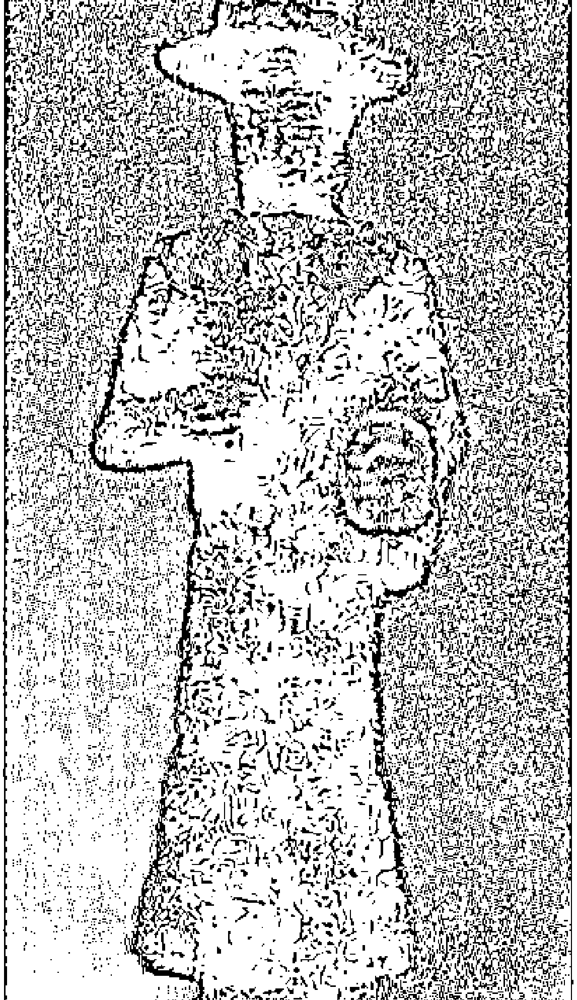

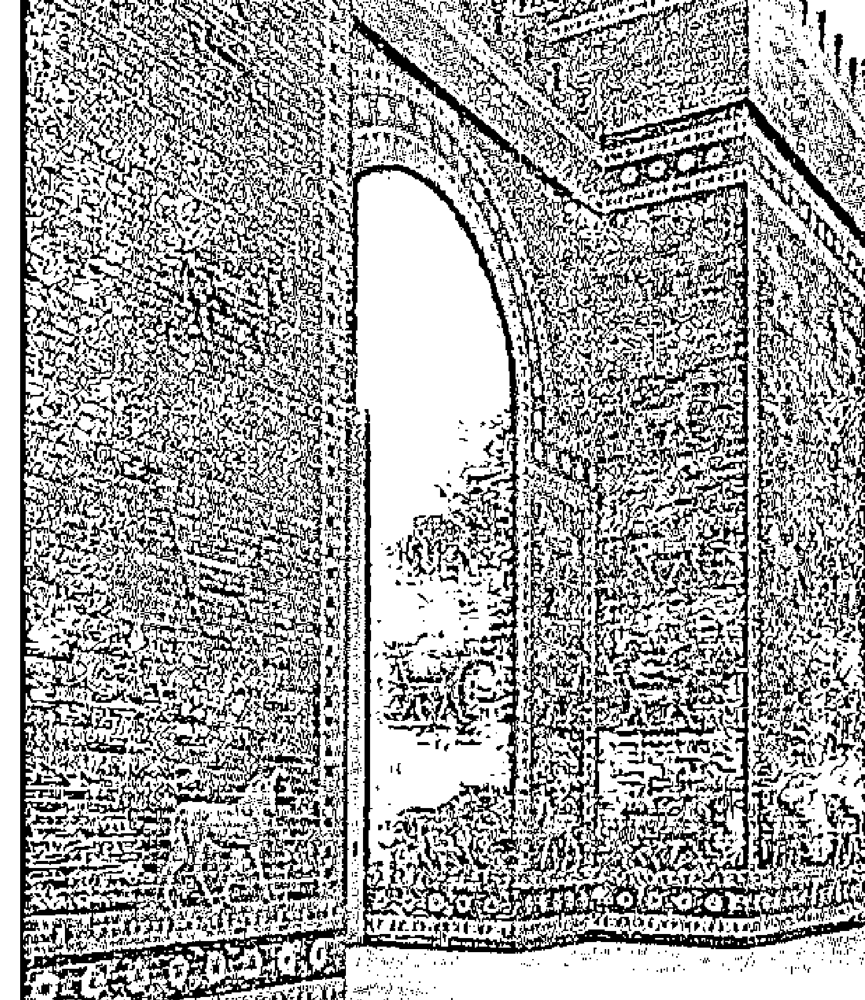

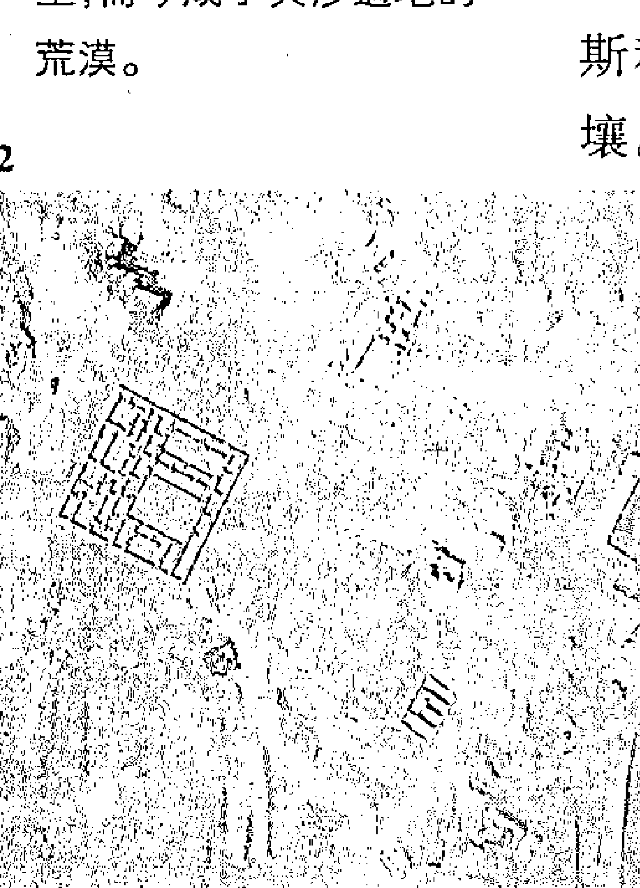

对这些地方，历史学家乔治·舒斯特曾有过描写：“亚美尼亚的崇山峻岭中，幼发拉底和底格里斯两条大河奔腾而下，泻人向南延伸的一望无际的低地；它们环绕著名的‘河间地区’（美索不达米亚），形成鲜花盛开、植被丰茂的肥沃谷地，最后汇合一处，涌入波斯湾。这低地就叫西涅阿尔，神的老花园，也叫迦勒底和巴比伦。它的自然景观很像埃及。那儿是尼罗，这里是底格里斯和幼发拉底，赐予一方生命和沃壤。”苏美尔人的神话里说，让河间地带变成鱼米之乡的是三大最高神之一的恩奇：“昔日，灌木遍野，沼泽四布……蛇蝎横行，猛兽成群，生灵被逼入昏暗的山洞。恩奇扶犁挥镐将灌木丛连根铲除，给底格里斯和幼发拉底灌满焕发生机的河水，千方百计营造良田沃土……又让两岸芦荡扬波，河中鱼虾嬉戏。” 然而这童话般的国度已成过去。旅行家卡尔·里特尔对美索不达米亚的景象做过一番描绘：“四周静穆无声，只见幼发拉底那宽阔而平静的水面伸向远方；它缓缓流过这毫无生机的荒原，好似威严的游子走过自己被毁灭的王国那寂然无声的废墟。”

关于卡什吉姆人（巴比伦人称其为卡尔都人，希腊人称其为迦勒底人）的来历，人们几乎一无所知。通常认为他们远古时期就从南方来到河间地带，可能在利莫里亚大陆沉没之时。公元前2231年，巴比伦国王哈姆拉皮夺取了对美索不达米亚所有部族的统治权，继而制定统一法律，推行巴比伦宗教和文化。在亚述人统治时期，迦勒底人并未丧失自己的独立性。他们世界观的基础是，相信自然界居住着大量互相敌对的善神和恶神。就连神仙也受制于自然规律，能支配神仙的是那些有特殊咒语、吉祥物和辟邪物相助的法师，而星相家则能准确预告未来的事。巴比伦的祭司们根本没把迦勒底法师放在眼里，只是公元前20世纪进行的宗教改革后，才同意接纳他们加入自己的联盟，但仅能担任基层职务。然而迦勒底人并不认为自己的地位低下：他们坚信神秘科学的真实性，而结果证明他们是对的。巴比伦崇拜的仅仅是如今已被遗忘的本族宗教，而法术却得到更大的推广，从巴比伦传入亚述、米太和波斯，接着传入小亚细亚、土耳其和意大利，又传入迦太基，甚至芬兰人居住的更远的北方国家。后来所有民族的预言家所用的都是迦勒底法师的经验。雨、云彩的形状和色彩、地震、闪电、雷声、树冠的风声，甚至可见物品偶然的动作都能为预告提供根据。远古时期的先知大卫预言所根据的就是橡树的声响。杰博拉预言根据的是圣棕榈的动态。在古希腊，多东的“会说话的橡树”、德尔斐和德洛斯岛上能预言的月桂树享有崇高的声誉。意大利伊特鲁里亚人和凯尔特大祭司常常提到树的“吉”和“凶”。梦被认为是直接的预兆：亚述人像记录重大事件一样记录过它们。据《圣经·约伯记》记载，人的手纹记录着命运的全部信息。

+   3. 巴比伦的（司农、林母道和爱情的女神）伊西塔门（修复）。约公元前575年。

法术的渊博知识和精妙的技巧一直是个谜，完全掌握它们需要研习许多年。

一周七天是迦勒底人的创造。其中每一天都是献给某个行星神的。星期一的支配者是月亮，星期二是火星，星期三是整个天，星期四是梅拉达赫（巴比伦的马杜克，希腊的朱庇特），星期五是金星，星期六（在美索不达米亚，星期从这一天起）是土星，星期天的庇护者是太阳神，星期天的德语叫法也有同样的概念——桑塔格——太阳日。

最后可以补上一句，迦勒底星相家的古老技艺今天又获得了第二次生命。

+   4. 美索不达米亚的齐古拉特祭祀塔。《圣经》里的巴比伦塔很可能就是这个样子。

+   5. 尼德兰（荷兰）画家大皮特·勃鲁盖尔所见的巴比伦塔。

+   6. 手执武器的巴比伦士兵的形象，凡去圣城的人都见到过。

## 极北诸国

1. 从小亚细亚渡海来到亚平宁半岛的伊特鲁里亚人，认为阿波罗是他们的亲戚，常常将他画成一个长胡子、高个子、面孔黝黑的男人。这尊出自伊特鲁里亚人之手的塑像，建于公元前510 - 前 490年。从前在韦耶城，后为罗马人所盗抢，今收藏于朱利别墅博物馆。

2. 关于极北人的概念，折射着雅利安部分人迁移的历史。他们离开了极北变得不宜居住的岛屿，往南迁移到乌拉尔，接着转往小亚细亚、叙利亚和亚平宁半岛。希腊人本身属印欧人种，但又隐约记得自己民族的第二故乡，曾经居住在极北地区，如地图所示。

人类保留着关于极北国的回忆。希腊智者派哲学家许墨特里在他的《讲演稿》一书中写道：艺术神阿波罗的原籍在遥远的极圈之内，并常常去那儿跟同胞住上一段时间。同为极北地区人的还有教会希腊人音乐、哲学、史诗和赞歌创作艺术的大圣人阿巴里斯和阿里斯杰伊。正是他们兴建了德尔斐寺庙，而这寺庙以同诸神密切接触的先知们而闻名埃拉多斯。

古希腊抒情诗人平达在《女预言家赞》中说，极北人属于跟诸神亲近而为神所爱的人。极北人安乐的生活伴随着歌曲、舞蹈、音乐和筵宴：永恒的欢乐对于阿波罗的这些祭司和仆人是很典型的。据传，他们能活千年，如果他们活腻了，往往会从悬崖跳海自尽。

古希腊历史学家希罗多德说，极北人按传统每年都派人往阿波罗居住的德洛斯岛送去田地的头茬恩赐。运送贡品的是些极北姑娘。有一次姑娘们一去未返。从此极北人将贡品只送到邻国边境，再由其他部族的人慢慢转运到德洛斯。

这个北方国家，在爱尔兰人看来，是块巨大的陆地或者一些大岛组成的群岛：“洋里有一百五十来个岛屿……每个都比爱尔兰大一两倍。”

北美和南美印第安人的许多文明都知道外来的白人，把他们当成了神。后来，印第安人跟白人有了近距离的接触，在极北国覆亡（很可能是像之前的利莫里亚、姆和大西洲那样遭受自然界的剧变而消亡的）之后，白肤棕发的人涌进了美洲。俄国学者亚历山大·戈尔波夫斯基在《古代史之谜》一书中写道：“出土文物说明，白人部族或团伙的进入并非都是和平的。在玛雅城奇伊琴察的寺庙里发现的一幅壁画，画的就是玛雅人同人侵的浅色头发军人搏斗的场面。”南边，在琴波特和特鲁希略城区（今秘鲁境内）发现的两只花瓶上，也绘有印第安人与浅色头发军人的战斗情景。情况并非都是这样：有些画面表现的就是印第安人和外来的白种人共同劳作、建造房屋的场面。想必白种人是某个未知民族的残余，他们是为了躲避什么而被迫突然迁往美洲的。”

英国的人类学杂志《人》曾登载过有关太阳王国缔造者印加人血缘构成的资料。从资料看来，浅色皮肤的印加人不可能是南美的土著居民。木乃伊的血型原来都是“A”，此种情况不仅古秘鲁境内，就是整个南美洲都不曾有过。而且，血液的这种组合在当今任何民族中都不存在。”

征服者西班牙人惊讶地发现，古铜色皮肤的印第安人也常见白皮肤的人。天主教神父记下了自己的观察结果：“他们的肤色之浅，乍看更像英国人或弗拉芒人，而不像西班牙人。”白种人北方有（温哥华岛和密西西比河流域的易洛魁人中间），南方也有（中南美）。”

显然，正是在这一时期，白种人首先出现于欧亚大陆的北方，接着穿越难以通行的丛林迁往南方，在那里同比他们早来许久的深色皮肤的南方人发生了冲突。看来，起先北方人在同人数更多、文化更发达的南方人的战斗中屡遭挫败：许多人死于他们的铁剑之下，成百上千的人沦为俘虏，其中部分人被同化。但是他们渐渐学会了许多东西，组织部队、冶炼矿石、铸剑……最终取得了胜利。起先夺取了北方土地，接着占领了许多南方国家，其中包括印度。于是在古埃及的浅浮雕上出现了外貌特别的战士——雅利安人的形象。”

然而，很可能不是所有的极北人都离开了自己最初的家乡。凯尔特人的传说《圣人布莱丹的航行》里说，在遥远的北国，爱尔兰人碰见一个小伙子。这个小伙子兴高采烈地欢迎他们，叫出他们每个人的名字，让旅行者们惊讶不已。关于自己的家乡，他说：“这里从来没有黑夜，”接着又说，“许多世纪过后，这块土地将为你们的后代所知晓，那时候基督教徒将受到排挤。”小伙子指的是什么时候——我们不得而知。”

3. 通常认为，“石婆”是游牧蒙古人塑造的。的确，草原上可以见到直立的石头，风化的表面上甚至可清晰地分辨出士兵或他们的女友那宽脑门儿、细眼睛的脸盘。然而竖立这些标志的传统却是突厥人从雅利安人那里学来的。石头上凿出的雅利安人的粗犷的面孔跟任何其他人种也混淆不了。因此雅利安人的路标才是最古老的。”

4. 意大利画家乔万尼·塞冈第尼所绘的名 为《生命泉边的爱情》的画作，是对雅利安人在极北的神奇发祥地尽善尽美的梦忆。”

## 卡什瓦拉诸国——雅利安人的福地

在来自那里的人身上体现出来。长期以来，人们认为雅利安·瓦扎应该到拜火教盛行的伊朗西北部和阿塞拜疆去寻找。然而精通拜火教的伦敦大学教授玛丽·波易丝得出一个惊人的结论：查拉图斯特拉来自伏尔加河以东的亚洲平原，或者准确地说，来自乌拉尔的南部。那儿就是雅利安人的第一福地，是他们走出极北诸国之后的第二故乡。该地区首先是俄罗斯的中心，同时也是整个雅利安世界的中心。乌拉尔不仅是欧亚大陆的分界线，也是它们的连接点。山脉就像大脑的两个半球，将理性思维的欧洲和整个身心寄托于精神形象的、感性的亚洲联系在一起。

+   1. 神阿胡拉·玛兹达将“凄凉之地改造成了安定之邦”后，将他在我们星球上所建的所有福地——卡什瓦拉诸国——告诉了查拉图斯特拉。所以，土地的这种神圣性，我们的祖先时刻都能感受到。比如，莫斯科附近的拉多涅日早就有些多神教的庙宇，后来被圣谢尔吉选中。神和人的神圣环境在米·瓦·涅斯捷罗夫的名为《圣谢尔吉·拉多涅日斯基》的画作中被准确地表现了出来。

+   2. 卡什瓦拉诸国的标志性建筑就是庙宇。这张照片上拍摄的是里海沿岸地区。在这里，查拉图斯特拉得以抵抗住了妖魔鬼怪的夹攻。

在雅利安人的圣书《阿维斯陀》中，神阿胡拉·玛兹达对先知查拉图斯特拉说：“是我……将凄凉之地改造成了安定之邦，在那里建立了十六个美好的国家。其中最好的一个是雅利安·瓦扎，我把它建在了美丽的达伊基亚河畔……” 雅利安·瓦扎和卡什瓦拉诸国究竟在哪里呢？弄清这些是不无趣的，因为但凡福地都有着巨大的潜在能量，关键时刻能出现在不同的地方，甚至可能暂时消失。但是有几个福地是可以判定的：贝加尔湖周围、拉多加湖左近、伏尔加河和顿河之间、堪察加半岛、南美的纳斯卡谷地（秘鲁）。

+   3. 俄罗斯精神真正的保护区——诺夫哥罗德-谢维尔斯基的四郊。这里，人们用双手建造起来的庙宇同上帝创造的大自然处于令人惊叹的和谐之中。

+   4. 圣地，就是当人的心灵与造物主交往时能让心灵得到包含着深思的宁静之所在。而且似乎大自然本身也在用它那洞察秋毫的眼睛看着我们。正如立陶宛画家米·康·丘尔利奥尼斯在《宁静》这幅画中所表现的那样。

## 阿尔卡伊姆

1. 就连从没听说过雅利安人的人们，头一回站在阿尔卡伊姆圣城的遗址上，也会为那罕见的光学现象所震撼，那真可谓是一大奇观。阿尔卡伊姆在肉体上被消灭了，可它的精神却千古永存。圣地与上天亲近的感觉在画家延斯·斐迪南的《沐浴阳光的山峦》中被表现得淋漓尽致。

2. 雅利安人的圣城阿尔卡伊姆理想规划的全景鸟瞰。俄罗斯首都正是按照这种发散同心圆的原则建造的。显然这并非偶然的巧合。

3. 如果说法国雕塑家罗丹的名作《思想家》的目光是冲下朝地的话，那么在阿尔卡伊姆废墟中发现的雅利安人的这尊塑像则是在召唤人们去天上——祭司或先知那探询的目光所注视的地方。因此，有部作品可以说是表达了雅利安人的世界观，那就是作家爱德华·舒尔的《天乡之恋》。

4. 雅利安人在自己的行进路上都要安放石人路标。后来这一风俗被突厥人袭用，他们在草原上安放“石婆”。突厥人和雅利安人的路标分辨起来很容易——依据婆娘们典型的人类学特征。这尊古塑像安放在基辅乌克兰历史博物馆的大门前。

## 香巴拉·香格里拉

在蒙古，喇嘛们一再要波兰学者斐迪南·奥先多夫斯基相信，北极和太平洋上消失了几个大陆，它们的居民被香巴拉的圣雄们所接收，集中在一些宽阔的地下大厅里，大厅里有人工灯光照明。“埃及和南美的儿女们”同样在这儿避难。此外，据印度人传说，这里还躲藏着智蛇——龙神。有些印度人和中国的藏族有幸见过龙神的洞穴。后来他们常说，那就像互相连接、绵延几百公里的长廊。尼·廖里赫写道：“喜马拉雅山坡上有许多洞穴。据说这些洞通往远处的干城章嘉山。有人还见过一扇石门，这门从来没开过，因为还不到时候……”

与其他传说中的地方不同，古老的香巴拉(又称“香格里拉”或“坛城”)还在，如今还在崇高精神上影响着全人类。神话故事《官阶》里说：“香巴拉的世界之眼不断给人类带来幸福。香巴拉的世界之眼像是人类道路上的灯塔。香巴拉的世界之眼就是引导一切行人的明星。” 据传说，从神秘的国度里出来，你可去往任何地方，但进入香巴拉的大门是对不速之客关闭的。西伯利亚的喇嘛对俄国画家、作家尼古拉·廖里赫说，香巴拉边界的保卫方法是多种多样的。这可能是从石头缝里冒出来的毒气，也可能是防护屏蔽：人或动物一旦靠近，就会有种仿佛受到无形的打击的感觉。向导会拒绝继续前行。假如行者继续前行，他前面就会发出山崩地裂的响声，直到不速之客止步并折回。但这并不意味着香巴拉不欢迎任何人。

1. 只要往尼古拉·廖里赫的《从那儿》里仔细一看，就能明白所画的魔幻现实性：香巴拉的使者，好像神灵，正向我们走来。 2. 中国的西藏地区，长期以来被认为是香巴拉的近邻。在当地某些寺庙里不仅保存着一些地图，还保存着神秘王国的建筑模型。这些物件的真实性难以考证。而且也根本不会展示给每个人。 3. 世界最高峰之一——珠穆朗玛峰(海拔8843.43米)尼泊尔一侧可谓天地两界的结合点。

+   4. 中国的藏族以此种锥形扁石堆砌物表示山口的高度。也许还有更为重要的意义——“小山”就是祭坛，行人应祭祀山神，否则山神将以落石或雪崩予以报复。

呼声。“卡拉吉亚！”——意思是“来干城章嘉吧！” “你听见招呼了吗？”干城章嘉问。“是的，”画家答道，“听见了。所以我才来的……

香巴拉的一位执政官，圣雄莫里阿，在信中对英国学者辛涅特说：“在我们公社里，每人都能见到许多民族和各种职业的人。”

圣雄还说，香巴拉有大量的藏书。这些图书馆收藏着从地球上消失的许多民族的创作。它们存放在深深的地下，以确保文化宝藏免遭抢劫和地质灾害。

中国学者老曾博士在《上海时报》上发表系列文章，讲述了他在传说的国度旅行，描述了在那里见到的令人惊奇的建筑。

但也不必把香巴拉仅仅当成古代知识的博物馆。圣雄们利用各国生活中的政治和历史变革，让人们见到永恒真理的光明。大家都知道香巴拉的圣人给苏联政府的一封信，他们在信中欢迎俄罗斯的精神革新。另一件事不大为人所知：蒙古第一家印刷厂开工于1927年，所印的第一本书叫《公社》。这是跟圣雄们的访谈录，也是给苏联政府那封信的注释。书中说：“勿延误心理力的研究，勿延误它的运用……让旧世界害怕心理力的研究。而你们，年轻、有力而没有成见的人们，全力研究并接受已放在你们门口的馈赠吧……

不久，圣雄们便将希望寄予联合国和安理会。人们知道，一位圣雄于1947年现身战胜国代表决定战后世界命运的安理会秘密会议。会堂的大门紧闭。可会堂里突然出现一位身穿东方服装的瘦削的大胡子。“您是谁？”贝内加尔·罗乌严厉地问道。陌生人没回答，而用柔和而诚恳的口气说：“我有许多话想对你们说。我要公开创世以来秘而不宣的东西。你们将明白一条真理。世间有恶，对全人类的恶。他们说的都是谎话，他们的嘴里都是蛇毒……”苏联代表团团长安德烈·维申斯基打断圣雄的话：“苏联代表团拒绝听取这位挑拨者的梦话。这次闯入，无疑是精心策划和拙劣表演的阴谋，为的是想说明安理会战争中的侵略者！” 东方人打扮的陌生人还是继续说完了自己的话，并给了许多英明的建议。会议结束时罗乌说：“会议议题完成——我们得到了您所提问题的答案。先生，您最好把您现在对我们所说的都写下来……”来访者的眼里冒出怒火：“这种书已经有了，”他叫道，“这就是你们那神圣的《圣经》！”说着，他朝敞开的大门走去。押送的人竟没发现他是怎么离开的。

## 蓬莱

1. 秦始皇，这并非名讳，而是中国古代国务活动家的最高尊号。名嬴政，公元前221年统一中国，在位十二年，建立了强大的东方国家。

2. 为了防御游牧部族入侵和保卫商道，按照秦始皇的旨意，万里长城于公元前214—公元前213年开始建造。

中国人同雅利安人一样，远古时代就熟知一些神秘的圣地——七十二福地和三十六洞天。他们特别向往的有五座极乐仙岛——岱舆、员峤、方丈、瀛洲和蓬莱。这些岛山漂浮在大洋之中，规模巨大，方圆三万里，高一百五十万丈，互不相连，远隔七万里。山顶云烟氤氲，岛上住着仙人和善神。据传说，那里宫阙皆以金玉砌造，鸟兽皆为圣洁的白色。树上果实累累，玲珑似珍珠，光润赛宝玉。仙果异香扑鼻，吃了可长生不老。

远古时期，岱舆和员峤两座仙岛漂至北方大洋，其余三座依然留在南方。很可能，这些古老的中国传说所记录的，就是对曾经存在过、而后在地质大变动中覆亡的那些陆地的回忆。

为了寻找蓬莱、方丈和瀛洲，中国的皇帝们不止一次地派出考察团组。然而，这些仙岛远看好似乌云烟霭，可只要人稍稍近前，它们就没入水中；刚刚傍临，它们就被大风刮走。人始终不得上岛。

公元前221年，秦始皇结束战国纷争，统一六国，建立了秦王朝。他没收民间武器，铸造了十二个各重三十吨的铜人；他统一度量衡，统一文字；他大兴土木，造宫殿修长城。让权势无限的秦始皇寝食难安的则是另一件事，他耳边常常刮来有关神山仙岛的传闻。公元前215年，秦始皇派遣宫廷方士卢生前往北疆，寻找熟悉蓬莱岛的仙人羡门、高誓。然而仙人避而不见卢生，于篝火旁化作两缕轻烟，飘然而去。于是秦始皇御驾亲临东海岸边，拜会当时已不下千岁的仙人安期生。秦始皇与仙人畅谈三夜，并许以黄金相赠，可仙人说了句“千年后蓬莱山下找我”，随即无影无踪。

威震天下但尚未成仙的皇帝哪等得了千年。他潜心研读详细记载蓬莱仙山的古籍《列子》，急切派遣廷臣徐福前往东海求仙问药。宫廷纪事中写道：“齐人徐氏上书，言海中有三神山，名曰：蓬莱、方丈、瀛洲，仙人居之。请得斋戒，与童男女”

不久，考察队空手而归。徐福启奏：“蓬莱药可得，然常为大鲛鱼所苦，故不得而至。愿请善射与俱，见则以连双射之。”

秦始皇遂亲率弓箭手渡海前往。他射杀一条好似深渊恶魔似的大鱼。前番大鲛鱼不让使者靠近仙岛，或许就是等待皇帝御驾亲临吧。战斗正酣之际，秦始皇的魂灵早离开肉身，飞上向往已久的蓬莱山巅。也许，只有这样才能进入极乐仙境。在那里，如若愿意，可获得新的肉身。关于神仙，本来就有许多神奇的说法。他们的一举一动都可能引起某种自然现象：神仙落座，立时风雨交加；神仙起身，顷刻云雾缭绕。要想骗过地上的鬼魅，他就变成泱泱大河；他撒把泥土，刹那间就出现一座冈峦或高山。”

仙人可以分身，也能隐形；能呼风唤雨，腾云驾雾；能下海入地，千变万化，走兽、飞鸟、草木——形体对于他们没有意义。神仙可赐予他们看中的任何人以永生，中国的秦始皇正是交了这样的好运。对于自己的臣民，他只不过是肉体凡胎僵化了而已。秦始皇的遗体葬于骊山……中国的史学之父司马迁对秦始皇的陵墓构造做过以下描述：“……穿三泉，下铜而致椁，宫观、百官、奇器珍怪徙藏满之。令匠作机弩矢，有所穿进者辄射之。以水银为百川、江河大海，机相满输，上具天文，下具地理。以人鱼膏为烛，度不灭者之久。” 一切都是短暂的：水银的河流、宫殿的模型、士兵的陶俑和装满鱼膏的油盏——最终都将化为尘土，唯独纯洁的灵魂能升往天堂，飞向神仙居住的蓬莱仙山。”

## 阿斯加尔德

12世纪初，冰岛编年史作家斯诺里·斯图鲁森根据古代文献和口头传说撰写了一本书，叫《环球》。书中收录了著名的《关于英格令的传说》，提到阿瑟神的城市阿斯加尔德的位置：“塔纳克维斯尔(顿河)以东的一个亚洲国家，叫阿瑟国，它的首都叫阿斯加尔德。国王叫奥丁。那里有座多神教的大庙宇。按古代的风俗，庙里有十二位大祭司。他们的职责是进行祭祀活动和审理民间案件……阿瑟人发兵攻打瓦恩人，可瓦恩人有所防备，保卫了自己的国家，因此双方互有胜负。”

《环球》问世后，许多人都认为斯诺里是胡编滥造。后来被发现并得名《老伊达》的古代传说，不仅证实了斯诺里的说法，而且在阿斯加尔德城内神殿的描述上还有许多补充。

一座神奇的城市。城墙边一座庙宇，庙前数排令人惊叹的廊柱，红色的树丛一直延及廊柱和城墙……当时我还没琢磨过来，这是什么树丛，这是什么城市。”

谢尔巴科夫要做的“只是”在现实的生活中找到这梦幻的对应物，等他明白所梦见的是什么以后，他就得拿出证据来证明这就是《老伊达》和《环球》里所描述的阿斯加尔德了。为此他花费多年进行寻找和科考，结果大有收获：在土库曼斯坦境内距阿什哈巴德十八公里的尼萨

谁也没想到去寻找神在人间的传奇城市。人们认为，它即便存在过，那也是在天上。阿瑟人的隐形城市自己选择了首先发现者，他就是未卜先知者，用现代的话说，就是作家——弗拉基米尔·伊万诺维奇·谢尔巴科夫。发现完全源自一场“非科学的”梦幻，作者在《阿斯加尔德——神之城》一书中这样写道：“起先是条隧道，我好像顺着隧道往上飞。往上！上面是一个银色的圆顶！突然发生了什么事。我还没回过神来，只见上面一道红墙，环抱着

城，谢尔巴科夫找到了阿瑟王国和它的首都。弗拉基米尔·伊万诺维奇得出结论：“老尼萨城便是阿斯加尔德的基础和中心。这就是奥丁和阿瑟人的瓦尔哈拉和宝库。”

"红墙"也找到了自己的解释。斯图鲁森在《新伊达》里说，在阿斯加尔德首先建造了一座殿堂，带十二个宝座和始祖奥丁的神位。殿内的一切不是用一般的黄金，而是用"十足的黄金"打造的。离老尼萨城不远的新尼萨城内的庙宇看起来就是这样：第一层的整个墙面都呈紫红色，经适当的光线照射，就产生一种赤金打造的印象。

城墙边的红树丛，是伊达的圣树丛格拉斯尔，观赏桃树树叶的颜色正是这样异乎寻常的。

阿瑟人聚会场地的名称——伊兹达维尔，一直没有找到解释。《老伊达》里的女先知说：“阿瑟人常在伊兹达维尔空场上聚会，议论世界” 的大气候带，回忆令人愉快的事件和神的诗歌。再次相遇就应在长满蒿草的牧场金塔弗列依上。这是过去供他们游戏的地方。

什么叫塔弗列依，无从知晓。但一种游戏之物——石膏球，则在新尼萨三公里的一个场地上被发现了，这场地今称曼苏尔代排，类似现代的体育场，场地跟观众之间有一石墙相隔。伊兹达维尔空场是指玩球的场地，不过这种游戏带有宗教仪式性质。首先发现者这样写道：“我在伊兹达维尔空场上找到了这些石球，它们已有两千年的历史。在我之前也有人发现过，但未见有文字说明。球内留有植物的残迹，对这一点也未见过解释。此为阿瑟人的游戏用球当毋庸置疑！植物（自然是干的）可减轻这种玩具的分量，使它更加结实……” 阿瑟人离开了这些地方，奥丁和他的妻子梦见遥远的北方大地上

伟大的光荣在等待着他们。梦幻原来是真实的，许多民族都不停地迁徙，寻找可以永久居住的土地。令人惊讶的是，神灵竟也这样迁徙过。奥丁也只得长途跋涉，从亚洲来到北欧，在那里他找到了自己的崇拜者。不过，信奉路德宗的当代斯堪的纳维亚人未必记得古神的名字。

## 瓦恩人的国家

关于阿瑟和瓦恩这两拨互相敌对之神的资料主要来自《老伊达》和《新伊达》。斯诺里·斯图鲁森的《新伊达》问世早于《老伊达》。斯诺里若不是1241年9月23日夜间被自己的同胞杀害，他很可能还有更多、更有趣的关于古代各民族生活的故事讲给世人听。

《新伊达》的开篇是这样的：“人住的地球被海湾分割成块。陆地被大洋包围，又渐渐沉入大海。有片海从奈尔瓦宋德一直延伸至约尔萨拉兰德。从这海往北有条长长的海湾，叫黑海。它将世界一分为三：东边叫亚洲；西边叫欧洲，也有人管它叫埃涅雅；黑海北面有个大瑞典或寒瑞典……瑞典分许多地区，那里也有许多民族和语言。那里有巨人和侏儒，有黑人和许多各种奇异的民族。那里还有巨兽和蛇怪。从有人居住的地区以北的崇山之中流出一条河，纵贯大瑞典，它的正确叫法是塔纳伊斯。从前曾叫塔纳克维斯尔或者瓦纳克维斯尔。它流入黑海，入海口一带有个瓦恩国。”

对这些土地的描述，长期以来一直被认为是童话故事，况且故事里还提到巨人、侏儒和蛇怪。不管怎样，如果考虑到大瑞典或寒瑞典就是西徐亚国（荷兰语的“西徐亚”与“瑞典”——“施维齐亚”为谐音），那么斯诺里所描绘的一些地区就是实际存在的。“塔纳克维斯尔”或

“瓦纳克维斯尔”的意思是“住着瓦恩人的支流”，就是顿河。阿瑟人居住在塔纳克维斯尔以东，所以是瓦恩人的邻居，也可能是他们的亲戚。既然找到了阿瑟国和它的首都阿斯加尔德，便可合乎逻辑地推断，瓦恩人并非神胄仙种，而完全是居住在顿河入海口的凡人。”

新老《伊达》叙述了瓦恩人的不少逸闻趣事。然而对待这些资料需要谨慎小心，因为古代斯堪的纳维亚人崇拜自己的神仙阿瑟，对自己敌对的邻居采取双重态度，往往是敌视态度。例如，瓦恩被认为是巫神，可是阿瑟的首领奥丁本身就是善于变化的卑鄙的萨满巫神。斯图尔鲁逊写道：“奥丁善变化。他身体躺着，好似睡着或僵死，可他早化成鸟兽鱼蛇，刹那间飞往远方为自己或为别人办事去了。他一句话能让

+   1. 古斯堪的纳维亚人有充分的理由为自己的铁匠们的手艺而感到骄傲，因为他们打造了极好的宝剑和扎不透的锁子甲式的护身衣。艺术作品的情况要复杂一些。

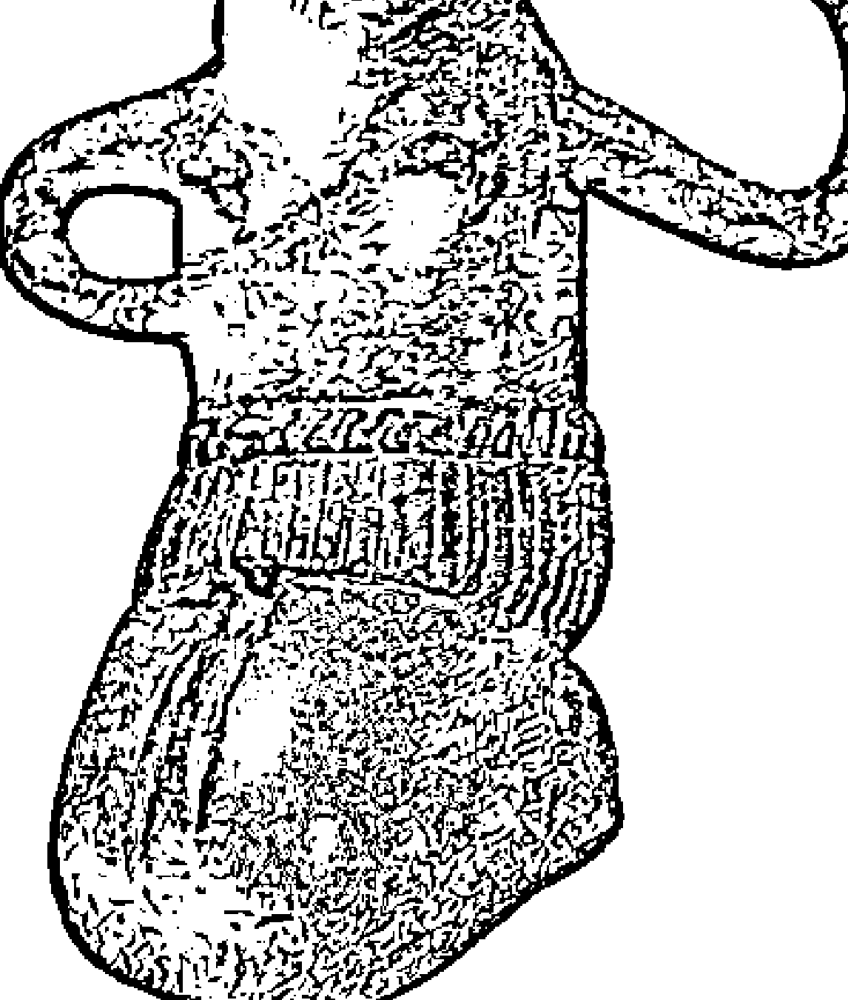

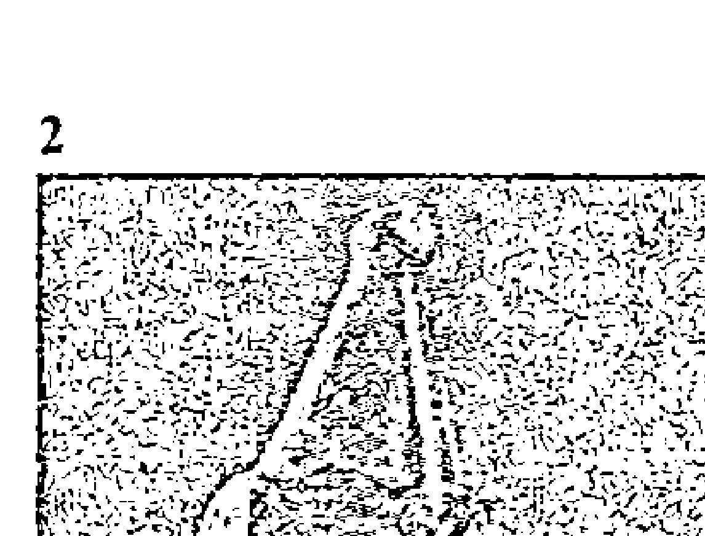

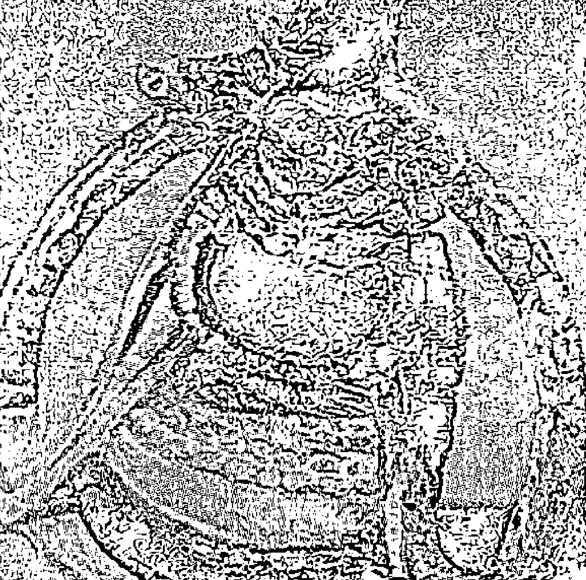

战争结束后，阿瑟人和瓦恩人离开了各自的故地。阿瑟人去了北方，瓦恩人则散居各处，后来在意大利、小亚细亚、顿河入海口和维亚迪奇人的住处都发现过他们的踪迹。瓦恩人和古亚美利亚人一道建立了乌拉尔图王国。瓦恩人不仅是斯拉夫人（韦涅德人、俄罗斯人）的祖先，而且在斯堪的纳维亚的土地上留下了踪迹。奥丁死后，阿瑟由瓦恩人尼奥尔德治理，后由他的儿子弗莱尔继位。弗莱尔为政期间，连年丰收。阿瑟人和瑞典人无不拥戴，尊其为神。

要费很大的劲才能认出这尊青铜小塑像是瓦恩人出身的爱情、丰产女神弗莱娅。从特留姆和阿斯加尔德的建设者赫朗格尼尔两位巨人都单恋过弗莱娅这一点来看，生活中的弗莱娅更比这尊塑像漂亮得多。

2,3.11世纪的瑞典青铜小塑像表现的是两位瓦恩人——龙凤胎弗莱

## 德鲁伊特

1. 斯通亨季(史前巨石群)是座古庙宇，相传是法师梅林从爱尔兰移到英国的。鸟瞰全景给人一种雅利安人传统中通行的庙宇环形设计。建筑群里不仅有史前巨石，而且有看得很清楚的互相离得很远的石头。

2. 当代学者研究的结果可以确定，斯通亨季(撒克逊语里的意思是“悬挂的石头”)不是从邻岛移来的，自远古时代就在这里了，是分三个阶段建成的。公元前3500—公元前2300年，它只是一个带两道土堤的环形壕沟，中间安放了三块石头和四根木柱子，它们的四周挖了五十六个小坑组成一个个小环，坑里灌满了白灰浆。公元前2150—公元前2000年，外环用蓝石头圈了个双圈儿，扩大了入口，修了直通艾翁河的林荫道。公元前2000—公元前1550年，在马蹄形内圈的里面

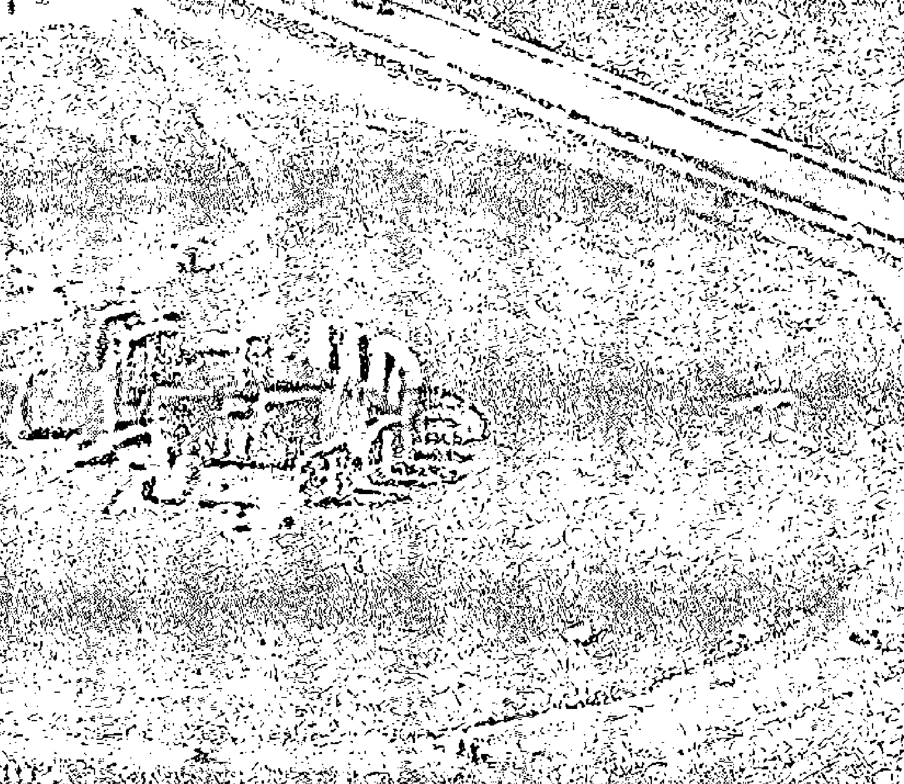

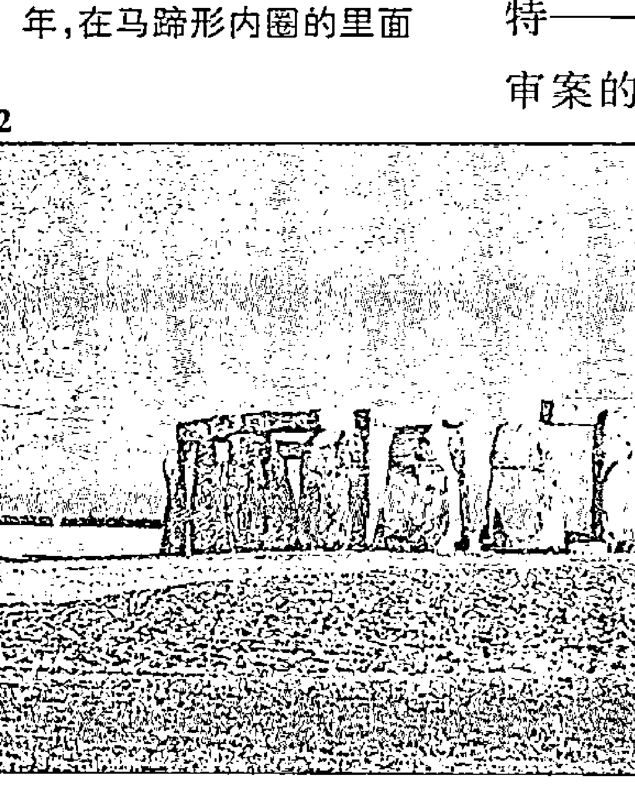

公元前58—公元前51年，尤里·恺撒同高卢人的凯尔特部族不断交战。当时恺撒还不是罗马皇帝，而只是个地方长官。他在自己的《高卢战争》一书里描述了一件怪事。他在意大利、高卢、不列颠见过凯尔特的大祭司，认为他们分为三种：瓦特——先知和哲学家，巴尔德——歌颂英雄的弹唱诗人，德鲁伊特——履行宗教仪式、负责祭祀和审案的大祭司。后者，用恺撒的话说，握有绝对的权力，因为他们能够给罪犯及其家属甚至整个家族加以最可怕的惩罚——革出教门，这样一来，人们就失去了灵魂永生的希望，那还远不如死。

德国学者乔治·舒斯特在《秘密联盟》中写道：“德鲁伊特相信自己的永生和轮回。灵魂离开躯壳之后，要得到永远的安息，就应该进行预先净化，而这种净化只能通过长时间的游方，投胎为人、为动物，甚至是植物。”

德鲁伊特并非轻易就能当上。授予最高祭司职位和得到金色圣衣之前，必须经过弹唱诗人培训。前几年，学员应学习诗学、文学音乐作品、诵读的基本知识，研习“欧甘”文字、哲学和法学。随后七年，学员要钻研专业科目，尤其是将各种事件改编成诗歌形式的原则。然后，出类拔萃者方可领受法术、预言和宗教仪式的秘诀，也就是成为德鲁伊特。

凯尔特人的教堂一般都建在林中或湖边，后来人们开始建造木结构和石砌的庙宇。凯尔特部族将所有的财富都收藏在这种圣地，相信它会受到万能的上帝的保护。随着罗马军团在英国的出现，凯尔特人的寺庙不断遭到抢劫。

泉眼、湖泊和山崖，尤其是岛屿，被认为是神仙住的圣地。凯尔特人的岛屿塞纳、泽西（今法国境内）和不列颠的海岛怀特、马恩、安格尔西便是这样的圣地。其中由巨大的石拱组成的史前巨石观象台斯通亨季最为著名。拱门的左立柱献给上帝，右立柱献给上帝之妻，横梁献给始祖。其甬道能通往另外的平行世界，只要遵行一定的宗教仪式。

德鲁伊特使用一种历书，它能调节自然界生物的节奏，将公社生活安排得与月亮周期相吻合。宗教仪式历书从11月1日萨姆哈因节开始，实际上这是丰收节。夏季的主要节日是草场节——8月1日：畜牧业集市；5月1日是贝尔神节：庆贺大地丰收和生命之源——阳光威力的节日；2月1日庆祝“太阳冬眠之后的回归”，这天，到处点燃烧荒的篝火，唤醒大地，保障丰收。就在这一天，举行“试婚仪式”，年轻人试婚一年，如果共同生活不和谐，他们可以各奔东西。

推行基督教以后，德鲁伊特被取消，但巴尔德在很长时期内依然保持着自己的势力。公元940年，签订了巴尔德联盟的特别规则，这一联盟直到17世纪才消亡，如今在爱尔兰、威尔士和凯尔特人的居住地正开始恢复。

罗马人，接着是英国人指责凯尔特人嗜血成性，极力为征服他们辩解。比如，公元前2世纪在高卢旅行的波塞唐纽斯就遇到过当地的“人头猎手”：“他们离开战场时，他们的马脖子上都挂着敌人的头颅，回家后将头颅挂在门洞的上方。”历史学家狄奥多和斯特拉波常常提到凯尔特人给敌人的头骨镶金，将其作为饮具的事。然而，这种野蛮的风俗，古时许多部族都有过。佩切涅格人就是这样对待俄罗斯大公斯维亚托斯拉夫的：他们打死了斯维亚托斯拉夫，割下他的头颅，用头盖骨做成大碗。

说到这里，需要补充一句，凯尔特人的印欧部族与斯拉夫人在敬重大自然的力量和崇拜常绿植物懈寄生方面有许多共同之处。

而“德鲁伊特”一词，人们往往以它源自希腊语的“橡树”加以解释，其实用俄语的“圣人”来解释最为妥帖。

用二十块蓝石头围了个椭圆形，中央安放了“供桌”。同样，不同时代斯通亨季的用途也不同。美国国家航空与航天局的研究人员确信，庙宇是座天象仪，也是预报日食月食的独特的计算机。

3. 这次修复是根据庙宇是石器时代人们的天文馆说进行的。

4. 恢复古老的不列颠信仰的拥护者们认为，斯通亨季从前是德鲁伊特的主要庙宇。因此崇拜太阳的现代祭司们今天也常常在这里举行宗教仪式。

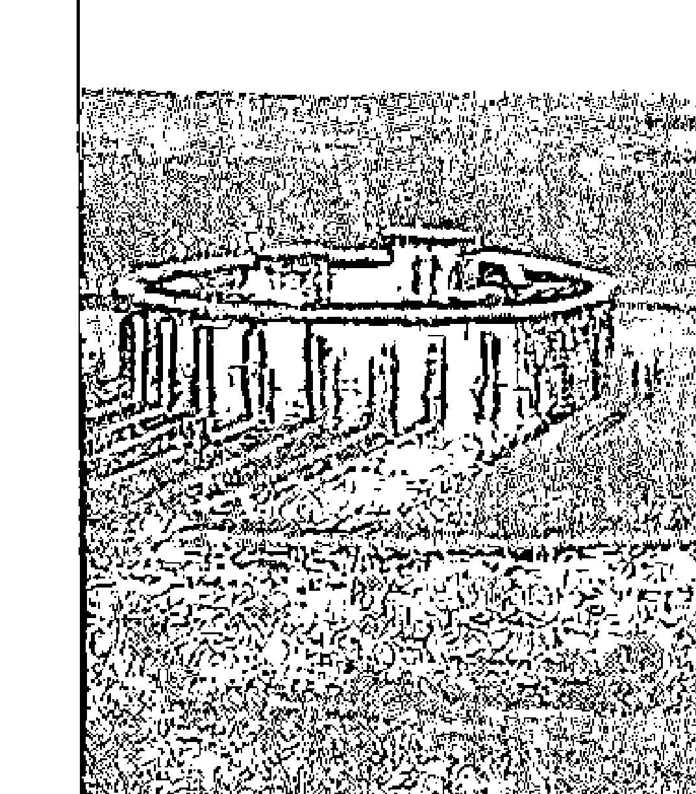

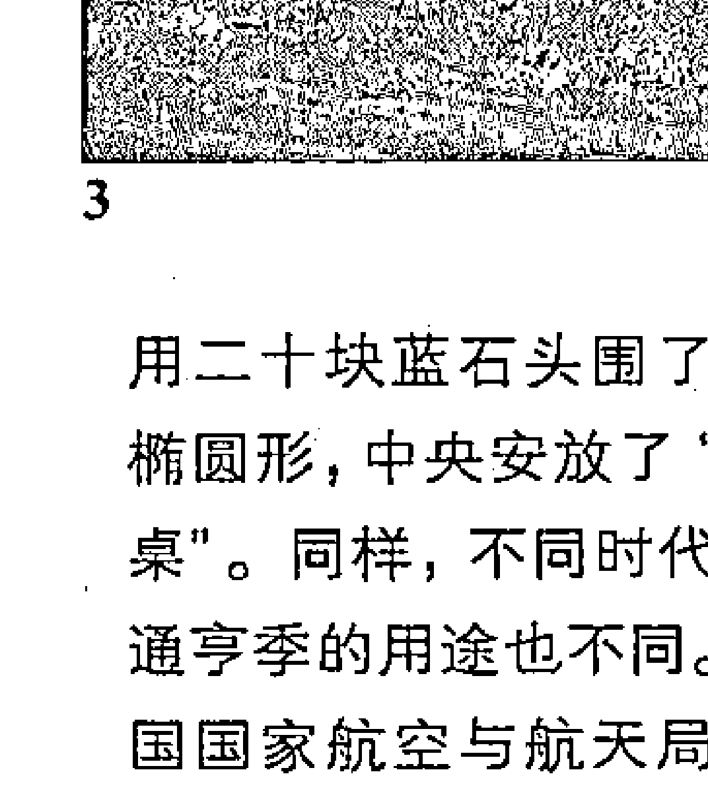

### 格里维——古普鲁士人的祭司

1, 2. 建于约五千年前的石器时代的祭祀建筑——石冢，保存在世界许多地方：从地中海沿岸到俄罗斯北方。它们的外观通常像直立的巨石，顶端盖上一块有时重达几十吨的石板。也有一些巨石是中空的，只有一个小孔可通石“箱”。一般人钻不进去，因为直径很小。能钻进祭坛的只有长期吃斋念经的隐士（当代印度还有这样的考验——能进石箱的人保证能上天堂）。

凯尔特人认为自己是“蓝人”，因士兵的身上刺满了蓝色花纹(“不列颠”一词的出现应归功于文身，因为在先于凯尔特人居住在英国的土著部族的语言里，管“文身的人”叫“普里丹”或“不利坦”)，而穿浅蓝色衣服的是宗教说唱人——巴尔德。西斯拉夫人和东斯拉夫人以及其波罗的海沿岸某些邻居是“红人”，红色就是太阳、美、生命及其载体——克罗夫(意为“血”——译注)。直到今天，这些民族传统刺绣的基本色调还是红色。普鲁士人波罗的海沿岸部族的最高祭司的尊号就叫格里维(克里维、克列夫、克罗夫),这一称呼由克里维奇人的斯拉夫部族保持至今。
普鲁士部族现今已不存在，它被条顿骑士团的日耳曼骑士杀得一干二净，德国人只从他们那里夺取了普鲁士这一名称。今天，东普鲁士就是俄联邦一部分的加里宁格勒州。
说起古普鲁士人的信仰，条顿骑士团的书记官写道：“普鲁士人没有上帝的概念。因为他们都是些笨蛋，所以无法理解他……因为他们不知道上帝，所以他们崇拜整个大自然，那就是太阳、月亮和星辰、雷电、飞鸟，以及四条腿的动物，直至癞蛤蟆。他们也有神圣的树林、土地和河流，所以他们不敢伐木，不敢耕地，也不敢捕鱼。”

人们都知道首席格里维，普鲁士人最高祭司的名字——布鲁特诺。他是该民族第一位大公维杰伍德的孪生兄弟。他俩是拉塔里部族的斯拉夫人。在人民骚乱期间，兄弟俩带领自己的追随者逃到维斯瓦河和涅曼河之间的土地上，收服当地居民，建造了一个难以攻克的城堡诺依托（它的遗址至今还保存在将波兰的格丹港和维斯林湾隔开的波罗的海沙嘴上）。

百年之后，政权分裂：从此每个区都有自己的格里维，隐居深山密林，几乎从不抛头露面。他的意志由小格里维信使、最高格里维的徒弟和助手传达到民间。如果无后的格里维突然亡故而未及传出自己的意志，则第二拨的代表——小格里维集中一起，选出新的格里维。

第三拨叫乌尔斯凯特，他们负责祈祷和圣化供品。往下还有各种基层祭司，不入任何一拨，立陶宛人管他们叫祈祷者。神职人员金字塔的最底层是祭司的听差、形形色色的预言者、先知、代言人，还有摇签算卦人。

对于文化的这种多样性，10世纪的德国大公们曾试图予以统统铲除。他们的权势十分可怕。一位西斯拉夫执政官接受了新信仰之后，对主教抱怨说：德国大公如此压迫我们，我们的赋税劳役如此沉重，我们只能活着躺进棺材完事。既然他们每天都在逼着我们逃跑，您想要我们如何履行新宗教赋予我们的义务呢？我们要能找个逃跑的去处就再好不过了！

不过，德国大公很快就被赶走了。真正的种族灭绝始于8世纪，条顿骑士团的日耳曼骑士入侵波罗的海南岸、维斯瓦河和涅曼河下游之时。修士凶手们从马佐夫迅速扩展到整个波罗的海沿岸。德国作家阿弗古斯特·科策布这样讲述同胞们的“功勋”：“读着关于十字军对无辜的人民犯下的所有兽行，不能不浑身发抖。我们只举一个例子。14世纪末，普鲁士早被彻底征服，可十字军团的大帅康拉德·瓦伦罗德因恼怒库尔兰公国的主教，竟然下令砍掉主教辖区内所有农民的右臂。”

先是条顿骑士团，接着是立窝尼亚骑士团，从13世纪到14世纪这段统治时期，彻底消灭了普鲁士的人民、他们的信仰、语言和文化。1525年4月10日，骑士团被清算，在它占领的土地上建立了新的国家——普鲁士。今天，条顿骑士团已死灰复燃，修道院出现在德国、瑞士、意大利、南斯拉夫、捷克。只是古普鲁士人和他们的祭司永远成为过去，困于阴曹地府了。

3. 在尼古拉·廖里赫的《沿海居民·早晨》这幅画上，描绘的是被条顿军团彻底消灭的普鲁士人的生活场景。

4. 索洛韦茨基群岛上的石头迷宫，在它们的中心通常能找到人的骨头。我们远古的祖先可能在做过一定的仪式、念过符咒以后，就以灵魂形式飞往其他世界了。

5. 在俄罗斯北部的许多地方，远古时代铺砌过一些石头“祭坛”。谁在这些地方祭奠过谁，我们很可能永远也不会知道了。

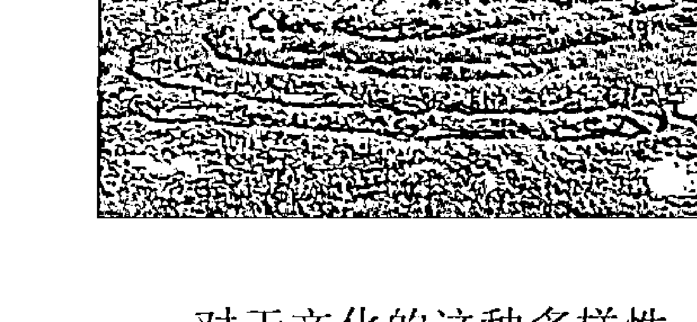

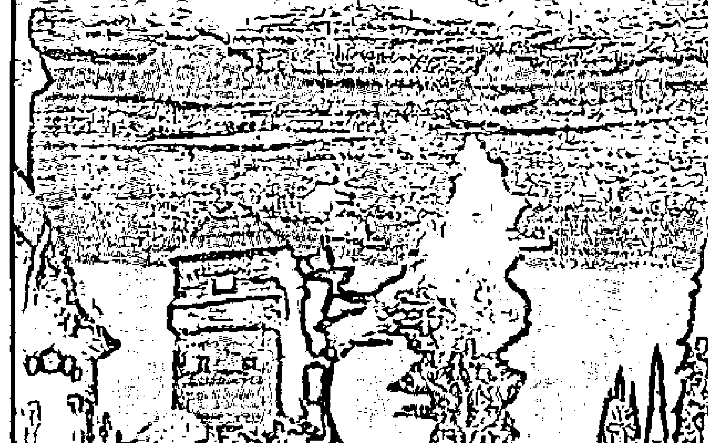

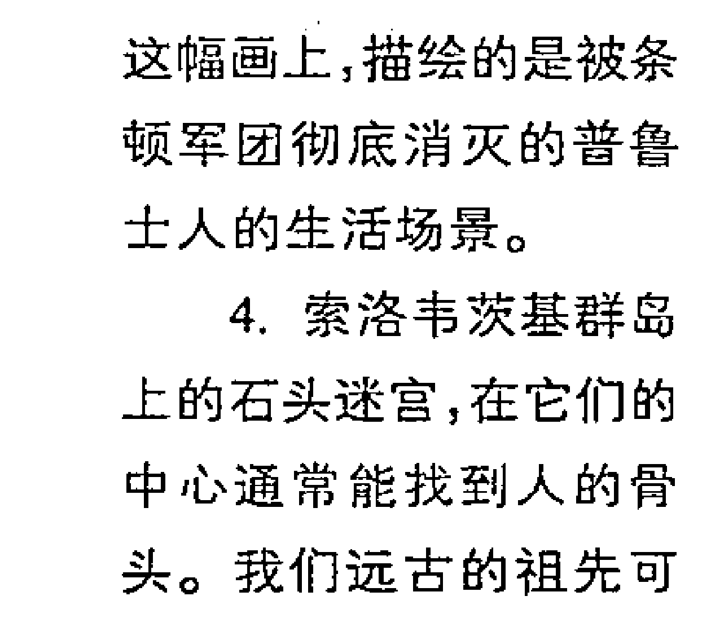

### 凯尔特人的‘圣岛’

1. 爱尔兰人是最早皈依天主教的民族之一，而且他们的十字架也与众不同。
2. 凯尔特人的图案装饰术具有魔法作用。这枚图案复杂的装饰物保存于著名的《凯尔特人》一书中。
3. 爱尔兰沿岸许多地方的风光宛如仙境一般。此为离都柏林不远的利夫利岛。
4. 北威尔士的巴尔得斯岛。人们认为，古时爱尔兰人死后正是殡葬于此。

如果说古希腊、古罗马文化为欧洲文化的发展提供了动力，那么西方的民间文化所吸收的养分则来自于雅利安人——凯尔特人、西斯拉夫人和日耳曼部族。

居无定所的民族——凯尔特人，从中亚首先来到日耳曼南部和波希米亚，然后又掉头向南，来到西班牙、意大利、希腊、小亚细亚。他们沿着欧洲西部海岸，从西班牙漂泊到现在法国北部的布列坦尼，接着在爱尔兰、布列坦尼南部和苏格兰登陆。实际上，整个大陆都有这个民族的人。

有些学者断言，凯尔特人与其他民族的不同之处在于对游历的嗜好。在叙事文学里，游历是精神素养的象征。游历中实行的学生身份传统，在中世纪的欧洲仍然可以见到：一个城到另一个城的路上，来往的人群中不仅有未来工匠师傅，而且还有学生。

研究凯尔特传说的行家、牛津大学教授约·托尔金在《论神话故事》一文中说，“逃亡是神话故事的一个重要功能……平常所说的‘现实生活’里，逃亡通常是一种必要的行为，甚至往往是一种英雄行为……因此有种古老的，而且是最为古老的愿望——大逃亡，躲死亡。”

假定凯尔特人的游历是宗教需要，那么他们的宗教文化、社会体制和礼仪上的许多东西就不难理解了。人们总说洞天福地在北方，那儿的人最幸福，因为他们从没见过战争，也不得疾病，想活多久活多

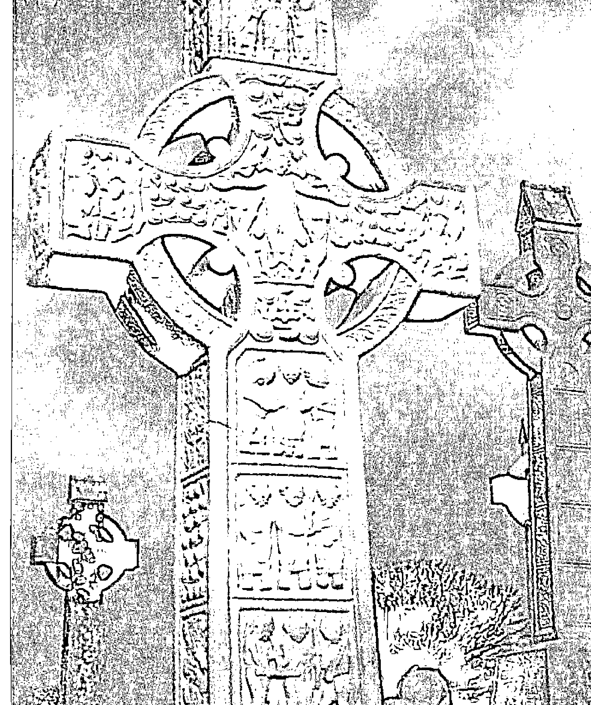

久。凯尔特人的神话常常描述的是“幸福之岛”，并且说其中的几个已经沉入水下，而大海则是一个连接环，连接着凯尔特人所居的现实世界和任何奇迹都可能发生的神奇世界。那儿从水下伸出巨人的一条腿，这腿的顶端就是神仙住的地方。去那儿只能走海底之门。水下露出一根巨大的方形银柱，一张金网从顶端披下，直达水面。有一座海岛，岛上有头巨大的野兽，沿着环抱整个陆地的围墙游荡。漂泊者落到这座岛上，就能得到一切:美味佳肴、琼楼玉宇、国色天骄……只是这些宝物中的任何一种他都无权据为己有。

他刚想到这里,面前突然冒出一张餐桌,华丽非常,摆满金盏银盘、山珍海味……

想象中的国度,自然保留了古老口头传统的痕迹……在这方面,约翰·托尔金指出:‘每一个作家在创造一个幻想,建立一个次生世界时,可能都想成为一个真正的创造者,都希望他所写的东西是现实的,他的次生世界里的生活源自现实——或者可汇入现实……不难想象,假如人们发现某篇特别优秀的神话故事原来是真实的,那所能感受到的兴奋和喜悦是多么的不一般啊……’

俄罗斯传说和凯尔特传说有着许多共同之处。《一朵小红花》描写的就是一个神奇的世界。有个商人旅行途中来到这里:‘他跨进一个大院,迈进一扇洞开的大门,只见路面白玉耀眼,两旁喷泉争辉,大大小小,高高低低。他拾阶而上,步入正殿——红色的地毯,镏金的扶手;走进内殿——空无一人;转入一个内殿又一内殿——全都不见人影,可是仙乐绕梁,绵绵不断。这时他暗自寻思:‘好倒是好,只是没吃的。’

凯尔特人虽然在欧洲走南闯北,寻找想象中的世界,可他们不仅没忘记自己北方的发祥地,也没忘

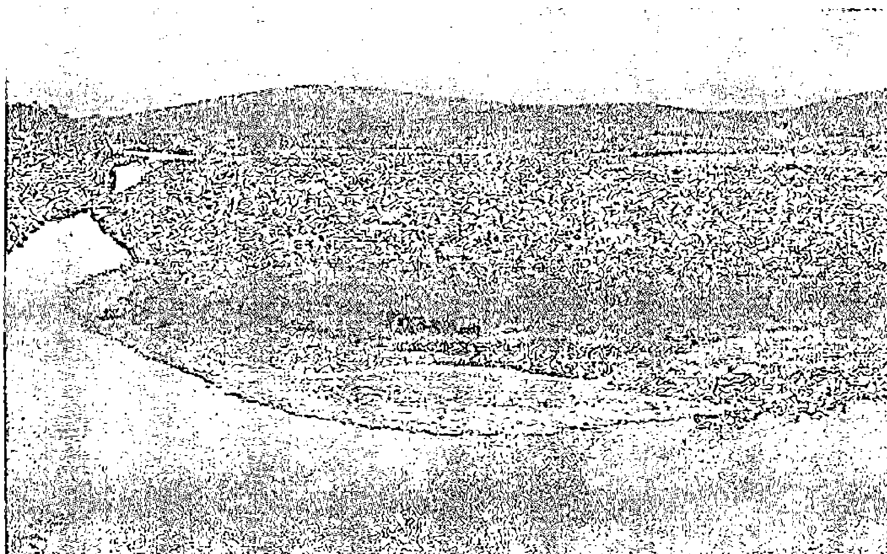

### 阿瓦朗

凯尔特人的古代传说里说到，在遥远的西方有个由一百五十个岛组成的群岛，一批批义士从爱尔兰冒死向那里进发。在大西洋的风浪中行船异常艰难，许多人途中丧生，只有那些才能超群的人才能目睹阿瓦朗美丽的玻璃宫殿，从当地妇女的手中接过赋予永生的苹果。这片土地的叫法各异：大地、长寿乡、美人国或者阿瓦朗——“苹果岛”。神奇的果实吃了不仅能长寿而年轻，还能忘却过去，所以踏上这些岛的人都愿留下不走。唯一例外的是凯尔特人的君王，传说中的执政官布朗，他的历险在民间故事《布朗的航行》里有所描述。

1-3. 许多人都知道“凯得别里”是一家生产巧克力的公司的名字。然而，凯得别里却是大不列颠的一个非常美丽、非常特别的地方，人们通常管它叫“勒忒国”。凯得别里耸立着一座高山。相传，那里曾有过亚瑟王的一座宫殿。

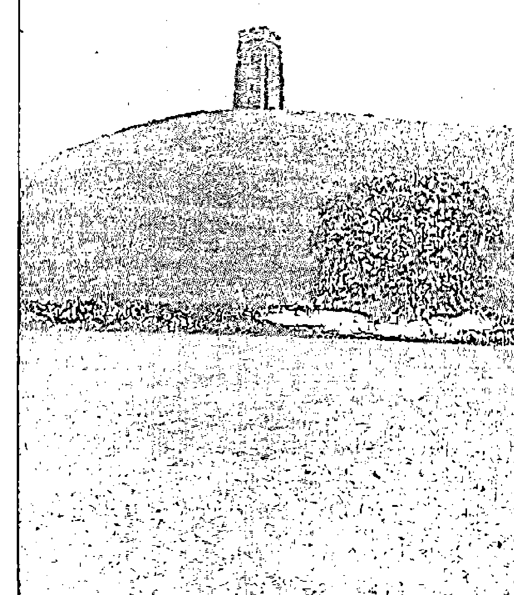

凯尔特人乘坐着涂蜡的皮筏走了许多天，四周满目惊涛骇浪——连一座无人小岛也不见。就在船上的人们陷入绝望之时，突然刮起一阵顺风，鼓足风帆。皮筏乘风破浪，

平稳而急速地驶向出现岛屿轮廓的地平线。很快海员们看到了岸上的玻璃宫殿，它们在旭日的照耀下闪闪发光。水边有一些女人向来客频频招手，邀请他们停靠热情好客的海岸。

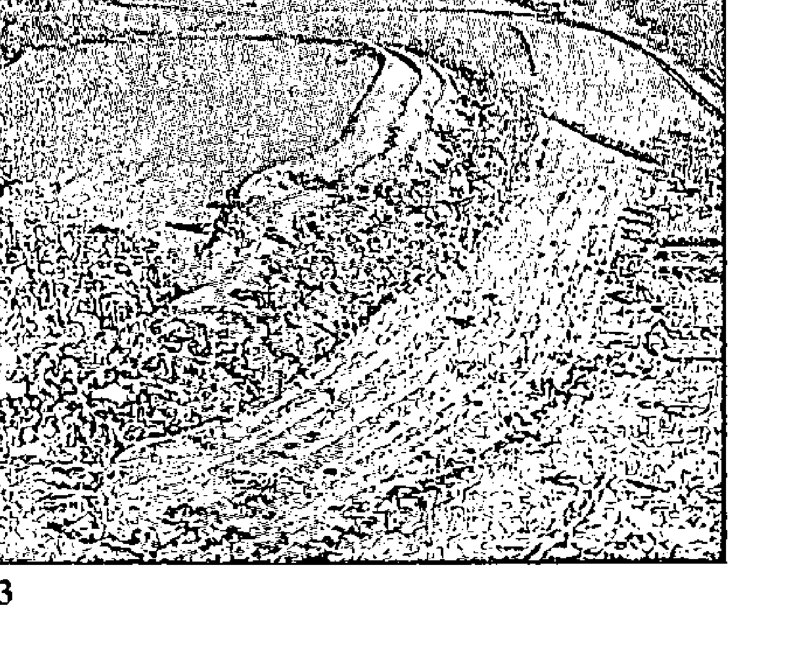

这番景象，起先让人觉得是海市蜃楼或者妖术魔法。海员们害怕上当，决定绕过岛屿，继续前行，可是海风偏偏将船吹上了浅滩，他们不得不抛锚停船。

后来发生的事情，他们难以一一回忆出来，只记得在阿瓦朗岛上的日子就像一场甜蜜的美梦。在那里，他们实现了自己的夙愿：人人神清气爽，个个青春年少，月月无病无灾，日日玉液

## 卡梅洛特

+   1. 圆桌旁亚瑟王的首席坐椅。无论古代还是当今，谁都无权占用这把坐椅。
+   2. 骑士加拉哈德、帕齐法尔和博斯爵士跪在圣格拉尔的大樽前。15 世纪法国的图书插画。
+   3. 法师梅林用巨树墩做成的圆桌的构拟图。

亚瑟王在同叛逆莫德列德搏斗中身受致命重伤，去了阿瓦隆。事情已过去十五个世纪，但是他的历险故事并没完，传说中国王只是开始了他的永生之途。6 世纪和 7 世纪，威尔士的弹唱诗人还在歌颂人民英雄亚瑟和他光荣的骑士们。传奇中说，他没有死：他的魂魄变成了渡鸦，而躯体则躺在山洞里，他的家乡一旦面临危险，他立刻就会醒来。亚瑟生前住在威尔士的克莱翁，身边有一班出色的大臣和数百名骑士：他们的勇敢和谦恭堪称世人楷模。这一社会的核心是实行圆桌会议制十二骑士，那圆桌是法师梅林为他们特制的。亚瑟的宫廷骑士们驰骋各地，保护妇女，制服强盗，解救中魔的百姓，挑战粗鲁的巨人和奸诈的侏儒。

到荷兰、斯堪的纳维亚、普罗旺斯、西班牙、意大利，传回英国时已被添枝加叶，弄得面目全非。写过关于亚瑟的叙事诗的，有法国诗人克雷蒂安·特洛阿、德国吟咏骑士爱情的诗人沃尔夫拉姆·冯·埃申巴赫和哈特曼·冯·奥埃等。圆桌会议的骑士们的荣耀起先成了全欧洲的荣耀，接着成了全世界的光荣。他们的形象继续激发着雕塑家和画家、诗人和童话作家、音乐家和戏剧家、电影导演和哲学家，直至向往着为女士的尊严而挥剑厮杀的男孩们的想象力。历史上是否真有亚瑟其人，已经很少有人怀疑。而对他宫殿所在地的激烈争论，至今尚未停息。王国的首都卡梅洛特，在英国作家马洛礼等人的书里有过非常详尽的描述，并被多次推荐拍摄成历史片和科幻片，不过它只是一些作家和弹唱诗人的想象而已。

按理说，大不列颠南方这块被描写得如此详细的地方，是不难找到的。况且卡梅洛特也不会从地球上消失得一干二净，总该留下一些土墙、沟壕和房基的遗迹，也该留下一些器皿的碎片或古币吧。

威尔士人确信，凯尔特国王居住、执政和建立卓越功勋，只能是在凯尔特人的土地，在大不列颠最南端的康沃尔。那儿，征服者的足迹从未到达过，那儿的一切直到现在还带有古老的传奇色彩。

许多学者的看法不谋而合，认为卡梅洛特从前曾位于土著人称之为列塔国的边远地区。这里，在格拉斯通别里天主教修道院以南的布里斯托尔湾的海岸边，南凯得别里附近，笼罩着一种可以从现代返回到古代的特别神秘的气氛。“谷地里的大圆石之间，长出一些蕨菜。两端悬崖凸出，悬崖上可见深深的、大小不同的裂缝和洞穴。再往前，高高的山毛榉林一直顺着山冈而下，消失在黄昏的雾霭中。四周围一片令人压抑的寂静，仿佛是在等待着雷暴的到来。耳朵所能捕获的唯一声音，就是蚊虫飞舞的嗡嗡声，到处散发着浓烈的、甜丝丝的蕨菜味儿……”

除了一些总体感觉，还有一些客观原因，故而可以认为，卡梅洛特位于列塔国。在南凯得别里那长满树林的山冈上，还保留着一个巨大城堡的土围墙。早在16世纪，农民们在耕地时曾发现过罗马时期的金银铜币、古希腊时期的其他物品，甚至可能是圆桌会议某个骑士用于保护马蹄的银马掌。

两个相距很近的村庄的名字——南卡梅尔和皇家卡梅尔，以及流经该地的一条河的名字——卡姆，让人联想起卡梅洛特。

土著人常常说起亚瑟王的宫殿——城堡围墙内的最高处，而亚瑟王的水井今天还可在这条围着堡垒的小路边看到。人们也常说起亚瑟王的出猎，一条想象中的道路从山冈的北面通往格拉斯通别里，那儿坐落着他的陵墓。

这是传说也好，是历史也罢，但每个来到英国的人都值得一登卡梅洛特城堡的土围墙，欣赏一下萨默塞特那辽阔的绿野。

4. 这枚十字架上的题词说明此处地下埋葬着亚瑟王和他的妻子格维涅夫拉。修士们在格拉斯通别里修道院地域内发现的墓葬，至今仍令人怀疑。一些历史学家认为它是伪造的。

5. 格拉斯通别里修道院本身如今已成废墟。亚瑟王的墓葬仍然是个谜。

## 约翰长老的王国

+   1. 凯尔特人手抄本古书中绘有圣约翰的五彩插图很像中国西藏的坛城。
+   2. 约翰长老的王国1563年在埃塞俄比亚被标上了地图。
+   3. 描绘香巴拉的中世纪的郭伯廉花毯。
+   4. 信奉基督教的王国首都很可能曾建于印度北方的纳兰达，而它的长老就是一位菩萨。

中世纪的故事不可悉数，其中许多听来就像童话传说。关于从7世纪以来就闻名西欧的约翰长老的王国的传说，是最为令人惊异的。古罗马的教皇、皇帝、国王、骑士、编年史学者、游吟抒情诗人，都能细致入微地描述这个由基督大主教管理的亚洲国家。在那里，挨着山峦、荒漠、湖泊和原始森林，有一片土地，飞龙会将人们由空中运送到老远的地方。那儿独有的一种神奇的“鹰石”，能够提高视力，能够让戴着镶有这种宝石戒指的人隐身。还有一些神奇的宝石能够瞬间加热任何物体，并能照亮周围八公里的地方，或者让这块地方陷于一片黑暗，“真理之水”能够净化每一位愿意尝一尝它的人，并能够让人弄清自己真正的本性。因此，狡诈的外来人无法进入约翰长老的王国。然而，最奇的一眼不老泉。人们若想追回失去的青春，只要先把过斋，然后再喝三口仙泉的神水。

学者德·马·波兹涅耶夫写道：“传说散播到中国、土耳其、蒙古、波斯、阿拉伯、印度、亚美尼亚和所有参加十字军远征的民族，它的发展阶段将近四百年。俄罗斯古籍所载这一传说的名称是《印第安王国的故事》。”

奇怪的是，从来没有一个欧洲人到过这个国家。约翰的称呼是何意思，众说纷纭。人们认为“长老”（普列斯维太尔）一词来自波斯语的“使徒”（普列斯太汗），或者“拥戴者汗”（普列斯太尔汗）。有人认为他是一位西藏王，也有人认为是涅斯托利派的天主教徒。然而，与约翰的书信往来却很频繁，罗马人还接待过他的使者。

编年史作家阿尔贝里克·德·特鲁瓦·方丹证实，拜占庭王马努伊尔一世科姆年于1165年收到亚洲一个大国皇帝的来信。后来收到此类信函的还有神圣罗马帝国的皇帝和欧洲其他国家的执政者。这些信件存放于梵蒂冈档案馆，至今未曾公布。长老的来信并未石沉大海，1177年9月27日罗马教皇亚历山大三世就从威尼斯致函“印度著名而伟大的印度王”。天主教百科就此指出：“据书信细节推断，收信者显然并非虚构人物。”许多人都对教皇说起过印度王，尤其是他的朋友和医生菲利普。教皇的医生曾率队前往亚洲考察，至于考察的结果，人们不得而知。美国当代学者M . 霍尔推测，约翰长老的帝国位于戈壁沙漠，长老就住在山里被施了法术的城堡中。这个北方天堂名叫代容格或香巴拉。

可·波罗曾试图找到据说在天德国游牧的基督涅斯托利派，但是毫无结果。1487年，葡萄牙国王约翰二世派遣以彼得·可维拉尼和阿方素·帕义乌为首的考察团前往寻找约翰长老的王国。葡萄牙的贵族们历尽艰险来到阿比西尼亚，把当地的执政者当成了传奇式的“印度王”。很难相信他们判断的正确性，因此在中亚寻找基督国家的活动继续进行。17世纪，德国的神秘主义者艾克尔特斯蒙森试图对众人如此向往的长生王国的神秘性作出解释，“自古就有人在自己的内心纯洁中寻找智慧，但他们行踪隐秘，四处行善而不张扬……智者居住的国家与浪子们的土地之间有大海相隔。他们的孤岛远离已知的陆地，只要人的眼睛不能忍受神的太阳光线，它就不会被发现。然而它的使者却经常前往世界各地传播光明并四处寻找光明……” 纵然人们看不见也到不了义士们的住处，那也并不意味着他们也看不见我们。中世纪的传说里讲，约翰长老稳坐金銮，手执纯祖母绿的魔杖。他的宝殿之前有一泓湖水，那就是一面宝镜，在镜子里可看见世上所发生的一切。

中世纪的欧洲对香巴拉一无所知。因此，一听说征服波斯和亚美尼亚的成吉思汗，人们就肯定，来的是约翰长老或他儿子达维德的部队，而蒙古人正是亚洲的基督徒。他们向成吉思汗派出了天主教使团，使团在卡拉昆仑的金帐汗国住了些时日。使团成员返回时安然无恙。寻找长老王国及其后代的努力并未就此停止。著名的旅行家马
## 布阳岛

1,2. 业已消失的阿尔科纳，依旧活在俄罗斯童话里。在伊万比利宾为普希金的《萨尔特王的故事》所作的插图上，既表现了传说中的布阳岛，又表现了阿尔科纳城。事实上的阿尔科纳稍有不同：那里既没有东正教金顶教堂，也没有克里姆林，甚至居民的穿着也要简单些——通常只穿件红衬衫。

3. 著名的白垩斜坡。今德国吕根岛( 西斯拉夫人称其为鲁延, 罗斯人叫它布阳 )。整个斯拉夫世界的圣城——阿尔科纳，连同斯维亚托维特木结构寺庙，曾位于岛的最顶端。

波罗的海碧波浩渺，碧波中耸起一座岛屿——吕根岛，岛上到处是白色的悬崖峭壁。波罗的海沿岸居住着许多民族，这吕根岛在每个民族的叫法各不相同。俄罗斯人因这里频繁的风暴和岛上居民的民风习俗而管它叫“布阳”。传说和童话里讲，布阳是世界的精神中心、奇迹的集中地、地球的肚脐眼儿。

古时候，吕根岛上有座圣城，叫阿尔科纳，城里有座供奉四面神斯维亚托维特的庙宇。阿尔科纳是整个斯拉夫世界的精神中心，就像印度人的瓦拉纳西，穆斯林的麦加，信仰犹太教和基督教的许多民族的耶路撒冷。

同时代人和目睹者、丹麦编年史作家、十六卷本史书《丹麦人的业绩》的作者撒克逊·格拉玛提克（1140-1208）留下了详尽的描述：“阿尔科纳城建于高耸的岬角之巅。北东南三面由大自然本身——悬崖——护卫……悬崖之下便是大海。城西面建有城墙……城市中心的广场上，有座匠心独具的木结构庙宇。它受到人们的景仰与其说是因为它的华丽，不如说是神的伟大……庙内有尊斯维亚托维特的巨大神像，神像的旁边是笼头、鞍子、宝剑和其他装具。”

对斯维亚托维特的详细描述，我们可以在神话词典里找到：“斯维亚托维特是最高神，主司战争和胜利；他的标志物是宝剑、战旗、彩旗，彩旗上有的画着雄鹰和长矛。斯维亚托维特的崇拜中心，是波罗的海斯拉夫城内阿尔科纳里的四塔庙。斯维亚托维特的象征色是红色：他的庙宇就是红屋顶，庙宇里挂的是紫帷幔，一些木箱里放着许多紫衣服。斯维亚托维特庙里的白色神马天亮时满身是泥，人们相信，夜里它是外出同敌人作战了。占卜时，将马牵到三排长矛前，若是左腿失蹄，为凶兆；如若先迈右腿，则为吉兆。神谕传达者斯维亚托维特的答复被认为是最有分量的。斯维亚托维特的神像有前后左右四个脑袋，这使斯维亚托维特及其四塔庙与斯拉夫神话里世界的四组分模式形成对应关系。”

阿尔科纳人崇敬自己的神灵。在他们看来，神灵就在人们中间，人们能看见他们，也能与他们交谈。斯维亚托维特跟他的崇拜者们没有丝毫不同：平膝粗呢或毡子衣，光脚穿树皮鞋，银鞘重宝剑。他像印度的婆罗贺摩，四双眼睛盯着不同的方向，仿佛为了严密监视辽阔的斯拉夫世界的秩序。他的标志物不仅是那把战斗的宝剑，而且还有那盛满花果之角。宝剑与角，恶与善——他所治理和观察的世界就是这样。

9月，丰收节前夕，大祭司要打扫“主神”的寓所，这时要屏住呼吸，以免玷污神殿。节日里，要摘下之前一直围着斯维亚托维特圣像的紫帷幔。祭司一身红装，从圣像手中取下盛满花果之角，往里面看一看上年节日所添的葡萄酒还剩下多少，据此判断来年的景况。然后将角加满新酒，放回原处。

1168年7月15日，阿尔科纳遭到丹麦国王瓦尔德玛一世的攻击。

## 雷特拉——水上圣城

+   1. 雷特拉为条顿骑士团的十字军所毁。雷特拉的这件出土文物只能用奇迹两个字来解释。类似的黄道盘当是公元5-11世纪的作品。

+   2. 雷特拉并非唯一的岛屿崇拜中心。尤·米罗留波夫绘制的构图上表现的就是一个这神圣的布局。

+   3. 雷特拉遗址上发现的家畜神维列斯塑像。波兰。

从7世纪起到12世纪末止，奥得河与易北河(斯拉夫人叫拉贝河)之间的所有土地都住上了西斯拉夫人的各个部族——波莫瑞人和博德里奇人、拉贝河地区人和瓦格尔人。人数最多的部族是以骁勇善战而得名的柳蒂奇人。他们的都城叫拉季果希，或者用德语叫雷特拉。而今许多城市都改了名：斯塔尔哥罗德改成了阿尔滕堡，梅赫林——梅克连堡，勃拉尼扎——勃兰登堡，科列尼扎——哈采姆。从住在这里的斯拉夫人一部分被挤往东方，一部分被打死，一部分被德意志化。保留着文化传统和语言的只有卢日支塞尔维亚人。

王亨利四世的部队；半个世纪后，1118年，遭到法国国王洛塔尔三世部队的围攻；1150年，受到巴伐利亚亨利公爵士兵的攻击。拉季果希让欧洲每个统治者都觉得如芒刺在背，他们都视征讨、摧毁和掠夺拉季果希为己任。

随军编年史作家们都浓墨重彩地描绘过所见所闻。日耳曼的蒂特马尔·梅泽堡主教(975-1018)详细描述了位于湖中岛上的城市：“柳蒂奇人的都城叫雷特拉。城区呈三角形，城外密林环抱，开有三个城门。其中两个供市民出入，第三个通湖中各水域。城中心耸立着匠心独运的、用各种野兽和动物之角打基础的木结构庙宇。庙宇的外饰全是工艺绝世、彩绘超群的镂空神像。庙宇中央矗立着身穿盔甲的诸神塑像，其中为首的自然是拉捷加斯特。”当代学者亚历山大·斯尼萨连科在《智慧的第三带》一书中写道：“拉捷加斯特被认为是左手握枪的年轻战士，他的名字解释各不相同：‘族长会议之客’、‘族长会议之首’……”

在拉季果希城里，一切都给人以美和神圣的感觉。湖泊无论风平浪静还是波涛汹涌，都是对未来的预示。湖的四周和湖心岛上古木参天。这些寿星里，最雄伟、最漂亮的当数千年的橡树。橡树之下，木栅栏环抱之中，伫立着各部族的神灵。这里可以进来的是祭司和上供的人。遭遇生命危险者也不会被拒之门外，不分门第宗族，人人都得到过圣橡树的荫庇。

拉季果希的居民接待撒克逊人及其祭司，就像欢迎盼望已久的客人。客人们穿过狭窄的小桥，进入圣地，无不为它的美景所倾倒，为主人的殷勤而惊异。可是，突然教主一声令下，撒克逊人拔剑冲向手无寸铁的斯拉夫人的祭司。后来，梅泽堡主教在编年史中描写了这些事件：“在古树中间，我们看到一些圣橡树。它们被用漂亮的栅栏围成小院……每逢周二，市民、头人和祭司在此聚会审案……我们来到橡树林……走进小院，拆毁栅栏，堆在圣树橡四周，用无数的木桩点起篝火，然而也不无担心愤怒的人群会扑向我们。”

斯拉夫人没有以怨报怨，他们不能在圣橡树林里流血牺牲。柳蒂奇人祭司们离却被撒克逊人玷污的雷特拉，前往相邻的博德里奇人的部族。当时这部族的首领是克鲁特公。此公不是忍让外族的主。尽管他们的力量不算大，可博德里奇人同日耳曼人直杀到一兵一卒。

拉季果希本身又怎样了呢

定仿效拜占庭国王，组成三百三十人的使团，命他们一直迎着太阳直奔东方。原以为他们三年后便能回转。头一年还常有信息，说使团一路受到欢迎。后来音讯全无，人们都认为使团在遥远的亚洲边疆消失了。大臣们可能心想，白水国连同它的特殊信仰根本就不存在，因此建议大公别再犹豫，接受拜占庭的信仰——东正教。

使团派出四十九年后，从察里格勒来了一位年迈的修士。他在基辅隐居了七年，觉得大限将到，于是忏悔道：“我是当年弗拉基米尔-红太阳大公随团派往寻找白水国的修士。”接着，老人说，他们在异乡跋涉两年，一直走进遍地尸骸的沙漠。多数人都被吓得转身回返，只剩下了谢尔吉和两个旅伴。他们忍着炎热、饥饿和干渴，走向神秘的远方。艰难困苦没有白受，他们遇见了一个到过白水国的人——给指了路，找了向导。俄国修士历尽磨难来到深山，旅伴病倒，向导不敢再往前走。

谢尔吉临终前回忆说：“我剩下孤身一人。可我并没灰心。我感到难以形容的激动和幸福。我觉得离旅行的目的地不远了，我一定要到达那里。”他神智模糊地在羊肠小道上蹒跚而行，凭直觉向前或转弯。第四天傍晚被说的不是俄语但谢尔吉能明白个大概的一些人所收留。就这样，俄国修士来到了白水国。白水国的情况他说得相当简短：“很难描述我在那里见到的一切……首先应该说，白水国不是童话，而是真实。许多人都想一见这神秘的地方，可是每一百年只有七人能如愿以偿。其中六人过一段时间得带着秘密的知识返回故里，仅一人可永远留住白水国……岁月对于他们停止不动。我也不知在那里住了多少时间，可我念念不忘大公赋予的使命：俄罗斯有否作出选择？是否等着我返回报告白水国的情况……我得知，罗斯选择了东正教，认为我已死在异国他乡。” 不久，修士死了，而他那关于白水国的描述代代相传。1926年，俄国学者和画家尼古拉·廖里赫又沿着修士走过的路，去探索白水国和香巴拉。

## 白水国依然是俄罗斯人民最为心仪的目标。旧教派信徒们曾断言，他们获得了阿尔泰高原别卢哈山的真正信仰和正义的王国。别卢哈山的山坡看上去就像进入另一世界——香巴拉的大门。

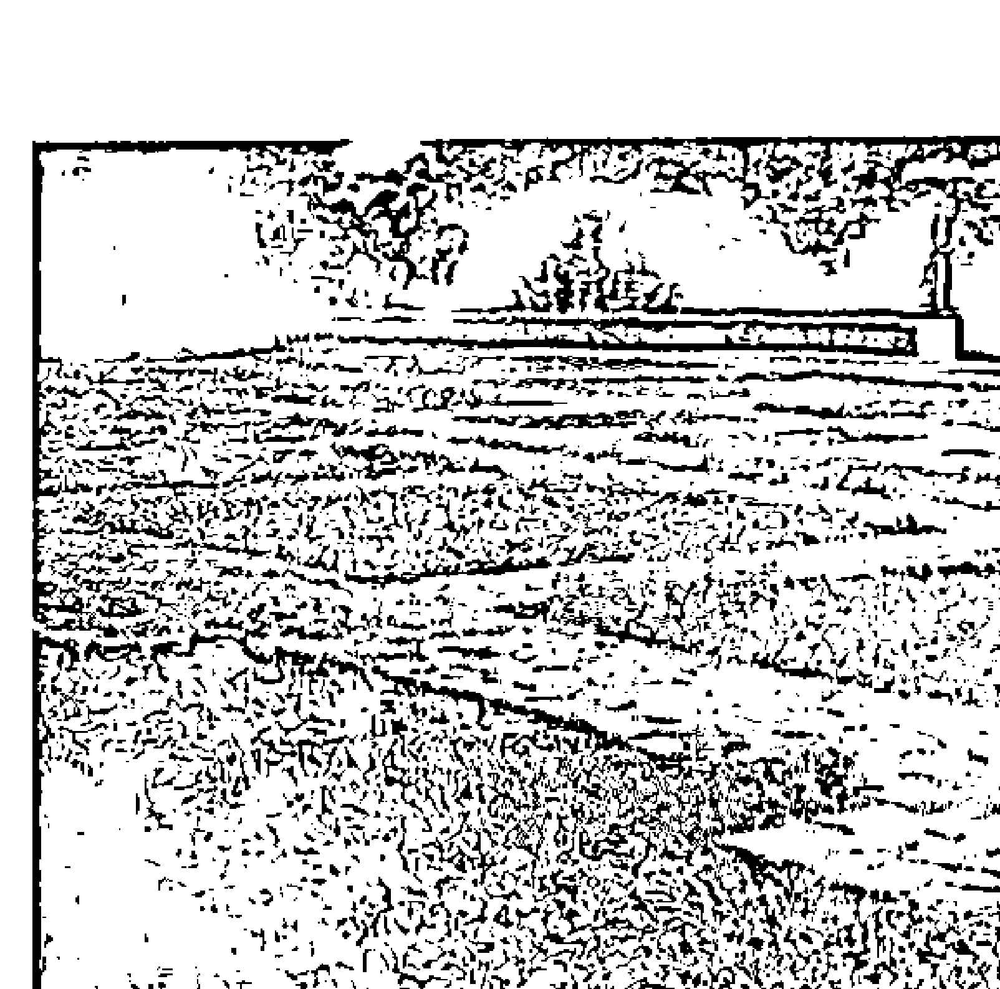
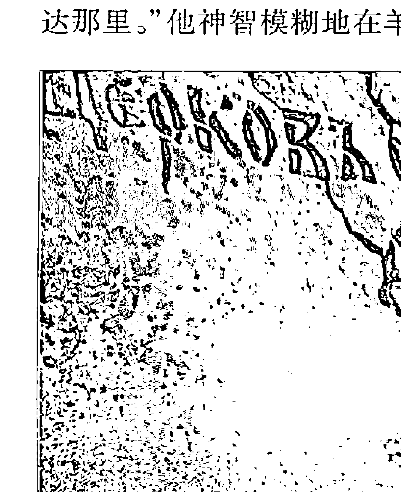
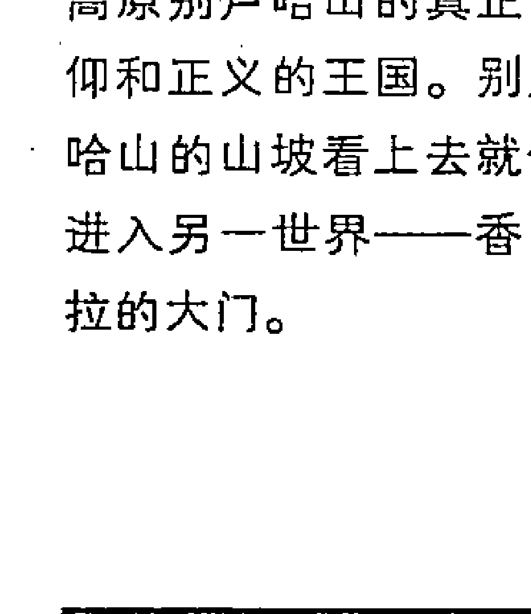
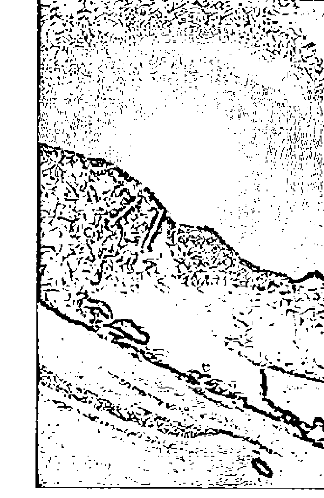

## 基捷日城的传说

相信斯维特洛雅尔湖水下有个圣城基捷日，是俄罗斯人对世界总认识的基础。难怪人们在湖边常碰到一起，心平气和地议论：无论他们属于哪个教派，都相信—每个民族都有自己的圣城。它们都蕴含着巨大的精神力量和对未来的信心。英国人的圣城叫卡梅洛特，斯堪的纳维亚人和日耳曼人的叫阿斯格尔特，中国人的叫蓬莱，俄罗斯人的叫隐城基捷日。很少有人能夸口到过正义与长生的圣所，因为神秘的面纱只有在命运宠儿和正人君子面前才会撩开。哪怕只是看一眼这些地方也算是种难得的幸福。水下藏着基捷日的斯维特雷亚尔湖却人人可以去。这里到过许多俄罗斯作家、艺术家、音乐家、民俗资料收集者和不同信仰的百姓。19世纪三四十年代，学者米列金发表过一篇关于它的旧礼仪派的传说。

13世纪初，拔都汗的大军夷平俄罗斯的许多村庄，兵临基捷日（今伏尔加河畔的戈罗杰茨市）。小城创建人格奥尔吉·弗谢沃洛多维奇大公率部抵抗。大公战败，逃往不久前他在湖滨建造的大基捷日。拔都攻占小基捷日，开始全城搜捕大公……拔都得知大公下落，下令兵发斯维特雷亚尔。1237年，俄罗斯人与金帐汗国人再度交兵，力量又一次战胜了勇气，负伤的大公和几名亲兵躲到了城外。蒙古人未急于追杀，因为他们确信，大基捷日城防尽破，已成囊中之物。不料……出了件怪事！据民间传说，敌军战胜大公的亲兵后，拥向大基捷日，忽然他们的眼前出了件怪事：城池陷入地下，深深的陷坑一片汪洋。教堂和修道院都消失在山丘之下，仿佛戴上了隐形帽。至今，夏日宁静的傍晚，斯维特雷亚尔湖上还常常出现教堂金顶、王公楼阁、商贾亭台的倒影。每天深夜都能隐约听见凄凉的基捷日钟声。

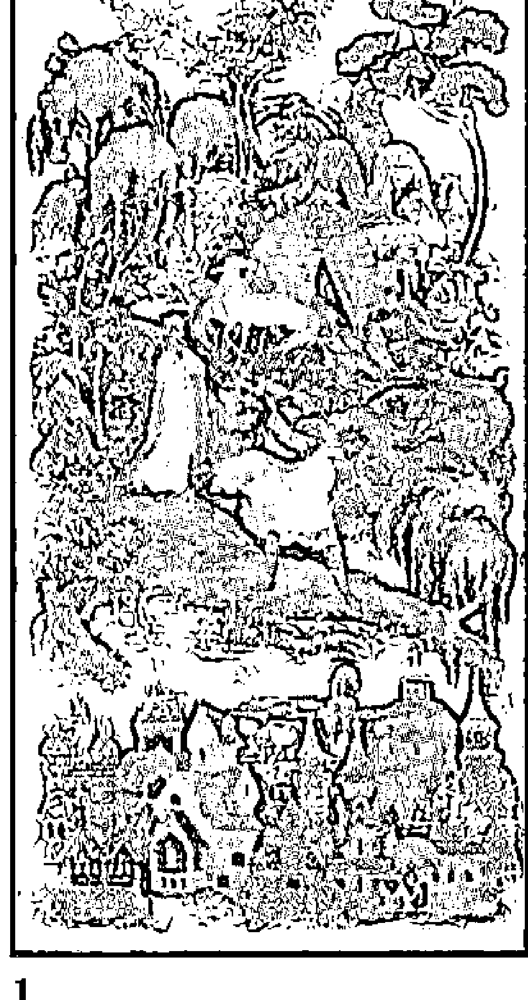

于是，来斯维特雷亚尔湖的朝觐者络绎不绝：有人希望用湖水冲洗以治伤疗疾；有人来绕湖跪行三圈；也有人来结识基捷日的隐士，跟他们前往已为众人所知的山林。

传说在《莫斯科维亚人》杂志上发表后，便成了知识界的财富。前来的首批游人中有为自己的两部曲搜集素材的帕·梅利尼科夫（安德烈·彼切尔斯基）。作家在长篇小说《在森林里》中写道：“……平原上耸立着分成两半的长满百年橡树的山丘。它像两根楔子扎入广阔的湖中：湖水从不发浑：你无论往水里扔进什么，它一概不收，转天就把东西冲到岸边。那湖用的是老俄罗斯神斯维特雷亚尔的名字。据说，湖旁的山丘上原来有座城，叫基捷日。”

19世纪末20世纪初，作家弗·柯罗连科常来这里。他在短篇小说《斯维特雷亚尔》里写道：“熟悉充满传奇色彩的小湖之后，我不止一次地来到它身边，手拄拐杖，肩背行囊，挤入人群，看看、听听，在五光十色和嘈杂声中捕捉民间诗歌欢腾的溪流。”

20世纪初，米·普里什文访问了伏尔加河左岸的“分裂派教徒和教派信徒所在地”，发表了随笔集《隐城墙边》

写过基捷日的有马·高尔基、阿·托尔斯泰、康·费定和诗人马·沃洛申、尼·克柳叶耶、谢·戈罗杰茨基……

柯罗连科是尽力描绘该湖及其周边地区的第一人：接踵而至的是许多知名的艺术家：阿·瓦斯涅佐夫、尼·廖里赫、康·科罗温和米·
克洛特、米·涅斯斯特罗夫和费·博戈罗季茨基、尼·罗马金和伊·格拉祖诺夫。

1904年作曲家里姆斯基-科萨科夫写出歌剧《隐城基捷日和少女费夫罗尼娅的故事》。

苏联时期，往这里不止一次地派出过科考队。战后每年都有潜水员和考古学家来此寻找13世纪古俄罗斯城的遗址。他们在报告中写道：“斯维特雷亚尔及其周边地区，作为独一无二的自然和俄罗斯历史的古迹，应该宣布为国家自然保护区。”斯维特雷亚尔虽未成为通常因资金不足而被遗弃的保护区，可依然是俄罗斯大地上一块最为圣洁的地方。

基捷日不仅成了不可动摇的信仰的象征，也成了历代俄罗斯艺术创作灵感的源泉。

斯维特雷亚尔如今还在——下诺夫哥罗德州弗拉基米尔斯科耶镇附近。来吧，来看一看它的湖光山色！

在俄国画家伊·列维坦的油画《晚钟》里，非常准确地捕捉和传达了俄罗斯大自然宁静安谧的特殊气氛。大自然通过冥思开辟着通向另一个、更加完美的世界的道路。正是这种心情越来越多地抓住了来到斯维特雷亚尔湖边人的心。在湖边，人们不仅能根据古老的传说，而且能根据当地老辈人讲的现代故事，见到基捷日的隐士。有时，他们邀请一些正人君子同在水下城定居。人们多半会请求暂缓些时日，可等他们再回到斯维特雷亚尔，就谁也碰不着了。然后人们就终生惋惜失去了良机。

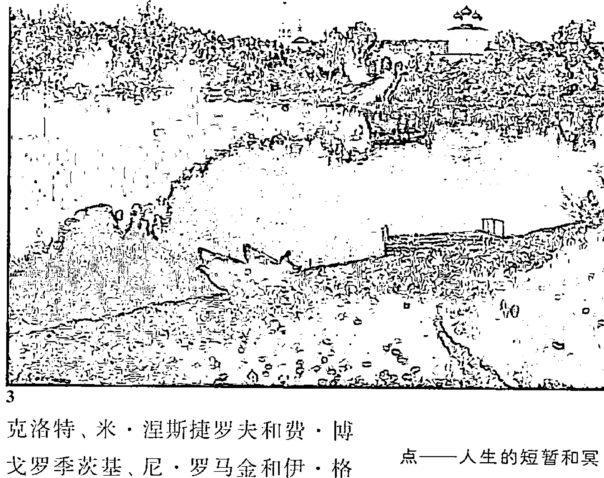

## THE WORLD OF UNSOLVED MYSTERY

## 在哥伦布发现前的美洲之奥秘

我合上两眼,小声说: ‘马丘比丘! ……’ 我们曾向往着你,就像被忘却的王储——惦念着父王的宝座! ……’ ——罗伯特·罗日杰斯特文斯基《马丘比丘》

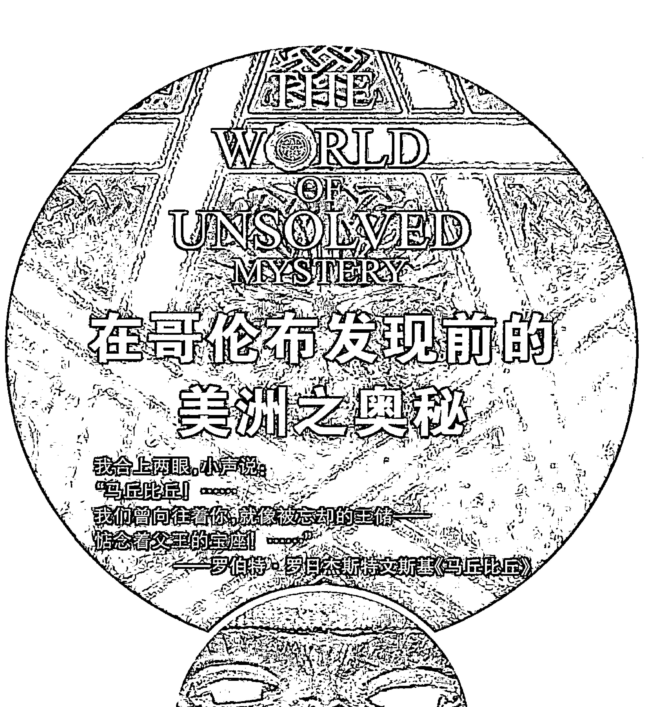
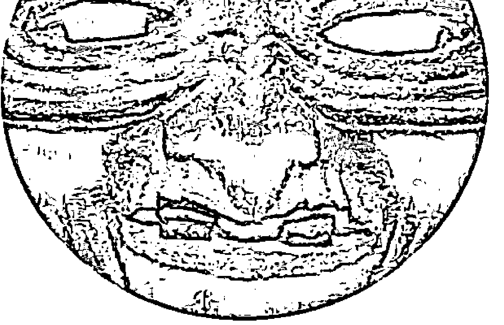

## 各国的学者们都确信，印第安人并非美洲的土著居民。他们来自何方，这又是何时发生的呢？捷克学者米罗斯拉夫·斯汀格尔认定他们是亚洲血统：“对美洲学一系列重大问题的最后答案已由美籍捷克人阿列什·戈尔德利奇卡教授作出了……1912年，他前往西伯利亚和蒙古，考察那里的现代居民的生活。然而意义最大的是他多年在美洲北方的研究。戈尔德利奇卡在地表浅层发掘并找到了北美最早外来人的漫长历程的踪迹。”

美国学者K.B.克拉姆在其著作《在哥伦布发现前印第安人的秘密》中说得更加明确：“一千年前从西伯利亚迁往阿拉斯加的人们，随着大型动物，顺着陆地完成了这一旅行！……引人注目的是，学者们已不再讨论最早的印第安人是否真的来自西伯利亚这一问题，现在这已毫无疑问。但这一信心出现于20世纪30年代（最早指出亚洲移民的时间是何塞·德·阿考斯特修士，1590年），可以说，当时只经过间接论证。得益于所有其他理论都被认为是错误的……比如，大西洲说和姆国说……”

完全可能是，某些部族在遥远的古代就住进了阿拉斯加和现今加拿大的北部。奇怪的是，在这些地方他们没有建立发达的国家，而是拥向南方，在中南美洲建立了阿兹特克人、玛雅人、印加人的帝国。挪威学者图尔·海耶达尔令人信服地证明，古代也能够并完成长途海上航行，将波利尼西亚群岛同南美洲联系起来，再通过南美洲联系亚洲，或许还有欧洲。

对印第安人的亚洲血统表示严重怀疑的是巴西教授尼德·桂东。她在巴西东北部的圣莱蒙多市附近发现了一处罕见的岩画。研究证明，文物的年代不少于五万年。桂东写道，白令海峡的通过能力太小，无法保证大批人的迁移，而他们从阿拉斯加到南美洲的迁移路程恐怕要用千年来计算。

南美洲和大洋洲居民的文化，在建筑、风俗、语言上有许多共同之处。在这些民族里，可以找到同样的生活用品，而这些用品在世界任何一个地区都难见踪影，如捕猎的套索和射箭的气筒、家庭用具、同样的乐器、相似的民间游戏。他们的许多风俗也是共同的，比如，以泪水互相欢迎，也就是见面时出于礼貌应当哭泣。血缘联系也相当深远。在南美洲，在现今的秘鲁和阿根廷有一种特别的鸡种，它们下的蛋是蓝色的。这种鸡除了日本，哪儿也没有。要将这种鸡转运好几千里，只有经验丰富的航海家才能做到。大量的证据表明，印第安人曾分布于各个大陆，与各个国家保持过密切的贸易和文化关系。此外，不是哥伦布，也不是古斯堪的纳维亚的海盗们首先发现了美洲，而是美洲人越过大西洋来到了这里。斯汀格尔写道：“无论怎么令人奇怪，然而最早来我们欧洲的却是印第安人！公元前62年，古日耳曼部落斯韦夫人的领地上，易北河口附近，岸边冲来一艘式样古怪的木船，船上的人穿戴陌生，语言未闻。神秘的外乡人用手势解释，是风暴将他们从大海的另一边刮来的。显然，这就是印第安人。”

这些印第安人没能回到自己的家乡，斯韦人的首领将他们俘获，“赠送”给了驻高卢的罗马地方总督克文特·梅泰尔·克列尔。然而，来过欧洲的很可能还有美洲的其他海员，他们要更幸运些。显然，他们回到了自己的家乡，欣喜若狂地讲述在远方的所见所闻，并从基督教徒的风俗和信仰里吸收了许多东西。许多学者都曾指出过《圣经》和印第安人经书的相似之处。他们知道最高神、世界的创造者和他的敌人撒旦。一提起撒旦，人们都要鄙视地啐上一口，甚至民间拉丁语称呼神也叫“泰奥”。不同文化的碰撞，往往会导致互不理解的悲剧。西班牙征服者们常常描述印第安人血腥的宗教仪式，为的是渲染他们的野蛮和凶残，以此证明这一古老民族种族灭绝的原因。而西班牙人的报复要高出百倍。就在他们五十年的统治期间，仅不懂得血祭的印加帝国的居民就从七百万人锐减到五万人。然而，最为可怕的是，独一无二的文化被摧毁了，而这些文化的体现者就是极北人和姆大陆居民的直系后裔。时代的联系中断了——整个人类重又陷入了野蛮和混乱。

## 蒂亚瓦纳哥——美洲永恒的城市

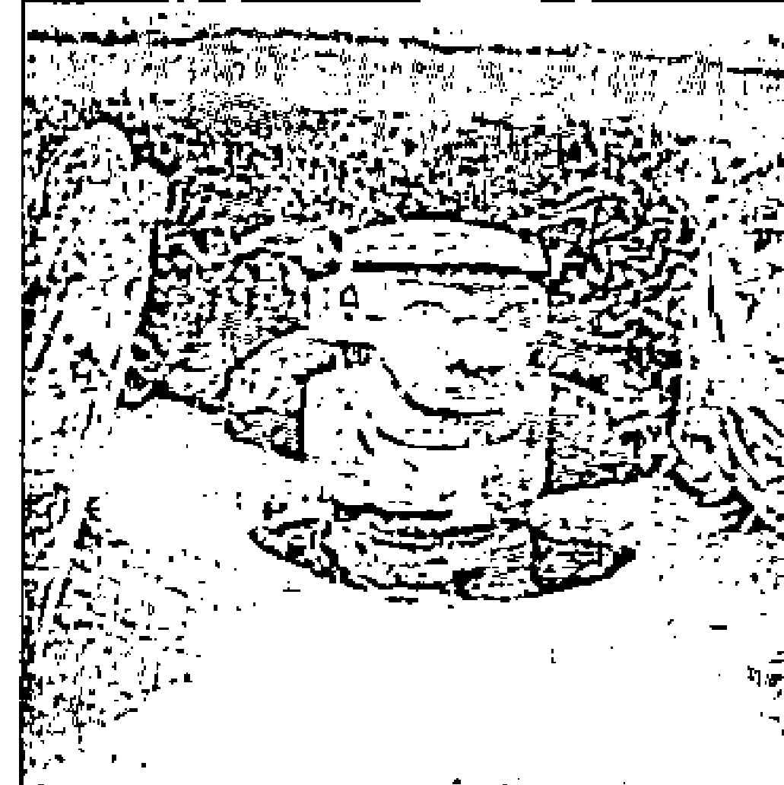
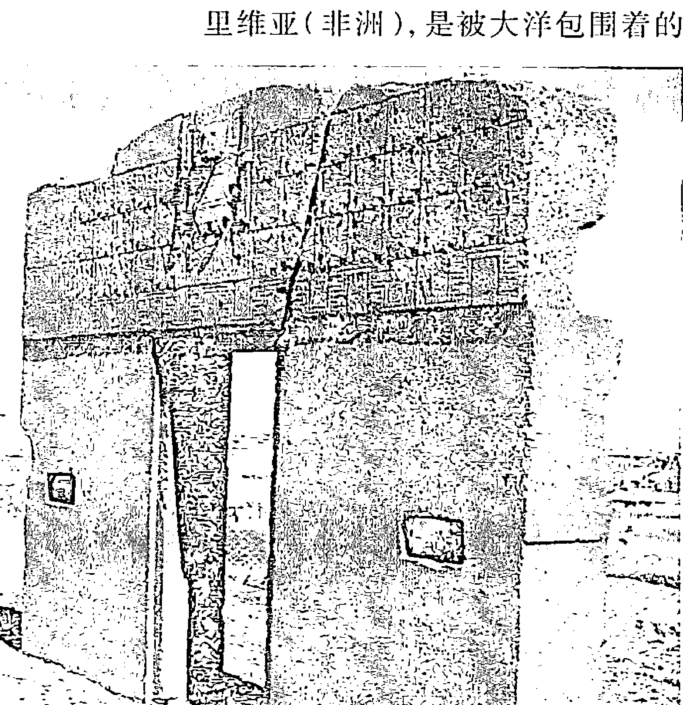

1. 不知是什么民族的人在拉丁美洲留下了这些古物，但是可以推断，他们是蒂亚瓦纳哥文化的传人。
2. 起先，最古老的美洲王国的都城叫温依马尔卡(“永恒的城市”)。到过这里的曼科·卡帕克，印卡帝国的第四代执政者，在玻利维亚(高山湖的的喀喀以南21公里)见到的却是一片废墟。他为眼前的景象所震惊，于是将毫无生机的废墟改名为蒂亚瓦纳哥，意为“死城”。厄瓜多尔

许多学者像古代祭司们一样，负有知识垄断和知识隐瞒的特殊使命。如果所说是过去的，因而对外行人也是有害的知识，那还更好。可是，常常出现相反的情况，他们常常力图诋毁在某个问题上跟他们个人观点不一致的理论，说它们浅薄，更有甚者，说它们是神秘主义的妄想。从这些人的嘴里说出来的“神秘主义”，就意味着极端的蔑视。这种不可妥协的立场，最明显地表现在对待美洲古文化的态度上。关于这一点，美国学者罗伯特·沃科普说得极其坦白：“业余爱好者永远将憎恨专业学者，而学者总是瞧不起一知半解的人。” 只有真正的天才能够洞察一切，能够透过一大堆杂乱的事实看到一个整体。古罗马历史学家克拉弗季·埃里安写道：“欧洲、亚洲和里维亚(非洲)，是被大洋包围着的几个岛屿。大洋的彼岸有片辽阔的陆地。” 古罗马著名的演说家西塞罗也相信这块大陆的存在。他说，罗马人所知道的几块土地，跟那些不知道的地方比起来，只是一个小岛。哥伦布发现美洲之前四百五十年，亚洲百科知识学者阿布莱汗·比鲁尼就不止一次地说过，大西洋彼岸有块大陆，无法渡海去那里，“是因为风疾、水大和不能返回的风险”。号称“19世纪的亚里士多德”的德国学者亚历山大·洪堡一再坚定地说：“我脑子里很清楚，文物、纪年方法、宇宙起源说的体系和美洲的许多神话，都是东亚所有的一些思想的惊人相似物。它们在指点古代的相互联系，而不是文明初始的所有民族所处的共同条件造成的简单结果。”

最早研究安第斯山印第安人文化的学者之一，是德国的马克思·乌勒。他在这些地方进行考古发掘是19世纪最后十年的事。在所有的发掘中，蒂亚瓦纳哥庙宇的遗址让他最为着迷，因为遗址有种不可思议、难以言传的古风。 现代学者决定研究蒂亚瓦纳哥庙宇废墟，是要判定它们的年代，可是得出的结论让人沮丧。通过对石头的碳化学分析，确定蒂亚瓦纳哥庙宇群始建于公元1世纪，并陆续建造了五个世纪——在历史的长河中，这时段微不足道！然而捷克学
者米罗斯拉夫·斯汀格尔在自己的书中写道：“蒂亚瓦纳哥被考古学者公正地认为是印加人之前南美洲的最重要的城市……蒂亚瓦纳哥的历史独特性早先引起过种种奇异的推测。比如，X.C.别拉米认为这座‘圣城’完全是世界上最古老的城市，建于二十五万年前……”

我们觉得，关于蒂亚瓦纳哥特别古老的见解里任何虚幻也没有：从庙里引出的几条道路一直通往悬崖，因此考古学家推测，城市从前位于大洋岸边，而道路是通往港口的。地质学家证实了这一推断：蒂亚瓦纳哥曾位于低地，后来由于自然突变，出现在高原之上。这可能发生于姆大陆、大西洲和利莫里亚沉入海底的那些时代。

首批印第安人来到安第斯山的时间，根据斯汀格尔的年表，是在公元前2000年，也就是比北美首批祖先横渡白令海峡的时间还要早。人们不是来自北方

## 纳斯卡：梦幻和现实中的飞行

纳斯卡，是公元前500 - 前100年居住在离帕拉卡斯不远处的一个民族的称谓，同时又是荒漠和河的称谓。德国学者玛利亚·赖赫想从飞机上看一看纳斯卡荒漠。她所看到的景象简直难以置信！她的眼前展现出一只只飞鸟、蜘蛛、鱼、蛇狐狸和其他动物的巨幅图形。由于这些图形只有从高空往下才能看见，所以就产生了一种推断，石画的制作者们针对的是生活在天上的人，也就是他们信奉的诸神。

帕拉卡斯印第安人的宏愿实现了，他们的灵魂离开了地球，踏上前往宇宙各地的旅途。他们很可能找到了外星神仙，印加的尼安德特文明的创造者居住的星球。可是人间却留下了帕拉卡斯人的子孙，我们称之为纳斯卡人。“帕拉卡斯”和“纳斯卡”是两个民族，确切地说，是一个民族分成长辈和幼辈的约定俗成的称呼。“帕拉卡斯”是秘鲁太平洋沿岸的一个半岛；“纳斯卡”是位于同一地区的一片荒漠，它以一些朝天的硕大图形而闻名于世。这个民族过去是如何自称的，我们不得而知。纳斯卡的居民决定不离弃自己的家园——他们想把外星的神仙和自己的祖先帕拉卡斯人请回这里。同后者对话，他们借助的是从很高的地方才能看见的一些图形。德国学者埃里赫·冯·登尼肯推测说，纳斯卡的地理浅槽图形是为外星人准备的宇宙飞船的降落场。他的推测测多多少少有些道理：外星人如能回应地球人的召唤，那么纳斯卡就可能成为起降带。这事发生过没有，我们不得而知。我们只知道另一件事，纳斯卡人本身曾经是技艺高超的空中飞行家。他们未必能征服遥远的宇宙，但是近地大气层对于他们完全是通行无阻的。

两位飞行运动员，英国人朱利安·诺特和美国人吉姆·布特曼，决定验证一下纳斯卡人是否会飞的推测，如果是，那用什么飞？他们的航天器的外形是四面体，是根据纳斯卡的一座古墓中发现的图形复制的。制作气球的织物样品也取自古墓，而制作吊篮用的是芦苇。气球充满热气，上升二百米，接着就开始下降。吊篮摔到沙地上，将考察者抛出，而气球重又开始爬高。尽管实验可以认为是失败的，但大不列颠飞行俱乐部副总裁对结果的总结是这样的：“古秘鲁人利用气球是可以飞行的。他们有否这样做过，则是另一个问题。” 的确，飞行的想法是从哪里来的呢？是模仿飞鸟？可是我们的身体结构不同，无法做到在大地上空自由飞翔。是为了移动更快、距离更长？这未必是唯一的目的。须知，大型客机制造出来以后，人类却迷上了乘坐气球、滑翔机飞行，因为它们才能让我们有种自由飞翔的感觉。自由——这才是我们想要得到

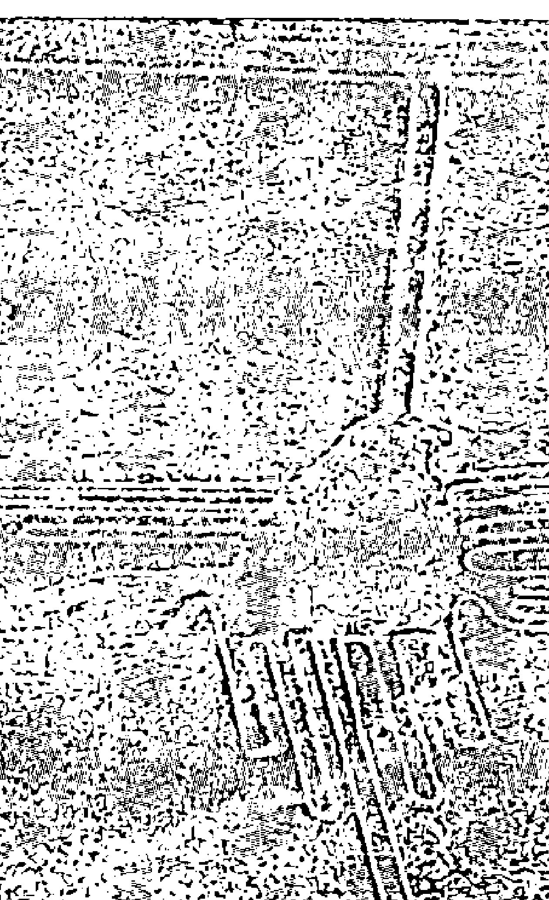

### 纳斯卡:梦幻和现实中的飞行

帕拉卡斯印第安人的宏愿实现了，他们的灵魂离开了地球，踏上前往宇宙各地的旅途。他们很可能找到了外星神仙，印加的尼安德特文明的创造者居住的星球。可是人间却留下了帕拉卡斯人的子孙，我们称之为纳斯卡人。“帕拉卡斯”和“纳斯卡”是两个民族，确切地说，是一个民族分成长辈和幼辈的约定俗成的称呼。“帕拉卡斯”是秘鲁太平洋沿岸的一个半岛；“纳斯卡”是位于同一地区的一片荒漠，它以一些朝天的硕大图形而闻名于世。这个民族过去是如何自称的，我们不得而知。纳斯卡的居民决定不离弃自己的家园——他们想把外星的神仙和自己的祖先帕拉卡斯人请回这里。同后者对话，他们借助的是从很高的地方才能看见的一些图形。德国学者埃里赫·冯·登尼肯推测说，纳斯卡的地理浅槽图形是为外星人准备的宇宙飞船的降落场。他的推测测多多少少有些道理：外星人如能回应地球人的召唤，那么纳斯卡就可能成为起降带。这事发生过没有，我们不得而知。我们只知道另一件事，纳斯卡人本身曾经是技艺高超的空中飞行家。他们未必能征服遥远的宇宙，但是近地大气层对于他们完全是通行无阻的。

两位飞行运动员，英国人朱利安·诺特和美国人吉姆·布特曼，决定验证一下纳斯卡人是否会飞的推测，如果是，那用什么飞？他们的航天器的外形是四面体，是根据纳斯卡的一座古墓中发现的图形复制的。制作气球的织物样品也取自古墓，而制作吊篮用的是芦苇。气球充满热气，上升二百米，接着就开始下降。吊篮摔到沙地上，将考察者抛出，而气球重又开始爬高。尽管实验可以认为是失败的，但大不列颠飞行俱乐部副总裁对结果的总结是这样的：“古秘鲁人利用气球是可以飞行的。他们有否这样做过，则是另一个问题。” 的确，飞行的想法是从哪里来的呢？是模仿飞鸟？可是我们的身体结构不同，无法做到在大地上空自由飞翔。是为了移动更快、距离更长？这未必是唯一的目的。须知，大型客机制造出来以后，人类却迷上了乘坐气球、滑翔机飞行，因为它们才能让我们有种自由飞翔的感觉。自由——这才是我们想要得到

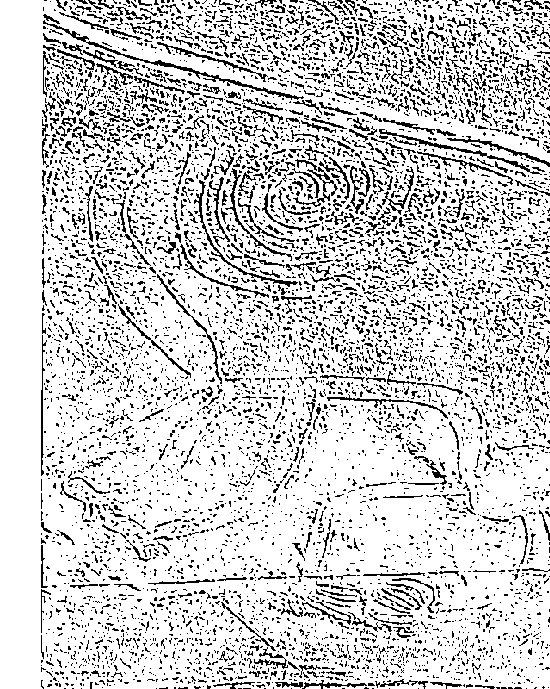

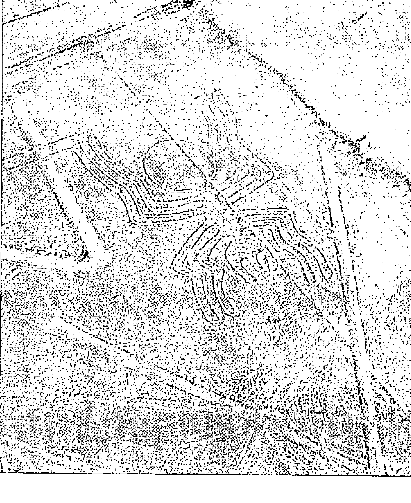

### 纳斯卡:梦幻和现实中的飞行

## 印加人：日父，月母

1. 我们星球上的任何东西都不会消失得无影无踪。今秘鲁境内，古老联盟塔万廷苏约帝国的都城——库斯科市仍然健在，而新的房屋耸立在印加人打下的抗震基础之上。

官方语——克丘亚语；连印加人的金银财宝也因藏于牢不可破的派济济城而安然无恙。印加文化与西班牙文化共存，与拉美文化融汇，遵照的只是比邻原则。

然而奇怪的是，秘鲁远离俄罗斯，在地球的另一端，人们长相各异，可外在差异越招眼，内在亲缘关系就越明显。我们对印加人怀着一种莫大的兴趣和难以解释的好感。

多神教的罗斯与印加帝国一样，对太阳的崇拜曾盛行一时，它的描绘方法也一模一样——像一副男人的正面面孔，周围带有一缕缕飘起的头发状火苗。这种图案被用在俄罗斯的旗帜和盾牌上，它也被用于美化库斯科的太阳庙。

印加人说话用的是只有他们自己才懂的语言。天长日久，上层宗教礼仪语言中的某些词汇和用语开始进入百姓都懂的克丘亚语。现代语言学家惊讶地发现，秘鲁印第安人的词汇里有一千多个古印第安人宗教语言——梵语的词根。而俄语也属印伊欧系，其中也有大量的梵语词汇！

俄罗斯人和印加人昔日未必是亲属，确切地说，未必是邻居。这一点我们有着深刻的记忆。而印加人的亲属已经绝迹。英国人类学家们的研究说明，他们是业已灭绝的民族的残余。人类学家们从印加人皇家木乃伊肌肉组织中采过样。化验

印加人初到的的喀喀湖的年代已经很晚，约在17世纪初。这时的英国先后建立了牛津大学和剑桥大学。在德国开始了第五次十字军远征，而在法国正在进行着文字狱的阿尔比教派战争。西班牙在萨拉曼卡开办了一所大学，而俄罗斯正遭受蒙古大军的人侵。

浅色皮肤的印加人并非南美的土著居民，他们不知从何方来到里，建立了塔万廷苏约帝国。帝国存在了三百年，直至被弗朗西斯科·皮萨罗为首的西班牙征服者所攻陷。其实，帝国并未消失，也根本消灭不了。印加古都之上，依然飘扬着七色旗；七百年前铺筑的道路上，奔驰着现代汽车；一座座天主教教堂，建筑在被毁的日月神庙的基础之上；石砌水槽里流淌着山泉，使高山居民免受干渴之苦；梯田里一如往昔，栽种着玉米、辣椒、甘蔗、土豆和豆角；许多印第安人崇拜太阳，说帝国

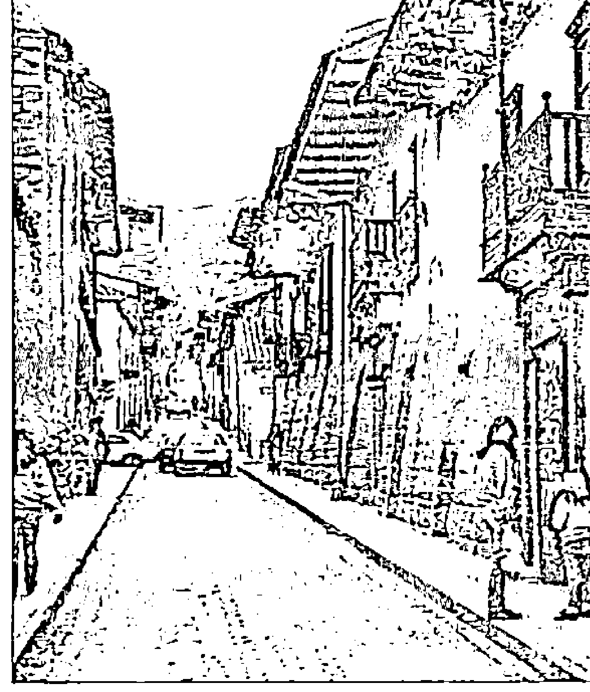

## 印加人：日父，月母

+   2. 印加人的后代身穿传统服装继续进山向印蒂——父亲——太阳表达崇敬之意。

+   3. 曼科·卡帕克——太阳之子和印加帝国的缔造者。

+   4. 马丘比丘是座高山寺院城市。这里居住过“阳光仙女”，即出身印加权贵门第的修女。现在某些观点认为它是帝国宗教礼都城，而马丘比丘只是保全下来的和发现的许多印加城市中的一个。

结果确定他们的血液成分是“A型”，血液成分的组合特别罕见，这种血液成分在全世界至今仅发现两三例。

印加人自称是太阳的子孙，死后返回天庭。或许，这不仅仅是富有诗意的形象？那么太阳部族往秘鲁大地究竟带来了什么呢？首先是服从爱、信念和知识的思想。

在印加帝国，盗窃被彻底根除。只要在门槛上放根小木棒，人便可敞门而去。门槛上小木棒的意思是：家里没人。仅此足以告诫人们，往屋里连看都不要看一眼。

结婚在帝国是必须的，哪怕最顽固的光棍汉也无法逃脱这一命运：男满二十五，女满二十，若尚未成家，将被强迫结婚。

有个传说里讲，某朝爆发了瘟疫。人们不仅向医生，也向祭司求救。祭司回答：“要想拯救百姓，你们要禁用文字。”手稿和史书统统被销毁，使用文字被禁止。只有最大的太阳庙里收藏着记述印加历史的纸张。1572年，这些纸张被西班牙

秘鲁的最大秘密是印加人的黄金，帝国中称其为“太阳的眼泪”，受到珍视是因为它的美。用做货币的是匠人——纺织匠、雕刻匠、制陶匠们的制品。正是这些黄金成了国家覆灭的原因。许多珠宝首饰被用于赎回帝国的末代皇帝阿塔瓦尔普。

征服者们杀害了皇帝，抢掠了庙宇，以为已让帝国屈服。然而他们错了：可以消灭肉体，却不可能消灭人民的灵魂！

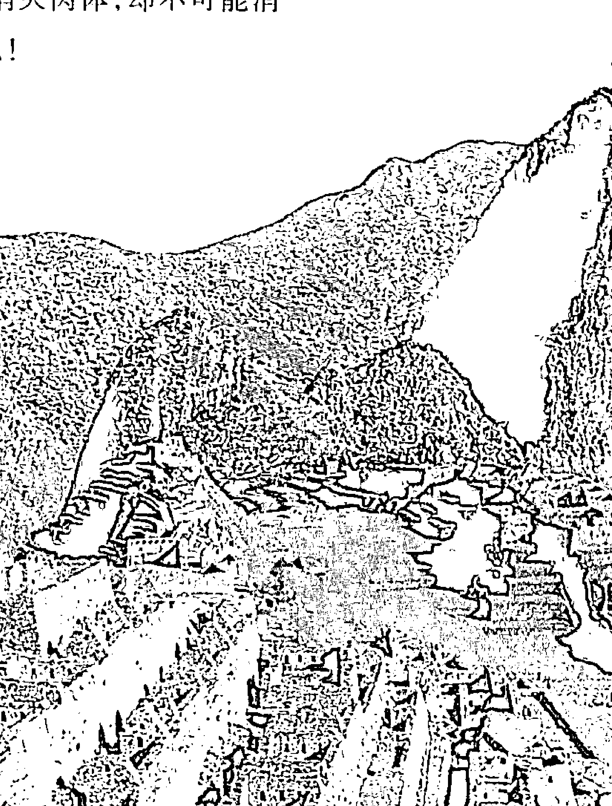

## 奥尔梅克·美洲豹人

1. 著名的尼格罗巨人头，奥尔梅克人文化。奥尔梅克人公元前1000年出现于中美洲，存在至公元前300年。出于防卫目的，他们修建了尼格罗巨人头。显然，印第安人见过昔日在旧大陆占统治地位的黑色人种，因此害怕它。

2. 拉温塔的奥尔梅克人的塑像（公元前1000 - 前 600 年）。所有十六位祭司都被施行了在古埃及时代就已闻名的头颅加长手术。

奥尔梅克人是中美洲（含今墨西哥、危地马拉、萨尔瓦多和尼加拉瓜之一部）最神秘的民族 据最晚期的传说，他们来自东方，后又返回东方，许诺日后重返中美洲。任何一个印第安部族都不是他们的后代，任何一种印第安语言都不像奥尔梅克语。 阿兹特克人给他们所起的“奥尔梅克”这一名字本身的意思，仅仅是“橡胶国的居民”，也即当今墨西哥南方——韦拉克鲁斯和塔瓦斯科州的居民。但是这一神秘的民族所占的地盘要大得多，证明这一点的是它的又一称谓“维什托京”——“咸水边的居民”。 关于奥尔梅克人的情况，欧洲人得知于阿兹特克人。西班牙修士 贝尔纳季诺·德·萨阿胡纳将古老的传说从纳乌尔语译成了西班牙语，其中特别提到：“古时他们就懂得法术和妖术，他们的头领和君主奥尔梅卡特尔·维施托特里与魔鬼订立了同盟。人们知道，用自己头领的名字自称的人，去了东方，带走了反映自己法术的绘图。” 萨阿胡纳的十二卷本的著作迟迟未能发表，担心关于墨西哥古代史和高度发达文化的介绍会引起西班牙前文化的复辟。只是在19世纪初，考古学家杜佩鼓起勇气，着手研究奥尔梅克人曾经居住过的中美洲地区。他的发现曾轰动一时。最令人震撼的是，发现了每只重达十吨的巨大的人头石雕。它是用一百二十五公里之外火山山坡上运来的整块玄武岩凿成的！

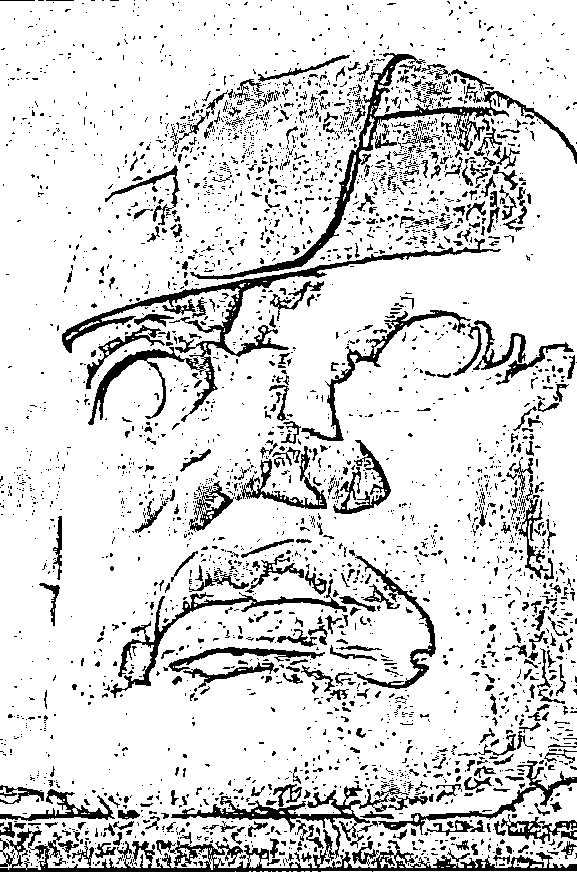

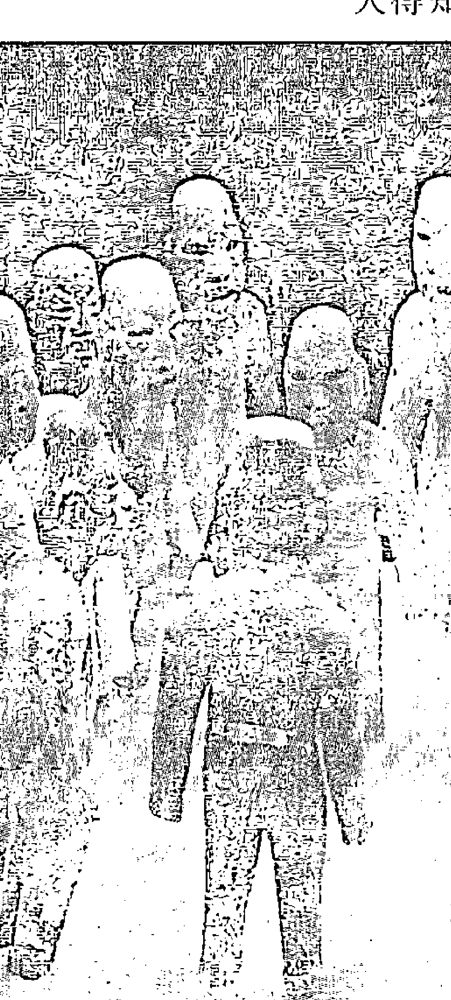

## 奥尔梅克·美洲豹人

贝尔纳季诺·德·萨阿胡纳将古老的传说从纳乌尔语译成了西班牙语，其中特别提到：“古时他们就懂得法术和妖术，他们的头领和君主奥尔梅卡特尔·维施托特里与魔鬼订立了同盟。人们知道，用自己头领的名字自称的人，去了东方，带走了反映自己法术的绘图。” 萨阿胡纳的十二卷本的著作迟迟未能发表，担心关于墨西哥古代史和高度发达文化的介绍会引起西班牙前文化的复辟。只是在19世纪初，考古学家杜佩鼓起勇气，着手研究奥尔梅克人曾经居住过的中美洲地区。他的发现曾轰动一时。最令人震撼的是，发现了每只重达十吨的巨大的人头石雕。它是用一百二十五公里之外火山山坡上运来的整块玄武岩凿成的！

此外，奥尔梅克人的雕塑还表现了尼格罗种人，他们咧开的大嘴带着微笑，微微鼓出的眼睛凝视着远方。塑造巨人的头像可能有几日的：保留对曾居住在美洲土地上那些人的记忆；象征普通人对他们的胜利（奥尔梅克人仅仅塑造“砍下的头颅”，从不塑造巨人的全身），以及作为驱邪镇邻的护符（这些石刻头像也许让他们产生过恐怖的印象）。

巨人的塑像和关于巨人的传说，我们能在古代的柬埔寨和斯堪的纳维亚找到。有关他们的信息也可见之于《古兰经》、《塔木德》和《圣经》

美洲是否也有过巨人呢？秘鲁的西班牙总督唐吉耶扎·德·莱昂记录下了印加人的话：“海上来的那些巨人，身量巨大，本地最高的人跟他们站在一起，只能够到他们的膝盖。他们的头发披到肩上，非常吓人，但他们不留胡须。他们一个人的饭量就超过五十个普通人。有的
裹着兽皮，有的赤身裸体。他们当中没有一个女性。” 随科尔特斯来到现今墨西哥所在的这片土地上的西班牙征服者们说：“科尔特斯派往南方山区的人，据说发现了巨人的驻地。作为佐证，他们带回了从巨人身上抽下的几根肋骨。”

总之，巨人头像不是奥尔梅克人狂放的想象，也不是他们野蛮的证明。这神秘的民族十分文明：他们不仅懂得文字，会做复杂的数学计算，而且是些大法师，是后来被称为托尔特克人、阿兹特克人和玛雅人的老师。完全可能，他们自己就是另一种更古老文明的好学生。他们未必是身高力大而无头脑的巨人……那么是谁将知识接力棒交给奥尔梅克人的呢？

考古学者发现巨人头像的同时，还在奥尔梅克人居住的城里发现了玄武岩祭台、高柱、装饰豪华的棺椁。然而更能说明这一民族文化的是微型雕塑：这不仅是舞蹈祭司的塑像、玉制礼仪小斧、蒙古人脸型的空心小人像，而且有奥尔梅克创作者常用题材的美洲豹。美洲豹是他们崇拜的首要对象。美洲豹面具刺刻在巨大的头颅上，该头像收藏于柏林人种学博物馆。斯汀格尔说：“由此可得出结论，奥尔梅克人可能将自己视同于美洲豹……奥尔梅克人不声不响地离开了历史舞台，同他们一起消失的还有他们世界的中心——万能的美洲豹。‘美洲豹人’消失之后，相继出现特奥蒂瓦坎人、托尔特克人、阿兹特克人；美洲豹消失之后，出现了满身羽毛的蛇。”

玛雅人说起美洲豹人同说奥尔梅克人是完全一样的：“他们来自海的另一边，太阳升起的地方。他们在这里住了很长时间……”半仙离去了，给人们留下了知识……

3. 刻有奥尔梅克祭司的石碑。加长颅骨并非奥尔梅克祭司做过的唯一手术。成年仪式还包括阉割，以免情欲使他们忘记为诸神服务。事实上这个民族的所有祭司的图像表明，他们的生殖器官已被破坏了。”

4. 奥尔梅克的祭司和美洲豹崽儿。奥尔梅克的又一奇怪的风俗——同豹的亲族关系，不仅是图腾亲缘。若干塑像都刻画了奥尔梅克和小个的半人半豹畸形儿。”

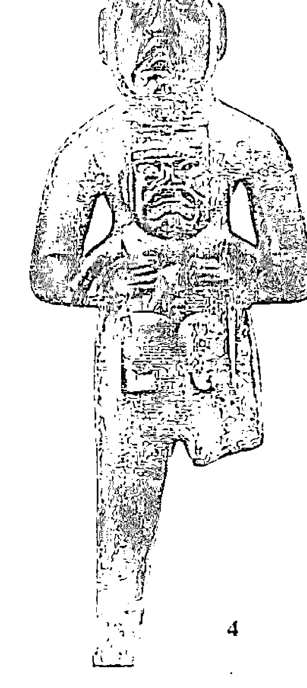

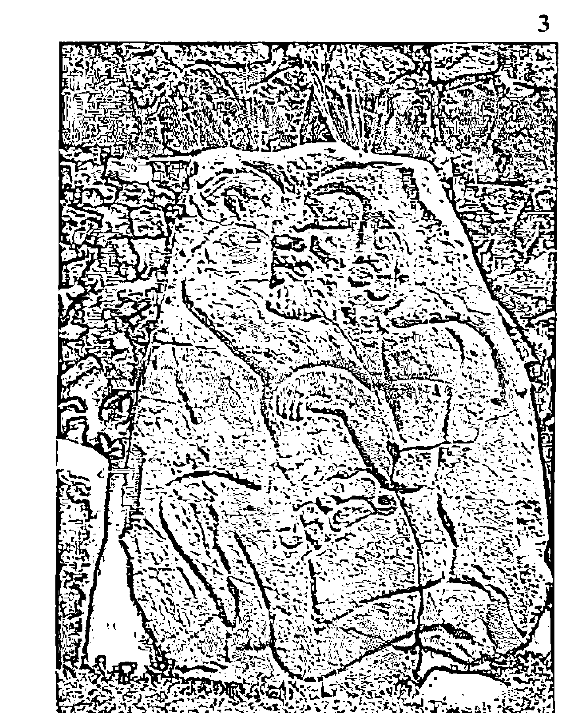

## 托尔特克——“羽蛇”之子

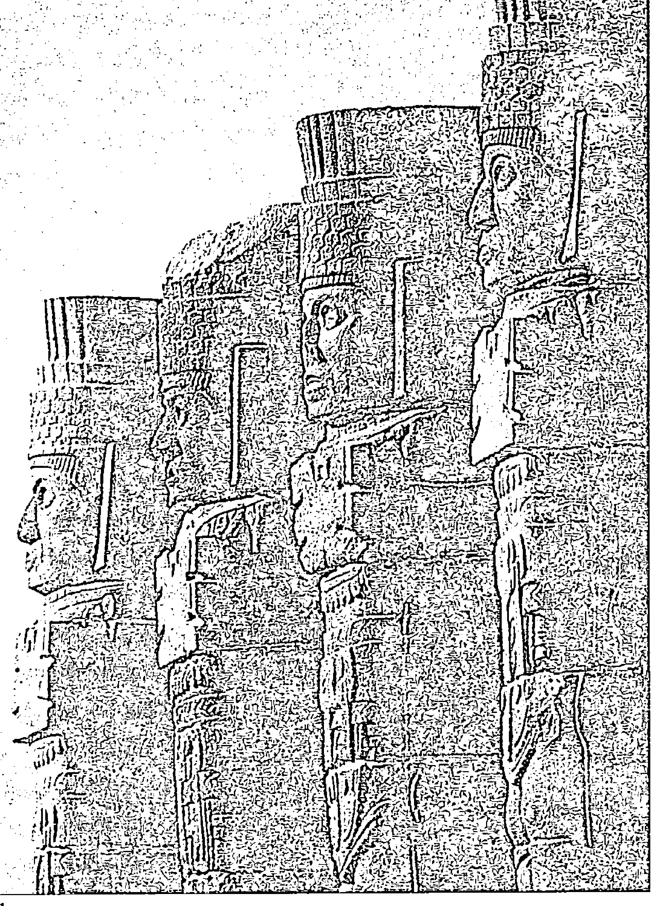

除了物质财富，包括雕塑和托朗城及成为现今墨西哥一部分的库鲁阿卡纳人的第一个都城里的庙宇之外，“建设者”一族还给美洲留下了圣明之主凯察尔夸特尔的思想。这圣明之主就是宇宙和人的创造者、祭司和圣贤的庇护者——“羽蛇”。这位长髯老者乘大西洋之风从洋外飞来，

## 孤独的天才——玛雅人

+   1. 波纳姆帕克的庙宇，乐师的行进队伍，1号房间的壁画，玛雅文化，中美洲，约公元前5世纪。
+   2. 不仅是波纳姆帕克的壁画，还有尤卡坦的阶式金字塔，都证明中美洲玛雅人同生活在大西洋彼岸的古埃及人的血缘关系。问题未必在于共同发祥地大西洋的文化传统：许多世纪以后它们也会被淡忘，而在于在更晚一些的时代里穿越海洋的交往还在继续。
+   3. 玛雅的祭司迎接“天神”，祭祀碑，危地马拉，公元700年。

玛雅人是美洲知识分子文明的代表，他们的后代继续居住在祖先的家乡——尤卡坦半岛（今墨西哥南部、危地马拉和伯利兹）。在自己的整个历史中，他们未曾建立过大帝国，生活在与世隔离的状态中，与相邻部族和亲缘部族均无来往，但他们定期召集天文“会议”，修正他们公元前3113年就已启用的历法。这段历史中发生过哪些大事呢？

显然，若非西班牙宗教狂迭戈·德·兰达烧毁了名副其实的玛雅大书馆，我们本来是能够回答这一问题的。世界文化史上这黑暗的一天是1562年7月12日。在《尤卡坦记事》里，兰达写道：“我们在那里发现了用这种字母写成的大量书籍……我们把它们通通都烧了。” 仅仅奇迹般地保留下三本书，

其中一本就是《波波尔书》。它由基督教徒印第安人迭戈·雷诺索翻译，由奇奇卡斯特纳戈协会成员秘藏，并只托付给多米尼加的修士弗朗西斯科·西门尼斯。多亏这些人，我们今天才能打开和阅读哥伦布发现大陆前的美洲的《圣经》。

我们现有的玛雅文化的知识之比是：被征服者烧毁的整个书馆和奇迹般救下的三本书。知识体现者们的遭遇更为可怕——占领者弗朗西斯科·蒙特霍将玛雅知识分子喂了他的一群狗。

这个民族的名称和居住地鲜为人知。征服者了解玛雅人比了解阿兹特克人要早二十年。然而玛雅人坚持的时间要长得多，玛雅的最后一座城池被攻陷，已是两个世纪以后的事。

1502年，哥伦布停靠在现今洪都拉斯海岸附近的一座小岛。在这里，他遇见一些乘大船来做买卖的印第安商人。他问他们从哪里来，他们回答：“从马扬省。”哥伦布是这么理解的，后来就用这个“省”的名称构成了现在通行的称谓“玛雅”。同“印第安人”这个词一样. 都是这位大航海家的发明：尤卡坦岛的称谓也是这样产生的：在半岛岸边初次抛锚后,征服者们问当地人这地方叫什么. 对所提出的问题,印第安人一概回答“休谈”（意为“我不懂你的话”）：从此这座半岛就被称做“苏坦”,后来才改称“尤卡坦”.

事实上,玛雅人既无统一的名称,也无共同的家园。它只是一个联盟,至少有五个相互没有血缘关系的独立体 联盟对占领者的抗击比美洲大陆上的任何人都要顽强、持久和英勇。

然而玛雅的圣贤们显然早已预见到这场灾难：他们曾耗资无数,预报过土星位相,精心研究过双子星座和昴星团,可于公元10世纪突然放弃了一切,包括研究、建设、天文实验

数学家和天文学家到哪里去了呢?埃里赫·冯·登尼肯在《对未来的回忆》一书中给出了自己的答案：“1953年在帕伦克发现一块浮雕,刻的很可能是库库马茨神……上身前倾,坐姿像车夫或赛车人;车上有枚当今幼儿都能认出的火箭,前端削尖,装有奇怪的像吸管似的弯弯的凸出物,后端渐渐宽大,尾部一条火舌.他双手操纵着许多莫名其妙的控制器,左脚踩着脚镣：他下穿宽腰方格短裤,上套当今流行的日本领、紧袖口的外衣：活脱脱的不仅是他那……宇航员的姿势.他面前还挂着一个仪表,观察它的神情专注而又小心.

“上天之子”为他们与凡女结合所生的后代留下了什么呢?外星人给印第安人出了个抽象数字“0”的主意：没有它,大数目的运算不可思议.阿拉伯学者类似的发现要晚得多,欧洲数学家的这种计数方法是从东方学来的.外星人还教会自己的弟子每年365.242天的太阳历计时法。这比欧洲的格列历要精确得多,一万年才有一昼夜的误差!

玛雅人的祭司还做过看起来似乎毫无实用价值的计算：360天为一年,他们叫“通”。二十“通”为一“卡通”,二十卡通为一“巴克通”,二十巴克通为一“皮克通”……如此等等,直至一“阿拉乌通”,它包含二百三十亿四千万天或六千四百万年.

此外,玛雅人的祭司还知道另一种历法,一年不是365天,而是260天!显然这是另一星球环绕自己的“太阳”飞行的天数：外星人的故乡很可能就在昴星团.玛雅人一直关注着它,指望有朝一日返回故里或者将自己的子孙送往故乡.

4.“波纳姆帕克的黑花瓶”。学者邓尼肯认为,浮雕上描绘的是地方领袖参观外星人的飞船。也有其他一些解释：从地狱的情景到祭司同“太阳神”的交往。邓尼肯的说法,我们觉得更靠谱一点儿。5,6.外星人或“太阳神”的面具。他们的眼睛结构非常特殊。玛雅人雕塑的特点就是创作手法的现实主义,这已为同族人无数的肖像所证明。

阿兹特克人——颠沛流离三百年

神引导人们走向昌盛的道路不可思议。米斯特克人在改称阿兹特克人之前，世世代代安定地生活在阿斯特朗。1068年，地方神威齐洛泊奇特利忽然吩咐米斯特克人打点行装，从各地出发，去寻找富饶的乐土。谁曾想，这充满苦难和屈辱的旅行竟持续了三个世纪！

他们迤逦南行，前往中墨西哥。途中常常停下，一停就是年把。这段时间，地里可收获庄稼，女人能怀孕生子。接着人们重又收拾上路，这路似乎无尽无休。过了七十八年，他们来到托尔特克人的京都——托朗城，这城已被遗弃了八十六年。托尔特克人的后裔住在四郊的村镇里，跟米斯特克人说的是同一种话——纳瓦特尔语。云游者在托朗城一住二十年，向托尔特克人学习了许多东西。从他们那里接受了善神凯察尔夸特尔的思想，也学会了一年365天的历法。他们还掌握了最精巧的建筑秘诀，了解了诗学体系，学会了用龙舌兰造纸。

凡事有头就有尾。威齐洛泊奇特利要求重新上路，米斯特克人继续前行，但从没忘记托朗的功课，直至生命的最后一刻，他们也认为自己是托尔特克人的继承者。通往未知目标的无穷无尽的道路一直在延续。7世纪70年代，他们来到美丽的帕兹夸罗湖畔。许多人觉得，人间再也没有比这儿更理想的地方了。部分人跳人湖中，忘情地击水嬉戏，解饥渴，消疲劳。可是不知疲倦、残酷无情的威齐洛泊奇特利发下话来：“这还不是我们要找的地方。”米斯特克人诅咒着自己的命运，声泪俱下地重返旅途。下湖洗过澡的人决定留下，于是出现了塔拉斯克部族。离去的人按自己头领的名字改称特诺奇人。三十年后，他们出现在特斯科科湖畔，这里住满了各种不同的部族。十来个部族国家为争夺湖边的每一块土地进行着没完没了的战争，而这时突然又来了谁也没听说过的特诺奇流浪者！特诺奇人二十五年栖身蠡斯山，给当地的部族进贡，为他们当雇佣兵，然而他们的境况一年差似一年。

1523年，有位执政者决定攻打阿兹特克人的“街区”，杀光它的居民。特诺奇人得知了这一消息，决定逃走。夜里，他们登上百艘小船，驶离了这危险的湖畔。他们面临两种选择：要么死在岸上，要么活在水上。他们选择了生和水，在特斯科科湖中心的一座遍地沼泽而无法居

住的小岛上安了家。这一天就被认为是三百年颠沛的结束和阿兹特克人历史的开始

特诺奇人的村寨叫特诺奇季特朗。村寨中央建了威齐洛泊奇特利庙，土地按显贵门第分成四份。将整个部族用船运到咸水湖中的无法住人的小岛上安家，这是一步险着儿。那儿既无耕地，又无淡水，弹丸之地，如何生存？特诺奇人又完成了一件不可能的事情。他们用树枝建造了一块块浮岛. 从湖底取泥撒在浮岛上，播下随身携带的玉米、辣椒、土豆等种子。部分收成卖给湖边的邻居，但不是换钱，而是换水。

浮岛上的土原来异常肥沃，特诺奇人五谷丰登。吃喝问题解决之后，开始抓儿童教育。学校分两种：平民学校和培养军官、祭司和廷臣的贵族学校。

过了一些时间，湖滨族群之间重又爆发了战争。阿兹特克人介入其中——起先为三方同盟成员，后来独立作战。他们建造堤坝，将特诺奇季特朗同湖岸连接起来，接着
夺取了特斯科科湖的整个湖滨地区，向墨西哥海滨挺进。此后步步推进，直达太平洋。他们占领了墨西哥全境，颠沛流离的乞丐变成了大片土地的主宰。然而荣耀和奢华蛀蚀了国家的根基。它达到繁荣顶点之后，开始衰落，并于16世纪被一小撮西班牙征服者所摧垮。

+   2. 在墨西哥博物馆收藏的这幅壁画上，描绘了阿兹特克人建造浮岛、开辟田地和花园，以扩大自己领地的情景。
+   3. 阿兹特克人的这个身体各部位可以活动的“芭比”娃娃，是祭司们用于祭祀的物品。
+   4. 用飞禽羽毛为高官显贵编织衣服的阿兹特克工匠师傅。手抄古代文献。16世纪。
+   5. 埃尔南·科尔特斯的西班牙征服者的一支不大的队伍，夺取了阿兹特克帝国，俘虏了最高统治者蒙特苏马。这一令人痛心的事件实为当代墨西哥的一场历史悲剧。
> 阿兹特克的作家在《征服时期的凄凉歌声》一书为随后的毁灭作出了总结：“这一切同我们一道成了历史。这一切我们目睹过，赞叹过。我们为这可怕而悲惨的结局而感到难过…… rooftop 被掀掉，墙壁脱了皮；大街广场之上蛆虫满地，断壁残垣之上脑浆斑斑点点；河水染成了红色，喝到嘴里像是硝酸盐；我们啃树皮，嚼冰草、砖坯、蜥蜴、耗子、碎石、蛆……” ”

确实，神引导人们走向荣耀和……屈辱，走向灭亡之路是令人难测的。

## THE WORLD OF UNSOLVED MYSTERY

## 魔法师和法术

时光流撕扯着我的风衣，
我从时光通量的角度，
招呼人们并寻找先知，
让他们预告上天的秘密。

> ——安德烈·别雷《魔法师》

## 波斯人的邻居——中世纪魔法师的情况.欧洲人是读了希腊历史学家希罗多德的著作才知道的。古希腊人将魔法这一概念引入了日常生活,也因为他们使用,魔法实践才有了“巫术、妖术、法术”这些同义词.可能魔法师的自称并非如此。

学者E. M. 勃特勒在《魔法师》一书中写道：“希腊人所用的‘魔法’一词,原指宗教、学说和方法师的神秘实践,而我们认识这些神秘莫测的人们的主要源头,就是希罗多德……魔法师们已经深入希腊、印度,甚至有人说还进入了中国;他们的威力曾为举世所公认.”

的确,可以说魔法师是胸怀秘密学说的一大批人。他们克服宗教、地理和政治差别,出现在地球的各个角落.他们曾居住在南乌拉尔,他们中间出了个大预言家查拉图斯特拉.在巴比伦、迦勒底,魔法师遐迩闻名.他们不仅施行魔法和预言未来,还常常觊觎王位.许多资料都说,在伊特鲁里亚和克里特他们还真办到了.魔法师皇帝深居难以攻破的城堡,远离廷臣和禁卫部队,从那里借助魔法治理国家.爱或恨一个活人倒不难——可以设法得到他的好感或密谋对付他.可是如何反抗没有个性的自然力呢?造反没有意义,城堡的高墙无法攻破,报复一定会接踵而至,而且还不知来自何方:它会忽而以致死瘟疫的形式,忽而又以无情大火的形式出现。能做的仅仅是畏惧和忍受魔法师皇帝的所作所为。

人们终究不能永远生活在恐惧之中:一些统帅揭竿而起,推翻魔法师,自己当上了皇帝。比方在波斯,为纪念这种事件,年年庆祝对曾窃取皇位的妖人的胜利……

而这一大批魔法师是从哪里来的呢?控制人们的魔力思想本身又是如何产生的呢?

答案应当到大西洲去找,借助魔法施行支配权的思想就来自那里。这也不足为怪,因为所有大西洲人都是天生的魔法师,而且那时的超自然的东西表现出来比现在要容易,它就像太阳和风,像蝶飞和蛇行那样平淡无奇。

这里完全适宜提出一个问题:究竟什么叫魔法呢?

每个人都有一些深藏心底的愿望,一般情况下,它们不一定都能实现。有人叹惜正在逝去的青春和美貌,有人渴望钱财和权力,也有人抱怨上帝没赐予他这样那样的天赋……那怎么办呢?需要向上帝祈祷,如果所求出于内心深处,清清楚楚地说出,如果所求正当而与他人无害,那么它一定能得到满足。但也可能相反:人受某种欲望所驱使,这欲望不用说对上帝,就连对自己张口都该感到脸红。或许你不愿求人:与其欠别人的情,不如欠自己的情,免得日后要还情.当愿望得到满足后,它就不像过去那样让人觉得难以实现了,因为它值得去低声下气吗?也有可能不信神,上帝远在天上,他哪能顾得上我们的疾苦,他也未必能听见,未必能下凡到我们人间……这个时候也就产生了魔法——能让所有渴望得以实现的一些特殊手段、符咒。

然而得以实现的愿望往往会引起一些更大的问题——贪得无厌,迫不及待,狮子大开口.现在可顾不得自尊,不得不求助于什么,而且通常所求的不是光明正大的力量。于是他们自己就急着去找巫师,而巫师立刻装神弄鬼,诵经念咒,许诺尽心尽力并否认上帝的帮助,或许从来也没相信过上帝的存在……

大西洲的情况就是这样,最高魔法师的权力高于上帝,蒙昧自古以来就歪曲着大西洲人光明的本性.许雷在试图弄清昔日发生的悲剧时,说:‘世纪复世纪,恶越积越多:腐化堕落的侵蚀、私心和无政府主义的膨胀,以大西洲分裂成两大阵营的同样速度开始发展……法术,人类同崇高力量相协调的无私努力,不断受到在自负和淫欲的鞭笞下呼唤卑鄙势力的妖术的抵抗……这妖术直接作用于地心,自己力量的源头。这样一来,它就在基本火界引起了其他的脉冲……由此而常常发出地震,一个世纪又一个世纪地震撼着大西洲……它分裂成碎块,最后连同大部分居民沉入了海底……’

大西洲的覆灭是因为祭司们实践妖术的过错,然而魔法师本身——巫师和法师,却生存了下来,出现在其他大陆,生活在发展中的各民族中间,并像往日一样试图借助魔法左右人们,当上愚昧“蛮夷”的魔师皇帝。他们没能得逞。但是施行魔法的本领却代代相传,大西洲覆灭几百年数千年后还在不断出现。

## 赫尔墨斯·特里斯梅吉斯特——头号法师

定其声名竟传到了非洲，因而让祭司们哭笑不得。他们对梭伦说，希腊诸神比希腊本身还年长：雅典娜受万人景仰之时，特洛伊还没兴建，蒙昧的亚该亚人还在放羊呢。赫尔墨斯的经历也颇相似：他很早就来过埃及，参加大祭司的授职仪式，成为继承者。

外国蛮夷能否不仅掌握精微的古代文化，而且得到神的启示呢？不，不能！但是禁条的存在，只是为了淘汰那些不够格者，发现那些决意办成不可能办成某事的狂徒。

有个传说，是讲人如何变神的。一天，赫尔墨斯久久思索万物来自何方，不料想出了神。他的灵魂飞向天空，只听得有人喊他的名字。他惊问道：“你是谁？”那人答道：“我是俄赛里斯，最高智慧，我可以揭下一切事物的盖布。你想看什么？”赫尔墨斯说，想探索万物的源头，想认识一下上帝。话音刚落，他顿觉金光四射，光波里闪过万物的身影。他就所见提出了许多问题，并得到详尽的回答。赫尔墨斯需保证对所见所闻永远保持沉默。永保沉默可成为他魔力的源泉。如若泄露秘密，必死无疑。

没有不破的禁条。几世纪后，传来赫尔墨斯的遗言：“灵魂就是一种被盖布罩着的光，如果不去侍弄它，它就会暗淡并熄灭。如若像给灯加油一样给它以神圣的爱，它就

## 查拉图斯特拉——被认为是巫师的光明预言家

+   1. 里海沿岸的山峦。据印度帕西人传说，妖魔阿齐·达哈卡企图在这里杀害南方的先知查拉图斯特拉。
+   2. 昔日风景秀丽的波斯波利斯——希腊化的波斯城的遗址。
+   3. 查拉图斯特拉的合乎教规的图像。如果图像与原型一致，那么先知无疑就是雅利安人。
+   4. 沿通向天国的阶梯雕刻的浅浮雕上，刻画着承认了波斯人权力的古代许多民族的人：巴比伦人、粟特人、努比亚人、西徐亚人、亚美尼亚人、希腊伊奥尼亚人，等等。人类历史上曾经有那么一段时间，拜火教成了全世界德意志民族的信仰。

德国哲学家尼采唤起了人们对雅利安人信仰的兴趣，他把预言家称为查拉图斯特拉。古希腊人叫他佐罗阿斯特尔，伊朗人叫他查尔都士特。凡此种种，说的都是同一个人——阿尔扎斯普。公元前1500年到公元前1200年间，他生活在南乌拉尔，因宗教功绩获得新的名字——查拉图斯特拉。这可能不是名字，而是职衔，因古伊朗语“查奥塔尔”的意思是“全权神职人员”。自称“教会之父”的希腊和罗马作者们在欧洲各族传出风声，说查拉图斯特拉已被烧死，因为他从事在他们看来是被禁止的天文学研究，后来又从事魔鬼研究。中世纪的作家继承古希腊古罗马的神学家们的衣钵，认为他是个影响极大的术士和巫师。

嘴巴告诫人们要走光明大道：“告诉人们，让他们能够看清隐秘的和明显的东西。让他们知道，所有光明的东西都是我光辉的一部分……我们用光明创造了天使和天堂，这样地狱就从黑暗中出现。你无论到了两个世界的什么地方，哪里都不会没有我的光明。” 他首次战胜邪恶是在出生之前：母亲达格达做了个梦，梦见自己怀孕时，屋顶之上乌云密布，降下几个可怕的怪物，要从她的腹中夺走尚未出生的婴儿。达格达大惊，决定听天由命，可是耳边响起正要出世的孩子的话音。孩子向母亲担保，怪物伤不了母子俩。话音刚落，天上降下光芒四射的大山，多数怪物一见，吓得夹起尾巴便鬼哭狼嚎地逃跑了。 早上女人醒来时一身冷汗，急忙去找村里的圆梦人，请他解释这奇怪的梦。智叟一开口就让达格达

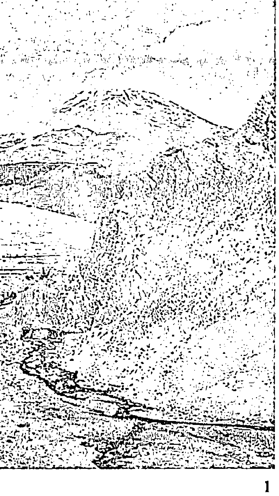

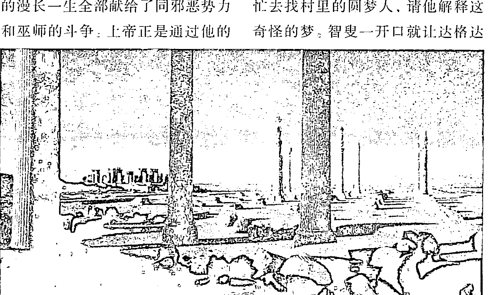

事实正是如此 查拉图斯特拉刚一出世，便高兴地笑了起来，谁想摸他的头，他就把谁的手推开 不到一个月，他被恶神偷走，带进荒漠，恶神在他身上堆起干柴，点着了篝火！忽然间，一阵轻风吹过，熊熊大火熄灭 急得快发疯的母亲跟踪追来，找到了孩子

可是邪恶势力不甘失败 它们又偷出婴儿，这次将他放在牛群饮水必经的小道上，奇迹再次发生了！领头的大公牛四腿叉开，护着婴儿，让母牛和小牛从它身边绕过 魔鬼们又多次企图杀害小孩儿，但都以彻底失败而告终 七年后，小查拉图斯特拉感冒，卧病在床，巫师端来一碗毒药，说喝下这药，病立刻就好 小孩儿伸手一推茶碗——茶碗打翻，毒药流到地上，顿时腾起一股硫黄味的烟雾，烟雾散尽，孩子病好了

又过了八载，查拉图斯特拉已及弱冠之年，父亲决定举行仪式，宴请宾客，席间有皇帝及其宫廷术士，年轻的儿子乘机公开向巫师宣战，母亲为儿子的举动而大怒，父亲和宾客则一笑置之，认定查拉图斯特拉的话是酒后之言，唯宫廷术士不苟言笑，他明白，这青年知道自己的使命，但也不必过于担心，他还没强大到那种地步

遗憾的是，巫师的想法原来有一定的道理，日常的杂务让他部分地忘却了自己的主要使命，查拉图斯特拉只是十五年后才得到神的启示，获得足够的知识和力量

他克服了无数的诱惑，摆脱了许多生命危险，来到伊朗王宫，参加同宫廷无数巫师的角力，伊朗国王已倾向接受查拉图斯特拉的学说，与自己的宫廷巫师分手，但宫廷巫师施行妖术，诬称查拉图斯特拉迷惑国王，国王大怒，将先知押进终身大牢

国王心爱的牡马得了可怕的怪病，四条腿缩进肚子里，宫廷巫师无计可施，查拉图斯特拉答应相助，条件是国王得相信他的学说的崇高性，国王嘴里答应，心想过后可以反悔，众目睽睽之下，牡马的一条腿又长了出来，王后和王子答应承认查拉图斯特拉为先知，从今往后将宣传光明和神火之力，牡马完全康复，站立起来

从此，查拉图斯特拉的学说传遍东方

世界的宗教，而波斯的都城——波斯波利斯赢得了整个人类宗教中心的美誉。

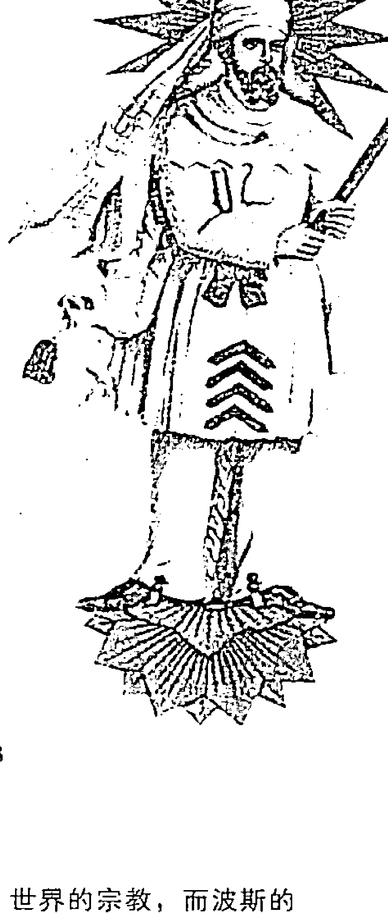

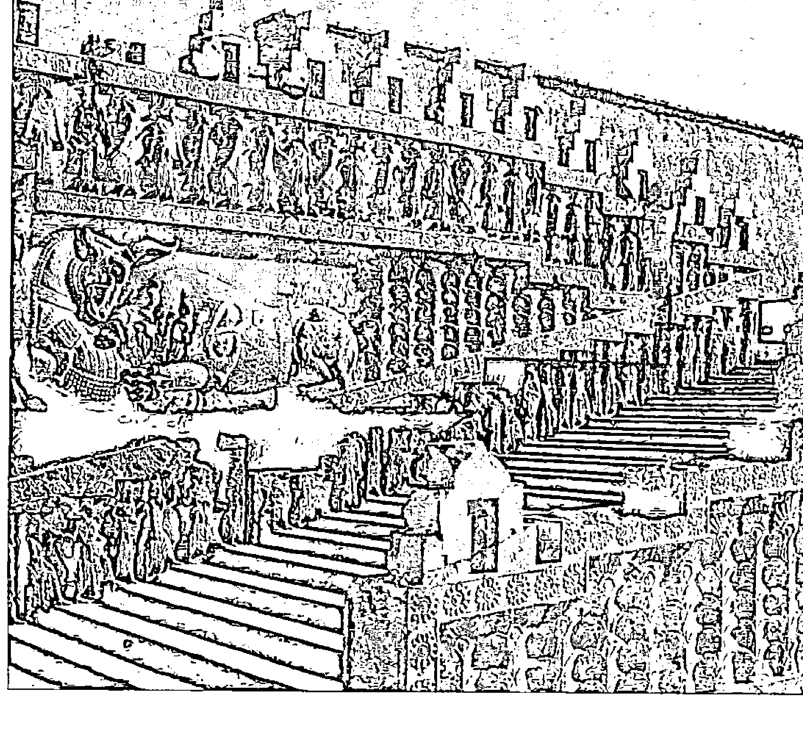

## 摩西：魔法高于妖术和法术

+   1. 克里斯托费尔·翁特别尔格的作品《摩西》。梵蒂冈博物馆收藏的古代先知的塑像。
+   2. 马克·沙加尔的素描。摩西脑门里放射出来的两道光,更像是两只犄角。很遗憾,由于许多画家错误地理解了《圣经》里对欧洲人民救星的描述,先知往往被画成脑门儿上长着两个肉赘。

明的青年听了,应该喜不自胜,可他却不屑地笑了笑.对养母说：“你想要我去统治崇拜那些长着豺狼犬狗脑袋的神灵的百姓？几个世纪以后这些偶像又会怎样呢？”话没说完,他弯腰抓起一大把沙子,从手指缝里慢慢漏下,说：“它们能留下就是这个！”养母本想破口训斥,可一见他那锐利的目光,连忙走开了。

不久后所发生的事,彻底改变了霍扎尔西夫的命运.在建筑工地上,他见埃及监工毒打一个犹太工人,小伙子怒不可遏,夺过棍子,一下便送了监工的性命.霍扎尔西夫被判驱逐出境。他心想：“你就放开胆子走吧,在驱逐中找回自己的命运.”年轻人的境遇十分糟糕。问题倒不在于一下失去了寺庙录事之职并成了来路不明的乞丐：他是寺庙受封之人,本当为死者偿命。祭司法中有此规定,而祭司法要高于法老的法庭。

流浪者穿越沙漠,渡过红海,登上西奈半岛。这里有座米甸庙,庙里供奉着两个神——埃及的俄赛里斯和当地的埃洛希姆,庙里的最高祭司是叶忒罗。《圣经》里说：“摩西牧养他岳父米甸祭司叶忒罗的羊群。”祭司成为霍扎尔西夫的岳父是后来的事。他首先必须经过杀人的赎罪仪式,另起名字。

为赎回自己的罪过（尽管是迫不得已）并获得内心的光明,他必须

犹太人的大先知摩西生活于古埃及第19法老王朝时期,公元前1305年,至公元前1196年之间.《圣经》旧约《出埃及记》里说,他生于利未后代家,母亲先将婴儿藏了起 来,后来决定将他丢弃：“……取了一个蒲草箱,抹上石漆和石油,将孩子放在里头,把箱子搁在河边的芦获中。” 法老的女儿发现了箱子,收养了婴儿,取名霍扎尔西夫。孩子长大后,与法老的嫡孙梅涅福特同窗共读:他智力过人、求知欲旺盛、课上专心致志。捡来的孩子献身于伊希斯和俄赛里斯,常在祭司中间度过时光,参加所有宗教节日活动,研习寺庙音乐,聆听大师讲经。 一天,养母暗示,霍扎尔西夫日后可继承埃及王位。按说,身世不

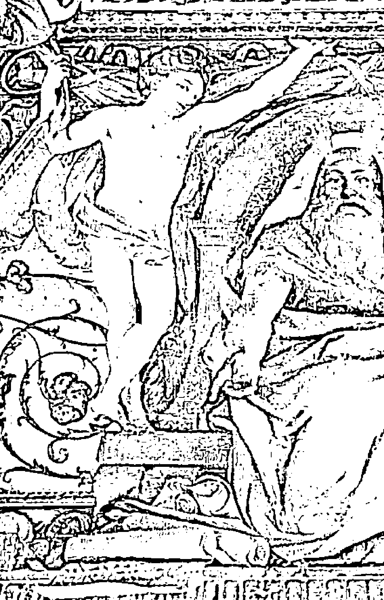

长期斋戒，然后喝下让人昏睡的特殊饮料，接着被单独放进山洞，几周后再抬回。规定的期限过后，从山洞里抬出的往往是尸体……由此可知，考验是何等严酷 霍扎尔西夫的灵魂离开原身，前往埃列布——进入冥界的一段黑暗空间，他应当洗刷埃及监工的尸体，体验监工死时的痛苦，彻底戒除自己的傲气，将自己献给丧葬神俄赛里斯当祭品。他只请求说，他若命该重返阳世，请赐予他伸张正义的力量。他得到了承诺，从酣睡中醒来，仿佛再世重生，从此改名为摩西。

重生的先知不仅娶了叶忒罗的女儿，而且还帮他操持家业。他写了一部书之书，取名《塞费尔—别列希特》。这是一本什么书，又为何叫《书之书》呢？从古埃及语译成各种语言之后，它被最终定名为《创世记》，成了《圣经》的第一部。

重生的摩西找到了家乡和同胞。他回到埃及，奉上帝之命解犹太人于倒悬。如今他掌握了强有力 的魔法，再无须诉诸暴力。自然，法老不愿放走如此宝贵的奴隶，摩西被迫同从前教过他的埃及术士们一较高下。《圣经》里说到先知使出的许多手段——埃及的黑暗、长子之死、权杖变巨蟒。斗法一直持续到长老服输，放犹太人去经受肉体和精神的考验，云游四方，寻找乐土。

凡人毕竟是凡人，途中他们不止一次地陷入绝望，后悔失去的东西，想返回重当奴隶，试图崇拜别的神仙。摩西常常发怒，往往也很残忍，但一刻也没放弃自己的目标。这也给某些学者授以怀疑他偏好妖术的把柄。

的确，世界和各民族的命运有时要高于被错误理解的“善”。假如以色列人厌倦了无休无止的考验，返回埃及重当奴隶，那就会同自己的主人一道消失得无影无踪。简而言之，自由要求作出牺牲，或者借用罗马人的话说：“披荆斩棘——奔向星斗。”

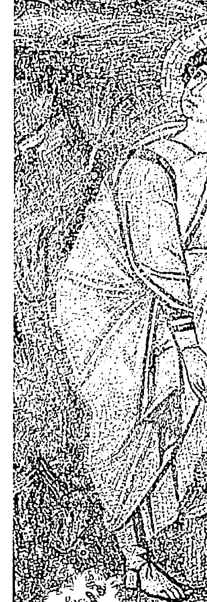

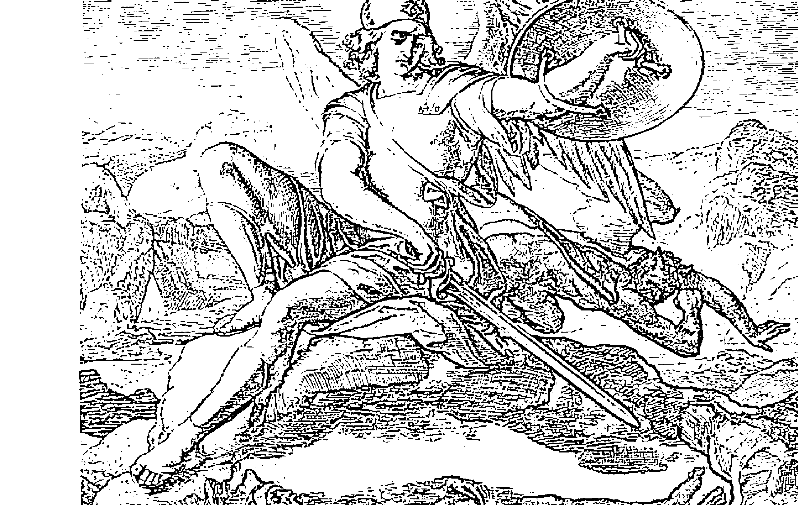

+   3. 在拜占庭的马赛克画上，年轻时的摩西最不像埃及的达官贵人。
+   4. 上帝让摩西在临终前复明了。他登上了涅沃山（死海以东，摩押国境内），从那里看见了他命中注定不能到达的“福地”。之后，摩西的魂灵回到雅赫维身边。摩西殡葬的地点，正如《圣经》里所说，一直不知何在。尤·冯·卡洛尔斯费尔德所做的《圣经》插图。

## 阿恩多拉的女巫师

历史没有给我们留下这位女人的名字，然而未来和冥界大门为之敞开的隐士形象却变得像文选一样条理清晰。美国女学者埃迪特·丁任《圣经里的名女人》一书中写到过她：“可以将阿恩多拉的女巫师想象成一位年老而智慧的女人，手脸皱纹密布，深陷的眼睛炯炯有神，长长的黑发披散在耸起的双肩上。”洛尔德·拜伦则说她是“虚构的先知” 公元前11世纪发生了这样一件事：一位叫扫罗的朴素而富裕的人，出门寻找几头丢失的母驴，可却落到一个王国，圣贤撒母耳为他做了登基傅油仪式。英俊魁梧的扫罗迷倒了自己的国民，打开头就能一呼百应，让几个敌手尝到了失败的苦头。可后来他被权力和成就冲昏了头脑，开始忘记往日的朴素，过起奢华的生活，并为撒母耳的影响力感到苦恼。《圣经·撒母耳记》里说：“那时撒母耳已经死了，以色列众人为他哀哭，葬他在拉玛，就是在他本城里。扫罗曾在国内不容有交鬼的和行巫术的人”

+   1. 米开朗琪罗·布奥纳罗蒂所绘的梵蒂冈壁画。库姆的女预言者从热恋她的神阿波罗那里得到未卜先知的才能后，又向他求得了长生的秘诀。然而几百年后，西卜拉变成了年老体衰的老太婆，因为忘记为自己讨得青春永驻之方了。然而米开朗琪罗却将她画成具有超人的威力和非凡的英勇。

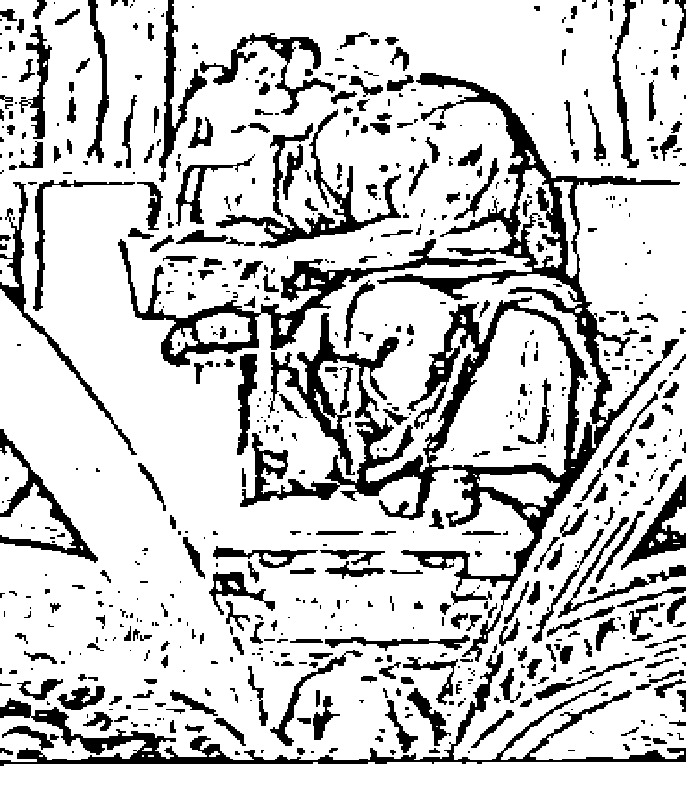

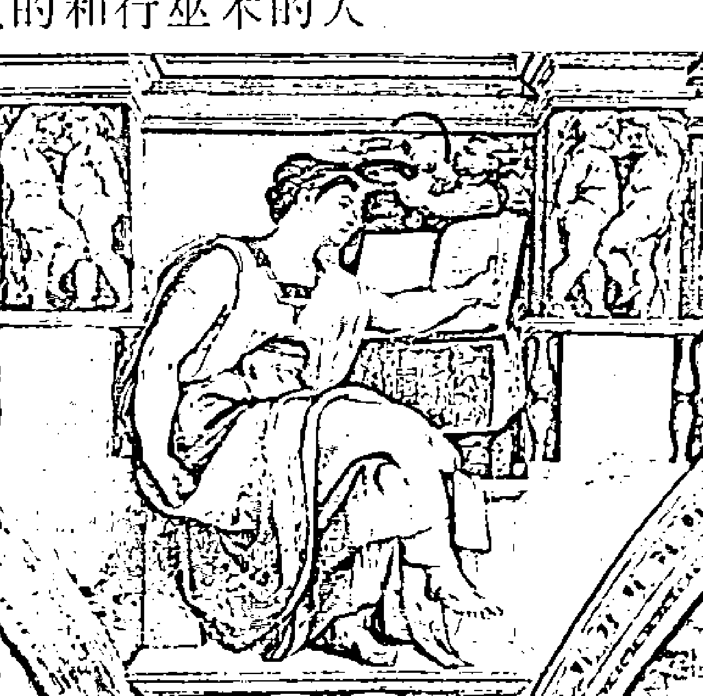

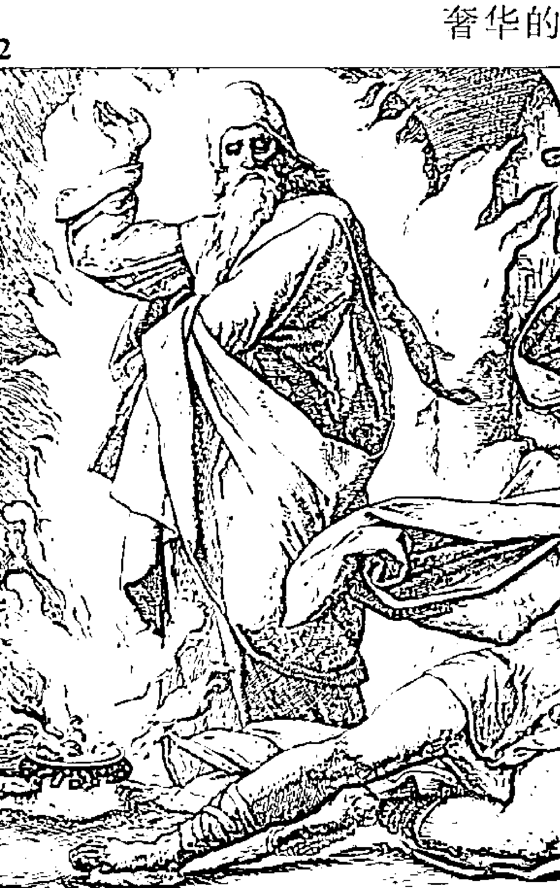

然而，撒母耳临终前秘密地为另一位更优秀的人——大卫做了登基傅油仪式，扫罗得知后，得了忧郁症，差点儿发了疯。他开始疯狂地迫害大卫，做了许多缺德事。当然，这既没给他带来愉快，也没让他心里轻松。因而对自己的许多行为感到后悔，并为撒母耳这样英明的谋士不在身边，也为把他现在特别需要的巫师们驱逐出境而感到惋惜。扫罗想起阿恩多拉有位女巫师，并决定去找她：“于是他对侍从说：‘给我找到那位女巫师，我要找她问问。’仆人回他说：‘阿恩多拉是有一位女巫师。’” 国王乔装打扮得让人难以辨认，带着两个侍从去找阿恩多拉的

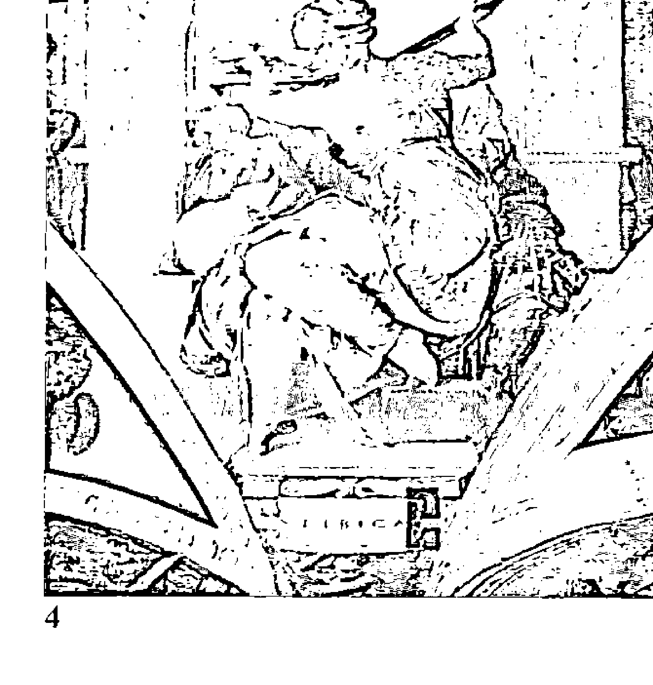

女巫师：“他向东南方走出六英里。阿恩多拉四郊有许多古山洞：女巫师就住在一个山洞里。她的山洞入口由兽皮遮挡，不让北面山坡刮来的寒风吹进住所。”

起先这妇人没认出国王，不肯预言，怕有人告密：“你知道扫罗的所作所为，他把法师和算命先生都驱逐出境。你为何要给我下套，让我找死？”扫罗要她不用害怕，求她从冥府招出撒母耳的阴魂，女人这才认出了他，惊叫道：“你是扫罗！为何欺哄于我？”她还是可怜了这位没有怜悯心的人，于是招呼道：“从地下出来吧，穿长衫的德高望重的前辈！”接着，她用巫术让撒母耳的灵魂开了口。撒母耳预言扫罗即将垮台，必死无疑。他说：“上帝既已离开你，且与你为敌，你又何必问我呢？上帝将照他借我之口所说的去做，从你手里夺去国权，赐予你身边的人——大卫……明日你和你的儿子便将与我在一处了……”

“我给你来点吃的，你吃了，好有力气上路。”在侍从的帮助下，将扫罗移放到自己的床上。国王休息时，她宰了头小肥牛，烙了几张死面饼。这可能是国王扫罗生前的最后一顿饭。第二天，扫罗被非利士人彻底战败：“扫罗对自己的侍从说：‘拔出你的剑，给我一剑，别让那些没受过割礼的家伙来侮辱我。’可侍从不愿意，他害怕，于是扫罗抽出自己的佩剑，自刎而亡。侍从见扫罗死了，自己也拔剑自刎。那天扫罗就是这样死的，同他一起死去的还有他的三个儿子、侍从和他身边所有人……转天，非利士人前来抢夺死者，发现了死在基利波山的扫罗和他的三个儿子。于是割下扫罗的首级，摘下他的武器，传送非利士全境，以便在自己偶像的寺庙里向全民宣告这一胜利。”

也许阿恩多拉的女先知早知扫罗该，但未向他点明。上帝所预定的事情，迟早是要发生的。女巫师自己怎样了呢？没人准确知道。而埃迪特·丁给出了自己的推断：“她得到了特别的权力，但可以推想，她是想运用这权力，引领扫罗和其他人去结识上帝，从而认识魔法的秘密。这位女人所达到的境界可想而知有多伟大呀！”

扫罗惊恐万分，扑通摔倒在山洞冰冷的石板上，撒母耳的灵魂消失了。而女巫师再次怜悯国王，说：

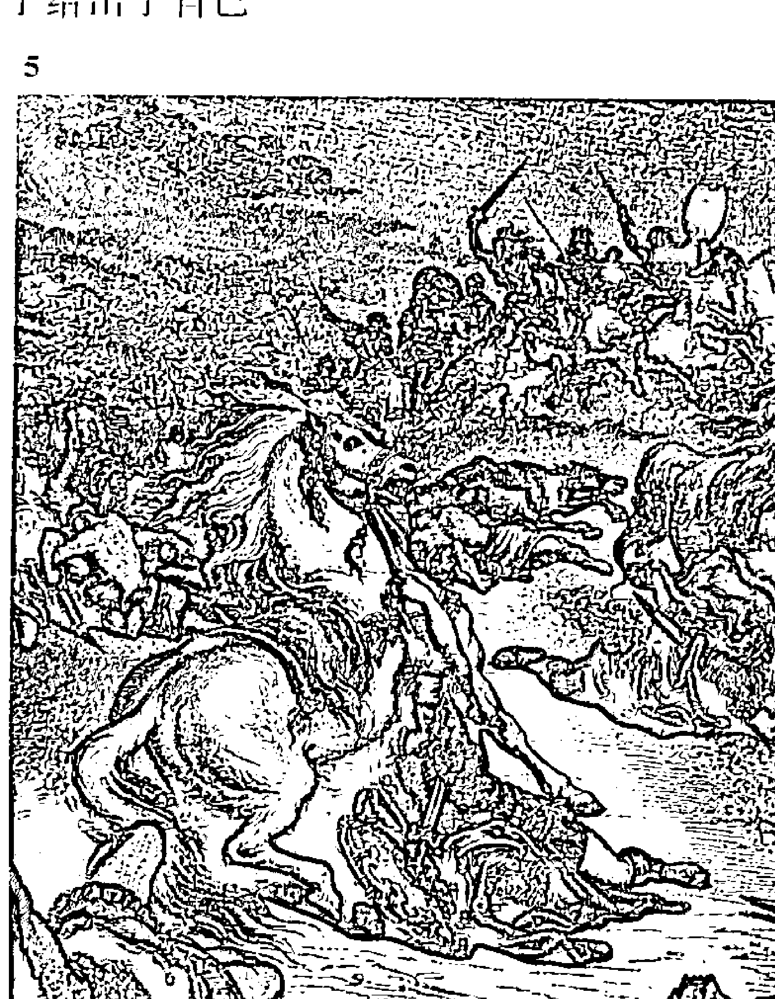

+   2. 被阿恩多拉的女巫师应想知道自己未来的国王扫罗所求而从冥界请出来的撒母耳的阴魂。尤·冯·卡洛尔斯费尔德所做的《圣经》插图。

+   3,4. 古代的女预言家都应将自己的名分归功于西卜拉，达尔丹和涅莎的女儿。稍后，在古希腊和古罗马时代，人们说起十位女预言家时，通常用她们的居住地相称。在米开朗琪罗的壁画上，画了其中两位美丽的女预言家——吕底亚的和厄立特里亚的。而她们还有波斯的、迦勒底的、埃及的、巴勒

## 比尔基斯——示巴女王

示巴女王拜见所罗门的《圣经》故事很有趣。首先几乎是唯一一次提及迪尔蒙。古犹太人认为这童话般的国度位于阿拉伯半岛南部(其实位于波斯湾的巴林岛上)。那里的黄金比黄沙贱，树木都来自伊甸园(亚当和夏娃堕落之前住过的天堂)，而人们从不知道什么叫战争。穆斯林所记住的示巴女王的名字叫比尔基斯。而埃塞俄比亚人认为她是阿比西尼亚三千年王朝的开国女皇。《示巴》公元前965年至公元前928年在位的以色列犹太国第三位国王所罗门(他真名叫“舍洛莫”，意为“平和的”、“平静愉快的”)。不仅是个英明的君主，而且是个大法师。著名的犹太历史学家约瑟夫·弗拉维写道：“上帝还教会他驱赶妖魔，而这门学问对人十分有用 所罗门生前就编撰了减轻心灵痛苦的符咒，身后留下了驱赶妖魔的艺术，人们一直使用至今……传说里讲，所罗门也同样明白人没说出来的思想，懂得动物的习性和语言，喜欢同飞鸟和游鱼交谈。有一天，戴胜鸟告诉他，示巴国有个基托尔城，那儿执政的是位无比美丽而聪明的女人.所罗门给示巴女王写了封信，命她前来耶路撒冷.接下来发生的事，《圣经·列王记》里说：“示巴女王听见所罗门因耶和华之名所得的名声，就来用难解的话试问所罗门。跟随她到耶路撒冷的人很多，又有骆驼驮着香料、宝石和许多金子.她来见了所罗门王，就把心里所有的问题都对所罗门说出来.所罗门.王将她所问的都答上了.没有一句不明白、不能答的.” 《圣经》里没说法师女王给法师国王出了些什么谜，然而犹太民间故事《示巴女王的谜语》说到这一点：“请听，这就是第一个谜.”女王说道.“长在地里.让鸟儿欢喜.让鱼儿送死.给富人荣耀.给穷人羞耻.对死人是装饰.对活人是震慑.” “这是麻！”所罗门立刻答道，“长在地里.鸟儿欢欢喜喜地啄食它的子，鱼儿闯进用它织的网里去送死.富人穿麻布衣衫觉得荣耀，穷人以破麻袋遮体感到羞耻.麻布敛衣给死者装裹，而麻绳活扣令生者惶惑.” 女王给所罗门出了许多谜，他都能立刻一一破解.法师斗法并在斗法中获得智慧.或许是女王来耶路撒冷的根本目的.不过，不同时代的人对她此行的目的理解也不一样.有人说.女王带来一帮人.是想了解真实的信仰——像《圣经》里写的那样信仰耶和华，还是像《古兰经》里说的那样信仰真主。美国女学者埃迪特·丁在《圣经里的名女人》一书中表达了自己的看法：“她来耶路撒冷……是想验证一下她所听到的有关所罗门的情况……她此行的真正目的，大概是确定贸易范围以及跟所罗门签订盟约……不仅是所罗门的英明和聪慧让她印象深刻，而且他那宫殿之富丽、廷臣衣着之豪华和王宫膳食之奢侈，着实让她吃惊不小。”

有个传说提到，示巴女王和犹太国王生有一子，后来成了埃塞俄比亚王朝奠基者。

《古兰经》里关于苏莱曼和示巴女王比尔基斯的故事要比《圣经》里讲的全面而准确得多。《古兰经》的《蚂蚁》一章里说，从阿拉维飞来的戴胜鸟告诉苏莱曼：“我……从示巴给你带来一个准信：我发现了治理它的是个女人，她什么都有，还有一个宝座 我发现，她和她的臣民崇拜的是太阳，而不是真主……”米哈伊尔·皮奥斯特罗夫斯基在《古兰经故事》一书中分析道：“某些特有的细节所反映的是也门的情况。这就是巨大而奇特的宝座。执政者们的那些像楼房一样雄伟的宝座，确实是古也门文化的典型物品……相对不久之前才弄清楚，在古也门的民间宗教里，太阳神起过非常大的作用……由于强调了女王对太阳的崇拜，所以《古兰经》比不久前的科研文章显得更为可信。在许多世纪里，示巴女王对耶路撒冷的访问是受许多美术家欢迎的创作题材。基恩写道：“鲁本斯将她画成一位风度优雅、值得尊敬的女人，她的服饰既不算过于豪华，也不算俗气。在梵蒂冈拉斐尔的壁画上，走进所罗门宫殿的那一刻的场景里，她被画成姑娘的模样……”这次造访被卡尔·德马尔克写进了歌剧《示巴女王》。而比尔基斯本人虽然在示巴编年史中未被提及，可在新约里却被特别提到了。《马太福音》里说，未来她必将成为拒绝耶稣的那些人的审判者：“当审判的时候，南方的女王要起来定这世代的罪，因为她从极地而来，要听所罗门的智慧话。看哪，在这里有一人比所罗门更大。”

示巴王国的位置何在，至今仍争论不休。犹太历史学家约瑟夫·弗拉维认为，与首都同名的这个国家位于非洲的东北部，埃塞俄比亚境内。著名的伊斯兰教徒米哈伊尔·皮奥特罗夫斯基则相信，女王是从也门前往耶路撒冷的。至少，比尔基斯未必像画家康拉德·韦茨所画的那种中世纪的女士。

有个传说提到，示巴女王和犹太国王生有一子，后来成了埃塞俄比亚王朝奠基者。

《古兰经》里关于苏莱曼和示巴女王比尔基斯的故事要比《圣经》里讲的全面而准确得多。《古兰经》的《蚂蚁》一章里说，从阿拉维飞来的戴胜鸟告诉苏莱曼：“我……从示巴给你带来一个准信：我发现了治理它的是个女人，她什么都有，还有一个宝座 我发现，她和她的臣民崇拜的是太阳，而不是真主……”米哈伊尔·皮奥斯特罗夫斯基在《古兰经故事》一书中分析道：“某些特有的细节所反映的是也门的情况。这就是巨大而奇特的宝座。执政者们的那些像楼房一样雄伟的宝座，确实是古也门文化的典型物品……相对不久之前才弄清楚，在古也门的民间宗教里，太阳神起过非常大的作用……由于强调了女王对太阳的崇拜，所以《古兰经》比不久前的科研文章显得更为可信。在许多世纪里，示巴女王对耶路撒冷的访问是受许多美术家欢迎的创作题材。基恩写道：“鲁本斯将她画成一位风度优雅、值得尊敬的女人，她的服饰既不算过于豪华，也不算俗气。在梵蒂冈拉斐尔的壁画上，走进所罗门宫殿的那一刻的场景里，她被画成姑娘的模样……”这次造访被卡尔·德马尔克写进了歌剧《示巴女王》。而比尔基斯本人虽然在示巴编年史中未被提及，可在新约里却被特别提到了。《马太福音》里说，未来她必将成为拒绝耶稣的那些人的审判者：“当审判的时候，南方的女王要起来定这世代的罪，因为她从极地而来，要听所罗门的智慧话。看哪，在这里有一人比所罗门更大。”

## 俄耳甫斯：劝化靠光明

唱。连野兽都围在他身边，听他唱，但不明白他唱的是什么……

天长日久，来自森林的古怪的小伙子在法兰基女人中找了个妻子——欧律狄刻。妻子突然去世，小伙子也不见了。传说他为救妻子下了地府。实际上，年轻人接着过起了流浪生活：他先到了希腊的萨莫弗拉斯城，又从那里去了埃及。在埃及，他栖身孟菲斯城的一座神庙，熟悉了秘密宗教仪式的路数，经受了生与死的考验，获得了祭司的神职，也得了个新的名字——俄耳甫斯（一译——奥菲斯），或者由两个腓尼基词组成的名字——阿尔法，意思是“光明”和“劝化”。俄耳甫斯原来是先知的名字，他给自己的未开化的家乡带去了光明。

刚获得神职的年轻人经希腊回到弗拉基亚，来到宙斯古庙所在的考卡约恩山。往年，弗拉基人都信奉宙斯，可不久前世道改变：人们开始崇拜凡界的神灵：宁要实在的快乐，不要虚幻的愉悦。雷神庙里只剩下几个年迈的祭祀，全国都在赞颂酒神巴克科斯。因此考卡约恩山欢迎俄耳甫斯，就像欢迎等待已久的救星，期待他将物质和愚昧的百姓再转为精神和高尚的信徒。俄耳甫斯以年轻人的满腔热忱，用在孟菲斯所学的宝贵知识，开始了让弗拉基精神复活的事业。他让百姓相信了宙斯超过其他神的作用，不久
他是极北人阿波罗和希腊神庙某女祭司的儿子。他那双深蓝色的眼睛像来自北方的父亲，而一头金色的鬈发像来自多里安的母亲，非婚生的孩子从小就注定漂泊流浪：在希腊北部的深山老林中流浪几年后，他来到了弗拉基亚（今保加利亚）。他那浅色的披肩鬈发让弗拉基人觉得怪异，而他那动听的歌喉却常常唤起一些玄妙的情感。刚毅的军人也害怕他那双蓝眼睛里射出的洞察一切的光芒。妇女们则为外来人所倾倒，说他的眼神里既有阳光的威严又有月光的温柔。一班狂女——酒神女祭司，则紧跟不舍，细听他那费解的话语和奇怪的小曲：保加利亚的女大先知万加说：“我看他起先是个衣裳破烂的小孩儿……后来成了头不梳、脸不刮、甲不剪的年轻的流浪汉，可他一刻不停地唱。为他提示歌词的是大地……他总是把一只耳朵贴在地上唱。连野兽都围在他身边，听他唱，但不明白他唱的是什么……”

俄耳甫斯以年轻人的满腔热忱，用在孟菲斯所学的宝贵知识，开始了让弗拉基精神复活的事业。他让百姓相信了宙斯超过其他神的作用，不久
成了全弗拉基亚的最高祭司，接着又将影响扩展到希腊。他不仅恢复了父亲昔日在德尔斐的声望，而且为近邻联盟法庭奠定了基础，将希腊引向社会统一。俄耳甫斯也成了奥林匹斯宙斯的大祭司……人们称其为永生之神、三界之主，都说他那七弦琴的声音可传遍宇宙，每根弦都对应人类心灵的一个感情。 ……光明的光辉越强，黑暗的仇恨就越深。对俄耳甫斯紧盯不放的，是阿格拉奥尼萨老巫婆——黑夜和冥界女神赫卡忒的祭司。是她唆使人害死了俄耳甫斯的母亲，而奇迹般幸免的儿子成了流浪的乞丐。也是她用恶毒的巫术剥夺了姑娘欧律狄刻的自由，已将她看做供奉赫卡忒的祭品。但因圣歌手插足而未能得逞。巫婆气得浑身直抖，指天发誓，要报仇雪恨。 三天后，救命恩人和被救的姑娘喜结连理，成了夫妻。婚礼上，一个狂女给欧律狄刻端上一大杯酒，说新娘喝了就会洞悉药草的所有奥秘。姑娘听了，抿了一口，刚刚咽下，便摔倒在地，不省人事——阿格拉奥尼萨的剧毒见效了。 老妖婆害死了母亲和妻子，但没逃过主要的对手——俄耳甫斯！老妖婆黑暗的辉煌时刻来到了，因
为大祭司要离开弗拉基亚到希腊去很长时间。在这段时间里，赫卡忒的奴仆纠集听她支使的酒神女祭司，向考卡约恩山进发。她想夺取宙斯庙，消灭光明教。 俄耳甫斯得信后，立即赶回圣山。他决定不用武器，而用活的话语保卫宙斯。他向攻山的人宣讲光明教的真理，人们围成圈默默地听着，像是在铭记他的话。忽然阿格拉奥尼萨大叫着冲进圈子：“你们在听谁讲话，听巫师？除了赫卡忒，没有任何上帝！我马上吩咐我的女祭司们把这骗子剁成碎块！”女祭司们按她的信号扑向大祭司，一把把宝剑刺穿他的胸膛。 弗拉基人目睹了大祭司的死，吓得纷纷逃离了考卡约恩山。俄耳甫斯的一位弟子创建了一种新教。他的教友都是俄耳甫斯信徒。一时间，该教声名大噪，压倒了宙斯和阿波罗。奥林匹斯诸神官方崇拜的祭司们起而抗争。因此，纪念俄耳甫斯的秘密宗教仪式转入地下。

萨莫色雷斯的古庙遗址。俄耳甫斯可能在此传过教。《俄耳甫斯之死》。法国画家埃米尔·莱维作于1866年。图画依据的是一则传说：歌手丧生于同崇拜酒神狄奥尼索斯的祭司——陪伴狄奥尼索斯的狂女的冲突中。她们常常喝到麻木的地步，接着用神圣的动物做完祭祀之后，再吞食它的肉和血。在极端兴奋的状态下，她们会满森林地飞跑，碰到男人便杀。

## 毕达哥拉斯——法师的弟子

毕达哥拉斯少年时代一些最有趣的往事，是他的同胞、哲学史学家第欧根尼·拉尔修(土耳其锡诺普人犬儒学派的第欧根尼的同名同姓人)说出来的。他在叙述石匠涅萨赫的儿子、萨莫斯岛来的哲学家时写道：“年岁不大，但勤奋好学，他离乡背井，是为了弄清希腊和未开化民族的奥秘。他来到埃及，学会了埃及话，拜访一些迦勒底人和魔法师。后来，在克里特岛上同祭司和先知厄皮莫里得斯一起下到伊季山的洞穴修炼，就像在埃及进入当地的庙宇一样，洞悉了关于神灵最隐秘的事情……关于自己，他说从前曾叫埃法利得并被认为是赫耳墨斯的儿子，于是赫耳墨斯建议他选择除长生以外的任何一种礼物。可他请求留给他，生前和死后，
关于他做过什么的记忆。因此，活着的时候他记得一切，死后也留下了同样的记忆。

萨摩斯岛如今是希腊的一部分，不过它紧靠土耳其的海岸线。往昔经由爱琴海上这个独立国家的商道来自三个大陆——欧洲、亚洲和非洲。该岛独揽大权的执政者波利克拉斯特是位珠宝商。珠宝商的长子刚出世，德尔斐的女先知就说，他“将给所有人带来永远的幸福”。雅赫维神对婴儿的母亲暗示说：他的学业当在埃及完成；家人应对孩子细心照料，鼓励他悉心向学。少年的毕达哥拉斯有幸聆听过当时最
杰出的哲学家泰勒斯和阿纳克西曼德的讲学。少年常常就三界共同和谐问题请教哲人，哲人的回答只能使少年大所失望，能给出答案的赫尔墨斯和俄耳甫斯早已不在人世。一天，年轻的哲人独坐在庙宇前的花园里。他的目光偶然落在了庙宇的正面，它那齐整的线条在朦胧的月光下仿佛现出了生机。他恍然大悟：房屋的基础、圆柱和三角形的门廊好似构成了世界的三位一体。缺少了哪个部分，其他部分都不可思议。揭掉庙宇的屋顶，也就是“天庭”——剩下的只能是可怜的废墟；拆掉圆柱，也就是“凡间”——天就会塌到地上；假如基础由于什么悲惨的原因而消失，那倒塌的就是整个建筑！这庙宇就是宇宙的象征，世界结构的简图。

萨摩斯岛如今是希腊的一部分，不过它紧靠土耳其的海岸线。往昔经由爱琴海上这个独立国家的商道来自三个大陆——欧洲、亚洲和非洲。该岛独揽大权的执政者波利克拉斯特是位珠宝商。珠宝商的长子刚出世，德尔斐的女先知就说，他“将给所有人带来永远的幸福”。雅赫维神对婴儿的母亲暗示说：他的学业当在埃及完成；家人应对孩子细心照料，鼓励他悉心向学。少年的毕达哥拉斯有幸聆听过当时最
杰出的哲学家泰勒斯和阿纳克西曼德的讲学。少年常常就三界共同和谐问题请教哲人，哲人的回答只能使少年大所失望，能给出答案的赫尔墨斯和俄耳甫斯早已不在人世。一天，年轻的哲人独坐在庙宇前的花园里。他的目光偶然落在了庙宇的正面，它那齐整的线条在朦胧的月光下仿佛现出了生机。他恍然大悟：房屋的基础、圆柱和三角形的门廊好似构成了世界的三位一体。缺少了哪个部分，其他部分都不可思议。揭掉庙宇的屋顶，也就是“天庭”——剩下的只能是可怜的废墟；拆掉圆柱，也就是“凡间”——天就会塌到地上；假如基础由于什么悲惨的原因而消失，那倒塌的就是整个建筑！这庙宇就是宇宙的象征，世界结构的简图。

年轻的哲人决定前往尼罗河畔，见识一下古老民族的智慧。波利克拉斯特向法老阿马济斯修书一封，请求将毕达哥拉斯派往孟菲斯，跟祭司们当学徒。祭司们对富商家庭出身的青年不够友善，他们认为希腊人都反复无常且轻率浅薄。法老的出面讲情更好比雪上加霜，求学靠的是内心的欲望，而非裙带关系。祭司们没想到青年人那么执着，他被赶了又回，回了又赶。最后，祭司们终于同意将他收留为徒，但暗自希望他满足虚荣心后返回家乡。埃及祭司们的愿望注定无法实现，
外来的小伙子不达目的誓不罢休。他成长道路上的考验越来越艰险，特别是在掌握战胜隐秘势力和遏制自然界妖魔的实验中冒过数百次的生命危险。为获得神职，他奋斗了二十二个年头！ 参加过神职授予仪式后，毕达哥拉斯本已准备打点行装返回希腊，可突然发生了谁也未曾料到的事件：巴比伦国王康比兹亲率大军蝗虫般地入侵了埃及的神圣国土。

孟菲斯和底比斯的庙宇被毁，底比斯城守护神阿蒙的几处圣殿遭抢

## 毕达哥拉斯信徒会：爱情与革命

1. 在古希腊通行师生长期交往的教学方式。在这只公元前5世纪的彩绘盘子上，描绘了在指导少年姆萨诺斯的诗人李诺斯。在雅典的古典中学里，少年们常常参与同哲学大师的讨论。

2. 毕达哥拉斯的弟子们经常在野外上课，认为大自然就是诸神的庙宇，就像让·德尔维尔的画作《柏拉图的学校》里所描绘的那样。

3. 临终前，毕达哥拉斯给自己的弟子留下了他们应该遵守的行为准则：“火不要用刀扒，秤不要抬腿跨，斗不要盘膝坐，心不要当饭吃，过界不要回头望。”只有蠢人才会照字面去理解这些遗训。第欧根尼·拉尔修解释说：“火不要用刀扒，就是说统治者们心里的怒火和傲气不要去刺激。秤不要抬腿跨，意思是要遵循平等和公正。斗不要盘膝坐，就是说不能今朝有酒今朝醉。心不要当饭吃，含义是不要用无聊的生活琐事和情欲毒害心灵。过界不要回头望，是指离开人世的时候，不要惋惜它，不要迷恋于它的乐趣。” 毕达哥拉斯的真知灼见避开一些不懂实情人的嘲讽，在著名的阿波罗的德尔斐庙找到了栖息之所。这张照片表现的是希腊古城德尔斐的遗址，昔日全世界的人都不断来到这里，为的是了解未来。 毕达哥拉斯的信徒，仅仅在西西里岛和希腊的某些地方才保存下信徒会的残余。

异国他乡度过的；而得到秘传之后，全副精力又献给了建立自己学派的事业。耳顺之年的圣贤身体康健、精神矍铄。正当他在普罗塞庇娜洞打坐冥思之际，来了一位信徒——聪慧而美貌的费阿诺，他感到万分震惊：姑娘跪倒在地，央求先生解除折磨她身心的爱慕之苦 毕达哥拉斯问是谁搅乱了姑娘的宁静。经过一番痛苦的内心斗争之后，费阿诺用几乎听不见的声音说她爱着自己的恩师，但准备服从恩师的决定，无论决定如何。毕达哥拉斯一声没吭，他被这位贞洁的尤物那感情的纯洁和力量惊呆了。接着，他走到姑娘身边，将她扶起，于是姑娘在他的眼神里读到了她未来的命运——从此他俩的未来注定融为一体了。毕达哥拉斯以自己同费阿诺的婚姻巩固了开始的事业，妻子悟透了丈夫的思想，在他去世后成了毕达哥拉斯信徒会的灵魂。有一次，

当人们问费阿诺，女子与男人同居之后需要多长时间才能认为自己是纯洁的时候，她回答：“如果这种关系是同丈夫，那么女子始终是纯洁的；如果是同别人，那么她永远不会纯洁”

她为毕达哥拉斯育有两男一女，次子后来成了哲学家恩培多克勒的老师，并将毕达哥拉斯学术的秘密传授给了他。

如虎添翼的虔诚信徒着手克罗通城的社会配套事业，因为他认为这是理想国家的原型，他建议在贵族下人会议之上再设一个由他的信徒会成员组成的三百人会议，而且引入未来国家人才的考试制，淘汰不合格者，他的一些建议均被采纳；社会组织的新规则相继被希腊和南意大利所仿效，如果不是邻城西巴里斯爆发骚乱，智慧的政权或许会扩展到其他国家。

所有时代的革命都是相同的，它们始发于非常有进取心的、不惜代价夺取政权的人那受过伤害的自尊心。此人渐渐变成穷人的领袖，因为他告诉穷人，贵族占有了他们的财富，需要拿起武器，用暴力夺回自己的财产，从此，知识和教育被认为是多余，重要的只是力量：只需要推翻统治者，分掉他们的浮财，而其他一切自然水到渠成

基隆是被毕达哥拉斯革出教门的学生，他组织了一个俱乐部，与信徒会相抗衡，俱乐部里一切都相反：来者不拒，吃喝随意，玩女人只会受到欢迎。

基隆常常向人倾诉早先的屈辱，将它体现在未来起义的口号中：

……毕达哥拉斯信徒会一天不除，我们就不会见到克罗通有自由！” 有人胆怯地表示反对，可基隆立刻反诘：“他征求过你的意见吗？他问过你想干什么吗？” 疯狂的人群涌向学院的花园，包围了毕达哥拉斯信徒会所有成员聚集的房屋，将它烧毁，霎时，三十八名信徒会精英丧生于熊熊烈火之中，幸免于难的仅仅两人——阿尔西普和利基斯。据传说，这两人强行架走了九十岁的恩师。虚弱的毕达哥拉斯四处流浪乞讨，后来在麦特彭特城的缪斯庙内落脚，拒食而亡。过了不久，麦特彭特人一再辟谣，让大演说家齐齐隆参观了先生安度晚年的房屋。按他们所说，毕达哥拉斯寿终正寝，隆重安葬于城市公墓。 荣耀通常出现于身后：希腊的许多城市至今还在为获得伟大歌手荷马的家乡权而争吵不休。同样，意大利塔连特湾的几个城市也互不相让，都在证明是他们收留了被从克罗通赶出来的毕达哥拉斯。6世纪，这些城市还曾不遗余力地摆脱
扒，就是说统治者们心里的怒火和傲气不要去刺激。秤不要抬腿跨，意思是要遵循平等和公正。斗不要盘膝坐，就是说不能今朝有酒今朝醉。心不要当饭吃，含义是不要用无聊的生活琐事和情欲毒害心灵。过界不要回头望，是指离开人世的时候，不要惋惜它，不要迷恋于它的乐趣。” 毕达哥拉斯的真知灼见避开一些不懂实情人的嘲讽，在著名的阿波罗的德尔斐庙找到了栖息之所。这张照片表现的是希腊古城德尔斐的遗址，昔日全世界的人都不断来到这里，为的是了解未来。 毕达哥拉斯的信徒，仅仅在西西里岛和希腊的某些地方才保存下信徒会的残余。

## 奥丁，是神还是巫师

1. 这是当代画家所描绘的斯堪的纳维亚人的最高神奥丁的形象。奥丁的许多特点都像闪灵恶魔（地狱的产儿）。为他效力的是两只神情忧

按斯堪的纳维亚人的说法，宇宙分为九界，它们并非同时出现，但都有智慧生物居住。 最高神奥丁和阿瑟群神住在第一界——天城阿斯加尔德 阿斯加
尔德的意思是“第一”，但出现的时间却不是：第一界的主宰奥丁，论出身并不是阿瑟人，而是巨人的后代。英明的女先知久尔维说：有一天，寒霜遇上了暖流。寒霜开始融化，滴滴答答往下落，形成了第一人伊米尔——所有蒙霜巨人的始祖。寒霜完全融化之后，从形成的水洼里生出了奶牛阿乌杜姆拉。它用自己的乳汁喂饱了伊米尔，接着它舔起了几块带咸味的石头。这一舔，舔出了一个人来，这人的名字意译为“父亲”：他成了波尔的父亲。波尔娶了巨人的女儿，生下三个儿子——奥丁、维利和韦。他们的名字，有人认为，源自三个词：“疯子”、“意志”和“祭司”。然而长子的名字在原始斯拉夫语里的意思十分清楚——“失去原有身份的人”、“无宗无族的人”、“自己说了算的人”。 实际情况是，奥丁的外公比耶尔托尔恩熟悉宗教诗歌，很有可能，其余的蒙霜巨人通过他都学会了这些知识。波尔的儿子杀死了第一人伊米尔。从他体内流出来的水淹没了整个世界，毁灭了所有的生物，幸存下来的只有奥丁兄弟三人。他们肢解了伊米尔，用他的遗骸建造了陆地和海洋。蒙霜巨人奥丁的历史到此结束了，世界的创造者成了神。

后来，一个神灵决定单独挑战大伙儿，盗用他的名号，自称是他在凡间的化身。

这第二个奥丁出身瓦恩氏族，他同所有瓦恩人一样学习过魔法，但将自己的兴趣转向了巫术，为此他被革出教门，可是被阿瑟邻族所收留 对同胞满怀怨恨的他，发动了反瓦恩人的战争，但遭到了毁灭性的失败，双方签订了和约，交换了人质：瓦恩人尼奥尔德和他的子女弗莱尔和弗莱娅来到了阿瑟国，后来成了斯堪的纳维亚人和日耳曼人的神。

瓦恩人有个严酷的风俗：军人想参透存在的秘密和自己内在的本质，要请祭司用长矛将他钉到圣树上 这一考验是自愿的，只有人们愿以一死来通过考验时才采用 被考验者常常失血而亡，出类拔萃者才能活下来，带着改变了的知识返回人间

奥丁第二献出了自己的一只眼睛，因为巨人米米尔允许他饱饮了智慧泉里的蜜 后来这位人杰随时随地都带着被害的米米尔的头颅，所有大事都先跟它商量。

第三个奥丁穿越整个欧洲来到上帝和万能的魔法师所承认的北方——斯堪的纳维亚诸国 - 冰岛编年史作家斯诺里·斯图鲁森在《关于英格令的传说》中写道：“奥丁是个伟大的战士，周游四方，夺取了许多强国……他先去了西方的加达里基（罗斯），接着去了南方的撒克逊人的国家……然后去了北方的海
边，定居在一个岛上，这就是菲昂的奥丁岛（今丹麦菲英岛上的欧登塞市）。”

奥丁常常进入睡眠状态，他的身体躺着，呼吸停止，而他的魂灵附上某种动物、游鱼或飞鸟，进行远游，但他也能真身出行，为此他往往乘坐八腿马或可像手绢一样折叠的名叫斯基德布拉德尼尔的船，因为他不相信人，所以这位巫师出行都由他的几个心腹好友陪同——两只满脸愁云的会说话的渡鸦和两匹凶恶的狼。

对这位外来者的敬重是基于对他异常巫术的恐惧：斯图鲁森说：“他拥有威力无比的技艺，它通常叫巫术，他施展巫术可以知道人的命运，还能让人得病、遭灾或死亡……也能夺走人的智慧和力量，再转给其他人，大丈夫施行巫术通常被认为是种耻辱。”

巫师病死在他所住的瑞典，临终前，他说马上要去圣阿斯加尔德等他的战友：然而，他常常回瑞典，一个大高个儿老头，花白胡子，独眼，身披蓝大氅，头戴宽檐帽，很容易被认出来，巫师常常建议接受基督教的酋长们尝尝马肉，以便恢复古老的信仰，可是谁也不同意。巫师只得遗憾地一声长叹，返回自己争斗不止的瓦尔哈拉。”

《老伊达》里说：“普通人不去那里——他们的灵魂去赫尔，他们未必值得惋惜，谁喜欢永恒的争斗呢？”

郁的渡鸦——胡金( 琢磨精 )和穆宁( 记仇鬼 ); 陪伴他的是两匹顽固不化、嗜血成性的恶狼——盖里( 老饕 )和弗劣迹( 诳痨 )。带有闪灵特点的还有他那匹八腿马——斯雷普尼尔( 一溜烟 )。奥丁的儿子曾骑着它去过地府。古时的海盗们一般不乐意直接叫神的名字，而使用一些完全概括奥丁特点的外号——伊格 ( 凶神 )、格里姆尼尔 ( 伪君子 )、赫尔扬( 巫师头儿 )、赫尼卡尔 ( 是非精 )、哈巴得( 白胡子 )

## 梅林

1. 伯尔尼·琼斯的油画描绘了迷人精维维安娜将梅林迷得神魂颠倒之后，套出了他最厉害的符咒的那一刻。维维安娜手里拿的就是载有那些符咒的书。据传说，这一情节发生的地点不是鲜花盛开的花园，而

许多人都知道圆桌会议骑士的首领亚瑟王和他英明的谋士白胡子法师梅林，但法师的一生也充满了意外和惊险。

传说里讲，未来声名大噪的法师同他后来的门徒亚瑟一样，是被偶然发现的。事情的源起是，不列颠人的国王沃蒂根想建造一座城堡，可是好不容易砌起来的城墙都纷纷倒塌，好像是用干沙垒成的。国王召来宫廷术士，要他们查明原因。他们发现，这种情况还将持续下去，直至找到一个没有父亲的少年。这个少年必须打死，用他的血加固基础，这样城堡才能坚固而不倒。国王派人四处寻找少年。他们经过长途跋涉，来到卡马森城，因为车马劳顿，就在一栋楼房的大门口坐下休息片刻。这时，只听得一群孩子在吵架。其中一个叫道：“梅林！你真笨，还想跟我比！我是王室出身，而你从来就没有父亲！”沃蒂根的差人就问：“谁是梅林，他怎么会没有父亲？”孩子的母亲说：“有一天，一个风度翩翩的小伙子朝我走来，一把搂住我就亲吻。跟我一起待了不大一会儿，接着就消失不见了。之后，他又来过多次，可我从来没看清他的模样，因为他来的时候总是黑天。不久我就怀了孕，生下的孩子就起名梅林。”

差人将母子俩带回朝见国王。少年请求国王让他同宫廷术士一道自尽。“你让你的术士来害我，”他说，“我要戳穿他们，他们是在骗你。”少年的胆量和勇气让国王非常震惊，同意了他的请求。于是少年转身对术士们说：“既然你们不知道墙基下面是什么，那你们就猜猜那”

少年解释说，很快这里就要来个安布罗济王，要杀死沃蒂根。

第二天一大早，安布罗济王便亲率大军登岸，少年梅林从此出了名。沃蒂根死后，少年远走他乡，定居于圣泉伽拉帕斯附近。据说这里有个岩洞，顶棚镶着水晶。梅林就看着这些透亮的宝石，预见未来。

可能他是想远离宫廷政变而度过自己的一生，然而他未能如愿，先是效力于安布罗济，后效力于国王厄特·彭德雷冈。

梅林撮合了两位情人——公爵的女儿和国王厄特的会面，后来还
收养了他们的私生子——亚瑟王。晚年，法师爱上了年轻的姑娘维维安娜，她说服了法师教会她所有的法术以换取她的爱情。法师履行了诺言之后，姑娘给梅林念了长眠咒语。

这只是传说，事实完全相反：传说中的法师曾有个原型——生活在公元6世纪的韦莱河畔的弹唱诗人，他叫米尔德欣·威尔特或者叫梅林疯子。据加尔弗里德·蒙穆茨基的《梅林传》里说，诗人在一次战斗中因受不了失去亲朋好友而精神错乱，还有人说，在一次战斗中他双眼被一道强光刺瞎，头脑不清，有个声音喊道，他应对流血负责，所以应在森林里与野兽生活在一起。

然而，他喝了神泉的水，恢复了理智，而且还获得了未卜先知的才能。中世纪的先知无出其右，直到出现诺斯特拉达穆斯。

英国历史学家E. M. 勃特勒在《魔法师》一书中说，起先加尔弗里德发表了《梅林的预言》一书，后来将其收入了《不列颠国王史》。因这些书广受欢迎，被特伦托大教堂列为禁书

禁读适得其反。弹唱诗人米尔德欣的名声大增，传说越来越多，他渐渐演变成了法师梅林。他的故事拍过电影，出过书，其中最为优秀的可能要算玛丽·斯图尔特的三部曲：《光秃秃的山冈》、《最高法术》和《水晶岩洞》。

## 阿波隆尼——神秘的法师

1,2. 古希腊半身像和中世纪炼金术论文所描述的阿波隆尼，于公元1世纪在小亚细亚提阿那城（今土耳其）出世。他十六岁时成了毕达哥拉斯的信徒，做过沉默宣誓仪式后，行医六年。然后前往罗马和希腊，在那里以名医、法师和先知而闻名。接着去东方做长期旅行，被接纳入香巴拉白道兄弟会，后回到家乡，随身携带着让人保持力量和朝气直至老年的七只魔圈。从这时起，他以消除瘟疫的神医和最大的传教士而妇孺皆知。图密善皇帝执政时，有人想审判他，可让世人惊奇的是，阿波隆尼竟在众目睽睽之下于空中融化消失了。3. 小普林尼给审判阿波隆尼的皇帝图密善一世(81 - 96年在位)下了个无情的断语: “图密善模样很可怕: 脸上傲慢，眼里愤懑，体内淫乱。”

公元之初，地球上出现过许多大师. 如果说西门被称为巫师和基督的反而. 那么希腊季昂城出生的阿波隆尼( 一译——阿波罗纽斯 )则被认为是救世主的化身. 世界、人类需要诠释同一教义的不同言论. 无论后人对西门如何议论. 毕竟是他创建了诺斯替教派的学说, 为世人造就了严格的哲学家瓦西里德和优秀的诗人瓦西里·瓦连京.

阿波隆尼并非基督徒, 但他宣扬的却是基督教义——仁爱、精神复活、非暴力 传记作者们称他是毕达哥拉斯的继承者, 可他所学的却是古印度教. 他常跟埃及人和巴比伦术士论道, 并总能驳倒他们. 都认为他是希腊人, 可他却是位真正的世界公民, 一生云游四海: 到过巴比伦、印度、埃及、希腊、意大利和西西里. 他去过中国西藏地区朝圣, 之前那儿没去过一位欧洲人. 自然, 教徒们认为能治病救人、驱赶妖魔的法师是个半仙, 编出关于他的种种传说……

正是在草场上, 她由一群欢叫的天鹅围着, 生下了孩子. 这时一阵晴天霹雳, 人们都说是吉兆: 孩子将超凡脱俗而接近天神. 他的童年安然度过: 未受妖魔加害. 少年时他接受过五天静默仪式, 按毕达哥拉斯派的学说, 这段时间只应聆听前辈的高见而不应

## 宣称自己是上帝的巫师西门
-   1.《巫师西门之死》。意大利画家别诺佐·戈佐利。画中描绘的是西门同使徒彼得斗法的最后情景。在云际飞翔的西门被为他效力的妖魔抛弃而摔在地上，气绝而亡。尼禄皇帝的宫廷术士这样悲惨地结束了一生。他身后留下的弟子——诺斯替教信徒，根据师傅的名字称为“西门的门徒”——被天主教会斥之为异教徒。
-   2. 埃尔·格列科画作中的使徒彼得和保罗。他们是西门巫师从一个国家到另一个国家的主要追踪者。
-   3. 在意大利画家马洒丘的画中，描绘了使徒彼得受刑的情景。按命运的恶毒嘲弄，他被像他主要对手西门巫师当年坠下一样头冲下钉在十字架上。在基督教历史上，这位撒玛利亚（今以色列国）吉特城出身的、基督的同时代人，被认为是首要的异教徒，甚至是弥赛亚的对立者。不过最出名的还是他那“非凡的事迹”。他能飞向空中并在那里待上很久，能制造海市蜃楼，远距离施行催眠术，用意念移动物体，施放闪电……对于许多凡人来说，这足可证明西门不是人而是神了。何况他也自称是神。《圣经》新约《使徒行传》里写道：“有一个人，名叫西门。向来在那城里行邪术，妄自尊大，使撒玛利亚的百姓惊奇。无论大小都听从他，说：‘这人就是那称为神的大能者。’他们听从他，因他久用邪术使他们惊奇。”
女：这荡妇有个很漂亮的希腊名字——海伦。天赋极高的西门很快超过了师傅，跟他斗起法来。师傅试图用魔杖镇唬叛逆，可魔杖穿透西门犹如穿过一闭烟雾，不能伤他毫毛。此后师傅交出权力，得病而亡。师傅死后，团体内彻底变了样。从此，如西门所说，他们不再是魔师，而是通晓世界构造秘密的诺斯替派哲学家，连自然界的精灵也将老老实实地为他们服务。而海伦不是妓女，是世界大智大慧的索菲亚下凡。他对自己的徒弟们说：“你们要知道，索菲亚成了她所生的势力和天使的俘虏，中了他们的毒计，因为他们企图防止她回到她父亲，她极好的丈夫身边。这些敌人将大智大慧投入了人体！就这样，她被迫忍辱负重，从一个人体进入另一个人体，最后甚至堕入青楼……”
总之，西门这个名字，意为“听见上帝声音的人”，在古犹地亚非常流行。《圣经》里就有十四人叫这个名字。西门的魔法是在埃及学成的。他在那里加入了一个名叫西费的人为首的秘密团体，有二十九男加一
按照西门的逻辑推论，他就是天父的化身，是下凡来找回海伦体内被凌辱的索菲亚的。接着，这位新出世的上帝便去云游埃及、犹地亚和地中海沿岸其他国家了。他到过罗马，以神奇的手段折服了尼禄皇帝。“他往用膳大殿放进一些神灵，这只是幻象，实际上并不存在……他还让大家一时觉得，似乎瘸子能走路，瞎子能复明，甚至死人能复生并能活动。”他还自己变成绵羊，吩咐砍下羊头，不几天后他却安然无恙地出现在尼禄皇帝
罗马城，当着尼禄皇帝的面进行了一场比试。作为开场，使徒彼得建议小试一下。他向皇帝附耳几句，让巫师猜他说了些什么。皇帝笑道：“难道你想让我相信西门猜不出来吗？！”巫师听出皇帝有意相助，便大胆提议交换角色。巫师对皇帝耳语之后，使徒彼得微微一笑：“很简单，你想要我死，并召唤所有妖魔加害于我。”西门发疯似的叫道：“那就让你所说的立刻兑现吧！”霎时间，妖魔鬼怪一齐扑向使徒彼得。使徒彼得双手合十制止了它们，接着掏出圣化的面包，妖魔鬼怪顿时消失得无影无踪。
巫师建议转天比试升天，尼禄皇帝大喜，吩咐连夜建造高台备用。……巫师登上高台，飞向天空。尼禄扭头对身边的彼得说：“西门证明了自己的能力，你是个骗子！”而使徒彼得回道：“别忙下结论。陛下马上就会看到谁是骗子了。”他抬头看了看飞翔的西门，吩咐道：“我祈求你们，举升西门的撒旦天使，以基督的名义祈求你们不要举升他，而将他放下！”话音刚落，西门大叫起来，从高处摔到地上。这就是自称上帝的巫师的可耻下场。
的面前。 西门声名大噪，可是……不知何时，出了一些竞争者。他得悉，在犹地亚，他的家乡撒玛利亚，基督的一个门徒能作出连他这万能的巫师也无能为力的一些奇迹。他急忙赶回家乡，打算加入新的教派，探明它的秘密。实指望不会同早已不在世上的耶稣基督一较高下。 一回撒玛利亚，巫师就找到使徒菲力普，洗礼命名，成了最早的基督教徒。起初信心不足，后来非常生气，决定“揭露使徒的真相”。他走遍大小城市，在每个集市广场宣布：“上帝并没造过基督，根本不知他的存在。耶稣根本没在十字架上被钉过，可他制造了在十字架上受难的骗局！他是什么人，我不知道，不过玛利亚和约瑟没有叫这个名字的儿子！” 使徒彼得尾随这位牛皮大王，直至罗马城下。基督的徒弟在场时，西门的戏法不知为何总不成功。巫师不知就里，烦躁起来……进了
字架上。此外，洗礼之前圣者也叫西门。两人是老乡，且都官运亨通：彼得成了罗马第一大主教，西门成了宫廷术士。但是圣者和他的对手都死得很悲惨。 4. 庇护术士而迫害基督教徒的罗马皇帝尼禄（54 - 68年在位）。关于他的政绩，古罗马历史学家塔西伦说：“奴隶的长期忍耐和国内的血流成河让人们感到压抑和悲痛。”作为这一看法的佐证，可以提一下64年的那场著名的大火。它烧毁了罗马的三分之二，而尼禄皇帝将责任推给了整个犹太人，其中包括基督教徒。其实，大火是尼禄皇帝本人策划的，大火让正在弹奏里拉琴的他大为振奋。尼禄吩咐在废墟上建造著名的金宫，并下令在大门前安放他本人的按太阳神的样子塑造的全身像。奇怪的是，残暴的独裁者自杀后还引起了普通人的好感。东部数省开始大量出现冒名者——假尼禄。
-   1. 达·芬奇的壁画《最后的晚餐》。耶稣左首（观众看是右首）第一人是多马。画家描绘了使徒特有的手势——得知有一个弟子要背叛师傅时竖起一根手指。
-   2. 多马得了个外号，因为他不相信基督的复活和他伤痕的真实。为此，师友们称他是不信人言的人或者不信神的人。意大利画家卡拉瓦乔的《让多马深信不疑》。
-   3. 德国素描画家卡罗尔斯费尔德的同一题材的《圣经》插图。
-   4. 荷兰画家第尔克·鲍茨的《最后的晚餐》（15世纪）。画中描绘的是圣餐仪式。耶稣像圣者一样在做弥撒时感谢面包和酒。耶稣复活
耶稣基督常常被称为圣徒——上帝的使者或天使——宙斯的信使。上帝之子的十二个最亲近的门徒也是圣徒。师傅去世后，他们被派往各地布道，都蒙受苦难结束了自己的一生。
耶稣的门徒中最多疑的是犹大，洗礼时起的名字叫多马。他处处跟着摩西，但从不相信奇迹，因此得了个外号——不信人言的人，准确地说——不信神的人。也许，因为他意志薄弱，所以对他的考验也
最多。复活的神前来找他，吩咐他去印度。多马推辞说：“弟子不才。弟子是犹太人，如何能教印度人？”基督安慰他：“别怕，多马，为师与汝同在。”其他圣徒都不会跟神顶嘴，而多马不同。他接着求道：“弟子愿遵师命前往他地，唯印度不去。”
的确，怎么要去一个文化最古老的、多神教的、各种信仰和平共处的国度传布新教呢？一个犹太人跟印度人该用什么语言说话呢？不，这太不可思议！可有什么能难倒上帝之子呢？
这时犹地亚来了个印度商人哈邦。他受贡杜法尔皇帝之托，找一位手艺高超的木匠带回印度。耶稣向他推荐了多马……圣徒转天就乘船离别家乡，前往那神秘的、让他感到害怕的国度。不久，他踏上了印度斯坦的福地，壮起胆子，施展神力，让人们相信基督教。
异邦师傅的到来，让印度皇帝十分高兴。皇帝问多马能否为他造座宫殿。多马说他正是为此而来。皇帝将多马带到一片空地上，说明自己对宫殿的设想，要多马当场在地上按他的设想画出图样。皇帝审查并批准了图样，将金银付与外邦师傅，命他招募工人，择日开工。
可多马的做法很奇怪：他走遍四周的城镇，将皇帝的钱财分发给穷人。过了很长时间，皇帝派人来问多马：“工程进展如何，彻底完工
还有何需要？”多马没让使者察看工地，只让他转呈皇帝，宫殿几近完工，只剩封顶，封顶需要额外加钱。不久，钱财运到，基督徒依旧尽数散与穷人。
皇帝从外地回京，空地上不见任何工程痕迹。他焦虑不安，忙问左右：“难道工程异地了？”左右回答：“宫殿尚未造好。异邦人任事不干，终日走街串乡，向穷人散发陛下的钱财。”皇帝一听龙颜大怒，不过还是吩咐传来多马，像没事似的问道：“宫殿可建成？”基督徒断然回答：“已建成。”“朕愿前往一观。”皇帝提议。多马凄然一笑，然后说道：“陛下现在看不到，要等陛下离开这世界。”“朕？”皇帝威严地小声反问，“不，汝能见到，就在明天！”
皇帝吩咐将基督徒打入地牢，转天处以极刑。看来多马的命运已经决定，他将同许多教友一样死去。可是凡人哪知未来之事，哪怕他是皇帝？
当天夜里，皇帝的兄弟突然大病而亡。阴魂飘然升天，在那里见到一座美丽无比的宫殿，四周天使飞翔。御弟含泪请求上帝的使者，允许他在这里留下，哪怕在这童话般的宫殿里占用一个最小的房间。回答他的不是声音，而是意念：不可能。阴魂声泪俱下，不住地央求：“上仙为何拒绝于吾？莫非吾在人间干了坏事？”“非也。此乃一基督徒为汝兄所建。”阴魂求道：“……但求上仙让吾返回阳间，将吾兄未知之事禀告于他！”僵卧床榻之上的御弟突然苏醒，吩咐立刻将皇帝请来。
“陛下，”他用病后微弱的声音对皇帝说，“臣知道，若求陛下让臣半壁江山，陛下亦不会拒绝。”皇帝不解其意，但点头答应：为了爱弟，他将不惜一切。“请将天上宫阙分臣一半。”御弟求道。“朕无有天上宫阙，”皇帝满脸愁云地回道。“有，”御弟说，“只是陛下不知。臣今夜离世到过天上，彼处仙境良多，然皆不可与陛下之宫阙媲美。”朕何以成了这巨额资产之主？”皇帝问。“乃陛下传旨处决的基督徒为陛下所建。”
皇帝听了，下旨立刻释放圣徒，带来见他。多马一到，皇帝扑通跪倒，请求原谅：“大师，万望海涵，朕未能立刻相信大师和大师之上帝。朕未曾想到，还有大师技艺可及的另一些世界。”
传说里讲，皇帝和他的兄弟接受了基督教，并陪同多马周游了印度。
还在以后，到时他会说：“不要做无信的人，但要做个有信德的人。”后来就有了多马出使东方的印度一节。在那里，马拉巴尔海岸边，从此出现许多信徒，自称多马使徒的基督教徒。
-   1. 在这张肖像上，但丁威严的面相完全能证实同胞们关于他曾去过地府的推测。
-   2. 法国画家埃任·德拉克洛瓦的油画《但丁和维吉尔》，描绘了跋涉阴间科库托斯河的两位大诗人。
-   3. 意大利画家波提切利描绘的地狱平面图很像龙卷风，撒旦注定要在它的最底层永远受难。
诗有个奇怪的特点，人们最容易为之倾倒，可又最不相信它。亚历山大·普希金写道：“中世纪所有的知识、所有的传说、所有的向往，说实话，都在但丁那鲜明生动的低三度音里体现和叙述出来了。”维克多·雨果说：“但丁是活的明灯。”赞叹《神圣的喜剧》（中译本冠名《神曲》）之时，未必有人意识到剧中描写的正是往日的事情。其实，中世纪的人们要憨厚而坦率些。关于这一点，传记作家、诗人薄伽丘说：“当但丁的创作遐迩闻名之时，……一天他在维罗纳市的大街上从一家店铺门前走过，门口坐着几个女人，其中一个压低嗓门说：‘看，那人来了，就是他能下地狱，想回还能回来……’另一个接过话茬儿，直率地说：‘一点儿不错。瞧他那把胡子跟那张脸，在地狱里被烟熏火燎得都卷成啥样，黑成啥样了。’”
像是错觉、梦幻。自十一岁那年在邻居家初遇比阿特里切之后，他的情况改变了。这不单单是他的初恋，而是同自己那一半的邂逅，是对返回那强烈地吸引他的真正的天国家的提醒。在他面前站着的不是笑吟吟的十岁的女孩，而是宇宙生活的至高准则——爱情。他知道，也相信：这不是凡女，尽管还是小孩，而是奇迹般地从天上透射到人间的太阳的光影：“……我常常四处寻找比阿特里切，发现她的外貌和风度是那么庄重迷人，简直可以用荷马的那句话来形容：‘她原来不是凡家女，而是上帝的掌上珠！’” 这段奇怪而非凡的恋爱，人人都看在眼里。薄伽丘常在兴奋之余嘟囔说：“我到底还是无法避而不谈他自己写的和目击者能证明的事，那就是——这段恋爱是纯洁无邪的……”
但丁自幼觉得自己的尘世生活 突然，像是被刀扎似的，冒出一个强烈的念头：“她会死的！失去肉身固然可怕，更可怕的是分离：她将回到老家，而他将独留异乡。心死比身死更可怕——这是永远的无生。” 少年诗人该如何办？只能随她升天，也差点儿实现了所愿：他昏迷不醒，分不清身边的人和物。这种状况持续了很久。亲友都希望他真的死了倒好，可他好像故意作对似的——复活了。他渐渐恢复了知觉，
但不是生的意志。他屈服于不可避免的现实，继续自己的痛苦生活。
亲友们决定采取唯一有效的办法——让但丁成婚。夫妻生活非但未能取代神圣的爱情，反而打乱了已习惯的生活进程，让他失去了诗歌创作的余暇。从此，他与朋友交往要得到妻子的允许。他必须听完她空洞无物、无休无止的唠叨，而他的全副精力得用于挣钱养家糊口。诗人常常生气，但从不发怒——没了比阿特里切，生活如何过，就顺其自然吧。
后来，他找到了出路，弃家远游他乡。当时，生活已让他彻底厌倦，于是他由中世纪万能的魔法师、诗坛师傅维吉尔陪同去了另一世界。在那里，他见到了容颜已改的情人。他眼前的比阿特里切依然一身初识时穿的大红连衣裙，而今她已不是淘气的女孩，而是聪明美丽的姑娘——永恒温柔和光明圣者的化身。他们一道继续攀登世界的顶峰，然而……诗人应当返回人间，用意大利语描述宇宙的结构：被天堂和地狱拒绝的阴魂绕行的灰色边缘；通道用美好愿望铺就的冰冷深处；炼狱的净化；地上乐园的欢愉和上天净土的喜悦。
他建立了自己的诗学功勋，写成了奇妙的长篇叙事诗，冠名真正意义上的《喜剧》。大作封笔，方于1321年9月得以返回等着他的比阿特里切身边。
他的遗作出版了，并给他带来荣耀。不幸的是，谁也没能找到最后的，也是最重要的十三首歌，因此他在辞世整整八个月之后，又来到
儿子雅科珀的面前。儿子惊问：“你还活着，父亲？” 接着听到回答：“是的，活着。不过我现在过的是真正的生活，跟你们的不同。”
接着，他让儿子跟他来到里屋：“在这里你能找到我那部《喜剧》的结尾。” 说完，就不见了。雅科珀在墙上的芦席后面找到谁也没见过的神龛。那里放着手稿，最后几句是：
这里灵魂的高飞已精疲力竭；我的激情和意志却奔驰不歇，若问车轮匀速前行的动力何来，全仗着驱动太阳和星球的爱。
但丁身后告诉人类他所体验的真理——纯洁的、时空无限的精神之爱，是整个宇宙的基础。
4. 法国雕塑家奥古斯特·罗丹塑造的《地狱之门》上，不见题词：“凡由此进入者，请将希望留下。”
-   1. 方济各会修士罗吉尔·培根一直被人们认为是个巫师，其实他是位信仰的传布者。他在《艺术、大自然和法术奇迹的发现》一书中写道：“人们鄙视哲学法则而疯狂地召唤恶神，以期找到能够满足他们欲望的能量，这种情况是最应大加谴责的……要得到所需要的东西，最简单而又最便当的办法，就是求诸上帝及其使者。”然而，信仰并未能完全满足培根的求知欲，他还研究其他一系列学科，其中有炼金术、占星术，甚至招魂占卜术。

## 诺斯特拉达穆斯——未来的预见者

1. 这幅肖像画的是享有先知声誉的诺斯特拉达穆斯。然而他的天赋并不是一下子展示出来的。研究占卜术、学习炼金术、阅读神秘的古文献手稿本身，并不能保证获得特殊的才能。这是由于一次急变，当时他似乎觉得整个世界都崩溃了：鼠疫夺走了爱妻和两个孩子的生命，而米歇尔又被指控迷恋旁门左道并被传上宗教法庭，他成功逃脱了。接下来的六年，漂泊于意大利和法兰西，行医赚钱糊口。当时他开始利用具有魔力的金属预见未来。1555年，诺斯特拉达穆斯用几种不同语言(他是位通晓多种语言的人)发表了首版《千百年》。三年后，又出了增订版，时间跨度延至3797年——预测的世界末日。

2. 后来很长一段时间他被描绘成迦勒底的法师——头戴尖顶圆帽，身穿拖地长袍，手拿法术宝典。

3. 摄政女王叶卡捷琳娜·美第奇特别赏识诺斯特拉达穆斯(法国医师、占星家)。这幅版画上刻着，米歇尔当场围着自己画了个圈，测定未来事件的进程。然而，大预言家却无法断定自己大

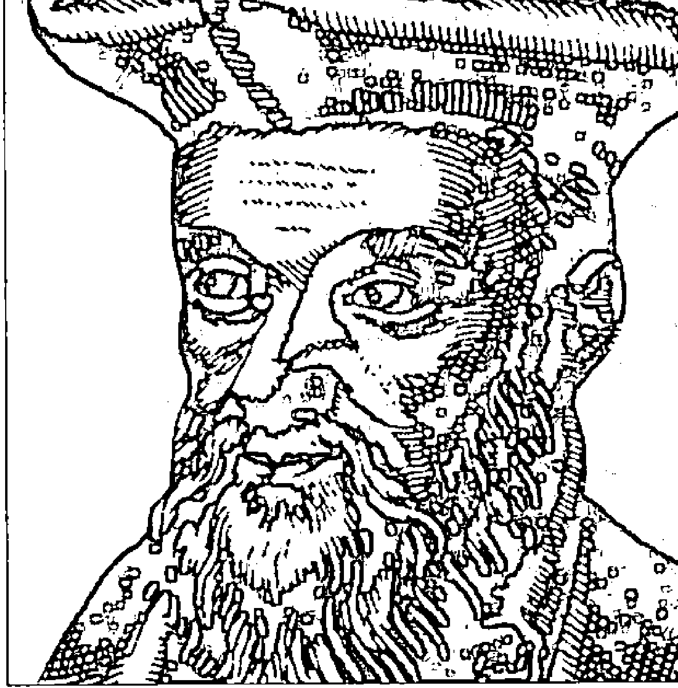

16世纪法国医生和星相学家米歇尔·诺斯特拉达穆斯的名字颇富传奇色彩。最为出名的是他1555年出版的一本书——《千百年》。该书共十章，每章一百行预言诗。四百年来，《千百年》就像《圣经》一样不断再版发行。关于预言家本人的书籍同样可以装满一大图书馆。他的书是献给儿子采扎里的。前言里写道：“长期以来，我做过许多预测，它们都在我说的地方应验了。然而由于现在和将来都可能有害，所以我选择了沉默，可过后还是决定用隐晦的话语道出人类未来的变化。这是一些长期性的预测，它们从现在一直延续到3797年。” 二婚所生的幼子未必能明白父亲启示的价值，这些启示更像是说给未来的诠释者听的：“只要有一位神仙知道来自他的世界的永恒，我愿坦白地告诉人们，如果神想要向你们显示他难以置信的伟大的话，这是由两个途径显现给先知的秘密，一是通过星辰，二是通过共同参悟神的永恒性。” 换句话说，通过星相计算或上天赐梦，未来是可以预知的。诺斯特拉达穆斯早在幼年就学过星相术的基本知识。他认为，如果没有开悟，星相计算和上天赐梦也没多大意义：“我能做到这些多亏了激起我灵感的神力。” 同所有带特异功能的人一样，米歇尔是用天眼看物的，而且立刻明白，不用解释，就像做梦一样显得令人信服，不过那里的形象古怪，事件顺序也较混乱。难处在于先要自己弄清所见到的东西，然后再找出适当话语向别人转述未来的事情。直接描述自己的所见是不行的——人们不会相信，需要找出一种传达信息的特殊办法，用某种方式将信息编成代码：“用语要模糊，尤其是预言性的。” 预言的事件时间一到，

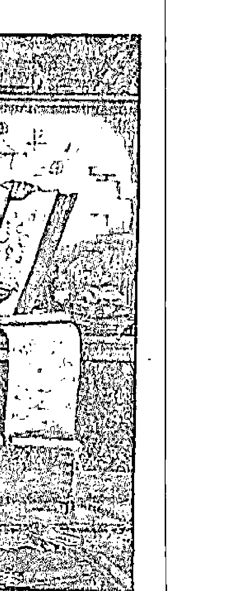

人们会用具体事实自行填补模糊的哑谜。当人们仿佛成为预言的共同参与者之后，就会更加相信了。然而人们对过去的事不感兴趣——都过去了，谁还管那些？遥远的将来也不现实——我们活不到那时候。于是诺斯特拉达穆斯将《千百年》寄赠给有权势的人物——国王亨利二世，顺便向他预告了不远的将来：

单打独斗两头狮，幼狮无奈战老狮。幼狮刺中老狮眼，穿透老狮金甲片。一击造成两处伤，老狮不日把命丧。这几句预言就像梦呓谵语，又是出自外乡郎中之口，国王自然没把它当回事儿。1559年，国王决定举行骑士比武，庆祝两个婚礼——御妹玛格丽特和公爵萨伏依斯基，公主和西班牙国王菲力普二世。第三天，骑士比武就要收场，亨利突然出面挑战年轻的骑士、苏格兰禁卫队队长蒙哥马利伯爵。双方打成平手，可国王要求继续再战，蒙哥马利很不情愿地服从了国王。双方各自又来到比武场的一端，接着策马相向。只听得咔嚓一声，两支长枪折断。说时迟，那时快，禁卫队长手中的半截枪柄早穿透国王头盔的金脸甲，刺进左眼，并深深扎入脑颅。亨利二世被枪伤折磨十天，驾崩于后宫，遗体上覆盖着画有狮子的盾甲。预言成真，证实诺斯特拉达穆斯名不虚传。然而这给他带来的不是声望，而是生命危险。有人得知国王驾崩与郎中的预言完全相符后，烧毁了预言者的画像，并将他告上宗教法庭，要求焚烧原身——诺斯特拉达穆斯本人。他得以幸免，多亏王族干预，因王室许多成员做梦都想知道自己是否有希望继承王位。达官显贵请求外省郎中预测祸福随即蔚然成风。此风又波及级别稍低的市长、官吏，甚至百姓。一时间，诺斯特拉达穆斯成了整个法兰西的骄傲。诺斯特拉达穆斯享誉八年，直到1566年去世。他的墓碑上写着：“安息者米歇尔·诺斯特拉达穆斯，秉承星辰影响，以其神笔宝墨，铭记环球未来大事，举世无双，万古流芳。”

诺斯特拉达穆斯的影响之大，以致他的预言多次被世人伪造。1649年，福隆德(投石党)运动时期，法国出了伪版的《千百年》，书中塞进了揭露红衣主教马萨林的四行诗。在德意志第三帝国时期，出现过诺斯特拉达穆斯预言元首将赢得第二次世界大战的传单。

他打算写十本《千百年》，但不知因为什么连第七本也没写完。直到临终最后一刻，他还在继续修改第十一章和第十二章，认为它们特别重要。可是米歇尔却能预见到自己坟墓会遭到玷污。1791年法兰西革命者挖开他的坟墓时，看到他遗骸的胸部有块小木板，上有四个阿拉伯数字——1791。4. 这幅中世纪书里的细密画，表现的是人体各部位与黄道十二宫的关系。诺斯特拉达穆斯认真研究过星相学，因此他在行医时无疑会运用这些知识。他使用自制药物，拒绝采用像输血之类的通行疗法。按中世纪学者们的想法，黄道十二宫之所以对人体有影响，是因为人体是个微观宇宙，对应宇宙整体结构——宏观宇宙。既然知道宇宙和某些行星影响着世界的未来，那么它们就不仅决定着个人的命运，而且主宰着人体一定的器官。

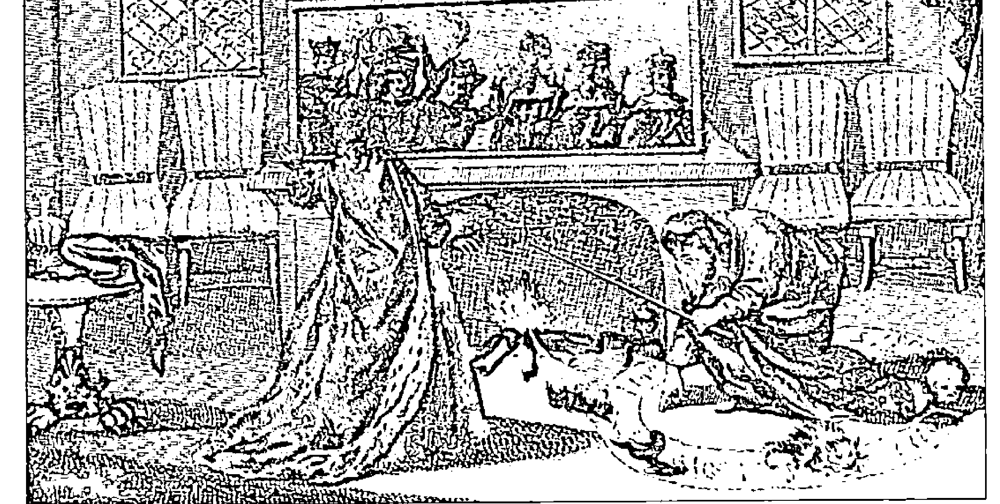

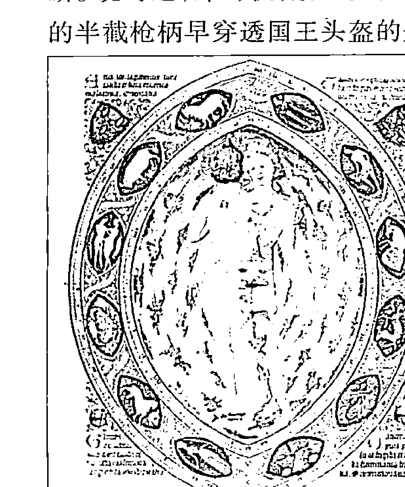

## 日尔·德·瑞——蓝胡子

+   1. 法国国王查理七世出身瓦里亚家族（1403 - 1461，1422年登基）麾下有个元帅叫德·瑞。这位国君出卖了女民族英雄冉·达克（一译——贞德），并将蓝胡子送上了火刑台。

+   2

布列塔尼的元帅，法兰西一位极其富有的男爵，蓄着青灰色的大胡子，因此而得了个出名的外号——蓝胡子。他后来成了故事的主人公、恶棍，杀了一个又一个妻子。 事实通常更简单，也更可怕。日尔·德·拉瓦尔，德·瑞男爵，是一个巫师。为了广敛财富而寻找点金石，他和手下害死了两百个稚童。他多次打算用自己身怀六甲的妻子祭祀撒旦，皆因内兄内弟出面干预而未得逞。后经教会法庭审判，巫师于1440年被处以火刑。 这位男爵胆大而好吹牛，并且虚荣无比。每每出行，必车辇华盖，

旌旗和十字架开道，俨然皇家气派。元帅的神职人员个个穿金戴银，好似教会最高阶层，全法兰西谁也不像他有这么多的少年侍从。他雇来当侍从的都是穷人家的孩子，这些孩子当着当着佣人，就神秘地消失不见了，留下的空缺，再招募新人填补。关于消失的同伴，不仅严禁打听，而且提都不准提，仿佛他们根本就不曾有过。少年侍从们的父母被蒙在鼓里，还以为他们在顺利地高升呢。

元帅言谈举止中的怪事越来越多，也越来越明显。从某个时候起，他开始只穿黑衣，变得性格孤僻，神情忧郁，常常独守马舍库尔城堡的塔楼而闭门不出。他的太太发现，每天深更半夜，塔楼的窗户里都会闪现出火把的红光。

1440年复活节前，德·瑞告诉妻子，他要去圣地过节。临走时，他允许小姨子来城堡看望姐姐。妹妹安娜第一个知道了男爵夫人一直藏在心底的不安：丈夫为何每天夜里离她而去？他近来为何闷闷不乐？入口封死的塔楼里出了什么事？一个个少年侍从跑到哪里去了？要回答这些问题，只有一个办法，那就是深入塔楼，探个究竟。姐妹俩好容易找到嵌在一座雕塑上的秘密入口。刚进第一层，姐妹俩就惊呆了：十字架被倒放，祭台上立着的是令人极其厌恶的妖魔塑像，烛台上的蜡烛是黑色的。一切表明，

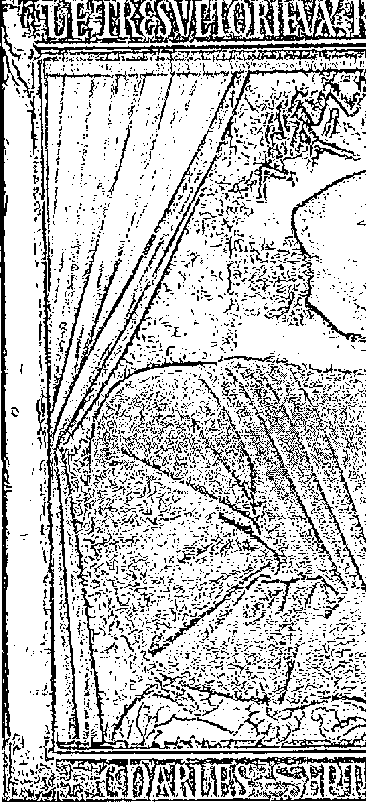

[PAGE 190]

## 189 日尔·德·瑞——蓝胡子

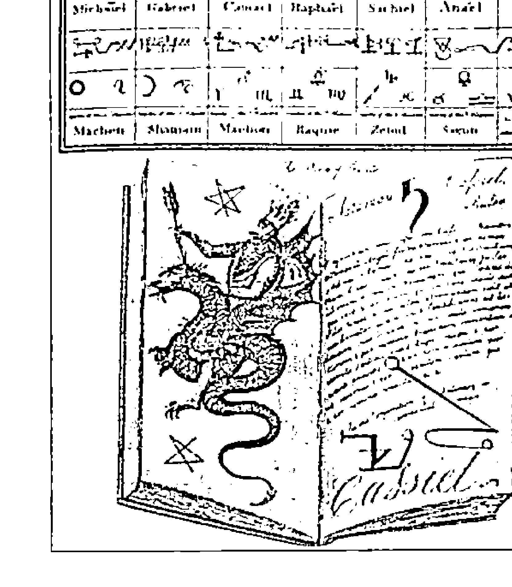

这里做的弥撒不是为上帝，而是为撒旦。在第二层，她们看见几个炉子、一些蒸馏罐和许多木炭——炼金术的典型物品。又见有楼梯通向一间没窗户的小黑屋，可姐妹俩不敢进去——被一股恶臭气味吓住了。男爵夫人一转身，不料碰倒一只高脚盘，黏糊糊的东西溅了她一身。走到窗前，她看出裙摆和鞋上溅的是血。她恐惧万分，扭头想跑，可妹妹将她叫住，劝她一道去地下室看看。她们点燃被碰翻的油灯，很快眼前就出现一番可怕的景象：沿墙一字儿排放着装血的铜罐，每个罐上都贴着带日期的标签。而房间的中央黑色大理石台面上躺着一具刚被杀害不久的侍从的尸体……忽听得墙外一阵马蹄声——男爵回来了！姐妹俩慌忙寻找地道出口。安娜登梯爬到塔楼顶上。男爵夫人奔向出口，与丈夫碰了个满怀。男爵二话没说，一把捉住吓得半死的妻子，拖进塔楼，扔到祭坛前的地上。接着点燃黑色的蜡烛，抄起一把仪式上用的尖刀……元帅为何如此突然返回了城堡？仅仅是为了考验妻子？不，另有原因。在去圣地的路上，贴身侍从转告他一个预言：若将妻子腹中的婴儿取出做燔祭，他会得到数不尽的金银财宝。塔楼顶上的安娜没被男爵发现。忽见自家兄弟骑马向塔楼走来，于是挥起手绢求救。男爵听到内兄内弟走近的脚步声，停下手来，弄醒妻子，低声威吓说：“我原谅你的好奇。不过，假如吐露半个字，或打一个手势把我出卖，你立刻得死。”说完，他出门迎接亲戚去了。男爵夫人面无血色，来到兄弟们面前。兄弟们不安地打问她是否染病。男爵用情意绵绵的目光盯着妻子，说她面无血色是因为怀孕引起的不适。然而，夫人还是低声对兄弟们说：“他想杀我！”这时，安娜闯了进来，叫道：“带我们马上离开这里！这家伙是杀手！”兄弟们一声呼唤，侍卫拔剑将姐妹俩团团护住。在武士们的护卫下，夫人同妹妹、兄弟离开了马舍库尔城堡。男爵的心腹们见大事不妙，逃之夭夭。第二天，男爵束手就擒，不久被送上了法庭。

+   2. 在中世纪的魔法书上可见到撒旦的印章——倒五角形符箓。3. 同样的倒五角形符箓也加盖在黑道魔师的图像上。巫师骑着威力强大的蛇妖，可见征服妖魔是每一个巫师的夙愿。西欧《巫术教本》里的插图。4. 法国元帅日尔·德·拉瓦尔的城堡可能就是这样。当伯爵将农民的孩子招进自己城堡时，他们的父母都相信能当上兵，吃喝不愁，而且可能前途光明。即便怀疑有点问题，面对主人的威势也无能为力，因为他有权自行审判他们并处以死刑。

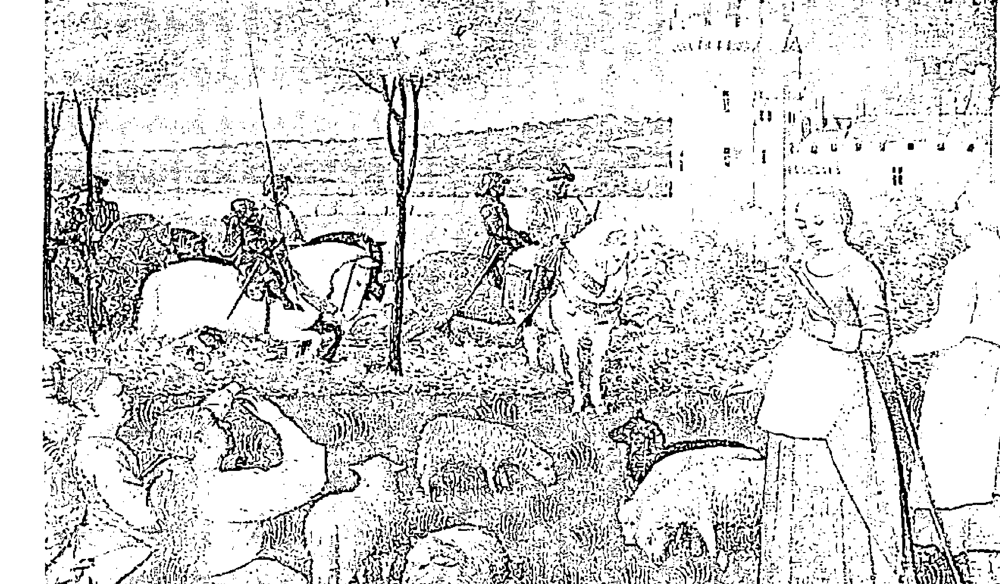

## 山林长老

+   1. 山川旁的传教士。
2. 霍尔索夫的凶杀。
长篇叙事诗《霍尔索夫和希林》的细密画。
3. 战斗。
4. 阿拉伯人攻城。

统一的基督教分裂成天主教、东正教和许多新教小教派。同样，伊斯兰教在公元7世纪也分裂成逊尼派和什叶派。百年过后，什叶派又分出追随教长之子伊斯玛仪的伊玛目派。伊玛目派起先只是个秘密小团体，如今在伊朗、叙利亚和其他东方国家有了许多拥戴者。伊玛目派教长阿加汉住在巴黎，是世界上最富有的人之一，进行着积极的政治、文化和慈善活动。

在7世纪却是另一番景象。当时只要一提教长哈桑·伊本·萨巴赫——外号山林长老——的大名，人们都会吓得面如土色。只要长老走上难以攻克的阿拉姆特城堡的阳台，举目一看，指定下一个猎物，那它就在劫难逃。只要长老把手一挥，菲达伊敢死队员便立刻跳下山涧摔死，灵魂化作游僧或商贾前往远方，潜入城堡和城池，说谎话、作伪证，一连数月等待时机，一跃而扑向自己的猎物，朝他的心脏插上一刀。如被守卫捉住，他们毫不隐瞒，就是要人人知道山林长老之手伸得有多远，他的手下如何善战和刚毅。吸足大麻后，他们当面嘲笑刽子手。毒品的名称被法兰克人改作“阿萨辛”，成了杀手的代名词。

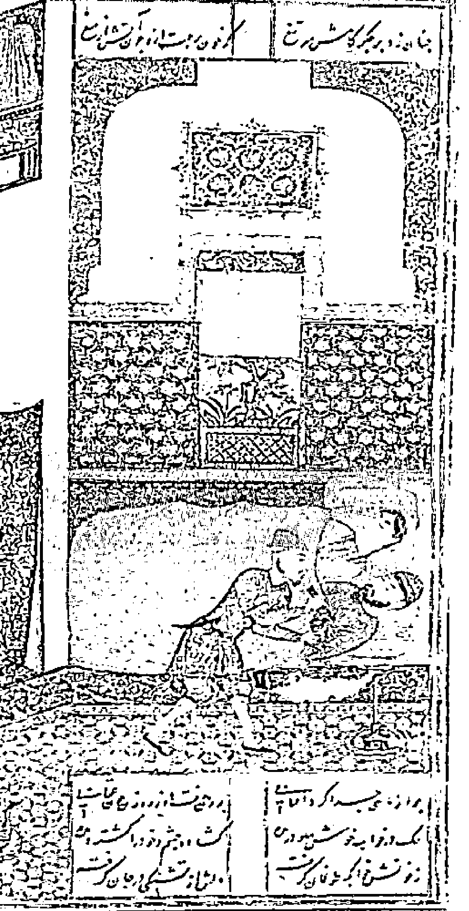

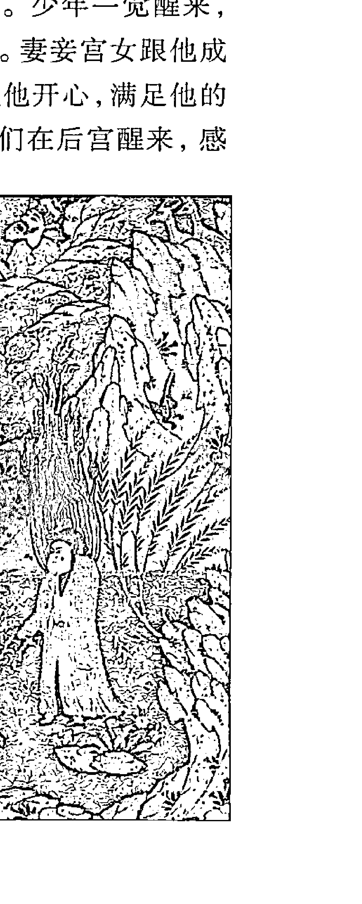

拉茨基伯爵(1192年)。大部分刺杀未被我发现，阿萨辛的参与也未得到证实。 菲达伊自己死得也很高兴，相信立刻会升入天堂，那里有美丽的仙女等着他们。

教长伊本·萨巴赫为自己挑选的仆人都是童子，把他们灌醉，置于城堡中的花园里。对这花园描写最好的是旅行家马可·波罗：“隐士的宫殿里有一些当地的十二岁至二十岁的青少年。他们似乎有人看管，对先知穆罕默德描述过的天堂有所耳闻……长老吩咐将少年们带进这个天堂的办法是这样的：先将他们灌醉，趁他们昏迷未醒抬进花园，在那里将他们唤醒。少年一觉醒来，真以为到了天堂。妻妾宫女跟他成天玩耍、歌唱，让他开心，满足他的一切愿望。少年们在后宫醒来，感

长老的菲达伊杀过三名哈里发，六个宰相、数个州官和府尹、不少宗教人士以及伊朗学者阿布·利·马哈辛。命丧他们手下的还有欧洲的两个国王赖蒙德·特里波利斯基公爵(1105年)和孔拉德·蒙费

[PAGE 192]

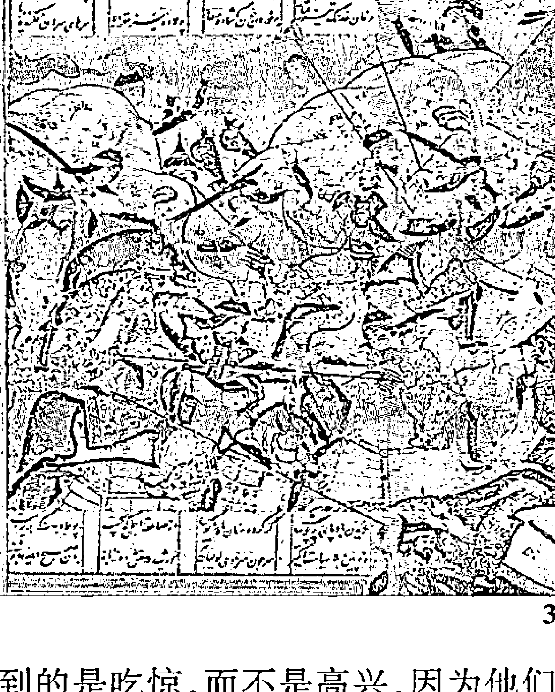

## 山林长老

这种走街串巷的传教士不计其数。哈桑本可成为其中一员，可他却从理论转向实践，同忠于他的人一道夺取了深山中的阿拉姆特城堡。从此他得了个外号——山林长老，尽管他年仅而立，距桑榆尚远。毕竟外号也有它的道理：教长伊本·萨巴赫在城堡中度过了漫长的一生，1124年在此辞世时已是八十岁的老者。他从阿拉姆特城堡领导了他建立的可怕组织的整个网络，在伊朗和邻国夺取过一个又一个城堡。一时间，山林长老的帝国超越了国界——它无边无界而又威力无比。然而这只是一种幻象，光阴飞逝，神仙忌惮，何况凡胎长老！无形的帝国虽又存在了一段时间，但它的城堡却在蒙古大军的铁蹄下相继被摧毁。毕竟蒙古人未能占领伊斯玛仪派的所有城堡——有的藏身偏僻的峡谷，没被找到。很可能不是所有的城堡都被放弃。那么它们的墙外现在是否还有忠于教长的菲达伊的后人呢？

到的是吃惊，而不是高兴，因为他们将永远不能按自己的意愿离开天堂一步。他们来拜见长老，尊他为先知，恭恭敬敬地磕头行礼。长老问他们从哪里来。少年们回答，从天堂来。长老要想刺杀某个大人物，便吩咐筛选几个最好的阿萨辛，派往不远的地方。说实话，许多王侯和男爵都因害怕而给隐士进贡，跟他结交。

其实，哈桑

## 两个浮士德——乔治和约翰，巫师和神学家

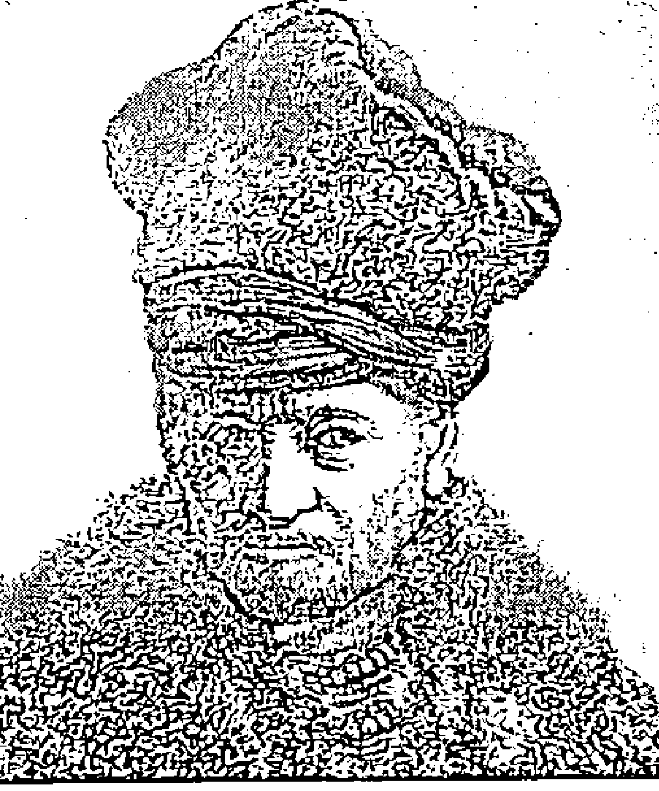

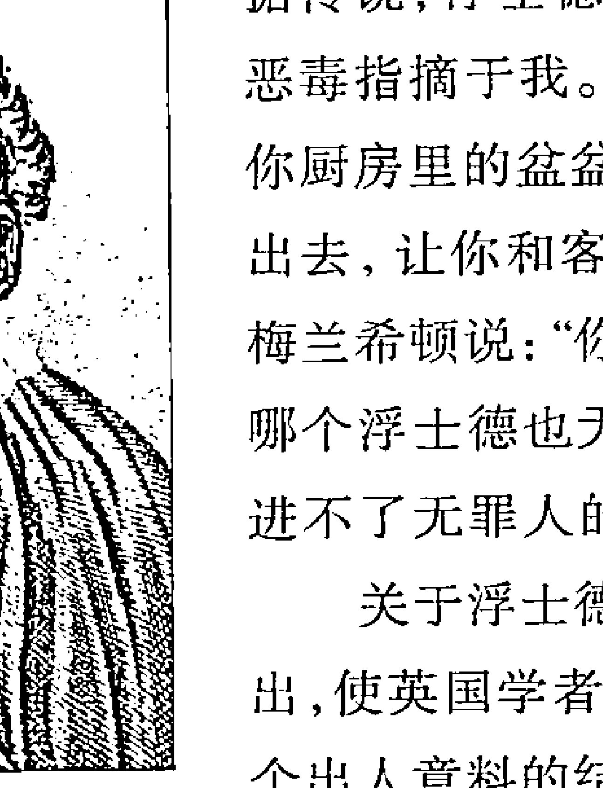

-   1.《一个老人的肖像》。伦勃朗。荷兰。在17世纪，此画常被认为是浮士德的肖像，可能因为像兄长——神学家约翰。
-   2.此为德国民间图书里描绘的被魔鬼带走的同乡。的确，这位穿载入时而眼神凝滞的人可能是乔治·浮士德，那位巫师。
-   3.写着炼金术配方的羊皮纸残片——能证明浮士德确实存在过的不多的证据之一。

歌德塑造浮士德，可能是想在他身上体现一些最为大胆的愿望。除歌德而外，做过浮士德类似角色转换的还有许多作家，如克林格尔、马洛、希普斯等。希普斯的书名叫《魔师浮士德博士的往事》。在这之前，有过无数的民间传说。说书人“塑造”浮士德时各有所图，对他的称呼也不一样：约翰、乔治、浮士德、察别尔。不知浮士德是学者还是巫师，他的姓氏倒像绰号：按德语意译是“拳头”，按中世纪日耳曼盛行的拉丁语意译却是“幸运儿”。说到这里，不禁要问：真有过这么个浮士德，还是人们想象出来的呢？原来还确有此人，并且流传下来宗教改革者马丁·路德同他的席间交谈记录。多次提过他的还有一位宗教改革者菲力普·梅兰希顿。

据传说，浮士德曾向他挑战：“你常恶毒指摘于我。哪天你请客，我让你厨房里的盆盆罐罐都打烟道里飞出去，让你和客人什么也吃不着。” 梅兰希顿说：“你最好别这么干……哪个浮士德也无法如愿以偿：魔鬼进不了无罪人的厨房。”

关于浮士德，众说纷纭，矛盾百出，使英国学者E.M.勃特勒得出一个出人意料的结论：“浮士德是一个还是好坏各一……乔治和约翰怕是兄弟俩，而且很可能是双胞胎。”

小浮士德——乔治，1507年为从事招魂占卜而不得不放弃大学学业。可他并没白玩。著名的神秘主义者弗兰茨·冯·西肯根为这初出道的招魂占卜者觅了个小学校长之职。可他在学校里闹出了丑闻，如当时所载，“以最下流的方式猥亵了男童”。

仅仅两年后，他哥哥约翰在海德堡大学神学系获得艺术学士学位。优秀毕业生榜上，他高居榜首。至于他后来如何，世人几乎一无所知。天长日久，人们将他与臭名昭著的兄弟混为一谈。1513年10月，人们在爱尔福特宾馆见过乔治炫耀魔法才能。1520年2月，他为班贝格主教编制占星图而得到十二枚金币。1528年6月，他因预言失败而被逐出因戈尔施塔特。1532年5月，他在纽伦堡欲行招魂术但被认出是位“有名的兽奸者”而遭拒绝。1535年6月，他在明斯特成功预言主教当夜将占领该城……总之，他居无定所，一如闲云野鹤。他在这儿被人痛骂，在那儿又被尊为“先知乔治·浮士德”……

故事绘声绘色，真实和想象错综交织，让你闹不清哪儿对哪儿。只知道，乔治得到爱尔福特当局允许，在当地大学做过几场关于荷马的讲座。讲座引起了学生们的好奇，他们要求浮士德当堂招出《荷马史诗》的主人公。主讲人慨然应允，将那些阴魂一一招出。特洛伊战争的英雄纷纷来到学生们面前，鞠过躬，又返回阴间。唯有独眼巨人波吕斐摩斯惹出了麻烦。起先他那火红的胡须和嘴里还没嚼完的人腿吓着了这些学生。接着丑八怪又让学生们更为惊骇：不尝一两对年轻人的滋味拒不离校。学生们吓得大呼救命。演讲人凄然一笑，随手一挥，将巨人打发回地狱，博得学生们雷鸣般的掌声。

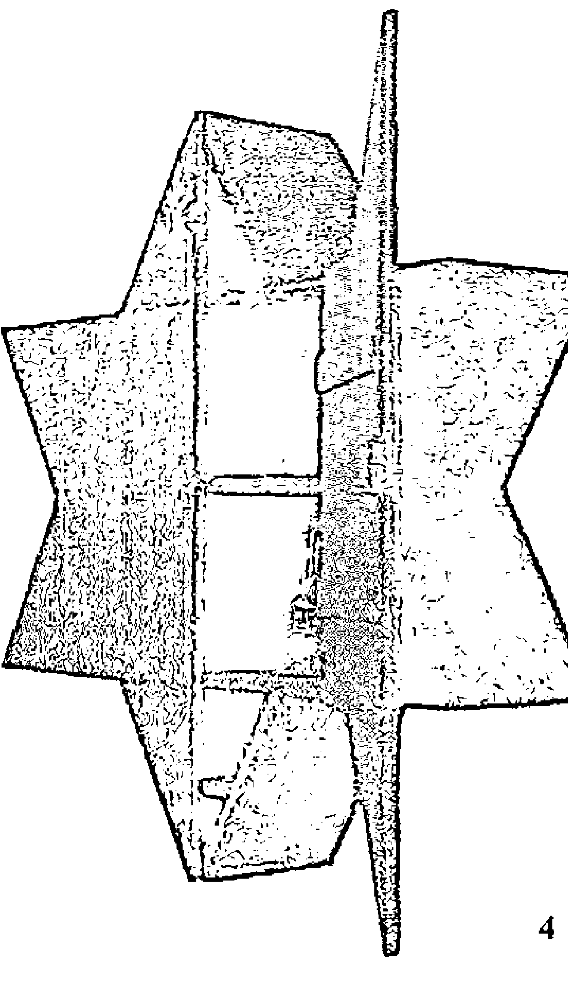

自然，日耳曼大地四处传说，浮士德向魔鬼出卖了灵魂，因为常人无法招出死者的阴魂。在维滕贝尔格，与志趣相投的学生们共进晚餐时，乔治预感大限已到，于是说：“我即将作为好坏参半的基督教徒离开人世。说好，是我充满忏悔之情，心里不断要求宽恕自己，因此我的灵魂或可拯救；说坏，是我意识到魔鬼将支配我的身体，我也准备将它交出，但愿能让我的灵魂安息。所以我请求你们回去睡觉，祝你们晚安，祝自己晚糟。” 没出他所料，半夜飓风大作，啸叫声和咝咝声四起，仿佛全世界的蛇正爬向乔治的住处。邻居听见了他的呼喊：“救命啊！杀人啦！” 人们正准备前往相救，可风声、咝咝声、呼救声霎时平息。人们心想，都是自己的错觉。转天早上，在粪堆旁发现了巫师的尸体。在浮士德的房间里，四壁血迹斑斑、满目暴力的遗痕。人们知道，如此巧妙的谋杀只有魔鬼才干得出来。 那么，他哥哥浮士德博士呢？神学家约翰完全可能是一生清心寡欲，辞世默默无闻。

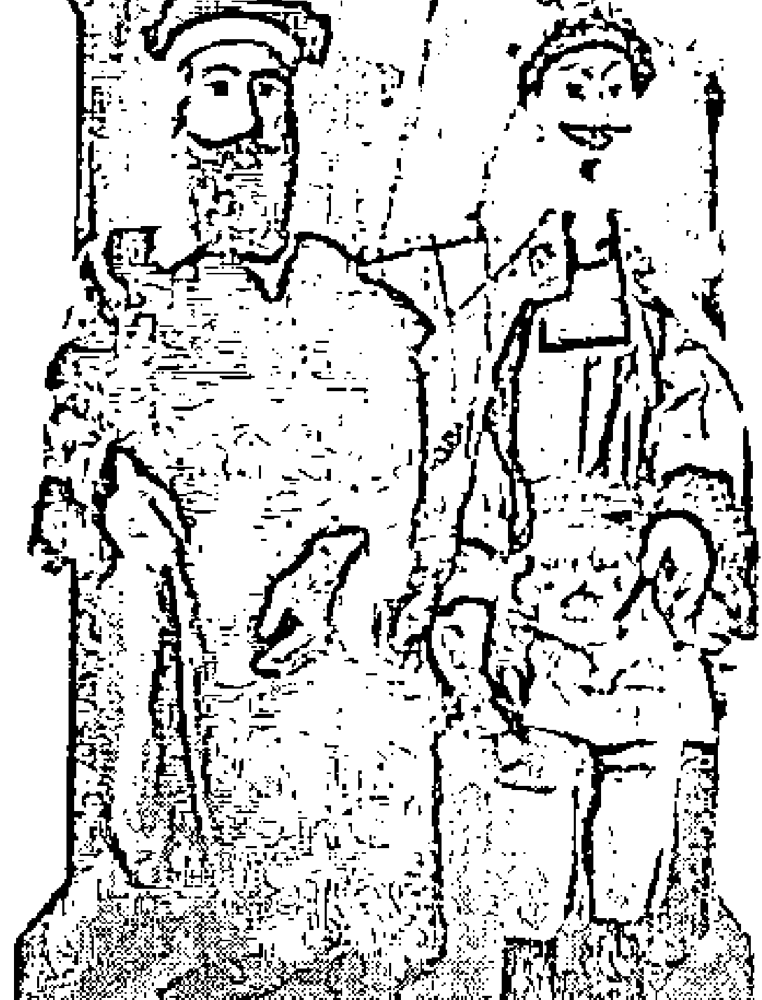

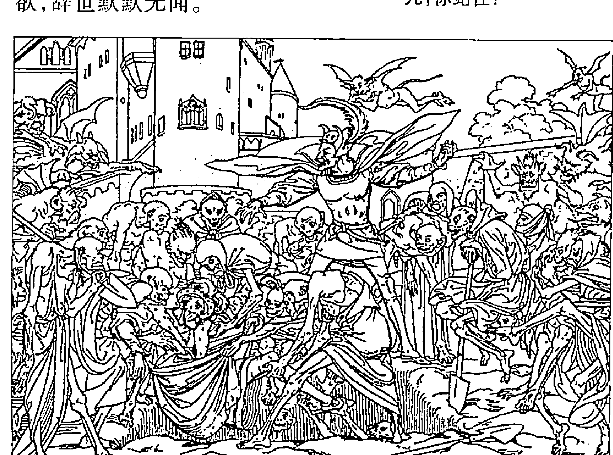

-   4. 人们推测，浮士德曾在这六角星形柜子里存放过炼金术器具。
-   5. 浮士德和靡菲斯特（《浮士德》中的恶魔）——民间木偶戏的木偶(德国,19世纪)。两个人物——有些古怪的学者和将他迷惑的魔鬼，在歌德文学加工之前很久就具有滑稽的特点，在平民百姓中妇孺皆知。剧本各不相同，但剧情和寓意始终不变。
-   6. M.列特士为约·沃·歌德的《浮士德》第二卷所作的插图。以兴奋不已的靡菲斯特为首的魔鬼们准备将学者的灵魂带走，学者大叫：“时光，你真美，你延长一会儿，你站住！”