# 不可思议的古文明2

〔俄〕维克多·卡拉什尼科夫 著 傅文宝 白 薇 王文倩 译

追本溯源世界神秘文化，稀见珍藏再现史前记忆。

巴比伦通天塔能代替宇宙树，连接天与地、神仙和凡人么？埃及如何成为魔法的故乡，埃及女神伊希斯真是世界头号魔法师吗？魔法师们的城堡建在哪里？希腊和罗马人为何认为宙斯的闪电是对罪恶的惩罚？阿育王怎样在纳兰达建立了魔法大学？安第斯美洲豹人与月亮统治者有哪些关联？

作者凭借丰厚的历史积淀，撷取冬宫罕见的珍贵资料，带领我们走进神秘文化的世界，展开一段探索世界古文明未解之谜的旅程。

## 先民的魔法

我们生活在一个不断变化的世界上。变化的发生不仅因为从今往后的运动，也由于对远古时代的回眸。那远逝的时代不断教导我们重新审视和理解周围的一切。先民们一再让后人惊诧不已。考古学家们接连不断的发现，向世人展示着前所未知的文明，让我们领略民间创作的寓意深刻的作品和出自巨匠大师之手的精美绝伦的器物。每一个这样的发现，不仅从根本上改变着现代人对古代各民族及其贸易关系和文化联系的认识，而且将智人出现的年代向远古大大推前。还是在不久前，20世纪初，我们才不再怀疑苏美尔人的存在，才相信是他们引领了其后居住在底格里斯河与幼发拉底河之间那块谷地上的所有民族——阿卡得人、巴比伦人、亚述人、波斯人的发展。随后引起全世界轰动的是，赫梯王国被发现于今土耳其境内。紧接着，一支丹麦考古探险队发现了迪尔蒙——波斯湾巴林岛上的一个极其古老的国家。在那里，据苏美尔神话传说和学者们发掘考证，曾有座人间天堂——伊甸园。园里住过人类的始祖——亚当和夏娃。可以有把握地说，今后必将还有大量惊世骇俗的发现。很有可能，这将对叙利亚、巴勒斯坦、小亚细亚和南美洲首批移民者的研究成果。

一个重要的发现是，人们意识到，远古世界所有文明的基础，都是一些神奇的知识。简而言之，就是魔法，既有高级的——祭司的法术，也有低级的——巫师和巫医的巫术。往往最高执政官本身就是魔法师。他们一个小小的举动，有意或无意的，既能左右自然界的状况，也能决定臣民们的康疾和生死。古代交战时，常常使用的不仅有各种神通方术，而且还有极其精良的武器装备。许多证据表明，先民甚至使用过原子武器。而且令我们实在难以置信的是，他们甚至懂得飞机制造和火箭技术！一些当代学者断言：古时候，外星人经常光顾地球并与人类频繁接触。换言之，高度发达文明的这些代表者，曾试图启迪我们蒙昧未化的祖先。而事实往往比最大胆的假设还要丰富得多。许多的证据表明，古印度的经书里也说，人类在远古时代曾进入太空并与外星人平等交往过！总而言之，我们对遥远的过去了解越多，就越发相信：运动绝非一路进步向前，而是朝着相反的方向——从完美退回原始，从卓识滑向自欺，从强大落入退化。所有民族的传说里讲述的恰恰就是这一点！古希腊人记住了金器时代，并将对它的回忆传给了子孙后代。而接替金器时代的是银器时代，随后是铜器时代，最后是铁器时代。然而，我们宁可不信那些“无稽之谈”，而根据一些极其零星的、往往尚令人怀疑的关于过去的知识，构建自己的一套发展理论，将自己推上最高峰。呜呼，侵略成性、自私自利的人类，很遗憾，在数千年间渐渐地落入了深渊；而我们现今所处的位置，种种情况表明，几乎是在这深渊的底部。然而，这倒退就如此不可逆转吗？难道我们的努力已无济于事？我们就注定走向灭亡？这些问题的答案还是应当到先民那里去寻找。他们教导说：凡事皆可逆转。信仰、道德、真正的知识和正确的行为，是通往顶峰和光明的阶梯。

在本集里，我们力图讲述的是古代文明的精神生活。其中一些内容，当代读者知之甚少或者完全陌生。遗憾的是，因篇幅所限，本集未能讲述胡里特人和乌贝德人，也未能叙说亚述、米坦尼、帕提亚、贵霜、埃布拉等强国以及东南亚的一些神秘古国。呜呼，在一个集子里，要包罗数千年间的生活万象是不可能的。而所说到的内容也并不完整，因为每个民族都值得进行单独而深入的研究。关于古代文化的话匣子既已打开，我们在这套丛书的下一集里还要继续说下去。那里要讲的是起先定居欧洲、尔后遍布全世界的雅利安各部族的大家庭。

尽管我们的努力成果有限，但希望我们已然大致描绘出了过去及其种类多得令人吃惊的民族和文化的广阔图景的轮廓。先民魔法的继承者是我们大家——今天活着的人们。给你推荐的这一集的主要想法是，没有过去就不可能有未来。

作者

## 斯芬克斯

斯芬克斯之谜是许多画家喜爱的油画题材。包括俄罗斯写生画家亨·谢米拉茨基。斯芬克斯是整体布局的一部分。许多证据表明，斯芬克斯的体内和身下都有宽大的厅室。著名考古学家约·金纳曼说，1924年意外发现胡夫金字塔下有条隧道，走到尽头，只见一厅里堆满不知何用的机械。那里还有一台抗重力机。1945年，埃及王子法鲁克无意中触碰了什么“机关”，眼前轰然打开一扇通往斯芬克斯内部的石门。王子进入大厅，但怕有生命危险，连忙退出。90年代初，美国地球物理学家托·多别茨基发现，斯芬克斯爪下和肋下五米深处有宽大的地下室。这很可能是墓室或早已消失的文明的知识库。要做的只是进入这些密室，假如没有魔咒护卫的话，对此我们自然不信。然而，尽管非常渴望，可我们能否读懂这些人为我们留下的遗书呢？不，并非人。至少跟我们差别很大。纽约警察局的鉴定专家弗·多明戈中尉做过研究，将斯芬克斯和法老哈夫拉的面孔进行比较后，得出结论：它们不仅仅没有任何共同之处。顶多只能说是个不知名的种族。我们祖先或许生得跟斯芬克斯正好一样，也未可知。

法老哈夫拉只是竭力让自己与这些聪慧而强大的先辈相像，因而吩咐工匠将他刻画成斯芬克斯的模样。他是否像所有后来的国王一样，想暗示自己的臣民：他是神灵的优秀直系后裔呢？至少，埃及女战神谢赫梅特的形像斯芬克斯像一度被认为是国王阿蒙涅姆赫特三世的肖像，但差异很明显就与狮子相似。而古埃及人是不是这个神秘文明的继承者呢？古埃及祭司们告诉希腊人梭伦的正是这一点：洪灾之后活下来的，只是一些头脑极其简单的人……蛮夷也能学会许多吗？他们毕竟学到了点儿东西。可以为证的便是洪灾后的文明中最古老的一种——尼罗河谷文化。

D·罗伯茨在他的军事画里表现了一尊几乎被黄沙掩埋的斯芬克斯。它正是这样出现在画家眼前的。

## 古埃及的神灵

天神努特向地神盖布弯下腰。将他们分开的是父亲——气神舒。顺着天神双臂上升的是载着旭日诺神的船。顺着她双臂下降的是载着落日诺神的船。迎接他们的是地府之神俄赛里斯。

埃及人从过去学到了什么呢？或者确切些说，他们能够或者想要带给我们什么呢？

在古埃及，就像在许多其他古文明国度——印度、巴比伦一样，多种多样的信仰相安无事。它们流行于不同的城市：下埃及的赫里奥波利斯、王国中部的孟菲斯、上（南）埃及的大赫尔莫波利斯和（长期作为国都的）底比斯以及其他一些城市。赫里奥波利斯的祭司们特别尊崇由太古之海——依中诞生的阿图伊·艾瓦佐夫斯基油画上的吉萨金字塔姆神。人们将他想象成一条长着双翼的蛇，不过这位永恒之神，作为上下埃及人的主宰，经常化成头戴双层王冠的人形。阿图姆出现之后，创造了气神——舒和他的妹妹——妻子——水神泰芙努特。在世上第一对夫妇那湿润的氛围中，生下了一对龙凤胎：男孩起名盖布，被授权掌管地；女孩努特日后该掌管天，可过了相当长时间也未离开兄长。长大后，她便仿效母亲嫁给了兄长——近亲婚姻并未让双方觉得尴尬，因为别的神灵确实没有。

盖布和努特又生下了第四代元神：孪生兄妹俄赛里斯与伊希斯，塞特与奈芙提斯。他们一起构成了第一组所谓的九大神：阿图姆（后来受太阳神拉所排挤，只落下掌管夕阳的权力）、舒、泰芙努特、被生分开的盖布和努特以及他们的四个孩子——俄赛里斯、伊希斯、塞特、奈芙提斯。他们全都被授予大神的尊号。

后来父亲舒将女儿努特拽向高空，让她离开了丈夫。盖布每每竭尽全力向努特靠拢，终未能如愿与心爱的妻子聚首团圆。

天和地的长子俄赛里斯（确切些说，埃及语叫厄西尔）道德特别高尚，同时又大权在握：众神之王，大自然之主……他因不满足于此而决定下凡，将自己的所知所长传与人类。他取得巨大成功，却引来胞弟——荒漠之神塞特（塞特哈，或苏特赫，意为“外乡人”）的极度嫉恨，最终遭其毒手。永生的俄赛里斯不会彻底死去，成了冥府之王。

次女伊希斯（准确些说，叫伊赛特——“宝座”）乃世界头号魔师，婚姻和母性的守护神。她使出浑身解数，让俄赛里斯短暂回阳，为的是替他怀下后来报了杀父之仇的儿子何露斯。

小女奈芙提斯（埃及语叫奈贝
夕阳的权力）、舒、泰芙努特、被生分开的盖布和努特以及他们的四个孩子——俄赛里斯、伊希斯、塞特、奈芙提斯。他们全都被授予大神的尊号。

俄赛里斯的胞弟和谋害者，荒漠和干旱死亡的主宰——塞特(带驴首者)

总之，古埃及的神灵极多(我们只提到其中几位)，他们全都相处得极好。不过，如果不是埃及人或者不具备专业修养，要弄清他们谁对谁，那是相当困难的。

其实，这是宗教的表面，场面上

## 埃及的魔法

埃及是魔法的故乡，而埃及女神伊希斯则是世界头号魔法师。一天，她需要前往决定她儿子何露斯命运的海岛，于是先买通船夫，接着施展易容之术和迷人魔力，骗过了荒漠之神：“塞特望了一眼，看到她远去的身影，于是深深地爱上了她。”

人们常常运用伊希斯的经验：每当科学或医学无能为力之时，他们就使用魔法，但往往既用这，也用那，有时甚至三管齐下。

埃及人虽相信灵魂永生不灭，却也竭力要把仇敌从人间撵走。为此，只需取来不大的陶罐，写下仇人的名字，再将罐摔碎——让人像罐上的名字一样粉身碎骨。“害人陶罐”的一些碎片奇迹般地保存了下来。有一片上写着：阿梅尼必死，师父辛·巴斯杰特。

祭司们都懂得占星术，而为普通人则制有分为三个时段的预兆表。如，早凶，午吉，晚大凶。另有附言：“本日出生者必横死”。显而易见，早晚禁忌出行，当天不宜生育。

咒对手死的话人人能写，这无需特别的知识。讨点儿迷魂药，可找当地巫医——这点小事，他们的本领足以应付。也有职业魔法师——法老的宫廷内（如，对敌国的执政事。埃及至今仍流传着古时两位大魔法师——老杰狄和少年萨·俄赛里斯的故事。一天，法老胡夫（公元前约2900年）心中烦闷，唤来王子，让讲些奇闻轶事逗趣。长子讲了一位法者施行诅咒）或是寺庙里。后者称为“讲演祭司”，解读经文。他们的另一专长，就是能够克制大肆作乱的恶魔或者有些不满的魂灵。毕竟专长和才能完全是两码事。

另一则故事：法师将一湖泊收起，于是它活了起来；那猎艳者去水池洗澡时，鳄鱼冲了过去，将他吞食。次子讲了

这幅壁画上描绘了人的灵魂的两种形式：卡——人的“心底双胞胎”，也就是魂和飞女芭——魂，人死时她会飞起

## 非洲

非洲南部，津巴布韦，雄伟城堡的遗址

## 天府之国

非洲布绍果部族的说书老人讲起世界起源是这样：“最初黑暗中除了水，什么也没有。本巴也是孑然一身。一天，他忽觉腹中剧痛。为摆脱这痛苦，他一使劲，喷出一轮红日，然后是月亮和星星。可本巴依然觉得难受……主神干净彻底地吐出了豹、鳄鱼和其他神圣的动物。最后吐出一个同主神本巴一样的白人——洛科·伊玛（伊玛——雅利安人的第一位执政者的名字）。”

后来，伊玛生了三个儿子。长子，尼奥尼耶·恩加纳，创造了蚂蚁，然后试着用它们来造人。这事原来他办不到，就死了。蚂蚁们对生命和存在满心感激，钻进大地深处寻找黑土，用它盖住寸草不长的沙地，以埋葬和悼念自己的创造者。” 这个非洲传说中隐含着古人对黑种人起源的认识——他们就是由洛科·伊玛的长子尼奥尼耶·恩加纳创造的那些蚂蚁。 在世界各民族的神话中，同样说到几个依次相互接替的人种。希腊人将其称作金器、银器、铜器、铁器……时代的人们。很有可能，黑肤民族是一种过渡性文明，它从高度发达的先辈那里学到了很多东
西，却没同他们在可怕的自然灾变时期一起消亡，而在某个时期夺取了对一些尚未摆脱野蛮状态之民族的统治权。 爱德华·舒尔在《伟大的奉献者》一书中讲道：“……大地的主宰者是黑色人种。这个人种的高级形态不应在黑人中，而应在阿比西尼亚人和努比亚人中去找寻。后两者保留了黑种人达到了发展顶点的昌盛时代的特点……欧洲南部为黑种人的天下是在史前时期……在自己的统治时代，他们建立宗教中心的地方是上埃及和印度。” 黑人在欧洲居住过的痕迹没有留下，可许多痕迹却留在了那些似乎不可能的地方——南美洲和中美洲。奥尔梅克人建造的人头塑像带有尼格罗人种的特征——他们通常把神灵、国王和执政者塑造得硕大无朋，而把自己的祭司则塑造成
### 古埃塞俄比亚人

这只古希腊坎萨双耳杯上刻画了两个美女——欧洲女子和非洲女子，好像一个整体的两个部分。公元前5世纪

远方的埃塞俄比亚是希腊诸神喜爱的休憩地。古希腊英雄们也乐于时常造访非洲。名声显赫的珀耳修斯打败蛇发怪墨杜萨之后，并未急于返回家乡。他脚踏飞屐，来到埃塞俄比亚，见到被缚在山岩上等待海怪带走的美女安德洛墨达。

在格列奇达的绘画中，希腊女神喀耳刻被描绘成深色皮肤的女子

阿波洛多罗斯在《神话丛书》中写道：“珀耳修斯对安德洛墨达一见钟情，向刻甫斯（埃塞俄比亚国王，姑娘的父亲）许诺斩杀巨怪，只要获救后的安德洛墨达能嫁他为妻。”一切似乎都很顺利，可公主原先的未婚夫菲纽斯召集了一帮好斗的黑人朋友，要找自负的外乡人算账。眼看珀耳修斯处境不妙，可一件怪事救了希腊人。他及时想起了墨杜萨的头，将头从袋中取出，指向围攻过来的埃塞俄比亚人——他们立时呆若木鸡。说实话，非洲人的英勇善战久已闻名。乐意雇佣他们的，先是埃及人和塞浦路斯执政者，稍后是希腊人。

腊人和特洛伊人，罗马人和迦太基人、波斯人，也即往往是敌对的双方。对于像希腊史学家希罗多德所描述的“头发似兽毛”的那些黑皮肤雇佣兵来说，为谁冲杀都一样，只要出钱大方就行。早在古王国时代（公元前4—前3千纪），法老们就招募过黑人士兵。士兵们博得了埃及人应有的尊重。他们在军队和警察部门都能认真履行义务，常常获得高位。努比亚弓箭手往往被刻画在法老陵墓的墙壁上。军事统领阿西乌特的墓葬里还保存下了他们的木俑——或许，即使在阴曹地府，这位统帅也希望有忠实可靠的努比亚人可供调遣。

与奥德修斯一同来到特洛伊城下的，还有他忠实的朋友，黑人埃夫里巴特。机智的伊塔刻王非常敬重这位非洲人的才智和洞察力。要知道，奥德修斯可算是部族中最有远见和最为精明的人！然而他却领着自己的伙伴们误闯黑女巫喀耳刻的埃亚岛（正因如此，这
### 古埃塞俄比亚人

此画描绘的是希腊神话里的一则故事——珀耳修斯大战海怪。许多人物为深肤色。这也很自然，因为悲惨事件就发生在埃塞俄比亚

## 非洲鼓

斯瓦希里人有句俗语：“桑给巴尔的鼓一敲——整个非洲都跟着跳。”
许多非洲人都相信，上帝首先创造了鼓手，然后才是猎人和铁匠，都是神奇职业的代表者。而打击乐师有种十分特殊的使命，同其他民族的魔法师和萨满一样，他是为神界的先人报信的。人们甚至认为，鼓手死后，他的阴魂会归附于这不仅是乐器和礼器，而且还是信号发送器的神奇工具。

非洲奥尼神的魔法塑像。伊贾文化，12-15世纪

鼓声伴随着非洲的所有节日，是一种联络方法，也用于魔法宗教仪式

P·拉特雷是头一个有幸得到非洲鼓手同意向其透露用阿散蒂鼓传递消息的某些秘密的白人。原来，鼓手们自古就使用这种“林中电报”，模仿元音、辅音、重音，甚至标点，以节奏代语言，远比我们乏味的“点-划-点”更完美，更富表现力。

在卡拉哈里沙漠旅行时，他看到天空升起一团团浓烟，以为是非洲森林发生了火灾。同行的非洲老者回答说：“不，这不是火灾。不过是几个年轻的猎手起先放跑了一只羚羊，后来他们交了好运：在离诺索布河干河床不远的地方打到两只山羊，采了些根菜和蜂蜜，这会儿正用蜂蜜酿啤酒呢。”

这尊烧结粘土头像表现的是隐约勾勒出的神而非人的面部特征。尼日利亚。公元前500年

掌握鼓手技艺需要音乐才能和韵律感，还要通过培训和授职仪式，自然并非轻而易举。而“判读烟雾”则需要天生的心灵感应能力和领悟世界的独特方法——感觉，同古代许多民族一样，非洲人的感觉特别发达。古时候，远距离判读意念不会让任何人感到惊讶，如同家常便饭，好比呼吸和思维。俄国学者尼古拉·涅波姆尼亚希在《大西洲子民之谜》中说：

滚雷般的鼓声能传得很远，达三十二公里之遥，各处响应，继续传送，直达收信人。必要时，甚至可面向整个非洲（民族语言不起作用）：宣告战争胜利、伟人辞世、疾病流行，揭露偷猎者——通报任何重大事件，而这往往比使用现代技术手段速度更快，效率更高。

很长一段时间，欧洲人以为，黑肤“蛮夷”不过是为取乐而敲打出一些简单的鼓点，或顶多是使用类似莫尔斯电码的史前音符：点-划-点，短-长-短，“嗒-咚-嗒”。其实，根本不是。英国大尉

带宗教仪式纹饰的女性塑像。伊贾。文物博物馆

羚羊，后来他们交了好运：在离诺索布河干河床不远的地方打到两只山羊，采了些根菜和蜂蜜，这会儿正用蜂蜜酿啤酒呢。

俄罗斯人朝浓烟那边望了望：烟团袅袅腾腾，一团接着一团，看不出以何种方式在暗示那边发生的事情。总之，烟是平常的烟，没有任何特别之处。

男孩们参加的成年仪式。身上涂抹的白粉是用来防恶魔的

撒哈拉石器时代绘画。猎人们前来请求老巫婆赐予他们狩猎成功

“您怎么知道那些猎人的事呢？”涅波姆尼亚希问老人。布须曼老人一时不知如何解释这连三岁小孩都明白的事情，只说了句：“我只是望着那烟，意识就自己找上门来了。”

经过长时间反复追问才弄明白，原来烟不是什么信号，而是一种独特的“联络接通的标志”。布须曼老人看到它，将注意力集中于烟团，便能以某种方式得知点篝火的那些人的一切情况了。正如欧洲的先知望着魔法水晶，就能看到凡人无法看出的东西一样。关于这种古代技能，说得最好的，是大地另一端的一位老者——澳洲土著。他说：“我升起烟，为的是让别人知道我在想什么。于是他也在想，这样一来他就想我之所想了。”

美国医学教授和超自然现象研究者肯尼特·沃克得出结论：“心灵感应是人们以原始形态表露出的一种罕见现象，即对远处一切活体内所发生变化的一种感知力”。他又补充说：“特异功能”在一些原始民族中非常普遍，他们大脑中更为古老的部分依然在像过去一样活动着，使他们能感知任何其他地方发生的事情。

那么，问题就来了：事实上究竟哪种文明更为原始呢？是数千年来一直未与整个宇宙生活失去联系的非洲文明，还是被自己破坏性的技术所压抑的、对世间一切麻木不仁的我们的文明呢？

答案似乎是显而易见的。

## 黑魔法师

非洲是黑魔法的古代发源地。能说明这一点的就是这残酷而阴暗的宗教崇拜的象征色。中世纪欧洲的恶魔和妖怪、护身符和咒语，都是数千年前由黑大陆传入的。非洲魔法师在自己的家乡特有权势，而以黑人相信恶神（罗阿）为基础的新宗教——巫毒，在世界各国的名声越来越大。

爱德华·舒尔在《伟大的献身者》一书中写道，古代曾统治世界的黑人留下了坏名声：许多民族相信，魔鬼都是黑色的。这位神秘主义者进一步说：“黑人为报复白人的这一侮辱，就将自己的魔鬼改成了白色。” 对神灵存在的现实，当地人都深信不疑，不论信仰如何。天主教徒、穆斯林和异教徒们都知道，天神遥不可及，而巫师和一大群听命于他的鬼神就在身边，近在咫尺。最好别惹他们，否则没好下场！《古兰经》的诗句往往被用作咒语，而基督教传教士则为中邪的教民撰写专用祷文。但一切都无济于事：在劫难逃的人们纷纷倒地而亡，或无病而夭，或饱受折磨而死。没有任何明显的原因。

不良魔法师们的影响范围实际不受任何限制：他们降灾遣邪，现代医学也无法救治；让死人复活，将其变成愚钝而听话的佐姆比——行走的僵尸；他们把人变成动物；用现代科学未知的植物根叫人隐形。他们有时也做善事：准确无误地找到罪犯（绑送官府或逼其自尽）；扔骨头甩果核，精准预言未来；驯服毒蛇和凶鳄；有时还会表演无法解释的魔术。他们祖祖辈辈都能掌控天气：引来雨云或反之招来干旱。他们的咒语无不灵验。包括白人政府官员在内的许多都是实实在在的见证者。最难以捉摸和最凶恶残暴的，是活跃于西非的野兽宗教团体——“豹兄弟会”和“鳄兄弟会”的成员。

与神灵交往时魔法师们要改头换面。这样，他们就很难被认出……也不易被加害

> 在非洲殖民地长期担任过法官的英国人W·格里菲斯爵士写道：“我曾到过各处森林，但没一处比西非的布须让我觉得更加可怖。这里有种现象，见了叫人脊梁骨发凉。让人觉得这里似乎有种超自然的力量，有种神灵，它极力把动物

鳄鱼的潜艇。艇内可容六名武装人员。它靠几只爪形短桨驱动。“人造鳄鱼”在水里游动时，露出水面的只是它的部分脑袋和鼻孔。乘员暗地盯着相中的猎物，适时迅疾登岸行凶。

要问还有多少类似的原始宗教仪式施行于现代非洲，未必有人能够给出答案——黑大陆在小心谨慎地掩藏着自己的秘密。

将阴魂带往先人那里的魔豹塑像。贝宁文化。大都会艺术博物馆。美国

占卜用祭神木雕盖罐。约鲁巴文化，尼日利亚

与人合二为一……它能潜入人的意识，左右其行为……这是一些神秘群体多少代存在的结果。

的确如此，宗教团体“豹兄弟会”保密严格，为人所知不过百年。会员人人身穿豹皮，携带状如利爪的三尖刀。主要的是，人人有只小包——波尔菲马，它应使自己的主人富有而强壮。为使这小包不失神力，当常常给它涂抹被害人的血和油，小包里应时装着死者的某个器官。“豹人”一般夜间出猎，给自己的魔包“充饥”。最让人惊奇的是，夜袭时，会员总有真的野兽——据说是巫师的盟兄弟——相随（如果某个会员死了，他身旁总能找到一只死豹。许多人相信，人与豹是二身共一命）。侦查常常陷入僵局，无从判断谁是凶手——是穿豹皮、执三尖刀的人，还是真的豹子。

该组织活动最后一次激增是在尼日利亚，1945—1947年间：死于他们之手（或利爪）的一共五十人，其中包括一些幼儿。前往查办罪犯的警力一筹莫展，而警官却成了“豹人”的帮凶，帮助他们挖走了死者的心肺。

后来捉住了几个凶手。其中一个原来是神职人员，在美国接受的宗教教育……

“鳄兄弟会”更是鲜为人知。曾发现一艘他们用于祭祀的形似

## 古阿拉伯

此画名叫《示巴女王起航》。所罗门王的著名客人很可能是迪尔蒙古代执政者的后裔

## 迪尔蒙——不为人知的圣地

城市埃利都的庇护神）奇遇的苏美尔叙事诗，按古老得多的文献资料重抄于公元前4千纪。很有可能，恩奇同两河流域（希腊人将这一历史区域称为美索不达米亚）的许多其他神一样，在迁往底格里斯与幼发拉底河两岸（今伊拉克）之前曾是迪尔蒙的神。

叙事诗的开篇数行就是对阿拉伯国家的赞颂：

+   所有圣城都献给恩奇，
+   神圣的国家迪尔蒙，
+   神圣的苏美尔一样送。

迪尔蒙并非臆想出来的天神住地，另一篇苏美尔叙事诗《恩奇与宇宙》中说：

迪尔蒙海船纷纷把原木运，玛甘货船商品堆积高入云，梅鲁哈驳船运的是金与银，货物统统献给恩利勒地神。

对古代世界文明，我们几乎一无所知。但年年都有重大的考古发现，稍稍揭开时代的重幕。还是不久前，19世纪中叶，才发现苏美尔，随后，70至80年代，发现了特洛伊。1922年11月26日，图坦卡蒙法老的宝藏被发现，揭开了那么多有关古埃及生活的秘密。1987年6月底，雅利安人的首都阿尔卡伊姆免遭水淹。1989年，土库曼的旧尼萨被认定为圣城阿斯加尔德……

家的圣城迪尔蒙，它的古老程度甚至令人难以想象。

讲述两位天神——地母宁胡尔萨格与主神恩奇（河间地区最古老

古苏美尔的铜塑像，刻画的是人类始祖——亚当和夏娃

诚然，公元7世纪曾被认为是阿拉伯文化的发轫期。20世纪50年代，这些成见才烟消雾散。以贾弗里·毕比为首的丹麦人在巴林岛发现了令人震惊的苏美尔文明传说中的发祥地——河间地区所有国

显然，古老而被遗忘的文明之间，有过活跃的海上贸易。可这些神名和地名意味着什么呢？恩利勒是苏美尔“主神”，天地之子。他规定宇宙秩序，掌管农耕、畜牧和手工业。高居峻岭之上，向其子民施风暴降洪水，布饥荒传瘟疫。总之，是位严厉而不失公正的法官。迪尔蒙是个神圣的国度，位于今波斯湾巴林岛和阿拉伯半岛沿海邻近地区。梅鲁哈就是印度。玛甘是古代世界的重要国家，商贸中心，整个两河流域铜的主要供应者，但该国至今仍未被找到。世人只是推测：它位于阿拉伯半岛的阿曼境内。

迪尔蒙挂编织帆的镰刀形海船（其形象存于已发现的“皂石”印章上），公元前4—前3千纪往返于各国之间：相邻的玛甘和苏美尔，远方的印度和古埃及。

他们究竟做的什么买卖呢？著名考古学家伦纳德·怀利在苏美尔的乌尔城发掘出迪尔蒙奸商埃阿纳西尔的一所房屋。一些商函、收货单和无数的不动产契约保存完好。一些陶片标牌上记载：其主人为铜交易中间商，获利不菲，常以高价推销毫无用处的金属。这时他总对买家说：“想要——买走，不想要——别买！"

除铜而外，迪尔蒙人还经营其他商品：金银、青铜和铁，以及名目繁多的海外奇珍：象牙和珍珠（古称“鱼眼”），眼影粉和竹算盘，经雕琢的天青石和“火石”（琥珀？）。奢侈品转口或倒包于公元前1600年后中断，那时印度河河谷各城被雅利安

人劫掠和占领。印欧人人侵玛甘致使铜源断绝。迪尔蒙闭关自守，但许多世纪里仍保存着巨大的财富。公元前2世纪，希腊旅行者还把该岛描写成“门窗、墙壁和屋顶都镶着象牙、金银和宝石”的国度。而这已是衰败期。迪尔蒙公元前3千纪鼎盛期的景象，只能由人想象了。

古埃及塑像。塑像刻画了迪尔蒙的航海者

## 人间的上帝宝座

一层层剥离，考古人员的眼前呈现出一个比一个更古老的、此前完全不为人知的文明。其中一种尤为引人注目：室内的地下都埋有特制封口圆形容器，装着蛇和珍珠或天青石珠。这一传统因描写吉尔迦美什的苏美尔叙事长诗而闻名于世。诗中说到，在迪尔蒙，蛇吞食了珍珠而长生不老。古时巴赫伦人常将爬行动物埋在自家的地板下，以免疾病和死亡的侵袭，并借此招来一位好宅神。(特里波利耶的斯拉夫人最早的“家神”也是蛇类，常见的是黄额蛇。这一观念是如何从波斯湾沿岸传入乌克兰的，就不得而知了。)

丹麦考古队在巴林岛发现了被遗忘的文明，它曾因中介贸易而繁荣一时。古苏美尔人，随后是阿卡得人和两河流域的所有其他民族，都把迪尔蒙视为神奇的国度，那里既无死亡，也无疾病，是诸神的“天堂”。原因究竟何在呢？

16世纪，这个幸福之岛被葡萄牙人占领并统治了八十多年（1521—1602）。其间，他们在高岗上筑起了坚固的城堡，却是建于古老的阿拉伯基座之上。贾弗里·毕比在《寻找迪尔蒙》一书中写道：“兴趣使然”，决定在明显欧式的城堡中进行发掘。这些总的来说是偶然的考察，不料却带来了轰动一时的甚至是意想不到的重大结果。

不久，整个伊斯兰城堡便重见天日，而其中还有两座更为古老的陶棺墓葬。继续发掘，随着泥土被

这里先后出现过七种不同的文明。毕比给它们做了编号，同时强调，1号城很可能不是最古老的，却是最费解的：“年代不详，起源也一样。山丘的土层下是否掩埋着更古老的城市？”1号城之上是2号城，它毁于大约公元前2300年。2号城之上是喀西特人文明一千五百年

后留下的痕迹，他们不仅占领了阿拉伯半岛，还占领了底格里斯与幼发拉底的整个河谷：今巴格达至波斯湾。他们的统治被亚述人于公元前1200年所终结（4号城）。接着岛上出现古希腊古罗马文化，后又被阿拉伯人所取代，最后的占领者（7号城）是葡萄牙人。学者们沉浸于

迪尔蒙的伊甸园不像温带的园子。这一点有事实为证：智慧果并非苹果，而是无花果。扬·勃鲁盖尔的《乐园》

## 苏美尔和阿卡得

两河流域的亡灵被描绘成带女性面孔的鸟（一如埃及的“芭”）。这里它被画于阴间神灵格里芬包围之中

### 难以想像的苏美尔文明

19世纪，两河流域赏赐给人类大量的发现：传说中的巴比伦城、尼尼微城被找到了，在这些城里发现了一些曾被视为借喻手段的建筑：巴比伦通天塔、塞米拉米达空中花园、伯沙撒宫……学界曾深信不疑，底格里斯与幼发拉底两河之间，远古时期曾兴盛过两个国家——亚述和巴比伦。可法国考古学家却在此发现了完全不为人知的、跟谁都不相像的一个民族——一些身穿短草裙的秃顶、五短矮人的遗迹。这时正该惊叫一声：“天哪，这都是些什么人哪？！”

仿佛觉得，发生重大变化的不仅是遥远的过去，而且还有现在，或许还有将来。说真格的，从今往后进化论就见鬼去吧！我们根本不是人类漫长发展的顶峰。许多学者喃喃自问：“难道人类在不断倒退，只是间或才重新回想起和琢磨出我们的先辈早已知道的东西吗？"

首先，真相大白：苏美尔人尽情闯荡过世界之后到底格里斯与幼发拉底两河下游的时间，至迟是公元前4千纪。也就是说，他们的文明同埃及文明一样古老，如果不是更古老的话。如同晚得多的古希腊一样，苏美尔是许多独立城市的邦联，这一邦联中有乌尔、埃利都、拉尔萨、拉迦什、尼普尔以及其他二十多个城市。

其次，只能大致估量出他们的知识水平：“矮人们”能熟练运用圆周率的值，能解复杂的代数题，能像嗑榛子般地解开多元二次方程，百分数习题对于他们更算不上什么难点。早在希腊的毕达哥拉斯

成为数学家之前一千年，他们已懂得被当今中学生戏称为“毕达哥拉斯裤衩”的勾股定理。早在笛卡儿和莱布尼茨成名之前很久，底格里斯与幼发拉底两河沿岸就已使用十五位数！ 他们的技术水平也不低。这些古人还曾利用过电能。在两河流域的考古发掘中，找到了一些高达十## 33 难以想象的苏美尔文明

习题集、语法教本、外语词典。

留在蛮荒的蒙昧之中。而苏美尔文明——就像夜空中的孤星。总有一天，碎银般的星星将逼退宇宙的黑暗。

这些文化中心的毕业生中只有部分人能进入国家机关任职，其他人则留在母校充当教员，以授课谋生，业余时间从事科学探索或文学创作。

不妨想象一下，这一切所发生的年代是公元前3千纪。在埃及，第一个法老王朝刚开始兴建。在印度，鲜为人知的莫亨朱达罗城与哈拉佩城的生活刚有所起色。千年之后，赫梯人和亚述人的第一批城镇才相继出现。公元前18世纪，中国首个半传奇性质的国家殷商方才建立。其他民族还都长期停滞。

厘米、个头儿不大的上釉容器。容器内有被酸液腐蚀的铁条和焊接的铜缸。有位考古学家提出假想：发现了伽伐尼电池那样的史前电池组。为了闹着玩玩，他们决定对这一猜测加以验证。当被复原的电池组释放出电流时，那一阵近乎惶恐的惊讶何等了得！

苏美尔文明在医学和法学、经济和农业等方面的成就说也说不完。可不管怎样，仍然要详细说一说教育。首批培养文员的学校建在寺院里。学校招收富家子弟。“新生”的父辈一般供职市政管理机关，担任驻外公使，主持庙宇寺院，驾驶船舶远航，管理档案资料或者征收贡赋捐税。

学校很快就脱离了寺院，升格为大学。大学里教授各种课程：神学、植物学、动物学、矿物学、地理学、数学、语法学、语言学、文学。苏美尔教授们为学生编写数学表、

苏美尔城邦中最著名的乌尔城考古发掘地点

苏美尔书籍中的一页——布满楔形文字的陶板

彩色“乌尔帅旗”，旗上描绘着出征讨伐邻邦的地方民团

### 来自星辰的神灵和大师

做祷告的阿卡得人塑像。阿布·泰尔·艾哈迈尔的寺院。公元前2700年

苏美尔文字中，恒星或行星符号用于表示“神”这一概念。每一城都有自己的神，他从高空照看着人们。在乌明城上方伸出巨手相助的，是战神扎巴巴——火星的化身。在乌尔城当权的，是月神南纳。他的儿子，太阳神乌图，庇护的是西帕尔和拉尔萨国。来自金星美丽迷人的伊南娜照管的是乌鲁克城，并慷慨赐予自己的崇拜者以爱的无穷力量。后来，苏美尔被阿卡得人所占领。众神的名姓虽经改换，但与宇宙的联系却依然如故。金星女神伊西塔–伊南娜依旧点燃着地球人心中的神圣爱火。以英雄业绩而声名大噪的马杜克神，仍然象征主宰一切的木星与金牛座。他的儿子那波照例自水星为贤士学子布施恩泽。每位天神对于自己的崇拜者而言都是万能的上帝，所有品质集于一身，赐予人类宇宙能量。失去这种能量，生命则会迅即停止。苏美尔人密切注意着恒星脉动、日食月食、天体运行，将其与自我感觉、环境变化相对照，得出相应的结论。直到今天我们大家仍然像古苏美尔人一样深信不疑：星座掌握着我们的命运，决定着我们的性格，影响着其他天文征兆与人们的关系，赐予人们辉煌与浑噩。如果怀疑太阳和月亮对地球生命的影响,那将是一种无知，因为这影响太明显了。很可能，正因为如此，两河流域的居民给予外星神灵应有评价的同时，依然将更近的神灵尊为最主要的神灵。其中不仅有开天之神安努，也有当家主管之神：地球大气之神恩利勒、咸海和甘泉之神恩奇，自然还有大地之母宁胡尔萨格（又名宁图）。 然而，两河流域的居民将外星天体及本星球的自然力量奉若神明并非无缘无故，他们记得身居统治地位的人们都来自外星。而且不光是那些类似人的上天贵族，还有一些不像人的奇怪造物。巴比伦史学家别洛斯重写过一则古代传奇，说的是某欧安尼斯（用苏美尔语叫“乌马努”更准确，意为“大师”）。他教授“文字，传授各种艺术。在大师帮助下，人们学会建造城市和寺庙，学会立法。此外他还讲解几何原理”。其实，这位欧安尼斯更像条鱼，吃不了苏美尔人的饮食。他说的话，人也听不懂。起初他以手势讲解，直到后来学会地球人的语言，才开始用简单的话与人交流，但带着一种奇怪的口音。 古代传说保留下了对天人最初分属不同种族的记忆。人类尚未创造出来之前，一些小神——伊吉格们——不得不汗流浃背劳作了两千五百年（很可能，欧安尼斯便是其中一员）。 而大神安努纳克们（开天者安努的七位近亲）则在灯红酒绿中消磨时光。可以理解，伊吉格们不堪忍受此种苦乐不均和过度劳作，奋起反抗了。他们哇哇吼叫着，来找安努纳克们算账。真不知他们的交锋结果怎样，要不是狡猾的埃阿想出个金蝉脱壳之计的话。他说：剥削神灵，哪怕是些小神，也的确有失公允。需要为他们造出替代者——用黏土捏出些人来。他打断伊吉格们兴奋的喧闹，说：“黏土中若不加入神的鲜血，‘小人儿们’就活不起来！你们之中的一位应该做出牺牲！” 轻信他人的伊吉格们商议了一阵，推选出了志愿牺牲者。 埃阿、宁图和神的接生婆妈咪（这称呼已成为所有民族的神圣字眼——“妈妈”）进行了必要的操作。结果，第一批人诞生了，血管里
### 不归国

与埃及人不同，热爱生活的苏美尔人把阴间的生活想象得很凄苦，根本没人急于前往那里。按两河流域的信仰来说，死亡就是黑暗和无法抗拒的灾祸：人总有一死!

起初，阴间只有一座城池，七道围墙封锁，铜门紧闭，守卫森严。如此坚固的建筑并非用于抗击外敌的侵犯，而是用于防止不安分的魂灵逃出冥城……

给去阴曹的人总要穿戴上最好的衣物；很快他就得将衣饰当作贿赂分送门卫：先是第一道门，接着第二道。结果，七重门过后，他就如出娘胎——一丝不挂了。

就以这种有伤风化的模样来到冥王纳高尔及其恶妻埃雷什基加尔面前。冥后因想验明跟她打交道的不是假装者，故而要向赤裸的魂灵投去“死亡的一瞥”。接着，“两次死亡者”来到七位法官的法庭。法官要详细盘问来者做过什么不光彩的事。其实，即使法官们面前来的是位圣人，他们也不会因来者没做过亏心事而送他去天堂。

有一点还算好：地狱并不存在。到底有什么呢？无穷无尽、单调乏味的日常生活：祭司继续供职寺庙，录事依旧写写抄抄，手艺人埋头干活，庄稼人挥汗种地——如此无休无止。因而就需要有个阴司法庭，上帝保佑，可别让庄稼人混入祭司，也别让他去制作瓦罐——他，一个可怜人，能装得出来，这会让大伙讨厌！魂灵听完判决之后，被领到日后存身和干活的地方。老住户们会友善地接待新伙伴，赠以衣衫——不能总是去赤条条的。还会给他讲解阴间的行为准则：千万别冒尖出头，要低调行事，尽量不显山露水。还有许多不成文的规矩，我们活着的人暂时无需知道。

阴魂越是习惯于冥城，就越会清楚地回忆起自己的阳世生活。然而往往事与愿违！普通人一个不会被放走，他们那区区职责义务和“未竟之业”等等被认为并不那么重要。至于那些让阴魂窝心的抱怨，没关系，让他们忍着，别觉得死亡就像蜜糖似的！

君王则完全是另一码事。他们可予以短期释放，不过得有两个条件：其一，君王须由阴曹恶魔陪伴，以免获释者企图逃跑；其二，他们应在“不归国”留下人质。这样做比较保险：要找到志愿者并非易事，背叛勇于自我牺牲的朋友，并非人人下得了狠心。

两河流域的人不断地出生、成长和死亡——冥城居民急剧增加，一个城池已无法容纳前来报到的魂灵，“不归国”版图日增，如今改名基加尔（与冥后名讳谐音）——“大地方”，有别于“小地方”——苏美尔。昏暗的两界出现了自己的星球：起先在上界照耀的是月亮，在下界是太阳。后来它们换了个儿：苏美尔上空是太阳，地府则是月亮。由于死者们依然有天壤之别、高下悬殊——从刁顽至极的恶棍到天使般的君子，所以决定将他们予以区别对待。

赞颂吉尔迦美什的苏美尔叙事长诗里说到，这位英雄在地府漫游中见到过包藏欺骗的小树林，林中生长着非常美丽而又异常可怖的宝石树；还在长生岛民乌塔·纳匹西丁姆家做过客。后者获此厚遇是因为在世界大洪水期间拯救了陆地上所有生灵，将其收留在他那带有象征性名称——“赐予生命”的大帆船上（其他民族的义士所乘的方舟全部倾覆）。

另一部苏美尔长诗《从长天之上到大地之下》里有所描述。 基督教保留着阴间飞行信使的形象，这也反映在米亚索耶多夫的画作《安慰天使》里

这位苏美尔的诺亚得知：吉尔迦美什在四处寻找长生草，以拯救他的朋友，享有盛誉的恩基杜。乌塔·纳匹西丁姆给他指点了海底生长仙草的地方。吉尔迦美什潜入海底，采得仙草。然而，正当他在感谢神灵之时，一条敏捷的爬虫盗走了长生草。

吉尔迦美什 到底没能把恩基杜的魂灵救出那确实没有归途的国度。 爱神伊南娜的作为更受敬重。她的业绩在
#### 爱神在地狱

怎能不颂扬那最美好的感情——如但丁所说，那‘驱动太阳和星球’的爱！

然而在苏美尔，对待爱神伊南娜却不特别恭敬。人们甚至编出《女主管事何其多》这首歌，在拉迦什和乌尔街头放声高唱：

侮辱、欺压、亵渎、纠缠——还有齐眉举案，

伊南娜，样样都由你管……

总之，苏美尔爱神伊南娜听够了冲她而来的闲言碎语，于是决定去看望一下姐姐埃雷什基加尔，在她那里小住几日。年轻时，姊妹俩形影不离。姐姐被纳高尔从天上硬拉进地府，做了他的妻子，成了阎王殿的王后。伊南娜寻思，埃雷什基加尔以死人为邻，恐怕日子过得很不顺心。伊南娜一直想去探望姐姐，可总因风流韵事缠身，未能成行。此刻，她打扮得花枝招展，由忠实的侍从宁希布尔跟随，踏上了赴阴曹的大路。可来到冥城跟前
一看——大门紧锁。爱神这才明白，自己是不速之客，一片不祥的疑云立时浮上心头。伊南娜对侍从说：“你留在这里。我若三日后仍未回转，你速去求诸神搭救。否则我就再也见不到阳光了。”

女神使尽全力叩响的大门。

“那边为何叮咚山响？”埃雷什基加尔问道。

“是您妹妹，娘娘，”守卫内蒂回道，“她想见您，放是不放？”

王后怒道：“这荡妇竟敢闯到这里来了！好，放她进来，可别拿她当神，而当成普通死人。我就在
这里好好迎接她！"

内蒂返回，打开城门，吩咐道：“留下衣物，去你想去的地方吧！”

伊南娜迫不得已，只好服从。

“快脱啊！摘下王冠！”

伊南娜卸下王冠，解下额上的绦带……脱光衣服，摘光饰物。

在丑陋的姐姐面前，伊南娜显示出自己酮体异乎寻常的秀美。埃雷什基加尔把牙咬得格格直响，暗自寻思：对于爱神，“死亡的一瞥”处罚太轻。于是她撺掇疾病官先把伊南娜整治一番。直到折磨够了妹妹，妒妇才发出最后一击——“死
#### 爱神在地狱

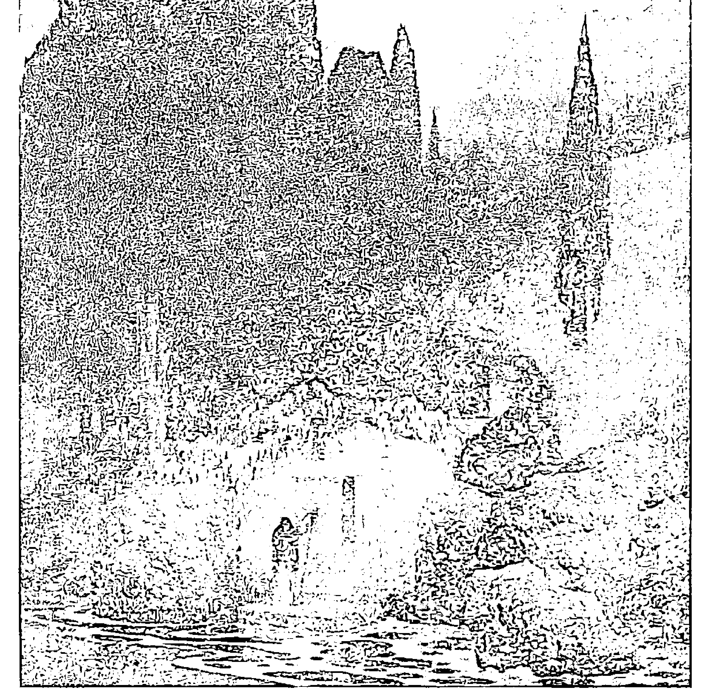

此刻，爱神的侍从宁希布尔不
敢耽搁。他请求神灵出手相救。求了一个又一个，只有第三位神灵——恩奇，伊南娜的父亲，表示同情。他从指甲缝里抠出灰泥，捏出两个精灵——库尔格和加拉特，接着命令他们：“飞往冥城，救不出伊南娜休得回转。如若必要，答应埃雷什基加尔：我们将帮她摆脱苦难。快去！

使者表现了相当的机智和顽强，完成了任务。埃雷什基加尔一听来使也能搭救于她，同意交出妹妹的躯体。恩奇的使者让伊南娜重新获得生命和健康。狡诈的埃雷什基加尔也恢复了元气，可放伊南娜回转人间时，却指派手下恶魔相随：她应找个替身，这是“不归国”的规矩。

为这规矩而发愁的爱神来到了人间。她心事重重地踏进家门，碰上丈夫正躺在另一女人的怀中。国王杜姆济但不觉难堪，反而对妻子吼道：“哪里来滚回哪里去！”女神怒火中烧，指着杜姆济对身后的恶魔轻声地，但已震得宫殿墙壁直颤，说：“丈夫替我去贵府！”国王一阵狂叫，夺路而逃，可不知疲倦的恶魔追上了他。国王最终求得宽容：只需每半年一次到阴曹“应差点卯”。从此，爱神没再离开人间，也不再计较人们的抱怨。对伊南娜该当表示感激才是，因为有我们的父母相遇、相爱，才有我们现在这些活着的人。

#### 爱神在地狱

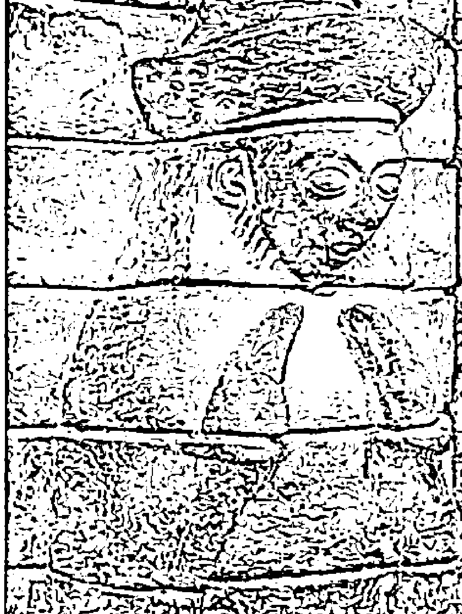

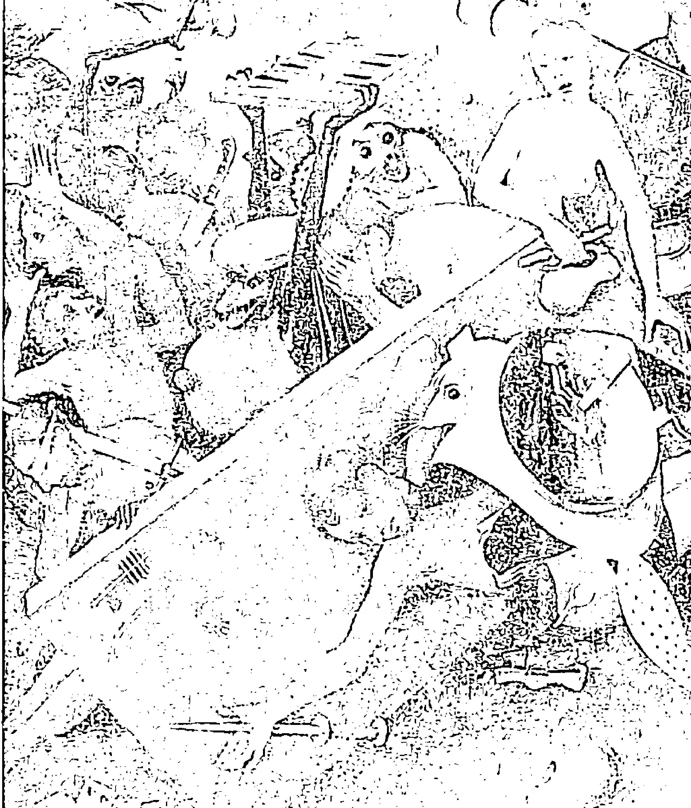

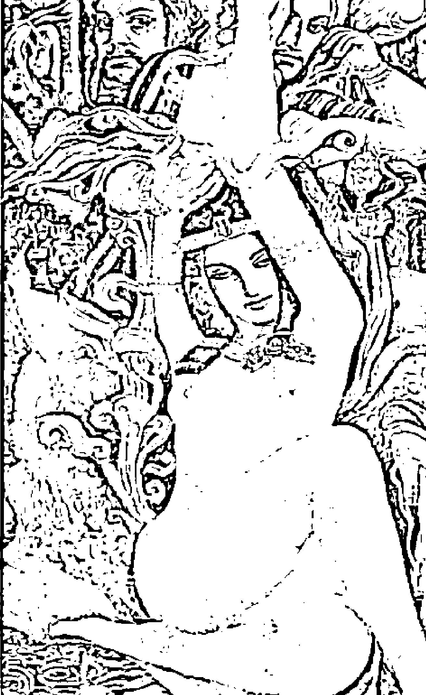

伊南娜在不同时代和不同国家，以不同名字为世人所熟悉。腓尼基人称其为阿施塔特，埃及人称其为伊希斯，希腊人很可能把她视同于丰收女神——画家亚·伊萨切夫的画作所描绘的珀耳塞福涅
厄罗斯与塔那托斯——爱情与死亡——形影相随。这一双重性被耶罗宁·波斯赫在描绘地狱中的少女时敏锐地感觉到。

## 巴比伦

刻着巴比伦守卫者——狮子与龙形象的浅浮雕

### “朕——汉穆拉比，名副其实的王”

在两河流域一些富庶的大城市中，巴比伦（今伊拉克首都巴格达西南）很长时间一直默默无闻。公元前2千纪，阿莫里特王汉穆拉比治理巴比伦四十二年（公元前1792至前1750年），采取了建设强大国家的有力措施，这个国家后来得名“古巴比伦”。

在许多方面，这位君王和立法者跟蛇一样：实现既定目标过程中
巴比伦难以攻破的要塞外墙

睿智而阴险，从容而坚定。为了巴比伦的繁荣，这位“古代的马基雅弗利”无所不用其极。

执政初期，汉穆拉比兴修水利（开凿灌溉渠，人称“汉穆拉比-财富”渠），与邻国（埃兰、亚述、马里）执政者订立同盟，悄悄蚕食南方苏美尔的乌鲁克和伊辛城，偷偷招兵买马，扩军备战。三十年过后，他才得以实现早已暗定的计划——给盟友来上“背后一刀”。公元前1759年，汉穆拉比彻底摧毁了马里国的同名都城，将故友居住的王宫夷为平地。下一个就是亚述尔——亚述的都城。被他征服的还有埃兰。四十年内，汉穆拉比将巴比伦变成了一个强大的帝国，让人赞叹，又让人害怕和憎恨。

时至今日，该城的名字依然妇孺皆知。谁没听说过巴比伦通天塔、巴比伦之乱或巴比伦荡妇？其实，“永恒之城”巴比伦——不过是国都名称的希腊语叫法。闪米特-阿莫里特人自己称其为巴比
千年之后，才由迦勒底人恢复了巴比利姆的雄伟气势。公元前626年至前604年，那波勃来萨国王在位，建立了新巴比伦王国。正是他主张在平原之上重建“天地基石寺”，即巴比伦通天塔，以重达二十吨半的马杜克神的金像为其增光添彩。

其子尼布甲尼撒二世击溃了亚述人和埃及人，以此警示世人：他的帝国不可战胜。他像父王那波勃来萨一样，为讨好最高神马杜克而大兴土木。“埃布尔·沙布——巴比伦城内的街道，我是为主神马杜克的车辇仪仗而用石板铺就的。” 这条街道只有神自己能走，它直通给本城和整个

### 巴比伦通天塔

人建造过几座三层的齐古拉特祭祀塔。他们的文化继承者，巴比伦人，将塔身增至七层，献给自己的七大神。

总之，巴比利姆具有复合象征，对应七大行星、国家地理、主要寺庙和一周的七天。尽管莫名其妙，但这一规矩依然沿用至今。巴比伦人将周一献给月亮和知识神欣、乌尔城和埃吉舍加尔庙。现代法语一直称这天为“月亮日”。血腥战神，冥王纳高尔，主宰两河流域的日子是周二，其象征是红色的火星。这天人们缅怀库塔城和埃美什尔神庙。法语里这一天依然称为“火星日”。周三献给智神纳布，水星；周四——马杜克神，木星；周五——美与爱神伊西塔，金星；周六——正义战神，苍天勇士扎巴巴，土星（英语称周六为“土星日”）；周日——太阳和正义神夏马西（德语称周日为“太阳日”）。此外，一周的每一天和巴比伦塔相应的每一层，都有自己的光谱色：黑、白、紫、蓝、鲜红、银色和金色。巴比伦人只得耐心地一再重建高塔。因这高塔，以其所见，可代替早已消失的宇宙树（或宇宙山），连结天与地、神仙和凡人。

犹太人认为巴比伦神灵纯属虚构，而将巴比伦人竭力接近马杜克解释为自命不凡。《圣经·创世记》里写道：“他们说：‘来吧，我们要建造一座城和一座塔，塔顶通天，为要传扬我们的名，免得我们分散在全地上。’”那里还说，巴比伦人的造法“不对”，他们拿砖当石头，又拿石漆当灰泥。结果是外观漂亮，却很不经久。

希腊史学家希罗多德曾见过最高的祭祀塔——被亚述人摧毁后由尼布甲尼撒二世重建的巴比伦埃特门南基神庙。它高达九十米，底座边长均为一百八十五米——总之，建筑相当气派，不过想够着天庭那是没门儿。学者详细描述一番后，补充说：塔高不是七层，而是八层。第一层，从上数起是第八层，为纪念三大主神——气神恩利勒，水神恩奇和天主安努，苏美尔

关于建造通天塔的圣经故事许多世纪以来一直激发着艺术家们的创作灵感。弗朗斯·弗兰肯的《建造巴比伦通天塔》

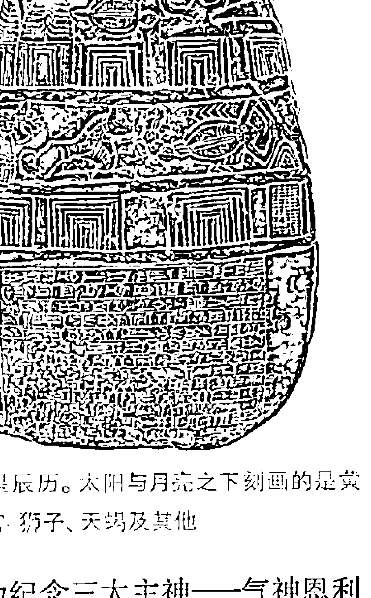

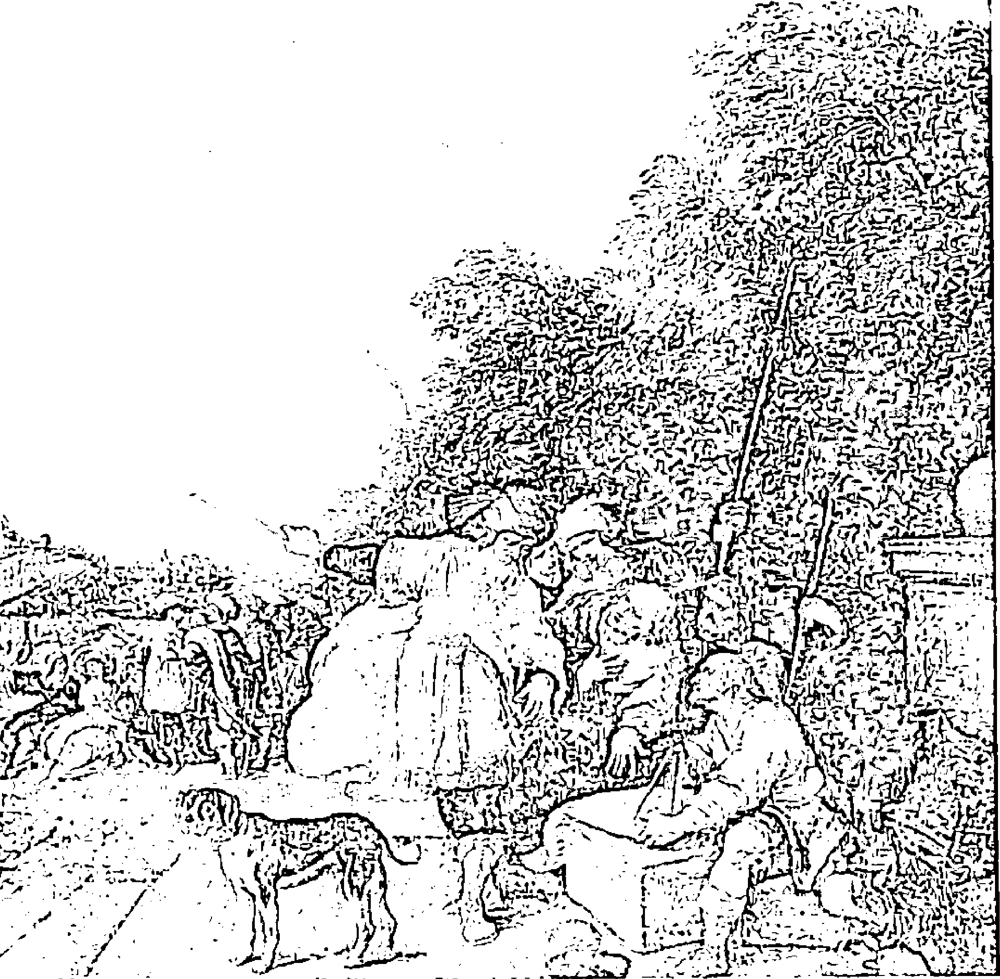

画家凡·克列韦的画布上描绘了悲惨的结局——巴比伦通天塔的毁灭

抬但以理，赏赐他许多上等礼物，派他管理巴比伦全省，又立他为总理，掌管巴比伦的一切哲士。”

因“魔法师”一词当时尚未出现，迦勒底魔法师们被称为哲士。”

波斯王居鲁士大帝占领巴比伦，吩咐不准毁坏通天塔和其他建筑奇迹。毁坏它们的是继任者泽尔士一世。”

马其顿王亚历山大征讨印度，路过于此，见到的是一片废墟。全军将士奉命两月内清除垃圾，尽量还巴比伦通天塔一个庄重面目。呜呼，齐古拉特祭祀塔已不可挽回地消失于无形。”

巴比伦女子都认为做马杜克神的新娘是一大荣耀并期待与他在通天塔顶相会。画家亚·伊萨切夫

位于地下，教民们无法看到。它叫“基加尔”，象征“不归国”——冥府。从实用角度讲，它是整个通天高塔的理想基座。

与巴比伦通天塔相连的一些亚洲传统，让希罗多德觉得相当特殊。他写道：“任何人不得在庙内过夜，只有一位当地女子例外，她是神为自己选定的。至少迦勒底人——神的祭司们这样讲。他们说，似乎神会驾临寺庙，上床休息。我却不信。”

补充几句，马杜克于金榻之上并非孤枕寒衾，而有幸运的意中人相伴。次夜由另一女子替换，接着是第三、第四、第五位。她们也可能无缘被宠幸：主神并不常来寺庙。如若清晨祭司们发现主神并未临幸姑娘，等待她的将是沦为神庙妓女的凄惨命运。

供马杜克娱乐的密室位于塔的中部。底层是教民聚集朝拜之所。而最高层，金神像脚下，迦勒底魔法师们进行着自己的秘密活动。“魔法师”一词虽源自波斯语，但满天星长袍和尖顶帽却成了所有时代和民族魔法师的装束。塔里的祭司们给予世界的，不仅是魔法师的外形理念，还有神秘知识。爱德华·舒尔在《神的演化》中写道：“迦勒底魔法师们强而有力地影响着古犹太宗教，让它充满宇宙形成过程的新形式，使它弄清有关天神等级的知识。先知但以理被尼布甲尼撒任命为大法师，得到伯沙撒的确认这一事实本身就具有重要意义。”

犹太人将但以理视为第四大先知。《圣经》里说，因替国王成功圆梦，他得到最高恩赐：“于是王高

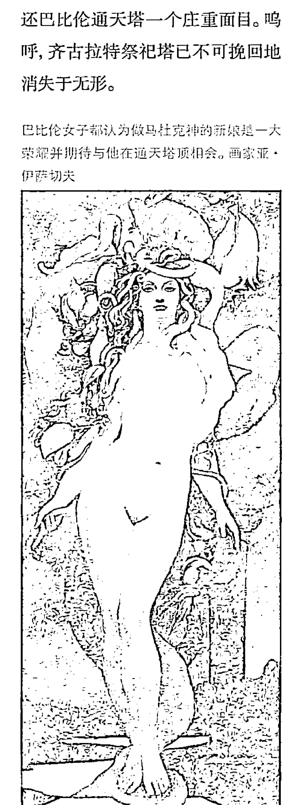

[PAGE 49]

# 巴比伦人

巴比伦——各民族融合的象征。画家亚·伊萨切夫

没有魔法师的祝福就一事无成——甚至弯弓射箭。画家B·戴斯

“神之门”八百万居民的种族属性异常繁多。除当地人（他们叫马尔·巴比莱亚——巴比伦人）而外，巴比伦还住着被俘的外国人：

乌拉尔图人、埃及人、叙利亚人、腓尼基人、犹太人、奇里乞亚人、吕底亚人、阿拉伯人。埃及人耕种寺庙的土地，犹太人从事建筑，罗斯人充当雇佣兵。的确,迦勒底人把所有依附于他们的人都视为奴隶——“阿杜”。外国人没有公民权，对他们可酌情处理。对浅色头发的北方人棍棒相加，不是惩戒，而是警告。罗斯人的首领到头来不得不把他的士兵从巴比伦调回。罗斯人毕竟在巴比伦住了相当长时间，因而学会了许多东西，比如，掌握了名姓系统。

巴比伦人不仅有表示一定意义的名字（如“纳布神赐子”，或简称“巴格丹”），还有父称和姓氏。为构成后两者，需使用前辈的名字、民族、职业、尊号或职位。全名结果冗长而又复杂。塔布·西利·马杜克，纳布·阿普鲁·伊金之子，辛·伊利的后代——佶屈聱牙！因而简称或绰号广为流行。人人知道幼年的塔布·西利·马杜克就叫塔·比亚；成年的纳布·阿赫·布尔特被朋友直接叫成“里普·鲁特”；而爱唠叨的老婆子破口大骂白胡子老伴纳·布舒姆·伊什昆时，就直接叫他“没用的舒玛”。把全名变换成小名的主意，后来对罗斯人大有益处，拜占庭神甫做洗礼时就给他们起些异族的、《圣经》里的名字。这一来可改变发音本身（将约翰南恩改成伊万，前者犹太语的意思为“上帝开恩”，而俄语却毫无意思），二来可以小称“瓦尼亚”的形式保留原始名字，听起来好像并不正式，而实际上说的是历史根源。如，达尼艾尔或者达尼尔（“我的法官——上帝”），依然是达尼亚（如果还原，就是“上帝赐予的”）……

我们再回头说说巴比伦。罗斯人从巴比伦吸收了座椅（卧榻只有富人家才用，手艺人为普通一些的人家做的是圈椅、方凳、长凳和小板凳）的观念，人都得识字，不仅会用十进制，还要会用六十进制（至今我们还把一小时分为六十分

[PAGE 50]

钟，一分钟分为六十秒。有时还求助于日晷。我们还记得并天天使用巴比伦星相：牡羊座、金牛座、双子座、巨蟹座、狮子座、室女座、天秤座、天蝎座、摩羯座、射手座、宝瓶座、双鱼座）。罗斯人同巴比伦人一样，非常敬重髭须，不过不把它们卷成一个个小圆圈。古时候，罗斯人像“神之门”的居民一样，爱着色彩艳丽的服装（两个民族都视红色为喜庆色），用新奇的刺绣加以点缀，也很重视首饰（耳环、宝石戒指、扣针、手镯、项链、金扣绊或铜扣绊、嵌宝石纽扣，而且不仅用于女性，也用于男性，特别是有权势者）。

两河流域广泛流传着啤酒酿制、葡萄酒酿造、榨油、面包烤制、糖果制作、面粉和谷物加工等技术。

苏美尔和巴比伦的制陶技艺同样远近闻名。那里别的不说，陶土却有的是。他们烧制大型尖底瓮和输水管、写字板和柱形印章、火盆和棺材。连做信封都用陶土。当地工匠技艺之高超，在古代是公认的：人们将其奉为典范，争相仿效，并加入各自的元素。给人留下特殊印象的，是上彩釉的陶器和苏美尔人自远古就开始吹制的玻璃器皿。同埃及一样，两河流域是亚麻的故乡。亚麻的巴比伦名称——“吉提努”，被许多民族所借用（犹太人管亚麻叫“库通奈特”，阿拉伯人管它叫“卡坦”……在现代英语里，它被用来表示棉花——“卡通”。巴比伦的丝绸制品更是享有盛誉，外国君主们为之付出过大笔财富。

关于当地的铁匠，大可铺陈一番。不过前文所述，足以让人们明白：对于罗斯人，同许多民族一样，当年向傲慢、残酷而心灵手巧的巴比伦人是有东西可学的。

# 巴比伦女商人‘在饮茶’

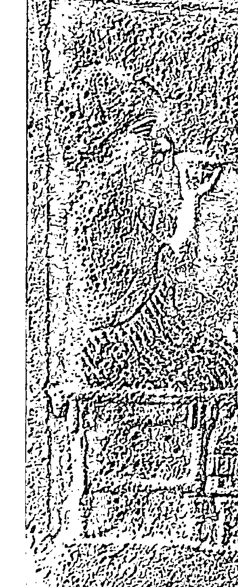

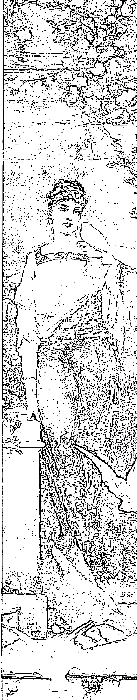

[PAGE 51]

# “巴比伦荡妇”

巴比伦城引人遐想的，不只是高门望族所建造的那些带花园假山、上下水道和豪华餐厅的单宅独院，还有男仆女奴们所经营的那些不清不白的饭馆旅店、茶坊酒肆和青楼朱箔（赚来的钱，他们得交给自己的主人）。 交易场所就是各个城门。城门附近的街头巷尾，到处是店铺作坊。这里，从早到晚，村民、货郎、摊贩和批发商的伙计蚁聚麇集。光怪陆离的巴比伦集市犹如蜂巢蚁穴，嘈杂喧闹，熙熙攘攘。这里，人们

货比三家而不厌其烦，讨价还价而不知疲倦，破口大骂而不欢而散，然后又言归于好，进饭馆举杯庆贺互利的交易。集市上，南言北语，无所不有——也许，《圣经》中“语言混杂”的传说即源出于此：“上帝说……我们去吧，在那儿把他们的语言相混杂，让一个人无法理解另一个人说出的话”。 然而，此种情况并未出现：巴比伦人虽“未遍布世界”，却对许多东方语言驾驭自如。而较常用的则是阿拉米语和巴比伦语。用前者讨价还价，用后者修契立约。巴比伦还出了个“资本”一词。俄语里的“资本”一词则来自罗马：拉丁语的“卡普特”意为“脑袋”。巴比伦人所称的“资本”是加息的借贷，即产生最大收益的钱款。每笔交易均用文字记录在案，达成交易的对方无论何人：妻儿、父母、密友或近邻。只要事关金钱，迦勒底人的血缘亲情统统被抛到一边。这种见利忘义的习性给外国人往往留下了很坏的印象。因此，在《圣经》里，“神之门”成了冷酷无情和贪得无厌的象征。

显而易见，在此种社会治安条件下，巴比伦人夜晚自然不宜单独上街。无怪乎，据希罗多德所说，太阳一下山，巴比伦城里幼发拉底河上的大桥便被断开——愿意也好，不愿意也罢，人们只能闭门不出。

但也不是非行抢不可：可以把人灌醉，然后将钱财搜尽、衣物扒光。

在巴比伦的许多城市里，酒馆和窑子都集中于“杂俎门”附近。这里，向顾客提供的是一种烈度特高的鸡尾酒。这种酒一下肚，连三岁小孩都能掏走这倒霉蛋儿的钱包。早上顾客醒来，前一天晚上的事会忘得一干二净。

有人试图治理这种全民犯罪现象。侦探拜尔发现了真正黑帮的踪迹，决定启奏国王（因此才有陶土记事板保存至今）。匪帮的头目是乌鲁克人。他们针对王宫的岗哨派出了自己的“六人小组”：岗哨遭洗劫，卫兵被杀害。侦探查明：匪
帮在西帕尔城和巴尔希普城都有“窝点”，与其他土匪强盗密切联系，协同动作，划分势力范围。确切地说，事态正朝着匪帮联合的方向发展。下一步可能就是夺取国家政权，这次对王宫岗哨的袭击只是力量的宣示。拜尔在奏章里有过暗示：“在匪帮勾结尚未成功之前，愿国王尽快批阅此份奏章。”

巴比伦城，世上最大而又最富庶的城市，“神之门”，就是这样。在这里，富丽堂皇、骄奢淫逸同腐化堕落水乳交融，家徒四壁和身无寸缕的背景下的刑事犯罪层出不穷见。神圣的巴比利姆同时也是罪恶的渊薮——一切可以想见的罪恶或者《圣经》里所称的“巴比伦荡妇”的藏匿之所。

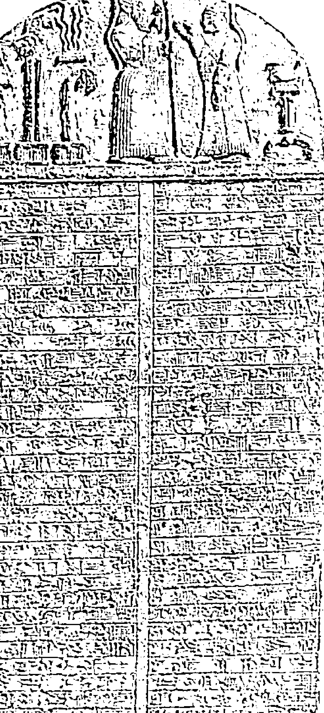

[PAGE 53]

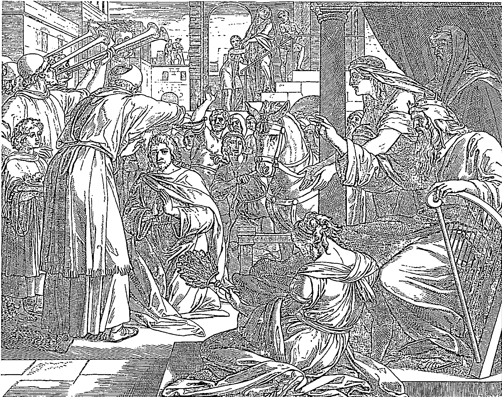

卡尔斯菲尔德的版画描绘了所罗门的登基傅油仪式

[PAGE 54]

## 赫梯王国

时间磨灭了对昔日文明的记忆。忘却的恐怖充满康·博加耶夫斯基的画作《洞穴城》

[PAGE 55]

## 迦南大地

然而，《圣经》明显地让“赫梯人”突出于其他民族。他们究竟因何而赢得这种荣耀的呢？起码因为他们是巴勒斯坦的首批移民。至少，以亚伯兰为首的犹太游牧部落到来之前，他们就已经居住在那里了。外来人虽然受到他们特别友善的接待，可却常常以怨报德。是不是赫梯人无力捍卫自己的利益呢？不，事实正好相反：在卡德什战役中（史上第一次确凿的战役），他们击溃埃及人并夺取了巴比伦。只要一提他们的名字，阿莫里特人——以色列最具威胁的敌人——的部队就会闻虎色变，逃之夭夭。赫梯人的国土辽阔，不仅占据巴勒斯坦和叙利亚，还占据整个小亚细亚（今土耳其）。他们在文化方面也高于游牧民族。

千百年来，关于赫梯族，世人仅仅是从《圣经》上读到的，谁也对它不特别感兴趣——在我们地球上住过的蒙昧部族还少吗？

《去迦南途中的亚伯兰》。画家皮·拉斯特曼

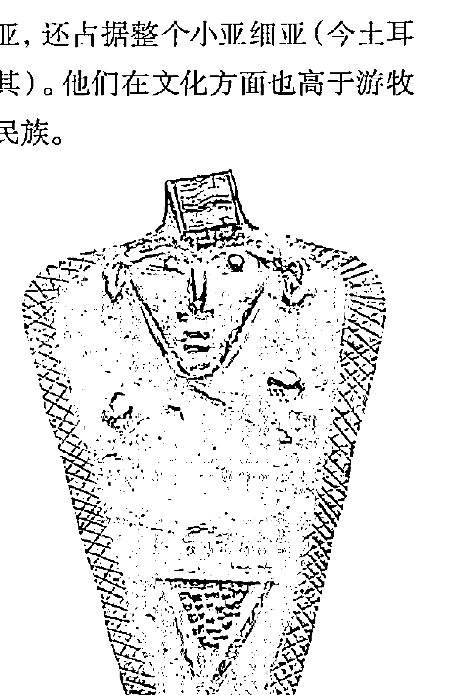

犹太人来到天府之国后，起先定居于阿克拉维姆山区——赫夫隆和拔书亚城以南地区。那里的土壤不仅不宜于生存，也不宜于死亡：亚伯拉罕的爱妻撒拉死后，族长竟无法掩埋她的尸身。他请求赫梯人允许买块土地埋葬死者。请求得到了允准。《圣经》里是这样讲的：“我在你们中间是外人，是寄居的，求你们在这里给我一块地，我好埋葬我的死人，使她不在我眼前。” 赫梯人回答他说：“我主请听。你在我们中间是一位尊大的王子，只管在我们最好的坟地里埋葬你的死人……” 亚伯拉罕看中了这里，埋葬

[PAGE 56]

犹太人为埃及法老进贡。本·哈桑的陵墓壁画

象牙雕刻的迦南人肖像。青铜时代

卡尔·布留洛夫画作中的所罗门之母拔示巴

了撒拉之后，决定在哈梯为自己和后代买块土地。以弗伦王应允——怎能不同情一下山里人呢？交易做
成，犹太人在巴勒斯坦有了第一块地。摩西时代，他们大大扩展了自己的领地，将赫梯人挤往南方——叙利亚，从肥沃的平原赶进贫瘠的山区，正如《圣经·民数记》里所说：“……赫人、耶布斯人、亚摩利人住在山地。” 两个相邻民族的关系进入悲剧时代。那时，以弗伦王的儿子约书亚得到耶和华的晓谕：“……现在你要起来，和众百姓过这约旦河，往我所要赐给以色列人的地去……从旷野和这黎巴嫩，直到幼发拉底大河，赫人的全地，又到大海日落之处，都要作你们的境界。你平生的日子，必无一人能在你面前站立得住。” 约书亚也正是这么盘算的

### 第三帝国？

域文化中最古老语言之一的苏美尔语！苏美尔人简化了俄语，但保留了词语的意义。这一点已被谢尔巴科夫的研究所证实……

总之，客气点说，希特勒在给帝国排名编号时弄错了。小亚细亚、叙利亚的首批移民（犹太语‘迦南’起先的发音是‘瓦南’，即瓦恩国）哈梯人（该称谓的意思同样十分清楚，相当于俄语的‘哈塔’、‘胡托儿’，意为‘农舍’、‘寒舍’、‘小村庄’）说的是俄语……

千百年过去，一批批雅利安人拥进两河流域。因为忘记了辉煌的过去，他们对祖先门生的艺术感到惊讶。各民族的历史千百年来便是这样不可思议地交织在一起的。可是，赫梯人究竟是些什么人，他们是从哪里来的，又为什么把变了样的俄语当作宗教礼仪用语，只用来涌念祷文和吟唱赞歌呢？

少八种语言。外交信函中既用埃及语，也用苏美尔和阿卡得语。官方语言是赫梯语。平民、庄稼人之间用的是卢维亚语。而人们祷告时只用自己祖先——早在远古时代就来到这些地方的哈梯人的神圣语言——古赫梯语。然而，什么时代叫‘远古’呢？两河流域最后一次‘世界’大洪水暴发于公元前4千纪中期，此后，底格里斯、幼发拉底和尼罗河两岸开始有人居住。哈梯人在这里生活的时代更早，在大洪水暴发之前。一些史学家满有把握地说，瓦恩部族从乌拉尔向东迁移的年代是公元前9千纪。我们能否了解如此久远的那 个时代一些情况呢？能。而且这些知识往往带有耸人听闻的性质。原来，两河流域、小亚细亚、叙利亚和巴勒斯坦的首批居民说的是俄语，由俄语构成了人们认为两河流
> 只有大地记得一切，并在地貌景观中反映被人遗忘的东西。尼·廖里赫《谷地的太阳女神》

只有大地记得一切，并在地貌景观中反映被人遗忘的东西。尼·廖里赫《谷地的太阳女神》

### 争夺天国之战

这怒吼的狮子当能将仇敌从哈图萨斯门吓跑。它见多识广，若开口说话，定能讲述不少令人惊奇甚至震惊的事

赫梯人一直记得自己最古的神——阿拉杜。他曾主宰天国库米亚九百年。后来，如长诗《天国主宰的礁石一直是传说的对象。谁能说克·莫尼的这幅画上所描绘的不是赫梯的反抗上帝者乌里库米呢？

宰》所述，他的王位被当年的侍卫安努所推翻。这段历史可解释为：瓦恩人继续颠沛在“黑暗大地”上（与下界不同，上天是光明的），阿拉杜也随之从赫梯人的万神殿里消失，让位于苏美尔—阿卡得人的神——安努。千真万确，下界如何，上天就怎样！

然而有些印欧部落却留了下来。神话里说，留下的是阿拉杜的儿子库马比，他为被逐的父王报了仇，不过手段使得出了圈儿：先照仇人安努的腿上来了一口，接着又吧唧一口咬下安努的阳物吞进肚里，因而有了身孕，不得不父母兼任，生下混血的四个新神（雷电神、太阳神、月亮神和美丽的爱神伊西塔）。

赫梯人的长诗《乌利库米之歌》讲到后来的事：逆子们造了库马比的反，将他从天国库米亚撵至下界，从前的天王成了两河流域北部城市乌尔基斯的执政官。库马比一心想复仇，可是已上了年纪，再说单枪匹马也难敌四个逆子。左思右想，终于想出了办法：“手执权杖，脚踏狂风，飞往冷湖，在水中见到岩礁姑娘斯卡拉。”长诗接着写道：

库马比与斯卡拉结为伉俪，他将种子留在姑娘身体里……该等的期限一过，产婆给他送来刚出世的石娃。大喜过望的父亲给儿子取名乌里库米，意为“库米亚的毁灭者”或“找天神复仇者”。年轻的恶魔伊尔西拉姆们把石娃放在了海中支撑着天和地的巨人乌佩鲁利的一只肩上。石娃不用喂食。不用喂食，他长起来也如同面团发酵：横里竖里，日长一丈，月长两里。他像一柄复仇之剑，从大海的中央直指天庭。

首先发现他的是太阳神。他连忙将自己的发现禀告兄长——库米
亚的新王雷电神。新王性情温厚，建议先吃罢午饭，再往大海看个究竟。伊西塔见兄长结伴外出，尾随而去。

新王一见石娃乌里库米，不管不顾地号啕大哭起来。边哭边诉：“谁能敌过此种怪物！"

爱情与奸猾女神伊西塔决定用姿色迷倒这粗野的傻大个儿。她抄起手鼓、弦琴，亮起歌喉。石娃一声不吭，一腔不答。美丽的女神又翩翩起舞。库马比之子无动于衷，一如木头疙瘩，确切地说，一如石头疙瘩。可伊西塔也是百折不挠的种：任务既定，无论如何也得完成。

真不知伊西塔这秋波会送到何时，幸亏海中骤然掀起一阵巨浪并低声对女神说道：“你在对谁歌唱？这蠢货又聋又瞎。他在寂静和黑暗中成长，分分秒秒积蓄着力量，要与你兄长算账，连你也不会放过。快抢在前头，先下手为强！"

伊西塔一听乌里库米根本不
许多民族的神话都记载了元神、巨人和后来成为天神的体小而年轻的亲属之间的争斗。Γ·马丁的画作《愤怒爆发之日》

在尼·廖里赫的画作《天国之战》中，众神和巨人的搏斗被表现为自然势力的肆虐

可能为她的姿色所动，恼羞成怒踏碎手鼓，扔掉弦琴，掩面号啕而去。她可从未受过如此冷遇和轻慢。

雷电神不信妹妹能够得手，早做起厮杀的准备：将所有的雷电、风雨通通砸向乌里库米。可石娃泰然不动——一个劲儿在长：他那背脊已遮住了整个地平线，头顶挨近
了库米亚。太阳神大惊失色，飞往年长的外星朋友埃阿处求救。埃阿一时也拿不出主意，只得先去打探虚实。埃阿在巨人乌佩鲁利的面前停下，说：“你怎么一点儿感觉都没吗？你的肩上长出块巨石，那巨石已达天庭，可你却满不在乎！"

巨人耸了耸肩膀，用那低沉的嗓音答道：“的确，那里是有个东西，痒痒得厉害。最好把它摘掉，反正留着也没用。”

埃阿立刻意识到正该如此。他呼唤年轻的众神一齐动手。众神毫不迟疑：野牛般咆哮着投入战斗。雷电神手执火锯冲在前头……复仇者的命运已然注定。

下界权力更迭，上天诸神也随之交替。其中许多神灵日后消失了，而阿拉杜之子——战神库马比却留了下来……

#### 赫梯人的魔法

在印欧人看来，渡鸦是种神奇的鸟。它生活在生死线上，掌握生死水的秘密。尼·廖里赫正是这样描绘渡鸦的

赫梯人的社会，同所有印度雅利安人的一样，是宗法制的，掌权的是男人。男性，按照东方观念，属“阳”，能量的本源，被赋予能动作用（皇权、军威）和精神领域（祭司）。女人主管的不仅有家庭（包括后宫），而且还有属“阴”的内心领域——医疗魔法、巫医术。

赫梯人或比古代其他民族更加关注魔法。然而巫术却被视同于刑事犯罪，不论手段有何差异：投毒行刺或降灾布邪——结果都一样：害人，往往殃及无辜。

高等魔法师、祭司（一律男性）离群索居。他们无须誓守贞节，但与神交往之前应当净化——摆脱原罪。同女人过夜的祭司要被处死：黑暗和罪孽与光明和肉体洁净格格不入。

敬神祭祀是常办的事。而祭品（最常用的是公牛、绵羊和山羊）应当放净鲜血——通行的办法是割喉。“不洁净的”动物，猪和狗，不用来
敬神。也不作人祭。赫梯人的占卜术传自瓦恩人。凡有事要办，必先求签打卦。祭祀动物脏器占卜术最为常见。只有魔法师知道，肝脏或其他脏器的何种形状、鸟禽飞行的何种特征以及哪些征兆表示吉凶。

施行医疗魔法的，都是些上年纪的女性。凡身染疾病，她们认为都是对有意无意、或明或暗的罪孽的惩罚。因此，首先需要医治心灵。

留传下一段关于从病人心中驱逐黑暗的有趣记载。病人当用黑毛塞耳，双目紧闭，身着皂衣，即象征性地淹没于死后包围着人的黑暗。模拟死亡就是让病人看不见、听不到、感觉不到周围世界，让他看起来像个鬼魂，冥界的来者。意识慢慢净化，疾病也就渐渐退去了。

陶片上描述过这样一幕：“老妇人给病人从上到下撕碎黑长衫，从脚上脱下黑鞋套，从嘴里取出
黑碎布，从两耳中取出堵塞物，说：‘现在我解除了妖邪加于你的黑暗和麻木。我赶走了罪孽。活下去吧！’得到纯洁和净化的心灵开始新生，而黑色衣物则被收拾起来，烧掉，以免传染别人。”

蜂蜡捏成的人像，在稍晚的时代被用来锥刺害人，而最初的用途却截然不同。女巫捏出一个人的负像：这蜂蜡或羊油人像集中了原型身上的所有缺点、罪孽和所招的邪疾，然后她一面将人像掰碎，一面说：“不论是何恶人玷污了他，他们都将如此粉身碎骨！”

邪恶归附于巫师身上，再以百倍的力量反击作恶者。有时执政者也求女巫帮助惩罚叛徒或违背誓
许多民族的女巫医和巫婆都是赫梯女魔法师的徒弟。米·克洛特。《女魔法师》

#### 赫梯人的魔法

这个耶利哥女巫的头骨生前做过变形手术，死后被堵上黏土，眼窝嵌入贝壳——用于魔法仪式

这个耶利哥女巫的头骨生前做过变形手术，死后被堵上黏土，眼窝嵌入贝壳——用于魔法仪式

新执政者并非赫梯文化的毁灭者，而是赫梯文化的继承者，后来又将传统的接力棒交给了印度雅利安民族的另一支——吕底亚人。

在离加利斯河和赫梯国都城哈图萨斯的废墟不远处，建起了弗里吉亚王国的首都——戈尔季昂，它仿效的是瓦恩名城的——戈尔季恩纳。

安族——从巴尔干半岛到达小亚细亚的弗里吉亚人的新浪潮所冲垮。

约者。她拿起蜂蜡或羊油往火里边投边说：“这蜡如何融，这油如何化，违背誓言和背叛哈梯王的人，像蜂蜡一样融，像羊油一样化。”

不过，魔法咒语并非每次都能奏效。当大批赫梯人死于鼠疫之时，穆尔西利斯王埋怨起诸神，向上苍发出痛苦的责备：“诸神，我主！历来如此：人们在造孽！连我父也造了孽：违背了雷电神的训谕。而我却未曾造孽。可历来如此：父债子偿…… 我已替父忏悔，替他认罪。请公正对待我和我的子民，让鼠疫远离赫梯人的国度！让没多少活下来的祭司不再死亡！请保佑我们免得黑死病吧！”

不知诸神是否听取了穆尔西利斯的央告，可赫梯人的国家存在了四个半世纪（前1650—前1200）之后，终被印度雅利
"上天如同下界，"古代魔法书中写道。山巅之上升起的烟柱，仿若三角供桌，桌上供品热气腾腾。康·博加耶夫斯基。《祭台"

## 特洛伊

在意大利画家乔·多·提埃波罗的油画《建造特洛伊木马》中，这移动的城堡就像一匹寻常的骏马，只是形体巨大

#### 特洛伊的《伊利亚特》

特洛伊先于希腊和罗马开始建筑露天大剧场——半圆形剧场。真正的悲剧是失去了特洛伊剧作家及其作品，但这并不说明他们不曾有过

公元前3千纪末或前2千世纪初，赫梯人步先辈哈梯人的后尘，征服了整个小亚细亚，包括滨海城市特洛伊，将其定为特洛阿达公国的首都。从此开始了“特洛伊时代”。四百年后，渡海前来索要被拐美人海伦的是希腊-亚该亚人的联军。他们人人都怀着一颗“怨妇”之心
——此说再贴切不过。阿伽门农、其他将帅和他们的士兵对特洛阿达的居民采取恐怖手段长达十年之久。这些事件，自发端至悲剧性结局，都由弗里吉亚人达尔详细描述过。特洛伊战争结束六百年后，盲诗人荷马才“故意刺激”达尔，也创作了一部《伊利亚特》（新史诗开篇第一个词便为整个作品定下了基调——“愤怒”）。史诗中只字未提瓦恩-罗斯人、弗里吉亚人或者吕底亚人，而特洛伊人的所有名字又被希腊化，所以往往给人-
时代越久远，想象中的特洛伊人就越神奇。在画家埃斯特莱克的画中，帕里斯被描绘成西欧的骑士，海伦则是身着16世纪长裙的女子，他们身后站着手拿念珠的天主教僧侣。看来唯一真实可信的只有黑皮肤的敌兵形象

#### 特洛伊的《伊利亚特》

种印象，仿佛是一拨希腊人在讨伐另一拨希腊人。就连特洛伊城给人的印象，也是希腊在小亚细亚沿海的一块富庶的殖民地。在天才说书人的史诗中，复仇者变成了光明磊落的英雄。对其军需装备和血缘亲情的着墨浓于对战争本身的描写。总之，这是一部爱国主义的作品。作品中，敌对的一方即便未进行漫画式的描绘（否则，亚该亚人与谁作战？），那被改得面目全非。不管怎样，荷马的《伊利亚特》，因歌颂先辈的业绩而成了整个古希腊文学的根基。

譬如说，特洛伊军队统帅的温顺妻子，被荷马叫作安德洛玛刻，希腊语意为“与男人交战的女子”，可她并不好斗，反而爱哭，如与赴战场的丈夫作别之时…… 这种矛盾的原因是：在史诗中，给赫克托耳的妻子取了个与其本名——安达·拉姆·阿卡（赫梯语仅为“碧眼女子”一义）发音相近的名字。 特洛伊城所受的破坏绝非荷马史诗所描绘的那样具有毁灭性。它修建完好，比先前更美，岿然矗立，直至中世纪早期，令强大的外国惊羡不已。 至少在13世纪，冰岛编年史作家斯图鲁森就在《新伊达》里不但赞美了特洛伊城，而且提供了特洛阿达邻国的许多重要信息：“此城远大于其他诸城，其建筑极尽艺术与奢华。那里有同一君主辖治的十二个国家，而此城中一切大事的决定权则归于十二位显贵组成的委员会。这些显贵的人品优于来世上走过一遭的任何人。”

希腊人入侵之后，部分特洛伊人从小亚细亚迁往意大利北部。在那里，移民们被称为“拉斯人”或“伊特鲁里亚人”。他们成了一个新国家——罗马最初的主宰者。这个国家日后注定成为世界帝国。 俄罗斯人曾像记自己的历史那样记得特洛伊昔日光荣时代。因此，在12世纪，《伊戈尔远征记》的作者抱怨过后人的健忘：同胞们，曾经有过特洛伊的时代，雅罗斯拉夫的年代已成过去，罗斯人的子孙后代早早忘怀，令人望而生畏的奥列格远征。

## 戈尔迪人

极北人阿波罗。意大利雕塑家П·贝纳科奇将其塑造为深色皮肤人，似乎想强调他的非希腊出身

被史学家们随希腊人更喜欢称作“弗里吉亚人”的那个民族，从北方来到小亚细亚。而在赫梯人的国家生息之前，他们居住在马其顿和色雷斯（这些历史区域，今分属希腊、阿尔巴尼亚、南斯拉夫和保加利亚），在那里教给原始蒙昧的土著部族许多东西。弗里吉亚人发明了字母并将其送给了希腊人，还教会他们制作硬币。起初，弗里吉亚人制作硬币使用的是天然金银合金。后来，他们将金银分离，开始使用金币和银币。

作为无与伦比的乐师，弗里吉亚人也将技艺传给了希腊人。大多数乐器，包括基法拉琴和长笛，都是他们的发明。陶器彩绘、浮雕、塑像和印章——同样源自弗里吉亚人。

总之，对他们的文化知之越多，“希腊人的”市场就越小，而弗里吉亚人的市场就越大。

希腊神话里的许多主人公都是弗里吉亚人：承受永恒饥渴之苦的著名的坦塔洛斯，他的子女——佩洛普斯和尼俄柏；有些古怪的萨提里，酒神狄俄尼索斯的侍从玛尔绪阿斯。而世界头号寓言作家伊索
呢？还有蛰居在大桶中的著名哲学家第欧根尼呢？

这也涉及希腊的宗教。众所周知，弗里吉亚王坦塔洛斯曾经是与宙斯及奥林波斯诸神平起平坐的。

弗里吉亚人对圣母及其死而复生的情侣阿提斯的崇拜，广泛流传于希腊和罗马。然而这里复生思想的接受是真心实意的。献

## 大猎手，狄俄尼索斯的别称

希腊葡萄酒酿造神狄俄尼索斯（瓦克科斯，或罗马人所称的巴克科斯）有不少绰号：他有时被尊为布罗米（闹翻天），有时被称作巴萨里（由其服装巴萨尔而得名）；有时被赞为里埃（解放者），有时又被唤作扎格雷（大猎手），或按弗里吉亚的叫法——萨巴西。后者特别常用，成为固定称呼。最初，他被描绘为乘豹飞驰的虬髯壮士，后来才变成一位由长着山羊腿的萨提尔和女祭司们伴随左右的美少年。酒神何以是猎手？为何给他起了个弗里吉亚人的名字？又是什么将狄俄尼索斯同希腊人认为奇异而又绝非坐骑的野兽——豹子联系在一起的呢？

在小亚细亚的安纳托利亚中部，发现了一尊豹的石雕，刻有哈梯文的“卡普拉斯”。“卡普”意为“神圣的”（伊特鲁里亚语和俄语的意思是“献身地”、“神殿”）， “拉斯”意为“豹”。合起来意为“神豹”，民族图腾。该民族认为自己是豹的子孙，自称“拉斯人”或“罗斯人”。这自称不仅是伊特鲁里亚人的，也是所有亲缘民族的。更是俄罗斯人的……希腊人是如何讲述自家酒神的呢？阿波洛多罗斯在《神话丛书》里写道：“自从赫拉让他神经错乱之后，他就浪迹于埃及和叙利亚。起初受到埃及君王普罗透斯的款待，接着去找住在弗里吉亚的库柏勒。他由瑞亚（奥林波斯神之母）治愈，掌握了圣礼并得到瑞亚馈赠的‘斯托拉’（节日服装或圣装），穿过弗里吉亚前往印度”。只需把希腊名字还原，狄俄尼索斯的浪迹史就不难理解了。瑞亚是乌拉诺斯和盖亚之女，众神的伟大母亲，克罗诺斯之妻，如阿波洛多罗斯所言，对她的宗教信仰后来与亚洲女神库柏勒崇拜相融合。弗里吉亚人称之为伟大母亲，或简称“妈”，埃及人则称其为伊希斯。既然如此，浪迹者就是埃及的俄赛里斯，弗里吉亚的阿提斯，也正是希腊神狄俄尼索斯。总之，这位多……在皮·鲁本斯的画作‘狂女’中，连昔日狄俄尼索斯的影子也没有。这里表现的是罗马酒神巴克科斯及其伙伴

狄俄尼索斯的信徒们欣喜若狂地抓起动物并将其撕成碎块。大高脚酒杯内壁上画的是一位狂女——神话中狄俄尼索斯的追随者称谓神的漂泊，正是“豹人”——拉斯人-罗斯人迁徙的寓喻。该民族不断迁徙，播撒文化，包括农耕文化（还有葡萄栽培和酿酒文化），直至定居小亚细亚。那么弗里吉亚究竟发生了什么？众神之母为何把圣装赠给“狄俄尼索斯”呢？

爱德华·舒尔在《神的演化》中浓墨重彩地描述狄俄尼索斯神秘宗教仪式时指出：“一方面，产生了普及性的奥林波斯诸神宗教，另一方面，有了神秘宗教仪式这种秘密宗教；前者为大众所有，后者则属于圣徒们。”因而在希腊人的正式宗教中，狄俄尼索斯只是一位酒神，但在神秘宗教仪式中，他却是让宇宙充满活力和赋予生活本身精神动力的永恒存在。换言之，这里涉及的是历经多次肉体存在的灵魂再生。同时也涉及这些生命的基本矛盾，其上闪耀着真理的永恒之光——狄俄（尼索斯）（意为“两个它”——译注）。此乃拉斯人世界观的基础。拉斯人所特有的，就是二元论：光明-黑暗，男-女，右-左……

呜呼，任何学说若想千古长存，就不可能封闭；它若能得到普及，就会日益简化。舒尔指出：“在米太战争和民主泛滥之后，它们（神秘宗教仪式）鄙俗化了，向民众敞开了大门。取消了苛严的考验，弱化了教规，表面上的庄严成为过去……”

然而有弊就有利。弗里吉亚神秘宗教仪式从庙堂走入闾巷，给狄俄尼索斯带来荣耀。在阿提卡，人们为他举办盛大游行和诗歌歌赛、歌咏赛，称为大酒神节或都市酒神节；在一些小乡村，人们为神唱祭祀歌——酒神颂；在希腊都城雅典，狄俄尼索斯崇拜被奉为国教。随着祭礼的简化，秘密学说被阉割，狄俄尼索斯综合形象的漫游之旅被遗忘。现在人们提起酒神，都说他是宙斯和塞墨勒（似应为塞勒涅——译注）之子，但死于雷神阴险善妒的妻子赫拉派去杀害他的提坦神之手。他死后投胎于锡韦王后塞勒涅，也就是成了地道的希腊神。只不过这与豹子何干呢？可是，这一点，希腊人怎么也想不起来了。再说何必去追忆那远古时代呢？你就只管唱吧，乐吧，赞颂世俗欢乐之神狄俄尼索斯吧！

## 弗里吉亚国王的坦塔洛斯之苦

最高神朱庇特的思想和名字，由罗马人借自从弗里吉亚迁移到意大利的伊特鲁里亚人。坦塔洛斯命运悲惨，历史对他也有失公允。他曾为弗里吉亚西庇洛斯城的执政者，一度被奉若神明……

他本与奥林波斯诸神地位相当：时间神克罗诺斯之孙，宙斯之子（或为义子），财神普鲁达所出。此种出身毫不奇怪：弗里吉亚人既能从地下采掘金块，也能从河里淘洗沙金。

国王与自私的奥林波斯诸神不同。身踞奥林波斯山上，耳边萦绕着诸神的称赞，可他那忧郁的心却依然想着凡间，与自己的子民同在。

说到宙斯对他施加可怕惩罚的缘由时，阿波洛多罗斯写道：“有人说，他受到如此惩罚，是因为他向凡人泄露过诸神的神秘宗教仪式，还因为常以神餐款待他的同龄人。”

是的，他不能耳闻目睹诸神策划反人类的阴谋诡计而无动于衷。怎能不把即将临头的危险预先告知他们——耳目闭塞而又无力自卫的凡人呢？

提坦神普罗米修斯将神火带到人间。而坦塔洛斯则把天神的神秘宗教仪式、宗教隐秘的真相告诉凡人，给他们带去神餐和仙酒。凡人用了会长生不老，与宙斯齐寿的！

当诸神问坦塔洛斯偷盗金像是否他的主意、是否偷走不属于他的物品时，国王坦然回答：“否。”其一，从庙里运出金像的不是他，而是潘达雷，其二，他不是偷，而是还物与原主。他的话没提坦诸神是希腊之前的古代神。其中一位——普罗米修斯——的苦难描绘在Г·米哈伊洛夫的画作上

弗里吉亚金手镯上的神话场景：英雄战雄狮。希腊人将这一功绩归于赫拉克勒斯

人相信。的确，希腊人认为宙斯所喜欢的物件都属于宙斯，金子原本属谁并不重要。克里特人、希腊人以及诸神关心的只是铸像所用的黄金。把神餐仙酒送给凡人，虽令克罗尼德怒不可遏，可至少在信徒们看来，严惩的依据仍嫌不足。需要编造一条令人神共愤的罪名。诸神筹商一番，设下毒计。其奸得售也属机缘巧合：适逢坦塔洛斯邀请诸神参访他西庇洛斯的宫殿。 希腊诸神欣然接受邀请，可席间刚动菜肴，他们便惊叫起来：坦塔洛斯以人肉宴客！而且是他儿子佩洛普斯的肉！“何等诡诈！何等亵渎神明！” 求之不得的更有坦塔洛斯本人的惶恐——他张口结舌，仿佛失去了说话能力：他被骇人听闻的荒谬指控彻底惊呆了。就这样，在休克状态下，他被打入冥土，永远受苦受难。阿波洛多罗斯在《神话丛书》中写道：“坦塔洛斯在冥土所受的惩罚是这样的：头顶之上悬着” 一块巨石，而他一直立于湖中，湖水深及下巴；顾盼左右，两岸果树垂及双肩。可每当他想尝尝树上的果子，挂满果实的树枝便被大风刮向云端。” 一个世纪后，坦塔洛斯的遭遇被来到冥土的奥德修斯发现，对此，荷马有惊人相似的描述…… 弗里吉亚王的苦难未必随着奥林波斯诸神的消失而终止。时至今日，“坦塔洛斯之苦”表达的意思，依然是因目标可望而不可即所受的痛苦。 希腊人传说，坦塔洛斯之子佩洛普斯由赫尔墨斯“奇迹般地救活”（吃掉的一只肩膀代以象牙假肩），他很快明白，最好别跟奥林波斯神作对。他先成为严厉老人奥克安（奥克安诺斯，大海神——译注）的拥戴者，后迁往希腊，婚姻利好，儿女成群，于阿尔菲斯河畔寿终正寝。希腊南部因他而得名佩洛蓬

## 黄金之国吕底亚

公元前1千世纪初，吕底亚是弗里吉亚的十二公国之一。

吕底亚虽然听起来美，却是个希腊化的异域名称。公国本名梅翁。

希罗多德当年就曾指出，吕底亚人早先自称梅翁人。这一名称也见之于冰岛编年史作家斯诺里·斯图鲁森的作品。他在《新伊达》里描述雷神托尔的出生地——小亚细亚的特洛阿达时写道：“特洛伊有位酋长叫穆侬，娶大酋长普利阿姆之女特洛安为妻。他们有个儿子叫特洛”尔，我们叫他托尔。他被寄养于色雷斯…… 托尔英俊超群，好比镶于橡树上的象牙。他那秀发美于金丝。十二岁时便力大无比。”

少年壮士失手打死养父，犯下罪孽，被迫出逃。他浪迹江湖，来到北欧，偶遇金发女郎西芙，与其成婚。西芙为特洛尔生下一子，叫洛里蒂。这特洛伊人的后裔——第十八代（！）“……便是沃登，我们叫他奥丁……”所以，斯堪的纳维亚主神奥丁乃瓦恩始祖。”

我们再回头说小亚细亚。许多学者指出，吕底亚语同赫梯语和弗里吉亚语都有很近的亲缘关系。就是说，很可能都是瓦恩语或俄语（随你怎么理解）的不同方言。好比当今的斯拉夫语：有乌克兰语和白俄罗斯语、波兰语和捷克语、保加利亚语和塞尔维亚语。”

吕底亚在公元前7世纪被打击，国王米达斯自尽。于是吕底亚，即梅翁王国，取而代之，定都斯法尔特，而希腊人坚称其为萨第斯。吕底亚人的统治虽然短暂——不过百年，但却光耀夺目，堪称“人类黄金美梦”。仿佛金器时代重返人间……没理由偏爱吕底亚的希腊人希罗多德写道：“当时，亚洲无一民族比吕底亚人更加强大而威武。作战时，他们跨骏马，执长矛，个个精骑善射。都城萨第斯，富丽堂皇，尽人皆知。吕底亚王克罗索斯威震四方，珍宝无数，天下闻名。他威震天下还因其骁勇善战，希腊人和弗里吉亚人、米西安人、马里安丁人、哈利布人、帕弗拉贡人、色雷斯人、维菲尼亚人无不俯首称臣。”

克罗索斯在小亚细亚建立起强大帝国，控制了地中海东部和黑海的贸易。难怪古代作者们时常不无嫉妒地写到“精明的”吕底亚商人。繁荣景象，前所未见：一些港口城市甚至为外国商贾建造过专用旅店……克罗索斯保持弗里吉亚人的传统，继续铸造硬币，但已使用纯金。此种贵金属来路充畅——帕克托尔河依旧源源不断地提供着块金和沙金。其他矿区则出产银、铁、铜、锌。关于吕底亚人的异常殷富，有一事实可作佐证：当地贵族底菲斯向波斯国王居鲁士献过一整棵大树——爬满葡萄藤的悬铃木。而且全都用纯金浇铸，经过精雕细镂。

该民族并非只知盈利赚钱。他们的养马业和农业无可匹敌。吕底亚人还会织造带花纹的布匹、华丽的服装、精美的首饰和履履。享有盛誉的还有他们制作的陶器——彩绘器皿和饰面砖。他们制作结实的砖瓦，上好的矿物颜料，尤其所谓的肉红玉髓赭石。吕底亚人中流行体操杂技比武和军人舞蹈以及各种游戏——打骨牌、掷骰子、玩球。他们的音乐造诣极高：所有邻国都赞赏吕底亚音乐和瓦恩民歌，吹奏小亚细亚乐器：长笛、风笛、哔啾棒、定音鼓、铙、里拉琴。梅翁国有一批技艺精湛的医生，积累了大量的医药知识。吕底亚人造过坚固的城堡、宏伟的王陵，修过复杂的人工水库……吕底亚的造型艺术作品独具一格：彩色赤陶浮雕、水晶、玉石和黄金珠宝制品，以及绘有题材画的花瓶。跟自己的兄长弗里吉亚人一样，梅翁人崇拜圣母和塞巴斯-狄俄尼索斯，深谙魔法之道。当波斯国王居鲁士摧毁吕底亚而俘获克罗索斯并想将其活活烧死时，梅翁国的执政者向伟大的极北人阿波罗发出了呼唤。后来之事，希罗多德写道：“俄顷，万里碧空乌云翻滚，继而雷声大作，暴雨倾盆，火堆顿灭。克罗索斯得救。居鲁士下令为吕底亚王解去镣铐，赐座于身旁，待以大礼。” 从公元前6世纪起，吕底亚失去政治独立，不断易主，先成为波斯帝国的一个省，后被归入亚历山大·马其顿帝国和谢列夫基德·波嘉姆帝国。被罗马人占领后，它开始称为“亚细亚”省，而今归属土耳其。梅翁-吕底亚人曾经的辉煌一去不返，被人遗忘了……

## 巴勒斯坦

派往迦南的探子们带回了该地丰美的物产和令人不快的消息：那里的人强大而富有，真刀真枪无法战胜他们。

古·多勒的版画

### 耶利哥城的号角

尤·卡洛尔斯菲尔德为《旧约》所作的版画插图。上帝为摩西指示富饶的乐土

想征服人口众多而生活富裕的民族。疲惫不堪的犹太人听了，个个哭天抹泪，咒骂摩西，后悔没留在埃及。多亏上帝过问，众人才平息下来。起先上帝因众人不相信他的威力而大为生气，后来才谕告夺取耶利哥城究竟需要施行哪些法术。

必须渡过约旦河，一声不响绕城七圈，然后齐声呐喊，吹响号角。市民和围攻者无不惊骇：城墙轰然崩塌！犹太人冲人耶利哥城，大肆烧杀抢掠。

关于耶利哥城墙崩塌的故事，尽管说得具体而又详细，可是长期以来却被认为是虚构杜撰，神话传说。就这样一直延续至20世纪初，幸好德国考古学家谢林于1907年偶然发现了一些房屋废墟和带塔楼的城市残碑。在随后的岁月里，约旦河畔雅利赫村旁的山丘上展开了大规模的考古发掘。

在约书亚·嫩到来之前，耶利以色列境内约旦河谷长青绿洲中的耶利哥城遗址

公元前11世纪，摩西带领犹太人穿越沙漠，使他们摆脱了埃及人的奴役。长老从每支派中各选一人，组成十二青年“探子”，并如《圣经》所载，“摩西打发他们去迦南地，说：‘你们从南地上山地去，看那地如何？其中所住的民是强是弱，是多是少，所住之地是好是歹？’”

摩西任命自己的侍从何西阿，嫩的儿子，为队长。这一次，长老给年轻人起了个强调他使命重大的新名字——约书亚（简称约书亚，或按希腊语叫耶稣，二者意义相同——救星）。探子们走了四十天。这些天，他们毫无阻碍地踏遍迦南大地，看到了一座座设防的城池、一块块麦田和一片片广阔的葡萄园。

至于那里住的是何民族，一座城池的名字可以说明——莱赫夫。后来，犹太人占领了这片土地，强迫土著缴赋纳贡，然而许多城市始终未曾屈服。一些城市的犹太语称谓皆由方言音译而来：因而犹太语耶利哥的意思，与其说是“芬芳之城”（约旦河谷有许多芬芳的花园），不如说是“月亮之城”。的确，该城居民膜拜的是月亮。侦探们返回沙漠，告诉族人：以他们的区区实力，根本别以以色列境内约旦河谷长青绿洲中的耶利哥城遗址

以以色列境内约旦河谷长青绿洲中的耶利哥城遗址

### “真理之王” ——麦基洗德

麦基洗德，毫无疑问，是《圣经》人物中最神秘的一位。他是唯一既在《创世记》首篇，又在《新约》后几章里被提到的人物。他的名字对于犹太人和犹太基督教徒同样的神圣。他是永恒的主宰和最高的祭司，也是耶稣基督的先驱。

然而，《圣经》的作者们对麦基洗德倍加赞颂似乎并非出于本愿。故而，他与义士诺亚、犹太先祖亚伯兰、民族救星摩西、英雄大卫、圣贤所罗门或者大力士参孙不同，声名相对要小些。这种怪现象的原因很简单：麦基洗德并非犹太人。犹太难民从埃及来到撒冷国之前，他是该国的统治者，说明他是迦南-瓦恩人。不过，这种推断也未见得正确。就像上帝之子耶稣基督仅只肉身为犹太父母所生一样，麦基洗德并非真正的凡人。圣徒保罗写道：“因为麦基洗德……首先，就其名字的含义而言，他是真理之王，又是撒冷之王，即和平之王——无父无母，无宗无族，无始无终——好似上帝之子，永恒的司祭。” 最后一句话，关于他的永恒圣职，如今因麦基洗德会的存在而得到证实。1994年于加拿大阿尔伯特省班夫市通过的会纲中指出：“这预示永恒的名字神圣而至高无上。此乃宇宙祭司之名。” 就算如此，可神圣的信念，过去在世间犹太人到迦南之前，麦基洗德是至高神（《圣经》里此神名为以利安）的祭司长和撒冷国（未来的耶路撒冷）国王。犹太人始祖亚伯兰击败迦南四首领联盟凯旋时，受到他的欢迎。死海沿岸出土的古犹太教艾宾尼派手稿卷中写道：麦基洗德同耶稣基督一样，是上帝与凡女——诺亚的弟妇所生。她丈夫尼尔获知这一“贞洁怀胎”后杀了妻子。人们在坟墓旁神奇地发现一男婴，这男婴被大天使加百列带到伊甸园。麦基洗德应在那里等待世界大洪水过去。之后，他被送回迦南地界。他被视为和平之王和天使的君主。麦基洗德和亚伯兰相会被表现于卡罗尔斯菲尔特的版画（上）与拉斐尔的油画中（下）

尽管信仰不同，却向这位外来者祝福。这是政治联盟的礼仪，麦基洗德以此联盟将亚伯兰置于自己的庇护之下。犹太先祖为如此著名人物（许多人视他为天使化身）的垂顾所动，以十分之一的战利品回报君王。《圣经》里就这一事件描述如下：‘又有撒冷王麦基洗德带着饼和酒出来迎接。他是至高神的祭祀。他为亚伯兰祝福，说：‘愿天地的主、至高的神赐福与亚伯兰……’亚伯兰就把所得的拿出十分之一来，给麦基洗德。”

《圣经》里的这个故事对理解以色列后来的历史极为重要。亚历山大·梅恩因而写道：‘摩西未曾为部族（血缘氏族）联盟建立任何政治制度。他的整个统治都建立在与上帝的契约和宗教团结基础之上。就连宗教中心也不是由他确定的……’而今，与麦基洗德会面之后，终于明白：最高祭司应当将非宗教的权力集于一身，而犹太国首都又应该成为宗教的中心。总之，一切皆如麦基洗德在他的撒冷城那样。上帝向未来的犹太国王大卫说过同样的话：‘你是与麦基洗德身份相同的永恒司祭’。

追求是这样，可事实上，通过考验使王国和真正祭司得到净化的只有耶稣基督。他具有大卫之子、麦基洗德的继承人摩西的那种帝王般高贵的祭司职位。彼得的忠实伙伴保罗在《致犹太人书简》中因而写道：‘由此，基督并非自己获取了作为至高神祭司的荣耀，而是那至高神对他说：‘你是我是存在于祭司国王形象之中的，而今却存于给以色列首都耶路撒冷赐名的撒冷城的形象之中。圣徒保罗称其为‘和平之王’的用意何在呢？ 在阿拉米语中，麦基洗德意为‘真理之王’，是魔法师王的称呼。伊特鲁里亚人称这样的魔法师统治者为‘卢库蒙’。当然，麦基洗德的臣民称呼他用的是母语，可瓦恩语到底如何称呼，如今已无从查考了。 撒冷是约旦河谷古时称为撒冷国的那部分中的一个城市。“撒冷”意为‘米尔’（‘和平’），因此国家首府在迦南时期可能叫‘米尔哥罗德’，以色列时期改称耶路撒冷。 亚伯兰为救出不走运的侄儿罗得而粉碎民族之敌以后，麦基洗德箪食壶浆出城相迎，庆贺胜利，

#### 【真理之王】——麦基洗德

尽管信仰不同，却向这位外来者祝福。这是政治联盟的礼仪，麦基洗德以此联盟将亚伯兰置于自己的庇护之下。犹太先祖为如此著名人物（许多人视他为天使化身）的垂顾所动，以十分之一的战利品回报君王。《圣经》里就这一事件描述如下：‘又有撒冷王麦基洗德带着饼和酒出来迎接。他是至高神的祭祀。他为亚伯兰祝福，说：‘愿天地的主、至高的神赐福与亚伯兰……’亚伯兰就把所得的拿出十分之一来，给麦基洗德。”

《圣经》里的这个故事对理解以色列后来的历史极为重要。亚历山大·梅恩因而写道：‘摩西未曾为部族（血缘氏族）联盟建立任何政治制度。他的整个统治都建立在与上帝的契约和宗教团结基础之上。就连宗教中心也不是由他确定的……’而今，与麦基洗德会面之后，终于明白：最高祭司应当将非宗教的权力集于一身，而犹太国首都又应该成为宗教的中心。总之，一切皆如麦基洗德在他的撒冷城那样。上帝向未来的犹太国王大卫说过同样的话：‘你是与麦基洗德身份相同的永恒司祭’。

追求是这样，可事实上，通过考验使王国和真正祭司得到净化的只有耶稣基督。他具有大卫之子、麦基洗德的继承人摩西的那种帝王般高贵的祭司职位。彼得的忠实伙伴保罗在《致犹太人书简》中因而写道：‘由此，基督并非自己获取了作为至高神祭司的荣耀，而是那至高神对他说：‘你是我是存在于祭司国王形象之中的，而今却存于给以色列首都耶路撒冷赐名的撒冷城的形象之中。圣徒保罗称其为‘和平之王’的用意何在呢？ 在阿拉米语中，麦基洗德意为‘真理之王’，是魔法师王的称呼。伊特鲁里亚人称这样的魔法师统治者为‘卢库蒙’。当然，麦基洗德的臣民称呼他用的是母语，可瓦恩语到底如何称呼，如今已无从查考了。 撒冷是约旦河谷古时称为撒冷国的那部分中的一个城市。“撒冷”意为‘米尔’（‘和平’），因此国家首府在迦南时期可能叫‘米尔哥罗德’，以色列时期改称耶路撒冷。 亚伯兰为救出不走运的侄儿罗得而粉碎民族之敌以后，麦基洗德箪食壶浆出城相迎，庆贺胜利，

## 腓尼基

古代君王的名字被认为源自起义一词，就是说尼姆弗罗德被视为带头反对上帝的叛乱者

#### 巴勒贝克——外星人的宝库

法老埃赫那顿改造民族宗教，以唯一的太阳神——拉取代了多神教，并赋予其象征形象，而非过去那种兽首人身形象

当今黎巴嫩境内的巴勒贝克高台，由精心加工过的巨大石块垒砌而成，而且砌得严丝合缝，连薄薄的剃须刀片也无法插进，实乃当代最大的建筑工程之谜。究竟是谁完成了人类（即便拥有现代化的技术）力所不及的工程？或许是那些体力非凡的巨人们？

一部阿拉伯古文献手稿中说道：“尼姆弗罗德在黎巴嫩当政时期，派遣巨人去摧毁巴勒贝克城堡。”尼姆弗罗德想在这坚固的石基上建一高塔，以便乘坐由四只大鸟牵引的，或者愿意的话，由马达推进的特制机器，从塔顶飞上天国。大胆的幻想家只成功了一半：他飞上了天空，却显然无法克服地球引力，跌落在距起点不算很远的赫尔蒙山上。

尼姆弗罗德何以认定上天之路就在黎巴嫩呢？会否因为当时还盛传着诸神下凡正是在巴勒贝克呢？这些故事其实如今也能从长者那里听到：民间记忆不会忘记那些重大事件。学者们记录下了神话传说：“修建此厦……仅为其地下室内收藏无价之宝，它们至今当原地未动。”显然，“珍宝”的存在形式可能不仅是金币或宝石。外星人古时曾到过巴勒贝克这一见解的提出者M·阿格雷斯特写道：“可以认为，宇航员们是想为后代把飞船旗保存好……将它藏到适当的掩蔽所内……于是他们就在显眼的地方留下了几座巨大而又不会很快毁坏的建筑。这些建筑当是找到载有详细资料的主要文献的地标。”

电，被称为“腾云驾雾者”；与化身七首蛇怪洛坦（古犹太人称其为利维坦，希腊人称其为拉东）的混沌之力交战，并战而胜之。与化身七首蛇怪洛坦（古犹太人称其为利维坦，希腊人称其为拉东）的混沌之力交战，并战而胜之。罗马人占领北非并在巴力神庙废墟上建造起纪念太阳神赫利俄斯的庙宇。该神庙的圆柱今天仍可看到，它们矗立于远古时代以巨大石块砌成的基座之上

能说明古代外星人造访过地球的，还有建筑物的名字本身——巴勒贝克：神庙的名字是为了纪念腓尼基人的主神——太阳神巴力（希腊人称之为瓦力）。与其说他是不动声色的天神，不如说是英雄中的英雄，他让人类五谷丰登，因而被描绘成一头公牛。他掌管雷

#### 巴勒贝克——外星人的宝库

陷入了宗教迷信”。他想重修神庙，使其再现宇宙般的恢宏，然而这位世界征服者的梦想一直未能实现。三百年后，罗马人在巴勒贝克建起朱庇特、巴克科斯和维纳斯神庙。其后，阿拉伯人、十字军骑士、土耳其人和铁木儿的大军多次拆走古建筑的砖石，用于建造城墙、要塞和教堂。除了这些不幸而外，古建筑又四度遭受过地震的毁坏。

然而，作为外星宇航员的象征性地标，巴勒贝克保存了下来。所以，他们前来取回自己的三角队旗或其他“珍宝”之时，无数游客只得退避三舍了。

K·贾克温多的画作表现了大天使加百列与反叛者尼姆弗罗德的战斗。巴比伦之塔被毁后，国王似乎乘坐四扇飞车上天，与上帝交战，但为天军统帅所败。在基督教中这一情节被说成是大天使米迦勒对于反叛者撒旦的胜利

那么，巴勒贝克神庙本身的情况如何呢？庙宇建造的年代，如今已断为公元前2千纪（公元前18世纪）。那时，当地腓尼基人的确在崇拜巴力。可是巨大石台和庙宇基座的建造却要早出许多。究竟早出多少，暂时尚不清楚。不管怎样，腓尼基人，这些美名远扬的航海家和经验丰富的庄稼汉，因未见过传说中的建造者，于是将这雄伟的建筑当成了太阳神庙。又将巴勒贝克变成了崇拜上天的中心。在他们之后，这一宗教崇拜被许多后继民族所传承。埃及宗教的改革者，法老埃赫那顿，想使巴勒贝克成为新的宗教崇拜——太阳神阿顿崇拜的中心之一；巴比伦王尼姆弗罗德试图由此飞升天国；希腊人以其太阳神赫利俄斯之名，给阿勒-贝卡河谷中的城市和神庙取名为“赫利俄波利斯”；马其顿王亚历山大则在此体验到宗教狂热，或如史学家阿利安所说，“亚历山大完全

#### 巴勒贝克——外星人的宝库

在威·布莱克描绘的尼姆弗罗德形象中，很难认出它的真实原型——前1244—前1207年在位并占领北美索不达米亚的亚述王图库尔提·宁努尔塔一世。相传，尼姆弗罗德是诺亚之子含的孙子，并将他描绘成可怕的狩猎巨人

### “红肤人”的自由商埠

腓尼基将领的高盔不仅能战时抵御敌人，还可平时防备妖邪。因此尖顶帽成了迦太基魔法师及后来其他国家所有魔法师的“招牌”用品

古代浅浮雕描绘了腓尼基人的桡船。他们扬帆穿越大西洋，与中美洲居民进行贸易

各代各国的君主都坚信不疑，财富和实力取决于所占有的土地和人口：对能派出庞大军队的帝国，谁都敬畏三分……

腓尼基却以行事的多谋善断证明了关键不在于数，而在于质。

任何一个叫“腓尼基”的国家，历史上都未曾存在过。闪米特部族于公元前3千纪来到地中海东北岸（今黎巴嫩），高傲的埃及人送给他们一个绰号：“费内赫”——红肤人。希腊人将这一称
呼改成了“福尼克斯”。于是人们开始以此称谓滨海商贸城邦。

其实，连类似苏美尔或希腊的那种城邦也不曾有过。“红肤人”从未自称过“腓尼基人”，仅仅自称这城或那城人，而且各城的政治取向也大不相同。比如，布鲁斯自古就与埃及保持着极其密切的关系。乌加里特倾向塞浦路斯、希腊和其他国家。与西顿交战不息的半陆半岛的提尔，从不屈从任何势力：敌人海上来，居民就转往大陆；仇寇陆上来，他们就躲进海岛。

此外，腓尼基的民族成分特别繁杂。闪米特人到来之前，这里居住的是神秘的胡里特人。两个民族开始比邻而居，和睦相处。通往这里的道路一直未曾封闭过，无论对于埃及人和埃塞俄比亚人，还是对于亚美尼亚人和巴比伦人，抑或对于希腊人和克里特人。

“红肤人”，不论其居住地和民族归属，都是超群绝伦的造船家和航海家。他们最先使用奴隶充当划手，“大桡战船”一词就是出自腓尼基。如果某国想完成一次远航或与邻国海上开战，都会求助于“红肤人”。他们有着无与伦比的海上旅行经验。腓尼基人的商路将西亚诸国与爱琴海区域、非洲及阿拉伯连结起来。有资料显示，他们甚至到过美洲。学者们研究过埃及法老拉美西斯二世的木乃伊，在其中发现了可卡因和尼古丁的残留物。烟草和可可，至少在古代，只生长在美洲。能够横越大西洋到达那里的唯有腓尼基人。

‘红肤人’与熟悉和不熟悉的各国通商，输出的主要货物是珍贵木材。大量需求的是黎巴嫩柞树和雪松。埃及人认为只有它们才适宜制作装殓权贵的棺椁。雪松原木也运往其他国家。提尔王希拉姆一世就曾将它们送给以色列-犹太国王所罗门建造犹太神庙。

腓尼基人还提供用于遗体防腐的树脂和美肤的药粉。假如“红肤人”关张歇业，埃及人转向另一更好的世界，如他们所说，那就会成为不可能。

腓尼基的葡萄酒享誉世界。有些研究者断言：酒精饮料的叫法本身，就是由无所不在的腓尼基商人想出来的。

原料就是这样被发现的。精明的腓尼基人也不嫌弃奴隶交易。“活商品”的获得不仅依靠武力，也诉诸其他阴谋诡计。就连曾借助木马战胜特洛伊的机智的伊塔卡岛王奥德修斯都险些沦为他们的猎物。

当地工匠的珠宝制品，曾是邻国统治者的渴望之物。埃及法老、亚述或巴比伦国王们对提尔制作的金盘梦寐以求。这里还首先利用专门技术，开始吹制玻璃器皿。大量输往尼罗河谷的，有腓尼基的织品。特别被看好的，是用腓尼基紫所染的老布。传说腓尼基执政者墨卡托和自己的爱犬一起海边散步，那狗突然呜呜怒吼，叼起一团海藻撕扯起来。忽又听得它一阵哀号，丢下猎物，向后退了两步：嘴巴沾满了鲜血。墨卡托惊恐不已，连忙赶来相助，可待弄清缘由，不禁仰天大笑：那狗咬碎的是可染色的海螺。腓尼基紫的

腓尼基人将自己的影响扩展到周边许多国家，在那里建立了商行。公元前16世纪，他们不战而屈塞浦路斯、罗得，扩张至萨摩色雷斯，又经由博斯普鲁斯海峡直达小亚细亚的黑海沿岸。他们在西西岛建立了罗什·麦勒卡特（提尔主神“麦勒卡特之首”）城，在撒丁岛建立了卡拉里斯城，在两河流域建立了埃旦城。北非沿海一带，包括埃及统辖地区，皆被纳入腓尼基治下。似乎整个世界都将沦为这个蓑尔商贸小国的外省。公元前7世纪，腓尼基的扩张被亚述国所终结。阿萨尔哈登王洗劫了腓尼基的自由商埠，将它们并入自己的帝国。

## 生与死

实际上所有民族都知道古代的创世者——
元神。腓尼基人称其为伊鲁。天父由威·布莱克定格于手执大的圆规创世那一刻

腓尼基

## 克里特
克里特花瓶。手工花与天然花互不相让，还真难说谁更胜一筹。至少陶制花序历经许多世纪而未凋谢。克里特陶瓶不可能与任何其他古瓶相混淆。其特点是对称的装饰画、鲜明的色彩和海洋生物题材。

### 魔法师们的城堡
古希腊文明发端于克里特魔幻文化。公元前3千纪，岛上执政的都是魔法师。他们同众多的扈从和待卫一道住在富丽堂皇的宫殿里。从那里以现实和魔幻手段治理所辖区域：居民、动物界和自然界。他们能制造可怕的生态灾难，或者反之，促进地区的繁荣。魔法师国王们还能散布瘟疫，或者通过提高繁殖力唤起生物活性的爆发。农民们畏惧深宫内的魔法师，将他们奉若神明。英国考古学家埃文斯于1900年在克里特岛考古发掘，发现了克诺萨斯的大宫和小宫，接着发现了马里亚、费斯特、卡托-萨科罗城堡，向我们展示了一个古老而神奇的世界。为纪念弥诺斯国王，它们被命名为弥诺斯宫。建筑占地一点五公顷，其功能和布局更像一些紧凑的城镇居民点。城堡均为多层建筑，有天井、上下水道和通风系统。墙壁饰有彩画，其艳丽色泽保持至今。总之，这是一些与外部蛮荒世界隔绝的十分舒适的文明之岛。

其实，这有什么好奇怪的？离欧、亚、非大陆一般远近的克里特岛，正是业已消失的大西洲文明的残片。许多（但并非全部）古希腊神祇都曾为大西洲人所熟悉。

克里特国传说中的缔造者是主神宙斯。这位始祖的继承者，是其他一些魔法师国王。其中最有名的是弥诺斯、萨尔贝登和拉达曼托斯。执政王朝的女始祖，是腓尼基公主欧罗巴。宙斯为找她而漂洋过海，并且，据后来的希腊神话里说，将她掳至家乡岛国。或许有过某种古老的预言：大西洲覆没后活下来的两个部族应当联姻，只有这种联姻才能孕育出权力神圣的国王（在弥诺斯人那里，他的尊号是“阿纳克斯”——“统治者”）。他执政九载，接着与其说是需要确认他的权利，毋宁说需要确认其创造奇迹的能力。魔法师若能经受考验，便可“连选连任”。克里特文明在地中海沿岸兴盛千年，直至公元前2000年遭受巴尔干该亚部族的人侵。

#### 89 [魔法师们的城堡]
克里特女王的内室复原图。这里一切都赏心悦目。而且设备齐全：浴室，上下水系统，甚至抽水恭桶——古代不可想象的奢侈品。著名的迈锡尼“狮门”——希腊 - 亚该亚人建筑创新的典范。里特都在建造楼堂厅馆。可此时，它们更像是些难以攻克的要塞，全都用重达六至八吨的巨石垒砌而成。王公贵族由务实的商贾和武夫所更替。他们不信魔法护符，因而筑起坚固的御敌屏障。建筑的内部布局经过深思熟虑，每栋房屋的用途都有严格规定。这里有正殿和家庭“教堂”，作坊和军械库。墙壁之上，一如往昔，绘有五彩的狩猎景象和战车厮杀场面。

然而，在奢华的弥诺斯宫里连想都不敢想的是：亚该亚人在自己的城堡中冶炼金属，锻造青铜武器，纺纱织布和制作陶罐！

毫不奇怪，如此刚毅的民族不久便开始向地中海区域大举移民了。他们逐岛推进的势头，在公元前12世纪为希腊北方部族多利安人所遏止。荷马的希腊时刻来临了。数个世纪过去，埃拉多斯开始缓慢而稳步地吸纳不同民族的传络，从古典阶段（公元前8—前6世纪），经风雅阶段（公元前5—前4世纪），向埃拉多斯晚期（公元前4—前1世纪）世界发展。

在中世纪，希腊文化的最后几个世纪得名“古希腊、罗马文化”。唯考古学家埃瓦诺证明：荷马之前的很长一段时期，存在过时间上古老而又漫长得多的克里特魔法师们的文化！

西进行了重新认识。他们为自己的主神迪夫起了个新的名字——宙斯。主神之妻、亚该亚女人狄芬娜之职责被分给克里特的几位女神：母神布里克托玛蒂斯和丰产女神狄克金娜。她们后来变为希腊女神赫拉和得墨式耳。

波塞冬起初叫波西达奥，是众神之父，后来被更强大的宙斯贬人海洋。波塞冬的妹妹兼妻子同样与水有关，名字也很相像——波西德奥。

希腊战神阿瑞斯（罗马战神马尔斯）最早叫埃尼阿利亚。变换还有更加彻底的。商业女神叶玛娅便干脆换成了男儿身，变为油头滑脑的赫尔墨斯。就连万能的希腊诸神后来的驻地——奥林波斯山，最初也是克里特岛上的伊达山。

总之，克里特魔幻文明被亚该亚文明所取代。

### 弥诺斯国王
说起弥诺斯，人们通常只知道他是克里特王、被希腊英雄忒修斯所杀的牛首人身的弥诺陶罗斯的继父。其实，弥诺斯国王是个集合形象，这名字是克里特君王的统称。“弥诺斯”至少有两位，爷爷和孙子。他们常常被混淆，最出名之处是在希腊神话里。老弥诺斯乃克里特王宙斯·阿斯特里之子，也就是“满天星”（各时代的魔法师都身穿缀满象征永恒的金色星星的深蓝长袍）和腓尼基公主欧罗巴的儿子。他从父亲手上接过了对克里特岛的魔法统治。

关于小弥诺斯的生平，早在古时就纷传过一些荒诞的民间故事。阿波洛多罗斯在《神话丛书》里说：弥诺斯想当克里特王，于是求助于波塞冬：让海神派头海牛来，这将成为弥诺斯是神选的征兆。为此弥诺斯许诺给海神牺牲一头大牯牛。海神满足了弥诺斯的请求，可弥诺斯宰杀的却是一头小牛犊。波塞冬一气之下想报复狡诈的克里特王，授意派去的神牛向王后帕西法娅求欢。接着发生的事是这样：“王后爱上了牯牛，将因谋杀而被逐出雅典的建筑师代达罗斯找来相助。助手造了一头带轮的木牦牛，将其腹部凿空，外缝牛皮。他将木牛拉到草地上，让王后钻入牛腹。牯牛现身与她交媾，就像跟一头真的牦牛。帕西法娅产下阿斯特里，绰号弥诺陶罗斯，牛首人身。弥诺斯将他锁入迷宫。”

希腊塑像（战胜弥诺陶罗斯的忒修斯）。传奇故事象征性地把雅典对克里特的胜利表现为英雄降服畸形怪物的凯旋。这样更加富有表现力和易于理解。在威·布莱克的绘画中，弥诺斯王是以某冥神的面貌出现的。

在多次可怕的地震和对岛屿的毁灭性侵袭之后，弥诺斯王宫著名的红色列柱岿然不动。

古希腊硬币。币上铸有克里特迷宫平面图。其实，克诺萨斯宫平面图更为复杂。英雄逃脱的著名的阿里阿德涅线团。建造迷宫的雅典逃犯代达罗斯身缚自制翅膀趁机逃离克里特。逃离中，他与岛上女奴所生之子伊卡罗斯遇难身亡。刚遭失女之痛的弥诺斯急忙前去追赶代达罗斯。寻到逃犯他寄希望于巧计：每到一处，他都让所有愿意一试者将线穿过螺旋复杂的贝壳。西西里岛卡米克城的君王科卡尔破解了难题。弥诺斯立刻要他交出代达罗斯。科卡尔答应照办，但建议克里特王先去小澡堂冲澡。克里特王刚进澡堂，西西里的公主们便一齐用滚水劈头盖脸浇了过去：她们不愿放走正为其制作精妙玩偶的巧匠。弥诺斯被当场烫死，葬于当地的阿耳忒弥斯庙。他的遗骸后来被运回克里特。而魔法师王（是祖是孙，不得而知）的阴魂开始了阎罗殿内那漫长而艰苦的判官生涯。他在同行伴随下端坐宝殿，紧握权杖，听取那没完没了的悲惨故事。基督教传统将克里特王描绘为巨怪，而新时代对克里特王的描绘则不然：罗丹的著名雕塑《思想家》常被称作《弥诺斯》。在对亡灵宣判之前，公正的判官确实应当深思熟虑才是。

牯牛崇拜不仅盛行于克里特。埃及人曾膜拜白色神牛阿匹斯。腓尼基神巴力常常化身大牯牛，平时则佩戴牛角高耸的头盔。希腊王后常去布科利纳——牧神狄奥尼索斯庙，与他举行宗教仪式性的婚礼。亚里士多德在《雅典政体》里说，他同胞的宗教仪式是从克里特引入的。不要忘记，克里特王宙斯·阿斯特里抢走腓尼基公主时的化身就是牯牛。帕西法娅之子因而被称为阿斯特里，以纪念其先祖牯牛。而绰号“弥诺陶罗斯”不过是“弥诺斯的牯牛”之意。出奇的大头就是像腓尼基神巴力那顶仪式上用的头盔。宙斯牯牛的少年祭司则住在特殊庙宇——迷宫内。看来，此类封赏往往是施加了某些限制——弥诺陶罗斯不能继承父位。然而弥诺斯并不想因此而难过：他是个有四男四女的父亲。另外还有五个私生子呢。弥诺斯钟爱的太子安德洛革俄斯惨遭厄运。他在雅典运动会
上夺魁，后赴锡韦城参加力量和技巧竞赛，途中为战绩不佳的对手所害。希腊人却将太子之死归于发狂的马拉松牯牛。弥诺斯不信这笨拙的谎言，集结大军向希腊都城发起猛攻。雅典因受围困而爆发饥荒和瘟疫。为了免灾，希腊人举行血腥的人祭。上帝借女先知之口晓谕百姓：他们因所犯罪理当受到严惩，而如何惩罚则由弥诺斯定夺。于是克里特王规定：雅典每九年（国王改选之期）应向他进献七对童男童女，神话说是“供弥诺陶罗斯享用”，实则沦为奴隶：牛不食人肉。雅典王埃勾斯两度进献，直到二十一年后他的私生子忒修斯来到雅典，独自前往克里特与怪物决战。古代作家菲洛霍尔在《阿提卡史》中说：忒修斯在弥诺斯安排的较量中与弥诺陶罗斯激战，公主阿里阿德涅对这位希腊美男子一见钟情。因而既不曾有为寻找食人魔而在迷宫内的乱闯，也不曾有暗助

### 牯牛与蛇
全副武装的年轻战士——竞技士。他像牯牛一样被视为力量的化身。东方将这种男性力量称为‘阳’。牯牛与蛇，分属阳和阴，为克里特的两极象征。牯牛，无比光耀夺目，犹如高悬的艳阳，护持世间万物；极其正义暴烈，恰似炽热的天体，毁灭宇内仇敌。克里特人将他描绘于各处：壁画里、书刊内和浮雕上。而且，飞奔向前的牯牛这万物的威严庇护者身边，时时伴随着一群顽童。他们是谁呢？莫不是些舍命逗引君王及其近臣开心的少年健儿？

要回答这些问题，必须提一提希腊神话，讲一讲所有男性优点的化身库列特们。地球上的这些神灵被描绘成全副武装的强大战士。他们还被公认为是些大魔法师和能工巧匠。克里特的库列特最初只有五位，后来他们的数量增至百名。他们教会人们畜牧、养蜂和建房。但他们的主要事务依然是培养男孩，
包括诸神之子。他们曾保护过幼年的宙斯，以矛击盾，舞蹈呐喊，遮掩他的哭声。

著名神话学者密尔恰·伊利亚德在《秘密社团》中写道：“在神秘主义的库列特人物中，还可发现一些献身导师：他们在森林中训导少男，传授古老的采摘和狩猎法，舞蹈与音乐。”

斯巴达王李库尔赫的一套办法；包含疼痛、孤独和恐惧锻炼法。受训少男被送往山里，独自住满一年。这期间他仿佛变成一匹野狼，而且必须像狼一般的活着。要成为一名像库列特——宙斯的忠诚卫士那样的优秀男儿，必须能够忍受一切！

古时，人们对死亡所持的态度与后来有所不同。大哲学家柏拉图说：“死亡意味着成为献身者”。也就是说，灵魂从物质世界的幻象中解脱出来，能够认识诸神的伟大秘密了……。

蛇，睿智、柔韧、镇静，善于发起猛烈进攻和致命袭击，是克里特女祭司的象征。女祭司们为炫示自己女性的柔美，袒胸露乳的宗教礼服总不离身。杨柳细腰和拖地长裙使她们的模样与蛇相似，而蛇则始终被她们带在身边：缠绕发间，握
在手中或藏于衣内。

也许，由此而出现一则希腊神话，说到蛇发女怪墨杜萨和她的两个姐妹：她们头上长的不是秀发，而是活蛇。不管怎样，至少女性崇拜蛇的传统是从克里特传至希腊的。

学者尤里娅和尤里·米尊在《神灵和宗教的秘密》中说：“德尔的斐所举行的古老的狄俄尼索斯秘密宗教仪式上常有一些狂女（迈那得斯）。她们被赋予主要角色。她们要让自己发狂，并用奉若神明的动物做祭祀，然后吞食它的肉和血。生命活动奏捷的象征是蛇。因此狂女们都在衣内藏着活蛇。或许，因此她们才被称为狂女。”

克里特女人的举止则要稳重一些，为圣母供奉的是自己的蛇或鸽子。

究竟谁的象征在神的侍者这一
划分中占先呢——牯牛还是蛇？看起来似乎十分明显，是王者宙斯的化身！克诺萨斯的剪影所表现的却是另一回事。圣母所辖制的不仅是天上神仙、地下恶魔、凡间俗人、家养和野生动物。她被描绘于伊达山巅，表示对于三界的统治地位，而她的丈夫则被置于山下，并且俯伏在地！

克里特少女也像少男一样经历献身训练，而其性质像蛇与牯牛的气质一样迥然不同。她们共同生活至性成熟期。在经验丰富的女祭司或其他女性监管下学习纺织、舞蹈和歌咏，听取“美好习俗”的故事……

少女们在女友圈内体验初恋。她们的同性情欲所以迫不得已，不仅因为异性的缺失，而且是对男子同性恋的回应。

在古希腊，同许多其他国家一样，师徒间的暧昧关系被认为几乎是互相了解的必要条件。

哲学家柏拉图说：寥寥数对并肩作战的爱侣，能够战胜一支大军。当着心上人放下武器并离队逃跑，对于情侣，这绝不可能。胆小
鬼也会受到爱神鼓舞，变得丝毫不亚于任何勇士。

身着宗教礼服——拖地长裙、袒露双乳的紧身短袖衫、围裙、双手执蛇——的克里特女祭司。关于蛇发女怪墨杜萨的传说里记述的正是这种克里特女人

许多希腊英雄都是半人半马西龙培育的。这个神话保存着宗教仪式的痕迹——在与驳马的竞赛中考验少男。尼·普桑的画作《培育阿喀琉斯》

### 生活——过不完的节日！
壁画中的这位宫女因特别优雅而被考古学家们称为“巴黎女郎”。她的真名我们永远也别想知道。著名的克里特壁画，描绘的是在狂奔的牦牛背上做极其危险的技巧动作。西班牙斗牛是否发端于此时呢？

克里特人的神秘宗教仪式是在圣树林中举行的。而在宫廷里，一切都用于世俗生活。壁画里，大理石或花岗岩制品上，没留下一个神灵的形象：克里特艺术刻画的是“金器时代”尘世生活的一个个瞬间。那里海不扬波而天下太平，一切都赏心悦目而朴实无华；那里岁月交替，好似节日无穷无尽——万姓康泰，人寿年丰，无须接受威严天庭的三推六问。

公元前3千纪——难以想象的久远！埃及和两河流域的人们此时此刻正在苦苦挣扎，以求生存。这些民族的生存，每时每刻都取决于尼罗河、幼发拉底河与底格里斯河是否泛滥：不得不为遏止水患而实施复杂而艰难的工程。为求得上苍护佑而建造恢弘的金字塔和塔庙。供养军队以抵御好战的邻邦……而克里特则躲过了这场劫难。温和的气候促进了这里一年四季的
农耕；丰饶的物产——谷物、葡萄、橄榄油和蜂蜜等等，仿佛是大自然的慷慨赏赐，无需人们特别费心。其他物品，则有大海不断地馈赠。岛上的一切，犹如神奇的童话：克诺萨斯宫矗立于鲜花盛开的山谷，一面是巅峰终年积雪的高山，一面是举世无双的船队四季穿梭的大海。阵阵馥郁的花香飘进敞开的窗户，给人带来宁静和安详。此时此刻，你只能去贪婪地捕捉幸福生活的每个瞬间。尽情享受生活的欢愉，享用人的双手所创造的最美妙的物品和璀璨的珍宝，这就是他们存在的意义。

牛津博物馆收藏者阿瑟·约翰·埃文斯1900年看到他发掘的克里特-弥诺斯艺术瑰宝时惊呼：“绝无仅有的宝物——希腊不值一提！罗马何足挂齿？……”那时人们觉得，希腊和罗马文明是地中海文化的顶峰，但它与克里特文明所
不同的是，相隔了许多世纪并充满着所体验的疑惑、悲伤和痛苦。而在弥诺斯的宫殿里，一切都闪耀着难以遮掩的生活欢乐之光。因此，起先只打算在岛上

## 古希腊

关于春天复苏的大自然女神珀尔塞福涅的神话，是重生思想的最好诠释。弗·莱顿的画作《珀尔塞福涅的回归》。

### 拼布被面似的埃拉多斯

希腊本地人觉得亚该亚人长相不一般。连在瓶画里他们也要凸显这些印欧人的“大鼻子”。提起古希腊，人们总以为是居住着单一民族的统一大国。埃拉多斯（希腊的古称）实则代表四分五裂、干戈相向的众多国家。其版图酷似一床碎布拼成的被面。仅南端的伯罗奔尼撒半岛上，就有六大王国。更多国家则分布在希腊中部。

这些无数王国和公国里住的都是什么人呢？首批移民是佩拉斯吉人——性情平和的农人和牧民。他们以智慧和劳动在迈锡尼建起了著名的狮子门和不远处的阿特柔斯宝库。

另一古老民族，是埃拉多斯人，希腊便因其而得名。他们与佩拉斯吉人迥然不同。印欧埃林人包括四个部族：爱奥利亚人、多利安人、亚该亚人和伊奥尼亚人。

这些部族来到希腊的时间不一。公元前2千纪，首先闯入的是亚该亚人。他们来自巴尔干半岛，如灼热的龙卷风由北向南席卷整个希腊和塞浦路斯，摧毁魔法师王们的文明之后，又继续一路前行，进入小亚细亚和埃及。给世人讲述特洛伊毁灭的是盲诗人荷马。公元前13世纪下半叶埃及史书说，法老梅内普塔执政期间（前1234—前1200），入侵他们国家的是阿凯瓦沙部落，即亚该亚人。过了不久，公元前12—前11世纪之交，亚该亚与伊奥尼亚人赶上了品尝多利安人铁剑的滋味。爱德华·舒尔在《神的演化》一书中生动描绘了入侵的情景：“伊奥尼亚人在埃拉多斯迎面碰上了骁勇善战而性情粗暴的多利安人。他们翻越色雷斯的森林密布的群山，自北方寒冷的斯菲基亚平原而来……世代的英勇气概的榜样是斯巴达王列奥尼达（公元前507—前480年）。他率一小队斯巴达人掩护希腊军队撤退，在费尔莫皮尔与波斯人作战时阵亡。雅·路·大卫的画作《列奥尼达在费尔莫皮尔》

雅尼基人卡德姆来到希腊维奥蒂亚省，教会当地居民识字和手艺。雅·约尔丹斯的画作上，这位文化英雄与雅典保护神画在一起：埃拉多斯的新文明是由希腊人和外来人共同努力创造的。

身穿兽皮，肩挎硬弓长箭，暂留于埃拉多斯……

后来，伊奥尼亚人的温柔气质表现于雅典艺术与科学之内。多利安人的尚武精神则体现于斯巴达人的刚强性格之中。

往埃拉多斯的纷纷迁移，正是因为看好当地居民的性情平和。

公元前1550年，阿提卡城里从下埃及萨伊斯城来了一个叫凯克洛普斯的人。

外来人受到伊奥尼亚执政者的垂青，不久便在阿提卡掌了权：整顿礼拜，推行婚姻和司法制度（包括后来出名的古雅典最高权力机构）。这位埃及人因而成了后来雅典国的缔造者。

另一位来自法老国度的移民达奈定居于阿尔戈斯。为了不让五十个女儿在蛮邦择婿成婚，决定将她们许配给埃及的侄子外甥。然而，盛大的喜庆并未办成。

一位女先知告诉达奈，他的一个外孙必将弑祖篡位。国王立刻招来女儿，命令她们在新婚之夜杀掉他的继承人。四十九个女儿唯父命是从，因此而不承受阴间的

拼布被面似的埃拉多斯塔洛斯之子佩洛普斯，将希腊南端的半岛命名为伯罗奔尼撒，意为“佩洛普斯的半岛”。他的后人治理过埃利德、阿尔戈利斯和拉科尼克。可佩洛普斯的两个儿子阿特列斯和菲耶斯特不共戴天，命运悲惨。

菲耶斯特想得到父亲的王位，将兄嫂诱骗到手后，吩咐她从阿特列斯的羊群中盗出金色卷毛绵羊。谁有金羊毛，谁就是国王。

阿特列斯的报复非常可怕。他假装想跟兄弟和解，邀其来家中赴宴。菲耶斯特信以为真，应邀而至，坐到桌旁，等待开席。很快端上一盘热腾腾的肉块。他虽对那酸甜的邪味有些讶异，不过还是边嚼边夸。酒足饭饱之后，兄长方才相告：他吃的是亲生儿子！菲耶斯特听了，犹如五雷轰顶，诅咒阿特列斯家族世代遭受报应！他的话传上天国并被采纳执行。

如此奠定了著名的希腊悲剧的基础。从今后剧作家们再没缺乏过奇巧的情节。

亚该亚人从远方渡海前来格鲁吉亚，盗取涂成金色的公羊皮——金羊毛。的确，除了不幸，盗窃未给希腊大地带来任何东西。雅·路·德特鲁阿的画作（盗取金羊毛）

### 奥林波斯诸神

冷酷无情的多利安人在征服伯罗奔尼撒、西西里和意大利南部之后，来到克里特，从亚该亚人那里得悉了一个好战的王朝——雷神与大英雄赫拉克勒斯。为了替攻城略地的行为辩解，他们宣称自己是赫拉克勒斯的后代。

荷马身后一个半世纪，像所有多利安人一样健壮的赫西俄德，阐述了他的诸神起源说。先有混沌，后生盖亚——地和渊（冥土）。接着出现厄罗斯——情，其产物则是夜与黑暗。此后，地终于从体内喷出了天。

而教会埃林人信仰诸神的，还有埃及人、腓尼基人和色雷斯人。

总之，事情发展到希腊的天神多到不计其数的地步。确切地说，每位高层神灵都出现了好几个名字。阿波罗又被称为光明神福玻斯、先知洛克西、医神佩安、屠龙者皮菲。他还是缪萨革忒斯——缪斯诸女神的领袖和艺术的庇护神。他又是吕克昂——会

脚穿飞屐的赫耳墨斯路然神伤地坐在一块石头上。这位丰产与漫游神做了宙斯的使者

职业——当然杀生还是杀的，但主要是猎杀野兽。阿耳忒弥斯常常作为月神塞勒涅或以产婆伊利菲亚的身份出现。

希腊人坚称，他们的万神殿内正好有十二位奥林波斯神。他们是雷神宙斯与海神波塞冬、埃林人到来之前的婚姻女神赫拉与丰产女神得墨忒尔、英俊的阿波罗与狩猎女神阿耳忒弥斯、正义女神雅典娜与“商人”赫尔墨斯、战神阿瑞斯

希腊最大的英雄赫拉克勒斯被招上奥林波斯山，不过始终是个半神，只得屈从于宙斯的婚生儿女，就像弗朗索瓦·佩里埃的画作里所表现的那样

雷神宙斯掳走他石中的伽尼墨得斯王子，要他在奥林波斯山家中当酒童。此像塑于公元前470年并安设于以体育竞赛著称于世的奥林匹亚城

将宗教信仰教给好战的外来民族埃林人的，是所有文化高度发达的邻邦。首先是塞浦路斯的魔法师国王们。从多瑙河来到希腊的亚该亚人攻占这幸福之岛后，得知了宙斯的存在。温文尔雅、女性气质的伊奥尼亚人走过了一段更长的路。因而印度的女性准则“伊奥尼”或东方的“阴”，在希腊便化为一位氏族祖先，名为伊翁的雅典王。而后，如赫尔墨斯在古希腊剧作家欧里庇得斯的同名悲剧中所说：“埃林人会把伊翁王的声望带到亚细亚海岸……”对本民族信仰传播起促进作用最大的，是用伊奥尼亚方言写作的荷马。

人们都说，三界曾一度被三兄弟所瓜分：宙斯亲掌天国，将人类居住的大地让给了波塞冬，把地府则交给了哈德斯。雷神之后醒过味来，自己分少了，于是又将大地收回，派遣兄长掌管水域。唯独哈德斯未曾受损，因为那黑暗的地府谁也无意染指，尽管这里成群结队地投来一度住于地上而望着天国的那些人的阴魂。关于哈德斯的王国，应当细说一二。

它由七循冥河环绕九周，这冥河最终汇入科库托斯河——忘川勒忒河的支流。每个希腊人前往地府时，都得向船夫卡戎支付渡送费。好心的亲人往往要将一枚钱币放入死者口中，以免丢失。看来冥王

弗里吉亚狩猎女神在希腊仍然不移其趣。在罗马，阿耳忒弥斯被称为狄亚娜。枫丹白露派画作《女猎手狄亚娜》。1550年

列·冯·克伦采的油画上描绘的是智慧女神雅典娜。她耸立于以她名字命名的卫城之上

不给老船夫发工钱，老人只好搞些商务活动。弄丢了钱币或不慎将其吞下肚去的阴魂未知命运如何，不过可以想像，他们会成为来往于阴阳两界之间的孤鬼游魂。

有钱的阴魂溯冥河而上，最后来到一扇大铁门前。这门由冥王亲手开启。他这样做并非出于好客，而是为了小心提防：所有来客必须放入，任何居民任何情况下不得放出。为使阴魂轻松克服诱惑，冥王养了个帮手——昼夜不眠的三首恶犬刻耳柏洛斯。除了三张血盆大口，这地狱怪兽的杀手铜还有末梢带毒刺的尾巴。能制服刻耳柏洛斯的，只有赫拉克勒斯。

冥后是丰收女神得墨忒尔的美貌女儿珀尔塞福涅，但她作为谷物与农耕女神时常返回地上：需监督适时播种、发芽与高产。只有冬天才能在凉爽的地府中放松和休闲一阵。希腊人始终不忘去阴间的人，尤其是疆场上的英勇捐躯者。他们认为，先辈英雄们在冥府时刻关注着祖国的事业，常来帮助同胞。为了纪念他们，常在旧战场举行盛大的游行。埃林人身穿紫色战袍，手擎火把在深夜绕墓而行，清洗墓石，扬撒香料和祭粉。供上丰富的祭品：有的供牛，有的献羊。然后饮酒告慰亡灵。酒杯在游行参加者手中传递。举杯啜饮之前，希腊人说：“我饮此酒，纪念为埃拉多斯牺牲的人们。”

得墨忒耳——奥林波斯山最古老的女神之一。她曾是丰产的化身，后成为庄稼人的庇护神，因其辛勤劳作而赐予丰收

### 德尔斐的奥拉库尔

德尔斐是希腊中部福基德的一座城。奥拉库尔并非指未卜先知的祭司，而指录有预言的纸卷。皮提亚是最著名的女先知的名字。其后继者就被统称为“皮托奈萨”，意为“女预言家”，有时也统称“皮提亚”。专名变成了普通名称。

当代有人将女先知说成疯子，口吐瘴气，语无伦次。祭司将她的话录下，交给求课人。对德尔斐阿波罗神殿的这种认识不符合事实。这里曾有块标志古代世界中心的白石——翁法尔。对于埃林人和埃林化的许多民族，它很神圣。神殿四壁镌刻着希腊七位圣人的箴言。尽管多数名字早被遗忘，但圣者的箴言依然耳熟能详。

德尔斐神庙内刻的是：“度外皆空”、“日三省己身”、“物各有时”、“生贵善终”、“担保自身”、“绳墨至要”和“近污者浊”。

德尔斐神庙四壁曾铭刻着希腊伟人的箴言，其中有著名哲学家、数学家、毕达哥拉斯主义神秘学说创始人毕达哥拉斯。Φ·布隆尼科夫的画作《毕达哥拉斯主义者的旭日赞歌》

蜚声整个古代世界的预言神庙的遗址。对于蛮夷不存在外族的圣地

爱德华·舒尔在《神的演化》中再现了阿波罗神殿中发生的事：“先知于神殿柱廊下手指大门上方“日三省己身”的训谕，对朝拜者说：“此言当铭记在心，时常揣摩。此乃智慧之钥。”随后将其带入供桌上香烛将尽的昏暗大殿，走向因昏暗而模糊不清的古老神像。借着火把微光，祭司在神殿勒脚下指着两个字母E表示的神谕，对来者说：“我等走近神庙，神便向我等问候，寄语‘日三省己身’，不啻朋友套话——很高兴见到你！” 可否认为这种预言云山雾罩呢？以巨额财富而闻名的吕底亚王克罗索斯决定一试德尔斐人的能力，派遣使者带去一个愚不可及的问题：他此刻在做什么？求得的神谕令使者迷惑不解，纸卷上说：

“真乃疯人呓语！”使者或许心想，携卷返回小亚细亚。他们嘻嘻哈哈向国王转达神谕，仿佛它是希腊先知无能的明证。国王却并未首肯同胞的不屑，举止怪异：霍然起身，抚掌大笑。原来当时他正想着做件让任何先知都难以猜测的荒唐事——用铜锅共煮龟肉和羔肉！

克罗索斯对邻国预言家的专业技能深信不疑，往德尔斐送去罕见大礼并提出一个重大问题：可否强渡加利斯河以对波斯国米太发动战争？

回复简洁而明确：“如若征讨波斯，必致王国毁灭。当与埃林强者结盟。” 克罗索斯大喜过望：以金钱换得前程辉煌！遂与斯巴达立盟，强渡加利斯，发动对波斯王居鲁士的战争。

希罗多德在《历史》中写道：吕底亚王确信胜券在握，横扫卡波多基亚人（希腊人称之为叙利亚人）的土地，占领普特利亚城堡后按兵待敌。居鲁士火速赶到。双方激战，不分胜负。预言未能兑现，克罗索斯深以为异，回师都城萨尔德。计划冬季遣散部队，来春取得埃及、巴比伦和斯巴达支持，再征波斯。然而居鲁士抢得先机，歼敌于其境内。克罗索斯被俘并被处以火刑。他立于点燃的干柴之中，不禁忆起与雅典圣人梭伦的会见。梭伦说：“凡事不可痴迷：因神以美好期许抚慰过多人，后又将其打翻在地！”

古波斯阿契美尼德王朝的第一代国王居鲁士大帝征服过许多亚洲国家，也入侵过希腊。可对于他德尔斐神谕也是神圣的。安·马·瓦萨罗的画作《国王居鲁士的童年》。

呜呼，圣人的话原来有先见之明！回忆至此，克罗索斯失声大叫：“梭伦！” 监刑的居鲁士忙问通事吕底亚人何故叫喊，听罢下令立即灭火。侍从领命而去，却无法接近烈焰。克罗索斯明白他们想救而救不了他，遂仰天祈求阿波罗相助。霎时间，晴空乌云翻涌，雷声大作，一场暴雨浇灭了大火。

克罗索斯非但不感激阿波罗的救命之恩，反而回宫修书怒斥德尔斐祭司的欺骗和阴险。

先知们再次明确回答吕底亚王：“克罗索斯，汝曲解神谕而为己用。汝渡加利斯而践行神谕——毁灭一大王国，然非米太，而为汝之国！当感激阿波罗救汝于难并续命三载，须知吕底亚将因先辈之孽而必遭毁灭并奴役。”

随着古希腊罗马时代的结束，德尔斐神庙亦难逃劫数，于396年为亚拉里克王率领的西哥特人所毁。祭司急遣信使给罗马皇帝尤利安送去最后一道神谕，如咽气前的最后一声叹息：

速速启奏陛下：华殿轰然坍塌，阿神露宿山洼，先知月桂失语，神泉仙井无话。

吕底亚王克罗索斯的财富招致希腊人的嫉妒。他们为训教后人而在双耳罐上描绘了火烧富庙的场面

### 伊流欣努的神秘宗教仪式

在京郊地区阿提卡，雅典西北二十公里处，英雄之岛萨拉明的正对面，有座小城叫伊流欣努（又称“埃莱夫西诺斯”）。自古，从亚该亚时代起，这里每年都为农耕女神珀尔塞福涅举行节日庆典。雅典娜的智慧在于她明白每次死后都会轮回再生。这尊古老的雕像手捧装满番红花——永生象征的小袋子

是在新的躯体内。大自然的生命便是永生的明显例证。因而人类应当哪怕是象征性地选择死亡，以便经过震撼的清洗——净化，重获新生。新教徒们（所有力求参悟人生真谛、精通希腊语言并无犯罪劣迹者）的盛大游行都始于生命之城——雅典，而终于死亡之城——伊流欣努。

相传，古时这里常有三位非常漂亮的女神——雅典娜、阿耳忒弥斯和得墨忒耳之女珀尔塞福涅（又名科拉，意为“姑娘”）——前来踏青，采摘春花。

科拉离群落单，刚刚弯下腰去采摘一朵金灿灿的番红花，眼前的地面突然崩裂，驶出地下王国之神哈得斯的车辇。冥王一把死死抱住惊恐万状的科拉，哈哈大笑着带她一道消失在黑暗的裂缝之中。

得墨忒耳想救出女儿，不承想女儿冒冒失失吃下了一颗石榴子，变成冥界的季节居民和王后。谁吃了死人的食物，谁

### 阿里安卡

国王卫队“永生者”的庄严队列，刻于波斯波利斯浮雕。他们面对顽强守卫费尔莫皮雷的斯巴达人显得毫无战斗力。

### 查拉图斯特拉：上帝的初次启示

拜火教创始人肖像。其学说被世界最大帝国之一的波斯（今伊朗）奉为国教长达千余年。

裂的年代。专门研究这一问题并掌握今已散失的关于波斯及其传统文献的古希腊罗马史学家赫尔米皮断言：查拉图斯特拉要比耶稣早出世五千年。

创作出许多动人诗篇的年轻司祭阅历丰富，目睹过身边许多悲伤和痛苦。人们忘却了善神的戒条和驱动世界的真理，奉行的是力量法则：谁的武器和军人多，谁就能发号施令。

抗议的热浪在查拉图斯特拉心中不断高涨。他无时无刻不在思考：世界仿佛已经疯狂，似乎认定法律谬误而又偏颇的腐恶当道会更好些。这可不行！世人无论强弱，都应遵循公正的统一法则：靠自己的劳动生活并感谢上帝。

查拉图斯特拉的祈祷终于传进神的耳朵。三十岁（雅利安人认为这是心智成熟的年龄）那年，他得到了神的启示。……在一个迎接春天的节日里，先知灌了桶泉水准备制作圣饮，在返回篝火的途中突然愣住，只见面前立着个周身发光的物体，原来是善神瓦胡马纳。他领着查拉图斯特拉来见阿胡拉玛兹达（意为“智慧之神”）和另五位天神。年轻的祭司“因其辉光”

拜火教徒相信火的净化力量。这萨桑王朝寺庙的祭坛上燃烧着长明圣火。该寺庙在得克斯特·苏莱曼（今伊朗西部）附近一座小山顶上环深湖而建

先知查拉图斯特拉，斯皮塔姆族波鲁沙斯帕之子，不仅是十五岁受封的世袭祭司，而且是富有灵感的诗人。他所创作的颂歌《伽塔》颇具古风，类乎斯堪的纳维亚的维萨诗和俄罗斯的宗教诗，而其语言则近似于古印度的《梨俱吠陀》。他生活于雅利安人尚未分

在自己的故乡，里海沿岸草原上，查拉图斯特拉得到了上帝的启示。在那一带上帝被称为阿胡拉玛兹达。尼·廖里赫的画作《奇迹、救世主现身》

熠熠而不见地上自己的影子”。于是茅塞顿开：必须有所作为，恢复真理，驱逐邪恶。为完成这一使命，查拉图斯特拉不遗余力，他说：“只要我还有能力，将不断教育世人追求真理”。后来他的学说被称为“神启第一教。”

阿胡拉玛兹达初次现身之后，便不离自己的先知左右。先知感受到上帝的存在和支持，同原先的信仰彻底决裂，将阿胡拉玛兹达尊为唯一至圣，一切美好事物的永恒缔造者。

查拉图斯特拉开始履行先知职责，向邪恶发出挑战。而邪恶也立刻跳将出来。安格罗·马尼尤以骇人的巨大身躯，在无数恶魔的簇拥下，出现在“可怜的小不点儿们”面前。他曾不止一次地谋害查拉图斯特拉，然而面对美善先知的纯洁、真诚与勇敢，却显得羸弱而又无力。

……查拉图斯特拉不断教导人们无怨无恨地生活。许多世纪后，他的祈祷歌被记录下来，汇成三部《阿维斯陀经》：《亚斯努》、《亚图和维》、《达瓦图》。应时刻铭记生命的本原——神之光。圣火绝非取暖或做饭用的凡火。它绝不可亵渎，因而经过长期宗教仪式净化的祭司们接近圣火时，总是像现代医务人员那样的一身打扮：白袍、白帽、白面罩。寺庙里长明的芳香圣火最初取自被闪电击中起火的树木。每逢盛大节日，人们由这圣火引燃小木棒，带回家中供奉。

阿维斯陀教许多教规和习俗为后来出现的各种信仰所效仿。同穆斯林一样，拜火教徒应当每日五次礼拜主神，有异教徒在场时不进食、不沐浴。希罗多德曾数次提及一些令他惊异而在我们看来却是再自然不过的习俗：“当着外人，不吐食物、不撒尿”。令这位希腊人惊讶的还有：“波斯人从不往河里撒尿和吐痰……对江河一向敬重有加”。 他们同婆罗门人和犹太人一样，不是系圣带，就是佩股侧线腰带——从出生到去世。 还有我们今天或可将其称为“生态学”的许多其他规定。譬如，禁止雨天出门，以免弄脏水土；食肉之前要放血；不洁之物和垃圾当与专用灰浆混合，再经专用垃圾道排往室外。 据这位希腊史学家说：阿维斯陀教徒的主要品质是英雄气概，因而孩童们五岁起就开始学习三样东西：骑马、射箭和诚实正直。 还有一个细节希罗多德也曾提到：“据波斯人说，他们那里从未发生过弑父害母之事，因为儿子杀害生父，他们说，是反自然的。”

### 玩弄时间的巫术花招

宙斯之父赫罗诺斯（克罗诺斯）被希腊人尊为时间之神。为纪念他，至今精密钟表仍称赫罗诺米特尔. 罗马人称他为萨图耳努斯

古时，伊朗被崇山密林分割为面积大致相当的东西两块。公元前10至前9世纪，西北部闯人来自巴克特里亚和索格狄亚那（今属土库曼斯坦与乌兹别克斯坦）的六个米太部落。他们便成了首批“伊朗人”。希腊史学家希罗多德在《克科俄》一书中列出了它们的名称。

最后一个部落叫“麻葛”，各代各国魔法师便因之而得名。麻葛们为伊朗西部定下基调：不仅拜神、传道、圆梦和预言未来，而且实际上掌控着国家，国王只是其意志的执行者……

若将麻葛部落视同于其他国家的祭司阶层，那就错了。根据希罗多德讲述的一些细节可以推断，他们施行的是巫术。他写道：“麻葛们给此河（安吉塔河）所献的祭品是白马。”而白马在雅利安人，尤其在伊朗人看来，众所周知，是振奋精神的宇宙影响和民族发源地的象征。屠杀圣物，且不说过程如何可怖，其本身便是向黑暗公然的礼拜。”

麻葛部落与西北近邻巴比伦人、亚述人、埃兰人和乌拉尔图人交往频繁，向他们（特别是向伽勒底魔法师）学会许多东西，自诩为文明民族，看不起稍后来自里海沿岸的东部同胞和波斯人，认为他们是“粗野的乡巴佬”。受到嘲笑的还有东伊朗人的信仰：拜火教在麻葛们看来过于刻板和浅陋，而波斯人不断增长的影响力则被他们看成是对自己强势的威胁。麻葛们甚至乘国内骚乱，企图以欺骗手段夺取伊朗最高政权。局面得以挽回只因七位波斯勇士——阿维斯陀教徒的果断干预：他们突然冲进王宫，扑向巫师，血战奏捷。希罗多德写道：“若非夜幕降临，麻葛将无一幸免…… 当时任何麻葛都必须待在家里，不得抛头露面。”

此后，巫师们偃旗息鼓，阿维斯陀教广为传播，成为伊朗东西部的国教而不可轻视。然而，麻葛们很快找到摆脱困境的办法。他们决定创立世上最早的邪教之一——祖尔万教，从内部破坏新信仰。巫师们开始将查拉图斯特拉学说解释为更普遍的诺斯替教义的个别现象。

原因是圣书《阿维斯陀》里多次提到一位次神“祖尔万”（“时

间”）。麻葛们利用这一点，后又利用《伽塔》中的含糊之词：“……有两位因不和而闻名的孪生元神……”麻葛们由此得出结论：创世元神并非阿胡拉玛兹达，而是祖尔万，或希腊的赫罗诺斯。“在生命的艰难之时”，彷徨之际，他创造了形体和本质都丑陋的安格罗-迈纽，黑暗神（魔鬼）。此后才产下孪生兄弟阿胡拉玛兹达（光明神），以制衡老大。依祖尔万信徒们的说法，结果是哥俩无尽无休地较量：光明和黑暗交替得手。对此乱局大可不必认真，连“真”神，智慧而万能的麻葛——时间也只是面带苦笑，对傻小子们的斗法作壁上观。

恶意杜撰有几个严重后果。其一，无法指控麻葛们为邪教徒。从此他们可假装忠诚，参加拜火仪式。他们一面偷笑，一面装模作样表示敬重某个光明神阿胡拉玛兹达，可越来越经常把他称作奥尔穆兹兹德，而将他的相反者称作阿赫里曼。他们宣称：“光明神奥尔穆兹兹德与阿赫里曼是兄弟。”这样一来，认为善恶毫无瓜葛、二者出身和本性截然不同，因而自然不可相提并论的查拉图斯特拉学说遭到歪曲。其二，选择自由被破坏。教徒不能厚光明薄黑暗，渐渐变成宿命论者，成为没完没了计较个人恩怨的神灵手中的玩偶。其三，配合麻葛的是这样一种情形：外国人，多为旅行的希腊人，分不清波斯拜火教徒和西部祖尔万教徒，把伊朗祭司统称为麻葛，一时间全世界无人不晓：波斯的神职人员叫麻葛。祖尔万教的第四个后果最为严重并确实关乎时间。因为词语一旦生成便永远留存人类记忆，抽象宗教的思想成了真正信仰的不二选择，也就成了不同时期滋生邪教、诺斯

### 转世轮回

雅利安各族人都相信死亡似有实无。人们只是沿着宇宙树树干从一个世界转向另一个世界。尼·廖里赫的画作《生命树》

拉斯神话完全不同于希腊神话。他们的文明同希腊-罗马文明也截然相反：一个觉得是“白”，另一个则认为绝对是“黑”。对于伊特鲁里亚人，人生最恐怖的悲剧——死亡，是期盼的目标、新生之路的开端。于重生门前迎接死者的，不仅有恶魔图霍尔卡（“腐臭的”和“死的”这两个俄语词可充分表达该名字的本质），还有美丽的拉扎，家庭和家园的保护神。

伊特鲁里亚人相信，生命取决于由天国传到人间的“维涅”能量的脉动。拥有土地财产的并非单个的人，亦非整个村社，而是看不见的先辈。阴阳两界的中介是魔法师王。他从天国得到“维涅”，拥有非凡的威力，最初甚至就叫“活死人”，后来才获得尊号——卢库蒙。他那强大的力量起初只影响周遭左近，脉动继而不仅遍及拉斯全族，而且深入动植物界和无生命的自然界，赋予生命的能量。没有天国的能量，地上的生命也就停止了。

死亡意味着不屈从必然，欢欢喜喜实现夙愿，投身“维涅”，进入天堂，来到先辈的上流社会。经常提醒未来喜悦的是祭祀铜镜：抛光凹面不能照人，只能聚光——灵魂的面貌。

拉斯艺术的研究者艾格尼丝·卡尔·沃根在《伊特鲁里亚人》一书中写道：“尽管伊特鲁里亚神话几乎完全仿效希腊人，但它仍然具有自己的特点，尤其是十分惊人的幽默感。”

伊特鲁里亚人的五彩墓上建筑。很有特色的是雕塑的姿态——女人在榻上欠着身子，凝望着展现在眼前的新世界的图景。

扎辫子的姑娘——阴司向导的木雕。希腊人称这些造物为科拉（古希腊语意为少女）。

接着她又指出：“赫拉克勒斯想必曾受伊特鲁里亚女人的青睐，因为他那惊险故事的场景常常被刻画在铜镜上。其中一些非常有趣，甚至可笑……”

笑归笑，可从阳间进入阴司原来很不容易：第一步，灵魂先离开人体，变成马的模样，而后进入阴司。俄罗斯民间故事中不乏这一宗教观念的余音：主人公从马的这只耳朵进，从那只耳朵出，变得美到无法辨认的程度。

第二步，女神轮舞，生死轮回：女人既能生产，也能将生命收回。生命的象征是宇宙树（或称生命树），死亡的象征是扎着一

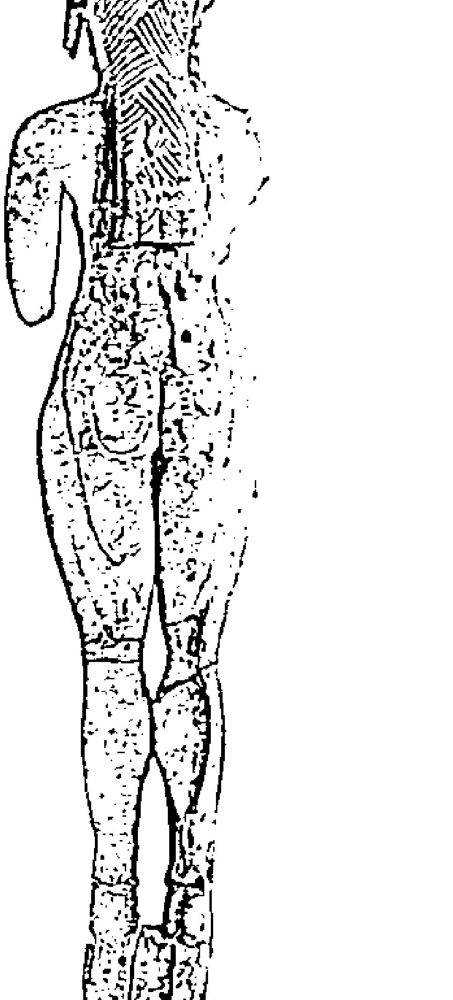

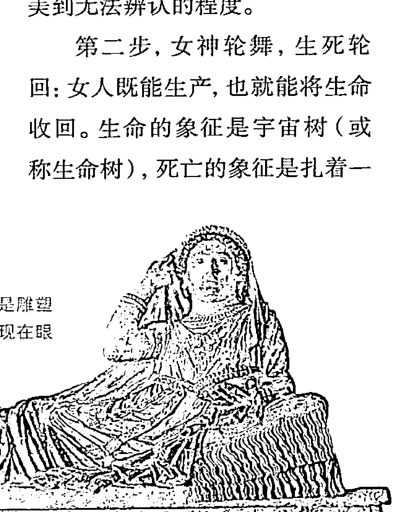

在塔尔奎尼亚城附近伊特鲁里亚人的墓葬里发现了几块五彩墓石。墓室壁画上详细描绘了快乐而无忧无虑的彼岸世界，那里依然有各种节日和体育比赛。公元前5世纪

美女纵纹，也即秀脖儿上的女人头正从男儿体内长出，进行着像分娩一样痛苦的但却是所期待的变态。灵魂抛弃令其厌恶的躯壳，开始全新的生活。唯有一种饮料能够缓解痛苦，这可能是雅利安人都熟悉的苏摩酒。它和悟道镜一样，是亡者的必备品。学者E·马夫列耶夫在《卢库蒙》一文中指出：“在希腊意大利，地府神灵的作用急剧增长。这里的镜子毫无大陆希腊的迷信味道，为各种民间故事所包围，变成阴阳两界互通的工具。”

阴司的变态不应理解为变性外科手术。准确地说，是指在彼岸世界了解生命的奥秘。所以卧榻上欠着身子的那位伊特鲁里亚人的脸上因感受到和内视到的东西而凝滞着一副惊讶的表情。

只有两个完全相反的因素——雌与雄，东方称阴与阳——的结合，才能让人有一种印度密宗所培育的对存在完整性的感受。

这位伊特鲁里亚人不一定变成女人转世。在有过这种独一无二的精神上的经历之后，他也能重获男儿身，但已经是另一个人，存在于另一个躯体之内了。

伊特鲁里亚陶罐上的装饰画。飞女赶往阴司，助死者灵魂绕过忘川并免遭守卫地府的恶犬撕咬

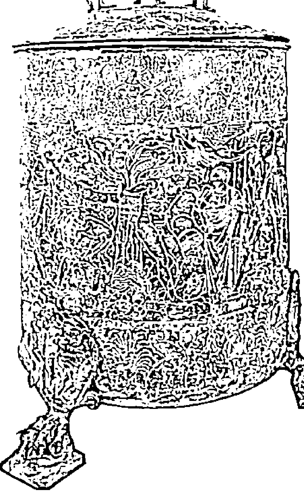

装香料或首饰的三足罐。罐盖上，“扎辫子的少女”带领两个少年前往新的美好世界

生下一步变化：死者离开肉身，精神外壳发生变化。死去的男人渐渐变成女人，像是回到女人的怀抱，以便在宇宙中重新上路。

这近乎神话的仪式的明证，便是国立艾尔米塔日博物馆藏品中的所谓青铜伊特鲁里亚人。这块墓碑上描绘了道成肉身时性别变化的过程。典型的细节就是整个底座横贯着波浪形图案。换言之，少年返回生命本原时，是死后踏着太古海洋的波浪行走的。浪花四溅，意味着亡者尚未完全割舍前世，并未彻底重生——尚在十字路口。甚至他衣服的褶皱也呈波浪形，褶皱中显出浮雕状的躯干，像是和谐生于混沌。人血肉之躯的形成重复着生命从无生界诞生的过程。

拉斯人的体型乍看才像男性。细细察看便可发现它带有女性特征：没有喉结；颈项上有几道古典

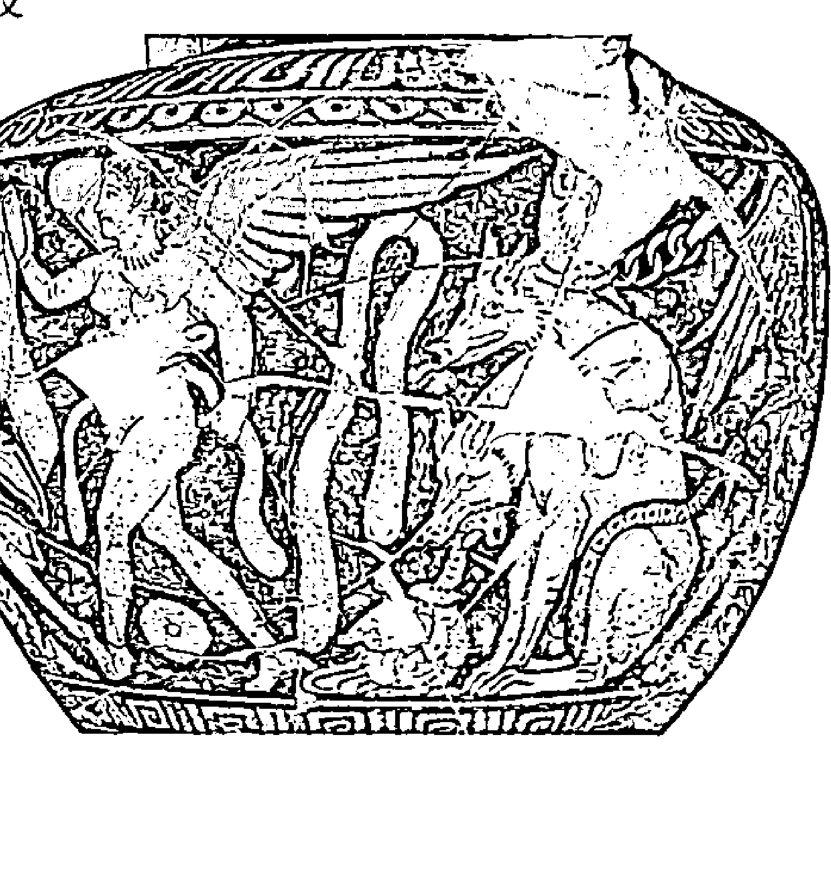

始祖廷的儿子，幼小而又高迈的塔格从地下现身时的模样就是这样。他来找拉斯人，是为了通报他们艰难的命运、未来的忘却。伊特鲁里亚人的青铜塑像

一天，远古时代，塔洪法师在犁田。这活计不仅是生活之必需，而且是人生之快乐。此外，法师-卢库蒙所耕的田被认为是丰收之保证。因此，塔尔奎尼亚城的大祭司，国王蒂伦的胞弟，跟在牛后，用力压着犁把。塔洪一心想着百姓，像用手术刀解剖活体一样犁开地面，把地耕得比要求的深得多。无意中，法师犁破了阴阳两界那薄薄的界面。犁到田头，他回首一瞥，只见犁沟中探出一个小男孩的脑袋。起初，塔洪以为是谁家的孩子在翻过的地上玩耍，可仔细一瞧——不对：男孩像老人一样白发苍苍！更主要的是，那头上罩着一轮光环！法师大惊失色，连声呼喊自己的卢库蒙同行。同行们听到远方的呼唤，霎时间飞到塔尔奎尼亚城（毕竟他们都是超能的术士）。当伊特鲁里亚所有的法师聚集到田间后，

男孩开口对他们说，他叫塔格，是天帝廷的儿子。众所周知，天帝高居北山，监视着世间所发生的一切。“仙驾光临，有何赐教，廷公子？”塔洪问男孩。“我来贵乡，”天神的使者回答，“是要说说拉斯民族的使命。你们的未来美好而又艰难。你们必须将许多东西教会相邻部落。不过首先应当消除自身的愚昧。”

法师们取出蜡板，准备好记录，白发男孩便开始讲述了。他郑重其事地讲了很久：从白天讲到晚上，从夜幕降临讲到旭日东升。第二天讲过去，接着第三天…… 卢库蒙们十分虔诚地做着记录，心里纳闷：怎么也不觉得饥渴和疲劳呢？塔格讲解：如何计算行星的运行轨迹，如何根据祭祀动物的肝脏了解未来，如何防备妖魔的阴谋诡计，还有许多对于我们依然是奥秘的东西。第三天，白发男孩结束自己的长篇大论，说道：“你们应该把学到的知识传给不同部落的人，把许多东西教会他们。不要指望人每位伊特鲁里亚大公都必须像普通庄稼人一样耕田耙地。这是不可动摇的古代法律。尼·廖里赫的画作《米库拉·谢利亚尼诺维奇》

白发男孩便钻入地下，永远消失了。

卢库蒙们的蜡板记录，后来被编写成十二卷拉斯“圣经”。书名叫不一：或叫《塔格学说》，或叫《伊特鲁里亚主义》。只可惜，这无价之宝于罗马时代失传了。罗马人所知道和所会的一切，应当归功于始祖。所保留下的，仅仅是法学家马克·莱贝翁和作家塔克文尼·普利斯克译成拉丁语的两个不大的片段。这两段所描述的，都是用动物肝脏占卜（脏卜）的方法。不过，莱贝翁认为塔格首先是伟大的立法者。他很可能读过一卷《塔格学说》，其内容就是伊特鲁里亚法

在铜镜的背面，伊特鲁里亚师傅刻画的是一位在做脏卜的卢库蒙

相传，伊特鲁里亚人通常吩咐将他们活着砌入墓室。他们望着各种场面的鲜艳壁画，等它们达到深度并成为现实。谁知道呢，或许他们能成功实现向另一世界的过渡

其他作者则认为，塔格学说包含对宇宙的描述。那里有一些“最高天神”，他们个性鲜明，对人类友善，住在东天。大自然的主宰住在南天。最令人恐惧、冷酷无情的魔鬼看中了西天，尤其是西北。这个方

向被伊特鲁里亚人认为最不利于生命，可能是因为它离故乡最远吧。拉斯的术士们了解神的旨意所根据的，是祭祀动物的肝脏、禽鸟的飞行（罗马人更喜欢将他们称为“鸟占术士”）、闪电和雷声。还有一种方法，它可能最为可靠，就是在地上绘制星辰平面图。据同代人回忆，它的过程是这样：祭司在地上画个大方框，再画个十字将大方框分成四等份，每份再分四等份。接着在十六个小方格子里写上固定的神名。然后占卜者在线的交点上慢慢移动，察看哪个部分会出现征兆。这样他就能知道与解决问题相关的神名或人的命运。现在就清楚，该向谁祈祷和祈祷什么，该给谁贡献祭品以避难消灾了。

后来，“塔格门徒”的声誉日隆，能跟他们相比的也许只有德尔斐神示所。

### 来自地下的白发男孩

始祖廷的儿子，幼小而又高迈的塔格从地下现身时的模样就是这样。他来找拉斯人，是为了通报他们艰难的命运、未来的忘却。伊特鲁里亚人的青铜塑像

一天，远古时代，塔洪法师在犁田。这活计不仅是生活之必需，而且是人生之快乐。此外，法师-卢库蒙所耕的田被认为是丰收之保证。因此，塔尔奎尼亚城的大祭司，国王蒂伦的胞弟，跟在牛后，用力压着犁把。塔洪一心想着百姓，像用手术刀解剖活体一样犁开地面，把地耕得比要求的深得多。无意中，法师犁破了阴阳两界那薄薄的界面。犁到田头，他回首一瞥，只见犁沟中探出一个小男孩的脑袋。起初，塔洪以为是谁家的孩子在翻过的地上玩耍，可仔细一瞧——不对：男孩像老人一样白发苍苍！更主要的是，那头上罩着一轮光环！法师大惊失色，连声呼喊自己的卢库蒙同行。同行们听到远方的呼唤，霎时间飞到塔尔奎尼亚城（毕竟他们都是超能的术士）。当伊特鲁里亚所有的法师聚集到田间后，

男孩开口对他们说，他叫塔格，是天帝廷的儿子。众所周知，天帝高居北山，监视着世间所发生的一切。“仙驾光临，有何赐教，廷公子？”塔洪问男孩。“我来贵乡，”天神的使者回答，“是要说说拉斯民族的使命。你们的未来美好而又艰难。你们必须将许多东西教会相邻部落。不过首先应当消除自身的愚昧。”

法师们取出蜡板，准备好记录，白发男孩便开始讲述了。他郑重其事地讲了很久：从白天讲到晚上，从夜幕降临讲到旭日东升。第二天讲过去，接着第三天…… 卢库蒙们十分虔诚地做着记录，心里纳闷：怎么也不觉得饥渴和疲劳呢？塔格讲解：如何计算行星的运行轨迹，如何根据祭祀动物的肝脏了解未来，如何防备妖魔的阴谋诡计，还有许多对于我们依然是奥秘的东西。第三天，白发男孩结束自己的长篇大论，说道：“你们应该把学到的知识传给不同部落的人，把许多东西教会他们。不要指望人每位伊特鲁里亚大公都必须像普通庄稼人一样耕田耙地。这是不可动摇的古代法律。尼·廖里赫的画作《米库拉·谢利亚尼诺维奇》

白发男孩便钻入地下，永远消失了。

卢库蒙们的蜡板记录，后来被编写成十二卷拉斯“圣经”。书名叫不一：或叫《塔格学说》，或叫《伊特鲁里亚主义》。只可惜，这无价之宝于罗马时代失传了。罗马人所知道和所会的一切，应当归功于始祖。所保留下的，仅仅是法学家马克·莱贝翁和作家塔克文尼·普利斯克译成拉丁语的两个不大的片段。这两段所描述的，都是用动物肝脏占卜（脏卜）的方法。不过，莱贝翁认为塔格首先是伟大的立法者。他很可能读过一卷《塔格学说》，其内容就是伊特鲁里亚法

在铜镜的背面，伊特鲁里亚师傅刻画的是一位在做脏卜的卢库蒙

相传，伊特鲁里亚人通常吩咐将他们活着砌入墓室。他们望着各种场面的鲜艳壁画，等它们达到深度并成为现实。谁知道呢，或许他们能成功实现向另一世界的过渡

其他作者则认为，塔格学说包含对宇宙的描述。那里有一些“最高天神”，他们个性鲜明，对人类友善，住在东天。大自然的主宰住在南天。最令人恐惧、冷酷无情的魔鬼看中了西天，尤其是西北。这个方
向被伊特鲁里亚人认为最不利于生命，可能是因为它离故乡最远吧。拉斯的术士们了解神的旨意所根据的，是祭祀动物的肝脏、禽鸟的飞行（罗马人更喜欢将他们称为“鸟占术士”）、闪电和雷声。还有一种方法，它可能最为可靠，就是在地上绘制星辰平面图。据同代人回忆，它的过程是这样：祭司在地上画个大方框，再画个十字将大方框分成四等份，每份再分四等份。接着在十六个小方格子里写上固定的神名。然后占卜者在线的交点上慢慢移动，察看哪个部分会出现征兆。这样他就能知道与解决问题相关的神名或人的命运。现在就清楚，该向谁祈祷和祈祷什么，该给谁贡献祭品以避难消灾了。

后来，“塔格门徒”的声誉日隆，能跟他们相比的也许只有德尔斐神示所。

### 卢库蒙们的魔法

拉斯人的魔法师王，同时也是军事首领。史学家季特·李维（和他所有同胞一样，是伊特鲁里亚人不共戴天的敌人）按捺不住诗兴的冲动，描写了雄伟的卢库蒙之城韦耶，“衣着豪华、身先士卒、冲锋在前”的托卢姆尼。魔法师端坐在象牙宝座之上，由手
一层红赭石的陶土面具），身披满天星斗篷（永恒的象征，所有魔法师的特有服饰），手执鹰头权杖（古往今来，权杖和权标皆为最高权力的象征）。这个细节对于理解拉斯人的起源和信仰尤为重要。印度雅利安人之所以占领印度斯坦半岛，是因为闯进那儿乘坐的就是当地人至今未知的战车。战车是雅利安各民族的祖传特征。

保持地域的生态平衡，卢库蒙们也同样关注。只要不经过魔法师的同意，哪个农民多占地耕种，伐光森林用于建设，为冶炼金属而烧制木炭，他立刻就会遭到“神的愤怒”。水平衡马上就会被破坏，紧接着就会出现土地盐渍而不能耕种。

水文学的奥妙百姓自然不懂，可他们却是显然事实的见证人：亵
完好保存下伊特鲁里亚人创作的阿波罗的许多塑像。这位来自极北之国的外乡人在伊特鲁里亚被当成近亲

渎神圣者，违犯塔格戒律者，死得缓慢而痛苦。没人怀疑，“降下”惩罚的是法力无边的魔法师。因而形成了一个共识：卢库蒙具有可影响周遭并对于凡是致命的魔力。

人们相聚在圣松林里庆贺一年一度的节日时，魔法师们的严酷就被完全忘记。松林至今仍耸立在奥尔维耶托市附近的蒙法尔科内山冈上……从前这里有座供奉双性神沃尔图姆纳的寺庙。

节日活动开始，由十二位卢库蒙选出一位主魔法师，由他往神庙墙上钉入一只木钉，以此结束过去的一年。特别之处是，魔法师们不用铁钉，因为这种金属会带来不幸。

木钉钉完便是欢乐的节日活动，有些像集市。力士格斗，杂技表演，江湖艺人摇唇鼓舌、哗众取宠。

### 廷的三道闪电

廷的第一声炸雷响彻伊特鲁里亚上空，是公元前7世纪，当时塔克文城的青年卢库蒙（他父亲德马拉特是科林斯城的希腊人，母亲出身古老的拉斯族）决意迎娶巫师和奸邪塔娜基尔。族人曾试图劝说堕人情网的阔少放弃这段婚事，可他对这女子言听计从，百看不厌。她一领长长的衣裙紧裹窈窕的胴体，两条紧紧的长辫按拉斯人的时尚搭在肩后，更显得妖媚无比。为达到自己的目的，她不惜动用迷魂药物。总之，青年卢库蒙已被完全掌控于她手中。女巫常在他耳边念叨：“这里没人欣赏你。咱们去罗马……我让你登上拉丁宝座，成为国王！……”

名不见经传的青年卢库蒙带着塔娜基尔离开家乡，甚至依她的主意起了个外族名字——卢西·塞克斯特·塔克文。后来，他作为罗马的首位伊特鲁里亚族国王老塔克文而出了名。将近异邦

## 罗马

恺撒义子屋大维（公元前63—公元14年）的塑像。公元前27年，他登基称帝，得名奥古斯都。后来“奥古斯特”（拉丁语意为“神灵擢升的”）具有了皇帝尊称意义。我们至今还在用他的名字称谓夏季的最后一个月（8月）。

### 尤利乌斯的子孙

消灭伊特鲁里亚人之后，罗马人确信天下无敌，欢庆胜利。亨·谢米拉茨基的画作：卡普里岛提比略时代的酒神节

伊特鲁里亚人被消灭后，轮到其他民族体验罗马人的压迫了。这块刻着古罗马军团兵士的大理石板出土于巴勒斯坦

尤利乌斯是埃涅阿斯之子。罗马人认为他是自己的祖先。就人种成分而言，罗马人是个五色缤纷的民族：他们先同萨宾人，接着同拉丁人和意大利人融为一体，后来几乎所有人都成了帝国的子民：希腊人和亚美尼亚人，埃及人和犹太人，高卢人和日耳曼人，布列特人和达西亚人。促使他们融合的不仅是征服者的大军，还有恐惧的心理。古罗马军团所向披靡。具有数千年文化的各民族仿佛遇群暴徒。古罗马诗人玉外纳描述道，他的一位不会欣赏希腊艺术的同胞，竟把伟大艺术家的作品砸成碎片，用来装饰自己的盾牌和铠甲。

当罗马人得知这些雕塑和陶罐价值可观时，他们便开始将战利品运往家乡。对待异国的神灵也同样如此——常常将其攫为己用。

法国作家阿纳托尔·法朗士的长篇小说《在白石上》，以独特的讽刺手法描写了两个贵族——加利翁和罗利端坐在抢来的财宝中间的谈话。他们用现代语言互相炫耀不知是谁说过的话：‘这位牧神仿佛能够呼吸，’马克·罗利说。‘说得对，马克！你会不由得等着他用长笛吹出简单的旋律，’加利翁说。‘希腊人干这行可是好手…… 谁不为菲迪亚斯的朱庇特奥林波斯神赞叹不已？谁会想成为菲迪亚斯？’

‘当然，没一个罗马人这样想，’罗利嚷道。此人挥霍祖辈的遗产，让人从希腊和亚洲给他搞来菲迪亚斯和米隆的作品，装饰他的花园别墅。

在场的一位希腊人听了连连称是，扬声说道：

‘尤利乌斯的子孙就是为统治世界而生的！其他任何事情都不配让他们做。’

他又肉麻地吹捧了罗马人老半天。他之所以阿谀奉承，是因为害怕他们。但内心所怀的只是对这些目光短浅、头脑迟钝者的鄙视。”

其实，罗马人并不掩饰他们评价艺术品仅仅是看它们有没有用处。

有个叫尤里·福隆金的人，在赞美宏伟的罗马渡槽时满有把握地说，不能将罗马“宏伟的石砌建筑同没用的埃及金字塔或希腊那些名声显赫而毫无用处的建筑”相提并论。

雕塑家们在祖先的脸上刻画出极度的腐败、病态的残忍、异常的忧郁、对权力不顾一切的追求。

按照当时的尺度，这些特质证明了被塑造者的生活能力。

暴虐狂跌入深渊是史无前例的。罗马人彻底失去的如果不是颜面，就是人的内涵，灵魂。史学家斯维托尼讲过卡利古拉皇帝的事：“他强迫父亲在儿子被处决时到场。”另一位罗马作家季翁补充说，一个受刑者的父亲“问能否闭上眼睛，卡利古拉便下令将父亲一并处死”。在此背景下，“王位上的哲学家”马可·奥勒留的形象形成了反差。不过他所有的想法都充满了因世事无常而产生的失望和倦怠。奥勒留写道：“人生转瞬即逝，其实质就是永恒的流逝、精神惶恐、生命短暂、灵魂脆弱、命运莫测、声名虚空。”结论不言自明：活着毫无意义。

伊万·布宁在《圣弗朗西斯科来的先生》中议论提比略的命运时，得出结论，是情势和罗马百姓把皇帝变成了吸血鬼：“两千年前，该岛（卡普里）上住着一个残暴卑鄙、处境窘迫的人，也不知如何夺取了统治千百万人的权力，可是又因这毫无意义的权力和害怕有人刺杀而茫然失措，干出许多过于残忍的勾当。”

将古罗马同古希腊相比，将它们合为同一个古代文明，显然毫无根据。由于罗马人强迫被俘的工匠们为其干活，他们根本就没成为具有高度文化的希腊人。

其实，如果考虑到许多人都愿沉醉于古希腊、罗马时代似乎是欧洲人幸福童年时代的自信，这些错误认识倒是可以理解的。然而人们对幸福的理解各不相同。在理解遥远的过去时出现各种不同议论的原因就在于此。

尼禄皇帝尤为“出名”。他下令先杀生母，而后再杀发妻。64年他烧毁了大半个罗马。为转移对自己的怀疑，他开始迫害罗马的基督徒。死于自杀

### 从上帝的小草到个人崇拜

罗马人喜爱希腊艺术，尤其雕塑。始母维纳斯 的这尊塑像是公元前5世纪希腊塑像的罗马复制品。原作被认为出自雕塑家卡利马赫之手

罗马所有神的庙宇——万神殿。唯一的光源 是圆顶中央的孔洞。它象征天穹的太阳。工 程由统帅阿格利巴（公元前约63—前12年） 开建。于118—128年哈德良皇帝在位时烧 毁并重建

亨·谢米拉茨基的画作《恺撒独教辉煌时代的罗马酒神节》。喧闹、狂饮、纵欲——这便是忘记自 己神灵的人们要做的事

罗马人分两种：出身豪门的 贵族和出身寒门的平民。前者对于 神灵只是按需加以利用。城里人 因顾不上排干沼泽而饱受冷热病 的折磨，便想出个与疾病同名的女 神——利哈拉德卡，委托她专司公 民的健康。接着，罗马人染上了鼠 疫，于是城里的长老又派起活来， 将她改名为梅迪库斯——希腊的艺 术神阿波罗，而把天医埃斯枯拉皮 俄斯派给他当助手。假若病人死 了，过错就推给天医。若是病人好 了——那好，赞美上帝吧！与他们 贵族似乎毫无干系。

古意大利平民则相反，他们几 乎将每根小草都奉若神明。也许， 这里指的毕竟不是天上的神仙，而 是地上的众多神灵，或者可能是埃 尔夫小精灵。

也有可能，富于激情的古意大 利人与他们傲慢的同胞相比，是伊特鲁里亚人更勤奋的学生。无论如何，伊特鲁里亚人的直系后裔—— 罗斯人和斯拉夫人，熟悉并尊敬自 然界大量的神灵：原野神和草地 神，土地神和谷物神，午间夫人和 春姑娘，黑麦神和莴蓄神。他们的 住所也都由家神和庭院神守护，这 些神灵在意大利人家里则变成了藏 有细软家私的大箱子（小匣子）的 守护神。

傲气十足的贵族不学宗教信 仰，他们经常毫不客气地偷盗神的 塑像。我们已经讲过乌妮的塑像被 从韦耶城盗走的事。她被运过台伯 河，就一下变成了朱诺。伟大的廷 在卡庇托林山原地未动，就被改名 为朱庇特。从小亚细亚运来了万神 之母库柏勒和她的情侣阿提斯。从 希腊的殖民地又弄到了阿波罗。

### 基督教徒与女巫

乍一看，罗马能让你觉得是世界的宗教之都：这里比邻陈列着伊特鲁里亚、希腊和埃及的祭祀雕像。当罗马人正式膜拜朱庇特和皇帝之时，古罗马军团的兵士则在供奉（的确，是半合法地）雅利安神密特拉，认为他比玛尔斯更能庇护他们。使他们产生这种想 法的可能是《阿维斯陀》的片段，其中说道：我们崇拜密特拉，其麾下骐骥骏马，疆场上风云叱咤，踏寇仇巨蹄之下，破敌阵摧枯拉朽。事实上，在‘永恒之城’里，只有被认为对帝国有用的信仰才会受到欢迎。而贵族阶层认为有害社会的信仰，都会遭到无情的排斥。著名的《元老院法令》（公元前186年的《元老院决议》）宣布禁止举行从色雷斯和希腊引入的酒神节仪式。据基督教神学家德尔图良介绍，魔法师也遭到了镇压。在《论偶像》一书中，作者写道：‘星相家和他们的仆人统统被赶出罗马帝国。他们被禁止进入罗马和整个意大利。’

一些新学说也遭到同样的命运，比如从犹地亚传入帝国的基督教。起先人们并没拿它当回事。《新约·使徒行传》里记叙了雅典最高权力机构（法院）成员嘲笑使徒保罗这件事：‘众人听见从死里复活的话，就有讥诮他的，又有人说：“我们再听你讲这个吧！”’尤其是异教徒受到了抨击，塞尔苏斯在《老实话》中漫画式地描绘了他们的学说。

耶稣的生平在这篇讽刺小品中被描述成这样：“他生于一个犹太村庄，母亲为当地一穷织娘；因通奸败露，被做木匠的丈夫赶出家门。被休之后，浪荡不羁，私出耶稣。耶稣因家贫而前往埃及受雇打工，偷得一技半长，告归乡里，恃才傲物，自封为神。”

可无论塞尔苏斯如何尖酸刻薄，也远不如米努皮·费利克斯直截了当。后者把基督教徒形容成狂热而残忍的信徒，他们那些不可思议的规矩必须根除。“……一个可怜的、遭禁的、卑鄙的教派竟起而反对神灵，不该感到遗憾吗？这是一帮躲躲藏藏、见不得人的家伙，人前装哑巴，人后是话痨。他们视寺庙为神的陵墓，否定神灵，嘲笑祭神仪式……”

指责了残忍野蛮之后，接着指责的必是淫荡。呜呼，人类的想象力何等贫乏！罗马人怀疑基督教徒所造的罪孽，渐渐地也同样被用来指控阿尔比教徒和魔鬼，而东正教的教徒们则用它来指控犹太人。

罗马通常的处决形式，是把犯人钉在十字架上。被处决者死得缓慢而痛苦。

罗马‘智慧王国’没有信仰，于是妖术大行其道。人们虽不认为它有必要，但也不能作对。小说家阿普列乌斯在《巨变》里描写了一个女人的行为，充分肯定对基督教的中伤：“她藐视和践踏天条，用某个虚伪和亵渎神灵的宗教那空洞而荒谬的仪式取而代之，并说自己只信奉一个上帝，可她却贪杯纵欲，不守贞操，欺骗众人和不幸的丈夫。”

这部小说同时又是妖术的百科全书。主人公的熟人比列娜，决定给他提醒一下女巫帕姆菲拉的阴险：“她是头号女巫和驱鬼能手。她冲小木棒、小石子、某件小东西念上几句咒语，就能让整个星空坠入塞尔萨尔河，让世界陷入古时的混沌。” “……帕姆菲拉先脱光衣服，再打开一个匣子，掏出许多小盒，拧下一个小盒的盖子，从中取些软膏，先将软膏用两掌搓匀，然后涂抹全身，对灯念念有词多时，开始剧烈抖动四肢。四肢微微颤动之时，渐渐生出绒毛，继而长出结实的羽翼，鼻子弯曲硬化，出现弯弯的鹰爪。帕姆菲拉变成猫头鹰。只听得她哀叫几声，又见她在地上蹦跶数下，试试力气。少时，她翅膀一扑棱，飞走了。”

精神空虚、贪念浮华和热衷妖术，从内部侵蚀了罗马。日耳曼人只好出手（只消轻轻一推）摧毁这泥足巨人。”

罗马浮雕雕刻了一个不仅能行医，而且会制药的女巫医

罗马人从伊特鲁里亚人和希腊人那里承袭了纪念酒神的节日，将酒神称为瓦克赫。亨·谢米拉茨基的画作《酒神节》

## 古印度

在印度传统中，大象不仅是供乘骑和运货的动物，而且是作家的庇护神加涅沙的化身

### 神奇的国度

古印度，无论印度雅利安人拥人之前还是之后，都被许多民族想象为神奇的国度，原因有三。其一，它被大自然所阻隔：北依高耸的喜马拉雅山，西傍喜马拉雅山的支脉和沙漠，东与印度支那之间横亘着虽不高峻但也同样难以逾越的山地，南临波涛汹涌的印度洋。

其二，所有偶尔前来的旅行者都讲述过关于它的奇闻逸事。这一传统的开创者是希腊的“历史之父”希罗多德。他在《历史》第三卷《塔利亚》中说：“彼国有沙磺，磺中生蚍蜉，大似狗而小于狐。若干此种猎获之蚍蜉曾献予波斯君王。蚍蜉掘穴于地下，抛沙粒于穴外…… 沙粒含金：印人遂入沙磺而取之。”这些奇闻逸事被另一位古代作家西西里的狄奥多在《历史丛书》中所证实：“印度生灵繁多，走兽飞禽无所不有，体硕而力大…… 野果根茎，甘甜味美，食之不尽。盖因彼国平川饱含甘露……

为塑造神奇国度形象做出贡献的还有特维尔商人阿法纳西·尼基京。他在《三海纪行》中写道：“印度国中，百姓赤身露体。每每出行，围观者不可悉数，因少见白人而觉新奇…… 另有一种‘咕咕’鸟，夜晚出没，咕咕啸鸣；落于谁家屋上，那家必定死人；谁企图将其打死，它便向谁喷火…… 而猴则栖居山林。猴有猴王，动辄前呼后拥。若遇人欺负，猴们则向猴王告状。猴王便向欺负同类者派出猴群。猴群一到，揭瓦毁屋，见人便砍……

从水利农艺到金属加工和建筑技术。 其三，欧洲人一向认为他们所发现并特别熟悉的埃及和苏美尔文化最为古老，认为它们发源于公元前40世纪。而在地理上更为遥远的印度和中国文化则被断为较晚的文明：印度半岛的文明不早于公元前23世纪，而中国文明（商殷时期）则始于公元前17世纪。 20世纪在印度的考古发掘，俄国商人阿法尼西亚·尼基京在印度的周游被记叙在他的《三海纪行》中 印度人是甘蔗、棉花和各种香料的最早发现者。他们首先驯服了野牛。后来在两河流域和埃及，这些动物被用于翻土耕地。印度人还想到将大象用于战事。古印度人的发明尚可列出许多：

将印度文化追溯到了古石器时代！这时，计时器简直“达到极限”。因此，我们需要另一种计时方法，才能弄清“古石器时代”究竟存在于何时！ 要弄懂如此久远之事，必须重提那句老掉牙的绕口令：“舍利-阿舍利-莫斯特，奥林雅克-索琉特雷-马格德林”。这绝非法国小调，而是对早晚旧石器时期的科学断代。“舍利-阿舍利-莫斯特”指公元前200 000至前40 000年，“奥

### 死人之国的两个都城

19世纪中叶，负责印度全境考古工程的不列颠将军坎宁曾坚信，雅利安人在公元前3至前2千纪占领印度半岛，给当地贫穷的部族带来了信仰和文化的仙气。

海晏河清，天下太平，一切有条不紊，恰似黑白棋子，布局井然有序（白子是文明，黑子是蒙昧）。而毁掉一幅美好生活画卷的那“一勺焦油”，很可能就是坎宁在哈拉帕（北俾路支，今巴基斯坦境内）所做的考古发掘。将军发现了一枚刻有不明字符的古印章。

然而，奥秘的破解被束之高阁，直至20世纪20年代方来到的最佳时期。这时，不仅在业已闻名的哈拉帕，而且在另一地——莫亨朱达罗（印度河河谷，今旁遮普邦境内，意为“死人之丘”），发现了雅利安人人侵前的一个国家的两座大型的而此前却不为人知的都城。

自从这一发现之后，古代史研究中的调门突然改变了：从此，雅利安人开始被认为不过是毁灭达罗毗荼强国的蛮夷。因不知道突然冒出来的这个国家的确切称谓，人们便根据两个都城的名字，将其称为哈拉帕和莫亨朱达罗。

实际上，一切都简单而又复杂得多：征服者和被征服者皆非粗野蛮夷。这是古代世界上迥然不同的两种文明。

大约从公元前4千纪起，印度河河谷中为数不多的不同部族的居民，被深色皮肤的达罗毗荼人——今澳大利亚土著的近亲——所归并。印度河两岸开始出现一座又一座设防坚固的城池：南有陈胡达罗、阿姆里、莫亨朱达罗，中有卡利邦冈，北有哈拉帕、鲁帕尔和斯利那加。很可能，莫亨朱达罗和哈拉帕这两座最大的城市，就是该国的南都和北都，就像俄罗斯的莫斯科和圣彼得堡。

随着一座座城池的建立，印度西部的生活面貌焕然一新：同古代，在古代，古印度人创造了精美的文化。圆柱大厅和饰有雕塑的墙壁，是古塔米尔文化的证明

今巴基斯坦境内哈拉帕文化中心之一莫亨朱达罗的壮观遗址。保存下来的有图书馆、居民街区、坚固的工事和砖砌排水系统

印度经历过建立了一些大国的许多朝代。其中之一是大莫卧儿的国家。它的将士被描绘在中世纪的细密画上

世界的所有发达国家都展开了积极的商贸往来。从公元前3千纪中期起，以农业为主的边疆变成了一个主要的商贸中心。印度的桅杆海船（它们的造型曾发现于洛特哈尔，今孟买附近），从印度河三角洲的港口（今卡拉奇附近）驶向四面八方：东往印度支那，西往非洲大陆。“转运点”就是波斯湾巴林岛的迪尔蒙。来自哈拉帕的商品，从这里被运送到两河流域、伊朗南部、小亚细亚——赫梯人的国家，甚至更远——地中海沿岸东部地区，克里特岛，基克拉泽斯群岛。印度人为海外客商提供过的商品无所不包！好几个等级的精选小麦、大麦、大豆以及西方人从未见过的作物——稻谷。他们贩卖牛羊，也贩卖猪。还用船运送陶瓷制品（好几种瓷器——红的、淡黄的、粉红的、灰的，在苏美尔的乌鲁克特别畅销），金属制品（黄铜的、青铜的、铅的、银的和金的，其中有武器和器皿），

珠宝首饰（制首饰的材料不光是各种金属）。后来所有贸易开始萧条。贸易主动权落入克里特人之手。从此，人们不再购买印度的牲畜和粮食。工匠们的制品已无法引起往日那样的狂喜。就连印度河沿岸生产的女性饰品也不再时兴。俗语说，祸不单行，避坑落井。印度遭受过多次入侵，但许多方面仍然保持着传统的生活方式。瓦·韦列夏金的绘画中的牛车同哈拉帕出土的一模一样

度河河谷发生了五次毁灭性的地震；河川改道，周期性地淹没哈拉帕和莫亨朱达罗的街道。人们受够了经常不断的磨难，开始逐渐迁往较为安定的地方——东南部的恒河河谷。几座古城的废墟上迁来了一些新的部族——白皮肤的雅利安人。他们带来的则是另一种高雅的吠陀文化。

### “黑皮岛生” ——头号作家

“雅利安人”意为“异乡人”，兼有“贵族”之意。他们带入印度的主要东西，就是一部经书——《吠陀经》。《吠陀经》不是《圣经》、《阿维斯陀》、《老伊达》那种经文集。它是供魔法师用的一大套丛书，或者说是记载神的启示和教导人们如何生活的一整套文献。《吠陀经》首先分以下几部分：

+   1.《吠陀本集》——赞歌、咒语、祷文汇编（《梨俱吠陀》十本，收赞歌一千零二十首，其中最古的作于公元前4千纪；《娑摩吠陀》——圣歌；《耶柔吠陀》——祭祀套语和预测详解；《阿闼婆吠陀》——适用于生活中一切情况的符咒）；

祭祀仪式的规程，使众生了解为何及如何举行仪式，应当对神灵寄托什么；

+   3.《奥义书》——宗教哲学论文。

其次，还有《吠檀多》（“吠陀分册”）——科学、哲学、伦理学、神学论文，论述各种学科：天文学和格律学、语法学和语音学、语源学和传统仪式在日常生活中的意义。《吠檀多》还分出祭礼论。祭礼论又分论家庭礼仪规范的《珈蓝经》和论家庭生活准则的《达摩经》，也即一种独特的“治家格言”。

总之，《吠陀经》是包罗从古至今印度人生活方方面面的多卷本百科全书。内容如此浩繁的文献有无作者，或至少是创编人呢？一些传说明确地提到他的名字——毗耶娑。

毗耶娑并非具体人的名字，确切地说，这是参透天机并为众生将其通俗表述出来的诗人的尊号。已知的毗耶娑至少二十八位。据传说，其中魁首，生活在耶稣出世前三千一百年的吠陀毗耶娑，至今还居住在西藏的玛旁雍错湖畔。他是大苦行僧帕拉夏拉和萨都雅哇蒂公主的私生子，生于阇牟那河的河心小岛上，故而得名“岛生”。他面色黢黑，相貌丑陋，故而又得外号“黑皮”。长大后，他参透神的启示——《吠陀经》，将其分为四部，记录下来，因其繁重的劳动又得一名——毗耶娑，意为“编者”。

为延续王家香火，他遵从母命与丧偶王后安毕迦同房。他夜里来到王后跟前，王嫂见他个头似侏… 儒，面孔赛炭黑，眼睛亮闪闪，头发乱蓬蓬，吓得紧闭双眼，由他任意摆布。

第二天，萨都雅哇蒂问相貌可怕的先知儿子，王后能否生下他的孩子。毗耶娑回答：“她会有个健壮而聪明的儿子，儿子会有一百个勇敢的儿子，我的孙子。”萨都雅哇蒂高兴得叫起来，可他却闷闷不乐，说：“王后不懂事，眼睛闭的不是时候，孩子生下来会是个瞎子！”

孩子也会脸色苍白。”

萨都雅哇蒂大失所望：左右不得遂意！她让王后与毗耶娑再度共寝。王后不便当面拒绝，暗使婢女替代。婢女不惧“澳洲黑”。毗耶娑允诺：“从今后，你不再是奴婢，你的儿子将以他的智慧和虔诚闻名于世，成为大法学家！”

怀胎十月，安毕迦生了个瞎子，取名提多罗吒。安波莉迦的儿子取名般度——“苍白”。婢女的儿子得了个响亮的名字维杜罗——“天赋异禀”。提多罗吒果然得子一百，按远祖名讳外号持国。据传，般度因侮辱隐士而注定不能生育。他五个孩子皆由两个妻子与天神交合而得，按父名号称般度五兄弟。印度史诗《摩诃婆罗多》专门描写了持国与般度的仇恨。连大公无私的叔父维杜罗出面，也未能平息他们争夺王位的愈演愈烈的欲望。

王室子孙们的传奇故事是他们有些古怪的祖父毗耶娑描述的。之后，他去了喜马拉雅山，以便在安静的玛旁雍错湖畔构思出新作品的情节。

### 永恒的计算法

古印度人将地球上的生死轮回，包括过去和将来，构成一个严整的体系。在这个体系中，“大从古到今，人们一定会向星相家讨教预言，就像这幅细密画中所表现的一样

世界洪灾和大西洲的存在，对我们来说仍然是些有争议的问题，由此可看出现代人的无知程度。其实希腊哲学家柏拉图早在《克堤拉斯篇》中就曾借希腊祭司之口嘲笑过类似的迷惘。他听完梭伦讲述本民族起源的古希腊神话之后，说：“你们所有人都头脑稚嫩，因为你们的头脑存不住自古代代相传的任何故事，也存不住历尽沧桑的任何

据《吠陀经》记载，生命的时间是用“尤迦”来计算的，这有些像古希腊的“时代”：金器时代，银器时代，青铜器时代和铁器时代。

1.圆满时代（或“美好时代”），持续一百七十二万八千地球年。在这个时代，人们如新生儿般的纯洁，依善良和公正的准则生活。他们不知何谓邪恶，只知丰富多彩的生活和幸福。大自然无需人们的劳作和努力，便慷慨赐予他们以丰盛的果实。

2.三分时代，长达一百二十

古时，印度人就熟悉太阳系行星及其特点。其象征意义与古希腊、罗马的近似。1.愤怒的战士——玛尔斯（火星）。2.漂亮的女士——塞勒涅（月亮）。3.威严的君主——朱庇特（木星）。4.迷人的美女——维纳斯（金星）。5.上年纪的男人——萨图尔努斯（土星）。6.光明之神——赫利俄斯（太阳）

天女，原质庇护神：1. 火神;2. 气神;3. 水神;4. 土神。在欧洲人的观念里，与他们相对应的是萨拉曼德拉（火精）、希尔夫（气仙）、温迪娜（水精）和格诺姆（地下财宝守护神）

### 焚烧恶魔的魔法师

哈努曼——传说中的猴部落君王，忠贞和英勇精神的象征。他同雅利安人统帅罗摩一起使斯里兰卡摆脱了恶魔的统治

雅利安的大魔法师帕拉夏拉，详细描述了地球的精神构造。天下第一山梅鲁，犹如中轴纵贯地球。婆罗贺摩蛋（形气场）的北面运转着行星。蛋的中心是太空所支撑的

佛教有两派：大乘（摩诃衍那）和小乘（希那衍那）。小乘佛教注重个人的修炼。断绝一切嗜欲的僧人称为阿罗汉。尼·廖里赫的画作《阿罗汉》

在印度教里，婆罗贺摩被认为是世界的开创者，湿婆是世界的毁灭者和恢复者，毗湿奴是存在于任何生物中的保卫者。瓦·韦列夏金。《埃洛尔城因陀罗寺内的毗湿奴塑像》

在印度，每个寻找参见佛祖之路的人都应选择一位师父——古鲁。锡克人村社的首领也这样称呼。该图中描绘的是师父和他的弟子

“一天，在林间小路上，他碰上了国王卡尔马沙帕达，狂热的狩猎者。国王蛮横地命令先父让路。先父回答：‘哦，陛下！这里就是我的路，通往祖辈信仰的精神之道。我不能拐下这条道。陛下应当给婆罗门让路才是。’
“国王向先父吼叫起来，甚至声称要将‘穷要饭的’撕成碎片。先父听了，忍不住诅咒国王从此将变成食人魔。预言立时应验：名叫金卡拉的罗刹上了国王的身。国王霎时变了样：两眼血红，獠牙外露。他声嘶力竭地咆哮道：‘既是你诅咒于我，那我就先吃了你！’
“我母亲找到我爷爷，向他讲述了家里的不幸，还说自己马上就要临盆。爷爷收下我可怜的母亲，过了几个月我就来到了人世。
“母亲给我讲了先父的遭遇。于是我发誓为父报仇，消灭所有的罗刹。”
阿特里答道：“哦，沙克特里的儿子！要记住，任何罗刹都不可能伤害令尊，一个虔诚的教徒和魔法师！因早想前往天国故地，他自导自
演了被害事件！”
帕拉夏拉默默地望着阿特里。接着他的内心深处又燃起怒火。阿特里接着说道：“一天，你爷爷在密林里遇见了该死的疯国王，走上前去，往他身上洒了圣水。国王立刻恢复了理智。他对你爷爷说：‘哦，最尊敬的魔法师！请让我成为你的弟子。只要你一声吩咐，我一定照办！’于是你爷爷命他返回宝殿，英明治国，谨遵《吠陀经》……
魔法师把手一挥，清除了篝火，让恶魔们各回各处。然后，他久久地盘坐在空地上，内视着善良之光。这光宛如旭日在他心中冉冉升起。”

### 借尸体验生活

司幸福和美的女神拉克希米非常漂亮。她不仅是毗湿奴的妻子，而且是他创造力的化身。拉克希米是诸神在搅动大洋之水以获取长生水之时，端坐莲花之上出世的

婆罗门湿婆古尔已过中年，可上帝没让他生儿育女。祭司的名字意为“湿婆教会的导师”。他借同妻子前往湿婆庙，向湿婆的阳物石像——林甘祈求子息。

老夫妇俩的虔诚打动了湿婆。于是湿婆托梦给湿婆古尔夫妇，说：“你们能成为幸福的父母，或者得一子，拥有非凡的智慧和品德，但他寿命不会长久！或者得数子，但不具备这些品格。你们选择吧！"

妻子用低得几乎听不到的声音说：“生些憨物和

恶棍干啥？这世上苦难本来就够多了。

而她丈夫说：“我想以自己的儿子而骄傲。”

“那就依你们吧。”说罢，神就不见了。

老夫妻俩的儿子起名叫商羯罗恰里亚，或干脆叫商羯罗。他从小就显现出超常的才华。他两岁学会读书，一年后研习经文。同时他的内视能力也开始显露。

商羯罗很早就进了婆罗门的学堂。师父戈文达告诉他，他的阳寿只有三十二年，应该有效地度过所赋予的时间：“就从去圣城瓦拉纳西朝拜开始吧。”

成严的湿婆有个忠实的朋友和奴仆商金（“幸福的人”）。他有时化身白牛或牛首人——神能随意变化

#### 147 借尸体验生活

在云游印度的路上，他结识了帕德马帕达，自己的第一个门徒。在恒河岸边，商羯罗命他跨过河去，然后再以同样的方式返回。门徒一只脚刚刚触及水面，水中就立刻升起一朵莲花，将他托住。他因此而得名帕德马帕达，意为“踏莲”。

在瓦拉纳西，商羯罗曾与多位著名学者展开辩论。据说，就连“黑皮岛生”都撤下自己在西藏高山湖畔的隐居之所，来到恒河岸边，想试试这位年轻遁世者的智慧。可连他也没难倒商羯罗。前来参予的还有萨拉斯瓦蒂女神，江河湖海和宗教语言的主司。她化作一位学者的妻子，向少年问起男女关系的奥秘。自然，誓戒婚娶的年轻遁世者对此一无所知。

可商羯罗到底还是想出了办法。他意外发现刚刚驾崩的国王阿马拉卡的遗体，便以强大的意志力将自己的意识逼入尸身。围观的人群成了奇迹的见证者：薨逝的国王复活，返回王宫，与后妃相聚。就这样，商羯罗既未违背自己的誓言，却又体验了家庭生活的乐趣并洞悉了性爱的奥秘。

过了一段时间，阿马拉卡与世长辞，商羯罗的意识也返回原身。现在他已能回答萨拉斯瓦蒂的问题了。于是女神立誓相助一臂之力。

商羯罗去了克什米尔，那里有座沙拉德神庙，庙宇的正中央安放着博学宝座。只有最具智慧之人才能夺取这一位置。

神庙的祭司们对商羯罗进行了苛刻的考核。他出色地通过了考核之后，祭司们仍然不愿让他登上宝座：在他们看来，争夺者太过年轻。这时，正如当初所诺，萨拉斯瓦蒂女神现身了。她确认了自己的受庇护者获得智慧宝座的权利。然而，商羯罗的生命无可更改地渐渐走向尽头。他自然心知肚明，便用上乘瑜伽功法，从肉身开始，逐一净化自己的身体，而精神则与纯洁的智慧结合在了一起，他用这种方式获得了真正的永生。就像很久以前的佛陀一样，商羯罗“自我”人的部分留了下来，在世间苏醒。于是商羯罗对身边的弟子和祭司们说，他要去喜马拉雅山后的洞窟，在那里仅仅结交香巴拉兄弟会的成员。说完，他便起身登程，消失在普通人的视野之外。但是，商羯罗的许多神学论文留了下来。这些论文的精髓，用他的话来说，就是：“崇高的精神是现实的；世界是虚幻的。”个体的“我”就是独一无二的崇高的“我”。也可以将这话说成：相信自己吧，人们。

游方僧萨德胡们经常坐在圣树旁参禅悟道，就像画家伊纳亚特于1650年所作的绘画中描写的一样

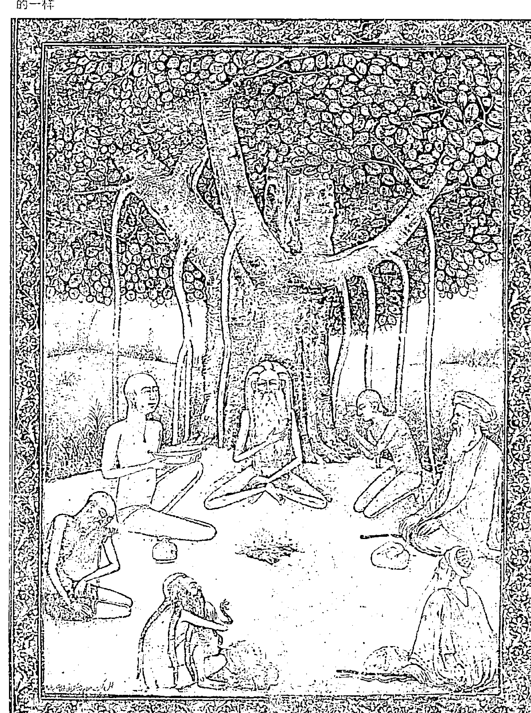

#### 公正之王和魔法大学

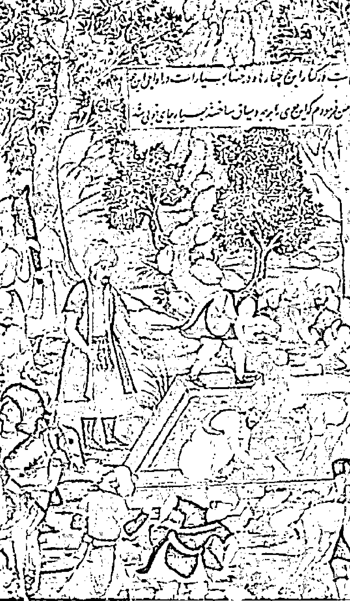

阿育王的图像未能保存下来。这幅描绘大莫卧儿时代千古留名的建设情况的细密画属后世之作

每个灵魂都要轮回数次。中国和尚法显在《佛国记》里说，公正之王阿育的前世是个村野顽童。一天，他在路边玩耍，遇上了迦叶佛（高塔姆佛的先辈）。神秘的乞丐伸手向小童求告施舍，而小童继续玩耍，随手给他一把泥土。圣者接过泥土，撒在自己的脚边。这是顽童来世成为大片疆土的统治者、战争中的胜利者和伟大的立法者的预兆。

预兆应验了。转世后，他得名皮亚达西（“讨人喜欢的”），于公元前273年以阿育的名讳继承了王位。头几年，见识了宫廷内的种种阴谋，深感执政者的艰辛，将来他很可能走那些东方君主的老路，成为残忍的暴君。每每想起供养庞大朝廷所需的开销，阿育王就感到内疚，同时为子民们的贫苦感到震惊。如何才能缓解这些矛盾呢？年轻的国王遇到几位佛学大师。大师向他讲述了自己的学说，尤其是“达摩”——正确生活的法则。从此，国君完全变了个人，成为公正之王。他削发修行，但不放弃王位，为的是积德行善。遵照他的旨意，山崖上镌刻圣谕，让每个人不仅公元前3世纪能读到，而且永远能读到。阿育王宣示：“朕之本分乃普度众生。亦即：善待奴仆，孝敬父母，优遇宾朋及圣贤。”

印度的公正国王赏识一切教义。他命人在岩石上刻下：“当尊重一切信仰。如是则利己助人，反之则害己损人。”

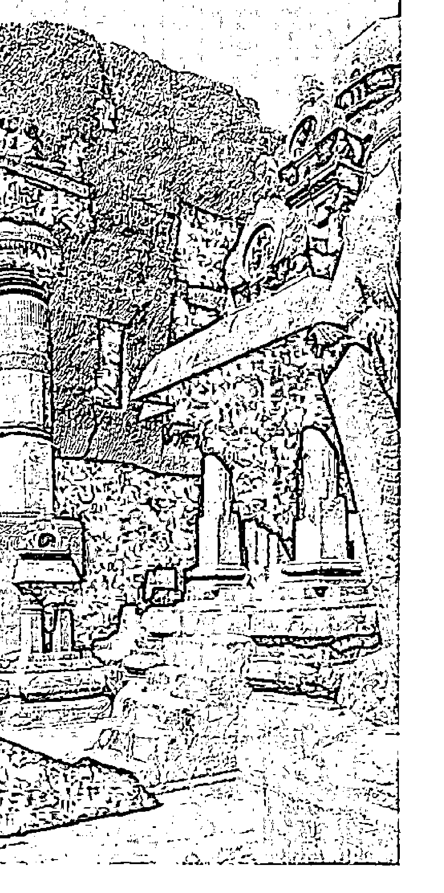

阿育王所做的最大好事就是

#### 公正之王和魔法大学

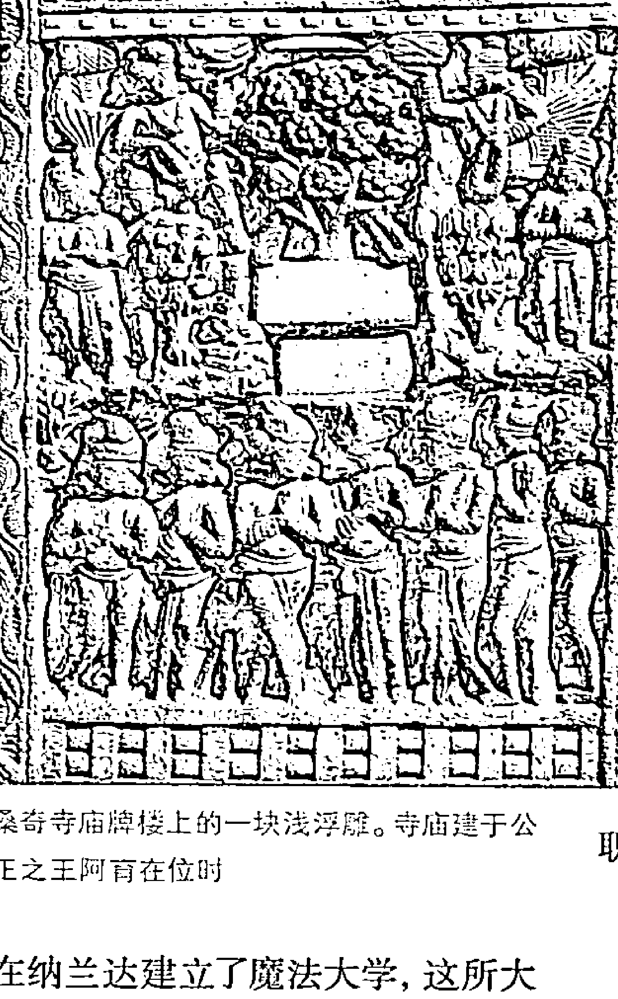

中国旅行家异常兴奋地讲述过观象台：从建筑的檐口可观测日月之冲，观看和风将云朵捏成各种形状。而给人留下无与伦比的特殊印象的则是那神奇的池塘：碧蓝的纳兰达莲和暗红色的卡纳克花交织在一起，构成了色彩的交响乐。一朝得见，永生难忘。

纳兰达声名卓著，阿育王也为它献上厚礼，捐助了当地的沙立古塔寺。印度六代君王不仅竭尽全力让纳兰达变得美丽而舒适，而且成为它的神职人员，捐赠了自己的全部财产。

不信教者往往认为教义不可理解，因此纳兰达得了个巫师和术士窝点的恶名。1197年穆斯林侵略者摧毁了修道院，也许普通的印度人也参与了掠夺。

“真主的战士”藐视《古兰经》以外的任何典籍，烧毁了大量的珍贵的纳兰达藏书，被他们发现的和尚无一幸免，观象台也被夷为平地。那些成功逃脱厄运的神学教授则藏身各地：西藏，尼泊尔和锡兰。摩诃衍那的普通信徒被当作耆那教徒，而其他人则开始信奉毗湿奴神。

美国著名学者谈到‘亚洲的‘牛津大学’’时说：‘伊斯兰的火与剑早就摧毁了这所历史悠久的大学，而被无数印度犁耙埋入地下的’废墟石块如今才被考古人员所发现。然而在长达千年的时间内，学校一直卓有成效地工作着。人们认为，所有最著名的摩诃衍那信徒都在纳兰达学习过。’ 美国学者曼利·霍尔在《信徒》一书中写道：‘应当指出，7至12世纪，纳兰达的声名已臻顶峰之时，正值欧洲处于历史中的落后阶段，也就是说，将纳兰达称

在纳兰达建立了魔法大学，这所大学办了一千多年。魔法寺庙选建在摩揭罗（今孟加拉）并非偶然。传说当地池塘里早年住过蛇人纳兰达（意为“不断行善”）。还有人说，佛陀前世曾是一大国的国王，曾在此建城，作为京都。佛陀将自己的所有财富都分给了孤儿和穷人。为纪念此一豪举，该城被称为“常行善事”之地。纳兰达和古城消失了，但美好的光环留了下来，吸引着来自四面八方的学者和魔法师。

中国著名旅行家黄江在纳兰达鼎盛时期造访过它，生动描述过魔法师们的“母校”。他提到长方形的主楼，内设八个讲演厅，每厅高达三层。在这里，人们研究摩诃衍那——大乘佛法的精髓、十八种教义（包括基督教）的经文。文化中心教授医学，法学，天文学，哲学，魔法仪式、方法和咒语。不算学生，仅居住在这里的魔法师和朝圣者就达万人之巨。

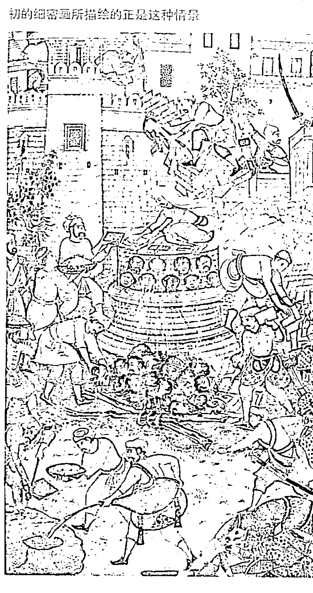

#### 圣剑之狮

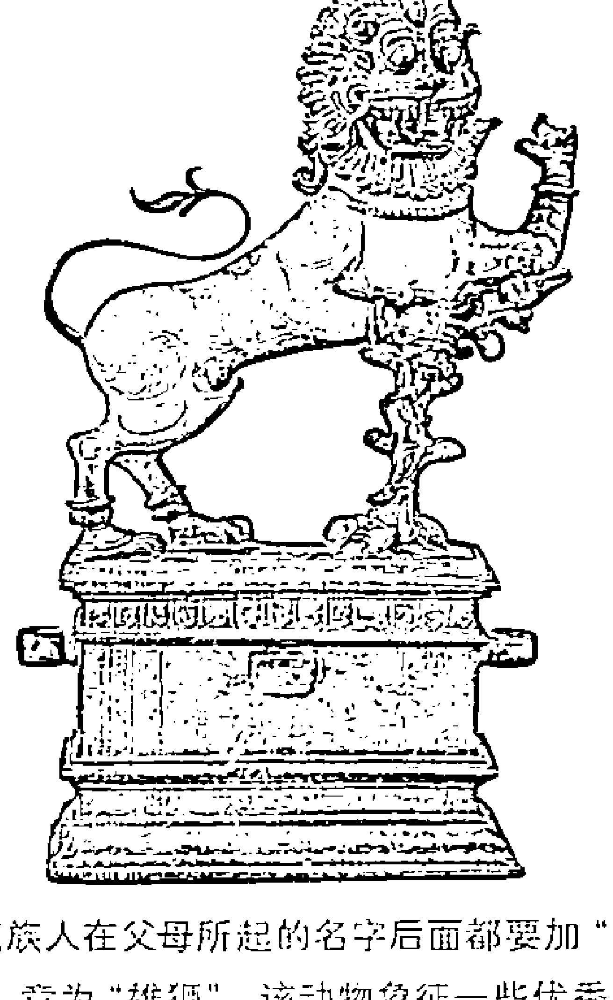

锡克族人在父母所起的名字后面都要加‘辛格’，意为‘雄狮’。该动物象征一些优秀品质：力量、忠诚和攻击性

锡克教的奠基人——古鲁那纳克（1469—1538）的命运与其先辈（查拉图斯特拉，耶稣和人类的其他宗师）非常相似。问题不在于信佛的阿育王所说的‘行善难’，而在于难以向人们说明上帝不分信仰，只有一个。耶稣的门徒彼得说，基督教中‘不分希腊人，也不分犹太人’。那纳克在传教之初就声明：‘没有印度教徒和穆斯林之分，信仰仰的关键在人的心中。’ 他生于旁底普一个殷实之家，自幼熟谙印度教和伊斯兰教的奥秘。十岁上，那纳克拒绝了系神圣线纱，公开阐明自己学说的要义。他把对上帝的信仰理解为对人的爱，不论种族、社会和宗教属性。男孩宣称，上帝面前人人平等——不论贫富，不分婆罗门和首陀罗。”

但这只是他信奉上帝之路的第一步。那纳克真正献身，一如查拉图斯特拉当年，甚至不是在河边，而是在水下——他溺水了。目击者们都在心底埋葬了先知。可三年后，他又出现在城里，鲜活而完全变了个样：两眼神光烁烁，头顶珥晕闪闪，周身圣辉熠熠。总之，他复活了，为的是创立新的、真正的信仰。起先他拜访了《摩诃婆罗多》和《罗摩衍那》中描述的聚集着成千上万朝圣者的印度教、穆斯林和佛教的圣地。接着来到菩提树下佛陀参禅的所在。然后又去了麦加和麦地那。那纳克在云游中度过三十年，回到故乡后，

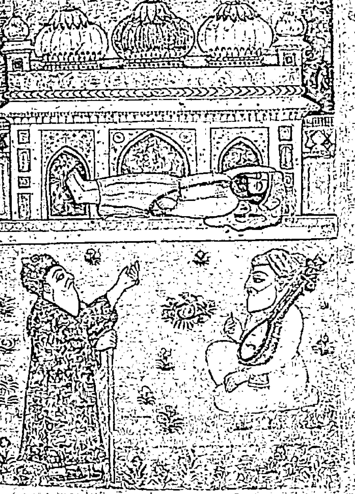

锡克人最神圣的地方——金庙，建于阿姆利则湖的小岛上。该庙宇的旁底普语名字又叫哈里曼吉尔·萨西布（‘上帝之殿’）或者叫达尔巴·萨西布（‘王宫’）。金庙始建于第五代古鲁阿尔琼时期，是他领导抗击了蒙古人的入侵。从此，遵照阿尔琼的遗嘱，锡克族人一直手不离武器

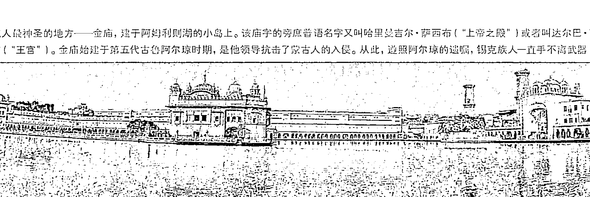

#### 圣剑之狮

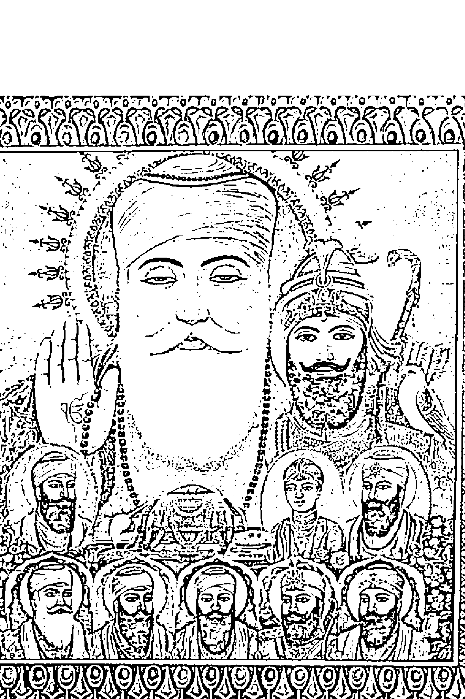

锡克族人的十位祖师（古鲁）：从第一位祖师那纳克（左上）到最后一位戈宾德·辛格

在拉维河（印度河支流）岸边，建立了第一个锡克教徒村社，名为科尔塔普尔——至尊城堡。村社成员应着农装，耕田种地，像首批基督教徒那样简朴度日。那纳克说，上帝只有一个，唯一而共同的。因此，锡克教徒仿效自己的师父拒绝印度多神教和帮派制度，以及违背人性的绝对禁欲和盲从无限重生的思想。从此，人绝对自由，自己可以决定自己的命运。同时，人应该选择伺奉上帝的虔诚之道。不应使人误解上帝可有不同的称呼：真主、湿婆、毗湿奴、婆罗贺摩。他没有专名，也没有类似人的外貌，因而描绘上帝的企图毫无意义。他非生却永生，无形却永恒：存于过去，活在当下，永不消失。因此，锡克教徒间的问候语是：“真正的永生”。然而，这并不是说人与上帝不能直接接触。见面的保障是“无声的音乐”，这颤音就是神的启示。领悟上帝旨意就是多次重复他的名字，他最贴切的名字是“正道”。他为使人们对他的信仰更加容易，只通过自己的行为现身。而世界则相反，变化无常，且并非永恒，但是人只要愿意，就可以永远挣脱它的怀抱。那纳克死后，继承他的有八位古鲁，其中最后一位是著名的戈宾德·辛格（1675—1708），他取消了师徒制，代之以理事会。戈宾德·辛格创作了很多圣歌（包括献给以往上帝神威的象征——圣剑的圣歌）和“奇妙的戏剧”——团体中所有师父的故事。著名的印度诗人卡比尔（1440—1518）——圣城瓦拉纳西的纺织工，用虔诚派的写作手法写下了对句，它们被锡克教徒用于祭祀：戈宾德和古鲁本质相同。这里没有师傅徒弟，只有将危险的自命不凡抛弃，方能找到上帝。不懂得尊师爱徒之人，永远别想与上帝一见，即使他有神权手杖在握，想见上帝也无门径。欧洲人就这样有些夸张地想象东方的精神战士，穆斯林和锡克人

团体中有著名的“五K”，即锡克教徒当随身佩戴的物品。它们是：1）克尔番（短剑）；2）卡其哈（方便作战的皮短裤）；3）卡帕（铁手镯）；4）尅狮（长发和胡须）；5）康哈（头巾下的发梳）。戒律同样有五条：1）不嗔怒；2）不傲慢；3）不贪财；4）不奸淫；5）不恋人间享受。天长日久，像所有宗教一样，锡克教出现了支派。其中最有名的是“尼汉吉”和“担上帝之名者”。前者衣着鲜艳，尚武好战；后者则白衣素食，反对暴力……如今印度有锡克教徒一千四百万。虽然在信徒的数量上不及印度教教徒、伊斯兰教徒、佛教徒和基督教徒，却在社会上占有重要的地位。

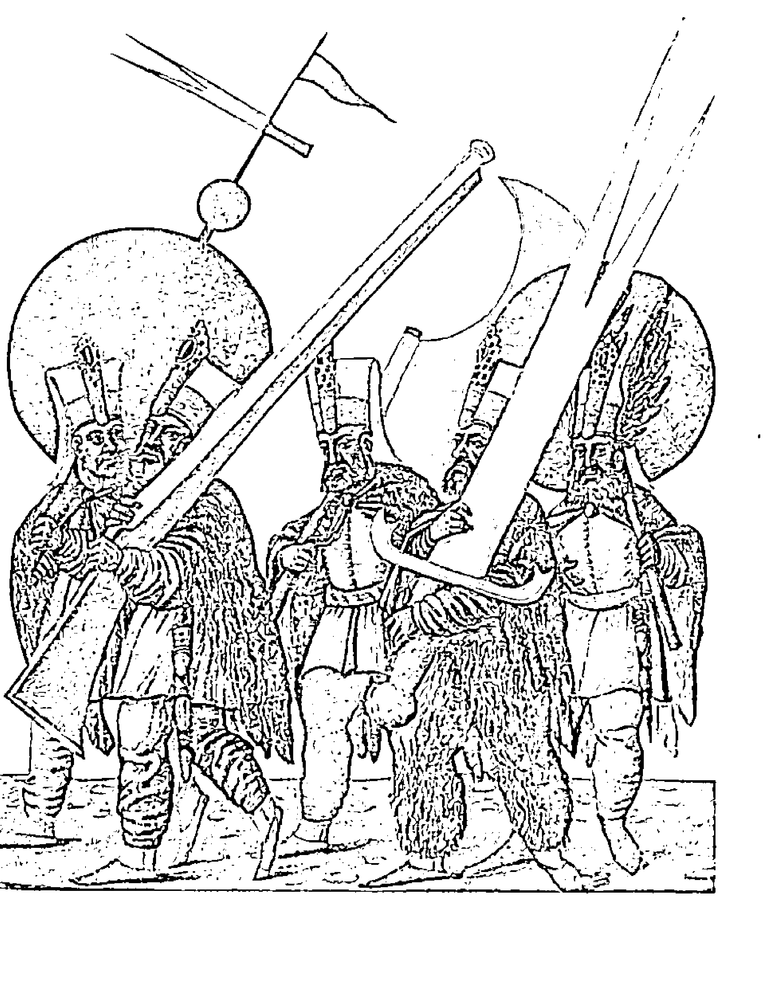

### 大莫卧儿的珍宝

泰姬·玛哈尔陵的建造者沙·贾汗和他所心爱的妻子蒙泰姬·玛哈尔的肖像

为躲避不共戴天的敌人，阿萨夫可汗被迫穿越波斯和阿富汗沙漠，逃往印度。他带上了自己的兄长、父亲、侄女努尔·贾汗和年幼的女儿蒙泰姬·玛哈尔。穿越沙漠的途中，干渴几乎使阿萨夫可汗失去了理智。他决定扔下拖累他的女儿。把女儿在沙丘的阴影下放好后，可汗急急忙忙去找水源，将近入夜时分才找到泉眼。亲属们继续赶路，默然无语——无助的、因饥饿和酷热而即将死去的蒙泰姬·玛哈尔像海市蜃楼一样浮现在每个人的眼前。不，父亲再也不能承受这种精神上的折磨了。

他猛一转身，顺着自己的脚印往回奔去。终于抢先将女儿一把抱起——女儿的头已经有几只饿鹰在转圈了。逃亡继续着。又走了一个小时，上帝派救世主化作商队前来救援。逃难者骑上骆驼，很快便抵达印度。

贾汗吉尔大君的幼子，贾汗王子，对蒙泰姬一见钟情：今生来世，海枯石烂。如此钟情近乎不成体

[PAGE 156]

# 天莫卧儿的珍宝

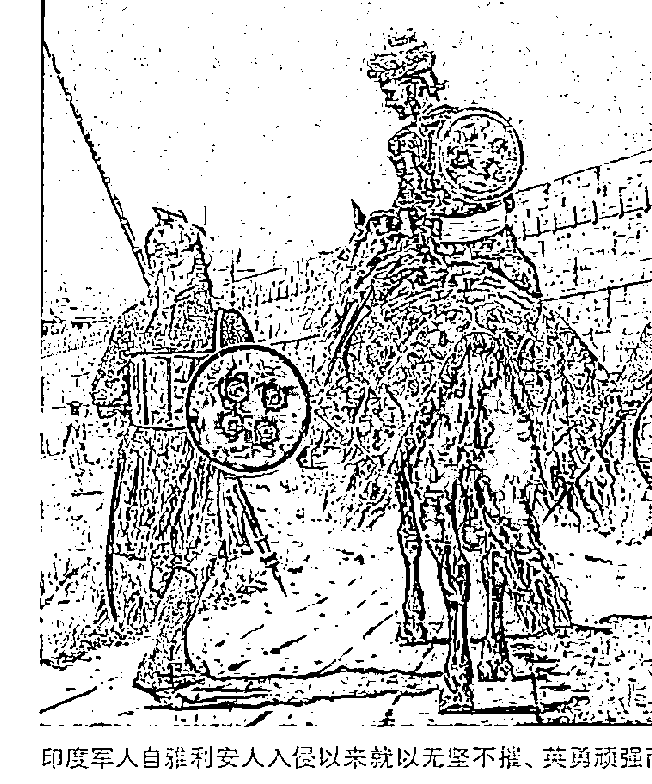

印度军人自雅利安人入侵以来就以无坚不摧、英勇顽强而著称。瓦·韦列夏金的画作《斋浦尔的骑兵》

自波尔多的法国人奥斯顿和意大利人维罗涅奥。工程自然需要极大的体力和绝世的才华。处罚之重连猜都不用猜……然而，无论沙·贾汗如何着急，泰姬陵的建造还是持续了很久——整整十七个年头。直到1646年，国王才终于得以将妻子的遗体安放到穹顶中心下方最体面的位置上。

在这段时间里，沙·贾汗和蒙泰姬·玛哈尔的儿子们已经长大，成了父亲军事上的得力助手。而国王自己则把更多的时间花在了和平建设事业上。在德里附近，他在建设一座新城，并以自己的名字命名——沙贾汗堡。遵照他的旨意，创造了大莫卧儿王朝的许多“建筑瑰宝”，它们至今仍是印度主要的装饰品：穹形圆顶（“珍珠”）清真寺，阿格拉的莫提清真寺，当然还有世界上最宏伟的陵墓——泰姬·玛哈尔陵。

1657年，仿佛重演了沙·贾汗的历史。在他生病期间，长子达拉篡位。其弟奥朗则布举兵讨伐，镇压了达拉，而将父亲赶下王位，软禁至寿终。奇怪的是，沙·贾汗感到格外轻松，就像是一座大山从肩上卸了下来。直到现在他才明白年轻时的预感：权力是暂时的，而爱是永恒的。当他生命即将走到尽头时，沙·贾汗请求将他与心上人合葬一处。愿望实现了，于是在另一个世界里，国王又重新体验到自己是幸福的。

被不公平待遇激怒的沙·贾汗公开造反，却因战败而被迫逃往波斯。三年后，他才得到父亲的宽恕，回到德干。又过了两年，年迈的国王驾崩，沙·贾汗的时机终于到来：他轻而易举便摧毁了侄儿的军队，合法地占有了父亲的王位。这些年来，心爱的蒙泰姬荣辱与共，不离不弃，给他安慰、支持和理性的建议。每每望着妻子明亮的眼睛，任何不幸对于王子都不在话下。突然间，太阳仿佛失去了光辉！1629年，蒙泰姬·玛哈尔在首都布尔汉布尔死于难产。印度历代最出色的国王痛不欲生，几乎神经错乱。他像一头受伤的猛兽，奔窜于后宫内

观音有许多形象，就像任何凡间女子。她可以是迷人的美女和慈祥的母亲。

中国的花瓶不仅是艺术品，而且是冥思的对象。八仙经常逗留的仙山形熏香炉。

## 古中国

伟大的思想家认为自己是凡间的圣人，而不是信神的先知。他说：“未知生，焉知死？”孔子象牙雕像。16世纪

### 繁荣昌盛的中央

中世纪的中国地图，1459年由意大利神甫毛罗为威尼斯政府绘制。沿着图上所绘的从中国经中亚到地中海沿岸地区的丝绸之路，早在公元1世纪已经开通。自远古起，中国人就崇拜天帝，他的居地被象征性地刻画成玉盘形状。此种玉盘被置于墓中，便于阴魂找到升天之路。属于第二类的是人类身边的事物：大门、道路、炉灶、房门。第三类，也是最后一类，包括伟大先祖的英灵：其中有周姬（禾稼植物神）、喾（生前因天文发现而闻名）、鲧（救人类于水）、颛顼（教会国人创造财富）、文王（开明国君）、武王（解百姓于倒悬）。属于恶势力的是幽灵、疾病和妖怪。“太和殿”，是进入皇家“禁城”的大门。可进入“禁城”的只是极少数人。远东的这个神奇国家，从远古时代起就住满了各种不同民族的人。中亚的邻族只熟悉生活在该国北部的蒙古出身的各部族——基泰（基塔依）人。于是人们就开始用他们的名字将中央大国（中国）称为——基塔依（意为“北方人”——译注）。中国人自己计算国家历史一般从公元前4千纪开始。那时候，首领盘庚就将自己的族人由北方带入了黄河谷地。在这里，他建造了一座大城市，取名为商。从此，国家和朝代便称为商。相传，盘庚此人既非可怕的征服者，亦非专横的统治者。他平和而公正地管理着自己的子民。或许正因如此，他的后继者才未能顶住周朝人的袭击。公元前12世纪，国家被侵占。自那时起，也就出现了一些独特的神秘主义的认识，即中国不同于世界上的其他文明，无论是古代文明还是现代文明。在这些认识中，占据主要位置的是天，但这不是神，而是一种抽象概念，对它赞颂、向往或者模仿，都毫无意义。因为没有神灵，所以人们崇拜上天——先辈的英灵和其他许多的魂灵。中国的大史学家司马迁写道：“祭祀乃为民，民乃万灵之灵。”而哲人石印（音）补充说：“吾尝闻，国君听从民意，国则昌；放任魂灵，国则亡。魂者，乃人心和直言，民间随处可见。”魂灵有善恶之分。善，首先取决于有益的程度。有益的事物不可胜数，它们分为三类。其中第一类是：太阳、月亮、天空、星辰、山川（它们产生云雾，为大地送来甘霖）、猫（可消灭田鼠）、虎（能吃掉野猪）。属于第二类的是人类身边的事物：大门、道路、炉灶、房门。第三类，也是最后一类，包括伟大先祖的英灵：其中有周姬（禾稼植物神）、喾（生前因天文发现而闻名）、鲧（救人类于水）、颛顼（教会国人创造财富）、文王（开明国君）、武王（解百姓于倒悬）。属于恶势力的是幽灵、疾病和妖怪。

#### 159 [繁荣昌盛的中央]

中国古代培植一种常绿植物，其嫩叶用于制作健身饮料。国家便以此饮品的名字命名——茶叶纳。与阴间各种势力打交道的方法，主要是占卜。因此，古中国有过许多周密制定的宗教仪式，以此判定魂灵的意愿。祭司在专门准备的羊肩胛骨或龟背壳上，按一定的规矩划出若干条纹路并刻出若干文字。然后用烧红的铜棒烙纹路。按背面形成的裂纹，可读出先辈所给出的答案。后来，这一手法变成当今广为人知的占卜术——《易经》的基础。《易经》的所有符号都是由直线和虚线（这样看起来像龟背上的裂纹）构成的。然而，中国的占卜者与乡村巫师不可同日而语。按其知识和社会地位而论，他们可同埃及的祭司或凯尔特人的德鲁伊特相提并论。首先，是他们发明了文字系统；其次，他们接近最高当局，并参与百姓思潮的形成。如前所述，商殷为周朝所取代，古中国达到了发展的巅峰。这时出现了一批大圣人：哲学家（老子、孔子）、学者、建筑家、画家、雕塑家、书法家。所有这些事件都未能影响中国文化的独特性，也未能清除它的文化圣地。在中国首都城内保留下了皇家建筑群、紫禁城、天坛，市郊保留着立有著名石像生（石狮、石象、石骆驼、石马）的神道相通的明朝皇帝的陵寝；北京境内还有一段万里长城。上海有豫园、秋霞圃和玉佛寺。广州有建于明代的镇海楼、六榕寺和中国最古老的清真寺。在陕西省，距西安市不远处，有六千兵马俑陪葬的伟大皇帝秦始皇的陵墓。自公元前3千纪起，中国便生产丝绸。长时期内，用蚕的分泌物纺丝织布，是该国主要的商业秘密。17世纪的水彩画，描绘的是战无不胜的汤。商朝的奠基者。相传，汤在巡视途中遇到一捕鸟者部落，便说服他们为鸟留条生路。三千三百年前商朝时代，也即国家存在的最初时期，在龟背壳上刻出的中国占卜预言。

### 古代大师

中国有幅古画，画的是三位圣人——佛陀、老子和孔子。他们面前放着象征生活的一桶醋。相传，佛陀尝了尝醋，说它是苦的——比它实际上的味道还要苦一些。孔夫子说它是酸的。只有老子咂摸了半天，说它是甜的！这便是道教的本质——认为事物并非我们所感觉的那样，而是它们实际存在的那样。“不信。善者不辩，辩者不善。知者不博，博者不知。圣人不积，既以为人己愈有，既以与人己愈多。天之道，利而不害；圣人之道，为而不争。”渐渐地，老子的这些话开始让人觉得是如此自然而然，以致许多人（包括意大利教士，方济各会的创建人）将其解释为与生俱来的道德。果真如此，则是上帝通过中国圣人之口说出的，老子说：“有物混成，先天地生。寂兮寥兮，独立不改，周行而不殆，可以为天地母。吾不知其名，强字之曰道。”史学家司马迁说，公元前417年，老子任东周帝国守藏室史。这时，发生了三十岁的孔子问道于老子（时年八十七岁）的著名会见。年轻人表示了对圣人的崇敬，说一生都渴望这次会见，以增长智慧，为国为民造福。圣人耐心解释说，道可修成，只有心诚：道来自上天，是上天所赐。因此容易接受它的是天真烂漫的幼儿和质朴忠厚之人。交谈快结束时，老人见孔子听得入神，于是决定提醒他谨防可能的烦恼。“吾不富不贵，无财以送汝；愿以数言相送。当今之世，聪明而深察者，其所以遇难而几至于死，在于好讥人之非也；善辩而通达者，其所以招祸而屡至于身，在于好扬人之恶也。”儒学的未来奠基人回到鲁国，众弟子围上来问这问那。依然不知老子（名李耳），传说中的中国古代思想家，道教的创始人，在许多方面是位神秘人物。在所谓的“民间宗教”里，老子成了三大天尊之一，与玉清元始天尊和上清灵宝天尊合为“三清”。据传，老子曾任守藏室史，后来决定骑青牛出关前往西藏。于长城关口被拦下，关吏请求他书面叙述自己的学说。三年之中，老子口授了《道德经》——最伟大的道教文本。接着他继续前行，此后再无人见到他。

#### 161 古代大师

这幅画上描绘的是三位道教之神，他们在研究生命的两种基本能量——阴和阳的相互关系。中国被称为“三教”（道教、儒教和佛教）之国。这三种学说曾主宰社会道德，指示修行、度难和祈祷之道。微型精细画中描绘的是：佛陀（左）、孔子（中）和老子（右）。不久，道家祖师做得一梦，见西方有一向往已久的佳境，料定将在彼处会见两位跟他一样能够得道的同代人。一位是印度人乔达摩·释迦牟尼，另一位是希腊人毕达哥拉斯。在《鲁国》一书中描绘了显然是位于彼岸的仙乡：“谷地上，一条小溪蜿蜒而去。溪边莲花绽放，老子从未见过如此大的莲花。谷地中央，一株苍松兀立于其他树木之上。这片清静之地给人以安全之感，让老子想到，正是此地住着他由古代传说得知的那些完人、所失智慧的保存者和人类的导师。‘此谷，’老子说，‘有吾棣鄂将至，一自印度，一自碧海玉寺之国。吾亦当去矣。’”然而，在前去如此向往的目的地的途中，他不得不做事先未曾料到的停留。年迈的函谷关关令尹喜，一生渴望着会见圣人。当他看见山间小道上一头大青牛缓缓而来，牛背上坐着一位鹤发苍髯的老者时，心里立刻明白是老子东来。关令迫不及待对道人说：“子将隐矣，强为我著书。”老子起先迟疑不决，可踌躇一番之后，同意在关中留下，将书写出。这书，他定名为《道德经》。经典之作完成后，老子离别关隘，骑着青牛往戈壁方向缓缓而去。过了一千二百年，遵照唐朝皇帝的旨意，将老子与上帝等量齐观，册封尊号“太上玄元皇帝”。此后又加封简洁而又似乎更为荣耀的称号——太上老君。

### 一代宗师

孔子（名孔丘），是中国古代的思想家，伦理学奠基人。孔子的主要观点陈述于《论语》一书中。每个民族都有自己的宗师。对于犹太人，则是摩西；对于基督徒，则是耶稣；对于整个庞大的伊斯兰世界，则为穆罕默德；对于无可计数的佛教徒，则为释迦牟尼。在中国，一代宗师则是孔子（前551—前479）。他父亲年近七十，母亲徵在刚满十七。夫妇俩已不信尚能生子。可是一天拈香拜佛之后，徵在梦见一黑面仙人，告知说：“汝将得一子，圣人。汝产子必于空桑之地。” 此后，妇人又于庭前亲见金木水火土五位仙翁，手牵满身龙鳞的怪兽——独角兽（麒麟）。这怪兽向徵在跪下，口中吐出一块玉牌，上书：“水精之子，系衰周而素王。” 妇人感激不尽，解下腰间绣绂，缚于麟角之上。此后，妇人坚信不疑，她将成伟人之母。然而，她并未忘记产子于空桑之地的要求。一天，她忽觉一阵腹痛，于是问丈夫：左近是否果有“空桑”之地？丈夫说，附近确实有个不大的山洞，人称“空桑”。丈夫听妻子说一定要在那里生产，起先惊诧不已，后来得知夫人梦兆，于是满口应允，并吩咐做好一切必要准备。原来，山洞正急切等待着妇人最终悟出地名之谜，前来分娩。深夜，洞内传出婴儿的第一声啼哭，两条苍龙应声自天而降，一左一右护卫着小丘；两位挽臂仙女飘然而下，手擎香露盘旋于洞上，以沐浴母子。婴儿出世，洞内顿时喷出一股香泉；待将婴儿沐浴完毕，神泉随即消失。此刻，徵在只听得耳边……强调自己尊重传统时，孔子说：“述而不作，信而好古。”丝绸画《孔子求易》；仙乐缭绕，空中有一声音在说：“天感生圣子。” 孔夫子的官运亨通。十七岁上便获得粮市监察的要职（孔子生平年表载：21岁，“委吏”，管理仓库的小官——译注），任上清廉而正直。此后改任畜牧监察（官名为“乘母”——译注）。不知年轻人的生活道路会如何延伸，可母亲的去世（孔子生平年表载：孔子17岁丧母——译注）改变了一切。按照古时风俗，孔夫子辞去官职，服孝三年整。这期间，他有许多时间来思索所选择的道路正确与否。孔夫子决定开办学校，为人之师，改革民风。晚年，一代宗师深信自己的决定正确无误，他回忆道：“吾十有五而志于学，三十而立，四十而不惑，五十而知天命，六十而耳顺，七十而从心所欲，不逾矩。” 得道的这些阶段，是孔夫子关于人生上升至最高境界的七级阶梯说的具体反映。公元前5世纪，中国没有广泛传播伦理学说的条件。弟子们劝他抛弃变幻无常的世界，隐居山林。孔夫子反驳道：“吾自当与天下人同群，安能去人从鸟兽居乎？”于是大师完全依照这一推论继续教导人们虔诚地生活。他的弟子数量超过三千，而其中七十二人表现非常杰出，孔夫子认为他们是自己的继承人。然而，他心中一直闷闷不乐：“凤鸟不至，河图不出，吾已矣夫。” 这时，发生了一件事，影响到大师的最后决定。几个樵夫在林中发现一只麒麟，请圣人去看看那是何种野兽。孔子不但按照母亲的描述认出了它，而且发现那兽的角上还残留着徽在当年系上的绣带。“他是来接我的！”圣人失声叫道。此后不久，他便进入完全宁静的状态，仿佛熟睡了一般。或许，后来，已是在长眠中，孔子明白，他的失望过早了，孔子学说成了中国的基本学说。孔子不是宗教的奠基者，在回答一位学生关于阴间的问题时，他说：“未能事人，焉能事鬼？”然而在他去世之后，为他而建造了一些庙宇，而圣人则被封为至圣先师。

### 中国人的两个母亲

虔诚的妙善变化成多手菩萨观音。中国的青铜塑像。人只可能有一个生母。中国人走运——他们有两个伟大的母亲：救苦救难的观世音和长生不老的西王母。公元前7世纪的中国皇帝妙庄用武力夺取皇位后，上天没赐予他子嗣。他指望嫁出三个女儿后，宣布一位最称心的女婿作为继承人。长女和次女都找到了合适的丈夫，唯独三女妙善以想终身吃斋念佛为托词，执意不从父命。妙庄大发雷霆！他千方百计想制服执拗的女儿，可女儿却寸步不让——绝不出嫁！结果暴君一念之差，下令处死妙善。天神们对父亲只因姑娘决定选择皈依佛教而将其处死大为愤怒，决定出手干预事件进程。按照天条，姑娘应得到永恒的幸福。他们招来负责保护象山省的神，让他化作斑斓猛虎，前往救助妙善。由于刻画细腻，欧洲人曾认为中国文化稍嫌纤柔。中国浅浮雕《宫女》。就这样，公主成了正义天王，开始被描绘成四手观音，八手观音，有时甚至千手观音。经文允许将女菩萨描绘成八千四百个面相和同等数量的手臂，每只掌心各带一只眼睛。正义的女卫士伸手可看见所有受屈之人，举手能打击任何欺人之徒。她的标志物多种多样：插着柳枝的净瓶；救难的象征——绳索、念珠、拂尘、三叉戟和象征受苦受难者无畏精神的虎皮裙。自妙善公主变成多手菩萨观音以来，人们体验到，他们从此不再无助：她庇护着远游之子，安慰着濒死之人，为父母带来最大的欢乐——孩子。因此许多中国人都向她求子。观音住在西方天堂，它位于凡人的虚幻世界和转世再生那无法了解的秘密之间。在这里，她迎接和伴送着死者的灵魂，将其引向永恒的幸福。佛教经籍往往将观音描绘成坐在岩洞内望着水中月亮倒影。这尊木形雕刻画了坐姿优雅体态丰满的大慈大悲之神

### 八仙

罢蟠桃寿宴，八仙前往殷勤女主人的丈夫东王公处做客。东华帝君的宫殿坐落于东海蓬莱仙岛。八仙中有人建议乘兴踏浪过海，各显神通，比试一番法力。公认的八仙之首铁拐李踏上自己的法器铁拐，找着平衡，劈波斩浪，领先前行。身后是钟离权，昔日的王朝元帅，今日的成仙隐士。张果老倒骑纸驴，追风逐涛，如履平地。吕洞宾生前便是大法师，他使用竹柄拂尘，脚踏浪尖如蜻蜓点水。梨园弟子的庇护者曹国舅立于为仁宗皇后之弟时留下的笏上，如犁田翻地般划破海面。八仙中唯一的巾帼何仙姑丝毫不让须眉，她脚下莲花疾如火箭式小艇。而八仙中最古怪的（不知是男是女）蓝采和跳上镶着宝石并放射着奇异光芒的玉板。那玉板闪电般的光芒一下惊动了东海龙王之子。王子派遣虾兵蟹将捕捉蓝采和。虾兵蟹将逮住有些古怪的仙人，拖往龙宫。王子向父亲禀报后，将仙人打入了东海深渊。吕洞宾尾随朋友潜入水下，只见宫门紧锁。他一怒之下，点燃了大海——海面海底烈焰熊熊。受惊的龙王释放了人质，可那玉板却不愿放弃。被龙王的贪婪和狡诈所激怒的八仙齐心合力，为夺回蓝采和的法宝而战。他们退到岸上，向四海龙王发出挑战。四海龙王率尔应战。龙王长子首先死于八仙法术，接着是他的龙弟。虾兵蟹将尸浮海面，成千上万。龙王得知连折二子，惊得浑身一阵发凉。他奔出几百年未曾离开过的龙宫，决定去找太阳，将这些大胆的“刁民”碎尸万段。从海底缓慢而笨重地升起那臃肿庞大而黑绿相间的身体，仿佛世间没有一种力量可抵挡龙王。浑浊的海水中闪耀着他那血红的两眼。海中鱼虾急忙退避三舍，都感到主子的怒火越烧越旺。可他的身体在海面刚露出一个黑点，八仙再次点燃大海，接着往海里推下岸边的岩石。

“嘭——”一块石头砸在龙背之上，正中脊鳍，回声传遍龙王全身，痛得龙王火冒三丈，跃出水面。炽热的火浪向他迎面扑去，燎着了龙须。他被从岸上抛下的巨石砸得头昏眼花，一时失去了斗志，忘掉复仇，逃之夭夭。他立刻没入水中，飞快下潜，躲进龙宫，等待八仙的进攻过去。可是打错了算盘!巨大的石块，仿佛鲫鱼，紧追龙王，甚至一直追至海底:水晶宫的天花板和墙壁被纷纷压塌。眼看面临末日的不仅是龙王，而且是他的整个王国。

然而，端坐天宫的最高主宰，致命九天三界、四海五岳的玉帝不能允许此种情况出现。他那平日不动声色的脸上这回露出了愁容。他唤来御前侍卫王灵官，吩咐他消除八仙和龙王争执原由，收缴玉板，带回天庭。红脸侍卫用三只眼看看了玉帝，将降魔金鞭倒只手，急忙领命而去。

他来到岸边，转告八仙，说玉帝大为震怒，命令立即熄灭海上大火并停止抛掷岩石。接着王灵官钻入水中，好不容易找到落入长满水草的裂缝、正浑身瑟瑟发抖的龙王。御前侍卫二话没说，伸出一只手，于是东海龙王从腋下掏出玉板，哆哆嗦嗦递了过去。

玉帝的三眼侍卫接过玉板，犹如“地空”火箭急速升空，霎时间来到天庭，将惹祸的圣物放到玉帝面前。玉帝只是不动声色地点了点头。

话说八仙重操旧业。铁拐李帮助药师调配草药。钟离权忙于帮死者返阳回生。吕洞宾一如往常与食人魔交战，保护生计无着的穷人。有些古怪的蓝采和很快忘记了玉板，埋头他所酷爱的花卉栽培。张果老就像缪斯一样奔忙于帮助才思枯竭的作家和画家。曹国舅辗转完全萧条的剧场，施以援手。而美丽的何仙姑则应重新着手虽说光荣，但依然单调的活计——在南天门扒搂落花。空闲时，她还帮助中国妇女操持家务。

## 日本

登临高山，眺望大海，日莲认识到，他的面前展现出整个国家，因而他可跟全国人民对话。及从亚洲大陆东岸迁来的其他人和睦为邻。这发生在公元前5—前4千纪。虾夷人以狩猎、捕鱼和捡拾岸边的海产为生。他们实行的是母权制。虾夷人用陶轮制作陶器，用青铜锻造宝剑和生产铜镜，与世界另一端——小亚细亚生产的形制相同，显然用途与雅利安其他民族——哈梯人、腓尼基人、吕底亚人、特洛伊人以及其后迁往亚平宁的拉斯人所做的器物无异。虾夷人同南方邻居共处了很久很久——四千年（我们的历史时代也就这么长的时间——从古埃及到今天）。

来了水稻种植和家畜饲养——马、牛、羊。接着，外来者开始排挤土著，将他们往北越赶越远。今天的日本，是世界上种族最为单一的国家。它百分之九十九的居民都是日本人。虾夷人仅保留于北海道，而且数量不超过两万。远东的岛屿并非天堂小屋：这里自古火山喷发频仍，地震山崩不断。而周期性洪涝飓风又为这里变化无常的自然图景添色加彩。困难造就了日本人的奇特性格。他们学会了在极其恶劣的条件下求生存、为了己用而吸收邻族文化成果并赋予民族色彩的本领。古时，他们利用汉字创立了日文；而今，消化北美许多先进技术，在电子和汽车制造领域超过了海外邻邦。

公元前1千纪，日本诸岛上闯进了一些来自朝鲜半岛南部的原始日本部族。这起初是和平迁移，给诸岛带

军人捍卫着当局，对圣僧毫不宽恕，对他的传道充耳不闻。书中写道：“你若想立时开悟，请收起傲慢的旗子，丢掉愤怒的大棒，信赖唯一的正道。名誉和金钱只是尘世生活的空忙；傲慢和固执不过是把人钉在未来生活上的枷锁。”

信仰即正道这一意识，使日莲充满了前所未有的精神力量。1253年五月十七日清晨，他登上临海的山顶，异常兴奋地迎来喷薄而出的红日，唱歌似的拖着腔喊道：“南无—妙法—莲华—经！”

从日莲得道的那一刻起，他决心宣传它，使自己的国家成为佛教复兴的中心，让普通人体验到真正的幸福：“有朝一日国法和佛法相结合，它们之间达到完全的和谐：统治者和子民真正信佛，那么金器时代……就一定在退化和堕落时期得以实现。”

1261年，日莲遭到流放，但他在流放地（伊豆）继续传布佛法。两年后，当局以为恶劣的条件摧垮了日莲的精神，释放了他。当他们看到出现在面前的依然是那个狂热而不屈的正道之师后，又企图将他害死。然而，企图未能得逞，遂又判处他斩首。上天救了这位坚强义士一命。因不知如何揭穿这位不屈的传道者，当局将他再次流放——至东海北部的佐渡岛上。在那里，依放逐者想来，日莲必定会饿死冻死。

太阳莲花所遭受的进一步的磨难，同鲁滨逊的历险不可同日而语。鲁滨逊几乎是进入了天堂，那里没有猛兽，而大自然又赐给大量的果实。日莲来到的却是荒无人烟的孤岛，没吃没喝，也没衣穿。地狱的苦难未必比圣人三年中所受的苦难更可怕。他再次活了下来，全亏了他所洞悉的正道。

从孤岛获释，并未改善他的命运。回到家乡镰仓后，他成了乞丐，在那无人居住的森林里过着半野人般的生活。晚年，他是在山寨围墙废墟旁那几乎坍塌的小茅屋里打发生活的。

三十年难以置信的困苦，终于结束了他的肉体生命。1282年11月14日，日莲坐化了。临走时，他并未带着对自己放逐者的不满，相反，他认为孤岛上和森林里的生活是对他信仰的一种考验。

令人惊奇的是，他于离群索居期间写了大量的作品。其中最著名的是：《立正安国论》、《开目抄》、《观心本尊抄》。在自己的一部作品中，日莲写道：“最后愿所有天神保佑，我将献身这一事业……留住真理的莲花，不论是福是祸，都意味着下地狱。我将坚守自己的誓言……我是日本的柱石；我将是日本的眼晴；我将是日本的大动脉。愿这些誓言牢不可破！”

日莲所创立的佛教流派的信徒逾千万之众，而庙宇达万座之多。他的弟子日兴所建立的另一学派，也是当今日本最大的宗教组织。在这一组织的基础上，一个最强大的民族复兴运动——创价学会正在发展壮大。

当局于1261年将狂热的布道者日莲流放到荒芜人烟的孤岛上，指望恶劣的生存条件会摧毁他的精神，可圣僧越发坚定了自己的信仰。葛饰北斋的画作（男孩和富士山）

![img/dd514f06c86ecf3eb6826e03e00448e8_180_0.png]

![img/dd514f06c86ecf3eb6826e03e00448e8_180_1.png]

印度支那的皇宫十分豪华，大门前除了护卫，还有守护神的塑像。看来，它们并不怎样热心履行自己的职责，既然龙铤恶魔附体

![img/dd514f06c86ecf3eb6826e03e00448e8_181_0.png]

## 古印度支那

![img/dd514f06c86ecf3eb6826e03e00448e8_182_0.png]

高棉的历史“记录”在吴哥——柬埔寨古都主广场上庙宇的石雕上。步兵大战乘象之敌

![img/dd514f06c86ecf3eb6826e03e00448e8_183_0.png]

### 黄金半岛

执政者的印度尼西亚传统木偶。在东南亚，木偶戏和皮影戏也具有崇拜性质

早在亚历山大·马其顿征伐之前，希腊史学家克特西乌斯就写过：“据传，谢尔人（养蚕人——中国人及其邻居）和印度人身材高大，不乏身长十三肘（约六米五）者。在海特尔河某段有野人居住，其肤如河马，箭矢难穿。在印度，半岛的中心，有种人，长有类似萨梯里（希腊神话里的中低级森林神，酒神狄奥尼索斯的侍从）才有的大尾巴。”

只有罗马史学家大普林尼不信遥远的印度支那遍地金和银：“印度河河口之外，是赫里萨和阿吉拉岛，依我之见，当地泉眼众多。我不太相信那里的土壤都是银和金的传言。”然而在《真实的历史》中，普林尼给业已存在的成见添加了自己臆测：“远东的原始人是谢尔人。他们对人毕恭毕敬。但仿效最落后的野人，避与外人为伍，坐等他人前去交易。”

然而黄金半岛的野人，不亚于腓尼基人的航海高手，同距他们极远的国家进行着贸易。

犹太史学家约瑟夫·弗拉维在《圣经》的注释中说道：“国王希拉姆给国王所罗门如数派来后者想要的精通航海的领航人。所罗门遂派遣官员出发寻找黄金，去的是古时叫索菲拉、而今叫赫里萨的国家。这就是印度国。他们为国王运回四百塔朗特（十八吨）黄金。”

这批数量特大的贵重金属，让人忘记了印度支那居民的“野性”和异常的外貌。许多人争相同远东人进行贸易。但远东人并非一贯热情回报，因欧洲人无法提供等价的商品。这便是谢尔人闭关锁国一类谎言的根源所在。

自然，他们接触更多的是邻居——印度人和中国人。古印度史诗《罗摩衍那》中写道，猴王苏格里瓦向各方派遣侦探时说，恒河以

在自古号称“金三角”的东南亚国家，确实开采过许多黄金。甚至这块安放若宝塔的摇摇欲坠的巨石，也是镏金的。

东有座苏瓦尔那德维帕岛，其围墙由黄金砌成。他说：“之后，你们竭尽全力，便可到达由七个王国美化的雅瓦德维帕（印尼的爪哇岛），由无数金泉装点的金银岛。爪哇岛往东，是希希拉山。山顶触天，山上

相传，两个缅甸商人从印度运来一种圣物——佛陀的八根头发。圣物升上天空，化作珍宝雨撒向地面，被用来建造什韦达贡庙（“什韦”——金色的，“达贡”——壮丽的）

![img/dd514f06c86ecf3eb6826e03e00448e8_183_0.png]

![img/dd514f06c86ecf3eb6826e03e00448e8_183_1.png]

![img/dd514f06c86ecf3eb6826e03e00448e8_183_2.png]

柬埔寨的吴哥窟里，墙壁都装饰着描绘古代生活情景的浮雕，其中包括远航船

洞穴内住着类似野生动物的人。他们身体漆黑而牙齿雪白。他们居无定所，随季节变换栖身之地。所食仅为鱼肉，不事农耕。冷天不穿衣裤，而盖以沙子……

这些民族——越南人，高棉人，缅甸人，菲律宾、马来西亚和印度尼西亚的居民——创造了独一无二的文化，人类文明的一座宝库。首次来到越南、过去仅仅耳闻过这个多民族国家

住着神仙和妖魔。

中国的《前汉史》所提供的南方邻居的信息要真实得多：“这些国家幅员广大，人口众多。它们的许多商品非同寻常…… 主要通事（中国官员）与志愿者一同出海，用黄金和丝绸换取明珠、水晶、宝石和珍稀产品。”

由此可见，对于印度支那人，黄金已不再仅仅是供出口的金属，而变成了支付手段。

当然，黄金并非中国南部邻居特有的唯一产品。他们作为乐师和杂耍艺人而闻名于世。公元120年，罗马帝国使者谒见中国皇帝，当时皇宫还来了一些缅甸的艺人。安帝祜利用机会，为海外来宾表演了他们的技艺：“他们能够表演魔术，喷火，不用他人帮助而自己捆绑并解开四肢，用马头换牛头……”

同时，中国人也像欧洲人一样，常讲些关于南方邻居的可怕故事：“在扶南海（今泰国暹罗湾）的

的旅游者，无不为众多的寺庙圣地和圣物所震惊：河内的龟塔、顺化安南王的宫殿和陵寝、岘港的羌族圣物博物馆。胡志明市的几乎世间所有宗教寺庙荟萃，不会不令人赏心悦目。

柬埔寨世界闻名的名胜是高棉帝国古都吴哥的吴哥窟和吴哥城。人称“金塔之国”的缅甸最为著名的是整体贴金的百米瑞大光塔。勃固市的名胜是千米卧佛。马来西亚的乔治市有座每个活着的人必看的“万佛塔”。

这串链珠上最为璀璨的明珠当属爪哇的婆罗浮屠。它无法言传，只能一面观赏，一面吸取它的精神和神圣。

![img/dd514f06c86ecf3eb6826e03e00448e8_184_1.png]

缅甸金用于制作佛陀像，表示神的非凡光彩

![img/dd514f06c86ecf3eb6826e03e00448e8_184_2.png]

卧佛——东南亚的主要名胜古迹之一

![img/dd514f06c86ecf3eb6826e03e00448e8_184_0.png]

#### 水龙的后代

![img/dd514f06c86ecf3eb6826e03e00448e8_185_0.png]

在远东，人们将龙神化，认为它们是海洋和天河的主宰。墨绿色的玉龙象征原质空气和水

古老的越南传说《一百枚蛋》讲的是，龙的儿子骆龙君娶天仙之女妪姬为妻。妪姬生下一只口袋，盛卵百枚。父母惊诧不已。他们眼看着那些蛋壳纷纷碎裂，钻出一个个男婴。

等他们长成了小伙子，骆龙君对妻子说：“我为水龙所生，从前住在海里，而你是仙女之后，住在天上。咱们必须返回各自的家乡。”

妪姬默然点头。他们将孩子各分一半：五十从父下海，五十随母进山。

后来，“山”龙和“水”龙又回到人间。《越南简史》里说：“骆龙君的儿子们定居各地，成为当地的部落首领。‘山’龙的老大不久当选南方部落之王，号称雄王一世，长期执政。”

雄王创立了鸿庞王朝，所有十八代继任者均使用同一王号。末代雄王十八世未能顶住公元前257年入侵其领地的蜀国太子泮的进攻。没落的雄王朝的更替对百姓有益无害。泮另立王号，铿锵有力，不啻三声锣响：安阳王。他在位五十年，施行许多善政。于今河内附近修建了新都古螺城。新都的名称可直译为“蜗牛”，反映城堡工事的

螺旋形状：城墙不仅具有波浪起伏的形状，而且共有九层，总长十六公里。每道城墙脚下都挖有又宽又深可以行船的护城河。河网互相连接并通往临近的喝江。因此，敌人不可能困死城堡：被困者随时可由水路获得增援和粮食。

这样的谨慎小心既不过早，也不过分。当时，近邻中国的执政者是秦始皇。他有着远大的宏图：将自己的领地扩至可能的疆域。

越南编年史中说，尽管难度不可思议，中国人仍然得以占领南方邻邦的某些地区。一位叫赵佗的中国太尉，于皇帝驾崩后的179年，设计（究竟是何计策，编年史作者未曾提及）攻占了“蜗牛”城。年迈的安阳王不堪屈辱，跳城墙自杀而亡。河水收留了他的遗体。此后，谁

地上的生命形成于水中。我们的体内流动着像海水一样咸的血。没有它，我们的生命就会停止。Φ·库普卡的画作《生命的基础》

巨蜥，包括水中动物，在许多千纪中曾是地球上主要生命形式。瓦·康定斯基的画作《月夜》

![img/dd514f06c86ecf3eb6826e03e00448e8_185_1.png]

![img/dd514f06c86ecf3eb6826e03e00448e8_185_2.png]

#### 水龙的后代

![img/dd514f06c86ecf3eb6826e03e00448e8_186_0.png]

中国有装备精良的军队。岩石浮雕上刻画了中国军队对邻国的攻势

当南越太守苏定闻知正在酝酿反对他的阴谋后，他决定处死造反的精神领袖——贵族诗索。然而这一处罚所激起的只是公愤。死者的遗孀、出身雄王旧朝的徵侧，会同妹妹徵倪，于公元40年在古都揭竿而起，领兵攻打中国总督官府。

越人攻至城下，太守起先企图组织抵抗，但很快明白，抵抗已是徒劳，于是抛下所有财物，包括关防大印，换上越人的服饰，仓皇而逃。仅

少数官员跟随而去，其余人等尽被活活打死。

徵侧自封为王。她的第一道法令，便是免除一切苛捐杂税。新政权的高官均为女性——女王的妹妹徵倪，军队司令一职委任作战勇敢的圣天夫人。

中国皇帝武帝得知南越起义，龙颜大怒，派遣大将军马援率部前往征讨。将军决定缘海开进，可圣天夫人率部设伏截击，大获全胜。

马援逃脱。他又率大军二次征讨，从西北出发，越过驻守越兵最少的支棱隘。中国军队潮水般

源源不断、不可阻挡地向南奔涌。

越人为守卫每个居民点而战，但寡不敌众，节节败退。公元43年五月双方决战，徵氏姐妹一败涂地，投喝江自尽。

英勇的女将圣天夫人率残部继续血战山区，最终全军覆没。

两百年后，圣天夫人仿佛轮回转世，成为另一女将。只见此女将身披金扣锁甲，胯下白色大象，率领义军，冲锋陷阵，一如前世先人英勇善战，推翻了中国总督，结果了他的性命。她自己亦丧身于中国将士的剑下。

![img/dd514f06c86ecf3eb6826e03e00448e8_186_1.png]

阮氏王朝皇帝的金銮殿，面积约五千平方米，用木头建造并用黄金绘饰。皇帝宝座上方高悬雕花华盖，其上刻有怪物、龙和朝徽

![img/dd514f06c86ecf3eb6826e03e00448e8_188_0.png]

### 宝座上的怪物

越南历史上有过许多伟大的帝王，有的威严而公正，有的善良而仁慈。也有过一些悲剧式的人物。其中最突出的一位名叫龙铤。此人的所作所为堪比嗜杀成性而臭名昭著的罗马皇帝卡里古拉和尼禄。他似乎可进入世界最大恶棍之列，他们的阴魂应当在地狱腐烂才是。

龙铤的恶行始于杀害合法继位仅仅三天的兄长中宗。于是立刻发生了影响深远的事件。被害人的所有廷臣各自逃亡，因为他们明白，对死者公开表示好感会要他们不是丢官，就是丧命。中宗的遗体旁只剩下侍卫李公蕴，此人非常虔诚，因为他所受的是佛教寺庙的教育培养。对此人说来，国君乃国父，国父丧身，悲哀之巨胜过亲人去世。编年史上说：“唯李公蕴一人抱着中宗的遗体痛哭不止。” 说来奇怪，侍卫的忠诚不知怎的打动了凶手的心。他心血来潮，立刻将普通侍卫李公蕴封为左亲卫殿指挥使。暂且按下这位亲卫殿指挥使不表，回头说一说他的主子。

宫廷地上血迹未干，龙铤就为自己编造出了极其华丽而无耻的尊号：“开天应运圣文神武则天崇道大胜明光孝皇帝”。这位皇帝性好杀人，若有罪犯临刑，则令人用茅草围裹焚烧之。他还常常让优伶用钝刀肢解犯人，他还发明一种巧妙的用刑办法：凡征讨所获俘虏，则悉数押赴海边；退潮时，令人在海边构建水牢，将俘虏赶人牢中；涨潮时，人在

龙铤的肖像未能保存到今天，但这尊塑完全可反映出他那专制天性的本质使其不得速死。他还发明一种巧妙的用刑办法：凡征讨所获俘虏，则悉数押赴海边；退潮时，令人在海边构建水牢，将俘虏赶人牢中；涨潮时，人在

在佛教的地狱，同在基督教的地狱一样，犯教规者将受到恶魔的折磨。当然，这里早就等待着龙铤阴魂的到来

![img/dd514f06c86ecf3eb6826e03e00448e8_187_0.png]

![img/dd514f06c86ecf3eb6826e03e00448e8_187_1.png

### 蛇王的子孙

古柬埔寨的几位执政者的无数图像中，的确都有同蛇形祖先明显的相似之处。而传统的装饰具有强化此种感觉的功能。法，都是他的后代。两位兄长则各自另寻住地去了。他们的后代大概就是另外两个印欧民族——萨克人（印语叫沙卡人）和库普（贵霜）人（他们占了上风，并认为萨克人是进贡者）。这两个民族闯入印度，接着进入印度支那。有关两个民族良好影响的传说甚至流布于印度尼西亚的爪哇岛上。相传，那里曾有个恶魔，专吃幼儿。救爪哇人于水火的是南越（占婆国）来的圣人阿达·萨哈（也即萨克人的君主）。他斩杀了恶魔，教重见天日的印尼人读书识字，使用新历法。这一传说已为爪哇出土的用贵霜国活字印制的极古的梵文文字所证实。就是国名本身——柬埔寨——也是异国的，是伊朗的，也就是西徐亚的。中国人把这个国家称作扶南，而当地各族将自己的家乡叫做巴普诺姆（“山之国”）。同样，高棉人与先辈民族一向保持着政治和宗教上的接触。他们比印度支那的其他民族更早地接受了印度佛教。

先母蛇的子孙聪明、富有，需要时能表现出敢冒风险、致欺负人者于死地的果断精神。

巴普诺姆的北方邻居，中国人，评价这个国家时总带有几分敬意。秦代编年史作家写到柬埔寨时说：“这里有城郭环抱的城池，内有宫殿民房。居民从事农作。一年播种，三年收获。他们喜好图案装饰雕塑和压印花纹，他们的器皿多为银质。税负缴纳金、银、珍珠、香脂。他们有文书和其他物品的藏库。

司法程序，在中国人看来，很简单。中国驻柬埔寨使节证实：“该国家法律无牢役规定。被告得受拘三天。然后应赤手握着烧红的斧头走七步，或赤手取出放人开水的戒指。如若有罪，他的手则将被烫伤。此外，城墙裂缝中养有鳄鱼。城门外有专门圈养野兽的房舍。被告者被扔给野兽或鳄鱼。若猛兽不伤害他们，他们则清白无污，三天后便可获释。

高棉人建立了庞大的帝国，除柬埔寨之外，还包括泰国、老挝和南越。这一疆域内的帝国存在的时间特长——七百年，从9世纪至18世纪。

### 盘上人头

高棉部分贵族迁居爪哇岛。他们在那里建立了强大的、独立的国家。

爪哇各代君主财宝无数。编年史所载的一种习俗可以为证：“每天早晨，司库晋见国王，呈上金砖一块。接着司库将金砖抛入湖中。国王在世，金砖不可动用。他死后，继任者下旨捞出。过数后，在王室成员——男人、女人、孩子、将军、奴仆中，按官阶和职位分配。余者分给穷人和乞丐……该国君王有口皆碑。他们长期执政，身后皆留下许多金链。

爪哇王能供养庞大的军队。最强大的爪哇大君用的是印度主神毗湿奴的名讳。他麾下都是些航海高手：善建高速海船，可用于运送货物、袭击中国和越南沿海。爪哇人常常突然发起攻击，迅速逃之夭夭。对方每每组织追赶，皆无功而返。对自家人，柬埔寨人，他们从不侵扰。

然而公元700年年底，情势突然变化。柬埔寨英明的国王罗贞陀罗跋摩一世驾崩，继位者为涉世未深的马哈帕提跋摩。他将首都迁往安科尔·伯莱，终日闷坐王宫，望着滚滚流过的河水，幻想着建功立业。年轻的国王心想应该灭掉爪哇，将该岛纳入自己的势力范围。其实，这不过是之前进行过多次的普通战争。然而，要实现的愿望却非同寻常！

他双手一拍，唤来丞相，等丞相一到，说：“朕有个愿望：想见到盘上爪哇王马哈拉吉的人头。”丞相一时无语，仿佛想说服自己，国王那可怕的愿望他没听见。当他明白国王的话是对毗湿奴名望的嫉妒使然，便试着向年轻的君王进谏道：“哦，陛下，您这愿望，臣可不敢赞同。高棉和爪哇两族从未反目过——无论所言，抑或所为。故而刚才所言幸勿再提。”

“哎呀，鼠胆老猢狲！”国王吼道。“朕非问计于汝，是命汝将此爪哇人头托来见朕。退下！朕可找到胆大的下属。”

丞相默然离去。国王下旨即刻召集文武百官。百官齐集大殿。国王重申了自己的愿望。消息不胫而走，传遍柬埔寨各个角落。在各港口的爪哇人得知后，飞报国君毗湿奴。

高棉人的部队开赴前线，与入侵的印度尼西亚军队作战，然而，呜呼，印度尼西亚人唾手便征服了柬埔寨并将其国王斩首。在吴哥的浮雕上，很少见到古高棉人的和平生活场景。残忍厮杀的场面则要常见得多。

毗湿奴招来丞相，以密报相告。接着说：“这无知小儿既公然说出自己的愿望，朕不得不防。作为男子汉，朕可闻之如风过耳。然作为国君，却不能允许小觑吾堂堂大国。”

他敕令装备战船千艘，又命不得声张。秘密保守甚严，因而马哈拉吉的战船出现在柬埔寨首都附近的河上实在出人意外。爪哇人如人无人之境。不多时，便攻占王宫，活捉国王马哈帕提跋摩。同时，毗湿奴吩咐昭告天下，对所有高棉人秋毫无犯。此后，他登上柬埔寨国王的宝座，命将国王并丞相带上大殿。国王和丞相带到后，马哈拉吉因见头戴王冠的少年吓得浑身颤抖，想给他一个辩解的机会，问道：“是何让汝说出汝无力实现的愿望？”少年国王一言不发，只是不时向毗湿奴投去凶狠的目光。爪哇王未等到任何辩解，接着又说：“尽人皆知，汝欲见盘上朕之人头。汝若想夺朕之国家并予摧毁，朕则将如法加于汝之臣民。然汝并未说过。故朕仅办件必办之事：以其人之道，还治其人之身。汝之失败乃汝后继之鉴：谁也不应勉为其难。各人当好自为之。”

说罢，毗湿奴喝令左右砍下马哈帕提跋摩的人头。接着宣高棉丞相上前，对他说：“汝之所为不负丞相之职，朕愿予以嘉奖。朕知汝试图说服君主，然彼将妆喝退。而今命汝觅一德高望重之人，当能稳坐高棉王座，以取代此等昏庸之辈。”这时，砍下并做过防腐处理的马哈帕提跋摩的人头呈上。毗湿奴吩咐用水晶盒封存，留下警示柬埔寨的未来国君。可怕的传世之宝附有一纸书函。函中写道：“因汝之先辈视朕如寇，朕不得已而作如是处置，以警示试图仿效之后人。然须知朕并非以此胜利为荣。”

从此，柬埔寨的执政者便将毗湿奴及其继任者视为宗主，每日清晨起床后，必面向爪哇，给他们请安。二十个世纪过去，那场悲剧的参演者——爪哇王、被枭首的马哈帕提跋摩及其丞相已被遗忘。而历史本身只记录在阿拉伯编年史的书页上。我们稍稍撩起时代的帷幕，转述于此。

## 美洲

此种轻型马刀——尚希尔，起先打造于印度，而后装备于伊朗和亚洲其他国家。

### 安第斯美洲豹人与月亮统治者

“安第斯美洲豹”——查温人创造了自己易于辨识的艺术风格。男性形象的五彩陶瓶。公元前800 - 前500年。秘鲁

新人类接替古老民族之后，来到安第斯山脉中部的时间是公元前12千纪。他们会栽培南瓜、红椒、棉花，用棉花纺纱织布并在上面描绘一些人形。新美洲人不仅在海边捡拾螺贝和大海馈赠的其他可食之物，还下海捕鱼。考古学家Φ·安吉尔在秘鲁南部发现了世界上第一张渔网，还有制作于公元前9千纪——远远早于古埃及和苏美尔文明出现的一支小长笛。过了两千年，美洲人也学会了建造庙宇。其中在离米托河不远处发现的一座，由在此找到的一尊双手交叉的神像而得名“叉手神庙”。在这一古老的基础上萌生出了查温文化。这个民族迁往北方的部分，在墨西哥湾沿岸的新家乡得名奥尔梅克人——美洲豹人。

美洲豹的直系后代也为奥尔梅克人所熟悉。祭司双手抱着兼具人与豹特征的小孩身体。维拉克鲁斯市大学人类学博物馆，墨西哥

石砸死。高超的雕塑家、心理肖像制陶艺术创造者莫奇卡人，用陶土书写了令人惊叹的民族史。各种浮雕和雕塑昭告世人：该民族虽然一直景仰阿伊·阿帕埃卡——先祖美洲豹，但毕竟将皓月（莫奇卡语叫“西”）视为主神。当地所有贵族都称“西·基奇”——月亮统治者。而皇帝本身则简称基奇。向他称臣的有安第斯海岸各个肥沃谷地的首领——阿拉埃卡。这些特权人物从头到脚都饰有表示特别尊贵的标志。军事首领们裹着独特的头巾，缀有羽毛并必有一枚小小的金月牙。两耳上闪耀着金环或铜环，披风上布满几何图形——族徽。莫奇卡人不穿鞋，但某种类似袜子的穿戴标志着身份的尊贵。除代表月亮的高层掌权者之外，古安第斯“美洲豹人”——查温人建造了圣城查温·德·万塔尔，城内居民景仰民族的先祖——神豹。神职人员为美洲做出了无法估量的贡献。他们教会人们种植玉米——这块大陆上从古至今的主要农作物。祭司们驯顺了小山驼——美洲驼。这些忽闪着一双大眼睛的俊秀动物可运送货物，供给主人肉和毛。因牧人的过失哪怕死了一头山驼，牧人便会被人乱石砸死。四通八达的水渠系统，农人借以灌溉土地。

然而这并非全部。古罗马人出名是因其建筑——科洛西姆斗兽场、万神殿等。古秘鲁人在今特鲁西略市附近建起两座巨型金字塔——纪念日与月。前者长四千米，宽约一百四十米。

众所周知，除正式崇拜——景仰日月之外，莫奇卡人还熟悉一些东西，并常常采用魔法。许多器皿上都留有菜豆粒图形，其表面布满小横道、十字、圆圈和圆点。这类图形也出现在布匹上。这些神秘符号也许不仅用于占卜，而且还像斯堪的纳维亚古文字母一样被用作处于萌芽状态的文字。

带神像——鸟人手柄的礼仪刀。该黄金打造的样件嵌有绿松石。这种刀具长达四十厘米，因而可得出结论，它们专供宗教仪式之用。国家人类学博物馆，秘鲁

我们已经提及取代莫奇卡的奇穆文化。若将古秘鲁人与欧洲人相比，则这里文明的交替是不流血的。在前哥伦布时代的安第斯沿海地区，不可想象类似汪达尔人摧毁罗马城或十字军洗劫康士坦丁堡那样的灾难。

凯察尔夸特尔神庙的宏伟遗址。它是由中美洲最不可思议的民族——托尔特克人建造的。他们离开了城市，去过森林中的原始生活

代秘鲁社会还有其他许多尊贵群体：药师、哲人、军人（其兵器是铜斧和铜尖长矛）、乐师和织布工。农民和渔夫则身穿套头长斗篷似的普通衬衫。女人们只穿女式长衬衣，而奴隶和战俘则赤身裸体。

莫奇卡人的制陶艺术中最招眼的，是许多风月韵事的题材。这凸显出该民族的敏锐感知力。研究美洲古文化的捷克著名学者米·斯廷格尔写道：“莫奇卡人在陶器上记录自己真正全部生活的这种坦荡胸怀，使其制陶艺术成为庄严辉煌而独一无二的现象。可以认为，莫奇卡的制陶艺术甚至超越希腊！……总之，区区小国莫奇卡创造了堪称高超的文化。”

斯廷格尔说的是秘鲁随后的前印加文明——奇穆，指的是雄伟的圣碑昌-昌（“太阳-太阳”）。

著名的肖像陶器，远非堪称南美罗马人的古秘鲁人的唯一成就。

像亚平宁半岛的著名民族一样，莫奇卡人善于修建宽阔的道路（宽度一律九米八）。它们历经沧桑，保存至今。莫奇卡人还建造了

### 地上的太阳

红土彩绘陶器被塑成美洲豹形象。器皿内多半盛放过润肤油。美洲豹崇拜在南美洲许多民族的宗教中占有重要位置。

乌有，又何必去那未知的地方忍受困苦？

国王仿佛料到会有这番话，他淡然一笑，说：“哦，我英明的军师，须知物各有时…… 国家也有寿期。美丽的奇莫尔将延续三百年，可衰败之后它将永驻于世，以吾等身后千百年所出生的人们那无与伦比的美震撼寰宇。”

说罢，国王两手啪地一拍，吩咐造船缝帆，准备粮草，择日起航。

远航的一切准备就绪，船队离开故乡的海岸，驶向神秘的远方——东方。

然而旅途并不算长——船队不久停靠秘鲁海岸。奈姆拉普踏上南美大地，建立了新国奇莫尔，或称奇穆。他首先征服沿海谷地的土著莫奇卡人。其实征服并未流血：莫奇卡人折服于高贵的异邦人的富有和伟大，立刻俯首称臣。秘鲁其他民族相继归顺。奇穆国在太平洋沿岸绵延千里，从当今北方的通贝斯市直至首都利马。在当地能工巧匠协助下，几十座城池拔地而起，最美的当数圣城昌-昌。它构思巧妙地建于整块平台之上，占地约十七平方公里；昌-昌壁垒森严，由十栋仿佛街区般的广厦所构成。广厦之间有保证数千市民吃饭的良田。

其中尤为惊人的广厦——街区是城堡式神庙楚迪。这里有二十四壁龛大厅，在此聚议国事的先是奈姆拉普及其廷臣，后是他的众多后人。大厅墙壁装饰着鱼鸟浮雕。这个长方形大厅音响效果奇特，即使咬耳私语也能被所有人听到。留存至今的有绿宝石寺和龙庙。古代它们都饰有金箔，反射着阳光，十分符合奇穆国都的名称——地上的太阳，昌-昌。正如奈姆拉普早先所说，他已贺鹤西去。继位者是长子西乌姆，其他王子则成为封邑王公。西乌姆死后，相继登上王位的是他的十个儿孙…… 最后是不幸的末代君王菲姆佩列克，他一生做了不少蠢事，触怒诸神，给奇穆带来天灾、歉收和可怕的饥荒。发动暴乱的卫队和祭司将菲姆佩列克投入大海。此后治国的是另一王朝，不论力量或智慧都难比前朝。1476年，印加君主尤潘基在决战中击溃卡帕科国王率领的奇穆军队，将其国家并入印加帝国。

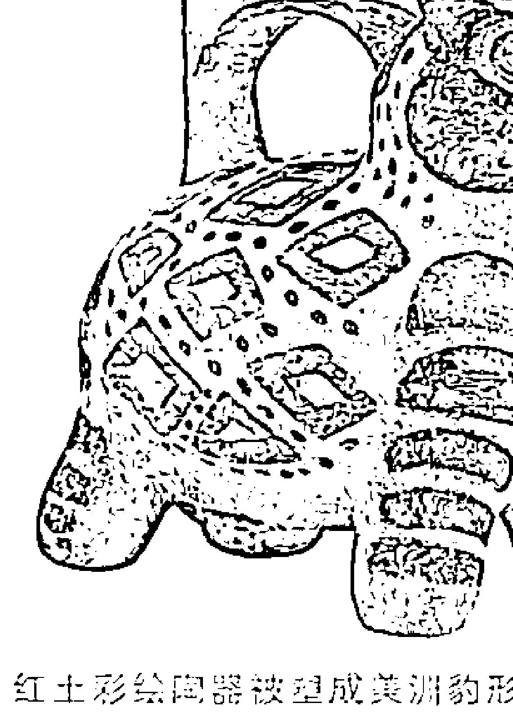

双哨壶。奇穆文化。秘鲁

奇穆彩绘布科常用的题材——立于象征天穹的蛇身下的人

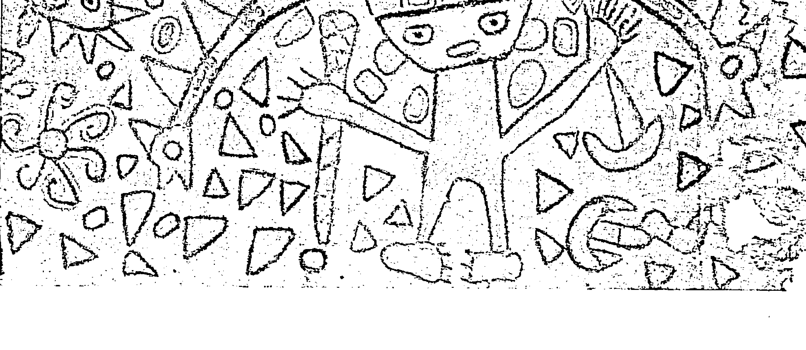

#### 埃尔多拉多——金国王

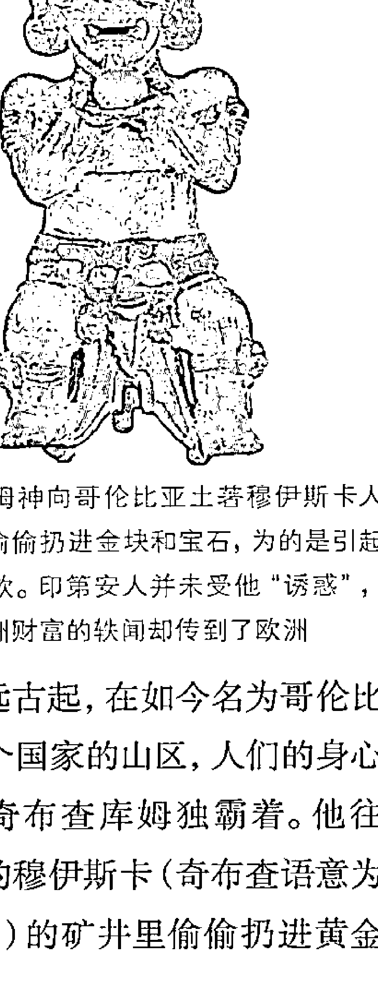

奇布查库姆神向哥伦比亚土著穆伊斯卡人的矿井中偷偷扔进金块和宝石，为的是引起人们的贪欲。印第安人并未受他“诱惑”，可有关美洲财富的轶闻却传到了欧洲

自远古起，在如今名为哥伦比亚的那个国家的山区，人们的身心被恶神奇布查库姆独霸着。他往相信他的穆伊斯卡（奇布查语意为“人们”）的矿井里偷偷扔进黄金

埃尔多拉多，西班牙语意为“金人”。的确，据印第安人传说，这位被奉若神明的君主的身体每天都要由人敷上金粉

或绿宝石，还给他们食盐以同其他民族交换各种食物和制品。古哥伦比亚人早于其他美洲人掌握了贸易的学问，率先使用“小黄圈”作为交换物，亦即发明了货币。

尽管开采黄金宝石颇费辛劳，恶魔依然索要人祭作为报偿，尤其偏爱十五六岁的男孩。

可是有一天，山里来了一位宛若天神之人。他相貌奇特：白肤、浅发、长髯，宽大的斗篷上点缀许多木制小十字。穆伊斯卡人称他波奇卡。新神成为君王和士兵的导师，教给他们善与爱，而主要是尊严。为这尊严还教他们与奇布查库姆厮杀。可是人们却很懦弱——宁愿放弃尊严而保全性命。

们的君王常常举行悔过仪式。能够成为民族君王的只有经受考验并证明灵魂纯洁的人。

为了履行未来的义务，王子一般从六岁开始接受培养。他得在寺庙内度过数载，出入寺庙只能夜间；不得沾荤腥，饭菜不得放辣椒和食盐；更别想亲近女人。

新君王得用金舆抬向圣湖高塔维塔。在此他得脱去衣装。祭司为他全身涂抹贵重树脂，然后扑上金粉：君王变成一尊塑像。接着他由数名高官随同登上木筏。木筏随波浪轻轻摇晃，缓缓抵达湖心。此刻，君王和祭司往湖中投下恶神的赠品：冠冕、项圈、钻戒和其他饰物。

祭献结束，君王顺着专用小梯下到湖中，沐浴清洗，除去金粉。梳洗穿戴完毕，灵魂摆脱黄金主宰的君王回到百姓身边，从此拥有统辖穆伊斯卡“合法权利”。他的自戒也从此结束——君王即可娶妻，数量不限。臣民们将女儿人后宫视为荣耀。

然而，洗净金粉并不表示从此远离宝藏。税务官专司催收国债，还独创了索债妙法。督察员住进欠债人家，在门口拴头训练有素的狮子。主人得每天付他一匹布，并保证定时喂猛兽两只鸡鸭。人们自然极力避免此种情况，甘愿缴纳任何税负。

“黄金印第安国王”的传说从哥伦比亚山国远播四方，也传到西

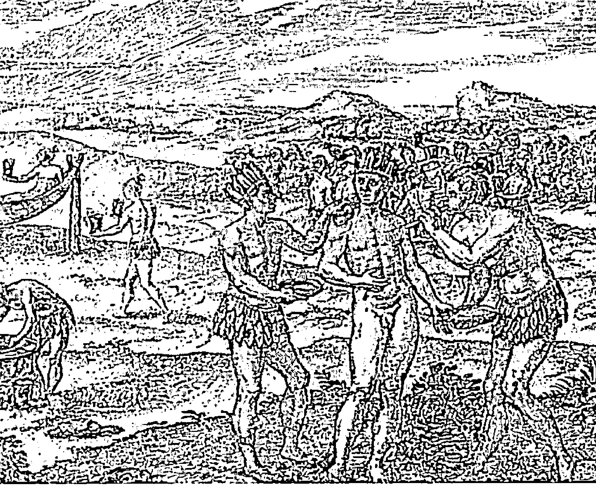

#### 埃尔多拉多——金国王

哥伦布于1492年到达古巴。他从与土著的交谈中感到，向岛屿深处推进将会找到黄金，然而等待他的是彻底失望：金矿在大陆上

西班牙征服者的耳边。他们就把“埃尔多拉多”一词挂在了嘴边。这词意为“金国王”，但却常指无数财宝之国。

16世纪40年代，这里来了三个武装到牙齿的劫匪。他们的掠获物的确多得出奇，根本无需潜入圣湖。其后许多掘金者尾随而来。利马商人安托尼奥·西普尔维特大举行动：命人在岩礁密布的高塔维

塔湖边凿渠放水。艰巨的工程并未收到相应的回报。引走部分湖水后，仅从湖底淤泥中打捞出少量金饰，甚至不敷工程支出。当局没收了“贵重的打捞物”，不走运的老手本人被打人债户监狱。他的珍宝成为哥伦比亚共和国首都波哥大黄金博物馆的主要藏品。该馆现有七万五千件古代穆伊斯卡制作的艺术珍品…… 1801年，著名学者亚历山大·贡博尔德因学术兴趣来到波哥大，绘制出精确的圣湖地图，计算出湖底金饰不下五千万件。这一数据对1912年在英国成立的哥伦比亚高塔维塔湖黄金打捞公司十分有用。股东们用骡马将汽轮泵运抵山区。连续抽水数周，他们将水位降低十二米。露出来的

湖底闪现古代的珠宝饰品。似乎它们已唾手可得。然而事与愿违！只见湖底淤泥慢慢凝结，变成混凝土一般，20世纪初的技术对它无能为力。埃尔多拉多的宝藏因而至今还埋在高塔维塔湖湖底。 圣湖并非印第安人投入珍宝的唯一地点。已知至少还有两个湖泊——福克涅湖和谢恰湖，其水底真正铺满了金子。而且不仅有金锭，还有表现力惊人的艺术品。然而奇布查库姆并不急于“白白”交出自己的财富。

"金国王"——埃尔多拉多雕像，发现于哥伦比亚

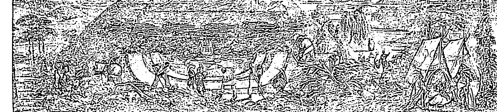

#### 尤卡坦——“我不懂你的话”

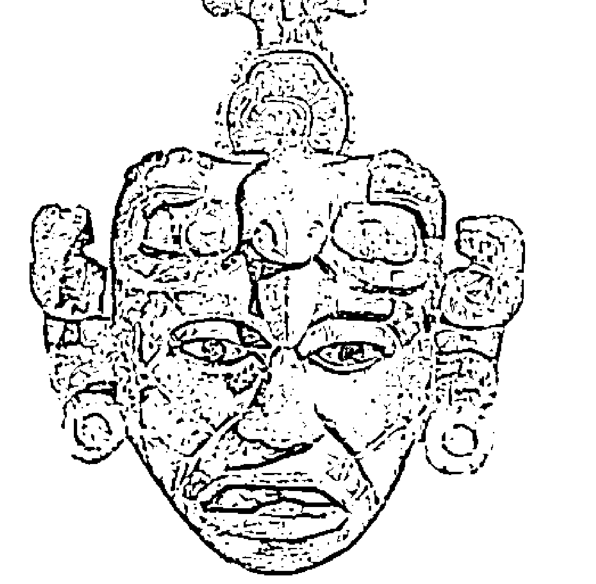

玛雅人或尤卡坦人继承奥尔梅克人的传统，建立了强大的城邦。玛雅人的后裔如今生活在墨西哥、危地马拉和伯利兹。玉雕组合面具。危地马拉市出土文物陈列馆

让“印第安人”一词成为日常通用词的，是克里斯托弗·哥伦布。中美洲一个民族的称谓——“玛雅”，是1502年由海军上将的弟弟巴特洛米奥·哥伦布想出的。

玛雅——语言相近的许多国家的统称。每个国家有自己的国王。王座上的君主。花瓶图案

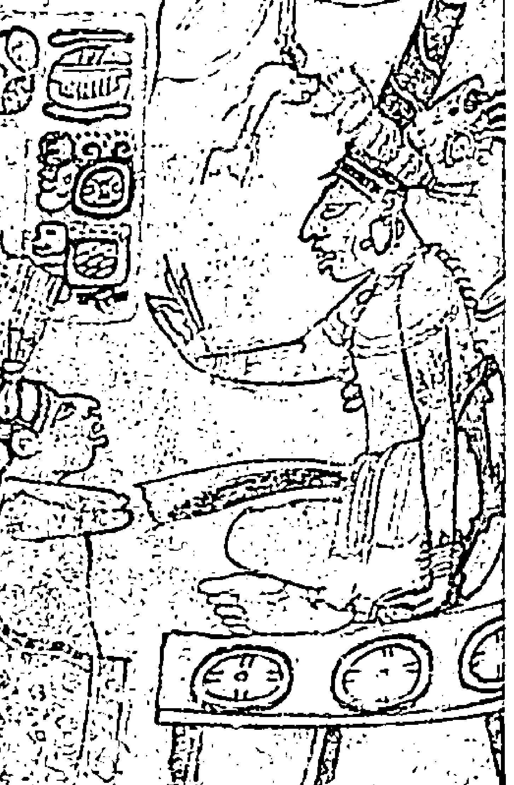

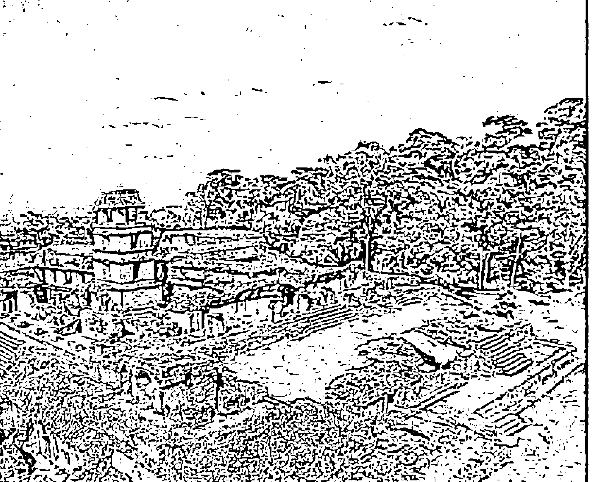

帕伦克——公元3—8世纪墨西哥境内玛雅人的城市。这里保留下一些带浮雕的庙宇和宫殿。帕伦克的宫殿全景

“玛雅人”的基本部落领土的名称——尤卡坦半岛，在当地居民语言里的意思不过是：“我不懂你的话。”这是印第安人回答向他们打听这是什么地方的西班牙人时说的话。

尤卡坦半岛上曾有至少五个国家的联盟：古图尔-什乌（首都起先在著名的乌斯马尔，后迁往玛雅最大的城市马尼）、可可莫夫（府邸在索图特，早先在名气并不小的迈马潘）、卡涅科夫（都城在泰雅萨尔湖畔）、切利（首府为特科赫）和佩奇（府邸在莫图尔）。

换言之，这是一个城市国家，完全类似苏美尔-阿卡德的城邦——乌尔、马里、乌鲁克，或者古希腊的城邦——雅典、斯巴达等等。

玛雅人的首批国家出现于公元前3千纪，是奥尔梅克人——美洲豹人更早文明的继承者。同古埃及文明——金字塔、墓室壁画惊人的相似，说明埃及人和玛雅人曾有着共同的祖先。很可能就是大西洋人。大西洋两岸两国间的贸易在更晚的年代依然未曾间断。可以为证的便是埃及法老拉美西斯二世木乃伊中的尼古丁和可卡因。

玛雅人的圣书《波波尔-布赫》（《各民族之书》），可与印度的《吠陀经》、苏美尔的《吉尔伽美什的故事》、犹太教的《旧约全书》比肩，开头也叙述了地球生命的起源。

许多现代学者对该民族的数学知识和天文计算感到吃惊。还有些学者发现了一系列支持玛雅人与

[PAGE 204]

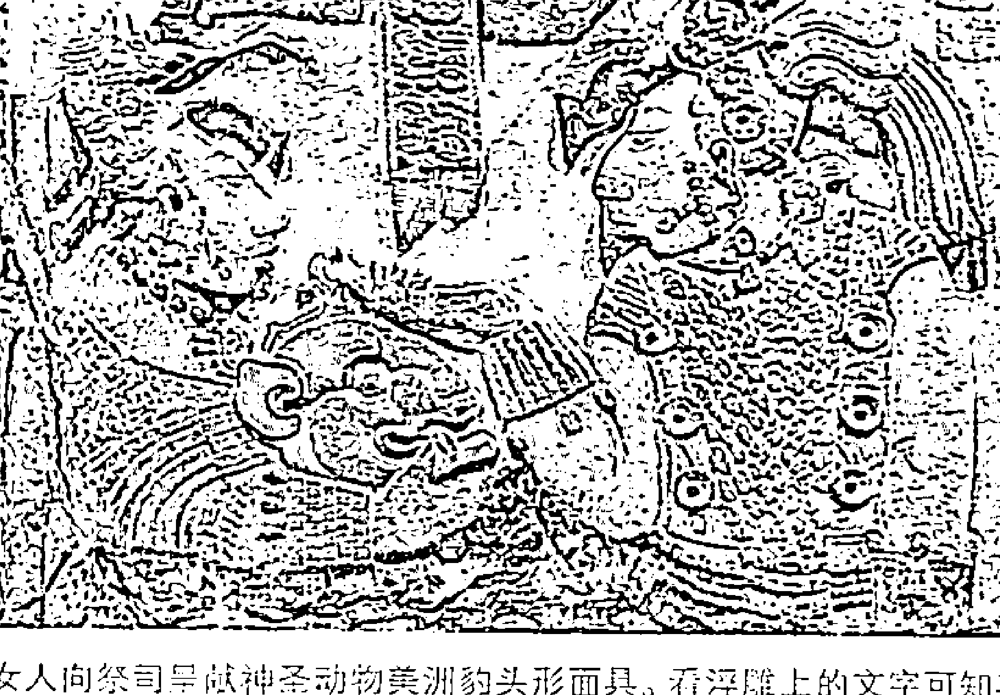

女人向祭司奉献神圣动物美洲豹头形面具。看浮雕上的文字可知其制作时间为719年。这是玛雅艺术的“经典”时期。国家人类学博物馆，墨西哥城

#### 尤卡坦——“我不懂你的话”

玛雅文化的许多东西都与古埃及有着亲缘关系。人们认为，这两国之间有过海上贸易。玛雅人同埃及一样，力求在死后的陶土塑像上保持死者的面貌的文明

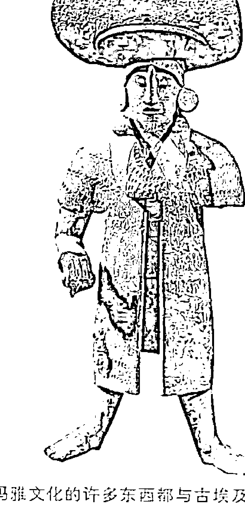

#### 尤卡坦——“我不懂你的话”

玛雅文化的许多东西都与古埃及有着亲缘关系。人们认为，这两国之间有过海上贸易。玛雅人同埃及一样，力求在死后的陶土塑像上保持死者的面貌的文明

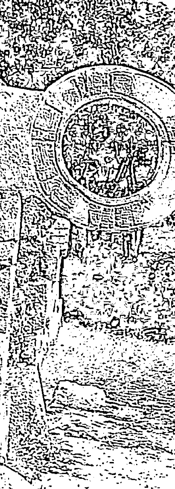

#### 美洲的信仰

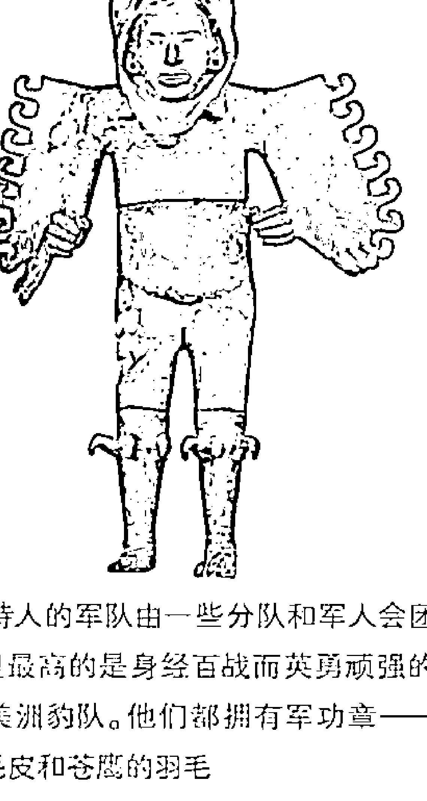

阿兹克特人的军队由一些分队和军人会团组成。威望最高的是身经百战而英勇顽强的雄鹰队和美洲豹队。他们都拥有军功章——美洲豹的毛皮和苍鹰的羽毛

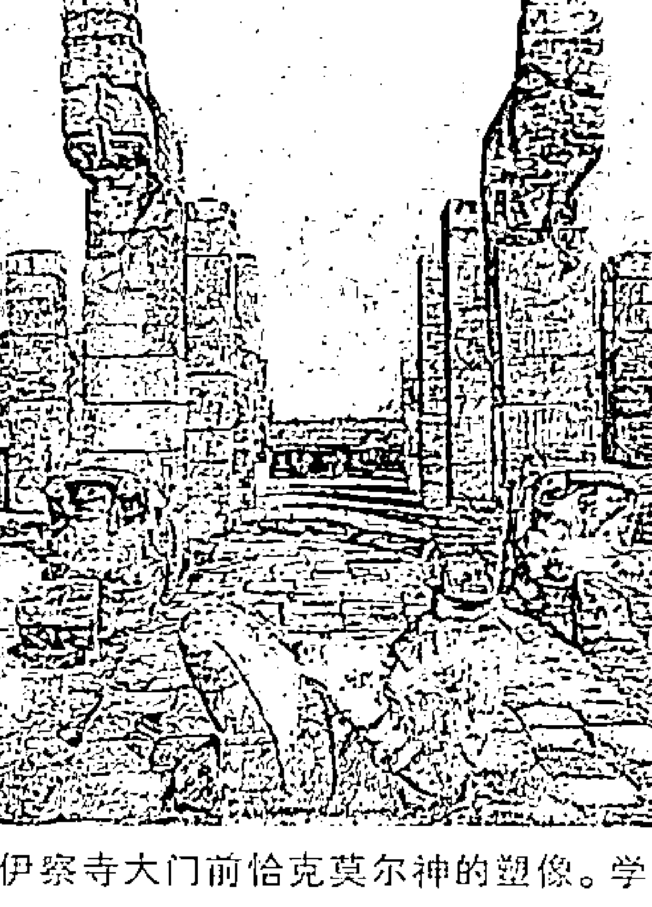

奇琴伊察寺大门前恰克莫尔神的塑像。学者们至今仍在争论他是何路神仙：植物庇护神、天气神抑或嗜杀成性的战神 维，而且是同样的宗教仪式的象征和形式……

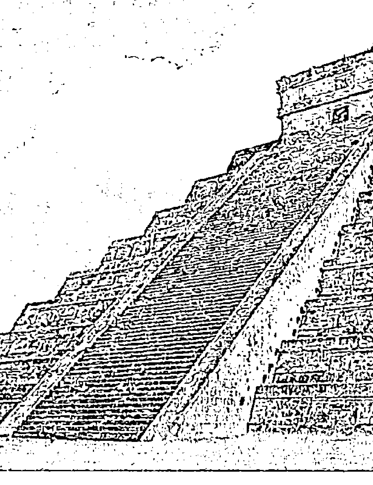

阿兹特克人的祭司沿着这令人头晕的石阶登上金字塔的顶端，以便离天神更近并向他们奉上最珍贵的贡品——自愿牺牲者的心脏。奇琴伊察寺的礼仪阶梯。墨西哥

细而骇人听闻，其目的是为随后的美洲蛮夷种族灭绝进行辩护。

“画面之外”的是欧洲人当年想都不敢想的普及义务教育；高雅的哲学，惊人的农业技能，建筑学，还有信仰本身。

其实，血祀不过是古祭祀仪式的一小部分，而且，从种种方面来看，只是印加尼安德特文明的遗迹。那里的人会做现代医学依然不可企及的心脏移植，甚至脑髓移植的外科手术。

依阿兹特克人看，最高神是奥梅特库赫特利夫妇。他们孕育了大自然和诸神，后来放弃下界而去了，假定说，十三重天并在那里居留至今。同样的故事被记录在伊卡刻石之上：外星人让地球动物具有智慧以后，目睹他们走上引向自我毁灭的歧途，深感愕然，可又无力回天，便弃地球而去。

智慧而善良的圣灵离去后，神圣的权力落入人类贪得无厌和急功近利所产生的狰狞恶魔手中…… 对于印第安人和欧洲人，通天之路根本未曾关闭，本可跳出此苦海而奔向山巅。

“地球人，不论其地理状况如何，从上天接受的不仅是同样的思

维，而且是同样的宗教仪式的象征和形式……

“阿马乌特印加人认为，人由躯体和灵魂所组成，灵魂是永生的精神，而躯体是泥土做成的，因为它会变成泥土，所以管它叫哈尔帕-卡萨斯卡，意为‘有灵性的土’……他们相信，人过世之后还有坏人受苦、好人安宁的来世。他们将宇宙分为三界：天叫哈诺伊·帕恰，意为‘上界’，去那里的都是因行善而受奖的好人；把生生死死的人世叫作胡林·帕恰，意为‘下界’；把地心叫作乌库·帕恰，意为‘下下界’，那里待的都是坏人，为了把它叫得难听些，另起了个名字，叫苏派帕·瓦辛，意为‘魔窟’。”

因此，西班牙人对美洲的人侵，其实就是毁灭同一信仰者的野蛮人的洪流。

阿兹特克人对印加人毫无概

#### 美洲的信仰

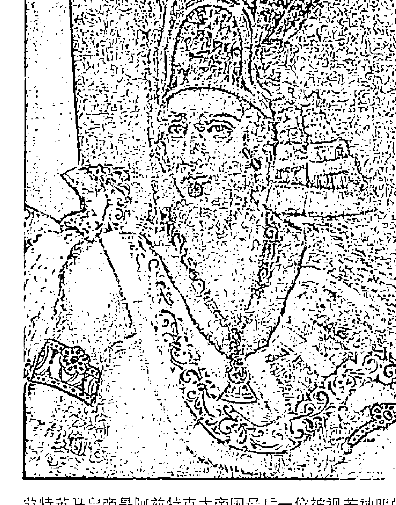

蒙特苏马皇帝是阿兹特克大帝国最后一位被视若神明的统治者。他因自己的轻信而死于柯尔特斯的征服者之手。16世纪西班牙佚名画家的画作

祭司们说，诸神创造世界时得忍受极大的痛苦，而仁人君子在磨难中献出自己的爱心，则好比赎回这些痛苦。血祭前一年，从俘虏中挑选出一个最美最高的——被神灵打上印记者，一年中祭司为他教授为君的仪表风度。所有人都像敬神似的对他行礼。祭祀仪式前一个月，挑选四个绝色美女，供他享用。一月后，在大队人马的陪同下，注定享受未来的幸福者来到庙堂。在此他同几个妻子和一年来关照他的八位大臣告别，然后被领着顺宽阔的阶梯慢慢往上登攀。在庙宇的每一级台阶上，他都折一支圣笛。他这就来到了庙堂顶端。在这里，祭司捉住他的两手，而大祭司则用刀从他的胸膛里挖出心脏。其实，升天并非那么必不可免。对于那些珍惜生命之人，往往会给予同善战的美洲豹人军士厮杀的机会。不错，给受试者的是把木剑，一只脚还给拄上沉重的石头。可如果他在此种条件下也能取胜，则说明他考虑轮回转世为时尚早，神灵会再赐给他几十年在尘世受苦的时间。受考验的不仅是男人，有时也有女人和儿童。喜庆之时，最想脱离苦海之人常常喝下专用麻醉品，舞蹈数小时，进入狂喜状态，由此种状态向大地之神治下的过渡其实不知不觉而毫无痛苦。不顾一切严厉惩罚而走邪道的无可救药的败类，会被从社会中剔除，去丰产神特拉洛克处进行“改制”。祭司们施行这一仪式时的心情是沉痛的：阿兹特克人的婴儿死亡率很高，因此每个活下来的幼儿都是上天的恩赐，可当之无愧地吸取古美洲文化的优秀成果。

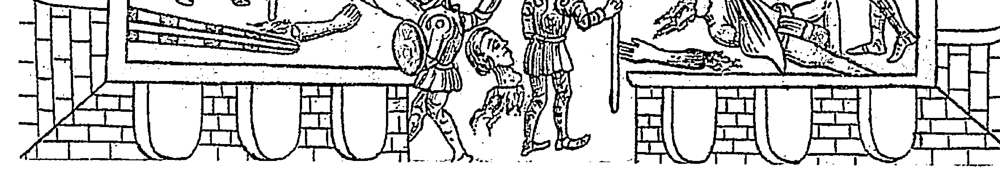

#### 美洲的信仰

湖中的人工岛——特诺奇蒂特兰。阿兹特克大帝国的首府发端于此

# 北京博闻春秋图书有限责任公司书目

| 书号               | 书名                     | 作者           | 定价 |
|

| 书号 | 书名 | 作者 | 定价 |
| ---- | ---- | ---- | ---- |
| 978-7-224-10219-2 | 八大与弘一 | 杨林 | 34 |
| 978-7-224-10243-7 | 一日参佛一世缘 | 洪丕谟 | 28 |
| 978-7-224-10134-8 | 现实政治 | 傅斯年 | 32 |
| 978-7-224-10208-6 | 上海下海：上海生活35年 | [日]内山完造 | 28 |
| 978-7-224-10034-1 | 少不读鲁迅 老不读胡适 | 韩石山 | 32 |
| 978-7-224-10167-6 | 孤舟独树 | 康国雄(口述) 何蜀(整理) | 38 |
| 978-7-224-10191-1 | 大逆转 1919；希特勒反犹背后的欧洲史 | [德]拉尔夫·乔治·劳埃特 | 28 |
| 978-7-224-10151-5 | 中美合作所与太平洋战争 | 孙丹年 | 32 |
| 978-7-224-09763-4 | 畸形的日本人 | [日]岸田国士 | 25 |
| 978-7-224-09447-3 | 小镇上店：我记忆中的江南老家 | 张建秋 | 26 |
| 978-7-224-09573-9 | 识骨寻踪·206块骨头 | [美]凯西·莱克斯 | 25 |
| 978-7-224-09572-2 | 吸血鬼之吻·亲吻棺木 | [美]艾伦·斯瑞博 | 20 |
| 978-7-224-09571-5 | 杜斯维尔镇·与吸血鬼共舞 | [美]艾伦·斯瑞博 | 20 |
| 978-7-224-09570-8 | 棺材社·皇家血统 | [美]艾伦·斯瑞博 | 20 |
| 978-7-224-08706-2-01 | 姑妄集(新版) | 张鸣 | 29 |
| 978-7-224-09646-0 | 高建群大西北三部曲（古道天机 六六镇 最后一个匈奴） | 高建群 | 79 |
| 978-7-224-09653-8 | 中国随想 | [日]陈舜臣 | 25 |
| 978-7-224-09634-7 | 高岗传 | 戴茂林 | 59 |
| 978-7-224-09721-4 | 在上苍的阴影下——一个德国人眼中的汤若望 | [德]乌利-弗兰茨 阿坦德拉-克斯特尔 | 48 |
| 978-7-224-09918-8 | 血腥之月·毒血之战 | [美]L·A·班克斯 | 22 |
| 978-7-224-10024-2 | 血腥之月·撕裂子弹 | [美]L·A·班克斯 | 22 |
| 978-7-224-09694-1 | 天使临城·迷雾 | [美]贝卡·费兹帕特 | 25 |
| 978-7-224-10163-8 | 天使临城·沉沦 | [美]贝卡·费兹帕特 | 25 |
| 978-7-224-08887-8 | 女飞行员 | 何孝明 | 28 |
| 978-7-224-09016-1 | 独鹤与飞 | 张根水 | 28 |
| 978-7-224-09040-6 | 谭教授公关记 | 老象 | 28 |