## 古籍斋校勘

册三
【古籍斋教学用书】
奇門遁甲預測培訓班
二零一八版
不吹牛著

## 目 录

- 第三十二章 生意财运预测
    - 一、奇门遁甲星门神仪体现的求财信息
        - (一) 九星所主事业 and 求财信息
        - (二) 八门所主事业和求财信息
        - (三) 八神所主事业和求财信息
        - (五) 九宫所主事业和求财信息
        - (六) 格局的变化也反映求财的过程，甚至可以体现一些结果
    - 二、有关笼统的问财运如何的预测
        - (一) 通过生日命盘来断此人的财运
        - (二) 通过求测局断财运
        - (三) 关于求财方向的判断
    - 三、不投资求财类 (空手求财类) 的预测
        - (一) 赠与与意外得财的判断
        - (二) 在家等生意，看有没有财来 (生意) ?
        - (三) 来人求测，看交易能否成 (或你要预测来访者的来意) ?
        - (四) 交易求财 (我去找对方交易)
        - (五) 交易赚不赚钱的问题?
        - (六) 中介 (经纪人) 求财
        - (七) 预测业务谈判能否成功
    - 四、买货求财 卖货求财 贸易求财
        - (一) 买货求财
        - (二) 卖货求财 (无明确的买货人时)
        - (三) 卖货求财 (约好来买货的客户来不来，能否成交的问题)
        - (四) 贸易求财 (交易求财)
    - 五、投资求财
        - (一) 看求测人年命 (日干) 的状态。
        - (二) 甲子戊的落宫特别重要 (甲子戊代表资金本钱)
        - (三) 看生门落宫: 生门代表利润、利息、效益
        - (四) 比较生门与甲子戊之间的关系
        - (五) 看生门、甲子戊与日干 (用神) 之间的关系
        - (六) 考察时干以及时干与生门的关系
        - (七) 如果用神临着值符、值使，还必须看值符、值使的作用
        - (八) 在投资求财的预测中要特别注意一些特殊格局
        - (九) 得财时间
    - 六、开店（办厂）求财
        - (一) 准备投资开店（办厂），是否可行求测
        - (二) 已经运作着的店铺（工厂）等开店求财的预测
    - 七、放贷（有人来借钱借物）借贷（找人借钱借物）索债（讨债）
        - (一) 放贷（有人来借钱借物，借钱物给他人可行否？）
        - (二) 借贷财物（求测人去找人借钱借物、去贷款）
        - (三) 讨债（要账、回收贷款）的预测
    - 八、关于合作求财（合伙求财）
    - 九、测房地产生意
        - (一) 关于买房（买地）
        - (二) 关于卖房（卖地）
        - (三) 关于投资房地产求财（做房产交易的）
    - 十、经济预测中一些常见问题的预测方式
        - (一) 派谁合适的问题？
        - (二) 如何预测调查工作（杜新会老师讲述的方法）
        - (三) 如何预测散布消息
        - (四) 判断消息真假
        - (五) 占嘱托求人（《奇门遁甲元灵经》）
        - (六) 占赎物产（《奇门遁甲元灵经》）
        - (七) 预测竞标（招投标预测）
        - (八) 预测商店（工厂）的转让或转租
        - (九) 如何调解矛盾？
        - (十) 如何看谈判？
    - 十一、企业经营管理预测
        - (一) 开门这个用神符号在企业预测中的含义
        - (二) 不能忽视日干作为领导人在企业管理预测中的作用
        - (三) 把握准不同类型企业的特征
        - (四) 企业预测的关键点：值符和值使门
        - (五) 详察各职能部门与相关环节的落宫状态
        - (六) 注意庚辛、天芮星、符使、孤虚地等特殊格局应用
        - (七) 关于产品以及原材料的供应与产品销售
        - (八) 关于同行业和竞争对手状况的判断

# 第三十三章 寻找失物
- 一、一般失物
- 二、附录《遁甲元灵经》（失物占）中的部分内容
- 三、专论机动车辆丢失的预测

# 第三十四章 出行、出国预测以及行人走失预测的判断
- 一、出行预测
- 二、关于出国的预测
- 三、行人走失预测（找人）

# 第三十五章 官司诉讼预测与刑罚
- 一、经济、民事官司类
- 二、官灾、刑事、刑罚类官司诉讼

# 第三十六章 疾病预测
- 一、采用比类取象的方法，以九宫八卦摹拟人体
- 二、需要详细分析星、门、奇仪以及格局的变化结构
- 三、八门的落宫状态也是预测疾病时的重要参考因素
- 四、八神也反映着疾病的总体状况（患病状态）
- 五、格局的克应变化，天地盘上下相加也反映病情病因
- 六、看疾病的治疗手段与效果
- 七、奇门具体断病（摘自王凤麟著《帝王之术》）

# 第三十七章 奇门择吉
- 一、方位择吉
- 二、择吉要分清主客动静
- 三、奇门择日
    - 以问事时辰来择吉的方法
    - 以用事时辰来择吉的方法

# 第三十二章 生意财运预测

## 一、奇门遁甲星门神仪体现的求财信息

星门神仪宫位都为求财的参考信息符号。分述如下：

### （一）九星所主事业和求财信息

- **天蓬星**：求测人机智、胆大、敢于冒险，做风险的生意或非正道之财，捞偏门等。在策划事业、财运的信息中表示做建筑、边贸、国际贸易、兵工企业、军界、政法界、水利建设、水产、养殖、运输、酿造、餐饮、娱乐、洗浴、冷饮、酒吧、美容美体、妓院等。
- **天任星**：求测人诚恳、实诚、坦白、任劳任怨、不敢放手大干、安于现状等。在策划事业、财运的信息中表示做农产、种地、矿产、土地资源开发利用、建筑、贸易、法律、利益、教育等。
- **天冲星**：求测人敢闯敢拼、直来直去、求财急切，成败迅速。在策划事业、财运的信息中表示做营销、体育、竞技、电器、机械制造、木器加工、娱乐设施、电器设备、邮电系统、花店、游乐场、鞭炮、山林野味等。
- **天辅星**：求测人为儒商、有文化之人。在策划事业、财运的信息中表示做文化教育、服装鞋帽、工艺美术、设计规划、科技攻关、木材加工、园林设计、装饰装修、风筝等。
- **天英星**：求测人脾气较烈，做事易急躁，重名气、好礼仪、爱面子。在策划事业、财运的信息中表示做电子电器、音响灯具、燃气灶具、表演艺术、音像出版、美术美工等。
- **天芮星**：求测人爱交朋友、爱学习、问题多、贪财、吝啬。在策划事业、财运的信息中表示做治病救人、救死扶伤的用品、棉麻布帛、肉类加工、教育办学、文化用品、医疗设备、宗教用品、农贸产品、土地资源、农林牧渔、禽畜养殖等。
- **天柱星**：求测人能说会道，有革新精神、独当一面。在策划事业、财运的信息中表示做律师、老师、歌唱表演、音响器材、说教咨询、说客、中介、娱乐性、破坏性的行业等。
- **天心星**：求测人管理能力强，工于心计、善于营谋。在策划事业、财运的信息中表示做技术管理、政治指导、组织策划、医药卫生、宗教哲学、金融机构、交通运输等。

### (二)八门所主事业和求财信息

- 休门：主得贵人扶持，从事公务活动、机关类人员、机械修理、美容美发、物流储运、休闲娱乐、宾馆设施。
- 生门：主做生意求财，从事买卖交易、种植养殖、房地产开发、生产制造、金融行业。
- 伤门：主军警、电动玩具、交通运输、车船交易、驾驶培训、体育竞技、博彩渔猎、国家机器等。
- 杜门：主保密性的工作、技术应用、软件开发类行业、装饰装潢、木制品、公检法司等。
- 景门：主广告业务、美容美发、装饰装修、化妆用品、影视传媒、通信器材、玻璃门窗、美术美工、文艺文化等。
- 死门：主执法部门、供奉神佛之物、宗教用品、肉类加工、食品制作、锁具制品、地皮交易、丧葬用品等。
- 惊门：主口舌求财、说教宣传、说唱艺术、娱乐饮食、咖啡馆、金属刀具、乐器制造、喧嚣行业、热闹场所。
- 开门：主政府机关或从事有公职的工作，开公司工厂、店铺商店、五金行业、产品营销、能源开拓等。

### (三)八神所主事业和求财信息

- 值符：代表求测人有名望、或是管理者。事业、求财信息为经营高档物品、高级产品、质高价高、名牌正宗、货真价实的物品。
- 螣蛇：代表求测人工作变动频繁，思想不稳定。事业、求财信息为经营影视产品、光电设备、电信传媒、绸缎丝麻、装饰材料、绳带物品、预测咨询、假冒伪劣产品、不真实的东西等。
- 太阴：代表求测人思想细腻、做事缜密。事业、求财信息为经营玉器珠宝、木雕石刻、印章制作、剪裁艺术、手术医疗、电子器件、策划公司、隐私之物、暗下交易、女人用品等。
- 六合：代表求测人有团队精神、协调合作能力。事业、求财信息为经营文化教育、俱乐部、组装焊接，或多人合作才能完成的工作、中介公司、经纪人、幼儿园、儿童产品等。
- **白虎**：代表求测人技术过硬、做事果断。事业求财信息为机械制造、金属加工、兵工企业、道路建设、矿山开发、竞技产品，或从事公检法兵等国家机器的工作。
- **玄武**：代表求测人聪明智慧、应变能力强。事业、求财为经营文学艺术、演艺策划、哲学研究、宗教行业、心理咨询、美容行业、假货、不正当职业、捞偏门、投机生意、小偷、诈骗等。也主交易上当受骗、虚假不实。
- **九地**：代表求测人稳重大方、思想保守。事业、求财为经营地产开发、农田水利、农产品交易、种植、衣服、埋葬丧具、地表地下能源开发，或从事不能公开的工作等。交易多平稳、合作长久。
- **九天**：代表求测者积极主动、思想高远。事业、求财为经营高空作业、高处作业、航天事业、国际贸易、中外合资企业、金属加工等。主大张旗鼓的开拓市场。

### (四)十干所主事业和求财信息

- **甲**：所主事业、求财信息为经营管理、领导、领袖。或从事有影响力、号召力的事业。
- **乙**：所主事业、求财信息为文化艺术、教育用品、艺术制作加工销售、木器建材、家居用品、中医中药、山林艺术、城市绿化等。
- **丙**：所主事业、求财信息为露天作业、石油化工、玻璃制品、电力热力、煤炭加工、烧烤蒸煮型事业，或权力机构等。
- **丁**：所主事业、求财信息为电子产品、照明采暖、厨房用具、玻璃制品、烟酒鞭炮、文化用品。
- **戊**：所主事业、求财信息为地产建筑、土建、农业生产、金融证券、银行股票、中介整合、食品、陶瓷等。
- **己**：所主事业、求财信息为泥土制品、水泥制品、食品加工、粮食生产、垃圾处理、策划创意等。
- **庚**：所主事业、求财信息为机器制造、金属加工、金属冶炼、矿山开发、桥梁架设、道路修筑、军工生产等。
- **辛**：所主事业、求财信息为首饰加工、电子芯片、金属制品、金融行业等。
- **壬**：所主事业、求财信息为交通运输、水厂养殖、物流储运、邮政储蓄、产品批发等。
- **癸**：所主事业、求财信息为流体加工、餐饮娱乐、酒水饮料、水产经营、运输旅游。

### (五)九宫所主事业和求财信息

- 乾宫：所主事业为金属加工、机械设备、五金商店、金融会计、银行债券等。得财数为一、六、四、九。
- 坎宫：所主事业为交通运输、物流储运、流体经营、贸易合作、营销传媒、宾馆饭店、娱乐餐饮、旅游开发、水产海产、茶馆、洗浴等。得财数一、六。
- 艮宫：所主事业为保健产品、山林矿产、山地养殖、登山健身、石料加工、少儿教育等。得财之数为五、七、八、十。
- 震宫：所主事业为机械设备、车船制造、竹木茶货、邮电通信等。求财数目为三、四、八。
- 巽宫：所主事业为木材纸张、杂志报业、股市证券、电气设备、烟草中药、工艺美术、文化教育等。得财之数为三、四、五、八。
- 离宫：所主事业为软件开发、IT行业、金属冶炼、画廊美术、电影电视、电子电力、娱乐传媒等。求财之数为二、三、七、九。
- 坤宫：所主事业为妇女用品、粮食作物、农副产品、农田水利、地产庄园、学生用品等。求财之数为二、五、八、十。
- 兑宫：所主事业为五金交电、珠宝玉器、金属加工、影视娱乐、牙科等。得财之数为二、四、七、九。

### (六)格局的变化也反映求财的过程，甚至可以体现一些结果

求财、交易、营谋、坐地经营如遇戊+丙青龙返首、丙+戊飞鸟跌穴，则主得大利且资本利润巨大丰厚，求财垂手可得，商战必胜。

求财临庚+丙，丁+戊青龙转光，则主财不求自到。日干庚+丙主进攻，且利买货。而月干庚+丙是来攻我，对我不利。

丙+庚贼必去或临休门，主利于退守，利于卖货。

临辛+乙白虎猖狂，乙+辛青龙逃走，丙+庚贼必去，若与甲子戊或生门相临则主必破财无疑，切莫投资取财。辛+乙，乙+辛，也主合作双方及竞争双方互不信任。

开店经营如临玉女守门（丁奇+值使门）则发财称情，特别是经营娱乐场所、饭店、服务业，更是日进斗金。逢玉女守门，主在本地经商获大利，而不利于去外地求谋。

辛+丁，经商获倍利，利于行动。

日干乘值使门中介人效力，又主相关部门支持。如临三奇得使则求托贵人从中帮助求财，中间人效力。

临癸+丁螣蛇夭矫则主买卖不成，反出口舌是非，事情反复无常。

丁+癸朱雀投江，对方答应再好也会石沉大海，无有头绪，如卖货求财则卖不出去，还易招惹口舌是非。

临伏宫（庚+戊）、飞宫（戊+庚），此地不比他地，说明此地人情、社会、市场环境复杂，不利求财，需换地方经营。戊+庚也主破财。

伏干（庚+日干）、飞干（日干+庚）此人不比他人，说明合伙之人非善辈，早分开另与人合谋，尤其要防遭人算计。

大格庚+癸、小格庚+壬均主求财反复变化，不会称心，且奔波劳累，难以求利。

刑格（庚+己）、悖格（丙与六仪相配）恐出意外之灾，应及早脱身（尽早撤出），又主企业内部不团结。

求财遇五不遇时，多反复不顺，费尽心力也难求到（空费心力）。

用神入墓或临癸+癸天网四张，纵见利而不能得手。日干逢壬癸，主遇罗网，亦是获利艰辛。日干+癸，主天网、阻力大或有不正当行为。日干+壬，主有行动、变化或遇有阻力。

日干+乙奇，主文雅，入墓主犹豫。日干+丙奇，主霸气、有乱子。日干+丁奇，主温和、灵活，有奇迹。日干+戊，一般与钱财有关。日干+己，贪利、暗中行事或不正当。

日干+庚，凶狠或有大阻力。日干+辛，不择手段或有错误、违法。

逢空亡则眼看有而伸手则无。三奇入墓与刑制，主内部不协调。

日干、时干逢冲，主速行动。日干、时干逢合，主不动或因事动不成。

六仪击刑主受损，主极度难受，此桩生意求财难得。

九天之上好扬兵，利进攻，产品则远销他方。九地之下好伏藏，主迟缓，利囤积货物。乘太阴利策划，也主有小人陷害。乘六合利于谈判或退却。

逢九遁格在商战中要灵活机动、变换阵势才能取胜。临天遁则应扩展市场，向外发展。人遁则靠朋友社会关系从中帮忙得财。地遁则应坐地求财。云遁、风遁，则大力宣传扩展声名，动用广告的利处。龙遁则依托大市场、大企业，领头人随声附和从中渔利。神遁则虚虚假假，真真实实，不得让人知晓商机。

逢三诈五假之格，应精心策划设计求财，做得到欲擒故纵，反败为胜。

反吟主时好时坏反复不定，反吟利客，遇事应先行动、先发制人，主进攻，宜乱中取胜。伏吟则主事无头绪，或稳重求利，伏吟利主，遇事应后行动，后发制人，主待机而动，也主迟慢。

## 二、有关笼统的问财运如何的预测

问财运的情况，要区分是问命中的财运、长期的财运（如一年的财运）、近期的财运等不同的情况来做以预测。

### (一)通过生日命盘来断此人的财运

《奇门遁甲秘笈大全》讲：“生门产业，要得三奇。成败分於内外，生克决其得失。生門太白逢冲陷，背祖離鄉之客；被冲克，售盡祖父舊園。生在外而身在内，必遷居而發富；身在外而生在内，縱有祖業亦難留。身生二宮俱在内，安享仆馬之福；身生俱在外宮，遠方創業之人”。

“生门产业，要得三奇”。是指生门在奇门遁甲中代表产业、财运，如果看一个人的财运如何，首先要看生门落宫的位置，是不是临三奇吉格。是說生門代表一个人一生的財運和產業，最好是落宮要旺相，又得三奇、吉星、吉格、吉神。

“成败分于内外，生克决其得失”。是讲一个人事业的成败，要从奇门格局中的内外盘来分析，要与日干的生克关系上去推理。生门旺相生日干，财追人财运好。生门与日干比和，也容易得财。日干克生门、日干生生门主通过努力亦能求得财富。生门克日干，求财则艰辛。

“生门太白逢冲陷，背祖离乡之客”。是说如果生门与庚落同宫逢冲格（如庚+癸、癸+庚）或失陷（如空亡、落墓死绝地、六仪击刑等）又冲克日干落宫，此人必定背祖离乡外谋生路。因为生门代表产业、财运、出生地、祖业，庚代表阻隔之神，如果同时冲克日干，必然守不住祖业，远离出生地，到异乡求发展。

“被冲克，售尽祖父旧园”。是讲：如果是日干冲克生门（临庚）的落宫，则主该人主动将祖上留下的产业、房屋、庭院卖光售尽，必然是守不住财、是个败家子。

“生在外而身在内，必迁居而发富”。是讲：生门在外盘而日干在内盘，表示财运、事业在外地他方甚至是外国，所以必须迁居或到外地去创业发展才可以事业有成。

“身在外而生在内，纵有祖业也难留”。是讲：如果日干落外盘而生门落内盘，则说明家里即使有祖业要他继承他也不会留下来。

“身生俱在内，安享仆马之福”。是讲：如果日干和生门二宫都在内盘，就是最好在家中守业，因为有祖业可以继承，又有祖父母亲人的荫庇，自然富贵有余安然享福，出入有车，家里用奴唤婢。

“身生俱在外，远方创业之人”。是讲：如果日干和生门都落到了外盘，必然在家里呆不住，一定会到外乡或外国去发展。这种人，都是家里小人多，外面贵人多，所以最好出外谋求发展。

### (二)通过求测局断财运

预测财运，首先要弄清楚求测人是从事的什么性质的职业。世上求财之路千万条，行业差别千万种，路路都生财，行行出状元。靠山吃山，靠水吃水，一方水土养活一方人。并不只有开、休、生三吉门才有财，也并非只有甲子戊才是财。其实开门、休门、生门利求财，景门、死门、惊门、伤门、杜门也是财；不仅仅戊是财，庚、辛、壬、癸也是财；奇门遁甲所有符号都是财。你要了解人家的职业特点，就能较好的判断人家如何得财以及财运状况了。比如：警察遇伤门、演员遇景门、公务员临休门都能得财。风水先生遇到死门，则可能是有看坟地或看地基的生意等；律师遇惊门，来业务了；检察院的临杜门，有案子；做生意的临上生门，说明有新单子；做公司企业的临开门，说明有新业务。求测者落宫的情况，适应干什么，应该选什么职业，奇门就已经给人定格了；是靠山，还是靠水，细推所落之宫的组合来断定。

如果人家问的是一年以上的财运或更长时间的财运，则以年命落宫为主线，以日干做近期状态和年内状态的参考。观其年命，是看其命里有没有财，看年命落宫的状态，落旺地，又临上他所做的门类的东西（行业性质的特点），则容易得财。如果人家问近期的财运，就以日干落宫为主线，参看年命落宫。如果自身落宫休囚无力、入墓、击刑、真空亡、门迫等，得财就不容易甚至得不到财反而破财败财。沐浴之地难得财，这表示的他只是幻想，是败地。入库地是能得财的，但也比较麻烦，常会招惹一些是非。比较容易得财的情况是：用神落长生、临官、帝旺之地，这才叫能量大。长生的力量最大，得财比较平稳。而上班族落临官不叫得财，这只表示稳定的工资收入。上班族落长生，是涨工资了、有外快了；上班族落帝旺，也得意外之财。做生意的落临官，天天有生意、细水长流；落长生、帝旺，生意好。帝旺是能量的极限，但并不表示得财特别大。判断一个人的运气，要从天时、地利、人和、神助、格局等方面综合分析。

九星旺相，能量越大，则得财越多越大。

**八门是求财的通道或渠道。**临开门，可能是得单位的财或开公司、开店求财。临休门，朋友介绍来的财或从事与休门有关的职业得财。临生门，主动上门来的财或做生意得财。临伤门，求财难度大。临杜门，求财不顺当，要有真的技术本领才行。临景门，扩大名声，外出宣传才行。临死门，看坟地、做佛具；临惊门，也要多宣传、说教才能得财。

八神在求财中也要看，临值符有贵人相帮得财大；临螣蛇时好时坏；临太阴经过谋划得财；临六合主多渠道；临白虎求财难度大、争执，还要防止出意外；临玄武，要防止小人破坏；临九地，发展慢、消极；临九天，出行多，名气大，闲不住。

**还有一点：年命（日干）临生门，再配合动格，易得意外之财，**但这动格不能是乙+辛、丙+庚。逢庚+壬、庚+癸、丁+癸、丙+戊、戊+丙、庚+丙，易得偏财，但要和职业特点相结合。跑业务，做贸易的逢马星，容易得财，临动格利求财。不临动格，一般难求财。伏吟格利于收敛钱财，而不是得财。反吟格也利于不投资的求财，反吟也是动格。所以，年命（日干）旺相、临动格、生门、马星，易得财。不过逢到动格，也要格外注意的是格局逢冲，也常常主财来财去。虽然能得财、得意外之财，但这财并不主多，特别是戊+辛、辛+戊、乙+辛、己+壬、壬+己这样的冲格多不应吉。**做中介的逢合格落旺地主多，主意想不到、八方来财。合格也能得他财。**日干乘年月时主财源不断。临长生官禄主财源不断。临帝旺，来财就是相对于其他情况为多。

做官的落临官禄地只是指工资之财，而要得意外之财第一个条件是临生门能得偏财；落长生、帝旺之地，也是发偏财的信息。

开店铺、商场、茶楼、饭店等坐地求财的，最忌讳落宫逢空亡、六仪击刑、入墓、逢冲格（跑业务的喜动格、做中介的喜合格、坐地求财的怕冲格）。坐在空亡之地，得不了财；入墓，就是事情棘手，关门；击刑逢冲刑格，就是财来财去、呆不住、守不住财。对于这类长线投资的取财形式，除去入墓、击刑、空亡、冲格外，即使不好，也是小阶段的不好。

在传统的奇门预测中，常常以生门代表财运、收入。强调了在奇门预测中断财运的作用，只强调生门宫与用神之间的关系，显然有失偏颇。但现在的有些书籍中，又完全不顾生门确实是财运（钱财）的一个核心点的情况，又片面强调“落宫中心论”，实践看也有缺陷。如果真与生门没有关系的话，那么古人关于人生命运中生门与日干之比较的内容岂不成了“无稽之谈”？！

我们应该以落宫信息为主线判断这人适合求什么财以及他的自身条件状况，同时要比较与生门之间的生克关系，看其得财的难易度。因为生门本身就代表的是钱财、房产、工资收入、投资收入、额外收入等。若生门宫生、比用神宫或与用神同宫，表明财来找你，得财较容易。用神宫生生门宫或用神宫克生门宫，表示只有努力才能得到钱财。若生门宫克用神宫，得财就不容易。得财多少是看的生门所临九星的旺弱（又叫财星），旺了得财多。宫中带三奇、格局好则财也多；反之，财就少。九星不管是什么星，只要旺相就是大财。这里需要注意的是：如果是生门宫与用神有符号间的联系，这种影响就很直接而有力。如果没有符号间的链接，这种影响就小，就可以不考量这个因素。

还有一点要注意的是甲子戊代表的是资金、现金、兜里的钱。戊与用神之间没有直接的生克关系，它是个独立的符号。戊落宫旺相则钱多，衰就少。戊在震宫击刑，代表损失、缺钱、破财等。戊入墓，拿不出来。戊逢庚，主资金转移、缺乏资金。戊癸合主资金占压。戊+辛，辛+戊，资金被冲代表资金流出的快、钱财使用不当。戊+壬、戊+己，也是资金受困之象。戊处衰弱之地逢空亡，为没钱；处旺相之地逢空亡为暂时没钱。地盘戊代表过去的资金情况。

我们在判断一个人是否富有时，曾经讲过用神天干处禄位或下临天干处禄位，表明此人有收入、有钱；处于长生、帝旺宫也富有。若用神宫处死墓绝地，再有生门宫克用神宫、戊衰弱、击刑、逢庚等钱财就少、不富有。落乾宫、离宫的财的级别不一定大，但名声大；落坤宫、震宫的财大，影响大；落兑宫、艮宫还行，巽宫财不大、坎宫无大财。这个人的落宫代表他的成就。平台大的事业大。

以上是个思路，是断求测人财运的方法。具体应用中还要结合流年、流月等来综合判断。

如果求测人问起的是过去某年的财运情况，还必须看此流年的干支落宫。以此流年的地盘天干落宫和地支太岁所在宫为主，天盘天干落宫为辅，结合流年天干的暗干落宫来判断，这些宫内的信息是必然应事的信息。要比较流年地盘天干与地盘年命（日干）之间的关系，流年地支太岁落宫与地盘年命（日干）之间的关系（注：天盘年命天干或日干天盘落宫用以参考）。被太岁宫生助、比扶为吉。用神生流年地盘天干落宫，此年也较顺。如果是被太岁特别是地盘流年天干落宫所克制，则此年多阻滞不顺心。如果是用神冲克流年地盘天干落宫，名谓“犯太岁”，则更加不顺，甚至有灾厄。

如果求测人问起的是当年的财运或以后流年的财运，也必须看此流年的干支落宫。以此流年的天盘天干落宫和地支太岁所在宫为主，地盘天干落宫为辅，结合流年天干的暗干落宫来判断，这些宫内的信息是必然应事的信息。要比较流年天盘天干与天盘年命天干（日干）落宫之间的关系，流年地支太岁所在宫位与天盘年命天干（日干）之间的关系（注：地盘年命天干或日干地盘落宫用以参考）。被太岁宫生助、比扶为吉。用神生流年天干落宫，此年虽然泄力但也为顺利。如果是被太岁特别是天盘天干太岁所落宫冲克，为不顺，多阻滞。如果是用神冲克流年天盘天干落宫，名谓“犯太岁”，则更加不顺，甚至有灾厄。

如果求测人问起的是此年先前的某流月的情况，则以此流月地支所在宫为主，结合其流月地盘干的落宫信息，看此月的应事。如果是问此年当月或以后逐月的情况，则以该流月地支所在宫为主，结合其流月天盘干的落宫信息，看此月的应事。顺利不顺利，还是要与用神之间作生克比较的。与用神相生助为顺利，用神克流月落宫虽然有压力但无妨。流月干支落宫克制用神落宫，主不顺。需要注意的是：当流月的干（或支，主要是干）与流年太岁的干（或支，主要是干）重合的月份，常应事更加明显，这样的月份要格外警惕，看是否被太岁冲克或“犯太岁”，要防突发的变故。

关于得财多少的问题，与地域有关，也与时代不同有关。财数多少一般还是看生门，九星越旺得财越多，数字为生门所落宫的数字。

关于求财的行业、得什么财之类？重点看九星。临天蓬星，做水运、饭店、海产品、赌场等。临天任星，做矿产、土地、农牧林、房地产。临天冲星，做贸易、木材、投资等。临天辅星，做科研、教育、医疗、皮革、工厂、家具等。临天英星，做电子产品、广告、美容、化妆等。临天芮星，做纺织、布匹、服装、医疗器械等。临天柱星做艺人、说教、文化等。临天心星，做公司、金融、科技等。这些可以结合第一章所讲的内容综合判断。

### (三)关于求财方向的判断

《奇门统宗大全》有“八门主事歌”，讲：“**欲求财利往生方**，葬猎须知死路强；征战远行开门吉，休门见贵最为良；捉贼惊门无不获，杜门无事好逃藏；索债须知伤上去，思量饮酒景门方”。《神奇之门》也讲到：“这就是说，不论别人还是自己，如果问求财之事，起出奇门格局后；看生门落在哪个宫内，该宫所在方向就是做生意求财的方向”。

很容易理解的是，你如果要去求财方向正好临着生门，肯定得财。预测时，日干临生门的也得财。日干庚+丙，临生门，你坐在这里也得财。而庚+癸、庚+壬，或临九天，则需动中求财。如果日干落墓库之地，就不要在这里呆着，一定要跑出去求财。如果最近的运气不佳，落到了死墓绝地，就要动起来，到日干宫的长生或官禄地去，或到开休生吉门的方向去。马星也是财星，马星动得财，越跑动钱越多。发大财的人，多是异地求财。

这里有一个令人疑惑的地方在于，如果生门所落之宫正好是冲克日干（或年命）所落之宫的方位，那么去这里求财还是否合适的问题？对此，我的实践经验不足，查阅了一些资料，也没有得到相关解释。我的想法是：生门是一个财利方位。如果能生扶日干（或年命）肯定求财顺利。如果克制日干（或年命）并不是意味着这里没财，而只是求财比较费劲。这种情况下，亦可以考虑去日干（或年命）的长生之地、临官之地，或开门、休门旺地求财。我了解过一些人的信息，所来的财多在其年命的长生之地。

## 三、不投资求财类（空手求财类）的预测

空手求财是指不需要什么资金投入，靠信息、靠手艺、出劳力、技艺、动口、动手等以求得财利的情况。如跑保险的、做拼缝的等，我们做预测咨询的也属于这类不投资而求财的行业。整体概念还是我们先前讲的原则：长期求财看年命落宫，近期业务看日干落宫。容易得财的情况是年命（日干）落旺相之地，即长生、临官、帝旺。而上班族落临官不叫得财，这只表示稳定的工资收入。上班族落长生，是涨工资了、有外快了；上班族落帝旺，也得意外之财。做生意的落临官，天天有生意、细水长流；落长生、帝旺，生意好。

### （一）赠与与意外得财的判断

生门宫生日干宫可得财（要有符号间的联系）；日干乘玄武得不义之财或不劳而获的财；日干下临己主得暗财；日干处禄地状态或下临的奇仪为禄地状态的也得财；反之，不得财。

年命（日干）临生门，再配合动格，易得意外之财，但要和职业特点相结合。逢马星，容易得财。静态的求财宜合格，动态的求财宜动格。

### （二）在家等生意，看有没有财来（生意）？

这种情况下，首先要看日干落宫，以天盘日干为自己，日干下临的地盘干所落的天盘宫，为能否给你提供财（生意）的人。比较两者落宫的状态与生克关系。日主自身旺相，对方所落宫生日干宫、与日干宫比和，则一般能得财，有生意。这种情况下，即使是日干格局差，也能得财。日干临吉门吉神吉星吉格落旺地，遇丙+戊、戊+丙、庚+丙格局，易得财，即使这次不成，还有下次。这是一种静态的求财方式，坐地经商也算静态的。

### （三）来人求测，看交易能否成（或你要预测来访者的来意）？

《遁甲元灵经》“求财篇”中有关于“占事成否”的预测方法：凡人来求我，以他为客，我为主；如我去求他，以我为客，他为主。宜主客相生、比和，求而自成；星、仪、门迫，求而难成，费力。若主客相伤，合凶格，因求事而生非，或反耗财物。只宜他生我为顺，易图；我生他为逆，难图。

这类问题有以下不同角度的几种判断方法，可以结合运用。一是用**地盘日干代表主，代表求测人，上临天盘干为客为要来访的人，比较两干之间的关系。**比如辛+戊的格局，对方可能是找你来借钱的。戊+辛的格局，可能给你送钱来。两干相生、相合、相比，则多和谐。相克，多出现矛盾，有时候交易就难成功。**二是他来找你，看时干天地盘。天盘为客，地盘为主。**辛+戊，地生天，我生他，我吃亏，这样就自己先去找对方好。戊+庚，客生主，利于对方来找我，我得利。**三是以日干为我，时干为他，两宫相生、比和，则交易好成。相克，难成功。相冲，肯定不成。这三种方法，应以日时生克关系为主线**，第一、二种方法仅用做参考。具体的运用中，还要结合利主利客、日时关系、旺相休囚等情况做以策划与判断。关于第一和第二种方法究竟什么情况下看地盘日干落宫，什么情况下看时干落宫？因为两者常常是矛盾的。我的体验是，这与求测人所问的事即求测条件有关。**如果求测人问的是某人来访的意图，对我有利与否，**则以地盘日干落宫来判断主客关系。如果求测人问的是要与某人做交易看看是利主还是利客的问题，其关注点是“这件事”，则以时干落宫来看，天盘为客，地盘为主。利客，我去找他。利主，等他来找我。

公元：2010年1月14日10时45分48秒阳2局
干支：己丑年丁丑月甲子日己巳时
旬空：午未空申酉空戌亥空戌亥空
直符：天芮直使：死门旬首：甲子戊

| 丙 螣蛇 天柱 癸 地 伤门 庚 | 辛 太阴 天心 壬 天 杜门 丙 | 癸 六合 天蓬 乙 符 景门 戊 |
| :--- | :--- | :--- |
| 丁 直符 辛 禽芮 戊 玄 生门 己 | 乙  辛 | 己 白虎 天任 丁 蛇 死门 癸 |
| 庚 九天 天英 丙 白 休门 丁 | 壬 九地 天辅 庚 六 开门 乙 | 戊 玄武○马 天冲 己 阴 惊门 壬 |

我正在给一个弟子补习奇门之时，QQ上来了一位网友要求测。因为正讲到如何判断主客关系的内容，我们便起出这个时辰的奇门局看看这笔交易能否成功。

初看起来，地盘日干甲子戊为我为主，天盘乙木为客，为要求求测的客户。乙木克戊土，显示的状态，是主客关系不和谐，对我不利，生意不容易成。再查日时关系。时干落乾宫，克日干落宫，相克生意难成。初步判断，这个生意不好做。但我们做预测师的不能就这样粗线条的分析，就妄下结论。还要做细致深入的分析，看看还有没有成功的信号，有没有能把生意做成的办法。因此，我又做了如下分析：

天盘乙奇为客，落在坤宫为入墓，入墓主遇有棘手事，乙+辛，龙逃走，他可能面临变动的事，这说明他应该有求测的因由。乙+戊阴害阳门，这里体现的是“利客不利主”，利于晚上做事，利于阴中谋划。因此，我对他讲：白天没有时间，晚上再联系我吧。此宫，临六合利于谈判，临景门，主协议能够达成。

时干为对方，临玄武，空亡，应指对我的预测水平不清楚或不相信。空亡，心里没底。临惊门主担心。落宫克日干甲子戊落宫，不想掏钱，暗干见戊，戊+壬，担心钱财打了水漂。临天冲星、己+壬冲格，而壬临杜门，杜门主技术。担心我的技术问题。一方面表明了他既想求测，又担心上当受骗的矛盾心理，另一方面也表明了他的确有变动的事情需要求测。

那么，该怎样使这笔生意成交呢？当日是子日，日干所在的震三宫旺相，而时干所在的乾宫泄气空亡，无力克日干。要使对方付费求测，首先必须是技术上使其心服口服，相信我的预测。我看日干宫生杜门，而杜门克时干宫，这表示通过技术可以使对方认可。先前已根据坤宫的符号，已经确定夜里做这个生意有利。又恰逢乾宫戌亥空，而戌时正是甲戌时，又为甲戌己。乾宫填实，则受杜门所在的离九宫克制，主通过技术可以征服对方，使其乐意付费求测。当然，此宫填实后，正克日干，也对我有些不利的影响。但震三宫戌+己比和，这说明最后能“化干戈为玉帛”，主客皆利，皆大欢喜。为了尽量变不利为有利，化被动为主动，我采取了“反主为客”（因为此局利客不利主）的方式。即：在夜里 20 点前，他多次找我，我“故意不理”。20 点后，我直接找他，并先呼叫对方语音（先声为客），为其做了过去事情的预测。并明确的告诉对方：你现在面临着变动的事情，但现在动不起来，没有必要再花钱预测了。这反而坚定了对方付费求测的决心。第二天上午，做了付费。第二天晚上安排了对未来的预测。但在第二天晚上的预测中，我的一句“这个命局不是大富大贵”的断语，却惹恼了对方（他说，别人都讲他是大富大贵之命），还是应了最初的“主客相克”的局象。但经过对我的全部批复后，心服口服的说：你是一个最敢说真话的人，我信服了你的预测。

### （四）交易求财（我去找对方交易）

也有不同角度的看法：一是以天盘日干为我，日干下临之干为对方。比较两干之间的关系。地盘干生天盘干对我有利，天盘干生地盘干对对方有利，相比公平；相克多矛盾，不协调。相合、生比，容易成。二是以天盘日干为我，日干下临之干的天盘干为对方，比较两宫之间的关系。他生我对我有利，比和也多能成功。相克多不融洽。三是以天盘时干为我，时干下临之干为对方（常用在本时辰内或正在进行的交易谈判之类）。四是看日时关系，以日干为求测人，时干为对方。时干落宫生比日干落宫，交易易成。时干临伤门、白虎、腾蛇、玄武，对方容易使你上当。日干临玄武、腾蛇，并不是使对方上当，也是通常表现为自己容易上当的信息。需要注意的是，第四种判断方法是主线。

### （五）交易赚不赚钱的问题？

甲子戊为资本，生门为利润。因为不投资的求财，不涉及甲子戊，那么生门就应该是“纯利”。有人讲：没本钱的交易应直接看甲子戊，时干宫生甲子戊落宫或时干宫与甲子戊落宫比和、同宫，你就能得财。也许人家有人家的道理。但我认为：看交易赚不赚钱应以交易成功为前提。日干临生门，或生门生比日干（有符号连接），则求测人就有得财之象。生门克你也不一定不得财，只要有符号之间的连接，这表示的是这笔财求得的难度大。你克生门亦得财。为什么我要强调符号间的连接？只有连接起来了，才说明你和这个利润有了关系。生门所临九星旺相得财多，休囚得财少。

换个角度分析：时干代表交易这件事，如果时干生生门（也要注意符号连接的问题），表示这个交易（这件事）能产生利润。时干克生门，则表示这件事无利润；但只要时干宫与生门宫有联系，就能与利润挂钩，只是得来的困难一些。生门生时干，生门与时干比和、同宫，有符号连接，则主有利。如果时干宫与生门宫没有符号连接，则这件事没有利润或不直接产生利润。

以上两种情况，都主能得财（当然是在主交易能成功的前提下）。还有一种参考意见是看时干对方，是否临上了破财的信息：如临戊+辛，戊+壬等。我们还以上例来说明一下：日干甲子戊落震三宫虽然六仪击刑主日主破财，但这个破财并不是指会为这件事而使日主破财，只表示我最近有花钱的事情。这里临生门，就预示着还有“利润”要来。更重要的是，日干戊下临己，而己就是时干。虽然时干克生门，但两者之间有符号“己”的连接，还有暗干“戊”的连接，以及天冲星的连接（天冲星是震卦，本居震三宫，与日干落宫同宫），因而这次生意还是能赚到钱的。又：时干临暗干戊，戊+壬，存在潜在的破财因素。

后来，这人又多次进 QQ 来问是否给他做了回复。但一直未有付费的诚意。

### （六）中介（经纪人）求财

- 一是中介人问自己的生意财运情况的求测，这类等同于笼统的问财运的求测，预测中参考我们前面讲的方法进行。同时，参考六合落宫的状态来判断。

年命（日干）临六合，比较适合做中介生意，临己旺相，策划能力强，也利于做成中介生意。要注意六合反映的是现在的情况，不是长远的景象。看长远的、根本的还是看年命。六合旺相、逢合格、比劫格、不入墓、不逢空、不逢刑冲就好。做中介逢合格最好，多渠道经营。最忌讳刑格、入墓、逢空，没生意可做或做不好。

- 二是中介人问的是针对某一方具体人（公司）的谈判能否成功的求测，这类情况等同于我们前面讲过的“交易求财”，即以日干为求测人，时干为对方（或所求测的事），比较两者之间的落宫状态以及生克关系来判断成败。

- 三是中介人问的是他牵线买卖（供需）双方一笔生意能否成功的求测。对于这类求测要从两个方面来判断：其一，是看日时关系。日干为求测人，时干为所测之事。比较两宫的生克关系。其二，以日干为买方，时干为卖方，六合为中介人（求测人）。日干宫与时干宫的生克，决定生意能否成交。若日干、时干宫相生比和，则双方公平交易，主成。两干相冲克，交易不成或很难成功。两干有一干落真空亡，也主交易不成。日干、时干二者谁生六合者，中介人则容易得到谁的报酬。谁克六合，谁对中介人不满意。日时两宫同克六合，但日时却相生比，双方对你不满，但人家双方成交了，这种情况常常出现“过河拆桥”，甩掉中介人。

其三，作为中介生意，六合是专用神。如果六合入墓、刑冲或落衰死之地休囚无力，这也不行，可能是人家甲乙方有能力，而你没有一手托两家的本事，这时候即使临上合格也不行。六合落宫九星旺相、落宫旺相，就容易成功。

- 四是买主求测，通过中介人介绍的业务能否成功。这时则以日干为买方（求测人）、六合为中介人，时干为卖方。也是比较日时之间的生克关系，决定能否成交。六合生日干，中介人偏向求测人（中介对我有利）。六合生时干，中介人偏向对方。六合宫中的奇仪入墓、临玄武、腾蛇、假格、诈格、空亡，则要小心交易中有欺诈隐瞒之事。

- 五是卖主求测，通过中介人介绍的业务能否成功。这时则以日干为卖方（求测人）、六合为中介人，时干为买方。也是比较日时关系，决定生意是否成交。六合生日干，中介人向着我。六合生时干，中介人向着对方。

**我最近给朋友介绍了一个业务能成吗？朋友答应给提成，我有利吗？（高玉求测）**

2009年4月21日11时32分 阳5局
干支：己丑年 戊辰月 丙申日 甲午时
旬空：午未空 戌亥空 辰巳空 辰巳空
直符：天任 直使：生门旬首：甲午辛

| 庚 太阴○ 天辅 乙 阴 杜门 乙 | 丙 六合 天英 壬 六 景门 壬 | 戊 白虎 马 戊 禽芮 丁 白 死门 丁 |
| :--- | :--- | :--- |
| 己 腾蛇 天冲 丙 蛇 伤门 丙 | 辛  戊 | 癸 玄武 天柱 庚 玄 惊门 庚 |
| 丁 直符 天任 辛 符 生门 辛 | 乙 九天 天蓬 癸 天 休门 癸 | 壬 九地 天心 己 地 开门 己 |

**分析：**大局全盘伏吟，求财不利。以六合为求测人（中介），日干、时干为交易双方，两宫相克主交易不成。

请不吹牛版主预测一下我的中介业务能否成，成功得利多少，不成怎样去化解？（章姓网友求测）公元：2009年4月19日23时41分21秒 阳4局

干支：己丑年 戊辰月 乙未日 丙子时
旬空：午未空 戌亥空 辰巳空 申酉空
直符：天禽 直使：死门 旬首：甲戌己

| 壬 九地 天辅 戊 地 伤门 戊 | 戊 九天 天英 癸 天 杜门 癸 | 庚 直符○ 己 禽芮 丙 符 景门 丙 |
| :--- | :--- | :--- |
| 辛 玄武 天冲 乙 玄 生门 乙 | 癸  己 | 丙 螣蛇○ 天柱 辛 蛇 死门 辛 |
| 乙 白虎 马 天任 壬 白 休门 壬 | 己 六合 天蓬 丁 六 开门 丁 | 丁 太阴 天心 庚 阴 惊门 庚 |

九星伏吟，死门值使又逢空，事情半途而废之象。日时相克，时干空亡，交易不成。4月27日求测人反馈：“确实不成，消息过去以后对方就再也没有消息了”。

### （七）预测业务谈判能否成功

这类情况经常遇到，比如人家问：我要去某地做笔交易，能否成？要去某地谈个项目，能否成？已经同对方联系多次了，你看最后合同能否签订？等等。我对这类预测的一般程序如下：

- 一是如果只是听到某个信息，则要去寻找对方谈生意的。就要首先确定信息的真假情况。如景门上乘螣蛇、玄武、空亡，遇壬+辛、庚+壬、丁+辛等，这消息要么是假的，要么就不确切。因此，要首先建议求测人对这个信息再做以核实与考察，慎重行事。
- 二是以日干为求测人为我方，时干为对方，时干亦代表所谈的业务。这是最根本的判断方式。日干生时干，我要多与对方言好。日干克时干，若旺相相克，主我能制住对方；休囚相克，我对对方不满意。时干生日干，对方对我有诚意，买卖易成。时干克日干，对方对我不满，买卖不成。日时比和，公平交易，一般能成。时干空亡、临凶星凶神凶门凶格，多不成。对方逢开门，事情易成。
- 三是看所去之方的格局。看六仪是利主还是利客。如去北方，看坎宫庚+壬，则为客不利。宫中逢凶门凶星凶格凶神亦主此行不顺。
- 四是看值使门。值使门逢死门、空亡事不成。逢杜门，不顺。逢惊门，有口舌。值使门克日干或克时干，都主这事不容易办妥。
- 五是看合同。以景门为合同，参看丁奇落宫。如果逢空亡，丁奇入墓，则签不成合同。临玄武、腾蛇之类，即使签订了，也难以落实。

### 回顾香港某公司出售案例：这个事情最终不了了之

公元：2008年5月20日 16时3分37秒 阳7局
干支：戊子年 丁巳月 庚申日 甲申时
旬空：午未空 子丑空 子丑空 午未空
直符：天英 直使：景门 旬首：甲申庚

| 己 九天 天辅 丁 天 杜门 丁 | 丁 直符○ 天英 庚 符 景门 庚 | 乙 腾蛇○ 丙 禽芮 壬 蛇 死门 壬 |
| :--- | :--- | :--- |
| 戊 九地 天冲 癸 地 伤门 癸 | 庚  丙 | 壬 太阴 天柱 戊 阴 惊门 戊 |
| 癸 玄武 马 天任 己 玄 生门 己 | 丙 白虎 天蓬 辛 白 休门 辛 | 辛 六合 天心 乙 六 开门 乙 |

香港某公司要出售的消息公布后，多家竞购。我参与了其中一家收购方的预测。这是某集团老总，首次打来电话咨询这件事的奇门局。我的答复：这件事情难以成功。最后是谁也买不成，不了了之。

日时同宫、符使同宫，这是一件正在进行的大事。天英星、景门，是通讯行业。戊+戊，投资巨大。有最初的100亿，搞到炒出了140亿的天价。

大局伏吟，这事牵连面广，做起来慢。庚落沐浴，各怀鬼胎。月干来生，丁+丁，对手众多。对冲辛+辛，问题重重。庚+庚，阻力步步，谈判艰难。大局伏吟，投资获利太慢。事体逢空，符使逢空，这个事情最终买不了、卖不成。值符逢空，克甲子戊，多国银行也难提供贷款。景门逢空，最后签不成合同。

到阴历7月随着金融危机的开始蔓延，香港这家公司宣布放弃了出售公司的动议。

## 四、买货求财 卖货求财 贸易求财

### （一）买货求财

奇门遁甲预测买货求财，以日干（或年命）为买方，时干为货物（通常情况下以时干为用神，也可根据具体物品取用神）。

时干落宫吉神、吉星、吉门、吉格者，必为好货。如临天芮星（纸张、棉麻品、学生用品等除外）、腾蛇（项链、手环等除外）、玄武多是假冒伪劣、走私之物或腐烂变质之物，质量多有问题，需格外小心。时干临六仪击刑、伤门、刑格主货有残次或破损。如时干落宫临值符，则必是高档、贵重、货真价实之物。乘九地，货的存放时间长，可能是老物件或地下出土的物品；乘六合，货的品种多或数量多或组合之象。临太阴，做工细腻。临白虎，如宫中符号配合得当主重要的，并不代表质量不好；但如果整格局组合不好，则代表残次品多或损耗大。临九天，主畅销货或外地货、名气大等。时干遇庚、辛、己，也主产品质量有些问题。时干逢合，亦主这个商品可能是积压货或有搭配销售。时干逢冲，主此商品销售快或结构不协调、不和谐等。

时干落坤宫可能是民间的东西；落乾宫，可能是宫廷或名家的产品之类。

但不论货物好坏，只要时干或用神落宫生合日干（或年命）落宫，则买必益于我。时干或用神落宫克日干（或年命）落宫，多主购买不成，亦主卖货人不想买。时干落宫逢空亡之地或入墓则多不利。时干空亡，也主暂时没货。时干入墓，也可能是老物件、古董。预测时要综合相关信息来做出判断。

日干（或年命）落宫生时干或用神落宫，则我购买意愿强烈，多为主动购买，但未必就是好事（泄我之力）。日干生时干，如果时干临生门，则买到手后很快就能见利。日干（或年命）落宫旺相克时干或用神落宫，也能买成；休囚逢凶克时干，买货人不想买了。日时比和，主能买进。

以上判断特别适合买货后自用的情况。时干生日干，比和日干，就是对你有益的货，买了有用。但对于那些买货后准备转手倒卖想赚取差价的人，还要配合其他用神关系来判断，比如求测人会问道：我进这个货有没有钱赚，能否尽快出手等问题。这实际上就涉及到了投资求财的判断。

关于投资求财的判断，将在后面的章节中详细讲解。并不是说，时干生日干，你买的这个货，就能有利润。它有益于你，可能体现在其他方面，如实用价值、观赏等。然而能否赚到钱，才是求测人最关心的问题。一是要看甲子戊和生门的关系，看投资能否获利。二是要看时干和生门的关系。时干与生门同宫、生生门、与生门比和，则能赚钱。有利的信息越多越好。

又《遁甲元灵经》求财篇还介绍了一种判断买货贸易的方法：以值符为买物之人，以生门为所买之物，以生门落宫为物主。如门来生值符，其物得买，有利益（生门落宫生值符落宫）；如门与本落宫相生，为物主相恋，其物难买（生门与生门所在宫，门宫相生）；相克则双方难以成交（指生门宫与值符宫之间）。如值符得旺相来生生门宫，利卖者；或生门宜来生值符宫，利买者。凡欲买物，看卖主之方得吉格者有利，得凶格者其物不堪。看买主之方，得吉格者相安，得凶格者尚有烦恼。

《诸葛武侯千金诀》讲：“日元为人时元财，两支中间债物船。纳音之中定市价，孤虚旺相着量裁。日克时兮财可就，时克日兮恼心怀……日纳如若克时纳，信息生意此一回。时纳如若克日纳，空费心机事不谐……”这里的“纳”是指的“纳音”。这个日时之间的关系，还是指的落宫关系。时干代表的是这个财。日支和时支之间的关系，指的是相生合顺利，相刑冲克则有问题。这对于独立的、一次性求财的预测很有参考价值。有兴趣的朋友，以后可以研究一下。

#### 实例：买不买这块寿山石，买下好不好卖，有钱赚否？

公元：2009年7月28日15时30分59秒 阴4局
干支：己丑年 辛未月 甲戌日 壬申时
旬空：午未空 戌亥空 申酉空 戌亥空
直符：天辅 直使：杜门 旬首：甲子戊

| 癸 螣蛇 天冲 己 符 生门 戊 | 戊 直符 天辅 戊 天 伤门 壬 | 丙 九天 天英 壬 地 杜门 庚 |
| :--- | :--- | :--- |
| 丁 太阴 天任 癸 蛇 休门 己 | 壬  乙 | 庚 九地 乙 禽芮 庚 玄 景门 丁 |
| 己 六合 马 天蓬 辛 阴 开门 癸 | 乙 白虎 天心 丙 六 惊门 辛 | 辛 玄武○ 天柱 丁 白 死门 丙 |

朋友李平去福建进货，相中了一块大石头(几十斤重)，对方要价5万9。他想买下来，然后做转手贸易。问能否行？求测人年命：丙午（他没有报年命，但我知道）。

晚上告知：买下来了，成交价按我说的费了好大劲才让了3000。成交价：5万6。

对于这个局，我谈一下我的判断思路，为什么让他一定买下来？

- 1、首先看日干落宫，甲戌己在巽宫为帝旺之地，临生门会甲子戊，说明求测人现在有得财的机遇与资本。
- 2、从投资的角度来讲，生门生甲子戊是有利可图的。关于测买货后，能否取得利润，实际上是个投资能否获利的问题。这同买货自用不能采用同一看法。
- 3、日干克时干，能买下来。
- 4、去买货，李平为客，巽宫天地盘己戊比和，主客比和，说明能成交。而且是财来与我比和，有财气。（又福建就在我这里的东南方向，亦是看巽宫）
- 5、时干宫地盘庚金生天盘壬水，也是利客的组合。

此局用值符为买物之人（为李平），生门为所卖之物，以生门落宫为物主。生门宫生值符，其物得买，有利益。

鉴于上述原因，我在电话中，告诉他一定要买下来。

- 6、为什么提出压价 3000 元是有希望的。求测人讲：他已经同对方谈判，对方最低让到 59000 元不肯再让步了（时干临杜门）。我说，你就再给他降 3000 吧，能行。离宫中戊+壬，临伤门，这个钱财有“流失”减少生时干的可能性，先天 3 数，结合事体事理，断能再降下 3000，果验。
- 7、谈到买货后能否很快出手，就要转换用神角度了。卖货，我为主，看地盘日干与地盘时干。地盘日干己土在震三宫，克天盘癸水，利主。地盘日干生地盘时干，为人恋货。地盘壬上临甲子戊，这个人恋货，就是卖的价格太高了（值符）。我讲，只要你不标称“天价”，不要太狠了，这个货就好卖。（呵呵，后来他还是标价到了 56 万）
- 8、他问，能挣多少钱？我说 4 万（巽宫日干临生门）。他讲：这可是个绝品啊，不能挣 14 万或 40 万吗？我讲：那你就压货吧（天冲星未月休地，但落宫旺）。
- 9、最后，卖货时成交价是 96000。（本钱+毛利润）（8 月中旬售出）

### （二）卖货求财（无明确的买货人时）

奇门遁甲预测卖货求财，以日干（或年命）为卖方，时干（或用神）为货物，成为本钱，生门为利润。

日干（或年命）落宫生时干（或用神）落宫为人恋货，不舍得卖，多不易卖出。日干（或年命）落宫与时干（或用神）相比和或同宫，虽然能卖出，但也有留恋之意。日干（或年命）落宫克时干（或用神）落宫，虽然着急想早日卖出，但成交不易，较为迟缓。时干（或用神）落宫克日干（或年命）落宫，则卖出必速。时干（或用神）落宫生日干（或年命）落宫，为货恋人，脱手不易（需要冲时干时才能卖掉）。时干宫中逢冲格，主销得快。时干宫中格局逢合，主货物积压或受阻。时干乘九天，货可销往远方。死+癸，买卖易出凶事。反吟局利卖货。时干丙+庚利卖货。丁+癸，卖不出去。

卖货有利无利，只要时干宫（货物）生甲子戊或生门之宫则有利，时干宫不生甲子戊或生门，或时干与生门或戊二者相冲克，则难以获利。时干宫乘凶神凶格来冲克日干宫者，必赔本。（二、八宫不遇反吟，则按比和断，反吟，则按对冲断。）

还有一种预测卖货求财的方法：以值符为卖方，以值使门为买方。值使乘奇门吉格生值符或二者比和，可以卖出。值符生值使，或二者相克，则卖不出去。

#### 实例：测卖货：2号、3号两天能否卖货出去？

公元：2010年1月1日19时52分10秒 阳1局
干支：己丑年 丙子月 辛亥日 戊戌时
旬空：午未空 申酉空 寅卯空 辰巳空
直符：天辅 直使：杜门 旬首：甲午辛

| 癸 六合○   天柱 丁   符 死门 辛 | 己 白虎   天心 癸   蛇 惊门 乙 | 辛 玄武 马   天蓬 戊   阴 开门 己 |
| :--- | :--- | :--- |
| 壬 太阴   壬 禽芮 己   天 景门 庚 | 丁     壬 | 乙 九地   天任 丙   六 休门 丁 |
| 戊 腾蛇   天英 乙   地 杜门 丙 | 庚 直符   天辅 辛   玄 伤门 戊 | 丙 九天   天冲 庚   白 生门 癸 |

此时，求测人去天津参加一个商品展销会，打来电话，讲：展销会还有2、3号两天，问能否卖出货，效益情况。（自己准备的货源很充足）

求测人日干辛金落坎宫，临辛+戊困龙被伤凶格受困之象。子午冲，戊为时干主货物，急于想把货物出手。（戊生辛，货恋人）

咋一看起来，时干戊所在的坤宫临马星克日干落宫，主货销得快。但细分析起来，则问题很多。一是时干戊主货，逢戊+己贵人入狱，货入甲戌己之墓之象，难以出货。戊+壬，青龙入天牢（偏巧他卖的商品很多都是龙的雕刻），亦是不走货之象。暗干见辛，辛+己，入狱自刑，辛为日干，暗示求测人为货物的事情要发愁。二是以值使门为买方，值符为卖方，进值使杜门门迫又克值符落宫，亦表示货物销不出之象。综合判断，货物很难再销出去了。事实也如此，这两天未有销售业绩，连前来看货的人都寥寥无几。原因是这两天恰逢天津下大雪，冰天雪地，道路不畅，人们不出来购买。

### （三）卖货求财（约好来买货的客户来不来，能否成交的问题）

大家在预测中一定要注意，人家问卖货能否卖出时，一定要先搞清楚，是问约定的客户是否来买（交易），还是没有这样的预约买家，而是笼统的问询能否卖出商品。因为两者的克应关系，一不留神就搞的大错特错。如果是问预约的买家是否来，交易能否成功的问题，我们需要按交易求财的原则来断事。

对于这类求测的基本判断方式：一是以日干为求测人，时干为对方。时干生日干（时干不逢合格），就来买。比和，一般也能来。二是以地盘日干为卖货人，上面的天盘干为对方，天盘生合地盘则来买。三是以地盘时干代表自己，地盘时干所乘天盘干为客，天盘生合地盘时干则来买（这第三种方法仅供参考）。四是以值符为卖方，以值使门为买方。值使乘奇门吉格生值符或二者比和，可以卖出。值符生值使，或二者相克，则卖不出去。

#### 实例：明天这人还来买货吗？

李平来电：天津展会今天就结束了，下午来了一个客户相中了一件玉器，很想买下，并且出价比较合理。但因为在此之前有个客户一再要求他一定要把这件物品留给他（因为过去此人曾经买过他的货，就没有交押金之类）。虽然新来的客人出价高，李平因为答应了原来的人，就没有去卖，但是留下了新来客人的电话。后来，原先订货的那人带着一个女人来告诉他，不要货了。因此这件本来是不少人抢着要的东西，却窝在了手里。他打电话给后来的那个要货的客户。客户说，今天晚上没有时间了，明天争取到李平下榻的饭店来谈。呵呵，他会来吗？会买吗？我还要赶火车回山东啊，等他有价值吗？

公元：2009年9月28日18时55分18秒 阴4局
干支：己丑年 癸酉月 丙子日 丁酉时
旬空：午未空 戌亥空 申酉空 辰巳空
直符：天蓬 直使：休门 旬首：甲午辛

| 丙 六合○ 乙 禽芮 庚 玄 死门 戊 | 庚 太阴 天柱 丁 白 惊门 壬 | 戊 螣蛇 天心 丙 六 开门 庚 |
| :--- | :--- | :--- |
| 乙 白虎 天英 壬 地 景门 己 | 丁  乙 | 壬 直符 天蓬 辛 阴 休门 丁 |
| 辛 玄武 天辅 戊 天 杜门 癸 | 己 九地 天冲 己 符 伤门 辛 | 癸 九天 马 天任 癸 蛇 生门 丙 |

我判断这人是不会来的，为什么？

- 其一，虽然时干主对方，生日干求测人，对方想来。但是丁+壬为合格，事未动先遇合则静而不起，这是来不了的原因。
- 其二，在宾馆等客人来，则地盘日干丙火为主，为李平。天盘癸水为客，癸水克丙火，问客人来不来，客克主，则不来，来了也不利于主。
- 其三，想买货，时干生日干，货恋人，货出不了手，也说明来不了。

反馈：此人今天没有再来买货。9点多前，昨天说来买货的人一直关机。等到10点多终于打通了电话，说，今天没有时间过来了，等下次展会再说吧。事情没成。本次展会，被一上来就要求把货留给他的人给搅乱了（开始其人定了将近10万的货，不让他卖）。李平太守信用，中间他人相中的货，也没好意思卖。结果此次天津之行，销量聊聊。扣除参展费用等，本次亏损几千元。

#### 实例：下午还能否卖出货？前天有一女人说昨天来拿货但没来，今天会来吗？

公元：2009年11月23日11时44分52秒 阴8局
干支：己丑年 乙亥月 壬申日 丙午时
旬空：午未空 申酉空 戌亥空 寅卯空
直符：天辅 直使：杜门 旬首：甲辰壬

| 癸 玄武 天柱 己 符 生门 壬 | 戊 白虎 天心 庚 天 伤门 乙 | 丙 六合 马 天蓬 丙 地 杜门 丁 |
| :--- | :--- | :--- |
| 丁 九地○ 辛 禽芮 丁 蛇 休门 癸 | 壬  辛 | 庚 太阴 天任 戊 玄 景门 己 |
| 己 九天○ 天英 乙 阴 开门 戊 | 乙 直符 天辅 壬 六 惊门 丙 | 辛 腾蛇 天冲 癸 白 死门 庚 |

对这个局的分析，第一个问题比较简单一些，但对第二个问题的分析，就容易出错了。

关于第一个问题，下午能否卖出货的问题：时干丙落坤宫克日干壬水所在的坎一宫，时克日，货克人，能卖出货。日干在帝旺之地，并且下午正是时干落宫当令，临马星，货肯定要动了。这里虽然也遇到了丙辛合、六合、杜门，但临着马星，未时就遇午未合合走了辛金，则货能动。因此断能卖货。但有合格，并临杜门、六合，只是能卖出一部分，有些货还卖不出去出的。（这是会展的最后一个下午了）

关于第二个问题，问一个特定的客户来不来的问题：这个问题，我做出了错误的判断，认为她不会来的。当时的思路：一是时干为对方，临杜门，又是合格主合拌，来不了；二是时干克日干，事情不随心，可能是不来；三是地盘壬水为主，天盘己土为客，己土克壬水，不来或来了也不利。四是值使门杜门门迫又克值符落宫。

于是，我对他答复：你放开胆子卖货就是了，接受上次去天津卖货被压货的教训（上例），那女人可能不来，来了也买不成货。

结果：下午又卖了 5 万多元的商品。那个说来要货的女老板下午来了，但因为她原先想要的货（未付定金，并过去没打过交道）其中有一部分已经卖出，因而大怒。原想要的其他货（共计 16 万多）一件也不要了！求测人后悔莫及。

对于第二个问题的反思：这个局断对了该女人没有买货，对求测人不利。但没有确定人家会来买，这属于指导失误。如果明确的告诉求测人，这女的会来的，则可能就是另一种销售状态。错在哪里呢？第一，就是对丙辛合、六合、杜门的力量没有把握准。申日、申时，临马星，这个动态的力量应该是很大的，动则解合。第二、客户为丙火，日干为壬水。坎宫中壬+丙，这意味着二人能见面，也就是所说的人会来的。日时同宫，又坎宫与坤宫是先后天的关系。第三、来了后也不少口舌（壬+丙），虽然来后也不一定能真买走多少货，但我们预测师则不会落抱怨了（虽然求测人没有抱怨我，但我心里还是感到自责）。【此局时干主对方，临杜门，主心中有秘密不说。逢合也主不说。怎么看都是此人并不真心买货。】

### 实例：这处房产何时卖的出去？

公元：2009 年 11 月 20 日 13 时 58 分 35 秒 阴 9 局
干支：己丑年 乙亥月 己巳日 辛未时
旬空：午未空 申酉空 戌亥空 戌亥空
直符：天英 直使：景门 旬首：甲子戊

| 己 白虎 马 天蓬 乙 蛇 伤门 癸 | 癸 六合 天任 己 符 杜门 戊 | 辛 太阴 天冲 丁 天 景门 丙 |
| :--- | :--- | :--- |
| 庚 玄武 天心 辛 阴 生门 丁 | 戊  壬 | 丙 腾蛇 天辅 癸 地 死门 庚 |
| 丁 九地 天柱 庚 六 休门 己 | 壬 九天 壬 禽芮 丙 白 开门 乙 | 乙 直符○ 天英 戊 玄 惊门 辛 |

求测人讲：房子原来来的价 1300 万，风水不好、地基原来是个刑场、住进来后老破财，两年多了，也没有卖出去、赔钱也没人要。来看的不少，就是不能成交。问何时能卖出，价格，有没有风水调整的办法快点卖出？

对于这个局，起初没有做认真分析，见生门、时干都生日干宫，主货恋人，以为难卖，要推迟一段时间才能卖出去的。但反馈的结果是：11 月 23 日卖出，成交价 1370 万元。求测人原想保本卖出的，出乎意料的多卖了 70 万元。为什么会判断失误？教训应该引以为戒。

- 其一，受到了求测人所讲的一大堆求测条件的误导。他本人就讲了一大通难卖和房子不好的话，在我的脑子里，就先入为主了一个概念“这房子不好卖”；看到又是“房恋人”、“货恋人”的组合、日时又分在内外盘，所以就判断为这处房产不好卖。
- 其二，这局其实求测人问事的时候，就有人要卖这处房子，正在商谈期间，求测人隐瞒了这一情况，也是导致我判断不准的原因。如果他明确的告知是有人在谈判，能否成交的问题？这局则变的很简单了。时干为买房者，临生门，生日干，格局又是辛+丁欲神得奇，活力倍增之格，则很容易判断出能成交，而且是较高的价格（辛+丁，生门、玄武）。
- 其三、能否看出正有人在与他谈判买房事宜？值符为房主为卖房人，生门为房子，值符宫中有戊+辛，生门宫中有辛+丁，辛为时干，为购房人，两宫有内在联系，这说明求测人已经与购房人建立了关系，辛下丁，丁主手续，正商议办手续的事情。值符空亡，房主心里底气不足。是在这种情况下求测的。时干临玄武，景门临丁+壬隐秘之合，又临太阴，日干临杜门主保密，可能是故意不给我（预测师）讲清实情，目的是看看预测师能否测出来。
- 其四、日干临己+戊犬遇青龙的吉格，又临六合，六合正主谈判之事。己下戊，而戊+辛，辛为时干临生门，正是谈判房子的事情。
- 其五，值使为买家，值符为卖家，值使生值符，买家想买。

### （四）贸易求财（交易求财）

先买进再卖出，从中赚取差价的，我们可以参照买货的预测原则进行。

以日干为我（买主或卖主），时干为他（卖主或买主），六合为经纪人、中介人。日干生时干利对方；时干生日利我方。买主求测时，日干克时干，买主不要；时干克日干，卖主不卖。六合生日干，经纪人向着求测人；六合生时干，经纪人向着对方；六合入墓或空亡，必有奸诈欺骗之事（空亡，也常常意味着没有中介人）；日干与时干比和，公平交易，也主成交；日干、时干有一空亡者，交易不成功。

《奇门遁甲元灵经》在“占贸易”中讲到：看生门落宫旺相，再得吉星及三奇、飞鸟跌穴等格，主买卖兴隆；如不全者，平常；若落空休囚，凶星，再有庚加己等凶格，主大不利。凡得天冲，宜於春夏得；天禽，宜於秋冬；余星不利。

对于大型的物流公司（商流公司）的贸易，也要考量日时之间的关系，还要特别参考一下时干的墓库之地。比如辛金为时干落在了巽宫为入墓，即使时干克日干能卖出，但卖出的也很少。如果再是时干生日干，则肯定压货了。如果时干没落墓库之地，但墓库之地所在之宫逢空亡，指无库存或没压货。对于工厂产品的判断也如此，如时干戊落巽宫，但乾宫空亡，则说明产品无积压。产品逢冲格，卖得快。逢合格，卖得慢。对于不是一次性而是这些做长期贸易的求财的特点是不怕时干空，时干利空。如果人家测一年的运气怎么样，遇到时干逢空了，说明不会窝货。买卖利空不利墓，入墓主囤积积压。

## 五、投资求财

奇门遁甲归纳求财用神符号，以甲子戊代表资金、本钱，生门为利润、利息，值符代表银行、放贷人、债主、货主，值使则为购货之人。六合则为中间人、经纪人。月干为同行竞争者、商业对手。生门落宫所临之星为财星。又以值符、景门为行情。时干、值使门为经营项目。开门、休门、生门落宫的先后天方位为得财之方。生门落宫为得财之数。

### （一）看求测人年命（日干）的状态。

大事看年命、长远的规划看年命；年内的生意看日干，短暂的事情看日干。天地人神格局特别是九星旺相方胜财。

### （二）甲子戊的落宫特别重要（甲子戊代表资金本钱）

测投资，看甲子戊落宫的旺相休囚，兼看时令。以宫位的含数，断投资额的大小、资本的充裕或空缺。

一般来说甲子戊落旺地，主资金充足，临三奇，主是个投资的机会。对此也从其天地人神格局等方面来综合分析。九星处废地，没实力，钱薄弱。人和旺相，有人资助。临玄武，投资容易破财，要防遭暗算；临腾蛇遇有缠手事，七大姑八大姨的来抽钱；临白虎，钱上压力大，被占压，拿不出来；临太阴，资金不透明，需要多谋划；临六合，需要多方合作筹措资金；临九地，也有资金占压或需要缓一缓的信息；临九天主升值。相合主被占压；相冲支出太快，说明留不住资金；逢己使用不当；击刑主损失；逢庚，主资金缺乏。

下面的几个情况要特别注意，搞不好，这个资金就是有危险的。

一是入墓。如果是甲子戊入库，则主资金暂时短缺。而入墓，未投资者主拿不出来资金；已投资者，预示着投入的资本拿不回来。（甲子戊在乾六宫）。二是击刑。击刑为资金受损伤。（甲子戊在震三宫）。入墓、击刑的情况下，但如果与生门同宫，再临戊+丙这样的情况，通常会出现先赔后赚的情况。但击刑，即使发财，也有一些损失，不能尽得利。

三是空亡。未投资遇空亡为没有资金或资金不够。已投资又遇空亡，还有可能是把钱给了人家没音了。

四是逢冲。资本遇冲则散。遇到戊+辛、戊+庚最严重，容易亏本，投的项目不对。戊+辛，资金链条会断档。戊+庚，钱财遇白虎，资金被转移了。遇到戊+壬、戊+己也不好，但常常体现为资金回转困难的情况。

### （三）看生门落宫：生门代表利润、利息、效益

为什么先看甲子戊？甲子戊是本钱啊，你要在确保本钱安全的情况下，才能考虑获利的问题。如果连本钱都搭了进去，就更谈不上利润了。在前面甲子戊没有大的危险的情况下，就要看生门了，看值不值得投资。

生门所在之宫九星旺相，又这个九星得时令是最重要的，这就叫“财星旺相”。即使生门逢空，但所临财星旺相，也能有利。最忌逢空，又所临之星废囚，则无利甚至赔本。

### （四）比较生门与甲子戊之间的关系

一是甲子戊与生门同宫的情况，除去落宫有非常凶险的符号外，投资必获利。
- （1）戊+戊临生门，这类伏吟，是计划赚得多，但资金不够，要增加资本投入，长期的连续投入，适合长线投资，对于短线投资则不利。
- （2）天盘甲子戊与生门同宫，逢假空，暂时难获利，一旦冲实或填实，则有利。真空亡，难获利。
- （3）天盘甲子戊落击刑、墓库、临冲格，但与生门同宫，主先有损失，而后会赚，即先赔后赚。
- （4）甲子戊旺相，生门所临九星旺，获利大。

二是看生门与甲子戊之间有没有符号的连接。有连接时，说明这个投资与利润有关联，可能能获利。如没有事物内在联系的，则不好得财。

在甲子戊与生门有符号连接，这种连接包括天地盘干的连接、先后天关系。
- （1）生门落宫生甲子戊落宫必得利。乘吉星吉神吉格带奇获大利。
- （2）两落宫比和，亦获利，中利。
- （3）甲子戊生生门宫，主添加资本仍可获利。
- （4）甲子戊落宫克生门落宫，在两宫都旺相时，没有多大危险，但虽盈利也不会大。此种情况下要慎重，如果生门再克求财人的用神落宫（年命或日干）则主赔本；生门生求测人的用神落宫（年命或日干）主有盈利。当甲子戊宫临凶相再克生门落宫时，这种资本克利润的格局，投入只能赔本。
- （5）生门落宫克甲子戊落宫或两宫落入对冲之宫，不盈利，反赔本。

### （五）看生门、甲子戊与日干（用神）之间的关系

在甲子戊与生门两落宫之间没有内在联系时，比较二者之间的关系，没有太大的意义。此种情况下，投资需谨慎。但如果生门或甲子戊落宫旺相逢吉，有一方生比日干（或年命），则不至于有大的散失。如果生门或甲子戊落宫逢凶，有一方冲克日干（或年命），则出现了危险的信息。

- （1）生门生比日干（年命），主有利（也要注意符号连接）。
- （2）生门克日干（年命），主财来克你，要小心，你日主旺相，还能承受得起，但这财来的艰难，也无大利。如果你日主休囚则无利或亏本。
- （3）日干（或年命）生生门，你需努力才能获利。
- （4）日干（或年命）克生门，你日主旺相，主你有这个求财能力。如果自身无力，你也不得这个财。

甲子戊是你的本钱。
- （1）甲子戊临吉生比日干（年命），主你本钱没有大的散失。
- （2）甲子戊临凶克日干，你的本钱就出问题了。甲子戊临吉克日干（或年命），如日干（或年命）旺相问题不大，如日干（或年命）遇凶，则本钱上也会出麻烦。
- （3）日干（或年命）克甲子戊，自身旺相主你能控制住局面。自身凶败，这个局面也难控制。
- （4）日干（或年命）生甲子戊，主你关注着资本的状态，一般为吉。但甲子戊落宫凶时，并不因为你生甲子戊，他就不出问题。

这里会出现一个问题，当出现生门、甲子戊中的一方生日干（或年命），而另一方冲克日干（或年命）的矛盾状况时，该如何判断？这里显然应该以甲子戊与日干（或年命）的关系为主。甲子戊是资本，生门是利润，如果资本出现了问题，本钱都回不来，利润就更无从谈起。

### （六）考察时干以及时干与生门的关系

如果是准备投资某项目看能否获利，还必须考察时干以及时干与生门的关系。

在计划投资某项目前，所做的求测。时干代表的是这件事，此时，必须先看这件事与生门的关系。看这件事产生不产生利润。时干落宫自身逢空，临凶神、凶门、凶星、凶格、入墓、击刑等，主这件事本身就不是好事、很难做或做不成。即使此时甲子戊与生门落宫的关系俱佳，有利润，但你做这个事情的难度也很大，也是有风险的。在时干落宫吉利的前提下，时干又生生门宫，或生门宫与时干宫比和，生门宫生时干宫，主要做的投资某项目的这件事有利可图，能做。如果时干宫克制生门落宫或生门宫克时干宫，这件事就很难盈利了。这对于尚未投资，而计划投资某个项目的预测，时干与生门宫的关系，应是主线，即第一判断要素。而对于已经投资过运转中的项目，判断其投资与利润状态时，甲子戊与生门的关系是第一判断要素。

对于计划投资某项目的预测，还要比较时干与日干（或年命）之间的关系。这个关系，并不是说这个投资是否能赚钱的问题，而是做这个事顺不顺利，能不能做成的问题。有人炒股发了大财，有人贩毒制黄也发了财。但这样的投资，对于你就不一定行，违法的事情就不要做。时干克日干（或年命），你这事做的不顺当，甚至做不成。时干生比日干（或年命），较顺。日干（或年命）克时干，你有能力做这件事。日干（或年命）生时干，主你想做成这件事或需要努力才能促成这件事。当然两宫的符号格局，旺为吉；反之不利。

### （七）如果用神临着值符、值使，还必须看值符、值使的作用

如果用神临着值符、值使，这投资还必须看值符值使的作用。特别是值使门的作用。

《奇门鸣法》讲：时干代表这件事；天盘值符代表这件事的起因，值使门代表事情的中间阶段，地盘值符代表事情的结果。我们通常讲：值符代表的是大前景大趋势，值使门代表事情的执行能力。如果值使门逢凶，或值使门冲克时干、日干，亦主这件事难以成功。

### （八）在投资求财的预测中要特别注意一些特殊格局

如伏吟局，不利于投资求财，主赔本，是投资大忌。反吟局操心费力反赔本，有宝也难留等。

### （九）得财时间

甲子戊与生门同落内盘为距离近，速度快，一内一外则迟，全在外则更迟、更远。甲子戊与开门同宫，则得财迅速。又以地盘时干宫的地支定应期，为得财之年、月、日、时。伏吟，则生门对冲之宫地支为应期。这些问题，可以结合我们前面讲的定应期章节来学习掌握。

例题：高老师要投资太阳能热水器

公元：2009年7月16日9时16分24秒 阴 5局
干支：己丑年 辛未月 壬戌日 乙巳时
旬空：午未空 戌亥空 子丑空 寅卯空
直符：天蓬 直使：休门 旬首：甲辰壬

| 壬 白虎 天英 癸 玄 开门 己 | 乙 六合 戊 禽芮 辛 白 休门 癸 | 丁 太阴 天柱 丙 六 生门 辛 |
| :--- | :--- | :--- |
| 癸 玄武○ 天辅 己 地 惊门 庚 | 辛  戊 | 己 腾蛇 天心 乙 阴 伤门 丙 |
| 戊 九地○ 天冲 庚 天 死门 丁 | 丙 九天 天任 丁 符 景门 壬 | 庚 直符 马 天蓬 壬 蛇 杜门 乙 |

求测人年命：癸丑。男性。求测项目：做新款太阳能热水器项目代理能否成功？（投资求财类） 拟经营地点：去东北方向一中型地级城市（东营）。项目主要适合：高层楼房。

这个局乍一看起来，甲子戊生生门，似乎投资有利之象，又生门生日干，日干临值符遇到吉格，看起来很好，似乎是能大发展，发大财之象。实际上细分析则是困难重重的，可能做不成，硬做就要折本。建议他不要做，不可盲目投资。

- 反馈：老高去这个城市考察了一番，小高层楼盘到不少。但考察了4家，其中三家物业管理部门出于各种原因不允许安装；另一栋，现在住户入住率还很少。7月27日求测人反馈：已放弃这一项目。

对这个局，我们可以展开分析，为什么这事做不成、不能做、硬做不好？

年命癸水落巽宫是六仪击刑运气不佳，癸+己，华盖地户，音信难通，不宜求谋，临天英星，心情急躁，开门门迫，拿不定主意，临白虎，压力很大。从年命落宫来看，运气不好。为什么我们这里看其年命落宫？这里有一个外应，一是他报出了年命。二是本人讲，我现在手头上钱不够代理和开业的费用，如果这事有钱赚，我就把我家的新房子卖了筹款搞投资（当时他们未入住，是通过争取得到的经济适用房）。要卖房子搞投资的人，这就可以说动其根本了。大事看星、大事看命、大事看值符值使。因此，我们先要看其年命落宫。

求测人特别提出了他要去的位置在东北方向，则艮宫的格局不能不看。这是什么状态呢？地盘丁火克天盘庚金，不利于客。庚金在艮宫是入墓、击刑，又临死门。显然问题不少。你搞高层建筑的太阳能热水器，这里却临的是九地，九地主矮啊，你怎么发展。况且此宫空亡了，到一个空的地方去，怎么能赚钱？！

还有，既然提出的是做代理商。代理可看六合。六合落离宫泄气（做用神时，可以用五行来比较），临天芮病星，说明这个代理有问题。休+景，文书印信事不至，反遭口舌。从宫中的符号看，会因为甲子戊的原因，即缺钱的因素而难以取得代理资格。休门又是值使门，反吟，这个事情必然变化，门迫，必然难以执行。

值符主前景，虽然壬日干在临官地，但是所临天蓬星处废，主前景不好，没有长远前景。壬+乙小蛇化龙，但是乙奇在乾宫入墓，奇而不起，很难出现奇迹。宫中临杜门，杜门主阻隔，说明事情的发展会出现阻隔与不利因素。暗干见庚，也预示事物会阻隔重重。

日干壬+乙，乙为时干，乙木落兑宫，为绝境，事情难以做起来。临腾蛇，必有变数。

这个局甲子戊生生门，生门生时干，日时比和，日干落宫逢吉。我们不能说投资太阳能这个项目没有利，而问题的关键在于你自身就没有能力做这件事。时干与日干比和，眼下看着好，问题在于这是长线投资，时干落宫未月旺，克制休囚的年命落宫，而年命落宫临凶，真要做起来就凶相毕露了。八门反吟求财不得反赔本，亦主半途而废。所以，我说，判断投资求财是一个综合的复杂的过程，绝不是常常所讲的：只要甲子戊生生门或者生门生甲子戊就获利那么单纯那么简单的判断方法。

## 六、开店（办厂）求财

这包括商场、门市、酒店、旅馆、餐厅等，包括开办工厂等坐地经商预测。这类预测，首先也应该区分是尚未开而有意向开时的求测，还是已经开业后问经营情况的求测。

### （一）准备投资开店（办厂），是否可行求测

第一步，应该看的是时干与生门的关系。为什么这么说？时干对于未干的事情永远是事体。要先看这是否是一件有钱赚的事情。时干生、比生门，主这件关于办厂开店的事情，是一件有钱赚的事。如果时干冲克生门，则你要开店这件事，很难赚钱。

第二步，应该看的是时干与日干（或年命）的关系。这体现的是你要开店这件事顺利不顺利、能不能开成的问题。一是时干临凶星凶门凶格凶神击刑入墓真空，这件事可能就做不成或做的很不顺。二是时干克日干（或年命）也是指的你要做的开店这件事不顺当，费心力，难度大。时干生比日干（或年命），开店这件事做的顺。但大家要注意的是：无论这件事做的顺利不顺利，这并不意味着开店就能运作的好。你开店很顺利，并不表示你这店就能挣钱。

第三步，就是按投资求财的方式进行判断。为什么我这里强调要按照投资求财的方式来判断呢？因为通常情况下，人家一讲问开店求财，不少人就只去看开门以及开门和日干（年命）的关系，而忽视了甲子戊与生门的关系。既然是开店（办厂），哪有不用投资之理？因此必须按投资求财的方式详察资金与利润的关系（参见第五章“投资求财”）。

这里还有一个容易引起疑惑的问题，有时候出现时干生生门，但通过投资求财的方式又判断为投资有散失等矛盾的情况，该怎样判断取舍的问题。这其实就是，做这个项目有利可图，但你可能不具备这个条件。事是个赚钱的事，但你不行。你在资金运筹、管理等方面存在问题。具体的原因，可以通过宫中的符号与生克关系来展开分析。还有有时候，时干克生门，而按照投资求财的方式却判断为有利可图的矛盾情况。这表示的是长远的看是有利的，但眼下你就遇到难题，现在这个关口你可能就突破不了。要注意的是：时干还代表的是现阶段的状态。现阶段看似获利，并不意味着你将来就获利。现阶段看似困难的事，也并不意味着将来就不能发展。

第四步，就是要看开门这个坐地经商的专有用神的状态，以及开门与日干（或年命）之间的关系。

有人讲，尚未开始时，不用看开门。讲的理由是：开门代表的是事业是工作，也许人家有工作的人，也能开店的。说是这样就没办法区分开门是现在的还是要开的店铺了。我不赞成这个说法，因为奇门遁甲的符号就有多义性和特指性。既然求测人明确提出的是开店，这里就可以用开门来表示这个要开的店或公司。当一个事物，具有专有用神的，必须考察专有用神，这是一个原则。但因为这个店尚未开始，我们把判断的重点放在时干来代表这件事上是没有错的。这里的开门即开店办厂的专有用神是从另一个专业的角度来体现的能不能办成以及办成后店铺（或工厂）会遇到的各种情况及状态。

这里主要看开门与日干（或年命）的关系。开门宫乘旺相带三奇、又吉星、吉神、吉格，生日干（或年命）宫者，则大吉大利；比和，也吉利。开门宫临休囚状态，又凶星、凶神、凶格来冲克日干（或年命）宫者，必破耗赔本。开门逢空，可能中途关张。伏吟不利，反吟半途而废等。关于店铺或工厂的详细预测，可以参考我下文中的讲述。

还要提示一句，日干落宫的状态，任何时候都代表着求测人的现状以及在值使门限定范围内的一个未来阶段的状态。持久的状态看年命落宫，指的是命宫情况。眼下好，并不意味着将来就好。眼下不好，你只有渡过现在的困境才能面对将来。所以说我们在给人判断时，并不能孤立的单看日干或年命。现在面临的问题，看日干。人家要办厂开店这不是就干三天五天或三个月五个月的事情，断其长线必须再看年命落宫。日干状态很佳，现在可以办的起来。但年命落宫很差，将来肯定出问题。眼下状态很差，但年命状态很好，即使现在做不起来，人家将来还有机会。

第五步，对于较大规模的投资，以及符号关联到值符、值使门的开店求财预测，就必须考察值符、值使门的情况。这里表示的是前景与执行能力的情况。有些还要看手续能否批准等。总之，关于开店求财，也是一个复杂的预测过程。不能采取一看“开门生日干”，你就让人家大胆的干吧这样不负责任的预测态度。要多角度、全面的看问题。并注意分析清楚困难在哪里，哪些是主要矛盾，哪些是次有矛盾，才能给人家准确的预测与策划。

### （二）已经运作着的店铺（工厂）等开店求财的预测

**开店求财：**测公司、厂矿企业、饭店、酒店旅店、门面、店铺等坐地求财均以日干为求测人，开门为用神，时干为产品、顾客，月干为同行，景门为市场行情、规划，时干又为企业员工，看其生克比和的关系。

一是看开门落宫以及开门与日干之间的关系（企业整体状况的判断）。

开门临吉星、吉神、吉格又乘旺气来生日干者为大吉，比和为次吉。开门虽生助日干，但遇反吟、入墓、空亡（真空亡）则未开的开不成，已开的停产或关门。例如开门落艮宫入墓（注意：开门作为专有用神时按入墓来判断，但要注意墓与库的区别，腊月开门入丑墓更不好），日干落兑宫，虽二者相生，但也常常成事无望。开门得凶神、星、仪、凶格冲克日干，必因开店而破财。

开门所临星、神、奇、仪及格局也能反映所测企业、公司、厂矿、门面、店铺内部的管理经营运作情况。开门乘旺相带奇、吉星、吉格、吉神，表示规模大、效益好，处于健康向上的状态，反之则差。例如：

- 开门上乘值符，必得上级领导（或贵人）从中帮助成功，主企业兴旺、名气大。
- 临腾蛇则说明时好时坏、反复变化、不稳定，且烦事缠绕、管理混乱，也主企业有作假或惊恐怪异的事情多。
- 临太阴则主密谋筹划，管理细致周密；但也常意味着有小人兴风作浪煽风点火。
- 临六合为股份制，心齐、团结、合作、合伙开门面、工厂企业等，也常表示为被预测人有两个以上的企业或工作。
- 临白虎主遇到阻力、压力大，经营有难度、有危险性的、易出意外伤灾，事故率高、不好管理、内耗、内部有打斗等。要看格局组合，有时候临白虎也指是领头雁、有名望、企业发展快。
- 临玄武则主生产产品质量有问题、企业内部管理混乱，漏洞多、损耗大、有人从中捣鬼，有内盗现象；开门临玄武乘月干，则意味着有同行排挤等。
- 临九地主企业开办时间久或发展平稳、起落不大、发展不快、因循守旧、不愿冒风险、停滞不前、缓慢发展等。
- 临九天则主前景广阔、大有作为、市场广阔、声名远扬，发展快、扩张力大等；但临凶格或开门入死、绝、空亡则会表现为好高骛远，异想天开、定的目标与实际情况差距太大、难以实现等。

开门临天蓬星表明企业生意大，敢冒险或漏洞多。临天任星表明企业平稳。临天冲星表明企业红火、工作效率高、有闯劲。临天辅星表明重视企业文化或技术人员多。临天英星注重广告效应，如格局凶应防火灾。临天芮星主企业新员工多、管理上漏洞多。临天禽星企业各种制度规范、发展平稳。临天柱星主支柱企业，也主易出乱子。临天心星企业领导得力或前景较好。

开门遇空亡，主企业停产，再遇天蓬加凶格为破产，如果格局好可能是半停产。开门乘马星或逢冲格，企业迁址。开门遇反吟，有时也表示为企业要迁址。开门遇到击刑，表明有难题，要改制等。

开门中的格局，通常表示的是经营状况，遇到戊+庚、庚+戊，乙+辛、辛+乙、丙+庚，己+壬、戊+辛等，通常经营困难、管理混乱、遇有矛盾、摩擦，难以经营下去。开门临合格比较好，越合越壮大、越发展。

二是员工状况的判断以及产品状况的判断、顾客情况的判断。

预测中，时干这个角色代表的意义很多。时干代表员工（部属），又代表着产品。为什么既代表员工，又代表产品呢？其实员工素质与产品是有联系的，员工素质决定了产品质量，产品质量也反映员工的素质。因为，时干代表产品，而产品最终要销售给顾客才能实现利润，因此时干又代表顾客。时干还代表所求测事情的现实状态。预测时要依据实际情况来灵活的做出判断。

**时干为员工。时干宫中的星门神仪格局反映了员工的状态。**

- 时干临值符，主员工正直、组织性强、干劲足。
- 临腾蛇，主员工易变动。
- 乘太阴，员工善思考、有思路。
- 乘六合，员工众多或善谈判。
- 乘白虎，员工直爽、格局凶易出伤灾。
- 乘玄武，员工有偷摸、贪占或有不合道理的行为。
- 乘九地，企业人员臃肿，办事效率太低。
- 乘九天，旺为创新、向上、主动性强，格局差则好高远，人员流动大。
- 时干临开门，员工素质高，能胜任所负责的工作。
- 临休门，格局好则吉，若格局凶，主员工工作量不饱和、闲散或懒惰。
- 临生门，员工素质高、收入好。
- 临伤门，格局好主员工工作积极，格局差易出凶事，也主员工挑剔。
- 临杜门，格局好，主技术性员工多，格局差主工作不主动。
- 临景门，主员工有点子、活跃。
- 临死门，员工情绪低落。
- 临惊门，主员工忧虑、惊恐或有官诉事。
- 时干临天心星，员工正直、工作善动脑筋。
- 临天蓬星，格局好主员工志向大，格局差易因工作失误造成损失。
- 临天任星，主员工宽容、任劳任怨、勤恳工作。
- 临天冲星，工作雷厉风行、效率高。
- 临天辅星，员工文化程度高、文雅。
- 临天英星，员工活跃或性急。
- 临天芮星，新员工多或要求不合理、欲望太高尤其是待遇问题。
- 临天禽星，员工做事正派、遵纪守法。
- 临天柱星，员工易发生口舌、工伤事故。

时干天盘逢空亡，企业人员少。时干乘禄位或时干下临之干临禄位，员工收入高。（开门临禄位，企业赚钱；日干或日干下临之干临禄位，求测人有收入。）

时干逢己、逢天芮星，逢辛，员工有不合理的要求。其中：逢地盘己，员工有不合理的要求或不当行为。逢天芮星，贪婪。时干临地盘辛，员工有错误想法或行为。

时干临地盘庚，有阻碍，凶。临地盘壬，有流动之象。临地盘癸，有要求或有阻碍事。

时干逢地盘乙、丁，员工素质高，吉利之象。

时干逢地盘丙，格局好则吉。格局差，则员工厉害、无序、乱。

时干遇到击刑，员工劳累或极度难受。

时干天盘入墓，主员工无作为或能力得不到发挥、员工不愿干。

时干旺衰：逢旺则吉，逢衰则凶。

时干生助开门，雇员勤勉、为企业为公司负责。时干临玄武、腾蛇，冲克开门，主员工暗中捣鬼、破坏生产，从中营私舞弊、中饱私囊。

**时干为产品。时干宫中的格局反映了产品状况。**

时干宫旺相，逢吉门、吉神、吉格，产品好。反之，表明质量有问题或产品不符合市场需求。

- 时干逢值符，产品高级、完美。
- 逢腾蛇或入墓，产品变质，质量不保。
- 逢太阴，产品内在质量好。
- 逢六合，品种多或货多。
- 逢玄武，假货。
- 逢白虎，残次品。

损耗大。逢九地，存货多，存放时间长。买货逢九地，有利于存货（时干生日干临九地，买进来有利）。时干逢九天，主畅销、远销、名气大。

时干宫空亡，主产品缺乏。时干入墓，主产品质量差、变质，积压。

时干逢合，主产品积压或受阻。时干逢冲，主产品生产快或销售快。

时干逢天芮星（纸张、棉麻品除外），逢庚辛己主产品质量有问题。

时干逢击刑和刑格主质量有重大问题。

**时干为顾客（客户）。时干宫中的格局反映了顾客的状态。**

你要开店，时干生开门，生日干，一般可行，主有客户。时干入墓，顾客不愿来。时干克日干，又克开门，没顾客。时干临白虎或伤门，主顾客挑剔。空亡，没顾客。六仪击刑，因为质量问题顾客不来。时干遇冲格不好，逢冲必散。时干遇合格，临六合，主客户多。时干临年月日时生合开门，关系多、散户少。

**有些讲法大家要注意在实际预测应用中的区别。**比如我们在讲时干为产品时讲逢冲格销得快，逢合格货积压；而在讲顾客时却是时干逢冲格不利，逢合格有利。这是否矛盾？这里如果是为人预测中求测人求测的中心在于问产品情况时，你就按产品来断。而人家问的是泛指的顾客情况时，则按顾客的判断方法来断。假如人家问的是某一顾客还来不来的问题，逢合格还通常是因事牵绊而来不了的象征呢。再如，人家卖货时间好卖不好卖，时干克日干则好卖。但人家问的是员工对我怎么样，这个产品对我怎么样，时干克日干，就不是好现象。脑子里要清楚人家问的是什么事，才能做出准确的用神判断。

三是决策状况的判断：主要看景门

景门为计划，主战略、规划、方案、战术、决策、广告、规章制度、账目、主意、点子。景门宫旺，带吉星，格局好，主计划完善、缜密。衰主计划不严密。景门空亡，没有计划，没有制度。景门逢辛，主计划有错误，有缺陷。景门逢庚，有阻力，难以实现。景门逢悖格，主计划混乱。景门逢己，计划不太光明正大、暗地、隐讳。景门中六仪逢合，主计划无法落实。景门宫中逢冲或者遇马星，主计划很快就能实现。景门宫生日干或者与日干比和，计划能实施、能落实。日干克景门宫，计划也可以落实。景门宫克日干或景门宫格局凶，主计划不切实际，计划落实不了。景门宫乘腾蛇，主变化无常。景门宫乘玄武，主计划是虚假不实的，胡编乱造的。景门乘白虎，主计划漏洞多、计划仓促。景门乘九地，主计划实施的慢或计划陈旧。景门乘值符，主策划、计划完善。临太阴，主策划周密。临六合、主计划多。临九天主具有开拓性，但是格局差则主好高骛远、偏离实际。

## 四是资金状况的判断

甲子戊代表企业资金状况，旺则资金充足，衰则少。戊落离九宫处帝旺状态、落巽四宫处禄地、落艮八宫处长生之地，都表示资本充足。戊癸相合，主钱被合住，说明因某种原因占压。相冲如戊+辛、辛+戊，子午相冲主资金流出太快，说明留不住资金。戊逢己（戊+己）使用不当，辛主错误，逢辛也主钱财使用不当。戊落震三宫六仪击刑，主钱财损失，破财等。戊逢庚表明资金缺乏，遇到了困难，资金转移等。假空亡，暂时无资金，戊处衰地逢真空，主没有钱财。戊入墓主资金被困，入库主资金暂时短缺。

## 五是利润状况的判断

生门代表利润。生门宫生日干宫或与日干宫比和则得利，日干位于禄地也得利，日干宫生生门宫努力才获利；生门宫三才合式获利较易，三才不合式为得利较难，生门宫逢空无利润或减半；生门宫中的九星为财星，财星是衡量得财的尺度，旺为财厚，衰为财薄，得财数目参照宫的先天八卦、后天八卦及五行数来确定。

关于企业的运作、开店求财的预测，原则上还要看值符值使。值符代表董事长、值使代表总经理。这些问题我们在企业管理、商战应用章节中再做讲述。

## 七、放贷（有人来借钱借物）借贷（找人借钱借物）索债（讨债）

### （一）放贷（有人来借钱借物，借钱物给他人可行否？）

> 《遁甲元灵经》中讲：以天乙为取财之人，以值符为财主，以生门为财神，各以生克论旺相。

值符就是你（钱主、财主），天乙（值符下临的地盘九星飞宫后所落之宫）就是借你钱的人。生门为利息。

只有天乙旺相临吉门吉格吉神生你值符时，才可以借给他。这种情况下，借出后，对方一般能主动来还款。但如果天乙落宫休囚无力或临玄武、腾蛇、辛金，他生你，有钱也不一定就来还你。还有如天乙临诈格、假格、遁格，你也要小心啦，说不定也会把你“套进去”。

值符克制天乙的情况下，说起来，借给他后也能还，但这类存在的风险比较大。这种情况下，一般要你去“讨要”。首先要看你值符是否旺相得力，你才能“制住”他。第二，要看天乙的状态。如临第二条中的情况，一旦借出后，想收回也是困难重重的。

天乙克值符、值符生天乙、天乙入墓、空亡、临凶格、诈格、假格、遁格之类的情况，你就不要借给他了。防“肉包子打狗，有去无回”。

如果有约定的利息，就要看生门与值符的关系啦。生门与天乙同克值符，你将本息尽失。生门与天乙同生值符，本息可得。值符克天乙、生门，你去讨要，也能要回。如天乙克值符、生门生值符，能要回利息或部分款项。生门与天乙有一生一克值符宫者，借出之款不能全还或迟还。

还要参看日干与时干的关系。时干代表这个人的想法，不是时干生你日干就是对你好，若时干落宫临玄武就是要骗你，临马星那就是要逃了。

天乙所临之宫代表他借钱要做什么，比如临开门说明他要开办工厂等。看他借钱时给自己用还是别人用，就是要看天乙所临之干地盘干，临年干可能是给长辈用，临月干给朋友用，临时干给小辈用等。

如果已知借钱人的年命或六亲关系，应该再锁定一下这个借钱人的相关信息，看看是否是守信诚实之辈。

有必要的要看一下景门合同、丁奇手续等落宫情况，提示求测人注意一下相关手续等，谨慎行事，预防为主。

### （二）借贷财物（求测人去找人借钱借物、去贷款）

现在最流行的讲法是：以值符为物主或银行，以值使门为借贷人。（注：《遁甲元灵经》所讲是“以值符为物主，以天乙为往借之人，各以所落宫分生克论之。值符生天乙，天乙克值符，借贷必遂。如值符克天乙，天乙生值符，借贷不遂。”）

我们采用值使门做为去寻求贷款或去借钱的那个人这一现代流行的断法。要注意找银行贷款和去找亲戚朋友借钱，还是有些差别的。

如果你是找银行贷款，则值符为银行，值使门为你。这种情况下，只有值符生值使，或值符与值使同宫，才能贷来。一些资料也讲：“值使门克值符，能借成”。不过，实践看，如果是找银行贷款的话，值使门克值符很少有贷来的。值使门与值符比和，也很少有成功的。值符宫逢死门、杜门，也表示银行不愿出借。值符、值使门有一方逢真空亡，也主借贷不遂。去找银行贷款，这不用看值符的旺弱。如果值符生值使，但值符宫中格局不好或逢衰，主借给的少。

如果你是找亲戚朋友借款，虽然也采用值符为钱主，值使门为去借钱的那个人。这里的值符旺衰就要充分的考虑了，要看看这亲戚这朋友是否有钱了。这里：值符生值使门，主能借来，值符旺相生值使，给的畅快；休囚生值使，给的少；击刑生值使，别别扭扭的给你点；临死门、杜门生值使，很不情愿的借给你一些；值符空亡生值使，想借给你但没钱。值符值使同宫，能借到。值符值使比和，并不一定就能借到，这是值符（你去找的那个人）可能会想法再找人帮你一把；此时值符临死门、杜门，比和也借不来。值使门克制值符，一般是能借到的。这里是人家抹不开面子、迫于你的压力，只能给你一些。值符值使有一方逢空亡，也主借贷不遂。

关于借贷还有一些辅助的判断方法：

- 一是未去借款，看看自己能否借到时。以天盘日干为自己，地盘三奇六仪为对方。地盘干生比天盘干，容易借来。天盘干克地盘干，也成。地盘干克天盘干，借贷不遂。
- 二是以所去之方来断。注意这里不是比较的天地盘干之间的生克，而是比较的天地盘九星之间的生克。天盘之星为动为客为借贷人，以地盘九星（实际就是此宫）为静为主为放贷人（物主、银行）。地盘星生天盘星，能借给。两星比和，虽能借得，但必迟疑。天盘星克地盘星，为强行借，天盘星旺相克地盘星，对方碍于面子或压力能给一些。休囚克地盘星，借贷不遂。地盘星克制天盘星，借贷不成，反遭羞辱。如天盘星所临之干入地盘墓库者，虽上下相生，但物主吝啬、不肯借。所去之方，如所去之方遇空亡，则说明物主无钱或人不在，去了也借贷不成。反吟，主事情有反复变化。临玄武、螣蛇，主虚假不实。另外，所去之宫的格局也反映了一些状态。如遇到辛+戊，他想借给你但没钱或钱少。
- 三是要多角度来判断。比如时干主事体，如时干临死门，时干克日干，都主求事难成或不顺。如果是找亲戚朋友借贷，还要看六亲用神的状态，比较与日干之间的关系等。

### 例：预测借钱

一女，为还人家的债务，只好拆东墙补西墙。这不，债主催得紧，没办法了，两口子就商量想卖房子还债，但又于心不忍。求问，能否借到钱，解燃眉之急？谁去借，找谁借？——事情已有结果。

我的答复是这次借钱的事情很困难，你本人借不到。要想借到，一定要动员你丈夫去借，才能借到。重点是让你丈夫去找他的家人借，能借到。

公元：2009年11月27日13时17分32秒 阴2局
干支：己丑年 乙亥月 丙子日 乙未时
旬空：午未空 申酉空 申酉空 辰巳空
直符：天任 直使：生门 旬首：甲午辛

| 庚 九天〇马 天冲 乙 地 惊门 丙 | 丁 九地 天辅 丙 玄 开门 庚 | 壬 玄武 天英 庚 白 休门 戊 |
| :--- | :--- | :--- |
| 辛 直符 天任 辛 天 死门 乙 | 己  丁 | 乙 白虎 丁 禽芮 戊 六 生门 壬 |
| 丙 腾蛇 天蓬 己 符 景门 辛 | 癸 太阴 天心 癸 蛇 杜门 己 | 戊 六合 天柱 壬 阴 伤门 癸 |

判断依据是：

值使门为借债人，值符为财主为放款人。一般说来，值使门克值符能借到（但现在不少老师的说法是只有值符生值使才可以借到）。此局值符落宫旺相，值使门落宫休囚，虽然克值符，也是难以借债之象。况且，值符临死门，放款人的大门关闭着，真是“欲借无门”啊。

那她问我怎样才能借成款，我的亲戚朋友我都借遍了，我父母也刚买了房子，我真是一点办法也没有了。（月干主朋友，乙木生丙火，但空亡主朋友无力帮她；丙火生年干己土，想求父母，但艮宫临腾蛇，己+辛，游魂入墓，事情亦很缠手。况且亥月子日时令离宫处死地，自己确实无力）。

我说，只有让你丈夫动起来，找他的家人或通过他的家人去借钱，才能解决。但是你丈夫不愿意张嘴吧？（日干合干辛金临死门）。她说是的，我老公就是不想去借钱，怕人家驳了面子，再伤了和气，才决心要卖房子还债的。

我说，好好给他说说，你能说通他，他也能借得来。判断依据：

- 一是日干临丙+庚格局，贼必去，这个庚就是值符，这个格局就是丈夫必须去、应该去。临着开门呢，开门主同意，他能去。丙火克制庚金，主她能做通或说服值符去。
- 二是，为什么他丈夫能借到钱？天盘庚金为值符动后的状态，落坤二宫，地盘戊土生庚金，戊土为钱啊。主丈夫能借到钱。
- 三是合干虽然临死门，但月令日令中震宫木气旺，死门受制不为真死。辛金生丙火落宫，做做工作后，丈夫能积极行动。

让丈夫找谁去借的问题？我是这样分析的：

- 一是合干辛临值符落震宫，辛+乙虎猖狂，看起来辛金克乙木，能找他的朋友去借，况且乙辛落宫比和，但震三宫中乙临宫而辛金在绝境，根本无力克制乙木。并且天盘乙木空亡，找朋友的路子不成。
- 二是辛金落宫克制年干己土落宫，年干己土与生门甲子戊相生、与地盘甲子戊比和，主家人还有一定的财利或能想法弄到钱。辛金为丈夫，促辛金动，则辛金的天地盘同动。地盘辛金在艮宫，天盘己土为长辈，己土生辛金，则丈夫能从其家人那里借来款之象。辛动则己出墓，出墓则生辛，钱来也！

### （三）讨债（要账、回收贷款）的预测

以值符为债主、伤门为讨债人、天乙为欠债人。要注意：这里出现了值符与伤门的区别，并不是每笔债务都有伤门出现的。通常情况下，都是债权人（值符）和债务人（天乙）之间的关系。而伤门，是债权人委托去要账的人或机构。

预测收贷款。值符为银行或放贷人，天乙为借贷之人，生门为利息。值符落宫克天乙落宫或天乙生值符落宫，贷款能收回。生门与天乙同生值符落宫，本息全还。值符生天乙落宫或天乙克值符，贷款收不回。生门与天乙同克值符落宫，本息全亏，一无所获。生门与天乙一生一克值符落宫，贷出之款还不全或迟还。而天乙落休囚之宫，虽生值符落宫，但无力偿还。

我们在民间经济交往中遇到的讨债（要账）与此收贷款的预测方法基本一致。

- 一是看天乙落宫的情况，看对方有没有还款的能力。
天乙落宫格局好，临吉门或临甲子戊旺相，表明欠债人有钱。如果天乙落宫休囚或天乙落宫临甲子戊击刑、逢庚、逢合，表明无资金、资金少或资金被占压。天乙若乘吉神、吉星，则人性情好、讲信誉；乘玄武为赖账，乘螣蛇为狡诈，乘白虎为直爽或凶神气。天乙宫临开门，能找到欠债人或同意还债，临死门不同意还债，临杜门为躲藏不愿见讨债人。空亡找不到人，临马星主外出。遇天干逢合，主不想还债。
- 二是比较值符与天乙之间的生克关系。
（1）天乙落宫得旺相之气临吉格，来生值符者，债必还。但天乙休囚落死墓绝，格局再差，他就没能力给你，即使生你也没钱给你。天乙临六合或合格生值符，主分多次还你的钱。天乙临冲格生值符，多数情况下也是只给你一部分。（2）值符与天乙同宫，这种情况就是伏吟局，虽然利于讨债，但也主慢，主需要软磨硬缠。（3）值符与天乙两宫比和，说明双方关系还不错，一般先能给一部分。（4）值符克天乙落宫，债权人迫使对方还债，一般能收回。（5）天乙落宫不管旺弱克值符，对方都是不还帐。临天蓬、玄武，来克值符落宫者，故意不给、赖账。临螣蛇，诈格之类，也主对方不诚信。（6）古人讲：若天乙临庚、辛克值符，必有经官之事。或值符克天乙乘六丁或景门落巽四宫，亦有经官之事。即这个讨债，很可能需要打官司。
- 三是关于伤门。
伤门做为“讨债人”，是一个专有用神。你派人要账或委托了他人去要账，这个被值符（债权人）委托或派出的人，就是“伤门”。如果你没有委托别人也没有派人去要账，就不用去看伤门。有人认为，你债权人自己去要账，也看伤门。这显然是没有正确的理解伤门在要账中的含义。

伤门宫克值符宫，讨债人不愿意去讨。伤门空亡，主讨债人没去讨要。（这种情况不如不派人去要）。

伤门宫克天乙落宫，讨债人心急并实心实意去讨。伤门克天乙，并生值符宫，主讨债能成。伤门、值符同克天乙，欠债人还债。伤门宫克天乙落宫，同时又克值符落宫，为讨债人虽然能讨来债务，但向债权人一方挟持好处费。伤门生值符宫，又同时生天乙宫，为讨债人两边做好人，谁也不得罪，但讨债无力。

天乙落宫克伤门落宫，彼此争斗不服，欠债人不还钱，讨债人要不回。天乙落宫休囚生伤门，虽然有心还，但无力量，还亦不全。

伤门与天乙同生值符，本息全还。伤门与天乙同克值符，本息不还。伤门生天乙，克值符，也讨不回，有时候指讨债人吃里扒外，追款不遂，反害其主。伤门宫既被值符克又被天乙克，主讨债人两边受气，讨债不遂。伤门与天乙同宫，主讨债人能与欠债人协商，这种情况下能要回款，但要比较和值符之间的关系，看看是否能到债权人手里。

另外，伏吟局利于讨债；反吟局需要反复讨要。值符、伤门乘庚辛、惊门克天乙或天乙乘庚辛、白虎、惊门冲克值符的，都有可能形成官司。还有一些策略性的东西，如果对方临螣蛇，你就向蛇一样的去死缠他；对方临玄武，你就想法去骗他，“借”他的东西，以毒攻毒。如果对方临白虎、庚金，他的理由比你还强硬，两强相遇猛者胜，你只有更厉害才行。

甲子戊会开门落内盘宫，还债较快。还有，给人策划时：如果天乙克值符，但伤门克天乙，或天乙生伤门，你债主就不必要亲自去讨债，你就可以选派别人去要账。理解了值符、伤门、天乙三者之间的关系，就便于判断与策划如何要账了。

### 例：这个朋友欠我们的钱，能否返还？

公元：2009 年 4 月 3 日 11 时 19 分 38 秒 阳 6 局
干支：己丑年 丁卯月 戊寅日 戊午时
旬空：午未空 戌亥空 申酉空 子丑空
直符：天芮 直使：死门 旬首：甲寅癸

| 乙 白虎 天任 庚 地 生门 丙 | 壬 玄武 天冲 丁 天 伤门 辛 | 丁 九地 马 天辅 丙 符 杜门 癸 |
| :--- | :--- | :--- |
| 丙 六合 天蓬 壬 玄 休门 丁 | 戊 | 庚 九天 天英 辛 乙 蛇 景门 己 |
| 辛 太阴○ 天心 戊 白 开门 庚 | 癸 腾蛇○ 天柱 己 六 惊门 壬 | 己 直符 禽芮 癸 阴 死门 戊 |

11 点多，广东一会员来电讲：老师，我有一个朋友跟我个人借了 3 万块钱，答应 4 号（明天）还我，另外他又在我公司借了 11 万，每月在交息，我对他很不放心，想请您测一下此人稳不稳当？他是卖车的，实在不行，我就把他的车扣了。

断：4 号他来不了。他没钱还账。你可以把他的车扣下抵债。4 月 7 号 17 点 10 分反馈：那人 4 号没来，改成今晚 10 点来。4 月 10 日 16 点反馈：昨天（9 号）押了他的一部新车，价值 60000 元左右，说好今天来赎，至今还没来。

#### 判断依据：

- 1、4 号为己卯日，看震三宫，壬+丁，丁为朋友，事未动逢合而不起，又临六合主牵绊，断这天他的朋友被牵绊住了，来不了。
- 2、你的钱能要回，但眼下这人缺钱。值符为要债人在乾宫，天乙天心星在艮八宫，天乙生值符，能还账。但现在艮宫空亡，暂时手头紧张。戊+庚，钱换了地方换了用途。
- 3、为什么建议他扣车抵债？月干丁为朋友，临玄武，说明这人沾点不地道的性质。丁+辛，官人失位，这人就可能不讲诚信。伤门为汽车，生日干、时干，又丁+辛，失位主换位置。伤门临地盘辛金，暗干辛金临日干，主这个汽车应转移到求测人这里来。戊+庚，庚为车，拿钱来赎车。4月9日扣车者，正是甲申庚日，马星动，艮宫被冲实之期。

## 八、关于合作求财（合伙求财）

关于合作求财有几种判断方式。

**一是以日干为求测者，时干为合伙人。**这种情况多用于双方有了合作意向时，其中一方的求测。日时同宫，可能以前就合作过。日时同宫，只要不碰到冲格，一般合作能成；如果逢冲格，合作不好。日时同宫，再逢合格，比较好。日干、时干均落旺相之宫，乘吉门吉格，时干生日干，对求测者有利；日干生时干，对合作人有利；日干、时干落比和之宫，公平合作。日干、时干均落休囚之宫，不临吉门吉格，常常合作不愉快。下列情况，合作难成功：(1)日时有一方逢空亡，则难成。(2)一方临玄武、腾蛇，则此方容易变卦，说了不算。(3)日时落入对冲之宫，不成。(4)日干入墓，成功率低。(5)日时，特别是时干逢冲格，不容易成。(6)日时某方遇到六仪击刑，亦主出现问题。时干克日干，对求测人不利。日干克时干，对合作人不利。生门生日干，对求测人有利。生门克日干，对求测人不利。

**二是《遁甲元灵经》上的讲法：以地盘生门为财主（投资人），以天盘生门落宫为伙计（合伙人）。**这种办法，应比较适合的是雇员问事或老板问伙计的情况（也算是一种合作），不适合双方合资、合股或者其他正式的合作经营形式。两宫相克不利。原文讲“天盘生地盘，俱不利”，这于理不通。天盘生地盘，伙计生老板，肯定会益于老板的。“地盘生天盘方，其盈利”，伙计受益。

**三是运用主客关系法。**以天盘日干为求测人，天盘之干下临之干其天盘干所落之宫代表合作伙伴。比较两宫的生克看合作关系，如看对方的隐情，则可以看对方所落宫的状态。这种办法适合是求测人找人合作。

**四是张志春老师介绍的方法。以地盘日干为我方，以上乘天盘之干为合伙人。**天盘干生地盘干者，对我方有利。地盘日干生天盘干者，对他方有利。比和者为公平。二者相克则不成，成则不顺利。实践看，这种方法适合的是对方来找我合作，我为主的情况。

**五是测合伙人将来合作是否长久、是否分手？**杜新会老师的方法是：专看日干、月干。凡一内一外盘，则分手。如均内盘或均外盘则合，即使有矛盾也不会分开。

在预测合作求财的过程中，大家有一点要特别注意。那就是合作双方，真正的心往一处想、劲往一处使的情况并不多。因此，合作中表现的一点问题也没有的，那几乎是不可能的。为了各自的利益以及共同利益而先合作、后来又相战或分手是普遍现象。这如同当年的两次国共合作一样，你不能因为双方有矛盾就断人家不要合作。其实一些合作是必然的，在那个阶段就是有益的。当然，人家求测人来问你这个合作如何，你要根据我们这些判断方式来告诉人家的是这个合作能不能成、有没有利、中间会出现的问题等等。而不能一看到凶的符号就一棍子打死，把人家吓跑了。不少合作，就是在不成功的基础上，人家才找到了新的发展机遇，逐步走向成功的。

还有预测合作求财，也是一个复杂的过程。如果人家是合作开店办厂，你还要运用开店办厂的预测方法；人家要投资，你还需要运用投资求财的预测方法来判断投资与利润的情况。如果人家合作的是交易，你还要运用交易求财的预测手段来预测判断。我们这里的“合作求财”的预测，主要指的是双方关系的判断，你双方是铁哥们是亲兄弟是父子兵，你们关系再好，合作得好，抱成一团，但并不意味着你们要干的事就能成功。你们的关系好，只说明的是“生死与共”；而判断事业能否成功的标准，则是利润如何等其他手段。

### 例：自问与境外方面合伙做预测生意能否成功？

经网友介绍，境外 V 女士要帮我开拓境外市场的预测业务。2009 年 12 月 6 日 22 点 30 分双方互相交谈各自的想法做“合作”沟通。我自己起局预测看这件事情能否办成？

公元：2009年12月6日22时30分16秒 阴8局
干支：己丑年 乙亥月 乙酉日 丁亥时
旬空：午未空 申酉空 午未空 午未空
值符：天心 值使：开门 旬首：甲申庚

| 巽宫 (东南) | 离宫 (正南) | 坤宫 (西南) |
| :--- | :--- | :--- |
| 癸 太阴 马 辛 禽芮 丁 白 休门 壬 | 戊 腾蛇 ○ 天柱 己 六 生门 乙 | 丙 值符 ○ 天心 庚 阴 伤门 丁 |
| **震宫 (正东)** | **中宫** | **兑宫 (正西)** |
| 丁 六合 天英 乙 玄 开门 癸 | 壬  辛 | 庚 九天 天蓬 丙 蛇 杜门 己 |
| **艮宫 (东北)** | **坎宫 (正北)** | **乾宫 (西北)** |
| 己 白虎 天辅 壬 地 惊门 戊 | 乙 玄武 天冲 癸 天 死门 丙 | 辛 九地 天任 戊 符 景门 庚 |

- 一是日干为我，落震宫临官禄地，主能力较强、有收入。宫中临开门、六合，宜于谈判和运筹机谋。乙+癸，“华盖逢星”说起来是隐遁修道成仙，我理解为这里可以表述为需要“暗度陈仓”，又乙+癸为“倚势格”主“赖侍他人我得扬”，癸水又在长生之地，这主我依赖他人利于我扬名。因此自感这是个机遇，我要好好把握。宫中开门门迫，主事半功倍，表示需要很大的努力。开门是值使门门迫，表示执行这件事难度较大。
- 二是看对方状态，时干为合作方。丁奇落巽宫，是帝旺之地，有能力。临天芮星，是个爱交友、临休门，主此人现在赋闲或人际关系强的人。丁下临壬，壬在巽宫入墓，主对方还在犹豫不决。壬水击刑，表示对方有顾虑。宫中丁奇临休门、太阴，组成“真诈格”，这说明对方很会隐藏、机灵，会运筹计谋。丁壬合虽然主为寻求某种利益的合作，主不牢靠。但丁+壬为奇仪相合，主贵人恩招，讼狱公平，这意味着合作中总体还是公平的。
- 三是日时比和，主合作公平，能合作。当然，日干宫、时干宫中的一些情况，也预示了这个合作也存在着一些问题。比如日干宫中的开门门迫，主难度大。时干宫中的辛金，意味着会发生问题，天芮星也主这个合作存在问题。临马星，也意味着发生变化。时干主事体，丁壬合，主受阻。说明这个合作有不少阻力。

事实上从 12 月 6 日接洽合伙，到 1 月 7 日 V 女士因为其他事情撤出合作，给双方都带来了一定的利益，合作是愉快的。虽然因为 V 女士的撤出，导致“合作”中途夭折，但 V 女士帮我建立起来的渠道越来越发挥出了好的作用。

## 九、测房地产生意

所谓房地产生意，有几类情况：一是买房自用的，问房子好不好以及能否买成的问题。二是卖房子，问何时能卖出，卖出价等。三是倒卖房子，赚取差价的。前两类实际上不是生意，而是指的交易。这类问题，以生门为房屋的专有用神，死门为地皮，兼看时干。我们分别讲述：

### (一) 关于买房 (买地)

第一组取用关系是以值符为买房人，生门为房子，死门为地皮 (宅基)。生、死两门乘三奇吉格为房地产质量好，反之质量差。生死两门乘三奇吉格来生值符者，主买后发达、升值快。生死两门不得吉格来生值符者，主中吉。生死两门与值符比和者，主平安，也主升值盈利。生死两门休囚无气，再有凶神凶格来克值符者，主买后破败家业。生门宫空亡，可能尚未竣工；死门宫空亡，主没地气。值符宫生生门 (死门) 宫，主将来会因为房地产遇到麻烦事。值符宫克生门宫，也能买房。

第二组取用关系是以日干为买主，以生门为房子，时干也代表买房这件事或卖方，死门为地皮。看生门 (死门) 与日干之间的生克关系。生门生日干，主房子对你有利，但这个有利是在值使门限定的范围内对你才有利的，超过这个范围就不见得好了。能否买上，买上好不好还要看日干和时干宫的生克关系。这里从风水角度来讲，日干为求测人，时干为房子。时干生日干，房子最有利；时干克日干最不利。即使生门生日干，但时干克日干，这房也不要买，克你就对你不利。这一方面的内容可以参照奇门测风水篇来学习应用。另日干为求测人，时干为卖房者。时干克日干，主双方难以成交。

### (二) 关于卖房 (卖地)

第一组取用关系是以值符为卖房人，以生门为房子，死门为地皮。生死两门的落宫的星神、奇仪格局反映房屋 (土地) 的环境和好坏。生门生值符，这房子对你本有利，不宜去卖掉。这里看的是房子对卖房人的风水等方面有没有好处，而不是房子能否卖出的问题。

第二组取用关系是以值符为卖方，值使门为买方。值使临奇门吉格生值符或二者比和，可以卖出。值符生值使或二者相克，则卖不出去。

第三组取用关系是以生门为房子，日干为求测人。生门生日干，最好不要去卖。这表示这房子对你还有益处。这也是从风水角度来讲的。

第四组取用关系是日时关系。这同于卖货的原则。时干克日干，货好卖。

### （三）关于投资房地产求财（做房产交易的）

- 一是按投资求财的原则来判断。特别是比较甲子戊与生门的关系。
- 二是以值符为买房人，生门为房屋。参照关于买房的原则来看。
- 三是买房时，参照买货求财的原则。时干生日干，有利。
- 四是买房时，时干生生门，买房会产生利润。
- 五是卖房时，参照卖房求财的方式和卖货求财的方式来断。
- 六是交易中，按交易求财的方式来判断。

## 十、经济预测中一些常见问题的预测方式

### （一）派谁合适的问题？

测选谁去做某项工作最合适，要看开门所冲之宫的天盘奇仪，是何天干，则选该天干年命之人，也可选开门宫中的天盘年干之人去。

### （二）如何预测调查工作（杜新会老师讲述的方法）

商战调研是必不可少的手段，特别是对竞争对手的经营手段、商品质量、销售价格、商品销量及人员有关情况更应掌握，以做到知己知彼，有针对性地采取策略。

测调查以值符为我方、为派出机关，值使为调查人，庚为被调查单位、竞争对手。值符宫克庚宫、值使宫克庚宫或庚宫生值使宫，调查可以成功，反之则不成功。庚克值符，时干逢开门，消息败露。

### （三）如何预测散布消息

商战中，有时为战胜对手可能需要散布有利我方而不利对方的消息，测散布消息以丙为我方，庚为对方，玄武为消息。丙宫克庚宫或庚宫生丙宫，消息可散布，反之不能散布。玄武如落旺地消息散布的范围广，落衰地散布面窄。

### （四）判断消息真假

现实市场情况下，商业信息颇多，真假难辨。测消息虚实以景门为用神，景门宫上乘腾蛇、玄武为假信，遇空亡为无消息，景门宫旺相、吉星或带三奇为消息真实。景门宫（有时也要参考时干宫）临庚+壬、丁+辛、壬+辛，也是假消息或道听途说的消息。

### （五）占嘱托求人（《奇门遁甲元灵经》）

以天乙宫为求托之人（求测人），值符为所求之人，值使对你捣乱的、对你不利的就是仇人。一般说相生问题不大，但是庚落内盘，即使庚落宫生日干也不好，仇人也来。日干克庚金，表明不惧怕仇人、没大事。

### 日干与人事关系（年月时）

日干与时干相生或比和，与下级关系融洽，若是领导者则属民主式管理形式。日干克时干，表明对下级管理到位，属严厉型管理者或对下级不满。日干克值符或太岁，主对上司有意见。日干克月干，主能克制住竞争对手和同级，或对其不满。

凡时干、月干、值符克日干，则表明下级、同级、上级对被预测人不满，也表明该企业内部不团结，凝聚力不强，团队精神差。值符、太岁、月干生日干，表明直接上级、最高领导、同事支持被预测人。日干加于太岁之上，表明被预测人和领导关系好或有靠山。

## （三）把握准不同类型企业的特征

把握准不同类型企业的特征，要看其专有用神落宫状态以及与日干的生克关系。我们前面讲过，开门代表的是公司，是企业的整体状态。但不同的行业、不同的企业有不同的特征，这是通过其专有用神来体现的。广谱用神（开门）与专有用神各有各的含义，要注意区分。专有用神反映的是从事这一具体行业的情况。

- 中介公司看六合；
- 技术性公司看杜门；
- 交通运输看伤门；
- 农林牧业看生门；
- 土地经营看死门；
- 美容美发、广告通信、餐饮服务看景门；
- 船运航务看休门；
- 民航看开门；
- 一般性生产企业看开门；
- 一般性商店等坐地经商的看开门；
- 批发公司、百货公司等也看开门；
- 律师等行业可以看惊门。

专有用神落宫旺相，并生、比日干，做此行业适合。专有用神落宫不好，也难以做好。

## （四）企业预测的关键点：值符和值使门

值符是董事长，是企业的核心能力。值使门是总经理，也代表执行者。关于值符值使的关系，以及值符值使在企业预测中的作用，我们在《奇门遁甲基础知识》中已经做过详细讲述，这里再略作分析如下：符使同宫，常表示董事长事必躬亲，也表示领导层团结一心，有时候是老板董事长、总经理一肩挑。预测时，当多个符号同时作用在一个事物上时或一种事物出现两种符号时，要分层次、分不同的角度来解读。如符使同宫，也要分开看值符、值使来单独解读。即使是一肩挑的情况，这里的值符代表的是他的思想和精神、潜在意识和文化。而值使门是他的行为与执行力度。值符，是你想到什么目标，但如果值使门休囚无力，则能力不行。想归想的好，但值使不行，也实现不了。如果值符休囚无力，而值使旺相，则是有能力没脑子，有干劲但目标不清晰。对于不是一肩挑的情况，更要分头来断：

### 先看值符

值符代表核心能力。其思想体系、经营方针、战略目标都体现在值符所落之宫。如果值符休囚、六仪击刑、空亡，则此企业像无头的苍蝇，核心能力不行。

- 值符逢空：脑子一片空白，没有目标、方略。
- 值符临六仪击刑：目标混乱、难受、左右为难。
- 值符遇到反吟和冲格：表示目标的不确定性、来回变来变去、反复变化。
- 遇到伏吟：主没有积极性，思想保守，没有进取心，陈旧落后。

值符最怕空亡。如果只是休囚无力还好一些。如月令旺相但落宫休囚，这没有关系，说明现在还是不错的。小企业看眼前，大企业看未来。小企业最重要的是看天时，月令旺相最重要。大企业则要落宫旺相。如果落宫不旺，时令旺，则要抓住时机，在能量最好时实现目标。如果时令不旺，落宫旺相，表示天时不利，表示现在不能盲目地制定目标，要等待时机，待机而动。

开门代表的是企业的整体状态，是现状。这个公司是否强旺，是否有核心发展能力，必须看值符。值符九星旺相，说明企业竞争力强，前景好。值符宫的十干克应，表示它将来会朝什么方向发展。临合格，整体发展趋势比较好，老板会用人，组织能力强，凝聚力强。旺相但逢冲格，说明有能量发展，但内部机制有些不协调。这个值符代表的是企业的核心领导人物，也体现着老板的运气。九星旺相，吉星高照，如果逢刑冲、刑格，壬+癸、癸+壬，主管理上不太好。值符临开休生吉门更吉。看老板咋想的，这时就要看日干。看公司看值符，看老板个体就看日干，要分清角色。

### 再看值使门

值使门表示执行和运转能力。一是看落宫；二是看九星；三是看三奇六仪、人和状态；四是看神助。如果落宫得令、有力，天星再旺相，三奇六仪配合得当；又得神助，则得心应手，执行能力强。如果门迫、九星无力、格局不好、不得神助等，则他的执行能力不强，发挥不出来，受制是有力使不出来。究竟是什么原因，就要看符号：

- 九星弱：是他的能量不行。
- 落宫不行：则代表他管理这个部门不适应。
- 格局出现凶格、六仪击刑、反吟等：说明周围有人破坏他，没有人配合他。
- 出现凶神：说明他脑子混乱、不清晰、不能集中精力来指挥和运行。
- 值使门遇门迫：他工作难度大。
- 临玄武：整天糊涂或有猫腻、管理思路不清。
- 临螣蛇：不诚信、说变就变。
- 乘白虎：有能力，也主压力大、有阻力。
- 临九地：管理思想落后。
- 临九天：旺相管理能力强、心高、有开拓精神；若休囚临九天，主华而不实、好高骛远。有时，值使门临九天克制开门或值符，主总经理想跳槽。
- 逢空亡：主运转机能不行，有心无力，说到做不到或缺乏总经理、执行者。
- 所临天盘干入墓：主总经理遇有棘手事或不作为。

值使门是什么门也特别重要。值使门本身的属性，反映着总经理的性情与状态。临开、休、生、伤、景比较好。临伤门，说话不留情，有竞争力。临休门，老好人，说话客客气气。还有这个门的性质就会影响到他的工作，虽然未必是他工作的重点，但思想会受到影响：

- 值使门是开门：重点可能放在销售上了。
- 临休门：可能放在人事上了。
- 临伤门：可能放在了交通运输与供求后勤保障上了。
- 临生门：可能放在了生产上等等。
- 值使门是死门：出现了重大问题，在这个问题上执行不下去了。具体什么问题，要看周围符号。比如甲子戊会值使死门，说明是因为资金死了，造成管理运行不了。死门值使会年干，可能是主管部门压他，不让他运行了。死门值使遇到时干，可能是下面的职工闹事。
- 惊门值使：一般是遇到了大的口舌官司和打官司。

值符与值使的关系，是涉及领导班子是否团结，企业的核心能力与战斗力的问题。两者的关系非常重要：

1. 符使同宫：领导团结，事情办起来大多是顺利的，关系是比较和谐顺畅的。
2. 符生使：这时候值使是重点，值使的作用力就比值符大，意味着值符把权力全权放给值使门了，也意味着董事长支持总经理的工作。
3. 使生符：这就是值使说了不算，什么事情都要请示值符，这样执行起来不确定的因素较多，但总经理一心一意为董事长服务，也能做出贡献。
4. 符使比和：符使同宫或符使比和，比较协调，和谐，同心协力。
5. 值符克值使：这是对的，是正常的，上级管下级，即使有情绪也得执行。但这里也体现出了董事长对总经理不信任。
6. 值使克值符：这就不对路，主总经理对董事长不满，班子内矛盾大，大多事情就不好成功。

## （五）详察各职能部门与相关环节的落宫状态

在企业的内部管理中，人、财、物、信息、技术等因素至关重要，预测中要详察各类信息，找准主要矛盾和突破口。一般情况下用八门表示相关部门：

- 生门：代表生产部门，如有形产品的生产车间、加工厂，无形产品的开发、研发部门等。
- 伤门：代表安检部门、运输部门、保安，也代表隐患、事故、安全问题、突发意外灾害。
- 杜门：代表技术保障部门、质量质检部门。
- 景门：代表宣传、广告、计划规划部门。
- 死门：代表库房、保管部门，也代表意外事故、难以解决的困难和问题以及后勤保障部门，还代表遗留问题和缺陷。
- 惊门：代表法制宣传、保障、律师部门，代表口舌、官司、诉讼等。
- 开门：代表销售部门、市场部。开门入墓市场销售不好。
- 休门：代表人事管理部门、人员编制，使用人是否合理等。

八门是部门区分的主线，阴盘奇门中还用十天干作为部门的划分手段，应用中可以参考：
- 甲（值符）：代表高层管理机构；
- 乙：代表文化宣传部门、工会；
- 丙：代表广告部；
- 丁：代表技术部；
- 戊：代表财务部门；
- 己：代表策划部门；
- 庚：代表攻坚部门；
- 辛：代表改革、技术革新部门；
- 壬、癸：代表营销和运输部门。

另外，还有六合代表综合办公室等协调部门。天芮星代表会议室。天英星代表接待室。天心星代表企业管理的具体情况等。

特别注意甲子戊作为财务部门这个符号很重要。它还代表的是资金的运行以及资金状况。天盘甲子戊代表现在的资金运作情况，地盘甲子戊代表原来的资金状况，表示过去的投资收回来没有。比如地盘甲子戊逢空，说明外面没有欠款；地盘甲子戊遇到合格，指有外来投资等。天盘甲子戊临天芮星，或戊+辛主资金有问题。戊、丁、辛同宫，或临玄武，财物管理有漏洞、手续账务有问题等。空亡，资金短缺。伏吟，投出去的资金回不来，周转慢。戊+己，戊+壬也主资金回笼渠道不畅，钱上有流失。戊+庚，资金被挪用了，没有使用在正确的科目上。甲子戊击刑主资金受损和短缺，投资有散失。甲子戊入墓主没钱或有钱也拿不出来（收不回来）。地盘甲子戊入墓，主有老账收不回来。甲子戊落兑宫，也主钱财有闪失。

如何区分是哪个部门引起的资金问题：在资金有问题的情况下，戊所在之宫临到哪个部门，哪个部门的资金问题就比较突出。比如临杜门，可能是因为技术层面的原因引起；临开门可能是因为销售方面而引起；临景门，可能是因为规划或宣传部门引起的等。

对于相关部门，要根据所预测企业的性质，有重点的预测：
- 生产加工型企业：看生门。生门临白虎，生产压力大；生门会甲子戊，生产部门需要花钱了；生门临冲格、螣蛇之类，主生产不稳定；遇到庚+辛，辛+戊，戊+辛等，生产有问题；遇到合格比较好；生门空亡，生产不足或停产等。
- 技术部门：看杜门。杜门临白虎主技术一流；临值符说明是此行业的前沿技术；临螣蛇、玄武，技术不过关，质量有问题；临六仪击刑、空亡等，也表示技术环节存在问题。
- 规划计划：看景门。景门会甲子戊，表示实施这个计划费用高或需要大量的资金；景门会九天，目标高，难实现；临九地，老套子，落后了；临螣蛇，变来变去，要修改；临太阴，计划缜密；临值符，比较完善，主领导重视；临玄武，弄虚作假、胡编乱造；临六合，计划过多；临白虎，计划仓促、有漏洞等。要注意越是大企业，计划越重要。景门又代表市场，临螣蛇主市场多变。临六仪击刑，计划也难以实现。
- 销售部门：看开门。临辛、临天芮星主销售中有问题；临九天，多是外地市场；临九地，销路不畅；临螣蛇，主有变化等。

八门之中要着重看看哪个门是值使门。谁做值使门，说明现在的重点问题就在哪个门上。如生门为值使门，重点放在了生产加工环节；杜门值使，说明要在技术革新、科研开发、质量监督上下功夫；休门值使，说明当前的重点是在人事管理与体制改革上；开门值使，公司的重点是市场销售与开发；惊门值使，说明当前担心的事情多或有口舌诉讼案件；伤门值使，要防止突发意外事故，强化安全措施；景门值使，注重宣传，要完善计划；死门值使，现在死气沉沉，有难以处理的事情等。

售后服务、问题保障部门，看天芮星的落宫。有什么问题，看此宫的三奇六仪与门神状态。三奇六仪是人行为上的问题。八门是人的思想活动和制定的目标出现的问题。还要特别引起注意的是，天芮星代表企业的病，也是目前要解决的问题。天芮星临甲子戊，说明要首先解决资金问题。天芮星临开门，一是整个企业的状态有问题，二是要突出解决销售市场问题。天芮星代表会议，问开的什么会？临杜门，技术质量会议。临生门，生产会议。临时干，也可能是研究产品问题。天英星为接待室，临值符主接待领导。

还有一个翻宫预测法，我们要注意应用。比如生门所落之宫反映的是现在的生产加工管理情况，如临天芮星辛+乙落乾宫，这个宫的状态体现的是现状生产上存在一些问题。如何看待这一问题的隐患和以后生产中的某些情况呢？则看其地盘干的翻宫，如此例天盘乙奇的落宫，就代表这家企业生产中存在的隐患、未察觉的因素以及一些后续情况。其他各部门亦可以采用这一方法来预测该部门存在的隐患与问题。

## （六）注意庚辛、天芮星、符使、孤虚地等特殊格局应用

- 值符落外盘，企业的重点要放在外部市场上；落内盘要把重点放在内部管理上。
- 天芮星落在哪一宫，此宫所在的部门就有问题。临杜门主技术问题，临开门销售中有问题，临生门生产环节有问题，临时干产品质量有问题。
- 辛落哪一宫，那个部门就容易出现错误或失误。临景门主计划有误，临开门销售有错，临杜门老出技术问题，时干临辛产品出错。
- 庚落哪一宫，那个部门就有难以解决的难题、阻隔和压力。落外盘代表外部市场上有难题，落内盘主内部管理上有难题。逢庚+庚，竞争激烈，在乱中解决问题。
- 白虎落哪一宫，那个部门就有特别的压力。杜门临白虎，若九星旺为技术过硬，若格局不好则为有难以攻克的技术问题。
- 值符落哪一宫，哪儿有成绩或是老板最重视的部门。
- 值使门落哪一宫，是当前领导正在执行的着力点。

一些格局也要重视，要与落宫所在的部门相结合，分析具体的问题。如丙+戊、戊+丙利求财。玉女守门要注重发展本地市场。日干临值使门要抓紧找贵人帮助（值使也为地方领导）。辛+乙、乙+辛、癸+丁、庚+丙等，合作中相互不信任。丁+癸，货不好卖。庚+壬、庚+癸，出货容易收款难。逢六仪击刑、刑格、悖格都容易出乱子，求财不利，宜早抽身。戊+庚，庚+戊，临景门，主做的广告要更换，假如落巽宫，你去东南打市场，则打不开。逢庚有阻力。逢冲主不协调或主动。逢合主协作或受绊。

空亡在哪个部门，此部门就有问题。落在空亡对冲之宫的部门，也存在问题。空亡之宫代表的是隐患。逢孤看虚、逢虚看孤，两个宫要相互参考。

如果老板问，我最近最主要的问题是什么，就看天芮星落宫；最难处理的问题是庚；最大的压力是白虎；最容易出现的漏洞是空亡之宫。

预测中还要注意各部门之间的相互连接与关系。比如开门与生门相克，而又有符号连接的话，则可能是生产不对路，影响了市场开拓等。休门空亡，可能是人力资源出现问题等。

## （七）关于产品以及原材料的供应与产品销售

时干代表产品，我们在开店求财一章中已经做了详细的讲解。这里需要大家注意的是：

供应部门，即原材料的采购，看的是地盘时干。对于中间商企业，地盘时干就是原材料，天盘时干就是产品。地盘时干代表产品的储备情况，空亡代表没有货源。

天盘时干的墓库代表仓库，时干入墓了，产品积压。时干临玄武，内部出小偷，产品质量不好。小企业开门临玄武，也主容易遭贼（玄武为小偷小摸，天蓬星为大盗）。产品好坏、有没有竞争力看天盘时干，入墓、击刑、冲格，主竞争力差。时干与月干同宫，也主竞争力弱，同类产品对你的压力大。时干旺相逢空，是销售比较好，而休囚逢空，是生产不出产品来。若时干落宫遇到问题，可以看宫中的符号来确定是哪个环节的问题，如时干临甲子戊，可能是产品价格上的问题；临杜门，产品质量问题；临生门，生产过程中可能有问题等。

时干落宫的地盘干飞宫的天盘干落宫表示产品存在的隐情或未察觉到的因素。时干也代表员工和下属。人家问下属员工的情况时，这时日干是老板，时干是员工。人家问产品情况时，开门是公司，时干是产品。

人家问销售则看开门。临庚、临白虎，销售压力大；临螣蛇，时好时坏；临玄武，有人捣鬼；临六合，要联合销售，走合作之路；临击刑也主有问题，要调整。

## （八）关于同行业和竞争对手状况的判断

在奇门遁甲预测中，日干为求测人，月干为同行、也为竞争对手，但这个竞争不一定是直接对你来的，它反映的是这个行业的状况，是一个泛指的竞争对手的概念。而时干才是直接冲你来的，与我之间发生矛盾或冲突的竞争者。时干作为竞争对手的概念，应用于有明确的竞争对方或谈判对方之时。

判断月干同行是否对我构成了危害：月干克日干，同行对我构成了竞争与压力。月干生我，同行对我有益处。月干临白虎、伤门，这表示人家的能力强，只有克你才是找你的麻烦，对你构成威胁。

关于竞争对手的性情与手段：
- 乘值符：主对方气宇轩昂，处事爽快。
- 乘螣蛇：对方诡诈，变化多端，缠绕，人不可交。
- 乘太阴：暗地里行事，也为诡诈，爱算计，你斗不过人家。
- 临六合：对方是谈判高手、主意多、灵活、善谈判。
- 乘白虎：格局好为直爽，格局不好为猖狂。
- 乘玄武：主暧昧、投机，搞小动作、违法、欺骗、不讲理。
- 乘九地：动作迟缓、待机而动，固执。
- 乘九天（或庚+丙）：主外向，或者大张旗鼓地开拓市场，跟你对着干。

对手的策略与状态：
- 逢伤门：对手竞争力强，扩张，很厉害，不让人，不让步。
- 逢杜门：对手悄悄地办事，悄悄地竞争，行事秘密，也主对方不同意或技术性强。
- 逢景门：策略型对手，战术型对手，策略正确，战略对头，主红火、热闹。
- 逢死门：主烦恼、不讲道理、不同意。
- 临惊门：主口舌、官讼或惊恐、忧虑。
- 逢开门：主同意，好办事。
- 逢休门（或丙+庚）：主退让，愿意讲和。
- 逢生门：主赢利、得利。

对手的能力特征：
- 逢天冲星：主竞争对手争斗性强、来势凶猛或办事雷厉风行。
- 逢天辅：比较文雅，有层次，好说话、讲道理，比较好对付。
- 逢天英星：主脾气火爆、急躁，但重礼节。
- 逢天芮星：不好办，这样的人贪婪、欲望强，格局好为爱交朋友或善于学习。
- 逢天禽星：主正直，循规蹈矩。
- 逢天柱星：主有抵触性。
- 临天心星：主有心计、做事严密。
- 临天蓬星：主魄力大或破财，胆大冒险。
- 临天任星：主厚道、宽容、任性。

对手的格局细节：
- 加地盘乙奇：主文雅，入墓则犹豫。
- 加地盘丙奇：主霸气，乱来，入墓则犹豫。
- 临丁奇：主温和、灵活，若入墓则犹豫不决。
- 带三奇来生我：对方不会与我打仗，会来求我或来找我。
- 加临地盘戊：一般与钱财有关。
- 临己：贪利、暗中行事或不正当。
- 是庚或逢庚：主凶狠或有阻力。
- 逢辛：对方不择手段，会违法。
- 临壬：主有行动或遇有阻力。
- 临癸：逢天网阻力大或有不正当行为。

时干（月干）的落宫也很重要，落宫中的八门与宫的生克关系及九星的旺衰、属性，在预测时都要仔细分析。

- 时干克日干（竞争对手克我）：对我不利。
- 时干生日干：对我有利，可以和谈。
- 两者比和：可以和平相处。
- 我方克竞争对手（日克时）：主我方不惧对方。
- 我方生竞争对手：主我求对方，并愿意和谈。

实践中是采取攻守还是和，则要根据格局全面情况分析才能定夺。还有一点要注意，庚代表影响我企业的若干因素。庚为“敌人、仇家”，庚落哪宫，那里就受到同行企业的影响了。如庚临生门，则表示生产中受到了竞争对手（同行）的影响。

#### 优劣势判断

- **如何判断同行比你强的地方？** 月干所克之宫，就是你不如人家的地方。比如月干克杜门，人家的技术或产品质量比你好；月干克景门，人家的宣传比你到位；克时干，人家的产品比你有优势；克开门，你的销售不如人家；克天心星，你的管理水平不如人家。
- **如何判断直接对手比你强的地方？** 时干临杜门克你日干，人家的技术比你强；时干临天心星克日干，人家的管理水平比你高。当然，日干临杜门旺相克时干，我的技术比他强，我可以用技术条件与对方较量就能取得胜利。
- **如何判断对手未来的决策？** 月干（或时干）下临之干翻宫，为其未来的战略决策。如果这个宫克日干，则其未来的决策会影响到我的发展；生我，可能对我是个机遇；比和对我影响不大。
- **如何判断我未来的走势？** 日干下临之干翻宫，为我未来的战略决策与前景。如克制月干宫，则我企业的未来对同行有影响；如果月干宫克制我的未来宫，则人家对我的将来影响大。

# 第三十三章 寻找失物

## 一、一般失物

预测财物丢失，一般以日干为失主，以时干为失物，兼看值使门，又可以九宫八卦、三奇六仪的万物类象为具体丢失的物品。如伤门为车，丁奇为手机、照相机等。

通常的讲法是：日时同宫为没有丢失，可以找到，即使临空亡也不易丢失。时干落宫乘旺相之气生日干落宫，也能找回。如遇返吟局，主好找；遇伏吟局难找。时干落空亡、墓绝之地，也难找回。本来不应该丢，如个人的有效证件、存折等，原来放在某地未动的，现在找不到了，此时若遇伏吟，主物品在原地，只是未被发现而已。

日干、时干同落内盘，主财物丢失在近处，如家里、单位里；日干、时干同落外盘，则丢失在远处或外边。日干在内盘，时干在外盘，主丢失在外边；日干在外盘，时干在内盘，则丢失在近处或家中。

时干或类象用神落宫临玄武，可能被人偷去或自己忘记；被玄武或天蓬星落宫所克，也有可能是被人盗走。类象用神生玄武落宫，亦为物被人盗。时干不见玄武，多为自己丢失。

玄武乘阳星、临阳门、落阳宫为被男人盗走；乘阴星、临阴门、落阴宫为被女人盗走。旺相有气，为青壮年；休囚无气，为老年人。看局中有无破财的信息，若破财，则难找回；若不破财，则可能找回。

预测财物找回的时间，如原局是时干生日干的，则以时干生日干之时日为应期。如日时同宫、逢空亡，则以填实或冲实为应期。又多以庚格来断，阳日看庚下之干，阴日看庚上之干。入墓库者，以冲出墓库为应期。

预测中一些格局组合也要引起注意。如格局组合成吉象，也能找到，如戊+丙，丙+戊，庚+丙，丁+庚、戊+丁，丁+戊这类格局，即使时干不生日干，也有找回的可能。而丙+庚、乙+辛、乙+己、癸+癸、壬+壬、辛+癸、癸+辛等，即使时干生日干也难找到。

## 二、附录《遁甲元灵经》（失物占）中的部分内容

### 占失物

凡占失物金银财帛等件，以甲子戊为财物。如见玄武，被人盗去；不见玄武，自己遗失。若玄武宫克青龙，青龙宫生玄武宫，定被盗去。又以六丙旬中空亡看之。如甲子戊落宫空亡，或自己遗失，或贼人盗去，俱不可复得。欲问失落何处，以甲子戊落宫方向定之。如在内四宫，为在宅中；在外四宫，主失落甚远。又以落宫卦位方向、体象断之。如艮为山，为少男，为东北；震宫为木，为长男、正东；巽宫为木，为长女，为东南；离宫为火，为中女，为正南；坤为地，为老母，为西南；兑为泽，为少女，为正西；乾为金，为老父，为西北；坎宫为水，为中男，为正北。欲问得期，以宫地盘决之、支干决之。如见玄武有盗者，以玄武落方定贼所在之方。阳星为男，阴星为女。又以玄武所落天盘、地盘支干决贼人衣包。数数配。

假如大暑中元阴遁一局戊癸日壬戌时，甲子戊到三宫，不见玄武，还是自己遗失，应东方。又不见空亡，以震卦体象找寻，逢卯日得之。但甲子戊到三宫为击刑，亦伤损也。一云玄武克青龙，及青龙克玄武，主自遗失。

### 又法占失物

此时天盘奇仪与地盘生合，或门生宫，失则必见，或自遗亡，或被亲友所藏。若门宫相克，上下相冲，物必难寻。如合凶格，或因失物而反招非破财。如门生宫合凶格，客又墓衰宫而相合，乃为自己家人所盗。如宫生门，干支相冲，乃外人所偷。如阳星相犯为男，阴星相犯为女，阴阳相并必男女知情。若阳星临墓宫，为女偷男藏；若阴墓为男偷女藏。逢旺气为少年人，逢衰气为老年人。寅为公门人，卯为犯过人，辰戌为兵卒人或好勇人，巳为手艺人或炉冶人，午为商旅人，申为邻近之人或知己人，未为同类人，酉为虚花人或多嘴人，亥子为江湖人或渔人、插冰人、或漂流人。又于天上干逢生为有根基人，逢克无根人，或上下相合为亲眷人。若逢门克宫或干支逢庚相克，再忌贼来。

### 找寻丢失的财物实例一：最近总是找不到东西，不知道还有希望找回来吗？

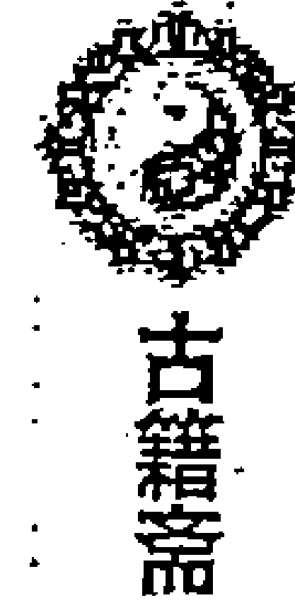

公元：2010年1月6日12时29分27秒 阳8局
干支：己丑年 丁丑月 丙辰日 甲午时
旬空：午未空 申酉空 子丑空 辰巳空
直符：天芮 直使：死门 旬首：甲午辛

| 庚 九地〇   天辅 癸   地 杜门 癸 | 丙 九天   天英 己   天 景门 己 | 戊 直符 马   丁 禽芮 辛   符 死门 辛 |
| :--- | :--- | :--- |
| 己 玄武   天冲 壬   玄 伤门 壬 | 辛     丁 | 癸 腾蛇   天柱 乙   蛇 惊门 乙 |
| 丁 白虎   天任 戊   白 生门 戊 | 乙 六合   天蓬 庚   六 休门 庚 | 壬 太阴   天心 丙   阴 开门 丙 |

济南一网友在《不吹牛预测网》上发帖子讲：“最近经常莫名其妙的找不到东西，先是信用卡不翼而飞，还有耳坠什么的小东西总是找不到，翻遍了家里的角落也找不到，请老师帮忙看看是不是最近有点背，东西都丢了？” “信用卡我查过，没有被别人用过的记录，但就是找不到在哪里。最担心的是借出去的一笔钱能不能如数奉还。”

2月 23 日反馈：“各位老师我来反馈一下，年前搬家，已经彻底把角落清扫了，但是还是没有找到遗失的东西，再次感谢各位老师的关注和帮助。”

我们分析一下这个局为什么找不到？

日干丙火落乾宫入墓，丙+丙：月奇悖师，文书逼迫，破耗遗失，凡事过犹不及。入墓也主遇有麻烦事。这里正符合证券、文书丢失的情况。

时干主失物，落坤宫。辛金又主颗粒之类的东西，丁奇代表信用卡，也能代表耳坠。全局大局伏吟，一般说来“伏吟主物品未丢，只是发现不了”。本局时干遇辛+辛伏吟天庭，又遇死门，死+死：主官事羁留、印信无气，凶；死+辛：主盗贼失脱难获。虽然宫中有丁奇，但临死门，也难以找到。因为月干亦为丁奇，信用卡的丢失可能与朋友或同宿舍的人有关。辛金为失物。辛+辛，找不到。

### 失物预测实例二：一个女孩坐出租车把钱包掉车上了

神鉴发在《不吹牛预测网》上的帖子：“刚刚打电话给我的，问能不能找回，我起了局。钱包里有两千多块钱，身份证、银行卡。”

不吹牛断：“伤门生日干，戊+丙，龙返首：应能找回。但有点损失，答谢司机的费用吧。是自己大意造成的”

命主叙述：“正要下车付给司机钱的时候，给司机一百，司机找给她九十五。。。后来下车了才发现手提包里少了钱包！”

不吹牛断：“伤门对冲时干，临玄武，应该掉在了出租车里。”

反馈：“恩。是的，所以她说想办法找到那个司机 但又没有记住车牌号 估计很难找回了。她说她的银行卡里还有两万多钱，只要这个钱不被取走，就阿弥陀佛了。”

公元：2009年6月3日3时56分15秒 阳5局
干支：己丑年 己巳月 己卯日 丙寅时
旬空：午未空 戌亥空 申酉空 戌亥空
直符：天禽 直使：死门 旬首：甲子戊

| 壬 螣蛇   天柱 庚   地 伤门 乙 | 戊 太阴   天心 己   天 杜门 壬 | 庚 六合 马   天蓬 癸   符 景门 丁 |
| :--- | :--- | :--- |
| 辛 直符   戊 禽芮 丁   玄 生门 丙 | 癸     戊 | 丙 白虎   天任 辛   蛇 死门 庚 |
| 乙 九天   天英 壬   白 休门 辛 | 己 九地   天辅 乙   六 开门 癸 | 丁 玄武○   天冲 丙   阴 惊门 己 |

6月6日反馈：不吹牛老师神断 ，刚刚那个女孩打电话把我吵醒，声音沙哑的告诉我说 刚刚和男朋友吵架分手了 然后又说昨天晚上那个司机在她的钱包里发现有张手机卡 就用那张卡命主的另个手机号码打电话 把钱包还给了她 她给了那个司机五百元作为报答 但目前她的心情却更为糟糕了。

我们现在详细分析一下这个局：日干己为求测人，己落离宫是临官地，与太岁己同宫，又离宫旺相为吉。临天心星吉星，太阴吉神。己土、杜门、太阴组成“地假格”，比较吉利。

为什么断会有一些费用答谢司机？一是甲子戊落震三宫六仪击刑主钱财受损；二是日干落宫暗干见戊，戊+壬主钱财损失，而暗干壬落巽宫，临伤门主这钱是损失给司机的，因而断会有答谢司机的费用。

**应期：**日时都在外盘主慢，值使门死门在兑宫可能 2 天。日干己在离宫，当令为应期，壬午日当令。

### 失物预测实例三：耳钉掉了，就在办公桌前，可是就是找不到啦！

公元：2009 年 7 月 26 日 17 时 35 分 1 秒 阴 1 局
干支：己丑年 辛未月 壬申日 己酉时
旬空：午未空 戌亥空 戌亥空 寅卯空
直符：天心 直使：开门 旬首：甲辰壬

| 丙 腾蛇 天柱 辛 白 伤门 丁 | 庚 直符 天心 壬 六 杜门 己 | 戊 九天 天蓬 戊 阴 景门 乙 |
| :--- | :--- | :--- |
| 乙 太阴○ 癸 禽芮 乙 玄 生门 丙 | 丁  癸 | 壬 九地 天任 庚 蛇 死门 辛 |
| 辛 六合○ 天英 己 地 休门 庚 | 己 白虎 天辅 丁 天 开门 戊 | 癸 玄武 马 天冲 丙 符 惊门 壬 |

**原来断：**
- 1、是左耳的耳钉吗？没上好掉下来了？（是右耳，拿下来消毒呢！装的时候掉了后边的一部分，呵呵！）
- 2、掉到了地板缝隙里（地板没缝，不过桌子太多啦！书也太多啦！堆成山啊！找也难！）
- 3、别放弃，我看还能重现的（嘿嘿，我现在，等着它主动现身呐！真没了，只能说无缘！）
- 4、31 号看看有没有希望找到（好的，那天我特别找找！）
- 5、地盘辛金在兑宫，九地、天任星，死门，庚+辛：在形成拱状的“金属物”底下？（哎呀呀，师傅，我这里一整排都是铁桌子、铁书架，您怎么知道的？）

这个局属于明知道丢在了附近，但就是找不到的一类。我们看看有什么特点？时干代表失物，落艮宫入墓又空亡，失物难寻；上层六合说明被遮盖住了。地盘辛金为耳钉静下来的状态，临九地、死门亦主被遮盖住了。庚辛代表货架之类。九地应为落在了低处。但死+辛“失物难获”；庚+辛，亦凶。被阻隔住了，找不到。

### 失物预测实例四：钱包丢了吗？

公元：2009年8月2日12时30分8秒阴7局
干支：己丑年辛未月己卯日庚午时
旬空：午未空戌亥空申酉空戌亥空
直符：天柱直使：惊门旬首：甲子戊

| 乙 太阴   天英 丙   六 生门 辛 | 辛 螣蛇   庚 禽芮 癸   阴 伤门 丙 | 己 直符 马   天柱 戊   蛇 杜门 癸 |
| :--- | :--- | :--- |
| 戊 六合   天辅 辛   白 休门 壬 | 丙     庚 | 癸 九天   天心 己   符 景门 戊 |
| 壬 白虎   天冲 壬   玄 开门 乙 | 庚 玄武   天任 乙   地 惊门 丁 | 丁 九地○   天蓬 丁   天 死门 己 |

一易友从深圳来电话：杨老师，我的钱包和一些证件不见了，您看看是忘在哪里了，还是丢了？

我：包里有2000块钱？（天盘戊在坤宫，地盘戊在兑宫）

友：差不多吧。

我：你开车出去过？（天盘时干临伤门，地盘时干临马星，冲格）

友：昨天晚上开车去吃饭了。

我说：那是在车上遭贼了，被盗之象，找不回来了。

当晚9点多求测人反馈：“老师，钱包我知道怎么丢了了。是我丢在车上，我同学开走，洗了个车，结果被洗车的偷了”“是那天我借车给他回家，钱包在车上，结果第二天要用来做婚车，他就找人洗车了，结果应该是洗车的偷了。”

我们分析一下这个局：

日干己落兑宫为长生之地，己+戊犬遇青龙，门吉谋望遂意，门凶枉费心机。景门为小凶门；景+惊“主官讼，阳人小口疾病事，凶”。景门主道路，临九天主出行。又结合时干落宫，断与车辆有关。

时干庚为所求之事，临天芮星主钱包。宫中庚+丙“贼必来”预示着遭贼了。时干克日干，失物找不到。又值使门主事体，临玄武，亦主遭盗之象。因而判断为是被盗找不回来。

### 失物实例预测五：看看此人丢了啥东西，能否找到【在哪里谁找到的】

公元：2009年8月22日6时6分39秒阴5局
干支：己丑年壬申月己亥日丁卯时
旬空：午未空戌亥空辰巳空戌亥空
直符：天禽直使：死门旬首：甲子戊

| 壬 九地 马   天心 乙   阴 杜门 己 | 乙 玄武   天蓬 壬   蛇 景门 癸 | 丁 白虎   天任 丁   符 死门 辛 |
| :--- | :--- | :--- |
| 癸 九天   天柱 丙   六 伤门 庚 | 辛     戊 | 己 六合   天冲 庚   天 惊门 丙 |
| 戊 直符   戊 禽芮 辛   白 生门 丁 | 丙 腾蛇   天英 癸   玄 休门 壬 | 庚 太阴○   天辅 己   地 开门 乙 |

这是网友刘小发在《不吹牛预测网》上的一个“游戏贴”。我最初的答复也不够正确。原来的答复和反馈如下：呵呵，猜东西，不在行。试试：

值使死门，时干丁奇都落坤二宫，丁火在坤宫是胎养之地，丁+戊，丁+辛[是钥匙】，这东西是大肚子，有尖角，地盘值符，天盘白虎，挺高级的，花了不少钱买的。有了这东西后，家里就破财【买房子花了不少钱】。天任星与坤卦都主静，是个质地厚重之物，或泥土瓷器之物：这是其一判断，是个茶壶或工艺品之类【其实说实话我很佩服你杨老师能断到这里，】。？

其二判断：房产证之类【是与房子有关是对的，是钥匙】钥匙是 21 号晚妻子丢的，22 号这个时间问我我起得局。在 22 号 7 点多一点 1 个中年妇女捡到，我妻子听到后要回。杨老师为何是中年妇女捡到，为何我妻子当时正巧听到。能否从易理解析下，谢谢了杨老师。

惭愧！其实，从值使门代表大门，死门代表锁，丁、辛等符号上来看，应能解读为钥匙的。呵呵，联想力还不够丰富。

：大局返吟，是能找到之象。又失物生人也是能找到之象。

：你起的局，日干己土为你，合干值符为妻子。坤宫主女人，与失物在一起，这可能是中年女人捡到钥匙的原因。艮宫临值符，丁为信息，妻子听到信息吧。

对于这个局，我们可以对照一下来判断：

如何判断失物为何物？借这个机会，讲一下，如何判断所失为何物的方法。测财物丢失，一般情况下以日干为失主，时干为所失之财物，兼看值使门，以时干落宫情况综合判断所失何物。例如，时干落乾宫，可能为金属宝物、玉器、铜铁圆形金属物品、马匹、车辆等。时干落坎宫为水晶、珠宝、笔墨、细软、猪等。落艮宫则为玉石、牛、狗、猫之类。震为车、船、木器、驴等。巽宫为丝绸、布匹、彩色之物。离宫为图书、手卷、书画、印信、文件等。坤宫为车辆、牛、羊、中空有声之物。兑宫为金银首饰，鸡、飞禽、有口之物品。临值符为高档物品、价值昂贵。临腾蛇主柔软细长之物，如绳索、腰带、电线、丝巾、领带等。临太阴为女人物品、文书、雕琢之物、带羽毛之物、文彩之物。临六合主酒食之物、文书、布帛、果实。临白虎主硬物、猫、破损之物、铁器、刀枪、金银铜铁之物、首饰等。临玄武为钥匙、图画、衣服、珠玉。临九地主旧物、农作物、走兽。临九天主飞禽、印信、利器、有声音之物。时干临甲乙为木制品、装饰物。临丙丁为易燃物，带火之物、电子电器、电子物品、手机、电话。临戊主现金、钱财、临己主阴私之物、土产物品。临庚辛为金属物品、首饰。临壬癸为冷饮、水中之物、柔软细长之物。时干临景门可能是电脑、电视、照相机等物，临杜门可能为工具，临天心星可能为医药物品，临天冲星可能是雷管、炸药等。总之依据九宫各象综合判断。

本例时干丁奇与值使门死门都在坤宫。地盘时干临生门。生门主房子，死门主地皮，值使门为大门，死门为锁。丁、辛为钥匙，戊围墙。这里虽然是“对号入座”，但也便于我们对象意的把握与理解。大家可以在实践中留意总结。

### 失物预测实例六：一朋友问存折找不到了，看看在哪里？

公元：2009年9月5日9时55分29秒 阴1局
干支：己丑年 壬申月 癸丑日 丁巳时
旬空：午未空 戌亥空 寅卯空 子丑空
直符：天禽 直使：死门 旬首：甲寅癸

| 壬 直符   癸 禽芮 乙   阴 杜门 丁 | 乙 九天   天柱 辛   蛇 景门 己 | 丁 九地   天心 壬   符 死门 乙 |
| :--- | :--- | :--- |
| 癸 腾蛇   天英 己   六 伤门 丙 | 辛     癸 | 己 玄武   天蓬 戊   天 惊门 辛 |
| 戊 太阴○   天辅 丁   白 生门 庚 | 丙 六合○   天冲 丙   玄 休门 戊 | 庚 白虎 马   天任 庚   地 开门 壬 |

一朋友问存折找不到了，看看在哪里？什么时候能找到？

9月8日反馈：“于昨日乙卯日亥时在家中西面提包中找到。”

分析此局：

日干为求测人，时干为失物。时干丁，而丁又代表存折。日干癸+丁，日时同宫，一般说来物不失，能找回之象。八门伏吟，一般亦主物不失，而是压在了某个地方暂时找不到之象。又庚下壬，为庚格，主能找到。

天盘丁落艮宫逢空亡，入墓，对冲死门值使，均主没有丢，但难找。静止的状态应看地盘时干，地盘丁奇在巽宫，临天芮星，天芮星主书包提包，临杜门，可能在提包里。巽宫主东南方，而先天巽为兑宫，此局在西面提包中找到也符合道理。

应期：乙卯日丁亥时，可能与下临有关：值使门落坤宫主两天。甲子戊在兑宫逢冲，一般说冲以合为应，但也经常发现冲以刑为应期。乙卯日子卯刑。

### 失物预测实例七：掉了一份笔记，能不能找到 ???

今天晚上6點前 能否找到 ?? 遺失在哪里 ? 因為要考試時間是 7:00 呀

公元：2009年9月5日14时5分37秒 阴1局
干支：己丑年 壬申月 癸丑日 己未时 【五不遇时】
旬空：午未空 戌亥空 寅卯空 子丑空
直符：天禽 直使：死门 旬首：甲寅癸

| 庚 螣蛇 马   天英 己   阴 景门 丁 | 丁 直符   癸 禽芮 乙   蛇 死门 己 | 壬 九天   天柱 辛   符 惊门 乙 |
| :--- | :--- | :--- |
| 辛 太阴   天辅 丁   六 杜门 丙 | 己     癸 | 乙 九地   天心 壬   天 开门 辛 |
| 丙 六合○   天冲 丙   白 伤门 庚 | 癸 白虎○   天任 庚   玄 生门 戊 | 戊 玄武   天蓬 戊   地 休门 壬 |

年命癸亥

**反馈是：**不吹牛老师，果然强 ，问事时辰内找到， 放在书丛中。

这局是如何判断的？日干癸水与时干己土同宫，又时干生日干，能够找到。日干与值使门同宫亦主能够找到。天盘己临景门天英星，地盘己土临天芮星，天芮星景门都主书籍画卷，临螣蛇、死门很可能被盖住了。**日干临值使门主立马要进行**，时干临马星主快。又甲戌己落巽宫有辰戌冲，逢冲主快，现在正是己未时，己为甲戌己，正逢冲，断本时辰内找到。己未时时干生日干，主找到。

### 失物预测实例八：今早的一个局，照片在哪里

公元：2009年9月1日6时26分30秒 阴1局
干支：己丑年 壬申月 己酉日 丁卯时
旬空：午未空 戌亥空 寅卯空 戌亥空
直符：天蓬 直使：休门 旬首：甲子戊

| 戊 直符 马   天蓬 戊   玄 死门 丁 | 壬 九天   天任 庚   白 惊门 己 | 庚 九地   天冲 丙   六 开门 乙 |
| :--- | :--- | :--- |
| 己 螣蛇   天心 壬   地 景门 丙 | 乙     癸 | 丁 玄武   天辅 丁   阴 休门 辛 |
| 癸 太阴   天柱 辛   天 杜门 庚 | 辛 六合   癸 禽芮 乙   符 伤门 戊 | 丙 白虎○   天英 己   蛇 生门 壬 |

这也是发在《不吹牛预测网》上的一个帖子，讲“照片找不着了，起局看看在哪里？”后来反馈：“最后照片是在坎位略偏西的桌子抽屉里一个黑色小笔记本中夹着。7点刚过几分找到的，实际上这个抽屉里找了好多遍了”

我们分析一下这个局：

日干己落乾宫，逢空亡主心里不踏实。时干丁主失物，临玄武，遗忘了放在哪里。离宫庚+己，逢日格能找回。地盘时干在巽宫，戊辰时，冲日干巽宫动找回。

这个方向不太好断，我原来认为会在兑宫或巽宫，而实际是在坎宫找到的。这里可能有如下原因：一是地盘丁上临戊，戊地盘在坎宫；二是兑宫是先天的坎位；三是天芮星、六合都有照片的信息，坎宫本身就有此象意。大家可以研究。

### 失物预测实例九：我的银行卡不记得放哪去了，现在怎么找也找不到了，是在家里还是公司还是丢了？请各位老师帮我看看，有结果一定反馈，谢谢

公元：2009年9月14日21时30分22秒 阴6局
干支：己丑年 癸酉月 壬戌日 辛亥时
旬空：午未空 戌亥空 子丑空 寅卯空
直符：天芮 直使：死门 旬首：甲辰壬

| 辛 九天 马 天柱 乙 阴 死门 庚 | 丙 九地 天心 戊 蛇 惊门 丁 | 癸 玄武 天蓬 癸 符 开门 壬 |
| :--- | :--- | :--- |
| 壬 直符○ 己 禽芮 壬 六 景门 辛 | 庚  己 | 戊 白虎 天任 丙 天 休门 乙 |
| 乙 螣蛇○ 天英 丁 白 杜门 丙 | 丁 太阴 天辅 庚 玄 伤门 癸 | 己 六合 天冲 辛 地 生门 戊 |

9月15日反馈：卡找到了，在家里，确实是在靠墙的圆形角柜上方找到的，只是圆形角柜在卧室的大概的北偏西的方向，因为房子是东北西南向的，卧室在房子的南方。

对此局的分析判断：

日干壬水落震宫，壬+辛，辛为时干，日时同宫，一般能找到。坎宫庚+癸是月格，主能够找到。时干辛金在内盘，临生门主在家里。地盘辛金逢空，主不在东方。辛金落乾宫主在西北方向。又丁奇主卡片，地盘丁奇在离宫，应为南部位置。乾离结合断：天冲星六合为橱子、角柜，天心星主圆形。符合求测人反馈的情况。阳日庚下之干为应期，第二天为癸亥日，正应此日找到。

## 失物预测实例十：钥匙又找不到了，丢了吗？

我在南方，我的办公桌的钥匙找不到了，里面放的一个小册子明天是急着用的，钥匙是黑色的把，不大，白天在办公室没找到，以为带回家了，结果在家里还没找到，钥匙是丢了吗？请老师们出手再看看，谢谢

## 女，69年，南方-广东南面城市

公元：2009年9月21日20时8分53秒 阴3局
干支：己丑年 癸酉月 己巳日 甲戌时
旬空：午未空 戌亥空 戌亥空 申酉空
直符：天芮 直使：死门 旬首：甲戌己

| 庚 太阴 天辅 乙 阴 杜门 乙 | 丁 腾蛇 天英 辛 蛇 景门 辛 | 壬 直符○马 丙 禽芮 己 符 死门 己 |
| :--- | :--- | :--- |
| **辛 六合** 天冲 戊 六 伤门 戊 | **己**  丙 | **乙 九天○** 天柱 癸 天 惊门 癸 |
| **丙 白虎** 天任 壬 白 生门 壬 | **癸 玄武** 天蓬 庚 玄 休门 庚 | **戊 九地** 天心 丁 地 开门 丁 |

9月 22 日午时反馈：先感谢几位老师看卦，钥匙找到了，是我前两天和别人边吵边随手扔在一个角落的，所以事后就忘了放哪了。反馈情况如下：1、钥匙是单个的一把，不是一串，我还有一串钥匙也是在西北方向文件框里，但不与这把放在一起，离得比较近，扁形带槽的，黑把的。2、钥匙在办公桌的西北角放了化妆水，打孔器等文具中间，因为没看到。3、办公桌在公司的南部（偏一点东的方向），办公桌是带周转隔断的，相对一个低矮的小空间，也可以把办公桌的围断看做一个小的办公室，这样就确实是在西北角，但不是地上是桌上。4、办公桌抽屉在办公桌的西南向，刚好与钥匙的方向对角。5、不吹牛老师说换地方也是对的，因为我平时钥匙都不放在西北角的。是今天早上九点左右找到的。

**分析：**日时同宫物不失，都在内盘，为放在内盘。因为是办公室的钥匙，内盘应主办公室里。又丁奇主钥匙，也在内盘，临开门，也表示在办公室里。都在内盘主找到的快，但考虑夜里求测，肯定是第二天才能去办公室，死门值使落坤主两天，空亡减半，第二天找到。

## 失物预测实例十一：手表，看能找到吗？有反馈。（网例留存）

公元：2009年9月24日22时7分13秒 阴1局
干支：己丑年 癸酉月 壬申日 辛亥时
旬空：午未空 戌亥空 戌亥空 寅卯空
直符：天心 直使：开门 旬首：甲辰壬

| 丙 六合 马 天英 己 白 生门 丁 | 庚 太阴 癸 禽芮 乙 六 伤门 己 | 戊 螣蛇 天柱 辛 阴 杜门 乙 |
| :--- | :--- | :--- |
| 乙 白虎○ 天辅 丁 玄 休门 丙 | 丁  癸 | 壬 直符 天心 壬 蛇 景门 辛 |
| 辛 玄武○ 天冲 丙 地 开门 庚 | 己 九地 天任 庚 天 惊门 戊 | 癸 九天 天蓬 戊 符 死门 壬 |

这是一个网友的帖子，原文讲：“这是一个又网友刚问过我的，先谢谢各位老师。我的思路是以辛代表手表，同时也是时干。时干生日干能找到的象，又落内盘，在家里，应该能找到。辛下乙为窗户 床 桌椅等东西天柱为架子之类的。这几个组合附近吧！辛在坤 可能是子日或丑日找到，但是时干对宫空了，时暗干辛飞过去。玄武丙加庚被人偷走之象，开门可能是在单位吧！刚想问她，吵了一会儿嘴，她就下了。弟子刚学 弄不明白怎么回事，还请各位师傅指教。 等有结果一定会反馈的。”9月26日反馈：“谢谢各位师傅，现在还没有找到，卦主说现在家里很乱，没有找。日后找到我会专开一个反馈贴。再次谢谢各位师傅。”2010年1月15日反馈：至今多个月了，还是没有找到。

这个局有意思，正常判断应为能找到之象。不过，前面我们也讲过，遇到辛+癸，这样的格局，即使时干生日干也难找。诗云：螣蛇杜兮莫捕贼，贼已远去不可追：失物难寻啊。

### 失物预测实例十二：我朋友打电话来说她的车不见了，会是什么情况呢？

公元：2009年9月28日20时45分23秒 阴4局
干支：己丑年 癸酉月 丙子日 戊戌时
旬空：午未空 戌亥空 申酉空 辰巳空
直符：天蓬 直使：休门 旬首：甲午辛

| 庚 直符○ 天蓬 辛 玄 景门 戊 | 丁 九天 天任 癸 白 死门 壬 | 壬 九地 马 天冲 己 六 惊门 庚 |
| :--- | :--- | :--- |
| 辛 腾蛇 天心 丙 地 杜门 己 | 己  乙 | 乙 玄武 天辅 戊 阴 开门 丁 |
| 丙 太阴 天柱 丁 天 伤门 癸 | 癸 六合 乙 禽芮 庚 符 生门 辛 | 戊 白虎 天英 壬 蛇 休门 丙 |

这是一个易友发在《不吹牛预测网》上的一个帖子，原文讲：“车在 21 点以后找到。事情的经过是这样的：朋友的爱人是个领导，车是他的司机开去修了。当时跟他要车钥匙的时候他正开会，没太在意，司机就把他的车钥匙拿去，把车开到修理厂，然后，又把钥匙给他放桌上了。过后，他对这件事忘得一干二净了，回家后没看到车，然后就问我的朋友用车了？朋友说没，然后两人就开始找寻。最后，朋友的爱人，问到他司机时，才明白过来。一场虚惊！当时我起局看的时候，也感觉事情有点蹊跷。一开始我用日干丙看的，克伤门应该不会丢，并且伤门临癸，癸为朋友的年命。但是又看到戊临玄武，时干克日干，所以，又觉得被盗的可能性挺大。因此，我便发上来，让各位老师参与一下，也许有点收获！”

我们分析一下这个局，看看能有什么启迪。

以日干丙火为求测人，落震宫，临腾蛇，主忧疑、胡思乱想、心里慌张之象。时干主失物，也主事体，落兑宫，冲克日干宫，临玄武主被人“偷去”；亦主忘记了具体情况。但时干临吉门、吉星、吉格，一般不凶。翻宫看丁奇到艮宫，又伤门为汽车，落艮宫，丁+癸朱雀投江，因为这个癸水为月干，月干为同事为朋友，此宫的信息显示与朋友有关。戊为时干为下属、癸为月干为同事，临伤门，主驾驶员。这里的信息应能显示为被司机开走之象。

又此局如果求测人讲到是丈夫弄丢的话，可以取丙辛合合干辛金为丈夫，辛金落在巽宫入墓，忘记了。辛+戊，人与时干同宫，亦主能找到之象。又可以取庚为丈夫，时干生乙庚落宫，能找到之象。

**关键点：** 时干临吉星+丁，即使不生日干，也能找回。

### 失物预测实例十三：奇门找失物

公元：2009年9月30日 19时17分28秒 阴4局
干支：己丑年 癸酉月 戊寅日 壬戌时
旬空：午未空 戌亥空 申酉空 子丑空
直符：天任 直使：生门 旬首：甲寅癸

| 癸 螣蛇 天蓬 辛 地 休门 戊 | 戊 直符 天任 癸 玄 生门 壬 | 丙 九天 马 天冲 己 白 伤门 庚 |
| :--- | :--- | :--- |
| 丁 太阴 天心 丙 天 开门 己 | 壬  乙 | 庚 九地 天辅 戊 六 杜门 丁 |
| 己 六合 ○ 天柱 丁 符 惊门 癸 | 乙 白虎 ○ 乙 禽芮 庚 蛇 死门 辛 | 辛 玄武 天英 壬 阴 景门 丙 |

晚饭后，女儿惊呼，“哎呀，我的钱包不见了，会不会掉在商场里了”，妻子马上紧张起来。我还想听新闻，女儿着急说，“爸爸给我起个局看看吧”。

**起出局来：** 日时比和都在内盘，没有丢失。地盘壬临生门，正在家里。在哪里呢？地盘壬，临值符天任星，有坡度或起伏的地方，癸+壬，上下是同类的：呵呵，沙发！我直奔客厅的沙发。果然，就在沙发里，被竹垫子盖住了。

刚想静下来答复个帖子，听见她娘俩，好像又在找寻什么东西，翻箱倒柜的。女儿又跑到我的书房来找。我问，又找什么？说：我原来的一个包，那个包里有家里的钥匙。你不是要出差吗，我得找到钥匙。此时，她就在我的西方说话，同时日干就是戊，戊也有钱包的象意。戊+丁，丁是钥匙。我看地盘戊在巽宫，临休门，主卧室。巽在东南，女儿的卧室就在东南。天盘戊临天辅星、杜门，九地：应该就在你卧室里的壁橱里。她说，我找过了。我说再找找，于是我们又去找，很快还是在此壁橱（壁橱在卧室内的北部，东边壁橱的底层）找到了她要找的包。打开后，里面有点硬币之类，却没有要找的钥匙。女儿说，是不是我实习时丢了。

**我说：**别急，我在试试。辛金为钥匙，辛+戊，临休门，还在卧室里。戊为方为桌子，又地盘辛金，落坎宫，天芮星主书，应该在书桌里。于是我们去书桌找，很快，就在抽屉里，找到了这把钥匙。（当然这样的局，得益于熟悉家里的东西，以及一些放置习惯。对于我们不了解的环境，预测难度则较大。）

### 失物预测实例十四：请大家帮忙看看，一个女的项链丢了能否找到？（错例分析）

公元：2009年9月30日16时33分41秒 阴4局  
干支：己丑年 癸酉月 戊寅日 庚申时  
旬空：午未空 戌亥空 申酉空 子丑空  
直符：天任 直使：生门 旬首：甲寅癸

| 辛 太阴 天心 丙 地 开门 戊 | 丙 腾蛇 天蓬 辛 玄 休门 壬 | 癸 直符 天任 癸 白 生门 庚 |
| :--- | :--- | :--- |
| 壬 六合 天柱 丁 天 惊门 己 | 庚  乙 | 戊 九天 天冲 己 六 伤门 丁 |
| 乙 白虎○马 乙 禽芮 庚 符 死门 癸 | 丁 玄武○ 天英 壬 蛇 景门 辛 | 己 九地 天辅 戊 阴 杜门 丙 |

这是发在网上的一个求测贴，当时我在网上答复：“一般情况下，返吟局，失物能找回。地辛临玄武，忘记了放在哪里。地庚在坤，临生门，还在家中。乙为床，庚为床垫，癸为床上用品：天任星床头，大概在床垫子那个夹缝之中吧。”

求测人反馈：“谢谢不吹牛老师。事实我跟这个人说了您断的情况，她是从外地刚回来，坐车前确实在一个房子的床上躺了一会。今天看到她，她说：“真不该问人家，因为这个事情搞的大家都不好，她后悔不应该问人家，一条几千元的项链，谁捡到也不会承认的”。

后来得知，项链没有找回。根本原因在于时干击刑入墓逢空亡，无力生日干。又辛金临玄武，逢空，也是被人昧起来的情况。此例的教训是，最初只是认为她呆在自己家里找东西，而没有咨询清楚是什么情况下发现的项链丢失。时干落外盘，应指丢在了外面。

### 失物预测实例十五：无缘无故钱没了？

公元：2010年1月8日21时44分54秒 阳8局
干支：己丑年 丁丑月 戊午日 癸亥时
旬空：午未空 申酉空 子丑空 子丑空
直符：天辅 直使：杜门 旬首：甲寅癸

| 壬 直符 马 天辅 癸 符 杜门 癸 | 戊 螣蛇 天英 己 蛇 景门 己 | 庚 太阴 丁 禽芮 辛 阴 死门 辛 |
| :--- | :--- | :--- |
| 辛 九天 天冲 壬 天 伤门 壬 | 癸  丁 | 丙 六合 天柱 乙 六 惊门 乙 |
| 乙 九地○ 天任 戊 地 生门 戊 | 己 玄武○ 天蓬 庚 玄 休门 庚 | 丁 白虎 天心 丙 白 开门 丙 |

光 ：你好，帮忙看下我的钱到哪去了，无缘无故不在了。是在办公室里

光 ：我怀疑是多付了别人

光 ：是呀，明明从银行取回来的钱，晚上算账就差了

光 ：找不回来了吗

光 ：我思前想后，我不可能多付别人一万

光 ：是否银行一沓中少了

这个局，我断找不回来了。事实上一直也没有找到。日干戊落在养地，空亡，戊+戊倒霉之象。日时都在内盘，主就在办公室内丢的。时干克日干，失物难寻。甲子戊空亡，意味着破财“钱没了”。

对冲坤宫丁临辛金，主手续出错。丁为月干，错在同事身上。时干临杜门，对方不开口。又这人怕给领导汇报或报案后，引起别人对自己的看法不好，只是默不作声自己查找原因，但一直没有发现错在哪里。只好自己吃了个“哑巴亏”，破财一万元。叫人感到幽默的是，因为他平时表现较为突出，当天领导给他发了刚好一万元的红包。是先得红包，又在发工资时出现了差错，给人多发去一万元。

## 三、专论机动车辆丢失的预测

汽车、摩托车等机动车辆作为车主的一项重要财产，很少出现因为忘记放在哪里而丢失的情况，一般所谓的汽车、摩托车等机动车辆的丢失，其实就是被盗了。这类预测基本的判断要求如下：

- （一）取伤门为车辆的类象用神，时干亦作为失物来看待。判断是否真正失窃。伤门或时干临玄武或天蓬星，一般是被人偷走了（个别情况是自己忘记放在哪里了）。如果伤门或时干被玄武或天蓬星所克，则被人盗走的可能性更大。伤门或时干落宫，生玄武或天蓬星落宫，亦为被人盗走。

- （二）如果伤门或时干与日干同宫，或伤门、时干生日干，在格局组合好的情况下，一般能找回。这类格局包括丙+戊飞鸟跌穴、戊+丙青龙返首、庚+丙贼必来、丁+庚行人必归等。遇到这样的格局，有时时干不生日干，也是能找回之象。但如果遇到丙+庚贼必去、乙+辛龙逃走、乙+己日奇入墓、癸+癸天网四张、壬+壬蛇入地罗、壬+癸幼女奸淫、辛+癸天牢华盖、癸+辛网盖天牢、丁+癸朱雀投江等格局，即使时干生日干也难找回。

- （三）什么人偷走的？这样的案件一般是看玄武落宫。玄武乘阳星、临阳门、落阳宫，为被男人盗走。乘阴星、临阴门、落阴宫，为被女人盗走。旺相有气，为青壮年；休囚无气为老年人。又以其落宫之天地盘之干为其衣服颜色。另以天蓬星为贼星，参断。

- （四）能否破案？这类机动车辆的丢失，一般人都会选择报案。能否破案，抓获盗贼，成为能否找回失去车辆的关键。一般情况下，**以伤门、白虎、庚和值使门为公安或捕盗之人**。这些宫象旺相，冲克玄武落宫者，案子容易破获。相反，则难破或破不了案。星门伏吟者，案子难破。反吟，通常能破案或者在案犯以后作案时被抓获。另外，在寻找和破案类事物的预测中，“庚格”比较重要。即，庚下临年、月、日、时，案子能破。不格者，不破或难破（庚格，一般是日时临庚比较准）。

- （五）定应期，即找回的时间比较复杂。**一般以时干生日干为应期。**日时同宫逢空，则填空之日为应。入墓库者，以冲出之日为应期。临马星者，马星动或冲动马星为应。如果逢庚格，可按庚格来断，即临年格者，当年可以破案。临月格者，本月破获。临日格者、时格者主快，但通常情况下象寻车这类的很难应在当日当时。要结合常理，不可拘泥与教条。若没有这类庚格，**用神是时干者，则时干临阴星看庚上之干为应期；时干临阳星，看庚下之干为应期。**具体的定应期法则可参考《定应期》一章。

- （六）看事主（如求测人）的运气，与是否有大的失财之兆。一是事主用神（日干或年命）落宫的情况，如果衰囚墓绝又临凶星凶门凶神格局又差，则运气不佳。反之，如果临旺相有力，又临吉星吉门吉神吉格临三奇，运气好，一般则失物能得。或破财也对其构不成威胁。二是如果甲子戊逢击刑、入墓、落死绝之地、逢辛+戊、戊+辛、戊+己、戊+壬等格，亦表示有失财之象，则是失物难回。三是如生门克日干，也是不利财的表现。

- （七）看玄武盗贼的落宫状态。如果玄武落宫旺相临吉门吉星吉格以及遁格之类，案犯不易抓获，这也从一个侧面反映了难破案与否。

- （八）其他参考。如求测时的外应等。（详见《奇门外应》一章）

### 预测案例点评：

#### 【例一】不吹牛预测汽车被盗失而复得案例

不吹牛预测网奇门论坛石破天版主发了个帖子《汽车被盗，能破案吗？》讲：“今天8：53，一个朋友来电话说，她的汽车在昨天晚上被盗了。让大家看看能否破案。”

公元：2009年9月18日8时53分46秒 阴9局
干支：己丑年 癸酉月 丙寅日 壬辰时 【五不遇时】
旬空：午未空 戌亥空 戌亥空 午未空
直符：天柱 直使：惊门 旬首：甲申庚

| 乙 太阴 天英 戊 六 休门 癸 | 辛 腾蛇○ 壬 禽芮 丙 阴 生门 戊 | 己 直符○ 天柱 庚 蛇 伤门 丙 |
| :--- | :--- | :--- |
| 戊 六合 天辅 癸 白 开门 丁 | 丙  壬 | 癸 九天 天心 辛 符 杜门 庚 |
| 壬 白虎 马 天冲 丁 玄 惊门 己 | 庚 玄武 天任 己 地 死门 乙 | 丁 九地 天蓬 乙 天 景门 辛 |

我在论坛上答复此案能破。09年11月2日求测人反馈：“此案已破，汽车已经得回了。破案前，汽车被改装过，现在修理之中。”现将我的分析思路介绍如下：

- 1、空亡，临庚+丙贼必来，庚+壬，移荡格；时干壬逢空，被玄武冲克。汽车确实失盗了。
- 2、天柱星旺于酉月坤宫不为真空，庚+壬为“时格”，蓬格能破案。（真空，则不为庚格）
- 3、时干入墓之时，又是五不遇时，主求事不顺，破案有难度，但并不意味着不能破案。
- 4、日干丙、时干壬同落离九宫，上乘腾蛇主缠绕。失物与人缠绕在一起，不分离之象，意味着能找回。格局：壬+戊，小蛇得势，丙+戊，飞鸟跌穴，飞出的车还能回来。又临生门吉门，被天盘戊所生，不破财之象。离九宫空亡，主人和车的暂时分离。
- 5、玄武为盗贼，落坎宫。己+乙，墓神不明，只能遁迹隐形才有出路。希望长在陷阱里，被抓是早晚的事。死+休，主求财事物不吉；死+乙，求事不成；死+

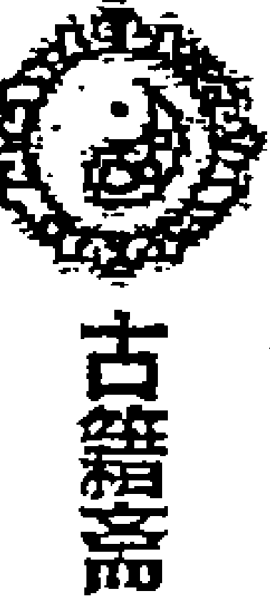

己，主病诉牵连，这盗贼运气不好。暗干见庚，而庚正克玄武。庚为警察，早晚会被警察抓获，此案能破。

- 6、白虎、值使惊门、庚、伤门均克玄武落宫，此案必破。
- 7、现在时令是酉月，玄武所在的坎宫旺相。而捕盗人员所在的坤艮为休不旺，暂时破不了案。待戌月艮坤旺相而坎死，则盗贼必被抓。又：阴遁日时伤门都在内盘逢庚格，破案较快。甲戌己，天盘己土落坎宫冲实日时所在的离九宫；地盘己土在艮宫冲实伤门所在的坤二宫，车辆重回。
- 8、伤门临天柱破军星，说明车辆有改动。
- 9、诗云：玄武死兮井坟院，多耗财帛鬼神惊。行兵两难思进退，主吉客凶要分清。小偷为客，遇到凶格，必被抓。

## 【例二】师父么学声断摩托车失盗案（《奇门遁甲预测学》P139）

一位朋友的儿子刚刚买了一辆新摩托车放在自家的楼下，吃完晚饭后发现车不见了，家里人四处找了大半天，仍一无所获。打电话向么老师求测。

公元：2002年7月3日19时40分24秒 阴3局
干支：壬午年 丙午月 壬申日 庚戌时
旬空：申酉空 寅卯空 戌亥空 寅卯空
直符：天任 直使：生门 旬首：甲辰壬

| 戊 玄武 天英 辛 地 开门 乙 | 壬 白虎 丙 禽芮 己 玄 休门 辛 | 庚 六合 马 天柱 癸 白 生门 己 |
| :--- | :--- | :--- |
| 己 九地○ 天辅 乙 天 惊门 戊 | 乙  丙 | 丁 太阴 天心 丁 六 伤门 癸 |
| 癸 九天○ 天冲 戊 符 死门 壬 | 辛 直符 天任 壬 蛇 景门 庚 | 丙 腾蛇 天蓬 庚 阴 杜门 丁 |

么老师分析：初看此局，时干生日干，能回之象。但我见伤门为车辆临丁+癸朱雀投江之格，必是音信全无。时干临天蓬大盗之星，必定是被人偷到而去。时干又落内盘，小偷是本地区人。玄武临辛，肯定是个惯犯、坐过牢。时干临腾蛇，在此蓄谋盘查很久才下的手。综此断：摩托车找不到了。后过了一年多的时间，还是没有找到。

**不吹牛注：**“玄武临开主逃亡”不宜抓获。开+杜，主失脱难寻。开+辛，阴人道路。开+乙，小财可求。暗干见戊，开+戊，财名俱得。眼下这小偷的运气还不错。乙在沐浴，这家伙还会想入非非的。庚金、伤门克玄武，这贼总有要被抓的一天。多行不义必自毙，不是不报、时候未到。

#### 【例三】转载网上帖子：预测摩托车被盗（《周易与人生网》）

公元：1993年1月13日22时41分21秒 阳2局
干支：壬申年 癸丑月 甲午日 乙亥时
旬空：戌亥空 寅卯空 辰巳空 申酉空
直符：天冲 直使：伤门 旬首：甲戌己

| 乙 六合 马 辛 禽芮 戊 蛇 伤门 庚 | 壬 白虎 天柱 癸 阴 杜门 丙 | 丁 玄武○ 天心 壬 六 景门 戊 |
| :--- | :--- | :--- |
| 丙 太阴 天英 丙 符 生门 己 | 戊  辛 | 庚 九地○ 天蓬 乙 白 死门 癸 |
| 辛 螣蛇 天辅 庚 天 休门 丁 | 癸 直符 天冲 己 地 开门 乙 | 己 九天 天任 丁 玄 惊门 壬 |

- 预测：1、日主落巽宫，逢芮辛，有车辆出事之兆头。伤+戊，主失脱难寻。
- 2、时落兑，逢蓬，遇盗之事。逢空，此物难寻。

结论：此车不可寻。 反馈：至今未找到。

**不吹牛注：**时干克日干。又玄武逢空，值使门克不住玄武，也是难破案之象。

#### 【例四】杨易营测例：解聘雇员，老板丢车（《奇门遁甲实例精讲》P218）

1998年元月7日申时，鹿泉市某饭店老板娘进门就问：“我家的汽车丢了，你看能不能找到？”预测后我断：“你的汽车是被人偷走的，对不对？”“对，昨天晚上放在门口，今天早晨发现没有了。”“偷车可能是一个人所为，是一个中年男性，车找不到了。”老板娘叙述：“昨天饭店有个工作人员，是中年男性，被老板解雇了，今天丢车准是他干的。我马上去报案，你看能破案吗？”我说：“怀疑不等于事实。你可以报案，但是，公安局不能破案，你这车也不是什么好车，权当破财免灾吧。”“是的，就是一辆旧车，可我的饭店离不开它呀。”

结果：98年下半年得知，车没有找到，又买了一辆新车。
公元：1998年1月7日16时1分34秒 阳8局
干支：丁丑年 癸丑月 甲寅日 壬申时
旬空：申酉空 寅卯空 子丑空 戌亥空
直符：天任 直使：生门 旬首：甲子戊

| 己 腾蛇 天冲 壬 阴 惊门 癸 | 丁 太阴 天辅 癸 六 开门 己 | 乙 六合 天英 己 白 休门 辛 |
| :--- | :--- | :--- |
| 戊 直符 天任 戊 蛇 死门 壬 | 庚  丁 | 壬 白虎 丁 禽芮 辛 玄 生门 乙 |
| 癸 九天 马 天蓬 庚 符 景门 戊 | 丙 九地 天心 丙 天 杜门 庚 | 辛 玄武○ 天柱 乙 地 伤门 丙 |

- 1、日干癸为求测者，落离宫为绝地，丑月离宫为休，虽临开门吉门，但宫克门为制，吉门受克吉不就。开+癸阴人失财。上乘太阴为被人谋算，癸+己华盖地户，音信受阻。年干丁奇落兑宫，日干克太岁，可谓倒霉之年。断：求测者时运不佳。
- 2、伤门主车辆，落乾宫，宫克门为制，丑月伤门为囚，天盘乙入墓，可见不是好车。乙+丙为奇仪顺遂，吉星迁官晋职，凶星夫妻离别，今临天柱星则凶，天柱星又为破财折本之星，伤+开诸事不利。伤+乙求谋不得，反防盗失财。伤+丙道路损失。上乘玄武贼盗之星。落空亡之地，有落空之意。断：汽车不是好车，不是丢而是偷，车不会找到。
- 3、偷车人玄武落乾宫，丑月乾宫为相不为旺，断是中年人，而不是青壮年。乾为男性，乾宫主一六数。断：一个中年男子偷了车。
- 4、汽车为饭店的固定资产，为财，如果破财，则车找不回。甲子戊为财，天盘戊落震宫，为六仪击刑，临死门大凶，死+伤，死+戊，死+壬均凶，戊+壬青龙入天牢，凡阴阳事皆不利；地盘戊落艮宫，庚+戊伏宫格百事凶，临天蓬大盗之星；生门为财落兑宫，临天芮星，主在财上出毛病，辛+乙白虎猖狂，人亡家败，车船俱伤，上乘白虎凶煞之神。日干癸落离宫，虽克生门落宫，但人在旺地能胜财，今离宫不旺。断：破财之象，车找不回。
- 5、值使门生门、白虎为公安，落兑宫，与玄武小偷落乾宫比合；庚为公安落艮宫，生玄武落宫，伤门为公安，与玄武同宫。断：此案不能破。

**不吹牛注：**此例虽然时干日干，咋一看能找回。实际上壬水入墓，又临地盘杜门，失物难寻。惊+杜，主失脱破财事。惊+癸，主被贼盗，失物不获。又临螣蛇主缠绕。时干落入墓绝之地，失物难回。

#### 【例五】张志春测汽车丢失案例（《神奇之门》P330）

1998年2月16日上午7点50分，老家亲戚打来电话，说本村在县地毯厂工作的一个乡友2月12日要去广州出差，当天开着拉达牌小汽车到邢台市，晚上9点将车放在一个亲友家中，他自己上火车走了。第二天亲友发现汽车不见了，因此请我测一下这辆汽车能否找回?于是我按问时起局

公元：1998年2月16日7时45分27秒 阳8局
干支：戊寅年 甲寅月 甲午日 戊辰时
旬空：申酉空 子丑空 辰巳空 戌亥空
直符：天任 直使：生门 旬首：甲子戊

| 己 太阴 天辅 癸 阴 伤门 癸 | 丁 六合 天英 己 六 杜门 己 | 乙 白虎 丁 禽芮 辛 白 景门 辛 |
| :--- | :--- | :--- |
| 戊 腾蛇 天冲 壬 蛇 生门 壬 | 庚  丁 | 壬 玄武 天柱 乙 玄 死门 乙 |
| 癸 直符 马 天任 戊 符 休门 戊 | 丙 九天 天蓬 庚 天 开门 庚 | 辛 九地○ 天心 丙 地 惊门 丙 |

- 1、日干甲午辛在坤2宫伏吟，午午自刑，景门主道路，白虎为刑伤，又九星伏吟，不宜出行，行则有伤灾或破财之事发生。
- 2、以时干为失物为汽车。时干戊落艮8宫，虽与日干比和，但又有对冲之意，而且临马星，遗失之象，难以找回。
- 3、以伤门为汽车落4宫，克日干宫，又临癸+癸天网四张格。找不回来之象。

我在电话中说：“这个拉达牌小汽车是不是墨绿色的?”对方回答：“是的。“是不是花8万元左右买的?”是的。“”恐怕找不回来了。“”是不是被人偷走了?””是的。”

- 4、玄武为偷车之人，落兑7宫，克伤门所在4宫，时干戊又生玄武，显然是被人偷走了。
- 5、白虎和值使门生门代表刑警、捕盗之人，今白虎生玄武，生门受玄武之克，又九星伏吟，显然破不了案。
- 6、偷车人已经跑到南方450公里以外去了。(不吹牛注：离宫六合+杜门)

# 第三十四章 出行、出国预测以及行人走失预测的判断

## 一、出行预测

预测出行，如果以出行之时起局预测，取日干为用神，为出行之人。如果行人在外，他人或家里人问测，则以相应的六亲关系取用神。出行前问测，若本人求测，以日干为求测人（出行人）；若代人求测，以六亲关系为用神。上述实测，都可兼看出行人的年命。需要注意的是，年命是看有没有生命危险，并不代表你要办的事成不成。而日干与所去方位的关系，才是主线。

### 一是以出行方位与出行人落宫的关系来判断出行吉凶。

以用神落宫与出行方位所在之宫的生克关系来判断。一般说来，所往之方（目的地）临吉门、吉神、吉星、吉格，一般办事顺利。

出行之方得吉门吉格吉星生日干（或年命）落宫，出行大吉。出行之方不得奇门吉格，但生日干（或年命）落宫或与日干（或年命）落宫比和，出行也为顺利。但要注意的是若出行之方临大凶格局、凶神凶星，即使生比日干，也必有不顺心的事情发生。

如日干（或年命）落宫得吉门吉星吉格，克所往之方之宫，也可前往。

所往之方之宫得吉门吉格吉星，但克日干（或年命）落宫，虽然也可以去，但必不顺利。

所往之方遇凶神凶格凶门冲克日干（或年命），主出行大凶之兆。所往之方落空亡之地或临凶神凶格凶门又是日干（或年命）的墓地，出行不利，不可去。若所往之方临吉门、吉星、吉神、吉格的，即使日干到此为入墓，虽然也主不顺当，但亦无大碍。如果所往之方遇空亡，但临开休生吉门或吉神吉星，亦不为凶，一般还有好事。所往之方是值符所在地，一般有意想不到的好事，但值符逢空，则常扫兴。所往之方临玄武，容易被盗、丢东西或被骗；临天蓬星主破大财；临甲子戊，肯定花钱；临击刑，容易出刑伤和别扭事。临伤门，主会有磕磕绊绊的事情不顺当。临白虎，主有阻隔，会遇到警察等。

如果日干（或年命）逢空亡、入墓、击刑以及凶神凶格，出行也不顺。

如果日干正落在所去方位之宫，若是墓地或击刑之地，更主麻烦缠身。

以上要点实际上有几个方面组成：（1）日干（用神）落宫要吉；（2）出行之方景象要吉；（3）出行之方与用神的生克关系。还有一点：因为出行为客，可以看出行之方的天地盘干的生克关系。地盘生比天盘利客；地盘克天盘不利客。所去方位临合格比较好。日干临六合主有同伴，日干临合格，主牵绊或有人同行。用神临年月时，也主结伴出行。以下格局不利于结伴出行：癸+癸，主生病或失散；庚+庚，发生纠纷与矛盾；庚+辛，特别忌开车或坐车。

### 二是看日干与时干的关系，来判断出行吉凶与顺利与否

《诸葛武侯千金诀》（出行占）讲：“日元为人时元地，人元克地去向利。时元如若克人元，所往之方多不济。时纳所藏是中途，不伤人元堪策骥。若得再来生日元，未到地头先称意。最忌截空与刑害，进退趔趄方另议”。也就是说，日干为求测人，时干代表所行之地。日干克时干，则所去之地无害。如时干克日干，则所行之地多有不利。如时干临空亡，日时临击刑、入墓，则所行不吉或大凶。

### 三是看交通工具以及路途是否安全

出行乘车：以景门为道路，伤门为车。景门乘三奇，道路吉；如逢庚+丙，路上宜防失盗，丙+庚要防火灾惊恐；临玄武、天蓬，亦主失盗。景门入墓，主关梁阻隔，行动艰难。休加景上，主泥泞难行。

出行乘船：以休门为水路，伤门为船只。休门乘三奇，水路吉。若逢“乙+辛”“辛+乙”主有风暴；逢“癸+丁”主凶灾，“丁+癸”主沉溺。伤加休上，为浮；休加伤上，为舟行水底，主沉溺。若休门入墓，则主阻隔难行。

出行乘飞机：以九天为航线，以开门为飞机。

以上各项要看各宫的星门奇仪组合，判断途中以及目的地的情况及出行的利弊吉凶。

### 四是关于出发时间的预测

日干、时干均落内盘，主近期出行；日干、时干一内一外，主行期远；日干、时干同落外盘，则行期更远。一般以开门落宫地盘所落之干为具体出发时间。又值使门所落宫数定应期；时干所落宫临马星或九天，也可判断出行时间。有些格局也可判断出行时间，如时干或日干临丙+庚（贼必去）、逢空，则冲实或填实，必出行。

### 五是关于行人在外吉凶的预测

一般以用神及其年命落宫所临星门神仪宫位及格局好坏旺衰来判断。出行还要注意，对于特别重要的出行或出行中遇到危险时，要看值符所落之宫。“急则从神”，要看值符临的是什么星，当遇到紧急情况时，可以大声呼喊值符星的名字，据说能解灾；又可奔天地盘值符之宫而去，可以解灾避难。

### 六是关于行人归期的预测

若尚未动身出行，而预测外出归来之期：一般以出门之日的日干落宫下临地盘之干为归来日期。《遁甲元灵经》上还讲：“占未出先定归期：看天蓬星落宫，如阳局，天蓬在内四宫，上半年回；在外四宫，下半年回。阴局亦然。又看所落何宫，即以本宫所得十二支位以定应期。”

预测行人的归期，一般以“庚格”来判断。阳日看庚下之干，阴日看庚上之干。逢年格（庚+年干）年内归；逢月格（庚+月干）月内还；逢日格（庚+日干）当日来；逢时格（庚+时干）本时到。不格者，则不归。何谓不格？乙庚合为不格，庚金入墓或临空亡，亦不为格。

又：一般以用神生合日干则归来；用神临马星冲或逢马星则归来；用神临丙+戊、戊+丙、庚+丙，都预示着行人要归来。临九遁，马上要回家。癸+丁，行人在路上有灾难。丁+癸，音信全无。临天芮星主生病在外。临景门、丁奇，必有书信电话而来。用神临驿马宫，为身动。用神伏吟为不动；用神反吟者，必归。三奇吉门，临于行人年命上，即到。凶星凶门临行人年命上，必有妨碍不来。飞干、伏干，不想归来；伏宫飞宫，亦不归。大格小格行程会有拖延。五不遇时人不归。天网四张亦不归。

古籍还有下列讲法：行人在千里之外，若时干临天蓬星，则时干为归期；行人在千里之内，若时干临天芮星，则时干为归期。

《诸葛武侯千金诀》关于格局的吉凶有如下歌诀：吉格事事俱吉，凶格事事俱凶。天网防口舌，投江莫长驱。伏干飞干，途中前后有变；伏宫飞宫，早晚旅宿多殃。大格小格，舟车宜有防；刑格悖格，盗劫斗伤。荧入白而火盗留意，白入荧而辎重提防。不遇何劳远去，击刑莫束行装。入墓罗网，切莫轻身险地；反伏门迫，进退受困奔忙。必求符使协吉，助元无碍起行。

## 附录《遁甲元灵经》（出行占）中的部分内容：

### 占出行期

占行期，或有牵缠不能摆脱，或有节制不能自由，或本人犹豫不定，以时干为起行之人，日干为牵缠、节制之人，以开门为起行之期。如日干克时干，不能行；时干克日干，即行；日干宫上下皆来克日干，彼自受制无暇制我者，即行。若本人自犹豫不能决者，看时干宫在外为去，在内为不去。俱看开门落宫下得何干，以定其期。

### 占道途吉凶

以时干所落前一宫看之。如得天蓬为贼盗，乃时干所落宫前一宫，阳顺阴逆。即得天蓬，为贼盗，如无者不遇。再看时干所加本宫，得生旺相并得三奇吉门吉格者不妨。

### 占同伴善恶

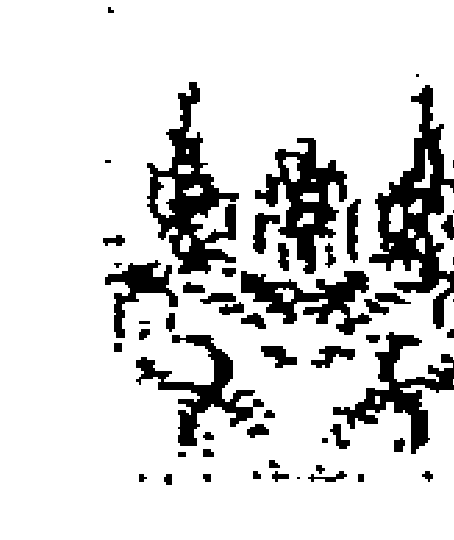

凡途中遇人同伴，占以地盘时干为己身，看何星临之。如得禽心冲辅任为善人，得蓬芮英柱为恶人，再得旺相，而时干又居废没之地，主有侵害。时干旺相，凶星废没，亦不能害。如凶星有害，时干而得生休开及三奇吉门吉格，主被害中有救。若时干旺相而得刑格并一切凶格，虽有侵害亦无妨。

### 占店主善恶

看时干加宫所落之宫得何星宿以定善恶。看时干，若遇蓬芮（二大凶）英柱（二小凶）凶星，俱主恶人；遇辅禽心冲任吉星，俱主善人。如落宫克时干，主有侵害。若时干落宫有三奇、吉门、吉格者，虽有恶亦不敢害。如无吉格，但乘旺相，亦无害。如时干得休废没并凶星格者，当有侵害。

### 占出行

此时出行，欲得三奇六仪临于旺禄之宫，或行年合吉格而上下相生本日时，官贵禄马俱临，此时而去，逢贵人接引，财帛广进，求名亨达，且为皆顺。如本命行年并此时合凶格，门克宫，必多虚惊。如开门克宫，为贵人见贵之类。如逢凶格相冲相克墓之乡，出则不归。若遇壬癸，恐有水厄之忧。如遇辰戌，虑有牢狱之苦。

### 占未出先定期

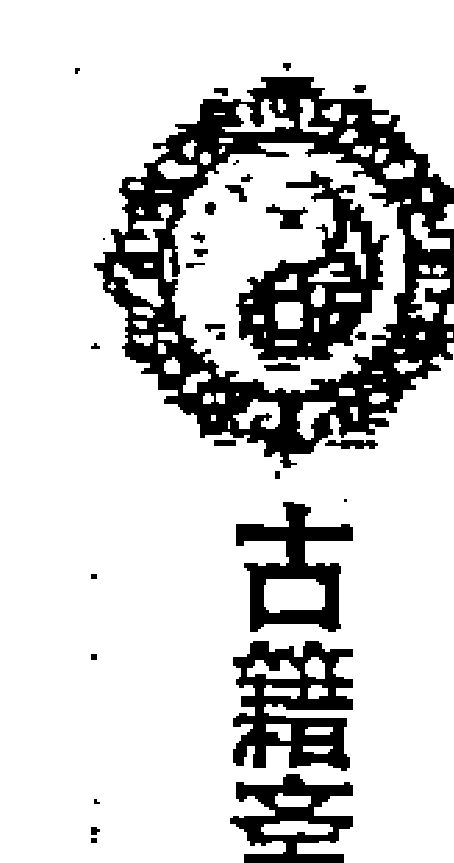

看天蓬星落宫。如阳局，天蓬在内四宫，上半年回；在外四宫，下半年回。阴局亦然。冬至后自坎至巽为内，自离至干为外；阴遁夏至后自离至干为内，自坎至巽为外。又看所落何宫，即以本宫所得十二支位以定期。

### 占登舟

以震三宫为船，以天盘所得之星为船户之善恶，得辅禽心三星上吉，任冲二星为中吉，芮英柱蓬为大凶，其船不可登。凡占水，看休门之下，见申酉为江河，见小吉为井，太冲为池塘。

### 占水陆

以值使定之，不取坤宫者，死门也。以坎为水路，艮为陆路，看值使落宫。如水陆二路有一生则吉，被克则不吉。又看休生二门所落之方，亦可出行。

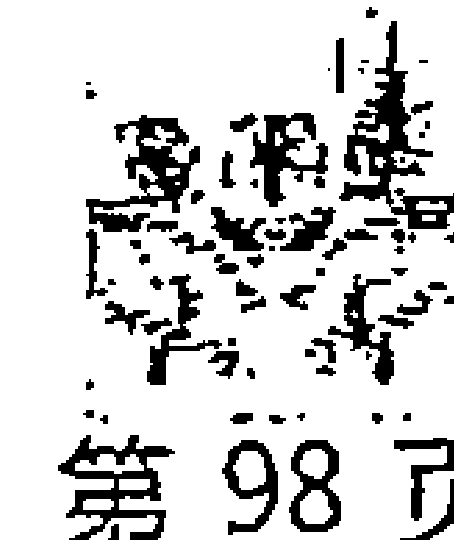

如惊蛰中元阳七局甲己日丁卯时，惊门值使加坎宫，休门到震，生门到巽，为水木相生。

出行预测实例一：-测去新疆出行，平安否？
公元：2009年7月13日10时19分43秒 阴5局
干支：己丑年 辛未月 己未日 己巳时
旬空：午未空 戌亥空 子丑空 戌亥空
直符：天禽 直使：死门 旬首：甲子戊

| 丁 直符 戊 禽芮 辛 阴 景门 己 | 己 九天 天柱 丙 蛇 死门 癸 | 乙 九地 天心 乙 符 惊门 辛 |
| :--- | :--- | :--- |
| 丙 腾蛇 天英 癸 六 杜门 庚 | 癸  戊 | 辛 玄武 天蓬 壬 天 开门 丙 |
| 庚 太阴 天辅 己 白 伤门 丁 | 戊 六合 天冲 庚 玄 生门 壬 | 壬 白虎○马 天任 丁 地 休门 乙 |

Master.：早啊老师，我十六号去新疆，想问问平安不？

不吹牛：我起个局看看，出行方向对你来说是什么方位？

Master.：目的地在现居地（深圳）的西北方向，坐飞机去。年命庚申。

**分析：**测乘飞机出行，九天代表航线、开门代表飞机。九天生开门、开门克航线、开门与九天比和则为吉、没事。如果航线克开门，则不好，不能出行。此局，正是九天克开门，按说不好。但我的判断却是：飞机是安全的，可能就是会发生个晚点的情况。事实上此次乘机很安全的到了目的地，“只是在开始登飞机时，因为有7个人上了行李而没有登机，飞机延误了半个小时才起飞的。”我判断的理由是：

开门为飞机，落兑宫旺相，又未月金旺，飞机状态不错。但开门宫所临是“壬+丙，官灾刑禁络绎不绝、两败俱伤”；又临天蓬星凶星、玄武凶神，会不会有问题？我没有把它看成大凶，原因是此宫为金，开门为金，宫中天蓬星、玄武、壬水为水。暗干见辛，丙辛合水，金水相生，开门宫还是和谐之象的。因为天蓬星见壬落兑宫主雨，我当时判断为可能会因为天气的原因推迟起飞。这个从反馈的情况看，这一判断不够准确。飞机推迟起飞的原因是因为有7个人上了行李而没有登记。其实仔细分析的话，这在局盘信息里也是有所反映的。兑宫暗干见辛金，辛金是月干，代表同机的乘客。辛合丙，事未起逢合，主合绊，因事牵连。耽误飞行的原因原来在此。辛临值符，地盘有太岁。这还是几个有地位的乘客呢！开门落宫克辛金，不是能对飞机起破坏的坏蛋。

话回到九天克开门上来。九天主航线，落离宫，临死门，是否航线不能用？丙+癸，月奇地网，凡事暗昧不明，容易有阴人、小人害事、招来灾祸，又是天柱破军凶星，岂不是航线大凶之象？但我认为，不是大凶之象。其一，九天被值符落宫所生；其二，九天落宫生太岁落宫。**九天克开门，说明航线不支持飞机，又九天临死门，这里面一定有不顺发生。**因为死门主暂时不动之象。天柱星又带癸，我当时还是判断成了天气下雨而影响的时间推迟。之所以判断为还能出行，是因为九天所在的离宫在未月未日时令上不如兑宫旺相，即航线不足以导致飞机不能飞。再就是他要到后天，即壬戌日才出行，壬正好临开门，戌正临马星，乾宫丁+乙，休门吉门、天任星吉星，为一派吉祥出行之象。断能安全乘机出行。

有日时临击刑入墓则所行大凶之说。此局，日时己落艮八宫是否入墓？己+丁，文书词讼、先曲后直，怎么回事？在这里伤门门迫凶不凶的问题？其一，未月未日正冲艮八宫之丑，此不为入墓。其二、日时与太岁己同，太岁临宫，为庇佑。又未月艮宫旺相，为得令。其三、文书词讼，先曲后直，就是先前会遇到点小麻烦，后来顺利。其四，伤门主车辆，路途上可能要转车等，车辆方面有所不顺。反馈是他要在四川转机。

其实，这次求测人最关心的还是到新疆后是否安全的问题。因为他更怕所去的地方正有分裂分子闹事，影响自身和家人的安全。他说是去西北，我们看乾宫，乾宫是空亡之地。一般说，如果所往之方为时干空亡之地则不利，那么为什么还对求测人讲他去那里是平安的呢？其一、乾宫在未月未日旺相，又临马星不为真空，壬戌日、癸亥日乾宫就填实了。其二、该宫临丁奇乙奇、天任星吉星、休门吉门。其三、日干、时干宫生乾宫、相生为吉，又乾宫被太岁艮宫生助而为吉。其四、乾宫目的地以及开门所在的兑宫，都生其年命所在的坎一宫的。

当时，求测人还问我：“乾宫有个白虎啊，不代表凶伤孝服吗？”我搪塞说，空亡了，凶灾就没了。其实，这样说的话，那空亡了，该应吉的事情，不也就没有了？在真空的情况下，确实是吉事不吉、凶事不凶。此宫不为真空，那填实后，会不会出现白虎之凶？我的答案是不会的。在事物的判断时，不能单凭一个符号的性质来断定。此宫星神仪都是吉利的，那么白虎在此也发生着其吉利的一面，雷厉风行、做事果断等。更重要的是，在当时的情况下，因为分裂分子正猖獗，在人们的心目中那里是“白虎”，人们有点“谈虎色变”了。

2009年7月22日20点35分求测人回到深圳后给我电话反馈：出行在新疆很顺利。

### 出行预测实例二：戊寅日去南方出行如何？

公元：2010年1月26日19时33分25秒 阳6局
干支：己丑年 丁丑月 丙子日 戊戌时
旬空：午未空 申酉空 申酉空 辰巳空
直符：天英 直使：景门 旬首：甲午辛

| | | |
| :--- | :--- | :--- |
| 戊 白虎○ 天蓬 壬 天 景门 丙 | 癸 玄武 天任 庚 符 死门 辛 | 丙 九地 马 天冲 丁 蛇 惊门 癸 |
| 乙 六合 天心 戊 地 杜门 丁 | 己  乙 | 辛 九天 天辅 丙 阴 开门 己 |
| 壬 太阴 天柱 己 玄 伤门 庚 | 丁 腾蛇 乙 禽芮 癸 白 生门 壬 | 庚 直符 天英 辛 六 休门 戊 |

求测人年命丙午，恰逢日干又是丙。落兑七宫，临九天主动，开门亦主动，要出行之象。求测人讲，我最近要去趟福建，因为带着不少货，必须乘长途汽车去，问路途是否安全？到达后办事是否顺利？

我看了一下奇门盘，讲：这次出行很不顺的，如果没有要紧的事情最好晚几天再说。他说，不行，因为要去为天津展会备货，跟人家订好了，最迟后天（28号，戊寅日）必须动身前往。有没有生命安全问题？我说没有生命危险，但有可能遭遇小偷之类的情况，另外有可能不好乘上车或没有车。他说：没事，我已经跟跑这条线路的客车联系了，说是28号通车，我经常坐这班车去福建，很熟悉了。没有大事，这就放心了，我注意一下防盗就是了。

为什么断生命无忧？日干、年命落兑七宫，虽然是死地，但丙下临着己土太岁为吉；又临天辅星吉星、开门吉门、九天吉神。丑月兑宫逢生旺相，又被太岁己丑所在的艮宫生扶，被伤门车辆所在的艮八宫生助，日干与值符落宫比和，与乙奇、丁奇落宫相生，一派吉利之象，肯定没有生命的忧患了。

为什么断出行不顺，要防盗失财？由山东济宁出行到福建去为去南方，看离宫。离宫临庚+辛“白虎干格：远行则凶，车折马死，时间越长越凶”，这是一个不好的格局。又宫中临死门凶门，死+庚“主女人生产，母子俱凶”；辛金击刑，死+辛“主盗贼失脱难获”。虽然天任星为吉星能减灾，但上乘玄武凶神，容易被盗。因此要防被盗。目的地所在的离宫，克日干所在的兑宫，出行必不顺。

为什么断不好乘上车？伤门为车，落艮宫为门迫，己+庚“刑格返名，临凶星天柱星有谋害之情”，己入墓，庚金入墓又击刑，这主不顺利，车辆上有别扭事。一是车辆有反复之象；二是车上容易出现被人“谋害”之象。但我见伤门临太岁生日干，就没有刻意强调这一点。这里的伤门生日干，应为不会因为车辆问题引起自己的人身安全。

测出行，景门为道路，落巽宫，临白虎，虽然克伤门落宫，不过当时认为，路怎么会空呢，而且是一条经常跑的线路？就没有细致追究。心想：这景门空亡，正好克不住伤门，又白虎空亡，不会出现伤灾之类。日干年命克景门落宫，路途没有车祸发生。

又戊寅日，正冲马星，甲子戊落震三宫击刑。我只是对他强调了要注意防盗，防破财。他说车辆联系好了，没有问题。因此，我就没有再阻拦他的出行。

29日一早，他给我打电话来说，现在车才到无锡，昨天夜里发生了被盗事件，并给我讲了事情的经过：他约好的那辆跑福州的车，在山东曲阜服务区与他见面后，让他先跟车去济南，说是要在那里拉客人。晚上6点多，把他放在了一个中途的服务区内，让他等一个多小时。虽然天寒地冻的，但只好等待这辆车的到来。等了很久，车不来，给车主联系，车主说今天不去了（正应刑格返名）。没办法，在晚上9点多，又截到了一辆去厦门的客车，上车后坐在在最后一排，因为太劳累了，就很快睡着了。天快明时，听到车内人声鼎沸。一些乘客反映遭盗了。急忙察看自己的东西。携带的手提箱已移到前排座后，大开。里面的15000现金失盗。幸亏遭贼不识货，箱内价值十几万的玉器雕刻盗贼没予理睬。同车内多人被盗，有的失窃多万。问司机，司机说，车到淮安时有4个都穿白鞋的人下车。这4人不是同一时间上的车，但同时下的车。已向济南总站方报案（注：这趟班车，与原来预定的班车，走的不是同一条线路。求测人在原线路乘车数十趟了，过去从没有发生过失盗事件。这里的景门空亡，大概是应验的没走原来的线路）。

### 出行预测实例三：乘机遇上返吟局

公元：2008年5月23日8时58分6秒 阳8局
干支：戊子年 丁巳月 癸亥日 丙辰时
旬空：午未空 子丑空 子丑空 子丑空
直符：天辅 直使：杜门 旬首：甲寅癸

| | | |
| :--- | :--- | :--- |
| 丁 白虎 天心 丙 符 开门 癸 | 庚 玄武 天蓬 庚 蛇 休门 己 | 壬 九地 天任 戊 阴 生门 辛 |
| 癸 六合 天柱 乙 天 惊门 壬 | 丙  丁 | 戊 九天 天冲 壬 六 伤门 乙 |
| 己 太阴 ○马 丁 禽芮 辛 地 死门 戊 | 辛 腾蛇 ○ 天英 己 玄 景门 庚 | 乙 直符 天辅 癸 白 杜门 丙 |

是日，受北京某集团老总的邀请，我与易友张老师准备跟随总裁一起由北京去哈尔滨看林地风水。已经给订好了中午 12 点起飞的机票，是 3 个头等舱。早晨起床后，我忽然想起局看看出行是否顺利？一看是反吟局，心里咯噔一下子，就对张老师讲：怎么是个反吟局啊？别走不成吧。这时正好总裁来电话接我们过去，就没有细究此局。但心里总不是个滋味，后来的应事正好应了局像。看看发生了什么事？

日干癸水为我落乾宫为衰地，临杜门值使，难以出行之象。杜+癸“主百事皆阻”；杜+丙“主文契遗失”。癸+丙“华盖悖师，贵贱逢之皆不利，唯上人见喜”。但日干所在的乾宫，又受太岁所在的坤宫临生门吉门生助，克制开门飞机，与九天航线比和，又临值符至吉之神，天辅星吉星，从本人落宫来看，应该没有大凶之事。只是临杜门，可能主堵塞，出行不成之象。

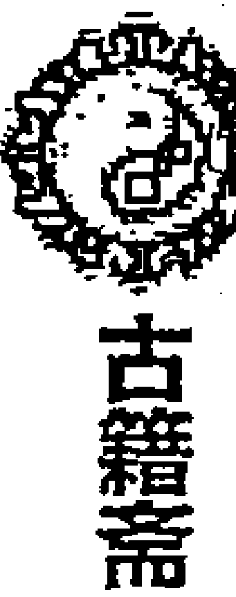

### 出行预测实例四：一朋友打电话来问：哪天动身去西藏好？

公元：2009年7月9日20时43分47秒 阴2局
干支：己丑年 辛未月 乙卯日 丙戌时
旬空：午未空 戌亥空 子丑空 午未空
直符：天英 直使：景门 旬首：甲申庚

| | | |
| :--- | :--- | :--- |
| 己 直符   天英 庚   蛇 生门 丙 | 癸 九天○   丁 禽芮 戊   符 伤门 庚 | 辛 九地○马   天柱 壬   天 杜门 戊 |
| 庚 腾蛇   天辅 丙   阴 休门 乙 | 戊     丁 | 丙 玄武   天心 癸   地 景门 壬 |
| 丁 太阴   天冲 乙   六 开门 辛 | 壬 六合   天任 辛   白 惊门 己 | 乙 白虎   天蓬 己   玄 死门 癸 |

这是石破天版主发在《不吹牛预测网》上的帖子，原文讲：“有一个人打电话问去西藏(西北方)用哪一天出发好？我按问事的时间起局，并建议他取消计划。大家看看他是否取消计划，如果去西藏结果如何？我关注发展结果，以后反馈。”又讲“他是中学教师，与别人开摩托车去西藏旅游。他说准备了好几年，电话中听口气，不愿意放弃原来的计划”。

我们来分析一下这个局：

日干乙奇落艮宫为帝旺之地，临天冲星主动，临乙+辛，龙逃走格局主动。虽然临开门吉门，太阴吉神，与目的地落宫相生，没有性命之忧。但综合来看，这次出行还是危机四伏、危险丛生的。

- 一是日干临乙+辛“青龙逃走”大凶格局，“奴仆拐带，六畜皆伤”不吉。辛主错误，主问题，说明这出行之事有问题，容易出现凶事。
- 二是时干克日干，主求事不顺，临腾蛇，麻烦不断，有怪异多发。
- 三是目的地在乾宫，是日干乙奇、时干丙火之墓地。出行去墓地方位，实为不吉。再看乾宫的格局，临白虎凶神，天蓬凶星，死门凶门，己+癸“地形玄武：男女疾病垂危，有词讼囚狱之灾”，虽然临太岁，不至于有大的凶险，但格局不好，亦有凶相。因此，会有一些不利的事情发生。

另骑摩托车出行看伤门，虽然伤门生日干，克道路景门，没有太大的问题。但是伤门所在的离宫空亡，又临天芮病星，主车辆会发生故障。临戊+庚，有更换车辆之象。临九天，有翻车之象。景门为道路，临玄武，主道路不熟悉或迷路。癸+壬，复见螣蛇，格局不好，路况太差。

7月14日反馈：是7月13日（己未日、辛未时）动身出行的，一行三人，两男一女。

8月12日反馈：去西藏的人员昨天已经回来，昨晚来电话说，人能回来就不错了，很有后怕的感觉。在这个过程中：所有的车都翻过3次以上，有人受伤住过院，有的车撞伤藏民，有的车坏后请别人运而被敲竹杠，有人中途病了。。。。。。我的朋友每天都记住我们的劝说，十分小心，还是翻了3次车，病了一天，车子坏了，修理费用较高，破了几件衣裤；。。。总之，后怕。

## 二、关于出国的预测

关于出国的预测，随着现代社会的发展，交往的增加，人们出国已不是什么稀罕事。我对这方面的预测经验很少，但从原理上来讲，除需要办理签证、护照等相关手续外，其他方面与正常出行的预测应没有本质的区别。对此，可以参考我们上一章节的内容来应用实践。这里还有以下因素供分析参考：

一是一些出国需要通过相关考试，才能出行的，则要先按照考试类来做判断。以景门为试卷，看景门落宫的状态以及景门与用神的关系。天辅星为考试院，要看天辅星的落宫以及天辅星与用神的关系，看看考试能否通过。年干为录取单位，要看年干与用神（考生）的关系，看能否被录取。

二是出国以开门为用神。要看开门落宫有没有动态的符号，有动态的符号则容易成功。伏吟局，难动，需要冲才能动起来。

三是一些人问出国好还是不出国好？这应该看所去之方与用神（日干或年命）的关系，以及所往之宫的状态。

四是关于护照、签证等相关批准手续的问题。有资料讲“出国旅行以六合为护照签证”；又有“景门为文件证书、为出国护照”的讲法；还有“丁奇为证书，为手续”的说法。这些都有一定的道理，预测中需要从不同的侧面来参考判断。

五是需要批准的事情。值使门为具体的批准机关，值符为主管领导、顶头上司，年干为上级领导。要比较他们落宫与用神宫的关系，和景门宫的关系，看能否批准之类。

六是看日时关系，看所求之事顺利不顺利，能否办成等。

### 出行出国类预测实例五：去日本探亲的签证能否办下来？

公元：2009年7月29日15时30分16秒 阴4局
干支：己丑年 辛未月 乙亥日 甲申时
旬空：午未空 戌亥空 申酉空 午未空
直符：天芮 直使：死门 旬首：甲申庚

| | | |
| :--- | :--- | :--- |
| 辛 太阴 天辅 戊 阴 杜门 戊 | 丙 螣蛇○ 天英 壬 蛇 景门 壬 | 癸 直符○ 乙 禽芮 庚 符 死门 庚 |
| 壬 六合 天冲 己 六 伤门 己 | 庚  乙 | 戊 九天 天柱 丁 天 惊门 丁 |
| 乙 白虎 马 天任 癸 白 生门 癸 | 丁 玄武 天蓬 辛 玄 休门 辛 | 己 九地 天心 丙 地 开门 丙 |

这是“天地玄黄术”网友发在《不吹牛预测网》上的一个求测帖子。原文讲：“日驻沈阳领事馆电话找我问签证事，起局测问我去日看儿子的签证能否办下来？”

**分析：**大局伏吟，又日时落空亡之宫，临死门值使，看似不成之象。其实，这个局细分析一下，还是能很快办成的。

首先，甲申旬是午未空，时干庚为阳，对应地支申，不在空亡之位。又未月坤宫当令不为真空，即不是真空，则填实或冲实则能应。对冲艮宫临马星，被马星冲起不为真空。

第二，日干为求测人，时干主客体。日时同宫，事情能成之象。

第三，日干时干临值符、值使门，为有贵人助，能批准之象。

第四，日干为求测人，时干为儿子，日时同宫，应指能够见到儿子，从另一个侧面表明签证能够得到批准。

第五，景门代表签证，落离宫，遇空亡，主怕被月令辛金所在的坎宫冲起（甲午辛在坎，子午冲），冲实不为真空。又去日本为东方，震宫临太岁生景门落宫，主能够批准。

第六，应期：日时、符使都在内盘主快，但伏吟又主慢，值使门在坤宫，断8天，填实为应，正逢癸未日。

8月10日反馈：“去日探亲的签证批下来了，6号取回。都由省外办统一报送日本驻沈阳领事馆审批，代办费260元。不吹牛，高啊。谢各位评断。”

9月23日反馈：“我已到达东京。今天的网页才有回复的地方，现反馈：1、因老伴住院了，把9.11航程推迟，却没办成。还是9.11行程。2、8：40按时起飞和到达北京，起飞时哈市是阴天，北京是晴天。3、转机到东京的飞机从13：25推迟到16点起飞的，原因不明。9.10此次航班就无故取消了。19点到达东京机场，出港补办手续和取行李却拖延好长时间，再等乘电车到东京儿子家快24点了。4、一路平安，身心劳累。

### 出国出行类预测实例六：问出国签证能否办成？（网例）

公元：2007年3月21日16时23分19秒 阳9局
干支：丁亥年 癸卯月 甲寅日 壬申时
旬空：午未空 辰巳空 子丑空 戌亥空
直符：天英 直使：景门 旬首：甲子戊

| | | |
| :--- | :--- | :--- |
| 戊 直符 天英 戊 天 惊门 壬 | 癸 螣蛇 癸 禽芮 庚 符 开门 戊 | 丙 太阴 天柱 丙 蛇 休门 庚 |
| 乙 九天 天辅 壬 地 死门 辛 | 己  癸 | 辛 六合 天心 丁 阴 生门 丙 |
| 壬 九地 马 天冲 辛 玄 景门 乙 | 丁 玄武 天任 乙 白 杜门 己 | 庚 白虎○ 天蓬 己 六 伤门 丁 |

一男，78年人（戊午），当时已经提出了签证申请。问能否批准及应期。

分析：

日干为求测人，时干为所问之事。时干落震宫，生日干所在的离宫，卯月震宫当令，离宫亦旺，事情能成之象。

日干甲寅癸落离宫，临开门，开门为出国之事，在外盘，主能成。临螣蛇，主变化。虽然癸戊合有阻隔，但戊在离宫子午冲解合；又癸庚同宫，寅申冲，也是能有变动之象。

值符临年命戊，戊在旺地，与时干比和，时干临九天吉神、天辅吉星，也是事情能成之象。值符生日干，能遇贵人帮助。

日干离宫旺，克制六合签证与太岁丁火所在的兑宫，生景门所在的艮宫，主自己努力争取事情可成之象。

应期：阳遁，开门与日干都在外盘，主慢主迟。值使门景门落艮宫，断7个月或8个月。实际是当年11月8日（辛亥月、丙午日）办下的签证，共7个半月。又日干遇到癸庚同宫，寅申冲，冲以合为应期，寅亥合，正应亥月。值使门所临之干为应期，也正应辛月。

## 三、行人走失预测（找人）

若以走失时间起局，则以日干为走失之人，兼看行人年命。如以问事时间起局，则以六亲关系取用神，兼看走失之人年命。与求测人没有六亲关系的就直接取行人年命为用神。

由于现在通信事业的发达以及交通的便捷，类似行人走失的求测少了。但还是会有一些发生，如孩子失踪、被拐卖、老年人走失以及因为生气或其他原因而故意躲藏等等。

预测行人走失方向：一般以六合为开始出走的方向，如果是刚刚走失的，要抓紧去六合宫所在的方向去找。以值符落宫、值使门落宫，为途中落脚点。用神（或年命）的落宫，常常是最后找回（或死亡）的方向。如果行人是有意躲避，则杜门为躲藏的方向。遇到返吟局或用神逢空亡，常常是对冲之宫为走失方向。另外，“又有小孩走失看六合落宫，女性走失看太阴落宫，阳遁看天盘，阴遁看地盘，若二神落日干之墓库者，远近难寻；落空亡者，又往他方而去，再以干合神之落宫寻之。”

行人走失的远近：一般说来以用神落内盘主近，落外盘主远。具体距离要具体分析，如老年人、儿童出走与中年人出走不同；步行出走与乘车出走不同。遇到返吟局，刚走失的很快能回；时间长的，遇反吟，亦主能回，但要具体分析。遇到伏吟局，刚走失的走不了，走失时间很长的，则不会回来。

行人在外安危吉凶：以用神落宫天地人神格局组合情况综合判断。如果用神旺相，星门奇仪组合良好，则平安无事。用神落宫得年干、月干、日干或时干落宫相生，为有人帮助。用神落休囚之宫，又遇凶门凶星凶神凶格或入墓、逢空、六仪击刑，则不吉或大凶。用神落墓绝之地就是个危险信号，死亡或受困之象，如何区分？九星是否旺相是关键。虽然落墓绝之地、休囚或临死门，但九星旺相、吉星高照，则能逢凶化吉、遇难成祥。如果用神落死墓绝地，临死门、再九星囚废，临太阴、九地、九天之类的符号，则危险系数就非常高了。临白虎常主刑伤、压力，不一定是凶死之象。临值符，只要不空亡，即使危难之中也能遇到贵人。

行人走失归与不归：若起的是走失时间局，以日干为体，时干为用，体用比和、同宫，或用生体（时干生日干），则容易找回；体用相克（日时相克）或体生用（日生时）则不易找回。若是问事局，除主要看日干和时干的关系外，还要看求测者、事件关系人与走失者的关系。例如是父母来求测子女走失情况的，除了要看时干和日干的生克比和关系外，还要分析年命落宫（用神落宫）与父母宫的生克比和关系。时干生日干、用神生比关系人，都是行人能主动回来或者能找回的信息。如日时同宫，虽临空亡也能找回。其他条件，如日时相克，日干生时干等，都不易回来。

用神旺相临开、休、生、杜四门者，不好找到，但人无事，说明行人在外能够生存。用神休囚，又临伤、景、死、惊四门者，则可以找到或自己回来，说明行人在外不好生存。其中临景门者，容易有消息传来。

用神乘太阴、九地，主有人潜藏或有意潜藏；乘九天，是远走高飞之象；乘玄武，被人拐骗勾引；乘螣蛇，被人盘查、纠缠或羁留；乘白虎，因白虎下有朱雀，亦主有信传来，但容易有凶灾或刑伤；乘值符、六合，说明能遇到贵人帮助，安然无事。用神伏吟不思归，用神反吟，多能回。用神临年干，可能在长辈家中；临月干，可能在朋友家中；临时干，可能在晚辈家中。用神落乾宫，可能在大都市；用神落坤宫，可能在农村或田野；用神落坎宫，到河沟去找；用神落震巽，到树林去找。

### 行人走失吉凶格局应用

《诸葛武侯千金诀》（行人占）中讲到：返首跌穴早已束装，其中迟速刑合参详，虎狂兮羁留而不返，龙走兮蹭蹬不归乡。遁格合时日两元可以言到，诈假会白虎朱蛇，书信必来。蛇夭而道路灾疫，投江而归计彷徨，飞干伏干来情不善，伏宫飞宫客若退荒，大小格而迁延时日，刑悖格而彼此俱伤，白入荧而行人将到，荧入白而书信皆亡，不遇何须盼望，击刑有事相妨，入墓无伤可云到宅，罗网相格莫断回乡，返伏门迫须分行人远近，若合驿马临宫，反主去客登堂。

有些格局，即使时干或用神不生日干，也易归来或找到。如用神临戊+丙龙返首，庚+丙贼必来或临庚格（庚加年月日时）均是易于归来之象。有的格局即使用神生合日干也不易归来，如乙+辛、丙+庚、庚+癸、庚+壬或用神临马星等。飞干、伏干，行人不想归来；飞宫、伏宫，必是客居他乡。刑悖格，则易有伤病之灾；六仪击刑又入墓主大凶死亡之兆。癸+癸，天网四张，行人刚走的则走不远，若走失时间很长了，则不易找回。

判断行人在外有无音信，主要看景门落宫情况，景门临丁+癸、己+壬、丁+辛、庚+壬、辛+壬，或临螣蛇、玄武、九地，要么无消息，要么消息不实在。

找到或自己回来的时间：一般说来，逢庚格能找到或人能自己回来，逢年格年内归，月格月内归，逢日格当日归，逢时格本时辰内归，但这不是绝对的，要结合其他情况来综合判断。还有日干为用神时，阳日看庚下之干，阴日看庚上之干；若时干为用神的，时干临阳星看庚下之干，时干临阴星看庚上之干。

其他还有如下要点：用神旬空，则填实或冲实为找回时间。用神临马星则马星动或冲马星的年月日时为应期。用神临六仪击刑或冲格，则遇合用神之时为应期。逢合格，则遇冲为应期。用神入墓，则冲墓为应期。又有“天蓬、天芮二星俱主行人，千里外者看天蓬，千里内者看天芮。得蓬芮者为来。又以时干为来期，伏吟不来，反吟为来。三奇合吉门于行人本命年干之上，即到。凶星凶门，其人必有妨碍。”

### 附录：占走失（《遁甲元灵经》）

凡占走失人口、奴婢、六畜，应向何方找寻，得与不得，以时干为失主，六合为走失之物，但以落宫论之。以六合与时干所落之宫，分内外以远近为断。时干、六合俱在内四宫，为易寻；俱在外四宫，为难寻；若时干在外，六合在内，犹可寻。以六合所在之宫为方向，如得旺相之星，又得景死惊伤四门者，可得也。得九地、太阴，有人潜藏；得九天，应远走去；得玄武，被人盗去；得螣蛇，有人盘羁；得朱雀，即有信；得勾陈，有内人相勾引而去。又看六庚年月日时。假如大寒中元阳九局乙庚日庚辰时，时干在震三宫，六合在坎一宫，为俱在内，又六合为坎宫，有人潜藏，主不失。

#### 行人走失类预测实例一：妻子生气出走了，有没有危险？

公元：2010年2月5日21时5分14秒 阳5局
干支：庚寅年 戊寅月 丙戌日 己亥时
旬空：午未空 申酉空 午未空 辰巳空
直符：天任 直使：生门 旬首：甲午辛

| 己 白虎○马 戊 禽芮 丁 阴 生门 乙 | 丁 玄武 天柱 庚 六 伤门 壬 | 乙 九地 天心 己 白 杜门 丁 |
| :--- | :--- | :--- |
| 戊 六合 天英 壬 蛇 休门 丙 | 庚  戊 | 壬 九天 天蓬 癸 玄 景门 庚 |
| 癸 太阴 天辅 乙 符 开门 辛 | 丙 螣蛇 天冲 丙 天 惊门 癸 | 辛 值符 天任 辛 地 死门 己 |

求测人来电话讲：刚才跟妻子吵架，闹得很凶。妻子一气之下出走了，手机也关了。这大夜里也不知道她去了哪里，别再想不开或出现什么危险？妻子的年命是丙寅。

我断没有事的，应能很快找到她。妻子有乘车之象，走不远，可能是去火车站准备回娘家吧。

日干丙，合干辛金为妻子，落乾宫，临死门心中有气之象，但临值符并天任吉星旺相，没有凶事。辛+己，入狱自刑，奴仆背主，有理难伸，主妻子感到委屈。乾宫是虚地，“逢虚看孤”对冲是丁+乙临马星，乙奇又为妻子，马星为车，断妻子乘车去的。天盘乙奇到艮宫，乙+辛龙逃走是妻子要走之象，开门为车，也意味着要乘车出行。又六合为初始出行方向，落震宫，临地盘年命丙，天盘壬水，壬丙冲主动，震宫主动，天盘壬水临伤门主车，因此断可能是乘车到了火车站之类（夜间一般汽车站没车）。乙落艮宫帝旺，临开门吉门、太阴吉神、天辅吉星，没有生命之忧。乙奇+太阴+开门组成“真诈格”，诈格，这个乙+辛“龙逃走”就是“吓唬人”。

辛金为妻子，落乾宫，生日干丙火所在的坎宫，能找到人。六合、乙奇都在内盘，又求测人说刚刚出走，断走不远。让他不用担心（日干丙火临惊门），你应能很快得到消息（景门临九天生日干，癸+庚逢动格主快）。

因为是简单的预测，当时就没有断具体的应期。春节后，听求测人反馈：当天晚上，老婆确实是打的去了火车站，在火车站借出租车司机的手机给他打了个电话，他立即赶到火车站并乘火车同老婆一起去了老婆的娘家。

#### 行人走失类预测实例二：问女儿出走，能否找到（网例）

公元：2008年5月4日10时0分57秒 阳8局
干支：戊子年 丙辰月 甲辰日 己巳时
旬空：午未空 子丑空 寅卯空 戌亥空
直符：天任 直使：生门 旬首：甲子戊

| 己 九天 天蓬 庚 阴 生门 癸 | 丁 值符 天任 戊 六 伤门 己 | 乙 螣蛇 天冲 壬 白 杜门 辛 |
| :--- | :--- | :--- |
| 戊 九地 天心 丙 蛇 休门 壬 | 庚  丁 | 壬 太阴 天辅 癸 玄 景门 乙 |
| 癸 玄武 天柱 乙 符 开门 戊 | 丙 白虎 丁 禽芮 辛 天 惊门 庚 | 辛 六合○马 天英 己 地 死门 丙 |

电话问测，问女儿出走，在外吉凶？何方？能找到否？如果能找到，何时？

这是《易家人论坛》变易老师预测的实例。女孩年命甲戌。“人平安，巳时在东北方她姥姥家找到。”同学们可以研究一下对于这个局的断法，以积累预测经验。

#### 行人走失类预测实例三：请不吹牛老师断下她为何出走，何时能找到？

据说就是这个时间出走，就以这个时间起局。年命：丁未

公元：2009年10月15日13时30分30秒 阴3局
干支：己丑年 甲戌月 癸巳日 己未时 【五不遇时】
旬空：午未空 申酉空 午未空 子丑空
直符：天柱 直使：惊门 旬首：甲寅癸

| 庚 太阴 马 天英 辛 六 景门 乙 | 丁 螣蛇 丙 禽芮 己 阴 死门 辛 | 壬 值符 天柱 癸 蛇 惊门 己 |
| :--- | :--- | :--- |
| 辛 六合 天辅 乙 白 杜门 戊 | 己  丙 | 乙 九天 天心 丁 符 开门 癸 |
|大、不愿多讲。六合所临天盘干入墓主证人遇有棘手事，地盘干入墓主证人犹豫不决等。

惊门为律师。惊门得奇，律师优良。但实战预测中一些人就会问，如何区分开原告方的律师，还是被告方的律师？局盘中动作的只有天盘惊门，这个惊门应该表示的是我方（求测方）的律师。如果开门宫生助惊门宫，说明法官对我方律师的辩护予以认同和支持。开门克惊门，法官不认可律师的辩护意见。如果惊门落空亡之宫，主没有律师或律师心有余而力不足。惊门克用神，说明律师不尽心或没有起到好的效果。惊门生助、比和值符，律师对原告有利，再遇惊门冲克天乙或开门，则原告方应托请律师而有利；惊门生助、比和天乙，律师对被告有利，再遇惊门冲克值符或开门，则被告方应托请律师而有利。惊门临腾蛇，律师狡猾，顾虑多。（惊门为诉神，亦代表打官司这件事）

预测官司胜负还有一种参考判断方法，即：“看值符落宫之天盘星与地盘星来判断，天盘星克地盘星，原告胜；地盘星克天盘星，被告胜。”

官司预测中，也可以用日时关系来参考判断。日干为求测人，若代人求测，则以六亲关系为用神，以时干为所测之事。时干克日干，所求之事不顺或不成。

### 附录古籍

**【占状词】**
以景门、朱雀为状词，开门为官长。如景、惊二门乘旺相气，再有三奇吉格，主情词恳切，不被开门冲克者必准。景、惊二门不得奇仪吉格，再与开门冲克者，主官嗔怒不准，即准反招罪责。若景、惊二门入墓，主情词不明，不准；景惊二门落空亡，主平空捏词，不准；开门入墓及落空亡者，主官不动情，不准。（没有朱雀的看玄武）

**【占词讼吉凶】**
其法以景、惊二门主之。凡有词讼，若惊门乘旺相之气，讼不息，景门亦然。若二门入墓落空，主讼事不成。

### 【论吉凶格】《诸葛武侯千金诀—词诉占》

“返首而原告欠利，跌穴而被告不详”：遇戊+丙青龙返首打官司对原告不利；逢丙+戊飞鸟跌穴对被告不详。“虎狂龙走，公庭有伤”：逢辛+乙，乙+辛，主审判不公。“得遁贿赂可胜，诈假嘱托备良”：临九遁格局，通过行贿可以获胜，逢三诈五假走后门托关系一定能起到好作用。“三胜三吉，喜临年命”：“三胜”是指天盘值符落宫、九天所临之宫，以及生门会三奇之宫，“三吉”当指开休生三吉门。求测人的年命落宫临三胜、三吉门为喜。

“得使而衙役效力，守门而阴小作殃”：逢三奇得使，司法机构的工作人员能给你帮忙，遇到玉女守门，会碰到阴险小人从中作梗。“三门四户，切记日干时干逢悖格，经年经月始消禳”：天三门：月将加用时，太冲卯、小吉未、从魁酉所落之方为天三门。地四户：月建加时，除、危、开、定之方为地四户。天三门、地四户，利于藏形遁迹。最忌日干、时干逢悖格，否则，灾殃祸事要很多年月才能消除。

“五不遇兮讼直而遭屈断，六仪刑兮类神恐有彷徨”：五不遇时，有利难伸，被人诬陷受冤枉；用神遇到六仪击刑主精神彷徨，还有可能受到刑伤。“入墓罗网不宜占讼，反伏门迫翻案迭详”：逢三奇入墓、天罗地网（乙+壬日奇入天罗、乙+癸日奇入地网、丙+壬火入天罗、丙+癸月奇地网、壬+壬蛇入地罗、癸+癸天网四张）主不宜打官司。日干用神入墓或逢罗网，最好也不要去打官司，以私下协商解决为好。反吟、伏吟、门迫，都会出现案子反复，一时难以定论的情况。“符使休囚，虽讼而无益”：如果值符、值使落宫休囚无力，即使诉讼了，也没有利益可得。“年命受克，见官而乖张”：求测人年命受到官府克制（又落宫受制重），主见官会受到不讲情理的训斥。

“大约初入官司，喜遇官鬼兴隆，久遭缠害，偏宜交鬼墓绝。官爻两干无克制，管取喝散喜非常。”：这里我理解（不一定准确）可能是介入了四柱预测中的一些内容，比如以日干为用神，则异性克制日干的天干为正官，同性克制日干的天干为偏官（鬼）。大体是如果初打官司，则遇到官鬼旺相为有利。如果是久拖不决、遭到纠缠和陷害的官司，则官鬼落入墓绝之地更好。如果官鬼两干不相克制，原被告会被当庭斥责而散去，从而息讼。

#### 官司诉讼类预测实例一：丈夫的舅舅把丈夫给告了，请断结果？

公元：2009年11月10日9时11分43秒 阴3局
干支：己丑年 乙亥月 己未日 己巳时
旬空：午未空 申酉空 子丑空 戌亥空
直符：天冲 直使：伤门 旬首：甲子戊

| 壬 太阴 | 乙 螣蛇 | 丁 直符 |
| :--- | :--- | :--- |
| 天蓬 庚 天 开门 乙 | 天任 壬 地 休门 辛 | 天冲 戊 玄 生门 己 |
| **癸 六合** | **辛** | **己 九天** |
| 天心 丁 符 惊门 戊 | 丙 | 天辅 乙 白 伤门 癸 |
| **戊 白虎** | **丙 玄武** | **庚 九地○马** |
| 天柱 癸 蛇 死门 壬 | 丙 禽芮 己 阴 景门 庚 | 天英 辛 六 杜门 丁 |

求测人女性，1973年人，给我来电话咨询。讲：她丈夫的二舅把她丈夫给起诉了，现在接到了传票。问事态的发展？事情经过：07年其二舅见她丈夫炒股很赚钱，就让其帮他炒股。二舅给了他10万元，他打下借条，并写明年息2分。后炒股被套，赔的血本无归。08年东拼西凑还给了舅舅10万本金。现舅舅给他要利息5万，他嫌多，请求宽限日期。协商不果，二舅起诉到了法院。

我分析后，对她讲：这个官司你丈夫肯定输。不过，法院也不会完全支持你舅舅的诉求，有可能是协商解决。求测人讲：输官司是肯定的，毕竟是该给的舅舅，但问题是他要的太多，并且我们现在没有那么多的钱给他。

我说：法院不会全额支持你舅舅的请求的，可能会降低2成，需要支付4万多吧。你们可能是分批次还给他。

11月13日戌时，接到求测人的反馈：昨天经法庭调解，原被告双方达成了还款协议。共赔付原告利息4万元，分期支付。本月底支付2万元，半年后再支付2万元。法院没有完全支持原告要求5万元的诉讼。（《不吹牛预测网》的丁奇版主对这个问题的判断也完全正确）

下面讲一下我对这个案子的判断思路：

日干为求测人，年干为长辈为舅舅，时干为事体，同宫，都生值符落宫，主能在法院的调解下协商解决。日干己，则合干值符为丈夫，而值符落宫又是原告（舅舅）的落宫，同宫，同被开门克制，主能在法院的约束下协商解决。

但开门落巽宫亥月巽宫旺相，克制值符原告所在的坤宫，主法院不支持原告的诉求。综合考虑应是不完全支持之象。

为什么断会降低20%左右的钱数？值符为原告，临戊生门在坤宫，坤宫有5数，正合他索要5万的要求，但天冲星亥月为废，又戊+己，己击刑，且甲子戊在坤宫子未相害，有刑害必然不能全得。坤宫有2数，结合事理，断降低2成。

为什么断不是一次偿还？因为大局八门反吟，反吟主反复，主多次之故。

### 官司诉讼类预测实例二：请杨老师等诸位老师看婚姻，持续反馈。

公元：2009年5月23日4时44分7秒 阳5局
干支：己丑年 己巳月 戊辰日 甲寅时 【五不遇时】
旬空：午未空 戌亥空 戌亥空 子丑空
直符：天蓬 直使：休门 旬首：甲寅癸

| 壬 六合 | 戊 白虎 | 庚 玄武 马 |
| :--- | :--- | :--- |
| 天辅 乙 六 杜门 乙 | 天英 壬 白 景门 壬 | 禽芮 丁 玄 死门 丁 |
| **辛 太阴** | **癸** | **丙 九地** |
| 天冲 丙 阴 伤门 丙 | 戊 | 天柱 庚 地 惊门 庚 |
| **乙 螣蛇○** | **己 直符○** | **丁 九天** |
| 天任 辛 蛇 生门 辛 | 天蓬 癸 符 休门 癸 | 天心 己 天 开门 己 |

这是一个网名为“大易”的易友发在《不吹牛预测网》上的帖子，原文讲：
“说明：我弟残疾，曾有一失败婚姻，现婚姻又近于尽头。迷茫，痛苦。。。请各位老师奇门参断，事态进展将反馈。我弟年命：丙辰。另有需提供之信息，可询。”

我当时在论坛做了简单的答复：（引自求测人的反馈）
- 1、大局伏吟，多婚。（现在看来肯定多婚，正确。）
- 2、合干空亡，对象有已经离开家庭之象。（女方离家已一年。神断！）
- 3、六合临杜门，婚姻走不动了。（现在看来离婚是一定了。所断正确。）
- 4、庚克乙奇，克六合，你弟弟业已排斥这个婚姻。（弟已铁心离婚。神断！）
- 5、牵连的事情多，暂时离不了。（此条有待事态进展。会持续反馈。）

再请杨老师：现我方已找女方商谈，欲协议离婚。问：
- 1、协议离婚能否达成？
- 2、协议离婚能够达成的话会是什么结果（包括有否其它冲突？钱财交涉结果？协议签定日期？）。
- 3、协议不能达成，则官司会发生于何时？结果会怎样？

以上三条是我目前想到的。如局中有其它情况，望予直说。别的老师亦可发言。持续反馈。

5月31日我回复：“离婚协议应该能够达成，阴历5月进入实质的协商阶段。”

6月10日（庚午月、丙戌日）今天下午17点57分收到楼主发来的短信，全文如下：“杨老师，我是网上的大易。首先谢谢你，其二，向你汇报下我弟协议离婚已办妥，你的预测应验了。本来对方星期天说不同意的，我也是关心则乱，当时就冒昧给你发了短信，是鲁莽了。星期一，我正准备起诉的，没想到对方又打电话说，同意协议了。于今日巳时办理完结。特告知。”冒昧问一句：“离婚协议应该能够达成.阴历5月进入实质的协商阶段。”是看的景门吧？

为什么断离婚协议能够达成？断离婚事宜，若值符宫与天乙落宫相生、比和，表明原被告有协商的余地，故可经民政局协议离婚。如果值符逢空亡，说明原告不告，景门宫空亡主不写诉状，不会诉至法院，也为协议离婚，反之则可能经法院离婚。本例值符、天乙落同宫，又逢空亡，主不出现原被告，同宫伏吟，也能达成协议，故断能协议离婚。

为什么断庚午月离婚协议达成？一是值符值使与时干甲寅癸落坎宫逢空，午月冲实。二是景门落离宫，午月离宫当令，又离宫离也。

#### 官司诉讼类预测实例三：父亲死在了看守所里，问会如何解决？

公元：2008年11月22日12时13分40秒 阴5局
干支：戊子年 癸亥月 丙寅日 甲午时
旬空：午未空 子丑空 戌亥空 辰巳空
直符：天芮 直使：死门 旬首：甲午辛

| 壬 太阴○ | 乙 螣蛇 | 丁 直符 马 |
| :--- | :--- | :--- |
| 天辅 己 阴 杜门 己 | 天英 癸 蛇 景门 癸 | 禽芮 辛 符 死门 辛 |
| **癸 六合** | **辛** | **己 九天** |
| 天冲 庚 六 伤门 庚 | 戊 | 天柱 丙 天 惊门 丙 |
| **戊 白虎** | **丙 玄武** | **庚 九地** |
| 天任 丁 白 生门 丁 | 天蓬 壬 玄 休门 壬 | 天心 乙 地 开门 乙 |

这是一个女易友发在《易家人论坛》上的一个求测帖子，讲：“我父亲于农历2008年10月22日（癸亥月、癸亥日）死于我县看守所内，求测我父的事最终会怎样？请各位大师帮小女子测一下父亲的死因和最终结果，我一定如实反馈，谢谢。”

我当时 in 论坛给她做了比较准确的回复，现在我们再来分析一下这个局：

一是断其父亲死于疾病，但有关部门有所责任。年干戊为父亲，甲午辛代表犯罪的嫌疑人，也代表父亲。戊、辛同落坤二宫，临天芮病星，主父亲有病。伏吟，应为老毛病了。天心星、乙奇伏吟临九地，主抢救不及时或无效。戊辛冲、临马星，应为老毛病突然发作来导致的死亡。值符值使、年干，为有关部门，临辛金主有过失，因此会有责任。求测人反馈：“父亲进去以前就有心脏病，我们曾多次要求取保候审，看守所长却总说我父亲装病，我们多次送药也被拒之门外，只能拖熟人把药偷偷带进去，发病以后他们未积极抢救才至父亲死亡。父亲是因为故意伤害罪被关押的。结果现在还未知，请问他们最终会赔偿多少损失？谢谢！”

二是父亲的后事处理起来虽然麻烦，但能得到解决，有关部门能给予一些赔偿。大局伏吟，值符、天乙同宫，日干生日干，甲子戊生日干，戊为流年太岁生日干落宫，主能得到赔偿。后来反馈：“我来反馈我父亲的事：由于放的时间长了，我父亲也不能入土为安，出于对父亲的尊敬和亲戚朋友每天的牵肠挂肚不能正常生活，我们就没有和他们闹下去。赔了7万多元就了结了，我父亲于农历2008年12月17日埋葬！”

## 二、官灾、刑事、刑罚类官司诉讼

预测刑事诉讼，则以甲午辛为犯罪嫌疑人或有过错之人。同时要结合其他用神进行判定和分析：当事人求测，以日干为用神，重大问题必须再看年命落宫状态；若是亲属来求测，则以六亲关系取用神，重大问题必须再看当事人的年命落宫状态。

用神下临辛金，多主被囚禁。甲午辛落宫处入墓，用神落宫入墓，或时干处入墓状态，多表示正在关押期间；甲午辛临螣蛇、白虎、庚、伤门等，也通常是被羁押或看管的符号。临杜门是司法部门，主被监视监控，有判刑的可能。临天辅星、螣蛇，或用神落巽四宫，以及辛金或用神落入墓绝之地，容易被判刑。巽宫主执法单位、兑宫是古代犯人的流放地（西出阳关无故人），用神或甲午辛落巽、兑宫，容易被判刑。

预测人被关押能否释放，主要看天地盘辛落宫的格局。天地盘辛金逢三奇、吉门，特别是丁奇为有救应，能放出；大局八门、九星反吟主去而复返，也主能放出；天盘辛地盘壬、癸为误入天网，待冲开主放出；地盘辛上乘戊，甲午辛与甲子戊为天地相冲，或天盘戊下临天盘甲子午也为天地相冲，均为子午相冲，逢冲主能放出；甲午辛落坎一宫，为受子午之冲，逢冲主能放出；壬为地牢，壬落乾六宫，为辰与戌对冲，逢冲主能放出；癸为天网，癸落坤二宫，为寅申相冲，逢冲主能放出；被关押之人的日干、年命（或其他六亲用神）落宫旺相，旺相则不判，不判则放出。被关押之人年命（或其他六亲用神）落宫逢旬空，空则不判，也会被放出；辛为被关押之人，辛落宫逢旬空，空则不会判刑。不判则放出。大局反吟，反吟主去而复返，主有第二次进去的可能。地盘或天盘辛宫中格局有乙加辛为“龙逃走”，丁加辛为“罪人释囚”，辛加丁为“狱神得奇”囚人获赦宥，戊加庚为“天乙飞宫”格，庚加戊均为换地盘，表明被关押之人要换地方，换地方就说明能放出。庚加壬为“移荡格”主动，也能放出。当然，要多项来综合评定，不能单靠一个格局就确定。

问罪程度：开门落宫生甲午辛落宫，法官怜悯，不加罪；二宫比和，罪轻；二宫相冲克，遇凶格，罪必重。若甲午辛落空亡，或得奇门吉格，必赦免其罪。逢庚+辛，或庚加罪人年命、日干者，必遭正法；罪人年命、日干得奇门吉格者，为轻罪，或得到赦免。

> 《遁甲元灵经词讼占》“占刑狱轻重”中讲到：“以本人年命与日干落宫，星旺、门吉，有三奇吉格者，官员降调，主人罪轻。星不旺相、有三奇、吉门者，或三奇吉门得星旺相并吉门、吉格者，俱主罪轻，法及本身。如有三奇吉格、不得吉门与星旺相者，或星旺相而不得吉门、三奇，俱主罪轻。若星不旺相、门不吉、无三奇、格局凶者，主大凶。与日干年命再犯击刑者，有刑罚之苦。”

**判刑情况：**
以辛为天狱、壬为地牢，癸为天网。甲午辛临壬、癸，主有牢狱之灾，如辛+壬、辛+癸，或壬+辛、癸+辛。辛+壬（癸），为误入天网，待冲破之日克出狱。壬（癸）+辛，为罗网蒙头，主囚禁时间长。又以辛为罪人，庚为判刑的标志。庚金落宫克辛金宫，一定会被判刑。甲午辛逢空亡，有时指的是不会被囚禁（但需要结合其他符号的吉凶来综合判断）。如甲午辛临六仪击刑含辛+辛，主罪责加重。上乘白虎或伤门者，则可能被公安、检察机关拘押。其中，临白虎、庚、伤门一般主羁押在派出所，临杜门主在检察院或纪检机关，临开门在法院或法院已经受理，临休门可能在停职状态。辛金上乘腾蛇，则可能是诈骗犯罪，上乘玄武或临天蓬星则为抢劫或偷盗、贪污。六仪击刑临伤门、景门上乘白虎者，则可能是打架斗殴，辛+戊、戊+辛，则可能因财致讼或经济犯罪；上乘六合或与月干同宫者，则可能有同伙参与或受人指使。甲午辛上乘值符或临休门，或得值符、太岁相生者，必得贵人帮助。甲午辛被玄武临月干时干冲克，可能是遭人陷害。遇伏吟，常主羁押时间长。反吟指案子反复，有时亦指能被释放（需结合其他信息综合判定）。甲午辛临三奇为吉，其中辛+乙，主有救或许不入狱，但留有尾巴，曲折、委屈，如判三缓五之类；辛+丙，也主遇奇为有救应，但伴随着一些麻烦和乱子事、受折磨。辛+丁，最吉，有可能突遇奇迹，被无罪释放等。然后，要结合用神与开门落宫的生克关系来综合分析综合判断。

注意在判断罪行轻重、有无牢狱之灾时，不仅要看天盘辛，而且地盘辛金的落宫也必须察看。古籍讲：“如果开门宫克地盘辛金落宫，辛上又有壬水临之，防有牢狱之灾；二者缺一无害。”“以地盘六辛为罪人，看得星何干，旺不旺。如上乘吉星、吉门、吉格，或克开门落宫，与开门宫相生相合者，其开释必速。不备者，少迟。若开门落宫克地盘六辛宫，再得休囚者，主牵缠又网低，则不开释；网高则开释。”（不吹牛注：癸+癸，落六七八九宫为网高，其余为网低，不管阴阳遁，网低为凶）。壬也为被判刑的标志，在辛宫格局凶，又没有其他被释放之意象时，地盘壬克天盘辛，也能被判刑。

官诉预测要以日干或六亲关系取用神，事情重大，必须看年命。如用神落宫下临辛，主被囚禁；临壬、癸者，为误入天罗地网，待冲破之日可出。有些特殊格局也有牢狱之象，如丁+癸朱雀投江、壬+己反吟蛇形、己+壬地网高张、乙+己日奇入墓、癸+庚太白入网等。

《遁甲元灵经》在“占官事牵连”方面讲到：“以本日日干为有事之人，以庚为天狱，以辛为天庭，以壬为天牢。本人日干以地盘为主，庚辛壬三凶煞以天盘定之。如犯一煞，与地盘日干同宫，定有牵连；再逢击刑，定有刑罚。得天网，有枷锁临身，再有凶格等凶煞，连累慎重。若有三奇、吉门并吉格、吉星者，无碍，虽有牵连，不能成凶。若不犯庚辛壬，定不牵连。”

《遁甲元灵经》“占出狱”的讲法是：“壬为牢狱，看所加地盘之干为罪人。必地盘之干克六壬所得之支，又得休开生三门者，即得出，以受克之支为日期。必得六丁时，或六丁落宫非罪人宫，干支又得三奇者，方出狱。”（关于六壬所得之支，古籍讲“甲辰旬中壬戌时，戌为天牢”，这肯定是笔误，因为甲辰旬中只有壬子时，应子为天牢；甲寅旬中才是壬戌时，戌为天牢；甲子旬中是壬申时，申为天牢；甲戌旬中是壬午时，午为天牢；甲申旬中是壬辰时，辰为天牢；甲午旬中是壬寅时，寅为天牢。占罪轻重时有“若天盘上所克六壬之支，再得开生二门者吉”。）预测官司的结案时间，一般以庚格而定，又以阳日看庚下之干，阴日看庚上之干定应期，兼看用神落宫之空亡、墓库等来参考判断。

关于刑期的长短，一般以值使门落宫数为应期，又有以时干落宫数为刑期者，需综合评定。

#### 官司诉讼类预测实例四：意想不到的被拘留

- 公元：2009年4月26日18时9分47秒 阳2局
- 干支：己丑年 戊辰月 辛丑日 丁酉时 【五不遇时】
- 旬空：午未空 戌亥空 辰巳空 辰巳空
- 直符：天禽 直使：死门 旬首：甲午辛

| 癸 太阴○ | 己 六合 | 辛 白虎 |
| :--- | :--- | :--- |
| 天心 壬 地 开门 庚 | 天蓬 乙 天 休门 丙 | 天任 丁 符 生门 戊 |
| **壬 螣蛇** | **丁** | **乙 玄武** |
| 天柱 癸 玄 惊门 己 | 辛 | 天冲 己 蛇 伤门 癸 |
| **戊 直符** | **庚 九天** | **丙 九地 马** |
| 辛 禽芮 戊 白 死门 丁 | 天英 丙 六 景门 乙 | 天辅 庚 阴 杜门 壬 |

一男性朋友年命辛亥，这个时间给我打来电话，讲：他和他的一个朋友因为乘出租车与司机发生了争吵，现在被带到了派出所里。你看事情严重吗，会怎么处理？

我当时正忙于其他的事情，没有细看，见是反吟局，又年命辛+丁欲神得奇临值符，与甲子戊同宫，子午冲主破财。我说，可能是你们破点财给司机后，很快就能解决，马上就能出来。但没有想到的是，后来的事情却严重起来。当天他们没有能走出派出所，第二天又下达了处罚书：他被治安拘留5天，他的朋友被治安拘留7天。事情如此发展，是我始料不及的。于是，当第二天10点多我得到求测人打来的这个消息时，又重新仔细研究了一下这个奇门局，看为什么断错？并对求测人讲，你交点罚款，今天应该能出来啊。他说我给家人说了，让人来保我，不知能否成？

日干辛金为求测人，月干戊土为他的朋友，临天芮星主他们有问题，朋友的问题更多，临死门主不讲道理，辛金主错误。这反映主要是他朋友的错误，他受到了牵连。反馈：朋友喝多了酒，因为乘车价格与出租车司机吵起来，并砸烂了出租车计价器的表蒙子。被带到派出所后，他的朋友不听也不服公安人员的劝阻，并大骂派出所所长，求测人当时也不够理智，虽然没有骂人，但也是不听调解，结果事情越闹越大，导致被拘留（日干月干对冲白虎，白虎主公安）。那么局中是否有被拘留的信息呢？

古人讲：五不遇兮讼直而遭屈断：此当为不利因素之一。虽然格局是辛+丁欲神得奇，囚人逢赦，但丁奇在艮宫为入丑墓，当日正逢丑日，丁奇入墓更重，奇而不起，暂时失去作用。又日干辛金在丑地为金五行入墓，亦为“入狱”之象。再看他的朋友月干甲子戊落艮宫是养地不旺，遇到子丑合，合为牵绊，主被困住，也是暂时出不来之象。甲午辛为“罪人”，开门落在巽宫主执法部门，既克天盘甲午辛落宫又克地盘辛金落宫，辰月巽宫当令，虽空而非“真空”，这说明必受到制裁和处罚。

求测人是第二天中午家人交了罚款等，于下午未时放出来的。他朋友当天没有放出来。是什么时间出来的，我后来没有再问。为什么断他这天能出来？一是，第二天为壬寅日，巽宫填实临开门，主执法机关的大门开了，亦即能放出。二是壬寅日艮宫日干辛金出墓，丁奇出墓，辛+丁欲神得奇主能放出。三是寅日甲子戊长生，宫中子午冲，冲以合为应期，未时逢合，正应未时放出。四是甲午旬，壬所得地支是寅，壬下庚金克寅木，又得开门，以受克之日为应期，此日为壬寅日，寅木正受克，寅日放出。

据悉：他们两人共被罚款和赔偿司机损失，共花费2200元，都是酒精（辛金）惹得祸。

#### 官司诉讼类预测实例五：她父亲被判了无期徒刑

公元：2007年4月29日15时54分 阳1局
农历：猪年03月13日15时54分 时盘
干支：丁亥 甲辰 癸巳 庚申（子丑空）
直符：天心 直使：开门 旬首：甲寅癸

| 午 收 | 未 开 | 申 闭 |
| :--- | :--- | :--- |
| **巳 蛇** 辛 戊 蓬 成 辛 休 | **阴** 丙 任 乙 生 | **六** 庚 冲 己壬 伤 |
| **辰 符** 庚 癸 心 危 庚 开 | | **酉 白** 辛 辅 丁 杜 |
| **卯 天** 丙 丁 柱 破 丙 惊 | **地** 己壬 芮 戊 死 | **亥 玄** 乙 英 癸 景 |
| **寅 执** | **丑 定** | **子 平** |

求测人是一女孩，与其两个姑妈等人一起来到我家，问其父亲的情况。父亲是1952年壬辰人。当时，我断她的父亲正面临官灾，很可能因为经济问题被收审了。反馈是正确的。但我当时，由于学阴盘不久，对取用神把握不清，以及对于符号旺弱、官诉的判断原则不够清晰，导致对案件的性质做出了比较乐观的判断，与事实差距很大。事实上：此案久拖不决。2008年11月一审判处无期徒刑。上诉后，2009年3月二审维持原判。

重新审视这个局，我有如下体会：

为什么断其父亲有官司，现在不在家，很可能被收审了？（当时，我见求测人是女性，日干癸水为阴，则年干丁火与日干同性，取丁火为母亲，取合干壬水为父亲，壬水又为父亲的年命，壬水落坎宫，己壬相遇有是非，临天芮星，死门迫宫不吉。暗干见戊，主有经济问题。空亡，为没在家，父亲人不在现场，空亡则飘移看兑宫，临白虎主凶，逢杜门、天辅星主被看管了起来，结合年干临惊门，因此断父亲遇到了官司，被收审了。）实际上，因为求测人直接就问父亲的情况，我们可以直接取年干丁火为父亲。

年干丁火为父亲，落艮八宫入墓主遇有麻烦事，临天柱星、惊门主有口舌官非，亦主有官司，空亡、临马星、逢九天，主不在家之象。空亡，看对冲之宫，临庚+己“官府刑格”，主官司被重刑，百事不利，庚+壬，“小格”远行迷失道路，男女音信难通。壬为月干，上乘六合，己在坤宫击刑，有同伙或受同伙牵连之象（实际是受DSC一案牵连，被捕）。又空亡飘移到乾宫，临玄武，遭遇是非，景门迫宫，乙+癸，乙奇入墓，“日奇入网”隐匿藏形，躲灾避难为吉。如此分析，也能断出她父亲犯了法，被收审。

### 看父亲有没有牢狱之灾？

以甲午辛为罪人，当时见有“辛+丁”吉格而丁又为流年太岁，就盲目的断为会遇到贵人帮助。实际上，辛金落兑宫虽然是临官之地，测官诉刑罚用神落兑宫、巽宫不吉，主有牢狱、流放（此例地盘辛金也在巽宫入墓），临杜门、天辅星，就有被判刑的可能。杜+惊“主门户内忧疑惊恐，并有词讼事”；杜+辛，主“打伤人，词讼”；杜+丁“阳人诉狱”；白虎+杜门“白虎加杜必死亡，六畜相争坟道桑。五里逢人相斗讼，求谋谨慎莫轻信。”虽然辛下临丁，看似有奇迹救应，但追溯丁火到艮宫，丁火逢空亡又入墓，主这救应不能发挥实质作用。

### 测判刑否？

现在开门落震宫，甲午辛落兑宫，二宫相冲克，遇凶格，罪必重。开门临“癸+庚”：太白入网，以暴争讼，自罹罪责，说明会有刑罚，会被判刑。看地盘辛金入墓，临螣蛇主缠绕持久，巽宫主执法部门，戊+辛，青龙折足，亦有被判刑之象。借鉴古人经验，以地盘年命为有事之人，地盘壬上有天盘天狱庚煞，定有牵连；又逢己壬冲、己击刑，定有刑罚。以地盘六亲为有事之人，地盘丁上有天盘辛金天庭，定有牵连。综上所述，牢狱之灾是难免的。

### 占刑狱轻重（刑期）？

古人经验：“庚加罪人年命、日干者，必遭正法”，本局正逢庚加父亲的年命壬之上，主“必遭正法”；又天盘壬水临死门迫宫，有执行死刑之象；然此宫逢空，“死罪”逃脱。判无期徒刑，可能是比较公正的。辛+丁欲神得奇还是起到了一些作用。

#### 用传统的奇门方式来分析此局：她父亲被判了无期徒刑

公元：2007年4月29日15时47分57秒 阳8局
干支：丁亥年 甲辰月 癸巳日 庚申时
旬空：午未空 寅卯空 午未空 子丑空
直符：天辅 直使：杜门 旬首：甲寅癸

| 己 六合 天柱 乙 符 惊门 癸 | 丁 白虎 天心 丙 蛇 开门 己 | 乙 玄武 天蓬 庚 阴 休门 辛 |
| :--- | :--- | :--- |
| **戊 太阴** 丁 禽芮 辛 天 死门 壬 | **庚**  丁 | **壬 九地** 天任 戊 六 生门 乙 |
| **癸 腾蛇 ○马** 天英 己 地 景门 戊 | **丙 直符 ○** 天辅 癸 玄 杜门 庚 | **辛 九天** 天冲 壬 白 伤门 丙 |

- 1、问父亲，年干丁火落震宫为病地，天芮星凶星辰月旺相临宫不吉。死门凶门临宫事更凶。临太阴阴神。丁与辛同宫，辛主错误，主罪人。父亲犯罪了。丁+壬，隐匿之合主不光彩的勾当。暗干见戊土，主经济问题。
- 2、壬水为父亲的年命，壬水为天罗，父亲入了天罗。暗干辛金，因为错误而进入的。壬+丙：水蛇入火，官灾刑禁，祸不单行。临伤门为警察，被警察看管起来了。丙火虽然为奇，但是两火落乾宫入墓，奇迹不现。临天冲星，九天，虽然主动，但天冲星受制于宫，冲不出牢笼。只能是忧心忡忡与伤心了。入地盘墓，主束手无策，临九天，主想着早日飞走。
- 3、会不会判刑？以甲午辛为罪人，甲午辛临壬癸者，必有牢狱之灾。现辛金落在震宫，辛+壬，“凶蛇入狱”，诉讼不息，先动失理。虽然临丁奇，但丁奇与壬水合绊，不起作用力了。又以年干丁火为父亲，丁下临壬，壬为天牢，主有牢狱之灾。以地盘丁火为父亲，上乘天狱庚煞，必被牵连。以地盘壬水年命为用神，上乘天庭辛煞，必被牵连。
- 4、甲午辛落震宫，被值符值使所在的坎宫生助，主有贵人来解救。但是值符、值使所在的坎宫空亡，无力生扶震三宫，由此可见找的贵人最终使不上劲。而贵人所在的坎宫冲克开门法院所在的离宫。法院临白虎，很强硬。暗干见丁，法院有上级的支持。丁主证据，丁生开门，法院有证据。开门克壬水落宫，法院对此人严厉制裁。法院临丙火，丙火主权威，丙火在离宫帝旺，法院态度坚决。壬下丙，丙火主麻烦主乱子，这个麻烦乱子来自于法院。值符值使克法院，空亡，无力克不动。
- 5、刑狱轻重（刑期）：测官讼，“天盘六庚加地盘六辛，或六庚加罪人年命日干者，必遭正法”，此局逢庚+辛，庚+丁（年干），都是会遭到严厉打击与制裁之象。年干丁火、罪人辛金下临壬水，主判刑坐牢。地盘年命壬上临辛，亦主坐牢。震宫临死门，有执行死刑之可能，幸震宫与开门相生，开门又生地盘辛金落宫，法院还是给他留了点活路：无期徒刑。

古籍讲：“若天盘上所克六壬之支，再得开生两门者吉”。此局是甲寅旬，六壬为壬戌时，戌为天牢，天盘上是辛金和丁火，都不克制戌土，又临死门、太阴，主无救应。丁在戌入墓，主坐穿牢底；辛金被戌土生主留有性命，由此也可看出确有判处无期徒刑之象。

年命壬+丙，水蛇入火，官灾刑禁络绎不绝。看似有丙火之奇应，但丙火落离宫，临开门、白虎，正克犯罪嫌疑人的年命落宫，主不被法律宽恕。时干克日干，也是求测人求谋不得之象。（后来听说，仅抄家搜出的现金就达600多万。）

#### 官司诉讼类预测实例六：姐姐问弟弟的案子

公元：2008年10月26日14时32分28秒 阴8局
干支：戊子年 壬戌月 己亥日 辛未时
旬空：午未空 子丑空 辰巳空 戌亥空
直符：天任 直使：生门 旬首：甲子戊

| 戊 太阴 马 天心 庚 地 景门 壬 | 壬 腾蛇 天蓬 丙 玄 死门 乙 | 庚 直符 天任 戊 白 惊门 丁 |
| :--- | :--- | :--- |
| **己 六合** 天柱 己 天 杜门 癸 | **乙**  辛 | **丁 九天** 天冲 癸 六 开门 己 |
| **癸 白虎** 辛 禽芮 丁 符 伤门 戊 | **辛 玄武** 天英 乙 蛇 生门 丙 | **丙 九地○** 天辅 壬 阴 休门 庚 |

还是上一个案子，从上次求测，到这次询问已经一年半了，还没有审判。讲最近就要宣判了，问结果。弟弟年命壬辰（1952年）。日干为求测人，时干为所问值使。时干辛金，辛金为罪人，正应问罪案之事。

这个局不慎重考虑，如果单从反吟主出狱、辛+戊逢冲主出狱，庚+壬移荡格逢马星主出狱、辛下临太岁生扶，又与丁奇同宫等信号来看，断为罪轻，就大错特错了。我本人当时断案子的经验少，也没有想到问题的极其严重。下面进行再分析：看看这些错综复杂的信息究竟如何解读？

辛金落艮宫五行入墓，被囚禁之象。临伤门、白虎，主被司法机关控制着。与流年太岁戊土对冲，犯太岁有灾殃。此宫虽然临丁奇，但丁奇在艮宫入墓，奇而不应。虽然下临太岁戊，主有贵人领导帮扶，辛戊落对冲之地，戊在衰地，应为难以起到多少帮扶作用。并且辛+戊，是冲格，逢冲主散，帮不上忙。并且白虎会伤门，很难遇到宽容。庚金是判刑的标志。庚落巽四宫，克制天地盘辛金所在的艮宫和坤宫，必判刑。又问弟弟看月干壬，并弟弟的年命壬辰，也需看壬水落宫。用神壬水之上逢庚煞主“必遭正法”，牢狱之灾。天盘壬水下是庚煞，亦为不吉。壬水在巽宫辰辰自刑，更加不利。

大局反吟，应指的是案子还在动荡变化之中。因为她讲最近要判决，反吟亦指很快会判决了。生门值使在坎一宫，大概一月左右开庭宣判。实际是2008年11月28日宣判的。判为无期徒刑。

##### 刑期研究

甲子旬，申为天牢。壬上是庚，与申比和，不克申金，必刑期长。壬下还是庚，庚不克申金，主刑期长。辛金入墓（五行墓库在丑）、地盘年命壬入辰墓，天盘辛金临九地，都是坐牢时间长的标识。入墓为长期坐牢之象。

#### 官司诉讼类预测实例八：姐姐问弟弟的案子，上诉能否改判？

公元：2008年11月30日22时20分24秒 阴2局
干支：戊子年 癸亥月 甲戌日 乙亥时
旬空：午未空 子丑空 申酉空 申酉空
直符：天蓬 直使：休门 旬首：甲戌己

| 壬 九天 马 天任 辛 玄 开门 丙 | 乙 九地 天冲 乙 白 休门 庚 | 丁 玄武○ 天辅 丙 六 生门 戊 |
| :--- | :--- | :--- |
| **癸 直符** 天蓬 己 地 惊门 乙 | **辛**  丁 | **己 白虎○** 天英 庚 阴 伤门 壬 |
| **戊 螣蛇** 天心 癸 天 死门 辛 | **丙 太阴** 天柱 壬 符 景门 己 | **庚 六合** 丁 禽芮 戊 蛇 杜门 癸 |

测官司，遇反吟，主换法官审理，也指上诉。关于这类问题，如何断定，没有读到类似经验。八门反吟，是否就意味着判决会有变化？“反吟，指反反复复，亦指被释放”，问题有没有这样简单？没有现成的经验可以借鉴，我想还是要从以下几个方面来分析：

- 一是从时干落宫来看，时干乙+庚为合格，事未起而遇合静而不起，庚为阻隔。主改判的事情遇到了阻隔。临九地，主没有多少改变，休门+景门主文书印信事不至，休+乙求谋重不得。乙下庚，庚逢空，也意味着改判的事情会逢空。时干宫的格局乙+庚，地盘克天盘，利主不利客，主上诉没有好结果。从日干宫中的格局己+乙来看，乙木克己土，亦是利主不利客，利主不宜上诉。
- 二是从辛金代表嫌疑人的角度来看，与开门同宫，但辛+丙，丙火克辛金，利主不利客，上诉没有好结果。再辛金在巽宫入墓，虽然临丙奇但丙奇转坤宫逢空，主奇而不起。庚金克辛金落宫，主必判刑。地盘辛金上乘癸煞，临死门、螣蛇，也是必判刑的符号。
- 三是从弟弟的年命壬水来看，天盘壬水落坎宫，受地盘己土克制，利主不利客，不宜上诉。地盘壬水被庚生也是利主不利客。壬上庚煞主“必遭正法”，伤门、白虎，必被控制。天盘壬+己年命壬+己“反吟蛇形”大祸将至，顺守可吉，词讼理屈。顺守，主不宜上诉。
- 四是从丁奇为判决书来看，丁+癸朱雀投江，音信沉溺，主得不到改判的好消息。遇六合，戊+癸合格，杜门，都应表示为判决书没有多大的变动。丁奇宫中的格局，癸水克丁火，也是利主不利客，不宜上诉，或上诉得不到好的结果。
- 五是从月干癸代表弟弟来看，癸下临辛，主牢狱难免。地盘癸临杜门不吉，逢合格，出不来。

此局是甲戌旬，六壬是壬午，午为天牢，壬下之干己土被午火生，壬上之干庚金被午火克，又不逢吉门三奇，刑期必长。值使门休门、时干乙都在离宫，离主30年，也就是无期了。2009年3月25日得到消息：二审维持原判，无期徒刑！

#### 官司诉讼类预测实例九：我的朋友董某会被判刑吗？多少年？

公元：2009年6月25日14时56分25秒 阴3局
干支：己丑年 庚午月 辛丑日 乙未时
旬空：午未空 戌亥空 辰巳空 辰巳空
直符：天英 直使：景门 旬首：甲午辛

| 辛 直符○马 天英 辛 蛇 惊门 乙 | 丙 九天 丙 禽芮 己 符 开门 辛 | 癸 九地 天柱 癸 天 休门 己 |
| :--- | :--- | :--- |
| **壬 腾蛇** 天辅 乙 阴 死门 戊 | **庚**  丙 | **戊 玄武** 天心 丁 地 生门 癸 |
| **乙 太阴** 天冲 戊 六 景门 壬 | **丁 六合** 天任 壬 白 杜门 庚 | **己 白虎** 天蓬 庚 玄 伤门 丁 |

易友张老师给我发来消息：读者在线吗？14点56分来电话说我的朋友董可能以诈骗罪判刑10年以上。董的八字：己丑、甲戌、壬午、辛亥，现行戊辰大运。

接到这个局后，我与张老师一同做了分析，认为他的这个朋友被判刑是一定的了。当时我们断刑期可能是7或8年。实际是2009年7月28日宣判：认定诈骗罪成立，被判有期徒刑11年。

### 断一定会被判刑，原因如下：

- 一是月干庚金为朋友，落乾宫为病地，代表有问题，午月乾宫处死，问题严重。临天蓬星大凶之星，伤门凶门、白虎凶神，逢伤门、白虎，说明现在正被公安羁押期间。开门为法院，开门克庚金所在的乾六宫，又午月离旺，必被有罪判刑。
- 二是以甲午辛为犯罪嫌疑人，落巽宫不吉，“虎狂龙走，公庭有伤”，临惊门门迫不吉。主审判不公或此人不服。虽然辛+乙，逢奇有“救应”之象，但乙奇临死门，死+乙，求谋不成，又临螣蛇缠绕，乙+戊，阴害阳门，戊击刑，主这个曲折的救应也难以实现。虽临值符，但巽宫逢空，难有贵人机遇。辛金落宫，被庚金白虎伤门所冲克，有受到长期制裁之象。
- 三是年命己丑，己下临辛主牢狱；地盘己土在坤宫击刑，己上临癸主天网，亦主牢狱。年命丑土在艮宫临戊+壬，青龙入天牢，亦是牢狱之象。
- 四是地盘月干辛金主朋友，庚上临壬，亦主牢狱。临杜门，伴六合，长期牢狱之象。

### 关于刑期的事后研究

- 一是值使门落在艮宫，外盘，天冲星午月旺，主时间长。（艮宫8数+天冲星3数=11年？）。
- 二是此为甲午旬，壬寅时寅为天牢，艮宫壬上戊土，不克寅木，反而被寅木所克，宫中无吉利的信息，必刑狱较长。
- 三是以天盘壬水下之干为罪人，“必地盘之干克六壬所得之支，又得休开生三门者，即得出，以受克之支为日期。”此宫甲午旬得壬水地支为寅，虽被庚金克，但宫中没得吉门，难出狱。
- 四是从消息卦来讲，既然是得到消息说董可能以诈骗罪判处10年以上，就需要看看消息卦是否真实。景门落艮宫生宫不虚（艮为土，主实在），又临太阴，主真实，又指内部消息。艮宫中地盘有丑，丑土既是流年太岁，表示这是上面传来的消息。丑土又是董某的年命地支宫，景门又是值使门，地盘景门与开门法院同宫，景门含暗干辛金（犯罪嫌疑人），又辛上是己，董某的年命己。这些表明这个会被判刑的消息是真实不虚的。

#### 官司诉讼类预测实例十：给一个求测人的答复（问父亲的案子）第一局

公元：2008年3月18日9时20分34秒 阳7局
干支：戊子年 乙卯月 丁巳日 乙巳时
旬空：午未空 子丑空 子丑空 寅卯空
值符：天芮 值使：死门 旬首：甲辰壬

| 戊 白虎 | 癸 玄武 | 丙 九地 |
| :--- | :--- | :--- |
| 天任 己 地 惊门 丁 | 天冲 癸 天 开门 庚 | 天辅 丁 值符 休门 壬 |
| **乙 六合○** | **己** | **辛 九天** |
| 天蓬 辛 玄 死门 癸 | 丙 | 天英 庚 蛇 生门 戊 |
| **壬 太阴○** | **丁 螣蛇** | **庚 值符 马** |
| 天心 乙 白 景门 己 | 天柱 戊 六 杜门 辛 | 禽芮 壬 阴 伤门 乙 |

求测人进入QQ后，说问父亲的事情：我首先看了年干戊土的落宫，戊落坎临螣蛇，有麻烦了。戊+辛青龙折足，又逢杜门凶门，主招灾、失财或有足疾、折伤。他讲父亲出大事了，辛为错误，为犯法，杜门为检察院，莫非是被检察院带走了？

既然戊下辛，看看辛的落宫，辛+癸虎投地网，遇此格一失足成千古恨、牢狱、是非、倒霉事就出来了。此宫处于天蓬星凶星、死门凶门监控之下，又逢空亡，对冲庚+戊天乙伏宫，百事不可谋，大凶。而地盘戊，就是年干父亲。庚+戊，换了地盘，表示父亲换地方了、出事了。再看暗戊落巽，巽主执法部门，白虎+惊门门迫，己+丁朱雀入狱。乾宫为父又临伤门、马星，综合以上信息，我断：你父亲是因为经济问题，被检察机关收审了？

求测人反馈：我父亲1955年的属羊，是3月6号（乙巳日）被抓到看守所的。具体情况是有个人包我父亲车间的废铁卖，那是允许卖的，可那个人又收了别人卖给他的不该收的东西结果被查出来了，搜他的家搜出个账本记着从2002年开始每年给我父亲的好处费共11万。我父亲就是这么被牵扯进去的，现在在看守所里呢。父亲在XX有限责任公司工作，国有企业。问父亲是否有牢狱之灾？

看是否有牢狱之灾，要从下面几个方面来分析：

- 一是以年干戊为父亲，用神临辛，主被囚禁，临螣蛇，主羁押，临杜门，则有可能被判刑。年干戊与开门所在的离宫相冲克为凶，开门临癸+庚“太白入网”格局，主法网恢恢，父亲难逃刑罚。又地盘戊落兑宫是绝地，临庚+戊年格为凶，庚+戊伏宫格百事大凶。用神地盘上乘庚煞主受牵连不吉。开门克制地盘年干落宫主凶，主会被判刑。
- 二是以甲午辛为犯罪嫌疑人，辛下临癸，辛+癸主牢狱之灾，又临死门凶门、天蓬凶星。虽然看似落空亡，实际卯月震宫当令，不为真空。辛金落宫与庚对冲不吉。地盘甲午辛与开门对冲不吉。
- 三是从父亲的年命乙未来分析。天盘乙奇在艮宫，乙+己“日奇入墓”墓库主牢狱，此为有牢狱之象。空亡看对冲之宫，又是父亲年命未所在之地，临丁壬合格，会天辅星，亦主被看管之象。地盘乙奇落乾宫入墓，上乘壬水天罗地煞，主被牵连，入狱之象。
- 四是庚为判刑的标志，庚金冲克甲午辛落宫，主会被判刑。

断刑期长短？甲辰旬中是壬子，子为天牢，子水克丁奇，主罪重。天盘六庚加罪人年命日干者，必遭正法。此局庚煞加于年干用神戊上，亦为严厉处罚。但宫中临生门吉门，九天吉神为吉。又以壬为牢狱，看所加地盘之干为罪人，必地盘之干克六壬所得之支，又得开休生三吉门者，即得出。此局子为天牢，乙木不克子水，而受天牢子水之生，又临伤门凶门，亦主刑狱重，刑期较长。值使门死门在震宫，天蓬星卯月旺，当时断为8年，逢空，断为3或4年。实际被判4年有期徒刑。

求测人当时问，能否通过关系，把案子压在检察院而不向法院移交？我断这点可能做不到。首要的原因是局盘上看父亲确有牢狱之灾。其二，值使门为嘱托之人，逢死门不吉，又空亡，临辛+癸，没人能帮这个忙。其三，时干为所求之事，时干逢空亡，所求的免于起诉之事不成。

**2008年4月16日 14:09 分求测人给我发来短信，讲：**不吹牛老师下午好啊还记得我吗？我父亲的事昨天已经移交到法院了，也不知道能不能平安得出来，听律师说最好的情况就是判缓刑。

**分析：**4月15日为丙辰月、乙酉日，为什么会应在这天移交法院？这个应期当时没有断。

- 1、甲午辛、年干戊、时干乙、年命乙木、值使门都落内盘，应主快、主近；落内盘主快，近断日时，应以日断应期。
- 2、死门值使在震三宫，应期在30天左右。问事时间为3月18日到4月15日是29天，家人得到信息4月16日，正好30天。
- 3、用神甲午辛逢空亡，以冲实填实为应。酉日正好冲实震三宫，应于酉日。
- 4、景门为起诉书，乙+己日奇入墓以冲墓为应期，辰月冲戌墓为应。
- 5、壬为天罗，甲辰壬在乾宫临马星，辰月冲动马星。应在辰月。辰戌冲，以合为应期，辰酉合，应在了酉日。

又按此求测人，给我发来短信的时间再次起局：

#### 官司诉讼类预测实例十一：给一个求测人的答复（问父亲的案子）第二局

公元：2008年4月16日14时9分54秒 阳1局
干支：戊子年 丙辰月 丙戌日 乙未时
旬空：午未空 子丑空 午未空 辰巳空
值符：天辅 值使：杜门 旬首：甲午辛

| 丙 九天○马 | 辛 值符 | 癸 螣蛇 |
| :--- | :--- | :--- |
| 天冲 庚 符 生门 辛 | 天辅 辛 蛇 伤门 乙 | 天英 乙 阴 杜门 己 |
| **丁 九地** | **乙** | **己 太阴** |
| 天任 丙 天 休门 庚 | 壬 | 禽芮 己 六 景门 丁 |
| **庚 玄武** | **壬 白虎** | **戊 六合** |
| 天蓬 戊 地 开门 丙 | 天心 癸 玄 惊门 戊 | 天柱 丁 白 死门 癸 |

从是否会被判刑方面来分析吉凶，但这个局的信息，很费思量。原因是吉凶难辨：

- 一是以年干戊为父亲来看，戊落艮宫为养地，临开门吉门，案子到了法院。戊+丙青龙返首，似有返家之象，看起来是好事。“戊+丙原告欠利”，当时想其父肯定是被告，应为吉象。但所临天蓬凶星，玄武凶神，父亲的运气不够好。
- 二是以地盘年干落宫来看，戊在坎宫为胎地，临天心星吉星，但白虎、惊门大凶。上乘癸水为地网，虽然癸+戊为天乙会合吉格，但现在是临惊门凶门，主反招官非。癸煞罩头，白虎临宫，逢合格，主牵绊，有牢狱之象。
- 三是以年命乙未来看，乙未同落坤二宫，又是乙未时，乙木入未墓，临杜门迫宫，乙下临壬煞，壬为牢狱。乙+己，己为甲戌己，乙木入戌墓，还是牢狱之象。杜门被杜着，主出不去司法机关，上乘螣蛇主羁押缠绕。
- 四是以地盘年命乙木来看，乙木在离九宫虽然是长生之地，但上乘辛煞天狱大为不利，还是牢狱之象。虽然临天辅吉星，但天辅星亦为监狱看管之象。又临伤门，暗干见辛，辛+乙白虎猖狂审判不公，还是牢狱之象。
- 五是从乾宫为父辈来讲，临六合主被困住，临天柱凶星，死门凶门，又丁+癸朱雀投江大凶之格，还是主牢狱之象。
- 六是甲午辛为犯罪嫌疑人，落离宫六仪击刑，遇吉星罪责加重不吉。虽然辛+乙，逢奇主解救，但乙木落坤宫入墓奇迹不发挥作用。还是牢狱之象。
- 七是看天盘辛金，在巽宫入墓逢空。测官讼牢狱遇“天盘六庚加地盘六辛，必遭正法”，亦主牢狱之象。

但庚金落宫生辛金落宫，为吉，天盘辛金临值符，辛+乙，年干临戊+丙，这些都是吉

戊在体表则为肌肤；皮肤病、鼻子、肚子；体内则主肠胃消化系统。戊为土主增生之象，多有阻塞、肿胀、麻木等问题。戊代表良性肿瘤，若遇到六仪击刑，则可能向恶性肿瘤转化。依据戊土的落宫状态，也有不同的判断思路。落乾宫主大腿静脉曲张、压迫血液循环系统造成的麻木、酸痛；鼻子问题、腿肚子；以及胃病等。临坎宫则主子宫肌肉增生，输卵管或尿道、阴道受阻，前列腺肥大等。（妇女测病临壬，癸落中宫、兑宫、坎宫多主性生殖功能疾病，如输卵管堵塞造成不孕症。）戊落艮宫亦主大腿静脉曲张、也代表脾胃、左侧结肠。临震宫主肠胃、腰椎增生、乳房问题、乳腺。临巽宫胸大肌问题、乳房问题。戊在离宫多主头部循环系统包括神经（临癸、螣蛇）受阻出现脑血栓、偏瘫；鼻炎、鼻癌等；落坤宫为胃、腹肌、消化系统。落兑宫，亦主肠胃、腰椎增生、后背酸痛、肺上叶肿大等。

己为面部，如临壬癸多主脓疱、粉刺，临离宫多主头上有脓疱、长疙瘩，在体内则主脾脏的问题，体表也代表口腔、肛门。一般是囊肿（内有水分），也有肿块、堵塞之意。从落宫状态来看：己落乾宫代表嘴、脚筋等；落坎宫主阴部、肛门、前列腺；落艮宫主脾、肠；落震宫主脾脏、腹部；落巽宫，主三角肌；落离宫主头上脓疮、小脑；落坤宫主脾、肠、小腹、女性生殖器；落兑宫主肺下叶、肛门、口腔溃疡等。

庚为大肠、筋骨，有时也代表腿、筋骨。奇门遁甲中庚为阻隔之神，代表肿块，如庚临壬、癸落离宫多主血栓、脑瘤、血脂瘤，临坎宫多主腹部肿胀子宫肌瘤，庚临死门、伤门主癌症，如庚临死、伤落乾离两宫多主脑癌、骨癌、血癌（临壬癸）。临震巽多主肝癌，临艮宫则主结肠癌，坤宫则主食道癌，兑宫多主肺或支气管癌，中宫或兑宫又主腰椎增生，巽宫又主淋巴肿块或癌、脖子肿块。庚落乾宫又主头骨、股骨；落坎宫又主骨盆、大肠；落艮宫又主大肠、手臂骨等；落震宫又主肝癌、肱（gong）骨；落巽宫又主肩胛骨；落离宫主头骨；落坤宫主胸椎；落兑宫主大肠、气管等。庚代表的是恶性肿瘤，是不断繁殖、具有破坏力的。

辛主肺部、支气管、呼吸系统、腹部，辛也代表精液精子。辛为金为骨骼，如辛在兑、乾、离宫多主支气管肺部的疾病，临中宫则主腰椎，临戊己多为骨刺或脊椎增生，临丙、丁多主肺炎、支气管发炎、肺结核等病，受伤部位则主胸、腹部。辛多为独立的小颗粒，如淋巴肿块等。辛金落乾宫，又主膝盖骨、下颌骨等；落坎宫又主睾丸、腰椎；落艮宫也主手臂；落震宫主肋骨；落巽宫主锁骨；落离宫颈椎、牙齿、鼻骨；落坤宫主胸骨；落兑宫主肺、支气管等。

壬为水主血液，主动脉、心脏、膀胱、泌尿系统。又为眼睛、头发、腋下（因水主黑色）。落乾宫多为腿脑头部，动脉血管；落坎宫多为生殖泌尿、膀胱、子宫之疾，特别男性、青年人，壬临坎宫则主糖尿病、膀胱，肾功能的问题；落艮宫主小手臂、腿脚问题；临震、巽多为肝胆心脏、腿脚，四肢，特别壬落巽宫为六仪击刑必有腿脚之伤，看乾艮两宫哪宫临伤门、白虎或景门凶格则必伤哪条腿。壬临离宫多为心脏之疾，如脑动脉、眼疾等。壬临坤宫则为食道、耳朵、脖子以及腹腔动脉。落兑宫，亦指生殖泌尿之疾、肺动脉、腹水等。

癸为水主肾、泌尿、输卵管、尿道、静脉、神经系统、足部、四肢、循环系统、中枢神经、性病。癸落乾宫，代表足，也代表头部血管；临坎（兑）宫多主生殖泌尿之疾、肾脏、阴道、睾丸。落艮宫代表手部；落震宫代表神经、血管。临巽宫则主腿脚伤灾（六仪击刑），静脉炎症。临离宫多主神经、脑血管。落坤宫主皮肤病，腹腔静脉。落兑宫主肺静脉、生殖泌尿系统等。

这里需要注意的是：天芮星落宫上乘两个干（因为禽芮同宫，天禽星亦带有一个干），并且还有一个地盘干，究竟哪个干显示疾病的特征？有资料讲：“上乘干谁旺就显示谁的特征。如果遇到天芮上乘六合，则两个元素都可以考虑。”实践看，也不都是这种情况。通常病的特征还是体现在天芮星所带之干为主，天禽星所带之干为次，地盘干如果落宫休囚亦常体现出疾病的特征。天盘逢合、天地盘干逢合，就有综合症或多种病的疾病。逢冲格，多为不协调之症。一般情况下，要把宫中涉及的符号都要考虑进去。

## 三、八门的落宫状态也是预测疾病时的重要参考因素

**但是要区分开病星（天芮）所临八门与用神（病人）所临八门的状态要做不同的表述，因为他们代表的事物是不一样的。**

很多资料上讲：“天芮得生门者吉，得死门者凶、余六门其病缠绵”；而《遁甲元灵经》占疾病篇所讲是：“以天芮为病神，以生死两门看。再审病者本命年干落宫，得生门不死，死门难愈。若年干休囚废没，再有凶星、凶格，大凶。即得其余六门，亦主缠绵。”前者讲的“天芮星得生门为吉”的讲法有误，病星临死门主病有生长之意，应不为好事。详细区分八门测病象意如下：

- **开门：** 用神临开门，主病人的行为性格开朗、思想开放、配合治疗等。病星临开门代表疾病处在性质特征明显、清晰、易于判断的状态。亦主积极治疗，宜到医院或外面去治，不宜在家中，主要开放式治疗，也主病人已经知道此病了；开门又主开刀、做手术治疗。开门为金，落艮宫入墓则开刀治疗不理想，落乾兑吉，离宫凶。开门为病又代表肺癌、喉舌。
- **休门：** 用神临休门，代表病人善于调理或行为懒散、倦怠、萎靡不振。则主休息、静养，不宜四处跑动求医问药。休门为病则主泻痢、伤寒。芮星临休门，代表疾病处在修复期、调理状态、休眠潜伏状态或停止状态。
- **生门：** 用神临生门代表病人行为朝气蓬勃、充满活力，主愈合较好，治疗有望，有生机，不会死去，起死回生之意。芮星临生门，主疾病处在活跃状态、发展状态。生门为病则主病毒、伤目。
- **伤门：** 用神临伤门主病人行为果敢，主动出击，也主伤心难受。伤门亦主伤灾、受伤部位，肿块、抽风、寒症、伤灾造成，比较难治，伤心过度。天芮星临伤门，主疾病处在损害、消耗、妨碍状态。临伤门容易开刀或发生意外。伤门为病又代表拘挛、风寒。
- **杜门：** 用神临杜门代表病人不愿多讲、先思后行、稳重等。天芮星临杜门主阻隔、难度，治疗难度大，不顺利，堵塞之症，代表疾病处在隐藏、堵塞、性质不明、不顺畅的状态。宜于保守性治疗。天芮星临杜门，与治疗的技术质量有关。杜门为病，又代表脾胃虚寒。天芮星+乙奇+杜门，用中药保守治疗。
- **景门：** 用神临景门代表病人行为虚幻、暴躁、急迫、爱打扮等。天芮星临景门则为血光之灾，受伤流血，心脑血管疾病，血压头晕等症，也代表疾病处在活跃、发热、发烧、烫伤或烧伤状态。景门为病，又代表伤食疔疮。
- **死门：** 用神临死门，主病人行为安静、死板、不变通、心情压抑、想不开。天芮星临死门代表疾病处在功能丧失、性质转变的状态，一般病情较严重，主大凶或死亡，无药可救，治疗灰心，伤疤（死去的部位）、尸体腐烂的组织，肌肉坏死的部位。临死门治疗效果不明显。死门主肿块。
- **惊门：** 用神临惊门主病人担心害怕，心惊肉跳，天芮星临惊门代表疾病处在阵痛、抽搐、放射性酸、麻、胀、咳嗽、气喘等状态。主心慌、心律不齐，脉搏跳动不稳、失眠，多做恶梦惊醒，痨病，担心不能治疗等情况，大多反映病人心理状况。天芮星临惊门+腾蛇，很可能因为惊吓引起的疾病。

## 四、八神也反映着疾病的总体状况（患病状态）

**八神也反映着疾病的一些信息，主要体现的是疾病的总体状况（所患病状态）**

用神（病人）临值符多得名医、名院、贵人、长辈、领导从中救治帮助，治疗环境好，医疗护理均为一流高档次的。一般说明遇病能由凶转吉、逢凶化吉；而值符逢空则不吉。而天芮星临值符，代表的是病情明朗、易于辨别治疗，但并不一定就是好事，常常是病的程度高、知名度高的病以及富贵病等。值符为头，有时候就代表的是头部疾病。天芮星临值符，病情表现痛苦、难以忍受。天芮星临值符，如果宫内吉利符号多，则疾病向好的方向发展；凶的符号多，则疾病有加重的趋势。

天芮星临腾蛇有三个方面可以考虑：一是腾蛇主变化，主疾病转移了；二是主惊恐，惊疑扰乱、病情变化不定，时好时坏，疾病缠身，夜里多梦，失眠、惊悸、遗精，中枢神经有问题；三是主受到怪异之物影响等，代表怪异的病、精神方面的病。如狐仙、黄仙、野鬼、蛇怪、山精之类灵异附体造成神经意识模糊等。死门+腾蛇，与神鬼有关；天芮星+生门+腾蛇，房子中家仙作祟，与风水有关。治疗手法要高明才行。

临太阴代表阴症、病在内部、久病、肺症、虚弱无力，精神萎靡。也代表不易察觉的病、阴私部位的疾病、疾病隐藏的深、以及难以启齿的病等。临太阴，亦多与阴气、鬼神有关。临太阴，病因多不好查证，用药效果较慢。

临六合主综合症，多种病，又代表扩散部位，麻风症，多种疾病缠身，病变等；表现为头晕、身痛、呕吐、麻木等多种疾病。需要多方治疗。

临白虎主伤病很重，多主重症，看起来严重（实际死亡的少），又主容易遭意外伤害。白虎亦代表受伤部位，如日（时、年命、病神天芮星）落宫乘白虎大多发生伤灾、疾病或亲人去世之事。如临伤门、马星，则主车祸引起；临景门则主刀光血影或道路上发生；临开门则可能发生在工厂、企业、门面店铺之中；临死门则主身体留下了伤疤或受灾之时又死了人。白虎落宫可能是受伤部位，例如白虎临乾宫可能头部受伤或脚上受伤，又可能为父亲去世而戴孝。白虎+庚+死门+天芮星，一般主癌症。白虎表示的是伤、病、灾难，治疗难度大。白虎还代表手术信息。

玄武主暗疾，诊断不明确、病因不详。玄武还代表头晕、昏迷、眩晕、糊涂，以及与流动状态有关的疾病如血液病、泌尿系统疾病等。玄武也代表怪异之物作怪。玄武又代表呕吐，伤或死于路上。多治疗不对症。

九地为阴症，表示病情稳定，不扩散发展，但又有入地死亡之象。还代表血压偏低，不精神，昏沉、寡言少语。代表慢性病、病程长、先天性疾病、以及下肢疾病等。

九天则主阳症，血压高，升天之象，病灶在上部，九天为丧魂落魄，从高处摔伤之象。也代表急症、兴奋、多动，病情逐渐加重等。

## 五、格局的克应变化，天地盘上下相加也反映病情病因

《诸葛武侯千金诀》（疾病占）讲：

“虎狂龙走，凶中有吉，若再刑迫符使便作凶推。”就是讲，辛+乙白虎猖狂，乙+辛青龙逃走，虽然是凶格，但天芮星临之，可能是病神离去之象。如果是遇到辛+乙、乙+辛，临六仪击刑、门迫的情况下，即使临着值符值使，也做凶来推论。另实践看：辛+乙虎猖狂，多为病情加重之象，要格外注意。乙+辛测近病没事，主好的快；但测久病则凶，有死亡之象。

“地遁临命，已作黄泉正客；鬼假当权，定知冥府追呼。”地遁：开休生遇乙+己格局为地遁。天芮星临地遁，主病隐藏的深，诊断不明。用神（年命、日干）遇地遁，“已作黄泉正客”，“其人必死”。鬼假：死门合丁、己、癸，上乘九地。病神临鬼假，是阴曹地府在招人。

“鬼遁人遁，似非吉兆；鬼假人假，非是休征。”鬼遁：丁+杜门（开门）+九地；人遁：丁奇+休门+太阴。鬼假：死门+丁（己、癸）+九地。人假：惊门+壬+九天。这些都不是好现象。

“三诈在病反复，遁假贵辩阴阳。”遇三诈格，主病情反复不定。逢遁格假格，要注意分清是阴症还是阳症。

“得使而制鬼为利，守门而旧病不详。”遇三奇得使，对病情有利，特别是丁奇、乙奇为解救之神。而逢玉女守门，久病是很难治愈的。

“三门四户最忌刑墓，年干那堪丧吊重逢。”天三门、地四户最忌遇到吉星与入墓。年命用神遇到丧门、吊客，两煞重逢，就没有活路了。（丧门、吊客：太岁前后二辰，前为丧门，后为吊客。干支上逢丧吊，主年内有丧事。丧吊逢年命之上，为人披麻带孝也。类神并丧吊，占病必死。）

“天马私门岂宜击破，符使更嫌空亡刑陷。”天马方和地私门不能击刑迫宫；值符、值使更不能空亡、击刑、入墓。

“天矫鬼怪近，投江魂魄扬。”癸+丁螣蛇天矫，易见鬼怪。丁+癸朱雀投江，魂飞魄散，人大凶之象。

“伏干、飞干，医不明而药味反症。”即诊断不明、药不对症。

“飞宫、伏宫，人不安而宅舍惊惶。”主病人不安、家人惊恐。

“大格小格，胸膈便道不利；刑格悖格，肢体脉络相妨。”遇大格小格、胸闷而大小便不畅、病情不稳定。刑格、悖格则肢体相伤害，但年月日时临悖格则主新旧病可治。

“荧入白兮病转添，白入荧兮灾自退。”这里似乎是讲反了，天芮星丙+庚荧入太白又叫贼必去，应指病神离去之象；而庚+丙白入荧又叫“贼必来”，有病情加重之象。但用神（年命）临荧入白（贼必去）“病转添”，临白入荧（贼必来）可能是“灾自退”。

“年月日时逢悖格，新旧灾疫可参详。”年月日时逢悖格，疾病可以治愈。

“五不遇兮将逝，六仪刑兮有伤。”五不遇时人将逝；六仪击刑主大凶。特别是甲辰壬临巽四宫，甲寅癸临巽四宫必有伤残肢体、腿脚之灾、腿痛。甲申庚临艮八宫则多主车祸、伤灾。戊临震宫，辛临离宫，己临坤宫一般主病痛之灾。三刑如庚+癸临巽宫，一般均主伤灾病痛。

“入墓罗网缠绵灾异，反伏门迫迭罹凶殃。”遇到三奇六仪入墓、癸+辛网盖天牢、癸+癸天网四张、癸+庚太白入网等主病难走，人临危。反吟、伏吟、门迫，都是屡遭凶殃的反映。

另外其他格局也要注意：如辛+庚白虎出力，丙+癸阴人害事，庚+丙贼必来，则说明病情将加重。戊+丁青龙转光，丁+丙星随月转，辛+丁狱神得奇则预示病情即将好转。戊+庚、庚+戊则疾病要扩散，需换医院医治。戊+壬青龙入天牢，乙+己日奇入墓，乙+壬日奇入地，丁+辛朱雀入狱，己+己地户逢鬼，己+辛游魂入墓，己+壬地网高张，己+癸地刑玄武，辛+戊困龙被伤，辛+癸天牢华盖，壬+辛腾蛇相缠，壬+壬蛇入地罗，癸+庚太白入网，癸+辛网盖天牢则主疾病缠绵不去，病情加重，久病不愈之象。而己+辛、己+己则预示旧病不去，新病又来。乙+丙奇仪顺遂，乙+丁奇仪相佐，丙+乙日月并行，丁+丁星奇入太阴，庚+乙太白逢星，壬+乙小蛇得势则说明病情向良好方向发展。己+戊犬遇青龙，壬+戊小蛇化龙，辛+丁狱神得奇则有人帮助，得遇名师良药之象。己+乙临死门、太阴，病情不明，很可能是因为阴宅的问题引起。

又有：新病逢空者生，久病逢空者死。空亡亦代表病症的转移。一般来说新得的疾病逢空亡，就不是很严重。如果遇到奄奄一息的病人，逢空则凶，填实或冲实则应凶。逢空有时也意味着是手术切除之象。新病反吟则生，久病反吟则死。另反吟又代表急性病，突发性疾病，亦主快，也主病情反复，短期内会出现多种变化。伏吟则为久病、慢性病，得病时间较长，短时期难以治愈（痊愈的周期较长）。

又有“老怕帝旺少怕衰，中年最怕死绝胎”的讲法。老年人测病用神落帝旺不吉。小孩最怕落绝地。命临值符但逢空亡，则是危险的信号“值符逢空、年命不保”。落死墓之地，逢空又临死墓，都容易出现问题。还有临休门、太阴、九天、九地、死门、伤门，这些符号都有可能出现死亡的信息。天芮星逢马星、庚+戊、腾蛇、玄武，均表示病情会出现转化。

预测疾病以天芮星为用神，要注意判断天芮星的旺弱与判断天时的方法不同。在九星之中，专以天芮星为测病之用神，看天芮星落宫结合本宫的门、奇、仪、内外格局判断各种病情病状。天芮为土宿，落离宫为病星逢生，不能按“废于父母”来看，而是病星逢生为旺，病情重。又落艮坤为得助，则病情严重、缠绵。落3、4宫则不药而愈（只是说病神受制，相对的容易治疗一些，实践中看天芮星落震巽得重病、死亡的也不少）。落坎宫则久病缠绵。落乾、兑两宫也主病难治愈。月令对病情发展以及病人状态也极为重要。例如辰月测病天芮病神临3、4宫，虽入宫受制但辰月土旺木衰，则病星逞凶，或日干年命临宫入死墓之地，又月令处死绝为死期或大凶不祥，月令也可做为应期。

**预测疾病，时干落宫代表的是疾病目前的状况，也代表病情、病因，在一定程度上反映疾病的发展趋势。**《诸葛武侯千金诀》讲到：“日干为人时干病，纳干之藏医药证，人克病兮可去瘥，病克人兮忧险应，医能克病始可投，病若伤人未可用”。是说时干为病，日干为人。人克病则有望好转，病克人则凶险加重。预测疾病，又有死门值使主大凶，逢时干加辛，占病必死；时逢癸+辛网盖天牢占病必死；己+己地户逢鬼占病必死；癸+己华盖地户占病主凶；日干临休门墓绝、临凶星必死；卦遇五不遇时人将逝；日干临死门加生门为起死回生等讲法，在预测实践中都经常遇到，要灵活运用。

**在没有直接问病或需看用神宫位的情况下，九星也能反映一些疾病的特征。**

临天蓬星，主病情善变化、转化、转移，主血液病、泌尿系统疾病，医治有风险。临天任星主疾病发展慢，但好的也慢，医治时间长。临天冲星主病情发展快或疾病突然爆发，医治也需用快速手段。用神临天辅星，疾病的特点是传染、感染，医治时要切断感染源，也表示是神经类的疾病，时好时坏。临天英星，疾病的特性是表症、表象、虚象，医治宜治标；也主血液病、血压高之类。临天芮星代表疾病的特性是病灶、病的部位、病因，医治宜治本。临天柱星代表疾病的特性是得病的条件、病温床、外因，测病代表脊柱疾病、口腔、耳道疾病等。临天心星代表病的特性是得病的根源、内因，天心星代表西医西药。

## 六、看疾病的治疗手段与效果

治疗疾病，以天心星、乙奇为医生医药，一般说来以天心星为西医西药，乙奇为中医中药。如天心、乙奇临开、休、生三吉门主药到病除之象。临死、惊、伤、景则主医、药不理想，临值符则为高级药品，名医名院（值使同理）。临腾蛇或玄武是多虚假不实，假医假药，腾蛇死门也主巫婆、神汉、仙姑之类。玄武多主假医假药，欺诈上当受骗。天心、乙奇临杜门、白虎则主医术一流，技术过硬。临太阴则主医生细腻，心细认真。临开门、丁奇则主手术开刀治疗。但不论庸医、良药，能克病星所落之宫，医必有功。假如病星克天心星、乙奇所落宫位，虽名医良药，也不能治也。乙奇与天芮病星同宫的情况，亦主用着药物，能起到一定的治疗效果或用药物来维持。地盘乙奇、地盘天心星落宫如果克制天芮星的落宫，亦此病能治。

经常出现天心星、乙奇都不克制天芮星的情况，这说明眼下的治疗效果不好或没有有效的治疗手段或治疗的不对症。但是我们作为一个预测师，不要给人讲放弃治疗的话。有病不让人看病那是违心的。他看病看不好人死了，他不会抱怨你；但是即使你算的很准，算出来是治不好的病，指挥人家停了药，这出了问题你就会受抱怨。还有并不是天心星、乙奇不克天芮星，这样的病就不能好了。有些病，不治疗也能好。有些病，治也不见效。一些治愈不了的病，也死不了人，如少白头、慢性支气管炎、类风湿等等。还有一些虽然乙奇或天心星克制天芮病星，但是乙奇、天心星的落宫太差、能力弱，也不一定就很奏效。**这里用神旺相有力，用神克制天芮病星，也是很重要的。**还有一点，关于就医方向的问题，只要这个方位克制天芮星的落宫，不管此地临上没有临上天心星或者乙奇，都可以去此处寻医就诊。

还有一些医疗措施也经常用到。如开门主手术，丁奇主针灸，也代表手术。丙奇代表西医中的放射、化疗，中医中的拔罐、刮痧等，如克制天芮病星亦可采用。乙丙丁三奇神咒哪个克制天芮星，也可以采用此符咒来配合治疗。还有我们在给人预测疾病策划时，首先要判断清楚病星落宫中的符号是哪个引起的疾病。比如天芮星临庚癸+丁，若是庚金为病的情况下，丁奇克庚金，则首选的应为中西医手术或针灸。当所临符号解决不了时，在选择其他的方法以及方位，对症下药。临死门、螣蛇，求神求佛，能起到一定的效果。有些精神性的疾病，通过心理暗示也能起到治疗效果。

总之测病时，一定要多角度、多方面综合分析，充分采用象数理中的比类取象，司外揣内，由此及彼，内外相应的方法和原则，如测病时除选用神天芮落宫状态分析外，还要看日时落宫的星门奇仪，上下盘格局变化，旺相休囚状态，同时兼看本人年命，所在方向等因素，例如测父母，除看天芮落宫外，同时兼看年干、时干、乾坤二宫、父母年命宫、父母所在方位等。测兄弟姐妹、亲朋好友则要兼看月干、时干。测小弟还要兼看艮宫，测大姐则兼看巽宫，测小辈及儿女要兼看时干等等。总之要灵活取用，才能一箭而中。

关于定应期的问题也要视情况而定，如测本人则要看日干及年命的状态，先看其旺相休囚，是否逢空，逢空者冲实填实为应期。六仪击刑逢冲者则以合为应期。入墓者出墓冲墓为应期。临马星者逢马星或冲动马星为应期。病星落内盘主近期为应，外盘则久远，远则断他年月，近则断他日时。反吟则合为应期，伏吟则冲为应期，以值使门断期限。例如值使临生门落兑宫主2、7之数远断则7个月，200天，近断则2个月70天之内为应期，根据日干宫年命宫及用神所落位置综合评断应期。

一些常见疾病的判断：伤门或死门临庚多主癌症。天芮星逢凶门，上乘白虎，又临凶星，再有凶格相伴，也表示是癌症的特征。天芮星落宫临庚或辛，庚与辛均代表颗粒，表示患者患的是肿瘤，天芮星逢吉门（开门、休门、生门）吉格，表示的是良性肿瘤；假如宫中逢凶门、凶格、再有凶星相伴，必定是癌症。戊为良性肿瘤、己为囊肿。

天芮星临死门在坤宫伏吟，戊+戊、辛+辛之类多为腹部疾患或颈椎病。

## 七、奇门具体断病（摘自王凤麟著《帝王之术》）

- 1、感冒：日干临丙，时干临丙、丁，或天芮星临丙、丁为发烧症状；戊加壬或戊加癸为流涕症状。
- 2、腮腺炎：是戊和己的关系，坤宫、巽宫出现病星，日干或时干加在戊上，临巽宫和坤宫之上。
- 3、肝炎：乙加丁、丙为肝炎，乙加庚为肝硬化，如果时干、日干、天芮星有这个信息要根据它的组合来断病。
- 4、脊髓炎：脊髓为天柱星，天芮、日干、时干如果临离宫加庚代表发热、头疼；临兑宫遇惊门或天柱星代表咳嗽；戊加己、加庚、加癸、加壬，代表流鼻涕；庚加丙代表恶心；庚加己代表呕吐；壬、癸水代表汗液，临旺地人必多汗；庚加戊还代表食欲不振；乙加壬癸落坎宫代表大便糖稀；己加壬代表糖尿病。
- 5、糖尿病：必有水，因为壬、癸水代表血液；必有土，土代表甜的东西，代表血液成分不太好；必有天芮，如果没有天芮，庚或白虎都可以，组合血液粘稠，和糖尿病有关系。
- 6、痢疾：天芮星、日干、时干落在坎宫，天心星临庚也落其中，戊加庚代表呕吐，天心星临庚代表恶心，天芮星落在坤宫、坎宫，又有白虎或壬癸代表肚子痛、腹泻，又临六合，大便次数增多，六合是次数多的意思，如有以上特征就是湿热型痢疾。
- 7、颈淋巴结核：就是脖子上长疙瘩。乙加辛代表淋巴结核，乙加辛临腾蛇、临天芮星，戊加癸或己加癸，又代表腐烂生脓，辛这个符号越旺，结核越大。
- 8、肺结核：天芮星，日干、时干落乾宫或兑宫，有辛和白虎出现为肺结核。
- 9、疟疾：（症状是高烧、呕吐、寒热），乙加庚落离宫脖子强硬，日干、时干在这个时候又出现戊加庚或癸加庚，又代表呕吐，丁加辛临景门代表心烦，丙丁临兑宫代表口渴。
- 10、中暑：日干、时干、天芮星，如果出现甲加庚落离宫代表头疼，临玄武为眩晕，戊加庚为呕吐，天心加庚代表心烦，巽宫临白虎代表气促。
- 11、肺炎：庚辛加丙丁或庚加丙、辛加丙、庚加丁、辛加丁落离宫、兑宫代表肺炎；庚加天柱星代表咳嗽，值符加在庚上为头痛。坤宫、坎宫加庚或白虎代表身体痛；癸加庚代表白痰；癸加戊为黄痰；癸加丙为血痰。
- 12、支气管炎：乙代表气管，丙丁代表炎症，乙加丙、乙加丁临天芮星或日干、时干，乙加丙、乙加丁落巽宫。
- 13、急性肠胃炎：乙和坤宫、艮宫、戊土、己土都代表肠胃，如果天芮星、日干、时干落在坤宫、艮宫或乙戊己土临庚加白虎临马星或临惊门就代表呕吐、肠鸣。
- 14、胃炎：戊己加丙丁临坤艮两宫为胃炎。
- 15、肠炎：乙加丙丁落在坤、艮两宫为肠炎。
- 16、胆囊炎、胆结石：乙加辛临震宫、巽宫，代表胆囊炎或胆结石，胆囊炎是加丙丁，胆结石是加庚辛，落在震宫和巽宫。
- 17、肾炎：壬癸、玄武代表肾，丙丁代表炎症，戊加辛代表肾小球，马星代表急症，肾结石是壬癸加辛落坎宫。
- 18、泌尿系统结石：坎、震、兑三宫都为腰部，如落宫庚加杜门为隐痛或阵痛，加马星疼痛激烈。
- 19、前列腺癌：乙加丁、乙加庚、乙加辛、乙加丙，看健康的指数，再看是否有白虎和庚，如果有，病很严重；如果不见，则为炎症。处理定病的时候用山楂、枸杞子；去乙上的病的时候用葫芦或藤蔓植物。
- 20、癌症：白虎+庚+天芮星。
- 21、冠心病：在奇门遁甲中，离宫、震宫、坎宫、马星、丙、丁、壬、癸水代表心脏；乙和壬水代表动脉，己+庚、癸+辛，又有乙临宫，冠状动脉粥样硬化，也代表管腔狭窄，杜门代表闭塞不通。
- 22、风湿性心脏病：离、震、坎宫，丙、丁、壬、癸代表心脏，六合代表瓣膜，临天芮+白虎。
- 23、高血压：九天、天冲星为高血压，若临离宫、乾宫，再有景门、天英、丙丁或壬癸出现，为高血压的特征。
- 24、低血压：九地、玄武临离宫、乾宫等，再有景门、天英星、丙丁或者壬癸出现代表低血压，若临腾蛇代表血压不稳。
- 25、甲亢：乙加戊，己加辛落离宫、巽宫、坤宫或兑宫，临天芮星加马星、壬癸、丙丁加辛或加己加戊是甲亢特征。
- 26、三叉神经痛：乙加庚、丁，白虎落巽、离、坤三宫代表三叉神经痛。
- 27、面部神经麻痹症：乙加戊、己，或戊、己加乙，临死门落离宫、乾宫、坤宫、巽宫是面部神经麻痹的表现。
- 28、脑血栓、脑血管意外出血：乙加丙、丁、辛，临天芮星、白虎、杜门落离宫或乾宫、巽宫、坤宫为脑血管意外的信息。
- 29、坐骨神经痛：乙加庚、白虎、天芮病星落艮、乾、坎三宫是坐骨神经痛的表现。
- 30、多发性神经炎：震、艮代表手足，如有乙加辛或乙加庚，临天芮星落艮、震两宫，为多发性神经炎。
- 31、癔病：腾蛇落巽、离、坤、乾四宫，如再有白虎或天芮病星加临是癔病，又为精神创伤。
- 32、血液病：天芮星和杜门落在艮、坤两宫里边，或壬癸水加杜门是血液上的问题。
- 33、腰椎病：天柱星临坎、兑、坤、乾四宫，（庚辛）加临天芮星为腰椎病，天柱星代表腰。
- 34、颈椎病：乙加辛临巽、离、坤三宫为颈椎
- 35、妇科病：用壬癸代表，壬+辛，壬+己，临坎宫，震宫，兑宫，坤宫为子宫肌瘤。
- 36、便秘：己+庚临坎宫，己+癸拉肚子。

### 疾病预测实例一：一男子问父亲的疾病

公元：2010年2月13日16时6分7秒 阳8局
干支：庚寅年 戊寅月 甲午日 壬申时
旬空：午未空 申酉空 辰巳空 戌亥空
直符：天任 直使：生门 旬首：甲子戊

| 己 滕蛇 天冲 壬 阴 惊门 癸 | 丁 太阴 天辅 癸 六 开门 己 | 乙 六合 天英 己 白 休门 辛 |
| :--- | :--- | :--- |
| 戊 直符 天任 戊 蛇 死门 壬 | 庚  丁 | 壬 白虎 丁 禽芮 辛 玄 生门 乙 |
| 癸 九天 马 天蓬 庚 符 景门 戊 | 丙 九地 天心 丙 天 杜门 庚 | 辛 玄武 ○ 天柱 乙 地 伤门 丙 |

求测人（香港）男性，在我的 MSN 上讲：他的父亲是 1948 年人，又入院了。让我给看一下吉凶。（注：1948 年干支是戊子年）

求测人直接问父亲疾病的情况，则第一步就要看天芮星的落宫，天芮星落兑七宫主疾病缠绵，临白虎病情严重。兑宫主肺部，辛金在兑主肺有病，丁火在长生之地虽然临禽星但与天芮牵连，断心脏功能也不好。乙在绝地，主相关的神经系统有问题。宫中临生门，主疾病还在发展与恶化，辛+乙虎猖狂久病大凶。因而我断“肺病，又心脏不好”，反馈“医生说我父親心肺衰竭之現象”。

第二步要用神的落宫情况，看看病人本身的吉凶。年干庚金为长辈，为父亲，庚金落艮宫，六仪击刑之地，又是墓库之官，大凶之象。庚+戊伏宫格“人不安而宅舍惊惶”，有换地盘之意，天蓬星临宫虽然旺于月令，但毕竟蓬星是盗星不吉，有人被盗走之象。临九天，马星，又有升天走人之意。年干生天芮星，抵抗力差。死门克年干落宫，生死攸关。测父亲参看乾宫，乾宫乙+丙入墓临天柱星是凶星主“阴阳别离”，临伤门有伤亡之象。空亡，亦主人将“没有”之象。锁定年命定大象。戊子年年命，戊在震宫六仪击刑，测病为凶。戊+壬青龙入天牢，凡阴阳事皆不利，临死门不吉，主死亡之灾。虽然宫中临值符天任星，但天任星落宫与时令均受制难起吉利作用。命支子在坎宫临丙+庚贼必去格局不吉（人要走），临九地主入地之象。命支子到震宫，子卯刑，亦为不吉。天芮星落宫冲克年命戊所在的震宫，主凶险。

第三步可以看医药治疗效果。天心星、乙奇都不克制天芮病星，病难愈。

第四步看时干亦主病况趋势。壬落巽宫，壬+癸，壬癸都是击刑入墓，又惊门迫宫，螣蛇缠绕，实为凶象。

此局年命临值符，决定权在于值符，天任星具有艮卦为止为终结的含义，又天任星落在囚地，又寅年寅月入囚，午日为废，临死门，击刑，可见是能量彻底衰竭之象。而值使门生门偏偏临着天芮病星，天芮星临值使，说明正是病星当令疯狂之机。值使门冲克值符，病情冲克生命的能量，人将去世之象。综合以上信息，断父亲病情已很难控制，儿女宜尽力抢救尽孝的同时，要早做后事准备。并告2~7天内大凶。最当紧的是年初二（丙申日）或年初三（丁酉日）。断应期快的原因是：一是年干庚、年命戊子、时干壬水、死门都在内盘，则主快；二是值使门生门在兑宫主2~7数，兑宫不旺，最担心最近的两天后；三是年干父亲临马星，申日冲马为应，又丙+庚贼必去；四是丁酉日病星逞凶之日，正冲年命落宫。2月19日反馈：“我的父亲已经在年初二至年初三(由于死亡仍未出不知道父亲的真实时间是初二晚上还是初三凌晨)过身...”。

### 疾病预测实例二：李某的父亲是不是癌症？

公元：2010年2月18日9时33分28秒阳5局
干支：庚寅年戊寅月己亥日己巳时
旬空：午未空申酉空辰巳空戌亥空
直符：天禽直使：死门旬首：甲子戊

| 壬 白虎   天任 辛   地 休门 乙 | 戊 玄武   天冲 丙   天 生门 壬 | 庚 九地   天辅 乙   符 伤门 丁 |
| :--- | :--- | :--- |
| 辛 六合   天蓬 癸   玄 开门 丙 | 癸     戊 | 丙 九天   天英 壬   蛇 杜门 庚 |
| 乙 太阴   天心 己   白 惊门 辛 | 己 腾蛇   天柱 庚   六 死门 癸 | 丁 直符○马   戊 禽芮 丁   阴 景门 己 |

这个局是我听到我兄弟的内弟打电话给我妻子，讲他父亲查出是肺癌，请我妻子到医院帮助找找人好安排第二天做手术的事，我自己起的局看看，病人是不是肺癌？

景门主消息，临天芮病星，丁奇，空亡，对冲白虎辛+乙，正是关于疾病与做手术的信息。景门主所讲的肺癌的这个消息，逢空亡主信息不实，与此，我怀疑关于肺癌的诊断不准确或没有确诊。

天芮星主疾病，落在乾宫，乾宫的格局戊+己贵人入狱不吉，丁+己火入勾陈，乾宫主肺，戊己为多余的肉（己为囊肿）、空亡，看对冲之宫，辛主肺，辛+乙白虎猖狂，临白虎，看似凶象，但新病逢空亡不重或吉事不吉、凶事不凶，宫中没有庚金、死门等符号，因此没有癌症的条件，断不是癌症。乾宫空亡，深挖到艮宫，又时干主病，时干己也落艮宫，临太阴，肺部检查有阴影（天心星主医院检查），惊门主担心与怀疑。己+辛游魂入墓不吉，但己为囊肿、辛为肺为颗粒，应为肺部囊肿之象，没有癌症的信息。

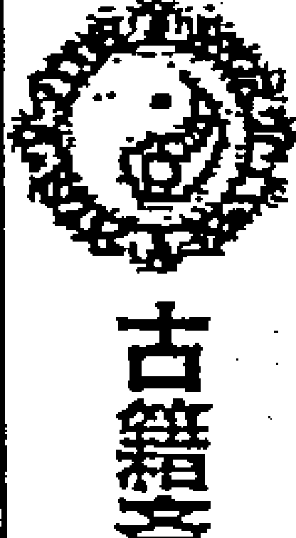

病人也算是我的长辈人，看年干庚金，庚落坎宫为死地不吉，遇死门迫宫凶，天柱星是凶星，腾蛇是凶神，庚+癸“大格”病情不稳，不过这里更多的体现的是病人现在的精神状态与心里状态不好。天芮星虽然生坎宫，但寅月乾宫震宫，且芮星不旺又逢空，生不起来。因此我断定病人不是癌症。我对爱人讲：我看李某的父亲不是癌症，很可能是肺囊肿之类。妻子问，哪还要不要手术？我说人家儿女没有让预测，这类问题我们就不要干涉了。还有就这个局确实有手术之象，并且手术能成功（辛金临白虎乙奇冲天芮病星，辛金与开门同宫，日时逢乙+辛龙逃走）。

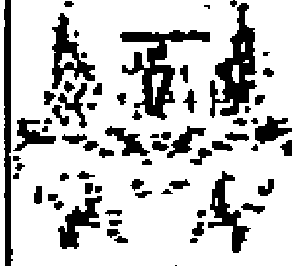

此局天芮星落乾宫也临值符，这个该怎么看？乾宫作为男性长辈临值符天禽星，天禽星落乾宫是为旺，又亥日乾宫当令临马星不为真空。值符旺相，证明还有生命力。值使门死门落坎宫临年干不吉，但死门在寅月受制，为凶不大。

第二天（庚子日）做了手术，病理检查确诊为肺脓肿，切除了一叶肺。手术很成功，病人在3月 日出院。

### 疾病预测实例三：（易海扁舟网友的帖子）此老人有危险吗？

公元:2010年2月2日7时33分46秒阳3局
干支:己丑年丁丑月癸未日丙辰时
旬空:午未空申酉空申酉空子丑空
直符:天任直使:生门旬首:甲寅癸

| 丁 六合 天英 丁 阴 景门 己 | 庚 白虎 庚 禽芮 乙 六 死门 丁 | 壬 玄武 天柱 壬 白 惊门 乙 |
| :--- | :--- | :--- |
| 癸 太阴 天辅 己 蛇 杜门 戊 | 丙  庚 | 戊 九地 天心 辛 玄 开门 壬 |
| 己 腾蛇○马 天冲 戊 符 伤门 癸 | 辛 直符○ 天任 癸 天 生门 丙 | 乙 九天 天蓬 丙 地 休门 辛 |

黑龙江易友易海扁舟在《不吹牛预测网》发了一个帖子原文讲:“—1930年出生的老太太,早晨起来跌倒了。但无大碍。其子来电话问吉凶。得下局:请诸位析断,有结果反馈。本人断;脑出血可能性大,如辰日平安度过,则万幸。”

这个局我最初判断如下:“跌倒看伤门,伤门迫宫不旺,戊+癸,临马星,被绊倒的。天冲星不旺,跌伤的能量不大。空亡,伤情不重。对冲地盘年命庚,又坤主母亲,临惊门,受到惊吓惊恐之象。天盘乙庚到震宫,跌伤成了病情的诱因。年干己落震宫,己+戊,戊击刑,足部受了点伤?”

实际此老太太老人被医生诊断是“病毒性重感冒”,“2月4日就痊愈出院了。只是滑倒,哪里都没伤。”我们反思一下这个局,看看玄机在哪里?

一是从提供的信息看,是“早晨起来跌倒了,但无大碍”,跌倒不是病,应该看伤门,伤门逢空亡,又天冲星不旺,逢空,则伤情很轻。年干己落震宫,克制伤门落宫,亦主没有受伤。但空亡,但对冲之宫,坤宫临惊门,老人受到了惊扰,有所担心。

二是年干己为长辈为母亲落震宫是病地,己下戊击刑也为摔倒之象。但宫中天辅星旺相,杜门得地,太阴为吉神,己+戊,犬遇青龙谋望遂意,无凶之象。

三是此局容易判断错误的是年命庚金所在宫的符号，很容易让人往凶险的方面来断。庚落离宫是沐浴地，与天芮星同宫，天芮星旺于落宫与月令，并且临白虎、死门、庚金这么一些“恐怖”的符号，很容易让人产生癌症、死亡之类的联系。但为什么只是“病毒性重感冒”？这里的关键点：庚金作为年命用神，所临是天禽星，而年月日时均为土禽星很旺为吉。而庚金作为病的符号在此宫只是一个陪衬（非天芮星所带之干），并且庚金在败地不旺，而宫中临着乙丁两奇为吉。乙丁也说明打针吃药比较及时有效。还有此局是问伤灾，则不能首选天芮星为用神。不问病，则不应该把病星作为重点。丁奇为炎症，庚金、死门为病毒。

四是时干丙为事体，丙辛合，临休门吉门九天吉神，生日干为吉。又日干生年干，无母子分离之象。此局日干临值符值使，空亡，为求测人心中不安（没底）之象，空亡看对冲之宫，就是怕母亲有什么疾病（空亡深挖到坤宫，亦主担心母亲的健康问题）。但天任星旺于四值，老太太的能量还是很充足的，因此没有性命之忧。

### 疾病预测实例四：（石破天网友的帖子）一人问母亲的病情会怎样发展？

公元：2010年1月1日18时58分15秒 阳2局
干支：己丑年 丙子月 辛亥日 丁酉时 【五不遇时】
旬空：午未空 申酉空 寅卯空 辰巳空
直符：天禽 直使：死门 旬首：甲午辛

| 癸 太阴○ 天心 壬 地 开门 庚 | 己 六合 天蓬 乙 天 休门 丙 | 辛 白虎 天任 丁 符 生门 戊 |
| :--- | :--- | :--- |
| 壬 螣蛇 天柱 癸 玄 惊门 己 | 丁  辛 | 乙 玄武 天冲 己 蛇 伤门 癸 |
| 戊 直符 辛 禽芮 戊 白 死门 丁 | 庚 九天 天英 丙 六 景门 乙 | 丙 九地 马 天辅 庚 阴 杜门 壬 |

这是广西易友石破天发在《不吹牛预测网》上的一个帖子，原文是“一人问母亲的病情会怎样发展”。预测后不久，求测人的母亲于1月23日17点10分去世了（丁丑月、癸酉日），第二天18点50分其父亲亦因病去世（丁丑月、甲戌日）。我们来分析一下这个局，看看局中的信息是否明显？

1、此局求问母亲的病情，大局反吟，应是反复发作之象。因为卦主未说明老人的年龄与是否是久病，还是新病。则这个反吟局，容易“按新病反吟则愈”来看待。而久病遇反吟，则大为不吉。又“逢五不遇时人将逝”，日时分落二八宫主天各一方，问事遇死门值使，亦主大凶。天芮星落艮宫旺相缠绵，戊+丁青龙耀明，辛+丁狱神得奇虽然是吉格，但病神临此格为凶，意味着病情猖獗。临值符，亦有病重的象征。

2、年干己土落长生之地，地盘己落病地，如此反吟，是否意味着在“疾病”和“另一种生长”中徘徊的阶段。己+癸，地形玄武，主病危，看来已到无治的阶段。

3、坤宫为母亲，时干为所问之事。丁+辛官人失位，天任星子月为休，丁+戊青龙转光有“回光返照”之象，虽然临生门，但生+死主“有病难救”又临白虎凶神主刑伤。坤宫的符号亦不吉。

4、母亲应期：病人天芮星逢戊辛冲格，冲以合为应期，子午冲，子丑合，当应丑月，即下个月丁丑月。并且丑月艮宫当令，天芮星旺相，死门旺相为凶。

5、此局没有问父亲，年干己土为母亲，则合干值符为父亲。艮宫值符天禽星虽然落宫旺相，但子月休囚，与天芮星同宫为凶。乾宫为父亲，庚+壬移荡格不吉，临马星、九地，又处孤地，对冲临太阴，也是不利的信号。年干己为长辈，己落兑宫，看母亲的情况时已经用过此信息，则翻宫看己下的癸水落宫，癸水落震宫，癸+己华盖地户，男女占之音信皆阻，躲灾避难为吉。临天柱破军星，惊门凶门克宫事更凶，螣蛇凶煞怪事缠绕。相关情况来看，亦是凶险笼罩着父亲。又“庚落乾坤父母早年沦没”，庚在乾宫，父亲要去世之象。

### 疾病预测实例五：小孩什么病？会是甲流吗？

公元：2009年12月23日20时6分28秒 阳7局
干支：己丑年 丙子月 壬寅日 庚戌时
旬空：午未空 申酉空 辰巳空 寅卯空
直符：天芮 直使：死门 旬首：甲辰壬

| 丙 九天 天英 庚 地 开门 丁 | 辛 直符 丙 禽芮 壬 天 休门 庚 | 癸 腾蛇 马 天柱 戊 符 生门 壬 |
| :--- | :--- | :--- |
| 丁 九地○ 天辅 丁 玄 惊门 癸 | 乙  丙 | 己 太阴 天心 乙 蛇 伤门 戊 |
| 庚 玄武○ 天冲 癸 白 死门 己 | 壬 白虎 天任 己 六 景门 辛 | 戊 六合 天蓬 辛 阴 杜门 乙 |

求测人男性，15号时，曾给我留言，讲孩子病了2天，已经控制住了!这两天还要输水。

23号又给我信息讲：本来轻多了，这两天又咳嗽，今天不知为何又嗜睡。咽喉发红，咳嗽厉害 问：不会是甲流吧？

父问子病，以时干庚金为孩子，落巽宫，为养地，对于小孩来讲不凶。八门反吟，病情有反复，新病反吟主愈，说明孩子能好转。临开门吉门，九天吉神，下临丁奇，亦主能尽快康复之象。

天芮星为病，落离宫旺相，主看似病凶，但子月离宫处死地，病神无力猖獗。丙+庚贼必去，病星必去，临休门，主这病面临休止，主病情不再发作，因此断不是严重的疾病。看看是什么病？

天芮星落离宫临值符，主头部，见丙火为发热。时干主事，落巽宫，巽为风，有伤风感冒之意，临丁奇亦主发热与炎症。天芮星落宫庚在败地不凶，临休门主嗜睡，壬水亦主血液象问题，还主需要输水。宫中临休门，丙奇帝旺，壬+庚，病情被阻隔，丙+庚，病必去，因此这里的值符，应表示为病情明朗，宜于治疗，向好的方向转化。离宫主头，亦有脖颈之意，丙为炎症，主红肿。也可以通过时干宫来分析，时干宫中庚下丁，而丁临惊门主咳嗽，空亡，咳嗽必止；丁+癸，发热必停。这些都是能好转之象。反吟，好的快。时干生日干，父子相依恋，无凶。实际在 25 号就反馈：小孩已经基本好了，是感冒引起的咽喉炎症。没检查甲流。

## 疾病预测实例六：（程医生的帖子）一个有手淫习惯及做怪梦人的求测局

公元：2009年3月24日18时41分30秒 阳3局
干支：己丑年 丁卯月 戊辰日 辛酉时
旬空：午未空 戌亥空 戌亥空 子丑空
直符：天任 直使：生门 旬首：甲寅癸

| 庚 白虎 庚 禽芮 乙 阴 死门 己 | 丙 玄武 天柱 壬 六 惊门 丁 | 戊 九地 天心 辛 白 开门 乙 |
| :--- | :--- | :--- |
| 己 六合 天英 丁 蛇 景门 戊 | 辛  庚 | 癸 九天 天蓬 丙 玄 休门 壬 |
| 丁 太阴○ 天辅 己 符 杜门 癸 | 乙 螣蛇○ 天冲 戊 天 伤门 丙 | 壬 直符 马 天任 癸 地 生门 辛 |

有一人问程医生：“请问下，对于手淫有将近7年史的患者可以治疗的好吗？”并自己做了如下介绍：他今年22岁，因为母亲去世早，不知道具体的生辰。他的思想不健康，是从小时候（小学一年级）时一个怪梦以后慢慢出现的。梦到被一条白色的蛇缠身，蛇嘴对着他的头，那条蛇本来很小，却缠绕了他三圈。做这梦1个礼拜后，脑袋痛，去医院检查没查出任何毛病，在医院住了半年，然后上学的时候开始有脑淫、幻想，不到8岁就明白男女之事了。那个梦出现后，记忆力、思想、精神都开始下滑。手淫是在初中的时候开始的。现在很瘦、肠胃也不好，嘴巴苦、口臭。现在工资不高，去年一年的薪水全用在看病上了，也没有看好。我们解读一下这个局中显示的信息：

地盘日干为求测人过去的状态，戊落震三宫六仪击刑，景门主消息主画面，丁为眼睛为尖状物，地盘临螣蛇，主蛇，临六合亦主缠绕，震为三数，正应此人所讲“被缠绕了三圈”之象。暗干见己，而地盘己临死门，这样的事情应与死去的女性长辈（巽宫）有一定的关联。

天芮星为疾病，乙在巽宫为沐浴桃花之地，乙下己主私欲，主幻想，主淫秽，宫中逢庚，乙庚合为男女之事，临地盘太阴，主难以启齿的私密之疾，临白虎、死门，症状较重。乙为手，己为性，乙+己，有手淫的信息。其实，还可以追己土到艮，己下癸，癸主性。又地盘日干戊临丁，景门，六合，亦主男女和合之事，这些信息都表明此人确实有较早的手淫史，有早熟的情况。巽为风，己为嘴，死门临庚为臭，因此有嘴巴苦、口臭等现象。

日干戊为求测人落在坎宫是胎地不吉，临天冲星、伤门，主忧思重重之象，临螣蛇主怪异，主梦魇纠缠，空亡，对冲之宫丁+壬淫荡之合，临玄武主暗昧之事。这些情况亦反映了求测人目前的情况不佳。天盘戊空亡，地盘戊击刑，没钱。从局象看，此人的疾病应与阴宅（母亲的坟地有关）。

## 疾病预测实例七：（网友新明的求测贴）母亲住院，诚心求测何时出院？

公元：2009年5月7日 19时33分42秒 阳4局
干支：己丑年 己巳月 壬子日 庚戌时
旬空：午未空 戌亥空 寅卯空 寅卯空
直符：天任 直使：生门 旬首：甲辰壬

| 己 白虎 己 禽芮 丙 阴 开门 戊 | 丁 玄武 天柱 辛 六 休门 癸 | 乙 九地 马 天心 庚 白 生门 丙 |
| :--- | :--- | :--- |
| 戊 六合〇 天英 癸 蛇 惊门 乙 | | 壬 九天 天蓬 丁 己 玄 伤门 辛 |
| 癸 太阴〇 天辅 戊 符 死门 壬 | 丙 螣蛇 天冲 乙 天 景门 丁 | 辛 直符 天任 壬 地 杜门 庚 |

原文讲：“我母亲的年命是乙亥！我母亲是车祸受的伤，肋骨骨折，脚趾骨折，虽不太重，但很痛苦。出院时一定反馈！”

以下是引用易初莲花在 2009-05-07 的发言：“好像有手术的迹象，医生医术不是很高明，只作常规治疗。本月中旬 15、16 金旺之时日出院。届时请反馈。今天 15 号午时出院！准！高！”易友易初莲花做出了准确的应期判断。我们重新回顾一下这个局：

地盘己在坤宫为母亲过去发生的事，己在中宫击刑，临庚+己：官府刑格；马星主车，庚+丙贼必来车祸之象。但坤宫有天心星吉星、生门吉门、九地吉神，并有丙奇相助，没有大的凶险。临天心星亦主被及时救护。

既是伤灾，当看伤门落宫，伤门主伤，落兑宫虚地，对冲震宫空亡，临老人的年命乙奇，震兑主助，癸主足，震为足，丁+辛，正是肋骨骨折、脚趾骨折之象。伤门落兑宫受制，又巳月兑宫不旺，则伤灾不重。

年干己为母亲，落巽宫衰地，虽临白虎主刑伤，但宫中有天禽星吉星、开门吉门，己+戊，丙+戊吉格，大吉之象。八门反吟主快，母亲能尽快出院之象。

时干生日干，亦是求事能成，顺利出院之象。日时都在外盘，天心星为医院也在外盘，又主慢一些。庚下己，为庚格（月格），则本月内能出院。生门值使落坤宫，主 2、5、8、10 之数。医院看天心星，临马星，必在马星动或坤宫当令之日。此局应在了 2 月 15 日庚午日，正应庚落宫当令马动，坤宫旺，8 天。

## 疾病预测实例八：（程医生代发求测帖）H 主任问测母亲的病情？

公元：2009 年 6 月 11 日 9 时 50 分 6 秒 阳 3 局
干支：己丑年 庚午月 丁亥日 乙巳时
旬空：午未空 戌亥空 午未空 寅卯空
直符：天柱 直使：惊门 旬首：甲辰壬

| 壬 九地 天英 丁 玄 休门 己 | 戊 九天 庚 禽芮 乙 地 生门 丁 | 庚 直符 天柱 壬 天 伤门 乙 |
| :--- | :--- | :--- |
| 辛 玄武○ 天辅 己 白 开门 戊 |   庚 | 丙 螣蛇 天心 辛 符 杜门 壬 |
| 乙 白虎○ 天冲 戊 六 惊门 癸 | 己 六合 天任 癸 阴 死门 丙 | 丁 太阴 马 天蓬 丙 蛇 景门 辛 |

最初说老太太是 1918 年戊申，后更正为 1920 年庚戌人。求测人讲：“其母亲已多日未进食，现呈嗜睡状态，靠营养液静脉维持。”起初年干己逢空，庚临天芮星是危险的，认为难逃一劫的。实际上，据了解，至 2010 年 3 月初，其母亲仍然健在。这个局，给我们的启示是：

问病，首看天芮病神，落离宫正旺相，又午月旺，临生门、九天主疾病猖狂与发展。临乙奇、丁奇，主正在用药物维系。天心星受制，主表面看医疗效果不明显。

但有没有生命危险还是要看用神落宫，年命庚戌落在离九宫为败地正合老年人的状态（老怕帝旺），临天禽吉星、生门吉门、九天吉神，乙丁两奇，主没有生命危险。一般说来，己庚辛壬癸为病，奇不为病，宫中临乙奇、丁奇，通常为正用药打针的象意（乙丁落绝地常为病），则宫中丁克乙，乙合庚，病情能得到控制。年命所在离宫旺相为吉，没有生命之忧。

年干己为母亲落震宫病地，正合生病之象，临玄武主昏迷嗜睡。己+戊犬遇青龙，天辅星旺相，又临开门吉门，虽然戊击刑，但此宫空亡，为吉事不吉凶事不凶之象，没有很大的危险。

### 疾病预测实例九：问奶奶的病情与生命应期

奶奶年命丙午，想看看她的病情和生命应期，也好有个心理准备。
公元：2009年6月28日9时44分59秒 阴6局
干支：己丑年 庚午月 甲辰日 己巳时
旬空：午未空 戌亥空 寅卯空 戌

天芮星代表疾病，落震三宫，临白虎，病情凶险。辛+癸，天牢华盖，疾病难愈；丁+癸，朱雀投江，难显希望。生门临宫，天芮星临生门，说明病情难以抑制，还在生发。乙奇、天心星都不克制天芮星落宫，病情难遇。但天芮星落震宫，受宫制危机，未月震宫还有余气（木余气在未），又年月日时芮星都在外盘，主远主慢，老爷子还能维持一段时间。天心星泄天芮星，医院的治疗，可以在一定程度上延缓生病，减缓和减轻病情。但如果到了申月，木死，天芮星本位当令，事情会变的更加严重，很可能是生命的终结。

求测人在 7 月 22 日中午 11 点多反馈：今天中午 11 点零 3 分接到求测人的电话：讲他父亲现在正在医院里治疗，效果不好。另：讲其父生于 1933 年（癸酉），不是 34 年甲戌。仍以原局来看，癸水在乾宫也是帝旺之地，老怕帝旺，又该宫正冲流年太岁己土落宫，命犯太岁主大凶，年命宫空亡，临九天，马星，也说明老爷子命不久远了。

2009 年 8 月 4 日，我给求测人要了个电话，求测人说 25、26 日严重昏迷，差一点走人。现在病人还在医院，昏迷，不能进食。

2009 年 9 月 5 日得到消息：老人于 2009 年 8 月 24 日（壬申月辛丑日）晚上去世。

看应期：
- 其一，就是申月震宫木死，制天芮星的力量死了。
- 其二，值使门落震宫，3、8 之数，未月生门旺，30~38 天。
- 其三，年命癸在乾宫，癸为甲寅癸，寅亥合，下置甲申庚，逢合以冲为应期，申月冲寅。
- 其四，年干落宫在巽宫，辰戌冲，冲以合为应。申月申辰半合。
- 其五，辛丑日正是冲年命癸水之墓的日期，亦是值使门所临之干为应期。（注：我当时没有仔细判断。最初是对求测人讲，还能拖一段时间，但康复的可能性是没有了，及早准备后事为宜。具体的应期没有去断。）

### 预测疾病实例十四：（虔诚网友）求测：我得了什么病，能否治愈？

公元：2009年7月14日8时48分39秒 阴5局
干支：己丑年 辛未月 庚申日 庚辰时
旬空：午未空 戌亥空 子丑空 申酉空
直符：天辅 直使：杜门 旬首：甲戌己

| 癸 九天 | 戊 九地 | 丙 玄武○ |
| :--- | :--- | :--- |
| 天英 癸 符 休门 己 | 禽芮 辛 天 生门 癸 | 天柱 丙 地 伤门 辛 |
| **丁 直符** | **壬** | **庚 白虎○** |
| 天辅 己 蛇 开门 庚 | 戊 | 天心 乙 玄 杜门 丙 |
| **己 螣蛇 马** | **乙 太阴** | **辛 六合** |
| 天冲 庚 阴 惊门 丁 | 天任 丁 六 死门 壬 | 天蓬 壬 白 景门 乙 |

这是一个网友发在《不吹牛预测网》上的求测贴，我断：
1. 自己吓自己，肠道有点问题。精神状态差。
2. 鼻炎、流鼻涕、鼻塞，是中暑了吗？

求测人反馈：不吹牛老师果然名不虚传啊！！！我肠胃一直不好，但最近一个月总是腹泻，于是在药店买了点这方面的药吃了几天，但不见好转，加上以前一些事情，所以我很担心是疑难杂症，心里确实很乱。鼻炎也有，不过只是冬天严重，现在倒没事。前几天也确实中暑了。

我又断：
1. 庚下丁，暗干己，芮星见戊癸临辛，与错误的性行为有关。
2. 九地时间长了，现临马星，有发展趋向。
3. 丁临死门落坎又被壬水合绊，打针效果不好。
4. 芮星克制乙心，乙心空，现在没有有效治疗。
5. 戊癸辛落离宫，合中带冲，临生门，可考虑一下调整阳宅风水，以辅助改善。

求测人反馈：“检查结果已经出来了，没有绝症，的确是自己吓自己。其中原因一言难尽...不过腹泻还没停，下一步就专门看肠道方面的病了。确实有阳宅引起的原因，住宅大门临二黑病符星，我的卧室又在北方五黄大煞的地方，而我是排行老二，对我非常不利。其实年初就想搬，却因为一些事拖到现在，仅仅只是把电脑挪到别处。我打算这几天就挪地方。年初时在别的网站发帖测一笔交易成否，不吹牛老师当时断言可成，但拖拉。最后确实应验。这次的几条详细断言也句句言中。可见不吹牛老师预测功底深厚，已达到炉火纯青之境界！找大师就该找像不吹牛老师这样实战水平高又德高望重的，病看好后我就找老师学习奇门遁甲！”

# 第三十七章 奇门择吉

择吉，也就是选择有利的时间，或有利的空间（地方），或找有助于你的人，办有助于你愿景的事情，以实现趋吉避凶之目的。各学科都有自己独立的择吉方法，比较流行的有奇门择吉、丛辰法（以神煞吉凶为依据，包括建除法等）、正五行法、紫白法、六壬法、乌龟太阳法、天星法（七正四余）、河洛理数法等十几种。我们讲的是奇门择吉。

## 一、方位择吉

在奇门遁甲中有很多关于方位吉凶的表述，我们学习其中的一些片段：

《烟波钓叟歌》讲：“急则从神缓从门，三五反复天道亨”：“急则从神”（神，值符被称为天乙之神）是指在危机时刻，没有余地选择三奇和吉门，则可从天盘值符之宫或地盘值符之宫而去，可保平安。“缓从门”，指事缓从容，可选三奇吉门之方而往。“三五反复”中的“三”指开休生三吉门，“五”指的是死惊伤杜景五凶门。三吉五凶，反复变化无穷，顺应天道，或从神或从门，则可以做到亨吉无凶。（也有讲：缓从门的门是指值使门）

张志春老师对奇门方位择吉做过总结，附录如下，供学习参考：

选择最佳方位，应避开三奇入墓、六仪击刑，年月日时格和大格、小格、刑格及飞干格、伏宫格、飞宫格等凶格，选择乙丙丁三奇与开休生三吉门相会的方位，这是最佳的方位。

如果只有奇而没有吉门，这叫得奇不得门，还不能算吉利方位。

如果只有吉门而没有奇，叫作得门不得奇，也算吉利方位，可用。可见吉门比三奇还重要。

如果不得奇，又不得吉门，那就不是吉利方向，但如果逢吉格，也可用；如遇凶格，则不可用。

选择最佳方位，一般而言，要尽量选择三奇和三吉门所在方位，但还要看办什么事情，比如捕猎讨债，就可用伤门、吊唁送葬则可用死门。《烟波钓叟歌》讲：

> 八门若遇开休生，诸事逢之总称情；
> 伤宜扑猎终须获，杜好邀遮及隐形。
> 景上投书并破阵，惊能擒讼有声名；
> 若问死门何所主，只宜吊死与行刑。

- **开门处**：宜远行、利求职、上任、找工作、利求财、婚姻嫁娶、访友、谒贵，公开宣传等，但不利于隐私之事、不利于需要保密的事情。
- **休门处**：宜求财、婚姻嫁娶、远行、上官、见贵，适合出外旅游或非正式的商业活动。
- **生门处**：最宜谋财、做生意、远行、婚姻嫁娶、求职、远行、种植等诸事皆宜，也适合治病求医。
- **伤门处**：具有破坏性，若强出伤门易见血光，因此一般的事情皆不宜，但适合钓鱼、打猎、搏击、竞赛、体育、围捕盗贼、刑事诉讼，特别是适合索债。
- **杜门处**：有隐藏的信息，适合隐身藏形、躲灾避难、技术学习等，其余事不利。
- **景门处**：利于考试、广告宣传、旅游、远行、酒宴、聚会、婚姻、合约、嫁娶。
- **死门处**：最凶，除吊丧、捕猎之外，其余诸事不宜。
- **惊门处**：有惊恐、怪异之事，若强出此门，易遇惊恐、是非、怪异之事，但利于演说、法律活动以及民事诉讼等。

怎样才叫出吉门，这是指要往吉门的方向行走 15 分钟（也有资料讲要在吉门方位停留半个小时以上）才有效果。比如吉门在西方，就必须先往西方行走 15 分钟以上，才能往目的地去。如目的地本来就在吉利的方位，则可以出门直接前往。再如欠你钱的人，住在你的北方，你可在伤门在北方的时候给对方打电话索债或前往讨债，会有出乎意料的效果。比如你是开店的卖货求财，以你的店铺为立极点，起局后找到生门方位，在生门方向的超过 100 米的地方停留 15 分钟以上，然后再直接进入你的店铺。学生考试，以考场为中心点，看景门方位在哪里，到 100 米外的景门方位站 15 分钟以上，然后由景门方位不停顿的直接进入考场。

古代还有“孤虚法”传世，讲“此法背孤击虚，一女可敌十夫，取击对冲之方是也，万无一失”。此法古时用于出征，现今一般用于战斗、博戏，如各类比赛、牌局，均能百战百胜。例如甲子时子时至酉时，孤（空亡宫）在戌亥，这段时间坐西北方的胜。

九星之方也各有所主，有其吉凶和适宜性：

- **天蓬星位**：宜安抚边境、修筑城墙、兴做土木。赔垫堤防、屯兵固守，保障一方。秋冬亥子月日加离九宫利于客，可以捣巢破敌，掩其不备。若埋葬、斩草、立茔，遇乙庚日六乙时加天蓬星上，主雷电交加，大风一阵，双鸟至，后主子孙兴旺，官禄不绝。其余须得奇门会合方为吉。其他情况下，天蓬星为凶星，盗星，特别是经商出行易遇盗贼或破财、生病。
- **天任星位**：“天任吉宿事皆通，祭祀求营嫁娶同。断灭群雄移徙事，商贾（gǔ）造葬喜重重。”百事皆吉，四时皆宜。春夏寅卯巳午月日加二八宫利为客，加六七宫利为主。若嫁娶生贵子，上官连人、应举中试，面君、求财，一应俱吉。埋葬、斩草、破土，如与奇门会合，主子孙繁衍，世代科甲官禄。
- **天冲星位**：宜于选将出师，征伐交战，鸣金击鼓、摇旗呐喊、宜于捕捉。若嫁娶主离散，上官到任文吏坠马，移徙女人病死，竖造（指营建住宅、城郭、寺庙、库馆等）修方三年不吉，唯离宫三山无祸。遇天冲星埋葬，主出少亡、残疾、痨病；若会合奇门则吉，不合凶。春夏四五月日加二八宫利为客，加六七宫利为主，左将大胜，秋冬不得成功。
- **天辅星位**：“天辅之星远行良，修造埋葬富绵长。上官移徙皆吉利，喜溢人财百事昌”。特别有利于升学、考官，发展文化教育事业。如得奇门会合，则更加吉利。嫁娶多子孙、修造埋藏合巽离震坎四山，不出百日得横财。
- **天英星位**：宜于谋划献策，面君谒贵。不宜求财考官、嫁娶移徙。“天英之星嫁娶凶，远行移徙不宜逢。上官商贾凶败死，造作求财一场空”。惟竖造主火光，生产主死，祭祀不享。若埋葬、斩草破土，合吉门者，主子孙超越寻常。
- **天禽星位**：“天禽远行偏得利，坐贾行商皆称意。投谒贵人皆益怀，修造埋葬都丰裕”。
- **天芮星位**：“天芮授道结交宜，行方值之最不吉。出行用事皆宜退，修造安营祸难测。”不宜用兵、嫁娶、争讼、移徙、修造等。但立券（签订契约）、埋葬、斩草破土，遇甲己日六丙月奇加在天芮星上，主二人乘马或鹏鹤双来，后主子孙富贵，世代官禄。其余须得奇门会合方吉。
- **天柱星位**：“天柱藏形谨守宜，不须远行及营为。商贾吉事皆不利，动作立刻见凶危。”秋冬亥子月日加三四宫利为客，加九宫利为主，须合奇门方吉。妄动主车破马死、破财、伤灾。
- **天心星位**：“天心求仙合药当，商途客于财禄昌。更将扦葬皆吉利，万事欣逢尽高强。”既能惩恶助善，百事吉昌，又能求仙长寿，治病配药。

神盘上有四个吉利之神，这就是太阴、六合、九地、九天。《烟波钓叟歌》中说：“九天之上好扬兵，九地潜藏可立营；伏兵但向太阴位，若逢六合利逃形”。这就是说，八神中除值符外还有四个吉神，九天所临之宫宜于为客，可以主动出击，先发制人；九地所临之宫宜于为主，可以屯兵固守，以逸待劳；太阴所临之宫适宜埋伏军队，不易被敌人发现；六合所临之宫，对于逃亡退却有利。其他的腾蛇位，主官司牵连、罗网，惊恐怪异；白虎位主死伤、秽气、杀伐、凶灾；玄武处，主惊恐、贼盗以及云雨为应。

方位择吉，也应考虑格局的影响，遇青龙返首、飞鸟跌穴、九遁、三奇得使、玉女守门、三诈五假、三奇升殿（乙到震、丙到离、丁到兑）、奇游禄位（乙到震、丙到巽、丁到离）、奇仪相合（甲+己、戊+癸、乙+庚、丙+辛、丁+壬）、交泰格（乙+丙，丁+丙，遇吉门）、天运昌气格（丁+乙，乙+丁）、天辅大吉时（天显时格）、欢怡（乙丙丁+地盘值符）、相佐（值符+地盘乙丙丁）、吉门和义（门生宫为和，宫生门为义）。遇到这些吉利的格局，一般为吉。而遇到青龙逃走、白虎猖狂、腾蛇夭矫、朱雀投江、太白入莹（庚+丙）、荧入太白（丙+庚）、飞宫格、伏宫格、飞干格、伏干格、三奇入墓、六仪击刑、大格、小格、刑格、岁格、月格、时格、悖格、天网（天盘六甲值符+地盘六癸，癸+癸）、伏吟、反吟、五不遇时、门宫迫制、三奇受制等，则此方位常不吉，或出现大的凶殃。

以上可见，择时择方，必须综合运用。在门、星、神三者中，吉门最重要（门主人事）、吉星（大事看星）、三奇次之，吉神可起辅助作用。不仅要考虑门、星、神、奇仪是吉是凶，还必须结合时令和所临宫位，看其旺相休囚，运用阴阳五行生克制化的原则，辩其旺相休囚，然后才能确定吉凶以及吉凶的程度。

在奇门择方择吉中，“通关”的作用是经常需要考虑的。利用九宫五行属生克制化原理，扶胜于制，能扶不制。如离九宫临开门克我乾六宫，不利于我的工作或求职，此时可找到坤宫或艮宫帮忙，即可以找未申年生或者丑寅年生人，也可以从西南或者东北方向找人从中帮忙，或到西南方向或东北方向去谈判等。也可以找老太太，还可根据宫中宫的意象取用，如乙奇为花草、葫芦等。当然也要注意相关宫内的情况，如果临刑格、六仪击刑、悖格、凶的星门神仪也常常不能用。

运筹和处理都是用最基本的阴阳五行关系。比如当事人落在巽宫，要找兑宫的人帮忙，就得用坎宫通关。往北方找贵人，看坎宫的符号。呈阳星，找男的。旺，找年青人，衰，找老年人。就是遇到克制对方的情况，也要考虑旺弱。比如当事人在兑宫，要找巽宫的人办事，我克他，正月二月去找（木旺金衰）不一定好，辰月，金旺木衰时去，则好办成。

还有一点很重要：年命的死墓之地，永远是他不利的位置。甲年出生的人，既要看甲木的墓绝之地，也要看干支组成后“遁甲”形成的干，如甲辰年出生的，甲墓在未，未方不利，遁甲后成为甲辰壬，壬水的墓库在辰，辰方也不利。到墓地好事少。出行方位上，一般也不宜去日干的死墓之地。入墓有十二长生之墓，还有五行入墓之说。十二长生入墓是临时入墓，五行入墓则是从根基上入墓，是彻底的入墓，这事就更难办，甚至彻底的完了。

《奇门大全》上讲到：“凡奇门占法，静则只查值符值使，动则专看方向。”动，比如要去西北方有笔生意要做，这种情况下专看方向（一般不用看自身状态），如果此方向逢真空、临死门、休囚无力，则求不到财。逢击刑、冲格，主求财中有麻烦事。如果是静的，即你是在家等待人家上门来找你，这时候自身落宫情况很重要，看你有没有获得这个钱财的能力，遇到庚+丙临生门、戊+丙、丙+戊等，一般可得财。

### 二、关于用事时辰中的方位择吉

请大家留意一下，我看古人是以问事时辰来预测，以用事时辰来择吉的，主要看时干和方位。

《奇门法窍》中讲到：

- **时加六甲**，一开一阖，上下交接。加阳星为开时，百事吉。加阴星为阖时，百事不利。我的理解是当时干落在地盘六甲值符之宫，临阳星则为开时，百事吉；加临阴星，百事凶。若无奇门，合得此局亦得次吉。又有：“甲为天福，又为青龙，阳开利客，阴开利主，阖则固守，开则扬兵”；“时加六甲为开阖，六甲虽同用不同。阳星加开移徙吉，阴星加阖所为凶”。
- **时加六乙**，往来恍惚，与神俱出。时下得乙为日奇也，宜从天上六乙出：遇到时干加地盘乙奇的情况，遭攻击逃亡者，宜从天盘乙奇落宫而出，若神相助，不宜被人发现。天盘乙奇（天德）之方，百事皆宜。
- **时加六丙**，万兵莫往，王侯之象。时下得丙为月奇也，凡攻伐，宜从天上六丙出：逢时干加地盘丙之时，天盘丙奇（天威）之方最吉利。
- **时加六丁**，出幽入冥，到老不刑。又六丁为三奇之灵，行来出入，宜从天上六丁所临之方出，百事吉利：逢时干加地盘丁奇，出入天盘丁奇（玉女星奇）之方大吉大利。
- **时加六戊**，乘龙万里，莫敢呵止。戊为天武，从天上六戊而出，挟天武入天门，百事皆吉，逃走亡命远行万里无所拘止，又宜发号施令，诸恶伐罪，谋大事：时干加地盘戊上，从天盘戊土（天武）落宫谋为大吉大利。
- **时加六己**，如神所使，出被凶咎：时干加地盘己土之时，则天盘己土（地户）所在之宫用事为凶，只宜私下制定计划。
- **时加六庚**，抱木而行，强有出者，必有斗争：时干加临地盘庚金落宫，则天盘庚金（天狱）所在的方位最凶，百事不利。
- **时加六辛**，行逢死人，强有所作，殃罚缠身：时干加地盘辛金之时，天盘辛金（天庭）所在之方诸事不利，“将兵主胜客死”。
- **时加六壬**，为吏所禁，强有出入，非祸相邻：时干加地盘壬上，天上六壬（天牢）所在之方，百事皆凶。
- **时加六癸**，众人莫视，不知六癸，出门即死：时干加地盘癸上，癸为天藏，宜求仙、远遁、绝迹，从天上六癸所临之方而出，则众人莫见，但不宜市贾、入官、迁除、嫁娶、移徙、入室，问疾病者重。

《烟波钓叟歌》中还有关于“天三门”、“地四户”、“乘天马”、“地私门”等择时择方的办法，我们可以参用。

“天三门兮地四户，问君此法如何处；太冲小吉与从魁，此是天门私出路；地户除危定与开，举事皆从此中去。”

天三门的求法，以月将加用时（支）顺行，看从魁、小吉、太冲临和位，即是天三门。首先要明白月将，正月中气雨水节后为“登明亥将”，二月中气春分节后为“河魁戌将”，三月中气谷雨节后为“从魁酉将”，四月中气小满节后为“传送申将”，五月中气夏至节后为“小吉未将”，六月中气大暑节后为“胜光午将”，七月中气处暑节后为“太乙巳将”，八月中气秋分节后为“天罡辰将”，九月中气霜降节后为“太冲卯将”，十月中气小雪节后为“功曹寅将”，十一月中气冬至节后为“大吉丑将”，十二月中气大寒节后为“神后子将”。其用法示例：

公元：2010 年 4 月 18 日 16 时 0 分 31 秒 阳 4 局
干支：庚寅年 庚辰月 戊戌日 庚申时
旬空：午未空 申酉空 辰巳空 子丑空
直符：天英 直使：景门 旬首：甲寅癸

| | 未将小吉“收” | 申将传送“开” | 酉将从魁“闭” |
| :--- | :--- | :--- | :--- |
| **成 午** | 己 白虎 天蓬 丁 天 休门 戊 | 丁 玄武 天任 壬 符 生门 癸 | 乙 九地 天冲 乙 蛇 伤门 |
| **巳 危 辰** | 戊 六合 天心 庚 地 开门 乙 | 庚 己 阴 杜门 辛 | 壬 九天 戌 天辅 戊 |
| **破** | 癸 太阴 马 天柱 辛 玄 惊门 壬 | 丙 腾蛇 己 禽芮 丙 白 死门 丁 | 辛 直符 天英 癸 六 景门 庚 |

- 二月中气河魁戌将（申位）“建”
- 三月中气登明亥将（酉位）“除”
- 神后子将（戌位）“满”
- 大吉丑将（亥位）“平”
- 太冲卯将“执”
- 功曹寅将“定”

因为 2010 年 4 月 20 日才到谷雨，4 月 18 日还属于二月中气春分节后为“河魁戌将”，以申时用事，则讲“河魁戌将”加在申上，顺行，依次是“登明亥将”（兑宫对应地支酉）、神后子将、大吉丑将、功曹寅将、太冲卯将、天罡辰将、太乙巳将、胜光午将、小吉未将、传送申将、从魁酉将。看太冲、小吉、从魁加在何处，此为天三门。本例太冲卯将临艮宫的丑位，小吉未将在巽宫的巳位，从魁酉将在坤宫的未位，则丑、巳、未三方为“天三门”。

天三门的用法，即现在这个时辰，这三个方位是非常吉利的。如遇兵败或紧急情况，就可以从这三个方向逃跑。但所临的宫位，如果被冲破则不能用。假如戌方为天三门的吉方之一，遇到辰月被冲，这个戌方就不能用。据说天三门是上天的通道，是改运用的，用于处理风水择吉比较好。此时此地不良气场藏起来了，只有贵人。风水师在处理时，能得到保护，调整起来效果比较灵验。“太冲卯将”又是“天马方”，用于出行最吉、效果快；“从魁酉将”求财、卖珠宝、酒水最吉；“小吉未将”用于食品加工业、餐饮业最吉。

关于“地四户”的求法是以月建加用时，除、定、危、开所落之方为地四户。我们先学习一下什么是“月建”以及十二值星（建除十二神）、“黄道吉日”“黑道凶日”的概念。

正月建寅，二月建卯，三月建辰，四月建巳，五月建午，六月建未，七月建申，八月建酉，九月建戌，十月建亥，十一月建子，十二月建丑。所谓的正月建寅，是寅木当令，而寅木当令必在立春后才能施令；交了惊蛰节，即是卯木当令，清明节后，是辰土当令，其余依此类推。这就是“月建”。

建除十二神的排法：以与月支相同的第一个日支起“建”，如子月子日，午月午日、辰月辰日之类。顺行第二支为“除”，如子月丑日、午月未日、辰月巳日……依此类推，顺序是：建除满平定执破危成开收闭。传统择日方法以“除、危、定、执、成、开”六日为“黄道吉日”，以“建、满、平、收、闭、破”六日为“黑道凶日”，有歌诀“建满平收黑，除危定执黄。成开皆大用，闭破不相当。”

我们这里讲的“地四户”是以所用之时上顺行起“建”、除、满、平、定、执、破、危、成、收、开、闭。如上例：辰月用申时，则从申上起建、酉上除、戌上满、亥上平、子上定、丑上执、寅上破、卯上危、辰上成、巳上收、午上开、未上闭。其中：除、定、危、开，所落之方为“地四户”，本例除落酉方、定落子方、危落卯方、开落午方，酉、子、卯、午四方为地四户。余仿此。

地四户也是吉利之方。天门第一，地户第二，如果天门地户重叠在一起的方位则更好。择吉时，首选天门、次选地户，天门不好用时，才选地户。“除”用于扫除、搬家、辞旧迎新、沐浴、上官赴任最吉（忌婚礼、开井）。“定”用于订婚、签约等最吉（忌诉讼）。“危”宜于处理问题与安床等。“开”宜于开业、开公司、就业、赴任等（破土、埋葬类不宜）。

有口诀“月建来加所用时，除危定开排来知，四星地户天门会，福星出入并皆宜”。天三门、地四户之方，利于出行、避难等。

《烟波钓叟歌》中又有“六合太阴太常君，三辰原是地私门，更得奇门相照耀，出门百事总欣欣。”这里讲一下，关于地私门的求法。

求地私门，首先要明白阴阳贵人的概念。阳贵人诀为“庚戊逢牛甲在羊，乙猴己鼠丙鸡方，丁猪癸蛇壬是兔，六辛逢虎贵为阳。”阴贵人诀为“甲日阴牛庚戊羊，乙逢鼠位己猴乡，丙猪丁鸡辛见马，壬蛇癸兔属阴方。”有此诀可知：甲日未为阳贵，丑为阴贵；乙日申为阳贵，子为阴贵；丙日酉为阳贵，亥为阴贵；丁日亥为阳贵，酉为阴贵；戊日（庚日）丑为阳贵人，未为阴贵人；己日子为阳贵人，申为阴贵人；辛日寅为阳贵，午为阴贵；壬日卯为阳贵，巳为阴贵；癸日巳为阳贵，卯为阴贵。

在十二时辰中，自寅至未为“旦”，用阳贵人；自申至丑为“暮”用阴贵人。再以月将加用时，看贵人落于何位，从此位上依次起贵人：螣蛇、朱雀、六合、勾陈、青龙、天空、白虎、太常、玄武、太阴、天后。贵人落亥、子、丑、寅、卯、辰位上则顺行，落于巳、午、未、申、酉、戌位上则逆行，最后再看六合、太阴、太常之方为地私门。比如 2010 年 4 月 18 日（戊戌日）申时，（申至丑为暮），用阴贵人未，此日虽然是三月初五，但还在三月中气谷雨节前，为二月河魁戌将，将月将（河魁戌将）加申上顺行（同天三门的求法），则阴贵人未（未将）临巽宫的巳上，“贵人落于巳午未申酉戌，应逆行”，则以巳乘贵人，逆行，辰乘螣蛇、卯乘朱雀、寅乘六合、丑乘勾陈、子乘青龙、亥乘天空、戌乘白虎、酉乘太常、申乘玄武、未乘太阴、午乘天后。则六合临寅位、太常临酉位、太阴临未位，此三方即为“地私门”，若有奇门再相临，诸事可为。

“太冲天门最为贵，卒然有难宜逃避，但当乘取天马行，剑戟如林不足畏。”天马方即太冲方，这里再次提出重点阐明，在遇到紧急危难之时，一时之间找不到得奇、得门的吉方，这时可以向天马太冲之方避难，虽刀剑如林，亦无所伤。

“三为生气五为死，胜在三兮衰在五，能识游三避五时，造化真机须记取。”对此，历来解说不一。我们可以结合“奇门遁甲总序”中：“胜地有三：天上值符所临，天乙大将居之，一也；值符后一方为九天，我军居之，二也；地生门而合三奇之宫，若引军而从生门击死，百战百胜，三也。不击有五：天乙、九天，击之必被其殃，一与二也；生门、九地，犯之必罹其害，三与四也。值符面临值使之位，如用兵突围摧阵，将死军亡，五也。”我认为这里的三，是指“三胜”，即天盘值符所在宫、九天所临之宫、九地生门合三奇之宫，我军居之战而必胜。五不击：一不击天乙宫，二不击九天宫，三不击生门宫，四不击九地宫，五不击值使与值符同宫的地方，如击之，必将死军亡。

## 二、择吉要分清主客动静

在战场上是主动出击，还是以逸待劳；在商场上是先发制人，还是后发制人；日常生活中与人交往是主动好，还是被动好，是先动好还是后动好；工作转折关头是动好还是留下来好。这类问题很多，需要分清动静主客，才能解决。“所谓时间、方位的吉凶，但多数情况并非这样。有的利主，有的利客，此时利主，彼时利客；此方利主，彼方利客……分清主客问题，利主则做主，利客则做客。”关于主客动静的问题，我们在基础教学中已经做了一些讲述，这里再重申和加深讲述一些知识：

主客是相对的。主与客的关系做以下的列举：
- （1）从动静上来说：动者为客，静者为主。
- （2）从行动先后来说，先动者为客，后动者为主。
- （3）从对事件的态度来分，积极主动为客，消极被动为主；主动出击者为客，消极固守者为主；争取为动为客，等待为静为主。
- （4）从距离远近来分，远者为客，近者为主。
- （5）从说话的先后、声音等方面来看：先生为客，后声为主；高声为客，低调为主；
- （6）从奇门盘来看，天盘星门神仪为客，地盘星门神仪为主。
- （7）其他：时间为动，空间为静。上为动，下为静。前为动，后为静。来为动，去为静。外为动，内为静。无形为动，有形为静。

判断主客动静，不仅是关系到事情的成败，而且也是我们预测师如何给人求测人进行有效策划的关键所在。而怎样策划指导人的行动趋吉避凶才是根本。奇门遁甲策划也是有规律可循的。大多数事情无外乎三种状态：好、坏、中间状态。中间状态就是中间派，不了了之，或拖拖拉拉不明确。

你预测这个事情成功率高，做起来有利，这就要积极主动的去做，是利客的。利客就要积极主动的去做。好的东西都利客；坏的事情才利主。既然是坏的，再发展下去就更坏了，这样就要抑制它，削弱它，等待或主动人为的停止它。好的利客则利动；坏的利主则利静。不好不坏的是停滞不前，是等待。任何一件事情，都可能是以上三种状态下的一种。你在分析应该采取什么策略时，以上的要求是大原则。当然也有一些特殊的。有些坏事，提前发生可能变成好事。注意：大原则就是坏事动则无利；好事动则得利。我们准备出门做趟生意，一测很好，就要主动积极的做；一测不好，你还硬去做肯定出问题。明知山有虎偏向虎山行，不出事才怪啊。

常理上讲：伏吟局利主不利客，利静不宜动；反吟局利客不利主，利动不利静。这是一个大的局势，但这不是绝对的。尤其是遇到伏吟局，你在条件成熟时，一下子做到反主为客，是有可能取胜的。伏吟局，本身就停了很久了。你突然举事，这反而是有利的。还有反吟局，如果你正在动态之中，遇到了反吟局，而且这件事正动态的往前走着，这样你突然停下来，突然静止反而是有利的。

伏吟、反吟在什么情况下不利呢？在事物尚未开始之前，你还没有干呢，就遇到反吟局了，那时利动不利静，我要干，利于主动进攻。在尚未干之前，就遇到了伏吟局，你就尽量不要动。如果是你已经在这个过程中了，遇到伏吟局，停滞不如反戈一击；遇到反吟局，前进到不如立马站住不动，看看静下来会出现什么效果。实践看，常常会出现比较有利的结局。（不吹牛注：采取反常规的行动，应该看九星的能量。旺则可反常行动；衰，你想扭转也扭不动局面的！）。其他的还有：五阳时利客，利于主动进攻（甲乙丙丁戊）；五阴时利主，利于等待保守（己庚辛壬癸）。遇到刑冲墓迫则利于静。古人遇此大多选择在家闭关。不动，则不会受到刑冲墓迫。用神遇到空亡，是等待的意思。空亡、孤虚，一般是不吉不凶，不了了之，中间派。空亡，大多是中间派。逢空亡，一般都是要等待时机，你动也没结果。这也是奇门遁甲的特点。还有一些特殊格局大家也要知道：五不遇时、天显时格、时干入墓、天网四张、庚格、悖格。

- **五不遇时**：一般说宜静不宜动，但还是要做具体分析的。逢五不遇时，大多会在某个环节出岔子，不顺利。但大局整体上不一定有事。如果整体格局好，那就只是在某个环节要留心，会出现一些瑕疵和缺陷。五不遇时，最怕又逢时干落宫再克日干落宫，主事情很难成功。

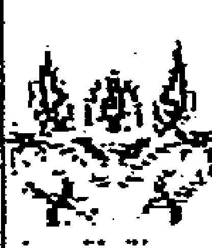

- **天显时格**：加阳星为开时，百事吉，利于客；加阴星为阖时，事情不利，利于主。

- **时干入墓**：宜静不宜动，你干事时，正在墓里，这事干不好。时干入墓，最怕是时干入墓的时辰，又逢时干落宫入墓，这样事情就更难成功。

- **天网四张**：天网四张不利于合作做事，不利于成群结伴。如果是自己单独行动或独立做事则没有关系，反而有利，乘其不备。

- **庚格**：主阻隔，有人给出难题，难度大，但不一定不成功。庚+庚，利客。

- **悖格**：主出乱子，出现意外，但并不意味着做事不成功。

合格、冲格：《奇门大全》在论冲和动静时讲到“凡事在尚未发生的时候，遇冲则发生变动，在已经发生的时候遇冲则冲散。事未起而遇合，结果是静而不起，事已起时遇合，则事成。”这就是说，遇到冲格、合格的情况，要看事件的状态与性质来确定是利主还是利客。好事在未起时就积极行动促其向更好的方向发展，坏事在其萌芽时也要积极行动以免坏事进一步恶化。事情已经发生的情况下，一般说逢冲较利客，逢合较利主。

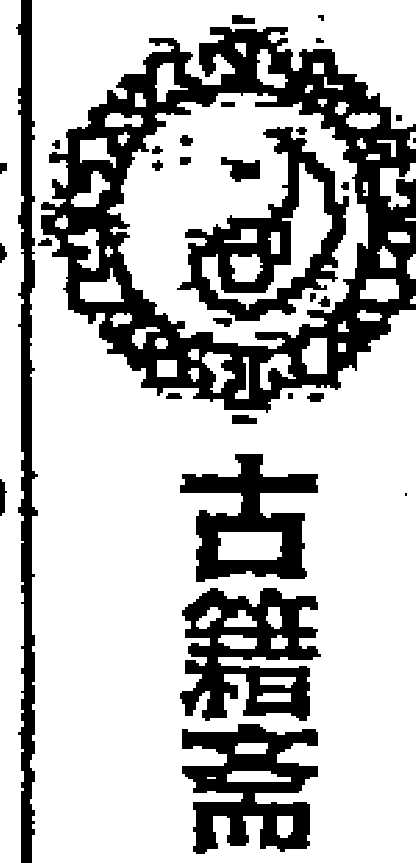

其他情况还有：临九天、值符、螣蛇可以动，不拘利主利客，逢九地、六合、太阴、白虎、玄武不宜动。

还有一种情况，比如我要去求人办事，遇到了利主不利客的时间，如果我不动人家不给办啊。这怎么做？这就如刚才讲的事体进行中的伏吟局一样，要反戈一击才行。这种情况下你可以先去找此人办事或先去求他，办完后你就等待，不要接二连三的去求。先去求，再等待。

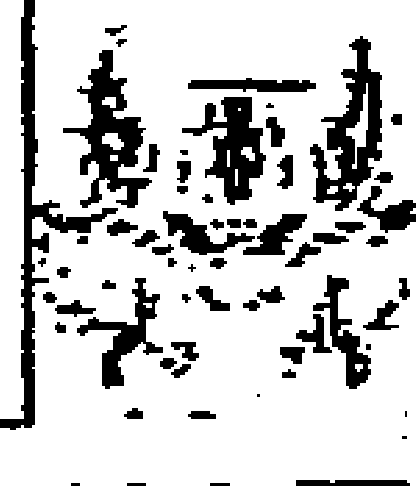

当利客时，我应该主动进攻，但有时候很明显我先做就会吃亏。这种情况，你可以间接性的采取措施，做完后就等待；等一段时间后再做，这样也是有利的。注意：时间要把握好。时间在奇门策划上是第一位的。什么时间最佳，一定要做好日课。你在给人家谋划时，先采取哪些行动，也要根据局像来指导。逢空亡了，你就不要让人家玩命的做。这没用；得等着。等到冲实或填实的时候，有动态的信息时再做。遇到墓迫击刑，你一办就出事，你还办个啥？！遇到合格，你需要马上解决，不然越拖越受牵制，纠缠的事情会越来越多。

最终的原则是：好事往前推，利于动；坏事就刹车，利于静。对于很坏的事情，你给人家调整，也取得不了好的效果，最好的办法就是静。

先动为客，如果我要去拜访人家或人家来拜访我，这要看时干的天地盘，先动为客，先声为客。人家来拜访你，来者为客，如时干的地盘生天盘的，他来对我不利，是找我帮忙或者来找我办事的。时干的天盘生地盘的，他来对我有利，能给我带来利益。时干的天地盘比和，大家相安无事。时干的天盘克地盘，他来对我不利。时干的地盘克天盘，对来者不利。

一些格局中的主客问题也要重视：

伏吟利于买货，反吟利于卖货。庚加丙(贼必来)必须积极进攻，这种情况的出现就是商机来了，应立即抓住，否则就会丧失商机。丙加庚(贼必去)则要采取消极退守或迅速放弃的策略，如遇投资时应退出。

天盘与地盘奇仪的关系是以五行生克为依据判断的：天盘奇仪克地盘奇仪，或者地盘奇仪生天盘奇仪利客。如癸+丙、丙+乙等。地盘奇仪克天盘奇仪或天盘奇仪生地盘奇仪则利主，如壬+己、己+庚等。八神当中，九天利客，九地利主；八门当中，伤门利客，休门利主；九星当中，天冲星利客，天辅星利主。

在确定主客的过程中，首重大局，次重八门，再看奇仪，最后看八神。

在八门、九星天地盘生克关系上，地盘宫生天盘星门者则利客；地盘宫克天盘星门者，则利主；若天盘星门克地盘宫者利客；天盘星门生地盘宫者利主；天盘星门与地盘宫比和，主客皆有利。奇门遁甲格局中八门、九星、九宫、八神、三奇六仪在一定的时空，相互搭配形成的固定格局，反映了事物发展的规律和必然结果，根据这些格局的含义可以在商战中采取趋吉避凶的战略战术。

至于什么情况下是看十干的天地盘，还是九星的天地盘，或者八门的天地盘？从古人《主客歌》上来看，古人主要看的是星。今人杜新会老师的著作中多是看的三奇六仪。我的理解是：大事看星，军事战争看星，涉及天体的事情看星；一般的人事活动看奇仪。《奇门遁甲秘籍大全》说：“奇门上盘像天，中盘像人，下盘像地。上盘像天，九星也；中盘像人，八门也；下盘像地，九宫也。用法则首重九星，以九星是天盘，吉凶由天故也。凡星克门吉，门克星凶。凡出行趋避者，首重八门，以八门为人盘，吉凶由人自取故也。凡门生宫、宫生门吉，门克宫、宫克门凶，伤人事故凶。凡造葬迁移者，首重九宫，以九宫为地盘，迁移等事皆由地而起也。故门宫相生俱吉，相克俱凶。苟得此意而推之，凡事关天人者无不可以类通。妙哉！此示人以用法。”《奇门一得》上也有有一段较详细的论述：“如上梁安葬，赴任远行，商贾出入，婚姻谋为，求名请谒，家宅等类，只宜地盘奇仪为主，天盘九星奇仪八门为客。大抵要天盘生合地盘为主吉，有官贵相助，诸凡不逢阻隔，进益多端。如地盘生合天盘为次吉，则多耗散，为事费力，始终劳碌，诸事迟缓，宜求谋请托，事可得妥。如天盘诸星克地盘诸星，若谋为一切等事多招非厄，口舌重迭，成为自败，忧惊不免。如地盘诸星克天盘诸星，是为有势，凡事虽强，恐后无益，谓之我克者休，故诸事有始无终；惟宜求名，官事得吉，若战为主，百战百胜，奏凯而归。若天盘与地盘诸星比和，门宫亦然；或门生宫，宫生门；或门宫比和诸星，或地盘生天盘诸星，或天盘生地盘诸星，主客皆吉。如地盘临衰墓死绝之宫，逢天盘相克，大利为客，为主大凶，凡为诸事，主有灾非，吉事成凶，忧惊重见，永不为吉。如地盘临生旺得令之宫，逢天盘衰囚诸星相克者，是失令之客不能伤我得令之主，客反招其咎。如地盘之星虽在衰墓失令之宫。逢天盘诸星相生者，为主目下未逢，幸得其生，若交我旺之日时而大吉也。天盘与地盘同论，余仿此。”

古人的《主客歌》如下：

天盘动用占为客，地盘安静占主穴。细看星宫奇门知，察其刑克吉凶决。
分其日月旺相方，更辨其方云气色。假如天蓬加九宫，旺相之月在秋冬。
喜逢壬癸亥子日，北方黑气客有功。若还天英加一地，冬时北方主反利。
奇门星位仿此推，人在时方分仔细。

这就是说，无论从奇门格局来看，还是从天盘地盘星门宫的刑冲克害生合来看，都还必须同时看其时其方的旺相休囚，这样才能更准确地判断是利主还是利客。

下面列出一些在商战中常用的格局供大家参考：

日干戊加丙（龙回首），丙加戊（鸟跌穴），利求财，商战必胜。辛加丁，经商获倍利，利行动。日干乘值使门，中介人效力，向着自己，相关办事机构（政府部门）支持。丁奇与值使门同宫，为玉女守门，本地经商获利，不宜异地经营。辛加乙（虎猖狂），乙加辛（龙逃走），凶格，合作双方及竞争双方互不信任（为主不害）。癸加丁（蛇夭矫），反复无常有口舌。丁加癸（雀投江），不宜动（为主不害），有货卖不出，有口舌，生是非。庚加癸（大格），庚加壬（小格，移荡格），求财难以得利。庚加己（刑格），丙加六仪（悖格），逢之早抽身走人，尽快躲避开，也指企业内部混乱不团结。遇到刑格、悖格，不宜投资。卖货遇到冲格好卖，遇到合格困难多。合作求财遇合格比较好。日干入墓，或者加壬、癸，纵见利而不能得手，宁可不赚钱也不能去投资。庚加戊（伏宫格），戊加庚（飞宫格），此地不如他地，即不能在此地做生意，要换地方（可灵活运用，如临开门可让商场、工厂换门）。庚加日干（伏干格），日干加庚（飞干格），此人不比他人，即不宜和此人做交易，防备遭人暗算（白虎凶神，防白虎咬人）。五不遇时，白费力（空费心力）。三奇入墓，或受制（如乙木落兑七宫受制）、受刑，企业内部不协调，不团结。日干、时干逢冲，应当立即行动，也主动迅速。要遵守事物运行规律。日干、时干逢合，被事情绊住了，主不动或因事动不成。六仪击刑，求财不得，主受损，极度难受。日干庚加丙，主进攻，买货有利。月干庚加丙，是对方攻我，对我方不利。九天之上好扬兵，利进攻，产品则远销他方；九地之下好伏藏，主迟缓，利囤积货物；乘太阴利策划，也主有小人陷害；乘六合利谈判或退却；丙加庚或临休门利退守，利卖货；逢九遁格，在商战中灵活机动才能取胜，要见机行事，变换阵式。逢诈格，设计而动，要运用计谋取得成功，要出鬼点子、使诈。

奇门择吉，人的行为是重要的。三奇六仪代表的是人，人间的事情，一定要先看看从人的行为因素，即首先从人事活动、人事关系方面来解决。么学声老师对此有精辟的见解，他讲：从大的空间状态看奇门局上：凡是对立面都是相克的，这就是一个区域图也是时空能量图，也是人事活动的一个能量区别场。2、5、8为土，风水上也讲2、5、8同气。土主宗教，巫婆神汉就出现在东北、河南、四川一线。震巽为木，乾兑为金，只有水火变数大，是不确定的因素。所有的事还有用神落在坎宫、离宫，就变数特别大，不确定因素就多。其他的性能比较稳定。能量场的基本性质：

- 落乾兑的用事：金主义，要从感情上进行沟通，委托有情感交往的朋友办事，则容易成功。增加感情联络，而不是找工作或利益交往的人。
- 落震巽的用事：木主仁，代表恻隐之心，就是可怜、怜悯之意。因此，用事落震巽，则要相求、哀求人家，让人家产生恻隐之心，才能成事。
- 落艮坤的用事：土主信，主信用、诚实、承诺。如果用事之事落坤艮，你找人家要给人家下保证书，你给我解决了，我保证怎么样之类，要诚实守信。
- 落离坎的用事：比较麻烦，说话不算数。今天答应你，明天就反悔。该怎么办？落离宫，火主礼：礼貌、有礼，要大量送礼的意思。但是也要注意，不要有特别大的期望，他收了你的礼也不一定给你办事，礼多反无理。但用事之神落离宫，一定得送礼。落坎宫，水主智——要巧言善变、无理搅三分，像正义使者一样，这是策略与谋略，你进入了这个场态就要用这种方法。

以上是顺向的行为与思维：还有逆向的方法：

比如用神落艮宫，但你要做的事落震宫巽宫或你需要找的人落震巽宫，震巽克你该怎么办啊？第一方案：要寻求火，泄木气、生我土，要集离宫中的各种三奇六仪、天地人神所有符号来资助你，减轻震巽宫对你的克制之力或者求火来帮忙，但求火就要送礼。如果离宫空亡了或发挥不出能量，有劲使不上或者能力衰退没有能力了，给你帮不上忙，则要考虑第二套方案。第二步：找乾兑。乾兑克制木的落宫，金主义，就要从情感方面来进行，拉关系、靠近乎，如果这个方法也解决不了，人家不理你，就改第三套方案找比劫。第三套方案，找比劫找赞助，土主信，给人家承诺，让人家帮你扛，分担一些。这些都离不开阴阳五行之理。

## 三、奇门择日

奇门择日，也是众说纷纭，莫衷一是。有主张用问事时辰起局来预测的，也有主张用问事时辰看“日课”的，实际上侧重点不同，都有道理。我在给人的择吉中是以问事时间起局择日为主导，从该日的不同时辰的奇门盘中优选具体的用事时辰做辅助，并检验一下所选日期“日课”是否有其他方面的弊端。

### 以问事时辰来择吉的方法

么学声师父讲：“择吉注重个性时空，择吉不是要利用共有时空，而是从格局上选出对自己有利的时空，人为制造应期、人为选定有利空间和方位”；“集体活动不必看日干，只看所去时辰方位宫位的吉凶；个体活动兼看日干、年命”。“老皇历择吉不可信，因为那是共有时空，不是个人时空，要选择自己的时空。玄空的择吉法是共有时空，而六爻、奇门是个人时空。办不同的事要选用不同的用神”。“不要找办事的时间起局，以问事的时间起局好”。

以问事时间起局择日，要注意以下几点：

- 首先要避开刑、害当事人出生年年支的日子。刑就是别扭、出刑害事，也主伤病痛苦，有：子卯刑、未戌刑、午午自刑、辰辰自刑、酉酉自刑、亥亥自刑、寅巳申无理之刑、丑未相刑、丑戌相刑。“害”指子未相害、丑午相害、寅巳相害、卯辰相害、申亥相害、酉戌相害。遇到害，主犯小人。
- 其二要尊重民俗文化，当地习惯。注重宗教信仰。不违反国家政策，地方法令法规。对于当地风俗中的禁忌、大家公认的忌讳日也不能选择。比如清明节、中元节（七月十五）、寒衣节（十月初一）这三天被称为中国民间的“三大鬼节”，即使干支临着很好的星门神仪，你给人家选择了这样的日子结婚，人家也不会满意。还有“初一不结婚、十五不埋人”、“丑不冠带、亥不嫁娶”、下葬时孕妇不能上山等，都需要注意。

以问事时间起局择吉，实际上也是择机而行。如果对方克制你，这就要选择对方能量最弱，你的能量最旺的时机来做。如果你是去求人办事，就要找对方能量最强的时候来办。能量是以所临九星的旺弱来衡量的，当然遇到吉星再旺相那是最好的。如果遇到凶星，要注意，也是旺相为吉。凶星越衰越凶，凶的符号越集中在一起，其凶力就越大，落入休囚死墓之地，则其“凶相毕露”，它的破坏力就越大。认识事物是通过符号，而事物的成败是由能量决定的，而不是符号决定的。

奇门局上，天地盘相互勾连，天盘为我，地盘为勾连之事，若勾连之事对我不利，克制我，则用冲的办法；勾连之事对我有利，则用合的办法。如刑冲对我不利，也可以用合的方法，把不利于我的事情合走。入墓就用冲墓的办法。想躲藏，可以躲到墓地去，比杜门方更安全。

用问事局择吉，以天干落宫为主，参考地支所在宫。天干表示的是事物的状态，地支表示的是时间因素。如果是选择月份，主要看那个天干所在的宫位星门神仪组合吉利、格局好，就选这个月份。比如今年4月份起局，想求一个吉利的月份，则看下面的几个月如辛巳月、壬午月、癸未月、甲申月、乙酉月等月份天干的落宫情况，进行优选，同时看该月地支所在之宫的情况，如巳月看巽宫、午月看离宫等。奇门遁甲是天干学，择月、择日、择时，首重天干。择日也是如此，如果你要看看4月29日那天如何，那天是己酉日，就要重点看天盘己土所在之宫的星门神仪格局状态，参考兑宫的信息来判定。如果你要求在此月份内择日开业、婚典等，则选择天地人神格局组合最好的宫位，比如乾宫临值符天任星，生门，乙+丙，则可选乙亥日，或乙巳、亥日，首选天地组合成的日子，没有这个日子，就先选天盘天干日、其次是地盘天干日如丙戌日，再就是该宫位所在的日子。比如格局是己+壬，可以选己亥日或壬戌日，没有这样的组合，可以选己日或戌日、亥日（如果选的是地盘天干的日子一般要与所在宫的地支形成组合，如上例中乾宫的丙戌日、壬戌日等）。人家要做事择吉，如果用神临到值使门的，宜于立即行动，现在做就最有利。

择吉，通常是不能把时间与空间割裂开来的，什么时间在什么方位作用？要选择最佳的时间、最佳的方位作用在这件事上。比如出行，你从东往西去，若东边震宫的格局不好，西方又是死绝之地也不利，如果北方格局很好，则可以先到北方去，重新确立立极点，再选择新的出行时间。俗语讲：宁绕三步远，不走一步险；宁停十分，不抢一秒，就是这个道理。

办不同的事，要选择不同的用神来择日。择吉中八门特别重要，因为门为通道。这个通道里会发生什么事情，是从宫中的十干克应来体现的。择吉，首先要选好所主该事的门。里面的格局（十干克应），为做事时会发生的事情。这里的应事时间从年月日时上来说，是以时辰为第一位的，如落震宫应在卯时，落乾宫应在戌亥时等。要看这个格局，对日主是产生的什么影响，有没有危害。在一个宫内遇到两个时辰如何选时辰，要比较各个时辰与日干支的关系。比如你给人选择了戊辰日出行办业务，巽宫的格局是戊+辛，临开门，是辰时去还是巳时去，辰时与日干支形成了辰辰自刑不吉，就不要选辰时。再如坤宫临景门，你准备出去旅游，日干支是甲戌，则不宜选未时，因为未戌相刑。宫中的格局为应事，比如戊+辛青龙折足，可能遇到崴脚等事，为避免发生此事可以先扔掉自己过去穿的鞋袜。逢刑冲以合为解，逢合格以冲为解。戊+辛，子午冲，午是马，最好自己别开车去。除地支合外，也可以用天干相合的方法，比如用丙辛合，合去辛金，形成戊+丙之格，最好是把凶的符号合走，化险为夷，变凶为吉。遇乙+辛龙逃走，也可以拿龙的饰物，或写个龙字，紧急时扔出去解灾等。

### 商场店铺开业
首选开门临吉，生、比日主的日子比较好。伏吟，选冲日；反吟，选合日。生逢生日、旺逢旺日。如开门在艮八宫入墓，可选未申日开业。如果开门落宫克日干宫，可以选择生门临吉宫生、比日干的日子。如开门、生门逢凶，其他的可以依次选择值符、休门生、比日干或其他临吉门吉星吉神三奇吉格生、比日干的日子。如果开门冲克日干，可以选“通关”的日子，如开门在震宫，日干在坤宫，则可以选择离宫的格局。

### 酒店、歌厅、娱乐场所、广告宣传、服务行业的开业等活动
首选景门生、比日干的日子。若景门宫逢凶，再选开门生、比日干的日子。

### 公司、工厂开业
首选的是生门，而开门并不一定就好。公司开业不能选休门。

做生意、贸易，买卖求财的，首选开门，而生门并不一定好。

找人办事，选休门或值符。求人办事又可选所生之宫，比如年干领导在坤宫，日干在坎宫，选乾宫之日，最好是兑宫之日，兑主口舌，主开口求人。

请人吃饭、办大型活动，首选景门。要账、谈判，选伤门。密谋策划选杜门。打官司选惊门或开门。

### 搬家择日
选生门生、比日干，或日干克生门之日。

### 结婚择日
结婚日子首看六合，临死门，天芮，空亡、击刑都不行。如果六合宫格局不好，不能选。男方来选日子看乙，乙奇生庚的日子最佳；女方来选日子看庚，庚生乙奇的日子最佳。如果两宫相克，有两种选择：一是选“通关”宫位。比如乙落震宫，庚落乾宫，不论是哪方来择日，均可选坎宫奇仪的日支，形成“金生水、水生木”的“通关”。二是选加强求测人一方力量的日子。例乙在震，男在乾，男的来选，选艮、坤之日生男方。若是女的来选，就选震。再如乙在震，庚在兑，乙庚对冲；女方来选，选巽宫格局或辰巳日比合或子日乙奇逢生。结婚择日，生门生、比日干的日子，亦可作为选择。

下葬选死门生日干之日为吉。

**用问事局择日，首重天干，而择时则首重地支。** 比如搬家择日生门在震宫临丙+乙，生日干所在的离九宫，可选两日卯时。

不管是择日还是择时，如果所选之宫逢空，就要选择地支（填实或冲实）。

如果所选之宫逢冲格，可选此宫的天干日，而时辰上采用合去其中一方的时辰。比如开业，开门临戊+辛，值符、天心星生比日干，则可选戊日，未时（午未合）。丑时半夜三更开业不合常理，就要选择未时。

择日择时，五不遇时多有不顺，应尽量避免。六仪击刑之宫一般不可用，容易出事。如果所选之宫遇到门迫，也要注意。吉门门迫值使吉不就，而凶门门迫则不能用。时干入墓之宫也不吉利。伏吟、反吟未必不好。急事遇反吟好，杜新会老师为人开业择吉，就常选反吟局。长时间规划的局，选用伏吟比较有利。

择吉通常需要选择风和日丽的好天气，以你所选择的日子的干支落宫来看，其中以地支所在宫为主。天柱星、天蓬星乘壬癸落于一、三、六、七宫主下雨，落巽四宫风雨交加，落坤宫主阴云密布，落离宫艮宫主多云不雨。如果天柱星天蓬星临壬主大雨、临癸主小雨，壬+癸一阵大一阵小，壬+壬暴雨成灾，癸+癸阴雨连绵。乘伤门主雷阵雨；临腾蛇主闪电。癸+丁、丁+癸主大雨，临惊门，亦主有雷。落震宫，亦主阵雨。伏吟，主长久。反吟，主急主快，出行遇反吟局，一般是回来的路上下雨。天辅星主风，临动格必刮风，落哪宫就刮什么风。临景门，有时是出彩虹的象征。天柱星乘壬癸落乾宫或天心星乘壬癸落兑主雪，以天柱、天心二星落宫的地盘奇仪而定应期。天辅星乘旺相之气落离、坤、艮宫，或日、时之干为戊、己者，天气必会起风放晴。天英星乘旺相之气落震巽二宫或日、时之干为庚、辛，天气也会晴。至于何日可晴，则以天英星所落之宫的奇仪来判断。关于天气的预测，我现在研究的较少，经验不足。我们下步的学习班或网络交流中再详细讲述。

## 以用事时辰来择吉的方法

张志春、周时才等奇门老师，在讲择吉时，强调的是看用事时间的日课。虽然考虑了不同人年命落宫不同的因素，但从本质上来讲，这里还是一个共有时空，缺乏针对性。为了使所择对当事人有针对性，我们还是提倡用问事局择吉。但是可以用用事时辰的奇门局