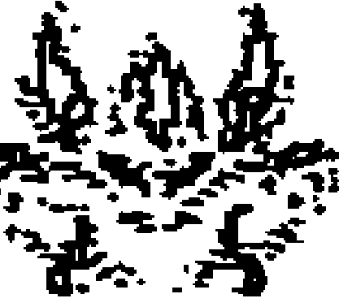
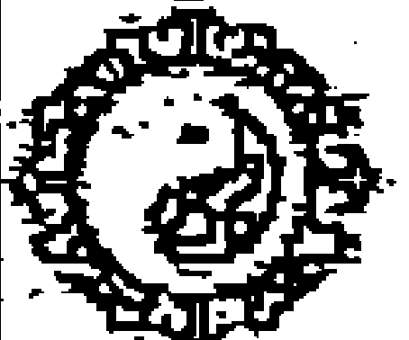
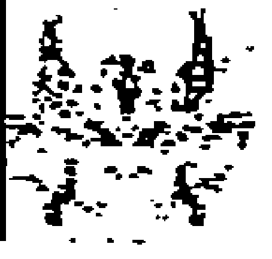

# 目 录

- 中编 预测运用研究
- 第二十八章 奇门预测工作、事业
    - 一、就业与工作调动
        - (一) 关于选择职业 (事业) 的预测
        - (二) 预测何时找到工作，什么样的工作?
        - (三) 应聘或有了具体的工作目标单位，求测能否成功?
        - (四) 关于现有工作情况的判断方法
        - (五) 关于工作调动、辞职、革职的基本预测方法
        - (六) 工作调动好不好、辞职利不利、该如何办好的预测方法
    - 二、官职的升迁与罢免
        - 附录: 魏泉至先生总结的断官运的博文
        - 下面我讲一下关于晋升职称的问题
- 第二十九章 求学考试预测
    - 基本用神符号与判断思路
    - 关于考公务员的预测
- 第 三 十 章 恋爱与婚姻的预测应用
    - 一、奇门遁甲预测婚姻中的基本用神符号与判断思路
        - 【格局吉凶】
        - 【其他格局】
    - 二、分类论述
        - 第一类 关于何时遇到恋爱对象之类问题的判断方法
        - 第二类 关于追求某异性能否成功之类问题的判断方法
        - 第三类 介绍人问事: 我给他们介绍谈对象能否成功?
        - 第四类 别人给介绍了个对象，看是否能谈成之类的预测
        - 第五类 关于对方情况判断的若干方法
        - 第六类 恋爱期间遇到的各类问题
        - 第七类 关于婚前同居的若干问题判断
        - 第八类 关于“网恋”
        - 第九类 夫妻之间的婚姻问题
- 第三十一章 孕产预测
    - 第一类 关于“妻子至今没有怀孕，将来能怀孕吗?”之类的预测
    - 第二类 关于是否怀孕了的预测
    - 第三类 关于胎儿性别的预测
    - 第四类 关于孕期和分娩是否顺利以及流产信息的判断
        - (一) 传统奇门遁甲预测判断胎位情况及分娩顺利与否
        - (二) 综合判定
        - (三) 奇门遁甲预测判断产期

# 中编 预测运用研究

## 第二十八章 奇门预测工作、事业

关于事业与工作，我想分两大部分来讲述：一是就业与工作调动；二是官职的升迁与罢免。

### 一、就业与工作调动

这部分的内容包括毕业分配，求职就业、应聘、本岗位的工作顺利与否、跳槽、转工、工作调动等。

基本的判断原则是，以日干为求测人，兼看年命。代人求测以六亲关系为用神，年干为长辈、月干为同事、时干为晚辈，兼看年命。

以开门为文职工职及工作单位；杜门为武职工作及工作单位。时干为部属、员工、手下人。月干代表同事；年干代表上级领导、老板、总裁；值符为直接领导、主管、也常代表一把手；值使门为上司中的副职或执行人、批准机关等。

大致情况：开门旺相临吉星吉格吉神临奇生助旺相的日干（用神）落宫，日干再临吉门吉星吉神吉格，则工作顺利，求职有成等。反之，较差或求谋不成。

#### （一）关于选择职业（事业）的预测

事业其实是与财运相关的。我们在求财预测中已经做了一些详解。很多人问自己适合什么职业。有的人一听说问职业就看开门，其实开门代表的是工作的情况或工作单位的情况，开门代表的并不是你的职业属性。如果问适合的职业，近期当以日干落宫为主线，参考年命落宫的状态；远期的当以年命落宫为主线，参考日干落宫的状态。有人问终生的，那么如果有生日命盘的话，则看生日命盘中的日干落宫为主线。为人做事业预测与策划，要分清以下几个要点各自的意义：

- 1. 一是首先看日干（或年命）落宫，适应干什么，应该选什么职业，仔细推敲此宫的组合，做此宫的组合象意所代表的事业类，事实上是最容易成功的选择。
- 2. 二是看时干落宫。时干为求测者所问之事，虽然反映着求事的现状，但也代表着事物发展或者能否达到求测者愿望的一种趋势。
- 3. 三是看开门。开门代表的是工作单位的情况。代表的是事业的总概念，而不是代表求测人的职业。
- 4. 四是看专有用神。不同的行业有不同的特点。如办学可以看天辅星；做广告行业可以看景门；开车可以看伤门等。比较专有用神与日干（年命）的关系。

关于九星、八神、八门、天干、九宫所主的事业与求财信息，我们在基础章节以及求财章节中都有讲述。这里就不细讲了。

#### （二）预测何时找到工作，什么样的工作？

现在就业压力特别大，因此问何时能找到工作，什么样的工作之类的求测者特别多。对于这类问题，主要看日干（或年命）与开门之间的关系以及各自的状态；日时关系以及状态。同时，参考年干、值符与日干之间的关系、以及值使门的情况等来综合判定。预测时，要分清各个用神符号所代表的意义。

日干（或年命）代表的是自身条件和运气，即要从天时、地利、人和、神助、格局等方面来综合考察。如所临九星旺相，即占天时说明现有的条件和政策符合自身的需求等。落宫旺相，即占地利说明自身能适应求职单位的环境，适合求职等。八门的状态及吉凶，反映了自己的心态、处事方式以及求职中能否被接受或能否接受等。所临八神，即神助，一定程度上反映了自己的精神世界，又体现了自身运气，如有没有贵人相助或暗中有人捣鬼等。格局的组合，也指事态的发展变化对自己有没有利等。自身条件好，你是一个有能力的人，则工作就好找一些，“金子总有发光的时候”。自身是个草包，运气差，难求职，或难以找到好的工作。

有人讲年干生日干（或年命）或日干（年命）克年干，也能找到工作。这里实际上混淆了用神关系。年干实际有三层意义：第一，年干是太岁，年干与日干（或年命）的关系，体现的是你在这个流年里顺利不顺利。年干生比日干（或年命）或与日（年命）同宫，你得太岁生扶帮助，指这年的事情比较顺利，多进益。日干生年干，你尊重太岁，虽然有点辛苦，但对于求谋还是有利的。年干克日干（或年命），这年你不顺当，是多事之秋，求谋多阻滞。日干（或年命）克年干，这叫“犯太岁”，是你想“征服”这个流年，如果你自身旺相格局吉利，虽然辛苦也能有所成绩或能有求谋所得。如果你自身休囚废格局又差，犯太岁主有灾殃，求谋是很难遂意的。第二，年干是长辈。年干生比日干，与日干同宫，表示你的长辈支持你，也许能帮到你。日干生年干，你尊重长辈或对长辈有依赖性。年干克日干，长辈对你看顺眼或不支持你的做法。日干克年干，你对长辈的态度不满或者想把你的意志加于父母等长辈。第三，年干是上级领导、单位领导等。年干生比或与日干同宫，主你能受到单位领导或贵人的帮助或你有一定的背景与关系之类。日干生年干，你需要巴结领导，需要找人帮忙。年干克日干，你没有关系，领导或上级排斥你，对你不利。日干克年干，你想征服领导或你对领导不满，自身旺相能有所成但多阻滞，自身休囚则多败。

还有人讲值符生比日干（或年命）或日干（或年命）克值符，也能找到工作。这也属于混淆了用神关系。值符是什么？值符是前景、是趋势、是领导。你临值符，主你有领导气质，主你有遇到领导帮扶的机会。值符生你、比你日干（或年命），说明你可能有些背景或大趋势大前景对你有利。值符克日干（或年命），大趋势大前景对你并不看好，你缺贵人。日干生值符落宫，也是你尊重领导，巴结领导，努力营造好条件的象征。日干克值符，你对领导不满或你想努力改善前景，多辛苦。日干旺相，能有成。休囚，常徒劳无功。

还有月干的问题。月干对于你这个尚未谋到工作的人，不代表你将来的同事。他应该代表的是你的同学、战友、兄弟姐妹、朋友、邻居等。生比、与日干同宫，有关系人支持你、举荐你，你要寻求帮助。日干生月干，也要去求得别人帮助。月干克日干，人家不肯帮忙。日干克月干，你瞧不起人家、想超越人家，这很难得到别人帮助的。如果是有竞争的，日干克月干，也说明你会有竞争优势的。

以上年干、值符、月干与日干的关系，反映的是一些人物关系与运气状态等。但这些关系，并不代表你就能找上工作，也并不代表所找的工作就适合你。预测找工作，下面的几点才是重中之重。

一是开门宫的状态以及开门与日干（或年命）之间的关系。求职成功与否最终要评判开门与求测者（包括日干和年命）之间的关系。开门代表工作，开门的状态好，代表是个好工作。开门的状态差，工作不好。开门入墓再逢凶或逢真空亡，就没有工作可找。

开门旺相临吉格吉星吉神，生助（含比和）日干（或年命）宫，能找到理想的工作，求职有成。开门落宫休囚，又不临吉星吉格，但生助日干（或年命）宫，可以找到一般性的工作。日干与开门同宫，能找到工作。如果日干（或年命）落宫旺相克开门，经过努力也能找到工作。日干（或年命）生开门，只表示工作心情迫切，并不意味着就能得到。日干（或年命）宫休囚又不临吉门吉星吉格者，说明个人运气不好，若再被开门落宫所克者，求职者找不到工作。

二是要看时干宫的状态以及时干与日干（或年命）之间的关系。时干代表所求之事。有一种观点是不看开门，只看日时关系。我认为这也是对用神把握不清。时干作为这件事，表示的是这件事情目前的状态，而开门才是代表工作的用神符号。时干的状态以及日时关系能体现出事体顺利与否，以及一些后续发展问题。如时干是凶门凶格凶神凶星或逢真空亡，这件事很难成。时干克日干，所求之事不顺。时干生日干，做起来较为顺利。日干克时干，主自己努力去做这件事。日干生时干，自己很关心这件事。时干宫中有庚、死门、杜门，也表示所求不利，难以找到工作。死+乙，主求事不成。时干入墓，事情也不好办。

这里最容易让人下不定决心判断的情况主要是：从日时关系看有利或能顺利找到工作，但从开门与日干的关系来看又不成之象。信息发生矛盾时的取舍问题。奇门遁甲的优点是多角度多用神来看待一件事，但正因为信息多，符号多，就会出现一些看似矛盾，让人无所适从的情况甚至模邻两可的情况。这里实际上要抓住主要用神。找工作的预测，开门是用神。时干是现在事情的状态。时干临凶，开门吉，眼下不顺，但你能找到工作。时干临吉，开门凶，看似不错的事情，可能终究出现了问题。要综合考虑，才能准确的判断出来相关情况。

三是关于值使门的问题。如果根本还没有工作单位意向时，求问何时能找到工作。值使门落宫，是给限定了个范围。你在这个期限内找到或这个期限内找不到工作。另外，值使门落宫临吉门、三奇、吉格，说明事情执行起来比较顺利。值使门入墓，临死门、杜门、庚、空亡，亦主求职这件事执行难度较大。关于找到工作的应期，参考我们前面讲的断应期的法则来判断。这里不细讲了。

### 求职与工作类：例题一：—82年女求测人问何时能找到工作？

公元：2008年2月20日18时10分43秒 阳3局
干支：戊子年 甲寅月 庚寅日 乙酉时
旬空：午未空 子丑空 午未空 午未空
值符：天禽 值使：死门 旬首：甲申庚

| 丁 九地<br>天辅 己<br>地 生门 己 | 庚 九天○<br>天英 丁<br>天 伤门 丁 | 壬 值符○<br>庚 禽芮 乙<br>符 杜门 乙 |
| :--- | :--- | :--- |
| 癸 玄武<br>天冲 戊<br>玄 休门 戊 | 丙<br><br>庚 | 戊 螣蛇<br>天柱 壬<br>蛇 景门 壬 |
| 己 白虎<br>天任 癸<br>白 开门 癸 | 辛 六合<br>天蓬 丙<br>六 惊门 丙 | 乙 太阴 马<br>天心 辛<br>阴 死门 辛 |

求测人女性，1982年（壬戌年）人，07年11月中旬离职后，一直没有找到工作。问何时能找到工作？分析：

大局九星伏吟，又日时逢空亡，开门入墓临白虎，死门值使，就业压力大，一时难以找到工作。但一时难以找到工作并不意味着永远找不到工作。何时找到工作，还需详细分析：

一是日干庚金落坤宫，为冠带之地，临时干乙奇，日时同宫应能找到工作之象，开门与日干比和也是能找到工作之象。只是日时逢空亡，开门入墓，说明时机还未到。逢空填实为应期，下个月为乙卯月。乙木填实坤宫，冲动开门之墓，乙卯月应有进展。

二是年命壬戌，壬水落兑七宫，壬+壬，辰辰自刑，又辰酉合，临景门，合以冲为应期，卯月冲兑宫，可能有工作方面的信息。开门生年命落宫，也是能找到工作之象。

事实上，3月底（乙卯月）开始在一家公司面试。4月（丙辰月）办手续，丙火落宫临六合主合同，冲实离宫丁火（主手续）。5月（丁巳月）开始正式上班（日干长生在巳，巳月临生门，有财路了）。

### 求职与工作类—例题二：一83年大学生问何时能找到工作？

公元：2006年3月11日21时30分35秒 阳7局
干支：丙戌年 辛卯月 己亥日 乙亥时 【五不遇时】
旬空：午未空 午未空 辰巳空 申酉空
值符：天任 值使：生门 旬首：甲戌己

| 辛 白虎 马<br>丙 禽芮 壬<br>阴 休门 丁 | 乙 玄武<br>天柱 戊<br>六 生门 庚 | 己 九地○<br>天心 乙<br>白 伤门 壬 |
| :--- | :--- | :--- |
| 庚 六合<br>天英 庚<br>蛇 开门 癸 | 壬<br><br>丙 | 丁 九天○<br>天蓬 辛<br>玄 杜门 戊 |
| 丙 太阴<br>天辅 丁<br>符 惊门 己 | 戊 螣蛇<br>天冲 癸<br>天 死门 辛 | 癸 值符<br>天任 己<br>地 景门 乙 |

求测人男性83年（癸亥）人，还有3个月就要大学毕业了（现在在武汉、学会计），问何时能找到工作？分析：

日干己落乾六宫是胎地，主正在酝酿。天任星落宫旺相，有天时，月令天任星入囚只是时机未到。临值符，得神助，会遇贵人帮。景+开，主官人升迁、求文印更吉；虽然景+己官司牵连、景+乙讼事不成。找工作为文印和“升迁”之事，虽然景门落乾宫门迫，但总像是吉利的。己+乙，墓神不明，乙奇入墓，主时下求测人对事情还不明确，犹豫不决。日干克开门，并且两宫有暗干癸水的连接，表示求测人能通过努力找到工作。日干临景门，应为求测人正等信息之象。

年命癸水落坎一宫是临官之地，虽然临死门迫宫不吉，但临天冲星卯月旺令，逢冲则有动向。癸+辛，虽然临腾蛇，但辛为甲午辛，子午冲，则“癸+辛”这个网盖天牢网不住。年命落宫生开门工作落宫，主自己要主动求职。并且开门宫中临地盘癸水，两宫有符号连接，主能找到工作。

虽然己日乙时为五不遇时，主求事不顺。但时干落宫生日干落宫为事能成之象。坤宫看似空亡，实际是申空未不空，时干不是真空，求职能成。

应期：开门在内盘主快。开门落震宫，正临辛卯当令之月。求测人在3月27日（辛卯月、乙卯日）与北方（呼市）一家研究院签订了就业合同。此例应期正在开门落宫当令之月。

## 求职与工作类：例题三：82年女孩占何时能找到工作？

公元：2008年2月25日21时 阳9局
干支：戊子年 甲寅月 乙未日 丁亥时
旬空：午未空 子丑空 辰巳空 午未空
直符：天芮 直使：死门 旬首：甲申庚

| 癸 白虎 马<br>天任 乙<br>地 杜门 壬 | 己 玄武○<br>天冲 辛<br>天 景门 戊 | 辛 九地○<br>天辅 壬<br>符 死门 庚 |
|---|---|---|
| 壬 六合<br>天蓬 己<br>玄 伤门 辛 | 丁<br><br>癸 | 乙 九天<br>天英 戊<br>蛇 惊门 丙 |
| 戊 太阴<br>天心 丁<br>白 生门 乙 | 庚 腾蛇<br>天柱 丙<br>六 休门 己 | 丙 直符<br>癸 禽芮 庚<br>阴 开门 丁 |

求测人女性，1982年（壬戌）。问什么时候能找到工作？分析：日干乙奇落巽宫是沐浴之地，想法比较多。乙+壬，壬水主动，临马星，说明四处奔波。壬水击刑，临白虎，杜门，压力大，找到工作困难。开门为工作落乾宫，临值符，冲日干，运气不好，伏吟，持续时间长，就业难度大。伏吟局，找工作很久了。死门值使又逢空亡，求事难成，常常半途半废。虽然找工作难度大，但并不表示就永远找不到工作。

- 一是日干落巽宫，克制时干所在的艮八宫。日干落宫寅月旺相当令，能克制住时干宫求职这个事，主自己通过努力能实现目标。同时，时干宫中临太阴吉神、天心星吉星、生门吉门，丁+乙吉格，生+丁，词讼、财利大吉，又是真诈格局，通过计谋能实现目标，丁+乙，另续相亲，这个不成那个成，总是有机遇的。说明最终能找到工作。
- 二是年命壬水落坤宫，处养地。坤宫未空，申不空，壬水为阳干不空，则死门值使亦非真空。年命临值使门，并生开门落宫，也是能求到工作之象。

开门在乾宫伏吟，在外盘相对慢一些。开门伏吟，以冲为应期。丙辰月辰土冲起乾宫之开门，又丙火所在的坎宫冲动景门信息，应能求得工作。实际上是在4月下旬（丙辰月），找到了一个先干一个月的临时工。在此之前的历次求职均失败。5月13日（丁巳月、癸丑日）第一天上班（马星冲动开门，日干宫当令。又开门宫中寅申冲，逢合为应期，巳申合。或者说开门宫中寅亥合，合以冲为应期，巳亥冲也应于巳月），6月4日领导找其谈话再给她续约2个月，但要到外地分公司工作（戊午、己未月）。8月7日进入戊申月正式签订了三年的工作合同。

#### （三）应聘或有了具体的工作目标单位，求测能否成功？

对于这类求测，一般是以开门作为所要去的单位，特别是对于金融、贸易、科研、企业、社团、教育类的工作单位看开门；而对于涉及到军队、政权之类的要以杜门为工作单位。这类问题，主要的断法是：

一看用神落宫状态，即个人运气。二看开门宫状态以及开门与日干的关系。三看时干宫状态，以及时干与日干的关系。四看值使门的状态以及值使门与日干的关系。开门代表录用单位，日干、年命代表参加竞聘的人，时干和值使门代表竞聘之事。开门宫生日干、年命宫，能被招聘单位录用。日干与开门同宫，也能被招聘单位录用。开门落宫入墓或逢空亡，则不会被录用；开门宫冲克日干宫、年命宫，也不会录用；时干和值使门落空亡，也表明不会录用；时干和值使门宫中有死门、杜门、庚、或全是凶格也表明不会录用。五是利用主客法，看日干与日干所临地盘干的关系，地盘干翻宫代表所去的单位发展情况。

## 求职与工作类：例题四：某人求测能否回公司上班？

公元：2009年3月5日21时 阳1局
干支：己丑年 丁卯月 己酉日 乙亥时
旬空：午未空 戌亥空 寅卯空 申酉空
直符：天芮 直使：死门 旬首：甲戌己

| 戊 九天 马<br>天英 乙<br>地 惊门 辛 | 癸 直符<br>壬 禽芮 己<br>天 开门 乙 | 丙 腾蛇○<br>天柱 丁<br>符 休门 己 |
|---|---|---|
| 乙 九地<br>天辅 辛<br>玄 死门 庚 | 己<br><br>壬 | 辛 太阴○<br>天心 癸<br>蛇 生门 丁 |
| 壬 玄武<br>天冲 庚<br>白 景门 丙 | 丁 白虎<br>天任 丙<br>六 杜门 戊 | 庚 六合<br>天蓬 戊<br>阴 伤门 癸 |

**求测人：**年命甲辰。求测人原是某公司的中层领导，停薪留职多年了，想重回公司上班。当时，已经找单位班子的各个领导活动，都表示同意他回去。为此，又送礼多次，但时近一年了，也没有回去成。

乍一看起来，年命日干临太岁、值符，并与开门同宫，又受时干生、值使门生，应该是很顺利的办成之象。但结果却没有成功。详细分析这件事迟迟没有成功的原因：

日干己落离九宫是临官禄地，得地利；天芮星落离宫为废，又卯月天芮星受囚，不得天时。开门虽然是吉门，但开门落离宫受制吉不就，说明人和状况欠佳。临值符，得神助。格局己+乙，墓神不明，宜遁迹隐形，说明“进取”不利。开+景，主见贵人，但因文书事不利。开+己，事绪不定。开+乙，小财可求。开+壬，远行失财。与值符、太岁同宫，说明与领导熟悉、有一定的关系。

年命壬水落离宫为胎地，中年最怕死绝胎，运气不佳，不占地利。其他状态同于日干落宫。己为年干为领导，己壬实际上是辰戌冲，冲突就是有矛盾，同宫则面和心不合。开门遇到辰戌冲，逢冲则散，实为工作难成之象。

再从时干宫来分析：时干乙落巽宫为沐浴之地，亦主不占地利。天英星月令与落宫均废了，没有天时机遇。惊门凶门迫宫，不得人和，主人事关系不好。临九天，看似吉利的动向，但格局不好，亦主只是表面现象。乙+辛，龙逃走大凶之格，辛主错误，表示这个事情会出现问题。开门暗干见癸，时干暗干见戊，戊癸合，戊+辛，会为此事破财而无果。惊+乙，谋财不得。惊+辛，阴人成讼。虽然时干落宫生日干落宫，但时干格局落宫凶，亦不利。

又值使门主事体。死门值使本身就是事情不好执行之象，又卯月死门处死，执行不起来之象。死+伤，官司动而被刑仗。值使门临辛，临庚主事情执行起来有阻隔。辛+庚，白虎出力，主客间刀刃相残，逊让退步可安，强进者血溅衣衫。这又是为客不利，求谋不利的格局。综合以上信息，表明回公司上班的事情并不易成功，因此建议求测人不要把心思放在回单位的事情上而耽误了自己的生意。这个局表明，对任何预测，都必须做深层次的、细致的分析，才能做出准确的判断与指导。

这个案例也可以借用主客法则来断，以天盘日干代表求测人，因为他要回公司去，由外进入内是为客，而地盘则是主，代表他要回去的公司。地盘乙木克制天盘己土，主这里对他并不利，也表现为不接纳。虽然乙木翻宫到巽宫生日干宫，指表示了公司领导表面答应。而实际上是乙+辛，做不到。地盘乙木所在之宫的情况反映了这家公司的状况。乙+辛龙逃走，临惊门，是非不断，“濒临破产”的企业。

## 求职与工作类—例题五：问应聘能否成功？

公元：2007年12月6日17时 阴2局
干支：丁亥年 辛亥月 甲戌日 癸酉时
旬空：午未空 寅卯空 申酉空 戌亥空
直符：天芮 直使：死门 旬首：甲子戊

| 辛 白虎<br>天任 辛<br>阴 杜门 丙 | 丙 六合<br>天冲 乙<br>蛇 景门 庚 | 癸 太阴<br>天辅 丙<br>符 死门 戊 |
|---|---|---|
| 壬 玄武<br>天蓬 己<br>六 伤门 乙 | 庚<br><br>丁 | 戊 腾蛇<br>天英 庚<br>天 惊门 壬 |
| 乙 九地<br>天心 癸<br>白 生门 辛 | 丁 九天<br>天柱 壬<br>玄 休门 己 | 己 直符○马<br>丁 禽芮 戊<br>地 开门 癸 |

求测人男性，1977年（丁巳）人，接到一家公司的电话，要求第二天下午14点30分让他去这家物业管理公司去面试，问能否成功？分析：

- 一是八门伏吟，利主不利客，人事无动向，应聘之事难成。
- 二是时干代表应聘之事，日干代表求测人。时干癸水落艮八宫是冠带之地，冠带则事有虚像。生+癸“和合之事不成”，生+辛“主官事、产妇疾病”，癸+辛“网盖天牢”，辛主错误，事情有错误，会出现问题，临九地没有动向，事情不成之象。暗干乙，乙+辛，青龙逃走，潜在的信息是与这家单位无缘。再从日干落宫来看，日干甲戌己落震宫是病地不得地利，临天蓬星旺相说明确实来了机遇，有天时。伤门伏吟，主心情不好。玄武凶神，主自己信心不足与迷茫。己+乙，墓神不明，遁迹隐形为利，不宜进取。这里日干克时干，主本人想通过努力得到这份工作。但日干落宫中伤+伤，“主变动、远行折伤、凶”；伤+乙，求谋不得反失财；伤+己“财散人病”；玄武+伤门“玄武伤兮贼即至，求事难成官讼灾”，可见也是事无成功之象。
- 三是从值使门角度来分析，值使门代表该公司的招聘考核成员。值使门是死门本身就不吉。死门主不同意。死门落坤主“官事稽留、印信无气”，死+丙，亦主信息忧疑。这些表明，面试后，就“石沉大海无消息”了，也是面试不成功之象。又日干克值使门，表明求测人对监考官不满意。
- 四是以开门为所应聘的单位，空亡又克日干落宫，也不是能被录用之象。
- 五是借助主客法。日干为客落病地，被旺相的地盘乙木所克，亦难被录用。

12月17日反馈，面试后的十多天内没有接到录用信息，应聘不成之象。

## 求职与工作类—例题六：一男问应聘能否成功？（成功应聘）

公元：2008年9月23日19时 阴7局
干支：戊子年 辛酉月 丙寅日 戊戌时
旬空：午未空 子丑空 戌亥空 辰巳空
直符：天辅 直使：杜门 旬首：甲午辛

| 癸 六合○<br>天蓬 丁<br>符 伤门 辛 | 戊 太阴<br>天任 乙<br>天 杜门 丙 | 丙 腾蛇 马<br>天冲 壬<br>地 景门 癸 |
|---|---|---|
| 丁 白虎<br>天心 己<br>蛇 生门 壬 | 壬<br><br>庚 | 庚 直符<br>天辅 辛<br>玄 死门 戊 |
| 己 玄武<br>天柱 戊<br>阴 休门 乙 | 乙 九地<br>庚 禽芮 癸<br>六 开门 丁 | 辛 九天<br>天英 丙<br>白 惊门 己 |

一男性青年求测人未报年命，讲当天经过了三轮面试，为应聘这家公司，最终能否成功？分析：

日干丙火落乾宫入墓，主遇有棘手事。临天英星不得天时，惊门酉月旺相得人和，但自己很担心。临九天，有进取高就之象。丙+己，火悖入刑，虽然临惊门，但“惊+开”只是官事忧疑、能见贵人，并不凶。酉月乾宫旺相。综合看求测人的个人运气还是不错的。

开门为所应聘的单位。日干落宫生开门落宫，主自己很在意这份工作，是努力争取之象。

时干为所求之事，戊落艮八宫为长生之地，临休门吉门，天柱星酉月旺相，戊+乙，青龙和会吉格，并且戊又为流年太岁。时干生日干，求事能成功。

此局值使门杜门虽然克制日干，但值使门临乙+丙大吉，又临天任吉星、太阴吉神不为凶。且酉月乾宫正旺，离宫克不住旺相的乾宫。

借用主客法来看，日干为求测人，地盘己为其所应聘的单位，丙火生己土，相生为和谐，并且丙火入己土之墓，即能进入这家单位的腹中。又丙火落宫克己土所在的震宫，主能争取到这家单位的工作。

反馈10月5日得到消息，应聘成功。10月6日上班（辛酉月、己卯日）

## 求职与工作类：例题七：应聘一个单位，能否成功，何时有信？（网友：木火通明）

公元：2009年7月21日11时 阴8局
干支：己丑年 辛未月 丁卯日 丙午时
旬空：午未空 戌亥空 戌亥空 寅卯空
直符：天辅 直使：杜门 旬首：甲辰壬

| 癸 玄武<br>天柱 己<br>符 生门 壬 | 戊 白虎<br>天心 庚<br>天 伤门 乙 | 丙 六合 马<br>天蓬 丙<br>地 杜门 丁 |
|---|---|---|
| 丁 九地○<br>辛 禽芮 丁<br>蛇 休门 癸 | 壬<br><br>辛 | 庚 太阴<br>天任 戊<br>玄 景门 己 |
| 己 九天○<br>天英 乙<br>阴 开门 戊 | 乙 直符<br>天辅 壬<br>六 惊门 丙 | 辛 腾蛇<br>天冲 癸<br>白 死门 庚 |

男性求测人，未报年命。分析：

日干丁落震宫逢病地临天芮星，丁+癸，朱雀投江，与辛金问题同在，运气不好。

开门在艮宫，入墓又逢空，求职不成之象。日干克开门落宫，但双双逢空，抓不到着力点，努力也不成之象。时干临杜门，杜门主不通。时干遇合格，事未起而遇合静而不起，事不成之象。杜门值使事情不顺。日干克值使，对考核不满，说明未通过。

借用主客法。地盘癸水为单位，克日干不成。癸水翻宫临死门腾蛇克日干落宫更不成。

11月21日求测人反馈：“10月23日出的通知（甲戌月、辛丑日），没被录用。”

## 求职与工作类：例题八：一男子要找工作（网友易术人生的帖子）

公元：2008年5月16日9时 阳1局
干支：戊子年 丁巳月 丙辰日 癸巳时
旬空：午未空 子丑空 子丑空 午未空
直符：天冲 直使：伤门 旬首：甲申庚

| 丁 白虎<br>天柱 丁<br>蛇 杜门 辛 | 庚 玄武○<br>天心 癸<br>阴 景门 乙 | 壬 九地○<br>天蓬 戊<br>六 死门 己 |
|---|---|---|
| 癸 六合<br>壬 禽芮 己<br>符 伤门 庚 | 丙<br><br>壬 | 戊 九天<br>天任 丙<br>白 惊门 丁 |
| 己 太阴<br>天英 乙<br>天 生门 丙 | 辛 腾蛇<br>天辅 辛<br>地 休门 戊 | 乙 直符 马<br>天冲 庚<br>玄 开门 癸 |

**求测人：**年命庚戌。发这个例子，属于事后诸葛。目的是总结一下对于连续判断的经验。事主，平时做点小生意，想找一份工作对付一个夏天。他是前几个月听一个女的老乡说的，这个女的单位招人，现在想去看看有无活干，是汽车配件厂。巳时去了是一个女的人资部的，当时说有一个喷漆的活，让下午去。未时去，这个女的说已经没有位置了，留了通信电话，让回家等信。后来不了了之了。但不几天，他又在另一家单位找到了一份报纸发行员的工作（5月18日）。让我们试分析一下：能否看出两次求职的不同情况？

日干丙火为求测人，落兑七宫为死地，不得地利；天任星旺于落宫，但不得月令，得日令；惊门伏吟，心里不安；临九天吉神，主正在寻求工作。格局丙+丁，星寄朱雀，常人平安。惊+丙“文书印信惊恐”；惊+丁“主词讼牵连”。工作的格局显示的运气一般。

开门为工作，与日干宫比和，并年命庚戌临开门，这表示应能找到工作之象。开门宫中虽然遇伏吟，但临庚+癸，寅申冲，逢冲伏不住，又临马星，巳月正是冲马之令，说明必有工作的动向。天冲星巳月旺相，宜于“冲锋陷阵”找工作。临值符为吉祥。但开门临庚，主会遇到阻隔“道路词讼、谋为两歧”，开+癸“阴人失财、小凶”。这说明求职的过程有所不顺。开门临马星、天冲星、冲格，这都是动态的信息，这说明工作的事情一下子稳定不下来。但逢冲主快，逢马主快，说明很快就能得到工作。值使门伤门在震宫，主3天，三天后找到了工作。

这里为什么去找的第一份工作没成？一是去汽车配件厂是听老乡在几个月前说的这个单位有找人的信息，时过境迁，要看看消息是否真实确切。景门落离宫伏吟，是老消息了；空亡亦主这是曾经的信息。现如今景门临玄武，主“假消息”或“暧昧的消息”；景+癸“主因奴婢受刑”；景+乙“主讼事不成”。这些表明此单位要人的信息不实或者“过时了”。二是时干主求职这件事，落离宫，逢空亡，处绝地，主求职不成；又时干克日干，还是不顺与不成的信息。三是值使门为招聘考核人员。落震宫，并且是伤门值使，主容易“变卦”，值使门临庚主这件事执行有阻隔。又值使门与日干分处对冲之宫，为相互不满意，也是应聘不成之象。四是开门临动格、逢冲星、临马星，都主工作具有不稳定性。五是借助主客法，天盘丙火为求测人，地盘丁火为所去求职的环境，丙丁比和，兑为女“一个女的人资部的，当时说有一个喷漆的活，让下午去”。丁火翻到巽宫，丁+辛官人失位，位置已经没了。乙未时正临死门，事情死了。

如何看待第二份工作？我们可以做这样的分析：开门为他主要应聘的第一份工作，开门落乾宫，乾宫临马星主车、庚金主车、天冲星、开门都有车的信息，正符合“汽车配件厂”的意向。但此宫不稳，又前面已经综合判断这份工作不成，需要再找工作，那第二份工作该如何看？乾宫庚+癸，则翻宫看天盘癸水的落宫，离宫又是先天的乾卦，有先后天的联系：临景门、乙奇正符合报纸、文化类的信息；空亡，看对冲，临天辅星，主文化。辛+戊，子午冲，有流动的信息，有些报纸发行员的特征。5月18日是戊午日，离宫填实，求职成功。

## 求职与工作类：实例九：牛老师问这份工作能否成功？

公元：2008年7月21日9时 阴5局
干支：戊子年 己未月 壬戌日 乙巳时
旬空：午未空 子丑空 子丑空 寅卯空
直符：天蓬 直使：休门 旬首：甲辰壬

| 壬 白虎<br>天英 癸<br>玄 开门 己 | 乙 六合<br>戊 禽芮 辛<br>白 休门 癸 | 丁 太阴<br>天柱 丙<br>六 生门 辛 |
|---|---|---|
| 癸 玄武○<br>天辅 己<br>地 惊门 庚 | 辛<br><br>戊 | 己 螣蛇<br>天心 乙<br>阴 伤门 丙 |
| 戊 九地○<br>天冲 庚<br>天 死门 丁 | 丙 九天<br>天任 丁<br>符 景门 壬 | 庚 直符 马<br>天蓬 壬<br>蛇 杜门 乙 |

一个偶然的机会，牛老师认识了总部设在北京的某通讯集团的总裁H先生，H总裁谈到年内计划在牛先生所在的省建立分公司的事情，牛老师表示了有意去这个分公司工作的意向。此局，是这个时间内，H总裁打电话给牛先生，让其马上准备，去参加他公司设在其东北培训中心的分公司总经理岗前培训。牛先生接电话后，找我求测，问能否得到这份工作，后续情况会怎样？牛先生年命甲辰。H总裁年命壬寅。

我的判断是：你肯定会去的，去也不是坏事，但这份工作，恐怕干不长。每月万元以上的工资，可能兑现不了。你和总裁的关系很好，但是有关部门的人跟你过不去，你的职务安排不了。事实上，牛老师以“预备分公司总经理”的身份去参加其培训一个月，生活待遇很好，培训期间请来了一些大学教授讲管理很有受益。但对于相关的技术却是门外汉。因此牛老师在培训中总感到郁闷。培训结束后，H总裁安排牛先生到其总部去实习，虽然每次会议都参加，也报销相关费用，但迟迟不给提转正和工资的事情，职务的事情也迟迟没有落实。为什么？据牛老师讲，H总裁确实对他很关照，几次提出让他先到其他省份先挂职做副总或书记之类，但是一些总公司副总们总是以他是外行、普通话讲的不好等理由给使坏，事情无法落实。牛先生倍感孤独，也感觉到不适应这份工作。于是，在11月初，提出了辞呈。H先生口头上说，我希望你回去后收集一下你省内的信息，给我写个报告。我们筹建分公司时，你再来。并通知财务部门给发放了实习期间的3000元补助（原来培训期间是没有工资的）。回来后，牛老师没有主动跟H总裁联系，对方也没有回来信息。事情不了了之，但牛老师讲，人家大公司确实与咱小地方不一样，在那里还参加过一些大使馆、部里的活动等，大开眼界，也算不虚此行。

为什么断他一定会去的？日干、年命壬水落临官地，乘马星，动态信息很明显。日干临值符，又格局壬+乙，小蛇化龙，虽然乙木入墓不旺，但毕竟是一个机会，不过这个机会是曲折的，不容易把握、难以达到最终目的。但临值符，格局吉利，不会有多大的坏事发生。临值符，百灾消除嘛！又日时比和，时干临乙+丙吉格，天心星吉星。是个历练的机会。

#### （四）关于现有工作情况的判断方法

日干代表求测人，日干落宫旺相，天地人三才合适，又遇吉神吉格，表明本人事业顺利，正处在攀登升迁的旺盛时期，反则较差。

日干与开门的关系：日干逢三吉门为好，其余一般或较差。日干逢开门、与开门相生或比和，表明本人事业心强，工作顺利。日干休囚克开门是自己不想在单位干了；日干旺相克开门是自己能胜任工作，开门克日干是单位不愿意要了或工作压力大、任务重。开门落宫的状态也很重要，如开门处严重受制的状态则单位内部效益不好或管理不善而导致求测人工作不如意，单位内部的问题往往与天芮出现在同一个宫内则更说明了这一点。

还有人际关系方面也要考虑：在奇门预测体系中，以年干为上级领导，值符为直接领导或单位主管、月干为同事，时干为下级。如果日干与年干相克，说明与上级领导关系不好，如果与月干相克说明与同事关系不好，与时干相克与下属关系不好。我克对他不利，克我对我不利。

日干临甲（值符），有贵人相助。临太岁有社会背景，后台硬有人撑腰。临乙优柔寡断，也代表深思熟虑。临丙主有烦恼和乱子事发生，也主爱权威。临丁主常有新奇的点子，出奇制胜。临戊主钱财上有事。临己主贪婪心较强，期待美好的前景。临庚说明遇到了阻力难题。临辛主出现了问题，或犯了错误，有不正确的行为。临壬主有经常性的问题发生。临癸主有经常性的大问题发生。用神入墓说明有力使不出。用神逢空主此人不在家或有变动、心里没底。用神逢击刑主此人有疾病伤灾、难受别扭的事情、遇到了难题等。

日干临开门表明事业顺利，工作责任心强，受单位重用；临休门，心态平和、工作清闲，有贵人助；临生门，有活力生机，有财利；临伤门，竞争意识强；临杜门有技术或内向，多不愿多讲话；临景门，爱文化、消息灵通；临死门，太死板、压抑；临惊门，惊恐担心。

乘值符（或年干太岁）有社会背景，后台硬有人撑腰。乘腾蛇则为人狡诈多变或三心二意，拿捏不定，瞻前顾后，拿不定主意。乘太阴主思虑缜密细腻，善于布局策划，亦代表背后有小人。乘六合主外交好，善于交友；逢合利于与人合伙做事。乘白虎主自身能力强，亦代表压力大，受损失。乘玄武主鬼点子多，脑子来的快，亦代表易上当受骗。乘九地代表行动迟缓，亦错过时机或代表稳重，保守，等待时机。乘九天主志向远大，胸有谋略或好高骛远，不切合实际。

临天蓬星敢说敢做，敢于冒险善投机，乱中取胜。临天任星主勤奋积极，有任性，但固执缺乏开拓精神。临天冲星做事一鸣惊人，轰轰烈烈，不拖泥带水，雷厉风行，有劲，开拓性，但缺乏谋略。临天辅星主有文化，有修养。临天英星注重形象，注重名声，有过于急燥。临天芮星有问题存在，也好研究发现问题。临天柱星有独撑局面的能力，力挽狂澜的精神，亦主惊恐是非等。临天心星主有管理能力，能屈能伸，有心计，做事善谋划。

求测人工作不好干的主要标志：时干宫克日干宫，表明工作难度大，任务不好完成；开门宫克日干宫，表明工作不好干，压力大。

求测人工作不顺的主要标志：八门、九星反吟，就表明工作不顺利或要有变动；不光工作不顺，而且百事不顺；开门宫中逢庚、凶格、开门落宫墓迫击刑，工作不顺；日干宫中有死门、杜门、庚、凶格、击刑，表明工作不顺利；时干宫中有死门、杜门、庚、凶格，表明工作不顺利。年干、值符、月干、值使门、时干临凶局，克日干表明人际关系方面有处理不好的地方，也常常导致工作不顺。（注：关于工作情况、工作调动等本章节的内容，魏泉至先生做了精彩的总结。本讲座借鉴了魏泉至先生的一些宝贵经验，深表敬意和感谢！）

#### （五）关于工作调动、辞职、革职的基本预测方法

**预测调动。**开门代表工作，日干（或年命）代表求测人，时干和值使门代表所预测调动之事。有调动信息的主要标志：一是八门、九星反吟，预测调动，多能调动；二是开门临马星或受马星之冲，多能调动；三是日干、年命临马星或受马星之冲，则能调动；四是日干、年命与太岁相冲，则必调动；五是用神（开门、日干、年命、时干、值使门）宫中有乙加辛“龙逃走”、庚加戊、戊加庚“飞宫格”、庚加壬“移荡格”，则必调动；六是日干、年命天盘甲辰壬落乾六宫，构成**辰戌相冲，冲必动**；日干、年命天盘甲午辛落坎宫，构成子午相冲，冲则动；日干、年命天盘己落巽宫，构成辰戌相冲，冲则动。或日干、年命落宫构成的格局是天盘与地盘相冲，也表明要调动。七是开门宫中形成冲格、临九天、腾蛇、天冲星、空亡、逢击刑，也主调动或有变动。八是日干（或年命）逢击刑、冲格、临九天、腾蛇、天冲星、空亡等，也主调动或有变动。如果遇门反吟而星伏吟或星反吟门伏吟，则多为单位内部调整。九、需要办理档案手续的人事调动，还需要看景门、丁奇的落宫状态。

附录魏泉至先生关于工作问题的博文，供参考：

预测辞职的基本分析思路。开门代表官职，开门宫中有六仪击刑主辞职。日干（或年命）代表预测人，时干和值使门代表预测辞职之事。预测辞职的两个明显标志：一是开门落艮八宫处入墓状态，又日干、年命与开门同宫，庚在艮宫为六仪击刑主辞职，不管是天盘或是地盘庚，均必定要辞职。二是开门宫与日干、年命宫对冲，时干或值使门宫又有乙加辛“龙逃走”信息，也是辞职的明显标志。

预测革职的基本分析思路。开门代表官职，日干、年命代表求测人，时干和值使门代表革职之事。预测革职的明显标志：开门落艮宫处入墓旬空状态，冲或克日干、年命宫，日干、年命宫中无三奇、有凶门、凶神、凶星、凶格，又与太岁相冲克，必定要革职。

预测退休的基本分析思路。开门代表工作，日干、年命代表求测人，时干和值使门代表所预测退休之事。预测退休的明显标志：开门宫冲克日干（或年命宫）必定退休。时干或值使门宫中有乙加辛“龙逃走”信息，也是退休的标志。

预测处分的基本方法：庚为白虎，代表处分，日干代表求测人，会不会处分以生克论之。
- 1、天盘、地盘日干宫没有庚，则不会给处分；
- 2、日干、时干宫中有庚，或被庚宫所克，则一定会给处分；
- 3、开门宫中有庚，不但给处分，而且处分要公开。
- 4、日干、时干、开门宫中有庚，或日干、时干宫被庚所克，但宫中又有杜门，其处分为秘密处分，可能不被人所知道或发现。

预测开除的基本方法：
- 1、大局八门、九星伏吟，伏吟主不动，不动还在本单位，表明只给处分，不会开除；
- 2、日干与开门同宫，同宫为比和，比和就不会开除；
- 3、日干宫与年干太岁是相生关系，表明不犯上，也不会被开除；
- 4、开门、日干宫不临马星或受马星之冲，表明不会被开除。

#### （六）工作调动好不好、辞职利不利、该如何办好的预测方法

日干代表人，时干代表事。天盘为客，地盘为主。天盘奇仪代表调动，地盘奇仪代表不调动。以日干、时干落宫宫中的天地盘奇仪生克论利弊。

一是从时干代表事体落宫宫中奇仪生克的角度分析是利客还是利主。宫中天盘奇仪为客，地盘奇仪为主。天盘克地盘，客克主，表明为客有利，为主不利，说明调动好，调动有利。地盘克天盘，主克客，表明为主有利，为客不利，说明不调动好，调动不好。天盘生地盘，利主不利客；地盘生天盘，利客不利主。在选择主客时，利客就选择为客。就动、就先、就积极主动、就先下手。利主就选择为主。为主就不动，就顺守，就等待、就后，就不主动。如若是调动不好的话硬是调动，就会有祸殃，会有生灾祸。还有一些特殊的格局，如丙+庚虽然天盘克地盘却不利客，这些也要掌握。

二是从日干代表人落宫宫中奇仪生克的角度分析是利客还是利主。其分析方法与时干宫的分析方法相同。

三是从时干、日干宫的格局吉凶的角度分析是调动好还是不好。若遇伏吟，就表明调动不好。若遇顺守为吉的格局，表明调动不好。不好就不要调动。

四是如果在某件事情自己拿不定主意的时候，不知道应该如何办的时候，不知道是去好还是不去好、是办好还是不办好的情况下，也用时干、日干宫中奇仪主客的分析方法进行分析，以奇门主客而论之，反吟为客，伏吟为主；动者为客，静者为主；先动为客，后动为主；从态度上而论，积极主动为客，消极被动为主；从天地盘而论，天盘为客，地盘为主。选择是去是不去、是办是不办，用以指导自己的行动。天盘奇仪代表动，代表去、代表办；地盘奇仪代表静，代表不去、代表不办。如果办了不好，就不办；去了不好，就不去。

五是辞职利不利的预测方法。如果测自己，日干为人，时干为事。如果测丈夫庚为丈夫，时干为事。不管是谁测谁，都是被测人代表人，时干代表事。天盘代表客，代表辞职；地盘代表主，代表不辞职。分析利弊的方法与前者雷同，不再赘述。

#### 求职与工作类例题十：你这工作最好别去变动？

公元：2008年4月16日16时阳1局
干支：戊子年 丙辰月 丙戌日 丙申时
旬空：午未空 子丑空 午未空 辰巳空
直符：天辅 直使：杜门 旬首：甲午辛


求测人男性，年命辛亥。原在民生保险公司某市分公司做外勤，带着一个团队，生意还比较红火。这天给在外地的我打来电话，请我帮忙给他的一个亲属的孩子起名字，并说让我看看他的工作情况。

开局后，我见月日时同宫，对冲开门逢空亡，八门反吟，年命辛金又地盘日干丙火临马星，我说：你是不是又要“跳槽”啊？是不是又被哪家公司“挖墙脚”呢？他说：是的，你能看出是谁么？我说，肯定是QX了（我对他人际关系略有知情，QX是他过去的领导又是朋友，已应聘到另一家保险公司去了。）其实：这些都能在奇门局的信息中显示出来。

日干丙火落乾六宫入戌墓，但辰月冲动乾宫，心不安。对冲正是开门逢空亡，必是工作要变动之事。临月干，主朋友，亦主同行公司，必是受到了朋友或同行的影响，开门宫中临地盘值符主过去的领导，断是受到了过去的领导兼朋友关系的QX的影响。事实正是QX被其公司委派到某县级市公司去任经理，为找帮手，一直请他过去任“副经理”。新单位在原城市的东方30公里。

他问你看去后怎么样？我说，你最好别去。去后，不仅业务难打开，而且可能会半途而废，丢了工作。09年可能会失业或再跳槽。并且分析思路如下：

- 一是日干主求测人，时干主所测之事，日时同宫事情已经迫在眉睫。丙火在乾宫，丙+癸“月奇入网，阴人害事、灾祸频生”，地盘癸水克丙火，利主不利客，又临杜门、九地、天任星都是不利于为客的信息，因此不应去跳槽。虽然八门反吟说是利客，但实际看事情还没做时就遇到返吟局，常常是半途而废或返到了更差的一点上。
- 二是开门落巽宫，格局己+辛，游魂入墓，阴人作祟，惊怪之事。壬+辛为“腾蛇相缠”，纵得吉门亦不能安，若有谋望被人欺瞒。开+己，事绪不定；开+壬，远行有失，注意破财。开门临天芮星主工作中有毛病，临辛主变动工作有错误。

这里有一个问题也是最令人疑惑的地方。这里的开门空亡、反吟、遇到六仪击刑（壬在巽四宫击刑）、入墓（辛金在巽四宫入墓）、凶格等信息，反映的是有工作要有变动的信息。那么这个开门究竟反映的是现在从事的工作的状态，还是反映出的是变动后新工作的状态呢？其实，两者都不是，而是反映的眼下求测人面临工作选择的状况，是现在工作中出现的新情况、新问题。关于他原单位的情况，可以通过开门所临的天盘干来分析：本例地盘己土、壬水在坤二宫、天盘是癸水，癸在死墓之地，己土击刑，能力得不到充分发挥，己沐浴因而想入非非。癸+己“华盖地户”，信息不灵；癸+壬“复见腾蛇”，思想老波动。临白虎，压力大。但生门旺相又临天心星旺于月令，生日干宫。虽然有压力，但原工作效益还是不错的。对于变动后的看法：以开门所在的地盘干翻宫来看，天盘辛金落艮宫是胎地不旺，但临值符了，说明会有职务了，做副职领导了。但天辅星落宫为休地，时令亦不旺，吉利程度不大。宫中临马星，说明新工作会经常跑动。死门临宫，落宫旺又辰月死门更旺，主新地方没有人脉，业务难开展。辛+丙“干合悖师”荧惑出现，占雨无，占晴旱，占事必因财致讼，门吉尚可无事，而遇凶门事凶。这里临死门，必主事情更凶，事与愿违。虽然艮宫亦生日干丙火落宫，但从格局不理想，又艮为止，有停滞不前之意。因此讲变动后，虽然职务看起来有提升，表面较好。但八门反吟，长远看并没有好处，而且离家远了，抛家舍业，得不偿失。

- 三是等到09年太岁己土落巽宫冲日干所在的巽宫，克年命辛金所在的艮宫，工作必然发生不利的变化。丑土在艮宫，临值符，必然因为领导的变动而带来不利。
- 四是所去方位东方地盘庚金克天盘乙木，也是利客不利主。

综合以上考虑，我建议求测人不要去变动工作。但是他最后因为抹不开老朋友老领导的情面，还是辞去了现在的工作（冲开门），去了某县级市所谓的分公司任副经理。由于到外地人生地不熟、关系少，业务开展的挺艰难。而时间到了09年4月中旬，因为领导的变动（去了另一个外地分公司任职），这个分公司的业务成了空架子，人走楼空。他也失业了，后悔莫及。（到 2010 年 2 月 5 日我们又见面时，尚未找到工作）。

#### 求职与工作类实例十一：一次后悔莫及的调动工作

公元：2008 年 4 月 22 日 10 时 阳 8 局
干支：戊子年 丙辰月 壬辰日 乙巳时
旬空：午未空 子丑空 午未空 寅卯空
直符：天冲 直使：伤门 旬首：甲辰壬

| 乙 玄武<br>天心 丙<br>蛇 伤门 癸 | 壬 九地<br>天蓬 庚<br>阴 杜门 己 | 丁 九天<br>天任 戊<br>六 景门 辛 |
| :--- | :--- | :--- |
| 丙 白虎〇<br>天柱 乙<br>符 生门 壬 | 戊<br><br>丁 | 庚 直符<br>天冲 壬<br>白 死门 乙 |
| 辛 六合〇<br>丁 禽芮 辛<br>天 休门 戊 | 癸 太阴<br>天英 己<br>地 开门 庚 | 己 腾蛇 马<br>天辅 癸<br>玄 惊门 丙 |

求测人男性，1973 年（癸丑人），因为工作不够舒心，想寻求变动。在找我之前，已经找过不少人预测，告诉他如果工作调动后会有好的机遇，因而称病不上班，目的就是想调动。找我时，得上局。

当时的背景是，他在某省公司一个部门（网络部）下的分支单位工作，计划的去向有三个。一是到其上级单位（即网络部）去工作。二是到省公司的另一个部门（与网络部平级）去工作。三是找一个丁酉年的人帮忙到这个人所在的市公司去工作（该人为市公司总经理），该单位在原单位的东北方向。另外，父亲有间接关系认识省总公司的第一常务副总，是个女的，我父亲给他写了一封信，请她帮忙给我调动工作，请看一下是否能帮上忙？还有：我想请病假，可是我还有一项工作未完成，大约阳历 6 月完成。请给策划一下：您看什么时间请病假对调动有利？

对于这个局，我告诉他，下决心调动是能调动成的，但不如不调动，这次调动劳民伤财，新单位反而不如原来好，去后领导的承诺根本兑现不了。你肯定后悔莫及。对此局的分析如下：

为什么断能调动成？日干壬水落兑宫是沐浴之地，主想美事。临天冲星，主动。临值符，又得太岁戊土生，能得到领导（贵人）帮助。壬+乙，乙为时干，日时同宫，主事情已经开始运作。死门临宫，主心情不好，暂时不成。时干乙+壬，落震三宫，乙奇在震宫是临官之地旺，震宫不为真空，壬水主流动，说明事情会出现变动。日干克时干，主努力争取，事情能成。又开门临己+庚“刑格返名”，虽然有一定的阻力，但日干生开门，主努力争取能工作调动。再者年命癸丑，癸水落宫临马星、腾蛇，主动。大局九星反吟，问调动，一般能调动成。

断新去的单位会是你报的第三个计划的去向。为什么断只有第三个才能成功？第一家单位看坎一宫，日干年命落宫生坎一宫，主想去这家单位，但此宫有庚，庚为阻隔之神。又己+庚刑格返名，词讼先动者不利，临凶星有谋害之情，天英星是小凶之星，有被“谋害”的隐情。又从常理说，一个人在本单位都混的不好，更难去其上级单位了。更重要的在于坎宫与兑宫，没有联系符号。第二份计划去向，看坤二宫。坤宫临太岁，是首府机关。虽然坤宫生日干和年命所在之宫，但坤宫中戊+辛青龙折足，逢景门小凶门，主半途而废。有戊+辛，子午冲，逢冲则散。更重要的是坤宫与兑宫没有符号连接。因此第二家也办不成。

第三家单位看震宫。一是兑宫的符号是壬+乙，而震宫是乙+壬，有符号连接。二是兑宫辰月逢生旺相，能克制住震宫，即有能力进入这个单位。三是他提出的丁酉年的市公司总经理以及东北方向都看艮宫，生日干所在的兑宫，主这个人能接受他。但此宫空亡，主这个人心里没底，尚未表态。丁下戊，戊为太岁。天盘戊落坤宫，正是省里的女领导。临景门，主通过给省里的女领导的信息与活动，能冲实艮八宫，同意接受。事实也是，求测人的父亲通过关系给省公司女领导表达了求测人要调往第三家单位的意愿，这位领导很快与第三家单位的经理即丁酉年那人做了沟通，同意了此人的调动。九星反吟主快。实际应期是 14 天左右（伤门值使在巽宫），就去新单位上班了。

所以说，我们给人预测时，并不能简单的说，调动能成或不能成，要给人家提出具体的建议。当然，这些一心想调动的人，可能当时并不听从我们的建议。但是，事后他就会认识到我们当初建议的正确性，而不落抱怨。

#### 求职与工作类实例十二：李雯问工作调动能否成功？

公元：2009年8月19日10时48分3秒阴2局
干支：己丑年壬申月丙申日癸巳时
旬空：午未空戌亥空辰巳空午未空
直符：天英直使：景门旬首：甲申庚

| 己 白虎<br>天蓬 己<br>蛇 杜门 丙 | 癸 六合〇<br>天任 辛<br>符 景门 庚 | 辛 太阴〇<br>天冲 乙<br>天 死门 戊 |
| :--- | :--- | :--- |
| 庚 玄武<br>天心 癸<br>阴 伤门 乙 | 戊<br><br>丁 | 丙 螣蛇<br>天辅 丙<br>地 惊门 壬 |
| 丁 九地<br>天柱 壬<br>六 生门 辛 | 壬 九天<br>丁 禽芮 戊<br>白 休门 己 | 乙 直符 马<br>天英 庚<br>玄 开门 癸 |

李雯，女，1973年人，现在在某市招标局工作，已托市里领导安排工作调动的问题很长时间了，不久前，拜请的领导对她讲，事情快有眉目了。现求测，能否调动成功？新单位是什么性质的？应期？新单位比现在的单位好不好？（现在干的很不舒坦，虽然工作不忙，但要靠做业务才能有提成，收入没有保障）。

对此局的分析：

日干为求测人，落兑七宫处于死地，不得地利；天辅星入囚，不占天时；惊门临宫平添口舌与是非，不得人和；螣蛇主缠绕，不得神助。丙+壬，“为客不利，是非颇多”，调动工作是为客不利。惊+惊，主官事羁留，印信无气；惊+丙，主文书印信惊恐；惊+壬，主官司囚禁，病者大凶。壬水在兑宫是沐浴主想美事。此宫的信息，表明求测人的运气并不好，只是想好事、想尽快调动罢了。

因为是托人办事，值使门为所托之人，恰逢景门值使，景门主消息，又是所托之人给的“事情快有眉目了”的消息，也须看景门。景门在离宫逢空亡，表示这个消息不真实或不确定。临辛击刑，是有问题的消息。辛+庚，白虎出力，主客相残。景+庚主讼人自讼，意味着这是所托之人的一个说辞罢了。值使门空亡，这事没有执行力或半途而废。值使门临庚，庚为阻隔，并且离宫克制日干落宫，主这事难以执行。

时干为所测之事。癸+乙“华盖逢星”贵人禄位常人平安，但癸水生乙木是个利主不利客的格局。又伤+伤主“变动、远行折伤、凶”；伤+癸“主讼狱被冤，有利难伸”；伤+乙，主“求谋不得反失财”，又临玄武暗昧不明之神，由此可见这个调动的事情不宜做，做也不易成功。暗干见庚，潜在的阻力还很大。

开门主所问工作这件事面临的形势。开门落乾宫伏吟主没有动向。但临庚+癸冲格，马星主动，这是否就意味着工作会调动呢？还不能这样讲，因为我们讲到这时的开门是指的现在所体现出的“关于工作的信息状态”，即“出现了工作变动的想法或信息”，这里的开门既不表示她目前从事的工作状况，也不表示她以后的工作状况。这里的马星、冲格，只能说有了关于调动的消息，而不能说遇到马星、冲格，就必然调动。调动能否成功，还需要看各种因素来综合判断。

这里有一点大家要分清用神关系。如果人家就是要让你看看现在从事的工作情况时，那么开门就代表的是现在的工作，这种情况下开门出现冲格、马星等，很可能他的工作要变动。而人家问的就是工作调动，这时的开门反映的是“关于工作变动的信息状态或他有工作调动的想法”。乾宫的信息也体现出了调动不成的信号：开+庚“道路词讼，谋为两歧”，什么叫“谋为两歧”啊？你想得到的与结果是背道而驰的。开+癸“阴人失财，小凶”，也表明会因为这件事破财。翻宫到震，也体现了这事不成功的特点。

9月8日求测人反馈：所托之人跟她讲，正在给她解决编制的问题。11月30日反馈：领导答应安排的那份工作，因为不是正规本科学历，而黄了。

#### 求职与工作类实例十三：预测工作调动不成

2007年9月4日8时33分 农历：七月廿三日
丁亥 戊申 辛丑 壬辰 处暑中元 阴四局 甲申庚 午未空
值符天芮星在9宫 值使死门在3宫 2入中 7为卦身

| 辛 腾蛇<br>天英 壬<br>阴 惊门 戊 | 丙 值符<br>空禽芮乙庚<br>蛇 开门 壬 | 癸 九天<br>空天柱 丁<br>值 休门乙庚 |
| :--- | :--- | :--- |
| 壬 太阴<br>天辅 戊<br>合 死门 己 | 庚<br><br>乙 | 戊 九地<br>天心 丙<br>天 生门 丁 |
| 乙 六合 马<br>天冲 己<br>虎 景门 癸 | 丁 白虎<br>天任 癸<br>玄 杜门 辛 | 己 玄武<br>天蓬 辛<br>地 伤门 丙 |

这个局，是一个易友发在《易家人论坛》的求测贴，当时我断事情不成。其后来通过关系活动调动工作运作了一年多，也没有成功。真是劳民伤财。年命己酉，男性。分析：

地盘辛金临杜门，天盘辛金临伤门白虎，正反映了他做保卫工作的（某大学保卫处副处长）。

日干辛金落乾六宫是冠带之地，主调动这件事上，不得地利。天蓬星废于月令及落宫，不占天时。伤门受制，有失人和。玄武凶神执事，不得神助。格局辛+丙“干合悖师”，临凶门伤门主事与愿愿。伤+开“主见贵人、开张、走失、变动之事，不利”；伤+辛，主夫妻怀私怨怒；伤+丙主道路损失，即在寻求调整工作的道路上有损失。由此可见，求测人关于工作变动的事情运气不佳，事情难成。

时干为所问之事。壬落巽四宫入墓又击刑，壬+戊虽然“小蛇化龙”，但壬水击刑入墓，此龙难化，反要防“做事耗散”。暗干辛金，辛为日干，辛+戊，困龙被伤，意味着做这事受困还破财。辛又主错误，暗示此事是做的错事。惊门迫宫事情不吉，主因失脱破财而生惊恐（后来找人送礼12万，事情不成后，求测人一度很担心能否要回这个投资，好在帮忙的人因为事情未成而退回了现金。）惊+壬，主官司囚禁，病者大凶；惊+戊，主损财，信息阻隔。天英星落废地，宫中临腾蛇主缠绕怪异。戊土克壬水，不利客。时干宫中的信息亦表明找人变动工作事情不成又不利。

开门体现的是“所问的工作调动”的情况，空亡，临庚+壬移荡格，是说“有了要变动的信息”或“机会”。通过大量的实例证明，只要是求测人直接问工作变动的，这个开门宫所体现的动态信息，并不是就意味着工作确实会变动，而是只是“求测人想变动工作”的一种体现。究竟能否成功调动，并不是因为开门宫中出现动态的符号所决定的。离宫开+景“主见贵人、文书事，不利”；开+庚“道路损失、谋为两歧”；开+壬“主远行有失、注意破财”，这些也是不良信息。

托人调动，值使门为所托之人。死门临月干戊，是托的朋友办事。但死门值使本身就不吉利。戊落震三宫又六仪击刑，戊+己贵人入狱，天辅星处废地，所托之人虽然生开门，但申月震宫处死状态，说明这朋友在帮助做调动这件事上运气不好、无力发挥其作用。甲子戊虽然生离宫开门，但离宫空亡不受生，也是办不成之象。日干克月干、日干克值使门，意味着对朋友、对所托之人办的这件事不满意。值使门又主事体，逢甲子戊击刑贵人入狱，主执行这件事会破财。综上所断，事情不成之象。

#### 工作与求职类实例十四：“悟静六扇门”网友的帖子：女士抉择单位去向

一天然气工作的朋友前些天在中层竞争中失意，已决定离开泸州原位。目前，联系了2家外地的天然气公司，条件都比较优越。一家是绵阳（泸州市北面），另一家是温州（泸州市东面）。求测去哪家好一点！

公元：2009年11月10日18时55分4秒 阴3局
干支：己丑年 乙亥月 己未日 癸酉时 (真太阳时)
旬空：午未空 申酉空 子丑空 戌亥空
值符：天冲 值使：伤门 旬首：甲子戊

| 壬 六合<br>天心 丁<br>天 杜门 乙 | 乙 太阴<br>天蓬 庚<br>地 景门 辛 | 丁 腾蛇<br>天任 壬<br>玄 死门 己 |
| :--- | :--- | :--- |
| 癸 白虎<br>天柱 癸<br>符 伤门 戊 | 辛<br><br>丙 | 己 值符<br>天冲 戊<br>白 惊门 癸 |
| 戊 玄武<br>丙 禽芮 己<br>蛇 生门 壬 | 丙 九地<br>天英 辛<br>阴 休门 庚 | 庚 九天 ○马<br>天辅 乙<br>六 开门 丁 |

##### 不吹牛论坛点评：

- 1、八门伏吟，九星反吟。看似暴风雨即将来临，这个变动成为必然。但动后的问题也不少。
- 2、地盘日干为已经发生的事情。己在坤宫，击刑，辰戌冲，壬丙冲，矛盾重重，死门压抑。腾蛇，多疑。己壬冲，与领导产生不和，也与部下产生矛盾。
- 3、天盘己土落艮宫入墓，临玄武，亦有己壬冲突之事，这说明动后也还不顺，入墓才能也难发挥。
- 4、地盘己土由坤到艮，从沐浴冠带行到死墓之地，为退气。从地利和职务等方面来看，反倒不如从前。因此新的起点更难。不管是去北或东。玄武临位，是非之事还是难免的。
- 5、时干癸水落长生临伤门、白虎克制日干，新的求职路不顺心。所求很难成功。
- 6、如果执意要动，还是建议用年命参考一下，因为这动涉及面广，又涉及久远，也不算小事了。
- 7、这个事情看起来还会反复，有半途而废的情况，久之还有回还，不如不动。
- 8、现有格局看，北方更好一点。

反馈：11月22日电话告之，于11月18日已到绵阳参加培训，但工作不是十分理想；后来得知并于11月月底回到泸州原单位。

#### 工作与求职类实例十五：问工作有没有变动或提升的信息

公元：2008年4月14日7时36分56秒 阳1局
干支：戊子年 丙辰月 甲申日 戊辰时
旬空：午未空 子丑空 午未空 戊亥空
值符：天蓬 值使：休门 旬首：甲子戊

| 乙 六合<br>天辅 辛<br>六 惊门 辛 | 壬 白虎<br>天英 乙<br>白 开门 乙 | 丁 玄武<br>壬 禽芮 己<br>玄 休门 己 |
| :--- | :--- | :--- |
| 丙 太阴<br>天冲 庚<br>阴 死门 庚 | 戊<br><br>壬 | 庚 九地<br>天柱 丁<br>地 生门 丁 |
| 辛 腾蛇 马<br>天任 丙<br>蛇 景门 丙 | 癸 值符<br>天蓬 戊<br>符 杜门 戊 | 己 九天 ○<br>天心 癸<br>天 伤门 癸 |

求测人年命：庚戌。我到此

古人经验：开门克用神，必降调。伏吟主平稳，不易有谋求。反吟则主调任。空亡必革职。入墓则主丢工作，易被老板炒鱿鱼。例如开门落艮宫克日干。年干克日干，领导不喜；值符来克顶头上司不满；月干来克同事参劾；时干来克手下人不服气。日干临值符上司提拔；年干生日干领导喜爱；月干与日干相生比和，同事相处融洽；时干来生日干，手下人拥护。

开门临玄武主单位内部有小人作祟，引起口舌官非。临螣蛇，缠绕的事情多，无法摆脱。开门临九天升迁调动之象。临九地长久平稳。临六合，左右逢源，为人称道。

《诸葛武侯千金诀》（官禄占）中讲：
- **返首兮行取升擢**（开门临戊+丙青龙返首，主前途光明，一路高升之象）
- **跌穴兮俸禄岁深**（临丙+戊飞鸟跌穴，官运长久，俸禄年年增加）
- **虎狂兮筮仕不利**（临辛+乙白虎猖狂凶格，前程不利）
- **龙走兮任所蹊跷**（临乙+辛青龙逃走凶格，多有蹊跷事，难以胜任工作，被迫辞职）
- **得遁格利以受授**（得九遁格局，利于升迁授衔）
- **逢假局可以挂冠**（逢五假格局，也可以有提升）
- **三诈利求奖荐**（逢三诈格局，利于求得奖励 and 被举荐）
- **三奇喜实年命**（开门逢三奇生扶年命落宫更吉）
- **得使而上下欢悦**（逢三奇得使，官运亨通，上下欢悦）
- **守门而地方称心**（逢玉女守门任职的地方称心如意）
- **三门四户切莫刑制符命**（天三门、地四户不要击刑克制值符和年命落宫）
- **天马私门最忌勾白**（天马和地私门最忌讳遇到勾陈白虎）
- **螣蛇夭矫而地方有变**（癸+丁，工作上犯口舌，易出官司，有可能换地点或贬职）
- **朱雀投江而文案关心**（丁+癸，想求职音信渺茫）
- **飞干、伏干在科道之参罚**（庚+日干或日干+庚，主难以久干、受指控，受处罚）
- **伏宫、飞宫任所督抚之罪尤**（庚+戊、戊+庚，做官不稳）
- **误入天网**（辛+癸），身陷囹圄。
- **困龙被伤**（辛+戊）要吃官司。
- **太隔、小隔，士民怨嗟，而居住不满**（庚+癸，庚+壬，百姓怨声载道，难以干到任期）。
- **刑格悖格，同僚不睦，而官途多歧**（遇刑格悖格与同僚关系差，而变得前途莫测）。
- **荧入白宜防贼寇**（丙+庚，要防敌人来扰乱，主被辞退或辞职）
- **白入荧亦慎灾殃**（庚+丙要防在任时到来各种灾难）。
- **年月日时逢悖格，已过将来事可详**（预示将来必有事端）。
- **五不遇兮难以调选，六仪刑兮任所有伤**（五不遇时求官、调任不顺；六仪击刑主受到刑罚或伤心而无功）。
- **入墓网罗居官不显**（遇到入墓和天网四张癸+癸，所任官职不会显耀）
- **返吟门迫地道不良**（遇反吟局、以及门迫任职的环境不好）。
- **行使休囚，未必终任**（值符值使休囚，任职不满就要被罢免）。
- **年命刑害，岂得还乡**（年命落宫遇刑格迫害，怎能顺利的告老还乡）。
- **大约元星旺相，又得日时相帮，年命逢恩值吉，天乙守照为祥**（通常规律是用神落宫所临九星旺相，又受到日时的帮扶，年命落宫临吉门吉星吉神吉格，又得到值符的生扶最为吉祥）。

开门、日干落内盘应在本地区求职或本单位升调；落外盘应到外乡发展和调离本单位。开门、日干落内盘主快主近；落外盘则相反。

军队军官和士兵转业或退伍，以杜门为工作或单位，日干为退役之人，杜门生日干，部队需要，领导有意挽留，不准转业。杜门克日干或与日干比和则准退。日干临乙+辛或丙+庚临九天必退役。如日干临庚+丙、戊+丙、丙+戊则不可退。日干临癸+丁、丁+癸、辛+癸、癸+辛、辛+戊、戊+辛则可能有官司缠身，欲退不能。如见大格庚+癸，或丁+癸则可能被开除解职。

#### 附录：魏泉至先生总结的断官运的博文

预测官运的基本分析思路。开门代表官职，年干代表上层领导，值符代表单位一把手，日干、年命代表求测官职之人，时干和值使门代表提拔之事。

能提拔的四个明显标志：
- 一是日干落宫处旺相状态，宫中有三奇、吉门、吉格、吉星又被开门、年干、值符宫所生，一定会提拔；
- 二是日干落宫被开门、年干、值符宫所生也能提拔；
- 三是日干与开门同宫也能提拔；
- 四是日干宫与开门宫比和，又被年干、值符宫所生也能被提拔。时干、值使门宫有三奇、吉门、吉格表明提拔事能成；时干或值使门落空亡，填实或冲实为应期。

不能升官的四个明显标志：
- 一是开门落宫处入墓或逢旬空状态，表明没有官运，不会提拔；
- 二是日干落宫处死、墓、绝状态，宫中无三奇，有凶门、凶格又被开门、年干、值符宫所冲克，不会提拔；
- 三是时干或值使门落宫逢旬空，表明提拔之事落空，不会提拔；
- 四是时干、值使门宫中有死门、杜门、庚表明提拔之事受阻，也不会提拔。

预测革职的基本分析思路。开门代表官职，日干、年命代表求测人，时干和值使门代表革职之事。

预测革职的明显标志：开门落艮宫处入墓旬空状态，冲或克日干、年命宫，日干、年命宫中无三奇、有凶门、凶神、凶星、凶格，又与太岁相冲克，必定要革职。

#### 工作求职类实例十八：能不能提拔？

公元：2009 年 10 月 28 日 14 时 56 分 21 秒 阴 2 局
干支：己丑年 甲戌月 丙午日 乙未时
旬空：午未空 申酉空 寅卯空 辰巳空
值符：天任 值使：生门 旬首：甲午辛

| 庚 九天 ○马 | 丁 九地 | 壬 玄武 |
| :--- | :--- | :--- |
| 天冲 乙 | 天辅 丙 | 天英 庚 |
| 地 惊门 丙 | 玄 开门 庚 | 白 休门 戊 |
| **辛 值符** | **己** | **乙 白虎** |
| 天任 辛 | | 丁 禽芮 戊 |
| 天 死门 乙 | | 丁 六 生门 壬 |
| **丙 螣蛇** | **癸 太阴** | **戊 六合** |
| 天蓬 己 | 天心 癸 | 天柱 壬 |
| 符 景门 辛 | 蛇 杜门 己 | 阴 伤门 癸 |

求测人男性，09 年 4 月因为被人捣鬼，没提成职务。现在又出现了提拔的机会，问能否提职？

日干丙火落离九宫是帝旺之地，能量足，占地利。天辅星落宫旺相，有天时。开门虽然落宫受制，戌月旺相，亦为得人和。九地是吉神，得神助。“九地开兮太阳红，用兵宜守不宜攻；君子行事须三思，众人同心百事成”。宫中“丙火开门九地”形成“重诈格”，“三诈利求奖荐”，说明这次个人运气还是不错的。但日干遇庚为“飞干格”，丙+庚，又是“荧入太白”，要防“敌人来捣乱”。此宫开+景“主见贵人、文书事不利”；开+丙，“贵人印绶”；开+庚：“道路词讼，谋为两歧”。庚为阻隔，说明这次还有一些阻隔。但是丙帝旺，庚沐浴，丙火克庚金“贼必去”，主这次的阻隔是有能力来解决掉的。

预测提升，值符生用神，开门逢吉格生用神，方能提升。此局值符天任星落震宫戌月旺相，辛+乙白虎猖狂，主有了要“威风”的机会，虽然临死门，主还有一些要解决的问题，但死门落宫受制，值符生日干宫，大局吉利，是能提拔之象。

时干为所问之事，落沐浴之地。乙+丙奇仪顺遂，临天冲星吉星，利于加官进爵，临九天、马星，生日干宫，能成功之象。时干逢空，主暂时时机未到。值使门亦为所问之事。生门值使落兑宫，日干克值使门，主能做通这些工作。

日干地盘临庚，庚临休门。休门主人事部门。我建议他再找人事部门的一个副职女领导沟通一下，效果会更好。他 11 月 3 日跟我反馈：“我听你的已和女的副主任沟通了一次；目前已经报上去了，百分之七十已经成功了，下一步如何走？”11 月 25 日反馈：对于他的任命进行了公示。12 月 9 日得到了正式任命。

#### 工作求职类例题十九：问能否提职？

公元：2008 年 12 月 29 日 11 时 11 分 37 秒 阳 7 局
干支：戊子年 甲子月 癸卯日 戊午时
旬空：午未空 戌亥空 辰巳空 子丑空
值符：天冲 值使：伤门 旬首：甲寅癸

| 乙 玄武 | 壬 九地 | 丁 九天 马 |
| :--- | :--- | :--- |
| 天心 乙 | 天蓬 辛 | 天任 己 |
| 蛇 开门 丁 | 阴 休门 庚 | 六 生门 壬 |
| **丙 白虎** | **戊 丙** | **庚 值符** |
| 天柱 戊 | | 天冲 癸 |
| 符 惊门 癸 | | 白 伤门 戊 |
| **辛 六合 ○** | **癸 太阴 ○** | **己 螣蛇** |
| 丁 禽芮 壬 | 天英 庚 | 天辅 丁 |
| 天 死门 己 | 地 景门 辛 | 玄 杜门 乙 |

求测人年命庚戌（1970），男性。讲单位要新任命和提拔一批中层干部，自己原来是副职，请帮助看一下自己有没有转正的机会？分析：

**求问升职大局反吟“地道不良”，主升职的环境和气氛不佳。**

日干癸水落兑宫为病地，不得地利。天冲星废于月令囚于落宫，不占天时。伤门值使虽然旺于月令，但死于落宫，不得人和。值符临宫，得神助，本身就是领导，亦主有领导荐举。格局癸+戊本是“天乙会合”若逢吉门婚姻财帛有喜，吉人赞助成合。但此宫逢伤门受制则主“反招官非”。伤+惊“主亲人疾病忧惊，谋伐不利”；伤+癸“主讼狱被冤，有利难伸”；伤+戊，“主失脱难获”；“值符伤门卦象阴，险途不测莫寻人。如问居家多不利，换庄移家须急论”。由此可见虽然临着值符、值使门，但求测人的运气并不佳。

甲子戊为年干，日干落兑宫；与年干所在的震宫相冲克，为“犯太岁”，犯太岁有灾殃，难以提拔。

时干为所问之事，戊落震三宫六仪击刑，临白虎凶神，天柱星凶星，惊门凶门，戊+癸“青龙华盖，门吉则吉，门凶招灾”，今逢凶门迫宫，事情不利。惊+伤“主因商议同谋害人，事泄惹讼，凶”；惊+戊“主损财、信阻”；惊+癸“主被盗、失物难获”；“白虎加惊有异云，行兵有险不可进。伤亡病死忧愁事，暗昧不明有灾殃”。从时干落宫来看，也是事态不利之象。日干克时干，但子月兑宫泄气为休，震宫逢生为相，兑宫克不动震宫，无力征服这件事。时干遇戊癸合，合为阻，主事情有阻隔牵连，起不来。

又开门为“当前职务状态所面临的形势”，反吟主动态，只是表明现在出现了调整的机会。并不意味着遇到反吟局就“必然调任”或“必然升迁”之类。开门落巽宫反吟又门迫，虽然乙+丁“奇异相佐：百事皆可为”，但上乘玄武，一是主工作调整的事态还不明确；二是指求测人在工作中犯小人，在提职中出现非议。日干克开门，本人想得到职务。但兑宫休囚，巽宫旺相，克不动巽宫开门，难以提升。

甲子戊为年干，又是月干、还是时干，与开门比和，有的同事晋升了，有的职务原来比他低的也能提拔。但本人无缘提拔。事实正是如此。

#### 工作求职类例题二十：问单位一把手能否提职到省公司任副总

公元：2008年12月19日16时 阴1局
干支：戊子年 甲子月 癸巳日 庚申时
旬空：午未空 戌亥空 午未空 子丑空
值符：天禽 值使：死门 旬首：甲寅癸

| 辛 九地 | 丙 玄武 | 癸 白虎 |
| :--- | :--- | :--- |
| 天心 壬 | 天蓬 戊 | 天任 庚 |
| 阴 开门 丁 | 蛇 休门 己 | 符 生门 乙 |
| **壬 九天** | **庚 癸** | **戊 六合** |
| 天柱 辛 | | 天冲 丙 |
| 六 惊门 丙 | | 天 伤门 辛 |
| **乙 值符 ○马** | **丁 螣蛇 ○** | **己 太阴** |
| 癸 禽芮 乙 | 天英 己 | 天辅 丁 |
| 白 死门 庚 | 玄 景门 戊 | 地 杜门 壬 |

一男子讲，最近省里来考察他们单位的领导班子，传言他单位的一把手有可能调到省公司任副总（老板参加了该职位的招聘考试），据观察老板也在积极地活动。问老板会不会调动成功？老板的年命乙巳（65年）分析：

景门主消息，反吟，空亡，临螣蛇，这个“犬遇青龙”（己+戊，老板提拔）的消息不真实。

年干戊土为老板，落离宫，子月离死，运气不佳。戊+己，贵人入狱，没有提职之象。临天蓬星虽然时令旺相，主有机会，但天蓬星为凶星，落宫不好，亦主无天时。休门虽然是吉门，但吉门门迫吉不就。休+景“主求文书音信事不至，反招口舌小凶”；休+戊“财务和合”；但休+己“暗昧不宁”；“玄武休兮守战休，鬼贼投井产妇厄。求谋难成不宜进，逃亡已远不可捉”，由此可见老板没有提拔之象。

老板年命乙巳，乙奇落在艮八宫是帝旺之地，临天芮星主有问题，乙下逢庚为遇有阻隔，临值符表示此人正是领导，临马星，正积极活动。死门值使不吉，又值使门逢空，做事有始无终。符使同空，事不成之象。死+乙，求事不成。死+庚，“女人生产，母子俱凶”，又癸+庚“太白入网，以暴争讼，自罹罪责”；乙+庚“日奇被刑，争讼财产，夫妻怀私”，由此可见老板的运气不好，无提拔之象。

时干庚金为所问之事。虽然临吉门生门，但庚+癸“大格” 大隔、小隔，士民怨嗟，而居任不满。生+癸“主婚事不成”；生+庚“主财产争讼破产，不利”。时干与年命成对冲之势，求事难成。开门为职务为工作，虽然生年干落宫，但开门临九地，没有提升之象。逢壬+丁合格，主被牵绊而不起。壬水在巽四宫入墓击刑也是不利之象。开门克年命落宫，不提职之象。

2008年12月29日反馈：老板最终没有应聘成功，职务没有提升。

#### 工作求职类例题二十一：一人问提职能否通过？

公元：2009年11月24日16时20分54秒 阴8局
干支：己丑年 乙亥月 癸酉日 庚申时
旬空：午未空 申酉空 戌亥空 子丑空
值符：天冲 值使：伤门 旬首：甲寅癸

| 辛 白虎 | 丙 六合 | 癸 太阴 |
| :--- | :--- | :--- |
| 天柱 己 | 天心 庚 | 天蓬 丙 |
| 天 惊门 壬 | 地 开门 乙 | 玄 休门 丁 |
| **壬 玄武** | **庚 辛** | **戊 螣蛇** |
| 丁 禽芮 辛 | | 天任 戊 |
| 符 死门 癸 | | 白 生门 己 |
| **乙 九地 ○马** | **丁 九天 ○** | **己 值符** |
| 天英 乙 | 天辅 壬 | 天冲 癸 |
| 蛇 景门 戊 | 阴 杜门 丙 | 六 伤门 庚 |

求测人男性，1977年人（丁巳），在QQ上对我讲：好久没见你了，最近又有了提升的机会，你看我胜算的可能性大么？我说，没有希望。他讲：“哦，那又是白花了银子。” 2010年元月8日给我反馈：“忘记告诉你了。上次问提拔的事情结果没有戏，但位置是空着的，这次没有安排。” 判断依据：

日干癸水落乾宫是衰地不占地利；天冲星落宫受制，又废于月令，不得天时；伤门值使是凶门，不得人和；临值符有神助，说明找了领导帮助。格局癸+庚“太白入网，以暴争讼，自罹罪责”；伤+开“主见贵人、开张、变动之事不利”；伤+癸“主讼狱被冤，有利难伸”；伤+庚“主讼狱被刑仗，凶”；“值符伤门卦象阴，险途不测莫寻人。如问居家多不利，换庄移家须急论”。有乾宫冲克太岁落宫，“犯太岁”主灾殃。个人运气不好，又犯太岁，断没有提拔之象。

时干庚金落离宫，临开门，正合问工作提升之意。庚落离宫是沐浴败地，庚+乙“太白逢星，逢合因事而绊，退则吉，进则凶”；开+景“主见贵人、文书事不利”；开+庚“道路词讼，谋为两歧”；开+乙“小财可求”。“六合开兮雷电生，捕贼官司囚禁身。百人可阻万人路，四时宜守不宜攻”。时干、开门落宫均克日干宫，求事不成之象。

又年命丁落震宫，丁+癸“朱雀投江”，辛+癸“误入天网”，临天芮星凶星、死门凶门、玄武凶神，被值符与值使门克制，没有提职之象。

#### 工作求职类预测实例二十二：一人问朋友能否晋职？

公元：2008年5月27日22时56分19秒 阳5局
干支：戊子年 丁巳月 丁卯日 辛亥时
旬空：午未空 子丑空 戌亥空 寅卯空
值符：天英 值使：景门 旬首：甲辰壬

| 戊 太阴 马 | 癸 六合 | 丙 白虎 |
| :--- | :--- | :--- |
| 天柱 庚 | 天心 己 | 天蓬 癸 |
| 天 生门 乙 | 符 伤门 壬 | 蛇 杜门 丁 |
| **乙 螣蛇 ○** | **己 戊** | **辛 玄武** |
| 丁 禽芮 戊 | | 天任 辛 |
| 地 休门 丙 | | 阴 景门 庚 |
| **壬 值符 ○** | **丁 九天** | **庚 九地** |
| 天英 壬 | 天辅 乙 | 天冲 丙 |
| 玄 开门 辛 | 白 惊门 癸 | 六 死门 己 |

求测人男性，1962年人。讲：军队最近有一个正职职位要出现空缺，上级拟定从他的一个朋友（48年3月人，年命戊子）和另一人（年命己丑）中选出一人担任这个职务。他问，他的朋友能否晋职。（注：该人的朋友就在现场，知道他求测，取日干为用神）。

因为求测人就在现场，则应取日干为用神。竞争对手取月干为用神。因为日干与月干同为丁，不便于区分。舍弃不用丁奇来断。取年命来做比较。

朋友的年命戊子，戊落震三宫是沐浴之地，临天禽星人厚道，但巳月天禽星处于废态，又落宫为死地不吉，戊在震三宫六仪击刑不吉。临螣蛇主缠绕，不得神助。但与太岁同宫，有一定的上层关系。戊+丙，青龙返首，动作大吉，但逢击刑，常吉事成凶。丁+丙“星随月转，阴阳失位，贵人越级高升，常人乐极生悲”。休+伤“主上官吉庆”。震三宫逢空亡，吉事不吉、凶事不凶，无力之象。

另一人的年命己丑，己土落离九宫是临官禄地，得地利。天心星吉星临宫，临伤门生宫，很有竞争能力，临六合人缘好，交际能力强。己+壬“地网高张，狡童佚女，主争斗之事”。伤+己“主财散人病”；伤+壬“主因盗牵连”；伤+景“主文书印信，口舌，惹是生非”。此宫的格局也是吉凶参半。

但震宫巳月泄气为休，而离宫巳月正旺，并且震宫生离宫，利于竞争对手，两项比较己丑年人胜出。又日干为求测人，时干为所求之事，值使门亦为所求之事。时干辛金、值使门景门都落兑七宫，辛下临庚，庚为阻隔，意味着事情阻隔重重。冲克日干宫，所谋职位不成。

因为是部队的工作，可以看杜门。年命戊落震三宫空亡，无力克制杜门落宫。而己丑年命人所在的离宫旺相，有力生坤二宫。又此职位为文职工作，可以看开门。求问职务之事，遇开门入墓逢空，不吉，难以谋得所求职位。年命戊落震三宫空亡，无力克开门落宫，难以谋得所求职位。

综合判断：所谋职位不成。7月中旬得到消息：己丑年人做了晋升为正职，求测人的朋友晋升为副职。

#### 工作求职类预测实例二十三：能否竞选上学生会主席？

公元：2009年10月19日17时50分19秒 阴6局
干支：己丑年 甲戌月 丁酉日 己酉时
旬空：午未空 申酉空 辰巳空 寅卯空
值符：天芮 值使：死门 旬首：甲辰壬

| 辛 太阴 | 丙 螣蛇 | 癸 值符 |
| :--- | :--- | :--- |
| 天辅 庚 | 天英 丁 | 己 禽芮 壬 |
| 阴 生门 庚 | 蛇 伤门 丁 | 符 杜门 壬 |
| **壬 六合 ○** | **庚 己** | **戊 九天** |
| 天冲 辛 | | 天柱 乙 |
| 六 休门 辛 | | 天 景门 乙 |
| **乙 白虎 ○** | **丁 玄武** | **己 九地 马** |
| 天任 丙 | 天蓬 癸 | 天心 戊 |
| 白 开门 丙 | 玄 惊门 癸 | 地 死门 戊 |

一人年命甲寅癸，本是学生会的副主席。说：最近学生会要换届，问自己能否竞选上学生会主席？解析：

问提职，大局伏吟，无提职之象。丁火落离宫是临官地，丁+丁“奇入太阴，文书既至，喜事遂心”，临伤门有竞争力。但螣蛇临宫，自己变化不定。伤+丁“音信不实”；伤+景“主文书印信，口舌，惹是生非”。日干落宫生月干竞争对手落宫，事情不利。

年月时同宫，临值符，主其他竞选者中有的得到了领导的支持，值符为主席，学生会主席将由其他人中产生。11月6日巳时求测人打来电话，问其他事情时，相告：这次竞选，他没有再参加。是新年级的一个同学当选了学生会主席。

#### 工作求职类预测实例二十四：被停职反省了，还能否复职？

公元：2009年11月28日10时37分49秒 阴2局
干支：己丑年 乙亥月 丁丑日 乙巳时
旬空：午未空 申酉空 申酉空 寅卯空
值符：天柱 值使：惊门 旬首：甲辰壬

| 己 九天 | 癸 九地 | 辛 玄武 |
| :--- | :--- | :--- |
| 天心 癸 | 天蓬 己 | 天任 辛 |
| 六 伤门 丙 | 阴 杜门 庚 | 蛇 景门 戊 |
| **庚 值符 ○** | **戊 丁** | **丙 白虎** |
| 天柱 壬 | | 天冲 乙 |
| 自 生门 乙 | | 符 死门 壬 |
| **丁 螣蛇 ○** | **壬 太阴** | **乙 六合 马** |
| 丁 禽芮 戊 | 天英 庚 | 天辅 丙 |
| 玄 休门 辛 | 地 开门 己 | 天 惊门 癸 |

求测人男性，年命辛亥（1971年）。是某保险公司一个县级支公司的经理。因为业绩不理想，这次被上级领导勒令停职反省。他问还能否复职？我的答复是：很快就能复职的。

**分析：** 大局九星反吟，停职后，能复职。

日干丁火落艮宫，入墓，还有棘手事。丁下辛，辛主错误，说明本人确有错误。丁+辛“官人失位”，正合被停职之象。戊+辛，经济状况不好。本人在经济上也有一些问题。但大局反吟，主能官复原职。开门为官职，落坎宫，生丁火落宫，能复职之象。年命辛落坤宫，坤宫生开门落宫，也主能复职。

2009年12月15日反馈：已经复职。

也有一些问题。临螣蛇，主事情缠绕。该宫空亡，吉事不吉、凶事不凶。被停职是凶事，空亡，不是大凶，还能够复职。

时干为所问之事。乙落兑七宫为绝地。临死门主郁闷，白虎临宫，压力大。乙+壬“日奇入地，尊卑悖乱，官讼是非”。虽然死+乙“求事不成”，但大局九星反吟，还是能成功复职的。

年干己土为上级领导，落离宫生日干落宫与年命落宫，领导对他还是“看重的”，能复职之象。

2009年12月15日听别人说，这人已经复职了。

#### 下面我讲一下关于晋升职称的问题

这类问题，求测的也比较多。晋升职称还常常需要通过考试。有以下几点需要注意：

- 一是通过日干（或年命）来判断个人运气。运气好，容易晋职称。运气不好，难晋职称。
- 二是需要通过晋级考试的，首先要判断考试成绩情况。以景门为试卷，如果景门落宫状态好，格局好，表明考的好。景门临天芮星，问题多。临螣蛇，答题不沾边。景门生比日干，或日干克景门，比较吉利，有能力答好试卷。又以丁奇为考生文章。丁奇落宫旺相，组合好则吉。丁奇生比日干，比较好。又以天辅星为监考老师，天辅星克日干，主考场监堂严格。值符亦为监考，值符克日干运气不好。
- 三是以值符为裁判、为评委；以天辅星为职称和高评委；以年干为上级批准机关。丁奇为证书。值符、天辅星、年干落宫吉利，临吉门吉格生比日干（年命）落宫，主晋级能够通过。但常常遇到的是这个生日干，那个克日干的矛盾情况。这就需要综合各种因素来综合判断。吉利成分多者，能晋职称。凶的成分多者，难晋职称。
- 四是看时干与日干的关系。时干主这事的状态，日时关系表示晋职称这事做起来是否顺利。
- 五是要看值使门的作用。值使门逢空、逢凶，克日干、克时干都是不良信息。

下面举几个预测实例，供参考。

#### 工作求职类预测实例二十五：问老公能否晋升职称？

公元：2010年1月8日23时20分55秒 阳5局
干支：己丑年 丁丑月 己未日 甲子时
旬空：午未空 申酉空 子丑空 戌亥空
直符：天禽 直使：死门 旬首：甲子戊

| 庚 九地 | 丙 九天 | 戊 直符 |
| :--- | :--- | :--- |
| 天辅 乙<br>地 杜门 乙 | 天英 壬<br>天 景门 壬 | 戊 禽芮 丁<br>符 死门 丁 |
| **己 玄武** | **辛** | **癸 螣蛇** |
| 天冲 丙<br>玄 伤门 丙 | 戊 | 天柱 庚<br>蛇 惊门 庚 |
| **丁 白虎 马** | **乙 六合** | **壬 太阴○** |
| 天任 辛<br>白 生门 辛 | 天蓬 癸<br>六 休门 癸 | 天心 己<br>阴 开门 己 |

**丈夫年命：**癸丑。丈夫任某机关单位的所长助理，现有晋升职称的机会，问能否晋级？

大局伏吟，粗看起来是难以晋升职称。但细分析还是有晋升的机会的。

日干己，合干值符为丈夫，落坤宫，与时干甲子戊同宫。时干为所问之事，能成功之象。合干值符，与值使门同宫，为能成功之象。格局戊+丁“青龙耀明，谒贵求名吉利”，能成功之象。

庚为夫星，落兑宫，庚+庚，主有竞争。临螣蛇，亦主麻烦事缠绕。但受值符值使生，值符为评委，天辅星为职称，年干己为上级批示机关。庚落宫旺相克制天辅星落宫，与太岁落宫比和，能晋升之象。

又丈夫年命癸落坎宫是临官旺地，生天辅星落宫，被年干落宫所生，能晋升之象。

2010年1月14日反馈：12选5，排第三名。2010年1月20日反馈：评上了职称。

#### 工作求职类预测实例二十六：这个晋升职称的局为什么会断错？（错例分析）

公元：2009年12月26日8时58分45秒 阳4局
干支：己丑年 丙子月 乙巳日 庚辰时
旬空：午未空 申酉空 寅卯空 申酉空
直符：天禽 直使：死门 旬首：甲戌己

| 壬 白虎<br>天任 壬<br>地 杜门 戊 | 戊 玄武<br>天冲 乙<br>天 景门 癸 | 庚 九地○<br>天辅 戊<br>符 死门 丙 |
| :--- | :--- | :--- |
| **辛 六合**<br>天蓬 丁<br>玄 伤门 乙 | **癸**<br><br>**己** | **丙 九天○**<br>天英 癸<br>蛇 惊门 辛 |
| **乙 太阴 马**<br>天心 庚<br>白 生门 壬 | **己 螣蛇**<br>天柱 辛<br>六 休门 丁 | **丁 直符**<br>己 禽芮 丙<br>阴 开门 庚 |

这是石破天版主发在《不吹牛预测网》上的一个求测贴。讲：刚才与同事打电话，祝他节日快乐，后面谈到他的职称问题，他说今天讨论。电话后，我想何不算一卦，看他能否晋升（他不知道我起卦算）？

**我当时断：**“月干临值符、开门、太岁，天芮星落宫旺相，又被时干临吉门、吉格、吉神生扶，被值使门生扶，这人能晋职称。”

结果12月29日反馈：“单位有两个同事今年报正高职称；平时大家不看好的一个晋升了，看好的一个也就是打电话的人反而不得晋升。这里是不是有一个取用神的问题，电话联系后起局者，以日干为用神，当时没有联系的同事以月干为用神。因为，电话联系后，联系人的信息已经传到了预测者面前。这种状况请各位提出高见和讨论。”（石破天反馈原文）。

反思此局为什么会断错？（马后炮）

- 其一，这是楼主想测同事是否能通过职称评定，说起来该取月干为用神，但仔细想来，与其这个同事一块参评的其他人员也应该看月干才是，如此月干丙火则很难分清是哪个同事的信息。应舍弃这个用神，而另取他用。
- 其二，既然是问的一个具体的人，时干为所问之事，又为对方，则取时干为用是最合理的。时干庚金落艮八宫六仪击刑，不得地利。一日之内的事情以时辰之令来断，天心星落宫为废，辰令为废，不得天时。生门临宫，虽然得人和。但求晋升，遇伏吟不吉。“太阴临生文字交，财帛金银有虚耗。天雨逢伐路边树，行兵败北损财宝”；庚+壬“小格，远行迷失道路，男女音信皆阻”。由此可见，朋友的运气不佳。
- 其三，值使门主事体。死门值使不吉。戊+己，贵人入狱，临九地，没有提升动向。又天辅星代表职称，落空亡，不能晋职称之象。

#### 工作求职类实例二十七：今年评高级职称能成功吗？

公元：2009年12月8日15时23分11秒 阴7局
干支：己丑年 丙子月 丁亥日 戊申时
旬空：午未空 申酉空 午未空 寅卯空
直符：天冲 直使：伤门 旬首：甲辰壬

| 壬 六合 | 乙 太阴 | 丁 螣蛇 |
| :--- | :--- | :--- |
| 天心 己<br>天 景门 辛 | 天蓬 丁<br>地 死门 丙 | 天任 乙<br>玄 惊门 癸 |
| **癸 白虎○** | **辛** | **己 直符** |
| 天柱 戊<br>符 杜门 壬 | 庚 | 天冲 壬<br>白 开门 戊 |
| **戊 玄武○马** | **丙 九地** | **庚 九天** |
| 庚 禽芮 癸<br>蛇 伤门 乙 | 天英 丙<br>阴 生门 丁 | 天辅 辛<br>六 休门 己 |

**求测人讲：**今天下午一同事问起我今年晋高级职称的事，我当即起局，预测自己的事有时往往难于把握，敬请易友们拿捏拿捏，年命己酉。12月15日左右知道结果，到时反馈。去年参加，但没有成功，今年不知会怎么样？（《不吹牛预测网》远航版主求测贴）分析：

日干丁奇落离九宫是临官之地，得地利（主有正式工作和收入）；临天蓬凶星，虽然天蓬星旺于月令主有风险机遇，落宫不好，不为吉，不占天时。死门临宫“凶门受生事更凶”，不得人和；太阴吉神主自己早就策划谋得职称了，但太阴是阴神亦主容易犯小人被人暗中捣鬼。死+景“因文信、书契、财产事见官、先怒后喜不凶”；死+丁“主老阳人疾病”；死+丙“信息忧疑”；丁+丙“星随月转，贵人越级高升，常人乐极生悲”。丙火为月干为同行竞争者。丙落坎宫冲克日干，并且坎宫得月令旺相，这是不利于求测人晋升职称的信号。

年干己为上级机关，落巽宫生日干，主上面有人帮他。求测人讲：“去年已托人去办理，没有办成，今年九月份他打电话说已与上面疏通好关系，意思是准备好钱，成功后再付，现在评职已近尾声，无法再活动，只有等待。”，但己+辛为“游魂入墓，阴人作祟，惊怪之事”；己土在辰地为衰，下临辛金入墓，主帮忙的人犹疑不决。景+杜：主失脱文书，散财后平。景+己“官事牵连”；景+辛“阴人词讼”；又临六合主事务牵绊。综合看是帮不上忙之象。托人办事又可看值使门，值使伤门在艮宫逢空亡、门迫，临庚、临玄武，所托之事不成之象。

再看日干与值符、天辅星的关系。值符落兑宫，天辅星落乾宫，落宫均生月干落宫。日干宫克值符宫、克天辅星落宫，但日干所落的离九宫子月处死，无力克动值符、值使，职称通不过之象。

时干主事体。戊落震三宫击刑、临杜门、白虎，戊+壬青龙入天牢凡阴阳事皆不利，可见事情不成。又大局九星反吟，主不顺，主反复。值使门空亡，半途而废。事情不成之象。

12月10日反馈：“虽然还没有公布名单，刚才办事人来电话说没有过关，失败了。有心理准备，明年再战。”

#### 工作求职类实例二十八：单位聘任中级职称，我能否成功？

公元：2009年12月1日18时10分48秒 阴5局
干支：己丑年 乙亥月 庚辰日 乙酉时
旬空：午未空 申酉空 申酉空 午未空
直符：天冲 直使：伤门 旬首：甲申庚

| 丁 白虎<br>天柱 丙<br>天 休门 己 | 己 六合〇<br>天心 乙<br>地 生门 癸 | 乙 太阴〇<br>天蓬 壬<br>玄 伤门 辛 |
| :--- | :--- | :--- |
| **丙 玄武**<br>戊 禽芮 辛<br>符 开门 庚 | **癸**<br><br>**戊** | **辛 螣蛇**<br>天任 丁<br>白 杜门 丙 |
| **庚 九地**<br>天英 癸<br>蛇 惊门 丁 | **戊 九天**<br>天辅 己<br>阴 死门 壬 | **壬 直符 马**<br>天冲 庚<br>六 景门 乙 |

本人男，年命乙卯，最近几天单位要聘任中级职称，看我能不能聘上，谢谢。

这个局，我最初没有仔细分析，断为不成。事实上是成功了。作为总结，拿出来反思一下。

这类局求测人既主动搬出来了年命，常常就让人在“年命”和“日干”之间不知道如何取舍了。事实上，这类即将出现结果，又无关紧要，动不了其“命脉根本”的事情，还是要以日干为主要用神。

日干庚金落乾六宫，临值符，是个领导干部（结合年命乙临天心星，地盘庚临天芮星，可以断出这人是医院的干部，实际是副院长：我先前知道这一点）。

庚金落乾宫是病地不得地利；天冲星受制并亥月为废，不占天时；景门克宫，不占人和；值符临宫，得神助，有人帮；庚+乙“太白逢星：逢合因事而绊，退则吉，进则凶”。由此可见求测人现在的运气并不太好。但庚+乙，乙为时干，主聘任这件事，庚金克乙木，主能抓住这件事，这又是能取得聘任的信息。又：景+开“主官人升迁吉，求文印更吉”，晋职称为求文印之事，又临值符至吉之神，落宫又当亥令而旺。这表明能晋职称的信息还是很强的。

天辅星主职称，主评委，临年干己土太岁。日干生天辅星和年干落宫，主本人很主动的找关系路子。坎宫临死门迫宫，主领导和评委中有不同意见，不同意之象。但己+壬辰戌冲，逢冲则“死不了”；壬水表示活动，日干宫暗干见壬，表示这人积极活动。壬+乙“小蛇得势”，暗干壬主潜在信息，这里意味着潜在的信息是能够得到。

时干主事体。乙木落离宫，虽然克时干，但逢空克不住当令的乾宫，事情能通过之象。

此局也是值使门逢空，又伤门门迫，很容易断为事不成之象。但是亥月伤门旺，又天蓬星亥令旺，坤宫值使门不为真空，能生日干落宫，能看做聘任成功之象。

这里用年命来看，不仔细分析的话，就容易得出“晋升不成”的信息。年命乙落离九宫是长生之地，以乙木为用神则不为真空（又亥月乙木旺）。虽然乙+癸“日奇入网，不利进取”，但乙奇+生门，临六合组成“休诈格局”，“三诈利求奖荐”，生门是吉门，还是有一些吉利的信息的。开门主官职落乙奇的临官地，生年命落宫也是能晋职之象。但天辅星临太岁会死门克制日干为不吉。但离宫亥月“真空”不受克，能晋职之象。不过从年命落宫来看，这些信息总有点“牵强附会”。由此可见，预测短期的事情，还是应以日干落宫为主线，才能准确的把握事态。

12月12日，求测人反馈“应聘成功”。

#### 工作求职类实例二十九：一女教师问能否晋升中级职称？

公元：2009年5月6日17时12分19秒 阳4局
干支：己丑年 己巳月 辛亥日 丁酉时 【五不遇时】
旬空：午未空 戌亥空 寅卯空 辰巳空
直符：天柱 直使：惊门 旬首：甲午辛

| 癸 六合 ○<br>天任 壬<br>玄 生门 戊 | 己 白虎<br>天冲 乙<br>地 伤门 癸 | 辛 玄武<br>天辅 戊<br>天 杜门 丙 |
| :--- | :--- | :--- |
| **壬 太阴**<br>天蓬 丁<br>自 休门 乙 | **丁**<br><br>**己** | **乙 九地**<br>天英 癸<br>符 景门 辛 |
| **戊 螣蛇**<br>天心 庚<br>六 开门 壬 | **庚 直符**<br>天柱 辛<br>阴 惊门 丁 | **丙 九天 马**<br>己 禽芮 丙<br>蛇 死门 庚 |

求测人1978年生（戊午）。要先通过考试，再通过评选，才能晋升。

日干辛金落坎宫是长生之地，得地利。天柱星落坎宫虽然旺相，但巳月入囚，又天柱星为凶星，不得天时。惊门虽然生宫，惊+休“主求财事或口舌事，迟吉”；但惊门为凶门，惊+辛“主女人成讼，凶”；惊+丁“主词讼牵连”，不吉，说明人和亦不是太好。值符临宫得神助，有人帮，自己也有能力。辛+丁“欲神得奇”但丁奇在坎宫为绝地，火入水乡“奇而不起”，暗干见庚，庚为阻隔，说明晋升之事还有不少阻隔。丁为时干，地盘丁火克日干辛金，不吉。五不遇时，事不顺，难晋级。

景门为试卷，落兑宫克宫不吉，癸+辛“网盖天牢”，临九地，主考试成绩不突出。景+惊“主官讼，阳人小口疾病凶”；景+辛“阴人词讼”；景+癸“主因奴婢受刑”。该宫的格局表明考试成绩不佳。又丁奇为考生文章，丁落震宫为病地，天蓬星落宫旺相为吉，临休门吉门，丁奇、太阴、休门组成真诈格局。丁+乙“人遁吉格”。从时干宫的情况来看，文章还不错，有机遇。

但天辅星为职称，临杜门落坤宫，坤宫旺相有力克日干宫，为通不过之象。又此职称晋升是工作的一个方面，开门落艮宫逢庚+壬移荡格克日干落宫，也是晋级不成之象。

7月中旬反馈：因为继续教育的学分不够，硬件不足，这次没有评上。

## 第二十九章 求学考试预测

### 基本用神符号与判断思路

凡预测考试，若本人求测，以日干为考生；若代人求测以六亲关系为考生，如父母测儿女，以时干为考生；同辈或同事代测，以月干为考生。一般情况下，都要兼看年命。特别是对于高考之类涉及到考生终生大事的考试，应以考生年命为主要用神。

对于升学考试类预测，可以说是众说纷纭、莫衷一是。实践中发现：常用符号通常的代表意义是：

- **年干**：代表录取学校。在古代人们都是“进京赶考”，要通过太岁的测试才行。太岁者，就是天子。因此，年干太岁就代表了“国家”。如今社会日益发展，办学渠道众多，不再是单一的国立学校了。现在我们可以用年干代表最高等学府以及官方学校。
- **天辅星**：又叫文曲星，是文化的主宰，故古代以天辅星代表考试院，就如现在的招生办公室之类，又可以代表考场。因为天辅星又可以代表学校，今人亦有很多参看天辅星为录取学校者。这类学校多是普通学校。
- **值符**：因为值符为直接领导即具体主管人员，故值符代表主考官或监考官。也有资料讲：值符亦代表录取学校。但实践中多不应验。实践看：若值符与天辅星或年干同宫，多为重点学校或名牌学校。
- **值使门**：代表副主考官或副监考官。

天辅星、值符、年干落宫生助考生落宫，而且考生落旺相之宫，又得吉门、吉格、吉星、得三奇，能考入理想的学校。考生落旺相之宫，得三奇、吉门吉星吉格，克天辅星、值符、年干落宫者，也可考入理想的学校。考生落宫休囚或虽然无吉门吉星吉格相助，但得天辅星、值符、年干落宫生助，也能被录取，但若年干落休囚之宫，又不得吉门吉星吉格者，则不是好学校。如果考生落宫入墓、逢空、处死绝之地，遇凶门凶格凶神，再被天辅星、值符、年干落宫所克者，必名落孙山。

- **景门**：关于景门的讲法很多：一是讲景门为录取学校（尹锋著《掌上乾坤》）；二是讲“因景门在离宫，代表文学类，故景门为试卷”（杨易营著《奇门遁甲实例精讲》）；三是景门为理科试题（杜新会《奇门遁甲现代实例精解》）；四是景门就代表试卷、试题（刘文元《启悟之门》）；五是“景门为试卷，试卷答的乱，不等于理科不好；壬代表理科”（孟凡宸老师课堂讲解）。还有一些其他讲法，不再多讲了。我们采用一般的讲法，景门为试卷、试题。若需要区分文理科时，以景门为理科试题、丁奇为文科试题。
- **丁奇**：关于丁奇的讲法也很多：最主要的是“丁奇为考生文章”和“丁奇为考生”、“丁奇为文科试题”三种。我们结合应用。

景门、丁奇落宫旺相，又得吉门、吉星、吉格，主文章写得好，试卷分数高。考生落宫生助景门、丁奇落宫，代表考试尽心尽力去答卷。若天辅星、值符、年干落宫生助景门、丁奇落宫，则表示考试成绩，已被有关学校认可，通过了考试关。若景门、丁奇落休囚之宫又不得吉门、吉星、吉格，且临天芮星或落墓绝、空亡之地，则说明试题错误太多，若再被天辅星、值符、年干落宫所克，则考试成绩更不好，有关部门通通过。

一般说景门、丁奇代表考试成绩。以景门落宫为百位数，以丁奇落宫为十位数，结合不同考试总分不同的情况来断考试分数。

- **天芮星**：天芮星是泛指的学生。有资料讲：考生就看天芮星。测考学就看天芮星与天辅星的关系。对此，我们可以在实践中加以验证。理论上来讲，如果是求测学校的升学率之类，应该如此看。但对于一个具体的考生来讲，能否用天芮星来代表，我的实战应用少、经验少，只能是以后多学习实践了。

关于科目符号的代表，从不同的侧面看，也有一些不同的讲法。

王凤麟老师讲：壬是数学、庚是物理、辛是化学、丁是语文、癸是生物、戊是（经济）地理、己是历史、乙是美术（艺术）、丙和值符代表政治；庚金落外盘也代表英语；马星、天冲星、壬都能代表体育。这里王老师讲的是学生学习的科目用什么来代表。

刘文元老师讲：休门代表数学；生门代表生物学、生理学；伤门落宫代表体育、运动类学科，又代表音乐、舞蹈、歌唱类学科；杜门代表物理、化学、气象等门类的学科；景门代表美术、摄影、文化类学科；死门落宫代表地理、历史；惊门落宫代表语言类专业学科：惊门落内盘，代表播音、主持人、演讲等学科及专业；惊门落外盘，代表外语类学科及专业。开门代表政治类专业。这里刘老师讲的是考学的专业选择。对于各个老师们的研究成果，我们要学习借鉴。博采众长，才能更好的提高自己的预测水平。

《诸葛武侯千金决》（科试占）对格局的吉凶做了一些说明，介绍如下：

返首跌穴，無疵方得成名。（戊+丙，丙+戊，没有墓迫击刑，方能求得功名）
虎狂龍走，有傷那能進步。（辛+乙，乙+辛，再臨凶門凶星，哪有進取的好事。）
天遁人遁，際會風雲之客。虎遁龍遁，蟾宮折桂之人。俱要填合年命用干，始可斷其天衢得路。三詐五假，從前折挫始亨通。得使守門，旁求公荐方得意。門戶忌傷符使，人元最怕休囚，天馬上乘朱雀，泥封已出天衢，天矯而文不入式，投江而卷或漏遺，伏干飛干只疑場屋生變，飛宮伏宮又俱試後興殃，格隔進呈有阻，刑悖字號宜防，癸入白兮不第，白入癸兮不揚，不遇徒勞獻策，擊刑反惹驚惶，入墓網羅，年命吉而可言中。反伏門迫雖入試，而未免狼當。天乙祿馬乘吉，時來生命自飛黃。

### 求学考试类预测实例一：网友“驭风牧云”问孩子高考情况

- 公元：2009年5月19日13时8分37秒 阳4局
- 干支：己丑年 己巳月 甲子日 辛未时
- 旬空：午未空 戌亥空 戌亥空 戌亥空
- 直符：天辅 直使：杜门 旬首：甲子戊

| 癸 玄武 马 | 己 九地 | 辛 九天 |
| :--- | :--- | :--- |
| 天蓬 丁<br>符 生门 戊 | 天任 壬<br>蛇 伤门 癸 | 天冲 乙<br>阴 杜门 丙 |
| **壬 白虎** | **丁** | **乙 直符** |
| 天心 庚<br>天 休门 乙 | 己 | 天辅 戊<br>六 景门 辛 |
| **戊 六合** | **庚 太阴** | **丙 螣蛇○** |
| 天柱 辛<br>地 开门 壬 | 己 禽芮 丙<br>玄 惊门 丁 | 天英 癸<br>白 死门 庚 |

这是用求测人在《不吹牛预测网》发表求测帖子的时间所起的奇门局。原文提供了其考生的八字，我用八字断能考上，又在记录本上记下了这个求测时间，用奇门局验证。考生是90年（庚午）人。

父亲问孩子，以时干辛金为孩子。落艮八宫处养地，正合在学习的状态。天柱星落宫不旺，但临开门吉门，六合吉神。辛+壬“凶蛇入狱”主竞争激烈，但壬水主流动，预示孩子能有变动。巳月艮宫旺相能克制住年干己（录取学校），又生天辅星、景门值符所在的兑七宫能考上之象。

这孩子报的是普体生。壬水、伤门主体育运动，代表专业课，生时干辛金落宫，天冲星主体育与辛金时干落宫比和，也是有体育特长的象征。求测时，专业分已经考试过，求测人反馈是：专业超过本科线 24 分。

景门主试卷、丁火主文章。丁落巽宫是帝旺之地，临生门吉门；丁+戊吉格，玄武文状元。景门临天辅吉星值符，这说明文化课成绩亦不差。断成绩优异。后据反馈：文化课超过本科线 34 分。

孩子的年命庚金落震宫，暗干庚金到坎宫。己土太岁落坎一宫生孩子年命所在的震三宫，报考北方的学校比较合适。（天辅星、景门虽然内有时干辛金，但克年命落宫，不宜。事实上求测人中学地点在日照，往东就是大海了，东方没有学校）。

此局时干生日干，也是比较顺利的升学之象。

求测人后被吉林北华大学录取。

### 求学考试类预测实例二：网友“驭风牧云”问孩子高考第一志愿能否录取

孩子庚午年庚辰月癸丑日丙辰时出生。

```
公元：2009年7月3日22時1分3秒 陰9局
幹支：己丑年 庚午月 己酉日 乙亥時 【五不遇時】
旬空：午未空 戌亥空 寅卯空 申酉空
直符：天任 直使：生門 旬首：甲戌己
```

| 庚 玄武 马<br>天英 戊<br>地 惊门 癸 | 丁 白虎<br>壬 禽芮 丙<br>玄 开门 戊 | 壬 六合○<br>天柱 庚<br>白 休门 丙 |
| :--- | :--- | :--- |
| 辛 九地<br>天辅 癸<br>天 死门 丁 | 己<br><br>壬 | 乙 太阴○<br>天心 辛<br>六 生门 庚 |
| 丙 九天<br>天冲 丁<br>符 景门 己 | 癸 直符<br>天任 己<br>蛇 杜门 乙 | 戊 螣蛇<br>天蓬 乙<br>阴 伤门 辛 |

**求测人讲：**“孩子高考文化分过本科线 34 分，专业超 24 分，一志愿报考吉林北华大学，二志愿哈师大，看看能否被一志愿录取，谢谢大师。”

对于这个局我们该如何分析呢？

这个局是高考考试已经结束，成绩已经公布，求测人给的求测条件是两个志愿能否被第一志愿录取，我们判断的重点应该集中到第一、第二与考生之间的关系上来。

考生的第一志愿，看坎一宫。坎宫为北方，临太岁己土，值符天任吉星，正合“北华”之意。父测子，以时干乙木为考生。考生所在的乾宫生坎一宫，并且坎一宫己下临乙，有符号连接。特别是己为甲戌己，乙木入戌墓，主考生能进入这家单位的腹部，很明显是被第一志愿录取之象。

考生的第二志愿看坤二宫，虽然与孩子的年命庚同宫，又生时干乙奇落宫，但坤宫逢空亡，主没有第二志愿这所学校录取的机会了。

7 月 19 日求测人反馈：“非常感谢杨老师！！！孩子本科一批一志愿被吉林北华大学录取。杨老师神断！”

### 求学考试类预测实例三：这个女孩能考上重点高中吗？

一朋友打电话问她的外甥女今年考高中已考完，不知成绩如何，能否被重点中学录取。

```
公元：2009年7月17日16时46分34秒 阴5局
干支：己丑年 辛未月 癸亥日 庚申时
旬空：午未空 戌亥空 子丑空 子丑空
直符：天英 直使：景门 旬首：甲寅癸
```

| 辛 九天<br>戊 禽芮 辛<br>蛇 死门 己 | 丙 九地<br>天柱 丙<br>符 惊门 癸 | 癸 玄武<br>天心 乙<br>天 开门 辛 |
| :--- | :--- | :--- |
| 壬 直符<br>天英 癸<br>阴 景门 庚 | 庚<br><br>戊 | 戊 白虎<br>天蓬 壬<br>地 休门 丙 |
| 乙 腾蛇○马<br>天辅 己<br>六 杜门 丁 | 丁 太阴○<br>天冲 庚<br>白 伤门 壬 | 己 六合<br>天任 丁<br>玄 生门 乙 |

**此女：**癸酉年人。

这局也是发在《不吹牛预测网》上的一个帖子：年干己土和天辅星空亡，克制时干。时干也空了，很难上重点。年命临值符、景门，次重点能上。

**反馈：**6楼断对。录取经线567。此女没能考上重点高中。如要去重点需花几万元，尚未下最后决心。

对于这局，我们可以展开分析如下：

测外甥女，以时干代表考生。庚金落在坎宫是死地，庚+壬是“小格”“**格隔进呈有阻**”，伤+休“主阳人变动或托人办事，财名不利”；伤+庚“主讼狱被刑仗，凶”；伤+壬“主因盗牵连”；天冲星又落于废宫；“太阴会伤暗阴和，女子阴私盗贼多。追捕逃亡亦无功，先喜后忧终无措。”此宫又逢空亡，可见运气不佳。

年干为录取学校，己土在艮八宫，临天辅星亦主学校。未月冲艮八宫不为真空。艮宫克时干落宫，不被重点高中录取之象。

就年命落宫来看，癸水落在震三宫是长生之地，临天英星旺于月令，临景门为吉，应为有学可上。癸下庚，庚为阻隔，又是时干。恰日干求测人又是癸水，这说明求测人所求之事有阻隔，时干逢空，求事不顺，难以实现之象。癸+庚“太白入网，以暴争讼，自罹罪责”，格局不吉。虽然震宫克制年干艮宫，但艮宫旺相，克不动，又艮宫毕竟有空亡之象，这说明通过考取是进入不了重点高中的。

### 求学考试类预测实例四：朋友的女儿能否考上大学？

这是石破天版主发在网上的帖子，原文讲：“老婆接到朋友的电话，朋友说她小孩的压力很大，不知道怎么办？老婆让我算一下朋友的小孩能否考上大学？大家再看看最近会发生什么事？”（没有提供考生的年命）

```
公元：2009年5月28日18时30分2秒 阳2局
干支：己丑年 己巳月 癸酉日 辛酉时
旬空：午未空 戌亥空 戌亥空 子丑空
直符：天柱 直使：惊门 旬首：甲寅癸
```

| 癸 九地<br>天英 丙<br>玄 景门 庚 | 己 九天<br>辛 禽芮 戊<br>地 死门 丙 | 辛 直符<br>天柱 癸<br>天 惊门 戊 |
| :--- | :--- | :--- |
| 壬 玄武<br>天辅 庚<br>白 杜门 己 | 丁<br><br>辛 | 乙 腾蛇<br>天心 壬<br>符 开门 癸 |
| 戊 白虎○<br>天冲 己<br>六 伤门 丁 | 庚 六合○<br>天任 丁<br>阴 生门 乙 | 丙 太阴 马<br>天蓬 乙<br>蛇 休门 壬 |

因为是在网上预测，我先断了几点：
- 1、这人的长辈人，有受伤信号。
- 2、有官司是非，财产损失
- 3、孩子能考上，但花费大。

**反馈是：**“1、当天小孩的外婆在砍狗肉时被骨头伤对手，第二天外公被掉下的窗子砸伤鼻子；2、再看看小孩本人有什么事？”

**我续断：**
- 1、孩子最近闹情绪
- 2、孩子的身体不好，最近老想外跑
- 3、家人担心孩子神经出现问题；
- 4、这孩子恋爱了，而且爱情出现了危机，是个三角恋。

**反馈是：**“好！不吹牛就是不吹牛！这 4 点完全正确！当时我断了 1、2、4；在 6 月 2 日孩子真就出现发烧，连吊 4 天盐水；我到医院看望时，其父证实小孩正是由于恋爱而影响学习成绩，但父母也管不住，今年是第二次高考（去年没考上），所以大人、小孩的压力都很大。”

**我又断：今年是花钱弄个学上。**

6月23日反馈：“高考分数已经出来，超过一本线2分，应该不用花钱读大学。”

8月12日反馈：“考上了二本，但对专业非常郁闷：社会工作专业。”

9月16日反馈：“最新消息：孩子的父母通过关系，改变了原来的专业，看来额外的花费确实不能省！！！（现在办事没钱不行啊！）不吹牛就是不吹牛。”

下面我谈一下对这一局的分析思路：

为什么断有长辈人受伤？己土为年干，又为月干，主被测人的长辈，落艮宫，入墓、空亡，临天冲星、白虎、伤门，这些都是有伤灾的信息。暗干见戊，对冲惊门，均主有口舌是非和破财之事发生。我们可以结合求测人的反馈来验证一下：

他反馈“当天小孩的外婆在砍狗肉时，被骨头伤着了手”。我们看：当天是癸酉日。一是兑宫正冲地盘己土落宫，庚+己，“官府刑格”，主不顺与刑伤。二是天盘癸水落坤宫，冲实艮八宫年干己土的落宫。艮临伤门、白虎、天冲星，正有伤灾之象。艮为狗，又艮为手。坤宫在外盘为外婆，暗干戊为肉，甲戌己为狗，辛金为骨为刀，癸+辛，辛为错误。这里“对号入座”的话，确实能解读出“外婆在砍狗肉时，被骨头伤着手”的信息。另丁为血、癸水亦为血，可见还流血了。

他反馈“第二天外公被掉下的窗子砸伤鼻子”，我们也对号入座一下：第二天是甲戌日，我们称为甲戌己。戌在乾宫，乾主老男，在外盘为外公。己落艮宫临伤门、天冲星、白虎，又是伤灾的符号。乾宫暗干见丙，艮宫暗干见戊，地盘丙火、天盘戊土都在离宫，辛金为窗子，临九天，戊+丙“青龙返首”，子午冲，正是窗子有高空掉下之象，戊为鼻子，伤着了鼻子。

为什么断孩子最近闹情绪、身体不好、最近老想外跑？时干辛金为孩子，落离宫自刑，主有别扭难受的事。临死门心情不好、闹情绪，宫中辛金自刑又临天芮星，故身体不好。6月2日是戊寅日，时干辛金与戊同宫，正是天芮星发作的时期，下临丙火，艮宫临丁火，正应发烧的事实。宫中子午冲，又临九天，所以说孩子爱动，老想外跑。同时，也说明孩子的眼眶子高。

为什么断孩子恋爱了？时干辛金为孩子，辛+丙，丙辛合主有男朋友之象。辛在虚地，对冲六合主恋爱问题，丁+乙，暗干见庚，亦主婚姻上有问题。从乙、庚、丙的关系来看，是恋爱中出现了不愉快的事情。

为什么断今年能考上大学，但需要多花钱？时干辛金落离宫，生年干（录取学校）落宫，天辅星旺相落震宫生时干辛金所在的离九宫，辛金又生值符所在的坤二宫，这些迹象都表明能上大学。辛金所在之宫临甲子戊，子午冲才能动，因此断能考上大学，但需要多花钱。

### 求学考试类预测实例五：问自己的婚姻和孩子的高考事宜

```
公元：2008年4月27日17时10分17秒 阳5局
干支：戊子年 丙辰月 丁酉日 己酉时
旬空：午未空 子丑空 辰巳空 寅卯空
直符：天英 直使：景门 旬首：甲辰壬
```

| 戊 白虎 <br> 天蓬 癸 <br> 天 伤门 乙 | 癸 玄武 <br> 天任 辛 <br> 符 杜门 壬 | 丙 九地 <br> 天冲 丙 <br> 蛇 景门 丁 |
| :--- | :--- | :--- |
| 乙 六合○ <br> 天心 己 <br> 地 生门 丙 | 己 <br> <br> 戊 | 辛 九天 <br> 天辅 乙 <br> 阴 死门 庚 |
| 壬 太阴○ <br> 天柱 庚 <br> 玄 休门 辛 | 丁 腾蛇 <br> 禽芮 丁 <br> 白 开门 癸 | 庚 直符 马 <br> 天英 壬 <br> 六 惊门 己 |

求测人是一位离异的女士，年命癸卯（63年人）。求测时正在上海陪同女儿读高中、备战高考。其时，有人给她介绍了一个男朋友，是52年（壬辰）人。她想求测一下，与这人有没有发展前景。并让测一下，女儿（年命己巳）今年高考情况，适合的学校方位，以及专业之类。

关于婚姻问题：我断不成，事实上与对方交往不久就分手了。判断思路：

- 1. 一是以日干为求测人，以时干为对方。日干丁火落坎宫，火入水乡不吉，丁+癸朱雀投江：文书口舌是非，音信沉溺。临腾蛇，主是非缠绕不吉。时干己为对方，又主事体。己+丙“火悖地户：阳人冤冤相害、阴人必至淫污”；虽然临六合，但辰月震宫真空亡，不受坎宫之生；对冲“乙庚之合临死门”，婚姻不成之象。
- 2. 二是女方年命癸水落巽宫击刑，与男方年命壬所在的乾六宫相对冲，逢冲则散。婚姻不成之象。有壬+己辰戌冲，临马星，冲克女年命落宫，男方不同意之象。
- 3. 三是离异后再求配偶。虽然丙火所在的坤宫生乙奇所在的兑宫。这里看似能成或能有一段交往之象。乙落宫临死门，死+乙“求事不成”；死+庚“主女人生产、母子俱凶”。冲克六合落宫，婚姻不成之象。

关于女儿的高考情况，因为当时尚未考试。我断孩子能够考上大学，但成绩不够理想，能被北方的学校录取。判断依据：

时干又为女儿的年命己落震宫是病地，临天心吉星、生门吉门、六合吉神，暗干见乙，乙+丙“奇仪顺遂，逢吉星迁官晋职”，潜在的信息是能升学之象。

天辅星、值符克年命落宫不吉。但太岁戊土落坎宫，生年命落宫。故北方的大学能够录取。事实上后来被山东大学录取了。

### 求学考试类预测实例六：两次问儿子考研都是不成之象

#### 第一局

```
公元：2008年12月23日8时14分11秒 阳1局
干支：戊子年 甲子月 丁酉日 甲辰时
旬空：午未空 戌亥空 辰巳空 寅卯空
直符：天禽 直使：死门 旬首：甲辰壬
```

| 丁 九地<br>天辅 辛<br>地 杜门 辛 | 庚 九天<br>天英 乙<br>天 景门 乙 | 壬 直符<br>壬 禽芮 己<br>符 死门 己 |
| :--- | :--- | :--- |
| 癸 玄武○<br>天冲 庚<br>玄 伤门 庚 | 丙<br><br>壬 | 戊 腾蛇<br>天柱 丁<br>蛇 惊门 丁 |
| 己 白虎○马<br>天任 丙<br>白 生门 丙 | 辛 六合<br>天蓬 戊<br>六 休门 戊 | 乙 太阴<br>天心 癸<br>阴 开门 癸 |

母亲求测：儿子年命：乙丑。报考学校：北邮。

考试科目：政治100分、英语100分、高等数学150分、通讯原理150分。
报考专业：通信工程。

分析：大局九星、八门全盘伏吟，没有明显的动向。考研为进取之事，伏吟，难成功。

时干甲辰壬为儿子，落坤宫为长生之地，临死门值使不吉。壬+壬“蛇入地罗，又名天狱自刑；外事缠绕，内事索索”不吉；己+己，地户逢鬼不利。虽然壬己冲主动，被艮宫的马星冲亦主动，但落宫子月不旺，又被旺相的天辅星所克，不利升学之象。

时干落宫克太岁落宫，但子月坎宫旺相，时干所在的坤宫克不住坎宫，不能被北邮录取之象。

年命乙奇落离宫虽然旺相，但被坎宫太岁克制。离宫子月为死地，而太岁宫当令旺相。不能被录取之象。

此人唯一的志愿就是“北邮”，07年曾报考没有成功。当时的成绩虽然不错，但其不服从调剂，没有走成。08年亦然。北邮就北字来讲，又临太岁，正是“北邮”的象征。时干临死门，很执着，克坎宫，本来是“志在必得”的。但时运不济，最终还是没有成功。

时干壬己冲，年命临九天、景门，被天辅星所生，有学上。09年艮宫马星冲动坤二宫，年命、时干均在外盘，09年去了英国读雅思。

#### 第二局

```
公元：2009年1月14日9时27分25秒 阳5局
干支：戊子年 乙丑月 己未日 己巳时
旬空：午未空 戌亥空 子丑空 戌亥空
直符：天禽 直使：死门 旬首：甲子戊
```

| 壬 白虎<br>天任 辛<br>地 休门 乙 | 戊 玄武<br>天冲 丙<br>天 生门 壬 | 庚 九地<br>天辅 乙<br>符 伤门 丁 |
| :--- | :--- | :--- |
| 辛 六合<br>天蓬 癸<br>玄 开门 丙 | 癸<br><br>戊 | 丙 九天<br>天英 壬<br>蛇 杜门 庚 |
| 乙 太阴<br>天心 己<br>白 惊门 辛 | 己 腾蛇<br>天柱 庚<br>六 死门 癸 | 丁 直符○马<br>戊 禽芮 丁<br>阴 景门 己 |

时干己土落艮宫入墓不吉；己+辛“游魂入墓，阴人作祟，惊怪之事”格局不好；天心星落于废地并废于月令，不得天时。惊门临宫不得人和。惊+己“主恶犬伤人成讼”；惊+辛“主女人成讼凶”；暗干乙，但乙+辛“龙逃走”“虎狂龙走，有伤哪能进步”，事情不吉之象。又逢死门值使，遇事不利。

北邮在北方，看坎宫，临死门迫宫，不吉，难以录取之象。

又年干为录取学校。甲子戊落乾宫，戊+己，贵人入狱不吉。戊临墓绝之地，又逢空亡，虽然时干生年干（值符）落宫，但此宫空亡，还是事情难成之象。

年命乙奇落坤宫入墓不吉。虽然临天辅星，但临伤门迫宫，又临九地难施展，乙+戊，阴害阳门，不利男人。生年干落宫，但年干逢空亡，难以录取。

事实上因为其不服从志愿调剂，没有走成。

### 求学考试类预测实例七：母亲求测儿子次年高考能否被录取？

```
公元：2008 年 12 月 13 日 12 时 41 分 42 秒 阴 7 局
干支：戊子年 甲子月 丁亥日 丙午时
旬空：午未空 戌亥空 午未空 寅卯空
直符：天冲 直使：伤门 旬首：甲辰壬
```

| 壬 螣蛇<br>天任 乙<br>天 死门 辛 | 乙 直符<br>天冲 壬<br>地 惊门 丙 | 丁 九天 马<br>天辅 辛<br>玄 开门 癸 |
| :--- | :--- | :--- |
| 癸 太阴○<br>天蓬 丁<br>符 景门 壬 | 辛<br><br>庚 | 己 九地<br>天英 丙<br>白 休门 戊 |
| 戊 六合○<br>天心 己<br>蛇 杜门 乙 | 丙 白虎<br>天柱 戊<br>阴 伤门 丁 | 庚 玄武<br>庚 禽芮 癸<br>六 生门 己 |

儿子 90 年人，09 年将参加高考。母亲问，孩子考试会出现什么情况？

我断孩子的成绩不错，能考上重点大学。分析：

时干丙火落兑宫，虽然落宫处死地，但明年己丑年，兑宫旺。丙+戊“飞鸟跌穴”“无疵方得成名”；又丙奇、休门、九地组成“重诈格”“三诈从前挫折始亨通”，这里说明，会有一点小阻隔，但总体是吉利的。丙下戊，戊为 08 年太岁。日干下临太岁，主能得到贵人帮扶。暗干见己，己为 09 年太岁，己+戊“犬遇青龙”，这潜在的因素就是 09 年有升学的信息。

年命庚金落在乾六宫，临天禽星旺相，生门吉门，地盘己为 09 年太岁。玄武主聪敏。这说明运气还不错。

09 年己丑艮八宫填实，并冲动天辅星，生时干和考生年命落宫，必被录取之象。后来验证：09 年考入了河北医科大学。

### 求学考试类预测实例八：一个考研成功的例子（事后总结的网上例子）

```
公元：2007年4月5日18时5分41秒 阳1局
干支：丁亥年 甲辰月 己巳日 癸酉时
旬空：午未空 寅卯空 戌亥空 戌亥空
直符：天蓬 直使：休门 旬首：甲子戊
```

| 乙 白虎<br>天英 乙<br>六 杜门 辛 | 壬 玄武<br>壬 禽芮 己<br>白 景门 乙 | 丁 九地<br>天柱 丁<br>玄 死门 己 |
| :--- | :--- | :--- |
| 丙 六合<br>天辅 辛<br>阴 伤门 庚 | 戊<br><br>壬 | 庚 九天<br>天心 癸<br>地 惊门 丁 |
| 辛 太阴<br>天冲 庚<br>蛇 生门 丙 | 癸 腾蛇<br>天任 丙<br>符 休门 戊 | 己 直符○马<br>天蓬 戊<br>天 开门 癸 |

这是求测人发在网上的求测帖子，原文讲：“研究生考试刚结束，请师傅看结果。”并在4月10日反馈：“录取了，最后补充一个人就是我，算是幸运吧。”

我们就此局分析一下，看看其中的录取信息：

自己求测以日干代表考生。己土落离宫是临官旺地得地利；天芮星辰月为旺得天时；求学景门临官得人和；测学生，临玄武主聪敏得神助，己下临乙，为奇。乙木在离宫旺，遇奇但较曲折。壬己同宫，逢冲，解伏吟，说明有动向，伏不住。此为能考取之象。

天辅星为考试院为学校落震宫生日干落宫，能考取之象。

年干为录取学校，落坤宫。日干生年干落宫，并且丁下临日干己，此为能录取之象。

### 求学考试类预测实例九：考研成功的例子（事后总结的网上例子）

发帖人（求测人讲）：急救：分数已知道，能否考上？

**背景资料：**我们单位每年邀请武汉理工大学来办在职研究生学习班，学员必须参加全国统考且成绩合格者才有资格读。我刚知道考试成绩，考得不好(184分)，去年录取分数190分(总分400)，很担心考不上，如考上了研究生，单位出70%学费，自己出 30%。下月（1 月）才发录取通知，我能否考上？根据知道成绩的时间起卦。

公元：2007 年 12 月 7 日 1 时 25 分 9 秒 阴 2 局
干支：丁亥年 辛亥月 乙亥日 丁丑时
旬空：午未空 寅卯空 申酉空 申酉空
值符：天蓬 值使：休门 旬首：甲戌己

| | | |
| :--- | :--- | :--- |
| 戊 太阴<br>天柱 壬<br>玄 死门 丙 | 壬 腾蛇<br>天心 癸<br>白 惊门 庚 | 庚 值符 ○<br>天蓬 己<br>六 开门 戊 |
| 己 六合<br>丁 禽芮 戊<br>地 景门 乙 | 乙<br><br>丁 | 丁 九天 ○<br>天任 辛<br>阴 休门 壬 |
| 癸 白虎<br>天英 庚<br>天 杜门 辛 | 辛 玄武<br>天辅 丙<br>符 伤门 己 | 丙 九地 马<br>天冲 乙<br>蛇 生门 癸 |

求测人年命戊申（68 年）。总学费是 25000.

12 月 16 日讲：我报考的是母校的研究生，我刚刚与母校的班主任（某教授）打电话，请他帮忙，请学校领导审批录取我，不知道该班主任能否帮上忙？

12 月 26 日讲：老师：好消息！今天下午 4:41 分收到大学通知：录取分数 188 分，我仅差 4 分，学校领导研究决定破格录取我，1 月 5 日到学校面试后办录用手续，明年 2-4 月发录取通知书。谢谢老师！

12 月 30 日讲：没有送礼，没有花钱。

这是一个有反馈结果的网络例子，我们做个“马后炮”分析一下：

一是以日干落宫来看，乙奇落乾宫，亥月乙木旺不为入墓，且乾宫当令为吉。乙木天盘为客，被地盘癸水落帝旺之地生助，地盘为学校，主学校会接纳他。虽然乙+癸“日奇入网”但临生门、九地会乙奇为重诈格，遇诈格先有挫折始亨通。生+开“主见贵人，求财大发”；生+乙“主阴人生产，迟吉”；生+癸“主婚姻不成，余事皆吉”。又乾宫旺相生天辅星所在之宫，克制年干太岁落宫，被值符宫所生，能录取之象。二是以年命落宫来断，戊落震三宫击刑，临天芮星，主自身有一定的问题。但戊与太岁丁奇同宫为吉，主会遇到贵人帮扶。戊+乙，乙在临官旺地，“青龙和会”大吉，丁+乙“人遁吉格”“天遁人遁，际会风云之客”。年命临太岁录取学校，又被天辅星生扶，正合破格录取之象。

### 关于考公务员的预测

考公务员的预测，实际上需要两部分内容：一是考试关，要看考试成绩如何，能否进入面试阶段，这些内容要参考考试类预测的断法；二是面试关，这部分内容，要参考应聘求职类的预测来断。现在就业困难，很多人奋斗在“考公务员”这条“战线”上，这类实测很多，但相关资料没有这方面的讲解内容。这里附录一点古籍中关于“占殿试甲第”“占科名”“占岁考等第”的内容，供学者参考。《遁甲元灵经》（应试占）

#### 占殿试甲第

凡占殿试，以太歲為主。太歲者，天子也。以月建為主考，日幹為舉子，景門為策論。如景門落在旺相宮，又得三奇並太歲來生日幹者，為鼎甲。景門不得三奇，而得太歲、月建來生日幹者，為二甲。不生日幹，又無三奇者，為三甲。

### 占歲考等第

凡占歲考等第高下，以天輔為文宗，日幹為士子，六丁為文章。如六丁得旺方，兼天輔宮來生日幹，又得三奇及開休生景四吉門，取為一等文章。旺，文宗生日幹，不得三奇、吉門者，為二等文章。雖旺，而文宗不生日幹，或文宗生日幹而文章不旺，僅為三等文章。不旺，而文宗來克，幸有三奇、吉門者，為四等文章。不旺，文宗又來克日幹，又在休囚宮，又無三奇、吉門者，定為五等文章。得死門及諸凶格者，定為六等不吉。

占科舉會試中式值符宮克日幹宮坐主不取，小考同看。

凡科舉會試占，以日幹（宮）為士子真才，值符（宮）為總裁，天乙為房師，六丁為文章。天乙宮克日幹宮，房師不薦；六丁宮克日幹宮，或日幹宮克六丁宮，休囚廢沒，俱主題目大難，不能得意。如值符、天乙來生日幹，六丁又得旺相，必中無疑，缺一不可。凡考童全。

#### 占科名

三奇、吉門、吉星加於本人年幹之上，不可犯奇墓、門克、刑迫可得，反此不得。

### 占武舉

甲申庚落宫、甲午辛的宫，或相冲，為箭中的。再看景門，得旺相又與值符相生，中缺一不當。看武藝以值符為主考，时干為舉子，甲申庚為箭，甲午辛為的，景門為策論，專以甲可。

#### 占投武

投兵應選以天沖為武士，以值符為帥主。值符宮生天沖宮，天沖宮生值符宮，一見即投合。彼此相克，定不收錄。天沖即作值符，一去即得部長，後必大用。遇伏吟空回，返吟反復不定。

### 求学考试类预测实例九：公务员考试能否成功？（网上预测例）

公元：2008 年 4 月 27 日 13 时 34 分 1 秒 阳 5 局
干支：戊子年 丙辰月 丁酉日 丁未时
旬空：午未空 子丑空 辰巳空 寅卯空
值符：天英 值使：景门 旬首：甲辰壬

| | | |
| :--- | :--- | :--- |
| 丙 九地 马 天冲 丙 天 死门 乙 | 辛 九天 天辅 乙 符 惊门 壬 | 癸 值符 天英 壬 蛇 开门 丁 |
| 丁 玄武 ○ 天任 辛 地 景门 丙 | 乙 戊 | 己 腾蛇 戊 禽芮 丁 阴 休门 庚 |
| 庚 白虎 ○ 天蓬 癸 玄 杜门 辛 | 壬 六合 天心 己 白 伤门 癸 | 戊 太阴 天柱 庚 六 生门 己 |

求测人男性，没报年命。以日干丁奇为用神。

丁奇落兑七宫，为长生之地，又日时同宫，与太岁戊土同宫，是吉利之象。

看考试成绩：景门为试卷，落震宫，临玄武，答题暗昧不明，主有问题。逢空亡，正合其“没有做完试卷”的情况（5月26日反馈：考试结束了，题没有做完）。丁奇为文章，落长生之地，临休门吉门，与太岁同宫，应为文章还不错。综合看，考试能过之象。

6月3日求测人提供：名列第三，可以进入面试了。6月10日面试。以景门代表面试，落空亡，不吉。辛+丙，丙为月干，会遇到竞争者带来的不利。临玄武，面试不吉。景门又为值使门，逢空，事情有始无终、半途而废之象。

日干虽然临长生之地，但丁+庚文书阻隔，丁为录取手续，被阻隔了，难录取。戊+庚，值符飞宫，主吉事不吉。丁下庚为飞干格“伏干飞干，只疑场屋生变”“飞宫伏宫，又惧试后兴殃”。这些正合考试能过，但面试后，通不过之象。

6月12日反馈：失败了。考公务员没有成功。

### 求学考试类预测实例十：考公务员能否成功？（网上预测例）

公元：2006 年 4 月 21 日 11 时 59 分 33 秒 阳 5 局
干支：丙戌年 壬辰月 庚辰日 壬午时
旬空：午未空 午未空 申酉空 申酉空
值符：天心 值使：开门 旬首：甲戌己

| | | |
| :--- | :--- | :--- |
| 辛 九天<br>天柱 庚<br>白 死门 乙 | 乙 值符<br>天心 己<br>玄 惊门 壬 | 己 螣蛇 ○ 马<br>天蓬 癸<br>地 开门 丁 |
| 庚 九地<br>戊 禽芮 丁<br>六 景门 丙 | <br>戊<br> | 丁 太阴 ○<br>天任 辛<br>天 休门 庚 |
| 丙 玄武<br>天英 壬<br>阴 杜门 辛 | 戊 白虎<br>天辅 乙<br>蛇 伤门 癸 | 癸 六合<br>天冲 丙<br>符 生门 己 |

求测人女性，1975 年人（乙卯），工作不如意，一直想通过考试，进入公务员行列，改善环境。此时求测，06 年能否考上公务员。

日干庚金落巽宫为养地，不得地利。天柱星临宫，辰令星废，不占天时。死门临宫，没有人和。上乘九天，主空想，难以得到神助。庚+乙，太白逢星，逢合因事而绊，退则吉，进则凶。死+杜“主阻绝，凶”；死+庚“主女人生产，母子俱凶”；死+乙“求事不成”。可见个人现阶段的运气不好，难以考上之象。

太岁丙火落乾宫入墓冲克日干，主流年运气不好，考试不成功之象。

景门、丁火主考试成绩，同落震三宫，临天芮病星，说明答题有毛病。临九地，主保守，主做题慢。丁+丙“常人乐极生悲”。由此可见成绩不够理想。时干主事体。壬+辛“腾蛇相缠；纵得奇门亦不能安”何况所临是杜门主堵塞，玄武主暗昧，杜门迫宫，事情难成。

测求职，值使门主事体。开门值使落坤宫，但逢空不吉，事情半途而废之象。

虽然年命乙奇落坎宫，又临天辅星，但天辅星落宫为废。临伤门，白虎不吉。乙+癸，不利进取；伤+乙“主求谋不得反失财”；伤+癸“主讼狱被冤，有理难伸”；伤+休“主变动或托人办事，财名不利”。此宫的格局，也显示命中运气不佳。开门落坤宫，克年命落宫，公务员职位难以谋到。

后来求测人反馈：“因为 1 分之差没有进入面试，这次考公务员宣告失败”。

### 求学考试类预测实例十一：考公务员能否成功？（网上求测例）

公元：2002 年 8 月 18 日 9 时 42 分 34 秒 阴 5 局
干支：壬午年 戊申月 戊午日 丁巳时
旬空：申酉空 寅卯空 子丑空 子丑空
值符：天英 值使：景门 旬首：甲寅癸

| | | |
| :--- | :--- | :--- |
| 乙 九地<br>天柱 丙<br>蛇 休门 己 | 辛 玄武<br>天心 乙<br>符 生门 癸 | 己 白虎<br>天蓬 壬<br>天 伤门 辛 |
| 戊 九天<br>戊 禽芮 辛<br>阴 开门 庚 | 丙<br><br>戊 | 癸 六合<br>天任 丁<br>地 杜门 丙 |
| 壬 值符 ○<br>天英 癸<br>六 惊门 丁 | 庚 腾蛇 ○<br>天辅 己<br>白 死门 壬 | 丁 太阴 马<br>天冲 庚<br>玄 景门 乙 |

这是我整理的一个网例，原是一个自己摇的六爻卦：风山渐(土) 变卦：水风井(木)。我用其时间起的奇门局。未报年命。

日干戊为求测人，落震三宫六仪击刑，逢戊+庚飞宫格，又是“日格”飞干，格局不好。“伏干飞干只疑场屋生变，飞宫伏宫又惧试后兴殃”。开门迫宫吉不就。本人运气欠佳。

时干为所求之事，时干遇杜门，主这事行不通。申月兑宫旺相，克处于死令的震三宫，求事不成。年干太岁落坤宫申月坤宫当令，日干震三宫处死令无力克制太岁落宫，求事不成。

景门值使落乾宫，克制日干落宫，求事不顺。

后来反馈：资格审查这一关就没有过去，考试也没有捞着参加。

### 求学考试类预测实例十二：考公务员能否成功？

公元：2009 年 4 月 23 日 17 时 25 分 35 秒 阳 5 局
干支：己丑年 戊辰月 戊戌日 辛酉时
旬空：午未空 戌亥空 辰巳空 子丑空
值符：天蓬 值使：休门 旬首：甲寅癸

| | | |
| :--- | :--- | :--- |
| 庚 太阴<br>天冲 丙<br>六 伤门 乙 | 丙 六合<br>天辅 乙<br>白 杜门 壬 | 戊 白虎<br>天英 壬<br>玄 景门 丁 |
| 己 螣蛇<br>天任 辛<br>阴 生门 丙 | <br>戊<br> | 癸 玄武<br>戊 禽芮 丁<br>地 死门 庚 |
| 丁 值符 ○<br>天蓬 癸<br>蛇 休门 辛 | 乙 九天 ○<br>天心 己<br>符 开门 癸 | 壬 九地 马<br>天柱 庚<br>天 惊门 己 |

求测人女性，1980 年（庚申人）。

日干戊落兑宫为死地，不占地利；天禽星旺相，得天时；死门临宫，不得人和；玄武凶神无助；戊+庚飞干、飞宫，求名不利。玄武死兮井坟院，多耗财帛鬼神惊。行兵两难思进退，主吉客凶要分清。考生为客不吉。死+惊“主官事羁留，印信无气，凶”，可见该考生的运气不佳。

时干为所求之事，辛+丙临合格，事未起遇合静而不起，事情不成之象。临螣蛇主缠绕不利。生+伤“主亲友变动，道路不吉”。

测考试，丁+庚主文书阻隔，临死门不吉。又天辅星为考试院落离宫，克日干不吉。

太岁己落坎宫，临开门，太岁为录用单位，空亡，主得不到职位。值使门主事体，休门落艮宫不吉，又逢空亡，事情不成之象。

6月13日反馈：没有考上。

### 求学考试类预测实例十三：问弟弟能否考上公务员（错例分析）

公元：2009 年 4 月 28 日 21 时 43 分 阳 2 局
干支：己丑年 戊辰月 癸卯日 癸亥时
旬空：午未空 戌亥空 辰巳空 子丑空
值符：天柱 值使：惊门 旬首：甲寅癸

| | | |
| :--- | :--- | :--- |
| 壬 玄武 马<br>天辅 庚<br>玄 杜门 庚 | 戊 九地<br>天英 丙<br>地 景门 丙 | 庚 九天<br>辛 禽芮 戊<br>天 死门 戊 |
| 辛 白虎<br>天冲 己<br>白 伤门 己 | <br>癸<br> | 丙 值符<br>天柱 癸<br>符 惊门 癸 |
| 乙 六合 ○<br>天任 丁<br>六 生门 丁 | 己 太阴 ○<br>天蓬 乙<br>阴 休门 乙 | 丁 螣蛇<br>天心 壬<br>蛇 开门 壬 |

一个易友在《不吹牛预测网》八字版块发了个帖子，报了他弟弟的八字。讲他弟弟刚刚考完，问能否被录取。他弟弟是去年底退伍的，但不是普通战士，而是军校毕业的，是本科学士。这次报考的是警察。我用他发帖子的时间，起了个奇门局，发现是九星伏吟，月干临死门，就断考不上。结果断错：

5月20日反馈：这次公务员考试，我弟弟有惊无险的终于进入面试名单了，好险好险，再考少一分就没希望了，不过，还要过两关：考体能和面试。

6月7日反馈：这次公务员考试，我弟弟已是板上钉钉的成功了。

分析：其弟弟的年命是甲子（1984 年）。月干戊，年命甲子戊同落坤二宫，九星伏吟，戊+戊不利。但是，我忽视了宫中的其他元素。宫中临辛。辛是甲午辛，与甲子戊形成对冲之势，逢冲必动，又临九天，则伏不住，则动中有高升之象。

景门、丁奇为考试成绩。景门落离宫生坤宫为吉。丁奇落艮宫与月干宫比和，临生门吉门，辰月艮旺不为真空，主考试成绩尚可。（只多了一分）此局我当时断为不利的因素还有：年干己土落震宫，临伤门、白虎，克制月干落宫，伤门、白虎主警察，认为这个职业与他弟弟无缘。至今想来，这个判断应该没有错。只是辰巳月震宫休囚，克不动旺相的坤二宫。

又值符主领导、值使门主事体。月干生值符值使，能有贵人帮扶。月干生开门，亦主本人积极主动。

**据称：**求测人有上层关系，花费 10 多万，搞定了这件事。

### 求学考试类预测实例十三：问弟弟 11 月 29 号的国家公务员考试结果如何？

烟台（经度：121.22）
真时：2009 年 12 月 7 日 16 时 43 分 9 秒
公元：2009 年 12 月 7 日 15 时 41 分 47 秒 阴 7 局
干支：己丑年 丙子月 丙戌日 丙申时
旬空：午未空 申酉空 午未空 辰巳空
值符：天辅 值使：杜门 旬首：甲午辛

| | | |
| :--- | :--- | :--- |
| 癸 螣蛇 ○<br>天冲 壬<br>符 生门 辛 | 戊 值符<br>天辅 辛<br>天 伤门 丙 | 丙 九天<br>天英 丙<br>地 杜门 癸 |
| 丁 太阴<br>天任 乙<br>蛇 休门 壬 | <br>庚<br> | 庚 九地<br>庚 禽芮 癸<br>玄 景门 戊 |
| 己 六合 马<br>天蓬 丁<br>阴 开门 乙 | 乙 白虎<br>天心 己<br>六 惊门 丁 | 辛 玄武<br>天柱 戊<br>白 死门 己 |

呵呵，刚跟弟弟说了几句话，他请我来咨询一下老师，考试结果如何？他自己觉得没戏。（注：年命庚申；去年成绩合格，面试出了点儿猫腻。）

月日时同为丙火，落坤宫为病地，天英星虽然落宫旺相，但子月为囚，杜门值使迫宫为凶，意味着此路不通。丙+庚“荧入太白，门户破败，盗贼耗失，利退不利进”“白入荧兮不扬”；杜+丙“主文契遗失”；杜+癸“主百事皆阻”；杜+庚“主因女人讼狱被刑仗”；杜+死“主因田宅文书失落，官司破财”，由此可见，弟弟的运气并不好。景门为试卷，落兑宫克宫不吉，临九地，分数不高。临庚就有阻隔。丁奇落艮宫是墓死之地不吉，成绩不太理想。但开门为工作，有变动之象。

虽然值符临天辅星生日干，但子月离宫处死，无力生坤宫。太岁己土落坎宫，子月当令旺相，坤宫克不动旺相的坎宫，通不过之象。

2010 年 1 月 13 日求测人反馈：
- 成绩过了国家线，没过部里的线，不如去年。
- 工作今日有调动，在本单位内部（央企），调到了另一个部门。

## 第三十章 恋爱与婚姻的预测应用

### 一、奇门遁甲预测婚姻中的基本用神符号与判断思路：

一般以乙奇代表女方，庚代表男方，如果两宫相生、比和，又逢吉门吉格吉神吉星，多感情较好，恋爱可成、婚姻美满：乙生庚，女想讨男欢心；庚生乙，男想讨女心扉。乙生庚，但庚空亡或临死门等凶符号，主女爱男，但男无意。庚生乙，但乙空亡或临死门等凶符号，主男爱女，但女无情。如果乙庚两宫相冲相克，主感情较差，婚事难成，或夫妻关系不好：乙落宫克庚落宫，女方对男子有意见（未婚者不肯嫁，已婚者对老公不满意）；庚落宫克乙落宫，男方对女子有意见（未婚者不肯娶，已婚者对老婆不满意）。用神临天芮星、辛金、杜门、太阴等，可能有隐私、不愿意讲或存在一些问题。

乙奇落宫所临星门神仪及格局，代表女方的性格、身材、长相及职业状态。乙奇落宫得奇门吉格、吉门、吉神、吉星，则女方不但漂亮且有素养，是知书达礼、贤慧娇娘。若乙奇遇凶格、凶门、凶神、凶星，主女方身体不佳、体貌不扬或非善良之辈。若临天蓬星、玄武，主风流、偷情或淫荡。落沐浴之地或下临之干临沐浴，也主桃花。有桃花常主漂亮和招人喜爱、异性缘好，但不一定就是风流淫邪之人。

庚金落宫临奇门吉格、吉门、吉神、吉星，则男方仪表堂堂、人品高尚。如遇凶格、凶门、凶神、凶星，身有残疾或丑陋、凶恶，或人品不良。临天蓬星、玄武，敢冒险，有闯劲，有时亦主风流、偷情、好色。落沐浴或下临之干临沐浴，也主桃花，人英俊、异性缘较好。

以六合代表婚姻，恋爱中也代表介绍人。六合常决定婚姻的成败。特别要看六合落宫状态，因为六合是婚姻的用神，代表的是婚恋的情况。现实情况是有的乙庚虽然相克，但成婚的也不少；有的很恩爱，但也不成眷属。六合落宫大凶，婚事不好成。六合临开休生比较好，逢合格较好。临惊门，容易打打闹闹，争吵，但不一定不成婚。临杜门，主婚姻的路途不畅通，或有些隐瞒或保密的事情，已婚者六合临杜门，主二人世界，一般没有大的问题。最忌死、景、伤。临死门，婚姻难成或不到头、婚灾。临景门主各怀心事、游戏婚姻。临伤门，说明婚姻上容易出现伤心事、受伤害。六合临庚，婚事不顺，容易夭折。六合宫中逢癸、己，指婚姻关系中有不检点的行为，旺相时不凶或凶的程度弱，衰弱则不吉。

已婚者，还要以用神相合之干为配偶。以两者的落宫的生克关系，来判断他们婚姻的美满吉凶。需要注意的是，已婚者用神（如日干）及相合之干落宫的门、星、神、仪及格局状态，更能反映其性格、身材、爱好、职业等情况。甲己相合为“中正之合”，多夫妻生活和谐、恩爱、互勉互谦，即使出现矛盾，也给对方留有余地，不伤害对方。乙庚相合为“仁义之合”，双方注重感情、讲面子、不让对方出丑，注重人伦关系；道德感强。丙辛之合为“权威之合”，大多是长辈、领导作合，碍于面子，顾全大局，外界的影响力胜于双方的真实感情，但这种婚姻多能维系。丁壬相合为“淫荡苟且之合”，多注重形象美貌、肉体感受、有私欲或不太好的勾当，常缺乏真实感情。戊癸相合为“无情之合”，双方无真实内在的情感，不讲究情感的体验交流，缺少情感上的恩爱。

有些情况下还可以比较双方的年命落宫状态。乙庚相生比，再遇年命相生比，锦上添花。乙庚相生比，而年命相冲克，美中不足。乙庚相冲克，而年命相生扶，终不圆满。乙庚相冲克、年命再相冲克，凶上加凶。

又日干为求测人，时干为所问之事，有时也代表对方。比较日时的生克，格局，看事情顺利与否。

以丙为婚姻中的男性插足者或离异后再找的丈夫、男朋友，以丁为婚姻中的女性插足者或离异后再找的妻子、女朋友。丙、丁落宫所临星门神仪及格局，代表情人（再婚男友、女友）的性格、身材、长相及职业状态。

用神临上值符、值使门的，以及需要批准的事情，需要看值符、值使的关系，特别是要看值使门的吉凶以及值使门与六合、值使门与时干的关系等（具体应用我们在下面的章节中说明）。值使门逢空，则婚姻成功的难度较大，也主主事的人不作为。在乙庚相克的条件下，值使门克六合，则为婚姻批准人不同意此桩婚姻，也不吉利，主未婚的婚姻不易成，已婚的测离婚则要离婚。

古书中还有以三奇得使之宫所乘九星判断婚后生男生女的讲法。临阳星（蓬、任、冲、辅、禽）生男；临阴星（英、芮、柱、心）生女。所谓三奇得使讲法很不统一，我们这里采用“天盘乙丙丁加临地盘值使门”“天盘三奇之一与值使门同宫”都作为“三奇得使”的参考方法。又古语有：三奇得使，女方嫁妆丰厚、高档的讲法。

要通过上述符号的生克关系以及格局状态等来判断婚姻的成败、缘分等。婚姻预测中，我比较赞赏杜新会老师的观点，可以学习杜老师的《周易与婚姻》一书，很有参考价值。我们这里借鉴了很多杜新会老师书中的理论，结合实例与其他老师的一些宝贵经验，来讲述婚姻预测一章。

因为现在人们的思想越来越开放，多角恋、婚前性行为、婚姻中的外遇、离婚高发等造成了婚姻预测越来越复杂。我们前面讲的是比较正常的婚恋关系，主要看乙庚关系。下面把涉及人物较多的情况，讲一下判断原则。

一般情况下，女子求测，以乙代表自己，庚代表男朋友，丁代表男友原来的对象或外遇情人。男士求测，以庚代表自己，乙代表女朋友，丙代表女友原来的对象或外遇情人。

已经有过多次恋爱（婚姻）失败历程或有过较深恋爱史，或现在已经有恋爱对象，却又交了新朋友，问新朋友情况的求测人：要从两个角度来分析：对于女性求测人，一是仍然取乙奇为用神，取庚为其前男友（前夫），取丙奇为其新男友（后夫、情人），这时的乙庚关系体现的通常是与先前的恋人的关系，乙丙关系才是与后来要找或后来婚恋中的关系；二是如果恋爱的对方是有过多次恋爱（婚姻）失败历程或有过较深恋爱史，或现在已经有恋爱对象，求测人女性又介入其中的，则可直接用丁奇（第三者）做为求测者的用神，取庚金为其男朋友的情况，比较丁与庚落宫之间的关系来判断婚姻的成败吉凶。这时的乙庚关系体现的是男友与男友原来的恋人之间的关系。如果对方是没有过类似历程的，则不用这样取用。对于男性求测人来讲，一是仍然取庚为用神，取乙奇为其先前的恋人，取丁为其新恋人或以后的恋人。二是如果恋爱对象是有过多次恋爱（婚姻）失败历程或有过较深恋爱史，或对方已经有恋爱对象，求测人又介入其中的，则可直接用丙奇（第三者）作为求测者的用神，取乙奇为其女朋友的情况，比较乙丙之间的关系。这时的乙庚关系体现的是新女友与她原来恋人之间的关系。如果对方没有过类似历程的，则不用这样取用。

离异的女士预测，以乙奇代表自己，则前夫看庚，测前夫的新女人看丁，测现在的丈夫或新恋爱的男人看丙，测这男人的前妻看辛（丙辛合）。另外，如果是自己又介入了别人的婚姻之中，又可取丁奇为求测人（第三者）。这些要视求测人的具体情况，来判断。

离异的男士预测，以庚金代表自己，则前妻看乙，测前妻的新男人看丙，测现在的妻子或新恋人的女人看丁，测这女人的前夫看壬（丁壬合）。另外，如果是自己又介入了别人的婚恋之中，又可取丙奇为求测人（第三者）。

第三者测婚，我们也要从两个角度来分析：比如女士来求测，一是从旁观者角度来看，以丁代表此女，以庚代表其情人，乙代表情人的原配妻子。二是从情人的角度分析，以乙奇代表此女，丙代表其情夫，辛代表情夫的原配妻子。再如男士来求测，一是从旁观者的角度来看，以丙代表此男，以乙代表其情妇，以庚代表情夫的原配丈夫。二是从情人的角度分析，以庚代表此男，以丁代表其情夫，壬代表情夫的原配丈夫。

还有一点要注意，预测他人的婚姻基本要素也是看乙庚关系。结合用神的合干来参考判断。比如，求测人问父母的婚姻问题，也是以庚代表父亲，乙代表母亲，丁代表父亲的外遇或新结识的异性，丙代表母亲的外遇或新结识的异性。这里的日干是求测人，时干为所求的事情，事情顺利与否看日时的生克关系。同时，对于还在婚姻中的父母，可以以年干以及年干的相合之干为父母的情况。也可以结合父母亲的年命落宫来分析。预测兄弟、朋友的婚姻，甚至预测子女的婚姻，也是这样比较乙、庚、丙、丁的关系，并参考用神合干，已婚者以合干为主线来判断。

#### 【格局吉凶】

一些格局上，也能反映恋爱、婚姻的发展状态、男女方的心态及婚姻结果。《诸葛武侯千金诀》婚姻占中讲到：

- “返首成龙之婿，跌穴百两之娘”：丙+戊，戊+丙，男方为百里挑一的女婿，女方为华贵娇娘。女测婚临戊+丙（青龙返首）主男方尊贵；男测婚，临丙+戊（飞鸟跌穴）则主女方漂亮，而且家里有钱，因妻致富。
- “虎狂龙走，男女相伤”：辛+乙白虎猖狂为婚姻之大凶格局，凡遇到此格，通常家庭将要破裂，此格多是男方主动提出离婚或分手。乙+辛青龙逃走，也是凶格，女逃男，女方提出离婚或分手。
- “天遁人遁，齐眉孟光”：源自东汉时期孟光“举案齐眉”的故事，在古代封建社会中孟光（梁鸿的妻子）一直被人们视为妻子敬爱丈夫的典范。天盘丙+丁，或丙+戊，与生门同宫，称为“天遁格”；天盘丁奇临太阴、休门为“人遁格”，主女子贤慧，夫妻恩爱。
- “三诈五假，过舍填房”：主对方虚情假意，另有图谋，不可做亲，也主找的配偶可能是再婚、有过同居史或发生过性关系的。
- “得使而鸾妆耀日，守门而女掌男纲”：遇三奇得使，主女方嫁妆丰厚高档。临玉女守门（值使门与地盘丁奇同宫），主女人当家，遇此格还要防妻子与人家私奔。
- “蛇夭而妇女激聒，投江而媒妁不良”：激聒：1.谓絮语，烦琐之言。 2.引申谓吵闹、烦扰。癸+丁是个吵闹的组合。妻子唠唠叨叨，丈夫口舌是否多。六合临癸+丁，婚姻难成而被人戏耍、吵闹一番。六合临丁+癸主媒人居心不良或听不到对方的音信，婚后夫妻双方，也易发生口舌。
- “伏干飞干，多应刚悍；伏宫飞宫，彼此锒铛。”：遇伏干格、飞干格，主男女双方剧烈凶悍。飞干格（日干+庚），脾气急躁，做事互不相让。逢庚+戊、戊+庚主夫妻品行不好、因财致讼，不讲道理等。
- “大格小格，鳏寡孤独”：庚+癸、庚+壬，主婚后分居、常常配偶一方在家，独守空房。若庚处衰地再遇凶星、凶神、凶门，则可能夫妻一方早亡，不能白头到老。
- “刑格悖格，男暴女强”：庚+己为刑格，天盘丙与地盘天干丙、己、壬、癸组合到一起或天盘己、辛、壬、癸加地盘丙，形成悖格。悖格就是做事无顺序、乱子。遇到刑格、悖格，主夫妻双方争强好斗，不计后果、易发生家庭暴力。
- “岁月格而公姑不利，时日格而夫妻不良”：年格（庚+年干）与父辈尤其是公婆矛盾突出；月格（庚+月干）与兄弟姐妹、妯娌不和；日格（庚+日干）时格（庚+时干），主夫妻关系不好或品行不良，应格外小心。
- “入莹入白，各怀私意”：丙+庚，同床异梦、情感表里不一，各怀私意而双方不能接受。庚+丙，男方主动提出婚约，女子测婚姻，会有多个男子追求，不提媒而自到。这两个格局也常常是三角恋或有情人牵连的符号。
- “不遇兮有变，击刑兮性狂”：逢五不遇时，测婚姻要当心有变化，多不顺利和难成。逢六仪击刑表现为性情暴躁，容易发生家庭暴力行为。
- “入墓罗网定受屈，反伏门迫恐招殃”：主代表符号入墓或逢癸，主婚姻的一方受屈、无地位或无能力。遇伏吟局，未婚者婚姻不顺，已婚者虽然主婚姻长久，但多数关系也不好，持续冷战、拖拖拉拉，牵扯面广，离离不掉，进又不理想，痛苦呻吟之状。遇返吟局婚恋不顺，易成易败，婚姻反复之象，但离婚者遇反吟，很可能有再婚之喜。遇门迫，常主心理矛盾，做事言行不一。伏吟、反吟、门迫，常主恋爱或婚后防有灾殃或不顺利的事情发生。
- “男女年命乘生合，白发儿孙满画堂”：如果男女双方的年命相生相合，又临吉门吉格，主婚后幸福美满、白头偕老、子孙满堂。

#### 【其他格局】

乙庚及用神同宫常主婚姻能成或夫妻恩爱，但如果所临的是凶神、凶门、凶格，亦主分离。如乙庚同宫临死门，上乘腾蛇、玄武，则双方各有隐情，各怀鬼胎，难以成姻共渡。遇到庚+乙、乙+庚又落宫相生或比和，以及乙+乙、庚+庚落同宫的情况，测恋爱的男女主有同居之象。用神与其合干同宫，或逢合格，也常有同居之象。

用神、乙庚逢空亡，主有隐情，婚事难成。六合落真空，表示未有婚姻，或一方不在家，亦有名存实亡之象。时干逢空亡，常主事情难成。庚+丁，丁+庚，男子主外有情人，或品行不端找小姐。女临乙+丙临凶星，或丙+乙，乘玄武、天蓬星，也常是女方有情人或犯桃花之象。

癸+癸天网四张，测婚姻，容易受到对方的纠缠。壬+辛，难以摆脱婚姻缠绕或进退不能。辛+壬，脚踩两只船，两男争女之象。丁+乙“妾幸夫心”易离婚或妻死另相成亲。

测婚姻，日干、年命、乙、庚、丙、丁处于沐浴状态时，也就是桃花来临时，未婚的则想谈对象，已婚的则与配偶关系更好或有外遇。

用神遇到天芮星代表裂痕、瑕疵、问题，也是疾病的代表符号，还代表子宫。临己，常主欲望、幻想、做事不正大光明或不检点。临辛，主婚姻关系上有错误、外遇等。临壬水，旺相代表流动，衰弱代表风流，与玄武同宫代表有经常性不检点行为。临癸水也主有性行为、外遇、不检点或有私欲等。玄武若遇己、辛、壬、癸，则是一贯的或多次的行为。

### 二、分类论述

#### 第一类 关于何时遇到恋爱对象之类问题的判断方法

这类问题，实际上常常碰到，人家关心的是什么时间会遇到恋爱对象，对象的情况等等。他过去也许有过恋爱史，也许没有过恋爱。如果他只测恋爱对象的情况，这时女问就看庚，男问就看乙的落宫情况。实践看求问这类问题者，多是婚姻屡遭不顺者，求测局上多显示的是婚姻不顺的信息。断其实际婚姻的时期或成功恋爱的时期多在流年太岁生助或比和其求测人年命落宫的年份。

##### （一）先判断其是否会有桃花运

- 庚男、乙女处桃花位或下临之干处桃花位，则以后有婚姻。
- 时干为所问之事，若时干处桃花位或时干下临之干处桃花位，则以后有婚姻。
- 日干为求测人，若日干或日干下临之干处桃花位，则以后有婚姻。
- 看日干的相合之干以及下临之干处桃花位，则以后有婚姻。
- 看其年命以及其下临之干处桃花位，则以后有婚姻。

以上符号，只要有一个处沐浴之地，就为有桃花运。未婚者若格局上显示桃花的时候，会带来魅力，增加吸引力。若用神或用神下临天干带桃花，同时又带玄武，主出现的可能是风流事。若用神或下临之干带桃花，同时又有己、辛、壬、癸同宫，多会有不检点的事情发生。凡任何与其有关的符号，均不带桃花符号，应判断其桃花运来得晚。出现桃花运的时间，一般就在其落宫的时间点上。但有桃花出现，未必就是有真正婚姻出现。带桃花的，说明该方愿意接触异性，愿意和异性交往，找男友或女友，反映的是此人对婚姻的态度。如用神不带桃花，则只能看乙庚丁丙等其他符号了。真正的婚姻，还需结合流年太岁天干落宫与年命落宫的关系来看。

##### （二）日时之间的关系，反映的是求婚顺利与否

日干为求测人，时干为所求之事。日干生时干，主动积极的找，说明对这事很关心。时干克日干，这婚姻上的事，顺利不了。时干生日干，这事比较顺利。日时比和，做起来也不太费劲。日干克时干，一是若日干格局差，自己对婚姻上的态度不够积极；二是若日干格局好，则自己有能力控制这件事情。日时都在内盘，主这事来得快。日时都在外盘，这事常常来得慢。时干落宫太差，这事也很麻烦。

##### （三）乙奇（男测）落宫，庚金（女测）落宫，代表了未来恋爱对象的情况

凡乙庚旺相，临吉星、吉门、吉神、格局组合好的，若再乙庚相生或比和的，则以后的恋爱会较顺利，易于成功。对方出现的时机，多在其落宫当旺之时，但要结合我们所掌握的断应期的方法来综合确定。其对方落宫的方位，有时候就代表配偶所在的方向。结合内外盘断其距离的远近。现在包办婚姻的少了，一般说都是双方能感到投缘，才结合的。因此说，乙庚相生比的，这样的组合则容易成功。

凡乙庚相克，临凶门、凶神、凶星、凶格、休囚墓绝的，则会出现波折，那到时的恋爱也难成，很难成为婚姻伴侣，勉强成了，也是一个多是非的婚姻。

##### （四）当求测局有明显的乙丙生比、庚丁生比的情况时，以丙代表下一个男友，丁代表下一个女友

当判断为乙庚婚姻关系不成，而对男命来讲，有较好的的庚丁相生比；对女性来讲，有较好的乙丙相生比的情况时，乙成婚的对象可能是丙，庚成婚的对象可能是丁。丙、丁的状态就是其配偶的状态。

下面的第五、第六两条，是根据“翻宫法”演化而来，但因为这类问题，我没有进行跟踪，未经验证准确度。这里提出来仅供参考，不作为原则。有兴趣的将来可以试一试。

##### （五）当乙庚关系不好，乙丙关系或庚丁关系也不好时，取天盘乙下之干翻宫为下一任女友，这个干下临之干再翻宫为再下一任女友。取天盘庚下之干翻宫为下一任男友，这个干下临之干再翻宫为再下一任男友。

例如男求测庚落乾宫，乙+戊落震宫，乙庚相克，乙出现后，没有谈成。看下任女友，戊+癸落离宫，戊庚落宫又相克也不容易成；而癸+壬落兑宫，壬在兑宫为沐浴之地，癸与庚落宫比和，又癸下之干临沐浴之地，与这个女友的恋爱容易成功。再如，女求测乙落坎宫，庚落坤宫，此庚出现后二人不成，则庚+丁，翻宫看丁落离宫为下一任男友，乙丁落宫相克，又可能不成；丁+壬，壬落震宫壬+戊，戊沐浴，壬为再下一任男友。坎宫乙奇与壬水所在的震宫相生，又壬下戊，戊沐浴。则容易成功。也有人讲：不论男女求测，都要把乙庚同时翻宫，我未经验证。但考虑从主客关系来讲，比如这男性来求测，这个人已经是有形的了，是相对静止的，而其女友还没有出现，现在还是“无形的”，是相对动态的，主不动，而客动，所以是用庚所在的宫与乙的翻宫、再翻宫来做比较的。对于女性来求测，亦是同样的道理。

##### （六）当我们判断是庚与丁有密切联系；乙与丙有密切联系的情况后。如果这个再不成。则男性求测看丁奇的坐下之干翻宫，为其后出现的女友；再翻宫，为再后出现的女友，比较的是庚与丁翻宫后的关系。

女性求测者，则看丙奇坐下之干的翻宫，为其后出现的男友；再翻宫，为再后出现的男友，比较的是乙与丙翻宫后的关系。那个宫中出现了沐浴桃花的情况，则其恋爱的机会和成功率就更高一些。

##### （七）需要特别指出的是，乙庚关系又代表婚姻双方的总体状态，六合代表的是婚姻的总体状况。

未婚者问本人的婚恋状况时，这个乙庚关系就表明了其婚姻好不好。六合逢伤门、杜门、死门、惊门其婚姻关系就不好。这个人的总体的婚姻状态，并不是以“翻宫”“再翻宫”等情况来做比较判断的。日时相克的现阶段婚恋关系差。

##### （八）六合代表媒人、媒介，也代表婚后的夫妻关系。

六合真空，此事没有介绍人。六合假空，填实或冲实可能出现介绍人。六合临年干，长辈或领导给介绍的；六合临月干，朋友或兄弟姐妹、同事给介绍的。六合临景门、癸、丁之类，可能是网恋。六合与乙（丁或翻宫的用神）在一个盘内，跟女方关系近或离得近；六合与庚（丙或翻宫的用神）在一个盘内，跟男方关系近或离得近。六合生乙（丁或翻宫的用神）介绍人向着女方；六合生庚（丙或翻宫的用神）介绍人向着男方。女求测，六合克乙，介绍人不给介绍。男求测，六合克庚，也别指望别人给你介绍对象了。

##### （九）要比较六合与流年太岁天干间的关系（包括以后的部分流年天干），年命与流年太岁天干间的关系（包括以后的部分流年天干）

如果六合冲克太岁常常主婚灾，这样的年份很难有好的婚姻，一般此年谈不成。年命冲流年太岁，犯太岁“有灾”，主不顺。乙庚冲克太岁，也体现为此年难婚配。婚姻不顺的组合，需要流年冲起六合落宫。

#### 婚姻预测实例一：一大龄女子问婚姻？

公元：2007 年 10 月 19 日 11 时 17 分 36 秒 阴 9 局
干支：丁亥年 庚戌月 丙戌日 甲午时
旬空：午未空 寅卯空 午未空 辰巳空
直符：天心 直使：开门 旬首：甲午辛

| 壬 白虎〇<br>天辅 癸<br>白 杜门 癸 | 乙 六合<br>天英 戊<br>六 景门 戊 | 丁 太阴 马<br>壬 禽芮 丙<br>阴 死门 丙 |
| :--- | :--- | :--- |
| 癸 玄武<br>天冲 丁<br>玄 伤门 丁 | 辛<br><br>壬 | 己 腾蛇<br>天柱 庚<br>蛇 惊门 庚 |
| 戊 九地<br>天任 己<br>地 生门 己 | 丙 九天<br>天蓬 乙<br>天 休门 乙 | 庚 直符<br>天心 辛<br>符 开门 辛 |

求测人女性，1970 年人，自身条件挺优越，但就是恋情不顺，婚姻大事一直没有定下来。让我给看看情况，什么时间能嫁人？

我看盘是个大伏吟局，定然婚姻不顺。然后，做了几点判断：

一是你现在的婚姻中有点“游戏”成分，你处着男朋友吧，这个男朋友很有能力，你很喜欢他，但他现在有婚姻，你们有了矛盾，你为此很烦恼。为什么这样断？日干丙下临丙，丙为男朋友，丙+丙，因此可以讲她有男朋友，临太阴主没有公开，宫中暗干见丁，丁壬为隐密之合，也断为有男友。丙火生辛金，丙辛合，对方有婚姻。日干宫中暗干见丁，表明自己有第三者的嫌疑。壬丙相遇是非起，又临死门，表明现在有矛盾，求测人心里不高兴。临马星，心里不踏实。六合临景门，主游戏。又日干丙，时干是甲午辛，时干为所问之事，丙辛合，为辛为恋爱对象。日干丙火生辛金，很喜欢并追求对方。辛临开门，天心星，值符，是个有能力的人。但辛在桃花之地，辛下辛，主这件事有错误，也表示这个人有问题，那问题就在于对方现在有婚姻，与她的恋爱只是“桃花”。反馈：我说实话，从我长这么大，就今年5月看上这一个男的，他当时讲他是2000年离婚的，现在单身。可是，6月见面时他没有看上我，我忘不了他，可是后来跟他联系，他说自己已经定下女朋友了。我感觉他在和我认识之前，就和那女的有眉目了，但我感觉他们肯定会分开，那男的要求很高，那女的只是年轻，素质不高，电话中听出来的，很没水平。我对婚姻的态度是非常认真的，我没有游戏成分，会是人家来游戏我吗？这男的也是70年的（庚戌）。有个工厂。

二是断她和这个人成不了。（1）既然对方已经有婚姻，则求测人可以用丁来代表，庚为男朋友，乙为男朋友的妻子或女友。现在庚生乙，而庚丁处于对冲之地。这表明对方不会分开，不能与她在一起。（2）双方的年命都为庚，庚+庚战格兄弟雷攻，意味着会分手。（3）时干辛+辛，伏吟天庭，自刑，主追求这个人是错误的选择，这件事有问题。古语：“反伏门迫恐招殃”，婚事不成，凡惹是非之象。她当时反馈：喜欢上一个人不容易，我就是想和他成，我还是争取一下吧。再后来反馈：确实成不了了。那个女人就是这男人的老婆，可能没离婚，替他管理着工厂，女人反而几次骂她是“第三者”，破坏人家婚姻的“妖精”。

对于这个局，判断这次恋爱不成，那么如何断以后的婚姻状况呢？大局伏吟，婚姻肯定还会推迟。07年太岁丁亥，年命庚金落宫冲克太岁落宫主有灾，不能成婚。08年戊子，太岁戊临六合与乙奇对冲，又克年命庚金落宫，难成婚。09年己丑落艮宫，生年命庚金落宫，庚又主丈夫，又六合生太岁落宫，09年成婚。实际是09年找了一位在此年丧偶的男士，年底前正式结婚的。日干在坤宫伏吟，伏吟以冲为应期，丑年冲宫，也应己丑年成婚。

#### 婚姻预测实例二：一男青年问婚姻

2007年5月4日14时56分48秒 阳5局
干支：丁亥年 甲辰月 戊戌日 己未时
旬空：午未空 寅卯空 辰巳空 子丑空
直符：天蓬 直使：休门 旬首：甲寅癸

| 戊 白虎 马<br>天英 壬<br>六 景门 乙 | 癸 玄武<br>戊 禽芮 丁<br>白 死门 壬 | 丙 九地<br>天柱 庚<br>玄 惊门 丁 |
| :--- | :--- | :--- |
| 乙 六合<br>天辅 乙<br>阴 杜门 丙 | 己<br><br>戊 | 辛 九天<br>天心 己<br>地 开门 庚 |
| 壬 太阴○<br>天冲 丙<br>蛇 伤门 辛 | 丁 腾蛇○<br>天任 辛<br>符 生门 癸 | 庚 直符<br>天蓬 癸<br>天 休门 己 |

男青年83年人，年命癸亥。说：“我主要想咨询一下感情方面，你看什么时候能正式谈恋爱？”。

我说，你现在心里好像有个人啊，你们的关系不太正常？他说：是的，现在还有联系，但她已嫁人了，领了结婚证，但没喝喜酒。她们的感情好像并不是很好，昨天还吵了一架。为什么断他心中有人？一是日干戊临玄武，与丁奇同宫，宫中有丁壬隐密之合；二是庚为男性求测者，庚+丁，并且丁临玄武生庚所在的坤宫，庚下丁，丁在桃花地，主他有女人。而丁+壬，这女人可能是有婚姻的，并且用神临玄武主偷情，因此断他们的关系不正常。

他当时没有问与这个女人能否成功，我也没有续断与这个女人的关系。后来，反正没同这个女人结婚。我们现在也可以从局中的信息分析一下：对方丁壬合，壬水在巽宫，生丁奇落宫，对方夫妻还是有一定的感情的。又别人已经成婚，乙庚虽然相克，关系不太好。但乙在震宫，亦克制男性第三者丙的落宫，也主不能与这人成婚。

他问，我什么时候才能正式谈恋爱？这类问题特别难答复，我当时见乙庚相克，又日干与其合干相克，日时都在外盘，只讲到正式成婚前，还会有多次不成功的恋爱，正式的婚姻还要晚几年，没给他一个明确的答复。08 年他又找我求测过多次，另外起局，明确了 09 年会有婚约。实际在 2010 年元月结婚的。这里总结一下：我认为判断成婚的流年，流年太岁的作用是很大的。丁亥年、戊子年，虽然被六合临乙奇生助，太岁又生庚金落宫，但太岁丁火、戊土均克求测人的年命癸亥所在的乾宫，主此流年难成婚。己丑流年己土太岁所在的兑七宫冲六合落宫，石建国老师曾讲过“不顺的婚姻需要冲起才行”，关键的是流年己与年命癸落宫比和，因此在此年成婚。

#### 第二类 关于追求某异性能否成功之类问题的判断方法

网上这类求测者很多，我们需要具体问题具体分析：首先是要分清，究竟是谁是对方，谁是最关键的用神。奇门测婚恋常用的有以下几种取用方法：一是看乙庚关系，乙为女方，庚为男方，加上丁为第三者女方，丙为第三者男方。二是看日时关系，日为求测者，时为对方。三是看日与日干相合之干，日为求测者，合干为对方。四是双方年命比较。

很多易友遇到婚恋问题往往眉毛胡子一把抓，先看看乙庚如何如何，再看日时如何如何，再看年命如何如何，结果不是信息更丰富，而是一团浆糊，更理不顺了。遇到几种取用相互矛盾的时候，常常令人无所适从。其实这不能一概而论，也不该混用。人们从追求、到恋爱、到成婚以及婚后出现的各种状态，过程不一样，关系不同，判断应有不同的侧重点。

比如双方还没有恋爱时的求测应该以日时关系为首选重点：因为日时本来是奇门中代表“彼此，人我，人事”等等对等概念的符号，代表一种泛泛的关系，不是特别的关系，因此，当双方还没有形成恋爱婚姻关系的时候，就该用日时来取用。所以，预测相亲，说媒，追求某人是否有戏等等问题，应以日时为用。以此为主判断成败，其他关系为参考。

当双方正式进入了恋爱关系，以及婚姻关系时，则取乙庚分别代表男女方。此时的日干以及日干相合之干反映的是双方当前的状态，是第二项用神选择。婚后，相合之干更重要。

年命的取用在奇门中是一个补充的参数，不是首选的必看用神，而是当首选用神无法区别几个因素的时候才需要参考的补充用神。比如占相亲或者几个异性朋友中的选择，按照上面的取用方法无法进行多个对象的定位，这时就必须用到年命这个参数了。当然，我们在一对一的预测中也可以参考，年命体现了男女双方之间有没有相亲相近性。

##### （一）有的是根本不认识人家，胡说八道的问：“老师，你看我能不能追上 XX？”

或者“我太喜欢 XX，我能不能跟他结婚啊”之类的问题：根本没有信息场沟通，这类问题不答复也罢。如果要求答复：主要看时干的状态和日时关系。时干临死门，空亡，克日干，“门也没有”。日干生时干，痴心妄想吧。值使门遇凶，或值使门克日干，也没有戏。

##### （二）想和异性朋友约会，能行吗？

主要看日时关系。

- 一是看日干是否旺相，是否有吉门吉星吉神和三奇，若有则吉利，若俱凶则不利。
- 二是看时干落宫情况。因为时干代表对方，也主事体。若时干落宫生日干落宫，则对方愿意。若时干落宫克日干落宫，表示对方不乐意。若日干落宫生时干落宫，则需好话邀请对方。时干宫中带吉星、吉神、吉门、吉格、三奇的说明对方有诚意。若对方带凶星凶神凶门凶格表明对方态度不诚恳，即使赴约也不会有理想结果。时干乘玄武，则对方有欺诈；时干临杜门，对方不愿意。时干临开门，则同意。时干空亡、入墓，表明人不在或邀请不成。
- 三是可以参考乙庚关系以及六合落宫状态。乙庚临凶相克、六合不吉，很难进入恋爱状态。

##### （三）有的是虽然还不知道对方是谁，但有了接触的条件，或者是有可能和对方相处或共事的，想发展为女朋友的。

这时的判断方法如下：

看日干、时干的生克关系。若日干、时干两落宫带吉星、吉门、吉神、吉格相生比和者，则能顺利追求上对方。反之，则不顺利、不成功。

但不管顺利，不顺利、若是判断为能追上，就需要再往下判断了。因为追上了，并不意味着就能顺利恋爱，也不意味着恋爱就能成功。这时，则有必要再看乙庚关系，看恋爱能否步入婚姻的殿堂。锁定结果还是要看六合和乙庚关系。

若乙、庚两落宫带吉星、吉门、吉神、吉格相生比和者，则婚恋能成。

若乙、庚两落宫带凶星、凶门、凶神、凶格相冲克者，则婚恋难成。

这种情况要注意，若时干下临时干之合干，则所追求的人，可能已经名花有主了。或男性求测，时干临庚（其可能已有男朋友）、临丙（可能有其他男友）、临乙（可能已是人家的妻子）、临丁（可能已是人家的情人）。女性求测，时干下临乙、丁，所追求的人可能已有家室或朋友；时干下临庚，丙，亦表示她所追求的男子可能已有婚恋关系之类。

还有男性求测，若乙下临庚、乙下临丙；女性求测，庚下临乙、庚下临丁，对方恐已有婚约或恋人。

##### （四）有的人现在有配偶或恋爱对象，又去追求别的异性的，这时以日时关系为重点，同时考察庚丁关系（男性求测）、乙丙关系（女性求测）来参断。

时干生日干，或日时比和，能追上对方。若庚丁相生或相比（男性求测），乙丙相生或相比（女性求测），亦能追求成功。如丁下丙，或丙下丁，此女或此男还有其他的异性朋友。

如果乙庚临凶星、凶神、凶门、凶格相冲克，则与原恋人之间的关系可能发生危机。

##### （五）有的人相互之间已有较长时间的接触，本是同学、同乡或同事、普通朋友关系，有较深的了解，自己暗恋上对方或自己也感觉得出双方都有爱慕之心而未表白的。这种情况下，也是首看日时关系，判断为能成者，再看乙庚关系，锁定最终的结果。年命供参考。

若乙、庚两落宫带吉星、吉门、吉神、吉格相生比和者，则婚恋能成。

若乙、庚两落宫带凶星、凶门、凶神、凶格相冲克者，则婚恋难成。

若日干、时干两落宫带吉星、吉门、吉神，相生相比者，则能顺利追求上对方。反之，则不顺利。

此种情况下，还可以根据双方的年命落宫来参断，如乙庚相生比，年命落宫又相生合相比者，较为和谐，常能白头偕老。如乙庚相生比，而年命落宫相克者，恋爱中可能会出现波折。若年命相生合，而乙庚相冲克，即使有缘也无份。

六合代表婚姻。若乙、庚两落宫相生、比和，又与六合宫相生合，则追求更加顺利，容易成婚。若乙庚两落宫相生比，但与六合宫相冲克，追求不顺或恋爱中关系不融洽，易产生矛盾。特别要看六合落宫状态，因为六合是婚姻的用神，代表的是婚恋的情况。关于六合的作用，我们先前已经讲过，不再赘述。在相关判断中，要注意乙丙关系、庚丁关系，看看在追求的过程中或恋爱的过程中，有没有竞争者出现或现在有没有“情敌”。

##### 婚姻预测实例三：一男问追求一个女孩子能否成功

公元：2009年5月6日21时14分1秒阳4局
干支：己丑年 己巳月 辛亥日 己亥时
旬空：午未空 戌亥空 寅卯空 辰巳空
直符：天柱 直使：惊门 旬首：甲午辛

不吹牛二〇一八年第四版

| 庚 九地○马<br>天英 癸<br>玄 开门 戊 | 丙 九天<br>己 禽芮 丙<br>地 休门 癸 | 戊 直符<br>天柱 辛<br>天 生门 丙 |
| :--- | :--- | :--- |
| 己 玄武<br>天辅 戊<br>白 惊门 乙 | 辛<br><br>己 | 癸 腾蛇<br>天心 庚<br>符 伤门 辛 |
| 丁 白虎<br>天冲 乙<br>六 死门 壬 | 乙 六合<br>天任 壬<br>阴 景门 丁 | 壬 太阴<br>天蓬 丁<br>蛇 杜门 庚 |



一男 81 年人，讲很喜欢一个女孩子，想追她，看能否成功？

5 月 26 日反馈：确实没有追求成功。我们来分析一下这个局：

日干辛+己，己在坤宫为桃花地，看似有桃花之象。时干生日干，对方对他有一定的好感。但己又为月干，为同事，这里又可以看为同事之间的感情。己+癸地形玄武，不吉。八门反吟，求婚不顺。休+景，求文书音信事不至，反招口舌是非。休+己，暗昧不明，主追求之事不明朗。单纯通过日时的信息，还不敢判定这次追求不成。



再看乙庚关系：

古籍斋

乙奇落艮宫，虽然生庚金落宫，但乙奇临死门主不同意。庚+辛，白虎干格，测婚不吉。六合临景门，被乙奇落宫克制，主女孩子会反断这样的婚姻。断追求不成。

6 月 19 日反馈：上个女孩是绝对追不成了，现在又看中了另一个女孩，不知能否成？



##### 婚姻预测实例四：追一个女孩子能否成功？

公元：2010年2月20日18时42分46秒 阳6局
干支：庚寅年 戊寅月 辛丑日 丁酉时 【五不遇时】
旬空：午未空 申酉空 辰巳空 辰巳空
直符：天英 直使：景门 旬首：甲午辛

| 癸 腾蛇○<br>乙 禽芮 癸<br>天 死门 丙 | 己 太阴<br>天柱 己<br>符 惊门 辛 | 辛 六合<br>天心 戊<br>蛇 开门 癸 |
| :--- | :--- | :--- |
| 壬 直符<br>天英 辛<br>地 景门 丁 | 丁<br><br>乙 | 乙 白虎<br>天蓬 壬<br>阴 休门 己 |
| 戊 九天<br>天辅 丙<br>玄 杜门 庚 | 庚 九地<br>天冲 丁<br>白 伤门 壬 | 丙 玄武 马<br>天任 庚<br>六 生门 戊 |

一男孩来讲他是82年的，从未有过实质的恋爱。现在单位新来了一位女同事，是84年的，问能否追求成功？

这个局时干丁生日干，看似有追求成功的条件。但丁下临壬，对方可能已经有男朋友了。又女孩子的年命甲子戊，戊临六合，戊癸合以及戊下乙，都表示对方已经有了朋友。乙奇临死门、乙庚落在对冲之宫，求婚不成之象。断追不成。

后来，反馈：没成。女孩子只同意做普通朋友，讲对方可能确实有了男朋友。

这个局，流年太岁庚与其年命比和，六合生其年命落宫，虽然乙庚还相克，但乙下丙，丙在艮宫，寅年冲动六合宫，我断他2010年结婚。现在还没有得到验证。

### 婚姻预测实例五：我喜欢上了一个给我算命的网友,我和他有缘分吗?结果怎么样?

公元：2009 年 11 月 25 日 10 时 58 分 30 秒 阴 2 局
干支：己丑年 乙亥月 甲戌日 己巳时
旬空：午未空 申酉空 申酉空 戌亥空
直符：天芮 直使：死门 旬首：甲子戊

| 辛 玄武<br>天蓬 己<br>阴 生门 丙 | 丙 白虎<br>天任 辛<br>蛇 伤门 庚 | 癸 六合<br>天冲 乙<br>符 杜门 戊 |
| :--- | :--- | :--- |
| 壬 九地<br>天心 癸<br>六 休门 乙 | 庚<br><br>丁 | 戊 太阴<br>天辅 丙<br>天 景门 壬 |
| 乙 九天<br>天柱 壬<br>白 开门 辛 | 丁 直符<br>丁 禽芮 戊<br>玄 惊门 己 | 己 腾蛇 ○马<br>天英 庚<br>地 死门 癸 |

一女子在《不吹牛预测网》发了个这样的求测贴，我断不大可能成功。

日时虽然同宫，临玄武、天蓬星，主暧昧事。己+丙“火悖地户”男人冤冤相害，阴人必至淫污，暗干见辛，主这是一个潜在错误的事情。

乙庚落宫看婚姻，庚落乾宫，临腾蛇，死门值使，又凶格，逢空，不成之象。

求测人在 2010 年 1 月 20 日反馈：“是互相喜欢,但是在一起结婚,我想不太可能”。

#### 第三类 介绍人问事：我给他们介绍谈对象能否成功？

以六合落宫为媒人（中介人或中介机构），代表媒人的心态、性格、爱好等。六合落宫生乙奇落宫，媒人向女方。六合落宫生庚金落宫，媒人向男方。庚生六合，媒人受托于男方。乙生六合，媒人受托于女方。六合临玄武、腾蛇克乙或庚，主“口舌奸诈，欺瞒说合”。六合空亡，还没有介绍或介绍人心里没底、不踏实。如六合临丁+癸则主媒人居心不良，图谋不轨，或听不到对方的音信。临癸+丁主介绍婚姻不成，反而被人戏耍，闹事一番。六合临辛+己，入狱自刑、奴仆背主的格局，你还是别做牵这个红线为好，免得反落抱怨。

六合与乙在同盘内，与女方关系近。六合与庚同盘内，与男方关系近. 乙奇克六合，女方对介绍人不满；庚金克六合，男方对介绍人不满。乙庚相生比，但同克介绍人，人家男女投缘了，但对你介绍人没有感激之意。乙生六合，或庚生六合，即使介绍不成功，生你的这方也对你充满感激。

以日干为求测人（媒人），以时干为所问之事。时干克日干，指为人介绍对象这件事不顺利。

乙庚临吉门、吉星、吉格、吉神，二者相生或比和，婚事易成。相克，不易成。乙生庚，女对男有意；庚生乙，男对女钟情。乙克庚，女相不中此男；庚克乙，男相不中此女。庚落宫生乙落宫，但乙落宫逢真空亡，为男爱女，但女无疑。乙落宫生庚落宫，为女有意，但男无情。

值使门是双方的家长。值使门与乙在一个盘内，是女方家长。值使门与庚在一个盘内，是男方的家长。如果乙庚、值使门都在一个盘内就代表双方的家长，不分你我。如乙在震宫、值使门在巽宫，庚在离宫，阳遁乙与值使门同在内盘，是女方家长，庚在外盘，乙生庚，女对男有好感，值使门生庚落宫，主女方家长对此男满意。再如，阳遁值使门落坎宫，乙奇落震宫，虽然生庚金所在的离九宫，女孩喜欢此男孩。但值使门克庚金所在宫，主女方家长不同意此男。为什么不同意，我们可从格局符号显示的信息来判断。

值使门即代表家长，又代表婚姻批准机关。值使门落宫，克六合落宫，某方家长对媒人不满意或说某方家长对这个婚姻不满意，也难成。值使门克六合，这个婚姻得不到婚姻批准机关的认可，也难维系或麻烦多。

为人介绍对象的，要兼看男女双方的年命落宫。若乙庚相生比，年命落宫再相生比，一般成功。若乙庚相冲克，年命落宫再若相冲克，这婚事几乎无成。一些资料讲：“年命落宫是最终锁定婚姻能否成功的标准”，“若局中乙庚落宫相生，但男女年命落宫相克，为始成终散。乙庚落宫相克，但男女年命落宫相生则为始凶终吉，结果还是圆满的”：我个人实践看，如果是这样的话，岂不是只要年命相克就不成了，年命相生比就成了？事实上，哪有这么简单的！乙庚相生比也有不成的，年命相生比也有不成的。乙庚相克也有成的。年命相克也有成的。

在这里我重新讲一下，判断恋爱中婚姻成败的各个符号出现矛盾时的判断原则：

测婚姻以乙庚为判断已有恋爱关系婚恋最终成败的主要符号；日干与时干是代表婚姻的进展状况；值使门是婚姻的批准符号；六合是媒人、婚介，婚后的代表婚姻的状态。年命落宫体现的是双方有没有相亲相近性。四种关系中，若符号含义不一致时，判断顺序应以乙庚第一，日干与时干为第二，值使门与六合则第三，年命的生克为第四。判断时，要抓住主要矛盾，则次要矛盾就迎刃而解。要综合判断，吉利符号越多，婚姻的成功率就越高。这里特别注意六合。如果六合非常凶的情况，婚事也很难成功。

##### 婚姻预测实例六：晚上给人介绍个对象能成吗？（网例）

公元：2007年3月30日9时31分0秒阳6局
干支：丁亥年癸卯月癸亥日丁巳时
旬空：午未空辰巳空子丑空子丑空
直符：天芮直使：死门旬首：甲寅癸

| 癸 螣蛇<br>天柱 己<br>地 杜门 丙 | 己 太阴<br>天心 戊<br>天 景门 辛 | 辛 六合<br>天蓬 壬<br>符 死门 癸 |
| :--- | :--- | :--- |
| 壬 直符<br>乙 禽芮 癸<br>玄 伤门 丁 | 丁<br><br>乙 | 乙 白虎<br>天任 庚<br>蛇 惊门 己 |
| 戊 九天○<br>天英 辛<br>白 生门 庚 | 庚 九地○<br>天辅 丙<br>六 休门 壬 | 丙 玄武 马<br>天冲 丁<br>阴 开门 戊 |

求测人是男性，要给他同事的妹妹介绍对象。据后来的反馈讲：约会取消了。

分析：

日干为求测人，时干为所测之事，时干克日干，事不顺。

乙庚落在对冲之宫，有不吉利的组合，六合临死门，婚姻不成之象。

#### 第四类 别人给介绍了个对象，看是否能谈成之类的预测

这类问题与第三类介绍人问给人介绍对象能否成功的问题差不多，不同的是日时关系所代表的内容不同。六合为介绍人。日干为求测人，时干为对方，又为所问的事。

对于这类求测，首重日时关系。日干克时干，我对她不满。时干克日干，她对我无意。日干生时干，我对对方有好感。时干生日干，她对我有兴趣。日时比和，能和平相处。日时同宫虽然暂时到一起，但若宫内格局差，击刑、入墓、临死门等，也是别别扭扭难成之象。时干临凶门凶神凶格空亡等亦为不成之象。

其次要看乙庚关系。乙庚临吉门、吉星、吉格、吉神，二者相生或比和，婚事易成。相克，不易成。乙生庚，女对男有意；庚生乙，男对女钟情。乙克庚，女相不中此男；庚克乙，男相不中此女。庚落宫生乙落宫，但乙落宫逢真空亡，为男爱女，但女无疑。乙落宫生庚落宫，为女有意，但男无情。

第三，要看双方年命落宫的生克关系。年命落宫相克，这门婚事也不吉利。

第四，乙庚与六合的关系，体现了被介绍的男女双方对介绍人的态度以及介绍人对两方各自的不同态度。六合落宫，体现了介绍人的情况。

第五，看家长的态度，以及值使门与乙庚、六合的关系。

以上问题综合判断。吉利符号越多，成功率越高。反之，很难成功。

##### 婚姻预测实例七：紧急求助，请不吹牛大师看婚姻

公元：2009年3月22日15时47分18秒阳3局
干支：己丑年丁卯月丙寅日丙申时
旬空：午未空戌亥空戌亥空辰巳空
直符：天心直使：开门旬首：甲午辛

| 辛 六合○<br>天冲 戊<br>白 生门 己 | 乙 白虎<br>天辅 己<br>玄 伤门 丁 | 己 玄武<br>天英 丁<br>地 杜门 乙 |
| :--- | :--- | :--- |
| 庚 太阴<br>天任 癸<br>六 休门 戊 | 壬<br><br>庚 | 丁 九地<br>庚 禽芮 乙<br>天 景门 壬 |
| 丙 螣蛇 马<br>天蓬 丙<br>阴 开门 癸 | 戊 直符<br>天心 辛<br>蛇 惊门 丙 | 癸 九天<br>天柱 壬<br>符 死门 辛 |

本人1982年生人，今天下午去相亲刚回来，能成吗？

我断：不能成。理由：一是日时虽然同宫，但天蓬星、螣蛇临宫不吉，主怀疑，相互不信任。丙+癸“月奇入网”阴人害事，灾祸频生，事体不吉。二是六合空亡，临天冲星，逢冲主婚散。戊+己凶格，又己在巽宫，辰戌冲。对冲死门不吉。三是太岁己土克乙庚落宫，婚事难成。四是乙庚同宫婚姻不好，庚+壬移荡格，乙+壬“日奇入地”尊卑悖乱，又临天芮星凶，同克六合，婚姻不成之象。

反馈：“厉害！！谢谢不吹牛老师！今天没看好那个，不知道未来的他在哪里，什么时间能出现？”

##### 婚姻预测实例八：明日上午十时相亲，请老师看看如何？

2009年11月7日20时43分49秒阴9局
干支：己丑年乙亥月丙辰日戊戌时
旬空：午未空申酉空子丑空辰巳空
直符：天心直使：开门旬首：甲午辛

| 丙 螣蛇○<br>天柱 庚<br>白 死门 癸 | 庚 直符<br>天心 辛<br>六 惊门 戊 | 戊 九天 马<br>天蓬 乙<br>阴 开门 丙 |
| :--- | :--- | :--- |
| 乙 太阴<br>壬 禽芮 丙<br>玄 景门 丁 | 丁<br><br>壬 | 壬 九地<br>天任 己<br>蛇 休门 庚 |
| 辛 六合<br>天英 戊<br>地 杜门 己 | 己 白虎<br>天辅 癸<br>天 伤门 乙 | 癸 玄武<br>天冲 丁<br>符 生门 辛 |

这是一个网友发在《不吹牛预测网》上的帖子，原文讲：“经媒人介绍，约好明天上午10点相亲。我是82年，男方是80年。请老师看看此男人品、事业方面如何？我与他是否有缘。老师可先断下他的相貌啥的，明天我来反馈。”

看对方的长相，年命并庚落巽四宫，巽宫亥月较旺，又天柱星亥月较旺，断个子高，但空亡减力，巽宫主3、4、5、8，故175左右；螣蛇主瘦高，故偏瘦。死门为坤卦，对冲丁+辛，满脸青春痘。天柱星主说教，庚下癸，癸临天辅星，职业是老师。（此处是易初莲花易友所断，有句反馈而整理。）

我们分析一下能否成？

日干为求测人，时干为对方，日干克时干、时干又临杜门，事情不成之象。

测婚姻看六合，六合落宫临时干戊，戊+己贵人入狱凶格，杜+戊主谋事不成，杜+己，主私谋害人招非，事情不成之象。

从乙庚关系来看，庚落巽宫临螣蛇、死门，空亡，主犹豫不决，克乙奇，克六合，对女子不够满意。年命虽然比和，但庚落宫太凶，双方没有缘分。

11月9日22点求测人反馈：当日上午，我和父母与双方的媒人、男方一起约见，并安排我与他单独聊了一会，在得知我的工作需要上夜班之后，他有一些不接受。见面之后，媒人回话，说对方向我上夜班能不能调整，他要回去跟父母商量一下。由此我父母推断，他是以“与父母商量”拒绝继续交往。11月10日再反馈：前日见面之后，媒人听男方的说辞，也觉得希望不大。于是昨日又介绍了另一男士，问能否成？

##### 婚姻预测实例九：连续两次求测相亲都不成？（网络聊天记录，请学员自行分析）

公元：2010年2月16日22时2分59秒 阳8局
干支：庚寅年 戊寅月 丁酉日 辛亥时
旬空：午未空 申酉空 辰巳空 寅卯空
直符：天冲 直使：伤门 旬首：甲辰壬

| 丁 九地 马<br>天蓬 庚<br>蛇 死门 癸 | 庚 九天<br>天任 戊<br>阴 惊门 己 | 壬 直符<br>天冲 壬<br>六 开门 辛 |
| :--- | :--- | :--- |
| 癸 玄武 ○<br>天心 丙<br>符 景门 壬 | 丙<br><br>丁 | 戊 螣蛇<br>天辅 癸<br>白 休门 乙 |
| 己 白虎 ○<br>天柱 乙<br>天 杜门 戊 | 辛 六合<br>丁 禽芮 辛<br>地 伤门 庚 | 乙 太阴<br>天英 己<br>玄 生门 丙 |

逍遥和尚：杨老师，我明天去相亲，能成么

不吹牛易学：这种事情，最好别测。免得破坏情绪

逍遥和尚：奥、没事，我相亲也多了杨老师给测下吧，我回来了反馈

不吹牛易学：最终不成

**日期:2010-2-28 反馈**

逍遥和尚：牛老师，你好，元宵节快乐，吉祥如意。老师，我想找我一个同事作女朋友，您看成吗

不吹牛易学：上次不是测过吗

逍遥和尚：上次不是这个。那个没成

公元：2010年2月28日21时29分38秒 阳9局
干支：庚寅年 戊寅月 己酉日 乙亥时【五不遇时】
旬空：午未空 申酉空 寅卯空 申酉空
直符：天蓬 直使：休门 旬首：甲戌己

| 己 太阴 马<br>天冲 辛<br>六 惊门 壬 | 丁 六合<br>天辅 壬<br>白 开门 戊 | 乙 白虎 ○<br>天英 戊<br>玄 休门 庚 |
| :--- | :--- | :--- |
| 戊 螣蛇<br>天任 乙<br>阴 死门 辛 | 庚<br><br>癸 | 壬 玄武 ○<br>癸 禽丙 庚<br>地 生门 丙 |
| 癸 直符<br>天蓬 己<br>蛇 景门 乙 | 丙 九天<br>天心 丁<br>符 杜门 己 | 辛 九地<br>天柱 丙<br>天 伤门 丁 |

不吹牛易学：这个五不遇时，局象特差，还是○

逍遥和尚：我属猴的，剩男了

逍遥和尚：嗯，这个也不成是吗

不吹牛易学：是啊。

逍遥和尚：唉！那什么时候能找到？

不吹牛易学：这类问题我就不做义务答复了。这是饭碗，呵呵

逍遥和尚：嗯，唉！郁闷了

**日期:2010-3-14反馈**

无忧无虑 9:11:22：牛老师，上次问的那个女孩又没成，反馈下唉...为什么你又算准了

#### 第五类 关于对对方情况判断的若干方法

##### （一）看对方的长相

预测男方的长相主要是以庚或男方年命落宫中的星门奇仪来综合判断。宫中若遇天心星、天辅星、天禽星、开休生、景门、乙丙丁三奇，主英俊帅气。其他星、门，不带乙丙丁三奇者，长相一般或丑陋。

预测女方的长相，主要是以乙或女方年命落宫中的星门奇仪来综合判断。宫中若遇天心星、天辅星、天禽星，开休生、景门、乙丙丁三奇，主英俊帅气。其他星、门，不带乙丙丁三奇者，长相一般或丑陋。

- 天蓬星：浓眉、脸微黑。
- 天任星：面色发黄、相貌平平。
- 天冲星：个高好动。
- 天辅星：才貌出众。
- 天英星：面色微红、有雀斑或麻点。
- 天芮星：面色发黑或有黑痣斑点，较丑。
- 天禽星：面貌端庄秀丽，脸型为方形脸或圆形脸。
- 天柱星：面白清瘦俊丽。
- 天心星：貌美清秀、肤色较白。

一般说来九星所主：芮、禽、任三土星大多为方脸。天心、天柱大多为圆脸。天辅大多为圆长脸。天英大多为圆方脸。天蓬大多为椭圆脸。

- 临休门：长相英俊；
- 生门：才貌出众；
- 伤门：身材高挑，但相貌一般；
- 杜门：身材主高，但相貌一般；
- 景门：较漂亮；
- 死门：貌丑、个矮；
- 惊门：清瘦、心态忧疑；
- 开门：长相白净貌美。

十天干在判断人的长相与性情中的应用：

- 乙：主人柔顺、长脸、腰弯、青白肤色、女人温静苗条、娴于世故。
- 丙：则主男子威严、脾气大、圆脸、急躁、脸红色，女子则性急、眼不大、白里透红。丙火人额宽、头发稀疏，格局不好是秃头。
- 丁：则主男人小白脸秀气、有文化。女子性情不定、水性杨花。丁火人头尖、下巴尖、短发。
- 戊：则表示人憨厚、四方脸、有礼貌、讲信用、体胖或冒傻气、粗鲁、不聪明、愚钝或有财利、经济较好。额头方正、鼻头较大、下巴宽圆、大脑门。
- 己：则主个子矮小、丑陋、不起眼、面黄肌瘦，但温顺沉静。
- 庚：主个子高、清瘦白皙、体型长方、刚健锐利、有威严、长方脸、棱角分明、额头略宽。
- 辛：则主瘦高个、体质偏弱、白皙、肤色灰白。女子临辛金三围好。
- 壬：主肤色黑、大眼睛、美丽、双眼皮可爱、聪明，但性情不专一。
- 癸：则主圆脸、偏黑、聪明、顺人情说话，男子则易犯罪等。

##### （二）看对方的肤色

我国人隶属黄色人种，判断时应以黄色为基本基调，以符号的落宫为主，再兼看星门奇仪来确定肤色。

关于九宫的颜色，根据判断经验，一般用神落入一、六、八宫为白色，为肤色较白，其中落坎一宫不够白，有的肤色还稍黑；三、四宫肤色中等黑白；九宫为面色红润；二宫肤色较黑；七宫白中透红；五宫面色微黄。其记忆方法，风水中讲的就是：一白水，二黑土，三碧木，四绿木，五黄土，六白金，七赤金，八白土，九紫火。星和门的颜色为五行的颜色，和宫的颜色是有区别的，判断时，需结合落宫来综合判断。年命天干也可以在预测肤色上起辅助判断作用（因为乙庚为区别男女双方的用神，你不能用乙、庚自身的性质来判断，这样岂不所有的乙庚都具有共性了）。

五行的颜色是：木青、火赤、土黄、金白、水黑。

- 天心星、开门为金，肤色较白；
- 天柱星、惊门为金，白里透红；
- 天芮星、死门为土，皮肤较黑，常有雀斑；
- 天禽星，肤色微黄；
- 天英星、景门，面色红润；
- 天辅星、杜门、天冲星、伤门，皮肤中等黑白；
- 天任星、生门属土，为土黄色；
- 天蓬星主黑或络腮胡须；
- 休门为水，但在判断肤色时，为白色。
- 另外，八神中临白虎的一般也主皮肤白。

十天干中：乙主青白肤色；丙主红色；丁主小白脸；戊主黄；己黄色；庚白色；辛金白皙；壬水肤色黑；癸水偏黑。

##### （三）看对方的爱好

一般以门为主结合其他符号来判断。

- 临休门：喜欢娱乐、游泳、看表演；
- 临生门：喜欢经济、经商、金融、换房子；
- 临伤门：喜欢开车、运动、伤害、争强好胜；
- 临杜门：喜欢技术钻研、气功、出家等；
- 临景门：爱玩、游戏、娱乐、爱喝酒、爱打扮、爱看电视等；
- 临死门：喜神佛、玄学、风水；
- 临惊门：爱演讲、喜欢恐怖片、什么事都提心吊胆等；
- 临开门：对政治感兴趣、官迷，喜欢开创事业等。
- 临天蓬星：冒险、好色、喝酒；
- 临天心星：喜欢管理，做领导；
- 临值符：喜欢指手画脚；
- 临螣蛇：喜欢疑神疑鬼、有信仰等；
- 临太阴：喜欢古董玉器等；
- 临六合：爱做和事老、左右

## (十六) 对方的事业心和工作能力如何？

凡用神、年命、乙（庚）乘值符表明此人大度，有一定领导才能，组织、管理、工作能力强，事业心强，有发展前途，一般情况下会有职务。

凡用神、乙（庚）旺相又与开门同宫比和或被开门宫生的，说明在单位有地位，能胜任本职工作。开门克对方的代表符号，或对方代表符号入墓，如女测男，以庚为男方的代表符号，庚落八宫为入墓，则说明男方工作能力较差，或不能胜任本职工作。

当然还要看宫中的星、门及天盘天干与地盘天干搭配形成的格局，遇吉门、吉星、吉格、吉神、三奇的能力强，否则差。例如格局：戊加丙、丙加戊若不落入乾六宫能力就强，辛加癸、癸加辛其能力、运气就差。对方的代表符号逢丙为集权式管理者，自己说了算，逢己或癸为施以小恩小惠类处事。对方代表符号入墓测工作表示没有作为、没能力或有能力发挥不出来等。值符和对方代表符号相生、比和，说明直接领导信任。对方代表符号与年干相生、比和或下临年干，说明有后台或大领导支持。

## (十七) 对方是否富有

一是看生门宫。因为生门代表的是钱财、房产、工资收入、投资收入、额外收入等。生门宫与用神宫的五行生克关系决定得财与否。若生门宫生比或同宫用神宫，表明财来找你，得财容易。用神宫生生门宫或用神宫克生门宫，表示只有努力才能得到钱财。若生门宫克用神，得财就不易。得财多少看财星旺衰。生门宫所临天盘九星旺了财多。宫中带三奇，格局好，财也多；反之，财就少。

二是看甲子戊落宫。戊代表资金、现金、兜里的钱。戊与用神没有生克的直接关系，它是个独立的代表符号。戊只要旺钱就多；只要衰，钱就少。戊在离帝旺，说明资本、现金充足。戊在巽处禄地，表明资金富足。戊在艮处长生，表示资金多。戊在震击刑，代表损失、极度缺钱、破财等。戊落衰病死墓绝胎养之宫说明资金不多。入墓拿不出来。戊逢庚，主资金转移、钱财遇到了困难、缺乏资金。逢戊癸合主钱被占压。戊+辛、辛+戊，资金被冲代表资金流出的快，钱财使用不当。戊+壬，钱财也是流失之象。戊处衰弱之地逢空亡则没有钱财，若处旺相之地逢空亡，为暂时没有钱财。地盘戊代表原来资金的情况，上临庚，钱逢白虎，表明以前也不富有。遇反吟局，主有宝也难留。

三是看天干。用神天干处禄位或下临天干处在禄位，表明此人有收入、有钱。处于长生、帝旺宫也富有。若用神天干宫处死墓绝之地，再有生门宫克用神宫、戊衰弱击刑逢庚等，钱财就少，不会富有。

##### （十八）对方是否不检点或风流淫荡

不检点是婚恋青年偶尝禁果或偶尔红杏出墙的行为，而风流则带有淫乱的色彩，不检点和风流是有着本质区别的。两者的区别主要在于用神带不带玄武这个符号。若用神上乘玄武，同时宫中又带己、辛、壬、癸或桃花这几个符号，可能有过多次性行为，可以称为风流。玄武主暧昧。乙乘玄武，女方风流。庚乘玄武，男方风流。玄武与己、辛、壬、癸同宫，说明风流是多次的。

若只有一种符号，可能恋爱对象有不正确的想法，如财利要求、工作上的非分之念，当然，也可能有不检点行为。判断时，还要和其他符号配合，如乙丙关系、庚丁关系等，才能正确判断。这个问题很敏感，一般情况下不要给人预测这类问题，有些人临玄武人家有问题也死不承认的。我们给人预测，犯不着为此引起不必要的纠纷。

##### 婚姻预测实例九：和初中女同学有希望成夫妻吗？（伏吟局）

公元：2009年8月4日12时8分3秒 阴7局
小暑：2009-7-7 8:24:00 立秋：2009-8-7
干支：己丑年 辛未月 辛巳日 甲午时
旬空：午未空 戌亥空 申酉空 辰巳空
直符：天辅 直使：杜门 旬首：甲午辛

| 巽宫（四） | 离宫（九） | 坤宫（二） |
| :--- | :--- | :--- |
| 壬 值符 ○<br>天辅 辛<br>杜门 辛 | 乙 九天<br>天英 丙<br>景门 丙 | 丁 九地 马<br>天芮 庚 禽 癸<br>死门 癸 |
| **震宫（三）** | **中宫（五）** | **兑宫（七）** |
| 癸 螣蛇<br>天冲 壬<br>伤门 壬 | 辛<br><br>庚 | 己 玄武<br>天柱 戊<br>惊门 戊 |
| **艮宫（八）** | **坎宫（一）** | **乾宫（六）** |
| 戊 太阴<br>天任 乙<br>生门 乙 | 丙 六合<br>天蓬 丁<br>休门 丁 | 庚 白虎<br>天心 己<br>开门 己 |

这是一个网友发在《不吹牛预测网》上的帖子，原文讲：“现在和个女的缠上了婚恋关系的，本来和她是在镇中学做老师的，但我现在准备工作调动的，不知道去那里的。她是我初中同学，现在是同事。麻烦帮我预测下工作调动的事和她的结果是怎么样的。要是不和她在同一个镇的话，肯定是和她没希望的了，和她都在镇里的话，我又忍受不了那里的落后，真的好苦闷啊，麻烦帮我预测下的，谢谢。”

下面是我在网上回复的原文，括号内是求测人的反馈。

此局挺有意思，大局伏吟，月日时三辛同宫，又符使同宫，信息比较难解读。试断一下：

- 1. 日干辛金在巽宫临墓库之方，虽然临值符、值使，但空亡，主客皆空，为机遇与地利都不太好的人，才华难以得到充分施展，英雄无用武之地。（我的智商和才华还可以的，但能力不怎么行，所以确实是有力使不出的，特别是以前）
- 2. 大局伏吟，又是墓库之家，这种情况应该是很久很久了，好像一直以来运气欠佳，有力使不出来之象。（今年开始比以前好很多的了）
- 3. 巽宫临天辅星值符，命主应该是有学历之人，但空亡，又伏吟，这个学历取得的很不顺利。空亡，学历不很高，一般本科吧。辛+辛，学习成绩不太好。（毕业证书非常难拿得到，是本科学历，但这个证书得到的经过却充满了艰辛。学习成绩其实是非常不好的）
- 4. 杜门临宫，为人较内向。（性格是内向的，但不知道到底是有多内向）
- 5. 巽宫，又临天辅星，有佛学或宗教信仰倾向。（与佛和道都有多少缘分）
- 6. 临天辅星，比较柔顺，文雅。（对）
- 7. 临值符值使，喜欢指使人，有权利欲，但是逢空，无权可用。（非常喜欢权力，但确实是没权可用）
- 8. 临天辅星，正符合你在镇中学做教师的象意。（上半年是在镇中学做老师，而且是代课的，但下半年不是的了）
- 9. 巽主思维；辛+辛，是一个常常自责的人。外人看起来就是常常做“错事”或与众不同。（这个好像是对的，我也不知道该怎么说。我是个比较复杂的人。我对自己最大的体会就是我无法无天的，而且确实是很特别的）
- 10. 辛金在辰地暗干见壬水，辰辰自刑，午午自刑，有自己折磨自己，甚至有厌世倾向。（也算对的吧，我是个比较复杂的人来的。有时候我自己也不了解自己）
- 11. 开门临太岁在乾宫，冲克日干落宫，工作压力大，单位对你的工作不满意。（上半年在镇中学确实是这样的，但下半年不知道是否是这样的了）
- 12. 年干为长辈，长辈老人对你的事情很操心，也对你有点不满意。（父亲为我找工作的事花费很多心血，他认为我不够勤奋，确实是不怎么满意）
- 13. 辛金又是月干，为同事，为朋友。辛+辛，面和心不合的情况常常发生。（对，因为我是个很直接的人，不怎么虚伪的。但周围的人差不多都是和我相反的人。我确实是很难和他们心和的）
- 14. 辛金又是时干，代表你的学生，辛+辛，教学上成绩不理想。与学生有隔阂。（上半年虽然在镇学校做代课老师，但是不怎么上课的。只是上过几节。教学上成绩不理想。与学生有隔阂。严格来说也是对的。因为我根本不想在镇中学呆，太落后了。下半年也不知道会是怎么样了。）
- 15. 辛金在巽宫临值符，值符为头，被乾宫白虎克制，乾为天，为头。身体不好。头疼。乾为腿，右腿不好。巽主神经，空亡，间歇性神经官能症或抑郁。乾为金，筋骨颈椎方面也容易不好。（完全正确，我现在自己的左边的头部和眼睛非常不好的，我真怕有天眼睛会出事的）
- 16. 甲子戊在兑宫处绝地克日干，逢日空，收入不高。甲子戊暗干见己，己临开门，主要来自于工资收入。（现在唯一是靠父亲，我想去赚钱。但总是没什么行动的。看来也唯有靠工资的了。我现在最希望的就是大赚一笔）
- 17. 甲子戊临玄武，天柱星，惊门，克日干，破财的事情不少。（对，完全对。但是破的却是父亲的财，因为我没财的，而且都是为了我的事而破的）
- 18. 日干辛金逢空心不踏实，对冲开门，本人对工作不满意，开门逢日马，想调离。开门伏吟，官地逢日空，现在没目标。（对工作很不满意，因为我野心大，不想干那些小事之类，很想调离，但不知道会调去哪里的）
- 19. 惊门、天柱星、白虎、玄武克日干，是非口舌之事经常发生或者经常有一些莫名其妙的担心的事情。（口舌是非常多，特别是和父母。有时候也有些莫名其妙的担心的事，都不知道为什么。）
- 20. 乾宫临白虎，己+己地户逢鬼，很久以前就有男性长辈意外过世。（母亲的父亲和父亲的父亲都早去世了）
- 21. 己土生辛金，己土为父亲，临开门，天心星，白虎，父亲能力强，父亲开企业或做管理。冲克值符，父亲性格抗上。（父亲能力还可以，是个体户，父亲性格很抗上。）
- 22. 戊土生辛金，戊土为母亲，临玄武、天柱星、惊门，戊+戊，逢日空，处绝地，母亲的身体不好。母亲过日子谨慎，辛苦勤劳不舍得花钱。母亲胃不好、气管不好，肺功能不好，咳嗽。戊在兑宫处绝地，05年母亲身体最不好。08年亦凶。（母亲过日子谨慎，辛苦勤劳不舍得花钱。身体很不好，不知道到底是什么身体部分不好。05、08年母亲身体好像没什么事的，或者是有，我自己不怎么清楚吧。）
- 23. 月干辛金为兄弟，在巽宫入墓逢空，命主可能无兄弟。有亦难和谐。（有个弟弟，但他和他关系不怎么样）
- 24. 庚金为姐妹，临天芮星，死门，庚+癸凶格，姐妹身体不好，事业不好，婚姻不吉。（姐姐最可怜，很小的时候，伤了头部，成了智商很低的人。没办法靠自己赚钱养活自己。而且连续帮她找了几个男人，都是分离的到最后）
- 25. 辛金在巽，生合干丙火。但辛空，两临九天。女友相继远走高飞。（我还没有谈过恋爱到现在，只是喜欢我的女人或者是我喜欢的女人现在都不知道去了哪里了）
- 26. 大局伏吟，测婚恋，婚恋不顺。（唉，我有时候真的是怀疑我这辈子都是没婚姻的。因为我对女人的要求非常高，而且还要求她是干净的。但是现在的这个社会，想找个干净的女人难过登天啊，想找个个人不难，想找个条件好的女人也不难，但想找个干净的女人却难过登天，想找个条件好而且干净的女人真的是比当上国家主席还难啊。）
- 27. 桃花之地克日干，可能没有过实质的女人关系。（严格地说我连女人的手都没有真正摸过的。我有时候都敢说我自己是同龄人当中是最纯洁的男性）
- 28. 乙庚对冲，庚+癸，癸主性，临死门，也表明可能未有实质的姻缘关系。（今年和个女的缠上了婚恋关系，她是我初中的同学，上半年是同事。她也知道我对她有意思，但到目前还是拒绝中，我也不知道我到底还可以对她坚持得了多久）
- 29. 丁奇落坎宫生日干宫，又暗干见丙，应该是赢得过女孩的芳心或有女孩子看中你。丁+丁，不只一个这样的女孩。丁壬合，暗干壬水到巽宫，入墓逢空，没有缘分。（我在女人方面是非常厉害的，这个不是吹牛的。我敢说要是给个女孩子在我身边呆上3天，她不缠上我的话，她绝对不是女孩子来的）
- 30. 现在的女友是同事，看辛金。辛+辛，伏吟天庭，空亡，你们自身还没有确立关系或者说各自都还处在矛盾之中。（她现在非常痛苦和矛盾，不知道该怎么做。我也有点矛盾。但现在我和她不在同一个工作单位了，看来和她有希望的可能是非常小的了。）
- 31. 伏吟局，利静不宜动，不变为宜。又日时同空，工作变动的事情也难成。（8月20号工作已经调动的了）：总结这里断错的原因应该是：开门临太岁，冲克日干，主工作变动。
- 32. 试断几个流年：
    - 03年癸未：运气不好，身体有病，天芮星遇死门，学习不顺。暗干癸水在震宫，伤心缠绕。无恋情。（03年考上专科，但不去，身体确实是有点问题的。学习其实从初中开始就不怎么好的了，因为我的能力不怎么行，虽然头脑还可以）
    - 04年甲申庚：庚+庚战格，很紧张，天芮星还在，身体不佳，庚临开门日马冲天辅星，有工作或学业方面的好事。（04年考上本科，去读了，身体也不怎么好。这一年也有点紧张的）
    - 05年乙酉：戊+戊，惊门，是非较多的年份，破财，老人不顺，乙在艮冲坤，暗乙临景门，恋爱不成。（都对）
    - 06年丙戌：乾宫克日干，压力大，工作不顺。老人的问题。与领导的关系问题。丙+丙，乱子。（不用反馈了，你说什么都几乎对的）
    - 07年丁亥：六合生日干，亥水冲克日干，于不顺中有顺心的事情。压力大，可能是就业压力大。应有女朋友喜欢。（对）
    - 08年戊子：坎宫临休门，长生之地生日干，有收入了。丁火为偏官，有了新工作。戊土克日干，破财。丁火生日干宫，非婚的友情恋爱。六合宫，亦有合作之象。（08年新历12月4号找到工作的。也破财了，但是破的是父亲的财，为我的事而破的）
    - 09年己丑：日干克生门，生活压力大。己土克日干，工作压力大。暗己克日干，是非压力大。乙+乙，乙为妻，交女朋友了。（不好意思，今年到现在还没有女朋友的，请问什么时候有女朋友的？要是有的话，是这个初中同学的吗？？）

真的是很佩服。你说的几乎都是真理来的。完全正确的。不好意思，但你还没有说我最关心问题的答案啊。就是我和初中同学最终的结果是什么来的？是和她成了还是和她什么结果都没的？不好意思，请回答这个我最关心的问题的答案是什么来的，不好意思。

**不吹牛：** 楼主在前面讲：“现在和个女的缠上了婚恋关系的”，后面又反馈：“不好意思，今年到现在还没有女朋友的，请问什么时候有女朋友的？要是有的话，是这个初中同学的吗？？”——不知道你们究竟恋爱没有，这在取用神判断方面是不一致的。单纯就这个局来看，我认为现在的婚恋关系，难以维系下去。

**反馈：** 她还不是我的女朋友，她现在还是在拒绝我当中的。我说的缠上婚恋关系的意思是说和她这方面发展的意向而已，我和她现在还没有确立恋爱关系的。

随后求测人登陆我的 QQ 反馈了一些内容，附录如下：

**宇宙：** 我不得不佩服你。你帮我预测的几乎都是对的。
**不吹牛：** 哦。请反馈一下，以便修订与提高。
**宇宙：** 看完后，我足足对着屏幕发呆了一分钟。
**不吹牛：** 是吗，有这么神吗，夸张啊。
**宇宙：** 我现在工作已经调动了，是回城学校的。
**不吹牛：** 哦。这个局，伏吟局，没想到调动这么快的。太岁克日干，一般是能成的。
**宇宙：** 只是和初中同学还没任何进展的。不好意思你还没有说我和初中同学最终的结果是怎么样的啊。这是我最关心的。
**不吹牛：** 我看伏吟局，动则难成了。同学是哪年人？
**宇宙：** 这个局是 8 月 7 日起的好象，不是今天起的。
**不吹牛：** 我注意了，越是原始信息，越能反映问题。
**宇宙：** 都是 84 年甲子年。你知道什么就说什么行了，早痛苦好过迟痛苦的。工作调动肯定是在 9 月 1 日前知道结果的。因为 9 月 1 日开学的了。
**不吹牛：** 已经调动了，是什么时候调动的？
**宇宙：** 我是在前日 20 号拿到通知书的。我是今年一千多名老师当中可以回城的其中一个。只有两个人可以回城的今年。
**不吹牛：** 好啊。祝贺！
**宇宙：** 谢谢。其实我的命是比较特别的。不知道你是否看得出。
**不吹牛：** 20 号是丁酉日——这是临官地填实的时候。特别——就在于辛+辛了。矛盾体啊。
**宇宙：** 那和初中同学结果到底怎么样的？
**不吹牛：** 这个局，我没有看出多少好来。伏吟局，会保持现状一个时期。分手的可能性特别大。
**宇宙：** 我有两个最特别的地方。一个是头脑特别厉害的。一个是异性缘特别好的。
**不吹牛：** 丁奇生啊，非婚姻缘吧。
**宇宙：** 但是她和我八字显示以后妻子的特点是一模一样的啊。
**不吹牛：** 临值符，头脑厉害，聪明。但是逢空，不是特别的好。
**宇宙：** 不好意思你不是说我今年有女朋友的吗？那看下她的特点的，看下和初中同学差多远的。
**不吹牛：** 我原来以为会在阴历九月动工作呢。比较漂亮，任性，不太爱说或者总显得有心思似得，考虑问题比较缜密，喜欢艺术类，会理财。有生意头脑，或生活气息较浓。
**宇宙：** 初中同学是美术老师来的。她口才很好。
**不吹牛：** 好好的珍惜吧。争取成功。如果不成，也是你的原因。我这个人一向是不做义务预测的，念你是五年前就认识我的易友，才讲了这么多。碰到一个合适的女孩不容易，珍惜感情吧。
**宇宙：** 不好意思，我可否问你最后一句。盘上是不是显示我和初中同学是没有任何希望的了？要是今年有女朋友的话，那是今年那个月的事的？不好意思。
**不吹牛：** 不是的。这个伏吟局，问婚姻，现在如果是恋爱中的，那就可以成。但是，会出现一些拖拖拉拉、拖泥带水的事情。这个局显示——如果分手，就是你自己原因造成的。不多说了。祝福！
**宇宙：** 其实我也不想麻烦你的。不好意思，因为我也是学佛的，我也知道要是你帮了我的话，我肯定要有一天还给你的。所以一般我不怎么想麻烦别人的。只是这件事太离奇了，她和我八字显示以后妻子的特点是一模一样的，但预测的结果几乎都说和她没结果的。
**不吹牛：** 我有客户要忙了。
**宇宙：** 好的。谢谢你。打扰了。以后有缘再说。

因为是网络求测，当事人是不付费，我也没有义务给他断出结果。现在我们看看他这个“恋爱”能否成功？

- 一是从日时关系来讲，日时都是辛，落巽宫，巽本身就主迟疑、主麻烦，辛入墓，又击刑，空亡，事情不成之象。落宫与太岁相冲，犯太岁，主不顺。辛+辛伏吟天庭，值符值使都空亡，事情不成之象。
- 二是从乙庚关系来讲，乙庚虽然落坤艮五行同为土，有比和之意，但两宫也处于对冲地位，坤宫临着大凶格局以及死门，艮宫乙+乙日奇伏吟，进取事不可求，并且乙庚同克六合落宫，这婚姻不成之象。
- 三是从年命落宫来看，戊+戊伏吟，临天柱星、惊门，也是阻力重重，是非不断，婚姻不成，不顺之象。

后来应该是还没有谈成，2009年9月29日求测人又发了一个求测帖子，讲：“她是我初中的同学，前年在一间学校相遇的，不过那个时候她是正式的老师，我是代课的。今年因为工作需要和她有了点接触，对她有了点意思。新历4月20号向她表白，她很矛盾，但还是拒绝我了，说她自己有男朋友的了。今年7月我已经通过考试，是正式老师的了。她和我八字显示以后妻子的特点是一模一样的，但是找人预测，一般都说是和她没希望的，我也实在迷惘了，追她也追得很累了，真的是想知道是否还有继续追求她的价值。”2010年2月24日在此帖中讲：“只不过子月和她争吵后，到现在都没联系的了”。

##### 婚姻预测实例十：师兄，麻烦你帮忙看看别人介绍的这个人

### (错局分析与反思)

公元: 2009年6月24日12时20分12秒 阴3局
干支: 己丑年 庚午月 庚子日 壬午时
旬空: 午未空 戌亥空 辰巳空 申酉空
直符: 天芮 直使: 死门 旬首: 甲戌己

| 巽宫（四） | 离宫（九） | 坤宫（二） |
| :--- | :--- | :--- |
| 辛 九地<br>天心 丁<br>惊门 乙 | 丙 玄武<br>天蓬 庚<br>开门 辛 | 癸 白虎 ○ 马<br>天任 壬<br>休门 己 |
| **震宫（三）** | **中宫（五）** | **兑宫（七）** |
| 壬 九天<br>天柱 癸<br>死门 戊 | 庚<br><br>丙 | 戊 六合 ○<br>天冲 戊<br>生门 癸 |
| **艮宫（八）** | **坎宫（一）** | **乾宫（六）** |
| 乙 值符<br>天芮 己 禽 丙<br>景门 壬 | 丁 螣蛇<br>天英 辛<br>杜门 庚 | 己 太阴<br>天辅 乙<br>伤门 丁 |

这是一个师妹发在《不吹牛预测网》上的帖子，原文讲：“师兄好，别人星期天那天就是夏至那天丁酉日介绍了一个男的，我这几天和他交往感觉还可以，你看看这事能成吗，我年命庚戌，对方年命是1968年出生的。应该是戊申吧，谢谢师兄，也请各位帮忙看看。谢谢。”

这个局，我断为不成，跟帖的易友们也都断为不成。但是人家后来确实成功了，年底结婚了。那么这个局，为什么会断错呢？反思：

一是取用神的错误，此局能否看乙庚关系。测婚姻一般讲看乙庚关系。但我们必须具体问题具体分析。这是一个大龄女青年，原来有过多次不成功的恋爱经历。而据后来介绍，这个男的是丧偶不久的人士。这样乙庚关系，则不能表示为他们的恋爱关系了。

如果以庚为男方，则乙奇反映的是其前妻的情况。乙落墓地，临伤门，太阴，确实是妻子已经伤亡之象。男士年命戊申，戊癸合，癸为妻，落震宫临死门、甲子戊击刑，九天，破军星，死亡之象；地盘癸在兑宫病地，生门空亡，死亡之象（言：其对象病了四五年了，09年阴历巳月去世的。）作为男士，再婚再娶的妻子，则需看丁奇落宫，也就是求测人当以丁奇为用神，丁落巽宫生庚所在的离宫，庚处桃花，二人能成之象。

如果以乙奇为女性，为女求测人，则庚为她过去的男朋友，庚临玄武，克乙奇所在的宫，过去的恋爱没成。丙为后来的男朋友。丙火落在艮宫，生六合与乙奇落宫，婚姻能成之象。

二是当时对日时关系做了错误分析。日干庚处于桃花地，时干壬水下的己在坤宫也处于桃花地，双方都是桃花盛开的时期，又日干生时干，事情能成之象。这里壬水虽然落宫空亡，但临马星，又被值符冲，不为真空之象。

三是当时以年命生克决定成败是错误的。这里男戊落宫空亡，离宫克不住此年命。又戊+癸，翻宫对冲震宫，生离宫。虽然反吟局事情会有所反复，但综合信息看，还是能成功的。

#### 第六类 恋爱期间遇到的各类问题

恋爱期间的求测很多，在此的取用方面，应首重乙庚关系，再看日时生克，第三看日干与日干合干的生克，第四，重视六合与值使门的作用。第五，比较年命生克。第六，参考其他信息。

##### （一）和恋爱对象出现了矛盾，会不会分手

- 一是看乙庚两落宫的生克关系。若乙庚两落宫旺相，遇吉星、吉门、吉神、吉格相生比者，不会分手。若乙庚两落宫衰弱，遇凶门凶神凶星凶格相冲克者则会分手。
- 二是看日干、时干两落宫的生克关系。日干代表求测人，时干代表对方或求测的事。若时干生日干，对方现在还不想分手。若时干克日干，对方对求测人有意见。时干带凶星、凶门冲克日干，乙庚两落宫又相克的情况下，两人要分手。日干生时干，自己还想和对方和好。日干克时干，求测人对对方不满意。日干、时干逢合不想分手或因事而绊暂不能分手。日干逢冲，求测者想分手。时干逢冲，对方想分手或为分手事而测。
- 三是参考日干与其相合之干的关系。从中可以发现二人现在的状态或出现矛盾的原因，拓展信息量，但无论日干与相合之干之间的生克比和，都不是决定分手与否的关键因素。
- 四是比较年命落宫信息。
- 五是看六合宫的状态以及乙庚与六合的关系。六合临吉，有矛盾也问题不大。六合临凶，再遭遇乙庚相冲克的情况，几乎就可以定下来分手之判断了。
- 六是看乙丙、庚丁关系，年命或其他用神是否临丙丁等其他第三者因素。
- 七是伏吟主不愉快。反吟主不顺，主反复。五不遇时不顺。要综合判断各项信息。吉利信息越多，越不会分手。凶险信息越多，则分手。

##### （二）家长是否反对我们谈恋爱

凡用神遇死门就是家长反对。死门代表婚恋关闭之门，又代表母亲、姑姑、姨母之辈。用神逢庚有阻力。流年太岁克用神也是家长反对，因太岁为父母、长者。太岁与用神相生、比和为同意；相冲、相克为不同意。太岁逢杜门，也代表不同意。

在古代奇门婚姻预测中还以值使门代表家长。值使门与庚同盘主男方家长，值使门与乙同盘是女方家长。值使门与乙庚都不同盘或都同盘，代表双方家长。值使门冲克六合，家长对此婚姻不满意。值使门克庚对男方不满。值使门克乙，对女方不满。值使门逢天盘干入墓主家长无作为、不管事。值使门逢合格，也常主不同意。诗曰：“值使从来考破城，方位老少亦同征。合占无克诚为吉，休囚空陷枉劳心。”现在社会已不再是媒妁之言、父母之命了，值使门作为家长在婚姻中的作用已经弱化，不再是决定因素，但在判断家长的态度时，仍有参考价值。

##### （三）想去见恋爱对象的父母，好不好呢？

- 一是用日干代表自己，时干代表对方，时干生日干表明对方欢迎，尽可大胆前去。日干生时干，自己想去。时干克日干，表明对方不欢迎或有些事情有阻力，遇到这种情况要把工作做细，准备充分了再去。若时干逢杜门、死门，表明对方家长不同意；若逢开休生景门则同意。
- 二是还应以日干宫与年干宫作比较。日干落宫代表自己，年干落宫代表对方家长，相生则有利，相克则不利。遇吉星、吉门、吉神、吉格则顺利，反之，则不利。如年干逢杜门，表明对方家长不同意，逢死门也表明不同意，逢开休生景门则同意。死门与乙奇同宫等，则是长辈不同意的符号，千万别去。
- 三是在对方欢迎的前提下，若太岁宫或时干宫中遇景门，会有酒宴招待，宫中遇生门或甲子戊或天干处禄地时，则有礼物、钱财赠与。

**婚姻预测实例十一：求测见男方父母是否可成？**

前段时间经同事介绍认识一男子，今天他打电话，让我元旦跟他回家见父母“面试”。

求测：
1. 我是否该答应他的请求？如若去，“面试”能否成功？（因在外地，我需请假坐火车去）
2. 此男人品、能力如何？
3. 与他能否走进婚姻？

公元：2009年12月28日22时48分19秒 阳4局
干支：己丑年 丙子月 丁未日 辛亥时
旬空：午未空 申酉空 寅卯空 寅卯空
直符：天任 直使：生门 旬首：甲辰壬

| 己 玄武 马 <br> 天柱 辛 <br> 阴 死门 戊 | 丁 九地 <br> 天心 庚 <br> 六 惊门 癸 | 乙 九天 <br> 天蓬 丁 <br> 白 开门 丙 |
| :--- | :--- | :--- |
| 戊 白虎○ <br> 己 禽芮 丙 <br> 蛇 景门 乙 | 庚 <br> <br> 己 | 壬 直符 <br> 天任 壬 <br> 玄 休门 辛 |
| 癸 六合○ <br> 天英 癸 <br> 符 杜门 壬 | 丙 太阴 <br> 天辅 戊 <br> 天 伤门 丁 | 辛 螣蛇 <br> 天冲 乙 <br> 地 生门 庚 |

这是一个网友发在《不吹牛预测网》上的一个帖子，我们分析一下：

日干丁火为求测人，丁+丙，丁+己，丁己都在桃花地，暗丁见庚，庚在沐浴，不只一个男朋友。处于虚地，心不踏实，六合逢真空亡，真正的婚姻还没有到来。丁下己，己主幻想，一个想入非非的人。据反馈：“我之前有一男友，但父母极力反对，他目前去了外地，我们一直电话联系。另外目前还有一男士在追求我。我所求测的男士是我同事介绍的，父母很满意，但我没什么感觉。我们关系也不亲密，手都没拉过。还请老师指点，我是否该与他一起去见父母呢？”

时干为所求见对方父母之事，时干克日干，又临死门，主不顺。主家长不同意。但时干辛+戊是动格，又临马星，巽宫主反复，说明还有去见的可能。据反馈：“此次见他父母一事，的确一波三折。昨天下午买票前，他打电话给家人，遭他父亲极力反对。今天下午，他又打电话来说父母同意去。因工作关系，目前已经买好票，他明天下午去，我后天上午去。您看我与前男友的事，何时能了结？还是继续纠缠不清？他说很想与我结婚。”

又以年干为家长，落在震宫，克日干宫，主不同意去，但震宫逢空亡，主长辈的态度不坚决。丁下丙己，丙火为男友，又为月干主兄弟姐妹，己为年干为长辈，有符号连接，又子月震宫旺不为真空，这表示终能相见之象。临景门，有招待。

2010年1月6日反馈：“不好意思，反馈晚了，这几天因房子贷款的事协商不成，焦头烂额。去他家了，1月1日去的，3日回来的。他家人对我印象应该是不错，他母亲邀请我春节放假去他家过年。他父亲和哥哥嫂子也都很热情。今天他哥哥还打电话来问我房子的事，让我有什么需要尽管说，都是一家人。”（辛亥日，正冲马星，出行）

我们看一下这个婚姻能否成？因为她有前男友，还在联系，则庚为前男友，丙为她现在的男朋友。丙落宫逢空不实之象。乙为此女；乙+庚与前男友纠缠不断。乙克丙，丙克六合，婚姻不成之象。2010年2月5日反馈：“如今马上到春节，他打电话说，要我去他父母家过年。可是我通过熟人打听，说此男精神有问题，我觉得很可怕，便拒绝了他，不想跟他再交往。请老师给予指点，此人是否受过刺激，精神有问题？他会不会伤害我？”

##### （四）男朋友要来见我的父母家人，看看我家人的态度

- 以年干落宫代表父母。年干落宫克日干落宫，父母对你的决定不满意。
- 以庚落宫代表男朋友，年干落宫克庚金落宫，父母对你男朋友不满意。
- 月干为兄弟姐妹，克庚金落宫，兄弟姐妹对你男朋友不够满意或看不上。
- 时干宫主事体，时干临凶格，凶门凶神凶星，这事不顺当。
- 年干克时干，父母不支持男朋友来家的这件事。

**婚姻预测实例十二：下午男友到我家见我父母，求老师预测我们结局如何？**

公元：2009年10月26日21时20分1秒 阴2局
干支：己丑年 甲戌月 甲辰日 乙亥时
旬空：午未空 申酉空 寅卯空 申酉空
直符：天蓬 直使：休门 旬首：甲戌己

| 壬 九天 马 <br> 天任 辛 <br> 玄 开门

第二种是方向判断法：预测时让求测人报出不同朋友的居住方向，再以这个方向的宫代表该人，来综合判断该朋友的状况。

例：女测：第一个男友住东南方，第二个男友住西北方，第三个男友住东北方。
公元：2009年4月3日8时39分7秒 阳7局
干支：己丑年 丁卯月 戊寅日 丙辰时
旬空：午未空 戌亥空 申酉空 子丑空
直符：天冲 直使：伤门 旬首：甲寅癸

| 戊 九地<br>天蓬 辛<br>蛇 休门 丁 | 癸 九天<br>天任 己<br>阴 生门 庚 | 丙 直符<br>天冲 癸<br>六 伤门 壬 |
| :--- | :--- | :--- |
| 乙 玄武<br>天心 乙<br>符 开门 癸 | 己<br><br>丙 | 辛 腾蛇<br>天辅 丁<br>白 杜门 戊 |
| 壬 白虎○马<br>天柱 戊<br>天 惊门 己 | 丁 六合○<br>丙 禽芮 壬<br>地 死门 辛 | 庚 太阴<br>天英 庚<br>玄 景门 乙 |

测婚姻判断时以乙代表女方。

第一个朋友住东南方看巽宫，乙奇落宫与巽宫符号的旺衰、生克比较，来判断他俩的婚姻关系与成败。

第二个朋友在西北看乾宫。用乙落宫与乾宫的符号比较来判断。

第三个朋友在东北看艮宫。用乙落宫与艮宫的符号比较来判断。

第三种是数字判断法：不同的数字代表不同的宫，预测时让求测人用数字代表不同的人，然后根据所报数字确定宫数，这个宫就代表了所预测的人。若有三个异性朋友，就分别用三个不同的数字代表三个朋友。报数时若报个位数就以个位数代表宫数，如第一个朋友报4数，则看四宫。第二个朋友报6数，则看六宫；第三个朋友报8数，八宫就代表第三个朋友。

如报出的是两位数，则用两位数除以9，余数就为宫数，若除尽就以九宫计。如第一个朋友报48，则看3宫；第二个朋友报20，则看2宫；第三个朋友报81，则看9宫；第四个朋友报15，则看6宫。要注意：方位、数字不同，他们是与乙（女求测）或庚（男求测）来比较的。而年命比较法是与求测者的年命落宫进行的比较。如果求测人在数字比较法中，主动给自己也编写了一个数字，则以此数字的落宫代表了此求测人。确定了多个异性朋友的不同点，就等于确定了用神，我们再以整个格局的情况来综合判断这个朋友的状况。他们之间的关系以各宫的状态和代表求测者的落宫，两宫的生克来判断。

婚姻预测实例十四：朱小姐从澳大利亚打来电话问婚姻
公元：2009年1月3日20时26分20秒 阳4局
干支：戊子年 甲子月 戊申日 壬戌时
旬空：午未空 戌亥空 寅卯空 子丑空
直符：天英 直使：景门 旬首：甲寅癸

| 辛 太阴<br>天柱 辛<br>天 惊门 戊 | 乙 六合<br>天心 庚<br>符 开门 癸 | 己 白虎 马<br>天蓬 丁<br>蛇 休门 丙 |
| :--- | :--- | :--- |
| 庚 腾蛇<br>己 禽芮 丙<br>地 死门 乙 | 壬<br><br>己 | 丁 玄武<br>天任 壬<br>阴 生门 辛 |
| 丙 直符○<br>天英 癸<br>玄 景门 壬 | 戊 九天○<br>天辅 戊<br>白 杜门 丁 | 癸 九地<br>天冲 乙<br>六 伤门 庚 |

07年10月身在澳大利亚的朱小姐曾经找我求测过，给其断的事情到08年一一应验。昨天又打来国际长途，让我给看看。求测人是：1984年甲子人，祖籍青岛。

**我说：**你现在是想问三件事：一是婚姻（日干戊对冲庚+六合）；二是工作（对冲开门）；三是学业（临天辅星，另我知道她在澳大利亚的学业还没有毕业）。她说，呵呵：就这几件事，都让你看出来了。

**我说：**你充当了第三者的角色了吧（戊+丁）？反馈：差不多算吧。

我分析局自语：这个男人是庚。。。，没想到朱小姐立马接话：你真厉害，他就是80庚申年的。（朱小姐略通八字，误认为我判断出这个人是80年的人了！）

**我说**：这个人很白，很有心计，人缘好，是做贸易的吧（离宫信息）。反馈：是这样的，是一个83年的朋友给我们牵的线。他一米八。

**我说**：确切说是179。求测人：大笑。应该是吧。

**我断**：这人可是有女朋友或者妻子的啊。他们应该还没有彻底分手。（乾离）。他想离开，可他老婆还给他没完呢！

**反馈**：那个83年的朋友给我说，他原来在国内有个女朋友。他帮助这个女孩出国后，女孩不要他了。他给那个女孩整了房子。

**我说**：你这个83年的朋友原先与80年的那人和他的女友很熟的，他可能和那个80年的原来是同事，（乾、离、艮），但他提供的信息并不确切（艮，景门空）。你83年这个朋友很爱玩的。

**反馈**：他们先前是同事，关系很好。他应该没给我说假话吧。他确实爱玩。

**我说**：你们成不了的。我看他现在就排斥你啊（离坎对冲）。

**反馈**：是吗？我转告了我喜欢他的意思，可这个人不冷不热的，好像不怎么愿意与我交往。

**我说**：你可能还在与一个做房产生意的暗中有联系的，这个壬水（暗丁到兑）。

**反馈**：你是说那个82年的XX啊，他追我追的很紧。（兑生坎）他是做房产生意的。

**我说**：这个人不正大光明做事，但有钱的。一说话就出错。身高172？

**反馈**：是的，这人看起来不怎么地道，我不怎么喜欢他。个子还没有我高呢！

**我说**：这个人有女朋友啊，那个女孩，你也认识的。是个留短发的母老虎（坤）。

**反馈**：是啊。我们在一起吃过饭。这女孩确实很霸道。据说女孩家里很有钱。你说这个82年的有女朋友干么还追我？

**我说**：花心呗。（沐浴之地+玄武+丁壬）。不过，她的女友也没有给他专利（丁下丙）。

**反馈**：这个我不知道，呵呵。你看看这个82年的家庭背景怎么样？

**我说**：他父亲是当官的，把什么关口的吧（庚金生壬水，庚为父亲；离宫庚+开门）。

**反馈**：呵呵，对，说是海关的副关长。他母亲呢？

**我说**：他可能受母亲的因素才干的房地产，她母亲也是这个行当。（辛金生壬水，辛为母。兑宫）

**反馈**：他母亲是一个大房地产企业的老板。你再帮我看看，有个85年的也追我，这个人怎么样？

**我说**：这人挺善良的，很爱运动，个子说起来该高，但这里九地？（我不知道怎么表述了）（乾宫）

**反馈**：是啊，特爱运动。183吧。我也不怎么喜欢他。

**我说**：这人说话冲，你们没有缘分。（乙+庚，庚为阻隔，伤+乙求谋不得）

**反馈**：哦。你再给看看那个69年的吧，就是年龄差距太大了，他不停的追我。

**我说**：那个神经病啊，死板着脸的人。他是因为老婆有外遇才离异的吧，要不就是死老婆的（震宫）。这人身体不好，寿夭唉！

**反馈**：他给我说过，是不能容忍老婆的外遇才离婚的，这人是爱板着脸。他还在上学。

**我说**：晕，40岁的人了，还在读书。怪不得临着天芮星呢！

这个局，我们可以继续分析一下，看看她的婚姻到底如何？什么时间会成婚？

六合临庚，庚+癸大格，测婚姻易鳏寡孤独。08年戊子与六合对冲，婚姻不成之象。庚主男朋友，庚临六合，六合主多，故有多个男朋友。我们看一下她会与哪个男朋友成婚，还是都不成，而另外出现朋友？

关于庚申年的男朋友，二人的年命落在对冲之宫，不能白头偕老，不成之象。

关于壬戌年的男朋友，生求测人的年命（日干）落宫，但此人临玄武，暗干见丁，壬+辛，辛主错误，显然是想“偷情”，被六合落宫克制，不是婚姻之象。丁壬合，此人另有女情。

关于乙丑年的男朋友，落乾宫，乙+庚庚为阻隔，乙入墓，本身就有棘手事。伤+乙求谋不成。乙庚为夫妻关系，说明这人也有女友。临九地主隐情。生日干宫，但暗干见癸，癸主性，也只不过是想想性事而已，被六合克制，婚事不成之象。

关于己酉年的男朋友，落震宫，出现寄宫，又临丙+乙，主不是一次婚姻。日干又求测人年命落宫，生己酉年此人的年命落宫，主求测人喜欢这个男人，但空亡主因故心里还不踏实。以乙奇为求测人朱小姐，则丙为其男朋友，丙与己同宫，又丙下乙，己下乙，二人已经有过同居关系。震宫生六合，二人会进入恋爱关系，这个女子会选择这个己酉年的男人恋爱。但是日干与年命甲子戊冲克开门，开门临六合，必因工作的变故而影响二人的婚姻关系，我断最终二人还是难成之象。

09年己丑生六合落宫，年命落宫生己丑落宫，主此年会有恋爱。但乙奇据乾宫克太岁，主婚灾，09年难以结婚。

2010年庚寅，临六合，正冲年命甲子戊落宫，此年必定婚变。这女孩是多恋而完婚之象。

2010年2月14日戌时，这个求测人又来电话问我：“他现在的男朋友是1969年（己酉）人，在国外（05年离异，前妻75年乙卯人，有一女儿），二人从07年以来就有不清不白的感情。还有一个84年的男朋友，不久前女方提出分手，但这个男朋友还在纠缠她。问能否和己酉年的人结婚。原来说好，今天己酉年男朋友到女孩子家来拜年。可是等了一天也没来。另女方家长很窝火。又问：己酉年男子是否得到了她与那84年网友有过交往的信息。来源渠道？”

#### 工作部分纪要：

断你辞职了。 反馈：是的。我前段回国，准备读MBA，辞去了原来的工作。我现在正在找工作。12号有个公司要我去上班。

**我断：**工资6000。 反馈：谈妥的是这些。

**问：**你说我未来的发展方向是什么？

**我断：**教育、财务。

**反馈：**服了！我正酝酿在国内筹办一家专门教学财务的学校呢！

【反馈 2009年12月初，有己酉年男子提供注册资金1000万元，此女做法人代表，成了一个投资咨询管理公司。2010年2月份讲，公司尚未成功，与己酉年男子不知道能否最终成功？】

##### （十一）结婚时间怎么判断？（引自杜新会老师所讲）

必须遵照法定年龄和政策规定的年龄，大致男测以庚和时干为用神，看时干落宫和庚当令之宫确定应期。女测以乙和时干为用神，看时干落宫和乙奇当令之宫确定应期。在结婚时间上，一定要参考定应期的内容。这是个比较复杂的问题，判断时应综合分析，上述判断原则仅供参考。

###### 例：女方测：何时能结婚？

公元：2002年4月19日11时11分23秒 阳1局
干支：壬午年 甲辰月 丁巳日 丙午时
旬空：申酉空 寅卯空 子丑空 寅卯空
直符：天禽 直使：死门 旬首：甲辰壬

| 壬 太阴<br>天心 癸<br>地 伤门 辛 | 戊 六合<br>天蓬 戊<br>天 杜门 乙 | 庚 白虎 马<br>天任 丙<br>符 景门 己 |
| :--- | :--- | :--- |
| 辛 腾蛇○<br>天柱 丁<br>玄 生门 庚 | 癸<br><br>壬 | 丙 玄武<br>天冲 庚<br>蛇 死门 丁 |
| 乙 直符○<br>壬 禽芮 己<br>白 休门 丙 | 己 九天<br>天英 乙<br>六 开门 戊 | 丁 九地<br>天辅 辛<br>阴 惊门 癸 |

- 1. 一是先看大局，现大局反吟，应断时间短。
- 2. 二是看时干落宫，时干落坤宫，数字为2、5，可断2年或5个月。反吟局主速，故应断5个月时结婚。
- 3. 三是看乙奇落坎宫，宫中乘九天主速，开门主同意，又主速度快。
- 4. 四是看日干丁落震三宫逢空，丁下临庚说明有阻力，待冲实或填实为应期。冲实时间为秋分后45天内，填实时间为春分后45天内。

综合判断，结婚时间应在立秋后45天内结婚。

##### （十二）婚后生活会幸福美满吗？（引自杜新会老师所讲）

庚代表男方，乙代表女方，两宫带吉星、吉门、吉神、吉格，相生比和的，则婚姻幸福。

乙、庚两落宫犯处衰病死墓绝之地，带凶星凶门凶神凶格，或带刑的，尤其是带伤门，两宫相冲克，婚姻则不幸福。

六合代表婚姻关系，六合宫与乙庚两落宫相生、比和的婚姻也幸福。六合宫与乙庚两落宫或其中任何一宫相冲克的，婚姻关系有矛盾。若六合宫中带死门、杜门、伤门凶门的婚姻关系也有矛盾。

双方的年命落宫带吉星吉门吉神吉格相生、比和的婚姻幸福。若双方的年命落宫带凶星凶门凶神凶格相冲克的则婚姻不幸福。

比如女性求测，乙落乾六宫为入墓，乙+癸，癸为天网，表明女方婚后受屈无地位。庚为其对象，落坤二宫，落宫中若临伤门，则表明男方很要强，遇事不相让。如又遇庚+己刑格，表明其脾气暴烈，不计后果，易施暴。己在坤宫六仪击刑，也说明婚后会出现家庭暴力行为。再若六合在坎宫宫中逢死门迫宫，则说明其婚姻关系有矛盾。庚在的坤宫克坎宫，也表明婚姻关系有矛盾。这样就可以判断女方婚后受屈无地位，而男方大男子主义，婚后不会太幸福。

##### （十三）问婚后谁来掌握家庭大权？谁能掌好权？（引自杜新会老师所讲）

- 一是看乙庚落宫，克对方者掌权，被对方克者不掌权。生对方者不掌权，被对方生者自己掌权。
- 二是看日干与时干的落宫，也是克对方者掌权，被对方克者不掌权。生对方者不掌权，被对方生者自己掌权。
- 三是值使门与地盘丁在同宫，形成“玉女守门”格，必定女方掌权，这是个特定格局，遇此格，就一定是此结果。
- 四是若男女符号不相克，就要以各自宫中的符号具体分析了，如丙为天威，谁临丙，表明谁厉害、爱掌权。乘值符，一般也掌权。因为，值符为领导，在家里就是领导。谁能掌好权？乘值符者、旺相者掌权好，对家庭有利。

##### （十四）问婚后婆媳关系如何？（引自杜新会老师所讲）

年干太岁为父辈、婆婆辈的代表符号。若太岁宫逢吉星吉门吉神吉格如值符、九地、九天、六合、太阴，则婆婆比较仁义、慈祥、善良。若太岁宫里遇凶星凶门凶神凶格，如凶星里的天柱星或天英星小凶星，表明婆婆脾气急、火气大；凶门里的伤门、死门、惊门、杜门，则说明婆婆爱挑剔、有话不直讲，攥着拳头让你猜，怎么做都不和其口味；太岁宫中逢玄武、螣蛇，则婆婆做事不公道、小心眼；逢丁+癸，癸+丁，为婆婆絮叨、口舌是非事太多。若庚加于当年的年干上或下，则婆媳关系极难相处，为什么？庚代表白虎，太岁似白虎肯定脾气凶恶了。若庚落在坤宫，有时也主婆婆脾气不好。因为坤主母，婆婆带白虎当然不好了。

若未婚媳妇求测婆媳关系，则以日干、乙奇为未婚媳妇，年干为婆婆。日干、乙奇宫中逢吉星吉门吉神吉格则说明求测人仁义、孝顺、善良。日干或乙奇与年干两宫相生、比和为关系好。逢吉星吉门吉神吉格的为和谐。相生但格局差的为虽能相处，但关系一般，偶尔有矛盾。两宫相克的，关系不融洽，带凶格相冲克的为矛盾加深，不能和谐相处。日干、乙奇或年干两落宫中谁带击刑、带庚谁凶，格局差也主凶。若判断为婆媳关系不和谐，如日干、年干分落内外盘，主婚后会分家另过。如日干入墓，则表明婚后无地位、受气。遇辛+己格局，有理也难辨清楚。

若儿子求测婚后婆媳关系如何，则以日干为儿子，乙为未婚妻，年干为婆婆。乙和年干相生则吉、相克则凶。带刑则凶。

若婆婆求测婚后婆媳关系如何，则以日干代表婆婆，乙奇和时干代表未来的儿媳。日干和乙奇、时干的生克关系决定婆媳关系的融洽与否。

##### （十五）婚后妯娌关系好处与否？（引自杜新会老师所讲）

整个格局中凡带月格的，女方则与配偶兄弟辈的人关系不融洽，男方则与配偶的平辈人产生矛盾。月格就是庚+月干。代表平辈关系的符号月干遇到庚，表明媳妇和妯娌即平辈关系就不融洽。女方自己求测，还要比较日干与月干的关系。相克关系不好。临凶格凶门相生，常常是面和心不合。谁临玄武，谁有不在理的地方。

##### （十六）结婚后将去哪里落户？（引自杜新会老师所讲）

- 一是按日干、时干判断。日干代表求测人，时干代表对方。若日干生时干，则去恋人的城市生活；若时干生日干，则恋人到求测人家的城市生活。还可以，以乙、庚的生克来决定去哪里生活。
- 二是日干、时干落内外盘区分，若均落内盘则在求测人家的城市生活，若均落外盘，则到恋人家的城市生活。
- 三是若双方的用神一内、一外，则以生、克而论。谁是克者谁为主，则到克者方向去。谁是生者谁为辅，应到被生者居所去。
- 四是乾宫、天心星、开门为城市，坤宫、天芮星、死门为农村。值符为高级、为大。若用神居乾宫或临开门、天心星或乘值符则去大城市生活。若不落乾宫，落其他宫，旺可能去大城市，衰可能去小城市。若用神临天芮星或落坤宫，则可能去农村。一定要综合判断，否则就容易出差错。

#### 第七类 关于婚前同居的若干问题判断

##### （一）想和异性朋友同居，能行吗？（部分引自杜新会老师所讲）

这要从两个方面来判断：

- 一是，如果是男方求测，以庚为男方，若女方为恋爱对象时，则以乙为用神，若不是恋爱对象时，则以丁为异性同居或一夜情者。两符号落宫相生、比和，则可同居。若女方预测，以乙为女方，男方为恋爱对象的，则以庚为用神。若不是恋爱对象，则以丙为异性同居或一夜情者。两符号落宫相生、比和，则可同居。
- 二是日干为求测人，时干为对方或所测的事，两符号落宫相生、比和则可同居。相冲克、空亡，则不能同居。时干宫逢开、休、生、景门可同居，逢惊门主担忧，逢死门、杜门，则主对方不同意，逢伤门主苛刻。

时干逢冲、逢马星或乘九天为快。时干逢合，因事而绊。天盘时干入墓会引起麻烦。时干的地盘天干入墓，主对方犹豫。

玄武主偷情，玄武克日干，做偷情事也不宜。

婚姻预测实例十五：想和一个异性朋友同居能否实现？好不好？
公元：2009年11月16日7时32分53秒 阴6局
干支：己丑年 乙亥月 乙丑日 庚辰时
旬空：午未空 申酉空 戌亥空 申酉空
直符：天禽 直使：死门 旬首：甲戌己

| 丁 直符<br>己 禽芮 壬<br>阴 开门 庚 | 己 九天<br>天柱 乙<br>蛇 休门 丁 | 乙 九地○<br>天心 戊<br>符 生门 壬 |
| :--- | :--- | :--- |
| 丙 腾蛇<br>天英 丁<br>六 惊门 辛 | 癸<br><br>己 | 辛 玄武○<br>天蓬 癸<br>天 伤门 乙 |
| 庚 太阴 马<br>天辅 庚<br>白 死门 丙 | 戊 六合<br>天冲 辛<br>玄 景门 癸 | 壬 白虎<br>天任 丙<br>地 杜门 戊 |

求测人有妻子，他讲的那女子也有丈夫，但女子的夫妻感情不和，因为工作关系女子经常向他谈起自己的家庭矛盾。他起了歪心。故求测：问和此女子能否同居或一夜情，会不会因此引起麻烦？我告诉他此事不成，如果硬做，必然起是非。请易友们参断。男子年命壬子，女子年命丁巳。

丁奇版主的判断：
- 1、想做偷情事看玄武，玄武落兑宫逢空逢空转坎宫，临六合与家妻乙离宫相冲克，说明如果要干偷情事，必然影响到家庭婚姻，临天冲，老婆会和本人发生争斗，玄武+景门，外界会招惹不道德是非风波，戊+辛+癸，伴随而来还要破财。
- 2、求测人年命壬落巽宫入墓，巽主人情风化，在这里可引申为不道德的人情风化。临己为欲望、想法，临芮星为不正道的欲望与想法，丁壬合为淫荡之合，阴+开，*****张开，总之想偷情，临符，是他目前最关注的事。庚在宫击刑，又临刑格+开门，说明他要偷情，对他的工作事业也影响极大。现玄武兑宫空克年命宫，说明他这个想法也不现实。
- 3、女方年命落震宫病地，临暗丙，可能有情人，临蛇，为人有点虚诈不实，性情反复无常，天英，长的有几分姿色，也为性格刚烈，惊门，有点好说，丙辛合临六合，可能女的还有其他情人。和兑宫玄武宫相冲克，虽和求测人年命比和，但未必女方就愿意和求测人干偷情事。

###### 王骑龙背版主的判断

- 1：乙临离宫。长生之地，临天柱星有口才，隐己想美事，私欲，临九天不切实际的幻想，乙下丁，为第三者，临休门想与丁同居，惜休门克宫，乙+丁，丁临临官之地，表示两人是熟人（开门为工作），有一些共同语言，但涉及婚事及私欲之事则不好（丙），日干为乙则自己有第三者。
- 2：八门反吟，表面事，只是本人的私欲想法，未有事。看时干庚临艮宫入墓，击刑；临死门死结，不顺利，临天辅星隔离。临马星有动感，庚+丙，荧入太白，贼必来，临太阴早有预谋，暗中行事。但此事不行，临死，庚，辅，隐庚都为阻隔，此事对他不利，无益。
- 3：看男生年壬干临长生之地，与女生年丁比和，隐丁亦为女方和第三者，己为私欲，临丙存在有问题，庚为事为阻隔之神，亦表示此事不行。（地盘壬临空，日干乙临空）。
- 4：丁为女，临震宫衰地，丁与壬合，因工作关系大家谈得来，吐下苦水。丁临惊门主担心，忧心忡忡，临天英星亦主心急，临螣蛇主变化，丁+辛，朱雀入狱，罪人失囚，官人失位，有可能其夫妻间有不如意之事或犯了错误而产生矛盾（隐丙为乱子）。丁为是非，官非，官司。有缘无份空痴想。有份无缘暗凄凉！

###### 妙君师兄的判断

我看她们俩发生关系的可能性很大！

- 1，今天的日支为丑，日的桃花为午，午在离宫。离宫正是日干乙木之宫，日干乙木为该男，乙下坐丁，丁为该女，乙丁同在离宫的桃花之宫，主男女私欲之象，乙为客，丁为主，该男追求该女。该女的天盘丁火在震宫生该男乙木所落得离宫，该女能同意发生关系。
- 2，该女的年命支为巳火，巳火的桃花为午在离宫，丁为该女正在离宫，说明该女犯桃花。
- 3，该男乙与该女丁在离宫，临天柱星、休门。天柱为吃喝、说笑、休门为休闲、玩乐。主该男与该女一起无话不说，很谈得来，可能吃过饭，或去过休闲的地方。
- 4，男年命为壬子，看巽宫与坎宫，女年命丁巳看震宫与巽宫，男年命子水在坎宫临六合主婚姻，坎宫生巽宫，主该男有婚姻。女年命的巳火在巽宫临庚，庚为男，庚为甲申庚，巳（该女年命）与申合，主该女也有婚姻。该男的巽宫与该女的震宫比和，又是丁壬合，主该男与该女也有私欲之象。
- 5，但该女的丁火所合处为该女的丈夫，丁与壬合，壬为该女的丈夫在巽宫，巽宫与该男年命宫同宫，说明如果他们有私欲，该女的对象会知道这件事的。从局中看，正与不吹牛师兄说的，如果有私欲之事，会有麻烦的。

###### 不吹牛的判断思路

我谈一下我对此局的判断思路，请易友们指点：

- 1、这事成功的难度大，很可能半途而废。
  庚为男，为求测人。丁为那所测的女人。现在庚落艮宫，入墓主遇有棘手事，也主不敢作为。庚在艮宫击刑，主难受，为这个事情或为这个想法难受，别扭，受煎熬。庚+丙，贼必来，丙火为乱子为麻烦，乱子必来，麻烦事必来。临太阴，主心思重，考虑问题多，也主“密谋策划”了一番，当然，这太阴就是不光彩的事。临死门+生门，“起死复生”，一会死心了，一会又燃起了欲望（丙火为欲火，在长生之地）。暗干见庚，阻隔重重。庚临庚，这种阻隔更多的在于自己的心态造成的。
  马星临宫，为这事坐卧不安，有冲动之状。天辅星落宫，又入囚，人文化素质本来较高，是“有涵养”的人，但天辅星是墙头草，没有主见，因此就只有“太阴”了（瞎琢磨），顾虑重重了。（这正反映了求测人的心态）。
  丁为女，临螣蛇，狡诈而多疑，亦主顾虑缠绕。惊门迫宫，担心困扰与口舌是非之身。丁下辛，辛为错误，本身是个“问题女人”。丁+辛，“官人失位”，官为丈夫，说明其丈夫失去了应有的地位。临天英星，爱虚荣之女。暗干见丙，丙辛合，这个女人应该有情人。（反馈：她与她的一个同学关系比较密切，但说是没有过出轨行为。）呵呵，临螣蛇之人，又是丁+辛，出轨不出轨？我看只是不承认罢了。
  现在是亥月月建，震宫旺相，艮宫衰。震宫丁克制艮宫庚。这女人不会跟求测人发生实质关系。又八门反吟，反吟求事不顺，常常半途而废。

- 2、就日时关系来讲。日干为求测人，时干为对方和所求之事。
  日干乙木落长生之地，临休门、九天，乙+丁，目前的事业状态还是不错的。临九天，门迫，有点想入非非或“空想”之象。乙+丁，奇异相佐，丁临官。他现在想找个丁，但休门迫宫，吉门迫宫吉不就，又丁克庚，现在“丁”还没有真正到来。
  庚为时干，为对方。乙生庚，现在对那女人有了想法。把庚看成对方，庚临死门，主不同意或表现的是不情愿。死+生，反吟，事情会有反复与波折，当然这日时相生，是有能成的希望的。庚+丙，应主动进去，则能成。（当时，出于我不鼓励婚外情的立场，就给求测人封口说，不成。希望他断绝这个非分的念头，以免引起麻烦。）

- 3、就年命落宫来看，二人落宫比和，二人感情不错。但求测人壬子，壬水在巽四宫入墓自刑，壬+庚，临值符，太岁，看起来是正直的人。己为私欲，己壬冲，为非分之想而矛盾重重，并常常自责。由此看，这是一副“正人君子”的表现。壬下庚，阻力大，顾虑多。己+庚，刑格反名，词诉先动者不利。开门迫宫，怕影响工作与事业，也怕保不住密。这个宫里的信息，反映出求测人还是正义占上峰，没有胆量做出轨之事。

- 4、为什么强做可能会危害多，出灾？
  从求测人年命来讲，落宫临开门，开门主公开，如果做了非分的事情，是保不住密的。开门主单位，单位的人首先会知道。乙木吉事日干，又是月干，还是妻子，巽为风，离宫临九天，这消息（丁火）还不很快就传满了啊。她妻子就肯定会知道的。并且巽宫开门门迫，定然会影响到工作。临值符与太岁己，必然影响领导对他的看法。
  又丁为那女子，丁壬合，壬又为那女子的丈夫。与求测人年命同宫，壬壬击刑，又是庚芮，不出问题才怪呢！因此，我告诉他这事不成，收回想法。如果做了，必有后患！

不吹牛：我最担心的是，八门反吟，现在他给我说，不想了，还是友谊重要。最怕他再反复啊！

**反馈：**他们的关系，确实有点暧昧。但目前都还没有突破防线。11月23日晚上，求测人问我其他的事情时，顺便讲大概女方发现了他的意图，这多天来两人并没有见面，中间有一次女方打电话说找他去玩，但并没有去。23号下午这女子去了，是带着“电灯泡”（一个其他女人）去的。求测人讲：算了，我也别犯错误了，还是珍惜友情吧！2010年3月初我又见到过求测人笑谈此事，他讲，现在没有非分之象了。

##### （二）和异性朋友同居了，最终能否结婚呢？（引自杜新会老师所讲）

庚代表男方，乙代表女方，两宫相生比则能结婚，两宫相冲克，则不能结婚。
日时相生比，则结婚事较顺利，相冲克则结婚事不顺利。
六合临凶星凶门凶神凶格再与乙庚相冲克，则婚姻事上会出现波折。

**例：女测：**已与男友同居，测能否结婚？

公元：2009年1月21日20时47分20秒 阳3局
干支：戊子年 乙丑月 丙寅日 戊戌时
旬空：午未空 戌亥空 戌亥空 辰巳空
值符：天心 值使：开门 旬首：甲午辛

| 辛 螣蛇○ | 乙 太阴 | 己 六合 马 |
| :--- | :--- | :--- |
| 天蓬 丙<br>白 伤门 己 | 天任 癸<br>玄 杜门 丁 | 天冲 戊<br>地 景门 乙 |
| **庚 值符** | **壬** | **丁 白虎** |
| 天心 辛<br>六 生门 戊 | **庚** | 天辅 己<br>天 死门 壬 |
| **丙 九天** | **戊 九地** | **癸 玄武** |
| 天柱 壬<br>阴 休门 癸 | 庚 禽芮 乙<br>蛇 开门 丙 | 天英 丁<br>符 惊门 辛 |

庚为男方落坎一宫，庚+丙为同床异梦，表明男方虽然和求测者同居，但心中还有其他女人。丁为男方的另一个恋爱对象落乾宫生坎一宫。庚落宫逢开门，说明男局，见求测人没有在线，就没有分析。现在人在现场，我就顺手起出来申时局查看。

**她讲：**近期在网上遇到一个62年的男子，现在感觉挺投缘。你看看有没有发展的希望。

**我断：**这人人缘不错，当过兵。（震宫）

**反馈：**是的，他说17岁参军去的。

**我断：**这人身高173左右？

**反馈：**是的，自报172。

**我断：**他不是离异的，而是死了老婆。可能是04年或07年车祸死的吧。

**反馈：**他说老婆出车祸死了，三四年了。

又讲这个人是做家具生意的，自己开有一个小工厂等事。我当时只注重了年命的分析，讲这人不是坏人，可以考虑交往。

没有料到的是，今天下午申时（9月1日申时），求测人再让我仔细看看这个局，看看对方是不是个骗子？原来今天上午，那个男人以一个店铺要开业，要求她买贵重的花篮送给他，她犹豫了一下，没好意思打扰我，就汇钱在对方指定的账户打款“买花篮”。汇款后，老有一种上当的感觉。

我起出今天的申时局看，被骗是毫无疑问的了。但我也非常后悔的是：昨天，我如果仔细地研究一下景门、丁火等来判断一下消息卦，怎么说也会给求测人提个醒啊！学易之人，必须全面考虑才行。教训啊！

对于离异后，准备再找配偶的女士来讲，不少老师认为还是看庚。经过大量的案例实践看，看庚是错误的，应当取丙火为用神（离异的男士再找配偶看丁）。

此例，乙为这位女士，丙就是她提出来要交往的男朋友。丙火落离宫，临景门、腾蛇，则说明这个人狡诈，提供的信息也不真实。坐在虚地，逢虚看孤，对冲就是丁+丁，临玄武，骗子无疑了。

又以日干为求测者，时干为对方。庚落宫，生戊土落宫，追求的是钱财。暗干是丁，丁主信息，信息诈骗。癸+癸天网四张，庚+庚兄弟雷攻，战格，人家编制了一个战斗的网络。临值符，一张张高级的网。伏吟，主多，主团伙，是团伙作案。

##### 婚姻预测实例十八：网上谈婚，这个还是骗局

公元: 2009年9月23日19时2分53秒 阴1局
干支: 己丑年 癸酉月 辛未日 戊戌时
旬空: 午未空 戌亥空 戌亥空 辰巳空
直符: 天柱 直使: 惊门 旬首: 甲午辛

| | | |
| :--- | :--- | :--- |
| 乙 玄武 ○<br>天任 庚<br>六 开门 丁 | 辛 白虎<br>天冲 丙<br>阴 休门 己 | 己 六合 马<br>天辅 丁<br>蛇 生门 乙 |
| 戊 九地<br>天蓬 戊<br>白 惊门 丙 | 丙<br><br>癸 | 癸 太阴<br>天英 己<br>符 伤门 辛 |
| 壬 九天<br>天心 壬<br>玄 死门 庚 | 庚 直符<br>天柱 辛<br>地 景门 戊 | 丁 腾蛇<br>癸 禽芮 乙<br>天 杜门 壬 |

还是上例的离异的张女士，这天又通过婚恋网，认识了某外籍男士（自称1959年生人），电子邮件互发，感觉投缘。此日来问我这人如何。有了上次的教训，我这次格外留心，认真分析后断：此人不可靠。第二天张女士收到男方电话，说遇到突发事件，让其马上给他汇点款解围。问我：如何？我言：不可汇出，骗钱无疑。后，没有汇钱。遂渺无音讯。

这例是怎么分析的呢？

- 一是日干辛+戊，困龙被伤，要破财之象。破财给谁呢？日干辛金生时干戊土，时干主对方，戊+丙青龙返首，丙又为离异后再找的男朋友，戊临天蓬星，大骗子一个，临惊门，很可能还吃过官司。暗干戊，想的还是钱。因此判断这又是一个骗局。
- 二是景门主消息，临辛+戊，消息卦还是存在问题的。
- 三是对方年命己，临太阴，存在编织阴谋的可能性。己+辛，阴人作祟，惊怪之事，己主私欲、辛主错误，人品肯定有问题。
- 四是，大局反吟，婚恋不顺。丙+己，对方私心重，有不道德的做法。
- 五是丙乙相克，难以成婚。因此，综合断定，这人不可靠，也成不了婚。

为什么临辛+戊，这位女士没破财？因为遇到了贵人，是我帮了她一把。对方，戊击刑、门迫，这次诈骗没有成功。

##### 婚姻预测实例十九：网上相处的这个男朋友能否成功？

公元：2008年12月9日15时26分25秒 阴4局
干支：戊子年 甲子月 癸未日 庚申时
旬空：午未空 戌亥空 申酉空 子丑空
直符：天任 直使：生门 旬首：甲寅癸

| | | |
| :--- | :--- | :--- |
| 辛 太阴<br>天心 丙<br>地 开门 戊 | 丙 螣蛇<br>天蓬 辛<br>玄 休门 壬 | 癸 直符<br>天任 癸<br>白 生门 庚 |
| 壬 六合<br>天柱 丁<br>天 惊门 己 | 庚<br><br>乙 | 戊 九天<br>天冲 己<br>六 伤门 丁 |
| 乙 白虎 ○ 马<br>乙 禽芮 庚<br>符 死门 癸 | 丁 玄武 ○<br>天英 壬<br>蛇 景门 辛 | 己 九地<br>天辅 戊<br>阴 杜门 丙 |

一离异的女士（癸卯人），来电话讲：她新从网上结识了一个也是离异的男士（丁酉人）。二人还没有正式见面，但通过网络聊天等，发现彼此很谈得来。男人自称是个工程师。求测人是一家大学的老师，问他们能否谈成，对方如何？

这个局，我断为这个婚姻成不了。最好别见面，很可能见面后，关系有了发展，就会分手。为什么这样说：

- 一是以日干癸落宫代表求测人，落坤宫入墓主遇有棘手事，生+癸，测婚姻事不成。癸+庚，庚为时干为对方，寅申冲，会有冲突之事。时干庚落艮宫入墓、吉星，空亡，临死门，大为不吉。日干、时干，对冲，婚姻不成。庚癸落同宫，二人会见面，乙庚合会有“夫妻”之事，但一旦见面就有“癸事”，然寅申冲，不和谐，必然分手之象。
- 二是以乙奇为女，丙为此男，丙落宫克乙奇落宫，六合落宫克乙奇和年命落宫婚事不成。同时，年命落宫相克也不为吉。
- 三是景门临玄武，空亡，壬+辛，消息不实。这人不可靠。

求测人这次没有听从我的劝告，二人于腊月去异地见面一个礼拜，因为一些不便于说的原因而分手。（日干临值符、马星冲、动格，一般具有动向，很难被我们预测师拦住。）

##### 婚姻预测实例二十：问与女友的感情结果

公元：2002年8月3日3时30分8秒 阴1局
干支：壬午年 丁未月 癸卯日 甲寅时
旬空：申酉空 寅卯空 辰巳空 子丑空
直符：天禽 直使：死门 旬首：甲寅癸

| | | |
| :--- | :--- | :--- |
| 辛 太阴<br>天辅 丁<br>阴 杜门 丁 | 丙 螣蛇<br>天英 己<br>蛇 景门 己 | 癸 直符 马<br>癸 禽芮 乙<br>符 死门 乙 |
| 壬 六合<br>天冲 丙<br>六 伤门 丙 | 庚<br><br>癸 | 戊 九天<br>天柱 辛<br>天 惊门 辛 |
| 乙 白虎 ○<br>天任 庚<br>白 生门 庚 | 丁 玄武 ○<br>天蓬 戊<br>玄 休门 戊 | 己 九地<br>天心 壬<br>地 开门 壬 |

这是一个安徽易友拿出的一个卦例，2009年初，他说这是他从一个论坛看到的卦例，原是六爻卦，问我用原来的时间起奇门局，能否断出结果，我说试试吧。

因为没有年命参考，只能根据宫中的一些符号来做判断了。

大局伏吟，二人有较长时间的接触。癸+癸，癸主性，伏吟主多，断二人有多次性行为。男子日干癸临乙奇，自己是有老婆之人。女子甲寅癸下临乙，女子是别人的妻子。六合宫中丙+丙，他们是“乱婚”。丙克乙、丁克庚，六合克乙庚，死门值使，他们不是真感情，成不了婚姻。

这个易友对我讲，你断的基本上是对的。反馈说：那个女的是结婚了的，但那个男的没有结婚。并给我复制过来了原始求测人的反馈：“可是她的老公虽然对她好，可是却不知道她需要什么。我们在网上认识后，她来我住的地方住过两次，现在大家都比较痛苦！我也有个目标人物，但不知道我与现在与我谈的这个小女娃娃可有结果，因为这个女娃娃没她懂我！”“我与她还可以做朋友吗！请大家帮我分析分析”。

#### 第九类 夫妻之间的婚姻问题

主要看乙庚关系、六合落宫、日干和合干的关系、以及双方年命落宫的生克。

##### 婚姻预测实例二十一：一男士问离婚能成否？

公元：2009年11月20日16时50分32秒 阴9局
干支：己丑年 乙亥月 己巳日 壬申时
旬空：午未空 申酉空 戌亥空 戌亥空
直符：天英 直使：景门 旬首：甲子戊

| | | |
| :--- | :--- | :--- |
| 己 太阴<br>天冲 丁<br>蛇 开门 癸 | 癸 腾蛇<br>天辅 癸<br>符 休门 戊 | 辛 直符<br>天英 戊<br>天 生门 丙 |
| 庚 六合<br>天任 己<br>阴 惊门 丁 | 戊<br><br>壬 | 丙 九天<br>壬 禽芮 丙<br>地 伤门 庚 |
| 丁 白虎 马<br>天蓬 乙<br>六 死门 己 | 壬 玄武<br>天心 辛<br>白 景门 乙 | 乙 九地 ○<br>天柱 庚<br>玄 杜门 辛 |

男性很着急地找我求测，说他们今天去民政局离婚，因为下班了，没办成。男年命辛酉，妻子年命乙丑。最终能否离婚，妻子会不会反悔，妻弟会不会来闹事，会不会打架，离婚会有何纠纷？求测内容：正在闹离婚，顺利与否？分析：

（一）测婚姻，乙为妻，庚为夫。要比较乙庚的状态与落宫关系。

乙奇为妻子落艮八宫处于帝旺状态，主不示弱。临天蓬星，是凶星，天蓬星落艮宫入囚，说明本性上有点“游荡”，但蓬星旺于月令，这说明能力还不错，想做大事。死门临宫+白虎，脾气比较大，得理不让人，甚至无理搅三分。临死门，说明有情绪，不愉快。死门论婚姻不吉，亦指娘家人不高兴。白虎本指有能力但现在宫中的格局不好，则表示脾气暴烈，容易发生意外凶事等。格局是乙+己，日奇入墓、门凶必凶，今逢死门凶门不吉。死+乙，求事不成。死+己，主病诉牵连凶。白虎+死门“白虎死兮主孤军，竟妇争婚病难遇，行人需防贼来偷，灾星频频忧患缠”。直观的判断，就是妻子的脾气不好，现在的运气不好，家庭矛盾大。

乙下临己。己这个符号，在奇门预测中，一般主私欲、幻想、欲望，以及做事不正大光明，有不检点或不符合道德标准的行为等。因为己土在艮八宫入墓，入墓主不作为，这说明女方并没有实际做出多少出格的事情。又乙奇入地盘墓，主犹豫迟疑。这说明妻子还有不少顾虑，其性格脾气还有改善的余地。又己土为求测日的日干，也为年干太岁。本来坐下太岁，是运气好的表示，表示为得长辈支持，得夫君疼爱等。但因为己土入墓，发挥不力。因此可以说，家庭和丈夫都对妻子关心不够。而乙木帝旺，己土入墓，乙木克制己土，阴克阴克力大，就是说妻子的行为又对丈夫和长辈造成了很大的伤害。反过来，年日己土又落震三宫，克制乙奇落宫，则家人和丈夫也对妻子不客气。己下丁，乙木落宫暗干见丁，双方以牙还牙，矛盾聚焦加剧。

庚金为丈夫，落乾六宫。乾为天为上，男方大男子主义比较重。逢空亡，经常不在家，对冲开门，临地盘开门，是因为工作的原因，导致的经常外出“夫妻两地分居”。庚金落乾宫为衰病之地，又临天柱破军凶星，天柱主口舌，说明自己的心里也是支离破碎的。天柱星落乾宫旺相，又旺于亥月，能力比较强，能言善辩，是中流砥柱骨干力量。但眼下空亡，也意味着能力没有全面发挥，运气还不够好。宫中临杜门，测婚姻，一些想法不愿与妻子交流，杜门主封闭，内心不愉快，又主男方想把婚姻的大门关闭起来，想离婚。九地临宫，有这个想法很长时间了。八门反吟，经常重复地想。庚+辛，白虎干格，远行则凶，时间越久越凶，这里指自己想离婚的想法越来越强烈。庚下辛，辛在沐浴之地，说明男方并不是排斥情欲的人。辛主错误，这说明男方有一些行为和想法是错误的。杜+庚，因女人词诉被刑。杜+辛，主男人因打伤人至词诉，阳人凶。这个格局，表明男方也有错误，不占理。此宫凶星凶格，不吉。但逢空亡，凶力亦减。

再看乙庚相互之间的关系。今乙奇落艮八宫，生庚金所在的乾六宫。这说明妻子对丈夫还有情意与爱慕。但丈夫庚金落宫逢空亡，主不再想接受这份情谊了。虽然庚金所临天柱星生乙奇所临的天蓬星，在内心深处对妻子还有所眷念，但逢空亡不起。而在行为上杜门克死门，行为上却表现的对妻子有所伤害。二人的主要矛盾是因为性格不和以及缺少交流引起，更多的表现为与家庭长辈之间的矛盾（年干临六合克乙奇）。乙下临己，主想法，主犹豫。乙奇生庚落宫，这说明女方没有离婚的决心。暗干乙奇飞到乾六宫，去合庚，妻子对丈夫还是有感情的。但是丈夫下有辛，乙+辛，龙逃走，如果离婚，是因为丈夫的错误而不得不离婚的。

又六合主婚姻，六合落震宫，震为动，婚姻中存在动荡不安的因素。庚金克六合，男方不想要这个婚姻了，空亡，态度不是太坚决。六合克乙奇宫，如果离婚，女方也是处于被动地位。

（二）六合代表婚姻状态。今六合落震宫，婚姻不稳定。惊+伤，因商议同谋害人，事泄惹诉。惊+丁，词诉牵连。六合临惊门，主夫妻争吵，是非伴随婚姻。这是婚姻不顺的表现。己为日干，又为年干。长辈人参与了婚姻关系，使事情更复杂了。

（三）又日干以及合干的关系，可以体现婚姻状态。日干己土落震宫为病地，临六合主婚姻，己+丁，文状词诉先曲后直，临惊门迫宫，说明正挑起口舌是非，“打离婚官司”。日干合干值符落坤宫，临戊+丙吉格，生门吉门。虽然戊+壬，青龙入天牢凡阴阳事都不利，暗干辛金有错误，临天英星丙火脾气暴烈，但就局盘看，本性并不坏。现在的关系是日干己土克制合干值符落宫，男方提出离婚。

（四）双方年命落宫分析比较。年命相冲克，婚姻有不理想的地方。女方年命乙丑落在艮宫，相关情况同作为妻子的代表符号乙奇一致，不再做分析。男方年命辛酉，辛金落在坎一宫，临天心星吉有心计与能力。但辛+乙，白虎猖狂这个格局不好，测婚姻主婚散，并由男方提出离婚。景门落坎受制，临玄武，这说明，男方在离婚这件事上还不够严肃。景+休，文书遗失，争诉不休。景+辛，主阴人词诉。暗干见壬水，壬水是时干落兑宫，冲六合。这也表明男方现在的行为是想结束这段婚姻。妻子年命落宫，克制丈夫年命落宫，夫妻双方关系不融洽。但景+乙，主诉讼不成。乙为妻。这里体现为妻子不愿诉讼，对于离婚这件事是不情愿的。

（五）预测师建议不要离婚。我为什么建议不要离婚？一是因为现在乙庚落宫还是相生的，妻子对你还有些依赖性。二是，妻子临死门落艮宫，死+生，主起死复生，说明妻子的脾气性格行为还能够改善。三是，庚金落宫逢空亡，又天柱星生妻子所临天蓬星，你内心深处对妻子还是有感情的。四是地盘庚金生地盘乙奇，地盘年命辛金生女方地盘年命乙奇，说明原来的感情基础是不错的。五是，日干临天任星吉星、六合吉神，并临太岁与丁奇；合干临值符，生门吉门，戊+丙吉格，说明都是好人。六合只是临惊门，有不和谐的音符，但并没有走到死地。六是大局八门反吟，反吟主事情反复，也主离婚后还存在复婚的潜隐。七是，时干克六合，指要做的这件事对婚姻不利。日干克日干、年干，则要做的离婚这件事，对长辈和求测人都不利。综上考虑，我还是建议你不要离婚。要慎重！

（六）是否能离成婚？我建议你不要离婚，但并不等于说，这个婚姻就离不成。局上的信息显示，是能够离婚的。一是，你们夫妻双方已经打好离婚协议，只是去到民政局办离婚手续时，人家下班了。但反吟局，则有再去民政局的可能。二是，值符为原告落坤宫，天乙天芮星为被告落兑宫，两宫相生，说明你们能够“协议离婚”。三是，先前分析的日干与合干相克；年命落宫相克；乙庚虽然相生但都临凶星，并且生而不起。六合被庚克，克乙奇等不利因素，夫妻关系不和谐。四是，反吟局，有关离婚的事情还会出现反复。五是，妻子乙+己，临私欲，暗干见丁，生情人或第二任丈夫丙奇落宫，为将来有可能另嫁。丈夫庚金落宫虽然冲克丁奇情人或第二任妻子落宫，但庚下临辛金桃花，而且干下临丁，庚暗干见丁，亦主男方将来有可能另娶。这个信息，表明现在的夫妻关系有可能结束。六是，景门生开门，法院不受理你们的离婚诉讼，即可能不用经过法院的程序就离婚了。

（七）办理离婚这件事是否顺利？离婚这件事不顺利。其一，时干为所测之事，今时干落兑七宫正冲日干所在的震三宫，主所求之事不顺。其二，八门反吟，事有反复和波折。驳杂，为不顺。其三，时干临天芮星，主离婚这件事有瑕疵。临伤门，相互之间还有些伤害指责挑剔的事情。临庚，有阻隔。地盘壬丙临生门和甲子戊，说明主要是财产的分割问题。

（八）如离婚，女方的弟弟会不会找男方打架。乙奇为妻子，又乙木正好是月干，代表女方的弟弟。临天蓬星白虎，乙木在帝旺之地，其弟弟胆大凶狠，临死门乘马星，说明他心中有气，要发泄。艮宫克制男方年命辛金落宫，说明会有不利于男方的言行和举动。辛+乙，白虎猖狂、“人亡家破，远行多殃”，乙为手，艮为足，这里存在动拳动脚的可能。但亥月艮宫休囚，而坎宫旺相，又辛金在长生之地旺相，因此不会有严重的伤害。又乙奇生作为丈夫的庚金落宫，相互间也存在和平相处的可能性。因为庚下临辛，离婚这个问题主要是男方提出的，为“过错方”。庚+辛，远行不利，因此，男方不应再有过激行为，应避免激化矛盾的行为与言语。如果决意离婚，就争取和平协商解决，防止事体的扩大。

**求测人的反馈：**

**求测人：**看过了你的分析，很详尽，钦佩！您说不离婚为好但未来彼此都有新伴侣，那还是要离的...

**不吹牛易学：**来了。越分析越显示你们双方的矛盾并不是很严重。乙丙的相生关系，从奇门理论上来讲不是一个好的信号。在没有外遇的情况下，可反映出是心目中的愿望。因为妻子临着死门，现在说来是不会去外遇的。但从乙丙关系，庚丁关系来看。长远的讲，如果离婚后，她会再嫁。你也会再娶的。但局中庚丁相冲克，你的下次婚姻，反而不如这次更好一些。这些分析是建立在如果离婚之后来分析的。如果离异后，她与第二任值符，乙丙相生。未来她们的婚姻会更好一些。现在的问题是，你是庚，是第一任丈夫，你的位置空亡了，就是说，你还没有完全尽到丈夫责任。如果你此宫填实，就是说行为上不空了。丙+庚，叫“贼必去”，就表明她不会出现第二任丈夫。

**求测人：**好的，她认错了，不想离婚，再维持一个月。是啊，她没外遇，还算本分。

**不吹牛易学：**虽然六合临惊门，婚姻关系不好。但正如你说，她认错了。如果脾气能改改（还真能改的），但偶尔还会有点反复，请你们要原谅她。现在，她能认错。你以后如果把工作关系解决好，多回家看看。这个婚姻还是很有前景的。明年庚金填实，到明年阴历的三四月份，你们的关系应能更加改善。

2010年2月反馈：妻子怀孕了。夫妻的感情、家庭关系现在很不错。

##### 婚姻预测实例二十二：我会离婚吗？和情人结婚可以吗？（第一局）

公元：2009年7月29日16时5分48秒 阴4局
干支：己丑年 辛未月 乙亥日 甲申时
旬空：午未空 戌亥空 申酉空 午未空
直符：天芮 直使：死门 旬首：甲申庚

| | | |
| :--- | :--- | :--- |
| 辛 太阴<br>天辅 戊<br>阴 杜门 戊 | 丙 螣蛇 ○<br>天英 壬<br>蛇 景门 壬 | 癸 直符 ○<br>乙 禽芮 庚<br>符 死门 庚 |
| 壬 六合<br>天冲 己<br>六 伤门 己 | 庚<br><br>乙 | 戊 九天<br>天柱 丁<br>天 惊门 丁 |
| 乙 白虎 马<br>天任 癸<br>白 生门 癸 | 丁 玄武<br>天蓬 辛<br>玄 休门 辛 | 己 九地<br>天心 丙<br>地 开门 丙 |

这是一个网友发在《不吹牛预测网》上的帖子，局中的内容为网上的原始记录。一些断法，我们课堂上讲解一下。

- 1/ 日干乙木为求测人，落坤宫入墓逢空，现在心里失去主张。符使同宫，日时同宫，伏吟，事情发生很久了，正在持续着，心里越来越难受。（很对）
- 2/ 乙庚合，夫妻同宫，没有离婚。六合临伤门，天冲星，克制乙庚，婚姻出现危险信号。（很对）
- 3/ 妻子/情人年命同为乙卯，天盘乙奇为情人，地盘乙奇为妻子，情人与妻子是相识的。（是相识）
- 4/ 坤空转坎，暗干丁火，玄武会天蓬星，辛金是月干，第三者是同事或同学，是08年开始偷情的。（是08年底开始好的）

## 5/情人有学历/口才好.(学历不高,口才还可以)

谢谢不吹牛老师,您看的太准了,真是让我五体投地,麻烦您再看看我会和情人结婚吗?万分感谢!

这是你在本论坛第一次求测时的奇门模型：我们先就此模型，再做一些分析：

- 1、此局看，情人在你问卦地的西方。个子比较高，162 或 167？(个子是 162 很对)
- 2、这个情人，从事文书或说教性质的工作？(销售工作)
- 3、情人现在没有婚姻（克六合，壬空，庚空），她的男朋友甩了她？(对)
- 4、是你主动追求的这个情人(对)
- 5、情人对财富有比较高的追求(对)
- 6、你妻子不太爱言笑，总是抑郁寡欢，爱挑你毛病(这个不明显)
- 7、你们俩在一起，你感到别扭，性生活不和谐(还是和谐的)
- 8、你妻子是个顾家的人(对)
- 9、你家的电话在房子的西方或西方有电器(西方有电视)
- 10、除这个情人外，你还接触过其他的女孩子(没有)
- 11、你们可能是 08 年阴历的十一月偷情做的实质关系(是 08 年底好的,今年 7 月才有了性关系)
- 12、由朋友开玩笑到演变成了偷情
- 13、是在北方出现的实质关系(应是东南)
- 14、你一直背着老婆，但再老婆面前心虚(对)
- 15、长辈们对你与老婆之间的婚姻也不够满意
- 16、庚空，似乎你们还没有孩子？(有一个女孩)
- 17、情人现在还没有明显的与你结婚的要求(对)
- 18、你没有下与妻子离婚的决心(对)
- 19、你担心一旦东窗事发，妻子饶不了你
- 20、房子问题，是你们夫妻矛盾的一个心患(对)

##### 婚姻预测实例二十三：我会离婚吗？和情人结婚可以吗？（第二局）

公元：2009年8月7日8时56分57秒 阴1局
干支：己丑年 辛未月 甲申日 戊辰时
旬空：午未空 戌亥空 午未空 戌亥空
直符：天蓬 直使：休门 旬首：甲子戊

| | | |
| :--- | :--- | :--- |
| 庚 玄武<br>天辅 丁<br>玄 景门 丁 | 丁 白虎<br>天英 己<br>白 死门 己 | 壬 六合<br>癸 禽芮 乙<br>六 惊门 乙 |
| 辛 九地<br>天冲 丙<br>地 杜门 丙 | 己<br><br>癸 | 乙 太阴<br>天柱 辛<br>阴 开门 辛 |
| 丙 九天 马<br>天任 庚<br>天 伤门 庚 | 癸 直符<br>天蓬 戊<br>符 生门 戊 | 戊 螣蛇○<br>天心 壬<br>蛇 休门 壬 |

这还是与上例是同一个求测人，又在《不吹牛预测网》上发帖子求测：年命壬子.老婆情人都是乙卯。下面是我的原始回复以及求测人的反馈：

这是你在本论坛第二次求测的奇门模型，从大局仍然是伏吟局来看，这个婚外恋的故事仍在继续，但没有多少实质进展。看看能否提取一些新的信息元素：

- 1、情人不是处女（卯临丙桃花，丁临玄武）(是处女,开始我也不相信,但确实是)
- 2、你已经很多次想对妻子提出离婚要求，但总是欲言又止，为此坐卧不安，惶惶不可终日，伤感而难受(很对)
- 3、妻子的身体不好，有神经和输卵管方面的毛病
- 4、你们的婚姻应该是起源于98年或你98年有了女朋友(97年结婚)
- 5、03、04年以来你们夫妻之间越来越不和谐了(还可以呀)
- 6、不和谐的三要素都占了：房子、钱财、子女
- 7、鸡毛蒜皮的摩擦，但也随之升级，更多的是冷战
- 8、癸水入墓，性事不和谐
- 9、妻子在你问卦地的西南方
- 10、但是妻子对你还是有眷顾的
- 11、情人比妻子更漂亮(对)
- 12、妻子脸上有雀斑(对,很多)
- 13、情人贪玩(很对)
- 14、你“做贼心虚”
- 15、是你想和情人结婚(是的)
- 16、情人应该还没有对你提出婚姻的要求(对)
- 17、情人不少指责你现在的婚姻状态(对)
- 18、老人有已经故去的人了。

不吹牛大师,感谢您,您看的太准了,我希望得到您的指点.救救我吧,我很矛盾. 多谢各位老师的指点,让我真正感受到奇门的神奇,也坚定了我学习奇门的决心.我一定会多实践学好奇门.

##### 婚姻预测实例二十四：一女求测 09 年会不会离婚？

早晨7点多，陕西一女士给我发来短信，讲她老公现在给她多次提出了离婚要求。昨晚，又再次提出离婚，态度很强硬。她本人不想离。问一下下步的婚姻走势，是不是铁定要离婚了。女年命庚戌，男年命己酉。有一个男孩。：请大家参断。

公元：2009年4月3日7时32分36秒 阳6局
干支：己丑年 丁卯月 戊寅日 丙辰时
旬空：午未空 戌亥空 申酉空 子丑空
直符：天芮 直使：死门 旬首：甲寅癸

| | | |
| :--- | :--- | :--- |
| 丁 直符<br>乙 禽芮 癸<br>地 死门 丙 | 庚 腾蛇<br>天柱 己<br>天 惊门 辛 | 壬 太阴<br>天心 戊<br>符 开门 癸 |
| 癸 九天<br>天英 辛<br>玄 景门 丁 | 丙<br><br>乙 | 戊 六合<br>天蓬 壬<br>蛇 休门 己 |
| 己 九地○马<br>天辅 丙<br>白 杜门 庚 | 辛 玄武○<br>天冲 丁<br>六 伤门 壬 | 乙 白虎<br>天任 庚<br>阴 生门 戊 |

这个局我断，今年能不能离婚。但 2010 年可能是非事更多一些。她不想离，我劝她：你别再提离婚的事情，你老公慢慢的也就不提离婚的事情了。事实上，到 09 年底，二人关系虽然还是不好。两地分居，但没有离婚。判断要点：

- 1、庚为男，落乾宫病地，临白虎，气势汹汹，克乙奇落宫，不想要老婆了。庚+戊，要换地方换人。但是卯木月令，巽宫旺、乾宫弱，庚金克不动乙木，反而乙奇能反克庚金。丈夫提离婚，妻子能压住对方的话，妻子不想离，此婚就可能不利。庚下戊，戊入墓，地盘干入墓，主犹豫不决，这说明丈夫离婚的主意并不坚决。何况，戊入墓，庚+戊，则没有换地方换人的能量。乾宫暗干见乙，乙庚合，夫妻有和好的可能性。庚金生丁奇所在的坎宫，丁壬隐匿之合，乘玄武，丈夫想外遇。丁逢空，与外遇缺乏结婚的条件。
- 2、乙为女，落巽宫，为桃花地，乙+丙，有过外遇。丙落艮宫，丙+庚，贼必去，临马星，空亡，又被乙奇落宫克制，外遇已经远去了。乙临值符天禽星。乙+丙，逢吉星为升官晋职，不至于大凶（乙临的主星是天禽星，而不是天芮星）。临死门主不高兴，心情郁闷。死门又主不同意。因为是丈夫提出的离婚，这个不同意就是指不同意与丈夫离婚这件事。死门是值使门，又临值符，卯月巽宫旺相，主自己不去离婚的这件事能够执行下去。
- 3、日干戊土为预测人，落坤宫，戊癸合，癸为丈夫。她不想与丈夫离婚。戊+乙，戊+癸，都是合格，又临天心吉星、开门吉门、太阴吉神。地盘乙癸入墓，主求测人在离婚这件事上犹豫不决，拿不定主意。癸水入墓，戊在衰地，戊旺于癸，还能合住丈夫。
- 4、合干癸水为丈夫，落巽宫，克日干戊土落宫，丈夫想离婚。癸水六仪击刑，丈夫为这事难受、不安宁。临死门心中窝气，不痛快。临天芮星，主问题在丈夫这一方。癸+丙，华盖悖师，贵贱逢之皆不利。丙火为时干主事体。丈夫提离婚，既然临上对他不利的格局，则说明离婚这件事不好执行。
- 5、六合主婚姻和合，壬+己，辰戌冲，说明婚姻中有矛盾。壬在兑宫，辰酉合，合减冲，干打雷不下雨。又临休门旺相，六合临休门，有退却之意。因为是正在闹离婚，这个退却就是变为会闹腾的不再凶狠。庚下戊，暗干戊在兑宫。丈夫庚金落宫与六合宫比和，又兑宫有太岁己，因为老人和经济的牵连，丈夫有不再提离婚的可能性。
- 6、时干主事体，丙+庚贼必去，指离婚这件事必离去，那就是不离婚。时干逢空，又临杜门，主离婚这件事难以落实。丙+庚利退却，又六合临休门利退却。因此我建议她采取退守、软下来的策略，就能有效化解丈夫提出的离婚这件事。另外，时干为子女，丙临旺地，生庚金落宫，并且丙+庚，孩子能说服丈夫，可以通过孩子来疏通一下他们的关系。
- 7、丁火为离婚证，逢丁壬合格，又空亡，不离婚。
- 8、值符为原告，为提议离婚者。天乙天辅星为被告。值符克天乙，对被告不利。但天乙空亡，可以不被值符克。怎么才能不受克？临马星，就在外面跑她的业务，丙+庚贼必去，这事情就化解了。

##### 婚姻预测实例二十五：一女士测运气

公元：2009年10月25日22时40分36秒 阴8局
干支：己丑年 甲戌月 癸卯日 癸亥时
旬空：午未空 申酉空 辰巳空 子丑空
直符：天冲 直使：伤门 旬首：甲寅癸

| | | |
| :--- | :--- | :--- |
| 丁 九天 马<br>天辅 壬<br>天 杜门 壬 | 己 九地<br>天英 乙<br>地 景门 乙 | 乙 玄武<br>辛 禽芮 丁<br>玄 死门 丁 |
| 丙 直符<br>天冲 癸<br>符 伤门 癸 | 癸<br><br>辛 | 辛 白虎<br>天柱 己<br>白 惊门 己 |
| 庚 腾蛇○<br>天任 戊<br>蛇 生门 戊 | 戊 太阴○<br>天蓬 丙<br>阴 休门 丙 | 壬 六合<br>天心 庚<br>六 开门 庚 |

求测时间奇门盘分析：求测人年命71年辛亥；丈夫年命68年戊申。

###### 一、婚姻不顺，感情出现裂痕，冷战很久了。判断依据：

求测人日干癸水落在震三宫，合干戊落在艮八宫逢空，两宫相克。乙庚落宫相克。六合婚姻宫遇到庚金阻隔与开门口子。大局伏吟主婚姻不好，主冷战。

反馈：“恩，很长，结婚十年至少冷战八年了”。 “他比我小（大）三岁，开始在一起时好像也不是因为爱，是觉得都很大了，该嫁也该娶了，碰到了，不反感就结婚了，就这样” 我们的婚姻基本名存实亡 。离不了婚对我也不是幸事。

分析：地盘乙庚主婚姻的起初，离乾落宫相克，感情基础不好。但是女年命辛金与男年命戊落艮坤比和同生六合宫，能结婚。又辛亥命支亥水正在丈夫庚金所在的乾宫。先生年命戊申的命支申金正在女方年命辛金所在的坤宫，是而能够结婚。属相上看“申亥相害” “猪逢猿猴不到头”（《玉匣记》），二人的婚姻关系不好。

###### 二、女方身体不好，病因还诊断不明。判断依据：

年命辛亥，辛金落在坤宫是衰地（帝旺在申），临天芮病星死门凶门，玄武凶神。临玄武，不容易诊断清楚。辛+辛，伏吟难愈。又乙奇、天心星均不制病星，故难有很好的治愈手段。伏吟，主病程长。辛金临丁奇克制，病有好转的可能。

反馈：大师，其实我身体整体状况比起过去四年在上海的时候强了很多，虽然现在比任何时候都忙。在上海的时候，不工作，体质差的很，经常视物不清，象你说的查不到原因的病，有两年时间。去年就是看病。花很多钱化验检查，以为重的不得了的病，也确诊不了，最后吃中药，不了了之，现在身体状况反而好了，我觉得和吃的药关系不大

分析：丁火为目为眼睛，临玄武辛金，故“经常视物不清”。坤宫03、04年当令，03、04年病情较重。病星临死门、对冲生门空，疾病应与阴阳宅风水有一定的关系。乙奇为中药，落离宫偏偏生助天芮病星，应该说这里的药物没有起到好作用。病情好转，应与环境的改变有关系。

###### 三、求测人的事业不顺，现在没有工作，收入低。判断依据：

日干癸水为求测人，落震三宫虽然为长生之地，但时令戌月震宫不旺为囚地，又癸+癸天网四张象牢笼一样囚人。开门伏吟临庚，克制日干，工作不顺。更重要的是坎宫临官禄地空亡，且戌月坎宫处死地为真空，因此现在没有工作。（在过去的一次关于是否去参加会计培训班的预测中也已知你去参加培训，是为了找工作）

反馈：“我是因为三十二岁辞职后就几乎没工作过”。“我被他们家人贬的一钱不值，这会就死死的抱住这次工作机会呢，不管多累，我都去，其实不赚钱。”“大师，你知道么？活了这么大，我觉得如果世界上有倒霉蛋，那个肯定是我这张网罩住我太久了吧，已经六七年了，还会罩多久呢？”

###### 四、问：“他外面有女人对吗？也能看出来吧！”

答复：局上的信息，显示有女人追的，而且不只一个。分析：庚金为丈夫居乾六宫，坤宫丁奇为第三者或不地道的女人，丁奇临玄武生庚金落宫，表示有其他异性追求。丁临玄武，是些不三不四的女人。庚见暗干壬，壬在巽宫暗干丁奇，丁壬合是隐秘淫靡之合临杜门主保密为逢场作戏，不是真心之恋。

反馈：恩，他肯为女人花钱。我知道，不过对我我很抠门。我是因为三十二岁辞职后就几乎没工作过，知道这些情况也没有能力离婚，而且没有抓到。是不是也没有真正爱他的，不过是玩，是耍他而已啊。其实有时候我想，要是真的有人要他，我就离开，也不要一半的财产，说过很多次对他，他不肯离，或者是回避。

###### 五、断其丈夫不只一种职业，而且丈夫有能力有钱。判断依据：

庚金为丈夫居乾宫旺相，临天心星有能力有心计会管理，临开门六合吉门吉神，工作不只一种。日干癸水合干夫星甲子戊又丈夫年命戊申临生门吉门天任星吉星戊月天任星旺相艮宫旺相不为真空，临戊为钱财生庚金落宫，因此丈夫还是个有钱人。

反馈：恩，从工作开始应该换过四到五种职业了，而且是步步高的那种。但是好运从去年开始走下坡路，今年四月给公司突然解聘了。具体原因他不肯讲，到现在也没有再工作的机会和心情，他状态也差的很。是的，是个有能力的男人。

当时没有断丈夫 08 年开始走下坡路，以及今年四月突然被解聘的信息。现分析如下：（1）丈夫看庚金，庚下偏又出现了庚，庚为阻隔为难题，说明遇到了难题。庚+庚战格兄弟雷攻，说明在工作上出现了矛盾与斗争。暗干见壬水，水主动，在巽宫临马星冲克乾六宫，正是三四月份被解聘之象。（2）庚金冲克值符值使，为与领导出现了矛盾。（3）值符值使克制其年命戊申落宫，为领导压制他，戊空不受压制主逃避离职。（4）年命戊下戊，对冲见辛与玄武，临生门，因为经济利益产生矛盾。08 年是戊子年，官禄地巽宫克制起落宫，因此从 08 年开始走下坡路。

###### 六、也有人追求求测人。判断依据：

日干癸水，暗干见丙。年命辛金临丁玄武。

反馈：不行，那个不可能，他太小，我要能一起过下去的人，不是玩。

###### 七、哦，你能看出我的孩子是男是女吗？

答复：我很少预测，就那天的局上看，我看男孩的可能性大【如果是头生】 时干临伤门、天冲星，应该有过流产？

反馈：你又错咯，实话是我没生育过，这孩子不是我的，是婆婆给抱养的。

分析：从前期的预测中，因为她多次提到要孩子睡觉之类的，先入为主的是求测人有孩子。关于孩子是男是女的问题，我见日时同宫，又是震宫震为长男，天冲星是阳星伤门是阳门，就判断为男孩。看来单纯这条原则不够确切。正确的方法还应该结合日干、时干的阴阳性来断。日干癸水为女性为阴，时干亦是癸水，因此应该是女孩。再者年命辛金，癸水为其年命的食神亦为女儿。

关于自己没有生育过，孩子是婆婆给抱养来的，局上是否有信息反映？年命辛金临天芮病星身体不好，胎地在寅，是艮宫，临生门主生育。戊+戊主阻隔。胎地空亡，亦为没有怀胎之象。此可视为没有生育过的信息之一。日干癸水胎地在巳，巽宫临壬+壬击刑入墓表示坐胎有问题，临杜门有阻力不通，这可视为没有生育过的信息之二。（事后诸葛亮，见笑了）。

###### 八、关于自身运气：被一张大网罩着，进退维谷

反馈与对判断的答复：“大师，你知道么？活了这么大，我觉得如果世界上有倒霉蛋，那个肯定是我！这张网罩住我太久了吧，已经六七年了，还会罩多久呢？”“大师，你也看到我有多不幸，你说不管他要不要离婚，你说我该不该走开？”“我能学（奇门遁甲）吗？其实我身上发生的事情也很奇特，等有空讲给你听，我觉得我很诡异”

断：伏吟局，故事少不了。97、98、03、04都是故事。08年也不平静

反馈：“恩，前面两年是单位里的事情，后面两年是我家的事情，和我娘家有关，去年就是看病还有就是和老公冷战，和婆家斗法。”“那你看到我这些情况了，为什么还劝我不动离婚的念头呢”“哎，要斗一辈子了，和老公，和他家斗下去”（你说的）有道理，因为他家人和他都不配合我，总在找茬，弄是非，我的心思放小孩身上的就会少，因为我总想着独立点，要自保，我知道别人靠不住，要靠自己，我自己安全感就很低，孩子当然受影响，她脾气好大。

###### 九、断痦子断错了部位

不吹牛：不客气。有些事情，常常是命中注定的。身体左侧大概有痦子之类的。

回复：这个怎么讲

不吹牛：并不是坏事，我只是验证一下某老师讲的准不准

回复：这个不对了右边脚跟上，就是脚踵上有个黑色的痦子右边耳垂上也有一个

失误分析：壬癸水代表痦子或印记之类。此局震宫癸+癸，巽宫壬+壬，震为左侧，巽为左肩左耳，本以为是在左侧有痦子的。实际都在右边。看来网络看不到对方的预测是否也同当面预测与预测师对面的人，左右问题也需要反断？留待进一步的实践。震为足，足上有痦子，暗干癸水在坤宫，右边耳垂上也有一个是对的。

###### 十、断家庭矛盾大，受到丈夫家庭的干涉多

不吹牛：关于婚姻的问题，那天我们说过，这个婚姻状态几年内【我看至少三年】没有很大的变化，但明年可能是矛盾进一步加深的年份，特别是阴历的三四月和九十月

回复：就是2010年的春节和这一年的秋天了。矛盾在什么地方，大概

不吹牛：从局上显示的信息是不离婚为好。这样的局，古人讲就是利主不利客，也就是说不主动提出离婚。从现有信息看，矛盾的焦点：第一还是在于性格上的不入；第二，从他的年命看，你们会在经济问题上有冲突；第三，就是老人与平辈一些人的干预

回复：恩，很有道理。他不工作后，就一直要求我拿出钱来贴家用，其实他有，只是不想动他自己的

不吹牛：似乎外遇问题，并不是焦点。因为，没有实在真心爱她的女人

回复：我是真的不情愿拿出来，觉得不值得，可能是我自私吧

不吹牛：表面上他还是个孝子啊

回复：干预是很多很多，他的家人现在每天都给我们打电话，视频看小孩，本来就忙碌的生活，现在还要应付他家里人的询问和检查性的问候，真累。他是两头受气的最近，我不给他好脸色，他妈妈也经常骂他没良心

不吹牛：你们的落宫相克，似乎你俩之间的交流太少。坎宫空亡，夫妻正常生活也不正常

回复：这个就更提不上了，有他没他是一样的。我们的价值观还有很多对事情的看法都不一样，谁有事基本也不和对方商量的。

###### 十一、10月29日23点40分求测人给我的留言

：不吹牛大师，这会我在线呢，估计你没在

：没有关系，当我自言自语吧，有空看看我说的忙的时候帮我分析下就好

：这两天照你说的在整理家里的尖的东西还有方位什么的，就是石头还没买到，因为方向在北边吗？那边偏僻，要去比较远的市场买。

：现在我的和他的关系比起前段时间更紧张，明显的感觉到我们彼此都在为自己想，丝毫不掩饰，他在观望我的行动之后，采取的是经济制裁，以前说好的在我学习期间，每月给我五百生活费用，包括外面吃中饭，路费还有电话费什么的，这下说每星期给一百了。其实他手上有接近五十万，不明白他这么做为什么，这也是我为什么一定要独立出去工作的原因。以前我觉得他工资那么高，我身体不好，不工作只在家照顾好我们的生活就一切OK了，那是基于两个人同心同德的基础上，也许是我一厢情愿，貌合神离的情况早就存在了。

：我父母年龄很大了，他们极力撮合，既支持我去工作，又不赞成我舍弃家庭，老爸爸每天下午来帮我们带孩子，说不上我心里的滋味，反正是矛盾还有不安安全感越来越强烈。如果我努力，真能像你说的在十二月左右，可以有份工作就好了，这是我近期的最大目标。

大师，你说我老公，他既不着急去工作，也不支持我工作，真的看不出他在想什么，现在他每天就是和小孩玩，但是男人天生带不了孩子的，即使我爸爸下午来帮忙，他们也搞得一团糟。有时候我也想不要出去了，带下小孩，小孩可以少受点委屈，可是脑子里面斗争之后，还是要工作的念头更强，我觉得将来的希望和前途比眼下小孩的照顾不周更重要。真累；每天猜测对方的想法，看事态走自己的路。这种状况也很久了，那我以后会怎么样呢？大师，我以后的日子会安稳吗？

###### 十二、给求测人的再答复

- 1. 关于你们的婚姻走势
虽然很多书籍与老师们都讲伏吟局主婚姻不顺利、主多婚。但从局上看，你们目前离不了婚，而且离婚也不好。但是 2010 年是个真正危险的年份。理由在我们前面的预测中已经说过了，再补充分析如下：
    - (1) 日干癸水为求测人，合干戊土为丈夫。虽然落宫相克，有矛盾。但艮宫空亡转震宫后，戊癸相合，说明丈夫还没有真正离婚的企图。震宫又有时干癸水主子女。这里有因为子女问题而不离婚的信息。
    - (2) 你的年命辛，丈夫年命戊，比和，都生六合婚姻宫，说明双方没有真正离婚之意。
    - (3) 2009 年流年太岁己落宫与六合婚姻宫比和，丑土所在艮宫生六合宫，一般没有严重的婚灾。
    - (4) 2010 年流年庚寅，会情况多变，此年吉凶参半。庚金落宫临六合，庚+庚不利，说明会引起比较严重的冲突。六合是婚姻宫需要稳定和合，但遇到开门与战格不利，搞不好就会离异。如果你要保持婚姻，明年更需冷静地来处理这些矛盾。
    - (5) 如果躲得过 2010 年，以后婚姻关系有希望缓和。

- 2. 你关心丈夫现在的心态与对你的看法
丈夫是庚金，临着六合，说明他还在意着这段婚姻。但是庚下还有庚，这个下面的庚，就代表心中的疙瘩了，临开门，一方面他现在有工作压力；临六合遇庚，也说明他现在在婚姻上处于自我矛盾与“自我战争”之中，暗干壬水主变动，他对目前的婚姻也不满意，但是还在矛盾之中。暗干见壬水，这是一个潜在的信号。壬水主流动。庚+壬移荡格，这个婚姻出现变化的隐患很大。暗干庚金飞落艮宫，艮宫临生门甲子戊，他还更多地在意财产问题。

乙奇为妻子，落离宫，临景门、天英星，说明你很有个性，乙+乙克制丈夫庚金的落宫与六合婚姻宫，这说明你对丈夫与这个婚姻不满意。乙木克六合，是你多次提出离婚，是你给丈夫产生了很大的压力。从这个局盘看，以后出现离婚官司口舌的话，可能还是你提出来的。又日干落宫临伤门天冲星克制丈夫戊土的落宫，也说明你的个性强，彼此不满意，也在一定程度上对丈夫有所伤害。丈夫落宫临螣蛇，螣蛇主怀疑，对冲你的年命辛+丁临玄武，这里似乎是丈夫怀疑你外面有人的信息。另外，对冲是天芮星死门，应对你的态度不满意。对你的身体状态与一些行为也怀疑或考虑过多。坎主性，空亡，“无性生活”，不利于夫妻的沟通。

###### 十三、家庭矛盾

年干为长辈，己土与值符庚金同在内盘比和，己土临白虎冲克日干落宫，这说明丈夫的家长以及兄弟姐妹等对你是不满意的，是排斥你的。而震兑两宫是对立的，矛盾不好调和。从局上看，根本原因可能还在于你没有生育的问题。艮为男孩，艮宫空亡。坎为子女宫，丙火主小男孩，空亡，也是没有男孩的问题。如果能有一个“男孩子”通关，则乾兑宫生坎，坎生震，问题才能缓解。但这个问题很难实现吧。这个事情我看是矛盾的焦点。

###### 十四、关于你的工作问题

开门临庚+庚，克制日干，求职的路上会困难重重。首先庚为丈夫，你的丈夫就很难支持你找工作，会阻挠。其次，时干癸+癸，天网四张，这个网因为时干是癸主子女，因为孩子的拖累，也使你很难安心与找到理想的工作。三是日干的临宫之地在坎宫，空亡了，说明找工作不是易事。但是，坎宫空亡，遇到子月（阴历十一月）有填实的可能性，在北方找到工作的可能性更大一些。空亡，工作不理想。把握。（补充：那天预测时，我忽略了看此宫的实际旺衰，现在看坎宫在月令上是真空啊，填实后找工作也难度不小。伏吟主多次，如果你决心找工作的话，就多找几家）。

###### 十五、其他

作为你临着值符，临值符常常喜欢自己独立。但是癸+癸，这个困难是很大的。从局上看，伏吟，最好不要冲动做事，要冷静处理。如果真找不到工作又遇到家庭不支持你工作的话，在家多照料一下孩子，还真是理智的选择。

##### 婚姻预测实例二十六：易友领来一女士求测（来意）

10 点半左右，当地一易友领来一位女士求测。因为我正忙着给别人测，就让他们等一会再看。11 点 02 分，我给该女士起了午时局。女士刚想开口说要求测什么事，陪同来的易友却制止她说：杨老师，不用你说，也知道你要测什么？

没有办法，只好再测一下来意了。

公元：2007 年 11 月 27 日 11 时 5 分 30 秒 阴五局
干支：丁亥年 辛亥月 乙丑日 壬午时
旬空：午未空 寅卯空 戌亥空 申酉空
值符：天辅 值使：杜门 旬首：甲戌己

| 癸 玄武<br>天柱 丙<br>值符 生门 己 | 戊 白虎<br>天心 乙<br>九天 伤门 癸 | 丙 六合 ○ 马<br>天蓬 壬<br>九地 杜门 辛 |
| :--- | :--- | :--- |
| 丁 九地<br>戊 禽芮 辛<br>螣蛇 休门 庚 | 壬<br><br>戊 | 庚 太阴 ○<br>天任 丁<br>玄武 景门 丙 |
| 己 九天<br>天英 癸<br>太阴 开门 丁 | 乙 值符<br>天辅 己<br>六合 惊门 壬 | 辛 螣蛇<br>天冲 庚<br>白虎 死门 乙 |

这里录下的是我当时整理的原始记录。

日干乙下癸，癸在虚地，对冲六合逢空亡，临马星。我说：你婚姻上麻烦重重，你想测婚姻？同时，开门入墓，你还想问一下事业上的事情。她说：对，我最关心的是婚姻。我是 1971 年人。（现在看来时干为所问之事，六合临宫空亡，主婚姻问题。对冲开门主工作问题。壬下辛，辛为月干，主兄妹问题、同事问题等都能体现出来）

我是按如下思路开始正式预测的：

- 1. 日干乙+癸，临伤门、天心星、白虎、暗干戊土：我说：你现在很伤心，压力很大，不仅是感情的困扰，而且财上也出现了大的问题（暗干见戊土，戊癸合，离九宫子午冲，破财）。她说：是破财。
- 2. 戊落震三宫击刑，临天芮星，戊+庚、辛+庚——格局不好。断因为疾病的问题，在阴历 2 月、阴历 8 月破财多。答：是的，是因为疾病。你看是谁病了？
- 3. 震三宫丁为年干，辛为月干，庚为丈夫：又庚落乾六宫（病地）临死门、天冲星、螣蛇：我断是因为丈夫的病破财。答：对，什么病？（现在看来丁落宫空亡，临太阴，坤宫临空，乾宫临死门，长辈很可能有不在的或在生病：未作验证。）
- 4. 天芮星临九地，这个病很长时间了。震为腰，地盘戊在中宫，应该是腹腔内的疾病。答是，问具体是什么？我说胃上起瘤子（戊+庚辛）。答：不是，您再看看。虽然辛金主肺，但震三宫不好断肺啊。震主肝，又联系到刚刚听的王凤麟老师所讲：戊土为肉多的地方，可以代表肝叶。于是断：是肝硬化（庚为硬块）。答：太对了，就是肝硬化。问起因由……
- 5. 天盘庚金落乾六宫，临死门、天冲星、螣蛇——丈夫是个脾气暴躁、冲动、固执、多疑的人，怒气伤肝，暗干辛，又震三宫辛+庚格局很凶，临休门、辛主酒：断丈夫是个酒鬼？答：你说的这些都对，他根本不是个人，我怀疑我妹妹的死与他有关系。
- 6. 月干辛金，落震三宫为绝地，临九地，休门、戊+庚换了地盘。地盘辛金逢空亡，暗干辛金临死门，妹妹不在人世了。辛+庚，自杀？九地，时间长了。答：十多年了，是自杀，我怀疑是我丈夫奸污了她，你看是不是？人命关天：这样的事情，我们搞预测的人，还是少下结论为好！我说：你没有证据啊（六合逢空亡）？答：是的，没有证据。
- 7. 辛下庚，天盘庚见暗辛，妹妹的死与求测人的丈夫有一定的关系。辛+庚：为白虎出力、刀刃相接、主客相残，逊让退步稍可，强攻血溅衣衫。辛+乙，白虎猖狂：说明有一定的联系，庚临螣蛇，是个难缠的人，震三宫暗干见年干丁火，我说：可能有长辈知情吧。她说：我妹妹死前给我三叔说过（不吹牛易学：按我们说的措施，配合医生的治疗，应该很快见效。

vos：谢谢，事成后定当酬谢大师的帮助。

不吹牛易学：好的。早日康复，别委屈老婆了。

### 孕产预测实例二：一女问能否有子嗣？

2010年1月20日13时0分43秒 阳9局
干支：己丑年 丁丑月 庚午日 癸未时
旬空：午未空 申酉空 戌亥空 申酉空
直符：天蓬 直使：休门 旬首：甲戌己

| | | |
| :--- | :--- | :--- |
| 乙 九地 马<br>天柱 丙<br>六 杜门 壬 | 壬 九天<br>天心 丁<br>白 景门 戊 | 丁 直符 ○<br>天蓬 己<br>玄 死门 庚 |
| 丙 玄武<br>癸 禽芮 庚<br>阴 伤门 辛 | 戊<br><br>癸 | 庚 螣蛇 ○<br>天任 乙<br>地 惊门 丙 |
| 辛 白虎<br>天英 戊<br>蛇 生门 乙 | 癸 六合<br>天辅 壬<br>符 休门 己 | 己 太阴<br>天冲 辛<br>天 开门 丁 |

一女求测，自报时辰13点，我起的是未时局。该女年命庚申（80年），丈夫年命戊午（78年）。问能否怀孕的问题？这个局我先给求测人断了几点：

- 1. 现在未怀孕，主要在你自身有疾病，很可能是因为怀孕子女流产引起的刑伤，并可能做过卵巢切除手术。反馈：“07年的时候因为宫外孕大出血做过手术，应该算是受伤了，差点命都没了。”“是的，切除了一侧的卵巢。”“我能肯定的是手术后排卵不好，内分泌紊乱”。

#### 判断依据：

地盘日干、年命在坤宫，临己+庚刑格返名，白虎冲宫，有过刑伤之象，己+癸，地形玄武，己土击刑，癸为时干主子女事，又代表性。临天蓬凶星主刑伤。坤宫主女性腹部主产室，空亡、击刑主有过手术或器官切除之象。己、癸主卵巢，所以断卵巢有切除。

又天盘日干庚金为求测人，其年命庚申，均落震三宫为胎地，正合问胎产之事。但用神临胎地不旺，又临天芮病神主有疾病。临玄武，主暧昧不清。宫中临癸，癸主性。癸+辛，辛金主手术、临伤门主受伤，天芮星主子宫，逢庚辛伤门亦主子宫受伤之象。震为虚地，对冲兑宫空亡，兑主口，亦主女性器官（卵巢），这亦表明有一侧卵巢切除之象。

至于为什么是在07年因为宫外孕大出血做手术？对照一下：坤宫暗干见丁，丁主手术之象，天盘丁奇临天心星、景门，地盘丁奇在乾宫临开门、辛金都是医治与手术之信号，正合丁亥年。

乙奇为妻子的代表符号，乙在兑宫为绝地不吉，临惊门凶门，螣蛇凶神，空亡看对冲之宫临天芮病星，也是女性有病之象。空亡深挖到坎宫，坎主性主生殖系统。伏吟，生殖系统不作为之象。

（2）为什么断丈夫身体健康，不是丈夫方面的原因？其一，丈夫年命戊午，地盘戊在离宫临九天吉神、天心星吉星、景门为吉，丁+戊吉格，戊帝旺无病。天盘戊在艮宫为养地（又长生在寅），临天英星生宫为吉，生门吉门，戊+乙，青龙和会吉格，白虎在宫中符号吉利的情况下代表强健，丈夫无病。其二，庚为丈夫落震宫，但先前我们用了庚代表日干判断出求测人有疾病，根据用神转化理论，看庚下辛。辛金在乾宫，为沐浴地，临开门吉门、天冲星小吉，太阴吉神、辛+丁吉格，丈夫健康之象。其三，日干庚金之合干乙奇为丈夫，但我们先前用了乙奇代表妻子用了这一信息做判断，根据用神转化理论，乙下丙，看丙的落宫。丙在巽宫是临官地，天柱星旺于月令，又临九地吉神，因此丈夫方面问题不大。

（3）断该女疾病的诊断还不明确，原来存在误诊的情况。反馈：“手术前也是因为误诊，直到现在我也不是很明白自己到底是哪里还有问题，基本能检查的都检查了，可就是不明确”（天芮星临玄武，主诊断不明）。八门伏吟主时间长，说明过去就有误诊的情况。反馈：“我基本能查的都查过了，可是医生都是一个人一个说法，没有一个准确的答案给我。”

从辛金代表精子方面来分析：天盘辛金落乾宫虽然处在沐浴，但格局辛+丁欲神得奇应是活力好的表现，又与开门吉门同宫，临太阴吉神，真诈格，天冲星主猛烈，但落宫与月令不旺，表现为难以得势或发挥不了应有的作用。看地盘辛金上乘庚金主遇白虎受阻，辛上逢癸为天网，达不到子宫。结合天芮星主子宫的情况，综合看还是病在女方。断很可能是伤口遇合处的问题（临伤门）。反馈：“恩，对的！医生说我手术后的那一侧盆腔粘连，但是没有办法，只能药物控制，但是没办法除根了。”

求测人说：“多谢大师！病也看了两年多了，一直没停过，但是一个医生一个说法，中药都当白水喝了，还是没有什么明显效果。不知道我这种情况是不是很严重？是不是今生就和子女无缘了？大师真的我已经很迷茫了~~~请您多给我些指点。”

#### 附录：部分QQ聊天的内容

天使：那您再帮我看看这个问题是否最终能解决？

不吹牛：关于医生方面，局中显示乙奇能冲克天芮病星，主中药中医等治疗（乙奇有时也不单纯就代表中医），只不过空亡了，又临螣蛇，没有找对路子。

不吹牛：我看，能够解决。

天使：哦，那真是太好了。那下一步我是不是应该寻觅好一点的中医再看看。

不吹牛：去西部的医院治疗，比较有利。

天使：大师真神了，我前段时间刚从西部回来，在那边拿了些蒙药刚吃完，感觉比以前吃的药效果好很多。

不吹牛：乙奇落在兑宫，主西方主西部，现在空亡，但月令是丑月不能算真空。

不吹牛：这个药应该有效的。

天使：恩，我也感觉这次的药作用蛮好的。

不吹牛：乙+丙，最好药物，还需要热敷（哦，知道了，加热用的）。

天使：太对了！是要加热的。

不吹牛：用药时，最好伴随一些响声，如音乐之类，更有效果。

天使：这次的药我今天刚好吃完了，下一次那医生说要过了正月十五才能再吃，蒙医好像有什么讲究。

不吹牛：这宫象上临螣蛇——建议用吸管或蛇形管来吸药使用。

不吹牛：对的，正月十五之后，也快到节令的卯月了（3月7日进入卯月），这个月冲实乙奇落宫，用药效果会更明显。增强信心，这个病症能治好。

天使：因为这药难吃，所以我每次加热的时候水放得很少，就一口喝掉了。是不是下次再喝的时候就用吸管好？

不吹牛：把吸管搞成弯曲的蛇形，饮用。

天使：恩，那就太好了！希望能借您吉言！您看看 2010 年这个问题是否能够解决呢？

不吹牛易学：临着天任星，坐在沙发上喝，可能效果更利于发挥。

不吹牛：我看能解决的，最迟阴历的中秋前能见效的。

不吹牛：增加信心。宫外孕后再成功怀孕的机率也在 30%以上呢，你的情况我看信息符合这个 30%之内的情况。

天使：有您的话我就有信心了！这两年我都已经磨砺得很消极、很迷茫了。

不吹牛：同时，做一下利于健康的风水调整（略）。

### 第二类 关于是否怀孕的预测

占有孕与否，现在有以下几种断法：

- 第一种方法是杜新会老师讲的方法：看天芮星落宫。天芮星代表子宫，宫中逢开门，逢吉利符号则怀孕，逢死门为子宫的大门关死了，逢杜门主子宫受到阻塞，逢伤门表示子宫受伤，带庚为阻隔、带癸为逢网，均表明没有怀孕。天芮星逢空亡，主没有怀孕。天芮星中的天盘天干入墓说明子宫无作为，也表明没有怀孕。又时干宫代表事体和孩子，若临死门、空亡的，也主没有孩子。
- 第二种方法是刘文元老师讲的方法：以求测日之日干查十二状态，若求测人年命地支临日之胎地，又不逢空亡者，必孕。如甲子日有人占孕事，其年命地支为酉，因酉为甲子胎地，如此可断求测人（女性）必有身孕。另一种情形是，求测人年命天干落求测日日干之胎地，且不逢空亡者，其必怀孕。如甲子日，一位年命为丁巳之女性求测，其丁落兑宫，兑为酉，酉为日干甲木之胎地，则可断其必有孕在身，余仿此。
- 第三种方法是蔡炳丁老师讲的方法：看“胎息宫”，这种方法是用日干和其他天干的生克关系来定义日干的六亲关系，即生我者为父母，我生者为子孙，比和者为兄弟，我克者为妻财，克我者为官杀，这个符号就是用神。如果是丈夫问，则用正财代表妻子，而正财所生的天干即为胎儿。如果是男性问姐妹，则用劫财代表姐妹，而劫财所生的天干即为胎儿。每个用神所生的天干，必然有食神、伤官（阴阳两个），凡其中一干落在

公元：2009年6月21日20时13分55秒 阴9局
干支：己丑年 庚午月 丁酉日 庚戌时
旬空：午未空 戌亥空 辰巳空 寅卯空
直符：天禽 直使：死门 旬首：甲辰壬

| 丁 六合 | 己 太阴 | 乙 腾蛇 马 |
| :--- | :--- | :--- |
| 天冲 丁 | 天辅 癸 | 天英 戊 |
| 阴 开门 癸 | 蛇 休门 戊 | 符 生门 丙 |
| **丙 白虎○** | **癸** | **辛 直符** |
| 天任 己 | | 壬 禽芮 丙 |
| 六 惊门 丁 | 壬 | 天 伤门 庚 |
| **庚 玄武○** | **戊 九地** | **壬 九天** |
| 天蓬 乙 | 天心 辛 | 天柱 庚 |
| 白 死门 己 | 玄 景门 乙 | 地 杜门 辛 |

这个局发帖人当时讲：“此女子，1986年人是我朋友，网上跟她交谈时，称担心怀孕了。她说：不知道有没有怀孕了，很担心。其实我原来已开了一局且正在看局。”

这个局由于我当时对孕产预测掌握的还不够好，初次判断为是怀孕之象，断错了。结果6月22日反馈：“她今天大姨妈到，这盘我也觉得是怀了的，可能是她没有提问。”

反思一下，没有怀孕的信息更加明显：

- 一是日干丁火落巽宫，丁+癸朱雀投江，音信沉溺。又癸击刑，主没有怀孕。开门、六合、丁奇是休诈格局，说明现在身体的一些状况是假象而非怀孕之象。
- 二是日干丁火的胎地在亥，乾宫临时干庚金正合为怀孕胎产之事。但此宫临杜门，又冲克日干宫，胎地冲克日干，没有怀孕。
- 三是天芮星主子宫，临伤门、逢庚主没有怀孕。值使门主事体，空亡，又是死门值使，没有怀孕。八门反吟，月经能回潮。

#### 孕产预测实例十：一女生问“我是否怀孕了？”

公元：2007年7月17日9时32分54秒 阴8局
干支：丁亥年 丁未月 壬子日 乙巳时
旬空：午未空 寅卯空 寅卯空 寅卯空
直符：天辅 直使：杜门 旬首：甲辰壬

| 丙 腾蛇 | 庚 直符 | 戊 九天 |
| :--- | :--- | :--- |
| 天冲 癸 | 天辅 壬 | 天英 乙 |
| 符 景门 壬 | 天 死门 乙 | 地 惊门 丁 |
| **乙 太阴○** | **丁** | **壬 九地** |
| 天任 戊 | | 辛 禽芮 丁 |
| 蛇 杜门 癸 | 辛 | 玄 开门 己 |
| **辛 六合○** | **己 白虎** | **癸 玄武 马** |
| 天蓬 丙 | 天心 庚 | 天柱 己 |
| 阴 伤门 戊 | 六 生门 丙 | 白 休门 庚 |

这个局是一个尚未正常处男朋友的女生（1985年人）在QQ上让我给她预测一下是否怀孕了。由于我当时刚接触阴盘奇门不久，正学阴盘，只凭一知半解的知识就草率地断为“怀孕了”，实际断错了。今用传统的奇门局，来再看一下：

日干壬水自坐胎地临宫，壬下有时干乙，壬+乙“占孕生子”，看起来似乎是怀孕之象，但细分析，宫中临死门旺相，死+乙求财不成，死+壬“自讼自招”，主自己感觉向怀孕之象。

天芮星主孕妇，壬水的子嗣是甲乙木，今甲乙木都未临天芮星落宫，不是胎息宫，主没有怀孕。时干乙奇落坤宫虽然临胎地，但入墓于坤宫，又入墓于未月，乙+辛龙逃走，主“孩子逃走”或没有之象。六合主胎儿，逢伤门，空亡。值使门主胎儿，是杜门，又逢空亡。以上都是没有怀孕的信息。景门主消息，临腾蛇，感觉到的怀孕信息不实。

### 第三类 关于胎儿性别的预测

我国法律规定“禁止利用超声技术、染色体检测和其他技术手段进行非医学需要的胎儿性别鉴定；禁止非医学需要选择性别的人工终止妊娠。”因此，我认为作为一个易学工作者也应遵守国家的法律政策，不给人做胎儿的性别预测，以免触发法律。但作为易学技术研究，这里还是给大家介绍一下奇门遁甲术在胎产预测中的一些方法：

张志春老师在《神奇之门》中介绍的判断胎儿性别的方法，是传统和最流行的断法，即：以坤宫天芮星为母亲，以天盘临坤宫之星为胎儿，阳星为男胎，阴星为女胎。其中天禽星临坤宫为双胞胎，又阳干为男儿，阴干为女儿。兼以坤宫所临之门为胎儿，阳门为男胎，阴门为女胎。又可以日干为母，以时干为子，以时干阴阳和所临之星、门、宫来判断男女。还有可以以值符为产母（孕妇），以六合或值使为胎儿来取用神。六合、值使门临阴干、阴门、阴星为女胎，临阳干、阳门、阳星、阳宫为男胎。又有“以产妇年命为产母，年命落宫所临之门或天盘之干为胎儿，阳门阳干为男胎，阴门阴干为女胎。”（注：阳星：天蓬星、天任星、天冲星、天辅星、天禽星；阴星：天英星、天芮星、天柱星、天心星。阳门：开、休、生、伤、杜；阴门：景、死、惊。九宫的阴阳：乾坎艮震为阳，巽离坤兑为阴。）

蔡炳丁老师介绍了一种“胎息男女判断秘法”：以天芮星上乘天干为胎儿，阳干为男孩，阴干为女孩。天芮星上乘两个天干，在实际运用中，取磁场力量相对较弱的天干为胎儿的代表符号，大多数情况下，这个天干在胎息宫中表现为胎地、养地、长生等信息。当子嗣落宫形成太阴或太阳格局，胎儿性别反方向判断。并讲：“天芮星只是胎息符号，并非是胎儿的代表符号，而只有胎息宫落坤宫（即古人所讲的天禽星临坤宫）并且形成干伏吟才能作为双胞胎的信息符号。”还讲到“辛金被认为是失误、错误的代表符号，所以当辛金得力出现在子嗣宫中我们可以认为是意外怀孕的信息”。对于这些观点，我应用的还少，需要进一步的实践验证。

#### 孕产预测实例十一：一孕妇来问是男孩女孩，平安否？

干支：戊子年 癸亥月 甲戌日 甲戌时
旬空：午未空 子丑空 申酉空 申酉空
直符：天蓬 直使：休门 旬首：甲戌己

| 庚 玄武 | 丁 白虎 | 壬 六合○马 |
| :--- | :--- | :--- |
| 天辅 丙 | 天英 庚 | 丁 禽芮 戊 |
| 玄 杜门 丙 | 白 景门 庚 | 六 死门 戊 |
| **辛 九地** | **己** | **乙 太阴○** |
| 天冲 乙 | | 天柱 壬 |
| 地 伤门 乙 | 丁 | 阴 惊门 壬 |
| **丙 九天** | **癸 直符** | **戊 腾蛇** |
| 天任 辛 | 天蓬 己 | 天心 癸 |
| 天 生门 辛 | 符 休门 己 | 蛇 开门 癸 |

孕妇张灿此时来到我家问事，自诉已怀孕2个月了，但是现在下身经常流血，问能否保住孩子？会不会是双胞胎？是男孩还是女孩？

- 1. 我当时断：你还真需要多方检查一下，并注意休息，有流产的信号，但兴许问题不大的。（实事求是的讲：我当时对于这一点把握不定，不敢下定论。原因是坤宫六合胎儿临死门，空亡，马星，甲子戊与对宫的甲午辛对冲；日干甲木胎地酉金宫逢空，又被伤门对冲等有很多不良信息。但日时临休门值符，又是安静不动的信息，也是能保住胎儿的信息。）
- 2. 不是双胞胎。
- 3. 是女孩。
- 4. 如果正常将在明年辛未月生产（一是按其自述孕产期；二是坤宫对冲天干是辛）。

反馈：孕妇预测后，多次去医院检查，按医生的建议休息养护等，流血的症状得到治愈。于2009年7月30日午时顺产但侧切生下一女婴（己丑年 辛未月 丙子日 甲午时）。婴儿健康，母女平安。女婴：7斤7两。

#### 现在我对这个局的思路讲解一下：

为什么断是女孩？一是按传统断法，坤宫为产室，天芮星为产母，又六合为胎儿，均落坤二宫，天芮星为阴，死门为阴，因此断为女孩。二是日干时干同为甲戌己，己+己日时同宫，即与求测人同类，因此还断为女孩。因为坤宫空亡减半，断不是双生。

母子平安的信息，主要有以下几点：
- 一是日时同宫，临值符天蓬星旺相，值使休门大吉；
- 二是坤宫产室天地盘比和，又临太岁戊土保佑，丁奇临宫，丁+戊吉格，与生门宫比和为吉；
- 三是天心星生日干时干宫主医护周到；
- 四是大局伏吟，亦有平安，没有大动荡（流产）之象。

#### 孕产预测实例十二：生男还是生女？是否顺产？

公元：2009年4月13日22时0分24秒 阳1局
干支：己丑年 戊辰月 戊子日 癸亥时
旬空：午未空 戌亥空 午未空 子丑空
直符：天心 直使：开门 旬首：甲寅癸

| 壬 白虎 马 | 戊 玄武 | 庚 九地 |
| :--- | :--- | :--- |
| 天辅 辛 | 天英 乙 | 壬 禽芮 己 |
| 白 杜门 辛 | 玄 景门 乙 | 地 死门 己 |
| **辛 六合** | **癸** | **丙 九天** |
| 天冲 庚 | | 天柱 丁 |
| 六 伤门 庚 | 壬 | 天 惊门 丁 |
| **乙 太阴○** | **己 腾蛇○** | **丁 直符** |
| 天任 丙 | 天蓬 戊 | 天心 癸 |
| 阴 生门 丙 | 蛇 休门 戊 | 符 开门 癸 |

这是《周易天地》网站中的一个帖子，原文讲：“为一个朋友，大家看看生男生女，产期是什么日什么时辰，顺产剖腹？女年命1982年”。隐藏反馈是：她于15日10点生了个男孩，剖腹产。我们试分析此局，供参考：

- 一是月干戊为求测人的朋友，落坎宫为戊之胎地，天蓬星为阳星、休门为阳门，更因为时干癸为子女与月干戊异性，显示为男孩的信息。
- 二是坤宫为产室，临天芮星、死门，己主阴，应判断为女孩。但己土在坤宫是冠带、壬水为长生，应取长生的信息，断男孩（这理论有待进一步验证）。
- 三是六合主胎儿，临天冲星、伤门、庚金、震宫，均主阳，应为男孩。

产期：天芮星落坤宫虽然伏吟主产迟，但是宫中逢壬己组合成辰戌冲，逢冲则产速。一般以艮宫所临之干为产期或冲动坤宫所临之干为产期，也可以庚格为产期。伏吟首当以冲为应期，己丑日、庚寅日均冲动坤宫，又临生门主生产，因伏吟主迟缓，故应在了庚寅日。又六合主胎儿，庚+庚伏吟，寅日寅申冲，胎儿出生。阳日看庚下之干还是庚，也应庚日。

关于剖腹产的信息：
- 一是时干主子女，临开门值使，主手术开刀之象；
- 二是坤宫逢击刑，逢冲均主刑伤之象；
- 三是六合主胎儿，逢庚+庚，伤门主受伤手术之象；
- 四是白虎临辛金克天芮星产室落宫，亦主手术之象；
- 五是月干用神空亡，对冲乙奇临景门，景门主血光，也是手术之象。

#### 孕产预测实例十三：我怀的是男孩还是女孩？

公元：2009年8月2日11时10分46秒 阴7局
干支：己丑年 辛未月 己卯日 庚午时
旬空：午未空 戌亥空 申酉空 戌亥空
直符：天柱 直使：惊门 旬首：甲子戊

| 乙 太阴 | 辛 腾蛇 | 己 直符 马 |
| :--- | :--- | :--- |
| 天英 丙 | 庚 禽芮 癸 | 天柱 戊 |
| 六 生门 辛 | 阴 伤门 丙 | 蛇 杜门 癸 |
| **戊 六合** | **丙** | **癸 九天** |
| 天辅 辛 | | 天心 己 |
| 白 休门 壬 | 庚 | 符 景门 戊 |
| **壬 白虎** | **庚 玄武** | **丁 九地○** |
| 天冲 壬 | 天任 乙 | 天蓬 丁 |
| 玄 开门 乙 | 地 惊门 丁 | 天 死门 己 |

这是《龙隐周易论坛》的一个帖子，求测人女性，1979年人，当时怀孕约3个月。2010年2月18日反馈生的是男孩。我们（事后诸葛）分析一下：

日干己土、年命己未，其子嗣为庚辛，庚金落震宫，又恰逢时干主子女，临天芮星主胎息宫。庚金异性于日干求测人，显示为男孩。又时干临天禽星为阳，临伤门为阳，也是男孩的符号。

坤宫为产室，天盘天柱星为阴应判断为女孩，但杜门为阳，又该判断为男孩，这里的信息矛盾。因为天柱星落宫为废，又月令为废，故杜门的影响力会更大一些（己卯日），显示男孩的可能性更大一些。

六合为胎儿，所在宫临天辅星阳星、休门阳门，落震宫为阳宫，应为男孩。

值使门为胎儿，落坎宫为阳宫，临天任星为阳星，应断为男孩。

由以上信息综合判断，应该断为怀的是男孩。

### 第四类 关于孕期和分娩是否顺利以及流产信息的判断

#### （一）传统奇门遁甲预测判断胎位情况及分娩顺利与否

是以坤宫为产室，天芮星为产母，天盘所临之星为胎儿。

- 天芮克天盘之星者，主产速。（即天蓬星落坤宫）
- 天盘星生地盘天芮者，子恋母腹，产迟。（天英星落坤宫）
- 天盘星克地盘天芮者，为子克母，主母凶；（天冲星、天辅星落坤宫）
- 地盘天芮克天盘星者，母克子，主子亡，但得旺相之气者，及奇门吉格者则不会有事。（天蓬星落坤宫）
- 天盘星为门、宫二者之墓不吉，为坤宫墓不利母，为门之墓不利子。
- 如果时干所临天盘星落地盘墓中，主子死母腹内。（如天蓬星落巽、天任星天禽星天芮星落巽、天辅星天冲星落坤宫、天英星落乾宫、天心星天柱星落艮宫）。亦有资料讲：时干天盘干入地盘墓，主子死母腹内。
- 天地两盘如果乘凶门凶格者，母子俱凶尔。

又以坤宫所临之门为胎儿，产室克门，胎不安，门克坤宫，孕妇常病。如果伏吟，为子恋母腹，主胎稳而产迟。上乘白虎，则主产速。为什么？因为白虎为血光之神。门到坤宫若休囚入墓，可能是死胎。如果临三奇，则为吉利。

#### （二）综合判定

结合值符、值使、六合、产妇（用神）、时干落宫，胎息宫等来综合判定。

一些研究者在探索中，还提出了部分新观点，如：天显时格主顺产。以值符为母亲，值使门为胎儿，时干为所求之子女，又六合为胎儿。产母、胎儿所落之宫旺相，临吉格，为孕期健康，分娩顺利。产母、胎儿休囚，临凶门、凶格，为母子俱凶。若胎儿落宫为墓绝之地，主子死母腹或产后新生儿夭折。产母克胎儿，主产速。产母生胎儿或胎儿生产母，主产迟。胎儿克产母，主母凶；产母克胎儿，主子凶，但要看旺相吉凶格，若旺相则克不动，若逢吉格则有救。

蔡炳丁老师讲：“当胎息宫中出现死门、休门、白虎、景门等信息，则体现为胎儿难养或有流产等意外情况；天芮宫中出现杜门，防止难产，在实际应用中一定要注意区分胎息宫中门、星、神在宫位中的实际力量。”

#### （三）奇门遁甲预测判断产期

以坤宫对冲之宫天盘所临的天干为应期或冲动坤宫所临之干为应期。也可按阴日看庚上之干，阳日看庚下之干断应期的方法进行。另外，要结合值使门落宫以及其他定应期法则来判定。

#### 孕产预测实例十四：一女同学是否能保住胎？

女儿接到她一同学的电话，同学向她借钱，说是到医院急诊带的钱不够。原因是：男朋友骑车子带着她出行时，发生了颠簸，不小心挤压住了腹中的胎儿，下身见红了，现在在医院急诊，医院里晚上无法刷卡，让她帮忙送点现金去。女儿接话后，顺便问我：爸爸，你看我同学腹中的胎儿能否保住？

公元：2009年7月19日22时0分55秒 阴8局
干支：己丑年 辛未月 乙丑日 丁亥时
旬空：午未空 戌亥空 戌亥空 午未空
直符：天心 直使：开门 旬首：甲申庚

| 癸 太阴 马 | 戊 腾蛇 ○ | 丙 直符 ○ |
| :--- | :--- | :--- |
| 辛 禽芮 丁 | 天柱 己 | 天心 庚 |
| 白 休门 壬 | 六 生门 乙 | 阴 伤门 丁 |
| **丁 六合** | **壬** | **庚 九天** |
| 天英 乙 | | 天蓬 丙 |
| 玄 开门 癸 | 辛 | 蛇 杜门 己 |
| **己 白虎** | **乙 玄武** | **辛 九地** |
| 天辅 壬 | 天冲 癸 | 天任 戊 |
| 地 惊门 戊 | 天 死门 丙 | 符 景门 庚 |

这个局，因为是我女儿问的卦，我当时是取的月干为用神。辛金月干在巽宫，临天芮星，正是孕妇之象。临时干丁，时干为胎儿。辛金入墓，辛+壬，壬水击刑，临马星，在运动中受伤之象。临壬水，击刑，马星，休门入墓，孩子难保。但丁壬合，孩子不是自然流产。具体的应期，我当时没有去断。

事情的发展是：当时，医院检查说没有大事，让回去观察。7月21日（丁卯日）孕妇感觉腹痛，再去医院检查，医生说：听不到胎音了。因为先前当事人曾经找一观音的神婆看过，神婆讲她腹中的孩子保不住，现在应验了，此夫妻与老人今天又去了那神婆那里，人家说现在是胎心微弱，建议三天后去医院再做检查。7月24日（庚午日）去医院检查，确认孩子保不住了。医生建议做流产。事主称：明天去流产。7月25日（辛未日）人流，死胎。

以下是引用王骑龙背在2009-07-27的发言：
马后炮：关于死胎：丁为时干为胎为事落巽宫临芮星为问题，辛为错，天盘星入地盘之墓库为子死母腹内（丁下壬，丁壬合壬入墓兼击刑）。门到坤宫若休囚入墓有可能死胎（伤到坤宫囚地）。坤空填应，丑日问事冲不应填应辛未月辛未日（先遇为应）。

**不吹牛注：**既然涉及到了胎产，是可以看坤宫的。又坤巽是先后天的关系。辛未日，临天心星主医院，辛丁为引产手术。并天盘辛金正是用神月干之符号。

#### 孕产预测实例十五：怀孕妇女求测腹中胎儿能否保住！

公元：2007年11月4日14时30分30秒 阴8局
干支：丁亥年 庚戌月 壬寅日 丁未时
旬空：午未空 寅卯空 辰巳空 寅卯空
直符：天辅 直使：杜门 旬首：甲辰壬

| 辛 太阴 马 | 丙 螣蛇 | 癸 直符 |
| :--- | :--- | :--- |
| 天任 戊 | 天冲 癸 | 天辅 壬 |
| 惊门 壬 | 天 开门 乙 | 地 休门 丁 |
| **壬 六合○** | **庚** | **戊 九天** |
| 天蓬 丙 | | 天英 乙 |
| 蛇 死门 癸 | 辛 | 玄 生门 己 |
| **乙 白虎○** | **丁 玄武** | **己 九地** |
| 天心 庚 | 天柱 己 | 辛 禽芮 丁 |
| 阴 景门 戊 | 六 杜门 丙 | 白 伤门 庚 |

这是网友悟静六扇门发在《不吹牛预测网》上的一个讨论帖。原文讲：“2007年11月4日15时10分（西安），一怀孕妇女告之近几天出血，已去医院开过保胎药，问这个孩子能否保住。年命：戊午（过几天我会告之大家结果）”。

大家讨论得很热烈，基本上断的是胎儿能保住，但孩子的健康有问题。后来的反馈是：“2009年12月25日得知，胎儿保住了。但早产了2个月，胎儿出了一些问题，小孩目前比正常小孩行走要晚一些。”“孩子早产，体重2斤。经过一个多月的住院后，孩子出院，在8个多月的时候发现有脑损伤，就是脑瘫。”

我们看一下相关信息显示与判断方法：

为什么孩子能够保住？其一，本人求测，以日干壬水为求测人，时干为子女。壬+丁日时同宫，坤主腹，子在母腹，壬丁为合格，相互依恋，并且宫中临值符、天辅星吉星、休门吉门，这些是胎儿能保住的信号。其二，时干丁为胎儿，被值符生助，被天心星生助，与乙奇医药比和，孩子能够保住。其三，坤宫为产室，坤宫天盘天辅星为胎儿，虽然天辅星克天芮星主母凶，但临值符、休门，又有太岁丁奇护佑为吉，也是能保住胎儿之象。

为什么孩子会早产并且健康不好？坤宫对冲有白虎，白虎主产速。时干丁临天芮病星不吉，宫中格局辛+庚，丁+庚均不吉，发育不好。临九地，主迟缓，发育慢。