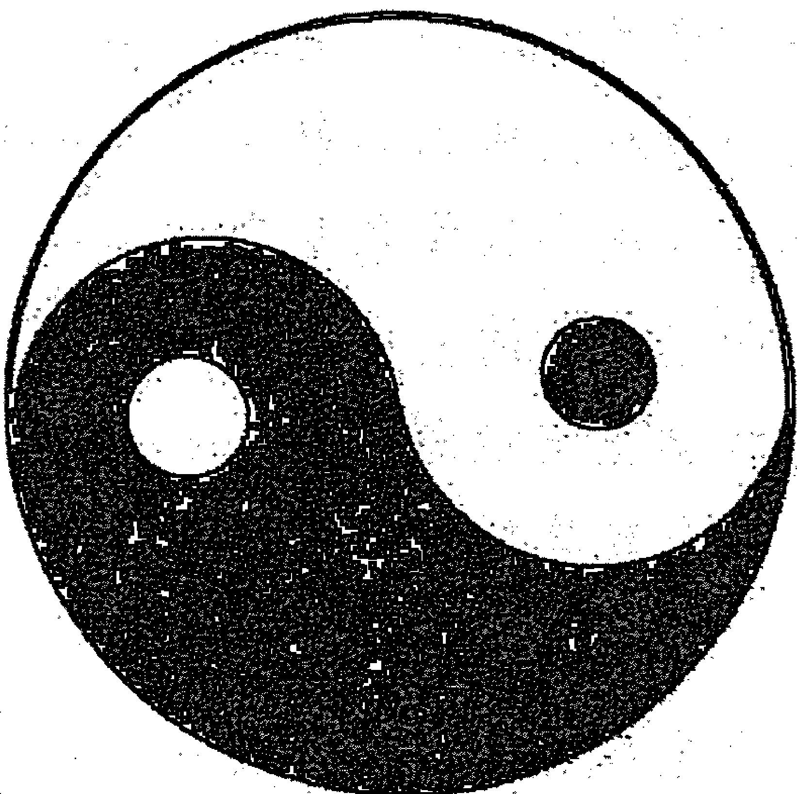
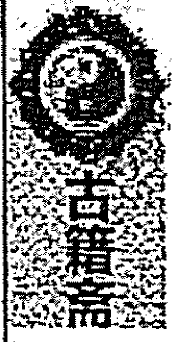
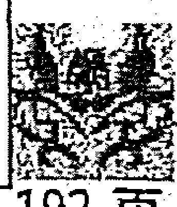

# 不吹牛奇门遁甲讲义第六版（四）

## 作者 不吹牛

古籍斋易学小组校勘仅供内部学习使用

二〇二一年第八版次修正增补

## 第四十章 奇门符咒与避灾防范

首先声明，我对符咒没有深入的研究，更缺乏实战应用。但有的新学员想让我提供一些这方面的知识，只好“照本宣科”了。本讲中的内容，一些是师父所传，一些来源于我收集到的书籍或网络资料。在这里向师父和相关人士表示谢意和歉意。下面的内容，仅作为我们交流班的内部参考，自己学习使用，不要传播。本章内容，我讲不好，也给各位来学习的易友表示歉意。

### 第一部分 预测师自身禳解知识

为人看风水特别是看阴宅风水时，我们需要采取一些自我保护和防范措施。主要有以下几点：

一是不要在恶劣的天气如雷雨天、狂风沙尘天气、暴雪天气给人看风水以及做解灾之事。万一事情途中遭遇恶劣天气，也不能带伞去坟地，更不能把伞带回家中。

二是身上可以佩戴雷击木（刺槐、枣木最佳）、八白玉、八卦镜或八卦图、小风铃等，驱邪避灾。

三是包里可带上一些松香和柚子叶。松香能增加吉气，用事（出行）前后用柚子叶拍打一下身体，趋吉避凶。

四是隔年陈皮有祛晦气、避邪气的作用，可以浸泡、洗脸洗澡。

五是看风水回来后，可以打一盆清水照照（约15分钟），或洗洗脸，多照会镜子等。

六是奇门中的“急则从神缓从门”，遇到紧急情况可以呼喊值符星的名字求佑护或从值符方位逃出等。

### 第二部分 幺学声老师关于解灾化解的精彩理论摘要

建议想详细学习相关解灾化解与风水知识的跟幺老师学习，会收获很大。

各种预测术都有各自独立的解灾破解方法，都有一定的作用，但是不能混在一起，什么都用，不仅起不到好效果，还会导致混乱。解灾化灾是有针对性的，是对有灾难的人有针对性来使用的。共性的东西，如非处方药物，而大病还是得用处方药。要针对每个人，每件事制定具体的解灾方法。

解灾的原则：当一个符号与这个事物具有内在联系时，作用力最大。就是说内因和外因相连，作用力就大。外因是发射塔，内因是接收器，只有属性相同时，作用力才会产生。同声相应，同气相求。如果外面艮位有个大烟囱，偏巧你室内艮位是厨房或有煤气灶，就容易出现问题，作用在人事上的解灾化灾也如此。

奇门遁甲的实质就是时空学，解灾化解要时间、空间、事物三者相联系，有形的与无形的，一阴一阳，时间、位置要掌握好。还有解灾化解所使用的物品要采取阴阳双条件同用，比如丁奇，使用蜡烛或灯火。古人大户人家大红灯笼高高挂，一是照亮，二是也起解灾化煞的作用。我使用针灸针，有时候也使用艾草。针是针，灸是灸，灸法就是点艾草熏。艾草也是经常使用的解灾化煞物品，配合无形的乙丙丁三奇神咒。蜡烛、灯、艾草、针灸针都是有形的。乙丙丁神咒是无形的，光用咒，但没有替代品不行。你看到的东西都是阳的，要配合阴性符号。自然的东西，比人工的力量大。

无根水是雨水，自然水是江河之水。山管人丁水管财，癸水是无根水，也可以接一些。壬水是江河之水，自来水是人工处理过的作用力不是很大。坐山逢空，就要填实。不填实，人丁就会出现问题。向首一空，事业上、财上就会出现问题。坐山处于不利位置，如后面是大坑、低洼地、悬崖断壁、沟渠、道路、地下水等，都是坐山有问题。坐山有问题，子孙就不兴旺，身体就不好。调风水，要首先保障人的安全，其次才是财的问题。万事以人为本。调财的方法，类似于漂亮的人再穿个好衣服则更漂亮。丑八怪穿的再漂亮，也变不成杨贵妃！

壬子癸三山坐山出现问题，就要到壬子癸方位的山上去采石头，但一定要采主脉、主峰的石头，即使一小块也起作用。如果不是同一方位的，即使再大的石头也不起作用。这就是同气相求的道理。

关于水的采用，也是同样的道理。如你的财位在西南方，就要从西南方来采集水。如果是从其他方位采集来的，不仅不起好作用，反而会有坏作用。易学原理：其小无内，其大无外，一滴水就是一个小宇宙。

但凡用乙丙丁三奇遇到空亡或虚地（乙丙丁在孤虚之地）时，要配合孤虚神咒，不然起的作用力不大。为了美化环境，坐山上，我一般采用假山盆景。放置从主山上采集的石头，和谐协调。风水讲究美观，但不能滥用。对于外面的镜子光煞，一般用藤蔓类植物如兰花、花草来化解。观音菩萨是佛教的。注意：道教、佛教的祭拜程序是不一样的。

对于尖角煞，主骨质增生、意外灾害等，化解要根据具体情况，看是什么原因引起的，采取不同的化解方式。

有些问题需要处理，有些问题不需要处理，有些问题根本处理不了，因此不要盲目、神秘。我们是从易学的角度来看待问题处理问题的。解灾就是方法论，就是如何处理问题，是指按正常的思维方法行不通了，换个角度来处理问题的一种方式。易学思想，就是天人合一和天地人三才相应的原则。解灾分几大类：

第一就是行为上的化解。前面有个坑，你要绕道走。天气要下雨，你出门就要带伞。前面有交通事故堵车了，你知道了也要绕着走。这是小事情，对于大的事情，一个企业、一个团体以及合作出现了问题，首要的就是要从人际关系上来解决，融洽关系，这才是最重要的。以人为核心，人力解决不了了，才求地求天求神的。我们研读奇门局，也是要首先看行为上能否解决，从人事上能否沟通，三十六计走为上。第二天不是指的老天爷，而是指的择吉也叫择机。选择一个最好的时间、时机来处理，择机而行。第三是择地，就是规避、换个方位、换个区域来做。第四是求神。以上都不行了才求神，绝望之时才求神。

#### 奇门遁甲人事上的沟通：

奇门遁甲先看三奇六仪的关系，用特定的人事的因素符合去联络，看他们的应事安排是怎样的，看看人事上能否沟通。我们生活在人类社会，基本上都能通过人来沟通，通过人事关系来解决。

首先从大的空间状态看，奇门局上，凡是对立面都是相克的。这就是一个区域图也是时空能量图，也是人事活动的一个能量区别场。2、5、8为土，风水上也讲2、5、8同气。土主宗教，巫婆神汉就出现在东北河南四川一线。震巽为木，乾兑为金。只有水火变数大是不确定的因素。所有的事还有用神落在坎宫离宫就变数特别大、不确定因素就多。其他的性能比较稳定，能量场的基本性质：落乾兑的用事，金主义，要从感情上，进行沟通，委托有情感交往的朋友办事，容易成功。增加感情联络，而不是找工作或利益交往的人。落震巽的用事，木主仁。代表恻隐之心，就是可怜，怜悯之意。因此，用事落震巽，则要相求，哀求人家，让人家产生恻隐之心，才能成事。落艮坤的用事，土主信。主信用，诚实，承诺。如果用事之事落坤艮，你找人家，要给人家下保证书，你给我解决了，我保证怎么样，要诚实。落离坎的比较麻烦，说话不算数。今天答应你，明天就反悔。该怎么办？落离宫，火主礼：礼貌，有礼，要大量送礼的意思。但是，也要注意，不要有特别大的期望。他收了你的礼，也不一定给你办事，礼多反无理。但用事之神落离宫，一定得送礼。落坎宫，水主智——要巧言善辩，无理搅三分，像正义使者一样，这是策略与谋略。你进入了这个场态，就要用这种方法。

以上是顺向的，还有逆向的：比如，用事之神落艮宫，你要做的事，需要震巽宫的人或事，但是震巽克你：怎么办啊？第一方案，要寻求火，泄木气，生我土。要集离宫中的各种三奇六仪，天地人神所有符号来资助你，挡那个木。或者求火来帮忙，但求火就要送礼。但是，落宫空亡了，或发挥不出能量，有劲使不上，或者能力衰退，没有能力了，给你帮不上忙，则要考虑第二套方案。第二步，找乾兑。乾兑克制木的落宫。金主义，就要从情感方面来进行。拉关系，靠近乎。如果这个方法解决不了，人家不理你，就改第三套方案找比劫。第三套方案，找比劫，土主信，给人家承诺，让人家帮你扛，分担一些。哥们，你帮我，成功了我给你100万……都是阴阳五行之理。

以上都是思想，要实施起来，还有很多的事情要做。

第一个就是时间。择机——择机而行，恰到好处。如果对方克制你，要选择对方能量最衰，你的能量最旺的时机。你去求人办事，要找对方能量最强的时候办事。对方克制你，你要在对方最弱时，反击他。以上是人事行为，这个人行为也牵扯到天地人神。所有的处理方式上，都是在这个基础上，逐步细化和分类的。这只是一个大的前提。行为上，究竟用那种方法呢？三奇六仪包括了人事方方面面的关系。

天盘地盘相互勾连。天盘为我，地盘为勾连之事。勾连之事对我不利，克制我，我用冲的办法；勾连之事对我有利，我用合的办法。如同刑冲以合为应；合以冲为应。合，对我不利，我就用冲的办法。刑冲对我不利，我就用合的办法，要么把我合走，或者把他合走。入墓用冲墓的办法。我想逃避，我不想沾惹这个事，我用入墓的办法。如有人威逼你要帐，你想躲，就要躲到你预测用神的入墓方躲起来谁也找不到你。隐藏应该隐藏在入墓方，而不是杜门所在之方。在杜门之方，有可能被公检法找到来抓你。这都是人事方面的策略。所以，首先启用的就是这一块。第一是人，人事行为；第二，是地利，即落宫；第三是天，即择机择时的问题；第四，就是求神。都绝望啦，求神。

神是共有的能量。不是指单一的猪八戒，吕洞宾。

第一，值符神（六甲值符），是奇门遁甲特有的。严格意义上讲，叫将。六丁才叫神。六甲是阳将，六丁叫阴神。民间死人后，摆童男童女，6个童男，6个童女。其实，此童男就是六甲阳将；童女就是六丁玉女，现在已经演变成一种民俗。护送死者升天。过去，特别是法术奇门中，对六丁，六甲特别重视每甲有每甲的名字，如甲子神叫什么名字，甲戌神叫什么名字……有急难值使，值符是哪个神，就呼哪个神的名字。呼这个将的名字，走阴神的路。这才是法术奇门中的内容，不是网上说的那些乱七八糟的东西。如：呼甲子将的名字，走丁卯神的路（步法），求神的帮助。而且，每个六甲，六丁还有自己的符箓。佩戴甲子符，烧化丁卯符。甲为阳，是佩戴的；丁为阴，是烧化的。然而，这些东西很复杂，需要练。不是我这样一讲，你就能掌握的。我所以讲出来，是想告诉你，不要被那些吹嘘的假法术所迷惑，别上当。

奇门遁甲讲：急者从神缓从门，动静先后分主客。这里的神，是指的值符之神，是核心。太应急了，没有办法了，求神，呼唤神。一般的，事情不紧急，缓从门，就能从思想上来考虑。

修炼是有仪规和坛城的。道场残缺是不行的。练不好，会走火入魔。黄石公/姜子牙/诸葛亮都是很讲究这些仪规与道场的。布置28宿，实际就是借宇宙天体的能量。

这是讲神的作用。但神要作用在人身上。同时，六甲值符也是人的代表符号，代表贵人。如果六甲值符克制对你不利的宫或生你，生你所用神之宫，这就可以求甲子或值符所落宫的信息。例如，甲子值符，找属鼠的帮忙；甲戌值符，找属狗的帮忙等。也可以用图腾，装饰。图腾非常重要。如佛珠，是佛的象征。图腾的产生，就是早期符箓意识的诞生。画符，是有用的。一个超市老被盗，防不胜防，后来在墙角等处张贴了一些眼睛的照片，小偷不来了。还有现在的雕塑警察，也使人能够遵守交通规则。

在风水调理中，符箓是有作用的。比如，这里有个凶的东西，你放一张画抵挡也起作用。再如，房子缺少明堂，客厅又小，挂张江山多娇的山水画，就能起到一定的作用。人民大会堂挂的就是江山多娇。再如地图也是模型。有一个企业管理很混乱，我给他画了一道符，是工厂的平面图，在各个部门，画个小人，写上负责人的名字……大家认为老板盯着自己，就越来越自觉了。有一个老太太胆切除后，思想高度紧张，患了心病。我用绿纸，写了个胆字，让她别在腰上……老太太就念叨：好了，好了……心里作用也是非常重要的。但这些也符合易学原理，符合同气相求的规则。

奇门遁甲特别重视奇、门与甲的作用。甲，首先去找贵人，找不到就去求神，图腾。图腾也是神的代表。有些先生是供奉六甲神和六丁神的，也有佩戴的，作用非常好。但需要有这个条件才行。这是一个最主要的思路与方法。先求甲——甲是自尊之神。再求奇：乙丙丁。

三奇乙丙丁，就是借助日月星的能量。当然，女人，情人也起作用，是赋予人性化的东西。要天地人神相应，事物的成功率才高。乙丙丁也要天地人三才相应。天——就是日月星。地：就是地上之物。如风水镇物，花草，水晶球。人：女人，男人，情人（能出现奇迹的女人，男人），就是人事活动，马匹无力皆因瘦，人不风流只为贫。能量是第一位的。英雄美人。神：就是人赋予的信物或用某种信物代表神。人不可能看见神。符箓，就是沟通人和神的信物。符就是画。箓或咒是语言和文字。符，就是雷达，天线。箓和咒，就是传输，播送。箓就是记录，就是电报。咒就是呼喊。就是符、箓、咒。

重点讲三奇。你使用任何一奇，都要天地人神合体，把天地人神的力量都调动起来，合起来，产生共鸣，作用力才大。单用一个，效果不好。就像合成制造一颗原子弹，也要讲究投放时间和地点。

#### 制造方法（以乙奇为例）

- 1. 乙奇在天为日，是太阳。用太阳之火，选择女人，再选择地上一个物，然后，用乙奇的符箓咒配合起来。怎么选择太阳之火？古代一般是在丙午日画乙奇。选月亮（丙火），用丁亥或己亥日。选星星，用丁巳日或丁亥日。但是，现在这个规矩被打破了。有一种说法是：画乙奇符箓在六乙日，丙奇用六丙日，丁奇用六丁日。这个方法也可以用。以求天地同气。还有一种说法，画乙奇符箓，必须在万里晴空的乙日午时来画，不能刮风下雨，不能有云，以借助太阳的能量。如果是画丙奇符箓，必须是夜半子时，满月之时，也必须没有任何天气变化，万里无云。画丁奇符箓，必须在夜里亥时，也要求没有雷雨天气变化。以上要综合运用，因为宇宙的能量是巨大的，而人的能量是微小的。
- 2. 调风水，不能用雷雨天，刮风下雪天。因为这样的天气气场混乱。但是，调理完后，再出现天象的变化，风雨雷电就是好事，说明调动了宇宙能量，你的调理发挥了作用。天地人神会出现同时变化，共鸣。
- 3. 地上之物。乙奇：地上代表花草。丙：是太阳和月亮的意思。古人用镜子影射太阳和月亮。据说，阴阳虽然相合，但阴不能见阳，阳不能见阴。阳见阴则死，阴见阳则散。所以有照妖镜，清水照面的说法，趋吉避凶。古代传说，大部分是真实的。丁是灯烛之火。灯笼等。要根据情况来定。乙奇用花草，我喜欢用葫芦，2个葫芦就构成一个乙。丙奇用镜子或水盆之水，铜镜等；丁奇用红蜡烛，等之类的。注意：解什么灾？就用什么的象意。如你是治病，作用在人体上的，则：乙奇可以选用一种中药；丙取刮痧，拔火罐等；丁取针灸，针灸针等。如果是求财，解灾等作用在人事上，则可以分别用我们前面讲的葫芦，镜子，蜡烛等。
- 4. 人事上，乙奇，可以找女人。乙奇在震宫，你可以到东方寻找一个合适的女性或者干脆让自己的老婆，女朋友出面。丙奇：一般代表未婚的男孩，落哪宫上哪一方找一个合适的小男孩。或者让你的男性情人出面。丁奇：一般是找一个小女孩，落哪一宫，上哪一方去找一个合适的女孩，或者让你的情人出面做这个事情。

### 第三部分 关于符咒的使用与基本操作程序

第一，要在家里比较安静的房间设坛。这里有比较严格的要求。

书写的物品：用黄布或黄纸，写三个牌位。太上老君 九天玄女娘娘 北斗星君 竖着写在一块黄布上，或者分写三条也可以。

书写要用新毛笔。

第二，书写符咒前的准备工作：

- 1. 要三净身：刷牙，漱口，洗澡。有条件的，可以用柚叶擦身。
- 2. 洗漱后，静坐一会，主要目的是静心，以提高书写时的注意力。
- 3. 书写时，要赤脚，不能穿鞋，然后要换没有穿过的衣服。
- 4. 准备五谷原粮。谷子，绿豆，稻谷，高粱，玉米，黄豆等任何五种，不能是脱皮的。
- 5. 准备黄酒一瓶，朱砂一瓶，新毛笔一支，新碗一个，黄纸。
- 6. 把碗放在写字的桌子前面，把五谷倒在碗里。

第三，书写符咒的时间要求：

- 1. 在亥子时书写；
- 2. 书写时，最忌讳刑日和破日。逢刑日和破日不能书写，如果书写，会对自身产生伤害。

刑破日是指日月间的刑破。

## 第四，符咒的书写流程

- 1. 点香：用左手取三支清香，由左往右插，用右手点。左手代表天地，右边代表人。三支香，代表三位神仙。分别是：九天玄女（娘娘），太上老君，北斗星君。心里要默默祷告，合掌作揖，念3遍：恭请九天玄女娘娘 太上老君 北斗星君到坛加持。然后自言自语：弟子某某某乃某某地人士，今有一事相求……（什么事情）由于自己人力不足，特请九天玄女娘娘，太上老君，北斗星君赋予神力。弟子一不是为了求财，二不是为了女色。就是为了……（保证书）。
- 2. 香点上后，要合掌作揖，口中默念三遍：弟子XXX恭请太上老君，九天玄女娘娘，北斗星君今为XX化解XX事，请太上老君，九天玄女娘娘，北斗星君到坛加持。
- 3. 把朱砂放上，黄酒浇4遍，搅匀，毛笔打开，开始写。写时，要叩齿三匝，并念口诀：
- 4. 必须在三支青香燃完之前把符咒书写完毕。
- 5. 关于书写纸张或黄布的要求：六寸宽，一尺二寸长。
- 6. 在拿笔之前，还要默念一个口诀：天地玄黄 律令九章 吾今下笔 万鬼伏藏 急急如玄女律令。
- 7. 在符咒书写完毕后，把前三支香取了，重新点燃三支清香。
- 8. 等香燃到1/3处，将书写好的符咒，在香火上过三遍。
- 9. 取三张冥纸，起当时的奇门局，看你所用的那个奇（那个咒）落在哪个宫，就在那个方位烧此三张冥纸。在室内，室外烧都可以，而不管有无空亡，入墓，击刑等。
- 10. 在烧化冥纸时，要把书写好的符咒，在此火的上方过火三遍。不要离得太近，以免燃着。

第五，有一个特别重要的要求，在决定书写符咒前，必须先起一个奇门局，看一下值符所落之宫的情况。如果值符落空亡宫，今天就不要写了，要换日子再写。这实际上是第一步，可以提前起出来亥时局看看，选择哪天来写。值符空亡，就是请神不来。

第六，送神：再点三支清香，合掌作揖，口中默念三遍：恭请太上老君，九天玄女娘娘，北斗星君离此坛。

## 第七. 其他要求要点

- 1. 要求用毛笔，每次书写时，都必须用新毛笔。
- 2. 要采用繁体隶书。
- 3. 环境必须安静。没有人和动物的干扰。注意力要集中，一气呵成，而且一定要坚信这个符咒有强大的效力。
- 4. 书写前7日内不能有房事行为。
- 5. 书写符咒时，要光脚，接通天地。
- 6. 白天请神不来。
- 7. 对坛的方位没有严格要求，主要是安静。
- 8. 念：天地玄黄……咒语之前，还有一个要求，需要叩齿三下，牙尖顶住牙堂，然后默念：天地玄黄，律令九章……或者念另一个口诀：

一笔天下动 二笔鬼神到 三笔凶神恶煞走出千里外

但念此口诀时，上面要三清符（三个圆圈，三个钩，三个点）。如果没有三清符的，不要用这个口诀。

写的时候，脑子里什么都不要想，这需要练功。一气呵成，才能应验。练习时，口中含一口清水，舌头顶在上牙堂上，思路清晰，默念。

- 9. 书写符咒要用朱砂；调配朱砂要用雄黄酒。调配朱砂的小碟子，每一次必须用新的。
- 10. 选用植物朱砂和矿物朱砂混合使用，加一点墨汁。矿物朱砂力量大；植物朱砂色泽艳丽。

## 第八. 一些注意事项

- 1. 每年的下列日子不能书写符咒：农历三月初九 六月初二 九月初六 腊月初二这四个日子，绝对不能书写符咒。
- 2. 如果你在预测时的局，确定用三奇神咒时，正好所用之奇落空亡宫了，需要配合使用孤虚神咒。

## 第九. 三奇神咒的具体使用方法

- 1. 安放法。如果是治病或解灾，可以把所写的符咒放在枕头底下或者床头。一定要在正确的时间和空间使用。
- 2. 佩戴法。包括做一些护身符，要与其他的实物一起佩戴。无形与有形相配。比如，乙奇配小葫芦；乙奇放在兰花下面等等。

## 第十. 自制护身符

将佩戴的玉坠或者古钱币（一般用五帝钱，如乾隆通宝）配合符咒，使用效果最好。

要求事先：用黄纸写上需要解灾人的生辰八字和姓名，与写好的符咒放在一起，与玉坠或铜币包在一起。其它还需要：五粒谷（带皮的），五片茶叶，五枚桃树枝，五根黑线。

把以上的东西准备齐，在戌时，在家中的西北方向找一个路口，把这些东西一起烧化，玉坠，古钱币也一起烧。等凉了后，再取回玉坠/古钱币戴在身上或挂在车上等。

需要注意：一是佩戴，如护身符之类。天地人神各物。解什么灾，用不同的地上之物，找一个相关的人（乙丙丁），来与符箓放在一块（投放）。二是烧化的符箓。让你去用的人（需要解灾的人），与要用的地上之物一块烧化，烧完后，取其物就行了。

## 第十一. 什么条件下使用三奇神咒

三奇神咒不是什么事情，什么时候都能随意使用的。需要你在预测时，解灾时，看局，用神临什么奇才能使用什么奇，没有符号的关联性是不能使用的。比如，时干为事件，我们需要解决这个事，此宫正好有丁奇，我们可以配合丁奇神咒来加大它的力量。如天芮星临上乙奇，我们可以采用乙奇神咒；若暗干又见丁，我们还可以配合丁奇神咒。就是说，奇门遁甲用神临三奇（包括天地盘）才可以用，不临不可用。

要看做什么，比如，要治病。要看天芮星的落宫，看乙丙丁谁来消耗克制天芮病星，哪个奇能够发挥作用。选择天盘。是克制好，还是消耗好，要看各自的能量，对比。一般，克制病星的为最好。地盘代表过去的，一般不用。要现在克制或消耗，能量最大的时间。但一般不要现在辰戌丑未这样的时间。除非是入墓了，需要冲墓时，才用辰戌丑未（需要入墓也可用）。辰戌丑未为四库，是宇宙之气收敛的时间，为收；寅申巳亥是马星动为放；子午卯酉是能量聚集最旺的时候。这时候，可用。我们用

地点：比如治病，治什么，就投在什么方位。出现外应的，就是产生作用了。但外应的产生时间有长有短。有应天，应地，也有应人，应神的（做梦）等。如果没有外应，则不灵。这是一整套的东西，一定是天地人神相应才行。

关于八门的符箓更加复杂，主要是布阵。需要练。属于法术奇门的内容。课堂没有细讲。至少要修炼两三年的时间。八门符箓，遁甲符箓，很难练。

地盘八神，如果去给人家选地基时（没有下葬前），这时看地盘八神。下葬后，看天盘八神。暗干是不确定因素，调风水和化解，一般不用暗干。

| 奇 | 对应事物/人物 |
| :--- | :--- |
| 乙奇 | 葫芦，盆景，花草，女人 |
| 丁奇 | 蜡烛，香，针灸针，小女孩，小红旗 |
| 丙奇 | 铜镜，小男孩（也可制造麻烦，有些事情不出麻烦还真解决不了） |

## 第十二. 家中闹鬼、中邪人的解灾

遇丁奇，可将丁奇神咒放在宝剑上；

遇丙奇，可将丙奇神咒和八白玉放在家中或放在铜镜背后。八白玉是辟邪的。

遇乙奇，可将乙奇神咒与葫芦（自然葫芦）放在一起。铜葫芦的作用力小。

## 第十三. 禳解

使用三奇神咒需要禳解。如果不禳解，可能反作用力会应在你的身上。在书写三奇神咒前，可在书桌旁，放盆花草。操作完后，把花折一个枝条。用黄纸写个假名字，并用此纸把折下的枝条包起来，找一块偏僻的地埋起来。一般是埋到戌亥方。

注意：起局时，丁遇癸，丙遇庚，乙遇辛，这时候奇失去效力，不能使用。

平时练习书写符咒时，口含一口清水，容易提高注意力。平时要多练习，不能等需要用时，才做。临急抱佛脚，不行。

### 第四部分 孤虚神咒 三奇神咒

#### 孤虚神咒

天靈靈，地靈靈，孤虛孤虛神舉意，如吾意，神不離左右，急急如玄律令。

#### 丁奇神咒

天帝弟子，部令天兵，賞善罰惡，出幽入冥，來護吾者，玉女六丁，有犯吾者，自滅其形，急急如玄女律令。

#### 丙奇神咒

吾德天助，前後遮羅，青龍白虎，左右驅魔，朱雀道前，使我會他，天威助吾，六丙克之，急急如玄女律令。

#### 乙奇神咒

天地神威，誅滅鬼賊，六乙相扶，天道贊德，吾令所行，無功不克，急急如玄女律令。

乙奇符式：

先画最上面一个圈，左边画4个圈，右边4个圈，再画左边3个，右边3个（在2个中间画圈），先把外面连接起来，然后连接里面。里面的连接方法如图……然后，底下写上：乙式印，也叫乙奇印。然后写4个乙奇印/乙奇印/乙奇印/乙奇印。（奇，用繁体字）。

画好符后，就要写篆。并念咒。咒是念的，篆是写的。写完再念，用的时候要念。

写上乙奇神咒，过去要求用隶书。

丙奇符式，丁奇符式的格式相同。注意，都是横着画的。纸是横着过来的。写完符篆后，念3遍咒。

## 第五部分 有文章摘录（道家符咒，自行参考）

说明：道教中的符箓的实质就是：古代的人改变、征服自然的能力有限，对于某些社会、生活、生产中遇到的问题没有利用科学技术去分析解决从中体现出唯心主义的色彩，所以说科学技术是第一生产力，知识改变命运、改变世界是我坚决提倡的。

符篆分四大要诀：

- 符：就是书符，代表灵界公文和法规。
- 咒：就是咒语，代表灵界密码与歌诵号令、说服作用。
- 印：就是手印，代表灵界权威和印信。
- 斗：就是步罡斗，分五行、七星、八卦等各种不同罡步，是代表不同作用威力。

符咒是中国道家灵修的哲学，也是心灵最高艺术升华。古云：『若知书符窍、惹得鬼神惊。不知书符窍、惹得鬼神笑。』符咒不是迷信而是古人对宇宙气场深刻体验的记录：

曲线符：表现柔缓的气。 直线符：表现刚烈的气。 咒语：表现的是强大意念。

符篆组成及功能：

- 符：是用来调整气场的；也就是记号里面存储书符者意念，意念越强存储的时间就越久，释放出来的能量就越强，小者可以治病调心、大者可以消灾解厄。
- 符者：通取云物星辰之势，皆出自自然虚物空中结气成字，生于元始之上出于空洞之中；古云：「上符天、下符地、中合人体。」

符的组成：是由圆、螺旋线、卧8、横竖、斜线及方圆以及寓意深刻的汉字语句所组合。

书符秘诀：上三十六天罡、下七十二地煞、留人门、绝鬼路。

一道符的构成有五个主要部分组织而成：

- **点符头**：符咒开笔最为重要，就如同人的眼睛一般。
- **主事符神**：每道符的功用各有不同，什么事就该找什么主事之神符，如同现今使用者的权威或教授。
- **符腹内**：此道符功用要用于何事作用、斩妖除邪或镇宅，在此处即可明了。
- **符胆**：为一道符的精华所致（生魂及灵魂），符能不能灵验全在此诀。
- **叉符脚**：（觉魂）为请兵将镇守之意，符脚变化很多，全看此道符本身用途而定，又符脚也有口诀。

#### 符的用法

每道符因功用不同可分为七种用法，每个人必须了解其用法才可发挥功效，其用法如下：

- **化法**：也就是一般人所说的焚化，直接用火烧即可。要注意火化时，一定要从符尾开始点燃，如果能折成令剑形状则效果更彰。
- **佩法**：就是将符纸折带在身上，大多折成八卦形，然后用胶套封装，便于随身携带。
- **贴法**：直接将此道符贴于物品上。另外有种药符是直接将符的正面贴在患处，或是火化后与药物混合一起使用。
- **吃法**：先将符放在碗中或茶杯中火化成灰，然后再冲阴阳水，等待水澄清后再饮用。
- **煮法**：又叫煎法，就是把符放在药壶里煎煮。煮法有两种不同的形式：一是只用一张符与白水共煮（有时符水会变色，甚至有药味）；一是和一些中药合煮。
- **擦法**：符火化后加冲阴阳水，用剑指或金刚指沾符水来擦身体。通常先擦头部，再沾符水拍一拍胸前以及背部。有时可佐以喷法，所谓喷法是施术者口含符水，并用剑指放在自己嘴前，用力一喷，符水经由剑指而到达被施术者的身上。
- **洗法**：可直接在浴盆或脸盆，将符火化成灰后再加阴阳水来洗，洗完后将符水泼出户外或是无人空地，或是让其流入水沟内均可。

#### 指诀（手印）

- **道指**：左手中指及无名指向内弯，大拇指压住中指及无名指指尖。左右手均同。法师作法时常用。
- **三清指**：1. 左手五指指尖全朝上。2. 中指及无名指收弯入掌心。3. 大拇指、食指、小指各朝上伸，即成此指诀。4. 此指法乃捧净水或符水作法用之。
- **五雷指**：1. 左手五指均收伏在掌心，但须注意指甲不可外露。2. 左右手方法均相同。3. 用时捧起“哈”一下，说“打”，脚跺一下往前用力蹴去，一气完成。
- **金刚指**：1. 右手无名指从中指指背过。2. 食指勾住无名指，指尖向下。3. 大拇指、小指指尖皆收入掌心，中指朝上。4. 此指诀须拿起放右肩上约一尺处。5. 此法可行使各种法事，也可敕符。
- **八卦指**：此乃敕八卦、安八卦或行使各种法事，破煞有力之指法，用途非常多。
- **太上老君指**：其指从指上可见“太上”二字。此乃法师法事之时用以敕命神兵法将，意谓道祖之亲临，可增加威力。

#### 九字真言

九字源自东晋葛洪的《抱朴子》内篇卷篇登涉篇，云：“祝曰：‘临兵斗者，皆数组前行，常当视之，无所不辟’。”意思是说，常念这九个字，就可以辟除一切邪恶。东密受到我国道教的影响（使用护咒法），可是在抄录这九个字时，把“皆数组前行”误抄成“皆数组在前”或“阵列在前”，而沿用至今。这九个字分别的意思是：

##### 临（りん）——身心稳定
表示临事不动容，保持不动不惑的意志，表现坚强的体魄。
- **结合天地灵力**：降三世三昧耶会
- **手印**：独钴印
- **咒语**：金刚萨埵心咒
- **动作**：双手十指紧扣，食指伸出相接。

##### 兵（びょう）——能量
表示延寿和返童的生命力。
- **行动快速如镖**：降三世羯摩会
- **手印**：大金刚轮印
- **咒语**：降三世明王心咒
- **动作**：续上手印，中指覆于食指之上。

##### 斗（とう）——宇宙共鸣
勇猛果敢，遭遇困难反涌出斗志的表现。
- **统合一切困难**：理趣会
- **手印**：外狮子印
- **咒语**：金刚萨埵法身咒
- **动作**：续上手印，食指收回，中指伸展相接。

##### 者（しゃ）——复原
表现自由支配自己躯体和别人躯体的力量。
- **万物之灵力，任我接洽**：一印会
- **手印**：内狮子印
- **咒语**：金刚萨埵降魔咒
- **动作**：续上手印，拇指、食指、小指伸展相接，其余紧扣。

##### 皆（かい）——危机感应
表现知人心、操运人心的能力。
- **解开一切困扰**：四印会
- **手印**：外缚印
- **咒语**：金刚萨埵普贤法身咒
- **动作**：续上手印，十指收回紧扣，左手在前。

##### 阵（じん）——心电感应/隐身
表示集富庶与敬爱于一身的能力。
- **透视、洞察敌人心理**：供养会
- **手印**：内缚印
- **咒语**：莲花生大士六道金刚咒
- **动作**：续上手印，双手紧扣，右手在前。

##### 列（れつ）——时空控制
表示救济他人的心。
- **分裂一切阻碍自己的障碍**：微细会
- **手印**：智拳印
- **咒语**：大日如来心咒
- **动作**：续上手印，作智拳印。

##### 在（ざい）——五元素控制
表示更能自由自在地运用超能力。
- **使万物均为平齐**：三昧耶会
- **手印**：日轮印
- **咒语**：大日如来心咒
- **动作**：续上手印，十指伸展，手心向外，拇指、食指相接。

##### 前（ぜん）——光明/佛心
表示佛境，即超人的境界。
- **我心即禅，万化冥合**：根本成身会
- **手印**：宝瓶印（或隐形印）
- **咒语**：摩利支天心咒
- **动作**：续上手印，作禅定印。

其实密宗向来讲究祭礼咒语，倒未必是受道教的影响，反而是道教跟佛教学了不少东西。经文之中手指密号多矣，今且出行记中所用示之：

- 谓两手名二羽，亦名满月。
- 两臂亦称两翼。
- 又十指名十度，亦名十轮十峰。
- 右手名般若，亦名观、慧、智等。左手名三昧，亦名止、定、福等。
- 十度号：从左小指起以次数之上，即檀、戒、忍、进、禅。从右小指起以次数上，即慧、方、愿、力、智。
- 五轮密号亦然：从左右小指起次第向上数之，即地、水、火、风、空也。

#### 密教手印

密教以左手为常静，故名为慈悲之手，渡顽愚众生；右手为常动，故名为智慧之手，渡上根利器，称为“悲智双运”渡尽无余凡夫。合此双手即表示断除“贪嗔痴疑慢”之烦恼障惑，是远离身语意之无始无明。其合掌的姿势名为“印”，即断身业的杀盗淫等三恶业。念佛号等密语，及观诸尊相好庄严，则成涅槃实相之常乐我净。

#### 神咒集

##### 落幡咒
幡悬宝号，普利无边。诸神卫护，天罪消愆。经完幡落，云旆回天。各遵法旨，不得稽延。急急如玉皇上帝律令。

##### 九星神咒
九曜顺行，元始徘徊。华精莹明，元灵散开。流盼无穷，降我光辉。上投朱景，解滞豁怀。得驻飞霞，腾身紫微。人间万事，令我先知。

##### 土地神咒
此间土地，神之最灵。升天达地，出幽入冥。为吾关奏，不得留停。有功之日，名书上清。

##### 甘露咒
悲夫长夜苦，热恼三涂中。猛火出咽喉，常思饥渴念。一洒甘露水，如热得清凉。二洒法界水，魂神生大罗。三洒慈悲水，润及于一切。

##### 斗母玄灵秘咒
玄灵节荣，永保长生。太玄三一，守其真形。五脏神君，各保安宁。

##### 延内真咒
天地同生，扫秽除愆。炼化九道，还形太真。百官纳灵，节节受新。清虚掩映，内外欺阴。度命延生，吉日良辰。金童玉女，为我执巾。玄台紫盖，冠带其身。使我长生，天地同根。

#### 金光神咒
天地玄宗，万气本根。广修亿劫，证吾神通。三界内外，惟道独尊。体

#### 护身符

功用：此符咒于将登法坛时用。

咒语：诵净身咒及护身咒各三遍。（原书中未找到此咒语，可在其它书籍中找到此咒）

笔顺：先写敕令二字，左方二曲三圈，转下向右方上挑，挑上加四曲，中间一划一点，向右方一撇带至左方加划撇，正中间先作十字形，后加四小圈，上下写护卫二字。

#### 净坛符

功用：此符咒于上坛之后上香时用之。

咒语：香咒三遍。（原书中未找到此咒语，可在其它书籍中找到此咒）

笔顺：先敕令二字，次左方逆作三圈下竖，右方向下作四曲，转至上方下竖，逆作一圈上挑。

#### 开天门符

功用：于作法之先用。

咒语（开坛咒）：吾将祖师令，急往蓬莱境，急如蓬莱仙，火速到坛前，倘或迟延，有违上帝，唵哈哪咆咒。念七遍。

笔顺：先写一大字，左右下竖，中三点，点下作人字形，人字外加二叉下竖，左右各写一韦字，中间写三个火字，竖末写雷字涂没，左右加二提。

#### 闭地户符

功用：于作法之先用。

咒语：同开坛咒。

笔顺：先敕令二字，其下写闭斗二字，一划之下逆作四圈上挑。

#### 塞鬼路符

功用：于作法之先用。

咒语：同开坛咒。

笔顺：先敕令二字，其下写闭斗二字，一划之下逆作四圈上挑。

#### 召值时神将符一

功用：此符共十二道，咒一通，何时开坛，即用召何时神将之符。

咒语：如值时神将咒。

笔顺：先二口平置，下一划，左方一小竖，复一划折向左方下竖，左内方再加一长竖，竖右作五个半口字形，右方四曲一竖，中间加子字，此系子时开坛用。

#### 召值时神将符二

功用：用法同符一。

咒语：同符一。

笔顺：先写一四字，次一划折转向左下竖，其下并作丑字，丑字下并作二火字，下一秘文鬼字，再一丑字，此符系丑时开坛用。

#### 治呃逆符

咒语：杀、嘟、利、嗫。

笔顺：先尚字头，左作草书去字形，连下一竖向右上挑，右一划折下加三点，下作已乙字形加三点。

#### 治小儿消疾符

咒语：哪、嘛、杀、嘛、吧、噜、啼。

笔顺：先尚字头，左斗字，连下一竖上挑，右方一划折圈又一点一划折圈，连下三点上挑，中写一新字。

#### 治小儿消疾符

咒语：生、嗫、啼、利、噻。

笔顺：先尚字头，下写一草字，左右各向原方上挑，中写一乙字，中间加一竖，竖末两曲下撇，另加一笔左右中三方各加三点。

#### 治老人中风符

咒语：唵、嘟、生、利、嘛、嗫。

笔顺：先尚字头，左一点一划上挑，右写草体风字，连下三点上挑，中写丙、元二字。

#### 治头痛符

咒语：威、咭、利、噻、呢、吽。

笔顺：先尚字头，左作草体示字上挑，连下四曲一竖三点上挑，左右中三方各加三划一撇。

#### 治口臭符

咒语：尊、啰、咭、吧、哒、噻、啼。

笔顺：先尚字头，左一小挑，连三点下竖，竖上加一示字，右四划一竖，连下两曲一挑，中加吉、三、二字，右加二点。

#### 治三阴疟疾符

咒语：啰、噜、利、尊、是、利、啼。

笔顺：先尚字头，左角字一竖上挑，右张字三曲一竖上挑，中写洗、翟、月三字，惟洗偏左方。

#### 治血枯符

咒语：唵、啼、啰、咭、利、尊、嚵。

笔顺：先尚字头，下一草体乾字，加一划二曲一撇。

#### 五雷咒

五雷，五方之雷神。

> “玉清始青，真符告盟，推迁二炁，混一成真。五雷五雷，急会黄宁，氤氲变化，吼电迅霆，闻呼即至，速发阳声，狼洛沮滨渎矧喵卢椿抑煞摄，急急如律令。”

#### 天龙咒

> “赫赫阴阳，日出东方，敕收此符，扫尽不祥，口吐三昧之水，眼放如日之光，捉怪使天蓬力士，破病用镇煞金刚，降伏妖怪，化为吉祥，急急如律令，敕。”

#### 符咒之密咒

> “天圆地方，律令九章，吾今下笔，万鬼伏藏，急急如律令。”

#### 六丁护身咒

指召请六丁神捍卫护身。

> “仁高护我，丁丑保我，仁和度我，丁酉保全，仁灿管魂，丁巳养神，太阴华盖，地户天门，吾行禹步，玄女真人，明堂坐卧，隐伏藏身，急急如律令。”

#### 金光神咒

“天地玄宗万气本根广修亿劫证吾神通 三界内外惟道独尊体有金光覆映吾身 视之不见听之不闻包罗天地养育群生 诵持一遍身有光明三界侍卫五帝司迎 万神朝礼役使雷霆鬼妖丧胆精怪亡形 内有霹雳雷神隐名洞慧交彻五气腾腾 金光速现覆护真人急急如玉皇光降律令，敕！”（不可简化，此咒为最长咒之一，防御超级！！）

## 金咒

“一敕不至尔罪不原，二敕不至逆节相连，三敕不至影灭风烟，……天命付我，我命付汝，汝若负吾，天令不许，吾奉真王令。”

#### 开乾咒

“都天雷公，赫奕乾坤，神龙协卫，山岳摧倾，邪神魔魅，敢有张鳞，雷公冲击，碎灭其形，鬼怪荡尽，人道安宁。急急如律令。”

#### 符咒之清笔咒语

“居收五雷神将，电灼光华纳，一则保身命，再则缚鬼伏邪，一切死活天道我长生，急急如律令。”

#### 敕火开晴咒

“水官驰禁，不锁雷城，轮脱其车，鬼盗其瓶，飞天敕火，大布阳晶，赫日杲炽，山谷藏云。急急如律令。”

## 敕火祈雪咒

“飞天敕火，斡运东灵，上相仙师，瑞光克聚凝，罡风剪水，变化瑶英，威光正纪，天地肃清，真王敷化，神变玉经。急急如律令。”

## 敕火雨咒

“飞天敕火，斡运神雷，东升畅谷，西运龙台，南旋火府，北转河魁，驱龙致雨，符到速追。急急如律令。”

#### 摄邪咒

“五雷使者，五丁都司，悬空大圣，霹雳轰轰，朝天五岳，镇定乾坤，敢有不从，令斩汝魂，急急如律令。”

#### 致雨咒

“五帝五龙，降光行风，广布润泽，辅佐雷公，五湖四海，水最朝宗，神符命汝，常川听从，敢有违者，雷斧不容。急急如律令。”

#### 役万灵咒

“乾玉辟毒，振适罗灵，八仙秉钺，上帝王灵，太玄落景，七神冲庭，黄真耀角，焕掷火铃，紫文玉宇，四景开明，九天六天，四天之精，外传玄祖，内保帅兵，左成右顾，火热风蒸，敕斩万妖，摧馘千精，金真所振，九魔灭形，吾佩真符，役使万灵，上升三境，去合帝城。急急如律令。”

#### 驱水咒

“川连北海，通及五湖。飞霜青女，冯夷舞雩。吼翻浪，风雨如珠。蒸山起雾，龙升太虚。兴云密布，雷电相扶。城隍社令，速起方隅。急来救旱，万物焦。如违吾令，押赴酆都。急急如律令。”

# 下编 奇门与风水

## 第四十一章 奇门与阳宅风水

### 一、奇门遁甲预测阳宅风水基本原则：日干与时干的关系

> 《诸葛武侯千金诀》家宅占中讲到：“日干为人时干宅，人宅相生多利益。人若克宅庶可居，宅若伤人住不得。纳音生克与刑冲，较取年命定祸福。值符从中做生授，福神到堂喜安逸。”

日干代表的是使用此阳宅环境的人，时干代表的是此阳宅的地理环境和状态，代表该阳宅现阶段的情况。时干所落之宫的符号为内部因素，逢六仪击刑、刑格、冲格、腾蛇、空亡、墓绝之地，说明此房现在的状态不佳。但究竟对居住者有多大影响，要看时干和日干的关系、时干和居住者年命的关系。

如果时干生日干，时干又临三奇、吉门、吉星、吉神，旺相生助日干为最佳环境。如果时干落宫虽不带奇门吉格但乘旺相之气吉神吉星来生日干落宫者，亦为吉宅。如时干所临的星、门、神、格局吉凶不一，但生日干宫，这只能说明此宅风水条件差外观的新旧以及住宅结构的布局情况。九宫的旺衰是用节令来衡量的，但也要结合格局的组合综合来断。古籍云：“九宫起元论风水，乘旺临生为福祉。假令飞伏入鬼乡，从旁休囚因类推。”房子的地理位置和以后的情况主要看生门落宫。

时干落坎一宫，房子“得令秀正委曲”主错落有致，布置和谐；“失令高低参差”，主形体不正、凌乱。生门落坎宫，表示房子在大区域的北方（或西方），曾经或周围有河道、水池、低洼地。

时干落坤二宫，房子“得令幅圆宽广”，主宽阔、宽敞；“失令低矮塌陷”，废弃物多。生门落坤宫，表示位置在大区域的西南方向（或北方），以前是平地、菜地、庄稼地等。

时干落震三宫，房子“得令高低中院”，主住宅高大有气势，房子错落有致；失令“大破低路”，院子小、房子低、门户破败。生门落震宫，表示位置在大区域的正东（或东北）方向，主地势突出、东高西低。

时干落巽四宫，房子当令装饰华丽，风格典雅；失令残垣断壁、风雨飘摇，不牢固。生门落巽宫，表示位置在大区域的东南（或西南）方向，周围岔路多、胡同多、河道多。

时干落中五宫（寄于坤二宫），当令大多平整端庄，气势大；失令主年久失修。生门落中宫（坤宫）房子在大区域的中心。

时干落乾六宫，房子得令多典雅宁静，高大、高层，客厅大，失令墙垣剥落。生门落乾宫，多在大区域环境的西北（或正南）方向，首府要地、市中心地带，地势较高。

时干落兑七宫，房子“得令四齐院密”，雕梁画栋，院落密集，柱子多；“失令缺凹破败”，不完整，塌陷。生门落兑宫，在大区域的西部（或东南）方向，主从前是盆地、低洼地、塌陷区、湖泊、湿地等。

时干落艮八宫，房子得令庄严肃穆，“失令倾颓凸凹”。生门落艮宫，位置在大区域的东北（或西北）方向，多依山傍水或是丘陵地带。

时干落离九宫，房子“得令曲直新鲜”主漂亮美观，“失令折中”，一般化，多主烦乱，住不安稳。生门落离宫，位置在大区域的正南（或正东）方向，以前是冶炼厂、钢厂、砖窑等。格局不好容易引起心脏病、高血压、血稠等。

### 三、十天干在风水预测中的信息类象

古籍云：“三奇六仪所临宫，逢生乘旺必兴隆。刑墓空亡悖格害，休囚其间断其踪”，下面我们分别分析一下十天干在风水预测中的信息类象。

- **甲（主要指甲子戊、甲申庚）：** 阳宅预测中代表室外环境中的大树、粗柱子、高大建筑物、名胜地、领导办公场所等；室内中的水泥横梁、支柱、栋梁、高大的家具等。值符空了，大梁不行，此房根本不行。风水中对居住者是产生好的影响还是坏的影响，就看其与日干（或居住者）的年命之间的生克。如时干临六甲值符乘凶门，凶星、凶格，或生门乘六甲临凶星、凶格冲克日干（年命）落宫则可能是住宅中的柱子、横梁、大家具对人构成了不良气场。

- **乙：** 阳宅预测中代表室外环境中弯曲的路（常与庚配伍）、绿地、花草、小树、植被、庄稼、管线、电线、绳索、果园、艺术馆等；室内环境中的床铺、梁柱、椽子、房檐、小家具、饭桌、沙发、艺术品、木窗子、椅子、拐弯处、葫芦、油画、管线、绳索、晾衣架、楼梯扶手等。传统的木构建筑上都有椽子，也是用乙奇来代表的。乙奇逢击刑、入墓、冲格等，椽子烂了，“出头的椽子先烂”，主破财、有忧愁之事，家眷名声不好，家丑外扬。乙代表房檐、房檐破损，亦主有羞于人知的丑事。乙临死门、腾蛇，睡在这样的床上做怪梦或恐怖。乙+丙红被单，火炕等。乙临庚辛，可能是金属床。乙奇克日干（年命）也可以做相关的检查，也可能是空气的流动导致不适。乙奇临值使门、开门、天冲星可能床铺的位置冲门或冲窗。乙临玄武，破窗户。乙+癸，床下潮湿。乙+壬水床或床下有下水管道。乙+丁，床下有烟。乙临值使门，木门或门口有花草、门对着人家的窗户等。

- **丙：** 阳宅预测中代表室外环境中的烟囱、他人的厨房、锅炉、大型通信设施、电力设施、高压线、化工厂、变压器、加油站、红房子、玻璃幕墙、光亮之物、热源、开阔地等。室内环境中的灶具、明火、烟囱、厨房、门楣、窗户、大红之物、热气、红灯笼、香火堂、也代表镜子、铜镜等。阳宅三要：门、主、灶。在奇门预测风水中，灶房看丙火，如果丙出现问题，不仅会影响居者的健康，有可能还会导致火患、食物中毒等。丙火逢衰、休囚入墓，以及太旺都不好。丙休囚入墓临死门，不做饭、冷锅冷灶。值使门临丙，大门对着厨房或对着烟囱或对着楼梯道。丙+辛，厨房有问题，灶有问题，烟囱堵了。时干丙+己乘太阴或临生门，主房子采光不好。丙临天芮星，厨房有毛病，易因为饭菜引起疾病。丙火临天冲星、丙+丙、九天、景门、丙+戊、白虎、丙+庚、天英星等来冲克日干（年命）室外可能有通信塔、变压器之类对居室的人产生不利影响，临值使门，可能冲着大门。丙火为凶时，容易引发的是意外事件、乱子、血光之灾。丙代表大玻璃镜、铜镜，“照妖镜”，鬼怪怕镜子。

- **丁：** 阳宅预测中代表室外环境中的十字路、丁字路（常与庚配伍）、屋檐、屋角、房顶、电线杆、路灯、信号塔、微波站、窑灶、广告牌、霓虹灯等。室内环境中的灯、灯光、蜡烛、电子产品、电视机、电脑、电话、手机、香火、门把手等。丁临腾蛇、死门、天辅星、天芮星、太阴等，家里供着神佛；落死墓绝地主香火不旺或没有供奉。丁临值使门，门口对着十字路等。丁+癸，水塔、暖水瓶，阴气重等。丁+戊临白虎，主有墙角射过来；丁+庚临天冲星，有大路冲射；丁临天蓬星，有房檐冲射；丁+戊，临天任星、九地可能有地脚线冲射等。丙丁火临腾蛇，可能有光煞；丙丁临惊门、景门的组合可能代表电器、音响。丙丁腾蛇会生门主炉灶。丙丁临腾蛇天柱星主有电杆、电塔。

乙丙丁三奇常用于化解与求吉。如乙奇克制某需要解决的问题，可以带护身符。丙奇克制某需要解决的问题，可以烧纸。丁奇克制某需要解决的问题，可以给祖先上香火。

- **戊：** 阳宅预测中代表室外环境中的高岗、山包、院墙、房屋、仓库、水泥柱子、大树、厂房、桥梁（与壬癸水或天蓬星配伍）、变压器（与景门、丙丁配伍）等。室内环境中的横梁、门柱、陶瓷罐、墙壁、锅碗缸盆、假山石等。时干或生门临戊，多为高大建筑物或房屋地势较高，有水泥横梁、住宅旁有电线杆、桥梁等。戊+庚辛多为电线杆、戊+壬癸多为桥梁，戊+丙丁临景门天英星等可能是变压器、通信塔，烟囱，若冲克日干（年命）对人不利，容易产生肿瘤与血光意外。有院落的戊代表院墙，戊逢死墓绝地、击刑、空亡或乘白虎、玄武主院墙破损、残缺或无院墙。戊旺相临九天，院墙高大。值使门临戊，门前对着人家的房子。

- **己：** 阳宅预测中代表室外环境中的沟渠、排水渠、下水道、隧道、防空洞、坑洼地、坟头、田园、垃圾场、陶瓷品、泥质品、雕塑、房子前的空地、陷阱、废料堆积、蜷缩的东西、天井等。室内环境中的阳台、地下室、地下工事、垃圾筐、储藏间、厕所、蜷缩物。“天井”好比人的衣兜，“装钱的”，是藏风聚气之所在，“水聚明堂富千家”，己为明堂，太狭小则气不能存，太阔达则聚不住气，太阴暗潮湿，主得不义之财。阳台为小天井，宜清洁明朗，不宜堆放杂物。测天井有没有问题，就要看己落宫的情况，落旺地临吉星吉门吉格吉神，主气场好，聚气存财。天井破烂主漏财。己+戊临九天，主天井宽敞，光线好。己临六合、值符，主藏风聚气结构严谨；临腾蛇，天井不方正，出怪异；临九地，主低矮、亦主地下室。临白虎主阔大。己+己、己+辛、己+庚，主不平整、坑坑洼洼，产生有害气场，临太阴、玄武等，主低矮潮湿。时干或生门临己，再临阴星、太阴等，则可能房下有暗沟、坟墓等没有处理好。

- **庚：** 阳宅预测中代表室外环境中的道路、过道、铁路、壬+己，引起斗讼官非。有时时干格局组合很好，整个住宅的风水不错，但值使门出现凶相，亦说明房屋存在着隐患，到值使落宫为应期时，就有可能发生凶事。

要注意的是虽然格局克应能体现出一些大门吉凶的信息，但门开的是否正确，要看所临之星的能量旺衰来体现。风水上讲：“向首一星富祸秉”，虽然门位、门向不一定就是建筑的朝向，但“首”就是把手，就是门。值使门所临九星旺相，说明门开的是正确的，受的是当旺之气。所临九星休囚无力废，说明大门开在了休囚无力的气场上，纳入的是衰竭或不利之气，门开的不正确。具体是什么原因导致的旺或衰，会发生什么具体的应事，则要通过宫中的符号所体现的信息来做出判断。

例如：某宅休门值使在坤宫，时令酉月，临天冲星，辛+戊、丁、白虎，天冲星不旺说明门开在了衰位上，不合理，究其原因，辛为墙角、戊为墙头，天冲星主冲射、白虎主煞气，是外面一座楼房的墙角正对着这里的大门。再如开门值使落离宫外盘，时令辰月，临天芮星，九地，壬、己+乙格局，从天时九星能量来讲，以落宫看天芮星为废地，门开的有问题，但天芮星得时令，说明现阶段还有力量，这个门还能用，暂时是当旺之气。但我们如果从另一个角度来分析：值使门为大门，临天芮星就主有毛病，这个毛病重不重，这时就是把天芮星作为一个病符来看的了，天芮星落离宫逢生则为旺、辰令天芮星也旺相，这说明“门病了”，对应里面的人也病了。这里是否矛盾？天时天芮星为废，说明门位开在了能量场的废地，门开的不正确，这样才导致了居住者的疾病（这又是从天芮星的自身性质来讲的，大门纳入的是病气）。这是一个年命己酉的女士，己为皮肤、壬为腿、乙木为拐弯的地方，入此宅后所得是膝盖骨神经性皮炎（此例为幺学声老师所讲的案例）。

值使门作为大门来看时，只是作为一个门的代表符号，与其自身性质自身的吉凶没有关系。但看值使门所在宫位对居住者的影响时，它的性质吉凶与旺衰是都需要考虑的。旺衰需从落宫和时令两个方面来考量。但乘入气场的能量决定因素是其所临九星的旺衰。

值使门的重要性还在于它有多层含义：一是值使门代表门所开的位置；二是通常还代表门向；三是代表门周围的环境；四是值使门所含的符号，也代表家里或门里所发生的事情。这几层含义，解读时要分开解读。

关于值使门代表门位的情况：比如值使门落坤宫，可能是大门开在西南这个位置上；落离宫，可能开在正南方。这种情况并不考虑是什么门做值使门，只看其落在什么宫位来定大门所在的位置。逢空亡、反吟，很可能在对冲的方位上。如景门值使在艮宫，但九星反吟，门可能开在了西南方，如是伏吟局，门可能开在西北方（艮宫的先天位）。但这也不是绝对的，要与当地的风俗以及建筑特点相结合来判断。

关于值使门反映门向的情况：古籍中有：
- 开门值使为乾宅西北门路；
- 休门值使为坎宅正北门路；
- 生门值使为艮宅东北门路；
- 伤门值使为震宅正东门路；
- 杜门值使为巽宅东南门路；
- 景门值使为离宅正南门路；
- 死门值使为坤宅西南门路；
- 惊门值使为兑宅正西门路。

门的位置与门向不是一回事。比如大门开在东南方巽位，但门向可能朝东或朝南，这不能混为一谈。如朝南开门前正对一个变压器或大烟囱，则此门会受到煞气的影响而产生不利；而往东开门，门前“水外有山，朝拜有情”，则这大门很吉利。

更多的情况下，值使门就是大门的表示，代表大门的情况。值使门与生门的生克关系，反映了门的好坏，体现了门与房是否协调。

当八门不作为值使门使用时，八门只体现出一些环境象意。

- 开门：此处是高亢之地、开阔地、靠近工厂、市场、商场、步行街、名人居所、办公区、法院、检察院、机场、高大之树。室内环境中的金银饰品、贵重物品、圆形物品。有时候开门，也代表大门的位置。
- 休门：此处有水池、水渠、河流、海滨等有水的场所，车站、码头、广场、酒吧、清净的场所、菜地等。室内环境中的水池、洗手间、静谧安静处、运输工具、液体品。
- 生门：此处有山地、丘陵、桥梁、房屋、街道、工厂、银行、堤坝、农场、庙宇。室内环境中的生活用品、植物。
- 伤门：室外环境中的车辆、停车场、运动器械、警局、闹市、树木、危险环境、化工厂、悬崖峭壁、残缺处。室内环境中的家俱、容易使人受伤的物品、刀锯斧头、有损毁的东西。
- 杜门：室外环境中的不通畅之处、寺院、竹林、邮局、公检法机关、监狱、军营、交通拥挤堵塞、树木。室内环境中的草木、堵塞处、过道、长廊等。
- 景门：室外环境中的热闹场所、风景漂亮之地、通信塔、冶炼厂、美发店、图书馆、广告牌、霓虹灯。室内环境中的风景画、电视电器、装饰华丽、灯光。
- 死门：室外环境中的低洼地、开阔地、农田、垃圾场、郊区、坟地、杂物堆、废井、屠宰场、宗教场所、停尸房。室内环境中的垃圾、低洼处、不动无生机的地方、神佛、玩具、死人照片、雕塑、锁、凶器、医疗器械、废品等。
- 惊门：室外环境中的声响、吵杂地、噪音、律师事务所、官司纠纷地、池塘、兵工厂、井、洞穴、令人恐怖的地方。室内环境中的有声音的地方、令人烦躁不安的地方等。

八门主人事，时干主房子现阶段的状态。时干所临八门很重要：它体现着住宅以前或现阶段要发生的事情和问题。

- 时干临开门：旺相代表房子气宇轩昂、光线好、形胜高亢、住名人。休囚住打工族、普通工作者。生比日干（年命）说明此处风水对事业前程有帮助。
- 时干临休门：旺相代表屋宅清新宁静，出达官贵人、贤人隐士。休囚出懒汉、游手好闲之人。生比日干（年命），利于休养生息、安居乐业。（度假村、政府机关临休门吉；商场、公司临休门则不利。）
- 时干临生门：旺相代表新房子、财运好。休囚死墓，则屋宅破败，无生机。生比日干（年命）利于居室之人的财运与健康，事业发展、生意好。
- 时干临伤门：旺相代表室内多出军警武职、运动员，死囚房屋破损、多出意外之灾、残疾人。生比日干（年命）利于居室之人的运动、没伤灾、利于开车乘船。冲克日干易出伤灾。（交通运输部门临伤门吉）
- 时干临杜门：旺相主宅宇错落有致、门户严谨。休囚，主闭塞、缺乏生机。生比日干（年命）利于从事科研、技艺、信仰、武职人员。冲克日干，主气场涣散，不利于事业前程。（科研单位、教育、学校、医疗单位临杜门比较好）
- 时干临景门：旺相装修华丽、色彩斑斓、现代气息浓郁，格局不好主嘈杂、血光。生比日干（年命）利于宣传、广告人、演艺界人士、文化人。乘白虎，冲克日干，主出血光之灾。（夜总会、商场、酒店、演艺界临景门比较好）
- 时干临死门：无论旺相休囚多主不利，气场有问题，死气沉沉。生比日干（年命）出信佛信教之人、屠夫、丧葬工作者、风水师。冲克日干（年命）主晦气、死伤之事、阴邪怪异。（寺庙、教堂、火葬场、宗教场所临死门不为凶）
- 时干临惊门：无论旺相休囚多主不利，环境噪音杂乱。生比日干（年命）没有事，主出教师、律师、演讲人才、歌星、牙医、巫师等。冲克日干（年命）则多主口舌官非、家宅不宁、出怪声。（法院、律师事务所、演艺界、动嘴的行业等临惊门不凶）

### 六、八神在风水预测中的信息象意

八神在奇门风水预测中，体现环境象意方面的一些地理性质、物品性质，档次、还体现了一些神秘色彩以及吉凶。

- 值符：代表名胜地、贵重物、高档地、领导居所、名人字画、庙宇、银行、高档家俱、艺术品等。生门或时干临值符，多为新房子，临值使门多为旧房子。
- 螣蛇：代表弯曲、缠绕之物、绳索、电线、爬墙虎、花篮、灯光、带花纹的服装、布匹、带状物，又主怪异、灵异类之物。生门或时干临螣蛇，主家中有灵异或怪事发生。螣蛇临丁奇、死门，主家中供奉着香火神佛。
- 太阴：代表佛寺、阴暗面、地下室、洞穴、背面、玉器、粮仓、拜神用品、雕塑、化妆品、女人用品、佣人用品、猫头鹰图画、老鼠、潮湿、安静、流通不畅的地方。生门或时干临太阴，主光线不好或住宅低矮。太阴临己、死门主地基不净，地下有旧兆，不利的信息是乙+辛，问题就在于这个辛。这种情况，要找找“辛”源在哪里。乙为床，可能是床位不正，也可能是床下放了一些金属物、颗粒物、钢丝床。我遇到过一次乙+辛，她的睡床床腿是缠绕了很多钢丝。找到问题的症结，选择好的时间，把这些不利的物品，移到生助此宫的位置或被此宫克制的位置，就能起到一定的好效果。当然，你也要考虑，移动后，会不会对其他方面构成危害。还要注意：风水调整不是万能钥匙，很多事情人的因素是第一位的，比如情感问题，双方当事人自身有亲和性，双方愿意和好，这才是最根本的。风水是个映象，它确实有作用，但不能把这个作用无限放大。

第二项调整是如果出现了时干克日干、时干逢空亡等信息，这说明问题已经发生或会持续发生，是必须要解决的问题了。那么风水调整的重点，则要以时干宫为主。比如日干丙奇落坎宫，时干临伤门、天冲星、庚+癸巳、玄武、马星落坤宫，克日干，则容易导致当事人犯小人、出是非，甚至发生伤灾。如此就要求先处理时干宫。这类问题，最好的办法是把能映象此宫中凶性符号信息的物品拆除或移到生助日干宫的位置。比如勘验此宫室外是两边有暗沟（癸）的大马路（庚），你没有办法处理。而室内相应位置（阳台）存在着破损的大窗子（庚），窗下是一个用于涮拖布的水池，水池上方这家人家为节约空间蓬起来一个橱子，用于放旧鞋、杂物（天冲星、伤门、癸巳）。这个问题不解决肯定就会出事，而出事的时间点，一般要到此宫当令或马星动时。解决的方法，就是修补大窗子、拆掉上面的杂物橱，并使水池清洁。为更有效的解决问题，还可以加大乾宫、兑宫吉利符号的力量（当然，还要看对其所克之宫是否有六亲关系方面的不利影响）。移动后，有的地方也布置一些良性的东西，如此例可在坤位原来的架子上，养漂亮的花卉，达到乙庚合的效果，减轻对坎宫的压力。还有一种方法，灵不灵我没有试过，是其他老师讲的，比如你把伤门移走了，需要补上一个吉利的门，如生门，讲：“调一个生门也很简单，生门是八的信息，拿一张八开的纸，写一个生字，贴在家里就可以了。”有兴趣的易友不妨参考一下。

还有一个问题那就是风水调整对风水师有没有危害？严格的说凶宅（特别是阴宅）肯定有一些不良的气场，对参与其中的人也常会带来一些不良的影响。下列情况下，尽量不要亲历现场去给人调理，比如遇到时干或生门临大凶之格冲克日干（用事时辰的日干，并不是单纯指的求测人，而是一个泛指的参与者的概念）、冲克你的年命落宫的风水环境时，如果亲自到现场往往也会给自己也带来一些不利的影响。一些出现怪异连连、鬼怪神煞的房子，我们最好还是不去为宜。恶劣天气下，也不要去给人做调理。一旦去了这样的风水环境，要注意用禳解知识，来搞好自身的防范。

第三项就是看生门宫以及生门宫与日干（年命）之间的关系来做。生门为阳宅的代表符号，生门生你，那就加大生门宫中吉利符号的力量。生门冲克日干（年命），则移除生门宫中能映象不利信息的物件或通过合（包括天干五合，与地支中的合局）化去不利信息，如生门宫中临辛+癸克日干，室外有墙角冲射过来，则可以采用丙辛合，用镜子、大红灯笼、中国结等有丙火信息的物件来化解掉辛金产生的不良气场，也可以采用未羊的装饰物来化解（因为午未合）。有时，也可以用冲的方式，如生门临戊+庚，庚为凶，庚为甲申庚，可使用寅虎的信息或属虎的人来处理这里的问题等。

第四项就是看值使门的情况以及它与生门宫、日干宫的关系来做调整。

第五项就是看灶房、上下水、卧室等方面的信息。去除不利因素，强化有利的信息。

第六项就是其他风水的调整。无论是泄、拆、补、移、盖、合、冲、化、通关等那种方式，无外乎是强化吉利的信息映象，消除或弱化不利映象的影响。

古籍讲：“大凡奇应时间的开始，星应时间的中间，门应时间之末”，现在有资料讲：在所有的格局当中，格局组合是事情的开始，而神和星都是一个中间的过程，只有门是事情的结果。八门是通道，是渠道。我们在风水调整中应该重点看门的情况与其旺相休囚，其次是三奇六仪、九星与八神。还有一种情况，不动物品而动人的情况也经常采用。当某宫临大凶格局，克制年命或日干落宫，而无法调整那个凶宫中的映象时，则可以让此人更换居室，躲开受制的宫位。星仪和门的移法也是一个道理，按着它的象意找对应物品环境就可以了。如天辅星用书本或者花篮，天蓬星摆鱼缸等都可以。

风水中的调理，还是离不开阴阳五行、生克制化的原理。调理的方法是先让阴阳平衡了，然后五行调和流转流畅就能调好，类似于中医“通则不痛”。“失调”是阴阳不平衡造成的。如坎有水，离再有水，就是阴阳不平衡，失调了，所以要先调阴阳。而风水有个原则：有山的地方就应该见水；有水的地方就应该见山。山与水是对立统一的。如后面见山，前面就应该见水。如果这边是水外见山，那边一定要山外见水，永远要求平衡，第一个原则就是平衡的原则。我们用奇门来判断调理风水，也要遵循这个原则。形法上阴阳失调采取“补”。比如缺山的补山，缺水的补水。人工制造山的形态，如假山石、土类装饰物、水晶柱、水晶石、瓷器、古董。老风水先生用的最多的是瓷器，也有用青砖绿瓦的。名人的山水画。使用树木：乔木为山、花草灌木为水。小石榴树、丁香、紫薇、枸杞子、紫藤、草皮为草。杨树、榆树、槐树为山。比如坐山上没山的，反而有高架桥之类的，就要人为的制造山。要因地制宜。如果后面是停车场、空地、池塘，你放个水盆就不管用。

分两大类：院落式的，在院落外制造；楼房内、没有院子的，只能在室内。补山也要适度，因地制宜。如果你家里有个后院，就适合制造高大的假山或土坛，或制造后影壁，在影壁前种点竹子，竹子为水，起疏导作用。也有放花坛的。用砖瓦砌个后墙，也起一定的作用。后面植树也为山。如果是楼房怎么办？可以摆放一些瓷器、古董、山的字画或坐山上摆水晶球、水晶柱、盆景、假山之类的来补山。补山的原则，以自然为真，取土取石头都可以。如你的楼房是癸山丁向的，为了提高能量就到癸方取石头或取土填到自己的山上（砖瓦也行），摆在地下解灾。这种方法被广泛的应用在民间。现在还可以使用砖雕。缺水就调水、补水。喷泉的水晶、养鱼、荷花缸。小四合院可以把地面做平而中间洼下去，类似于金水桥。过门石两边洼下去三寸，一下雨有一点积水，周围有花草非常好看。养鱼池也可以。如不是在向首缺水，最好的办法是买个荷花缸，放几个铜钱，放点水草，哪里缺水就放哪里。

还有一些煞气的化解知识，也要掌握。如对于道路等冲煞（庚），可用乙奇来合，即用花草、藤蔓植物、葫芦、鲜花、丝绸等，辅以乙奇神咒来调理。对于墙角之类的破煞（辛）可以用丙奇来合，这包括八卦镜、铜镜。方的、圆的水晶球是戊可以做坐山（有资料讲玻璃也为戊）。对于插煞（丁）如辛丁，戊丁、戊辛组合，这类插煞容易导致老年人得心脑血管疾病，一般用水来化解，如养鱼、放荷花缸、养龟等比较有利。但对于大烟囱则不能用水来化解，也不能用养龟来化解，可以用六棱或三棱水晶柱来化解（不能用水晶球）。还有凸透镜是扩散的，对于外面来的冲射，用凸透镜比较好。如对着射过来的墙角、胡同悬挂。对于插煞可以选用凹透镜，使它倒立。悬挂凸透镜、凹透镜有一定的作用，但不能盲目夸大。如同盾牌与箭的关系。盾牌可挡箭，但抵挡不了大炮的射击。外面环境的东西，必须从外面处理。

煞有分类，还要知道煞的五行性质。金木水火土，形状主要是冲插角煞，要看是金形煞，还是火形煞，如何区分？一般说：形态决定性质，是有什么形的形态，就有什么样的性质。柱形的为木形煞。△、带尖的为火形煞。方形的为土形煞。圆形的为金形煞。平面的、玻璃幕为水形煞。

化解的原则：宜泄不宜斗。金形煞用水形物来泄；水形煞用木形物来泄；木形煞用火形物来泄；火形煞用土形物来泄；土形煞用金形物来泄。怎样区别？

- 第一类火形煞：烟囱、教堂、清真寺的屋顶（尖）、电器、电厂、变电站、通讯设施、变压器、电信设施等。化解的物品：用瓷器；用带口的瓷器化解变压器最好（吸收内敛）。对于烟囱、屋顶尖角，用圆形的水晶球或圆形的石球来化解也行。分散这些实心的煞气。白色、黄色的水晶球。
- 第二类是水形煞。镜子、玻璃幕墙、屏幕、大广告牌子等。对此，一般是用藤蔓植物来化解，或用窗帘来化解。用葫芦、兰花、花草。
- 第三类是金形煞。灯塔，建筑物上盖是圆形的，圆形的发射塔、水塔。圆形的路灯不属于火形煞而是金形煞（要注意分类）。一般用水盆或镜子来化解，镜子为水。用插花花瓶也行（要放点水）。
- 第四类是木形煞。如不是电力设施的铁塔（带电力设施的铁塔是火形煞）、梯子、楼梯属于木形煞。但电梯属于水形煞。一般用电灯、蜡烛或灯泡来化解木形煞；也可以用红色窗帘、挂红色丝带、红葫芦之类。
- 第五类是土形煞。凡是属于不美观的建筑物，方形的、长方形的还有城墙都属于土形煞。古代城墙死人太多，是煞。用挂铜钱、金元宝来化解。

奇门中的化解原理也是根据五行的相生相克原理来化解。比如说死门为凶，可以用金来化解，让它消耗，使其凶性降低。凡临死门的，一定要把这个位置的环境重新改动一下。遇到六仪击刑的宫位，用合、用冲很难能从根本上解决问题，此时一定要把其中的一些犯击刑的东西搬走。

### 九、古籍中一些占家宅的方法（附录）

《奇门发窍》中讲到：“占家宅吉凶休咎如何，符为新宅，使为旧宅；符为正屋，使为侧厢；符为阳宅，使为阴宅；符为本身，使为田舍；符为尊长，使为卑幼；符为心宫五脏，使为四体经络。其中分而合，合而分。符受克，新宅凶；使受克，旧宅凶，以占事论生克断之，又以主星为住宅之人，以飞门为所住之宅，俱宜生旺，不宜衰废，更以得奇得诈为上吉”。

又有“凡占家宅，以直符为人，直符加八门为宅，地盘九星为对门，左宫为左邻，右宫为右邻。”

《奇门遁甲元灵经》中的一些占家宅的方法

#### 占家宅

此时遇门生宫，上干生合下支，乙丙丁、六仪临旺禄生宫，主宅舍清宁，人口平安，进益田产。如生门生宫有田产、布帛、五谷进益之利，如开门生宫有金玉、宝珍、财物贵人之益。详八门生克，推之。若凶星、门克宫，地盘临衰墓而又受伤者，口舌、灾厄、狱病、小人、忧惊不免。如阳星被伤则阳人灾非，如阴星受克必阴口灾病。如阴阳皆被克则生阴人男子之忧。如乾为父、坤为母、震为长男之例，若其人本命在墓绝之宫，又被冲克，其灾非病命绝，若有比和逢生为难中有救。

#### 占起造

此时门生宫，合吉格，三奇六仪加临禄旺、长生之宫，或日时遇贵人拱照，宅主与坐向相合，或天禽坐镇中宫，或太阳照映坐向，乃为完全吉庆，发禄非常。若有诸家恶星反为我制，则为我之用神，百无忌也。

#### 占修宅舍

凡修宅，以生门为主，必得全吉日辰。地基上有又得生门为上，宜修造。如生门为天禽，此时在中宫，亦吉。若修方生门在其宫，忌官门犯迫。阴宅同此。

#### 占迁移以九星论之，以九宫分方向定可否

看迁移方上一宫，有三奇、吉门再得天禽星，四季皆吉；天辅星春夏大吉；天心星秋冬大吉；其余星皆不利。各以其来时占之，以定天乙也，即以所占时看何星为天乙定之亦同。

#### 占分居以宫分支干照月定日期

坎离两宫为阴阳分位之始。自十一月至四月为阳，以坎艮震巽为内，离坤兑乾为外；自五月至十一月为阴，以乾兑离坤为内，以坎艮震巽为外。又以年为父母，月兄弟，日为己身，时为子息，按本局中支干推之。欲分兄弟，照日月支干看宫分内外。支干如在内外两处，为分居；一处为不分居。欲分子息，看日时支干可类推也。再以旺相休囚定吉凶。

### 阳宅风水预测实例一：看白 XX 家风水

公元：2009 年 10 月 30 日 10 时 52 分 43 秒 阴 2 局
干支：己丑年 甲戌月 戊申日 丁巳时
旬空：午未空 申酉空 寅卯空 子丑空
直符：天心 直使：开门 旬首：甲寅癸

| 癸 太阴 丁 禽芮 戊 白 休门 丙 | 戊 腾蛇 天柱 壬 六 生门 庚 | 丙 直符 天心 癸 阴 伤门 戊 |
| :--- | :--- | :--- |
| 丁 六合 天英 庚 玄 开门 乙 | 壬 gujizhai.com 丁 | 庚 九天 天蓬 己 蛇 杜门 壬 |
| 己 白虎 ○ 天辅 丙 地 惊门 辛 | 乙 玄武 ○ 天冲 乙 天 死门 己 | 辛 九地 马 天任 辛 符 景门 癸 |

01 年建造，癸山丁向。03 年入住。男 72 年，女 71 年，女儿 04 年。

七运 癸山丁向

| 4 1 六 | 8 6 二 | 6 8 四 |
| :--- | :--- | :--- |
| 5 9 五 | 3 2 七 | 1 4 九 |
| 9 5 一 | 7 7 三 | 2 3 八 |

我们为人勘验风水，最好是按照一定的步骤来分析，这样问题就考虑的比较全面。

第一步看大环境，值符九星天心星落在坤地，坤主平民，天心星虽然是吉星，但废于落宫和月令，不是十分重要的场所，这个区域没有很大的发展前景。天心星主医药、伤门亦于救死扶伤有关，实际这里是一个原来药厂和药业公司的家属宿舍。九星主发展方向，她的丈夫是药业公司的员工，现在带着几个人搞药品推销，也符合“天心星医药为良”的易理。以值符结合时干定山向，值符临癸+丁戊，时干是丁，实地勘测正是癸山丁向。癸+丁腾蛇夭矫，说明这一带比较热闹。癸+戊天乙会合，这一带房子换房子，也是人口密集区。

虽然大环境不是很理想，但生门与值符落宫相生，房子与大区域比较协调。值符生求测人女主人的年命（辛亥）落宫，被丈夫年命（壬子）落宫所生，被女儿年命甲申庚所克，被日干戊所克。说明这家人住在这样的大环境中还是能够适应的。

第二步看生门，考察房子的状态以及与日干（年命）之间的关系。生门落离九宫，房子在大区域环境的正南方或正东方，实际她的房子在市区的正东方，本宿舍区的南部。生门落离宫，她的房子在三楼。生门落离是旺地，但所临天柱星囚废，主会有口舌是非，上乘腾蛇有些怪异。但日干生生门，孩子的年命生生门，丈夫的年命临生门，相生为吉，主此房较为平安，并没有大事发生。生门临丈夫年命，被甲子戊所生，丈夫的财运不错。生门克求测人的年命，女主人求财较为辛苦。辛临马星，多奔波，实际是某保险公司的一个部门外勤经理，很少能着家。

第三步看时干，考察住宅的现状以及与日干（年命）之间的关系。时干丁火落离宫，临天禽吉星，太阴吉神，休门吉门，戊+丙、丁+丙吉格，又日时同宫，主现阶段这房子的状态还是很不错的。又时干与丈夫的年命相生，与女儿年命甲申庚比和，被女主人年命辛金落宫克制，主能镇住房子。综合时干宫、生门宫与日干、居住者年命的关系来看，这所房子还是不错的，没有大事发生，是比较适合安居乐业的。这是给予了人家住宅风水的一个总体评价，也符合实际情况。时干临休门，房子的具体位置，还是比较清新、静谧的，适合休息。

没有十全十美的住宅，人家请你去，就是让你挑挑毛病，看看怎么才能更合理。我们继续分析：

第四步看值使门，大门。开门值使落震宫，此家的大门是震门，门位在东略偏东北方向的位置（楼洞大门往北）、三楼西户。虽然开门门迫，但临天英星旺于月令，六合吉神，庚+乙合格，门户严谨，外面是钢质防盗门、复有一木质门。又值使门生生门，大门与房子比较协调。值使门与日干比和，这门现阶段还是不错的。与家庭关系，也比较融洽。我当时看是开门值使，又对冲流年太岁己的落宫，女求测人的年命辛金临马星，我讲你今年是否要变动工作啊？她说：是的，你看我能动成吗？我见庚+乙，临六合，我说你丈夫可能不支持你变动。她讲：是不太支持。但我这次变动是想转内勤，必须先到外地去才能成功。我现在联系的是西路的单位，你看能成吗？日时同宫，与开门比和，能调动。但西路兑宫临太岁冲克日干和开门，兑宫临杜门，暗干死庚为阻隔，我说你调动工作的事情能成，但不是去西部。她问：我只联系了西南和西部的两个单位，但转内勤最后要省公司批准，西路不成的话，那就是去西南的金乡县了，可是我现在不想去那里了，到一个县城里，我考虑发展不起来。我看坤宫临地盘日干戊，我说你是否先前在那里工作过？她说，我老家是那里的人，现在与那里的老总也关系不错（坤宫临值符）。我说：你现在是真的不想去了（日干所在的巽宫克制西南坤宫），那你有可能去东北方向。她说：东北方向，不可能吧。我说：我也吃不太准，等你有结果后反馈我一下。我为什么断有可能去东北方向？此局日时同宫，被马星冲，丁戊下临丙火，丙落艮宫，丙辛合，辛又为求测人的年命，所以由此一段，但艮宫逢空亡，我有点吃不准能否去成东北方。2010年1月27日求测人问官司的事情时，告诉我：她参加完省公司的培训后，很意外的被省公司指派到了莱芜任职（正是东北方向，外盘约500多里地）。

第五步看卧室，日干戊落宫代表卧室，在巽宫是冠带之地，又旺相，临吉门吉格，与生门相生，卧室没有大问题。虽然临天芮星，但宫中格局好，问题不大。会有什么问题呢？我又看，乙木逢空，乙木主床铺，格局乙+己不吉，临死门迫宫，天冲星会玄武，冲生门落宫，认为床位有点问题。实际她家进入大门后是客厅，南北贯通，西部是两个卧室，两卧室中间有一堵墙分开，实际这墙是两面开的壁橱，这墙正对着外大门（大门开门门迫庚+乙的原因）。壁橱北侧是女儿的卧室与钢琴，南侧是他们夫妻的睡床与梳妆台。睡床是东西放置的，卧室南部是大窗，不通阳台。我说，你这床位睡不太安稳吧或者你不怎么在这里睡（乙奇逢空），可能时不时有些莫名其妙的事情（乙+己，临玄武）。女人说，也说不上有什么事，不过难聚财是真，总有想不到的意外花销（乙奇冲生门），我真的很少在这里住，他平时跑业务，总是半夜三更的醉醺醺的回来，习惯睡沙发（我见庚落震宫，临天英星主客厅，先生还真是常睡沙发的主）。孩子还小，让我陪住她睡孩子的屋（日时同宫）。我开玩笑的说，看来你们夫妻间的好事也是在客厅的沙发上了（庚+乙，临天英星），女主人诡异的笑了笑，不置可否的说了句：“不经常在一起，他也常出差”。问要不要床移动，我说那倒不必要，最好是清理一下你这里的壁橱，可能放的杂物太多了（天冲星主壁橱，死门不动之物，己主蜷缩物、垃圾、被子等），产生了不好的煞气（玄武）。又问孩子的卧室是否合适？小书桌安排的是否恰当？小女孩正上学前班，把卧室放在乾位实在不合适，书桌安排在乾位也不合适。从奇门盘上看，乾宫临九地、天任星、辛+癸，主孩子会少年老成、任性。从山向盘上看二三斗牛煞，主是非多。又乾宫正冲克长女位巽宫，克年命甲申庚落宫，我说让孩子住在这里容易少年老成，任性，对孩子的身体不太好，也不怎么利于学习。她说，孩子是有点任性但很懂事，是常说大人话，我感觉还不错呢，学习成绩现在不差啊，小时候是常往医院跑，但这两年没有事的。我说，小孩子讲大人话这并不是好事的事，以后让孩子在这里住久了，你们就知道有危害了，到时候你后悔就晚了。她讲：那你看该让孩子住在哪里，就这两个屋，要不让她睡大床（指她们夫妻之间的卧室）。我说，说起来该让孩子住在东南方向，但你们那里没有卧室的房间，可以把孩子的书桌放在东南客厅或阳台上，让孩子在那里学习（阳台、客厅都很大），哪怕让孩子现阶段睡沙发床，也比呆在这里强多了。她讲：那好，我听你的，那这个房子，家里来人住，或者我们偶尔住住没事的吧？我说：没事的（看来这女人始终不太情愿去她夫妻的大卧室睡觉，估计与乙奇空亡有关）。

第六步看灶房，以丙火为主，兼看壬水。天盘丙火逢空亡，又丙辛合，我说你家不常动火吧（实际上，我到她家后，从她急忙去烧开水也判断出了这一点）。她说：平时都在外面忙着工作，孩子跟她爷爷奶奶接送吃饭，我们真很少自己做饭。厨房从局盘上看在艮宫，实际在坎位坐山上。丙火临白虎主有形煞气，临惊门主响声和口舌是非。丙辛合，辛为求测人的年命，暗干见己，己为年干，又为甲戌己，丑寅之年艮宫填实，断到这里，我说搞不巧今明两年你要吃官司。女主人这下子大惊失色，问：怎么了？会与谁打官司？因为什么？一直坐在沙发上看电视、打电话，对我的到来爱理不理的丈夫，也急忙靠了过来。我说：你们不用紧张，官司大不了（惊门落艮宫入墓、逢空），可能是与同事闹纠纷，因为经济问题或车辆引起的事情（艮宫空亡，对冲癸+丁，癸+戊，临伤门）。她说：不会出车祸吧？我看日干克伤门，丈夫年命生伤门，女儿年命甲申庚又时干克伤门，伤门生女主人的年命辛亥落宫，我说肯定不是车祸，是经济纠纷的可能性最大。女主人想了想，说：那就好。过了一会说：我知道了，前段时间银行催我还一笔10万元的贷款，会不会告我？这笔钱虽然是以我的名义贷来的，可是是交给我的一个朋友使用的，这个用钱的朋友是“担保人”，做生意赔了，他迟迟没有去还贷款。我见对宫临值符，值符又主银行，我说你讲的这种情况就对了，很可能是与银行打官司。她问有没有办法避免？我说这可不好避免的，欠债还钱、天经地义，我可整不出能躲债的方法来。她笑了笑说：也是，就是我太冤了，我又没得钱，用钱的人不还帐，我有什么办法，我才不给银行呢。我说：这是一种映象，我看又犯官司是非的可能，你们注意一下就是了。2010年1月27日（己丑年、丁丑月、丁丑日）我接到求测人从QQ上给我发来的消息，讲她现在在莱芜，工作变动到莱芜一个月了（应该是丙子月，日干下临丙火），没有去成菏泽（西方），公司直接派我到了这里（东北方），你说得很准。现在又来麻烦事了，真的出了官司，就是那笔贷款的事，银行起诉了我和担保人，已经下传票了，31号开庭，你看看会怎么样。

我们接着分析：壬水为上水，壬临生门壬+庚，临腾蛇，主弯曲的管线较多，与日干相生，又庚金生壬水，水路问题不大，财运较好。壬水是他丈夫的年命，临腾蛇，一个怪异的家伙，我也懒得给他调。

第七步看卫生间。癸落坤宫，逢虚地，实际卫生间在整个住宅的东北方向。临值符，癸+丁有电热水器、癸+戊，洗手台，临值符，里面的设置还是比较高档的。卫生间不冲克日干，又被生门生助，也没有大的问题，不用调。己+丁，出点是非口舌之事。

第八步看阳台、客厅。阳台看己，己临九天主阔大。临天蓬星，阳台上有水池、洗衣机、己+壬辰戌冲，说明有高低起伏，实际上阳台不是方正的，而是呈现出一个弧形，两头窄，中间开阔。虽然临杜门主位置到此不通了，但她家的阳台还是比较清洁的。己落宫冲克日干，主这阳台的结构对求测人有些不利的影响。但从长远看，己与求测人的年命比和，被丈夫的年命落宫克制，没有大的危害。虽然冲克甲申庚女儿的年命，对孩子有些不利。但甲年又可看做值符，申金在坤宫，也是与己相生的，综合判断，这阳台还是不错的。把坎宫填实后，起到通关作用，能化解。

天英星主客厅，落震宫，戌月天英星旺相，是个大客厅。临开门吉门，六合吉神、庚+乙，主客厅有隔断（庚一般主隔断）。实际上这个客厅南部与阳台相连，东北部被厕所占据，厕所外是餐桌和神台。

第九步看各处的局部风水。这一条因为时间问题，我没有详细勘验。主要看了她住宅的坐山朝向等方面。从局上看，坐山坎宫逢空亡。实际是什么情况呢？住宅的北部紧接着的是一个两层的旧楼，再往北是一个高出北面两层楼不少的一个三角形屋山，此坎空的天冲星、临死门、玄武、乙+己的象意大致由此而来。坐山逢空，不利人丁，影响居室之人的健康，这个问题需要解决。如何解决？坎宫中凶的符号较多，我是建议把灶房内的杂物废物清除掉（死门，己，辛），把放在灶台窗台上的油盐酱醋之类的瓶瓶罐罐（玄武）移到东边墙上的壁橱里。在窗台放置假山石来做坐山。选择子日午时放置假山。并根据玄空盘，做了一些其他化解。

离宫为向首，格局还不错，南部也比较开阔。但旺相的山星8到了向首犯下水，而死气之星6在向首不吉。建议给阳台加一层米黄色带树木或山形的窗帘，使旺相的山星不下水，让退气之星6上山。

日干戊临天芮星，丁+丙，家中供有神佛与香火。察看却发现原来把神台设在了厕所的室内墙上，台下就是饭桌。家中供奉的是观音菩萨。我说你这样供奉，位置不对。不能背靠厕所，也不能面下酒肉。勘测后，确定在客厅西墙电视机北侧2米多的位置，设台供奉，座西面东。

此处房子是典型的“左虚右实”的房子，又值符临坤，女人当家。

### 阳宅预测实例二：侯XX家的风水（租来的房子）

公元：2010年3月5日11时4分35秒 阳6局
干支：庚寅年 戊寅月 甲寅日 庚午时 【五不遇时】
旬空：午未空 申酉空 子丑空 戌亥空
直符：天心 直使：开门 旬首：甲子戊

| 辛 太阴 | 乙 六合 | 己 白虎 马 |
| :--- | :--- | :--- |
| 天任 庚 | 天冲 丁 | 天辅 丙 |
| 白 休门 丙 | 玄 生门 辛 | 地 伤门 癸 |

| 庚 腾蛇 | 壬 | 丁 玄武 |
| :--- | :--- | :--- |
| 天蓬 壬 | 乙 | 天英 辛 |
| 六 开门 丁 | | 天 杜门 己 |

| 丙 直符 | 戊 九天 | 癸 九地○ |
| :--- | :--- | :--- |
| 天心 戊 | 天柱 己 | 乙 禽芮 癸 |
| 阴 惊门 庚 | 蛇 死门 壬 | 符 景门 戊 |

我的一个熟人T女士，非让我去她外甥女家里去看看她外甥女所租来的住房如何，到后起的现场局。七运房，癸山丁向，二楼，东户，门开在乾位偏向兑方。

值符临天心星，大环境就在一所医院附近。巧了，她的外甥女和外甥女的丈夫都在这家医院工作。戊+庚，我说，在这里好像住不长久吧。家里的一个老人讲（外甥女的母亲）：可能住不久，这房子是租来的，住进来半年多了。这时T女士问我，你能看出这房子原来发生过什么事没有？

她问过去的事情，我们有两条思路：一是看地盘时干，主过去的事情。庚落在艮宫是击刑和墓绝之地说明事情不吉，戊+庚换了地方，暗干见丙，丙+庚贼必去，又临地盘太阴，庚为年干，主老人，似有老人归去之象。二是看地盘值符，表示过去发生的大事。地盘值符临天芮病星、九地，地盘戊入墓，景门在乾宫入墓，逢空人没了之象。又看暗干戊临己+壬，九天、死门。于是，我说：可能有老年人老在了这个房子里（我已经问清楚了，房子是1984年建的旧房）。T女士讲：你说的对，是有老人在这所房子里过世的，不知能否看出是男老人还是女老人？我见地盘时干临天心星为阴星，死门临天柱星为阴星，就说可能是女老人吧。反馈：是的，W老太太多年前病逝在这里的，你看现在他们住在这里会有什么影响吗？我说，既然你们知道，还租这房子干什么？T女士说，孩子们都是学医的不怕这些事，还有这里有暖气，离单位也近，方便啊。

我说，旧房子有老人去世过也属正常，这局上也看不出由此带来的凶险来。问题不在这里，我是说这房子的风水并不好，不太适合长期居住。T女士问，那你说说会产生哪些不好？我说，给我讲一下他们夫妻的出生年月。于是讲：男主人82年（壬戌）、女主人83年（癸亥）。于是我讲：你外甥女住进这个房子后身体不好，可能例假不正常，还没有孩子吧？

女孩的母亲说：是啊，这孩子去年结婚后，来到这个房子里后，就身上不正常，这不老也不怀孕。T女士补充道：医院检查说是阴部出现了类似老年女性更年期的情况。

为什么断83年的女性身体不好，月经不正常，还没有怀孕？年命癸亥落在乾宫，又临乙奇亦主妻子，癸临天芮星主身体不好，九地主低处，癸主性，癸+景门主经期，空亡，不正常。天芮星主子宫，空亡，尚未怀孕。年命与太岁庚落宫相冲，流年不利。

问怎么调理？我建议他们最好是搬家另选地方。其一，租来的房子，不好有大的改造，租房不是长久之居所，风水不好，就不如另选它地。其二，卦逢五不遇时，主“人有损”，还是早离开为宜。值符戊+庚，此地不如他地，也应该另选居所。其三，生门克日干、又克求测人的年命，久居不宜。其四开门值使迫宫，又临腾蛇主怪异之事。他们说，一时可能还找不到其他的房子，你就帮助调理一下吧，现在不求别的，就想让女儿的病好起来。

我说住在这里不利于怀孕，不搬家，这个问题并不好解决，很可能女孩的病情还会加重。如果调理的话，这不是你们的房子，不好大的改造，我也只能给你们提供一点有益的方案。

- 一是洗手池外面要做一个推拉门。其住宅厕所在西北乾宫，厕所外是个洗手台，虽然厕所有个简易的木门，但洗手池出来往东就是饭桌，洗手池的南部是个小厨子，上面放了一台电视机（景门，在入户门北侧），洗手池洞口正对西南居室的门（母亲住在此屋）。我说这样处理一下，对女儿有好处，对你老太太也有益处（乾空冲年干庚金）。她们讲：不装门，弄个帘子行不行？我说，这不如按个门好。不打算住长，就挂个帘子吧。
- 二是把你门口的电视最好换换地方（景门入墓、迫宫），这附近的垃圾、杂物、药品（电视桌上放了一些药品与书籍等）清理一下（天芮星），这一块最好清理干净，养上几盆好看的花（乙奇）。我说，厕所下水可能也不够好吧（癸+戊），能处理就最好处理一下。
- 三是在你西南方向的房间外挂上2个红灯笼（强化坤宫的吉利的信息符号，起离宫与乾宫之间的通关作用），并且启动丙火，使庚+丙贼必来，庚为时干，想实现孩子必来的愿景。

### 阳宅预测实例三：为一个家用电器专卖店勘验风水

公元：2010年1月28日16时40分32秒 阳6局
干支：己丑年 丁丑月 戊寅日 庚申时
旬空：午未空 申酉空 申酉空 子丑空
直符：天芮 直使：死门 旬首：甲寅癸

| 己 太阴 | 丁 六合 | 乙 白虎 |
| :--- | :--- | :--- |
| 天心 戊 | 天蓬 壬 | 天任 庚 |
| 地 开门 丙 | 天 休门 辛 | 符 生门 癸 |

| 戊 腾蛇 | 庚 | 壬 玄武 |
| :--- | :--- | :--- |
| 天柱 己 | 乙 | 天冲 丁 |
| 玄 惊门 丁 | | 蛇 伤门 己 |

| 癸 直符○马 | 丙 九天○ | 辛 九地 |
| :--- | :--- | :--- |
| 乙 禽芮 癸 | 天英 辛 | 天辅 丙 |
| 白 死门 庚 | 六 景门 壬 | 阴 杜门 戊 |

这是去某地看一家家用电器专卖店时，现场起的奇门盘。我们来看一下这里的风水情况：七运 酉山卯向

| 1 6 (六) | 5 1 (二

格局是一个趋势和动态性的，一旦坟地的情况发生变化，一般都体现在格局上。有一种情况下，一般不要去给人家去调理阴宅风水，即遇到年月日时四柱超过3个在同一个宫内，又临刑格、击刑、战格等等，这时涉及的后人多，容易引起家族争斗，搞不巧还对你风水师带来麻烦是非。女人不要给人家去看坟地。八字中带己、丁、丑、未的人，也不要给人家看阴宅，去了容易出事。

- 符使休囚纵葬而不发：值符值使休囚废，葬下去，后人也不能发家。
- 时日刑害虽用而丧亡：如果时干、日干遇到刑害，时干克日干，这样的时辰下葬，用了还会出现丧亡之事。
- 两元纳音无刑陷，符使生旺葬之良：日元纳音与时元纳音不相刑害，又值符值使生旺之时，是举葬的好时机。

《诸葛武侯千金诀》中判断阴宅吉凶还有一个讲法，指的是“择地”时的判断方法，附录如下（供参阅，现在的奇门著书很少再考虑纳音的断法）：

- 日干为人時干地，纳音所藏山向寄：以日干为人，以时干为地，日柱和时柱的纳音有坐山朝向的信息。
- 两干生合可迁葬，地尅人兮不惬意：日干、时干相生比和，则可以设穴造葬。如果是时干克日干则“不惬意”，不好。
- 日納山情時納向，山向無傷堪茔墳：日柱纳音看的是坐山，时柱纳音看的是向首，山向无伤（击刑、门迫、空亡为伤）可以设茔穴。
- 其中有一犯刑傷，酌分改山與迁向：如果山或向的落宫有一个犯刑伤，则要酌情考虑更改山向。
- 山向未可尅地元，時師點向無真傳：这里的地元指的是时干。坐山、朝向的落宫不能克时干落宫，一些地师不肯真传点向之法。
- 若尅人死亡者害，勸君另議向山看：如果克地元（时干），主活人要死，亡人受害，还是另立山向为宜。
- 化合中間定龙神，化旺須真假囚困：在化合中间定龙神，如果是化旺则需要考虑是真旺还是假旺，如果是假旺，就会出现囚困之象。（指的是纳音的生合）
- 化氣納音相生合，得此衣紫與腰金：如果化气纳音相生相合，得此后人必然财官两旺。
- 若再符使乘健旺，終始迪吉可安墳：如果再遇值符、值使旺相，则是始终吉祥之地，可以安坟。

### 二、阴宅堪舆中的值符与值符九星的重要性

阴宅预测中，值符与值符九星特别重要，是必须考察的重要环节。

一是以值符定山向，并且值符就代表坐山、来龙，反映坐山、来龙的吉凶与风水地貌。

只是寻地，尚未下葬的，看地盘值符定山向。已立墓穴，以天盘值符定山向。方法也是看值符所临的天地盘三奇六仪，结合时干来定。如果阴宅值符临癸庚+壬，主不是庚甲向，就是癸丁向，但逢冲格，常主山向错乱，实测此阴宅为壬丙兼亥巳。

阴宅坐山极其重要，坐山一有问题，主后人必出问题。坐山逢天芮星，出病人；逢玄武，出小偷、遭是非；临天蓬星，出冒险者、江湖人、黑社会、坏人；逢六仪击刑，出伤残之人；逢空亡，主伤人，后代绝丁；临辛+癸、癸+辛、辛+壬、壬+辛，主后人有牢狱之灾；临白虎、庚金、刑格，主后代易招刑伤；临庚+癸、庚+壬，有反射水冲煞；临己、癸主坟后有他人家的坟包、垃圾、粪堆、阴沟等；临戊主后面有房子、山岗、山头等；临丙丁火，主在高岗或开阔地（丙火主开阔地），丁火主电杆、尖角。临壬癸水亦主沟渠河流等。

古籍讲，值符代表来龙，如值符落乾宫为乾龙；落坎宫为坎龙；落艮宫，为艮方来龙等。以值使门落宫为坐向，如值使门落乾宫，则为乾山巽向；值使门落坎宫，为子山午向；值使门落艮宫为艮山坤向等。

我们在预测中可能会遇到值符代表的坐山与实际的坐山可能不一致的情况，如奇门盘上，值符并没有落在坐山之宫时，这时即要考察值符所在之宫，它反映的也是坐山的信息，同时也必须考量实际的坐山。值符代表坐山是指的自然界的大环境，如果实际的坐山与此不一致，就代表坟山与大环境大气场不一致不协调，就容易出事。如果一致，主与大环境相协调，则一般主平安。当然，坐山还要与地运时间相结合（玄空风水）。要考虑下葬的时间。

值符代表的是大环境的情况，是大气场。值符所临九星旺相，则气场旺相。值符所临九星的性质与旺衰，对后人如何发展影响很大，决定了后代出什么人，走什么路，甚至影响到富贵贫贱与健康灾殃等。值符九星的旺弱要考虑落宫和时令两个方面。落宫旺，而时令衰，指久远的好，也指影响久远。如果时令旺，落宫衰，指当下就受影响，要把握好时机。这九颗星不讲吉凶，讲的是朝什么性质去发展，能量越大、成绩越大。

值符临天蓬星旺相，后人多出聪明机智敢作敢为敢冒险之人、出权贵、远方创业有作为的人、干大事的人、军人、军事将领、武职、领导人、大商人、机会主义者。如休囚废死主后人多动荡不安、漂流四海、酒色之徒、土匪黑道等。

值符临天任星旺相，后人多以土地、房产、农林、矿山、矿产、建筑等兴家置业，为人厚道诚实、大地主、矿主。如休囚废死主出体力劳动者、打工族、驼背人、辛勤劳作之人等。如果休囚再遭刑，出瘸子。

值符临天冲星旺相，后人多出军人、军官、体育人才、武士、运动员、亦有通信、交通人才等。休囚废死主出低级士兵、兄弟不和、鲁莽之人、伤残之人、车祸、伤灾等。

值符临天辅星旺相，后人有文化教养、学识高、有宗教信仰，多从事科技文化教育工作、学者、丞相忠臣等。休囚废死主出书呆子、体弱多病之人、风流好色的人、胆小怕事的人、装神弄鬼的人，多不利于婚姻。如果休囚再遭刑，出巫婆神汉。

值符临天英星旺相，主后人名门望族、画家、声名远震、礼节重、公务员、文化工作者、绅士、歌星、艺术家等。休囚废死主后人徒有虚名、有名无实，脾气暴躁，易招回禄之灾、易患心脑血管疾病、易出文字方面的官讼是非，出劳碌奔波之人。如果休囚再遭刑，出眼疾、瞎子。

值符临天芮星旺相，主后人传道授业或以土地、庄园、农林发迹，出卫生工作者、医疗工作者，家中女人掌权、救死扶伤、富户、有权谋的曹董之流等。休囚废死主出病人、残疾人、农垦之人、恶霸流氓、贪婪吝啬之人等。如果休囚再遭刑，出小偷。

值符临天禽星旺相，主后人品端正厚道清廉，主忠臣、大户人家、书香门第、连传五代、忠厚传家，适合政府工作。休囚废死主普通人家、中庸无为、家业荒芜、败家子、懒散懦弱之人。

值符临天柱星旺相，主后人是顶梁柱，能独当一面的人才、中流砥柱、开拓者，演艺界、法律界名人、教育工作者、演说家、明星。休囚废死则后人容易有官司口舌之祸，易出意外伤灾等，出说唱巫祝之人。如果休囚再遭刑出哑巴、口吃之人。

值符临天心星旺相，主后人是社会精英、才华横溢、政治家、领导人、管理者、企业家、医卜星相尖端人才、公务员、政府要员、政法工作者等。休囚废死主出医卜星相中的一般人、手艺辛劳之人、工匠、刑妻伤子等。

古籍斋

当九星不作为值符九星来看时，它反映的是环境中的风水象意。天蓬星主“水形方”，房屋、亭子、水塘、沼泽地、泥石、蓬状的树、塑料大棚、污泥等。天任星主“土形曲尖”，道路、高岗、丘陵、山峦、斜坡、桥梁。天冲星主“木形长斜”，大树、棺木、车辆、木形山、大柱子等。天辅星主“木形秀丽”，小树、草木、楼台亭阁、绳索、鼎、筐、木形山峦等。天英星主“火形尖虚”，主砖窑、冶炼厂、化工厂、变压器、开采放炮、火形山峦等。天芮星主“土形偏侧”，主道路、水井、庙宇、小溪等。天禽星主“土形方正”，土形山、溪沟交汇。天柱星主“金形仰缺”，桥梁、柱子、曲径、金银首饰。天心星“金形门窝”，寺观、园林、玉器珠宝、他人坟墓等。

《诸葛武侯千金诀》埋葬占中论值符时讲到：

- 值符占地火势刑，木火金土水类情：通过值符来堪舆地理，坐山遇火形山不吉。要看清山峦是木、火、金、土、水的那种情况。
- 旺相休囚与孤虚，审时考官可辨明：要看值符九星的旺相休囚，是不是逢空亡还是在空亡的对冲之地，孤虚都为不利。
- 太阴穴情九地穴，明堂路案考朱蛇：穴位临太阴、九地，可以立穴。明堂、路案的情况要看朱雀（玄武）和螣蛇。
- 向对屏障九天问，主山砂势元白陈：向首有没有屏障看九天落宫，主山砂势要看玄武和白虎（勾陈）的情况。
- 用神不犯刑孤克，得合生合可扩茔：用神不犯刑克、孤地（空亡），又得生合，可以立穴设坟。

### 三、阴宅堪舆中的值使门与八门

奇门预测阴宅风水，必须察看值使门的情况。

古籍讲：以星为龙穴，门为堂局，星受克则穴不吉；门受克，则堂不好。若空亡，亦同论。这里的星应指的是值符九星，门就是值使门。由此看，值使门代表的是明堂，是向首。又云：“值符吉、值使凶，得奇门，尚可用。值符凶、值使吉，即使有奇门，也不能用”。

这就是说值使门代表阴宅的向首，也代表明堂。值使门落内盘为内明堂，落外盘为外明堂。明堂即坟前的空地。进山寻水口，点穴观明堂。明堂亦开阔，明堂外有案山（关榄）为宜。内明堂发福速，外明堂发福远。值使门又是个时间枢纽，内明堂前30年得力，外明堂后30年得力。（另有玄武代表明堂或己代表明堂的讲法）

值使门代表坟墓风水的运作能力，用来察看坟墓是否还有能量以及能量的大小。值使门所临九星决定其能量的旺衰。地盘值使门主过去吉凶好坏的时间，天盘值使门掌管现在和未来一个事情内的吉凶好坏。值使门生谁的落宫，则对谁有利。

值使门所临格局也很重要。如值使门逢丙+戊飞鸟跌穴吉格，主财源好。所临格局，我们可以参考前面的吉凶格局来判断。值使门临庚+癸、庚+壬，向首犯冲射，留不住财。己+壬、壬+己，可能是被他人家的坟包“劫”去了财。值使门逢空亡，主没有明堂或虽有若无。考察时，看向首明堂的情况，不仅要看值使门落宫，而且真正的向首所在宫位也要看，有关情况同论。值使门逢空亡、六仪击刑，冲格、刑格都不好，主门户遭到了破坏。值使门是关键，要修理门户。

亦有以值使门定山向的说法，比如休门值使，坟山可能是壬子癸山向。又有：值使门落宫定山向的讲法，如值使门落乾宫，则乾山巽向；落坎宫，则子山午向等。还有一种讲法是：“以值使落宫为墓之向（风水中的玄武方），以值使对冲之方为朝山（风水中的朱雀方），值使左宫为青龙方，值使右宫为白虎方。以九宫中各宫位所临星门神仪来断阴宅之周围环境”。这里又把值使门看成了“坐山”（玄武山）。对以上的不同讲法，以后可以参考和验证，我们重点采用以值使门看向首明堂的理论。

阴宅风水也讲门户，门户不能被破坏，烧化祭祀最好是在门户的位置。奇门盘中值使门的位置就是门户的位置。如值使门在震宫，则其门户就在东边 3~13 米之间，这个位置最忌讳动土，适宜种花草或小树，3 米内最忌讳种庄稼（因为需要耕作而动气）。值使门落在那个宫里，就是用哪个宫的后天数。

#### 《诸葛武侯千金诀》讲：

- 值使分占山与向，其中转折多情况：通过值使门可以看坟墓的坐山与朝向，其中的变化要详细考察。
- 休囚飞旺可立茔，旺飞休废莫交创：如休囚的值使门落入旺地，可以立坟；但旺相的值使门落到休废的地方不可立茔。
- 好将飞伏两参详，彼此无伤宜山向：如果遇到飞宫格、伏宫格，只有没有刑伤的情况下，才能立坐山朝向。
- 所忌煞曜时日逢，端的其中有此状：忌讳煞星凶神碰到日干、时干，这样的话就会出现这类凶神恶煞带来的灾殃。
- 更忌此使入此宫，宜速改迁方无忌：更忌讳值使门逢煞星凶神，应尽快迁坟才能平安。

当八门不作为值使门时，其体现出一些风水环境象意。如：

休门代表水池、水景、泉、河流、海滨等有水的场所、车站、码头等运输地方，广场、公园、酒吧、娱乐厅等休闲的地方，黑土地、青紫色的土壤等。

生门代表房屋、桥梁、街道、公园；生产的地方，如工厂、农场、渔场、商品交易场所、砖瓦、古坟、浅黄色土地等。

伤门代表破坏的道路、危险的环境、树木、亭子、车辆、悬崖、屠宰厂、医院、化工厂、兵工厂、残损的物品、煤坑、庭院、黄土、青土、木鱼、家具等。

杜门代表树木、堤坝、围墙、隔离带、绿篱、通道、闸口、门槛、闭塞之地、交通拥堵之地、青松翠柏、古石碑、黄青色土质。时干临杜门代表石碑，白虎也代表石碑。杜门临庚辛代表古鼎。

景门代表花卉、旅游景区、公园、繁华街道、山窝子、干燥的土、粘土、红黄色土质等。景门临庚有头盔、匕首等。

死门代表阴宅、雕塑、地皮、屠宰厂、玩具厂、不住人的空房、停尸间、医院、阴森之地、恐怖的气氛、骨骸、骷髅、山野、林木、堤坝、枯死的树、牛角、红黄色土质。

惊门代表噪音、惊恐、沼泽地、残缺物、开采、土堆、石墙、瓦砾、灰坑、窟窿、土质坚硬、白色土质等。惊门临庚辛为瓷器。

开门代表圆形物品、工厂、商铺、高亢之地、石灰坑、贵重器物、水渠、沟壑、器皿、烟雾水气、水晶、红黄色土质等。开门临庚辛，主刀枪剑戟。

八门中死门代表阴宅，无论它是否是值使门，都必须察看。死门代表的是坟墓的整体状态。所落之宫，代表该阴宅在大环境中的具体位置。如死门落巽宫，代表此坟墓在大环境中的东南方向；落兑宫在大环境中的西方等（注：有时，也在其先天方位）。我们在关于阴宅的讲座中，一开始就讲到了看死门在大环境中是否得位，主要看死门所临天地盘九星之间的生克比和关系。阴宅更注重于天星的影响，天星不应，则地气不灵。同气相求为宜。

已经下葬的旧坟，地盘星与天盘星相比和是比较好的。地盘星生天盘星为泄气，说明是气脉外泄；天盘星生地盘星为吉，说明此阴宅得益于所在的环境气场。地盘星克天盘星，虽然也不协调，但还能使用。天盘星克地盘星，是最忌讳的，说明此阴宅被大环境气场所克制。这是从阴宅自身是否得气来讲的情况，即使天盘星生地盘星，但如果遇到六仪击刑、白虎、凶格等，表示受到了自然界或人为的破坏，往往也需要迁址了。下列情况需要迁坟：一是设坟三年内又有死亡、凶灾、恶病缠身等事发生的；二是坟地无故塌陷、遭破坏严重的。一般情况下，以添补修整为宜。

但需要注意的是，当我们断新立一个阴宅是否有益于后人时，却是以死门所临地盘之星为死者（有资料讲：这是未葬之先占葬后吉凶时的专门占法），以天盘之星为生人（这我们在前面已经做了讲述）。死门乘三奇吉格与地盘之星相生、比和，不相克者，主死者安；死门落宫地盘星生天盘星，又有三奇吉格者，为吉地，主存亡俱安，后主兴旺。若死门落宫天地盘之星相克者，主存亡不安；地盘之星克天盘之星，又不得三奇吉格护持者，为不吉之地，主存亡俱凶。死门反吟者，迁之斯吉；死门落空者，主无地气。再以何干何神何格推之，吉星吉格生旺者吉，凶神凶格克制者凶。

古籍《奇门法窍》中还有一个关于阴宅吉凶的占断方法：“占坟墓以直符为占事之人，直符所临之下地盘九星为亡人，直使所临之下地盘门为亡人之墓，看其二处，彼此相生相比和，遇旺之地，又得三奇六仪扶助为吉，亡人克墓，只可发财，不出贵，若墓克亡人，必主官非口舌横事。要验九星与门生克以定吉凶”。若遇墓生亡人，亡人生值符，又乘吉星、吉门、吉格、吉神，必福荫后人，大吉之象。

### 四、奇门预测阴宅中的八神象意

值符在环境中代表有良好的气场、大树、高贵的、有名望的、名胜地、丝麻制品、庙宇，“茔圹龙神结聚，形势起伏”。

螣蛇在环境中代表花草树木、电线缠绕、电磁信号、灯光四射、光怪陆离、污秽之气、弯曲的小路、爬墙虎、藤蔓植物等，“道路罗星，对岸去脉”。

太阴在环境中代表羽毛、潮湿地、山背面、不得阳光的地方、玉器、露水，“穴顺起风，吉神张弓”。

六合在环境中代表公墓、多座坟、果树、树林、小房子、棺材、骨灰盒，藏风聚气之地“向道植树，左右抱弓”。

白虎在环境中代表各种有形煞气、石碑、危险场所、公路、高架桥、火车道、电线、铁塔、悬崖、炮火。“护砂，内势拱对，外势古砂”。坟墓20~30米内如有道路，后人容易出伤灾。如坟墓旁留有车辙也不好。

玄武在环境中代表各种无形暗煞。水沟、冲煞、探头煞等。“明堂，源长水主凶乘龙”。地下暗沟、暗煞、臭气、毒气。

九地在环境中代表旧衣物、沙石、低洼地、大地、深葬。“穴窝脐跌歇之情”。

九天在环境中代表屏障（案山、朝山）、剑戟、高大、地势高、开阔地、钢铁、气势宏大等，“向屏障照临之势”。

风水学中有“八煞”：射破探冲、插反断走。用白虎来表示。

- 射：指尖角冲射。“一尖来向穴，冲配何须说”，主易出犯人。有尖（丁、辛）的东西扎过来，房檐（天蓬星）地线角（辛），尖状物（丁），硬物、大路（庚），克自己的东西，如丁、天蓬、庚辛再临白虎最凶，丁做手术，辛受金属伤害或手术，克谁谁出事。天蓬星冲克，主水灾、饥饿。庚金临白虎、马星冲克，主车祸、飞来横祸。
- 破：像水波浪一样的东西对着坟穴，“浪痕之透顶，淫乱自由聘”。指层层叠加起来的、颜色不同建筑、梯田等。破的含义又为东西不完整，有破损、缺角的、丑陋的东西对着穴位等。月干宫所克之宫的东西，多不完整或残缺。
- 探：“斜山尖露头，做贼不知羞”，前面隔位有探头探脑的建筑或树木，临玄武，就有“探”的信息，有被消耗和被偷的含义。尤其在该方位流年所至时，坟墓在辰戌丑未方出现探煞主辈辈出小偷。克谁谁出事。
- 冲：“横来插穴前，灾情自连绵”。主路冲、水冲等，冲左边腰疼，冲右，腰椎增生；冲后边，腿上有问题，冲乾头部出问题。冲巽，脖子不好。直着过来，压过来，容易得精神病。奇门对宫为相冲，对宫如果有不好的信息冲克自己，容易受伤，办事半途而废。
- 插：“穴前崛起插，奴仆常反主”，主穴前出现高耸直立的物体，包括树、电杆、高楼、铁架子、电网、塔、柱子等，朱雀山高于开帐，小人暗害、是非不断。克谁就对谁不利，如克年干则危害父母。奇门符号中的天柱星、值符、庚金等配合不好，常反映的是插煞的信息。
- 反：“屈身去向朝，跳返水飘摇”，这是指的反弓路、反弓水也叫反跳水，主钱财不聚，来财就出祸，也主后人不务正业，身体有疾患。反弓水是有壬癸玄武，反弓路是有庚辛，克谁谁出事，落震宫，注意脚和腿。临桃花，犯桃花劫。
- 断：指割脚水，割脚煞。“脑下自枕浪，斩首无人葬”，主意外横祸，腿腰受伤，不利子嗣。也表示路和河流到这里没有了，外面的路断了，或者一条路很直忽然不平了，一条河流中间有个坝，树断了，空亡之宫为断，空亡藏玄机，克谁谁不好。
- 走：“顺水不求万脉，逆水只需一滴，斜伸顺水飞，游荡不思归”。流去了，不是向我流来。例如一个房子，一条水过来之后不是环绕着流，而是流去、流走，就是消耗泄气，如果走的含义出现了就是消耗虚弱的含义。由前到后为来，由后到前为走。泄用神之宫为“走”，消耗能量。

关于八神中的“玄武”，它代表的是一种神秘力量，在奇门风水预测中指的是看不见的煞气。不要把它与风水四兽中的“玄武山”、“玄武水”混为一谈。四兽，是指左青龙，右白虎，前朱雀，后玄武。不管是阳宅还是阴宅，都要有四兽把守在四周，所谓的前呼后拥，左护右缠，方成大家。没有四兽缠护，再好的风水，也会被风刮散的。宅为主，四兽为仆。主仆分明，才能相安无事。风水要求：在四兽中，前不能压后，就是说，朱雀不能高过玄武，北为尊，这就是古代的帝王为什么面南背北的道理；右不能压左，右是指东方，左是指西方位。如果是西面的白虎比东边的青龙高，那就是奴反主、破财、凶灾或出凶恶的女人。四兽不能离宅穴太近，太近则有奴欺主，不能太高，太高亦有奴压主之患。要宾主相宜才是比较理想的风水。青龙欺，不利于男性，白虎欺不利于女性，朱雀欺，不利于事业与财运，犯是非，身体亦不好。玄武山，虽然不能离宅穴太近，但要高于主穴，此为背后有靠。如果后面无山无靠，主没有靠山，不利人丁，更不利于后人健康。

在奇门预测阴宅风水中有把八神中的玄武所落之宫看作“明堂”的讲法（给大家说一下，别一看到不同的老师或书籍讲法不一样，就搞的自己六神无主了。我们还是把值使门看作明堂为判断依据。），以地盘玄武代表外明堂、天盘玄武代表内明堂。明堂逢空、反吟、击刑、逢冲等，往往气散财不聚，后人不发富。

### 五、专论时干与阴宅气场的来脉得源

日干为人时干地。时干为坟地现在所面临的情况，又代表具体发生的事情。时干如果遇到空亡、击刑、入墓、门迫、凶格、天芮星、白虎、玄武、庚格、刑格、悖格等，均表示有问题发生。具体应什么事，需要根据宫中的符号，以及与用神宫的生克，来综合判断。孤虚之地要参看。

又以时干落宫的阴阳来参断墓中死者的性别。时干（或死门）逢乙庚合或其他合格、六合等，有的是合葬墓。逢伏吟，也有出现群葬墓地的情况。

时干克日干（年命），对活人现在就不利。死门克日干（年命），较长时期内对活人不利。值符克日干（年命）更长时期内对活人不利。时干再临值使门，则应期很快或正在发生。

地盘时干为坟墓气场的来脉得源。源即发源地。墓地要求发福久远。地盘时干落宫所临的九星如果旺相，则说明能量充足，有源头，休囚死废逢空亡，则没有了能量，气脉枯竭。地盘时干又代表阴宅过去的状态和已经发生的事情。

### 六、奇门预测阴宅关于九宫的看法

日干（或年命）代表求测人目前的状态，年干代表父母长辈，月干代表兄弟姐妹、时干又代表子孙晚辈，具体判断时，都要参考年命落宫。并且要参看排行所在宫的情况，先后天参断。震长男、坎中男、艮少男、巽长女、离中女、兑少女、乾为父、坤为母。

排行1、4、7的男性要看震宫和艮宫的格局。先天主命，后天主运。先天主健康，后天主事业。如艮宫出问题，身体可能出问题。震宫出问题，主财运、事业、家庭有问题。

排行2、5、8的男性看坎宫和兑宫的格局。排行3、6、9的男性看艮宫和乾宫的格局。母亲看坤宫和坎宫的格局。父亲看乾宫和离宫的格局。离宫出问题，父亲身体不好；乾宫出问题，父亲的事业不好。

排行1、4、7的女性要看巽宫和坤宫的格局。排行2、5、8的女性要看离宫和震宫的格局。排行3、6、9的女性要看兑宫和巽宫的格局。

九宫反映着周围的环境，哪个宫临白虎、庚、玄武、天芮星等，那里就存在问题和隐患，但要看它是否冲克死门阴宅或是否冲克日干（年命）。比如乾宫临白虎冲克死门所在的巽四宫，则说明西北方有有形煞气对坟墓带来不利。如果此宫克日干，则此方的煞气给求测人带来凶险。克谁谁容易出现凶险。

九宫也代表着坟墓周围小环境的情况，九宫所涵盖的信息，可能就是以前的环境或现在的状态。如死门落坎宫，可能周围是沼泽地，池塘、低洼地；落艮宫，可能在山丘、山坡上；落震宫可能在树林、道路旁或庄稼地里、山林；落巽宫可能是山林、庄稼地、小树林里；落离宫，可能在三角地、火形地、靠近冶炼场所、不毛之地；落坤宫可能在平原或周围是山，而坟墓落在平地上、庄稼地；落兑宫可能在沼泽地或残损不平的地段；落乾宫，可能安在高岗上、土丘上。

九宫又是一个根基，落宫的影响也比较大。坟地落坎宫，后人会有不安定感，容易出现神经衰弱之人（阳宅生门落坎宫也有类似的情况发生）。落坎宫以前可能是河沟、大坑、池塘等（阳宅需要填坑三年后方可建房），易容易引起皮肤病、性病之类。落离宫也不好，如果原来地皮有过冶炼、铸造厂、砖窑、化工厂等（火气30年不散，包括阳宅也不好），这样的地方建宅立坟都不好，容易出现神经病、血光之灾、人不长寿等。生死两门落坤宫，地气平坦、涣散，发财的少；落艮位，发财的多；落震宫，突发事件多，变化大、转折多；落巽宫亦不好，心不安，不利女性，子女贪玩、夫妻不和，不务正业；震巽为山林之地、丛林之地，容易被树根、竹子、芦苇根穿破棺木，造成破气或缠绕，破坏气场的稳定。坟地应在土地肥沃、小草茂盛之地。落乾宫，比较好，但常人家关系不理想；落兑宫，其他方面还不错，缺陷是容易犯小人。坟地不适合安在穴眼的正中，即穴眼的位置不能下葬，要在穴眼周围合适的位置打通一个通道，穴在明堂之处为最好，阳穴在前、阴穴在后，也有设左穴或右穴的。

### 七、附录《遁甲元灵经：占地理法》

地理有形皆有法，分门定局预能明。相生圆活并长厚，相克浅斜尖狭轻。

天蓬方满带奇刑，天任高冈驿路深。得遇奇门园径在，相逢凶格拟坟墩。

天冲树木多丛杂，天辅三义近阁亭。天英窑灶兼枯涩，庙宇溪沟在芮禽。

天柱桥梁并曲径，园林寺观合天心。休门淹水井泉多，道路桥梁生上过。

伤门闹市兼亭院，杜上斜沟曲涧波。景上绵绣直罕见，四园土阜有山窝。

死门山野兼林木，葬有长堤对酒炉。惊门灰堑兼污秽，开处通衢入画图。

时池高低多短长，且使符使总端详。时旺相得加倍算，休囚失令照寻常。

门迫受伤因减半，路逢远近有规方。锱铢瓦砾穿物色，更把天星合地详。

伤冲大小水兼三，四杜辅中五六纤。休蓬一六数为先，生任排来七八间。

惟有景英三九数，芮禽死使二三连。惊柱数中应二七，开心六九勿虚言。

休囚旺相从心豁，虽得千金莫浪传。符加丙兮生穿地，黄玄物色自新鲜。

加休土块深青紫，开若逢之见水津。加惊壕堑疑坚石，加死多年骸骨深。

加景微尘兼灰土，杜门击瓮伤刑伤。伤上一宫殊物异，远年朽木地煤坑。

丙加符甲在开门，地色红黄雾气腾。休门有水多漂白，生上顽砖及古坟。

伤门枯木兼藤蔓，杜上禽毛气赤青。景门板龟泥枯壑，死门布帛贱衣襟。

惊上锁匙尘铁索，傍边兼有石灰瓶。丙丁如加天任宫，土中沙起色黄红。

冲星若也来相遇，蒲包草席有形踪。辅星绳索有连钞，英上加之器是钞。

芮禽穿下多文墨，更有车辕与草茸。天柱临之有贵物，非丝非帛拟线筒。

天心奇物投嫌墓，堕坏钱财未落空。天蓬沙石泥无实，如掘渊泉水溢冲。

丙己加生土色黄，如加伤位色如糖。杜门碧绿还兼紫，景亦斑斑点血苍。

死门乱石兼磁器，土色玄红不是良。惊门如镜有明亮，轻浮白色是开方。

休门色若污泥黑，再看天星辨隐藏。丙加庚兮荧入白，八位移来有吉凶。

休门不可利言凶，蓬官之官非吉祥。如生怪石势嵯峨，加震穿寻多发积。

杜门铁索与香炉，加尸棺材有污骨。惊门灰炉飞又沙，瓦器巾杯开上集。

庚加丙上白入荧，开门加之不一同。簪头器皿并钮扣，土色穿来定赤红。

休加土色如牲血，毁筋残杯在艮宫。伤门狸洞兼蚯蚓，杜上青森亦草虫。

景门干燥如螺蚌，死上丝罗不尚空。惊门枯井堆砖砾，此格由来多咎凶。

青龙逃走乙加辛，开遇乘龙拟宝珍。休门吐血藏牲骨，生良黔啄是羽鳞。

伤门遇遁多清洁，果核桃李在杜门。景上蛤蜊兼骨梗，死门旺相小尸灵。

羊角如难惊上得，更兼蛋壳应如神。辛加乙上号猖狂，生杜宫中仔细详。

七八局中如合此，回凶转吉不寻常。辛加伤上土色青，地中蛇穴洞何深。

景门桥木并盔甲，黄土沙泥在死门。惊门铁瓮多白色，刀柄枪头开位临。

休门驼物兼色骨，生杜门中地可钦。癸加丁上蛇夭矫，若遇休门气渐消。

开门物贵形如朽，惊上川流水自滔。死门畜骨兼牛角，景得奇门有滔滔。

杜门乐气兼古鼎，伤门有木鱼不敲。生上一宫无外物，木梳毁折破磁稍。

朱雀投江丁加癸，如加死上古坟基。惊和加水无泥溢，开上穿来旧石灰。

休门疑有头枯骨，生遇蓬之死犬猫。伤门堕板无丁钉，杜有山林古石碑。

景门锦雉直文彩，土色红黄地穴奇。

## 第四十四章 不吹牛案例全集

阴宅占例：董先生问阴宅的情况

公元：2010年3月12日15时51分13秒 阳4局
干支：庚寅年 己卯月 辛酉日 丙申时
旬空：午未空 申酉空 子丑空 辰巳空
直符：天柱 直使：惊门 旬首：甲午辛

| 庚 九地○ 天英 癸 玄 死门 戊 | 丙 九天 己 禽芮 丙 地 惊门 癸 | 戊 直符 天柱 辛 天 开门 丙 |
| :--- | :--- | :--- |
| 己 玄武 天辅 戊 白 景门 乙 | 辛 gujizhai.com 己 | 癸 腾蛇 天心 庚 符 休门 辛 |
| 丁 白虎 马 天冲 乙 六 杜门 壬 | 乙 六合 天任 壬 阴 伤门 丁 | 壬 太阴 天蓬 丁 蛇 生门 庚 |

董先生来我这里问投资买搅拌车的事情，顺便问起他家阴宅的情况。因为不是专门预测，我也没有实地给他去看阴宅的想法。就只是给他断了几点：

- 1、断不只一座坟地（死门临癸+戊合格），是不是祖坟地找不到了或祖坟有大问题？（九地+死门为祖坟，逢空亡，天英星废于落宫与时令）。

反馈：爷爷奶奶去世早，墓穴在那里，我父亲也不知道。我想问的是我母亲的坟地风水如何，我父亲还在世。

- 2、断这个坟地，不利长女。他说：你看怎么不利长女法？会有什么问题啊？我见死门落巽宫主山林之地，巽主长女，逢空亡，临死门，九地有入地之象，巽主神经，又月干己土与天芮星同宫，临九天，巽宫暗干见庚，庚+戊换了地方，巽位的先天是兑卦，兑宫庚+辛临腾蛇，断长女的身体差，神经不好，很可能已经不在了。他说：姐姐是不在了，你能看出是哪年出的事吗？

- 3、断 02 年壬午年姐姐去世的。反馈：是 02 年喝酒自杀的，她神经不好，婚姻太差了。可是，她肯定不是我母亲的坟地影响的，我母亲是 04 年去世的。为什么断姐姐 02 年去世？地盘月干己为姐姐，在中五宫击刑，与其相冲的地盘流年太岁只有艮八宫的地盘壬，壬指壬午年；天盘己土落离宫，与天盘壬水相冲克。时干丙、值使门为所问值使，并且天盘己土月干都在离九宫，离宫为午，这些消息，为我提供了准确的判断依据。但对于是喝酒自杀没有断出来。现在看来：月干己下癸，癸为药，临天芮星有问题的药，癸临死门击刑，致人死亡的药。己+癸地盘玄武，男女疾病垂危，有词讼囚狱之灾。又临惊门，因是非而起。

人家是问的母亲的林地风水如何，可是我却根据死门落宫，断出其姐姐的事情，姐姐死的早，母亲去世晚，这肯定不能是母亲坟地风水的影响。由此我想到：祖坟管三代人的说法，看来是有道理的。

- 4、断母亲的坟，为坐北朝南的，后面有山丘或高地。他说：母亲的坟，设在一个山坡上，方向应该有点南北向偏东一点，是“头枕山，脚蹬山”（当地的一种下葬风俗）。为什么断坐南朝北？值符辛+丙、时干为丙，值使门落离宫，因而断向首在离，南北朝向。但己土在坤宫击刑，山向可能不正。为什么断为山坡？一是他提供了出生地，在济宁的东部山区；二是死门临癸+戊，戊为山坡。

- 5、断母亲的坟地旁有水沟，有尖角石块之类的冲射坟地。他说：我们怕下雨雨水从山上下来冲坟，从后面用石头磊了一个坝子来阻挡水直冲。石坝引导着水从坟西边 1 米多处下山的，要说被水冲了，也可能，因为石头都有缝隙，经常被冲刷，也可能现在有小水流到坟头上。尖角类的可能就是石头尖吧，不知道这样有什么危害？为什么断有水沟以及尖角冲射？死门落巽宫，临癸+戊，癸击刑，暗干庚主石块，对冲是丁+庚天蓬星，意味着有树冲或石块冲射过来，癸主沟渠，对宫暗干见壬，天蓬星，均表示附近有水。

- 6、断母亲的坟地影响他的财运，这几年老破财，尤其是 08 年破财多。反馈：这几年是挣不到钱，08 年与别的两个朋友合伙，三人各出资 10 万，搞了一个小场子，因为那两人之间闹起来了，没有多久就散伙了，现在设备闲置在郊区一个朋友的家里。想拆了卖点钱，可那个人就是不让（厂房设在他家里的一处院子里），一分钱没赚到，反倒伤了几个好哥们的和气。为什么断母亲的坟地影响了他的财运？我是这样想的：这个局因为他问的并不是其祖坟的影响，这里的死门既可能是其不知道在哪的祖坟，也有他母亲之坟的映象。癸+戊击刑，克日干，冲生门，戊为财、生门为财，生门临天蓬星主破财。锁定是其母亲坟地的影响，主要还有另一层信息：日干辛金为男，异性生我者为正印为母亲，则可以把戊看做母亲。死门临癸+戊，戊临玄武，六仪击刑，说明母亲的坟地遇到了击刑，导致破财。为什么断 08 年破财重？08 年是戊子年，本来戊落在震三宫就是子卯刑，子年刑罚加重，有太岁戊克日干，地盘日干辛金冲克天地盘太岁戊土，必有凶耗。

### (一) 酒桌断局

我一直害怕在“酒桌”上的多人求测，原因是我我的方向感不强，常常取不准方位，时而不敢断案。今天，“入局”后，安排我坐离位，我借故讲：我喝酒前，先坐正北“坎位”。想问事的现在问，一会儿酒后免谈吧。各就各位，得下局：

公元：2009年2月11日18时39分10秒 阳5局
干支：己丑年 丙寅月 丁亥日 己酉时
旬空：午未空 戌亥空 午未空 寅卯空
直符：天英 直使：景门 旬首：甲辰壬

| 戊 白虎 天蓬 癸 天 伤门 乙 | 癸 玄武 天任 辛 符 杜门 壬 | 丙 九地 天冲 丙 蛇 景门 丁 |
| :--- | :--- | :--- |
| 乙 六合○ 天心 己 地 生门 丙 | 己 gujizhai.com 戊 | 辛 九天 天辅 乙 阴 死门 庚 |
| 壬 太阴○ 天柱 庚 玄 休门 辛 | 丁 腾蛇 戊 禽芮 丁 白 开门 癸 | 庚 直符 马 天英 壬 六 惊门 己 |

酒桌布局：巽位坐一男人，震位一女（邀请我来的朋友，熟识），兑位一青年，乾位一女士，主角。（因为我执意去坎，不好意思而坐乾）。宴席前戏：

我：谁先测？

兑宫青年：我测。我测。边说，边跑。出门而去。

我刚端详兑宫，想问其年命，已不见人，很茫然，不知索然。

乾宫女主人讲：还是先给我看看吧。

乾：壬+己，辰戌冲，马星。

我讲：呵呵，你是这个酒场的中心人物，平时也是一个当家的人（乾+值符），但冲突多（壬+己），争议多（惊门），你现在更多的考虑两个问题：一是生意，二是婚姻。（壬下己，己为时干主事体。生门生意事，六合婚姻事）。

乾女：对。你看，我做的什么生意？

我：你是哪年生人？

乾女：78年的？

我：（落宫临马，年命戊，日干丁临开门，戊下癸，癸临伤门）——你是开车跑运输的？

乾女：哇，是小李（震宫女士）给你说了。

震女：我没出卖你。你听杨老师讲。

我：你的车辆手续有问题，不是原始手续吧。（芮，蛇）

乾女：没问题的，是原始手续。

巽男：这个老师讲的没错，你的汽车户主不是你啊！是不是这个意思。

我顺水推舟：嗯。你买这个车，别人掏钱了？（戊癸合）

乾女：对的。车是我父亲的名，买车时都我妈妈出的钱，我只拿了8000元。

我：我看你该眼睛上有些问题啊（丁+癸，坎宫）——看来错了，你在我面前，没有看到眼睛有事的。

乾女、震女：你说对了，我（她）戴着隐形眼镜，是近视眼。

乾女：你看一下我的婚姻吧。

我：表面看起来还不错（壬丁生，戊癸生，庚乙生）；实际上你们的婚姻已经名存实亡了，没有了实质的婚姻（六合空，庚击刑，入墓，空无、癸击刑，丁临芮+癸）。

震女：啥意思？

我：要不要别人回避一下，有些事情。。。

乾女：不用，这个（巽男）是我哥哥，这个是我表弟（兑青年）。小李也不是外人。你看出什么就直说吧。

我：你丈夫人很阴，不太讲道理，懒的很（艮宫）。你早就有离婚的心，想远走高飞了（乙落兑宫冲六合，临九天）。但是你还顾虑到孩子（时干己，年干老人），以及朋友邻里的看法（己+丙，月干丙），而心中有死结（死门），犹豫（腾蛇）。你们虽然有矛盾，但没有闹到法庭那么严重（天乙逢空，没有被告）。

乾女：对，你说的对。他就是这样的人。这个人最讨厌我洗衣服！（我：——？难道是艮克坎？）

我：我应该可以直讲了。（日干临开门），你有情人。（戊临丁，六合下丙，乙临暗辛，丙下临日干丁、年命戊、丙生乙）

乾女：点点头，未言语。

我：这个人看起来很冲动（冲），但显得慈祥，冲动后就是稳重（九地）。身高172?

乾女：对的。

我：他有过钱。红脸，大眼睛？

乾女：嗯。但眼睛不大。

我：他没有离婚（辛生丙），他的老婆内向，是非事多（离宫）。你的这个情人女朋友不少啊。

乾女：（⊙o⊙)啊！。

震女：是吗？

巽男：听大师的，继续说。

乾女：你讲的这些都对，你看看我今年的财运，开车有没有事吧。下步我该注意什么问题吧。

（涉及未来判断方法，从略，请读者谅解）

乾女：你看看我表弟吧。

兑宫青年：（手舞足蹈），看看我30岁是个啥样子。

我：你是哪年的？

兑青年：88年2月11号的。

乾女：是傍晚的。

我：今天你的生日啊。

兑青年：（趁乾女刚刚离开，移到乾位，很快又到了艮位求测）

我：你是兔尾巴啊（阴历还是07年的）。你的胃不太好吧？

“艮青年”：哈哈哈哈哈哈。。。。我的胃好的很，我什么病也没有？

我：（诧异），（又起了一个戌时局参考，芮落乾）。我直接点了一下自己的头。意思是对在座的讲，他是个神经病。

众人：嗯嗯，有没有办法治疗啊。

我：（心中来气，干嘛弄个神经病来忽悠我！）——这个人是个狂想者（兑临九天），找个媳妇就好了（乙庚合，冲六合）。不要多讲了吧。有病治疗为上策。我们今天就测这些吧？

巽男：讲讲我吧。

我：您是哪年生的？

巽男：1957年的。

我：（突然意识到他就是先前那个乾女的情人--因为我刚才已经确切断出女的情人是57或67年人，一看长相红脸膛。。。铁像我先前做的判断）-哈哈，你们俩是情人啊！

乾女、巽男：点头。老师请讲，看看我们下一步能否走到一起。

我：（略）

我：你是大哥啊？（巽宫）

震女：啥意思？

巽男：老师讲的我懂，是的，能这么讲。

我：有个信号不太好，我这里显示你有过牢狱之灾？

满盘皆惊，乾女--！，关了28天！

我：是01年还是06年啊？

巽男：是05年犯的事，06年11月关的。

——喝酒！喝酒！

我：晕晕乎乎，你好像是与火打交道的人！

巽男：不瞒你讲，我最初开烧窑，后来搞锅炉。。。。。。

### （二）朱小姐从澳洲来电话

公元：2009年1月3日20时26分20秒 阳4局
干支：戊子年 甲子月 戊申日 壬戌时
旬空：午未空 戌亥空 寅卯空 子丑空
直符：天英 直使：景门 旬首：甲寅癸

| 辛 太阴 天柱 辛 天 惊门 戊 | 乙 六合 天心 庚 符 开门 癸 | 己 白虎 马 天蓬 丁 蛇 休门 丙 |
| :--- | :--- | :--- |
| 庚 腾蛇 己 禽芮 丙 地 死门 乙 | 壬 gujizhai.com 己 | 丁 玄武 天任 壬 阴 生门 辛 |
| 丙 直符○ 天英 癸 玄 景门 壬 | 戊 九天○ 天辅 戊 白 杜门 丁 | 癸 九地 天冲 乙 六 伤门 庚 |

07年10月身在澳大利亚的朱小姐曾经找我求测过，给其断的事情到08年一一应验。昨天又打来国际长途，让我给看看。求测人是：1984年甲子人，祖籍青岛。

我说：你现在是想问三件事：一是婚姻（对冲庚+六合）；二是工作（对冲开门）；三是学业（临天辅星，另我知道她在澳大利亚的学业还没有毕业）。她说，呵呵：就这几件事，都让你看出来了。

我说：你充当了第三者的角色了吧（戊+丁）？反馈：差不多算吧。

我分析局自语：这个男人是庚。。。，没想到朱小姐立马接话：你真厉害，他就是80庚申年的。（朱小姐略通八字，误认为我判断出这个人是80年的人了！）

我说：这个人很白，很有心计，人缘好，是做贸易的吧（离宫信息）。反馈：是这样的，是一个83年的朋友给我们牵的线。他一米八。

我说：确切说是179。求测人：大笑。应该是吧。

我断：这人可是有女朋友或者妻子的啊。他们应该还没有彻底分手。（乾离）。他想离开，可他老婆还给他没完呢！

反馈：那个83年的朋友给我说，他原来在国内有个女朋友。他帮助这个女孩出国后，女孩不要他了。他给那个女孩整了房子。

我说：你这个83年的朋友原先与80年的那人和他的女友很熟的，他可能和那个80年的原来是同事，（乾、离、艮），但他提供的信息并不确切（艮，景门空）。你83年这个朋友很爱玩的。

反馈：他们先前是同事，关系很好。他应该没给我说假话吧。他确实爱玩。

我说：你们成不了的。我看他现在就排斥你啊（离坎对冲）。

反馈：是吗？我转告了我喜欢他的意思，可这个人不冷不热的，好像不怎么愿意与我交往。

我说：你可能还在与一个做房产生意的暗中有联系的，这个壬水（暗丁到兑）。

反馈：你是说那个82年的 XX 啊，他追我追的很紧。（兑生坎）他是做房产生意的。

我说：这个人不正大光明做事，但有钱的。一说话就出错。身高172？

反馈：是的，这人看起来不怎么地道，我不怎么喜欢他。个子还没有我高呢！

我说：这个人有女朋友啊，那个女孩，你也认识的。是个留短发的母老虎（坤）。

反馈：是啊。我们在一起吃过饭。这女孩确实很霸道。据说女孩家里很有钱。你说这个82年的有女朋友干么还追我？

我说：花心呗。（沐浴之地+玄武+丁壬）。不过，她的女友也没有给他专利（丁下丙）。

反馈：这个我不知道，呵呵。你看看这个82年的家庭背景怎么样？

我说：他父亲是当官的，把什么关口的吧（离官庚+开门）。

反馈：呵呵，对，说是海关的副关长。他母亲呢？

我说：他可能受母亲的因素才干的房地产，她母亲也是这个行当。（兑宫）

反馈：他母亲是一个大房地产企业的老板。你再帮我看看，有个85年的也追## 我，这个人怎么样？

我说：这人挺善良的，很爱运动，个子说起来该高，但这里九地？（我不知道怎么表述了）（乾宫）

反馈：是啊，特爱运动。183吧。我也不怎么喜欢他。

我说：这人说话冲，你们没有缘分。

反馈：哦。你再给看看那个69年的吧，就是年龄差距太大了，他不停的追我。

我说：那个神经病啊，死板着脸的人。他是因为老婆有外遇才离异的吧，要不就是死老婆的（震宫）。这人身体不好，寿夭唉！

反馈：他给我说过，是不能容忍老婆的外遇才离婚的，这人是爱板着脸。他还在上学。

我说：晕，40岁的人了，还在读书。怪不得临着天芮星呢！

#### 工作部分纪要：

断你辞职了。反馈：是的。我前段回国，准备读MBA，辞去了原来的工作。我现在正在找工作。12号有个公司要我去上班。

我断：工资6000。反馈：谈妥的是这些。

问：你说我未来的发展方向是什么？

我断：教育、财务。

反馈：服了！我正酝酿在国内筹办一家专门教学财务的学校呢！

【反馈2009年12月初，有己酉年男子提供注册资金1000万元，此女做法人代表，成了一个投资咨询管理公司】

### （三）为深圳一家汽车保修厂做的预测

公元：2008年4月6日20时56分47秒 阳7局

干支：戊子年 丙辰月 丙子日 戊戌时

旬空：午未空 子丑空 申酉空 辰巳空

直符：天蓬 直使：休门 旬首：甲午辛

| 乙 玄武○ 丙 禽芮 壬 六 惊门 丁 | 壬 九地 天柱 戊 白 开门 庚 | 丁 九天 马 天心 乙 玄 休门 壬 |
| :--- | :--- | :--- |
| 丙 白虎 天英 庚 阴 死门 癸 | 戊 gujizhai.com 丙 | 庚 直符 天蓬 辛 地 生门 戊 |
| 辛 六合 天辅 丁 蛇 景门 己 | 癸 太阴 天冲 癸 符 杜门 辛 | 己 螣蛇 天任 己 天 伤门 乙 |

### 一/关于企业的核心能力、经营体系、方针与战略目标的情况

值符，就是老板。天蓬星落兑七宫废于落宫，囚于月令。并遇到辛+戊冲格，这说明了你的核心作用没有充分的发挥出来，思想上压力大，目标不清晰。辛+戊困龙被伤，在资金运作等方面不够谨慎，冒险了，挣到手的钱，也容易花掉。

### 二/关于企业的运行与执行能力

休门值使，落坤二宫。天心星落于废地，又废于月令，这表示了你们班子中有点力不从心，难以施展才华的情况，似乎英雄无用武之地。九天+天心星，心很高，但乙+壬，日奇入天罗变化多多，壬丙相遇，是非缠绕，道路曲折。临马星，虽然奔波操劳，但成效微薄。同时，该格局的情况，也反映了你们班子中主要领导人，人心不稳，要变动的情况。有好高骛远，不安心眼下工作的现象。也说明了有的领导人能力达不到经营的要求。

### 三/财务管理与资金运作方面

甲子戊落离九宫，虽然在帝旺之地，但子午冲，资金不稳定。戊+庚，你们的资金有被挪用的现象，有限的资金没有用在刀刃上。似乎在销售与开拓客源方面不正常的支出过大。也说明，财务管理上有漏洞。

### 四/技术部门与技术力量

杜门落坎一宫，受生。临太阴，技术能力还是不错的，在当地以细致著称。天冲星落于废地，休于月令，现在的时运不好。癸+辛，网盖天牢，能力没有发挥，优势没有得到体现，被困住了。

### 五/生产加工环境、组装实施部门

这是你们很重要的一个环节。辛+戊，生产不稳定，时断时续，有冒险成份，此环节，常犯一些错误和失误，而使资金没有好好利用。也是要引起足够重视的问题。

### 六/计划规划目标市场开拓方案

景门临六合，利于合作。但是丁+己，丁、己双双入墓，一些想法，希望都停留在了设想甚至是幻想的角度而没有去实际的争取与实施。

### 七/人事管理

休门落宫受制，九星休囚。特别是休门又是值使门。临马星，九天，人心不稳，特别是高层的思想不稳定，要走人，与同行业有勾连。你需要安定军心，扭转结局。

### 八/交通运输、供应采购等部门

伤门落乾六宫，临螣蛇。你们在这一块，不够稳定。可能用了不诚实，狡诈的人，私欲重。因为你们是汽车养护行业，这里也是一个关键点。己+乙，墓神不明，他们对自己要做的事情，压根就不明确，拖拖拉拉，要滑头，应付差事。又处虚地，临玄武，惊门，搬弄是非，本身也有是非。也要小心，这些部门，这些人员与对手的牵连，与捞取私利的情况。

### 九/后续服务、后勤保障

天芮星落巽四宫，临玄武，逢空亡，惊门门迫。可以说，你们所谓的后续服务，只停留在口头上，没有真心的，切实可行的方案，也没有去真正的去做。即使开会研究，也是处理一些口舌是非的事，而缺乏对企业发展大局的探讨，市场的认知，服务的落实，目标的树立等方面的研究。

### 十/员工情况

时干戊+庚，暗干壬水，员工不稳，想走人。这里有资金的原因。特别是做当地市场的有关人员，换来换去，波动过频繁。要小心这些人带走资金和客户。

### 十一/客户情况

你的客户主要是当地客户，而一些老客户也因为你们一些工作没有做好，而公开的换了地方，使你们减少了市场份额，影响了利润。

### 十二/产品(服务)后续隐患

庚+癸，临死门，白虎。如果不采取切实可行的措施，搞好服务，提高质量，后果是十分堪忧的。

### 十三/遗留问题和缺陷

庚落内盘，内部管理是你的企业的一个难点，也是重中之重，要尽力去突破了。死门+白虎，你的企业是有不少缺陷的。要留意固定资产的管理，还有要重视一下安全的问题。从此局看，现在存在一些安全隐患，而且比较严重。落震宫，有突发的可能。提示你，要尽快做一下设备的检修和养护，以防患于未然。

### 十四/口舌是非、官司等

日干落宫，与月干落宫落同宫，临玄武，惊门门迫，虽然空亡，但还是少不了口舌是非，纠纷争议的。特别是要注意当下的阴历3、4月份和阴历9、10月份。防止内忧外患。这里既要防意外被盗，也要防止被人蒙骗。还要注意受官司的牵连。

### 十十五/同行竞争与直接对手

日月同宫，你们具有同样的市场，就现状看，同行竞争者的日子也不好过。但玄武罩顶，相互猜忌，不信任，相互攻击的情况还是难以避免的。这里还有一个要引起足够重视的，有一家老的同行，是你的直接对手，他的市场份额正在扩大，逐步占领着你的市场，挖走了部分客源。

### 十六/养护、保养特殊用神

景门落艮宫，临六合，应该去多方合作。现在丁+己，入墓，先曲后直，还是有潜力的。

以上，我罗里罗嗦的讲了一大堆问题，可别把你吓坏了吆！接下来，我们看看，你的企业，究竟还有没有发展前景，何时能摆脱困境？怎样摆脱困境？

- 一/值符虽然落宫不旺，但旺于流年子水。抓住流年机遇，调整战略，值符临生门，还是很有生机的。这里，重要的是一个战略思想的转变，树立信心，做出规划与步骤。就长久看，一换天蓬星旺相的亥子月与寅卯年（2010、2011年），则企业又有更大的生机。
- 二/值使天心星也是落宫不旺，但旺于年令，只有想办法，稳定住军心，休门临九天，抓好流年的机遇，就是一个好的转折点。虽然这个过程，会有些曲折。但是从大局看，值使生值符，总局还是利于团结，利于生产经营的。执行能力是服从与你的管理能力与战略思想的。有了思想，就要采取行动。就符使关系看，发展是有前景的。
- 三/开门作为一个企业的用神。现在临着戊+庚，飞宫格，意味着，必须调整了。你不适应它，就有可能关门，换人。所以，建议你想办法调整，在主要环节上寻求突破。
- 四/市场前景。景门临六合，前景在于合作。丁己落墓地，一换冲起，市场还是很有前景的。建议尽快制定出一整套合作方案，力争天辅星旺相的阴历4、5月得以实施，争取阴历6、7月出现成效。
- 五/资金管理——现在的格局显示，你们的资金运用有很多不合理的情况。建议集中有限的资金，用在你的关键部门如精品销售（开门，戊+庚，这里还要注意他们的资金运作，也是一个容易出现问题的地方），修理版块（休门，是需要加强投入的地方，九天之上好扬兵），改装（生门，关键之地，是需要加大力度的，但要防止出现错误），音响（惊门，伤门，这里需要选择一个合适的人手）。这里还要注意财务管理中的漏洞，并且要加强款项的回收，防止拖欠和故意的挪用资金之类。特别注意销售环节。也要加强产供销各方面手续凭证的管理。
- 六/问题所在的突出部门——汽车美容部。汽车——伤门？临螣蛇，人心叵测，要滑头；美容，景门？入墓，不作为。休门？人事要变动，懒散。这里确实问题突出，是要下狠心整改的地方了。你想寻求合作，对外承包的思路是正确的。现在是要把这个思路，尽快理顺，拿出操作步骤与方案，早日实施。换换体制，与运转方式是必要的。怎样操作？建议如下：
  - 1. 加大宣传力度，拟定好底线。我看可以采取公开招标的方式。时干临九地，开门，有可能在你职工内部和客户群中，产生竞标者。
  - 2. 标的不要太高。尽量定成死合同，防止中途变故或变性转手。
  - 3. 除此外，要把合作发展，作为一项重要的长期的事情来抓。
  - 4. 防止部分同行作梗，捣乱。
  - 5. 留意涉及和被淘汰出局的人事动向。
  - 6. 现在放风，进入阴历4月后，就是利于合作的有利时机，要抓紧进行。
- 六/人事安排：特别注意关键部门的执行领导的情绪与动向，搞好团结，安定人心。
- 七/安全：局中显示有较大的隐患，要密切和高度重视。
- 八/你自身的状态：也要多靠靠自己的企业了。不要被过多的小事缠绕，而整日担惊受怕的。
- 九/风水调整意见：（略）
- 十/其他事项：请看看前面我关于相关问题的分析，不多赘述了。

因为对你的企业结构、规模、运行模式、行业特点等不够了解，以上只是理论分析，加上自身的水平有限，可能对事情的把握上不够准确，请原谅，也请就有关情况进行反馈。以便于更好的搞好后续服务。

### （四）回顾香港某公司出售案例：这个事情最终不了了之

公元：2008年5月20日16时3分37秒 阳7局

干支：戊子年 丁巳月 庚申日 甲申时

旬空：午未空 子丑空 子丑空 午未空

直符：天英 直使：景门 旬首：甲申庚

| 己 九天 天辅 丁 天 杜门 丁 | 丁 直符○ 天英 庚 符 景门 庚 | 乙 螣蛇○ 丙 禽芮 壬 蛇 死门 壬 |
| :--- | :--- | :--- |
| 戊 九地 天冲 癸 地 伤门 癸 | 庚 gujizhai.com 丙 | 壬 太阴 天柱 戊 阴 惊门 戊 |
| 癸 玄武 马 天任 己 玄 生门 己 | 丙 白虎 天蓬 辛 白 休门 辛 | 辛 六合 天心 乙 六 开门 乙 |

去年炒的沸沸扬扬的香港某公司收购一事，我参与了其中一家收购方的策划。这是某集团老总，首次打来电话咨询这件事的奇门局。我的答复：这件事情难以成功。最后是谁也买不成，不了了之。

日时同宫、符使同宫，这是一件正在进行的大事。天英星、景门，是通讯行业。戊+戊，投资巨大。有最初的100亿，搞到炒出了140亿的天价。

大局伏吟，这事牵连面广，做起来慢。庚落沐浴，各怀鬼胎。月干来生，丁+丁，对手众多。对冲辛+辛，问题重重。庚+庚，阻力步步。大局伏吟，投资获利太慢。事体逢空，符使逢空，这个事情最终买不了、卖不成。值符逢空，克甲子戊，多国银行也难提供贷款。

——到阴历7月随着金融危机的开始蔓延，香港这家公司宣布放弃了出售公司的动议。

### （五）父亲会不会判刑？

公元：2007年4月29日15时47分57秒 阳8局

干支：丁亥年 甲辰月 癸巳日 庚申时

旬空：午未空 寅卯空 午未空 子丑空

直符：天辅 直使：杜门 旬首：甲寅癸

| 己 六合 天柱 乙 符 惊门 癸 | 丁 白虎 天心 丙 蛇 开门 己 | 乙 玄武 天蓬 庚 阴 休门 辛 |
| :--- | :--- | :--- |
| 戊 太阴 丁 禽芮 辛 天 死门 壬 | 庚 gujizhai.com 丁 | 壬 九地 天任 戊 六 生门 乙 |
| 癸 螣蛇○马 天英 己 地 景门 戊 | 丙 直符○ 天辅 癸 玄 杜门 庚 | 辛 九天 天冲 壬 白 伤门 丙 |

一女孩在其两位姑妈的陪同下，到我处求测父亲的事情。父亲是：1952年壬辰年人。

- 1. 问父亲，年干丁火落震宫为病地，天芮星凶星辰月旺相临官不吉。死门凶门临官事更凶。临太阴阴神。丁与辛同宫，辛主错误，主罪人。父亲犯罪了。丁+壬，隐匿之合主不光彩的勾当。暗干见戊土，主经济问题。
- 2. 壬水为父亲的年命，壬水为天罗，父亲入了天罗。暗干辛金，因为错误而进入的。壬+丙：水蛇入火，官灾刑禁，祸不单行。临伤门为警察，被警察看管起来了。丙火虽然为奇，但是丙火落乾宫入墓，奇迹不现。临天冲星，九天，虽然主动，但天冲星受制于官，冲不出牢笼。只能是忧心忡忡与伤心了。入地盘墓，主束手无策，临九天，主想着早日飞走。
- 3. 会不会判刑？以甲午辛为罪人，甲午辛临壬癸者，必有牢狱之灾。先辛金落在震宫，辛+壬，“凶蛇入狱”，诉讼不息，先动失理。虽然临丁奇，但丁奇与壬水合绊，不起作用力了。
- 4. 甲午辛落震宫，被值符值使所在的坎宫生助，主有贵人来解救。但是值符、值使所在的坎宫空亡，无力生扶震三宫，由此可见找的贵人最终使不上劲。而贵人所在的坎宫冲克开门法院所在的离宫。法院临白虎，很强硬。暗干见丁，法院有上级的支持。丁主证据，丁生开门，法院有证据。开门克壬水落宫，法院对此人严厉制裁。法院临丙火，丙火主权威，丙火在离宫帝旺，法院态度坚决。壬下丙，丙火主麻烦主乱子，这个麻烦乱子来自于法院。值符值使克法院，空亡，无力克不动。
- 5. 刑期：六亲落宫临壬癸者，主被囚禁。冲开壬癸可出来。现年干丁下临壬水，逢冲的年份在戌年或酉年，主长。但丁壬合绊，主牢固，出不来。又临死门，主事情活动余地小。值使门主刑期，落坎宫，本主1，6之数。空亡了，减半。约30年？（超过20年就是无期徒刑）——事实是：无期徒刑。

### （六）看看她朋友的东西丢没丢？

公元：2009年3月28日15时1分56秒 阳9局

干支：己丑年 丁卯月 壬申日 戊申时

旬空：午未空 戌亥空 戌亥空 寅卯空

直符：天辅 直使：杜门 旬首：甲辰壬

| 癸 九天 天冲 辛 符 死门 壬 | 己 直符 天辅 壬 蛇 惊门 戊 | 辛 螣蛇 天英 戊 阴 开门 庚 |
| :--- | :--- | :--- |
| 壬 九地〇 天任 乙 天 景门 辛 | 丁 gujizhai.com 癸 | 乙 太阴 癸 禽芮 庚 六 休门 丙 |
| 戊 玄武〇马 天蓬 己 地 杜门 乙 | 庚 白虎 天心 丁 玄 伤门 己 | 丙 六合 天柱 丙 白 生门 丁 |

15点刚过，一女孩给我来电话，讲：她的一个朋友是男性，刚刚给她讲，他去邮局交完话费，又去了一个地方，发现钱包没有了。里面有现金还有其他一些重要证件。万元左右吧。问是否被盗，能否找回？

这个局，我分析后，告诉她，东西没有丢，抓紧通知你的朋友去邮局找，应该能够找回。她说：朋友已经开车去找了，现在可能在去的路上。事实上，仅几分钟后，她就又给我回来电话，东西找到了，是忘在了邮局里，被邮局的工作人员给收起来了。

#### 判断依据：

月干丁火为朋友，落坎宫，心里不踏实，临白虎正紧张，伤门伤心和乘车之象。丁+己，火入勾陈，己主私欲主想法，心中看不到希望了。伤+丁，音信不实；伤+己，财散人病，看起来很凶。但此局，有一点要引起注意：这个己，又是年干己。用神加于太岁之上主有贵人帮，因为己为太岁，此格由凶转吉了。

丁下己，一方面是己为包裹；二是己为甲戌己，戊土主钱财，可入戌墓，故甲戌己还可以代替钱包；三是此局天盘己土正临杜门、马星，杜门主邮局，马星是邮差，暗干戊土既是代表的钱财，又是时干主失物。己土在艮八宫为入墓，说明东西就在邮局里。此宫临天蓬星、玄武，是否是遭贼了？有遭贼的可能。但此宫空亡，凶事不凶，小偷逢空，主不是被盗。空亡，看对冲之宫。坤宫，正是戊土时干，临开门，主营业场所，主工作人员。戊+庚，主东西换了地方。戊+癸，是合格，逢合主合绊，上乘螣蛇主羁留。可以看出是被工作人员给收起来之象。月干宫中暗干见庚，而时干正是戊+庚，说明潜在的信息是，失主还能见到失物。因此，告诉要抓紧去邮局找，能找到。为什么要抓紧？因为坤宫的对冲之宫就临玄武、天蓬星、杜门，去晚了，担心被人真给昧起来啊。

### （七）她会不会离婚？

早晨7点多，陕西一女士给我发来短信，讲她老公现在给她多次提出了离婚要求。昨晚，又再次提出离婚，态度很强硬。她本人不想离。问一下下一步的婚姻走势，是不是铁定要离婚了。女年命庚戌，男年命己酉。有一个男孩。——请大家参断。

公元：2009年4月3日7时32分36秒 阳6局

干支：己丑年 丁卯月 戊寅日 丙辰时

旬空：午未空 戌亥空 申酉空 子丑空

直符：天芮 直使：死门 旬首：甲寅癸

| 丁 直符 乙 禽芮 癸 地 死门 丙 | 庚 螣蛇 天柱 己 天 惊门 辛 | 壬 太阴 天心 戊 符 开门 癸 |
| :--- | :--- | :--- |
| 癸 九天 天英 辛 玄 景门 丁 | 丙 gujizhai.com 乙 | 戊 六合 天蓬 壬 蛇 休门 己 |
| 己 九地〇马 天辅 丙 白 杜门 庚 | 辛 玄武〇 天冲 丁 六 伤门 壬 | 乙 白虎 天任 庚 阴 生门 戊 |

这个局我断，今年能不离婚。但2010年可能是非事更多一些。她不想离，我劝她：你别再提离婚的事情，你老公慢慢的也就不提离婚的事情了。事实上，到09年底，二人关系虽然还是不好。两地分居，但没有离婚。判断要点：

- 1. 庚为男，落乾宫病地，临白虎，气势汹汹，克乙奇落宫，不想要老婆了。庚+戊，要换地方换人。但是卯木月令，巽宫旺、乾宫弱，庚金克不动乙木，反而乙奇能反克庚金。丈夫提离婚，妻子能压住对方的话，妻子不想离，此婚就可能不离。庚下戊，戊入墓，地盘干入墓，主犹豫不决，这说明丈夫离婚的主意并不坚决。何况，戊入墓，庚+戊，则没有换地方换人的能量。乾宫暗干见乙，乙庚合，夫妻有和好的可能性。庚金生丁奇所在的坎宫，丁壬隐匿之合，乘玄武，丈夫想外遇。丁逢空，与外遇缺乏结婚的条件。
- 2. 乙为女，落巽宫，为桃花地，乙+丙，有过外遇。丙落艮宫，丙+庚，贼必去，临马星，空亡，又被乙奇落宫克制，外遇已经远去了。乙临值符天禽星。乙+丙，逢吉星为升官晋职，不至于大凶（乙临的主星是天禽星，而不是天芮星）。临死门主不高兴，心情郁闷。死门又主不同意。因为是丈夫提出的离婚，这个不同意就是指不同意与丈夫离婚这件事。死门是值使门，又临值符，卯月巽宫旺相，主自己不去离婚的这件事能够执行下去。
- 3. 日干戊土为求测人，落坤宫，戊癸合，癸为丈夫。她不想与丈夫离婚。戊+乙，戊+癸，都是合格，又临天心吉星、开门吉门、太阴吉神。地盘乙癸入墓，主求测人在离婚这件事上犹豫不决，拿不定主意。癸水入墓，戊在衰地，戊旺于癸，还能合住丈夫。

- 4、合干癸水为丈夫，落巽宫，克日干戊土落宫，丈夫想离婚。癸水六仪击刑，丈夫为这事难受、不安宁。临死门心中窝气，不痛快。临天芮星，主问题在丈夫这一方。癸+丙，华盖悖师，贵贱逢之皆不利。丙火为时干主事体。丈夫提离婚，既然临上对他不利的格局，则说明离婚这件事不好执行。

- 5、六合主婚姻和合，壬+己，辰戌冲，说明婚姻中有矛盾。壬在兑宫，辰酉合，合减冲，干打雷不下雨。又临休门旺相，六合临休门，有退却之意。因为是正在闹离婚，这个退却就是变为会闹腾的不再凶狠。庚下戊，暗干戊在兑宫。丈夫庚金落宫与六合宫比和，又兑宫有太岁己，因为老人和经济的牵连，丈夫有不再提离婚的可能性。

- 6、时干主事体，丙+庚贼必去，指离婚这件事必离去，那就是不离婚。时干逢空，又临杜门，主离婚这件事难以落实。丙+庚利退却，又六合临休门利退却。因此我建议她采取退守、软下来的策略，就能有效化解丈夫提出的离婚这件事。另外，时干为子女，丙临旺地，生庚金落宫，并且丙+庚，孩子能说服丈夫，可以通过孩子来疏通一下他们的关系。

- 7、丁火为离婚证，逢丁壬合格，又空亡，不离婚。

- 8、值符为原告，为提议离婚者。天乙天辅星为被告。值符克天乙，对被告不利。但天乙空亡，可以不被值符克。怎么才能不受克？临马星，就在外面跑她的业务，丙+庚贼必去，这事情就化解了。

### （八）这个朋友欠我们的钱，能否返还？

公元：2009年4月3日11时19分38秒 阳6局

干支：己丑年 丁卯月 戊寅日 戊午时

旬空：午未空 戌亥空 申酉空 子丑空

直符：天芮 直使：死门 旬首：甲寅癸

| | | |
| :--- | :--- | :--- |
| 乙 白虎 天任 庚 地 生门 丙 | 壬 玄武 天冲 丁 天 伤门 辛 | 丁 九地 马 天辅 丙 符 杜门 癸 |
| 丙 六合 天蓬 壬 玄 休门 丁 | 戊 gujizhai.com 乙 | 庚 九天 天英 辛 蛇 景门 己 |
| 辛 太阴○ 天心 戊 白 开门 庚 | 癸 腾蛇○ 天柱 己 六 惊门 壬 | 己 直符 乙 禽芮 癸 阴 死门 戊 |

11点多，广东一会员来电讲：老师，我有一个朋友跟我个人借了3万块钱，答应4号(明天)还我，另外他又在我公司借了11万，每月在交息，我对他很不放心，想请您测一下此人稳不稳当？他是卖车的，实在不行，我就把他的车扣了。

断：4号他来不了。他没钱还账。你可以把他的车扣下抵债。4月7号17点10分反馈：那人4号没来，改成今晚10点来。4月10日16点反馈：昨天（9号）押了他的一部新车，价值60000元左右，说好今天来赎，至今还没来。

#### 判断依据：

- 1、4号为己卯日，看震三宫，壬+丁，丁为朋友，事未动逢合而不起，又临六合主牵绊，断这天他的朋友被牵绊住了，来不了。
- 2、你的钱能要回，但眼下这人缺钱。值符为要债人在乾宫，天乙天心星在艮八宫，天乙生值符，能还账。但现在艮宫空亡，暂时手头紧张。戊+庚，钱换了地方换了用途。
- 3、为什么建议他扣车抵债？月干丁为朋友，临玄武，说明这人沾点不地道的性质。丁+辛，官人失位，这人就可能不讲诚信。伤门为汽车，生日干、时干，又丁+辛，失主换位置。伤门临地盘辛金，暗干辛金临日干，主这个汽车应转移到求测人这里来。戊+庚，庚为车，拿钱来赎车。4月9日扣车者，正是甲申庚日，马星动，艮宫被冲实之期。

## （九）一朋友打来电话----测来意

男，年命辛亥。求测人：我有事找你，能看看是什么事吗？

我：生意上的合作？你想换工作了。(日干年命临生门，日时同宫，开门空反吟)。

求测人：是的，能看出我想做什么生意？

我：好像与医药有关。(天芮星)

答：是医疗器械。朋友提供的机会，想与我合作。又问：能做好吗？

我断：你做不成。事实是，求测人后来放弃了这个事情。

公元：2009年4月6日21时24分59秒 阳4局

干支：己丑年 戊辰月 辛巳日 己亥时

旬空：午未空 戌亥空 申酉空 辰巳空

直符：天柱 直使：惊门 旬首：甲午辛

| | | |
| :--- | :--- | :--- |
| 庚 九地○马 天英 癸 玄 开门 戊 | 丙 九天 己 禽芮 丙 地 休门 癸 | 戊 直符 天柱 辛 天 生门 丙 |
| 己 玄武 天辅 戊 自 惊门 乙 | 辛 gujizhai.com 己 | 癸 腾蛇 天心 庚 符 伤门 辛 |
| 丁 白虎 天冲 乙 六 死门 壬 | 乙 六合 天任 壬 阴 景门 丁 | 壬 太阴 天蓬 丁 蛇 杜门 庚 |

#### 判断依据：

- 1、八门反吟事不定，测投资求财，遇反吟，有宝也难留。又主半途而废。
- 2、甲子戊克生门，投资难获利。不宜投资。甲子戊遇击刑，财产受损。
- 3、月干戊为朋友，为合伙人，临玄武，人不实诚。月干、日干分在内外盘，合作难持久，并且是月干克日干，对求测人不利。
- 4、值使门惊门门迫，惊+戊损财；惊+乙，求财不得。值使门克日干，不利。
- 5、虽然时干生日干，看起来是好事。但日干辛+己，入狱自刑，奴仆背主，有理难伸，己土又击刑。时干为合作方，主合作不愉快。己土又为太岁，己土击刑不去生辛金，主家中长辈人可能不支持你做这件事。辛丙合，丙火为老婆，丙火克辛金，你老婆不支持你做这件事。
- 6、开门空亡又门迫，主未办的事情，难以成功。综合判定此事不宜做、也做不成。

求测人：还有我母亲病了。我很烦心。

我：是头上的病。高血压？（离为头，临九天主高，丙火主血压）

求测人：不对。

我：是动态的地方。（九天）

求测人：是膝关节粘膜出现的问题。

我：临休门，不好行动了。

求测人：是的，不能走路，活动少了。

我：（不要一看离宫就断头上的问题。九天主动态，癸主足，主腿，己是伸缩的是卷缩的，丙火主圆的，主光滑的。——实际这里这个病的信息已经体现了出来了。）其实这个局，还可以深挖信息，看乾宫：丁+庚，庚在病地，临杜门，正是膝关节问题、行动不便的象意。

## (十) 火车巧遇

这天我乘 k398 次，由日照去兖州的途中，15：20 分左右，从临沂站上来一老者，坐在了我对面一排的右侧。一见此人，我心里咯噔一下——大家看看怎么了？此人长相如何？什么事？另：此人年命 51 年辛卯。

只见此人：右腮高高隆起，特别是嘴唇要比常人厚几倍，越往右越厚，越凸出，显得嘴合不拢，隐约可看到两颗非常大的牙。。。。

公元：2009 年 3 月 7 日 15 时 22 分 12 秒 阳 1 局

干支：己丑年 丁卯月 辛亥日 丙申时

旬空：午未空 戌亥空 寅卯空 辰巳空

直符：天辅 直使：杜门 旬首：甲午辛

| | | |
| :--- | :--- | :--- |
| 癸 太阴○ 壬 禽芮 己 符 开门 辛 | 己 六合 天柱 丁 蛇 休门 乙 | 辛 白虎 天心 癸 阴 生门 己 |
| 壬 螣蛇 天英 乙 天 惊门 庚 | 丁 gujizhai.com 壬 | 乙 玄武 天蓬 戊 六 伤门 丁 |
| 戊 直符 马 天辅 辛 地 死门 丙 | 庚 九天 天冲 庚 玄 景门 戊 | 丙 九地 天任 丙 白 杜门 癸 |

沉定片刻，我心想，看看这件事，能否在奇门局上显示，于是起了上局。我寻思：这人坐在我的对面一排的右侧，他旁边是两个女孩。他的位置应该看局上的巽宫。一端详，果不其然：巽宫：己为面，辛主错，又临天芮病星，面部疾病。甲辰壬击刑入墓与甲戌己形成辰戌冲，冲则不协调。开门，嘴合不拢。巽为左上部，他坐在我的对面一排，就显得右上部明显的比例失调了。临太阴、九地，主时间很久了。开门逢空，没有做手术。乙奇、天心星都不克制天芮星，这个疾病不好治。

为了进一步验证信息，我“壮着胆子”与老者进行了交流。

我：老先生这是去哪儿啊？

老者：去济南，再转车去哈尔滨。

我：那怎么不做那辆直接去牡丹江的车啊？

老者：没有买上票。

我：您这是囊肿吧？

老者：是血管瘤（己主肿胀、辛主颗粒，壬癸主血管，己也主瘤，辰戌冲失调，己主面，是面部血管瘤。空亡，对冲丙+癸，临九地，天任星，杜门，血脉不畅，形成积聚。）

我：是良性的啊，怎么不做手术呢？

老者：是良性的，先天的，年轻时没有条件做。老了，不想做了。其实，也不影响吃饭，只是面部有点吓人。

我：您是哪年人啊？

老者：属兔的，51年。

我：您还是做一下手术好啊！

老者：不做了。现在我是残疾人，政府每年给1950元补助。做好了，就不给了。

我：（语塞）

分析：年命辛金落艮宫，临死门主固执，加值符，固执的出了名。暗干见戊，想着钱。戊落兑宫，临伤门，主伤残补助。兑主2数，2000元左右。

### （十一）断这个女生死于自杀

一女生溺水死亡,请教各位老师了。 Post By: 2009-4-13 : ——发帖于人:不生不灭

学校一女生溺水死亡,看什么原因造成?自杀?他杀?据说是14岁,丙子年生的吧. 该生离校时间是4月11日下午5点多，死亡时间不详。我是12日上午10点前听说的。

公元：2009年4月13日20时56分39秒 阳1局

干支：己丑年 戊辰月 戊子日 壬戌时

旬空：午未空 戌亥空 午未空 子丑空

直符：天心 直使：开门 旬首：甲寅癸

| | | |
| :--- | :--- | :--- |
| 丁 九地 壬 禽芮 己 白 死门 辛 | 庚 九天 天柱 丁 玄 惊门 乙 | 壬 直符 马 天心 癸 地 开门 己 |
| 癸 玄武 天英 乙 六 景门 庚 | 丙 gujizhai.com 壬 | 戊 腾蛇 天蓬 戊 天 休门 丁 |
| 己 白虎 ○ 天辅 辛 阴 杜门 丙 | 辛 六合 ○ 天冲 庚 蛇 伤门 戊 | 乙 太阴 天任 丙 符 生门 癸 |

(括号内是反馈) 真诚感谢不吹牛老师，反馈如下:

天芮星临时干壬，主学生，巽宫，女生。死门，九地，壬水落巽水库，死在水库。[是死在水库]

看死因，壬水在巽辰辰自刑，表面看起来像自杀。但壬+辛，腾蛇相缠，辛主错误。辛入辰墓，这又像因失误溺水而死。关联符号有己，己壬辰戌冲，己为长辈，这里有与长辈发生冲突而死的信号。[是与长辈发生冲突]己+辛，游魂入墓，易遭阴邪鬼魅作祟。巽为风，主精神，这个格局反映的是这个女孩精神状态差，像着了鬼魅失控。暗干见丁，丁壬合，而丁上临戊，戊为月干，戊克壬，临天蓬星，这个“月干”不是好东西，侵害了女孩，女孩临死门想不开。[是有个外校的女生伤害了这个女孩]壬落巽辰辰自刑。辛是甲午辛，天盘丁火又到午地，午午自刑。地盘丁火到酉地，酉酉自刑。年命丙火在亥地，又是亥日，亥亥自刑——我看并不能排除自杀的可能性。[法医鉴定是自杀]

## (十二) 奇门断阴宅

晚饭后，出去散步，遇到一位多年未见面的同学。闲聊间，他说听人说我研究周易，问：对林地有没有研究。我说，你想问阴宅的情况啊，我先用奇门看看你家的林地吧。他说：我父亲是84年去世的。我起出戌时奇门局:

公元: 2009年4月12日19时20分52秒 阳1局

干支: 己丑年 戊辰月 丁亥日 庚戌时

旬空：午未空 戌亥空 午未空 寅卯空

直符：天禽 直使：死门 旬首：甲辰壬

| | | |
| :--- | :--- | :--- |
| 壬 腾蛇 天柱 丁 地 杜门 辛 | 戊 太阴 天心 癸 天 景门 乙 | 庚 六合 马 天蓬 戊 符 死门 己 |
| 辛 直符○ 壬 禽芮 己 玄 伤门 庚 | 癸 gujizhai.com 壬 | 丙 白虎 天任 丙 蛇 惊门 丁 |
| 乙 九天○ 天英 乙 白 生门 丙 | 己 九地 天辅 辛 六 休门 戊 | 丁 玄武 天冲 庚 阴 开门 癸 |

死门落坤宫，局中临六合，主不只一座坟。答：是的，是我家的祖坟，很多坟头。

己为长辈，有长辈的坟地；答：是的，我爷爷奶奶，还有大爷大娘，我父亲

戊为月干，有同辈的坟地；答：我二哥

暗干见庚，我说：怎么还有晚辈的坟啊？答：我侄子。

值符逢空亡，临天芮星、伤门---断你家的阴宅很不利，有病人，出伤灾。

问病在谁啊？天盘己土临天芮星，我说你父亲是病逝的（已知04年去世，设坟）。

我断：你家99年（填实年份）有凶事啊。 反馈：99年二哥去世。

我断：05年又有凶祸官司吧。 反馈：争吵的事情有。

问：能看出侄子是怎么回事吗？

断：地盘时干庚临伤门，天盘临开门，玄武，庚+癸，天冲星，是不是自己开车出车祸伤亡了？反馈：是的，酒后骑摩托车撞死了。

我问：是06年的事？反馈：嗯，是06年。

### （十三）看看这个学校今天发生了什么事？

公元：2009年4月12日22时29分4秒 阳1局

干支：己丑年 戊辰月 丁亥日 辛亥时

旬空：午未空 戌亥空 午未空 寅卯空

直符：天禽 直使：死门 旬首：甲辰壬

| | | |
| :--- | :--- | :--- |
| 壬 直符 马 壬 禽芮 己 地 惊门 辛 | 戊 腾蛇 天柱 丁 天 开门 乙 | 庚 太阴 天心 癸 符 休门 己 |
| 辛 九天○ 天英 乙 玄 死门 庚 | 癸 gujizhai.com 壬 | 丙 六合 天蓬 戊 蛇 生门 丁 |
| 乙 九地○ 天辅 辛 白 景门 丙 | 己 玄武 天冲 庚 六 杜门 戊 | 丁 白虎 天任 丙 阴 伤门 癸 |

某大学一易友打来电话，让看看学校今天发生了什么事？后续如何？

我断：可能是发生了群体性事件，可能是食物中毒之类。反馈：正是出现了学生集体食物中毒。

又问：你看有多少人。我现在正在医院里陪学生观察。

我说：40人吧？反馈：现在是37人。过后又打来电话说：后来又来了3个学生。去医院去检查的学生共40人。

问会不会死人？我断：不会的。

#### 判断依据：

- 1、时干辛+丙，遇合格主多，主群体，临天辅星、景门主学校，正合学校发生了群体性事件。由于问的是已经发生过的事情，看地盘时干辛金落巽宫，临天芮星，天芮星主学生，断是学生的事情。天芮星主病，景门主饮食，饮食临辛金主食品出现了问题，因此断出现了食物中毒事件。时干暗干见乙、对冲之宫见天心星，断医院正在积极行动与治疗。
- 2、地盘辛金临天芮星，落巽四宫，主生病的学生是4数。天盘辛金为事体，落艮八宫，8数，逢空减半。综合看：有40名学生生病。
- 3、天芮星主学生临值符，并有太岁己土临官，己土生地盘时干辛金，亥日亥时巽宫旺相，主这些学生有神佑，没有大危险。天芮星为病情，落巽四宫受制病情不重，又亥日亥时天芮星也不旺，亦主病情不严重。临惊门，只是担心。时干主事体，艮八宫空亡，吉事不吉、凶事不凶，问的是凶事，空亡，则无大凶。又死门主死亡事，落在震三宫，逢空亡，主死亡的事情会落空。死门为值使门，落宫受制又逢空，无法执行死亡这样的事。

## (十四) 问儿子的工作

有请版主给指导一下 急 Post By: 2009-4-22 9:11:00

公元：2009年4月21日15时27分51秒 阳5局

干支：己丑年 戊辰月 丙申日 丙申时

旬空：午未空 戌亥空 辰巳空 辰巳空

直符：天任 直使：生门 旬首：甲午辛

| | | |
| :--- | :--- | :--- |
| 己 螣蛇○ 天冲 丙 阴 景门 乙 | 丁 太阴 天辅 乙 六 死门 壬 | 乙 六合 天英 壬 白 惊门 丁 |
| 戊 直符 天任 辛 蛇 杜门 丙 | 庚 gujizhai.com 戊 | 壬 白虎 戊 禽芮 丁 玄 开门 庚 |
| 癸 九天 马 天蓬 癸 符 伤门 辛 | 丙 九地 天心 己 天 生门 癸 | 辛 玄武 天柱 庚 地 休门 己 |

求测人（村里人）自测儿子择业：是进医院好，还是给厂家做销售好？（儿子年命甲子）

日时同宫，逢空，可见我心不实，可儿子也不实吗？他倒愿意做销售，丙下临乙正好是中药，逢空看对冲刑格，难受。如果从年命上看，临禽芮倒是与医院有缘，可戊下临庚飞宫格，要跑之像，因为医院工资太低。戊加丁青龙耀明还是有希望的，丁加庚文书阻隔，行人必归（解释不了）。还望师兄们给指导一下。谢谢！

不吹牛答复：——儿子年命甲子戊落兑宫，兑宫的符号，确实像医院。但也有跑销售的信息啊？临开门，就主销售，戊+庚，飞宫格，是业务人员到处跑的形象，很难在一个地方呆住。临天芮星，也可以看着是搞的医药产品销售。丁奇，也有医疗器械的含义。戊又为月干，天芮星主交友，是与人合伙跑业务的象征。暗干见壬，壬水主流动，儿子走向跑业务的可能性更大。

——又生门主贸易，甲子戊年命生生门；时干暗干丙火会生门。潜在的因素，儿子还是做了生意。——丁+庚—可能是因为证件手续的问题，你们进不了医院（开门工作），而最终还是选择了销售。

反馈：Post By：2009-4-28： 断得太棒了，师兄！——我今天刚打开电脑——昨天在医院体检，肝功有一项指标——大概是血红素异常。院方要求再做两对半，这时发现了问题。所以，这次进入医院无望。再次深表谢意！

### （十五）他老婆为什么不高兴？

一过去的客户给我在qq里留言：你好！夫人不知为何事很不高兴，问她也不说，只说发生大事了。

公元：2009年5月7日19时14分4秒 阳4局

干支：己丑年 己巳月 壬子日 庚戌时

旬空：午未空 戌亥空 寅卯空 寅卯空

直符：天任 直使：生门 旬首：甲辰壬

| | | |
| :--- | :--- | :--- |
| 己 白虎 己 禽芮 丙 阴 开门 戊 | 丁 玄武 天柱 辛 六 休门 癸 | 乙 九地 马 天心 庚 白 生门 丙 |
| 戊 六合○ 天英 癸 蛇 惊门 乙 | 庚 gujizhai.com 己 | 壬 九天 天蓬 丁 玄 伤门 辛 |
| 癸 太阴○ 天辅 戊 符 死门 壬 | 丙 腾蛇 天冲 乙 天 景门 丁 | 辛 直符 天任 壬 地 杜门 庚 |

由于我出差在外地，当夜没有看到。昨晚给其进行了回复，今天反馈了信息——判断基本正确。他老婆年命：己未。

问老婆为什么不高兴，就先要找代表老婆的符号。日干壬，合干丁火为老婆。丁落兑宫为长生，用神长生之处看其财源情况与新生事物，说明可能与财产事有关。丁+辛，官人失位，说明妻子可能是失去了什么。追辛金到离宫，辛击刑，辛+癸天牢华盖，误入天网。上乘玄武，可能入了盗贼之网或犯了口舌。为此伤心。

时干主事体，又临值使门，庚+丙贼必来，庚+己，官府刑格，百事不利。时干落虚地，看对冲之宫，戊+壬，青龙入天牢，逢空，有钱流失之象。

综合以上信息判断：老婆丢钱了。为此而不高兴。（合干丁在长生、乙奇临丁奇、年命己临帝旺己+戊、丙+戊吉格，天禽星吉星，故不断大凶之事）

又告诉他：最近要看好儿子，别惹麻烦。时干临刑格，贼必来，主有麻烦事。

反馈：你好！她说是钱被偷了1千9，包放在办公室，到另一个办公室去了下，包就不见了。后来同事的夫人捡回了包包，钱全不在了。

反馈：你好！什么运气了，今天和儿子玩童车，把一个老年人撞了，花了2百大洋，看下还会不会找我哟。

### （十六）去看阴宅，风水师遇到了什么事？

公元：2009年5月17日9时44分50秒 阳7局
干支：己丑年 己巳月 壬戌日 乙巳时
旬空：午未空 戌亥空 子丑空 寅卯空
直符：天芮 直使：死门 旬首：甲辰壬

| 戊 白虎   天任 己   地 惊门 丁 | 癸 玄武   天冲 癸   天 开门 庚 | 丙 九地   天辅 丁   符 休门 壬 |
| :--- | :--- | :--- |
| 乙 六合○   天蓬 辛   玄 死门 癸 | 己   gujizhai.com   丙 | 辛 九天   天英 庚   蛇 生门 戊 |
| 壬 太阴○   天心 乙   白 景门 己 | 丁 腾蛇   天柱 戊   六 杜门 辛 | 庚 直符 马   芮 禽芮 壬   阴 伤门 乙 |

两个风水师，年命分别是：戊子，甲辰。此时，去看一处阴宅，发生了什么？

要点：这个是事情刚刚发生时起的局。事情的经过是：他们乘主家的小车，去看这家的坟地。主人家的儿子驾车、儿媳妇坐在副驾驶室的位置。男主人坐在后排的左侧，年命戊子的风水师坐后排中间、年命甲辰的风水师坐后排右侧。快到要进入坟地的交叉路口时，车停下来，需要下车步行去坟地。事情发生在下车的过程中。

年命甲辰壬的风水师，临值符没有大凶。打开右侧车门，往下面副驾驶座上滑落的安全背带绊了一下（伤门+乙），差点栽倒，幸亏扶住了车门（临值符、丙奇、乙奇，并且壬水临官旺相，格局吉利）。但是，还是有不好的事情发生。后来被发现带了阴气，但没有发作。（乙为时干，主看阴宅，临太阴。乙在乾宫入墓，乙奇灵气有减。）到10月份，通过化解赶跑了此阴气。

男主人从左边下车，站在了路边。接着戊子年风水师也从左侧下车。没看清怎么回事，正当甲辰壬年风水师刚回过神来，就听“哎哟”一声，戊子年的人从车尾部几乎是飞到了右侧，被甲辰年人给扶住了（乾生坎），没有倒下。只见他抱住左脚疼得出汗，坐在了地上。这时起的局看看情况：戊+辛，青龙折足，又临螣蛇主怪异之事发生。戊+辛，而天盘辛金正临死门，这怪异的事情来自于该阴宅。没办法，已经来到了林地，不能不为主家做事。于是大家搀扶着戊子年的先生对坟地进行了考察。

戊子年老先生问男主人：你家夫人好像不是因病走的，是喝药吧？（辛+癸）
答：是的。你看是哪年的事啊？
甲辰年风水师答道：是01年吧？反馈：嗯。是01年她想不开走了。

戊子年风水师崴脚后，脚始终像针扎一样，医院检查却查不出来。通过多方调理，到阳历9月初方才痊愈（临螣蛇，主缠绕）。

### （十七）他会被判刑吗？多少年？

读者：在线吗？14点56分来电话说我的朋友董可能以诈骗罪判刑10年以上。董的八字：己丑 甲戌 壬午 辛亥，现行戊辰大运。

公元：2009年6月25日14时56分25秒 阴3局
干支：己丑年 庚午月 辛丑日 乙未时
旬空：午未空 戌亥空 辰巳空 辰巳空
直符：天英 直使：景门 旬首：甲午辛

| 辛 直符○马   天英 辛   蛇 惊门 乙 | 丙 九天   丙 禽芮 己   符 开门 辛 | 癸 九地   天柱 癸   天 休门 己 |
| :--- | :--- | :--- |
| 壬 腾蛇   天辅 乙   阴 死门 戊 | 庚   gujizhai.com   丙 | 戊 玄武   天心 丁   地 生门 癸 |
| 乙 太阴   天冲 戊   六 景门 壬 | 丁 六合   天任 壬   白 杜门 庚 | 己 白虎   天蓬 庚   玄 伤门 丁 |

这个局，我最初判断一定会判刑，但对刑期没做把握。现将先前的一些思路，与事后的总结放“马后炮”如下：

- 1. 直接取甲午辛为犯罪嫌疑人董某。因为既然讲可能以诈骗罪判处10年以上，说明董某现在的状态是犯罪嫌疑人，所以取甲午辛为用神。辛金在巽宫，巽宫主执法，入辰土之墓，说明被收审了。辛+乙，虎猖狂，临马星，说明此人不服，想活动，不认罪。天英星临值符，说明定性为大案。天英星含午火、形成甲午辛午午自刑，宫中有辰土、惊门有酉金，对冲亥宫，暗干又见辛金，这说明不少问题是犯罪嫌疑人自刑造成的。乾宫暗干己土为大、白虎、伤门、庚金为执法部门，冲克巽宫之甲午辛，说明执法部门不会放过他。判刑无疑。
- 2. 虽然师父讲过：辛+三奇，很少出现判刑的情况。但我认为这里还是要判刑的。其一是该宫空亡，意味着辛+乙的奇迹消逝。其二、乙奇在震宫临上了死门，也就是说这个奇迹来不了。其三、惊门主律师，在巽宫门迫又空亡，又被庚金伤门白虎冲克，这律师使不上劲，或者说事倍功半。
- 3. 既然是得到消息说董可能以诈骗罪判处10年以上，我当时就注重看了一下消息卦景门。景门落艮宫生宫不虚（艮为土，主实在），又临太阴，主真实，尤指内部消息。艮宫中地盘有丑，丑土既是流年太岁，表示这是上面传来的消息。丑土又是董某的年命地支宫，景门又是值使门，地盘景门与开门法院同宫，景门含暗干辛金（犯罪嫌疑人），又辛上是己，董某的年命己。这些表明这个会被判刑的消息是真实不虚的。

### （十八）重庆一未婚小姐求测：我怀孕了吗？

公元: 2009年6月15日10时37分47秒 阳9局
干支: 己丑年 庚午月 辛卯日 癸巳时
旬空: 午未空 戌亥空 午未空 午未空
直符: 天芮 直使: 死门 旬首: 甲申庚

| 丙 九地   天辅 壬   地 杜门 壬 | 辛 九天○   天英 戊   天 景门 戊 | 癸 直符○   癸 禽芮 庚   符 死门 庚 |
| :--- | :--- | :--- |
| 丁 玄武   天冲 辛   玄 伤门 辛 | 乙   gujizhai.com   癸 | 己 腾蛇   天柱 丙   蛇 惊门 丙 |
| 庚 白虎   天任 乙   白 生门 乙 | 壬 六合   天蓬 己   六 休门 己 | 戊 太阴 马   天心 丁   阴 开门 丁 |

我断她没有怀孕。7月9日得到的反馈是：没有怀孕，你的预测是准确的。70年人。

#### 判断依据：
一般情况下，测是否怀孕看天芮星落宫，因为天芮星代表子宫，若天芮星逢开门、逢吉利符号则怀孕；逢死门，为子宫的大门关死了；逢杜门主子宫受到阻塞、逢伤门表示子宫受伤、带庚为阻隔、带癸为逢网，均表明没有怀孕。天芮星中的天盘天干入墓说明子宫无作为，也表明没有怀孕。天芮星逢空亡，也主没有怀孕。

此局全盘伏吟，为没有动向。又天芮星、时干都逢空。天芮星临死门、带庚、带癸、癸水入墓，各种信息都表明没有怀孕。

### （十九）他的情人是否怀孕了？

18:50一男性朋友打来电话，讲：他的情人给他发来短信说她怀孕了！问该怎么办？此男性朋友己未年生人，本身精子成活率低。情人年命也为己未，自称她老公一年多没有碰过她了。

公元: 2009年4月21日18时50分30秒 阳5局
干支: 己丑年 戊辰月 丙申日 丁酉时
旬空: 午未空 戌亥空 辰巳空 辰巳空
直符: 天任 直使: 生门 旬首: 甲午辛

| 癸 九地○   天心 己   阴 开门 乙 | 己 九天   天蓬 癸   六 休门 壬 | 辛 直符   天任 辛   白 生门 丁 |
| :--- | :--- | :--- |
| 壬 玄武   天柱 庚   蛇 惊门

(六) 通过以上信息初步判断是男方存在生育方面的一些问题，因此建议要去医院做检查，以医生的检查结果为准。

- 第一、天芮病星落在震三宫为受制状态，“芮落震巽，不药而愈”，主这类疾病不严重，是能够治愈的。因此不要有心理压力。要放松心态、健康生活。
- 第二、天盘乙奇、天盘天心星代表医生医药，虽然不克制天芮星，但能化泄天芮病星，说明治疗能起到一定的效果。天心星乙奇同克日干的病地乾六宫，说明采用中西医结合的方式能对症下药。
- 第三、地盘乙奇、地盘天心星克制天芮病星所在的震三宫，也说明此病能治愈。
- 第四、求医方向：一是去常居地的南方寻医；二是去常居地的西北方向寻医。

(七) 时干生日干、值使门生日干，主求事能成。现在是时干、值使门空亡，生不起日干来，要在积极治疗的同时，等时空点填实后，就能怀孕。时干宫，正是妻子乙奇的坐胎地。

(八) 时干空亡，看对冲之宫，开门冲时干宫中的杜门，可采取强化此宫信息力量的方法，来提高怀孕的几率。
- 一是，宫中临开门，夫妻房事时，不要关门。
- 二是，临九天，九天之上好扬兵，最好是采取较高的体位方式和选择高一些的环境。
- 三是，癸+丁，丁火代表灯，代表奇迹，这样熄灯的效果就不好。临开门，最好是开着灯。
- 四是，癸、丁都主性。癸+丁，可采取女上男下的方式。
- 五是，时间选择，艮宫冲动坤二宫，选择寅时丁火出墓之时，比较利于受孕。即凌晨3~5点的时间段。

(九) 在做好治疗的前提下，从局上看，明年的正月或阴历的七月可能怀孕。

祝福您早得贵子，阖家幸福！

**反馈：**
不吹牛易学：不知道，你去医院检查过没有？
vos：没有，我妻子去查了，简单查查没问题，就是有炎症。
vos：我的精子状况没有查过。

**2009年12月6日申时反馈：**
vos：今天刚从医院检查回来，确如大师预测，是我的问题。主要是精液不能液化，所以精子无法游动。开了一个中成药，要我吃半月再说。医生说我不能老对着电脑之类有辐射的东西。还要让我多加强运动。按照医生的说法，此病目前日益增多，主因是环境恶化加辐射增多，还有是不运动，多坐引起的。
不吹牛易学：按我们说的措施，配合医生的治疗，应该很快见效。
vos：谢谢，事成后定当酬谢大师的帮助。
不吹牛易学：好的。早日康复，别委屈老婆了。
vos：谢谢。

### （二十四）这个“转让合同”没有签，对方没来！

**独步红尘：** 杨老师我那间门市昨天到今天都有一个人来谈，谈了几次好像有点意向，说明天过来签合同，这次交易能成吗？谢谢老师抽空帮我看看，谢谢您。

**不吹牛易学：** 我16点53分上线，看到留言，用他留言的时间起局：
公元：2009年6月21日14时30分20秒 阳6局
干支：己丑年 庚午月 丁酉日 丁未时
旬空：午未空 戌亥空 辰巳空 寅卯空
直符：天蓬 直使：休门 旬首：甲辰壬

| 丁 螣蛇 马 | 庚 太阴 | 壬 六合 |
| :--- | :--- | :--- |
| 天任 庚 | 天冲 丁 | 天辅 丙 |
| 六 休门 丙 | 白 生门 辛 | 玄 伤门 癸 |
| **癸 直符○** | **丙** | **戊 白虎** |
| 天蓬 壬 | gujizhai.com | 天英 辛 |
| 阴 开门 丁 | 乙 | 地 杜门 己 |
| **己 九天○** | **辛 九地** | **乙 玄武** |
| 天心 戊 | 天柱 己 | 乙 禽芮 癸 |
| 蛇 惊门 庚 | 符 死门 壬 | 天 景门 戊 |

**独步红尘：** 我开的价钱很低，他说明天来签合同，不知道会怎样，不能确定会成交吗？我都很怕不能成交，因为马上又要交房租了。

**判断分析：**
日干为求测人，为房主；时干为对方，又代表转让房子这件事。乍一看，日时同宫又临生门主转让房子这件事，事情能成之象。其实不然。我在实际的预测中发现日时同宫但事情不成的特别多。日时同宫，只代表事情已经提起，是眼下求测人特别关心的事。

需要仔细分析宫中的各相关因素。丁+辛朱雀入狱、罪人失囚、官人失位。这里不要理解成：这个房子就要失囚了，那就是要成交了。因为他问的是合同能否签订。丁奇为朱雀，朱雀就是文书，就是合同。入狱，就是关进了牢狱，那不就是把合同抓进来了吗？实际还不能这样理解，这个格局在表示文书、证件、合同、信息等方面实际上都是指出现了错误、遇到了问题。辛的本意就是错误，就是问题，就是变化。你们要签合同，遇到丁+辛，这事要变化、签不成；已经签订的合同，遇到丁+辛，这份合同难以执行。时干为对方，丁+辛了，说好来的，不来了。日干丁+辛，辛击刑，自己像入了牢狱一样的焦躁不安。时干丁+辛，这个事情要变故了。

景门主合同，临玄武，主对方说来签合同的这个消息是不真实的。临天芮星，主所说的签合同这件事是有问题的。格局上遇到癸+戊，这是个合格。事未起逢合，结果是静而不起。更何况景门门迫，戊土入墓，临乙奇主曲折。乙+戊，利阴害阳，双方说的签合同这件事办不成。

**2009年6月22日反馈：**
独步红尘：杨老师今天没有成交，那人根本就没来。

**6月25日反馈：**
实际可能是租金太高不是我开的价钱高。我现在是不知道怎么才能转出去，想丢都难，租金高了，今天找商场商量降了点，但还是不行。

### （二十五）路途是否安全，父亲的病情如何？

公元：2009年7月18日9时47分35秒 阴8局
干支：己丑年 辛未月 甲子日 己巳时
旬空：午未空 戌亥空 戌亥空 戌亥空
直符：天任 直使：生门 旬首：甲子戊

| 戊 六合 | 壬 太阴 | 庚 螣蛇 |
| :--- | :--- | :--- |
| 天柱 己 | 天心 庚 | 天蓬 丙 |
| 地 伤门 壬 | 玄 杜门 乙 | 白 景门 丁 |
| **己 白虎** | **乙** | **丁 直符** |
| 辛 禽芮 丁 | gujizhai.com | 天任 戊 |
| 天 生门 癸 | 辛 | 六 死门 己 |
| **癸 玄武** | **辛 九地** | **丙 九天○马** |
| 天英 乙 | 天辅 壬 | 天冲 癸 |
| 符 休门 戊 | 蛇 开门 丙 | 阴 惊门 庚 |

接到孙伟的电话，讲他父亲，昨天是腹泻，今天突然上吐下泻，不能动了——会不会大凶？父亲的年命：甲戌。本人由山东济宁开车回老家河北沧州（西北），路上安全否？求测人年命辛亥。

西北方向，虽然是甲子戊的库地，又逢空亡，临凶门凶格，但目的地与日干比和，又是年命辛金的冠带地，日干甲木的长生地，未月乾宫旺相，没有大的问题，本人的性命无忧。又伤门主车，景门主路。车克路，路上是安全的。实际也是安全地到达了河北沧州老家。

问父亲的病情，可就没有这么乐观了。年干己土为父亲，又父亲的年命甲戌己，落巽宫为帝旺之地，但老怕帝旺，对于老年人来讲，遇帝旺，有走到了尽头的隐意。己+壬，壬击刑，己土为蜷缩物，为肠，壬为水，己又为嘴，壬击刑，暗干见戊，戊为胃，临伤门主受伤，天柱星是破耗毁折之星，己+壬，辰戌冲，这说明脾胃肠等已经不规则运作，符合上吐下泻的特征；临六合，疾病多发，不是一种病。

乾宫为父亲，空亡临马星、九天，预示着人要走之象。天冲星、九天、马星，也主病来的突然。暗干见丙，表潜在因素，丙在乾宫入墓，丙+庚，贼必去，老爷子要走人之象。

天芮星代表疾病，落震三宫，临白虎，病情凶险。辛+癸，天牢华盖，疾病难愈；丁+癸，朱雀投江，难显希望。生门临宫，天芮星临生门，说明病情难以抑制，还在生发。乙奇、天心星都不克制天芮星落宫，病情难遇。但天芮星落震宫，受宫制危机，未月震宫还有余气（木余气在未），又年月日时芮星都在外盘，主远主慢，老爷子还能维持一段时间。天心星泄天芮星，医院的治疗，可以在一定程度上延缓生病，减缓和减轻病情。但如果到了申月，木死，天芮星本位当令，事情会变得更加严重，很可能是生命的终结。

**反馈：**
求测人在7月22日中午11点多反馈：今天中午11点零3分接到求测人的电话，讲他父亲现在正在医院里治疗，效果不好。另：讲其父生于1933年（癸酉），不是34年甲戌。仍以原局来看，癸水在乾宫也是帝旺之地，老怕帝旺，又该宫正冲流年太岁己土落

二〇二一年第八版

| 壬 白虎 | 乙 六合 | 丁 太阴 |
| :--- | :--- | :--- |
| 天英 癸 玄 开门 己 | 戊 禽芮 辛 白 休门 癸 | 天柱 丙 六 生门 辛 |
| **癸 玄武○** | **辛** | **己 腾蛇** |
| 天辅 己 地 惊门 庚 | 戊 | 天心 乙 阴 伤门 丙 |
| **戊 九地○** | **丙 九天** | **庚 直符 马** |
| 天冲 庚 天 死门 丁 | 天任 丁 符 景门 壬 | 天蓬 壬 蛇 杜门 乙 |

求测人年命：癸丑。男性。求测项目：做新款太阳能热水器项目代理能否成功？（投资求财类）

经营地点：去东北方向一中型地级城市（东营）。主要适合：高层楼房。

这个局咋看起来，甲子戊生生门，似乎投资有利之象，又生门生日干，日干临值符遇到吉格，看起来很好，似乎是能大发展，发大财之象。实际上细分析则是困难重重的，可能做不成，硬做就要折本。建议他不要做，不可盲目投资。

——反馈：老高去这个城市考察了一番，小高层楼盘不少。但考察了4家，其中三家物业管理部门出于各种原因不允许安装；另一栋，现在住户入住率还很少。7月27日求测人反馈：已放弃这一项目。

对这个局，我们可以展开分析，为什么这事做不成、不能做、硬做不好？

年命癸水落巽宫是六仪击刑运气不佳，癸+己，华盖地户，音信难通，不宜求谋，临天英星，心情急躁，开门门迫，拿不定主意，临白虎，压力很大。从年命落宫来看，运气不好。为什么我们这里看其年命落宫？这里有一个外应，一是他报出了年命。二是本人讲，我现在手头上钱不够代理和开业的费用，如果这事有钱赚，我就把我家的新房子卖了筹款搞投资（当时他们未入住，是通过争取得到的经济适用房）。要卖房子搞投资的人，这就可以说动其根本了。大事看星、大事看命、大事看值符值使。因此，我们先要看其年命落宫。

求测人特别提出了他要去的位置在东北方向，则艮宫的格局不能不看。这是什么状态呢？地盘丁火克天盘庚金，不利于客。庚金在艮宫是入墓、击刑，又临死门。显然问题不少。你搞高层建筑的太阳能热水器，这里却临的是九地，九地主矮啊，你怎么发展。况且此宫空亡了，到一个空的地方去，怎么能赚钱？

还有，既然提出的是做代理商。代理可看六合。六合落离宫泄气（做用神时，可以用五行来比较），临天芮病星，说明这个代理有问题。休+景，文书印信事不至，反遭口舌。从宫中的符号看，会因为甲子戊的原因，即缺钱的因素而难以取得代理资格。休门又是值使门，反吟，这个事情必然变化，门迫，必然难以执行。

值符主前景，虽然壬日干在临官地，但是所临天蓬星处废，主前景不好，没有长远前景。壬+乙小蛇化龙，但是乙奇在乾宫入墓，奇而不起，很难出现奇迹。宫中临杜门，杜门主阻隔，说明事情的发展会出现阻隔与不利因素。暗干见庚，也预示事物会阻隔重重。

日干壬+乙，乙为时干，乙木落兑宫，为绝境，事情难以做起来。临腾蛇，必有变数。

### 剖析《王教授策划例——“围城”之困》

公历：2006年11月25日11时 农历：2006年十月初五日
四柱：丙戌 己亥 戊午 戊午 节气：小雪～大雪 阴遁6局
值符天蓬星落6宫 值使：休门落6宫 时空亡：甲寅旬 子丑空 马星：申

| | | 丁 | 马 | |
| :--- | :--- | :--- | :--- | :--- |
| | | **离** | **坤** | **兑** |
| **庚** | | 白 坤 丁 英 庚 景 | 六 震 壬己 芮 丁 死 | 阴 坎 乙 柱 壬己 惊 |
| **辛** | | 玄 艮 庚 辅 辛 杜 | | 蛇 巽 戊 心 乙 开 (乙) |
| **丙** | | 地 ◎乾 辛 冲 丙 伤 | 天 ◎兑 丙 任 癸 生 | 符 离 癸 蓬 戊 休 (戊) |
| | | | **癸** | |

人这一生，幸福究竟是什么？无非是健康的身体，成功的事业和幸福的家庭。对于一个步入中年的女人来说，在这三者之中，幸福的家庭尤为重要。著名节目主持人姜丰曾说：“宁可不要命中的万贯家财，也要一个心诚意笃的丈夫。”

2006年11月25日上午，王凤麟教授刚从云南飞抵北京，就有一位姓张的女士来找王教授做婚姻咨询。这位张女士也是远道而来，风尘仆仆，脸色上常透出丝丝憔悴，凝眸间总带有淡淡清愁。

张女士：王教授，我是久仰您的大名，现在遇到婚姻上的困惑，很自然地就想到了您，请您为我看看婚姻吧，我现在真的是非常苦恼。

（信息提示，婚姻有问题。我看婚姻的时候经常将六合带进去参考，经常是很准确的。首先此宫里面的六合临芮和死。代表婚姻已经出了严重的问题，而且僵持在那儿。壬为分离，己为策划。丁为证书。外面的丁一是指第三者插足，也是指文件。而且又在离宫，为离的信号。）

王凤麟教授：你老公是个领导呀，即使不是领导在当地也是个有名望的人物，相貌长得也不错。可是你们之间的婚姻现在是濒于破裂，很危险呀！你老公他还有外遇，这个女人长得小巧玲珑又很丰满，死死地盯住你老公不放。你老公对你的感情很淡，对她的感情却很浓，他现在一心想着跟你离婚，跟对方一起生活。

（因为丈夫临符，符有8分甲性，2分癸性。这就是说，除了甲，还与己合。因为8分与己相合，2分与日主相合。目前的女子看己的落宫。临六合为小巧玲珑。己为丰满。死门+丁为死盯。）

张女士：不瞒您说，现在我和老公之间已经开始讨论离婚的事情了。我们不在一起住，他说他最近实在太忙了没有时间离婚才拖到现在。那您能告诉我这个女人是做什么工作的？她有老公和孩子吗？是我老公原来的妻子吗？

王凤麟教授：他和原来的妻子有瓜葛，但不是她。这女人的工作和信息或者是口才有关。她没有结过婚，但她有男朋友，还有一个小孩，是私生子。

（原来妻子为癸，跟老公合在一起，所以有瓜葛。但是己不是癸，所以不是前妻。己临丁，表示有小孩。但是己的六合一直是死的，说明婚姻就是死的状态，一直没有结婚。丁壬合又是有男朋友的。看坤，己的地盘。临阴，壬，私下怀孕的。所以断私生子。女人的工作与信息（丁）口才（己）有关的。其实女人这里壬丁合，谈生意的。一说就成。很厉害。另外，离克兑，帮助男的打理他的工厂，很有管理能力。）

张女士：这个您都能看出来，太厉害了！哦，我知道了，是她，一定是她！我老公在和我结婚之前就认识她，她在北京做销售，我老公跟我说过嫌她有私生子，但在其它方面我老公一直都说她好，没有说过她的不好。我老公自己开工厂，需要有人做推销，他一直让我从单位下来帮他，可是我在公司发展得很好，并且他家已经有太多的亲戚在工厂里上班，所以我不愿意再参与，而那个女人原本就是做销售的，可以在事业上帮助他。可是王教授，那我老公当初为什么要选择我呢，他既然选择了我，为什么还要跟那个女人来往，现在又要跟我离婚呢？

（他家太多亲戚，主要是母亲(丙)这里一辈的参与工厂上班(转兑)，女人临开门，没有门迫，入墓击刑，与时干同宫，当然发展得好。）

王凤麟教授：你老公在婚前比较衡量后，才选择了你。你这人性格比较直爽，有什么说什么，还总爱跟你老公反着来，你俩性格不合。那个女人就不一样了，你老公说什么就是什么，她什么都听你老公的。还有，你总觉得你跟老公亲密无间，跟说了太多不该说的话，所以他心里不高兴，你们之间由此产生了隔阂。并且你老公还是处女心态，所以别人一插就插进来了。

（你这个人直爽(开)，爱反着来(乙，蛇)。那女临(芮)接受能力强。说什么做什么。说了很多错话。这个我是看六合宫，嘴巴(己)说话是(丁)出问题(芮)。所以造成(死)的状态。你老公处女心态。我不知道什么叫处女状态。难道是因为(戊+癸)无情之合，所以别人容易插入进来？还是因为甲己中正之合，喜欢照顾别人？）

张女士：对，他是处女心态，就像没有谈过恋爱的人。王教授，您能看出来我们的婚姻从什么时候开始的吗？

王凤麟教授：时间不长，刚刚开始，就在去年。（哈哈，你问这个问题，你的落宫就解释了。你临开，刚开始，不长，所以，05年开始的。）

张女士：是的，我们去年才领的结婚证，打算今年办仪式，可是现在……

王凤麟教授：你们之间的婚姻受他家里影响也挺大的，现在他家里的状况是乱七八糟。他母亲中等偏下身材，经常腿疼或是腿受过伤，心直口快，非常向着他，他有外遇的事他母亲全都知道。

（丙为母亲。落坎宫。门迫。中下身材。心直口快。看兑宫。家里状态乱七八糟，伏吟。丙乱子。向着他。隐干癸。外遇的事情，坎克离。全知道。）

张女士：情况确实像您说的这样。可是王教授，我不想离婚啊，我还想挽留这段婚姻。

王凤麟教授：你的婚姻不值得挽留，得付出非常惨重的代价，至少要忍耐三年以后才能够稳定下来。

（忍耐3年，冲兑的宫的时候才会稳定下来。）

张女士：我如果离婚，以后还会有婚姻吗？如果有的话，对方是一个什么样的人？

王凤麟教授：你还会有婚姻的，对方的档次不如你现在的老公高，但是你们的爱情会很甜蜜。

（看兑宫，档次不高，不过两个人在一起很开心。）

张女士：王教授我是真的不想离，您就给我想想办法，帮帮我吧，求您了！

王凤麟教授：俗话说得好“宁拆一座庙，不破一桩婚”，但是你的这个婚姻实在是不值得挽留，还是顺其自然的好。如果你非要挽留的话，那就按照我教给你的方法去做，百日之内就会初见成效的。

随后，王凤麟教授为张女士做了细致的婚姻规划，张女士的脸上终于泛起了一丝丝笑意，飞上了一缕缕红霞……

“问世间情是何物？直教生死相许。”最后，谨以一首王菲的《红豆》献给所有为爱所困，被情所伤的朋友们。“还没好好的感受/雪花绽放的气候/我们一起颤抖/会更明白什么是温柔/还没跟你牵着手/走过荒芜的沙丘/可能从此以后学会珍惜/天长和地久/有时候有时候/我会相信一切有尽头/相聚离开都有时候/没有什么会永垂不朽/可是我有时候/宁愿选择留恋不放手/等到风景都看透/也许你会陪我看细水长流……”

### 王教授的实例：生病

公历：2005年5月13日19时 农历：2005年四月初六日
四柱：乙酉 辛巳 丁酉 庚戌 节气：立夏～小满 阳遁4局
值符天任星落6宫 值使：生门落5宫 时空亡：甲辰旬 寅卯空 马星：申

| | | 辛 马 | |
| :--- | :--- | :--- | :--- |
| **白 坤** | **玄 震** | **地 坎** | |
| 丙己 芮 戊 开 | 辛 柱 癸 休 | 庚 心 丙己 生 | **庚** |
| **六 ◎艮** | | **天 巽** | |
| 癸 英 乙 惊 | | 丁 蓬 辛 伤 | **丁** |
| **阴 ◎乾** | **蛇 兑** | **符 离** | |
| 戊 辅 壬 死 | 乙 冲 丁 景 | 壬 任 庚 杜 | **壬** |
| | **乙** | | |

例：阴历2005年4月6日戌时，王教授讲解完奇门三奇六仪，八神，八门，九星及起局方法等基础内容后，根据时间起得阳四局。起局后，王教授提出任何在场学员均可提出任何问题，所有信息都在局里。河南学员杨永强首先提出请王教授预测一下他父亲的健康状况。

王教授根据局里4宫信息，立即作答：你父亲胃有重病，有癌症之象，已做过手术。

王教授：你父亲的病现在很重，癌块主要发生在胃的右上部，即贲门部位，医生开刀还开错了，他切在了胃的左中部，留下了伤疤，没解决什么问题，这段时间肯定还得再开一次刀。另外，手术做得不好，出现错误了，主刀的医生胆大好色，是个眼睛大，皮肤有点黑，满脸胡子，性格急躁，好动，手术的时间是在农历七八月份，没有错的肯定是给你父亲开刀的人胡须较重（7宫），对吗？

“好，大家看啊，能不能治好，先看看西医啊，天心星是个医生，这个医生是个笨蛋，医不好你爸爸的病，这个医院是在繁华的路段上，进医院还得拐着弯进去，这个医院还犯路冲呢！”

老师笑了笑，接着说：“再看看中医，中医也不行，吃这个中药病情经常反复，也治不好，最后越吃越严重了。我看看针灸怎样。好像还凑合。他的病情目前是变来变去，时好时坏（1宫），对不对？”

王教授对全体学员说：这些信息都在局里，大家能看出来吗？告诉大家，天芮星落宫临白虎，一般都有癌症之象。以上断的远远不够，还能从局里看出更多的信息。让我们看一下他家里的环境情况。

你们家大门朝东开，出门有条路直冲大门（值使门，但为何断在东面）。再来看看这条路的情况。庚为大路，丙一般为炎症，大路临丙，那么断为大路发炎了，对吗？不对，大路怎么能发炎呢。大家在断事的时候应灵活，要学会根据万物类象的道理引申。这里应断为他们家门口这条路不平，己为垃圾，路上有垃圾。你们家门窗都堵了，垃圾太多。对吗？出门时那条路偏低（应该看九地吧）。（2宫）

王教授：而且这些垃圾还在恶化，还在不断生长，越积越多（生门），这条路继续不平。这些对你父亲的病都有影响。让我们再看一下他们家的阴宅情况。阴宅看死门，从死门落宫看，你们家的坟地有小树（天辅）。现在还有断绝的根。你们家坟地东北方有一个干枯的河或者干沟坑，壬水为坑，这个坟地不怎么样，流财呀。（8宫）

再看一下你父亲休息环境的情况。你父亲铺的床单是红绿相间的，上面有斜纹。是这样的吧，肯定对，要是错了我就学费退给你。在床的附近放着一个电器，不是表就是电话或是响动的东西，没错。景门表示一个有响动的东西。（1宫）

王教授：你父亲休息的房间光线不太好，他床旁边放着一个灯，这个灯变来变去，闪闪烁烁的，是电压不稳的灯，不太亮，一会儿明一会儿暗。这里还有其他的信息。你父亲用的药瓶外表是红绿相间并有弯曲斜纹的这样一个包装，没有错的，绝对是这样！

断完学友的爸爸以后，东北的一学友问：

- “老师，看一下我岳母的病怎么样？”
- “好，就看看你岳母的病！”老师指着奇门局，教大家看，“你岳母的病是肺的病，肺发炎了，痰多！”
- “是肺的病，老师你看严重吗？是不是肺癌？”
- “不是肺癌，没事！现在你们用西医的方法治疗很及时，没问题的！通过开刀治疗也可以！”

王教授的断局真是出神入化。真的不仅让人感叹阴盘的神奇和由衷地钦佩王教授的知识和能力。其实，并不是这么看的，但凡看局，王教授为什么看得那么准就是可以多宫一断，多宫参断。这样才会看得准。

这个盘的父亲落宫为坎，乙下临丁，有手术的信息。巽宫天芮，己为肠胃，巽这里主消化道。这里有肠的信息很多，断胃真的很大胆。再佩服一下王老师的能力。我觉得这里他参断了一下戊（胃），庚（大肠）各自落宫的信息，直接就觉得胃有问题。

胃，白虎+芮，这里有癌症的信息。己丙，开刀掉肉了。开也是开刀的意思。所以断开刀了。可能这个人不是正面对着王教授，所以，王教授左右反断。将九宫格反看一个胃的形状，问题是在右角上的。但是，日主乙下临丁，丁为手术。克巽宫为开刀治疗（针灸也是）。那么从丁这个宫断所有的开刀信息。有错误，有伤疤还有医生的特性，蓬+丁胡子拉渣的。再看，开门门迫，没根本解决问题，还要开刀。因此这里有两个丁，而且是门反吟。

看西医心，被病所克，根本就不能解决问题的。医院断法也很奇怪，跑回到坎宫了。想必是说当事人去的地方吧。景，热闹，乙，拐弯，乙丁冲，路冲。丁是丁字路，肯定犯冲。

乙为中医，居然生病神芮，越喝越出问题。所以只好针灸了一下。不过丁老犯错误，所以也搞不好。你们家大门朝东开，这句话真是晕菜。可能是左右反断，结果东西也反了。坤变成东南了？庚也为门。外面就有庚，出门就有马路。你们家门窗都被垃圾（己）给堵（庚）了。对父亲当然有影响了。坤克坎么。这里最牛的就是“错了我把学费退给你”。其他都比较简单，全是坎单宫多断。

后面用神为庚，因为临生，临心。表示治疗得当，有生机。庚丙，肺发炎了。己，痰多。

### 【婚姻】因痣而伤

公历：2007年4月13日15时 农历：2007年二月廿六日
四柱：丁亥 甲辰 丁丑 戊申 节气：清明～谷雨 阳遁4局
值符天任星落4宫 值使：生门落3宫 时空亡：甲辰旬 寅卯空 马星：寅

| 符 坤 | 蛇 震 | 阴 坎 |
| :--- | :--- | :--- |
| 壬 戊 任 伤 | 乙 癸 冲 杜 | 戊 丙己 辅 景 |
| **天 ◎艮** | | **六 巽** |
| 丁 乙 蓬 生 | | 癸 辛 英 死 |
| **地 ◎乾** | **玄 兑** | **白 离** |
| 庚 壬 心 休 | 辛 丁 柱 开 | 丙己 庚 芮 惊 |

13日下午在我们的奇门群中，有女孩子问事业和婚姻。起局之后，月克时。月时两个宫都有问题。所以直断目前状态不佳，工作辛苦。事业宫有戊，但己土击刑，表示策划失败。临天辅为股票或者期货，投资失败。看时间为去年的未申月或者今年的丑寅月。答正确。再断，丑日冲坤宫，拉肚子，肠胃不舒服。答最近水土不服，正闹肚子呢。又断，鼻子上眼镜边上有痣，比较淡。答是有，最近点过一次。再断，原因接对宫乾来断。是用的芮为药水，丙为火烧，因为入墓所以不是激光，但入墓，疗效不好。惊门为放射状的刺激。因此，壬在这里击刑烧了一部分。伤，给自己烙下了伤。是在路边的摊上烧的。

继续断，月落宫状态不好，击刑+伤受伤。断她左手受伤了。答手这两天左手被割破了。继续断她左胸口有颗痣，答一直都有，本想除去。

来人问，最近经过同事介绍了一男朋友，问是否可以成功。朋友看日干丁。与壬相合。所以断有缘。答，像心目中的男人形象，因为此人不在上海，在总部，所以只有靠网络或者电话沟通。

看丁空亡，所以不在上海。空转艮。看艮的像。庚这里的状态击刑，所以断他最近不得劲。做事老别扭。庚为背，腰，断腰不好，腰酸背痛。想休息，但临马休息不下来，一直跑动。答具体情况不清楚，但最近很忙，为招新员工之事忙碌。找原因看对宫。天辅，时干。都跟人事有关。

继续断，他心理有壬，但是门外有乙。乙庚本来就合，因为丁空了。所以断经历过一次失败的恋爱。而且，那个乙已经结婚了，隐干丙己，但是临腾蛇生他，还缠着他不放松。答是，以前女朋友绑了大款跑了，但是现在又回来缠他。

又问，是否可以成为恋人。我说，希望很大，但是你痣不能挑了。挑了就没有壬，对方也就找不到你了，不再跟你有关联了。7、8月份冲艮，可成。9月他回归本位，有分手的危险。

看了坤宫，断她西南很乱。丙己戊，有吃的圆形的食品。她说，西南就是她的屋子。刚来不久，很乱，什么都有。书（天辅）食品（戊）还有很多衣服（天辅）。我断衣服都是红黄色的，她说是。天辅为床。戊为被子。丙己为红色的折叠起来的。断她床上有红色被子，折叠起来。答是。我告诉她，以后别折叠了，铺开。就是折叠也折不好，己击刑。

### 【感情】陆妹妹问感情

公历：2007年3月11日13时 农历：2007年正月廿二日
四柱：丁亥 癸卯 甲辰 辛未 节气：惊蛰～春分 阳遁7局
值符天柱星落1宫 值使：惊门落5宫 时空亡：甲子旬 戌亥空 马星：巳

| | | | | |
| :--- | :--- | :--- | :--- | :--- |
| | 六 己 丁 | 坤 \| 白 任 \| 癸 景 \| 庚 | 震 \| 玄 \| 坎 冲 \| 丁 \| 辅 死 \| 壬丙 \| 惊 | 辛 |
| 戊 | 阴 辛 癸 | 艮 蓬 杜 | 地 \| 巽 庚 \| 英 戊 \| 开 | 己 |
| 壬丙 | 蛇 乙 己 | 乾 \| 符 心 \| 戊 伤 \| 辛 | 兑 \| 天 \| ◎离 柱 \| 壬丙 \| 芮 生 \| 乙 \| 休 | 癸 |
| 庚 | | 丁 | | |

周日休息在家。关心拉来小陆妹妹问感情。起局如上。

癸对面是戊，戊克癸，而且戊外有丁。丁又生戊。这是一个三角恋爱。所以，断有男友，外面有女孩，感情面临着破裂。六合临马，有分手的像。

正说呢，小关说了。已经分了。~@!#$% 我还以为目前正在谈着呢，结果已经分了。观起时间，断为年底断了关系。回答说，8月左右分手，年底才彻底分了。

下个男朋友是辛，在巽宫。所以断今年的卯月或者在酉月会出现。08年逢冲。会结婚。

小关看手相说29岁会结婚。那么就是09年。相差不多。

观手纹，坎宫有岛。局中芮空，转离。癸也是主生殖方面的问题。再看坎空，戊+辛+丁都是有炎症或者瘤，柱表示宫颈部。答不知道，决定去查一下。

离宫有死，有癸，断脸上有疤。冲可能撞伤。癸临庚，为脸颊。观离癸为圆脸，庚为有骨感。颧骨高，下巴突出。

后贴照片，果然如此。只是疤有3处，一处在嘴边。另2处看不出来。

同门：戊癸相冲，又无共同符号联系，已经分手无疑。也可参看乙庚，女乙伤心，男庚戊换人，六合临马婚有变！老白断的不错，学习......

奇门宝宝：个人看法：

- 1、癸下临庚，她身边有一男友，宫中临冲、死，则感情出问题。
- 2、外干乙，乙是癸（她）的化身，乙与庚（男友）处一宫，宫中信息白虎、冲、死，癸（她）的感情出（中原周易精品书屋 联系 肖老师15839267295 种类齐全罕见秘笈价格超低）问题。

观癸（她）五官：

- 1、离为头面，离中白、庚，庚生癸，肤色一般、有伤疤（白、死），伤疤来自外界造成。

不吹牛：癸戊落宫相冲，恋爱不成，癸下庚，受阻了，戊下辛，变革了。坎一宫隐干丁，男朋友有新欢了。坤二宫丁壬淫匿合，男朋友与外遇有了关系。

### 【测病】父亲滑了一下。

今天大哥给我打电话，说有一女孩子电话问他，老父今天嘘嘘的时候，在厕所滑倒了。她很担心老父，所以请刘伟看。刘伟想听听我的意见。我按照大哥的局，说了都吓他一跳。

四柱：癸卯 庚子 丙戌 庚寅 节气：惊蛰～春分 阳遁9局

值符天芮星落2宫 值使：死门落8宫 时空亡：甲申旬 午未 空 马星 申

| | | 己 | 马 | |
| :--- | :--- | :--- | :--- | :--- |
| 丁 | 地 坤 壬 辅 壬 开 | 天 戊 戊 | ◎震 符 ◎坎 英 庚癸 芮 休 庚癸 生 | 乙 |
| 丙 | 玄 艮 辛 冲 辛 惊 | | 蛇 巽 丙 柱 丙 伤 | 辛 |
| 庚癸 | 白 乾 乙 任 乙 死 | 六 兑 己 蓬 己 景 | 阴 离 丁 心 丁 杜 | 壬 |
| | | 戊 | | |

- 1) 这个老父是戊，在景门 临九天，戊+戊 己 休 门迫，都是凶恶的信号。时干发展也是，从生病，入墓，到 己为坟墓，六合为棺材，戊 蓬为坟包。事态发展最终也会这样。另外是空，为迟，伏吟也为迟。所以这事我担心 08 年的冬天或者夏天（子午）会出问题。
- 2) 从正常的考虑来看。首先戊+戊 是呆 老年痴呆。休可能脑子有天英+休出血。老头子已出了问题了，小脑是控制人体肢体运动的，所以小脑可能有问题了。可能是脑出血，造成的老年痴呆。
- 3) 空了转宫了。转到震。临玄武，又是厕所的性质。玄也是头晕。所以老头子晕了，所以冲了一下。惊，为说话，说话艰难，辛为错误。说错话。辛也为女子，受惊不轻。

后来反馈，老父平时很好的，不过今天午时就有痴呆的症状，酉时嘘嘘的时候，突然一冲。还好她给扶住了。她很担心脑血管的问题。所以打电话来问。我顺便问了她母亲是不是已经去世了。她说 99 年的时候去世的。我估计是 99 年春节之前。寅年。此事先记下，等日后应证。

### 【失物】雨菲测葫芦到否

公元：2007年2月23日12时37分阳8局农历：亥年01月06日12时37分

干支：丁亥壬寅戊子戊午(子丑空)直符：天辅直使：杜门旬首：甲寅癸

| | | | | |
| :--- | :--- | :--- | :--- | :--- |
| | | 己 马 | | |
| 癸 | 阴 辛丁 芮 癸 死 | 六 乙 柱 己 惊 | 白 丙 心 辛丁 开 | 丁辛 |
| 壬 | 蛇 己 英 壬 景 | | 玄 庚 蓬 乙 休 | 乙 |
| 戊 | 符 癸 辅 戊 杜 | 天 壬 冲 庚 伤 | 地 戊 任 丙 生 | 丙 |
| | | ○庚○ | | |

雨菲因询问车站，火车托运来的葫芦，是否到了。结果邮局说，葫芦没见到，丢了，让她去厂家打电话(中原周易预测服务肖老师15839267295免费预测家宅风水失物被盗行人失踪伤灾车祸牢狱官司案件侦破收费预测经济工作考试名利事业婚姻疾病先测过去免费验证后测未来收费策划)她起了这局，发现，日时同宫。觉得没有丢，只是入墓了，等辰巳日一冲就有了。于是就回去等消息。

今天她问我，丢了没。自己又起了一个刻盘。

四柱：壬寅壬辰庚戌庚辰节气：雨水~惊蛰

值符天辅星落5宫值使：杜门落1宫时空亡：甲戌旬申酉空马星寅

| | | | 癸 | | | | |
| :--- | :--- | :--- | :--- | :--- | :--- | :--- | :--- |
| 丙 | 地 癸 己 | 坤 任 惊 | 天 戊 丁 | 震 冲 开 | 符 己 乙庚 | ◎坎 辅 休 | 戊 |
| 辛 | 玄 丙 戊 | 艮 蓬 死 | | | 蛇 丁 壬 | ◎巽 英 生 | 己 |
| 壬 | 白 辛 癸 | 乾 心 景 | 六 壬 丙 | 兑 柱 杜 | 阴 乙庚 辛 | 离 芮 伤 | 丁 |
| | 马 | 乙庚 | | | | | |

起了盘之后，看时干庚在乾宫。伤为火车托运。芮为农作物。乙为艺术品。门外的丁表示希望。这里乙入墓，还得冲。等辰日冲可得。后来雨菲说，辰日到的。是一批葫芦。有 11 件。乾为 1, 11, 6, 16, 61 ...

当时我说葫芦有籽。丁就不知道什么了。

原来是侍女图的葫芦。红色衣服的。呵呵。

### 【工作】名嘴之位

公历 :2007年2月22日17时 四柱: 丁亥 壬寅 丁亥 己酉

节气: 雨水～惊蛰 阳遁1局 值符天禽星落2宫 值使:死门落1宫

时空亡:甲辰旬 寅卯 空 马星 亥

| | | 丙 | | |
| :--- | :--- | :--- | :--- | :--- |
| | **戊** | 地 坤 \| 辛 辅 \| 辛 休 | 天 震 \| 乙 英 \| 乙 生 | 符 坎 \| 己壬 芮 \| 己壬 伤 | **庚** |
| | **癸** | 玄 ◎艮 \| 庚 冲 \| 庚 开 | | 蛇 巽 \| 丁 柱 \| 丁 杜 | **辛** |
| | **丁** | 白 ◎乾 \| 丙 任 \| 丙 惊 | 六 兑 \| 戊 蓬 \| 戊 死 | 阴 离 \| 癸 心 \| 癸 景 | **乙** |

己壬 马

小丁。想应聘一份工作。己。值符+己 名嘴的职业。虽然坤生兑。但是我觉得这事做不成。

首先这里 己击刑。壬在这里入墓，而且伤这里门迫。外面有个庚阻隔。

壬这里为竞争对手。入墓而且抢了这个位置。内部人已经占领了位置。不可能再有机会留给小丁了。

后来小丁说是主持人。看兑宫，柱=主持 丁=信息 辛=金属话筒。宫像很好。只等冲填的 09 年以后开始有大发展。

但就这个工作而言，很难得到。

小丁说领导很看好她。坤生兑。她还是很有信息。我们来等消息吧。

不吹牛：落宫好，只能说明这个职业适合他。与年干丁同宫，领导喜欢。时干生日干，总有一天会成功。现在的问题是九星伏吟主不顺。参考开门，空亡转离克宫。本次求职得不到。

### 【疾病】歌手的经典例子

今天，歌手给了一个经典的例子。昨晚喝酒的时候，有朋友问他，朋友的领导生什么病?

歌手遂按照当时时间起了刻盘。

公历:2007年1月11日1时农历:2006年寒月廿三日

辛丑乙巳丁丑癸卯节气:小寒~大寒阳遁6局

值符天英星落2宫值使:景门落9宫时空亡:甲午旬辰巳空马星巳

| | | | | |
| :--- | :--- | :--- | :--- | :--- |
| | | 马 癸乙 | | |
| 辛 | 地 ◎坤 丁 冲 丙 杜 | 天 震 丙 辅 辛 景 | 符 坎 辛 英 癸乙 死 | 己 |
| 丙 | 玄 艮 庚 任 丁 伤 | | 蛇 巽 癸乙 芮 己 惊 | 戊 |
| 丁 | 白 乾 壬 蓬 庚 生 | 六 兑 戊 心 壬 休 | 阴 离 己 柱 戊 开 | 壬 |
| | | 庚 | | |

按照上面的刻盘断，领导为辛，落坤宫入墓。坤为胸腔/女性的腹腔。范围就在这个里面了。那么这个里面最名贵的东西，就是心脏了。其实天英也是心脏的意思。心脏病死了，就停止跳动了。所以，他们的领导已经死了。

这个盘的看点就是。

- 1，入墓+死此人死了的信号。
- 2，辛—骨骸，己—坟墓。重复信号。
- 3，天英代表心脏。癸+乙代表血管。
- 4，测病看到符，就是这个部位最名贵的东西。

老白：其实这个例子断的方法还待考量。因为伏吟很多时候就是值符落2宫。就这样的。但都不能断生死。

不懂：坤宫怎么是辛的墓呢?

### 【婚姻】风火测网网友

四柱：辛丑 丙午 丙申 壬辰 节气：小寒~大寒 阳遁6局

值符天任星落1宫 值使：生门落7宫 时空亡：甲申旬 午未 空 马星 寅

| | | | | |
| :--- | :--- | :--- | :--- | :--- |
| | | 己 | | |
| 癸乙 | 六 坤 辛 英 丙 惊 | 白 ◎震 癸乙 芮 辛 开 | 玄 ◎坎 己 柱 癸乙 休 | 戊 |
| 辛 | 阴 艮 丙 辅 丁 死 | | 地 巽 戊 心 己 生 | 壬 |
| 丙 | 蛇 乾 丁 冲 庚 景 | 符 兑 庚 任 壬 杜 | 天 离 壬 蓬 戊 伤 | 庚 |
| | | 马 丁 | | |

这是刻盘。看网友，用丙。风火指出，其老婆跟人跑了。跟人跑的原因是那个男的能力不行。东南方向的有电视机遥控器没有电池了。那里还有一个手表，也没电了。

老婆是辛，临六合。六合代表婚姻。惊代表争吵，丙，犯乱子呢。如果我断，最多说他们婚姻发生了争吵，但是不敢断老婆跑了。

关于电视机的遥控器电池，认为天英为电池，惊门+丙为电视机，辛犯错了。所以有此断。手表，不太清楚。不知道怎么断的。呵呵。

### 【经济】群中断追帐

公历:2007年1月16日13时 农历:2006年寒月廿八日

四柱:丙戌 辛丑 庚戌 癸未 节气:小寒~大寒 阳遁4局

值符天禽星落9宫 值使死门落5宫 时空亡:甲戌旬 申酉 空 马星 巳

| | | | | |
| :--- | :--- | :--- | :--- | :--- |
| 马 | 戊 | | | |
| 乙 | 天 坤 癸 英 戊 杜 | 符 震 丙己 芮 癸 景 | 蛇 ◎坎 辛 柱 丙己 死 | 癸 |
| 壬 | 地 艮 戊 辅 乙 伤 | | 阴 ◎巽 庚 心 辛 惊 | 丙己 |
| 丁 | 玄 乾 乙 冲 壬 生 | 白 兑 壬 任 丁 休 | 六 离 丁 蓬 庚 开 | 辛 |
| | | 庚 | | |

- 1) 随缘：
前提条件：我有一笔钱在外面，到现在还没有要回，现在我起个盘，看什么时候能要回来。
答：要过了07年的卯月。也就辰巳月才能。因为击刑，所以断只能要回一半。

- 2) 问，这笔钱是多少。
答错2次，最后吾答4万，因为癸落巽宫。为数4。所以断。是4万元。

- 3) 问何时借出。
先答05年，错。再答00，01年，错。后三雄道04年。都含个4。不知道此法是否可以延用。是04年辰月，分3次借出。

- 4) 问此钱借出何用？
试断，暗干乙，跟文学文化，植物花草，药物，或者带勾的东西。因为有癸+戊，理论上是瓶子里面盛着的东西。杜+英，为植物的红花。综合起来，估计是什么药品。结果他说是借给他弟弟，他弟弟放高利贷。晕死，九天=高。杜门为私下，机密的。什么代表利，这个还真看不出来。反正高利贷也应这个局。

### 【走失】风火断飞行员

四柱: 辛丑 庚戌 壬午 庚戌

节气: 小寒~大寒 阳遁5局

值符天英星落7宫 值使:景门落6宫

时空亡:甲辰旬 寅卯 空 马星 申

| | | | | |
| :--- | :--- | :--- | :--- | :--- |
| | | 乙 马 | | |
| 丙 | 玄 坤 辛 任 乙 休 | 地 震 丙 冲 壬 生 | 天 坎 乙 辅 丁戊 伤 | 壬 |
| 辛 | 白 ◎艮 癸 蓬 丙 开 | | 符 巽 壬 英 庚 杜 | 丁戊 |
| 癸 | 六 ◎乾 己 心 辛 惊 | 阴 兑 庚 柱 癸 死 | 蛇 离 丁戊 芮 己 景 | 庚 |
| | | 己 | | |

风火在车上接到一位军区首长电话，问他们一个飞行员失踪了，看看怎么了。

风火起盘，看。断。1) 此人已死一个月了 (坎) 2) 尸体一时还不能找到。必须通过风水，去冲出来。3) 此人被歹人打死。(震) 4) 尸体在坎。周围环境。

[游客]请教王老师他是怎么调整风水的

你的阴盘奇门案例不错，学习了。下面这个案例是摘自《奇门实战案例精解》中，分析中的括号中的内容是我加上去的，我的问题是王老师他怎么调整外部风水的;

我很少看到王老师调整外局的案例，比如，克我外面有一栋塔楼，像参天柱子一样，或一条叉路口不可能搬走，是如何何把他引到内局来化解的，

### 电话里对风水调整指点迷津

公元: 2006年8月15日 10时52分 阴1局 干支: 丙戌 丙申 丙子 癸巳 (午未空)

直符: 天任 直使: 生门 旬首: 甲申庚

| | | | | |
| :--- | :--- | :--- | :--- | :--- |
| | | 戊 ○ ○ | | |
| 壬 | 阴 壬 丁 心 杜 | 蛇 戊 己 蓬 景 | 符 庚 乙癸 任 死 | 庚 |
| 辛 | 六 辛 丙 柱 伤 | | 天 丙 辛 冲 惊 | 丙 |
| 癸乙 | 白 乙癸 庚 芮 生 | 玄 己 戊 英 休 | 地 丁 壬 辅 开 | 丁 |
| | 己 | | 马 | |

8 月 15 日上午电话咨询事业。电话预测，看月干丁。

张小姐去年调动工作，但没调动成功。现在想咨询今年下半年能否调动成如能调动的情况下有四个部门可以选择：财务部门、交通部门、国土资源部、其中哪一个部门会有发展。

王教授：“在今年下半年阳历 10 月份前后，将会有调动的信息（丁＋壬，临马星，时干宫白、庚都是道路的信息）。你在交通部门工作稳定，而且会有很好的发展。”

“你的领导会对你有帮助，这个人年龄在 40 岁以内，其特征为：职位较高，圆脸，个子偏高，性子直，说话速度快，新点子多，办事雷厉风行。（兑宫信息)但你也要对他做做工作。”

张小姐问及环境是否对其有影响。（中原周易预测服务 肖老师 15839267295 收费预测经济工作考试前途财官学名事业运气 免费预测婚姻风水失物伤祸疾病牢狱官司运气） 王教授：“在你住所的南边（克本人的官）有较漂亮的房子，房顶是带“人”字尖状的。东北处（生本人的官，但有问题）有一条不直的路(乙)。这样的环境磁场会导致你做事变来变去，不稳定，进展也很缓慢。在你住所的西北处（本人落官）有一条交叉河(丁 壬)，家里的西北角的灯不常打开或不亮了。”

张小姐问有什么方法可以化解。

王教授给张小姐做了调理后道：“这样你的事业会稳定发展，做事也将比以往顺利!”

[游客]老白：以前他也说过可以用风水里面的牵引法，将外部环境造成的问题牵引到内部来化解。你看第七期光盘的例子。

具体方法是对应的地方放对应的东西。譬如此例的癸乙。可以引进米放一株滴水观音的植物。来达到减轻外面内部的消耗。

不过内环境比外环境重要。先处理内部，外暂时不管它。这是我的理解。呵呵。

[游客]我看王老师的光盘第5期上说，

插、反、断、走、射、破、探、冲，外局主要是这八个字，如果克谁，谁出问题。我个人认为，那说明外局还是有问题的，且是比较重要的。

[游客]老白：你客气了。其实第五期里面就说某人的南面有个水池丁字型的冲他家。王老师当时说了很详细了。不过我还是觉得内环境比外环境重要得多。

现在我们所认识的阴盘奇门，其实真的是冰山一角。

### 一个出发时辰的例子

的确是，阴盘奇门非常厉害，王老师的活断有点不可思议。下面这个例子，如果断凶是不是也可以呢?

公元：2005年8月2日7时39分阴4局干支：乙酉癸未戊午丙辰(子丑空)

直符：天任直使：生门旬首：甲寅癸

| | | 壬 | | |
| :--- | :--- | :--- | :--- | :--- |
| 戊 | 白 庚乙 芮 戊 死 | 六 丁 壬 | 阴 丙 心 庚乙 开 | 乙庚 |
| 己 | 玄 壬 英 己 景 | | 蛇 辛 蓬 丁 休 | 丁 |
| 癸 | 地 戊 辅 癸 杜 | 天 己 辛 | 符 癸 冲 任 丙 伤 生 | 丙 |

马 ○ 辛 ○

我和小吴和邵姐一早就到公司等王老师了，因为老师还没有到，我们心动，为何不起个奇门局看看今天发生的事情呢？于是我就起了上面那个奇门局。

我们一看，死门，白虎，庚就在巽宫，也就是这个时辰出门，会不会非常凶啊，大家心里感到有点害怕了。我当时就安慰两位女士，死门不一定就是死的意思，也能理解为我们是死心塌地的跟老师学习呀！大家都乐的笑了！再看离宫，小吴问：惊门，这里会发生什么事情呢？会不会有什么吃惊的事情啊？我分析：肯定上老师在车上的时候说说笑笑唱唱，并且说些六合和丁+壬的笑话。（结果王老师在车上的时候，和我们说说笑笑的。并且一时高兴唱起了李春波的“小芳”，并且用歌词编了奇门局）

后赵老师来了，帮我们分析了一下：日干戊代表我们，有天辅星，正应了我们是学习的，临九地说明我们学的慢，反过来说就是学的很扎实，很稳。时干丙代表事，临太阴，我们是在秘密策划，非常想跟随老师去。临开门，门开了，丙+庚是去的意思，所以这次去石家庄我们肯定能去成......

上车后，王老师问，起了奇门局没有？大家拿出奇门局，老师就看巽宫（巳时出发）就对我们分析：我们这个时候出门，肯定应这个宫的事，在路上曲折(乙)，有警察（白虎），在拐弯的地方肯定受阻隔（乙+庚）……

结果：我们惊奇地发现，情况果真如王老师说的那样。

刚出发不久，就看到了警察在值勤。在高速公路上，有一段路因为正在修路，所以很多地方很窄，总得绕着走，每到拐弯处就受阻。就应了奇门局中（乙+庚）的组合。在路上有很多的水泥沙子、导航路标等，这就应了老师说的，大路长“肉”（庚+戊）。并且正因为修路，所以路上留下了不少“疤痕”（庚+死）。

我们因为对地方不熟悉还走错了路，绕了半圈，从地图上看，刚好是“乙”形。从这点看，真正体会了“乙”字有曲折的、弯曲的特性。

[游客]阴盘爱好者：
前面一直没有搞个名字发帖，刚刚起个名字，下次跟帖时，好识别。老白，下面这个例子，还请你指点，就是王老师把大门如何化解的？

### 大门开错事业难（如何化解大门？）

公元：2006年10月15日14时52分 阴6局
干支：丙戌 戊戌 丁丑 丁未（寅卯空）
直符：天芮 直使：死门 旬首：甲辰壬
马 戊

老朋友张小姐再次来到公司，这次是为其事业投资项目专程而来。

张小姐问道：“王教授，我目前有一个清华同方的项目。你看能成吗？”

王教授分析道：“你的实力不错，做事有希望。这个项目在运作当中也会出现变化不定的情况，要想成功地完成这个项目要付出双倍的努力。（本人来测看干丁，时干为事，也为丁，日时同宫，落巽宫。丁代表希望。腾蛇主事情不定，变来变去，不稳定。开门落巽宫门迫，所以说要付出双倍的努力）。”

张小姐说：“是啊，我现在也觉得开始有些费劲了。您看是什么原因呢？”

王教授：“你厂子的大门开在了东南方（开门代表大门），这种环境磁场导致了你做事情，事倍功半。”

张小姐：“没错，大门就开在了东南。那怎么办呢？我不能在别的方位再开个大门呀！”

王教授：“这个不一定非要重新建造大门。只要改变了现在不利环境磁场对你的作用就可以了。”（关键点）张小姐听了王教授的话，心里踏实了很多。最后邀请王教授给其做环境调整。

[游客]老白：死门无门迫，庚戌无击刑。无空亡。怎么断凶？后一例，现场起局做移星换斗。只要放风水物，不用改大门。

[游客]不吹牛：老白老师：经常打扰您，真不好意思！王教授在“电话里指点迷津”一文中，取张小姐为“丁”。但我注意到在教学光盘里，周友法老师讲的很明确，说：电话求测，以月干为求测人，以月干的性别来确定月干那个字的阴阳，我们预测师【日干】也参照月干而改变的。要是按照这个讲法：此例，张小姐该看月干丙火啊，王教授【日干】才是丁火啊。在一些其他的例子中，又直接取了月干，如“未曾谋面也知内情”中的李小姐就直接看月干戊土等。请教：到底是以月干来定求测人的性别阴阳还是以日干来定？谢谢！

王老师的阴盘断人事，既然参用了四柱，那么四柱的日元就是判断事物阴阳属性的太极点。上海《坤申堂》全真鹤派传人徐鹤伦老师的“天地门”，在定事物的阴阳属性上，既有以日干为太极的论断法则，又有以月干为立极的判断规则。事物的关键点和难点，在上海《坤申堂》天地门的理论则认为，事物的阴阳属性确定，在于太极的选择性。

### 【婚姻】菩萨的大妃

公历：2007年1月18日20时18分 农历：2006年腊月三十日
四柱：辛丑 壬子 庚戌 癸未 节气：小寒~大寒 阳遁8局
值符天英星落4宫 值使：景门落9宫 时空亡：甲戌旬 申酉空 马星 巳

| 壬 | 符 坤 己 英 | 蛇 震 辛丁 芮 | 阴 ◎坎 乙 柱 | 己 |
| :--- | :--- | :--- | :--- | :--- |
| | 癸 杜 | 己 景 | 辛丁 死 | |
| **戊** | 天 艮 癸 辅 | | 六 ◎巽 丙 心 | **辛丁** |
| | 壬 伤 | | 乙 惊 | |
| **庚** | 地 乾 壬 冲 | 玄 兑 戊 任 | 白 离 庚 蓬 | **乙** |
| | 戊 生 | 庚 休 | 丙 开 | |
| | | **丙** | | |

菩萨的大妃来求测婚姻。

断：癸落宫，伤，伤心，癸+壬引干为戊，已经有男朋友了。坎，戊临丙，犯乱子。再看丙落宫，正好是六合。惊，吵架。引干是辛丁。为了女人的错误。六合临惊，争吵不休。

所以，她为她男朋友以前的女人争吵，因为她男朋友很玄乎。因此，捉摸不定。断他酉日争吵不休。她回答，的确是。她和男友经常吵，因为她男友的前几个女人。她觉得男人没有安全感。正考虑是否离开他。我断的时候，看见辛+丁落离，是前女友。辛+丁临己为大舌头。她回答，此男的某个前女友的确是大舌头。

问是否可以分开。觉得如果分开，要换4个男友才能安定。劝她不要分，让歌手去帮她调整风水。

### 【疾病】歌手的考题

公历：2007年1月19日3时 农历：2006年腊月初一日
四柱：丙戌 辛丑 癸丑 甲寅 节气：小寒～大寒 阳遁9局
值符天禽星落5宫 值使死门落5宫 时空亡甲寅旬 子丑空 马星 申

| 丁 | 地 坤 壬 辅 | 天 震 戊 英 | 符 坎 庚癸 芮 | 乙庚 |
| :--- | :--- | :--- | :--- | :--- |
| | 壬 杜 | 戊 景 | 庚癸 死 | |
| **戊** | 玄 艮 辛 冲 | | 蛇 巽 丙 柱 | **壬** |
| | 辛 伤 | | 丙 惊 | |
| **癸** | 白 ◎乾 乙 任 | 六 ◎兑 己 蓬 | 阴 离 丁 心 | **辛** |
| | 乙 生 | 己 休 | 丁 开 | |
| | | **丙** | | |

琴道：昨天夜里凌晨，同事来电话，我这里住宿的女记者肚子疼，要我去医院，你们看看什么病。

我答：落坤，是肚子的位置。庚是肠子+癸，拉肚子。再看坎，己也是肠子，丙为发炎。是肠炎。

琴道：细菌性痢疾。原因看庚乙，乙是水果，庚为硬冷，癸是汤。晚上吃了汤，吃了苹果，所以肠胃不太好。

我道：死，可能有变质的东西。乙是细菌，庚为大肠，细菌钻到大肠里面去了。马=快，疾的意思。庚为武器，有锋利的意思。加一起就是痢疾。

不吹牛：老白老师：您好！今天遇到了一个和上面一样的局，是一个北京的易友问的事，我把聊天记录发给您。请您有时间后给指点一下，多谢：

公元：2007年4月19日15时16分 阳9局 农历：丁亥年03月03日15时16分
干支：丁亥 甲辰 癸未 庚申（子丑空）
直符：天禽 直使：死门 旬首：甲寅癸

| | | 丁 | | |
| :--- | :--- | :---: | :--- | :--- |
| **己** | 地 壬 辅 | 天 戊 英 | 符 庚癸 芮 | **乙** |
| | 壬 杜 | 戊 景 | 庚癸 死 | |
| **戊** | 玄 辛 冲 | | 蛇 丙 柱 | **壬** |
| | 辛 伤 | | 丙 惊 | |
| **癸** | 白 乙 任 | 六 己 蓬 | 阴 丁 心 | **辛** |
| | 乙 生 | 己 休 | 丁 开 | |
| | | **马 ○ 丙 ○** | | |

不吹牛策划：测哪个方面，像是一个测病痢疾的局。
嬉戏嘻：部属和人打架。
不吹牛策划：部属看时干庚金。庚加庚战格，住院了，在输液，重。
嬉戏嘻：好像不重，把别人打伤了。
不吹牛策划：伤在腹部还是头部，骨头？
嬉戏嘻：头部。
不吹牛策划：我怎么看肠子也出现了问题啊。
嬉戏嘻：没有。
不吹牛策划：呵呵，因为和这个同一个局，问病，断的痢疾，准确无误。这是头部受伤【值符】，用木棍打的【乙】，流血了【癸】，伤到头骨【庚】，在医院【芮】，临死门【不好】。
嬉戏嘻：没流血，手打的，不重。
不吹牛策划：乙木为手，可是有癸水啊，液体从何而来，吓尿了或吓哭了。
嬉戏嘻：可能哭了。
不吹牛策划：呵呵。你的部下还是个管点事的人啊，但能力发挥不好。
嬉戏嘻：容易冲动。
不吹牛策划：这个人很执著【死，死板】，也爱学习啊【芮】，或者爱出问题。
嬉戏嘻：爱出问题。
不吹牛策划：是今天【未时】还是夜里【丑寅时】出现的？
嬉戏嘻：15日19点多。
不吹牛策划：15日是卯日。临伤门，冲【冲动】。玄武【偷，或迷糊】，戊【财】，辛【酒】，隐干辛在戌亥，戌时。喝多了，干起来了。
嬉戏嘻：没喝酒，因为工作言语冲突，动手。

壬 辛 乙

| 天 坤 | 符 震 | 蛇 坎 |
| :--- | :--- | :--- |
| 戊 英 | 庚癸 芮 | 丙 柱 |
| 壬 景 | 戊 死 | 庚癸 惊 |
| **地 艮** | | **阴 巽** |
| 壬 辅 | | 丁 心 |
| 辛 杜 | | 丙 开 |
| **玄 ◎乾** | **白 ◎兑** | **六 离** |
| 辛 冲 | 乙 任 | 己 蓬 |
| 乙 伤 | 己 生 | 丁 休 |

庚癸 丙 丁 己

无心，女，奇门天地群成员，被三雄介绍进我们的奇门研习，要求测婚姻。遂和风火、歌手一起测。

老白：你们婚姻出现了第三者，你跟你男朋友之间吵架了。冷战了。现在处于修正状态。

无心：前段时间刚吵完，现在挺好的。

老白：还会吵的。说前段时间其实就是1月里面。

无心：恩。是的。吵了两次，都是星期天。

老白：不用怀疑，他本来就有女友，因为他这个人性格你捉摸不透，多变。还会继续吵的，吵到春节完。估计你情人节也不一定过好，进入3月就好了。

风火雷电：你说话不好听吧，还动手。

无心：我没打过人啊。我跟人吵个架都脸红的。

老白：不像，你脾气挺冲的。而且打人都是两个手一起上的。

风火雷电：打人是有过的，后来变成脸红的。【转乾，己+丁】

无心：我脾气很容易起，但也很容易落。

风火雷电：你多梦。【对宫是蛇】

无心：每天晚上做梦。

老白：她是多疑。【玄】

无心：这点是的。那现在这个男的，靠得住不？会是注定的那个人不？

老白：请问，你03、04、05都谈过男友，这个是哪一个？

无心：确实都谈过，这个是05年12月3日认识的。

老白：不过他很喜欢你是真的。但是你们俩在一起比较无聊，没什么话题。你们两个呢，目前冷战，过了3月又和好了。你的婚姻应该在09年稳定下来。

老白：他肯定另有女朋友，这个女的可能是他的同学。

无心：的确有此人。但他不承认。

老白：他们比较谈得来，很早就认识了。

无心：高中的，曾经是他的女友。

老白：那个女孩子能力很强，是属于女强人的个性的，女孩子家境很好。【离宫】

无心：对，那女的家里有钱。

老白：他和目前，用风火的话说，没共同语言。

无心：我很努力和他沟通了。

老白：不过过了3月以后就不会吵了，放心吧。【艮恢复空亡】

### 【失物】电话男求测发票是否能找回

公历：2006年10月13日16时 农历：2006年八月廿二日
四柱：丙戌 戊戌 乙亥 甲申 节气：寒露～霜降 阴遁5局
值符天冲星落3宫 值使：伤门落3宫 时空亡：甲申旬 午未 空 马星 寅

| | | 丙 | | |
| :--- | :--- | :--- | :--- | :--- |
| **辛** | 天 坤 己 辅 己 杜 | 地 ◎震 癸 英 癸 景 | 玄 ◎坎 辛戊 芮 辛戊 死 | |
| **壬** | 符 艮 庚 冲 庚 伤 | | 白 巽 丙 柱 丙 惊 | **戊** |
| **乙** | 蛇 乾 丁 任 丁 生 | 阴 兑 壬 蓬 壬 休 | 六 离 乙 心 乙 开 | **己** |
| | **马** | **丁** | | |

某男电话求测，因为预测人是女生，不是我，所以取戊为用。他说丢了发票。从坤可以看出他临玄，工作上犯了错误，死，心情宕到水底。转宫坎，阴，私下壬+壬跑动，积极寻找。

如果看时日的关系，肯定没用。看用神落宫，丁来看，克，也没戏。不过，居然在桌子下面找到了。

看吧，奇门测失物，还是很有挑战的。

[游客]不吹牛：

- 1. 戊为事主，临玄武，迷糊了；辛，犯错了；空亡，心中没底。
- 2. 转宫坎，生时干，主事主换个地方可以找回。
- 3. 景门为发票、文书，时干生景门，没丢失。景门空亡，转宫震，与时干同宫，更能找回。
- 4. 戊土转坎，隐干丁，丁也为文书，丁在艮，入墓，没有丢失。临马星，错位了。隐干乙，桌子。乙加丁，桌下有丁。掉在了桌下。
- 5. 时干主事体，震宫本身就有木制品的信息。
- 6. 找回时间：未申时，冲艮，丁出墓。

事后诸葛，对号猜测，抛砖引玉，盼求高者！

### 【失物】丈母娘的钱包

四柱：辛丑 壬戌 己酉 乙丑 节气：大寒～立春 阳遁 9 局
值符天英星落 8 宫 值使景门落 1 宫 时空亡：甲子旬 戌亥 空 马星 亥

| | | 庚癸 | | |
| :--- | :--- | :--- | :--- | :--- |
| | 阴 坤 丙 柱 壬 开 | 六 震 丁 心 戊 休 | 白 坎 己 蓬 庚癸 生 | |
| **戊** | | | | **丙** |
| | 蛇 艮 庚癸 芮 辛 惊 | | 玄 巽 乙 任 丙 伤 | |
| **壬** | | | | **丁** |
| | 符 乾 戊 英 乙 死 | 天 兑 壬 辅 己 景 | 地 ◎离 辛 冲 丁 杜 | |
| **辛** | | | | **己** |
| | | **乙** | **马** | |

丈母娘说钱包丢了，让我起盘看看。

卯日有消息来，说捡到了。具体周二反馈。

当初我是这么断的：时干为事情，乙上临玄武，就是个贼。外面的丁，我理解为3只手。其实我错了。这里的丁表示希望，说明可以找到。

过程是丈母娘在车上（伤），任为阶梯，下车的时候，被贼用手（乙）拿走了钱包，（任）在身后拿走的。

结果卯日，钱包由华师大一村的居委会（芮）打电话（惊）通知丈母娘，说钱包已经找到了。丈母娘拿到钱包一看，里面钱全没了，只有卡。根据回忆，她上车第二站快到的时候，她去买票，这个时候，她将包放在了背后。估计贼就从她后面下手，拿走了钱包。然后第二站（兑）匆匆下车了。拿了钱，就将钱包丢在华师大一村的小区里面。被人捡到送去居委会了。

这里的丙我还没有想出来解释的是什么。但是，失物这里的丁，表示希望。那么乙和丙也是。我还是要多多研究，攻克这个难关。

### 【笔记】关于婚姻笔记 14

- 1) 双方遇到 壬（迷茫）、丁（插足）、丙（也是插足犯乱子）、癸（出问题了）、辛（变革了）这些符号，婚姻就有问题。
- 2) 遇到寄宫、空亡、伏吟、反吟，婚姻有问题。
- 3) 相克并不等于要分开，说明距离远。特别是有共同符号的时候。相生并不等于没有问题，只是一方爱着另一方。要看另一方的天地干门星神的组合。
- 4) 除了合干之外，对象也可以看自身的引干。如遇到伏吟、反吟，找不到符号，还可以去找与自身有共同符号相生的官来代表情人。

### 【其他】等 94 路车来

四柱: 壬寅 丙子 乙未 庚辰 节气: 立春~雨水 阳遁 6 局
值符天柱星落 8 宫 值使:惊门落 4 宫 时空亡:甲戌旬 申酉 空 马星 寅

丁 庚 壬 戊

| 阴 坤 | 蛇 艮 | 符 乾 | **丙** |
| :--- | :--- | :--- | :--- |
| 壬 蓬 | 戊 心 | 己 柱 | |
| 丙 惊 | 丁 死 | 庚 景 | |
| **六 震** | | **天 兑** | **辛** |
| 庚 芮 | | 癸乙 辅 | |
| 辛 杜 | | 壬 伤 | |
| **白 坎** | **玄 巽** | **地 ◎离** | **癸乙** |
| 丁 冲 | 丙 辅 | 辛 英 | |
| 癸乙 休 | 己 生 | 戊 伤 | |
| | **马** | **己** | |

丙 辛 癸乙 马 己

今天下午因为赶车去丈母娘家，跑到94路站头，发现刚开走一辆。等了一会儿，车子还没来，遂起刻盘，看看什么时候再有94路车。如果太久，准备叫出租走了。

起局之后，辰刻冲乾伤门，应该很快就来了。所以应该在辰巳刻，肯定在午刻2:00之前就有车。因为奇门的刻干为庚，落离宫，暗示了9分钟。所以，只要耐心等待9分钟就好了。果然，车在50分的时候来了。

### 〖行人〗三雄的朋友（女）

四柱：壬寅 丁丑 庚戌 甲申 节气：立春～雨水 阳遁5局
值符天柱星落7宫 值使惊门落7宫 时空亡甲申旬 午未 空 马星 寅

丁

| | 玄 坤 | 地 ◎震 | 天 ◎坎 | |
| :--- | :--- | :--- | :--- | :--- |
| **己** | 乙 辅 | 壬 英 | 丁戊 芮 | **乙庚** |
| | 乙 杜 | 壬 景 | 丁戊 死 | |
| | **白 艮** | | **符 巽** | |
| **戊** | 丙 冲 | | 庚 柱 | **壬** |
| | 丙 伤 | | 庚 惊 | |
| | **六 乾** | **阴 兑** | **蛇 离** | |
| **癸** | 辛 任 | 癸 蓬 | 己 心 | **辛** |
| | 辛 生 | 癸 休 | 己 开 | |
| | **马** | **丙** | | |

昨晚吃晚饭的时候，三哥来电话，说他一女朋友开车回家，从丑时开车出发还未到家，让我帮着看看几点到家。遂起盘来看。

三哥的女朋友为辛，正骑着马（车）往回赶去和家人（生，六合）团聚呢。任是开车状。呵呵。现在是8点20分申刻。到丑刻、寅刻估计在9点40分左右。再看时干的提示，为7宫，也就是70分钟。那么也就是9点38分。遂我答，9点40分可以到。9点50分接到三哥的短信，说人在9点40分回到家中。一切顺利。

### 【杂项】歌手学员问其前夫何时出狱

公历：2007年2月16日18时 农历：2006年腊月廿九日
四柱：丁亥 壬寅 辛巳 丁酉 节气：立春～雨水 阳遁8局
值符天芮星落5宫 值使：死门落5宫 时空亡：甲午旬 辰巳 空 马星 亥

丙

| | 地 ◎坤 | 天 震 | 符 坎 | |
| :--- | :--- | :--- | :--- | :--- |
| **庚** | 癸 辅 | 己 英 | 辛丁 芮 | **戊辛** |
| | 癸 杜 | 己 景 | 辛丁 死 | |
| | **玄 艮** | | **蛇 巽** | |
| **己** | 壬 冲 | | 乙 柱 | **癸** |
| | 壬 伤 | | 乙 惊 | |
| | **白 乾** | **六 兑** | **阴 离** | |
| **丁** | 戊 任 | 庚 蓬 | 丙 心 | **壬** |
| | 戊 生 | 庚 休 | 丙 开 | |
| | **乙** | **马** | | |

1）丁为老公，落坤宫，外面是戊辛。说明是钱上面犯了错误了。其实是经济案件。丁芮，就是发票、证据出了问题。死，表示此事无法挽救了。这里，辛为值符，这个是严重的错误。这里的丁也有值符的性质，表示是重要的票据。借对宫的丁看就知道是增值税了。这里是虚开增值税发票。

2）这里有死，表示不能动弹；芮这里是学习的意思，强制教育呢。肯定是动弹不得了。这里月令冲他，所以我认为是值事月，也就这个月就能出来。白虎加戊来冲他老公。其实是并文用钱打点了检察机关的人物，然后将他冲出来。

3）因为这里年干为丁，是领导。领导也参与了此事。丁这里临辛，领导也犯了错误。死=死板。外面也是戊辛，也是钱犯错误。下面丁，盯着犯错误的钱。丁这里也是领导的儿子，小丁，两个丁。大小丁都在这里犯了错误。就是这两个人在搞鬼。这个是对方告诉我的。

4）现在问题是，接下来一步怎么样。看下一步，我看的是转宫，坤转坎。外乙，为曲折有希望。宫内，六，多方，庚+庚，公安检察院——休了，停止追究了。

5）死门要冲，这个月令已经冲了。那么就是等年初一，逢值就能出狱了。

6）不行的话，就要……丑寅日了。

群中红兄认为子午月。原因：伏吟入墓。