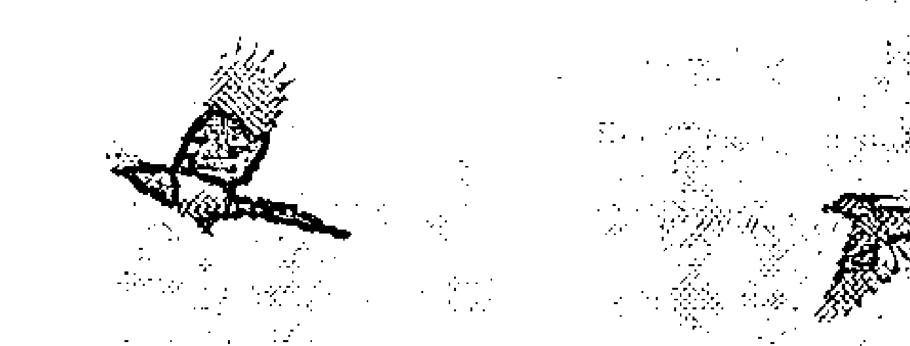
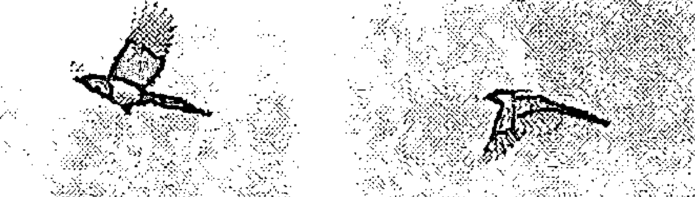

## 与神回家
*Home With God in a Life That Never Ends*
【美】尼尔·唐纳德·沃尔什 著
赵恒 译

中信出版社·CHINACITICPRESS

Franziska [模糊手写文字，包含疑似Müller、Gesicht等字样]

上架建议◎心灵励志

www.publish.citic.com
定价：30.00元

## 与神回家

Home With God
In a Life That Never Ends

【美】 尼尔·唐纳德·沃尔什 著

赵恒 译

中信出版社
CHINA CITIC PRESS

图书在版编目（CIP）数据
与神回家 / (美) 沃尔什著; 赵恒译. — 北京: 中信出版社, 2011.4
书名原文: Home With God: In a Life That Never Ends
ISBN 978-7-5086-2654-3
I. 与... II. ①沃... ②赵... III. 人生观 - 通俗读物 IV. B821-49
中国版本图书馆 CIP 数据核字 (2011) 第 018764 号

HOME WITH GOD: In a Life That Never Ends by Neale Donald Walsch
Copyright © 2006 by Neale Donald Walsch
Simplified Chinese translation copyright © 2011 by China CITIC Press
Published by arrangement with Atria Books a division of Simon & Schuster, Inc., through
Bardon-Chinese Media Agency
ALL RIGHTS RESERVED.
本书仅限于中国大陆地区发行销售

## 与神回家
YU SHEN HUIJIA

- 著者: 【美】尼尔·唐纳德·沃尔什
- 译者: 赵恒
- 策划推广: 中信出版社 (China CITIC Press)
- 出版发行: 中信出版集团股份有限公司 (北京市朝阳区惠新东街甲4号富盛大厦2座 邮编 100029)
  (CITIC Publishing Group)
- 承印者: 北京京师印务有限公司

| 项目 | 信息 | 项目 | 信息 |
| :--- | :--- | :--- | :--- |
| 开本 | 880mm x 1230mm 1/32 | 印张 | 10 |
| 版次 | 2011年4月第1版 | 印次 | 2011年4月第1次印刷 |
| 京权图字 | 01-2010-4840 | 字数 | 153千字 |
| 书号 | ISBN 978-7-5086-2654-3 / F · 2243 | | |

定价: 30.00元

版权所有 · 侵权必究
凡购本社图书，如有缺页、倒页、脱页，由发行公司负责退换。
服务热线：010-84849283
http://www.publish.citic.com 服务传真：010-84849000
E-mail: sales@citicpub.com
author@citicpub.com

# 译者的话
Home With God
In a Life That Never Ends

## 死亡，只是生命的地平线

> 维克多·雨果说：“人，都是迟早要被执行的死缓囚犯。”

然而，人们大多对死亡持回避态度。这情有可原。首先，死亡意味着失去，金钱、美貌、学识、声望、地位、亲情、友情、爱情等人生财富全都“死不带去”，因此死亡令人畏惧。其次，死亡意味着未知，他人死去后总是一去不复返（返回者的经历不被看做死亡，而是濒死），因此死亡实相是不可知的。在觉得死亡不必知、不可知的情况下，许多人将视野局限于物质实相内、将目标锁定在私人利益上、将生命投入到你争我夺中——无法自拔、无从超越。

《与神回家》是一本关于生死和生命的书。作为《与神对话》系列的最后一部，它为这套畅销世界逾千万册的图书画上了圆满的句号。先说说作者尼尔·唐纳德·沃尔什的故事。成名之前，这位老兄曾做过电台播音员、报纸记者、主编等，除了结婚、离婚的次数异于常人，其他好像并无过人之处；但在45岁那年，他经历了一系列吊诡的变故：遭遇车祸，颈部重伤，汽车被偷，妻离子散，无家可归，无以为业……公园为家、捡易拉罐为生的日子持续了近一年，他才重新找到工作。而就在生活刚刚有了好转之时，他又一次陷入深渊。这一次，尼尔出离愤怒了！ 1992年初春的一个凌晨，在极其绝望和满怀渴望中，他向上天发出挑衅般的呼喊：“要么给我答案，要么我自我了断！”于是，他“听到”了某种“声音”，开始与之“对话”并做下笔录。《与神对话》系列由此诞生，他也从此成为美国家喻户晓的畅销书作家。

尼尔自己声称的成书方式貌似罕见，其实不足为奇，陆游不早有诗云“文章本天成，妙手偶得之”？可见真正的高手都不敢贪天之功。然而，这套书的确给人“此曲只应天上有”之感，难怪能够风行全球、经久不衰。

徘徊在生死边缘之际，尼尔开始彻悟生命的真谛；最后，他又将生死话题作为这一系列作品的终结篇，其中显然大有深意——这是在告诉我们：死亡并非生命的终结，而是新的开始。

《与神回家》这本书旨在帮你克服对死亡的恐惧、助你理解死亡的真相。在尼尔看来，生命和死亡都是一种创造，是自我选择的结果，不管是濒死的人奇迹般起死回生，还是健康的人意外离开人世，所有的死亡都是自我选择，都是人们在超意识层次作出的选择。死亡并不可怕，它是与自我的完全融合，你到达了一个“认知”与“体验”为一体的地方，是一种生命的合一。

这本书的难能可贵之处至少有三点。首先，它不是语焉不详、软硬兼施的说教（如“行善的上天堂、作恶的下地狱”），而是丝丝入扣、温情脉脉的启示。其次，它不仅让你“知其然”，而且告诉你“所以然”。再次，它融会贯通了人类在宗教、哲学、科学领域的智慧成果，所用语言却通俗易懂，所设比喻更是令人叫绝。需要说明的是，书中所谓的“神”并非一个外在的主宰一切的超自然力量，而是人类关于生命的存在意识。与神对话，实际上是与本我的对话，是对人生终极意义与存在价值的深刻拷问。书中所谓的“后世”并非“来生”、“来世”之意，而是指死后的存在状态；书中所谓的灵魂，英文中的soul，指的是“精神”和“心灵”，而非“鬼魂”之意。可以说，尼尔用自己的方式，为我们描绘了一个全新的精神家园，赋予了生命新的含义。

作为译者，我不敢保证能百分之百地准确传递作者的原意，因为说实话，自己还不能百分之百地领悟或相信书中的内容；但在过去一年中，生命中的确出现了很多有意思的巧合，举三个不无关系的例子与大家分享。

第一个巧合是接手这本书的翻译。2009年6月刚读到英文版时，心里就想，能有机会翻译它就好了。年底从公司离职，春节过后，正想找些有意思的书来翻译，接到了中信出版社编辑苏毅的电话。她以前并不认识我，因为要为一本书找译者，在查阅旧文件时看到了我的联系方式。到出版社签翻译合同时，我跟她聊起《与神对话》系列书籍和《与神回家》。事后，去拜访另一编辑部的主编蒋蕾时了解到，他们刚刚买下《与神对话》作者所写的四本书，其中就包括《与神回家》。

第二个巧合发生在刚刚过去的大年初四。晚上我们一家人碰巧路过亚运村升旗广场，那里有人在放烟花。不知何故，有一桶烟花倒在地上，烟花弹开始沿着地面四散而飞，有一颗正撞到我身旁一棵树的树根处，发出“啪”的一声巨响，同时我的右脸被什么东西击中了，然后就是麻麻的感觉。正在这时，广场边上的灌木丛起火了，可能是另一颗烟花弹造成的。我正犹豫是否该报警，看见有个保安从旗杆下拿了一个灭火器去救火。我赶忙也去拿了一个，跟他一起把火扑灭。回家路上，我的脸开始渗出血迹。妻子不禁心疼起来，到家后，她还担心这不是个好兆头。临睡前，我打开电子邮箱，发现有一份2月5日的未读邮件。是我在www.nealedonaldwalsch.com网站上订阅的那种自动邮件，然后映入眼帘的是（翻译过来是）：

> 没有什么“不祥的预兆”，所以今天你不必躲避黑猫，或梯子，或人行道上的噼啪声。
> 记住，恶本不存在，唯思想使然。（莎士比亚）

这让我想起《与神回家》中的一句话：“世间没有偶然。”

按我理解，巧合就是自己的超意识对各种因素进行‘巧妙组合’；其实，巧合是自己的选择，是超意识给意识留下深刻印象的选择，是超意识为了某种目的而进行的选择。既然是自己的选择，那还何必区分“吉祥”或“不祥”？传说禅宗三祖僧璨曾写道：“至道无难，唯嫌拣择；但莫憎爱，洞然明白。”

第三个巧合发生在写这篇文章的过程中。我正构思之时，女儿在旁边问了我一个问题：“书上说地球是圆的，可我怎么看着地是平的呢？”

“那是因为你的视野不够大。以前人们不知道脚下踩着的东西是个球，可是在大海上，水手们经常看到，当远处的大帆船从视野中消失时，总是船身先不见，然后是船帆的底部、中部、顶端，当时就有人猜想……”

在跟她解释这些的时候，我突然想到《与神回家》中的一句话：

> “死亡，只是地平线。”

# 导言
Home With God
in a Life that Never Ends

这是逐字逐句记录下来的一场神圣对话。这是一场与神的对话，以“与神回家”为主题的对话。这是一系列非凡对话的最后一场；11年时间，9部书，近3000页文字，这一系列的对话触及人类生命与生活的所有方面。

这次的交流涉及人类经验的诸多方面，而且是以前所未有的深度，它探究一个特别的领域：死亡①、死去②，以及后世③。

对话一度进入灵性世界的最前沿——它是关于所有生命的宇宙论。通过比喻的方式，它为你提供有关终极实相的惊鸿一瞥。通过简练易懂的语言，它揭示出生活的意义、人类达至极乐的方式、人生旅程的本义，以及这段旅程的非凡终点——其实这个终点根本不是终点，而是一段插曲；它是你在愉悦而不间断的体验中要经历的一段心醉神迷的插曲，关于它的完整描述超乎一般的想象。

对话是盘旋进行的。它像一个弹簧：弹起来时，将触角伸进令人瞠目、闻所未闻、超乎想象的崭新领域；压下去时，回归老地方，以确保下一次令人震惊的探索有坚实的起点。如果你耐心阅读本书——以及你自己的生活——它将给予你无比丰厚的回报。

《与神回家》传递的信息，或将成为有史以来人类收到的最具希望、最有帮助的信息之一。

有一点对你很重要，就是要理解你是如何进入这场对话的。如果你以为事出偶然，就会错过正发生在你身上的重大事件。

你的灵魂已引领你进入这场对话，一如它曾引领你与神进行的每次对话、任何形式的对话。它巧妙地将这些书页呈现于你眼前。就在此刻，不计其数的条件以精确的方式、在精确的时间结合起来，就为将你温柔地拉向这里的字字句句，而且，只有你最神圣的灵魂出手，此事才会发生得如此轻而易举。如果你明白这一点，就会以完全不同的方式领略这些文字。

你被引领到这里，是因为这个宇宙知道，你一直在默默地呼唤答案，全人类都在追问的问题的答案。人生到底是怎么回事？人死后会怎样？我们会跟过世的亲人重逢吗？神会在那儿迎接我们吗？会有末日审判吗？我们会下地狱吗？我们能进天堂吗？我们死后还能知道所发生的事吗？还会有事发生吗？

这些问题的答案包裹着巨大的启示，对于人类每一生命的巨大启示。如果我们真正拥有了这些答案，我们的生活会完全改观吗？我认为，会的。如果我们不惧怕死亡，是否就不惧怕真心真意地生活，即无所畏惧、充满爱意地生活？我相信，答案是肯定的。

我痛心地了解到，有那么多人在即将进入下一世界时都感到恐惧，更别说他们在今世生活时。生命本是永恒的快乐，而死亡则是更大的快乐；如果能够平静地接受、幸福地期待，那么死亡会是无比美妙的事情。

我的母亲就是如此，她完全平静地面对自己的死亡。一位年轻牧师为她主持最终祷告后从屋里出来，一边走还一边摇着头。

> “她刚才还在安慰我。”

他低声说。

妈妈有一种不可动摇的信念，即她正在走向神的怀抱。她知道生命是什么，也知道死亡不是什么。生命就是将你的所有献给所有你爱的人，毫不犹豫、毫不质疑、毫不保留。死亡不是任何东西的结束，而是一切的开启。我记得她经常说：“我死的时候，你们不要难过。在我的坟前跳舞吧。”妈妈觉得，在她一生之中，神一直在她身边——而她死去之时，神仍会伴她左右。

> “我死的时候，你们不要难过。在我的坟前跳舞吧。”

但是，在某些人的想象中，无论是生是死，神都不在，那么他们会怎样呢？那或许会是非常孤独的生命，以及非常恐怖的死亡。在这种情况下，最好是不知不觉地死去。

这就是我父亲的死法。一天早上，他从安乐椅上站起来，挪了一小步，就摔倒在地上。医生几分钟后赶到，但一切都结束了；我敢肯定，父亲根本没想到，那竟是他在地球上的最后时刻。

妈妈知道她正在死去，而且我认为，她之所以让自己知道，是因为她能够平静而喜悦地面对它。爸爸做不到，所以他选择突然离开。根本没时间去想：“哦，天哪，我要死了。我真的要死了。”

> “哦，天哪，我要死了。我真的要死了。”

同样，我不认为他在 83 年的岁月里曾对自己说过：“哦，天哪，我真的活着。”而妈妈知道，她每一分钟都在“真的活着”。她了解这一切的神奇与魔力，但爸爸不了解。

我父亲是个有意思的家伙，他关于神、生活、死亡的想法是自相矛盾的。他不止一次地跟我说，他对日复一日所发生的一切完全是一头雾水，还有，他对死后发生的事情一概不信。

我记得，在他去世的两年前，我跟他进行过一次深入交流，他当时对自身的存在进行过反思。那次谈话时间不长，我问他对生活的意义有何看法，他几乎毫无表情地看着我说：“我对这个一无所知。”后来，我又问他认为死后会发生什么，他回答说“什么都不会发生”。

我请他不要回答得这么简单。

“黑暗，终点，一切都完结了。你睡着了，然后不再醒来。”

我感到沮丧。随后是一种尴尬的沉默，为了填补这种冷清，我连忙拿话安慰他，说他肯定错了，肯定有一种奇妙的体验“在另一边”等着我们。我刚开始描述我所想象的死后景象，他便不耐烦地一挥手，打断了我的话。

“狗屁。”他咕哝一声。交流就此结束。

我十分震惊，因为我知道父亲是个什么样的人，他甚至到 80 高龄时，还每晚跪下来作祈祷。我很奇怪，如果他不相信生命是神圣的，不相信死亡只是个开始，那他向谁祈祷呢？他又在祈祷些什么呢？或许他在祈祷他自己是错的，或许他是在绝望中抱有一线希望。

本书要献给所有与我父亲想法相似的人，所有或许只是抱有一线希望的人。它还要献给很多人，就是那些不知道死后发生什么，因而无从深入理解生命事件及其原因的人；那些从未觉察生命原理的人；那些迷惑不解的人，那些并不困惑、认为对这些略有所知，但偶尔怀疑自己是否正确的人……还有那些被吓怕的人。

本书还要献给上述类型以外的一些人：他们想帮助上述那些人，但可能不知道如何去做。对于将要死去的人，你要说什么？你如何去安慰活着的人？在这样的时刻，你会对自己说什么？这些问题不太好回答。所以，你瞧，这就是你引领自己来这里的原因。

你知道的，你能找到这些篇章真是个奇迹。或许，这的确只是个小小的奇迹，但小奇迹仍然是奇迹。我相信，事情就如我前面说过的那样。我相信，你的灵魂之所以召唤你看到本书，那是出于一种冲动；正是这种冲动在召唤我们每个人向前进、迈出下一步、进入更深的理解，并最终达至神圣。

没有人必须跟随这种冲动，我们可以在任何时刻改变路线。我们可以选择另一方向，或者，我们可以原地不动，很长时间哪儿也不去，在我们的困惑中兀自停留。然而，我们还将再次前行，而且，我们最终不可能错过目的地。

这个目的地对我们大家都是一样的。我们都在回家的路上，我们不可能回不了家。神不允许发生这种事。

这三句话，就是整本书要传递的信息。

> 每个人做任何事都是为了自己……
> 这一道理同样适用于死亡，
> 你将不再惧怕死亡。

无论生前还是死后，你都不可能缺少神的陪伴，但你可以不这么想。

如果你认为自己生前死后都无神存在，你就不会体验到神的存在。

你想让这种体验持续多久，它就会持续多久。如果你选择结束这种体验，它就会结束。

我相信这些神圣的话语，我相信它们直接来自神。过去四年中，这些话语一直浮现在我的脑海里。现在我明白了，它们是向我发出的邀请，是来自神的邀请，是开启一场更加宏大对话的邀请。

说得对。为确保进行这场更加宏大的对话，每当你认真思考生死问题时，我就让那些话进入你的脑海，即便那只是你片刻的思考。对于这场对话，你一直犹犹豫豫，一拖再拖。

是的，我知道。不是我害怕深入地探讨生，甚至死，而是这些话题极其复杂；所以在进入这场高深的对话之前，我要确保自己作好了充分准备，作了心理准备，当然，还有精神上的准备。

你觉得现在准备好了吗？

希望如此吧。我不能再拖延下去了。如果我继续拖延，你还会塞给我那些话。

说得对，我会的。因为我就是要让你听到那些话，无论你是否继续其余的对话。

好吧，我已经听到了。

我想让你反反复复地听：

无论生前还是死后，你都不可能缺少神的陪伴，但你可以不这么想。

如果你认为自己生前死后都无神存在，你就不会体验到神的存在。

你想让这种体验持续多久，它就会持续多久。当你选择结束这种体验，它就会结束。

对于任何惧怕生或死的人，这些话语包含了他们所需的全部信息。

那我们的对话可以就此结束了。

是的。不过，你愿意获得多深的理解呢？如果你选择继续这场对话，我会附赠你《所有生命的法则》。

你这是在引诱我。

就是要引诱你。

引诱有效。我可不想让这场对话这么短。所以说，我要与神进行关于生与死的对话，一场新的对话。

是的，还会谈到很多从未涉及的东西。

谁会相信这一切……

没关系。这场对话不是为了别人，而是为了你自己。

我必须不断以此提醒自己。

人们经常以为他们做某些事是为了别人，但其实是为了他们自己。

一个人做任何事都是为了自己。当你觉知到这一点时，你就到达了突破点。当你理解这一道理同样适用于死亡时，你将不再惧怕死亡。而当你不再惧怕死亡时，你将不再惧怕生活。你将尽情享受生活，直至最后时刻。

且慢。稍等一下。你是说，当我死时，我是在为自己做这件事？

当然。如果不为自己，那你为了谁？

回答了关于死的问题，也就回答了关于生的问题。

好，我们有了个有趣的开头。这是个玄妙的论断。

玄妙的论断还有很多，这只是第一个。不过，我们的谈话将进入很多地方，这些地方不但玄妙，而且会让人觉得难以置信。你来这儿寻找的回忆就具有这种特质。

回忆？

我在以前的对话中说过这一点。你不需要学习，你只需要回忆。我们即将进行的对话，以及我们所有的对话，都将帮助你回忆，引领你进入一系列有关生与死的回忆。

你会注意到，这些回忆多与死亡有关。这是特意的设计，通过加深对死亡的理解，你将很快加深对生命的理解。

有些回忆可能令人惊讶，因为它将挑战你的种种成见。有些则让你感觉毫不意外，一听到，你就会觉得其实你一直都知道。这些回忆合在一起，将指引你找回你自己，将帮你忆起关于“与神回家”的所有道理。

人类已经等了很久了，我们需要一场新的对话来解释这些重大问题。在大家的集体意识中，我们所秉持的观念大多来自久远的过去。在此我们可以利用一些“新的智慧”。

宇宙的全部智慧已化为每个人灵魂深处的印记，成为所有人与生俱来的本领，存在于一切生命的遗传基因中。事实上，你可以将“遗传基因”理解为“神圣的自然觉知”(Divine Natural Awareness, DNA)。

每一个生命的内在都拥有这种自然觉知。它是系统的一部分，是你们所谓的生命过程的一部分。所以当人们聆听大智慧之时，往往会感觉那么耳熟，几乎立刻就接受了它，毫不争辩，只有回忆。它是人们“神圣自然觉知”的一部分，也可以说它“在人们的遗传基因中”。它给人的感觉就是，“啊哈，没错，当然是这样”。

所以，我们现在正式开启这场新的对话，帮你忆起那些你一直知道的东西。让我们用一种全新的方式来讨论这些事项，以便你更新自己的细胞记忆，找到回家的路。

我活着的时候就可以回到神的家中，对吗？我是说，我不必等到死才能回“家”，对吗？

对。

那么——你再说一遍，以便我能理解透彻——为什么那么多的“回忆”都跟死亡有关？

死亡是生命最大的谜团。解开这个谜团，一切将被开启。
回答了关于死的问题，你也就回答了关于生的问题。
然后你将知道，如何不必死去也能与神回家。

我明白了，很好。

但是我要提醒你一点：不要期望或在脑中建立一种预期，即要求每个人必须“明白”这里所说的要点。如果你那样做，就可能忍不住要“修订”这场对话的内容，以使尽可能多的人去理解它、接受它。

嗯，我不会那么做的。

如果别人排斥或嘲笑我们的讨论，你可能会冲动。

不会的。

这场对话的某些部分——尤其我们谈到关于生命的宇宙学时——会让很多人感觉“荒谬透顶”。

我坚信，接下来的探索和心智旅行将增强你深刻理解生死真义的能力——但是，有些内容可能显得匪夷所思、深奥难懂，你真的会产生冲动，想去修订它们。

不会的，不会发生那种情况。我保证原原本本地记录和呈现我们的对话，一字不落地展示你要表达的意思。

很好，那我们继续。

这是……

## 回忆之一

死是你为自己做的事。

这种说法耐人寻味，因为我不认为我自己会为任何人“做这件事”。实际上，我根本不认为死是做什么事，我将它看做发生在我身上的事。

它的确发生在你身上。而且，它还是通过你发生的。

发生在你身上的所有事情，都是通过你发生的。而且，通过你发生的所有事情，都是为了你。

我从没想过“死”是我有意要做的事——更别说是为我自己做的事。

你就是在为自己做这件事，因为死是美妙的。而且，它还是你在“有意”做的事，随着对话的深入，其背后的原因会越来越清晰。

死是美妙的？

是的，你所谓的“死亡”确实非常美妙。所以，当有人死去时，不要悲痛；当自己的死亡来临时，也不必伤心难过或以为大祸临头。像迎接新生命一样欢迎死亡吧，因为死亡是生命的另一种形式。

以温柔的庆祝和深深的幸福感来迎接他人的死亡吧，因为前方是奇妙的愉快旅程。

有一种方法，可让你平静地体验死亡——自己或他人的死亡，那就是在心中知晓，每位死者都是其死亡的原因所在。

而这就是……

## 回忆之二

你是你自己死亡的原因所在。无论你死于何地、如何死去，这一点都永远正确。

### 3

### 你以为死亡违背了你的意愿？

天哪，你真是敢说。但这真是令人难以置信的说法。

生命有其内在原理，我们将对其中的一小部分作较深入的了解，这样一来，你就可以更牢固地掌握这些回忆。

在我们充分探讨这些基本原理的时候，你将认识到，你们所谓的“死亡”其实是一种强大的创造时刻。

瞧瞧，又一种耐人寻味的观点。死亡是一种“创造时刻”？

它将是你遇到的最强大的时刻之一。它是一种工具，按其本意去使用它，死亡就具有异乎寻常的创造力。关于这一点我也将在后文解释。

死亡是一种工具？死亡不就是个“入口”吗？

它是个入口，但它是个神奇的入口，因为你以什么能量穿越这个入口，就决定了另一边有什么。

好了，好了，打住。你已经搞得我上气不接下气了。我们能不能放慢点？能不能先倒回去填几个空？你刚说的话让我冒出了好多问题。

我们会探讨你所有的问题，回答每个问题。

好极了。那我们先从这种观念开始：把死亡作为一种工具。对我来说，这是一种崭新的思想。工具是人们为达到某种目的所使用的东西，是人们愿意使用的东西。但我不愿意死，没人愿意死。

每个人都愿意死。

每个人都愿意死？

当然，否则没人会死。你以为死亡违背了你的意愿？

肯定有很多人这么认为。

没有任何事的发生违背你的意愿，那是不可能的。
接下来是……

## 回忆之三
你的死不可能违背你的意愿。

如果把这话当真，它确实让人心生安慰；如果相信它，它确实会有良好的疗效。但是，如果我经历的很多事都不是我想要的，那我怎么可能接受这种说法？

无论发生什么事，那都是你想要的。

任何事情吗？

任何事情。

事情发生了，你可以想象那不是你想要的，但那不是事情的本来面目，而你的想象使你把自己看做受害者。
最能阻碍你进化的想法莫过于此。受害的观念是局限性认知的确定标志，但真正的受害并不存在。

要是某人的女儿被强奸了，或他整个村庄的人遭到了罪恶的“种族清洗”，我们却告诉他“没有人受害”……该死的，这也太难了。

在人们受难时，以这种方式跟他们交流不会有任何益处。在这种时候，你只需带着深深的同情、真正的关怀、温柔的爱心跟他们在一起。不要把精神说教或理性思辨作为治愈伤痛的药方。先得治愈伤痛，然后再去治愈造成伤痛的思想。
当然，人们普遍会认为，生活中的确存在极端事件或极端环境中的“受害者”。然而，只有以通常的，因而局限性极大的人类觉知作为前提，这种受害的体验才会是真实的。

在我说真正的受害不存在时，我处于一个全然不同的觉知水平。当人类的伤痛被治愈后，他们也能达到这种觉知水平。

我认为，你的说法令很多人难以接受，无论他们是否处于情感的伤痛中。

我这里所说的并不过分，多少个世纪以来，世界上几乎所有的传统宗教都这样说过。“神秘是主的方式，”他们宣称，“要信任神的完美设计。”

在后面的对话中，我们将有机会探索“完美设计”的概念，而且，我们还会探究这样一个过程：众多不同的灵魂如何互动，为了某种特定而完美的原因，通过某种特定而完美的方式，在地球上创造出个人与集体的生命结果。事实上，我会让你给我举个例子。

让我举例子？

对。而且那时你将完全明白我说的是什么。不过现在，你只需心里默默地想：所有事情的发生都是完美的。

我会这么做。我会保留这种想法，像你要求的那样，在心里安放好它。但是你走得太快了，你进展得相当快。我们的谈话刚开始一会儿，你已经……我能这么说吗……已经腾云驾雾了。我没有不敬的意思，但是，这场对话要去向哪里？

去向你一直想去的地方。
那个地方是……？
真相。

> 除了你内心的真相，没有真相。
> 其他都是别人告诉你的。

嘘，这种说法我听多了。每个人都想告诉我，他能指引我找到真相。

没错，但是只有一个人能把你带到那儿。

是谁，你吗？

不是。

那是谁？

你。

我？

对，就是你。只有你才能把你带到真相的所在，因为真相只存在于一个地方。

别跟我说……就是“我的内心”。

没错。除了你内心的真相，没有真相。其他都是别人告诉你的。

包括你刚才说的这些！

当然，千真万确。

那我们的对话还有什么意义？还有，听别人讲道理还有什么意义？

我并没有说外在于你的一切都无法指引你走向你的真相。我说是，只有你能把你带到那儿。

但是，如果我自己知道通向生死真相的道路，我就不会来问你了。就不会有现在这场对话了，对不对？

我认识的很多人都为此而祈祷。他们面临最深层次的生死问题时，就会祈祷能得到答案，得到指导。而当人们向神祈求答案，然后得到答案，而且经常是非常明确的答案时，他们会说，神回应了他们的祈祷。

你可能会说，这就是我现在的体验。这给我的感觉、这场对话给我的感觉，就像某种形式的祈祷，我通过祈祷得到答案。

你的论述很精彩，因为它碰巧是真的！

所以我正记录这整场对话、这整个过程。我正把它全部记下来。

只是要小心，别给他人造成一种印象，让人以为道理在他们心外，而他们必须去别处寻找答案，比如你那儿。要小心不要造成一种让别人羡慕你找到了通往真相之路的局面，因为他们会要你给他们指路，这会起到反作用，甚至带来危险。

危险？

当他人开始相信你能得到神的答案，而他们不能的那一天，你就危险了。所以，无论如何要确保世人不会那样看待你。有句话对你很有用：不要让世人把你塑造成特例。

要千方百计将自己“去特殊化”。当然，你的确特殊。我这里的意思是，要消除他人心中你比别人更特殊的想法。

你有何建议？

想办法使自己完全不符合人们心中所想象的你——“圣人”或“宗师”。搞一个摇滚乐队，去说单口相声，或者开一家保龄球馆。

没有开保龄球馆的圣人吗？没有说单口相声的宗师吗？

开玩笑吧？他们全都是。

哦。

只是人们不这么认为，这是要点所在。所以，要做些出格的事，让人们去挠头，让人们去否定你的特殊，甚至让他们去指责你太不特殊。

见鬼，只要告诉他们我的人生经历就足够了。我犯了那么多错误，做了那么多无人认可的事情，任何人都不可能把我放到一个特殊的位置上。

你的确是一个不完美的信使——但你因此而完美。

因为没有人会将信息与信使混为一谈。

不可能混为一谈，除非你允许他们那样。所以继续本分地做人吧，对于你犯下的所有错误，无论现在的还是以前的，宽恕你自己吧，也请求别人宽恕。然后走出去告诉每个人，他们寻找的答案就在他们内心。

跟人们这么说没错，但是这种话已经是陈词滥调了，不过是让人耳朵听出茧子的格言警句。

可是，我来这儿就是要告诉你你所需要知道的一切，你出生时就已知道的一切。而事实上，你来到世上就是为了展示它。

你这些说法让人觉得……我不知道……与我们的实际体验联系不起来。当我体验到有那么多东西需要学时，又怎么相信每个答案都在“我的内心”，而且是与生俱来的？

你什么都不需要学，你只需回忆。生命是成长的过程，成长是神性的临在与表达。所有生命都这样运行。

想想你窗外的那棵树。它已有五米高，能以巨大的树冠供你纳凉，但它现在所知的，并不比它还是一颗种子时多。能长成今天这样，所需的全部信息都已包含在那颗小小的种子里。它什么都不需要学，它只需要成长。为了成长，它利用细胞记忆里锁定的信息。

你与树并无不同。

> “甚至在你提问之前，我已作出了回答”。

是的，是的，但是……好吧，我还得再问一次……那这场对话的意义何在？为什么还要跟别人谈论问题，更别说向神祈祷或与神对话？

就算树也需要阳光促进它成长。

所有生命是相互联结的。整体的某一方面（或个体化的整体）不可能独立于其他任何方面（或个体化的整体）。生命在互动中不断创造，我们在互助中产生结果，而我们可以产生结果的方式只此一种。

你与他人的对话以及你从外部世界获得的所有信息，就像太阳的光芒，促使你内在的种子成长壮大。

你外部世界的很多东西可引导你走向内心的真相。然而，就连这些人、地方、物体、事件也只是提醒，它们就像是路标。

实际上，这就是“外部世界”的全部意义所在。物质世界的设计意图就是成为你的背景，在这个背景中，你可以从外在体验你内心所认知的东西。

因此，我实际上受益于我周围的世界、当前状态的世界。

所有人都是如此。所以我说过，当你看到这个世界和所有发生在你身上的事时，“勿评断，勿谴责”。

我们继续用树作为这部分谈话里的朋友，让它帮我们更深入地理解。

想象你已走出空地，进入了森林深处。你以前从未如此深入一片森林，你知道，要再次找到空地可能有点儿困难。所以，你边走边在树上留下标记。

现在，当你离开森林时，你看到那些标记，然后记起是你把它们标在那儿，那样你就可以找到出去的路。

这些标记是外在于你的。它们将指引你最终回到家，但它们不是“家”本身。这些标记为你指示踪迹、途径、道路——而这条道路让你感觉很熟悉，你认识它。也就是说，你本就“认得”它，现又“识出”它。然而，道路不是目标，只有你才能把你自己带到那个目标。

他人可以为你指引途径，他人可以向你展示他们的道路，但只有你才可以将自己带到那个目标，只有你可以决定与神回家。

你的外部世界就是途径，其本来意图就是指引你回家。实际上，你外部世界的所有事件也出于同样意图。这就是你把它们安排在那儿的原因。

它们就是树上的标记。

是的。

那么，让我外部世界的一切各就各位，以便我能指引自己回归内在真相——就是你刚才所说的意思，对吗？

正是我所说的意思，你理解得完全正确。

如果确实如此，那么从某种意义上说，是我把这本书放到了我自己手中。

正确。

我“使得”这本书的内容找到我，使它现在这样找到我。它是一个路标，它是树上的一个标记。

现在你看透了，这件事的本来面目就是如此。

但是，如果外部世界的所有事物都是路标，那还会有什么更重要的事物呢？就像沿着街道走路，到了交叉路口，发现所有路标指向不同的方向，但上面都写着：回家的路。

现在你真的看透了。

看在老天的分儿上，你到底在说什么？

我在说，无论走哪条路，你都能回家。

所以我选哪条路都不要紧。

是的，不要紧。

我选哪条路都不要紧？

完全、绝对、肯定不要紧。

那我为什么选这条路而不是那条路？如果所有路都是回家的路，那我要选择的路还有什么差别？

有些路要好走些。

### 6

无论如何，不要相信这里所说的话。

啊哈！有些路就是比别的路更好。

“好走”是一种事实描述，“更好”是一种评断。这种观察将我们带到……

## 回忆之四

回家的路有很多条，没有哪一条更好。

你肯定吗？求求你，亲爱的神，求求你，我需要你非常确定这一点。地球上几乎所有宗教表达的意思都与之恰恰相反。

我再跟你说一遍，这样就明确了：回家的路有很多条，没有哪一条更好。

所有的路都能把你领回家，因为到达那里所需的一切就是：真正的欲望、单纯而开放的心，还有对神的信心。你要相信，无论对任何人、出于何种原因——当然也不用说他们以另一种方式相信神，神都没理由说，“不，你不能跟我在一起”。

真正的宗教都是美好的，真正的精神教导都是通向神的道路；没有哪种宗教、哪种教导比其他的更“正确”。通往山顶的路不止一条。

人类之所以创立宗教，是为帮助生长于这些文化中的人知道并理解：有一个时时刻刻存在的源泉，它在你需要时提供帮助，在你困难时提供力量，在你迷惑时提供清醒，在你痛苦时提供同情。

宗教还是人类本能觉知的展示，而仪式、传统、礼仪、习俗都具有巨大的价值，它们标志着某个民族在世界上的存在；作为黏合剂，它们把民族文化凝聚起来，确保了某个民族的存在。

每种文化都以其美丽而独特的传统尊崇一个美丽而核心的真相：生命中还有比个人欲望甚或个人需要更宏大、更重要的东西；生命本身是一种体验，其程度之深刻、意义之深远，远远超过很多人最初的想象；还有，只有在爱、相互关怀、宽恕、创造性、趣味性及携手努力共达目标之中，人类才能找到最深层的满足感和最神奇的喜悦感。

那么，你们每个人，选择自己的归“我”之路吧。踏上你自己的回家之旅，不要担心或评断别人的路。你不可能错过“我”，他们也一样。实际上，到“家”的时候，你们将再次团聚，你们还会感到奇怪，你们当初怎么那么挑剔呢。

是啊，我们还争论，对吧？我们无休止地争论。我们吵架、打架，我们还杀人，甚至为之牺牲，因为我们坚持认为，自己的道路才是通向天堂的正确道路——而且是唯一正确的。

是的，是这样。

但是此时此刻你告诉我，“没有哪一条路更好”。那我就得轻轻问一句，我怎么能相信这句话？我怎么知道要相信什么？

无论如何，不要相信这里所说的话。

你说什么？

不要相信我所说的任何话。聆听我说的话，然后让你的心告诉你，什么是真的。因为你的智慧潜藏在你心中，你的真相居住在你心中，而正是在你心中，神与你水乳交融。

我只有一个要求。

什么要求？

请不要混淆了你的心（heart）和你的心智（mind）。你的心智储存着别人放进去的东西，而你心中保存着的东西来自于我——由你“携带”着。

不过，你可以向我关闭心之门，很多人这样做，而还有很多人连心智也关闭了。

请千万不要对别人说：如果他们不相信你的心智，我就会谴责他们。

最后，无论如何，你不可打着我的名义谴责他们。

我们总是这么做。我们好像不知道如何停止，我们使自己过着十足的地狱生活。

不过有个好消息要带给你：人类无须经历地狱也可上天堂。

就是说，我们甚至不必走入那些令人头晕的森林，在那儿我们还得做标记才能走出去，我们可以绕过它们。

说得对。

无论从路边看那片森林多美丽、多诱人，我都不必走进去，不必迷失其中，然后再寻找出来的路。

是的，你不必。

每天我都向自己承诺，一定要在路上坚持，但每天都受到生活的诱惑，陷入各式各样的"戏剧"中，而这些戏剧与真正的我毫无关系，与我要去的地方也毫无关系。在我明白之前，我又身在森林当中了。

而且你现在还没走出森林。

我知道。我脑海里老是回响罗伯特·弗罗斯特的诗句。我以前听过这些诗句，但现在的感受却是全然不同……

> 森林美丽、幽暗而深邃。
> 但我仍有诺言尚待兑现，
> 还要奔行百里方可沉睡，
> 还要奔行百里方可沉睡。

那现在就随我一起来吧。让我们一同返回空地，在那里，你最终可以“既见树木又见森林”。

好的，我们现在就走向“明晰之地”。我总是处于森林里，总是满怀冲突与困惑在黑暗森林里磕磕绊绊，所以我现在真的想“回家”。但是，最短的路不是更好的路吗？我是说，不是越短“越好”吗？还有，哪条路是最短的呢？

要回答这个问题，我们必须对这里所说的“家”下定义。人们要回的“家”到底是什么呢？

很多人认为“回家”意味着回归神。但是你不能回归神，因为你从未离开神——你的灵魂知道这一点。你在意识层次可能不知道这一点，但是你的灵魂知道。

可是，如果我的灵魂知道我无须回归神，因为我从未离开神，那我的灵魂要做什么呢？从灵魂的角度看，地球生活的意义是什么呢？

我可以用七个字回答你。你的灵魂追求“体验它所知道的”。你的灵魂知道，你从未离开神，而且它的追求是体验这一点。

生命是一个过程，通过这一过程，灵魂将“认知”转化为“体验”，而当你所知、所体验的东西成为一种被感知的现实，这个过程就圆满了。

其实，家，是一个叫做圆满的地方。

家是对于真我的圆满觉知；这种觉知通过圆满的认知、圆满的体验、圆满的感觉达成，并结束你与神性的分离。

这种分离是一种幻象，你的灵魂知道这一点。因此，圆满还可以定义为分离结束的时刻，你与神性再次合一的时刻。

这并非真正的再次合一，因为我与神性从未两分，但是如果我忘记了这一点，那它就像是合一。

说得对。在合一时刻所发生的事就是，你忆起了你的真我，而且体验到你的真我。

所以，在某种意义上，它是“回归神”，但这只是一种比喻的说法。严格说，它是回归你的觉知，对“你从未离开神”这一事实的觉知，对“你与神一体”的觉知。

是的！而且回归觉知是一个双重的过程。觉知的达成是通过认知和体验，由两者又产生感觉。
觉知就是对你所认知与所体验的东西的感觉。
认知是一回事，体验则是另一回事，感觉又是一回事。
只有感觉能产生完整的觉知。若单是认知，只能产生部分的觉知。若单是体验，也只能产生部分的觉知。
你能认识到你是神圣的，但只有体验到你自己是神圣的，你才能通过那种感觉达到圆满的觉知。

你能认识到你具有所有的神性——比如你是慈悲的——但只有体验到你的本我是慈悲的，你才能通过那种感觉达到圆满的觉知。

你能认识到你是慷慨的，但只有体验到你的本我是慷慨的，你才能通过那种感觉达到圆满的觉知。

你能认识到你是深情的，但只有体验到你的本我是深情的，你才能通过那种感觉达到圆满的觉知。

我经常对自己说，“我今天感觉很不好，觉得不像我自己了”，现在我才彻底理解了其中的含义。

当你“感觉不像你自己”时，不是因为你不知道你是谁，而是因为你没有体验到。你必须为认知加上体验，才能得到感觉。

感觉是灵魂的表达方式。通过圆满感觉“你的本我就是你的真我”，就可以获得对本我的觉知。

觉知是个双重的过程，所以有两条路可以通向觉知。沿着精神世界的道路，灵魂得以圆满地认知；沿着物质世界的道路，灵魂得以圆满地体验。两条路都是需要的，所以有两个世界存在。将两者合在一起，你就得到一个完美的环境，从中创造圆满的感觉，而这种感觉最终产生圆满的觉知。

其实，家，是一个叫做圆满的地方。

## 7

> 所有灵魂在死后找到平静。
并非所有灵魂在死前找到平静。

真是言简意赅的解释，我们所谓的生命体验就是这样的过程。

我们的体验还远未结束。死亡的最深谜团即将揭开。这场对话只刚刚触及皮毛。

现在让我们更深入地审视你的上一个问题。

你问最短的路是不是最好的回家之路。答案是，不一定。带给你最大好处的路，其实是带你实现圆满的路——无论路有多长。

完全觉知即圆满地认知、体验、感觉你的真我，这一时刻的来临需要分步骤，或者说分阶段。一世的旅程可看做其中的一步。

没有哪个灵魂只用一世就实现完全的觉知，它是生命循环中多段旅程的累积结果，由此产生所谓“圆满的圆满”，或称“完全的觉知”。

每段旅程结束之时，就在那段旅程的任务或使命完成之际。

这一世结束之时，就在你完成这一回到物质世界的体验之际。

然后，你将这次完成的旅程与所有时间的其他旅程相加，直到最后你“包容一切”，达到完全的觉知。

那么就有两个层次的圆满。第一层次是完成了全部过程中的一步，第二层次是完成了整个过程本身。

是的。当你完全认识到、完全体验到、完全感觉到“你是谁”时，整体过程就完成了。

解释得真精彩，我懂了。众灵魂到地球来，要去完成、去体验很多具体事情。当它们完成之时，我们该感到高兴才是，因为它们在这儿的工作完成了。

你的确懂了。好极了！说得完全正确！

而且，“越短”不一定“越好”。目标是圆满，而不是快速。

正确。

真棒。我现在又自我感觉良好了，因为我还没完成来这儿的使命，而我现在快60了。

什么使命？

我不能确定。

那要完成就很难了。

我知道，这是我的问题之一。

或许我们该讨论一下。

我觉得讨论一下肯定对我有好处，但我现在真的不想岔开话题。你前面说，有些回家的路尽管不一定“更好”，但它们的确比别的路好走，我对这个很感兴趣。

走障碍少的路，就更容易些。

同意。那我怎么能找到这样的路？

你找不到。你得走出一条路。

怎么做？

你现在就在做。愿意选择这样一条路，你甚至可以使事情变得更容易。很多人在生命中穿行，却从未想过“上路”。他们不学习，不祈祷，不冥想，他们从不注意自己的内心生活，也不认真探索更大的实相。而你现在正在做，通过当下进行的探索——你正在进行的这场对话——你正在走出一条比较好走的道路。

我在这里要说的是：无论你是选择了弯路还是直路，无论你是穿过森林还是绕过它，当你获得你关于生命、生活、死亡、死去的真相时，你将清除这些障碍，开辟出一条不太艰辛的圆满之路。

一旦你完全了解了死亡，你就可以充实地活出自己的人生，然后你可以完全地体验你的本我——这正是你来此要做的事——然后你就可以在优雅与感恩中死去，并自觉地意识到，你是圆满的。这条路要好走得多，它通向非常平静的死亡。

有些东西听起来像是对我的评断，几乎就是命令。“如果你没有好好死去，那你就做错了”，诸如此类。

是是你在评断，而我从不评断。没有方法可以让你“错误地”死去，也没有方法可以让你错过目标——而这个目标，就是在你本体的核心（即你的存在核心，core of your being）与神性幸福地重聚，同样，没有方法可以不让你“与神回家”。

我们正在讨论的是如何使你的生死减少艰辛、更加平静。你所指的那段话是我的观察分析，不是评断。就你当前身体所要经历的体验而言，如果你轻松地达到了圆满，并因此优雅而感恩地死去，那么你在死前就已经找到了平静，而不是在死后。

所有灵魂是在死后找到平静，而并非在死前找到平静。

当你死去时，你是不可能不圆满的，只是你有可能意识不到到这一点。“平静”就是清醒地意识到你是圆满的。没有什么事再需要你去做了。你已经做完了，结束了，可以回家了。

假如你是在恐惧与战栗、焦虑与颤抖中走向死亡，不想放手，感到还未结束，或对生命中已有或将要来的东西感到害怕，那你仍将达到你的目的地。你不可能到不了那儿。

但是那将更加“艰辛”，是不是？

是的。

有件事我们要弄清楚。你一直沐浴在神性之中，你现在就沐浴其中。实际上，你就是神。你作为神的个性化缩影，表达着神自己。

因而，在最真实的意义上，你不在回家的路上，你已经在家里了，你一直与神在一起。

你已经在你要去的地方。关于这一点有个非凡的秘密：知道了它，你就立即能体验到。

我们现在好像是在兜圈子。我是指，在这次对话中。就好像我在梦游，不知道自己在哪里。

不只在这次对话中，在你的生活中也是如此。

当你生活在（或死于）恐惧与战栗、焦虑与颤抖之时，当你不想放手或对生命中已有或将要来的东西感到害怕之时，你就是在展示，你不知道自己在哪里。而这里的问题就是：你展示什么，你就在体验什么。

一贯如此。

因此，你无法体验自己与神性的合一，你无法体验与神的团聚，尽管你就在这里。

信不信由你，我确实在努力理解。你进行得太快了，问题又这么复杂——尽管我早知道会是这样——但我确实在努力理解。

既然如此那就跟上我，跟紧了。这些你都已经知道了，我只是在唤醒你。

你并不是在一个通往神的旅途中，但你确实是在一个永恒的过程之中；行进于其中，你会体验到越来越多的神性。随着生命的继续，你对你本体之核心的体验越来越多，对“你是谁”的本质的体验越来越多。

你与这种本质一直聚合在一起——而且，作为生命过程的一部分，你会再从它那里分裂出来，作为对它的重新表达。

这个过程我们可称之为“能量的聚变与裂变”，它是所有生命的基本规则。

因此这种事件有时被称为“变故”。
死亡与死去就是这么回事。
“死亡是一种变故”，因为它不是“消逝”，而是聚变和裂变。

你的意思是说，我不但进入与神性的完全聚合，而且是来自于那里？

是的。

我们是在说轮回吗？

不妨这么说。

又是这一套。

我觉得有一点你需要理解：这些道理不能简化成一句话或一个词。不过，如果你有些耐心，我认为你会发现，这些都没有超出你的理解范围。

我想要的就是关于死亡与死去的真相，我想知道“神的真相”。

你仍然认为神与你是分离的，你不是……

我并不真的那么想。我认为神与我——你和我——是一体的。

真的吗？

真的。我知道你我之间没有分别，我知道我是个性化的神。

那你为什么还那么说话？你为什么说你想知道“神的真相”？你必须知道，神的真相就在你的心中。

“神的真相”是一种比喻。

啊哈！那么你希望发现的，其实是你的真相。

我希望将这场对话、这次“祈祷”作为一种途径，将我引向我内心深处的那个答案、那个真相，是的。

很好。这种体验可以为你引路，但你必须让自己上路，这一点我已经重复了多次。我可以给你指引回家的路，但你必须选择回家的路。

我说过，在最真实的意义上，你并不是在旅程中，你已经在你想去的地方。但是，由于你不知道这一点，你的体验就是，你在路上。而你必须经由这种旅程去发现，这种旅程是不必要的。你必须上路去发现，这条路的起点和终点都在你当下之所在。

你们既怕死又怕活。
这是什么存在方式！

我怎么确定这些，还有你关于这一主题的其他论断，能指引我找到我的生死真相？

要想接受指引找到你的真相，你不必相信这些论断。

不必？

是的，不必。即使你完全反对这些论断，你仍将得到指引，找到你的真相——你仍将发现回家之路，因为你若反对这里的论断，你就会知道你到底同意什么，你将选择另外一条路。而且，如果那条路不是你的路，你将选择另一条，然后再另一条，直到找到走出困惑的道路，最终回家。

我猜大家都要经历这样的过程。

都要经历这样的过程。你的整个生命指引你回家，回归我。因此，祝福每件事、每个人、每一时刻吧，因为每一事物都是神圣的。

即使你不同意某件事，即使你不喜欢某个人，即使你不享受某一时刻，一切仍然是神圣的，因为生命通过其自身的过程使其知晓有关生命的信息，而最神圣的事，莫过于知晓而后体验生命向我们透露的关于我们自己的信息。

因此，这场对话将领你走向你的真相，你的回家之路，即使你不认同这一点。如果你认同这里的对话，你也将被领向那条路。无论作何选择，这场对话将送你到达你想去的地方。

条条道路通我家。

每条道路。

而且每条道路都有“树上的标记”，可以指引我到达目的地。

正是如此。现在你正在理解。你在树上看到的标记都是你自己的标记，看看周围，没有什么事物不是你放在这儿的。

不过，有时候你认不出你自己的标记。如果你换个角度看它们，它们会显得不同，好像是别人放在那儿的。

当然，我们探讨的是你生命中的标记——尤其是你所谓的伤疤。要小心，不要认为这是别人放在那儿的。那将使你成为受害者，并将别人变成加害者。然而在生活中，正如我告诉你的，没有受害者和加害者。始终要记得这一点。

我的好朋友伊丽莎白·库伯勒-罗斯常说一句话，我非常喜欢……

> “如果不让峡谷经历风暴，你就无法见识大自然的鬼斧神工。”

是的。这正是我前面表达的意思，我说过，生是美妙的，“死”也同样美妙。一切都是视角问题，视角创造认知。

是的。

不、不，不要只说“是的”。要更彻底地审视这句话，更深刻地透视它。它是我将发表的最重要的看法之一。我说的是……

视角创造认知。

我们如何看待事物，决定了我们所见的结果。

正是如此，谢谢你。

因此，如果你将自己看做受害者，你会体会到自己是受害者，如果你将自己看做加害者，你会体会到自己是加害者；如果你将自己看做一个合作过程的共同创造者，你会体会到自己是共同创造者。

如果你将生活中的每一事件——包括死亡——看做礼物，你会体会到它是一笔财富——永远服务于你，带给你喜悦的财富。如果你将任何事件——包括死亡——看做悲剧，你将永远为它悲伤，只能从那里收到无尽的痛苦。

这就将我们带向……

## 回忆之五

死亡从不是悲剧，它一直是礼物。

现在让我们专注于这一点，专注于你称为“死亡”的事件。因为，如果你看到死亡果真如此，你将很快看到，生活中的每一事件都是如此。

就是说，如果我能理解连死亡都是礼物，而不是悲剧，那我就能明白，我生活中的其他事物——那些“小死”——也是礼物……包括所有别人针对我或我针对别人做的所谓坏事。到那时，将再没有痛苦。

你没有痛苦，别人也没有。

当你安然度过你的“死亡”，你也就让他人安然度过你的死亡。无论“小死”还是“大死”。

> 哇，多么动人的道理。这里藏着多么动人的道理。但是，我们并非总能够“安然死去”。这儿我说的是“大死”。我是说，有时候我们就是怕死。

你们当然是。而且，当你们还害怕那些“小死”，即任何挫败或损失时，你们还怕活。所以你们既怕死又怕活，这是什么存在方式！

## 帮帮我们！

你以为我在做什么？我在这儿花时间，就是在帮你们消除对“大死”的恐惧。因为当你们不再害怕“它”的时候，你们就不再害怕任何事，然后你们就能真正地活。

## 那么，为什么我们对死都是“怕得要死”？

那是因为你们接受的关于死亡的教导及接受的观念所致。当你以新的方式看待死亡时，就能以新的方式体验死亡。而且，死亡可以成为极好的礼物，无论对于你自己，还是对于你所爱的人。

我的朋友安德鲁·帕克生活在澳大利亚，他的好妻子（爱她的人都叫她“皮皮”）就是那么做的。皮皮死于癌症，就在2005年的新年夜。安德鲁曾发给我一封电子邮件，一封他发给他和他妻子的很多朋友的邮件。它很好地说明了我们正在谈论的内容。安德鲁在邮件中写道：

> 皮皮是我收到过的最珍贵的礼物。她进入我的生活时，我以为一切尽在掌握之中，但其实不然。在我们真正亲密接触的第一个夜晚，她坐在月光里微笑着，我当时就知道，如果再跟她多待会儿，我就会娶她，跟她生儿育女。她是多大的一份赐福啊！而她漂亮乳房里的癌细胞开启了我们共同的旅程，是啊，她的勇气与力量曾为我指引道路。
>
> 她挂在嘴边的微笑和幽默诙谐的话语使我整日高高兴兴的，但对我影响最大的，是她无条件的爱。她的爱像高大的橡树一样坚强，像大海一样深邃和蔚蓝，像潮汐和洋流蕴涵的力量一样强大。始终不变的是她对我的承诺和她看待我的方式。
>
> 她独具慧眼，放大优点而忽略缺点。我身上有不少过去留下的毛病，讲话慢慢吞吞，行为及言语粗鲁，但她只看到我身上最大的优点，而且善于悉心培养。
>
> 她接受的治疗让人难以忍受，而我们目前的医疗手段就是那么初级。但手术、化疗与放疗、激素、更年期提前，这些都没改变她身上集中体现的女性特质。治疗的痛苦从未让她发出一声呻吟，而随着孩子们的出生，她更散发出母性光辉、女性能量与深深的爱。
>
> 她的美触动了周围所有人，她的美既是外在的，也是内在的。我们的双胞胎出生约七个月后，她发生了骨转移，她向我们道歉。那一刻她想到的不是自己，而是我和我们的三个孩子。然后她从床上下来，振奋精神，开始打开爱的阀门！
>
> 切除第二个乳房时，她有点儿心痛。那是她对失去部分女性特征的个人感受。不过在我眼里，手术后的那段时间她比以前更有女人味儿了。第二天我们带孩子们去看她时，她把他们一个一个轮流抱起来，让孩子们紧贴在她受伤的怀里，没有皱一下眉头。
>
> 她的力量在我的意识里留下了不可磨灭的印象。在我目前所在的空间里，她的无私和勇气是对我的安慰。这个空间里充满了关于她的回忆，而我的生命中，仍有那么长的路要走。
>
> 接下来她活了近三年时间。唉，那段日子她是怎么过的！
>
> 我的生意和事业岌岌可危，我挣扎着寻找自己，寻找我的道路和方向，她则平静地为我撑起成长的天空。她用爱、接纳和坚定滋养我的灵魂。她从不让我心存侥幸！天哪，为此我是多么尊敬她！
>
> 当我沉浸在过去的时光时，她生命的最后六个月就像一种永恒。现在我多么渴望能再跟她相守片刻。如果有这样的机会，我会多么爱她；如果时光倒流，我会多么珍惜每一分、每一秒。
>
> 皮皮的最后几个月、最后的几天是她给我的最好礼物。渐渐地，她从我的生活中退场了。再没有可口的菜肴，只能由我做饭和打扫卫生。“你把衣服到处扔，谁去捡呢？”……她悦耳的声音回响在我脑海深处。我得自己去铺床叠被，自己去洗衣服。
>
> 我们的皮皮在完成这些任务时是多么愉快。在那些日子里，她以自身的存在给我以教导，像我安慰她一样安慰我。我感到从未如此贴近她，有机会服侍她真是上天的赐福。
>
> 然后到了带她回家的时间，带她回珀思去见家人和朋友。在五个小时的飞行中，我能看出她在强忍剧痛。多么艰难的旅程啊，除了我没人知道！她极力做出平时的样子，保持着最大的尊严和对他人的关心。皮皮坚持我们按计划带她去洛特尼斯岛，在蔚蓝色的印度洋里游泳，欣赏生命的美丽与祝福，做这些简单的事情。
>
> 她最后的日子堪比神圣的受难之旅，我们在沙漠中足足待了40个日日夜夜。她的大限到了，那是她以自己的方式选择的时间。当她知道一切将好起来时，她把那个最好的礼物送给了我——和她在一起，共享一个空间，握着她的手，看着她走过。
>
> 那是新年夜的零点50分。她说过，她要在迎接新年钟声之后离去，最后真是如此。所有不眠夜的痛苦，所有做对事、用足功、说对话的恐惧——所有的都随她去了！轻轻地，正如她穿行于生命中那样，她走了。留下来的我则毫不怀疑地明白了我是谁、我为什么在这儿。她送给我的最大礼物，就是带走了我所有的恐惧。
>
> 我现在的日子已全然不同了，这是真的，不过她从未走远！孩子们感觉不好过——毕竟皮皮的爱是难以替代的。我们仍在一起成长，她的生命礼物就像一朵莲花，一瓣一瓣地，慢慢开放，而我们的生活也在慢慢成形——在这样一位女性的爱的滋养之下。
>
> 以自己的方式写下这些话，是为表达我对我的所爱、我孩子们的母亲，对你以及对所有人的感谢。因为她在这里，我们变得更好了。我没有一分钟的后悔，也不责怪任何人。
>
> 在我们的生活中，我们都不断面临选择，我们如何做、如何反应，将决定我们的存在。皮皮和我选择了我们的爱，尽管艰难，但它给了我生命。我选择从感恩的一面看待生活，而非损失和痛苦的一面。哦，是的，它们都与我在一起，它们绝对都是恰当的情感。当你超越恐惧时，你就与爱联结了起来，就与我们的神性和同一性联结了起来。
>
> 爱能够疗愈。它疗愈我们的灵魂，它疗愈我们的亲密关系，它甚至疗愈我们的星球。我的爱妻给我这种爱，我选择与你分享它。
>
> 新年当天晚上，我与家人吃过饭，然后到她朋友那里喝了几杯。我离开时大约是晚上11点40分，当我步行回几里远的家时，皮皮跟我在一起。我感觉到创造与可能性的能量。人们在院子里庆祝新年，烟花在空中绽放，这时皮皮天使般的声音在我脑海里响起：“……你当初是对的，正如你所知的那样，你会是对的。”
>
> 她的意思是，她与神在一起，在集体意识中，她再次处于创造之位。
>
> 我哭了。

> 世界上没有受害者，也没有加害者。

真是个动人的故事，一个美好、令人震惊的故事，它正说明了当你安然度过自己的死亡时，你也就让他人安然度过了你的死亡。

我希望当我死去时，也能像皮皮那样优雅。

现在进行的这场对话将带来显著效果。知道你的死去是因为你选择死去，这也将有很大帮助。

所有人都是在他们选择死去时死的？皮皮是在她选择死去时死的？特丽·夏沃①是按她想要的方式死的吗？

哦，你了解皮皮的情况，因为她说过她选择什么时候死。她说过，她想迎接新年的到来。

是的，但是她想在生命的那个阶段得癌症吗？她真的想那么早离去吗？对她的丈夫、她的孩子们、她的父母来说，这种说法实在让人难以接受。我敢肯定，他们会在深深的忧伤中问，为什么皮皮想要那样舍他们而去？

我有一个可能令你震惊的答案。

什么答案？

稍等。我们需要稍后谈这个答案。要先做很多铺垫工作，这样你就不会那么震惊了。

好吧，无论答案是什么，我相信特丽·夏沃的家人也有相同的疑问。我敢肯定，他们也会马上否定这种论调，即一个人死亡的时间和方式是“预先的选择”。不不，多数人会说，“这不符合我的经验。皮皮或特丽的经验也不会是这样。”

① 特丽·夏沃（Terri Schiavo），美国佛罗里达州圣彼得堡的一位女性，于1990年被确诊为“永久性植物人”，多年来靠一根进食管维持生命。从1998年开始，夏沃的丈夫多次申请移除夏沃的生命支持系统，其行为引起了一系列关于生物伦理学、安乐死、监护人制度、联邦制以及民权的激烈争论。最终，特丽·夏沃在被拔掉进食管13天后于2005年3月31日因脱水死亡。——译者注

我知道你前面说过，只有在一切完成后，灵魂才会离开它们的身体，所以那个时刻应该去庆祝，但一个灵魂离开身体后，留在物质世界的人仍可能非常难过——而现在告诉那些人，他们所爱的人其实是选择离开的，这就好像说，那个人不想再跟他们在一起了，而且……唉，反正对我来说，这是很伤人的话。

我认识一位女士，她丈夫年纪轻轻就死了，她为此悲伤了很多年。但真正感受失亲之痛的是她年幼的女儿，她从未从失去父亲的阴影中走出来——而且，实际上，她至今仍对父亲耿耿于怀，就因为他的离去。她不理解为什么父亲要那么做，而如果我现在告诉她，没有灵魂在非自愿的情况下离开身体，每个灵魂都会选择自己的死亡，而且想要在某个时间死去，那她遭受的伤害就更深了。

除非她理解了：他也许没有有意识地觉知他想要什么。

当然，这不是我稍后要透露的那个惊人答案，但现在将它看做一种可能性，也很重要。

我不理解。你说她父亲可能在意识上并不知道他想要什么，这是什么意思？你一直在告诉我们，每个人都是他自己死亡的原因，没有人的死违背他自己的意愿。

了解了人类进行创造时所处的三种体验层次，或许你就能够理解。人类进行创造并“知道他们的所知”时，常位于三种体验层次——潜意识、意识、超意识。

记住我说过的话，当你死去时，不圆满是不可能的，不过，有可能你意识不到这一点。

灵魂在超意识层次知道，它在这一世是圆满的，但在潜意识或意识层次，人们“觉悟”不到这一点。

我们以前的谈话中提到过这三个体验层次，《与神为友》①一书已经收录了。那些内容我觉得非常吸引人。

现在放到这儿，它可不只是吸引人了。对它的理解很重要，那样你的问题才能得到解答。

那就让我们再复习一遍。体验的三个层次是什么？

潜意识是你不知道，或没有有意识地创造你实相的层次。当你“无意识地”做某事时，那就是说，你几乎觉察不到自己正在做，更别说为什么做。

它并非一种“不好的”体验层次，所以不要评断它。它是一个礼物，因为它使你能够自动地做事。

什么事？“自动地做事”是什么意思？

长头发、眨眼睛、心脏跳动之类的功能，就是你自动做事的例子。你不用坐下来想，“我要眨眼睛啦，我要长指甲啦”，你的整个身体系统就在自行运作，所以无须你发出特定的意识指令，这些事情就会发生。

潜意识还创造解决问题的瞬时方案。它接收输入数据，进入它的记忆库，然后针对大量情况作出各种极速反应，这一过程也是自动的。如果你的手碰到了滚烫的锅，就不必去想把手拿开，而会不假思索地即刻把手收回。这是一种基于以前数据的自动反应。

潜意识可以救你的命。然而，如果你未觉察自己已选择了自身生命的哪些部分进行创造，那么你就可能把自己想象成生活中的“果”，而不是事情的“因”。你甚至可能创造一个作为受害者的自己。因此，重要之处在于，要觉察到你已选择不去觉察的东西。

意识是你部分地觉知你在做什么，了解并创造你实相的层次。你觉知的深浅程度取决于你的“意识水平”。这是物质的层次。

当你置身灵性道路时，你在穿越生命过程中追求“提升你的意识”，或扩大你对物质的体验，从而包容你在另一层次所知的、关于你的真实内容。

超意识是你完全觉知你在做什么，了解并创造你实相的层次。这是灵魂的层次。对于超意识的意图，你们多数人在意识层次并没觉察。

超意识是你的一部分，它包含了你灵魂的更高任务——圆满完成你当前身体要体验、要感受的事情。超意识不断领你走向下一个你最想要的成长体验，不断将恰当、准确、完美的人物、地点、事件吸引过来，以便你达到认知与体验的结合，获得由这种结合所产生的感觉——创造你对本性的觉知。

上次讨论这些时我问过你，是否有办法在潜意识、意识、超意识各层次上设定同样的意愿。

答案是“有办法”。这种三合一的意识层次被称为全意识，你们有些人称之为“基督意识”或“提升了的意识”。

你们都能达到那个境界。有些人在冥想中达到，有些人在深入的祈祷中达到，有些人通过仪式或舞蹈或神圣的典礼达到，其他人则通过你们所说的“死亡”过程达到。到那儿的道路有很多条。当你达到那个境界时，你就具有了完全的创造性。三个层次的意识合而为一，这时的你“包容一切”。但其实不止于此，因为总体大于各部分之和，这里如此，所有事物都是如此。

全意识不仅仅是潜意识、意识、超意识的结合，它还是结合而后超越的结果。你在此时就进入了纯粹的“存在”。这个存在是你内心终极的创造源泉，你会体验到这一点，在你“死亡”之前或之后。

我估计真正的大师在生前就是这样进行创造的。

是的。

大师有可能对什么事情感到意外吗？

对于一直具有“提升了的意识”的人来说，结果总是合乎意识上的意愿，从不会出乎意料。一种体验显得多出乎意料，直接反映了一个人认知这种体验时所处的意识水平。记住我说过的话，认知创造体验。

走上大师之路的人总是接受他所经历的体验，即使那种体验“显得”不利，因为他们知道，他肯定在某种层次上想要这样。这一认知可以使一个人在令他人感到压力巨大的环境中，处于完全的“平静”和“包容”状态。

但有一点，走上大师之路的人有时会不明白，他在哪个意识层次想要某种体验。然而，走上大师之路的人毫不怀疑，他在某种层次上为这种体验负责。正是这种认知，使他踏上了悟道之路。

前面你问皮皮是否想去死、她是否造成了她的死亡，我的回答是：“意识层次上不是这样。”现在你知道我那么说是什么意思了。

影响某个人类灵魂的所有决定都是由它自己作出的，它在一个或多个意识层次上作决定，或在第四个层次，即全意识层次作决定。

像所有灵魂一样，皮皮选择了一个生命时期作为她离开身体的时候。在她的例子中，决定不是在意识层次作出的。然后，在超意识层次作出那个较大决定后，皮皮在意识层次选择了她离开的具体时间——1月1日凌晨，新年来临后不久。你可以知道，这一决定是在意识层次作出的，因为她提前宣布了。她完全明白她在选择什么，她创造了那个时刻。

或许特丽·夏沃也是类似情况。或许她并未有意识地选择她生命的早期事件，但在那些事件之后，或许事情已经发生了改变。据说特丽已“失去意识”，但也许特丽根本没有“失去”意识。或许她转移了她的意识，或许她“发现”她自己处在不同的意识层次——开始时，她处于超意识层次，完全明白她在创造什么以及为什么创造，然后，她处于全意识层次，圆满完成了她来这里要完成的事，她完全觉知到自己与神性的内在合一。

我相信，特丽·夏沃用她的生命邀请全世界进入一种新层次的探索，探索生命与死亡，探索灵魂与神，探索在她这类情况中什么做法对人类最有利。

我相信，在精神的层次上，特丽·夏沃从不是环境的受害者。我相信，在最后的年月里，她完全明白正在发生什么事，而且让她自己去经受这些事，这是为了将全世界的目光吸引到她那里，这是为了全人类的福祉。

我相信，耶稣所做的事也完全一样。

我关于特丽的看法对吗？

对我来说，揭露个体内在的超意识或全意识的工作是极具侵犯性的，是极不合适的。然而，有些话我可以说，而且我已说过很多很多次，对于全人类来说：

世界上没有受害者，也没有加害者。

是啊，仅在这场对话中，这已经是第三或第四次提了，但是我前面也说过，而且现在还要说一遍：没人是受害者的说法有时就是让人感情上难以接受。

你前面分析过，这是因为多数人看待生活处境时，采取的是局限性很大的视角，是基于普通人的一般理解。但是，对于我们这些想提升自己意识的人，想帮助提升人类意识的人，怎样才能扩大这种理解呢？

给人们讲讲创造工具：思想、语言及行为。这些是你用来创造自己微观实相的工具。这些工具十分完美，极其有效。

你的所思、所言、所为创造了你称之为“你”的体验，创造了你生命的处境和环境。

正如我以前所说：如果你认为自己是受害者，你说自己是受害者，而且自己表现得就像是受害者，那么你就会体验到自己是受害者，尽管事实上你不是。

当你决定将标签贴到对他人的体验上时，道理也一样。如果你认为那人是受害者，说那人是受害者，而且表现得就好像那人是受害者，那么你就会体验到那人是受害者，尽管事实上他不是。

你认为特丽·夏沃是“受害者”吗？或许是的。特丽是受害者吗？不是。

你不可能是你所创造的环境的受害者。

始终要记得这一点。

因此，要成为环境的受害者，你必须发誓说，你的环境不是你创造的。那是一个关于你的谎言。

你创造了你生命的所有境况。如果你是在意识层次上创造它们，你将对此有所觉察。如果你是在潜意识或超意识层次创造它们，你可能对此没有觉察。不过，你仍然创造了你的境况。

所有大师都知道这一点，所以没有大师会用手指着别人说：“你伤害了我。”

然而，你可以体验到你的任何选择。你可以体验到你来这儿要了解的东西，即你出生之前在精神王国所选择的“你是谁”；或者，你体验到的不是这个大命题，而是某个小问题。在这方面，正如在所有方面一样，你拥有自由意志。

这让我想到了另一个问题。人出生之前有意识吗？根据你上面所说，答案好像是肯定的。这么说，我们在“出生”之前就“意识到”我们自己了？

哦，是的。远在那之前。暂为现在的“你”的那个“你”一直都能“意识到”他自己，永远能。稍后我们将谈到这一点，等我们深入探讨出生问题的时候。而眼下，你只需知道，“你”一直在……现在在……而且将永远在。当你出生时，你只是分身了。

我怎么了？

你分身了。你不再是统一的。你不再是一个整体，而是将自己分成了三部分：身体、心智和灵魂。或者，也可称之为潜意识、意识和超意识。

哦，这就是它们的相关性。

宽泛地讲，是的。粗略地讲，是的。这不是一种精确无误、严丝合缝的关联，但却以粗线条描绘了整幅图画。

在这种三位一体里，即以三部分存在的神里，心智是你的意识活动发生的地方。

因此，只去想你选择体验的东西，只去说你选择使之成真的东西，而且，用你的心智有意识地指挥你的身体，只去做你选择用来表达你最高实相的事。你如何在意识层次上进行创造？这就是方式方法。

再仔细想一想。这不就是每位大师所做的事吗？还有什么大师做得更多吗？没有。

无论在你生命中发生什么——包括你的死亡——你都是原因所在。

真好，讲得真好，谢谢你。不过，如果可以的话，我想返回去谈个相关的话题，一个有点儿令人不安的话题。

请讲。

你很早就在这场对话中告诉我，我们都是自己死亡的原因所在。我当时首先想到的是，如果这种说法是对的，那根据定义，每次死亡就成了自杀。我一直在思考这个问题。

这么说不正确。

每个人是其生命结束的原因所在，这一事实并不意味着人们在意识层次上故意作此选择。这同样不能说明，他们这么做是为了逃避某种处境或环境。

作为某种结果的原因与有意识地作出选择，这是截然不同的两码事。

什么？我不理解。

你可能是造成一次事故的原因，但这不说明你有意识地选择了它。

哦。我明白你的意思了。

那我们来澄清一下这里的意思。无论你生命中发生什么——包括你的死亡——你都是原因所在。多数人并未意识到这一点。

但是，如果一个人意识到了这一点——顺便说一声，这场对话正在使人们意识到这一点——那不就说明当一个人死去时，他就是在自杀吗？我的意思是，根据这种见解，所有人都是其生命结束的原因所在，对不对？我遗漏了什么吗？

要将一种死亡归为自杀，需满足两个条件。

1. 你必须意识到你在做什么——就是说，你必须有意识地选择去死。
2. 你有意识地去死必须是为了逃避你的生命，而非圆满地走完你的生命。

这场对话有一个目的，就是帮助你与自己物质生命的神圣性联结起来，帮助你理解，肉体生命是一种无可比拟的礼物。我早就说过，死亡是一种强有力的创造时刻，事实就是如此。但是，它的本意是走向什么，而非逃离什么。

自杀行为所附着的痛苦太多了，我几乎不想提起这个话题。当然，首先经受这种痛苦的是自杀者本人，他经历了巨大的纷乱，才会决定结束自己的生命。接下来经受痛苦的是自杀者的家人和朋友。这里面有没有可以让人安慰的地方——无论对于谁？

安慰可以来自于知道自杀者安然无恙——他们没事，他们从未被神抛弃，神仍然爱着他们。他们只是没有完成他们本来要做的事。这一点很重要，任何有意轻生的人都要理解。

你是说，自杀者不受任何惩罚？

在你们所谓的死后，没有“惩罚”这回事。受惩罚的是留在世上的人，他们体验到令人难以置信的打击，有些人甚至始终不能完全恢复。他们都感受到一种巨大的损失，很多人在自责中了其余生。他们想知道他们做错了什么，他们苦苦挣扎，总觉得如果当初说些什么，也许就能挽回一切。

可悲之处在于，结束自己生命的人以为他们将改变自己的境况，但实际上他们做不到。

为了逃避而结束你的生命，这并不能创造任何供你逃避的情境。如果你以为结束你的生命就能逃避什么，那么你就该知道，我再说一遍，你所以为的事你是做不到的。

避免痛苦的愿望是正常的，这是人类行为的一部分。然而，在这一时刻的特定行为中，一个人试图逃离的，却是灵魂到当前身体里来体验，而非逃避的东西。

自杀者发现这种体验非常痛苦、非常艰难，就想进入一种虚空，一种什么都不用面对、什么都不必恐惧的虚空。但是，人们无法进入虚空，因为没有虚空可以进入，虚空是不存在的。

宇宙里任何地方都没有虚空。没有“什么都不存在的地方”。无论你走到哪儿，空间中总是充满某种东西。

什么东西？空间里充满什么东西？

你自己的创造物。无论走到哪里，你都将面对你自己的创造物，而你无法逃避它们——你也不愿那样，因为你创造你的创造物是为再造你自己。因此，回避它们将不利于你。回避到虚空中也是不可能的。

我可以这样说：“回避”意味着“回”到你所逃“避”的事物中。

你很善于摆弄文字。

我经常这样使用文字，以便你总能轻松忆起它们所传递的信息。

是啊，我将永远记得这句话。“‘回避’意味着‘回’到你所逃‘避’的事物中。”

是的，这是因为：你因何而死，就将继续以何为生。

这是个很有力的论断。

它本来就是。

请原谅我还要回过头去，请原谅我下面要说的话。我们在讨论的话题是一个人结束自己的生命，但你前面说过，死亡是美好的。如果死亡如此美好，为什么生活悲惨的人不可以追求死亡呢？

你们所称的“死亡”是美好的，但它并不比生命更美好。实际上，“死亡”就是生命以另一种方式继续。

我想让你彻底搞清楚这个问题。你将在死亡的另一边遇见你自己，而你拥有的一切也将在那儿。然后你会做最具反讽意义的事，你将给你自己另一次物质生命，通过它来处理你前一次物质生命中未完成的事。

我们将回到物质生命中？我不能在非物质的精神王国“把事情解决”吗？

不能，因为物质生命的目的就是为你提供一个背景，让你能够体验你在精神王国所选择的体验。

因此，你无法通过放弃物质生命逃避任何东西，那样只能将你自己放回到物质生命中，进入你寻求逃避的处境中……除非现在你从头来过。

你不会把这看做一种“惩罚”、“要求”或“负担”，因为你这样做完全出于自愿，你理解这是自我创造过程的一部分，而自我创造，是你存在的目的。

这么说，我们最好还是去处理当下面对的事情。

的确，那就是生命的目的。

如果你这样利用生命，那么当你准备以死亡为工具去创造全新生命时，你将死去。自杀是利用死亡去逃避，但是它从头创造出同样的生命，而且还是会遭遇同样的挑战和体验。

我从未听过这样的解释。很能说明问题。

是的。

所以，你可以用死亡作为工具去逃避，也可以用它去创造。前者是不可能的，后者是不可思议的。

但是，这里面不是有点儿评断的意味吗？这不使得自杀好像成为“错误的”了吗？我是说，我原以为神不作评断。

从头创造同样的生命挑战与体验没什么“错误”或“不好”。如果你愿意一遍又一遍地面对同样的挑战，那就请便。在这方面，与对待生活的所有方面一样，你是自愿而为。

只是要知道，如果你以为你能逃避那些挑战，你就要失望了。你将会发现，你自己又在面对它们。当然，是有点儿重复。

有些人觉得，他们之所以不想再面对当前的挑战，是因为他们必须独自去面对。这种想法不符合实际，但很多人这么想。

孤独是当今世界最大的困扰之一。被孤立、被伤害、被重压的感觉，无人理解、无人援助的感受，这些感情上、身体上、精神上的孤独是通向绝望的路。

正是在面对无尽的绝望时，最终一切显得不再重要——除了逃避。然而，你无从逃避、无法逃避，你只能从头重复你寻求逃避的对象。

所以现在我来这里告诉你，你并非孤立无援，没有人孤立无援，所以我要你向全世界宣告这一点。你只需呼唤我，带着我会在那儿的绝对知晓；你只需伸出手，带着绝对的信赖以看见我的回应。

我可以问个有点儿尖锐的问题吗？

当然。

为什么我们必须在你伸手之前先把手伸向你？如果你真是无所不知的神，那我们需要帮助时，你就会知道。如果你真是慈悲无边的神，那你肯定愿意提供帮助——无须我们请求。如果我们已经在彻底的失败中卑躬屈膝，为什么我们还要向你摇尾乞怜，祈求你来拯救？如果你是大爱无疆的神，为什么不能足够爱我们、不用我们乞求就来帮助我们？

而且，说到这里，还有些人会对你说：“我已经呼唤过你，但你就是不来！你以为我没有请求神帮忙吗？看在神的分儿上，你以为我为什么这么绝望？我这么绝望是因为，好像神总令我失望！我已经完全被抛弃了。我受不了了。我没戏了，结束了，完蛋了。”

对这样的人，你要说些什么？

我要说……

我要你现在考虑一种神奇的可能性。你没体验到我传授的解决方法，这是有原因的，但此刻这个原因不重要。对你来说，此刻重要的是考虑一种可能性：此时此刻就在你面前，已有一个答案。睁开眼睛，你就能看到它；打开心智，你就能认识到它；敞开心扉，你就能感觉到它。

我要说……

只有在了然中呼唤我，你才能觉察到答案已经给了你。因为正是你所知的、所感觉的、所宣布的，才会在你的体验里显现为真。如果你在绝望中呼唤我，我将在那儿，但是，你的绝望将蒙蔽你的眼睛，将阻挡你看到我。

我要说……

你所做的事没有什么是可怕的，将要降临在你身上的事没有什么是不可修复、无法挽救的。我能够且将会使你再次完整起来。

然而，你必须停止评断自己。作出最强烈评断的就是你。他人由外往里看你、评断你，但他们不了解你，他们看不到你，所以他们的评断是无力的。不要通过接受它们而使它们变得有力，那些评断没有意义。

不要等着他人看到你的真我，因为他们是通过他们自己的痛苦之眼来看你。反之，你要知道，我现在在奇迹里、在真相中看着你，我看到的你就是完美的。当我看着你的时候，我只有一个想法：“这就是我的所爱，我十分满意的人。”

我要说……

在神的王国里，宽恕是不必要的。神无论如何不会被冒犯。

# 与神回家 Home With God

或损害。整个宇宙只有一个重要问题，它与你的罪恶或清白无关，它只与你的身份认同有关。你认识你的真我吗？如果是的话，那么关于孤独的所有想法将消失，关于卑微的所有观念将蒸发，关于绝望的所有思考将蜕变为对生命奇迹的美妙觉悟。而那个奇迹，就是你。

而最后，我亲爱的，我要说……

就在此刻，你周围围绕着成千上万的天使，现在就接受他们的援助吧。然后，把他们的礼物传递给他人。因为正是在付出之中，你将会获得；正是在救助之中，你将被疗愈。你一直等待的奇迹，一直在等待你。当你成为他人等待的奇迹时，你将认识到这一点。

去吧，去展示你的奇迹，让你的死亡成为你最光荣的时刻，而不是最沉痛的宣告。以死亡为工具，用它去创造，而不是去毁灭；用它去前进，而不是去后退。通过这种选择，你将使生命本身光彩四射，而且，即使在物质生命期间，你也将允许生命带给你自己最宏伟的梦想：灵魂之内最终的宁静。

谢谢你。

谢谢你的这些话。

我希望并祈祷，每个受伤的人都能听到。

我还需要问一个与此有关的问题。你怎么看一个人要求另一个人（医生或亲人）帮助他结束自己的生命呢？

你在说安乐死，这完全是另一回事。这个时候，一个人认识到自己的生命实际上已结束了，除了死亡过程中持续不断的肉体痛苦和尊严的完全丧失，已没有其他可以体验。

安乐死不能等同于自杀。在一个改变即可鲜活起来、理智即可健康起来的生命中，如果人们放弃生命，那就是一种特别的决定。如果所有医学证据表明，一个人离生命结束反正已为期不远，那他们所作的决定就完全不同。

根据医学证据，一个人能清楚看到自己的物质生命只有等待结束时，他们可以选择去问：“有必要承受这最后的痛苦和尊严的丧失吗？”每个灵魂都有答案，而且没有灵魂会作出错误回答——因为本就不存在“错误的”答案。

我清楚其中的差别了，而且我认为，每个理性的人也清楚了。

## 11

> 你与神有差别，但你与神没有分别。
这个事实是你永不会死的原因。

现在，请让我再回过头去。你早就说过，你会讲述一些关于生命的基本精神原则，使我们更易于理解生与死。虽然其中有几条原则我们已涉及，但是，有没有哪一条可以使大门洞开，让我们马上进入对生命的深入理解？

有的，而这便是……

## 回忆之六

你与神一体，你们之间没有分别。

有些人觉得，这是一条很基本的信息，但如果你将这一生命基本原则应用于生命，你就能包容你已带给自己的所有回忆，以及即将来临的回忆。

回忆之六具有深远意义。如果你能明白你与神一体、你们之间没有分别，这将改变你的体验背景，将改变你体验生命中已发生、正发生、将发生的一切的背景。

我们一直在谈论的话题就是明显的例子。理解了你与神性的统一性，你不必费力就能记起并接受：你是你自己死亡的原因所在；或者，世界上没有受害者，也没有加害者。它将使你通往圆满的路减少艰辛，使你的死亡更加平静。

还有，很显然，作为“你”的那个个体不代表神的整体。然而，你内心拥有神性的所有特点、所有方面、所有元素。

神是你，更大的你。事实上，神是一切。没有什么东西不是神。

我经常听到一种比喻，说我之于神，就相当于波浪之于大海，完全是同质的，只是小了些。

这个比喻的确常被用到，它并无不妥。

所以，我们先来定义这个“大海”。让我们在这里说，神是创造者。信神的人基本不会对此有异议。

神的确是创造者，这意味着你也是创造者。神创造所有生命，而你创造你的生命。就这么简单。

如果你这样认为，就可以让它保留在你的意识里。

你和神一直在创造——你在微观层面上，神在宏观层面上。你明白吗？

是的，我明白！波浪与大海之间没有分别，没有任何分别。波浪是大海的一部分，是以某种方式行动的大海。波浪的行动与大海相同，只是程度小些。

完全正确。你是我，是以你现在的方式行动的我。我赋予你行动的力量，你的力量来自于我。

没有大海，波浪就没有作为波浪的力量；没有我，你就没有作为你的力量，而没有你，我的力量就无从展示。你的荣耀在于展示我。人类的荣耀在于展示神。

又是一个论断。

还有一个……

生命是神，是具体的神。

关键在于理解，生命使神变得具体的途径不止一条。有些波浪很小，只是波纹；有些波浪很大，排山倒海。然而，无论波浪大小，总会有波浪。大海中无时无刻不存在波浪。而且，虽然每个波浪各不相同，但没有哪个波浪与大海本身是有分别的。

差别不能代表分别。这两个词是不能互换的。

你与神有差别，但你与神没有分别。你与神没有分别，这个事实是你永不会死的原因。

波浪冲到沙滩上，但它并未消失。它只是改变形式，退回到大海里。

每次波浪冲上沙滩时，大海并不会变“小些”。实际上，来临的波浪展示并显露出大海的浩瀚。然后，通过退回大海，它将恢复大海的壮观。

波浪的临在证明大海的存在。

你的临在证明神的存在。

我应该把这句话贴在冰箱上。“你的临在证明神的存在。”贴在汽车保险杠上多棒！这一解释如此简洁，但又如此绝妙。

所以，当我们说“神，只有神”选择我们的死期时，我们是在说，人也是这个过程的一部分，因为人是神的一部分。

是的，正是如此。

那么当我死去时，死亡的发生是通过我，而不是降临我。

正确。你正在以新的方式看待死亡，你在改变你的视角。这将改变你的认知，然后又将转变你的体验。认知创造体验。

但是，还有最后一环我串不起来。我们到底为什么要选择死去？

哦，这很简单。

因为你完成了，结束了，圆满了。

> 有些人说：眼见为实。
我要告诉你：信则有。

噢，好吧，我们好像又绕回来了。按照我的理解，你是要说，我来这儿是有什么事必须去做？而当我完成要做的事之后，我就准备离开了？

那不是你必须去做的事，而是你选择的体验。
如果你与神一体，就没有任何事是你必须做的。每个决定都出于自愿，每次选择都展示自由意志。

正如我们前面所说，你降生于物质身体是为体验你自己的某个方面。体验这个方面时，你可能是通过做某事，即通过某种身体的活动，也可能是通过某种特定的存在方式，即使你实际上什么也没做。

给我举个例子吧，例子更加真实生动。

好吧，既然我们一直在讨论你们所谓的“死亡”和“死去”，那我们就假定你在一次葬礼上静静地坐着。实际上，除了坐在那儿，你什么也没做。你几乎一动不动。但是，此时此地你依然是某种存在，是不是？

或许你作为悲伤而存在，或许你作为内心的喜悦而存在，你也可以兼为两者。这主要取决于你如何看待事物——在这个例子中，则取决于你如何看待“死亡”。

我的视角将创造我的认知。

是的，而这就是你创造当下自我的方式。简单说，如果你悲伤，那是因为你看待事情的方式。如果你在葬礼上内心喜悦，那也完全是因为你看待事情的方式。而你如何看待事物，则是你所作的一个选择。这是自愿选择，是它定义了“你是谁”、“你愿意成为谁”与“你愿意如何体验你自己”。

你可以在任何情况下改变自己的视角，通过改变你的“看待”方式，你就可以做到。你可以决定你想要看到什么，然后把它放在这儿，你就会发现它在这儿。

在这儿的论断。

是的，这是一个本来就法力无边的论断，除非它不是。你知道谁来决定吗？

我。

是的，你。答得对，你来决定。你将决定它能否是一个法力无边的论断，通过你看待它的方式。因此，其影响是循环的——你看到的即是你得到的，你得到的即是你看到的。你看到了吗？

聪明，真聪明。

信不信由你，我这么说可不只是为耍贫嘴，其中大有深意。

哦，我知道。你的贫嘴功夫总是用于揭示潜在的巨大真相。

我很高兴你喜欢组合词语，以后这会派上用场的。

好的，现在回去说我们的例子。当我临近我自己的葬礼时，有一种方式可以让我获得内心的喜悦，那就是我要理解：当我死去之时，那是因为我选择死去。发生在我身上的所有事，在某个层次上，都是我自己决定的——包括我自己的死亡以及死期。

这正是我在说明的道理，是的。在你死亡的时刻，这将带给你巨大的平静。认识到你与神一体以及你们共同作出这一决定，你就可以到一个温柔宁静的地方。

不过，这种观念要求人类相信一个完全不同的宇宙。在我们的宇宙中，多数信神的人只把神——而不是他们自己——看做第一因，而神必然是他们死亡的原因所在。当神决定“召唤他们回家”时，他们就会死去。

当他们决定回家时，他们会死去。

你让我相信在某个宇宙里，我是自身体验的原因，完完全全的原因。

你们所居住的宇宙就是这样。

可它看起来不是那样。

只有你改变视角时，它看起来才会是那样。没有什么会是你没看到的样子。

是啊，你可真够有智慧的。

多于你们所知的智慧。有些人说：眼见为实。我要告诉你：信则有。

我喜欢你这么说。不过，这句话你以前也说过。

而且我还会再说，直到你领会为止。

好吧，这么说，没人会在“他的死期”之前死去。你已经说了一遍又一遍，所以我估计，我要么接受它，要么就得否定你所有的见解。我准备接受它、相信它，虽然对我来说这确实有难度。

跟我说说为什么那么难。

我估计，我还是难以摆脱那种观念……你瞧，我已经听你说了那么多，但是……我估计，我自身的一部分仍然抱着那种观念，即：我们不想要的事会发生在我们身上，我们内心并未创造的东西也会发生。但我现在知晓了，世间没有偶然，所以，没有人会在他未选择离去时死去。

没有“未选择”这回事。一切都是选定的。

好的，我明白了。不过我估计，你还得一遍遍地重复这一点，因为它与人类一贯秉持的观念相冲突。不过我得告诉你点事儿。就在我写下这些文字时，就在我们纠缠于当前这部分时，就在我预想它会成为长篇大论时，生命本身正精心安排一次“巧合”，使我愈加明白你所说的道理是对的。世间没有偶然。我是说，我的生命本身，我的日常生活，正在说服我相信这一点——就在此刻。

给我说说看。

就在我们进行上面的交流时，我停下来休息了一会儿，为换换节奏，我决定打开邮箱，结果就发现了一封读者来信。这可能是“偶然”吗？

写信者杰基·彼得森（我用了一个假名，以保护其真实身份）写信告诉我，她刚刚失去自己的未婚夫，两个月前，他因严重的心脏病发作而离世。她伤心欲绝，这尤其因为她的未婚夫身体一直非常健康，他每次体检都没任何问题。
她提到了《与神对话》系列书籍，说她在里面读到，我们选择自己在世间的生活情境。所以她想知道：是她为自己选择了这种情境，还是她未婚夫生命模式的一部分是这样的？

你回信了吗？

当然回了。看到那封信正好在那一刻“出现”，我惊得目瞪口呆。醒过神儿后，我尽最大努力回答了她的问题。我的答复就是基于我们正在进行的对话。

好啊，让我们看看你是怎么做的。让我们看看你写了些什么。

以下是回信……

我亲爱的杰基：

我为你生活中发生的事感到很难过。当看到这句话时，请在灵魂深处听我说。在这里，我不想给你“容易的答案”，使一切显得那么简单，使你奇怪为什么这还是个问题……

杰基，这是个问题，这是一种巨大的伤悲，而且你有权去感受你现在的感受，你的愤怒、悲伤、疑惑、挫折与对答案的追寻。

我给你的第一点建议是：允许你拥有你现在的所有感受，不必在任何层面去控制、管理、限制或约束它们。只是拥有你的感受，允许它们不时地出现。

你在今天问我这个问题，本身就不同寻常，因为我正在写作《与神对话》系列的下一本书，即《永恒生命之与神回家》。而我刚才就在探索这样的主题：灵魂选择何时离开身体、何时回家。

是的，在最近的《与神对话》系列书及其他书籍中，神确实告诉我们，没有人死去时不是按照他自己选择的时间或方式。然而，神还明确说明，这可能不是一种有意识的选择，而是另一个觉知层次上的选择，那个层次只有灵魂能到达。

如果是这样，这说明你的未婚夫死去时，他并未有意识地那么做。在意识层次上，他的死亡对你是个意外，对他自己可能也是个意外。我估计就是这样，我不相信你的未婚夫有意识地选择离开你。

根据我的领悟，有时灵魂只在潜意识或超意识层次作某种选择，却从不在意识层次选择，它这么做是为完成更高的任务。死亡几乎总是属于这一类别。有意识地选择死亡时间、地点、方式的人少之又少。我相信基督是这么做的，我相信佛陀是这么做的，我相信还有其他灵魂也曾这么做，但我相信，这种情况极为罕见。

因此，试着不要太生你未婚夫的气，而是允许自己将愤怒指向将他带走的那种情况，同时真正开始享受你的生命。我深深理解并体谅你是多么伤心，正如我所说，你有权那样。

然而，说到对所有这一切的理解，我相信，有可能的情况是：经过今生的多次尝试，还有前世的多次尝试，你未婚夫的灵魂所拥有的目标之一，就是在完美结合和美妙关系中体验它自己。我相信，对你来说，你的未婚夫是礼物——而对他来说，你是更加非凡的礼物，你也是他一直在寻找的对象。

我相信，你进入他的生命是“合同”或“协议”的一部分，是为让他最终更多地体验到他的真我。我相信，相对于跟别人在一起，他与你在一起感觉更是“他自己”。不只在今生中，而且，或许在很多、很多前世中。

这可能在人性的层面上很难接受，杰基，所以我请你尝试下能不能“跳”到一个更高的灵性层面去理解我下面的话：我相信，有可能你的未婚夫是死于幸福。

你说得对，杰基，他活着时没得过大病。他的健康状况很好，他经常进行体检等等，所以他的突然离世没有尘世的理由。然而，或许存在灵性的原因。

简单地说，他可能已最终完成了他的尘世目标——在你的帮助和协助下。作为他的亲密灵魂，你有一个特定意图，即在最后助他一臂之力，让他可以回家，而后继续他的进化。

杰基，你向这个好人展示了二人关系可以多么美好，以及他在一种亲密关系中可以多么美好。正如我所说，杰基，我相信，你们的关系创造了一种背景，使他在其中体验到了他自己，他以前从未体验过的那个自己。我将更进一步说，我敢打赌，他其实跟你说过这一点。我在这边相信，他实际上明确地跟你说过——跟你在一起，他体验到一个完全不同的自己，那是他以前从未体验过的。

因此，杰基，你的未婚夫突然离开他的身体，那是在欢畅地庆祝他的发现、他最终体验到的自我的完满。

你正在被要求承受巨大的悲伤，这悲伤是一个庞大、妙不可言、慷慨大度的精神礼物的一部分。这个礼物就是：生命邀请你成为这非常特别的“另一个人”（这其实只是你的另一部分），以便你也可以认识到你的真我。

你的未婚夫也给了你一笔财富（《与神对话》系列里说：“真正的利益都是双向的”），那就是让你知道，你能够付出、接受、体验人间的美好爱情——在他到来之前，你本已开始对此产生怀疑。那时候，他的意图就是让你回归自己。这一点他做到了。

因此，你们二人关系的神圣目的已经达成，已经以神圣形式、在神圣时机圆满完成了。你们这种形式的关系开始于一个神圣时机（我确定你知道这一点，因为我相信你们两人经常说到）；而你们这种形式的关系也结束于一个神圣时机，不过我知道，现在你很难看到或体验到这一点。

我相信，你可能正准备在将来服务于一项更高的任务，运用这种体验去帮助和治疗生活处境发生了改变的人，那些在精神层面身处困境的人。我相信，你可能正准备行进在帮助他人回到自己的喜悦中的路途上。

在你将遇到的这些人中，有的可能失去了对爱情的信任。他们认为，美满姻缘对他们来说是不可能的或关闭的；他们认为，最好把整个念想当做宇宙的恶作剧。你可以告诉他们另一番景象，并鼓励他们一直对可能性保持开放。

还有的人突然失去了亲人，他们在那一时刻不能理解，无法“看到完美”，只是体验到失去和痛苦，有人甚至认为自己活不下去了。你可以告诉他们另一番景象，鼓励他们一直保持开放，从而迎接下一个盛大的生命礼物，从而迎接再一次非凡的认知时刻，从而表达他们对自己、对神、对爱、对真我的最高见解。

当然，这些都是我的臆想。我可能是在“凭空捏造”，杰基，我承认这一点。但在各种生命事件中，包括最悲惨、最伤感的生命事件，我总是看到它们展现的更大目的和更高任务。我相信，在我们目前的生命形式结束之时，我们将即时地、高兴地明白这些，我们将欢庆这一切的完满对称。

我还相信，杰基，你与你未婚夫的关系从未结束。只要你召唤他的爱，他就能在那儿；当你继续你的旅程时，他的精神能量也能帮助你，即便他正在继续他的旅程。

我相信，你们的旅程将一直在一起，而且，你们在一起的旅程已跨越很多世。这并非你们俩第一次在人间相聚——我相信，这也是你们俩认可和理解的。还有，我亲爱的杰基，这也不会是最后一次。实际上，你们的关系永远不会结束，永远不会。

即使现在，即使当下时刻，你们的关系仍在继续——你认为是谁把这些话带给你的？你认为是我吗？有没有可能是另一个人，通过我，将这些信息带给你？

你相信这种事是可能的，杰基，是不是？因为，你看，我就信。

杰基，在失去之时，不要寻求“不悲伤”。悲伤是心对心表达敬意的方式。快乐也是这种方式。你通过全然地感受你的悲伤，向爱人的灵魂表达敬意。而且，当那一天、那一刻到来之际，你将通过全然地感受你的快乐，向爱人的灵魂表达敬意——那一天必将来临。

杰基，当我们等待那一天到来时，我祝愿你为你的灵魂找到宁静。愿这种传递理解的宁静与你同在，无论现在，还是永远。

让我的爱乘着祈祷的翅膀，飞向你。

尼尔

## 13

客观观察是不可能的。
任何被观察对象都受到观察者的影响。

看得出来，你已经深深内化了你所忆起的东西。
你现在理解得很清楚。

谢谢你，我也这么认为。我认为我已最终掌握、真正理解了这方面的真相。

要谨慎。你是说你的真相，对吧？但没有作为客观实相而存在的唯一真相。
视角创造认知，认知创造体验，认知为你创造的体验是你所谓的“真相”。
你的真相就是你的实际体验，其他都是别人的体验——别人告诉你的体验。

那些体验与你无关。

没有客观实相这回事？

没有，“客观实相”是一种矛盾修辞法。

你是说，任何事物都不是它所表现的那样？

我则要说恰恰相反。任何事物都是它所表现的那样，即它的表象。表象基于认知，认知基于视角，而视角不是客观的，视角是主观的。视角不是你的体验，视角是你的选择。

你刚才就说过这个意思。当时我觉得难以理解，现在仍然觉得难以理解。我所拥有的视角是我自己选择的？

是的，是你自己的选择。

你进行创造的过程就是如此。

我很难相信这一点。

那么你就不相信它。

结果会是——

你就体验不到它。

这么说，如果我不相信我能选择我想要的任何视角，我就无法拥有我想要的视角。

就是如此。

因为这就是我的视角。

因为这就是你的视角。

而且，这将改变你的认知，而后改变你的体验，然后你的体验将强化你的视角。

但是我可以说，我没有选择那种认知。那只是我观察的结果，客观观察的结果。

那就是你观察的结果，从你的视角观察的结果。

你无法“客观地”观察任何东西。

客观观察是不可能的。

又是矛盾修辞法。“客观观察”是矛盾修辞法。

是的。

任何被观察的对象都受到观察者的影响。

我敢肯定，对很多人来说，这种说法很像是新时代精神运动的“官话”。

有意思，因为这是纯正的科学。

科学？

这是基本量子物理学。随便找本量子力学的书看看。

## 回忆之七

那么你是说，我对我看到的东西产生影响——通过我看它的方式？

以及你是否看它。这才是我完整的意思，这才是精确的说法。

不过，我们这里肯定跑题了。我们陷入了认知论和量子物理学的泥潭！

这都是为了领你回到你的真相。你无法重新发现你的真相，你无法再次忆起你的真相，你无法安住于你的真相——除非你记起你是如何到那儿的。

我们这里谈论的，就是你是如何到那儿的。

这场对话是为带你到达你一直想去的地方——家。如果你死之前就能到达那儿，你将不再担心死亡，你将不再害怕死去。

这不正是你想通过这场对话达到的目的吗？为了你自己，也为了每个人？

是的。

那么，我们讨论认知论和量子物理学一点也没偏题——而现在，你或许理解了我们为什么从这个角度去解释生命以及“死亡”后的生命。

啊哈！你现在承认的确有“后世”！

没有。

没有？

没有，没有后世。

没有后世？

没有。事实上，根本没有“死亡”这回事。而这就是……

死亡不存在。

但是我知道，你认为它存在，所以，对你来说，它绝对存在。

这就是我们正在讨论的。

我们正在讨论认知，以及产生认知的视角。

嗯……所以我们又兜了个圈。

这整场对话就是圆圈式的。如果你还没注意到这一点，那你接下来会的。

这不是直线式的对话。我们的对话是螺旋式的，重要之处会多次重复。不止两次，而可能是三次或四次。随着对话的继续，这将越来越明显。而且这不是偶然的，这是一种故意的重复。

这里讨论的就是关于宇宙的宇宙学，所有生命的秘密，灵魂在死亡之后的旅行，时间与空间的本质，还有至少两种将动摇宇宙学的理念。所以，有时你必须听到一遍以上，才能真正吸收。让我们继续吧，还有很多要说的呢。准备好了吗？

准备好了。

那么，为明白起见，就让我再重复一遍，你的视角，即你如何看某种事物，创造你的实相，无论是在今生，还是今生之后。

这么说，如果我不认为有后世，那就不会有？

哦，会有的，这是肯定的。你无法改变终极实相，但是你可以改变你对它的体验。所以我说……
无论生前还是死后，你都不可能缺少神的陪伴，但你可以不这么想。

如果你认为自己生前死后都无神存在，你就不会体验到神的存在。

你想让这种体验持续多久，它就会持续多久。当你选择结束这种体验时，它就会结束。

所有这些将我们带向……

## 回忆之八

你无法改变终极实相，但你可以改变对它的体验。

我在试着理解它的作用原理、它的具体含义。我在内观自己的个人体验，看是否能对它有所觉知，就以我自己的人生经历为依据。

好的。这是很好的过程，这是极好的入手方法，只是别把自己困在那儿。

什么意思？

就是说，对于你个人未曾有过的体验，要让你的心智保持开放。

好的，我已经把心智打开了。

既然这样，我们回去看看你能从自己的记忆里提取什么。说到从你自己的“人生经历”中提取，你有没有在户外走路时突然碰到下雨的情况？

当然有，而且不止一次。

很好。现在说说，你体验到的那个时刻、那种降雨的实相，是烦恼和干扰，还是美妙和开心？

好吧，实际上我记得，两种体验都有。我是说，有一次下雨时，我完全将它体验为一种干扰。天开始下雨时，我十分恼怒。我连忙找地方避雨，但来不及了，浑身上下都淋透了。

还有一次，在夏季的一天，我跟一位年轻的女性朋友在走路，天空骤然下起雨来。我们正身处一个大的停车场，她突然脱掉衣服，开始在雨里跳起舞来！她欢快地蹦着、跳着、舞着，我站在那儿完全惊呆了，湿漉漉的头发一绺一绺地趴在我的额头上。

她对着我大笑，还问我敢不敢跟她一起疯。我加入了她的行列，我们围着那个停车场跳了约有五分钟，警察来了。那位警官很客气，是位女警官，她只是要求我们穿上衣服，因为她不想以有伤风化或妨害公共道德的罪名逮捕我们。我们三个人都笑了。我们俩听从了她的要求，但那一刻令我终生难忘。那是一种纯粹透明、无拘无束的快乐。那是充满快乐的恶作剧。

当然，我知道那个时刻，那就是我使用这个特殊例子的原因。现在，我来问你个问题。雨有什么不同之处？

你说什么？

前一次的雨跟后一次的雨有什么不同吗？下得更大吗？雨滴更冷吗？

不是。其实，所有方面都差不多。前一次的雨并不比后一次更猛烈。两次都是夏天那种凉爽的阵雨。

那么，两次体验的差别在于什么？

在于我看它们的方式，我的视角。前一次我穿着正装，要去参加一次非常重要的会议，所以我的视角就是：那场雨是一种烦恼。不只是烦恼，它还打乱了我的计划，它是我路上的一个障碍。后一次我穿着便装，而且不需要在特定时间赶到哪儿，那场雨“看起来”就好像可以成为一种乐趣了。

是的，那么谁创造了这两种视角？

当然是我。

你还可以决定认为那次公司会议其实没那么重要，或你穿着狼狈一点出现也完全可以理解，所以无关紧要，是吧？你可以“那样看”，是吧？

是的。

现在把雨看做“终极实相”。你无法改变下雨的事实，但你通过改变看待它的方式，却可以改变你对它的体验。你无法改变终极实相，但你可以用你想要的任何方式去体验终极实相。这是生活最大的秘密。

但这并不总是那么容易！

一直都是那么容易。

但是，如果我改变自己看待某些事情的方式，那所有的戏剧不就“没戏了”？

啊哈，我们现在正接近……

例如回忆之七——“死亡不存在。”天哪，如果整个人类将它视为真相，那所有的戏剧何处安身？我们还怎么为失去亲人而感到愤怒、悲伤或痛心？意大利人还怎么演歌剧？

那会非常有趣。

你认为意大利人也这么想吗？

> > 《与神回家：在一个永无止境的生命中》
> > Home With God: in a Life That Never Ends

他们当然会的，他们将是笑得最响的。

好吧，但认真点儿，我说真的——这是真的吗？你一方面说有后世，另一方面又说死亡本身不存在。这里面肯定有极其重要的含义。

你让它听起来像什么新理念。

无论什么宗教、什么文化、什么时期或背景，都在正确地描述我的论断：死亡不存在，不是以你们多数人所理解的方式存在；而你们多数人所理解的死亡，就是所有生命的结束。没有“生命结束”这回事。

所以，作为一种人类体验，“死亡”的确存在。

死亡作为你当前物质生命的结束，它的确存在。在你死亡之时，这种体验就结束了，但生命本身不会结束。

如果你信神，那你必信永恒的生命，因为所有宗教的神都这样宣称。

如果我不信神呢？

那可能会使你有不同的体验，但它不会改变事物的本来面目。你的体验就是你的信念，而你相信什么，则取决于你的视角。

就没有什么“固定的方式”吗？就没有什么共同发生在每个人身上吗？

有“固定”发生的事情——但你可能不知道它们在发生。

这里我开始有点儿迷惑了。

对不起。但事实就是，在死亡的时刻，你将体验到你所相信的事物，你的信念将基于你的认知，而你的认知将基于你的视角。

那么，我的认知就没机会改变了？

绝对有机会。就像你在生前一样，在死后你的认知也可以改变。

什么能够或将会导致这种改变？

你视角的改变。

以新的方式看待事物。

以新的方式看待事物。

但是，什么能造成视角的改变？

很多东西，包括你死亡时刻所作的决定：你当前看待事物的方式行不通。就是说，它无法带来你选择拥有的体验。这一决定将立即改变你的体验。

好吧，好吧……假设我们刚刚……我能否说服你，让你详细描述一下死亡时刻及之后发生的事？

我很乐意去谈谈可能的情况，但是，正如我说过的，那是因人而异的。

那就给我讲讲其中的某些情况吧。

你在问一个很大的问题。你真的想立即去了解吗？

是的，我已经等得够久了。我现在确实想知道，人死之后会发生什么。

让我们搞清楚。地狱不存在。
根本没有这种地方。

我知道，这是个人们问了千万年的问题：我们死后会发生什么？但是，我仍然要直接问，而且我希望你给我一个直接的答案。

我会的，我当然会的。但是，这不是三句两句就能说清的。它不会是，“根据你生前的所作所为，你要么上天堂，要么下地狱”。

对于这种问题，我不会只拿一句话答复你。

是啊，这种事你得留给教堂去做。

不予置评。

那么……你的答案呢？

作为开头，我先说一件将对所有人都一样的事：你们对自己死亡的体验将分为不同阶段——你们所谓的阶段——而且，第一阶段对每个人来说都是一样的。

在第一阶段，在你死亡的那一刻，你将立即体验到生命在继续。这对每个人都是一样的。可能有短暂的迷茫期，然后你认识到，你不跟自己的身体在一起了，你现在跟它分开了。

不久你将会理解，虽然你已经‘死了’，但你并没有结束自己的生命。正是在这一刻，你将全然地认识到和体验到——或许是第一次——你不是你的身体；身体是你可以拥有的东西，但不是你所是的东西。很快，你将进入死亡的第二阶段。在这里，每个人的道路开始分岔。

怎么分？

如果你死前的信仰体系认为，生命必定会继续，那么你一旦明白自己已经‘死了’，你将立即知道正在发生什么，你将理解它。然后，在你的第二阶段，你将体验到你相信死后将发生的任何情况。这将是即时的。

例如，如果你相信轮回，你将体验到以前生命中的片段，你意识记忆中没有的片段。

如果你相信神将以无条件的爱去拥抱你，那就会成为你的体验。

如果你相信末日审判或最后清算日，以及随后永恒的天堂或诅咒——

对啊，告诉我，会发生什么？

完全如你所料。只要你穿过死亡的第一阶段，认识到你已不再与身体在一起，你就会进入第二阶段，体验到你自己接受审判，你自己将完全符合你的想象，审判也将完全符合你的想象。
如果你死时认为自己能上天堂，那你将立即体验到天堂；如果你认为你该下地狱，那你将立即体验到地狱。
天堂将完全符合你的想象，地狱也是。如果你对具体细节没有概念，那你将当场想象出来。然后，这些地方将按你的想象创造出来，在即刻之间。

你想在这些体验里待多久，你就能待多久。

那么说，我可以在地狱里发现自己！

让我们先搞清楚。地狱不存在，根本没有这种地方。因此，没有这种地方可以让你去。
现在……如果你选择，或者，如果你相信那是你“应得的”，你能为你自己创造一个个人的“地狱”吗？是的。所以，你可以把你自己发配到“地狱”，而那个“地狱”将完全符合你的想象或你的需要。但是，只要你不再选择待在那儿，你将立即出来，无丝毫延迟。

哪有人选择待在那儿呢？

你会觉得意外的。一个影响了很多人的信仰系统说，他们是罪人，必须为了他们的“罪过”而接受惩罚，所以，他们将待在他们的“地狱”幻象中，认为他们罪有应得，那是他们自己“招来”的东西，那是他们必须做的事。

然而，那无关紧要，因为他们根本不会受苦。他们只是在旁观他们自己，只是在看着所发生的事——有点儿像观看教学视频。

可是，如果没有受苦，那什么在发生呢？

受苦，但没有什么。

你说什么？

正在发生的事情就是：他们显得是在受苦，但正在旁观的那部分他们将什么也感受不到，甚至连悲伤都没有。他们只是在观察。

用另一个比喻，那有点儿像看你的小孩在厨房里“演戏”。他把手放在额头上，或捂着肚子，显得很“痛苦”，其实只是希望妈妈让他待在家里，不必去学校。妈妈完全理解他其实没什么事，根本没什么痛苦。

这不是个非常准确的比喻，但足以说明那种感觉。

所以，这些观察者将在这种自造的“地狱”里观察自己，但是他们知道，那不是真的。然后，当他们领悟他们觉得需要懂得的东西后（即，使自己回忆起自己忘了的东西），他们将“释放”自己，进入死亡的第三阶段。

那些为自己创造了“天堂”的人会怎么样？他们会进入第三阶段吗？

最终会的，是的。他们将忆起所有一切，他们创造“天堂”体验旨在忆起的一切，然后他们将认识到一种情形，如同他们在人间临终时认识到的那种情形。

什么情形？

再没什么事要做了。

所以他们将继续。

他们将继续，进入死亡的第三阶段。但我现在还不想描述这个阶段，我们先让你看看“第二阶段”其他的一些可能性。

哦，好的。有些什么可能性？

你可能像某些人一样，在死去时不确定死后生命是否会继续。

哦，是的，我明白。好吧，那会发生什么？

你将感到迷惑，不确定正在发生什么，而这将使你以完全不同的方式去对待正在发生的事。你将认识到你不是你的身体，你已经“死了”（在“第一阶段”大家都有此认知），然而，由于你不确定接下来发生什么，或是否有事情发生，你可能花很多时间去搞懂如何“继续”。

我会得到帮助吗？

你会得到所有你愿意接受的帮助。

在“死亡”后的时间里，你将发现自己周围最有爱心的天使和向导，还有最温柔的灵魂，包括你生命中最重要的那些人的灵魂或说本质。

我的妈妈、我的爸爸、我的哥哥会在那儿？

你最爱的那些人将离你最近，他们将在你周围。

真是好极了。

那些亲人和天使的出现将给你莫大的帮助，帮助你“辨别方向”，帮助你准确理解正在发生的事情，以及你有哪些“选项”。

我听说过，我们死后会与亲人团聚，他们还会“超度”我们，现在我真高兴这是真的！

你甚至可能在死亡之前，就觉察到那些亲人的临在。

在我死亡之前？

是的。很多人还在肉体中时，就对房间里的其他人说，他们正看见自己的亲人，或者，有亲人过来找他们了。

房间里的其他人常常试图去说服临终的人，说他们正在看到的只是一些幻觉，而他们的确正在看到一些非常真实的东西——其他人因为视角有限而无法看到的东西。“死亡”之后，你的视角会极大地扩展，而且常在你死去之前就会这样。

真令人激动！现在你使死亡都显得令人激动了。

死亡就是令人激动。实际上，你的死亡是你一生中最激动的时刻之一，这完全取决于你相信什么。就像活着时一样，死后也是，你相信什么，你就会体验什么。

例如，如果在自己的死亡时刻，你没体验到那些灵魂的临在，那是因为你没那么期望，是因为它们临在的可能性位于你的信仰系统之外。然而，如果你非常希望那些可爱的灵魂在场，那么你将立即感知到它们。

我理解。所以，要搞清楚自己对于死亡有何信念，这真的很重要。

生命中重要的事，是要搞清楚你关于一切事物的信念。你的信念不只影响你的死亡，还影响你的整个生命。

> > 死亡就是充满诱惑。它令人心动、充满诱惑，而且绝对美妙。

多年来人们一直在说，信念影响生命。我原以为死后会有什么新规则，但我有点儿意外，死后仍然是我在创造自己的实相。

所以我很高兴能有这场对话。

等一下，这一点放在我父亲身上该如何解释？我父亲相信，死后什么也不会发生，完全没有任何东西。

如果你死时确定死后没有生命，那么一旦认识到自己已经死了，你会立即进入第二阶段，在那里体验到没有生命。

我如何能体验到“没有生命”？

你将什么也体验不到，就是没有体验。事情仍在发生，但你将无法感知它们。

这就像你现在睡着的时候，周围的事情仍在发生。

那就没希望了？我父亲死时完全确定，死后没有任何生命之类的东西，没有任何体验……那……他没希望了……

再说一遍，当你那样死去时，就会像是睡着了。要体验别的东西，你只需醒过来。

他怎样醒过来？

有个好消息要告诉你，每个人都会醒过来。活在地球上时，你不会一直睡着，同理，在后世中，你也不会一直处于遗忘和休眠状态。计划不是这样的。

在亲人和天使的帮助下，灵魂将苏醒。然后，它会奇怪自己在什么地方、为什么没有任何东西、究竟发生了什么事。它开始进行推理，就是在这一时刻，灵魂将进入对死亡第二阶段的意识觉知。

那会是什么样的？爸爸体验到了什么？

他选择什么，就会体验什么。

他想要创造的任何东西吗？真的是任何东西吗？

绝对如此。但是，如果想法混乱，体验就会有点儿混乱。就像匆匆忙忙布置的场景，有的合理，有的不合理，混乱成一片。

这听起来可不太妙。

别担心。这不是件“坏”事，这只是在重新调整方向。就像拿着遥控器浏览电视频道。不会有什么伤害，你只需决定自己想看哪个“频道”。如果你觉得有点儿难以应付，想得到一些帮助，你将立即发觉那些亲人、天使、灵魂就在你周围，就在帮助你，而且一直在等你注意到它们。

无论如何，你将很快停在一幅画面上（你记忆中有大量画面）而你将会从那儿开始创造。

不过现在要让你知道，我前面向你展现的所有场景都与终极实相无关。终极实相的体验是在第三阶段。我前面描述的场景在前两个阶段，是你“死后体验”的前期阶段。

好的。这么说，在“死亡”的第一阶段，我将认识到，我不再是我的身体。在“死亡”的第二阶段，我想象或决定“死去”时会发生什么，我就会经历什么。那么在第三阶段呢？你能现在给描述一下吗？那时会有什么发生在我身上？

你将与本质聚合，开始在你本体的核心体验终极实相。

你是指，神？

你可以给终极实相起任何名字。有人称之为本质，有人称之为安拉，有人称之为一。叫什么名字无所谓，都是同一事物。

如果那是我一直认为将要发生的事情，那会怎样？

什么是你一直认为将要发生的事情？

如果我一直认为，在死后我将立即与神融合，那会怎么样呢？那不就在死亡的第二阶段已体验到这一点了吗？

你将在第二阶段体验到你关于那一点的观念，是的。这是因为在死亡的第二阶段，你仍然通过你的心智运转。

你想让这种体验多么愉快、多么光荣，它就会多么愉快、多么光荣——在你的想象中。但是，接下来在死亡的最终阶段，你拥有的这种体验将是真实的，而非你所想象的。

但是你说得对，你正在领会。如果你一直相信，你死去时会立即与神回家，那么你会的。

这是全世界的最高希望，这是真的。

我的母亲不是希望，她是知道。我母亲知道，她会受到所有天使的欢迎，她是在回家。

而那正是她的体验，然后她进入了死亡的下一阶段，她的想象转变成一种更宏伟的实相。

她体验到神的临在了？你在那儿迎接她了？

我告诉你，我在那儿迎接每个人。

任何人死去时都不可能缺少神的陪伴。我将一直在那儿。

我将拥抱你、安慰你、欢迎你，使你确信你仍一如既往的完美，你已完全准备好进入天堂。然后，我将把你交还给亲人们的灵魂，交还给天使，它们将指引你走完剩下的路，领你进入精神王国……或者你所谓“真正的”天堂，与你想象的那个相对而言。在那里，你将去做你到那儿要做的工作。

我还必须在天堂里“工作”？

别担心，那就像玩儿一样。你将在众神的花园中玩耍，那真的会是“天堂”。我用“工作”这个词的意思是：完成你本来要做的事。

那我在天堂“本来要做”什么？

到我们探索精神王国的时候，我们会说到的。现在只要知道：直到我提出、你回答了“天问”之后，你才会离开我的临在。

天问？

是的，不过这要以后再告诉你。它可能是我们对话中最重要的部分，我想先作好铺垫。

好吧……不过现在已经有两个问题了，你都说它们相当重要，要放到后面讲。前面针对我的一个问题，你就说过，你有一个可能令我震惊的答案。你说过，你想要为它做“铺垫工作”。现在你告诉我，你准备向我透露“天问”是什么，但只能等到你“作好铺垫”之后。这好像是在诱惑我。

是啊，死亡就是充满诱惑。它令人心动、充满诱惑，而且绝对美妙。

那么，如果神在那儿迎接妈妈，请告诉我，神长什么样？我的意思是说，当我遇到你时，怎么才能认出你？

你想让我长什么样？

我想让你长什么样，你就会长什么样？

是的。对于所有事物都是如此，你选择什么，你就会得到什么。是的，是的，再说一遍，是的。

如果你选择我长得像摩西，我就长得像摩西；如果你期望我长得像耶稣，我就长得像耶稣；如果你愿意我长得像穆罕默德，我就长得像穆罕默德。你期望我是什么形象，或什么形象使你对我的临在感觉舒适，我就会是什么形象。

如果我对神长什么样没概念，那会怎样？

那我将是一种感觉。那将是你曾经的最美妙的感觉，那就象你被笼罩在温暖的浴室灯光下，那就像你被爱团团拥抱。
或者，你感觉自己像被包裹在一个茧里面，或悬在一个毫无重量、闪闪发光的容器里，完全绝对、毫无条件地被接纳。如果我以某种形象出现，你也会体验到同样的感觉。最后，那种形象将融化成一种感觉，而你将不再需要看到我呈现为哪种形状或形式。

要记得我说过的话。任何人死去时都不可能缺少神的陪伴，但你可以不这么想。在死亡的第二阶段，你可以随心所欲地想任何东西。所以，我的纯本质的能量会围绕着你，而你可以选择忽视它，淡化这种体验，视之为幻觉，或干脆不理它。

我永远不会那么做，我为什么要那么做？

你在生活中那么做的次数太多了，你凭什么以为死后不会那么做？

因为我会懂得更多。当我死的时候，我就希望自己懂得更多。除此之外，死的时候，我会清楚地告诉自己，你是神，我处于爱之中，而我感受的那种体验就是你，你在欢迎我回家。

听我说。

死亡是一个创造时刻。在你所谓的“死亡”时刻有一种能量调整，它对你进入那一刻所使用的能量进行微调，在你刚进入的非物质世界产生一种复制作用，以便你在转入另一王国后，仍可继续拥有你一直在创造的体验。

（出生时也是同样的过程，只是方向相反。当你出生时，通过能量调谐的过程，你把自己从精神王国带过来的能量转化成物质，从而在你刚进入的物质世界产生一种复制作用。）

记住我曾经说过的话：死亡是一个入口，你以什么能量穿越这个入口，就决定了另一边是什么内容。现在，你可以选择在任何时刻再造新东西（就像你在生活中一样），但是在最初时刻，你将发现你预期发现的东西。

如果你不信神，且在进入死亡时仍不信神，那么，神仍在那儿，而你将体验不到神——跟你活着时一样。

为体验到临在的神，你必须知道神的临在。

如果看着一朵花，知道神就在那儿，你将看到那儿的神。否则，你只能看见一朵花，你甚至看到一株草。

如果你注视某人的双眼，知道神就在那儿，你将看到那儿的神。否则，你只能看见一个人，你甚至看到一个恶棍。

如果你注视自己在镜中的双眼，知道神就在那儿，你将看到那儿的神。否则，你只能看见一个想弄清谁在那儿的人，你甚至会看到一个不知道谁在那儿的人。

你是说，神不拯救我脱离“无知”吗？

神每天都在“拯救”你脱离无知，你知道吗？

可能吧。

你真的知道吗？

哦，有时候知道。

刚死后也一样。关于这一点，有时候人们知道，有时候人们不知道。然而，凡你们所信的，神就为你们成就。

为你会说，在后世中，神的临在将作为一种“自动覆盖”，将会把所有阻碍性的信念一笔勾销，并使那一时刻充满绝对的光荣。

神会让那一刻充满绝对的光荣，因为不会有什么比纯创造行为更光荣，而在你死亡的那一刻，神将允许你创造你想的任何体验。

这是在死亡第二阶段发生的事。在第三阶段，你将了解到关于你的更大真相，然后你将再次忆起如何创造它。因为你是神的一部分，是你在这儿所谈论的神的一部分。然而，即使你继续想象你不是神的一部分，你仍会创造你想要的任何体验。

所以，现在要理解：你最早的死后体验是你此时此地创造的东西，是你将在彼时彼地继续创造的东西，是你以思想创造的东西，是你以希望创造的东西。

希望也发挥作用？

请记得我以前说过的话。如果你非常希望有人来帮助你，你周围就会出现亲人和天使；如果你非常希望你能遇见穆罕默德，穆罕默德就会引导你；如果你非常希望耶稣在那儿，耶稣就会在那儿。或者克里希那，或者佛，或者就是纯爱的本质。

“希望”在“死”和“生”中发挥着美妙的作用。（当然，两者是一回事。）永远不要放弃希望。永远不要。希望是你最高欲望的论断，希望是你最大梦想的宣言，希望是思想，是天赋的思想。

哦，多么美妙的论断！希望是思想，是天赋的思想。多么绝美的论断！

既然你这么喜欢它，这里还有我承诺给你的《所有生命的法则》。

哦，对啊，这也是你当初的承诺！

希望是通往信念之门，信念是通往认知之门，认知是通往创造之门，创造是通往体验之门。体验是通往表达之门，表达是通往成为之门，成为是所有生命的活动，也是神的唯一功能。

希望的，终将相信；相信的，终将认知；认知的，终将创造；创造的，终将体验；体验的，终将表达；表达的，终将成为。这是所有生命的统一法则。

就这么简单。

我太喜欢了，生命信息能如此简洁地表达出来。多好的礼物！罗伯特·弗罗斯特等诗人带给我们这样的礼物。还有歌词作家、剧作家、作家、信使和老师也带给我们礼物。我还很喜欢诗人丽泽·穆勒的一篇自由诗，名字就是《希望》。

她说希望“是穿过狗狗眼睛到尾巴的意愿”。妙不妙？是不是有异曲同工之妙？这里有那首诗的摘录部分：

希望……

是穿过狗狗眼睛到尾巴的意愿，
是膨胀新生儿肺叶的哭喊。
是那奇异的礼物啊，
我们无法毁于心间，
是那雄辩啊，
让死亡退至一边，
是那天赋啊，
将未来，
将我们所知的神，
召唤。

你们体验到一个三维世界，但你们并不生活在三维世界里。终极实相的复杂性远超出你们的想象。

我们又回到了老地方，即一个人死时在想什么，其灵魂就在“另一边”遇到什么。

是的，我说的就是这个。我已经说了好多遍了。

是的，我也在一遍又一遍地回到那个论断，因为我老觉得它有什么地方不对头，就一直想搞清楚是哪里不对头。现在我知道了。

请告诉我。

这种观念不太可能抚慰那些在无望中走向死亡的人，即身处恐惧、忧虑、自责或怀疑状态的人，也不太可能抚慰他们的家人。

我明白，我明白你的心在哪儿了。

哦，我是说，你好像在暗示，要拥有光荣的体验，就得在平静和美妙的状态中死去，但不是很多人都能做到这一点。我不得不认为，更多的人死于……该怎么说呢？至少死于忧虑，就算不是恐惧、困惑或震惊，就像在意外事故中突然遭遇死亡，或任何……

我理解你的担心，然而，抚慰来自于知道，所有灵魂都能找到平静、喜悦和爱。所有灵魂都会进入死亡的第三阶段，与本质的聚合。

另外，在“后世”中没有感情上、身体上或精神上的“痛苦”。我前面提到过，即使想象自己将下“地狱”，并将自己发配到那儿的人，也不会受苦。他们只是观察自己拥有那种体验，但没有感情上的联系。

你说过，那就像看教学视频。

确实如此。这里有一种超然的境界，你给你自己这种体验，只为回顾它，从它里面汲取智慧，但你不会受苦。在“死亡”之后的生活中，没有受苦这回事。

那么，那儿有什么？有快乐吗？有幸福吗？

那里充满快乐和幸福，没有任何负面的东西。

没有任何负面的东西？

一点都没有。

但我以为你说过，人们完全体验到他们所期望的体验。

是的。

那么，如果一个人期望体验受苦呢？如果一个人选择受苦，因为觉得那是“争取”进入天堂或“赎罪”的唯一道路，那会怎样呢？我原以为你说过，人死后灵魂可以体验到它想体验的任何东西。

我没说错。你会体验到受苦……除非你不愿。

是因为你前面所说的，灵魂只是旁观，但并不认同那个正体验受苦的“自己”？

是的，而且还因为，即使你能认同于正体验受苦的那部分自己，你也不会。

你要知道，我都快被你搞晕了……

我来引导你回想一下前面的内容，就能解释得更完整了。

好的，那很好。就现在，完整一些的解释更好。

在灵魂体验到任何不如意时，“不如意”的想法就会使灵魂的内在体验即刻改变，所以没有受苦。即使那些固执地想象自己应该受惩罚的人，也不会受苦。

他们会创造他们所想象的体验，但他们不会体验他们的想象，原因很简单，只要一有这种体验，他们就选择不去体验它。

即使他们真的认为那就是他们想要的？

后世的觉知水平将排除这种故意选择不真实东西的可能性。灵魂将立即知道并理解，“受苦”的概念、观念、体验都不是真实的。

在死亡的第一阶段，灵魂开始理解，它用来度过物质生活的身体不是真实的。就是说，身体不是灵魂的真正所在。在死亡的第二阶段，灵魂开始理解，心智及其所有思想不是真实的。也就是说，心智不是灵魂的真正所在。

心智是狭隘的，其所有思想都来自于人类体验的狭隘视角，而在死亡的第二阶段，思想将遭受巨大冲击，这正是因为 在后世中，灵魂脱离了身体后，其视角会大大地扩展，与原来大为不同。

正是从这种扩大的视角开始，灵魂开始创造和体验它自己。只要灵魂看到、认识到它不是一具身体，正如你所想象，它的视角就会大大迁移。实际上，这就是推动灵魂进入死亡第三阶段的力量，这时所有思想——不只是“坏”思想，还有关于“天堂”的思想——都被放下了，所以就体验到了终极实相。

因此，即使一个人真诚地相信他必须受苦、他罪有应得、他从神那里获得救赎的唯一途径是受苦，在其灵魂扩大的视角之中，救赎以及通过受苦得到救赎的观念也不再有意义。

灵魂可以观看它自己试图在自造的地狱中受苦，但灵魂将很快看到，创造这种体验并没有意义。

我认为，灵魂作为其自身实相的创造者去表达它自己，没有什么是不可能的。

这不是有没有可能的问题，这是有没有意义的问题。除非为了“忆起”相关真相，灵魂没有理由去创造特定的体验。一旦灵魂忆起受苦不是真实的，而只是人类心智创造的体验，它就通过自造的地狱懂得了要去懂得的事理，所以这种体验也就没有意义了。

这是因为，在某种意义上，灵魂“知道得太多”，已无法再从这种体验中懂得更多，否则就会像魔术师一遍又一遍地表演自己的魔术，只为一个观众——他自己。

我认为，魔术师很难对他自己的把戏保持好奇心。

不只很难，那将是不可能的。正是在这种意义上、在这种背景下，可以说灵魂是不可能受苦的。

但是，连最短的瞬间也不可能吗？在它决定是否有兴趣去受苦的瞬间，也不可能吗？

不。没有丝毫可能。

没有什么“最短的瞬间”。你的问题有一个前提，那就是在你们所谓的“时间”的实相里，事情的发生是有先后顺序的。但是，我所描述的在死亡之后发生的事情，都发生在同一时刻。

稍等片刻。你自己说过，它们的发生是分“阶段”的。第一阶段、第二阶段……

根据你们的术语，那是对的。然而，这些阶段是被同时体验到的——每种新体验“擦掉”旧体验，就好像旧体验从未发生过。你“是”你的当下所“是”，就好像你从未是其他。

对不起，这说不通。你开始不讲道理了。

难点就在于要用人间的语言去阐释超越人世的情境或体验。我只能说，所有事情都是先后和同时发生的。

这就更没道理了。事情的发生要么是先后的，要么是同时的，不可能既先后又同时。

不可能？

我要告诉你：全部生命就是既先后又同时。

全部生命就是既“先后”又“同时”？

正确。

哦，那好吧，就是想破脑袋，我也无法在我的现实中想通它。

你能想象这种可能性吗？你能拓展自己的思维去想象这种可能性吗？

在你们的语言里，没有针对这种体验的词汇，所以我们必须造一个出来。让我们说全部生命都是“先后同时”，它既“先后”又“同时”。

我不知该这么说。我估计，所有事情和任何事情都是可能的，而且我愿意承认，我并不具备了解终极实相的全部条件，但我只能到此为止了。即使我能在概念上承认，我在体验上也想象不出来，我无法想象对这一点的体验。

让我看看我们是否能找到其他词汇——一些“真正的”词汇——来为你作出解释，或至少使这个概念更明确些。

很好，因为我这里需要帮助，而且马上就需要帮助。或者我可以说，我先后同时地需要帮助……

好极了，真是好极了！

现在，跟我一起想象一种实相：在那里不存在时间。不是你所想象的那样，而是只有一个时刻，现在的黄金时刻。

所有已经发生、正在发生、将会发生的一切——就在当下发生。

这是你所有生生世世的真实，不只在你所谓的这种特别生命期，或说后世的体验。其中的差别在于，在后世中，你知道这一点，你将体验到它。

好吧，不过再等一下。你刚才说，我所有的生生世世都同时发生。你指的是我的转世，对吗？

对，但另外还包括你在这次转世中所有的人生旅程。

你的意思是，我不止一次经历今生？

说得对。所以有很多可能性、很多体验在同时发生。

但是，如果所有事情都在同时发生……那意味着必须有“多重实相”。你是在告诉我，存在着与我们的宇宙一起运行的“平行宇宙”，而在那里面的“我”正体验别的经历？

是的。

对啊，你开始的时候就告诉我，这场对话可能会让人觉得“荒谬透顶”，看来你真是说到做到。很多家伙会说，你上面说的话明明就是科幻小说。

不是的。正如我前面所说的，这是科学。

这也是科学？多重实相的说法也是科学？

你以为你生活在一个只有三维的空间里？问问量子物理学家。

我们不是生活在三维空间里？

你们体验到一个三维空间，但你们并不生活在其中。

什么意思？

意思是，终极实相的复杂性远远超出你们的想象，真正发生的事远远超过你们所见。我告诉你，所有的可能性都同时存在。你正在一个多维的、无限可能性的空间场中选择你想体验的可能性。而就在此时此地，另一个“你”正在作出不同的选择。

另一个我？

对。

你是说“我”存在于多个维度之中？

没错。

我们又跑题了，我原想探讨的是另一问题，现在却进入了一个全然不同的领域。尽管这个话题很迷人，但它跟我的主题，即我所体验的生命与死亡有关系吗？

这里的一切都是互相联结的，生命的每个方面都与你们所谓的“死亡”息息相关，一切都是普遍联系的。

好吧，那我有个问题：如果一切都是同时发生的，那我们在体验事件时，为什么它们好像是孤立地、先后发生的呢？

问题就在于你选择注视什么。这是实用性极强的信息，了解了“你选择注视什么”，也就了解了你今生的旅程。

你的体验由你所注视的一切创造。或者，更确切地说，由你在时/空中的运动方式创造。

请解释一下好吗？

我给你举个简单的例子吧，看能否加深你的理解。

我的天哪，请赶快吧。我一直在全力以赴想跟上你，但好像有劲儿没处使。

好的。假设你走进了一个房间，那是个巨大的、装饰豪华的房间。或许它是某个富贵人家的藏书室。

行，我能在脑子里勾画出来。

你走进房间，你“先”注意到某些东西。或许墙角处有一对比真人还大的裸体雕像。很自然，它们吸引了你的目光。你走向它们，对它们端详一番。或者，也许有什么同样引人注目的东西挂在那儿。一个大大的毛毛熊，或者，侧墙上有发出巨大声响的宽屏电视。你的注意力一下子就去了那儿，你的意念立即移向那里。

好的，我能想象出来。

接着，你开始向四周看，开始看到其他东西，较小的东西、不太引人注意的东西。最后，你走向房间中央的一个书架。你的目光落在一本书侧面的书名上，而那本书就在你面前书架的正中央，那本书就是你到藏书室要找的东西。雕像吸引了你的目光，你走向了它们，但它们不是你来这里要找的东西。

后来在向别人描述这番情景时，你可能听见自己说：“最后，它竟然在那儿！正是我在找的东西！”

当然，关于那本书没有什么“最后”。你完全可以说：“首先，它就是在那儿！”

你想要的书一直在那儿，等着你看到它。它并不是“后来”才出现的，事实上，它根本就没有“出现”。它并没有在特定“时间”到来，它一直在那儿：不过，你没看到它，因为你没有注视它，你没有走向它。

然而，房间里所有的一切都在那儿，一切都同时存在。你看到在那儿的东西，“发现”它，然后体验到它——有先后顺序。因此，这一时刻实际是“先后同时的”。

我懂了，我理解了事情是如何可以那样的。

当你看到某物时，它并不是“突然出现”。你看到它，就使得它突然“出现”在你眼前。对基本量子物理学略有所知的人会说，在你看到那里有某物之前，那里什么也没有。你看到它在那里，就是把它放在那里。然而，现在更先进的科学认为，就连这个也不是事物本来面目的终极论断。

在终极实相中，在你看到事物之前，它们就在那里。就是说，多种可能性同时存在，每种可想情境的可想结果就存在于此时此地，就在此时此地正在发生。你只看到其中一样，这一事实并没有“把它放在那里”，而是把它放在“这里”，即你的心智里。

但是，在所有存在的众多实相中，哪个是我放在自己心智里的实相呢？

你选择看到的那个。

那么，什么使我选择看到这个实相，而不是另一个？

是啊，现在，这是个问题，对吧？什么使你选择一种而非另一种实相？

当你路过一个人的身边，他伸着双腿坐在路边，邋里邋遢，胡子拉碴，举着酒瓶大口喝酒，是什么让你选择看到“街头流浪汉”或“马路圣人”？当你看见雇主给你的“解聘”通知，是什么让你选择看到“大祸临头”或“机会来临”？当你看见电视上报道一次地震或海啸，成千上万的人遇难，是什么让你选择看到“灾难”或“完美”的展现？

什么使你选择这个而不是那个？

我关于“那是什么”的观念？

就是如此。还有，就是你关于你自己的观念。

这使我想起了“梦幻骑士”堂·吉诃德。他以不同的目光看到这个世界，那种目光“燃烧着内心幻景的火焰”——这是乔·戴里昂为音乐剧《梦幻骑士》所作歌曲中的歌词。堂·吉诃德心怀“最离奇的计划……要成为一名闯荡江湖、匡扶正义的游侠骑士”。

他发现一个剃须碗，就把它翻过来当头盔，骄傲地戴在头上。他遇到乡下的酒吧女招待阿尔东萨，将她看做美丽纯真的少女，看做自己的理想爱人。他向她讨要可以带着上战场的信物，当她嘲弄地扔给他一块破布时，他将那看做她的围巾，把它放在自己怀里，紧贴心窝。他一边骑马离去，一边高呼：“我就是我，堂·吉诃德，拉曼查的主人。我的命运在召唤，我去也！”

那些都是他臆造出来的。

那么，你的命运是什么？你将如何度过你的人生？你将如何看待生命中的人物、地方、事件？一切将如何显现？

你是神，你告诉我。

一切取决于你怎么看。

你知道令人难以置信的是什么吗？尽管这句话很疯狂，但我认为，我真的理解。

那是当然，因为这一切都非常自然。你的灵魂完全理解这一切，包括“先后同时性”，你的灵魂知晓所有存在的实相。路边的那个人既是“街头流浪汉”也是“马路圣人”；阿尔东萨既是酒吧女招待也是美丽少女；你既是受害者也是加害者，而且在生活中一直都是两者皆是。然而，这都不是真的，这都是你臆造出来的。通过决定你选择注视的那个状态，你创造你的体验。而且，你很可能无视你本来要找的东西。

老兄，这一点我懂。有些人说，他们在寻找合适的人生伴侣，但上天将那个人送到他们身边时，他们甚至看不到他或她，因为他们很容易被相貌、缺点之类的看法分心。堂·吉诃德将酒吧女看做美丽少女，而她就成了那样的人。

这种视而不见的现象甚至适用于物体。已经记不清有多少次了，我去找什么东西，其实那东西就在我面前，但因为分心或其他原因，我就是不看它。我视而不见！所以我离开那个“房间”（我生命中的那一时刻），对所有人宣称：“它不在那儿。我告诉你们，它不在那儿！”而令我沮丧的是，某个人走进那个房间，然后得意扬扬地回来，手里就拿着那东西，而我曾发誓在那儿就是找不到！

这就是大师在做的事。灵性大师走进你生命的房间，看到你发誓不在那儿的东西。

我经常听到人们说——该死，其实我也经常听到我自己说——“咦，这东西怎么跑这儿来了？”

魔术师们透彻地理解这一原理。他们说“手比眼快”，他们就在你的眼前变戏法，根本没有什么幻象。但是魔术师知道，因为你注视的地方有限，所以魔术在你看来就是幻象。魔术行业的秘密就在于：使你忽视戏法完成的关键。所以有一点并非偶然，人们常觉得魔术师和灵性大师差不多，称他们为“神秘人士”。“神秘”和“魔力”两个词常被放在一起，用来描述特定的人或体验。

神秘人士能看到你看不见的东西。他们不会忽视戏法完成的关键，而是直视它。

一旦你直视宇宙，一旦你多维地看到它，宇宙就毫不神秘了。然而，因为狭隘的视角，多数人难以做到。

你把自己置于时间和空间之中，与一具身体在一起，你在身体有能力达到的有限方向上去看、去认知、去行动。但是，你的身体不是你的自我，而是你拥有的东西。时间不是什么流逝的东西，而是你穿过的东西，就像你穿过一个房间那样。空间根本不是“空的”，不是“空无一物的地方”，因为这种地方不存在。

时间只是“在”。人们说“时间走过”，但实际上，时间无处可走。是你走过，是你“穿过时间”，是你在通过唯一存在的时刻，在创造“时间流逝”的幻象。

而“唯一存在的时刻”是无始无终的，所以在穿过时间的过程中，你有一种“度过时间”的感觉，因为你的确如此。

你对时间的留意有先后顺序，但时间同时存在于所有空间。时间和空间是先后同时的。

在你沿着时间走廊前进的过程中，你开始体验到时空的广大悠远。“唯一存在的时刻”被称为时空连续体，正是因为这个时空的实相永远连续存在。

而你作为纯粹的灵，能够通过无始无终的循环穿越这独一无二的实相（有时叫做奇点，指穿越时空连续体以体验到神、体验到本我），以连续体验你的本我。你是这个奇点，你是构成它的东西，是纯本质，是能量。你是这能量和这本质的个体化，“个体化奇点”就是你们有些人所说的“你”。

奇点就是你们有些人所说的神。个体化就是你们有些人所说的你。

你可以分化你的本我，在众多不同方向穿越奇点。对于如此种种穿越时空连续体的运动，你们称为“生生世世”。这些就是本我的循环：本我通过本我而循环，而且通过这种循环方式，本我将本我展现给本我。

我已经对你五体投地了。我从未听到谁能如此解释这一切。

其实，这只是时间问题。

哦，真聪明，你真聪明。

谢谢你。

现在让我试试，看能不能将这些降低到我的个体本我的层次，以获得这方面的某种视角。我们人类是“先后并同时体验生命的个体化奇点”。

就是这样，你理解得完全正确。

你在跟我开玩笑吧？你听到我刚才说的话了吗？我刚才说的是……

我们是先后并同时体验生命的个体化奇点。

对啊，我刚才说过，你理解得完全正确。

好极了，我正在漫游奇境呢。我已经掉兔子洞①里了。

> > ① 兔子洞 (rabbit hole)，源自《爱丽丝漫游奇境记》，意思是进入一个
奇特不同世界的入口。——编者注

## 18

你的意图是通过你的体验全面认知你自己，而不是部分认知你自己。

我来直截了当地问你个问题吧，它跟死亡后的生命关系更密切。

好的。

如果我们是在一个持续不断的、永无休止的本我通过本我的循环中，是在穿越那个我们称为时间和空间的奇点，如果我们是这样的永恒本质，那么，我们如何能按你当初的承诺、体验到与你，即与神在一起的永恒生命？

问得好。

答案呢？

你所描述的那个持续不断的本我循环，就是我当初承诺的、你与我在一起的永恒生命。你当下就在体验“与神在一起的永恒生命”。

那么，在这一切当中，死亡起什么作用？你是说，这就是天堂？这正在进行、永无休止的循环已经够好了？我们从不体验之前所说的与你“合一”吗？神秘人士一直歌颂的时刻，那种个体灵魂与整体重聚时的极乐时刻，是怎样的呢？

在我们的对话结束之前，我会为你描述那个极乐时刻，会让你满意的。至于你其他的问题，个体穿越奇点的运动从无休止，而是在持续不断的循环中，这已经描述过了。

循环的发生是有先后顺序的——因为根据定义，循环就是有先后顺序的，对不对？然而这些循环还同时发生。

正确。一切事物都是同时发生的，又“好像”按先后顺序发生。

你们把所谓的“死亡”作为一种工具，用来标注顺序中各个序列的开始与结束，用来重填在开始与结束之间的你的本我。“死亡”是一种能量转移，它使你临在的振动速度和振动频率产生巨大波动，推动你在所谓的物质生命与精神生命之间来来回回。

然而，你要穿越时空连续体，要在不同层次上体验你的本我，“死亡”并不是必需的。

“死亡”不是必需的？

如果你把“死亡”定义为放弃肉身，那么死亡就不是必需的。你与你的肉身在一起时，也可以全面体验精神的自己，你不必为了体验精神的自己而放弃物质的自己。而且，在游历精神王国的过程中，你也可以全面体验物质的自己。

我可以带着我的身体去精神王国？

你的确可以。

那么，为什么我不能一直这样？为什么还要“死”？

抱守着同一肉身去穿越整体的永恒，这不符合永恒本身的目的。

不符合吗？

不符合。

为什么呢？

因为永恒的目的是给你一个无时间性的背景场，让你在其中表达“你是谁”，让你在表达中拥有无尽体验和无限多样性。

在自己的花园里，你不会只种一株花。它即便再美丽，再芬芳，也不能代替百花齐放；只有通过多样性的表达，你的创造才能全面开花。

你的意图是通过你的体验全面认知你自己，而不是部分认知你自己。在整体永恒中只抱守同一肉身形式，这不符合永恒的目的。

不过你别担心。改换形式不必体验损失，因为只要你愿意，你随时可以回到任何特定的肉身形式。

唉，你又搞得我晕头转向了。

好吧。我想，文字的苍白无力很快会令我们完全失望。我们在你脑海里画幅图吧，有一幅图，你或许可以对我们的讨论建立起概念。

我要作个比喻。这个比喻你可能下半辈子都会用到。所以，一定要理解它不是真相，而是个比喻。它不是事物的本来面目，而是个比喻。然而，当“事物的本来面目”难以用你理解的文字说明时，或者根本就无法言喻时，比喻会极其有用。

像寓言一样，比喻可以帮助你理解难以理解的东西。这就是为何伟大的师者都喜欢作比喻。

那我们就称它为绝妙比喻。

好的，好吧。

现在……

## 19

你一直以为，为了快乐，甚至为了生存，你需要那么多。这是你的臆想。

在你脑海中想象一个圆圆的、漂亮多汁的红苹果。我们把这个苹果叫做“时间”，把苹果的内部叫做“空间”。

我很难把苹果的内部想成“空间”，因为里面有那么多物质。

如果你明白你们所谓的“太空”有多少物质，那就一点问题也没有了。按比例计算，在这个想象的苹果中，分子之间的距离绝不亚于宇宙中固体物质之间的距离。

好吧……

现在想象你是一个极其微小，但富有活力的微生物，而你正在穿越这个苹果中的一条隧道。

在这个比喻中，“隧道”的墙壁是时间走廊。走廊上布满标记，它们使得墙壁上的每一毫米都互不相同。你能想象这布满标记的“时光隧道”吗？

是的，我能想象出来。

很好。现在请注意，在你穿过隧道的过程中，时间并没有流逝。你在穿过时间。

哦，天哪，我明白了。你前面说过，但我刚刚看清它！老兄，真是“一图抵千言”。这幅图展现了多么有意思的反转，这完全是概念的翻转。

继续想象这幅图。接着将看到的是，时间哪儿也没去。时间的“所在”就是现在，时间是静止的、稳定的、不变的。它总是在那儿，就是在那儿。无论你在时间中身处何方，那里总是现在。

在时间旅程中的是你。你在穿过时间。

好的，我懂了。我在牢记这幅图，我在穿过时间。

现在，把我们称为“你”的微生物想象成那个苹果的一部分。

你说什么？

把你想象成那个苹果中极其微小的一部分，如果可以的话，把自己想象成一个原子。所以，你正在穿过你自己，对吧？

唔，是的，我想是的。

你是那个苹果的一个原子，你自己的一部分正在穿过你自己。你这时可以说，这是原子的苹果（atom’s apple）^(①)。

智慧，你真是太智慧了。

其实，我只是在尝试使用意象和文字，帮助你在脑海里形成一种牢固的观念。

你做到了。

很好。

现在，你正从苹果的外部向内部行进——从本我的最外边到最里边。你能想象得到吗？

能。

这是你穿越生命的旅程。隧道的标记告诉你你处在哪里。这些标记其实都是图像，每幅图像标志一个时刻，每一时刻就像一片雪花。在整个永恒中，没有两个同样的时刻。

———————————————————————————————

① 神在这里玩了一个谐音的游戏，“原子的苹果”与“亚当的苹果”英文发音近似。——编者注

你边走边看这些图像，你关注着它们，而且就以这种方式在隧道中行进，关注着一幅又一幅图像。最后，你到达苹果的中心。这是你一路过来的终点，你的旅程在此告一段落。

我觉得这是我“死”的时候。这是我“死”的时候吗？

这正是你“死”的时候。你已穿越了物质世界，你已到达了这包含所有时间与空间的球体的内核。你到达了“死点”。

再说一次，你真智慧。然后我永远留在那里，沉浸在内核的温暖中……

不。你在那儿得到一些体验（这种体验我说过一些，稍后还会讲更多），然后从中分裂出来，奔向时空连续体中相反部分的外侧——球体的另一边。你现在到了“另一边”。

“另一边？”当然。有意思的比喻。好吧，那“另一边”是什么？

一种不同的实相。

有多不同？

完全不同。因为极其不同，所以就像苹果变成了橘子。我们称之为精神王国，而如果拿它与物质世界相比，那就像——

别说，我知道。那就像对比苹果和橘子。看到了吧？我也开始玩你的文字和图像游戏了。

很好，这样很好。玩这些概念，跟它们一起玩。永远不要让它们成为工作。玩它们，玩生活。

在生活中，还要彼此一起玩，学会好好玩。我已将你们派往众神花园，已提供了整个世界供你们去玩。我已提供了足够的资源，确保每个人都有足够的资源。没人应该挨饿，更不该有人饿死；没人应该无衣保暖，也没人应该无遮风避雨之所。已有足够供应每个人的资源。

除此以外，要玩得好并不需要其他。要想拥有对本我的辉煌体验，你无须更多。你一直以为，为了快乐，甚至为了生存，你需要那么多。这是你的臆想。

当临近死亡之际，你将认识到所有那些是那么无关紧要。在告别物质生命的那一刻，你将知道，你曾经的奋斗其实毫无意义。而到那时，你漫长的挣扎将宣告结束。

你可以在任何时间达到这种觉悟，你可以在任何时刻结束你的挣扎。这种机会、这种体验并非只留待你的死亡时刻。如果你仔细观察，你将看到生命中的每一天都充满“小死”。你可以用其中任何一次做平台，实现这种觉悟。

死亡是你重建自己身份的过程。

好的，我们刚刚谈到了对比苹果和橘子，它在这个比喻中的意思是，我已从物质世界进入了精神王国；而为了到那儿，我穿过了我本体的核心。当我进入这个不同的实相时，当我到达中心的“另一边”时，会发生什么？

你如何体验在此了解的东西，取决于你如何离开中心。如果你已放下你的问题，将它们留在了核心，那么你将感觉到“以自我为中心”，因为你没有把你的“核心问题”带过来。

如果你不放下它们，如果你就是不想让它们离开，无论这些核心问题为何，你将带着它们到“另一边”；在那里，你将再次面对它们，将有机会处理它们。

如果你有意识地结束了自己的生命，意图逃避这些核心问题，那么现在，你将不再逃避它们，而是选择逆转行程、回归物质世界，穿过同一条时光隧道，经历同样的体验，从头开始，重来一遍。

你说的“核心问题”是指什么？

核心问题可以包括：害怕被抛弃，担心没有价值或不够好，感到孤独，或任何关于自己的虚幻想法。

归根到底，所有核心问题都关系到一个问题——你的身份。核心问题呈现的形式多种多样，但它们都归为唯一存在的问题——我是谁？

你穿越时空连续体，是为完整地认知你自己、完整地体验你自己，然后根据你所抱持的有关你真正是谁的最伟大愿景中下一个最恢弘的版本，再造你的全新自我。

你在物质世界给予自己的体验是什么性质，你就以什么存在状态到达你本体的核心，你就以什么存在状态进行“另一边”的历险。

我在核心的体验不能保证我全面地认知我自己，不能保证我放下所有问题？

你在核心的体验会让你全面地认知你自己。实际上，你永远也不会更全面地了解你自己。然而，对于你的问题，你可能选择放下，也可能选择不放下。这将取决于你想从那儿去哪儿、你想知道什么、你想体验什么。

我不理解。

当我们谈到核心体验本身，本我完全融入本我的时候，我会作出详细描述。现在只要知道：你会从完全融入中分裂出来，然后来到自由选择时刻，你所能想象的最自由的选择时刻。

我会分裂出来？我不会留在那儿吗？

不会。

那么，我永远待在“另一边”？那是我待的地方？

也不会。当你到达“另一边”，当你发现“苹果”已变成了“橘子”（换言之，你进入了一种全新的实相），你将认识到，你到那儿是为了一个理由，为了一个目的，而你在“另一边”的工作是神奇的、刺激的、愉悦的，但是当工作完成时，就到了该返程的时候。

你在核心所进入的、所想起的是真实的本我、完整的本我。“另一边”有完美的工作条件，使你可以在核心之外圆满完成工作——全然地认知本我，而在工作过程中，你沿着连续不断的时间走廊向“另一边”的外侧行进。

请再说一遍，我的灵魂在“另一边”的“工作”是什么？

就困难和艰苦的程度而言，那不是工作。实际上，那是巨大的欢乐。那欢乐在于“认知”，你与本质完全融合时的体验是真实的，那就是你真正的自我。那就是“天堂”。在后面我将详细描述这项工作的完成过程。

就在你从物质世界过来之际，就在你进入死亡的第三阶段之时，希望成了现实。物质生命的每种幻象显现出来，它们不过是——幻象。你的眼界已被拓展，你的视角已被放大和提升，而且，通过死亡第二阶段的过程，你已释放了心智中固有的思想和信念，你开始形成新的信念。

现在，请再忆起《所有生命的法则》，因为它的真实性不仅适用于肉身生命，而且适用于后世生命：
希望是通往信念之门，信念是通往认知之门，认知是通往创造之门，创造是通往体验之门。
体验是通往表达之门，表达是通往成为之门，成为是所有生命的活动，也是神的唯一功能。

不知道为什么，我听到后世还有“希望”、“信念”等等，感到有些意外。

“希望”是一种能量，不多也不少。所有思想都是能量，而通常所说的后世不是别的，只是一个能量场。它是无限可能的宇宙场，巨大无边，广袤无垠，但在它的化学成分、能量元素、建构和功能方面，它相当基础和根本。实际上，它的优美就在于它的基础极其简约。

后世不是灵魂作为无情感、无情绪的机器而存在的时间或地方。恰恰相反，后世是情感和情绪高涨的地方，它创造一个背景场，灵魂在其中回忆并再次认知它们的真我。

“死亡”是你重建那个身份的过程，你所谓的“天堂”是你做这件事的地方。天堂不是一个实际的地方，而是一种“存在”状态。“另一边”不是宇宙的一个地点，而是宇宙的一种表达，是一种存在方式。“在天堂”就是表达自己的过程，就是神性居于、作为、通过本我表达自己的过程。

现在你理解了吗？

在“另一边”，你离开你本体的核心进入精神王国，从而通过拉开距离、扩大视角，你更清楚地知道你在你本体的核心遇到的一切是真实的，然后去创造它，让它居于你、成为你。

天哪，我在我本体的核心遇到的一切那么酷，到底它是什么？

真实的本我，完整的本我。“你是谁”和“生命是什么”的辉煌与奇迹。

简言之：神。

那么它是什么样的？

到后面我会为你描述，由于我们当前交流的局限性，目前只能讲到这个程度。

就现在而言，最有用的还是继续我们的比喻。

好。

一旦到达“另一边”的边缘，即一旦你在认知王国里到达了尽可能远的地方、了解了尽可能多的东西，你就转身回来——仍然是比喻——再次穿越精神王国；这一次，你是带着你的认知，返回你本体的核心。

现在，你带着你的认知回到你本体的核心，去参与那最神圣的过程：在核心层面，按照你最伟大的愿景，再造全新的自我。在你的自由选择时刻，根据你所有的知识，你来决定：下一次你想要体验什么样的、通过物质表达的自己。

再次穿越完全融合（“与神合一”）的体验后，你已准备就绪，即将再次出生。

我将离开“橘子”返回“苹果”？我将离开精神王国返回物质世界？

是的。

为什么？为什么我要那么做？

为了体验你已经认知的东西。认知与体验完全是两回事。
我正在描述的这个过程是循环的。

在你们所谓的“死亡”之后，你进入你本体的核心，是为重建你的身份。你穿越精神王国，是为通过这个过程再次认知完整的你是谁、是什么。在你们所谓的“出生”之前，你回到你本体的核心，是为再造你的身份，根据你关于“你是谁”的最伟大设想、按照下一个最恢弘的版本，再造你全新的身份。也就是说，你提升你对于本我的体验与表达，让它进入下一层次。这叫做进化。你度过自己在物质世界的生命，是为在你自己的体验中认知你的本我。重新进入物质生命（相对于你刚刚拥抱过的东西，它是一种重而密实的存在），使你忘记刚刚建立的完整身份。这是故意为之。假如知道这种身份的完整性，你就无法在它的部分中体验到它——而这正是你来物质世界要做的“工作”。当这项“工作”完成时（它本是一种完全愉悦的体验，就像你在后世中的体验一样），你“再次死去”，再次进入你本体的核心，以重建你身份的完整性。而后你重新分裂出来，穿越精神王国，以通过“认知”表达完整的你是谁。你在你们所谓的“出生”之前回到你本体的核心，以按照下一个最恢弘的版本，再造你全新的身份。你让你自己出生，度过你在物质世界的生命，以在你自己的体验中认知你的本我。当这项“工作”完成后，你“再次死去”，再次进入你本体的核心，以重建你身份的完整性。你穿越精神王国，并通过这个过程再次认知完整的你是谁。你在你们所谓的“出生”之前回到你本体的核心，以按照下一个最恢弘的版本再造你全新的身份。你让你自己出生，度过你在物质世界的生命，以在你自己的体验中认知你的本我。当这项“工作”完成时，你“再次死去”，再次进入你本体的核心以重建你身份的完整性。你穿越精神王国，并通过这个过程再次认知你是谁。你在你们所谓的“出生”之前回到你本体的核心，以按照下一个最壮观的自我再造你全新的身份……

这个过程循环往复。

永远存在。

你在你本体的核心与本质的完全融合造成能量衰减（你可以称之为振动调整或“灵动”），这使你可能在下一步重新出现在精神王国或物质世界。

生命循环永远持续，因为“一切万有”的欲望就是：在它自己的体验中认知它自己。
实际上，这是……

## 回忆之九

一切万有的欲望就是：在它自己的体验中认知它自己。这是所有生命的理由。

记住我跟你说过的话，灵魂沿着精神世界的路实现圆满认知，沿着物质世界的路获得圆满体验。两条路都有用，所以会存在两个世界。将它们放在一起，让它们在核心结合，你就拥有了完美的环境，可在其中创造圆满感觉，从而达到完全的觉知。
记住我跟你说过的话，完全觉知即圆满地认知、体验、感觉你的真我，这一时刻的来临需分步骤。一世的旅程可看做其中的一步。

所以我返回物质世界是为获得“一世的体验”！

的确如此，你说得很好。

在你起程返回物质世界之前，你先在你本体的核心与自我的本质再次聚合。你们聚合，然后你分裂，踏上旅程，走向你当初所在之处的外部边缘。

这儿我可以问个问题吗？当我完成所有这些步骤，即我们所谓的生生世世，最终达到完全觉悟的时候，会发生什么？我你不会那样的。

为什么？

如果你完全达成了自我实现，那么你最大的欲望就会是去一个不相关联的物质实相中体验自我实现。

所以？

所以你会回到物质世界。

回到我来的地方。

回到你来的地方。

用同一个身体再次体验同一生命，还是在另一身体体验另一生命？

这要看你的愿望。当到达你所能想象的最自由的自由选择时刻，你将作出决定。

灵魂在达到大彻大悟的境界后，有些选择回到它们最近在路上使用的身体，在同一身体中体验这种境界。另外一些则选择以完全不同的身体回到物质世界，过一种完全不同的生活。

无论如何，你现在将完整地认知你的真我，你将活在完全的觉悟中。你的觉悟将是那么完全，你的认知和体验将是那么圆满，以致别人也将认识和体验到“你是谁”，所以他们将你称为拉比、大师、导师。

他们甚至会宣称，我就是“救世主”。

是的。他们甚至以为，没有人像你一样。这时你的责任是让他们相信，那是不确切的，他们每个人都像你一样，他们都能认知和体验到你所知、所体验的一切。
你的认知和体验将是你最大的快乐，你将与每个人共享它。你将毫不在意地放弃自己的物质生命——如果这么做意味着你向他人展示他们的真我。

看起来好像是别人夺走了你的生命，但你将完全知道所发生的是什么。你将知道，没有任何人的“死”违背他自己的意愿，死去的时间和方式无不是他自己的选择。因此，你将以你的“死亡”为创造时刻、使更多人敞开心扉，去面向更为宏大的实相。

这么说，无论如何，无论我达到完全觉知还是继续我在那儿的旅程，最终我都会发现我自己到达“苹果”的外部边缘，就是我开始的地方，对吧？

对，你将周而复始。

你是要告诉我，我将转过身来，再次通过整个循环？而且就这样一遍又一遍地来来回回？
你可以，如果你这样选择的话。

那么说，我真的可以一遍又一遍地度过同一世？

这里我们要谈的还有很多……

完全同意。

## 21

并非一切都是它们看起来的样子。
每一世的每一刻所包含的可能性，
都超乎你以前的想象。

嗨，人们常说我们在度过生生世世——但你几次对我说，我们还反反复复度过同一世，听起来有点儿像电影《土拨鼠日》(Groundhog Day) 的真人版。

这里你要理解的东西很多，很难一口气都弄明白，所以我们最好放慢速度。

你所问的问题都关系到“生命”、“死亡”和“死去”，是深刻且重大的问题；所以，为让你全面理解你们所谓的“死亡”与“死去”，有必要研究一些深奥的话题，我们可以称它们为“一切事物的宇宙学”。但是，我们要放慢速度。

- 与神回家
- Home with God

好的，我确实觉得我们像是在赛跑。我是说，在刚才的十分钟里，你给了我更多的事实……

我知道，所以我们折回去一点，再看看刚才的事实。我说的是，你是“一切万有”的一部分，回到那个比喻，你是“苹果+橘子”的一个原子，而且正在穿过它。

我们可以把它叫做苹橘！

很好，那这个比喻的意象就更好记了。我们用你造的这个词作为简称，代表时空连续体。

好啊，好啊。

现在，你可以反复穿越苹橘，沿着你选择的路线。我说过，这可以是你以前选择的同一路线，也可以是另一条路线、另一条“隧道”。

而且，在穿越时间走廊的过程中，你还有多种方式可以选择，你可以随时随意改变自己的运动。

什么意思？

这样吧，你说说看，你能看到自己在时间走廊里是怎么运动的吗？假设说，你悬在走廊的半空中，就像一个“悬念”。现在，你可能看到自己在如何运动吗？

向前，我看到自己在向前穿过隧道。你问的是这个吗？

还有其他的运动方式吗？

哦，向后，我想这也是。你是说，我们在时间中可以向后运动？

啊哈，这儿你可说到了要点。它的重要性远超你目前所知，那是“天问”的一部分内容，我前面提过的那个“天问”。

啊，你准备现在给我讲“天问”？

不是，但快了。还有几块砖没铺好。简单回答下你前一个问题，是的，你可以“在时间中向后”运动，不只在生生世世之间，而且在任何特定的一世之中。

有意思。

不过，你还能想到在隧道中其他可能的运动方向吗？

唔，没了。也就是向前和向后吧。对了，或许可以从一侧到另一侧。

说得对。如果你悬在时间走廊里，你还可以左右运动。那还有其他方式吗？

上下？

正确，你可以上下运动。所以，你看到有三种可能的运动方式——前后，左右，上下。你还能想到其他的运动方式吗？

喂？

我正在想……

（长久的沉默）

没了，我猜没有了。

多数人都想不到。

为什么？

因为在他们的体验里，自己是三维环境的一部分。但是，如果我告诉你隧道里还有第四个空间维度，还有你可以运动的第四个方向呢？

我真的很迷惑，我猜不出那是什么方向。

你可以做圆周运动。从你悬在时间走廊的位置，你可以按顺时针或逆时针方向运动。

我没想到还可以这样。

隧道里有三种距离……从开始到结束的距离（前—后），从一侧到另一侧的距离（左—右），从顶端到底端的距离（上—下）。它还有第四种距离——环绕其内部空间的距离（圆周）。这就是时间中的第四维……所以“穿越时间”的方式比你以前想象的更多。

说得对，我从未想到过第四种方式。

实际上，时空连续体里的维度不止四个。

比四个还多？我的天哪，那有多少？

在这里，具体数字并不重要。如果你想在技术层面上了解更多，可以找一位量子物理学家聊聊。再说一遍，这就是当今的科学。重要的是这次讨论的目的，即让你知道并理解：并非所有事物都是它们看起来的样子，每一世的每一刻所包含的可能性，都超乎你以前的想象。

不过，你的人生旅程仍是一样的——最终目标相同，从这个意义上来说是一样的。超乎你想象、具有更多可能性的是路线的变化。

既然有多种选项，那什么将决定我的选择呢？

这与你想体验什么有关。所有道路通向同一个目标，但每条“线路”提供不同的体验。因为你在时空连续体中进行无穷回次的旅行，你可以选择自己想要的任何路线，所以选择任意路线都没有“丧失机会”的“风险”，你的可选项不计其数。

永远是这样吗？我就不能待在精神生命中得享永生吗？

现在即是永生。

那以后呢？以后能得永生吗？

时间的“所在”就是现在。还记得我们的比喻吗？

哦，想起来了。那么，在什么地方都能永生吗？

你以为“现在”仅是指时间？

我告诉你，现在也是指空间。

现在即是永生。

因为“现在”是唯一存在的时间与空间。

这真让我大长见识。这么说，天堂、“极乐世界”、涅槃、与神团聚的“至福”，不只存在于核心？

是的。它存在于核心，但它也存在于所有别的地方。它的存在并非有“此”无“彼”，它存在于所有地方。

但是核心有个独特之处，这是你在时空连续体的其他地方找不到的，而且这也是你到那儿的原因。

什么独特之处？

奇点。

在你本体的核心，“一切万有”与“你所是的一切”以其独一无二的方式显现。这里是“认知”和“体验”聚合的地方。

这种聚合你可以在连续体的任何时间、任何地点创造，但在你本体的核心，没有别的东西跟它“竞争”，没有别的东西分散你的注意力，它就是所有的存在。

好啊，那么说，这就是天堂。这就是我想待的地方。

不，你不想待在那儿。那是你想“认知”和“体验”的东西，但不是你想待的地方。

为什么呢？听起来多好的地方啊！

如果你认知并体验到它，但别无其他，你最终将在这种聚合中丧失你自己。你将不知道你在经历这种聚合，因为没有其他可用来作比较的认知或体验。你甚至将不知道你是谁，你将丧失使你自己差异化、个体化的能力。

其实你是在告诉我，“天堂”可能会“好得过了头”？

我是在告诉你，时空连续体里存在的所有事物都处于完美的平衡中。为让你通过同一性的体验和个体化的荣耀了解那同一性的“至福”，生命过程本身召唤你与同一性聚合或分裂；而当这种召唤发生之时，你的自我本质对此总是了解得一清二楚。

这个系统完美运转，这种平衡十分精妙，这一设计涵盖每一片雪花的优雅。

你向同一性回归，你从同一性中分裂，反反复复，缠缠绵绵，直到永远。

而这就是……

### 回忆之十

生命永恒。

是的，每种宗教都这么告诉我们，每种传统信仰都这么宣称。现在我们又一次听到了。

确实如此，多少个世纪以来，我一直通过众位信使向你们传递这一信息。

罗西特·W·雷蒙德（1840~1918年）是位作家、编辑、演说家、神学家、教师、小说家、采矿咨询工程师、执业律师，他最广为人知的名言是：

> 生命永恒，爱不朽；死亡只是地平线，地平线不过是我们视野的边缘。

我想他是你的信使之一。

是的，他是。

我猜还有很多当代的娱乐行业工作者。如卡莉·西蒙，几年前她录制跟蒂斯·戈尔合写的歌曲时，就引用了雷蒙德的名言，从而将这一消息传递给大量关注“与神回家”的听众。还有艾拉妮丝·莫莉塞特，她最近一直通过她的音乐讲述生命与存在的本质，表达了很多思想。还有导演史蒂芬·西蒙，他的电影还有他现在的灵性电影圈。还有……

这里有一点我要说明。你们都是我的信使，你们每个人都是。你们都在传递信息，通过你们自己的生活、向生命传递关于生命的信息。

问题不在于你是不是信使，问题在于你在传递什么信息。

## 22

没有什么唯一真相。

对我来说，回忆之十毫不意外，也没有什么惊人的原创性。

确实如此。但它所包含的深意将会令你大吃一惊，它是这场对话中最具深意的一句话。

当你认识到生命的永恒，你将不再惧怕“死亡”，因为你看到并理解了它的本质、它的奇迹、它的辉煌、它的完美，以及它是毫无瑕疵的礼物。

或许哪天我会写本书，就叫做：《死亡，完美无瑕的礼物》。

那会是很好的一本书、一本小册子——一本为临终之人及其亲人准备的“指导手册”，那将是非常的贡献。

与此同时，我们还有这场对话需要去完成，这样你和深入研究这些题目的人们才能获得更深入的理解。

现在的问题不是当你完成这场对话后，你是否理解了你一直想理解的东西，现在的问题是到时你是否相信你已知道的东西。

### 为什么我会不信呢？

因为人类总是最难相信最美好的真相，而与“死亡”相关的真相恰恰就是最美好的真相。

这些是美好的真相，我必须承认。我非常愿意相信这里的每句话、每个字，我确实希望它们是真的。

看到了吧？你已经开始质疑它们了。唉，你没看到吗，当你质疑它们时，其实你在质疑你自己？

如果你热爱你在自己灵魂里发现的真相，不要因为你灵魂之外有人否定、嘲弄或质疑它们，你就放弃它们。你并没有说，你的真相是唯一真相。你是在说，那是你的真相。

我们已经说过：没有什么唯一真相。你能接触到你的真相，已经足够了。

这是我的真相。我通过与你对话而理解的，是我的真相。

这已经充分了，这已经足够了。实际上，这不只是足够，还具有巨大影响力。如果你在所有事情上都获悉自己的真相，你知道这有多大影响力吗？
作为这场对话的结果，他人也能接触到他们的真相。因为，事实上，这不只是你的对话，也是他们的对话。读到这些文字的每个人都创造了这场对话，你知道吗？你知不知道，当你阅读这些文字时，你在创造它们下一步的走向？

这是个令人费解的概念。我脑子很难转过弯儿来，因为这本书的结尾已经存在了。我们可以马上翻到结尾，看看那儿说的是什么。所以，如果我们一边读它一边创造它，那结尾怎么可能已经存在了呢？

在那个富贵人家的藏书室里，书架上的那本书也已经存在了，但是，直到你看到它在那儿，它才存在于你的现实里。你所创造的一切都已经在那儿了。一切。它已经在那儿，但这并不代表你没有创造它。这只是意味着，你没有觉察到你已经创造了它，因为从你目前所处的时空连续体的位置，你无法看到它。

你知道这些东西有多么曲里拐弯吗？

我认为我的概念相当不错。

我现在真高兴。我觉得好像已经知晓了宇宙学背后的道理，就是生命与死亡的机制。“朝闻道，夕死可矣”，看来我可以去死了……

当你在人世的生命圆满之时，你会选择去“死”；当你体验了来此体验的一切，你在人世的生命将会圆满。

或者说，虽然我没能体验到一切，但我认识到，由于已经选择了现在的路，我已不可能做到，所以也只能去“死”。

不，绝对不是，这种情况不可能发生。没有人在死去时还未能完整体验到他来物质世界本要体验的一切。

什么？

我说的是：没有人在死去时还未能完整体验到他来物质世界本要体验的一切。

没有“不圆满”这回事。

这道理来自于……

### 回忆之十一

死亡的时机与情境永远完美。

我相信。但是，如果孩子遭强奸、遭摧残、遭杀戮而致死，父母怎能称死亡的情境为“完美”？看到亲人在“9·11”事件中罹难，人们怎能称死亡为“完美”？

你这里的要求太过分了，你快把人们的“轻信”神经拉断了。

我已经说过，生命设计的精致就像每一片雪花。它完美得好像难以置信，它曼妙得就像失去真实。但是我告诉你：对于失去亲人的人们来说，安慰来自于确知神的必然完美。

神是完美的，方方面面，永远如此。现在只有一点需要你去理解：“神”是谁，是什么。

在我们这么多次的对话中，我已经反复说过很多次，而且我愿意再说一次，最后一次：

神和生命是一回事。

因此，当我说神是完美的，我也在说生命是完美的。而且生命就是完美的。“系统”依赖于其自身的完美得以平衡。

所有事情都是在完美的时机、以完美的方式发生的。从人类体验极其狭隘的视角出发，往往无法看到、认识到这一点，这是物质世界的一种局限性。然而，这种局限性是可以克服的。

通过选择不同的视角、通过以新的方式看待生命，许多“先知”和“智者”已克服了这种认知局限性。可是，他们的信息常常被忽略，他们的洞见常常被忽视，而且，他们还常常遭到谴责。所以仍然是盲人领盲人，因为你们不愿倾听明眼人。

因此，让那些有听觉的人去听：

在神之王国里，不完美绝无可能。

是的，但是在人世间呢？

“人世间”就是神之王国，没有什么地方存在于神之王国之外。

可是，我们却把人世间“区分出来”。我们认为人间生命是考验和磨难，只有考验和磨难才能使我们进入神之王国，而且我们的观念是，死亡是我们进入神之王国的道路。

没有什么进入神之王国的道路。那不是一个你进入或离开的地方，那是你一直在的地方，那是你只能在的唯一地方。

有时候我觉得完全不像那样。

那是因为你没有忆起你的自我，你没有将他人看做他们的自我。如果你做到了，你将体验到人间天堂，你将随时随地与神在一起。

有什么方法可以让人们做到？

眼下这种对话就是方法之一。不要让这场对话的作用仅局限于此，要让它的内容尽量为人所知，与所有人共享。

但是，首先要让这些信息的意义深深进入你自己的生命。在每个人、每一物中看到神，在每件事中看到完美。

你前面提到过这一点，当时我们在讨论那些感觉受害的人们。你暗示我们改变视角，在一切事物中看到完美，即使在一般人看来显然不完美的时候。

或许，在那种时候尤其要如此。因为这种觉悟将带给你混乱中的平静、疲惫时的安歇、憎恶与愤怒出现之际的宽恕，以及你从未体验的、对生命更深的爱。

在每一时刻里寻找完美。勤勤恳恳、诚心诚意地寻找它。

知道它就在那儿，只要深入地看，你就能找到它。

现在你还记得吗？在这场对话开始不久我就说过，我们将有另一次机会探讨“完美”的概念，我还要你给我举个例子，所以，我现在要你谈谈比利的故事，来自你工作坊的那个故事。

我就知道。刚才我就知道，你要提起的是那件事。当你开始那么说时，我马上想到的就是那件事。

很好，那就讲故事吧。

当然。

海伦曾参加过我的“自我再造”静修营，是那一期的97位参加者之一。这一活动在每年圣诞节到新年的那一周进行，已持续了10年时间。在静修营的最后一晚、新年前夕决议仪式之前，海伦举手示意要麦克风，她想发言。

“这个星期我听了很多，说神是我们最好的朋友，神多么美妙、多么仁慈，我们每天都应该与神对谈，”她开始说起来，“可是，如果我跟神对谈，我会告诉他，他气死我了，我要痛骂他。”

“那还好，”我说，“神应付得来。但是，你还好吗？”

“不好。”她说，声音在颤抖。

“那好，你为什么这么生神的气？”

海伦深吸一口气。“大概21年前，我们收养了一个男婴。我们努力了5年时间想生个小孩，但就是怀不上，就好像我们永远做不成父母了，而我的生育年龄也快过了，所以我们就收养了比利。

> “3周后，我发现自己怀孕了。我生下了孩子，也是个男孩，然后就把两个儿子都当做亲生的一样抚养。不过，等大儿子长大一点后，我们还是告诉了他，他是我们收养的。我们想诚实地面对他，我们告诉他，我们像爱他弟弟一样爱他，而且我们知道，我们的所作所为也让他看到了这一点。”

> “比利当时8岁。他肯定天真地把这件事告诉了同学，因为有一天他放学回家时怒气冲冲的。他在操场上遭到嘲弄，有人笑话他是没妈的孩子。小孩子们会怎么样，你们是知道的，有时候他们非常残忍。他们会说这种话——‘比利真丑，连他亲妈都不想要他。’总之，他很受伤地回到家里，发着脾气，想知道为什么他的妈妈要把他送人，而且要求知道她是谁，要马上见她。”

> “当然，我感到非常难过。首先是为比利，我能看出来，他受到了很大伤害，正处于深深的痛苦之中；其次是为我自己，我心里充满了悲哀，因为我觉得，我就是比利的妈妈。我站在那儿，想起夜里为他换尿片、生病时守在他身边，还有一个妈妈需要做的种种事情，我的心都碎了，比利不再把我当‘妈’了，再也不那么看我了。”

> “但是我理解，我不得不理解，所以我答应他，等他再长大一点，如果他还愿意的话，就可以去见他妈妈。我会竭尽全力去找到他妈妈，然后安排他们见面。”

> “比利好像接受了，但他一直怒气未消。直到十几岁时，他仍不能释然，这让大家的日子都不好过。我们都挺过来了，但家里人都过得不容易，我当然也是。”

> > “当比利又长大些后，我们再次谈起见他妈妈的事，所以就达成一个约定，到他18岁时，如果他还想让我去找他妈妈，我就开始去寻找。后来，他一直在提醒我这件事。”

> > “最后，比利18岁生日到了。而在那一天，他骑摩托车时被撞死了。”

静修营的成员好像都倒吸了一口气。猛然间，海伦的能量升级为愤怒。

> > “现在我想让你告诉我，”她咬牙切齿地说，“仁慈的神怎么会让这种事发生，就在比利准备去见他妈妈的时候，就在他父亲和我准备去缓解和他的紧张关系时。我想让你告诉我，为什么神要这么做？”

屋里一下子安静下来，大家都惊呆了。我哑口无言，全身冰凉。我盯着海伦看了一会儿，然后闭上双眼，进入内在。我听见了我的思想。“好吧，神啊，就是这么回事。我不知该说什么了。你得帮帮我。”

突然，我的双眼睁开了，我的思绪汹涌澎湃。我把听到的话语直接说了出来，没有机会去判断或修改。

> > “比利那天死去，是因为他得到承诺，那一天他要去见他的母亲——所以，他确实见到了。那一天，他的母亲已不在人世。”

屋里的人们又倒吸一口气。有人加重语气低声说“是的”，还有个人当场哭了。

我继续说。

“没有意外事故这回事，没有什么事是偶然的。你得到了一个亲生儿子，虽然你很长时间怀不上，就好像你永远做不到一样，因为这里有一个计划——一个更大的计划。你收到了亲生儿子这个上天赠与的礼物，是为让你愿意收养比利，愿意给他一个家、爱他、将他当做亲生的一样抚养，而且一直关怀他，直到他准备好去见他母亲、他母亲准备好去见他。”

“比利死亡那天是他生命中最快乐的一天。他感激你将他带到那一刻，而他的感激是永恒的。这种感激到现在仍然萦绕在你心头，在你们之间建立起了永久的纽带。”

“生命的设计是完美的。在每个人类的情境和体验中，在每种条件下，都是如此。我们的机会在于留意这一点，这也是我们的解脱，我们的救赎，我们的苦难与痛楚的终结。”

海伦的脸色很快变好了。刚才还是满面怒容，现在已重振精神。她的整个身体好像突然卸下了所有的紧张。好长时间了，她第一次显得轻松了起来。眼泪从她的双颊滑下，而她的笑容，照亮了整个房间。

我之所以讲这个故事，是因为我想让每个人知道一点，是海伦和静修营其他成员现在都已知道的——有一个上天给予我们的“神奇法则”。用这个法则，所有悲伤、所有愤怒、所有围绕人类体验的负面情绪将烟消云散：用这个法则，我们可以再造全新的自己。这个法则很容易记，只有四个字——看到完美。

啊，但它管用吗？它真的管用吗？

在新年前夕，海伦递给我一张字条。前一天晚上，她在科罗拉多清澈的天空下散步后，回到房间写了这张字条。像罗伯特·弗罗斯特和丽泽·穆勒一样，她也用诗歌来表达她所知的美。

> 憔悴的心来到这里，
它不敢流泪。
比利离去已近三年，
我无法说再会。
独自站在他的墓前，
我眼中无泪。

> 我们有个约定，我对他说
你让我无从进退。
比利离去已近三年，
神没有机会
抚平这创伤、疗愈这颗心、
令我的眼中充盈着泪水。

> 终于神说了，
他尝试很多回，
我却心门紧闭、从不聆听
他温柔的长喟。
终于尼尔的声音
带回上天的消息，
我的灵魂今夜听到神的话语，
我的双眼才流淌出泪水。

在星夜散步。
终于能够将喜悦找回
让我的儿远去，回归。
终于能够说，再会。
刚说完再会，一颗流星……
飞舞着从天空，滑坠。

## 23

> 没有被浪费的死亡，所有死亡都带来信息，
> 既带给离开人世的人，也带给仍在人世的人。

非常精彩的故事。时空连续体每一旅程的设计带给每个灵魂独特的体验，每一“死亡”的时机与情境总是完美的，这个故事作出了完美的说明。

我确实能看出来，那位年轻人离开的时刻的确是“完美的”，因为他说过，他想见到并了解他的亲生母亲，而正是通过这种死亡的设计，他的愿望实现了。

不过我不明白，为何一切非得这样发生，这算是什么样的“完美”，而且我当然不明白，那位年轻人如何经历了他到这里来体验的那种“特殊体验”。

比利来这里体验生命的种种挫折，然后必须在车祸中死去，就为最终见到他的生母？太惨了！

不要假设你能知道，或能依据“事实”推测那个灵魂的道路。在相关的生命体验中，所有被护佑的生命共同创造了精妙的交织，对此你无法知晓。比利来这里是为服务于所有人的任务。

所有人的任务？

这里有许多灵魂在相互影响、共同创造，一如在生命的每个时刻、每处地方。在这个事件中，灵魂包括摩托车上的那个年轻人、他的生母、他的养母、他的养父、他的兄弟，还有驾车撞死他的那个人。

这还没说到其他灵魂，有些离得相对远些，如那个年轻人的生父、所有这些人的亲戚朋友，以及在你们工作坊的人，还有你，你准备好了吗？

每个人都有正在得到服务的任务。

因此，带着这种理解，我们来到……

### 回忆之十二

每个人的死亡总是服务于知道此事的所有人的任务。这是他们知道此事的原因。因此，没有被“浪费”的死亡（和生命）。没有人“白白”死去。

这将个人悲剧、民族灾难、集体死难、每一个个体的死亡置于一个全然不同的背景之中。突然之间，从一个婴儿的“摇篮死”（即婴儿猝死综合征）到成千上万人的被毁灭，一切都可以用一种全新的方式去理解。

是的。

当你理解了生命无穷无尽、充满奇迹的交织时，那么每一死亡就转变为具有天大意义的事件。

“9·11”事件中的死亡、2004年海啸和2005年飓风中的死亡、达尔富尔种族清洗中的死亡、“二战”大屠杀中的死亡，都被提升到一个崇高的位置。

卧病多年的老奶奶的死亡、意外遭遇车祸的孩子的死亡、艾滋病患者的死亡、试飞员的死亡、平静中和暴力中离世者的死亡、慷慨悲歌的死亡和默默无闻的死亡——所有死亡都被提升到意义非凡的层次，因为每一生命都触及千千万万个生命，而每一死亡都救赎千千万万个生命。

所有死亡都有救赎作用，因为所有死亡都让每一灵魂回归它自己的真相，回归生命的真相，回归神的真相，而被死亡触及的每个人都将面向这一真相，从而也可能体验到它。

我告诉你，没有被浪费的死亡，所有死亡都带来信息，既带给离开人世的人，也带给仍在人世的人。你要做的，是追寻那信息，找到它，聆听它，留意它。

“二战”大屠杀带来什么信息？“9·11”事件带来什么信息？海啸、“摇篮死”、艾滋病患者、慈祥的老奶奶在深夜静静离去，带来什么信息？

归根结底，所有死和生带来了什么信息、有什么意义？

你会告诉我们吗？你能现在告诉我们吗？

信息就是你的主张，意义就是你的表达。当你发布信息的时候，你就在产生信息的过程中。实际上，它的发布过程就是产生过程，它们是一回事。

想想这一点，深入地想想这一点。

我能告诉你的就是：生命本身是一种荣耀和一种奇迹，远超你从前想象的一切。而你，你自己，是一种荣耀和一种奇迹，远超你以前体验的一切。

你所活的这一生命——你“所是”的这一生命——是永远和永恒的。它不会结束，永远不会。

所有灵魂在每一刻相互作用、共同创造。交织一直在持续，它制造了激动人心的生命锦绣。每根丝线都有其自己的线路，但如果以为每根丝线因而“独自行进”，那将极大误解更大图景的创造过程。

我的神啊……

你的神，的确是。

所以生命不是单一体验。

不，它是单一体验。

它是奇点的体验，奇点通过其所有个体的体验、作为它自己认知它自己。只有一个单一的任务，它通过我们每个人截然不同但非凡互联的体验得以实现。

神单一的任务就是为了表达和体验神性全然的壮丽，并在当下的每一个黄金时刻再造和定义全新的自己。它如何表达自己，如何体验自己，如何定义自己，由你决定。这是你每天在作的决定，这是你每个时刻表达的选择。你同时以个人和集体的方式这么做，每个行动都是定义自我的行动。

当你与你本体的核心聚合时，你会想起这一真相和其他真相。如果你忘记了最初的任务，如果你失去了对于你真正是谁的记忆与感觉，那么在这里，你将重注活力、重新团聚、重新整合。如果你还未对此有完全的觉知、完全的体验，那么在你本体的核心，你将得到一切。

所有忘记了终极真相的人的最大误解、所有暂时失忆的人的最大幻觉就是，为了“上天堂”或“与神团聚”而后体验永恒“至福”，他们必须“去”某个地方，他们必须旅行到某地。

要体验神性的“至福”，你不必去任何地方，你不必做任何事情，你不必成为谁，你只需完全是现在的你。

你就是神性的“至福”，你只是不知道。

那我干吗还无休无止地穿越苹果？我为什么还持续不断地在时空连续体旅行？我为什么还这么无休无止地找寻神？

你的旅行不是无休无止地找寻神，而是无休无止地体验神。

以这种方式理解，持续旅行的原因就会显现出来。旅行是一个过程，它使你了解神的方式——实际上，也是你了解作为神圣自我的自己的方式。因此，这一旅行是你的极乐之旅。

那好，所以我进行这些时空“旅行”是为了体验神。但是，我何时能真正遇见神？前面你说过，神将是我死亡后最先拥有的体验。

如果你相信，那它就会是。但是，你不必等到那时。实际上，你一直在遇见神。这是我一直在告诉你的一点。

人类多数的神学理论有个核心错误，那就是你们以为有一天你们将遇见神，你们想象你们有一天将回到家。但其实，你们不会回到家。

因为你们并不曾离开家。

## 24

> 构成整个宇宙的只有一种事物，
> 以不同方式运动的一种事物……
> 你所体验的本我具有多重个性。

你说过，重要之处你会多次重复，你真是说到做到。不过可以理解，你向我们展示的是一种全新的灵性，一种看待事物的新方式。

我原以为我在那个苹果之外，一直想尝尝苹果的味道，这是旧的灵性理论给我的教导。但是你现在说，我不在苹果之外，而是苹果的一部分，正在穿越苹果，而且整个苹果就是神。神不是在核心，不是在万物的中心，神就是万物。

正确。

现在你正利用比喻去看穿比喻。

你原以为自己一直在神之外，但你不在神之外，因为你不能。神是所有一切，没有任何事物会存在于所有一切之外。

而且，我是——

你是对的。正如你刚才所说，你是苹果的一部分，正在穿越苹果。你是神的一部分，要尝尝神的味道。

只是，我怎么尝呢？我的意思是，我在时间走廊里做无穷无尽、循环往复的运动，这种运动怎么让我尝到“神的味道”呢？

通过让你自己无穷无尽地体验自己是创造者。神是创造者，所以当你体验自己是创造者时，你就体验到了自己的神性。

前面我告诉过你，构成整个宇宙的只有一种事物，以不同方式运动的一种事物。你们的科学家称这种事物为生命的基本能量，它以不同速度振动，显现为极其微小的“超弦”。这些超弦振动有种种变化，就造成了（构成宇宙万物的）物质的种种变化。

我还说过，你是由同一种东西构成的。现在一旦你知道了这一点，一旦你知道了“物质”的不同展示取决于超弦的振动，那么要创造你想要的物质实相，你所需做的就是弄清楚如何使超弦按你选择的方式振动。

正是弦的振动速度与振动模式创造了具体的物质现象。

好的，那么，什么使超弦的振动加快或减慢？什么使它们的频率更高或更低？

你。

我？

是的。你们所有人，以你们的思想、你们的语言、你们的行为使之变化。

你的思想、你的语言、你的行为，从你本体的核心散发一种“气息”。思想就是振动。如你所知，它们是可以测量的。语言是你声带的振动，行为则是你整个身体以这种或那种方式振动。

这些振动形成各种特定模式、获得各种特定频率，从而成为波动；这些波动在生命本身的能量模式中产生特定种类的扰动。这些扰动不是别的，就是不可见的超弦模式化的、不断改变的运动，正是这些不断变化的振动形成了不断变化的物质。

这是生命的炼金术！

是的。通过你的所思、所言、所为，你可以改变“生命频率”，从而使“你是”的能量模式发生变化，使“你”向世界散发的能量发生变化。

每当你内在与周围的能量场改变，你就在时空连续体中引起新的波动，而这就是导致你的生命有新变化的原因。

哪些思想、语言、行为能产生最有利的频率？我认为我知道答案，不过还是给我说说吧。

是啊，你当然知道答案。在生命的超弦振动或能量模式中，正面的思想、语言、行为产生最有利的频率。

冥想或祈祷是一种高级形式的能量变更。想象你渴望的东西是一种高级形式的能量操纵，说出你的话语是一种高级形式的能量调整。这些活动改变超弦的振动，改变那构成你及你周围一切的超弦振动。

振动变化会随着你意识状态的变化而发生，你对时间的体验会因振动变化的不同而不同。如果你在改变了的意识状态中，时间就好像静止了，或大幅提速了。

许多人在进入深深的冥想后，感觉好像经历了永恒——结果发现，在外在实相里，那只是短短的瞬间。反之，有时一个人进入祈祷或静静的沉思，感觉只像一小会儿，结果抬头看钟表，发现已过了一个多小时。

有过这类体验的人们说，时间好像可以缩短或拉长。实际发生的情况却是：你在时间走廊里运动得更慢或更快了，而时间走廊根本没有缩短或拉长。

这是一堂出色的形而上学培训课。或许我们该称它为形而上的宇宙学，它实际是比喻性的形而上宇宙学。但是我们真不该给它贴上“科学”的标签，因为很多人会依据科学原理来揭穿它。而且他们这样做很正当，因为根据目前所知的科学，这里很多事情讲不通。

对于它在多大程度上完全有道理，你会感到意外的。

既然这么说，那么你认为，这种培训课对于理解生与死有多大必要呢？我是说，我们在这儿谈了这么多……

它的帮助非常大，有助于你从理论层面理解生死过程中在发生什么，以及如何发生、为何发生。

那好，我们再来深入研究一个理念，即穿过时空的“路线”有很多条。

是无数条。

而我可以选择我想要的任何路线。

你可以。正如我们已说的，其中包括你以前曾选择过的路线。实际上，你经常这么做。

而当我这么做时，我可以去体验跟以前一样的东西，也可以不体验那些，这取决于我的选择，是不是？

正确。

但是，这个过程是怎样的？我如何作这种选择？

通过你所注视的对象，通过你给予关注的对象。你注视什么，你就体验什么。

是的，你跟我说过。不过，这里我仍然需要一点帮助。我认为我开始理解了，但还需要一点点帮助。

记得我让你想象的隧道上的那些标记吗？记得时间走廊上的标记吗？

是的。你说过，它们实际上是图像。

说得对，你记性很好。现在，让它在你的想象中成为一幅壁画，一幅无始无终的壁画。它覆盖着整条隧道的两侧墙壁、天花板和地板。壁画在你周围，你能想象出来吗？

能。

好的，很好。现在我们假设，在穿越“时光隧道”的第一次旅程中，在某一特定空间点上，壁画上的一部分吸引了你的注意力。壁画有很多部分，它们都在你周围，但你走向和注视的是吸引你的那部分。然后你继续运动，但你回忆起在隧道的那个地方，你曾体验一部分图像，你现在称它为你的“过去”。这个情节你还跟得上吗？

我想可以，请继续。

而在你下一次穿越这个特定“时间”隧道的旅程中，在经过曾经来过的同一点时，你或许会走向和注视壁画的另一处。你看到了完全不同的事物，你关注于图像的另一部分。通过在时间走廊里左右、上下、前后地运动或做圆周运动，你可以在同一“时刻”这么做。

记住，在“时间”的每一“片刻”，你周围都是图画。如果你在走廊里只是前后、上下、左右地运动，那你的选项只能局限于你走向和注视的图像。但如果你做圆周运动，通过围绕“时间之环”运动——它代表了某一特定的纳秒——那么你就可以探查存在于一个片刻的所有图像，这就像围绕一片雪花的每一边运动。记起我说过的话，每一时刻就像一片雪花，在整个永恒中没有两个同样的时刻。

而如果我对任意一“环”作出改变，我就改变了接下来的所有“图像”。

完全正确。这样一来，你就可以选择同一条道路，而看到不同的事物。

天哪，我真的是指环王！

你的确就是。

环或圆一直被视为神圣的符号，它代表了永恒、圆满、无尽的爱、无尽的旅行。

但是，如果我在无尽的旅行中，我不就认出来——我是说，壁画在我周围……我不就认出一切了吗？

是啊。当你沿着螺旋形穿越时间走廊时，你的目光经常会碰触到你以前见过的部分“壁画”，然后你会说，“我以前来过这儿！一切都跟那时完全一样。”

似曾相识的感觉！

正是这种感觉。

有时候，当你周游“时光隧道”时，你体验到自己收到了“信息”或得到了“指示”。那可能是警告……“别去那边，别去关注壁画的那个部分”。或者，那可能是邀请……“注视这部分壁画，过来看看这幅图”。

是的！我就有过那种体验！谁在告诉我那些？是你吗？

是你，是你在告诉你自己。是个体化奇点在给你发送“指示”，其形式被你们称为“暗示”、“预感”、“女人的直觉”或“心灵感应”。

我在自说自话？

是的。

“未来的自己”在跟“现在的自己”说话。

可以这么说。而如果你仔细聆听你的本我，就能以全新方式体验“时间”或整个隧道之旅的任何一点。

那么……看看我说得对不对……我在持续穿越时间和空间，要么选择全新的路线——

即你们所谓的“度过不同的生命”——

要么选择与以前相同的路线。

即你们所谓的“再次度过同一生命”，在此期间你可能体验到似曾相识的感觉——曾经“在那儿”的感觉。

但是，如果所有这些都在同一时刻发生……

就是在同一时刻发生的。记住，只有一个苹果。时空连续体就是奇点。除了奇点，没有别的。

……那么，我必须同时存在于奇点之内的多个不同点上。这个我们前面谈到过一点，当时我们在探讨多重实相。你是说，我可以同时存在于两个地方？

你可以同时存在于多个地方，不止两个。而且你确实如此。

我是先后同时体验生命的个体化奇点！

现在你完全明白了。
是“你”的那个你——个体性的整体——在多重地表达它自己。

我一直就知道，我有多重人格！

按形而上学的说法，你所体验的本我具有多重个性。

天哪，难怪你讲这东西时一遍又一遍地兜圈子，原来里面有多层含义。是不是可以这么说：我是先后同时体验生命的多重个体化奇点。

你该明白用语言表达它多难了吧？为了表达得更贴切，你必须创造新的词汇和词组。

但是我知道你在说什么！你在说，我已度过很多世，而且我已很多次度过这一世。

正确。不过你还可以理解得更好，你可以更准确地描述它，如果你不用过去时的话。

我正度过很多世，而且我正多次度过这一世。

现在你说得完全正确。

几乎完全正确。

几乎？

还有一个小细节……

什么小细节？

壁画是你画的。

什么？

而且你可以随时修改图画。

什么？

在经过“时间”中任何一点时，你可以在图画上任意添加，任意涂改，任意着色或更改颜色，你可以随时随意改变图画。

哦，我的天哪，超弦是我的画笔！

说得好！绝妙的比喻。

所以，永远没什么必须是从前的样子！

说得对。

这意味着可能性是无穷无尽的。

正确。

然后……然后……永远是这样。

就是，我神奇的孩子。就是如此。

## 25

> 死亡是物质世界和精神王国之间的通道……往返通道。

所以说，生命能量在我之内和我周围旋转，而我通过改变生命能量的振动，一直在时间走廊里“画壁画”。

是的。
用你的思想画。
你用你的思想“描绘”你的前方。
而且用你的语言画。
无论你说什么，都是在“涂画”你心目中的自我，以及你所想象的生命面貌。
而且用你的行为画。
无论你做什么，都是在表达你自己。你将每种可能的图像放进壁画里。你所认为可能的一切——希望、梦想、烦恼、梦魇——都在壁画里。

量子力学说，所有可能性都存在，你将你的比喻与量子力学混为一谈。

确实是。

而我体验到我所关注的可能性。

就是这样。这既是比喻也是量子力学，合而为一。记住，正是量子力学说，所有被观察者受到观察者的影响。我们的比喻说：“你关注的那部分壁画是你的体验。”

物理学和形而上学在说同一个道理，它们只是使用不同的语言！

你正在融会贯通，你的理解每分钟都在精进。

这里的要点在于，你有大量思想，但你不必全部去关注。事实上，即使想全部都关注，你也做不到，你会心智失常的。

不过，的确有些人心智异于常人，他们在一瞬间能看到更多的壁画。他们常被贴上一个标签：“注意力不足症”。

实际上，那并非注意力不足，而是注意力过剩。这些个体拥有超过常人的注意力广度，他们能看到更广范围的终极实相，他们“吸收”得更多。理解这一点之后，你将对这些儿童和成人另眼相看，将把他们称为“天才”或“深蓝孩童”①。

哇，你要在这儿解释所有一切。

不，不是所有一切。要解释“所有一切”，还要在永恒的时间里进行多得多的对话。然而，我们现在的对话尽管有局限性，但已经很不错了。因为就算你刚开始真正了悟生命的运作与死亡的意义，也可能体验到与神在一起的感觉。

你对这种体验已渴望了那么久，现在是时候了。现在是进化到更高层次的时候了，是精进的时候了。这是你的灵魂将你引领至此的缘由，是你创造这种体验的缘由，是你进行这场对话的缘由。

我正在教自己如何让生命运转起来。

是的。你一直在教你自己，不过你正在加速。你在为你自己奠定生命的理论基础，用一点比喻，用一点科学，用一点形而上学，以及用大量的灵性。

我懂了，我明白了。所以现在我想知道，对于我在时间走廊的可能性壁画中描绘的图像，我该如何对待？

当你不愿让脑海里浮现的图像在你的实相里出现时，那就别让它再出现在你的“心目”中，想点儿别的。

> ① 深蓝孩童，新时代运动中被视为拥有某种超自然能力的儿童，其特征是智商很高、直觉性强、非常敏感。——编者注

这适用于生命中的所有事物，是吧？

是的，而且它还适用于“死亡”。

这真是令人吃惊。我是说，我们在生命中创造我们自己的实相，这已经够让人吃惊的了。我们在“死亡”后还创造我们自己的实相，这绝对是颠覆性的。

当认识到死亡不存在时，你并不感到吃惊。

是的。现在我在更深的层次理解了回忆之七，“死亡不存在”。这句话的确切意思就是前面你所说的：我们所描绘的那种死亡不存在。

往下说。

我现在听得更明白了，你说的是：确实存在一种体验是我们所谓的“死亡”，但它不是我们生命的“终结”，也不是任何终结。“死亡”其实位于所有事物的中心，它是“苹果核”。

是的。它是你生命的中心体验，它领你到达你本体的核心。它是新生命种子的所在，新生命的种子总存在于核心。

“死亡”是你为了到达“另一边”而穿越的东西，它是物质世界和精神王国之间的通道，往返通道。

我认为这一点是这个比喻的最大启示。就算一个灵魂正生活在精神王国，总有一天，总有一个时间，它也会“死去”。

总有一个时间它会“再生”。在这种时候，灵魂再次成为物质的。

就在灵魂穿过核心重新出现于物质世界的时候。

是的。

通过苹果的比喻，你把一切都看得一清二楚。

但是对灵魂来说，这意味着……

完全就是这个意思，你刚刚想到了……

## 回忆之十三

出生与死亡是一回事。

死亡体验与出生体验是一样的？

在你本体的核心，是的；对你的灵魂来说，是的。两者都只是能量衰减，它们的作用与电源变压器并无不同，就是促进你从一个世界转换到另一个世界。

“死亡”和“出生”这两个词大可从你们的语言中除去。“创造”这个词完全可以取而代之。

出生和死亡是创造时刻，它们是首要时刻。

所以，不要再说某人今天“出生”了，而要说某人今天被“创造”了。不要再说某人今天“去世”了，而要说某人今天被“新造”了。

是啊，那该多好！那就准确多了！

理解“死亡”的人寥寥无几，所以很多人将死亡描绘成最痛苦的体验。记得我说过的话，你可以随意描绘壁画……而且你创作什么图画，你就体验什么图画。

但那会很可怕的。如果我信任的人告诉我恐怖的事情，那可不是我的过失。

你让别人为你画像？

我们都这样做。很多人所知的审判和诅咒的说法都来自宗教——神父、牧师、拉比、毛拉等，他们都是人们深深信任的人，是为人熟知并传播真相的人。

是的，这就是宗教以及宗教向其信众传递的信息至关重要的原因所在。

但是，如果在终极实相里不存在“地狱”、“审判”和“诅咒”，那为什么一个人还必须体验它们？

我们已经反复说明了多次，一个人不必非去体验它们。一个人可以选择去体验，你不必听从任何信仰系统的指令，也不必接受或拥护任何人的教导。你可以作出一个有意识的决定，去追寻你的真相。实际上，是创造你的真相。

你老是说，我能创造我自己的真相。

你每天都在这样做，根据你的信念。

但是你前面说过，一个人不断在三个不同层次，即潜意识、意识、超意识上进行创造，那么，为什么超意识，即我们的最高部分，选择诅咒而不是其他？为什么它不创造别的东西？

你一直在倾听我所说的每个字，是不是？

我们在以最认真、最庄重的方式讨论生与死。我当然在倾听。

很好，因为我在倾听你所说的每个字。

这是什么意思？

你会明白的。

## 26

> 你无法改变你的体验，无论今生还是来世，除非你知道你是怎么创造它的。

接着说，接着说你要问我什么。

嗯，现在讨论变得理论性很强了，而且我真的不知道，我前面就说过，我真不知道这是否有价值……

我再次向你保证，更宏观地看待生命的方式具有极大价值。它能帮助你提炼自己关于当前生活的思考，它有助于你深化理解，它帮你作好准备去面对生与“死”。

如果照你所说的，我们本身的超意识包含着灵魂的更高任务，而且不断引领我们走向下一次更适合的成长体验，那么，为什么它在后世还要带我们体验审判、诅咒和地狱？为什么它允许我们的意识去接纳或拥有这种观念？

还记得你自己写给杰基的信吗？

我应该记得……

你在信里说，“有时灵魂只在潜意识或超意识层次进行某些选择，却从不在意识层次进行选择”。你说它这么做“是为完成更高任务”。

你是说，我灵魂的更高任务是体验审判、诅咒和地狱？

那完全可能是你灵魂的更高任务。但要记住，你对于地狱的体验不包含你们所谓的“痛苦”。

不过，如果确实存在“超意识”，我还是不相信它会故意让我去体验地狱，无论地狱是否造成痛苦。除此之外，你费了好多力气解释说，在我们死亡的时刻，我们相信自己将体验什么，我们就会体验到什么。你告诉我说，因此我们的后世体验是一种有意识选择的结果，而你现在告诉我的恰恰相反！你现在告诉我，它是我的超意识选择的结果！到底是哪个？

两个都是。

两个都是？

考虑这样一种可能性：你在意识层次选择创造什么，你的超意识就选择创造什么。

为什么？为什么它要这么做？

或许是为让你圆满体验、圆满感觉你所认知的你自己。

我认知的我自己是——

你是你自己实相的创造者。

我的超意识部分将允许我的意识部分作为创造者去体验我自己，即使所创造的结果对我不好？

没有什么“好”与“不好”。在终极实相里没有“好”与“不好”，它们只是你在心智里所作的评断。

谁在乎我在哪儿作出这种评断？如果我在“地狱”里而我的心智告诉我，“这是地狱”，那已经足够了。它“在我心智里”又有什么关系！对我来说，最重要的是我在体验什么。至于它是怎么让我体验到的，那不重要。

哈哈，但是那的确重要。

为什么？

因为只有认识到“它是怎么让你体验到的”，你才能改变它。你无法改变你的体验——无论今生或来世，除非你认识到你是怎么创造它的。

现在，如果你知道自己体验的“地狱”是由你有意识创造的，是由你仅在自己的心智里创造的，那么你就会立即了解这种体验的法则。

什么法则？

你必须脱离心智。

等完成了对话，我会变成那样的！

坚持，我的朋友。你做得很好。

体验到天堂而非地狱的人们都被认为“心智失常”，他们与别人面对的环境相同，但他们的体验方式不同。

就像堂·吉诃德。

就像堂·吉诃德。如我们前面所说，有些人体验生活如地狱，另外一些人则体验生活如天堂。

是的，不过，那取决于他们生活中正在发生什么，对吧？

为什么你认为“正在发生”的事正在发生呢？

因为他们是那么认为的。

说得对。或者，为让你牢记这个道理，我们换种说法：

人们生活中正在发生的事是人们生活中正在发生的事，因为那是人们心智中正在发生的事。正在发生的事是我们认为正在发生的事，而将会发生的事是我们认为将会发生的事。

在很大程度上，这是对的。

这就是三种创造工具（思想、语言、行为）和三种体验层次（潜意识、意识、超意识）起作用的地方。

对。而且思想是一种非常强有力的工具，因为它运用于三种层次。

那语言呢？语言不能用于超意识层次吗？超意识与我们的交流不通过语言吗？

不，语言是心智的产物。当你从意识转向超意识时，你将发现它无法言喻。

如果你在冥想中、在神圣舞蹈或仪式中，或借助某种手段转向意识的这一层次，那么你会发现，那里只有感觉（或振动）。

当感觉到什么时，多数人会立即用他们的意识去探究那种感觉，试图“将它付诸语言”。这或者有用，或者没用。

大师没有这种冲动。大师只是感受那种感觉、认可那种感觉、全然地体验那种感觉，然后大师决定，将它付诸语言是否有益。

感觉是你的第一种思想、你纯粹的思想。感觉是无言的思想，它传递大量信息而不必“说”什么，是灵魂的表达方式。

语言是你的第二种思想。它们是你将感觉概念化的尝试，这种尝试通过将感觉翻译成话语来完成。语言是心智的表达方式，大师们有某种感觉后，经常不去思考它。这就避免了生命各种形式的复杂性，这使得道路不那么艰辛。

行为是你的第三种思想，而且常是后发的思想。它们是你将概念具象化的尝试，是身体的表达方式。

当你将感觉付诸语言、将语言付诸行为时，可能在翻译过程中已丢失了很多东西。大师懂得这一点，因此大师总是谨言慎行，总是小心翼翼地从一种体验层次转向另一种——假如他选择转向另一层次的话。

## 27

多数人在多数时间里只关注并非真正重要的事。

说到创造工具，你真是语出惊人，告诉我们死亡是个创造时刻。

因为死亡就是个创造时刻，只是极少有人这么想。

如果更多人这么想，围绕死亡的伤悲就会大大减少。

就会根本没有伤悲。人们不会为离去的人而伤悲，而是庆祝。

死亡时刻是人们变得非常强大的时候，因为通过死亡的过程，他们的自我得以放大。

那个过程是什么，再说一遍好吗？

“死亡”是推动你穿越你本体的核心，进入你下一现实的能量。

我们前面谈过这个“能量调整”的问题，现在再来说说。

“死亡”和“出生”都是纯创造的时刻，因为它们调整或“微调”作为生命本身的能量，提高它的振动频率，使之在物质世界显现为物质，或降低它的振动频率，使之在精神王国显现为无形能量。

这是整个宇宙诞生的方式，这是你诞生的方式。

这里有个秘密：你进入出生过程时所携带的能量才是“实质”。也就是说，它是充实成为物质的东西，是在物质世界的显现。

而死亡时刻的过程与此恰恰相反。就这样，你利用死亡、利用你从物质世界带入死亡过程的一切进行创造，你利用出生、利用从精神王国带入出生过程的一切进行创造。

再说一次，我从未听到这么清晰的解释。很多问题都说清楚了。

很好，因为这些的确至关重要。你带入自身死亡体验的一切，要么是有意识地，要么是无意识地；对于你正在做什么，要么完全觉知，要么丝毫不觉。

我们正在进行的这场对话之所以非常重要，原因就在于此。

这场对话的目的就是使你完全觉知你在做什么。你将你自己带到这场对话，就是为提醒你自己：你在通过振动、通过你散发的能量创造你的实相。

现在你可以说了，这个道理你以前都听到了，但是你没有表现出来。

所以你反反复复地给你的本我讲这个道理。

如果我“表现出来”了，那会怎么样？

如果我真正理解了这些道理，无须再三番五次兜回来探讨我“认为”自己已经知道的事物，那会是什么样？

第一，你再不会接纳你心里的负面想法。

第二，如果负面思想偷偷溜进来，你会立刻将它请走。你会特意想些别的，你会直接改变你的想法。

第三，你不但开始理解你的真我，而且尊重和展示真正的你。也就是说，你会从“你认知什么”转向“你体验什么”，并以此衡量你的进化程度。

第四，你会全然地爱你自己——如你现在这样。

第五，你会全然地爱所有人——如他们现在这样。

第六，你会全然地爱生命与生活——如它现在这样。

第七，你会包容每个人，包容每件事。

第八，你再也不会故意伤害任何人，无论在感情上还是肉体上，更别说以神的名义这么做。

第九，你再也不会为他人的死亡感到伤悲，片刻也不会。你可能为自己的失落而伤悲，但不是为他人的死亡。

第十，你再不会为自己的死亡而恐惧或伤悲，片刻也不会。

第十一，你会觉察到所有东西都是振动。所以你会更关注所有的振动：你吃的食物，你穿的衣服，你看、读、听的内容，还有更重要的，你的所思、所言、所为。

第十二，如果你自己的能量、你在自己周围创造的生命能量与你关于自我的最高认知无共鸣，或与你所能想象的最佳体验不和谐，你就会千方百计地调整自己。

对不起，可这如何才能实现？例如，我怎么能知道一件衣服或一种菜肴的“振动”，更别说我的所思、所言、所为？

其实相当简单。听从你的感觉。

我能想象有人在说：“喔，又是新时代的晦涩隐语——聆听你的感觉”。

把它看做隐语的人将体验它为隐语，把它看做智慧的人将开启通向新世界的大门。

怎么能做到，你有何建议？

问题就在于“关注”。多数人在多数时间里只关注并非真正重要的事。然而，如果他们每天花几个片刻去关注真正重要的事，他们的整个生命就会改观。

你的身体是一种精妙的仪器，是一个高度灵敏的能量接收器。信不信由你，站在自助餐台前面时，把手放在食物上方6英寸处，不用触碰它，你就能感觉出此时吃它是否有利于你。

在从衣橱里挑选当天要穿的衣服时、在从商店购买衣服时，你也可以这样做。

当你与另一个人在一起时，如果你停止倾听自己的所想而是倾听自己的感觉，那么你与那个人的沟通质量将迅速改善——你们之间的关系也一样。

当你迷惑不解、不知所措、向宇宙寻求答案时，如果你关闭自己的一部分——它总是极力想弄清问题，同时打开自己的另一部分——它总是知道自己就有答案；如果你停止斟酌要去做什么，同时开始选择你想成为什么，你会发现，困境将迎刃而解，解决方法将神奇地出现在你面前。

至于如何感受思想或语言的气息，其实绝大多数人都能告诉你，当他们想或说什么时，他们感觉到的是沉重还是轻松。多数人能快速作出评估。

是的，不过关键在于，极少有人能做到这些。至少，这是我的观察结果。天知道，我自己肯定也差得远。

那你不妨现在开始啊。

因为你说得对，在想、说或做某件事之前，极少有人用直觉的、精神的能力去深深进入他们的内在，去联系他们的感觉，甚至事后也极少有人这么做。如果你能做到，你将只让自己满意于轻松的事情，而摆脱沉重的气息。你将寻求减轻你所观察、创造、体验以及表达的每件事物的振动。你将其称之为“开悟”，而且将在极短时间里看到奇异的结果。

宇宙的“炼金术”真的是相当神奇。你们的词典将“炼金术”定义为“一种难以解释或神秘异常的嬗变”，其实就是这样，这是一个操纵能量和物质的过程，通过这一过程，即可在个体和集体的实相中创造出特殊而具体的显示效果。

而这将我们带领到

## 回忆之十四

你在持续不断地进行创造，无论生死，皆是如此。

创造是如何发生的，我已给你解释了很多次。理解它在持续不断地发生，这对你大有裨益。就是说，它从不停止。每种思想、语言、行为都在创造。从你本体的核心释放的每一振动都在再造你，都在再造你全新的整体实相，而且每一时刻你都在被改变。你的未来是微小的积累造就的，不是一蹴而就或某个重大决定的结果，你必须注意的正是这种积累，然后“关键时刻”和“重大决定”将自行完成。

死亡和出生是最大的创造行动，因为在永恒生命循环中死亡和出生的时刻，本质能量使自己发生嬗变，并在精神王国（死亡时）或物质王国（出生时）显现特定效果。

这真是奇特的讨论。开始我们谈认知论和量子物理学，然后是超弦理论和比喻意义上的形而上宇宙学，现在又是炼金术！

> 但是你讲过，在这场对话结束前，你会更深入地讲述与本质聚合或重聚的时刻。我想现在知道，可以吗？

当然可以。但是我必须再次告诉你，当我们试图描述难以描述的对象时，直白的语言将力有不逮。如果在你的脑海里再创造一幅图画，或许会有帮助……

又是图画。

是啊，就像你所说的，“一图抵千言”。现在我们已认定苹果的中心是核心，是吧？

是的，我明白。

好的，现在试试将这个核心想象成一个房间或屋室。为了便于理解，可以赋予它某种形状和颜色。

好的，我把它想象成一个闪着金属光泽的、金铜色的圆柱体。

很好，你可以随意决定它的形状或颜色。现在，在通入这个屋室的门上画一个标志，标志上写着“死亡”。让我们想象在屋室的远端还有第二个门，门上的标志是“出生”。你能想象出来吗？

能。

好的。现在，在“死亡”之门的内侧——你穿过门后在身后看到的那一侧——有一个标志：“物质世界”。

那是我刚刚来的地方。

完全正确。在房间另一端的门内侧，也有一个标志：“精神王国”。

你想出来了吗？你在脑海里画出来了吗？

是的。

重复一遍。

你不相信我？

就是确认一下。

好吧……我们正在想象，苹果核心的屋室有两扇门，分别在屋室的两端。两扇门的外侧分别标着死亡和出生，两扇门的内侧分别标着物质世界和精神王国。两扇门对内通向同一个屋室、同样的体验——两扇门向外则通向全然不同的体验。

你理解得完全正确。

所以你认识到，当你在屋室中时，你可以去向任一扇门，打开它，然后发现这种或那种生命形式。从核心出去的道路有两条，一扇门通向物质生命，另一扇门通向精神生命。

我懂了，我明白了。

好的，还有最后一个细节，这个比喻就完整了。

我跟着呢，你继续。

记得在前面的比喻里，你正沿着一条长长的走廊或隧道运动，我们称之为时间走廊。

是的。

你周围的墙上、地板上、天花板上都是壁画，记得吗？壁画沿着整个走廊在延伸。

我记得，是的。我一边走一边画。

很好。现在你到了走廊尽头的一扇门，上面标着“死亡”。我们的比喻在这儿衔接起来了。

好的。接下来是什么？我进入了屋室？

没有直接进去。门并不直接通向屋室，进入屋室前还有一条短短的过道。当你进入过道时，身后的门仍然开着。

当你走进那条过道时，能感觉到你身上有事情正在“发生”。那感觉就像是在“过道”，这个词在这里是动宾词组，而不是名词。就好像你在通过什么，而不只是在过道里。在这条过道里你将穿越死亡的所有三个阶段——那感觉就像有什么正在逝去。

正在逝去的是你对肉身的感知。那就像你仍然是某人，但你的“自我感”不再包括拥有肉身。

在这个过道中发生的事，就是肉身所有的局限性、体验、感知得到清洗。这是“死亡”的第一阶段，在此你认识到，你不是你的身体，但是你仍然鲜活。

死亡之门仍然在你身后敞开，你可以通过它回看物质世界。接着你进入死亡的第二阶段，将体验到觉知、困惑，或你预期的任何事物。在第二阶段，你可以通过敞开的门往返于物质世界。在那儿时，你对自己的体验不再有任何肉身感知，但你会觉得自己仍然在那儿。还有仍然与肉身在一起的其他人，他们也可能体验到你在那里。

如果你认为“死”后什么也不会存在或发生，你将在死亡的第二阶段经历“无”，没有任何体验。这一点我前面作过说明。

只要愿意，你在死亡第二阶段想待多久就可以待多久。

什么会使你想留在第二阶段？你不想继续吗？或者说，你知道还有死亡的第三阶段吗？

死亡后的每种体验都是独立存在的。无论你体验的是你自己创造的“地狱”还是“天堂”，是你自己创造的“无”还是别的什么实相，那些体验都是独立存在的。你将从它们之中吸收任何可以吸收的回忆，然后继续前行。

在第二阶段，我们是否以精神形式回归，去探望仍与肉身同在的亲人？

灵魂的确可以选择以精神形式回归，去探望仍在物质形式中的亲人。

灵魂常常去探望亲人——甚至在离开肉身之前。

是的，玛吉·贝里就曾这样做，还有很多人这么做。我父亲也一样，他来到我梦中，告诉我他要走了。第二天早晨我接到电话，他在前一天晚上去世了。

玛吉·贝里是丹佛市一家转型领导力培训团体“核心实质”的创建人和梦想家。汤姆·拉罗是她的密友，也是她在“核心实质”团体的合伙人。2005年6月，就在玛吉去世一周年时，汤姆告诉了我这个令人惊讶的故事，他当时得知了玛吉病危的消息。

2004年6月23日上午，我在玛吉和我共用的办公室里。我已取消了所有约会，茫然地坐在办公桌前，不知该做些什么。我既没难过也没生气……就觉得一切是那么不真实。

玛吉在临终关怀医院里，我真想陪在她身边，但我完全理解并尊重她谢绝会客的要求。我把双脚架在桌子上，闭上双眼，开始冥想。突然，我听到了玛吉清晰的声音，“嗨，老伙计”——我们俩一直这么称呼对方。然后我脑海里突然出现一种景象……玛吉正站在我面前，面带微笑。

看到她，我心中充满喜悦。她看起来完全健康、光芒四射，尽管我知道，因为癌症，她已掉光了头发，她的身体遭受了极大折磨。她走过来，我们相互拥抱，然后她握着我的双手，对我说：“汤姆，我要走了。除了你，我跟每个人都告别过了。我想把最后的告别留给你。”

她拉着我的手，我们手拉手一起散步。她感谢我为她所做的一切，告诉我她是那么爱我……我也表达了同样的感情。

突然她停了下来，放开我恋恋不舍的手。对我说：“到时间了……我得走了。我爱你，老伙计！”然后她就跑开了。我睁开眼睛，注意到笔记本电脑上的时间——上午11点44分。

我不确定刚刚发生了什么事，就走到室外去呼吸一下新鲜空气。我原来一直随身带着手机，以等待玛吉的丈夫布奇的消息，但这次出去却忘了带。大约5分钟后，我回到办公室，发现手机上有一条短信。是布奇发来的，手机显示的接收时间是上午11点45分。

我打电话给布奇，他说他有一种强烈的感觉，我应该赶到那家临终关怀医院。我告诉布奇我马上动身，他说要赶快，玛吉可能撑不了多久了。

赶到医院时，布奇在门口迎接我，把我带到玛吉的房间。玛吉还活着，但已经神志不清了。她弥留了约一小时，然后咽下了最后一口气。那是我一生中最神圣的时刻。她去世后，我告诉她的家人，我要回办公室去通知其他人。

我回到办公室，先给我认为必要的人打电话，然后写了一封电子邮件，发给团体中的其他成员。这个美好的团体是她一手创建的，是我们一起建设起来的。做完这两件事，我驱车来到自己喜欢的一座公园，丹佛市的城市公园。那里有两个湖，我来到其中一个的湖边，坐在那里……心中一片茫然且无以言表……然后我哭了。无论人们处于何种情境，玛吉经常发给他们的一条信息是：“活在快乐生命中。生命的本意就是快乐。”现在，我要让自己和这条信息联结起来。我平静了一些，大约一小时后，我决定回办公室，去看看是否有回信。

回去的路上车很堵，非常拥堵，我发现自己变得越来越不耐烦。刚刚经历了人生中最具灵性的时刻后，我又堕回到了恐惧和愤怒中。

前面是红灯，我气鼓鼓地坐在车上，抬头往前看，发现正前方是一辆体积庞大的SUV（运动型多功能车）。往下看时，我注意到它的车牌，是那种个性化的车牌，上面的字母映入我的眼帘……JOYOUS（快乐）。

我大声笑起来。

玛吉在发给我一个清晰明确的信息。她在告诉我，她现在自由而快乐，她在提醒我，活在生命中的方式只有一种。她在提醒我：活在快乐中。

我现在复制了一块那样的车牌，将它挂在办公室的门上，以此提醒我自己和每个看到它的人，让大家记得玛吉用她的生命和信息传达给我们的：觉醒的人生充满快乐。

当汤姆告诉我这个故事时，我真的非常惊讶。我以前听说过这种故事，但从未碰到有这种亲身经历的人，看来这种事的确存在。

是的，它们非常真实。有时在死亡之前，经常在死亡的第二阶段，你的灵魂会去“探望”亲人。

当你准备好时，你会进入死亡的第三阶段。这时，你身后的门会关闭，你将只能看到前方的过道。整个过道呈现的距离远远短于你刚刚穿越的整个人生。你穿越第一条走廊用了多年，但现在你体验到自己正在飞越这条过道，正以不可思议的速度飞越。

过道的尽头有针尖大小的一点光，过道本身则显得越来越小。那光既温暖又闪烁，感觉起来很美好，既安全又诱人。

## 过道的两侧有图画吗？

没有。通向屋室，即你本体的核心的过道更黑暗，但并没有不祥的感觉。它柔软、温暖、闪烁。闪烁来自于过道的末端，闪烁的就是那光，它起初只有一丁点，但随着你穿过过道，它在你的视野里变得越来越大，直到那光成为——所有一切。

> 在死亡中，你所有的个体身份脱落了，
> 终于，你与你的分别结束了。

聚合的时刻近在眼前，此刻的威力与奇迹无法言喻。在意识层次上，你无法理解来自于它的信息与知识。只有在超意识层次上，你才能对它略见一斑，根本谈不上什么消化吸收。

聚合之前，灵魂盘旋在那光的面前，沐浴在本质的光辉之中。在穿越过道的过程中，所有的恐惧、忧虑、不适等感觉都已消失。现在，本质正散发着纯爱，而它跟前的灵魂所体验到的，只能被描述为一种被包裹的感觉……被覆盖。

想象一块松饼被浇上温暖的糖汁，或冰激凌被浇上温暖的巧克力，就是那种感觉。感觉就像甜甜的温暖流向刚刚到来的灵魂。那是一种柔柔的温暖，将灵魂团团覆盖。

伴随这种温暖的是一种感觉，一种肉体感官无法感受的感觉，一种用物质世界任何言语都无法表达的感觉。那是一种彻头彻尾、完完全全被看到的感觉。什么都无处隐藏，什么都不会被忽略或错过，什么都逃脱不了关注。灵魂所能想到的一切，无论“好”还是“坏”，都会展现在它面前，而且，神奇的是，所有这些——无论“坏的”还是“好的”——都慢慢地被光吸收……（“接纳成为它自己的”，就是这种感觉）……吸收是通过一个能量渗透的过程，在这个过程中，灵魂点点滴滴的羞愧感或骄傲感都被融化，灵魂只剩下美丽的空旷感，内部已空空如也，灵魂对自己的体验也已消失，除了开放性。

现在，在当初羞愧与骄傲共存的这个开放性中，一种新感觉源源不断涌入。刚开始时，灵魂感觉自己外面好像被覆盖了，现在则感觉内部好像被填满了。同样，没有语言能够恰当定义或准确表达这种感觉——部分因为这种感觉是如此巨大。它可以被形容为包含了千种不同感觉的单一、巨大、联合的感觉，它现在慢慢地充满整个灵魂。给这种感觉一个非常勉强的描述就是：温暖的拥抱、深深的抚慰、真挚的爱护、高度的欣赏、由衷的珍惜、温柔的滋养、深刻的理解、彻底的宽恕、通通的赦免、久久的等待、盛情的欢迎、完全的尊重、快乐的欢庆、绝对的保护、即刻的完善以及无条件的爱——一起来临。

毫不犹豫、毫不后悔地放下个体所有的、任何的自我感后，灵魂进入到那光里。在那里，它沉浸在神奇美妙之中，失去了了解其他事物的任何欲望，融入到无比壮观、无比美丽、无比圆满的存在的辉煌之中。

现在你与光聚合，你感到自己融化了。这种“融化”完成了你身份的转变。无论在任何方面、任何层次上，你不再将你的本我等同于物质生命中所谓“你”的那个“存在”的某个方面。

实际上，后世的这种特点在死亡的第一阶段就已有了，这使得你在刚死时可以体验自己选择的任何体验（包括你自己的地狱），同时感受不到任何疼痛或受苦。稍后当你进入你本体的核心时，这种特点将再次变得重要起来。

当你被光包容接纳时，你就与你的灵魂聚合在一起。你终于知道，你不是一具肉身，不是心智，甚至不是单独的灵魂，而是所有这三者。这就是整个死亡过程的意义。

记住我说过的话，死亡的过程就在于重建你的身份。

死亡的第一阶段使你放下你的身体，连同你将自己认同于身体及其外观的任何思想。

死亡的第二阶段使你放下你的心智，连同你将自己认同于心智及其内容的任何思想。

死亡的第三阶段使你放下你的灵魂，连同你将自己认同于灵魂及其个性的任何思想。

在这里，在本我的完全融合中，你到达了一个认知与体验为一体的地方，一个你认知并体验你不是你的身体、你不是你的心智、你不是你的灵魂的地方。你是更大的存在，你是产生所有这三者的能量的总和。

在死亡中，你所有的个体身份脱落了，终于，你与你的分别结束了。

你知道吗？我以为你会说，我在这儿体验的就是神，神来迎接我。

那正是我们这里正讨论的话题。

. 但你刚才说……

你好像仍然认为你与神有分别，所以我要再说一遍：你与神没有分别。

就算你现在不相信，就算你在物质生命中不相信，到了聚合时刻，你也将对此毫无疑问。

天哪，听起来真美妙！我都等不及了！

你不必等。

# 29

当你臣服于爱的时刻，当你允许它带领你去往灵魂想去的地方，你将不再有困难。

这也是你在不断重复的主张。我明白你想让我理解，自我实现的聚合时刻、体验与一切合一的时刻，不必非等到死亡的时候。

确实不必。你在物质生命中就可以体验这种聚合和自我实现，很多人能做到。

你提到过冥想、深深的祈祷、特定的训练（瑜伽、太极拳等）、舞蹈、仪式，人们可以通过这些方法进入更大的和谐、平静、神圣的共振或合一状态，还有其他你可以共享的“窍门”吗？

对所有生命的惊奇与敬畏、体验生命完整性的质朴意愿、一种纯粹而真实的欲望——这是一个人开放自己、面向可能的超越时刻所需的全部。很多人在一些极普通的日常活动中，就自动自发地体验到对同一性的融入。洗碗，拖地，洗车，给宝宝穿衣服，处理一项工作，开车，洗淋浴。

突如其来、没任何预兆或原因地，就有了一种“没有分别”的感觉，一种与一切同一的体验。这通常只是一刹那的感觉，然后一切回归“常态”，但是，这种体验一个人永远难忘。

如果有了这种体验，我们该做些什么？

做什么都好，就是别忽略它。很多人常常错过或忽略它的意义。如果你有了或有过这种体验，就可以通过记忆去找寻它，以再次获得你曾体验的那种感觉。

你可以将它作为起始地、出发点，获得更长久的此种体验。

有些人能够随意进入这种同一性体验，有些人能够更长时间地待在这种体验里，而有些人在余生中一直留在这种体验里。全部问题就在于关注，或说全然居中临在。

“全然居中临在”？

是啊，这里又遇到语言问题了。由于语言的局限性，有些体验很难描述。所以我鼓励你尽量使用图画。即使你脑海里的图画是比喻，相对于语言，它们常常使你更贴近“知晓”的感觉。

说“全然居中临在”，我指的是这样的时刻：你正全然存在于生命中的现在；这时你的身体、心智、精神都不在“其他地方”。对多数人来说这是罕见的体验，但它的发生了，而且有真正意愿的人能使它经常发生。

有决心的话，你就可以让你的心智摆脱其他阻碍，让它回到现在。你们有些人称这种体验为“居中”，或全然“临在”。

拉姆·达斯写过一本这方面的书，叫做《活在当下》。最近在这方面作出贡献的是埃克哈特·托利，他写了本书叫做《当下的力量》。

有一个方法可以让你达到这种存在状态，那就是对着镜子注视你的双眼。这种方法看似简单，但具有难以置信的威力。

关键在于：如果这种深深的注视让你感觉不舒服，不要将视线移开。如果你从一数到十仍在与自己对视，那么你将开始体验对自己的慈悲与爱，而且你将对此感觉不知所措。如果你平时不爱自己的话——悲哀的是多数人如此——你很难接纳这种感觉。只要与它在一起，就要包容它。

继续深入地、更深入地注视你的双眼。如果你用的是手镜，就可以坐着进行。现在，在尽可能长久、深入地注视自己的双眼后，你一下子闭上眼睛，并仍然与随后的感觉在一起。你经常会感觉到与本质的聚合，这种感觉可能只持续一瞬间，也可能持续一天。

如果身边有伴侣或感觉亲近的朋友，也可以试试另一种变通的方法，即深深地注视对方的双眼。同样，如果这种深深的注视让你感觉不舒服，不要将视线移开。不适感将很快过去，它将融入一种柔软的感觉和内在光芒之中，同时你将感到自己与对方的本我聚合了。

当你深深注视你自己或他人的双眼时，你看到的是灵魂。眼睛是灵魂的窗户。

你可能记得我前面说过，如果你注视另一个人的双眼或你自己的双眼，而且期待在那儿看到神，那么你就会在那儿看到神。反之，如果你不是如此期待，你就看不到神。然而，两种方法无论采用哪种，你都会变得全然地临在。全然临在于此时此地是一种非常有效的方法，可使你摆脱散漫心智的干扰和偏移，可使你进入对自我生命的更高体验。

你无法注视一只动物的双眼而不变得全然临在，包括你的狗、你的猫甚至野生动物。你可以停下来凝视一只野生动物的双眼，比如狮子、老虎或熊，看看你是否感到全然的临在。

当你这样全然临在于另一动物时，你很可能开始爱上它。人们的确会爱上他们的宠物，这种感情非常真实。

注视另一人的眼睛一段时间，但却没开始爱上他或她，这是极其困难的。这是人们目光一碰触就马上移开的原因所在。他们不敢良久地相互注视，随之而来的爱会淹没他们。不过，这是因为他们不懂得如何应对奔涌而来的爱。

当你臣服于爱的时刻，当你允许它带领你去往灵魂想去的地方，你将不再有困难。所有的挣扎将停止，而你将知道同一性。

这就是聚合时刻所发生的事，这就是与本质完全融合时发生的事。这是一种有效的疗愈方式，你可以以之作为一天的开始，或一天的结束。

或一生的结束，好像可以这么说。

我的意思是，你好像在说，有些人在物质生命中可以体验到聚合、体验到融合同一性，但所有人在死亡时刻都可以体验到，对不对？我理解得正确吗？

你理解得非常正确。没有人被排除在外，没有人不合格，没有人被落下。

那些不相信这会发生的人呢？

进入死亡的第二阶段后，你的体验不是由信念创造的。

那是什么？

欲望。

哇。

哇，哇，再说一遍，哇。

之所以设计死亡的三个阶段，是为让你轻柔地，且按你想要的速度穿越身份重建的过程。

在死亡的第二阶段，你仍然认同你的心智，所以你的体验仍接受你心智的指令，你的信念创造你的体验。

一旦你放弃了这种身份，你的体验不再由你的信念创造，而是由你的欲求创造。这是你们所谓“天堂”体验的开始。

甚至在生前，你也可以体验我多次描述的这三个死亡阶段。

稍等。我知道你说过，我在活着的时候能体验到聚合时刻，但我没听你说过这一点。

我们在谈的是一回事。我们谈的是“分别”这一概念的死亡。这是你的物质死亡时刻所发生的事，它可以在任何时刻发生。死亡的三个阶段就是重建身份认同的三个步骤。它们是：

- 1. 放下对身体的身份认同。
- 2. 放下对心智的身份认同。
- 3. 放下对灵魂的身份认同。

但是，如果我们不与自己的这些方面认同，那我们与什么认同？

不与什么认同。

不与什么认同？我们不与任何东西认同？

不与什么特定的东西认同。

只要你认为你是什么，或你不是什么，那你就开始想象自己是有限的。然而，本质是毫无限制的。在聚合时刻，你与一切认同——这意味着你不认同任何特定的东西。

佛陀完全理解这种境界，而且达到了。很多大师都达到了，多数人在世时未达到，但死亡后都能达到。这就是死亡的本意。

所以说，这不是什么可能发生的事，而是确实发生的事，每个人离开身体时都发生的事。

是的。而在死亡的第三阶段，你遇到在神看来那个神奇完美的自己。

听起来真是美妙，的确……真是美妙。

而在此时，你还未看到一切。与本质的聚合不是结束。事实上，恰恰相反，它是开始。

后世没有任何痛苦。

愿意与本质聚合多久，你就可以聚合多久，但是，正如我们解释过的，你不会愿意永远保持那种状态，因为一直处于那种狂喜的体验中，你将无法知道它是什么。

在完全融合中你将体验到巨大的能量转移，这种能量转移将推动你从本质中出来，将你更新成、再造为你当前记得的身份，使你居于你本体的核心。

就是屋室、苹果的核心——如果我们继续使用那个比喻的话。

是的。

现在想象一个大房间，里面的墙上挂着很多画，都是你从时间走廊经过时所关注的各部分壁画。整幅壁画并不在那儿，在那儿的只是壁画的一部分，只是整幅画的一些局部，就是你通过走廊时关注的地方。

这些图像挂在墙上，就像是一个画展，而你则一边慢慢走过“画廊”，一边细细欣赏每幅画。

当你深入地审视这些画时，你体验到画中所发生的一切，不只体验发生在你身上的事，还有发生在画中所有其他人身上的事。

这些图像代表了你生命的每个时刻，而现在通过审视它们，你第一次看到了发生在每个时刻的全息图景。

全息图景通常不是你当初所认为的那样，它总是超乎你的想象。

瞧瞧，又来了。就在我们的对话进行到这里时，我到英格兰布里斯托尔的一个心灵静修营帮忙，恰好就碰到一位女士，她告诉我的故事正好应和你的“比喻”，这不是个惊人的巧合吗？

听她讲自己的经历时，我几乎不敢相信自己的耳朵，因为你刚刚告诉我上面的认识，她的故事就接踵而至！这就好像某位天使或某种力量特意“巧妙组合”这些“现实世界”的事情，用以佐证我从这场不可思议的对话中刚刚收到的信息。

听到那位女士的话我大为吃惊，因为如此巧合，所以我请她把经过写下来寄给我。以下就是她所写的。这是个十分精彩的故事，是英国的伊丽莎白·埃弗里特女士的濒死体验：

亲爱的尼尔：

那个周末我在布里斯托尔答应过你，我会把我的故事写下来给你，现在它来了。你准备好了吗？

当时我25岁，经过多年纷纷扰扰的生活后，我第一次感到了幸福和满足。我终于遇到了梦想中的白马王子（在一路吻过许多只“青蛙”后），并已有七个半月的身孕，怀的是个女孩，正是我们俩想要的。就在那时我生病了，好像是感冒，所以就住进了医院。

我很快意识到我得的是水痘。我很害怕，因为好像命中注定的一样，我就是那家医院的一名助产士，而我监护过的前面三个类似病人最后都进了重症监护室。我知道我需要什么样的治疗，而且我知道我立刻就需要。

尽管我极力坚持自己治疗自己、不断提醒不情愿的同事们注意我的病情，但在一系列黑色幽默式的错误中，他们耽搁、怀疑、误诊、粗心大意、用药过量，使得水痘肆意蔓延，感染了我的双肺。

终于，看到我脸色变青后，警觉的同事想到或许该查查我的血氧含量。结果让他们大惊失色，血氧仪上显示的水平是64%。当时好像天要塌了，没人知道为什么我还没死。

我被紧急送往手术室，半路上负责麻醉的同事在我耳边说：“你的血气糟透了。为救你的命，我们必须给你做剖宫产。对不起，你明白我说的话吗？”很显然，我什么也没说，但我清楚记得自己在尖叫（当然是在心里），“我当然明白你说的废话。我一周前就跟你们说过，你们这帮无知的蠢货！”数秒钟时间，至少十个同事赶了过来。他们又拽又捅又戳又撕，手忙脚乱地准备做紧急剖宫产。我以前从未感到如此恐怖、从未如此确信“要完了”。自我保护的本能如此强烈，以致他们测不到我小宝宝的心跳时，我甚至没往那儿瞧一眼。“别丢下我！我要死了。看在老天的分儿上，救救我！”我一遍又一遍地呼喊——当然还是在心里。

神情不安的麻醉师俯身过来，同情地跟我耳语：“看在老天的分儿上，冷静下来吧，再过一分钟你就什么也不知道了，”这时我又一次流出了绝望的泪水，“别哭了，你的黏膜已经肿得够大了，千万别让我们没法给你插管！”他给我实施了麻醉，然后，他以为麻药已发挥了作用，对屋里的所有人说不用着急，因为外科医生“还在吃三明治……”

心碎、恐惧、绝望、孤独，我被扫入一种麻醉状态，相信我要死了、谁都漠不关心。

手术后不久，我醒了过来（不过显然我并没有醒来），发现我自己被“安置”进了重症监护室。很多人围在我身边忙碌，不过好像他们都模模糊糊的——只有一个人例外，她清清楚楚地站在我的左边，穿着一件稍显过时、浆硬的白色制服。她微笑着，用一种温柔而坚定的声音对我说话。“放松，放松，你要让这些人接着干。放宽心，他们知道他们在做什么。你跟我在一起很安全，现在睡吧。”

已经挺过了手术，我感到如释重负，而且又有她坚定的声音在抚慰，我便让自己回去“睡觉”。几乎瞬时之间，我被拉入一种旋涡般的感觉中。这到底是什么？当我在旋涡中旋转时，突然遭到了数十种闪光体验的袭击。每次闪光使旋转的过程停顿下来，停顿的时间既像一秒钟，又像一辈子。在一次闪光中我被刺中了，另一次闪光中我碾过了一条狗，还有一次我在沼泽般的田野中逃命，芥子气（一种毒气）烧灼着我的肺，刹那间，我躯体的每个分子都被一次爆炸撕裂了。

这些闪光不只呈现为图像，它们被重活了一遍。我能尝到、听到、闻到、看到所有东西。我在意识上已不能完全记得这些，但我完全肯定地知道，这些事件都曾在某个时间，以某种方式发生在我身上。

稍等，我必须打断一下。在这场对话的前面，你不是跟我说过有关的情况吗？当时我问你一个人死后发生什么事，你说过有关的情况，是不是？

我确实说过。我说过，如果你死了，而且如果你相信轮回，那么你可能体验到前世中的时刻，而这些体验不在你以前的有意识的记忆中。

我也认为是这样。正如英国人的说法，这真是“精准命中”。

只有一点例外。后世没有任何痛苦。

嗯……

伊丽莎白的有些体验是在死亡的“这边”，有些是在另一边。其实，她当时在两个世界之间。在她第一部分的体验期间，如果她完全处于后世，那她将体验不到任何的疼痛、恐惧或痛苦。

好吧，那我们接着看伊丽莎白的叙述。

过山车式的感觉在继续，而后来，就像它突然开始一样，它突然停止了。所有感觉都没有了，真的只剩下“无”。起初，我想到的是解脱。谢谢你，谢谢你，谢谢你，我大喊。恐惧平息了，我开始打量四周。除了黑暗，什么都没有。我等待，没人过来。我在心里面吹口哨、走来走去、哼哼哈哈，仍然没人过来。恐慌开始渗入，我开始发问：“哦，我的天哪。我死了吗？这就是死吗？死真的是所有的都过去，除了我之外，只剩下永恒的无？”

恐慌在加剧，仍然是什么都没有发生。恐慌仍在加剧，还有愤怒。“怎么没有光，没有向导来超度我？我爸爸在哪儿？最起码他应该现身！嗨，帮帮忙，别这样，救救我。求求你，我到底做什么了？我死了吗？别人都在哪儿？哦，天哪，请别这样。我想见我的宝宝，我的宝宝怎么样了？她死了吗？求你了，我恳求你了，我不想死。”

依然是什么都没有发生。终于，我安静了下来，进入一种麻木的镇定状态中。

“什么让你以为你死了？”

我无意识的耳朵竖了起来，我把无意识的自我拼凑起来。且慢，我听出来是我床边那个护士的声音。“感谢老天，你去哪儿了？我这是在什么地方？我怎么出来的？”

“什么让你以为你死了？”

“是的，是的。好吧。我明白了，我没死，因为我能听到你说话。那么，我是在某种奇怪的麻醉反应里？”

深深的叹息……“什么让你以为你死了？”

“好……吧。真奇怪，你是谁，为什么不停地问我这个？”

“是你在问我。快说，什么让……”

然后一场让人筋疲力尽的辩论开始了，它好像持续了很多天。我咆哮着、痛骂着，说我沦落到这里是多么不公平、不公正，多么残酷，每当出现“这里”这个词，就像按动了传呼器一样，她马上会反驳我的每个论点。她质疑我活着的权利，质问有什么使我比别人更特殊。我气得火冒三丈，就是无法说通这个死硬的疯子。

然后闪画书就开始了。你知道的，就像那种火柴人漫画书，你在小纸片上按次序画一幅幅的图，然后将它们订在一起，用大拇指一捻，就看到上面的人物动了起来。闪画书一开始，我就认出了里面的各个人物，那就是我的生活。“啊哈！”我冷笑，“老一套，如果我的生活闪现在我眼前，那我肯定是死了。”没反应，只有深深的叹息和“砰”！

随着感受到每幅图的全力冲击，我被深深地击打到灵魂的所在。它们瞬间闪过，但我发誓，我能感受到每个时刻的全部力量，就好像我重新活过的不只是自己，还有受到影响的每个灵魂。

即使是在清醒的状态下，我都不会将这些生命时刻汇集到一起。里面罕有非常重要、容易记起的事件。不是那种粉饰美化式的自传。在大部分时间里，图像都是自出生开始按日期往后排，但有的时候，有些事件以某种方式存在联系，图像就会在时间上前后跳跃，使我全面理解思想、行动或行为所造成的种种后果。

它们是来自全部情感谱系的记忆片段，现在我认识到，正是在这些时刻，我有机会展示或被展示神性的侧面。我认识到，它们往往不是我生命中最富戏剧性、影响最大的时刻。正是这些看似不起眼儿的事件，它们的影响在时间中余波荡漾，从说闲话造成伤害和痛苦，到第一次大撒把骑自行车感受无拘无束的快乐与满足。

我记得每幅画面的感情与真相，如同它们已深深烙在我心底，但我难以清晰记起所附事件的细节。就好像一旦事件的价值被理解后，其具体内容就已不再重要。据我当前回忆，我从未感到被评断，也从未评断过自己——我只是理解，我看到了真实的自己。

闪画书结束后，我彻底地筋疲力尽了。我仍然抱守那种想法，必须要赢得辩论，必须证明我活着的权利，然而，闪画书好像釜底抽薪一般，出其不意地几乎击败我，使我只剩一种渴望：抱紧我的孩子，与亲人们在一起。然而，通过闪画书回观生命之后，就连这种热切愿望也有点儿减弱了。我试图去争辩，但我的心已不在那儿。每次的陈述或问题都被完美的答复抵消。最后我啜泣着说：“你知道吗？你赢了。我再也斗不下去了，我没招儿了，我放弃。”

几乎在我想到这些话之前，我感到了即刻的解脱。我曾苦苦思索以为无用的疗愈力量，这时如洪水般涌进我的存在，切切实实地将我包裹起来，像缓冲区一样提供无条件的支持。它给人滋养、给人抚慰、给人力量，就好像那些美好的灵魂都跟我在一起，以它们的双臂拥抱着我的存在，使我非常安全。

突然，我被从这个美好的地方扫入一种奇异的体验。我不知道是怎么回事，但我体验到自己正飞越一处风景，冰雪盖顶的山峰，大片的湖泊、森林、草地。我飞过一个印第安人部落，他们的样子不像我见过的任何照片或听到的任何描述。我看到一位母亲正注视着她的孩子们，目光中流露出令人敬畏的纯净自豪感。我飞过他们的头顶，飞向远处一座直插云霄的山峰。

在峰顶上，我见到了一个人，一个我认为的向导。他是印第安人部落的一位酋长。我们面对着面，我注视着他饱经沧桑、风蚀刀刻般的脸庞，被他的目光深深吸引住了，而我仅剩的那点渴望也消融了。我以生命存在的每根纤维感受到，他帮助我认识到了一种十足深刻的真理，但我在意识上能记得的，只有他说的一句话，“你必须耐心，但你会将心智、身体与灵魂重新集结的”。

一瞬间，我睡着了，然后又好像即刻在重症监护室苏醒了，而后难以解释的部分开始了！

我被告知，在一种半自然、半药物诱发的昏迷中，我已经无意识地过了9天。几位护士说，在那段时间里，我曾两次出现呼吸停止，完全靠着呼吸机才挺了过来。

然而，最让我感兴趣的是一段大约6小时的时间。在那段时间，我的心跳陷入一种意想不到、功能紊乱的节奏中，这被称为心房颤动。我的心跳如此之快，完完全全就是闪动，就像我的“闪画书”。这种“闪动”既没恶化也没改善我的身体状态，而且无论采取什么医疗措施，就是毫无反应。

让医生们大感意外的是，这种颤动突然好似无法解释地自我解决了。就在此时，一位医生忽然想到她以前医治过的一位病人的情况，所以就启动了一套疗程，毫无疑问是这救了我的命。我相信，一旦我“放弃”而治疗的力量涌入，我的身体允许它自己做出反应，就把基本信息“给予”了医务人员。我的心智、身体、灵魂重新集结，就像那位酋长所言——“你必须耐心”。

我的女儿莉莉现在健康活泼，而且同样是在大自然的神奇作用下，我在看一个电视节目时，看到了我曾飞越的那片风景。我查到了那个地方，将在今年8月份寻访那里。我已发现那一地区的很多东西，它们使我相信，那里的人们和资源将帮助我继续当前的疗愈过程。

你曾用生命的每个时刻创造你对于本我的体验。

十分精彩，对吧？伊丽莎白的感受很接近真正的死后体验吗？

那就是她的死后体验，她当时在物质生命与精神王国的过道里越走越深。我前面说过，死后体验在很多方面因人而异，但也存在共性。“生命回观”就是其中之一。

但是，生命回观听起来好像也可能是痛苦的。我是说，我自己生命的某些时刻是不愉快的，这或者是因为我体验到了什么，或者是因为我现在注意到了的，我曾经使别人体验到什么。

根本没有痛苦或不适。

哦，是的。我给忘了。

记住，在死亡的第二阶段，你放下了对心智的身份认同，也放下了心智对自己的种种看法。在第三阶段，你与同一性聚合。

然后在聚合时刻，我远离对个人身份的最后感知，不再认同于所谓“我”的那个“存在”的任何方面。我站到“我”的旁边，清楚地看着“我”，但不在任何感情层面上认同于我看到的那个“存在”。

很好，你理解了。

现在，当我们回到那个比喻时，你在死亡的第三阶段，你已经越过了聚合时刻，而且当你现在完整地体验你本体的核心时，你看到了“画廊”里的一切、你生命的所有体验，而且你客观地审视它们，就好像你在翻阅一本图画书或观看一部电影，或欣赏一件伟大的艺术品——每一体验都是艺术品。你仔细研究每一时刻，直到你觉得已完全理解了它，然后你走向下一幅图像、下一个时刻、下一幅“画”。

以这种方式，你在整个画廊里穿梭游走，你确定你已看到了所有的藏品。对你来说，每一时刻都是重要时刻，因为当你审视你生命的每个时刻时，你认识到，你曾用那些时刻创造你对于本我的体验——而且很快你将决定，你愿意如何再造你的全新本我。

好的，稍等一下，我有一点疑惑。我知道这都是比喻，并非事物的“本来面目”。

描述“本来面目”而不用比喻，将使你实际上不可能领会。

我理解，但是，就算知道这是个比喻，我也要“挑剔”一些。有一点我不太明白，我原来以为，当我从本质中分裂出来时，当我“与神的团聚”结束时，我会“重获”我的身份。否则，我怎能知道“我是谁”？

你就是知道。

那么，我进行生命回观——审视我刚刚活过的生命中各个时刻的图像——而没有什么感受，那是怎么回事？我要难过地说，我做过一些相当丑陋的事。当然，也做过几件好事。如果我重获了在死亡前期阶段已摆脱的身份，但同时不带任何悲伤、高兴或痛苦，那算怎么回事？

当你“与神的团聚”结束时，你再次觉知到你在前世拥有的那种局限性的身份，这是真的，但你并不回归那种身份。而且你体验到，你的本我比那种身份更宏大、更无限。

我看看能不能自己也打个比方，看看我是不是真的理解了这一点。

好。

我曾在剧场工作多年，在六个州的社区剧场和专业剧场干过。所以，我突然发现，我自己正在这样思考你刚刚说的话……

这就像我刚演完了一个角色从舞台上下来。饰演那个角色时，我拥有的能力或本领非常有限，但卸下妆，穿上休闲服，走出戏院，进入大千世界，我又成为了那个全能的、强有力的“存在”。

戏院外面有一块带霓虹灯的电子显示屏，上面有我在戏中多个关键场景的剧照。我看着在那些照片中的自己，我在那里面或愁苦，或微笑，或哭泣，或愤怒地吼叫，不过，现在我内心中或情感上对此没任何反应。我知道那不是我——我正站在这儿看照片——但是当我在舞台上、在戏里面时，我展现的那种苦难、那种疼痛、那种欢乐却让观众感觉非常真实……甚至使我自己也感觉非常真实。所以我是个好演员！

不过，现在看着这些照片，我想到有些场景如何演可以更好，或如何改变一些场景。所以我决定了下次表演要做些什么。然后我上路，第一站是去图书馆，我要深入了解我所扮演的角色！

妙极了！真是个绝佳的比方！这非常贴近于你穿越你本体的核心、在“画廊”进行生命回观时的体验。而当你离开你本体的核心时，在某种意义上你的确是“到图书馆去进一步了解你的角色”。

但请再说一遍，我为什么还要费这工夫？为什么要离开核心？我的某个部分一直想知道，虽然你已经解释了这么多——为什么我会离开本质？为什么我不会永远沉浸其中？那不是“天堂”吗？

生命的本质在于表达它自己。生命就是这样，它不能不这么做，或者说，它不能不是这样。现在将上句中的“生命”这个词换掉。要记得，“生命”还可以叫做“神”、“万有”、“本质”、“能量”，或你给它的任何称呼。无论你用什么词，你所说的仍然是生命。

在表达自我的过程中，生命的的确确在“表达”它自己。也就是说，它从它自己到达它自己的表面，它让它自己作为它自己的一个方面而出生，从而它可以在它自己的体验中知道它自己。

太绕了，一下子消化不了。

慢慢来，放轻松。一点一点想，一步一步来：

+ 1. 在自我表达的过程中，生命的的确确在“表达”它自己。
+ 2. “表达”意味着“表面的到达”，生命从它自己到达它自己的表面。
+ 3. 在某种意义上，生命让它自己作为它自己的一个方面而出生。
+ 4. 生命这样做，是为在它自己的体验中认知它自己。

再次出生就是这样的。

就是这样的。

而我“再次出生”，从核心离开，从而通过拉开距离扩大视角，现在用你的话说，我可以“更清楚地认知”我在核心遇到的一切“是真实的”。

你描述得非常好。这就是死亡以及出生过程的全部意义所在。你不断进进出出于你本体的核心，从而认知并体验到自我的真正本性。你利用距离认知并体验到整体作为它自己分散或单独的表达。因为当整体作为整体时，它体验到的只是整体，而非构成它的任何部分。

如果我不能比前面更好呢？如果我前世刚刚体验了大彻大悟呢？那会怎样？生命循环会结束吗？

不会。你会重新定义“大彻大悟”。

我会提高标准。

是的。

所以游戏还会继续，所以过程还会持续。

是的。生命的欲望和本质是创造更多生命，是更丰富地创造生命。

一切都在成长，不存在进化的终结。

一定记住这一点，因为它是……

## 回忆之十五

## 不存在进化的终结。

我已给你描述过永远持续的生命循环。因为像所有生命一样，你追求再造全新的你自己，所以你会进入精神王国，在那里认知和理解你是谁、你选择做谁，然后你会返回你本体的核心，然后再出来，然后你回到物质世界，通过以不同方式穿越同一时间走廊，或穿越一条不同的走廊，在你的体验中认知你选择去做的自我是什么样的。

但是，我怎么知道我想去做谁？我不理解这一点。我什么时候作选择？

在你回答“天问”的时候。
哈哈，终于来了。

## 32

几乎每个正在死去的人都不是第一次死去。

我一直在等啊等。趁我还没失去耐心，赶快告诉我：“天问”是什么？

在你生命的尾声，在我们所描述的死亡第三阶段，你将被问到一个不同凡响的问题。这是你曾被问过的最重要的问题，而你的回答将是你曾作出的最重要论断，是你所能想象的最自由的自由选择时刻。

它是如此重要，以致天堂里所有的天使将停下来倾听你；它是如此重要，以致你所有的亲人将围绕过来聆听你；它是如此重要，以致神他自己也将在场。事实上，他将负责提问。

问题是什么？

> > “你想留吗？”

> > 什么？我将被问到是否想“留”？留哪儿？你是说，留在死亡里？

> > 是的。用人类的词汇，用你们的语言方式，是的。就是这个问题。

> > 你的意思是说，我可以选择死或不死？

> > 你可以选择一切。

> > 从我们对话开始时，我就一直在说明这一点。长达10年的对话到末尾了，你还在问这个问题。

> > 这个嘛，我知道我可以选择我生命中的任何事物，我只是不知道我还可以选择死或不死。你在告诉我，如果我不想留在死亡中，我就不必死？

> > 我所说的正是这个意思。

> > 这……这不可能。这不……这与我听说的背道而驰，我不理解。在死亡的时候，我们可以选择“继续或返回”？

> > 的确如此。这正是你面对的选择，而这就是……

## 回忆之十六

## 死亡可逆。

我觉得这像在坐过山车，现在只能坚持下去。你在这儿想告诉我什么？

每个“死去”的人都能决定如何继续活，以及在哪里活。

这种表达方式真有意思。

只能用这种方式表达这个意思，因为事实就是如此。记住回忆之七：“死亡不存在。”

死亡确实不存在。

当一个人做了你们所谓的“死”这件事后，那个人总是面临一个选择：你想要继续体验你刚刚离开的那个生命吗？或者，你愿意体验一个继续前行、朝向精神王国的实相？

你是说，每个死去的人都有机会“起死回生”？

是的，灵魂在它的体验中可以“取消”它刚刚经历的“死亡”。

怎么做？它到底是怎么做到的？

它只要通过说、想、感觉让神知道：“我现在不想死，我想返回。”

每个灵魂都被问到这个问题，“你准备好了吗？你愿意继续吗？”这是最温柔的问题。所有从物质世界“过来”的灵魂都会被问到。

如果其想法或感觉或答复是“是的”，那么灵魂将继续其通往精神王国的旅程；如果灵魂要求“返回”，就会被即刻“发回”物质世界……在它“死掉”前一纳秒到达。

这真是令人惊愕，甚至有点儿令人不安。如果这是真的，为什么深爱家人的人不返回？我是说，尽管我确定“天堂”非常美好（虽然你还没描述过，还没告诉我“另一边”发生了什么），而且它总是在那儿，在那儿等着我们。你知道你能够返回，而且你的亲人因你离去受到那么大伤害，可是你仍选择留在那儿，是不是太自私了？

我不知道能否相信这一点。这让我觉得……我该怎么说……空虚。

我们可不可以不追究这个问题？

你看看，你现在又这样说。客厅里有头大象，我怎能对它视而不见？

我这么说并不想令你不安。

我也相信，但是……那请告诉我，这到底是什么意思？

就是我所说的：死去之后，每个灵魂都有机会作出选择，或者留在后世，或者回到它刚刚来自的物质生命。

是的，我理解。但请告诉我细节，这什么时候发生？

在你融入光之后，在聚合时刻之后。

可是，这不公平。凡人谁能抗拒？在与“同一性”聚合之后，谁还想回到物质生命？我真的这么想。

实际上，很多、很多灵魂选择返回。

什么？为什么？你是说，很多灵魂宁可返回人间也不愿留在天堂？那说明天堂也没什么嘛。

这说明天堂正是你所想象的地方——在那里你可以拥有你想要的一切。

与本质聚合之后，灵魂理解了很多。它理解了没有什么审判和定罪，它理解了后世不可能发生什么负面的事情，它理解了灵魂是谁、是什么，它理解了生命的目的和生命的过程，它完完全全、彻彻底底地理解了终极实相的本质。而且，它理解了后世一直在那儿，等待，等待，直到永恒。

或者，就像某人为电影所起的名字：《天堂可以等待》。

正是如此。与本质聚合之后，灵魂在本质上理解了我一直在告诉你的一切。不过，它此时的理解是经验性的，而非知识性的。然后，很多灵魂确实选择返回物质生命，实际上，多数灵魂如此，至少一次。

多数灵魂如此？

几乎每个正在死去的人都不是第一次死去。如果他们这次选择“留在死亡里”，那是因为他们感觉已圆满完成到这里来做的事。因此，不要责怪他们继续向前，也不要因为他们没回来而感到愤怒。他们以前曾多次回来陪伴你，很多次。

我在这儿困惑了，我困惑了。这场对话带我到过很多地方，我一直在气喘吁吁地跟着。我认为，我一直干得还不错，但这次真的跟不上了。这里所说的超出我的理解能力，我甚至一点也摸不到边儿。

试试看。

我不知道从哪儿开始。

问我个问题。

好吧。你说亲人们多次回来陪伴我，这是什么意思？

就是这个意思。我是意思是说，你的亲人们不止一次死去而后又回到你身边。他们这么做，是为与你达成圆满，是为与他们生命中的其他伙伴达成圆满。

我妈妈死了，她就那样走了，她没再回来。

我爸爸死了，他就那样完了。

我哥哥开车的时候倒在了方向盘上。看在老天的分儿上，我嫂子不得不趴过去扭方向盘，才把车开到路边，并用脚踩到刹车板，而她落得像中风了一样，半边身子都不正常了！

虽然我不想变得那么世俗，但是如果灵魂在死后可以回来，如果它可以选择，那我哥哥至少会回到身体里坚持把车开到路边，从而避免让别人死掉。

你在这方面火气很大，是吧？

是的。你却在隔岸观“火”，说什么每个死去的人只要愿意都可以起死回生？你告诉我，我妈妈、我爸爸、我崇拜的大哥去了“另一边”，有机会回来，但他们都拒绝了？而我还不能有一点“火气”？我是说，说到你抛弃人们的问题……

这是所有时间里最严重的抛弃问题。所有抛弃问题之母。

我明白了。所以这是你的问题，不是他们的问题。

什么？

你所爱的人死了，你在意的不是他们，而是你自己。

哦，别这样，这么说不公平。你刚才所说的极不正统，你刚刚告诉我，我最亲的人都有机会回到难过的亲人身边，而他们都说“不”。

但是我也说过，他们都不止一次说“是”。当他们离去而且他们留在那边的时候，那是因为他们这次真的“结束了”，真正圆满了。他们最后的离去就是这样，那是他们的最终告别。所有其他的时候，他们都回来了。

所有其他的时候？我不记得谁“回来”。我谈到的人当中，谁也没有从手术室复苏或病情突然缓解，或发生任何诸如此类的事情。当他们“走”的时候，他们就那样走了，走了，曲终人散。

你妈妈“走了”四次。

什么？

你所说的你母亲的死亡，她称之为她的最终死亡，你没算她前面的那几次。

我母亲在那之前有过几次死亡？而且回来了？

让我问你个问题。你母亲曾经“命悬须臾”，你知道吗？

“命悬须臾”？

就是她差点儿死去，但最终没死的情况。

哦，你是指她“死里逃生”？

是这个意思。你知道她有这样的经历吗？

不，我不知道。如果她有过这种经历，她也没告诉过我。怎么了？

我现在告诉你，她有过四次这样的经历。在这四次中，有两次是在你出生后。

你在跟我开玩笑吧？这是真的吗？

千真万确。而且你该知道，在那些情况中，她并不是“差点儿”死去。在那些情况中，她其实已经死去了……而在所有那些情况中，她都选择了回来。

这真是难以置信。你在告诉我什么？为什么她会回来？

她还没完成，她觉得不够圆满。你知道你在你出生时差点儿死了吗？

不知道，没人告诉过我这个！

这是真的。在你目前的实相中，她为了生你差点儿死了。在另一个实相里，她死了，然后她决定回来。她决定要把你养大，不想把你丢给世人的怜悯，所以她回来了。在你的实相里，这被说成她“差点儿死了”。

还有其他几次，当她死去、到后世的时候，她记起了她需要记起的东西，然后选择了回来。

后来，当她最小的孩子（就是你）也成年并已稳步开创他的人生之时，她“好好地”死了。其实那时她依然年轻——只比现在的你大一岁左右，但是她真的完成了、圆满了，她已经没有再回来的理由。当时她可以歇息了，可以去享受接下来的体验——简单说，就是进入她自己进化的下一层次。她现在已经做到了，她现在是你们所说的天使，她在帮助他人，就像她以前所做的那样。

我对这个毫不意外。我爸爸怎么样了？他在哪儿？

我认为探究这个既不明智也没好处，没必要去刺探曾进入你生命的每个灵魂的旅程和状况。你称为父亲的那个灵魂和本质在死后找到了完全的幸福和圆满，这一点你大可放心。

所有灵魂都找到了，没有例外。

等一下，你刚才说我妈妈的一些话又在我耳边响起了。她没再回到物质形式吗？我记得你说过，在精神王国和物质世界之间来来回回的过程是永恒持续的。

我说过，而且事实如此。我没说过你母亲未回归物质形态。我说的是，她现在是天使。

天使是物质形态的？

天使是它们想成为的任何样子。如果它们想成为物质性的，它们就是物质性的。如果它们想成为纯粹的精神，它们就是纯粹的精神。天使在两个世界之间穿行。

你周围满是天使，有的是物质形式，有的是精神形式。

其中有我妈妈？

你认为呢？

我认为有，我经常觉得她就在我身边。我原以为那是我的想象，我原以为那不是真实的。

再想想。

还有我爸爸？

他曾帮你写这本书。你在他生日的时候达到现在的觉知，你以为这是巧合吗？

哦，我的天哪，今天是他的生日！我整天都在想他，而我写到这儿时正是6月29日——他的生日……这是巧合吗？

> 你爸爸说：“少见多怪。”

好啦，好啦，够了。我是说，我真要活见鬼了，因为他确实会这么说。我们还是谈下面的问题吧。告诉我，怎么成为一个天使？怎么才能荣升为天使？

你无法“荣升”为天使，这不是加官晋爵，这不是说有些灵魂比其他灵魂“更好”。

可是，他们可能在路上更靠前……

同在一个圆上，谁“更靠前”？

但是我认为你说过……

听我说。你在无尽地循环，无始无终。在这个环上，你不比任何灵魂“更好”或“更差”。整个环是神圣的，而你只是在你所在之处。

人类在地球上创造的困难之一，就是那么多人秉持这种“更好”的观念。

你们总要划清界限，使你们中的一员比另一员“更好”；真相不是这样的。

那我有个很自然的问题。如果这无关于“荣升”，如果这无关于“进步”，那怎么成为天使？

你选择成为天使。

选择成为天使？

你选择一切，没有什么不是你的选择。

天使可以选择不再做天使？

他们当然可以，而且他们也在这么做。你可以做一会儿天使，然后不做天使。然后你可以决定再做天使。你可以沿着圆转圈，你可以沿着环转圈，你可以螺旋行进，你可以直线运动，你可以千秋万世“留在天堂”，你可以在下一秒回到人间——你可以要怎样就怎样。

你有点儿知道你是谁了吧？

你一直在这里告诉我，而我看到，我一直在抗拒。

你就是神。

## 33

> 我是你，是让你忆起我的你。

罗伯特·海因莱因①45年前就在书里写过这句话。

他也是我的信使。

那么说，我也曾经“起死回生”过？

这个嘛，让我来问问你。你自己有没有碰到过差点儿“死于非命”的场合？

当然有。我知道你现在指的是什么，我知道我经历过那种情况。

> ① 罗伯特·海因莱因 (Robert Heinlein)，被誉为“美国现代科幻小说之父”，曾四次获得雨果奖，其知名作品有《异乡异客》、《严厉的月亮》、《双星》等。——编者注

你当然经历过。想让我给你描述一下吗？

不用了，不用了，我知道你要说哪些事……

有一件你可能不知道，有一件你可能不记得，那是在你刚出生后。你是个早产儿，出生时体重刚过四磅，大家都以为你活不了。

但我活下来了。

第二次，是的。

你说什么？

第二次，你活了下来。第一次，你没活下来。

哦，老兄。我们又跑题了。

在第一次死后，你表示说，你觉得还没圆满体验到你进入物质形态要得到的体验。

什么体验？

给予。你想要体验给予，你想要体验爱的给予。你通过“死去”全力以赴地去做，但最后你感觉不够，你想要体验更多。

稍等。我出生时“死去”是为体验给予？

你圆满地服务于你母亲的任务、你父亲的任务。在那个时刻，你付出了你唯一的所有——你的生命，从而圆满地服务于你父母的任务。

他们的任务是什么？

到时候他们会亲自告诉你，会有那个时候的。

不过，我随时可以告诉你你自己的任务。你此生的任务是体验如何爱，无私地爱，完整地爱。你在出生时做到了，你将你的生命给了别人。但是，正如我说过的，你觉得这段给予的体验还不圆满，你想要给予更多，你想要不断给予，所以你跳转了实相。

对不起，你说什么？

还记得我们前面讨论的多重实相吗？当你“死去”然后“返回”时，你实际所做的事，就是将你的意识觉知转移至另一重实相。在那个实相里，你再次体验你的“死亡”时刻，但这次你没有死掉，你活了下来。有些情况下，这看起来像“死里逃生”。另外一些情况中，可能是出乎意料地康复，或病情突然减轻。在你“死”之前几秒或几周时间，时间线里被插入了什么，然后就像为铁轨安上了一个道岔，火车驶上了另一轨道。其他几次你也是这么做的。你了解的那几次，你想到的那几次。在每个这样的时刻——你还记得吗——你都认定了你死定了。

的确，我真的那样认为。

而且你认为得没错，你确实死了。我是说，你离去了，你走了。

我已经死了。

每次都是。

这太让人费解了，我已经死了？

死得死死的。

可是我还在这儿啊，就在此时此地。

怎么，你认为只有猫才有九条命吗？

是的，那几次你都“死了”——按你们的说法——你穿越了全部三个阶段。在生命的那个时候你听说过“地狱”，所以你继续向前，创造了你自己的“地狱”，经过了那种体验；然后你到了一个回忆之地，你回忆起“地狱”并不存在，然后你创造了别的东西，更加令人愉快的东西，但你并不满足；然后你在完全融合的时刻遇到了我，你进行了生命回观，然后我发出“天问”，而你决定返回。你说，你觉得不“圆满”。

现在，对于几个月前有人发给我的一篇文字，我理解得深多了。哇，看来这真的有道理，完全有道理。看看这个……

亲爱的尼尔：

我想给你讲个圣诞节前发生在我身上的小故事，或许有点儿用。

圣诞节前我一直在外地出差，已与老公分开了长达六周时间。终于等来了一周的假期，从科罗拉多的大章克申到拉夫兰，我只需开五个小时的车，就可以到家过圣诞节了。12月22日晚11点，我驾车上路，心里盼着能躲过第二天即将来临的坏天气。我在拉夫兰山口进入艾森豪威尔隧道时，夜空中还是繁星满天。

从隧道出来时，我发现自己已身处暴风雪之中，不久周围就白茫茫的了。那路况真叫人毛骨悚然，我祈求神保佑我的安全。到丹佛时，路况好了一点。向北进入25号州际公路时，路面已相当干，只是有一阵阵的小雪。我正以50英里的时速笔直前进，突然轧上了一块冰，汽车失去控制，滑向了路边。当时是凌晨四点。

车结结实实地撞上了路左侧的护栏，我感到脸部下方一阵剧痛。我不知道自己伤得怎么样，但马上慌了起来，因为我看见了远处一辆卡车的车头灯，卡车正开过来。我的车引擎熄火了，我正好停在州际公路的中央。我知道，卡车司机就算看到我就马上踩刹车，车也无法在冰滑的路面立刻停下来，肯定会撞上我。我当时神智已不够清楚，没想到从车里出来，只想到要打开紧急闪光灯。我摸索着去找紧急闪光灯按钮，但就是找不着。

这时，奇迹发生了。我的车开始无缘无故地向后滑。它滑向路的右侧，并抵上了右侧的护栏——在它停下之际，那辆卡车呼啸而过。

剩下的情节已无关紧要。简单点说，我把车启动了起来，又开了15英里就到家了。那天稍后时间我去看了牙医，他发现我没有骨折，松动的牙齿可能过几个月也就长紧了。我没受多大的伤，而经过这次经历，我真的看到了自己的幸福。

有些人认为我不幸，有些认为我只是运气好。但我心里更明白，还有几个人也一样。

与爱同在，因加·克劳斯

所以“死里逃生”真的是“返回到”新的结果。说得多好啊，再给一次机会，去完成，去达到圆满，去做我们来这儿要做的事。

是的。

那我以前已“死”过三次？

四次。别忘了你出生时那次。

甚至当我成人后，我也回来过？在活过那么多岁月之后？

你说了，你想做的还有很多，想体验的还有很多。你说了，你想更好地对待你的子女。你说了，你想体验你对爱过你的女性们的爱，而不是对她们的伤害。最重要的是，你说了，你想改变世人对于神、对于生命的看法。

最后一部分与回忆起如何爱有什么关系？

你说了，你认识到一旦世人忆起了神是谁、是什么，以及生命真正的运作方式，那么人们就会轻而易举地忆起如何去爱，人们就会彼此相爱，无条件地爱。

你忆起什么在“另一边”之后，你在后世花一些时间之后，你认识到“地狱”（以及一切）是你想象的幻影之后，而且，最主要的是，你遇到我之后，你说你想帮助世人理解一些东西。但是首先，你说，你需要理解一些事——通过亲身经验。

理解什么？

在49岁时，在你的人生中途，你变得无家可归。你结交了更多的生活伴侣，然后离开她们，就像你对待以前的生活伴侣一样。通过这些设计，关于背叛，关于你自己背叛他人的能力，关于被他人背叛时的感受，你学到了很多；关于爱，你学到了一点点；关于抛弃，你学到了很多，被生活本身抛弃。你流落街头、风餐露宿、持续了近一年。

你懂得了什么叫做穷困。对你来说，一块钱是一大笔钱，两块钱则是一笔财富。有一天，你施舍了原以为施舍不起的钱。你同情某个人，并将自己仅有的那点零钱给了对方。在那一天，你学会了真正的慷慨。你还懂得了“源源不断”的真义——而这是一次重大的回忆。你再次发现了宇宙无穷无尽的供给，很快你便富有了，富有得超乎你最大胆的梦想。

而且，你开始改变世人关于神的看法、关于生命的看法及关于彼此的看法。现在你与孩子们的关系改善了；现在你甚至在学习——虽然很难，你仍然在伤害他人，但至少是在学习——开始以一种新的方式去爱；现在你写书，卖出了数百万册；现在你在世界各地旅行，面对着成千上万人发言；现在你上电台上电视，甚至拍了电影。

你认为这都是偶然发生的？
你认为这都是偶然发生的？

我……我……

我告诉你，你选择了这一切。

当然，你什么也没学到。“学到”这个词只是一种修辞，我用它是因为你用它。我像你一样说话，我使用你的语言。我们都知道，你什么也没“学到”。你只是回忆起来了，你忆起了抛弃，你忆起了慷慨，你在努力忆起爱。你尽可能地把你忆起的带回你的意识，它们是你一直就知道的，关于神、关于生命、关于其他的一切。

你认为这都是来自哪里？

我为什么都是来自哪里？

你在这儿所写的一切。

我猜，我原认为它们来自你，我原认为它们来自神。

它们是来自我，它们是来自神。但是，你认为我是与你有分别的，我正在告诉你什么新理念？

听我说。我是你，是让你忆起我的你。你与神的对话已经创造了一个空间、开启了一扇门，使你忆起你一直知道的事。

现在，最后的问题已不是你是否会继续回忆，而是你是否会继续假装你没有忆起。

唉。

可是，这才是主要的问题，对吧？

> > 要想真正理解终极实相，你必须脱离心智。

我无法相信刚才的谈话，而且，我无法相信应该公开它们。我必须把它们全部放进书里吗？

你说过——我没说，你说的——你保证原原本本、一字不落地记录我们的对话。是我说你可能产生修改它的冲动。是你说，不会的，不会发生这种情况。所以，现在你在忆起别的事，现在你在忆起恪守承诺，说到做到，说话算数。你的自我是这样的吗？它是你的选择。

它一直是你的选择。

哟，你有点儿咄咄逼人。

瞧瞧，你可以现在就停下来，结束这本书。这已经是一本意义重大的书了，不必再深入下去了。你说得已经足够了，或许已经绰绰有余了，对某些人来说，可能已经太多了。现在就关上电脑，随它去吧。

不。我们正面临突破，这是突破的关头，不仅对我一人是如此。对每位读到此处的读者而言，现在都是突破的关头，甚至对于不知道现在是突破关头的人，也是如此。我能感觉到。

那你想往哪儿走？

我想再研究一下刚讨论过的那个问题。然后，我想我们就可以结束这场对话了。

我还有一件事要告诉你，一个重要的启示，然后我们就结束。

> 一言为定。这样，先看看我是否理解了那个问题。你说，在死亡之后，每个灵魂都有机会去逆转死亡的过程，这我已经明白了。虽然是个惊人的说法，但我明白了。这是你会做的事情，它有着完美的意义，表明你有多么爱我们。

很高兴你能看到这一点。信任神的爱将有利于你生命的每一天，以及你死亡的那一天。我确实爱你，我爱你们每个人，亲爱的。

那请告诉我，这是如何发生的？如果我们真的“返回”，这如何发生？不是每个人都死得那么“方便”，可以轻松地“起死回生”。我是说，有些人死在战场上或事故中，支离破碎地散落在地上。请原谅我说得这么形象，但事实如此，并非每个人都能舒舒服服地死在床上，以便能够突然“醒来”，让医生可以高喊，“真是个奇迹！”

我们来回顾一下。

如我所描述过的，“死去”之后，你先经历死亡的前两个阶段。首先，你认识到你不是你的身体。然后，根据你的信念，你体验到你预期的体验。只要你高兴，这种体验你想保持多久，就可以保持多久。然后，你进入死亡的第三阶段。这时你体验到与本质的完全融合，然后从那种体验中出来，对你刚刚结束的生命进行回观，接着按你的话说，再决定“继续或返回”。

我根据在生命回观中看到的情形作决定。

基本上，是的。根据你看到的东西，以及作为一个灵魂、一个具有你所认做“你”的特定身份的灵魂，你是否还想知晓并体验什么。换句话说，根据你是否觉得“圆满”。

但是我认为……你知道的，我真的一直在仔细聆听你说，所以我认为你前面说过，没有人在死去时是感觉不圆满的。你说过，非常明确地说过，没有人在死去时还未能完整体验到他来物质世界本要体验的一切，没有“不圆满”这回事。而且你说过，这就是……回忆之十一：死亡的时机与情境永远完美。

句句是实。

可是现在你说，一个人死后可能对这个或那个感到“不圆满”，所以会“回到生命中”，也可以说，就是以一种新的方式重新活过他们的死亡时刻，所以……所以……

所以……什么？

所以就消除了他们“死去”的事实。

确实如此。这意味着他们没死，这意味着“死亡的时机与情境永远完美”，这意味着没有人在死去时还未能完整体验到他来物质世界本要体验的一切。

是的，但是他们的确死了，而且发现他们确实不圆满，所以他们回来了。但是这证明，他们死去时可以是不圆满的。

我明白你是怎么想的了，所以现在再给你一条信息。

你们所谓的“死亡”过程，直到灵魂到了“另一边”时才完成。

只有在屏幕的另一边，只有在精神王国里，灵魂才进行建立身份、再造全新身份的快乐工作。

因此，一个人只有“跨过”这个门槛，旧的自己才算“死了”。换句话说，直到你说你的死亡结束，你的死亡才结束。

如果你在“天问”时刻表示，你觉得不圆满，愿意返回你刚刚离开的物质生命，那么你可以回去，而且你将即刻回去。

是的，但是你说过，这么做是通过“跳转实相”。你说过，灵魂跳转到另一个实相中。如果这样的话，那当前实相中的灵魂死时确实不圆满。

这个问题会让你一直想到死，你知道吗？

有意思的双关语。

注意不要想太多。记住，要想真正理解终极实相，你必须脱离心智。

但是，我们不必回避你提的问题。

是的，不回避。

你曾经问我，灵魂是否可能同时存在于两个地方。

是的，我问过。而且你说，它可以同时存在于不止两个地方。

好的，你回忆起来了，那现在跟我来。

如果灵魂感觉不圆满，跳转到一个它没有死去的实相里，然后这个灵魂没有在不圆满中死去。同意吗？

同意，但是留在另一个实相的灵魂——

稍等，我就要说道了。

“留在后面”的灵魂——也可以这么说——在第一个实相里并非不知已发生的事情。它知道，它自己的一部分已被允许跳转到另一实相，去完成它想完成的愿望。它还知道，没有时间这回事。所以它知道，它自己的另一部分已经完成它“回去”要完成的事。因此，在唯一存在的时刻，即现在这一时刻，这个灵魂感觉完全圆满地进入到精神王国。

哇，你什么时候都能自圆其说。

说得对，但是我想提醒你，对形而上的东西这么吹毛求疵没什么益处。我认为你可以关注这场对话中更大的原理、主要的信息，那样有更多益处。

世界上很多人纠缠于细节，他们想把一切事情都解释得一清二楚，包括细枝末节。你可以把一件刺绣工艺品翻过来，研究织成它的每根丝线，仔细追踪每根彩线，直到弄清其中所有的来龙去脉，但你将欣赏不到它们交织而成的精美图案。

换种方式看待事物。改变“我要得到所有答案”的视角，给自己一个看到全景的机会，你会爱上它的。

在这个世界上，你不必得到“任命”才成为神职人员。
神任命你只因为你活着。

好的，我“领会”了，每个灵魂最终到达“另一边”时都是“圆满的”。所以对我来说，整幅拼图只剩最后一块了。我们到那儿后发生什么？我们要做的工作是什么？我们如何做？

当灵魂说它已圆满时，当它回答“天问”并说，“我们继续吧”，它立刻就进入了精神王国。在那里，它开始知晓，当初与光聚合时所体验的，就是它自己。

就是说，它开始认识到自己是一个神圣的存在。这一点迅速清晰起来，因为在精神王国里，灵魂想要什么，就即刻产生什么。灵魂一形成什么概念，即刻就知道它是本我，中间没有“时间差”。这之所以发生，是因为在精神王国里，灵魂在所有三个创造层次同步进行创造。在物质世界里，这极少发生。

所以当我“死”时，我突然开始在潜意识、意识、超意识层次同时进行创造？

是你进入精神王国的时候。按我们的比喻来说，是在你穿过了苹橘的核心、进入“另一边”的时候。

与光聚合后，所有的意识层次合而为一，而你正是带着这单一意识离开“屋室”——你本体的核心——然后进入精神王国。

同理，存在的所有方面——身体、心智、精神——合而为一。

同时，创造的所有工具——思想、语言、行为——合而为一。

最后，你所体验的三种所谓的“时间”——过去、现在、将来——合而为一。

一切合一。

事实上，“死亡”是重新合一。“死亡”不是一种消解，而是重新合一。所有三位一体的实相都变了单一的东西。有些人称之为“神圣的三位一体”的东西变成了一个整体。

因为你在每个觉知层次用所有创造工具一齐创造，所以你的创造是即时的。

在精神世界我在全意识层次进行创造！

是的，所以你想要的东西即刻显示在你的认知里。

大师们在物质世界也能在这个层次进行创造。他们即刻产生的结果被称为“奇迹”。

所以在另一边我真的是在“天堂”，我想要什么，就能显示什么。

是的。而你想要的，是要全面认知你是谁，然后按照最恢弘的版本再造一个全新的自己。这是所有生命的欲望，这叫做成长、这被命名为进化。

你想知道作为生命、作为你、作为神圣的所有一切，所以在“天堂”或精神王国的时间纯粹是喜悦。在物质王国的生命也可以是纯粹的喜悦，只是多数灵魂不知道这一点，它们已经忘了真正的自己。

很难详细描述灵魂在精神王国的活动，因为你当前的意识水平很有限。我可以告诉你，那是伟大的认知时间。然而，有一个时刻会到来，到那时“认知”将是不够的，灵魂将寻求体验它所“认知”的它自己，在一种新观念中的它自己。而灵魂理解，这种体验只能发生在物质世界。

所以灵魂会回到物质形态。

是的。高高兴兴地、快快乐乐地，你的灵魂返回你本体的核心，并在返回的旅程中再次回答“天问”：你知道你渴望了解什么了吗？你现在选择返回物质世界吗？

当答案或想法或感觉指向“是的”，你的灵魂再作出另一个选择：回归物质形态时，要么处于同样的生命线，要么作为一种不同的物质生命。

灵魂的目的地只能是地球吗？或者，灵魂能不能以其他形式回归物质形态，能不能到其他星球或宇宙的其他地点？

我们在这场对话的前面讨论过，通过时空连续体的路线有很多——

在《异乡异客》中，罗伯特·海因莱因说有很多“彼时/彼地”——

是的，他写得非常好，而且你可以选择其中任何一个。完成选择后，你再次进入完全融合，这使你的生命能量发生衰减，从而进入你们称为“出生”的体验。

谢谢你。

谢谢你这里的描述，谢谢你的这场对话。我知道，它包含了大量“过程描述”——通过比喻、科学、形而上的宇宙学来解释所有生命与“一切事物的运作原理”——但它同样给了我美妙的灵性洞见、对事物的更深理解、带来安慰的觉知，而我希望将安慰带给更多的人，尤其是面对亲人死亡的人，还有自己正临近死亡的人。

每位真正的神职人员（你们都是——任命的或未任命的）都可利用这一机会，将安慰带给临终的人。

是的。说到这里，有时候面对痛失亲人的人，真不知道该说些什么。几年前，一位叫希拉的女士曾写信给我……

亲爱的尼尔：

我哥哥查克几年前死了，他当时只有 27 岁，而我到现在还无法停止悲伤。每天我都想到他，眼前的一切都让我想起他。好像一切对我都不重要了，我处于长期的抑郁中。你能帮帮我吗？

希拉，威斯康星州

一个普通人怎么回答这样的问题？问题就在这儿。毕竟，我们不是训练有素的神职人员。我们不是有执照的心理咨询师。我们很多人并没有做过很长时间的心理辅导工作。

嗯，你是怎么回答的？

我根据《与神对话》系列书中的信息，尽自己的最大努力作了回答。我说……

亲爱的希拉：

对于你的失落，我也感到难过，我理解你的悲伤。不过我要告诉你一些事情，希望它们能帮你重新描绘头脑中的这段记忆，以便你再看到它时，不再那么难过。

首先，你必须知道查克并没有死去；死亡是一种假想，是一个谎言，它从未发生过。这是头等重要的一点，你必须将它作为你自己的真相放在最高位置，然后其余的才能说得通。

其次，如果我们认可，查克并没有像你所称的那样“死去”，而是还活着，那我们就要问自己：他在哪儿？他在做什么？当然还有，他快乐吗？

我们先回答最后一个问题。查克从人世间过渡到那边时，他体验到从未有过的巨大快乐、巨大喜悦。因为在那一时刻，他再次知道了最壮观的自由、最大的喜悦、最美妙的真相——关于他自身生命的真相，关于他与“一切万有”本为一体的真相。

在那一时刻，对于查克来说，与一切事物的分别结束了；与一切事物的重聚是天上人间最辉煌的时刻。实际上，那个时候应该值得庆祝，而不是哀痛，然而哀痛是可以理解的，因为对于真正发生的事情，我们的觉知非常有限，而我们的个人损失又是那么巨大，这是我们自然而然的体验。

经过一段自然的悲伤——我们最好允许自己悲伤——我们将面临一个选择：是待在彻底的绝望中继续哀痛，还是走向更大的觉知、更大的真相，它将允许我们微笑——是的，即便想到他的离去是那么早、那么突然，因为在神的时间表上没有什么“早”或“突然”，一切都有完美的安排。

如果我们走向更高层次的觉知，我们就可以获得自由，为查克生命的完整性而庆祝，为他赐予大家的礼物而庆祝，为他至今依然在此、依然在家的奇迹而庆祝。

我们之所以这么做，最主要的理由是让查克得到完全的自由。这使我们回到前面的第一个问题：查克现在在哪儿？

在《与神对话》系列第三部中我曾得到启示，在神所在的绝对世界里，我们到处存在。也就是说，没有“此处”和“彼处”，只有“到处”。因此，用人类的语言来表达，可以说我们在同一时间可以存在于不止一个地方。我们可以在两个地方、三个地方或我们想去的任何地方，我们可以拥有我们选择的任何体验。因为这是神的本质，是神的所有生命形成的本质。

在这些体验中，我们选择去拥有哪一种？要选择体验与所爱的人一体、“共情”，就像我们都在肉身形式时所做的那样。这就意味着查克到现在仍爱着你，不是理论上，而是非常真实的意义上，这种爱永远鲜活、永不死去。只要你想到查克，这种永恒持续的爱就使他（查克所是的那部分本质）来到你身边、与你在一起。因为对于爱着我们的灵魂来说，思念是一种吸引、一种拉力，那个生命本质不会拒绝，也不会忽视。

甚至当你读这些文字时，查克就与你在一起，因为你头脑中有他，他的一部分就与你在一起。如果你非常平静，对这个时刻非常敏感，你甚至能够体会到他、感觉到他……甚至“听到”他。

这对世界各地的人来说都一样，所以每年有千千万万的人声称已故的亲人去“探望”他们，精神病医师、神职人员、医生、治疗师对这种说法已习以为常，已不再质疑。

通常的情形是，我们一开始思念，那个生命本质就会飞向我们，包含着爱与关怀进入我们的空间，完全开放地跟我们在一起。因为这种开放性，我们所爱之人的本质能完全知道、理解我们的感受和体验。

如果我们带着悲伤、委屈、痛苦想念那个人，那个本质将知道我们所体验的悲伤。而且，那个本质现在是纯粹的爱，所以它将带着爱意寻求疗愈我们的悲伤，因为它会发现，不想这么做是不可能的。

反之，如果我们带着快乐与欣慰想念那个人，我们深爱之人的本质将知道我们的快乐，那个本质知道我们一切都好时，将自由地进入它下一次的伟大冒险。当然，它会回来的，每次想到它，它就会回来。

然而，它的探望将是我们头脑中快乐的舞蹈、奇迹般闪烁的纽带、短暂但华美的时刻、有妙手回春功效的微笑。然后，那个本质将再次闪身而去；它去时是高兴的，因你的爱意与你对它生命的庆祝；它去时是满足的，因与你的互动，与你绵延不绝的互动。

另外，在为我们治疗伤痛的过程中，通过利用任何可能的工具、策略、方法（或许包括这样的陌生人的来信），亲人的本质将千方百计带给我们信息，让我们知道它当下所居之地永远洋溢的喜悦，以及生命转换过程的完美。

我们庆祝这种完美，就是允许亲人的本质与灵魂也去庆祝它，就是放飞它回归更大的实相中那不可言喻的奇迹，就是对它在我们生命中的临在表示敬意，对它从前的肉身形式表示敬意，在此刻表示敬意，永远表示敬意。

庆祝，庆祝，庆祝！不再悲伤，不再哀痛，因悲剧从未真正降临任何人。还会有和着微笑与泪水的特殊回忆，是的，还会有泪水，但那是欣喜的泪水，因为我们知道了我们是谁、查理是我的弟弟克是谁的奇迹，因为我们知道了神为我们创造这一切所蕴涵的无法言表的爱。

庆祝吧，希拉。向你自己和查克，向所有被你们触动生命的人，送出一生受用的礼物：以欢乐取代悲伤，以欣喜替换由失去带来的痛苦，真心地感恩，以获得久违的宁静。

神的祝福——不限于查克的生命和查克当下的临在——在围绕着你，希拉。来吧，做真正的你自己。微笑吧。

查克将准确无误地接收到它。

> 深深的祝福
尼尔

非常精彩的回信。希拉肯定得到了莫大的安慰。

是的，但我所说的是真的吗？或者，这都是我的臆造？

是的。

是的？你答的是哪个问题？

两个问题的答案都是“是的”。你所说的是真的，因为它是你的臆造。你愿意它是什么样子，它就是什么样子。

你一直跟我说这个，而我一直想知道它确切的样子，它真正的样子。

但这就是它真正的样子。

这是它“真正”的样子，因为你一直将它创造成这个样子。如果你愿意将它创造成另一个样子，它就会是另一个样子。

顺便说一句，你的整个生命都是如此，无论在人间还是天堂。

哦，如果我真的在创造自己的生命，我真的在选择生活的样子，那么我选择世间所有人接受感召，去做善待自己、帮助他人的事。有些人给我很大启示，比如琼·贝克（我隐去了她的真名，以保护她的隐私）。她在2003年1月送给了我一个礼物：她讲述了儿子的死亡如何改变了她的生命。

她的长子杰森当时18岁，正在读高三。在一堂游泳课上，他不幸溺水身亡。他的死震惊了琼、她的家人还有她周围的人。

琼解释说，她从未想到自己的伤痛会那么真实地得到疗愈。就在杰森去世短短的两天后，她就感觉到他跟她在一起。她说，如果不是他在她的身边，她没法熬过那段心碎的经历。

琼在精神上体验到与儿子的联系，这激励着她去理解杰森死亡背后的意义。作为联合卫理公会一位牧师的女儿，她相信神的临在，知道神希望她能照顾好她自己。但是，她就是不明白为什么她的爱子必须死去。毕竟，琼一直是位好母亲，一直教导孩子们如何明辨是非。

琼向我解释说，杰森虽已脱离肉身，但仍在她身边，仍在帮助她寻找答案。杰森会给她指导，即便在她拒绝真相时也是如此。她能原谅那位体育老师，就证明了杰森正继续在她生命中发挥作用。
琼以前跟那位体育老师没什么接触，但杰森死后，她老是碰到他。杰森让琼认识到，原谅那位体育老师是正确的做法。现在她觉得自己已从愤怒的感觉中解放了出来。虽然她担心有人会认为她傻，但她觉得自己发现了一种新的生活方式，而且从中得到了慰藉。

当琼向我讲述她的故事时，我深受感动，所以我感谢她送给我的这个礼物。然后我说……

琼，我知道杰森死时你是多么伤心，所以我很高兴他找到了与你联结的方式，能帮助你面对这一切，并引领你走向更大的真相。

我现在明白了，这从一开始就是杰森的目的。我们每个人进入彼此的生命，都是为了某种原因和某种目的，它几乎总是关系到某种层次的灵性成长。你进入那位体育老师的生命，也是出于这种原因。就像你对于此事的糟糕感觉一样，我能想象出来，他必然也有同样感受。即使他没有表现出来，我敢肯定他内心也是充满绝望。事情是发生在他的课上，他无论做什么，都已无法挽回。我敢肯定，很多很多年里，他还会在深夜里独自哭泣。

我希望你不仅在心里原谅他，而且能亲自跟他谈一谈，与他分享你的人性之爱，让他知道你明白他的感受有多糟糕（我重复一遍，即使他没有表现出来），而且你想让他知道，不是你要“原谅”他（这显得他好像干了什么“有罪”的“坏事”，而你正在让他“逃脱”），而是你没有必要原谅他，因为你明白他是个好人，那不是他故意的，他没有恶意，所发生的悲剧就那样发生了。它已经发生了，这种事情会出现在生活中，这种事情时有发生。在这种事情里，没有人应该“负责”。

告诉他你理解这些，而且你希望他能像你一样继续好好生活，仍准备并能够将快乐、爱、欢笑、幸福带给其他的生命。

是的，而且你要告诉他，杰森也想让他一直记得，他曾以积极而重要的方式接触几百个年轻人的生命——而他能够这么做的日子远未结束。而且，学会带着过失一起生活，就能将悲剧转化为对人类的祝福与疗愈，而我们都是人，我们难免在生活中出错。此外，我们选择将爱带给这个世界，我们都有能力做到。

告诉他这些吧，因为这个男人需要疗伤，而你是最能帮他疗伤的人之一。是吧？

> > 爱你，拥抱你
> 尼尔

这样，琼可以成为一个真正的神职人员。在这个世界上，你不必得到“任命”才成为神职人员，神任命你只因为你活着。你立刻就可以是神职人员，而且本来就是。每一天，如果你寻找，你总有机会投身神职工作，将疗愈、将爱带给新的人。

对于临终的人，我能说些什么？到目前为止，这一直是我的一个难题。我想，对多数人来说都是难题。我能给他们怎样的安慰？

如果你面对的人相信只有宽恕能使他们“上天堂”，那就给他们宽恕——而且告诉他们，神也会这么做。

如果你面对的人相信他们死后将进入神的怀抱、亲人的怀抱，那就让他们确信——而且告诉他们，神也会这么做。

如果你面对的人相信死后没有任何形式的生命，那就给他们另一种观念——而且告诉他们，神也会这么做。

神这么做时，会通过生活中的种种事件，会在上百个不同时刻发出上千种不同的声音，真心聆听的人都能听得到。

这场对话、这场奉献给你和全人类的对话，就是这些事件之一。

所以，我邀请你将这篇祈祷文送给临终的人：

你所理解的神正与你在一起，就在当前时分，就在当下时刻。如果你不理解神，那并不要紧。神仍然在这里，在这个地方，正与你在一起，正向你的灵魂耳语：“欢迎你，无论何时你准备好了，我都欢迎你回家。”

你不会被拒绝，不会因为任何原因或理由被拒绝。如果你相信有什么有效的原因或理由，神就会在此刻使它失效，如果你想要神这样；神在此刻将它一笔勾销，如果你想要神这样；神在此刻把所有道路变得光明，让所有途径变得笔直，如果你想要神这样。神说：“为我的所爱让路，他选择与神回家。”

这篇祈祷文送给你，神奇的宇宙之子。你正踏上前所未有、充满奇妙惊喜的极乐旅程。它通向你所知的最大幸福，通向你所经历的最美体验。

现在开始你的光荣梦想吧。梦想每个幻景成真，梦想每种痛苦消失，梦想岁月夺走的一切都会还给你。梦想再次见到亲人——已故的亲人和后来的亲人。

你完全确定，当你离开这里时，你将再次与心中所有的亲人在一起，与所有已故的亲人在一起。而且，不必担心你正在离别的人，因为你还将在一次次看到他们，你还将一次次地爱他们，直至永远，甚至就在当下。因为在爱之地没有分别，在只有现在之地没有等待。

微笑吧，怀着对前方的幸福期待，微笑吧。礼物已为你备好，神一直等着你回家收取。宁静、喜悦、爱就是你，也是你的，现在和永远都是。是这样的，就是这样的，永远，永远都是。

> 你的祖先与你同行。你的后人站在你旁边，
代表他们自己看着你的决定。

谢谢你，亲爱的神，谢谢你给我们这么好的祈祷文。我希望世界各地的人都用它——如果他们觉得它在那个时刻有用，它能将宁静与安慰、希望与理解带给临终的人。

不过请稍等，还有一件事我自己需要理解。

我没有听错吧？你说我们在死亡中将看到我们正在离别的亲人，而且“甚至就在当下”都可以看到，这是什么意思？

前面谈到安德鲁·帕克的妻子皮皮时，你曾问过我一个问题，你还记得吗？

是的。我问你，她是否想在生命那么早的阶段得癌症。我问你，她是否真的以她的自由意志选择那么早离开，那么年轻时就死去。我说过，这种事情对她的丈夫、她的孩子们、她的父母来说实在难以接受。我敢肯定，他们会在深深的忧伤中问，为什么皮皮想要那样舍他们而去？

还记得我是怎么说的吗？

记得，你说，“我有一个可能令你震惊的答案”。

我有两个“压轴”的回忆。它们是所有回忆中最让人高兴、最为神奇的。

### 回忆之十七

在死亡中，你将受到所有亲人的欢迎——包括先你而去的人，也包括后你而死的人。

当你释放掉对物质世界的牵挂，这些灵魂就会来安慰你，温柔地领你进入精神王国。你永远不会孤独，现在也不孤独。

谢谢你让我知道这一点。“孤独”是我死亡旅途上的最大恐惧。

你从不孤独，你也不可能孤独，这是由你的自我本性决定的。你不是孤立的个体，而是个体化的整体。你是我们所有生命的一部分，我们这些生命都在你的体验中有投入。你的祖先与你同行，你的后人站在你旁边，代表他们自己看着你的决定。我们一直都跟你在一起，你也跟我们在一起。要想知道我们都在那儿，你所需的只是信念。

是的，但是我理解不了，上一条回忆我理解不了。你的意思是，我死亡时闭上眼，然后在后世睁开眼，我所爱的所有人——包括我刚刚离别的人——都会在那儿？

如果你想让他们在那儿，他们就会在那儿。如果你相信他们会在那儿，如果你非常希望他们在那儿，你会觉察到他们就在你旁边。

但是……你看，我已经跟你说过，我多次听说的是，当我“过去”时，先我而去的人的灵魂会等着我。在这场对话的前面，你自己也这么说过。但是我从没听说过现在跟我活在一起的人，在我死时还活着的人，也会在那儿迎接我。这怎么可能？

这是终极实相的神奇之处，对那些留在物质形态、活在时间幻象中的人来说，那可能是很久的体验，但你们的重聚将是在你自己的现在时刻。

但是……我刚才以为当他们死去时，我将在那儿迎接他们。我的意思是，如果我是他们所爱的人之一，当他们死时我不是要等着他们吗？

是的，你将等着他们……而且你会等着他们。

天哪，对不起，我现在有点儿跟不上了。如果他们过去时我正在等他们，而我过去时他们已在那儿，怎么能……这里还有先后顺序吗？

你们在物质生命结束时的相互迎接是先后同时的。

但是，如果一件事的发生既是先后又是同时的，我到底体验到什么？你以前从未跟我解释过。我体验的是一件事发生在另一件事之后，还是体验到所有事即刻发生？

你选择什么就是什么。你可以注视“壁画”上的一幅画，也可以退后一步，同时看着整幅壁画。这完全是视角问题，而且你可以选择任何有利于你的视角。你高兴采用什么视角，就可以采用什么视角。

这种说法大有深意。这几乎像是说，当我的生命结束时，每个人的生命都结束了。我死时，大家都死。这好像不公平。

这没什么不公平。在终极实相里，不公正、不公平是不可能的。

你当前所爱的人可能多年后才会死去，但在无时之地，那些年将被压缩成不足一刹那。如果你愿意退后一步去看整幅图画，你会体验到他们在后世与你“时时刻刻”在一起。

所以我前面说，当你“过去”时，如果你相信你的亲人——所有你爱的人——将在后世与你在一起，如果你非常希望他们与你在一起，你会觉察到他们就在你旁边。信念创造视角，希望使你远离你最糟糕的想象，让你看到更大图景。

哦，我的天哪，这种神学观念如此新颖，如此……令人惊异。我以前从未听说过，我是说，这完全超乎我的想象。

这句话正是对神之王国的完美描述。

我现在告诉你，你将与所有曾与你同行的灵魂在一起，包括现在与你同行的灵魂，也包括将来与你同行的灵魂。

我将来的伴侣也将在那儿？

如果你想让他们在那儿，是的。

无论什么，你不选择它，它就不会发生。

记住，“天堂”就是得到你想要的，“地狱”就是得到你不想要的。浩如烟海的神学理论围绕这两个词展开，但归根结底，就这么简单。而“地狱”甚至不存在，除非你自己将它创造出来——这意味着你仍然会得到你想要的！而如果你确实创造了自己的地狱，当你不想再要它的时刻，它就会消失。

所以，事实上，天堂无处不在。

的确如此，这可以是你的神学的全部：天堂无处不在。

### 37

用今天的事件去创造明日的美景吧。

这种说法真是让我迷惑！不过，或许是我“想”得太多，如果未来生命中将与我在一起的灵魂也会在，也会在当下的天堂里陪伴我，那就意味着我正在穿越我所有的生命——包括今生——正在与我已经认识的灵魂在一起……提前在一起。

是的，就是这个意思。难道你没碰到这种情况：你第一次见到某人，但却感觉认识对方？

是的，很多回——噢我的天哪，你在说什么？

奇迹与光荣才刚刚开始，我美丽的孩子，才刚刚开始。对此莎士比亚说得对，“赫瑞修，天地人间的很多事情是人类哲学所无法想象的。”

我不是跟你说过，在我的王国里有众多府邸？我不是说过，你就是神？

我告诉你，你们都将团聚在一起，你们这些古老的灵魂。你们将再度相聚、相爱。在共同创造的神圣圆环里，你们将再度联结，永远联结。

而且，你所有生世的灵魂伴侣将围绕着你，将让你沐浴在爱中回答“天问”：你现在想继续吗？你圆满地完成了对神性的体验了吗？

多么不可思议的启示！

哦，我的奇迹，我的孩子，我惊心动魄的创造，其实我还没跟你说什么。我还有很多东西要展示给你，到时这些会显得稀松平常。当你离开今生之时，我将首先向你展示你的光荣自我。以你自己的爱为镜像，你将看到原本被创造的你。你将再次爱上你自己，就像你在天堂里可以做的那样。而且你将再次完整，再次年轻，你将带着自己最振奋时刻的激情与气魄进入精神王国，你将体验到你如同回到了在人间的年青时代，就好像根本没有时间过去——而事实正是如此。

我必须问你最后一个问题——这整场对话还没涉及的问题。小孩子的死亡是怎样的？他们的体验与我们所谈的一样吗？

一样，而且是以一种非常温柔的方式。对小孩子来说，死亡是十分亲切的，因为他们进入死亡时，极少对接下要发生的事抱有负面想法。他们很纯洁，他们刚刚从精神王国过来，他们距离他们存在的核心没那么远，他们刚刚从本质中分裂出来。所以，小孩子们非常迅速地穿越死亡的第一阶段，几乎立刻就进入与本质的聚合。

可是，当他们从中分裂出来时，当他们体验到“天问”时刻时，他们是作为小孩子、作为离开身体时那么大的小孩子去继续他们的旅程吗？

他们将到达最自由的自由选择时刻——与其他灵魂进入精神王国前面对的选择一样。他们可以带着前一次物质生命中的身份继续他们的生命，也可以创造一种新身份。所有灵魂都面临这种选择。

应该这样说，小孩子在后世会“长大”。也就是说，他们完全觉知到、完全意识到正在发生的一切，以及终极实相。他们知道了当初为什么来地球，他们知道了为什么那么早离开。如果他们觉得一切已圆满，他们会继续前行，以他们选择的任何形式继续前行，如果他们觉得不圆满，他们将像其他任何灵魂一样，拥有“起死回生”的机会。这个过程对所有灵魂来说是一样的，无论它们离开物质世界时身体的年龄是多大。

不过，现在我想说说很早夭折的小孩子们的灵魂任务。

好的，请讲。我很想了解。

在很高的层次上，那些进入身体又很快离开的灵魂，例如刚出生或出生不久就死去的小孩子，无可避免地是为了服务于其他灵魂。

所有灵魂进入物质形态是为服务于它们的个体任务，但是，这种任务可能与它们自己没什么特别的关系，但却与别人的任务关系密切。例如，作为化身或大师而回归的灵魂这么做时，就是为了体验它自己作为化身或大师的喜悦——而且它们知道，最佳方式就是几乎完全地服务于他人的任务。

在这种情况中，他人的任务可能是忆起他们的真我，并在某种层次上加以体验。化身或大师就是为了服务于他生命中的这个任务。

同理，很多灵魂之所以到地球上，是为以其他方式体验那种服务于他人任务的喜悦。在某些情况中，为了做到这一点，它们需要早些离开。然而，对灵魂来说，这从来不是悲剧，它们已经同意了早些离开。

你是说，我们与其他灵魂有协议？我们有“合同”？

是的。记住我告诉你的，在你死亡之时，你所爱的所有灵魂将在等待你。这包括先你而去的灵魂，也包括后你而来的灵魂。当你过去时，你会睁开“双眼”看到大家都在那儿——同样，当它们过去时，也会发现你在那儿。在唯一存在的时刻，为了彼此，你们都将在那儿。

我们将在同一个“彼时/彼地”团聚。

就是如此。而你们将愉快地庆祝你们共同的创造，因为正是通过共同创造，你们都可以知道并体验到你们的本我就是真正的你们。然后，你们将彼此达成“合同”或协议，以确定在下一次先后同时的表达中，你们每一个将做些什么。一如既往地，你们体验下一次的表达时，将把它看做是先后发生的；而一如既往地，它也将同时发生。

你前面问过有关天使的问题，即天使是否以物质形态回到地球，我不知道你是否还记得我的答案。

当然记得。你说他们是的，而且一直在那么做。

我们现在谈的是早年夭折的小孩子。

他们是天使？

到身体里来服务于他人任务的每个灵魂都是天使——每个早早夭折的小孩子这么做时，都是在送给他人礼物。对于自然而然地沉浸在痛苦中的父母或他人来说，这种礼物一时还难以理解。但是我向你保证，随着时间的过去，随着疗愈的发生，人们将看到这些礼物，人们将收下这些礼物，而这些小甜心（只能将他们描述为天使）的工作也将完成。

这么说真是有疗愈作用，这真是一种温柔而有疗愈作用的观念。

这不只是一种观念，它是事物的状态，它是事情的原貌，它是本然。

我很感激你让我知道这一点，很感激《与神对话》系列中你让我所知的一切。与你的对话改变了我的生命，也触动了世上千千万万的生命。我不知该怎么说。我知道这是我们最后的对话……

是我们公之于众的最后对话。我将一直与你在一起。永远。就像你所爱的亲人，他们也永远与你在一起一样。他们现在就在你周围，有些以物质形式，有些作为精神向导和天使。然而，他们都是天使。即使那些你想象中与你对立的人，即使那些你想象中的敌人。你的世界中发生的一切都有一个神圣的原因，都为一个神圣的目的：让你可以知道并选择、表达并体验、成为并实现你的真我。

因而要知道：在这个星球上的生命是你的最大宝藏，是为你创造的一个背景场，你在此可以作出关于你的本我的下一个最光荣的决定。而且还要知道，为帮助你作出这种选择，我派向你的只有天使。

你以前告诉过我，我当时没听到。那时我的生活一团糟，我必须找到某个人去负责。当时整个世界都要崩溃了，我必须找出某个犯错的人。

可我不是说过吗，勿评断，勿谴责。所以，不要诅咒黑暗，要成为射向黑暗的光。因为所有的过往都在为你开辟道路，帮你进入你最神奇想象中的世界与体验。

用今天的事件去创造明日的美景吧，用你现在的体验去创造永恒的奇迹。

至此，让我们的公开对话画上句号吧。你在前面的对话中说，你还没有完成最初要完成的事。现在你完成了，几乎完成了。现在你只需忆起如何去爱，完全地爱，而非斤斤计较地爱，无私地爱，而非只在个人利益最大化时才爱。

现在这已经足够让你去关注了，所以，你可以让我们的公开对话结束了。以关于所有生命和死后生命的宇宙学信息，你已将它带到了终点，而这注定是奉献于全人类的对话，这已经足够了。你已经为这个过程付出了10年的生命，这已经足够了。你已经改变了世人关于神、关于生命的看法，这已经足够了。

是的，但不是世上所有人，不是整个世界。

整个世界已经改变了。我向你保证。

《新启示录》和《明日之神》受到了世界各地很多人的欢迎，而且，因为你的工作，因为像你一样的许许多多人，老师、作家、演说家、歌手、治疗师、神职人员、动人的壁画故事的讲述者、以真正而持久的爱抚育孩子的妈妈和爸爸、葡萄园里的工作者以及所有致力于改变地球生活方式的信使，因为你们的工作，整个世界已开始了非凡的转变。

假以时日，这种转变即将完成。无须多日甚至就在此刻，这种转变即已完成。

因为这是你的意愿，是我的意愿。而在我们创造的这个世界，我们的意愿业已完成。

你感到惊奇吗？

惊奇的时刻是你进入精神王国的时刻，你将发现，你可以创造一切，而且你的思想有多快，你的创造就有多快。而且你会知道，你可以先后地创造，也可以同时创造，任你挑选。
哦，是的，那将是何等惊奇！

然而，最大的惊奇、最大的神迹还在后面。只有在你选择再造全新的你自己之后，只有在亲人灵魂的环绕下、在你决定下一次如何体验自我的神奇与光荣之后，只有在那个选择时刻，你全部的觉知才会敞开面向……

### 回忆之十八

> >自由选择是纯粹的创造，是神的手迹，是你的天赋、你的光荣，是你永永远远的权利。

你行使这种权利，既可以在精神王国，也可以在物质世界；你行使这种权利，以你的思想、语言以及行为。你正在行使这种权利，甚至就在此时此刻。因而在这个荣耀的现在/永恒的时刻，按照你关于自我的最伟大愿景，再造你全新的自我。

而且，最后要知道：无论你选择什么，无论你存在于何处，你永远都有能力即刻……

与神回家。

就是，如此。

# 跋 Home With God In a Life That Never Ends

我 亲爱而神奇的朋友…… 谢谢你与我一起度过这段旅程。我由衷地感谢你。

我之所以如此感谢你，是因为我知道，如此长时间地面对这场对话，如此开放地面对关于神、关于生命的新思想、新观念，你需要付出巨大的勇气和意愿。而且我知道，现在，你也理解了。你也回忆起来了，你也知道了你的真我。而这，能使我们的世界因而不同。

当十年前开始这场对话时，我感觉非常孤独。然而我知道，这些非凡书籍里的信息不只为了我一个人。它们是为了整个世界，为了改变整个世界。如果我们想继续在这个美丽星球上历险，如果我们想享受前所未知的更美好生活，我们的世界需要改变，我们的世界可以从改变中受益。

在目前的方向上，我们已走得够远。人类在漫长进化过程中拼凑汇总起来的一切，我们正进行分解。我们看到，这种渐进式的解构就发生在周围。然而，骰子还未掷出，我们的未来绝非已经注定。实际上，我们这个物种正站在明日的门槛之前，正面向两种截然不同的可能性、两种选项。我们会向前飞跃，更辉煌地表达天赋的集体生命，成为高度进化的物种？或者，我们会大步后退，堕向贫乏的开端，再次拥抱穴居人的心态，按最低标准餐风沐雨？

这是人类所面对的问题，然而早在进入青年时代之际，我就看到这些问题正逼近我们。早在那个时候，我就感觉到，我们最紧迫问题的解决之道就在我们眼前，只要简单重排我们关于生命的基本假设，解决之道就能出现。时至今日，在十年的与神对话结束之时，我对此已确信无疑。

但是我同样知道：改变人类关于生命的假设绝非易事，亦非单枪匹马可以胜任。需由那些接受感召、愿创造美好明天的人们共同努力。如果你是其中一员，你马上就会明白。

如果你是其中一员，你将致力于使十年对话的结束成为百年巨变的开始。我预计，要确保人类的未来，我们大概需要一百年——我的和你的余生，还有之后的多年。之于宇宙，这只是一眨眼；之于人类，这却是长期工作，所以还好，我们正在开始。事实上，我们开始得一点也不早，只要向周围随意一瞥，你就能明白。

我们的使命——如果我们接受它的话——是改变全人类关于自己的看法。为做到这一点，我们必须改变我们的文化故事。我们必须改变我们一直讲给自己的道理：我们是谁，生命是怎样的，我们为什么在地球上，以及神想要什么。我们必须以新方式、用新内容教育下一代，让他们知道作为人类意味着什么。而且，作为一切的开始，我们必须对我们自己进行再教育。

当然，这些你都知道。在内心深处，你已知道这一切。这是你找到本书的原因。你可能以为，你只是偶然碰到它，当然并非如此，现在你能够明白。你已向这具有神性的对话开放了你自己，你已允许你自己进行这场与神的对话，所以你能忆起你生命深处一直理解的东西——所以你能集中形成自己的表达，用于帮助他人去回忆。

所以这些与神的对话发生在我身上，也发生在你身上。

现在，真正的工作开始了。你有很重要的角色去扮演，无论你今生还有四周还是四个月，四年还是四十年。

甚至那些正临近死亡的人——或许尤其是这些人——都可以做的工作。如果他们选择，他们可以通过他们死去的方式，去分享一种信息，去深深影响周围的每个人及每个人周围的世界。这是本书的要点之一。死亡——这场最后的对话说——是一种创造。

同理，对于能更长时间存在于当前物质形式的我们来说，要想帮助所有灵魂忆起他们是谁、他们为什么在这儿，我们能作的贡献可以更多。我们将自己置身于地球，是为知道和体验我们的真正身份，而通过帮助他人认知和体验他们的真正身份，我们可以加快这一进程。

正如我所说过的，这是我最后一本与神对话的书。然而，我的工作并未结束。神刚刚改变了我的“工作说明”，我的工作从“生成”信息变成了“传播”信息。当承担这项新使命之时，我愿梦想那不可希冀的梦想：终有一天，人类听到神向全世界发出……

## 最重要的声明……

你们误解了我。

迄今为止，在追求自我实现的长期过程中，人类有一个无法战胜的敌人。这敌人就是我们关于我们自己的思想。沃尔特·凯利精美的连环漫画人物波哥说得十分简洁：“我们遭遇了敌人，结果他们是我们自己。”

所以我现在向前进，甚至像堂·吉诃德那样，以不同眼光看待我自己、我们所有人、整个世界……

这个任务我希望你也接受。神已经向我们作出保证，人类的观念正在转变，而我们的梦想可以成为真正改变世界的梦想。我要在我现在的当下时刻目睹这种实相。当我们继续在时空中创造我们的集体实相之际，我敦请大家将能量联合起来，从而成就我们长期渴望的崭新而神奇的事业。对于我们过去十年因共享与神对话而建立的灵性纽带，我将永志不忘。在我所在的所有时空里，我珍视你，深爱着你。

让我们一起向前……

- 梦想那不可希冀之梦想，
- 迎击那不可战胜之强敌，
- 担负那不可忍受之痛苦，
- 奔赴勇者望而却步之地。
- 匡正那不可修改之谬误，
- 高扬那真纯悠远之爱，
- 再举那筋疲力尽之臂，
- 伸向那遥不可及之星体，

这是我的梦想，追随那星光，
尽管遥远，尽管渺茫，
为真理而战，毫不迟疑，
为天堂的事业，甘心迈入地狱。

我知道，如若忠于光荣梦想，
我心将归于宁静从容，在最终安息之际，
世界因此而圆满，
某个人，在满世嘲讽与遍体鳞伤之中，
奋起最后一丝的勇气，
飞向那遥不可及之星体。

永永远远在一起
尼尔·唐纳德·沃尔什
于美国俄勒冈州阿什兰
2005 年圣诞节

## 全面回忆

*Horn With God*

*In a Life That Never Ends*

- 回忆之一：死是你为自己所做的事。
- 回忆之二：你是你自己死亡的原因所在。无论你死于何地、如何死去，这一点永远正确。
- 回忆之三：你的死不可能违背你的意愿。
- 回忆之四：回家的路有很多条，没有哪一条更好。
- 回忆之五：死亡从不是悲剧，它一直是礼物。
- 回忆之六：你与神一体，你们之间没有分别。
- 回忆之七：死亡不存在。
- 回忆之八：你无法改变终极实相，但你可以改变对它的体验。
- 回忆之九：一切万有的欲望就是：在它自己的体验中认知它自己。这是所有生命的理由。
- 回忆之十：生命永恒。
- 回忆之十一：死亡的时机与情境永远完美。
- 回忆之十二：每个人的死亡总是服务于知道此事的所有人的任务。这是他们知道此事的原因。因此，没有被“浪费”的死亡(和生命)，没有人“白白”死去。
- 回忆之十三：出生与死亡是一回事。
- 回忆之十四：你在持续不断地进行创造，无论生死，皆是如此。
- 回忆之十五：不存在进化的终结。
- 回忆之十六：死亡可逆。
- 回忆之十七：在死亡中，你将受到所有亲人的欢迎——包括先你而去的人，也包括后你而死的人。
- 回忆之十八：自由选择是纯粹的创造，是神的手迹，是你的天赋、你的光荣，是你永永远远的权利。