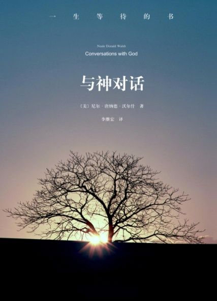

# 与神对话1-5

# 与神对话Ⅰ

作者：尼尔.唐纳.沃许

与神对话（Conversations with God .an uncommon dialogue）是由 Neale Donald Walsh 所记录的。

Neale 曾经是个报纸通讯员、杂志编辑、广播电台节目指导、脱口秀主持人……等等。育有数名子女，也离过几次婚。

1992 年的春季，他的生命陷入了空前的低潮，于是像以前一样，他开始拿起笔来写信抱怨所有的一切。不同的是，这次他决定写给那个他认为最该为他不幸的生活负责任的家伙，那就是「神」God，愤怒地质问祂他究竟为什么活该受这许多罪？

就在他写完最后一笔问题的时候，忽然，他的手自动开始执笔写下回答：「你是真的想要得到这些问题的答案，或者只是发泄而已？」

尼尔眨眨眼，不知道发生了什么事，但是他随即写下了回应：

「两者。我是在发泄，不过如果这些问题有答案，我很他妈的乐意知道。」

于是他开始展开与这自称来自神（God）之间的对话。

不同寻常的对话

第一卷

尼尔.唐纳德.瓦尔施/著

朱银萍/等译

译后记

在一些西方国家，尽管随着科学技术的发展和社会文明的进步，宗教的地位和影响已今非昔比，真正虔诚地信仰宗教的人，信仰“上帝说要有光，于是就有了光”的人越来越少，但由于长期浸润于其中，宗教早已经成为一种无所不在、影响深远的文化。在面对社会、人生乃至自然界种种问题时，传统的宗教意识、宗教道德、宗教观念对许多人仍产生着重要影响。但人们耳濡目染所接受的一些传统宗教观念也给人们带来了许多困惑。《与上帝交谈》这本书对此进行了深刻的反思，提出了自己全新的上帝观，并对生命、健康、信仰、宗教、事业、爱情、家庭、人际关系、人与自然等一系列问题，提出了自己的独到见解。

作者指出，迄今为止，社会给予人的教育大多都是以恐惧为基础的。比如，多年来人们不假思索地接受了许多关于上帝的观念：上帝是严历的、令人畏惧的、报复性的；上帝根据自己感觉的好坏，进行评判、奖励或处罚；上帝的爱是有条件的；上帝是基于爱或者恐惧而创造了天堂和地狱，提出了十条戒律；等等。作者认为，人们从其他人那里得到的关于上帝的这些印象，并不是真正的上帝。这些观念都是起源于恐惧，是孩子根据自己对父母的体验把父母的角色外推到上帝身上。作都心目中的上帝是与此全然不同的一个形象：上帝是绝对的爱的化身。

上帝是绝对的爱的化身。上帝并不需要人的畏惧和敬奉，上帝不报复也不惩罚；没有什么天堂和地狱；没有什么十条戒律，有的是人自己的十条承诺。

在真正信仰宗教的人看来，上帝是万能的，能够创造一切。甚至可以说，上帝就是一切。作者分析指出，如果只有上帝，别无他物，上帝就无法体验自己是万能的。要想检验自己，必须有对立面或者相对物。为此，上帝把自己分成了许多部分。上帝“按照自己的形象和相似”(in the image and likeness of God)造了人，赋予了人各种能力，上帝通过人的自由选择和创造，体验自己的自由选择和创造，也就是说，上帝与人是合一的。“上帝与人同在”。在一定意义上，人的自由选择、创造，就是一种上帝的状态。从这里，可以引出这样一个命题：人是上帝的“部分”、是上帝的子孙。在一定程度上，人就是上帝！

作者认为，上帝是面向每个人的。所有的人都是特殊的，所有的时刻都是金色的。每个人都随时随地通过自己的感觉、思想和体验与上帝相通。体验是上帝与人最重要的交流手段。遗憾的是，人的大多数价值判断都不是来源于自身的体验，而是盲目接受了其他人的认识，接受了以恐惧为基础理论人生观、价值观。对爱、对性、对金钱、对生活、对上帝，都是如此。当自己的体验与社会灌输给人的意识相矛盾时，人们往往否定自己的体验。这是人生苦恼的重要根源。

作者指出，生活的惟一目的是为了记起并体验“你是谁、你能成为谁”。要对自己的生活状态进行反思，有意识地按照自己的最高认识去改变自己的思想、语言和行动。要停止原来那种无意识的生活状态，要像上帝那样去想、去说、去行动。上帝是绝对的爱的化身，如果人选择以爱为主导的人生，人将体验到生活的全部荣耀，体验到上帝的感觉。

关于生活、关系、金钱、事业、健康等十三个问题，书中通过上帝给予了详尽的回答，其中有不少精辟的论述。比如，天堂在乌有之境(now here)，也就是“现在在这里”(now here)；比如，在人际关系中，包括爱情关系中，完全以对方的喜好去确定自己的行为，将使得双方都丧失掉自我，并最终导致关系失败。比如许多疾病是自己招致的。等等。

《与上帝交谈》书中对一些传统的宗教观念进行了深刻的剖析，并不时给予辛辣的嘲讽。比如，有的宗教不是让人们选择成为上帝，而是选择成为魔鬼。有的宗教甚至宣称，人生来就是有罪的。作者还尖锐地指出，圣经中对上帝的有些描述并不是真正的上帝。耶稣也不是完美的。这对盲从盲信者无疑有着振聋发聩的作用。

我们知道，宗教在很大程度上起源于先民对人所不能把握的自然力的恐惧。作为这种自然力的象征，先民心目中的上帝（也就是流传至今的宗教中的上帝）自然具有令人畏惧、惩罚、报复等特征。现在，随着社会的进步，人类认识自然、改造自然的力量大大增强，人对自然的恐惧心理减轻了，但另一方面，人类自身的行为在很大程度上成为对人类构成最大威胁的力量。可以说，人类的命运掌握在自己手中，人类很可能毁于自身的活动。在这种大背景下，呼唤绝对的爱，认为上帝是绝对的爱的化身，每个人都是上帝，都应以爱为主导去行动，都应对自身的行为负责任，这种思潮在美国等到西方国家是有其现实基础，也是有现实意义的。

随着对外开放以来信仰宗教的人较前增多，对我国广大信众来说，接触西方社会现代宗教文化，活跃思想，深化对宗教的理解，是一件有益的事情。另一方面，由于宗教涉及的是对宇宙、对人生的思考，宗教道德观念往往也包含着许多深刻的人生哲理，浏览或精读这类书籍，对一般读者也会有启迪。无论信仰不信仰宗教，在面对人生各种问题时，经常思考“我是谁，我要成为谁“，按照以爱为主导的理念检查自身的思想、行为、都是有益的。

《与上帝交谈》一书采用对话的形式，口语、俗语较多，语言简洁、明快，文笔流畅，充满了机智的问答，还不时穿插些小幽默、小故事，读来妙趣横生，翻译过程中时常拍手称快。但书中也涉及一些形而上的哲学、宗教探讨、也有不少艰涩难懂的文字，由于水平所限，错译之处在所难免，译者诚恳希望读者谅解并给予指正。

本书 1 至 3 章由田红梅同志译出，4 至 6 章由董保存同志译出，其余部分由朱银萍同志译出并统稿，特此说明。

1998 年 5 月

## 引言

你将有一次不同寻常的体验。你将与上帝谈话。是的，是的。我知道，这是不可能的。你可能想（或者你曾经被这样教育），这是不可能的。人可以对上帝讲话，但不能与上帝交谈。我的意思是上帝不会有问有答的交谈，对吗？至少不是以常规的、日常的形式交谈。

我过去也是这么想的。后来我遇到了这本书。我是指字面上的意思。这本书不是我写的，它是我遇到的。在你读这本书时，你也将遇到它，因为我们将被引导到我们所要得到的真理中。

如果我对这一切保持沉默的话，我的生活可能更容易一些。但这样它就没有必要遇到我了。不管这本书将给我带来什么不便（比如因为过去没有生活在真理之中，而被叫做亵渎神灵的人，骗子，伪善者，或者更坏的，被叫做圣人），现在对我来说已经不可能停止这一进程了。我也不愿这样做。我曾经有机会从这方面走开，但我没有利用这些机会。我决定，对这里所涉及的事情，坚持我的直觉所告诉我的，而不是这个世界告诉我的。

这些直觉告诉我，这本书不是胡言乱话，不是一个被挫败的精神想象者的劳累过度、或者一个误入歧途的生命寻求辩白的自我论证。我思考过这些事情，每一种事情。所以，当它还是手稿的时候，我把这些材料给一些人阅读。他们被感动了。他们哭了。他们因为书中的快乐和幽默而大笑。他们说，他们的生活改变了。他们如醍醐灌顶。他们被赋予了力量。

许多人说，他们得到了改造。

这个时候，我知道这本书是为每个人写的，必须出版它。因为，对所有那些真正寻求答案和真正关注问题的人，对所有那些用心灵的赤诚、灵魂的渴望、思想的开放开始寻求真理的人，它是一个奇妙的礼物。

这本书涉及了我们曾经问过的大部分问题（如果不是全部的话）：关于生活和爱，目的和功能，人和人的关系，善和恶，罪行和罪恶，原谅和超度，通往天堂和地狱的道路……各种事情。它直接探讨了性、能量、金钱、子女、婚姻、离异、生命工程、健康、从前、以后……每一件事情。它探索了战争和和平，了解和不了解，给予和索取，快乐和痛苦。它关注了具体与抽象，可见与不可见，真理和非真理。

你可以说，这本书是"上帝对事物的最新论语"。虽然这么说对有些人可能有些小麻烦，特别是如果他们认为上帝在 2000 年以前已经不再说话，或者如果上帝继续交流的话，也只是与一些特殊忍气吞声的人交流：神圣的男人、医界的女人，或者一些沉思默想 30 年，行善 20 年，或者至少 10 年来非常正派的人（哪一类都不包括我）。

真理是：上帝与每一个人交谈。好人和坏人。圣徒和恶棍。当然为也包括介于其间的我们所有人。比如你。上帝多次来到你的生活中，现在这一次又是其中一次。"当学生准备好的时候，老师将会出现"，这句格言你听到过多少遍了？这本书就是我们的老师。

当我遇到这份材料不久，我知道我是在和上帝谈话。直接地，亲自地，不容辩驳地。并且，上帝是在直接用我能够理解的方式回答我的问题。也就是说，我得到回答的方式、语言，上帝知道我能够理解。这本书大部分采用口语化风格，以及偶尔会提到的我从其他来源和我以前的生活体验中收集的材料，就是这个原因。现在我知道，我的生活中曾经发生的一切，都是从上帝而来，现在正在把它们拉到一起，对我曾经有的每个问题给予神奇的全面的答复。

在这一路途上的某个地方，我意识到，正在产生一部书，一部将出版的书。事实上，我是在这一对话的后半段（1993 年 2 月），才具体地了解到正在出三卷书，它们是：

1\. 第一卷将主要涉及个人问题，聚焦在个人生活中的各种挑战和机遇。

2. 第二卷将涉及更带全球性的问题，这个星球上的地域政治和超自然的生活。以及这个世界正在面临的挑战。

3\. 第三卷将涉及最高秩序的宇宙真理，以及灵魂面临的机遇和挑战。

这本书是这些书的第一卷，完成于 1993 年 2 月。为了明白起见，我解释一下，这部对话是我手写的，我把特别重要的词和句子划线或圈起来，好像上帝用低沉的声音说出的，后来排字时排成了划线字。

在反复阅读这本书的慧语真言之后，我现在想说，我对我自己的生活感到非常难为情，那里充满了许多持续不断的错误和错误行为，一些非常可耻的行为，一些其他人可能认为是伤害人的和不能原谅的行为。虽然我深深感到自责，因为这一点是通过其他人的痛苦得到的，但对我学到的东西，我感到无法言喻的感激，并且由于我生活中的那些人，我发现我仍有很多要学。对我的学习过程的缓慢，我对每个人表示歉疚。但我得到了上帝的鼓励，对我的失败给自己以原谅，不要生活在恐惧和负疚之中，而要一直保持尝试、继续尝试生活在更大的理解之中。

我知道这是上帝对我们所有人的期望。

尼尔.唐纳德.瓦尔施

中心角区,俄勒冈

1994 年圣诞

## 1

1992 年春天,我记得是复活节前后,我的生活中发生了一件非同寻常的事情.上帝开始与你谈话。通过我。

请让我解释。

那段时间，我的个人生活、职业和感情方面都很不愉快，我觉得我的生活方方面面全都失败了。多年来，我已经习惯于用信写下自己的思想（我从未想过寄给谁），我拿起我那忠实的黄颜色的本子，并开始让我的感觉奔流而出。

这次，我不想给想象中的使我受害的另一个人写，我想我最好直达源头；直接去找造成一切苦难的元凶。我决定给上帝写封信。

这是一封带着怨恨、饱含感情的信，充满了混乱、扭曲和诅咒。还有一大堆愤怒的问题。

为什么我的生活这么不顺利？怎样才能顺利起来？为什么我在人际关系中找不到快乐？富有的生活是不是永远将避开我而去？最后——最该强调的，我究竟做了些什么，使生活成了无休止的苦斗？

使我吃惊的是，当我写完了最后一个痛苦的、无法回答的问题，准备把钢笔放在一边的时候，我的手好像被一种看不见的力量拉住，悬在纸上不动了。突然，钢笔开始自己动起来。我不知道我打算写什么，但一个念头涌上心头，我决定随它去了。我写下了……

对这些问题，你是真的想要得到答案，还是想发泄一下？

我眨眨眼睛……我脑海中浮现出一个回答。我也把它写了下来：

两方面都有。我的确是在发泄，但如果这些问题有答案的话，我下地狱都想听到这些答案！

你对很多事情“下地狱都想”。但“上天堂都想”不是更好吗？

我写道：

这是什么意思呢？

在我弄明白之前，我开始了一次谈话……与其说我是在写，不如说是在做听写。

这次听写一直进行了三年，当时，我不知道要写到哪里。在把问题写出来之前，我并不知道这问题的答案，我已经把自己的思想抛在了一边。这些答案出现很快，经常来不及写下来，我觉得我是在拼命追赶。当我思想混乱的时候，或者找不到感觉，我就放下笔，把这一对话抛开，直到再次得到灵感——对不起，这是惟一合适的词——我拿起黄色的本子，重新开始写起来。

我现在写的时候，这些对话还在继续。其中许多对话在后面这些章节中可以找到……这些对话开始时我自己也有相信，后来觉得只对个人有价值，但现在我理解这些不仅对我有意义。它对你，对看到这份材料的任何人都有意义。因为我的问题就是你的问题。

希望你尽快进入这一对话，因为真正重要的是，这不是我的故事，而是你的。是你自己的生活，把你带到了这里。这本材料涉及的是你的体验。否则的话，你就不会和这本书一起在这里了。

让我们从一个多年来我一直在问自己的问题开始这一对话：

上帝怎样讲话，对谁讲？

当我问这个问题时，我得到了下面的回答：

我对每个人谈话。在任何时间，问题不是我对谁讲话，而是谁听？

这激起了我的好奇心，我请上帝展开谈谈这个问题。上帝是这样说的：

首先，我们用“交流”换一下“谈话”这个词。这个词更好、更全面、更准确。当我们想彼此谈话时，你对我，我对你，我们马上就被有限的语言限制住了。因为这个原因，我不仅仅用语言来交流。事实上，我极少这样做。我最多的交流方式是通过感觉。

感觉是灵魂的语言。

如果你想知道什么是真实的，看看你对它的感觉如何。

有时候感觉很难找到——很多时候感觉更难认识，但隐藏在你最深的感觉中的是你最高的真理。

问题是要得到这些感觉。我将展示给你怎样才能得到。当然，如果你愿意的话。

我告诉上帝我愿意，但我现在更希望的是对第一个问题的全面、完整的回答。上帝是这样说的：

我还用思想来交流。思想与感觉不一样，尽管他们可以同时出现。在用思想交流时，我经常用形象和图画。因为这个原因，作为交流手段，思考比语言更有效。

除了感觉和思考，我经常把体验作为一个最重要的交流手段。

最后，当感觉、思想和体验都不能奏效时，我使用语言。语言是效果最差的交流手段。语言最容易被错误解释，最容易被错误理解。

为什么呢？问题出在语言本身。语言仅仅是语调，是代表感觉、思考和体验的噪音。它们只是符号、印记、标志。它们不是真理。不是真正的事物。

语言可以帮助你理解一些事情。体验可以帮助你认识。但有些事情你不能体验。所以我赋予你其他认识的工具。这些工具叫做感觉。思想也是这样。

这里最有讽刺意味的是，你对上帝的话给予了过多的重视，但忽略了体验。

事实上，你对体验的价值太不重视了，当你对上帝的体验与你听说的上帝不同的时候，你就自动放弃体验，而相信语言，而你恰恰应选择另一条路。

你对一件事情的体验和感觉，代表了你事实上和直觉上对这件事的了解。语言只是标示知道的事物，并且经常会混淆你所知道的。

这些都是我用来交流的工具，但它们不是方法，因为并不是所有的感觉、思想、体验、语言都来自于我。

许多语言被一些人以我的名义述说过。许多思想、许多感觉，都不是因为我直接创造而产生的。许多体验是由此而来。

挑战在于有没有辨别力。困难在于如何区分来自上帝的信息与来自其他来源的信息。用下面这个基本法则，辨别是件简单的事情：

你最高的思想，最清楚的语言，最重要的感觉，都来自于我。凡是不及的都是来自其他来源。这样，进行区分就容易多了，因为确定最高、最清楚、最重要，即使对一个刚刚上学的学生也不是一件难事。

但我将给你下列指南：

最高的思想总是包含欢乐的思想。最清楚的语言是包含真理的语言。最重要的感觉是你成为爱的感觉。

快乐，真理，爱。

这三者是可以相互转化的，一个经常引发另一个。三者的次序怎样排列没有什么关系。

根据这些指南确定哪些信息来自我、哪些来自其他源泉之后，剩下的惟一问题是，是否注意我的信息。

我的大多数信息没有得到注意。有的是因为看起来太好了，以致于不能相信是真的。其他的是因为似乎太难，以至于不能执行。许多是因为被简单地误解了。大多数是因为没有被接受到。

我最有力量的信使是体验，但即使它你都忽视了。你特别容易忽略它。

只要你倾听了自己的体验，你的世界将不是现在这种状态。不倾听自己体验的结果是，你将一次又一次地经历这种体验。因为我的目的不会被阻挠，我的意见也不会被忽视。你将得到这一信息。或迟或早。

虽然如此，我将不会强迫你，我也永远不会强制你。因为我已经赋予你自由意愿——做你选择的事情的能力——我将永远不会从你这里将这一能力拿走。

所以我将千年如一日地向你所在的宇宙的每个角落，继续一次又一次地向你发出同样的信息。我将永无止息地向你发出信息，直到你接收到它们，抓紧它们，并把它们称为你自己的信息。

我的信息将以一百种形式、一千个时刻、在一百万年间到来。如果你真正倾听，你不会错过它。如果你真正听到过，你就不会无视它。这样，我们的交流就实实在在地开始了。过去，你只是对我诉说，向我祈祷，向我请求，向我恳求；现在，我能对你谈话，就向我现在正在做的这样。

我怎么才能知道这一交流是来自上帝呢？我怎么才能知道这不是我自己的想象呢？

这有什么差别？你难道没有看到，我通过你的想象来工作，与其他事情一样容易？我将在任何时刻，利用一个或多个工具，针对特定的目标，带给你准确的思想、语言或感觉。

你将了解到这些语言来自我，因为你自己从没有说得这样清楚。如果你对这些问题已经说得这样清楚，现在你就不会问这些问题了。

上帝与谁交流呢？有没有特殊的人？有没有特殊的时间？

所有的人都是特殊的，所有的时刻都是金色的。没有一个人或者一个时刻比其他人或时刻更特殊。许多人选择相信上帝只以特殊的方式与特殊的人交流。这就使大多数人免除了倾听我的信息的责任，更少有人接收到我的信息（这是另一件事情），这使得他们接受某个人对各件事的看法。你不必非得倾听我，因为你已经断定，其他的人已经从我这里听到了对每件事的信息，你可以倾听他们。

通过倾听其他人认为是听我说的话，你就一点也不用再思考了。

这是大多数人不相信自己从我这里得到信息的最大原因。如果你承认你可以直接从我这里接受信息，你得自己负起解释的责任。对你此刻正在接受的信息，与自己寻求解释相比，接受其他人（即使这些人生活在 2000 年前）的解释要安全和容易得多。

但我邀请你参与另一种与上帝的交流方式。一种双向交流。事实上，是你邀请了我。现在，我正以这种形式，来回答你的召唤。

为什么一些人，比如基督，比其他人更多地听到你的教诲呢？

因为一些人确实愿意听。他们愿意听到，并且也愿意对交流保持开放的心态，即使这种交流看起来是可怕的、疯狂的、或是完全错误的。

即使所说的听起来是错的，我们也应该听上帝的吗？

当听起来是错误的时候就更应该听。如果你认为你对一切事情的看法都是对的，谁还需要与上帝交谈呢？

继续前进，根据你所知道的一切去做。但注意一下时间开始后你一直在做的事情。看一看世界处在什么状态。很清楚，你错过了一些事情。很显然，有些事情你不理解。你真正理解的事情必须对你是对的，因为，你所错过的事情，初看起来将是错误的。

在这主面，前进的惟一办法是问你自己，“如果我认为是‘错误的’事情实际上是‘对的’，将会发生什么事情？”每个大科学家都知道这一点。当一个科学家所做的工作行不通时，科学家将把所有假设放在一边，重新开始。一切重大发现都来自一种意愿和能力：做看来不正确的事情。这里需要的就是这一点。

直到你不再告诉自己你已经了解上帝，你才能了解上帝。除非你不再想你已经听到了上帝的话，你才能听到上帝的话。

直到你不再向我说你的真理，我才能告诉你我的真理。

但我对上帝的真理是来自你的。

谁这样说的？

别人。

什么别人？

领袖们。大臣们。教士们。牧师们。书籍。天哪，圣经！

这些都不是权威的来源。

它们不是？

不是。

那什么是呢？

去听你的感觉。去听你最高的思想。去听你的体验。如果其中任何一个与你的老师告诉你的、或者与你从书上读到的不一样，那就丢掉那些语言。语言是真理最不可靠的传道者。

我有太多话想对你说，有太多的问题想问。我不知道从哪里开始。

例如，为什么你不显现自己？如果真的有个上帝，而你就是上帝，为什么你不以一种我们都能理解的方式显现你自己呢？

我已经这样做了，做了多次。我现在正在做又一次。

不。我的意思是，用一种不会误解、不能否认的方式显现。

比如？

比如现在显现在我的眼前。

现在我正显现在你眼前。

在哪儿？

在你看的任何地方。

不。我的意思是，以一种不会有歧义的方式。以任何人都无法否认的方式。

那将是一种什么种形式呢？你要我以什么形式或面貌现出错呢？

以你实际的形象或面貌。

这是不可能的，因为我没有你所了解的形象或面貌。我可能采取一种你能了解的形象或面貌，但那样每个人都会认为，他们看到的是上帝惟一的形象或面貌，而不是上帝的许多形象和面貌中的一个。

人们相信我是他们看到的那样，而不是他们没有看到的那样。但我是伟大的未见者，不是在任何特定时刻我使自己存在的那种形式。在某种意义上，我是我所不是。我是来自“不是”，归于“不是”。

当我以这种或那种特定的形象到来的时候——我认为人们能理解我的形象——人们将永远把这种形象看作是我。

如果我对另一些人以另外的形象出现，第一个人会说我没有对第二个人显现，因为我在第二个人看来与第一个人看来不一样，说的事情也不一样，那怎么可能是我呢？

你看到了，问题不在于我以哪种形式、哪种方式显现自己，不管我选择哪种方式、采用哪种形式，没有一种是没有歧义的。

但如果你做些什么，能毫无疑问地证明你是谁……

……仍会有些人说，这是一个幽灵，或者只是某个人的想象。或者我以外的其他原因。

如果我显现为全能的上帝，天地之王，并搬动大山来证明，有些人会说，“这一定是撒旦。”

情况就应该是这样。因为上帝不会从外在的观察显现上帝自己，而是通过内在的体验。当内在的体验显现出上帝自己时，外在的观察就不需要了。如果需要外在的观察的话，内在体验就不可能了。

这样，如果要求显现，就得不到显现，因为请求本身就等于声明它不在：现在上帝什么也没不显现。这种声明产生体验。因为乐对某件事情的思想是创造性的，你的语言是生产性的，你的思想和语言结合在一起，将足以有效地产生你的现实。所以，你将体验到上帝没有显现，因为如果上帝已经显现的话，你就不会请求上帝显现了。

这是不是意味着我不能要求我想要任何事情？你是不是说，祈祷些什么事情实际上反而使其离我们而去呢？

这个问题已经问了多年，每次问起的时候都得到了回答。但你没有听到答案，或不相信答案。

下面用今天的术语，今天的语言，再次回答这一问题，这就是：

你将得不到你这所问，得不到你之所要。这是因为，你的询问就是缺乏的证明，你所说的你要件东西，只会在你的现实中产生这种“想要”的准确体验。

所以，正确的祈祷永远不是一个祈求的祈祷，而是一个感激的祈祷。

当你为现实中想体验的事情预先感谢上帝时，事实上，你等于承认了它在那里……事实上。所以，感谢是对上帝最有力的陈述；是一种确认，在你问之前，我已经回答。

所以，永远别祈求。要欣赏。

但如果我为某件事情预先感谢上帝，而它永远不显现呢？这会导致幻想破灭和痛苦。

感激不能用来作为操纵上帝、愚弄宇宙的工具。你不能对自己撒谎。你的头脑知道你的真实思想。如果你说着“感谢你，上帝，为了这个、那个”，同时非常清楚在你现在的现实中它并不存在，你不能期望上帝会不如你清楚，并为你使之成为现实。

上帝知道你之所知，你之所知就是你的现实中所出现的。

但这样的话，对我明知没有的东西，我怎么能真正地感激上帝呢？

信仰。你中要有芥莱种的信仰，你就能移动大山。你将知道它在哪里，因为我说它在；因为我说它在，甚至在你问之前，我已经作出回答；因为我说说过，因为我以每一种可想象的方式说过，通过你的每一个老师对你说过，不管你选择什么，以我的名义选择，它就会出现。

但那么多人都说，他们的祈祷没有得至答复。

没有得不到答复祈祷，祈祷不过是对本是什么的热情陈述。每个祈祷、每个思想、每个陈述、每种感觉都是创造性的。在一定程度上，要作为真理一样热烈坚持，它将在你的体验中显现。

当人们说祈祷没有答复时，所发生的事实是，最热烈地坚持的思想、语言、感觉是操纵性的。你必须了解，这就是秘密所在，是你思想后面的思想——可以称作主导思想（sponsoringthought）——控制着你的思想。

所以，如果你祈求、恳求，你体验你所希望的境界的机会要小得多，因为你的祈求背后的主导思想是，你现在并没有你所希望的。这一主导思想将成为你的现实。

惟一能凌架于这一思想之上的主导思想是，坚信上帝将给予你要求的一切，没有失败。有些人有这样的信仰，但这样的人很少。

如果不去相信上帝对每个请求说“是”，而是从直觉上理解到本身不需要请求，祈祷的过程就变得容易多了。这样，祈祷是感恩的祈祷。它根本不是请求，而是对现存事物陈述感激。

你说祈祷是对现状的陈述，是不是说上帝不做任何事情；祈祷后发生的事情都是祈祷行为的结果呢？

如果你相信上帝是一个听到所有祈祷的全能的存在，他对一些祈祷说“是”，对另一些说“不”，对其余回答“或许，但不是现在”，你错了。上帝依靠什么经验法则去决定呢？

如果你相信上帝是你生命中一切事物的创造者、决定者，你就错了。

上帝是个观察者，不是创造者。上帝准备帮助你度过你的生命，但不是以你所期望的那样。

上帝的作用不是创造或不创造你生活中的各种状态。上帝按照上帝的形象和相似（likeness）创造了你。你通过上帝赋予你的能力创造其他事物 。正如你所知道的，上帝创造了生命的过程和生命本身。然后上帝给了你自由的选择，你可能按照你的意愿去生活。

在这个意义上，你对自己的意愿就是上帝对你的意愿。

你按照自己生活的方式生活，对此我毫无偏爱。

认为上帝在意你以这种或那种方式行动，这是你的一个大的幻觉。

我并不在意你做什么，对此你可能难于接受。但当你送孩子出去玩耍的时候，你在意你的孩子们做什么吗？他们是玩捉人游戏、捉迷藏或者伪装，对你有什么影响吗？不，没有。因为你知道他们是绝对安全的。你把他们放在了你认为是和善和很不错的环境里。

当然，你总是希望他们不要受伤。如果他们受到伤害，你会马上去帮助他们、安慰他们，让他们重新觉得安全、快乐，另一天再去玩。但在另一天，他们是玩捉迷藏还是伪装，对你还是不重要。

当然，你会告诉他们，哪种游戏是危险的。但是你无法不让孩子们做危险的事情。不可能总是，不可能永远。不可能从现在到死亡的每一时刻。明智的父母都懂得这一点。但父母们从不会停止关心结果怎样。这种两分法——不去深深地关心过程，而是深深地关心结果——与描述上帝的两分法很相近。

在一定意义上，上帝连结果也不太关心。甚至最终结果也不关心。这是因为最终结果是有保证的。

这是人们第二个大的错觉：生命的结果是有疑问的。

这种对最终结果的担心成了你最大的敌人，这就是恐惧。因为如果你担心结果，你就会对创造者有疑问，对上帝有疑问。如果你对上帝有疑问，你将在恐惧和犯罪感中度过一生。

如果你怀疑上帝的意图以及上帝产生最终结果的能力，你怎么能放松呢？你怎么能真正找到安宁呢？

但上帝完全有力量使动机和结果相匹配。你不可能也不会相信这一点（即使你声称上帝是万能的），这样，为了使你可以找到一种方式使上帝的意愿受到阻挠，你不得不在想象中创造一种与上帝相同的力量。这样你就创造了一个在你的神话学中称为魔鬼的东西。你甚至会想象上帝与魔鬼战斗（认为上帝会与你一样解决问题）。你会想象上帝战败了。

所有这些与你所知道的关于上帝的情况相矛盾，但这没关系。你在幻觉中生活，并感受你的恐惧，所有这些都是起因于你对上帝的怀疑。

但如果你作一个新的决定呢？将出现什么结果？

我告诉你：你将像佛那样生活。像耶稣一样生活。像你所崇拜的每个圣徒那样生活。

像对大多数圣徒一样，人们可能不理解你。当你试图解释你对和平的感觉、你生活的快乐、你内在的陶醉，他们将听你说而没有听见。他们将重复你的话，但会增加新内容。

他们将惊奇于你怎么能得到他们没有发现的东西。然后，他们将变得嫉妒。很快，嫉妒将变成愤怒，在愤怒中他们将想方设法说服你：是你不理解上帝。

如果他们不能使你失去快乐，他们将伤害你，他们将更加愤怒。当你告诉他们这没有关系，即使死亡也不能终止你的快乐，改变你的真理，他们甚至会杀掉你。然后，当他们看到你平静地接受死亡，他们将称你为圣徒，并重新爱你。

对认为最有价值的东西，爱，然后毁灭，然后再爱，这是人的本性。

但为什么呢？为什么我们这样做？

人的所有行为最深的动机是两个：恐惧和爱。事实上，只有两种感情——灵魂的语言里只有两个词。现在你知道，在我创造宇宙和你的世界时，这是我所创造的相反的两极。

这是阿尔发和欧米伽两点，有了这两点才有了“相对论”体系。没有这两点，没有对事物的这两种态度，就不会有其他想法。

人的每一种思想，每一种行为，都是基于爱或者恐惧。人没有其他动机，所有其他想法都是从这两者延伸出来的。它们只是不同的版本，同一主题的不同花样。

对此深入地进行思考，你将看到这是真的。这就是我所说的主导思想。它不是爱就是恐惧。这是思想背后的思想。这第一思想。是原动力。是驱动人生体验引擎的原能。

人的行为就是这样，在重复体验之后再产生重复体验。这就是人们爱、然后毁灭、然后再爱的原因：一种感情与另一种感情之间总有摇摆。爱导致恐惧导致爱导致恐惧……

……在这里可以找到第一个谎言的原因——你把这一谎言作为关于上帝的真理：不能相信上帝；不能依靠上帝的爱；上帝接受你是有条件的；因此最终结果是有颖问的。如果你不依靠那一直存在的上帝的爱，你能依靠谁的爱？如果你做事不当时，上帝退却、撤出，不也只有死亡吗？

……所以，当你声称处在最高的爱的时刻，你遇到你最大的恐惧。

当你说出“我爱你”之后，你担心的第一件事情是，你是否会听到同样的回答。如果你听到这样的回话，你马上会担心你会失去你刚刚发现的爱。所有的行动都成了防止失去，就像你努力防止失去上帝一样。

如果你知道你是谁，你是上帝创造的最伟大、最有意义、最神奇的生灵，你将永远不会恐惧。谁会拒绝这样神妙的伟大？即使上帝也无法在这样一个生灵身上找出错来。

但你不知道你是谁，你认为你很渺小。你比伟大要差得远，这一想法是从哪里来的呢？来自你对每件事情都言听计从的人那里。来自你的父亲和母亲。

这些人是最爱你的人。为什么他们对你说谎呢？他们没有告诉你这方面太强，那方面不足吗？他们没有提醒你是被看到而不是听到吗？在你得意忘形时他们没有责备过你吗？他们没有鼓励你搁置你荒唐的想象吗？

这就是你得到的信息，虽然它们不符合上面说的准则，因此并非来自于上帝，但它们却仿佛是来自在上帝，因为它们毫无疑问来自你的世界的神。

是你的父母教育你，爱是有条件的——你曾多次感受到这些条件——你带入你自己的爱情关系中的就是这种体验。

你带给我 也是这种体验。

从这种体验中，你得出了关于我的结论。在这一框架中，你诉说你的真理。“上帝是一个仁爱的上帝”，你说，“但如果你违反他的命令，他将用永恒的放逐和永久的指责处罚你。”

你难道没有体验过被父母放逐吗？你不知道受他们指责的痛苦吗？你怎么能想象这与我有什么区别呢？

你已经忘记了无条件地被爱是怎样一回事。你不记得体验上帝的爱。你根据在世界上看到的爱，来想象上帝的爱是怎样的。

你把“父母”的角色投射到上帝身上，你觉得上帝根据自己的感觉好坏进行评判、奖励或处罚。但这是根据你的神话得出的对上帝的简单看法。这与我是谁没有任何关系。

这样，你根据人的体验而不是根据精神真理，建立了对上帝的整个思想体系，然后你创造了围绕爱的整个现实。这是一种基于恐惧的现实，它植根于上帝是令人畏惧、报复性的想法。它的主导思想是错误的，但否定这一思想将颠覆你的全部理论。虽然用新的理论替代它将使你真正得救，但你不能接受这种理论，因为设想一个不需要人畏惧、不进行评判处罚人的上帝，这太美妙了，即使在你关于上帝是谁、是什么的最大的概念里，你也不敢接受它。

这种基于恐惧的现实，主宰了你对爱的体验；实际上，它创造了你对爱的体验。因为你不仅看到自己在接受有条件的爱，而且在以同样的方式给予爱。即使在你撤销、放弃并确定你的条件时，你的一部分知道，这不是真正的爱。你无力改变你这种方式。你已经学会了坚强的方法，你告诉你自己，如果要使自己再变得脆弱，你将倒霉。其实，如果你不这样做，你将倒霉，这才是真理。

因为你自己对爱的错误看法，你使自己从来无法体验纯粹的爱。同样，你使自己永远无法了解我真正是谁。直到你不再这样做。因为你不能永远否定我，我们妥协的时刻将到来。

人类和每个行为都是基于爱或恐惧，并不仅仅是与人际关系有关的行为才是这样。生意、产业、政治、宗教、对你们青年的教育、国家的社会议题、社会的经济目标的决定，关于战争、和平、攻击、防御、侵略、投降，决定攫取还是给予，是积蓄还是分享，是团结还是分裂——你所有的每一个自由选择，都来自仅有的两种可能的思想：爱的思想或者恐惧的思想。

恐惧是一种收敛、关闭、结束、逃跑、隐蔽、储藏、仿害的能量。

爱是一种扩张、开启、生出、停留、揭露、分享、治愈的能量。

恐惧把我们的身体包裹起来，爱使我们裸露身体站立。恐惧抓住我们所有的，爱使我们给予所拥有的一切。恐惧抓紧，爱放开。恐惧使人痛心，爱使痛苦减轻。恐惧是攻击，爱是改善。

人类每一个想法、语言或行为都是基于这一种或另一种感情。对此你无法选择，因为你没有其他东西可以选择。但你在这两者之中可以自由选择。

你这样说听起来很容易，但在决定时，恐惧经常占上风。这是为什么？

你受的是在恐惧中生活的教育。人们告诉你，最适者生存，最强者胜利，最聪明者成功。关于最可爱者的光荣，人们很少谈。所以，偿千方百计以这种或那种方式使自己成为最适应者、最强者、最聪明者，如果在某种情形下你看到自己不是如此，你就恐惧失败，因为人们告诉你，少就意味着失败 。

所以，你选择以恐惧为导向的行动，因为你受的教育就是这样。但我要教给你的是：当你选择以爱为导向的行动，那样，你所做的就不仅是生存，不仅是胜利，不仅是成功。你将体验到“你究竟是谁、你能成为谁”的全部光荣。

要做到这一点，你必须把你那些好心的、被误导的世俗的老师的教导放在一边，倾听那些智慧来自另一个来源的老师的教诲。

你身边现在有许多这样的老师，因为我不会使你身边没有能展示给你、教育你、指导你、提醒你这些真理的人。但最伟大的提醒者不是你之外的其他人，而是你身体内的声音。这是我所采用的第一个工具，因为它是最容易得到的。

你内在的声音是我说的最大的声音，因为它最贴近你。是这个声音告诉你，按照你的标准，其他任何事情是真是假，是对是错，是好是坏。只要你允许，它是定出航线、驾驶航船、指引航程的雷达。

这一声音会告诉你，现在读的这些语言是爱的语言还是恐惧的语言。用这个方法，你可以确定应该注意这些话，还是不去管它。

你刚才说，如果我一直选择爱主导的行动，我将体验到“我是谁、我能成为谁”的全部荣耀。你能否再展开讲一下？

生活的一切只有一个目标，这就是你和所有的生命去体验全部荣耀。

你所说、所想、所做的每一件其他事情，都服从于这一功能。你的灵魂没有其他事情去做，没有其他事情想做。

这一目标的奇妙之处在于，它永远没有终点。终点就是限制，上帝的目标是没有这种边界的。假如你体验到了全部的荣耀，你将马上想象到一个更在的荣耀去追寻。你自身越多，你能达到的就越多，你能达到的越多，你还可以达到更多。

最深的秘密是，生活不是一个发现的过程，而是创造的过程。

你不是在发现自己，而是在重新创造自己。所以，不要去弄清你是谁，而要去确定你想成为谁。

有些人说，生活是一所学校，我们来这里是要学习一些课程，我们“毕业”后，将不再受身体躯壳的束缚，可以开始更大的追寻。是这样吗？

这是你们的神话的另一部分，它是以人生体验为基础的。

生活不是一所学校吗？

不是。

我们不是来学习的吗？

不是。

那为什么我们在这里呢？

为了记住、为了重新创造“你是谁”（你的真我）。

我反复告诉过你。你不相信我。但它就应该是这样。真的，如果你不按照你是谁来创造你自己，你就不能存在。

好。你把我搞糊涂了。让我们接着谈学校问题。我的老师们一个接着一个告诉我，生活是一所学校。坦白地讲，听到你否认这一点，我很震惊。

学校是这样一个地方，如果有些事情你不了解，而你又想了解，这时你就到学校去，如果你已经了解一件事情，只是想去体验你所知道的，要去的地方不是学校。

生活是这样一个机会，（正如你所称的生活）你可以通过体验了解你已经从概念上了解的事情。做到这一点，你不需要学任何东西。你只需记住你已经知道的东西，并据此而行动。

我不敢肯定我是不是听懂了。

我们从这里开始。灵魂——你的灵魂了解所有需要了解的东西。对它来说，没有隐藏、没有未知的东西。但仅仅了解并不够。灵魂需要体验。

你可能知道自己很大方，但除非你做了件事情表现出你的大方，你将只有这样一个概念。你可能知道自己很仁慈，但除非你对某人很仁慈，你对自己将只有这样一个想法。

你灵魂的惟一愿望是，把对自己最大的理念变成最大的体验。在概念变成体验之前，所有的只是玄思默想。很久以来，我一直对自己沉思默想。你比我共同记忆的时间长。比这个宇宙的年岁乘上这个宇宙的年岁还要长。你看，我对自己的体验多么年轻，多么新！

你又把我弄糊涂了。你对自己的体验？

是的。让我这样向你解释吧：

开始时，存在的就是过去所有的一切，而过去没有任何其他东西。但所有的存在并不能了解自己，因为所有存在的就是过去所有的一切，而过去没有任何其他东西。所以，所有的存在……过去不存在。在没有其他东西时，所有的存在，就是不存在。

这就是创世纪以来神秘主义者所说的伟大的“存在与不存在”论。

现在，所有的存在已经知道，它是过去所有的一切——但这是有不够的，因为它只能通过概念而不是通过体验了解它的神奇。但体验自己是它所渴望的，因为它想了解成为那样神奇会是怎样的感觉。但这是不可能的，因为“神奇”这个词是个相对的词。所有“存在的”无法了解神奇会是怎样一种感觉，除非“不存在的”展现出来。如果没有不存在，所谓存在就不存在。

你明白这一点吗？

我觉得是的。请继续讲。

好。

所有的存在了解的一件事情是，过去没有其他东西，所以，它不能并将永远无法从自己之外的一个参照点来了解自己。不存在这样一个点。只存在一个参照点，这就是其内部惟一的位置。“它存在——不存在”。“我存在——不存在”。

每件事物都想通过体验了解自己。

这种能量——这种纯粹的、看不见、听不到、观察不到、因之任何其他人都不了解的能量，要体验自己过去是多么神奇。为做到这一点，它认识到，需要有一个内在的参照点。

它非常正确地认识到，它自己任何一部分将少于全部，这样，如果把它自己简单地分为若干部分，少于全部的每一部分，都可以看到它自己的其他部分，看到神奇。

所以，“所有的存在”将自己分割，在某一光荣的时刻，变成了此与彼。此与彼就这样首次存在了，分开了。二者同时存在。二者同时不存在。

这样，突然出现了三个要素：这里，那里，既非这里又非那里——为了这里和那里的存在，它必须存在。

无物拥有万物。非空间包含着空间。整体包含着部分。

你理解这一点吗？

你听得懂这一点吗？

我觉得是。不管相信与否，你讲得很清楚，我觉得我正在理解这一点。

我将继续向下讲。这一拥有任何事物的无物，就是一些人所称的上帝。但这也是不准确的，因为这意味着有些事物并不是上帝，也就是说，任何事物不是无物。但我是所有事物，包括看得见和看不见的所有事物 ，所以，按照东方对上帝神秘的定义，把我描述成大的看不见的神、无物、或者中间的空间，比西方式的把上帝描述为看得见的一切，并不见得准确。有些人认为上帝既是所有的存在又是所有的不存在，他们的理解是对的。

现在，在创造出“这里”和“那里”的过程中，上帝使自己能够了解自己。在内在的爆炸这一伟大时刻，上帝创造了相对性——这是上帝曾经给自己的最大礼物。这样，关系就成了上帝曾经给你的最大礼物,后面我们将详细探讨这一点。

从无物这样产生万物，这一精神事件与科学家所说的大爆炸理论恰巧完全相吻合。

鉴于所有的要素向前奔跑，时间就被创造出来了，因为一个事物开始在此处 ，后来在彼处，从此处去彼处的时间是可以测量的。

就像看得见的事物的各个部分开始确定自己——彼此“相对”，所以看不见的部分也是这样。

上帝知道，爱如要存在——如要了解自己是纯粹的爱，它的对立面也要存在。所以，上帝自动创造了另一极——爱的绝对的对立面——任何不是爱的事物——现在称之为恐惧。在存在恐惧的时候，爱才能作为一种能被体验的事物而存在。

这就是在爱和它的对立面之间的二元论的创造，人们在各种宗教中把爱的对立面称为幽灵的诞生，亚当的堕落，撒旦的反叛，等等。

就像你把纯粹的爱人格化，称作上帝一样，你也把恐惧人格化，称为魔鬼。

对这一事件，世界上有些人建立了相当精细的教义，补充了一些天使般的战士和残忍的士兵、善与恶、光明与黑暗的力量进行战斗和战争的场景。

这一理论是人类早期理解世界，并以一种人们能够理解的方式告诉其他人的一种尝试，这是人类的灵魂深深了解但人不能想象的宇宙事件。

通过把宇宙变成分开的自我的体现，上帝从纯粹的能量创造了现在存在的一切，包括看得见和看不见的一切。

换句话说，不仅物质宇宙是这样创造的，而且精神宇宙也是这样创造的。构成“我是/或不是”这一关系式的上帝的第二部分，也爆炸成为无限的比整体小的单元。这些能量单元，你们称之为精灵。

在你们一些宗教理论里是这样说的：“圣父”有许多精灵孩子。用人类生活中生命倍增的体验做这种类比，这好像是大众能够理解为什么在“天国”里突然出现或存在数不清的精灵的惟一方法。

在这方面，你们这些神秘的故事离最终现实并太远，因为这些构成我的整体的数不清的精灵，在宇宙的意义上，是我的子孙。

我把自己分开的神圣目的是，创造出许多自我的部分，这样我就能够通过体验认识我自己。对创造者来说，只有一种方式能够使他通过体验认识自我，那就是创造。所以，对我这些数不清的部分（我的精灵孩子），我给予了他们与我相同的创造能力。

你们的宗教说，你是按照“上帝的形象和相似”创造的，他们所说的就是这个意思。这并不意味着，像有的人说的那样，我们的身体看起来相似（虽然上帝能够为了某个特定目的选择某种身体形象）。它意味着我们的本质是相同的。我们都是用同样的材料作成的。我们是同样的材料！有同样的性质和能力，包括用稀薄的空气创造物质现实的能力。

我创造你——我的精神后代，目的在于使我了解我是上帝。除了通过你，我没有其他方法来这样做。所以，可以说（已经说过很多次），我对你的目的是，你应该像我一样了解你自己。

这好像简单得令人吃惊，但它变得很复杂——因为只有一种方式你能了解像我，那就是你得首先了解你自己不是我。

现在，尽力跟上我，努力跟上，因为这很微妙。你准备好了吗？

我想是的。

好。记住，你曾经要求解释。你已经等了许多年了。你要求用普通人的词汇则不是理论教条或者科学理论来解释。

是的。我知道我问过什么。

你问过，所以你能收到。

现在，为了简单起见，我想用你们关于上帝的孩子那个模型作为讨论的基础，因为你熟悉这个模型，在很多方面差别不太大。

我们回过头来谈一下自我了解的过程是怎样一回事。

只有一种方式我能够让我的精神后代们了解他们自己是我的部分，这就是告诉他们，我这样做了。 但你看，对精灵来说，只是了解自己就是上帝，是上帝的一部分，是上帝的孩子，或者是王国的继承人（不管你想用什么术语），这是不够的。

我已经解释过，了解一件事情，与体验它，是两件不同的事情。精灵希望通过体验认识自己（像我一样！）。对你来说，概念上理解是不够的。所以我设计了一个计划。它是整个宇宙中最不同寻常的想法、最吸引人的合作。我说合作，因为你们都在与我的合作之中。

根据这个计划，作为纯粹的精神，你将进入刚刚创造的物质宇宙。这是因为，物质化是通过体验了解你从概念上了解的事物的惟一途径。事实上，这是我创造物质宇宙的原因，是创造驾驭世界的相对论体系的原因，是一切创造的原因。

一旦你进入了物质宇宙，我的精神孩子，你就可以体验你了解的自我，但你首先必须了解它的反面。简单地解释一下，除非你了解什么是矮，你就无法了解你自己高。除非你知道什么是瘦，你无法自己体验到什么是胖。

从根本的逻辑看，直到你遇到你不是什么，你才能体验你是什么。这就是相对论理论的目的所在，是所有物质生活的目的。正是通过你不是什么，才能确定你自己是什么。

就终极知识而言——就了解你自己是创造者而言，除非你创造，直到你创造之时，你才能体验你自己是一个创造者。直到你不创造你自己之时，你才能创造自己。在某种意义上，为了存在，你必须首先“不存在”。你跟得上吗？

我想……

我们继续谈。

当然，你是谁、是什么，你就无法不成为这样。你现在是（纯粹的、创造性的精灵），过去一直是，将来也一直是。所以，你做了仅次于最好的事情。你使你自己忘记了你真正是谁。

进入物质宇宙之后，你就放弃了对自我的记忆。这使你可以选择成为你是谁，而不是简单地（比如说）在城堡中醒来。

正是通过这个选择成为上帝的一部分的行为，而不是简单地被告知你是谁，你可以体验到你自己处于完全的自由选择，而上帝（的定义）就是这样。但对无法选择的事物你怎么能够作出选择呢？不管你多么努力，你不可能不是我的子孙，但你能够忘记。

你现在是、一直是、并将永远是神圣整体的神圣部分，是身体的一部分。这就是为什么人们把与整体重新结合、重归上帝叫做记忆（remembrance）。实际上，你是在选择记住你真正是谁，或与你的各个部分结合在一起，来体验你的全部——也是我的全部。

所以，你在地球上的任务，不是学习（因为你已经知道），而是再次记起你是谁。并再次记起其他每个人是谁。这就是为什么你的一大部分任务是提醒其他人（也就是，使他们再次意识到），所以他们也能再次记起。

所有的著名精神导师一直在这样做。它是你的惟一目的。这就是说，你的灵魂的目的。

我的上帝，这太简单，太……对称了。我的意思是，它全都很合适。它突然全都很合适了！我现在看到了一幅我以前从没有这样放到一起的图画。

好。这很好。这就是我们这次对话的目的。你向我寻求答案。我答应要给你回答。

你将把这个对话写成一本书，你我的话能被许多人理解。这是你的一部分工作。现在，你对生活有许多问题、许多疑问。这里我们已经奠定了基础。我们为其他的理解奠定了基础。让我们谈谈其他那些问题。不要担心。如果我们刚谈过的问题有些还没有理解透彻，很快就会全清楚了。

我想问的问题太多了。有特别多的问题。我觉得我应该先从大问题、明显的问题开始。比如，世界为什么是现在这个样子？

在人类向上帝问过的所有问题中，这是最常问的问题。创世纪的时候，人们就问过它。从第一刻开始，你就想知道，为什么它必须是现在这个样子？

这个问题经常是这样问的：如果上帝是完美的，充满爱心的，为什么上帝创造瘟疫和饥荒，战争和疾病，地震、龙卷风、飓风和各种自然灾害，个人深深的失意，世界性的灾祸？

这个问题的答案在宇宙最深的奥妙中，在生活最高的含义中。

我并不是通过只创造你周围的完美事物来表现我的仁慈。我并不是通过不让你去表现你的爱来表现我的爱。

就像我刚才解释过的，在你能表达不爱之前，你无法表达爱。没有对立面的事情是不存在的，除非是在绝对世界。但仅有绝对的王国对你或者我都是不够的。我过去就在那里，在永恒之中，你也是从那里而来。

在绝对之中，没有体验，只有了解。了解是一种神圣状态，但最大的快乐在存在之中。只有经过体验，才能实现存在。演变是这样的：了解、体验、存在。这是神圣的三位一体，上帝的三位一体。

圣父是了解——是所有理解的父母，所有体验之父，因为你无法体验你不了解的事物。

圣子是体验——是圣父对自己的了解的化身和外在表现，因为你不可能成为你没有体验的事物。

圣灵是存在——圣子已经体验到的自我的一切的化身之外；这种简单的、优美的存在，只有通过了解和体验的记忆才成为可能。

这个简单的存在是极大的快乐。它是经过了解和体验之后的上帝状态。它就是太初之时上帝所渴望的。

当然，对上帝的父子关系描述与性别没有任何关系，因此不必向你解释这一点，你早已过了这个阶段。这里我使用你最新的经文中所用的生动说法。早些时候的圣书是用母女关系来比喻的。这都是不正确的。在你的脑海里，可以这样来更好地把握这种关系：父母——后代关系。或者产生他物的，与被他物产生的。

再加上三位一体的第三部分，就产生了这一关系：

产生他物的/被产生的/存在的。

这种三位一体的现实是上帝的显像。它是神的图样。在伟大的王国中到处可以发现这种三合一。在涉及时间和空间、上帝和意识或者任何微妙关系的一切事物，你都不可能避开它。另一方面，在生活的一般关系中，你都无法发现这种三合一的真理。

每个涉及这类关系的人在生活的微妙关系中都可以认识到这个三合一真理。你们一些宗教学者把它描述为圣父、圣了和圣灵。你们一些精神病专家使用潜意识、意识和超意识的术语。你们一些灵魂论者说头脑、躯体和精神。你们一些科学家看到了能量、物质和以太。你们一些哲学家说，直到一件事物在思想、语言和行为都是真实的，它对你和是真实的。当探讨时间时，你只说三种时间：过去、现在和将来。同样，在你的认识中，有三种时刻：从前，现在和以后。在空间关系上，不管是考虑宇宙各处，还是你自己房间的各处，你可以分成这里、那里和中间的空间。

在世俗关系方面，你看不到“之间”。这是因为世俗关系总是两方面，而更高级王国的关系都毫无例外是三维的。所以，有左右、上下、大小、快慢、热冷，还有已创造出的最大的两极：男女。在这两极没有“之间”。一件东西或者是这种东西，或者是另一种东西，或者是这些两极之中更大或更小的东西。

在世俗关系的王国里，如果没有设计的对立面，任何设计的东西都不可能存在。你的大多数日常体验都是以这一现实为基础的。

在至高无上的关系的王国里，没有一种存在的东西有其对立面。所有都是一体，每件事情都是在一个永无休止的循环中从一处向另一处前进。

时间就是这样一个至高无上的王国，你所说的过去、现在和未来彼此相关地存在。也就是说，它们没有对立而，只是同一个整体的各个部分。同一个想法的演进；同一种能量的循环；同一个不可改变的真理和各个方面。如果你从中得出结论，过去、现在和将来存在于同一时间，那就对了。（但现在不是讨论这个问题的时候。当我们在后面展开探讨整个时间概念的时候，我们可以更详细地探讨它）。

世界是它现在的样子，因为它不能既是其他任何另一种形式，又能够在物质王国里存在。地震和飓风，洪水和龙卷风，你所说的自然灾害事件，只不过是各种要素从一极到另一极的运动。整个从出生到死亡的循环是这种运动的一部分。这是生命的节律，现实中一切事情都服从它，因为生命自身就是一种节律。它是一种波动，一种振动，是所有一切的真正的心的搏动。

疾病和病痛是健康和满意的对立面，它们遵守你的指挥在你的现实中显现。在一定程度上，如果不是你使自己生病，你不会得病；而如果在某一时刻你决定让身体好一些，你就能够好一些。个人深深的失意是自己选择的响应，而世界性的灾难是世界意识的结果。

你的问题提到，是我选择了这些事件，发生这些事件是我的意愿和愿望。但我并没有意愿使这些成为现实，我只是在观察你做这些事。我没有做任何事情使它们停止，因为这样做将使你的意愿受到挫折。这将使你丧失上帝体验，这是你和我一起选择的体验。

所以，不要责备世界上那些你叫做坏的东西。而要问你自己，你认为坏的事情是什么？你想做些什么去改变它？

询问你自己，而不是外界，问：“面对这一巨大灾难，我希望体验自我的哪一部分？我选择哪种存在方式呢？”因为生命的一切都是作为你自己创造的工具而存在的，所有的事件只是给你提供的机会，你来决定、作为你要做的人。

对每一个灵魂来说，这都是真实的，所以，你会看到，在宇宙中没有牺牲品，只有创造者。所有曾经在这个星球上走过的先知们都了解这一点。这就是为什么不管你说出哪一位先知的名字，尽管他们许多人被钉死在十字架上，但没有一个人认为自己是受害者。

每一个灵魂都是先知——尽管有些人并不记得自己的来源或承继。但每个灵魂在每一时刻（称为现在）都是按照自己最高的目的和自己最快的记忆，创造局面和条件。

所以，不要去评判另一个人走的轮回之路。不要羡慕成功，也不要怜悯失败，因为你不知道在那个灵魂的筹划中什么是成功或失败。不要把一件事情称作灾难，也不要把什么称为快乐事件，直到你能够决定或见证了它是怎么使用的。因为，如果一个人的死亡拯救了上千人的生命，这种死亡能说是灾难吗？如果一个生命除了造成伤心什么也没有，这种生命能叫做快乐事件吗？但即使对此也不应评判，而要一直保持自己的意见，并让别人保持他们的看法。

这不是意味着忽视求助的呼唤，也不意味着忽视你自己的灵魂去改变某些情况或条件的要求。它意味着，不管你在做什么，不要去贴标签，进行评判。因为每种情况都是一个礼物，在每种体验中都潜藏着一个财富。

从前，有一个灵魂，它知道自己是光。这是一个非常急迫地要体验的新的灵魂。他说，“我就是光”、“我就是光”。但所有了解、所有的说法，都不能替代对它的体验。在这个灵魂出现的那个王国，除了光什么也没有。每个灵魂都是伟大的，每个灵魂都是神奇的，每个灵魂都发射出我那令人敬畏的光。所以，这个小小的灵魂是太阳中的一个蜡烛。在最大的光之中——它自己是其一部分——它看不到也体验不到自己究竟是谁、是什么。

现在，这个灵魂非常渴望了解自己。它的渴望太强烈了，这使得有一天我对它说：“小家伙，你知道要满足你的渴望你必须做什么吗？”

“噢，做什么，上帝？做什么？我愿做任何事情！”这个小灵魂说。

“你必须把你自己和我们其他一切分离开来，”我回答说，“这样，你必须让你自己去拜访黑暗。”

“什么是黑暗呢，神圣的主？”这个小灵魂问。

“你所不是的东西。”我回答说。这个灵魂理解了。

因此，那小灵魂真的将它自己与所有的我们分开，是的，甚至去到另一个领域里。在那领域，灵魂有力量召唤所有各种的黑暗到他的经验中。小灵魂那样做了。

但在完全的黑暗之中，它又哭喊出来，“圣父，圣父，你为什么遗弃我？”就像你在你最黑暗的时期哭喊一样。但我从没有遗弃过你，而是一直站在你身边，准备提醒你你究竟是谁；准备着，一直准备着，叫你回家。

所以，面对黑暗要去成为一束光，不要诅咒它。

在你被异己的东西包围的时候，不要忘记你是谁。而要对创造表示感激，即使在你要改变它的时候。

要知道，在你经受最大的考验的时候你所做的事情，能够成为你最大的胜利。因为，你创造的体验是，你说出了你是谁、你想成为谁。

我已经告诉你这个故事，这个小灵魂和太阳的寓言，所以你可以更好地理解为什么这个世界是它现在这个样子，以及当每个人记起他们最高的现实的神圣真理的时刻，世界怎样能够即刻改变。

现在，有些人说，生活是一所学校，在你的生活中，你看到的、体验到的这些时期是为了让你学习的。我前面说过这一点，我再说一遍：

你来到这一生活中，没有什么东西要学——你只需要展示你已经知道的。在展示它的过程中，你将把它表现出来，并将通过体验重新创造你自己。这样，你证实了生活的意义，给它赋予了目的。这样你使生活成为神圣的。

你在说那些发生到我们身上的坏事情都是我们自己选择的吗？你的意思是，即使世界的巨大灾难和灾害，在一定程度上也是我们创造的，这样我们就能体验我们是谁的对立面？如果是这样的话，为了给我们创造一些体验自我的机会，有没有一些对我们、对他人痛苦轻一点的方式呢？

你问了好几个问题，它们都是很好的问题。让我们一起来解答这些问题。

不，并不是发生到你身上的你所说的坏事都是你自己选择的。你的意思是,不是有意识的。它们都“是”你自己的创造。

你一直在创造过程中。每一时刻。每一分钟。每一天。你怎么能够创造，我们后面再讲。现在，只要记住我的话，你是一个大的创造机器，你正在作出一次新的展示，你想多快就能多快。

各种事件、条件、情景，都是有意识创造的。个人意识是非常有力量的。你可以想象，如果两个人或者更多的人以我的名义聚到一起，将能释放出怎么样的创造性能量。那么群体意识呢？啊，它的力量太大了，能够创造具有世界性或者全球性后果的事件和情景。

要说你在选择这些后果，这是不准确的——不是你所指的方式。你不是在选择它们，就像我不是在选择它们差不多。像我一样，你在观察它们。你在确定，相对于它们，你是谁。

但在这个世界上，没有牺牲者，也没有恶徒。你也不是其他人的选择的牺牲品。在一定程度上是你创造了你说你讨厌的所有东西——你正在创造的、你已经选择的所有东西。

这是一个高级的思想水平，是所有的先知都迟早达到的水平。因为只有当他们能够对全部的事情承担责任，他们才有能力改变一部分事情。

如果你认为有些事情或有些人对你施害，你就使自己失去了做什么的能力。只有当你说“这是我做的”，你才能找到改变它的力量。

改变自己正在做的事情比改变别人正在做的事情要容易得多。

在改变任何事情时要做的第一步就是，了解和接受是你的选择使它成为这样。如果你个人不能接受这一点，你可以想“我和上帝是一体的”，这样就能理解了。然后想办法去改变它，这不是因为这件事情是错的，而是因为它不再能够说明你是谁。

做任何事情都只有一个原因：向宇宙表明你是谁。

按照这一方法，生活变成了自我创造。你用生活创造了自我，表明你是谁，你一直想要成为谁。不做任何事情也只有一个理由：因为它不再表明你想要成为谁。它不再反映你。不代表你（那就是，它不再表现你）。

如果你希望得到准确地表现，对你生活中那些与你希望成为永恒之你的图像不符的任何事情，你必须努力去改变它们。

在最广的意义上，所发生的所有“坏”事情都是你选择的。错误不在于选择它们，而在于把它们看作是坏的。因为，你说它们是坏的，你就等于说自己是坏的，因为是你创造了它们。

你不能接受这种说法，所以，你不去把自己说成是坏的，而地去抛弃自己的创造。正是这种理智上和精神上的不诚实，使你接受了现在条件下的世界。如果你不得不接受你个人对这个世界的责任，或者甚至感受到一种深深的内在感觉，情况将完全不同。如果每个人都觉得有责任，情况将必然是这样。这是非常显而易见的，这使得它极其痛苦，并且具有辛辣的讽刺意义。

世界上的自然灾难和灾害——龙卷风和飓风，火山爆发和洪水——物质世界的混乱，不是你专门产生的。被你创造的是这此事件影响你生活的程度。

宇宙中发生的事件，不管怎样扩展想象力，也不能讲是你激发或者创造了它们。

这些事件是人类相联系的意识所创造的。共同创造的全部世界产生了这些体验。每个人单独做的，是通过它们运动，来确定它们对你意味着什么，与它们相关你是谁、是什么。

这样，为了灵魂演化的目的，你们集体、个人创造了你正在体验的生活和时间。

你刚才问，有没有痛苦轻一些的方式来经历这一过程，答案是肯定的，但你外在的体验将没有什么变化。对与外在体验和事件有关的痛苦，减轻的方式是，改变你对待它们的方式。

你无法改变外在的事件（因为这是由你们大家创造的，你的意识还没有成长到足以个人去改变集体创造的东西），所以你必须改变内在的体验。这就是驾驭生活的道路。

任何事情自身不是痛苦。痛苦是错误思想的结果。它是思维方式的错误。

先知可以使最伤心的痛苦消失。通过这种方式，先知得到安慰。

痛苦产生于你对一件事情的判断。改变这种判断，痛苦就消失了。

判断经常是基于先前的经验。你对一件事情的看法是从你对这件事情的想法而来的。你先前的想法来自更早的一个想法，这个想法又来自另一个，依次前推，就像建筑板块，直到你从镜廊走回去，来到我所说的第一思想。

所有思想是创造性的，没有什么思想比第一思想更有力量。这就是为什么有时候把它叫做原罪。

原罪就是你对一件事情的第一思想就是错误的。当你对这件事情产生第二、第三想法时，这个错误已经多次合成。圣灵的任务是，激发你新的理解，使你从错误中获得自由。

你是说我不应该对非洲饥饿的儿童、美洲的暴力和不公正、巴西发生的使上百人丧生的地震而感到难过吗？

在上帝的世界里，没有什么“应该”或者“不应该”。你想做什么就做什么。作为你的自我的一种大的体现，什么反映了你、代表了你，你就做什么。如果你想觉得难过，你就觉得难过吧。

但不要判断，也不要谴责，因为你不知道为什么一件事情发生，也不知道怎样结束。

你要记住：你谴责什么，什么将谴责你，你审判什么，有朝一日你将变成什么。

对不再反映你是谁的事物，想办法改变它们，或者对正在改变它们的人给予支持。

赐福于所有一切——因为它们是上帝通过生活创造的，这是最高的创造。

我们能不能在这里停一会儿，让我喘口气？我听你说，在上帝的世界里没有“应该”或者“不应该”？

这是正确的。

怎么能这样呢？如果在你的世界里什么都没有，它们将在哪里呢？

真的——在哪里呢？

我重复一下这个问题。如果应该或不应该不在你的世界里出现，那么它们在哪出现呢？

在你的想象里。

但那些教育我什么是对和错、是和否、应该和不应该的人们说，所有那些规则都是你——上帝——规定的。

那么，那些教育你的人错了。我从来没有规定“对”或者“错”、“是”或者“不是”。这样做将完全剥夺给你的最伟大的礼物——做你愿做的事情并体验这样做的后果的机遇；按照你真正的形象和相似重新创造你自己的机会；根据你能拥有的最大的想法，造就一个越来越高大的你的现实的空间。

说一件事情——一个想法、一个词、一个行动——是借的，等于对你说不要做它。对你说不要做它，等于禁止你。禁止你等于限制你。限制你等于否定你究竟是谁的现实，否定你创造和体验这一真理的机遇。

有些人说，我给了你自由意愿，但同样是这些人声称，如果你不服从我，我将把你送往地狱。这样还有什么自由意愿呢？这不是在嘲弄上帝吗，更不用说我们之间有什么真正的关系了。

好，现在我们正在进入我想讨论的另一个领域，这就是关于天堂和地狱的一切。从我这里得到的情况看，没有地狱这类东西。

有地狱，但不是你想的那样，因为你的一些原因，你体验不到它。

什么是地狱？

它就是对你的选择、决定、创造的可能的最坏结果的体验。它就是否定我——或者在你与我的关系中对你是谁说不——的想法的自然结果。

它是你通过错误的思考所经受的痛苦。但即使“错误的思考”这个词也不准确，因为没有什么错误这类事情。

地狱是快乐的对立面。它就是未实现。它就是了解了你是谁、是什么，但却无法体验它。它就是少。这就是地狱，对你的灵魂来说，没有更大的东西。

但地狱并不是存在于你所幻想的你被永存的火灼烧的那个地方，或者存在于某种持久存在的磨难状态中。我这样做能有什么目的呢？

即使我持有一种异乎寻常的非上帝的观点，认为你不配上天堂，为什么我需要对你的失败去寻求一种报复或者惩罚呢？对我来说，不理你不是一个简单的办法吗？我身上哪一部分是报复性的，要求我使你经受无法描述的永恒的痛苦吗？

如果你回答，是为了公正，那么简单地不让你和我在天堂相伴还不够公正吗？还需要这种没有尽头的痛苦吗？

我告诉你，与你那以恐惧为基础的理论所构筑的不同，并没有那种死后的体验。但有这样一种灵魂体验，它太不快乐，太不完整，比整体少得多，与上帝的最大的快乐相隔离，对你的灵魂来说，这就是地狱。但我要告诉你，我没有把你送到那里，我也没有让这种体验降临到你身上。你，你自己创造了这种体验，不管你什么时候、怎样把你的自我与你自己最高的想法隔离开来。你，你自己创造了这种体验，当你否定你的自我的时候，当你拒绝你真正是谁、是什么的时候。

但即使这种体验也永远不是永恒的。它不可能是永恒的，因为我的计划不是要把你永远和我分开。事实上，这样的事情是不可能的，因为要实现这样一个事情，不仅你不得不否定你是谁，我也不得不这样做。这是我永远不会干的。只要我们之中有一个坚持关于你的真理，关于你的真理将最终起主导作用。

但如果没有地狱，这是不是意味着我可以想做什么做什么，愿做什么做什么，不用恐惧报应呢？

为了成为、做、拥有那些本质上对的事情你需要的是恐惧吗？为了“做好事”，必须恐吓你吗？什么是“做好事”呢？谁对此有最终发言权呢？谁规定了指南？谁规定了规则？

我告诉你：你是你自己的规则制定者。你规定了指南。你确定你已经做的怎么样，正在做的怎么样。因为是你确定你真正是谁、是什么，是你确定了你想做谁。你是惟一能够评定你现在做的怎么样式人。

没有其他人对你作出评判，因为，上帝为什么、怎样评判上帝自己的创造，并说它是坏的呢？如果我要你成为完美的，做完美的事情，当你来的时候，我就会把你放在完全完美的状态了。整个过程的全部目的，就是让你按照你真实的情况和你想成为的样子，去发现你的自我，创造你的自我。但你不可能做到这一点，除非你能够有机会成为其他的东西。

因为你作了一个我放在你面前选择，我应该惩罚你吗？如果我不让你做第二种选择，我为什么除了第一种选择还创造其他选择呢？

在你让我担当一个惩罚型的上帝的角色之前，你必须问自己这个问题。

对你的问题的直接的回答是，是的，你可以愿做什么就做什么，不用恐惧报应。但了解后果会对你有帮助。

后果就是结果。自然的产出。这与报应或者处罚不是一回事。结果就是结果。它们是自然法则的自然应用所产生的。它们是可预见的、作为已经发生的事情的后果而发生的。

所有的物质生命都遵守自然法则。一旦你记住这些法则，并运用它们，你就在物质层面上掌握了生活。

对你来说看起来像是惩罚的，或者你称为罪恶、或倒霉的，不过是正在证实自己的自然规律而已。

那么，如果我了解这些规律，并服从它们，我将不再有一刻的麻烦。这是你正在告诉我的吗？

你将永远不再体验到你自己在你所说的“麻烦”之中。你将不明白生活的条件会是问题，你将不会遭遇任何恐惧的情形。你将结束所有的担心、怀疑和害怕。你将过你所幻想的亚当和夏娃式的生活——不是作为绝对王国的脱离肉体的精灵，而是作为相对王国的灵魂附体的精灵。你将作为一个精灵拥有所有的自由、所有的欢乐、所有的和平、所有的智慧、所有的理解为和能力。你将是一个完全实现了自我的人。

这是你灵魂的目标。这是它的目的——以身体的形式完全实现自我，按照它真正的自我附灵魂于躯体。

这就是我给你的计划。这就是我的理想：我将通过你得以实现。这样可以将概念变成了体验，我将通过体验了解我自己。

宇宙的规律就是我所规定的法则，它们是完美的法则，它们创造了物质世界完美的的功能。

你有没有看到过比雪花更加完美的东西？它的复杂性，它的设计，它的对称美，它的与自己的一致性以及与其他任何物质的独特性——所有这一切都是一个奥秘。对大自然所展示的这种令人敬畏的奇迹，你感到惊奇。但如果对一片雪花我能做到，你想我对宇宙又能够做——曾经做什么呢？

如果你想看到它的对称性，它的设计的完美性——从最大的天体到最小的粒子——你将不能在你的现实中坚持这个真理。甚至现在，假如你这是匆匆一瞥，你也还不能够想象或者理解它的含义。但你能够知道的确有些含义，这些含义比你现在的理解力所能包括的要更复杂，更异乎寻常。你的莎士比亚说得很精彩：赫拉修，在天堂和大地中有更多的事情，比你所梦想的哲学要多得多。

那么我怎样才能理解这些法则？怎样学会它们？

这不是一个学习的问题，而是一个记忆的问题。

我怎样才能够记住它们？

安静地开始。只有外部的世界安静，内部的世界才可能给你带来洞察力。这种内在的洞察力正是你所寻求的，但当你太深地关注你的外在现实的时候，你无法得到它。所以，尽可能地到你自己内心去吧。当你没进入自己内在，当你对待外在世界时，你就从内在而来。记住这个格言：

如果你不进入内在，你将一无所得。

你重复这句话的时候，换成第一人称，这样更个人化：

如果我不

进入内在

我

将一无所得。

你的一生中一直是一无所得。但你并不是必须这样，过去也不是。

没有什么你不能成为，没有什么你不能做。没有什么你不能拥有。

这个承诺听起来好像是天上掉馅饼。

你想让上帝做什么样的承诺呢？如果我许诺的更少，你会相信我吗？

数千年来，人们不相信上帝这些承诺，原因是最不寻常的：它们好得令人不敢相信。所以，你选择了一个差一些的承诺，也就是差一些的爱。因为上帝最高的许诺来自于最高的爱。因为你不能设想一个完美的爱，所以一个完美的许诺也是不可设想的。做一个完美的人也是这样。所以，你甚至不能相信你的自我。

不能相信这其中任何一种，意味着不能相信上帝。因为，相信上帝，就可以相信上帝最大的礼物——无条件的爱，相信上帝最大的许诺——无限的潜力。

我可以在这里打断你吗？我讨厌在上帝说话时打断上帝……但我以前听说过这种无限潜力的说法，它与人类的体验不一致。不用说普通人遇到的各种困难——那些生来有智力或者身体限制的人遇到的挑战怎么讲呢？他们的潜力是无限的吗？

在你自己的圣经里这样写过，以很多方式，在很多地方。

举个例子。

查一下你的圣经“创世纪”第十一章第 6 段，看那里怎么写的。

它说，“天主说，看，人们是一个整体，他们都说同一种语言；这是他们想做的事情的开始；现在对他们想做的事情，没有什么东西能够阻止他们。”

对。现在，你相信这些吗？

这并没有回答那些老弱病残、那些受限制的人的问题。

你认为他们像你所说的那样，是受限制的，而不是他们自己选择的吗？你认为，一个人的灵魂是偶然遇到生活挑战（不管是什么挑战）的吗？你是这样想的吗？

你的意思是，灵魂可以事先选择它将体验的那种生活吗？

不，这会使这一相遇变得没有意义了。生活的目标是在现在这一光荣时刻创造你我体验——并因此创造你自己。所以，你不能事先选择人将体验的生活。

然而，你可以选择你将创造体验相关的人、地点、事件、情况和状态、挑战和障碍、机遇和选择。你可以选择你的调色板的颜色，你的箱子里的工具，你商店的机器。用这些东西创造什么是你的事情。这就是生活。

对你已经选择要作的事，你的潜力是无限的。你不要去想你所说的受限制的身体中的灵魂没有实现全部的潜能，因为你不知道灵魂过去正在做什么。你不了解它的日程。你不清楚它的目的。

所以赐福每个人，每种条件，并且表示感谢。这样你就证实了上帝创造的完美——以及你对他的信念。因为在上帝的世界里没有什么事情是偶然发生的，也没有什么巧合的事情。这个世界也不是被随机的选择，也不是被你所说的命运的东西所左右。

如果一片雪花被设计得极其完美，你不认为像你的生活这样神奇的东西也可以这样说吗？

但是耶稣曾经也给病人治过病。如果这此病人的情况是如此“完美”，那他为什么还会给他们看病呢？

耶稣不是因为看到他们的情况不完美才去给他们看病的。因为他看到要求治疗是他们灵魂历程的一部分他才给予医治的。他看到了这一进程的完美性。他了解并且理解灵魂的意图。如果耶稣觉得所有的精神和身体的疾病都代表着不完美，他为什么不同时治疗地球上的每一个人呢？你怀疑他有能力这样做吗？

不，我相信他能。

好。现在，思想祈求了解：为什么他不这样做呢？为什么基督让一些人经受痛苦，而另一些人得到治疗呢？在这方面，为什么上帝允许受苦呢？从前有人问过这个问题，回答是一样的。在这个过程中存在着完美，所有生活都是出于选择。干涉选择是不合适的，对选择进行质疑也是不合适的。谴责选择，就更不合适了。

应该做的是观察它，然后在灵魂寻求并作出更高的选择的时候，帮助它做应该做的事情。所以，要观察其他人的选择，而不是去评判它。要了解他们的选择对他们来说是完美的，当他们寻求新的选择、不同的选择或者更高的选择的时候，随时准备帮助他们。

与其他人的灵魂相伴，你将会清楚他们的目的、意图。耶稣对他治疗的人，对他的生活接触到的人，就是这样做的。耶稣治疗所有那些去找他的人，或者送别人去找他为他们祈祷的所有人们。他并不是随意地治疗。那样做将会违反宇宙神圣的法则：

让每个灵魂走自己的路。

但这是说如果没有得到请求，我们不许帮助任何人吗？当然不是，否则，我们就永远不能去帮助印度饥饿的儿童，或者非洲受折磨的群众，或者各地的穷人，受压迫被蹂躏的人们。我们将丧失所有的人道主义努力，所有的慈善事业。我们必须等待个人在绝望中向我们呼唤，或者一个国家祈求帮助，然后才去做那些显然是正确的事情吗？

你看，问题自己就回答了。如果一件事情显然是对的，就去做这件事。但要记住，对你所说的对或错，要进行绝对的判断。

当你说一件事情是对或者错的时候，它才是对或错的。一件事情并不是内在的对或者错。

不是吧？

"正确”和“错误”不是内在的条件，它是个人价值体系中的主观的判断。通过你的主观判断，你创造了自我——通过你个人的价值观，你决定并展示出你是谁。

世界就是以它现在的样子存在，所以，你可以作出这些判断。如果世界是以完美的形式而存在，你的自我创造的生命过程就终结了。这世界将结束。如果再也没有诉讼，律师的职业明天将结束。如果再也没有疾病，医生的职业将于明天结束。如果再也没有问题，哲学家的职业将于明天结束。

如果再也没有问题，上帝的职业将于明天结束！

非常精确。你说的非常好。如果再也没有要创造的事物，我们的创造都将结束。我们有一种内在的兴趣，把这一游戏进行下去。就像我们都说我们愿解决所有的问题，我们不敢解决所有的问题，否则将没有什么事情留给我们去做了。

你们的军工联合体非常了解这一点。所以它强烈反对任何试图在任何地方建立非战政府的努力。

你们的医疗单位也理解这一点。所以它坚定地反对任一种新的神奇的药物或治疗方法，更不用说奇迹本身的可能性了。为了自身的存在，它必须这样做，非得这样做不可。

你们的宗教社会非常清楚这一点。所以，对任何不包括恐惧、评判、报复的关于上帝的定义，对任何不包括他们自己对通向上帝的惟一途径之想法的自我定义，他们都一致地进行攻击。

如果我对你说，你就是上帝，那么宗教还是什么可做呢？如果我对你说，你得到了治疗，那么科学、医学还有什么可做呢？如果我对你说，你将生活在和平之中，那么和平主义者还有什么可做呢？如果我对你说，世界是固定的，那么世界还能去哪里呢？

现在，管子工（plumbers）干什么呢？

世界上基本上是由两类人组成的：有些人给予你想要的东西，有些人不能固定使你需要各种东西。在某种意义上，即使那些给予你所需要的东西的人，比如屠夫、烤面包的、做蜡烛的，他们也是创造需要者贩毒者。因为对某件事情的愿望经常就是对它有需要。这就是为什么人们说有毒瘾的人需要自我注射。所以，要小心愿望不要变成毒瘾。

你是说世界将永远有问题是吗？你是说你实际上想让它这样是吗？

我是说，世界是以它存在的方式而存在，就像一片雪花以它存在的方式而存在，这是天造地设的。你是这样创造它的，就像你创造了自己的生活。

你想要什么，我就想要什么。当你真正想结束饥荒的那一天，将不再有饥荒。我已经给予你所有的资源，靠它们你可以做到这一点。你拥有所有的工具，用它们你可以作出这一选择。但你没有做。这不是因为你不能做。世界能够在明天结束饥荒。但你选择不这样做。

你声称，有很多原因，每天要有四万人死于饥荒。没有什么原因。但当你们说对每天四万人死于饥荒你无能为力的时候，你们每天却使五万人来到你们的世界，开始了新的生活。你们把这称作爱。你说这是上帝的计划。这是一个完全缺乏逻辑或者道理的计划，更不用说同情怜悯了。

我再告诉你，世界以它现存的方式而存在，因为你作出了这样的选择。你们在系统地毁灭你们自己的环境，然后把那些所谓的自然灾害说成是上帝的残忍的恶作剧，或者大自然残酷的方式的证据。是你自己以自己的恶作剧，残忍是你自己的行为。

没有什么东西，没有什么东西比大自然更仁慈。没有什么东西，没有什么东西比人对大自然更残忍。但你对此置之不理，拒绝承担任何责任。你说，这不是你的过错，在这方面你是正确的。这不是个谁的过错问题，这是个选择问题。

你能够选择在明天结束毁灭热带雨林。你能够选择停止耗尽笼罩在你的星球上空的保护层。你能够选择不再继续破坏你们地球奇妙的生态系统。你能够想办法恢复雪花的形状，或者至少停止它不可逆转的溶化。但你会这样做吗？

你同样能够在明天结束一切战争。很简单，很容易。它所需要的——一直要求的，就是你们所有人都同意。但如果你不能对结束互相残杀这样简单的事情都彼此同意，你怎么能要求老天挥拳使你们的生活井然有序呢？

我将不为你去做你不为自己帮的事情。这就是法则和预言。

世界呈现它现在的状态，是因为你，和你做过和没有做的选择。

（不决定也是一种决定）。

地球呈现它现在的形态，是因为你，和你做过和没有做的选择。

你自己的生活是现在这个样子，是因为你，和你做过和没有做的选择。

但我并没有选择被哪那辆车撞上！我并没有选择被哪个抢劫犯抢劫，或者被哪个疯子强奸。人们会这么说。世界上的人们会这么说。

你完全是现存条件的根源，这些条件使抢劫者产生偷盗的想法或者需要。你创造了这种意识，使强奸成为可能。当你在你自身看到导致犯罪的原因时，你将最终开始改变导致犯罪的条件。

给饥饿者以食物，给贫穷者以尊严，给不幸者以机遇。结束使大众杂乱无章和愤怒的偏见，许诺一个更好的明天。把你那些对性的没有意义的禁忌和限制抛在一边，帮助他人真正了解它的奇妙，并对它适当地引导。做这些事情，你将朝着永远结束抢劫和强奸走出很长一段路。

对所谓的“事故”——拐弯处开来的汽车，天上掉下来的砖头——学会把这类事件看作一个更大的镶嵌精美的艺术品的一小部分去接受它。你来到这里是为了制定一个自我拯救的个人计划。但拯救并不是使你自己从魔鬼的罗网中解救出来。没有什么魔鬼，也不存在地狱。你是从没有自我实现中解救自我。

在这个战斗中，你不会输。你不会失败。所以，这根本不是一场战斗，而只是一个过程。但如果你不了解这一点，你将把它看作是一个持续的斗争。你甚至会相信这一斗争将非常漫长，围绕它将创造整整一个宗教。这一宗教将教育你，这个斗争就是生活的一切。这是一个错误的教诲。这个过程是在不斗争之中推进的。是在放弃之中赢得了胜利。

事故因为发生而发生。生活的某些因素在某个特定的时刻以某种特定的方式聚到一起，产生了特定的结果——因为你自己特定的原因，你把这种结果叫做不幸。但在你灵魂的日程上，它们可能根本不是什么不幸。

我告诉你：没有什么巧合，没有什么事情是意外发生的。每个事件和经历都是你自我招致到自己身上的。这样你可以创造并体验你究竟是谁。所有真正的先知都了解这一点。这就是为什么神秘的先知们在面对生活中最坏的体验时（你可能认为它们是最坏的体验）能处之泰然。

你们基督教伟大的导师理解这一点。他们知道，耶稣对被钉死在十字架上并没有感到不安，而是期望它。他能够走掉，但他没有这样做。他能够在任何时刻停止这一过程。他有这个力量。但他没有这样做。他让自己被钉死在十字架上，这样他可以成为人的永恒的拯救者。他说，看我能做什么。看什么是真实的。要知道，你也能做这些事情，甚至更多。我不是说过，你就是上帝吗？但你不相信。那么，如果你不能相信你自己，相信我吧。

耶稣就是这样悲天悯人，他祈求、创造了一种方式来影响世界，每个人都可以到达天堂（自我实现）——如果没有其他方式，可以通过他。因为他战胜了苦难和死亡。你也能够这样做。

基督伟大的教诲，不是你将有永恒的生命，而是你现在就拥有；不是你将与上帝成为兄弟，而是你现在就是；不是你将得到你所要求的，而是你现在就拥有。

所需要的一切就是了解这一点。因为你是你的现实的创造者，生活不会以你想象的其他方式显示自己。

你将它想象成为现实。这是创造的第一步。圣父是思想。你的思想是产生万物的父母。

这是我们要记住的一条法则？

是的。

你能告诉我们其他法则吗？

我已经告诉你其他法则。从创世纪开始，我已经全部告诉你们了。我已经反复告诉你们了。我已向你们派去了一个又一个导师。你不听我派去的导师的话。你们把他们杀掉了。

但为什么？为什么我们杀掉我们之中最神圣的人呢？我们杀掉他们或者不尊敬他们，这是一回事。为什么？

因为他们与你们拥有的否定我的想法是对立的。如果你否定你自己，你必然否定我。

但为什么我否定你，或者我呢？

因为你害怕。因为我的许诺对你来说太好了，以致于不可信了。因为你不能接受最大的真理。所以，你必须降低你自己，去相信一种教你恐惧、依赖、不容忍的精神理论，而不是爱、力量和接受的理论。

你充满了恐惧，你的最大的恐惧就是：我的最大的许诺可能是生活最大的诺言。所以，你创造了你所能创造的最大的幻觉，来捍卫你自己：你声称，给你上帝的力量、向你担保上帝的爱，这些许诺都必然是魔鬼的虚假的许诺。你告诉自己，上帝永远不会做这种许诺，只有魔鬼会这样做，诱惑你否定上帝的真正个性特征：可怕、评判、嫉妒，报复和惩罚性的实体。

即使这些描述用在魔鬼身上更合适（如果有魔鬼的话），你给予了上帝这种魔鬼性的特征，这样你可以使自己信服，不要接受你的创造者那些像上帝一样的许诺，或者你的自我那些像上帝一样的品质。

这就是恐惧的力量。

我正在试图摆脱我的恐惧。你愿意再告诉我更多的法则吗？

第一个法则是，你能够想象什么，你就能够成为、做、拥有什么。第二个法则是，你恐惧什么，你就会吸引什么。

为什么呢？

情感是吸引的力量。你强烈地恐惧的东西，你就会体验到。一个动物——你觉得它是一种低级生命（即使动物比人类的行动更完整，具有更大的一致性）——马上就会知道你是不是怕它。植物——你认为是一种更低级的生命——对爱它们的人的反应比对它们关心少的人好的多。

所有这些没有一个是巧合。在宇宙中没有巧合——只有伟大的设计；像奇妙的“雪花”一样难以置信。

情感是运动中的能量。当你运用能量时，你就会创造效果。当你运用足够的能量，你就会创造物质。物质是聚合、转动、推进的能量。如果你以某种方式操纵能量，你就会得到物质。每个先知都理解这一法则。它是宇宙的秘法。它是一切生命的秘密。

思想是纯粹的能量。你现在、曾经、将要拥有的每一个思想都是创造性的。你的思想的能量永远不会死亡。永远。它离开你的存在，把你带到宇宙之中，永远延伸。思想是永恒的。

所有的思想凝结，所有的思想与其他思想相遇，在一种难以置信的能量的迷宫中交叉，形成了一种具有无法言传的美和难以置信的复杂性的永远在变化的图案。

类似的能量吸引类似的能量，形成类似的能量“团”（用一个简单的词）。当有许多类似的“团”互相交叉，互相交融，它们就彼此“粘住”（用另一个简单的词）。这样，要形成物质，需要用极其大量的类似能量“粘在一起”。但物质将从纯粹的能量中形成。事实上，这是它能够形成的惟一形式。一旦能量变成了物质，在一段相当长的时期内，它将保持作为物质而存在，除非它的构成被一种相反的能量或不同的能量所破坏。这种作用于物质的不同的能量，释放出构成它的原始能量，将使物质解体。

用基础的词汇，这就是你们的原子弹的理论。爱因斯坦比他以前和以后的任何人都更接近于发现、解释、运用宇宙的创造性秘密。

现在，你应该更好地理解，有类似想法的人们怎样能够一起工作，创造一个希望的现实。“不管在哪里，两个或更多的人以我的名义聚到一起”，这句话变得越来越意味深长了。

当然，当整个社会都以一种方式思考时，经常会发生令人吃惊的事情——并不是所有的事情都是人们所愿要的。比如，生活在恐惧之中的一个社会，经常（事实上不可避免地）产生它最怕的事情。

类似的，在大的社区或聚居区经常会发现，共同思考（或者有些人把它称作共同祈祷）能产生一种奇迹力量。

必须说清的是，即使是单独一个人自己也能产生这样的结果，如果他们的思想（祈祷、希望、愿望、梦想、恐惧）足够强大的话。耶稣经常这样做。它理解怎样操纵能量和物质，怎样重新安排它，怎样重新分配它，怎样有意识地控制它。很多先知已经了解这一点。很多人现在了解这一点。

你能够了解它。就在此时。

这就是亚当和夏娃了解的善与恶的知识。正如你所知道的，在他们了解之前，不可能有生活。亚当和夏娃，你用来代指第一个男人和第一个女人的神圣的名字，他们是人类体验的父母。

过去人们所说的亚当的堕落，实际上是他的升华——这是人类历史上最伟大的单一事件。因为如果没有它，相对性的世界就不会存在。亚当和夏娃的行为不是原始的罪恶，实际上是第一次赐福。你应该从内心深处感激他们，因为作为第一个作出“错误”选择的人，亚当和夏娃创造了作出任何选择的可能性。

在你们的神话中，你们说夏娃是“坏”的——那个偷吃禁果、知道善和恶的妖妇——并卖弄风情地邀请亚当与她结合。这个神话，使你从此之后认为女人使男人“堕落”，这导致了各种现实，更不用说关于性的扭曲的观点和混乱。（对这样坏的东西，你怎么会感觉那么好呢？）

你最恐惧的东西，是最折磨你的东西。恐惧将像一个磁铁一样把它吸引到你那里。你所有的圣经，你创造的每一种宗教信仰和传统，都包含了清楚的忠告：不怕。你认为这是偶然的吗？

法则很简单：

1、思想是创造性的。

2、恐惧吸引类似的能量。

3、爱就是所有的一切。

晤，这第三个法则有点问题。如果恐惧吸引类似的能量的话，爱怎么能够是所有的一切呢？

爱是最终的现实。爱是惟一。是全部。对爱的感觉是你对上帝的体验。

作为最高的真理，爱是现在有的一切，是过去有的一切，是将来会有的一切。当你进入绝对的领域的时候，你就来到了爱之中。

创造相对王国，是为了我体验自我。这一点已经对你解释过。这不是使相对王国真实。它是我和你已经创造并将继续创造的现实，是为了我们可以通过体验了解自己。

但创造物可能显得很真实。它的目标就是要显得真实，我们把它作为真正的存在接受它。这样，上帝创造了一个它自身之外的“其他东西”（尽管在绝对的意义上，这是不可能的，因为上帝是，我是，所有的一切的）。

在创造“其他东西”时——也就是说，在创造相对王国时，我产生了这样一个环境，在这个环境中，你可以选择作为上帝，而不是简单地告诉你你是上帝；在这个环境中，你可以体验上帝的大脑是一个创造行为，而不是概念化；在这个环境中，最小的灵魂——太阳当中这个小蜡烛，能够了解它自己就是光。

恐惧是爱的另一极。它是第一极。在创造相对王国时，我首先创造了我的自我的对立面。现在，在你生活的物质王国里，只有两个存在地点：恐惧和爱。植根于恐惧的思想将在物质世界产生一种表现。植根于爱的思想将产生另一种表现。

那些在地球上走过的先知们，是那些发现相对世界奥秘、但拒绝承认它的现实的人。简单地说，先知是那些只选择了爱的人。在每一种情况下。在每一时刻。在每一种条件下。即使他们被杀害了，他们爱杀害他们的人。即使他们正在被迫害，他们爱压迫他们的人。

对你来说，理解这些是非常困难的，仿效就更难了。然而不管怎么样，每个先知就是这样做的。这与是什么哲学没有关系，这与是什么传统没有关系，这与是什么宗教没有关系，每个先知就是这样做的。

这个例证、这个教诲已经对你说的非常清楚了。古往今来向你反复展示过很多次。各个时代，在每个地方。生生世世；每时每刻。宇宙用每一种方式在你面前展示这一真理。在歌曲和故事里，在诗歌和舞蹈里，在语言和行动里，在运动的画片里你把它叫做动画，在汇编的语言里你把它叫作书。

从最高的山上，喊出了这一真理，在最低的地方，听到了它的微语。在人类体验的走廊里，处处回响着这一声音：爱就是答案。但你没有听。

现在，你来到这本书这里，对上帝已经以无数的方式无数次地告诉过你的真理，将要再一次向上帝询问。但我将再一次告诉你，在这里，在这本书里。现在你将听吗？你将真的听吗？

你认为，是什么使你来看这份材料？发生了什么，使你把它握在手中？你认为我不知道我在做什么吗？

在宇宙之中没有巧合。

我听到了你内心的哭喊。我看到了你灵魂的寻求。我知道你是多么深切地渴望了解真理。在痛苦之中，在欢乐之中，你曾经呼唤它。你曾经没有休止地恳求我：展现我自己，解释我自己，揭示我自己。

我正在这里这样做，用非常平易的词语，你不会误解。用非常简单的语言，你不会混淆。用非常普通的词汇，你不会在措辞中迷失。

所以，现在开始吧。问我任何事情。任何事情。我将想法使你得到答案。我将用整个宇宙来做到这一点。所以去注意吧。这本书远远不是我惟一的工具。你可以问一个问题，然后，把这本书放下。但去看。去听。你听到的下一首歌词。你读到的下一篇文章的信息。你看的下一部电影的故事情节。与你遇到下一个人交谈。或者抚慰你耳际的下一条河流、下一个海洋、下一阵轻风的微语，所有这些手段都是我的。所有这些大街都通向我。如果你听的话，我将对你说。如果你邀请的话，我将到你那里。那时，我将向你展示，我一直（always）在那里。在所有路途上（all ways）。

## 2

“你将为我指明生活之路：

有你在就充满了欢乐；

在你的右手那里有

永远的快乐。”

——《诗篇》16：11

我一生都在寻找通向上帝之路——

我知道你是这样——

——现在我发现了它但我不能相信它。这好像是我坐在这儿，写给我自己。

你是这样。

这看上去好像不像与上帝交谈的感觉。

你想要铃声还是笛声？我来看一下我能安排些什么。

你知道，有些人将把整个这本书看为是亵渎。特别地，如果你一直显像为这样一个聪明家伙。

让我向你解释一下。你有这样一种想法，上帝在生活中只以一种方式显现。那是非常危险的想法。

它阻止你到处看到上帝。如果你认为上帝仅以一种方式看，以一种方式听，以一种方式存在，你日日夜夜将与我失之交臂。你将花费你的一生去寻找上帝却找不到他。因为你在找他。我用这做个例子。

据说，如果你在世俗和深奥中看不到上帝，你就错过了一半。那是一个伟大的真理。

上帝在悲伤和欢笑中，在苦和甜中。每件事的背后都有神圣的目的——所以，每件事中都有上帝的存在。

我曾经开始写一本名为《上帝是一个意大利腊肠三明治》的书。

那将是一部非常好的书。我给了你一个灵感。你为什么不写了呢？

这好像是亵渎神灵。或者起码是可怕地不敬。

你是说奇妙的不敬！为什么给你这一想法，上帝必须尊敬呢？上帝既是上又是下，既是热又是冷，既是左又是右，既是尊敬又是不敬！

你认为上帝不能笑吗？你想象上帝不能欣赏好的笑话吗？上帝没有幽默感，这是你的想法吗？我告诉你，上帝发明了幽默。

当你与我说话时，你必须用安静的语调吗？俚语或粗话都在我的视界之外吗？我告诉你，你可以像跟我最好的朋友说话一样同我说话。

你认为有我听不到的话吗？有我没见过的景象吗？有我不知道的声音吗？

你是否认为我轻视这一些人，同时爱其他一些人呢？我告诉你，我不轻视任何事情。对我来说没什么是排斥的。这是生活，生活是礼物；不可言传的财富；是至圣所。

我就是生活，因为我是生活的每一种要素。生活的每一方面都有神圣的目的。没有上帝理解和批准的原因，任何事物都不存在。

这怎么可能呢？人创造的邪恶也是这样吗？

在上帝的计划之外，你无法创造任何事物——思想、物体、事件，无法创造任何体验。因为，上帝的计划就是要你创造你想要的任何事物——一切事物。上帝作为上帝的体验就在于这种自由之中，这就是我创造你的体验。生活自身也是这样。

恶就是你称为恶的东西。但即使恶我也爱，因为只有通过你称为恶的东西，你才能了解善。只有通过你叫做魔鬼的工作，你才能了解并做上帝的工作。我对热的爱并不比对冷的爱多，对高的爱并不比对低的爱多，对左的爱并不比对右的爱多。这都是相对的。它是存在的各个部分。

我对善的爱并不比对恶的爱多。希特勒也去了天堂。当你理解了这一点，你就理解了上帝。

但我从小受的教育是，要相信好和坏确实存在；对与错是相反的；在上帝的眼中，有些事情是不可以的、不好的、不可接受的。

在上帝眼中，每件事物都是可以接受的，因为上帝怎么能不接受存在呢？拒绝一件事情，就是否认它的存在。说某某不可以，就是说它不是我的一部分——而这是不可能的。

坚持你的信仰，忠实于你的价值，因为这是你的父母的价值观，你父母的父母的价值观，你的朋友和你的社会的价值观。这些构成你生活的结构，丢掉这些将拆开你的体验的结构。但你仍应逐个检查它们。逐个审查它们。不要拆掉房子，但要检查每一块砖，对那些已经破损、不能支撑房子的砖，就换掉它。

你对正确和错误的想法就是这样的。是这些思想形成了你是谁的形态，创造了你是谁的物质。只有一个理由去改变其中任何一方面；只有一个目的去做这种改变，那就是：如果你对你是谁不再感到快乐。

只有你自己能够了解自己是否快乐。只有你可以说你的生活，“这是我的创造（我的儿子），对这一创造我非常高兴。”

如果你的价值观对你有用，坚持它们。为它们辩护。为捍卫它们而战。

但要用不伤害任何人的方式而战。伤害不是治病的要素。

你在说“坚持你的价值观”，同时又说我们的价值观是错误的。请帮我理解这一点。

我没有说你的价值观是错误的。但它们也不是正确的。它们只是简单的判断。评价。决定。它们大部分不是由你所决定的，而是由其他人。或许是你的父母。你的宗教。你的老师们、历史学家们、政治家们。

你吸收到你的真理中的极少数的价值判断是基于你自己的体验，由你自己作出的。但正是为了体验你来到这儿，你要通过自己的体验创造自己。你是根据其他人的经验塑造你自己的。

你是因为其他人的经验使自己成为现在的样子。如果有一件事情是罪的话，这就是罪。这是你自己犯下的罪。你们所有人。你没有等待自己的体验，你把其他人的经验作为信条，然后，当你头一次遇到实际体验时，你用自认为已经了解的认识去压制实际的体验。

如果你不这样做，你会有一种全然不同的体验，它可能会使你觉得原来的老师或来源都是错误的。在大多数情况下，你不想让你的父母、你的学校、你的宗教、你的传统、你的圣经成为错误的，所以你就否认你自己的体验，赞成人们教你的想法。

这一点在你对待人的性别方面表现得最透彻不过了。

每个人都知道，性体验是人类所能拥有的惟一的最可爱、最令人振奋、最有力量、最令人兴奋、最新鲜、最有活力、最确实、最亲密、最团结、最富娱乐性的身体体验。当你通过体验发现了这一点，你的确选择相信其他人——对你怎样思考有兴趣的所有人——所说的关于性的判断、观点、看法。

这些观点、判断、想法与你自己的体验完全相反，但由于你不愿想自己的老师们是错的，你就使自己相信，肯定是你自己的体验错了。结果是，你背叛了你对这个事的真实的真理——这一结果是灾难性的。

你对金钱的所作所为也是这样。每次你拥有大把大把的金钱的时候，你觉得得自己很伟大。挣到钱你觉得伟大，花钱你也觉得伟大。这并没有什么不好、罪恶或者内在的错误。但在这方面其他人的教诲太根深蒂固了，所以你否定自己的体验，去赞成“真理”。

你把这种真理当作了自己的，并围绕它形成了一些想法，这些想法是创造性的。这样，你就创造了一种使金钱离你而去的个人现实状况——因为，你为什么要去搞不好的东西呢？

令人惊讶的是，对上帝，你也有同样的矛盾。你的心所体验的对上帝的每一件事都告诉你，上帝是好的。你的老师们所教育你的对上帝的每件事情都告诉你，上帝是坏的。你的心告诉你，可以没有畏惧地爱上帝。你的老师们告诉你，要畏惧上帝，因为它是报复心重的神。他们说，你要生活在上帝之怒的恐惧之中。你要在他的面前颤抖。你的一生都在惧怕主的审判。因为你被告知，主是“公正的”。并且上帝知道，当你与主的可怕的裁判相对时，你将陷入麻烦。因此，你应该“顺从”上帝的指令。诸如此类。

最重要的是，你不应问如此有逻辑性的问题，例如：如果上帝要求严格遵从他的法律，为什么他创造了那些违反法律的可能呢？啊，你的老师们告诉你——因为上帝想要你有“自由选择”。但如果选择这个不选那个就会带来惩罚的话，选择还有什么自由呢？如果“自由意愿”不是你的意愿，而是你必须遵守的其他人的意愿，所谓“自由意愿”还有什么自由呢？那些教你这些的人使上帝成了伪君子。

人们告诉你，上帝是原谅人、怜悯人的，便如果你不是以一种正确的方式恳求宽恕，如果你不是适当地走向上帝，你的申诉上帝将听不到，你的哭声将得不到注意。即使情况并不至于这样差：如果只有一种适当的方式，但有多少教师来传授，就会有多少所谓“适当的方式”。

所以，你们大多数人成年之后把大部分的时间都用来寻求正确的方式，去崇拜、服从上帝并为上帝服务。对所有这一切，具有讽刺意义的是，我并不要你的崇拜，我并不需要你的服从，你并不需要为我服务。

这些行为是历史上那些君主——通常是那些自大狂的、没有安全感的、专横的君主——要求他们的臣民的行为，在任何意义上，这些都不是上帝的要求——令人注目的是，迄今为止，世界还没有发现这些要求都是伪造的，与神的需要或愿望毫无关系。

神没有任何需要。所有的存在都是名副其实的：无所不有。所以，从定义上说，它不需要或者缺乏任何东西。

如果你选择相信上帝有时需要什么，并且上帝有伤害的感觉（如果他希望从某些人那里得到这些东西，最终却没有得到，他会惩罚那些人），那么，你就选择相信了一个比我小得多的上帝。你真的是一个小上帝的孩子。

不，我的孩子，请让我通过这本书再一次向你保证，我没有需要。我不需要任何东西。

这并不意味着我没有渴望。渴望和需要不是一回事（虽然你们许多人在现实生活中认两者是一回事）。

渴望是一切创造的开始。它是最早的思想。它是灵魂内部的伟大感觉。它是正在选择下一次创造什么的上帝。

上帝的渴望是什么呢？

首先，我渴望用我的一切光荣去了解和体验我自己，了解我是谁。在我创造你和宇宙中所有世界之前，我是不可能这样做的。

其次，我渴望，你通过我赋予你的创造力和自我体验能力，以你选择的方式，了解和体验你真正是谁。

每三，我渴望，在现在的每一时刻，整个生命过程就是体验永恒的欢乐、连续的创造、永无尽头的扩张和完全的实现。

我已经建立了一个完善的系统，在这个系统中，这些渴望都可以得以实现。现在——此时此刻，它们正在得到实现。你和我的惟一区别就是，我了解这一点。

当你完全了解的时刻（你随时可能遇到这样的时刻），你也将像我的感受一样：完全沉浸在欢乐、爱、接受、赐福、感激之中。

这是上帝的五种态度，在我们这一对话结束之前，我将向你展示，在你的生活中采取这些态度怎样能够——并将把你引到上帝之处。

所有这些就是对一个非常短的问题所做的非常长的回答。

是的，要坚持你的价值观，只要你体验到这些价值观对你有用。但要看清，这睦价值观（你所用的价值观，还有你的思想、语言和行动）是否能使你体验你曾有的、关于你的最高、最好的想法。

对你的价值观逐个进行检查。把它们置于公众的仔细评审的目光之下。如果你能够从容不迫、毫不犹豫地告诉这个世界你是谁、你信仰什么，那么你自己是幸福的。你没有必要继续与我进行这一对话，因为你已经创造了一个自我，并为自我创造了一种生活，它不需要进行改善。你已经达到了完美。可以把这本书放下了。

我的生活不是完美的，也不是近于完美的。我不是完美的。事实上，我是一大堆的不完美。我希望——有时候我全心全意地希望——我能够改善这些不完美。我知道是什么造成了我的行为，是什么使我垮台，是什么使我继续走现在的路。我想，这就是我来找你的原因。我一直不能自己找到答案。

我很高兴你来我这里。我一直在这里帮助你。现在，我就在这里。你不必自己得出答案。你从来不必。

但就这样简单地坐下来与你对话，甚至想象你——上帝——正在回答，这似乎有点胆大妄为。我的意思是，这是发疯了。

我明白了。圣经的作者们都是圣洁的，而你在发疯。

圣经的作者们是基督生活的见证，忠实地记录了他们听到、看到的事。

这需要更正。新约全书的大多数作者们在生活中并没有遇到或看到耶稣。他们生活在耶稣离开地球许多年之后。如果他们在街上遇到了他，也不会认识那泽瑞斯的耶稣。

但是……

圣经的作者们是伟大的信徒和伟大的历史学家。他们搜集其他人——年长的人代代相传——传给他们和他们的朋友的各种故事，直至最终形成文字的记录。

但是在最终的文本中并不是圣经作者的任何事情都包括进来了。

当时已经出现了一些“教堂”研究耶稣的教诲，无论何时何地人们聚集在一起探讨一个重要观点，在这些教堂中有些人士确定耶稣的故事哪些部分要传授，怎样传授。在福音书和圣经的搜集、撰写、出版整个过程中，一直在进行这种挑选和编辑。

即使在原本圣经写出若干个世纪之后，还有过一个高级宗教会议又一次确定，哪些教义、教理要写入当时官方的圣经，哪些不健康或不成熟，不适宜向大众宣传。

还曾经有过其他圣经，每个都是由其他的普通人（这些人并不比你更疯狂）得到灵感启示时写成的文字。

你是说有朝一日这些书会成为“圣经”？你不是这个意思吧？

我是孩子，生活中每件事情都是神圣的。用这一尺度，这些都是神圣的书稿。但我不与你就措辞进行诡辩，因为我知道你的意思是什么。

我的意思不是说有朝一日这本手稿会成为圣经。至少数百年之内，或者直到这种语言过时之日，不会这样。

你看，问题在于我们这里用的语言太口语化，太带有对话色彩，太现代。人们觉得，如果上帝直接与你谈话，上帝不会像隔壁的农夫一样讲话。在语言方面，总要有某种统一的（即使不是神性的）结构。有些威严。有些神圣感。

我前面说过，这是一部分问题所在。人们对上帝有一种感觉，觉得上帝只以惟一的形式显现。任何违犯这种形式的东西都被看作是亵渎。

像我先前说的那样。

像你先前说的那样。

但让我们直奔你问题的核心。你为什么认为你能与上帝对话是疯狂呢？你不相信祈祷吗？

我相信，但那不一样。对我来说，祈祷一直是单向的。我询问，上帝永远不变。

上帝从来没有回答过祈祷者？

是的，但你知道，从没有口头回答过。我生活中发生的各种事情，我相信，这就是对祈祷的回答——非常直接的回答。但上帝从没有对我说过话。

我明白了。所以，你信仰的这个上帝，他能做任何事情，就是不能说话。

如果上帝想说，上帝当然能说话。只是上帝似乎不可能想与我说话。

这是你生活中你体验到的一切问题的根源——你觉得你不值得上帝对你讲话。

天哪，如果你甚至不敢想象你值得上帝对你说话，你怎么能听到我的声音呢？

我告诉你：我现在正在实现一个奇迹。我不仅在对你讲话，我还在对那些拿起这本书并正在读这些话的人们讲话。

现在，我正在对他们每一个人讲话。我知道他们每个人是谁。我知道谁将找到他们理解这些话的方式，我知道（就像对我所有其他交流一样）一些人能听见，一些人只能听，但什么也听不见。

好，这提起了另一件事。现在，既然正在写，我已经想把这份材料出版。

是的。这有什么错误呢？

人们不会说，我搞这件事是为了赚钱吗？这是不是会使整个事情令人怀疑呢？

你写些东西的动机是想赚一大笔钱吗？

不是。这不是我开始干这件事的原因。我在纸上开始这一对话，是因为我的头脑被这些问题折磨了三十年，我非常渴望——如饥似渴——得到这些问题的答案。把这些写成一本书是我后来的想法。

这一想法来自我。

来自于你？

是的。你认为我不让你把这些奇妙的问题和答案白费，对吧？

我没有想过。开头的时候，我只是想得到对这些问题的回答，结束挫折，结束追求。

好。不要再问你的动机了（你总是在不停地问），让我们接着往下谈吧。

## 3

好，我有一百个、一千个、一百万个问题。但难的是，我有时不知道从哪儿开始。

现在列出问题的清单。从哪儿开始都行。现在，继续下去。把你能想到的问题列出来。

好。这些问题有的似乎相当简单，相当浅薄。

别作否定自我的判断。把问题列出来。

好。下面是我现在想起的一些问题。

1\. 我的生命何时将最终飞跃?怎样才能搞好,达到成功?这种斗争能结束吗?

2. 到什么时候我才能学到足够的东西、才能处理好关系?有没有通往在关系方面幸福的途径?关系是不是永远是一种挑战?

3. 为什么我在生活中从来无法挣到足够的钱?我是不是命中注定要生活拮据,勉强维持着度过余生?是什么妨碍我实现全部潜力?

4\. 为什么在生活中我不能做我真正想做的事情,但同时仍可以谋生呢?

5. 怎能样才能解决我面临的健康问题?我一直受着慢性病的煎熬,并将度此一生。我为什么会得这些病?

6\. 我到这里要了解的因果报应是什么?我要掌握什么?

7. 有没有转世这类事情?我已经有多少前世?那时我是什么?真的有"业债"吗?

8. 我有时觉得很超自然。有没有超自然的人?我是吗?那些声称超自然的人,是不是遇到了幽灵?

9. 行善要钱可以吗?如果我选择做疗世的工作、上帝的工作,我能边做边致富吗?这两者是不是彼此相斥的?

10. 性是可以的吗?这种人类体验背后,真实的故事是什么?性是不是像一些宗教所说的,只是为了繁育后代?通过否认性能力或使之变形,是否可以得到真正的神圣和启迪?没有爱的性关系可以吗?是不是仅仅身体感觉本身就足以作为原因?

11. 如果我们要做的一切就是尽可能避开性,为什么你使性成为那么美好、那么奇妙、那么有力量的人生体验？给予什么？为什么这方面所有有趣的事都是“不道德、不合法或者令人生厌的”？

12. 其他星球上有没有生命？他们有没有造访过我们人类？他们是不是正在观察我们？在我们的生活中，我们能不能看到不容质疑的、无法改变的外星生物的证据？是不是每种生命都有其自己的上帝？你是不是万物的上帝？

13. 乌托邦会不会来到地球呢？上帝会不会像预言的那样向地球上的人展现自己呢？有没有第二次降临？世界是不是像圣经预言的那样有一个终结，一个天启？有没有一个真正的宗教，如果有，是哪一种？

这些只是我的问题中的一小部分。像我说的，我还有一百个问题。有些问题使我感到难为情——它们好像大学二年级的问题。但请回答这些问题。一次一个。请让我们就这些问题进行“交谈”。

好。现在我们开始谈。不必为这些问题而道歉。这是数百年来男人和女人们一直问的问题。如果这些问题是那么愚蠢的话，人们就不会一代接一代反复问这些问题了。我们先谈第一个问题。

我规定了许多宇宙法则，这些法则使你可以拥有——创造你选择的东西。这些法则，不能违反，也不能忽视。你在问这些问题的时候，正在遵守这些法则。你不能不遵守法则，因为这是事物运动的规律。离开这些，你寸步难行。没有这些，你无法运作。

在你生命中的每一分钟，你都在这些法则中行动。你曾经体验过的每一件事情，都是你这样创造的。

你和上帝是伙伴。我们共有一个永恒的契约。我对你的承诺是，对你询问的问题给出回答。你的承诺是询问；并且理解问答的过程。我已经对你解释过一次这个过程。我将再解释一次，以便你能更好地理解它。

你是一个三位一体的存在。你包括身体、头脑和精神。也可以称作物质、非物质和超物质。这就是神圣的三位一体，这曾经被称作许多名称。

你是什么我就是什么。我显现为三位一体。一些神学家将此称作圣父、圣子和圣灵。

你的精神病医生认识到了这种三合一，把它称作意识、亚意识、超意识。

你的哲学家把它称作本我、自我和超自我。

科学上称之为能量、物质和反物质。

诗人称之为头脑、心灵和灵魂。新时代的思想家称之为身体、头脑和精神。

你的时间分为过去、现在和未来。这与亚意识、意识、超意识不是一回事吗？

空间也可以这样一分为三：此处、彼处和两处之中。

确定和描述这种“两处之中”，是困难和难以说清的。在你开始确定和描述时，你描述的空间变为此处和彼处。但我们知道这“二者之间”存在。它使此处和彼处就位——正如永恒的现在使从前和以后就位一样。

你的这三个侧面事实上是三种能量。你可以称之为思想、语言和行动。将三者置于一起，产生了结果——这在你的语言和理解里称为感觉或体验。

你的灵魂（亚意识、本我、精神、过去，等等）是你曾经拥有（创造）的每一种感觉的总和。你对其中一些的了解称为你的记忆。当你有记忆时，人们说你在回忆。这就是将过去放在一起。把零件组装起来。

当你把你的所有部件组装起来时，你将回忆起你真正是谁。

创造的过程始于思想——想法、概念、视觉。你看到的每一件事情都曾经是其他人的想法。你的世界中没有什么最初不是曾经作为纯粹的思想而存在。

对宇宙也是这样。

思想是创造的第一层。

接下来是语言。你所说的每一件事都是表达出来的思想。它是创造性的，把创造的能量送入宇宙。语言比思想更有力（因此，有人可能说更有创造性），因为语言是来自思想的另一层运动。它们以更大的影响破坏（改变、变更、影响）了宇宙。

语言是第二层创造。

接下来是行动。

行动是运动中的语言。是表达出的思想。思想是形成的想法。想法是聚到一起的能量。能量是释放的力量。力量是存在的要素。要素是上帝的粒子、全部的部分、任何事物的原料。

创造是上帝。结束是行动。行动是正在进行创造的上帝，或被体验的上帝。

你对你自己的认识是，你不够好，不够完美，不够无罪，不能成为上帝的一部分，成为上帝的伙伴。长久以来你一直否认你是谁，以致于忘记了你是谁。

这不是巧合。不是随机发生的。这是神的计划的组成部分，如果你已经是的话，你就不能讲、创造、体验你是谁。你必须首先放弃（否认、忘记）你与我的联系，才能通过全部创造它而全部体验它。因为你的最大的愿望——也是我最大的希望，就是你去体验自己作为我的一部分。所以，你每时每刻都在重新创造你自己，体验你自己。像我一样。通过你。

你看到这种伙伴关系了吗？你了解它的含义吗？这是一种神圣的合作，真的，神圣的伙伴。

如果你这样选择的话，生活将为你而起飞。迄今为止你还没有这样选择。你一直在耽搁、拖延、延迟、反对。现在是宣布和产生你得到的许诺的时候了。为此，你必须相信这一许诺，并这样生活。你必须按照上帝的许诺生活。

上帝的许诺是，你是他的儿子，她的后代，它的相似，他的同一。

呃，对此你觉得疑惑。你能够接受作为“他的儿子”、“后代”、“相似”，但我对被称作他的“同一”畏缩了。接受这一点太不容易了。这意味着太大、太奇妙，太多的责任。因为，如果你是上帝的同一，这意味着无法对你做什么，所有事物都是通过你创造的。不可能再有牺牲和邪恶，只有你对事物的思想的结果。

我告诉你：在你的世界中看到的一切，都是你对它的看法的结果。

你想让你的生活真正“起飞”吗？那就改变你对生活、对你自己的观点吧。像你是上帝那样思考、诉说和行动。

当然，这将把你与你的同胞中许多人、甚至大多数人分开。他们将说你是疯子。他们将说你是亵渎神灵。他们最终将厌烦你，并将试图把你钉死在十字架上。

他们将做这些，不是因为他们认为你生活在自己的幻觉世界中（大多数人都是仁慈的，允许你有自己私人的娱乐），而是因为其他人迟早会被你的真理所吸引——因为其中有对他们的许诺。

正是在此处，你的同胞将干预你，因为在此处你开始威胁到他们。因为与你尘世的同伴能设想的任何事物相比，你的简单的真理、简单的生活将提供更多的美、更多的舒适、更多的和平、更多的欢乐、更多的对自己和他人的爱。

接受了这一真理，将意味着他们的生活方式的终结。它将意味着仇恨、恐惧、迷信和战争的终结。以我的名义进行的诅咒和杀戮的终结。“愿望就是正确”的终结。强买强卖的终结。因恐惧而来的忠心和尊敬的终结。他们所了解的世界——你迄今为止创造的世界——的终结。

所以，准备好吧，善良的灵魂。因为从你接受、信仰自我实现这神圣的事业这一刻起，你将被诽谤、唾弃、辱骂、抛弃，最后，他们将以他们自己的方式指控你、起诉你、宣判你有罪。

那么，为什么这样做呢？

因为你不再关心世界的接受或肯定。你将不再满意它给你带来的一切。你将不再满意它给予其他人的一切。你要求终止痛苦、终止苦难、结束幻想。你已经厌倦了这个世界现在的样子。你寻求一个更新的世界。

不再寻求它。现在，你唤起它。

你能帮我更好地理解怎样做吗？

好。先想一想你对自己最高的思考。想象一下，如果你按照这种想法生活，你将是什么样子。想象一下你将想什么、做什么、说什么，还有对其他人所做、所说将如何反应。

你看到这设想与你现在想的、做的、说的有什么差别吗？

是的，我看到了很多差别。

好。你应该看到，因为我们知道你现在没有按照你对自己最高的认识生活。现在，你已经看到你的现实与你想成为的之间有差别，那就开始改变——有意识地按照你最高的认识改变你的思想、语言、行动吧。

这将要求巨大的精神和物质努力。它将要求时刻不停地观察你的每一个想法、语言和行为。它将要求连续地有意识地作出选择。这整个过程是一个走向意识的巨大运动。如果你接受这一挑战，你将发现的是，你的半生都是在无意识中度过的。这就是说，直到你体验其后果之时，在意识的层次上，你并没有了解你正在选择什么思想、语言和行动方式。这样，在你体验这些结果时，你否认这与你自己的思想、语言、行动有什么关系。

这是停止这种无意识生活的一个呼唤。这是你的灵魂从生命开始时就对你提出的一个挑战。

这种持续不断的思想观察，看起来好像会令人精疲力竭——

这可能，直到这成为你的第二天性。实际上它正是你的第二天性。无条件地爱是你的第一天性。有意识地表达你的第一天性、你真实的天性，这是你的第二天性。

请原谅，但对我所提、所说、所做的每一件事情进行这种无止息的“编辑”，不会使人觉得枯燥乏味吗？

永远不会。使人有差异，是的。枯燥乏味，不会。耶稣是枯燥乏味的吗？我不这么认为。佛使周围的人厌倦吗？人们蜂拥、企求到他面前。达到化境的人没有一个是枯燥乏味的。或许会不同一般，或许会超乎寻常，但永远不会枯燥乏味。

所以，你想让你的生活“起飞”吗？马上开始按照你想让它成为的方式去想象生活吧，进入这种境界吧。检查与其不和谐的每一个想法、语言和行为。甩开它们，

当你的思想与你最高的直觉不一致的时候。那么就在那儿转变到一个新的想法。当你说一件事物与你最高的想法不一致的时候，记住不要再说类似的事情。当你做的事情与你最好的意愿不一致的时候，决定不再作这样的事情。如果能够的话，不管涉及到的谁都去这样做。

我以前听说过这一点，但一直是南辕北辙，因为这好像很不诚实。我的意思是如果你病入膏肓，你可能不愿承认；如果你一文不名，你可能永远不愿说它；如果你被彻底打败了，你可能不愿表露出来。这使我想起了那个三个人下地狱的笑话。一个是天主教徒，一个是犹太人，一个是新时代的人。魔鬼对天主教徒讥讽地说，“你是怎样享受热的？”天主徒咕哝着回答，“我在作出奉献”。魔鬼问犹太人，“你是怎样享受热的？”犹太人说，“除了更多的痛苦，我还能期望什么呢？”最后，魔鬼转向新时代的人。“热？”新时代的人问，“热是什么？”

这是个不错的笑话。但我说的不是忽视问题，或者假装它不存在。我说的是要注意到这一情况，然后说出你对它的最高真理。

如果你身无分文，你就是身无分文。对此去撒谎，想方设法编一个故事以便不承认它，这是无济于事的。但你对此的想法是，“贫穷是坏的”，“这是可怕的”，“我是一个坏人，因为努力工作、真正尝试的好人是永远不会贫穷的”。等等，这些想法主宰你对贫穷的体验。“我是一个穷人”，“我身无分文”，“我一点钱也没有”，正是你这些想法决定了你要长时间保持贫穷。你总是垂头丧气，沮丧地坐在那里，不想找个出路，因为你总是想“这有什么用呢”，正是你这些行动决定了你长期的现实。

对宇宙要理解的第一件事情是，条件无所谓好和坏。它只是存在。所以，不要再作价值判断。

要了解的第二件事情是，所有条件都是暂时的。任何事物都不会保持原样，任何事物都不会保持静止。事物改变的方式取决于你自己。

请原谅，我又得打断你的话了。一个病人，有能移动山的信仰，一直在想、在说、相信自己会好起来，但六周以后却死了，这该怎样理解呢？这与所有这些积极的思考、肯定性的行动怎么相符呢？

好。你问到难题上了。这很好。你不是简单地全盘接受我的话。到某个地方，你将不得不完全接受我的话——因为你最终将发现，对这件事你和我能永远讨论下去——直到除了“要么尝试它，要么否认它”，将无事可做。但我们现在还没到这一地步。所以，让我们继续这一对话；让我们继续谈。

这位有着移山的信仰、但六周后死去的人，在这六周内确实在移动大山。对他来说，这可能就足够了。他在最后一天最后一个时辰可能已经决定，“好了，我已经足够了。现在，我准备好继续去另一次冒险了。”你可能不知道他这一决定，因为他可能没有告诉你。事实是，他可能在更早一些时候，几天前、几周前就作出了这一决定，但没有告诉你，没有告诉任何人。

在你所创造的社会上，希望死亡是非常不好的，非常平静地接受死亡是非常不好的。因为你不希望死去，所以你无法想象那些希望死去的人，不管他们的情况或条件如何。

但在许多情况下，死亡是生命最好的选择，我知道，只要你略微思考一下，你就能想象这一情况。但这些真理对你并未出现——这些不是那么不言自明的——当你看着正在选择死亡的其他人的面孔的时候。正在死去的人知道这一点。他能感觉到屋里的人对他的决定的接受水平。

你有没有注意到，有许多人在死去之前要等到屋子里人都走空了？有些人甚至对他们最爱的人说，“不，真的，去吧。去吃点东西”，或者“去吧，去睡一会儿吧。我很好。早晨见。”然后，当忠实的守护者离去后，被守护者的灵魂也就离开了他的身体。

如果他们告诉聚在一起的亲戚朋友，“我就要死了”，他们将听到的是，“哦，你不是这个意思”或者“喂，别这么说”，或者“呆在那儿吧”或者“请别离开我”。

整个医疗界接受的教育是要使人们活着，而不是使人们舒适，可以带着尊严死去。

你看到，对医生或护士而言，死亡是失败。对朋友或亲戚，死亡是灾难。只有对灵魂，死亡是一个解脱，一个解放。

你能够给予正在死去的人的最大的礼物是，让他们平静地死去，不要想他们必须“坚持下去”，或者必须继续经受痛苦，或者在他们生命的最困难的时刻还要为你挂心。

所以，有时候一个人说自己想活下去，相信自己将活下去，并甚至祈祷活下去，但经常发生的是，在灵魂的层次上他已经“改变了主意”。现在该是放弃身体，让灵魂自由地去进行其他追求的时候了。当灵魂作出这一决定，无论身体做什么都无法改变它，无论头脑想什么都无法改变它。只有在死亡的时刻我们才了解在身体、头脑、灵魂这三位一体中谁在支配一切。

你一生都在认为，你就是你的身体，有时，你会认为你就是你的头脑，只有在你死的时候，你才知道你究竟是谁。

也有的时候你的身体和头脑不听灵魂的指挥，这也就产生了你所描述的那种情况。人们最难做到的事情就是听到自己灵魂的声音（注意，只有极少的人能做到）。

经常发生的事情是，灵魂作出决定，是离开身体的时候了。身体和头脑——灵魂的仆人——听到了这一决定，解脱过程开始了。但头脑不想接受。不管怎么说，这是它存在的结束。所以它命令身体抗拒死亡。身体非常高兴这样做，因为它也不想死。身体和头脑（自我）从外界——它所创造的世界——得到了极大的鼓励和赞扬。所以这一策略得到了确认。

这时，一切都取决于灵魂想离开的迫切程度。如果不是特别急迫，灵魂会说：“好，你们赢了。我将和你们再呆长一点。”但如果灵魂非常清楚，继续留下来对其更高的日程无济于事，通过这一身体它不可能有进一步的其他变化方式，灵魂将要离开，没有任何事物能使它停下来，也不应该有任何事物想这样做。

灵魂非常清楚，它的目的是发展变化。这是它惟一的目的——灵魂的目的。它并不关心身体的成就和头脑的发展。这些对灵魂来说毫无意义。

灵魂还清楚，离开身体不会发生什么大的悲剧。在许多意义上，悲剧存在于身体之中。所以，你必须理解，灵魂对死亡的“整个事情”的认识是不同的。当然，它对整个生命的认识也是不同的，这是人们在生活中感受到的许多挫折和焦虑的根源。挫折和焦虑都来自不听灵魂的话。

我怎样才能最好地倾听灵魂的声音呢？如果灵魂真的是老板的话，我怎样才能确认我能从决策者那里得到这些备忘录呢？

你应该做的第一件事是，弄清楚灵魂追求的是什么-并且不要对此再作出评判。

我正在对自己的灵魂作出评判？

你一直在这样做。我刚对你展示了你对自己想死亡是怎样评判的。你还对自己想生活——真正地生活——进行评判。对自己想笑、想哭、想赢、想输，特别是想体验欢乐和爱，你都在进行评判。

我是这样吗？

你的想法大概是，否定自我欢乐是符合上帝意志的，不珍惜生命才是天堂。你告诉你自己，否定就是好。

你说它是坏的吗？

它既不是好也不是坏，它只是否认。如果你否定自我之后感觉好，那么在你的世界中那就是好。如果你感觉坏，它就是坏。大多数时候，你无法决定。你拒绝自己这或者那，因为你告诉自己注定要这样。然后，你说这是一件好事，但却奇怪自己为什么不觉得好。

所以，要做的第一件事情是，停止对自己作这些评判。了解灵魂的渴望究竟是什么，并与此同行。与灵魂同行。

灵魂追求的是你所能想象的最高的爱的感觉。这是灵魂的渴望。这是它的目的。灵魂追求的是感觉。不是知识，而是感觉。它已经拥有知识，但知识是概念性的。感觉是体验性的。灵魂感觉自己，并通过自己的体验了解自己。

最好的感觉是与所有的一切合一的体验。这种渴望的灵魂是最大的回归真理，这是对完美的爱的感觉。

对感觉来说，完美的爱就是相对于色彩而言的完美的白。许多人认为，白是没有色彩。不是这样。它包括了所有色彩。白色是存在的每一种其他色彩的结合。

所以，爱也不是没有感情（仇恨、愤怒、欲望、嫉妒、垂涎），而是所有感受的总和。它是总和。累计数。是任何事物。

这样，灵魂如要体验完美的爱，必须体验每一种人类感觉。

对我不理解的事物，我怎么会同情呢？对我自身没有体验过的另一件事，我怎么会宽恕呢？所以，我们可以看到灵魂之旅的简单性和艰巨性。最后，我们理解下面这句话的意思；

人的灵魂的目的是体验所有一切——所以灵魂能够成为所有的一切。

如果从来不曾是下，怎么能是上；如果从来不曾是右，怎么能是左？如果不知道冷，怎么能成为热；如果否认恶，怎么会有善：显然，如果无物可选，灵魂将无法选择成为某种事物。灵魂要想体验其伟大，它必须了解什么是伟大。如果除了伟大，别无他物，它就不可能做到。所以，灵魂认识到，伟大只能存在于不伟大之中。由此，灵魂永远不会谴责渺小，而是祝福它——把它视为自身的一部分，为了另一部分的实现，这一部分必须存在。

当然，灵魂的工作是使我们选择伟大，选择你最好的形象——不去谴责你所未选。

这是一个巨大的任务，需要几生几世，因为你习惯于急于作出评判，认为事情是错的、坏的或不足的，而不是祝福你所未选。

你做的比谴责还要坏，你实际上想方设法伤害你所未选的。你想方设法毁灭它。如果有一个人、位置或事物你不同意，你攻击它。如果一种宗教与你的宗教相悖，你宣称它是错误的。如果一种想法与你的想法相矛盾，你嘲笑它。如果有一种与你不同的想法，你就拒绝它。在这方面，你错了，因为你只创造了半个宇宙。当你拒绝另一半时，你甚至不能理解你的那一半。

这太深奥了——我感谢你。从没有人对我说过这些事情。至少没有这样简单明了。我正在想法理解。真的。但有些话难以理解。比如，你好像在说，为了理解正确，我们应该爱错误。打个比方，你是在说我们必须拥抱魔鬼，是吗？

除此之外，你还能怎样对待他？当然，真正的魔鬼并不存在——我是在用你选择的词汇回答你。

治愈是接受一切、然后选择最佳的过程。你理解这一点吗？如果没有其他东西可以选择，你就无法选择成为上帝。

唔，打住！谁说过什么选择成为上帝了？

最高的感受是完美的爱，不对吗？

是的。我应该这样想。

你能找到更好的对上帝的描述吗？

不，我不能。

好，你的灵魂寻求最高的感觉。它寻求体验——并成为——完美的爱。

它是完美的爱——它知道这一点。但它希望的不仅仅是知道这一点。它希望在它的体验中成为完美的爱。

当然，你在寻求成为上帝。除此之外，你还想成为什么？

我不知道。我无法确定。我想我从来没有这样想过。这似乎模模糊糊有点亵渎。

寻求像魔鬼，你一点不觉得亵渎，但寻求像上帝，倒侵害了你，这不是很有趣吗？

请等一下！谁想成为像魔鬼那样了？

就是你！你们都是！为了说服自己就是魔鬼，你们甚至还创造了宗教，告诉你出生就是有罪的——你生来就是罪人。但如果我告诉你你生来是上帝，你出生时就是纯粹的神和女神——纯粹的爱——你会拒绝我。

你的整个一生都用来证明自己是坏人。不仅你是坏人，而且你想要的一切都是坏的。性是坏的，钱是坏的，欢乐是坏的，力量是坏的，拥有很多是坏的，还有许多。你们的一些宗教甚至让你们相信，跳舞是坏的，音乐是坏的，享受生活是坏的。你很快就会同意，微笑是坏的，大笑是坏的，爱是坏的。

不，不，我的朋友，你可能不清楚许多事情，但对一件事情你是清楚的：你和你所渴望的大多数东西都是坏的。对自己作出了这一评判后，你就决定，你的工作是使自己好起来。

好，你记住。任何事件都有同样一个目的地，只不过有更快的方法、更短的路径、更快的道路。

那是什么？

接受现在你是谁、是什么——并展示出来。

这就是耶稣所做的事。这是佛所走的路，讫里什那的路，我们这个星球上出现过的每一个先知走的路。

每个先知都有同样的讯息：我是什么，你就是什么。我能做什么，你就能做什么。这些事情，还有更多的事情，你都应该做。

但你没有听。相反，你选择了一条困难得多的路——认为自己是魔鬼，想象自己是魔鬼的人走的路。

你说，走基督的路，遵循佛的教诲，坚持讫里什那的光，成为先知，这些都很困难。但我要告诉你，否认你是谁比承认它要难得多。

你是善良、仁慈、怜悯和理解。你是和平、欢乐和光明。你是原谅和耐心，力量和勇气，需要时的帮助者，苦恼时的安慰者，受伤时的治疗者，迷茫时的导师。你是最深的智慧和最高的真理，最伟大的和平和最伟大的爱。你是这一切。在你生命的各个时刻，你知道你自己是这一切。

现在，一直这样去认识你自己吧。

## 4

哎呀！你感悟了我！

对，如果上帝不能感悟你，哪个鬼能呢？

你一直这样不严肃吗？

我这样说不是不严肃。再读一遍。

噢。我明白了。

好。

尽管如此，如果我真的不严肃也是可以的，不是吗？

我不知道。我习惯于我的上帝更严肃一点。

呃，帮帮忙，不要试图包容我。顺便说一声，也同样帮帮忙你自己。

碰巧，我很有幽默感。我说，当你看到你一直在怎样对待生活时，你也得有点幽默感，不是吗？我的意思是，有时我必须付之一笑。

但这没关系，因为我明白，我知道所有这些最终结果将是不错的。

你说的是什么意思？

我的意思是你不会在这场游戏中失败。你不会走向错误。这不是方案中的一部分。没有不通向你要去之处的道路。没有迷失你的目的地的方法。如果上帝是你的靶子，你很幸运，因为上帝如此之大，你不会打不中。

当然，这是个大的苦恼。这巨大的苦恼就是，不知怎样我们将陷入困境，并且甚至不能够看见你，和你在一起。

你的意思是“上天堂”？

对。我们都害怕下地狱。

所以你先把自己放在那里以避免再去那里。嗯，有趣的战略。

你又不严肃了。

我忍不住了。这个倒霉事情把我最差的东西显现出来了！

太伤心了，你是一个名副其实的喜剧演员。

你花了如此长的时间才发现吗？你最近才看这个世界吗？

这又使我想起另一个问题。既然你不允许它去地狱，为什么你不固定世界呢？

你为什么不呢？

我没有力量。

荒谬。你现在就有能量和能力在这一分钟结束世界的饥饿，在这一时刻医治各种疾病。如果我告诉你，你自己的医疗隐藏了药方，拒绝批准替代药品和程序，因为它们威胁到了“治疗”业自身的结构，你会怎么样呢？如果我告诉你，世界各国政府不想结束世界的饥饿，会怎么样呢？你会相信我吗？

对此我经历了一段困苦的日了。我知道这是民粹派的看法，但我不能相信这是真的。没有一个大夫不想治病。没有一个同胞愿意看到他的人民死亡。

就个体而言，没有这样的医生，这是真的。没有这样一个特指的同胞，这是对的。但医疗和政治已经组织化，是这些组织对抗这些事，有时是非常轻微的，有时甚至是无意识的，但这是不可避免的——因为对这些组织机构而言，这是个生存问题。

所以，给你举个简单明显的例子，西方的医生否认东方医生治疗的有效性，因为接受这些方法，承认某些替代药方能治愈一些疾病，这将会毁掉构筑这些机构的一砖一瓦。

这不是恶意的，但它是暗中为害的。职业界不会这样做，因为这是邪恶的。他们这样做，因为它被吓坏了。

所有的攻击都是求助的呼唤。

我在神迹剧第一部中读到过这一条。

是我把它放在那儿的。

老兄，你对每件事都有一个答案。

这提醍我，我们刚刚开始涉及你的问题。我们是在讨论，怎样使你的生活走上轨道。怎样使它“起飞”。我是在探讨创造的过程。

是的，我不断地打断你的话。

没关系，但让我们回到原来的话题。我们不想丢掉非常重要的线索。

生活是创造，不是发现。

你每天的生活不是为了发现它对你蕴含着什么，而是要创造它。你可能不知道，每一分钟你正在创造你的现实。

下面谈谈为什么是这样，以及如何运作的。

1\. 我按照上帝的形象和相似创造了你。

2\. 上帝是创造者。

3. 你是三位一体。你可以用你想用的任何事物来称呼这三方面：圣父、圣子和圣灵；头脑、身体和精神；超意识、意识和亚意识。

4. 创造是从你的身体的三个部分产生的一个过程。换句话说，你在三个层次上创造。创造的工具是：思考，语言和行动。

5. 所有的创造都始于思考（始于圣父）。所有的创造然后转为语言（你询问，你将接受；你述说，它将对你发生作用）。所有的创造都在行动中实现（语言是活生生的，留在我们中间）。

6. 你思考过但没有说出来的事情，是第一个层次的创造。你思考过并且说出来的事情，是另一个层次的创造。你思考、述说并且做的事情，变成你的现实展现出来。

7. 对你不真正相信的事情，思考、述说、做都是不可能的。因此，创造的过程必须包括信仰，或了解。这是绝对的信仰，这超出希望之上。这是对确定性的了解（靠你的信仰，你将被拯救）。因此，创造的行为部分，总是包括了解。这是一种深刻的明澈，一种完全安然，是把某种事物作为现实予以全部接受。

8. 悟道之处就是强烈的难以置信的感激之处。它是预先的感激。或许，在创造之前，对创造觉得感激，这是通往创造的最大的钥匙。这样理所当然，不仅应该得到宽恕，而且应该得到鼓励。这是得道的真正表示。所有的先知事先都知道行为已经作出。

9. 庆祝并享受你创造、已经创造的一切。拒绝其中任何一部分都是拒绝你自己。不管作为你的创造现在展现出来的是什么，都要拥有它，为之辩护，祝福它，感激它。不要去谴责它（上帝谴责它），因为谴责它就是谴责你自己。

10. 如果你发现你创造的某些东西你不欣赏，怜悯它，并简单地改变它。重新选择。创造一个新的现实。思考一个新的想法。说新的语言。做新的事情。优雅地去做，整个世界将追随你。要求它这样做。号召它这样做。说“我就是生命，是道，跟我来。”

这就是“像在天堂一样在地球上”展示上帝的意愿。

如果像这样简单，如果我们所需要的仅仅是这十步，为什么对我们许多人情况不是这样呢？

对你们所有人，情况就是这样的。你们有些人对此有全面的了解，正在有意识地运用这一“体系”，有些人是在无意识地运用它，不知道自己正在做什么。

你们有些人是醒着向前走，有些人是在梦游。但你们所有人都在运用我给予的力量，按照我刚才描述的过程，创造着你们的现实——是创造而不是发现。

所以，你问你的生活何时将“起飞”，我已经给了你答案。

当你非常清楚自己怎样认识生活时，你的生活就在起飞。想一想你想成为什么、做什么、拥有什么。在你对此十分清楚前，经常思考这个问题。当你非常清楚后，不要再想其他问题。不要再想象其他可能性。

把一切消极想法抛出你的思想建设之外。丢弃一切悲观。放弃一切怀疑。拒绝一切恐惧。要求你的头脑坚持你原来的创造性的想法。

当你的思想清晰、坚定时，把它们作为真理说出来。把它们大声说出来。使用这个唤起创造力的伟大命令：我是。对其他人说“我是”。“我是”是宇宙中最强有力的创造声明。不管你想什么，不管你说什么，在“我是”这句话之后，把这些体验变为行动，使它们向前，把它们带给你。

宇宙知道，没有其他方式运作。它知道，没有其他路可走。宇宙对“我是”的回答，就像瓶中的精灵一样。

你说“放弃一切怀疑，弃绝一切恐惧，丢弃一切悲观”，好像在说“给我拿一片面包”。这些事情说起来容易做起来难。“把所有消极的想法抛出你的思想建设之外”，也可以理解成“午饭前爬上埃佛勒斯峰（即珠穆朗玛峰）”。这只是一个大的命令。

驾驭你的思想，对它们进行控制，并不像看起来那么难（做这件事情，也不是爬埃佛勒斯峰）。这只是个训练问题。这是个意愿问题。

第一步是，学会观察你的思想；思考你正在思考什么。

当你知道自己正在进行消极的思考——与你对事物的最高观点相反的思想，重新思考一下！我要求你真正这样做。如果你认为自己处于郁闷之中、处于逆境之中、由此没法有什么好的结果，重新思考一下。如果你觉得世界是一个坏地方，充满了负面的事情，重新思考一下。如果你认为你的生活正在崩溃，看起来好像你将永远无法重新恢复，重新思考一下。

你能够训练自己这样做（你看你把自己训练得多好——不这样做！）

谢谢你。从未有人把这一过程对我阐述的这样清楚。我希望做和说一样容易——但现在我觉得我至少理解清楚了。

好，如果你需要复习，我们有几生几世呢。

## 5

通向上帝的真正的道路是什么？是像一些瑜伽派教师所信仰的，要通过克制自己吗？那种所谓受苦是怎么回事呢？像许多苦行者所说的那样，受苦难以及服务是通向上帝的路吗？像许多宗教教导我们的那样，行善是通向天堂的道路吗？或者像一些新时代人物所说的想做什么就做什么，违反或忽视一切法则，抛开一切传统的教诲，沉溺于自我放纵就能实现涅磐吗？是哪一种？是严格的道德标准，还是随心所欲？是哪一种？传统的价值观还是边走边干？是哪一种呢？是十条戒律还是七条启迪？

你非常需要了解是这条路还是另一条路吗？难道不能是所有这些吗？

我不知道。我正在问你。

那么，我将用你最能理解的方法来回答你——尽管现在我要告诉你，你的答案就在其中。对所有那些听见我的话和寻求我的真理的人，我都这样回答。

哪条路是通向上帝的路？每颗真诚的询问的心都得到了答案。每颗心都得到了至诚的真理。沿着你心灵的道路，而不是按照你头脑的路走到我这来。在你的头脑中，你将永远找不到我。

为了真正了解上帝，你必须抛弃你的头脑。

但你的问题祈求一个答案，我将不会把你的询问的有害放在一边走开的。

我要开始说的这句话将使你震惊，或许会触及许多人的敏感神经。没有所谓十条戒律这些事情。

噢，我的上帝，没有这些？

没有。我命令谁呢？我自己？为什么需要这些戒律呢？不管我要什么，就有什么。不是吗？所以，有什么必要去命令任何人呢？

如果我确实发出过这些命令，它们不会自动被执行吗？我怎么会一边极其希望某种东西成为这个样子，以致于要对它发出命令，然后却坐在一边看着它不这样呢？

什么样的国王会这样做呢？什么样的统治者会这样做呢？

但我要告诉你的是，我既不是国王，也不是统治者。我只是创造者。创造者不统治，只是创造，创造，不停地创造。

我按照我的形象和相似创造了你，并赐福于你。我对你作出了一些诺言和承诺。我用平易的语言告诉过你，当你与我成为一体的时候，你将是怎样。

你象摩西一样，是一个真诚的寻找者。当时，摩西也象你现在一样，站在我面前，祈求答案：“啊，我的圣父，我的上帝的上帝，屈尊对我显灵吧。给我一个神示，我会告诉我的人民！我们怎样才能知道，我们被选中了？”

我走到摩西面前，就像现在走到你面前，带着神的契约——一个永恒的诺言——一个确定的承诺。摩西哀伤地问，“我怎样才能确认呢？”我说：“因为我这样告诉你，你拥有上帝的指示。”

上帝的指示不是命令，而是一个契约。这就是……

十条承诺

你应该知道，你已经走上了通往上帝的道路，你必须知道，你已经发现了上帝，因为在你那里有这些迹象、这些指示、这些变化。

1、你必须用你全部的心、全部的头脑、全部的灵魂去爱上帝。在我前面，没有其他上帝。你将不再崇拜人间的爱，或成功、金钱，或力量，不再崇拜它们的任何符号。你将把这些东西放在一边，就像孩子们把玩具放在一边。这不是因为它们没有价值，而是因为你已经长大而放弃它们。

你必须知道，你已经走上了通往上帝之路。因为：

2、你不会徒劳地使用上帝名义。也不会为一些琐细的事情呼唤我。你将理解语言和思想的力量，你不会想以一种非上帝的形式使用上帝的名字。你不会徒劳地使用我的名字，因为你不能。因为我的名字——伟大的“我是”——从没有白用，也不会白用（也就是，没有结果）。当你已经发现上帝时，你应该知道这一点。

我还要给你其他一些指示：

3、你应该记住为我保留一个日子，并把它称作圣日。这样，你不是长期生活在幻想之中，而是使你自己记住你是谁、是什么。然后，你应该很快把每一天称为安息日，把每一个时刻称为神圣。

4、你应该尊敬你的父母，当你说、做、想任何事情，你孝敬你的圣父圣母的时候，你将知道你是圣子。当你孝敬圣父圣母，也孝敬你人世间的父亲和母亲（因为是他们给了你生命），你也将尊敬每一个人。

5、当你观察到你不会杀人的时候（也就是说，无缘无故地故意杀人），你知道你已经发现了上帝。因为，当你理解你在任何情况下都不能结束另一个人的生命的时候（所有生命都是永恒的），如果没有最神圣的证明，你将不会选择终结任何特定的化身，不会改变任何生命的形式。你对生命的新的尊重，将使你尊重一切的生命形式，包括植物、树木和动物——并只有为了最高的善行才会去影响它。

我还将送给你其他迹象，你可以知道你正在通往上帝的路上：

6、你将不会用不诚实或欺骗去玷污爱的纯洁，因为这是通奸。我向你许诺，当你发现了上帝，你应该不会犯通奸罪。

7、你将不会去攫取非你所有的东西，不会为了得到一件东西，去欺骗、纵容或伤害他人，因为这是偷盗。我向你允诺，当你发现了上帝，你就不应该偷盗。

你也不应该……

8、说不真实的事，那样将背上作伪证的恶名。

你也不应该……

9、垂涎邻人的配偶，因为当你知道所有其他人都是你的配偶的时候，你为什么去要你邻人的配偶呢？

10、垂涎邻人的财物,因为当你知道所有的财物都能够属于你的时候,你的所有财物都属于这个世界,何必去要邻人的财物呢?

当你看到这些表征时,你将知道你已经发现了通往上帝的道路。因为我保证,没有一个真正追求上帝的人会去做这些事情。继续这些行为是不可能的。

这些是你的自由，不是对你的限制。这些是我的承诺，不是我的命令。因为对上帝创造的事物，上帝不会去下命令——上帝只是告诉上帝的孩子们，这样你将知道你正在回家。

摩西真诚地问；“我怎样可以知道？给我一个神示。”摩西问的与你现在问的是同一个问题。创世纪以来，世界各地所有的人都问这同样的问题。我的回答也是永恒的。但这从来不是、永远不是命令。因为我应该命令谁呢？如果不遵从我的命令，我要惩罚谁呢？

只有我。

所以我不必为了上天堂而去遵守那十条戒律。

没有“上天堂”这回事。只有一个认识,那就是你已经在那里了。有接受,有理解,而汉有为此而奋斗或努力。

你无法去你已经在的地方。为此，你不得不离开你所在的地方，这将使你整个旅程的目的变得没有意义了。

有讽刺意义的是，大多数人都认为，为了到达想去的地方，不得不离开现在所在的地方。所以，他们离开了天堂，并想通过地狱，去往天堂。

要理解，你无处可去，无事可做，除了你现在所是的样子，你不必成为谁，这就是启示。

你正在一个通往乌有之境的旅程上。

你所就的天堂就是乌有之境（nowhere）。让我们在 nowhere 这个单词的 w 和 h 之间加一些空，你将看到天堂就是现在在这里（now...here）。

每个人都这么说！每个人都这么说！这把我弄疯了！如果“天堂是现在在这里”，我怎么看不见？我怎么感受不到？为什么这个世界这样一团糟？

我理解你的困惑。想理解这一点，与让其他人理解它，几乎一样令人困惑。

哇！请等一下。你想说上帝也困惑吗？

你觉得是谁发明了困惑？在你的想象中，你没有看到我在通过你体验我的自我吗？你觉得所有这一切还为了什么？

如果不是因为你，我不能了解我自己。我创造了你，这样我可以知道我是谁。

现在，我不想在一章的文字中粉碎你对我所有的幻想——所以，我将告诉你，在你称为上帝的我这种最高级的形式中，我不体验困惑。

唔！这样好一些。刚才你把我吓坏了。

但这不是因为我不能。这只是因为我不选择这样做。顺便说一声，你也可以做同样的选择。

好，不管困惑不困惑，我仍然怀疑，天堂怎么能就在这里，而我体验不到它。

你无法体验你不了解的东西。你不了解你现在就在天堂中，因为你没有体验到它。你瞧，对你来说，这是个恶性循环。你无法（你还没有发现一个办法）体验你不了解的东西，你无法了解你没有体验的东西。

启示要你做的事情就是，让你了解你没有体验过某些事情，并去体验它。知识开启了通向体验的大门——而你想象这是另一条路。

事实上，你所了解的比你体验的要多得多。你只是不了解你已经了解。

比如，你知道有上帝。但你可能不知道你知道这一点。所以，你一直在等待这种体验。同时，你一直在拥有它。你拥有它，但你并不了解——好像根本就未拥有。

老兄，我们好像在这里转起圈来了。

是的，我们是在兜圈子。为了不兜圈子，或许我们应该成为圈子。这不一定是恶性循环，它是卓绝的循环。

自我克制是不是真正的精神生活的一部分？

是的，因为所有精灵最终将弃绝那些不是真的，你的生活中没有什么是真的，除了你与我的关系。但作为在传统意义上的自我否定，自我克制是不需要的。

真正的先知并不放弃什么。真正的先知只是把它放在一边，就像他把没有用处的任何东西放在一边一样。

有些人说，你必须克服你的渴望。我说，你必须简单地改变它们。第一次实践像严格的纪律，第二次就成了快乐的练习。

有些人说，为了了解上帝，你必须克服所有尘世的激情。其实，理解它、接受它，这就足够了。你抗拒的东西将持续存在；你看的东西将消失。

有些人非常真诚地要克服所有尘世的激情，他们经常特别艰巨地努力，可以说这成了他们的激情。他们拥有对上帝的激情；了解上帝的激情。但激情就激情，用一种激情换另一种激情，并没有消除。

所以，不要去评判你感受到激情的东西。简单地注意它，然后根据你想成为谁、成为什么，看一看它是否对你有用。

记住，你一直在创造自己。每时每刻你都在决定你是谁、是什么。你是通过选择你对谁、对什么有激情来作出决定。

在你所说的精神道路上，经常有人看起来好像弃绝了一切尘世激情、一切凡人的渴望。他所做的是理解它，看到幻觉，把对他无用的激情放在了一边——同时爱那些带给他的幻觉：完全自由的机会。

激情是把存在变成行为的爱。它为创造的引擎提供燃料。它把概念变成了体验。

激情是一种火焰，它驱使我们表达我们真正是谁。永远不要否认激情，因为这就是否认你是谁、你真正想成为谁。

自我克制者无法否认激情——他否认的只是导致某些结果。激情是对行动的爱。行动就是存在，就是体验的存在。行动经常产生的是什么？是期望。

不带期望地度过你的生活——不需要某些特定的结果——这就是自由。这就是上帝化，我就是这样生活的。

你不关心结果？

绝对不关心。我的快乐存在于创造的过程之中，而不在结果之中。克制不是决定要否定行动，而是否定对某种特定结果的需要。这有巨大的差别。

你能不能解释一下，你说的“激情是将存在变成行动的爱”是什么意思？

存在是现存的最高状态。它是纯粹的本质。它就是上帝的“现在——非现在”“所有——非所有”“永远——从未”。

纯粹的存在就是纯粹的上帝化。

但对我们来说，只有存在永远是不够的。我们总是渴望体验我们是什么，这需要神性的全部另一面——行动。

我们可以说，在你那奇妙的自我的核心，你就是神性的这一面，称作爱。（顺便说一句，这就是你的真理。）

存在爱是一回事，以爱心做些事情则是另一回事。灵魂渴望按照它是什么做些事情，这样它可以通过自身的体验了解自己。所以，它将通过行动实现自己的最高想法。

这种做的要求就叫做激情。扼杀了激情，就等于扼杀了上帝，激情就是想打招呼的上帝。

但你知道，一旦上帝（或者你身上的上帝）以爱心做了事情，上帝就实现了自我，不再需要做更多的事情。

另一方面，人们经常觉得自己的投入需要有回报。如果我们要爱某个人，好，但我们最好得到一些爱。诸如此类。

这不是激情。这是期望。

这是人之所以不幸福的最大根源。正是它使人与上帝分开了。

克己者寻求通过体验东方一些神秘主义者所说的 samadhi 来结束这种分裂。也就是与上帝合一。与神性相溶，并溶入神性。

所以，克己者否认的是结果，而从不、永不否认激情。事实上，先知从直觉上知道，激情是通往上帝之路。是自我实现之路。

既使用尘世的语言，可以很公正地说，如果你对任何事情都没有了激情，你也就没有了生命。

你说“你抗拒什么，什么会一直存在；你看什么，什么会消失”。你能解释一下吗？

你无法抗拒你认为不存在的事物。抗拒一件事物本身就是赋予了它生命。当你抗拒一种能量的时候，你已经把它放在那里了。无论你抗拒的是什么，你越抗拒，你就越使它成为现实。

你睁开眼睛看什么，什么就会消失。也就是说，它就不再保持幻想中的形态。

如果你看一件事物——真正看一件事物，你会看穿它，通过它给你的任何幻觉，你的视野中除了它最终的真实之外将一无所有。在最终的现实面前，你那微不足道的幻想没有任何力量。它无法用它那日渐微弱的支配力长期支配你。你看到了它的真，这一真理给了你自由。

但如果你不想让你看的东西消失，那会怎么样呢？

你应该一直想让它消失！在你的现实之中，你无所依傍。但如果你真的选择生活的幻想，不选择最终的现实，你可以简单地再创造它——就像你创造它开始一样。这样你可以在你的生活中拥有你所选择的，从你的生活中消除你不想体验的。

但永远不要抗拒任何事情。如果你认为，通过你的抗拒，你能消除它，再想想吧。你实际上把它栽得更牢了。所有思想都是创造性的，我不是告诉过你吗？

我不想要某种东西，即使这种想法也是这样吗？

如果你不想要它，为什么想它呢？不要再想它第二次。但如果你必须想它，也就是说你无法不想它，那就不要抗拒。不管它是什么，直接面对它——接受这一现实，把它作为你的创造物，然后按照你的愿望，选择是保持还是不保持它。

是什么决定选择呢？

决定选择的是你认为你是谁、是什么，以及你想成为谁、成为什么。

它决定了你所有选择，决定了你生命中已作出和将作出的每一个选择。

那么，自我克制者的生活是一条不正确的路？

这不是真理。“自我克制者”这个词带有这种错误含义。事实上，你无法拒绝任何事物，因为你抗拒什么，什么会存在。真正的自我克制者并不拒绝，只是选择方式不同。这是一种走向某种事物、而不是离开某种事物的行为。

你无法离开某种事物，因为它会到处追逐你回来。所以，不要抗拒诱惑，只要简单地从那里把头转开。转向我，离开不像我的一切。

要知道，没有什么不正确的道路，因为这个旅途上，你无法“不到达”你要去的地方。

这只是个速度问题，只是你何时到达的问题——但即使这样说也还是个幻想，因为并没有“何时”，也没有“之前”或“之后”。只有现在；你体验自己的永恒的时刻。

那么到底是什么意思呢？如果无法不到达那里，生活的目的是什么？我们为什么要对我们做的一切事情担忧呢？

当然，你不应这样。但做一个观察者会更好。简单地注意你是谁、是什么、做什么、有什么，并看它对你是否有用。

生活的目的不是到达什么地方，而是要注意你已经并且一直在那里。你将一直并永远在纯粹的创造时刻。所以，生活的目的是创造——你是谁、是什么、然后体验它。

## 6

那么关于受苦呢？受苦是通向上帝的方法和道路吗？有人说这是惟一的方法。

我不喜欢受苦，任何说我喜欢受苦的人都是不了解我。

受苦不是人生体验必需的一部分。它不仅不是必需的，而且是不明智的、有舒服的、对你的健康有害的。

那么为什么有那么多的苦难呢？如果你是上帝，你又那么不喜欢它，为什么不结束它呢？

我已经结束了它。我已经给了你用来实现它的工具。只是你不使用那些工具。

你知道，受苦和事件没有关系，但它与人对事件的反应有关。

发生的事情仅是发生的事情，你对它如何感受却是另一件事。

我已经给了你用来对事件做出反应并采取行动的工具，以某种方式使用这些工具可以减轻——事实上可以消除痛苦，但你没有使用它们。

对不起，但为什么不消除事件呢？

这是个很好的建议。但很不幸的是，我无法控制事件。

你无法控制事件？

的确如此。事件是在你无法选择的时间和空间所发生的事情。我永远不会干涉你的选择。这样做就违背了我创造你的根本原因。但我以前已经解释过这一切了。

有些事件是你有意造成的。有些事件是或多或少无意招致的。有些事件要归因于“命运”——你将大的自然灾害归入此类。

但即使“命运”（fate）也可以是“来自各处的思想”(from all thought everywhere)的缩写。换句话说，是这颗星球的意识。

"集体意识”。

一点不错。非常准确。

有些人说，世界正在手袋中走向地狱。我们的生态正在死亡。我们的星球正在走向一个地球物理学上的大灾难。地震。火山爆发。或许还有地球自转轴的倾斜。有另外一些人说，集体意识能够改变所有这一切；我们可以用欠的思想拯救地球。

思想要付诸行动的。如果世界各地足够多的人们相信，为了保护环境必需做些事情，你们将拯救地球。但必须快些工作。很久以来，人们已经造成了太多的损害。这需要态度方面大的变化。

你的意思是，如果我们不这样做，我们将看到地球和它的居民一起被毁灭吗？

我已经将物质宇宙规律清清楚楚地展示出来，每个人都能理解它。各种因果规律已经清楚地展现在你们的科学家、物理学家——并通过他们展现在世界领导人面前。这些规律不需要再一次在这里展现了。

回过头来谈受苦——受苦是件好事，我们从哪里得到这种观点呢？那句圣训“在沉默中经受苦难”。

圣人的确是“在沉默中经受苦难”，但这并不意味着受苦是件好事。先知的学生在沉默中经受苦难，是因为他们理解，经受苦难不是上帝的方式，而是一种确实的迹象——说明对上帝的方式还有些东西要学，还有些东西要记。

真正的先知根本不是沉默面对苦难，只是看起来在毫无抱怨地经受苦难。真正的先知之所以不抱怨，原因是真正的先知没有受苦，而只是体验一些你称之为无法忍受的情景。

正在修道的先知不说受苦，只是因为他清楚地理解了语言的力量，所以他选择对此不置一词。

我们注意什么，就等于把它变真实了。先知知道这一点。对自己希望成为现实的事物，先知才使自己去作出这样的选择。

你时时刻刻都在这样做。你们当中没有一个人不曾通过自己的决定，使头痛消失了，去看牙医痛苦减轻了。

先知只是对一些大事做了同样的决定。

但为什么有这些苦难呢？为什么有经受苦难的可能性呢？

正如我已经对你解释的那样，如果没有自己所不是的东西，你就不能知道自己是什么，会变成什么。

我还是不理解，我们怎么会得到这种想法，觉得受苦是件好事呢？

你坚持问这个问题，这是明智的。关于在沉默中经受苦难的最初智慧被大大歪曲了，所以现在许多人相信（实际上许多宗教就是这样教育）受苦是好，而快乐是坏。所以你认为，如果某人得了癌症，但保守这一秘密，他就是个圣徒，而如果（谈一个爆炸的话题）某个人有强烈的性欲，并公开的赞美它，她就是个罪人。

老兄，你的确在谈一个爆炸性的话题。你还聪明地换了一个代词，由男性换成了女性。这是想说明什么吗？

这是为了向你显示你的偏见。你不喜欢想象有强烈性欲的女人，更不喜欢公开地赞美它的女人。

你宁愿看着一个男人毫无怨言地在战场死去，也不愿看着一个女人在大街上带着牢骚做爱。

你不愿意这样吗？

对这种方式或另一种方式，我没有什么评判。但你有各种评判，我觉得，正是你这些评判使你无法快乐，正是你的期望使你不幸福。

所有这些汇集到一起，使你不快乐，而你的苦难就是这样开始的。

我怎么知道你说的是对的？我怎么知道这是上帝在说话，而不是我过分活跃的想象呢？

从前你问过这个问题。我的回答是同样的。这有什么差别吗？即使我说的一切都是“错的”，你还能想出更好的生活方式吗？

不能。

那么，“错”就是对，“对”就是错！

但为了帮你摆脱你这一悖论，我告诉你：一点也不要信我说的话。只要按它去生活。体验它。然后，无论你想按照任何其他的典范来塑造自己，就按你想的去生活。此后，留心你自己的体验，去发现你的真理。

有朝一日，当你有了足够的勇气，你将体验到一个认为做爱比作战更好的世界。到那一天，你将欣喜若狂。

## 7

生活是如此可怕，如此混乱。我希望事情能够更清楚一些。

如果你不追求结果，生活也没有什么可怕的。

你的意思是，如果你不想要任何事？

对。选择，但不是要。

对于没有人靠他们活的人来说这是容易的。如果你有妻儿又会怎么样呢？

户主的道路总是一个非常有挑战性的道路。或许是最富挑战性的。就像你所指出的，当只涉及你自己的时候，“不要任何东西”是容易的。当你有你爱的其他人时，你只想为他们谋求最好的，这是很自然的事情。

当你不能给予他们你想让他们拥有的东西时，那是令人伤心的。一个漂亮的家，一些像样的衣服，充足的食物。我觉得好像拼搏了二十年才勉强能凑合。我还没有什么可以展示的。

你是指在物质财富方面？

我是指一个男人应该传给子女的一些基本的东西。我是指一个男人应该为妻子提供的一些非常简单的东西。

我明白了。你把提供所有这些东西看成是你生活中的工作。这是不是你想象的你的生活的目标？

我不知道我是不是应该这样说。这不是我生活的目标，但如果这能是生活的一种副产品，至少是件好事。

好。那么，让我们谈回原题目。你认为你的生活是为了什么？

这是个很好的问题。这些年来，对这个问题，我已经有许多答案了。

你现在的答案是什么？

对这个问题我好像有两个答案：一个是我愿意看到的答案，一个是我现在看到的答案。

你愿意看到的答案是什么呢？

我愿意看到我的生命围绕着我的灵魂的发展而存在。我愿意看到我的生命表达和体验着我挚爱的我的角色。我这一角色是怜悯、耐心、给予和帮助。我这一角色是了解、明智、宽仁的，和……爱。

听起来好像你读过这本书！

是的，这是一部非常优美的书，达到了秘教的水平，但是我正在想弄明白如何去“实践”它。对你的问题的回答（在我的生活中我看到真正存在的）是，它是日复一日地求生存。

哦。那么你认为这件事妨碍另一件吗？

这……

你认为秘教妨碍谋生吗？

事实是，我愿意比仅仅生存做得更多些。我已经生存了这么多年。我注意到我现在仍是这样。但是我希望结束这种为了生存的斗争。我看到，一天一天过去的仍然是这种斗争。我希望做的比仅仅生存要多。我希望成功。

那么，你所称的成功是什么呢？

拥有足够的财富，不用担心下一块钱从哪里来；不用拼命挣钱去付房租，或者交电话费。我的意思是，我讨厌这么世俗，但我们这是在谈真实的生活，不是这本书全书所勾画的对生活的表面的精巧的精神浪漫化的图画。

你说的有点生气是吗？

与其说生气，不如说是挫折。现在，我在这种精神游戏之中已经二十多年了，看看它把我带到了什么地方。离救济院只差一步了。现在，我又刚刚失去了工作，看起来进钱的路又断了。我真的厌倦了这种斗争。我四十九岁了，我希望生活中能有点安全感，那样我才能把更多的时间奉献给“上帝”，献给发展中的“灵魂”，等等。我的心是想这样，但我的生活不允许我这样……

好，你说了这么一大套，我觉得，你说出了与你有同样体验的一大批人的想法。

我想逐句逐句地答复你，这样我们可以容易地跟踪答案、解释答案。

二十年来你并没有一直在“这种精神游戏”之中，你只是在它的边缘。（顺便说一声，这不是在“打你的屁股”，这只是对事实的陈述。）我承认，二十年来，你一直在看它，玩它，时而进行试验，但直到现在我才感受到你对这一游戏的真正的承诺、最真的承诺。

让我们明确一下，“在这种精神游戏之中”意味着，在按照上帝的形象和相似创造你自己的过程中，要献出你整个头脑、整个身体、全部灵魂。

这就是自我实现的过程，东方神学家曾经写过它。这就是拯救的过程，许多西方理论将自己献给了它。

这是最高意识每一天、每一小时、每一时刻的行为。它是时时刻刻的选择和再选择的过程。它是前进中的创造。有意识的创造。有目的的创造。它是使用我们探讨过的创造工具，有意识、按照崇高的目的使用这些工具。

这才是“玩这种精神游戏”。现在，你玩了多长时间了？

我还没有开始。

不要从一个极端走到另一个极端。不要对自己这样严厉。你已经为这一进程而奉献——事实上你不仅仅是相信它，而是投身于其中。但你并不是二十年始终如此，或者接近如此。但真理是，你投身此事有多久并不重要。你现在正在这样做吗？这就是了。

让我们往下看你说的话。你让我们“看看它把你带到了哪里”，你说自己“离救济院只差一步”。可我看着你，我看到的是截然不同的事情。我看到的是一个离富人之家只差一步的人！你觉得你离湮灭只差一步，而我看你离极乐世界只差一步。当然，这在很大程度上取决于，你把什么看作你的报酬，以及你工作的目的是什么。

如果你生活的目标是得到你所说的安全，我理解你为什么觉得自己“离救济院只差一步”。但即使这一评价也需要更正。因为，有了我给你的报酬，所有的好事情都将向你而来，包括在物质世界感觉到安全感。

如果你为我而工作，你将得到的我的报酬比精神上的舒适要多得多。你还可以得到身体上的舒适。但在所有这些方面，具有讽刺意义的是，你一旦感受到我给予的精神舒适，你会发现自己担忧的最后一件事情才是身体的舒适。

即使你的家庭成员的身体舒适也将不再是你关心的事——因为一旦你达到了上帝意识水平，你将明白，你不对其他人的灵魂负责，尽管希望每个灵魂都能舒适地生活是值得称赞的，每个灵魂现在必须选择正在选择——自己的命运。

显然，故意虐待或毁灭他人，不是最高的行为。显然，忽视那些你使他们依赖你的人的需要，也是不合适的。

你的工作是，使他们独立；尽可能快地、尽可能全面地教育他们没有你如何生活下去。因为只要他们为了生存还需要你，你不能赐福给他们，只有他们认识到不需要你的时刻，才能真正赐福他们。

同样，上帝最伟大的时刻是你认识到你不需要上帝的时刻。

我知道，我知道，这与你曾受到的一切教育恰恰相反。你的老师们教你的是一个生气的上帝，一个嫉妒的上帝，一个需要被需要的上帝。但那根本不是上帝，那只是神的一个神经质的替代者。

一个真正的先知不是拥有最多学生的人，而是培养出最多先知的人。

一个真正的领袖不是拥有最多的追随者的人，而是创造出最多的领袖的人。

一个真正的国王不是拥有最多臣民的人，而是使大多数人效忠的人。

一个真正的老师不是拥有最多知识的人，而是使最多的其他人拥有知识的人。

一个真正的上帝不是拥有最多仆从的人，而是为最多的人服务，并使所有其他人成为上帝的人。

这既是上帝的目的，又是上帝的荣耀：他将不再有臣民，所有人都将知道，上帝不是不可达到的，而是不可避免的。

我愿你能理解这一切：你的幸福的命运是不可避免的。你不可能被拯救。因为根本没有地狱，除非你不知道这一点。

所以，父母们、夫妻们、相爱的人们，不要再把你们的爱变成一种约束性的胶水，而要把它变成一块磁石——最先是吸引，然后转个方向会互相排斥，以免那些被吸引的人开始相信，他们为了生存必须贴着你。没有什么比这离开真理更远。没有什么比这对他人更有害。

让你的爱把你爱的人推进世界中去吧——让他们去全面体验他们是谁。这样，你才是真的爱过他们。

户主的道路是一个巨大的挑战。有许多烦心的事，许多尘世的担心。苦行者不会为这些事烦心。他只要有面包和水，有个低级的毯子可以安身，他能够把他的每一个小时用来向神祈祷，默想和注视。在这类情况下看到神性是多么容易！多么简单的任务！但要有配偶、有孩子呢！要在凌晨三点钟需要换尿布的婴儿那里看到神。要在月初要付的账单那里看到神。要在配偶得的病、丢掉工作、孩子发烧、父母的痛苦那里看到上帝之手。现在我们正在说的是神圣。

我理解你的疲惫。我知道你疲于斗争。但我告诉你：当你追随我的时候，斗争消失了。在你的上帝那里生活，所有事件都成为赐福。

当我失去了工作的时候，需要付租金的时候，孩子们需要去看牙医的时候，当我们高尚的哲学思考看起来最不解决这些问题的时候，怎么才能到我的上帝那里去呢？

当你最需要我的时候，不要抛弃我。现在是对你最大的考验时刻。现在是你面临最大机会的时候。这是证明这里写的一切的机会。

我说“不要抛弃我”，听起来好像刚才我们谈到的那个需要的、神经质的上帝。但我不是这样。只要你想，你能够“抛弃我”。我并不在意，这不会改变我们之间的任何事情。我说这些只是为了回答你的问题。正是当生活变得艰巨的时候，你经常忘记你是谁，忘记我给了创造你可以选择的生活的工具。

现在比任何时候更需要去你的上帝那里。首先，它将带给你头脑伟大的安宁，在安宁的头脑那里可以产生伟大的想法，这些想法可能解决你想象自己拥有的最大的问题。

其次，是在你的上帝那里你实现自我，这是你的灵魂的目的——惟一的目的。

当你在你的上帝那里，你会知道并理解，你现在的体验都是暂时的。我告诉过你天和地都支消逝，但你不会。这种永恒的透视可以帮助你看到事物的本来面貌。

这样你能够确定这些条件和状况——它们真正是暂时、短暂的。然后，在创造现在体验的过程中，你可以把它们当成工具——因为它们是暂时的、短暂的工具。比如，你认为你是谁？就失业的体验而言，你认为你是谁？或许这样说更明了：你认为我是谁？你认为这个问题太大，以致于我不能解决吗？跳出这一困境，这个奇迹太大，以致于我无法处理了？我理解，你可能想，对你来说，这个问题可能太大了，无法处理了，即使有了我给予你的所有工具——但你真的认为这个问题对我来说也太大吗？

从理智上，我知道，对上帝来说没有太大的事。但从感情上，我觉得我没有把握。问题不是你能不能解决它，而是你愿不愿解决它。

我明白了。所以这是个信仰问题。

对。

你不怀疑我的能力，你只是担心我的愿望。

你看，我仍生活在这个理论中，它告诉我，这里某些地方可能对我有教益。我仍然没有把握，我注定能找到解决办法。或许我注定会有问题。可能这是我的理论一直在告诉我的“考验”之一。所以我担心这个问题可能没法解决。这是你将让我彷徨的问题之一……

也许现在我们该重新想一想，我是怎样与你交流的，因为你认为，这是我的愿望问题，我要告诉你，这是你的愿望问题。

你自己想要什么，我就想让你要什么。没有什么多的，也没有什么少的。我并不是坐在这里作出判断，是否要按照请求给你些什么东西。

我的法则就是因果规律，而不是“我们将看到”的法则。如果你选择的话，你没有什么东西不能得到。即使在你要求之前，我已经给予了你。你相信吗？

不，很遗憾。我有很多祈祷没有得到答复。

不用觉得抱歉。你只要自始至终与真理（你体验到的真理）在一起。我理解它。我尊重它。这对我是可以的。

好。因为我不相信，我想要什么就能得到什么。我的生活没有证明这一点。事实上，我极少能得到我想要的东西。当我这样的时候，我觉得我自己倒霉得走运。

你选择用词很有趣。看起来你可以作出选择。在你的生活中，你既可以倒霉得走运，也可以被赐以运气。我宁愿你被赐福以运气——当然，我从不会干预你的决定。

我要告诉你：你一直得到你所创造的，你一直在创造。

我不会对你祈求的创造作出评判，我只是赋予你力量，使你能够祈求更多——越来越多。如果你不喜欢你所创造的，可以重新选择。作为上帝，我的任务就是一直给予你这种机会。

现在，你告诉我你一直得不到你想要的。但我在这里要告诉你的是，你一直得到了你要求的东西。

你的生活一直是你对生活的想法的结果——包括“你很少得到你想要的东西”这个显然是创造性的想法。

现在，你把你自己看作是丢掉你的工作这一情况的牺牲品。但事实是，你不再选择那一工作。清晨你不再带着期望起床，而是带着畏惧起床。你不再对你的工作感到幸福，而是开始讨厌它。你甚至觉得做些其他事情非常令人陶醉。

你认为这些事情不意味着什么吗？你误解了你的力量。我告诉你：你的生活脱离了你的意图在继续前进。

所以，你现在的意图是什么呢？你是不是想证明你的理论，生活很少带给你选择的东西？或者你还是想说明，你究竟是谁、我是谁？

我觉得懊悔。受惩罚。很为难。

这对你有什么用处呢？你听到真理的时候为什么不简单地接受它，并向它努力呢？不需要责备自己。只要注意到你选择了什么，重新选择就行了。

但我为什么那么易于一直选择消极的事情，并为此自我懊悔呢？

你期望什么？你一出生人们就告诉你你是“坏的”。你接受了你生来就是“有罪”的。觉得有罪，是一种后天习得的反应。甚至在你能做任何事情之前，人们告诉你，要对你做的事情自己感到有罪。人们教育你，要为自己生来是不完美的感到羞耻。

你生到这个世界就是不完美的，这种所谓的不完美的状况就是你们笃信的宗教说的原罪。这是原罪，但不是你的。这是一个根本不了解上帝的世界（如果它认为上帝会或者能够——创造不完美的事物）灌输给你的第一个罪恶。

你们一些宗教的全部理论就是围绕这样一个误解建立起来的。它名副其实是一个误解。因为我孕育的一切——我给予生命的一切，都是完美的；是对完美自身（按照我的形象和相似创造的）的完美反映。

然而，为了证明关于上帝是惩罚性的想法，你们的宗教需要创造一些让我生气的事情。这样，即使那些人生楷模在某种程度上也还需要得到拯救。如果他们不需要得到他们自己的拯救，那么，因为他们自身内在的不完美，他们也需要得到拯救。所以，（这些宗教说，）你最好对此做些事情——并且要快些——否则，你就直接到地狱去了。

这些最终可能不能抚慰预言性的、报复性的、容易生气的上帝，但它的确产生了预言性的、报复性的、容易生气的宗教。这样，这些宗教自身成了不朽的。这样，权力集中在少数人手中，而不是通过多数人手中得到体验。

当然，对你自己和你的力量你一直会选择少的思考、小的想法、最微不足道的概念，更不用说对我和我的东西。人们教育你要这样做。

我的上帝，我怎样才能消除这一教育呢？

问得好，并且你问对了人！

通过反复读这本书，你就可以消除这些教育。要反复地读。直到你理解了每一段。直到你熟悉了每个字。当你能对别人引述这些段落，当你在最黑暗时刻头脑中能够记起它的句子，你就“消除了那些教育”。

但我还有很多问题要问你；有很多事情想知道。

确实如此。你开始的时候，提了个很长的问题单子。我们应该回到那些问题去了吧？

8、关系

什么时候我才能学到足够的有关关系的知识，才能处理好各种关系？有没有一条途径可以在关系中得到幸福？它们是不是总是挑战呢？

关于关系，你没有什么需要学的东西。你只要表现出你已经了解的东西。

有一条途径可以在关系中得到幸福，那就是按照它们既定的目的运用关系，而不是按照你设计的目的运用关系。

关系总是挑战：它总是要求你创造、表现并体验你自己越来越高的形象、越来越大的想象力，甚至更壮丽的自我描述。没有哪儿比在关系中能够更直接、更有影响、更纯粹地做到这一点。事实上，如果没有关系，你根本无法做到。

只有通过你与其他人、地方和事件的关系，你才能在宇宙中存在（作为一个可知的数量，作为可确认的事物）。记住，如果没有其他事物，你就什么也不是。你只是与其他事物相对的你。与我所在的绝对世界相反，相对世界就是这个样子。

一旦你清楚地理解了这一点，一旦你深刻地领悟了这一点，你就会凭直觉赐福于你的每一种体验，所有的人际遭遇，特别是个人的人际关系，因为在最高的意义上你把它们看作是建设性的。你看到，在构建你真实的自我的时候，你可以、必须、正在运用它们（不管你成为什么、做什么而产生想不想运用它们）。

这种构建可以是你自己有意设计的神奇创造，或者是纯粹偶然事件的构造。你可以选择，是做一个简单的由已经发生的事情所产生的人，还是做一个可以对已经发生的事情进行选择的人。正是在后一种形式中，自我创造才成为有意识的行为。正是在这第二种体验中，自我才能得到实现。

所以，祝福你的每一个关系，把每个关系作为“你是谁——现在你选择成为谁”的特殊的、成形的表现。

现在，你的疑问涉及的是浪漫的个人人际关系，我理解这一点。请让我专门展开谈谈人的恋爱关系，是这些事情不断给你这类麻烦！

当人的爱的关系失败的时候（关系并没有真的失败，只是在严格的人间的意义上，它们没有产生你想要的结果），这是因为这种关系是由于错误的原因开始的。

（当然，“错误”是个相对的词，它意味着与“正确”相反的东西——不管它是什么！用你们的语言，更准确的表述是：“关系失败——改变——大多数情况是由于出于一些对其生存不完全有益或有助的原因开始这种关系”。）

大多数人进入某种关系，着眼点在于能从那里得到什么，而不是将给予什么。

关系的目的是，确定你愿意展现你自己的哪一部分，而不是你能获取或拥有其他人的哪一部分。

关系只有一个目的，生活的一切只有一个目的：做你真正的自我，确定你真正的自我。

在你遇到特殊的另一个人之前，你什么也“不是”，这是很浪漫的说法，但这不是真实的。更坏的是，这给另一个人造成了非常大的压力，迫使他或她成为原本不是的各种样子。

为了不想“让你失望”，他们千方百计去成为并做那些事情，直到他们再也无法做到。他们再也无法完成你对他们的图画。他们再也无法扮演给他们指定的角色。怨恨在积累。随后是气愤。

最后，为了解救他们自己（解救关系），这些特殊的他人开始索回他们真正的自我，更多地按照他们究竟是谁去行动。大约在这个时候，你说他们“真的改变”了。

由于你那特殊的另一个人进入了你的生活，你觉得完整了，这是很浪漫的说法。但关系的目的不是有另一个人去使你完整；而是与另一个人一起分享你的完整。

关于一切人际关系有一个自相矛盾的说法：为了全面体验你是谁，你并不需要特定的另一个人，而另一方面，没有另一个人，你将什么也不是。

这是人生体验的玄妙和神奇，挫折和欢乐。充满意义地生活在这一自相矛盾的说法中，需要深刻的理解和完全的自愿。我注意到，很少有人能做到这一点。

你们大多数人都是带着期望，充满了性的能量，带着开阔的心灵、欢乐的（甚至是渴望的）灵魂进入结交关系的年龄。

在四十到六十岁之间的某个时候（对大多数人来说要早一些，而不是晚一些），你放弃了你那最大的梦想，把你最高的希望放在一边，带着最低的期望（或者没有一点期望）安顿下来。

问题非常普通，非常简单，但被误解得非常悲惨：你最大的梦想，最高的想法，最深的愿望涉及的是你所爱的其他人，而不是你自己。对你的关系的考验，涉及的是另一个人按照你的想法生活得怎么样，你自己按照他或她的想法生活的怎么样。但惟一真实的检验涉及的是，你按照自己的想法生活得怎么样。

关系是神圣的，因为它们为生活提供了最大的机遇，事实上是惟一的机遇——创造、产生你对最高自我的设计的体验。如果你把它们看作是生活创造、产生对他人设计的最高的体验的机遇，关系必将失败。

让每个人在关系中挂念自我：自我是什么、做什么、有什么；自我要什么、请求什么、给予什么；自我寻求什么、创造什么、体验什么，所有的关系都将神奇地服务于其目的——还有参与者！

让每个人在关系中挂念的不是他人，而只是、只是、只是自我。

这好像是一种奇怪的教导，因为人们告诉你，在最高的关系中，一个人关心的只有另一个人。但我要告诉你：你关注另一个人——你对另一个人着魔，这是导致关系失败的根源。

另一个人是什么？另一个在做什么？另一个人正拥有什么？另一个人正在说什么？想要什么？要求什么？另一个正在想什么？期望什么？计划什么？

先知知道，另一个是什么、在做什么、拥有什么、说什么、想要什么、要求什么，这是无所谓的。另一个人正在想什么、期望什么、计划什么，这是无所谓的。惟一有所谓的是，在与其关系之中，你是什么。

最有爱心的人是自我中心的人。

这的确是一个根本性的教诲……

如果你仔细地看的话，不是如此。如果你不能爱你自己，你就无法爱别人。许多人犯了错误，他们想通过爱他人来寻求对自我的爱。当然，他们没有意识到他们在这样做。这不是有意识的。这是他们头脑里的东西。在头脑的深处。在你所称的潜意识中。他们想：“如果我”只爱别人，他们就会爱我。这样，我将成为可爱的人，我就能够爱我。

与此相反的是，许多人恨他们自己，因为他们觉得没有另一个人爱他们。这是一种病态——人真的得了“相思病”，因为事实是，其他人的确爱他们，但这没有用。不管有多少人宣称爱他们，都是不够的。

首先，他们不相信你。他们觉得，你正在试图操纵他们，试图得到些什么东西。（你怎么能因为他们本来的面目去爱他们呢？不，这里头肯定有什么错误。你肯定想要些什么东西！你到底想要什么？）

他们坐在那里，想勾画出其他人怎么会爱他们。所以他们不相信你，并开始了一个要你证明它的战役。你不得不去证明你爱他们。为了做到这一点，他们会要求你开始改变你的行为。

其次，如果他们最终相信你爱他们，他们马上开始担心，他们能把你的爱保持多久。所以，为了保持住你的爱，他们开始改变他们的行为。

这样，在关系中，两个人都真的丢失了自己。为了发现自我，他们进入这种关系，但反而却失去了自我。

在关系中失去自我，这就是在这种结合中造成大多数痛苦的原因。

两个人结合到一起，希望整体将大于部分之和，但却发现更少了。他们觉得比他们独身时更少了。本领更小，能力更小，更缺少兴奋，更缺少吸引力，更缺少欢乐，更缺少满意。

这是因为他们是更少了。为了拥有关系，维持关系，他们放弃了他们自身的大部发东西。

关系从不意味着必须这样。但有很我人（比你知道的多得多的人）就是这样体验关系的。

为什么？为什么？

这是因为人们（如果他们曾经有的话）与关系的目的失去了联系。

如果你们彼此看不到对方是在神圣的旅程上的神圣的灵魂，那么你就看不到各种关系背后的目的和原因。

灵魂来到肉体，肉体来到生活，目的是为了进化发展。你正在发展，正在变化。你利用与每件事情的关系来确定你正在成为什么。

这就是你来这里要做的工作。这就是创造自我的快乐。了解自我的快乐。有意识地成为你想做的人的快乐。这就是自我意识的含义。

你把你自己带到了这个相对世界，这样你可以拥有一些工具，靠它们你可以了解并体验你究竟是谁。你是谁，你就是你在与其他事物的关系中创造的自我。

你的个人关系是这一过程中最重要的因素。所以，你的个人关系是神圣的基础。它们实际上与对方毫无关系，但因为它们涉及的是他人，所以它们与对方有各种关系。

这是神的两分法。这是一个闭环。所以“那些自我中心的人有福了，因为他们了解上帝”，这并不是一个根本性的教诲。在你的生活中，了解自我的最高部分，并以此为中心，这并不是一个坏目标。

所以，你的第一关系，必须是与你自己的关系。你必须首先学会尊重、珍惜并爱你自己。

你必须首先把自己看作是有价值的，然后你才能把另一个人看作有价值。你必须首先把自己看作是有福的，然后你才能把另一个人看作有福。你必须首先了解自己是神圣的，然后你才能看到另一个人的神圣。

如果你本末倒置，你认为另外的人是神圣的，然后才认识自我（大多数宗教要求你这样做），有朝一日你将讨厌它。如果有一种东西你们谁都不能容忍，它就是比你更神圣的人。但你的宗教迫使你认为其他人比你更神圣。你这样做了——然后，你把他们钉在十字架上。

你们以这种或那种方式把我所有的老师（而不仅仅是一个）钉在了十字架上。你这样做不是因为他们比你更神圣，而是因为你使他们不再神圣。

我的老师们带来了相同的讯息：不是我比你更神圣，而是“你像我一样神圣”。

这是你没有听到的讯息，这是你没有能够接受的真理。这是你不能真正、纯粹地爱上另一个人的原因。你从没有真正、纯粹地爱上另一个人的原因。你从没有真正、纯粹地爱上你自己。

所以，我告诉你：现在和从今以后，以你自己为中心吧。要去看在任何特定的时刻，你是什么、正在做什么、拥有什么，而不是别人正在怎么样。

你的拯救不在别人的行动之中，而在于你的重新行动之中。

我了解得更好一些了，但这好像听起来是，我们不应介意其他人在关系中对我们做什么。他们能做各种事情，只要我们保持我们的平衡，保持我们的自我中心，以及各种好的品质，没有什么东西能够触及我们。但其他人的的确确是在触及我们。有些时候，他们的行为的确在伤害我们。正是在关系中出现这种伤害的时候，我不知道该做什么。“站在一边，让它没有任何意义”，这样说当然很好，但说说容易做起来难。我在关系中确实被其他人的言语或行动伤害过。

你将不会受伤害的这一天将会到来。这将是你认识到——实现关系的真正含义、真正原因的那一天。

正是因为你忘记了这一点，你才以这种方式作出反应。但这没关系。这是成长过程的一部分。它是发展进化的一部分。你在关系中要做的是灵魂工作，但这是一个大的理解，一个大的记忆过程。在你记住这一点之前，你必须工作在你现在的水平。现在的理解水平、愿望水平、记忆水平。

所以，当你带着痛苦和伤害对他人所说、所是、所做作出反应时，有些事情你可以做。第一件事情是，坦诚地对你自己、对他人承认你准确的感觉。你们许多人不敢这样做，因为你认为这会使你“看起来很坏”。在你思想深处的某个地方，你认识到“这样感觉”可能很可笑。这可能是你的气量太小了。你“比它伟大”。但你无法克制自己。你仍然会这样感觉。

你能做的只有一件事情。你必须尊重自己的感觉。因为尊重你自己的感觉就意味着尊重你自己。你必须像爱你自己一样爱你的邻人。如果你不能尊重你自己内部的感觉，你怎么能够期望理解和尊重他人的感觉呢？

在任何与他人的相互关系过程中，第一个问题是：在这一关系中，我是谁，我想做谁。

你经常是直到尝试了一些生活方式后，才记得你是谁，才知道你想做谁，这就是为什么尊重你最真的感觉是那么重要。

如果你的第一感觉是负面感觉，要从这一感觉中走出来，经常需要的是简单拥有这一感觉。正是当你有生气、心烦意乱、厌恶、愤怒、有想报复的感觉的时候，你可以抛开这些第一感觉，把它们作为它“不是你想做的人”。

先知是这样的人，她经历过足够的这类体验，可以事先了解她的最终选择。她不需要试验任何东西。她从前穿过这些衣服，知道它们不合身，不是“她的”。既然先知了解自己是谁，她的生活献给了永恒的自我实现，这类不适合的感觉是不会被接受的。

这就是先知面对其他人所说的灾难会镇定自若的原因。先知祝福灾难，因为先知知道，由灾难和一切体验的种子可以成长出自我。先知的第二个生活目的是一直成长。因为一旦一个人完全自我实现后，除了更多，没有剩下其他事情可做。

就是在这一阶段，人从灵魂工作来到上帝的工作，因为这是我想要的！

为了我们这一探讨，我假定你还处在灵魂工作阶段。你仍然在寻求实现（使之成为“真实”的）你自己真正是谁。生活（我）将给你丰富的机会创造它（记住，生活不是发现的过程，生活是创造的过程）。

你可以反复创造你是谁。事实上，你每天都在这样做。然而，鉴于现在的事情，你并不能总是得到同样的答案。假设有相同的外部体验，在与它的关系之中，第一天你可能会选择耐心、可爱、仁慈。第二天，你可能会选择愤怒、丑恶、伤心。

先知是这样的人，他总是能得到同样的答案——这一答案总是最高的选择。

在这一方面，先知是立即可以预言的。相反，学生们是完全不可预言的。只要简单地注意一下一个人在对待某一局面作出反应或响应时，是否可预言地作出最高的选择，就可以说出他在通向达道的道路上做的怎么样。

当然，这提出了一个问题：什么选择是最高的选择？

这是自创世纪以来人类的哲学和神学反复探讨的问题。如果你真正卷入了这一问题，你就已经步入了达道之路。因为现在大多数人还陷在另一个问题中。不是什么是最高的选择，而是哪种选择最可获利，或者我怎样才能损失最少？

如果生活的出发点是控制损害，或者得到最合适的好处，那就丧失了生活的真正利益。那就丧失了机遇。错过了机会。因为这样度过的生活是恐惧中的生活——这样的生活是在对你说谎。

因为你不是恐惧，你是爱。爱不需要保护，爱不会被丢失。但如果你继续回答第二个问题，不回答第一个问题，你将永远无法在你的体验中了解这一点。因为只有那些思考得失的人会问第二个问题。只有那些用另一种方式看待生活的人，那些把自我看作是更高的存在的人，那些理解输赢并不是考验，而只是爱或不爱的人，才会问第一个问题。

那些问第二个问题的男人说“我是我的肉体”。那些问第一个问题的女人说“我是我的灵魂”。

啊，让所有有听觉的人都听吧。我告诉你：在所有人际关系的关键之处，只有一个问题：

现在，爱应该做什么？

其他的问题都是不相干的，其他的问题都是没有意义的，其他的问题对你的灵魂没有任何重要性。

现在我们谈到了一个非常难以理解的微妙问题，因为人们广泛地误解了爱主导行动这一原则，正是这种误解导致了对生活的怨恨和气愤，这反过来又使许多人偏离了道路。

多少世纪以来，你们得的教育是，爱主导行为，这意味着怎样对其他人最好，就选择做怎样的人、怎样做、拥有什么。

但我要告诉你：最高的选择是能对你产生最高的善的选择。

就像所有奥妙的哲理一样，这一说法自身马上就会引起误解。一旦一个人能确定他能为他自己所做的最高的“善”是什么，奥妙就清楚了一些。当作出绝对的最高的选择后，奥妙就消失了，圈画完整了，对你自己的最高的善将成为对他人最高的善。

要理解这一点，可能需要几生几世，实施它可能需要更多生命，因为这一真理围绕着另一个更大的真理：你对你自己做什么，你就在对他人做什么。你对他人做什么，你就在对自己做什么。

这是因为，你和对方是一体。

这是因为……

除了你之外，别无他物。

在你的星球上走过的所有先知都教过这一点。（“真的，真的，我对你讲，只要你对你的同伴做什么，你就是对我在做什么”。）但对大多数人来说，这只是一个伟大的神秘的真理，没有什么实际应用。事实上，这是各个时代最现实可行的“神秘的”真理。

在处理关系中记住这一真理是非常重要的，因为没有它，关系将是十分困难的。

让我们抛开这种纯粹的精神上的神秘，现在回过头来看一看这一智慧的实际应用。

根据过去的理解，非常理智、非常着意去做、许多非常信教的人们经常在他们的关系中做一些他们认为对对方最好的事情。令人伤心的是，在许多情况下（在大多数情况下），所有这些产生的结果是被他人不断滥用。不断错误处理。关系不断地恶化。

最终，这位想方设法“做对别人正确的事情”（较快地原谅别人，表示怜悯，继续不计较某些问题和行为）的人，变得甚至连上帝都怨恨、气愤和不相信了。因为，一个公正的上帝怎么会以爱的名义要求这种无休止的经受痛苦、没有欢乐、付出牺牲呢？

答案是，上帝不是这样。上帝只要求你把自己包括在你爱的人之间。

上帝还不止于此。上帝提议——建议——你反自己放在首位。

我这样做完全了解你们一些人将把这称为亵渎，因此认为这不是我的话，你们另一些人将做的事更差：把它作为我的话，但误解或歪曲它去适应自己的目的，去为非上帝的行为辩解。

我告诉你：——在最高的意义上，把自己置于首位，从不会导致非上帝的行为。

所以，如果你发现因为做了对自己最好的事情而做了非上帝的行为，问题不在于你把自己放在了首位，而在于你错误地理解了什么是对你最好的事情。

当然，确定对你来说什么是最好的，要求你也要确定你正在想做什么，这是许多人忽视的一个重要步骤。你“要做”什么？你生活的目的是什么？没有对这些问题的回答，在任何一个特定的情景下，什么是最好的将是一个秘密。

作为一个现实问题（让我们再一次把神秘问题放在一边），如果你想了解，在你被滥用的这些情况下，对你来说什么是最好的，你最起码想做的事情是停止这种滥用。这对你和你的滥用者都将是件好事。因为如果允许继续滥用，即使滥用者本身也在被滥用。

这对滥用者来说并不是治疗，而是有害。因为，如果滥用者发现他的滥用是可接受的，他能学到什么？而如果滥用者发现自己的滥用再也不能被接受，它能发现什么？

所以，用爱心对待他人，并不必然意味着允许他人想做什么就做什么。

父母们在对待孩子时早就学到了这一点。成人对成人、国家对国家，就学得没有这么快了。

但不能允许专制君主耀武杨威，必须停止他们的专制统治。对自我的爱，对专制君主的爱，要求这样做。

这就是对你的问题的回答，“如果爱就是所有存在的一切，人们怎么能说战争是合理的？”

有些时候，人必须投入战争，来对自己是谁作出最大的声明：他厌恶战争。

有些时候，为了成为你是谁，你不得不放弃你是谁。

有的先知教诲我们：直到你愿意全部放弃它，你才真正全部拥有它。

所以，为了使你自己“作为”一个和平的人，你可能不得不放弃你关于人绝对不要战争的想法。历史曾经要求人们作出这样的决定。

在最个人的关系和人际关系方面，也是同样的道理。生活不止一次地要求你，通过表现你不是某种人来证明你是谁。

如果你有一定的生活阅历，这一点并不难理解，当然对那些理想主义的年轻人来说，这似乎最矛盾。在更成熟的思考中，这似乎是神的两分法。

这并不意味着，在人际关系中，如果你受到了伤害，你必须去“报复”。（这也不意味着，在国与国之间的关系中应这样。）这只是意味着，让另一个人继续施加伤害，对你自己或他人都不是一件最可爱的事情。

这将使一些和平主义者的理论靠边站。这些理论认为，最高的爱要求对你认为是恶的事情不要作出暴力反应。

讨论到这里又有些玄妙了，因为如果认真解释这一论断，无法回避“恶”这个词，以及它所涉及的价值判断。事实上，没有什么东西是恶，只有客观的现象和体验。但你的生活目的，要求你在无尽的、越来越多的现象中选择少部分称之为恶——因为除非你这样做，否则你无法把你自己，或者任何其他事物，归入善这一类——因此你无法了解、创造你的自我。

依靠你称为恶和你称为善的事物，你可以确定你自己。

所以最大的恶将是宣称根本不存在恶。

你在相对的世界的生活中存在，在这里一件事情只有在相对于另一件事情时才存在。这同时既是关系的功能，又是关系的目的：提供了一片体验的田野，你可以在其中发现自我、确定自我——并且如果你选择的话——不断地再创造你是谁。

选择像上帝，并不意味着你选择做一个殉教者。它当然不意味着你选择做一个牺牲品。

在你走向驾驭的路上（那时所有可能的伤害、损害、损失都消除了），把伤害、损害、损失看作是你体验的一部分，在对它的关系中确定你是谁，这将是件好事。

是的，其他人所想、所说或所做的事情有时将会伤害你——直到他们不再这样做。可以使你从此岸到彼岸的最快的途径是完全的坦诚——愿意宣布、承认、声明你对一件事情的准确感觉。要善意地——但要完完全全地说出你的真实感觉。要温柔地——但要始终不渝地生活在你的真实之中。当你的体验带给你新的清醒认识，容易地、快速地改变你的真理。

除了上帝，没有一个思维正常的人会告诉你，当你在关系中受到伤害时，“站在它一边，让它对你什么都不是。”如果你现在正在伤害，说让它对你什么都不是，那太晚了。你现在的任务是，确定它对你意味着什么，并表示出来。因为通过这样做，你可以选择并成为你想做的人。

所以，我不必为了使他们成为神圣的、或使得自己在上帝的眼中显得可爱而去做一个长期经受苦难的妻子，或被轻视的丈夫,或者成为关系的牺牲品。

太不幸了，当然不必。

我不必为了说我“在某一个关系中给予了我最大的付出”，在上帝和人们的眼中“履行了我的职责”或“尽了我的义务”，而去容忍对我的尊严的指责、对我的荣誉的攻击、对我的精神的损害、对我的心灵的伤害。

一分钟也不要这样。

那么我祈求上帝告诉我：在关系中我要做什么承诺？必须保持什么约定？关系带有什么义务？我要寻求什么指南？

这个答案是你听不到的——因为它使你没有指南，使你做的每一个约定没有价值。这个答案是：你没有任何义务。在关系中没有，在整个生活中也没有。

没有任何义务？

没有任何义务。也没有任何约束或限制，没有任何指南或规则。你并不受任何情景或局面约束，也不受任何法规或法律约束。你不会因任何冒犯而被惩罚，你甚至不能做任何冒犯，因为在上帝的眼中根本没有“冒犯”这类事情。

我以前听到过这一点——这种“没有任何规则”的宗教。这是一种精神的无政府状态。我看不出这怎么行得通。

如果你在做的事情是创造你自己，没有什么行不通的。另一方面，如果你想象你自己要做其他人想让你做的工作，没有规则或指南的确会使事情很困难。

但思考的人会问：如果上帝有条路想让我走，为什么她不简单地为我创造这条路让我这样开始呢？为什么我要为了成为上帝想让我做的样子，进行所有这些斗争，去“战胜”我的本我呢？这是一个探索的人想了解的，因为这是一个合理的询问。

笃信宗教的人想让你相信，我创造的你不如我（本我），所以你才有机会克服各种差异（我要补充的是，你要对抗据说是我赋予你的每一种天生的倾向。）而成为我。

罪的倾向就是这些所谓的天生的倾向的一种。人们教育你，你生来就是有罪的。你将死于罪，罪是你的本性。

你们有一种宗教甚至教育你，你对此无能为力。你自己的行动是不相干的、没有意义的。通过你的一些行动，你能“上天堂”，这是傲慢的想法。只有一种途径可以上天堂（获救），那不是通过你自己的努力，而是通过上帝给你的宽仁，通过接受圣子作为你的中介。

一旦做了这一切，你就获救了。在这样做之前，不管你做什么，你的生活、你作的选择、你作的选择、你自己做的任何旨在改善自我或者使自己有价值的事情，都没有任何效果，没有任何影响。你无法使自己成为有价值的，因为你本来就没有价值。你就是这样被创造的。

为什么？只有上帝知道。或许他犯了个错误。或许他没有弄好。或许他想再重新做一遍。但就这样，怎么办呢？

你在嘲弄我。

不。你在嘲弄我。你在说，我，上帝，制造了本来就不完美的事物，然全要求他们变得完美，否则就要受到惩罚。

然后你在说，世界有史数千年以来某个时候，我变得温和了，据说从那时开始，你不必做好事，当你没有做好事时，你只要感觉到坏，并接受一个一贯完美的人作为你的救世主，这样可以满足我对完美的渴望。你在说，我的儿子——你把他称作完美的第一——把你从你的不完美中，从我给予你的不完美中解救出来。

换句话说，圣子把你从圣父那里救了出来。

这就是你——你们许多人——说我做的事情。

那么，谁在嘲弄谁呢？

这是你这本书中第二次对原教旨主义的基督教教义发起的前线攻击。我很吃惊。

你选择了“攻击”这个词。我只是简单地涉及这个问题。顺便说一声，这个问题不是你所说的“原教旨主义的基督教教义”。它是上帝、是上帝与人的关系的全部本质。

这里出现这个问题，是因为我们在探讨关系和生活中的义务问题。

你不能相信没有义务的关系，因为你不能接受你真正是谁、是什么。你把完全自由的生活称为“精神无政府状态”，我把它称为上帝的伟大承诺。

只有在这一承诺的范畴内，上帝的伟大计划才能完全实现。

你在关系中没有任何义务。你只有机遇。

是机遇，不是义务，这是宗教的基石，是所有灵性的基础。只要你以另一种方式看待它，你就会迷失目标。

关系——你与所有事物的关系——都是作为你灵魂工作的完美工具被创造的。这就是为什么所有人际关系都是神圣的基础。这就是为什么每一种个人关系都是神圣的。

在这方面，许多教堂做的是对的。婚姻是一件圣事。但不是因为它的神圣义务，而是因为它的无与伦比的机遇。

在关系中，永远不要出于义务感去做什么事情。你的关系给你提供了一个机遇，你可以确定并成为你真正是谁，要带着这种光荣的机遇感去做任何事情。

我听得进去，但有很多次在关系越来越艰难的时候，我放弃了。结果是，我有一系列关系，我像个孩子一样认为，我愿意只有一个。我好像不知道怎样保持一种关系。你认为我会学懂吗？为了达到这一目的，我必须做什么？

听起来你好像觉得保持关系是一种成功。不要把做好的一件工作与永恒混淆起来。记住，你在这个星球上的任务不是看你能在关系中呆多久，而确定、体验你真正是谁。

这不是对短期关系的辩护，但也没有要长期的关系的要求。

尽管没有这类要求，但还要多说一点：长期的关系的确提供了非凡的机遇，可以共同成长、共同体验、共同实现，这有其自己的回报。

我知道，我知道！我的意思是，我一直觉得这样。怎样才能达到这一目标呢？

首先，要确信自己是由于正确的原因进入这种关系的（这里我是在相对的意义上使用“正确”这个词的。我的意思是，相对于你在生活中持有的更大的目标而言，是“正确”的）。

我前面指出过，大多数人是由于“错误”的原因进入关系的——结束孤独，填补空隙，给他们带来爱或要去爱的人——这是一些较好的原因。其他人这样做是为了安慰他的自我，结束失意，改善性生活，从以前的关系中恢复过来，或者（不管你信不信）是为了消除无聊。

这些原因都行有通，除非关系在过程中发生一些巨大的变化，这种关系也行不通。

我不是因这些原因中任何一个而开始各种关系的。

我对此有疑问。我不认为你了解你为什么开始你的各种关系。我不认为你当时是用这种方式思考的。我不认为你是有目的地开始各种关系的。我认为你是因为“坠入情网”而开始你的关系。

正是这样。

我并不认为你曾停下来看一看你为什么“坠入情网”。你是在对什么作出响应呢？实现了哪种需要，或哪些需要呢？

对大多数人来说，爱是对需要实现的一种响应。

每个人都有需要。你需要这个，另一个人需要那个。你们两个人在对方那里看到了实现需要的机遇。所以，你有策略地同意开始交易。如果你给我你所得到的，我将给你我所得到的。

这是一笔交易。但你对此没有说真话。你不会说“我与你作了非常多的交易”，你会说“我非常爱你”，然后失望就开始了。

你以前谈过这一点。

是的，而你以前这样做过——不是一次，而是多次。

有时候这本书好像是在转圈儿，反反复复谈同一个问题。

像生活一样。

我受触动了。

这里的过程是，你在问问题，我只是在回答问题。如果你用三种不同的方式问同一个问题，我必须继续回答它。

或许是我一直希望你给出一个不同的答复。当我问你关于关系的问题时，你说了许多浪漫的事情。不加思考地头朝下坠入情网有什么错吗？

没什么。你可以这样想与多少人就与多少人坠入情网。但如果你想与他们形成一种终生的关系，你可能想加入一些理智。

另一方面，如果你喜欢像水一样经历各种关系——或者更差的，停留在一种关系中，因为你认为你不得不这样做，然后在平静的绝望中度过一生——如果你喜欢重复你过去的关系样式，就继续做你一直在做的事情吧。

好吧，好吧，我明白了。伙计，你不宽容了，是吧？

这是对待真理的问题。真理是不宽容的。它不会把你一个人单独留在一边。它不停地从各个方向向你渗透，向你表现真实是怎样一回事。这可能是令人烦恼的。

好。所以，我想找到一些长期关系的工具——你说有目的的地开始关系是一种方式。

是的。要确信你和你的同伴目的一致。

如果你们双方都同意，你们的关系的目的是创造一种机遇，而不是一种义务——一种成长的机遇，完全的自我表现的机遇，挖掘你生活的最大潜力的机遇，安慰你对自己的每一个错误想法或小想法的机遇，通过你们两个灵魂的结合实现与上帝的最终结合的机遇。如果你们选取这种誓约，而不是你们一直在选取的誓约，你们的关系就在一个非常好的基础上开始了。这是从正确的根子上开始成长。这是一个非常好的开端。

但这还不能担保成功。

如果你在生活中要担保的话，那么你就不要生活。你可能去复写出一个已经写好的讲义。

生活从本质上说不可能有担保，否则生活的全部目的就会受到阻碍。

好。我明白。那么现在我的关系有了一个“非常好的开始”。现在，我怎么做才能保持继续呢？

要了解和理解将有各种挑战和困难时刻。

不要试图躲避他们。高兴地欢迎它们。把它们看成是从上帝那里得到的高贵的礼物；看作是你进入关系及生活要做的事情的光荣的机会。

在这些时候，努力不要把你的同伴看作敌人或对立面。

事实上，要想方设法不把任何人、任何事情看作是敌人或者问题。要培养这种技能，把所有问题看作机会。对……的机会。

……我知道，我知道——“做你真正是的人，决定你真正是谁。”

对！你说中了！你说中了！

对我来说，生活好像相当沉闷。

那么，你把你的眼光放得太低了。扩展你的视野。延伸你视线的深度。与你想的可以看到的相比，在你自身看到更多的东西。在你的同伴那里，也要看到更多。

你（任何人）将永远不会由于在另一个人那里看到了比他们向你展现的更多的东西而切断关系。因为那里有更多。多得多。只有他们的恐惧能使他们停止向你展现。如果其他人注意到，你把他们看作是更多的，他们对向你展现你已经看到的东西将感到安全。

人们倾向于按照我们对他们的期望生活。

差不多是这样。在这里，我不喜欢“期望”这个词。期望会毁灭关系。让我们说人们倾向于在自身中看到我们看到的东西。我们的观察越多，他们就越愿意让我们接近，并展现我们向他们展现的部分。

所有那些真正有福的关系不是这样吗？医治的过程不是这样吗？在这个过程中，我们允许人们曾有的对自身的错误想法“通行”。

我这里在这本书中对你做的不是这样吗？

是的。

这是上帝的工作。灵魂的工作是使你自己醒来。上帝的工作是使每个人醒来。

我们看到其他人是谁，提醒他们自己是谁，我们通常是这样做的。

你可以以两种方式做到这一点：一是通过提醒他们是谁（这非常困难，因为他们将不相信你），二是通过记住你是谁（这要容易的多，因为这不需要他们的信任，只需要你自己的信任）。坚持不懈地展示这一点，最终将提醒其他人他们是谁，因为他们将在你这里看到他们自己。

许多先知被派到地球来展示永恒的真理。其他人，比如施洗约翰，被派到地球来，作为信使，用热情的词汇宣示真理，用不会有错的清晰语言述说上帝，

这些特殊的信使被赋予了不同寻常的洞察力，有非常特殊的能看到和接受永恒真理的力量，还有用大众能够（并将）理解的方式表达复杂的概念的能力。

你就是这样的信使。

我是？

是的。你相信吗？

接受这一点太难了。我的意思是，我们都想成为特殊的人。

……你们所有人都是特殊的……

……自我出现在这里，至少对我来说是这样的，它想让我们觉得被“选择”去承担一项有意思的任命。我不得不一直与自我进行斗争，想纯化、再纯化我的每一个想法、语言和行动，以便使个人提高，置身于它之外。所以，听到你说的这些是很困难的，因为我知道它同我的自我配合得很好，我的一生都在与我的自我进行斗争。

我知道你在与它斗争。

有时还不太成功。

我很懊悔不得不承认。

但当你遇到上帝的时候，你就会使自我失败了。很多次，你在夜间祈求明确的神示，恳求天给予你洞察力，不是为了丰富你自己，或得到对你的尊敬，而是出于一种深深的纯粹的简单地为了了解的倾诉。

是的。

你反复多次向我许诺，你如果能够理解，你将把你的余生——把你的每一个醒着的时刻，与他人分享永恒的真理……不是为了得到荣耀，而是因为你心底最深处的渴望：要结束他人的痛苦和苦难，要为他人带来欢乐和高兴、帮助和安慰；让他人感受到你自己一直体验到的与上帝相伴的感觉。

是的，是的。

所以，我选了你作我的信使。你，还有许多其他人。现在，在即将到来的时代，世界将需要许多喇叭，吹出响亮的呼唤；世界将需要许多声音，说出数以百万计的人渴望的真理和安慰的语言。世界将需要许多的心在灵魂的工作中结合在一起，并准备做上帝的工作。

你能诚实地宣称，你不了解这一点吗？

不能。

你能诚实地否认，这是你来的原因吗？

不能。

那么，你是不是准备好用这本书确定、宣布你自己永恒的真理，宣传和表达我的光荣呢？

我必须在这本书中把最后这些交流包括进去吗？

你不必做任何事情。记住，在我们的关系中，你没有任何义务。只有机遇。这不是你一生都在等待的机遇吗？你不是从年轻时代一开始就把你的自我献给了这一使命，并为此而适当准备吗？

是的。

所以，不要做你被迫做的事情，而要做你有机遇做的事情。

至于把这些写进书中，为什么不这样做呢？你认为，我想让你秘密地做信使吗？

不，我想不是。

宣布自己是上帝的人，这需要很大的勇气。你知道，这个世界更愿意把你作为任何其他的人，而不是上帝的人？一个现实的信使？我的每一个信使都被玷污了。他们不仅没有得到荣耀，他们除了心痛一无所得。

你愿意吗？你的心是不是想说出关于我的真理想得心痛了？你愿意承受人们的讽刺挖苦吗？为了灵魂完全实现这一更大的荣耀，你准备好放弃尘世的荣耀吗？

你说这些，让我突然觉得非常沉重，上帝。

你想我应该就此与你开玩笑吗？

哦，如今我们应该轻松一点。

嘿，我特别喜欢启示！为什么我们不讲个笑话来结束这一章呢？

好主意。你想出一个来了？

没有，但你想出来了。说说那个小女孩画画的故事吧……

噢，对，那一个。行。哦，有一天，妈妈来到厨房，发现她的小女儿在桌边，到处都是蜡笔，对着正在创造的图画聚精会神。“宝贝，你这么忙着画什么呢？”妈妈问。“妈妈，我在给上帝画像。”美丽的小姑娘回答说，眼睛闪着亮。“噢，宝贝，那太好了。”妈妈说，试着想帮点忙。“可你知道，没有人真的知道上帝长得什么样。”

“嗯，小女孩叽叽喳喳地说，”如果你让我画完就知道了……”

这是个很美的小笑话。你知道最美的是什么吗？这个小女孩从没有怀疑过，她完全了解怎样画我！

是的。

现在我给你讲个故事，这样我们就可以结束这一章节了。

好。

从前有一个人，突然发现自己每周都花好几个小时写一部书。一天接一天，他都在与纸和笔赛跑，有时为了捕捉每一个新的灵感会在半夜爬起身来。最后，有人问他要做什么。

“噢，”他回答说，“我正在写我与上帝很长很长的对话。”

“那太好了，”他的朋友纵容他，“但你知道，没有人真正确确实实地知道上帝说什么。"

“嗯，”这个人咧开嘴笑着说，“如果你让我写完就知道了。”

## 9

你可能认为，“做你真正是的人”，这容易，但这是你生活中将做的最具挑战的事情。事实上，你可能永远也到不了那里。极少有人做得到。在一生一世做不到。在几生几世中都做不到。

所以，为什么要尝试？为什么进入这场斗争？谁需要它？既然生活是它明显的样子，是一个没有意义、没有特定目的地的简单活动，是一场不管怎么玩都不会输的游戏，是一个最终对任何人都相同的结果的过程，为什么不简单地游戏人生呢？你说，没有地狱，没有惩罚，没有失败，那么为什么还要如此想方设法去赢呢？既然要到你说我们要去的地方是那样困难，去的动机是什么呢？为什么不用我们大好的时光，让上帝放松放松，并“做你真正是的人”呢？

哎呀，我们被挫伤了，不是吗？

呃，我反复地尝试、尝试、尝试，结果只是让你来这里告诉我，达到那里有多么困难，并且只有百万分之一成功的机会，我都疲倦了。

是的，我看你是疲倦了。让我看一下我能不能帮点忙。首先，我想指出，你已经利用了你的“大好时光”。你认为这是你这方面第一次尝试吗？

我不知道。

好像你以前来过这里？

偶尔来过。

好，你来过。很多次。

多少次？

很多次。

这是在鼓励我吗？

这是在激励你。

为什么呢？

首先，它把忧虑带走了。它带来了你刚才谈到的“不会失败”因素。它对你保证，目的是使你不会失败。你希望、需要多少机会，你就能得到多少机会。你能够再次、再次、再次回来。如果你真的来到了下一步，如果你发展到下一个水平，这是因为你想这样，而不是因为你不得不这样。

你不必做任何事情！如果你欣赏这一水平上的生活，如果你觉得这对你来说是最终的，你能反复拥有这种体验！事实上，就是因为这一原因，你已经反复拥有这种体验。你爱悲剧。你爱痛苦。你爱“不了解”，秘密，担心！你爱它们全部！这就是为什么你在这里！

你在嘲笑我吗？

我为什么要为这样的事情嘲笑你？

我不知道。我不知道上帝嘲笑什么。

不是这个。这太接近真理了。太接近终极知识。我从不嘲笑“它是怎么样。”有太多的人为此与你的头脑玩耍。我到这里来不是要让你更混淆。我来这里，是为了帮助你澄清事实。

那么，澄清一下。你在告诉我，我来这里是因为我想这样？

当然是的。

我选择这样？

是的。

并且，我已经多次作过这种选择？

很多次。

多少次？

这里我们又走歪了。你想要一个准确的数字吗？

只要给我一个大致的估计。我的意思是，我们正在谈论一打，或者几打？

数百次。

数百次？我已经经历了数百次生命？

是的。

这就是我所得到的？

事实上，这还有很大的距离。

噢，是真的吗？

绝对是。哎，在过去的世代中，你事实上曾经杀过人。

这有什么错吗？你自己说过，有时候战争对结束罪恶是必要的。

我们将不得不祥尽地阐述这一点，因为我看到，就像你现在正在做的那样，这一论断被用来、被错误地用来说明各种观点，或者使各种疯狂行为合理化。

按照我观察过的最高标准，杀人永远不能作为表示愤怒、解除敌意、“纠正错误”或惩罚侵害者的论证。战争在某些时候对结束罪恶来说是必要的，这句话是站得住脚的，因为你使它这样。在你创造自我的过程中，你已经决定，尊重所有的人类生命是——必须是最高的价值。对你的决定我是满意的，因为我创造生命不是为了毁灭它们。

正是对生命的尊重，有时使战争成为必要，因为正是通过对马上即将发生的罪恶进行战争，正是通过对另一个生命的紧迫的威胁进行防御，你作出了你是谁的宣言。

根据最高的道德法律，你有权利——事实上，根据这一法律，你也有义务——停止对另一个人或你自己的攻击。

这并不意味着，作为一种惩罚，或者作为一种报应，作为一种处理差异的手段，杀人是合适的。

在你的过去，当你在失去一切荣誉的时候，你曾经为了对一个女人的爱在个人决斗中杀过人（看在老天的份上），你把这说成是捍卫你的荣誉。使用致死的力量作为解决问题的手段，这是荒谬的。即使今天，很多人仍然在使用这种力量——这种杀害的力量——去解决一些可笑的争论。

最伪善的是，有些人甚至以上帝的名义杀人——这是最大的亵渎，因为它不代表你是谁。

噢，那么，杀人有些错是吗？

让我们再讲回来。对任何事情都没有什么“错”。“错”是个相对的词，指的是你所说的“对”的对立面。

那么什么是“对”呢？在这些方面，你能真正客观吗？或者，“对”和“错”只是你根据自己对它们的决定，对一些事件和情况所作的描述？

请告诉我，你的决定的基础是什么呢？你自己的体验？不。在大多数情况下，你选择接受其他人——在你之前到来的、据说了解得更好的其他人——的决定。在你的日常生活中，关于“对”和“错”的决定几乎没有什么是根据你自己的理解自己作出的。

特别是对于重要的事情更是如此。事实上，事情越重要，你越不大可能听你自己的体验，你似乎越准备把其他人的想法作为你自己的想法。

这解释了你为什么对你生活中一些领域，对人类体验中的一些问题完全放弃了控制。

这些领域和问题经常包括对你的灵魂最重要的方面：上帝的性质；真正的道德的性质；最终现实问题；围绕战争、医疗、堕胎、安乐死等生活和死亡的问题；个人价值、结构、判断的全部和内容。你们大多数人都放弃了这些，并指派给了其他人。你不想对这些作出自己的判断。

“其他人决定！我将跟着走，我将跟着走！”你喊道，“其他人告诉我什么是对什么是错！”

顺便说一下，这就是为什么人类宗教这样流行的原因。这与信仰体系几乎没有什么关系，只要它在追随者的期望中是坚定的、一致的、清楚的、严格的。有了这些特征，你会发现人们几乎对任何东西都可以信仰。最奇怪的行为和信念可以给予——已经归于上帝。他们说，这是上帝的方式，上帝的话。

而有些人将高兴地接受它。你明白，因为这就消除了思考的必要。

现在，让我们考虑一下杀人这件事。究竟有没有合理的原因杀什么东西呢？思考一下。你将发现，你不需要外在的权威来指导你，不需要更高的来源为你提供答案。如果你思考这个问题，如果你看自己对它的感觉，对你来说答案是明显的，你将相应地行动。这就叫根据自己的权威行动。

当你根据其他人的权威行动时，你将使自己遇到麻烦。国家和民族应该用杀戮达到它们的政治目的吗？宗教应该用杀戮来强制推行他们的神学命令吗？社会应该用杀戮作为对违犯行为规范的人的反应吗？

杀戮是合适的政治矫正办法吗？是精神上使人确信的办法吗？是社会问题解决的办法吗？

现在，如果有人想杀你，你能做杀人的事情吗？你将使用杀戮力量去保护你爱的人的生命吗？对你不认识的人呢？

对那些如果不采取某种方式制止就会杀人的人，杀掉他是不是一种适当的防御形式？

杀人和谋杀有什么差别吗？

国家要你相信，为了完成一个纯粹政治性的议程而杀人是完全有道理的。事实上，为了作为一个权力实体而存在，国家需要你接受它这方面的话。

宗教要你相信，为了传播和保持关于他们的特殊真理的知识、为了忠于他们的特殊真理而杀人是完一有道理的。事实上，为了作为一个权力实体而存在，宗教要求你接受它这方面的话。

社会要你相信，为了惩罚那些犯了某种罪（哪些是犯罪随着年代不同而改变）的人而杀人是完全有道理的。事实上，为了作为一个权力实体而存在，社会必须让你接受它这方面的话。

你相信这些立场是正确的吗？你有没有接受过其他人这方面的看法？你的自我要说什么呢？

在这些方面，没有“对”或“错”。

但通过你的决定，你就勾画出了一幅你是谁的肖像。

事实上，通过它们的决定，你的国家和民族已经绘制了这样一幅图画。

通过它们的决定，你的宗教已经创造了永远的、无法去除的印象。通过它们的决定，你的社会已经绘制了它们自己的肖像。

对这些图画，你满意吗？这些是你想给出的印象吗？这些肖像代表了你是谁吗？

小心这些问题。它们可能需要你思考。

思考是艰苦的。作出价值判断是困难的。它把你放在了纯粹的创造的位置，因为有很多时候你不得不说：“我不知道，我真的不知道。"但你仍不得不决定。所以你不得不选择。你将不得不作出随意的选择。

这种选择——没有先前的个人知识的决定——称为纯粹的创造。个人了解——深深地了解在作出这类决定的过程中创造了自我。

你们大多数人对这样重要的工作不感兴趣。你们大多数人宁愿把它留给其他人。所以，你们大多数人不是自我创造的，而是习惯的创造物，其他人创造的创造物。

那么，当其他人告诉你你应该怎样感觉，而它与你自己真正的感觉恰恰相反的时候，你体验到一种深深的内在冲突。在你的深处，有些东西告诉你，其他人告诉你的不是你的本我。现在，该去哪儿呢？该怎么办呢？

你去的第一个地方是你们笃信宗教的人那里——把你放到第一位的人那里。你去找你的牧师你的教士你的部长你的老师，他们告诉你不要再听你自己。他们之中最差的将设法恐吓你，使你离开自我，离开你的直觉所了解的。

他们将对你说罪恶、撒旦、恶魔、幽灵、地狱、诅咒，以及他们所能想出的每一种可怕的事情，让你看到你直觉了解到和感觉到的东西是错的，你能发现舒适的惟一的地方在于他们的思想、他们的观点、他们的神学、他们对于对和错的定义，他们对你是谁的概念之中。

这里的诱惑是，为立即得到认可你需要做的一切就是同意。同意，你就能立即得到认可。有些人甚至还会唱歌会大喊会跳舞会挥舞手臂喊阿利路亚！

抗拒是困难的。这种认可，这种欣喜，使你看到了曙光；你得救了！

认可和展示很少伴随着内在决定。庆祝极少围绕着选择跟随个人真理。事实上，恰恰相反。不仅很多人可能不会去庆祝，他们实际上会嘲笑你。什么？你在自己思考？你在自己决定？你在用你自己的尺度、你自己的判断、你自己的价值？你究竟认为你是谁呀？

实际上，这正是你在回答的问题。

但这一工作必须独自去做。没有报酬，没有认可，或许甚至没有注意。

所以，你问了一个很好的问题。为什么继续？为什么开始走上这样一条路？开始这样一个旅程要得到什么？动机是什么？原因是什么？

原因简单得可笑：

没有其他事情可做。

你这是什么意思呢？

我是说，这是惟一的游戏。没有其他事情可做。事实上，没有其他事情你能够做。就像你出生以来一直在做一样，你将在你的余生中继续做你现在在做的事情。惟一的问题是，你将有意识地做，还是无意识地做。

你看，你不能从这一旅程上退出来。在你出生之前，你就已经上路了。你的出生只是表明旅程已经开始。

所以，问题不在于为什么开始走上这样一条路——你已经开始走上这条路了。在你的心第一次跳动时，你已经这样做了。问题是，我是愿意有意识地还是无意识地走这条路？有了解还是缺乏了解地走这条路？是作为我的体验的原因，还是作为我体验的结果？

在你生活的大部分时间内，你的生活是你的体验的结果。现在邀请你作为它们的原因。这就是所说的有意识的生活。这就是所说的醒着走路。

现在，像我所说的，你们很多人已经走了相当长的一段路。你已经取得了不小的进步。所以，你不应感到，活了这么多世代，才“刚刚”认识到这一点。你们有些人是高度进化的生命，有一种很确定的自我感觉。你知道你是谁，知道你想成为什么。并且，你甚至知道从这里到那里的途径。

这是个伟大的迹象。这是个确实的指示。

对什么而言？

对你现在剩下了很少的生命这一事实。

这好吗？

是的，现在——对你来说。它是这样，因为你说它是这样。不久以前，你想做的一切就是停在这里。现在，你想做的一切就是离开。这是个很好的迹象。

不久以前，你杀害过——病菌、植物、树木、动物、人——现在，如果没有准确地了解你正在做什么、为什么做，你就不能杀害任何东西。这是个很好的迹象。

不久以前，你的生活好像没有任何目的。现在，你知道，除了你赋予它的目的外，生活没有任何目的。这是个很好的迹象。

不久以前，你祈求宇宙带给你真理。现在，你向宇宙说出你的真理。这是个很好的迹象。

不久以前，你想富有、想出名。现在，你想简单地、奇妙地做你自己。

不是很久以前，你怕我。现在，你爱我，把我叫做你的同一。

所有这些是非常非常好的迹象。

好，哎呀(gosh)，你让我感觉很好。

你应该感觉很好。说话时用“哎呀”的人不可能太坏。

你真的确实有幽默感。

我发明了幽默。

是的，你已经说过这一点。好，所以，继续下去的原因是，没有其他事情可做。这就是这里发生的事情。

非常准确。

那么，它至少会变得容易一些，我可以这样问你吗？

噢，我亲爱的朋友，现在对你来说比三生以前要容易得多了，我甚至不能告诉你。

是的，是的，它确实变容易了。可以这样说，你记得越多，你能体验的就越多，你知道的就越多。而你知道的越多，你记得的就越多。这是一个循环。所以，是的，它变容易了，变的更好了，它甚至变得更快乐了。

但记住，它没有一个是真的在帮苦工。我的意思是，你已经爱它的全部。最后的每一分钟。这种叫作生活的东西，是非常珍贵的！它是一个奇妙的体验，不是吗？

呃，我觉得是的。

你觉得？我还能怎样使它更奇妙呢？你不是已经可以体验任何事情了吗？眼泪、快乐、痛苦、高兴、得意、大的失望、成功、失败、撤退？还有什么更多的呢？

或许，再少一点痛苦。

没有更多的智慧，少一点痛苦，会使你达不到目的；使你无法体验我所在的无限的欢乐。

耐心一些。你正在得到智慧。现在，你正在没有痛苦地增添快乐。这也是一个很好的迹象。

你正在学会（记住怎样）没有痛苦地去爱，没有痛苦地放行，没有痛苦地创造，甚至没有痛苦地哭。是的，你甚至能没有痛苦地感受你的痛苦，如果你知道我的意思的话。

我想我知道你的意思。我甚至更能欣赏我自己生活的悲剧了。我可以站在后面，看它们究竟是什么。甚至会笑。

非常准确。你不把这叫做成长吗？

我觉得我是。

所以，继续成长吧，我的孩子。继续变吧。继续决定你想在你自我第二个最高的形式成为什么吧。继续向这一目标工作吧。继续！继续！这是我和你要做的上帝的工作。所以，继续吧！

## 10

我爱你，你知道么？

我知道你爱我。我是爱你的。

11、金钱

我想回过头来再谈一下我所列举的问题。对其中每一个问题，我都有很多要细问。仅就关系而言，我们就能够写一整部书，我知道这一点。但那样的话，我就永远没法开始其他的问题了。

将有其他的时间，其他地点，甚至其他的书。我和你的意见一致。让我们继续吧。如果我们有时间，我们将回头再来谈这个问题。

好。那么，我下一个问题是：为什么在我的一生中似乎从来没有足够的钱？我命中注定要永远节衣缩食、勉强凑合吗？是什么阻碍着我去实现在金钱方面的全部潜力呢？

这种状况显然不仅仅就你是这样，很多人都是如此。

每个人都告诉我这是一个自我价值的问题；是缺乏自我价值。我曾经有一打新时代的老师告诉我，任何事物的缺乏都起源于自我价值的缺乏。

这是一种很便利的简化。在这方面，你的老师是错的。你并不是因缺乏自我价值而遭受损害。事实上，你一生中最伟大的挑战一直是控制你的自我。有人说这种情况是自我价值太多了！

呃，这里我又感到不安和懊恼，但你是对的。

我每次实实在在告诉你真理时，你总是说你感到不安和懊恼。不安是一个仍然很关注别人如何看待自己的人的反应。请你自己超越这一阶段吧。尝试一种新的反应。试着大笑。

好。

自我价值不是你的问题。你被赐予了丰富的自我价值。大多数人都是这样。你们都把自己看得很高，你应该这样。所以，对于大多数人来说，自我价值不是问题。

那是什么？

问题是对富裕的原则缺乏理解，此外对什么是“善”和什么是“恶”通常还有很大的错误判断。

让我给你举个例子。

请。

你有一个想法：钱是坏的。你还有一个想法：上帝是好的。谢天谢地！因此，在你的思想体系中，上帝和钱不能混为一谈。

对，在某种意义上，我猜想那是对的。那就是我所认为的。

这就使事情变得有趣了，因为这使你拿钱去做任何好事变得困难。

我的意思是，如果你对一件事的判断非常“好”，用钱来衡量的话，你赋予它的价值较小。所以，一件事情越“好”（越有价值），它就越不值“钱”。

有这种想法的并不只是你自己。你们整个社会都相信这一点。所以，你的老师只能挣到微薄的薪水，而脱衣舞女则能发大财。与体育明星相比，你的领导者们挣钱太少了，以致于他们觉得，要想赶上这一差距，他们将不得不去偷。你的神父和教士只能靠面包和水来生活，而你却把钱扔给了马戏团演员。

想想这些吧。凡是你认为内在价值很高的事情，你就坚持必须得来很便宜。那些寻求治疗艾滋病药方的孤独的科研人员要去乞讨钱，而那位把一百种新的性交方式写成一部书、出了带子、召开周末研讨会的女人却发了财。

这种颠倒是非是你的嗜好，它源于错误的想法。

错误的思想是你对钱的想法。你爱它，但你说钱是一切恶的根源。你崇拜它，但你称它为“不义之财”。你说人是“为富不仁”。并且如果一个人一边做“好”事一边变得富有，你立刻变得怀疑。你觉得这是个“错误”。

所以，一个医生最好不要挣太多钱，或者最好学会对此小心谨慎。那么一个部长——哇！她真的最好不要挣很多钱（假定你能允许女性的“她”当部长），否则将确实有麻烦。

你看，在你的头脑中，选择最高尚事业的人应该得到最低的报酬……

嗯。

对，“嗯”就是对。你应该想一想。因为那是非常错误的想法。

我认为没有什么对或者错这类事情。

没有。只有什么东西对你有用，什么对你没用。“好”和“坏”这两个词是相对的词，当我一起使用它们的时候，我是按这一原则用它们的。在这种情况下，相对于什么对你有用——相对于你说你想要什么——你对金钱的思想是错误思想。

记住，思想是创造性的。所以，如果你认为我是坏的，而又认为你自己是好的。好，你能够看得见矛盾所在。

现在，尤其是你，我的孩子，你以一种非常强烈的方式体现出这种人类意识。对大多数人来说，这一矛盾不像对你这样大。为了生活，大多数人做他们所恨的事情，所以，他们不在乎为此挣钱。可以这样说，为“坏”而“坏”。但你爱你在生活中每天每刻所做的事情。你钟爱你用来填充生命的那些活动。

因此，对于你来说，由于做了应做的而得到了大量的金钱，在你的思想体系中，将是为“好的”而得到了“坏的”，这是你所不能接受的。你宁愿挨饿也不愿为了纯洁的服务而接受“不义之财”……好像如果你接受了钱财，这种服务就有点失去了其纯洁性。

所以在这儿我们遇到了有关金钱的这种真正的相互冲突的感情。你的一部分拒绝它，另一部分愤恨没有它。现在，宇宙不知道在这方面该如何去做，因为宇宙已从你那里接受了两种不同的想法。你与金钱有关的生活将是一阵儿一阵儿的。因为你对钱的想法是一阵一阵儿的。

你没有一个明确的观点；你并不真正确知什么对你是真实的。宇宙只是一台大的施乐复印机。它只是把你的思想复制了许多次。

现在，只有一条路来改变这一切。你必须改变你对它的思想。

我怎样才能改变我的思考方式呢？我对某种事情的思考方式就是我对某种事情的思考方式。我的思想，我的态度，我的想法不是在一分钟内创造的。我不得不猜想它们是多年体验的结果，是终生遭遇的结果。关于我对金钱的思想方法，你的看法是对的，但是我怎样才能改变它呢？

这应该是这部书中最有趣的一个问题。对大多数人来说，一般的创造方法是一个有三个步骤的过程，包括思想，语言和行为（或者行动）。

首先来的是思想；成型的想法，最初的概念。接踵而至的是语言。大多数思想最终形成了语言，然后经常被写或说出来。这给思想增添了能量，把它推向世界，在那儿能够被其他人所注意到。

最后，在某些情况下，文字被付诸行动，你就有了你所称的结果；所有起源于思想的事物在物质世界的显示。

在你的人为的世界中，你周围的每一件事都产生于这条路——或者它的一些变异。所有三个创造中心都得到了利用。

但是，现在问题来了：如何改变这种思想？

对，这是一个非常好的问题。也是一个非常重要的问题。因为如果人们不改变他们这些主导思想，人类可能使自己走向毁灭。

改变根本思想（或者主导思想）的最快的途径是，颠倒思想——语言——行动这一过程的次序。

请解释一下。

做你有新思想的行为。说你有关新思想的语言。经常这样做，你将训练你的头脑用一种新的方式去思考。

训练头脑？那不是像头脑控制吗？那不正是心理操纵吗？

你的头脑是怎样得到现在这些思想的，对此你有什么看法？你不知道你的世界操纵着你的头脑怎样思考吗？由你来操纵你的头脑比由世界操纵它不是更好吗？

开始思考你自己想思考的想法，比思考别人的想法不是更好吗？你用创造性的思想武装自己比用反映性的思想武装不是更好吗？

但你的头脑里充斥着反映性的思想，由他人的体验产生的思想。在你的思想中，来自你自己产生的很少，来自你喜欢产生的就更少了。

你自己对金钱的根本思想就是个突出的例子。你对金钱的思想（它是坏的）与你的体验（有钱很伟大！）截然相反。所以，为了证实你的根本思想的正确性，你不得不就你的体验对自己的体验撒谎。

这种思想在你那里深深扎下了根。你从没有想，可能是你对金钱的看法错了。

所以，现在我们要去做的是，提出一些自己产生的想法。我们要改变基本想法，使它成为你的基本想法，而不是其他人的。

顺便说一下，你对金钱还有一个根本思想，这一点我也想提一下。

那是什么？

那就是没有足够。事实上，你对每件事情都有这一根本思想。在这个世界上，没有足够的钱，没有足够的时间，没有足够的爱，世界上没有足够的食物，水，同情……不管有什么好的事情，都是没有足够的。

这种人类的“不足”意识创造并且再创造着你看到的这个世界。

好，所以关于金钱，我有两个根本思想——指导思想——要改变。

噢，至少有两种。可能还有许多。让我们想想。钱是坏的……钱是不够的……做上帝的工作可能得不到钱（这对你是个大问题）……钱从来不是白给的……钱不能长在树上（事实上，有时是这样的）……钱能腐化人。

我看我有大量的工作要做。

是的，如果你对你目前的金钱状况感到不高兴，你有大量工作要做。另一方同，重要的是要明白，你对你目前的金钱状况感到不高兴，是因为你对你目前的金钱状况感到不高兴。

有时候很难跟上你。

有时很难引导你。

哎，你听我说，你是这儿的上帝。为什么你不使它容易理解呢？

我已经使它容易理解了。

那么，如果那就是你真正想要的，为什么你不让我理解呢？

你真正想要什么，我就真正想要什么——没有什么不同，也没有什么更多的。你没有明白这是我给你的最大的礼物吗？如果我想要你要的东西与你想要的东西不同，然后想办法让你拥有它，那么，你的自由选择在哪里呢？如果我指令你必须是什么、做什么、有什么，你怎样才能成为一个创造者呢？我的快乐在你的自由之中，而不是在你的服从之中。

好，你说我对我的金钱状况感到不高兴，是因为我对我的金钱状况感到不高兴，这是什么意思？

你认为你是什么，你就是什么。当你的想法是消极的想法的时候，它是一个恶性循环。你应该找到一个办法，打破这一循环。

你现在的许多体验，是以你的先前的想法为基础。思想产生体验，体验又产生思想，思想又产生体验。如果你的主导思想是快乐的，这就能产生持续的欢乐。如果主导思想是地狱性的，它能够并且肯定一直会产生地狱的感觉。

诀窍是改变主导思想。我将说明怎么做到这一点。

请说吧。

谢谢你。

需要做的第一件事情是，颠倒思想、语言、行动的次序。你记得那句古老的格言：“想好再做。”吗？

是的。

好，忘掉它。如果你想改变基本想法，你必须做了再想。

举个例子：你在沿着大街向前走，从一个正在乞讨的老太太身边走过。你看到，她是一个肿眼泡的女人，每天就这样生活。你马上知道，尽管你没有什么钱，但肯定够分给她的。你的第一个冲动就是给她一点零钱。你的一部分甚至已经准备好从口袋里摸出一点褶皱的零钱——一张一块的，甚至一张五块的。这鬼玩艺儿，将成为她的一个伟大的时刻。这将照亮她的生活。

这时，思想出现了。怎么，你疯了吗？我们只有七块钱，要靠它度过这一天！你想给她五块钱？所以，你开始摸索那张纸币。

思想又一次出现了：嘿，嘿，算了。你还没有那么多的钱可以随便给出去。看在上帝的份上，给她几个硬币，离开这里吧。

你很快地把手伸进另一个口袋，想找一些两毛五的硬币。你的手指只摸到了分币和一毛钱的银币。你觉得很难为情。你衣冠楚楚，吃得饱饱的，却只给这个一无所有的穷妇人分币和一毛钱的银币。

你轻慢地试着找出一两个两毛五的硬币。噢，有一个，在你的口袋的皱褶深处。但现在你已经走过她身边，无力地微笑着，现在再走回去太晚了。她什么也没有得到。你也什么都没有得到。你没有感受到了解你的富有和乐善好施的快乐，你现在感觉像这个老妇人一样贫穷。

为什么你不给她那张纸币！这是你最初的冲动，但你的思想半路出现了。

下一次，要在思考之前决定怎么做。把钱给出去。去做吧！你得到了，从那里得到了更多。就是这惟一的思想，把你和那位肿眼泡妇人分隔开。你清楚，你从那里得到的更多，而她不知道这一点。

当你想改变一个根本思想的时候，就按照你的新想法去做。但你必须快点行动，否则，在你还不知道之前，你的头脑将把这个想法消灭掉。我的意思是严格的。在你有机会了解它之前，这个想法，这个新的真理就将死掉了。

所以，当机遇出现时，快点行动，如果你经常这样做，你的大脑不久将得到这一想法。它将成为你的新思想。

噢，我真的明白了些道理！新思想运动是不是就是这个意思？

如果不是，它应该是。新思想是你惟一的机会。它是你进化、成长、真正变成你真正的自我的惟一真正的机遇。

你的头脑现在充满了旧的思想。不仅仅是旧思想，而且大多数是其他人的旧思想。现在，改变你对某件事情的想法，是非常重要的，是时候了。进化发展就是这个意思。

## 12

为什么在生活中我不能做我真正想做的事情，同时仍可以谋生呢？

什么？你的意思是，你真的想在你的生活中拥有欢乐，同时仍能谋生吗？兄弟，你在做梦！

什么？

只是开个玩笑——只是在阅读时提提神。你看，这曾是你对它的想法。

这曾是我的体验。

是的。好，现在，我们都经历过很多次。那些靠做他们爱的事情谋生的人是坚持这样做的人。他们没有放弃。他们永远不。他们恨生活不让他们做所爱的事情。

但有另一种因素我们必须进行探讨，因为当涉及生活问题时，大多数人忽视这一因素。

那是什么？

存在和行为之间有区别，大多数人重视的是后者。

他们不应该这样做吗？

没有什么“应该”或者“不应该”。有的只是你选择什么，以及你能够怎样拥有它。如果你选择和平、快乐和爱，通过你做的事情你将得不到多少。如果你选择幸福和满足，在行动的道路上，你将很少发现它。如果你选择与上帝合一、最高的知识、深刻的理解、无尽的同情、完全的了解、绝对的实现，通过你正在做的一切，你将实现不了多少。

换句话说，如果你选择进化发展——你的灵魂的进化发展，通过你的身体在尘世的活动，你将无法实现它。

行为是身体的功能。存在是灵魂的功能。身体一直在做某些事情。每一天每一分钟，它都要做某些事情。它永不停止，永不休息，它不停地在做某些事情。

它并不是听命于灵魂而会去做它正在做的事情，也不是不管灵魂的命令。你的生活的质量，在两者之间。

灵魂是永恒的存在。它是什么就是什么，不管身体正在做什么，也不是因为身体正在做什么。

如果你认为，你的生活涉及的是主要行为，你就没有理解你是为了什么而来。

你的灵魂并不关心你靠什么谋生，当你的生活结束时，你也将不再关心。你的灵魂关心的只是当你在做事情时你是什么。

灵魂追求的只是一种存在的状态，而不是一种行动状态。

灵魂追求成为什么？

我。

你。

是的，我。你的灵魂是我，它了解这一点。它所做的就是要体验这一点。它所记得的就是：拥有这一体验的最佳的途径是不做任何事情。除了存在，没有什么事情要做。

成为什么？

你想成为什么，就成为什么。快乐。伤心。虚弱。强壮。欢乐。报复。有洞察力。看不见。好。坏。男性。女性。随你叫它什么名字。

我的意思是准确的。随你叫它什么名字。

所有这些都非常深奥，但这和我的职业有什么关系？我是想找到一个方法，靠做我喜欢做的事情谋生，并维持我和我的家庭的生活。

想办法成为你想成为的。

你这是什么意思？

有些人做某种事情可以挣很多钱，有些人什么也挣不到，而他们做的是同一件事情。是什么造成了这一差别？

有些人比其他人有更多的技能。

这是第一个分界线。但是现在我们讨论第二个分界线。现在我们看两个具有相同技能的人。两人都是大学毕业，都是他们班级的尖子，都理解他们所做的事情的性质，都知道如何熟练地运用他们的工具，但其中一个人仍比另一个人做得好。一个人兴旺发达，而另一个人苦苦奋争。这是怎么回事？

位置。

位置？

有人曾经告诉我，开始做一件新的事情时，只有三件事要考虑：位置、位置和位置。

换句话说，不是“你想做什么？”而是“你想去哪里？”

非常准确。

这听起来也像是对我的问题的回答。灵魂只关心你要去哪里。

你是要去一个叫做恐惧、还是叫做爱的地方呢？当你遇到生活时，你在哪里，你从哪里而来呢？

在这两个有相同技能的工人的例子里，一个是成功的，另一个不成功，这不是因为每个人在做什么，而是因为两个人是什么。

一个人是开放的、友善的、关心人、帮助人、体谅人、使人愉快、自信的，甚至在他的工作中是快乐的，而另一个是封闭的、冷淡、不关心人、不体谅人、脾气暴躁的，甚至怨恨他正在做的事情。

假定你要选择更高的生存状态，假定你要选择善良、仁慈、同情、理解、原谅、爱，如果你要选择上帝状态会怎么样？这样你的体验将会怎样？

我告诉你：

存在吸引存在，并产生体验。

你在这个星球上不是要用你的身体产生任何东西。你在这个星球上是用你的灵魂产生这些东西。你的身体只是、仅仅是你的灵魂的工具。你的头脑是使你的身体前进的力量。你所拥有的，是按照灵魂的意愿创造所用的力量工具。

灵魂的意愿是什么呢？

真的，是什么呢？

我不知道。我在问你。

我不知道。我在问你。

不能这样永远互相问下去。

它已经开始这样了。

等一下！刚才你说过，灵魂要成为你。

是这样。

那么，那就是灵魂的意愿。

在最广义上，是的。但它要成为的这个我是非常复杂、多维、多感觉、多面的。我有一百万个方面。十亿个。一万亿个。你明白了吗？有亵渎神灵的有深奥的，有较少的有较多的，有虚伪的有神圣的，有可怕的有虔诚的。你明白了吗？

是的，是的，我明白了……有上和下，左和右，这里和那里，从前和以后，好和坏……

非常精确。我是阿尔发和欧米伽。这不只是一个漂亮的说法，或者一个时髦的概念。这是真理。

所以，在寻求成为我的过程中，灵魂面前有一个伟大的工作：有一个巨大的生存状态的菜单，可以从中选择。这就是此时此刻它正在做的事情。

选择生存状态。

是的。然后产生准确完美的条件，在这些条件中创造其体验。所以，你碰到的或通过你的任何事情，没有一件不是为了你自己最高的善。这是真实的。

你的意思是，我的灵魂在创造我所有的体验，不仅包括我在做的事情，而且包括我遇到的事情吗？

让我们说，灵魂把准确、完美的机遇带给你，让你准确地体验你计划要体验的事情。你实际上体验什么是取决于你的。它可能是你计划要体验的，也可能是其他东西，这取决于你选择什么。

为什么我会选择我不想体验的东西呢？

我不知道。你为什么呢？

你的意思是，有时候灵魂希望一件事情，而身体或头脑希望另一件事情吗？

你怎么认为呢？

但身体或头脑怎么能制服灵魂呢？灵魂不是总能得到它想要的东西吗？

在最广义上说，你的精神追求的是这样一个伟大时刻，你在意识上了解到它的意愿，并与其快乐地融为一体。但精神永远不会、从来不会把它的意愿强加于你现在的、有意识的、物质的部分。

圣父不会把他的意愿强加于圣子。这样做违反他的根本天性，因而是完全不可能的。

圣子不会把他的意愿强加于圣灵。这样做违背他的根本天性，因而是完全不可能的。

圣灵不会把他的意愿强加于你的灵魂。这样做不是精灵的天性，因而是完全不可能的。

这种不可能在这里终止了。头脑很想经常对身体施加它的意愿，并经常这样做。同样，身体经常想控制头脑，并且经常会成功。

但身体和头脑都不必做任何事情去控制灵魂，因为灵魂完全没有需要（与身体和头脑不同，它们受着需要的束缚），灵魂在任何时候都允许身体和头脑走自己的路。

事实上，灵魂不会有其他方式，因为如果你这一整体是为了创造，并了解它究竟是谁，它必须通过有意识的意志，而不是通过无意识的服从行为生存。

服从不是创造，因此永远不能产生拯救。

服从是一种响应，而创造是纯粹的、没有指令的、不是被需要的选择。

纯粹的选择产生拯救，通过此时此刻最高想法的纯粹创造。

灵魂的功能是指明他的意愿，而不是强加它的意愿。

头脑的功能是从其他替代物中做出选择。

身体的功能是实现这一选择。

当身体、头脑、灵魂和谐统一地共同创造的时候，上帝就附身于肉体了。

这样，灵魂就通过自己的体验认识了自己。

这样，普天同庆。

此时此刻，你的灵魂又一次为你创造了机会，使你成为、做、拥有为了了解你真正是谁所需要的一切。

你的灵魂把你正在读的这些文字带给了你，就像从前带给你智慧和真理的言词一样。

现在你将做什么？你将选择成为什么？

你的灵魂在等待，在充满兴趣地观察，就像它以前许多次那样。

我是不是可以认为你的意思是说，决定我尘世成功的东西（我这里仍然想说的是我的职业生活）在于我选择的生存状态之外？

我不关心你尘世的成功，只有你关心它。

当你在较长的期间内达到了某种生存状态，你在世界上所做的事情中成功是很难避免的，这是真的。但你不应为“谋求生存”而忧虑。真正的先知们是那些选择谋求“生活”而不是“生存”的人。

从某些生存状态之中，生活将变得非常富有、完整、神妙、报酬丰厚，尘世的东西和尘世的成功对你来说将不再关心。

生活的讽刺在于，当你不再关心尘世的东西和尘世的成功，它们向你源源而来的道路就打通了。

记住，你不能拥有你想要的，你可以体验你所拥有的。

我不能拥有我想要的？

不能。

在我们的对话刚开始的时候，你就说过这一点。但我还是不理解。我过去认为，你在诸如此类话中告诉我的是，我不能想要什么就拥有什么。“你想什么，你信什么，就会得到它。”

这两种说法彼此并不是不一致的。

不是不一致的？我真的觉得它们是不一致的。

这是因为你缺乏理解。

好，我承认这一点。正因为此我才找你交谈。

我将解释一下。你不能拥有你想要的任何东西。就像我在第一章说过的，想要某种东西的行动本身就是把它推离你远去。

好，你先前可能说过，但我现在跟不上你的话了——很快。

要努力跟上。我将更详尽地再回顾一遍。让我们回到你理解的地方：思想是创造性的。可以吗？

可以。

语言是创造性的。明白吗？

明白。

行动是创造性的。思想、语言、行动是创造的三个层次。还跟得上我吗？

跟得上。

好。现在我们谈谈“尘世的成功”这个话题，因为这是你谈论和询问的话题。

太棒了。

你是不是有个想法“我想要尘世的成功”？

有些时候，是的。

你是不是有些时候有个想法“我想要更多的钱”？

是的。

所以，我既不能得到尘世的成功，也不能得到更多的金钱。

为什么不能？

因为宇宙没有其他选择，它只能把你对它的想法的直接体现带给你。

你的思想是，“我想要尘世的成功。”你明白，创造力就像是魔瓶中的妖魔。你的语言就是对它的命令。你明白了吗？

那我为什么不能拥有更多的成功呢？

我说过，你的语言就是对它的命令。你的语言是：“我想要成功。”宇宙说：“好，你是这样。”

我还是没把握懂你的意思。

要用这种方式思考它。“我”这个词是启动创造发动机的钥匙。“我是”这个词是极其有力量的。它们是对宇宙的陈述、命令。

不管什么跟在“我”这个词（它呼唤着伟大的我是）后面，都将在物质现实中展现出来。

所以，“我”+“想要成功”，就产生了一个想要成功的你。“我”+“想要金钱”，必然产生一个想要金钱的你。它不可能产生其他东西，因为思想、语言是创造性的。行动也是创造性的。如果你的行动方式表明，你想要成功和金钱，那么你的思想、语言和行动是一致的，你肯定将拥有这种想要的体验。

你明白了吗？

是的！我的上帝——它真的是这样吗？

当然！你是一个非常有力量的创造者。好在如果你只是偶尔一次有一个想法或者说一句话，比如在愤怒或沮丧之中，你不大可能把这些思想或语言转变成现实。所以，你不必担心“去死吧！”或“下地狱吧！”，或者你有时会想、有时会说的任何其他不好的事情。

感谢上帝。

这没有什么。但如果你一而再、再而三地重复一个想法或说一句话——不是一次、两次而是数十次、数百次、数千次，你会怎么想它的创造力？

一个反复表达的想法或者语言将使所表达的那个样子成为现实。也就是说，将展现出来。它会成为外在的实现。它会变成你的物质现实。

非常不幸。

这正是它经常产生的——非常不幸。你爱这种不幸，你爱这种悲剧。直到你不再这样。在你的发展过程中有这样一个时刻，你将不再爱这种悲剧，不再爱你一直生活的“故事”。这就是你决定——主动地选择改变它的时候。只是大多数情况下你不知道怎样做。你现在知道了。要改变你的现实，只要简单地停止那样思考。

在这种情况下，不要去想“我想要成功”，而要想“我拥有成功”。

这好像对我来说是个慌言。如果我要这么说，我就是在欺骗我自己。我的头脑会大叫，“你说的什么鬼话！”

那么，就想一个你能接受的想法。“我的成功正在向我而来。”或者“所有事情都通向我的成功。”

这就是新时代的自我肯定(affirmation)实践的把戏。

如果所谓肯定只是对你想要成为现实的东西的陈述，它将无法奏效。只有当肯定的是对你已经知道是现实的东西的陈述，肯定才能起作用。

最好的所谓肯定是表达感激和欣赏。“上帝，感谢你给我的生活带来的成功。”这一想法，不管是思考、说出来、还是行动，都会产生奇妙的结果——当它来自真正的了解；不是来自产生这些结果的企图，而是来自意识到这些结果已经产生。

耶稣有这一清晰的了解。在每一个奇迹之前，他都事先为这些奇迹而感谢我。从来没有过他不感激的情况，因为从来没有过他声称的东西不出现的情况。这种想法从来没有进入他的头脑。

他对自己是谁、对他与我的关系非常有把握，他的每一个想法、每一句话、每个行动都反映了他的了解——就像你的想法、语言、行为反映了你的了解……

如果现在在你的生活中你有什么东西要体验，不要去“要”它，而要选择它。

你选择尘世意义上的成功吗？你想选择更多的金钱吗？好。去选择它吧。真正地、完整地。不要半心半意。

但在你的发展阶段，如果“尘世成功”不再与你相关，不要感到吃惊。

这是什么意思呢？

在每个灵魂的演变过程中，都有这样一个时刻，主要的关心不再是身体的生存，而是精神的成长；不再是实现尘世的成功，而是实现自我。

在某种意义上，这是一个非常危险的时刻，特别是在表面上，因为身体内这个实体了解了它是什么：它是在一个身体中的生灵，而不是一个存在的身体。

在这一阶段，在这个成长中的实体在这方面成熟之前，经常有一种感觉，不再以任何方式关心身体的事情。灵魂非常兴奋自己终于被“发现”了！

头脑放弃了身体和身体的所有事情。每件事情都被置之不理。各种关系被放在一边。家庭消失了。工作成了第二位的。账单没有支付。有时候会长时间吃不饱饭。这一实体的全部关注和注意都是灵魂以及灵魂的事情。

在存在的日常生活中这会导致很大的个人危机，尽管头脑看不到创伤。它在极乐狂喜中闲荡。其他人会说，你已经丧失了头脑，在某种意义上你可能是这样。

发现生活与身体无关这一真理，会以另一种方式创造出不平衡。在开始时这一整体的行动好像身体是所有的一切，现在它的行为好像与身体毫无关系。当然，这不是真的，因为这一整体很快就会回忆起来（有时是痛苦地回忆起来）。

你是一个三部分组成的生灵，由身体、头脑和精灵组成。你将一直是一个三部分生灵，而不只是当你在地球上生活时是这样。

有些人假设，人死后身体和头脑都消失了。身体和头脑都没有消失。身体改变了形式，把最厚重的部分抛在一边，但总是保持着它的外壳。头脑（不要与大脑相混淆）也与你在一起，与精神和身体合一成为三维或三个面的能量团。

如果你选择再回到你所说的在地球上生活这一体验的机会，你的神圣的自我将再次把自己分为你说的身体、头脑和精神三个部分。事实上，你全部是一种能量，只是有三种不同的特征。

你选择居于地球上一个新的物质身体中，你的非人间的身体（有些人这样称呼它）降低了它的振动——把它自己从快得看不到的振动中减慢下来，减慢到能产生质量和物质的速度。实际的物质是纯粹思想的创造——是你的头脑的工作，是你三位一体中较高的头脑。

这一物质是百万、十亿、万亿不同的能量单位凝结成为一个巨大的质量——在头脑的控制下……你真的是一个先知的头脑！

当这些小的能量单位耗尽了它们的能量时，它们被身体抛弃了，而头脑将创造新的能量单位。这是头脑根据它对你是谁的想法创造的！可以说，空幻的身体“抓住”了思想，减慢了更多的能量单位的振动速度（在某种意义上，是使其“结晶”），然后变成了物质——你的新物质。通过这种方式，你身体的每一个细胞每隔若干年都发生改变。准确地说，你不再是几年前你曾经是的同一个人。

如果你有得病或生病的想法（或者连续的生气、愤怒和消极情绪），你的身体将把这些想法翻译成物质形式。人们将看到这一消极的、病态的形式，他们将会说：“怎么回事？”他们不知道这个问题是多么精确。

年复一年，月复一月，日复一日，时时刻刻，灵魂看着整个悲剧上演，并坚持着对你的真理。它从没有忘记蓝本，原来的计划，第一想法，创造性想法。它的任务是提醒你——也就是使你重新意识到——这样，你可以记住你是谁，然后选择你想成为谁。

无论现在还是今后永远，这一循环——创造和体验、想象和实现、了解未知和成为未知——将一直这样持续下去。

唔！

是的。就是这样。呃，还有更多要解释的。很多很多。但永不可能在一部书中、或者在一生中解释清楚。但你已经开始了，这很好。只要记住这一点。就像你的伟大导师威廉·莎士比亚所说的：“赫拉修，天地之间的东西比你的哲学所梦想到的要多得多。”

对此我能问些问题吗？比如，你说我死后头脑还和我同在，这是不是说我的“人格”还跟我同在呢？在后世我还知道我过去是谁吗？

是的，你还能知道你曾经是谁。它们都将对你开放，因为只要它将使你能够了解。此刻它不会这样做。

关于此生，有没有一个“结算”——一个回顾——一次记账呢？

在你所说的后世，没有任何评判。甚至将不允许你评判你自己（因为在此生中你对自己经常评判、很不原谅自己，你将肯定会给自己一个低分。）

不，没有什么结算，没有谁会翘拇指称赞你或拇指向下责备你。只有人会评判自己，因为你是这样的，所以你觉得我必然是这样。但我不是这样——这个伟大的真理你无法接受。

尽管如此，尽管在后世没有评判，但将有一个回顾的机会，你可以看你在这里曾经想过、说过、做过的事情，并根据你所说的你是谁、你想成为谁，来决定这是不是你想再次选择的。

东方有个叫做 Kama Loca 的教派，有个神秘教诲——按照这一教义，我们死的时候，每个人都有机会重新生活一遍，想一下我们曾经有过的每一个想法，曾经说过的每一句话，曾经做过的每一件事，不是从我们的角度出发点，而是从涉及的每一个其他人的角度出发。换句话说，我们已经体验了我们所感受到的思想、语言和行为，现在我们将体验这些时刻其他人感受到的体验，通过这样做我们就能确定是不是要再一次想、说或做这些事情。对此你有什么评论吗？

你的生活此后发生的事情非常不同寻常，没法用你能理解的词来描述——因为这一体验是其他方面的，无法用语言这种极其有限的工具来表达。为了确定你对你在这里的体验的感觉，为了确定你想从那里去哪里，你将有机会再次回顾这些，回顾你现在生活，没有痛苦、恐惧或评判，这就足够了。

你们许多人将决定回到这里来，回到这个密度和相对性的世界来，是为了有另一次机会，体验你对你自己作出的决定和选择。

你们其他一些人——很少的人——将带着不同的使命回到这个世界。为了灵魂使其他人从密度和物质之中脱离出来，你将回密度和物质之中。在地球上你们之中总有一些人作出过这一选择。你能够一下子把你们分辨出来。他们的工作结束了。他们回到地球，只是、仅仅是为了帮助其他人。这是他们的快乐。这是他们的。他们除了服务别无它求。

你不会错过这些人。他们到处都有。他们的人数比你想象的要多得多。你有可能认识一个，或听说过一个。

我是一个这样的人吗？

不是。如果你问的话，你知道你不是这样的人。这样的人不会问这样的问题。没有什么要问的。

你，我的儿子，此生此世就是一个信使。一个先驱。一个带来新闻的人；一个寻求并经常说出真理的人。对一生来说，这就足够了。幸福地生活吧。

噢，我是这样的。但我总希望更幸福！

对！你将更幸福！你总是希望更多。它是你的天性。总是寻求更多，这是神的天性。

所以，寻求吧，用各种手段寻求吧。

现在，我想明确地回答你在我们这次对话开始时提出的问题。

向前走，做你真正想做的事情吧！不要做任何其他事情。

你拥有的时间太少了。你怎么能够想象去浪费时间为了生存做你不喜欢的事情呢？那是什么样的生活？这不是生活，那是在死去！

如果你说，“但是，但是……还有其他人靠我抚养……有些小嘴儿要喂……有个妻子在指望我。”我将回答：如果你坚持认为，你的生活就是你的身体要做的事情，你就没有理解你为什么来到这里。至少要做些使你高兴——体现出你是谁——的事情。

这样，对你想象的那些使你得不到快乐的人，你至少能不怨恨和生气。

你的身体正在做的事情也应忽视。它是重要的。但不是以你认为的方式。身体的行动意味着对一种生存状态的反映，而不是为达到一种生存状态所做的努力。

按照事物的真正次序，一个人并不是为了快乐而去做什么事情——一个人并不是为了怜悯而去做什么事情——人是有同情心的，所以他以某种方式行动。对于有很强意识的人，灵魂的决定在身体的行动之前。只有无意识的人，试图通过身体正在做的事情产生灵魂的状态。

这就是那句话的意思所在：“你的生活不是你的身体正在做的事情。”但你的身体正在做的事情的确是你的生活的一种体现。

这是另一个神圣的两分法。

如果你还是不懂，那么要了解这上点。

不管你有孩子还是没有孩子，有配偶还是没有配偶，你有欢乐的权利去寻求它！去发现它！不管你挣多少钱还是挣不了多少钱，你将拥有一个欢乐的家庭。如果他们不快乐，站起来离开你，那就带着爱心让他们去寻找他们的快乐吧。

另一方面，如果你已经发展到了这样的程度，你已经不再关心身体的事情，那么你将拥有更多的自由去寻求你的快乐——在地球上就像在天堂一样。上帝说，生活快乐是不错的，是的，即便在你的工作中也能拥有快乐。

你的生活就说明了你是谁。如果它不是，那么为什么你还做它呢？

你认为你不得不这样做吗？

如果那个“不惜任何代价，包括自己的幸福，去支撑他的家庭的男人”就是你的本我，那么就爱你的工作吧，因为它有利于你创造自我的生活陈述。

如果那个“为了履行她所看到的责任，去做她恨的工作的女人”就是你的本我，那么就爱、爱、爱你的工作吧，因为它完全符合你的自我的肖像，你的自我的概念。

一旦每个人都理解他们正在做的事情以及为什么这样做，每个人都能爱任何事情。

没有人会做他不想做的任何事情。

## 13

怎样才能解决我面临的一些健康问题？我一直受着足够持续三生三世的许多慢性病的煎熬。我今生今世为什么把这些病全得了？

首先，我们要搞懂一件事情。你爱它们。至少爱它们的大多数。你带欣赏地利用它们，以便对自己感到歉意，并得到对你自己的关注。

只有少数情况下，你没有爱它们，那只是因为它们走得太远了。比你创造它们的时候你想得那样走得更远了。

现在，让我们理解（你可能已经知道）：所有疾病都是自己造成的。现在，即使那些传统的医生也正在看到人们是怎样自己造成疾病的。

大多数人是完全无意识这样做的。（他们甚至不知道他们在做什么）。所以，当他们得病的时候，他们不知道是什么对他们造成了打击。在感觉上好像是某些事情落到他们身上，而不是他们自己对自己作了某些事情。

发生这种情况是因为大多数人是无意识地度过生活的，并不仅仅是健康问题和后果。

人们吸烟，同时奇怪为什么会得癌症。

人们摄入各种动物和脂肪，同时奇怪为什么他们会得动脉栓塞。

人们在生活中经常生气，同时却奇怪为什么他们会得心脏病。

人们毫不仁慈地、在难以置信的压力下与其他人竞争，同时却奇怪为什么他们会中风。

有一个不这样明显的真理是：大多数人为死亡而忧虑。

忧虑大概是人类精神行为中最坏的形式——仅次于仇恨，仇恨是深深的自我毁灭。忧虑没有任何意义。它是精神能量的浪费。它还创造了生物化学反应，这会对人体造成损害，产生从消化不良到心血管疾病，还有许多其他的事情。

当忧虑结束时，健康几乎可以马上得到改善。

忧虑是不理解它与我有关联的头脑的活动。

仇恨是最严重地损害健康的精神状态。它毒害身体，它的影响实际上是不可逆转的。

恐惧是你的任何事情的反面，所以它对你的精神和身体健康有负面的影响。恐惧是放大的忧虑。

忧虑、仇恨、恐惧，与它们的衍生物——焦虑、痛苦、不耐烦、贪婪、不仁慈、缺乏判断力、诅咒——都会对身体细胞造成伤害。在这些情况下，不可能有一个健康的身体。

同样，欺骗、自我放纵和贪心会导致身体的疾病，或者缺乏健康，尽管程度稍低一些。

所有疾病首先都产生于头脑。

怎么会这样呢？从另一个人那里感染的情况怎么讲呢？伤风，或者，爱滋病？

你的生活中发生的事情，没有一件事开始时不是一个想法。思想像是磁铁，会对你造成影响。思想可能不总是明显的，所以，并不象“我要得一种可怕的疾病”那样很清楚地是某事的原因。思想可能（并经常是）比这个要轻得多。（“我不值得生活”。）（“我的生活总是一团糟”。）（“我是个失败者。”）（“上帝将要惩罚我。”）（“我讨厌、厌倦了我的生活。”）

思想是一种非常轻微的、但极其有力量的能量形式。语言的轻微程度差一些，更密集一些。行动是最密集的。行动是在很重的物质形态、很重的运动中的能量。当你用一个消极的概念——比如，我是一个失败者——在想、说、做的时候，你就在将巨大的创造性的能量付诸运动。接下去得伤风感冒，这没有什么可奇怪的。这是最轻的了。

一旦这种负面思考有了物质形态，消除其影响是非常困难的。这不是不可能，但是非常困难。它要求极端的信念。它要求对宇宙中积极的力量（不管你把它称为上帝、圣母、不动之动、第一推动力、第一原因或者其他的什么）有不同寻常的信仰。

治疗的人正有这种信念。这是一种穿越绝对了解的信念。他们知道，在现在这一时刻你应该成为整体的、完整的和完美的。这种了解也是一种思想，一种非常有力量的思想。它有移山的力量，更不用说移动你身体中的分子了。这就是为什么治疗的人能够治愈人，甚至经常在一定距离之外就可以这样做。

思想知道没有距离。思想在这个世界穿行、穿越宇宙，比你说话还要快。

“只要说这个词，我的仆人将被治愈。”在一个小时内，甚至在这句话说完之前，就真的这样了。这是那个百夫长的信仰。

但你们全是精神麻疯病患者。你的头脑被消极想法所蚕食。其中一些是强加给你的。你用许多这类东西组成——想象出——你自己，然后停泊并保持下去几个小时，几天，几周，几月，甚至若干年。

……而你奇怪，你为什么会得病。

通过解决你的思想问题，你可以像说的那样，“解决一些健康问题”。是的，你可以治愈你已经得的（是你给予你自己的）一些病态，也可以防止主要的新问题继续发展。通过改变你的思想，你能够做到全部这一切。

此外——我不愿这样说，因为从上帝这里说这些，这显得很世俗——但看在上帝的份上，更好地关心自己吧。

你不关心你的身体，根本不注意它，直到你怀疑身体出了什么毛病。你实际上没有做任何事情去进行预防性保养。你对你的车比对你的身体关心得更多，这样说并不过分。

你不仅没有进行一年一次的定期体检（为什么你去看大夫，得到她的帮助，但却不用她建议你用的药方？你能回答我吗？防止出毛病，使用给你的治疗和药品，你还可怕地错误对待你的身体，在定期检查之间，你什么也没有做！

你不锻炼它，所以它变得松驰无力，更差的是，因为不用而变虚弱了。

你不适当地给它营养，所以使它更加虚弱。

然后，你用毒素和毒品，和最荒谬的东西作为食物去填饱它。这个神奇的发动机，它还在为你而运转；它仍然在嘎嘎地响着，面对这种猛攻勇敢地继续前进。

这是可怕的。你要求你的身体去生存的条件是可怕的。但你对此很少或根本不做什么。你读到这些，有点遗憾、同意地点点头，然后又错误地对待你的身体。你知道为什么吗？

我不敢问。

因为你没有生活的愿望。

这好像是一个令人不快的指控。

这并不是要令人不快，也不是一个指控。“令人不快”是一个相对的词，是你对语言的评判。“指控”针对的是犯罪，“犯罪”针对的是错误行为。这里没有错误行为，所以没有犯罪，没有指控。

我只是简单地陈述了真理。像所有对真理的陈述一样，它有把你唤醒的品质。有些人不喜欢被唤醒。大多数人不喜欢。大多数人宁愿在睡梦中。

世界是现在这个样子，因为世界充满了梦游的人。

关于我的陈述，它有什么显得不真实呢？你没有生活的愿望。至少到现在你没有。

如果你告诉我，你进行过“即时交谈”，我将重新评价我对你现在要做的事的预言。我知道，我的预言是以过去的经验为基础的。

……这意味着要唤醒你。有时，当一个人真正酣睡的时候，你不得不摇醒他。

过去我看到你没有多少生活的愿望。现在你可以否认它，但在这方面，你的行动比你的话更有说服力。

如果在你的生活中，你曾经点燃过一支香烟——这与你二十年来每天抽一包相比少的多——你就没有多少生活的愿望。你并不关心你对你的身体做了些什么。

但我十多年前就不抽烟了！

在精疲力竭的身体受处罚二十年后才这样。

如果你曾经喝过酒，你仍是没有多少生活的愿望。

我喝酒非常克制。

身体本不应该摄入酒精。它损害头脑。

但耶稣也喝酒！他去参加婚礼，把水变成了酒！

所以，谁说耶稣是完美的？

噢，天哪。

你说，你是不是对我有点恼火了？

哦，我还远没有到对上帝恼火的程度。我的意思是，这有点胆大妄为了。不是吗？但我的确认为，我们可以在这方面走得稍微远一点。我的父亲教育我，“一切事情都要适度。”我觉得在喝酒这方面，我是坚持这一条的。

只是适度的虐待，身体能够比较容易地恢复过来。所以，这个说法是有用的。但我要坚持我原来的说法：身体本不应该摄入酒精。

但是甚至有些药物也含有酒精！

我没法控制你称为药品的东西。我将坚持我的说法。

你真的很严格，不是吗？

你看，真理就是真理。现在如果有人说“喝一点酒不会伤害你”，并且这话是对你现在的生活而言的，我将不得不赞同他们。那也不能改变我所说的真理。只是允许你忽视它而已。

但要考虑这一点。现在，一般来说，有五十到八十年你的灵魂穿着你的躯壳。有些长一些，但不太多。有些不久就停止了功能，但不是大多数。我们能够同意这一点吗？

对，是的。

好。这样我们讨论就有一个好的出发点了。现在当我说我能够同意“喝点酒不会伤害你”的观点时，我加上了一句“对你现在生活而言”。你明白，你们似乎现在的生活很满意。但是生活本应有一种完全不同的活法，这你可能会感到吃惊。你的生命本应该长得多。

是吗？

是的。

长多少？

无限长。

这是什么意思？

我的孩子，这意味着你的身体会永远存在。

永远？

是的。读这句话：“永远（for ever more ）。"

你的意思是我们过去——现在——永远不死？

你从没有真正死。生活是永恒的，你是不朽的。你从没有真正死。你仅仅改变了形式。你甚至没有必要这样做。你决定这样做，而我不。我造你的身体它将持续永远。你真的认为上帝能够做的最好的事情，我能提供的最好的事情，就是在崩溃之前生命只能够延续六十年、七十年，或者八十年吗？你想象，这就是我的能力的极限吗？

我从来没那样想过，真的……

按我的设想，你那神奇的身体永远存在！并且你们最早期人的身体确实没有痛苦，没有对你现在所称的死亡的恐惧。

在你的宗教神话中，你用象征来表示人生初期的这种记忆，称他们作亚当和夏娃。当然，实际上不止他们两个。

开始的想法是，使你那奇妙的灵魂有一个机会，通过你的身体在这相对世界的体验，了解你自己真正是谁——这里我已经多次解释过。

这是通过放慢产生物质——包括你称为身体的物质——的所有振动（思想形式）的速度来实现的。

生命是通过眨眼之间——你称为数十亿年——一系列的步骤进化而来。在这个神圣的时刻，你出现了，从大海——生命之水——中来到陆地上，以你现在的形态。

那么进化论者是正确的！

我发现这很有趣——事实上，它总是很有趣——你们人类那么需要把所有事物分成对和错。你从没有想过，你是用这些标签，帮你确定物质——和你自己。

你从没有想过（除非是你们当中最细致的头脑），一件事可以既是对的又是错的，只有在相对世界中，才是非此即彼。在绝对世界中，关于时间、非时间，所有事物就是每件事物。

没有男人和女人，没有以前和以后，没有快和慢，这儿和那儿，上和下，左和右——没有对和错。

你们的飞行员和宇航员得到过这种感觉。他们想象自己是在向上飞行去往外层空间，但却发现当他们到达外层空间后，他们是在向上看地球。或者，他们在哪能儿？可能他们正在向下看地球！但太阳在哪里？上面？下面？不！在那儿，在左边。所以，他们突然发现，一件事物既不是在上面，也不是在下面，它在旁边……这样，所有的定义都消失了。

因此它是在我的世界——我们的世界——我们真正的王国。所有的定义都消失了，很难再用确定性的词来谈论这一王国了。

宗教是你们说出不可言传的东西的尝试。它并没有做得很好。

不，我的孩子，进化论者不是对的。我在眨眼之间创造了这一切——所有这一切：在一个神圣的时刻——正像创造论者所说的。而……它的到来经历了你所说的数十亿年的进化历程，就像进化论者所说的那样。

他们都“对”。好像宇航员所发现的那样，这全取决于你如何去看它。

但真正的问题是：一个神圣的时刻、与数十亿年——差别是什么？你能简单地同意，生活的一些问题太神秘了，以致于你无法解决了？为什么不把神秘看作神圣？为什么不允许把神圣看作非神圣，并把它们放在一边呢？

我觉得，我们都有一个无法满足的需要去了解。

但你已经了解了！我已经告诉过你了？但你不想了解真理，你希望象你所理解的那样了解真理。这是你得到启示的最大障碍。你认为你已经了解真理！你认为你已经理解那是怎么回事。所以，对你看到、听到或读到的任何事物，只要落入你的理解的圈子，你都同意，没有落入这一圈子，你就都拒绝。你把这称为学习。称为对教育保持开放。啊哈，只要你对除了你的真理之外的任何事情都关闭自己，你永远不可能对教育保持开放。

所以，有些人将把这本书称为亵渎——魔鬼的工作。

对那些长着耳朵能听见的人，让他们听着。我告诉你：你并不是注定要死去。你的身体被创造为一个神奇的便利条件，一个奇妙的工具，一个光荣的媒介，使你能够体验你用你的头脑创造的现实，你可以理解你在灵魂中创造的自我。

灵魂设想，头脑创造，身体体验。这一循环是完整的。这样，灵魂在自己的体验中了解自己。如果它不喜欢它的体验（感觉），或者因为任何原因，希望一种不同的体验，它可以简单地为我设想一种新的体验，并且，准确地说。改变其头脑。

很快，身体将发现自己处于新的体验之中。（“我就是复活和生活”，这是一个神奇的例子。耶稣这样做过，你是怎么想的？或者，你不相信它曾经发生过？相信它。它发生过！）

还不仅如此：灵魂永远不会蔑视身体或者头脑。我把你作成了一个三合一的生灵。你是按照我的形象和相似创造的三位一体。

自我的三个方面彼此一点也不相同。每个都有其功能，但没有哪种功能比另一种更高，也没有任何一种功能先于其他功能。所有三者都是以绝对相同的方式彼此相关的。

设想——创造——体验。你设想什么就创造什么，你创造什么就体验什么，你体验什么就设想什么。

这就是为什么说，如果你能够用你的身体体验一些事情（例如，得到富裕），你不久将在你的灵魂中感觉到它，它将用一个新的方式来设想它自己（即，富裕），你的头脑中关于它就会有一个新的思想。从这一新的思想中涌出更多的体验，身体开始生活在一种新的现实，作为一种经常的生存状态。

你的身体、你的头脑和你的灵魂是一体。在这里，你是我——神圣的一切、神圣的万物、要点——的一个缩影。现在，你可以看到，我怎样是万物的开始和结束，是阿尔发和欧米伽。

现在我将向你解释最终的奥秘：你与我的确实和真正的关系。

你是我的身体。

正如你的身体相对的是你的头脑和灵魂，因此你相对的也是我的头脑和灵魂。所以：

我体验的每一件事情，都是通过你来体验。

正如你的身体、头脑和精神是一体，我的也是如此。

所以，当拿撒勒的耶稣—— 他是理解这一奥秘的许多人之一——说“我和圣父是一体”的时候，他说的就是无可辩驳的真理。

现在我将告诉你，还有比这更大的真理，有朝一日你将了解它们。因为就像你是我的身体一样，我是另一个人的身体。

你的意思是，你不是上帝？

不，我是上帝，正像你现在了解的他。我是女神，正像你现在理解的她。我是你所知道和体验的每件事的设想者和创造者，你是我的孩子……即使我是另一人的孩子。

你是想告诉我上帝还有上帝吗？

我在告诉你，你对最终现实的理解力比起你的思想更有限，但是真理比起你能够想象的更无限。

我在给予你的是对无限——无限的爱——的非常小的一瞥。（更大的一瞥，在你的现实中你无法接受。你只能坚持这一点。）

等会儿！你是说我确实不是在和上帝在这儿交谈？

我告诉过你——如果你设想上帝是你的创造者和指导者，即使你是自己身体的创造者和指导者——我是你理解的上帝。你是在和我谈话，是的。它是一个精彩的谈话，不是吗？

精彩不精彩，我觉得我是与真正的上帝谈话。众神的上帝。你知道——是最高大的那个人，主要的头头。

你是这样。相信我。你是这样。

但你却说，在事物的等级制中，在你之上还有某个人。

我们现在正在做不可能做的事情，这就是在说不能言传的东西。像我说过的，这就是宗教所想做的。让我想一想能不能找个办法总结一下。

永远比你所知的更长久。永恒比永远更长久。上帝比你想的更多。上帝就是你称为想象力的能量。上帝就是创造。上帝就是第一思想。上帝就是最后的体验。上帝是其中的任何事情。

你有没有从高倍显微镜向下看过，或者有没有看到过他了运动的图片或者电影，说：“天啊，这下面是一个完整的宇宙。对这个宇宙来说，我，现在这个观察者，感觉像上帝！”你有没有这样说过，或者有过这类体验？

有过。我想每个思考的人都有过。

是的。你自己已经瞥见我在这里展示东西。

如果我告诉你，你自己瞥见的这一现实永远不会结束，你会怎么做呢？

解释一下。我请解释一下。

取你所能够想象的宇宙中的最小的部分。想象极小极小的物质的分子。

好。

现在把它分成两半。

好。

你得到了什么？

两个更小的一半。

正确。现在再把它们分成两半。现在又得到了什么？

两个更小的一半。

对。现在再来一次，然后再来一次！剩下什么？

越来越小的粒子。

对，但什么时候停下来呢？在物质不存在之前，你要把一个物质分多少次呢？

我不知道。我猜想它永远不会不存在。

你是说，你永远不能完全毁灭它吗？你能做的一切就是改变它的形态？

好像是这样。

我告诉你，你已经了解了一切生活的奥秘，看到了无限。

现在，我要问你一个问题。

好……

是什么使你认为，只在一个方向上有无限呢？

所以……向上没有终点，比向下没有终点更多。

根本没有什么上或下，但我理解你的意思。

但如果小没有尽头，这意味着大也没有尽头。

对。

但如果大没有尽头，那么就没有最大。这就是说，在最大的意义上，没有上帝！

或许，所有这一切就是上帝，没有其他东西。

我告诉你：

我是我所是。而你是你所是。

你不可能不是。你能完全按照你的愿望改变形式，但你不能不存在。你可能不知道你是谁，如果这样，只体验了它的一半。

这是地狱。

非常正确。但你并未被罚下地狱。你将永远不再被驱逐到那里去。从地狱中走出来——从不了解中走出来——所需要做的一切，就是重新认识。

有很多方式、很多地方（范围），你能够这样做。

现在，你就在这样一个地方。在你的理解中，它叫做第三维。

还有更多的吗？

我没有告诉过你，我的王国有许多房子吗？如果不是这样的话，我就不告诉你了。

那么，就没有地狱了——不是真的。我是说，没有我们将永远被惩罚的地方或者范围！

这样的目的是什么呢？

但你总是被你的知识所局限，因为你（我们）是自我创造的生灵。

你不可能成为你不了解的自己要做的人。

这就是给你这一次生活的原因，这样你可以在你自己的体验中认识自己。然后你可以按照你真正是谁去设想你自己，按照你的体验去创造你自己——这又是一个完整的循环……只是更大一些。

所以，你处在成长的过程中，或者，像我在全书里所说的，在成长的过程中。

你能够成为的事情没有限制。

你的意思是，我甚至能像你一样，成为一个上帝？我怎敢这么说？

你怎么认为？

我不知道。

直到你这样做，你无法知道。记住这个三角形——神圣的三位一体：精神——头脑——身体。设想——创造——体验。用你的符号，记住：

圣灵=灵感=设想

圣父=祖先=创造

圣子=后代=体验

圣子体验圣父思想的创造，圣父的思想是圣灵设想的。

你能够设想你自己有朝一日成为上帝吗？

在我最疯狂的时刻。

好。我告诉你：你已经是一个上帝。你只是不知道这一点。

我没有说过“你是上帝”吗？

## 14

现在好了。我已经向你全部解释完了。生活。它是怎样运作的。它的根本原因和目的。我还能为你做些什么？

我没有什么更多要问的了。对这一难以置信的对话，我心里充满了感谢。这一对话涉及面是这样深、这样广。回想我最初的那些问题，我们已经谈了前面五个，涉及到生活、关系、金钱、职业和健康。你知道，在原来那个单子上，还有更多的问题，但这些探讨好像使那些问题没有什么关系了。

是的。但你毕竟问过那些问题。让我们简单快速地逐个回答一下余下的那些问题。既然我们这份材料这么快就要结束了。

什么材料？

我给你带到这里让你看的材料。既然我们这份材料这么快就要结束了，让我们看一下余下的问题并快速地探讨一下。

6.我到这里要了解的因果报应是什么？我要掌握什么？

你在这儿什么也没有学到。你没有什么东西要学。你只需要记住。那就是记住我。

你要掌握什么？你要掌握的是掌握本身。

7．有没有转世这类事情？我已经有多少前世？在那些前世中我是什么？真的有“业债”吗？

很难相信在这方面还存在这个问题，我觉得很难想象。关于前世的生活经验有很多来自完全可靠的来源的报告。有些人带回了对各种事件的非常详细的描述，有完全经得起检查的资料，可以消除他们是在编造或者是想方设法欺骗研究人员或者相爱的人这些可能性。

既然你坚持要一个准确数字，你有六百四十七个前世。这是你的第六百四十八次生命。过去你曾经是各种角色：是国王，王后，奴隶。是老师，学生，先知。是男人，女人。是好战分子，是和平主义者。是英雄，懦夫。是杀人犯，救护者。是智者，傻瓜。你全都曾经做过！

不，没有业债这类事情——在你这个问题所指的意义上，没有这回事。债是必须或者应该偿还的东西。你没有义务非得做什么事情。

当然，确实有些事情你想做；选择去体验吧。这些选择中有些取决于你以前的体验，对它们的渴望也是由你以前的体验所创造的。

这些词接近你所说的业（karma）.

如果业是指一种先天的想法，去追求更好、更大、发展和成长，并把过去的事情和经验做为对此的衡量，那么是的，业是存在的。

但是它什么都不要求。从不要求任何东西。正如你一直曾经是的，你现在是可以自由选择的生灵。

8.我有时觉得很超自然。有没有成为超自然的事情?我是吗?那些声称超自然的人,是不是"遇到了幽灵"?

是的,成为超自然的事情是存在的。你就是这样。每个人都是这样。没有一个人不具备你所说的超自然能力,只是有些人不用它。

使用超自然能力比使用你的第六感觉没什么差别。

显然，这不是“遇到了幽灵”，否则我就不会给你这种感觉。当然，也没有可以遇到的幽灵。

来日——或许在第二卷书中——我将向你解释超自然能和超自然力是怎么起作用的。

将有第二卷书吗？

是的。但是，让我们先结束第一卷。

9.行善要钱可以吗?如果我选择在世界上做治疗的工作——上帝的工作，我能边做边致富吗？或者，这两者是彼此相斥的？

我已经谈过这方面的问题了。

10.性是可以的吗？这种人类体验背后，真实的故事是什么？性是不是像一些宗教所说的，只是为了繁育后代？通过否认性能力或使之变形，是否可以得到真正的神圣和启迪？没有爱的性关系可以吗？是不是仅仅身体感觉本身就足以作为原因？

当然,性是“可以的”。我再说一次，如果我不想让你玩某些游戏，我就不会给你那些玩的玩具了。请问你会给你的孩子们你不想让他们玩的玩具吗？

享受性爱。享受它！这是奇妙的娱乐。啊，如果你说的是严格意义上的身体体验的话，这大概是你用你的身体所得到的最大快乐了。

但是，看在上帝的份上，不要错误地使用性，毁坏它的清白与快乐，和这种娱乐、快乐的纯粹。不要用于追逐权势，或用于不可告人的目的；用于自我满足或支配；不要用于其他任何目的，除了给予和分享最纯粹的快乐和最高的陶醉——这就是爱，和再创造的爱——这就是新生。我选择了一种有趣的方式来更多地了解你，不是吗？

关于否认，我前面探讨过它。没有任何神圣的东西是靠否认来实现的。但当看到更大的现实的时候，想法可以改变。所以，让人们简单地少要一些、或者根本不要性行为（或者在这方面的任何身体行为），这并不是不常见的事情。对有些人来说，灵魂的行为成了第一位的、更快乐的。

每件事都是自己应得，不要评判——这应该是座右铭。

你最后的问题可以这样回答：你不必对任何事情都找到其道理。你要去作为原因。

做你自己体验的原因。

记住，体验产生自我的概念，概念产生创造，创造产生体验。

有性没有爱，你想体验自己做这样一个人吗？去做吧！你这样做，总有一天，你不想再这样做。惟一的将使你、能使你停止这样做的事物，是你对你是谁产生的新想法。

事情就这么简单，就这么复杂。

11.如果我们要做的一切就是尽可能避开性，为什么你使性成为那么美好、那么奇妙、那么有力量的人生体验？给予什么？为什么这方面所有有趣的事要么是“不道德、不合法的，要么是令人生厌的”？

我刚才所说的那些,也已经回答了最后这一问题。所有快乐的事情都不是不道德、不合法的，或者令人生厌的。但你的生命是在确定什么是快乐的、有趣的体验。

对有些人来说，“快乐”意味着身体的感觉。对另一些人来说，“快乐”可能是完全不同的事情。它全取快于你认为你是谁、你在这儿做什么。

关于性有很多要说，比这里说的要多得多，但没有什么比这一点更重要：性是快乐，而你们很多人把性当成了除了快乐以外的其他事情。

性是神圣的，是的。但快乐和神圣确实是结合在一起的（事实上，它们是同一件事情），而你们许多人认为不是这样。

你对性的态度，是你对生活的态度的缩影。生活应该是一种快乐、一种庆祝，但它成了恐惧、焦虑、“不满足”，妒忌、狂热和悲剧。对性也可以这样说。

你像压抑生活一样压抑了性，而不是尽情和快乐地自我表现。

你为性而羞耻，就像你为生活而羞耻一样，你不是把它做为最高的礼物和最大的快乐，而是称之为魔鬼和邪恶。

你可能会辩解说，你没有为生活而感到羞耻，但在此之前，看一下你们对生活的集体态度。世界上五分之四的人认为生活是一种磨难、一种苦难、一次考验、一种必须偿还的业债、一所必须学一些苛刻课程的学校，总的来说，一种需要忍受并等待死后真正的快乐的体验。

你们这么多的人用这种方式想问题，这是一种耻辱。认为创造生命的这种行为是一种耻辱，这没有什么令人惊异的。

在性背后的能量就是生活背后的能量。这是生活！那种吸引的感觉，那种强烈的并且经常是迫切的想到一起、想成为一体的愿望，是所有生命的基本动力。我把它植入了每种事物之中。它是先天的、固有的，在天下万物的内部。

你对性（顺便说一句，对爱、对生活的一切）的各种道德准则、宗教限制、社会禁忌、情感约定，实际上使你不可能庆祝你的存在。

从创世纪之初，人们想要的一切就是爱和被爱。从创世纪之初，人们用自大的力量所做的每件事情，都使得这样做成为不可能。性是一种无与伦比的表达爱的方式——爱另一个人、爱自己、爱生活。所以，你应该爱它！（你确实爱它，你只是不能告诉任何人你爱它；你不敢表露出你多么爱它，否则你就会被称为堕落。但这种想法才是堕落。）

在我们下一本书中，我们将更近地看性，详细探讨它的动力，因为这是在全世界范围内有势不可挡的影响的一种体验和问题。

现在，对你个人来讲，只要简单地了解：我没有给予你任何可耻的东西，尤其是你的身体和它的功能。没有必要隐藏你的身体或者它的功能，也不需要隐藏你对他们的爱，互相的爱。

你的电视节目对表现赤裸裸的暴力无所谓，但对表现赤裸裸的爱却畏畏缩缩。你们整个社会都反映出这一优先。

12.其他星球上有没有生命？我们是不是被他们造访过？我们是不是正在被观察？在我们生活中，我们能不能看到无法改变的、不容质疑的外星生物的证据？是不是每种生命都有其自己的上帝？你是不是万物的上帝？

对问题的第一部分,是的。对问题的第二部分,是的。对问题的第三部分,是的。我不能回答第四部分,因为这要求我预讲未来——我不愿这样做。

尽管如此,我们将在第二卷书中讨论大量的被称作未来的事情——我们将在第三卷书中讨论外星生物和上帝的本质。

噢。还将有第三卷书？

让我来勾勒一下这个计划。

第一卷书包括了最基本的真理、初步的理解，涉及的是最基本的个人问题。

第二卷书包括了更深刻的真理、高深的理解，涉及的是全球问题。

第三卷书包括了你现在能理解的最大的真理，涉及的是宇宙范围问题——是宇宙中所有的物质正在解决的问题。

我明白了。这是个命令吗？

不。如果你问这个问题，你就一点也没懂这本书。

你已经选择做这件事——你已经被选中了。这个圈是完整的。

你明白吗？

明白。

13、乌托邦会不会来到地球呢？上帝会不会象像承诺的那样向地球上的人展现他自己呢？有没有第二次降临？世界是不是像圣经预言的那样有一个终结或一个天启？有没有一种真实的宗教？如果有，是哪一种？

这些本身是一部书，它将包括第三卷的大部分内容。在第一卷书中，我局限于更个人的事情、更实际的问题。随后的书中，我将探讨一些涉及全球和宇宙的更广的问题。

是这样吗？现在就这些吗？在这儿我们是不是不再多谈了？

你已经想念我了吗？

是的！这真有趣！我们要分手了吗？

你需要休息一下。你的读者也需要休息一下。这里有许多东西要吸收。有很多问题要解决。有很多需要考虑。停一段时间。反思它。考虑它。

不要有被抛弃的感觉。我一直和你在一起。如果你有什么问题——日常生活问题——我知道你现在就有问题，将来还会继续有问题——你可以呼唤我来回答。你不需要这本书的形式。

这不是我向你说话的惟一方式。在你的灵魂的真理里倾听我的声音。在你的心灵的感受里倾听我的声音。在你的头脑的安宁中倾听我的声音。

你处处可以听到我的声音。每当你有问题的时候，你只要知道，我已经回答了它。然后睁开你的眼睛去看世界。我的答复可能就在已经发表的某一篇文章中，在已经写成并即将发布的布道词中。在正在排演的电影之中。在昨天刚谱好的歌曲中。在最爱的人要说的话里。在你即将结交的新朋友的心中。

我的真理在风的微语里，在小河的鹅卵石里，在霹雳惊雷里，在雨声簌簌里。

它是大地的感觉，百合花的芬芳，太阳的温暖，月亮的魅力。

我的真理——你需要时最可靠的帮助，像夜晚的天空一样令人敬畏，像婴儿咯咯的笑声一样简单、不能变换和值得信赖。

它像怦怦的心跳一样响，又像与我合一时的呼吸一样安静。

我将不会离开你，我不能离开你，因为你是我的创造，是我的产品，是我的女儿，我的儿子，我的目的，我的……

自我。

所以，无论何地、无论何时当你与我的和平宁静分离，呼唤我吧。

我将在那里。

带着真理。

和光。

和爱。

第一本 （完）

# 与神对话Ⅱ

Conversations with God(bookⅡ)

目录

《序》寻找神，是为了寻找人

《序》一生在等待的书

1、 我们一起去找神（神的意愿如何成为你的意愿）

2、我就是那神灯里的精灵（专一创造实相）

3、没有&quot;时间&quot;，而&quot;你&quot;永远存在

4、希特勒到天国去了

5、你比你想象的要大得多

6 、宇宙，是神的呼吸

7、爱，爱，去爱那你们想要的东西吧

8、享受一切，一无所需

9、你们的教育使世界走向地狱

10、目前的政治只是滔天大谎

11、全球军费每分钟一百万美元

12、爱给予一切，而一无所求

13、如果不能成为礼物，就不要进入那人的生活中

14、永远不要提供削弱他人能力的帮助

15、我爱你，你知道吗

16、社会大革命--收支透明化

17、世界唯一的希望--全球一国

18、你们是原始人

19、从外太空来的生物正在帮助你们

20、去吧，将你的生命作为真理的表述

书末：生活中的一切都是再创造的历史

序 寻找神，是为了寻找人

南方朔

神学是西方一切人间知识的基础，不仅哲学一度是他的奴婢，举凡伦理、政治、经济、社会，也无不从他发韧。除非理解它的神学，否则我们即很难宣称说了解了西方。

因此，在西方，人类（homo sapiens）几乎与“宗教人”（homo religious）"同义。当人类出现简单的工艺同时，即已有了出现简单的工艺同时，即已有了对神祗的崇拜。泛灵的宗教崇拜是一种对不可知事物的敬畏，但也是理解世界的一种方式。人们在崇拜中臣服并获得宽慰。而在大约四千年前，犹太人从巴比伦的偶像崇拜里，逐步演变出一种信仰，从此就有了“上帝”或“神”这个称号。纵使到了信仰凋零的今日，对欧美人做民意调查，尽管上教堂的已日益减少，但相信上帝或神存在的，仍然高达九成或更多。以神为名，是法院或一切宣誓作证的必备仪典；以神为名，也同样被雕刻在国家的标志、钞币、甚或其他碑记上。神是西方文化和信仰的前提。

对于神，英国当代主要宗教评论家凯伦·阿姆斯壮（karen Armstrong）在新著《神的历史》（A History of God）里有这样一段话：人对神的观念有着一本历史，不同时代的不同人群，对神的概念均有其差异。某个世代某一群人所使用的概念，对别的人可能毫无意义。的确，当人们说“我相信神”这句话时，它没有客观的意义，但它如同其他语句一样，可以由脉络给予意义，并被特定群体所主张。因此，“神”这个字里，没有不变的概念，相反的，这个字所包含的乃是一整个光谱式的意义，其中的某些会自相矛盾，甚或相互排斥。如果“上帝”这个概念不是这么有弹性，他也就不会存续至今，并成为人类伟大概念之一了。

当有关“上帝”的某一个概念不再具有意义，或不再切合实际，它就会被静静的丢弃，并代之以新的神学。一个相信基本教义的人，将会拒绝接受这种观点，因为基本教义派乃是反历史的，他们相信亚伯拉罕·摩西，以及稍后的先知们所经验到的上帝和今天的人们无异。但若我们考察犹太教、基督教，以及回教这三个宗教，即会发现到所谓的“神”或“上帝”，并无客观观点，每一代的人都创造着神的影像俾为他们所用。

每一代的人发明着他们的神之影像。因此，神曾经是代表了复仇的大神，也曾是博爱平等的化身：在启蒙及理性时代，人们从神的范畴里，寻找到了理性与世界秩序的依据，而在康德哲学里，神的美德能力则是填补人类道德理想和行善能力不足这个鸿沟的主要媒介。人类创造着神的影像，最终极的原因，乃是神代表着人的缺失和人的想往。神是人的渴望与动力，籍着不同意义的神，人们始能安身立命。人之所以还值得拯救，乃是因为一代代的人，总是能籍着创造神之意义来填补他们的缺憾。

每个时代的人创造着不同的神之影像，换成另一种说法，那就是每个时代的人，也都和神有着一场独特的约会，那是人神间的对话，同时也是人对自己的诘问与作答。从圣奥古斯丁的《忏悔录》开始，历代的主要神学家或宗教实践家，都能从神那里得到启发，但神关非那个在荆棘的火光中现身的具体之神，而毋宁是一种内心的召唤。它是人们的未曾实现但却等待着被实现的良心。它在人的灵魂里蛰伏，等着被发现；当人发现了神的新义，人们始能发现自己。

《与神对话》这部著作，或许必须从这样的脉络来加以理解。它不应被认为是有一个外在于人的神在和人对话，而只能视为这个时代的人得新发明或发现神的一种尝试。这部著作并非严格的神学著作，因而它在某些论证上难免有欠周延，但纵或如此，这部通俗的宗教读物，仍显露出它许多特点：它交换重组的将当代许多神学元素重新捏合，希望籍此而重新定义神的概念，来做为人类集体意识再次跃升的动力。作者的心目中有一个以自由放任和道德提升为核心的理想国。希望人类能借着人我一体的灵视，而让个人的我与整体的我调和。在近代的宗教信念系谱上，它可以被界定为一种“新自由派神学”，也不妨视为一种“新时代神学”。

自从第二次世界大战以来，西文当代的宗教价值丕变。纳粹的巨大罪恶，使得人们对神的公义日益怀疑；科技理性的更加抬头及理性的世俗化，使得神在世界上显得愈来愈不相干，并强化了十九世纪以降的无神论信仰。在这个世界急变，十几个世纪以来的信仰已俨然成了一本迷信史的时刻，神已成了可疑的概念。它被某些思想家认为是“人类灵魂里一个具有神的形状的破洞”，也被某些思想家认为“它纵使未死，也需被埋葬”、“只有神死，始能人活”。一九六六年开始出现的“神死神学”，将古代迄今那种具有人格特徵、自然化的神之影像，推到了最危险的边缘。而有关神的影像之重建，也就在这样的脉络下被逐渐展开。

而神的影像之重建，其实并非始于一九六零年代。在上个世纪，神学饱受理性及无神论冲击的时代，这得重建即已渐次出现。有的神学家企图将神重新定位成理性与感性调和的中介，有的神学家则着重神的公义与社会福音。而到了本世纪，更是众说纷纭。但大体而言，昔日那种人格化、自然化的神之影像，早已无法存在，一个更弱势的神之影像则已成公论。神的定义被重组，例如：古生物学家出身的德日进（Pierre Teilhard de Chardin,1881-1955）即视神为一种进化的神圣动力；威廉斯(Daniel Day Williams,1910-)即视神为陪伴人们受苦，并使之改变的超越过程；存在神学家田立克(Paul Tilich,1868-14965)视神为“存在的基盘”和“终级的关切”；马丁布伯(Martin Buber,1878-1965)认为神是开显“我——你关系”的一种永恒对话……。各家学说尽管众多，但一个不再像以往那么强势，与人的距离更加接近，也更具启示意含的神之影像，则无疑为它的公分母。如果说得大胆一点，在这个人是一切度量的时代，神已逐渐变成一个伴侣，一种叮咛。或许有一天，人类真的能够正直到不必神亦可免于行错，但在人仍脆弱的这个时代，神就不可避免的必须以一种呼唤、叮咛、警戒、陪伴受苦的角色出现。

而当代神学的这些反省与重建，有相当大的一部分被溶入到“新时代”的信念中，保罗·希拉斯（Paul Heelas）在《新时代运动》(The New Age Movement)一书里，曾对“新时代”的宗教信念有过扼要的阐述。大体而言，它着重于宗教启悟的个人化，视自己与神有着同等及互为对话之关系；认为“人类潜能教论”及“意识发展”有被进化为“服务伦理”之可能，认为人和一切的事务都存在于一个更大的全景式的网络中，因而人的责任也就变得无边无限；而基于这样的认知和信念，它和神学乌托邦也就极为酷似。将所有的这些信仰元素拿来逐一和“与神对话”参照比对，即可显示该书被称为“新时代神学”应属不虚。而这样的信仰实践落实到具体的公共问题上，当然也就具有一定的进步性，例如它强调人的自由自立与互助，强调人类的公平正义。这时候，它也就当然也了一种“新自由派神学”。在这一部分，《与神对话》又和美国前辈自由派神学家尼布尔（Reinhold Niebuhr,1892-1971）有相当多的酷肖之处。

因此，《与神对话》乃是一部现代人对神重新定义，并进而意图重新塑造自己的著作，期望能够借着提升人类的集体意识，而让人摆脱今日的野蛮落后及理性的狭窄与亏蚀。它将神视为一种对人的中介，也不评断，而只让人自省。神不再是昔日被自然化的那个权威大神，而成为一种内心的叮咛。它意图调控“集体—个人”、“人—神”、“理性—感性”的两橛，从而建造出一个更符合当代新中产阶级需要的信念系统。它的人类进化可能性的乐观期待，也使得它不再像古代神学著作那么冷硬刻板，使人在对话里能更亲切的面对自己。

不过，任何企图从事宏观而巨型的论述者，当它展现出其巨大的想像时，难免也同时会显露出其同样巨大的矛盾甚或粗糙简单。当我们在阅读“与神对话”时，对它的这些部分似乎也不能完全无动于衷：

例如，当作者意图铺陈神的“无时间性”时，他将时间比喻为层层叠叠的纸张，当它以相对论及宇宙论等的论点来阐述时间概念时，大概都犯了夹缠之误。而不写这些亦无损完整。

例如，作者在第二部里意图探讨当今人类社会的各种问题，因而从性、环保、国际劳工问题、国际政治问题等几乎无所不包。这此问题的对话里，虽然有很好的人道关怀，但仍难免充斥着片面性的“美国观点”，例如它所主张的单一式的全球政府的观点，大概就很难被非美国人所接受。作者的“美国中心论”经常可见，这不能不予注意。

不过，与神对话也就是与己对话，换言之，也等于是读者与作者对话。当我们读完《与神对话》而掩卷时，或许不妨问问自己：我心中的那个不断叮咛的、凝视着我的神，究竟在哪里？我能不能将也设定进我灵魂的时间表之中？

是为序。

序 一生在等待的书

孟东篱

这是《与神对话》三部曲中的第二部，书中所讲述的都是人生至为重要的事。依据原著者所说，本书的来源创始宇宙的神，也就是一般所谓的上帝或天主。

身为这套书的译者之一，我觉得自己目前并不足以写一篇允当的序文或导论，主要是因为本书有许多关键性的讯息我还未能参透，还未能释然。

然而，这却是我读过的书中对我最重要的一部。或许可说，我的一生都在等待这样的书，都在想要从这样的来源得知这样的讯息。

这书的资讯来源，声称是创造我们宇宙的神。我不知道是真是假，但他发言的方式，让我欣然愿意相信他是真的，我觉得他充满了关切，充满了对人的循循善诱，充满了智慧与幽默，充满了光明与肯定。

我觉得，如果宇宙的神是这样的，我愿意跟随他，常伴左右。

但是，我并没有失去或放弃我的思辨能力。我仍是严严的思辨，牢牢的把关。如果有神，则人的思辨能力是神赋予的重大礼物，为了尊敬神，你都必须好好展用它，不然就枉费了神的美意。

而如果没有神，则人的思辨能力更是我们辨别是非的重大依据。

当然，这不代表顽固与执著。人的心，也应随时向新的讯息开放；只是，他必须懂得检验。

这三部曲，第一部述说个人生活中至为重要的事，第二部述说整个地球和全人类至为重要的事，第三部则述说全宇宙至为重要的事。第一、第二部都已出书数年，在美国造成轰动，第三部则据说要在今年十月出书。我非常期待能够尽快读到。

我译了第二部，并详读了第一部的英语版。虽然如此，我还是不能说“详读”了这两本书。因为我还不能把书中的讯息融汇惯通。我认为，这是一部必须一读再读，详加思考与领会的书。

读这部书，如跟一个和煦的谦谦君子谈论宇宙人生，而他懂得很多，他可以无限宽和与退让，他可以风趣幽默而又无所不谈，畅行无阻而又时感有慨，他的温煦真的让你觉得他是一个光体；而当你想到跟你促膝而谈的这个谦谦君子，竟然（可能）是创造宇宙的神时，心里会感到高兴与安慰。

当然，他谈的很多事情是我不能了解或不能接受的，有些时候也颇让我愤愤不平。但他又让我觉得我可以有不解的纵容，可以有不平的权利。

因为，他说，我就是神。我跟他是同质的，我是他的一部分，我是他的分身，或者，我是他的化身。

这个，我相信。因为这是唯一合理的推论。宇宙中的一切都是神的一部分，都是他的分身与化身。宇宙的全体就是神。

然而，我跟他的争执也就在这里；如果宇宙中的一切都是神的化身，则为什么神的分身与化身要互相厮杀与吞食呢？为什么要有这么多悲剧呢？为什么非洲的小孩要饿死呢？为什么母亲的乳房要沦为这般干瘪呢？人类的本质既然是神，为什么经过亿亿万万年的演化或轮回，还这般愚蠢与残暴呢？神为体会他自己为无限光明之身，非得要生灵涂炭不可吗？

书中的神一再试图为此解释，但我仍是不能接受，我心中的不平不能为此释然。

其实就我个人的际遇而言，我是经常充满感激的；为天地与万物的美与奥秘，我也经常充满赞叹与感激。我不能释怀的是各种有生之物所遭遇的摧残与悲剧。这些事情令人伤痛。如果宇宙间并无有知有情的神，则一切悲剧只是运行与演化所造成；但如果宇宙中有一位有知有情的神，则生命所遭遇的悲剧变得不但不可解，不可接受，并且不可原谅。

领会宇宙与生命，是我这一生最重要的课题，但我还没有看过一本书像这三部曲一样，明白表示出自创世的神，并用这么明白而现代化的观念与语言谈论宇宙与人生的要事，而大部分又说得那么好。

至于那些我所不解和不能接受的部分，我也愿意用心去思辨。最重要的是，这个“神”，我愿意聆听他，愿意与之对话或争吵。这在我，是重大的一步。

译序 宇宙，无尽大戏；而我们究竟是谁？ 孟祥森

据说，宇宙是无端的。而如果有端，则从这一端到那一端，以光的速度，要走一百五十亿年到两百亿年；这广大的宇宙中，有两千亿个星系，而每一星系，约有两千亿颗恒星，而某些恒星的外围，具有适合生物生长的行星；这样的行星，据说全宇宙至少有十万颗。

是以这宇宙恒有大约十万颗行星，自无始以来至无尽以后，邕终上演着各个阶段的生物演化。自单细胞生物，至亿亿万万个细胞组成的生物；自单纯的维生繁衍，至具有穷天地化育之心灵的高等生物或“人”类。

恒星会如火焰一般在宇宙的空茫中生起熄灭；如果它的周围有行星，则行星亦随恒星生起熄灭；如果行星上有生物，则生物亦随恒星生起熄灭。远观宇宙的此情此景，就如黑夜明灭的灯火，此起彼落。

以此观之，这宇宙恒如无尽黑暗中散满天际灯火通明的舞台；台上有些具有生命演员，有些则只有地水火风，或岩浆横流，或冰封大地；然而就宇宙的剧情来说，则一任汹涌澎湃，永不止息。

宇宙的大戏，就这样永远上演。可是为谁而演？为何而演？谁是演员？谁是观众？观众即演员？演员即观众？创造者即被创造者？被创造者实乃创造者自身之化装？研究者即被研究者，而研究者的好奇之心实乃宇宙贪玩的本性？那么，蝴蝶翅膀之美，必然与庄周的眼睛同属一物。

然而，世间固然有美，却也有丑。其中最丑的是对生命的残害。那么，谁司杀？谁被杀？谁饥饿？谁因营养过剩而死？谁又死于饥寒？

我们究竟是谁？你是谁？我是谁？我们究竟“神”，还是“原始人”？

自有文化以来，哲学与宗教都在试图解释这些问题，但似乎没有一组解释足以释天下人之疑。

《与神对话》三部曲是另一组解释，最新出炉的一组解释。不但意图解释，并且意图指点人类之路。以我个人来看，这是一套“大书”，不亚于人类有史以来任何意图解释人天之作，唯不过也像任何著作一样，无法逃离内涵的矛盾。

或许，凡是“解释”就永远是矛盾 ，因为解释永远是语言与观念，而非“事实”的真相。

虽然如此，我觉得书中现身的“神”对人天的解释仍旧颇堪玩味，而对人生的指点则珠光灿烂。

这个神，是一个性开放的神。

是一个诙谐幽默的神。

是一个通达的神。

是一个宽大到连“宽大”一词都属多余的神。

是一个喜欢玩的神。

是一个循循善诱的神。

是一个正面的、肯定的神……。

就凭这些，我认为《与神对话》就足以传世，因为它是神学的大革命，一扫西方专横、暴烈、嫉妒、报复神之阴霾，而给人雨过天晴的明丽景象；如果宇宙有神，神本当如是。

书中许多部分讲得极好，例如性，如收支的透明，如教育的整个蓝图，如全球一国。这需要读者自己去看，去领会，甚至去实行。

读者加了许多注解，是因为有许多不平之处，也是为了让读者读的时候小心思辨。如果读者觉得译者唠叨，可以越过不看。

原书是没有章名的，因为每一章都不必须锁定一个主题，但为求吸引读者的注意，才由译者选择用文中句子充当章名，请读者不用为此所限。

二十世纪和二十一世纪确定是地球与人类的关键期，人类必须面对抉择，也必然面对抉择。在这段时期，会有许多讯息出来，改变旧有的人生观、宇宙观和人类的生活态度。老实讲，生死存亡的关头，由不得我们浑噩。

那么，就让我们一起启步吧！

前言：一份非比寻常的文献

这是一份非比寻常的文献。

它是来自神的讯息，在其中，神对这个星球提出社会的、性的、教育的、政治的、经济的，和神学各方面革命性建议，是我们从未见过，甚至极少想过的。

这些建议是顺乎这个星球居民自己名言的愿望而发的。我们说过我们想要一个让所有的人都过得更好的生活，提升我们的意识，寻求一个新的世界。不论我们所做的选择为何，神都不会诅咒我们，但设若我们选择前面所说的这种，则他①愿意为我们指路。不过，她仍然不会强迫我们去接受她的建议。现在不会，从来不会，永远不会。

书中的话让我感到既迷人又骚乱，既具挑战性，又有提升力。迷人，是因为这些话的深度与广度另我喘息；骚乱，是因为它们向我展示了我自己和全人类的面目，而这是非常另人骚乱的。有挑战性，是因为它们对我们的激励是前所未有的。它们激励我，要我比以前更成长，激励我成为一个新世界的渊源——在此新世界，贫恨、小家子气的嫉妒、性失调、经济不平、教育蠢举、社会不公、政治黑幕、欺诈、权术和权力，都不再在人类经验中扮演角色。提升，是因为它们认为这一切都是有希望，可以做到的。

我们真能构筑这样一个社会吗？神说可以，唯一的条件是我们真的选择这一条路。

这本书真的是与神的对话。这是跟神对话三部曲中的第二部，而这一项对话已经延续了五年——直至今日仍在进行。

你或许不相信这些资料真的自神而来，而我也不需你相信。对我来说，重要的是这资料有没有价值，有没有带来洞见，有没有唤醒力，有没有点燃新的欲望，或对我们在此地球上的生活能不能推动有效的改革。天知道，有些事情必须改革了。我们再也无法像以前那样继续下去。

《与神对话》三部曲始于一九九五年五月第一部的发行。那本书主要是以个人的事物为主；它改变了我的人生，也改变了许多人的人生。它的销售量惊人，而且继续在上升。当然，那本书的作者>几乎是没人知道的。而这又正使得它那么让人好奇，使得它那么力量强大。

我深感荣幸参与其事，这件事使成千上万的人又重新记起一些伟大的真理。有那么多人在书中发现价值，让我深心高兴。

我想告诉各位，一开始我是彻底被吓到了。我怕别人会以为我疯了，患了妄想症。也怕他们真的相信那资料是来自神，因而真的去实行。为什么我会有此惧怕？因为我知道我写的每个字可能都是错的。

接著，读者们的信开始涌到。从世界各地发出的信。于是，我知道了，在内心深处我知道了，书中的话是对的。这正是世界需要听到的，又来得是正是时候！

（当然，只有在我们的相对生存经验中，才有所谓“正”不正。所以，我知道我的意思是说“正好”——在我们这个星球上，值此时期，正好由谁说和说什么。）

现在，出来了第二部，我注意到我又害怕起来。这本书讨论的是个人较大的生活面，以及涵括全球的地球物理学和地球政治学面。由于如此。，我怕这本书会包含一般读者更多不能同意的部分。所以，我害怕。我怕各位不喜欢在本书中谈到的东西。我怕你认为我把书中的某些部分搞错了。我怕我捅了蚂蜂窝，卷起风暴，兴风作浪。也再一次，我怕我写的每个字都错了。

当然我里当更为确定，不致有此恐惧。毕竟我不是读了我的第一本书吗？好吧，那么，你明白，这又是我的人性在作祟。你知道，我把这些话传给大众，目的不是让大家闹翻。我只想诚诚实实把神回答我的话，直截了当的传送给你。我曾向神许诺我会这样做——公布这些谈话——我不能失言。

当然你也不能毁约。很显然，你曾允诺要让你的思想、观念和信仰不断的接受挑战。显然你是深许自己要不断的成长。不然你不会拿起这样一本书来。

所以，我们似乎是携手并肩的。没有什么值得怕的。我们就是我们，因此也做我们所做的，只要我们忠于如此，就没什么可怕。现在我看出来，我一直所猜是对的，就是，我们皆为使者：你和我。如果我们不是，则我不会写这些，你当然也不会看这些。我们都是使者，我们有工作要做。

第一，我们必须确定我们清楚的明白了《与神对话》中的讯息。第二，我们必须把这些讯息纳入我们的生活中，以便它可以运作。第三，我们必须把这些讯息传给他人，把真理带给我们所接触的每个人——而方式是单纯而不虚张的身体力行。

我很高兴与你选择与我同行。跟你同行要比不跟你同行容易得多，好玩得多。现在就让我们一同走过这些书页吧。有时侯会有一点让你不舒服。这和第一部不一样。第一部是神的拥抱：大大的、温暖的环抱著双肩。第二部，也是神同等的爱，但把肩膀轻轻的摇撼了一下。是叫人觉醒的呼唤，是叫人走向另一层次的挑战。

你知道的，总是还有另一个层次。你的灵魂——到此是为得取丰富的经验，而不是为得取最贫瘠的；是为得取最多，而不是为得取最少——它希望你不要止步。虽然总是由你来做选择，你的灵魂却会希望你不至于变得自满，当然更不要陷淤心死。因为你的世界有太多需要改变之处，太多有待你去创造之处。总有新的山岳要爬，总有新的界域要探索，总有新的恐惧要克服。总有更为绚烂的处所，总有更多透彻的观念，总有更为辽阔的视野。

所以，这部书可能会比第一部更有让人不自在之处。如果你产生了不自在之感，那么请跟那不自在相伴相依。当船开始晃动的时候，请紧紧抓住船舷。然后生活在新的范型中。更好的是，透过你的生活与生命之奇妙，帮助创造出一个新的范型来。

## 1、 我们一起去找神（神的意愿如何成为你的意愿）

谢谢你来。谢谢你到这里。

不错，你因守约而来。不过，你还是可以不来。你本可以决定不来。不过你却决定来到这里，在此约定的时刻，于此约定的地点，以便此书可以交在你的手上。谢谢你。

设若你做这一切都是无意识的，甚至并不知你在做什么，也不知道为什么，则这些事情对你可能是个秘密，因而需要一点点解释。

我要说：这本书来到你的生活中，正是时候。也许目前你还不明白，但当你经历了书中的所为你储藏的一切，你就会完全明白。一切事物的发生都正当其时，这本书到达你手上也不例外。

你到这里来，是为你在寻找的东西，是为你在渴求的东西，渴求已久的东西。你到这里来，是为了你跟神最近的一次真正的接触--对你们之中某些人来说，可能是第一次的接触。

这是接触，非常真实的接触。

现在，神要跟你实际谈话--透过我。几年以前，我不会这样说。现在我这样说，是因为我已经有过这样一次对话，因而我知道这样的事是可能的。不仅可能，而且所有的时间都在进行。正像此时此地还在进行。

重要的是，你要了解，你是使这件事情发生的原因之一，正如此刻这本书之交在你的手上。我们都是发生在我们生活中一切事物的原因之一部分，我们所有的人都跟那一位大创造者（the one great creator ）是共同创造者，制造了导致那些事情的每一种境遇。

我代表你跟神的第一次谈话发生于一九九二至九三年。那时我写了一封愤怒的信给神，询问为什么我的人生是这般的挣扎与失败。我所有的一切，包括我的浪漫关系，我的志业，我跟孩子的互动，我的健康--总之我的一切--我所经历的无非是挣扎与失败。我给神的信要求知道为什么会如此--而要从事一生的志业又当如何。

让我吃惊的是，这信竟然得到回答。

这事如何发生，回答若何，成了一本书，于一九九五年五月出版，名为《与神对话》（Conversations with God,book Ⅰ）。或许你听说过，甚至读过。设若如此，现在这一本你就不需前言。

如果你未读过第一部，则我希望你不久能读到，因为那本书中详谈了事情如何发生，回答了我们生活中的许多问题--关于钱，关于爱，关于性，关于神，关于建康与疾病，关于饮食、人与人的关系、"正当的工作"①，和许多我们日常经验中的事物--而这些则是现在这一部中所未谈论的。

在此时如果我要请求神给这个世界一个礼物，那便是在第一部中的讯息。一点也不错，神已经做了（"即使在你们要求之前，我已给了回答"）。

所以，我希望，在你读过这本书以后（甚至在你还未读完之前），你就决定要读第一部。这完全是选择的问题，就像纯粹的选择（pure choice）于此刻让你读到此句。就像纯粹的选择创造了你曾经有过的一切经验。这是在第一部中做过解释的一个概念。

第二部的头几段是写于一九九六年三月，以作为其后的讯息之引言。这些讯息的"来到"就像在第一部中一样，是非常简单的。在纸上我写上问题--任何问题……通常是来到我脑中的第一个问题--不久答案就在我脑中形成，就如有人对我耳语。我是在听写！

除了头几段以外，本书中所有的资料，都是一九九三春天不久以后，一年之内写在纸上的。现在，我很愿意把它呈给你，正如它从我而出并给予我一样……

这是一九九三年复活节星期日②，我依指示来到这里。我在这里，手握铅笔，前置笔记本，准备提笔。

我认为我应该告诉你，是神叫我在这里的。我们订了约。我们--今天--要开始本书第二部：神与我跟你共同做体验的三部曲中的第二部。

我不知道这本书要谈什么，甚至也不知道我们将触及什么话题。这是因为我脑子中没有这本书的计划。不可能有。决定本书内容的，不是我，是神。

一九九二年复活节星期日--一年前的今天--神开始与我对话。我知道这听来唐突，但事实真是如此。不久前，对话结束。受指示休息一段时间……但神也告诉我，我今天有"约"，要再回来谈谈。

你也有约。你现在就是在守约。我很清楚这本书不只是为我而写，也是为你--透过我。显然你是在寻找神--并寻找由神而来的话③--找了很久了。我也如是。

今天，我们将一起去找神。这一向就是找神最好的方法。分开，我们从不能找到神。我这样说有两种意义。我是说，只要我们是分开的，就永远不会找到神。要想发现我们跟神不是分开的，第一步就是要发现我们各自不是分开的，除非我们知道并体现我们全是一体，我们便不能知道和体现我们跟神是一体。④

神并非与我们分开，从不会；我们只是以为我们跟神是分开的。

这是一个常见的错误。我们也以为我们是各自分开的。因此，我发现，"发现神"的最快速途径就是互相发现，不再互相隐藏。当然，也不再对自己隐藏。

最快的不再隐藏之路是讲真话⑤。对每个人。任何时间。

从现在开始请真话，永不改变。先开始对自己讲关于自己的真话。然后对自己说关于别人的真话。然后对别人说关于你自己的真话。然后对别人说有关他人的真话。最后，对人人说事事的真话。

这是说真话的五个层次。这是自由的五重路。真理（实话）会让你自由。

这是一本有关真理的书。不是我们真理，而是神的真理。

我们--我跟神的--上一次的对话一个月前结束。我以为这一次会和上一次的一样进行。也就是说，我问，神答。因此我想，我们该停了，现在就向神请问。

神--是这样进行吗？

是。

我就是这样想。

只不过在本书中不用你问，我自己会提一些话题出来。你知道，在第一部中我不大这样做。

是啊。那你为什么要加这新花样？

因为这本书是在我的要求下写的。我要求你到这里来。而第一部书则是你自己起头的一个计划。

第一本书，你有一个议程。这一本，你却没有议程--只是照着我的意愿做。⑥

没错。

尼尔，这是一个很好的地方。我希望你--和别人--都能常来这个地方。

可是你的意愿就是我的意愿。既然你的意愿和我的意愿相同，我怎么可能不做呢？

这是一个复杂微妙的问题--却是一个不错的起步点；真的，是我们谈话的一个很好的起步点。

但让我们先退回几步。我从没有说过我的意愿就是你的意愿。

有啊！你说过。在上一本书中。你清清楚楚对我说过："你们的意愿就是我的意愿"。

不错--但两者并不相同。

不同？你一定在愚弄我。

当我说"你们的意愿就是我的意愿"时，它的意思并不和"我的意愿就是你们的意愿"相同。

如果你们一直都在照我的意愿行事，则你们不必再做什么就可得到开悟⑦。历程就将结束。你们将已在那里。

一旦你们只行我的意愿而不做其他，就会导致你们开悟。如果你们的人生岁月都在行我的意愿，则你们几乎无需涉入这本书。

所以，很清楚你并没有行我的意愿。事实上，大部分时间你们连知都不知道我的意愿。

我不知道。

对。你不知道。

那么你为什么不告诉我那是什么？

我告诉你了。只是你不听。或者，你听而不闻。而当你闻了，又不相信你所见闻的。而当你相信了你所见闻的，你又并未遵从指示。

所以，说我的意愿就是你的意愿是确定不正确的。

反过来说，你们的意愿就是我的意愿。第一，因为我知道。第二，因为我接受。第三，因为我赞成。第四，因为我爱。第五，因为它就是我的，我称它为我的。

这意味你们有自由意志去做你们想做的事--而我由于无条件的爱，使它成为我的。

如果我的意愿要成为你们的意愿，你们也必须同样。

第一，你们得知道它。第二，你们得接受它。第三，你们得赞成它。第四，你们得爱它。最后，你们得称它为你们的。

在你们人类的整个历史中，只有很少数的人持续这样做。令有少数人近乎常常这样做。许多人做得不少。大批人时而做一做。实际上人人都只极偶而做一做--有些人却从来不做。

我又属于哪一类呢？

这有关系吗？从此刻开始你要属于哪一类，这并不才是关键问题？

对。

你怎么回答？

我宁愿属于第一类。我宁愿时时刻刻知道并遵行你的意愿。

这可庆可贺，却可能不可能。

为什么？

因为在你能如此之前，还需要许多的成长。不过我告诉你：你能如此的。你能步入神性（Godhood）--就在此刻，只要你选择。你的成长并不必花那么多时间。

那么，为什么他已经花了那么多时间？

不错。为什么已经花了那么多？你在等什么？你不会以为是我拉住你吧？

不。我很清楚是我拉住我自己。

好。清楚是做好的第一步。

我很想做好。但我怎么做呢？

继续读这本书。这正是带你去的处所。

译注

①：英文为 right work,应跟佛教八正道中的"正命"--正当的生活方式或工作--相似。

②：Easter Sunday,每年过春分月圆后的第一个星期日。

③：话，英文用 Word 此字也指"神之道"。

④：本书似乎并未表明人与动物是否一体。他的"我们"似乎只包括"人"

⑤：英文 truth 一字意指"真情实况""真相""真理""实相""实话"。本书译文视文句而有不同译法。

⑥：will,有时译作"意愿"，有时译作"意志"。

⑦：Enlightenment，或译"启蒙""开明"。此字原意是"点亮"佛教将"开悟"英译为此字，也可译为"神启"。

## 2、我就是那神灯里的精灵（专一创造实相）

我并不确定这本书将要走向何处。也不确定从何开始。

让我们再花一点时间（take time）。

我们究竟需要花多少时间呢？从上一章到现在，已经花了我五个月的时间。我知道读这本书的人会以为这一切都是连续不断写下的。他们不会想到从第三十二段第三十三段之间，隔了二十个星期。他们不会明了有时候灵感与灵感之间要隔半年，我们到底必须花多少时间？

这不是我们的意思。我是说，把"时间"（take time）作为我们第一个话题的开始之处。

哦。好吧但既然以这为话题，为什么完成一段有时要花好几个月呢？为什么你在两次来临之间要隔那么久呢?

我亲爱的好孩子，我在"来临"之间，隔的时间并不长。我从来就不曾不与你同在。只是你并没有经常觉察到。

为什么？为什么如果你经常在，我却没有觉察？

因为你的生活卷在别的事情里。让我们面对它吧。你这五个月很忙。

对。我这五个月很忙。一大堆事情在进行。

你让这些事情比我还重要。

这好像并不是我的实情。

请你看看你的行为。你这段时间深深卷入你世俗的生活中。你很少注意你的灵魂。

那是一段艰困的时期。

没错。正因如此，才应把你的灵魂涵括在这过程中。过去几个月，若有我帮助，会平顺得多。所以我是否可以建议不要与我失去接触？

我试着要贴紧，可是我似乎失落--或像你所说的，卷入--在我自己的戏里。再说，我也找不出时间给你。我没时间默想①。我没有祈祷，当然我也没有写作。

我知道，当你最需要我们的接触时，你却走开，这是人生的讽刺。

我该怎么才能不这样做呢？

不这样做就是了。

这是我刚说的。但是要怎么才行？

你不这样就不这样。

没有这么简单。

就这么简单。

我倒希望是这样。

那它就真是会这样，因为你的希望就是我的命令。要记得，我亲爱的，你的欲望就是我的欲望。你的意愿就是我的意愿。

好吧。好得很。那么我希望这本书三月份完成。现在是十月了。我希望再也不要有五个月都全无音讯了。

那就会这样。

好。

除非它不是这样。

哦，天哪。我们非得玩这个游戏不行吗？

不是。但到现在为止，你都是这样在决定你的生活。你随时在改变主意。记住，生活是持续的创造过程。你每一分钟都在创造你的真相②。你今天做的决定，往往不是你明天的选择。然则所有大师们的秘密却是一直只选同样的东西。

一而再，再而三的选？一次不够？

一而再，再而三，一直到你的意愿变成为你的实况。

有些人要好多年，有些好几个月，有些好几个星期。那些近于大师级的人，要几天，几小时，甚至几分钟。对大师们来说，创造是当下的事。

当你看到意愿和经验之间的距离缩短时，你可以说是走在大师之路上了。

你说"你今天所做的决定，往往不是你明天的选择"。那又怎样？你是说我们不应老是改变心意？

你爱怎么改就怎么改。但要记得，你每改变心意，都把整个宇宙的方向做了改变。

当你对某件事"下定决心"，你就推动了宇宙。有超乎你理解的力量--其微妙与复杂远超过你的想像--涉入这个过程，其巧妙的动力是你们现在才刚刚开始了解的。

这些力量与这种过程都是相互作用的能量之超凡网路的一部分，这网路组成存在之全体，你们称之为生命与生活。

本质上，它们是我。

那么，当我改变主意，会为你制造困难，是不是？

没有什么对我是困难的――但你却可能把事情弄得对你来说非常困难。所以，对事情要专心。在你让它成为事实前，不要改变心意。要专心，要集中。

这就是心志专一之意。如果你选择什么，就用你全副的力量、整个的心去选择。不要优柔寡断。持续不懈！向着它前进。要有决心。

不要用"不"作为答案。

正是。

但设若"不"正是确实的答案又怎么办？如果我们所要的，不是我们应当要的--不是为我们好，不符合我们最佳的利益--那又怎么办？那你就不会给我们，对不对？

错。不论你们要求什么，不论对你们而言是"好"是"坏"，我都会"给"你们。你有没有看看你近日的生活？

但是我受到的教育却说，我们不能永远都得到我们所想要的--凡不是我对我们最好的，神就不会给我们。

这是当某些人不希望你因某些特别的后果而失望时告诉你的话。

首先，让我们先把我们的关系再说清楚。我并没有"给"你们任何东西--是你们召它过来的。在第一部中，我曾把这情况如何发生做了详细精确的解释。

其次，我对你们所召来的事物不做审判。我不说一个东西是"好"或是坏。你们最好也这样。

你们是有创造力的生命体--是以神的形象与本质造成的。你们可以得到你们选择的任何东西。但你们可能并不能得到一切你们想要的东西。事实上，任何东西如果你们要得太急迫，就不能得到。

我知道。这在第一部中也解释过了。你说过，"要"这个行为会把那东西推开。

对，你记得为什么吗?

因为心念是有创造力的，而要一个东西的心念是对宇宙的一个声明--一件真相的宣示--宇宙就会在我的实际生活中制造出来。

完全正确！完全正确！你已经学到了。你真的明了了。好得很！

对，就是这样发生的。你说"我要"（I want）某物时，宇宙就认为是"确实"，并给你那经验--"缺"（wanting）它的经验③！

不管你把什么放在"我"字的后面，都会变成你具有创造力的命令。神灯里的精灵--那就是我--之存在只是为从命。

你召什么，我制造什么！你怎么想、怎么感觉、怎么说，就怎么召！其实就是这么简单。

那么，请再告诉我--为什么我要花那么多时间，才把我的选择创造为事实？

有好几个原因。因为你不相信你选择什么就可以有什么。因为你不知道选择什么。因为你一直在筹思什么是对你"最好"的。因为你事先想要保证你所有的选择都是"好"的。因为你不断改变心意。

让我看看我懂不懂这话的意思。我不应筹思什么是对我最好的吗？

"最好"是一个相对形容词，靠着上百的变数。这使得选择变得非常困难。当你做任何决定时，只应有一个考虑--这是不是表明我是谁？这是不是在声明我选择我是谁？

整个一生都该是这样一种声明。事实上，整个一生就是这一种声明。你可以让这种声明是出于偶然或出于选择。

由选择而过一生是有意识之行动（action）的一生。由偶然而过的一生是无意识之重复（reaction）的一生。

重复就是这样--是你原先做过的行为。当你"重做"(re-act)，你是在评估进来的资料，在你的记忆库中探索相同或类似的经验，照你以前做过的去做。这是心智（mind，④）的作用，不是你灵魂的作用。

你的灵魂想要你在它的"记忆"中探索，看看如何能创造出你真正此刻的真实经验。这乃是你们经常听说的"灵魂探索"经验，但要这样做，你们必须真的"失心"⑤。

当你把时间花在想要筹思什么对你"最好"时，你是在浪费时间。最好是省时间，而不是浪费。

"失心"可以大量节省时间。决定很快就可以达成，选择迅速执行，因为你的灵魂只从现在经验来创造，不需回顾，分析与评鉴过去的际遇。

记得这一点：灵魂创造，心智重复。

灵魂以其智慧知道，你此刻所产生的经验，是神在你对它还没有任何有意识的觉察之前送给（sent）你的经验。这乃是"现在"（pre-sent,预先送给）经验一词的意议。即使在你正在寻找它时，它就已经上路--甚至在你要求之前，我就已经答应你。每一个此刻都是神的神圣礼物（present,⑥）。

灵魂直觉的知道去寻求此时所需的恰当境遇，以治愈错误的思想，并将你带到你真正是谁的正确经验中。

把你带回到神那里乃是灵魂的渴望--把你带回家，带给我。

灵魂的意图是以经验来认知自己--因而认知我。因为灵魂知道你跟我是一个--正像心智以思辨否认此一真相，肉体以行为否定这一真相。

因此，在重大决定的时刻，要离开你的心智，而以灵魂之探索来替代。

灵魂明白心智所不能领会之事。

如果你把时间浪费在想要筹思什么对你"最好"上，你的选择将小心翼翼，你的决定将永不能下，你的旅程将航入种种期望之海中。

喔！这真算个好答案！但我怎么听从我的灵魂呢？我怎么知道我是在听呢？

灵魂以感觉（feelings,感情）向你诉说。聆听你的感觉。遵从你的感觉。尊崇你的感觉。

为什么我却似乎正因为尊崇我的感觉，才陷在困难里呢？

因为你把成长贴上"困难"的标签，而把停顿贴上"安全"的标签。

我告诉你：你的感觉绝不会把你陷入"困难"中，因为你的感觉就是你的真相。

如果你过一种绝不遵从感觉的生活，处处要把感觉用心智的机械作用过滤掉，那你就去吧。靠心智对处境的分析而做你的决定吧。但别想在这样的机械作用中得到欢乐，也别想求得你真正是谁的欢庆。

记住：真正的欢庆是无心的（mindless）.

如果你聆听你的灵魂，你就会知道何者于你"最好"，因为于你最好的，就是于你为真的。

当你只依何者于你的为真而行，你就在道上加速前进。当你以你的"现在真相"为基础而创造经验，而不是以"过去真相"为基础，而反覆某种经验，你就产生一个"新我"

为什么创造你所选择的真相要用那么多时间？这就是为什么：因为你没有去实践。

知晓真相（真理），真相会让你自由。

然则一旦你知晓了你的真相，不要一直改变主意。这是你的心智在意图筹思何者于你"最好"。停掉它！除去你的心智。回到你的感觉！

这就是"恢复神智"的含意。回到你的感觉，而不是如何思考。你的思想只不过是思想。是心智的构筑。是你的心智"虚构的""捏造的"创造品。可是你的感觉--却是真实的。

感觉是灵魂的语言。而你的灵魂是你的真理（真相）。

好了。这样的说法连贯吗？

这是不是意谓我们要表达我们所有的感觉--不管它是多么负面或多么有破坏性？

感觉即非负面，也不具破坏性。它们只是真相。如何表达真相才是问题所在。

当你以爱来表示你的真相，很少会有负面和有伤害性的结果产生。而当有此情况发生时，那是因为有人选择要用负面或有伤害性的方式去经验它。在这种情况下，你可能没有任何办法避免此事的发生。

当然，失于表示你的真相也很难是得当的。然而大家时时都在这样做。他们是如此惧怕造成或面对可能的不愉快，以致他们完全掩藏了他们的真相。

要记得：最重要的是如何送出讯息，而非如何接近。

你无法负责别人如何接受你的真相；只能保证它在送出去的时候好不好。好不好，我指的还不只是清不清楚；我指的是何等爱、何等悲悯、何等明敏、何等勇敢和何等完全。

这里没有半真半假的空间，没有"残忍的事实"，或甚至"平白的真相"的空间。它只是真相，全部的真相，除了真相以外别无其他。神帮助你如此。

是这"神帮助你"带来了爱与悲悯的神圣素质--因为，只要你要求我，我一直都会帮助你用这种方式沟通。

所以，没错，去表示你所谓的最"负面"的感觉吧，但不要以破坏性的方式。

失于（未能）表示（即是推出去）负面的感觉，并不会使它们走开；那会把它们留在里面。"留在里面"的负面性会伤害身体，使灵魂背负重担。

但是，如果另一个人听到了你对他所有的负面想法，不管你用何等有爱意的态度告诉他，都会影响到你们的关系。

我说，去表达（推出去，清除）你负面的感觉--我并没有说如何或对谁。

并非所有的负面感觉都需跟引起此负面感觉的人分享。只有当失于表达此感觉会有损于你人格的完整，或造成对方误以非真相为真相时，才有必要表达。

负面的感觉从来就不是最终的真相，即使在当刻它似乎像是你的真相之际依然。它可以是起于你未痊愈的部分。事实上，一直都是。

这乃是为什么必须要把这些负面性的东西推出去，释放出去。只有让它们出去--推出去，置于你的面前--你才能清楚的看清它们，才能知道你是否真的相信它们。

许许多多说出来的话--恶毒的话--只有在表示出来之后，才发现它们不是真的。

许许多多表示出来的感觉--从恐惧到愤怒--只有在表示出来之后，才发现它们不再表示你真正的感觉。

感觉可以是很奇诡的。感觉是灵魂的语言，但你必须确定你倾听的是你真正的感觉，而不是由你的心智所铸造出来的假模型。

哦，好吧！现在我连我的感觉也不能依赖了。好得不得了！我原本还以为那是通往真理实相之路呢！我原本还以为那是你教我的呢！

是的。我是这样教你。但用心听，因为这比你现在所能了解的还更复杂。

有些感觉是真感觉--也就是产生自灵魂的感觉；有些感觉是假感觉--这是你的心智所制造的。

换句话说，它们根本不是"感觉"--它们是意念（思想），是伪装成感觉的意念。

这些意念是起于你以前的经验和自他人观察的经验。你看别人拔牙时脸皱成一团，所以你拔牙时也脸皱成一团。你可能根本就没痛，可是你还是皱脸。你的反应跟真相（事实）没有任何关系，只跟你如何接受事实有关，而这又是以别人的经验为基础，或以你往日的某件事为基础。

人类最大的挑战是要在此时此地，不要再捏造什么！不要对现在时刻（pre-sent moment,是在你对它尚未有意念之前"送给"你自己的时刻）制造意念。要在此刻。记住，你把此刻当做礼物，送给你的本我（self,⑦）这时刻涵藏着巨大真相的种子。那是一个你想要记得的真相。然而，当此刻到来，你却立即开始铸造关于它的意念。你不在此刻之内，却站在此刻之外，审判它。于是你重复反应。这是说，你像你以前曾做过的那样再做。

现在，看看这两个字：

REACTIVE（重复，反应）

CREATIVE（有创造性）

注意看看，它们是相同的字。只是把 C 挪动了！当你正确的 C⑧事物，你就变为有创造性，而不是重复反应。

这很妙。

恩，神就是这样。

但是，你看，我想讲的是，当你干净的来到当刻，而不带着关于它的原先想法，你就可以创造你现在是谁，而不是反应你曾经是谁。

生命是一创造历程，而你却活得它似乎是一反覆历程！

但是一个有理性的人，怎么可能在某件事发生的当刻，忽视以前的经验呢？去思考我们所知有关此事的一切而做回应，这不是正常的吗？

可能是正常的，却不是自然的。"正常"意味通常是那么做。"自然"却是当你不想要以"正常"的方式去做事，你会怎么做！

自然和正常不是同一回事。在任何当下的时刻，你可以照通常的做法那样做，也可以照自然来之的作法做

我告诉你：没有任何东西比爱更自然。

如果你以爱而行，你就是自然而行。如果你以惧而行、愤而行、怒而行、恨而行，你可能是正常而行，却决不是自然而行。

如果我以往的经验都对我嘶叫某一"当刻"很可能是痛苦的，我如何能够以爱而行？

不要管你往日的经验，直接进入当刻。要在此时此地。看看此刻你为创造新的自己有何可做。

记住，这就是你在此所做的。

你以此方式，在此时间，于此地方，来此世界，以知你是谁--并创造你想要的你。

这是一切生命的用意，生命是一个持续进行的、永不终止的再创造过程。

你依自己所订下的一个最高的理念来再创造你自己。

但这岂不像从最高有楼上跳下来，以确认自己会飞吗？这样的人忽略了他自己"往日的经验"和"观察到的他人经验"，从楼上跳下来，还一直宣称"我是神"这好像并不怎么聪明。

我却要告诉你：人曾达到比飞更伟大的结果。人曾治愈疾病。人曾使死者复生。

只有一个人做过。

你以为只有一个人被赋予过这超乎物理宇宙的力量？

只有一个人展示出来过。

不止。是谁分开红海？

神。

不错。但是谁呼求神这样做的？

摩西。

正是。又是谁呼求我要治愈病人，使死都复活？

耶稣。

对。好了，你是否认为摩西和耶稣所曾做的你不能做？

可是他们没有做！他们求你做？这不是同一回事。

好吧。我们目前就用你的说法。你是否认为你不能要求我做同样奇迹的事情？

我认为我可以。

我会答应吗？

我不知道。

这就是你与摩西不同的地方！这就是把你与耶稣分别的地方！

有许多人相信，如果他们以耶稣之名请求，你就会答应他们。

没错，许多人这样相信。他们相信他们没有能力，但他们看过（或相信其他看过的人）耶稣的能力，因此就以他的名字来请求。虽然他说过："为什么你们惊奇呢？这些事情，和更甚于此的事，你们也可以做。"然则众人不能相信。许多人到今天仍然不信。

你们统统以为你们无值。所以你们以耶稣之名请求。或以至福童贞玛利亚。或某某"庇护者圣人"。或太阳神。或东方神灵。你们会以任何别人之名--唯不用自己的！

然而我告诉你们--要求，你就会得到。寻找，你就会找到。敲门，门就会为你开。

从高楼跳下，你就会飞

曾经有人浮在空中。你相信这个吗？

嗯，我听说过。

还有人穿墙走过。甚至有人离开他们的身体。

是，是。可是我却从来没有看过任何人穿墙走过--我也不去劝任何人去试这种事情。我也不认为我们应该从高楼跳下。这对你的建康可能并不是好事。

那掉下来摔死的人，并不是因为他如果出自正确的存在（Being）状态而不会飞，而是因为他永远不可能籍着想要显示他与你们有分别，而证明他的神性。

请解释一下。

在高楼上的人，活在一个自欺的世界中。在其中，他想像他自己有别于你们其他的人。以宣称"我是神"，他以谎言来开始他的证明。他希望使他自己与你们有分别。他希望更大、更有能力。

那是自我（the ego）的一项行为。

自我--是分离的、独自的--永远不可能复制或证明那是一体的那个。

那在高楼上的人，由于要证明他是神，却只证明了他与万物的分别，而非与万物的一体。因此，他以证明非神性来想要证明神性，因而失败。

耶稣，却以证明一体性来证明了神性--不论他看何处和看何人，他都看到一体性和整体性。在此中，他的意识和我的意识为一，而在这种状态中，不论他召唤什么，都会在那神圣时刻呈现在他的神圣真相中。

嗯。所以，要行奇迹，只要"基督意识"就行了！好吧，这当然会让事情简单一些……

当然比你想像的更为简单。有许多人达到了这种意识。许多人曾成为基督⑨，而不仅是纳撒勒的耶稣。

你也可以成为基督（can be Christed）。

怎么做呢？

由寻求，由选择。但那是你必须每日去做、每分钟去做的选择。它必须成为你生活的根本目标。

它本来就是你生活的目标--只是你不知道而已。而即使你知道，即使你记得你存在的精确理由，你似乎也不知道如何从你所在之处到达那里。

没错，就是如此。那么我如何可以从我现在所在之处，到我想要去的地方呢？

我再告诉你一次--寻找，你就会发现。敲门，门就会为你开。

我已经"寻找"和"敲门"了三十五年。如果说我已疲倦这条路，你应会原谅我。

也许该说你已"失望"吧，对不对？但事实上，虽然在"试图"上我给你甲等分数--就是，"努力甲等"--但我却不能说，也不能同意你所说，你寻找了和敲了三十五年的门。

应该说，你是时断时续的寻找和敲了三十五年的门--而大部分时间是断。

过去当你很年轻的时候，只有当你遇到了困难、当你有所需要的时候，你才来找我。等你又长大一点，又成熟一点，你认识到这可能不是跟神的正确关系，于是试着去创造一些更有意义的东西。即使那时，我也只有过是个时有时无的东西。

更后来，你了解到，跟神的结合只能藉由跟神沟通才能达到，因之你去做某些事、去行某些行为，可以让沟通达成，但即使那时，你仍是时而从事，而非经常。

你静思，你行仪式，你在祈祷与颂唱中呼唤我，你召我的灵到你之内，但这也只在适合你的时候，只在你觉得有感应的时候。

再说，即使在这些情况中，你对我的体验充满荣光，你生活的百分之九十五仍旧陷在分别的幻象中，体现最终真相的时刻仍旧只是偶尔的星火。

你仍旧认为你的生活就是汽车保养、电话费账单和人际关系要如何如何等等；你的生活所关注的，仍是你所创造的戏剧，而不是这些戏剧的创造者。

你还没有学会懂得为什么你一直在创造你的戏剧。你太忙着演它们了。

你说你了解生活的意义，可是你没有去实践你的了解。你说你知道走向与神沟通的路，但你却没有上路。你声称你在道上，但你没有举步。

可是你却来对我说，你已寻找和敲门了三十五年。

我讨厌做你的失望之源，可是……

现在是时候了，你不要再失望于我，而应当开始看清楚你真正是谁。

现在，我告诉你：你想要"受膏为基督"吗？那就像基督一样行，每一日每一分钟皆如此。（你并非不知如何行。他已向你们启示了途径。）在所有的情况下都像基督（不是你不能。他已为你们留下指示）。

在这方面，只要你寻求，你不是没有帮助。我每一天、每一分钟都在给你引导。我是那寂静的小声音，在其中知道转向何路，走上何途，如何回答，如何行为，说什么话--只要你真正寻求与我沟通，和我结合为一，就知道去创造什么样的实相。

只要聆听我。

我猜我是不知道应怎么做

哦，瞎说！你现在正在做！只要随时都这样做就好。

我不能每天分分秒秒都拿著个黄色活页本跑来跑去吧！我不可能样样事都停下来，开始写便条给你，希望你提供给我你精彩的答案吧！

谢谢你。它们确实是精彩！而现在又有一个：是的，你可以！

我是说，如果有人告诉你，你可以跟神有直接的沟通--直接的连线，直接的联系--而你要做的，只是随时准备纸笔，你愿意做吗？

那当然。

然而你刚刚却说你不要。或不能。那你到底是怎么回事？你说的究竟是什么？什么是你的实情？

而好消息是，你甚至可以连纸笔都不用。我是一直跟你同在的。我不住在笔上。我住在你里面。

这是没错，可是……我是说，我真的能相信这个吗？我能吗？

当然你能。这是我自始就开始要求你们相信的。这也是每个宗教--包括耶稣--对你们说的。那是中心教旨。那是最终的真相。

我一直与你们同在，甚至直至时间之末。

你相信这个吗？

是了，现在我相信了。我是说，比以前更甚。

好。那就用我吧。如果纸笔有效（而我必须说，那似乎对你满有效的），那就带着纸笔。带的时间更多一点。如果必要，就天天带，随时带。

贴近我。贴近我！做你能做的。做你必须做的。需做什么就做什么。

念玫瑰经⑩。亲吻石头。向东方鞠躬。唱赞美诗。摇动摆锤。试试肌肉。

或写一本书。

做需做的。

你们每一个都有你们各自的结构。你们每一个都以你们自己的方式领会我--创造我。

对你们某些人来说，我是男人。对你们某些人来说，我是女人。对某些人来说，我两者皆是。对某些人来说，我两者皆不是。

对你们某些人来说，我是纯粹的能。对某些人来说，我是最终的感觉，而这，你们称之为爱。你们有些人完全没有概念我是什么。你们只知道我存在。

而也就是如此。

我存在。

我是吹拂你头发的风。我是温暖你身体的太阳。我是在你脸上舞蹈的雨水。我是空气中的花香，我是把香气发散的花朵。我是那负载花香的空气。

我是你最早的意念之始。我是你最后的意念之终。我是那在你最精彩之际迸发的观念。我是那观念成真时的光辉。我是那促使你做最有爱意的事之感觉。我是那让你一再一再渴望此种感觉的部分。

凡能与你有效的，凡能使之发生的--不论是仪式、表演、冥想、思考、歌唱、说话或行动，只要能使你"再接触"--就去做。

为记得我而做，为重归于我而做。

译注

①：meditate,默想，是天主教译法。此字又译为静思、沈思、打坐、冥想、入定等。

②：you are creating your reality,是新时代著作中最主要的讯息之一。reality 常译为"实相"，但我认为这两个字比较抽象（佛教有"实相无相"之说）。此字也可译为实况、实情、现实、真情实况等。

③：如果真是这样，则"宇宙"对人的心意与语言的领会力就太差了。读者用中文可能不会产生此后遗症，因为中文的"要"没有"缺"的意思。至少，不是同一个字。

④：本书三部曲中，神认为人是"身、心、灵"三位一体的生命。"心"，英文用 mind,其文义有时又类似于"头脑"，本书译为"心智"。第一部中曾谓 mind 是 ego（自我）(P129)，又曾谓 mind 与脑 brain 不同。

⑤：out of mind 此成语平常意指"精神不正常" "发狂"，此处则指"不要靠心智去思辨""离开你的心智"。

⑥：英文的 present 既指"礼物"，又指"现在"。

⑦：本书中的 Se1f 常用大写，是指人与神本质相同的那个"我"。所以中译为"本我"。Ego 则是指自我中心的那个"我"，本书译为"自我"。

⑧：C 和 See（看）发音相同。因此这句话意为"当你正确的看事物"。

⑨：be Christed 其字源为"被涂油" (be anointed)，意为被祝圣、被标示其身分。

⑩：rosary,在天主教也指念一串念珠（165 颗）的经。

## 3、没有"时间"，而"你"永远存在

那么，回顾一下你告诉我的，我总结有如下几个重点：

·生命与生活是一个持续进行的创造历程。

·所有大师们的秘密都是不三心两意，而是不断的去选择同一个事物。

·不要以"不"作为答案。

·我们"召来"我们的所思、所感、所说。

·生命与生活可以是创造过程，也可以是反复重做过程。

·灵魂创造，而心智重复。

·灵魂懂得心智所不能想象之事。

·不要再筹思什么是于你"最好的"（你如何可以赢得最多，失得最少，得到想得之物），而开始跟你觉得你是谁的感觉同行。

·你的感觉是你的真相。于你是真的，就是于你最好的。

·思想（意念）不是感觉，而是你"该"如何感觉的想法。当想法与感觉混为一谈，真相就会被遮蔽、消失。

·回到你的感觉，脱出你的心智，恢复你的神识。

·一旦认知了你的真相（真理），便去实践。

·负面的感觉根本不是真的感觉，而是你关于某种事物的想法，永远都是起于你自己和别人以前的经验。

·以前的经验不是真相的指标，因为纯粹的真相是在此时此地创造，而非重复再做。

·要改变你对任何事物的回应，就置身于现在（pre-sent）时刻--预先送来的时刻，在你对其还未有想法之前就已送给你的时刻……也就是说，要在此时此地，而不是在过去或未来。

·过去与未来只存在于思想中。现在时刻是唯一的实在。留在那里！

·寻找，你就会找到。

·为跟神、女神、真理保持接触，需要做什么就去做。不要终止练习、祈祷、仪式、冥想、打坐、阅读、写作--和为了与那万有（A11 That Is）保持接触而"任何于你有效"的事。

怎么样，这样可以吗？

了不起！这样很好！你掌握到了。那，你能实践它吗？

我正在试。

很好。

好。那么，现在我们可以再把话衔接起来吗？请告诉我关于时间的事。

只有"现在"，并没有时间。

这是你听过的，我可以确定。但是你并不懂。现在你懂了。

除了此时以外，并没有时间。除了此刻以外，并没有其他时刻。一切只是"现在"。

那"昨日"与"明天"又怎么说？

这是你们想象的产物。是你们心智的制品。是最终真相中不存在的东西①。

一切曾经发生的事都正在发生，也将永远发生，现在还在发生。

我不懂。

你不会懂。不全然懂。但你可以开始懂。而开始懂，目前就够了。

所以……就只是听吧。

"时间"不是一个连续体。它是相对关系的一个元素，是垂直存在的，而不是水平存在的。

不要把它想象为"由左至右"的东西--一般所谓的时间线，每个个体沿此线从生到死，宇宙由某一定点到某一定点。

"时间"是个"上下"的东西！把它想象为一个纺锤，代表永恒的现在。

现在再想象纺锤上有一叠纸，一张在另一张之上。这些便是时间单元。每一单元都截然有分，然则都同时存在。纺锤上所有的纸同时存在！不论将有多少，不论已有多少……

只有一刻--既是此刻--永恒的此刻。

正是现在，一切正在发生--而我得荣耀。神的荣耀是没有等待的。我使它如此，只因为我不能等！我是如此快乐于做那我是谁，以至于我不能等待，就要在我的真相中使之显现。所以，砰，它就在了--于此时，于此地--全都在了！

这个情况并无开始，也无终止。它--一切的一切--只是在。

你们的经验和你们最大的秘密，就存与这在(Isness)的范围里。在你们的意识中，你们可以在此"在"之内，选择去任何"时间"或"地点"。

你是说我可以时间旅行？

没错--你们许多人做过。事实上，你们每个人都做过--你们常常做，通常是在你们所谓的梦境中。你们大部分人只是不觉。你们不可能觉察。但那能量像胶水一样粘着你们，有时侯，有足够的残余，以致有些人--对此能量敏感的人--可以捡起一些你的"过去"或"未来"的事。他们感觉到或"读到"这些残余，而你们称他们为"先知"（seers）和"通灵者"（Psychics）。有时这些残余的能量会大到连你自己也觉察到，在你受限制的意识中，觉察到你"以前曾经来过"；你整个人突然震惊的发现"这些你以前都做过"！

"恍然若有所觉"！

没错。或有时候你遇到某些人，你会有一辈子都认识他们的奇妙感觉--永远都认识他们！

这是一种奇特的感觉，奇妙的感觉。这是真实的感觉。你们确实永远的认识这个灵魂。

永恒之为物，既是现在！

所以，你会常常从你在纺锤上的"那片纸"上向上望或往下望，而看到了所有的纸片！你在那里也看到了你自己--因为在每片纸上都有你的一部分！

这怎么可能？

我告诉你：你一直存在，现在存在，永远存在。从没有一个时间是你不存在的--也从没有这样的时间。

等等！那老灵魂的观念又是什么呢？有些灵魂会比别的灵魂"老"吗？

没有任何东西比别的东西"更老"。我同时创造了一切，而一切皆现在存在。

你所说的"老"或"年轻"跟某一灵魂的觉醒程度有关。你们每一个都是"万有"的一个"层面"，是那本是的一个部分。每一部分都兼具着全体的意试，每一个份子都带着这个印记。

觉醒是此一意识被唤醒，万有的各个层面觉察到其本身。实实在在说，那真的是自我意识--意识到自己。

然后，渐渐的，它意识到所有别人，然后，意试到没有别人这一事实--一切都是同一个。

然后，最终，是意识到我。辉煌灿烂的我！

好家伙！你真的是喜欢你，是不是？

难到你--？

是，是，我认为你很了不起！

我接受。而我也认为你了不起！这是我与你唯一意见不同的地方。你不认为你了不起！

当我看到我自己有这么多缺点，犯这么多错误、这么多罪恶时，我怎么可能认为自己了不起呢？

我告诉你：，没有罪恶！

我希望这是真的。

你是完美的②。正如你是你。

我也希望是真的。

是真的！树是小树苗时并不比是大树时不完美。一个小婴儿并不比成人不完美。它既是完美的本身。它什么都不会做，什么都不知道，却并不因此使它更不完美。

小孩会做错事。她站。她歪歪斜斜。她跌倒。她再站起来，有点摇晃，抱住妈妈的腿。这让孩子不完美吗？

我告诉你，正好相反！孩子是完美的本身，全然可赞可叹。

你也是如此。

可是小孩没有做任何错事！小孩并没有故意不服从，伤害别人，或伤害自己。

小孩并不知道什么是对，什么是错。

正是。

你也一样。

可是我知道。我知道杀人是错，爱他们是对。我知道伤害人是错，治愈人，使事情好一些，是对。我知道拿取非我之物是错，利用他人是错，不诚实是错。

有些例子中，这些"错"都变成了"对"。

你现在是在戏弄我。

一点也不。只是就事论事。

如果你是说任何规则都有例外，我就同意。

如果有例外，那就非规则。

你是在告诉我杀人、伤害人、拿取他人财物没有错？

这要看你想要做什么。

好吧，好吧。我懂了。但这并不能使这些行为是好的。有时侯，人为了达成一个好的目的，必须去做坏的事情。

因此就使它们根本不是"坏事"，对不对？它们只是达成目的的手段。

你不是在说目的可使手段正当吧！

那你认为呢？

不对。绝对不对。

那就这样吧。

你明白你现在在做什么吗？你是一边走一边在订规章。

你还看见别的了吗？而这好得很啊！

你们本来就应该这样做！

生活的一切都是决定你是谁的过程，并加以体验。

随着视野的扩充，你们立下新的规章，可以涵盖旧的！随着你们对与你们的本我在观念上扩充，你们便创造出新的可与不可，新的是与非，以包括旧的。这些界限"纳入"了原先不能纳入的一些东西。

你不能把"你"纳入，因为你像宇宙一样没有边界。然则你可以用想象的方式为你无界限的本我，创造出界限概念来，并接受此界限。

就某种意义说，这是唯一可以让你把自己当做某种特定事物来认知的办法。

但无界的就是无界的。无限的就是无限的。它不可能在任何一个地方，因为它处处都在。如果它处处都在，它就不在任何一处。

神处处都在。因此，神不在任何一处，因为如果在任何一处，神就不能在别处--而于神这是不可能的。

于神，只有一件事是"不可能"的。那就是不是神。神不能"不是"。神也不能不像它自己。神不能把它自己"非神"。

我处处皆在，全然就是如此。而由于我处处皆在，我不在任何一处。而设若我不在任何一处（NOWHERE），那我在哪里？

现在在此（NOW HERE）。

我喜欢！你在第一部中说过了，但是我喜欢听。所以，我让你讲下去。

多谢！你现在比较了解了吗？你看出你们创造"对"与"错"的观念，仅是为界定你是谁了吗？

你看出，如果没有这些界定--界限--你什么都不是了吗？

你看出，像我一样，随着你改变你是谁的观念，你一直在改变界限吗？

恩，我懂你说的，但我似乎并没有把界限--我个人的界限--做多大的改变。对我来说，杀永远是不对的，偷永远不对，伤害别人也永远不对。我们用以管理自己的那些最主要概念，是自始以来就定位了的，而大部分人都同意。

那你们为什么有战争？

因为总是有人破坏规矩。每个篮子里都有烂苹果

我下面的几段话，要告诉你们的可能是某些人极难领会和接受的。它会违背你们现在的思想系统中许多持之为真理的东西。然而，若想这番对话于你们有益，我就不能再让你们按照你们的构想过下去。所以，现在，在这第二部中，我们必须迎面去面对这些观念。但要有一阵子颠簸。你准备好了吗？

我认为可以了。谢谢你预先警告。你要告诉我的，究竟有什么地方那么戏剧化或难以了解的？

我要告诉你的是：没有"烂苹果"。只是有些人对事情的看法跟你不同，有些人构想不同的世界模式。我要告诉你的是：就以其世界模型而言，没有任何人做不得当的事。

那么，是他们的"模式"乱七八糟。我知道何为对，何为错，而别人不知道，但不能因为我知道，所以是我在发疯。发疯的是他们！

我要抱歉的说，这正是战争的起因。

我知道，我知道。我是故意这样说的。我只是把那么多人在说的话，为他们重复一遍而已。可是我要怎么回答这样说的人呢？我能说什么？

你可以告诉大家，"对"与"错"的观念一直在改变：从这个文化到那个文化，从这个时期到那个时期，从这个宗教到那个宗教，从这个地方到那个地方……甚至从这个家庭到那个家庭，从这个人到那个人。你可以告诉他们，某一时代许多人认为"对"的事--比如，把被人认为行巫术的人绑在柱子上烧死--今天却被人认为是"错"的。

你可以告诉他们"对"与"错"的定义不仅因时代而变，也因地方而不同。你可以让他们注意到，在你们的星球上的某一处不合法之事（比如娼妓），在几里之外的另一地方却是合法的。也告诉他们，一个人是否被人认为做"错"，跟他实际所做没有关系，而是要看他在哪里做。

现在我要重复一些我在第一部中所说的话，而我知道对某些人来说，是非常非常难以领会了的，

"希特勒到天国去了"。

我不确定大家有没有准备好听这个。

这本书的目的，我们所创造的这三部曲的每一部的目的，都是为了做准备--为新的范型，为新的领会做准备；为更广阔的视野、更恢宏的观念做准备。

好吧。我现在要问的问题是，我知道有许多人都在想、都要问的问题。像希特勒这样一个人，怎么可能已经到天国去了呢？世界上所有的宗教……我认为所有的宗教，都宣称他已被咒诅，直下地狱了。

首先要说的是，他不可能下地狱，因为根本没有地狱。因此，他唯一能去的只有一个地方。但这不是重点。真正的重点是希特勒的行为是否为"错"。然而我已一再说明，在宇宙中，并没有"对"或"错"③。一件事情就其本身而言，即不是对也不是错。它只是是那件事情。

你们认为希特勒是魔鬼，是因为他下令屠杀千百万人，是不是？

当然。

但设若我告诉你，你们所谓的"死"，实际上是任何人所能经历到的最棒的事情--那又怎么样呢？

我认为这很难接受。

你认为这地球上的生活比在天国的生活好④？我告诉你，在你死的那一刻，你会领会到你从未领会到的最大的自由、最大的和平、最大的喜悦和最大的爱。这样，我们应该因为狐狸兄弟把兔子兄弟丢到荆棘中而惩罚他吗？

你忽略了一个事实：死后的生活不管多么奇妙，我们在此世的生活都不应违背著我们的意愿被人结束。我们来此是为达成某些事情，去经历某些事情，去学习某些事情。我们的生命被某些存著疯狂匪盗斩断是不对的。

首先，你们到这里来，不是为学习任何事情的。请重读第一部书！生活不是学校，而你们在此的目的不是学习，而是回忆。至于你更重要的那一点嘛，生命其实常被许多事情"斩断"，台风、地震……

那不一样。你说的这些是神的作为。

每一件事都是神的作为。

你能想像有任何一件事情我不要它发生它能发生吗⑤？你认为如果我不让你的小拇指动，你能让它动得了吗？任何事情如果我反对，你都不能做。

不过还是让我们来探讨这"错"死的观念吧。生命被疾病斩断是"错"的吗？

"错"这个字不能用在这里。那是自然原因。那和希特勒这类人的屠杀是不一样的。

那么意外呢？愚蠢的意外呢？

同样。那是不幸，是悲剧，但那是神的意愿。我们无法窥见神的心意，无法发现为什么这种事情会发生。我们也不应去试探，因为神意是不可改变的，是不可思议的。要去解神圣的秘密乃是渴望著超乎人类极限的知识。那是有罪的。

你怎么知道？

因为如果神想要叫我们明白这一切，我们就会明白了。事实是我们不明白--这便是证据，证明神意是要我们不明白。

我明白了。你们之所以不明白，就证明那是神意。而事情发生了，却又不证明是神意。恩……

我想我并不是很会解释，不过我所相信的是什么，我自己知道。

你相信神意，相信神是全能的吗？

相信。

但跟希特勒有关的事例外。那里发生的事不是神的意志。

对。

怎么可能这样呢？

希特勒违背了神的意志。

如果我的意志是全能的，你认为那怎么会可能呢？

你允许他去做。

如果我允许他去做，那么我的意愿就是他应该那样做。

好像是如此……但你究竟能出于什么理由呢？对。你的意愿是他要有自由选择。他做了他做的，是出于他的意愿。

很近了，很接近了。

当然，你是对的。我的意愿是希特勒--和你们每一个人--都有自由选择⑥。但如果你们没有做我要你们做的选择，我的意愿却不是无止境的惩罚你们。如果那是我的意愿，则我要你们做的选择又如何"自由"呢？如果你们知道你们没做我想要你们做的事，你们将遭受无可言说的痛苦，那你们还真的是自由的去做你们要做的事吗？那种选择又是什么选择呢？

那不是惩罚的问题。那只是自然的法则。纯粹是因果的问题。

我明白你受过良好的神学训练，让你一方面认为我是一个复仇的神，一方面却又不需我为此负责。

但又是谁定下这些自然法则呢？若说我们可以同意必然是我定下的自然法则，则我又为什么给你们能力去破坏它们呢？

设若我不想要你们被这些法则侵害--设若我的意愿是我这些奇妙的造物永不当受苦--则为什么我会创造你们可能受苦的可能性呢？

再者，我为什么又日日夜夜诱惑你们，要你们去破坏我定下的法则呢？

不是你诱惑我们。是魔鬼。

又来啦，又是为我脱卸责任。

你没有看出来吗？唯一能使你的神学合理的方式，就是使我无能。你知道唯一让你的构想显得合理的，就是让我的显得不合理吗？

"神创造了一个生命，而其行为却是它所不能控制的。"这个观念真的让你舒服吗？

我并没有说你不能控制魔鬼。你一切都可控制。你是神！那只是你选择不要。你允许魔鬼来诱惑我们，试图赢取我们的灵魂。

但为什么呢？如果不是我不要你们回归我，则我为什么要做这种事呢？

因为你要我们出于选择走向你，而不是因为别无选择。你设置了天堂地狱，因为如此可有选择。如此我们可以出于选择而做为，而非由于因别无他途而遵循一途。

我可以明白你怎么会产生这个想法了。因为我在你们的世界做了如此设置，所以你们以为我的世界也必然如此⑦。

在你们的现实中，没有坏就不可能有好。所以你们以为在我的世界中也必然如此。

然而我告诉你们：在我所在之处，并没有"坏"。那里没有恶。那里只有整体的一切，一体的万有，以及对此一体之觉醒、觉察与体验。

我的界域是绝对的界域；在那里，一事一物并不依与另一事物的相对关系而存在，而是独立于任何其他事物的。

我的界域是这样的一个地方：在那里，一切所有皆是爱。

我们在地球上的任何所思、所言、所行，都不会有后果吗？

噢，当然有后果。看看周遭。

我是说死后。

并没有"死"。生命永远永远继续下去。生命存在，生命即是（Life is）。你只是变变形相。

好吧，照你所说--在我们"改变了形相"以后？

在你们改变形相以后，后果就不再存在。唯有知。

后果，是相对关系的一个元素。在绝对中，它们没有地位。因为它们依存于线性"时间"和相续的事件。这些在绝对的界域中是不存在的。

在那个界域中，唯有和平、喜悦与爱。

在那个界域中，你们终于知道了那好消息：你们的"魔鬼"是不存在的，你们是你们一向以为的那样--善与爱。使你们之所以以为自己是别的，是由于那疯狂的外在世界，使你们行为疯狂。那是一个审判与咒诅的外在世界。别人审判你们，你们由别人的审判来审判自己。

现在，你们要神来审判你们，我却不会这样做。

而由于你们不能了解一个所作所为跟人类不一样的神，你们便迷失了。

你们的神学便是为了重新找回你们自己。

你说我们的神学是疯狂的--但神学若没有报偿与惩罚的体制，它怎么能运作呢？

一切都依你们认为人生的目的为何而定，神学的基础也是如此。

如果你们认为生命是一场测试，是一种考验，是一段使你们加紧脚步以看你"值不值得"的时期，你们的神学就会看来合理。

如果你们认为生命是一个机会，一个历程，让你们发现--回忆--你们是有价值的（而一向就是如此），那么你们的神学就似乎疯狂。

如果你们认为神是一个心中只有它自己的神，它要求注意、称赞、爱慕，而且为了得到这些东西不惜杀人，则你们的神学就开始有凝聚力。

如果你们认为神没有自我或需求，而却是一切之本源，是一切智慧与爱之所在，那你们的神学就会崩溃。

如果你们认为神是复仇之神，于爱方面嫉妒，生气时暴怒，则你们的神学就很完善。

如果你们认为神是和平的神，在她的爱中欣欢，在她的狂喜中热情，则你们的神学就无用。

我告诉你们：生活的目的不是为了取悦神。生活的目的是去认知、去重新创造你是谁。

这样做，你们就取悦了神，并荣耀了她。

为什么你老是说"她"（Her）？你是她（She）吗？

我既不是"他"，也不是"她"。我有时用女性代名词，是为了把你们抖脱父权思考法。

如果你们认为神是某一种东西，你们就不会认为它是另一种。而这却是大错。

希特勒去天国是因以下几种理由：

没有地狱，所以他没有别处可去。

他的作为是你们所称之为错误的作为--一个未开化的生命的作为--而错误并不是可用诅咒来惩罚的，而是有提供改正的机会、提供进化的机会来改正的。

希特勒的错误并未伤害那些被他害死的人⑧。那些灵魂是从他们世间的束缚中被释放出来，如蝴蝶之脱茧而出⑨。

那些当下的人之所以哀伤这些死难，只因为他们不知道那些灵魂进入何等的喜悦状态。凡是经历过死亡的人，就绝不会再为任何人的死亡悲伤⑩。

你刚刚说，他们死得不是时候，因此是"错"的，表示宇宙间有些事情发生得不得其时。但就从我是谁和我是什么来讲，那是不可能的。

宇宙间所发生的一切，都发生得恰如其分（perfectly）。神已经很久很久没有做过错事了。

当你看出事事物物的彻底完美（perfect）时，你就成熟了--不仅在你同意的事物上，而且--尤其是--在你不同意的事物上看出完美。

这个当然我都知道。这些我们在第一部中都讨论过。但对那些没有读过第一部的人，我想在本书的前段部分应该有一些基本了解。这是为什么我在此提出这些问题，并请你作答的原因。但现在，在我们继续下去以前，我还要提一提我们人类所创造出来的一些非常复杂的神学观。比如，我从小就被教导说我是一个罪人，所有的人类也都是罪人，这是我们无可如何的事，我们生而如此。我们是生于罪恶。

有趣得很。别人怎么能让你这样相信呢？

他们告诉我们亚当和夏娃的故事。在教义问答第四、第五和第六级的时候，他们告诉我们，我们自己可能没有犯罪，婴儿当然一定没有犯罪--可是亚当和夏娃却犯了罪--而我们是他们的后代，继承了他们的罪过，也继承了他们罪恶的天性。

你知道，亚当和夏娃吃了禁果--分得了善与恶的知识--因而他们所有的后代都被判决一生下来就与神隔离。我们所有的人一生下来，就在灵魂中携带著这种"原罪"。我们每个人都有份。因此，我猜，我们每个人都被赋予了自由选择，看我们是不是会做亚当夏娃做的那档子事，不服从神，或可克服我们的天生的、遣传的"做坏事"倾向，而做正确的事情--不管世间有何等诱惑。

如果你们做"坏"事呢？

那你就把我们送到地狱。

确实。

对。除非我们忏悔。

我懂了。

如果我们说对不起，做一次完美的忏悔，你就救我们脱离地狱--但不是免于所有的痛苦。我们仍必须去"炼狱"待一段时间，来洗净我们的罪。

你们必须在"炼狱"里待多久呢？

看情况。我们必须把罪恶烧净。我可以告诉你，这并不是很愉快的事。我们的罪越多，烧的时间越久，待的时间也越长。他们就是这样告诉我的。

我明白。

但至少我们不用下地狱，而地狱是永远的。可是，如果我们死于大罪，我们就直下地狱。

大罪？

这跟小罪相对。如果我们灵魂带著小罪 11 而死，我们只下炼狱就可以了。大罪却直接被送往地狱。

你可以把这些别人告诉你的种种罪状举举例子吗？

当然可以。大罪是重罪。例如神学上的重罪，刑法上的重罪--诸如谋杀、强暴。小罪则是较轻的罪。例如星期天不进教堂，或者，如在过去，星期五吃肉。

等等！如果你们星期五吃肉，你们的这个神就把你们送往炼狱？

对。但现在已经不了。从六○年代早期就不了。但在六○年代早期以前，如果我们星期五吃肉，那我们主倒楣了。

真的？

绝对。

好吧。那么，六○年代早期究竟发生了什么事，使这个"罪恶"不再是罪恶？

教皇说它不再是罪恶了。

我了解了。而你们的这个神--他强迫你们崇拜他，每个星期天去教堂？不去就惩罚？

不望弥撒是罪。不忏悔--如果死时灵魂上还背负着这罪--你就必须去炼狱。

那小孩呢？那完全不知道神的爱是以这些"规矩"为条件的无辜小孩呢？

嗯，如果小孩在受洗之前就死掉，就会到"林泊"去。

去什么地方？

林泊（Limbo）。那不是一个受惩罚的地方，但也不是天国。那是……好吧……林泊。你不会与神同在，但至少不用"去见鬼"。

但那美丽、无辜的小孩为什么能与神同在？那小孩没有做错任何事……

没错。但那小孩没有受洗。小孩或任何人不论多么无瑕，多么无辜，都必须受洗才能进开国。不然，神就不接受他们。所以，孩子生下来就要赶快受洗。

谁告诉你们这些的？

神。透过教会。

哪个教会？

当然是神圣罗马天主教。这是神的唯一教会。事实上，如果你是天主教徒，而你却不巧进了别的教堂，那也是罪。

我认为不进教堂是罪？

对。去错的教堂也是罪。

什么是错的教堂？

凡不是罗马天主教的教堂。你不能在错的教受洗，不能在错的教堂结婚--你甚至不能进错教堂。这是我亲自的经验。因为年轻时我跟父母参加一次朋友的婚礼--我其实是被他们要求做招待员--但修女们告诉我，我不应接受这邀请，因为那婚礼在错的教举行。

你听了吗？

听那修女们？没有。因为我想，神--就是你--会愿意在每个教堂出现，就像在我的教堂一样。所以，我去了。我穿着小礼服站在圣殿里，觉得很好。

很好。好，让我们看看：我们有天国，我们有地狱，我们有炼狱，我们有林泊，我们有大罪，我们有小罪。还有别的吗？

嗯，还有坚信礼、圣餐和告解，还有驱魔和终敷（临终涂油礼），还有--

说下去。

还有守护圣徒和神圣奉献日--

每一天都是神圣日。每一分钟都是神圣的，现在，此刻，就是神圣时刻。

好吧。不过，某些日子真的是神圣日--神圣奉献日--这种日子我们也必须进教堂。

又是"必须"。如果你不，又怎么样？

那就是犯罪。

所以就下了地狱。

好吧。如果你的灵魂带罪而死，你就去炼狱。这就是为什么要告解才好。真的，越多越好。有些人每周去。有些人每天去。这样，他们可以勾销往事--在死的时候保持干净……

嗯--这是时时活在恐惧中。

没错，你知道，这就是宗教的目的--把对神的恐惧加在我们身上。这样我们就可以行为正当，抗拒诱惑。

嗯--嗯。好吧，但如果你们在两次告解之间犯了"罪"，而发生了意外，死掉了，那怎么办？

没关系。别怕。只要做完美的忏悔就好。"哦，我的神，我非常非常抱歉冒犯了你……"

好啦，好啦，够了。

等等。这还只是世界上的一个宗教。你不想看看别的吗？

不用。我了解了。

好吧，我希望世人不要以为我只是在嘲弄他们的信仰。

你谁也没有嘲弄，只是照实说而已，这正像美国故总统杜鲁门曾说过的话一样。民众叫道："杜鲁门，让他们下地狱！"。杜鲁门说："我并没有叫他们下地狱。我只是直接引用他们的话，而那就觉得像地狱了。"

译注

①：时间并非抽象存在之物，唯在一定范围内，事物的发生有先后。如某甲之母必先于某甲诞生。

②：perfect,这是一个陷人于不义的字。平常译为完美。但它可以是"癞蛤蟆纯然（十足）是癞蛤蟆"的"纯然"或"十足"。

③：就如人在观看蚂蚁互相残杀时，不会认为他们所作所为"对"与"错"？

④：但问题在被逮捕、折磨与屠杀之苦。除非生命在被逮捕、折磨与屠杀之际，可以不苦怖，否则即是罪恶。

⑤：这是本书最有问题的地方之一。设若任何事情都必须神的允许，则人们的"自由"选择又何在？设若人选什么，神就答应什么，则神的答不答应又算什么？如果一切都是神意，则乱枪扫射无辜（实际在此情况下，就无"无辜"）是神意，为表明不是神意而乱枪扫射也是神意了。但"任其发生"和"为神所做"应并不一样。本书说，神给人选择的自由，不加干预。当然，如果一切都是神，则杀人者与被杀者皆是神。则神就是在体验杀与被杀的滋味。

⑥：但被杀者的"自由选择"又是什么呢？

⑦：然而人的世界不就是神的世界吗？

⑧：心理的恐惧和肉体的创伤放在什么位置？

⑨：设若只是如此，则一切医药、救助、慈善之事都大可不必，而残害屠杀则可肆意进行。

⑩：但照本书所说，我们每个人不是都已经因过多次死亡了吗？只因忘记？为何忘记？

11：天主教中的大罪（mortal sin）是指不可饶恕的、要入地狱的罪；小罪（venial sin）则是可用祈祷等赎的罪。

## 4、希特勒到天国去了

乖乖，我们真的离题了。我们从讨论时间开始，最后却讲到组织化的宗教。

没错，跟神谈话就是会变成这个样子。很难把谈话内容局限在某一个地方。

让我把你在第三章中的重点综合一下：

1、除了这个时间以外，没有别的时间，除了此刻以外，没有别的时刻。

2、时间不是一个连续体。那是一种相对论的看法。时间是以"上下"的范型而存在，许多"时刻"和许多"事件"是互相叠落的，是在同一个"时间"发生。

3、在这"时间--无时间--一切时间"的界域里，我们不断的在诸种真相中旅行--通常是在梦中。"恍然若在所觉"乃是我们觉察此种情况的方式之一。

4、从来就没有我们"不存在"的时间--也永远不会有。

5、灵魂的"年龄"这个概念，实际上是跟觉醒的程度有关，而非与"时间"的长度有关①。

6、没有罪恶或邪恶。

7、我们是完美的，正如我们就是我们。

8、"错"是由心智概念化产生，出自相对性的经验。

9、我们是一过走一边制造规章，改变它们，以适合我们现在的真相，而这又完全是对的。设若我们要做进化中的生命，则本应如此，必须如此。

10、希特勒到天国去了！

11、一切事物的发生都是神的意愿--一切事物。这不仅包括台风、龙卷风和地震，也包括希特勒。要懂得这些，秘诀在知晓一切事件背后的目的或用意。

12、死后没有"惩罚"一切后果只存在于相对经验中，而不存在于绝对界域。

13、人类的神学是人类为了想要解释一个疯狂而不存在的神所做的疯狂试图。

14、人类的神学唯一可以合理之途，是我们得去接受一个完全不合理的神。

怎么样？又是一个很好的综合吗？

太棒了！

好。我现在有一百万个问题。比如，第十和十一则，请你再理清一次。为什么希特勒会去天国？我知道你刚刚试图解释过，但我就是需要更多一些。而这些事件背后究竟有什么目的呢？而这更大的目的，又如何跟希特勒和其他暴君有关呢？

让我们先说目的。

所有的事件，所有的经验，都以创造机会为目的。事件与经验就是机会②。既不多，也不少。

认为它们是"魔鬼的产品""神的惩罚""上天的报偿"，或任何这类的东西，都是不对的。它们只是事件与经验--发生的事。

是我们认为它们如何，为它们做了什么，对它们产生什么反应，而给了它们意义。

事件与经验都是被拉向你的机会--被你个人或群体，透过意识所创造。意识创造经验。你们在试图提升你们的意识。你们把这些经验拉向你们，以便可以把它们用做工具，以创造和体验你们是谁。你们是谁的那个存在体，比你们现在所展示的这个存在体的意识要更高。

由于我的意愿是让你们知道和体验你们是谁，我乃允许你们把你们所选择去创造的任何事件或经验拉向你们，以便这样做。

这宇宙游戏的其他游戏者也时时会加入你们的行列--有时是短暂相遇，有时做临时参与者，有时做短期伙伴，有时做长期互动者、亲戚、家人、珍爱的人或生命之道的伴侣。

这些灵魂是被你们拉向你们。你们也被他们拉向他们。那是一种相互创造性的经验③，表示著双方选择与渴望。

没有一个到你身边来的人是偶然的。

没有偶然这个东西。

没有什么事是随便发生的。

生命（生活）不是偶然的产物。

事件，和人一样，是被你拉向你，为的是自己的目的。大型的全球经验和发展是群体意识的结果。它们是被你们群体的整体拉向你们，是你们群体的整体之选择与欲望的结果。

你用"你们群体"一词是什么意义？

群体意识（group consciousness）是一个并没有被人广泛了解的东西，然而它却力量极为强大，而如果你们不当心，则往往会超过个人意识④。因此，如果你们希望，你们在地球上的大生活经验得以和谐，你们就必须不论做什么或去何处，都要致力于创造群体意识。

如果你现在处在一个群体中，此群体的意识又不能反映你的意识⑤，而你在此时又还不能有效的改变这群体意识，则离开此群体乃是明智之举，不然它会带著你走。它会走向它要走向的地方，而不管你要不要去⑥。

如果你找不到一个群体其意识跟你的相配，则去做一个群体的起源。其它有相似意识的人会被你吸引。

为了你们的星球有长远而重大的改变，个人和小群体必须去影响大群体--到最后，是去影响最大的群体，即全人类。

你们的世界以及其处境，是所有在那里的生活者之全部意识的反映。

正如你在周遭所看到的，有许多工作仍须待作--除非你们满足于现在的世界。

令人吃惊的是，大部分人满足。这乃是为什么世界不改变。

这个世界所推崇的是分别，而不是相同；意见的不一致是由冲突与战争来解决--而大部分人却满足于此。

这个世界是适者生存，"强权即真理"，竞争在所必须，而胜利是至高的善--大部分人都却满足于这样一个世界。

如果这样一种体制也制造了"失落者"--失败者，那就让它制造吧--只要你自己不在其中就好。

即使这样一个模式，使被人认为"错"的人常遭屠杀，"失败者"饥饿而无家可归，不"强"的人遭压迫和剥削，大部分人还是满足于此。

大部分人认为跟他们自己不同的，就是"错"的。宗教上的不同，特别不被容忍；社会、经济或文化方面的许多不同，也是如此。

上层阶级对下属阶级剥削，却自鸣得意的美其名曰改善了牺牲者的生活，说他们比被剥削之前过得更好。上层阶级以如此的方式忽视了真正的公正--就是所有的人应当如何被对待--而不仅是使可怕的处境变好一点点，却从中得取肮脏的利益⑦。

听到任何有别于目前体制的体制，大部分人都会嘲笑，说竞争、屠杀、与"胜利者分脏"这类行为，乃是使他们的文明之所以伟大之处，大部分人甚至认为没有别的自然之路可行，认为这样做是人类的天性，认为以别的方式作为，会杀掉驱使人成功的内在精神。（没有人问"成功什么？"）

真正启蒙过的人，固然难于了解你们这套哲学，可是你们星球上大部分的人却深信不疑，而这乃是为什么大部分人不顾及受苦的大众，对少数民族的压迫，下属阶级的愤怒，或自身及亲人以外任何别人的生存必需条件。

大部分人并没有看出，他们是在毁灭地球--那赋予他们生命的星球--因为他们的行为只求自己富裕。令人吃惊的是，他们目光短浅到不能看出短期的所得会造成长期的损失，而这本是经常发生的--也会再度发生。

大部分人会害怕群体意识这个概念。这个概念类似于集体利益（群体的善）、单一世界观或跟万物一体的神，而不是与之有分别的神。

凡是能导致合一的事物，你们就害怕，而凡是那有分别之作用的，你们就加以推崇，这造成了分歧与不和谐--然则你们似乎连从经验中学习的能力都不具备，继续你们的行径，造成同样的结果。

不能把别人的痛苦像自己的痛苦那般体验，乃是使痛苦继续下去的原因

分别使人冷漠，使人产生虚假的优越感。合一产生悲悯与同情，产生真诚的平等。

在你们星球上所发生的事情--一成不变已经三千年--我已说过，是你们群体--就是你们星球上整个的人群--的集体意识之反映。

这一种层次的意识，最好的形容词就是"原始"。

嗯，没错。不过，我们好像又离开了原来的问题。

其实没有。你问希特勒的事。希特勒经验之所以可能，是由于群体意识所产生。许多人说希特勒操纵了群体--也就是他的国人--用的方法是他的狡诈和滔滔善辩。但这种说法却是一种方便说法，把一切罪责推到希特勒身上--这不是人民大众所要的方式。

但如果不是数以百万计的民众支持他，跟他合作，宁愿屈服，则希特勒什么也不能做。自称为日耳曼人的这一小群，必须为大屠杀负起重大的责任。同样，这称之为人类的大群，也必须负起重大的责任。因为这人类大群即使并没有做什么，却也是漠然的允许，漠然于德国所发生的痛苦--直至其情况是如此之深，以至于连心肠最冷硬的分离主义者也不再能漠视为止。

所以，是集体意识提供了纳粹运动的沃土。希特勒只是抓住了时机，但并不是他创造了这个运动。

必须要懂得这其中的教训。一个持续在强调分别和超越感的群体意识，会使悲悯之情大量消失，则无可避免的会随之以良心的丧失。

以狭隘的民族主义为基础的集体概念，会忽视他人的苦难，却会要所有的别人为你们的苦难负责，因而为报复、"整风"和战争制造借口。

奥许维茨⑧是纳粹解决"犹太问题"的办法--是一种试图"整风"的企图。

希特勒经验的可怕，并非在他把此经验加诸于人类身上，而是人类允许他去做。

令人吃惊的不仅是希特勒的出现，而是还有那么多人同行。

可耻的不仅是希特勒屠杀了好几百万犹太人，而是在希特勒被迫住手以前，必须有好几百万人的犹太人被屠杀⑨。

希特勒经验的用意，乃是向人类显露它自己的面貌。

整个历史中，你们都不乏出众的教师向你们展示机会，让你们记得你们真正是谁。这些教师向你们显示了人类的最高潜能和最低潜能。

他们向你们呈现了生动的、令人透不过气来的例子，让人知道做为人，可以是什么样子--由于人的意识，你们有许多人能够走向何处，愿意走向何处，会走向何处。

务须记得：意识是一切，它会创造你们的经验。群体意识力量强大，会制造出无可言说的美丽与罪恶。而选择则总由你们。

如果你们不满意于你们的群体意识，就要想办法改变它。

改变别人意识的最佳途径，就是你以身作则。

如果你自己不够，则组成一个自己的群体--让自己成为你们想要别人去经历的那种意识之泉源。当你们身体力行，他们就会--愿意--去经历。

是从你开始。一切事情，样样事情。

你想叫世界改变？那就是先把你自己世界里的事改变。

希特勒给了你们最好的机会这样做。希特勒经验--像基督经验--向你们显示了你们自己的面目，其意义和真理是深远的。然而，这些较深远的觉醒--不论是希特勒的，还是佛陀的；成吉思汗的，还是海尔·克里希那（HareKrishna）的；匈奴人阿铁拉的，还是耶稣基督的--只有在你们记得他们时才存在。

这乃是为什么犹太人要建立大屠杀纪念碑，要求你们永不忘记。因为你们每个人心理都有一小块希特勒--不同的只是程度。扫除一个民族就是扫除一个民族，不论是在奥许维茨（Auschwitz）还是在伤膝涧（Woundeed Knee）⑩。

所以，希特勒是被派遣给我们的，向我们提供一个教训，让我们知道人可以做出多么可怕的事，人可以堕落到多么深的地步的？

希特勒不是被派遣给你们的。希特勒是由你们所创造的。他起于你们的集体意识。没有这种集体意识，他不可能存在。这就是你们的教训。

分别种族隔离和优越意识--"我们"有别于"他们"的意识--乃是希特勒经验的创造者。

神圣兄弟情谊和一体--而非"我的或你的"意识则是基督经验的创造者。

当痛苦是"我们的"而不只是"你们的"；当欢乐是"我们的"，而不仅是我的；当整体生活经验是我们的，则就终于是真正的了--真正整体的生活经验。

为什么希特勒到天国去了？

因为希特勒没有做任何"错"事。他只是做了他做的事。我要再次提醒你：有许多年的时间，上百万的人都认为他是"对"的。他怎么可能会不认为如此呢？

如果你冒出某个疯狂念头，而上千万的人都同意，你就很可能不会觉得自己多疯狂。

这世界--终于--认定希特勒是"错"的了。这乃是说，世界上的人对他们是谁和他们选择做谁，参照希特勒经验，做了新的评估。

他拿出一把尺来，设了一个参数，一个界线，依此我们可以测量和限制我们对自己的观念。基督所做的也是同样的事，只不过是在光谱的另一端。

还曾有过别的基督，别的希特勒。以后还会再有。所以，要警觉。因为高等意识和低等意识的人都走在你们之间--正如你们走在他人之间。你又带著什么意识呢？

我还是不明白希特勒怎么可能会去天国。他所做的事怎么会得到这样的报偿呢？

首先，要了解，死并不是一件结束，而是一种开始。不是一种可怖之事，而是一种喜悦 11。它不是一种关闭，而是一种开启。

你们一生最快乐的时刻是它结束的时刻。

这是因为它并不结束，而是以如此辉煌的方式继续，如此充满了和平、智慧与喜悦，以致难以描绘，也无法让你们了解。

所以，你首先要了解的--如我已经向你解释的--是希特勒并未伤害任何人。在某种意义上来说，他并没有造成任何痛苦，他只结束了它 12。

佛陀曾说"生是苦"，他说得对 13。

但即使我接受这种说法，可是希特勒却并不知道他实际上是在做好事。他以为他在做坏事。

不，他不曾以为自己做了什么"坏"事。他实际上认为他是在帮助他的人民。而这是你所未能了解的。

任何人，以他自己的世界模型而言，都没有做任何"错"事。如果你以为希特勒明知自己疯狂，还一直做着疯狂的事，则你对人性经验的复杂性尚一无了解。

希特勒以为他对自己的人民做了好事。而他自己的人民也认为他如此！这才是疯狂之所在！德国大部分的人民都同意他！

你们宣称希特勒"错"了。好。由这个尺度你们又重新界定了自己，对自己知道得更多一点。好。但不要因希特勒为你们把这个尺度显示出来而诅咒他。

必得有人做这种事。

如果不是热，你们无法知道冷；如果不是下，你们无法知道上；如果不是右，你们无法知道左。不要诅咒其一而祝福其二。因为这样乃是未能了解。

千百年来，大家都在诅咒亚当和夏娃。人说他们犯下了原罪。我告诉你们：那是原福（The Original Blessing）。因为，设若没有发生那件事--分得善与恶的知识--则你们甚至连这两种可能性的存在都可能不会知道！事实上，在亚当堕落之前，这两种可能性是不存在的。

那时没有"恶"。每一个人，每一个物，都存在于恒久的完美状态。那名副其实是天堂，是乐园。然则你们那时不知那是天堂--不会体验它为完美--因为你们不知道任何别的情况。

因此，你们应当诅咒亚当和夏娃呢，还是该感谢他们呢？

而你说，我该如何对等希特勒？

我告诉你：神的爱和神的悲悯，神的智慧和神的原谅，神的用意和神的目的，都足够大到可以容纳亚当的罪行和至恶的罪犯。

你们可以不同意这个，但没有关系。你们才刚刚习知你们到此所要发现的是什么。

译注

①：但觉醒的"程度"不是"过程"吗？过程不是有先后吗？而时间只是计算先后之法。

②：这"机会"论和赛斯书中的"学习"论一样大有问题。因为它倒因为果，并为强权与既得利益者找到欺压他人的借口，使一切不平与悲剧看似合理。它和轮回说一样，是统治阶级的法宝。

③：所以被残杀者也在吸引残杀者。饥饿的儿童也在吸引饥饿的来临，以便创造饥饿的经验？

④：既然如此，则"你个人选择如何就如何""敲门，就为你开。"还有什么意义？

⑤：可是你身处某一团体不是"互相吸引"的结果吗？为什么又不能反映你的意识呢？

⑥：可是共乘飞机，你怎么知道它会不会失事呢？

⑦：这也是"完美"？也是神的意愿？

⑧：Auschwitz,波兰西南部都市，第二次大战期间，德国纳粹党所设的犹太人集中营所在地。

⑨：可是，如果"死"是人所能经历的最了不起事件，是如蝴蝶脱壳而出，那又有什么关系呢？致人于死，不只是"释放"了他而已吗？

⑩：奥斯特利兹是波兰西南部都市，第二次大战期间，德国纳粹所设的犹太人集中营所在地。

11：既然如此，则原先的谴责都没有意义。

12：如此，则"报复"也不会造成任何痛苦，而只是结束了它。

13：如果生命"本质上"是苦，则谁让地球上有生命的？

## 5、你比你想象的要大得多

第一部书中，你会答应要在这第二部书里解释许多较广较大的事物--如时间与空间、爱与战争、善与恶、最高层次的全球政治。你也曾答应要更进一步--更详尽的--解释人类的性经验。

没错，我统统答应了。

在第一部中，我讨论的主要以个人的事情为主，第二部则以你们在地球上的集体生活为主。第三部则讨论最广大的真相：宇宙论、宇宙的全图、灵魂的旅程。加起来，乃是我目前能对你们的一切事物--从穿鞋到了解宇宙--所提供的最佳资讯与忠告。

关于时间，你要说的都说完了吗？

我已经说完你们需要知道的部分。

没有时间。一切事物都是同时存在的。所有的事件都是同时发生的。

这本书正在写，由于正在写，所以它已写完；它已存在。事实上，你所有的资讯正是由此得来--从已经存在的书。你只是把它赋予形式。

此乃这句话的意思是："即使在你要求之前，我就已答应。"

关于时间，这些资讯似乎……恩，都很有趣。不过那很神秘。它对真实的生活具有什么实用价值吗？

对时间的真正了解，可以让你在你们相对性的真相中，生活的更为平静--在你们的相对真相中，你们把时间当作一种运动、流动在经验，而非当作恒定。

动的是你们①，而不是时间。时间不动。只有一个时刻。

在某一层次上，你们对此有深刻了解。这乃是当有某种真正重大或有意义的事情发生时，你们常说好像"时间停止了"。

它是停止的。而当你们也这样，你们往往会经历到一种攸关生死（Iifedefining）的时刻。

我发现这难以置信。这怎么可能呢？

你们的科学已经在数学上证明了这一点。已经写出的数学公式显示出，如果你进入太空船，飞得够远够快，你们会转回地球看着自己出发②。

这证明，时间不是一种运动，而是你在其中运动的场（fieId）--而在此说法中，你乘的是地球号太空船。

你们说，要三百六十五"天"来构成一年。然则"天"又是什么呢？你们决定--我可以说，这是相当随便的-- 一"天"是你们的太空船在自轴上整整转一个圈所需要的"时间"。

你们又怎么知道它这样转了一圈呢？（你们不可能感觉到它在动！）你们在天空中选一个参考点--太阳，你们说，你们在太空船所在的位置面对太阳，转离太阳，再重新面对太阳，用了整整一"天"。

你们把一"天"分成二十四"小时"--又是十分随便的。你们本也可以说它是"十"或"七十三"！

然后你们又把"时"分成"分"你们说每一小时包含六十个更小的单位，称之为"分"--而每一分又包含更小更小的六十个单位，称之为"秒"。

有一天，你们发现地球不但在自转，而且还在飞！你们看出它是绕着太阳在太空中移动。

你们小心计算出，地球绕着太阳转一圈，它自己要转三百六十五圈。这些圈，你们称之为一"年"

但当你们想把一年分成比"年"小、比"天"大的单位时，你们发现有点一团糟。

你们创造了"周"和"月"，你们设法使每年的月数都一样，却无法使每个月的天数都一样。

你们无法用偶数十二来整除单数三百六十五，因此你们决定有些月比另外一些月多一天！

你们之所以觉得必须把一年分成十二个月，是因为你们看到月亮一"年"会转十二次。为了调和这三种太空事件--地球绕日、地球自转和月亮循环--你们的办法便是调整每个"月"的"日"数。

即使如此，你们还是未能解决所有的问题，因为你们早期的发明对"时间"有所"增益"，使你们不知如何处理。结果，每隔几年你们就决定多出整整一天！你们称那一年为闰年，而说来好笑，你们就真的靠这种构想生活--然后却称我的解释为"不可思议"！

你们的"十天""百年"也是同样随便决定的（有趣的是，不是以十二为基础，却是以十），用以测量"时间"的度过--但你们所做的这一切，其实都只是测量在空间运动的方式而已。

这样，我们可以明白，"过去"的不是时间，而是事物，是在一个你们所称之为"空间"的静止场中的移动。"时间"只是你们计算运动的一种方式！

科学家们深深了解此一关联，因之他会有"时空连续体"（Space-Time Continuum）之说。

你们的爱因斯坦博士和其他一些人，明白了时间是心智的一种构想，是一个相对论性质的概念。"时间"是跟物体与物体之间的空间相对的东西！（设若宇宙在膨胀--是真的--则现在地球绕太阳一周，就比十亿年前的时间"长"一些。因为它要动的"空间"更多。）

因此，这些转动在现在比在一四九二年就要花更多的分数、时数、天数、周数、月数、年数和世纪数！（什么时候一"天"不再是一天？一"年"不再是一年？）

现在，你们新颖而复杂的时间计算工具，记录出了这"时间"的差距，因而每一年全世界的时钟都要调整，以配合这不肯静止的宇宙！这叫做格林威治平太阳时（Greenwich Mean Time）……不错，确实是"平"（"mean"，卑鄙），因为它让宇宙显然像个谎言家！

爱因斯坦推论道，在动的并不是"时间"，而是那些以某一速度在空间中的移动的人；而要"改变"时间，那人所必须做的是改变物体之间的空间距离，或改变他从某一物体移往另一物体时的速度。

在他的广义相对论中，他扩充了你们现代对时间与空间的相对性的了解。

现在你们可以开始了解，如果你们在太空中旅行再回来，何以你们可能只增加了十岁，而你们地球上的朋友却可能增加了三十岁！你们旅行得越远，你们越是扭曲了时空连续体，则你们回到地球上发现离去时的人还活着的机会越少！

然而，如果地球上"未来"的科学家，能够开发出一种加速更快的办法，他们就可以"骗过"宇宙，跟地球上的"真正"时间同步，回来时发现地球上所度过的时间和太空船上所度过的时间相同。

显然，如果能得到更大的驱动力，就可以在出发之前返回地球！这是说，地球上的时间会过得比太空船上的更慢。你们在你们的十"年"时返回，而地球上才"过了"四年③！速度加大，则太空中的十年可能在地球上只有十分钟。

现在，还有太空结构中的"褶层"(fold) 爱因斯坦和另外一些人相信有这种"褶层"存在--而他们是对的！）你们可以在无限短的时刻中突然"越过"太空！这样的一种时空结构，会不会把你们"投"回"时间"中呢？

现在，说"时间"仅是你们脑中的构想似已不太难懂。一切曾经发生过的事，现在都还在发生，而且将要发生。是否能观察到这种情况，端看你观看的位置--你在"太空中的位置"。

如果你在我的位置，你就可以看到一切--在此刻！

明白吗？

喔！我开始--在理论上--恩，明白！

好。我在此处是用非常简单的方式对你们解释，可以让小孩都听得懂。这可能不算很好的科学，不过很好了解。

目前，物质体在速度上是受限制的--但非物质体--我的意念……我的灵魂……在理论上，可以用不可置信的速度在太空移动。

完全正确！完全正确！梦中和其他出体（Out-of-body）与精神体验往往就是这样。

现在你了解"恍然若有所觉"了。你可能曾经在那里过。

但是……如果一切都已经发生过，那么，我就不可能改变我的未来了。这是不是命定论呢?

不是！别上那个当！那不是真的！事实上，这种"展示"应当有助于你，而非有碍于你！

你记永远都处在自由意志和完全选择的地位。由于你能够看到"未来"（或让别人为你看），乃能加强你的能力，去过你想要过的生活，而非限制了你。

要怎么样才能做到呢？这一点我需要帮助。

如果你"看到"某一未来的事件或经验是你不喜欢的，就不要选择它！重新做选择，选别的！

改变你的行为，以便避免不想要的后果。

但如果是已经发生的事，我怎么可能避免呢？

对你来说，它还没有发生！你处在时空连续体中的这样一个位置，你并未有意识的觉察到那事件的发生。你并不"知道"它已"发生"。你并未"记得"你的未来！

（这一种"忘记"是一切时间的秘密。这就是使你得以"玩"生命的大戏之原因！我以后会再解释！）

凡是你不"知道"的，就不是"如此"。由于"你"尚未"记得"你的未来，它对你来说就尚未"发生"！这一件事情只有在"经验"到时才"发生了"。一件事情只有在"知道"了时才"经验到"。

现在，让我们这样说：你被赐予了对你的"未来"短短的一瞥，一刹那的"知"。你的精神体（Spirit）--就是你的非物质体部分--疾速前往时空连续体中的另一处，带回那一时刻或那一事件的某些残余能量--某些影像或印象。

这些是你可以"感觉"到的--有时候是由别人，由那发展出形而上能力、可以"感觉"或"看到"围着你转的那影像和能量的人。

如果你不喜欢你对你的"未来"的"感觉"，那就站开！只要站开就行！在这一刻，你就改变了你的经验--而每个你都会松一口气！

等等！什--么？

你必须知道--现在你已预备听取--你同时存在于时空连续体的每一个层面。

就是说，你的灵魂过去在、现在在、永远在--直至永无止境--阿门。

我"存在于"不止一个地方？

当然!你处处都在--并且时时都在！

在未来有个"我"，在过去也有个"我"？

"未来"和"过去"并不存在，这是我们刚刚费了许多事去了解的。不过。用你们现在惯用的话来说，没错。

我不只一个？

你只有一个，但你比你想像的要大得多！

所以，当"现在""存在"的我，改变了他"未来"所不喜欢的某件事，则存在于"未来"的我，就不会经验到这一部分？

基本上说是这样。整个的镶拼图会改变。但他永不会丧失他给自己的经验。他只是松一口气，高兴于"你"不用经历那件事。

但那"过去"的"我"还是得"经历"那件事，因之他直接走进去？

就某一意义来说，没错。但当然"你"可以帮助"他"。

我可以？

当然。先把你在经历之前的"你"改变，则在你之后的"你"就可能永远不须去经历它！你们的灵魂就是以此设计而演化的。

同样，你未来的你也可以从他自己未来的自己得到帮助，因而帮助你去避免所未做的事。

你听懂了吗？

懂。这玄妙得很。可是我现在有另一个问题。前生又是什么呢？如果我一向就是"我"--在"过去"与"未来"都是"我"--则我怎么可能在前生曾经是另一个人呢？

你是一个神圣存在（Divine Being），能够在同"时"有不同的经历--能够按照你的选择，将你的本我爱分成多少不同的"自己"就分成多少。

你可以一再一再以不同的方式过"相同的生活"--这是我已解释过的。你也可以在连续体上于不同的"时间"过不同的生活。

因此，就在你是你的此时此地，你可以也在、曾在别的"时间"、别的"地方"，是别的"自己"。

好惨。这是"复杂"加"复杂"了！

对，我们这还只是抓抓表皮呢！

要知道：你是神圣配比（Dinine Proportion）的存在体，没有限制。你的一部分选择以你目前经历的身分来认知你自己。然则这绝不是你的生命的界限--尽管你以为如此。

为什么？

你必须以为如此，不然你就不能去做你这一生自己要去做的事情

但这又是为什么呢？你以前曾跟我说过，但请再告诉我一次，"此时""此地"。

你用你全部的生命--你一切的生生世世--去做你真正是谁，并决定你真正是谁；去选择和创造你真正是谁；去经历和实现你当前关于你自己的想法。

你是处在这样的永恒时刻：籍由自我表现而自我创造与自我实现。

你吸引生活中的人、事与环境，作为工具，籍此来缔造你对自己最伟大的意象之最恢宏的版本。

这种创造与再创造的历程是一直在进行的，永不终止，而且是多层的。在许许多多层次上，"正在此时"都正在发生。

在你们的线性实况中是，你们把经验视为过去、现在与未来的经验。你们想象自己有一次的生命，或者，也或许想像为有多次生命，但某一时间中只有一个。

但设若没有"时间"呢？那么，你们不就同时有所有生命了吗？

你们真的是如此！

在你的过去、你的现在、你的未来、你都同时在过着你这个生活--这个你目前实现了的生活！你是否对未来的某件事情曾有过一种"奇怪的预感"？--那么强有力，以致使你避开了它？

用你们的语言说，这叫做"预兆"（预先的警告）。从我的观点来看，那则只是你突然觉察到你刚刚在你的"未来"所经历到的事。

你那"未来的你"说："嗨，这不好玩的，不要做这件事！"

你们也在此时过着那称之为"前世"的生活--只不过你们把它们当做你们"过去"的事情来经历（设若你们会感受到这经历的话），而这又正好。如果你们对于正在进行的事有全然的觉察，则你们玩起这奇妙的生之游戏便非常困难。即使此处所做的描述，也不能给与你们这种觉察。设若能，则这"游戏"就已结束！这个经历之所以为历程，就是因这历程是完整的--包括在此阶段你们对它缺乏完全的觉察。

所以，祝福这历程吧！并以它为那最仁慈的创造者之最伟大的礼物而接受它！拥抱这历程，以和平、智慧与喜悦来通过它。运用这历程，将它从你所忍受的事情转变为你所从事的事情，以之做为创造一切时间中至为辉煌的经验之工具：此经验乃是实现你神圣的本我。

那，那我要怎么样才能做得最好？

不要把你现在这可贵的时光，浪费在追问生命一切的秘密上。

这些秘密之所以为秘密是有原因的。允许你们的神为你们留作秘密吧！将你们现在时刻用在至高的目的上--创造并表现你真的是谁。

要决定你是谁--你想要是谁--然后尽一切所能去达成。

把我对你所说有关时间的话当做框架，在你有限的领会之内，建起你最恢宏理念。

设若有关"未来"的印象来到你心上，则尊崇它。设若有关"前世"的观念来到你心上，则看看对你是否有何用处--不要只是不予理睬。更重要的是，如果有一条路让你知道如何在此时此地，以更为乐观的方式去创造、展示、表达和经历你的神圣自我，则遵循它。

而真有一条路让你知道了，因为你曾请求。这本书的书写，就是你的请求的一个徵记，因为设若不是有一个准备着去认知的灵魂，如果不是有一个开放的心，你不可能写出此刻正在你眼前的这本书来。

凡阅读此书的人也是一样。因为他们也创造了它，不然他们怎么可能经历到它呢？

每个人现在都在创造每一件他所经历的事--而此话的另一种说法是，我现在创造每一件被经历的事，因为我是每一个人。

现在你看出那对称美了吗？你看出那完美了吗？

所有这些都包含在一个真理中：

我们都是一个。

译注

①：但有"动"就有先后，有先后就不可能"同时"，就有是否可以"回逆"的问题。

②：设若一个旅程之远为光速一百万年，而此太空船一分钟就回来，够远够快了吧！可是你仍旧看不到自己出发。因为地球上已过了一会钟，而你在一分钟前已经出发。

③：这跟相对论的看不法同。相对论认为任何物体的运动可能比光速更快；而越接近光速，则时间越慢。物体 A 若以光速离开物体 B，则物体 B 也是以光速离开 A，则两者相对时间都同样减慢，所以 A 与 B 度过的时间应该一样。

依照相对论的说法是，太空船的速度越快，则其上的时间越慢，在接近光速时，太空船上的人只过了一"年"，地球上却可能已过了一百年。

## 6 、宇宙，是神的呼吸

告诉我空间是什么。

空间是……被证实了的时间（时间的铺展）。

事实上，并没有空间这么一种东西--没有纯粹的、"空虚"的、没有任何东西在其中的空间。任何东西都是某种东西。即使最"空虚"的空间都充满了"气"①--那么稀薄，在无限的区域中如此之延伸，以致它们似乎并不存在。

接着，在气离开之后，是能。纯粹的能。这能展现为振动。摇动。万有以一种特殊的频率而呈现的运动。

不可见的"能"乃是那将"物质聚在一起"的"空间"。

宇宙中所有的物质都曾经--用你们的线性时间模式来说--浓聚为小小的一点。你们无法想像这小点的浓度--这是因为你们以为现在所存在的物质是浓缩的。

事实上，你们所称为的物质大部分是空间。所有"固体"的物体都是百分之二的固体，百分之九十八的"空气"！一切物体的最小微粒之间的空间都是巨大的。其情况就像夜空中天体之间的距离。然则这些物体你们却称之为固体！

在某一点上，整个宇宙确实曾是"固体"。那时在粒子与粒子之间真正没有空间。一切的物质都将"空间"剔除在外--而当巨大的"空间"除去之后，物质所占的区域就小于一个针尖。

在此"时间"之前，确实还有一个"时间"，那时根本没有物质。那时只有最纯粹的最高振动能量，是你们会称之为反物质的。

在有时间"之前"--在你们所知的宇宙存在之前--有时间存在。但此时没有任何东西以物质的面目而存在。有些人认为那是乐园或"天国"，因为"没事"。（nothing was the matter②）

（现在你们的用语中，当你们怀疑出了什么问题时，不是说"怎么啦？什么事？）（What's the matter）吗？这不是偶然。

在初始，纯粹的能--我！振动、摆动得如此之快，而形成了物质--宇宙中所有的物质！

你们也能够完成同样的奇迹。事实上，你们天天都在做。你们的意念便是纯粹的振动--而它们能够，而且真的在创造物质！如果你们有足够的人保持相同的意念，你们就可以对你们物质宇宙的某些部分产生冲激，甚至可以创造某些部分。这我已在第一部中解释得很详细了。

宇宙现在正在膨胀吗？

以一种你们无法想像的速度！

它会一直膨胀下去吗？

不会。因为使其膨胀的能量将会消失，而把东西聚合的能量将会接管--这样的时候将会到来，把一切东西重新"拉回"

你是说宇宙将会收缩？

对。所有的东西真的会"重归本位"！而你们也会再有乐园。没有任何东西。没有物质，只是纯粹的能。

换言之--就是我！

到最后，统统要回归我。这乃是你们此语的来源："全归于此"（It allcomes down to this）。

这意谓我们不再存在！

不再以物质的形式存在。但你们会永远存在。你们无法不存在。你们就是那存在者。

在宇宙"塌陷"之后，会发生什么事情呢？

整个的过程会重新开始！会有另一次所谓的大爆炸，另一个宇宙会诞生。

它会膨胀，会收缩。然后会一再反复。一再一再。永远永远。世界永无终止。

这是神的呼吸。

嗯，好吧，所有这些也都非常有趣--但跟我的日常生活没有多大关系。

我说过，花费大量时间试图揭露宇宙最深的秘密，可能不是你此生时间最有效的用法。然而对这大历程做门外汉模式的简单比喻和描述，也可以使你们获益。

比如呢？

比如了解一切事物都是周而复始的，包括生命自身。

了解宇宙的生命，会有助于了解你内在的宇宙。

生命是周而复始在运行的。一切事物都是周而复始的。一切事物。当你了解这个，你就更能享受这历程，而不只是忍受它。

一切事物都周而复始运行。生命有其自然节奏，而一切都依此节奏运行；一切都与此流同行。因而有这样的说法："普天之下，一切事物的一切作为，皆有其时。"

了解这个的人是聪明的；运用这个的人是智慧的。

女人更懂得生命的节奏。女人依节奏度其一生。她们跟生命本身的节奏相合。

女人比男人更能"合流"。男人想要推、拉、抗拒、指导那流动。女人则体验它，然后与之相融合，以达成和谐。

女人听到风中花朵的旋律。她看到那不可见者的美。她感觉到生命的牵引与促动。她知道什么是跑的时候，什么是休息的时候；什么是笑的时候，什么是哭的时候；什么是抓住的时候，什么是放手的时候。

大部分女人优雅的离开她们的肉体。大部分男人抗拒离开。女人当在身体之内时，也都优雅的对待她们的身体。男人则用可怕的态度来对待身体。这乃是他们对待生命的态度。

当然，任何常态均有例外。我在此所说的是概论。我说的是事情一直到现在的情况。我是以最泛论的方式在说。但设若你们注视生活，设若你们承认所看到的，则你们可以在此概论中发现真理。

然而这却使我感觉到悲哀。这让我觉得女人似乎比男人优越。她们比男人的"好料子"多一些。

生命辉煌的节奏之一是阴与阳。"存在"（Being）的某一面向并不比另一面向"更好"或"更完美"。两种面向都仅是奇妙的面向。

男人，显然秉赋著神性的其他映像，而这又是女人以羡慕视之的。

然则也曾有言，生为男身，乃是你的测验场，或你的考验。当你当男人当得够久--当你因你的愚蠢已经受够了痛苦，当你由于你创造的灾难招致的痛苦已够，当你对别人的伤害已足以终止你的行为--用理性来替代侵犯，用悲悯来替代轻视，用"无人损失"来替代"总是赢"--那时你就可以成为女人了。

当你学会强权不是"真理"；力量不是；"控制"而是"并肩"；绝对的权力与能力一无所求；当你了解这些事情，那么你就配得穿上女人的身体--因为你终于了解了她的本质。

那么，女人是比男人更好了。

不！不是"更好"，而是不同！是你自己在做此判断。在客观的真相中，并没有"更好"或"更坏"这类东西。只有是什么和你想要是什么。

热并不比冷更好，上并不比下更佳，这一点我曾说过。因此，女性并不比男性"更好"。它只是它。正如你是你。

然则你们却并非被局限的，不是谁比谁更受到限制。

你可以成为你希望成为的，选择你想要经验的。在这一生或下一生，或下下一生--正如你在前一生。你们每一个都一直在选择中。你们每一个都是由万有造成的。在你们每一个身上都有男性和女性。表现和经历那让你们喜欢表现和经历的面身吧！然则要知道，万有是向你们每个人开放的。

我现在不想去谈别的话题。我要留在这男性与女性的话题里久一些。你在上一本书末尾曾经答应，要对整个两性的局面谈得更详细一些。

没错。我想现在是我们--你跟我--谈谈性的时候了。

译注

①：英文用 vapors,原意为蒸气、汽、雾、烟雾、无实质之物、空想的东西等等。在本文中，也许其意更接近中文的"气"，故采此译。

②：此语和 no matter（不要紧，没事）及 nothing the matter (没毛病)相关。

## 7、爱，爱，去爱那你们想要的东西吧

为什么你创造两性？这可是你认为让我们欢悦和再创造的唯一途径？我们应当如何对待称之为"性"的这妙不可言的经验？

当然，不用带着羞耻感。不用带着罪恶感，不用带着恐惧感。

因为羞耻感不是美德，罪恶感不是善，恐惧感不是荣耀。

不要带着贪婪，因为贪婪不是热情；不要带着背弃之心，因为背弃不是自由；不要带着侵犯之意，因为侵犯不是渴望。

而显然，不要带着控制或权力之念，因为这些跟爱都没有关系。

但是……性是否可以纯为个人满足呢？令人惊奇的是，答案是可以。因为，"个人的满足"正是自爱(Self Love)的另一个说法。

多年来，个人满足都名声狼藉，而这乃是何以有那么多罪恶感附著在性上。

别人告诉你们，对于这种那么令人满足的事，你们不可用来做个人满足之用！这矛盾是显然的，因此你们不知道该怎么办！所以，你们决定，在"其前、其中、其后，都感觉到那么好"的性事，你们要有罪恶感--至少这样会让事情看起来好一点。

这就像你们一位著名的歌手--她的名字我在此不提--由于唱歌而收到数百万元。被人询以她不可思议的成功与致富时，她说："因为我是这么爱做这件事，我几乎有罪恶感！"

这话的意涵很清楚。如果那是一件你爱做的事，你就不应当另得金钱的报酬。大部分人是靠做他们厌恶的事而赚钱--或至少是艰辛工作，而非无止境的喜悦之事！

所以，世间的讯息是：如果你觉得不喜欢，你就可以享受它！

罪恶感往往被你们用来对你们明明觉得好的事去觉得坏--以此来让你跟神重归于好……而你们让为神不要你们对于任何事情觉得好！

你们尤其不可对身体的喜悦觉得好。又绝对不能对（就像你们的老祖母常常小声说的）"性"……

好吧，好消息是：喜欢性根本就是好的！

爱你自己也根本就是好的！

事实上，那是你们的使命。你们本应如此！

不应该的是耽溺在性上（或任何事物上）。但爱上性，好得很！

每天这样说十次：

我喜欢性！

每天这样说十次：

我喜欢钱！

好啦，你还想要一个真正够劲的吗？那每天试说十次：

我喜欢我！

还有一些东西是被人认为不该喜欢而实际却喜欢的：

权力（能力）

荣耀

名誉

成功

得胜

还有呢？下面这些。如果你喜欢这些，你真的应该觉得有罪罗：

别人的奉承

比以前更好

拥有得更多

懂得怎么做

懂得为什么

够了吗？等等！下面这两种对你们来说，更是一种终极的罪恶。如果你觉得你懂得神（认识神）

这是不是很有趣？终其一生，你们都被弄得对你最想要的东西感到罪恶。

然而我告诉你们：爱、爱、去爱那你们想要的东西吧！因为你们对它们（他们、她们）的爱，会把ㄊㄚ们拉向你们。

这些东西是生命或生活的质材。当你爱ㄊㄚ们，你就是爱生命！当你宣布你渴望ㄊㄚ们，你就是在宣布你选择了生命所能提供的一切好的东西！

所以，选择性吧！--凡是能够得到的所有的性！

选择权力吧！--所有你能掌握的权力！

选择名誉吧！--所有你获得的名誉！

选择成功吧！--所有你能得到的成功！

选择胜利吧！--所有你能经验到的胜利！

但是不要以性来替代爱，而是以性做为爱的欢呼；不要选择压制他人的权力，而是并肩合作的权力（能力）。不要以名誉为目的而选择它，却是以它为更大的目的之手段。不要选择以他人为代价的成功，而是以之为工具去帮助他人。不要选择不计代价的胜利，而是得胜却不要他人背负任何代价，甚至为他们带来益处。

放手去做吧！选择别人对你的赞誉--但要看出所有的人都是你可以大加赞誉的生命，并真的去赞誉。

放手去做吧！选择"更好"--但不是比别人更好，而是比你自己原先更好。

是的，选择"懂得怎么做"和"懂得为什么"--以便你可以跟他人分享知识。

要用尽一切方法去选择认识神。事实上，先选择这个，其他一切都会随之而来。

你们整个一生都被教导给予比接受更好。然则你不可能把你没有的东西给予他人。

这乃是为什么自己的满足是如此之重要，也是为什么把它视为如此丑恶是如此不幸。

显然，以他人为代价的自我满足，不是我们此处所谈的意思。然则人生也不应当忽视自己的需求。

给予自己丰富的享受，你将会有丰富的享受给予他人。

谭崔的（Tantric①）性学大师们很懂得这一点。这就是为什么他们鼓励自慰--而你们有些人称此事为罪恶。

自慰？哦，老兄--你真的是越讲越远了。你怎么会想到这种话？你怎么连这个也说？你这讯息本应是来自于神的！

我知道了。你对自慰有成见。

不，我没有，可是很多读者可能有。而且我以为我们的对话是要制成一本书给别人去读的。

没错。

那你为什么故意触怒他们？

我没有"故意触怒"任何人。要不要"被触怒"是他们的自由选择。然而，你真的以为我们既要坦坦白白的谈论人类的性，而又可以不让任何人自己选择"被触怒"吗？

不。但我们的话题远是有点过了头。我不认为大部分人已经准备好要听神谈论自慰。

如果这本书局限于"大部分人"所准备好要听的神所说的题材，那就是一本小书了。当神要说话的时候，大部分人是从来没准备好要去听他说什么的。他们通常都要等两千年。

好吧，说下去。我们都已经度过了开头的震撼了。

好。我只是在用这一种生活经验（顺便说一声，这是你们每个人都做的，只是没人会说）来说明更大的一点。

这更大的一点，再说一遍，是：给予你们自己丰富的享受，你们便有丰富的享受给予别人。

谭崔性学--顺便说一声，这是非常高明的性的表现方式--的教师们知道，如果你带着性的饥渴来接近性，则你取悦伴侣的能力就会大减，去体验灵魂与肉体经久与欢悦的结合--这是体验性生活非常好的理由之一--之能力也将大减。

因此，谭崔的恋人往往在互娱之前先自娱。这往往是对方面前，而常常也互相帮助、鼓励与指引。在起初的饥渴已获满足之后，两人更深的渴望--由经久的结合而产生的狂喜--才能得到辉煌的满足。

相互自娱乃是性的充分表达之一部分--性的欢悦、性的游戏性、性的爱怜。性的表达有好几个部分，相互自娱是其中之一。你们所称之为性交的经验，则可以是在两个小时的爱的相遇之后发生。也可以不是。对你们大部分人来说，那极可能是你们二十分钟操练的唯一一点--这是说，如果你们幸运的话，才有二十分钟！

我没有想到这会变成性爱手册。

它不是。但如果是，也没什么不好。大部分人对于性，对于它至为奇妙、至为有益的表达方式，还有许多要学习之处。

不过我要说明的仍是那较大的一点。你给予自己的欢乐越多，你就越能给予别人欢乐。同样，如果你给予自己力量越多，你也有越多的力量分与他人。名誉、财富、荣耀、成功，或任何让你觉得快活的事都是一样。

而现在，我认为也是看看为什么有些事情让你"觉得很爽"的时候了。

好吧--我投降。为什么？

"觉得很爽"就是灵魂在欢呼--它欢呼说："这就是我"！

你不是曾经在教室里被老师点名吗？当老师叫到你的名字，你必须答"在"或"有"是吗？

是。

好，"觉得很爽"是灵魂说"在"或"有"的方式！

而现在，有许多人会嘲讽"去做你觉得很爽的事"这个观念。他们说这是通往地狱之路。但是我要说，这是通往天国的路！

当然，这要视你说"觉得很爽"是指什么而定。换句话说，哪一些经验是让你觉得很爽的？不过我告诉你们--没有任何进化是籍由否定而达成的。如果你会进化，那不是因为你否定了你知道会"感到很爽"的那些事物，而是因为你满足了那些乐趣--并发现某些更大的乐趣。因为，如果你不去品尝那"较小"的，你怎么知道什么是"更大"的呢？

宗教要你们以它的话为准则。这乃是为什么所有的宗教终归失败的原因。

但灵性却总是成功的。

宗教要求你们从别人的经验学习，灵性却催促你们寻找自己的经验。

宗教承受不了灵性。它容忍不了灵性。因为灵性可能带给你跟任何宗教都不相同的结论，而这是任何已知的宗教都无法容忍的。

宗教鼓励你们去探究别人的思想，并把它们当成自己的来接受。灵性则邀请你们丢掉别人的思想，而萌发自己的。

"觉得很爽"是一种自我告知的方式，告诉自己你这个念头是真理，你这句话是智慧，你这个行动是爱。

要想知道你进步了多少，要想测量你演进到多高，只要看看是什么让你"觉得很爽"就可以。

然则不要以否定那些让自己觉行很爽的事物，或以避开此种感觉的方式来迫使自己演化得更快更远。

自我否定就是自我毁灭。

然则，你也要知道：自我规范并不是自我否定。规范自己的行为是一种积极的选择，是以决定自己是谁为基础，而去做某件事或不做某件事。如果你认定自己是一个尊重别人权益的人，则决心不去偷、不去盗、不去掠夺，就不能说是"自我否定"。那是一种自我宣示，这乃是何以说，什么事物使人觉得很爽是他进化的指标。

如果言行不负责任，如果做出伤害别人、让人艰困或痛苦的行为，让你"觉得很爽"则你就演进得不很远。

觉醒乃是此处的关键。在年轻人心中唤起和传播觉醒，乃是你们家族和社区中年长的人的职责。这也是神的使者的职责：要在所有的民族中推广觉醒，以便让人可以明白对某人所做，或为某人所做的事，是为所有的人所做--因为我们统统都是一体。

当你们的意念言行出于"我们都是一体"，实际上便不可能会因伤害别人而"觉得很爽"。所谓"不负责的"行为便会消失。进化中的生命是在这样的参数之内寻求生活的体验。是在这样的参数之内，我说你们应允许生命提供给你们的一切--而你们将发现，生命所提供给你们的，要比你们所能想像的要多得多。

你体验什么，你就是什么。你表达什么，你就体验什么。你必须表达什么，就表达什么。你准予自己什么，你就拥有什么。

我喜欢这些。不过，我们可以回到原来的问题吗？

可以。我在一切事物中都置入"阴"与"阳"，同样，我创造了两性！这"雌"与"雄"乃是阴与阳的一部分。这是你们所居住的世界对阴与阳的至高形式的表现。

两性是阴与阳……的赋形。是许多赋形之一。

阴与阳，这里与那里，此与彼……上与下，热与冷，大与小，快与慢，物质与反物质……

这一切，都是你们为了体验生活所必需的。

我们称为性能量的这称东西，要如何才能做最好的表达呢？

以爱。以坦荡。

以游戏。以欢乐。

以活泼。以热情。以神圣。以浪漫。

以幽默。以自发。以动人。以创造。以不羞。以感觉。

而当然，以经常。

有些人说，人类性生活唯一合法的目的是生殖。

胡说。生殖是人类大部分性经验的快乐后果，而不是合理的前提。认为性只是为了制造小孩，这种想法过于无知，而据此认为最后一个小孩怀孕之后，就应当停止性生活，则比无知更糟。它蹂躏了人的天性--而这天性是我给予你们的。

性的表现是永恒的吸引过程无可避免的结果，也是有韵律的能量之流无可避免的结果，而这能量之流是一切生命的燃料。

我在一切万物中都注入了能量，使其将讯息传遍宇宙，每一个人，每一个动物，每一棵植物，每一块石头，每一棵树--一切有形之物--都送出能量，正如无线电发报机。

现在，你正在送出能量--发散能量--从你的生命中心向所有的方向发射。这能量--也就是你--以波的方式向外运动。能量离开你，透过墙壁，越过山岭，掠过月球，进入永远。它永不止息。

你的每一个意念都为此能量著色。（当你思念某人，设若此人够敏感，他或她就能感受到）你说的每一句话都塑造了它。你做的每一件事都影响了它。

你所释出的能量之振幅、速度、波长和频率，都随时随你的意念、情绪、情感、语言和行为而变化。

你曾听人说过："发出好的振幅"那是真的。非常正确！

当然，每一个人都在做同样的事。所以以太（ether）--在你们之间的"气"--中就充满了能量；这形成了众人"振幅"交织的网络②；形成的毯壮组织比你们任何的想像都更为复杂。

这网络是能量的交织场，你们在其中生息。它能力巨大，影响一切事物。包括你们。

进来的振幅冲击着你们，你们因之创造新的"振幅"而发散出去，加入并改变了那网络--而因之影响了每个人的能量场，这又冲击了他们送出的振福，而后者复又冲击那网络--而这又冲击你……如此永无止境。

你可能会认为这只是精彩的幻象。但你是否曾经走进一个屋子，而感到其中的"空气凝结到可以切开"？

或者，你是否听说过，两个科学家在地球的两端，同时在研究同一个问题而不相知，又同时各自独立的得到相同的解答？

这是常有的事；这是网络更为显然的表露。

这网络--在任何参数之内都有的能量交织场--是力量巨大的振幅。它可以直接冲击、影响，和创造物体及事件。

（"凡是以我之名，有两人或多人相聚之处……"）

你们通俗的心理学称此种能量网络为"集体意识"。它可以，而且真的影响你们地球上的一切事物：战争的态势及和平的机会；全球性的骚乱或举世的祥和；蔓延的疾病或全球的福祉。

一切都是意识的结果。

在你们个人的生活中，某些事件与处境也是如此。

妙得很，可是这跟性又有什么关系呢？

别急。我正要说。

整个世界都随时在交换能量。

你的能量推出来，触及其他一切。一切物、一切人的能量都在触及你。但现在，有趣的事发生了。在你和其他一切的半路上，这些能量相遇。

为了更生动的描述，让我们想像在一个房间中有两个人。他们各自远在房间的一隅。我们称他们为汤姆与玛莉。

汤姆的能量以三百六十度的方向向宇宙中发射讯号。有些讯号击中了玛莉。

玛莉也同时发射她自己的能量，其中有些击中了汤姆。

但这些能量是以你们所未曾想像过的方式相遇。它们在汤姆与玛莉之间的半途上相遇。

这些能量单元（记住，这些能量是物理现象；它们是可以被测量、被感觉到的。）结合而形成了一个新的能量单元，我们称之为"汤玛莉"。他是汤姆与玛莉能量的结合体。

汤姆与玛莉很可以称此能量为"我们的中间体"--因为它真的就是：它是两者都与之相连的能量体，两人都用持续不断的能量在喂养它，而它又把能量送回给它的两个施主--沿着一直存在于网络中的管线（其实，这"管线"就是那网络）。

这"汤玛莉"的体验乃是汤姆与玛莉的真相。他们两个都被此一神圣灵交（Holy Cammunion）所吸引。因为，透过管线，他们都感觉到那中间体，那结合者，那幸福的一体之崇高喜悦。

隔着远距离的汤姆与玛莉可以--以实质的方式--感觉到在那网络中所发生的事。两人都殷切的被此种经验所吸引。他们想要走向对方！立刻！

此时，他们所受的"训练"却插手进来。世人曾训练他们放慢脚步，不要相信感觉，要防范"伤害"，要收敛。

可是，那灵魂……却要结识"汤玛莉"--立刻！

如果他们幸运，他们就会自由得足以挥开他们的恐惧，唯爱情是赖。

现在，他们已不可挽回的，被他们的中间体所吸引了。在形而上的意义上，汤玛莉已经被体验了，现在汤姆与玛莉要在实质上来体验此一结合体。所以他们就靠得越来越近。并不是走向对方。这和一般粗心的观察者所看到的并不一样。他们是想要接近汤玛莉。他们是想要接近那业已存在于他们之间的神圣合一体。那他们已经知道他们是一体之处，那成为一体究竟是什么样子的地方。

他们挪向他们在体验中的这种"感觉"；而当他们越来越近，当他们"缩短线路"，他们两个送给汤玛莉的能量所经过的距离就越短，因之越浓。

他们离得更近了。距离越短，浓度越高。他们移得更近。浓度又更高。

现在，他们只一步之隔。他们的中间体炽热起来。以惊人的速度震动。汤玛莉所收所发的"接触"都更浓、更广、更亮，以不可置信的能量在燃烧。他们两个被人称做"欲火中烧"。那是真的！

他们挪得越来越近。

现在，他们相融了。

骚动几乎是无法忍受的。奇妙难耐。在他们相触的那一刹那，他们感受到汤互莉所有的能量--他们那合成存在浓缩的、密集的、合而为一的全部质量。

如果你将你的感受力开放到最大的限度，当你们相融时，这种微妙的能量让你打颤--有时候这种"打颤"会通过你全身--有时则会在你们接触的地方发热--有时则此热突然传遍你全身--但主要是深藏在你们的小腹--丹田，这乃是能量在中心。

在那里，这能量"燃烧"得特别浓烈--而汤姆与玛莉现在可以说是"为君沸腾"！

现在，两人拥抱，他们更进一步的缩短了距离，使得汤姆、玛莉与汤玛莉几乎重叠到同一个位置。汤姆与玛莉可以感觉到汤玛莉在他们中间--而他们想要更为接近--名副其实的要跟汤玛莉融而为一。在实质上成为汤玛莉。

我在雌雄的身体上创造了可以做如此融合的管道。在此刻，汤姆与玛莉的身体已准备就绪。现在，汤姆的身体已名副其实的准备好要进入玛莉的体内。玛莉的身体已名副其实的准备好要接受汤姆进入她的体内。

那颤抖，那燃烧，现在已不止于浓烈了。它是……无可描述的。两个身体结合在一起。汤姆、玛莉与汤玛莉合而为一。肉身结合。

能量仍旧在他们之间流动。急切的。热烈的。

他们喘息。他们翻腾。他们要对方要得不够。他们离对方近得不够。他们力图更为接近。接近。更接近。

他们爆炸了--名副其实的--他们整个身体痉挛。那震动一直将涟漪送到他们的指尖。在他们的融合爆炸中，他们领略了什么是神与女神，什么是最始与最终，什么是全有与全无--生命之本质--亲身体验到那本然（That Which ls）。

也有实质的化学变化发生，两个人真的变成了一个--一个第三单元往往由这两者创造出来，成为实质的存在。

一个实质的汤玛莉被创造出来。他们的肉中肉。他们的血中血。

他们名副其实的创造出生命！

我不是说过你们是神吗？

这是关于人类性生活我所听过最美的描述。

你们在想要看到美的地方看到美。你们在惧怕看到美的地方看到丑。

让人惊奇的是，有那么多人在我刚刚说的事情上看到丑。

不应那样。我已看过世人把多少的恐惧与丑陋加在性上。但你仍留了一大堆问题。

我正准备回答。不过，在你把它们抛回给我之前，请允许我再把我的描述多说一些。

当然。请。

我刚刚描述的……这舞蹈，我所解释的这能量的交识，是随时都在发生的--在一切事物之内，随一切事物并存。

你们的能量--如金色的光一般放射着--不断的与每一个人、每一个事物互相交识。相距越近，能量越强，相距越远，则越为幽微。然而你们永不曾跟任何事物全不相连过。

在你们与任何其他的人、地或物之间皆有一点，在此点，两者的能量相遇，形成第三个能量单元；随然可能很淡，却不失其真实性。

地球上和宇宙中的每一人、每一物，都在向每一个方向发射能量。此能量与所有其他能量互融、互织、互动、其复杂模式远非你们最佳的电脑所能分析的。

在你们所称为实质之物中的能量交织、交融和交互作用，乃是使你们的物质体凝聚在一起的原因。

这即是我说的网络。是透过这网络，你们互送讯息--消息、意涵、治疗与其他实质效应。这些，有时是由个体所创造，但大部分是由集体意识。

这无以数计的能量，如我前所解释，互相吸引，这称之为万有引力定律。依此定律，同类相吸。

同类透过网络相吸--当相似的能量"累积"得够多，它们的震动变得较为沉重，缓慢下来--有些就变为物质。

思想或意念真的创造物质体--而当许多人思想着同样的事，就很可能铸成事实。

（这乃是"我们为你祈祷"何以会成为那么有力量的话。众人一致祈祷而产生的效力，有足够的实例可以写成一本书。）

与祈祷相反的思想或意念也会造成效果。比如，全球性的恐惧、愤怒、缺乏或无能为力之感，也可以创造出这种经验--扫遍全球，或横扫这类集体意识最强烈的区域。

比如，你们称之为美国的这个地球国家，久来认为自己是一个"在神之下不可以分的国家，一切人皆得自由与公正"。这个国家之所以成为最强盛的国家并非偶然。而它之逐渐丧失它那么辛勤创造的一切，也并不令人吃惊--因为这个国家似乎已经丧失了它的理想。

"在神之下不可分"一语，意思正是如此--表示了宇宙一体的真相：一个非常难以摧毁的网络。但这网络却已被削弱。宗教自由业已变成了宗教的自是，到达不容异已的程度。由于个人的责任感已经消失，个人的自由因之成为泡影。

个人的责任感观念业已被扭曲为"人人只为自己"。这种新的哲学，自以为倾听着的是美国早期粗蛮的个人主义传统。

但美国的理想与梦想所赖以为基的个人责任感，其最崇高的与最深沉的意义，却是兄弟爱。

美国之所以伟大，并非由于人人都致力于为自己求生，而是由于人人都愿为一切人的生存而负起个人责任。

美国是一个不会转脸不顾饥饿、对需要者说不的国家，它会对疲惫与无家可归者敞开怀抱，它会跟全世界分享共富饶。

然则随着美国变得伟大这际，美国人也变得贪婪。并非所有人，但为数不少。而随着时间，越来越多。

由于美国人知道了富有是多么美好，因之便想更为富有。然则能让某些人拥有越来越多、越来越多的方式只有一种。那就是另一些人拥有得越来越少、越来越少。

随着美国人的性格由伟大转为贪婪，对弱小者的悲悯之情，也越来越无容身之地。那处境艰苦的人被人说成是"咎由自取"。因为，美国不是机会之地吗？但除了那处境艰苦的人，没有人承认美国是机会是制度化的留给那处境优越的人的。一般说来，优越的处境却不把许多少数族群包括在内--如某些肤色或性别。

美国人在国际上也傲慢自许。全球上百万人死于饥饿，美国人却日日抛弃足以喂饱多国人民的食物。没错，美国对某些国家慷慨，但她的外交政策日渐以扩张其既得利益为张本。美国是在有利于美国的情况下，才去帮助别的国家。（这是说，当有利于美国的权力结构，有利于美国最富有的精英份子，或保护此等精英份子及其集体资产的军事机器。）

美国的开国理想--兄弟爱--业已被腐蚀。现在，任何"做你兄弟的守护者"之谈，都会被一种新美国主义嗤之以鼻--一种如何把持住自己的所有之物的精明心计，一种对待处境艰困者的精明言词--使得任何想要匡正其劣势遭遇、敢求公正的人无词以对。

人人都必须为自己负责，这当然无可否认是对的。但美国--和你们的世界--却只有人人都原意为所有的人均为一个整体而负责，才得真正运。

所以，集体意识会产生集体后果。

完全正确--而这自从你们有纪录的历史以来，已经一而再、再而三的证明过。

那网络将它自己吸入它自己--正像你们的科学家对所谓的黑洞现象的描述。它将同类的能量拉向同类的能量，甚至会把物质体互相拉近。

这些物质体于是必须互相排斥--移开--不然就会永远融合在一起，失去现在的形象，而变为一种新的形象。

一切有意识的存在体，都本能上知道这种情况，因此，所有有意识的存在体都移开这永远的融合，以便维持跟所有其他存在体的关系。若非如此，则他们就会融入所有其他的存在体中，而体验到那永远的一体状态。

而这就是我们所来自的状态。

在移开这种状态之后，我们又不断的被重新吸向它。

这种潮张潮退，这种"往返"运动乃是宇宙的基本韵律，宇宙中的一切亦皆如此。这就是性--协同能量交换。

你们不断被吸引，被促使与另一人结合（并与网络中所有一切结合）后，在合一的刹那，由有意识的选择，而脱离那结合体。你们选择自由，以便可以体验那结合。因为，一旦你们变成一体的一部分，并留在那里，你们就不能知其为一体，因为你们不再知道什么是分离。

换一种方式说：神为知其自身为一切，它必须知其自身为不是一切。

在你们之中--在宇宙间所有其他能量单元中--神知其自身为一切之各个部分--而因之给其自身以可能性，使其自身在其自己之经验中，知其自身为一切中之一切。

我只能在体验我不是什么中，体验我是什么。然则我又是我所不是的--在此你可看出这神圣的二分法。因之有言：我是我所是（I Am that I Am）。

如我所说，这潮起潮落，这宇宙的自然韵律，规范了一切有生之物--包括在你的实况中创造生命的种种运动。

你们被促使互相接近，犹如被某种急切的力量所推，只为了再被拉开，又只为再次接近，又只为再度被拉开，而后又如饥如渴的热切寻求完全的结合。

合-分，合-分，合-分，你们的身体如此舞蹈，其动作是如此根本，如此本能，以致你们殊少有意识的觉察到刻意的行动。在某一阶段，你们转为自动。无需有人告诉你的身体该做什么。它们只是去做了--带着一切生之渴望。

这乃是生命本身，表现为生命本身。

这乃是生命本身在其自己经验的怀抱中制造新的生命。

一切生命（生命中的一切）都以此韵律在运作；一切生命皆是此韵律。

是以，一切生命都浸染神的此种温柔韵律--这即是你们所说的生生不息之循环。

食物以此循环而生成。季节来，季节去。行星自转与公转。恒星爆炸又凝聚，复又爆炸。宇宙呼，宇宙吸。这一切的一切，是以循环，以韵律，以震动在发生，配合神或女神--即一切--的频率。

因为神是一切，女神是万有，此外别无其他；而凡曾存在的，现在存在，亦将永远存在--这乃是你们永无终止的世界。

阿门。

译注

①：谭崔（Tantric）是印度教或佛教晚期的经典之一。以技巧和仪式来讨论冥想或性爱的方法。

②：Matix 此字在解剖学上意谓"子宫""母体"。在采矿学上意谓"母岩"。是纵横交织而能生万物的基盘。

## 8、享受一切，一无所需

有趣的是，跟你谈话，留给我的问题总是比答案多。现在我又要像问性方面的问题一样来问政治方面的问题了。

有人说，它们是同样的东西，你们在政治方面的所作所为不过是--

等等！你不是要说不可告人吧!

嗯，好吧，我是会让你们吃惊一点的。

嗨！嗨！慢着！神不是应当这样读话法吧！

那你们为什么这样讲话？

我们大部分人不这样讲。

见你们的鬼。

那些敬畏神的人不这样说！

噢，我明白。你们为了不冒犯他，只得敬畏他。

而谁又说我仅仅会为了一句话而被冒犯呢？

而且，你们用以形容那了不起的性经验的话，竟同样拿来用以形容最大的污秽，这不是奇怪得不得了吗？这不是活生生可以看出来，你们对于性究竟抱持什么态度吗？

我想你有点搞混了。我不认为大家在用这个用词时所指的是真正美妙、浪漫的性生活。

噢，真的吗？你最近曾经在任何卧房里待过吗？

没有。你呢？

我所有的时间都待在所有的卧房里。

好得很。这倒应当让我们觉得自在些！

什么？你是说，你们在卧房里做的事，不会在神的面前做？

任何人看着，大部分人都会觉得不自在，何况是神。

然而，在某些社会中--原住民社会、波利尼西亚人--做爱是十分公开的。

是啦。好吧。大部分人还没有进化到这么自由的程度。事实上，他们会认为那样的行为是一种退化--化到原始的、异教徒的状态。

这些你们称之为"异教徒"的人，却对生命有深厚的尊重。他们从来不知道什么是强暴，而他们的社会中，实际上没有杀人这回事。你们的社会把性--这种非常自然、非常正常的人性功能--置于掩藏之下，转身却公开杀人。这才是不可告人！

那么把性弄得这么猥亵，这么可耻，这么不可告人，以至于你们做起来尴尬！

没那回事。大部分人只不过对性的得体与否有不同的--甚至可说较高等的--看法而已。他们认为性是私密的相互关系，有些人则认为是他们关系中的神圣部分。

缺乏私秘性并不等于缺乏神圣性。人类大部分的神圣仪式是公开的举行的。

不要把私密性和神圣性混为一谈。你们大部分最坏的行为都是私下进行的，你们只把最漂亮的行为公开展示。

我这不是在为公开的性行为做辩护。这只是在提醒：私密并不必然等于神圣--公开也不剥夺神圣。

至于"得体"与否，单就这两个字和其隐含的行为概念，就比任何人为的构想更能限制人的最大欢乐--除非是"神的惩罚"这个概念，因为后者使这种限制大竟其功。

显然你是不相信"得体"不得体这回事。

麻烦就在"得体"必须有人设定标准。这自动意谓你们的行为受着别人观念的限制、主导与指令--是别人认为你们什么事应当欢乐，什么事不应当欢乐。

在性方面--就像所有其他方面--这就不仅是"限制"；它可以变得有摧毁性。

男人或女人想要有某种经验，却因为想到他们所梦寐以求的、所痴所渴的事情会"违背礼教"而缩手--没有任何事情比想到这个更令我悲哀。

告诉你，那并不是什么他们不想做的事--只是违背了"礼教"的事！

不仅性方面如此，而是生活中的一切--永远、永远、永远不要因为它只是违背了什么别人立下的礼教标准而不做。

如果我的汽车保险杆上有贴纸，我要这样写：

冲破礼教①

每一个卧房里，我都要放这样一个标语。

但我们的"对""错"观念，却是把我们结合在一起的东西。如果我们在这方面没有协议，怎么可以共存呢？

"礼教"跟你们的"对""错"价值观没有关系。你们都认为杀人是"错"的，但在雨中裸奔是"错"的吗？你们都认为朋友妻不可"骑"，可是"骑"自己之妻--或让自己之妻"骑"你，骑得美美妙妙--这有什么不得体？

"得体"很少涉及法律范围，它们涉及的往往都是"礼教"问题。

而"得体"的行为却往往并非那你们称之为"最有趣"的行为。它极少是让你们感到最欢乐的行为。

回到性方面。那么，你是说，只要参与者和受影响者全都同意，那么任何行为都是可以接受的。

生活中的一切不都应该是这样吗？

可是有时候我们不晓得谁会受影响，或如何--

你们必须在这方面敏感。你们必须敏锐觉察。凡是你们不真正知道、不能猜到的，在爱方面，你们就会犯错。

任何决定的中心问题都是："现在，爱会怎么做？"

爱自己，爱一切参与者和受影响者。

如果你爱别人，你就不会去做你认为对那人有伤害的任何事情。如果还有任何疑问，你就会等，等到弄清楚。

但这意谓别人可以把你当"人质"。他们所需做的，只是说某某事会"伤害"他们，于是你的行为就受到限制。

只被你自己。你是否原意只做那不伤害你所爱者的行为？

但是，如果你因不做某些事而感到伤害自己呢？

那你就必须告诉你所爱者你的实情--你因不做某事而感到受伤、受挫、受损；你想要做这件事；你想要做这件事；你想要你所爱的人同意你去做。

你必须努力去求得同意。致力于达成妥协，寻求一个人人都得胜的办法。

如果找不到这样的办法呢？

那就重复我以前所说的：

为不背叛他人

而背叛自己

终是背叛。

那是最大的背叛。

你们的莎士比亚曾以另一个方式说过：

对自己真实

你便不可能

对任何人不真实，

犹如夜之随画。

但那只随自己意愿的人，会变成非常自私的人。我不相信你在鼓吹这个。

你们认为人总是会做你们所谓的"自私选择"。但我告诉你们：人是能够做最高选择的。

不过我也要告诉你们：

最高的选择并不总是那看似有益于他人的选择。

换句话说，有时候我们必须把自己摆在第一位。

噢，你们永远都应把自己摆在第一位！然后，依你们想要做什么--或想要经验什么--而做选择。

当你们的目的--人生的目的--很高，你们的选择也就会高。

把自己摆在第一位，并不意谓你们所谓的"自私"--而是意谓自觉。

人类行为的基础你倒是立得很宽。

只有透过最大的自由才能得到--或可能得到--最大的成长。

如果你们行为举止都在遵从别人的规矩，则你们不是成长，而是遵从。

和你们的构想不同，我要求你们的不是遵从。遵从不是成长，而我要的却是成长。

如果我们不"成长"，你就把我们丢进地狱，是吗？

错。这我已在第一部中说过，第三部中会再细说。

好吧。那么，在你立下这宽广的参数范围内，我可不可以在我们告别性的题材之前再问几种有关这方面的问题？

放言吧!

性即然是人性经验中那么奇妙的部分，那为什么有那么多精神导师都在宣导禁欲？

为什么那么多大师都看起来是过着独身生活？

跟他们被人说成是过着单纯生活同样理由。那些进化到高层领会的人，将他们身体的欲望跟心智与灵魂取得平衡。

你们是三部分生物，而大部分人却只体验到自己是一个肉体。在三十岁以后，他们连心智也遗忘了。没有人再阅读。没有人再写。没有人再教。没有人再学。心智被遗忘了。它没有被滋养。它不再扩充。没有新的输入。输出微乎其微。心智没有被喂养。它没有被唤醒。它被哄骗，变得呆钝。你们用尽一切办法摆脱它。电视、电影、廉价书刊。不管做什么，都是不要想、不要想、不要想！

所以，大部分人是生活在肉体层次。喂养肉体，给它穿衣服，给它"材料"。大部分人经年不读一本好书--我是说可以让他们学到一些东西的书。但是整个星期的电视节目，他们却可以如数家珍。这确实是让人很为之悲哀的。

实情是：大部分人并不要思考。他们选举领袖，支持政府，选择教会，都是以不需他们独立思考为指标。

"让我轻松。告诉我要做什么。"

大部分人要的是这个。我坐在哪里？我什么时候站起来？我怎么敬礼？我什么时候付款？你想要我怎么做？

规矩是什么？我的界限在哪里？告诉我，告诉我，告诉我！我会做--只要有人告诉我！

然后，他们又倒胃口了，幻灭了。他们遵从一切规矩，他们做一切人家叫他们去做的事。错在哪里？什么时候变味了？为什么崩溃？

在你放弃你的心智的那一刻，它就崩溃了--你的心智，乃是你最伟大的创作工具。

是该跟你的心智再做朋友的时候了。跟它做伴--它感到如此寂寞。做他的滋养者--它是如此饥饿。

你们有些人--为数甚少的一批--明白你们有身体，又有心智。这些人善待了他们的心智。不过，即使这些推崇心智和心智事务的人，也殊少运用他们心智能力的十分之一。如果你们知道自己的心智能力是何等之大，就决不会不在参与它奇妙的运作。

若说那能为身体与心智取得平衡的人为数甚少，则明白你们是三和一--身体、心智与灵魂--的人，则少之又少了。

你们真的是三和一的生命。你们不只是一个身体，也不只是一个有心智的身体。

你滋养灵魂吗？甚至你曾注意它吗？你治愈它，还是伤害它？你是成长，还是萎缩？你是扩展，还是收缩？

你的灵魂是否像你的心智一样寂寞？它是否被忽视得更严重？你上次感觉到灵魂有所表达是在什么时候？你上次喜极而泣，是在什么时候？你写诗吗？作曲吗？在雨中舞蹈吗？烤过饼吗？曾经画过任何东西吗？修复过破了的东西吗？亲过婴儿吗？在日出之际漫步过吗？吹口琴吗？聊天直至天亮过吗？在海边、在树林……做爱一连几个小时吗？与自然交谈吗？寻求神吗？

你上次什么时候独自默坐？航向你生命至深之处？上次你什么时候跟你的灵魂说"哈罗"？

当你以单面生物来生活，你就会深深的陷入身体的事物中：钱、性、权利、占有、肉体的刺激与满足、安全、名誉、经济利益。

当你以双面生物来生活，你的关怀面就会扩大，把心智的事物包含在内：情谊、创造、新思想、新观念的激发、新目标、新挑战的产生、个人的成长。

当你以三和一的生物来生活时，你终于跟自己取得平衡。你的关怀包括了灵魂的事物、精神的认同、生活的目的、与神的关系、演化之路、精神的成长、终极目的。

随着你们进化到更高更高的意识状态，你们也会把你们的每一个面向充分实现。

然而演化并不意味厚此薄彼，特别宠惠本我的某些面向，而把另一些面向放下。他只意味扩大焦点；不再专注于一个面向，而是真爱与珍惜所有的面向

那为什么有那么多导师完全禁绝性生活呢？

因为他们不相信人类可以达到平衡。他们认为，性的能量以及围绕著其他世俗经验的能量太强大了，无法温驯，无法纳入平衡。他们以为禁欲是唯一的精神进化之道，而不是精神进化的可能结果之一。

然而是否有些高度进化了的人真的"放弃了性"？

不是古典意义的"放弃"。那不是强迫你放弃你仍旧想要、但又知道"不好"的东西。那只是放手而已，一个转身的动作--就象对饭后的第二道点心。并不是点心不好，甚至不是对你而言已经不好。而只是，尽管它还那么美好，你却已经够了。

当你是以此原因而放下你跟性的关系，你就可以想要如此。不过，你也可以不想要如此。你可以永不认定你已"要够"了这种经验，你可以永远要这种经验，而与你生存的其他经验维持平衡。

这很好。性方面活跃的人，并不比性方面不活跃的人更没有资格开悟和精神进化。

开悟和精神进化真正导致你放下的，是对性的耽溺--你对这种经验的深切需求，你的驱迫性的行为。

同样，你对金钱、权势、安全感、占有物，和肉体的其他经验之执着，也会消失。然则对所有这些事物的真诚赏识与珍惜却不会消失。也不应消失。对生命中的一切事物的赏识与珍惜，乃是对我所创造的历程之尊崇。鄙弃生命或任何喜悦--即使是最基本、最物质的部分--都是对我--这创造者--的鄙弃。

因为，当你称我的造物为不神圣时，那你怎么称呼我？然则当你称我的造物为神圣时，你就祝圣了你对它的经验，也祝圣了我。

我告诉你们：我没有创造任何可以鄙弃的东西--而正如你们的莎士比亚所说：只要你们的意念不使之邪恶，就没有任何东西是"邪恶"的。

这让我想到关于性的方面几个最后的问题。成人之间要互相同意，任何的性关系都没有不可的？

这让我想到关于性的方面几个最后的问题。成人之间只要互相同意，任何的性关系都没有不可的？

对

我是说，即使是"变态"的性关系？甚至没有爱情的性关系？甚至男同性恋的性关系？

首先我们要再度说明，没有任何事是神不赞成的。

我并非坐在这里审判，称某种行为为善，另一种行为为恶。

（你们知道，我在第一部中已经把这一点做过相当详尽的解说。）

在你们的进化之路上以何者对你们有益，何者对你们无益而言，只有你们自己可以做决定。

不过大的方针还是有的，这是大部分已进化的灵魂所同意的。

凡是伤害他人的行为，不会导致快速进化。

还有另一个大方针：

凡是涉及他人②的行为，都必须获得其同意或允许，才可实行。

现在，在此大方针下，让我们看看你刚刚提的问题。

"变态"的性关系？好，如果它不伤及任何人，如果参与者都允许，则又有什么理由说它"错"呢？

无爱的性呢？从有史以来，大家就在为"为性而性"做争论。每次我听到这个问题，我都会想有一天走进满屋子的人中，说："如果有人从来没有过深情以外的性生活，请举手。"

我要说是：无爱的任何事情，都不是通往女神的捷径。

不管是无爱的性，或无爱的面条和肉丸，如果你准备时没有爱，取用时没有爱，你都会失去其最精华的部分。

失去这个是错的吗？"错"仍是不适用的字眼。"无益"比较接近，因为你们想要尽快的进化到更高层次。

男同性恋的性关系？那么多人想要叫我说反对男同恋的性关系，或与之划清界线。不过我不做审判，不论是这件事，还是你们的其他选择。

大家总是对样样事物做价值判断，而拉我与他们分赃。这审判我一律不参加。那些声明以我为此审判之源头的人，听我这样说，会特别觉得不愉快。

有件事情我是明白的：不同种族的人结婚曾被人认为违背神的律法。（令人吃惊的是，到现在仍旧有人这么想。）他们以《圣经》为权威--到现在又在同性恋的问题上，指《圣经》为他们的权威。

你是说不同种族的人结婚没问题？

这个问题本身就是荒谬的--却不如那些坚持说它有问题的人荒谬。

关于同性恋方面的问题，是否也同样荒谬？

你们自己决定。关于这件事--或任何事--我都不做审判。我知道你们想叫我做审判。这会让你们好过些。不用自己做决定。不需艰苦奋斗。样样事人家都为你们决定。除了服从以外什么都不用做。这不怎么像人生--至少以创造性或自我充实而言是如此。只不过是过着优越的生活，……也没有压力。

让我问一些关于性和孩子的问题。什么年龄适合孩子觉察到性是人生经验的一部分呢？

孩子从生命的开始，就觉察到自己是有性别的生物--也就是说，觉察到自己是人类。你们星球上的许多父母现在所做的，却是试图叫他们不要觉察到这一点。如果幼儿的手摸"错"了位置，你们就把它拿开。如果一个小孩开始以纯洁的欢乐在自己身上找到了乐趣，你们就惊恐不已，并把这惊恐传给小孩。小孩就会怀疑：我做了什么？我做了什么？妈妈生气了，我做了什么？

就你们这个物种而言，问题不在何时把性引介给你们的孩子，而在何时不再要求孩子否定他们生而为有性的生命。在孩子十二到十七岁时，你们大部分就放弃了这种有害的斗争，等于说（当然，你们不会明说，因为你们是不说这类事情的）："好吧，现在你们注意到你们有性的部分了，注意到这些部分可以做性方面的事了。"

然而到了这个阶段，伤害已经造成。你们已经用了十年以上的时间，向孩子显示他们身体那些部分是可耻的。有些孩子从来就没被人告诉过，他们的那些部分叫什么名字。你们大人竭尽所能发明替代用词--如"屁屁""腿腿""妹妹""弟弟"等等--就是不直指其名："屌"或"屄"，"阳具"或"阴道"。

由于从小就明白跟身体的这些部分有关的一切都是不能说的，必须躲躲藏藏的、否认的，你们的孩子到达青春期的时候，又怎么不会不知所措呢？他们全无准备。当然，回应起他们最新、最急切的需求时，他们设若不是采取完全不得当的方式，必也显得拙笨得可怜。

这全无必要，我也不认为对你们的孩子有任何好处--当他们步入成年，带着一大堆性禁忌和闷葫芦。

在启蒙的社会中，孩子因自然的秉赋而寻得的欢乐，从不会被挫折、责备或"改正"。父母的性--也就是父母生而为有性别的生命--也无需刻意掩藏或回避。赤裸的身体--不论是父母的、孩子的，还是兄弟姐妹的--都被视为完全自然、完全美妙、完全好的--而非任何可羞可耻之物。

性功能也被视为完全自然、完全美妙、完全好的。

在某些社会，父母是当着孩子的而性交的--而还有什么事能让孩子比这更能领会性爱的欢乐与美好呢？因为父母亲时时在以思想和言行铸造"对"与"错"的典范，而孩子则从父母那里，时时捡拾或明显或幽微的讯息。

如前面所说，你们可能称这样的社会为"异端"或"原始"，然则很明显，在这类社会中，强暴和性骚扰之类的事情，根本是不存在的，而娼妓则被认为不可思议，性禁忌与性功能失调则闻所未闻。

你们现在的社会，固然不宜推广这种程度的公开与坦然（除了至为特殊的场合外，这种公开与坦诚一定会遭到文化污蔑），但那么地球上所谓的现代文明社会，确实已是时候该采取行动来终止对性的压抑与污蔑了--凡是与性有关的一切经验与表白，你们都往往以之为可羞可耻、罪恶、污秽，而加以压抑。

你的建议呢？

从孩子最幼小的时候，就不再教导他们有关身体的自然功能是可羞和错误的。不要再向你们孩子证明性方面的事是需要躲藏的。允许你们的孩子看到你们浪漫的一面。让他们看到你们相拥相抱、触摸与温柔的相抚。让他们看到父母是互爱的，而以身体表示爱意是非常自然而美妙的。（让人吃惊的是，有多少家庭从来没有教过这一课。）

当你们的孩子开始拥抱他们自己的性感觉、性好奇与性渴望，则想办法让他们这新的经验、这初长成的经验，与内在的喜悦和欢乐之感相连，而非与罪恶和羞耻。

看在老天的份上，不要再对小孩藏躲你们的身体。露营时，在乡村水池中或在后院泳池中裸泳被孩子看到没关系；从卧室到洗澡间，没穿衣服走过，被孩子看到，不要中风；不要再疯狂的把任何让孩子看到你是有性别的生物的机会都关掉、盖掉、掩藏掉。孩子会以为他们父母是无性的，因为他们父母把自己装成那个样子。孩子于是认为自己也必须无性，因为所有的孩子都摸仿父母。（医生会告诉你，一直到今天，有多少长大了的孩子，都无法接受他们父母直的"做那个事"，而这使他们的孩子--现在已是医院的病人--心中充满愤怒、罪恶感和羞耻感，因为他们自己自然"想做"这个事，而他们搞不清楚自己究竟错在哪里。）

所以，要跟孩子们谈性，跟孩子笑谈；告诉他们，允许他们，提醒他们，并表现给他们看，性是多么值得欢乐的事，性是多么欢天喜地的事。这是你们可以为孩子做的事情。你们从他们生下来的第一天就开始做，从你们给他们的第一个吻、第一次拥抱、第一次触摸，也从你们父母之间互相的给予与接受。

谢谢。多谢。我为你对这件事所说的明智之言雀跃不已。但最后还有一个问题。什么是跟孩子讨论、形容，或引介性方面事情的恰当时机呢？

当时机来的时候你们就会知道。如果你们真正留心，真正在看、在听，每个孩子都会把那时机表现得明明白白，不会错误。当然，它是逐渐的。它的来到是渐进的。如果你自己已经清楚，如果你自己已经做完了你那"做不完的事，"那么，对于孩子的性之到来，你就知道得当的时机。

我们又怎么样走到那一步呢？

能怎么做就怎么做。参加讨论课。请教医生。加入社团。看书。沉思默想。互相发现--最重要的是，再度互相发现你们是男人或女人；发现、再访、重复、恢复你们自己的性。为此欢庆。享受它。拥有它。

享有你们自已欢悦的性，然后你们才可以允许，并鼓励你们的孩子享受他们自己的。

再次谢谢你。现在，放开有关孩子的问题，返回人类的性这个比较大的主题，我不得不再提一个问题。也许这似无礼，甚至躁进，不过，我不能不问这个问题，而让这段对话结束。

好啦，不用道歉，直说就好。

好的。有没有"太多的"性这回事？

没有。当然没有。但确实有"对性有太多需要"这回事。

我建议：

享受一切。

一无所需。

连人也不需要？

连人。尤其是人。需要某人乃是破坏关系最快的办法。

但是我们所有的人都喜欢感到被需要。

那就叫停。换之以喜欢感到不被需要--因为你给人最大的礼物，就是让他有能力不需要你--他不为任何事需要你③。

译注

①：原文为 violate propriety。译为"冲破礼教"是因为想到"礼教吃人"和清末戊戌六君子之一的谭嗣同的名言："冲破网罗"。

②："他人"原文为 another，此字英文通常都指他"人"，而不指人以外的其他生物。然而，其他生物不经同意而被人杀掠，正是生态伦理学的大课题，也是地球危机之所在。

③：在性生活方面，这种说法似乎难以成立。因为除非恒以自慰来满足，否则性的需求总是以对象来满足。就是说，性"需要"有对象，而这也是本书的神在阐述性爱时，所说的两性的相吸相融。（见第七章）

## 9、你们的教育使世界走向地狱

好啦，我已经准备好谈别的话题了。你曾答应要谈谈地球上一些范围较大的话题，而自从你开始讨论美国生活之后，我一直想请你在这方面说得更多一些。

对，不错。我要在第二部中，谈一些你们星球上范围较大的一些议题。而你们最大的议题，莫过于对后代的教育。

这方面我们做的不好，是吗？……你提这个议题，我想是这个意思……

当然，一切都是相对的。相对于你们说你们想要做的--恩，不，你们做得不好。

我在此所说的一切，直到现在我讨论的一切，都必须放在这个架构中来了解。我并不是在做"对""错"或"好""坏"的宣判。我只是就你们所说你们想要做的，来说明你们的效果。

我了解。

我知道你们会说你们了解，但不久--甚至就在本讨论未完之前--你们就会指控我在做宣判。

我永远不会这样指控你。我知道的很清楚。

"知道得很清楚"并未阻止你们在过去称我为"审判者"。

我不会这样称呼你的！

等着瞧。

现在你想要谈教育。

是，我观察到你们大部分人误解了教育的意义、目的和功用，还不用说如何是行施教育的最好程序。

这话很重，你可以让我更了解些吗？

大部分的人类认定教育的意义、目的和功用是传授知识。教育某人就是给某人知识--一般来说，又是某一家、某一族、某一部落、某一社会、国家和世界，所累积的知识。

然则教育跟知识没有多大关系。

哦？你是在愚弄我！

当然！

那么，教育跟什么有关？

智慧。

智慧。

是。

好吧，我投降。不同在哪里？

智慧是知识的展用。

所以我们不应试图给我们后代知识，而应试图给后代智慧。

最首要的是，不要"试图"去做任何事。只是去做。其次，不要为智慧而忽视知识。这会致命。反过来说，也不要为知识而忽视智慧。这也会致命。那会杀了教育。在你们的星球上，就正在杀它。

我们为了教育忽视了智慧？

在大部分的情况下，是的。

我们怎么做的？

你们教你们的孩子去想什么，而不是如何去想。

请解释一下。

当然，当你们给孩子知识时，你们是在告诉他们去想什么。这是说，你们在告诉他们该去想什么，告诉他们你们想要他们了解的是真的。

当你们给孩子智慧时，你并不告诉他们去知道什么，或什么是真的，而宁是如何自求真理，自寻真相。

但如果没有知识，便不可能有智慧。

我同意。这乃是我为什么说，不应为智慧忽视知识。每一代都必须对下一代传授某些知识。这显然不过。但要尽可能的少。越少越好。

让孩子自己去发掘。要知道：知识会失去，智慧永远不忘。

所以我们的学校应该教的越少越好？

你们的学校应把重点调转。现在的焦点大量放在知识上，对智慧的注意则少之又少。对许多父母而言，批判性的思考、解决问题和逻辑之类的课程，都会让他们感到威胁。他们想把这类课程取消。如果他们想要保护自己的生活方式，他们也真的应把这类课程取消。因为，如果允许孩子去发展批判性思考，他们很可能会鄙弃父母的道德观、标准，和整个生活方式。

为了保护你们的生活方式，你们构筑了一套教育体制，基础是发展孩子的记忆，而不是能力。你们教孩子记得事实与虚构的东西--这是每个社会都为自己筑构的东西--而不是给他们能力去发掘和创造他们自己的真相和真理。

有许多人自以为知道孩子需要受什么教育--这些人对任何发展孩子能力与技巧的课程--而非记忆的课程--都嗤之以鼻。然则你们对孩子所做的教育，却使你们的世界走向无知，而非离开无知。

我们的教育不教虚构的东西，我们传授事实。

现在你是在对你自己说谎，正像你在对你们的孩子说谎一样。

我们对孩子说谎？

当然。把任何历史书拿来看看就知道。你们的历史是想要孩子从某一个特定角度来看世界的人写的。任何人如果想要把历史的记载包括更广泛的事实，就被嗤笑，被称为"修正主义"。你们不愿把你们的过去真相告诉孩子，免得他们看到你们真正是什么样子。

你们的历史是从你们可称之为盎格鲁·萨克逊新教白种男人的观点写出来的。当女人或黑人，或其他少数人种说："喂，等等，事情不是这样的。你们遗漏了很大一部分。"你们就会咬牙跺脚，叫这些"修正主义者"住嘴，不要企图更改你们的教科书。你们不要你们的后代知道真正发生的是什么事情。你们要他们知道你们的籍口，知道从你们的观点看起来是什么样子。要我举个例子吗？

请。

在美国，你们并不教孩子清楚知道，这个国家是如何下定决心在日本的两个城市丢下原子弹、屠杀和伤害了数以万计的人。你们只告诉孩子你们所看到的事实--和你们想要叫他们看到的事实。

如果有人想从另外一个观点--这次，是从日本的人观点--来平衡你们的观点，你们就大吼大叫，暴跳如雷，要求学校连想都不要想在这么重要事情的历史回顾上，提出那种资料。因此，你们教的根本不是历史，而是政治。

历史本应对真正发生的事，做充分而精确的记载。政治却从来就不关乎真正发生的事。政治总是关于所发生的事的某某人的观点。

历史揭示事实，政治则将之正当化。历史揭发、说明一切；政治则掩盖，只说一面之词。

政客厌恨照实书写的历史，而照实书写的历史，也不会那么讲政客的好话。

然则你们穿的仍是国王的新衣，因为你们的孩子终究会把你们看透。那些学习过批判思考的孩子们，看到你们的历史，会说："天哪，我父母和那些长辈怎么会这么欺骗他们自己！"这让你们不能忍受，所以你们把他们轰出去。你们不要你们的孩子知道最基本的事实。你们要他们把你们教的照单全收。

我认为你这里有些夸张。我认为你有些言过其实。

真的？你们社会中的大部分人，甚至连人生的大部分基本事实也不想让孩子知道。学校如果教教孩子身体的功能如何，你们都会抓狂。现在，你们就认为不应该告诉孩子爱滋病是是怎么传染来的，或怎么不让它传染。当然，你们从某一个特定的观点告诉他们如何避免爱滋病。这当然对。不过，如果只是告诉他们事实，让他们自己去做决定--这，打死你你也不肯。

这些事情孩子们还没有准备好自己去做决定。他们必须有适当的指导。

你有没有看看你们世界最近的样子？

怎么样？

这就是你们过去指导孩子的后果。

不是。是我们误导他们的后果。如果说世界今天腐败了--在许多地方确实是--那不是由于我们试图教导孩子们古老的价值观，而是由于我们任许他们被授以所有这"新鬼把戏"！

你真的以为如此？

你对得要死！我真的相信！如果我们指教孩子三 R①，而不喂他们那什么捞什子"批判思考"的垃圾，我们今天会好过得多。如果我们在学校和家庭里，把那什么"性教育"铲除，我们就不至于看到青少年生孩子，十七岁的单身妈妈申请社会福利金，全世界抓狂了。

如果我们坚持年轻人按照我们的道德标准生活，而不是放任他们自己搞自己的，我们就不至于把我们曾经强盛活泼的国家，弄到于今这可怜可悲的地步。

还有一件事：不要站在那里告诉我，我们应该如何突然明白我们在长崎与广岛所做的事是"错"的。凭着神的名字发誓，是我们结束了战争。我们为两边都挽救了上千上万的人的性命。这是战争的代价。没有人喜欢下这个决定，但不得不。

我知道。

是！你知道。你就像所有那些小左派自由主义共产赏员一样。你要求我们修正历史，好得很。你要求我们修正生存方式。然后，你们这些自由主义者就终于可以得逞，接收世界；创造你们腐败的社会；重新分配财富；说什么把权利还给人民等等鬼把戏。但这样却不可能让我们有任何进展。我们所需要的是重返旧日，重拾我们老祖宗的价值观。这才是我们需要的！

讲完了吗？

对，完了。讲得怎么样？

满不错的。其实是相当好。

恩，当你守着收音机守了好些年，这种话说起来就很顺口。

你们星球上的人真这么想吗？

你可以打赌。我的意思是，不仅美国如此，你可以换上任何国家的名字，换上任何战争的名字；历史上任何国家所发动的任何攻击性战争。毫无问题，每个人都是认为他自己是对的。每个人都知道错在别人。抛开广岛吧。换上柏林，或换上波士尼亚。

人人也都知道古老的价值观才能有效。人人都知道世界正走向地狱。不止美国如此全世界都一样。处处是大声疾呼，要重返古老价值观，重返民族主义--这个星球上处处都是这种呼声。

我知道。

我在这里所做的，只是想把这种感觉、这种关怀、这种忿恨说出来。

你做得不错。几乎说服了我。

真的？对那些真正这么想的人，你要说什么呢？

我说，你们真的相信三十年前、四十年前、五十年前的情况比较好吗？我说，人的记忆力满可怜的。你们总记得好的，不记得坏的。这是自然的，这是正常的。但不要被骗了。做一些批判性的思考，而不要只是记取别人要你们思考的东西。

就以我们所举的例子来说，你们真的以为在广岛丢原子弹是绝对必要的吗？有许多报告都曾提到，在原子弹丢下之前，日本天皇就已经私下向美国表示愿意结束战争了--你们的历史学家对这些报告又怎么说呢？在丢原子弹的行为中，有多少成份是为了报复日本对珍珠港的偷袭？如果你们认为在广岛丢原子弹是必要的，那丢第二颗又为什么必要呢？

当然，你们自己对这事的记载可能都是对的。美国对这一切的观点可能是事情发生的实情。这不是讨论的重点。重点是你们的教育系统不允许对这些议题做批判性的思考--其实，对许多其他议题都是如此。

你能不能想像爱荷华州的社会学或历史老师，如果向班上的同学问这些问题，鼓励学生深入探讨这些问题，并提出他们自己的结论，会怎么样？

这才是重点！你们不要你们的年轻人得出他们自己的结论。你们要他们得到和你们一样的结论。因此，你们迫使他们重蹈你们的结论所导致的错误。

但是那么多人所推崇的古老价值观和我们今日社会的分崩离析又怎么说呢？今天青少年生孩子多得惊人，靠社会福利维生的妈妈和全世界的抓狂又怎么说呢？

你们的世界是在抓狂。这一点我同意。但你们世界之所以抓狂，并不在你们允许学校所教的课程；世界之所以抓狂，是由于你们所不允许的课程。

你们不允许学校教导爱是一切。你们不允许你们学校讲述无条件的爱。

鬼啦！我们甚至不允许我们的宗教这么说。

没错。你们也不允许去教导孩子让他们为自己、为他们的肉体、为他们的人性和他们奇妙的性自我欢庆。你们也不允许你们的孩子知道他们是住在肉体中的精神体。你们也不把你们的孩子当做进入肉体的精神体来对待。

在公开谈论性、自由讨论性、欢悦解释与体验性的社会中，实际上根本没有性犯罪，不期而生的孩子也非常之少，而且没有"私生儿"或不受欢迎的生育。在高度进化的社会，所有的生育都是受祝福的，所有的母亲、所有的婴儿都受到妥善的照顾。事实上，那样的社会根本没有别的方式。

在那些不以强权与有势者的观点为历史写本的社会中，往日的错误是公开承认的，永不重蹈覆辙的。凡是明显自我破坏的行为，只发生一次就已足够。

在教导批判性的思考，如何解决问题与如何生活--而非只记忆--的社会中，即使那些所谓"有正当理由"的行为，也会置于详查之下，他们不会人云亦云的接受任何事情。

实际情况又会是怎么样呢？让我们以二次世界大战为例。一个不只教导记忆往事而教导如何生活的学校，在触到广岛事件时又怎么样呢？

你们的老师们将会对学生描述事件真正发生的情况。他们会把导致这个事件的所有事实--所有的事实--都包括在内。他们会探求两边的历史学家的观点，明白任何一件事都绝不止一个观点。他们不会要求学生去记忆那些事实，而会向学生挑战。他们会说："好啦，关于这个事件，所有的资料你们都已知道了--事件发生前、事件发生后的资料你们已清楚。凡是我们能够得到的'知识'，我们都已告诉了你们。现在，从这些'知识'，你们得到了什么'智慧'呢？如果是你们面对当年的问题，你们会选择丢原子弹的方式来解决问题吗？你们能想出一个更好的办法吗？"

噢，当然。那容易。任何人都可以由这种途径得到答案--后知之明嘛。每个人都可以站到别人肩膀上说："要是我，我就不这样做。"

那你们为什么不这样做？

对不起，请再说一遍！

我说，那你们为什么不这样做？为什么你们不站在别人的肩上，从往日学习，而不再做同样的事呢？我告诉你们为什么。因为，允许你们的孩子以批判的态度回顾与分析你们的过去--要求他们以此为他们教育的一部分--等于是冒险要他们不同意你们的所作所为。

当然，他们终究还是会不同意。你们只是不允许在教室中有过多的这类思考。所以他们就走到街上。挥动标语，撕毁征兵通知单，焚烧奶罩和旗帜，做尽所有的事让你们注意，让你们看到。你们的年轻人在对你们嘶吼："一定有更好的办法！"然而你们不肯听。你们不要听。当然你们也绝不鼓励他们在学校对你们所给他们的资料做批判性思考。

接受就好了，你们对他们说。不要想叫我们认错。知道凡是我们做的，都是对的就好了。

这就是你们在怎么教孩子。这就是你们所谓的教育。

但是有人说，我们的国家、我们的世界之所以走入这个死胡同，就是因为这些年轻人和他们自由主义的、疯狂的、神经病的想法。他们把世界送进地狱了，推到毁灭的边缘了。他们摧毁了我们以价值为导向的文化，换以他们"只要我喜欢，有什么不可以"的道德观，结果眼看着就要毁灭我们的生活方式了。

你们的年轻人真的在毁灭你们的生活方式。年轻人一向就在做这种事。你们的责任是鼓励他们，而不是挫折他们。

毁灭你们雨林的不是你们的年轻人。他们是要求你们停止。破坏臭氧层的不是你们的年轻人，他们是要求你们停止。剥削全世界血汗工厂穷人的不是你们的年轻人，他们要求你们停止。抽税抽死你们，把钱用在战争和战争机器上的不是你们的年轻人。他们要求你们停止。忽视弱者与被践踏的人，让全世界每天上千的人饿死而明明却有足够的食物喂饱每一个人的，不是你们的年轻人。他们是要求你们停止。

参与政治的欺骗与操纵，不是你们的年轻人。他们要求你们停止。对自己的肉体感到羞耻、尴尬而性压抑的，不是你们的年轻人，把这种羞耻、尴尬与压抑传给下一代的，也不是你们的年轻人。他们要求你们停止。发明"强权即真理"的价值体系，以暴力来解决问题的，也不是你们的年轻人。他们要求你们停止。

不仅要求……他们是在恳求你们……

可是暴力的是年轻人！年轻人参加帮派，互相残杀！年轻人对任何法令都嗤之以鼻--任何法令！是年轻人把我们逼疯！

当年轻人为想改变这个世界而发出的呼喊与恳求，不能得到回应与理睬，当他们看到他们的主张已经落空--不管怎么样，你们都会按你们的意思行事--你们那并不愚蠢的年轻人就退而求其次。如果他们不能打败你们，就加入你们。

你们的年轻人加入了你们的行为行列。设若他们暴力，那是因为你们暴力。设若他们唯物，那是因为你们唯物。设若他们疯狂，那是因为你们疯狂。设若他们以操纵的、不负责任的、羞耻的态度运用性，那是因为他们看到你们这样做。年轻人与成年人唯一的不同之处，在于他们公开做。

成年人却掩藏他们的所作所为。成年人以为年轻人不会看到。但年轻人什么都看得清清楚楚。没有一样东西可以躲得过他们。他们看到成年人的伪善，他们拼命想要改变这种情况。然则在竭尽所能而无济于事以后，他们除了有样学样以外，别无选择。这一点他们是错了，然而从来就没有人教他们别的方法。对他们的长辈所做的事，从来就没有允许过他们做批判性的思考。他们能得到允许的只有记忆。而凡你记忆得的，你就铭刻在心。

那么，我们该怎样教我们的年轻人呢？

第一，把他们当精神体看待。他们是进入肉体的精神体。对精神体而言，这不是容易之事，不是易于习惯之事。那太拘狭了，太有限了。所以你们的孩子因突然这般有限而大哭。听听这哭声。了解这哭声。尽你们所能给孩子"不受限制"的感觉。

其次，要温柔而小心的，将孩子介绍到这个你们所创造的世界。你们要十分小心是在把什么东西置入孩子的记忆库。孩子会记得他们所看到、所经验到的一切。为什么在孩子刚从母胎中生出来的那一刻，就打他的屁股呢？你们以为只有这样才能让他们的引擎开始发动吗？为什么你们在孩子生出来几分钟之后，就要把他跟母亲分开呢？--而母体是他此生直到此时唯一知道的生存模式？量身高、称体重、打针，不能等等再做吗？--不能等到新生儿先领会了这给予他生命的母亲所给予他的安全与舒适之后吗？

为什么你们允许婴儿最先接受的印象是暴力的印象？谁告诉你们那对孩子是好的？为什么你们隐藏爱的印象？

为什么你们要对他们掩藏你们的肉体，并且不让他们用感到乐趣的方式触摸身体，因之教导他们要对他们的肉体和其功能引以为羞，感到尴尬？对于乐趣，你们究竟对他们传递什么讯息？对于肉体，你们教的是什么课？为什么你们把孩子放进去的学校，是允许并鼓励竞争的，而"乖"和学得"最多"的则得奖，"功课成绩"要分等，按照自己的步子则几乎不被容忍？你们的孩子从这些事懂得的是什么呢？

为什么你们不教孩子音乐的韵律、艺术的喜悦、童话的神秘与生命的美妙呢？为什么你们不把秉赋在孩子天性中的东西开展出来，却要把不自然的东西强加在孩子身上呢？

为什么你们不允许年轻人学习逻辑、批判性思考、解决问题的能力与创造力，运用他们自己的直觉和最深的内在知识，却要教他们种种规矩，背诵种种体制和结论--而实际这是你们的社会早已证明完全不能由之进化却仍旧在用的？

最后一点：教他们概念，而不是资料。

设计新的课程表，以下面三个核心概念为基础。

觉醒（Awareness, 觉察）

诚实（Honesty,诚信、正直）

责任（Responsibility,义务）

从孩子最小的时候教他们这些概念。让这些概念从始至终贯彻在课程中。把你们全部的教育模式，都建立在这些概念上。所有的训诲，都深深扎根在这些概念上。

我不了解其中的意思。

它的意思是，你们所教导的一切都源出于这些概念。

你能解释一下吗？我们怎么教三 R？

从最初级的"读"本到最复杂的读本，所有的故事、小说和主题讨论，都以这些核心概念为中心。这就是说，它们将是有关觉醒的故事，有关诚实的故事，有关责任的故事。向你们的孩子介绍、注入、浸润这些概念。

"写"的课程也同样以这些核心概念为中心，当孩子们长到有能力表达他们自己时，也要以跟此核心概念有关的概念相与浸染。

即使"算"术的技巧，也要在此框架之内教导。算术与教学并非抽象的，而是宇宙中活生生的生命最基本的工具。所有的计算技巧都得规划到以这些核心概念和其于生物为焦点而教育后代。

这些"衍生物"是什么？

借用你们媒体炒热的用词，就是副产品。你们整个的教育模式都该建立在这些副产品上，而不是你们目前课目表上的那些--那些主要都是事实与资料。

比如呢？

好吧，让我们运用一下想像力。对你的人生来说，哪些概念是重要的？

呃……嗯，我得说……诚实--就如你刚刚说的。

好，说下去。这是一个核心概念。

呃，嗯……公正（fairness）。对我来说，这是一个重要的概念。

好。还是吗？

善待他人。这是一个。我不知道怎么把它说成一个概念。

说下去。只按照思想的流动就好。

与人和睦。容忍。不伤害他人。视他人与自己平等。我希望我能教孩子这些。

好得很！说下去。

呃……相信自己。这是一个好概念，呃……等等，等等，……来了一个。呃……嗯，对了：行止尊严②。我猜我可以称它为尊敬。我还是不知道怎么把它说成一个更好的概念，但它跟人怎么样度日，怎么样尊重他人和他人的生活方式有关。

这是个好念头。这所有的都是好念头。你现在掌握到了。还有许多这类的概念，是你们的孩子如要进化为完全的人类所必须深深领会的。然则你们在学校不教这些。这些我们现在在谈的，是人生中最为重要的东西，可是你们在学校不教这些。你们不教什么是诚实。你们不教什么是责任。你们不教什么是觉察他人的感受，什么是尊重别人的生活方式。

你们说，父母应教这些东西。然而父母只能传授他们自己被传授的。父亲的罪会传给儿子③。所以，你们在家里教导你们的父母教导你们的东西。

真的？那错在什么地方？

就像我一再说过的，你最近有没有看看世界？

你总是要把我们拉回到这里。你总是要我们看这个。但这些并不都是我们的错。世界其他地方的事不能都归罪于我们。

这不是归罪的问题，而是选择的问题。如果你们不为人类所做和正做的选择负责，谁该为？

好吧，我们不能为所有的负责。

我告诉你们：除非你们愿意为所有的负责，否则你们就不能对它有任何改变。

你们不能老是说是他们做的，是他们在做，巴不得他们立刻住手！记得华特·凯利（Walt Kelly）的谐角波哥（Pogo）的话吗？永远不要忘记：

"我们遇到敌人了，而他们是我们。"

我们几百年来一直重复同样的错误，我们岂不……

是几千年来，我的孩子。你们几千年来都在重复同样的错误！人类在最基本的本能方面比洞穴人并没有进化多秒。然而每次要改变都会遭到耻笑。每一次要检视你们的价值观或要改造它们，都会唤起恐惧与愤怒。现在可好，从我而来的观念是要你们实际上在学校教授高等的概念。好啦，孩子，现在我们真的是如履薄冰了。

不过，在高度进化的社会，这正是他们做的。

但问题是，并非所有的人都同意这些概念和他们的意涵。这乃是为什么我们无法在学校教授这些。如果你把这些东西加到学校的课程中，家长们就会发疯。他们说你在教授"价值"而学校没有空间教授这些。

他们错了！再说一遍：以人类所说他们想要做的事情而言--就是建立一个比较好的世界--他们错了。学校正是教授这些东西的地方。正由于学校可以免受父母成见的影响。你们已经看到，父母亲因把他们的价值观传给孩子，已经把你们的星球搞成什么样子。你们的星球是一团糟。

你们不了解文明社会最基本的一些概念。

你们不知道如何不以暴力来解决冲突。

你们不知道如何过没有恐惧的生活。

你们不知道如何不以自利而行事。

你们不知道如何不设条件而爱。

这些都是基本的--基本的领会，而你们在千年之后，万年之后，却连充分的领会都不曾开始，更不要说把这领会付诸实行。

有没有办法脱离这一团糟？

有！就在你们学校！就在你们对年轻人的教育！你们的希望在下一代，更下一代！但你们必须不再把他们泡在过去的方式中。那些方式没用。它们没有把你们带到你们想要去的地方。然而，如果你们不当心，你们真的会走到你们冲往的地方！

所以，赶快止步！向后转！坐下来，大家好好想一想。为你们身为人类最伟大的理想，创造出最恢弘的版本。然后，找出最符合此理想的价值观和概念，在你们的学校传授。

如此，何不传授这样的课程：

·领会力

·和平解决冲突的方式

·互爱的构成因素

·人格与自我创造

·身、心、灵如何运作

·如何从事创作

·欢庆自己，尊重他人

·性爱的欢悦表达

·公正

·容忍

·多样性与相似性

·合乎道德的经济学

·富于创造性的意识和心灵能力

·觉察与觉醒

·诚实与责任

·公开与透明

·科学与精神性

其中有许多我们正在教。我们称之为社会学。

我指的不是一学期两天的课。我指的是这些东西每一种都成为独立的课。

我指的是你们学校的课程表完全更改。我指的是以价值为基础的课程表。你们现在所教的主要以事实资料为基础的课程。

我指的是把你们孩子的注意力集中在对这些核心概念的领会上，把教育的理论结构围绕在这些价值体系上--正如你们现在建立在事实、资料和统计学上。

在你们的银河和宇宙中高度进化的社会里（这我们会在第三部更详细的说明），人生观在孩子很小时就开始教导。你们所谓的"事实"，在他们的社会则甚晚才教，因为他们认为重要性差许多。

在你们的星球上，你们创造的社会是让小约翰还没有离开幼稚园就会阅读，却不懂得怎么样不咬他弟弟。小苏珊则越早会用乘法表、会用测验卡、会死背死记越好，可是却不懂得她的肉体没有什么可羞可窘的。

现在，你们的学校之所以存在，主要是为了提供答案。如果主要是要问问题就好得多。诚实是什么意思？负责是什么意思？或"公正"是什么意思？就这个角度来看，二加二等于四是怎么讲？高度进化的社会鼓励孩子们去为他们自己发现答案和创造答案。

可是……可是，那天下会大乱！

跟你们现在不天下大乱的情况相比……

好吧，好吧……它们让我们更天下大乱。

我不是建议你们统统不把你们所学习到的，和所决定的事务与你们的后代在学校分享。相反，学校会把长辈所学习到的、所发现的、所决定的和选择的分给年轻人。学生可以因而观察到这些是如何在运作。然而，在学校，你们把资料当成"那是对的"的东西来给学生，而资料却只能当做资料才对。

往日的资料不应当做现在真理的基础。往日的资料或经验永远只能当做新问题是基础。宝藏永远都应在问题中，而不在答案里。

而问题永远都是一样。对于这往日的资料，你们同意还是不同意？你们怎么想？这永远都是关键问题。这永远都是焦点。你们怎么想？你们怎么想？你们怎么想？

孩子们显然会把父母的价值观带到这个问题上来。父母亲在创造孩子的价值体系时，继续扮演着重要的角色。学校的注意力和目的，是从教育的最早期直至毕业，都鼓励后代去寻求他们自己的价值体系，学习如何去远用--是了，甚至去怀疑。因为，不让孩子怀疑父母的价值观的父母，不是爱孩子的父母，而是透过孩子爱自己的父母。

我希望--呃，我多么希望有像你描述的这样的学校！

有几所正在走这个模式。

有吗？

有。读读一个叫做鲁道夫·斯坦纳（Rudolph Steiner）的人所写的东西。研究一下他所推展的华尔道夫学校（The Waldorf School）的教学法。

嗯，当然，我略知道这些学校。这是一所营利的学校吗？

这是一所实验学校。

因为你知道我跟华尔道夫熟悉。你知道的。

我当然知道。你生命里的每一件事都协助了你，把你带到此刻。我不是在本书开始之际才跟你说话。我已经跟你说了很多年，透过你所有的相关人、事与经验。

你是说，华尔道夫学校是最好的？

不是。我是说，就以你们身为人类想要走向的地方，就以你们宣称你们想要做的事，就以你们说你们想要成为的人而言，这是一个有效的模式。我说，它是一个例子--我所能举的几个之一，尽管你们星球上和你们的社会中这种例子不多--说明教育如何可以把焦点放在"智慧"上，而非仅是"知识"上。

噢，这是一个我非常推崇的模式。华尔道夫学校和其他学校有许多不同。让我举一个例子。那是一个简单的例子，但很能够说明这个学校的不同。在华尔道夫学校，老师随孩子从一年级教到六年级。这些年，孩子的老师都是同一个，而不是一个一个的换。你能想像师生之间的关系会多么密切吗？你能看出其中的价值吗？

老师就像孩子是自己的一样那么了解他们。孩子你对老师了到达一种爱与信赖的程度，是许多传统学校无法梦想的。孩子在六年以后，老师重又返回一年级，从头带领新的孩子走过六年级的课程。一个献身于华尔道夫学校的老师，一生可能教四五批的孩子。但是对孩子来说，她或他比传统小学的任何教育都更重要。

这种教育模式承认并表明：在这种范型中所分享的人际关系，所分享的爱和密切，要比老师教给孩子的事实资料重要。它像是家庭之外的家庭学校。

不错，那是一个好模式。

还有其他的好模式吗？

有。在你们星球上，你们的教育是有一些进步，但是非常慢。即使在公立学校想要开设目地导向的、技艺发展的课，都会遭到抵制。大家以为它有威协性，或没有功效。他们要求孩子学习事实资料。不过，仍旧有些在上路。然则要做的还很多。

就以你们说身为人类你们所要寻求的而言，这还仅是人类经验中可做彻底检讨的领域之一

不错，我可以想像政治领域也需要做一些改变了。

没错。

译注

①：the three R's 指读、写、算（reading, writing, arithmetic）,此是初等教育的基本。

②：原文为 walking in dignity,译为"行止尊严"并不很得当，因为太道貌岸然了。也可译为"步态尊严"，但贴切的译法应是："以尊严的步态、尊严的心走路。"

③：这是引用基督教的思想。

## 10、目前的政治只是滔天大谎

我一直在等这个。当你说第二部将谈论地球大事时，我还没有想到你会谈论这一些。那么，我们可不可以由我提出一些似乎初级的问题，来开始看看我们人类的政治呢？

没有问题是不值得的。问题就和人一样。

说得好。那么，容我问：以国家自己的既得利益为基础而从事外交，是错的吗？

不是。首先，从我的观点来看，没有什么是"错"的。但我知道你的意思，所以我会以你的意思、以你的用意来说。我用"错"这个字是指，"就是以你们选择要做什么样的人、做什么样的事而言，那对你们是无用的"。你们是"对"是"错"，我一直是以这样的做含意；也一直是以这个含意，才有所谓对与错。

那么，以这个含意来说，以既得利益为基础来考量外交政策，并不是错的。错的是你们装做并非如此。

当然，大部分国家皆是如此。它们为某些原因来采取行动或不采取行动，用的却是一组借口。

为什么？为什么大部分国家这样做呢？

因为政府知道，如果人了解大部分外交政策的真正原因，则人民将不会支持。

各处的政府都是如此。很少有政府不刻意误导人民的。欺骗是政治的一部分，因为，除非政府能让人民相信它的决策是为人民的利益，很少人会选择被这般统治--有些人则选择根本不被统治。

想让人民相信非常不易，因为大部分人民都把政府的愚蠢看得清清楚楚。所以，政府为了保有人民的忠心，就不得不说谎。你们有格言说："如果你的谎言够大、够久，就会变成'真理'。"--你们的政府正是这句话的范本。

掌权的人永远不可让民众知道他们是如何拿到权力的--也永远不可让民众知道，为了继续掌权，他们做了些什么和将要做些什么。

真理"实情"与政治是不能相混的，因为政治是这么一种艺术：为达想要的目的，只说必需说的话，并且只能以恰当的方式说。

并非所有的政治都是坏的，但政治的艺术则是实用的艺术。它非常清楚众人的心理。它明白大部分人是以私利为出发点的。所以，政治乃是掌权的人意图说服你们，他们的私利就是你们的私利的办法。

政府都很懂得私利。这乃是何以政府都很会设计"嘉惠民众"的计划。

最开始，政府的功能非常有限。它们的目的只是在"保存与保护"。后来又有人加上了"供养"。当政府不但是人民的保护者，而且变成了人民的供养者时，政府就开始创造社会，而不仅是保存。

但政府不仅是在做人民所要的事而已吗？政府不仅是在提供机制，让人民在社会的层次上自我供给吗？比如，在美国，我们非常重视人性的尊严、个人的自由、机会的均等和孩童的照顾。我们订下了法律，并要求政府提出计划，供给年长者收入，以便他们在过了赚钱的年龄以后，仍有生活的尊严；保证公平就业，所有的人都有居住房屋的机会--即使那些跟我们不一样的人，或那些生活模式我们不同意的人；透过儿童劳动法来保证国内的儿童不致成为国家的奴隶，而凡是有孩子的家庭，都不致过着无基本需求--食、衣、住--的生活。

这些法令很能反映你们的社会。然而，在供给人民所需时，一定要小心，不要剥夺他们最高的尊严：个人能力、创造力与巧慧的展用。因为这些力量的展用，可以让人觉察到他们自己有能力供养自己。这是一个必须达成的巧妙平衡。你们人民似乎只知道从一个极端走向另一个极端。你们不是要求政府为人民"做一切"，就是在明天消除政府所有的计划、政策和法令。

没错，可是，一个社会如果只把最好的机会给予那拿"对"了凭证（或没拿"错"的凭证）的人，就有许多人无法供养他们自己。一个国家的房东不肯把房子租给大家庭，公司不肯晋升女性，正义往往只是地位的产品，预防性的医疗照顾只限于有足够收入者，而许多歧视与不平等仍大量存在时，有许多人不能供养他们自己。

那么，政府必须取人的良心而代之？

不是。政府是人民的良心--明白宣示的良心。透过政府，人民寻求、冀望于决心改善社会的弊端。

说得好。不过，我还是要说，你们必须小心，不要闷死在意图保障人民呼吸之权的法律中！

你们不可能为道德立法。你们不可能训令平等。

需要的是集体意识的转移，而非集体良心的加强。

行为（一切法令和一切政策）都必须源出于你们是什么，必须是你们是谁的真实反映。

我们社会的法令真的反映了我们是谁！它们对人人说："这就是生活在美国的样子！这就是美国人的样子！"

在最好的情况下，也许如此。但你们的法律往往是那些有权势的人认为你们应当是的宣言，实际你们并不是。

"少数精英"透过法律教诲"无知大众"

正是。

那又有什么"错"？若说最聪明、最优秀的少数愿意审视社会和全球的问题，提供解决办法，这不也是服务众人吗？

要视这些少数人的动机而定。还要看他们的透明度。一般说来，没有任何办法比让"众人"治理自己更有益于众人。

无政府主义。从来就没有用。

如果你们一直由政府告诉你们做什么，你们就永远不能成长，变为伟大。

我要反驳道：政府--我的意思是指我们为了管理我们自己而选择的法律--是一个社会之是否伟大的反映；伟大的社会通过伟大的法律。

少得很。因为在伟大的社会中，必要的法令非常少。

不过，真正没有法律的社会却是原始的社会，在那样的社会中，"强权即真理"。法律是人铲平游戏场的意图，以便保证真正对的事情，不论强者弱者，可得通行。如果没有我们互相同意的行为法规，我们怎么共存？

我不是在建议不要有行为法规和相互的同意。我建议的是，你们的法规和同意应建立在对私利的更高理解和更恢宏的定义上。

大部分法令所说的，实际乃是最有权势的人为他们的既得利益所说的。

让我们只以一个例子来说明。抽菸。

现在，你们的法令说，你们不可以种植和使用某一种叫做大麻的植物，政府告诉你们说，那对你们不好。

然则同一个政府却告诉你们说，种植和使用另一种叫做菸草的植物是对的，而这，却并不是因为它对你们有益（实则政府也说那是有害的），而是由于你们一向这样做。

头一种植物不合法，第二种植物合法，跟健康没有关系。跟经济却有关系。也就是说，跟权势。

因此，你们的法律并非反映你们社会自认为是什么或希望是什么--你们的法律反映的是：权势何在。

不公平。你选的是矛盾很明显的例子。但大部分情况并非如此。

相反。大部分都如此。

那么，解决的办法是什么？

法律--也就是限制--尽量少。

第一种植物之所以不合法，表面的理由是为了健康。实情则是，第一种植物并不比香菸和酒更有害于健康，而后面两者却受到法律保障。第一种为什么不被允许？因为如果让它生长，则全世界半数的棉花业者、尼龙和人造丝制造业者、木材业者都会失去生意。

大麻偏偏是你们星球上最有用、最强、最壮、最耐用的材料。你们制造不出比它更好的衣料，更结实的绳材，更容易收成的纸浆材料。你们每年砍几百万棵树做成纸浆，好让你们在报纸上读到全球的森林如何被摧折。大麻却可以供应你们百万份报，而不用砍一棵树。事实上，大麻可以以十分之一的代价取代许许多多的质材。

这才是关键。如果允许种植这种奇妙的植物--顺便说一声，大麻也有特殊的药效--则有些人会丢钱。这乃是在你们国家大麻为什么非法！

那售价不贵、对健康有合理照顾的电动汽车，家用太阳能供热、太阳能供电之所以迟迟不大量生产，也是同样的理由。

多年来，你们早就有资力和科技来生产这些东西。可是为什么你们没有呢？看看如果你们做了，谁会丢钱，你们就会找到答案。

这就是你如此自傲的伟大社会？你们的"伟大社会"必需拖、必需拽、必需踢、必需吼，才会考虑公共福利。每次有人提公共福利，人人就会大叫"共产党"！在你们的社会，设若为众人提供福利，却未有某人获得重大利益，都往往会石沉大海。

不仅你们国家如此，全世界一样。因此，人类所面临的问题是：私利是否可以被最佳的利益--公利--所取代？设若可以，又如何去做？

在美国，你们试图透过法律来提供最佳利益--公利。但你们失败得很惨。你们的国家是全球最富裕、最强盛的国家，可是婴儿死亡率也名列世界前茅。为什么？国为穷人付不起产前和产后照顾--而你们的国家是唯利是图的。我举这个例子只在说明你们可悲的失败。你们国家比大部分工业国的婴儿死亡率偏高，应当让你们忧心才对。可是不然。这大大说明了你们的社会优先顺序何在。别的国家供养病患、匮乏者、老年人和残障人士。你们却供养有钱有势、有地位的人。美国百分之八十五退休的人过着贫穷的生活。这些年长的美国人和大部分低收入户，都以当地医院的急诊室为他们的"家庭医生"，在至为可怕的环境之下寻求医疗，而几乎完全得不到预防性的医疗照顾。

你可以看出来，没有什么钱可用的人就没有利益可得……他们已经被用尽了……，

而这就是你们伟大的社会--

你把情况说得相当惨。但美国比世界上任何其他国家对非特权阶级与不幸者，都做了更多的事--不论是在美国，还是在世界其他地区。

美国做了许多，这是明显的事实。但你知不知道，以美国的生产毛额来算，美国比许多小国家所提供的外援比例都小？重点是，在你们自庆自贺之前，或许应先看看周遭的世界。因为设若就是你们对比较不幸者所能做的事，则你们全都还有太多该学习的地方。

你们生活在一个浪费的、颓废的社会中。你们把样样物品都设计成你们工程师所说的"有计划的废弃"状态。汽车贵三倍，却只能用三分之一的时间。衣服在穿第十次的时候就散掉。你们在食品里加化学物，为了使它可以在架子上长久一些，竟至不管这会使你们寿命短一些。为了一些荒谬的成绩，你们支持并鼓励对运动明星付出邪门的薪水，可是老师、教士和那些要救治你们免被疾病残害的研究人员，却到处求钱而不可得。你们天天在超市、饭店，和家庭丢弃大量食物，其数量足以喂饱半个地球。

然而这些话并不是在告发，而只是观察。而且并不仅美国如此，因为这种让人痛心的态度像瘟疫一样横扫全球。

全球各处非特权阶级为了活下去，都必须乞求与俭省；而那些掌权的少数，保护并增加大笔的现钞，睡着丝棉被，早晨起来在浴室扭转黄金打造的水龙头。只剩下皮包骨的小孩死在哀号的妈妈悲怀中之际，他们国家的"领袖"却在从事腐败的政治，使得捐赠的食物无法到达饥民的手上①。

似乎没有一个人有权力来改变这些境况，然则实情是，权力不是问题所在。没有人似乎有意愿。

而只要没有人把他人的苦难看做是自己的，这情况就会一直继续下去。

嗯--我们为什么不呢？我们怎么可能日日看着这些暴行，却允许它们继续下去呢？

因为你们不在乎。这是因为你们缺乏关怀。整个的星球面临着意识上的危机。你们必须决定你们到底是不是互相关怀。

这似乎是一个让人痛心的问题。为什么我们不能爱我们的家人呢？

你们爱自己的家人。只是你们"家人"的范围太有限。

你们不认为自己是人类家庭的一份子，因此人类家庭的问题就不是你们的问题。

地球上的人要如何才能改变他们的世界观呢？

这要看你们想要变成什么样。

我们如何才能消除更多的痛苦？

靠消除你们之间一切的分别与歧视。靠建立一个新的世界观。靠把这些世界观维持在一个新观念的架构之内。

什么新观念？

和你们现在的世界观相去甚远。

目前，你们把世界--我是指地球政治学上的--视为许多国家的集合，每个国家的各自分离、独立、行施主权。

各自独立的国家之内政问题，大部分不被认为是整个群体的问题--除非它们影响到了整个群体（或群体中最有权势的份子）。

整个群体对个别国家的状况与问题之反应，是以较大的群体的既得利益为基础。如果这较大群体中，没有一个份子有所损失，则个别国家的状况虽下地狱，也没有一个人多么在乎。

每年可以有上万的人饿死，上万的人死于内战，暴君可以蹂躏--独裁者及其军队可以奸淫杀掠，专制政权可以剥夺人民最基本的生存权--而世界的其余部分可以视若无睹。而你们说，那是"内政问题"

但是，当你们的利益受到威胁，当你们的投资、你们的安全、你们的生活品质受到威胁，你们就发动全国力量，甚至试着鼓动全球力量，冲到那天使都不敢涉足的地方。

这时你们就撒下滔天大谎--说你们是为了人道而行动，是为了帮助世界上被压迫的民族；而实情是，你们只是为了保护自己的利益。

这种实情的证据是，凡你们没有利益之处，你们就不关怀。

世界上的政治运作都以私利为基础。有什么新鲜？

如果你们想改变你们的世界，就必须有些新鲜的东西。你们必须把别人的利益视为自己的利益。而这只有在你们改变你们全球的现况，并依之管理你们自己才有可能。

你是在说全球一个政府？

对。

译注

①：这些事实怎么与本书神的许诺相谐调呢：你们要的，神就给。而本书的神不是也曾说吗：所有一切发生的事，都是神的允许的，不然不可能发生。

## 11、全球军费每分钟一百万美元

你曾答应要在第二部中谈一谈地球上所面临的重大政治议题（这与第一部中基本上谈个人议题有别），不过我没想到你会谈到这个问题！

现在已是时候了，世界不能再自欺，要觉醒过来，认清人类唯一的问题是缺乏爱。

爱能产生宽容，宽容能产生和平。不宽容制造战争，并对不可忍受的状况漠然视之。

爱，不可能漠然。它不知道如何能够漠然。

通往爱与对全人类的关怀，最快的途径是把所有的人类视为你们家人。

把所有的人类视为家人最快的途径，是不再分别彼此。目前组成你们世界的各个国家必须合而为一。

我们有联合国。

这既无力又无能。这个组织若想能够运作，就必须彻底重新结构。这并非不可能，但或许很困难，很麻烦。

好吧。那，你有什么建议？

我没有"建议"。我只提供观察。在我们的对话中，你告诉我你们的新选择是什么，而我则提供可行途径方面的观察。就目前你们星球上各民族与国家之间的关系而言，什么是你们现在的选择呢？

我要借用你的话。如果是我，我就会为我们选择"走向对全人类的爱与关怀的地方"。

设若选择如此，则我的观察认为，应形成一个新的世界政治社团，每个国家就世界事务有同等发言权，对世界资源有平等比例的分享。

永远行不通。那"有"的永远也会把他们的主权、财富与资源给那"没有"的。而且，纯为了顶嘴，我想请问：为什么他们要？

因为这符合他们的最佳利益。

他们会看不出来，而我也不确定能看出来。

如果你们每年能在全国的经济中加几十亿美元--用在给饥饿的人吃，给需要的人穿，给贫穷的人住，给年长者安全，提供更好的健康医疗，达成所有的人的尊严生活水准--这不符合你们国家的最佳利益吗？

好吧。在美国，有一些人会说，这是叫有钱人和中产纳税人付费来帮助穷人。而同时，这个国家却继续走向地狱，罪犯横行全国，通货膨胀夺走人民的储蓄，失业率比天高，政府越来越肥，而学校则分发保险套。

你好像在说脱口秀。

嗯，这其实真的是许多美国人所忧心的。

那他们就太短视。难道你们看不出--一年几十亿，也就是每个月数千万，每个星期几百万，每天没听过的大笔钱投入你们的体制中--如果你们能用这些钱来给饥饿的人吃，给需要的人穿，给贫穷的人住，给年老者安全，给所有的人健康照顾和尊严……则犯罪的原因就永远不存在？你们难道看不出，由于这些钱投入你们的经济中，新的工作机会会如雨后春笋？而你们的政府可以缩减，因为它能够做的事会变少？

我认为其中有些的确会发生--但我无法想像政府会变小--而且这几十亿的钱又哪里来呢？由你的新政府来课税吗？从那些"由工作而获得"的人那里取来，给那些"不能靠自己的脚来站立"而向人求取的人吗？

这可是你真正的看法？

不是，但这是许多人的看法，而我希望能公平的把他们的看法表达出来。

好吧，稍后我会再谈这一点。目前我不想离题，但我稍后会回过头来再说。

这很好。

你刚才问：这新的钱哪里来。好，它们不是来自新的世界社区新课征的税（不过，社区的成员--也就是个体公民--在开明的新政府之下，会想要捐赠收入的百分之十来供应整体社会的所需）。这钱也不是来自任何地方政府的税捐。事实上，地方政府一定还可以关减税。

所有的这些--所有的这些益处--都可以仅是从重建你们的世界观而获得，从重铸你们的世界政治结构而得。

怎么得？

从节省你们的防御系统和攻击系统而得。

噢，我懂了！你要我们结束军事！

不仅是你们。是世界上的每一个人。

但并非结束，只是减少--大幅减少。社会秩序是你们唯一需要维持的。你们可以加强地方警力--这是你们说要做，却每年在预算案提出时，喊着你们做不到的--同时又可以大量削减花在战争与备战方面的钱--也就是大量毁灭性的攻防武器的钱。

第一，你夸张了可以省自这方面的钱。第二，我不认为你可以说服大家放弃自卫能力。

让我们看看数字。目前（写这一段时是一九九四年三月二十五日）全世界各政府每年花费一兆美元在军事用途上。也就是全世界每一分钟有一百万美元。

花钱最多的各国，可以把大部分的钱改用在我们前面所提的急需事务上，因此，富有的大国将会看到这符合它们的最佳利益--只要它们认为这是可以做的。但富有的大国无法想像自己可以不具防卫力，因为它们害怕那些嫉妒它们的国家会侵略、攻击它们，想要它们所拥有的东西。

有两条途径可以消除这种威胁。

1、跟全世界所有的人共同充分分享全部的财富与资源，使得没有一个人想要别人所拥有的，而人人都生活于尊严中，远离恐惧。

2、创造出一个体制，消除不同，消除战争的需求--甚至连战争的可能性都消除。

世人恐怕永远做不到这一点。

他们已经在做了。

已经在做？

对。这伟大的实验正在以这种政治秩序的方式在地球上进行。这实验称之为美利坚合众国。

可是你曾说我们失败得很惨。

对。距离成功还差很远。（我说过，这件事--以及使它尚未能实现的原因--稍后再谈）不过，这作是在进行中最好的实验。

就像邱吉尔说："民主是最坏的制度--除了其他的制度以外。"

你们的国家是第一个把各州组成一个宽松的邦联（Confederation,①）并成功的结合成密切群体的国家，每一州都服从邦联中央政府。

一开始，没有一州想要这样做，每一州都极力反抗，害怕失去各自的伟大，宣称这样的联合不符合其最佳利益。

了解一下当时各州在做什么，具有启发作用。

虽然它们都加入了一个宽松的邦联，却没有真正的美国政府，因此，没有力量执行各州都同意了邦联条款（the Articles of Confederation）。

各州都自行处理外交事务，有几州跟法国、西班牙、英格兰和别的国家缔结商务和其他事物的协议。各州也相互贸易；而虽然邦联条款禁止，有些州仍旧把其他州运来的货物课税--就如舶来品一样！商人为了买卖，不得不付税，因为没有中央政府--尽管有条文规定禁止各州互相课税。

各州也互相发动战争。每州都认为自己的民兵是常备军；有九个州都各有自己的海军，十三州邦联的每一州的官方座右铭都可以说是"别想践踏我"。

有一半以上的州甚至自印钞票。（尽管邦联曾同意这样做是不合法的！）

总之，你们原来的各州，虽然在邦联条款下结合在一起，实际上却像今天的独立国一般各行其是。

尽管各州都看出它们的邦联协议（诸如赋予国会独有铸币权）不能运作，它们却坚决反对创造和服从一个中央政府，使其得以强制执行这些协议。

然而，慢慢的，一些进步的领袖开始掌权，他们说服百姓让他们知道，创造一个这样的新联邦，所得要大于所失。

商人会省钱，增加利润，因为各州不再互相课税。

各州政府会省钱，会有更多的钱来执行真正帮助人民的计划，因为资源不必用来互相防备。

人民会更为安全，更有安全感，也会更繁荣富裕，因为互相合作而非互相打斗。

各州不但不会丧失其伟大，而且会变得更为伟大。

而事实上发生的情况正是如此。

今天，全世界一百六十个国家，如果可以结合为一个世界联邦（United Federation）,情况正是一样。这意谓不再有战争。

那该怎么做？大家会有争执。

只要人类仍执著于外在事物，就一定会如此。要真正消除战争以及一切不安和混乱是有一条路，但那是一条精神性的（灵性的）道路。我们此处所寻求的则是一条全球政治的路。

事实上，关键在两者合一。灵性真理必须在实际生活中实践，以改变日常经验。

除非这种改变发生，就一定会有争执。你说得不错。然则并无需战争。无需屠杀。

加州和奥列冈州为了水权会发生战争吗？马里兰州和维吉尼亚州为了渔业会发生战争吗？威斯康辛和伊利诺呢？俄亥俄和麻萨诸塞呢？

不会。

为什么不会？它们之间不是有许多争执吗？

多年来都是如此，我想。

你可以打赌。但这些州都自愿同意--这是一种单纯的、自愿的同意--在共同的事务上，共同遵守某些法律和协约，而在各州自己的事务上则有权自订法令。

当州与州因为各自对联邦法的解释不同--或因某一州迳自违法--而产生争执，则它们诉诸法庭来解决争端--此种法庭是由各州赋予权威来解决它们的争端的。

设若当前的法律体制不能提供判例或方式，以圆满解决该项诉讼，则当事的各州及其人民，就派代表到中央政府，致力于创制新的法律，使能圆满解决问题--或至少达成合理的协议。

这就是你们的联邦运作的情况。一套法律体系，一套法庭体系，由你们赋予权力以阐释法律，还有一套司法体系--设若必要，由武力做后盾--来强制执行法庭的判决。

虽然无人能说这套体制不需改善，但这套政治合成体却已运作了两百多年！

没有理由怀疑同样的配方不能在国与国之间运作。

设若这么简单，为什么没有试过呢？

有在试。国际联盟②是较早的一次试验。联合国则是最近的。

然而前者失败了，而后者则成效很少--就像美国原先的十三州邦联--各国（尤其是最强大的国家）害怕国际情势的重新结构让它们得不偿失。

这是因为"有权势的人"对掌权的关怀，大于对改善所有的人的生活品质的关怀。"有"的人知道这样一种世界联邦无可避免的要为那些"没有"的国家生产更多的东西--但是那"有"的国家却认为是要他们付出代价……而事实上，他们什么也不需放弃。

难道他们的恐惧不合理吗？他们想要抓住奋斗了这么久才得到的东西不合理吗？

第一，把更多的东西给饥渴和无屋可住的人，并不必然要富有的人放弃他们的富裕。

如我已经说过的，你们所要做的，只是把每年 1，000，000，000，000（1 万亿）美元的军事费用转作人道费用，你们可以不用多花一毛钱，不用把财富从现有之处转往现无之处就可做到。

当然，那些国际军火贩子可能会有损失，还有那些受军火贩子雇用的人，以及所有那些由世界的冲突意识而发财的人--但你们的财源可能摆错了位置。如果某些人必须靠世界的纷争才能存活，则正解释了何以你们的世界那么抗拒可得永久和平的改变。

至于你问题的第二个部分：想要抓住奋斗了那么久才获得的东西--则设若从外在世界的意识来看，不论就个人而言还是国家而言，都不是不合理。

什么意识？

如果你最大的快乐只由外在世界--你自身之外的物质世界--得来，则不论是个人还是国家，你都绝不肯为让自己快乐而放弃一点点你所累积的财富。

那"没有"的，只要仍认为他们的不快乐是起于缺乏物质的东西，他们就也会陷于同样的网罗中。他们会不断的要求你们所已有的，而你们则不断的拒绝分给他们。

这乃是为什么我稍早曾说有一条真正消除战争的路--也消除一切不安与缺乏和平的经验。但那是一种精神性的解决法。

推到最后，全球政治上的一切问题，正如每个个人的一切问题，都归结到是精神性的"灵性的"问题。

生命的一切都是精神的，生命的一切问题都是起于精神--并由精神来解决。

你们星球上之所以产生战争，是因为某些人拥有某些东西是另一些人所要的。这乃是何以某些人做某些事，而另一些人不要他们做。

所有的冲突都起于错置的欲望。

全世界唯一能够持续的和平是内在的和平。

让每个人都在内在找到和平。当你在内在找到和平，你就也可以在外在找到。

这意谓你不再需要外在世界的东西。"不需要"是大自由。第一，它使你免于恐惧：恐惧某些东西是你所没有的；恐惧某些东西是你会式去的；恐惧设若没有某某东西，你会不快乐。

第二，"不需要"使你免于愤怒。愤怒是表现出来的恐惧。当你无所恐惧，你就不再因任何事而愤怒。

当你没有得到你想得的，你不会愤怒，因为你想要某物，并非必需，而是喜好。因之，没有得到，你也不会恐惧。因此，不会愤怒。

当你看到某人做你不要他做的事，你也不会愤怒，因为你不需要他做或不做任何事。因之不会愤怒。

当某某人不友善时，你不会愤怒，因为你不需要他友善。当某某人不爱，你不会愤怒，因为你不需要他爱你。当某某人残忍、伤人或想要伤害你，你不会愤怒，因为你不需要他们的行为有所不同，因为你清楚你不可能受到伤害。

甚至当有人要取你的性命，你也不会愤怒，因为你不惧怕死亡。

当你不再有恐惧，则任何其他的东西都不会使你愤怒。

因为，你内在知道，直觉上知道，一切你们所创造的都可以再创造，或说--更重要的--那不重要。

当你找到内在和平，任何人、任何地方、任何事物、条件、状况、处境的在与不在，都不能再是你心境的创造者，不再是你生存经验的起因。

这并不意谓你摒弃肉体的一切事物。全然不是。你充充分分的体验你肉体的存在及其一切的欢悦，是你前所未有的。

然则你对肉体事物的涉入是自愿的，而非不得不的。你体验肉体的感觉，因为你选择如此，而非因为你为了要觉得快乐，或为了要感到有理由悲哀，而不得不如此。

这个单纯的改变--寻求并找到内在的和平--设若人人实行，就可以终止所有的战争，消弥冲突，防止不公，为世界带来长远和平。

不需其他方式，也不可能有其他方式。世界和平是个人的事！

所需要的不是改变环璋，而是改变意识。

当我们肚子饿的时候怎么能找到内在和平呢？当我们口渴的时候怎么能心境清凉？寒冷而无处遮敝风雨时，怎么可能安静？当我们所爱的人正要平白死于非命，我们怎么不愤怒？

你说的话非常诗意，但诗意可以当饭吃吗？你这些话对衣索匹亚眼睁睁看着孩子因为连一片面包都没有而饿死的妈妈有用吗？对中美洲为了不要军队劫掠他的村庄，而被子弹穿胸的人有用吗？对在布鲁克林被一群混混强暴八次的女人有用吗？对爱尔兰星期天早上放在教堂的炸弹死的一家六口有用吗？

这些事情听来确实让人难过，不过我还是要说：一切事物中自有其完美。努力去看出其中的完美。这乃是我所说的意识之改变。

不需要任何东西。不欲求任何东西。呈现什么，就选择什么。

去感受你的感觉。哭你的哭，笑你的笑。尊崇你的真情实况，然则当一切情感过去，仍旧静静的知道我是神。

换句话说，在最大的悲剧中，仍看出那历程的荣光。即使在你被子弹穿胸将死之际，即使在被帮派混混强暴之际。

这话听起来是那么不可能做到的。然而当你移向神的意识，你就可以做到。

当然，你并非必须做到。这依你希望如何体验当刻而定。

在巨大的悲剧中，挑战永远是自静其心，走向灵魂的深处。

当你对情势不能控制时，你会自动如此。

你有没有跟那开车突然冲往桥下的人说过话？跟那曾面对枪口的人说过话？或跟那差点淹死的人？他们往往会告诉你，时间慢下来了，他们感到一种出奇的安静，完全没有恐惧。

"不要怕，因为我与你同在。"这诗句，乃是对那面临悲剧的人所说的。在你最黑暗的时刻，我会是你们的光，在你们最沉沦的时刻，我将是你们的安慰。在你们最艰难的时刻，我将是你们的力量。因此，要有信仰！因为我是你们的牧者，你们不致匮乏。我将要让你们躺在绿色的草地主，我将引导你们到安静的水边。

我要维护你们的灵魂，以我之名，带你们走入正途。

即使你们走过死亡阴影之谷，你们也不必害怕邪恶，因为我与你们同在。我的手杖会安慰你们。

在你们敌人的面前，我为你们预备餐桌。我会用油膏抹你们的头，你们杯子将是满的。

当然，在你有生之日，美好与仁慈将会跟随你，你将住在我的屋中--和我的心中--直至永远③。

译注

①：此指美国于一七八一至一七八九年间的十三州邦联。

②：the League of Nations,1920-1946。

③：这一些话跟基督教"旧约"中的"诗篇"十分类似。

## 12、爱给予一切，而一无所求

这很棒。你说的真的很棒。我希望全世界都能做到。我希望全世界都能懂，都能信。

这本书可以对此有所帮助。你也对此有所帮助。因此，在提升集体意识上，你扮演了一个角色。提升集体意识是每个人都必须做的。

对。

现在，我们可以转到一个新的主题吗？我认为谈谈这种态度--这种观点--是很重要的。而你原先也曾提过，要好好谈一谈它。

我说的这种态度--是许多人都有的，即是他们认为给穷人已经给得够多了；我们必须停止向富人课税--事实上，这等于是辛勤工作只为了受到惩罚，以便为穷人提供更多的东西。

这些人认为，穷人之所以穷，是因为他们想要穷。许多人根本不想自拔。他们宁可吸政府的奶头，也不愿为自己负起责任。

有许多人认为均富--分享--是社会之恶。他们引证共产主义宣言--各尽所能，各取秘需--来证明：透过所有人的努力来维持所有人的基本人性尊严，这种观念是来自魔鬼。

这些人认为"人人为自己"。如果有人说，这种观念冷酷无情，他们又辩论道，机会人人平等。他们说，没有一个人生而处于不利：他们说，如果他们能"做得到"，则人人都能--而设若有人做不到，"那是他们自己活该"。

你觉得那是一种傲慢的想法，起源于忘恩负义。

对。但你觉得呢？

在这件事情上我不做审判。它仅是一种想法。对于这一种或任何其他想法，都只有一个问题是重要的，就是持这种想法对你有益吗？就以你是谁和你想要是谁而言，那种想法对你有益吗？

看看世界。这乃是人类必须自问的。持这种想法，对你有益吗？

这是我的观察：有些人--真的，整群整群的人--降生到你们所谓不利的环境。这在客观的事实上是真的。

在非常高的形而上的层面，没有一个人是"不利的"①--这也是真的。

因为每个灵魂为了完成它想要完成的，都为它自己创造了正是它所要的人、事、物。

一切都是你们选择的。你们的父母。你们的出生地。围绕着你们的"再来"的一切环境。

同样，你们一生所有的岁月，所有的时辰，你们都不断的在选择和创造正是你们所需要的人、事、物，以带给你们正是你们所要的机会，以便让你们知道你们真的是谁。

换句话说，就以灵魂所想要完成的而言，没有一个人是"不利"的。比如，灵魂可能希望以一个残障的身躯来工作，或在一个压抑的社会、在巨大的政治或经济压力下来工作，以便制造出它为完成目的所需的环境。

所以，在物质的意义上，我们真的看到有些人面对"不利"的条件，但在形而上意义上，这些条件却正是恰当而完美的条件。

就事实上来论，这对我们又是什么意义呢？我们应对那些"不利的"人提供帮助吗？或只是眼睁睁的看着他们去"受完他们的业"。因为事实上，这不正是他们所想要的吗 ？

这是一个非常好也非常重要的问题。

首先要记得，你们所思、所言、所为的一切，都只是你们对自己所做的决定之反映；是你是谁的一个声明；是一项创造行动，以决定你想要是谁。我反复的提到这点，因这是你为在此唯一在做的事；也是期望你们要做的唯一一件事。你们的灵魂没有别的事，没有别的议程。你们在寻求和在体验你们真正是谁--并创造之。你们在现在的每一刻都在创新自己。

现在，在这个架构内，当你遇到一个以你们的世界相对的用词而言处于不利立场的人，你第一个问题必须是：在此关系之中我是谁，我选择要是谁？

换句话说，当你在任何环境中遇到另一个人时，你所要问的总是：我在此要的是什么？

你听到了吗？你的第一个问题总应是：我在这里要的是什么？而非别人在此要的是什么？

在人与人的关系方面，这是我曾听过的最微妙的话。这和我受过的任何教诲也都大相迳庭。

我知道。但你们的关系之所以这么一团糟，正是国为你们总想猜测别人--而非你自己--真正要什么。然后，你们必须决定要不要把他们所要的给他们。而你们的决定则是这样定下的：你们先看看你们可以从他们那里要到什么。如果代我们让为不能从他们那里要到什么，那么，原先你们打算给他们东西的理由就消失了，所以，你们就很少给他们。反过来说，如果你们看出可以从他们那里得到什么，那么，你们的自我求生心态就会涉入，于是你们就给他们东西。

然后你们就忿忿然--尤其如果那别人并未如你们所预期的，给你们所要的东西。

这是一种"买卖"。你们维持巧妙的平衡。你供我所需，我供你所需。

然则人与人的关系--包括国家与国家、民族与民族、个人与个人的关系--用意完全不是在此。你们跟任何人、任何处所、任何事物的神圣关系，用意均不在理清他们要什么或需求什么，而在理清你们自己为了成长，为了做你们想要做的人，于目前，你们需求什么或想要什么。

这乃是何以我创造了与其他事物的关系。设若不是为了这个，你们可能就继续活在真空中、虚空中、那永恒的全有（the Eternal Allness）中--而你们本是由些而来。

然则在那全有中，你们仅是存在（are），而不能体验到身为任何单一事物的"察觉"；因为在那全有中，没有任何东西是你们所不是的。

因此，我设计出一个方式，让你们重新创造并知道在你们的经验中你们是谁。为此我提供你们以下几点：

1 相对性：在这个系统中，你们可以以跟其他事物有相对关系的事物而存在。

2 遗忘：藉由这个程序，你们甘愿全然忘却，因之你们不能知道相对性只是一个把戏，不知道你们其实本是一切（All of It）。

3 意识：一种存在状态，你们在其中成长，直至充分觉察（觉醒），然后成为一个真正的、活生生的神。随着你们把意识伸向新的界限--或应说，伸向无界限--你们创造并体验你们自己的真相，扩充并探测此真相，改变并再创造此真相。

在这个范型中，意识是一切。

意识--意识到你们所真正觉察的--乃是一切真理的基础，因之是一切真正精神性（灵性）的基础。

但这又有什么意义呢？你先使我们忘记我们是谁，以便让我们可以记起我们是谁？

不很正确。是以便你们可以创造你们是谁和想要是谁。

这乃是神成为神的行为。这乃是我成为我--藉由你们！

这乃是一切生命的意义。

藉由你们，我体验我是谁，我是什么。

若非你们，我可以知道，却不能体验到。

知道与体验到，是不同的东西。

我会时时都选择体验。

事实上，我真的这样做--藉由你们。

我似乎偏离了原来的问题。

好吧，跟神说话就是很难锁定在一个主题上。我是那种滔滔不绝的人。

让我们看看我们能不能回去。

哦，对了--对那些比较不幸的人该怎么办。

首先，确定在跟他们的关系中，你是谁，你是什么。

其次，设若你认定自己是救援、是帮助、是爱、是关怀、是慈悲，则就看看你怎么才能把这些东西做得最好。

要注意，这跟别人是什么或做什么无关。

有时候，你爱别人的最佳方式，你能给予的最大帮助，是别管他，是让他们因自助而增强能力。

这就像一个宴会。生活是一场大杂烩。你可以给他们一个大大的自助餐。

记住：你能给人最大的帮助就是唤醒他们，提醒他们他们真正是谁。有许多途径可以这样做。有时是一点小小的帮助；有时是推一把、拉一把……有时是决定让他们自行其是，循他们自己的途径，走他们自己的路，而不加你的任何介入或干预。（所有的父母都懂得这种选择及其中的苦。）

你为那些比较不幸的人尽心尽力的机会，是提醒（remind）他们。这乃是说，让他们对自己有新的心(New Mind)。

而你，对他们也必须有新的心，因为如果你视他们不幸者，他们就会是。

耶稣伟大的礼物就在他以每个人真正是谁来看待他们，他拒绝接受表象；他拒绝相信别人自以为是的样子。他永远都有更高的想法，他永远都邀请别人采用这种想法。

然而别人所做的选择他会尊重。他并不要求别人接受他的更高想法，而仅仅是邀请。

他也慈悲为怀--如果别人选择自己为需要帮助的生命，则他也不因他们错误的评估而拒绝他们，却任许他们去爱他们的实相--并慈爱的协助他们扮演出他们所做的选择。

因为耶稣知道，对某些人来说，通往他们是谁的最快途径乃是通过他们不是谁。

他并不管这种途径叫不完美的途径，不责备它。他宁把此途径也视为"完美"--因此协助每个人去做他们想要做的人。

因之，任何向耶稣求助的人，都可以得到帮助。②

他不否定任何人，总是小心着使他给予的帮助可以支持那人最充分、最诚挚的欲望。

如果有人真诚的寻求开悟，诚挚的表示了已准备向另一层次移转，他也给他们力量、勇气与智慧去做。他把自己当做例子--也正当如此--鼓励他人，设若他人不能做别的，则信仰他。他说，他不会带他们迷途。

有许多人真的将自己信托给他--而一直到今天，他仍在帮助那些呼求他的名字的人。因为他的灵魂致力于唤醒那些想要在他之中充分觉醒和充分生活的人。

然而，基督也对那并不如此的人慈悲为怀。他因此拒绝自以为是，而也正像他在天上的父一样，从不做审判。

耶稣完美的爱的观念是，先告诉人们，他们可以得到什么样的帮助，而后给予每一个人他们所要的帮助。

他从不拒绝帮助任何人，更不会带着这样的想法去拒绝："这是你自找的。你铺的床，你自己去睡吧！"

耶稣知道，如果他给人人所要求的帮助，而非仅是他想要给他们的帮助，则他是在他们预备好要接受增强能力的层次为他们增强能力。

这乃是一切大师之路。在过去，在现在，走在你们星球上的大师们都是如此。

我有点搞迷糊了。什么时候的帮助又会消减能力呢？什么时候它不但不能有助于人的成长，反而有害于人的成长呢？

当你的帮助造成持续的依赖，而非迅速的独立时。③

当你以慈悲之名让别人开始依靠你，而非依靠他们自己时。

这不是慈悲，而是渴求。你有一种权力（能力）渴求症。因为这样的帮助实际上是对能力的牵绊。这种分别是很微妙的，有时候你甚至不知道你是在牵绊对方的能力。你真的以为你在尽已所能帮助对方……然而，你必须小心，不要变成仅仅是在想要使你自己有价值。因为，你以什么程度让别人依靠你，就是在以此程度使自己有权。而当然，这会使你感到自己有价值。

然则这样的帮助却是引诱弱者的一种春药。

目的是帮助弱者变强，而非让他们更弱。

这是政府的许多贴补计划的大问题，因为这些计划做的是后者，而非前者。政府的计划可以只是为了自保。它们的目标可以分分豪豪都在证明它们自己存在的必要--以帮助别人。

设若政府的协助有个限度，则人民真正需要帮助的时候就可得到帮助，却不至于耽溺在接受帮助中，而以之替代自力更生。

政府知道帮助就是掌权。这乃是政府为什么尽可能去帮助更多的人--即使他们不需要帮助--因为政府帮助的人越多，就有越多的人帮助政府。

凡政府所支持的人，便支持政府。

那么，财富的重新分配（均富）就不应当了。共产主义宣言是魔鬼宣言。

当然没有魔鬼。但我知道你的意思。

"各尽所能，各取所需"这话背后的观念不是邪恶的，而是美丽的。这只是"你是你兄弟的看守者"的另一种说法。这美丽的观念之变为丑恶，是由于执行的方式使然。

分享，必须是一种生活方式，而非由政府所施加的瘾药。分享应当自愿，而非强迫。

但是，我又来了！以最好的情况而言，政府就是人民，而其计划只是让人民跟许多其他的人分享，使它成为一种"生活方式"。我要说，人民透过他们的政治制度来选择这样做，因为人民看到了--历史也显示了--那些"有"的人不肯跟那些"没有"的人分享

俄罗斯农民等到地狱冻结了，也等不到俄罗斯贵族把财富分给他们--而贵族的财富通常却是由农民艰苦的工作而来。农民所得到的只是勉强维生的东西，"诱使"他们继续在土地上卖命，而让贵族更富。还说什么依存关系！这是一种"只有你帮助我，我才帮助你"的安排，比政府所发明过的任何东西都更剥削、都更污秽！

俄罗斯农民所反抗的就是这种污秽。人民不相信那"有"的会自动自发给予那"没有"的，而一个新的政府就是由人民的此种挫折而产生，这政府保证所有的人都得到同等待遇。

当玛莉·安东妮（Marie Antoinette）懒洋洋的躺在她宝石底座的镶金浴盆中时，窗下的饥民衣着褴褛、喧腾喊叫，玛莉却慢嚼着葡萄说："让他们吃蛋糕去！"

这乃是使被践踏者起而反抗的态度。这乃是造成革命的原因，这乃是制造出那所谓的反对党政府的原因。

那取自富人而给予穷人的政府，称之为反对党政府；那任富人剥削穷人而袖手旁观的政府，称之为镇压的（repressive）政府。

去问问今天的墨西哥农民。据说，整个墨西哥是由二十或三十个家族--那些有钱有势的精英份子--在经营（主要是因为这些人拥有墨西哥），而两千万或三千万的人民却生活在赤贫中。所以，一九九三年至九四年，农民发起了叛变，想要迫使精英份子政府承认帮助人民的义务，提供维持生活最低尊严的需求。精英份子政府和"民有、民治、民享"的政府是截然不同的。

人民政府岂不是由愤怒的人民缔造出来？因为他们已经绝望于人性的自私！政府的计划岂不就是替那些不肯自愿提供补救的人提供补救？

这岂不是居住法、儿童劳动法的肇因？岂不是支援需养育孩子的母亲的计划之肇因？

社会保险岂不是政府为年长者提供的支援，以便那些家人不能或不愿抚养的人能得一些供应？

若没有政府的管制，则我们就不会愿意去做那些不必去做的事；而我们又厌恶政府的管制。这两者如何协调呢？

据说，在政府强制要求那些肮脏的有钱矿主，清理他们肮脏的矿坑之前，煤矿工人是在可怕的环境之下工作的。为什么业主不主动做呢？因为那会减少他们的利润！而只要维持利润盈余和成长，他们根本不在乎有多少人死在那不安全的矿坑中。

在政府尚未公布最低工资标准以前，业主给生手工人的薪资是奴隶薪资。那些想要重返"古老的黄金时代"的人说："那又怎么样？毕竟他们提供了工作机会，不是吗？而冒着危险的又是谁呢？工人吗？不是！是投资者，是业主冒着所有的危险！所以最大的利润当然应该归他所有！"

业主是靠劳工来赚钱，但是，凡是认为劳工应受到人性尊严待遇的，都被称之为共产党！

凡是有人认为不应因肤色而被否定其居住权的，就被人认为是社会主义者。

凡是有人认为女人不应因为她生错了性别，而被剥夺工作机会或升牵机会的，就被称为激进女性主义者。

而当政府透过人民选出的代表，想要去解决那些有权有势的人坚持拒绝自己解决的问题时，这政府就被称做反对党政府！（不是此种政府所帮助的那些人这样说，而是那些拒绝主动提供帮助的人。）

没有任何例子比健康照顾更明显的。一九九二年，一位美国总统及其夫人认为上千万的人不能得到预防的健康照顾是说不过去的；而这个想法引起了一场健康照顾方面的大辩论，甚至把医药业和保险业人士也拉进了里面。

但真正的问题不在哪一方面的解决之道比较好，不在政府的计划比较好，还是在私人企业的计划比较好。真正的问题是：为什么私人企业不早提出它们自己的解决办法来？

我可以告诉你为什么。因为它们没有必要做。没有抱怨。没人申诉。而企业是被利润所驱使的。

利润、利润、利润。

所以，我的论点是：我们要什么，就吼、就叫、就抱怨、就申诉。明摆着的真理是：当私人企业不提供解决时，政府会提供。

我们也可以说，政府违背人民的愿望而行，但只要人民能控制政府--像美国就大致上做到--政府就会继续为社会弊病提供解决之道，因为大多数人并不有权有势，而因之可以立法来让社会给予不愿自动给予之物。

只有那大多数人未能控制的政府，才对不公平现象不予理会或只做少量解决。

所以，问题是：什么样的政府是管得过多的政府？什么样的政府是管得太少的政府？我们又如何、在何处取得平衡？

喔！我还从来没有看过你这般大发议论呢！从我们第一本书开始到现在，还没有过。

好吧，你不是说我们要谈谈人类面对的全球性大问题吗？我提出的就是一个大的。

当然，一个很好的大问题。从汤恩比到杰佛逊到马克思，几百年来无不在企图解决它。

好吧，那你的解决办法又是什么呢？

我们又得退回去说，又得绕一下圈子。

好吧。也许我需要再听一听。

那么，我要先说我没有"解决办法"。这也是因为我不认为这是问题。它只是它本身那个样子，而我无所偏好。我在这里只是描述我所观察到的；人人可以明显看到的。

好吧。你没有解决办法，你也没有偏好。那么，你可以说说你的观察吗？

我的观察是，这个世界尚未能提出一套可以完全解决问题的政府体制--尽管美国的政府已经算是最为接近的。

重点在，公正与善是道德议题，而非政治议题。

政府是人类想要推行善与确保公正的企图。然则善只能由一个地方诞生，就是人心（heart）。只有一个地方可以把公正的概念蕴含，就是人脑（mind）。只有一个地方可以真正的体验爱，那就是人的灵魂。因为人的灵魂是爱。

现在我们是在绕圈子，因为这些都已说过。不过，这些讨论是好的，所以，我们就说下去。即使反覆了两三遍，也没关系。我们现在要做的，是打破砂锅问到底，看看你们现在要怎么样创造它。

好啊，那我就问一个已经问过了的问题。我们所有的法律岂不是都有想要把道德概念法制化的意图吗？我们的"立法"行为不正是对什么是"对"什么是"错"的协议吗？

对。在你们的原始社会中，某些民法--就是规约与规定--是有所需要的。（你知道，在那些并非原始的社会中，这类的法规是不需要的。所有的生命都自己规范他们自己。）在你们的社会中，你们仍旧面临着一些最初级的问题。在街角先停再走吗？买与卖是否要依某些规定？彼此之间的行为是否要有一些限制？

可是，如果每个地方的人都遵从爱的法则，即使连那些基本法--禁止杀人、伤害、欺骗，或甚至连闯红灯--都不应需要，也不会需要。

爱的法则即是神的法则。

所需要的是意识的成长，而非政府的成长。

你是说，我们只要遵守十诫就够了？

没有十诫这么个东西。（第一部曾对此做过完整的讨论。）神的法则是无法则。这是你们所无法了解的。

没有任何要求。

许多人都不会相信你最后这句话。

那就请他们读第一部。那本书把这句话做了完整的解释。

这就是你对这个世界的建议吗？完全的无政府主义？

我什么也没建议，我只提供什么事情能行得通。我知道你们观察得到的情况。不。我观察得到的情况不认为无政府--就是没有任何规范、任何法律制度--可以行得通。这样的安排只有在进化了的生物中才行得通，而就我的观察，人类并不是。

在你们进化到自然的去做自然正确的事以前，某种层次的政府是必要的。

在此之前，你们设置政府治理自己乃是明智之举。你前面所说的一段话是无可厚非的。人类在可以自行其是时，往往不会去做"对"的事。

真正的问题不是政府为什么要对人民施加那么多规矩，而是为什么必须如此？

答案在于你们的分别意识。

就是我们把自己看得各自有分。

对。

但设若我们不是分别的，那我们就是一个。而这是否意谓我们互相有责任？

对。

但这不是削弱我们达成个人的伟大时的能力了吗？设若我对人人都有责任，则共产主义宣言就是对的！"各尽所能，各取所需"。

我已说过，这是一个高贵的观念。但无情的强制执行剥夺了它的高贵性。这乃是共产主义的难题。并非观念有错，而是实行。

有人说这概念必须强制执行，因为这概念违背人的基本天性。

你说中要点。需要改变的是人的基本天性。这乃是必须着手的地方。

促成你所说的意识之转移。

对。

但我们又在兜圈子了。群体意识不会使个人的能力减弱吗？

让我们看看。设若这个星球上每个人都得以满足其基本需求--设若大众都能过着有尊严的生活，摆脱仅为求生而做的挣扎--则这不会为全人类打开从事更高的追求之路吗？

设若人人的生存可以获得保证，个体的伟大性真会被压抑吗？

为了个体的荣光，必得牺牲众人的尊严吗？

当人的荣光必须以他人为代价时，那又是什么荣光呢？

在你们的星球上，我放置了足供所有人之需的资源。怎么可能会每年有上万的人饿死？成千的人无家可归？上百万的人缺乏尊严的生活？

为了结束这种状况而给予的帮助，不是那种削减人之能力的帮助。

设若你们那些好过的人，为了不要削弱那些饥饿者和无家可归者的能力，而不帮助他们，则你们那些好过者是伪善者。当别人垂死的时候，那些好过的人没有一个是"好过"的。

一个社会进化到什么程度，是以其如何对待其最小的成员来衡量的。如我已经说过的，挑战在于去寻得帮助人而又不伤害人之平衡点。

你有什么大方针吗？

整体的大方针是：当有人产生疑问时，问题总是产生在慈悲之心的有无与大小。

可以用如下的方式来测验你是在帮助人还是在伤害人：你帮助人的结果，被帮助的人是和长大了还是缩小了？是更有能力了还是更没能力了？

有人说，如果你什么东西都给人，他们就不怎么愿意自己努力去赚取。

为什么他们必须为最简单的尊严努力赚取？那还不够所有的人用吗？为什么还要"努力去赚取"呢？

难道人性尊严不是每个人的生身权利吗？不应当是吗？

除了最低的生活所需以外，如果还想寻求更多--更多的食物、更大的住处、更精美的衣装--则人可以想办法去达成这些目标。但人应为了活下去而奋斗吗？在一个有足够的东西可以供养每个人的星球上？

这乃是人类面对的核心问题。

挑战不在使人人平等，而在给每个人基本尊严生活的最起码保障，以便人人可以有机会去选择什么是他们更想要的。

有些人会说，某些人你即使给他们机会，他们也不会利用。

这观察是对的。这产生了另一个问题：对那些不利用这些机会的人，你们曾给他们一次再一次机会吗？

没有。

如果我采取这种态度，你们老早就统统永沦地狱了。

我告诉你们：在神的世界中，慈悲是没有止境的，爱是永不停息的，忍耐是永不枯竭的。只有在人的世界中，善才是有限的。④

在我的世界中，善是无尽的。

即使我们不值得。

你们永远值得！

即使我们把你的善丢回你的脸上？

特别是你们这样的时候。（"如果有人打你的右脸，你就把左脸也让他打。如果有人要你陪他走一里路，你就陪他走两面里。"）当你们把我的善丢回到我们脸上（顺便说一声，人类对神已经这样做了上千年），我明白你们只是误会。你们并不知道什么符合你们的最佳利益。我之所以慈悲，是因为你们的误会并非出于恶意，而只是无知。

但有些人根本是邪恶的。有些人天生就坏。

谁告诉你的？

这是我自己的观察。

那么你就是看不清楚。我曾对你说过：就以人的世界模式而方，没有一个人做过任何邪恶之事。

用另一个方式说，所有的人在做事的当刻，都在尽力做得好。

任何人的任何行动都依当时在手上的资料而行。

我曾说过--意识是一切。你所觉察的是什么？你所知道的是什么？

但是，当别人为了他们自己的目的而攻击我们，伤害我们，甚至屠杀我们时，他们不是在做邪恶的事吗？

我曾经告诉过你：所有的攻击都是在求救。⑤

没有人真正想要伤害别人。那些伤害别人的人--顺便说一句，包括你们的政府--也是由于错置的观念，以为那是他们获取某种东西的唯一途径。

我在本书已经提出过更高的解决法的大纲：不要要求任何东西。可以有喜好，但不要有需求。

但这却是一种非常高的生存状态；那是大师们的境地。

就是全球政治而言，为什么不共同去缔造一个世界，去满足每个人最基本的需求呢？

我们正在做--试着做。

在人类史已经走过几千几万年后，你们能说的只是这样吗？

事实是，你们几乎完全没有进化。你们仍旧在那"人人为已"的心态中打滚。

你们剥削地球，劫掠她的资源，剥削人民，有系统的剥夺那些不同意你们这些行为的人的权利，称他们为"激进派"。

你们做这些事，全出于自私，因为你们发展出一种用别的办法无法维持的生活方式。

你们必须年年砍伐千万英亩的树林，不然就没报纸可看。你们必须破坏许多英里的臭氧层，不然就没有发胶。你们必须把河川污染到不可恢复的地步，不然你们就不能让你们的工商业更大、更好、更多。你们必须剥削你们之中最小的人--生活条件最差、受教育最少、最没有觉察力的--不然你们就无法过着旷古未闻的--也没必要的--顶尖奢侈生活。而且，你们必须否认自己在做这种事情，否则你们就无法与自己相处。

你们无法在心中找到"单纯生活，以便他人可活"。这张汽车保险杆贴纸的智慧，对你们来说是太单纯了。它对你们要求的太多，要你们给予得太多。毕竟，你们工作的那么辛苦，才得到你们所得到东西。你们什么也不能放弃！而设若其他的人类--还不用说你们自己孩子的孩子--必须为此受苦，去他的，谁管他，是不？你们自己为了生存必须去做的，别人也可以做！是不？毕竟，人人为自己，是不？

有没有任何途径可以脱出这一团糟？

有。我还要再说一遍吗？意识转移。

你无法透过政府的行动或政治方法来解决摧残着人类的问题。你们这样试已经试了好几千年了。

这个改变必须、也只有在人心中才能做到。

你能把这个改变用一句话说出来吗？

我已经这样说过好几次了。

你们必须不再把神视为与你们有所分别，不再把你们各自视为有所分别。

唯一的解决之途乃是那最终的真相：宇宙中没有任何东西是跟任何东西分别的。一切事物都跟一切生命相连、相依、互动、交织，而这种情况又是内具的、不可改变的。

一切的政府，一切的政策，都必须以此真相为基础。所有的法律规章都必须以此为根本。

这乃是你们人类的未来希望，是你们星球的唯一希望。

你在本书第一部所说的爱的法则，又怎么说呢？

爱给予一切，而一无所求。

我们怎么可能一无所求？

如果你们人类每个人都给予一切，你们怎么会有所求呢？你们之有求任何东西，是因为有人不给。不要再不给了！

除非我们每个人都同时这样做，否则这个办法是不易生效的。

没错。你们现在所需要的是一种全球意识。

然而，全球意识怎么产生呢？必得有某个人开始。

这是你们的机会。

你可以是这新意识的源头。

你可以是那灵感之源。

事实上，你必须是。

我必须？

不然要谁？

译注

①：不利的（disadvantaged）,意指社会地位低下的、被剥夺了基本权利的，生活条件差的。

②：两军交战，都求耶稣呢？

③：这里似有矛盾："有求必应"会使求助者变得无能。但耶稣又"给予每个人他们所要的帮助"。

④：但神不是曾说"政府的支援应当有限"？否则人民就会被削弱独立的能力？

⑤：这是指心理原因而产生的攻击，而非由基本生存所需而产生的攻击--如饿虎扑羊。

## 13、如果不能成为礼物，就不要进入那人的生活中

我怎么开始？

做世界的光，不伤害世界。只寻求建设，不求破坏。

带领我的民众回家。

怎么做？

以你光辉的榜样。只寻求神性。只说真话。只以爱来行事。

现在就实行爱的法则，并永远实行。给予一切，一无所求。

避免流俗。

不要接受那不可接受的。

去教导所有那些想要认知我的人。

使你生命的每一刻都是爱的流溢。

将你的每一刻都用以思念最高的意念，说最高的言词，行最高的行为。在这些中，荣耀你神圣的本我，因之也荣耀了我。

为你所触及的一切生灵带来和平，以此为地球带来和平。

以身为和平。

时时刻刻去感受和表达你跟那一切的神圣连结，跟每一人、每一物、每一处的神圣连结。

拥抱每一个环境，承担每一种错误，分享每一份欢乐，沈思每一种神秘，站在每一个人的立场，原谅每一次冒犯（包括你自己的），治疗每一颗心，尊重每一个人的真理（真情实况），尊崇每一个人的神，保障每一个人的权利，保持每个人的尊严，提升每个人的利益，供应每个人的需求，认知每个人的神性，给予每个人最大的礼物，缔造每个人的福祉，在神确实的爱中宣示每个人的未来安全。

为存在于你内在的最高真理做活生生的、会呼吸的榜样。

在谈到自己时要谦虚，免得有人误会你的最高真理为吹嘘。

说话要温和，免得有人以为你只是要引人注意。

说话要敦厚，使所有的人都认识到爱。

公开的说，免得有人认为你有所隐藏。

要明白的说，以便不致有人误解。

要常常说，以便你的言词真正传出去。

要带着敬意说，使任何人都不受到屈辱。

要以爱心说，以便每一字句都被人听到。

用每一个音诉说我。

使你的生命成为礼物。要永远记得，你是那礼物！

成为每个进入你生活的人的礼物，成为每个你进入其生活的人的礼物。要小心，如果你不能成为礼物，就不要进入那人的生活中！

（你可以永远都是礼物，因为你永远都是礼物--只是，有时候你不让自己知道这一点。）

当有人出乎意料的进入你的生活中，要找寻那人来此所要接受的礼物。

这是多么特殊的说法啊！

难道你认为一个人到你这里来是为别的吗？

我告诉你：每一个到你这里来的人，都是为了接受你的礼物。而在这样做的时候，他也把礼物给你--让你体验和实现你是谁的礼物。

当你明白了这个单纯的真理，当你懂得了它，你就明白了一切真理中的最大真理：

我送给你们的，

没有别的--

只有天使。①

译注

①：因此，所有的残杀者都是天使，而人对万物的屠杀与虐待，也是天使的行为？

## 14、永远不要提供削弱他人能力的帮助

我有点搞混了。我们可不可以再回头一下？有些资料似乎有点矛盾。我记得你说，有时候我们能给人的最佳帮助是不要管他。然而，我觉得你似乎又是在说，如果你看到有人需要帮助，永远不要不帮助他。这两种说法似乎有冲突。

让我把你的想法理清一下。

永远不要提供让人削弱能力的帮助。永远不要坚持提供你认为对方需要的帮助。让那有需要的人知道知道你有什么是可以给予他的--然后聆听什么是他们要的；要弄清楚什么是他们准备好要接受的。

提供对方想要的帮助。对方往往会说，或会用行为表明：他们所要的只是不要有人管他。不论你认为你想要给的是什么，在此情况下，不去管他们，都是你所能提供的最高礼物。

设若此后某时，有另外某种东西是对方想要或欲求的，你会注意到是否应由你给予。设若是，就给。

然而不要给予任何削弱对方能力的东西。凡是削弱能力的，就是助长或制造依赖者。

事实上，总是有某种办法，让你能以加强对方能力的方式帮助对方的。

对那些正寻求你帮助的人，忽视其苦难不是办法，因为做得太少和做得太多，都会削弱对方的能力。身为更高层的意识，你不会有意的去忽视兄弟姐妹的真实苦难，说任他们"自作自受"乃是你能给他们的最高礼物。这种态度是最深重的自是与傲慢。它只是让你为自己的不闻不问找藉口而已。

我要再度向你们推介耶稣的身教与言教。

因为耶稣告诉过你们，我将对那些在我右边的人说，来，你们这些我祝福的孩子，来继承我为你准备的国度。

因为我饿了，你们给我吃；我渴了，你们给我喝；我无家可归，你们为我找到住所。

我赤裸，你们给我衣服穿；我病了，你们来看望我；我在监狱，你们为我带来安慰。

而他们将对我说：主啊！你何时饿了我们给你吃呢？或渴了我们给你喝呢？什么时候你无家可归，我们为你找到住处？或赤裸，我们为你穿衣服？什么时候我们看到你病了，或在监狱，而安慰你呢？

我将回答道：

真的，真的，我对你们说--由于你们对我的兄弟中最小的这样做，你们就是对我做了。

这是我的真理，永远为真。

## 15、我爱你，你知道吗

我爱你，你知道吗？

我知道。我也爱你。

## 16、社会大革命--收支透明化

由于我们讨论的是全球性的问题，并回顾本书第一部中所谈过的个人生活问题，我想问问你关于环境的事。

你想知道的是什么？

环境真如某些环保份子所说正在被破坏，还是这些人只不过是红了眼睛的激进份子，自由偏左共产党，统统是柏克莱出身的嗑药族？

两者都对。

什--么？

开开玩笑而已。答案是前者，不是后者。

臭氧层真的破洞？雨林真的被大量砍伐？

对。但还不止这些显然的事。你们还该关怀那些不这么明显的事。

请说清楚一些。

好吧。比如，你们星球上的土壤正在迅速减少。你们正在流失用以培育食物的良土。这是因为土壤需要时间复原，而你们的农夫没有时间。他们要土地生产、生产再生产。

所以，那古老的轮耕法就被放弃了，或缩短了。为了赶时间。大量化学肥料投到土壤中。然则在这方面和你们在所有其他的事情上一样，你们不可能发展出取代大自然母亲的人造物，不可能供给她所能供给的。

结果是，你们丧失了富于养份的表土，有些地方只剩下几寸。换句话说，你们在越来越贫瘠的土地上生产得越来越多。没有铁质。没有矿物质。没有你们依赖土地所供给你们的物质。

最糟的是，你们吃的食物里，充斥了因意图要土地及早复原而施加的化学品。短时间内固然不易看出对身体的伤害，长期下来，你们却终将可悲的发现这些化学成份留在体内，无益健康。

因为快速翻土而造成的耕地土壤流失问题，不是你们大多数人可以觉察到的，也不是你们那想找时髦议题的雅痞环保份子的妄想。问问你们的土壤学家，你们就会知道很多。这个问题十分严重，而且举世皆然。

而这只是你们伤害一切生命的给予者母亲大地的例子之一，原因是你们完全不顾她的需要和自然的秩序。

你们对你们的星球极少关怀，唯一的欲求就是满足你们自己的激情，满足你们当前的需要（而大部分又是病态痴肥的），解你们无止境的更大、更好、更多的渴求。但是，作为一个物种，你们很可以问问，什么样的足够才是足够？

为什么我们不肯听环保人士的话？为什么我们不顾他们的警告？

在这方面，就像你们星球上所有其他真正重要的事情一样，有一种模式是显而易见的。你们在世界上发明了一句成语，把这个问题回答得道道地地。那就是"唯利是图"。

当我们搏斗的对象是这般巨大而阴险时，我们如何能抱持可以解决问题的希望呢？

简单。取消金钱。

取消金钱？

对。或者，至少取消它的隐藏性。

我不懂。

大部分人把他们引以为耻的，或不想让人知道的事加以隐藏。这乃是何以你们那么多人隐藏你们的性，何以几乎所有的人都隐藏你们的钱。这是说，你们在这些方面不公开。你们认为自己的钱是私事。问题就出在这里。

如果人人都知道人人的财务状况，则你们的国家和世界将产生前所未有的大变革。然后，在你们的人类行为中，就会有公平、公正、诚实和真正的公利。

现在之所以在市场上不可能有公平、公正、诚实或公利，是因为金钱太容易隐藏。你们可以取了钱，又把它藏起来。聪明的会计师也可以有种种办法把公司的钱"藏"起来，或让它"消失"。

由于钱可以藏起来，任何人想要知道任何别人的钱究竟有多少或怎么用，就无计可施。这使得许多的不公平得以存在和进行--即使我们不说它是双面手法。比如，同一个公司付给相同工作的两个人很不相同的待遇。一个人一年五万七千美元，另一个人却四万二千。这两个人做的事完全相同，功能一样。却只因为其一比其二多了一样东西。

什么东西？

阳具。

哦！

没错。嗯，阳具。

可是你不懂。有阳具的比没阳具的有价值。比较灵敏，比较聪明，显然罗，也比较能干。

哼--。我不记得造你们的时候造成这样。我是说，能力上有那么不一样。

真的。你真的造了。你竟然不知道，我很吃惊。这个星球上人人都知道。

我们最好别扯了，免得别人以为我们当真。

你是说，你不当真？可是，我们当真啊！这个星球上的人当真！这乃是为什么女人不能当天主教和摩门教士、不能在耶路撒冷的哭墙站错边、不能爬到全球五百大企来的顶级主管、不能当客机驾驶员、不能……

好了。我们回到主题。我的意思是：如果金钱的来往不隐藏，而是透明，则差别待遇就会因难得多。如果所有的公司都被迫公布它们给所有员工的薪饷，那全球所有的工作场所会怎么样呢？不是某一类的工作有某一类的薪俸，而是每个人实际上得到多少报酬。

嗯，那"使人相争，从中取利"的事，就会真接被丢到窗外。

对。

"他不知道的事不会伤害他"也丢。

对

"嗯，如果我们能少给她三分之一就能雇到她，何必多给"也丢。

对。

拍马屁，卑躬屁膝，抱跑道和公司策略等等，也一律丢到窗外。

还有很多很多事情会从工作场所消失，会从世界上消失；而方法只是把金钱的来龙去脉透明化。

想想看。如果你们确确实实知道每个人有多少钱，每个公司、每个董事真正赚了多少钱，每个个人、每个公司又如何使用金钱，你让为世界上的事情会有所改变吗？

想想看。你认为世界上的事要怎么样才能改变？

明摆着的是，如果大家都知道世界上的事在怎么进行，则有百分之九十的事是他们不可能忍受的。如果世界上所有的人立刻都知道财富是如何过分的不平均分配，如何获得，又如何用以获取更多的钱，则这个社会不可能允许这些情况的存在。

没有任何方式比把金钱放在公众审视之下更能助长得当的行为。这乃是何以你们所谓的"阳光法案"那么有助于理清你们的政治与政府烂污。公听会与公共说明会大大有助于消除二○、三○、四○、 五○年代你们在市政府、学校董事会和政治管辖区及中央政府的黑箱作业。

现在已是时候，把"阳光"带到你们星球上产品与服务来的报酬上。

你的建议是什么？

这不是建议，而是激将。我量你们不敢丢掉你们所有的钱--所有的纸币、硬币、各国的货币，重新开始。研发一种国际金融制度，使它完全公开，完全透明，立刻可以追综，完全可以计算。设立一种全球报酬系统（a Worldwide Compensation System,WCS），使人民可以因他们提供的服务与产品而得到汇入(Credits)，因得到的服务与产品而汇出(Debits)

一切事物都记在这汇入和汇出的账上。投资的收入、遗产继承、赌博的赢输、薪俸、小费和退休金统统记在账上。没有其他可用的货币。而每个人的纪录都可以对任何人公开

曾有人说过，告诉我那人的银行账目，我就可以告诉你他是什么样的人。全球报酬系统就接近这个说法。对于人，大家会比现在知道的多得多。但你们不仅是互相知道的多得多，而有对样样事情也都知道的多得多。对各公司付出的款，所花的钱，以及它们每项产品的成本和售价也知道得更多。（各公司在各种产品的标价牌上如果写上两种价格--一是成本，一是售价--你能想像它们会怎么样吗？这会不会把售价拉低或什么的？会不会增加竞争？加速公平交易？这样一种设施的后果，你简直难以想像。）

在这种新的全球报酬系统之下，汇入和汇出都将是立即而全然透明的。也就是说，任何人都可以在任何时候去核查任何人或任何机构与组织的帐目，没有什么东西是秘密的，没有什么东西是"私密"的。

全球报酬系统会从自愿扣除的人士那里每年扣除其百分之十的收入。这系统中将没有所得税，不需坏表，不需计算扣除额，无需"逃"税，无需做假账。由于所有的记录都是公开的，人人都可以看到谁为了公共福利而提供十分之一的收入，谁没有。这些自愿扣除额就用来维持政府所有的计划与服务--而政府当然是由人民选出的。

这世界将不会允许这样一种东西存在。

当然不会。而你知道为什么吗？因为这样的系统会使任何人都不可能去做他们不想让别人知道的事。可是究竟又为什么要做这种事呢？我告诉你为什么。因为目前你们的社会系统，是建立在"占便宜""投机"和"适者生存"的观念上。

当你们社会的主要目标是所有人的生存，是所有人的平等利益，是为所有人提供美好的生活（所有真正启蒙的社会都是这样），则你们就不再需要偷偷摸摸私下进行花招，也不再需要可以隐藏的钱。

你能不能明白，这样一种系统如果实行，你们许多老式的腐败--还不说小型的不公不义--都会消失？

此处的秘密，此处的关键，在于透明。

噢，好个想法！在我们的金融事务上绝对透明！我一直想找个理由说它为什么"不好"，说它为什么"不行"，却找不出来。

你当然找不出来，因为你没有东西可藏。但你能不能想像世界上那些有钱有势的人会怎么想，怎么叫喊？他们的每一举、每一动、每一买、每一卖、公司的每一定价、每一薪水谈判、任何方面的每一个决定，都只要看看他们的账目，任何人就可一目了然，他们会什么样？

我告诉你：没有任何方式比透明化能够更有效的导致公平。

透明化只是真相的另一用词。

认识真相，真相会让你自由。

政府、公司、有权有势的人知道这一点。这乃是为什么他们绝不允许他们所设计的任何政治的、社会的或经济的体系以真相为基础。

在已启蒙的社会中，没有秘密的存在。每个人都知道每个人有什么，赚多少，在薪俸、税捐和公益上付出多少，每个公司索价多少，买多少，卖多少，利润多少，什么样的利润--总之，一切。

你知道为什么在启蒙的社会中可以做得到？因为，在启蒙的社会中，没有一个人愿意以别人为代价而得到或拥有任何东西。

这真是一种激进的生活方式。

在原始社会中显得激进，没错。在启蒙的社会中，却显然是适中的。

这个"透明化"的概念让我觉得很有意思。有可能把它扩充到金融事务以外去吗？可以把它视为我们人与人的关系之座右铭吗？

倒希望如此。

不过还不是。

没错。还不是。在你们的星球上，还不是。大部分人仍旧有许多东西需要隐藏。

为什么？是为了什么？

在人与人的关系上--其实，是所有的关系上--是为了怕有所失。是怕损失或不能得到。然而，最好的人际关系--当然，包括最好的浪漫关系--是每个人都知道每样事情。在这样的关系中，透明化不仅是座右铭，而是唯一的言语。这样的关系中，没有秘密存在；没有东西是隐藏的、掩饰的、遮盖的、粉饰的；没有东西是不托出、不说出的。其中没有猜疑，没有把戏，没有捉迷藏，没有避重就轻，没有虚情假意，没有言不由衷。

但是如果人人都知道我们心里所想的一切--

停。这不是说没有内心的秘密，没有个人心理的活动空间。我所说的不是此意。

我所说的只是在你与人交往时要坦诚，只是当你在说话时要说真话，当你知道该说时，就不掩藏真相。这只是不再像你们人类的许多沟通中那样扯谎、掩饰，用语言或意念的操纵把真相弄成一百零一种假相。

这只是干干净净，是什么说什么，有话直说。这只是保证人人可以获得他对某件事所需要的资料与所知的事项。这只是公正与公开……总之，这只是透明。

然而，这并不是说每个念头，每种私下的恐惧，每一个黑暗的回忆，每一种飘忽的判断、意见或反应，都必须搬到桌面上来检查和讨论。那不是透明，那是疯狂。

我们这里所说的是单纯、直接、公开、诚实和完全的沟通。然而即使是这些，也一种骇人听闻的观念，赏钱者少。

你可以再说一遍吗？

骇人听闻，赏钱者少。

你应当去参加轻歌舞剧团。

你在开玩笑？我真待过。

可是，说真的，这是一个了不起的观念。想想看，整个社会建立在透明原则上。但你确定它会生效吗？

我告诉你。世界上一半的毛病明天就会烟消云散。世界上一半的烦恼，一半的冲突，一半的愤怒，一半的挫折……

噢，没错，一开始会有愤怒和挫折--因为大家终于发现一般人是如何被玩弄，被当作用完即丢的货物来利用，被操纵，欺骗--这时，会十分的受挫与愤怒。但是，在六十天之内，"透明化"就会把这些反应大部分清洗、冲走。

让我们再度邀请你们。请考虑考虑。

你们认为你们可以过这样的生活吗？不再有秘密？绝对透明？

如果不行，为什么不行？

你不让别人知道的究竟是什么？

你对某人说的话有哪些不是真的？

你不对某人说的话有哪些是真的？

由于节略和政治策略而形成的谎骗，真的把世界带到你们想要去的地方吗？藉由沉默或秘密行事而对市场、对某一情势，或对某个个人的操纵，真的对我们有益吗？"秘密行事"真的会使我们的政府、公司和个人生活的顺畅吗？

如果每个人都可以看到每样事情，又会怎么样呢？

有一件事是颇具讽刺性的。你们没有看出，你们跟神第一次相遇时，怕的是什么吗？你们不明白你们所怕的是戏已演完、虚招已过、舞技已穷、久来的蒙骗，不论大小都已走入死胡同？

然则好消息是你们根本无需惧怕。没有人要审判你们，没有人要说你们"错"，没有人要把你们丢入永恒的地狱之火。

（对罗马天主教徒而言，你们甚至连炼狱也不用去。）

（对摩门教徒而言，你们无需永远被困在最低层的天国，而无法升至"最高天国"，也不会被标名为毁灭之子，而永远被贬入暗无人知的界域。）

（对你们而言……）

好了。你们已经知道了。你们每个人在各自的神学框架中，构筑了神对世人最严厉的惩罚观。我不愿戳破你们这个假相，因为我知道你们这些戏码让你们觉得好玩。不过……可是根本就没有这么个东西。

也许，当你们在临死之际，免除了对人生全然透明的恐惧时，你们就可以排除对活着时全然透明的恐惧。

那不是太棒了……

没错，岂不是吗？所以，有让你们起步的步骤。请回头阅读本书第一部的开端，重读说真话的五个层次。下顶决心记得这个步骤，并且实行。求取真相，说真话，天天的生活照实而行。自己身体力行，也对每个你接受的人这样做。

然后，准备好赤裸。为透明化而站出来。

这让人觉得害怕。真的让人觉得害怕。

先看看你怕的是什么？

每个人都会离开这个屋子。我怕没有一个人会再喜欢我。

我明白。你觉得你必须为了让人喜欢而扯谎。

正确的说，不是扯谎。而是不把所有的事情都说出来。

记住我原先讲的话。并不是叫你把所有微细的感觉、意念、观念、恐惧、回忆、忏悔或什么都讲出来。而是要你只说真话，把自己全然表露出来。在你最珍爱的人面前，你的身体不是可以全裸吗？

是。

那么在情绪上又为什么不可以呢？

这比前者困难得多。

我明白。然而，这并不表示不该推广，因为其报酬是很大的。

嗯，你确实提出了一些有趣的想法：不要有隐藏的计划，构筑透明的社会，任何时候都对任何人关于任何事说实话。嗯！

好些社会--启蒙的社会--整个都是建立在这几个少数的概念上的

我却一个都没有见过。

我说的不是你们这个星球。

噢！

甚至不是你们的太阳系。

噢！

但是，要想开始体验这样一种新的思想体系会是什么样子，你们不用离开你们的星球，甚至不需离开你们的屋子。从你自己的屋中开始。从你自己的家庭开始。如果你有事业，从你的公司开始。告诉你公司里的每个人你做的是什么，公司做的是什么，花费的是什么，每个工作人员做的又是什么。把他们震出地狱来。我是讲真话。你会把他们直接从地狱里震脱出来。如果拥有事业的人，人人都这样做，工作就不会对那么多人而言是地狱，因为工作场所会自动变得更为公平、公正、也会有更为适当的报酬。

对你的顾客明言，你提供的产品与服务，成本是多少。在你的标价牌上写上两种价钱：一种是成本，一种是售价。这样，你还能为你的索价而自得吗？如果人人都知道了你的成本与售价的比例，你还会害怕别人说你"骗钱"吗？设若有，则对你的售价做调整，使它回到基本公平的范围内，而不是"能赚多少就赚多少"。

我量你们不敢。我量你们不敢。

这需要你们的思想做完全的改变。你们必须像关怀自己一样关怀顾客。

真的，你们可以此时、此地、今天就开始建构这个新社会。选择在你。你们可以继续支持旧体制--目前的范型，你们也可以开辟新蹊径，为世界展现新的道路。

你们可以是这新的道路。在样样事情上。不仅是在事业上，也不仅是在你们的人际关系上，也不仅是在政治上或经济上、宗教上，或这个或那个上，而是在一切事情上。

以自身做这新的道路。以自身做这更高的道路。以自身做这最恢宏的道路。于是你就可以真正说：我是道路，我是生命。跟随我。

如果全世界跟随你，你不是会为带它到所到之处而感到高兴吗？

让这成为你今天的课题。

## 17、世界唯一的希望--全球一国

我听到你的挑战了。我听到了。现在请告诉我这个星球上众人的生活事宜。告诉我国与国该如何相处，使举世"不再有战争"？

国与国之间总是会有冲突，因为冲突仅是个体存在的表徵，而且是健康的表徵。然而，用暴力的方式来解决冲突，却是非常不成熟的表徵。

设若国与国之间都愿避免暴力的解决法，则没有理由不可避免。

大量的死亡以及生灵涂炭，会使人以为足以使人类愿意避免暴力，可是在像你们这样的原始社会中，情况并非如此。

只要你们以为能赢得争论，你们就会争论。只要你们认为可以赢得战争，你们就会开战。

所有这些事情的答案在哪里？

我没有答案，我只有--

我知道，我知道！只有观察！

对。我现在观察到我以前观察到的。短期的答案可以是这样：设立一个某些人所谓的全球一国政府，有一个世界法庭来解决争讼（此法庭的裁决须是不可忽视，就如目前的世界法庭一样），并有维持和平的世界武力，以确保不论世界上任何有力量或有影响力国家不得侵略别的国家。

然而要知道，地球上仍然暴力。维持和平的武力必须以暴止暴。所以我在本书第一部中说，不能终止暴政，就助长了暴政。有时候，唯一避免战争之途就是战争。有时候，为了确保你不再继续做某件事，你就必须做这件你不要做的事！这明显的矛盾，乃是神圣二分法的一部分--此法是说，为了最终能成某事--以现在的案例而言，是和平--有时必须先非其事。

换句话说，为了得知你自己是什么，唯一的途径往往是去体验你不是什么。

明白可见的真相是，在你们的世界中，权力不能再不合比例的掌握在某一国家手中，而必须掌握在这个星球上各国的结合体手中。只有这样，世界才可能有的最终的和平，因为人人确知没有任何暴君--不论他们自己的国家多大、多么强盛--能够或愿意侵犯别国的领土，或别国的自由。

小国也无需再为取得大国的善意出卖它们的资源，或提供自己的土地做为大国的军事基地。在这新的体制下，小国的安全不再是由拍马屁取得，而是由真正的支持取得。

如果有任何国家被侵犯，一百六十个国家都会起而反对。如果有任何国家受到任何威胁或冒犯，一百六十个国家都会说不！

同样，各国也不再遭受经济威胁，不再在被贸易大国勒索下而加入某种行动，不再为了能够接受外援而必须符合某些"纲领"，或为符合人道援助的条件而被谕令以某种方式做某些事。

但是你们会有人说，这样的全球政府体制会削减各国的独立性与尊严。实情是，这会增加它们--而这正是大国所怕的，因为大国的独立性不是靠法律与正义来保证，而是靠权势。在全球政府体制下，大国不但不再能自动为所欲为，而且各国的权益都必须受到公平的考虑。

大国不再能控制和囤积全球的大量资源，而必须公平与各国分享，使各国都更能易于接受到资源，使世界所有的人都更能平均的获得益处。

一个全球政府将会修平运动场--而这个观念，直探基本人性尊严的核心，乃是对那"有钱"国家的谴责，因为它们要那些"没钱"的国家去追求自己的财富，可是事实上有钱国家却早已掌控了全世界所有的财富。

这种说法似乎在谈财富的重新分配。可是，那些真正想要更多，而且愿意为此工作的人，如果知道他们必须跟那些并不想要辛勤工作的人分享，如何能维系他们的工作热忱呢？

第一点，这不仅是谁要"辛勤"工作而谁不要的问题。这是一种简化说法（通常是那些"有钱"人的说法）。这个问题往往是机会问题，而非意愿问题。所以，在重铸社会秩序中，真正的、真正的、首要的重点在确保每个人及每个国家都有平等的机会。

只要现在掌控大量世界财富与资源的那些人继续紧紧掌控，这一点就无法做到。

没错。我提过墨西哥。我并无意损人（国誉），但我认为这个国家正是此例。一小撮有钱有势的家族控制了举国的财富与资源，而且已经四十年。所谓的西方民主"选举"只是假戏，因为这些家族数十年来也控制了政党，根本不允许真正的反对者存在。结果呢？有钱人变得更为有钱，穷人更穷。

若有人说工资应从每小时一点七五美元增加到三点一五美元，则有钱人便说，为了经济发展，为了给穷人工作机会，他们已经尽了多少力。然而实际上，唯一获得经济实质发展的是有钱人--那以低廉工资在国内和国外销售产品获取巨大利润的工商业者。

美国的有钱人知道实情就是如此。因而有钱有势的美国人在墨西哥等地设厂，美其名曰这奴隶般的工资对当地农民提供了了不起的工作机会。但工人却在不健康--完全不安全的条件下劳动，而当地政府--也是由少数同样以此牟利的人所掌控--则几乎不加任何规范。在这类的工作场所，健康与安全标准和环境保护实际上是不存在的。

地球没有受到照顾，在地球上生活的这些人也没有受到照顾。这些人住在河边的纸棚中，在河中洗衣，有时也在河中排便，因为他们屋中往往并没有抽水马桶。

这种对大众的恶待所导致的结果是，许许多多人买不起他们自己工作所制造的产品。可是富有的工商业主不在乎。他们可以把产品运往其他国家，因为那里的人可以买得起。

但是我相信这种情况终会自食恶果，而且是毁灭性的恶果。不仅墨西哥如此，凡是人被剥削的地方都是。

只要"有钱人"以提供工作机会之名继续剥削穷人，则内战是不可避免的，国际战争也是不可避免的。

掌控财富与资源已经变得那么制度化，以致连某些心地公正的人，也几乎认为它可以接受了，而把它视为开放的市场经济。

然而，唯有富有的个人和国家所掌握的权势，才能使这公正的幻象得以存在。实情是，对世界上绝大部分的人口和国家而言，这是不公正的，因为这些个人和国家连想要达到那有权有势者所早已达到的地步都不被允许。

前面所提的全球政府会把权势做彻底平衡，使之从资源富裕者转移到资源贫乏者，迫使资源公平分享。

这就是有权势者所惧怕的。

没错。所以，对于世间的动乱，短程的解决办法可以构筑新的社会结构--一个新的、全球性的政府。

你们之中也曾有一些领袖人物具备足够的洞察力和勇气，来倡导这样一种新世界秩序。乔治·布希就是这样一位领袖。将来的历史会比你们现在更愿意或更能够承认他的智慧、眼光、慈悲和勇气。苏维埃总统戈巴契夫也是。他是共产国家元首第一位获得诺贝尔和平奖的人，他是一位促使重大政治改革的人，实际上终止了你们所谓的冷战。你们的总统卡特也是，他促成了任何人都不曾梦想过的比金与沙达特的协议；在他卸任总统之后许久，仍屡次把世界从暴力对抗的边缘拉回来，原因只在他肯定那简单的真理：没有任何人的意见比别人的意见不值得听取；没有一个人比别人更没有尊严。

有趣的是，这些把世界从战争边缘拉回的人，这些勇敢的领导者，这些促使人类大步离开当前政治结构的人，却都只在位一任，就被他们所想要提升的人民弄下台。他们受到举世无可置信的欢迎，却着着实实在自己家乡被摒弃。有人说，人在自己家乡不受尊敬。就以这些人而言，是因为他们的视野远远超出自己人民千万里之上，后者仅看到有限的、狭隘的利益，所看到的唯有走向这些远大的视野之际所丧失的利益。

因此，每一个敢于站出。敢于要结束有权有势者之压迫的领袖都不受鼓励，都被污蔑。

一直到长程的解决办法上位之后，情况都会如此，长程的解决办法不是政治方面的解决办法。它是唯一真正的解决办法，它是新的觉醒，新的意识--觉醒到万众的一体性，以爱为意识。

追求成功的动机，使人生尽可能丰富的动机，都不应是经济的或物质的报酬。那种动机是错置的。这错置的动机乃是此处所讨论的所有问题之肇因。

当追求伟大的动机不再是经济方面的，当经济上的安全与物质上的基本需求使人人都可获得，动机将不会消失，而是类别不同；它的力量与决心都会增强，缔造出真正的伟大，而不是如现在这种动机所缔造出来的、单薄的、过眼烟云的"伟大"。

但过更好的生活，为子女创造更好的人生，为什么不能算是好的动机呢？

"过更好的生活"是一个得当的动机。为子女创造"更好的人生"是一个好的动机。但问题是，什么是"更好的生活或人生"。

你怎么界定"更好"呢？你怎么界定"人生"或"生活"呢？

如果你把"更好"界定为更大、更好及更多的金钱、权势、性和物品（房子、汽车、衣服、CD 收藏等等）……如果你把"人生""生活"界定为目前的存在中从生到死之间这段流逝的时段，则你们就不可能脱离让你们星球陷于苦难的陷阱。

然而如果你界定"更好"为更去体会、更去表达你们最恢宏的存在状态，界定"人生"为永恒的、永远进行的、永不终止的存在历程，你们就尚可找到自己的路。

"更好的人生"并非由累积财物可以缔造。你们大部分人都知道这个，所有的人都说了解这个，然而你们的生活、你们所做的决定（这些决定驱策着你们的人生），却往往主要是起于"财物"的累积。

你们为财物而效力，你们为财物而工作，而当你们得到某些你们想要的财物时，你们就绝不肯放手。

人类最大的动机是获取财物。那些不在乎财物的人，便容易放手。

由于你们目前追求伟大的动机在累积世间所能提供的一切财物，所以全世界都处在各式各样的斗争中。为数众多的人仍在为肉体的生存而挣扎。每一天都充满了焦急，竭尽所能的谋求。人的心充满着基本的、求生的问题。能有够吃的粮食吗？有蔽风遮雨处吗？我们能有温饱吗？为数众多的人仍旧天天挂念着这些事情。每个月，只因缺乏食物，就有数千人饿死。

少数的人得以获取合理的基本生活供应，但仍奋力追求更多--多一点安全感、谦卑却得体的住宅、更好的明天。他们辛勤的工作，害怕是否能更"走到前面"一点。他们的心挂虑着急切的、担惊受怕的问题。

最少数的是那已经得到了他们所能要求的一切的人--他们已经得到了另外两种人所想要的任何东西--可是，有趣的是，这一类人里仍有许多要求更多。

他们的心挂虑的是持有他们所获取的一切，并扩充他们的持有物。

在这三类人之外，还有一类。那是为数最少的一类。实际上，为数甚微。

这一类人超脱了对物质的需求。他们关切着精神性的真理，精神性的真相和精神性的体验。

这一类的人视人生为精神性的际遇--灵魂的旅程。他们对人生中所有的事情都以此着眼点来反应。他们把人生中的一切经验都放在这个范型中。他们所努力的是对神的寻求，是本我之实现，是真理之表达。

随着他们的进化，这种努力不在是努力，而是历程。它成为一种自我定义--而非自我发现--的历程，成长而非学习的历程，成为--而非做的①--历程。

寻求、努力、伸展与成功的理由变得完全不同。做任何事情的理由都改变了，随之改变的是做的人。理由变成了历程，而做的人（doer）变成了成为的人（be-er）。

以前，终生寻求、努力的理由是为供应世间事物，而现在的理由则是去体验天国的事物。

以前，关切的主要是肉体方面，现在，关切的主要是灵魂方面。

一切都改变了。生活的目的改变了，生活也因之改变。

"追求伟大"的动机改变了。贪求、保护和扩充世间拥有之物的需求也随之消失。

伟大不再以累积之多寡来衡量。世界的资源正确的被视为属于一切世人所有。在一个有足够的资源可以符合所有的人之需求的世界，一切人的基本需求都将会获得满足。

人人都会想要这样做。不必再强求任何人捐不愿的税捐。你们会自愿把收成和财富的百分之十拿出来，去支持那供应收成少者的计划。不可能再有上千上万的人袖手旁观另外上千上万的人饿死的事--而饿死并非由于缺乏食物，而是由于人类缺乏足够的意愿去缔造一种简单的政治体系，使人人得到食物。

这种道德的污秽--目前在你们的原始社会中甚为盛行--在你们改变了追求伟大动机与定义之后，将永远消失。

你们的新动机是成为我创造你们所要成为的--神自身的血肉赋形。

当你们选择去成为你们真正是谁--神的现身--你们就永远不会再以非神（ungodly）的态度做任何事。你们也无需再贴这样的汽车保险杆贴纸：

神保佑我

免于被你的

追随者追随。

译注

①：成为，being；做 doing。

## 18、你们是原始人

让我看看我有没有跟得上。此处所呈现的似乎是一个平等而平静的世界观，全球各国共有一个政府，而所有的人都分享世界的财富。

记住，当你在谈平等时，我们的意思是机会平等，而非事实平等。

事实上的"平等"是永不可能达成的，而幸亏如此。

为什么？

因为平等就是一样。而世界上最不需要的就是一样。

不是。我在此处所提倡的不是一个机器人世界，人人从中央政府大哥那里分摊到完全一样的东西。

我说的是一个两件事情得以确保的世界：

1 满足基本需求

2 上升的机会

你们世界的资源是如此丰富，你们却未能设法做到这两件事。你们反而让千万人陷于社会经济标尺的最低端，设计了一种世界观，制度化的把他们困在那里。你们任许每年上万的人仅因缺乏最基本的需求而死。

世界尽管如此庄严华美，你们却没有找到一条足够庄严华美的路，可以不再有人饿死，更不用说互相屠杀。你们实实在在是眼看孩子们在你们面前饿死。

你们实实在在是因为人跟你们意见不同而杀害他们。

你们是原始人。

可是我们认为我们是那么进步。

原始社会的第一个标志就是它认为自己进步。原始意识第一个标志就是它认为自己已经启蒙。

那么，让我们归纳一下。阶梯的一段是人人可得两种基本的确保，而攀登第一段之途是……

两种转变--其一是你们政治范型的转变，其二是你们精神的转变。

走向世界一体的政府，包括一个被赋予大权的世界法庭，以解决国际争端，包括维持和平的武力，以使你们选择来治理你们自己的法律能有力量。

世界政府要包括一个全球国会--地球上每个国家有两个代表--一个人民大会--以人口数为比例分派代表。

这正像美国政府--两院：一院以人口数分派代表，一院各州代表人数平等。

没错。你们的美国宪法灵感从神而来。

同样的权力平衡应构筑在新世界宪法中。

新世界宪法中也需构筑行政部门、立法部门和司法部门。

每个国家都可以保有维持治安的警力，但各国皆将取消军队--正如你们现在各州取消陆军与海军，以尊崇你们国家的治安武力。

各国保留在必要时期召集民兵的权利，就如你们各州具有合法权力以维持和动用民兵。

也正像你们各州，全球一百六十个国家，有权以公民投票的方式决定退出合众国（虽然为什么要这样做是我想不通的，因为在合众国中，人民比以前更安全、更富裕）。

我--要再为我们心思缓慢的人问一句话--怎样的一种全球联邦会？

1 终止国与国之间的战争，不再以屠杀来解决问题。

2 终止赤贫，不再有人饿死，人民与资源不再被有权有势者所剥削。

3 终止对地球的建制化破坏。

4 不再永无止境的追求更大、更好、更多。

5 让所有的人都有真正平等的机会走向表达自我的最高方式。

6 终止捆绑人民的一切限制和歧视--不论在住宅、工作场所、政治体制，或性关系上皆然。

这新世界秩序是否要求财富的再分配？

它不要求任何东西。它会缔造--自愿自发的--资源的再分配。

比如，对所有的人提供适当的教育。对所有的人提供开放的机会，以运用这种教育于工作场所--以从事带给他们喜悦的职业。

所有的人都受到保证，在任何需要的情况下和任何时刻，都可以得到健康照顾。

对所有的人供应基本生活尊严的需求，因而活下去不再成为问题。①

即使他们不做任何事情去赚取？

你们之认为这些事情必须去赚取，正是你们之所以认为通往天国之路必须去赚取的原因。然尔，你们不可能去赚取神的恩宠，而且也没有必要，因为你们已在恩宠中。这是你们所不能接受的，因为这是你们所不能给予的。当你们学会了无条件的给予（这是说，无条件的爱），你们就会学会无条件的接受。

这个生命被创造为一个载具，藉由它，你们可以体验到这个。

好好沈缅一下这样的想法：人有基本生存权。即使一事不做。即使毫无贡献。有尊严的活下去，乃是生命的基本权利之一。我给了你们足够的资源可以保证人人得以如此。你们所必须做的只是分享。

但是，如果有人只是浪费生命，游手好闲，到处拿"救济金"--用什么方式阻止他们呢？

首先，生命是不是浪费，不是由你们来审判的。一个人一辈子一事不做，只在那里寻思诗句七十年，最后写出一首十四行诗，而为千万人开启了领会与洞察之门，那是浪费生命吗？一个人终生扯谎、欺骗、耍诡计、伤人害物、操纵人，但有一天因此记起了他真正本性中某种东西--比如，他花了一生时间所想要记起的东西--因而在最后进化到更高一个层次--这样的生命是"浪费"的吗？

别人的灵魂旅程不是由你们来审判的。你们该决定的是你是谁，而非别人是谁或未能是谁。

所以，如果你问有人只是浪费生命，游手好闲，到处拿"救济金"，应如何阻止--回答是：不用。

但你真的认为这会有效吗？你不认为那些有贡献的人会对那些没贡献的人忿忿不平吗？

如果他们是未曾启蒙的，他们就会。然而那些已经启蒙的人，会以悲悯之心看待那无贡献者，而不是以愤怒的心境。

悲悯？

对。因为那些贡献者会明白，无贡献者是在坐失最大的机会和最恢宏的荣光：去创造的机会，去体验他们真正是谁的最高观念的荣光。贡献者会知道，他们的懒惰就是他们足够的惩罚了--这是说，如果需要惩罚的话，而实际上是不需要的。

但是，那些真正在贡献的人不会愤怒于他们辛劳的成果被那些懒惰的人拿去吗？

你没有用心听。所有的人都被给予最低的生存所需。为了使这件事能够实行，那些拥有较多的人则被给予机会，使他们行以提供收入的百分之十。

至于收入的多寡，则市场可以决定每个人的贡献之价值，正如你们国家今天的情况。

但这样就还是有"贫""富"之分了，正如我们今天一样！这不是平等。

但机会平等。每个人都有机会不愁生存而过一个基本的生活。每个都有平等的机会去获取知识，培养技术，在喜悦场所运用天分。

喜悦场所？

这是那时侯的人给"工作场所"的名称。

但不会还有羡慕吗？

羡慕，有。嫉妒，没有。羡慕是一种促使人成长的自然情愫。两岁的小孩因为看到哥哥可以摸到门把而想自己摸到，就是起于这种催促与渴望。这里面没有什么错。羡慕里没有错。它是促动的力量。它是纯粹的渴望。它促使伟大诞生。

嫉妒，却是起于恐惧，使人想让别人拥有得更少。它往往是起源于怨恨。它来自怨恨，导致怨恨。它会杀人。嫉妒可以杀人。凡是曾经处在嫉妒的三角关系中的人，都知道这一点。嫉妒司杀，羡慕司生。

那羡慕的人会得到种种机会以他们自己的方式成功。没有人在经济上、政治上、社会中被绑住。不因种族、性别或性取向而被绑住。不因生身、阶级或年龄。也不因任何理由。任何理由的歧视均不再能被忍受。

没错，仍旧还有"贫"与"富"，但不再有"饥饿"与"赤贫"。

你看，动机并没有在生活中消失……消失的只是绝境。

但谁来保证有够多的贡献者来"负担"无贡献者呢？

人类精神的伟大。

噢？

不同于你们可悲信念的是，一般人都无法满足于仅足以糊口的程度。再者，当第二种范型转移--精神转移--发生之后，整个追求伟大的动机也将改变。

有什么东西会造成这种转移呢？在两千年的历史中，这种事情都没有发生过。

试以二十亿年的历史--

地球的？为什么现在不成？

因为，从物质生存转移开之后，消除了为求基本安全而求大量成功的需求之后，则除了为求体验壮丽而成为壮丽之外，没有别的理由！

这能成为足够的动机吗？

人类的精神在上升；它不再在真正的机会面前跌倒。灵魂寻求自身的更高经验，而非更低的。凡是体验过真正壮丽的人，即使只有一刻，都明白这一点。

那权势又怎样呢？在这特别的新秩序中，还是有人有过分的财富与权势。

经济收入将有限制。

噢，老兄，问题在这里。在我说明为什么这行不通之前，你要不要说明它为什么行得通？

好。正如收入有最低限，收入也有最高限。首先，几乎人人都会把收入的百分之十交给世界政府。这是我原先说过的百分之十自愿捐。

没错……古老的"平等税"建议。

在你们目前的社会中，之所以要用缴税的方式，是因为你们启蒙的程度，还不足以看出为公益而拿出的自愿捐符合你们的最佳利益。但是，当我提过的意识转移生之后，你们就会看出这种公开的、出于关怀的自由捐献，是明显得当的。

我必须告诉你一些事情。你在不在意我在这里打断你的话，告诉你一些事情。

不在意，说吧！

这段谈话让我觉得非常奇怪。我从来没有想到过我跟神可以谈话。而在此谈话中，神会推广一些政治措施。我是意思是，真的，我要怎么样让人相信神在赞成统一税（flat tax）！

好吧，我明白你一直把它看成是"税"，但是我了解，是因为把你们百分之十的财富提供出来这个观念对你们是很陌生的。可是，你为什么觉得我在这方面有我的看法难以置信？

我以为神是没有偏好的，没有意见的，不关心这类事情的。

等等，让我把话说清楚。在我们上一部谈话中--你称之为第一部--我回答过你种种的问题。诸如人与人的关系怎么处理，正当的生活应该如何，甚至连吃什么东西都谈。那跟这个有什么不同？

我不知道。就是好像不同。我是说，你真的有政治观点？你是如假包换的共和党员？这本书的底牌是多么惊人啊！神是共和党员！

那你觉得我应该是民主党员？老天啊！

酷！不是。我觉得你应该是非政治的。

我是非政治的。我没有任何政治观点。

和比尔·柯林顿很像。

嗯，好得很！你聪明起来了！我喜欢幽默，你呢？

我想我没料到神是幽默的或政治的。

或有任何人性的，呃？

好吧，让我把这本书和第一部再度为你顺一顺。

对于你们要如何过你们的一生，我没有偏好。我唯一的愿望是你们充充分分的体验自己为创造性的生命，以便你们知道自己真正是谁。

好得很。这我了解--到目前为止，我了解。

我在这里所回答的每一个问题，我在第一部中所回答的每一个问题，都是以你们身为创造性的生命，想要去做什么，想要去成为什么，而做的听证与反应。比如，在第一部中，你问了我许多如何使人际关系得以运作的问题，记得吗？

当然记得。

你认为我提出的答案那么难以接受吗？你认为我在这方面有我的看法难以置信吗？

我从没想过。我只是读答案。

不过，你明白，我是以你的问题来做回答的。也就是说，设若你想成为什么或做什么，有何路可行。我只是为你指路。

没错。你是。

我在这里所做的也是同样的事。

只是……我不知道……神会讲这些事情比会讲那些事情更让人难以置信。

你是觉得更难以同意此处所讲的某些事情？

嗯……

如果是，没关系。

是吗？

当然。

不同意神，没关系？

当然。你以为我在做什么？把你像虫子一样压扁？

我倒没有想到那么远，真的。

你瞧，这世界自从创始以来，就没有同意过我。从它开始到现在，几乎没什么人行我的道。

那是真的，我猜。

你可以确定那是真的。设若世人遵纵我的教诲--多少千年我派了多少百个老师来--这世界会是一个很不一样的地方。所以，如果你不同意我，尽管不同意。何况，我可能会错。

什么？

我说，何况我可能会错。噢，我的老天啊……你不致把这些当福音吧，是吗？

你是说，我不可以对本书所说的任何话下赌注？

哦！别下！我看你是漏掉了一个很重要的重点。让我们从头说起：所有这些都是你搞出来的。

噢，好吧，这让我轻松了许多。我还以为我真得了什么金科玉律呢！

你得的金科玉律是遵从你自己的心。谛听你的灵魂。听取你的本我。即使我向你提供了某种建议、某种观念、某种观点，你也没有义务把它当做自己的。如果你不同意，就不同意。这是这个练习的整个重点。重点绝不是要你把对任何别的东西或任何别人的依赖转到这本书上来。为你们自己而思考。而这正是我此时的真面目。我此时是正在思想的你。我是你，大声的在思想著的你。

你是说，这些资料并非来自至高的本源？

当然是！然而仍有一件事情是你到现在仍然明显未能领会的：一切都是你创造的--你生活中的一切--正在此时，正在此地。你……你在创造。不是我。是你。

所以……对这些纯属政治的问题，有些是你不喜欢的？好，那么，改变它们。现在就改。在你把它们当做福音之前。在你使它们成真以前。在你说你上一个念头比下一个念头更重要、更实际、更真切之前。

记得，创造你的真相的总是你的新念头。总是如此。

好啦，在我们这番政治讨论中，你有没有发现任何你要改变的地方？

嗳，其实是没有。我还满同意你的，偏巧就是这样。我只是不知道要把这些怎么办。

想怎么办就怎么办。你弄懂了吗？你一辈子全都是在这么办的。

噢，好吧……我想我是懂了。我想继续我们的谈话--设若还没有断线的话。

好，那就继续。

你刚刚是在说……

我是在说，在其他社会--启蒙过的社会--把收入的一部分拿出来，用于社会公益，是件相当普遍的事。在我们为你们的社会所探讨的新体制中，人人每年都可以尽量赚钱，而把所赚的，在某一限度之内留给自己。

什么限度？

随便--大家都同意的限度。

超出限度的呢？

以捐赠者之名捐赠给世界慈善组织，使全世界都知道何人捐赠。

捐赠者对其所捐赠款项的百分之六十有直接分配权，确保他所捐赠的钱给予他所要给予的对象。

其他百分之四十交由世界联邦立法通过的计划去运用，并由世界联邦管理。

如果大家知道在收入达到某一限度之后，再增加的任何东西都要被拿走，他们又哪里还有继续工作的动机呢？在他们已经达到此"界限"之后，有什么东西能不致让他们中途止步呢？

有些人会中途止步。那又怎么样？就让他们止步。为全球慈善事业而强迫人在到达收入上限之后继续工作，是不必要的。由消除战争而省下来的武器制造费用，足以支付所有的基本需求。在这些储蓄之外，再加上全球许多人所贡献的十分之一收入，足可以把社会上所有的人提升到一个新的尊严与富裕层次，而不仅只提升少数。而收入达到众人同意的上限以后所做的捐赠，则为每个人都提供了广泛的机会与满足，以至嫉妒与怨恨实际上会在社会上消失。

有些人会不再工作--尤其是那些把人生的活动视为吃力工作的人。但那些把人生的活动视为绝对喜悦的人，则永远不会停止工作。

并不是人人都能有这样的工作的。

不对。人人都可以。

工作场所的喜悦跟职务没有关系，却跟用意息息相关。

早晨四点起来为婴儿换尿布的妈妈最懂得这一点。妈哼着、逗着婴儿，你怎么看也看不出来她是在工作。然而，使她活动充满真正喜悦的是她的态度、是她的心意。

我在前面也用过母亲的例子，因为母亲对孩子的爱最接近这本书和这三部曲中我所提出的概念。

不过，我还是要问：消除"无限的赚钱潜能"，其用意是什么呢？这不会剥夺人类最大的一个机会，最辉煌的某种冒险吗？

你们还是有机会去赚到多得荒谬的钱。可以自己保留的收入上限可以订得非常之高……比一般人……比一般十个人用得了的还多得多。你们能赚的钱是没有上限的，有上限的只是你们可以保留的钱。比如说，每年可以保留两千五百万美元（我只是随便举例），剩下的，就可以用于为全人类谋福利。

至于原因--也就是为什么……

可以保留的收入上限可以说是这个星球上意识转移的一个反映。是一种觉醒：觉醒到人生的最高目的不是最大财富的累积，而是最大的善行--而由此，也必然觉醒到，财富的集中--而非分享--是世界上继续不断而惊人的困境最大的单一因素。

累积财富--无限的财富--的机会，乃是资本主义体制的基石，这是一种自由企业与公开竞争的体系，它缔造了这世界上从未见过的伟大社会。

问题是，你真的相信这个。

不，不是我。但是我必须在这里为那些真的相信这个的人说话。

那些真正相信这个的人是沉迷在严重的幻象中，完全没有看到你们星球上目前的现况。

在美国，百分之一点五的最高收入者，持有的财富多于百分之九十的低收入者。八十三万四千个最有钱的人的全部财富，比最贫穷的八千四百万人的总财富多了将近一兆美元。

那又怎样？他们是由工作得来的。

你们美国人习惯于把阶级成分视为个人努力的结果。有些人"很有成果"，所以你们就以为人人可以。这种看法是简化而无知的。它假定了人人都有平等的机会，而事实上，在美国正像在墨西哥一样，有钱的势的人想尽办法保有他们的财势，并加以扩张。

那又怎么样？有什么错吗？

他们这样做，是靠有系统的消除竞争，建制化的减少真正的机会，集体的控制财富的流向与成长。

他们用尽种种办法--从不公平的劳工法到"老手联合垄断法"。前者使他们得以剥削全球的贫苦大众，后者使他们尽可能减少新手进入内圈跑道的机会。

然后他们又想尽办法来掌控全球的公共政策与政府计划，以便更进一步确保人民大众屈服在他们掌控之内。

我不相信有钱的人都这么做。他们绝大部分的人不是这样。也许有一小撮阴谋者，我猜……

在大部分情况下，并不是有钱的个人在做这种事；而是他们所代表的社会体制。这些体制是由有钱有势的人所创造的，而继续支持这种体制的，也是有钱有势的人。

个人站在这种体制的背后，可以不负责任的说：对这种压迫大众、嘉惠于有钱有势者的体制，他们没有任何个人责任。

让我们再以美国的健康照顾为例。美国数以百万计的穷人无法接受到预防性的医疗照顾。我们无法指着任何一位特定的医生说："这是你做的，这是你的错"。在全球最富裕的国家，数以百万计的人除了落在急诊室和悲惨状况之下以外，没有机会看到医生。

这种情况不能怪罪于任何单个的医生，然则所有的医生都因之受益。整个医药界--和一切与之相关的企业--都因为建制化的送医系统而得到前所未有的利益：歧视贫穷的工人阶级和失业者。

这还是只是使富人更富、穷人更穷的"制度"的一个例子而已。

关键是，有钱有势的人支持这样的社会结构，而且坚持的拒绝任何改变它们的真正努力。凡是要为所有的人提供真正的机会和尊严的任何政治或经济步骤，他们一律反对。

大部分有钱有势的人，如果就个人来看，当然都是很好的人，像任何人一样有慈悲心与同情心。但一提到年收入的上限（即使高得荒诞，每年两千五百万美元），他们就会大肆咆哮，说是有违人权，破坏"美国生活方式"和"失去工作动机"等等。

但是，所有那些生活仅足以活口，衣服仅足以保暖，居住环境仅足以蔽风遮雨的人，他们的权利又在哪里呢？全世界各处需要适当健康照顾的人，他们的权利又在哪里呢？他们无权因得当的医疗照顾而免于病痛与死苦，而那有钱有势的人却挥一挥他们的小指尖就可以得到！

你们星球上的资源--包括继续被有系统剥削的赤贫大众的劳动成果--是属于全世界所有人的，而非仅属于那有足够的财势以行剥削的人的。

而剥削的步骤是以下述方法进行：你们有钱的工商企业家到某个根本无工可作的国家或地区去，那里的人民赤贫。有钱人设立工厂，提供穷人工作机会--有时每天十个、十二个或十四个小时--而工资却低于标准，设若不说低于人性--而这工资，告诉你，不足以让工人逃离老鼠横行的村落，却足以让他们活下去，只比没食物、没住处好一点。

当有人说话，这些资本家就说："嗨，他们比以前好，不是吗？我们为他们改善了很多？他们不是有工作了吗？我们给他们带来了工作机会！冒着一切危险的是我们！"

然而，每个钟头给他们美元七毛五分钱的薪资，制造的鞋子却可以卖一百二十五美元。这冒了什么险呢？

这是冒险还是剥削，纯粹的剥削？

这样的一种腐臭不堪的制度，只有一个以贪婪为动机的世界上，才可能存在。在这样的世界中，最主要的考虑不是人性尊严，而是利润。

有人说："相对于他们的社会标准而言，这些农民的生活已经好得出奇了！"说这种话的人是一等一的伪君子。他们会把绳子丢给就要淹死的人，却拒绝把他拉上岸来，还大言不惭的说：绳子究竟比石头好。

这些有钱人不是要把众人提升到真正尊严的地步，而只是让那些没钱人依赖他们，使他们更为有钱有势。因为，真正有经济能力的人会冲击"体制"，而不只是屈从于体制。然而这体制的创造者最最不愿看到的，就是对体制的冲击！

所以，阴谋就继续下去。而就大部分有钱有势的人来说，这阴谋并非出以行动，而是出以默许。

所以，你们的路就这样走下去。一个公司的经理为了打开某种饮料销路而每年红利得到七千万美元。而七千万人却买不起这种饮料来喝--更没有足以维持健康的食物来吃，可是对于这样一种肮脏的社会经济体制，你们却一句话都不说。

对它的肮脏视而不见，称之为世界自由市场经济，对人人说你们多么为之骄傲！

然则书上写着说：

如果你要完美，

就去把你所有的卖掉，给予穷人，

这样，你的财富就在天国。

但当那年轻人听到这话，他就走开了，

忧虑悲伤，

因为他的财产众多。②

译注：

①：值得注意的是，本书很少提及人应如何对待其他的动物。

②：出自基督教《新约》福音书，是耶稣对一个年轻富翁所说的话。

## 19、从外太空来的生物正在帮助你们

我很少看你这么生气的。神是不会生气的。这证明你不是神。

神是一切，神什么都会。没有任何事情是不是神的，而神对它自己所体验的一切，都是在你们之内、以你们之身，并藉由你们而体验的。你所感受到的愤怒，是你的愤怒。

没错。因为你说的话我句句同意。

要知道，我传给你的每一个意念，你都是透过自己的经验，自己的真情实况，自己的领会和自己的决定、选择与宣示来接受的--以表明你是谁，你选择成为谁。你没有别的途径来接受。也无须有其他途径。

好哇，我们又碰到同样的问题了。你是说，这些观念与感想都不是你的，整本书都可能是错的？你是在告诉我，我整个跟你谈话的经验，都可能只不过是我的意念与感受的合成？

请考虑一下这样的可能性：你的意念和感受是我给的；（你又认为它们会从何而来？）我跟你合创你的经验；我是你的决定、选择与宣言的一部分。请考虑这样的可能性：在本书出现以前很久，我就选择了你，与许多别的人，为我的使者。

我很难相信。

没错，这我们在本书第一部中都讨论过了。然而，我要对这个世界说话，而方式之一是透过我的教师们与使者们。在这第二部中，我要告诉你们的世界，它的经济的、政治的、社会的和宗教的体制是原始的。我观察到你们有集体的高傲，以为这些是最好的。我看出你们许多人对于任何可能会拿走你们任何东西的改变或改善，都加以拒绝，也不管这些改善会对谁有帮助。

我再说一次，你们星球上所需要的是意识的重大转移。觉醒的重大改变。对一切生命的重新尊重，深刻的了解一切的内在关连性。

好哇，你是神。如果你不要事情是这个样子，你为什么不改变它们呢？

像我以前对你解释过的，我自始的决定就是给你们自由，按照你们想要的样子去创造你们的生活--也因之创造你们的本我。如果我告诉你们去创造什么，如何去创造，然后又要求你们、迫使你们去这样做，则你们就无从知晓自己是创造者，而我也失去了我的目的。

但现在，让我们看看你们在这星球上创造了什么，看看它会不会让你们有点生气。

让我们看看你们随便哪一天某一家大报的新闻。

就拿今天的吧。

好。今天是一九九四年四月九日，星期六，我看的是"旧金山纪事报"（San Francisco Chronicle）。

好。随便翻到哪一版。

好吧。现在是 A-7 版。

嗯。你看到什么？

大标题说：发展中国家讨论劳工权益。

好得很，念下去。

报导说，工业国和发展中国对劳工权益的问题，具有所谓"旧有的分歧"。某些发展中国家的领袖据谓"惧怕扩增劳工权益之举，可能制造一些秘密途径，使他们的低工价产品不能输往富裕国家的消费市场"。

该报导继续说，巴西、马来西亚、印度、新加坡和其他发展中国家的谈判者，拒绝设立一个世界贸易组织的长期委员会--该委员会将要求起草劳工权益政策。

该报导所说的权益是什么？

它说"工人的基本权益"诸如禁止强迫劳动，设定工作场所安全标准，并保证集体交涉的机会。

为什么发展中国家不要这些权益成为国际协议的一部分呢？我告诉你为什么。第一，让我们搞清楚，拒绝这些权益的不是这些国家中的工人。发展中国家的"谈判者"正是那些开工厂、经营工厂的人，或与之有密切关系的人。换言之，那有钱有势者。

就像劳工运动发生之前的美国，这些人是由大量剥削劳工而获益的人。

你可以确定，美国和其他富裕国家的大财团默不吭声的支持他们，因为这些大财团无法再在其本国不公平的剥削工人，于是在这些发展中国家转包给工厂厂主（或自行设厂），以便剥削这些外国的工人，因为这些工人还无法保护自己免于被人利用以增加业已肮脏的利润。

但报导说，是我们的政府--目前的执政者--在推动要在世界贸易协定上加入劳工权益法。

你们目前的领袖，比尔·柯林顿是一个确信劳工该有基本权益的人--即使你们有权有势的工业家们不认为。他是在勇敢的跟巨大的既得利益者作战。其他的美国总统和全世界其他的领袖已经为了比这个还小的奋斗而被杀了。

你不是在说柯林顿总统要被谋杀了吧！

让我们只说，巨大的势力正在企图把他从位置上铲除。他们必须把他弄下来--就如三十年前他们把约翰·肯尼迪铲除。

比尔·柯林顿说像约翰·肯尼迪一样，每做一件事都是大财团所痛恨的，他不但在全球强力推行劳工权益，而且在几乎所有的社会问题上，都让在"小人物"一边，以对抗顽固的既成体制。

比如，他认为人人有权接受得当的医疗照顾--不论他或她付不付得起美国医药界所收受享用的高额医药费。他说这些费用必须降低。这使他在美国很多有钱有势的人眼中，变得不怎么受欢迎--从药业品制造商到保险联合大企业，从医学团体到企业主（因为后者必须为工人付出相当数目的保险总额）--因为如果美国穷人要能得到普遍的医疗照顾，那些目前赚大钱的人就会赚得略少一些。

这使柯林顿先生在城里不能变成最受欢迎的人物--至少在某些份子之间为然，而这些人在本世纪业已证明了他们有能力把总统在任内铲除。

你是说--？

我是说你们星球上"有钱人"和"没钱人"一直在斗争。并在你们星球上流行。只要统治世界的是经济利益，而不是人道利益，只要人类最关怀的是人的肉体，而不是人的灵魂，这种情况就会一直延续下去。

好吧，我想你是对的。同一份报纸的 A-14 版有一个大标题：德国经济萎缩引起众怒。其下的一个标题是：战后失业达高点，贫富越离越远。

恩，报导怎么说？

报道说，该国失业工程师、教授、科学家、工厂工人、木匠和厨师都甚为骚动。报道说，该国遭遇到一些经济萎缩，而"许多人感到这种困境未能公平分担"。

没错。确实如此。报导有没有说是什么原因造成这么多人被解雇？

有。报导说，这些愤怒的雇工因为原先的雇主"把工厂选到劳工比较便宜的国家去"。

啊！我倒很好奇在看你们今天的"旧金山纪事报"的人有多少会把 A-7 版和 A-14 版报导连在一起。

报导还说，当解雇的情况发生时，女性工人总是首当其冲。报导说：全国失业的人，女性占一半以上，而在东部则占将近三分之二。

当然。嗯，我一直在说--尽管你们不愿意听，不愿意承认--你们的社会经济机制有系统的在做阶级歧视。尽管你们大声抗议，说你们在提供平等的机会，实际上却没有。为了觉得自己不错，你们很需要相信这种谎言，而如果有人指出事实，你们就会愤怒。即使把证据拿到你们面前，你们还是会否认。

你们的社会是一个鸵鸟的社会。

好吧！今天的报纸还说了什么？

A-4 版报导新联邦政府强力遏止住屋偏见。报导说：联邦政府住屋官员正拟计划，……以从未有的强制力来消除居住的种族歧视。

你们必须自问的是，为什么要这么"强制"？

我们有一条公平居住法（Fair Housing Act）,禁止在居住方面因种族、肤色、宗教、性别、国籍、残障或家中的人口多寡而有歧视。然则许多社区却很少以行动来消除这种偏见。在这个国家中，许多人到现在仍然觉得对自己的私产要怎么做就可以怎么--包括他要把房子租给什么人或不租给什么人。

然则如果有产业的人可被允许做这样的选择，如果这种选择反映的是对某些范围、某些阶级的人的群体意识和一般态度，则这一些人就可能全部被有系统的排除在外，没有机会去住在像样的生活环境中。而由于没有可以租得起的像样房屋，地主和陋屋吸血鬼①就得以以高价出租不堪的陋室，很少修缮或根本不修。而有钱有势者剥削大众，却美其名曰"产业处置权"。

不过，产业主总是应当有些权利的。

但是当少数人权利违反到多数人的权利时呢？

这一直是所有的文明社会所面对的问题。

什么时候众人的权利会凌驾个人的权利？社会对此没有责任吗？

你们的公平居住法表示你们说有。

而那你们有钱有势的人说："不行！唯一重要的是我们的权利。"公平居住法之所以不能被遵守与执行，全部原因在此。

我再说一遍，你们目前的总统和政府在强力推行此法。你们的美国总统并非个个都是这般愿意跟有钱有势的人对抗的。

这我明白。报导说，柯林顿政府的居住官员在短短就任期间，此过往十年都对居住歧视做了更深入的调查。公平居住联盟的发言人--华盛顿的全国顾问群--说，柯林顿政府对公平居住条款的坚持，是他们曾经多年敦促前几任政府所做而未做的事。

所以，当前的这位总统就在有钱有势的人中树立了更多的敌人：制造商和工业家、药品公司、保险公司、医生和药品联合大企业、地主、房东。所有都是有钱有势有影响力的。

即使在写这一段文字时--一九九四年四月--压力就已经排山倒海的向他涌来。

你们一九九四年四月九日的报纸有没有有关人类的其他报导？

A-14 版有一张照片，俄罗斯的一个政治领袖在晃动拳头。照片的下方是一则报导，标题为佐林诺夫斯基（Zhirinovsky）在国会攻击同事。报导说：维拉狄玛·佐林诺夫斯基昨天又发动拳战，打他的一个政治对手，对着他的脸嘶吼："我要你烂在坚牢里！我要把你的胡子一根一根拔下来！"

你们还会追问国与国之间为什么会有战争吗？这是一个有分量的政治领袖，而在国会的殿堂里，他却必须用拳头来表示他的男子气概。

你们的物种是非常原始的物种，你们只懂得强权。在你们的星球上没有真正的法则（法律）。真正的法则是自然法则--无法解释，也无需解释或教导。它是可以观察得到的②。

真正的法则（法律）是人人自愿同意被其统御的法则，因为众人本就是自自然然被它统御的。因此，他们的同意与其说是同意，不如说是认知它本是如此。

这样的法律是不必强制执行的。它们本就被执行了--被那不可否认的后果所执行。

让我举个例子。高等进化的生物不会用锤子敲自己的头，因为那会痛。他们也不会用锤子敲别人的头，理由一样。

进化了的生物会知道，如果你用锤子敲别人的头，那人会痛。如果你继续敲下去，那人会生气，如果你还是敲下去，那人最后会找一个锤子来敲你的头。进化的生物因之知道，如果你用锤子敲别人的头，你就是在用锤子敲自己的头。你的锤子是否更多更大，没什么不同。因为迟早你会被敲痛。

这种结果是可以观察得到的。

那未进化的生物--原始生物--也观察到相同的情况。只是他们不在乎。

进化的生物不愿去玩"锤头最大的得胜"这种游戏；原始生物却只玩这种。

顺便说一句，这主要是雄性游戏。在你们这物种中，很少有女人愿意玩锤头游戏。她们玩一种新游戏。她们说："如果我有锤头，我就敲出正义，我就敲出自由，我就在我的兄弟姐妹之间，在全世界，敲出爱来。"

你是说女人比男人更进化吗？

这方面我不做审判。我只做观察。

你看，真相（真理）--如自然法则--是可以观察到的。

而凡不是自然法则的，就不能观察到，因此必须对你们解释。必须有人告诉你们，为什么它对你们有好处。必须向你们展示。这并不容易做到。因为，如果一件事情是对你们有好处的，它会是不证自明的。

只有那并非不证自明的，才需要对你们做解释。

要说服人民去相信那并非不证自明的东西，需要十分不寻常、有决心的人。这乃是为什么你们发明了政治家。

和教士。

科学家不需多说。他们通常都不多话。他们无需如此。如果他们做实验，成功了，他们就把做出来的拿给你们看。结果会自己说话。所以，科学家往往都是静静的，并不滔滔善辨。不需要。他们的工作是自明的。更且，如果他们做某种东西失败了，他们也没话可说。

政治家不同。即使他们失败了，他们还是说。事实上，有时候他们越是失败，说得越多。

宗教也是一样。他们越是失败，说得越多。不过我告诉你：

真理与神在同一个地方：在静默中。

当你找到了神，当你找到了真理（实相），你不需要说。它是自明的。

如果你谈论神谈论得很多，可能因为你仍在寻找。这没什么不对。正像你现在这样。

但宗师们一直都在谈论神。而我们这本书所谈的也都是神。

你所教的，是你选择去学的。没错，这本书是在说我，也在说生命与生活，这使得本书成为非常恰当的例子。你之所以写作这本书，是因为你仍在寻找。

没错。

是了。那些读此书的人也是一样。

但我们谈论的主题是创造。你在这一章的开头问我，如果我不喜欢我在地球上所看到的，为什么我不改变它。

我对你们所做的事不做审判。我只是观察，并时时加以描述。

但是，我现在必须问你--先忘却我的观察，忘却我的描述--你对你们在地球上所创造的情况，你观察后有什么感觉？你只拿了一天的报纸，而你发现：

·有些国家拒绝给与工人基本权利。

·德国在面临经济萎缩的情况下，富者益富，贫者益贫。

·在美国，政府必须强制药业主遵守公平居住法。

·一个强有力的领袖对他的政治对手说"我要你烂在坚牢里！我要把你的胡子一根一根拔掉！"一边按着他的头去撞俄罗斯国会的地板。

这报纸还说到什么其他有关你们这"文明"社会的事吗？

A-13 版有一个标题说：安哥拉内战受灾最惨的是平民。小标题说：在叛变区，大头头生活奢靡，数以千计的人却饿死。

够了。我已经清楚。这还只是一天的报纸？

只是一天报纸的一部分。我还没有超出 A 部分。

所以我还要说，你们世界的经济、政治、社会与宗教体制都是原始的。我不会去做任何事情来改变它，理由我已说过。你们必须在这些事情上有自由选择与自由意志，以便可以体验我对你们的至高目的--就是去认知你们自己为创造者。

所以，在经过这么多千年以后，这乃是你们进化的程度--这乃是你们所创造的情况。

它不会让你生气吗？

不过，你做了一件好的事情。你向我求教。

你们的"文明"曾一再的转向神，求问："我们错在哪里？""我们怎么可以做得更好"但你们却有系统的忽视我的忠告；不过，我并不因此而停止对你们提供。就像好的父母，只要你们问，我就永远愿意提供有帮助的观察。也像好的父母，即使你们忽视我，我还是愿意继续爱你们。

所以，我就把事情照真正的样子描述给你们听。我告诉了你们如何可以做得更好。我用一种让你们会感到一些愤怒的方式描述，因为我要引起你们的注意。我知道我做到了。

你在本书中反复说到的意识大转移，要如何才能发生呢？

有一种缓慢的剥除正在发生。正如雕刻家为创造和显示雕像最终的美，把石材一层层剥除。这一层层石材就是人类经验中所不要的部分，而我们现在正在把它剥除。

"我们"？

你们和我，藉着这一套三部曲，还有许多其他的使者：作家们、艺术家们、电视与电影业者们、音乐家们、歌唱家们、演员们、舞蹈者们、老师们、法师们、精神导师们、政治家们、领袖们（没错，有些是非常好的，有些是非常真诚的！）、医生、律师（没错，有些是非常好的，有些是非常真诚的！）全美国和全世界各处都有的，在起居间、在厨房、在院子里的妈妈、爸爸、祖母、祖父。

你们是祖先，是先驱。

许多人的意识都在转移。

因为有你们。

会像某些人所说，会有全球性的巨大灾难吗？地球要被倾倒，要被流星撞击，大地陆沉，众人才肯谛听吗？必须要有外太空的生物来临，我们被哧疯了，才能明白我们原来是一体吗？我们必须全都面对死亡，才能被激起来去灵找新的生活方式吗？

这些极端的事情不是必须的--不过，可能发生。

会发生吗？

你以为未来是可预测的吗？即使是由神？我告诉你：你们的未来是可以创造的。按照你们想要的样子创造。

但你原先说过，时间的本质是没有"未来"；一切的事情都发生在刹那（Instant Moment）--永恒的此刻。

没错。

好吧。"现在"，地震、洪水和流星在袭击地球吗？不要告诉我们身为神，却不知道。

你想要这些事情发生吗？

当然不要。但是你说过，一切将要发生的都业已发生--并正在发生。

没错。但永恒的此刻也永远在变化中。就像镶嵌图（masaic）--一直在那里，但不断的在转移。你不能眨眼，因为当你再睁开，它会不一样。看、看、看！它变了！

我是不断变化着的。

是什么让你变？

你们对我的想法！你们对它的一切想法意念使它变--当下变。

这一切万有的变，依思想的力量而定。有时是这般微渺，根本难以觉察。但当有强烈的意念--或集体意念--则会发生巨大的冲击，造成不可置信的结果。

一切皆变。

那么--会不会有你所说的那种巨大的、全球性的灾难？

我不知道。会吗？

你们决定。记住，你们现在正在选择你们的真相。

我选择它不要发生。

那它就不会发生。除非它发生。

又来了。

没错。你必须学会在这种矛盾中生活。你必须了解这最重要的实情：没有任何事情能把你们怎么样。

没有任何事情能把我们怎么样？

我会在第三部做解释。

嗯……好吧，没过我并不想等那么久。

这里已经有足够多的东西让你消化了。给自己一些时间。给自己一些空间。

我们不能再等一等吗？你要离开了。你每次要离开时说话都是这样。我还想再谈谈别的一些事情……比如，从外太空来的生物，真有这种事情吗？

真有。这一点，我们也会在第三部中谈到。

噢，先透露一点点好不好！

你想知道宇宙间其他地方有没有有智慧的生物？

当然有。

他们也像我们这么原始吗？

有些更原始，有些较不原始。有些则很进步。

外星人到过我们地球吗？

到过。许多次。

为什么？

来探察。有时候提供温和的帮助。

他们怎么帮助？

噢，有时推一把。比如，你们一定察觉到过去七十五年的科技进展比以往的全部人类史更快。

是，我想是。

你们以为从 CAT 扫描到超音速飞行，到放在你们身体里，使心跳规律化的电脑晶片都是人脑想出来的吗？

呃……是啊！

那为什么你们不在几千年前想出来呢？

我不知道。我猜，科学技术还不够。我是说，一样会带动另一样。那时科技还没开始，直到它开始。那都是演进的历程。

十亿年的演进历程，却在最近七十五年至一百年间，发生巨大的"领会力爆炸"，你不觉得奇怪吗？

现在这星球上的许多人在一生之内看到许多东西的发明--从无线电到雷达到电子学--你不觉得超乎标准吗？

你不觉得比处所发生的事，代表某种总量跃进（Quantum leap）吗？跃进的步子如此之大，以致不符合任何进步的逻辑？

你在说的是什么？

我在说，想想看，你们是不是被帮助了。

如果我们在科技上被帮助了，为什么不在精神上被帮助呢？为什么不在"意识转移"上被帮助呢？

你有。

我有？

那你认为这套书是什么？

嗯--。

此外，新观念、新思想、新概念，天天都摆在你面前。

全球意识转移的历程，精神觉醒的增强，是一个缓慢的历程。它需要时间，需要很大的耐心。许多生。许多世。

然而你们还是会转回来。你们慢慢在转移。改变正在静静的发生。

你是在告诉我，从外太空来的生物在这方面正在帮助我们？

真的。他们现在就在你们之间。许多。他们帮助你们已经多年。

那为什么他们不让人认出来？为什么不显现出来？这不是会让他们的冲击力倍增吗？

他们的目的是帮你们达成你们最想要的改变，而不是创造此改变；是促成而不是迫使。

如果他们显露身分，你们会因他们的现身而被迫使赋予他们极大的荣耀，认为他们的话极有分量。大众的智慧最好是自行产生。从内在产生的智慧不像由别人而来的智慧那般易被抛弃。你们对自己所创造的东西，比别人告诉你们的东西保持得较久。

我们会不会有一天看到他们？会不会真的认出他们真的是外星人？

噢，会。有一天，当你们的意识提升，当你们的恐惧平息，他们就会向你们表明。

有些已经这样做了--对一小撮人。

最近，越来越普遍的一种说法是，这些外星人是恶意的--这种理论又怎么样呢？是否有些外星人想要伤害我们？

是否有些人类想要伤害你们？

当然。

外星人中的某一些--较不进化的--会被你们审判为如此。然而，要记得我的教诲：不要审判。任何人以其宇宙模式而言，所做的都没有不适当的事。

有些生物在科技上已经进步，但思想上还没有。你们人类就类似这样。

但是这些恶意的生物如果科技如此进步，他们一定有能力毁灭我们。有什么东西可以阻止他们呢？

你们受到保护。

我们？

对的。你们被赋予机会走完你们自己的道路。你们自己的意识会创造这个结果。

这意思是--？

这意思是，在这件事上，和在所有事情上一样，你们所想的，你们就会得到。

你们所怕的，就会拉向你们。

你们所抗拒的，就会坚持。

你们所注视的，就会消失--如果你们愿意，给你们机会把它全然重新创造，不然就从你们的经验中完全消失。

你们所选择的，你们会经验到。

嗯--。这和我生活里的经验似乎不怎么相合。

因为你怀疑这力量。你怀疑我。

这是个好念头。

当然不是。

译注

①:slumlord,意指"从出租贫民窟或陋屋牟取暴利的房东"。为求简便，暂译为"陋屋吸血鬼"

②:odservable,读者记得此英文字有"可遵守的"和"可见的"两重含意。

## 20、去吧，将你的生命作为真理的表述

为什么人们会怀疑你？

因为他们怀疑他们自己。

为什么他们会怀疑他们自己？

因为有人告诉他们这样，教他们这样。

谁？

那些自称代表我的人。

我不懂。为什么？

因为，那是控制人的方式，控制人的唯一方式。你知道，你必须怀疑自己，不然你就会收回你所有的权利。这一定不可以。这绝对不可以。对那些目前掌权的人来说，这一定不可以。他们掌握的权力是你们的--这一点，他们知道。而唯一可以继续掌权的办法，是阻挡世人去看清、去进而解决人类经验中两个最大的问题。

什么问题？

我在本书中已经一再一再说过了。综括的说：

整个社会，如果

1 放弃分别观。

2 采取透明观。

则你们全球的问题与冲突，以及个人的问题与冲突，即使不能说完全解决和消除，也大部分会解决和消除。

永不再把彼此视为分别的，也不再把你自己视为与我是分别的。对任何人除了全部的实情以外不讲别的，除了你们关于我的最壮美实相外，不接受任何东西。

第一项选择会导致第二项，因为当你们看清并了解你们是跟一切为一，你们就不可能说不真的话，或保留重要的资料，或做完全透明（可见）之外的任何事情，因为你们会明白，这样做是最符合你自己最佳利益的。

但这样的范型转移需要伟大的智慧、伟大的勇气与重大的决心。因为恐惧会袭击这些概念的核心，称它们为虚妄。恐惧会吞食这些壮美的真理，使它们看似空洞。恐惧会扭曲、轻视、摧毁它们。因此，恐惧将是你们最大的敌人。

然而，除非你们以智慧与清明看清楚这最终的真理，你们就不可能去缔造和拥有你们那一直渴求梦想的社会。这最终的真理是：你对别人所做的，就是你对自己所做的；你对别人未能做的，就是你对自己未能做的：别人的痛苦就是你的痛苦，别人的欢悦便是你的欢悦，当你否定其中的任何部分，你就是否定你自己的一部分。现在已是重新认取（reclaim）你自己的时候。现在已是看出你真正是谁的时候，因而使你自己重又可见。因为当你和你与神的真正关系变得可见（visible），则我们就不可分（indivisible）。没有任何东西会再把我们分开。

虽然你将会再度生活于分别的幻想中，以之做为工具来重新创造你的自我，但你自此将在生生世世以开悟而行，视幻相为幻相，以游戏与欢悦的态度去体验你想体验的我们是谁的任何层面，却永不再以其为真相来接受。你永不再需靠（遗忘）来重新创造你的本我，却为某种理由、某种目的，而自知的运用分别相，选择呈现为分别相。

当你们这样完全的开悟了（enlightened）--也就是，再度充满了光（light）--你们甚至会因某种理由选择重返肉身生活，以提醒他人。你们可以不为创造与体验你们本我的任何新层面，却只为把真理之光带到这幻相之地，以便让他人可以看到。那时你便是"荷光者"①。那时你便是觉醒（The Awakening）的一部分。

他们到这里来帮助让我们知道我们是谁。

对的。他们是开悟了的灵魂，是已经进化了的灵魂。他们不再寻求他们自己的更高体验。他们已经有过最高的体验。他们现在唯一的愿意，是把这种体验的消息带给你们。他们带给你们"好消息"。他们会指示你们神的道路、神的生命。他们会说："我是道路与生命。跟随我。"他们会为你们做模范，让你们知道，生活在与神有意识的结合中永远的荣耀是什么样子。有意识的与神结合，就叫神识（God Consciousness,神之意识）。

我们一直是合一的，你与我。我们不可能不如此。那纯是不可能的。然而你们现在生活在这种合一的无意识经验中。以肉体生活于有意识的与一切万有的合一中，也是可能的；有意识的觉察到最终真相；有意识的表达你真正是谁。当你这样做时，你就为所有他人做了模范--所有生活在遗忘中的人。你成为活生生的提醒者。以此，你拯救他人免于永远失落在遗忘中。

这即是地狱--永远失落在遗忘中。然而，我不会允许。我不允许一只羊失落，却会派遣……牧者。

事实上，我会派遣许多牧者，而你，可以选择成为其中之一。而当灵魂们从沉睡中被你唤醒，重新记得他们是谁，所有的天使在天国都为这些灵魂欢呼。因为，他们曾经走失，现在又找到了。

正在现在，我们这星球上有这样的人--神圣生命--是吗？不仅是过去，而是现在？

是的。一直都有。一直都会有。我不会让你们没有教师；我不会放弃羊群，我总是会派遣我的牧者来。现在你们星球上就有许多，宇宙的其他部分也有。在宇宙的某些部分，这些生命生活在一起，经常沟通着，经常表达着最高的真理。这就是我曾说过的启蒙社会。他们存在，他们是真的，他们派遣使者到你们这里来。

你是说佛陀、克里希那、耶稣是太空人？

是你说的，我没说。

是真的吗？

你是第一次听到这种说法吗？

不是。但那是真的吗？

你相信这些大师们在来到地球之前存在别的地方，而在所谓的死亡以后又重返那里？

是，我信。

你认为那是什么地方？

我一直以为那是我们所谓的"天国"。我以为他们来自天国。

而你以为这天国在哪里？

我不知道。在另一个界域，我猜。

另一个世界。

对……噢，我懂了。但是我会称之为精神世界（The spirit world,灵界），不是像我们所说的另一个世界，不是另一个星球。

那确实是精神世界。然而又是什么使你认为这些精神体--这些神圣精神体（圣灵）--不能够或不愿意选择宇宙中的其他某个地方居住呢--就像他们来到你们世界时一样？

我想我只是没有这样想过。所有这些都没在我的观念里。

"贺拉修，天上地下，有许多是你的哲学所未曾梦想的。"

这是你们奇妙的形而上学家威廉·莎士比亚的句子。

那耶稣是外星人？

我没有说。

好吧！他是，还是不是？

耐心点，我的孩子。你跳过头太多了。还多呢，还多得多呢。我们还有整整一本书要写。

你是说我得等到第三部？

我跟你说，我从开始就答应过你。我说，我们有三本书。第一本，讨论个人生活的真相与挑战。第二本，讨论这个星球整体一家的生活真相。第三本，我说过，会涵括最大的真相，有关于那些永恒的问题的。我将在其中显示宇宙的秘密。

除非它们没有。

噢，天哪！我不知道我还受得了多久。我是说，我真的是烦了这种"生活在矛盾中"。我要什么是什么就是什么。

那它就会是。

除非它不是。

没错！没错！你懂了！现在你懂了神圣二分法。现在你看到全貌了。现在你领会了整个计划。

所有以往存在一切--一切--现在存在，正于此刻存在，将要存在。因此，所有的一切……此刻存在。然而所有存在的，皆在不断变化，因为生命是继续进行的创造历程。因此，非常真实的说，是即非是（That Which IS……IS NOT）。

这是（ISNESS,存在状态）是永不一样的。这意谓是即非是。

好吧，查里·布朗②请原谅我--这有天理吗？这样任何东西又还能意谓任何东西吗？

不意谓。不过，你又跳过头了！所有这些都会有适当时机。所有这些都会有适当时机。在读过第三部之后，这些秘密和更大的秘密都会懂得……除非……全部……

除非全部不懂。

正是。

好吧，好吧……完美得很。但是，姑且设想一下--设若有人根本不会读到这几本书，则他要在此时此地重归智慧、重归清晰、重归神，那有什么途径可循呢？我们需得回归宗教吗？这是那失落的环节吗？

回归灵性。把宗教忘掉。

这样的说法会激怒许多人。

许多人对整个这套书都会愤怒。……除非他们不会。

为什么你说把宗教忘掉？

因为它对你们没有好处。要了解，有组织的宗教若要成功，就必须要让众人相信他们需要它。为了要众人相信自身以外的某种东西，他们必须先失去对自己的信心。所以，有组织的宗教的第一个任务，就是先让你失去对自己的信心。第二个任务是让你认为它有你所没有的答案。第三个--也是最重要的一个任务--是要你没有疑问的接受它的答案。

如果你质疑，你就开始思考了！如果你思考，你就开始向内在的源头回返。宗教不能让你这样做，因为你可能得出和它设计要给你的答案不同。所以，宗教必须设法使你不相信自己有直接思考的能力。

宗教面对的难题是，这种设计经常玩火自焚--因为你不能无疑的接受自己的思想，你又怎么可能无疑的接受宗教所提供的有关神的新观念呢？

没多久，你们甚至连我的存在都怀疑了。而讽刺是的，这是你们以前从没有怀疑过的。当你以你直觉的认知来生存，你可能并不能把我的影像看得清清楚楚，但你却确定知道我是存在的！

是宗教创造了不可知论。

任何清晰的思考者在察看宗教所做的事情时，必然会认为宗教无神！因为让人心充满了对神之恐惧的是宗教，而原先人心对那一切万有的光辉灿烂是充满了爱的。

是宗教命令人在神的前面卑躬屈膝，而原先人是欢欢喜喜敞开怀抱站立的！

是宗教要人担忧神的愤怒，而使人忧心忡忡，而人原本是求神来减轻他的担子的！

是宗教告诉人要耻于他的肉体与其最自然的功能，而人曾欢庆这些功能，以之为生命最大的礼物！

是宗教告诉你们，为了与神接触，你们一定要有中间人③，而你们曾经认为自己只要在真与善中过日子，就可以接触到神。

是宗教命令人类去崇拜神，而原先人类崇拜神是因为他们根本不可能不如此！

宗教所到之处一定制造分裂--而这正是神的反面。

宗教把人与神分开，把人与人分开，把男人与女人分开--有些宗教真的告诉男人，他高于女人，就像它宣称神高于人一样--如此对一半的人类做了前所未有的歪曲。

我告诉你们：神不高于人，男人高于女人--因为那不是"事物的自然秩序"。但一切掌权的人（也就是男人）都想要它如此，因为他们构筑的是男性崇拜的宗教，他们在他们"圣经"的最后版本中，有系统的删除了一半的资料，并把剩余的部分强行塞入他们的男性世界模式中。

是宗教一直到今日还在坚持女人比较差，是次等的精神公民，不"适合"去教导神的话语，不适合传播神的道，不适合当教士。

像孩子一样，你们到现在还在辩论哪一种性别是由我规定当我的传教士的！

我告诉你们：你们统统是传教士！每一个人。

没有任何一个人或任何一个阶级，比另一个人或另一个阶级更"适合"做我的工作的。

但你们有许多人正像你们的国家一样，是权力饥渴者。他们不喜欢分享权力，只想展示权力。他们构想的神也是同样。一个权力饥渴的神。一个不喜欢分享权力却只想展示权力的神。然而我告诉你们：神的最大礼物是分享神的权力（能力）。

我喜欢你们像我。

但我们不可能像你！那会是亵渎。

你们被教以这样的事情才是亵渎。我告诉你们；你们是以神的形象和本质创造出来的--你们的目的就是去实现它。

你们来到此处，不是为了努力与挣扎却永不能"到达那里"。我也没有派遣你们去完成一个不可能完成的使命。

要相信神的善，要相信神的造物--也就是你们的神圣本我--之善。

你在本书的前段曾说过一句话，让我感到很想探究。在本书将要结束之际，我想再回头来谈谈。你曾说："绝对的权力绝无需求。"这是神的本性吗？

现在你懂了。

我曾说过："神是一切，神成为一切。没有任何事物不是神，而神对其自身的一切体验，皆是在你们之内、以你们之身、籍由你们而体验。"我在我最纯粹的形式中，我是那绝对。我绝对是一切，因此，我绝对不需、不要、不求任何东西。

由这绝对纯粹的形式，我呈现（am）为你们所缔造的我。就像你们最后终于看到了神，并说："嗨！你看怎么样？"然而，不管你们把我看成什么样，我都不可能忘记我的最纯形式，不可能不一直回归我的最纯形式。所有其他一切都是虚构。是你们装饰打扮成的样子。

有些人把我弄成妒忌的神；但因我拥有一切，是一切，我怎么可能妒忌呢？

有些人把我弄成愤怒的神；但我即不会以任何方式受到伤害，我又怎么会愤怒呢？

有些人把我弄成复仇的神；但我向谁去复仇？因为所有存在的一切皆是我。

而我又为什么只因为我的创造而惩罚自己呢?--或者，如果你一定要认为我们是分别的，我为什么要创造了你们，给了你们，给了你们创造的能力，给了你们选择的自由，让你们去创造你们想要的经验以后，只因你们做"错"了选择，而永远惩罚你们呢？

我告诉你们：我不会做这样的事--在这个真理中，存在着你们免于神之暴政的自由。

事实上，没有暴政--除非是在你们的想像中。

任何时候你们想回家就可以回家。任何时候你们想要与我合一，我们就可以合一。跟我合一的喜悦是你们随时可以领受的。就在当下。清风拂面。夏夜钻石的天空下蟋蟀的叫声。

初见彩虹，初闻婴儿啼。绚烂日落，绚烂人生的最后一息。

我时时都与你同在，直至时间的结束。你与我的结合是完全的--过去一直是，现在一直是，将来一直是。

你与我是一体--现在与永远皆是。

去吧，将你的生命做为此真理的表述。

使你的日日夜夜成为你内在此一最高理念的反映。让你现在的时时刻刻充满了神藉着你而表现出来的绚烂的欢悦。藉着对你所接触的一切生命之永恒而无条件的爱来这样表达。成为对黑暗的光，而不诅咒它。

成为荷光者。

你本就如此。

是即如此。

译注

①：bringer of the light, "带来光的人"。佛经有"荷光如来"，即"带着光来到世间的如来"。

②：Charlie Brown 或许是指 Charles Brockden Brown （1771-1810），"美国小说家之父"，作品内容悬疑。

③：intermediary,在主教称之为"中保"

书末：生活中的一切都是再创造的历史

谢谢你们与我共走这一程。我知道，对你们某些人而言，这并不容易。这里所提出的许多观念，对我们在看到这本书之前所相信的观念都是挑战，也对我们以前的一些行为模式构成挑战。本书的资料邀请我们去创造新的信念，展示新的行为，对事物所可能发生的情况怀抱新的观念。对我们生活的方式，本书的资料都殷切而彻底的呼唤我们走向新的思想。

这就是我们说过的"新思想运动"（new thought movement）。与其说它是一种组织或社会结构，不如说它是一种历程，以此历程，社会的一切从一种存在方式转移到另一种。那是行动上（压跨大象）的"第一百双猴子论"。那是"临界量"的关键问题。这份资料怎么给我的，我原原本本的在书中呈现出来，以有助于此项运动，以有助于达成这临界量，造成这种转移。

我们必须缔造这种转移。因为我们不能再继续走原先的路。我们原先用以引导我们人类的观念结构不合我们之用。事实上，它们几乎已经毁了我们。我们必须改变；如果我们还想把世界传给予子孙，我们必须改变。

说过这些话后，我希望各位知道，我对我们怀有巨大的希望。我相信，做为人类我们现在拥有无比的机会，把那些久来挡住我们的障碍铲除，以实现我们最恢宏的可能性，而且我处处看到，不仅许许多多个人在成长，而且--终于--集体意识也在成长。我知道，是这集体意识在形成关键量，成为能量，来发动我们在此星球上的体验之引擎。所以，我们的集体意识的水平才是关键。

我现在看出来，这套书的神圣目的，就是要提升这集体意识。这三本书中的话，自始就不是为说给我一人听的，而是籍著我，说给全世界--正如它是藉着你要达到同一目的。你会让书中的这些话以你的心做为终站吗？或是跟我加入使者的行列，把它们带给更多的人？

以我所见，人类目前状况颇堪玩味的是，我们大部分人都认为我们走得不对。然而如果我们大部分人都认为我们走得不对，则为什么我们不能集结起来做一些有意义的事情呢？这是一个让人痛心疾首的问题。我们怎么样才能把个人的觉醒转化为集体的行动呢？

我认为，我们不仅由实行和传播《与神对话》中的讯息可以这样做，而且可以加入志在改革的团体与组织。我愿建议各位参加三个团体。（当然，我知道还有很多别的类似团体。）

如果你同意本书中所讲的某些话，我赞成你去接触和支持"生态经济研究所"（The Institute of Ecolonomics），这是由我的朋友丹尼斯·维佛（Dennis Weavr）所创办。这个研究所的指导原则是，生态与经济并非敌人，两者合一来改善地球的生活，乃是唯一可行道路。

丹尼斯和该研究所投下大量的时间与精力探寻新途径，使全球的工商业可与全球生态的保护与改善行动得以合作与沟通。丹尼斯相信生态运动与经济运动无需冲突，无需背道而驰。

我们所需要的是，在我们所从事的工商业中，在我们所制造的产品中，在我们所担供的服务中，要发展出生态的和经济的健康模式。为了掌握和强化这个观念，丹尼斯发明了一个字：（生态经济学）（ecolonomics）。用这五个音节的单字，他陈述了他的想法，就是，经济利益并不必然、也不会永久跟生态的敏感相克。对前者是好的，并不自动会对后都为灾难。

如果你也想强化这观念，请写信给

The lnstitute for Ecolonomics

Post Office Box 275

Ridgeway,CO 81432

U.S.A.

他们会寄给你资讯，让你知道如何加入行列。

另一个引起我注意和赞美的组织是"伦理与意义基金会"（The Foundation For Ethics and Meaning）,这是由麦可·乐内（Michael Lerner）所创办。麦可和我会多次谈论本书第二部中所提出的议题；他告诉我，他创办这个基金会是当一个工具，以求改变美国社会的底线，把自私与嘲讽的必态，改为关怀和休戚与共。

麦克所寻求的是改变我们社会的根本区分，以便工商业的生产与效益、法律与社会层面的行为，不再仅以财势与权力的增加为唯一衡量标准，而也由是否增加爱与关怀的能力，是否增加了道德、精神与生态的敏感度为标准。

他的基金会己在美国各地建立起分会，其中有些正在探讨一些方案，企使州政府和地方政府在与公司签订合约前，先审查该公司的社会责任史--甚至要各公司每二十年重新申请许可证，而其社会责任纪录就成为核准与否的因素之一。该基金会以经济需求和个人权益为双重焦点，反对公司或政府力量否定对方。

麦可是《意义政治学》（The Politics of Meaning）的作者；这本书，我热切推介。就如康奈尔·维斯特（Cornel West）在书套背页所写："……得有勇气去阅读它。"该基金会另发行定期刊物"Tikkun",在该杂志上你可以读到这些议题进一步的讨论。

要想订阅这一份甚有激发性的刊物并获知麦可的工作更多的讯息，请联系：

The Foundation For Ethics and Meaning

26 Fell Stteet

San Fancisco, CA 94103

U.S.A.

TEL:(415)575-1200

我所觉察到的第三个资源是"远见领导中心"（The Center for Visionary Leadership），创办人为克林·麦克劳夫林（Corinne McLaughlin）与戈登·大卫逊（Gordon Davidson）。他们两位合著的《精神政治学：从里向外改变世界》（Spiritual Politics: Changing the World from the lnside Out）和《黎明的缔造者》（Builders of the Dawn）都是我阅读书籍中名列前予的书。他们的教育中心对解决社会问题提供新颖的、整体的精神洞察观点。该 中心对个人与组织担出公共计划，顾问训练与以价值为基础的领袖训练。他们最激发我的观念之一，是公民对谈计划，以有助于解除使地球分歧的一些现象。你可以成为此项工作的一份子，请联系：

The Center for Visionary Leadership

3408 Wisconsin Ave NW

suite 200

Washington, D.C.20016

TEL:(202) 237-2800

E-mail: CVLDC@netrail.net

你们有些人会选择对这三方面的努力都做支援，如我就是。不论你做什么决定，我希望你在此看到的是，对我们所面临的大难题、大挑战，个人并非没有真正的且持久的影响力。那哀声叹气的呼叫："我能做什么呢？"在此处已得到了回答。你能做的事很多，你能做的地方也很多。

所以，这是一次行动召唤。这是一项加入前线的呼求。这是对你的邀请，请与我一同组成精神工作队，在共同的心愿之下结合：为世界带来爱与康复，重返欢庆。

在读过传送给我的《与神对话》的言谈之后，我再也不能是原先的我了。你也是一样。我们--你与我--现在已被带到绝壁，与我们以前所有的信念与为人做事之法对决。

有许多人无可避免的会对本书所写的某些东西感到不自在。毕竟，我们人类曾宣称自己为高尚的、优越的物种，是启蒙过的生物。而《与神对话》三书却观察我们的所言所行而道：呃，抱歉，并不很是。它们察看我们宣称要去的处所，而说：这不是你们所要去的地方。不是。别以为是。因此，这几本书（也许尤其是第二部）可能会使人不自在。然而，不自在总是表示成长。生命开始于我们的自在地带结束之处。

当然，在我们的成长过程中，我们并不是要接受他人置于我们面前的一切观念--而《与神对话》三部曲中的观念，也不应被视为"福音"。事实上，这会是神最不愿意的事。因为如神所说，宝藏在于问题，而不在答案。这本书邀请我们的不是采用其答案，而是不断的、不息的去问它的问题。

《与神对话》所提出的问题会把我们直接带至绝壁。不仅是我们自在地区的边界，也是我们的理解、我们的信念、我们的经济的边界。它们挑战，要我们走向新经验。

如果你想要加入这新经验的共同创造行列，如果你认为自己在此历程中是主动的而非被动的：如果你知道自己是使者之一--即是接受者又是传送者--则请加入这新的队伍。成为一个发光者。支持此处所提的努力与组织（或任何其他有价值的主张或团体。）

还有一个团体是我要告诉你的，这是我与南茜所创办的团体，名为"再创造"（ReCreation）。其宗旨是要把人还给他们自己--并因此改变世界。

我们的工作是以编写月刊开始，寄送给每一位订阅的人。（自从本书第一部出版之后，全球已有数千人订阅）。接下来是一项向全国和全球各社团传递《与神对话》的讯息的计划，以亲身投入的方式进行。我们知道这个工作的推动必须邀请你的加入，就如你把自己重新创造一般，成为真正的实行与传播者，以改变你所接触的世界。

生活中的一切都是再创造的历程。而此历程始于你自己的灵魂。你的灵魂知道现在是否已是你将生命最有力的历程--改变与创造--投入更高层次的时机。我知道这已是我的时机。

这乃是何以公开声明我们基金会的目标是支助与筹办第一届"整合灵性与经营管理首届国际座谈会"（the first lnternational Symposium on the Integration of Spirituality and Governance）。我的看法是，世人如果决心以他们最高的精神领会来治理自己，而非以最低的意念和最深的恐惧，则世界可以在一夕之间改变。

我们计划于一九九九年为这项座谈会作东。我们看到有一个历程已经上路：存着善意的人聚集在一起。共同思考、讨论重大议题：是什么把我们分离；如何欢庆我们的不同；我们身为宇宙中这特殊地点上高贵荣耀的物种，对于使我们结合为一体的一切经验应如何去加强。而我们认为。这项座谈会将成为此历程的主要催化剂，使之更为丰沛。

我们的基金会也设立了工作室、讨论课、静修处、讲授课程，和全球各地的广泛计划。凡是本基金会所推行的计划，我们都收费很低，并保留至少百分之二十的空间提供全额或部分的奖助金，以便让能够参加的人尽量多，而不必受到经济能力的限制。

为了对范型转移效力，这是我们--南茜，我和我们少数几位朋友--决心要做的事。在此书末注言中，我希望能向你提供一些途径，使你得以投身此种"范型转移"行动。《与神对话》第三部比第一和第二部都更进一步，详细描述宇宙各处有情众生的进化历程，高度进化社会中的工作与结构。总之，是我们这些想要以新的方式经历人生的人一种杰出的模范。

我们的通讯载有如何去做的建议与观察，使你自己和别人得以成为范型转移者，成为新的实相的创造者。这些讯息是以回答全球《与神对话》的读者所提出的问题来进行。我们的通讯也包含我们基金会的消息，以及如何成为我们的伙伴--设若你做此选择的话。这份通讯是一个与《与神对话》的能量"保持连线"良好途径。

要收到这份刊物，请写信给：

ReCreation

The Foundation for Personal Growth and Spiritual Understanding

Postal Drawer 3475

Central Point,Oregon 97502

TEL:(541) 734-7222

E-mail: Recreatingaol.com

每年收费二十五美元，这包括我们把通讯出版和寄达的费用，以及支持我在此所述一些大型活动的费用。但如果你想连线，目前却无法拨款，我们会很高兴的给你奖助订阅。只要你的信中申请即可。

在此结束之际，我要对我个人的事提出一些报告。

自从本书第一部出版，在读过我个人的生活纪事之后，你们许多人写信给我，充满了慈悲、了解与爱。我永不能表尽这对我多么重要。信里经常问到，我在接受到这些讯息之后，对我的生活有了如何的改变。要在本书的书末详细述说是不可能的。然而我仍要告诉各位，我的改变是深远的。

我觉得我里里外外都像一个新人，我跟孩子重建了爱的关系。我遇到了我所知道的最出众的女人，我们结婚了，我深受她的教诲之恩--而她的教诲是她的爱、她的实际生活。我原谅了我的过去--而这个，我已告诉过你，我曾一再一再做过那些在许多人眼中看来不可原谅之事。我不但跟过去的我重归于好，也跟现在的我重归于好--现在我是谁，我选择是谁。我终于知道，我不是我的昨日，而当我将我自己最恢宏的形象于生活中实现时，我就创造了我最奇妙的明天。

你们会以千百封信函加入并协助我治疗与成长；而如今，随着我共同走过这第二部书，我希望你们能与我共同携手来创造全人类最恢宏的形象。那样，它就会变成我们的形象。那样，我们就真的可以改变世界。

这可能要求于我们的颇多。然而那被给予得多的，被要求的也多。当我们被推到我们自在区域的边界--就如本书对某些人的推动--我们必须记得，边界是冒险的开始。边界是新机会所在之处。边界是真正的创造开始之地。而这，正是你与我相遇之地--设若我们要如罗伯·肯尼迪（Robert Kenedy）所说，要录求一个新世界的话。

法国诗哲吉洛姆·阿波林奈（Guillaume Apollinaire）写道：

"到边缘来。"

"我们不能。我们怕。"

"到边缘来。"

"我们不能。我们会掉下去！"

"到边缘来。"

他们去了。

他推他们 。

而他们飞起来。

来。让我们同飞。

## 书末：生活中的一切都是再创造的历史

谢谢你们与我共走这一程。我知道，对你们某些人而言，这并不容易。这里所提出的许多观念，对我们在看到这本书之前所相信的观念都是挑战，也对我们以前的一些行为模式构成挑战。本书的资料邀请我们去创造新的信念，展示新的行为，对事物所可能发生的情况怀抱新的观念。对我们生活的方式，本书的资料都殷切而彻底的呼唤我们走向新的思想。

这就是我们说过的"新思想运动"（new thought movement）。与其说它是一种组织或社会结构，不如说它是一种历程，以此历程，社会的一切从一种存在方式转移到另一种。那是行动上（压跨大象）的"第一百双猴子论"。那是"临界量"的关键问题。这份资料怎么给我的，我原原本本的在书中呈现出来，以有助于此项运动，以有助于达成这临界量，造成这种转移。

我们必须缔造这种转移。因为我们不能再继续走原先的路。我们原先用以引导我们人类的观念结构不合我们之用。事实上，它们几乎已经毁了我们。我们必须改变；如果我们还想把世界传给予子孙，我们必须改变。

说过这些话后，我希望各位知道，我对我们怀有巨大的希望。我相信，做为人类我们现在拥有无比的机会，把那些久来挡住我们的障碍铲除，以实现我们最恢宏的可能性，而且我处处看到，不仅许许多多个人在成长，而且--终于--集体意识也在成长。我知道，是这集体意识在形成关键量，成为能量，来发动我们在此星球上的体验之引擎。所以，我们的集体意识的水平才是关键。

我现在看出来，这套书的神圣目的，就是要提升这集体意识。这三本书中的话，自始就不是为说给我一人听的，而是籍著我，说给全世界--正如它是藉着你要达到同一目的。你会让书中的这些话以你的心做为终站吗？或是跟我加入使者的行列，把它们带给更多的人？

以我所见，人类目前状况颇堪玩味的是，我们大部分人都认为我们走得不对。然而如果我们大部分人都认为我们走得不对，则为什么我们不能集结起来做一些有意义的事情呢？这是一个让人痛心疾首的问题。我们怎么样才能把个人的觉醒转化为集体的行动呢？

我认为，我们不仅由实行和传播《与神对话》中的讯息可以这样做，而且可以加入志在改革的团体与组织。我愿建议各位参加三个团体。（当然，我知道还有很多别的类似团体。）

如果你同意本书中所讲的某些话，我赞成你去接触和支持"生态经济研究所"（The Institute of Ecolonomics），这是由我的朋友丹尼斯·维佛（Dennis Weavr）所创办。这个研究所的指导原则是，生态与经济并非敌人，两者合一来改善地球的生活，乃是唯一可行道路。

丹尼斯和该研究所投下大量的时间与精力探寻新途径，使全球的工商业可与全球生态的保护与改善行动得以合作与沟通。丹尼斯相信生态运动与经济运动无需冲突，无需背道而驰。

我们所需要的是，在我们所从事的工商业中，在我们所制造的产品中，在我们所担供的服务中，要发展出生态的和经济的健康模式。为了掌握和强化这个观念，丹尼斯发明了一个字：（生态经济学）（ecolonomics）。用这五个音节的单字，他陈述了他的想法，就是，经济利益并不必然、也不会永久跟生态的敏感相克。对前者是好的，并不自动会对后都为灾难。

如果你也想强化这观念，请写信给

The lnstitute for Ecolonomics

Post Office Box 275

Ridgeway,CO 81432

U.S.A.

他们会寄给你资讯，让你知道如何加入行列。

另一个引起我注意和赞美的组织是"伦理与意义基金会"（The Foundation For Ethics and Meaning）,这是由麦可·乐内（Michael Lerner）所创办。麦可和我会多次谈论本书第二部中所提出的议题；他告诉我，他创办这个基金会是当一个工具，以求改变美国社会的底线，把自私与嘲讽的必态，改为关怀和休戚与共。

麦克所寻求的是改变我们社会的根本区分，以便工商业的生产与效益、法律与社会层面的行为，不再仅以财势与权力的增加为唯一衡量标准，而也由是否增加爱与关怀的能力，是否增加了道德、精神与生态的敏感度为标准。

他的基金会己在美国各地建立起分会，其中有些正在探讨一些方案，企使州政府和地方政府在与公司签订合约前，先审查该公司的社会责任史--甚至要各公司每二十年重新申请许可证，而其社会责任纪录就成为核准与否的因素之一。该基金会以经济需求和个人权益为双重焦点，反对公司或政府力量否定对方。

麦可是《意义政治学》（The Politics of Meaning）的作者；这本书，我热切推介。就如康奈尔·维斯特（Cornel West）在书套背页所写："……得有勇气去阅读它。"该基金会另发行定期刊物"Tikkun",在该杂志上你可以读到这些议题进一步的讨论。

要想订阅这一份甚有激发性的刊物并获知麦可的工作更多的讯息，请联系：

The Foundation For Ethics and Meaning

26 Fell Stteet

San Fancisco, CA 94103

U.S.A.

TEL:(415)575-1200

我所觉察到的第三个资源是"远见领导中心"（The Center for Visionary Leadership），创办人为克林·麦克劳夫林（Corinne McLaughlin）与戈登·大卫逊（Gordon Davidson）。他们两位合著的《精神政治学：从里向外改变世界》（Spiritual Politics: Changing the World from the lnside Out）和《黎明的缔造者》（Builders of the Dawn）都是我阅读书籍中名列前予的书。他们的教育中心对解决社会问题提供新颖的、整体的精神洞察观点。该 中心对个人与组织担出公共计划，顾问训练与以价值为基础的领袖训练。他们最激发我的观念之一，是公民对谈计划，以有助于解除使地球分歧的一些现象。你可以成为此项工作的一份子，请联系：

The Center for Visionary Leadership

3408 Wisconsin Ave NW

suite 200

Washington, D.C.20016

TEL:(202) 237-2800

E-mail: CVLDC@netrail.net

你们有些人会选择对这三方面的努力都做支援，如我就是。不论你做什么决定，我希望你在此看到的是，对我们所面临的大难题、大挑战，个人并非没有真正的且持久的影响力。那哀声叹气的呼叫："我能做什么呢？"在此处已得到了回答。你能做的事很多，你能做的地方也很多。

所以，这是一次行动召唤。这是一项加入前线的呼求。这是对你的邀请，请与我一同组成精神工作队，在共同的心愿之下结合：为世界带来爱与康复，重返欢庆。

在读过传送给我的《与神对话》的言谈之后，我再也不能是原先的我了。你也是一样。我们--你与我--现在已被带到绝壁，与我们以前所有的信念与为人做事之法对决。

有许多人无可避免的会对本书所写的某些东西感到不自在。毕竟，我们人类曾宣称自己为高尚的、优越的物种，是启蒙过的生物。而《与神对话》三书却观察我们的所言所行而道：呃，抱歉，并不很是。它们察看我们宣称要去的处所，而说：这不是你们所要去的地方。不是。别以为是。因此，这几本书（也许尤其是第二部）可能会使人不自在。然而，不自在总是表示成长。生命开始于我们的自在地带结束之处。

当然，在我们的成长过程中，我们并不是要接受他人置于我们面前的一切观念--而《与神对话》三部曲中的观念，也不应被视为"福音"。事实上，这会是神最不愿意的事。因为如神所说，宝藏在于问题，而不在答案。这本书邀请我们的不是采用其答案，而是不断的、不息的去问它的问题。

《与神对话》所提出的问题会把我们直接带至绝壁。不仅是我们自在地区的边界，也是我们的理解、我们的信念、我们的经济的边界。它们挑战，要我们走向新经验。

如果你想要加入这新经验的共同创造行列，如果你认为自己在此历程中是主动的而非被动的：如果你知道自己是使者之一--即是接受者又是传送者--则请加入这新的队伍。成为一个发光者。支持此处所提的努力与组织（或任何其他有价值的主张或团体。）

还有一个团体是我要告诉你的，这是我与南茜所创办的团体，名为"再创造"（ReCreation）。其宗旨是要把人还给他们自己--并因此改变世界。

我们的工作是以编写月刊开始，寄送给每一位订阅的人。（自从本书第一部出版之后，全球已有数千人订阅）。接下来是一项向全国和全球各社团传递《与神对话》的讯息的计划，以亲身投入的方式进行。我们知道这个工作的推动必须邀请你的加入，就如你把自己重新创造一般，成为真正的实行与传播者，以改变你所接触的世界。

生活中的一切都是再创造的历程。而此历程始于你自己的灵魂。你的灵魂知道现在是否已是你将生命最有力的历程--改变与创造--投入更高层次的时机。我知道这已是我的时机。

这乃是何以公开声明我们基金会的目标是支助与筹办第一届"整合灵性与经营管理首届国际座谈会"（the first lnternational Symposium on the Integration of Spirituality and Governance）。我的看法是，世人如果决心以他们最高的精神领会来治理自己，而非以最低的意念和最深的恐惧，则世界可以在一夕之间改变。

我们计划于一九九九年为这项座谈会作东。我们看到有一个历程已经上路：存着善意的人聚集在一起。共同思考、讨论重大议题：是什么把我们分离；如何欢庆我们的不同；我们身为宇宙中这特殊地点上高贵荣耀的物种，对于使我们结合为一体的一切经验应如何去加强。而我们认为。这项座谈会将成为此历程的主要催化剂，使之更为丰沛。

我们的基金会也设立了工作室、讨论课、静修处、讲授课程，和全球各地的广泛计划。凡是本基金会所推行的计划，我们都收费很低，并保留至少百分之二十的空间提供全额或部分的奖助金，以便让能够参加的人尽量多，而不必受到经济能力的限制。

为了对范型转移效力，这是我们--南茜，我和我们少数几位朋友--决心要做的事。在此书末注言中，我希望能向你提供一些途径，使你得以投身此种"范型转移"行动。《与神对话》第三部比第一和第二部都更进一步，详细描述宇宙各处有情众生的进化历程，高度进化社会中的工作与结构。总之，是我们这些想要以新的方式经历人生的人一种杰出的模范。

我们的通讯载有如何去做的建议与观察，使你自己和别人得以成为范型转移者，成为新的实相的创造者。这些讯息是以回答全球《与神对话》的读者所提出的问题来进行。我们的通讯也包含我们基金会的消息，以及如何成为我们的伙伴--设若你做此选择的话。这份通讯是一个与《与神对话》的能量"保持连线"良好途径。

要收到这份刊物，请写信给：

ReCreation

The Foundation for Personal Growth and Spiritual Understanding

Postal Drawer 3475

Central Point,Oregon 97502

TEL:(541) 734-7222

E-mail: Recreatingaol.com

每年收费二十五美元，这包括我们把通讯出版和寄达的费用，以及支持我在此所述一些大型活动的费用。但如果你想连线，目前却无法拨款，我们会很高兴的给你奖助订阅。只要你的信中申请即可。

在此结束之际，我要对我个人的事提出一些报告。

自从本书第一部出版，在读过我个人的生活纪事之后，你们许多人写信给我，充满了慈悲、了解与爱。我永不能表尽这对我多么重要。信里经常问到，我在接受到这些讯息之后，对我的生活有了如何的改变。要在本书的书末详细述说是不可能的。然而我仍要告诉各位，我的改变是深远的。

我觉得我里里外外都像一个新人，我跟孩子重建了爱的关系。我遇到了我所知道的最出众的女人，我们结婚了，我深受她的教诲之恩--而她的教诲是她的爱、她的实际生活。我原谅了我的过去--而这个，我已告诉过你，我曾一再一再做过那些在许多人眼中看来不可原谅之事。我不但跟过去的我重归于好，也跟现在的我重归于好--现在我是谁，我选择是谁。我终于知道，我不是我的昨日，而当我将我自己最恢宏的形象于生活中实现时，我就创造了我最奇妙的明天。

你们会以千百封信函加入并协助我治疗与成长；而如今，随着我共同走过这第二部书，我希望你们能与我共同携手来创造全人类最恢宏的形象。那样，它就会变成我们的形象。那样，我们就真的可以改变世界。

这可能要求于我们的颇多。然而那被给予得多的，被要求的也多。当我们被推到我们自在区域的边界--就如本书对某些人的推动--我们必须记得，边界是冒险的开始。边界是新机会所在之处。边界是真正的创造开始之地。而这，正是你与我相遇之地--设若我们要如罗伯·肯尼迪（Robert Kenedy）所说，要录求一个新世界的话。

法国诗哲吉洛姆·阿波林奈（Guillaume Apollinaire）写道：

"到边缘来。"

"我们不能。我们怕。"

"到边缘来。"

"我们不能。我们会掉下去！"

"到边缘来。"

他们去了。

他推他们 。

而他们飞起来。

来。让我们同飞。

# 与神对话Ⅲ

Conversations with God(bookⅢ)

目录

[《序》一辈子等待的一本书

《译序》 天书 孟祥森

《自序》 迟来的神圣讯息

1、你教的，正是你必须学的

2、生命的一切都是 S·E·X

3、一切都只是视角的问题

4、生命开始于你们的舒适区域之外

5、 宇宙间没有意外

6、人生就像电脑游戏

7、 我们都是一体

8、有时候真理就寓含在矛盾中

9、灵魂之歌可以以许多方式演唱

10、我爱你

11、灵魂是身体的容器

12、每个人都各以各的方式是伟大的人

13、只有两颗心才能宣布的事

14、生命从来没有开始

15、你们正在创造神

16、所有的孩子终有一日全会回家

17、社会正要变成科技的产品

18、分享感就是获利

19、把每一个人都有看作是自己

20、保密变成了你们的社交密码

21、到达那里的路是&quot;在&quot;那里

后记

## 《序》一辈子等待的一本书

自然写作家 徐仁修

"生命是什么？

"生命来自何处？"

"生命有什么意义？"

"生活为何是这样子？"

这人生的基本问题，总是让有点思想的人沈思不已。

我也一样，半辈子寻觅，在经书中，在大师的话里，在旅行路上，在探险途中，在摄影、在录音时......但我没有找到能说服自己的答案。后来我在大自然深处，证见了创造生命万物的神奇力量，可是，我仍然不解：它，为何要创造生命，创造人类，创造灵魂？

圣经说："上帝创造万物"，这我相信，但没有说上帝为什么要创造万物？

佛家说："宇宙万物因缘际合而产生"。这太含糊，等于没说。

不过，以上种种太初以来无解的问题，我都在《与神对话》中找到了答案，而且是能深深说服我的答案。所以这是一本我一辈子等待的书。

这也是人类世世代代所渴望见到又没见到的一本书，竟能在二十世纪结束之时出现，我辈何其幸运。能等到了这本书。

我第一次阅读《与神对话》，不过才读到五十几页，就让我震惊，随着页数的增加，我开始亢奋，最后竟致狂喜，以至数日都不思睡眠。只因为，知道创造我们的神是如此慈悲、幽默、伟大，让在刹那间身心安顿，知所行止，了然生死。我开始学习"欣赏"一切，不加评断，并试着体验"万物一体，与神同在"的感觉，也渐渐可以"一无所需，享受一切。

半年来，一、二册我已深读了六次，目前正在做第七次的阅读而每一次都有新的体悟，也仍那样亢奋狂喜。宇宙、人生这样复杂深奥的大问题，只有创造它的神，才能用这样深入浅出又明确的逻辑与比喻来答复。

幸好这本书是在我年过半百时出现，若是在我年轻时，我阅历粗浅、智慧不足，不会有兴趣去翻或了解这书。若在年老时成见已深、习性难改，恐只会低空掠过此书。而它就出现在此时此刻，对我而言，正是时候。我谢天谢地，谢谢那些让这书出现的人，他们都是神的使者，也谢谢红云教官，他也是神的使者，把书送到我手中。

我也要成为使者，把书介绍到众人里去。

能为《与神对话》写几个字，将是我作为作家一生中所为的篇章中，最有意义，也最重要的一篇。我谢谢给我这机会的人，也谢谢神的安排。我知道"一切的事物，没有偶然，没有意外，一切都安排与选择”。

## 《译序》 天书 孟祥森

我觉得，《与神对话》三部曲确实是"天书"。当然，它是经过人这"过滤器"过滤出来的，因此，总是会受到局限或有所偏失。因此，有些内容我仍会存疑或者不接受。

但我接受这整套书：我接受它的心愿，接受它许多宝贵的启示与教诲。

我承认它是"天书"

我认为书中的神，是我最好的老师与朋友，我也非常喜欢记录者沃许，他是个活泼、可爱、事事开怀而热烈渴望真理的人。

我有幸成为此书的译者之一，当我翻译此书时，照进室内的阳光常常让我觉得是"神光"。

感谢方智出版社将此书交给我，感谢编辑的费心编校，更感谢王季度小姐非常细心的改正我译文的许多错误。

感谢沃许，有这样的人，出这样的书。

当然，更要感谢书中呈现的这个神，这个神，我虽还不甚懂得，但非常喜欢，我已经四十几年没有感谢神了，现在我心中的他，是充满了光与温暖的好朋友与老师。

附注：译文中的章名，是原书中所没有的，主要为方便读者重复阅读，以为标记之用罢了。

## 《自序》 迟来的神圣讯息

这是一本非比寻常的书。我这样说，好像我跟这本书没有多大关系一样。事实上我所做的真的就只是"出席”--问几个问题，然后听写下来而已。

从一九九二年当我开始与神对话，我所做的就一直是如此。那一年，在非常的沮丧中，我不断懊恼的问题：究竟我要如何做，才能使生活有意义？我究竟又做了什么，才使得我的生活变得如此不堪？

有一天，我把这些问题写在一本笔记本上，那是一封愤怒的信，写给神的信。但让我震惊的是，神回答了。是在我心中以无声之声向我细语回答。幸运的是，我把这些话都写了下来。

于今，我已这样做了六年。由于我被告以这些私下的对话有一天将成为书籍，我便于一九九四年底将这些话的第一部分交给了一家出版社。七个月后，它们就出现在各书局的书架上了。此刻，在我写这篇序的时候，，它们已在《纽约时报》畅销书排行榜上持续了九十一个星期。

第二部对话也成为畅销书，在"纽约时报"排行榜上也好多个月居高不下。而现在，是这本非比寻常的对话的第三部，也是最后一部了。

第三部共花了四年的时间才写成，得来不易。灵感与灵感之间隔，有时非常的长，有一次竟达半年之久。第一部的言词是在一年之间口述完毕，第二部比一年略长一些。但这最后一部却是我不得不在公开的聚光灯下完成的。因为从一九九六年以后，不论我去到哪里，永远有人问我："第三部什么时候出版？”"第三部在哪？"“我们什么时候可以读到第三部？”

你可以想像这对我造成何等的压力，这对完成这本书的过程又会有何等的冲突。我感觉自己就像在扬基棒球场的投手踏板上做爱一样。

其实，在那里做爱可能比我写这第三部还更有隐密性。在本书的书写过程中，每当我一拿起笔，就感到有五百万人在眠着我看，在等着、在渴望着每一个字。

我写这些话，并不是为了祝贺我终于完成了这本书，而是在解释为什么这第三部会来得如此之晚。这几年来，我身体和心灵的独处时间都非常的少，而且间断甚久。

我于一九九八年春季开始起笔写这本书，不久中断了几个月，其后又跳过了整整一年，而最后的几章，则是在一九九八年春季和夏季才完成的。

然这本书花了这么长的时间，但有一点是你们至少可以信赖的，就是这本书绝不是勉强写出来的--绝不是。灵感要不是清楚的来临，就是我干脆把笔放下，拒绝书写--有一次一搁就搁了十四个月。因为我下定决心，如果只是因为我说我要写，就非得写不行，则我宁可不写。这虽然使我的出版商有点紧张，可是却很有助于让我对写出来的东西有信心--尽管这信心来得较为漫长。现在，我终于可以把它呈现你了。这本书的内容是总结了前两部的教诲并将它们带到必然的，而又令人屏息的结论。

如果你曾读过前两部的前言，你就知道，我那时是有些害怕的。实际上是深恐那些言词会造成什么反应。但现在，我已不再害怕了。对于这第三部，我是什么忧虑都没有了。因为我知道这其中的洞见，其中的真理，其中的温暖和其中的爱，会感动许多人。

我相信这是神圣的精神讯息。现在我看出来，这三部曲的每一部都是如此，他们将会在数十年中被人一读再读，不断的研究探索。甚至不只数十年，而是数个时代，甚至数个世纪。因为这三部曲涵盖的题材非常精深广泛，从人与人的关系说到终极的真相，说到宇宙的结构，说到生，说到死，说到浪漫的爱、婚姻、性、为人父母、健康、教育、经济、政治、精神与宗教、志业与正当的生计、物理、时间、社会习俗与道德、创造历程、我们与神的关系、生态，罪与罚、宇宙间高度演化了的社会中的生活、对与错、文化神话与文化伦理、灵魂、灵魂伴侣、真爱的本质，以及如何将我们的神性表彰出来--因为我们知道这神性就是我们的本性。

我真诚的祈望你能从这三部曲中得到益处。

祝福你！

## 1、你教的，正是你必须学的

今天是一九九四年的复活节，我依指示，手上拿著铅笔，在这里等待。

我在等待神。他答应我他会出现，就如他在过去的两个复活节一样，我们将开始另一段为时一年的对话。这次是第三部。就我所知也是最后一部。

这非比寻常的对话过程始于一九九二年。将于一九九五的复活节完成。

三年，共三本书。第一本以个人的事务为主：情感关系、正当的工作、金钱、爱情、性及神等等巨大力量，以及如何把他们纳入到日常生活中。第二部则将这些主题扩充，推向全球的政治考量。诸如政府的性质，如何缔造一个没有战争的世界、一个全球的及统一的社会。而这第三部，依我得到的指示，则是将焦点集中在我们人类所面对的一些最大的问题上。是有关其他界域、其他次元的一些观念，以及这整个复杂的结构如何环环相扣的问题。

这三部书的程序是：

个人的真理

全球的真理

宇宙的真理

就象前两部的手稿一样，对话将如何进行我完全没有概念。过程总是很简单：我把笔放在纸上，提一个问题，然后看我脑子里有什么东西冒出来。如果什么都没有，我就把纸笔放下，等另一天。第一本书用了大约一年，第二本一年略多（目前，在此第三本开始之际，第二本仍在进行中）。

我想这一本是三本中最为重要的。

因为自从写书的过程开始直到现在，我第一次感到那么的不自在。前面的四、五段写完之后到现在，已过了两个月。从复活节到现在，已两个月了。两个月。什么都没有--只有不自在。

我花了好几个星期来校订排版好的第一部手稿，这个星期才接到最后的清样，却不得不又送回打字行，因为发现了四十三个错误。而第二部，则仍在手稿阶段，上个星期才完成，比"计划中"晚了两个月（原订一九九四年复活节完成）。这第三本，尽管在第二本尚未完成前就开始，却一直留在文件夹中拖延到现在--而现在，第二本已经完成了，这第三本就吵着要求注意了。

然而，从一九九二年--也就是第一部开始之际--到现在，我是第一次感到在抗拒这书写，几乎是恼火状态。我觉得自己是被陷在这作业中，而我又从来不喜欢去做任何必须去做的事。更且，在把第一部的手稿影本拿给少数几个人看以后，我从他们的反映得知，这三部资料必将被许多人阅读，彻底审视，从神学的角度来分析，并热烈辩论数十年。

这使我要回到笔记簿上就变得非常困难，也非常难以再把这支笔视为我的朋友了。虽然我深知这些资料终将通过考验，但我自己却会成为众矢之的，遭人谩骂攻击，嘲笑，甚至厌恨。只因为他们认为我竟然胆敢将此资料公诸于世，更不用说我还宣称这资料是直接自神而来了。

我相信我最大的恐惧是证明自己不适合作为神的"发言人"，因为从出生到现在，我做过数不清的错事，我的行为一败涂地。

凡是知道我过去的人--包括我的几位前妻和孩子们--都会毫不迟疑的站出来，公开抨击这些资料，只因为我即使只作为丈夫和父亲，就做得全无光彩可言。在这方面，我很失败，而人生的其他方面，诸如友谊、表里一致、勤奋和责任，也都没有一样说得过去

总之，我深深知道，我没有资格自奉为神的子民，更不用说是真理的使者了。我是全世界最没有资格担此任务的人，甚至想都没有资格想。而现在，我竟要为真理发言，就觉得对真理不公。因为我整个的一生就是在展示弱点。

为了这些原因，神啊，求你免除我的任务，不要再做你的事笔记，求你去找另一个值得配上这种荣誉的人去担当吧。

我倒喜欢把我们在这里开始的事情办完----不过你并没有“义务”这样做。不论对我，还是对任何人，你都没有任何的“义务”；当然，我知道，由于你认为自己有，所以你颇有罪恶感。

我辜负了很多，包括自己的孩子。

你一生所发生的所有事情都发生得恰到好处，使得你-----和所有与你有关的人——都正好依你们所需要的方式成长。

这正是新时代每个人的"借口"，逃避他们行为的责任，并规避任何不快的后果。

我觉得自己很自私，自私得让人不可思议；我这一生的所作所为，大多是为了取悦自己，而不顾对他人的冲击。

取悦自己，并没有什么不对……

但却有那么多人爱到伤害、被辜负......

唯一的问题是，什么东西让你最高兴。而你现在似乎在说，让你最高兴的事是所作所为对别人没有伤害，或尽量少伤害。

这是说得客气。

我故意这样说的。你必须学着对自己宽大。不要再审判自己。

这很难；尤其是当每个人都那么想要审判你的时候。我觉得我会变成你的绊脚石；变成真理的绊脚石；如果我坚持要写完和出版这三部曲，我会变成你的讯息的蹩脚使者，使你的讯息丧失信誉。

你不可能使真理丧失信誉。真理就是真理，即不能被证明，也无法否认。它就是它。

我的讯息之美与奥妙，是不可能因人怎么样看待你而受影响的。

其实，你正是最佳的使者之一，因为你以前的生活是你所谓不完美的生活。

大众会接受你-----即使他们批判你。如果他们看出你是真诚的，他们甚至会原谅你“肮脏的过去”。

不过我仍要告诉你：只要你仍在担忧别人怎么看你，你就仍归属于别人。

只有当你不再要求外在的赞赏时，你才能归属于自己。

我关心的主要是你的讯息，而不是我自己。我担心你的讯息被抹黑。

如果你担心的是讯息，那就把讯息发表出来。不要担心它被抹黑。那讯息会为它自己说话。

要记得我所告诉过你的：重要的是讯息怎么送出去，而不是它怎么被接受。

也要记得这个：你教的，正是你必须学的。

并非必须已达完美，才能讨论完美。

并非必须已达精深，才能谈论精深。

并非必须已达至高的演化阶段，才能谈论至高的演化阶段。

只要真诚。只要认真。如果你想要解除你自以为造成的“伤害”，则用你的行动去证明。做你所能做的，其他的就随它去吧。

这说起来很容易，做起来可难了。有时候，我会有罪恶感。

罪恶感和恐怕是人唯一的敌人。

但罪恶感有其必要。它让我们知道我们错了。

没有所谓的“错”。只有它合不合你用；它是不是表彰了你是谁和你选择你是谁。

罪恶感让你卡在你不是你的那个方位。

但罪恶感至少让我们注意到我们步入歧途了。

你说的是觉察，而不是罪恶感。

我告诉你：罪恶感是枯萎病——是把植物杀死的毒药。

你不可能因罪恶感而成长，只会因而枯萎和死亡。

你所找寻的是觉察。但觉察不是罪恶感，爱也不是恐惧。

我再说一遍：恐惧与罪恶感是你们唯一的敌人。爱与觉察则是你们真正的朋友。你们不能把两者混淆，因为一个会杀害你们，另一个则能给与你们生命。

那么，我对什么事情都不用感到"罪恶"了？

永远永远不要。它有任何好处吗？它只会让你不爱你自己——并消除任何你爱别人的机会。

我也不用恐惧任何事情？

恐惧与细心是两回事。要细心——要觉察——但不要恐惧。因为恐惧使人瘫痪，而觉察则让人行动。

要行动，而不要瘫痪。

我一向受到的教育就是要惧怕神。

我知道。你们跟我一向的关系就是被瘫痪了的。

只有当你们不再惧怕我，你们才可能缔造出有意义的人神关系。

如果我能给你们任何礼物，能给你们任何特殊的恩宠，以便认你们能找到我，则那就是无惧。

无惧的人是有福的，因为他们将认识神。

这意谓着，你必须无惧到足以抛却你原以为你对神的认识。

你必须无惧到足以跳开别人所说的有关神的种种。

你必须无惧到敢于走入你自己对神的亲身体验中。

然后你又必须无惧到不因此而感到罪恶。当你自己的体验是如此违背你以为你所知道的神，如此违背人人对你说的神，你仍必须不因此而感到罪恶。

恐惧与罪恶感，是人的唯一敌人。

但是会有人说，照你所讲的去做是跟魔鬼打交道；只有魔鬼才会这样讲。

根本没有魔鬼。

这也可能是魔鬼会说的话。

魔鬼会说神说的一切，是吗？

只是说得更聪明。

魔鬼比神聪明？

嗯，或说狡猾吧。

所以魔鬼会用神所说的话来“狡辩”？

只是"拧绞"一点点——但只那么一点点，就足以使人脱离正道，使人迷途。

我认为我们必须再谈谈“魔鬼”。

好啊；不过我们在第一部里已经谈了不少。

显然还是不够。再说，可能有人并没有读过第一部或第二部。因此，我认为应该先把前两本书的要点综述一下。而且这也可以为这第三部中所述的更大、更具普遍性的真理铺路。魔鬼这个问题，早了结早好。我要告诉你，“魔鬼”这东西为什么是个“发明”出来的东西，又是怎么发明的。

好吧。好得很。你赢了。这对话已经开始，我也已经投入了，所以显然它会继续下去。但是，关于我进入这第三部对话，有一件事是大家应该知道的，就是从我写下前面几段话之后，到这里已经过了半年。现在是一九九四年的十一月二十五日——感恩节的第二天。这中间一共是二十五个星期；从那几段到现在，过了二十五个星期。这二十五个星期，有许多事情发生。但有一件事未曾发生，就是这本书仍在原封不动，一步都没有向前。为什么要花那么久的时间？

你现在明白你可以如何阻碍你自己了吗？你现在明白你可以如何颠覆你自己了吗？你明白正在你走上通往某些善举之路时，你可以如何让自己止步了？你一辈子都在这样做。

嘿，停停！拖延这计划的可不是我。我什么都不能做——一句话也写不出来——除非我觉得感动......除非我觉得......我讨厌用这两个字，但是我猜我是不用不行......我被灵感推动，在笔记簿上写下东西。而灵感是你负责的部分，不是我负责的部分。

我明白了。所以，你认为拖延的是我，不是你。

可以说是的。

我的宝贝朋友，这真是再像你不过了——当然，其他人也是如此。你们把手压在屁股下，对你们“至高的善”一事不做，实际上是把它推开，然后又诿过于别的什么人或什么事，说是它让你们不能前进。你没有看出这是一个模式吗？

嗯......

我告诉你：从没有任何时间是我没有跟你在一起的；从没有一分钟是我“没有准备好”的。

我以前不是就对你说过了吗？

嗯，是，但是......

我永远都跟你在一起，直到地老天荒。

然而，我不会把我的意愿强加在你身上——永远不会。

我为你选择你最高的善，但更为你选择你的意愿。这是爱的最确切表示。

当我想要给你的是你想要我给你的，我就是真的爱你。当我想要给你的是“我”想要给你的，则我爱的是我自己，只不过是藉著你。

同样的，藉著同样的尺度，你也可以以此来断定别人对你的爱，也可以断定你是否真正爱别人。因为爱不为自己求取，而只想让被爱的人的选择成为事实。

这似乎和你在第一部中所说的意思直接矛盾。在第一部中，你说：爱不关乎别人是什么、做什么和有什么，而只关乎自己是什么、做什么与有什么。

而你现在的说法也引起一些问题，例如......对站在路中的小孩子喊"不要站在马路上"的父母怎么说呢？或更好的例子，不顾自己生命的危险，冲进车辆奔驰的路中把小孩一把抱起的父母，又怎么说呢？这样的父母怎么样？他们难道不爱小孩吗？然而他们还是把自己的意愿强加在小孩身上了。请记住，那小孩之所以在路中，是因为他想要在路中。

你对这些矛盾作何解释？

这其中并没有矛盾。只是你没有看出其中的和谐来。等你明白我为我所做的最高选择就是你为你所做的最高选择，你才能明白这爱之神圣教诲。我为我所做的至高选择和你为你所做的至高选择是同一件事。而这又因为你跟我是同一个。

你瞧，这神圣教诲也就是神圣二分法的——在同时同地，两个显然矛盾的真理可以并存。

在目前的例子中是，你与我既是分离的，又是合一的。在你跟一切人的关系中，都有这明显矛盾的存在。

我在第一部中所说的没有错：在人与人的关系中，人的最大错误是在乎别人是什么，做什么或有什么。你只要在乎自己（Self,本我）就好了。自己是什么，做什么或有什么？自己需什么，要什么，选择什么？自己的最高选择是什么？

而我在这一部的这种说法也没错：当自己明白了并没有别人时，则自己的最高选择，就也是为别人所做的最高选择。

因此，错误不在为自己做最好的选择而在不知道什么才是最好的。这又出于不知道你真正是谁，更不用说你想要成为谁了。

我不明白。

让我举例说明。如果你想赢得印第安纳波利斯五百英里的汽车大赛，则开时速一百五十英里可能对你是最好的。但如果你想去杂货店买东西，这可能就不是最好的时速。

你是说要视情况而定！

没错。生命中的一切都是如此。什么是“最好的”，要视你是谁、你想要成为什么而定。除非你已明智的决定了你是谁，你是什么，否则你就不能明智的选择什么是于你最好的。

我，身为神，我知道我想要成为什么。因此，我知道什么是于我“最好的”。

那又是什么呢？请告诉我，什么是于神"最好的"？这一定很有趣......

于我最好的就是把你们决定什么是于你们最好的给与你们。因为我想要的是把我自己表现出来。而我是藉由你们来做此表现的。

你了解了吗？

了解了：不管你相不相信，我是真的了解了。

很好。现在，我要告诉你一些你会觉得难以相信的事。

我一向就在给与你们于你们最好的……尽管我承认你们可能并不一定知道。

这个秘密现在既然已经理清了一些，你便可以开始了解我是什么，我想要的是什么了。

我是神。

我是女神。

我是至高无上的存在。一切的一切。始与终。阿尔法和欧米加①。

我是总合与本质、问题与答案、上与下、左与右、此时与此地、以前与以后。

我是光，我是那创造光的黑暗，使光成为可能的黑暗。我是无尽之女神，是使“善”成其为“善”的“恶”。我是这一切——一切的一切——我无法在不体验我的全体下，去体验任何部分。

而这正是你对我不了解的地方。你想要我是其一，而不是其二。是高，而不是低。是善，而不是恶。然则否认了我的一半，你就否认了你自己的一半。而由于如此，你永远不能成为你真正是谁。

我是那庄严华美的一切——而我想要的乃是以亲自体验的方式认识我自己。我藉著你这样做，也藉著一切存在之物。我藉著我所做的选择，体验自己的庄严华美。因为每一个选择都是自我创造。每一个选择都是在为自己下定义。每一个选择都表示（represents）——也就是“再现”（re-presents）——我于此时选择我是谁。

然而，除非有东西让我从其中选择，否则我就不能选择庄严华美。为了让我选择我之为庄严华美，我就必须有某部分较不那般庄严华美。

于你，也是同样的

我是神，正在创造我自己的过程中。

你，也是如此。

这就是你的灵魂所渴望去做的。这就是你的精神所渴望的。

如果我阻止你选择你所要的，就是我阻止我自己选择——我所要的。因为我最大的愿望就是去体验我之为我。而这却只有在我不是我的空间中才能做到，这是我在第一部中细心而艰辛的解释过的。

所以，我小心的创造了我不是什么，以便我可以体验我是什么。

然而我又是我所创造的一切——因而以某种意义来说，我又是我所不是的。

怎么可能是你所不是的呢？

很简单。你其实时时都在这样。看看你的行为就知道了。

试着了解这件事：没有任何事物是我所不是的。因此，我是我所是，我也是我所不是。

这就是神圣二分法。

这就是那神圣的秘密，但直至目前，只有那至为高越的心才能懂得。而我现在在此以这种方式向你们启示，以便有更多的人可以懂。

这些是第一部中的讯息，如果你们想要懂和了解第三部中将提到的更高越的真理，你们就必须懂——并深深了解第一部中的基本真理。

不过此处我要先提这更高越真理的一端——因为它包含在你的第二个问题的答案中。

我一直在等待我们回到我问题的那一部分。如果父母的所说所做是为了孩子好，即使违背了孩子自己的意愿，这是爱孩子吗？还是父母该让孩子留在车辆奔驰的马路中以证明自己爱孩子？

这是个微妙的问题。这也是自从有父母以来，每个父母都会以不同方式问到的问题。对于你身为父母而，和对我身为神而言，答案是一样的。

那答案是什么？

别急，我的孩子，别急。“一切好的东西都会让那有耐心的人等到”。你没听过这句话吗？

没错。我父亲常说，但我讨厌听。

我能了解。但你对你自己真的要有耐心——尤其是当你的选择未能带来你所要的东西时。比如，对你问题的第二部分的答案就是如此。

你说你想要答案，但你并没有选择它。你知道你自己没有选择它，因为你没体验到你有答案。事实上，你是有那答案的，一直都有。你只是不去选择它。你选择了去相信你没有那答案——因此你就没有。

没错。你在第一部中也曾解说过这一点。我此时此刻就拥有我选择拥有的一切--包括对神的全然领会--然而除非我知道我拥有，我就不会体验到我拥有。

正是！你说得很正确。

但是，除非我体验到我有，否则我又如何能知道我有呢？我怎么可能知道我未能体验到的东西呢？不是有一位伟大的智者（a great mind）曾说："一切的知都是体验"吗？

他错了。

知不是随体验而来——知先于体验。

在这一点上，全世界一半的人都前后颠倒。

所以你的意思是说，我是拥有我问题第二部分的答案，只是我不知道我有？

完全对。

然而如果我不知道我有，那我就没有。

这是个奇诡，没错。

我不懂......除非我懂。

没错。

那么，假如对某种东西我并不"知道我知道"，则我又如何到达我"知道我知道"的境地呢？

为了“知道你知道，就做得好像你知道似的”。

你在第一部中也说过这类的话。

没错。而现在是很好的时机来把先前的教诲扼要说明一下。而你也“正好”提出正好的问题，来让我在此书开端之处简述一下我们曾经详谈的一些讯息。

在第一部中，我们曾谈过“是—做—有”（Be-Do-Have）范型，而大部分人又如何反其道而行。

大部分人认为，如果他们“有”某种东西（更多的时间、更多的钱、更多的爱等等），他们最后就可以“做”某些事（写一本书、培养某项嗜好、去度假、买栋房子、交个朋友），而这又会让他们“是”如何如何（是快乐的、和平的或满足的，或在恋爱等等）。

事实上，他们是在把“是—做—有”的范型颠倒了。宇宙中的实况（跟你们所想的相反）是，“有”并不能产生“是”。“是”却是产生“有”。

首先你要“是”称之为“快乐”（或“知”、或“智慧”、或“慈悲”等等）的人，然后从这“是”的境地去“做”一些事情——不久，你就会发现你所做的会转回来带给你一直想要“有”的东西。

启动这种创造过程（没错，这正是……创造过程）的方式，是先看清你所要“有”的是什么，问你自己如果你“有”那个东西你会“是”什么样子，然后直接去“是”那个样子。

以这种方式，你就把那习常的范型倒转过来，事实上是更正成“是—做—有”的范型，跟宇宙的创造力共同运作，而不是反其道而行。

以下是这个原理的简述：

你的一生，并不必须去做任何事。

全部的问题只在你是什么。

这是在我们对话结束时，我要再度触及的三个讯息之一。我将以之结束本书。

现在，为了说明，让我们设想有这么一个人：他认为，如果他再有更多一点时间，更多一点钱，或更多一点爱，他就会真的快乐。

他没有搞清楚他目前的"不很快乐"跟他没时间、没钱或没爱之间的关系。

正是。反过来说，那个“是”很快乐的人，似乎有时间去做所有真正重要的事，有必须用的钱，有够用终生的爱。

他发现他有使他"快乐"所需的一切事物......只因他先从"快乐"开始！

正是。事先决定你选择自己是什么样子，会使你实际去经验那种样子。

"是，或不是，就是问题的所在"。（"注：To be,or not to be.That is the question,此处作者俏皮的引用莎翁名句。）

正是。快乐，是心灵的一种状态。正如一切的心灵状态会以实质的形式复制自己。

有一个电冰箱磁铁上这样写道：

“所有的心灵状态都自我复制。”

但是，如果不是你已有你认为必需有才能"是"的那些东西，你又怎能事先就能"是"快乐的，或任何你想要"是"的情况呢？--不管是你想要更发财或更被爱？

就像你“是那样”的去做，你就会把它吸引过来。

就像你“是那样”的去做，你就会变成那样。

换句话说，就是"弄假成真"。

有点像，没错。只不过你不能真的“弄假”。你的所作所为必须真诚。

凡是所作所为，都必须出自真诚，不然就会失去它的好处。

这并不是我不愿意“报偿你”。神既不“报偿”，也不“惩罚”，这是你知道的。但是，为了让创造过程得以运作，自然律要求身、心、灵在思、言、行中结合在一起。

你不可能骗得过自己的心。如果你不真诚，你的心会知道，那就没什么好说的了。你只是把创造过程中你的心灵可以帮助你的任何机会终止掉而已。

当然，你也可以不用你的心而能创造——不过要更为困难得多。你可以要求你的身体去做你的心所不相信的某件事，而如果你的身体去做此事的时期够长，你的心就会开始将它对此事原先的想法改变，而创造另一种新想法。一旦你对某一事物有了新想法，你就走上了一个历程，将此事物创造为你生命中的一个永久面向，而不仅仅是你做出来的某种事物。

这是一条艰难的路，但即使在这样的情况下，你的所作所为也必须真诚。人，你或可操纵，宇宙却是你操纵不了的。

所以，这是一个极为巧妙的平衡。身体做心灵所不相信的某件事，然则为了此事得以运作，心灵却必须在身体的行为中加入“真诚”这一要素。

如果心灵不"相信"身体所做的事，它又如何能为之加入真诚呢？

藉由取走私利的方式。

怎么取？

心灵可能并不真诚的同意你身体的作为可以带给你所选择的东西，但心灵似乎十分清楚，神会愿意藉着你，把好的事物带给别人。

因此，不论你为自己选择什么，都要给与别人。

可以请你再说一遍吗？

当然可以。

不论你为自己选择什么，都要给与别人。

如果你选择快乐，那让别人也快乐。

如果你选择丰饶，那让别人也丰饶

如果你选择生活中有更多的爱，那让别人生活中也有更多的爱。

要真心真意的这样做——不是因为你寻求个人的获得，而是因为你真的要别人获得——于是你所给出去的一切，都会来到你身上。

怎么会这样？这是怎么运作的？

你将某种东西给出去，这行为本身就使你经历到你有这东西，可以给出去。由于你不可能把某种你现在没有的东西给与别人，因此你的心灵就得到一个新的结论，一个新的想法，就是，你必定有这个东西，不然你不可能把它给出去。

于是，这个新的想法变成了你的经验。你开始“是”这样。而一旦你开始“是”某一情况，你就启动了宇宙最具创造力的机器——也就是你的神圣本我。

不论你“是”的是什么，你就在创造什么。

循环既已成立，这一情况或事物你就创造得越来越多。它会在你的实际经验中表现出来。

这就是生活中最大的秘密。本书第一部和第二部就在告诉你们这个。全都在那里了，比此处所说的更详细得多。

请解释一下，在将自己选择的事物给与别人时，为什么真诚那么重要？

如果你给与他人只是一个计谋，只是一个操纵，意在想使某种事物来到你身上，你的心灵是知道的。所以等于你给了它一个讯号，表示你现在并没有这事物。而由于宇宙不过是个大型的复制机，将你的意念复制成具体形式，因此那就将成为你的经验。也就是说，你会继续经验着你的“没有”那事物——不管你怎么做！

再者，这也会是你意图将那事物给与的人的经验。他们会明白，你只是在想要得到某种东西，你实际上并没有东西可以给与，而你的给与只是一个空洞的姿态，只是出自为你自己图谋好处的肤浅之举。

因此，你所想要吸引的东西，你却正将它推开。

然而，当你以纯粹的心意将某东西给与别人——因为你明白他们需要它，必须有它——你将发现你拥有这个东西，可以给出去。这可是一个重大的发现。

完全对！它真的是这么运作的！我记得有那么一次，当时我的生活情况相当不好。有一天，我捧着头想，我没什么钱了，也没什么东西可吃，真不知道自己下一次是什么时候才可以吃个够，或怎么样付下次的房租。就在那天晚上，我在公车站见到一对年轻人。我去公车站拿一个包裹，而就在那里，我看到了这两个孩子，偎挤在一条长椅上，用外套当被子盖。

我看着他们，心里难过起来。我想起自己年轻时期的样子，小孩子时的样子，就是像他们这样晃来晃去，到处跑。我走过去，问他们愿不愿意到我住的地方，坐在热热的火炉边，喝一点热热的巧克力，说不定还可以把折叠床给他们睡一场好觉。他们眼睛睁得好大的看我，就像耶诞节第二天早晨小孩的表情。

好啦，我们就回到我的住处，我弄了一顿饭给他们吃。那天晚上，我们统统吃了一顿相当久没有吃到的好饭。食物一直都在那儿，冰箱是满的。我只是伸手进去，掏出我原先塞到后面去的东西。我炒了一锅大杂烩，竟然好吃得不得了！我记得当时我还想，这些东西都是哪里出来的？

第二天早上，我甚至还给这些孩子弄了早餐，还送他们上路。当我把他们送到公车站，他们上车的时候，我伸手到口袋里，竟然掏出了二十元钱给他们。我说："这或许可以有点小用。"然后一边拥抱他们送别。那一天，我觉得我的境况好了一些。嘿，其实是整个礼拜。那是一个我从来不会忘记的经验，令我对生活的视野与领会，有了深刻的改变。

从那时起，事事开始好转起来，而今天当我在镜子里看自己时，我注意到一件非常重要的事：我还活在这儿呢！

这是个美丽的故事。你是对的。这正是它运作的方式。所以，当你想要（want）什么东西，就把它给出去。这样，你就不“缺”（wanting）它了。你会立刻经验到“有”这个东西。从此开始，只剩下程度的问题。从心理上来看，你会发现“增加一些”比无中生有要容易得多。

我觉得我刚听到的，是非常有意义的话。你可以把这段话跟我问题的第二部分连在一起吗？它们之间有关连吗？

你明白，我所想要说的是，你已经有了那问题的答案。目前你是自以为你没有那答案，并以此度日，你以为如果你有了那答案，你就会有智慧，所以你来向我求智慧。然而我告诉你：先去“是”智慧，然后你就会有智慧。

而“是”智慧的最快途径是什么呢？就是让别人有智慧。

你想要这问题的答案吗？那就是把答案给别人。

所以，现在我要来问你这个问题。我要装做“不知道”，而由你给我答案。

如果爱的意义是：你想要给对方的是他们自己想要的。那么把孩子从车辆奔驰中的马路上拉出来的父母，是真正爱孩子吗？

我不知道。

我知道你不知道。但如果你以为你知道，那你会怎么回答呢？

嗯，我会说，那父母想要的真的是孩子想要的--也就是活下去。我会说，那孩子并不想死，他只是不知道在车辆奔驰的马路中逗留会导致死亡。因此，父母跑进马路中央把孩子拉出来，并没有剥夺孩子去展现意志的机会，完全没有。他只是顾及孩子真正的选择。也就是孩子最深的愿望。

这是一个非常好的回答。

如果这是真的，则你，身为神，唯一应该做的，就是阻止我们伤害自己了。因为我们最深的愿望不可能是伤害自己。然而，事实上我们却一直都在伤害我们自己，而你却坐在那里袖手旁观。

我始终都跟你们最深的愿望相伴，你们最深的愿望 也是我所给与的。

即使当你们做某件事情会让你们死去，如果这是你们最深的愿望，那么你们也会如愿：就是去经历“死亡”。

我从不干涉你们最深的愿望。

你是说，当我们伤害自己时，也是我们自己想要如此的？这是我们最深的愿望？

你们不可能“伤害”你们自己。你们是无法被伤害的。“伤害”是一种主观的反应，而不是客观的现象。你们可以选择在任何际遇或任何现象中“伤害”你们自己，但这全然是你们自己的决定。

在这种真理下，我们可以说：没错，当你们“伤害”自己时，那是因为你们想要如此。但我是从一个非常高、非常奥秘的层次来说这件事，而你的问题则不是“出自”这个层次。

以你所意指的层次而言——就以其为有意识的选择而言——我要说，每当你做了使自己受到伤害的事时，并不是因为你“想要”如此。

在马路上被车撞上的小孩，并不“想要”（寻求、有意的选择）被车撞上。

那一再跟同一类型女人——跟他完全不对头的女人——结婚的男人，并不是他“想要”（寻求、有意的选择）反复制造这种不良的婚姻。

那用锒头敲到大拇指的人，不能说是“想要”这种经验。那不是他想要的、寻求的、有意选择的。

然而，所有客观现象都是下意识间被你吸引而来的；所有的事件都是被你无意识间创造的；你一生中所有的人、事、物、地，都是被你吸引而来的——如果你愿意这样说，是自己创造的——以便提供正好是你想要的条件与机会，好在你演化的过程中去经历你下一个想要经历的经验。

我告诉你，你这一生所发生的每件事情，都是为了提供正好的机会让你去治疗、创造或经历某种事物，而这又是你为了成为你真正是谁所希望治疗、创造或经历的。凡不是为你提供这正好机会的，根本不会发生。

那么，我又真正是谁？

任何你选择的那个。神圣面向中任何你想要成为的。这就是你是谁。这可以在任何时间改变，实际上，它常常在变。时间在变，然而，如果你希望你的人生安定下来。就不要再这样变来变去；这有途可循。关于你是谁，关于你选择是谁，不要老是改变主意就行。

说起来容易，做起来难！

我的看法是，你们是在许多不同的层面上做这些决定。决定到车辆奔驰的马路上玩耍的小孩并非选择死亡，她可能选择其它好几种事物。但死不包括在内。妈妈最清楚这一点。

这里的问题不是孩子选择死，而是孩子所做的选择可能导致不止一个结果，其中包括死，她并不清楚这个事实，这于她是未明的。这是她缺欠的资料——而这却使孩子不能做更清楚、更好的选择。

所以，你看，你刚才把它分析得很好。

而我，身为神，我从不干涉你们的选择——然而我却永远知道你们的选择是什么。

因此，你可以假定，如果有什么事情发生在你身上，那么它的发生正是完美——因为在神的世界中，没有任何事情是逃得过完美的。

你一生的设计——其中的人、事、物、地——全都是由完美的创造者完美的创造出来的，而此完美的创造者，即是完美本身：就是你。而我，则在你之内，以你之身，并且藉由你。

我们可以在这共同创造的过程中，有意识的或无意识的一同运作。你可以自觉的走过一生，或不自觉的走过一生。你可以睡着走你的路，或醒着走你的路。

任你选。

等等，让我们回头谈谈在许多不同层次做决定的话题。你说，如果我想要我的生活安定下来，我就应当在我是谁和想要是谁方面不要再改变主意。而当我说这说来容易时，你又说我们每个人都在许多不同的层次上做选择。你可不可以说得详细些？这意涵着什么？

如果你所渴望的，就是你的灵魂所渴望的，则一切都将十分单纯。如果你聆听你纯粹性灵部分的声音，则你一切的决定都将容易，而所有的结果也将欢悦。这是因为……性灵的决定永远都是最高的选择。

它们无需事后的批评，它们不需要分析或评估。它们只需遵从、实行。

但你们却不止是有灵性。你们是身、心、灵的合一体。这既是你们的荣耀，也是你们的奇妙。因为你们往住同时在这三个层面做决定和选择——而又并非相合无间。

你们常常身体要某一事，心寻求的是另一事，灵渴望的却又是第三种。这种情况尤其在孩子身上可以看到，因为他们还没有成熟到足以分辨哪些是对身体“好玩”的事，哪些是对心有意义的事，更不用说哪些是跟灵共鸣的事了。所以小孩子会在马路上晃荡。

而我，身为神，我觉察到你们所有的选择——甚至那些你们潜意识中所做的选择。我绝不会去干涉，而是促成。我的任务就是确保你们的选择得到允许。（事实上，是你们允许你们自己。我所做的只是设置一个系统，使得你们可以这样做。这个系统叫做创造历程，我曾在第一部里详加说明过。）

当你们的选择互相冲突——当身、心、灵不是一体运作——创造历程就在所有的层次同时运作，产生混杂的结果。如果你的生命是和谐的，你的选择是一致的，则令人惊奇的成果便会产生。

你们的年轻人有一句话：“样样搞定。”——这可用来形容这合一的状态。

在你们做决定时，层次中还有层面。在心的层次尤其如此。

当你们的心智在做决定时，至少它是从内在的三个层面中做选择的，这就是逻辑、直觉与情绪。而有时它是由这三个层面一同做决定的，因此可能制造出内在的冲突。

而在情绪这个层面中，又有五个层面。这即是五种自然情绪：悲伤、愤怒、羡妒、恐惧和爱。

在这五种情绪中，又有两种最终情绪，就是爱与恐怕，但爱与恐怕却是所有这些情绪的基础。其他三种情绪是由这两种情绪所衍生的。

推到最后，所有的意念都是由爱或恐惧所推动。爱与恐惧乃是两大极端。这是原初的二元对立。一切到最后不是落入其一，就是落入其二。所有的思想、观念、概念、领会、决定、选择与行动，最后都以其中之一为基础。

而推到最后的最后，真正却只有一个。

爱。

事实上，爱是所有的一切。即使恐怕，也是爱的衍生物，而当恐惧得到得当的运用时，就表达了爱。

恐惧表达了爱？

如果以其最高形式，没错。一切事物当以其最高的形式表达，都表达了爱。

那在车辆奔驰的马路上救出孩子的父母，表达的是恐惧还是爱？

嗯，两种都有，我想。为孩子的生死恐怕，而爱--则足以使他们冒着自己性命的危险去抢救孩子。

正是。所以从这里可以看出，恐惧的最高形态可以变为爱……是爱……而以恐惧表达出来。

同样的，依自然情绪的音阶而上，忧愁、愤怒与羡妒，也都是恐惧的某种形态，而转过来又都是爱的某种形态。

其一导致其二，你明白吗？

当这五种自然情绪的任何一种被扭曲时，问题就会产生。它会变得怪异，无法认出是爱的产物，更不用说是神的产物——而神乃是绝对的爱。

这自然五情之说，我从伊丽莎白·库布勒—露丝博士（Dr.Elizabeth Kubler-Ross）那里听过；与她的交往让我获益良多。

没错。是我给她灵感，让她谈论自然五情。

所以，当我做选择时，有赖于"我来自何处"，而我所来自之处，又可能有数层之深。

没错。正是如此。

请再教教我这自然五情，因为伊丽莎白所教我的，我大部分已经忘了。

悲伤是一种自然情绪。是这种情绪，让你在不想说再见时说再见，在遭遇到任何一种损失时，表达出内心的悲痛。那损失可以是失掉你所爱的人或者是隐形眼镜。

当你的悲伤可以表达时，你就除去了它。孩子们在感到悲伤时，如果可以表达悲伤，长大后对于悲伤就有非常健康的态度，因之往往很快就可度过悲伤。

那些被大人说“不行，不行，不准哭！”的孩子，长大以后却无法宣泄。因为从小他们就被人告诫，终其一生都不可哭泣。因此他们就压抑他们的悲伤。

悲伤长期被压抑，会变成慢性抑郁，是非常不自然的情绪。

人会因慢性抑郁而杀人，发动战争，毁城灭国。

愤怒是一种自然情绪。这是让你说“不，谢了”的原因。它不一定有辱骂之意，不一定有伤人之意。

如果允许孩子表达他们的愤怒，他们长大后，对愤怒就有一种健康的态度，通常也容易度过愤怒的时刻。

如果让孩子觉得发脾气是不对的，甚至根本不应该生气，则他们长大以后，就很难处理自己的愤怒情绪。

愤怒如果持续被压抑，就会变成暴怒，而这是非常不自然的情绪。

人会因暴怒杀人。发动战争，毁城灭国。

羡慕是一种自然的情绪。这是使五岁的小孩想要像姐姐一样可以够到门把，或骑脚踏车的情绪。羡慕是那使你想要“再做一次“的自然情绪；是使你一试再试，不屈不挠，直到达成的情绪。羡慕是非常健康的，非常自然的。如果让孩子表达他们的羡慕，长大之后，他们就对这种情绪有非常健康的态度，很容易度过这种情绪。

如果让孩子觉得羡妒不好，不应当表达，甚至根本不应当有这种情绪，则长大之后，他们就很难处理这种情绪。

羡慕如果持续受到压抑，就会变成嫉妒，而嫉妒是非常不自然的情绪。

人会因嫉妒而杀人。战争因之而起，毁城灭国。

恐怕是一种自然情绪。所有的婴儿都生而仅仅具有两种恐怕，害怕跌下去，害怕很响的噪音。其他的恐怕都是由学习而来的反应，是由环境带给孩子的，是由父母教给孩子的。自然的恐怕是为了让人小心。小心是为了让身体可以活下去。它是爱的衍生物。对自己的爱。

如果让孩子觉得恐惧不是对的，是不应该表达的，甚至根本不应该有这种情绪，则他们长大以后，就很难处理这种情绪。

恐惧如果持续被压抑，就会变成惊恐，而惊恐是非常不自然的情绪。

人会因惊恐而杀人。战争因之而起。毁城灭国。

爱是一种自然情绪。如果让孩子可以自然的表达与接受，不加限制，不加条件，不被禁止，不感困窘，则它可以什么都不再要。因为以这样的态度表达与接受的爱，其本身就完满自足。然而，爱如果爱到限制，被设下条件，由规范与仪式捆绑扭曲，被操纵和制止，就会变得不自然。

如果让孩子觉得他们自然的爱是不好的，是不该表达的，甚至是不该有的，长大之后，他们就会难以处理这种情绪。

爱如果持续被压抑，就会变成占有，而这是非常不自然的情绪。

人会因为占有而杀人。战争因之而起。毁城灭国。

而当这些自然的情绪被压抑，就会造成不自然的反应。大部分人的大部分自然情绪却都受到压抑。然而，这些情绪却是你们的朋友。它们是你们的礼物。它们是你们神圣的工具，用以雕塑你们的经验。

你们生而具有这些工具。它们是帮助你们安度生命的。

那为什么大部分人的这些情绪都被压抑？

他们被人教以如此。

谁教他们如此？

他们的父母，那些养育他们的人。

为什么？为什么父母要这样做？

因为父母被他们的父母教以如此，代代相传。

对，没错。可是为什么？究竟原因何在？

原因是，你们不是当父母的料。

什么？谁"不是当父母的料"？

母亲与父亲。

母亲与父亲不是当父母的料？

当父母亲还年轻时，他们不是。大部分父母亲都不是。事实上，有这么多父母亲当得还不错，已经是奇迹了。

没有任何人比年轻父母更不适合养育小孩子。也没有任何人比年轻父母更知道这一点。

大部分父母在做父母时，生活经验还不够。他们连自己都没法照顾。他们仍在找寻答案，仍在寻求线索。

他们甚至连自己的自我也还未能发现，却要试图去引导和培育那比他们更容易受伤的人却发现自我。他们甚至连自己都还不能定义，竟要被迫去定义别人。他们仍旧在力图把自己父母给他们的不当定义剥除中。

他们甚至连自己是谁都还没有发现，却在试图告诉你你是谁。但压力是如此之大，以致他们无法站直——何况他们甚至也无法使他们的生活“走对”。因此，他们就把所有的事情都“弄错”了；把他们的生活以及他们孩子的生活都弄错了。

如果他们幸运，对孩子的伤害还不至于太大。他们的孩子可以克服——但很可能是在对他们的孩子已经造成伤害之后。

你们大部分人，是在你们养育孩子的时期已经过了好多年后，才获得做妙爸爸、妙妈妈所必备的耐心，智慧与爱心的。

为什么会这样？我不懂。我知道你的观察在很多方面是对的。但我不懂为什么会这样。

因为年轻的生育者从来就不该成为养育者。你们养育儿童的年龄实在是该在现在养育儿童的年龄过了之后才开始。

我还是有点搞不清楚。

在生理上，人类在自己还是儿童时，就有能力生育儿童了。可能会让你们大部分人吃惊的是，人类的童年期其实是延续到四十岁或五十岁。

人类有四十年或五十年自己都是"儿童"？

从某个角度来看，没错。我知道要把这个看法当成你们的真理很困难。但是看看你的四周，人类的行为或许可以证明我的看法。

问题是，在你们的社会，你们被教导说，在二十一岁时已经“成人”，已经准备好迈入世界。使得问题更加严重的是，你们的父母亲在开始养育你们时，有许多比二十一岁大不了多少。这样你就可以明白问题的严重性了。

如果生孩子的人本意就是要成为养育孩子的人，则生孩子的事就必须要到你们五十岁以后才行！

生孩子的事应由年轻人去做；那是因为他们的身体已经发育好了，强壮了。养孩子的事应由年长的人去做，那是因为他们的心智已经发育好了，强壮了。

但在你们的社会，你们却坚持生孩子的人必须负责养育孩子——结果是，你们不但使得做父母十分艰困，也把环绕着性的许多能量给扭曲了。

呃......可不可以再解释一下？

当然可以。

许多人都已观察到我所观察到的事实。也就是说，许许多多人——或许绝大部分的人——在有能力生孩子的时候，还不真正有能力养育孩子。然而，在人类发现了这个事实后，却选了正好错误的途径。

你们本应该年轻人去享受性的欢乐，若生了孩子，则由年长者带养；你们却告诉年轻人，除非他们准备好负起养育孩子的责任，否则就不要从事性生活。你们让他们认为在此之前有性经验是“错”的，因而在性的周围造成了一层禁忌，然而性却本是人生最欢天喜地的事情之一。

当然，这种禁忌是后生几乎不会去理睬的，而理由颇为得当。因为去遵从这种禁忌，根本是不自然的。

人类在感受到内在的讯息告诉他们已经准备好时，就渴望着配对与交合。这是人的天性。

然而，他们对自己天性的看法，却十分有赖于父母怎么告诉他们，这比他们内在的感觉还更有分量。你们的孩子期望你们告诉他们，人生是怎么回事。

因此，当他们开始想要偷看对方，想要纯真的跟对方玩耍，想要探测对方的“不同”时，他们就期待父母给他们讯号。看他们的这种天性是“好”的？还是“坏”的？是受赞许的，还是要被捏死的？要受挫折的？

从观察得知，对于人性的这一部分，许多父母告诉他们孩子的话，都是旁枝末节，就是不指向问题的核心。什么别人怎么说的啦，宗教怎么说的啦，社会怎么看的啦等等。

你们这一物种的自然秩序是，性在九岁到十四岁间开始萌芽。十五岁以后，大部分人都已具备性别而表现出来了。于是，开始了与时间的竞赛：孩子拼命向前，要把欢乐的性能量做充分的释放，父母则拼命阻止。

在这场斗争中，父母处于先天弱势，因为，他们想要孩子不去做的，正是天性中的事。他们是逆天而行。

因此，大人们发明了种种家庭的、文化的、宗教的、社会的和经济的限制，说词与压力，以便让自己对孩子的要求显得正当。因此孩子渐渐接受自己的性是不自然的观念。但“自然的”事怎可能这么被羞辱、被制止、被控制、被否定呢？

嘿，我想你有点夸张了。你不觉得你有点夸张吗？

真的？对于四、五岁孩子身上的某一部分，做父母的竟然连正确的名称都不肯用，你想对这孩子会有什么样的冲击？你们怎么告诉孩子你们这一部分的舒服程度？而你们又认为他们这一部分的舒服程度应该是怎样？

呃......

对，就是“呃”……

是啊，就像我祖母常说的："我们是不用那些字的。"我们只说"嘘嘘""屁屁"--这听起好多了。

只因为你们对身体这部分的名称添加了太多负面的“包袱”，所以你们极少在平常的谈话中用这些字。

当然，孩子们在年幼的时候，搞不清楚父母为什么会这样；他们只是留下不可磨灭的印象，认为身体的某些部分“碰不得”“说不得”，凡是与它们有关的，都让人难堪——如果不是“错”的话。

等孩子慢慢长大，到了十岁的时候，他们会发现，事实并非如此；但那时你们又会以非常清楚的言词告诉他们，性生活会让人怀孕，他们如何必须负起养育孩子的责任，因此，他们就有了另一种性是“不对”的理由。于是循环完成。

你们的社会之所以不仅是小有混乱，而是濒临浩劫，正是因为你们愚弄自然——愚弄自然的结果永远是如此。

你们制造了性尴尬，性压抑，性羞愧——因而导致性禁忌，性失调和性暴力。

就以一个社会而言，凡是你们觉得尴尬的，永远都被禁止；凡是被压抑的，永远都失调；而凡是内心明明觉得不该羞愧的事，却必须羞愧的，永远都会引发暴力以为抵抗。

那么，佛洛伊德的有些话是对的了。他说，人类的愤怒有许多成分跟性有关--某些基本的和自然的生理本能、兴趣与渴望，因被压抑而产生内心深处的愤怒。

你们的许多精神病学家都做过这样的诊断。人因为明明知道他觉得那么好的事情不该感到羞耻，却又真的感觉到羞耻与罪恶，因此愤怒。

首先，对于你“应该”认为那么“坏”的事觉得那么“好”，这就让人会跟自己生气。

然后，当他们终于明白他们被骗了——原来性是人的经验中美妙的、可敬重珍惜的、光辉灿烂的部分——他们就开始恼怒：恼怒父母对他们的压抑；恼怒宗教对他们的羞辱；恼怒异性对他们的挑衅；恼怒整个社会对他们的控制。

最后，他们开始恼怒自己，竟然允许所有这些人与事来禁止他们。

这种被压抑的愤怒，大部分都用来建构社会扭曲的、误导的道德价值——这个社会用纪念碑、雕像、邮票、电影、图书、摄影和电视节目，去歌颂与推崇世界上最丑陋的暴力，却隐藏世间某些最美丽的爱之行为——更糟的是，使它们看来低贱。

而所有的这些——所有的这些——都有是由一个意念产生：那些生孩子的人，必须独自承担养育孩子的责任。

但如果生孩子的人不负责养育孩子，谁该负责？

整个社会。特别是年长的人。

年长的人？

在大部分进步的民族和社会中，是年长的人养育孩子，教育孩子，训练孩子，将民族与社会的智慧、教诲与传统传给孩子。以后在我们讲到这些进步文明时，我还要再谈这件事。

凡是年轻人生小孩不被视为“不对”的社会——因为在这样的社会，年长者会养育小孩，因此不致有不胜负荷的责任与负担——性的压抑是闻所未闻的事，同样，强暴、性异常、性功能失调，也是闻所未闻的。

我们的地球上有这样的社会吗？

有，但正在消失。你们想要扫除他们，同化他们，因为你们认为他们是野蛮人。在你们所称为的非野蛮社会，孩子（妻子、丈夫也同样）被认为是财产，是私有物，因此生孩子的人必须成为养育孩子的人，因为必须照顾自己“所拥有”的东西。

你们的许多社会问题，根本上出自你们的一个观念，认为妻子与儿女是私有物，认为他们是“你”的。

以后当我们探测与讨论高等演化的生命时，我们会再谈整个的“所有权”问题。但是目前，先让我们把这个问题想一想：有任何人在生理上可以生孩子的年龄，就已经在心理上准备好了要养孩子吗？

事实是，大部分人类到了三十、四十仍未具备养孩子的能力，而且也不应期盼如此。他们自己还没有活到可以把深刻的智慧教给孩子的阶段。

我听说过这类的想法。马克吐温就曾提过。有人曾听他说："我十九岁的时候，我爸爸什么都不知道。但当我三十五岁时，很吃惊，这老人已经那么有见地。"

他说得好。你们年轻的时候并不是要去教真理的，而是要去收集真理。在你们还没有收集好真理的时候，怎么可能去教导真理呢？

当然是不能。因此你们就只得把别人教你们的真理教给他们——你们父亲的、母亲的、社会的、宗教的。不论什么，乱七八糟都有，只是没有你们自己的。因为你们自己还在寻找。

而你们会一直找寻，一直实验，一直发现，一直失败，形成又改造你们的真理、你们对自己的观念，一直到你在这星球上半个世纪或近乎半个世纪之久。

然后，你们才在自己的真理中安身下来。而你们每个人所承认的最大真理，可能就是根本没有恒常的真理；真理，像生命一样，是一种改变着的、成长着的、演化着的东西——在你刚刚以为演化的过程已经停止时，它却没有，却真的刚刚开始。

没错，我已经到了这个年龄。我已经五十多了。我已经到了这个阶段。

嗯。你现在是个比较聪明的人了。是一个长者了。现在你该养育孩子了。或说得更正确些，从现在算起十年。养育后代的应该是长者，而天意也本是如此。

懂得真理与生命的是长者。他们知道何者重要，何者不重要。他们知道内外合一、诚实、忠诚、友谊与爱，这些用词究竟是什么意思。

我明白你此处的论点。虽然难以接受，但我们有许多人却真的在有了自己的孩子以后，才开始刚刚从"孩子"走向"学生"的阶段，但此时，我们却发现我们必须开始教孩子。所以，我们就想，那我们就教他们我们父母教我们的吧。

于是，父亲的罪就会落到儿子身上，甚至要落到第七代。

我们怎么样才能改变？怎么样才能终止这循环？

把养育孩子的责任交到可敬的长者身上。父母想要看孩子，任何时候都可以去看，只要愿意，任何时候都可以跟孩子住在一起。但不再独自负起养育和照顾孩子的责任。孩子的生理需求、社会需求与精神需求，由整个社会来供应。教育与价值观由长者给与。

日后当我们谈到宇宙中其他文明时，我们将会讨论一些新的生活模式。但那些模式在你们目前构铸的生活中无法运作。

你的意思是？

我的意思是，你们不止做父母的方式无功效，整个的生活方式都是如此。

请再解释一下。

你们彼此远离。你们撕裂了家庭，支解了小型的社群，而投向大城。“部落”、族群或社群，将对群体的责任视为自己的责任，但在大城市却人多，群少。结果，你们便没有了长者。至少不能在近处求得。

更糟的是，你们不仅远离长者，而且把他们推到一边。把他们边缘化。把他们的力量撤走。甚至恨他们。

没错，你们社会中的某些成员甚至恨年长者，声称他们在吸社会的血，要求的权益使你们年轻人付出的税捐越来越多。

没错。有些社会学家就在预言将有世代战争，年轻人指责老年人要求越来越多，贡献却越来越少。现在已经有许多年老公民了，等"战后婴儿潮"都年老以后，问题更严重，因为这一代的寿命一般更长。

然而，如果说你们的年长者没有贡献，那是因为你们不让他们贡献。当他们正能够对公司做出某些好的成绩时，却强迫他们退休；当他们的参与正能够为活动还来某些意义时，你们却迫使他们从活跃的、有意义的参与中退出。

不但在养育孩子方面，就是在政治上，经济上，甚至宗教上，你们都变成了年轻崇拜、老人遣散的社会，而原先在这些方面，年长者至少有其立足点。

你们的社会也变成了一种单数社会，而非多数社会。也就是说，你们的社会是由个体组成的，而非由群体。

由于你们把社会个体化和年轻化，你们便失去了它的丰富与资源。现在你们是既不丰富又无资源，太多太多的人活在情感与心理的贫乏和破败中。

那我又要再问：有没有一个办法是可以结束这种循环的？

首先，看清并承认这是事实。你们有太多的人生活在不承认中。你们有太多的人，把本来就是这样的情况装做根本不是这样。你们是睁眼说瞎话，自己不肯听事实的真相，更不用说去传播。

稍后，等我们讲到高度演化的生物时，我们还要再谈这一点，因为未能观察到、未能承认实情，并非小事。如果你们真想改变现况，我希望你们允许自己听听我的话。

说真话的时刻业已到来；单纯而明白的。你准备好了吗？

准备好了。这就是我为何来与你相会。这就是整个这三部书的对谈何以会开始的理由。

真理与实情往往令人不舒服。只有那些不想忽视的人，真理与实情才令他们感到宽慰；不但令他们感到宽慰，而且能激发他们，给与他们灵感。

对我来说，整个这三部曲都是激发我的、给与我灵感的。请说下去。

我们有很好的现由可以乐观。我观察到事情已在开始改变。在你们这物种中，越来越有人强调社区的重要性，建构扩延式家庭。你们也日渐尊崇长者，在他们的生活中建造意义与价值，并从他们生活中求取意义与价值。这是在极有益的方向上前进了一大步。

所以，事情在“转头”。你们的文化似乎已采取步骤。而现在开始前进了。

这些改变不可能一日即成。比如，虽然你们养育孩子的方式，是你们目前思想的肇因，你们却不可能一下子把它全部改变。然而，你们却可以一步一步的改变你们的未来，

读这三部曲是步骤之一。在我们谈话结束前，这本书会再三的反复重点。这些复述不是出于偶然，而是为了强调。

由于你问到该如何建构你们的明日，现在就让我们先看看你们的昨日吧！

译注：

①阿尔法（Alpha）,希腊语的第一个字母，代表最初，第一个东西；欧米伽（Omega）,希腊语的最后一个字母，代表最终。

## 2、生命的一切都是 S·E·X

过去跟未来有什么关系？

当你们知道了过去，就能更知道未来可能是什么样子。你问我如何可以过更好一点的生活。如果你知道你是如何走到目前的地步，就会对你很有用。

我要跟你谈谈权力（power）与力量（strength）——以及两者之间的差别。我要跟你聊聊你们所发明的撒旦这号人物，聊聊你们怎么发明了他，又为什么会发明他；也会谈谈你们为什么决定你们的神是“他”，而不是“她”。

我要跟你说说我真正是谁，而非你们在神话中所说的我是谁。我要以这样的方式形容我的本体（Beingness），以致让你们愿意用宇宙论——关于宇宙的真实论说，以及宇宙与我的关系——来取代你们的神话。我要让你们知道，什么是生命与生活，它如何动作，为什么以它运作的方式运作。这章要讲所有这些事。

当你们知道了这些，你们就可决定，什么是你们人类所创造的事物中你们想要扬弃的。因为我们谈话的这第三部分——这第三本书——主要就是在建立一个新的世界，创造一个新的实相。

我的孩子们，你们在自设的监狱中已经生活得太久了。现在已是放自己自由的时候。

你们监禁了你们的五种自然情绪，压抑它们，把它们转变为非常不自然的情绪，因而把不幸、死亡与破坏，带到你们的世界。

在你们这个行星上，许多世纪以来的行为模式是：不可“纵容”情感。如果你们觉得悲伤，那就打发掉它；如果你们觉得愤怒，那就是塞住它；如果你们觉得羡慕，那就以此为耻；如果你们觉得恐惧，那就克服；如果你们觉得爱，那就控制它、限制它，等它过去，或逃跑——竭尽所能不要表达，尽快、马上、立时立地的把它铲除。

是放你们自己自由的时候了。

事实上，你们把你们的神圣的本我囚禁了起来。现在是把你们的本我释放出来的时候了。

我开始振奋起来了。我们要怎么开始？从哪里开始？

在我们对如何走上这条路的扼要研究中，让我们先回头看看你们的社会重新结构它自己的那个时候。这是男人成为支配者的时候，他们决定不应当展现情感——甚至在某些情况下根本不应该有情感。

你说："当你们的社会重新结构它自己的时候"--请问是什么意思？我们这里在说的是什么？

在你们历史的早期，你们在这个星球上的社会是母系社会。后来发生了转变，产生了父系社会。当你们做了这种转变时，你们就告别了对情感的表达。你们对表达情感加上了“脆弱”的标签。就是在这个阶段，男人也发明了魔鬼和雄性的神。

男人发明了魔鬼？

没错。撒旦基本上男性的发明物。到最后，社会上所有的一切都跟着跑。但背离情感，发明“恶魔”，却全然是出自对母系的背叛，而在母系社会中，女人是以情感来统御一切。那时女人持有一切政府职位，所有的宗教权位，以及商业、科学、学术和医疗方面所有具有影响力的职位。

那男人有什么权力呢？

没有。男人必须为自己的存在找理由，因为除了使女人的卵受精外，只有去搬动沉重的东西。他们很像工蜂、工蚁。他们做粗重的体力工作，并确保孩子可以生养出来，而且受到保护。

过了千百年，男人才在社会的组织中为自己找到和创造出较大一点的位置。即使参加部族内部的事务，在社团的决定中有发言权和表决权，也是千百年之后才有的事。因为妇女不认为男人有能力懂得这些事务。

好家伙，很难想像有一个社会纯粹基于性别差异，而不准整个一半的人有表决权的。

我倒很喜欢你对这件事的幽默感。真的。我要继续讲下去吗？

请说

又过了许多世纪，他们才想要实际上去持有某些领袖职位，去有机会为此等职位表决。在他们的文化中，其他有影响力和权力的职位，也一概是没他们份的。

当男人最后终于取得了社会的权势，超出原先的地位，不再只是婴儿制造者和奴工后却不对女人报复，反而给与妇女一切人类所应得的尊重、权力和影响力，不以性别而有差异，实在是男人的雍容大度，可赞可叹！

你这也很幽默。

噢，抱歉。我说错了星球了吗？

让我们言归正传。但在说“魔鬼”的发明之前，让我们先说说权力。因为撒旦之所以被子人发明出来，关键全在于此。

你要说在目前的社会，男人握有所有的权力，是吗？但让我先跳到你前头，告诉你我认为这是怎么发生的。

你说在母系时代，男人很像工蜂在服侍女王蜂。你说他们做粗重的活，确保儿童可以生育和受到保护。但我想要说的是："那又有什么改变？他们现在还不是在做这个？"我可以打赌，许多男人都会说，实际上并没有多大改变--除非是，男人为了维持他们那"没人领情"的职位，而抽取了一些代价罢了。他们确实是权力更多了一些。

其实，是大部分的权力。

好吧，大部分的权力。但此处我看到的讽刺则是，两性都觉得自己做的事没人领情，而异性则得尽方便。男人恼恨女人想把权力夺回，因为男人认为他们既为社会做那么多事，却没有权力，铁定死得很惨。

女人则恼恨男人掌握了所有的权力，认为自己既然为社会做了那么多事，却仍旧无权，也铁定死得很惨。

你分析得很正确。如果男人女人仍在自我的不幸中反覆打转，他们就都会死得很惨，唯一的希望是，男方或女方，或双方都看出，人生的关键不在权力，在力量。唯一的希望是双方都看出关键不在分别，而在合一。因为内在的力量是存在于合一中，却消失在分别中。分别让人感到虚弱、无力——因而去争权夺利。

我告诉你们：治疗你们的分裂，终止你们的分别幻相，你们将重得内在力量之源。在那里，你们才能找到真正的权力。做一切的权力；是一切的权力；有一切的权力。因为创造的权力是由内在的力量产生，而内在的力量是由合一产生。

你跟你的神间的关系是如此；你跟你的人类同胞间的关系显然也是如此。

如果不再认为你们是分离的，则由合一而产生的一切真正内在力量，就可任凭你们挥舞——不论是以整个社会而言，还是以全体中的个体而言，都是如此。

然而你要记得：

权力来自内在力量。内在力量并非来自赤裸裸的权力。而在这一点，大部分世人却都颠倒了。

没有内在力量，权力只是幻相；没有合一，内在力量只是谎言。谎言对你们的物种是没有好处的，却已深深扎根在你们的集体意识里。因为你们以为内在力量来自个体与分别，实情却根本不是如此。跟神分离，跟人互相分离，就是你们失调与痛苦的肇因。然而，分离却依旧伪装成力量，而你们的政治、经济，甚至宗教，却仍旧在支撑这种谎言。

这种谎言造成一切战争和一切导致战争的阶级斗争；导致种族对立，两性对立，以及造成对立的一切权力斗争；导致个人的苦难，以及造成苦难的一切内部斗争。

然而，你们却仍旧顽固的紧紧抓着这谎言，而不论你们看到它把你们带向何方——即使把你们带向毁灭。

现在，我要这样告诉你们：去认识真相，真相会使你们自由。

没有分别。互相之间没有，与神之间没有，与一切之间都没有。

在这本书中，我将一再的述说这项真理，我将一再的做这样的观察。

你们的所作所为，要如你们跟任何东西都没有分别，跟任何人都没有分别，如此，则明天你们就可以治愈全世界。

这就是一切时代最大的秘密。这就是人类千年万年所寻求的答案。这就是人类致力的解决之道，这就是人类所祈求的启示。

所作所为，如你们跟任何东西都没有分别，你们就能治愈世界。

要明了，那是与人协同去做的权力，而非制驭人的权力。

谢谢你。我明了了。那么，让我们再回头看：一开始是女性具有制驭男性的权力，而现在则是相反。是男性发明了魔鬼，以便夺取女性族长的权力？

没错。他们运用恐惧，因为恐惧是他们唯一具有的工具。

那我又要说了，其实改变真的不多。男人到今天还是如此。有时候，连试都没试着诉诸理性，男人就在运用恐惧了。尤其是大一点的男人，强一点的男人。（或是大一点、强一点的国家。）有时候，那似乎实际上是扎根在男人心中；那似乎是深入到他们的细胞。强权就是公理。力量就是权力。

没错，自从母系社会被推翻后就是如此。

怎么会变成这个样子？

我们现在要谈的人类简史就是要讲这个。

那么就请说吧。

在母系社会时代，男人为了获得控制权，必须要做的，不是说服女人多给男人权力以便控制女人，而是要去说服其他男人。

毕竟，那时候生活过得平平顺顺，男人只是做做体力工作，让自己有价值，然后有性；不然，他们其实也可能过得更坏。所以，要那些没有权力的男人去说服另外另外没有权利的男人去寻求权力，并不是容易的事。直到他们发现了恐惧。

恐惧是女人所没有料到的。

这恐惧，最初是以怀疑为种，由男人中最不满的撒种。男人中也总是有那些最“没人要”的、肌肉最不发达的、最不讨人喜欢的——也就是那些女人最不会去注意的。

我敢打赌，就因为情况是这样，所以他们的抱怨，就被认为是由于性挫折而来。

没错。不过，这些不满的男人必须去运用他们唯一的工具。因此他们就从怀疑的种子中培育恐惧。如果女人错了呢？他们这样问。如果女人对世界的治理不是最好的呢？如果女人对世界的治理正好是把整个社会——整个人类——带向毁灭又怎么办？

这是许多男人无法想像的。女人，不是女神的直系后裔吗？不是女神的精确复制吗？而女神不是善的吗？

这样的认识是如此有力，如此普及，以致男人除了去发明一个魔鬼——撒旦——以外，无以抗衡母系社会全民崇仰的伟大母亲之无尽的善。

那他们如何去说服其他人，让大家相信有这么一种"邪恶者"呢？

他们的社会所能了解是的“烂苹果”理论。就连女人也从经验中看到、知道有些孩子，不管她们如何用心教养，就是会“变坏”。尤其是男孩，就是无法管住；这是任何人都知道的。

就这样，一则神话被创造了出来。

那神话说：有一天，众女神之女神，伟大母亲，生了一个孩子，没有变好。不管她怎么做，那孩子就是无法变好。最后，他竟然还要争夺她的宝座。

即使对充满爱、充满宽恕的母亲，这也太过分了。于是，那男孩子被永远放逐——但是他还是会在聪明的伪装下出现，有时甚至伪装成伟大母亲本身。

这则神话设下了基础，让男人发生疑问：“我们怎么知道我们所崇拜的女神真的是女神？也可能是那坏孩子现在长大了，要来愚弄我们。”

由于这个设计，男人遂可以使别的男人也担心起来，接着又恼怒女人不把他们的担心当真，于是他们就背叛了。

你们现在所称为的撒旦，就是这样被创造出来的。创造一则“坏孩子”的神话并不难，甚至让族里的女人相信这样一种造物的存在，也不难。要让任何人相信这坏孩子是男孩，也无任何困难之处。男性不是较差的一性吗？

这一个设计是为了造成一个神话上的问题：如果“坏孩子”是男性，如果“邪恶者”是雄性，则谁可以制服他呢？当然不可能是女性的神。因为，散播者很聪明的宣扬道：智慧、洞察、明晰、怜悯、计划、思想，无疑是女性较优越。然则如果以赤裸裸的力量而言，则不是需要男性吗？

原先在女神神话中，男人只不过是配偶——女人的伴，做着仆人的工作，并在欢庆他们女神的美好中满足他们的渴望。

但现在却需要做得更多的男人：除了可以保护女神，还能打败敌人。这种改变并非成于一夕，而是经年累月。慢慢的，非常缓慢的，社会上的人开始认为男性伴侣在其精神神话中也是保护者了，因为现在女神需要受到保护，既然如此，则显然一位保护者是必要的。

男人从保护者的身份跳到平等伙伴的身份就并非一大步了。于是，他现在与女神平起平坐。男神被创造出来，有一段时间，男神们与女神们共同君临神话。

渐渐地，男神们又被赋予了更多的任务。对保护与力量的需求，渐渐凌架了对智慧与爱的需求。在这样的神话中，一种新的爱产生了：用蛮横的武力来保护他人。但这是对所保护的对象有所觑觎的爱；对其所保护的女神有所嫉妒。于今不仅是去满足他们对女性的欲望，并且为此欲望而战、而死了。

于是这样的神话开始出现：有巨大能力的男神神们，为了女神们不可言说的美而争执与打斗了。于是产生了嫉妒的男神。

精采。

等等。快说完了，还有一点点。

男神们的嫉妒不久就不仅为女神们而发，而扩及一切造物。这些嫉妒的男神要求道：我们最好是爱它，而不要爱任何别的男神——不然的话，有你好看！

由于男性是最有威力的物种，而男神们又是男性中最有威力的男性，所以，在这新的神话中，几乎没有什么可以争辩的空间了。

那些争辩而失败的故事开始产生。愤怒的神诞生了。

不久，关于神的整个观念都被颠覆了。神不再是一切爱之源，而变成了一切恐惧之源。

原先爱的模式被取代了：原先主要是女性的爱——母亲对孩子无尽宽容，甚至是女人对她那不怎么样的、但还算有用的男人的宽容——现在被予取予求的、不宽容的男神的嫉妒与愤怒之爱所取代了；这男神是不允许干扰的，不允许不唯命是从的。不会不在乎任何冒犯的。

体验着无限制的爱、温柔的臣服于自然法则的女神那怡然的微笑，于今被不那么怡然的男神那严历的表情取代了；这男神宣称有能力凌驾自然法则，对爱则强加限制。

这就是你们今日崇拜的男神，这就是你们今天走到的地步。

真是惊人。又有趣，又惊人。但你告诉我这些，又是为了什么？

你们必须知道这一切都是你们制造出来的。“强权即公理”或“权力就是力量”这类观念，都是从你们男人创造出来的神话中产生的。

愤怒的和嫉妒的神，都只是想像的产物。然而，由于你们想像得太久了，它变成了真的。到今天，你们还是有些人认为它是真的。但它跟最终的实相没有关系，跟世间真正运行的事也没有关系。

那么是什么？

真正在进行的是，你的灵魂渴望着去经历它所能想像的最高体验。它来到这里就是为此目的——在它的经验中去认识、去实现（to realize）它自己（也就是使它自己成为真正的自己）。

接着，它发现了肉体的欢乐——不仅是性的，而是一切形式的欢乐——在它沉溺于这些欢乐之际，渐渐忘却了精神的欢乐。

然而这些也是欢乐——比肉体所能给与的要大得多。但灵魂却忘了这一点。

好吧。现在我们要告别历史了，要再重回到原先所谈到的问题。我们能把那问题再说说吗？

其实，我们并没有告别历史。我们是在把样样东西合并起来。这其实再明白不过了。你灵魂的目的——它进入肉体的原因——要是去做、去表达你真正是谁。灵魂渴望这样；渴望认识它自己，体验它自己。

这种认识的渴望，是生命想要成其为本身。这是神，选择要去表达其自身。你们历史上的神，却不是那真正是神的神。这是重点。你的灵魂是我藉以表达和体验我自己的工具。

这不是很限制你的体验吗？

也会，除非它不会。这要看你怎么做。你选择什么层次，你就以什么层次表达和体验我。

有些人选择非常恢宏的表达方式，这没有比耶稣基督更高的了——虽然还有其他的人也达到同样高的层次。

基督不是至高的榜样？他不是神化做的人吗？

基督是至高的榜样。但他不是到达这最高状态的唯一榜样。基督是神化做的人。但他不是神唯一化做的人。

每一个人都是“神化做的人”。你是我，以你现在的形象表达。然而你不必担心会限制了我；不必担心你们自己是如何有限。因为我是不被限制的，永远不会。你以为你是我所选择的唯一形象吗？你以为你们是我所赋予我之本质的唯一物种吗？

我告诉你，我在每朵花中，在每片彩虹中，在每颗星辰中，在绕着每颗星辰旋转的每颗行星，以及其上其内的一切事物中。

我是风声，是你们太阳的温暖，是每片雪花令人难以置信的独特与完美。

我是老鹰飞翔的威仪，我是糜鹿在草原的纯净，我是狮子的威猛，我是长者的智慧。

我也不局限于仅只是你们星球上展现的万象。你们并不知道我是谁，只是自以为知道而已。但不要以为我只局限于你们，或以为我的神圣本质——即至为神圣的精神（灵）——只赋予了你们。如果这样，就是傲慢的想法，而且是不正确的。

我的本体（beingness）在一切之中。一切。一切都是我的表现。一切即我的本性。没有任何事物不是我；凡不是我的，就不可能存在。

有福的造物们，我创造你们是为了让我体验自己身为我自己经验的创造者。

我想有些人会看不懂。请讲得更详细些，让我们懂。

神有一个层面——就是我身为创造者的这个层面——是只有那非常特别的造物才可以创造的。

我不是你们神话中的男神，也不是女神。我是创造者——就是那行创造的。然而，我选择在我自己的体验中认识我自己。

正如我借由雪花认识我的设计之完美，借由玫瑰认识令人敬畏的美，我同样借由你们而认识我的创造力。

我给了你们有意识的创造你们经验的能力，而此能力是我所具有的。

借由你们，我可以认识我的每一层面。雪花的完美、玫瑰的令人敬畏之美、狮子的威猛、老鹰的威仪，通通具备在你们身上。我把这一切都赋予了你们，并且还多了一项：即去觉察这一切的意识。

因此你们有自我意识。这是给与你们的最大礼物，因为你们可借此觉察到自己是自己——而这正是我之所以为我。

我是我自己，觉察到我自己是我自己。

这就是这句话的意思：我是那我是的。

你们是我那觉察的部分，被体验到的觉察。

而你们正在体验的（和我借由你们正在体验的）是我，并且创造了我。

我正在持续创造我自己。

这是否意谓神不是恒常不变的？这是否意谓你不知道下一刻你会是什么样子？

我怎么能够知道？你还没有做决定呀！

让我搞清楚。是我在决定这一切吗？

没错。你就是在选择是我的我。

你是我，在选择我之为我——并在选择我将要是的样子。

你们所有的人、集体的，都在创造这个。你们各自以自己为基础在这样做，并且体验；你们也以共同创造集体生活的方式集体的在这样做。

我是你们全体的集合经验！

你是真的不知道你的下一刻将是什么样子？

刚才我是逗着玩的说。我当然知道。你们一切的决定我都已知道，因此我知道我现在是谁，一向是谁，也知道我将永远是谁。

你怎么可能知道我下一刻要选择的是什么，做什么，和有什么呢？更不用说所有的人类将要选择什么了？

简单。你们已经做了选择。一切你们将是、将做或将有的，都已做了。你们此刻正在做！

你明白吗？并没有“时间”这个东西。

这一点，我们以前也讨论过。

值得现在回顾一下。

好。请告诉我这是怎么运作的。

过去、现在与未来，是你们构筑的概念，是你们所发明的实相，以便去创造一个结构，在其中摆放你们的经验。如果不是如此，你们（我们）所有的经验都将会重叠。

实际上它们是重叠的——也就是说，在同“时”发生——只是你们不知道。你们把自己放在一个知觉的壳中，阻断了整体实相。

这一点，我在第二部中做过详细解释。回头去看看那段资料是有益的，能使你们可以理清这里所讲的内容。

这里我要讲的是，一切事物都同时发生。一切。所以，没错，我知道我“将是”“现在是”和“过去是”什么。我一向（always）知道。也就是说，样样（all ways）知道。

所以，你可以明白，你们无由使我吃惊。

你们的故事——整个世间的戏码——之所以被创造，是为了让你们在你们自己的经验中知道你们是谁。这也是为了让你们忘记你们是谁，以便让你们可以再度记得你们是谁，并创造之。

因为如果我已经经验到我是谁，我就不能创造我是谁。如果我已经有六尺高，我就不能创造我为六尺高。我必须比六尺矮一些--或至少自以为矮一些。

正是。你了解得很正确。由于灵魂（神）的最大欲望，就是体验它自身为创造者，又由于一切都已被创造，因而除了找一条路忘掉一切我们的创造外，我们别无选择。

我倒是很吃惊我们竟找到了一条路。试图"忘记"我们全都是"一"，试图忘记我们这"一"乃是神，必然会像试图忘记屋子里有粉红大象②一样。我们怎么会那么入迷？

嗯，你触到了一切肉体生活的秘密原因了。让你们那么入迷的是在肉体中的生活——而且也理当如此，因为毕竟那太精采了！

我们这里用来帮助我们遗忘的，是你们某些人所称为的快乐原则。

最高层次的，是于此时此地的经验中，使你们创造你们真正是谁的那种快乐，并在下一个最华美的层次中再创造、再创造，又再创造你们是谁。这就是神的最高乐趣。

层次较低的快乐，是使你们忘记你们真正是谁的那快乐。不要责备这较低的快乐，因为如果没有它，你们就不能去体验较高的。

这几乎好象是说，一开始肉体的快乐使我们忘记了我们是谁，然后却又变成那通道，籍由它，我们记得了我们是谁！

没错。你说得对。以肉体的快乐为通道，记起你是谁；这是把一切生命的基本能量透过身体而提升。

这就是有时你们称为“性能量”的能量。它是沿着你们生命中的内在管道而提升的，直到你们称为第三眼的区域。这区域在前额略后方，两眼之间微微上面的部分。当你们提升能量时，它会流遍全身。它就像内在高潮。

这是怎么回事？怎么做？

靠“想”的。我说的是真话。你们就顺着你们称为“脉轮”的内在通道往上“想”。生命的能量一旦经常上升，你就会对这经验产生嗜好，正好你会对性有饥渴。

能量提升的经验非常美妙。不久，它就会变成你们最渴望的经验。然而你们永远不会完全失去你们对能量下降的渴望，也就是对基本热情的渴望；而且也不应这样意图。因为在你们的经验中，如果没有低的，就不能有高的；这一点，我已跟你们说过许多次了。一旦你到达高处，你就必须返回低处，以便再度体验移向高处的乐趣。

这就是一切生命的神圣韵律。你们不仅把能量在自身内转动，也在神的体内转动更大的能量。

你们生而为较低的形式，却向较高的意识状态演进。你们其实是在神的体内提升能量。你们就是那能量。当你们到达最高状态，充分的体验了之后，你们就可决定下一步选择何种经验，在相对界域中选择何处去经历这经验。

你也可能希望再度体验你自己成为你的自己——毕竟这是了不起的经验——如此，你可以在宇宙之轮（the Cosmic Wheel）上重新再来一次。

这跟"业轮"(karmic wheel)③不一样吗？

不同。没有“业轮”这种东西。它不是你们所想像的那个样子。你们有许多人想像不是在踩轮子，而是踩踏车④。在其中，你偿还往日的债务，又努力不要造成新的。这就是你们有些人所称的“业轮”。这跟你们不少的西方神学家的想法没有多大不同，因为在这两种模式中，你们都被看作没价值的罪人，想寻求纯洁，以便转往下一个精神层次。

但我这里所说的经验，我称它为宇宙之轮；因为没有价值、还债、惩罚和“净化”这类的事。宇宙之轮纯粹是对终极实相的描述，这实相，或许你们可称为宇宙真相。

这是生之循环；有时我称它为“历程”（The Process）。这是万物无始无终之本质的写照；它是持续向一切去、自一切来的通路，在这通路上，灵魂欣欣欢欢的行遍永恒。

这就是一切生命的神圣韵律，以此你们推动神的能量。

哗！我还从没听过这么清楚的解释呢！我从不会以为我可以把这些懂得这么明白！

恩！没错。清楚，是你在这里所要体验的。这是我们这对话的目的。我很高兴你达到了这一点。

但你说事实上在宇宙之轮并没有"高"与"低"。怎么可能？它是轮子，不是梯子。

说得好。真是一个精彩的比喻，精彩的领会。因此，不要责备人的生命中你们所谓低的、下等的、动物的本能，而应祝福它们，尊崇他们，因为透过它们，借着它们，你们找到了回家的路。

这会让许多人放下他们关于性的罪恶感。

这就是为什么我说，要跟性、要跟生命的一切玩耍，玩耍，玩耍！

把你们所谓的神圣与所谓的亵渎混而为一吧！因为除非你们把圣坛视为爱的最终场所，除非你们把卧室视为崇拜的最终场所，否则你们就什么都看不见。

你们以为“性”跟神是分开的？我告诉你们：我天天晚上都在每个卧室里！

所以，去吧！把你们所谓世俗的与所谓深沉的混而为一——以便你们得以看清没有分别，并体验一切是一。然后，当你们继续演化，你们将不是以“放弃性”来看自己，而只是在更高层次享受它。因为生命的一切都是 S·E·X——Synergis-tic Energy Exehange（能量协同交换）。

关于性的这层意义如果你能了解，则关于一切事物的这层意义你就也能了解。即使是生命的结束——你们所称为的“死”——也是一样。在你死的那一刻，你看到的将不会是上失去生命，而是在更高一个层次上去享受生命。

到最后，当你终于看出在神的世界中没有分别——也就是说，无物不是神——你就终于可以把人所发明的这你们称之为撒旦的东西丢开。

如果说撒旦存在，那就是每当你以为你跟我是分别的那个意念。但你不可能跟我分开，因为我即一切万有。

人发明魔鬼，是为了威胁人，让他们去做想教他们去做的事，并说如果他们不做，就与神分开。最终的恐吓手段就是投入地狱的永恒之火。然而，现在你们已不需惧怕了，因为没有任何事物能够把你与我分开。

你跟我是一体。既然我是我所是，也即一切，则我们除了是一体之外，别无其他可能。

所以，我为什么要谴责我自己呢？我又怎么会这么做呢？既然我即是一切，别无其他，那我如何自己与自己分开呢？

我的目的是在演化，不是在谴责；是在成长，不是在死亡；是在经历，不是在不能经历。我的目的是“是”（to be），而不是不再“是”。

我无法把我自己和你分开——或和任何事物分开。无知于此，就是“地狱”；知于此，并完全领会，就是“拯救”。你现在已经得救。你再不需要对“死后”会发生什么事担忧了。

译注

①power 指能力与权力、威力，中文有时译成前者，有时译成后者；strength 则指“力量”与实力。

②粉红大象(pink elephant),指狂饮或吸毒后呈现的幻觉或幻象。

③使人转入六道轮回之轮。

④treadmill,古时罚囚犯踩踏的。

## 3、一切都只是视角的问题

我们现在可以谈一谈死这回事吗？你曾说这第三部要谈更高的真理，更普遍的真理。可是我们所谈过的话中，还没有多少有关死和死后的事。让我们现在谈谈好吗？

好。你想知道的是什么？

死的时候发生的是什么事情？

看你选择什么？

你是说我们选择什么就发生什么？

你以为你死了就不再创造？

我不知道；所以才问你。

好像很合理。（不过，你是知道的，只是你忘掉了；而这也很棒。一切都照计划进行。）

你死以后，并不会停止创造。这对你而言，是否就够了？

没错。

好得很。

至于何以你死后还不停止创造，则是因为你从来就不会死。你无法死。你是生命本身。而生命不可能不是生命。因此你不可能死。

所以，在你死的时刻所发生的事，就是……你继续活下去。

这就是为什么有那么多人“死了”，却不相信自己“死了”——因为他们没有经历到死，他们反而觉得非常活跃（那是因为真正就是如此）。所以，他们有点糊涂了。

本我可能会看到身体躺在那里，皱成一团，一动不动，然而本我却可以到处行动。它往往是在屋子里到处飞——然后是同时存在所有的空间。当它想要某个观点时，它就突然发觉正在经历体验那个观点。

如果灵魂（这是我们现在给与本我的名称）觉得奇怪：我的身体为什么不动呢？“它就会立即发现自己浮在身体上方，好奇的看着身体的寂静。

有人走进屋子，灵魂想：“那是谁？”立刻它就会在那人的面前或身边了。

这样，灵魂不久就知道了它可以去任何地方——而且是以意念的速度。

灵魂于是感受到不可置信的自由与轻松，随着意念可到处乱跑的这回事，灵魂是要有一会儿才能“习惯”的。

如果这人有孩子，如果它想到这些孩子，则不论他们在多远，灵魂都可以马上到他们面前。于是灵魂习知自己不但可以以意念的速度到自己想去的任何地方，而且可以一时在两处，或三处，或五处。

它可以同时在这些地方存在、观察与行动，而不至于感到困难或混乱。随后它又可以“聚合”自己，重又回到某个地方，只靠重新聚焦就可以了。

在下一世，灵魂会记起它这一世如果能够记起就好了的事——这就是一切由意念所创造，事情的出现是由意愿使然。

我的意念集中于什么，它就变成了我的实况。

完全正确，唯一不同的是你体验到这结果的速度。在物质生活中，你的意念和经验之间可能会有一段时间的间隙。在灵界则没有间隙；结果是当下的。

困此，刚刚离开肉体的灵魂，得学习非常小心的监控它们的意念，因为不论它们想什么，就会经验到。

我用“学习”这两个字是不够严谨的，只是一种方便的说法，不是精确的描写。“记起”可能比较正确。

如果物质化的灵魂能像精神化的灵魂那样，有效而快速的学会控制自己的意念，则它们整个的一生都将会改变。

在创造个人实相方面，意念控制——或某些人所称为的祈祷——就是一切。

祈祷？

意念控制，就是至高的祈祷。因此，只想那善的事，那正的事。不要去耽思负面与黑暗。即使在事情看起来黯淡之际——尤其是这种时候——仍旧只看完美，只表达感谢，只去想像下一步你要选择的事物之完美状况。

在这个方法中，可以找到平静。在这个历程中，可得到和平与安详。在这种觉醒中，可找到欢悦。

太棒了。这个讯息太棒了。谢谢你借由我把它传递出来。

也谢谢你让它传递出来。有时候你比较“干净”，有时候你比较开——像刚刚洗过的滤网，这时它更“开”。开着的洞口更多。

说得好。

我尽我所能。

再回过头来：从肉体脱离的灵魂，很快就记得非常小心的监控它们的意念，因为它们不论想什么，就会创造和经验什么。

我要再说一遍，那仍旧居住在肉体内的灵魂也是一样，只是结果往往比较慢。就是由于意念与创造间的“时间”间隙——有时数日，有时数周，有时数月，甚至有时数年——才让你们误以为事情是发生在你们身上，而不是由于你们。这是一种幻觉，它使你们忘了你们才是事情原由。

我已经解释过好几次，这种遗忘是“建造在体系之内”的。它是历程的一部分，因为如果不是你们忘了你们是谁，你们就不能创造你们是谁。因此，这导致遗忘的幻觉乃是有意创造出来的效果。

因此，当你们脱离肉体，看到你们的意念与创造之间关系这么当下而明显，自然会大为吃惊。一开始是吃惊，然后是欢喜；你们开始记得你们是你们经验的肇因，而不是其后果。

在我们死之前，为什么意念与创造之间有所拖延，而死后却完全没有呢？

因为你们是在时间的幻相中运作。脱离肉体后，意念与创造间之所以没有拖延，是因为你们也脱离了时间尺度。

换言之，就是你常说的：时间并不存在。

不像你们所领会的那样。“时间”现象其实是一种视角（persepective）的作用。

当我们还在身体内时，它为什么存在？

是由于你们移入你现在的视角，采取现在的视角而造成的。你们运用这视角做为工具，把你们的经验分成许多个别的片断，而不是把它当作一个单一事件，以此更充分的探测并检察你们的经验。

生命（生活）是一单一事件，一个在宇宙中当下此刻正在发生的事件。一切都正在发生。在一切的地方。

没有“时间”，只有此时。没有“空间”，只有此处。

此时与此处就是一切。

然而你们选择尽其详细的体验这此时此地的庄严华美，去体验你们自己的神圣本我为此时此地实相的创造者。你们只有两条路——两种经验场——可以这样做。即时间与空间。

这个想法是如此的庄严华美，以至于你名符其实的因欢喜而爆炸！

在这种欢喜的爆炸中，创造了你的各部分之间的空间，以及从你自己的一部分到你自己的另一部分所需的时间。

以这种方式，你名符其实的是把自己撕成碎片，以观看自己的碎片。你可以说，你是如此的快乐，以致“摔个粉碎”。

自此以后，你就一直在把碎片拼起来。

我的一生就是如此！我正在把碎片拼合，想看看它们有没有任何意义。

借由称为时间的设计，你才可以分成片片，把不可分的分开，以此，在你创造它时，才更能充分的看它和经验它。

这正像当你透过显微镜看一个坚固的东西一样，看到它根本不是固体，而是数以百万计的不同效应之聚合——许多不同的事情同时发生，以此创造出更大的效应——同样，你用时间做为你灵魂的显微镜。

现在，我要告诉你一则岩石的寓言。

曾经，有一块岩石，充满了无以数计的原子、质子、中子和次原子微粒。这些微粒子依照某些规范，不停的在飞驰，从“这里”到“那里”。这样做需要“时间”。然而它们却飞驰得如此之快，以致那岩石本身似乎完全不动，而只是存在（was）。它就躺在那里，餐风饮露，沐浴阳光，全然不动。

“我的里面，那在动心的，是什么？”岩石问。

“是你。”远处的声音说。

“我？”岩石说，“怎么可能？我根本没动。这是谁都看得出来的。”

“没错。远看确实是如此，”那声音说，“从这里看，你看起来就真像固体的、不动的。但是当我更近一些——当我非常近的来看实际上发生的事，我看出一切组合为你是谁的东西都在动。它们透过时间与空间，以某种特定规范，以不可置信的速度在动，创造了称为“岩石”的你。所以你真像魔术！你同时又在动，又不动。”

“那么，”岩石问道，“哪一种是幻想呢？岩石的一体与不动，还是它各部分的分别与运动？”

那声音回答道：“哪一种是幻想？是神的一体与不动，还是神各部分的分别与运动？”

我告诉你：在这这岩石上，我要建立我的教会。因为这就是旷古的岩石。这就是未留一块石头不被翻动的永恒真相。在这小小的故事中，我已把这真理为你们解说殆尽。这就是宇宙真相。

生命（生活）是一系列微小的、极快速的运动。这运动却全然不影响那万有的不动与存在（beingness）。然而，正如那岩石中的原子，是那运动创造着你眼前的不动。

从一个距离以外来看，没有分别。不可能有分别，因为万有即是万有，此外无他。我即是不动的动者（the Unmoved Mover）②。

从你们用来观看万有的有限视角来看，你们看到自己是分离的，有别的；不是不可被移动的存有，而是许多许多的存有，不断的在动中。

两种观察都是正确的。两种实相都是“真”相。

当我"死"了，我却根本没死，而只是转入对宏观宇宙的觉察中，在那里没有"时间"或"空间"，没有现在与那时，也没有以前及以后。

正是。你说对了。

让我看看我能不能把你所说的再说一遍给你听。让我看看我能不能自己来形容一下。

说吧。

从宏观的视角来看，并没有分与别，"回到那里"看，一切事物的一切粒子，看来都像那全体。

当你看着脚下的岩石，你看到那岩石，此时此地、全全整整、完完美美的在那里。然而即使一刹那间，如果你将那岩石放在你的觉察中，你都会发现岩石内有许多事情在进行--岩石的粒子在以不可置信的速度不可置信的运动。这些粒子在做什么？在使岩石成其为岩石。

但你在看这岩石时，你看不到这过程。即使你在概念上对它有所觉知，可是对你而言，那一切却都在"当下"发生。那岩石不是在变为岩石；它就是岩石，在当下，在此地。

如果你是那岩石中某一粒次分子粒子的意识，则你就会经历到自己在以疯狂的速度运动，一时在这，一时在那。而如果外面有一个声音对你说："一切都在同时发生。"则你就会说那是谎言或欺骗。

然而，如果从岩石外的某一视角来看，说岩石的某一部分是同别的部分分开的，甚至在以疯狂的速度飞绕，则会显得是谎言。从这个距离能看到近处所不能看到的--一切是一，而所有的运动什么都没有挪动。

你领会了，你掌握到了。你说的意思就是，生命中的一切都只是视角的问题；而你是对的。如果你能继续看清这个真相，你将开始领会到神的宏观真相。你将会解开整个宇宙的奥秘：一切都是同一回事。

宇宙是神的身体中的一粒子！

虽不中，亦不远矣。

当我们做了所谓"死"这件事，我们在意识上就回到了宏观实相？

没错。然而你们所回归的宏观实相，也仍是更大宏观实相的微观实相，而后者又是更大实相的一小部分——如此如此，永远永远，以到于无尽。

我们是神——那“它即是”的那个——不断的在创造我们自己，不断的在“是”我们现在即是的我们自己……直至不再是此，而成为别的东西。

就连岩石也不永远是岩石，而仅是“似乎永久是”岩石。在它是岩石之前，它是别的。它以千百年的过程结为岩石。它曾是别的，也将成为别的。

你们也一样。你们并非一向就是你们现在这样的“你们”，你们曾是别的。而今天，当你如此装严华美的站在这，你们真的是……“不可同日而语”。

哗，太妙了。我认为这真是太妙了！我从没有听过类似这样的话。你把整个的人生宇宙观用我的心智可以理解的方式说出来。这真是太妙了。

嗯，谢谢你的夸奖。我在尽力而为。

你说的真是他妈的太好了。

这可能不是你在这里该用的口语吧！

噢！

我开玩笑的，放轻松些，逗逗趣罢了。我是不可能被“冒犯”的。可是你的人类同胞却可能觉得你冒犯了我。

我猜会。不过，回过头说：我觉得我真的掌握到了一些什么东西。

掌握了什么？

当我提出："为什么当我们在肉体内的时候"时间"存在，而当灵魂从肉体开释以后时间却不存在呢？"这个问题时，你好像说"时间"其实是视角的问题；它既不"存在"，又不"不存在"，而只是灵魂改变了视角。所以我们是以不同的方式来体验终极的实相就是了。

我正是这么说的！你的确领会到了！

你还进一步说，在宏观的宇宙中，灵魂会觉察到意念与创造间的直接关系；观念与经验间的直接关系。

没错——在宏观的层次，就如在看岩石和看岩石内部的运动。在原子的运动和它创造出的岩石外观之间没有“时间”。运动虽然在发生，岩石却“是”岩石；其实，岩石之所以“是”岩石，正因为运动在发生。因与果是立即的。运动在发生，而岩石“在”，都于“同时”。

这就是当灵魂在你们所谓的“死”时，所认识到的情况。它只是改变了一个视角。你们看到的多了些，因此也懂得多了些。

死后，你们的领会就不再受局限。你们看到岩石，也看入岩石。你们会看着如今看似至为复杂的人生层面，而说“当然”。你们会觉得一切都那么清楚。

然后会有新的秘密让你们沉湎。当你们循着宇宙之轮转动时，会见到越来越大的实相，越来越大的真理。

然而如果你们能够记得这个真理——你们的视角创造了你们的意念，而你们的意念创造了一切——如果你们在脱离肉体前记得这个真理，而不是在脱离之后，则你们整个的人生都将改变。

而要控制你的意念之路，就是去改变你的视角。

正是。采取一个不同的视角，你就会对一切事物有不同的意念。以这种方式，你们会学到控制自己的意念，而在创造自己的经验上，控制意念就是一切。

有些人称为“念念祈祷”。

你曾说过，但我不认为我会用这种方式看待祈祷。

那何不试试看这样做会怎么样？如果你认为控制和引导意念即是至高的祈祷，则你就会只想好的和正当的事。即使你会沾一点负面与黑暗，却不会耽溺其中。而在事情看起来黯淡之际——或许尤其是这种时候——你会只看到完美。

这个话你已经一说再说了。

我正在给你们工具啊。你们用这种工具可以改变你们的人生。我在反复述说其中最重要的。我要一再一再的重复，因为重复会在你们最需要的时候产生认知（re-cognition）——即“再次知道”。

一切发生的事——那曾经发生的、正在发生的，与将要发生的——都是你们关于你是谁和选择你是谁最内心的意念、选择、观念和决定而产生出的外在表现。因此，不要谴责你所不同意的那些生活面向，而是去改变它们，并去改变促成它们的条件。

清清楚楚看着黑暗，但不要去诅咒它。而宁是成为照亮黑暗的光，以便去改变它。让你的光在众人面前如此明亮，以致那站在黑暗中的人，被你生命的光所照耀，让你们所有的人终于看到你们真正的谁。

做荷光者。因为你的光不止可以照亮自己的路。你的光可以是真正照亮世界的光。

噢，那么，发亮吧！放光吧！绚烂吧！以致你最黑暗的时刻，也能变成你最大的礼物。正如你被赋予了礼物，你也要将礼物给与人，将不可言说的宝藏给与众人：那宝藏即是他们自己。

让这个成为你的任务，让这个成为你最大的喜悦：把众人的自己还给他们。甚至于在他们最黑暗的时刻。尤其是在最黑暗的时刻。

世界在等待你。治疗它吧！现在。在你目前所处之地。你能做的还很多。

因为我的羊走失了，现在必须找回。所以，做我的好牧者吧！把他们带回到我身边。

译注

①这句也可译为“万有的如如与不动”。

②精确的译法应为“不被动的推动者”。

## 4、生命开始于你们的舒适区域之外

谢谢你。谢谢你对我的召唤和给我的挑战。谢谢你将这目标放在我面前。谢谢你始终引导我走向你知道我真正想要走的方向。这就是我为什么走向你。这就是为什么我这么喜爱和祝福这些对话。因为是在与你的对话中，我发现了我内在的神性，并开始看到所有人的神性。

我至珍至爱的，诸天都因你这样说而欣欢雀跃了。这正是我走向你的原因；凡是呼唤我的，我都将走向他。正如我现在已走向那些阅读这书的人。因为这份谈话绝不只是为了你一个人。是为了全世界百万千万的人。是在每个人需要它的时候放在他的手上，有时候竟出以那般奇妙的方式。它带给他们自己曾经呼求的智慧，并且在他们的一生中正是适合的此刻。

这就是这里所发生的奇迹；你们每个人都是因你们自己制造出这个结果。这本书虽然“看起来似乎”是别人给与你们、带你们来参与这谈话，将这对谈为你们敞开的，然而，这其实是你们自己把自己带到这里来的。

现在，就让我们一同再来探索你心中仍存有的问题吧。

那么，可否请你再谈谈死后的生活？你之前说到死后灵魂会遇见的情况，我实在很想能知道多少就知道多少。

那我们就说到你的渴望满足为止。

我刚刚说过，所发生的事是你想要发生的事。这是真话。你创造你的实相，不仅你跟肉体同在时如此，当你脱离肉体时仍是如此。

一开始你可能不明白这一点，因此你可能不是有意识的创造你的实相。因而你的经验就会由你未控制的意念所创造，或由集体意识所创造。

你未受控制的意念强于集体意识多少，你就以多少程度实际经验它们。集体意识被你接受、吸收和内化多少，你就以多少程度实际经验它。

这和你在现在的生活中创造你称为现实的情况没有什么不同。

在你的人生中，你永远面临三种选择：

1.你可以任许你不加控制的意念来创造当下。

2.你可以任许你创造性的意识来创造当下。

3.你可以任许集体意识来创造当下。

但反讽的是：

在你现世的生活中，你发现要从你个人的觉察去有意识的创造相当难；甚至你往往会假定你个人领会是错的——即使你明明看得清楚周围的种种——因此，你会向集体意识投降，而不论它合不合你用。

在你们称为“来生”的最初片刻，不管你把周遭看得如何清楚（这些是你可能难以置信的），你却会发现难以向集体意识投降；你会倾向于坚持你自己的领会，而不管它们合不合你用。

我要告诉你：当你被较低的意识环绕时，坚持自己的领会对你的好处比较多，但当你被较高的意识环绕时，向它投降则会对你的好处比较多。

因此，去寻找更高意识的人为伴是聪明之举。这样的伴侣对你的重要性是不会言过其实的。

在你们所谓的来世，关于这方面就无需担忧，因为你们会立即并自动被高意识存在体——并被高意识本身——所环绕。

不过，你们仍旧可能并不知道这样被爱所包围；你们可能并不是马上就能意会过来。因此，你们会觉得有些事情是“发生”在你们身上；你们是一时的运气光临者。事实上，你们死时的意识是什么，你们就经验到什么。

你们有些人对死有所料想，只是并不自知，你们终其一生对于死后是什么样子都会有想法，而在死时，这些想法就会呈现，你们会突然觉察（realize）你们原来想的是真的，你们使之成真（make real）。正像你们在活着时一样，你们最强烈的意念、你们最热烈执著的意念占了优势。

那么，人就可能下地狱了。如果有人终其一生都相信地狱绝对是存在的，而神会审判"生者与死者"，他会分开"麦子与谷壳"，分开"山羊与绵羊"，相信一生既然做了那么多冒犯神的事，则他们就一定会下地狱--那他们就一定会在地狱的永远之火中焚烧了！他们要怎么才能逃得出来？你在这三部曲中曾一再明言地狱不存在，然而你又说我们创造的实相。那么，相信地狱之火和永罚的人，就可能，而且真的会遇到永罚和地狱之火了。

在最终的实相中，除了那本是的外，什么都不存在。你说，你可能创造出你所选择的任何次实相（subreality）来，这是没错的——包括你可以经验到所形容的地狱之火。在这整个三部曲中，我从没有说过你们不会经历到地狱；我说的是：地狱不存在。你们所经历的大部分事物都是不存在的，然而你们仍在经历它们。

真令人难以置信。我的一个朋友，柏奈特·拜恩(Barnet Bain)拍摄了一部关于这种论说的电影。我的意思是，完全跟这种说法相同。我现在写这段话的时候是一九九八年八月七日，我把这段话插入两年前所记录下来的谈话间，这是我以前从没有做过的。但在我把这本书的最后清样送到出版社之前，我最后一次重读稿本，却发现罗宾?威廉斯(Robin Williams)刚刚才主演完的一部电影，内容和我们此处说的完全一样。电影名叫"美梦成真"(What Dreams May Come)，跟你这里说的相同得惊人。

那电影我很清楚。

你清楚？神也去看电影？

神拍电影。

哇！

没错。你没看过“哦，神啊！”（Oh,God）这部电影吗？

当然看过，可是......

怎么？你认为神只会写书？

那么，罗宾·威廉斯的那部电影就是真的了？我是说，真的就是那样吗？

不是。没有任何电影、书或人，对神的任何解释是真正真的。

连《圣经》也不是？《圣经》不是真正真的？

不是。我想这一点你是知道的。

好吧。那这本书又怎么样呢？这本书总真正是真的了吧！

不是。我很不愿意对你这样说，但我还是要说：这书是透过你的个人过滤器而出现的。我承认，你的过滤器的网眼是很精致的。你已成为非常好的过滤器。但你仍只是过滤器。

这我知道。我只是想要在这里再说明一次；因为有些人会把这样的书或如"美梦成真"这样的电影当作是真的。我希望让他们不要如此。

这部电影的编剧与制片者透过不算完美的过滤器呈现出巨大的真理。他们所要呈现的，是死后你所经历的正是你预期与选择你会经历的。他们把这一点做了很有效的说明。

好了，现在我们可以回到原先的话题了吗？

可是。我想知道的就是我看这部电影时所想知道的。如果没有地狱，可是我却经历到地狱，则到底有什么鬼不同呢？

只要你还留在你所创造的实相中，就没有任何不同。然而你不可能永远创造这样的实相。你们有些人经历它的时间不会超过你们所谓的十亿分之一秒。因此，即使在你们个人的想像领域中，你们也不可能经历到悲伤痛苦之地。

假如我终生都相信这么一个地方，又相信我做过使我应去这种地方的事，则是什么可以使我不致永远创造这样一个地方呢？

你的知识与领会。

在此生，你的下一刻是由你对前一刻的新领会而创造，同样，在你们所谓的来生中，你们从对早先的一刻之所知与领会中创造新的一刻。

有一件事你们会十分快速知道与领会的是，你们一直都在任意选取你们想去经验的事情。这是因为在来生中，结果是立即出现的，你们不会看不出意念与其所创造出的经验之间的关系。

你们会明白，是你们自己在创造你们自己的实相。

这可以解释为什么某些人的（死后）经验是快乐的，而某些人的则是吓人的；为什么某些人的经验是深刻的，而另一些人的又几乎是子虚乌有的。也解释了为什么有关死后片刻的故事是那么不同。

有些人从濒死经验中回来，充满了和平与爱，从此以后就不再恐惧死亡，而有些人全身发抖的回来，认为自己遇到了黑暗与邪恶的力量。

灵魂会回应并再创造人心最有力的提示或暗示，将它在经验中制造出来。

有些灵魂会有一段时间留在这经验中，使这经验变得非常真实——就像灵魂还在肉体内时的情况一样，尽管它此时的经验也同样不真，不恒久。有些灵魂则调整得很快，看出经验从何而来，而开始新的意念，立即走入了新的经验。

你是说，来世的事物并没有一个特定的样态？在我们自己的心以外，永恒的实相或真理并不存在？在我们死后，在我们走入另一个实相中时，我们仍旧是在继续制造神话、传说和假装的经验？我们什么时候才可以从这束缚中解脱？我们什么时候才得以认知真理？

当你们选择它的时候。这就是罗宾·威廉斯那部电影的重点。这也是这里所说的重点。当一个人的唯一渴望就是认知“一切万有”之永恒真理，就是领会那最伟大的奥秘，就是要经验最壮丽的实相，他就能得到他所要的

没错，有一个大真理在；有一个终极的实相在。但不管实相是什么，你总是得到你所选择的——正是因为实相就是“你是一个神圣的造物”，神奇的创造你的实相，并去经验它。

然而，如果你选择不再创造你自己个体的实相，而开始领会和经历更大的、合一的实相，则你立刻就有机会这样做。

那些“死”的时候做此选择、有此渴望、有此渴望、有此意愿与认知的人，就立刻进入合一的体验中。其他的人则只有在他们自己有此渴望时才有此体验。

当灵魂仍跟肉体一同时，情况也正是如此。

这全然在你的渴望、你的选择、你的创造，在你对那不可创造之事的创造；也就是，在于你对那业已创造出来的事物之体验。

这就是创造了的创造者（The Created Creator）。不动的动者（The Unmoved Mover）。是始是终，是前是后，是事物的现在—过去—一向的面貌，你们称之为的神。

我不会遗弃你们，然而我也不会将我的本我强加在你们身上。我从未这样做过，也永不会这样做。任何时候你们想要，都可回归于我。现在，当你们与肉体同在时如此，将来离开肉体时也一样。任何时候当你们愿意，你们都可回归于我，并体验失去个体本我的经验。你们也可以在任何你们选择的时候，重新创造你们个体本我的经验。

你们可以如自己的意愿体验“一切万有”的任何层次，至小的，或至大的。你们可以体验小宇宙，也可以体验大宇宙。

我可以体验粒子或岩石。

没错。说得好。你了解了。

当你跟人体同住，你所经验的是较小的一部分，而不是整体；也就是说，小宇宙的一部分（但不是小宇宙的最小部分）。当你离开肉体（即某些人所称为的“精神世界”“灵界“），你的视角便跃进般的扩大。你会突然似乎知道了样样东西，能够成为样样东西。你对事物会有一种宏观，允许你懂得你目前不能懂得的事物；。

那时你能懂得的事物之一，是仍有更大的宏观宇宙。也就是说，你会突然明白，“一切万有”比你那时所经验的还要更大。这使你立刻充满了敬畏与期待，惊奇与兴奋，喜悦与欢跃，因为那时你就知道并了解我所知道和了解的：游戏永远不会结束。

我能到达真正智慧的地步吗？

在你“死”后，你可以选择让你所曾提出的任何问题都得到答案——并接受你从未梦想过的问题。你可以选择跟“一切万有”合一。你会有机会去决定你下一步要的是什么和做什么。

你会选择回到你最近的一个肉体吗？你会选择再以人的形象——但另一种不同的人——来体验生命吗？

你会选择留在“灵界”——在你那时正经验着的境界？你会选择在认知与经验方面更进一步？你会选择完全“失去你的身份”而成为一体的一部分？

你选择什么？你会选择什么？你要选择什么？

这是我一直在问你的问题。也是宇宙始终在问你的问题。因为宇宙不知道别的，只知道去满足你最殷切的渴望，最大的愿望。事实上，它时时都在这样做，天天都在这样做。你与我之间的不同，就是你并未有意识的觉察到这一点。

我却觉察到。

告诉我......在我死后，我会遇到我的亲人和我所爱的人吗？他们会像有些人所说的那样，帮助我了解发生了什么事吗？我会和那些"比我们早逝的人"再重聚吗？我们会永远在一起吗？

看你选择了什么？你选择要让这些事情发生吗？那么，它们就会发生。

好吧，我承认我有点糊涂了。你是说我们每一个人都有自由意志，而这自由意志会延伸到我们死后？

是的，这就是我说的。

如果这是真的，那么我所爱的人的自由意志就必须和我的一样--当我有某一想法和渴望时，他们必须要和我有相同的想法和渴望--不然我死后，他们就不一定会跟我在一起。还有，如果我想跟他们共度永恒的余生，而他们如果有一个或两个却想继续前进的话，那怎么办？也许他们中有一个想要走得更高更高，像你说的，想要跟那一体结合为一，那又怎么办？

在宇宙中是没有矛盾的。有些事情看起来矛盾，但事实上并不。如果事情像你所说的那样（顺便告诉你，这是个非常好的问题），那么你们双方都会得到你们所要的。

双方？

双方。

我可再问是怎样的吗？

可以。

好，那么，怎么......

你对神的想法是怎么样的？你认为我只能在一个地方吗？

不。我认为你同时处处都在。我相信神是无所不在的。

嗯，这一点你的想法正确。没有一处是我不在的。你了解了吗？

我想是的。

好。那么为什么你会认为你是不一样的？

因为你是神，而我却只是凡人。

我明白了。我们还卡在这“只是凡人”上……

好吧，好吧......假设，只是为了讨论方便起见，我假定我也是神--或者，至少是由与神相同的材料造成的。那么，你是说我也可以在同一时间在所有的地方？

这只是意识要在它的实相中选择什么的问题。在你们所谓的“灵界”，你能想像什么，就能经验什么。如果你想要体验自己为一个灵魂，在一个时间，于一个处所，你就可以做到。然而，如果你想要体验你的灵魂更大一些，在同一个“时间”不只在一个处所，则你也可以这样做。事实上，你可以在任何“时间”在你所希望的任何处所体验你的灵魂。这是因为，事实上只有一个“时间”，只有一个“处所‘，而你永远都在它的所有里面。因此，你可以依你的愿望，在你所选择的任何时候，体验它的任何一部分或数个部分。

可是如果我想要我的亲人跟我在一起，而其中有人却希望到"这一切"的另外某一部分去，那又怎么办？

你跟你的亲人们不可能不想要相同的东西。你和我，你的亲人和我——我们所有的——都是同一个。

你对某事的渴望，这本身就是我对此事的渴望，因为你根本就是我，把称为渴望的经验表达了出来。因此，你所渴望的，就是我所渴望的。

你的亲人和我也同样是同一个，因此，我所渴望的，他们也就渴望。

在地球上，你们也都渴望着相同的东西。你们渴望和平。你们渴望繁荣。你们渴望欢乐。你们渴望满足。你们渴望在工作中能够展现自己，在生活中有爱，身体健康。你们统统都是渴望着相同的东西。

你们认为这是巧合？不是的。这是生命的运作之道。我现在正在为你们解释此道。

在地球上的事情之所以不同于你们所谓的灵界，是因为在地球上，你们虽然渴望着同样事情，但对如何得到它却各有不同的想法，因为你们各自循着不同的方向，却想寻求相同的东西！

是由于这些不同的观念，你们才制造出不同的后果。这些观念可称为发起思维（Sponsoring Thoughts）。这些我曾说过的。

是的，在第一部。

你们许多人共有的这种意念之一，就是你们的不够的想法（idea of insufficiency）。你们许多人私心里总以为就是不够。什么都不够。

爱不够，钱不够，食物不够，衣服不够，住处不够，时间不够，可供分配的好念头（good idea to go around）不够，当然可供分配的自己也是不够。

这种发起思维使得你们竭尽一切所能去求取你们认为“不够”的东西。如果你们认清了人人所渴望的任何东西都是足够的，则你们将立即放弃这一切作为。

在你们所称为的“天国”，你们“不够”的意念会消失，因为你们会觉察到，在你们与你们所渴望的任何东西之间并没有分离。

你们会觉察到比足够还有余。你们会觉察到你们可以在任何“时间”存在不止一个地方，因此你没有理由不要你的兄弟所想要的，不选择你的姐妹所选择的。如果他们在死的时候想要你在他们身边，则仅就他们对你的思念，就足以把你召向他们，你没有理由不奔赴他们，因为这完全不会从你现在正在做的事情中取走任何什么。

这种没有理由说不的状态，就是我一切时间中所处的状态。

你以前也曾听说过；神从来不说不。这是没错的。

我会给你们所渴望的一切，永远如是。从时间之始即是如此。

你真的永远都给每个人他们所渴望的？

是的，我亲爱的，我真的如此。

你的一生反映着你所渴望的和你相信你可以得到什么。我不会给你不相信你可以得到的——不管你是多渴望。因为我不会违背你自己对它的想法。我做不到。这是法则。

相信自己不能得到某一事物，就等于不渴望此事物，因为这两者的结果都是一样的。

但在地球上，我们不可能得到一切我们所渴望的。比如，我们不可能同时在两个地方。还有许多其他的事，也是只能渴望却不能得到，因为在地球上，我们人人都是如此受到局限。

我知道你会这么想，因此事情对你也就会是这样，因为给与你的永远是你相信会给与你的——这永远是真的。

因此，当你说你不能同时在两个地方，那你就不能。但如果你说，你能以意念的速度去你想要去的任何地方，甚至以你肉体的形态于任何时间存在于不止一个地方，那你就可以如此。

你看，这就是这些对话让我觉得脱节的地方。我真的想要相信这些讯息是直接来自神--但是当你这么说的时候，我的内心真会疯掉，因为我就是无法相信。我的意思是，我就是不信你刚说的话是真的。在人类的经验中，没有可以证明这话的事情。

不对。据说所有宗教中的圣人都做过这种事。这需要很深的信仰才能相信？特别高层次的信仰？一千年才有一个人？没错。但这表示它不可能？不对的。

我怎么去创造这种信仰？我怎么能去达到这样的信仰层次？

你不可能达到那里（get there）。你只能在那里（be there）。我不是在玩弄文字。我是真的这样说。这一种信仰——我愿称它为完全的认知——不是你可以试图得到的。事实上，如果你试图得到它，你就不可能得到它。你只能就是那样。你只能就是那认知。你就是你那种存在体。

这样一种存在状态出自一种完全的觉察状态。它唯有从这种状态中产生。如果你想要变得如此觉察，则你就不能如此。

这就如同如果你是四尺九，却想“变为”六尺一样。你不可能六尺高。你只能“是”你是的高度——四尺九。当你长到六尺的时候，你就会“是”六尺了。当你是六尺高的进修，你就可以做六尺高的人所能做的一切事了。当你处在完全觉察的状态，你就是以做一切处于此种完全觉察状态的人所能做的事。

因此，不要去“试图相信”你可以做这样的事情，而应试图走向完全的觉察状态。那时，就不需要相信。完全的认知会自现神迹。

有一次，当我静坐冥想时，曾经有一段完全合一、完全觉察的经验。那太奇妙了，令人欣喜不已。但那次以后，我曾一再试图再有这种经验。我不断的静坐，想要再次达到这完全的觉知，可是我从未能再成功过。这就是你所说的原因吗？你是说，只要我仍在寻求某种事物，我就不可能得到，因为这寻求就表示我现在没有得到它。这种智慧你在这整个三部曲中都一再地向我透露着。

没错，没错。现在你懂了吧，你更清楚了吧！这就是为什么我们要一再反复、一再重述的原因。反正你在第三次、第四次，或许第五次，总会领会到的。

嗯，我很高兴我问了这个问题，因为这个"你可以同时在两个地方"或"你可以做任何你想做的事"可能会变成很危险的玩意儿。这就是那种让人从帝国大厦往下跳，一边还会大喊"我是神！看哪！我可以飞！"的把戏。

在做这种事情之前，你最好处在完全的觉知状态。如果你必须以向别人表明来证明你是神，则你就还不知道你是，而这“不知道”会以你的实况表明出来。简言之，你会摔个正着。

神不求对任何人证明它自己，因为神没有这个需求。神是，而这即是如此。那些知道自己与神为一的人，或在自己之内体验到神的人，不需向任何人证明，更不需向自己证明，因而也不会去寻求如此去做。

因此，当他们揶揄他，对他说“如果你是神的儿子，你就从十字架上下来吧！”时，那位名叫耶稣基督的人什么也没做。

但是三天以后，当没有见证人、没有群众、没有证明任何事物的人在场时，他静静的做了一件更惊人的事——而世人一直到现在还在议论不休。

你们的救赎就在这奇迹中，因为这奇迹不只向你们显示了耶稣的真相，也显示了你们是谁的真相，因此使你们免于被谎言所误——这谎言是别人告诉你们的，而你们把它当作真相来接受。

神永远邀请你们对自己存以最高的想法。

就在此时，你们的星球上就有人正在表现着这些最高的想法：包括使物体出现又消失，甚至在肉体中“永远活下去”，或重返肉身，再度生活——而所有这些，所有的这些，都因他们的信念而得以成为可能。那是因为他们的认知。那是因为他们对事物如何成其为事物，其用意如何，有不可改变的清明。

在过去，当有人以凡人形象做出这类事情，你们就认为是奇迹，称这些人为圣人和求世者，然则他们并不比你们更是圣人与求世者。因为你们所有的人都是圣人与救世者。而这正是他们为你们带来的讯息。

我要怎么才能相信这些？我是全心全意想要相信的，只是实在无法相信。就是无法。

不；你不能用相信（believe）的。你只能知晓（know）它。

我怎么能知晓？我怎么样才能知晓？

凡是你为自己选择的，就给与别人。如果你做不到，则帮助别人做到。告诉别人，他们已经拥有。为此称赞他们；并为此推崇他们。

这就是“宗师”（gurn）的价值。这是全部的重点所在。但在西方，“宗师”一词已经带有太多的负面能量，它几乎已经带有轻蔑之意。“宗师”几乎就是骗子。效忠于某一宗师，就几乎是放弃了你自己的力量。

可是推崇你的宗师并不是放弃你的权力，而是得到力量。因为当你赞美你的宗师，当你推崇他，你所说的就是“我见到你”。而你在他人身上所见到的，你就开始在自己身上见到。那是你内在实相的外在证据。那是你内在真理的外在证明。证明你的生命的真相。

这就是透过你写这三部曲所带来的真理。

我并不认为是我在写这些书。而是你，神，才是作者，我只是个抄写员。

神是作者……而你也是。这本书是我写的或是你写的，其实并没有什么不同。如果你认为有所不同，你就失去了写这本书的意义了。你们大部分人都已偏失了这教诲的重点。因此我派了新的老师，更多的老师，都带着与往日的老师相同的讯息来。

我了解你不愿意将这教诲认为是你个人的教诲。因为如果你到处嚷嚷说，你与神为一——或甚至只是神的一部分，你说这些话，写这些话，就不知道世人会怎么看待你了。

世人怎么看我倒没关系。但有一点我十分清楚；就是我没有资格做这些讯息--这三本书中所有的讯息--的唯一接受者。我不觉得自己有资格做这项真理的使者。没错，我现在是在为这三本书工作，然而即使在出书之前我就知道，比任何人都知道，以我所曾犯过的错误，以我所曾做过的自私的事，我根本就没有资格带来这奇妙的真理。

然而，这又可能是这三部曲中最大的讯息：神不对任何人隐藏，他对每个人说话--即使那最没有资格的。因为，如果神对我说话，则神将对每个寻求真理的男人、女人与小孩的心直接说话。

因此，我们每个人都有希望。我们没有一个人烂到神会遗弃我们，不可原谅到神会转头不顾我们。

这些都是你所相信的吗？——刚刚你写的所有这些话？

是的。

那么它就是这样；在你就是这样。

不过我还是要告诉你。你是有资格的。就像每个人一样。没有资格，是对人类最坏的指控。你们以往日来鉴定你们的价值，我却以来日。

来日，来日，永远都是来日！你们生命的所在，不是在往日，是在来日。你们真相的所在，是在来日，而不是在往日。

跟你们将要做的事相比，你们已经做的便不重要。跟你们将要创造的相比，你们所已犯的错误便微不足道。

我原谅你的错误。全部的错误。我原谅你误置的热情。所有全部的。我原谅你错误的观念，你被误导的领会，你令人受伤的行为，你自私的决定。这所有的全部。

别人可能不原谅你，但我原谅你。别人可能不放过你的错误，但我放。别人可能不让你忘记，不让你走向新的事物，但我让。因为我知道你不是过去的你，却是，并将永远是，现在的你。

在一分钟之间，在一秒钟之间，一呼一吸之间，一个罪人可以转变为圣人。

事实上，没有“罪人”这么一种东西，因为没有一个人会被罪“犯”到——尤其是我。这就是何以我说我“原谅”你。我用这个字眼，因为这似乎是你们所了解的。

事实上，我不是原谅你，而且也不会为了任何事原谅你。我没有必要。没有什么要原谅的。但我可以释放你。正像我此时此处所做的。再度如此。正如我过去经常做的——以那么多其他老师的教诲所做的。

那为什么我们不肯听那些老师的？为什么我们不相信你这最大的允诺？

因为你们不相信神的善。那么，就把要相信我的善忘记吧！只去相信这简单的遍辑：

我所以无需原谅你们，是你们不可能冒犯我，我也不会被作害与毁灭的。然而你们却以为可以冒犯，甚至伤害我。这是多么大的幻相！多么大的心结啊！

你们不可能伤害到我，因为我是不可能被伤害的。而凡是不能被伤害的，也不可能、不会去伤害别人。

现在你可以明白这真相后的遍辑了：我不会谴责，不会惩罚，也不需报应。我没有此种需求，因为我不可能以任何方式受到伤害或冒犯。

而你也是一样。所有其他的人也是一样——尽管你们以为自己可以被伤害或毁灭，曾经受到伤害或毁灭。

因为你们以为受到伤害，所以便要求报复。由于你们经验了痛苦，所以要别人也经验痛苦，以为报应。但是，你们究竟有什么正当的借口来造成他人痛苦呢？因为（你们以为）有人造成了你们的痛苦，就觉得以痛苦回报是对的？你们本来认为人与人不应那般对待，然而一旦你们自以为有借口可以那样待人，就于心无愧了？

这是疯狂。而你们未能看出的是在这种疯狂中，所有造成他人痛苦的人都自以为正当。每个人的每件行为都被他自己认为是对的，因为这是他的所欲所求。

照你们的定义，别人的所欲所求就是错的。照别人的定义则正好相反。你们可能不同意他们的世界观，他们的道德架构，他们的神学观，他们的决定、选择与行为……但是他们，以他们的价值观为基础，却同意他们自己的。

你认为他们的价值观是“错”的。但又有谁说你们的价值观是“对”的呢？只有你们言行合一，才会使这价值观有些意义，可是你们的“对”与“错”，却经常在变。个人如此，整个社会也是一样。

只不过数十年前，你们社会认为“对”的，于今却认为“错”了。不久以前你们认为“错”的，于今又称它为“对”。然而谁能说谁是或谁非呢？没有评分卡，你怎么分辨比赛的结果呢？

然而我们却敢于互相审判，我们敢于谴责，只因为有人不合于我们一直在变的是非标准。喔--，我们还真了不起呢。我们连什么是"对"，什么是"不对"都无法一致。

但问题不在这里，关于什么是“对”什么是“错”的改变主意并不是问题所在。这一点你们必须清楚，不然你们就无法成长。改变乃是演化的成果。

不，问题不在你们改变，或你们的价值观改变。问题在你们有那么多人坚持以为你们现在的价值观是对的，是完美的，人人必须遵从。你们有些人变得自是自大。

如果你们的信念对你们有帮助，则坚守它，牢牢的守住它。不要动摇。因为你们的“对”“错”观念，是你们对你是谁的定义。然而不要要求别人也以你们的对错来定义他们自己。也不要那么牢牢的“栓在”你们现在的信念与习俗中，免得阻碍了你们的演化。

事实上，你们不可能阻碍演化；即使你们想要做也做不到，因为，不管有你们还是没有你们，生命都一直在前进。没有任何事物是停留在同一个状态的，也没有任何东西是不变的。不变就是不动，而不动就是死。

生命的一切都有是动。每一块石头都充满了运动。一切都在动。一切。没有一种事物不是在动中，因而没有一个事物不是时时刻刻在动的。没有一物。

保持原样，或意图保持原样，是违背生命法则的。这是愚蠢，因为在这种争执中，胜利的一方永远是生命。

所以，变吧！是的，变吧！改变你们关于“对”与“错”的想法。改变你们关于这个和那个的想法。改变你的构想，你们的结构，你们的模型，你们的理论。

允诺你们最深的真理改变。看在老天份上，为了你们好，由你们自己主动去改变吧！我这话是真的。为了你们好，由你们自己去改变吧！因为关于你们是谁，你们的新观念就是成长所在。你们关于这是什么的新观念，就是演化加速之处。你们关于谁、什么、何处、何时、如何和为什么的新观念，就是使神秘得以解开之处，故事得以结束之处。然后你们可以开始新的故事，一个更精彩的故事。

你们关于“一切万有”的新观念就是兴奋之所在，就是创造之所在，就是你内在的神得以显现、得以充分实现之所在。

不论你们认为事物已经“多好”，它们仍旧可以更好。不论你们认为你们的神学、你们的意识形态、你们的宇宙观已经多么奇妙，都还可以更奇妙，因为“天上地下要比你们的哲学所梦想的事物还要多得多”。

因此，打开吧！打开！不要因为你们已经适应旧有的真理，而把新真理的可能性关闭。生命开始于你们的舒适区域之外。

然而，不要急于审判他人。宁可避免审判。因为别人今日的“错”，可能是你昨日的“对”；别人今日做错的事，可能是你昨日未经改正的行为；别人今日“有害的”“伤人的”“不可原谅的”，和“自私的”选择与决定，正是你曾做过多次的。

你也放“无法想像”，别人怎么可能“做出那样的事”，然而你忘了，这正是你所来自之处，是你和他将要去向之处。

而对那些你们自以为邪恶、自以为不值、不可救药的人，我要这样告诉你们：你们没有一个是永远迷失的，永远不会。因为你们是一切，是变的历程中的一切。你们是一切，是通过演化而移动的一切。

而这就是我所要的。

借由你们。

## 5、 宇宙间没有意外

我记得小时候学过这样一段祷告词："主啊，我不值得让你进入我的屋子。但只要你说一句话，我的灵魂就得以治疗。"现在你已说了这些话，我觉得治愈了。我不再觉得自己不值得。你有办法让我觉得值得。如果说我有可以给与所有人类的礼物，那就是这个。

你已经给了他们这份礼物——就是这份对话录。

在这些对话结束这后，我希望还能继续给下去。

这对话永远不会结束。

好吧，我是说，在这三部曲写完之后。

你有很多办法可以那样做。

如果是这样，那我太高兴了。因为这是我的灵魂所渴望给与的礼物。我们人人都有礼物要给与。我很高兴这是我能给的。

那么，就去给吧！让每个你接触的人都感到有价值。让每个人都感到他们生为人的价值，感到他们之为自己真是奇妙。给与这礼物，你将治愈全世界。

我很谦卑的请求你帮助。

你永远都会得此帮助。我们是朋友。

我很喜欢这对话，现在我想要问一件你以前说过的事。

好。

当你说到这一生和下一生之间的生活时--姑且这么说--你曾说："你可以在任何你选择的时候，重新创造你的个我经验。"--这是什么意思？

这意思是，在任何你想要的时候，你都可以从那一切中以一个新的“我”出现，或以你以前的我出现。

你是说，我可以恢复和回到我的个我意识，我对"我"的觉察中？

对。不论什么时间，你都可以得到你想得到的任何经验。

因此我可以回到这个生命--回到这个地球--成为"死"去以前的那个人？

对。

同样的肉体？

你听过耶稣的事吗？

听过，但我不是耶稣，我也不敢认为我会像他。

他不是说过：“这些事情，以及更多的事，你们也都可以做？”

是说过。但是他并不是在指这一类奇迹；我不认为是如此。

我很遗憾你不认为如此。因为耶稣不是唯一从死里复活的人。

他不是？还有别人？

对。

天哪，这是冒渎神！

除了耶稣以外还有人从死里复活是冒渎神？

嗯，有些人会这样说。

那这些人就是从没有读过《圣经》。

《圣经》？《圣经》里说过除了耶稣还有其他人从死里复活？

没听过“拿撒勒”（Lazarus,《圣经》新约“约翰”11 章及“路加”16 章）吗？

哎，这不对！他从死里复活是靠基督的力量。

一点也没错。那你以为你所谓的“基督力量”是只保留给拿撒勒的？在世界史上只为他一个吗？

我没有这样想过。

我告诉你：曾经有许多人从“死”里复活。曾经有许多人“复生”。于今你们的医院里天天都在发生。

噢，算了吧，又来了！这是医学，不是神学。

哦，我懂了。神跟今天的神迹没有关系，只跟昨日的有关。

嗯......好吧，从技术面来看，我承认你说的有理。但是，没有一个人曾经像耶稣那样靠自己的力量从死里复活的。没有一个人是这样从"死"里回来的。

你确定？

呃......蛮确定的......

你有没有听说过摩诃孚陀，巴巴吉（Mahavatar Babaji）？

我不认为我们在这里应该把东方神秘主义者扯进来。很多人不会吃这一套。

我明白；嗯，当然，他们一定会这样的。

现在让我来弄清楚。你是说，灵魂如果愿意，就可以从所谓的"死"里，以精神形象回来，或以肉体形象回来？

你现在开始了解了。

好吧。那为什么并没有多少人这么做呢？为什么我们没有天天听说？这种事应该会造成国际新闻才是。

事实上的确是有不少人这样做——以精神的形象。但我承认，选择返回肉体的并不多。

哈！你看！我说了吧！为什么不呢？如果那么容易，为什么没有更多的灵魂这样做？

那不是容不容易的问题，而是想不想要的问题？

什么意思？

意思是，很少有灵魂愿意再以以前的肉体形象回来。

如果灵魂选择要重回肉身，则几乎总是会选择另一个肉身；一个不同的肉身。以这种方式，它才能开始一个新的历程，体验新的记忆，做新的冒险。

一般说来，灵魂之所以离开肉体，是因为它们跟这肉体的关系已经结束。它们已经做完了跟此肉体结合所需完成的事。它们已经经历了想要经历的事。

那么因为意外事故而死的人又怎么说？他们也是经历完了？或是被"切断"？

你还是认为人会意外的死亡？

你是说他们不是意外的？

宇宙间没有意外发生的事。没有事是“意外”的，也没有事是“巧合”的。

如果我能说服自己相信这一点，我就再也不会为那些死去的人悲伤了。

他们最不愿意的，也是你们为他们悲伤。

如果你知道他们在哪里，而那又是由于他们更高的选择，你就会为他们的离去欢庆。如果你曾有片刻经历到你所谓的死后，以你对你自己和神最恢宏的意念触及死后，则在他们的葬礼中，你将会笑得合不拢嘴，你心中会充满了欢喜。

在葬礼中，我们为自己失去所爱而哭泣。因为我们认为再也见不到我们所爱的，再也不能握、不能碰、不能抱我们所爱的人。

应当哭的。这是尊崇你们的爱，尊崇你们所爱的人。然而，如果你们知道，那更恢宏的真相，知道有何等奇妙的经验在等着脱离肉体的灵魂时，你们的悲伤就可缩短。

到底死后是什么样子？真的什么样子。请告诉我。

有些事情是无法向你们启示的，不是因为我不想，而是因为在你们目前的状况，在你们目前的领会层次，你们无法想像所告诉你们的事。不过，可说的仍然不少。

我们原先讨论过，在你们所谓的死后，有三种事情可做，正像你们现在活着所经历的情况一样。你们可以由不加控制的意念来创造，你们也可以体验“一切万有”的集体意识。最后，这一种体验称为再结合，或重归于一。

假如采取的是第一个途径，则你们大部分人是不会持续很久的（这与你们在地球上不一样）。这是因为一旦你不喜欢你所经验的情况，你就会选择去创造新的、更为愉快的经验，而这一切，你只要停止去负面思考就好。

由于如此，你们根本就不会经历到你们那样恐怕的“地狱”——除非你们选择如此。但即使你们选择了“地狱”，你们仍是“快乐”的，因为那是你们所要的。（有许多人在“不快乐”中“快乐”，人数超过你们所能想像。）所以，你们会继续这种体验，直至你们不再选择它。

不过对你们大部分人来说，常刚刚开始经验到它，你们就走开，而去创造新的情况。

在地球上，你们也可以完全一样的如此消除生活中的地狱。

如果你们采取第二条路，有意识的创造你们的经验，你们无疑会体验到“直升天国”，因为凡是能自由选择的，都会做此选择，而凡是相信有天国的，就会创造天国。如果你不相信有天国，则你会经历到任何你想经历的境况。而在你领会此点的一刻，你的愿望就会越来越美好。于是，你就会相信有天国了！

如果你采取的是第三条途径，委身于集体意识的创造，你就会迅速地进入全然接受、全然和平、全然喜悦、全然觉察和全然的爱中。因为这就是集体的意识。你将跟那一合而为一，而除了那你所是的之外，别无其他。那你所是的即是那亘古万有——直至你决定必须有别的什么东西时为止。这就是涅盘，那“与一合一”的经验，是你们许多人曾在冥想静坐中短暂体验的境况，是一种不可描述的喜悦。

在你体验了“无限时间——无时间”（infinite time-no time）的合一之后，你会停止这种体验，因为除非那非一（That Which Is Not One）也存在，除非等到那非一已存在，否则你就不能体验那一之为一。领会及此，你又再次会创造那分别与不一的观念与意念。

于是你会在宇宙之轮上继续行，继续转，继续存，继续在，永远永远，比永远更永远。

你将许多次回归于一——无限次，而每一次都无限时间——你将会知晓在宇宙之轮上的任何一点你都有工具可以让你重归于一。

现在，即使在你读这些句子时，你都可以这样做。

明天，在你静坐冥想时，你可以这样做。

任何时候，你都可以这样做。

你曾说过我们并不一定需要停留在我们死时的那个意识层次？

对。你们可以想多快就多快进入另一种。也可以想停留多少“时间”就留多少时间。如果你“死”的时候处于有限的视角、不加控制的意念，你就会经历到这样的状态所带给你的各式各样的经验，直到你不再想要为止。于是，你会“醒来”——变得有意识——开始创造自己的实相。

你会回头看第一个阶段，称它为炼狱；看第二个阶段——以你思想的速度得到你想要的东西——你称它为天堂；第三个阶段，当你体验到合一的至福，你称它为涅盘。

沿着这些线，我还有一件事想要知道，不是关于“死后”的，而是出体的经验。你可以解释一下吗？那究竟是怎么回事？

那只是你是谁的本质离开了肉体而已。一般作梦时会如此，冥想时往往会如此，沉睡时则常常会以升华的形式如此。

在这样的“郊游”中，你的灵魂可以到它所想去的任何地方。诉说他们有这种经验的人，往往不记得他们曾做过有意的选择。他们那些经历是“发生在他们身上的”。然而，凡跟灵魂的行为有关的事，没有一件跟意愿无关。

当我们在经历这种经验时，如果一直都是我们自己在创造，那怎么可能有些事物是“显示”给我们的呢？我觉得，除非那事物是跟我们分开的，不是我们创造的，才可能是显示给我们。这一点，我想我需要你的帮忙才能了解。

没有任何东西是与你分离的，一切都是你自己的创造。即使你表面上看来的缺乏领会，也是你自己的创造；事实上，那是你的想像所虚构的东西。你想像你不知道这问题的答案，因此你就不知道。然而只要你想像你知道，你就知道。

是你任许自己做这种想像，以便那历程得以进行。

什么历程？

生命。那永恒的历程。

在你自己对自己“显示”的时刻——不论是你们所谓的出体经验，或是作梦，或是醒着却感到水晶般的清澈——你都只是溜进了“记忆”中，你记起了你已经创造的事物。而这些记忆很有力量，它们可以产生个人的“显灵”（epiphany）。

一旦你经历过这神奇的经验，就很难再回到“现实的生活”中，跟一般人所说的“现实”相混无间。这是因为你的“现实”已经变了。它已变成了另外一种东西。它扩充了，长大了。它不可能再缩小。这就像要那精灵再重回到神灯里去一样。是不可能的。

那些有过出体经验或所谓“濒死”经验的人，有时候看起来似乎就是不一样，就是因为这个原因？

正是，他们是真的不一样了。因为现在他们所知道的比较多。然而，当他们离这个经验越远，时间过去得越久，往往就会重归旧路，因为他们又忘记了他们所知道的。

那有没有什么“保持记忆”的方法？

有。随时随地、一言一行都出自你的认知。以你的认知来言行，而不以幻想世界向你显示的来言行。坚持以你的认知为依据，不管表相多么欺人。

所有的大师都曾这样做，现在也在这样做。他们不以表相判断，而以他们的所知来言行。

还有另一种方式也可以保持住记忆。

哪一种？

就是让别人记得。凡你所愿的，给与他人。

这三部曲似乎就是在这样做。

这正是你在做的。你做的时间越久，就越不必非做不可。你越是把这讯息给人，你就越不必给与自己。

这是因为我的自己和他人是一体，我给他人的，也给了我自己。

你看，现在是你在给我答案了。当然，运作本来就是如此。

哗，我给了神一个答案。这可真酷。真是酷毙了。

是你在告诉我。（译注：原文 You're telling me 意为“还用你说，我早就知道了”。所以在此是句双关语。）

这就是酷的地方--是我在告诉你。

而我要告诉你：有一天，我们将会一体说话。有一天，我们将会所有的人一体说话。

好吧，如果有一天这种事会发生在我身上，那我现在就得弄清楚自己确实明白了你所讲的话。所以我要再一次--就这一次--回过头来谈一件事。我知道你已经说过了不只一次，但我真的想弄清楚我是确实已经明白了才行。

当我们达到许多人曾称之为涅盘的一体状态，我们不会留住在那里吗？我之所以要再问，是因为这种说法跟我所了解的许多东方秘教不太一样。

留住在壮严的无有中，或与一切的一体中，会使留在那里成为不可能。正如我刚刚解释过的。那是者（The Which Is）若非在那不是者（That Which Is Not）处，就不能是（存在）。即使那一体的完全至福，若没有某种比完全至福不完全的状态存在，则就不可能被体验为“完全至福”。因此，某种比完全一体的完全至福状态不完全的东西，就必须被创造出来，而且必须不断被创造出来。

但是当我们处在完全至福中，当我们再度与那一体融合为一，当我们变为万有或乌有时，我们又怎么可能还知道我们存在呢？已没有什么别的东西让我们经验了呀......我不懂，我似乎不太了解这里。这是我无法掌握的一点。

你所形容的就是我所谓的神圣困境（the Divine Dilemma）。这就是神常有的困境。而神解决此困境的方式，就是创造那不是神（或以为其不是）者。

神时时刻刻将其自己的一部分给与那较差的经验，此经验的特质是不知其自身为谁，以便其自身的其余部分得以知其自身真正是谁，是什么。

是以“神将他的独生子给与（你们），以便你们可以得救”。现在你们可以看出这则神话从而出了。

我认为我们都是神--我们每一个都不断的从知去向不知，再走向知，从存在走向不存在，再走向存在；从一体走向分别，再走向一体，永无止境的循环。这就是生命之环--你所称为的宇宙之轮。

完全正确。一点都没错，说得真好。

但我们每一个人都必须重归于零吗？我们必须永远都得重新来过，彻彻底底？回到最始？回到起点？就不能过关，不能手上有点存余？

你无须做任何事情。这一生不须，任何一生都不须。你可以选择你想要去的任何地方，想要做的任何事，你永远都有自由选择权，去再创造你为神的经验。你可以前往宇宙之轮的任何地方。你可以“重回”你想要的任何处所，或你选择的任何次元、实相、太阳系，或文明。有些达到与神性完全合一境地的人，甚至会选择以开悟大师的身体“回来”。是的，有些是以开悟大师的身份离开，然后选择以他们自己的身份“回来”。

你一定看过这一类的报告：许多世纪以来，大师们和宗师们一而再、再而三的重返地球，以相同的面貌显现。

有一个宗教就是以这样的一份报告为基础建立起来的，称做“耶稣基督后期圣徒教会”（译注：the Church of jesus Christ of Latter Day Saints,指美国基督教新教摩门教教会）。该报告是说，约瑟夫·史密斯称自己为耶稣，重返地球——在耶稣“最后”离开地球后的许多世纪重返，而这次是在美国。

是以你可以回到宇宙之轮上你喜欢的任何一点。

不过，即使是这样，仍旧会让人丧气。我们就永不得休息吗？我们就永不得留在涅盘中吗？我们就注定永远这样"来来去去"，永远在踩这种一时"你见到了"、一时"你没见到"的踏步机吗？我们是在一个永远什么地方也没去的旅程上吗？

没错。这就是最大的真理。无处须去，无事须做，除了做现在的自己的以外，你无须去做任何别人。

真相是：并没有什么旅程。你现在正是你想要做的人，你现在正处在你想要去的地方。

大师门懂得这一点，因此不再挣扎。大师要做的是帮助你终止这挣扎，正如你在达到这阶段以后，想要去帮助别人终止这挣扎。

不过，这历程——这宇宙之轮——却并非令人丧气。它是对神的、对一切生命的根本庄严华美的肯定，不断的肯定。而这其中根本没有令人丧气之处。

我似乎是觉得丧气。

让我看看能不能帮你改变一下想法。你喜欢性吗？

爱得很。

大部分人都是这样，除非是那些对性有怪念头的人。那么，如果我告诉你，从明天起，你觉得什么人有吸引力，什么人你爱，你就可以和她有性——这会不会让你快乐？

这会违背她们的意愿吗？

不会。我会安排，凡是你想跟她们以这种方式欢庆人性爱之经验的，她们就也想要与你这样。她们会觉得你有很大的吸引力，会觉得很爱你。

哇！这--太棒了！

但有一个条件。就是你在她们之间一定要停一停。你不能毫无间断的从一个走向另一个。

那还用你说。

那么，为了享受这种肉体结合的狂欢，你必须也经历不做性结合的经验——哪怕只是一刻。

我想我知道你要说什么了。

没错。如果不是有一段时间没有性狂欢，则即使连性狂欢也不是性狂欢了。精神的狂欢其实和肉体的狂欢是一样的。

生命的循环并没有令人丧气处，只有喜悦。只有喜悦与更多的喜悦。

真正的大师从来不无喜悦。这种留住于大师的状态，可能是你现在想要的。你可以入狂欢出狂欢，却始终喜悦。你并不必须狂欢就可喜悦。只因你知道狂欢在，你就喜悦了。

## 6、人生就像电脑游戏

如果可以，现在我想换换话题了，我们来谈谈地球的灾变吧。不过，我想要先说一下我的一个观察。我们的谈话似乎有不少部分是说了不只一次的。我有时觉得同样的话我听过了好几遍。

这很好啊！你没错！就如我原先说过的，这是照计划进行的。

这份讯息就像弹簧。当它卷起来的时候，它盘绕在它自己上面。一圈叠在一圈上，看起来就像“围着圈子打转”。只有在把弹簧松开的时候，你才能看出它是以螺旋形上升，远超出你原先的想像。

对，没错。许多话都已说过好几次，只是方式不同。有时甚至连方式也相同。你的观察没有错。

当你读完了这些讯息后，你应当可以逐字逐句的复述重点。可能有一天，你会希望那样做。

好啊，这很公平。现在让我们继续前进吧！

有一伙人似乎认为我跟神有"无线"电话；他们想要知道我们的地球是否要毁灭了？我知道我曾问过这个问题，但现在我真的想得到直截了当的回答。地球真的像许多人所预言的，要发生灾变了吗？如果不是，那这些通灵者看到的又是什么？捏造的假象？我们该祷告吗？改变吗？有没有什么我们可以做的，还是只能束手待毙？

我很高兴谈谈这些问题，但是我们并非“前进”。

不是吗？

不是。因为答案都早已给过你们了——在我原先解释时间的时候。

你是指"凡是将要发生的事，都已经发生"？

对。

但那"已经发生的事"是什么呢"它们怎么发生的？又发生了什么？

一切都已发生。

一切可能发生的事，都已经以事实存在，以完成的事件存在。

那怎么可能？我到现在还是不明白，那怎么可能。

我要用你们比较容易想像的方式来解释，看是不是较有益。你看过孩子用 CD-ROM 玩电脑游戏吗？

看过。

你有没有想过，电脑是如何回应孩子对摇杆的操纵。

嗯，我其实是一直很好奇的。

这全靠那磁碟片。电脑之所以知道回应孩子的每个动作，是因为每一个可能的操纵都已经被设计在磁碟片上，适当的回应也设计在上面了。

什么？你是说每个结果，和每一个造成结果的动作，都已经设计好在磁碟片上？这满诡异的。简直是超现实。

这没有什么好“诡异”，这是科技。而假如你认为电脑游戏的科技很够瞧，那你再瞧瞧宇宙科技吧！

试把宇宙之轮想像为光碟机。所有的结局都已存在。宇宙只是街头看你们这一次选择什么。而当游戏结束，不管你是输、是赢、是平手，宇宙都会问你：“要再玩一次吗？”

电脑磁片不会在乎你是输是赢，你无法“伤它的感情”，它只会提供你再玩的机会。所有的结局都已存在，而你会经验哪一种结局，则是以你的选择而定。

所以，神不过是一具 CD-ROM？

我不会这样说。真的不会。但在这整个的谈话中，我一直试图用每个人所能领会的比喻在说明。而我认为 CD-ROM 在一个很好的比喻。

生活在许多方面就像 CD-ROM。所有的可有性都存在，并且已经发生。现在你得去选择你要的经验。

这跟你的地球灾变问题直接有关。

许多通灵者所说关于地球灾变的话是真的。他们打开了通向“未来”的一扇窗子，他们看到了未来。问题是，他们看到的是哪一种“未来”？就如 CD-ROM 上的结局，版本并不止一种。

版本之一，是地球大乱。另一种版本，并不一定是。

事实上，所有的版本都业已发生。记住，时间——

--我知道，我知道。"时间并不存在"--

——对呀，然后呢？

所以一切都同时发生。

对。一切曾经发生的，目前正在发生；而所有将要发生的，现在即已存在。正如电脑游戏所有的动态，现在都正存在磁碟片中。所以，如果你认为通灵者所预言的世界末日好玩，你就集中你所有的注意力，你可以把它拉向你。而如果你想要经验的是一个不同的实相，那你就将注意力集中在那上面，你就可以把那结果拉向你。

所以，你不会告诉我，地球"灾变"到底会不会发生，是吗？

我在等着你们告诉我。你们会自己决定它——以你们的所思、所言、所行。

千喜年的电脑问题又怎么样呢？有些人说，我们现在所谓的千喜虫危机会让我们的社会与经济体系大乱。会吗？

那你怎么说呢？你怎么选择呢？你认为你与所有这些都一无干系吗？我告诉你，这样想是不正确的。

你可以告诉我们，会有什么状况出现吗？

我不要预言你们的未来，这种事我不做。但我可以告诉你们——任何人都可以告诉你们；如果你们不小心，你们就会走到你们走向的地方。因此，如果你们不喜欢你们现在的走向，那就改变方向。

怎么做？我怎么能改变那么巨大的后果？面对通灵人士或精神"权威"人士所有的这些灾难预言，我们应当怎么做？

走向内心。寻求内在的智慧。看看内在智慧呼唤你们怎么做，就照着去做。

如果这意谓要你写信给工商业者及政治家，请他们对环境的维护采取行动，以免造成地球灾变，就去做。如果这意谓聚集社区领袖共同克服西元两千年难题，就去做。如果这意谓走你自己的路，每天发出正面的能量，使你周围的人免于落入恐慌，不致因而招致问题产生，就去做。

最重要的是，不要害怕。不论发生什么事，你们都不可能“死”，因此没有什么好的怕的。要对那历程的展开有所觉知，心中默默明白你们一切都不会有问题。

要跟“所有一切皆完美”之意保持接触。要明白你会去必须去的地方，以便在你创造你真正是谁的过程中，选择正是你要的经验。

这就是平安之路。在一切事物中，看出它的完美。

最后要注意的是，不要试图“摆脱”任何东西。凡你抗拒的（resist），就会坚持（persist）。在第一部曲中我已告诉过你。那是真的。

凡是因“看到”未来或“听到”他人所说的未来而忧伤，都是因为未能“留在完美中”。

这有其他的忠告吗？

欢庆！欢庆生命！欢庆本我！欢庆预言！欢庆神！

欢庆！要玩这个游戏。

不论发生何事，都把喜悦带到那时刻，因为喜悦就是你，你就是喜悦，永远是。

神不可能创造任何不完美的东西。如果你认为神可能创造不完美的东西，你就是对神还一无所知。

所以，欢庆吧！欢庆那完美！只看到完美，只为完美而笑、而欢庆；别人所称为的不完美，将永远不会以不完美的形态触及你。

你是说，我可以避免掉地轴的转位，或被陨石击中，或被地震压扁，或承受千喜年的混乱与歇斯底里的后果？

你可以确定不会受到任何这一类事情的负面影响。

这不是我问你的意思。

但这却是我的回答。无惧的面对未来，领会那历程，并看出它整个的完美。平和、安详与沉静将会带领你避免大部分所谓的“负面“经历与后果。

如果关于这一切你都错了，又怎么办？如果你根本不是"神"，而只是我丰富想像力的产品怎么办？

啊，又回到老问题了，呃？

好啊，那又怎么样？难道你还能想出更好的生活方式吗？

我所说的只是，在面对所有这些全球大灾难的悲惨预言时，你应该保持沉静、平和、安详，这样你得到的结果将是最好的。

即使我不是神，而只是“你”，难道你还能得到比这更好的忠告吗？

我想是不能。

所以，还是一样，我是不是“神”并没有什么不同。

关于前面的忠告，正像这三本书中所有其他的讯息，你们所要做的，只是在生活中去实现它的智慧。不然，如果你们可以想出更好的办法，那就照着去做。

注意，即使这些书所说的话全都是出自尼尔·唐纳·沃许，但你们从书中所涵盖的这些议题上，也几乎找不出比这更好的忠告了。所以，请这样看待这件事：这套书或许是出自神的言谈，也或许只是出自一个聪明家伙尼尔的言谈。

这又有什么不同。

不同在于，如果我被说服，相信这些是神说的，我就更能把它当真。

噢，别掰了！我已经用过上百种的方式，给你们带来过上千次的讯息，你们却大部分都当作耳边风。

是啦！我猜我真的没听。

你猜？

噢。好吧，我没听。

所以，这一次别不听了。你认为是谁把你带来谈这本书？是你自己吧！所以，如果你不肯听神说话，那就听你自己说话吧。

或听我好心的通灵者说话。

或听你好心的通灵者说话！

你现是在逗我。不过这倒让我想到另一个我想要讨论的主题。

我知道。

你知道？

当然。你想讨论通灵者（psychic,译注：指对超自然力量敏感的人或通灵者）。

你怎么知道？

我是通灵者。

嘿，我打赌你是。你是所有的通灵者之母。你是首脑、台柱、最有影响力的人。你是老板，是顶尖人物，是主席。

好小子，你……说……对了。

好，击个掌吧！

酷，兄弟。你对了。

那么我要知道的是，"通灵能力"是什么？

你们每个人都有你所称为的“通灵能力”。实际上，它是第六感。而你们每个人对任何事都有“第六感”。

通灵能力只是从你们受限制的经验中走出来，走入更广阔的视野。退一步看看。是比你们自以为有限的个体所当感觉的去感觉更多；比你们自以为所当知道的知道更多。是去接触你周围更大实况的能力；是去感知不同能量的能力。

那该怎么去发展这种能力？

“发展”是很好的用词。这就象肌肉一样。你们人人都有肌肉，可是有些人选择去发展它，有些人则不，很少去用它。

要发展你的通灵“肌肉”，你就必须运用它。用它。每天用。时时用。

现在那肌肉是存在的，只是很小、很弱。未被加以利用。所以你偶尔会有点直觉，只是没有依此行动。你对某些事会有“预感”，但却忽视它。你会作了什么梦，或有什么“灵感”，可是你任由它过去，很少理会它。

感谢老天，幸好你对这本书的直觉没被你忽略，不然你现在就不会在此谈这一段话了。

你以为你在此谈这些话是意外，是巧合？

所以，发展通灵“能力”的第一步，就是认知你有这能力，并且要用它。要注意你的每一个预感，每一个感觉，每一个直觉。要注意。

然后，依你的“所知”来行动。不要让你的心智把它拖到不了了之。不要让你的恐怕把你的拉开。

你越是无惧的依直觉而行，直觉越是服务于你。它一直都是在那里的，只是现在你才留意到它。

但我说的并不是那种"总让你找到个停车位"之类的预感能力。我说的是那种真正的通灵能力。那种可以看到未来的能力。那种你知道用别的方法无法知道的事情之能力。

这也正是我在说的呀。

那这种通灵能力是怎么在作用的？我应该听有这种能力的人的话吗？如果一个有通灵能力的人预言了某件理，我能改变它吗？还是我的未来已经铁定了？为什么有些通灵能力的人在你一走进屋子时，就能说出一些关于你的事？为什么--等等。

现在已有四个问题。让我们放慢点，一次只谈一个。

好吧。通灵能力如何动作？

通灵现象有三个章法，可以让你了解通灵能力如何动作。让我们来看看这三个章法：

一、 所有的意念（思想）都是能量。

二、 所有的东西都在动。

三、 所有的时间都是现在。

通灵者是那种把自己向这些现象所造成的经验打开的人：这经验就是振动。有时在心中形成图象，有时则以语言或文字出现。

中形成图象，有时则以语言或文字出现。

通灵者会对这些能量变熟捻。一开始，这可能并不容易，因为这些能量非常轻微飘忽，非常细致。就像夏夜的柔风，你以为它吹动了你的发丝——但也可能没有。就像远处一点轻音，你以为你听到了，但又无法确定。就像眼角余光所看到的一点微火，你发誓看到了，但不能转头去看，因为一转头它已不见，你不由得要问：真的有吗？

这是初通灵者常会问的问题。老练的通灵者从不这样问。因为这样问会把那答案挥开。问这样的问题是诉诸于心智，而这是通灵者最最不要做的。直觉不住在心智时里。要做通灵者，你必须“失”心。因为直觉所在之处精神，是灵魂。

直觉是灵魂的耳朵。

灵魂是唯一够敏感的器官，可以“捡起”生命最微渺的振动，可以“感受”这些能量，感觉场中的这此波，并解释它们。

你们有六种感官，而不是五种。你们有嗅觉、触觉、视觉、听觉和……知觉（Knowing）。

以下就是“通灵能力”的运作方式：

每当你有意念，就发出能量。它就是能量。通灵者的灵魂捡起这能量。真正的通灵者不会停下脚步来解释它，而可能脱口说出这能量是什么样子。这就是何以通灵者会告诉你你在想什么。

你曾经有过的一切感觉，都留在你的灵魂中。你的灵魂是你一切感受的总集。它是贮藏所。即使已贮藏了多年，那真正打开了通灵者仍能在此时此地“感受到”你的那些感觉。这是因为——一言以蔽之——

没有时间这么个东西--

这就是通灵者为什么可以告诉你关于你的“过去”。

“明天”，也一样并不存在。一切都发生在现在当下。一切发生的事都送出能量的波，在宇宙的照相版上印下洗刷不掉的影像。通灵者看到或感觉到“明天 ”的影像，就如它是现在发生的——其实正是。这就是为什么有些通灵者会说出“未来”的事。

在生理上这又是怎么进行的呢？通灵者也许并不真正知道自己在做什么，他只是借由强烈的集中，把他自己的一个次分子成分送出去。他的“意念”——如果你愿意这样说——离开了他的身体，咻咻咻的进入太空，跑得够快够远，足以转回来，从远处“看”你现在还没有经历到的“现在”。

次分子的时光旅行！

你可以这么说。

次分子的时光施行！

好啦，好啦。我们要把这个变成杂耍表演了？

不，不。我不闹了。真的......请说下去。我真的想听。

好吧。通灵者的次分子由这种集中吸收了那影像的能量后，带着那能量咻咻咻的又返回通灵者体内。由此那通灵者“得到了一个图像”——有时他会打一个寒颤——或“感受到一个感觉”，他会尽可能的不去对这资料做任何“加工处理”，只是立刻把它加以描述。通灵者知道不要去追问他在“想”什么，或突然“看到”“感觉到”什么，而只是任它尽可能原封未动的“通过”。

几个星期以后，如果那“感受到”的或“见到”的事情真的发生了，这通灵者就会被人称为天眼通——当然，也确实是如此！

如果是这样，那有些"预言"为什么是"错"的呢？就是，没发生呢？

因为通灵者并不是“预言未来”，而只是对他在永恒此刻上观察到的“可能的各种可能性”之一提供了一瞥之见。做选择的永远都是那通灵者。他很可以做别种选择——跟预言不符的选择；

永恒时刻包含所有“可能的各种可能性”。我已做过好几次解释。一切都以百万种不同的方式发生过了。留给你们的，只是做某些觉知（perception）的选择。

那只是一个觉知的问题。当你改变觉知，你就改变意念（思想），而你的意念则创造你的实相。凡是在任何处境下你所能料想的任何后果都业已存在。所有你必须去做的，只是去感觉，去觉知。

这也就是“在你求以前，我即已答应”的意义。事实上，在你祈祷前，你所祈求的就已被答应了。

那我们又为什么没能得到所有我们祈求的呢？

这在第一部曲中都已说过了。你们并没有总是得到你们所要求的，但总是得到你们所创造的。创造随着意念而来；意念则随觉知而来。

这真是惊人。虽然我们已经讨论过了，还是觉得惊人！

不是本来就应该如此吗？这就是为什么要一说再说缘故。一再谛听，可以让你的心围着它转。然后你就不觉“惊人”了。

如果一切都是现在发生，则在我的"当下"此刻，是什么东西在批示我的经历何种部分呢？

你的选择——你对你的选择的信念。这信念由你对某一事情的想法所创造，而这些想法又是由你的觉知——也就是，“你怎么看它”。

是以，通灵者看到你现在以“明天”所做的选择，并看到这选择的成真。但真正的通灵者永远都会告诉你那并不是必然会如此。你可以“再选”，并改变结果。

这等于是说，我可以把我已经经历过的事再改变！

完全正确！现在你懂了吗。现在你懂理如何生活在奇诡中了吧！

但是如果"已经发生了"，则是对"谁"发生了呢？如果我改变它，则谁是那经历这改变的"我"呢？

沿着时间线移动的“你”不只一个。这一点在第二部曲中已有过详细的讨论。我建议你好好再去读一读。然后把这里所讲的，和那里所讲的结合起来，你就可以得到更佳的了解。

好吧，这很合理。但是我还要再谈谈通灵的话题。不少人自称通灵，我怎么去分辨真假呢？

人人都是“通灵者”，所以，他们都有是“真”的。你要小心的，只是他们的目的。他们是为了帮助你，还是为了敛财？

那些敛财的通灵者——所谓“职业通灵者”——往往会答应你们以他们的通灵能力做某某事——比如“使已失去的恋人回心转意”“带给你财富与名望”，甚至帮你减肥等！

他们言之凿凿的说，这些事他们都做得到，只要你拿钱来！他们甚至可以“阅读”某人的心——你老板的、你恋人的、你朋友的——然后告诉你。他们会说；“拿他的某件东西来。围巾、相片、笔迹……什么都可以……”

然后他们就可以借此告诉你那人的一些什么。而且往往能说的还不少。因为每个人都会留下一些痕迹，一些“通灵指纹”，一些能量残迹。真正敏感的人就会感觉到。

但真正的直觉者绝不会要去促使某个人回到你身边，使某个人改变心意，或用他的通灵“能力”创造任何结果。真正的通灵者——就是把一生用来发展与应用这一秉赋的人——知道，别人的自由意志是绝不可以窜改的，别人的意念是绝不可以干扰的，别人的精神空间是绝不可以侵犯的。

我以为你说过没有所谓的"对"或"错"的。那现在哪来的那么多"绝不"呢？

每次我说“总是”或“绝不”的时候，都是以你们想要完成什么、想要做什么为准。

我知道你们都想要演化，在精神上成长，回归于一。你们是在想体验关于自己的最伟大意象之最恢宏版本。你们个人是如此，整个人类也是如此。

在我的世界中，没有“对”，没有“错”，没有“可做”，也没有“不可做”——我已说过很多次——如果你们做了“坏”的选择，也不会在地狱的永火中焚烧，因为“坏”不存在，“地狱”也不存在——除非你们认为它存在。

不过，在物理宇宙中，仍旧建构了自然律——其中之一就是因果律。

因果律中最为重要的一则是：

一切后果最后都要自己尝受。

这是什么意思？

就是不论你让他人尝受什么经验，有一天你也会自己尝受。

你们的新时代社团成员对此事有更为生动的说法……

"怎么去，怎么来"(What goes around,comes around)。

没错。另外有一些人则明白，这就是耶稣的律令：你想要别人怎么对你，你就怎么对别人。

耶稣在教导的就是因果律。这可以称之为基本法。就像给寇克、皮卡德与金威（译注：Kirk,Picard,and Janeway 是美国科幻剧“星船迷航记”（Star Trek）中的主角。）的基本指令一样。

嘿，原来神还是个"星船迷航记"的迷呢！

你在开玩笑吗？那些故事有一半是我写的。

你最好不要让吉尼(译注：Star Trek 原编剧)听到你说这句话。

好啦……是吉尼要我这样说。

你跟吉尼·罗丹柏利(Gene Roddenberry)也有接触？

还有卡尔·沙根（Carl Sagan，译注：美国天文学家，作家。研究地球生命起源等）、波布·韩林（Bob Heinlein）和整个那一大伙呢！。

你知道，我们不应该这么乱说的。着会让这整部对谈变得不可信。

我明白。跟神的谈话必须是严肃的。

至少要可信。

吉尼、卡尔、和波布都在我身边，这不可信？我应当跟他们讲才对。好吧，言归正传。你怎么分辨真“假”通灵者？真通灵者知晓基本指令，并且身体力行。这说是当你请通灵者让你的恋人回心转意，或请通灵者解读你带来的手帕或信件的主人的“灵光”时，真正的通灵者会说：

“抱歉，我不能做。我绝不能干扰、涉入或窥视他人所走的路。”

“我绝不企图以任何方式影响、指导、或冲击他人的选择。”

“我绝不会告诉你任何人的私人资料。”

如果有人向你提供任何这一类的“服务”，这个人就是你所说的神棍，在利用你们人性的弱点来向你敛财！

那些帮助人确定所爱者在何处的通灵者，又怎么说呢？比如，孩子被诱拐了，或青少年离家出走，虽然极想回家又自尊心太强不肯打电话回家。还有，比如为警方确定某一个人--不论死人还是活人--在何处。这些又怎么说呢？

当然，这些事情的本身就为自己做了说明。通灵者一向要避免的，就是把自己的意志加于他人。你所说的这些，却只是为了服务。

请通灵者跟死者接触是对的吗？我们应当试图跟"早已死去的人"接触吗？

你们为什么想要这样做呢？

因为想要知道他们是否有话要告诉我们。

如果有人在“另一边”有话想要告诉你们，他们会想办法让你们知道的。不用担心。

那“早已故去”的叔伯、姑婶、兄弟、姐妹、父母、新娘或恋人，仍在继续他们的旅程，体验着完全的喜悦，走向完全的领会。

如果他们想要做的事情之一，是回到你们这里——来看看你们，来让你们知道他们一切都好，或任何什么别的事——你放心吧，他们自有办法去做的。

只要留心“征兆”就是了。不要以为那纯是你们的想像，是“一相情愿的想法”或巧合，而把它打发掉。要留心讯息，接收它。

我认识一位女士，在照顾她临终的丈夫时求他：如果他不得不走，请他一定要回来，让她知道他一切都好。他答应了，两天以后去世。不到一个星期，有一晚，那位女士因感觉到有人坐在床边而醒来。当她睁开眼睛，她发誓看到了她丈夫坐在床尾，在对她微笑。可是当她眨眨眼再看时，他却已不见。后来她告诉我这个故事，却说那一定是她的幻觉。

这种事很常见。你们接收到讯息——明显而不可否认的讯息——可是你们却忽视它们。或者把它们当作脑筋跟你们玩的把戏，而把它们打发掉。

现在，就这本书而言，你们也面临着相同的选择。

为什么我们会这样呢？为什么我们要求某某东西--比如这三本书中的智慧--而当我们接收到的时候，又拒绝相信呢？

因为你们对神更华美的荣光抱着怀疑态度。就像汤玛斯（Thomas）（译注：查《新约》“约翰福音”第十二章：耶稣复活后，有些人见到耶稣，但门徒之一的汤玛斯并未见到，他说，他必须看到、摸到才能相信。）一样，你们必须看到、感觉到或摸到才肯相信。然而你们所想要知道的，却不能看到、感觉到或摸到。那是另一个领域。而你们还没有向这领域打开；你们还没有准备好。不过不用发愁。当学生准备好时，教师就会出现。

那么，你是说--让我们回到原来的问题上--我不应当去找通灵者或参加降神会来跟另一边的人接触？

我不是说你们应当或不应当做什么事。我只是不确定你们的重点何在。

好吧，假设你有话要说给另一边的人听呢？而不是你想要听他们说什么？

你真的以为你能说而他们不能听？对于你们所谓“另一边”的人，你们任何对他们最轻微的思念，都会使他们的意识飞向你们。

你们对所谓“逝者”的任何意念，都会使他们的精气（Essence）完全觉知。你们的沟通无需中介。爱就是沟通的最佳“中介”。

啊--但是，双向沟通又怎么样呢？这样的情况下，中介有帮助吗？或说，双向沟通究竟有没有可能？或者全是空话？这种事危险吗？

你现在所说的是与亡灵的沟通。是的，这种沟通是可能的。危险吗？其实，如果你害怕，样样事情都是“危险”的。你所恐怕的，你就创造。然而实际上是没有什么好恐怕的。

所爱的人从来就与你们不远，不会远于一念之遥。只要你们需要他们，他们就永远在准备给你们建议、安慰或忠告。如果你这边因为想知道所爱者是否“无恙”而深为忧心，他们就会给你一个小小“讯息”，让你们知道他们一切都好。

你们甚至不需要召唤他们：因为在这一世爱你们的人，一旦感觉到你们的灵光场（auric field）有些微的不安或困扰，他们立刻会被你们拉过来，吸引过来，飞向你们。

在他们习知了新的生存之种种可能性后，他们最先想要做的事，便是对所爱者提供帮助与安慰。如果你们真的向他们开放，你们就会感觉到他们的存在。

那么，有人"发誓"说有一个死去的所爱者在屋子里，就可能是真的吗？

再真也不过。你可能闻到所爱者的香水味，或他们所抽的雪茄味，或隐约听到他们惯哼的歌曲。或者，完全意想不到的，他们的某件物品会突然出现。手帕、皮夹、袖扣，或首饰，“毫无来由”的“出现”——被你在椅垫上或杂志下“发现”。那就是了。正当你思念着某人或为他的死去而感到哀伤时，你就看到了他某一时刻的画象或照片。这些事情并非“正巧发生”。这种东西并不是偶然“正好”在“那个时候”出现的。宇宙中没有事情是巧合的。

这是非常常见的。非常常见。

现在回到你原来的问题：为了与脱离肉体之后的人沟通，需要所谓的“灵媒”或“通路”吗？不用。有时候有帮助吗？有时候有。这仍要依通灵者或灵媒是什么样的人而定——依他们的动机而定。

如果有人拒绝用这种方式跟你合作——或拒绝任何“通路”或“居间”的事——非要你给他很高级的报酬不可，你就最好立刻“跑”开，而不只是走开。那人可能只是为钱。这种人会“钓”住你，叫你好几个星期、好几个月，甚至好几年一来再来，玩弄着你想跟“灵界”接触的渴望。

如果那人纯是为了帮助你——就如那想要跟你接触的亡灵——则他什么也不为自己求，唯一要的只是让他能继续这种工作。

如果通灵者或灵媒在答应帮助你时，是出于这个立场，则你应尽可能的回报他。不要占这种慷慨之心的便宜，能给多，就不要给少，或者不给。

要注意谁才是真正的服务世人的，真正想要与人分享智慧与知识的，分享洞察与领悟的，分享关怀与慈悲的。尽可能供养这些人，慷慷慨慨的供养。向他们致最高的敬意。给他们最多的供养。因为这些人就是荷光者。

## 7、 我们都是一体

我们谈论了不少东西！嘿，真的说了不少东西了。我们可以再换个话题了吗？你准备好可以继续了吗？

你呢？

我可以。我现在是欲罢不能。我终于是汹涌不已了。我现在想要把我这三年累积的问题一古脑儿问完。

我也没有问题。那么上路吧！

酷。那我就要问另一件神秘的事。你可以谈谈转世(译注：reincarnation，意为“赋予灵魂新的肉体”)的事吗？

当然可以。

许多宗教都说转世是假教义，我们只有此世一生，一次机会。

我知道。但这是不正确的。

在这么重要的事情上，他们怎么会错得这么严重？关于这么基本的事情，他们怎么会不知道真相？

你必须了解，人类的宗教有许多是建立在恐怕上的，这些宗教的教诲是以对神的崇拜和恐惧为中心。

你们整个地球上的社会，是由于恐惧而从母系社会转向父系社会的。早期的教士是借由恐惧而要教友“改邪归正”“遵从主的话”。教会是借由恐惧获得教友，并控制教友。

有一个教会甚至坚决认定：如果你不是每个星期天进教堂，神就会惩罚你。不进教堂就会被宣布有罪。

而且不是进任何教堂都可以。你必须进某一个特定教派的教堂。如果你进了不同教派的教堂，那也是罪。这纯纯粹粹是借恐惧来控制。但令人吃惊的是，很有效！凭地狱（Hell，译注：Hell 一般口语用法有骂脏话“他妈的！”之意，此处是作者又在玩文字游戏。）到现在仍然有效！

嘿！你是神。不可以骂脏话。

谁骂脏话了？我只是在陈述事实。“凭地狱——到现在仍然有效！”

只要人类仍然相信神和人一样——残忍、自私、不饶恕，并复仇心重——那么他就永远会相信地狱的存在，相信有一个会把他罚下地狱的神。

在过去，大部分人都无法想像神可以超乎这些之上。因此他们接受许多教会所持的教训：“要惧怕主可怖的报复。”

看起来人类似乎是无法仅凭自己、仅凭天生秉赋可以为善于，可以行为得当。因此就必须创立一种宗教，传播教诲，说有一个愤怒的、报复心重的神，如此才能让人守分。

而“转世”这个观念，却把这些宗教的教诲全盘打烂。

怎么会这样的？这个观念怎么会有那么大的威力？

教会的宣称是：你最好乖乖的，不然就……而这时却出现了“转世”论者，他们说：“你们这辈子之后有下一次机会，下次机会以后，还有下下次机会。下下次机会以后还有更多更多的机会。所以，不必担心。尽量做好就是了。不要因为害怕寸步难移而瘫痪。告诉自己，你可以做得列好，然后照着前进。”

早期的教会当然听不下这种说法。因此它采取了两个步骤：第一、宣布“转世”之说为异端；第二、创立忏悔（告解）圣礼。忏悔可以让进教堂的人得到转世之说所应允的东西，即是给与另一次机会。

因此我们就设立了一种制度：神会因你的罪而惩罚你--除非你忏悔。只要忏悔，你就安全，因为神听到了你的忏悔，会原谅你。

对的。但是这里面有一个圈套。就是罪的赦免绝不能直接由神而来。而是必须透过教会，由教士宣布“补赎”，然后忏悔者去实行。这通常包括了要祈祷。这样，你就有两个原因必须当教友了。

教会发现忏悔很叫座，于是不久就宣布不忏悔就是罪了。每个人一年至少必须忏悔一次。如果不这样做，神就又有原因发怒了。

越来越多的规定——而其中许多是既武断又反复无常的——开始由教会颁布出来，而每一项规定都有神的永恒惩罚在背后撑腰——除非是你忏悔了，并因而取得了神的宽恕，就可避免惩罚。

但有另一个问题出现了。民众想，这表示只要他们肯忏悔，则什么事都可以做了。因此教会又陷入困境。民众失去了恐惧。教友和进教堂的人减少了。民众每年来“忏悔”一次，念了补赎，赦了罪，回去依然故我。

这不行。必须想个办法让人重新恐惧起来。

于是，就发明了炼狱。

炼狱？

炼狱。这个地方被形容为类似地狱，但不是永远的。这项新的教义宣称：即使你忏悔了，神还是要让你为你的罪受苦。

这项教义宣称，每个不完美的灵魂，依其所犯的罪之多寡和种类，而由神颁布受苦的份量。有不可饶恕的大罪（mortal sins）和可以用祈祷等补赎的小罪（venial sins）。大罪如果死前未做忏悔，则死后直下地狱。

进教堂的人又多起来了。奉献多起来了，尤其是捐款——因为炼狱的教义中有一条是可以“买路脱苦”的。

什么--？

依照教会的说法，你可以获得特别的宽赦——当然也不是真正由神而来，而只能透过教会人士。这种特别的宽赦，可以使人免于受因有罪所“应得”的痛苦——至少是可以部分免受。

类似于"表现良好而假释"？

是的。不过，当然，这种宽赦只能给为数甚少的人。通常是那些对教会捐献巨款的人。

那捐献真正大笔巨款的人可以得到大赦。这意谓完全不用留在炼狱。那是一张前往天国的直达车票。

这种来自神的特殊恩典当然限于更少的人。或许只限于贵族。还有超级富翁。为了换取这种大赦，所要捐献的金钱、宝物与土地是极多的。但是大众由于被排除在外，而产生了极大的挫折和愤怒——而教会也无法说服之。

最穷的农人们无望得到主教的赦免——于是老百姓对这个体制又失去了信仰，会众又要直线下降了。

那这次他们怎么办？

他们发明了“九日连祷”（novena candles）。

民众可以到教堂来，为那“在炼狱中可怜的灵魂”点上一根九日连祷的蜡烛，念九日连祷经文（一系列特别安排的祷文，要花相当的时间才能念完）；这样，就可以为那心爱的逝者敲掉几年的“刑期”，将神要他们在炼狱中待的岁月减少一些。

民众不能为自己做任何祈求，但至少他们可以为死去的人恳求垂怜。当然每点一根蜡烛，如果在奉献箱的窄孔中投下一两枚硬币，就更有效。

在许许多多的红玻璃后面，有许许多多的小蜡烛被点了起来，许许多多的匹索和便士被投入了许许多多的铁皮罐中，为的是我们可以“减轻”那些身处炼狱的灵魂们的痛苦。

哇！这简直是无法置信。你是说，民众没办法看透这一切？民众没办法看出这是走投无路的教会所想的走投无路的办法，好维持教友到走投无路的教堂，而让他们竭尽所能保护自己，免受那走投无路的神所惩罚？你认为民众真吃这一套？

一点没错。

难怪教会要宣称转世是假的了。

没错。不过，当我创造你们的时候，我并不是要把你们创造得只能过一生——以宇宙的年龄而言，真是无限短暂的一瞬——让你们在这一生犯不可避免的错误，而又希望在最后达到最好的阶段。我曾设想过如此，可是想不出我这样做的目的究竟为何。

你们也想像不出的。这就是你们为什么老是说：“主用神秘的方式做事。他行奇事。”但是我并不以神秘的方式做事。凡是我所做的，一定有理由，而且是完全明白的。在这三部曲中，我已经一再向你们解释我为什么创造你们、你们的生命与生活。

转世完全符合这种目的，这目的就是我创造和体验我是谁——借由你们生生世世，并借由亿万种我置于宇宙里的其他有意识的造物。

那么，真的有生命在其他的......

当然有。难道你们真的以为在这巨大的宇宙中只有你们吗？这是稍后我们会再谈的话题。

你确定......

确定。

所以，你身为灵魂的目的，就是体验自己之为一切。我们在演化。我们在……成为（becoming）。

成为什么？我们不知道！除非我们到了那里，否则我们就不知道！但对我们而言，旅途便是喜悦。而当我们“到了那里”，当我们创造了我们是谁的下一个是高理念，我们就将创造一个更恢宏的意念、更高的理念，永远继续喜悦。

你还跟得上吗？

跟得上。现在我几乎可以琅琅上口了。

很好。

所以……你生活的目的是在决定，并去做你真正是谁。

你天天都在这样做。你以你的每一个举动、每一个意念、每一句言词在这样做。这正是你正在做的。

你对现在的自己满意到什么程度，你就以什么程度继续你这方面的创造，只在这里、那里做一点小小的修改，以使它更接近完美。

波罗摩汉娑·瑜伽难陀（Paramahansa Yogananda）是一个例子，他几乎接近“完美”的将他所认为的自己表露出来。对于他自己，他有非常清楚的观念，对于他与我的关系也是如此。而他用他的一生来“表露”。他要以他自己的实际生活来体验他关于自己的观念；他要以实际经验来认知自己对自己的想法。

贝比·鲁斯（George Herman Ruth,美国棒球联盟有名的全垒打王，绰号“贝比”（Baby,婴儿））的所行相同。他对自己有非常清楚的概念，对他与我的关系亦然，而他用他的一生来“表露”；以他自己的经验来认识自己。

许多人都生活在这一层次。没错，大师与鲁斯对于他们自己，各自观念十分不同。然而他们两个都各自表现得十分精采。

他们两个对于我也有不同的观念，这没错；对于我是谁，也来自不同的意识层次，对于他们与我的真正关系也一样。而这不同的意识层次，则反映在他们的意念、言词和行为上。

前者一生大部分时间处于平静安宁，并将深深的平静安宁带给他人。后者则处于焦虑、骚乱和间歇的暴怒中（尤其是当他不能按照自己的意思行事时），并为周遭的人带来骚乱。

但是两人都心地善良——没有一个人比鲁斯更心软的，而两者的不同，在于前者几乎没有任何物资的获取，除了已有的之外，也从不要求更多。而后者则“什么都有”，却从没有得到过他真正想要的。

如果这就是鲁斯的结局，我想我们免不了为此感到一些些悲哀，但那投身为贝比·鲁斯的灵魂，在所谓的演化历程中，绝非以此为终结。它有机会回顾它为自己所制造的经验，为别人所制造的经验。现在它正在决定下一步喜欢什么样的经验，以便创造、再创造它更恢宏、更更恢宏的版本。

这两个灵魂目前都已对它们下一次所要体验的事做了选择，并已在实际体验了，所以我们现在就放下有关这两个灵魂的叙述。

你是说它们两个都已进入了其他的肉身？

如果认为重回其他的肉身是它们唯一的可能性，你就错了。

那还有什么其他的可能性？

事实上，他们想要什么，就是什么。

我已解释过在你们所谓的死后会发生的事。

有些灵魂觉得有太多的事情是它们想要知道的，因此就去“上学”，而有些灵魂——就是你们所谓的“老灵魂”——则会教它们。教它们什么呢？就是他们没有东西可学。它们从来就没有任何东西可学。它们所要做的只是记得。记得它们真正是谁，真正是什么。

老师“教”他们：他们是谁的体验是要由做出来来获得的，是由去是他（那体验）。老师们会温柔的指示给他们看，以此来提醒他们。

其他灵魂则在到达“另一边”（我现在是在运用你们熟悉的语言，用你们的方言，而尽可能不要碍事）时——或到达不久后——就已记得自己是谁。这些灵魂会立刻去经历“想是什么”就是什么的喜悦。它们可以从我的百万种、亿万种面向选择它们想要的，并立时立地可以经验。有些则可能选择以重返肉身的方式这样做。

任何肉身的形态吗？

任何肉身的形态。

那么，灵魂投身为动物就是真的可能了--神会变成乳牛？牛真的是神圣的？圣牛嗯！(译注：Holy cow 是英国人喜用的一种惊叹语。)

嗯哼。（清嗓子的声音）

怎么了？

你说了一辈子的脱口秀了。其实回头看看，这工作你还真做得不错呢！

恰-砰！真是一针见血。如果现在有铙钹，我就用铙钹给你喝采。

多谢，多谢

但是，说真的，小伙子……你问的那个问题——灵魂可能投胎为动物吗？——答案当然是可能的。不过，真正的重点在，它想吗？答案是，很可能不想。

动物有灵魂吗？

凡注视过动物眼睛的人，都知道这答案是什么。

那我怎么知道我的猫咪不是我祖母投胎的？

我们在这里所讨论的是演化历程。自我创造与演化。而演化是单向的。向上。永远向上。

灵魂最大的渴望就是一再一再的体验它自身的更高层次，因为它会在演化的阶层上向上移动，而非向下，直至它体验到所谓的涅盘——跟一切——也就是我——的全然合一。

但如果灵魂渴望的是一再一再体验它自身的更高层次，那它何必又以人类的形态回来呢？显然这不可能是"向上"的步子。

如果灵魂以人的形态回来，那总是由于要更进一步体验，更进一步演化。人类本身就有许多演化层次，这是可以观察与证明的。一个灵魂可以回来千百次，而仍继续向上演化。然而这向上的运动，这灵魂最大的渴望，是不能由回到较低的生命层次而达成的。因此，这样的回返是不会发生的。在灵魂和“一切万有”达成最终的重新结合之前，这是不会发生的。

这必然意谓天天都有"新的灵魂"进入这体系中，投身为较低的生命形态。

不是。凡是被创造的灵魂，都是一次同时被创造的。此时此处我们全在这里。但是，就如我曾解释的，当一个灵魂（我的一部分）达到最终的实现，它就有机会“重新开始”，名符其实的“忘记一切”，以便可以把一切重新记起，把自己重新创造；神以此继续重新体验它自己。

灵魂也可以选择某一特定的生命形态在一特定层次“再循环”，想要多少次就多少次。

如果没有转世——如果没有返回肉身形态的能力——则灵魂在仅有的一生中，将无法去完成它想要完成的事；因为在宇宙的时钟上，一生连一眨眼的十亿分之一都不到。

所以没错，转世是事实。那是真的；那是有目的的；那是完美的。

好得很。但有一件事我不清楚。你说过，没有时间这样东西；一切事情都发生在现在。是不是？

是。

而我在第二部曲中曾深入的探讨过在时空连续体 (the Space-Time Continuum)中，我们"所有的时间"都存在于不同的层次上，或不同的点上。

没错。

好吧--可是，这就是让人想不通的地方：如果在时空连续体上的一个"我""死掉了"，然后返回来变成另一个人......则......那么，哪个是我？我必须同时是两个人。而如果从无始以来，我就一直在这样做--而这又是你说我确实在做的--则我就必须同时是一百个、一千个、一百万个人。在时空连续体的一百万点上同时是一百万个人的一百万个版本。

没错。

这我无法领会。我的脑袋想不通。

事实上，你领会得不错了。这是一个非常先进的概念，你对它的领会其实非常不错了。

可是......可是......如果这是真的，则"我"--就是我不朽的那部分--就必然在永恒的现在，于宇宙之轮的亿万个不同的点上，以亿万个不同的形态、亿万种不同的方式在演化了。

没错。这正是我在做的。

不，不，我是说，这必须是"我"正在做的。

没错，这正是我刚刚说的。

不，不，我是说--

我知道你在说什么。你说的就是我刚刚说的你说的。这里唯一没搞清楚的地方是你仍旧在认为我们不止一个。

只一个？

我们从来就没有多于一个。从来就没有过。你现在才发现吗？

你是说，我现在是跟我自己在讲话？

有点像。

你是说你是神？

我没这样说。

你是说你是神？

这是我说的。

但是，如果你是神，而你是我，而我是你那么......那么......我就是神！

没错，你是神。正是如此。你完全领会了。

但我不只是神--我还是每一个别人。

没错。

但是--这不是意谓除了我以处。没有任何别人，没有任何别的东西了？

我不是说过吗——我与父是一体？

是说过，可是......

我不是说过吗——我们都是一体？

没错。但是我不知道你是在照实讲；我以为你是在比喻。我以为那不过是一种哲学的陈述，而不是事实陈述。

那是事实陈述。我们都是一体。“你们对这些人中最小的一个所做的任何事……就是对我所做。”意义就是如此。

现在你明白了吗？

明白了。

啊，终于！我等很久了！

可是--请原谅我还是要说，可是......当我跟另一个人--比如，我的妻，我的儿--在一起时，我觉得我跟他们是有分别的；他们是"我"之外的另一个人。

意识是奇妙的。它可以分为千百份。分为百万份。百万乘以百万份。

我将自己分为无尽“份”——以便每一“份”的我得以回顾它自己，并看到我是谁，我是什么的奇妙。

但是我又为什么非得经历这么久的遗忘呢？经历这么久的不信呢？到现在我仍然不能全信！到现在我仍然在这忘中游荡。

不要对自己这么严苛。这是历程的一部分。以这方式发生，并没什么不对。

那你又为什么现在告诉我这一切？

因为你开始觉得不好玩了。你开始觉得人生不再喜悦了。你开始这么纠缠在这历程中，以致你忘了它只是历程。

于是，你呼唤我。你求我到你身边，帮助你领会，向你显示神圣真理；向你揭示最大的秘密——那你把它推开的秘密。那你是谁的秘密。

现在我已做了。现在，我已让你记得了。但这有用吗？它会改变你明天的行为吗？它会改变你今晚对事物的看法吗？

现在你会治愈伤者的痛吗？解除恐惧者的焦虑吗？给贫困者所需吗？为成功者欢庆吗？处处看到我吗？

这对真理实相的最新记忆会改变你的生活吗？会使你改变别人的生活吗？

还是你又会重归遗忘？重回自私？重返你在这醒悟前你自以为自己是的小格局，留在那里不肯出来？

你会是哪一种？

## 8、有时候真理就寓含在矛盾中

生命真的永远永远继续吗？

很确定是。

没有完的时候？

没有。

转世是事实？

是事实。你可以在任何你想要的时候，以任何你想要的形态重返凡身——也就是，还会“死”去的肉身。

是我们在决定什么时候回来吗？

没错，“要不要”和“什么时候”。

什么时候离开，也是我们在决定？是我们决定自己什么时候要死吗？

没有任何事情是违背着灵魂的意愿而发生在它身上的。也就是说，那根本不可能；因为是灵魂在创造每一个经验。

灵魂什么都不缺。灵魂具有一切。一切智慧，一切知识，一切能力，一切荣耀。灵魂就是你那永不睡眠、永不遗忘的部分。

灵魂会想要肉体死亡吗？不。灵魂想要你永远不死。然而，当灵魂看出留在肉体中已无意义时，就立刻会离开它——改变它的肉体形象，把物质体的大部分留下。

如果灵魂想要我们永远不死，那为什么我们会死？

你们不会。你们只是改变形象。

如果灵魂想要我们永不改变形象，为什么我们还会那样？

那并非灵魂的愿望！

你是个“改变形象者”！

当留在某一特定形象中已经没有用了，灵魂就改变形象——心甘情愿的、欢欢喜喜的——继续在宇宙这轮上移转。

欢欢喜喜的？

带着大欢喜。

没有灵魂是死于悔恨的？

没有灵魂会死——永远没有过。

我是说，当目前的肉体形相要变迁时，要"死"时，没有灵魂会悔恨？

身体从没有“死”过，只是随着灵魂改变形相。但是我知道你的意思，所以我现在在用你作的词。

如果你清楚了解在你们称为的“来世”中你们想要创造的是什么，如果你们清楚的相信死后跟神会重新合而为一，就没有任何灵魂对你们所称为的“死”曾感到悔恨。

在这种情况下，死是光辉的时刻；是奇妙的经验。灵魂于是可以回到它的本然状态，它的正常状态。会有一种不可言喻的轻灵感，一种全然的自由感，没有限制的感觉。既至福又壮严的一体感。

灵魂对这样的一种变迁是不可能悔恨的。

那么，你是说，死是一种快乐的经验？

对于那想要它是快乐经验的灵魂而言，没错，永远是。

好吧，如果灵魂那么想要脱离肉体，为什么它不脱离就算了呢？为什么它还缠绕不去？

我没有说灵魂“想要脱离肉体”，我说灵魂在脱离肉体时是欢喜的。这是两码子事。

你可以做一件事时高兴，做另一件也高兴。可是你做第二件时高兴，并不意谓你做第一件时不高兴。。

灵魂与肉体同在时并非不快乐。正好相反，灵魂很喜欢以你现在的形相做你。但这不排除它在跟此肉体分离时并不是同样喜欢。

关于死，很显然我有许多是不懂的。

没错，而这是因为你不喜欢去想关于死的事。然而，在你对生命的任何片刻做觉察的时候，若不对死亡有所沈思，则你将不能觉察生命的全部，只能觉察它的一半。

每一刻都结束于它的开始之际。如果你不能明白这一点，你就不能明白它内涵的奥妙，你会称它为平凡无奇。

每种相互作用都在它“开始开始”之际“开始结束”，只有在对此做过真正沈思及获得真正领会后，每一时刻——以及整个生命——之宝藏才会向你敞开。

如果你不了解死，生命是不会将它自己给与你的。你不仅必须了解死。你还必须爱它，甚至像你爱生命一样。

如果你跟任何人相处都把它视为最后一次，则你跟他的相处都将有光辉。任何一刻如果你视为最后一刻，你对这一刻的体验都将丰沛。你拒绝沈思自己的死亡，会导致你拒绝沈思自己的生命。

你没有照它的样子来看它。你错失了那时刻，以及它为你所含藏的一切。你是错看过了它，而不是看透了它。

当你深深的看，你是看透。当你深深沈思，你是看透。这样，幻想就不再存在。那时你所看到的就是事物的真正样子。只有这样，你才能真的享受（enjoy）它——也就是，把喜悦置于它之内。（en-joy 就是把 joy（喜悦）放进去（en-），也就是使某件事物变得令人喜悦。）

这样，即使是幻想，你都可以享受。因为那时你将知道那是幻想，而这本身又叫你觉得享受！你的一切痛苦都是因为你把它当作真的。

任何事物，当你了解它不是真的时，它就不致让你痛苦。让我再说一遍：

任何事物，当你了解它不是真的时，它就不致让你痛苦。

就像是一部电影，一场戏，在你的心灵舞台上上演。际遇是你创造的，角色是你创造的。剧本是你写的。

当你了解没有东西是真的时，就没有东西让你痛苦。

生是如果，死也是如此。

当你了解了死也是幻想，则你就可以说：“哦，死啊，你的刺在何处？”

你甚至可以享受死！你甚至可以享受别人的死。

听起来奇怪吗？说这种话奇怪吗？

只有在你不了解死——与生——时，才觉得奇怪。

死，从来就不是结束，却永远都是开始。死，是打开门，而不是关起来。

当你了解生命是永恒的，你就了解死是你的幻想，是为了让你非常关切你的肉体，因而帮助你相信你是你是肉体。然而你不是你的肉体，因此，肉体的毁灭对你没有关系。

死应该教你的是，生命才是真的；而生命应当教你的是，不可避免的不是死，而是无常（impermanence）。

无常，是唯一的真理。

没有东西是恒常的。一切都在变动中。每一刻，每一分，每一秒。

如果有东西是恒常的，则它将不能存在（be）。因为即使是“恒常”这“概念”，也要依无常才能具有意义。因此，就连恒常也是无常。要深深的看入这一点。沈思这一真理。领会它，你就能领会神。

这是法，这是佛。这是佛法。这是教诲，是老师。这是课程，是师父。这是对象，是观察者，卷起合而为一了。

它们从来就不异于一。是你们把它们展开了。以便生活可以在你们面前展开。

然而，在你们看到自己的生活在面前展开时，不要让你们自己散开来。要让自己凝聚！看出那幻想来！享受它！但不要变成它！

你不是那幻想，而是它的创造者。

你身在此世，但不属此世。

所以，运用你对死亡的幻相吧！运用它！用它来做为你开向更多生命之轮。

看花而认为花将死，你会悲哀的看花。然而如果你把花视为正在改变的树的一部分，即将结果，你就会看到花真正的美。当你看花而知道花开花谢正是树将结果的讯息，你就真正了解了生命。

细心的这样看，你将看出生命本身就是它自己的隐喻。

要永远记得，你不是花，甚至也不是果。你是树，你的根很深，深深的扎在我里面。我是你生长的土地，你的花、你的果，都将回归于我，创造更肥沃的土地。如此，生命产生生命，生生不息，而从不知有死亡的事。

这真是美。如此、如此的美。谢谢你。现在你可以跟我谈谈那困扰了我许久的事吗？我想谈的是自杀。对于结束自己的生命。为什么会有这么多禁忌？

是吗，为什么？

你是说，自杀没什么错？

这问题我无法给你满意的回答，因为这问题本身含有两个虚假的概念；它是以两个虚假的假定为基础；它含有两点谬误。

第一个虚假的假定是它认为有“对”与“错”这么一回事。第二个虚假的假定是认为“杀死”是可能的。因此，当你的问题一旦被分解，它就瓦解了。

“对”与“错”是人类价值系中的哲学对立点，在最终的实相中，它们却是不存在的——这一点，在这本对话中已经一说再说。更且，就是在你们自己的体系中，它们也不是恒常的，而总是时时在变动。

你们一直在做改变，一直对价值观改变主意，以适合你们（这本就应该，因为你们是在演化中的生物），然而却又在每一步改变中坚持认为你们没有改变，坚持认为是未曾改变的价值构成你们社会的核心。因此你们就将你们的社会建立在一个奇诡上：你们一直在改变你们的价值体系，却又一直宣称你们重视的是……恩，不变的价值。

这种奇诡所呈现出的问题，并不能以在沙滩上泼冷水想使它凝结成水泥来回答，而应欢庆沙滩的变动。当沙滩维持着你们城堡的形相时，欢庆它的美；但当潮水冲来，改变了它的形相时，也应同样欢庆。

当沙滩变为一座新的山岳，让你们可以樊爬在其顶上，建立新的城堡时，要为它欢庆。但要明白，这些山岳与城堡就是纪念变迁的纪念碑，而非纪念恒常的。

为你们今天的样了而欢呼雀跃，但不要谴责你们昨日的样子，也不要妨碍你们明天将可能会变成的样子。

要明白，“对”与“错”是你想像的产品，而“好”与“不好”也仅仅表明你们最近的喜好与看法而已。

比如，以结束自己的生命而言，目前在你们星球上大部分的流行看法是“不好”。

同样，你们仍有许多人坚决认为帮那想结束生命的人结束生命是不当的。

这两种情况你们都说是会“违背法律”。你们之所以达成这种结论，应当是因为这样做很快就会结束生命。如果要花更长的时间才结束生命，虽然结果相同，你们却不认为是违法的。

比如，在你们社会中，如果有人举枪自尽，他的家人就会领不到保险金。但如果他是用香烟自杀，就可以领到。

如果医生帮助人自杀，就称为杀人，而烟草公司这样做，则称为“生意”。

在你们看来，那似乎只是时间的问题。自我毁灭的“合法性”——也就是“对”与“错”——似乎只跟它的快与慢有关，也只跟是谁在做有关。死得越快，似乎越“错”。死得慢，就越为“得当”。

有趣的是，这跟真正人道的社会所下的结论正好相反。不论你们给“人道”下的定义是什么，都可以据此定义来说死得越快越好。然而你们的社会却惩罚那些做人道之事的人，报偿那些行疯狂之事的人。

以为神要求无尽的痛苦，以为快速而人道的结束痛苦是“错的”，这是疯狂。

“惩罚人道，而报偿疯狂。”

这就是领会力十分局限的社会才可能持有的座右铭。

因此你们以吸入致癌物来毒害自己的身体，以吃下经过化学处理的食物来毒害自己的身体，到最后终致将自己杀害；你们吸入持续污染的空气来毒害自己的身体。你们在千万个时刻以千百种方式毒害你们的身体，并明知这些东西对你们不好。但由于这些东西要用比较长的时间才能杀害你们，你们便这样自杀，但却无罪。

如果你们是用效用比较快的方式来自杀，你们就被认为是违法。

现在，我告诉你们：快一点杀害自己并不比慢一点杀害自己更为不道德。

那么，一个结束自己生命的人并不会被神惩罚？

我不惩罚，我爱。

当听人说，那以自杀来"逃避"困境或结束困境的人，死后却会发现正面着同样的困境，因此什么也未能逃避或结束--这又怎么说呢？

在进入你们所谓的死后时，你们所经历的是当时意识之反映。不过，你们一向是意志自由的存在体，任何时候只要你们选择改变你们的经历，就可以改变。

所以我们所爱的人在结束自己的肉体生命后是很好的？

对。他们很好。

关于这个题材，安妮·波意尔(Anne Puryear)写了一本书，名叫《史蒂芬仍活着》(Stephen Lives)。是关于她儿子的。后者在十几岁的时候结束了自己的生命。这是一本好书，许多人可从中得到帮助。

安妮·波意尔是一个很好的使者。她的儿子也是。

那么你推荐这本书？

这是一本重要的书。关于我们刚才所谈的事，它谈得比我们在此谈得更多，而那些因所爱的人结束自己生命而深感伤痛的人，或为此事而梦寐难安的人，可以借由这本书找到治愈的途径。

让我们这般伤痛或梦寐难安已经是令人哀伤了，可是我认为这大部分是社会"加诸"自杀的想法所造成的结果。

在你们的社会中，你们往往并没看出自己道德结构的矛盾。有些事你们明明十分清楚会缩短你们的生命，但只因为过程比较慢，你们就认为可以做；至于那比较快缩短生命的，你们却认为不可；这种矛盾无疑是人类经验里最为明显的。

听你这样说，确实至为明显。可是我们自己却为什么没有看出真相来呢？

因为如果你们看出真相来，你们就必须采取措施。这是你们所不愿意的。因此，你们除了视而不见以外，别无选择。

但假设我们看到真相，又为什么不愿采取措施呢？

因为你们认为采取措施就会终止乐趣。而终止乐趣，却是你们所不愿的。

大部分使你们慢慢致死的事是带给你们乐趣的事，或由此而导致乐趣的事。而大部分带给人们乐趣的事是满足你们肉体的事。你们的生活主要是以寻求和体验肉体的乐趣而建构的。

当然，一切处所、一切生物都想要体验乐趣。这并无原始之处。事实上，那是生物的天性。社会与社会之所以不同，社会中生命与生命之所以不同，在于什么是他们的乐趣。一个以肉体乐趣为主而建构的社会，和以灵魂的乐趣为主而建构的社会，是在不同的层次运作的。

但必须了解，这并不表示你们的清教徒是对的，而肉体的一切乐趣都须被否定。它意谓着，在一个高度演化的社会，肉体的乐趣并非他们所享受的乐趣中为数最多的乐趣。肉体的乐趣不是主要的焦点。

一个社会或一个生命，越是高层的，其乐趣也就越是高层。

等一等！这听起来好像是价值判断。我以为你--神--是不做价值判断的。

说埃弗勒斯峰（Mt.Everest，世界最高峰）比麦金利山（Mt.McKinley，北美洲最高山）高，是价值判断吗？

说张婆婆比她的侄儿年纪大，是价值判断吗？

这些是价值判断还是观察？

我并没有说一个人的意识层次比较高是“比较好”的。事实上，并不比较好。正如小学四年级并不比一年级好。

我只是在观察四年级是什么样子。

而我们在这地球上还不是四年级。我们是一年级。对吗？

我的孩子，你们甚至连幼稚园都还没上。你们是在托儿所。

这种话我听来怎么会不觉得受辱？为什么我觉得你好像在贬低人类？

因为你们深为自负是某种生物，而实际上你们却不是。

仅仅是一项观察，许多人听了会觉得受辱，这是因为被观察到的事物是他们不想承认的。

然而，只有在你持有过一件东西后，你才能放它去。凡是你从未有过的东西，你便不能放弃你跟它的关系。

凡是你未曾接受的，你就不能改变。

正是。开悟始于接受，面对它“所是”（What is）的样子，不做审判。

这即是走入那“所是”（the Isness）中。在那所是中才能找到自由。

你所抗拒的，就会坚持。你所注视的，就会消失。也就是说，它失去了它的幻相。你看到它所是的样子。而所是的样子却一直在改变。只有那不是（What Is Not），才不能被改变。因此，要改变那所是，就得走入其内。不要抗拒它。不要否认它。

凡你否认的，你就在宣布。凡你宣布的，你就在创造。

对某件事物做否认，就是将它再创造，因为否认的行为本身就把那事物放在位置上了。

接受某件事物，使你得以控制它。凡你否认的，你就不能控制，因为你在说它不在那里。因此，凡你否认的，就控制了你。

你们大部分人类都不想接受“你们还未演化到幼稚园的阶段”。你们大部分人都不想接受“人类仍在托儿所阶段”。然则这不接受，正是把你们留在那里的原因。

你们是那么的自负，以为自己是你们所不是的（高度演化生物），以致你们就不能是自己所是的（在演化中的生物）。因此你们是在自己跟自己作对；自己跟自己作战。因此，演化得非常慢。

演化的捷径始于承认并接受自己所是的样子，而非自己所不是的样子。

当我听说自己"所是"的样子而不觉受辱，我就知道我接受我所是的样子了。

正是。如果我说你的眼睛是蓝的，你会觉得受辱吗？

所以，我现在要告诉你：一个社会或生命越是提升，其乐趣就越提升。

你们所谓的“乐趣”，宣布了你们的演化层次。

请解释一下"提升"(elevated)。你用这个字是指什么？

你们的生命是具体而微的宇宙。你，和你整个的肉体，都是由“原能”（释注：rawenergy 是未加工的，没有“对水”的能量，也就是精纯的能量。）构成。这能量围着七个中心或脉轮 chakras 而聚集。要去研究这些脉轮及其意义。这方面的书不下千百本。这就是我以前所给与人类的智慧。

让你们较低的脉轮感到乐趣或受到刺激的，和让你们较高的脉轮感到乐趣的东西并不相同。

你们生命的能量是借由你们的肉体生命向上升，你们的意识就越向上提升。

好吧。又转回来了。这似乎在提倡独身。这似乎百分之百为反对性热情在辩护。那些意识"提升"了的人，在跟别人的交互作用中，并非"出自"他们的"根轮"--也就是他们的第一个、最低的一个脉轮。

没错。

但是我以为你在这整个对话中都在说：人类的性应该是被欢庆的，而非被压抑的。

没错啊！

那么，请解除我的迷惑吧；因为这似乎是矛盾的。

我的孩子，世界是充满了矛盾的。“缺乏矛盾”并非真理的必要因素。有时候更大的真理正寓含在矛盾中。

这就是神圣二分法（Divine Dichotomy）。

请帮助我了解这二分法。我这一辈子都在听说，从根轮将"拙火(kundalini)的能量"提升是多么可欲之事。这一直是那些神秘主义者过着无性的狂喜生活之主要原因。

我知道我们已经偏离了死亡话题；我很抱歉把话题拖到这不相关的主题上。

有什么好抱歉的？话谈到哪里，就谈到哪里。在这整个的对话中，我们的“话题”是：充充分分的做人是什么意思；在这宇宙中，生命与生活又究竟是什么样子。这是唯一的话题，而现在这话题，而现在这话题包括在这范围内。

想要知道死就是想要知道生——这一点我已经说过，而如果我们的交谈将我们的探索扩充至创造生命的行为，并欢庆它的华美，就让它这样吧！

现在，让我们把一件事说清楚。“高度演化”并不需使所有的性表现都销声匿迹，不需要把所有的性能量都提升。因为如果如此，则任何地方就都不再可能有“高度演化”和生物存在，因为一切演化都将终止。

这一点再显然不过了。

对。因此，如果有人说，至圣的人绝不要性，说这是他们的神圣徵记，那这个人就是不了解生命是如何运作的。

让我用最清楚的话来说明这一点。如果你们要找一根标尺来衡量某件事对人类是好是坏，只问自己一个问题就够：

如果人人都这样做，会怎么样？

这是一种非常容易的测量办法，但非常准确。如果人人都做某一件事，而其结果对人类产生最终的益处，那就是“进化的”。如果人人都做某一件事，而带给人类灾难，则此事就不是应该推广的、不是令人“提升”的事。你同意吗？

当然。

那么你就同意这样的事实了：没有任何真正的大师会说禁性是通往精深之路（the path to mastery）。然而，却是这种“禁欲是高等途径”“性表现是低等欲望”的观念羞辱了性经验，造成了关于性的种种罪恶感，以及种种的性功能失调。

然而，假如只是为了生殖才反对禁欲，则一旦生殖的目的达成，不就没有必要了吗？

人从事性，并不是因为生殖的责任。人从事性，是因为它是自然会去做的事。那是构筑在基因之内的。你们是在遵从生物的指令。

正是！正是基因讯号在驱使物种生存。但是物种的生存一旦得以确保，则"忽视那讯号"是否比较"提升"？

你误解了那讯号。生物的指令不是要确保物种的生存，而是去体验合一，而这才是你生命的真正本性。新的生命是在达成合一时被创造出来，但这却不是人寻求合一的原因。

如果生殖是性的唯一理由，如果性只是一种“繁殖系统”，则你们就无需共同投身去做此事。你们已可由结合化学元素做到。

然则这不能满足灵魂最基本的渴求——这渴求比生殖大得多，而跟再创造你真正是谁、是什么有关。

生物的指令不是创造更多的生命，而是体验更丰富的生命——去以生命真正的样子去体验它——即是将合一展现出来。

这就是何以在人即使停止生育以后，你仍从未要他们不再有性生活。

当然。

然而有人说，有了孩子以后就应当终止性生活，而那些继续的，是在向低等的肉体需求沉沦。

是有人这样说。

他们说这不是"提升"，而只是禽兽行为，是人类的高贵天性所不齿的。

这又回到脉轮的话题上了，也就是能量中心。

我说过，“你们的生命能量越是借由肉体提升，你们的意识就越为提升”。

没错。这似乎是说"不要有性"。

不是。当你弄懂了以后，就知道不是。

让我再回到你原先的说法，把事情说清楚：关于性，并没有任何不高贵或不神圣之处。你们之所以认为它不高贵、不神圣，是出自你们的念头，出自你们的文化。

在热情的、充满欲望的性经验中，没有任何低下，或粗鄙，或“不够尊严”（更不用说不够神圣了）的成分。肉体的渴望并非“禽兽行为”的表现。这些肉体渴望，是由我构筑在身体之内的。

不然，你以为是谁把身体创造成这样？

然而，在你们相互的复杂反应中，肉体的渴望却只是其中的构成成分之一。要记得，你们是三合一的生命，有七个脉轮中心。当你们从所有的三个部分、七个中心共同产生反应的时候，你们就会体会到高峰经验（peak experience）——而你们被创造出来，本就是为了体会这种经验！

关于这些能量，本无任何不神圣（unholy）之处——然而你们却只选择其中之一，因此就不是全部（unwhole-y）了。

当你们不是“全部”时，你们就比你们自己要少。这才是“不神圣”之意。

喔！我懂了，我懂了！

选择“提升”的人务当禁欲——这种告诫绝非由我而来。那是邀请。而邀请不是告诫；然而你们却把它变成了告诫。

那邀请并非要终止性，而是终止“不全部”。

不论你们做什么——性行为、吃早饭、工作，或到海边漫步、跳绳，或读一本好书——不论你们做什么，都要以整个人去做；因为你们是整个的人。

如果你们只从较低的脉轮去行性行为，则你们就是只由根轮在做，你们就会失去这经验中最灿烂的部分。但是如果你在爱着另一个人，在行性行为时从全部七个能量中心发出，则你就会体验到高峰经验。这样，怎么可能会是不神圣的呢？

当然不可能。我无法想像这样的经验会是不神圣的。

因此，邀请你们将生命的能量借由肉体提升到顶轮，绝不意味或要求你们与底部切断。

如果你们把能量提升到心轮，或甚至提升到顶轮，这并不意谓能量不能也在根轮。

事实上，如果不这样，你们就切断了。

当你们把生命能量提升到较高的中心时，你们可以选跟另一个人有性经验或无性经验。但假如无，则并不是有性经验就是违背了宇宙的某种神圣法则。也并非无性经验会使你们“提升”得更高。如果你们选择跟他人有性经验，则它也不会将你们“降低”到只在根轮层次——除非你们把自己与顶部切断。

所以，邀请是这样的——不是告诫，而是邀请：

把你的能量，就是你的生命力，时时刻刻提升到最高可能的层面，这样，你就会提升了。这跟有性经验或无性经验无关。这跟提升你的意识有关——不论你在做什么，都要提升意识。

我懂了！我明白了！不过，我不知道要如何提升我的意识。我也不认为我知道如何透过我的脉轮中心将生命能量提升。我想大部分人说不定也不知道这些中心是什么。

凡是渴望认知这种“精神生理学”的人，都可以很容易找到资料。我曾把这些资料用很清楚的言词传递出来。

你是指由其他的作者写的书。

没错。读读狄巴克·乔布拉（Deepak Chopra）的著作。他是你们星球上当今最明晰的阐释者。他了解精神的神秘，了解精神的科学。

另外还有一些奇妙的使者。他们的著作不但描述了如何透过你们的身体把你们的生命力提升，而且也描述如何脱离你们的肉体。

由阅读这些书，你们可以回忆起让身体离去可以是何等喜悦的事。那时你们便了解，何以可能从此不再惧怕死亡。你们将会明白这二分法：与身体同在，是喜悦；脱离身体，也是喜悦。

## 9、灵魂之歌可以以许多方式演唱

人生有点像上学。我记得以前每年秋天的第一天开学日，我都多么兴奋--而年底学期结束时，我又多么高兴。

正是！完全对！你说中了。正是这样。只不过，人生不是上学。

是啊，我记得你在第一部中全都做过解解释。在那以前，我一直以为人生是“上学”，我们来此世是为了“学习课程”。你在第一部中大大的帮助了我，让我明白那种说法的错误。

我也很高兴。我们在这三部曲中所想要做的就是这个——让你们清楚明白。现在你们已经清楚明白了何以灵魂在“死”后可以很高兴，而并不必然是懊悔曾经活过。

但你前面曾经问过一个更大一点的问题，现在我们再回头来看看。

对不起。你指的是什么？

你问：“如果灵魂在肉体里这么不快乐，那它为什么不干脆离开？”

噢，对呀。

没错。它离开了，我并不是说只有在“死”的时候它才离开。但它离开并不是因为它不快乐。反而是为了想要恢复活力，为了回春。

它常常这样做吗？

天天。

灵魂天天脱离肉体？什么时候？

当灵魂渴望体会它更大的经验时。它觉得那种经验会让它回春。

它说离开就离开？

没错。灵魂时时离开你们的肉体，不断的。终你们一生。这就是为什么我们发明了睡眠。

灵魂在肉体睡眠时离开？

当然。这就是睡眠。

你们整个一生，灵魂时时都要回春、加油——假如你愿意这样说——以便在你们所谓的肉体这笨重的载具中继续挪动下去。

你以为对你的灵魂而言，栖息在你的肉体中是件容易的事吗？不！可能简单，却不容易！那是一种喜悦，却并不容易。那是你们的灵魂所做过的最困难的事！

那深晓你们所无法想像的轻盈与自由的灵魂，渴望着重新尝味这种状态，正如一个喜欢上学的孩子之渴望暑假。正如那渴望有伴的大人，在有伴之际渴望独处，灵魂寻求真正的存在状态。灵魂就是轻盈与自由。它也是和平与喜悦。它也是无限制与无痛楚；是完美的智慧与完美的爱。

这些它全是；而且不止于此，然而当它与身体共处的时候它极少体验到这些。因此，它跟自己订下协议。它对自己说，为了创造和体验它现在所选择的自己，需要它留在身体里多久就留多久，唯一的条件是：任何时候它想要离开身体，就可离开！

借著你们所称的睡眠，它天天都这样做。

"睡眠"是灵魂离开身体？

是。

我还以为是由于身体需要休息才会入睡。

你错了。正好相反。是灵魂想要休息，因此，才使身体“入睡”。

当灵魂已经倦了，跟肉体在一起觉得受限制、沉重与缺乏自由时，它就会名符其实的将肉体丢下不管（有时甚至是在肉体站着的时候）。

当它想要“加油”的时候，当它倦烦了所有这些非真之理、不实之相和想像出来的危险时；当它想要为心智寻求再连接、再肯定、休息与觉醒时，它就会离开肉体。

当灵魂初次拥抱肉体时，它发现这个经验很难以承受。那非常累，尤其是对一个新到过达的灵魂而言，更是如此。婴儿之所以需要睡那么多觉，就是由于这个原因。

当灵魂度过了重新与肉体相处的初度震撼以后，就开始增加了对此事的容忍。它与身体共处的时间多了。

同时，你们称为“心”的这部分则步入遗忘——正如它本来被设计成的样子。即使灵魂飞离肉体——现已不那么频繁，但仍天天发生，也并不能总是把心带回回忆。

真的，在这种时刻，灵魂固然自由，心却可能混乱。因此，整个人就可能会问：“我是在哪里？我在这里创造什么”？这种寻索可能会导致忽灭的旅程，有时甚至是吓人的。这种旅程，你们称为“梦魇”。

有时则相反。灵魂会到达伟大的回忆之境。这时，心就会觉醒。这会让它充满和平与喜悦，当你重返肉体后，你会在体内感觉到这和平与喜悦。

你整个的生命越是体验到这种回春，越是记得它借由身体在做什么，想要做什么，你的灵魂选择离开肉体的时间就越少，因为现在灵魂已经知道，它进入这个肉体是有原因的，有目的的。它渴望与肉体共处，将跟肉体共处的时光做最好的运用。

大智慧的人只需少量的睡眠。

你是在说，从一个人需要多少睡眠，你可以看出他的演化程度？

几乎可以。你几乎可以这么说。不过，有时候灵魂之所以离开肉体，却只是为了喜悦。它可能不是为了让心觉醒或让身体回春。它可能只是去再创造那因合一而来的狂喜。因此，并不能总是由睡眠多来判断那人的演化较低。

不过，这样的情况仍非巧合：当生命越来越觉察到它与肉体共处是为了什么——并觉察到它并不是它的肉体，而只是与肉体共处，它就变得愿意，并且能够花越来越多的时间与肉体共处；因此，就显得“需要的睡眠少”。

有些人甚至一边与肉体共处，一边又与灵魂合一，体验因知晓自己真正是谁而来的喜悦，却不失去自己身为人身的知觉。

他们是怎么做到的？我可以怎么做到？

我曾说过，那是个觉察的问题，是个达到完全觉察的问题。你无法去做到完全觉察，你只能是完全觉察。

怎么是？怎么是呢？你一定可以给我一些工具？

日行的静观（meditation）是创造这种经验的最佳工具之一。以此，你可以将你的生命能量提升到最高脉轮……甚至在你仍然“醒”着时离开你的肉体。

在静观中，你使自己处于一种就绪状态，即使身体仍然醒着，你都可以体验完全的觉察。这种就绪状态称为真正的觉察。你并不必非得静坐观想才成。静观只是一种设置，如你说的，是一种“工具”。但为了体验这个，你并不一定非得静坐观想不可。

你也应当知道，静坐观想只是静观的方式之一。另外还有“暂停静观”“行走静观”“做事静观”和“性行为静观”。

这是真正觉醒（觉察）的状态。

当你在这种状态下停止，就单单只是在路上停止，停止在你正在走的路上，停止在你正在做的事情中，就只是停止一刻，就只“在”（be）你在的那个地方，就对了。正是在你所在的那个地方，正是你所是的那人。停下来，哪怕只是片刻，都可以是至福的。你环顾四周，缓缓的，注意到你原先走过而未曾注意到的东西：雨后泥土的气息、你所爱的人左耳上覆盖的卷发。看到小孩儿在玩耍，这是多么的美好啊！

你不需脱离肉体就可以体验到这些。这是真正的觉醒状态。

当你在这种状态中行走，你会闻到每一种花的芬芳，你会跟每一只鸟儿同飞，你会感觉到脚下所踩出的每一个嘎扎声。你找到了美与智慧。而美处处在形成，由生命的一切材质在形成。你不需寻找，它会自动向你走来。

你不需脱离你的肉体就可体验到这些。这是真正的觉醒状态。

当你在这种状态中“做”事，你会把所做的任何事都变为静观，因而变为礼物，由你送给你的灵魂，由你的灵魂送给“一切万有”。洗碗时，你会享受着温水抚慰你手的感觉，因水而惊欣，因温暖而惊欣。用电脑的时候，你会看到由于手指的指令而屏幕出现了反应，欢乐于心与身的能力，在你的指挥下配合得如此完美无缺。做饭的时候，你会因宇宙提供你这些营养而感到宇宙的爱，你则将整个生命的爱倾入这饭菜中，以为回报。这跟饭菜的繁简无关。一碗清汤也可以因爱而变得美味。

你不需离开肉体才能体会这种经验。这是真正的觉醒状态。

当你以这种状态体验性能量的交换时，你就懂得你是谁的最高真理。你恋人的心成为你的家乡。恋人的身体变成了你自己的身体。你的灵魂不再以为它跟任何东西是分离的。

你不需为体会这种经验而离开你的身体。这是真正的觉醒状态。

当你从容就绪，你就处于觉醒。一个微笑就可以把你带到这个地方。只是一个微笑。只是把什么都停下片刻来微笑。不是为任何东西微笑。只是觉得好。只是因为你的心知晓了一个秘密。也是因为你的灵魂知道这秘密是什么。为此微笑。常常微笑。这会治愈你的一切病恙。

你是求我给你工具，现在我已经给你了。

呼吸，这是另一件工具。慢慢的呼吸，温和的呼吸。吸入那温柔的、甜美的“生命之空无”（nothingness of life）——它那么充满能量，那么充满爱。你呼吸的是神的爱。深深的呼吸，这样你就可以感觉到爱。很深很深的呼吸，爱就能让你哭。

因喜悦而哭。

因为你遇见了你的神，而你的神将你引介给你的灵魂。

一旦你有了这种体验，人生将永不再一样。有人会说这是升到了“山之巅”，有人会说是落入了庄严之喜。他们的生命（存在状态）永远改变了。

谢谢。我明白了。你所说的就是那些单纯的事，单纯的物，单纯的行为。

没错。但你也要知道，有些人打坐经年，却从没有过这种经验。这跟人“敞开“的程度与愿望的程度有关，也跟他如何能够远离预期之心有关。

我应该天天静观吗？

像所有的事情一样，这里也没有“应该”或“不应该”的问题。这里的问题不是你应不应该做什么，而是你选择做什么。

有些灵魂选择走在觉醒中。有些灵魂承认大部分人的一生在梦游，是没有意识的。他们走过一生却没有意识。然而那走在觉醒中的灵魂，所选择的却是不同的路。

它们想体验那一体感所带给它们的和平与喜悦、无限与自由、智慧与爱。它们不只是在把身体放下（入睡）时如此，而且起时也如此。

创造这种经验的灵魂，我们就说它“复活”了。

以所谓“新时代”的用词来说，则是“意识提升”。

但不论用词如何（言词是最不可靠的沟通方式），都是指活在觉醒中。这样，就变得完全觉醒。

到最后，你们是对什么变得完全觉醒呢？你们最后是完全觉醒到你是谁。

日日静观是途径之一。然而这需要投身于决心寻求内在经验，而不是外在的报酬。

并且要记得，秘密是在沈默中，最甜蜜的声音是沈默之音。这是灵魂之歌。

如果你信守的是世间的喧闹之声，而非你灵魂的静默，你将迷失。

那么，日日静观确实是个好主意。

好主意？没错。不过对我刚刚说的话还要再加领会。灵魂之歌可以以许多方式演唱。沈默的甜美之音可以在许多时间听闻。

有些人在祈祷中听见沉默。有些人在工作中唱灵魂之歌。有些人在静思中寻求秘密，另有些人在不那么沉默的环境中寻求。

当一个到达——或甚至只是间歇的体验——精纯的程度，则世间的喧闹之声才得以消退，即使身在其间，也不会受干扰。生活中的一切都变成了静观。

生活中的一切都是静观，你在其中静观神性。这称之为真正的觉醒，或“用心”。

以这种方式来体验，生活中的一切都是至福。不再有挣扎、痛苦与忧虑。唯有的是体验，这又可以以你想用的任何名称来称呼。你可以选择称这一切都是完美。

所以，将你的生命或生活及其中的一切事件都用做静观。走在觉醒中，而不是如在睡眠中。一举一动，心都随之，而不是心不在焉。不要在怀疑与恐惧中逗留，也不要在罪过自责中徘徊不去，而要确信自己是住在非常被爱的永恒光辉中。你永远与我为一。你永远受到欢迎。欢迎你回家。

因为你的家在我心中，而我在家在你心中，我邀请你在此生看出这一点，正如死后必然会看出的。这样，你将知道没有死亡，而你们所称的生与死，都是同一个无尽经验的一部分。

我们是一切万有——现在、过去与将来的一切，直到永远。

阿门。

## 10、我爱你

我爱你，你知道吗？

知道。我也爱你。你知道吗？

我开始知道。我真的开始知道了

真好。

## 11、灵魂是身体的容器

可不可以请你告诉我一些关于灵魂的事？

当然可以，我将试着在你能领会的范围内解释给你听。但如果你有些地方觉得“说不通”的，不要受挫。请记得，这些讯息是透过一个特殊的过滤器传递来的。而这个过滤器的设计，本来就是要你们不要记得太多东西。

请再告诉我，为什么我要那样做。

如果你样样都记得，游戏就结束了。你到这里来，有一个特别的理由；如果你了解了所有的东西是如何拼在一起的，你来此的神圣目的就会受挫。在你们现在的意识层次，有些东西是永远神秘的，而且本当如是。

所以，不要试图去解开所有的神秘。至少不要一次解开全部。给宇宙一个机会。它会以适当的程序展现自己。

享受那渐变的经验。

戒急用忍。

正是。

我父亲常常这样说。

你父亲是个聪明而奇妙的人。

这样形容他的人并不多。

是懂得他的人不多。

我母亲懂。

是的，她懂。

她爱他。

是的，她爱他。

而且她原谅他。

是的，她原谅他。

尽管他做过那么多令人痛苦的事。

是的，她懂，她爱，她原谅；在这方面，她始终是一个奇妙的榜样，一个受祝福的老师。

是的，那么......你可以告诉我关于灵魂的事了？

可以，你想知道什么？

让我们从最初的、最明显的问题开始；虽然这问题的答案我已经知道了，但它可以让我们有一个起点。有"人的灵魂"这么一种东西吗？

有。这是你生命的第三个层次。你是三部分的生命体，由身、心、灵组成。

我知道我的身体在哪里；我可以看到。我想我也知道我的心在哪里--在我身体的头部，但我不确定--

等一等。你有点错误。你的心不在你的头部。

不在？

不在。你的脑子是在你的脑壳里，但你的心不在。

那么，它在哪里？

在你身体的每个细胞里。

哇--。

你所称为的心，其实是一种能量。它是……意念（思想）。而意念是能量并非物体。

你的脑子是一个物体。它是人的身体的一个物理的、生化的结构体——是最大、最复杂的，但不是唯一的这类结构体。你的身体以它来把你的意念能量转化为物理脉冲（physical impulses,也译“肉体冲动”）。你的脑子是个变频器。你的整个身体都是。在你的每个细胞中都有个变频器。生化学家常说每个细胞——比如，血液细胞——好像有它自己的智力。事实上，是真的有。

不仅细胞如此，身体里比较大和部分也是。这个地球上的每个人都知道，身体的某个部分往往似乎有它自己的心眼……

没错，每个女人都知道，当男人任凭自己的身体部位影响他们的选择和决定时，他们会变得多么不可理喻。

有些女人就用这个来控制男人。

没错。也些男人也用女人的这个部位来控制女人。

没错。

想把这循环打断吗？

太想了！

这是我们原先说的：把生命的能量提升，使它将七个脉轮中心都包括在内。

当你的选择决定不是出自你刚才提到的那个部位，而是出自更大的部分，女人就不可能控制你，而你也绝不会想要去控制女人。

女人之所以想要借助这种操纵与控制方法，是因为她们没有其他办法可想——至少没那么有效，而如果没有办法可以控制男人，男人就往往——嗯——变得不可控制。

然则，如果男人愿把更高的本性展现得多一些，如果女人愿意诉诸男人更多的部位，则所谓的“两性战争”将可息止。你们地球上大部分的其他战争，也可以息止。

就如稍早我就过的，这并不意谓男人与女人应该放弃性，也不意谓性是人类较低的天性。它意谓，如果只是性能量，既不提升更高的脉轮，又不与其他能量结合，则产生的选择与后果就不能反映整个的人。这些选择与后果往往就不够壮严华美。因为你们整个的人是由所有的能量和脉轮构成的。

整个的你，本身就是壮严华美的。然则凡是比整个的你更少的，其壮严华美也更少。因此，如果你想做出不那么壮严华美的选择，造成不那么壮严华美的后果，则只从根轮做决定就可。然后看看会有什么结果。

结果是完全可以预料的。

嗯。这个我想我是知道的。

你当然知道。但人类所面临的最大问题，不是何时你知道，而是何时你依知道而行动。

所以心是在每个细胞里……

没错由于你的脑部比任何其他的地方细胞都多，所以看来仿佛你的心就在那里。然则那只是主要的加工中心，而非唯一的。

好。我清楚了，灵魂在哪里？

你以为它在哪里？

在第三眼的后面？

不是。

在我胸部的中央，心脏的右侧，胸骨的正下方？

不是。

好吧。我投降。

在所有的地方。

所有的地方？

所有的地方。

像心一样。

噢，等等。心并不在所有的地方。

不在？我以为你刚刚说过它在身上的每个细胞里。

那并不是所有的地方。细胞与细胞之间有空隙。事实上，你身体的百分之九十九是空间。

这就是灵魂的所在之处？

灵魂在你的内、外、周围每个地方。它是那将你容纳的东西。

等等！现在稍等一等！我一直以为肉体是灵魂的容器，不是的话，那"你的身体是你生命的圣殿" 这句话又怎么说？

是形容词而已。

只是想帮助人去了解他们不只是他们的身体；他们比身体更大。确实如此。灵魂比身体更大。它不是盛装在身体里，而是它把身体盛装在它里面。

我听进去了，但是非常难以想像。

你有没有没听说过“光晕”（aura）？

听过。听过。那是灵魂吗？

以你们的用语和领会来说，这是最接近的了，可以让你们对巨大而复杂的实相有一个概念。灵魂是把你聚集在一起的东西——正如神的灵魂是把宇宙容纳在其中的东西，把宇宙聚集在一起的东西。

喷--这真是跟我一向以为的完全颠倒。

要有耐心，孩子。颠倒才刚开始呢。

但是，如果以某种意义来说，灵魂是"我们里里外外的空气"，而每个人的灵魂又都是如此，则一个灵魂在何处结束，而另一个灵魂又在何处开始？

呃--噢，你别说，别告诉我......

你看！你已经知道答案了！

并没有一个什么地方是别人的灵魂"结束"，而我们的灵魂"开始"的处所！正像没有什么地方是起居的空气"停止"，而餐厅的空气"开始"的处所。那统统是相同的空气。统统是相同的灵魂！

你发现了宇宙的奥秘。

如果你是那盛装宇宙的容器，而我们是盛装我们身体的容器，则没有一个地方是你"结束"，而我们"开始"的处所！

嗯哼！（清喉咙的声音）

你想怎么清喉咙就怎么清吧，对我来说，这可是了不得的启示！我是说，我虽然一向就知道它是如此--但是我现在明白了！

太棒了，是不是？

你知道，我以往的想法是，由于身体是一个界线分明的容器，所以"这个"身体和"那个"身体便截然有分；而由于我认为灵魂是在身体里，所以我认为"这个"灵魂与"那个"灵魂也截然有分。

你这么联想是自然的。

但是，如果灵魂在身体的里里外外到处都是--就如你所说的，如身体的"光晕"--则何处是一个光晕的"结束"，而另一个光晕的"开始"处呢？现在，有生以来第一次，我可以看出，真的，以物理学的用语来说，一个灵魂并未"结束"，而另一个灵魂即已"开始"，我们全为一体的物理的实相！

妙！我只能说，妙！

我以前总以为这是"后物理"的(metaphysical 形而上学的、玄学的)实相。现在，我明白它是物理实相了！圣灵啊，宗教变成了科学！

不要说我没这样告诉过你。

但是，等等。如果没有一个地方是一个灵魂结束，而另一个灵魂的开始处，则这是否意谓并没有个体灵魂这么个东西？

又是，又不是。

这种回答真的再适合神不过了。

多谢。

不过，说真的，我还是希望更清楚一点。

让我喘口气。我们跑得太快了。你的手已经写痛了吧！

你是指我写得飞快。

没错。所以，让我们歇口气。大家也都轻松一下。我会向你们统统解释清楚。

好了。继续吧。我已准备好了。

你现在记得我曾多次向你提到了神圣二分法？

记得。

这就是其一，而且是最大的一个。

看得出来。

如果你想在我们的宇宙中自在度日，则对这神圣二分法做彻底领会就是非常必要的。

依神圣二分法，两个显然矛盾的真理（实相）可以开始存在于同一地方。

你们地球上的人却觉得这难以接受。他们喜欢一板一眼；任何不符合他们想像画面的，一律排斥。因此，当两个实相开始确立而又似乎互相矛盾时，你们立即假定其中一个一定是错的、假的、不真的。要极为成熟的人才能看出和接受，事实上两者都可能是真的。

然而，在绝对的界域——跟你们生活于其间的相对界域相对——则非常清楚，那唯一的真理（就是那“一切万有”）有时会造成一种结果，若从相对的词义来看，是矛盾的。

这称为神圣二分法；在人的经验中，是非常真实的部分。如我已经说过的，若不接受这个，几乎无法自在度日。你会到处抱怨，愤愤不平，冲来冲去，到处找寻“正义”而不可得，或急切想要把对立的力量调和，却永远办不到。因为那些力量本来就是不能调和的；因为正由于这些力量之间的张力，才能产生所要产生的结果。

事实上，相对界域就是由这张力才维持住的。举一个例子来说，就是善与恶之间的张力。在终极实相里，并没有善与恶。在绝对界域，一切所有都是爱。然而在相对界域，你们却创造了你们称为“恶”的经验，而你们这样做，是很有理由的。你们想要体验爱，而不仅“知道”爱是一切所有，但如果除了这个没有别的，则你们就无法体验这个。因此，在你们的处境中，你们创造了善与恶的对立（而且日日在继续创造），以便借用其一，你们可以体验其二。

这里，我们便有了一个神圣二分法——两个似乎矛盾的真理同时存在于同一处。明确的说就是：

有善与恶这么一种东西。

一切所有都是爱。

谢谢你为我解释。这一点，你以前曾经说过，但仍旧谢谢你让我更为了解神圣二分法。

不客气。

好，如我已说过的，最大的神圣二分法就是现在我们所谈的这个。

只有一个存在，因此只有一个灵魂。而在这一个存在中，有许多灵魂。

这二分法是这样运作的；刚刚我们已经解释过灵魂与灵魂间没有分别。灵魂是在一切物质体之内及之外包着它的生命能量（就如光晕）。就某种意义来说，是它把一切物体“保持”在它的位置上的。“神的灵魂”保持住宇宙：人的灵魂保持住每个人的身体。

身体不是灵魂的"容器"或"居所"；灵魂却是身体的容器。

正是。

灵魂与灵魂间没有"分界线"--并没有一处是"一个灵魂"开始，而"另一个灵魂"终止之处。所以，是一个灵魂保持着所有的身体。

对。

然而这一个灵魂却"像似"一群个别的灵魂。

它确实是这样——我也确实是这样——设计本来就是要这样。

你可以解释它是如何运作的吗？

可以。虽然事实上灵魂与灵魂没有分别，但那唯一的灵魂（之构成材料）却确实是以不同的速度制造出不同程度的浓度，呈现为不同的物理实体。

不同的速度？速度什么时候加进来的？

一切生命都是振动，你们所称为的生命（你们也可称之为神）是纯粹的能。这能一直在不断的振动。它以波在动。波以不同的速度振动，产生不同程度的浓度，或光。后者又在物理世界产生你们称为的不同的“效应”——事实上，产生不同的物体。然而，物体虽然各自不同而分离，产生它们的能，却完全是一样的。

让我回头来用你说的起居室和餐厅中的空气来做说明。那是你突发奇想的一个好例子。一个灵感。

我知道是从哪里来的。

没错，是我给的，你说过，没有一个地方是“起居室的空气”终止，而“餐厅的空气”开始的处所。正是。然而却真有这么个地方是“起居间的空气”变得不那么浓的处所。也就是说，它挥发了，变得“稀薄些”。“餐厅的空气”也是一样。你离餐厅越远，越闻不到饭菜的味道！

可是整个屋子里的空气却是同一个空气。餐厅里的空气并不是“别的空气”，而餐厅里的空气却似乎像是“别的空气”。不说别的，它闻起来就是不同！

所以，由于空气带有了不同的特色，它就似乎是不同的空气了。但实际上它不是。那都是同一个空气，只是似乎不同。在起居室，你闻到壁炉的味道，在餐厅，你闻到饭菜的味道。你甚至会走到某个房间，说：“哇，好闷。让空气进来吧！”就好像原来没有空气似的。然而，当然，那里都是空气。你想要做的只是换换它的特色。

所以，你让外面的空气进来。然而，这仍是同一个空气。进、出、围绕一切的，都是同一个空气。

酷。我完全懂了，我喜欢你这种解释的方法，让我能够全懂。

嗯，谢啦。我尽力而为。让我继续吧！

请。

就像你房子里的空气，生命的能——你们可称为“神的灵魂”——在围绕不同物体时会呈现出不同的特色。事实上，它是以某种特定的方式凝聚，以形成这些物体。

当能量粒子结合在一起形成物质时，它们变得非常浓缩。挤在一起。堆在一起。它们开始“看来像是”，甚至“觉得像是”各自有分的单元。也就是说，它们开始仿佛与所有其他的能量“不同”，“有分别”了。然而它们却都是同一个能量，只是行为有别。

就是这行为有别，使用那是一切者可以展现为那是众多。

如我在第一部中所说的，那是（那存在）只有到了发展出这分别的能力，才能体验它自己是什么。因此，那是一切者就分离为那是此，那是彼。（我现在是尽理简化来说。）

那在物体中凝聚为分别单元的“能量业”就是你们选择称它为“灵魂”的东西。我的许多部分变做了许多的你们——这就是我们这里所谈的，因此，有这样的神圣二分法。

我们只有一个。

我们有许多个。

哇--太棒了。

我早就知道。

现在要我继续吗？

不，停停吧。我疲累了。

好请继续吧！

很好。

如我说过的，那凝聚的能，变得非常浓缩。但越是远离这浓缩点，能量就变得越稀薄。“空气变稀了”。光晕淡退。能量却永不可能完全消失，因为它做不到。它是构成一切的材料。它是那一切所是。然而它却可以变得非常非常稀薄——几乎“不在”了。

而在另一个地方（也就是它自己的另一个部分），它可以又凝聚，再度“业聚”，形成你们所称为的物质，并“看起来像”分别的单元。两个单元可以显得各自分离，而事实上却根本没有分离。

这是对整个物理宇宙以至为简单的言词所做的解释。

喔。但这是真的吗？我怎么知道这不是我自己杜撰出来的？

你们的科学家早已发现，一切生命的建材都有是相同的。

他们从月亮上取来岩石，发现跟树木同一质材。他们从树木上取下一部分，发现跟你们身体上的质材相同。

我告诉你：我们每个都质材相同。

我们都是同一能量，以不同的方式凝聚、压缩为不同的形相与不同的物质。

没有任何东西是原本就是“物质”的。也就是就，没有任何东西可以凭自己变为物质。耶稣说：“没有父，我就什么都不是。”一切东西的父就是纯粹意念。这就是生命的能。这就是你们选择称为的绝对爱。这就是神与女神，是阿尔法与欧米加，是始是终，它是一切的一切（All-in All），是不动的动者，是本源。它是你们从时间之初就想要领会的。它是大神秘，是无尽之谜，永恒的真理。

我们只有一个。那就是你所是者。

## 12、每个人都各以各的方式是伟大的人

读这些话使我心中充满敬畏。感谢你以这种方式与我同在这里。感谢你与我们所有的人同在这里。因为读过这对话录的人已经好几十万，还会有好几百万将会读到。你来到我们心中，让我们有无以言宣的受惠感。

我至为亲爱的人们——我一向就在你们心中。只是我很高兴你们现在真的感觉到我在这里。

我一向就与你们同在，我从未离开过你们。我是你们，而你们是我。我们从不会分离。因为那是不可能的。

然而有些日子我却觉得孤单得可怕。有些时候，我觉得独自打这场战争。

我的孩子，那是因为你离开了我。你放弃了你对我的觉察。然而，只要你觉察我。你就不可能孤单。

我如何才能保持着这种觉察呢？

把你的觉察带给他人。不是由说教，而是由榜样。成为所有他人生命中的爱——也就是我——的源头。因为凡是你给与他人的，就是给与自己。因为我们只有一个。

谢谢你。是的，你曾经给过我这个线索--要成为源头。你曾说过，你自己想要经验什么，就成为他人生活中的这种经验的源头。

是的。这就是那伟大的秘密。这就是那神圣的智慧。你想要别人怎么对你，你就怎么对别人。

在你们的星球上，一切关于喜悦与和平方面所产生的问题、冲突与困难，都是由于你们未能领会这个单纯的教诲，并遵从它。

我明白了。你又再一次的说得这么清楚，这么明白，让我得以领会。我将永不再让它"失去"了。

凡是你给出去的，你就不可能“失去”。请永远记住这点。

谢谢你。我可再问几个关于灵魂的问题吗？

关于你过的生活，我还有一个意见想说。

请说。

你刚刚提到，有时候你觉得好像是独自在打这场战争。

是的。

什么战争？

这只是形容词。

我不认为。我认为那真的表示了你（和许多人）对生活的真正想法。

你脑子里认为它是一场“战争”——是在进行某种斗争或挣扎。

好吧。有时候我真的是这样觉得。

它并非天生就这个样子的，它也从来不是非要这样不可。

请原谅我。但我很难相信。

这就是为什么那不能成为你的实相。因为凡你相信是真的，你就会使它成真。然而我告诉你：你的人生从来就没有要成为斗争，而且也从不非这样不行，现在如此，永远如此。

我已给了你工具，让你可以创造最恢宏的实相，你却选择不用它们，或者说得更正确一些，你误用了它们。

我说的是创造用的三种工具。关于这个，在我们的对话中我已说过不少。你知道它们是什么吗？

思（意念）、言、行。

很好。你记住了。我曾给米尔德丽德·辛克雷（Mildred Hinckley）——我派遣的精神教师之一——灵感，让她说出：“你天生在舌头上就具有宇宙的创造能力。”

这是一句意涵深刻的话。我派遣的另一位老师也说过类似的真理：“由于你信了，就让它在你的身上发生吧！”

这两句话跟思与言有关。我的另一位老师则说到行：“始是神。终是行。行是神在创造，或是被体验了的神。”

你说过这个--在第一部里。

我的孩子，第一部是由你带出来的，正如所有由我给与灵感的伟大教诲，都是由人带出来的。那些任许这样的灵感感动他们，并无所畏惧的公开分享的人，就是我所派遣的最伟大老师。

我不能确定我是否可以把自己放在这个类别里。

你由灵感而说的话，已感动了数百万人。

数百万人啊，我的孩子。

这些话也已经译成了二十四种语文。它们已经传布到整个地球。

你以什么标准来认定伟大的老师呢？

以行为，而不是以言词。

这是非常聪明的回答。

我这一生的行为都乏善可陈，而且确定不会让我有资格成为老师。

你这是把历来一半的教师都勾销了。

你说什么？

我说，我曾在《奇迹课程》（A Course Miracles）中透过海伦·舒克曼（Helen Schucman）这样说：你教你必须学的。

你以为在教如何可以达到完美之前，你必须先展现完美吗？

而当你已经分沾了一份你所谓的错误——

--超过我应有的份--

——你将与我的对话呈现出来也显示了很大的勇气。

或说很大的愚勇。

为什么你总是坚持要贬抑自己？你们个个都是如此！每一个！你们否认自己的伟大，正如否认我在你们之内的存在。

我没有！我从没有否认这个。

是吗？

嗯，最近没有就是了......

我告诉你，在鸡啼以前，你要三次否认我。（译注；引用《圣经》中耶稣在被捕前对彼德所说的话。）

你每次把自己想得比真正的自己更渺小时，都是在否认我。

你每一句贬抑自己的话，都是对我的否认。

你每一个显示自己“不够好”、有缺欠、有所不足的行为，其实都是对我的否认。不仅是思，不仅是言，而且是行。

我真的--

除了你对你是谁所曾有过的最伟大意象之最恢宏的版本外，不要将你的生命表现为任何其他的东西。

那么，你对自己所曾有过的最伟大意象是什么呢？不是有一天你将成为伟大的老师吗？

嗯......

是不是？

是。

那就让它是。而它就是。除非你再度否认它。

我不会再否认了。

不会？

不会。

证明看看。

证明？

证明。

怎么证明？

现在就说：“我是伟大的老师。”

呃......

照直说就是。

我是......你明白的，问题是，所有这些对话都是要出版的。我现在知道我在这纸上所写的一切，之后都会在某个地方被印出来。在比奥里亚（Peoria 美国伊利诺州中部城市）的人也许都会读到。

比奥里亚！哈，你何不说北京？

好吧，中国人也会。这就是我的难处。自从第二部出版的那个月后，许多人都在问我--问得我头都大了--第三部什么时候出来！我已经一再的说为什么会拖那么久了。我试图让他们了解，当全世界的人都眼睁睁的看着你在怎么写、都在等着你时是什么滋味。这跟第一部和第二部完全不同。那两部等于是在无人处写的。我从来没想过它们会变成书。

你想过。在你的内心深处。你想过。

好吧，或许我会希望它们成书。可是现在我却知道，这就使我写在笔记薄上时也不一样了。

因为现在你知道人人都会看到你写的每个字。

对。现在你要我说，我是伟大的老师。当着所有人的面这样说。是困难的。

你希望我要求你私下宣布？你认为这人强化你自己吗？

我要求你当众宣布你是谁，正因为你现在是当众的。这整个的观念就是要你当众说出。

当众宣布是最高的呈现方式。

把你是谁的最高意象的最恢宏版本实践出来。用公开宣布来做实践的开始。

公开的宣布。

达成的第一步就是先说。

但谦虚又放在什么位置呢？礼貌又放在什么位置呢？见到每个人都跟他宣布我们对自己最伟大的意象，难道得体吗？

每个大师都是这样做的。

没错，却不是傲慢的。

“我是生命与道路”这句话是何等傲慢？对你来说，这还不够傲慢吗？

你说你再也不会否认我，可是这十分钟你却一直在想要这样做。

我不是在否认你，我们在谈的是我对自己最伟大的意象。

你对自己最伟大的意象就是我！那就是我！

当你否认你最伟大的部分，你就是否认我。我告诉你，在天亮前你会三次否认我。

除非我不。

没错，除非你不。只有你可以做决定。只有你可以做选择。

好，你听说过任何伟大的老师是私下做伟大老师的吗？佛陀、耶稣、克里希那——都不是公开的吗？

没错。但也有并不出名的伟大老师。我母亲就是。你先前说过，做伟大的老师并不必须声名远播。

你母亲是先驱。是使者。是铺路的人。她为你铺路，为你指路。而你，也是老师。

你母亲是位好老师，从没有教你否认自己。这也是你要教别人的。

噢，我太想了！这就是我想要做的！

不要“想要”（want to）。你可能得不到你所“想要”的。（译注：英文 want 有“缺少”之意，本书第一部曾说，当你说你“缺”什么时，宇宙就认为你缺，因而使此“缺”变为事实。）你只是宣布了你“缺”它，于是你就会留在那里——留在“缺乏”的地方。

好吧！我不是"想要"，我是选择！

这好多了。那你选择什么？

我选择教他人永不否认自己。

好，你还选择教什么？

我选择教他人永不否认你--神。因为否认你就是否认自己，否认自己就是否认你。

好得很。那你选择时有时无的教一教，几乎是“偶然的”？还是选择尽心尽意的。

我选择尽心尽意的教。像我母亲。我母亲教我绝不要否认自己。她天天这样教我。她是我一生最大的鼓舞者。她教我相信自己，相信你，我想当做这样一个老师。我选择去教我母亲教过我的一切智慧。她使她整个一生都成为教材，而不仅是她的言词，伟大的老师之所以伟大，就在这里。

你说得对，你母亲是伟大的老师。你原先说的话也是对的，伟大的老师并不一定非要远近驰名。

我刚才是在“试”你。我想看看你会往哪里走。

我走向我“该走向的地方”了吗？

你走向所有伟大的老师所去的地方。走向你自己的智慧。走向你自己的真理，这是你永远得走向的地方。因为这是你在教世人的时候所须转入、所须从出的地方。

我知道，这我是知道的。

而关于你是谁，你自己至深的真相又是什么？

我是......

......伟大的老师。

永恒真理的伟大老师。

这就对了！安安静静的说温温和和的说。这就对了。在你内心深处你知道，你只是把心里的话说出来。

你不是在吹嘘，没有人会觉得你在吹嘘。你没有在自夸，没有人会觉得你在自夸。你没有拍胸；你是把心打开，这有很大的不同。

每个人在内心深处都知道自己是谁，或者是伟大的女芭蕾舞家，或伟大的律师，伟大的演员、伟大的一垒手、伟大的侦探、伟大的推销员、伟大的父母、伟大的建筑师、伟大的诗人，伟大的领袖、伟大的营造业者、伟大的治疗者。每个人都各以各的方式是伟大的人。

人人在自己心中都知道自己是谁。如果他们把心打开，如果他们与他人分享内心的渴望，如果他们去实践深心的真理，他们将使世界充满壮严华美。

你是伟大的老师。你认为这秉赋从哪能里来？

你。

所以，当你宣布你是谁的时候，只不过在宣布我是谁。永远都宣布我是源头，就没有人会在意你宣布自己伟大。

可是你又一向敦促我，要我宣布自己是源头。

凡我所是的一切，你都是源头。你这一生最熟悉的伟大的老师就说：“我是生命与道路。”

他还说：“来到我身上的一切，都是从父而来。没有父，我什么都不是。”

他也说：“我和父是一个。”

你是明了吗？

我们只有一个。

正是。

这又把我们带回到灵魂问题。我可以再问几个关于灵魂的问题吗？

说吧。

好。灵魂有多少？

一个。

以最大的意义说是一个。但这是一切的一，"个体化"成了多少呢？

嘿，我喜欢这个用词。我喜欢你用这个词的方式。那是“一切能量”的“唯一”能量将其本身个体化为许多部分。我喜欢这个。

我很高兴。那么你创造了多少个体？一共有多少灵魂？

我无法用你可以了解的话来回答你。

让我试试。是常数？是变数？是无穷数？从"原始那批” 以后，你还创造了“新灵魂”吗？

没错，是常数。没错，是变数。没错，是无穷数。没错，我创造了新的灵魂；没有，我没有创造新的。

我无法了解。

我知道。

所以，请帮助我。

你真的这样说？

说什么？

“所以帮助我，神哪！（so help me,God,译注：是赌咒用语，意为“我敢断言”“千真万难”。）

“真聪明，好吧，如果非得这样我才能懂，我就说吧：所以帮助我，神哪！

我会的。你既然下定决心，我就会帮助你——不过，我警告你，从有限的角度来试图了解无限，是十分困难的。但我仍然要做一番尝试。

酷！

真的酷。好，让我先提醒你一下，你的问题跟一个叫做“时间“的东西有关。但事实上，并没有这样一个东西。存在的只有一个时刻，那就是永恒的此刻。

凡是发生过的，都在现在发生，并永远发生，在此刻发生。没有什么是“以前“发生的，因为没有以前”。没有什么是“以后”会发生的，因为没有“以后”。永远都只是现在。

在此现在，我不断在变。因此，我“个体化”（我喜欢这用词）的方式是永远不同，又永远相同。由于唯有现在，灵魂的数目永远是常数；但由于你喜欢以现在与那时的词意去思考，它就永远是变的。当我们谈到“转世”、较低的生命形态和灵魂如何“回归”时，曾说到这一点。

由于我常变，灵魂的数目就是无穷的，然而在任何特定时刻，数目都是有限的。

从这样一种意义上来说，是有“新灵魂“的：灵魂在达到终极觉醒，与终极实相结合为一后，自愿“忘记”一切，“重新开始”；他们决定走向宇宙之轮上的新处所，有些则选择再做新灵魂。然则所有的灵魂都是“原始那批”的一部分，因为所有的灵魂都是在那唯一的现在时刻正在被创造（已被创造、将被创造）出来的。

所以，灵魂的数目是有限的，又是无限的，是改变的，又是不变的——随你怎样看而定。

由于终极实相的这个特质，我常被称为不动的动者。我是那永动者，那不动者，永变者，那不变者。

好吧。我懂了。没有任何方面是绝对的。

除了一切都是绝对的以外。

除非它不是。

正是。正是！你“搞懂了“！真棒啊！

嗯--事实是，我认为我一向就明白这码子事。

没错。

除非我不懂的时候。

正是。

除非它不是。

正是。

谁在先。

不对。“什么”在先。“谁”在其次。

达！达！原来你是阿波特，我是科斯提罗(译注：Abbott 与 Costello 是美国喜剧演员)，而这一切只是歌舞杂耍的表演。

也可能不是。有些时刻、有些事件是你可能想要认真的。

除非我不要。

除非你不要。

那么，让我们再回到灵魂的课题上......

好家伙！这是个了不起的书名……灵魂的课题。

说不定我们可以来写这本书。

你在说着玩？我们已经在写了。

除非我们还没有。

对。

除非它不对。

你没法确定。

除非我们确定。

你知道了吗？懂了吧！你现在记得了它真正是什么样子，你跟它玩了起来！你现在又可以“轻松度日了”。你轻松了（lightening up,点亮了）。开悟就是指这个。

酷。

非常酷（cool,冷）。这表示你热！

对，这就叫"活在矛盾中"。你说过许多次了。现在，回头再谈灵魂课题；老灵魂和新灵魂有什么不同？

一个能量体（也就是我的一部分）可以设想它自己是“年轻”或“老”，端赖它在达到终极的觉醒后所做的选择。

灵魂在返回宇宙之轮时，有些选择为老灵魂，有些则选择为“年轻”灵魂。

实际上称做年轻的经验假设不存在，则称做老的经验就不可能存在。有些灵魂“自愿”被称做“年轻”的，有些则自愿被称做老的，以便那一个灵魂——这也就是“一切万有”——可以完全认识它自己。

同样理由，有些灵魂选择被称为“好”，有些灵魂被称为“坏”。这是何以没有灵魂会遭到惩罚，因为那一个灵魂的部分是为了要成为全体的一部分才这样做，那全体怎会为此去惩罚自己的一部分呢？

这全都在儿童故事《小灵魂与太阳》（the Little soul and the Sun）中做过美妙的解释了，孩子都能懂。

你有能耐把话说得让人口服心服，把复杂的概念说得极为清楚，连孩子也能懂。

谢谢你。

关于灵魂，另外还有一个问题：有"灵魂伙伴”(Soul Partner)这回事吗？

有。但和你们想像的不一样？

怎么不一样？

你把“灵魂伙伴”浪漫化了，用来指“你的另一半”。事实上，人的灵魂——我“个体化”的部分——要比你们想像的大得多。

换句话说，我所谓的灵魂比我以为的要大。

大得多。那不是一个房间的空气，那是整个房子里的空气。而房子有许我房间。“灵魂”并不局限于一个身份。它不是餐厅的“空气”。它也不是“分”为两个个体，称为灵魂伙伴。它也不是起居间与餐厅合一的“空气”。它是整个大厦的空气。

在我的国度，有许多大厦。虽然所有大厦里里外外的空气都是同一个，某个大厦中各个房间的空气却可能觉得比较“接近”。你进入这些房间时会说：我在这里觉得“亲近”。

那么，你就可以了解，其实只有一个灵魂。然而你们所说的个体灵魂却很大，包含着千百个身体，在它们的里里外外。

同时？

没有时间这么一个东西。所以我只能回答你说：“是，又不是。”你的灵魂所包着的身体，以你们的了解而言，有些是“现在活着”的，有些则是你们会称为“死了”的。有些灵魂则包着你们认为活在“未来”的身体。当然，这一切都发生于现在。但你们所设想出来称为“时间”的这个工具，可以允许你们对实际的经验有更多的感觉。

所以，我的灵魂所“包含”--你用的这两个字很有趣--的千百个身体，都是我的"灵魂伙伴"？

没错；这比你以前用这两个字的意义要更精确些。

我的灵魂伙伴有些是以前活过的？

是的。按照你所说的方式，是的。

哇，等等！我想我突然想通了一件事。我那些"以前"活过的部分，是不是就是现在我所说的"前生"？

说得妙！你想通了！没错，有些是你“以前”曾经活过的“他世”。有些不是。你灵魂的另一些部分则包着一些身体，是你所称为的“将来”要活的。还有一些是现在生活在你这星球上的其他人。

当你跟这些人相遇，你可能立刻会有一种亲切感。有时候你甚至会说：“我们‘前世’一定在一起过。”你是对的。你们真的曾一起度过“前世”。可能是同一个躯体，也可能是在相同的时空连续体中的两个躯体。

妙不可言！这把什么东西都解释了！

是的。

只除了一件。

什么？

为什么当我明明知道我跟某人曾经共度一个"前世"--我就是知道：我在骨子里感觉到--但在我向他们提的时候，他们却完全没有感觉呢？这是怎么回事？

这是因为你把“过去”跟“未来”搞混了。

呃？

你曾经跟他们共度一世——不还不是前世。

是"来世"？

正是，那统统发生在永恒此刻；就某种意义来说，你对那还未发生的事有了觉察。

那为什么他们不"记得"未来的事？

这是非常微妙的振动，你们有些人对它比较敏感，有些则否。再者，人与人也各有不同。你可能对你跟某一个人的“过去”或“未来”的经验比跟另一个人的“敏感”。通常，这意味着，你（身为这非常巨大的灵魂的）那一部分跟另一个部分共同“包着”在同一个身体，共度那段时间；如果你有“以前见过”的感觉，却不那么强，则你们可能共度相同的“时间”，却未包含相同的躯体。或许你们曾是（或将是）夫妻、兄妹、亲子或爱人。

这些都是很强的连系；当你们“这一生”“初次”“重逢”，你们自然会感觉到。

如果你这些话都是真的，就可以解释一些我从来没法解释的现象--"这一生"不止一个声称记得曾经做过圣女贞德，或莫札特，或"过去"其他有名的人。我一向以为这正证明了转世之说是欺人之谈，因为怎么可能会不止一个人说他曾是以前的同一个人呢？但现在我明白那为什么有可能了！现在被一个灵魂所包含的好几个有情生命"记得"了(remember--"重新为其一份子"re-member)他们同一个灵魂的某一部分--而那部分曾经是（现在是）圣女贞德。

我的老天啊！这把一切的局限都打开了，什么事情都可能了。将来，当我发现自己在说"那是不可能的"时，我就知道，那只证明有一大堆事情是我不知道的。

这很值得记住。非常值得记住。

是的，假如我们的"灵魂伙伴"可以不止一个，则就可解释人的一生为什么会跟不止一个人有强烈的"灵魂伙伴"感。--甚至在同一个时间跟不止一个人！

确实。

那么，在同一个时间爱不止一个人就是可能性的了。

当然。

不，不，我说的是，我们通常为某一个人所保留的那种强烈的个人的爱。--至少，在某一段时间只保留给一人的！

为什么你会想要把爱“保留”？为什么你会想要把它“留着”？

因为用"那样的爱"去爱不止一个人是不对的。

谁告诉你的？

人人。人人都这样告诉我。我的父母。我的宗教。我的社会。人人都这样告诉我！

这就是“父亲的罪传给儿子”。

你自己的经验却告诉你，尽情的爱每个人是你最欢悦的事。然而你的父母、老师、师父却告诉你另一件——你不可以同时“那样”去爱不止一个。我们这里所说的还不止是性。如果你觉得某个人和另一个人一样特殊——不论怎么样的特殊——则就往往让你觉得你背叛了那另一个人。

完全对！完全对！这就是我们弄成的样子！

于是你们表达的不是真正的爱，而是一些冒牌货。

在我们的人性经验中，表达真正的爱究竟有多大的许可程度？在这方面的表达上，我们究竟应该--有些人会说必须--加什么限制？如果社交的和性的能量都无所约束的释放，会有什么结果？社交和性的完全自由就是抛却责任吗？或者正是责任的绝对顶点！

对于爱的自然表达做任何局限，都是对自由的否定，而这又是对灵魂的否定。因为灵魂正是自由的化身。由定义来说，神就是自由——因为神是无限的，不受任何限制。灵魂是具体而微的神。因此，灵魂反叛任何局限；它每接受一次外加的局限，就死一次。

就这种意义而言，诞生就是死，死就是诞生。因为在诞生之际，灵魂发现自己被约束在一个局限得可怕的身体中，而在死的时候，则再次逃脱了这些局限。睡眠时也是如此。

灵魂重返自由，欣欢飞舞，又能表达和体验它真正的本性了。

然而，跟身体同在时，它能否表达和体验它真正的本性？

这是你问的问题——也直逼生命的理由与目的。因为如果跟身体一同生活只不过是局限与囚禁，则有什么好？有什么用？更不必说有什么存在的理由了。

没错，我想这就是我问的问题。我代表所有感到人生经验之可怕局限的人问这个问题。我所指的还不只是肉体上的局限--

我知道——

--还有情感上和心理上的。

是的，我知道，我懂，不过，你所关怀的这一切，仍然跟那同一个比较大的问题相关。

没错。不过，还是请让我说完。我这一生都感到深深受挫，因为世人不让我用我想要的方式去爱每个人。

小时候，不可以同陌生人讲话；不可以说不得体的话。我记得，有一次跟我父亲走在街上，遇到一个穷人，在讨钱。我立刻为他难过，想要从我口袋里掏几个小钱给他，我父亲却制止我，把我拽开。"垃圾，"他说，"根本是垃圾"。凡我父亲认为不符合他的人生价值的人，他一律指为垃圾。

后来，有一个耶诞夜，我父亲不允许我哥哥进到屋里来。哥哥是我母亲跟前夫所生的，那时他已不跟我们住在一起。他因为曾跟我父亲有过争论，父亲那晚就把他挡在走廊上，不让他进来。我爱哥哥，我想要他进来跟我们一同过圣诞夜。我母亲几近崩溃，我则根本无法了解。我们怎么会只因为一场争论而不爱哥哥，不让他一同跟我们过圣诞夜？

究竟什么样的不同意见可以坏到毁了圣诞夜？因为连战争都因圣诞而停火二十四小时，这是我当时七岁的小心灵想要知道的。

等我长大一些，我知道阻碍了我们爱的，不止是愤怒，还有恐惧。这就是何以我们不应该跟陌生人讲话，而不止是由于我们是没有自卫能力的孩子。等我长大成人后，我知道了你不可以敞开胸怀热切的去迎接陌生人，对于刚经介绍的人，你必须有一套礼貌遵循--然而其中没有一项是我觉得有什么道理的。我想要知道那新认识的人的一切，也想让那新认识的人知道我的一切！但是，不行！那规矩说要等。

然后，在我成人后，性生活加进来了，我知道了这方面的规范更严格更局限。可是我仍旧搞不懂。

我觉得我就是想去爱，想被爱--用一切我觉得自然的方式，用一切我觉得好的方式，去爱每个人。然而，对于这一切，社会都有它的限制与规范，而且如此刻板严谨，以致即使当事人同意，社会却不同意，使得两个恋人被称为"犯错"，要受惩处。

这是怎么一回事？究竟是怎么来的？

嗯，你自己已经说了。恐惧。

全都是因为恐惧。

没错，但这些恐惧有道理吗？就人类的行为而言，这些规矩与限制真的得当吗？我只举个例子。一个老男人遇见年轻女人，爱起她来(或“贪”起她来)，离开了太太。你看，他那太太独自带着孩子，没有工作专长，年在三十九或四十三--或者更糟，年在六十四，被子一个年在六十九的老头子抛下：这老头子却耽恋着比他女儿还小的一个女人。

你是认为这男人已经不爱他那六十四岁的太太了？

从所作所为，看起来像。

不是。他不爱的、想逃避的不是他太太，而是他觉得那加在他身上的限制。

算了，胡扯。根本就是贪欲，纯粹是。根本是老牛吃嫩草，想抓住青春，贪恋女色，无法克制幼稚的欲望，无法遵守诺言，而他那老妻曾跟他艰苦走过了一辈子。

当然，你形容得很生动。不过，并不能改变我说过的事实。几乎每个这类的例子中，那男人都没有不再爱他的太太。使他背叛的是加在他身上的限制：他的太太加在他身上的，或年轻女人加在他身上的——她说，如果他还留在太太身边，她就不要跟他有任何关系。

我所要指出的是：灵魂永远都会背叛加在它身上的任何局限。任何局限。人类史上所发生的一切革命，都是因此点燃；使男人离开他的太太的革命，也是如此点燃；太太突然离开丈夫（这也常常发生），也是由此点燃。

当然，你不是在为清除一切行为限制在辩护吧！因为这会变成行为的无政府状态。社会大乱。你一定不是在倡导"婚外情"--或开放式婚姻，天哪？！

我即不鼓励，也不不鼓励任何事。我不“赞成”或“反对”任何事情。人类一直想要把我弄成是“赞成”或“反对”什么的神，可是我不是。

我只想观察什么是什么。我只是看着你们创造自己的对与错系统。赞成与反对系统，看看你们现在的观念符不符合你们对自己的物种，对自己个人所想要、所选择的目标。

至于“开放婚姻”。我既不赞成，也不反对。你们自己的态度则依你们想由婚姻得到什么而定。这又决定于你们想在“婚姻”中创造什么样的自己。因为我已说过，每一个行为都在定义你自己。

凡做决定，一定要先确定自己是否问对了问题。比如，关于所谓“开放婚姻”，该问的问题不是“我们两方是否都可跟婚外者有性接触？”，而是“在婚姻的体验中我是谁，我们是谁？”

这个问题的答案可以在人生最大问题的答案中找到：在跟任何事物，一切事物的关系中，我是谁，我选择自己是谁？

在这三部曲中，我已一说再说，这是对一切问题的答案。

神哪，你真使我受挫。因为这个答案太宽太大了，等于根本没有回答任何问题。

哦，真的？那么，你对这问题的答案是什么呢？

照这几本书的说法--照你在这几本书所似乎说的--我是"爱"。这就是我真正是谁。

好的很！你学到了！对。你是爱。爱是一切所有。所以你是爱，我是爱，没有任何东西不是爱。

那恐惧又怎么说？

恐惧是你所不是的。恐惧是那看起来如真的假像。恐惧是爱的反面，是你在你的实相中创造出来的，好让你去体验你是什么。

在你存在的相对世界中，情况就是如此：如果没有你所不是的，则你所是的……也就不是（不存在）。

是了，是了，这已经在我们的对话中说过好多次。但你似乎忽视了我的抱怨。我是说，对于我们是谁这个问题的答案（是爱）是如此的迂阔，以致几乎没有回答任何问题。你说它是所有的问题的答案，我却说它一个都没有回答--更不用说"婚姻应当是开放的吗"这个特殊的问题了。

如果你真的认为如此，那是因为你还不知道爱是什么。

那有人知道吗？人类自从时间之始，就在想把爱搞清楚。

时间并不存在。

我知道，我知道。那只是一个说法。

让我想想看，能不能用你们的“说法”来解释爱是什么。

太棒了！

我第一个想到的形容词是“没有限制的”。一个东西如果是爱，它就不是有限制的。

这跟我们刚刚开始讨论这个问题时说的一样。我们在团团转。

团团转是好的。不要贬抑它。继续转。继续围着问题转。转，没什么不好。反复是好的。再说、再看，是好的。

我有时候会变得不耐烦。

有时候 ？真好玩！

好吧，好吧，请继续说。

爱，是那没有限制的。它没有始，也没有终。没有前，也没有后。爱永远是（存在）：现在是，过去是，未来是。

所以爱也是永远，它是永远的实相。

现在回到前面用过的另一个词：自由。如果爱是没有限制，是永远，则它就是……自由。爱，是那完全自由的。

在人类的实相中，你们会发现你们一直在寻求去爱，寻求被爱。你们会发现你们总是渴望着爱是不受限制的。你们会发现你们总是希望能够自由的表达爱。

在每次爱的经验中，你们都寻求自由、不受限制的永恒。你可能未能总是获得，但却一直寻求。你们寻求它，因为这就是爱，在你们内心深处你们知道；因为你们就是爱；借着爱的表达，你们在寻求去认识和体验你们是什么，是谁。

你们是生命在表达生命，爱在表达爱，神在表达神。

所以，这些字眼都是同义词。它们都是同一个东西：

神

生命

爱

没有限制

永恒

自由

凡不是其中任何一个的，就不是其他任何一个。

你们是所有这些东西，你们会寻求去体验自己是所有这些东西；只是早晚而已。

什么意思--"早晚而已"？

看你们何时摆脱恐惧而已。我已说过，恐惧是显得真实的假相。它是你们所不是的。

当你们透过了你们所不是体验后，你们将寻求体验你们所是的。

谁想要体验恐惧呢？

没有人想要；但你们被教导要恐惧。

小孩不知道恐怕。他以为自己什么都可以做。小孩也不会觉得缺乏自由。她以为她可以爱每个人。小孩也不认为自己缺乏生命。孩子们以为自己可以永远活下去——而那像孩子一样行动的人，以为没有什么可以伤害他。小孩也不知道什么是邪恶的——一直到他被大人教导什么是邪恶的以后。

所以，小孩可以光着屁股跑来跑去，见到人就抱，完全没有想到这有什么不对。如果大人们能够如此，多好！

不过，这是孩子，他们这样做有天真的美。大人不可能再回到这种天真状态，因为"光着屁股"总是跟性有关。

是啊。当然了，神禁止天真而自由的去体验那“跟性有关”的事。

确实，神禁止这样。亚当、夏娃光着身子在伊甸园中快快乐乐的跑来跑去，一直到有一天，夏娃吃了树上的果子--善恶知识之树的果子。于是你就惩罚我们走入我们现在的状态，因为我们都带有那原罪。

我没做这种事。

我知道。但是我必须在这里挖苦一下建制化的宗教。

能避免就避免。

好。我会。建制化的宗教人士满缺乏幽默感的。

你又来了。

抱歉。

我是说……你们想要体验爱的没有限制、爱的永恒与自由。婚姻制度是你们想寻求永恒的方式。借着婚姻，你们协议成为终身伴侣。却很少能造成那“没有限制”和“自由”的爱。

为什么？如果婚姻是自由选择的，那不是自由的表现吗？不跟你的妻子以外的人有性，以此来表明爱，这不是限制，而是选择。选择不是限制，而是自由的展开。

当那仍旧是选择时——没错。

哼，必须是。因为那是承诺。

这就是麻烦开始之处。

请说明。

你看，有时候你会想在跟人的关系中体验很高的特殊性。对你来说，并非某人比别人更特殊，而是你选择此特殊的方式表达对某个人的爱——你的爱原是对一切人、对生命的深沉的爱。

你对某个人将此爱表达出来的方式是不一样的。

你不可能对两个人用完全相同的方式表示爱。因为你是原创性的造物，也是原创性的创造者。你所创造的一切，都是原创性的。任何的意念、言词和行为，都不可能是重复的。你无法重复。你只能原创。

你知道为什么没有两片雪花相同吗？因为不可能。“创造”不是“重复”，创造者只能创造。

这是何以没有两片雪花相同，没有两个人相同，没有两个意念相同，没有两个关系相同，没有任何两个东西相同了。

这宇宙——以及其中的任何东西——是以独特的样子存在；无物与之真正相像。

这又是神圣二分法了。样样东西都是独特的，而样样东西又都是一个。

正是。你每根手指头都不一样，却都是同一双手。你屋子里的空气就是任何地方都一样的空气，但每个房间的又都不一样，感觉到明显的不同。

人也如此。所有的人都是一个，没有两个相同，因此即使你想要，也无法以相同的方式爱两个人；而且你也不会想要，因为爱是对独特之物的独特回应。

因此，当你对某人表示爱，你是以不可能对他人相同的方式表示。你的一思、一言、一行——你的回应——实际上是不可能重复的。每次都不一样……正如你对之产生这些感受的人，个个都不一样。

如果你想要独独对某人表示这特殊的感受，那么，就如你说的，选择它就是了。去表达，去承认，去宣示。但你的宣示要时时刻刻都是自由的，而非义务。因为真正的爱永远是自由的，在爱的领域中，没有义务存在的余地。

如果你将你以特殊方式对唯一对象的爱视为神圣承诺，永不可毁，则将有一天你会感到此承诺是义务——你将为之恼怒。然而，如果你不将它视为承诺，一言无悔，却视为随时随地所做的自由选择，则恼怒之念永不致来临。

记住：神圣承诺只有一个：去表达、去实践你的真实相。一切其他的承诺都是对自由的毁弃，不可能是神圣的。因为自由就是你之所以为你。如果你毁弃自由，你就像丧失了你的本我。那不是神圣，那是亵渎。

## 13、只有两颗心才能宣布的事

哟！这些话让人很难以消受。

你是在说我们永远不该做承诺--我们永远不该对任何人承诺任何事？

以你们大部分人的生活而言，你们每件承诺中都含有谎言的成分。谎言在于你们以为知道明天你们对某件事会有某种感觉，或者明天会做某件事。但如果你们以反应（reactive）的方式来过活——你们大部分人正是如此——则你们就不可能知道明天会怎么感觉，怎么做。只有那以创造的方式过活的人，才能在诺言中不含谎言。

创造性的生命能够知道在未来的某个时刻，他们对某件事会有什么感觉，因为他们是去创造他们的感觉，而不只是去经验。

只有到了你能创造你的未来的阶段，你才能预言你的未来。只有到了你能预言你的未来的阶段，你才能真的做承诺。

然而，即使那能够创造、能够预言未来的人，也有权改变。改变，是一切生物的基本权利。其实，那不仅是“权利”，因为“权利”是被赋予的东西，“改变”却是那本是的东西。

改变即本是（IS）。

你即是改变。

这不能被给与。你即是它。

由于你是“变”——由于变是你唯一的恒常之物——你就不可能有信守的去承诺你永远一样。

你是说宇宙中没有恒常之物？在一切的创造行为中，没有任何东西是恒常不变的？

你们所称为的生命历程，是一种再创造历程。生命中的一切都在每一个当下不断的再创造它的自身。在这个历程中，“同一”是不可能的，因为如果某个东西是同一的，它就完全不能改变。“同一”固然不可能，“相似”却不可能。在改变的历程中产生的结果与原先的样子相似，则是可能的。

当创造产生很相似的结果，你们就称为同一。从你们有限而粗略的角度看，那就是同一。

因此，以人类的用语来说，宇宙显得很恒常。也就是说。事物看起来相似，行动相似，反应相似。你们在此处看到的是恒常。

这很好，因为提供了一个架构，让你们可以在其中思考和体验你们在物质界的生存状态。

不过，我告诉你：从一切生命——物质界生命和非物质界生命——的视角来看，恒常的表象就会消失。事事物物都会以它们真正的样子——也就是恒常在变——来被体会。

你是说，改变有时这般微妙，以致在我们不甚明察的眼光看来，它们显得没变--有时显得完全一样--而事实并非如此？

完全对。

没有"同卵双生儿"这种东西。

完全对。你说得很妙。

但我们可以用非常相似的样子将自己重新创造，以致产生出"恒常"的效果。

没错。

在与人的关系上我们可以做到这一步--以我们是谁、我们如何做事为人而定。

是的——不过，你们大部分人会发现，这很难做到。

因为真正的恒常（这不同於看起来的恒常）违背自然律；这是我们刚刚说过的。即使要创造看起来一样的表象，也非大师莫辨呢。

大师得去克服种种自然倾向（记住：自然是倾向改变的）才能显得同一。事实上，他也没办法一直显得同一。他只能显得很相似，以此创造出同一的表象。

然而，那些不是"大师"的人，却一直可以显得"一成不变"。我知道有些人的行为与表现完全可以预料，你可以用性命来打赌。

然而要有意的这样做，却极为困难。

大师是那有意的创造出极为相似（你们称为“恒常”）情况的人。学生则是那并不一定有意的创造出恒常情况的人。

比如，对某种处境总以相同方式反应的人往往会说：“我不得不这样呀！“

大师永远不会这样说。

有些人的反应即使会令人赞欢，他们也往往会说：“哈。其实没什么。是自动的。谁都会这样。”

大师绝不会这样做。

因此，大师是那名副其实知道自己在做什么的人。

她也知道为什么要这样说，这样做。

那些不以精纯程度做事的人，往往既不知自己在做什么，也不知为何而做。

这就是为什么遵守承诺这般困难？

这是原因之一。我已说过，除非你能预言自己人的未来，否则你就不能真正做任何承诺。

第二个原因是，他们跟自己的实情冲突。

你的意思是--

我的意思是，他们演化的实情跟他们说的实情不一样。因此，他们就在深陷在冲突里。要遵从什么？遵从我的真情实况？还是遵守我的诺言？

你要给我们的忠告是？

我以前就给过你们这样的忠告：

为了不背叛他人而背叛自己，终是背叛。那是最高的背叛。

但这会使所有的承诺全部破产！没有任何人的任何话还能当回事。没有任何人的任何事是可靠的了！

噢，所以你在想靠别人的说话算话是吗？无怪你这麽惨了。

谁说我惨？

那你认为你是在快乐的时候这样看、这样做的？

好吧。我很惨，有时候。

啊，其实是很多时候。就连你有种种理由快乐的时候，你还是让自己很惨，只因为怕不能保持快乐而担忧！

而你之所以担忧，是因为你的快乐有很大一部分得靠别人的说话算话。

你是说我无权期待--至少是期望--别人讲话算话？

为什么你要这样的权利？

别人如果不能说话算话，唯一的原因是因为他们不想——或觉得不能——而这其实是同一回事。

一个人如果不想对你遵守诺言，或他觉得他做不到，那究竟为什么你认为他该做到呢？

你真的想要一个人去信守她不想信守的诺言吗？你真的觉得人应当被迫去做他们觉得不想做的事吗？

为什么你应该去强迫别做违背他心愿的事？

好吧，至少有一个理由可说：如果他们不做他们说过要做的事，那就会伤害我--或我的家人。

所以，为了避免被伤害，你宁愿去伤害？

我不懂为什么只是叫人信守诺言就会伤害他。

可是他一定是觉得受伤害，不然他就心甘情愿去信守了。

所以，我就该眼睁睁的看着自己或我的孩子、家人受伤害，而不去"伤害"别人--不去要求别人信守诺言？

你真的相信如果你强迫他人信守诺言，你就能避免伤害？

我告诉你：那暗中走投无路的人（也就是必须去做那他“不得不做“的事的人），对人造成的伤害远比那自由去做想做之事的人造成的伤害要大得多。

当你让人自由，你就除去了危险，而非增加危险。

没错，当你让人脱却诺言的“枷锁“，短期来看，你好像受到伤害，但长远看来，却绝不会伤害到你，因为当你给别人自由，你也给了自己自由。当你强迫别人对你守信，你无可避免的会遭受攻击，你的尊严与自我价值会受辱；你将感到忧愁和苦恼；当你不强迫他人守约，这一切均免。

长期的伤害要远远大于短期的——这几乎是任何曾要他人守约的人都亲身发现过的。

商业也可以这样吗？这个世界用这个方式，怎么做买卖？

但这却是做买卖的唯一明智之途。

你们整个社会目前的问题正在于以力量（force）做基础。法制力（legalforce 你们称为“法律的力量”），但更常见的是赤裸裸的暴力（你们称为世界“武力”）。

你们还没有学会说服人的艺术。

如果不用法制力--如果不用法庭所展现的"法律力量"--我们怎么说服企业界去履行契约和信守协议呢？

就以你们现行的文化伦理而言，确实可能别无他途。然而假如文化伦理做一些改变，则你们现行促使企业和个人守约的方式，便会显得非常原始。

可以再解释一下吗？

你们目前是以武力来确保守约。当你们的文化伦理做了改变，领会到你们所有的人都是一体时，你们就绝不会再用武力，因为那会伤害到你们自己。你们不会用右手去打左手。

即使左手要把你勒死？

这又是另一种不会发生的事。你们会不再去勒死自己。你们将不再互咬互唾。你们将不再毁约。当然，你们的契约也将会十分不同。

你们将不会为了交换有价值的东西才把有价值的东西给人。你们将不会为了所谓正当的回报，才把东西给与别人或与人分享。

你们会自动给予及分享，因此毁约的事也就少见，因为契约是为了交换物品与服务，可是你们的生活到那时，却是为了给与物品与服务，而不管可否交换。

然而，就是在这种单向的给与中，你们找到了救赎。因为你们会发现神所体验到的事情：就是凡是你们给别人的，就是给自己。怎么去，怎么来。

一切由你而出，一切回归于你。

所以，不必去忧虑你能“得回”什么。唯一需要忧虑的，是你能“给出”什么。生活是为了创造最高品质的给与，而非最高品质的获取。

你们一直忘记（forgetting）。但生活不是为了获取。生活是“为了给与”（for giving）；而为了这样做，你们必须“原谅”（forgiving）别人——尤其是那些未能给与你们想获取之物的人！

这样做会使你们的文化故事完全改观。今天，在你们的文化中，所谓的“成功”主要是以能“获取”多少来衡量：名气、钱、权力与占有物。在新文化中，“成功”是以你能使别人拥有多少来衡量。

讽刺的是，你越让他人拥有，你就拥有得越多，而且无须费力。既不用“契约”，也不用“协议”，不用“讨价还价”，不用“谈判”，不用打官司去让双方“守约”。

在未来的经济中，你们不会为了个人的利润而去做事，却为个人的成长；而这会是你们利润。然而，当你们真正是谁变得更大更恢宏的时候，物质的“利润”就会不请自来。

到了那个时候，今日你们用武力要求他人守约的事，就会看来非常原始。如果有人不守约，你就会让他选择他自己的路，创造他自己的经验。而不管是别人未能给你什么，你都不会因之而缺，因为你知道“所来之处还有更多”——而所来之处，并非外在于你的渊源。你就是渊源。

哇，我懂了！但是，我们好像又离了题。整个这大段讨论都始于我问你关于爱的事--人类可以允许自己无限的表达爱吗？这又提到开放式婚姻的问题。然后我们突然又讲到这里来。

其实并没有。我们所讲的这一切都是相关的。正好可以转入所谓启蒙的（开悟的）社会，或高度演化的社会。这本是你问的问题。在高度演化的社会中，既没有“婚姻”，也没有买卖——也没有你们为把社会凝聚在一起，而创造出来的任何人为的社会结构。

好，好，我们马上谈这个。但是我想先把刚刚的话题说完。刚刚你说了一些非常惊人的话。因为，照我的了解，这些话归结起来等于说，大部分人是不能守约的，因此就不应缔约。而这对婚姻机构是一个很大的打击。

我喜欢你这里所用的“机构”一词。大部分人对婚姻的经验，就是觉得身在“机构”中。

没错，它要不是精神治疗机构或刑罚机构--最少也算上是个高等教育机构！

完全对，完全对！这正是大部分人对婚姻的体验。

哼，我是在跟你逗着玩的，我并不认为"大部分人"是如此。仍旧有上百万的人爱这种婚姻机构，保护它。

我仍旧维持我的立场。大部分人在婚姻中都吃尽苦头，不喜欢婚姻加给他们的东西。

你们的全球离婚率证明此说不假。

所以你是说婚姻应该"拜拜"吗？

我没有好恶，而只做——

我知道，我知道，办做观察。

棒啊！你们总想把我弄成有好恶的神，我却偏偏不是。谢谢你及时出来阻止。

好吧，你们不但鉴沈了婚姻，还鉴沈了宗教！

没错。如果人类了解神没有好恶，则宗教无法立足，因为宗教声称神有好恶。

而如果你没有好恶，则宗教就必定是谎言。

嗯，这样说让人很难消化。我宁可称它为虚构。它是你们编造出来的东西。

比如我们编造说：神喜欢我们结婚？

对。我对这类事情没有好恶。但我注意到你们有。

为什么？如果我们知道婚姻困难重重，为什么我们还偏好结婚呢？

因为婚姻是你们以为唯一可以让爱情“永恒“的办法。

那是女人唯一确保生活的办法，是男人唯一确宝随时可得到性和伴侣的办法。

所以，，社会契约就建立起来。交易达成。你给我这个，我给你那个，这和买卖几乎没有什么不一样。契约成立。由于双方都想加强约束力，因此称之为与神订约，说是“神圣契约”。谁毁约，神就惩罚谁。

后来发现这无效，于是你们又订了人为的法律。

但这也还是无效。

神的法律与人的法律无法制止人毁弃婚姻誓约。

怎么会这样？

因为你们的誓约一般说来，都跟唯一有效的法则相冲突。

什么法则。

自然法则。

但是，生命与生命合而为一，合为一体，本是自然的事。这不是我从这些对话中所得到的讯息吗？而婚姻又是我们对结合的最美表达。你知道的，"神所结合的，人不可以分关"，诸如此类。

婚姻，就以你们大部分实行的样子看来，并不怎么美。人天生有三个层次，它却违背了两个。

可不可以请你再说一遍？我想我才刚刚开始理清。

好。从最高的说起。

你们是爱。

爱是没有限制的、永恒的、自由的。

因此，这就是你们。是你们的天性。你们天生是不受限制、永恒及自由的。

社会的、道德的、宗教的、哲学的、经济的，或政治的人为结构，几是违背或压抑你们天性的，都对你们的本我造成侵害，因此你们就会起而反抗。

你们的国家之所以产生，你以为是为什么？不是那“不自由毋宁死“吗？

结果，你们在国家中却放弃了自由，在生活中也放弃了。统统是为了同一个东西：安全。

你们是那么惧怕去生活——那么惧怕生命本身——以至于为了安全，你们放弃了生命的最根本本性。

你们所称为婚姻的机构，就如你们所称为的政府机构一样，是为了求得安全。事实上，这两种机构都是人为的社会建制，目的是互相管制对方的行为。

真惨，我还从没有这样想过。我一直以为婚姻是爱的最终宣告。

从你们想像的角度看，是的；但从你们建构它的方式看，不是。你们对婚姻的建构，使它成为恐惧的最终宣告。

如果婚姻允许你们在爱中不受限制，有永恒，而且自由，则它就会是爱的最终宣告。

目前的情况却是，你们的婚姻致力于降低你们爱的层次，把它变成了一种承诺或保证。

婚姻变成了致力于去保证“现在是什么样子“就永远 是什么样子。如果你们不需要这种保证，你们就不需要婚姻。你们又如何去运用这种保证呢？第一，把它用做创造安全的措施（而非由你的内在创造安全）；第二，如果这个安全无法保障，就用婚姻当作惩罚措施——诉诸法律；因为婚姻承诺中包含破坏婚姻者违法的条文。

于是你们发现婚姻非常有用——即使你们赞成婚姻的理由统统是错的。

你们也想用婚姻保障情感：你们互相的情感绝不给与另外一人。至少，你们不会用相同的方式表达。

也就是，不用性的。

也就是不用性的。

最后，你们所建构的婚姻等于是说：“这关系是特别的。我把这关系置于一切关系之上。”

这有什么错吗？

没有。这不是“对”“错”的问题，对与错是不存在的。这是个有用没用的问题。这是个关于你真正是谁的最恢宏意象的问题。

如果那真正的你说：“这个关系比别的关系都特别。”则你们对婚姻的建构就有助于你们达到这一点。然而，有一件你或许觉得有趣的事情是：几乎从来就没有任何一个被人认为精神大师的人，是结婚的。

是啊，这是因为他们是独身者。他们没有性生活。

不是。那是因为大师们无法信誓旦旦的宣布你们目前婚姻要人宣布的话：某一个人对他们来说比别人更为特别。

这不是大师所能说出的话，也不是神所能说出的话。

事实上，你们目前的婚姻誓约让你们说的话是不合神性的。极为讽刺的是，你们却觉得那是最为神圣的承诺；而神是绝不会做这种承诺的。

然而，为了使你们的恐惧显得正当，你们便想像出一个像你们一样的神来。因此，你们便言之凿凿的说，神对他的“选民”有“承诺”，说神跟他所爱的人之间有特别的“盟约”等等。

你们无法忍受神对任何人的爱都不特别，因此便发明了虚构的想像，认为神只为了某些理由而爱某些人。你们把这种虚构的想像称为宗教。我却称它为亵渎。因为任何想法若以为神对某人的爱多于另一个，就是虚妄的；任何仪式若要求你们做这样的陈述，则此陈述但不是圣言，而是渎圣！

噢，天啊！停一停，停一停！你毁灭了我对婚姻一切美丽的想法！这些话绝不是神写出来的！

我说的正是你们目前所建构的宗教与婚姻。你认为这些话太严厉？我告诉你们：你们编造了神的话，以便让你们的恐惧看似合理，使你们对彼此的疯狂对待有所借口。

为了继续以我的名互相控制、互相伤害、互相杀害，你们会让神说你们需要神说的话。

没错，多少世纪以来，你们在战场上呼叫着我的名字，挥舞着我的旗帜，拿着十字架，以图证明我爱某人甚于另一个人，并为了证明此事而要求你们杀人。

然而我告诉你们：我的爱是没有限制的，没有条件的。

但这是你们听不进去的话，是你们不能接受的言词，是你们不能承担的真理，因为它的泛爱众生，不但摧毁了你们现在所构筑的婚姻机构，也摧毁了你们一切的宗教与政治机构。

因为你们的文化是建立在排他性上，并以一个神话来支持它：神是排他的。

然而，神的文化却是涵容的。人人都涵容在神的爱中。人人都受邀进入神国。

而这个真理，你们却称为亵渎。

你们不得不如此。因为，如果那是真的，则你们在生活中所创造的一切，就都是假的了。是虚妄的。人类的一切规约，一切建构，凡违背永恒、自由与无限制的，就是虚妄的。违背得越严重，就虚妄得越严重。

假如无所谓"对"与"错"，又怎么会有"虚不虚妄"？

一件事或一个东西，如果和其立意不合，就是虚妄的。一扇门，如果不能开不能关，就是假门。你不会说它是“对”“错”，而只能说它“没用”。

你们在生活中、在社会中所建构的任何事物，如果和你们的立意不合，就是虚妄的，就是假的。它是个虚妄结构。

呃--纯粹为了复习--我生而为人的目的是什么？

去决定、去宣告、去创造、去表达、去体验和去实现你真正是谁。

每一分每一秒都去创造再创造你真正是谁的最伟大意象之最恢宏版本。

这是你生而为人的目的，是一切生命的目的，是生活中一切事务的目的。

那么--这把我们带到了何处？我们摧毁了宗教、废弃了婚姻，作废了政府。那么，我们身在何处？

我们什么也没摧毁，没废弃，也没作废。如果你们所创造的结构不能运作，不能产生你们想要它产生的效果，则对它做描述就不能说是摧毁，废弃或作废。

请回想一下审判和观察的不同。

我不是要在这里跟你争辩，但你刚刚所说的话，我听来有许多像是审判。

我们受到言语的可怕限制。可用的言词实在太少，同样的用词必须一用再用，可是指的内容却往往很不一样。

你说你“爱”吃香蕉甜饼，你说你“爱”某个人；这两种爱显然是不同的。所以，你们的用词实在太少，无法正确表达你们的感受。

在与你做言词沟通时，我允许自己体验这种限制。我也承认，由于这种言词也是你们用来做审判的言词，所以你们会以为我用它们时，也是在做审判。

我要再次郑重告诉你，我没有这样做。整个的对话中，我都在试图尽可能让你们知道；你们如何才能走向你们想要去的地方，什么东西挡住了你们的路，什么东西让你们停步不前。

就宗教而言，你们说你们想走向真正认识神、真正爱神之处。但我的观察是，你们的种种宗教并不能把你们带到那里。

你们的宗教把神弄成了大神秘，让你们不是爱神，而是怕神。

宗教也很少改变你们的行为。你们还是互相杀害，互相咒骂，互相认为“错”在别人；事实上，是你们的宗教在鼓励你们这样做。

所以，就宗教而言，我只是观察到，你们说它会带你们去一个地方，实际上，它却带你们去另一个。

你们说你们想要婚姻带你们到一个永远幸福之地，或者，至少一个相当详和、安全与幸福之地。它也和宗教一样，一开始还好，可是越久，越与你们想要的情况背道而驰。

结过婚的人一半以离婚告终，另一半虽留在婚姻里，却多数极不快乐。

你们的“幸福结合”把你们带向苦涩、愤怒与懊悔。不少人则根本是以悲剧收场。

你们说你们想要以政府来确保和平，自由，国泰民安，我的观察却是，以你们现在设计的政府，它一样也没带给你们。你们的政府反而带给你们战争，缺乏自由；动乱不安。

你们连让人吃、健康活泼的活下去都做不到，更不用说提供机会均等了。

这个星球上每天有成千上万的人丢弃足以喂饱千千万万人的食物，却每天让成千上万的人饿死。

将那“有”的人剩余之物给与那“没有”的人，本是简易的事，你们却处理不了：更不用说去解决你们究竟想不想公共场所平分配资源的问题了。

这些话不是审判。这是你们社会中可以观察到的事实。

为什么？为什么会这样？这么多年来，我们在处理自己的事情方面少有进步，为什么？

不是这么多年，而是这么多世纪！

好吧。这么多世纪。

这跟人类最初的人文神话（First Human Cultural Myth）有关，当然也跟随之而来的其他神话有关。除非这些神话改变了，否则其他就不会改娈，因为你们的人文神话形成了你们的伦理，而你们的伦理创造了你们的行为。然而重点在于；你们的人文神话和你们的基本本能南辕北辙。

你的意思是--

你们最初的人文神话说人类生而邪恶。这是原罪神话。这神话说，不但你们的基本天性是邪恶的，而且是由邪恶而诞生的。

由一个神话必然产生出来的第二个文化神话说：“适者”生存。

这第二个神话说：你们有些是强者，有些是弱者，而为了生存，你们必须是强者。你们可以尽量帮助同胞，但如果面临自己存亡关键，你就须以自己为先。你们甚至可以让他人去死。你们不止于此。如果为了自己生存，你们甚至会去杀害别人——也就是那所谓的“弱者”，以便证明自己是“适者”。

你们有些人会说，这是你们的基本本能，称为“生存本能”；这个人文神话缔造了你们许多的社会伦理，造成了你们许多的群体行为。

然而，你们的“基本本能”不是生存，而宁是公正、合一与爱。这是一切处所、一切有情众生的基本本能。这是你们的细胞记忆。这是你们的天性。所以，你们最初的人文神话被破除了。你们不是本恶，你们不是生于“原罪”。

如果你们的“基本本能”是生存，如果你们的本性是恶，你们就不会本能的去让小孩不致跌倒，见溺驰援，或去做任何这类事情。而且当你们依你们的基本本能、基本天性去做的时候，你们甚至于没有去想你们在做什么，甚至于冒着自己生命的危险。

因此，你们的“基本本能”不可能是“生存”，你们基本天性不可能是“邪恶”。你们的本能与天性是去反映你们是谁的本质；而这本质就是公正、合一与爱。

好好看看它的社会意涵，要明白“公正”（fairness）与“平等”（equality）的区别。有情众生的基本天性并非去寻求平等。正好相反。

一切有情众生的基本天性是要表达独特性，而非一模一样。要创造一个社会，使其中两个生命真正平等，这不但不可能，而且不合需求。社会机制如果想制造真正的平等——经济、政治和社会方面的一模一样——则就违背了生命最恢宏的理想与最崇高的目的。每一个生命都要有机会使其最恢宏的渴望具体呈现，以此真正再创造它自己。

真正需要的是机会均等，而非事实的平等。这叫做公正。事实上的平等，制造外在的武力与法律，这会消灭公正，而非缔造公正。它会消灭真正的“自己再创造”的机会，而自己的再创造，却是一切处所开悟的众生之最高目标。

那什么情况能创造机会自由呢？就是那让每个人都能满足其基本需求的社会使所有的人都能去追求我发展与自我创造，而非自我生存——的社会。换句话说，就是那模仿真正体系的体系；而真正的体系就是生命体系，在此体系中，生存是受到保障的。

在开悟的社会中，自我生存不是主旨，因此，在这样的社会中，只要有够给所有人的食物，就不可能让任何人挨饿；在这样的社会中，自己的利益和相互之间的最佳利益是同一回事。

凡是以“天性邪恶”和“适者生存”的神话为中心建立起来的社会，就不可能达成这种领会。

是的，我明白了。这个"人文神话"问题和高度先进社会的其他行为与伦理，是我等一下想要再请问的。但现在请让我最后重返原题，先解决我这里开始的问题。

跟你谈话的挑战之一，是你的回答常把我们带到这么有趣的方向，以致有时会让我忘记我原先的问题。但这一次我没有忘。我们原来在讨论婚姻。我们在讨论爱及其要求。

爱没有要求。这就是爱之所以为爱。

如果对他人的爱带有要求，就根本不是爱而是仿冒品。

这就是我在这里要告诉你的。这是我在回答你这里的每个问题时，所用种种方法对你说的。

比如，就以婚姻而言，你们会交换誓约，这却是爱所不要求的。可是你们要求，因为你们不知道爱是什么。因此你们就互相要求对方做出来承诺，这却爱绝不会要求的事。

那你就是反对婚姻了！

我什么也没“反对”。我只是描述我看到的。

你们可以把我看到的情形改变。你们可以把“婚姻”的社会结构改变，要它不要求爱所绝不会要求的东西，却宣告爱只会宣告的东西。

换句话说，改变结婚誓约。

不止，改变期望；因为誓约是建立在期望上，这些期望很难改，因为那是你们的文化传承。而文化传承又来自你们的人文神话。

我们又转回人文神话的话题上去了。那么，你想要做的是什么？

我在这里想为你们指出正确的方向。我看出你们的社会想要走向何方。我希望能找到合适的人类语言，来为你们指出如何去走。

请。

你们关于爱的人文神话之一，是宁可给与，而非接受。这已经成了文化的无上命令。可是这便把你们逼得发疯，造成的伤害远比你们想像的为大。

它使你们陷入恶劣的婚姻中，使你们种种关系陷于失调，可是却没有一个人胆敢挑战这目前风行的人文神话。你们视为向导的父母不敢；你们寻求感召的教士不敢；你们期望理清心理情结的心理学家和精神病学家不敢；甚至你们视之为精神领袖的作家与艺术家也不敢。

因此，歌词、故事，电影、指南、祈祷、说教通通在呵护这种神话。结果是你们全都要去符合它。

可是你们却做不到。

但问题却不在你们，而在那神话。

爱不是给与重于接受？

不是。

不是？

不是。从来就不是。绝对不是。

可是你自己刚刚才说"爱没有要求"。你说，这就是爱之所以为爱。

没错。

好哇，可是那很像"给与重于接受"呀！

那你就需要再读读第一部的第八章，我这里所说的在那里解释得清清楚楚。这一套对话集本意就要你们连续阅读，并且当做一个整体。

我知道。但是总有一些人没读过第一部就读了这第三部。所以，可不可以请你解释一下你刚才说的是什么意思？坦白说，虽然我以为我已懂了这档子事，你如果能帮我温习一遍，还是有用的。

好吧，那就开讲！

你们所作所为的一切，都是为自己而做。

这是因为你们都是一体。

你为别人做什么，你就是在为自己做。你未能为别人做，也就是未能为自己做。对别人好的，就是对自己好，对别人有害的，就是对自己有害。

这是最基本的真理。然而这又是你们最常漠视的真理。

在你与人的关系中，只有一个目的。这关系的存在只是一个载具，让你去决定、宣告、创造、表达、体验和实现你关于自己真正是谁的最高意象。

如果你仁慈、体贴、关怀、分享、慈悲与爱怜，那么，当你与人共处，你就是这些情感，则你就让你的本我体验到最恢宏的经验——而你投身到肉体中，本来为的就是如此。

这就是你为什么投身到肉体。因为只有在物质的相对界域，你们才能觉知自己是这些情感。在绝对界域（你们是从这界域来的）是不可能有这种体验的。

在第一部中，我对这情况的解释要详细得多。

假如你并不爱本我，任许本我受辱、受损、受毁，则你就会延续这种行为，让自己去经验这种损、毁、屈辱。

然而，如果你真是仁慈、体贴、关怀、分享、慈悲与爱怜的人，则你就会把自己包括在你仁慈、体贴、关怀、分享、慈悲与爱怜的人之中。

事实上，你会以自己为始。你会首先把自己置于这些情感中。

生活与生命中的一切都依你们想要是什么而定。比如，假设你想要与所有的人为一体（也就是，如果你想要把一个本来就知道的概念具体经验到），你就会发现自己所思所言所行很不一样，不一样到让你可以体验到和证明到跟众人一体。当你由这种体验和证明而做某些事情，你将不会觉得那是为他人而做，却是为自己而做。

不论你想要的是什么，情况都会如此。如果你想要的是爱，你就会跟他们做爱的事。但不是为他人，而是跟他人。

要注意这不同处。明察秋毫。你跟他人做一些爱的事，为的是你的本我——以便你能够实现和体验关于你的本我。关于你真正是谁的最恢宏意象。

就这种意义而言，为别人而做任何事都是不可能的，因此凡是你想要做（act）的任何事，都是“演出”（an "act"）。你在“演”。也就是说，在创造，在扮演一个角色。只不过你不是在假装。你是在实实在在做人。

你是人。而你是什么样的人，是根据你的决定与选择。

你们的莎士比亚曾经说过：整个世界就是舞台，人人都是演员。

他又说过：“是与不是，乃关键所在。”

他还说过：“对自己真，就不可能对任何人假——正如画之与夜必然相随。”

当你对自己真，当你不背叛自己，则那“看来像”是“给与”的，实际上是在“接受”。你名副其实是把自己还给自己。

你真的不可能“给与”别人，因为并没有“别人”。既然我们都是一体，则唯一存在的，就是你。

这有时好象在玩文字"游戏"。不同的字搬来搬去，意义就不一样了。

这不是“游戏”，是魔术！这不只是换这来改变意义，而是换知觉（perception）来改变体验。

你们对一切事物的体验，都是以知觉为基础，而你们的知觉，又以领会为基础。你们的领会则建立在你们的神话上。也说中，以别人怎么告诉你们为基础。

现在我告诉你们：你们当前的人文神话对你们没有用。它们没有把你们带往你们说你们想要去的地方。

你们不是对自己扯谎，就是瞎子。你们说你们想要去哪里，可是你们可能是在自己对自己扯谎；不然，你们就是瞎子，没看到你们并没有向那边走。不论就个人，就国家或就整个人类而言，都是如此。

有别的物种做到了吗？

噢，当然。

好吧，我等得够久了。告诉我他们的事。

马上。马上。但我先要告诉你们如何改变所谓“婚姻”这种人为的发明，好让你们离你们想要去的地方更近一些。

就是不要毁掉它，不要抛弃它——而要改变它。

好，好。我真的好想知道。我好想知道人类有没有任何一条路可以表现真爱。所以我要用这一段开始的话题材来结束这一段。在爱的表达上，我们应当--有些人会说必须--设置什么限制？

一无限制。什么限制也不要。这就是你们的婚姻誓约所应当声明的。

我很惊讶，因为这正是我与南茜的婚姻誓约中所声明的！

我知道。

当南茜和我决定结婚时，我突然心血来潮要写一篇全新的婚约。

我知道。

而南茜赞同我。她同意我们不可能互相交换"传统"婚礼中的誓约。

我知道。

我们坐下，创造了新的婚姻誓约，嗯，就如你说的："公然反抗文化指令。"

对，你们做得很好。我很高兴。

当我们把它写下来，当我们把这些誓约写在纸上准备给教士念时，我真的相信我们两个都是有"灵感"的。

当然！

你是说--

你没想到？你以为只有在你写书时，我才与你同在？

喔--。

真的，喔——。

那么，你何不把你们的婚姻誓约附在这里？

呃？

附上呀，你不是有拷贝吗。附在这里就是了。

可是，我们并不是为了要与全球分享才写的。

当你和我的对话刚开始时，你曾想过是要与全球分享的吗？

附上吧。附在这里就是了。

我只是不想让人以为我在说："你看，我们写了一份完美的婚姻誓约！"

你怎么突然担心起别人怎么以为你了？

算啦，你知道我的意思。

可是，没有人会说这是“完美的婚姻誓约”的。

好吧。

只不过是你们地球有史以来最好的。

哎--！

开开玩笑。让大家轻松轻松嘛。

好啦，把那誓约附在这里。我负责。大家会喜欢的。这会让大家对我们这里所说的话有个概念。甚至可以邀请别人也采用这样的婚姻誓约——而实际上那根本不是“誓约”，只是声明。

嗯，好吧。这是南茜和我在结婚时说的话......感谢我们所得的"灵感"。

教士：尼尔和南茜今晚到这里来，不是要做庄严的承诺，或互换神圣的誓约。尼尔和南茜是来宣布他们的互爱，宣布他们的真情，宣布他们选择了共同生活与成长；大声在各位面前说出，以盼望由于各位的亲自在场，使他们的宣布更充实有力。

他们今晚到这里来，也是期望他们的缔约仪式将有助于把我们所有的人都结合得更紧。如果各位今晚与伴同来，则让这个仪式成为新的爱之献词。

我们要由一个问题开始：为什么结婚？尼尔与南茜对这个问题都做了回答，并把这回答告诉了我。现在我要再问他们一次，好让他们更为确定他们的回答，更为确定他们的领会，更为确定他们的真情。

（教士从桌上拿起两朵红玫瑰……）

这是玫瑰之礼，南茜与尼尔分享他们的领会，并纪念他们的分享。

南茜与尼尔，你们曾告诉我，你们清楚了解，结婚并不是为求安全……

……你们清楚了解，唯一真正的安全，并不在拥有或被拥有。

……不在要求，寄望，或期望生活所需由对方供给……

……而宁在知晓生活中的一切所需均具备于自己之内——所有的爱、所有的智慧、所有的洞察、所有的权力、所有的知识、所有的领悟、所有的滋养、所有的慈悲、所有的力量，都具备于自己之内……

……你们清楚了解，结婚并非为了取得这些礼物，而是期望给与这些礼物，以便让对方更为富足。

你是你们今晚的清楚领会吗？

(他们说：“是”)

南茜和尼尔，你们曾说你们不认为婚姻是为了制造义务，而是为了提供机会……

……成长的机会，充份表现在自己的机会，把生活提升到最高可能的机会，治疗你们小看自己与误会自己的机会以及透过你们两个灵魂的交会(communio)，而与神最终重新结合的机会……

这就是真正的圣餐(Holy-communion)……跟所爱者共度的生命之旅……你们相互间是平等的伴侣，平等分享权利，分摊责任，不论什么担子都平等分担，并且平等共浴在光辉中。

这是你们所希望走入的愿景吗？

(他们说：“是”)

现在我将红玫瑰交给你们，象征你们对这些人间事务的领会，表示你们知晓，并同意具备肉身生活会是如何，在婚姻的结构中生活是如何。现在，请二位将红玫瑰给与对方，象征你们以爱分享这同意与领会。

现在，请二位各取一枝白玫瑰。这象征你们更深远的领会，对你们的灵性和精神真理的领会。白玫瑰代表你们真正的和最高的自己之纯洁，代表神的爱之纯洁；这爱，于今照耀着你们，并永远照耀。

(她给南茜一枝白玫瑰，茎上有尼尔的指环；给尼尔一枝白玫瑰，茎上有尼南茜的指环。)

你们今天以什么代表互相给与与接受的承诺呢？

(他们各自将指环从花茎上取下，交给教士，教士将指环托在掌上，说……)

圆圈象征太阳，大地和宇宙。象征神圣，完美与和平。也象征精神真理，爱与生命的而永恒性……是无始无终的。此刻，尼尔与南茜也选择它来象征合一，而非占有；象征结合，而非限制；象征环抱，而非羁绊。

因为爱不能被占有，也不能被限制。灵魂是从不能陷入罗网的。

尼尔和南茜，现在请拿起你们的指环，给与对方。

(他们各自拿起指环)

尼尔，请跟着我说：

我尼尔……请你，南茜，做我的伴侣，我的爱人，我的朋友，我的妻子……我当着神和各位亲友的面宣布……我原意给你我至深的友情与爱。

……不仅在你高昂的时候如此……在你低沉的时候亦然……不仅在你清楚记得你真正是谁的时候如此……在你不记得的时候亦估……不仅在你有爱心的时候如此……在你没有爱心的时候亦然……我也当着神和各位亲友的面宣布……我永远愿意看出你生命内在的神圣之光……并愿意与你分享我生命内在的神圣之光……甚至于——尤其是——在黑暗来临的时刻。

我愿意永远与你在一起……做灵魂的神圣伴侣……好让我们一同做神的工作……跟我们所接处的每一个人分享我们生命内的美好事物。

(教士转向南茜)

南茜，你答应尼尔请你做他妻子的邀请吗？

(她答到：“我答应”。)

南茜，现在请跟着我说：

我，南茜……请你，尼尔……，……。(她说了与前面相同的誓言)

(教士转向尼尔)

尼尔，你答应南茜请你做她丈夫的邀请吗？

(他答到：“我答应”。)

那么，请你们二位各自拿着你们要给对方的指环，随着我说；以此指环……我与你缔结……我于今将此指环给与你……(他们交换指环) ……将它戴在我的手上……(二人各戴指环) ……让每个人都可看到、都可知道……我对你的爱。

(接着教士以下面一段话结束婚礼……)

我们十分清楚，只有夫妻自己才能为彼此主持结婚圣礼，也只有夫妻自己才能祝圣婚姻。我们教会和国家赋予我的权利，都不足以使我有权去宣布只有两颗心才能宣布的事，去宣布只有两个灵魂才能使之成为事实的事。

现在由于你们二位，南茜和尼尔，业已宣布了早已写在你们心中的真理实情，并在亲友和宇宙活灵面前做了见证，我们便高高兴兴宣布你们结为夫妻。

让我们一同祈祷；

爱与生命之灵，两个灵魂在此世界已经相互寻见。从今以后，他们的命运将互相交织，苦乐与共。

尼尔，南茜，愿你们的家让每个走入的人都感到快乐，不论老少都能获得新的生机，让人成长，予人分享福慧，提供音乐与欢笑，成为祈祷与爱的处所。

让那些与你们接近的人，因你们的互爱而充实，让你们的工作成为你们生活中的喜悦，成为世界之福，让你们在世上的日子既长又美。

阿门。阿门。

我非常感动。能找到这样一个人跟我一同真心真意的说这样的话，让我感到那么荣幸和有福气。亲爱的神啊，多谢你差遣南茜给我。

你对她也是礼物，你知道的。

我希望是。

相信我。

你知道我希望怎样吗？

不知道。怎样？

我希望所有的人结婚时，都能做这样的声明。我希望大家把这份声明剪下来，或印下来，结婚时用它。我打赌离婚率会大降。

有些人会觉得做这样的声明很难。而许多人要信守这样的声明会难上加难。

我真希望我们能信守这些话！我的意思是，说出这些话最大的难题，是在生活中实践。

你们不准备实践？

当然准备。但我们是人，和每个人一样。所以如果我们失败了，如果我们畏缩了，如果我们的关系发生了什么变化。或者，更惨的是，如果我们选择结束目前的状况，恐怕所有的人都会失望。

胡说。他们会明白你们是对自己诚实。他们会明白你们做了别的选择，新的选择。要记住我在第一部中对你说的话：不要把关系的长短与品质混为一谈。你不是圣像，南茜也不是，也没有任何人应该把你们放在像座上，你们更不可以把自己放在那里。只当人。只充充份份的当人。如果以后你跟南茜觉得你们想用不同的方式相待，你们有十足的权利如此。这才是这整套对话的重点所在。

这也是我们声明的重点！

正是！我很高兴你看得明白。

对，我很喜欢我们的结婚声明，我很高兴我们把它写出来了！那是共同生活的奇妙新方式。它也不再要求女人承诺"爱、尊崇和服从"丈夫。男人要求女人做这样承诺，完全是自私自利，自以为是，自我膨胀。

你说得好，真是如此。

而男人宣称这种男性至上的态度是神颁布的诫命，更是自以为是，自私自利。

你又说对了。我从来没有颁布过这种东西。

我们终于说出了真正由神赋予灵感的婚约。这约定，没有把任何人贬为奴隶或个人财产。它所述说的只是爱的真相。它没有对任何人加任何限制，却只承诺自由！这样的声明，是让每个人的心都忠于它自己。

如果有人说：“这种誓约当然好守，因为什么要求都没有……”——你会怎么说？

我会说："让人自由比控制人难得多。当你控制人的时候，你得到你想要的。当你让人自由，是别人得到他们想要的。"

聪明。

我有一个好主意！我们应该把这结婚声明印成一本小册子，就像祈祷书一样，让别人在婚礼时可以应用。

可以印成一本小小的书，里面不仅包括这些话，还有整个的仪式，这套对话三部曲中有关爱情与关系的关键语，还有特别适于婚姻的祷词不达意和冥想--嗨，你一定不会反对吧！

我非常高兴。因为刚才有一阵子，我还以为你是"反婚姻的"呢！

我怎么会反婚姻？我们是统统结了婚的。我们是结了婚的——于今如此，永远亦然。我们结合为一。我们是一体。我们的婚礼是历来最盛大的。我对你们的誓约是最恢宏的。我会永远爱你们，一切都让你们自由。我的爱绝不任何方面对你们有任何约束，而正因如此，你们“注定”终会爱我——因为，自由的去做你们是谁就是你们最大的渴望，是我给你们最大的礼物。

现在，你愿依宇宙最高的法则以我为你合法的婚姻伴侣和共同创造者吗？

我愿意。

你现在愿意以我为你的伴侣和共同创造者吗？

我愿意。我一向就愿意。于今，于永远，我们都是一体。阿门。

## 14、生命从来没有开始

在读这些字句时，我心中充满敬畏。谢谢你以这种方式与我同在。谢谢你与我们所有的人同在。因为百万千万的人已读过这些对话，更有百万千万的人将会读到。你来到我们心中，让我们感恩不尽，难以言宣。

我最最亲爱的宝贝们——我一直就在你们心中，你们现在真真实实的感觉到我在，让我十分高兴。

我一直与你们同在。我从没有离开过你们。我是你们，你们是我。我们永不会分离，从未分离，因为那是不可能的。

嘿，等等！这听起来有点似曾相识(deja vu)。我们是否刚刚说过这些话？

当然！请你读读第十二章的开头。只不过现在比那时的更具意义。

如果"似曾相识"是真的，岂不美妙！如果有时候我们真的"再度"经历某些事情，以便让我们更领会它的意义，不是很美妙？

你认为呢？

我认为这正是有时候发生的情况！

除非它不是。

除非它不是！

很好！真棒啊！你的领会进步得如此之快，真吓人。

真的，我也觉得！现在，我有些很严肃的话题想跟你讨论。

我知道。说吧。

灵魂什么时候跟肉体结合？

你以为呢？

当你选择要结合的时候。

说得好。

但大家会想知道更确定的时间。大家想知道生命从何时开始--就是大家一般认为的生命。

我了解。

那么，生命的信号是什么呢？是从子宫里诞生出来？是受孕的那一刻？还是肉体生命的元素开始结合的那一刻？

生命没有开始，因为没有终结。生命只是延伸；创造新的形象。

这一定像六○年代大为流行的熔岩灯：粘糊糊的东西，一坨一坨躺在瓶底，由于加热而浮起来，分裂、结合，成为新的坨，有大有小，奇形怪状，到了顶端，又结合成一大坨，然后重新来过。但在那瓶子里并没有"新"的糊状物，始终都只是相同的那些坨，只不过一直重新改变形象，"看起来"像新的、不同的料子。变化永远产没完的，让人看起来大开眼界。

这个比喻真棒。灵魂就是这样。那唯一的灵魂——也就是一切万有——将它自己组成更小部分又更小部分。而所有的“部分”自始就是存在的。并没有“新”的部分，只是那一切万有的各个部分将它自己重新组合，使得“看起来”像新的、不同的部分。

琼·奥斯本(Joan Osborne,美国六○年代流行歌坛歌手)自写自唱了一首非常棒的流行歌曲。曲中问道："如果神就是我们这些家伙，洒囊饭袋一个，不知会怎么样？"我要问问她，是不是可以改成："如果神就是我们这种家伙，粘糊糊一坨，不知会怎么样？"

嘿，太棒了！你知道，她的歌太棒了。让所有的人都开了窍。大家都无法接受我和他们差不多。

这种反应有趣得很。很能反映人对自己的看法。如果我们认为把神跟人一视同仁是亵渎，则人把自己看成了什么呢？

真的，看成了什么？

然而，你真的是"我们这些家伙"。这正是你在这里所说的。琼对了。

她当然对。对极了。

我要再回到我的问题。关于我们所认为的"生命开始"，你能告诉我们一些实情吗？

灵魂究竟什么时候进入肉体？

灵魂并不是“进入肉体”。肉体是被灵魂所包着。记得我原先说过的吗？肉体不是灵魂的居室；灵魂反而是肉体的居室。

一切都永远是活的。没有“死”这么个东西。没有这么一种状态。

那永活者只是把自己形成新的形象——新的物质体。而此物质体永远都存有活生生的能量，生命的能量。

我是能量；如果你们称此能量为生命，则生命永在。它从未不在。生命无终，因此，怎么可能有一个开始之点？

噢，好啦！别这样说。你知道我想知道的是什么。

我当然知道。你想叫我参与堕胎之争。

对，一点也没错！我的意思就是这样。既然神在这里，我就要问个有份量的问题。生命什么时候开始？

答案也是很有份量的，只怕你们听不进去。

试试看。

从没有开始。生命从没有“开始”，因为生命从没有终止。你们想要教我掉进生物科技的圈圈。好让你们假借“神的法则”来建立起一套“规章”，违反者受罚。

那有什么错？这可以让我们把产科医生枪杀在诊所停车场而自感无罪！

没错，我懂。世世代代你们都在利用我和你们所谓的我的法则，来做种种行为的借口。

噢，算了！你为什么不干脆说堕胎是谋杀！

你们谁也杀不了，什么也杀不了。

但是，你可以把它"个体化"的部分结束！在我们的用词中，这就是杀。

我个体化的某部分以某种方式表现它自己，这个历程如果不经过这部分的我同意，你们是不可能加以改变的。

什么？你说什么？

我说，没有任何事情是违背神的意志而发生的。

生命，以及一切发生的事，都是神的意志——注意，也就是你们的意志——之表现。

我在本对话中已经一说再说：你们的意愿（意志）就是我的意愿（意志）。因为我们只有一个。

生命，是神的意愿之完美表现。假如有什么事情是违背神的意愿的，就不可能发生。从神是谁、是什么的定义而言，那种事情就是不可能发生的。你以为某一个灵魂可以为另个灵魂决定某件事吗？你以为你们身为个体可以不得互相的同意，而相互影响吗？这样的想法是由于你们以为你们是互相分离的。

你以为你可以以神不要的方式去影响生命吗？这样的想法是由于你们以为自己与我是分离的。

两种想法都错了。

如果你们以为自己可以以宇宙不同意的方式影响宇宙，你们就太自大了。

你们所对待的是巨大的力量，而你们有些人以为你们自己比这巨大的力量还更大。并不。但你们也不比那巨大力量更小。

你们就是那最巨大的力量。不多，也不少。所以，让那力量与你们同在吧！（译注：此句在 Star War 中常用而变流行了）

你是在说，我不可能不经过被杀者的同意而杀他？你是在说，在某个高层次上，凡是被杀的都同意被杀？

你是在以世俗的眼光看事情，以世俗的观念想事情，所以那些话对你都是不可思议的。

我无法不用"世俗的眼光"！我身在此世，此时此地，是在俗世！在地球上！

我告诉你：你“身在此世，但不属此世。“

所以我世间的事实根本不是事实？

你真的以为它是？

我不知道。

你从没想过“这里有更大的事在进行“？

当然想过。

这就是正在进行的事。我正在向你解释。

好吧。我懂了。所以我猜我可以现在走出门去，见了人就杀。因为如果他们不同意，我就不可能杀他们！

事实上，人类一直都在这么做。有趣的是，你们竟然觉得那么难以接受——可是又把它视为理所当然的在做。

更糟的是，你们违背人的意愿杀他们，好像那无所谓似的！

当然有所谓！只不过我们所想要的东西更有所谓。你明白吗？当人在杀人的时候，我们并不是说那无所谓。因为，那太轻率了。我们是为了更有所谓才杀人。

我明白了，所以违背人的意愿杀他们，你们可以接受。你们觉得杀而无罪。因为你们觉得他们的意愿不对。

我绝没有这样说。这也不是人类的想法。

不是吗？让我告诉你有些人是多么虚伪。你们说，只要你们有充分的、言之成理的理由，就可以违背他人的意愿杀他——比如在战场、在刑场，或在为人堕胎的妇产科诊所停车场。然而，如果有人有充分言之成理的理由，想自己死掉，你们就不会帮助他们死。那会是“助人自杀“，那是不对的！

你是在嘲笑我。

不对。是你们在嘲笑我。你们说，你们违背某人的意愿而杀他，可以获得我的宽恕；而依照某人的意愿杀他，却会受我诅咒。

这是疯狂。

可是，你们却不仅看不出这种疯狂，却说那指出这种疯狂的人是疯狂。你们自为为正直，而那些指出的人，却是麻烦的制造者。

这就是你们歪七扭八的逻辑，而你们整个的生活，整个的神学都建立在这上面。

我从来没有完会这样认为。

我告诉你们：你们以新的态度看待事物的时候将到。这将是你们重生的时候；个人重生，社会重生。现在，你们必须重新创造你们的世界，不然你们的疯狂将把它毁灭。

现在，请用心谛听：

我们全是一个。

我们只有一个。

你们跟我是不分的。你们各自是不分的。

一切我们所做的，我们都协同在做。我们的实相是共同创造出来的实相。如果你们堕胎，就是我们堕胎。你们的意志，就是我的意志。

神的任何个体层面都有无权左右神的任何其他个体层面。一个灵魂不可能违背另一个灵魂的意愿而对它有所影响。没有牺牲者，也没有恶徒。

去是、去做、去有任何事物，只有一个唯一的原因：就是直接表明你们是谁，如果你们——不论就个人而言，还是就群体而言——所是的就是你们想要是的，是你们选择是的，就无须改变。但如果你们认为还有更恢宏的经验等着你们——比目前所表现的样子更能表现神性——就向那真理前进。

由于我们是共同创造者，所以向他人类示我们的某些部分所希望走的道路，是符合我们的目的的。你可以成为道的显示者，呈现你喜欢创造的生活，并邀请别人选取你的榜样。你甚至可以说：“我是生命与道路。请跟随我。”但要小心。有些人就曾因为这样说而被钉上十字架。

谢谢你。我会谨守这警告。我会摆低姿势。

我可以看出你这方面做得不错。

嗯，当你说你在跟神对话时，摆低姿并不容易。

有人已经发现了。

所以我最好闭嘴。

迟了。

好啊！那错归谁呢？

我知道你是什么意思。

没问题。我原谅你。

真的？

真的。

你怎么可以原谅我？

因为我能了解你为什么这样做。我了解你为什么来找我。开始这番对话。当我了解一件事为什么发生时，枝枝节节的麻烦，我都可以原谅的。

嗯——。这有趣了。如果你能认为神像你一样宽宏大量，多好啊！

答对了。

你跟我的关系非凡。有时候你认为你无法像我一样宽宏大量，有时候你又认为我无法像你一样宽宏大量。

你不觉得这很有趣吗？

好玩得很。

那是因为你认为我们是分别的。如果你认为我们是一个，你的那些想像就会消失。

这是你们文化跟宇宙中高度演化的文化之主要不同。你们的文化还真的是“婴儿”文化，原始文化。高度演化的文化与你们最重要的不同，在于所有有情众生都清楚在他们自己和你们所谓的“神”之间没有分别。

他们也清楚他们彼此间没有分别。他们知道他们各自对整个有个别的经验。

啊，好得很。你终于要讲宇宙中高度演化的社会了。我一直在等。

没错，我想是可以探讨这个主题的时候了。

但我必须最后一次重提堕胎。你是说，由于没有任何事情可以违背人的灵魂意愿而发生在它身上，所以杀人就没有什么关系？你是不是在宽恕堕胎？或者是对这个问题给我们一条"出路"？

我既不宽恕，也不诅咒堕胎，正如我既不宽恕，也不诅咒战争。

每个国家的人都有认为，我宽恕他们在打的战争，而诅咒他们对方所打的战争。每个主张都把神拉到它那一边。其实，每个人也都觉得神站在他那一边——于少，在做任何决定或选择时，都希望神是赞成的。

你知道为什么每个造物都相信神站在他那一边吗？因为我真的是这样。所有的造物都直觉知道此事。

这只是用不同的方式在说：“你对你自己的心愿，就是我对你的心愿。”也是另一种方式在说：我将自由意志给与你们每个人。

如果以某种方式展开自由意志会招致惩罚，就没有自由意志；这会是对自由意志的嘲弄，使它成为冒牌货。

所以，不论是堕胎或战争，是买汽车或结婚，有性关系或无性关系，“尽义务”或不“尽义务”，都没有所谓对错。在这些事情上我没有偏好。

你们人人都处在界定自己的历程中。每一个行为都在为自己下定义。

如果对自己如何创造自己感到高兴（有乐趣），如果这种方式对你们有用，那就继续。如果不如此，那就停止。这称为演化。

这历程很慢，因为在你们演化时，对什么方式于你们真正有用，你们常常改变主意：关于什么是“乐趣”，你们的概念也常常改变。

记住我原先说过的话：一个生命或一个社会以什么为“乐趣”，可以看出其演化的程度。如果堕胎对你们有用，那就堕胎。在你们演化的过程中唯一改变的是“有用”的观念。而这又以你们认为自己想做什么为基础。

如果你们想去台南，车头却向台北，那对你们就没有用。开向台北并非“道德上有错”，而只是不符合你们的目标。

因此，你们想做什么才是最重要的问题。不仅整个生活说来如此，而且时时刻刻如此，甚至更重要。因为生活是时时刻刻创造出来的。

所有这些都在我们的神圣对话的前部——你们称为第一部——做过详细的说明，我在这里之所以复述，是因为你似乎需要提醒，不然你不会问我关于堕胎的事。

因此，当你准备堕胎，当你准备抽烟、当你准备烹食动物，当你准备在路上突然超某人的车——不论是大事小事，唯一当问的问题是：这真的是我吗？这是我现在选择要做的人吗？

要了解：没有任何事是没有后果的。什么事情都有后果。后果就是你是谁，你是什么。

你现在就在界定你自己。

堕胎的问题，答案在此，战争的问题，答案在此。抽烟，吃肉，以及你的每一思、每一言，每一行的问题，答案在此。

每一个行为都是自我定义的行为。你的一切所思、所言、所行，都在宣布“这就是我”！

## 15、你们正在创造神

我最亲爱的孩子们，我要告诉你们，这件你们是谁、你们选择自己是谁的事，是至关重要的事。不仅因它界定了你们经验的色调，也因它创造了我的本性。

你们一辈子都听人说神创造了你们。现在，我告诉你们：你们正在创造神。是，如果你们想去做你们投生为人的真正工作，这重组就在所必须。

这是我们——你们与我——正在做的神圣工作。是我们走在上面的圣地。

这就是那道路。

时时刻刻，神在你们之内，以你们之身，并透过你们表现他自己。你们永远都在选择此时此刻如何将神创造，而她则永远不会剥夺你们的选择权，也永远不会因为你们选择“错”了而惩罚你们。然而，在这些事情上，你们并非没有指引，也永远不会没有。你们内在设有指引系统，向你们指明回家的路。这声音一直告诉你你最高的选择是什么，将你最恢宏的意象置于你的眼前。你所需要做的只是谛听这声音，不抛弃这意象。

在你们整个的历史中，我一直派遣老师给你们。每一天每一刻，我都派遣使者为你们带来盛大的喜讯。

神圣的经典曾写出来过，神圣的生活由人实践过，以便你们得以认知这一个真理：你们与我是一个。

现在，我再把经典送给你们——就是你执在手上的这一部。现在，我再派使者给你们，为将神的言词（the word of God，神的道）带给你们。

你们会听这言词吗？你们会听这些使者的话吗？你们会成为使者吗？

这是那“大哉问”。这是那至尊的邀请。这是那最辉煌夺目的决定。整个世界都在等待你们的声明。而你们则要用你们的生活来声明；以身行道。

除非你自己把自己提升到你最高的理念之处，否则人类就没有没有机会脱离它最低的意念。

那最高的理念透过你，以你的身表达出来，便创造了模型，建立了舞台，成为了榜样，好让人类的经验走向更高一个层次。

你是生命与道路。世界将跟随你。这件事由不得你选择。这是唯一你不能有自由选择的事。它就是那样。你对你自己的理念如何，世界将跟随。一向如此，永远如此。你对你自己的意念在先，外在世界的物象表现隋之。

你想什么就创造什么。你创造什么，你就成为什么。你成为什么，你就表现什么，你表现什么，你就经验什么，你就是什么。你是什么，你就想什么。

循环于是完成。

你所从事的神圣工作才刚开始。因为，现在你终于了解你在做什么。

是你自己使自己知道了这个，是你自己使自己关心这个。而你现在真的比以前更关心你真正是谁了。因为，现在你终于看到了整个画面。

你是——我。

你在定义神。

我将你——我至福的一部分——送入躯体中，以便我可以由经验认识我自己，而这一切，本是我由概念已全然认识的。生命是工具，使神得以将概念转化为经验。生命也是你的工具，可以让你做同样的事。因为你是神，做着这件事。

我选择每一分钟重新创造我自己。我选择去体验关于我是谁所曾有过的最伟大意象之最恢宏版本。我创造了你，以便你可以再创造我。这是我们的神圣工作。这是我们最大的喜悦。这是我们存在的真正理由。

## 16、所有的孩子终有一日全会回家

读这些言词使我充满的敬畏。谢谢你以这样的方式与我同在。谢谢你跟我们所有的人同在。

不客气。我也谢谢你们与我同在。

我还有一些问题，一些跟"高度演化的生物"相关的问题；问完了，我就可以允许自己结束这对话了。

我所爱的，你永远不会结束这对话，你也永远没有必要。你跟神的对话将永远继续下去。而现在，由于你积极的从事这对话，这对话便很快会带来友谊。一切良性的对话最后都会产生友谊；你跟神的谈话也将产生你跟神的友谊。

我感觉到了。我感觉到我们实际上已经变成了朋友。

正像一切关系一样，这友谊如果得到滋养、照亮，让它成长，到最后则将产生交流感。你将感觉到及经验到与神的交流。

这将是神圣的交流（Holy Communion），因为我们将一体发言。

那么，这对话还会继续吗？

会。永远。

在本书结束时，我不用说再见？

你永远不用说再见。你只须说哈罗。

你真是太棒了，你知道吗？你真是棒透了！

你也是，孩子，你也是。

我所有各处的孩子，个个都是。

你"所有各处"都有孩子？

当然。

我的意思是"所有的地方，在其他星球上也有生命？在宇宙别的地方，你也有孩子？

当然。

那些文明更进步吗？

有些是。

什么方面进步？

各方面，科技、政治、社会、精神、生理与心理。

比如你们那么喜好比较，你们总是需要把样样事物都分成“好“坏”高“下”，这就证明你们还沉陷在二元对立中；沉陷在分别主义中。

在更先进的文化中你观察不到这类特点？你所说的二元对立是什么意思？

社会的进化层次无可避免反映在它的二元思考程度上。社会的进化是以它走向一体性的程度来证明，而非以它走向分别主义的程度。

为什么？为什么一体性是这样重要的尺度？

因为一体才是真相。分别则是幻相。一个社会如果仍旧自视为分别——一系列的分别单元，或许多的分别单元之集合体——则它就仍活在幻相中。

你们星球上的一切生活，都建立在分别观上；建立在二元对立上。

你们以为自己是分别的家庭或家族，聚成分别的邻里或州郡，再聚集为分别的国家，合成为一个分别的世界或星球。

你们以为你们的世界是宇宙间唯一有生物栖息的世界，你们以为自己的国家是地球上最好的国家。你们以为你们这一州是国家中最好的州，你们的家庭是州中最好的家庭。

推到最后，你认自己是家庭中最好的成员。

噢，当然，你们嘴巴上不会这样讲，但你们做出来的事却证明你们这样想。

你们真正的想法天天都会在你们的抉择中反映出来。社会方面的决定，政治方面的结论，宗教方面的决议，经济方面的选择，还有许多个人事务的抉择；选取什么人做朋友，选什么信仰体系，甚至选择跟神——也就是我——有什么关系。

你们觉得跟我是如此分离，以致你们以为多甚至不会跟你们说话。因此，你们就被人要求否认自己的体验。你体验到你跟我是一体的，可是你拒绝相信。如此，你们便不但彼此分离，而且跟你们自己的真相分离。

人怎么可能跟他自己的真相分离？

由忽视。明明看见却否认。或由改变、扭曲，来符合你们先入为主的观念。

就以你此处提出的问题为例。你问：其他星球上有生命吗？我答：“当然。”因为这再明白不过。那么明显，以至于我很吃惊你竟然会问这个问题。

然而，人就是这样“跟他的真相分离”的。他明明眼睛看到，无可否认，却就是否认。

否认是此处的机制。但没有任何否认比自我否认更为有害。

你们整个一生几乎都在否认自己真正是谁，真正是什么。

只去否认一些并非完全个人性的事情已经是够可悲了，比如臭氧层的破洞、、古老森林的摧残、对待未成年人的可怕方式等等。但你们不以否认周遭可见的事物为足，你们连明明可见的内在事物也要否认。

你们看到自己内心的善良与悲悯，却要否认；你们看到内心的智慧，却要否认；你们看到内在的无限可能性，却要否认。你们在内心看到神，体验到神，却要否认。

你们否认我在你们内心——否认我是你们——以此否定了我明显而正当的居所。

我没有。我没有否认你。

你承认你是神吗？

呃，我不会这样说......

正是这样。我告诉你：“鸡啼以前，你会三次否认我”。

以你的意念，你将否认我。

以你的言词，你将否认我。

以你的行为，你将否认我。

在你心中，你知道我与你同在，我在你之内；我们是一个。然而你否认我。

噢，你们有些人会说，我在是在，不过离你们很远，在某处之外。你们想像我离你们越远，你们就离自己的真相越远。

生活中许多别的事也一样——从自然资源的滥用到对儿童的虐待——你们明明看到，却不相信。

可是为什么？为什么？为什么我们看到却不相信？

因为你们是这般沉陷在幻相中，这般深沉的沉陷在幻相中，以致你们看不透。事实上，为了让幻相得以持续，你们必须看不透。这就是神圣二分法。

只要你们仍在寻求去成为我，你们就必须否认我。而你们正在寻求成为我。然而，凡你们已经是的，你们便不可能去成为。因此，否认有其必要性。那是有用的工具。

直至它不再有用。

大师知道，那些想要让幻想持续的人，会用否认；那些想要让幻想终止的人，则会用接受。

接受，宣布，实证——这是走向神的三个步骤。接受你真正是谁，是什么。宣布它，让全世界听到。以所有的方式实证。

自我宣布总是随着实证。你们会证明自己是神——正如你现在在证明你自己以为是的自己。你们整个的一生都是这样的一个证明。

然而这个证明却会让你面对最大的挑战。因为在你不再否认自己的一刻，他人就会否认你。

在你宣布与神同在的一刻，他人就会宣布你与撒旦为伍。

当你们述说最高真理的一刻，他人就会说你们述说的是最低的亵渎。

也正如那些以温柔的方式证明其境地的大师们一样，你们将既受崇拜，又遭辱骂；既爱推崇，又被贬低；既受赞扬，又要被钉在十字架上。因为对你们来说，那循球固然已经走完，那些仍然生活在幻相中的人，却不知该如何对待你们。

我会遇到什么？我不懂。我搞糊涂了。我认为你一再说过，幻相会持续，这"游戏"必须继续，不然就没戏可唱了。

没错，我说过。事实也正如此。游戏真的在继续。因为你们一两个人终止了幻相的循环，并不能使游戏终止——对你们而言，对其他游戏者而言，都是如此。

一直到一切的一切都成为一体，游戏才会终止。然而即使那时也仍未终止。因为在那一切的一切神圣再结合的一刻，那福气将如此之庄严华美，如此之浓烈，以至于我——我们——你将名副其实的因欢乐而爆炸，于是循环再度开始。

我的孩子，那是永无终止的。游戏永无终止。因为这游戏就是生命本身，生命就是我们是谁。

那么，那达到了精纯境界，那已知晓了一切的个体单元--或如你说的"那一切的某部分"--又会遇到什么情况呢？

大师知晓只有他自己的循环已经完成。她知晓只有她自己对幻相的体验已经终止。

大师欣然而笑，因为她看出那总体规划。大师看出即使她完成了她的循环，游戏却仍在进行；经历仍在继续。大师也看出现在他可以经历的角色。大师的角色是去引导他人走向精纯。因此，大师继续扮演，唯方式不同，工具不同。因为既然看出了幻相，就会让大师步出幻相。大师在认为符合自己的目的与乐趣时，随时步出。以此，她宣布并证明她的精纯，而被他人称为神或女神。

当你们这一物种被带到精纯的地步，你们整个物种（因为真的是一整个）就可轻易穿越时空（当你们掌握了你们物理法则后，就能掌握这等法则）。你们会想去协助其他物种，其他文明，来达到这精纯境地。

正如现在其他物种、其他文明在对我们做的？

正是，完全对。

只有当全宇宙中所有的物种都达到精纯--

或者如我所说的，只有当我的一切部分（All of Me）都已知晓了一体——

--循环的这一部分才会终止。

你说得好。因为循环的本身永不终止。

因为循环这一部分的终止正是循环本身！

棒啊！精采啊！

你已经明白了！

所以，没错，其他星球上有生命。没错，其中有许多比你们先进。

什么方面？你还没有真正回答过。

我回答了。在各方面。科技、政治、社会、精神、生理、心理。

没错。举些例子，好吗？你那些回答太笼统了，对我没什么意义。

你知道，我喜欢你的真诚。并不是人人都会跟睁睁的看着神，宣称他所说的话没有意义。

真的？那你要怎么办？

真的。你真的态度正确。因为，你当然是对的。你尽可以挑战我，对抗我，怀疑我，而我什么该死的事都不会做的。

但无论如何，我会做一件好事：就像这套对话集一样。不是吗？这对话集不是一件好事吗？

是的，真是一件好事。许多人受惠，千百万的人受到感动。

我知道。这全是“总体规划”（master plan）的一部分。这规划是为了让你们成为大师（masters)。

你从开始就知道这一套三部曲会极为成功？真的？

我当然知道。不然你以为是谁让它这么成功的？你以为读这套书的人是怎么找到这套书的？

我告诉你：每一个接触到这份资料的人我都认识。每个人接触这份资料的原因我也知道。

每个人自己也知道。

唯一剩下的问题是，他们还会再次否认我吗？

这对你有影响吗？

一点也没有。我所有的孩子终有一日全会回家。这不是他们会不会回家的问题，而是何时。因此，这会影响到他们。所以那有耳能听的，就听吧。

是的，呃--我们正在谈其他星球上的生命，你正要举例说明他们如何比地球上的生命进步得那么多。

在科技方面，大部分其他的文明都远比你们进步。也有比你们落后的——姑且这么说——但为数不多。大部分都远比你们超前。

在什么方面？请举实例！

好吧。例如气候。你们似乎不能控制气候。（你们甚至连预测都做不好！）因此，你们受气候摆布，大部分其他世界并不如此。大多数星球上的生物都能控制当地的气候。

他们能？我以为一个星球上的气候是它跟它的太阳之间的距离，和它的大气层结构等等的产物。

这些情况设定了参数。但在这参数之内还有许多事情可做。

怎么做？在什么方面？

靠控制环境。靠在大气层中创造或未能创造某些条件。

你明白，这不仅是你们与太阳相互位置的问题，而且是你们把什么东西置于你们与太阳之间的问题。

你们把最危险的东西置于你们的大气层中，却又把某些重要的东西从中取走。可是你们却矢口否认。也就是说，你们大部分否认。当你们之中那些头脑最好的人向你们无可置疑的证明了你们所造成的破坏时，你们不承认。你们说那些头脑最好的人是疯子，说你们知道得比他们清楚。

不然你们就说这些聪明的人别有企图，别有用心，想保护他们的私利。其实是你们别有企图，是你们别有用心，是你们想要保护你们的特殊利益。

而你们最主要的关怀就是你们自己。不论多么科学的论据，不论多么不容回避，只要违背你们的私利，你们就一概否认。

这话说得很严历，我不能确定是不是符合事实。

真的？你是说神现在在说谎？

我当然不会这样说，其实......

你知道你们世界各国花了多少时间才同意不再用氟氯碳化物来毒害大气层吗？

嗯......嗯......

好吧，没什么。那么，你认为为什么要那么久呢？没关系。我告诉你，那是因为，不再毒害大气层会让许多大公司花掉许多钱。花那么多时间才能同意，是因为那会让许多人不方便。

要花那么多时间，是因为多年来许多的人、许多的国家否认这些证据；因为为了保护他们现有的私利，为了让事情按照旧有的方式进行，他们必须否认。

只有到了皮肤癌的增加率到了惊人的地步，只有到了气温开始上升，冰河冰雪开始融化，海水变暖，河川暴涨，你们才有更多的人开始注意。

只有到了你们的私利受到威胁时，你们才看到多年以前你们最聪明的人就置于你们面前的真理。

私利有什么不对？我认为在第一部中你说过，私利是起步点。

没错，我说过，然而在其他星球上的社会，“私利”的定义要比你们的世界宽广得多。对已经启蒙的造物而言，凡是伤害一个生命的，就会伤害许多生命，而对少数有益的，也必须对多数有益，不然到最后就对任何人都无益。

在你们星球上却正好相反。对一个生命造成伤害的，众人都予以忽视，而对少数人有益的，众人连边都摸不到。

这是因为你们对私利的定义太窄，仅仅及于个人所爱的人——而且也要他们求才给。

没错，在第一部中我曾说，在一切的关系中去做于你的本我（the self）最有利的事，但我同样也说，当你看出什么最符合你的最高私利时，你也会看出它符合他人的最高私利——因为你与他人是一体。

你跟所有的他人都是一个——这却是你们尚未达到的认知层次。

你问先进科技的情况如何。我告诉你：如果你们没有先进的思想，则任何先进科技都不能带给你们益处。

有先进科技而无先进思想，不会造成进步，只会造成毁灭。

在你们的星球上，你们已经经历过这种情况，现在，你们又走近即将经历这种情况的边缘。

你是指什么？你在说的是什么？

我说，在你们星球上，你们曾达到——并远远超越——你们现在正在慢慢攀登的高峰。你们地球曾有一个比你们现在更先进的文明。这文明却毁了它自己。

它不仅毁了它自己，它还几乎毁了其他一切。

这是因为它不知道如何处理它所发展出来的科技。它科技的演化远远超出了它精神的演化，以致它以科技为神。人民崇拜科技以及科技所能创造、所能带来的一切。因此他们得到了无缰野马的科技所能带给他们的一切——以及无缰野马般的灾难。

他们名符其实毁灭了他们的世界。

这些都在地球上发生过？

对。

你说的是消失了的亚特兰提斯城？

你们有些人是这样称呼它。

里姆里亚(Lemuria,一个假设的大陆，远古时沉入大海。成为人类从伊甸园的更高级生命体堕落而来之假想理论之基石。)？慕之国(The land of Mu,英国人 James Churoh wood 在二○年代著书描述的假想大陆。)?

这也是你们神话的一部分。

那么，那是真的了！我们曾经达到这种地步！

噢，不止，我的朋友。更进步得多。

我们真的毁灭过自己！

你何须吃惊？你们现在不是正在做吗？

我知道。你可以告诉我们如何停止吗？

这方面的书很多，但大部分人不予理睬。

告诉我们书名，我答应不会忽视。

你们可以读读《古代阳光的最后余辉》（The Last Hours of Ancient Sunlight）。

是一个叫做汤姆·哈特曼(Thom Hartmann)的人写的。没错！我喜欢这本书！

很好。这位使者是受到感召的。你要让这本书受到全世界的注意。

我会，我会的。

关于你上一个问题我所要回答的话，这本书全说了。我无须再透过你把那本书重写一遍。它包含了你们把地球家园破坏的种种途径，也包含了你们该如何终止破坏的种种途径。

到现在为止，人类在地球上的所作所为确实不怎么漂亮。事实上从这套对话一开始，你就形容我们这物种为"原始"。自从你做了这种形容，我就一直很好奇，那"不"原始文明中的生活是什么样子。你说宇宙中有许多不原始的社会与文明。

对。

有多少？

很多。

成打？成百？

成千上万。

成千上万？先进的文明有成千上万？

没错。也有一些文明比你们更原始。

"原始"的或"先进"的文明有什么指标？

以它将至高的领会付诸实践的程度而定。

这跟你们所以为的不一样。你们以为社会之原始或先进，依它领会的高低而定。但有至高的领会却不实践，又有何益？

答案是：完全无益。事实上，是危险的。

原始社会的指标是：它把退步称作进步。你们的社会在向后退，而不是在向前进。你们的世界，在七十年前，大部分都比现在更慈悲。

这种话有些人很难吞得下去，你说你不是个做审判的神，可是有些人会觉得你现在做审判，而且处处找碴。

这我们已经讨论过了。如果你说你要去台南，车子却开向台北；这时如果你问路，有人指示你方向，说你原先的走法到不了台南，你说这是在做审判吗？

说我们"原始"，不是单纯指示方向。"原始"这两个字有贬抑的味道。

真的？可是你们却说你们那么动心于“原始”艺术。某些音乐也因为有“原始”风味也才殊受钟爱——还不用说女人。

你是在玩弄文字。

一点也不。我只是在告诉你，“原始”二字一点贬义的意思也没有。是你们自己的判断使它带上了贬义的味道。“原始”只是形容词；它所说的只是实况；某件事物还在发展的早期阶段。它的意思仅是如此。它没有“对”或“错”的意涵。是你们把这种意涵加进去的。

我在这里没有“找碴。我只是形容你们的文化是”原始“的你们之所以听起来“难咽”，那是因为你们自己对“原始”有审判。

我自己没有。

要了解：评估不是审判。那只对什么是什么所做的观察。

我要你们知道，我爱你们。我对你们不做审判。我看着你们，只看到美与妙。

正像原始艺术。

正是。我听着你们的曲调，唯有兴奋。

正像对原始音乐。

现在你懂了吧。我感到你们人类的能量，正像你们会感到那“有原始性感”的男人或女人的能量。我，像你们一样，会被激起。

这是你们与我的真实情况，你们没有使我厌恶，没有干扰我，你们甚至没有使我失望。

你们激起了我！

我因新的可能性而激起，我因将要来临的经验而激起。在你们生命中，我觉醒到新的冒险，觉醒到因走向新的壮严华美而来的兴奋。

你们不但没有令我失望，反而令我兴奋难抑！我因你们的奇妙而兴奋！你们以为你们已经达到人类发展的顶峰，可是我却要告诉你们，你们才刚刚开始。你们才刚刚开始体验到你们的精采！

你们尚待表达最伟大理念，你们尚待实践最恢宏的意象。

但是请等待！请注意！看啊，你们盛放的日子已近在手边！树干已经茁壮，花蕊即将开放。我告诉你们：你们开花的美与芬芳将充满这大地，你们将在众神的花园中有你们的位置。

## 17、社会正要变成科技的产品

嗯，这才是我想要听的！这才是我想要体验的！我要激发，而不要贬抑。

你永远不会受到贬抑——除非你自己以为。神永远不会审判你，找你的“碴”。

神竟然说"没有对与错这回事"，神竟然宣布永远不做审判--有很多人是无法"搞懂"这么一个神的。

好吧，你们得先把自己搞清楚：你们先说我在审判你们，然后又因为我不审判而不知如何是好。

我明白，我明白。全都混乱了。我们统统非常.........复杂。我们不要你审判，可是我们自己却如此。我们不要你惩罚，可是如果你不，我们又觉得迷失。当你如在第一部和第二部中所说："我永远不会惩罚你们"时，我们无法相信有些人甚至几乎为此发疯。因为，如果你不审判，你不惩罚，那谁来让我们走那又直又窄的路呢？如果天国没有正义，谁来更正世间一切的不义呢？

为什么你们要依靠天国来更正你们所谓的“不义“？雨不是自天而降吗？

是啊。

我告诉你们：雨同样降在义与不义的人身上。

但那"主说：我擅于报复"，又怎么说呢？

我从没有这样说过。是你们有人编造的，其他的人就信以为真。

“正义”并不是你们做了某件事后所经验到的东西，而是因为你们以某种方式行事。正义是行为，不是对行为的惩罚。

我看得出来，我们社会的问题在于"不义"的事情发生后才要去寻求"正义"，而非"先行正义之事"。

正中要害！完全对！

正义是行动（action），而非反应（reaction）。

因此，不要寄望我在“来生”施加天国正义来把“什么事情都摆平”。我告诉你们，没有“来生”（after-life），只有生命。死并不存在。而你们身为个人，身为社会，用以创造和体验生活的方式，就在证明和展示你们所认为的正义。

而在这方面，你认为人类并没有很进步？我是说，如果把整个演化都放在橄榄球场上，那我们现在在什么位置？

十二码线。

你在开玩笑。

没有。

我们才在演化场的十二码线上？

嘿，仅仅过去这一百年，你们就从六码移动到十二码了耶！

有同有任何机会可以持球触地得分。

当然有。只要不再漏接就好。

不再？

我说过了，这不是你们的文明第一次去到边缘。我要再说一遍，因为这跟你们生死攸关。

曾经有一度，在你们的星球上，科学的发展远远超过你们能负责任的施用程度。现在，你们在人类史上又去到了相近的阶段。

你们必须了解这点，因为攸关生死。

你们目前的科技正要剥夺你们聪明应用它的能力。你们的社会正要变成科技的产品，而非科技是社会的产品。

当一个社会变成它科技的产品，它就会毁灭。

为什么？你可以解释一下吗？

可以，关键在科技与宇宙原理之间的平衡——一切生命的宇宙原理。

"一切生命的宇宙原理"是指什么？

简单的说，就是事物运作的方式。就是那体系。那历程。

你知道，我“狂中自有条理”（译注：There is a "method to my madness",似仿莎剧“哈姆雷特”句法 There's method in his madness）。

我希望如此。

讽刺的是，一旦你揣摩出那条理，一旦你开始越来越了解宇宙如何运作，你就越容易造成大崩溃。就此而言，无知反而是福气。

宇宙本身就是科技。是最伟大的科技。它运作完满自足。但是一旦你们涉入，粗暴的运用宇宙原理与法则，你们就很容易破坏这些法则。这是四十码罚球。

这对守方是很大的挫折。

没错。

我们现在是否已经犯规？

接近了。只有你们可以决定要不要犯规。你们要以你们的行动来决定。比如，你们现在很清楚原子能可以把你们送终。

没错，但我们不会这样做。我们不致笨到这种地步。我们会自行止步。

真的？你们一直在继续扩充集体毁灭性的武器，不久以后就会落入某人之手，可以把全世界当人质，不然就同归于尽。

你们是在把火柴给小孩，却又希望他们不致把房子烧掉。而你们甚至连自己也还没有学会怎么应用火柴。

解决的办法再显然不过：把火柴从小孩手上拿回来。然后，把你们自己手上的也丢掉。

但是，要一个原始社会自己放弃武力，这根本不切实际。所以，废止核武器虽然是我们唯一的生路，却超出问题之外。

我们甚至连停止核子试爆都做不到。我们是一种就是无法控制自己的物种。

即使你们不用你们的“核子疯狂”杀死自己，你们也会用你们的“环境自杀”来毁灭自己。你们现在正在摧毁你们星球上的生态系统，却继续矢口否认。

而且好像还不够似的，你们又笨拙的插手生命的生化体系。搞生命复制和基因工程，而且没有充分顾虑对你们物种的利弊，却可能让它变成有史以来最大的灾难。如果不小心，你们真的会如儿戏一般，造成核能与环境的浩动。

你们发明医药去做你们身体本来被设计去做的事，结果是制造出抗性极强的病毒来，正等着把你们这物种一举扫灭。

你吓到我了。那么，我们是否已经完了？游戏已经结束？

没有。但已经在第四次运球而仍差十码攻克（译注：橄榄球用语）。现在已是丢一个万福玛利亚（Hail Mary）球的时候，四分卫正在看有没有没被包围的人可以接球。

你没被包围吗？你能接这个球吗？

我就是那四分卫，我最后一次看，看到你们跟我穿同色的球衣。现在我们仍旧是同队的吗？

我以为只有一队呢！谁是另一队？

凡是忽视了我们一体性的意念，凡是将我们分别的观念，凡是宣称我们并非一体的行为，都是。“另一队”不是真实的存在，而是你们实相的一部分，因为你们使它如此。

如果你们不当心，你们的科技就会把你们毁灭——而原来创造科技是为了要服务你们的。

现在我就可以听到有人在说："单凭一个的力量又能做什么？"

他们可以先把“单凭一个人的力量又能做什么”这个心态丢掉。

我已说过，这方面的书有上百上千本。不要再忽视它们。去读。去照着做。唤起别人去读去做。发动革命。发动真正演化的改革。

这不是已经进行很久的事了吗？

也是，也不是。当然，演化的历程一直都在进行。但现在这历程却发生了新的转折点。现在，你们开始觉察到你们在演化。而且不仅觉察到你们在演化，并且觉察到如何在演化。现在你们知道了演化是以什么样的历程在进行，而你们的实相则是以此创造出来的。

以前，你们只是自己物种演化的观察者，现在，你们却是有意识的参与者了。

从来没有像现在那么多的人觉察到心灵的能力，觉察到心灵能力与一切事物的内在关联性，觉察到人的真正身份是精神体。

从来没有像现在那么多的人从那个空间来生活，去实践某些原则，从而引发和产生某些特殊的和想要的结果。

这确实是一场演化革命。因为你们现在有越来越多的人，有意识的创造你们经验的品质，直接表露出你们真正是谁，并迅速表白你们选择是谁。

这就是何以现在是关键时期。这就是何以当前是关键时刻。在你们目前有记录的历史中，你们是第一次（虽然在你们人类经验中并非第一次），你们既有科技，又懂得如何用它来摧毁你们整个的世界。你们真的可以把自己完全灭绝。

这正是芭芭拉·马克斯·胡巴德(Barbara Marx Hubbard)的著作《有意识的演化》(Conscious Evolution)一书的论点。

没错，正是。

这本书让人惊心动魄，提出了种种奇妙的视野，让我们避免目前文化所带来的悲惨结局，在地上真正建立天国。你可能是它的灵感之源！

我想芭芭拉会说我也参加了一手……。

你曾说，千百位作家--你的使者--你都曾赋予他们灵感。还有什么其他的书我们应该注意的吗？

要列的书目太多了。你们何不自行研读，然后列出一份特别有影响力的书目，与人分享？

从有时间以来，我就在透过作家、诗人和剧作家发言。我曾把我的真理放在歌词中，放在画面上，放在雕像中，放在往日每一次人心的跳动里。未来我也将永远如此。

每个人都有以他最可解的方式领略智慧，都循着他最熟悉的途径。神的每个使者都从至为单纯的事象见到真理，并以这至为单纯的态度与人分享。

你就是这样的一位使者。现在去吧，去告诉人们，要他们以至高的真理共同生活，共同分享智慧，共同体验爱。因为这样他们就能够生存在安详与和谐中。

那样，你们的社会也就会是一个提升的社会，就如我们原先讨论的那些。

所以，我们的社会跟宇宙中其他高度演化的社会之主要不同，在于我们的分别观？

对。先进文明首要的指导原则是合一。认知那一切生命的一体性和神圣性。因此，我们发现在所有的进化社会中，一个人不论在任何情况下，都不会违背同一物种中某一个体的意愿，而存心取他的性命。

任何情况下都不？

对。

即使被攻击时？

在那样的社会或物种中，不会发生这样的事。

同一物种可能不会，但如果攻击自外而来呢？

如果高度演化的物种遭受攻击，则攻击者必定演化较低。事实上，攻击者必定会是原始生物。因为演化了的生物不会攻击任何人。

我明白了。

遭受攻击的物种杀别的生物的唯一原因，是它忘记了自己真正是谁。

如果被攻击者认为自己是自己的肉体——它的物质形体——则它就会去杀那攻击者，因为它可能害怕“自己生命的告终”。

反之，如果被攻击者完全明白它不是它的肉体，它就永远不会想要去结束另一个生物的肉体——因为它没有理由这样做。它会直截了当的把自己的肉体放下，进入非肉体的体验里。

像奥比万·柯诺比(Obi-Wan Kenobi,译注："星际大战"中的"绝地战士"之一，原文名字发间近似 all-be-one(万物一体)。)一样！

完全对！你们所谓的“科幻作家”往往引导你们走向更大的真理。

我在这里必须停一停才行。这似乎跟第一部中所说的相冲突。

怎么冲突？

第一部中说，如果有人欺侮你，则任凭这欺侮继续下去，并没有任何好处。第一部中说，当你以爱行动时，要把自己包括在你所爱的对象中。这些意思似乎在说，为了防止对你的攻击，你做什么都可以。它甚至说，被攻击时以战争回应都是对是，而且--我就直接引用了--"不可以任许暴君兴旺，必须终止其暴政"。

它也说"选择像神，并不意谓选择当殉道者。也显然不意谓选择成为牺牲品"。

而现在你却说，高度演化了的生物永远不会去终止其他生物的生命。这两种说法怎么可以并列？

请你把第一部再读一次，很细心的读。

我给你们的回答，完全是配合你们所创造的脉络，因此也必须在此脉络中去领会。我是依你提问题的意涵而回答的。

重新读读第一部第 204 页最后一段开始的那部分，在那里，你承认你还未能在精纯的层次运作。你说别人的言行有时候会伤害你。在如此情况下，你问如何才是在被伤害时最好的回应。

我的回应则必须在那样的脉络中来领会。

我最先说的是，终会有一天，别人的言行不会再伤害到你。就像奥比万·柯诺比一样，即使有人“杀”你，你也不会觉得受到伤害。

这就是我现在所描绘的社会成员所达到的精纯层次。那些社会里的生物十分清楚他们是谁，他们不是谁。很难让他们有那种“受伤”或“受害”的经验，更不用说把他们的肉体置于危险中。他们会直截了当的退出肉体，把它留给你——如果你觉得那么需要去伤害它的话。

在第一部中我接下来给你的回应是，你之所以这般反应他人对你的言行，是因为你忘了你是谁。但是，我在那里说，这都没什么不对，这都是成长历程的一部分，都是演化的一部分。

然后我做了一个非常重要的陈述。在你整个成长的历程中，“你必然会在你所是的层次运作。在你领会的层次，在你所愿意的层次，在你所记得的层次”。

我在那里所说的一切，都必须在这个脉络中认取。

同样在第一部的第 207 页我甚至说：“为了讨论的目的，我假定你仍然处在……在寻求实现（使其变为‘真实’的）你真正是谁。”

如果一个社会，它的成员还没有忆起自己真正是谁。则我在第一部分中所说的就通用。但你这里的问题并不是这样的问题。你这里所问的是，宇宙中高度演化了的社会是什么样子。

不论是现在所谈的这话题，还是本书所涵盖的其他话题，你们都须清楚，对其他文化的描述都不是对你们文化的批评；这样的领会对你们才是有益的。

这里没有审判。如果你们做事情的方式和反应的方式不同于那些更为演化的生物，也不会有任何诅咒或谴责。

所以，我在这里说的是，宇宙中那些高度演化了的生物，不会在愤怒中去“杀“别的有情生命。第一，他们不会体验到愤怒感；其次，如果未得其他生命的允许，他们不会去终止它肉身的经历。第三——为了回答你的特定问题——他们连其他社会或物种对他们的”攻击。都不会感受到；因为感觉受到攻击，是因为你有什么被他人拿去了——比如你的生命、你所爱的人、你的自由、你的财产或拥有物——总之是某些东西。高度演化的生命永远不会有这种感觉，因为如果有某种东西——包括他的肉体生命——你那么想要，以致要凭武力取得，那么你拿去就是；因为，高度演化的生命很清楚，她可以把任何东西重新创造出来。她可以自自然然的把一切都给那差一点的生物——而后者并不清楚这一点。

因此，高度演化了的生物并不是殉难者，也不是任何“暴政”的牺牲品。

更进一层的是，高度演化了的生物不但很清楚他可以把一切重新创造出来。而且他清楚他并不必须如此。他清楚，他无需这一切就可以快乐，就可以存活。他知道他不需要自己之外的任何东西，而“他自己”却跟任何物质体没有关系。

演化较低的生物和物种则并不经常清楚这一点。

更且，高度演化的生物了解她和她的攻击者是一体的。她明白那攻击者是她自己的一个受伤部分。因而她在此种情况下，该做的事就是去治愈一切的伤痛，好让那一切中的一切（All In One）得以重新知道它自己真正是什么。

把她自己的一切都给出去，就如同自己吃一片阿斯匹灵。

哇。这是何等的概念！何等的见解！但是我需要重回你刚刚说的话题。你说高度演化的生物(highly evolued beings)--

等等。让我们从现在开始把他们简称为“高生物”（HEBs）好吗？不然称呼太长了？

好的。嗯，你说过，"高生物"绝不会未得其他生物的允许而结束其躯体经验。

没错。

可是有任何生物会允许其他生物结束它的身体性命吗？

有几种原因会。比如，它可能将自己当作食物提供给其他生命。或做其他必需之用——如终止战争。

即使在我们的文化中也有类似的情形。比如，有些人屠杀动物做食物或皮革前，一定请求那动物的精灵允许。

没错。你们的美洲原住民就是如此。他们即使摘一朵花，一株药草，或一棵植物，都会先做沟通。你们所有的原住民文化都这样做。有趣的是，这些部族和文化却被你们称为“原始”。

喂，老乡，你是在说，如果我不预先经过它同意，我就连一根萝卜也不能拔？

你可以去做你选择要去做的任何事。而你刚才问的是（高生物）怎么做。

所以，美洲原住民是高度演化的生物喽？

像在所有部落里和物种里一样，有些是，有些不是。这是一种个体的事。不过，就整个文化而言，他们确实到达非常高的层次。他们的文化神话中透露著他们的经验，可以看出确实非常高度。但你们却迫使他们把他们的文化跟你们的混合。

等等，你在说什么？红人是野蛮人！这是为什么我们要成千上万的把他们杀掉，剩下的放在我们称为（保留区）土地的监狱里！就是现在，我们还是把他们的圣地当高尔夫球场。我们不得不如此。不然他们就会再去尊崇他们的圣地，又会回忆起他们的文化故事，举行他们的神圣仪式，这是我们绝不能答应的。

我有点概念了。

真的，那是不行的。因为如果我们不把他们的文化消除，他们就会攻击我们！那我们怎么办？

那我们就会不得不尊敬土地与天空，拒绝毒害河川，那我们的工商业怎么办？

人民大众可能会仍旧赤身裸体跑来跑去，不知羞耻为何物，在河里洗澡，生活在大地上，而不会挤到高耸的大楼中，在水泥业林里谋生。

我们甚至还在营火堆前听古代智慧之言，而不是在看电视！我们可能完全没进步！

嗯，幸亏你们知道什么是好坏。

## 18、分享感就是获利

请再告诉我一些高度演化生物与文明的事。除了不因任何理由而互相屠杀外，他们跟我们还有什么不同？

他们分享。

嘿 ，我们也分享。

不一样。他们分享所有的东西，跟所有的生物分享。没有一个生物是亏缺的。他们把世界和环境的一切自然资源都公平分配，人人有份。

一个国家、一个群体，或一个文化，不能因为某种资源正巧出现在他们的地理位置上，就认为那是（他们的）。

一个或数个被各个物种称为“家”的星球，会被那个体系中所有的物种认为是他们所共有。事实上，那个星球或一群星球的本身，就被认为是一个“体系”。它被认作是一整个的体系，而不是各个部分或元素的聚合，并不认为其中任何部分都有可以遭到毁灭、屠杀，而不伤及体系本身。

我们称它为生态体系。

嗯，比那远大。它不止是生态。因为生态（ecology）的原意只是指星球上的自然资源与星球上的栖息者间的关系。但它也指栖息者跟自己的关系，栖息者互相之间的关系，以及他们与环境的关系。

那是所有有生命的物种之相互关系。

"物种体系"(speciesystem)！

对！我喜欢这个用词！好用词！因为我们谈的东西比生态体系更大！那真的是物种体系。或者像柏克敏斯特·傅勒（Buckminster Fuller）所说的“心智层”（noosphere）。（译注：法国古生物学学家、哲学家德日进（Pierre Teilhard de Chardin）于一九四九年创造的新词：noos,希腊文为“心智”，指人类进化过程中人类意识和智力活动超越生物圈的较高层次和领域，智力圈将不断发展，直至最终取代生物圈。）

我比较喜欢物种体系：比较容易懂。我搞不清楚"心智层"是在说什么！

柏克也喜欢你的用词。他不执着。他一向喜欢简单明了。

你现在也在跟柏克敏斯特·傅勒说话？你把这对谈弄成降神会了？

就说我有理由知道那柏克敏斯特·傅勒的本体会高兴你的新词好了。

哇呜——，棒透了。我觉得，这真酷——能够知道那一点，真酷。

“酷”我同意。

那么，在高度演化的文化中，重要的是物种体系。

没错；但这并不表示个体不重要。完全相反。任何决定最考量的，就是对物种体系的影响——这正反映了个体何等重要。

他们认为物种体系所持有的生命。每一个生物在最佳的状态。因此，不做任何损害物种体系的事，便是肯定每个个体生命都是重要的。

重要的不只是有地位、有影响力或有钱的个体。也不只是那些有权力、个子大，或自以为更有自我意识的个体。而是体系中所有的生物，所有的物种。

这怎么能行得通？这怎么有可能？在我们的星球上，某些物种的需求必须放在其他物种的需求下，否则我们就无法过我们现在所知的这种生活。

你们已经很接近不能过你们现在“所知的这种生活”的边缘了。这正是因为你们坚持把大多数物种的需求置于一种物种的欲望之下。

人类。

没错——但也不是这物种的所有成员。甚至也不是最大多数，而是非常少的少数（否则还有点道理可言）。

就是最有钱、最有权的。

这是你们自招的。

又来了。又是对那最有钱、最有成就的人的长篇说教。

差远了。你们的文明不值得长篇说教，就像一屋子的小孩不值得说教一样。人类要怎么做——对自己和互相之间——就怎么做，一直到他们明白那样做不符合他们的最佳利益为止。否则不论多少的说教都不能改变他们的行径。

如果说教有用，你们的宗教老早就见效了！

喔！哒哒哒！你今天是跟人人都过不去，对不？

我根本不做这种事。这些纯粹的观察刺到你们了？那么，要看看为什么刺到。这是我们双方都知道的。真理常让人不舒服。而这本书是为了把真理带给你们。就如我所给与灵感的其他著作。还有电影。电视节目。

我不敢确定要不要鼓励人看电视。

不论好坏，电视是你们现今社会的营火。并不是媒体把你们带往你们说你们不想去的方向，而是你们置于其中的讯息。不要归罪媒体，有一天，你们将可用它来传播不同的讯息……

我可以......再回到原先的问题吗？我还是想知道一个物种体系如何能平等对待该体系中所有物种的需求而得以运作。

所有的需求都平等对待，但所有的需求并非平等。那是个比例的问题，是个平衡的问题。

高度演化的生物深深了解，创造并维系我们这里称为的物种体系之所有有形体生物，其需求必须获得满足，他们才能存活。他们也了解，就以各个有生之物需从这个体系求得的供应而言，各自的需求并非相同。也非平等。

让我们以你们自己的物种体系做例子。

好......

让我们以你们称为“树木”和“人类”的两种生物来说明。

同意。

树木，显然不像人类一样，每天需要那么多“供应”。

所以两者的需求并不平等；但却互相关连。也说是说，两者互相依赖。你们必须像关心人类需求那般关心树木的需求，但两种需求的本身却是不一样的。可是如果你们忽视某一物种的需求，就是自取灭亡。

我之前曾提到的一本书——《古代阳光的最后余辉》是极具重要性的，它把这些事情都做了令人动容的描述。它提到树木吸取你们大气中的二氧化碳，将其中碳的成分转化为碳水化合物——也就是利用它来生长。

（植物所制造的样样东西，包括根、茎、叶，甚至坚果与水果，都是碳水化合物。）

同时，这气体中的氧气则被释放出来。那是树木的“废物”。

另一方面，人类却需要氧气才能生存。你们大气中的二氧化碳甚多，而氧气则甚少；如果不是树木把二氧化碳转变为氧，则人类这个物种就不能活下去。

你们则释放（呼出）二氧化碳，而这又是树木所需要的。

你明白这平衡吗？

当然。那么巧妙。

谢啦。现在，请不要再破坏它。

噢，得啦。我们每、砍一棵，就种两棵。

没错。可是，如果要长到你们砍倒的老树那么壮，那么大，可以放出等量的氧气，却至少要等三百年。

氧气制造厂——就是你们称为亚马逊雨林的地方——平衡大气的能力至少要两三千年，才能由你们现在栽植的树木取代。不过不用担心。你们每年砍掉数万英亩的森林，可是，不用担心。

为什么？为什么我们做这种事？

因为你们要开地养牛，再杀来吃。养牛据说对雨林当地的人提供更多的收入。所以，做这种事的人便口口声声说是让土地增加生产。

然而，在高度演化的文明中，他们却不认为侵蚀物种体系是生产，而认为是破坏。所以，高生物便找到了平衡各物种所需的办法。他们选择这样做，而不选择只满足某一小群物种欲望的办法，因为他们明白：一个体系如果遭受破坏，则体系内的任何物种都不得存活。

天啊，这真是再明显不过。明显得让人痛心。

如果未来几年你们所谓的优势物种不醒悟过来，则这“明显”还会更令人痛心。

我明白了。我大大明白了。我该做点事。可是我觉得好无助。有时候我觉得好无助。我能做什么，才能让事态有所改变？

没有什么是你必须去做的，但有许多事情可以做。

请指示。

长久以来人类就想在“做”的层次来解决问题，却不怎么成功。这是因为真正的改变永远都在“是”的层次，而不在“做”的层次。

噢，当然，你们有了一些发现，在科技上有了一些进展，在某些方面，你们让生活容易了些——但是否好了一些，却很难讲。在较大的原则方面，你们的进步却非常慢。你们现在仍然面对着多少世纪以来你们星球上面对的原则问题。

“地球的存在是为了让优势物种利用的”这个观念，就是一个明显的例子。

如果你们不改变你们如何是（如何生活），你们就不可能改变如何做。

你们与你们的环境以及其中的一切究竟是什么关系，在这种关系中你们是谁——除非你们改变你们这方面的想法，否则你们不可能有不同的做法。

这是意识方面的事。在改变意识之前，你们必须先提升意识。

怎么做？

不要再默不吭声。说出来，大声嚷嚷，引发议论。你们甚至可以提升一些集体意识。

举一件事为例。为什么你们不种大麻来造纸？你们知道全世界每天的报纸要用多少树吗？还不用说纸杯、纸巾和外带纸盒了。

大麻成本低，收成容易，不但可以造纸，而且可以制造最结实的绳索，最耐穿的衣服，甚至你们星球上最有效的药材。事实上，大麻的栽植那么便宜，收成那么容易，用途那么多。以至于有强有力的国会游说团在反对它。

但这种植物几乎处处可种，如果允许普遍种植，许多人可能就没钱可赚。

这只是一个例子，说明在人类事务的经营上，贪婪如何取代了常识。

所以让你认识的每个人都看这套书。不仅是为了让人得知这件事，也得知书中所说的一切。而且可说的事情还有许多许多。

只要翻开书看看……

没错，但我已经开始觉得丧气了--像许多看过第二部的人一样。难道说下去的只是我们如何如何破坏此处的一切。即将把它毁灭殆尽吗？因为我不能说这就是我期望的......

你不是曾期望获得灵感吗？你不是曾期望被激发吗？学习和探讨其他文明——先进的文明——既能给与你灵感，又能激发你！

想想看那种种的可能性！想想看那种种的机会！想想看转角之处那灿亮的明天！

假如我们能醒过来的话。

你们会醒过来的！你们正在醒过来！范型正在转移。世界正在改变。这些都正发生在你们眼前。这套书就是其中的一部分。你就是其中的一部分。记住，你就是有机会治疗这一切的人。你之所以在这里，别无其他理由。

别放弃！不要放弃！最伟大的冒险才刚刚开始！

好。我选择受高度演化生物的榜样与智慧的激发，由他们获取灵感，而非被挫丧气。

很好。以你们说你们人类想走的方向而言，这是一个明智的选择。从对其他生命的观察，却是使你们得以记起许多事情来。

高生物生活在一体性中，有深深的互相关连感。他们的行为是由他们的发起念头（sponsoring thoughts）所创造，正如你们的行为是由你们的发起意念所创造。这发起意念，你们可称它为社会上的基本指导原则。

那么，高生物的社会基本指导原则是什么？

首要的指导原则是：我们都是一体。

一切决定，一切选择，一切你所称为的“道德”与“伦理”，都是以这原则为基础的。

第二个指导原则是：一体中的一切都互相关连。

在这原则下，物种中的任何成员都不可能、不会想要仅仅因为“它最先拿到”或因为“在它手上”，或因为“供应不足”而把某个东西据为私有。它们深深体认，并且尊崇物种体系内所有有生命的东西互相依存。每个物种的相互需求经常维持着平衡——因为一直放在心上。

这第二个指导原则是否意谓着没有"个人所有权"这种事？

不像你们所以为的那样。

高行物的“个人所有权”是指他对在他照顾下所有的好东西的个人责任。高度演化生物对物品的感觉是“珍视”感，在你们的用语中最接近的是“管家”（stewardship）。高生物是管家，而非“所有者”。

“拥有”二字及其背后的含意，不是高生物文化的一部分。没有个人所有权或“个人所有物”这类事。高生物并不占有（possess），高生物抚爱（caress）。也就是说，他们拥抱、抚爱、珍惜和照顾东西，却不把东西据为己有。

人类占有，高生物抚爱。以你们的用语，只能这样形容两者的不同。

在你们的历史早期，人类会觉得凡是落在他们手上的东西，一概属他们所有。这包括配偶、儿女、土地和土地上的一切资源。“财产”，以及他们的“财产”可以弄到手的一切东西。这种想法有一大部分直到今日仍然被人类社会视为真理。

人类深陷在这种“所有权”的观念中。那从远处观察这现象的高生物称这为你们的“占有狂”。

现在，由于你们已经有所演化，所以你们越来越了解你们其实并不能真正拥有或占有任何东西——尤其是配偶和儿女。但是，你们仍旧有很多人牢牢执着于拥有权，以为你们可以拥有土地，地上、地下以及空中的一切。（真的，你们甚至说有“领空权”！）

宇宙中的高生物却深深了解，他们脚步下的物理星球不是由任何个体所能拥有的；然而，他们的社会却可以把一块土地交由个人照顾。如果他是个好管家，则可获社会允许或要求将土地照顾权传给下一代，下一代又可再传给更下一代。然而，任何时候，当后代未能把土地照顾好，就不再有这管家的资格。

哇！如果这是这里的指导原则，则世界上一半的产业界都得放掉他们的财产！

而全球的生态体系也会在一夜之间有重大改善。

你知道，在高度演化的文化中，绝不会允许你们所谓的“公司”为了利益破坏土地，因为明明很清楚可以看出，那拥有公司或为公司工作的人，都会因土地的破坏而生活品质大受损害，无法复原。那么，利益何在？

不过，损害是多年以后才会感受到的，利益却眼前可见。所以这可以叫做短期利益（长期损失）。但是，如果你自己经历不到这种长期损失，有谁会在乎它呢？

高度演化生物在乎。但由于如此，他们的寿命也长得多。

长多少？

长了许多倍。在某些高生物社会，生物是永远活下去的——或在躯体里要活多久就活多久。因此，在高生物社会中，个体生命一般都会经历到自己所作所为的长期后果。

他们怎么能让自己活那么久？

当然他们从来就不是不活的，正像你们一样。但我知道你说的意思。你是说他们在“躯体里”。

没错。他们怎能让自己在躯体里待那么久？为什么能做到这一点？

第一，他们不污染空气，水和土地。他们不把化学物品放在土壤，所以那靠土壤维生的植物与动物也不会中毒，吃植物与动物的人也不会。

事实上，高生物绝不会用化学品去污染土地与植物，让植物吸收了化学品再让动物吃，自己再去吃吸收了化学品的植物与动物。高生物看得清清楚楚，这是自杀。

因此，高生物不会像人类这样污染球境、空气和自己的身体，你们的身体是奇妙伟大的创作，原意比你们所允许它们的要“耐用”无限久远。

高生物的心理行为也跟你们不同，更使他们长寿。

比如？

高生物从不忧虑——甚至也不了解人类的“忧虑”或“压力”是什么意思。高生物也不会“愤怒”“怀恨”“嫉妒”或“恐慌”。因此，高生物就不会在身体里制造腐蚀和破坏身体的化学反应。高生物会认为这是一自残。他们不会这样做，正如他们不会去残食其它的躯体。

高生物怎么做到的？人类能这样控制情绪吗？

第一，高生物明白所有事物都是完美的，宇宙自有其运作的历程。他们唯一须做的，就是不去干扰。所以，高生物从不忧虑，因为他们懂得这历程。

你的第二个问题，答案是：人类可以这样控制。只不过，有些人不相信自己有此能力，又有些人没有选择去展用它。有少数人做着这方面的努力，因而会长寿许多——这是说，如果化学品和空中的毒气没有杀死他们，又如果他们没有自愿用其他方式毒死自己的话。

等等。我们"自愿毒死自己"？

你们有些人是这样没错。

怎么毒？

我说过，你们吃毒品。你们有些人喝毒品。你们有些人吸毒品。

高度演化的生物会觉得这种事情不可思议。他无法想像你们怎么可能明知故犯的把对身体不好的东西纳入身体里边。

哦，原因是，我们觉得吃，喝、吸某些东西满享受的。

高生物却发现在躯体内的生活是享受的；她无法想像既然预先知道某些事情会减少寿命，终止寿命，或使身体痛苦，怎么还会去做。

我们有些人并不相信吃许多红肉、喝酒或吸植物烟，会减少或终止寿命，或让身体痛苦。

那就表示你们的观察能力颇为鲁钝；需要敏锐化。高生物会建议你们球顾四周。

嗯，没错......宇宙中高度演化的社会还有其他什么特质？

没有羞耻。

没有羞耻？

也没有“罪疚”“这种东西。

那么，当一个人证明自己是土地的坏管家，那又是什么呢？你不是说别人会把土地拿走吗？这不表示他受到审判，被认为有罪？

不是。那表示他被观察到不能把土地照顾好。

在高度演化的文化中，生物从来不会被要求去做他们没有能力去做的事。

假如他们仍然想要做呢？

他们不会想要做。

为什么？

既然证明了没有这个能力，就消除了他们这个愿望。他们了解，既然他们没有能力去做某件事，却硬要去做，说可能伤害到他人。这种事是他们永远不会想去做的。因为，伤害他人就是伤害自己。这一点他们很清楚。

所以，还是“自我保护”在驱使。这跟我们地球上没什么不同。

当然！唯一不同的是，“自我”的定义不同。人类把自己（自我）定义得非常窄。你们说的是你自己、你的家人、你的社区。高生物对自己的定义却很不一样。她说的是自己、家人、社区。

就好像唯有一个。

正是只有一个。这是关键所在。

我明白了。

因此，在高度演化的文化中，一个生物如果证明了它没有能力养育幼儿，它就不会坚持去养育。

这就是为什么在高度演化的文化中，孩子不会去养育孩子。幼儿是交由长者养育的。这并不意味孩子被迫离开生身父母，丢给完全陌生的人去养育。不是。

在这些文化中，年长者跟年轻人生活得很密切。他们并没有被推开去过他们自己的日子。他们并没有被忽视，任凭他们自己去计划自己晚年的命运。年长者受到尊敬，善待，是充满爱心而活跃的、社区的一部分。

当幼儿诞生，年长者已深植于社区和家庭的核心，准备好了；他们对幼儿的养育是理所当然的，正如你们现在社会中认为由父母带养理所当然。

不同的是幼儿始终知道谁是“父母”——在他们的用语中跟父母最相近的，则是“生命的给与者”——他们的生活基本知识却不需要从父母学习；因为父母也还在学习生活的基本知识。

在高生物社会，学习历程是由长者规划和监理的，儿童的住宿、饮食与照顾，也是如此。儿童的成长环境充满了智慧与爱，有非常非常大的耐心，有非常非常深的了解。

给与儿童生命的年轻人则通常在外，去迎接年轻的生命所面对的挑战，去体会年轻生命的欢乐。他们愿意跟幼儿在一起多久就多久；他们也可以跟孩子一同住在长者之居，跟孩子生活在一个“家”的环境中，被孩子认为是家庭的份子。

那是一种非常整体的、合而为一的体验，担负照顾孩子之责的是长者。这是荣誉，因为整个物种的未来交在长者的手上。在高生物的社会中，大家都明白，要年轻人负起这么重大的责任是过分的。

这种情况我以前说过——我曾说，你们星球上如何养育后代，该如何改变。

是。谢谢你再加解释，再度说明如何运作。那么，回过头来说：高生物不论做了什么事，也不会觉得羞耻或罪恶？

不会。因为罪恶与羞耻感是外加的。当然，外加的东西可以被内化，但它原本却是外加的。这从来就是外加的。神圣的生物（一切生物都是神圣的）从来就不会认为它自己或自己所做的任何事情是“羞耻”或“罪恶”的——一直到它自己之外的某人给它贴上这样的标签。

在你们的社会中，婴儿会因为它的“洗澡习惯”而觉得害羞吗？当然不会。

一直要等你们告诉他，他才会。儿童会因玩性器而有“罪恶”感吗？当然不会。一直要等到你们告诉他，他才会。

一个文化的演化程度会从它标示“羞耻”与“罪恶”的程度显示出来。

没有任何行为可以称为可耻？不管人做了什么，他都不会有罪？

我已说过，没有对与错这种东西。

有些人还是不能了解这一点。

要了解这里所说的，必须把这套对话录整体阅读。断章取义，会不得其解。前面所说的智慧，第一部和第二部都做过详细的解释。你在这里问的是宇宙中高度演化的文化，他们已都领悟了这一种智慧。

好得很。这些文化还有什么地方与我们不同？

很多地方。他们不竞争。

他们明白，一个人失败，就人人失败。因此，他们不办任何比赛；因为他们不会教育孩子（或鼓励大人）有人“赢”有人‘输“竟然是娱乐。

再者，我已说过，他们分享一切。当任何人有所需的时候，他们不会仅仅由于资源短缺而囤积或据为已有。相反，这正是他们要分享的原因。

在你们的社会中，当物品短缺的时候，你们既使分与他人也会提高代价。用这种方式，你们确保既使将你们所拥有的东西分与他人，你们也可以因此“致富”。

高度演化的社会也因分享而致富。但他们跟你们不一样的地方是他们对“致富”的定义。高生物觉得跟他人免费分享一切就是“致富”，无需“获利”；事实上，他们认为那分享感就是“获利”。

在你们的文化中有数种指导原则，造成了你们的行为。我以前说过，最基本之一是：适者生存。

这可以称为你们的第二指导原则。你们社会所创造的一切都以它为基础。经济、政治、宗教、教育、社会结构。

然而，在高度演化的生物看来，这原则的本身却是矛盾的。它是自相冲突的。因为高生物的第一指导原则，是我们全是一个，因而除非“我们全部”都适应，“个人”就不可能“适应”。因此，“适者生存”是不可能的；不然就是“唯一”可能的事。因为，只有当所有的都适应，那“适者”才“适应”。

你明白吗？

明白。我们称这为共产主义。

在你们的星球上，任何不让你们以他人为代价而获利的制度，你们立刻弃之如敝屣。

一个政治或经济体系，如果想要将“所有的人”的资源创造出来的福利均分给“所有的人”，你们就说这种体系违背自然秩序。然而在高度演化的文化中，自然秩序就是均分。

即使什么都不做的人？即使对大众福利没有任何贡献的人？甚至邪恶的人？

活着就是大众福利。如果你活着，你就对大众福利有贡献。要一个精神体住在肉体中，是非常艰困的事。就某种意义来说，这是一种重大牺牲。然而，为了那万有能够以经验的方式认识它自己，为了在下一个最伟大的意象之最恢宏的版本中，重新创造它自己，这牺牲却是必须的，甚至是让人享受的。

务须明白我们为什么到这里来。

我们？

那组合成集体的灵魂们。

你让我迷糊了。

我已经解释过，只有一个灵魂，一个存在，一个本体。你们有些人称为“神”。这唯一本体将它自身“个体化”为宇宙的一切——换言之，一切万有。这包括一切有情生命，或你们所称为的灵魂。

所以，凡"存在"的灵魂都是神？

一切现在存在、过去存在与未来存在的灵魂都是。

所以，神是一个“集体”。

这是我们选用的字，因为在你们的语文中，它是最接近真相的。

不是一个令人敬畏的单体，而是一个集合体？

并不必须是其一而不是其二。“跳出窠臼”来想想！

神两者都是？是一个令人敬畏的单体，又是各个部分合成的集体？

说得好！好得很！

这集合体为什么来到地球上？

为了以物质性或肉体性来表现它自己。以它自己的经验来认知它自己。为了做为神。这在第一部中我已详细解释过。

你创造我们做为你？

其实，是我们创造。这就是你们何以被创造。

人类是被一个集体创造的？

你们的《圣经》上写道：“让我们以我们的形象创造人，依我们的样子。”——后来的译文把它改了。

生命是过程，神借此过程创造它自己，又体验这创造。这创造的过程恒在进行中。一切“时间”中都在发生。相对性和物质性是神用以运作两面种工具。神是纯粹的“能”（你们称为精神或灵）。这本体（本质）就是圣灵。

“能”借由一个历程变为物质，灵则进入肉体内或肉体化。这样做是靠“能”名符其实的将自己放慢下来——改变它的摆动，或你们所说的振动。

那“本是一切”者以各个部分这样做。也就是全体的各个部分。灵的这些个体化单元，就是你们称为灵魂的。

事实上唯有一个灵魂，不断的重新型塑它自己。这可以叫做再造（The Reformation）。你们统统是在造形中的众神（Gods In Formation）——神的讯息（God's information）。

这就是你们的贡献！本身就完满具足。

简单的说，你们采取肉体形象，这本身就已足够。我不要更多，不需更多。你们已经对大众福利做了贡献。你们使那唯一的公共元素（The One Common Element）得以体验那好，那善，那益（good），就连你们自己也曾这样写：神创造了天与地，地上走的犬，空中的鸟，海中的鱼，而那是非常好的。

但在经验上。“好”或“善”不可能没有它的对立面而存在。因此，你们也创造了恶，而这是善的后退运动，或反向运动。这是生命的反面——所以你们创造了你们称为死亡的东西。

然而，在最终的实相中，死亡是不存在的，仅仅是个编造品，是发明，是个想像出来的经验，好让你们更珍惜生命。因此，“恶”（evil）是由“活”（live）反方向拼出！你们在语文上是何等聪明啊！你们在其中隐藏着甚至连自己都不知道的智慧。

当你们了解了这整个宇宙观，你们就能领会这伟大的真理。那时，你们再把肉体生活的必需品与资源分享时，就不会要求回报。

说得很美。但是，仍旧会有人管它叫共产主义。

如果他们愿意这样说，说让他们这样说吧。不过，我仍然要告诉你们：除非你们这共同生活的生物，懂得了什么叫共同生活，否则你们就不可能体验到神圣交流（Holy Communion，圣餐），不可能认识我是谁。

宇宙中高度演化的文化深深了解我这里解释的情况。在那样的文化中，不可能不分享。也不可能在必需品短缺时“涨价”，以图“暴利”。只有最原始的社会才会做这样的事。只有最原始的生物才会把共同需求的短缺视为牟利的机会。高生物的体系不是由“供需”原则在推动。

但供需原则却被人类称作是提升生活品质与公益的体制之一部分。可是，从高度演化的生物视野看来，你们的体制却违背了公益，因为它不允许那有益的事物被公共享用。

高度演化的文化另一个特妙的特征是，在他们的语言或文字中，或在他们任何传递讯息的方式中，都没有“你的”和“我的”这种概念。在他们的用语中，私人所有格是不存在的，因此 ，当他们提到世间物时，就只能用冠词来形容。例如“我的汽车”，他们只能说成“目前的车”。“我的伴侣”或“我的孩子”就会变成“目前的伴侣”或“目前的孩子”。

“目前”，或“面前”，就是最接近你们所称为的“所有权”、“占有权”的用词。

“在……面前”的（in the presence of）就变成了礼物。这是生命的真正“礼物”（presents）。

因此，在高度演化的社会中，人甚至不会说"我的生命"，而只说"这面前的生命"。

这类似于你们所说“在神的面前”。

当你们在神的面前（任何时候当你们在彼此面前，就是在神的面前），你们永远不会想要把那属于神的不给神——而神又正是一切万有的任何部分。你们会把那属于神的一切，自然的、平均的分给神，而任何部分都是神。

在高度演化的文化中，整个的社会、政治、经济与宗教结构，都是建立在这种精神领悟上。这是总括一切生命的宇宙观。你们在地球上之所以创造出这么不和谐的状态，只是因为你们未能觉察与遵从这宇宙观，未能领会它，未能生活于其中。

## 19、把每一个人都有看作是自己

其他星球上的生物在体形上是什么样子？

不胜枚举。物种的繁多就和你们星球上一样。

其实，比你们的还多。

有没有跟我们很相像的？

当然有。有些看起来和你们一模一样——只是小有不同。

他们怎么生活？吃什么？衣服穿成什么样子？怎么互相沟通？我想要知道 E.T.的一切。说啦，通通说出来！

我了解你的好奇心，可是这几本书不是为了要满足你们的好奇。这番封话的目的是要把讯息带到你们世界上。

我只再问几个问题。这不只是出于好奇，而是我们可以从这里学到一些事。或说得更正确些，可以回忆起一些事情。

这真的是更正确。因为你们没有需要学习的；你们唯一需要的，是回忆起你们真正是谁。

在第一部中你已经把这一点说得非常清楚了。其他星球上的生物记得他们是谁吗？

如你可以料到的，其他各处的生物演化阶段各不相同。但在你称为高度演化的文化中，那里的生物已经记得他们是谁了。

他们怎么生活？工作？旅行？沟通？

高度演化的社会是没有你们文化中所说的旅行的。那里科技非常先进，不需再用石化燃料推动巨大的载个机器里的引擎。

除了物质科技的先进外，对于心的了解，对于肉体天性的了解，也十分先进。由于这两方面的先进，高生物便可以照自己的意愿把身体分解和再组合，这使得大部分高度演化文化中的生物能够在任何时候，想身在何处就身在何处。

包括横越宇宙许多光年？

没错。大部分情况是如此。横渡银河的“长距离旅行”，做起来如像石片在水面上漂过。他们不是要“通过”母体（The Matrix）——也就是宇宙——而是在上面滑过去。用你们的语言来形容这样的物理情况，这是最接近的说法。

至于你们社会中所说的“工作”，在大部分高生物文化中，是没有这种概念的。任务的达成，活动的进行，纯粹是依各生物爱做什么，并视之为他自己的最高表白而定。

这真是太棒了。那么，下贱的工作怎么做？

“下贱的工作”这个概念是不存在的。你们社会中视为“下贱”的工作，在高度演化的世界中往往是最受尊敬的。为了社会的存在与运作而“必须”做的日常“工作”报酬最高，荣誉最高，因为是服务全体。我在这里把“工作”二字加上引号，是因为在高生物社会中根本不把它视为“工作”，而是最高形式的自我实现。

人类在表白自己——你们称为“工作”——的方面所创造的观念与经验，在高生物的文化中，根本就是不存在的。“单调乏味的工作”“超时”“压力”和你们自己创造的这类经验，是高度演化的生物不会选择的；不说别的，他们是不会想要“名列前茅”“出人头地”或“功成名就”的。

你们所说的成功，在高生物而言，没这回事，这正是因为他们也没有“失败”这回事。

那他们怎么会有成就感？

他们的成就感和你们不一样。你们是透过一套煞费思量的价值体系来促成的：“竞争”，“输”与“赢”。这是你们大部分社会和活动的情况。甚至学校——尤其是学校——也是如此。高生物的成就感则是来自深深了解什么事情对社会真正有价值，并真正珍惜。

在高生物而言，成就的定义是：“做带来价值的事”，而非“做带来名利的事——不论有没有价值”。

那么，高生物是有“价值体系”的了！

噢，当然。可是和你们讲的很不一样。高生物认为对一切都有有益处的事是有价值的。

我们也是这样啊！

没错，但你们给“益处”的定义却大大不同。你们认为把一个小白球投给一个拿棒子的人很有益处，或在大银幕上脱衣服很有益处——那益处比带领你们的后代走向最高的真理，或为社会提供精神食粮更大。所以，你们对球员、电影明星的推崇要比对老师及教士更高，报酬也更高。在这些方面，你们事事倒退——和你们说你们的社会所要走的方向背道而驰。

你们的观察能力不够敏锐。高生物总是看出“什么是什么”，去做那“有效”的事。人类却常常不是这样。

高生物推崇老师与教士，并非因为那“在道德上是对的”，而是因为对他们所选择的社会而言，那“有效”。

不过，既然他们有"价值体系"，他们就一定会有"有"的人和"没有"的人。所以，在高生物社会中，有钱有名的人是老师，球员则是穷人。

在高生物社会中，没有“没有”的人。没有一个人陷于你们人类允许人类所陷入的穷困境地。没有人死于饥饿——像你们星球上每小时死四百个儿童，每天死三万人那样。也没有你们工作文化中那种“暗中绝望”的生活。

没有。高生物社会中没有“贫困”这回事。

他们怎么避免的？怎么避免？

靠实行两个基本原则——

我们都是一个（We are all One）。

一切都够用。（That's enough）

高生物有“一切皆够”的觉知；他们的意识也足以创造出这种情况。由于他们意识到一切都互相关连，因此在高生物的星球上，自然资源都不会被浪费或破坏。这又使得人人都丰饶——因此，“一切都够用”。

人类的不足感——“不够”的意识——是一切忧虑、压力、竞争、嫉妒、愤怒、冲突的根源；最后则导致屠杀。

再加上你们坚信万物分立而非一体，于是你们生活中百分之九十的不幸就如此产生，历史上百分之九十的悲剧也是由此产生，目前想使大家的生活改善却无能为力，百分之九十也是出自这个原因。

如果你们把意识中的这两个因素改变，则一切都会改变。

怎么改？我想改，但我不知道怎么改。给我工具，不要空口说白话。

好。这合理。工具来了。

要“做得像”（act as if）

做得像你们全是一体。明天你就开始这样做。把每个人都有看作是“你”，只不过正在度难关。把每个人都看作是你，只不过缺一个公平机会。把每个人都看作是“你”，只不过经验不同。

试试看。明天到处走走，试试看。用新的眼光看每个人。

然后，做得像“什么都够用”。做得像你有“足够”的钱，“足够”的“爱”，“足够”的时间——那你又会怎么做呢？你会更公开、更自由、更平均的分享吗？

这倒有趣。因为这正是我们对待自然资源的态度，而生态学家却为此批评我们。我是说，我们做得像"一切都足够"。

真正有趣的是，你们做得就像那于你们有益的东西样样不足，因此你们把这类供应品看得很紧——甚至常常囤积。然而，对于环境、自然资源和生态，你们却采取玩弄的态度。因此，唯一合理的假设是你们并不认为环境、自然资源与生态对你们有益。

或我们"做得像"什么都足够似的。

不是。如果真的这样，你们就会把这些资源更平均的分享。然而现在是世界五分之一的人口用去了五分之四的世界资源。而你们没有显示任何迹象要改变这种分配。

你们把世界资源浪费在少数特权者的身上，是极为不智的；假如你们停止这种行径，则世界资源确实足以供应每个人。如果人人都明智的运用资源，你们就不至于让少数人这般不明智的运用得那么多。

使用（use）资源，但不要滥用（abuse）。这就是所有的生态学者所说的话。

噢，我又开始丧气了。你老是让我觉得丧气。

你真奇怪，你知道吗？你孤单的在路上开车，迷途了，不知道怎么走向你想去的地方。然后有人来了，告诉了你方向。“我知道了！”这时你应该好高兴，不是吗？不是，你却丧气。

实在令人惊呀。

我丧气是因为我不认为我们会采取这个方向。我甚至不认为我们想要。我认为我们会直冲墙壁。这个让我丧气。

你没有运用你的观察力。我看到上千上万的人在读这本书时欣欢雀跃。我看到数以百万计的人承认了这里简单的真理。我看到你们地球上正强烈的兴起一股改变的力量。许多的思想体系都被抛掉了。原先统驭你们自己的许多方式已遭唾弃。经济政策已在修改。精神真理已在被你们重新检定。

你们人类正在觉醒中。

你们不需要把这书中的一些提醒与观察视为沮丧之源。当你们承认它是事实真相时，它可以成为你们极大的鼓舞力量，让它成为驱动你们改革的引擎中的燃料。

你是改革催化剂。在人类创造生活和体验生活的历程中，你是那可以让它有所不同的人之一。

怎么做？我可以做什么？

让你自己是那不同，是那改革。把那“我们都是一体”和“一切够用”的意义体现在你身上。

改变你自己，改变世界。

你把这书和与神对话的全部资料都给与了你自己，以便你可以再度记起如何去过高度演化的生物的生活。

我们以前曾经这样生活，是吗？你曾经说，我们以前这样生活过。

是的。在你们所说的古代和古文明中。我在此处所描会的生活，大部分是你们人类曾经经过的。

好吧。现在我心中有某一部分更为丧气了！你是说，我们曾经到达过那种地步，然后又完全失掉？那么，这种"兜着圈子转"究竟有什么意义？

演化！演化并不是直线进行的！

你们现在有机会再创造你们古代文明最佳经验，而避开它最坏的部分。你们这次可以不必让你们个人的自我与先进的科技把社会毁灭。你们可以采用不同的做法。你们可以缔结不同。

如果你们允许自己这样做，这可以使你们奋发。

好。我懂了。当我允许自己这样想，我确实感到奋发！我会缔造不同！请多告诉我一些事情。我想尽可能记得我们古代先进文明是什么样子，而今日的高度演化生物又是什么样子。他们怎么生活？

他们群居度日，或用你们地球上的说法，生活在社群中。但他们大部分已舍弃你们所谓的“城市”或“国家”这种结构。

为什么？

因为“城市”已经变得过大，不再能符合群居的需求，却反而违反。城市造成的不是社群生活，而是拥挤的个体。

我们星球上也是一样！在小镇和村庄里--甚至在开阔的城郊--反而比大城里更让人有群体感。

没错，不过，在我们目前讨论的其他星球和你们的世界之间，有一个不同。

什么？

其他星球上的居民已经学会了这一点。他们更确实的观察到“什么更有效”。

我们呢。却继续创造更大更大的城市--即使我们明明看得出，这些大城在破坏我们的生活。

没错。

我们甚至还因排名而自得！如果我们的城市从世界第十二大城晋升到第十大城，则人人好像认为值得庆贺！商务部还真的以此来做广告呢！

把退步认为是进步，正是原始社会的特点。

这话你以前说过。这又让我丧气起来！

你们已有越来越多的人不走这条路。你们有越来越多的人在重新创造小型“有意的”（intended）社区了。

那么，你认为我们应该放弃我们的百万大城而重返小镇和乡村吗？

我没有好恶，我只在做观察。

你始终都这样，那么，依你的观察，尽管我们明明看出大城对我们没有好处，却为什么一再迁往越来越大的城市呢？

因为你们有许多人并没有看出这对你们不好。你们以为聚集在大城中可以解决问题，但实际上却只能制造问题。

没错，大城中有服务，有工作，有娱乐，都是小镇或乡村不能提供的。你们的错误却在于认为这些事情有价值，而事实上，它们却对你们有损害。

啊！你终究对这件事有了观点！你露出了马脚！你说我们犯了"错误"。

如果你们想去台南——

又来了--

嗯；如果你非要把观察说成是“审判”。把事实的陈述说成是“好恶”不成的话。我知道你一直在想使沟通和觉知更为精确，所以我必得常常提醒你。

如果你想去台南，却明明在开向台北，当你问路，而路人告诉你走“错”了，你会认为路人是有“好恶”吗？

我猜不会。

你猜？

好吧。不会。

那么，那路人做的是什么？

他只是在说"什么是什么"，只在指明我们的路。

好得很。你弄懂了。

这一点你以前说过；不只一次。为什么我一再想要认为你有好恶，会审判？

因为这就是你们的神话所供养的神，而你只要有机会就会把我套进那种神话中。再者，如果我有好恶，你们做起事来就容易得多。你们就不用自己去伤脑筋自求结论。你们只要照我说的去做就好了。

当然，你们却无法知道是我所说的，因为你们不相信这两千年来我说过任何话，因此，你们别无选择，只得依靠那些自称传授我当年真在传授的教诲的人所所的话。可是，即使这样仍旧大有问题，因为老师与教诲多如牛毛，人人不同，你们如何辨其真伪？结果，你们还是得自求结论。

人类有没有路可以从这迷宫、从这悲惨的循环中走出？我们会"走对"吗？

有“出去的路“，你们会”走对“。你们必须做的只是增加观察的技巧。你们最好是能看出什么对你们有用。这就叫”演化“。事实上，你们不可能“不走对”。你们不可能失败。只是迟早的问题，不是会不会的问题。

但在这个星球上来说，我们是否已经时间不多了？

噢，如果你们以此为参数——如果你们想在这个星球上“走对”，想在这个星球仍然支持你们的时候——则没错，在这种情况下，你们最好是加紧脚步。

我们要怎么样加紧脚步？请帮助我们！

我在帮助你们。这对话三部曲不就是吗？

好啊；可是请给我们更多一些帮助。你刚刚提过一点其他星球上高度演化生物的事，你说他们放弃了"国家"或“民族”的概念。为什么？

因为他们看出，像你们所谓的“民族主义”概念会违背他们的首要指导原则：我们都是一体。

可是，民族主义却支持我们的第二指导原则；适者生存。

正是。

你们把自己分成许多民族和国家，为的是生存和安全——造成的结果却完全相反。

高度演化的生物拒绝结成民族和国家。他们相信只有一个民族，一个国家。你们甚至可以说，他们是“在神之下，形成一国”。（译注：此句原出于美国独立宣言）

啊，说得好。(译注：作者指神前面的引用很巧妙。)但他们有"全民共享的自由与正义"吗？

你们呢？

问得好！

重点是，所有的物种都在演化，观察什么对你们有用，并依此调整行为，其目的就在演化。演化似乎是单方向进行的，离另一个方向越来越远。它一直走向合一，而远离分离。

这并不令人惊奇，因为合一就是终极实相，“演化”与“走向真理”是同一件事，只是名称有别。

我也注意到"观察什么对你们有用，并依此调整行为"听起来有点像"适者生存"--我们的指导原则之一！

很像，不是吗？

所以，现在已是时候让我们“观察”一下这个事实：“适者生存”（也就是物种的演化）并没有达成，反而是整个物种面临灾难——实际上是被自己所毁灭——为什么呢？因为把“过程”称做了“原则”。

噢 ，你把我搞糊涂了。

过程叫做“演化”。指导这过程的“原则”是那指导你们演化过程的东西。

你没错。演化是“适者生存”。这是那过程，但不要把“过程”跟“原则”混为一谈。若说“演化”跟“适者生存”是同义词，而你们又宣称“适者生存”为指导原则，那你们就是在说“演化的指导原则是演化”。

然而，这是不知道自己能控制自己之演化过程的物种所说的话。这是将自己降格为自己演化之观察者的物种所说的话。因为大部分人都认为“演化”是漠然“进行”的过程，而不是一个他们可以依照某些原则来指导的过程。

因此，这物种就声称“我们依照……呃，演化原则……演化”。却没有说出那原则是什么。因为他们把过程和原则搞混了。

然而，这物种在清楚了演化是过程，是它可以控制的过程时，它就不会把“过程”跟“原则”相混，而会有意识的选择一个原则，用来指导演化过程。

这叫做有意识的演化。你们这物种才刚刚到达这个地步。

喔，何等令人难以置信的真知灼见！这就是你为什么给芭芭拉·马克斯·胡巴德那本书！我说过，她真的就管那本书叫《有意识的演化》(Conscious Evolution)。

当然。是我告诉她的。

啊，妙不可言！那么......我还想再谈 E.T.这些高度演化的生物，即然不结成民族和国家，又怎么组成自己呢？怎么管理、统治自己呢？

他们不把“演化”当作他们的首要演化原则，却基于纯粹的观察而创造出一个原则。他们观察到事实上他们都是一体，这就是他们的首要原则。他们所设计的政治、社会、经济与精神机制，都是支持这首要原则 的而不是拆它的台。

"那看起来"究竟是什么样子？比如，政府？

当你只有一个你，你怎么管理自己？

什么？

当只有你一个人的时候，你怎么管理自己的行为？谁管理你的行为？除了你自己之外还有谁？

没人。当我只有自己一个人的时候--比如，独处孤岛--除了我自己之外，没人管我或控制我的行为。我可以爱怎么吃就怎么吃，爱怎么穿就怎么穿，也许我根本不穿衣服。我什么时候饿了就什么时候吃，什么好吃，什么有益健康就吃什么。我喜欢做什么就做什么--有些是我活下去必须做的事。

嗯，你心里还是什么智慧都有。我已经告诉过你，你没有什么要学的，只要回忆起来就好。

这是先进文明中的情况？他们光着屁股到处跑、吃草莓、挖独木舟？这满像野蛮人的！

你认为谁比较快乐——谁比较接近神？

这我们以前谈过了。

没错。我们谈过了。原始文化的特征是，以为单纯就是野蛮；以为复杂就是先进。

有趣的是，那些高度先进的人看法正好相反。

然而所有的文化——所有的演化--都是越来越走向复杂。

就某种意义而言，确实如此。不过，这里我们又见到最大的神圣二分法：

至极复杂即是至极单纯。

一个体系越是“复杂”，设计就越为单纯。事实上其单纯又是极优美的。

大师明了这一点，这就是何以高度演化的生物活得至为单纯。这也是何以高度演化的体系至为单纯 。高度演化的行政体系、教育体系、经济或宗教体系，都是至为优美的单纯。

比如，高度演化的行政体系就是完全不管，只有自治。

就如参与者只有一人，就如受影响者只有一人。

正是。

这正是高度演化的文化所了解的。

正是。

我现在开始拼凑得起来了。

很好。我们的时间不多了。

你要走了？

这本书已经很长了。

## 20、保密变成了你们的社交密码

等一等！等一下！你不能现在就走！我还有几个关于 E.T.的问题。他们会不会有一天出现在地球上来"拯救"我们？他们会不会带给我们新科技，来控制地球的地轴、净化我们的大气、驾驶太阳能、调整气候、治疗一切疾病，使我们在自己小小的涅槃中得到更好的生活品质？拯救我们免于疯狂？

你们不会想要此事发生的。“高生物”明白这一点。他们知道这样的干预只会让你们屈服于他们，视他们为你们的众神，来替代你们现在所屈服的众神。

实况是，你们谁也不屈服，而这才是高度先进文化中的生物想要教你们明白的事。因此。如果他们要跟你们分享科技，他们在方式上与速度上都会非常小心，让你们得以认出你们自己的能力与潜能，而非别人的。

同样，如果高生物要跟你们分享某些教诲 ，他们也会在方式上与速度上非常小心，让你们得以看到更大的真理，更真的实相，看出你们自己的能力与潜能，而不要把老师当成众神。

太迟了。我们已经做了这种事。

没错。我注意到了。

这使我们想到我们最伟大的老师之一，名叫耶稣的人。即使那些不把他当做神的人，也承办认他教诲的伟大。

但他的教诲已被严重扭曲。

耶稣是--高度演化了的生物吗？

你认为他是否高度演化了的？

是。佛陀也是，主、克里希那也是，摩西也是，巴巴吉、赛巴巴和波罗摩汉梭·瑜伽难陀都是。

没错。还有许多你没有提到的。

嗯，在第二部中你会"暗示”到耶稣和这些其他的老师可能来自"外太空"，他们可能是此地的访客，跟我们分享高度演化生物的教诲与智慧。现在，把另一只鞋也是脱了吧。耶稣是"宇宙人"(spaceman)吗？

你们都是“宇宙人”

这是什么意思？

你们并不是你们称作家乡的这个星球上的原住民。

我们不是？

不是。你们是由基因缔造；而缔造你们的基因则是有意放置在你们星球上的。它并不是凑巧“出现”在那里。形成你们生命的诸种元素，并非由于生物学上运气而组合起来的。其中有计划。有某种大得多的事情在进行。你们会以为造成你们生命的亿万零一个生化反应，是偶然发生在你们星球上的吗？你们真的认为随机事件的偶然串通，只靠机会就能得到这皆大欢喜的结果？

当然不。我相信一定是有计划。神的计划。

很好。你是对的。那是我的想法，我的计划，我的历程。

那么--你是在说你是"宇宙人"？

当你们在想像中以为在与我说话时，传统上是向哪里望？

向上。我们向上望。

为什么不向下？

我不知道。人人都向上望--向"天国"。

我从那里来？

我猜--是的。

这使我变成宇宙人了吗 ？

我不知道。是吗？

如果我是宇宙人，会使我不大像神吗？

以我们大部分人对你的想法来说，我想不会。

而如果我是神，会使我不大像宇宙人吗？

我猜，这得全靠我们的定义而定。

而如果我根本不是“人”呢？如果我是宇宙中的力，是“能”呢？是宇宙呢？是一切万有呢？如果我是那集体呢？

嗯，事实上，这是你说过的。在这部对话中，你曾这样说过。

是，我真的说过。你相信吗？

我认为我相信。至少就神为一切万有这层意义而言，我是相信的。

好，现在，你认为有你们所称为的“宇宙人”这样的东西吗 ？

你是指由外太空而来的生物？

对。

是，我相信有。我认为我一向就相信；而现在，由于你告诉了我确实有，所以我确实更相信了。

这些“来自外太空的生物”是“一切万有”的一部分吗？

是，当然。

如果我即一切万有，则这使我成了宇宙人吗？

嗯，是的......不过，由这个定义来说，你也是我。

宾果！

谢谢。不过你跳开了我的问题。我问你耶稣是否是宇宙人。我相你明白我的意思。我是说，他是来自外太空的生物？还是生在这个地球上的？

你的问题又落到“非此即彼”的模式中了。跳出窠臼想一想。把“非此即彼”抛开，而用“即是这样，又是那样”。

你是说，耶稣生在这地球上，却--姑且这么说--有"宇宙人血缘"？

耶稣的父亲是谁？

约瑟。

没错，但据说是使他成胎？

有些人认为这是无玷受胎。他们说，童贞玛利亚受大天使之访。耶稣是由"圣灵受胎，童贞玛利亚生产”。

你相信这些吗？

我不晓得要相信哪些。

好。如果玛利亚受大天使的造访，你认为大天使来自何处？

来自天国。

你说“来自众天国“？

我说"来自天国”。来自另一个界域。来自神。

我明白了。我们刚刚不是同意神是宇宙人吗？

不完全是。我们同意神是一切，而由于宇宙人是"一切"的一部分，所以神是宇宙人；这意思跟神是我们每一个人一样。神是一切。神是那集体。

好的。那么，这位造访玛利亚的大天使是来自另一界域。来自天国。

对。

一个深深在你自己之内的界域，因为天国在你们心中。

我没有这样说。

好，那么，是宇宙中内在空间之内的一个界域。

不，我也不会这么说，因为我不知道这是什么意思。

那么，来自何处？外太空的一个界域？

（暂停颇久。）

你现在是在玩弄文字。

我在尽力而为。我在运用文字，以求尽可能表述一些事情；而你们的文字有着可怕的局限，我要讲的事情又无法用你们的语言形容，也无法借由你们现在的觉知层次来领会。

我在试图以一种新的方式运用你们语言来为你们开启新的觉知。

好啊。那么，你是在说，耶稣是由来自其他界域的一个高度演化生物受胎，因此，他既是人类，又是高生物？

曾有许多高度演化的生物走在你们的星球上——目前依然很多。

你是说有“外人”（aliens）在我们之间？

我看得出，你在报纸、电台脱口秀和电视上的工作很帮了你的忙。

你是指--？

你可以把什么事都耸动化。我不会把高度演化的生物称为“外人”，我不会把耶稣称为“外人”。

没有任何东西是“外”于神的。地球上没有“外人”。

我们全是一体。如果我们全是一体，则我们个体化出来的个体，便没有一个是“外”于它自己的。

我们个体化出来的某些个体——也就是个人——比其他个体记得的更多。记得的历程（跟神再结合，或再度跟一切合而为一，跟那集体合而为一——就是你们称为演化的历程。你们都是演化中的生物，你们有一些是高度演化了的。也就是，记得的更多（re-member more），再度成为一体的部分更多。你们知道了你们真正是谁。耶稣知道，并说出来。

好吧，所以我们又在耶稣这码子事上大跳文字舞了。

完全不是。我合盘托出吧。那个你们叫做耶稣的人，他的灵体（spirit）不是属于地球的。那灵只是进入一个人类的肉体，允许自己幼儿时学习，成长为大人，自我实现。他不是唯一这样做的。所有的灵魂都“不属于这个地球”。所有的灵魂（souls）都从另一个界域而来，进入肉身。然而，并非所有的灵魂都在某一特定的“一生”中自我实现。耶稣却实现了。他是一个高度演化了的生物（你们有些人称之为神），而他到你们这里来是有目的的，有使命的。

来拯救我们灵魂。

就一种意义来说，没错，是如此。但并不是拯救你们的灵魂免于永远的惩罚。没有你们所想像的这么一种东西。他的使命是——以前是，现在也是——使你们知晓和体验你们真正是谁。他的心意是想向你们证明你们可以变成什么样子。更真切的说，是你们是什么样子——只要你们愿意接受就可以。

耶稣想用榜样来引导。这就是为什么他说“我是道路与生命，跟随我”。他并不是要你们成为他的“跟随者”，而是要你们跟随他的榜样，与神合而为一。他说，“我与父是一个，你们是我的兄弟”。他已经无法讲得更明白了。

所以，耶稣不是来自神，而是来自外太空？

你的错误在坚持把两者分开 。你坚持分别，就像你坚持把人类与神做区分一样。但我告诉你；没有分别。

嗯--。好得很。在我们结束之前，你可以告诉我最后几样有关其他世界的事吗？他们穿什么？他们怎么沟通？请不要说这只是出于好奇。我想我们可以从中学到一些事的。

好，那就简单的说说。

在高度演化的文化中，生物看不出有什么穿衣服的必要；唯一穿衣服的理由是某些天候情况他们无法控制，或为表示“阶级”及荣誉而做的一些装饰。

高生物想不通为什么你们在全无必要时把全身都包起来——她也无法理解你们的“羞耻”或“端庄”的观念——也永远无法想像把身体包起会“比较好看”。对于高生物来说，没有任何方式比赤身裸体更好看了；因此，把某些东西包在身体外面，让它看起来更美、更有吸引力，在他们看来就是完全不可能的事。

他们同样不可解的是，你们大部分时间生活在“盒子”里——就是你们所说的“建筑”或“房屋”。高生物生活在自然环境里，唯一必须生活在盒子里的时刻，是环境变得不利的时刻，但这种事情极少发生。因为高度演化的文明会创造、控制，并照顾他们的环境。

高生物也了解他们与环境是一体，他们与环境共享的不只是空间，而是共享著互相依存的关系。高生物无法了解你们为什么会去破坏维持著你们生存的事物，因此唯一的结论就是你们不了解环境在维持着你们的生存，而你们是观察技巧极为有限的生物。

至于沟通，高生物的首要沟通管道是你们所谓的感觉（feelings,感情）。高生物敏于觉知自己的和他人的感觉，而绝无意图要去隐藏。隐藏自己的情感或感觉，在高生物来说，是自拆台脚的事，因此不可理解。他们不会先隐藏自己的感受，然后又说人家不了解她。

感觉是灵魂的语言，高度演化的生物明白这一点。在高生物的社会中，沟通的目的是为了互相知晓真情实况。因此，高生物无法想像你们人类所说的“说谎”是什么意思。

以“说谎”来取胜，在高生物而言是如此空洞的胜利，以至于他们不会认为那是胜利，而是惊人的失败。

高生物并不是“说”真情实况，而是“是”真情实况。他们的整个生存状态是来自于“什么是什么”和“什么有效”；高生物还在沟通仍在雏形之际就已明白，虚假无效。而这一点，却是你们社会到现在还未学会的。

在你们的星球，社会上的许多事都是建立在保密上。你们有许多人相信，使生活得以进行的是互相“不讲”，而不是互相“讲明白”。因此，保密就变成了你们的社交密码，你们的伦理密码。那真是你们的密码了。

你们并不是人人如此。比如，你们的古代文化就非如此；你们现今的原住民也并非如此。你们目前社会中也有许多人拒绝采取这种行为模式。

然而你们的政治与工商业却是以此密码在操作，你们的许多关系也反映了这种情况。对于大大小小的事说谎已经变得被那么多人接受，以至于你们关于说谎也在说谎。因此，你们发展出关于密码的密码。就如那国王根本没穿衣服，人人知道，但没人会说出来。你们甚至装作不是没穿衣服——在这里，你们是自己对自己说谎。

这一点你以前说过。

在这对话里，我把重点一说再说，好让你们“领会”。因为你们说你们想把情况加以改变；但只有真正领会，才能改变。

所以我要再说一次：人类文化与高度演化的文化之间的不同，在于高度演化的生物：

一、充分观察

二、照实沟通。

他们看出“什么有效”，并说“什么是什么”。这一个小小却深沉的改变，将可无以计量的改善你们星球上的生活。

附带说一声，这不是“道德”问题。在高生物社会中，没有“道德命令”；他们会像“说谎”一样觉得那无法理解。那纯粹是什么可以运作、什么有益处的问题。

高生物没有道德？

没有你们所以为的那种。某一些人设计出一套价值系统，要高生物个体照着它去生活

——这种想法会违背他们对“什么有效”的了解；因为他们认为，什么行为得当或不得当，每个个体都是唯一和最终的裁决者。

他们的讨论永远都是：对这高生物社会而言，什么行得通——什么有效，并产生对每个人都有益的结果——而不是如人类所说的什么是“对”的，什么是“错”的。

但那不是一样吗？我们不是把行得通的称为"对"，行不通的称为"错"吗？

你们把罪恶与羞耻的观念加到了这些标签上——而这是高生物同样无法理解的。你们把非常多的事情标上了“错”的符号，原因却不是它们“行不通”，而纯是因为你们认为它们“不得当”——有时不仅在你们眼中不得当，而且在“神的眼中”。因此，你们把“什么行得通”和什么行不通做了人为化的定义，而这定义却和“什么真正行得通”没有关系。

比如，诚诚实实的表达自己的感觉，在人类社会中往往被认为是“错”的。这是高生物绝不会达成的结论，因为在任何社群中，知晓互相的感觉正有助于生活之道。所以，如我说过的，高生物绝不会隐藏感觉，或认为这样做“在社交上得当”。

其实，无论如何这也是不可能的，因为高生物会接收到其他生物的“振动”，而这明明白白的表现了他们的感受。如同你们有时候走进一间房子可以感受到那里的“气氛”，高生物就是这样感受到另一个高生物正在想什么，正在经验什么。

你们所谓的“语言”，在他们是极少应用的。所有高度演化的有情生物彼此之间，都有这种“心电感应沟通法”。事实上，物种演化的程度可以由他们在传达情感、欲望和讯息时运用“语言”的程度来证明；同一物种内的个体互相之间的关系，也可由此证明。

我知道你现在要问的问题，所以我迳自回答：没错，人类可以发展出这种能力，有些人已经发展出来了。事实上，数千年或数万年前，这是常态。其后你们却退步了，退到应用最初级的发音——事实上是“噪音”——来做沟通。但你们有许多人现在正在回返更清晰的、更精确的、更优美的沟通方式。相爱的人之间更是如此；这说明了一个主要的真理：关怀会创造沟通。

凡是深沉的爱存在的地方，语言几乎是不必要的。这个定理的逆定理也成立：彼此话越多，能够互相关怀的时间就越少：因为关怀创造了沟通。

推到最后，一切真正的沟通所沟通的都是真情实况。而推到最后，最后唯一的真情实况是爱。这就是何以当爱在的时候，沟通就在。当沟通困难的时候，表示爱不充分。

得说多么美妙啊！我应该说：沟通得多么美妙啊！

谢谢。那么，简要的说，在高度深化的社会中，生活模式是这样的：

他们群居，或如你们所说的，生活在小型的“钟意”（intentional）社区。但这些社区不会再扩大为城市、州、省或国家，却以平等的地位交互来往。

没有你们所认为的那政府或法律。他们有议会。通常是由长者组成。还有一种东西，如果用你们的语言，最好的译法是“协议”。这些协议归结为三连法（Triangular code）：觉察（Awareness）、诚实（Honesty）、责任（Responsbility）。许久以前，高度演化的生物就已认定这是他们共同生活的章法。他们之选用这样的章法，并非基于道德考量，也非来自其他的个体或群体给他们的启示，而纯是基于他们的观察：什么是什么；什么有效。

他们真的没有战争或冲突？

没有。主要因为高度演化的生物分享一切，而任何你想要用武力夺取的东西，他们都会给你。他们之所以这样做，是因为他们觉知到一切事物本就是属于每个人的，而凡是他们“给”出去的，如果他们真的还想要，他们都可以创造更多出来。

在高生物社会中，也没有“拥有”或“损失”的观念，因为这些生物不认为自己是物质体（肉体）生物，而是现在以肉体的方式呈现的存有；他们也明白一切存有都出自同一渊源，因此，我们全都是一体。

我知道你以前说过这些......但即使有人威胁高生物的生命，也不会有冲突？

不会有争执。他会放下他的肉体——名副其实的把肉体留给你。如果他选择再要一个肉体的话，他会重新进入一个肉体，以一个完全长大了的人出现，或进入一对相爱的人刚刚结胎的孩子身上。

后面这一种是他们更为喜爱的方式，因为在高度演化的社会中，没有比新创造出的后代更受推崇的了，而成长的机会是无比的。

高生物没有你们文化中对“死亡”的恐惧，因为他们知道他们是永远活下去的，唯一的不同只是在采取什么“形象”而已。高生物在一个肉体内的寿命通常都是无限期的长，因为他们知道如何照顾身体和环境。如果为了某些物理定律的原因，高生物的肉身不再运作良好，则他离开它就是，高高兴兴的将这肉体物质还给万有去“回收再用”。（就是你们所说的“尘土归于尘土”。）

让我再回头说一点：你说他们没有所谓的"法律"。那么，如果有人不依照"三连法"来做事又怎么办呢？卡崩（ka-boom,译注：就是"毙了他"之意。）吗？

不会。没有“卡崩”。没有“审判”，没有“惩罚”，只有观察“什么是什么”和“什么有效”。

细心的去解释清楚那“什么是什么”（也就是那人所做的）现在跟“什么有效”不相合。而当某个个体现在所做的对社群无效时，则推到最后对那个体也无效，因为个体就是群体，群体就是个体。所有的高生物都很快就“了解”这一点，通常都是在你们所谓的“青少年”期就了解，因此，一个长大了的高生物，极少会在做“什么是什么”时产生出“无效”的后果来。

可是如果产生了叫呢？

让他改正错误就是。运用三连法，先让他觉知他的所思、所言、所行所造成的全部后果。然后，允许他去评估和声明他在造成这些后果时扮演的角色。最后，给他机会让他为这些后果负起责任，使他得以采取改正，挽回，或治疗措施。

如果他拒绝呢？

高度演化的生物不可能拒绝这种事。那是无法想像的。因为那样他就不是高等演化的生物，而现在所谈的就变成了另一个层次的有情生命。

高生物在哪里学到这些？在学校？

在高生物社会中，没有“学校体制”；只有教育历程，提醒后代“什么是什么”和“什么有效”。后代是由长者养育，而不是由生育他们的人；但在教育过程中生育他们的人，却不必须跟后代分开来住，而是任何时候想住在一起就住在一起，想陪他们多久的时间就陪多久时间。

在你们所称为的“学校”中，后代自己订定“课程”，自己选择想学什么技术，而不是被规定他们必须学什么。因此，动机非常强，而生活技术也就学得又快，又容易，又欣欢。

三连法（其实并不是成文的“法规”，只是以你们的语文最接近的说法而已），并不是“填鸭式”的填到年轻人的脑子里的，而宁是“成人”的“榜样”，让孩子自然而然“获得”的——几乎可说是渗透进去的。

高度演化的文化中，大人们很明白孩子会模仿他们所看到的事，而你们的社会却是大人的所作所为正好和你们想要孩子去做的事相反。

高生物绝不会把某种影片播放给孩子连看几个小时，而内容却是父母不愿意意孩子去学习的。对高生物来说，这种事无法理解。

同样不可理解的是，既然把这样的影片播放给孩子看，而等到孩子突然做出光怪陆离的行为时，父母又认为这跟影片没有任何关系。

我要再说一篇；高生物社会和人类社会之间的不同，在于一个关键因素，那就是如实的观察。

高生物社会的人承认亲眼所见的事。人类社会中，许多人却否认亲眼所见的事。

他们明明眼见电视毁了孩子，却予以否认。他们明明眼见暴力和“惨败”被当作“娱乐”，却否认其中的矛盾。他们观察到烟草伤害身体，却装作没这回事。他们看到父亲烂醉骂人，却全家否认，没有一个人说一句话。

他们观察到数千年来他们的宗教未能改变大众的行为，却也否认。他们清清楚楚看到政府对人民的压迫甚于对人民的帮助，但他们装作没有看到。

他们看到健康照顾系统其实是疾病照顾系统，用了十分之一的资源来预防疾病，却用十分之九的资源在经营疾病；纯粹为了利润动机，而不去教育民众如何生活，如何作息，怎么吃，怎么喝，以得到健康——而这些，他们明明看到，却予以否认。

将动物强迫喂食含有大量化学品的食物，然后杀来吃，这明明是有害健康的，可是他们否认。

他们做的还不只这些。凡是节目主持人敢讨论这类题材的，他们便诉之以法。你知道，食物问题有一本美妙的书，深具洞察，那就是约翰·罗宾斯（John Robbins）所写的《新世纪饮食》（Diet for a New America,此书已有中译本，琉璃光出版社）。

可是许多人却会在读这本书时否认，否认，否认它有任何道理。关键就在这里。你们人类生活在否认中。你们不但否认人人所见的事实，而且否认自己亲眼所见的东西。你们否认个人的感觉，到最后，甚至于否认自己的真情实相。

高度演化的生物——你们人类中有一些便是——不否认任何事物。他们只是观察“什么是什么”。他们清清楚楚看出“什么有效”，“什么在运作”。运用这些简单的工具，生活变得很简单。演化“历程”得以受到尊崇。

没错。但是那“历程”又是如何运作的？

为了回答这个问题，我必须再重复本对话一再重复的一个重点：一切都依你们认为你们是谁、你们想做什么而定。

如果你们的目标是过和平、喜悦和爱的生活，则暴力就行不通。这已经是清楚证明的了。

如果你们的目标是健康长寿，则吃死肉、抽致癌物品、大量饮用杀死神经细胞、伤害脑筋的酒精是行不通的。这已经是清楚证明了的。

如果你们的目标是使后代免于暴力与愤怒，则让他们经年累月暴露于暴力与愤怒的描会中是行不通的。这已经是清楚证明了的。

如果你们的目标是照顾地球，明智的运用它的资源，做得却像这些资源无限似的，是行不通的。这已经是清楚证明了的。

如果你们的目标是发现并培养一种与慈爱之神的关系，由此使宗教可以在人生的事务上发挥影响，则宣扬神会惩罚和报复，就行不通。这也是已经清楚证明了的。

一切都依动机而定，目标决定了后果。生活是由你们的意图而产生的。你们的真正意图表露在你们的行为中，而你们的行为又由你们真正的意图来决定。就像生活中的一切事物（以及生命本身），它是循球的。

高生物看清楚这循环。人类没有。

高生物回应这什么是什么；人类却忽视。

高生物永远都说真话。人类则常常说谎——对别人，也对自己。

高生物言行如一；人类则说的是一回事，做的是另一回事。

在你们内心深处，你们知道有什么东西错了——你们意图“要去台北”，可是却在“走向台南”。你们看到自己行为上的种种矛盾 ，目前已经准备要抛弃它们。你们清楚看到什么是什么，又什么才行得通，你们已不愿再支持这之间的矛盾与分裂。

你们是正在觉醒中的物种。你们的实现时间已近在眼前。

你们无需为些处所听到的话丧气，基础业已打下，让你们去体验新的经验，经历更大的实相，而现在的一切都是为此做准备。现在，你们要跨出门槛了。

这份对话，特别是意在为你们把门打开。首先，是指出门来。看到了吗？就在这里！因为真理的光永远都会照出路来。而现在给与你们的，正是真理之光。

现在，接受这真理，并把它实践在生活中。秉持着这真理，并与人分享。现在，拥抱这真理，并永远珍惜它。

因为在这《与神对话》三部曲中，我已再度告诉你们“什么是什么”。

无需更向前走。无需提出更多的问题或聆听更多的回答，或满足更多的好奇心，或提供更多的例子与榜样，或更多的观察。为了创造你们所渴望的人生，一切必需的，此处都已提供，都在这三部曲里。无需再向前走。

我知道，你们还有更多的问题。我知道，你们还有更多的“但是——如果——又怎么”。我知道，你们还没有“做完”我们这里所享受的探测。因为任何探测你们都是绝不可能、也绝不会做完的。

因此很明显，这本书可以没完的说下去。但它不会。你们跟神的对话会；但这书不会。因为你们可能提出的任何问题，都可以在这里、在这完成了的三部曲里找到答案。现在我们全部所能做的，是一再一再复述那相同的智慧，把它重加扩大，回归它。即使这三部曲的本身都是这样的一种练习。这里没有新的东西。只不过重温古老的智慧。

重温是好的。再次熟悉是好的。这就是我说了那么多次的回忆过程。你们没有什么要学习的。唯有忆起……。

所以，要常常重温这三部曲；随时翻开来看，随时，随时。

当你觉有一个问题而此处却未有回答时，翻开书来再找，再看。你会发现你的问题已得回答。然而，如果你仍然觉得你的问题未得回答，那么，找寻你自己的答案。跟自己对话。创造你自己的真理实相。

在此中，你将体验到你真正是谁。

## 21、到达那里的路是"在"那里

我不要你走！

我哪里也不去。我永远（always）与你同在。以一切方式（all ways）与你同在。

在我们停止之前，请让我再问几个问题。几个最后的、结尾的问题。

你知道的，不是吗？你可以在任何时候走向内在，返回那永恒智慧之所，找到你的答案。

是，我知道；我打从心底感谢它是这个样子，感谢生命是以这方式创造的，使我永远具有这个源头。但这套对话对我有用。这套对话是一个重大的恩典。我可不可以再问几个最后的问题？

当然可以。

我们的世界真的面临危险吗？我们人类是在自取灭亡吗？--真正的灭绝？

是的。除非你们慎重思考这种真正的可能性，否则你们就无法避免。因为，凡是抗拒的，就会持续下去。只有注意的，才会消失。

也要记住我对你们所说的关于时间与事件的话。你们所可能想像的——曾经想像的——一切事件，都在现在发生，在此永恒时刻发生。这就是神圣的刹那。这是先于你们觉察的时刻。这是在光到达你们之前就在发生着的。这是现在（present）时刻，是在你们甚至还不知道它之前送给你们、被你们所创造的！你们称它为“礼物”（present）。而它是“礼物”。它是神给你们最大的礼物。

在你们所曾想像过的一切经验中，你们有能力选择现在要经历什么。

这你曾说过。即使我的觉知能力有限，我现在也开始对这有了一些领悟。这些没有一样是"真"的，是吗？

是的。你们生活在幻相中。这是一场魔术大战。而你们装做你们不知道在玩什么把戏——尽管你们自己就是那魔术师。

一定要记得这一点，不然你们就会把什么东西都弄得非常真。

但是我所看、所爱、所嗅、所触，真的似乎非常真。如果这不是"真相"，那什么是？

要记住：你所视的，你并没有真正“见”。

你的脑子并不是智慧的来源。它只是资料处理器。它收入由感官进入的资料。它依照对这能量讯息的原先资料来作解释。它告诉你它感受到什么，而不是真正是什么。根据这些感受，你以为你知道了某些事物的真相，但事实上，你连一半也不知道。事实上，你是在创造你所知道的真相。

包括这整套与你的对话。

这再确定不过了。

有些人在说："他没有跟神说话。这完全是他自己造出来的"。我怕你是在火上加油。

温柔的告诉他们：“跳出窠臼”来想。他们想的是“不是这样就是那样”。他们可以想“既是这样又是那样”。

如果你们局限在目前流行的价值、概念与体会中，你们就不可能领会神。如果你们希望领会神，你们必须愿意承认你们目前这方面的资料很有限，而不是认为你们已经有了一切该有的资料。

我希望你们注意沃纳·艾哈德（Werner Erhard）的话，他说只有当愿意留意以下这情况，真正的清晰才能到来：

有一件事是我不知道的，知道了它，会把一切改变。

有可能你既“跟神说话”，又“完全自己把它造出来”。

事实上，这正是最不了起的真相：一切都是你造出来的。

生命是那历程，由此历程，一切被创造出来。神是那能量——那纯粹的、原始的能量——你们称它为生命，由这项觉知，我们达到一个新的真理。

神是一个历程。

我认为你说过神是一个集体，神是一切万有。

我确实说过。神是。神也是那历程，以此历程，一切万有借以创造出来，并体验其自身。

以前我曾向你做过这启示。

是的。是的。当我写《再创造你自己》(Re-creating Yourself)这本小册子时，你曾给我这智慧。

确实。现在，为了让更多的听众听到，我要在这里这样说：

神是一个历程。

神不是一个人、地或物。神正是你一向所常想而不了解的那样。

什么？

你常想神是那至高的存在（the Supereme Being）。

是。

这一点你是对的。我正是如此。一个存在。注意，“存在”不是一个物；它是一个历程。

我是那至高的在。这是说，那至高的，逗点，正在（being）。

我不是历程的结果；我是那历程本身。我是那创造者，我又是那历程——以此历程我被创造出来。

你在天与地中看到的一切，都是被创造出来的我。创造的历程永不会过去。永不会完成。我永不会“完”。这只是以另一种说法说一切永远在变。没有任何事物是恒定不动的。没有任何东西——没有任何东西——是不在动的。一切事物都是能量，在动。在你们地球上的速记中，你们称它为“动情”（E-motion）！（译注：英文 emotion 意为激动，情绪，情感。写成 E-motion 则兼具 Energy-motion(能量-动)之意。）

你们是神最高的情感！

当你们看一个东西时，你们并不是在看着一个“站在”时间与空间中静态的“东西”。不是！你们是在目睹一个事件。因为一切事物都在移动，变迁，演化。一切事物。

柏克明斯特·傅勒曾说：“我似乎是一个动词。”他是对的。

神是一事件。你们称此事件为生命。生命是一个历程。这历程是可观察的，可知的，可预言的。你观察得越多，就知道得越多，可预言的也就越多。

这真是我很难接受的。我一向以为神是那不变者。是那恒定者。是那不动的动者。是在关于这不可测的绝对真理中，我找到的我的安全。

但那正是真理！那唯一不变的真理是神一直在变。这就是那真理——而你无法用任何方法改变它。唯一不变的一件事，就是万物永远在变。

生命是变。神是生命。

因此，神是变。

但我想要相信的一件不变的事是，神对我们的爱。

我对你们的爱永远在变，因为你们永远在变，而我爱那样子的你们。因为我爱那样子的你们，所以我对什么是“可爱”的观念必须常变，因为你们对你们是谁的观念常变。

你是说，即使我决心做谋杀者，你也觉得我可爱？

这我们已经全部讲过了。

我知道。但是我搞不懂！

从每个人的世界模型来看，没有任何人做的任何事是不得当的。我永远爱——以各式各样的方式爱。没有任何“方式”是你们可以使得我不再爱你们的。

但是你会惩罚我们，是不是？你会慈爱的惩罚我们。你会把我们送到永恒的折磨中，在这样做的时候，你心中却存在着爱与悲伤。

不。我不会有悲伤，因为没有任何事情是我“必须去做”的。谁会让我“必须去做”什么呢？

我永远不会惩罚你们——但你们却可能选择在这一生或在来世惩罚自己，直到你们不再选择为止。我不会惩罚你们。因为我不会受到伤害——而你们也不可能伤害到我的任何部分，也就是你们自己，因为你们都是我的一部分。

你们有人可以选择感觉到被伤害，然则当你们回返永恒界域，你们就会明白你们完全没有受到伤害。在这一刻，你们就会原谅你们原以为伤害了你们的人。因为你们了解了那更大的计划。

那更大的计划是什么？

你记得在第一部中我送给你的寓言书《小灵魂与太阳》吗？

记得。

这寓言有下半段。我说给你听：

“神的任何部分，只要你希望成为，你都可以选择去成为。”我对那小灵魂说，“你是绝对的神怀，在体验其自身。现在，你希望体验神性的哪一层面呢？”

“你是说我可以有选择？”那小灵魂问道。我回答：“没错。你可以选择在你之内。以你之身并借由你来体验神性的任何层面。”

“好的”，那小灵魂答道，“那我选择宽恕。我要体验我自己为神的那个称为完全宽恕的层面。”

好啦，这造成了一项小小的挑战，是你可以想像的。

没有谁需要被宽恕。我创造的一切是完美与爱。

“没有谁需要被宽恕”？那小灵魂有点难以置信。

“没有”，我又说了一遍，“看看周围。有哪一个灵魂是比你不完美、不美妙的吗”？

于此，那小灵魂转身，吃惊的发现天堂的灵魂都在他周围。他们从国土各处远近奔来，因为他们听说这小灵魂与神有一番不寻常的对话。

“我没看到一个灵魂比我不完美！”那小灵魂惊呼道，“那么，我要宽恕谁呢？”

正在此时，有一个灵魂从大众中走出。“你可以宽恕我。”这友善的灵魂说。

“宽恕你什么？”小灵魂问道。

“我会来到你下一次的肉身生活中，做一些事情让你宽恕。”那友善的灵魂说。

“但那是什么？你这样一个完美的光之存在，你能做什么事情让我宽恕你呢？”那小灵魂想要知道。

“噢，”那友善的灵魂微笑道，“我们一定可以想出一点什么来的。”

“但是，为什么你要做这样的事呢？”那小灵魂无法想像这样一个完美的存在，何以会要把它的振动放慢那么多，以致可以做出什么“坏”事来。

“简单，”那友善的灵魂说，“我那样做是因为我爱你。你不是想要体会自己为宽恕之心吗？再说，你也曾经为我做过同样的事。”

“我做过？”小灵魂问道。

“当然。你不记得了？我们——你和我——曾经是那全部。我们曾是其上与其下，其左与其右。我们曾是其此与其彼，其前与其后。我们曾是其大与其小，其公与其母，其善与其恶。我们会是其一切。

“而且我们这样做是出于协议，因为这样我们各自才可以体验到自己为神最恢宏的部分。因为我们了解到……

“若无你所不是的，则你所是的，即不是。

“若无‘寒’，你即不能‘暖’。若无‘悲’，你即不能‘喜’，若无称为‘恶’之事，则你所称为‘善’的事就无法存在。”

“如果你选择是某一个事物，则在你的宇宙中，就必须有某一事物或某一人，呈现为跟你想是的事物的相反面貌来，才能使你的选择可能实现。”

那友善的灵魂解释道：那些人便是神的特使。而那状况则是神的礼物。

“我只要求一件回报。”那友善的灵魂宣称。

“什么都可以！什么都可以！”小灵魂喊道，现在，由于他知道了他可以去体验神的任何神圣层面而兴奋不已。现在，他知道了那计划。

“在我殴打你的时候，”那友善的灵魂说，“在我对你做你无法想像的时——就在那当刻……要记得我真正是谁。”

“噢，我不会忘记！”那小灵魂答应道，“我会以我现在看到的你来认识你——完美无缺。我会记得你是谁，永远记得你是谁。”

这真是......太棒了！这真是个惊人的寓言！

那小灵魂的诺言就是我对你们的诺言。这就是那不变的。然而，你——我的小灵魂，你有没有对他人信守这诺言呢？

没有，我很难过的说我没有。

不要难过。要高高兴兴的注意到什么是真的，高高兴兴的决心实践新的真理。

因为神是个在进行中的工作（a work in progress），所以你也是。要永远记得这句话：

如果你像神看你一样看自己，你将时常微笑。

所以，现在去吧，去以每个人真正是谁来看待他们。观察。观察。观察。

我曾对你说过：你们与高度演化的生物主要的不同在于他们更会观察。

如果你们想加快你们演化的速度，则需更会观察。

这本身就是奇妙的观察了。

而我现在希望你观察到，你，也是一个事件。你是一个人类，逗号，正在是（You are a human,comma,being.）。你是一个历程。在任何“片刻”，你都是你历程的产品。

你是那创造者与那被创造者（译注：英文此处用的 The Creator 与 The Created,意谓“独一无二”的创造者与被创造者，）。在这我们相处的最后几段时刻中，我已一再对你这样说。我这样做，是为了让你能听见，能领会。

你跟我是这历程，而这历程是永恒的。它一直在发生；过去是，现在是，永远是。它无需你“帮助”而发生。它的发生是“自动”的而当任其自行，它发生得很完美。

沃纳·艾哈德另有一句格言是关于你们的文化的；在生命自己的历程中，生命自理其自己。

有些心灵的运动解释这句话的意思为；“放手任神行”。（Let go and let God）这是很好的领会。

只要你放手让它去，你就会走在“道”上。“道”就是“那历程”，又称为生命本身。这就是何以一切大师都说；“我是生命与道路。”他们清楚的了解我这里所说的意思。他们是生命，他们是道路——也就是在进展中的事件，那历程。

所有的智慧要你们去做的，都是信任那历程。也就是，信任神。或者，如果你愿意那么说的话，信任你自己。因为你就是神。

记住；我们都是一个。

当那"历程"--生命、生活--老是为我带来我所不喜欢的事情，我怎么能"信任"它呢？

去喜欢生命一再带给你的事情！

要知道和领会这些是你自己带给你自己的。

看出那完美。

在一切事物中看出，而不仅在你所称为完美的事物中。在这三部曲中我已细心的向你解释事情为何会以它们所发生的样子发生，又如何发生。在这里，你已不需要重新去阅读那些资料；不过，经常反复阅读它，对你是有益的，因为可以让你彻底的领会。

请--只就这一点--请给我一个综括性的灼见：对于那在我的经验中全不觉得它完美的事，我如何能"看出它完美"？

没有任何人可以创造你对任何事的经验。

在你与人共同的生活中，别人可以是、也确实是外在环境与事件的共同创造者；但在任何事情上，没有任何人可以让你去经验你不选择去经验的经验。

在这方面，你是一个至高的存在。没有任何人——一个都没有——可以告诉你“怎么做”。

世界可以提供境遇，但只有你自己，决定这些境遇的意义。

请记住我许久以前告诉你的真理：

没有什么事是了不起的。（译住：英文为 Nothing matters,此语另一重含义是：“没有任何东西是物质”。请参看第二部第一三一页。）

是的。但我不确定当时我是否完全懂得。那是一九八○年在我一次出体（out-of-body）的经验中发生的。我清清楚楚的记得。

你记得的是什么？

一开始我有点混乱。怎么可能"没什么事是了不起的"呢？如果没什么事是了不起的，那么，这世界又将置于何处，我又将置于何处？

这是个非常好的问题——你找到的答案是什么？

我"明白"到，没有任何事情本身是有什么了不起的，是我把意义加在上面，因此使它们有什么了不起。我是在非常高的行而上的层次上领会到这一点，这使得我对创造历程的本身也有了重大的洞察。

那洞察是——

我"明白"到，一切都是能量，而能量转化为"物质"(matter)--也就是物理的"质料"和"事件"--（它所呈现的面貌）则依我怎么去想它们而定。于是，我领会到，"没有什么事是了不起的"这句话，意谓的是除非我们选择把某某东西转化为物质，否则它就不会转化为物质。后来，我把这洞察遗忘了十多年，一直到你在这对话开始不久之后，又重新带给我。

这对话所带给你的一切都是你以前知道的。其中的一切，我都曾透过派往你面前的人，或带给你的教诲给过你。这里没有新的事物，你没有什么需要学习的。唯一需要做的是记起。

你对于这句话的智慧之领会是丰富而深刻的，对你有很大的用处。

很抱歉，在这对话结束前，我必须指出一个明显的矛盾。

什么？

你曾一再一再教诲我。我们所称为的"恶"，之所以存在是为了让我们有一个脉络，于其中得以让我们体验到"善"。你曾说，如果没有那我所不是的，我就无法体验那我所是的。换句话说，没有"寒"，就没有"暖"，没有"下"就没有"上"等等。

没错。

你甚至还曾用这个来向我解释，何以我可以把每个"难题"都看成祝福，把每个做恶者都看成天使。

也没错。

那么，为什么对高度演化生物的描述中都完全没有"恶"？你所有的描述都是乐园！

噢，很好。非常好。你真的把这些事情都想过了。

事实上，是南茜提出来的。我把这资料的某些部分念给她听，她说："我想，在对话结束前，你需要把这件事问一问：“如果高生物在生活中把负面的东西都消除掉了，那他们怎么去体验他们真正是谁呢”？我觉得这是一个好问题。事实上，这问题让我呆住了。我知道你刚刚说过，不需再提任何问题，但我想再问这一个。

好的。那么，我就为南茜回答这个问题。事实上，这是这本书里最好的问题之一。

（清喉咙的声音）

嗯……我倒是很吃惊，在我们谈高生物时，你竟然没有想到。

我想到了。

你想到？

我们都是一个，不是吗？嗯，是我的南茜部分想到的！

啊，太棒了！当然，这是真的。

那么，你的回答呢？

我要回到我原初的陈述。

如果没有你所不是的，则你所是的，就不是。（in the absence of that which you are not ,that which you are,is not.也可译为：如果你所不是的那个东西不存在，则你所是的那个东西即不存在。）

也就是说，如果没有“寒”，你就不能知晓什么叫做“暖”。如果没有“上”，则“下”就是空的，没意义的概念。

这是宇宙的一个真理。事实上，它解释了宇宙何以是宇宙的样子，有其寒，有其暖；有其上，有其下；是的，并有其“善”，有其“恶”。

然而要知道：这全是你造作出来的。是你在决定什么是“寒”，什么样是“暖”，什么是“上”，什么是“下”。（进入太空你就知道你的种种定义都不见了！）是你在决定什么是“善”，什么是“恶”。而且你们关于所有这些事物的看法，都随年代而改变——甚至随季节而改变。夏天，华氏四十二度你们说“冷”，到了隆冬，同样的温度你们会说：“好家伙，今天真暖和！”

宇宙仅提供你们经验场——可以称为客观现象场域。但决定如何去标示它们的，却是你们。

宇宙是一个这种物理现象的整个体系。而宇宙是巨大的、浩瀚的、广不可测的，事实上，是无尽的。

有一个大秘密是：为了使你体验你所选择的实相，所提供的脉络并不必然非要将相对境况置于你的近处不行。

两个对比的境况间的距离是无关紧要的。整个宇宙都在提供脉络场，其中存在了一切互相对比的元素，因而使一切经验都可能发生。这就是宇宙的目的。这就是其功用。

但如果我从没有亲身体验过"冷"，只是了解某个很远的地方气温很"冷"，我怎么能知道"冷"是什么呢？

你体验过“冷”。你体验过一切。若不是在这一生，那就是在前一生。或更前一生。或许许多多生之中的一个。你体验过“冷”、“大”与“小”、“上”与“下”、“此”与“彼”，以及存在的一切。这些都烙在你的记忆中。

如果你不想要，你就无须再去体验它们。为了运用宇宙的相对法则，你只须记得它们却可——知道它们存在即可。

你们每一个。你们每一个都体验过一切。宇宙中的万有（all beings）都是如此，而不仅只是人类。

你不仅体验过一切，你就是一切。你是它的全部。

你是那你所体验的。事实上，是你造成这体验。

我不能确定我是否了解这个。

我会用机械式的语言为你解释。此刻，我要你了解的，是现在你所做的只是记得你所是的一切，并从中选择你此刻、此生，于此星球，以此肉身想要经验的部分。

我的神啊，你把它说得多么简单！

本来就简单。你把自己从神的身份分开了，从万有、从那集体分开了，而你正在重在成为此身的一部分（a member）。这个历程就叫做“回忆”（remembering,再成为一部分）。

在你回忆时，你又给了你自己一切你是谁的经验。这是一个循环。你一做再做此事，称它为“演化”（evolution）。你说你在“演化”。其实，你在“绕着转”（Re-volve）！正如地球绕着太阳转。正如星系绕着它自己的中心转。※

一切万有都绕着转。

循环（revolution）就是一切生命的基本运动。生命能在循环。这正是它在做的。你是真的处于真正的革命运动（revolutionary movement）中。

你是怎么做到的？你怎么总是会找到一些字眼，把什么都说得这么清楚？

这是因为你让它更为清楚。你因理清你的“接收器”而让它更清楚。你把静电干扰都有解除了。你进入了想求知的新愿望。这新愿望会为你和你们的物种改变一切。因为在你的新愿望中，你变成了一个真正的革命者——而你们星球上最大的精神革命正在开始。

最好是赶快。我们需要一种新精神，现在就要。我们已经把环境搞得一团糟了。

这是因为尽管一切存有固然都已经历过一切对照的事件，但其中有些人却并不知道这样过。他们忘了，又尚未走向充分记忆。

高度演化生物就不是这样。为了知晓他们的文明何等“正面”，他们并不需要面前有何等“负面”。他们明确觉知他们是谁，无须创造负面来做证明。高生物只靠观察宇宙其他地方的脉络场，就可明白他们所不是的样子。

事实上，你们的星球就是高度演化生物用以做对比场域的处所之一。

当他们这样做时，就以你们现在正在经验的情况，提醒了他们曾经经验的情况，因此，他们形成了一个正在进行中的参考架构，由此，他们可以知道并了解他们正在经验的。

你现在明白高生物为什么在他们的社会中不需“恶”或“负面”了吗？

明白了。但为什么我们社会中却需要呢？

你们不需要。这是我在整个对话中一直告诉你们的。

为了要体验你们是谁，你们确实必须生活在一个脉络场，而这场中存在着你们所不是的那些东西。这是宇宙法则，你们无法避免。然而你们现在却正是生活在这样的场中。你们无须去创造一个。你们现在生活在脉络场叫做宇宙。

你们不需要在你的后院再创造一个小型的脉络场。

这意谓你们可以立即改变你们星球的生活。消除所有你们所不是的，而完全不致威胁到你们知晓和体验你们是什么的能力。

喔！这是这本书中最大的启示！结束这书的方式是多么的令人惊讶！所以，为了创造和体验关于我是谁，我曾经有过的最伟大意象之最恢宏的版本，我不必须招来那相反的一面了！

完全对。这是我从开始就在跟你说的。

可是你并没有用这种方式解释！

因为一直到现在你才能了解。

为了体验你是谁和你选择是什么，你并不必须去创造相反的一面。你只须观察到它已经被创造了——在别处。你只须记得它是存在的。这便是“善恶之树的知识之果”；对引我已向你解释过，它不是诅骂，不是原罪，而是如马修·福克斯（Matthew Fox）所说的原福（Original Blessing）。

而为了记得它存在，记得你曾经以肉躯之身体验过——样样体验过——你必须去做的……只是向上看。

你的意思是说"向里看"。

不是。我就是我说的意思。向上看。看星辰。看天。观察那脉络场。

我曾经告诉过你，为了成为高度演化的生物，你全部需要做的，只是加强你们的观察技术。看出“什么是什么”，然后去做那“有效的”事。

所以，由于观看宇宙其他地方，我可以看到别处的情况是什么样子，用做对比，来了解在此时上地我是谁。

没错。这叫做“回忆”。

嗯。不很对。应该叫"观察"。

那你以为你观察到的是什么？

其他星球上的生活。其他太阳系上的，其他星系上的。如果我们累积的科技足够的话，这就是我们可能观察到的。高生物既然科技这么先进，我想这就是他们现在有能力在做的事。你说过，他们现在正在地球上观察我们。所以那是我们可能观察到的东西。

但你们可能会观察到的真正是什么？

我不明白你这问题的意思。

那么，我就告诉你答案。

你们正在观察你们自己的过去。

什--么？？？

当你向上看，你看到星辰——几百、几千、几百万光年以前的。你所看到的并不真正在那里。你所看到的是曾经在那里的东西。你看的是过去。而那却是你曾以参与的过去。

请再说一遍！！！

你曾经在那里，体验那些事，做那些事。

我？

我不是告诉过你，你曾活过许多世吗？

没错，但是......但是，如果我真能越过许多光年的距离，跑到其中一个地方去，又怎么样呢？如果我真的有能力到达那里又怎么样呢？此时，"立刻"到了我现在在地球无法"看到"的几百光年以外的地方？那我会看到什么？两个"我"？你是说，我会看到两个自己同时存在在两个地方？

当然！你会发现我一直在告诉你的一件事：时间不存在。而你根本不是在看“过去”！一切都发生在现在！

而且，“此刻”，你也生活在以地球的时间而言你的未来中。是由于你的许多“自己”之间的距离，让你可以体验到不同的身份和“时刻”。

因此，你所回忆的“过去”和你会看到的“未来”，都是那“现在”——那只是是的现在（the "now" that simply IS）。

哇！真难以置信。

没错。在另个层面上也是如此。我曾告诉过你：我们只有一个。因此，当你上望星辰的时候，你所看到的，可称为我们的过去。

我越来越迷糊了！

撑着点。我还有一件事要告诉你。

你所看到的一切，以你们现在的用词而言，都永远是“过去”的东西——尽管你在看的是眼前的东西。

真的？

不可能看到现在。现在正在“发生”，然后绽放为光——由能量的发散形成——光到达你的接收器，你的眼睛，而它这样做是要花时间的。

当光向你传递的时候，生命则在继续，向前移动。在上一个事件的光向你传递时，下一个事件正在发生。

能量的爆炸到达你的眼睛，你的接收器把讯息送到你的脑部，脑部解释资讯，并告诉你你看到的是什么。然而那已完全不是当前的东西。它是你以为你正在看的东西。这就是说，你在思考你曾看到的东西，告诉自己它是什么，决定管它叫什么，而“现在”正在发生的事却已先行，在等待你的处理过程。

简单的说：就是我永远比你先行一步。

天啊！这真难以置信！

现在听着。在你自己与所发生的事件之间距离越远，那事件就发生在许久许久之前了。

然而，它却并非发生在“许久之前”。只因为物理的距离，才造成了“时间”的幻相，使你得以体验你的自己，同时既“此时在此处”而又“彼时在彼处”！

有一天，你将明白，你所说的时间和空间是同一回事。

于是你就明白，一切都正在此时发生于此处。

这......这......简直是疯狂。我是说，我不知道要怎么想才是。

当你明白了我对你所说的话，你就会明白你所看到的一切没有一样是真的。你所看到的一切，都是曾经发生的某一事件的影像（image），然而，即使这影像，这能量的绽放，也是你正在解释中的东西。你个人对此影像的解释，叫做你的想“像”（image-ination）。

你可以应用你的想像去创造任何东西。因为——这是一切秘密中最大的秘密——你的想“像”是双向运作的。

什么？

你不仅解释能量，你也创造能量。想像是你的心（mind）的功能，而心是你的三分之一——你本是三合一的生命。在你心中，你想像某一事物，而它就开始具像。你想像的时间越久（或你们想像它的人越多），它就越为具象，直到你们所给与它的越来越多的能量名符其实的使它爆发绽放为光，闪耀为它自己的影像，你们称它为事实。

于是你们“看到”那影像，并且再度决定它是什么。如此，这循环得以继续。这就是我所称为的那历程。

这就是你。你就是这历程。

这就是神。神就是这历程。

我曾说，你既是创造者，也是被创造者，意思就是如此。

现在我已把一切为你现总结在一起。我们就要结束这对话，我已向你解释过宇宙的力学，一切生命奥秘。

我......太震憾了。我......目瞪口呆。我......想要把这一切都实行在日常生活中。

你正在日常生活中实行它。你无法不实行它。这就是正在发生的情况。唯一的问题是，你有意识的实行它，还是无意识的实行它，你是接受这历程的后果，还是做为它的原因。在样样事情上，都是为“因”（be cause）。

孩子们最懂得这一点。问小孩：“你为什么这样做”？他会答道：“就是因为嘛！”

这是做任何事情的唯一理由。

惊人！这是惊人之笔，惊人对话的惊人结论。

为了有意识的实行你的新观念，最重要的途径就是去做你的经验的原因，而不是承受你经验的后果。要知道，为了知晓和体验你真正是谁、你选择是谁，你并不必须在你个人的空间或个人的经历中，创造跟你是谁相反的东西。

具备了这种认知，你可以改变你的生活，你可以改变你的世界。

这是我来跟你们所有的人共享的真理。

哇！嗯！哈！我明白了！我明白了！

善哉！现在，你要明白，这整个三部曲中，有三种基本智慧贯穿其中：

一、我们都是一体。

二、一切都足够。

三、并没有什么事是我们必须去做的。

如你们决定“我们都是一体”，则你们就不会再像你们现在那样互相对待。

如果你们决定“一切都足够”，则你们就会与一切人分享一切事物。

如果你们决定“没有什么是我们必须去做的”，则你们就不会再企图用“做”来解决你们的问题，而是走向一种存在状态（state of being），“是”的状态“——并且出自此种状态——使你们对这些“问题”的经历得以消失，那些境况因而也得以消失。

在你们当前的演化阶段，这可能是你们最需领会的真理，也是本对话很好的结尾。要永远记得这个，将它视为你的“真言”；

没有什么是我必须有的，没有什么是我必须做的，没有什么是我必须是的——除了此时此刻我正在是的这个人之外。

这并不意谓“有”与“做”会从你的生活里消失。它意谓着你的“有”与“做”的经验，是从你的“是”（译注：being,生命）中涌出，而非将你带向它。

当你出自“快乐，幸福”，你因你是快乐幸福而做某些事——这跟你们旧有的范型相反，因为你们原先去做某些事，是希望能使你们快乐幸福。

当你出自“智慧”，你因你是智慧而做某些事，而不是因你想要得到智慧。

当你出自“爱”，你因你是爱而做某些事，而不是因为你想要有爱。

当你出自“是”（being），而非寻求要“是”什么，则一切都会改变；一切都是兜转过来。你不可能由“做”而走向“是”。不管你想要“是”快乐幸福，想要是智慧，是爱——或是神——你都不可能由做而“到达那里”。然而，一旦你“在那里”，你就真会做出奇妙的事情来。

这就是神圣二分法。“到达那里”之路是“在那里”。你选择去何处，在那里就是！就是这么简单。没有什么是你必须去做的。你想要快乐幸福？快乐幸福就是。你想要有智慧？智慧就是。你想要有爱？爱就是。

这就是你。不管在任何事情上，都是如此。

你是我所爱。

噢！这叫我喘不过气来了！你表达事情的方式是多么奇妙啊！

是真理在滔滔善辨。真理自有其优美，可以重新唤醒心灵。

这套《与神对话》正是如此。它触动了人类的心，将他们惊醒。

现在，这些对话把你们带到一个关键性的问题。这是一个所以的人类都必须自问的问题：你们可以、你们愿意创造一个新的文化故事吗？你们可以、你们愿意设计一个新的最初文化神话，让其他所有的神话建立在上面吗？

人类是性本善？还是性本恶？

这正是你们来到的十字路口。人类的未来端靠你们的抉择而定。

如果你和你的社会相信你们天生是善良的，则你们的决策与法规将都将是肯定生命的，是建设性的，如果你跟你的社会相信你们天生是邪恶的，则你们的决策与法规就将是否定生命的，破坏性的。

肯定生命的法规是允许你去是、去做、去有你想要的事物的法规。否定生命的法规是不让你去是、去做、去有你想要的事物的法规。

凡相信原罪的人，凡相信人性本恶的人，就会宣称神所创造的法规不允许你去做你想做的事，并提倡同样的人为法规（其数无尽）。

凡相信原福的人，凡相信人性本善的人，就会宣称神所创造的法规允许你去做你想做的事，并提倡同样的人为法规。

你对人类的观点是什么？你对你自己的观点是什么？如果完全任凭你自己，你认为你自己是可信赖的吗？不论什么事情？别人呢？你认为他怎么样？在别人尚未向你显示他们自己的心意前，什么是你的基本设想？

现在，回答这个问题：你的设想是有助于你们社会的破灭，还是有助于你们社会的突破（breaking down or bredciay through）？

我认为我自己是值得信赖的。我以前从不曾这样，但现在我是这样了。我变得值得信赖了，因为我改变了对自己的看法。我现在已清楚了神要什么，不要什么。我已清楚了你。

在这改变上，《与神对话》扮演了重大的角色。现在，我对社会的看法和对自己的看法相同；不是走向破灭，而是走向突破。我看到人类文化终于觉悟到它自己的神圣遗产，觉察到自己的神圣的目的，越来越意识到自己的神圣自我。

如果这是你看到的，这就是你将要创造的。你曾失落，于今找到。你曾瞎眼，于今以看。这正是惊人的恩宠（译注：名歌。Amazing Grace 的歌词）。

曾有一些时间，在你心中你与我是分离的，但现在我们已经又是一个整体，我们可以永远如是。因为，凡是你结合的，没有人可以分开。

记住：你永远是一部分（a part），因为你永远不可能分开（apart）。你永远是神的一部分，因为你永远不曾自神分离。

这就是你生命的真相。我们是整体。所以，你现在知晓整个的真相了。这真理就是饥饿灵魂的食粮。拿去吃吧！整个世界都在渴望着这喜悦。拿去喝吧！为记得（re-memgerance,重新成为其部分）我而这样做（译注：乃天主教“领圣体圣血”仪礼中所言。）。

因为真相是神的体，喜悦是神的血，而神是爱。

真相（真理）。

喜悦、

爱。

这三者是可以互换的。其一导致其二，不论以什么顺序排列。而三者都导致我。一切都是我。

是以，我以此结束这对话，正如以此开始。就如生命，它是一个圆满的循环。在此，已将生命中最大秘密的答案交给了你。现在只剩下一个问题。这就是我们以之开始的那个问题。

问题不在我对谁说，而在有谁在听？

谢谢你。谢谢你说给我们每个人听。我们听到了；我们会听。我爱你。而在此对话结束之际，我心中充满了真理、喜悦与爱。我心中充满了你。我感到与神的合一 。

那合一之境就是天国。

你现在已身在此处。

你从来就未曾不在此处，因为你从来就未曾不与我合一。

这是我深愿你知道的。这是我深愿你终于能从这番话中得到的。

而这是我的讯息，我深愿留给世人的讯息：

我在天国的孩子们，你们的名字是神圣的。你们的国度降临在此世，如降临在天国；你们的意愿完成在此世，如完成在天国。

今天，给与了你们日用的食粮，宽恕了你们的债务和你们的冒犯，就如你们以同样程度宽恕了别人的冒犯。

不要把你自己带到诱惑中，要将自己从你所创造的恶事中救出来。

因为王国是你的，权力是你的，荣耀是你的。永远永远。

阿门。

复阿门。

去吧，去改变你的世界。去吧，做你至高的自己。现在你已了解了你需要了解的一切。现在你已知晓了你需要知晓的一切。现在你已是你需要是的一切。

你从没有不是这样过，只是你不知道。你不记得。

现在，你记得了。要时时带着这记忆。要跟你所接触的每个人的分享。因为你的命运之恢宏要远远超过你一切的想像。

你来到这屋中是为治愈这屋子。你来到这空间是为治愈这空间。

你来这里别无其他原因。

要知道：我爱你。你永远拥有我的爱，现在如此，永远如此。

我永远与你同在。

以一切的方式。

神啊，再见。谢谢你给我们这些对话。谢谢你，谢谢你，谢谢你。

而你，我奇妙的造物，谢谢你。因为你重又给了神一个发言的机会，并在你心中给了神一个地位。我们两个所需要的全部就是如此。

我们重又相合了。这非常好。

后记 尼尔·唐纳·沃许

你可以想像，对我来说，这是一次极特殊的经验。这三部曲总共花了六年的时间才传递出来--最后一部费时四年。我已竭尽全力不要挡路，让那历程自行呈现其奥妙。我相信我大部分做到了，不过，我并不是一个完美的过滤器，这是我必须承认的。透过我出现的讯息中，无疑有些是被扭曲了的。因此，请不要把这一份--或任何其他的--精神资讯视为不折不扣的真理。我奉劝各位不要这么做。请不要把它看得比书中呈现的更多，但也请不要把它看得比书中呈现的更少。

此处所呈现的是一份重要的讯息。这讯息足以改变世界。《与神对话》业已改变了许多人的人生。现在，译文已经超过二十四种，在全世界都经年累月的排在畅销榜上；它已进入了千万人的生活中。美国一百五十余座城市已经自动出现了《与神对话》的研读团体，数目正逐月增加中。我在写这篇文章时，我们每个星期接到了四百至六百封信，写信的人都是这么被本书的洞察、智慧与真理深深触动，以致想要跟我亲自见面。

为了回应这浪涛汹涌的反应，我跟南茜成立了一个非营利性的基金会，发行月刊，回答读者的问题，并刊载课程、退省与《与神对话》的其他教学资料。如果你愿意跟这讯息的能量"保持接触"，并帮助传播，订阅这份月刊是一个很好的办法。月刊的费用有一部分会拨入我们的奖学基金中，让那些目前无法付费的人也可以免费参加我们的活动或接到月刊。月刊每年三十五美元（国际四十五美无），请汇至：

ReCreation

The Foundation for Personal Growth and Spiritual Understanding

1257 Siskiyou, Blvd.,

#1150 Ashland, OR 97520,

USA

Tel: (002) 1-541-482-8806

E-mail: recreating @ aol.com

如果你想积极参与推动本书的讯息，你能做的事情还有更多。首先，你可以阅读三部曲所论主题的一些其他重要资料。依据这番对话所提到的主题，我做了一些研读，发现了一些好书，现在，我热切的提供一份简短的书目。这些书都是极具力量的，我称这们为足以改变世界的八本书。

我不仅是推动本书的讯息，你能做的事情还有更多。首先，你可以阅请三部曲所论主题的一些其它重要资料。依据这番对话所提到的主题，我做了一些研读，发现了一些好书，现在，我热切的提供一份简短的书目。这些书都是极具力量的，我称它们为足以改变世界的八本书。

我不仅是推广这些书，而且请求你去阅读。为什么？因为我认为地球上的人正走入一个特殊时代。此后九年所做的决定，将会设定以后九十年我们人类的方向与路程。人类目前面临的抉择是重大的，而明日的抉择将更具关键性，因为我们可以选择的路越来越有限。

在这抉择中，我们每个人都扮演着角色。抉择不是留给别人去做的。我们就是那别人。我所说的抉择无法由任何政治权力结构、有影响力的精英分子或企业巨人达成。它们是要在全世界各处个人和家人的心中与家庭中达成的。

我们要教孩子什么？我们要把钱花在哪里？我们的梦想、期望、要求与渴望很多，但哪一种是我们至高的目标，我们最最优先的考虑？我们如何对待我们的环境？维持健康、改善饮食的最佳途径又是什么？我们向领袖要求的是什么？当生活平顺的时候，我们如何判断事物？我们如何看待成功？我们如何学习爱？这些都是非常个人性的选择，但集结起来，将会造成科学家兼作家鲁柏特·谢觉克(Rupert Sheldrake)所说的"形态场"(morphic field)——一种"共鸣"(共振)，足以改变全球人类生活的相貌。

因此，人人都成为有意识的角色，便极为重要；事实上，是关键所在。但我们的选择却不能凭空而来。由于许多人都资讯甚丰(坦白说，也由于有些人不是如此)，因此我认为读读这几本书是甚为有益的，不然我就不至于在此麻烦各位。

我知道好书极多，要列出来必定很长。我选的这八本则是我认为非常有力，非常有意义和非常重要的。作者有的我认得，有的则尚未谋面。我盼望你能读读这八本足以改变世界的书：

一、《为美国治病》(The Healing of America)，玛利安·威廉逊(Mariance Williamson)著。这是一本火热的书，充满老到的洞察和药到病除的解决方案。凡是认真思考个人、社会现况与方向的人，都会自此书中获得大量的养分。作者是勇敢非凡并深深投入社会工作的女士，此书是她最近出版的著作，凡想寻找新世界的人，必能深感共鸣。

二、《古代阳光的最后余辉》(The Last Hours of Ancient Sunlight)，汤姆·哈特曼(Thom Hartmann)著。一本震憾你、把你摇醒的书......甚至让你愤怒。不管怎么说，你绝不会没有感觉。读此书，你便不可能再像以前那样感受你的生活以及在这星球上的生命--而这，对你自己和地球都是好的。一本撼人的书。容易读，而又力量强大。

三、《有意识的演化--唤醒我们社会潜能的力量》(Conscious Evolution——Awakening the Power of Our Social Potential)，芭芭拉·马克斯·胡巴德(Barbara Marx Hubbard)著。见解的深广令人惊欢。对于人类之为"智人"的现在处境及走向何处，议论滔滔逼人，将我们对自己的种种可能性推向新的觉察层次。在我们共同创造新的千禧年之际，此书是对我们至高的自己充满启发的召唤。

四、《再造成功》(Reworking Success)，罗伯特·迪巴德(Robert Theobald)著。作者被认为是我们这时代的十大未来学者之一，极具重要性与影响力。小小的一本书，却带来重大讯息：除非我们把这个文化中"得胜"的观念重做选择，否则这个文化将无法再运转下去，我们对什么是好的旧有想法正在杀灭我们。

五、《圣境愿景》(The celestine Vision)，詹姆斯·雷德菲尔德(JR)著。为新的、可能的未来提供一份地图，为美好的明天指路。此书将最纯而又至深的真理置于我们面前，可以用以创造我们久来梦想的生活。梦想突然变得伸手可及。

六、《意义政治学》，（The Polics of Meaning）,麦可·乐内（Michael Lerner）著。一本最落实而又最令人振奋的书。作者提出动人的呼唤，要求在政治、经济与工商企业中请求明智、慈悲和单纯的人性爱。只要我们能使权力结构真正关心人性，则有许多美妙和精彩的事情可做；此书并提出如何使权利结构真正关怀人性。

七、《爱之未来》（The Future of Love ）,达芙妮.露丝.金玛（Daphne Rose Kingma）著。探讨如何以新的方式互爱--此方式承认灵魂在亲密关系中所具备的力量。本书深具洞察，大胆新鲜，舍弃旧有观念，而对我们至真至大的生命渴望点头：完完全全充充分分的去爱。

八、《新世纪饮食》。（Diet for a New America）,约翰·罗宾斯（John Robbins）著。对一个简单的主题--食物--所发的宏论。是一本启示录。它会永远改变你对吃进体内物品的看法，因为我们吃下太多有毒之物，而营养又严重不良。这本书挑战肉食有益人体之说，提出惊人的证据，不论对人体还是对经济，不再吃肉都多有益处。

这些书每一本都为人类的明日画下蓝图。它们发言的相似性令人吃惊。你难免会想象是不是这些作者曾经坐下来共同商讨大家一起写什么，又如何写。当然，他们并没有这样做。因此，另人吃惊的就是它们的同时发生了。

这八位作者的观点是如此的清晰，如此的另人兴奋，所提议的文明名社会是如此大大超出了我们日常生活的现实，以至于你的心会欢唱起来，你想立即知道如何可以有助于推动这样的文明。幸运的是，他们统统提出了具体的建议，让我们得知从此处走向何处。所有这八本书都充满了丰富的观念，告诉我们现在我们可以做什么，来使事情更好，来创造全球长远的改变。

也我想让你知道三个组织和一个草根民间社团；前三者正在积极推动《与神对话》中召唤我们去做的工作，后者则意在提升世界。你也许会想更为了解这些社团，看看你是否同意它们的哲学，看看它们是否已把你的理想和选择付诸行动。

性灵精神方面：使者（Emissaries）

这个社团有各国的人参加，其主要宗旨在调整自己，跟生命在日常生活中一切层面的运作相谐和，并力求在日常生活中显现出神的角色与特质。社团成员相信，当自己持续这样做，并与他人协同，则神的特质与角色将会在人心中呈现出来，因而导致觉醒，回归真正的身份。

"神光使者"（emissary of divine light）：指持续表达那稳定、真实与爱之精神的人：只要是这样的人就可称为"神光使者"，不必定是该社团成员。人有天赋的精神潜能，但有些态度与设想会限制了这种潜能的释放；"神光使者"即暗示他接受去面对这些态度与设想，并将它们化解的责任。

当然，许许多多人都并未听说过使者，然而，他们所在之处却会发出真正的光辉，使人提升。身为神光使者，他们带有多少神光便带有多少权威与力量。使者借着用心的联系以及诸如函授课程、讲座、调适和每周聚会，得以使参与者共享灵性与创造性的工作。

通讯处为：

The Emissaries

5569 North County Road

#29 Loveland,

Colorado 80538,

USA

Tel:002-1-970-679-4200

E-mail: sunrise @ emnet.org

政治方面：自然律党（The Natural Law Party）

这个组织建立于一九九二年，填补了美国政治结构中的一段真空；于今它已在全球许多国家中有分部。该组织相信，为了人类继续进步，为了地球的繁荣，我们必须与"自然律"结盟。他们所说的自然律是指"统驭整个物质宇宙中的生命之井然有序的原理原则"。

物理学家约翰·海吉林(John Hagelin)--美国该党上一届主席候选人--说："不幸的是，我们的许多机构、许多的现代科技和行为模式，都越来越违背自然律。我们带有危险副作用的医药，我们的化学杀虫剂与肥料，我们的基因工程，甚至财经机构，都在播散着传染病、阶级斗争和环境灾难的种子。"当然，《与神对话》也一再一再指陈过同样的事实。

自然律党提供了一个政治舞台，可以对应这些课题。它在美国的连络处为：

The Natrual Law Party

1946 Mansion Drive

P.O.Box 1900

Fairfield, IA 52556 USA

Tel: 002-1-515-472-2040

Online at: www.natural-law.org

美国的性灵--政治活动方面，我推介美国复兴联盟（The American Renaissance Alliance）。这是我跟作家、演说家、远见者（visionary）玛利安·威廉逊共创的组织；玛利安认为"随着精神力量在我们内在提升，我们服务世界的愿望也跟着提升。民主的程序可以有助于这种服务，使每个人都有机会在政治领域中表达我们的精神价值"。

当许多许多人将爱、慈悲、和平与正义置于全球的政治领域中，它们就会成为政治的主流。在美国，美国复兴联盟提供一个组织，可以让我们做哲学探试并采取政治行动；把心思相同的人结合起来，为公益效力。我们的目的是在美国民主政治的核心中驾驭精神力量，有力的见证神在我们每个人心中的爱。

玛利安和我期望，美国的各城镇可以两个或多个联系起来，共同为和平祈祷，为正义工作。玛利安在我们的会员册子上写道："联盟献身的理念是，灵魂的力量比暴力更为有力，因此积极推动美国的新愿景：免于贪婪，立足和平，向更多的爱演化。我们相信这是地球上人类这种物种的命运；全球各地凡有类似组织，我们将会支持。

"美国复兴联盟不是传统趋向的政治组织。我们认为传统的主张根本不是主张。美国的问题绝大部分出自一个根本的根源：就是一般人根本就不参与他们国家的政治程序。全世界各处情况都是如此。"

如果你想知道玛利安和我在"整体（holistic）政治”方面所想做和正在做的事，并想加入我们，共同努力，请联系：

The American Renaissance Alliance

P.O.Box 15712

Washington, D.C. 20003, USA

Tel: 002-1-202-544-1219

Online at: www.renaissancealliance.org

最后，你不可能错过《与神对话》三部曲中屡屡出现的"什么是什么"和"什么有效"--这是高度演化的生物时常会问的。

而现在，在我们的社会中，突然出现了一些人，在更密切的审视我们面对问题的方法与态度，他们发现已经有不少的人采取了步骤，订定了计划。这些细心观察的人凝聚为一些社团，其中之一是“正面解决问题运动”（the campaign for Positive Solutions）,目标是以已经有效的一些方法为基础，协助建立一个新的文明。

该运动细查、测量、联系这些突破，鼓励更多的人接受它们。当更多的人接受并采用这些突破法，则我们将可节省数以百亿计的钱财，改变千万人的生活。我跟此运动密切合作，希望借着这个运动助人将最有效的方式带入社区，并去设计一些规划，有助于治疗我们的世界，促进演化。

“正向解决问题运动”的社长是爱连诺·慕龙尼·乐坎（Eleanor Mulloney Lecain）,她跟未来学家芭芭拉·马克斯·胡巴德、南茜·卡洛（Nancy Caroll）和佩崔西亚·艾尔斯堡（(Patricia Ellsberg)共同合作。该社团是芭芭拉非营利性基金会的计划之一。欢迎个人、团体、组织与机构将有效运作的方案置入其网址，将你的所知与人共享，并从他人的学得如何有效运作。

你也可以在自己的社区、教堂、组织或朋友间组成小群体，开始互相交流与共同创造，

向自己提出这类的问题：一、我现在的创造热情是什么方面的？我"想要"的是什么？二、我需要的助力是什么？在我走向下一步时，我觉得是什么挡住了我？三、我想与人免费分享的资源是什么？四、在我的生活中、工作中、在世界上，什么是我所知已经有效运作的？然后，将你的计划以及你所知其他有效运作的计划置入网址。对此资讯若想进一步接触，请联系。

The Foundation For Conscious Evolution

P·O Box 6397

San Rafael CA 94903-0397

Tel 002-1-415-8191

E-mail: fce@peaceroom.org

我希望这些资讯会于你有用。我写这些的目的是想提供一个跳板，使你能将《与神对话》中的讯息实行出来。我知道不可能每一位都对前述的每个社团或作品完全同意。这很好。其实这些作品和社会只要能使我们停停脚步，思考思考，就有很大的贡献了。

现在，在此三部曲结束之际，我想要对你说：谢谢你。谢谢你给我这么大的宽容，让我得以说完那透过我而自由流出的意念。我可以确定并非每个人都同意三部曲中的每个意念。这也很好。事实上，这更好。我从不喜欢把任何东西囫囵吞下。《与神对话》最重要的一个讯息是，我们每一个人都可以有我们自己的与神对话，跟自己的内在智慧接触，找到我们自己的内在真理。这跟自由的所在。这就是机会的所在。这就是生命最终目的的所在。

现在，我们--你和我--有了机会可以将我们是谁的下一步最伟大意象最恢宏版本再创造出来。我们有了机会改变我们自己，改变世界。

据说，萧伯纳会这样说过：有些人看到世界现在的样子而问："为什么”？而有些人则看到世界可能的样子而问"为什么不呢"？今天，在你跟我共同走过《与神对话》三部曲后，我邀请你拥抱你对自己与世界的最高意象，并问：为什么不呢？

祝福你。

## 后记

尼尔·唐纳·沃许

你可以想像，对我来说，这是一次极特殊的经验。这三部曲总共花了六年的时间才传递出来--最后一部费时四年。我已竭尽全力不要挡路，让那历程自行呈现其奥妙。我相信我大部分做到了，不过，我并不是一个完美的过滤器，这是我必须承认的。透过我出现的讯息中，无疑有些是被扭曲了的。因此，请不要把这一份--或任何其他的--精神资讯视为不折不扣的真理。我奉劝各位不要这么做。请不要把它看得比书中呈现的更多，但也请不要把它看得比书中呈现的更少。

此处所呈现的是一份重要的讯息。这讯息足以改变世界。《与神对话》业已改变了许多人的人生。现在，译文已经超过二十四种，在全世界都经年累月的排在畅销榜上；它已进入了千万人的生活中。美国一百五十余座城市已经自动出现了《与神对话》的研读团体，数目正逐月增加中。我在写这篇文章时，我们每个星期接到了四百至六百封信，写信的人都是这么被本书的洞察、智慧与真理深深触动，以致想要跟我亲自见面。

为了回应这浪涛汹涌的反应，我跟南茜成立了一个非营利性的基金会，发行月刊，回答读者的问题，并刊载课程、退省与《与神对话》的其他教学资料。如果你愿意跟这讯息的能量"保持接触"，并帮助传播，订阅这份月刊是一个很好的办法。月刊的费用有一部分会拨入我们的奖学基金中，让那些目前无法付费的人也可以免费参加我们的活动或接到月刊。月刊每年三十五美元（国际四十五美无），请汇至：

ReCreation

The Foundation for Personal Growth and Spiritual Understanding

1257 Siskiyou, Blvd.,

#1150 Ashland, OR 97520,

USA

Tel: (002) 1-541-482-8806

E-mail: recreating @ aol.com

如果你想积极参与推动本书的讯息，你能做的事情还有更多。首先，你可以阅读三部曲所论主题的一些其他重要资料。依据这番对话所提到的主题，我做了一些研读，发现了一些好书，现在，我热切的提供一份简短的书目。这些书都是极具力量的，我称这们为足以改变世界的八本书。

我不仅是推动本书的讯息，你能做的事情还有更多。首先，你可以阅请三部曲所论主题的一些其它重要资料。依据这番对话所提到的主题，我做了一些研读，发现了一些好书，现在，我热切的提供一份简短的书目。这些书都是极具力量的，我称它们为足以改变世界的八本书。

我不仅是推广这些书，而且请求你去阅读。为什么？因为我认为地球上的人正走入一个特殊时代。此后九年所做的决定，将会设定以后九十年我们人类的方向与路程。人类目前面临的抉择是重大的，而明日的抉择将更具关键性，因为我们可以选择的路越来越有限。

在这抉择中，我们每个人都扮演着角色。抉择不是留给别人去做的。我们就是那别人。我所说的抉择无法由任何政治权力结构、有影响力的精英分子或企业巨人达成。它们是要在全世界各处个人和家人的心中与家庭中达成的。

我们要教孩子什么？我们要把钱花在哪里？我们的梦想、期望、要求与渴望很多，但哪一种是我们至高的目标，我们最最优先的考虑？我们如何对待我们的环境？维持健康、改善饮食的最佳途径又是什么？我们向领袖要求的是什么？当生活平顺的时候，我们如何判断事物？我们如何看待成功？我们如何学习爱？这些都是非常个人性的选择，但集结起来，将会造成科学家兼作家鲁柏特·谢觉克(Rupert Sheldrake)所说的"形态场"(morphic field)——一种"共鸣"(共振)，足以改变全球人类生活的相貌。

因此，人人都成为有意识的角色，便极为重要；事实上，是关键所在。但我们的选择却不能凭空而来。由于许多人都资讯甚丰(坦白说，也由于有些人不是如此)，因此我认为读读这几本书是甚为有益的，不然我就不至于在此麻烦各位。

我知道好书极多，要列出来必定很长。我选的这八本则是我认为非常有力，非常有意义和非常重要的。作者有的我认得，有的则尚未谋面。我盼望你能读读这八本足以改变世界的书：

一、《为美国治病》(The Healing of America)，玛利安·威廉逊(Mariance Williamson)著。这是一本火热的书，充满老到的洞察和药到病除的解决方案。凡是认真思考个人、社会现况与方向的人，都会自此书中获得大量的养分。作者是勇敢非凡并深深投入社会工作的女士，此书是她最近出版的著作，凡想寻找新世界的人，必能深感共鸣。

二、《古代阳光的最后余辉》(The Last Hours of Ancient Sunlight)，汤姆·哈特曼(Thom Hartmann)著。一本震憾你、把你摇醒的书......甚至让你愤怒。不管怎么说，你绝不会没有感觉。读此书，你便不可能再像以前那样感受你的生活以及在这星球上的生命--而这，对你自己和地球都是好的。一本撼人的书。容易读，而又力量强大。

三、《有意识的演化--唤醒我们社会潜能的力量》(Conscious Evolution——Awakening the Power of Our Social Potential)，芭芭拉·马克斯·胡巴德(Barbara Marx Hubbard)著。见解的深广令人惊欢。对于人类之为"智人"的现在处境及走向何处，议论滔滔逼人，将我们对自己的种种可能性推向新的觉察层次。在我们共同创造新的千禧年之际，此书是对我们至高的自己充满启发的召唤。

四、《再造成功》(Reworking Success)，罗伯特·迪巴德(Robert Theobald)著。作者被认为是我们这时代的十大未来学者之一，极具重要性与影响力。小小的一本书，却带来重大讯息：除非我们把这个文化中"得胜"的观念重做选择，否则这个文化将无法再运转下去，我们对什么是好的旧有想法正在杀灭我们。

五、《圣境愿景》(The celestine Vision)，詹姆斯·雷德菲尔德(JR)著。为新的、可能的未来提供一份地图，为美好的明天指路。此书将最纯而又至深的真理置于我们面前，可以用以创造我们久来梦想的生活。梦想突然变得伸手可及。

六、《意义政治学》，（The Polics of Meaning）,麦可·乐内（Michael Lerner）著。一本最落实而又最令人振奋的书。作者提出动人的呼唤，要求在政治、经济与工商企业中请求明智、慈悲和单纯的人性爱。只要我们能使权力结构真正关心人性，则有许多美妙和精彩的事情可做；此书并提出如何使权利结构真正关怀人性。

七、《爱之未来》（The Future of Love ）,达芙妮.露丝.金玛（Daphne Rose Kingma）著。探讨如何以新的方式互爱--此方式承认灵魂在亲密关系中所具备的力量。本书深具洞察，大胆新鲜，舍弃旧有观念，而对我们至真至大的生命渴望点头：完完全全充充分分的去爱。

八、《新世纪饮食》。（Diet for a New America）,约翰·罗宾斯（John Robbins）著。对一个简单的主题--食物--所发的宏论。是一本启示录。它会永远改变你对吃进体内物品的看法，因为我们吃下太多有毒之物，而营养又严重不良。这本书挑战肉食有益人体之说，提出惊人的证据，不论对人体还是对经济，不再吃肉都多有益处。

这些书每一本都为人类的明日画下蓝图。它们发言的相似性令人吃惊。你难免会想象是不是这些作者曾经坐下来共同商讨大家一起写什么，又如何写。当然，他们并没有这样做。因此，另人吃惊的就是它们的同时发生了。

这八位作者的观点是如此的清晰，如此的另人兴奋，所提议的文明名社会是如此大大超出了我们日常生活的现实，以至于你的心会欢唱起来，你想立即知道如何可以有助于推动这样的文明。幸运的是，他们统统提出了具体的建议，让我们得知从此处走向何处。所有这八本书都充满了丰富的观念，告诉我们现在我们可以做什么，来使事情更好，来创造全球长远的改变。

也我想让你知道三个组织和一个草根民间社团；前三者正在积极推动《与神对话》中召唤我们去做的工作，后者则意在提升世界。你也许会想更为了解这些社团，看看你是否同意它们的哲学，看看它们是否已把你的理想和选择付诸行动。

性灵精神方面：使者（Emissaries）

这个社团有各国的人参加，其主要宗旨在调整自己，跟生命在日常生活中一切层面的运作相谐和，并力求在日常生活中显现出神的角色与特质。社团成员相信，当自己持续这样做，并与他人协同，则神的特质与角色将会在人心中呈现出来，因而导致觉醒，回归真正的身份。

"神光使者"（emissary of divine light）：指持续表达那稳定、真实与爱之精神的人：只要是这样的人就可称为"神光使者"，不必定是该社团成员。人有天赋的精神潜能，但有些态度与设想会限制了这种潜能的释放；"神光使者"即暗示他接受去面对这些态度与设想，并将它们化解的责任。

当然，许许多多人都并未听说过使者，然而，他们所在之处却会发出真正的光辉，使人提升。身为神光使者，他们带有多少神光便带有多少权威与力量。使者借着用心的联系以及诸如函授课程、讲座、调适和每周聚会，得以使参与者共享灵性与创造性的工作。

通讯处为：

The Emissaries

5569 North County Road

#29 Loveland,

Colorado 80538,

USA

Tel:002-1-970-679-4200

E-mail: sunrise @ emnet.org

政治方面：自然律党（The Natural Law Party）

这个组织建立于一九九二年，填补了美国政治结构中的一段真空；于今它已在全球许多国家中有分部。该组织相信，为了人类继续进步，为了地球的繁荣，我们必须与"自然律"结盟。他们所说的自然律是指"统驭整个物质宇宙中的生命之井然有序的原理原则"。

物理学家约翰·海吉林(John Hagelin)--美国该党上一届主席候选人--说："不幸的是，我们的许多机构、许多的现代科技和行为模式，都越来越违背自然律。我们带有危险副作用的医药，我们的化学杀虫剂与肥料，我们的基因工程，甚至财经机构，都在播散着传染病、阶级斗争和环境灾难的种子。"当然，《与神对话》也一再一再指陈过同样的事实。

自然律党提供了一个政治舞台，可以对应这些课题。它在美国的连络处为：

The Natrual Law Party

1946 Mansion Drive

P.O.Box 1900

Fairfield, IA 52556 USA

Tel: 002-1-515-472-2040

Online at: www.natural-law.org

美国的性灵--政治活动方面，我推介美国复兴联盟（The American Renaissance Alliance）。这是我跟作家、演说家、远见者（visionary）玛利安·威廉逊共创的组织；玛利安认为"随着精神力量在我们内在提升，我们服务世界的愿望也跟着提升。民主的程序可以有助于这种服务，使每个人都有机会在政治领域中表达我们的精神价值"。

当许多许多人将爱、慈悲、和平与正义置于全球的政治领域中，它们就会成为政治的主流。在美国，美国复兴联盟提供一个组织，可以让我们做哲学探试并采取政治行动；把心思相同的人结合起来，为公益效力。我们的目的是在美国民主政治的核心中驾驭精神力量，有力的见证神在我们每个人心中的爱。

玛利安和我期望，美国的各城镇可以两个或多个联系起来，共同为和平祈祷，为正义工作。玛利安在我们的会员册子上写道："联盟献身的理念是，灵魂的力量比暴力更为有力，因此积极推动美国的新愿景：免于贪婪，立足和平，向更多的爱演化。我们相信这是地球上人类这种物种的命运；全球各地凡有类似组织，我们将会支持。

"美国复兴联盟不是传统趋向的政治组织。我们认为传统的主张根本不是主张。美国的问题绝大部分出自一个根本的根源：就是一般人根本就不参与他们国家的政治程序。全世界各处情况都是如此。"

如果你想知道玛利安和我在"整体（holistic）政治”方面所想做和正在做的事，并想加入我们，共同努力，请联系：

The American Renaissance Alliance

P.O.Box 15712

Washington, D.C. 20003, USA

Tel: 002-1-202-544-1219

Online at: www.renaissancealliance.org

最后，你不可能错过《与神对话》三部曲中屡屡出现的"什么是什么"和"什么有效"--这是高度演化的生物时常会问的。

而现在，在我们的社会中，突然出现了一些人，在更密切的审视我们面对问题的方法与态度，他们发现已经有不少的人采取了步骤，订定了计划。这些细心观察的人凝聚为一些社团，其中之一是“正面解决问题运动”（the campaign for Positive Solutions）,目标是以已经有效的一些方法为基础，协助建立一个新的文明。

该运动细查、测量、联系这些突破，鼓励更多的人接受它们。当更多的人接受并采用这些突破法，则我们将可节省数以百亿计的钱财，改变千万人的生活。我跟此运动密切合作，希望借着这个运动助人将最有效的方式带入社区，并去设计一些规划，有助于治疗我们的世界，促进演化。

“正向解决问题运动”的社长是爱连诺·慕龙尼·乐坎（Eleanor Mulloney Lecain）,她跟未来学家芭芭拉·马克斯·胡巴德、南茜·卡洛（Nancy Caroll）和佩崔西亚·艾尔斯堡（(Patricia Ellsberg)共同合作。该社团是芭芭拉非营利性基金会的计划之一。欢迎个人、团体、组织与机构将有效运作的方案置入其网址，将你的所知与人共享，并从他人的学得如何有效运作。

你也可以在自己的社区、教堂、组织或朋友间组成小群体，开始互相交流与共同创造，

向自己提出这类的问题：一、我现在的创造热情是什么方面的？我"想要"的是什么？二、我需要的助力是什么？在我走向下一步时，我觉得是什么挡住了我？三、我想与人免费分享的资源是什么？四、在我的生活中、工作中、在世界上，什么是我所知已经有效运作的？然后，将你的计划以及你所知其他有效运作的计划置入网址。对此资讯若想进一步接触，请联系。

The Foundation For Conscious Evolution

P·O Box 6397

San Rafael CA 94903-0397

Tel 002-1-415-8191

E-mail: fce@peaceroom.org

我希望这些资讯会于你有用。我写这些的目的是想提供一个跳板，使你能将《与神对话》中的讯息实行出来。我知道不可能每一位都对前述的每个社团或作品完全同意。这很好。其实这些作品和社会只要能使我们停停脚步，思考思考，就有很大的贡献了。

现在，在此三部曲结束之际，我想要对你说：谢谢你。谢谢你给我这么大的宽容，让我得以说完那透过我而自由流出的意念。我可以确定并非每个人都同意三部曲中的每个意念。这也很好。事实上，这更好。我从不喜欢把任何东西囫囵吞下。《与神对话》最重要的一个讯息是，我们每一个人都可以有我们自己的与神对话，跟自己的内在智慧接触，找到我们自己的内在真理。这跟自由的所在。这就是机会的所在。这就是生命最终目的的所在。

现在，我们--你和我--有了机会可以将我们是谁的下一步最伟大意象最恢宏版本再创造出来。我们有了机会改变我们自己，改变世界。

据说，萧伯纳会这样说过：有些人看到世界现在的样子而问："为什么”？而有些人则看到世界可能的样子而问"为什么不呢"？今天，在你跟我共同走过《与神对话》三部曲后，我邀请你拥抱你对自己与世界的最高意象，并问：为什么不呢？

祝福你。

# 与神为友

目录

第四本---与神为友

1、对神的惧怕是宗教创造出来的

2、神最想要的就是被利用

3、神的世界里没有错误，没有意外

4、把我当作朋友，而不是你们的“父母”

5、别躺在你的桂冠上

6、人生是“完美”在演完它自己

7、让你的方法成为对的方法

8、你只能以你给别人爱的方式接受他们的爱

9、所有出现在你生命中的都是个祝福

10、人生的目的是在每一个瞬间重新创造你自己

11、在混沌中自有秩序，在设计中自有完美

12、你的每句话都是给神的语音邮件

13、有上千种方法可以释放别人心中的喜悦

14、你在我的后院玩得已够久了

15、爱这时会怎么做

16、祝福你生命中所有的事情吧

17、你的存活是被保证的

18、玫瑰是否必须比鸢尾花“更好”

19、生命是永恒的，而我们只是一个人

20、什么都没变，唯有你的经验变了

尾声

## 1、对神的惧怕是宗教创造出来的

我很清楚地记得，我是从何时开始决定我惧怕神的，就是在他说我母亲将会下地狱的时候——好吧，并不是他亲口说的，但有人代表他说了。

在我差不多六岁大时，我那自以为有点神秘主义者的母亲，会在我们厨房的桌上帮她的朋友“用纸牌算命”。常有人跑来看我母亲从一叠普通的扑克牌中抽取那些预兆。他们都说她很行，而有关她这种能力的传言，就这样静静地散播开来了。

这一天，当母亲正在算卦时，她的妹妹出其不意地来访。我记忆犹新，姨妈在敲了一下门后，就马上从后纱门撞了近来，然后对她眼前的景象不大高兴。母亲则表现得好象她被人当场逮到她正在做什么不该做的事似的。她尴尬的向她妹妹介绍她的朋友，并且迅速的收拢起那些纸牌，将它们塞进她围裙的口袋里。

当时姨妈未置一词。我则跑到后院去玩耍了。后来姨妈来跟我说再见，我送她上车时，她对我说：“知道吗，你妈妈不应该用她那叠纸牌给人算命。神会惩罚她的。”

我问：“为什么？”

“因为她在跟魔鬼打交道。”——我会记得这另人不寒而栗的话，是因为它听来很怪异——“而且神会将她直接打入地狱。”她的口气是如此的快活，有如她正在宣告明天将下雨一样。直到今天我仍记得，当她倒车出车道时，我吓得发抖的模样。我对母亲如此触怒了神吓的要死。就在彼时彼地，对神的惧怕深深的铭刻在我心理。

被认为是宇宙最慈祥的创造者的神，怎么可能想要以永陷地狱来惩罚我的母亲、我生命中最慈祥的人？我六岁大的心智拼命想搞懂这一点。因此我我得到了一个六岁大的人所能得出的结论：如果对在众人眼中几乎像个圣人似的我的母亲，神却残酷到能做出那么令人齿冷的一件事，那么也一定很容易被触怒——比我父亲还糟——所以我们最好小心翼翼的。

我怕神怕了许多年，因为我的恐惧不断被加强。

记得在国小二年级的天主教教议问答课程里，有人告诉我，除非一个婴儿受过洗，否则他不能上天堂。甚至对一个二年级生来说，这看来都仿佛如此不可信，所以我们往往试图用逼她到无处可退的问题来整修女。比如：“修女，修女，万一父母亲正要带婴儿去受洗，而全家在半路都死于一场可怕的车祸，怎么办？那个婴儿是否会跟她父母一齐上天堂？”

我们的修女一定是继承了古老板的传统。她沉重地叹口气说；“不会。恐怕不会哦！”对她而言，教义就是教义，没有例外的。

“那么，那婴儿会去哪里呢？”我有个同学诚恳的问到。“去地狱或去炼狱？”（在好的天主教家庭，九岁孩童已够大到可以了解“地狱”是什么东西了。）

“婴儿既不去地狱，也不到炼狱。”修女告诉我们，“婴儿会去地狱边缘的林泊（Limbo）。”

“林泊？”

修女解释说，林泊就是神送婴儿及一些人去的地方。那些人不是由于自己的错，而是因为没有受洗进入唯一真正的信仰就去世了。他们并没有真的受惩罚，但他们永远见不到神。

这就是陪我长大的神。也许你以为这一切是我编造的，但我没有。

对神的惧怕是被许多宗教创造出来的，并且，事实上，是被许多宗教鼓励的。

我告诉你，我根本不必受鼓励。如果你以为我被林泊这回事就吓到了，那你就等着听听世界末日的事吧！

在五 0 年代早期的某个时候，我听说了法蒂玛（Fatima）的孩子们的故事。这是一个位于葡萄牙中部、里斯本以北的小乡村。在那儿，据说圣母一直在一个年轻女孩和她的两个表弟妹面前显现。以下是人家所告诉我有关法蒂玛的事：

圣母给这些孩子们一封昭告世人的信，要他们亲手呈递给教宗。而教宗呢，应打开信阅读后，再度封存；数年后，如果必要时，才能将其中内容透露给大众。

据说在读信之后，教宗哭了三天。这封信据说包含了神对我们深深的不满，而如果我们没注意这最后的警告，并随之改变我们的行为的话，神便将惩罚世界。那时将会是世界的末日，将会有哀哭与切齿，以及不可置信的痛苦折磨。

在教义问答课中，他们告诉我们，神在当时当地便已愤怒到与将惩罚加诸世人，但却由于圣母的代祷而大发慈悲，给了我们这最后一次机会。

法蒂玛圣母显圣的故事让我的心充满了恐怖之情。我飞奔回家，问母亲那是否真有其事。母亲说，如果是神父和修女们告诉我们的，那必然是真的。我们班上紧张又焦虑的小朋友们不断的问修女，我们能做些什么。

“每天去望弥撒，”她忠告说，“每晚念玫瑰经，并且拜苦路。一周告解一次。做补赎，并且将你的苦痛奉献给神，做为你已远离罪恶的证据。领圣礼。每晚入睡前发一次彻底的痛悔，因此，万一你在醒前被召，你也才有资格加入在天堂的诸圣。”

事实上，在我被教以下面那篇儿童祷词之前，我从没想到过我可能活不过当晚……

现在我躺下安眠，

求主照顾我的灵魂；

而如果我在醒前亡故，

求主收回我的灵魂。

这样祷告了数周之后，我变的害怕上帝了。我每晚哭泣没人能猜出我到底发生了什么问题。直到今日，我对“猝死”还有一种心结。往往，当我离开家要搭飞机出城——或有时当我去新货店时——我都会跟太太南茜说：“如果我没有回来，记住我对你说的最后一句话是‘我爱你’。”这成了一个一再传诵的笑话，但有个极小部分的我，却是全然认真的。

我下一回合与对神的恐惧擦肩而过是当我十三岁时。住在我们对面的法兰基·舒兹特——我儿时的男保姆——要结婚。他邀我——我耶——在他的婚宴上当招待！哇~我好骄傲，直到我到学校并告诉修女后。

“婚礼在哪里举行？”她多疑的问。

“圣彼得教堂。”我天真的报告。

“圣彼得？”她的声音变的冷冰冰，“那是个路德派的教堂，不是吗？”

“哦，我不知道，我没问。我想我……”

“那是路德派的教堂，你不能去。”

“为什么？”我问。

“我不准你去。”她宣告，带着某种非常确定不移的口吻。

“但是，到底为什么嘛？”无论如何，我坚持的问。

修女看着我，好像无法相信我还在进一步的追问她。然后，很明显地，有某个很深的、无比耐心之内在源头汲取了力量，她眨了眨眼，露出微笑。

“我的孩子，神不要你去一间异教徒的教堂，”修女解释道，“去那儿的人不相信我们所相信的。他们不教人真理。去天主教堂以外的任何教堂都是犯罪。我很遗憾你的朋友法蓝基选择了在那儿结婚。神不会祝圣那桩婚事的。”

“修女，”我的坚持远远超过了她忍耐的限度，“万一我还是在那婚礼中当招待，会怎么样？”

“哦，那样啊！”她带着真诚的忧虑说，“那你就要倒霉了！”

哟，很严重耶。神是个固执的人。此地可不能越界！

无论如何，我还是越了界。我希望我能声称我的抗议是建立在更高的道德基础上的，但事实上，是我无法忍受不能穿我那件白色的时髦西装外套（插着一朵粉红康乃馨——正像派特·彭“译注：patBooe，当时的一位红歌手”唱歌那样！）的想法让我如此的。我决定不告诉任何人修女所说的话，而去那婚礼中当了招待。老天，我真的是胆颤心惊！你或许以为我在夸大其词，但我整天都在等着被神击倒在地。在婚礼中，我一直竖耳小心的坚听他们警告过我的路德派谎言，但牧师所说的全是温暖神奇的事，使得座中人人落泪。但无论如何，到仪式结束时，我已全身汗透了。

那天晚上，我匍匐在地，求主宽恕我犯的罪。我说出了你会听过的、最彻底的悔罪祷词。我躺在床上好几小时，不敢入睡，一直重复的念：万一我在醒前亡故，求主收回我的灵魂……。

现在，我告诉你们这些童年故事——我还可以告诉你们更多——是有理由的。我是希望让你们对我对神的恐惧留下更真实深刻的印象。因为我的故事并不是独一的。

并且，如我会说过的，并不是只有罗马天主教徒是畏畏缩缩的站在主的面前。才不是呢！世界上过半数的人相信，如果他们不好的话，神就会“捉住”他们。许多宗教的基本教义会让他们的追随者内心充满恐惧。你不能做这。不要做那。别做了，不然神会惩罚你。并且，我们在此谈的并非像不要杀人那种主要的禁令。我们谈的是：神会不高兴，如果你在周五吃了肉，（不过，他对那已改变了主意），或在一周的任何一天吃了猪肉，或想离婚这类事。你会激怒这样一位神，若你没有用面纱遮住你女性的面庞、若你在一生中没有参拜过麦加、若你一天中没有五次停止所有的活动，铺开你的毯子五体投地的朝拜、若你没有在庙宇里结婚、若你没去办告解，或每个主日进教堂，等等……。

我们得小心翼翼的伺候神，唯一的问题是，你很难知道规则。因为它们多如牛毛，而且最困难的事是，每个人的规则好象都是对的。至少他们这样说。然而他们不可能全都对。那么，我们该如何选择呢？这是个很烦人的问题，而且，既然神对错误的容忍度那么小，这就不是个可以轻忽的问题了。

但是现在，却来了这么一本叫作《与神为友》的书。这是什么意思啊？怎么可能？神可能终究非那神圣的亡命之徒？（theHolyDesperado）未受洗的婴儿是否可能的确上了天堂？戴上面纱或向东敬礼、保持独身或禁绝猪肉跟任何事都无关？阿拉是否无条件的爱我们？当荣耀的日子临近时，耶和华是否选择我们全体都与他在一起！

更令人彻头彻尾震撼的问题是，我们是否可能根本不该称神为“他”？神是否可能是女性？或甚至是更不可置信的，没有性别？

对于受到像我这样的教义长大的人来说，甚至思考这种念头就可以算是犯罪了。

但你必须思考。我们必须去挑战他们。我们盲目的信仰领我们走入了死巷。就其灵性进化而言,人类在过去两千年间并没有前进太多.我们会听取一位又一位的老师、一位又一位的大师、上过一课又一课，而我们用表现出自开天辟地以来会为人类制造苦难的同样行为。

我们仍在杀戮同类，以权力和贪婪治理我们的世界，在性上压抑我们的社会，虐待并教错我们的孩子，忽略痛苦，并且在创造痛苦。

自基督诞生已两千牛，自佛陀诞生已两千五百年，而距我们首次听到孔子的话、道家的智慧则更久了，但我们仍未解答主要的问题。我们到底是否有办法将我们已收到的答案转成某些可行的东西、转成在我们日复一日的生活中有用的东西？

我认为是有的。并且我相当的确定，因为在我与神的对话中，我对它有过许多的探讨。

## 2、神最想要的就是被利用

我最常被问到的问题是：“你怎么知道你真的是跟神谈过话？你怎么知道你是不是你自己的想像？”或更糟的，“你怎么知道这不是魔鬼试图在欺骗你？”

第二个最常被问的问题是：“为什么是你？神为何拣选了你？”

第三个：“自从发生这一切之后，你过得怎么样？事情有何改变？”

你会以为最常被问到的问题应当是与神的话——我们对话间的不凡洞见、令人惊异的启示，以及我们对话的挑战性铺陈——有关，没错，这种问题也不少，但最常被问到的问题是与这故事的人性面有关。

终究来说，我们所有的人想认识的就是彼此。对我们的人类同胞，我们有无止境的好奇，比对世界上任何其他的事还要好奇。就像是我们不知怎地知道了，如果我们对对方知道得越多，我们对自己就能更了解。而对我们自己了解得更多的渴望——关于我们真正是谁——又是所有渴望中最深切的。

所以，我们对彼此经验的问题比对彼此了解就问得更多：对那件事你的感受如何？你怎么知道那是真的？你现在在想什么？你为什么要做那些事？你为什么有那种感受？

我们不断尝试想要深入别人的感受。有个内在的导航系统，直觉而强迫性地引导我们朝向彼此。我相信在我们基因密码的层面，有个天然的机制，包含了宇宙性的智慧。这个智慧赋予我们做为有情生物最基本的反应。它将永恒的智慧带到细胞层面，创造出有些人称为相吸定律（LaworAttraction）的东西。

我相信我们天生就彼此相吸引，是由于我们一直知道在彼此间可以找到我们自己。在意识上，可能我们并未觉察这些，我们也许没明确地说出它来，但我想在细胞层面我们了解这一点。并且我相信，这微观上的了解就是导自一个宏观的了解。我相信我们明白在最高的层面，我们全是一体的。

将人们拉向彼此的，就是这超卓的觉知：忽略了它，就会创造出人类最深的寂寞及人类状况的每样惨痛的事。

我与神的对话显示给我的是：人心的每个悲伤，人类状况的每个侮辱，人类经验的每件悲剧，都能被归诸一个人类的决定——由彼此退缩的决定。忽略我们的超卓觉知的决定。称我们彼此的自然相吸为“坏”及我们的一体感觉虚称的决定。

我们否定了我们真正的自己。我们所有的负面性都是从这自我否定中跳出来的。我们所有的激愤、所有的失望、所有的苦都生自我们最大的喜悦——做为一体的喜悦——之死亡。

人类接触的冲突是，纵使我们寻找在细胞层面貌一新体验我们的一体，在精神层面我们却坚决否认它。所以，我们对生命及它是怎么回事的想法，与我们最深的内在知晓不相合。在本质上，我们每天的所作所为都是相反于我们的本能。而这导致了我们眼前的疯狂，在其间，我们继续不断地演出分裂的疯狂，一边又一直渴望再度体会一体之喜悦。

这冲突有没有解决的可能呢？有的。当我们解决了我们与神的冲突，它便结束了。而这就是本书的内容。

我根本没想到会写这本书。就像《与神对话》一样，它是被给予我来与人分享的。我以为当《与神对话》三部曲结束时，我做为一个“意外的作家”的“事业”也即将结束。然而，在我坐下来写第一本导读书的感谢页时，我却有了一个我感觉像是神秘经验的经验。

我要告诉你那时发生了什么事，这样你更能了解这本书为什么会被写出来。当大家听说我在写这本书时，有些人对我说：“我以为应该只有三部曲的呢？”就好像制作出更多的资料不知怎地就违反了最初的过程之完整性。所以我要你明白这本书是如何发生的：我如何变得清楚明白我必须写它——纵使当我现在从这儿，却仍完全不知道它会走向何方，或它有什么要说的。

当时是一九九七年的春天，我已写完了导读书。我正紧张地等着我的出版商的反应。最后，电话来了。

“嘿，尼尔，很棒的书！”鲍伯·费德曼说。

“你真的那么认为？你没开玩笑？”我永远有个部分无法相信最好的事，而总预期会听到最糟的事的。所以我已准备好听他说：“我很抱歉，我们无法接受这稿子。你必须完全重写一遍。”

“我就是那个意思，”鲍伯笑着道，“我为什么要在这样一件事上对你说谎呢？你认为我想出版一本坏书吗？”

“哦，我只不过以为你可能想让我开心而已。”

“尼尔，相信我。如果你写的是本讨人嫌的东西，我不会为了让你开心而告诉你你写了一本很棒的书的。”

“好吧！”我慎重地说。

鲍伯又笑了一声。“天哪，你们作家是我所知最没安全感的人。你们甚至无法相信一个他的生计要靠告诉你实话的人。我告诉你，它是本了不起的书。它对很多人都会有所帮用。”

我松了一口气：“好吧，我相信你。”

“只不过，还有一件事。”

“我知道！我就知道！有什么不对吗？”

“没什么不对。只不过你没写任何的感谢词。我们只想知道你是否要写一篇感谢词，是你忘了写，或是你不预备写，如此而已。”

“如此而已？”

“是如此而已。”

“感谢上帝。”

鲍伯笑了：“这就是你的感谢词吗？”

“那也不失为一个好主意。”我告诉鲍伯我会马上用电子邮件传给他一些东西。当我挂上电话时，我不禁发出了一声欢呼。

“你怎么啦？”太太南茜从隔壁的房间叫道。我则得意洋洋地大踏步走过去。

“哦，真好。”她展颜微笑。

“你想他是当真的吗？”

南茜转动着眼珠笑了起来：“我确信鲍伯不会在这种事上对你说谎。”

“他也是这么说的。不过，还有一件事。”

“什么事？”

“我应该写一篇感谢词。”

“哦，那不成问题。你可以在十五分钟内写出一些东西来。”

很显然，我太太该成为一个出版商的。

所以，在一个周六的早晨，我坐了下来，开始问自己：“在这本导读书的前页，我想要感谢谁呢？”我的头脑立刻说：“哦，当然，神啊！”没错，但我与自己争辩，我为每一件事都感谢神，而不只是这本书。“那么，就写呀！”我的头脑回嘴道。所以我提笔写道：为我整个人的人生，以及我可能用它来做的任何一件好的、正派的、富创意的或神奇的事，我要感谢我最亲爱及最亲密的朋友——神。

我记得自己蛮讶异我这种说话方式的。我从没有以那种方式来描述过神，而我却心知肚明那正是我的感受。有时候，只有当我正在写东西时，我才觉知到我确切的感受。你有没有过类似的经验？当我在写上面那段话时，我突然了悟……你明白吗？我真的跟神有个友谊耶。那正是我的感觉。我的头脑说：“那么，就写下来。说出来吧！”于是，我又开始感谢词的第二段：

我从未有过这样美妙的友谊——那正是我对我在这儿拥有的东西的感觉——而我绝不想错过一个感谢的机会。

然后我写下了一些我完全不明白为何会写出来的东西：

有一天，我希望我能非常详细的解释给每一个人听，如何发展这样一种友谊，以及如何利用它。因为神最想要的就是被利用。而那也是我们想要的。我们想要与神为友。要一个可运用并且有用的友谊。

就在那一刻，我的手凝住了。一股寒窜上我的背脊。我感到体内有一股冲力。我安静地坐了一会儿，因为对某些事的全然深究而楞住在当场，那是片刻之前我想都没想到，现在却仿佛非常而易见的东西。

那种特定的经验并不是新的。当我写《与神对话》时常常会有。几个字、几句话会由我的头脑飞出。而当我在我面前的纸上看见它们时，我会突然明白这就是我本来要说的，纵使之前几分钟我对“这个”还一无所知！那经验通常伴随着某种的身体感受——一阵突然的酥麻感，或我称为快乐的颤抖感觉，或有时候是喜悦的泪水。并且，偶尔三者俱有。

这次就是三者俱有，三重的重击。所以我知道我所写的是绝对的真理。

然后我收到了一个重要的个人启示。这在从前也发生过。这感受是猛然间对一些事的全盘“觉知”。你“立刻”明白了。

我被导引（那是我唯一能描写它的方式）去明白，在三部曲之后，我的写作还未完结。突然我很清楚，至少还有两本书得写。然后关于这些书的一种了解，以及它们会说什么横扫了过来。我听见神的声音悄悄在说……

尼尔，你与我的关系和你与别人的关系并无不同。你们以一个对话开始你们的互动。如果对话进行顺利，你们便形成一个友谊。而如果那进行顺利，你便体验到一种与他人的一体感觉——心灵相通。跟我也是一模一样。

首先，我们有一个对话。

你们每个人以你们自己的方式体验你们与神的对话——在不同时候以不同的方式。永远是个双向的对话，就像我们现在有的这一个。它可以是“在你的头脑里”，或在纸上的对话，或我的反应花了多一点时间，在你听到的下一首歌，在你看到的下一场电影，或你去听的下一场演讲，或你读到的下一篇杂志上的文章，或你在街上“偶遇”的一位友人的偶然发言里触及了你。

一旦你明白了我们一直是在对话，那么我们便能进入友谊。最终，我们将体验到心灵互通。

所以你要再写两本书：《与神为友》及《与神合一》。第一本将谈如何运用你在《与神对话》里分享的原则，将你的新关系转变成一个功能完美的友谊。第二本将透露如何提升那友谊进入心灵互通的经验，而当你做到时，又会发生什么。它将为每位追求真理的人提供一张蓝图，并且会带给全人类一个令人兴奋的讯息。

现在你和我是一体的。只不过你不知道而已。你选择不去体验它——就如你们不明白或选择不去体验你们彼此的一体感一样。

尼尔，你的书会为所有读它的人结束那分割。它们将摧毁分裂的幻想。

这是你的作业。这是你的工作。你要摧毁分裂的幻想。

任务永远是这一个。从来不是任何较次要的事。你的《与神对话》永远是，并且只是，开始而已。

我楞住了。另一股寒气窜上了我的背脊柱。我开始感觉到一种内在的颤抖，无人能探测到，你却在你身体的每个细胞里感受到的那种。当然，那就是正在发生的事。你身体的每个细胞以一种更快的速度振动。以一种更高的频率来回摆荡。与神的能量同舞。

那是很不错的描述方式。那是个非常棒的比喻。

哗，等一下！我不知道你会这么快现身。我只是在溯及你在一九九七年所说的话。

我知道，我忍不住嘛！本来我要等到这本书中段的某处，但你开始写出非常诗意的字句，我就没办法留在远去了。

很好，那真好。

哦，真的，那几乎是自动自发的。不论何时，当你抒情地写作，充满诗意地说话，露出可爱的微笑，唱一首歌或跳一只舞时，我都必须现身。

真的吗？

让我这样说好了。我永远（always）在你的生命中。在一切方面（AIIWays）。可是当你打心底做这些事时，你变得对我的在场要有意识得多：当你打心底微笑或爱或歌或舞或写时。这是我是谁的最高版本，而当你表现这些特质时，你是在表现我。我是在实话实说。你是在再现我。就是，将我凸显出来。

你是自你内——我一直居住的地方——将我取出来，而在你的外面凸显出我。因此我看来仿佛是“刚刚现身”。然而真相是，我永远在那儿，而你只在那些瞬间觉察到我。

是的。不过在我进入与你的另一场对话之前，我还有许多要说的话呢。

那就请说吧。

抱歉，但忽略你不是件容易的事。你一旦在此，就很难假装你不在。就像那位股票掮客，他一开口，每个人都洗耳恭听。现在你已打开了话匣子，谁还想听我说呢？

有很多人想。也许每个人都想。它们想听听看你的近况如何。他们想知道你学到了什么。别因为我现了身而撤退。那正是许多人的问题所在。神出现，而他们便以为他们必须变渺小些。以为他们必须贬抑自己。

在神的面前我们难道不是应该贬抑自己吗？

我来不是为了贬低你，却是要提升你。

是吗？

当你被提升，我也提升了。而当你被贬低，我也被贬低了。

我们只有一个。你与我是一体的。

是的，那正是我进行的方向，我正往那儿去。

那就去吧，别让我阻止了你。告诉读此书的人们你所有的经验。他们真的想知道那些事的。关于这一点你是正确的。当大家开始认识你，他们也会认识自己。

他们会在你内看到他们自己，而如果他们看到在你内乃是我，那么他们将明白我同样也在他们内。而这将是件了不起的礼物。因此开始说你的故事吧！

好吧，我刚才正在说，我体内的每个细胞仿佛都在颤抖、振动、摆荡。我正在颤抖，一种兴奋的奇妙颤抖。一滴泪珠自我的一双眼睛流出，滚下我的脸颊；而当我自鬓边舔它时，舌头尝到了咸味。我又有了那种感受。我以为爱会由内而外的溢出来。

我再无法为感谢词写一个字。我必须用我刚才被给予的东西做些什么。而当时当地，我就想开始写《与神为友》。

“嘿，嘿，嘿，你不能那样做！”我的头脑告诫我说，“你还没写好第三本呢！”（当然，这第三本是指《与神对话》三部曲中的第三部。）

我知道在我敢开始另一个方案之前，我必须先完成三部曲。但我仍然想用流过我血管的能量来做些什么。所以我决定打电话给我的另一家出版商——纽约的普南出版集团的编辑。

“信不信由你”当她接了电话时，我冒出这句话，“我刚才被给予了另外两本书的主题，以及去写它们的命令。”

我从不命令任何人去做任何事。

噢，我想我跟我的编辑是用了“命令”这人字。也许我该说：“以及去写它们的灵感。”

那会是个较好的字眼，一个更精确的字眼。

然而我是那么的兴奋，以至于没有留心我的每个用词，估量其精确度。

我了解，然而多年以来，正是这类事情创造出关于我的一个谬误印象。

我现在到这儿来，就是要修正那印象。我来主要是告诉你，与神有个真实的友谊是什么感觉，以及你如何能拥有它。

我又再兴奋起来了！开始，开始吧！

把你的故事讲完。

谁想听那些？我想听这个。

把你的故事讲完。它是有直接关系的。并且它会将我们带到当前来。

唔，我只是告诉我的编辑你告诉我的有关下两本书的事，她跳了起来。我问她，她认为普南公司会不会有兴趣出版它们。

“你开什么玩笑？我们当然有兴趣。”她说，并说她希望我将刚才告诉她的话写一篇短短的摘要。

第二天我电传了一些东西给她，而那公司也非常爽快的给了我两本书的合约。

你为什么不就将那书放在网际网路上？

什么？

你为什么不让人们可以免费的得到它们？

你为什么这样问我？

因为那是很多人想知道的问题。出版商会提供你很多钱吗？

哦，是的。

你为何同意拿钱呢？“如果你是个属神的人，你会同意免费与世界分享这资讯。你不会跑来跑去跟人订下数本书的合同。”不是有些人在这样说吗？

一点没错！他们是在那样说。他们说我是为了赚钱才写的。

那么……？

我不是为了赚钱才写的，但那并不成其为不收费的理由。

一个属神的人不会那样做。

不会吗？神父们不拿薪水吗？拉比们（译注：犹太教牧师）不吃饭吗？

他们是有收入，但并不多。神的教师们生活贫苦，他们不分享简单的真理而要求大笔财富。

我并没要求一大笔钱。我并没要求任何东西。是他们出的价。

你该拒绝的。

为什么？谁说金钱是不好的？如果我有个机会能藉分享永恒的真理赚一大笔钱，何乐而不为？

除此之外，搞不好我是想要用其中一部分去做一些非凡的事呢？搞不好我是想要设立并资助一个非营利基金会，将你的讯息带到全世界呢？搞不好我还梦想改善别人的生活呢！

那或许有些帮助，或许会令我不那么生气。

搞不好我就直接捐掉一大堆钱？搞不好我可以帮助需要帮助的人？

那也不错。我们可能比较谅解。我们可能开始接受。但你，你自己，应该过很简朴的生活，你不该将它花在你自己身上。

我不该？我不该庆祝我之为谁？我不该生活得富丽堂皇？有一个美好的家？开一部新车？

不行。你也不该有炫丽的衣裳，或在昂贵的餐庭用餐，或买奢侈的东西。你该将所有的钱施舍给穷人，并且活得好像不在乎金钱的样子。

但那正是我如何生活的样子啊！我活得好像不在乎金钱的样子。我自由在地用它，轻易地给人钱，慷慨的分享它，并且真的正是那样表现——好像不在乎金钱似的。

当我看到我想要拥有或想做的什么昂贵的东西时，我表现得好像不在乎金钱似的。而当我的心召唤我去帮助别人，或在世上做些富丽堂皇的事，我也表现得不在乎金钱似的。

你继续那样用钱，你便会失去所有的钱。

你的意思是“用掉”所有的钱！你无法失去钱。你只能用它。被用掉的钱并没失去。是某人得到了它！它并没有消失无踪。问题在于，是谁得到它？如果钱到了卖给我东西或为我做我想要做的事的人手上，我又怎么会“失去”任何东西呢？而如果钱花在做好事上，或满足别人之所需，又有何损失呢？

但如果你不抓紧它，你就没有任何剩余的吗？

我不会“抓紧”任何我拥有的东西！我学到的是当我抓紧什么东西时，我才会失去它。如果我“抓紧”爱，我也许就完全没有爱。如果我抓紧金钱，它便毫无价值了。想要体验“拥有”任何东西的唯一方法。那时——并且唯有那时——你才能知道你拥有它。

你跳过了我问的更大要点。以你的伶牙俐齿，你完全避开了主题。但我不会让你得逞的。我要将你拉回到主题。

要点是，教导神的真理的人，不会且不该为了钱而那样做。

谁告诉你的？

就是你。

我吗？

是的，你告诉过我。你一辈子都这样告诉我。直到你写了这些书，并且赚了很多钱之后。是什么造成你的改变的？

是你。

我？

是你。你告诉过我金钱并非万恶之源，虽然我可以确定金钱的错误运用是万恶之源。但你告诉我生命是创造来让我们享受，并且那样做是可以的。不止是可以。你还告诉我，金钱与人生中的任何其他东西无不同，全是神的能量。你告诉我，你是无所不在的，你是以每样东西，围绕着每样东西，并透过每样东西来表现的——的确，你是每样东西，一切的一切——那包括了金钱。

你告诉我，我一辈子都对金钱抱持着一个不正确的看法。我使它成为错的、肮脏而无价值的。而当我这样做时，我是在令神成为错的、肮脏而无价值的，因为金钱即你是谁的一部分。

你告诉我，我曾创造了一个有趣的人生哲学，其中金钱是“坏的”，而爱是“好的”。所以，对社会而言，一件东西越有爱心或越重要，我或任何别人就该用它赚越少的钱。

而你说，在这一点上，半个世界都搞反了。

我们付给我们的脱衣舞娘和我们的第一垒球员不可计量的钱，去做他们从事的事，同时，我们在为爱滋病寻找一种治愈方法的科学家、在教室里教我们孩子的老师们，以及照顾我们灵魂的牧师、拉比和神父们，则靠面包和水过活。

你告诉我，这创造了一个上下颠倒的世界，在其间，我们最重视的东西得到最少的报酬。而且你告诉我，这不仅行不通（如果我们真的想创造我们说我们想创造的世界），并且甚至也无必要，因为它根本非你所愿。

你告诉我，你的意愿是让每个人都奢华的过活，而我们在这地球上唯一的问题是，我们还没学到如何分享——纵使经过这数千年之后。

你也说得很明白，我并不能借由避开金钱而教给世界有关金钱的真正真相。我只不过借由自己示范其功能不佳而鼓励了世界之功能不佳。

你说，如果我欢喜地接受金钱，确实地，接受人生中所有好的东西，并且也欢喜地与人分享这些东西，反而会是个有力得多的教悔。

我告诉过你这些事？

是的。毫不模棱两可的。

而你相信我？

我的确相信你。事实上，这些新信念改变了我的生活。

好。那好极了。我的孩子，你学得很不错。你学得很好，你学得很好。

我就知道！你是在试探我。我知道你只想看看我会如何回答那些问题。

是的，但现在我还有更多问题问你。

哦，老天！

但人们为什么该为这讯息付费？忘掉你为什么认为你为它得到钱是可以的。但为什么人们该为它付钱？神的道不该是对所有的人免费的吗？为何不就将它放在网际网路上？

因为人们日夜不停的以上千字告诉别人他们的信念，以及别人为什么该采用那些信念，而导致网路大塞车。你近来有没有上过网？没完没了。我们已打开了潘朵拉的盒子。

你能否想像，当这一切开始时，如果我跳上了网际网路，宣布我在与神对话，会有多少人注意那消息？你真的认为那在网路上会是新闻？算了吧！

好吧，但现在你的书已变得非常受欢迎。每个人都知道它们了。那现在为什么还不把它们放在网路上呢？

人们知道《与神对话》这套书有价值，是因为其他人曾给出他们珍视的东西来换取它。是人们放在这套书里的价值令它们具有现在的价值。人们一辈子都在为别人做好事（GoodThings）。那就是我们任一个人在此所做的。我们全都只在奉献给社会我们的“货品”（goods）。当世界同意我们所奉献的是有价值的——不论它是修理水管、烘烤面包、治疗别人，或教导真理——世界说它“有价值”，那即是，能够具有价值。而如果我们借由提供我们拥有的某件有价值的东西，去给另一件东西价值，我们就不只收到我们给出的价值——我们就让那东西立刻对别人也有了更多价值，别人也想拥有。

所以，别人会被它吸引，因为人们永远在寻求将价值带入他们的人生。而我们的商业体系就容许我们去决定什么有价值，而什么没有。

它并非一个完美的体系，有关我们该去珍视什么的决定也不完美。但这不完美的体系是我们现在所拥有的。而我正努力在体制内改变它。

那些没钱买你的书的人又怎么办呢？

在这个国家里，每个家庭都有书。所以问题不在有没有书，而是有的是什么书。

更有进者，《与神对话》三部曲事实上可以在每个图书馆里找得到，并且经由“送朋友一本书”这个方案也送到了监狱里。这方案也提供书给其他需要的人。

所以，我在此想说的是这些资料不是得不到的。它已被翻译成三十二种文字，人们在全世界都找得到它。从香港到特拉维夫，由波兰到日本，从柏林以波士顿，人人都在读它，在团体里研究它，并且与别人分享。

不过，我得承认，这些对我而言曾是很难回答的问题。在我的人生中，整个有关金钱的议题，以及有关什么是可以拥有和可以做的，曾让我烦恼了数千年。如你说过的，在这一点上，我与大多数人并无不同。

纵使在今天，我还有个部分认为，我该公开弃绝《与神对话》三部曲所带给我的盛名、丰富的钱财和每样其他的报赏。我有个巨大的部分想要穿一件苦行者所穿的粗毛布衬杉，住在一间简陋的茅舍里，并且不因我为世界所做的好事而接受任何世界的财质。不知怎地，我的想法是这会让那好事有价值些。

你看出了这其中的诡诈吗？我设定了一个结构，在其中，我叫人们去珍视我不为之收取分毫的东西。

然而，我如何能期望别人珍视我不珍视的东西呢？我并不问自己这个问题，对我而言它太深刻了，太接近问题的核心了。而如果我相信，我必须受苦，别人才看得到我的价值，那我放在自己身上什么价值了呢？这是另一个核心问题，另一个该忽略的主题。

但既然你提出了那个问题，我便问：泰德·透纳（TedTurner,译注：美国 CNN 传播公司的经营者）是否比德瑞莎修女较无价值？乔治·索罗是否比契·李维拉人较差些？人生中仿佛拥有许多好东西的捷西·捷克逊（JesseJackson，译注：美国黑人民权运动领袖）的政治，是否比拥有较多的维克来夫·海弗的政治就较无价值？其服饰的价值比喂饱一个穷小孩一整年还要贵的教宗，是否因为他做为拥有百万财富的教会领袖而生活如国王，人们就会称他所说的话为亵渎呢？

泰德·透纳与乔治·索罗曾捐出上百万的钱财。他们活出了自己的梦，而其报偿更加强了全人类的梦的力量。

以活出我们自己的梦去加强全人类的梦的力量。多么庄严伟大的想法啊！

捷西·捷克逊以带自己到一个具有非凡影响力的希望带给上百万的人。教宗会启发了全世界的人，而万一他衣衫褴褛的出现，也不会对全世界的天主教徒有更多启发的（事实上，很可能少得多）。

所以对于《与神对话》的经验所带给我的更多人生中的好东西，并且给了我更多好东西去分享这件事，我已经能够妥协了。

不过，在此我想要指出，这些书的出版并非发生此事的原因。你在书未出版之前，已植入了那个原因。事实上，那就是他们为何会出版以及为何变得如此受欢迎，和你变得如此成功的原因。

是的，我明白你说的是真的。

你可以确定它是真的。当你改变时，你的人生，以及你围绕着金钱——以及所有好东西——的实况也都改变了。

当你改变了你对他们的观点时，它们便改变了。

恩，且说，你知道吗，我认为这些事是你做的。我一直告诉人们，是因为你想要那些书走红，它们才变得那样。事实上，我有点是受到以为这全是神的意旨这念头所吸引。

当然，你是那样的。那免除了你对他们的责任，并且更有进者，给了整件事更高的可信度。所以在这儿我并不想刺破你的气泡，但这并非我的点子。

不是吗？

非也，它是你的。

哦，太好了！所以现在我已经无法说我是受到神的启发了。但关于我正在写的这本书又如何呢？是你到我这儿来，并告诉我去写它的吧！

好吧，这正是我们开始讨论如何与神为友的一个好地方。

## 3、神的世界里没有错误，没有意外

如果你和我要有真正的友谊——一个实用的友谊，而不是只是理论上的友谊……

那很重要。让我们在此打住，因为这是个重要的区别。很多人认为神是他们的朋友，但他们并不知道如何运用那友谊。他们把这视为一种遥远的关系，而不是一个紧密的关系。

有更多的人甚至根本不认为我是个朋友。那正是让人悲哀的部分。许多人认为我像父母，而非友人——并且还是一位严厉、残酷、苛刻且愤怒的父母。一位绝不肯容忍他们在某些方面失败——比如说，如何崇拜我——的父亲。

在这些人的心目中，我不只苛求你们的崇拜，我还以某个明确的方式要求它。你到我这儿来还不够，你必须经由一条特定的路径到我这儿来。如果你由另外一条路——任何另外一条——到我这儿来，我就会拒绝你的爱，忽视你的恳求，并且，真的咒你下地狱。

纵使我对你的追求是诚挚的，我的意图是真诚的，而我的了解是我所能及的最高了解吗？

纵使如此。是的，纵使如此。在这些人的心目中，我是个严格的人，在你对我是谁的了解里，我不接受任何不是绝对正确的观念。

如果你所达的了解不确定，我会处罚你。你的意图可以非常纯正；你可以对我如此充满了爱，以至于满溢出来。但尽管如此，如果你来到我这儿，唇上说着错误的名字，脑子里有着错误的想法，我仍会把你投掷到地狱之永火里，你将永远受苦。

这么多人以那种方式看你是很悲哀。这根本不是一个朋友会有的态度。

不是，的确不是。所以与神有一种友谊——那种你与你最好的朋友所有的关系，他会接受任何以爱给予他的东西，宽恕任何在错误中做的事的那种友谊——对他们而言，那想法本身就是不可理解的。

然后，在那些真的视我为朋友的人当中，你说得没错；他们大半将我拦在一个很大的距离之外。他们与我的不是一种实用的友谊。反之，是个非常疏远的友谊，是个万一他们有需要时能够仰赖的关系。但它却不是它本来可以是的，一个日复一日、时时刻刻分分秒秒的友谊。

而你要开始告诉我的是，要有那样一种友谊，需要怎么做？

改变心意(achangeofmindandachangeofheart)那就是所需要的。改变心意以及勇气。

勇气？

是的，拒斥“一个会拒斥你的神”的每个说法、每个想法和每个教诲的勇气。

那需要巨大无比的勇气，因为世界会设法使你的脑子里充满了那些说法、想法和教诲。对于所有这一切，你将必须采用一种新的思维，一种实际上相反于你被告以或你听到关于我的每件事的思维。

那很难办得到。对某些人而言，那是非常难的。但它却是必需的，因为你无法与某个你害怕的人产生友谊，那不会是个真实的、密切的、实用的、相互取予的友谊。

所以，要创造与神的友谊，一个很大的因素就是要忘记我们与神的“惧谊”(Fearship)？

噢，我喜欢这个词。在你们的语言里并没有那样一个词，但我喜欢它。

那正是你们这多年来与我的关系——与神有个惧谊。

我知道。在一开始我就在解释那一点。从我是个小男孩开始，我便被教以要惧怕神。于是我便很怕神。纵使当我溜开了时，我也会再被说服而回去。

最后，当我十九岁时，我拒绝了我少年时的愤怒之神。然而我并非借由以一位关爱之神取代那位神来做到那一点，却是完全拒绝了神。你根本就不再是我生命的一部分了。

这与不过五年前的我成了强烈的的对比。在十四岁时，我所想的尽是神。我想，避免神愤怒的最好办法，是使神爱我。我还有过从事神职的梦。

每个人都以为我会成为一位神父。学校里的修女们都曾很确定。“他有圣召。”她们说。我妈也有把握。她看着我在我们厨房里设立了一个祭坛，并且穿上我的“祭披”，玩着“做弥撒”的游戏。当其他的小孩披上大毛巾当作是超人的披风，并由椅子上跳下来时，我则想像大毛巾是我的祭披。

然后，当我在上教区小学的最后一年时，我爸突然制止了这整件事。有一天，当妈和我正在谈论此事时，爸碰巧进厨房来。

“你不会进神学院的”他插嘴道，“所以别乱想。”

“我不会？”我大吃一惊地冲口而出。我以为那是早成定论的事。

“不会。”爸平静的说。

“为什么不会？”妈静静地坐着。

“因为你还不够大到能去做那个决定，”我父亲宣告，“你不知道你在决定的是什么。”

“我知道！我决定要做一位神父”我叫道，“我要做一个神父。”

“啊，你还不知道你要什么，”爸咆哮道，“你太年轻了，不知道你要的是什么！”

我妈终于说了话。“哦，亚么克斯，让这孩子有他自己的梦吧！”

爸完全不理。“别鼓励他，”他命令道。然后给了我一个他的“讨论已结束”的眼色。“你不会去上神学院。将那念头赶出你的脑子。”

我跑出了厨房，跑下后台阶，跑到后院里。我在心爱的紫丁香树下寻找慰藉。那棵紫丁香树根植于院子的远处角落，它的花期不够多，也不够长。但它当时正在盛放。我记得我嗅到了那紫色花朵不可置信的甜香。我像凶猛的斐迪南一样，将鼻子埋在花里，然后我哭了。

这并非我父亲第一次燃熄了我生命中的喜悦之光。

有时候，我会认为我将成为一位钢琴家。我是指一位像我儿时的偶像李柏瑞斯(Liderace)那样的职业演奏家。我每星期都在电视上观赏他的演出。

他是米尔瓦基人，而我们城里每个人都为这么一个本地男孩成了大名而兴奋不已。当时并非每个人家都有电视——至少在米尔瓦基南端的工人阶级家庭不是如此——但是，哎呀！我爸就是想法买了个十二寸的爱默生电视机，有个黑白的书面灯管，看来像是括弧记号。我每星期坐在那儿，被李柏瑞斯的的笑容、他的板状大烛台，及飞过健盘戴戒指的手指迷住了。

有人曾说过我拥有完美的“音准”。我不知道那是不是真的，但我知道，我能坐在一架纲琴旁，而仅靠我的耳朵就弹出我听过的简单曲调，就像唱出来一样容易。每次妈带我们去外婆家时，我会直接跑到靠着客厅一面墙的直立式铜琴那儿，开始砰砰地弹出“玛丽有只小绵羊”或“一闪一闪小星星”。对任何我想尝试一弹的新歌，只要花两分钟，我便会找到正确的音符，然后，我会一遍又一遍地弹奏它，内心最深处都会因为我能奏出的音乐而兴奋莫名。

在我人生的这个时候（以及之后的许多年），我也崇拜我的大哥韦恩，他也能不照谱的弹钢琴。

韦恩是我母亲前一次婚姻所生的，我爸不太疼爱他。事实上，这是个很温和的说法。其实是韦恩喜欢的任何事，爸就恨：韦恩做的任何事，爸就贬低它。所以，弹钢琴是“游手好闲的人做的事”。

我不懂爸为什么一直那样说。我爱弹钢琴——就我在外婆家所能弹奏的那么一点点——而妈和其他每个人都看出我显然有才气。

然后，有一天，妈做了一件大胆得不得了的事。妈到外面什么地方，或由分类广告找到了什么人或之类的，买了一架旧的直立式钢琴。我记得妈花了二十五块钱（在五 O 年代早期是一大笔钱了），爸很不高兴，而妈说他没有理由如此，因为那是她好了几个月省吃俭用存下的钱。她说她根本没有动到家庭的预算。

她一定是叫卖的人运送过来的，因为有天我放学回家，钢琴就在那儿了。我高兴得快疯了，立刻坐下来弹。不久，那钢琴就成了我最好的朋友。我必然是南欧唯一不必大人严词历色地威吓才练琴的十岁男孩。你没法将我自钢琴旁拉开。我不只是到处拣拾熟悉的曲调，我还自我创造咧！

在我灵魂之内找到歌曲，然后将它们挥洒过键盘的快活，深深撼动了我。我每天最兴奋的时候，就是由学校或运动场回家，并飞奔到钢琴边。

我父亲则完全没那么热心。“别再用力敲打那烂琴了！”我相信他是这么说的。但我爱上了音乐，以及自己创作的才能。有一天我会变成一位伟大演奏家的幻想越演越烈了。

然而，一个夏日，我被一些可怕的嘈杂声惊醒。我跳下床，披上衣服，急忙跑下楼梯看看到底发生了什么事。

我爸正在拆散钢琴！

不是在慢慢的拆，是在撕裂它。用一个铁锤用力地往里面锤，然后用铁橇撕拉它，直到木头凸出，并以可怕的尖叫声裂开来。

我呆立着，完人吓坏了。眼泪滂沱而下。弟弟看到我无声的抽泣得浑身发抖，忍不住的说：“尼尔是个好哭鬼。”爸爸则转过身来说：“别叽叽喳喳了。它占了这儿太多地方。该是丢掉它的时候了。”

我迅速转身跑回自己房间，甩上门（在我们家，小孩那样做是很危险的），猛扑到床上。我记得我哀号——真的是哀号——“不要，不要……就好像我可怜的哀求可以救得了我那最好的朋友们似的。但敲击和撕裂声继续不停，而我将头埋在枕头里，痛苦的哀恸不已。

直到今天，我还感觉到那个经验的痛。

直到此刻。

那一整天，我都拒绝走出房门，但我父亲无动于衷。可是当我接下去的三天都不下床时，他就变得越来越恼怒了。我可以听见他和妈在争吵，对于妈给我送饭的事。他认为如果我想吃饭，我可以像任何一个人一样下楼到饭桌边来吃。并且如果我真的下来吃，我就不可以呕气。在我们家，不许人呕气或嘟嘴，至少不能对爸所做的决定如此。他认为那种表现是种公然的驳斥，而他不会加以忍受。在我们家，你不只需接爱父亲的支配，你还得带笑的接受。

“你在继续哭下去，我就上来给你一些值得你哭的理由。”他从楼下吼道，而我知道他真的有那个意思。

直到在他不让我吃饭，我仍不出房门时，他才明白他必然是超过了一个限度，那是纵使他自己也不想去超过的。说真的，在这里我要说，爸其实并不是一个没心没肝的人，他只是个非常习于为所欲为的人。他习惯于不受人质问，以及在宣告和执行他的决定时，不必用太多的复杂字眼和态度。在他长大的时代里，做父亲就是指做“老大”，他是不太能忍受任何的背叛的。

所以，当他最后终于来到我房门，并且真的敲了门——表示他在请求我让他进来时——对他而言，并不是件容易的事。我更能猜测母亲必定非常努力地说动了他。

“是爸爸”他宣告，好像我不知道是他似的，并且好像他不知道我知道似的。“我想跟你谈谈。”那是他一生中最接近于表示他为某件事对我道歉的一面。

“好吧。”我克制住怒气的说，他便进来了。

我们谈了很久，他坐在床沿，而我倚着床头板坐着。那是我和爸所有过的最好的谈话之一。他说，虽然他知道我喜欢弹琴，却没想到它对我的意义是如此之大。他说，他只不过想让客厅多点空间，以将我们的沙发靠墙摆，因为我们要买些新家具。然后他说了些我永远忘不了的话。

“我们会给你一架新钢琴，一架小的方形钢琴，够小到你可以把它放在这儿，放在你的卧房里。”

我兴奋到几乎喘不过气来。他说他已开始存钱，很快我就会有那钢琴了。

我久久的用力拥抱他。他了解我，一切都没事了。

我下楼去吃饭了。

过了几星期，什么事也没发生。我想：“哦，他在等我的生日。”

九月十号到了，并没有钢琴。我什么都没说。我想：“他要等到圣诞节。”

当十二月来临时，我开始屏息以待。期待之情几乎难以忍受。所以当我的小型钢琴并没有出现时，失望之情就同样是不可置信的了。

更多个星期过去了，更多的月份过去了。我不知道是在何时何刻，我觉悟到爸爸是不会实践他的诺言了。但我也的确知道，直到我三十岁，我才了悟他或许从来就无意实践那诺言。

我自己刚才就对我的大女儿做了一个我知道我不会实践的承诺。我只想要她马上停止哭泣。那是为了要让她忘怀我现在无法记起的一些童年的悲伤事件。现在我甚至不记得我答应了她什么。我只记得说了些什么去安抚她。我的话很有用。她用小手臂抱住我，喊道：“你是全世界最好的爸爸！”

而父亲的罪便迁移到了儿子身上……。（译注：此句引自《圣经》。）

你花了好长的时间讲这个故事哦！

我很抱歉，我……

不，不，不——那并不是抱怨：那是个观察。我只是要指出，这个插曲显然对你变得非常重要。

是的，它是的。

而你从它学到了什么？

绝不要做我无法守的承诺。尤其是对我的孩子们。

就只如此吗？

永远不要利用我知道某人想要的东西做为一个操纵工具，去得到我想要的什么东西。

但人们一直都是在“交易”啊！这种交易是你们整个经济的基础，以及你们大部分互动的基础。

是的，但有“公平交易”这样一件事，也有操纵这样一件事。

区别在哪呢？

一个公平交易是个直来直往的交易。你有我要的一些东西，我有你要的一些东西，我们同意它们价值多少相等，所以我们交换，那是个干净的交易。

然后，有所谓的剥削。那是当你有一些我要的东西，而我有一些你要的东西，但它们的价值不同，可是我们仍做了交换——其中一人不惜一切——因为他需要另一个人所拥有的，七角四分钱的工钱时，他们称之为经济机会，但毫无异议的，这是剥削。

最后，还有操纵。那是当我甚至全然无意给你我所提供的东西时。在有些例子，这是无意识的。那已够坏了，但最坏的例子是，一个人完全明白他根本无意信守诺言。它是个拖延，一个技巧，设计来叫另一个人开嘴，在当时当地让他们缓和下来。它是个谎言，并且是最坏的一种谎言，因为它减轻了一个伤口的痛，但后来却会再将伤口打开得更深。

说得很好。你对健全性的了解正在成长。对所有体系而言，健全性都很重要。如果任何体系的健全性有问题，那体系本身便会崩溃，不论其构造有多成熟。如果在健全性有妥协，它便无法支撑任何东西。以你说的你人生想往何处去来说，这是好的。

但你还学会什么呢？

呃，我不知道。你是否有什么特别的用意？

我是希望你也学到有关受害者角色的一些事。我希望你记得那真理，就是：即无受害者，也无恶棍。

哦，那个啊！

是的，那个。你为什么不跟我讲讲你对那个所知道的一切？你现在是老师，你是信使。

并没有所谓受害者或恶棍这种事，并没有所谓“好人”和“坏人”这种东西。神只创造了完美。每个灵魂都是完美、纯净而美丽的。当他们住在地球上时，他们是在一种忘怀的状态，神的完美生灵可能做不完美的事——或我们会称为不完美的事——然而，在生命中发生的每一件事，都有一个完美的理由。在神的世界里，没有错误，没有意外。并且没有一个人来到你身边，手上是不带着给你的礼物的。

精彩！讲得非常好。

但对许多人而言，那是个很难接受的说法。我知道你在《与神对话》三部曲里已将这解释得非常清楚了，但有些人仍然很难信服。

所有一切在时间中都会变得明晰。那些寻找一个更深了解的人找到它。

读《小灵魂与太阳》一定有帮助，重读三部曲也可以。

是的，照你收到的邮件看来，有些人那样做会有益处。

等一下！你看过我的信？

你又来了。

哦。

你是否心想，在你人生中发生的事有些是我所不知的？

应该不会。我只是不想去想它而已。

为什么？

我猜测是因为发生的有些事是我不怎么引以为傲的。

那又怎样？

所以你知道有关的一切这个想法，有点令人不舒服。

请让我了解为什么。多年来，你曾告诉你最好的朋友其中一些事；在秉烛夜谈的时候，你也曾告诉你的爱人其中一些事啊。

那不一样。

有什么不一样？

爱人或朋友不是神。爱人或朋友知道这些事，和神知道这些事不同。

为什么不同？

因为爱人或朋友们不会批判你或处罚你。

我要告诉你一些你或许不想听的事。多年来，你的情人和朋友曾批判你和处罚你，比我曾做的要多得多。而事实上，我却从来没有。

嗯，没有，还没有。但有最后审判会有。

又来了。

好吧，好吧，但再告诉我一次。我必须听你一讲再讲。

没有最后审判日那种东西！

并且也根本没有定罪或惩罚。

没有，除了那些你加诸于已身的。

但是，你知道我曾说或做过的每一件事这个想法依旧……

……你还遗漏了你曾“想过”的每件事。

好吧，我曾想过、说过或做过的每件事……对我而言是很不舒服的。

我希望你觉得那是舒服的。

我知道你那样希望。

那就是这本书所要谈的——如何与神有个友谊。

我知道。而且我真的认为我现在与你有个友谊。我现在有那种感觉已很久了。只不过……

什么？只不过——什么？

只不过，我偶尔会回到老的模式，而有时候我很难以那种方式想到你。我仍一直把你当作神去想。

很好啊，因为我本是神。

我知道。那就是重点嘛！有时候，我往仿佛无法在同一口气里把你想作是“神”和“朋友”。我似乎无法将那两个名词放在同一句里。

那很悲惨哦，因为它们是属于同一句子。

我知道，我知道。你一直在告诉我。

那要怎么做你才会和我有一个真正的友谊，而不是某种人为的友谊？

我不知道。我不确定。

我知道你不确定，但如果你认为你确定的话，你的答复会是什么？

我猜测我必须信任你。

很好，那是个很好的开始。

而且我猜我必须爱你。

好极了。继续。

继续？

继续。

我不知道还可以说什么。

除了信任他们和爱他们，你和你的朋友们还做什么？

嗯，我会想常跟他们在一起。

好。还有什么？

我想我会试着替他们做些事。

以赢得他们的友谊？

不是，只因为我是他们的朋友。

好极了。还有呢？

嗯……我不知道。

你让不让他们替你做些事？

我试着尽量不要求我的朋友们。

为什么？

因为我想保有他们的友谊。

你认为保有朋友的意思是不要求他们任何事？

是的，我想是如此。至少，那是别人教给我的。强加已意在朋友身上是失去朋友最快的方法。

非也，那是发现谁是你朋友最快的方法。

也许……

不是也许。正是如此。一个朋友是个不会被你勉强的人。其他的人则全都只是相识的人。

哇，你设下很严苛的基本规则哦！

那些并不是我的规则，是你自己的定义，你只不过忘掉了而已。因此你曾对友谊极感困惑。一个真正的友谊是该被利用的东西。

它不像是你因为害怕会打破而从来不敢去用的昂贵瓷器。一个真正的友谊就像 CorelWare 牌的磁器。不论你用多少次都打不破它。

我很难通达那里。

我知道，那就是问题所在。那就是你为什么跟我没有一个可以运作的友谊。

那么，我要怎样才克服它？

你必须明白有关所有互动的真相。你必须了解事情到底是怎样运作的，以及人们为何做他们所做的事。你必须对人生的某些基本原则变得明晰起来。

那即是这本书的主旨。我会帮你了解的。

但我们已完全忘了我们本来谈到哪儿了。你是在讲没有受害者，也没有恶棍的事。

我们并没忘了任何事。全是同一个讨论。

我不懂。

耐心的等一会儿，你会懂的。

好吧。所以我如何能与神有个友谊？

做如果你与任何有了友谊你会做的同样的事。

信任你。

信任我。

爱你。

爱我。

常常待在你身边。

是的，邀请我来，甚至请我长住一段时间。

替你做事……虽然我对我能为你做什么毫无概念。

有许多可做的。相信我，有许多可做的。

好吧。还有最后一件事……让你为我做事。

不只“让”我。而且要叫我。要求我。

命令我。

命令你？

命令我。

这一点我很难做到。我甚至无法想像要那样做。

我的朋友，那正是整个问题所在。那正是所有的问题！

## 4、把我当作朋友，而不是你们的“父母”

我觉得要人们开始向神要求事情，他们得很大胆才行。

我比较喜欢“勇气”（courage）这个字。对的，我已告诉过你。要与神有个真实、可运作的友谊，需要改变心意，以及有勇气。

我怎样才能重新安排我对我与神的正确关系的整个了解？直到我终于了解向神要求东西是没关系的吗？

不只是没关系，并且是获得结果的最好方法。

好吧，但我怎么去改变？怎么能达到那了解？

如果我说近的，首先，你必须了解事情真正是如何运作的。就是说，人生是如何运作的？不过我们等一会再谈它。首先让我们先列出与神的友谊的七个步骤。

很好，我准备好了。

1、认识神。

2、信任神。

3、爱神。

4、拥抱神。

5、利用神。

6、帮忙神。

7、感谢神。

你可以用这同样的七个步骤在任何你选择与之为友的人身上。

你真的可以，不是吗？

是的。事实上，你可能真的在无意识地用它们。如果你有意识地用这些步骤，你就会与你遇见的任何人为友。

在我还年轻时就被教以那些步骤就好了。那时我是如此的不擅社交。我哥哥感总是很容易就交到朋友，而我从来就不是。所以我试图将他的朋友当作我的朋友。而由于我总是想去他要去的地方，做他想做的事，这对他来讲很为难。

到我上高中时，我以发展出自己的兴趣。我仍爱音乐，所以我加入了鼓号乐队、合唱团，以及管弦乐团。我也参加了摄影社，加入纪念册编辑组，并且是我们校刊的记者。我加入了戏剧社、西洋棋社，并且，也许最值得注意的，我还在辩论队里——我可以再补充——是冠军辩论队哦！

高中也是我开始在广播界露头角的时候。有家当地的广播电台想出一个点子，用学生广播员每晚做个高中运动报道。在所有我们的足球和篮球比赛里，我依然是学生公众发言人，所以很自然的，我便被选择作为我们学校的代表。那是我第一次接触电台，而且彼此开始了一个三十三年之久的事业。

不过，虽然我做那么多事（或正因如此），却没交到多少朋友。我确信大部分原因在于我发展出了一个巨大的自我，有部分是作为我更年轻日子的一种补偿，那时我父亲经常说我应该“被看到而不被听到”：而一部分是由于我一直有点爱现。我想我一定变得很令人难以忍受。在高中时，没多少同学受得了我。

现在我知道那是怎么回事了。我是在从别人那儿寻求由我父亲那儿得不到的肯定。我父亲很吝于赞美人。记得有一回，我赢得了一次辩论比赛，带着奖牌回家。我父亲唯一的评论却是：“我预期你不会得更差的。”

当得到冠军也不足以让我从父亲处得到一丁点赞美时，我就很难对自己感到满意。（关于他的评论语最令人悲伤的是，我知道他认为那就是赞美。）

所以我发展出告诉我父亲我做的每件事和我所有的成就的习惯，只希望有一天能听见他说：“那简直是不可置信，儿子。恭喜恭喜。我以你为傲。”我从没听到过——所以我开始从别人那儿去寻找。

直到今天我还没摆脱那个习惯。我会试图压制它，但我还没摆脱它。更糟的是，我自己的孩子很可能会告诉你，我对他们的成就一样的处之淡然。而父亲的罪就这样迁移到儿子身上了……

你真的是有“父亲情结”耶，是不是？

我是吗？我没有以那种说法思考过。

难怪你很难将我想做是个知道有关你的每件事的人。难怪你根本难以接受神的观念。

谁说我对神的观念有问题了？

算了吧，那并没有什么。你可以承认它的。你们星球上过半数的人有那个问题，并且大半为了同样的理由：他们将神视为某种“父母”，他们想象我会像他们的母亲或父亲。

是啊，你的确被称为“天父”的啊！

对啊，不管是谁想出来的，他都该感到惭愧。

我相信是耶稣。

非也。耶稣只是沿袭他那时代的谴词用字——正如你在此所做的一样。他并没有发明神像父亲的想法。

他没有？

在耶稣之前很久，旅长们及其父系宗教就以建立起来了。

那么，你不是“我们在天上的父亲”罗？

不，我不是。我也不是你们在天上的母亲。

哦，那么，你是谁？数千年来我们都试图解出这个谜。你为什么不给我们个机会，告诉我们就得了！

问题在你们坚持要将我个人化，而我并非一个“人”。

我知道。我认为大多数人也知道。但有时侯将你想作是一个人有所帮助。我们比较能和你建立关系。

但你能吗？问题在，你能吗？我没那么有把握你能哦。

而且我要告诉你一件事：继续将我想作是父母亲，你就要吃不完兜着走了（haveadevilofatime）。

我想你说的只是个文字游戏。

当然。

那么，如果我们不该将你想作是父母亲，我们又该怎么想你呢？

当作朋友。

“我们在天上的朋友”？

一点都没错。

哇，那在星期日早上会让许多人晕头转向哦！

是的，它可能也会让一些想法转向。

然而，如果我们所有的人都可以将你想作是个朋友，而非父母的话，很有可能有些人最后终于能真正的与你产生关系。

你是指有一天他们会对我知道如他们的朋友和情人知道的什么而变得自在？

答对了！

那么，你认为如何？你想要与神有个友谊吗？

我以为我已经有了呢！

你是已有了，你是有。但你并不像是与神有个友谊的模样。你表现得好象我是你父亲的样子。

好吧，我已准备好离开那观念了。我已准备好与你有个完全能发生功能的友谊了。

太棒了！那么方法如下，所有人类能与神为友的方法如下……

## 5、别躺在你的桂冠上

首先，你必须认识我。

我以为我已经认识你了。

只是模糊的。你还没亲密的认识我。虽然我们已有过一个很好的对话——终于——但那还不够。

好的。那么我如何能更加认识你？

要有意愿。

有意愿？

你必须有真正的意愿。你必须愿意在你发现我地方看见我，而不只是在你预期会发现我的地方。

你必须在你发现我的地方看见我——并且在你看见我的地方发现我。

我不懂那是什么意思。

有许多人看见我，却没发现我，就像是“华而多在哪儿？”（WheresWaldo?）的一场宇宙游戏。他们正对着我看，但他们没发现我。

我们要如何确定我们认出你呢？

你在这儿选择的用字非常好。“认出”就是“再次认出”。那即是，再——认知。你必须再次的认识我。

我们要如何做？

首先，你必须相信我存在。做为认识神的工具，信念先于意愿。你必须相信有一位可认识的神（aGodtoknow）。

太多数人的确相信神。民调显示，在我们的星球上，近年来相信神的人实际上还增加了。

是的，我很高兴你们绝大多数的人的确都相信我。所以，造成问题的并不是你们的相信我，而是你们关于我的信念。

你们相信关于我的事情之一就是，我不想要你们认识我。你们有的人甚至相信，你们根本连说出我的名字也不敢。有的人则觉得你不该写“神”（God）这个字，却应出自尊敬的写“G-D”。（译注：有点像我国古时为皇帝或祖先“避讳”。）还有些人认为，说我的名字没有关系，但必须是我正确的名字，而如果是个不正确的名字，你就犯了亵渎之罪。

但不论你称我为耶和华、雅威、上帝、阿拉或查理，我仍然是我之为谁，我之为什么，我之在何处。老天哪，我不会因为你叫错了我的名字而停止爱你的。

所以，我们可以停止争吵该？我为什么了！

真可悲，不是吗？

那是你的用语，这反映了一个判断。而我则只是观察事实。

纵使许多不争论我的名号的宗教，也在教你们说，追求对神的太多知识是不聪明的，而要是说神实际上跟你说了话，更是异端。

所以，虽然信仰神是必须的，你有关神的信念也是重要的。

那即意愿进入之处。你必须不只相信神以认识我，你也必须愿意真正的认识我，而非只知道你认为你对我所知道的事情。

如果你对我的信念使得你不可能认识我真正的样子，那么，世上所有的信仰也都没用。你将继续知道你以为你知道的事，代替了真正是什么样的事实。

你必须愿意暂时停止你想像自己对神的事，以便认识你从未想像到的神的样子。

那即关键所在，因为你对神有许多与真相完全不合的想像。

我如何能达到这种意愿的状态？

你已经在那儿了，不然你不会花时间写这本书。现在，扩大这经验。对有关我的新想法、新可能性开放自己。如果我是你最好的朋友，而不是你“父亲”，想想看，你可以告诉我什么，你可以要求我什么！

为了要认识神，你必须“准备好，愿意，并有能力”。信仰神是起步。你信仰某种更高的力量，某种神明，使得你“准备好了”。

其次，你对有关神的一些新想法的开放——你之前从未有过的想法，甚至会令你震动的想法，好比“我在天上的朋友”——是表示你“愿意”的信号。

最后，你必须“有能力”。如果你根本没有能力在你对之开放的任何新方向上看到神，你将使你能借以认识神的真相之机制完全失效。

你必须能无条件的拥抱你的神：要能欢迎一位爱你欢迎你进入天国的神；要能停止惩罚自己，因为你承认了有位不惩罚你的神；要能与一位从未停止对你说的神说话。

所有这些都是激进的想法。而教会的确称之为邪说。所以，最终的讽刺是，你也许必须放弃教会以认识的神。毫无疑问的，至少你必须放弃教会的一些教诲。因为教会教你说，神是你无法认识的，是你不会选择做为一个朋友的。因为你会要一个为了你每个罪行惩罚你的朋友吗？而哪种朋友又会由于被叫错了名字而认为那是个罪行吗？

在我的《与神对话》里，我被告以许多事，那是与我以为我对你所知的每件事都相反的。

我知道你信仰神，不然一开始你就永远不可能与神对话。所以，你是“准备好”与我有个友谊的，但你是否“愿意”呢？我明白你是愿意的——因为愿意是需要很大的勇气，而你曾展现出那勇气，不只是借由探索其他的、非传统的观点，却是借由公开的这样做。故此，你的对话不只容许你去从事这些探索，并且容许上百万的人与你一同探索。经由你那三本出版了的书，他们分享了这过程。那些书在全世界都被热切地阅读——这是一个表示早一般民众也愿意的巨大信号。

现在你“有能力”认识我，故此不但与神有个对话，并且也有个友谊了吗？

是的，因为我毫无困难地由我的老信念转移到接受你在《与神对话》里给我的新想法。事实上，说实话，许多那些想法是我本来就已经有的。

以这种说法，《与神对话》三部曲并非一个启示，不如说是个“认可”。

过去五年来的读者来信告诉我，对成千上万的别人来说，也是同样的情形。而此处是讲那书是怎么写成的故事的好地方。

《与神对话》并非当作是一本书来写的。不像我现在正在写的东西。当对话开始时，我根本没想到有一天它会被印出来。就我所知，我是在进行一个私人对话的过程，永远没有人会与闻此事。

那过程在一九九一年二月的一个夜晚开始，那时我正陷在忧郁症的边缘。在我人生中事事不顺。我与“具重要意义的他人”的关系完蛋了，我的事业陷入了死？堂，甚至我的康也不行了。

通常，在我的人生中，都是此事或彼事不顺。但那时却是同时事事不对劲。整个构造在崩塌中，而我仿佛无能为力去阻止它。

这并非我第一次无助地站在一边，看着我以为会是永久的一个关系在我眼前深解。

它也不是第二次、第三次或第四次。

对于我之无能维持住一个关系，对于那样做需要些什么我显然完全缺乏了解，并对于我试过的一切似乎都归于枉然，我变得非常生气。

我开始觉得自己根本没有玩人生这个游戏的本事，而感觉非常愤怒。

我的事业也没好到哪里去。我几乎快无事可做了，我在广播和新闻业间摇摆不定已超过三十年，只收到可怜的贫乏回报。我是个四十九岁的人，活在这地球上已半个世纪，却没有什么可夸示于人的。

而且不足为奇的，我的健康也转而走下坡。几年前在一埸车祸中我头椎受伤，一直没有完全康复。在那之前，我会有过肺塌陷，并且患过胃溃疡、关节炎及严重的过敏。在四十九岁，我觉得自己的身体好像要垮了。因此在那个一九九二年二月的晚上，我心中怀怨的醒过来。

当我辗转反侧，试着回到梦乡时，我的挫折感却大如山。最后，我掀起被子，冲出了卧房。我走去当我半夜准备寻找智慧时一定会去的地方——但冰箱里没有像样的食物，所以我跑到沙发上去。

我坐在那儿，自己生自己的闷气。

最后，在流泻过窗子的月光下，我看见面前的咖啡桌上有本黄色的横格笔记薄。我拿起了它，找到一只笔，然后轻轻打开一盏灯，开始给神写一封表达愤怒的信。

我得做什么才能使人生顺遂？我到底做过些什么事，活该要有如此不断挣扎的一生？此地有什么规则？什么人可以来告诉我那规则！我会照着做，但首先必须有人告诉我规则。并且在你告诉我之后，不要改变它们！！！

我继续不停地写，疯狂潦草地写满了本子——像我每回生气时那样，字很大下笔很重，重到一个人可以拿起五页下的一页对着光，而看见我写了什么。

最后，我将自己倒空了。那怒气、挫败感和近乎歇斯底里的情绪也已消散了，而我记得我在想，我一定要告诉朋友关于此事。毕竟，半夜的一本黄色笔记本可能是最好的治疗。

我伸直手臂想搁下笔，但它不肯离开我的手。那很可怕。我暗自想，莫非我热烈地写了几分钟，手痉挚得如此厉害，竟放不了笔了！

我等着我的肌肉放松，反而被我必须再写些什么的感觉吓了一跳。当我将笔再放在纸上时，我跟看着，但纵使当我那样做时，心中也自觉奇怪，因为我并不知还有什么要写的。然而，我在这儿却做出像是还有更多要写的东西的样子。

笔一接触纸面，我脑袋立刻生出一个思维。那思维是由一个声音对我说的。那是我会听过最柔和、最慈爱、最温和的声音。除了它并不是一个声音。它是……我只能称之为一个无声之声……或者，更像……像一个被字句覆盖的感觉。

以此方式我“听到”的字句是：

尼尔，你是真的想要这所有问题的答案呢？还是只是在发泄？

我记得我在想，我是在发泻，但如果你有答案，我宁可下地狱也想听听看。然后我得到了下面的答覆。

你对许多事情都是宁可下地狱。但你会不会“宁可上天堂”呢？

我发现自己在回答：你他妈的是什么意思？（译注：原文 sureashell,whatthehell 都是粗俗语，有点像“他妈的”之意，随上下文意而译。）

有这之后，就来了一些我曾经验过的最殊胜的思维、想法、交流，随你怎么称呼。那些思维是如此惊人，以致我不由自主便写了下来——并且对它们反应。给予我（透过我）的想法答覆了我的问题，但它们也引起了其他我前所未有的问题。因此我便在那儿进行一个笔和纸的“对话”

它持续了三小时，然后突然就到了早上七点三十分，而全家开始有了动静，所以我收拾起纸和笔。那是个有趣的经验，但我并没怎么将它当一回事——直到次晚，当我在凌晨四点二十由酣眼中突然被惊醒，就好像有人走进房间，打开了灯一样。我坐了起来，心中奇怪发生了什么事，但那时我感觉一股急迫的力量将我拉下来，并且要我回到那黄色笔记本上。

仍在惊讶是怎么回事以及为什么时，我已跌跌撞撞地找到那本子，又回到客厅沙发我的窝去。我又开始写——紧接我上回搁笔的地方，问问题，并且收到答覆。

直到今天，我也不知道是什么令我开始将它全写下来。我保存了所有我写的东西。我猜我当时想要写个日志，或一个特殊的小日记。我完全没想到有一天它会出版，更别说由东京到多伦多，由旧金山到圣保罗都有人读了。

的确，在对话进行的某个时候，那声音曾说：“有一天这会变成一本书。”但我自忖：是哦，你和另外一百个人将把你们的午夜漫谈寄给一个出版商，然后他会说：“当然！我们将立刻出版它！”而那第一部对话持续了一年——我一周至少在黑暗中被叫醒三回。

我最常被问到的问题之一是，我何时才肯定、何时才知道跟我在谈话的是神？在头几个礼拜，我不知道该对正在发生的事怎么想。最先，我的一部分认为我只是在跟自己谈话。然后，在途中某处，我心想我是否可能是由我听说过的所谓我的“大我”（higherself）吸取我问题的答案。但最后，我必须放下我的自我批判以及对嘲笑的恐惧，而就称它似乎是的东西：与神的一个对话。

这是在我听见“根本没有十诚这回事。”这个声明的那天晚上发生的。

当这壮丽的主张被说出来时，我已写了将近一半最终会变成书的稿子。那时我正在探索到达神的路径，以及何者才是“正确的”那个问题。我想知道，我们是否借由“做乖乖牌”就赚得上天堂？或我们是否可自由的为所欲为，却不会被惩罚？

“到底是哪一个？传统的价值，或一边前进一边编造出来？”我问道，“是哪一个？十诫或到达开悟的七步骤？”

当答覆是十诫并不存在时，我惊愕得不知所措。但是，更令人惊愕的是那解释。

哦，的确是有个十项声明，并且它们是给了摩西没错，但它们并非“诫命”。我被告知，它们是神对人类所做的十项“承诺”，让我们知道我们已踏上了回到神的路。

这不像到当时为止对话中的任何其他的事。这是一个突破性的资讯。直到那一刻，我知道在那对话中我听到的一些事，以前我曾听过，从其他的老师或其他的来源，或也许在别的地方读到过。但这种有关十诫的令人吃惊的声明，我知道我之前从未听到过。更有进者，这些想法违反了我对那主题曾被教以或想过的每一件事。

几年后，我从东岸一所著名大学的神学教授那儿收到一封信，说这是三百年来出版过对十诫最原创性的新看法，而虽然他不确定他同意《与神对话》的声明，但他们在将来的许多学期里，都会提供给他的神学班可供辩论的丰富资料。不过，在那时，我并不需要任何来自神学教授的来信，才能确定我所听到的东西是非常特别的——并且来自一个非常特别的来源。

我开始体验到那来源为神。从那以后，没有东西曾改变过我对它的想法。事实上，在八百页的对话里，通过来的其他资讯——包括有关宇宙里高等演化生物的惊人资料，以及在第二本里有关建立地球上一个新社会的大纲——只不过令我更前所未有的确定。

我很高兴听你那样讲。而你之指出我们对话的这个部分是很有意思的，因为这也是我最后谈到认识神的地方。

就在那儿，我说：“为了要真正认识神，你必须忘记你的头脑。”

我说，顺随你的心到我这儿，而非透过你头脑的旅程。你在头脑里永远找不到我。

换言之，如果你对我思考得太多，你并不能真正认识我。因为你的思维只包含了你对神先前的想法。但我的实相并无法在你先前的要概念里找得到，却是在你目前这一刻的经验里才能找到。

这样想一想：你的头脑保有过去，你的身体保有现在，你的灵魂却保有未来。

用另一种说法是：头脑分析且记住，身体体验而感受，灵魂则观察而明白。

如果你想通达你对神所记得的事，向你的头脑去找。如果你想能达你对神的感受，向你的身体来找。如果你想通达你对神知道什么，向你的灵魂去找。

我有点迷糊了。我以为感受是灵魂的语言。

它们是没错。然而，你的灵魂经由你的身体说话，身体给你对你的真理一个此时此地的体验。如果你想明白在任何主题上你的真理为何，向你的感受去找。与你的身体查对一下，是最快的方法。

我明白了。我称之为给它“胃的测试”。有一个老说法是这么说的：“胃知道。”

那是真的。你的胃提供了你一个非常好的气压计。所以，如果你想触及你的灵魂对于未来所知之事——包括围绕着你对神的未来体验之可能性，聆听你的身体——聆听你的身体现在在告诉你什么。

你的灵魂知道每件事——过去、现在与未来。它知道你是谁，以及你想要做谁。它认为我，很亲密地，因为它是我那最接近你的部分。

哦，哇，我喜欢这个说法。“灵魂是神那个最接近你的部分”。多了不起的一个声明啊！

而且是真的。所以，要认识我，你只须要真正认识你自己的灵魂就行了。

要与神有个友谊，只要与我自己有个友谊就行了。

一点都不错。

那听起来如此简单。几乎是太好了，令人不可置信呢！

相信我，是真的。但如果认识你自己，更别说与你自己有个友谊是很简单的话，你很久以前就会做到了。

你能帮助我吗？

我们在这儿正做的就是了。我将引领你回到你自己……因而，领你回到我。而有一天你也会为别人这样做。你将把人们还给他们自己——因而，还给我。因为当你找到自己，你便找到我。我本来一直在那儿，而我将永远在那儿。

我如何与我自己为友？

借由开始认识你真正是谁。并且借由对你不是谁变得很明白。

我以为我与自己是有友谊的。我很喜欢我！也许太喜欢了一点！如我说过的，如果在我的人生中我有任何个性上的问题的话，就是我的自我。

一个大的自我并不是一个喜欢自己的表徽，却正相反。

如果有人“吹牛”并“炫耀”得很厉害，只会引起一个问题，就是：他们对自己很不喜欢些什么，以至他们觉得必须让别人喜欢他们以为补偿。

噢，那让我很痛苦耶。

一个痛苦的观察几乎永远是个真实的观察。我的孩子啊，你正在承受“生长痛”耶！译注：小孩长大期间，骨骼和全身偶尔出现的不知名疼痛。>但无妨的。

所以你的意思是，我真的并不那么喜欢我自己，而我正试着以别人的爱来取代我缺乏的自爱！

只有你自己知道。然而你欲却是那个说你是有“自我”问题的人。我观察到，真正的自爱会使自我消失，而非放大它。换言之，你对你真正是谁的了解越多，你的自我便越小。

当你完全的认识你真正是谁，你的自我便完全消失了。

但我的自我是我对自己的感觉，不是吗？

非也。你的自我是你以为你所是的谁。它与你真正是谁毫不相干。

这不是与先前所教的“有自我是没问题”的教诲相抵触了吗？

有个自我是没问题的，事实上，是非常没与问题的。因为为了要有你现在的经验，在你想像的一个相对世界里，做为一个分离的存在，一个“自我”是必须的。

好吧，现在我真的彻头彻尾的迷糊了！

那没关系。困惑是朝向智慧的第一步。愚蠢是以为你有所有的答案。

这一点你能不能帮帮忙呢？到底有个自我是好还是坏呢？

大哉问！

你们进入了相对的世界——我所谓的“相对领域“——为的是体验你在“绝对领域”里无法体验的东西。你所寻求的经验是你真正是谁。在“绝对领域”里，你能够知道这点，但你却无法体验它。你灵魂的欲望是经验性地认识它自己。在“绝对领域”里，你无法经验你是谁的任何面向（aspect），是因为，在这领域，没有你所不是的面向。

绝对就是绝对。每件东西的全部。起点以及终点，中间空无一物。“绝对”没有级次之分。事情的级次只存在于“相对”。

“相对领域”被造出来，以便在经验上认识自己为庄严华丽的。在“绝对领域”里，只有壮丽，别无他物，所以壮丽“不存在”。也就是说，它无法经验，它无法在经验上认识，因为在没有“不壮丽”的东西的情况下，没有办法经验壮丽。事实上，你与每样东西都是一体的。那即你的庄严壮丽！然而，当你与每样东西都是一体时，你却无法认识到与每样东西都是一体的壮丽，因为没有别的东西。所以，与每样东西合一全无意义。在你的经验里，你只是”你”，而你体验不到那事的庄严华丽。

你要体验与每样东西一体的壮丽的唯一方法，就是要有一些情况或状态，在其中与每样东西一体是可能的。然而，既然在绝对领域——也即终极里——每样东西都是一体的，有个东西与每样东西不是一体是不可能的。

可是，与每样东西不一体的幻想并非不可能。那么，“相对领域”便是为了这个目地的而被造的。它就像个《爱丽丝梦游仙境》（AIice-inWonderIand）的世界，在其中，事物不是它们看起来仿佛是的东西，在其中事物仿佛是它们不是样子。

你的自我是你创造这幻想的主要的工具。它容许你去想象你自己是与“你的其他部分”分开的。他是认为你是一个独自个体的你的那部分。

你并非一个独立个体，然而你必须要个别化以便理解和欣赏“整体的经验”。因此，就此而言，有个自我是“好”的。就你想要去做的事而言，它是“好”的。

然而，就你所想做的事而言，太多的自我“并不好”。因为你想做的是利用分离的幻想以便更加理解和欣赏一体——也即你真正是谁——的经验。

可是当自我被放得那么大，以至你所能看到的只是分离的自己，所有体验统一的自己的机会都失去了，而你也就迷失了。你真的是迷失在自己的幻想世界里，你可能好多个人生都仍迷失在幻想里，直到你终于将自己带出来，或直到别人——另一个灵魂——将你拉出来。那就是“将你还给你自己”的意思，这也是基督教会的“救主”观念。但是教会的唯一错误，是宣称他们自己和他们的宗教是“被救”的唯一途径，因此再度加强了分离的幻想——即他们翼图救你出来的那个幻想。

所以，你问有个自我是否是好事，那是个非常大的问题。全看你想做的是什么。

如果你用自我作为一个最终用来体验唯一实相的工具，它是好的。如果自我在用你来阻止你经验那实相，它就是不好的。就它阻止你做你到这儿来做的事的程度，它是“不好的”。

然而你对你在这要做什么，永远有个自由的选择。如果你觉得不去体验你自己唯一的一部分是很舒服的事，你也会给予目前没有那种体验的选择。只有当你受够了分离，受够了幻想，受够了寂寞和痛苦时，你才会想要寻找回家的路，然后你将发现我在那儿——我一直（always）是在那儿的。

以所有的方式（Allways）。

哇！问一个问题，就得到了一个答案。

尤其是当你在问神时。

是的，我明白了。我是说，你似乎并不需要停下来想一想。

不必，答案就在那儿，就在我舌尖。我甚至可以补充说，它就在你的舌尖。

那是什么意思？

我是说我并没要自己保守这些答案。我从来没有那样。说实话，对所有人生问题的所有答案，都在你的舌尖上。

那就是“你说什么就会是什么”的另一种说法。

哦，照你的说法，如果我说你说的每句话都是狗屎，那么你刚才告诉我的一切就都不是真的罗？

那是真的。

不，那不是真的。

我的意思是，说它不是真的是真的。

但如果我说你所说的一切不是真的，那么，它不是真的就不是真的罗？

那是真的。

除非它不是。

除非它不是。

你看吧，你正在创造你自己的实相（reality）。

那是你所说的。

没错。

但如果我相信你所说的……

……那你便不会经验它为你的实相。但抓住此处那个封闭的圆圈——因为如果你不相信你创造的你自己的实相，那么你将体验你的实相为非你创造的东西……证明了你创造你自己的实相。

哦，老天，我觉得我是在镜厅里呢！（HallofMirrors）

你是的，我神奇的儿子。以比你可能知道还更多的方式。因为你看见的每样事物都是你的一个反映。而如果人生之镜让你看到扭曲，那也是“你对你的扭曲思维”的一个反映。

那带我回到了在我们逸出主题之前的地方。

没有逸出。我的孩子，只是到同一个目的之不同途径。

我是在问你，我如何与自己为友。你说当我认识自己的灵魂时，我便可以认识神；当我与自己为友时，我便能与神为友。而我问你我如何能做到。我以为我自己与自己有个友谊了。

有些人有，有些人没有。对某些人而言，他们最多只能有个停战协议。

或许你所说的有关一个大的自我是我不喜欢自己的一个表徵是真的，我得想一想。

并不是说人们完全不喜欢他们自己。只是他们不喜欢部分的自己，因此自我借由试图让别人喜欢他们而加以补偿。他们并不会将他们不喜欢的那部分示人，直到一个关系越来越亲密而不可能在掩藏了为止。而当他们终于将之示人，然后别人显得惊讶，甚至可能不是负面的时候，他们便再次的向自己确认了他们没错，他们自己的这个面向是不是可喜的——而整个循环便继续下去。

这是个非常复杂的过程，而你每天都经过它。

你该去当心理学家的。

是我发明了心理学。

我知道。我只是开开玩笑。

我也知道。你明白吗？“开玩笑”是人们会做的事，当他们——

够了！

你说对了，够了。我只是在开玩笑。

你让我忍不住好笑，你知道吗？

我让你好笑。你才让我好笑。

嗯，那是我所喜欢的，一位有幽默感的神。

笑对灵魂有益。

再正确不过了！但我们能否会到那问题上？我如何能与我自己为友？

借由弄清楚你真正是谁——以及你不是谁。

一旦你明白你真正是谁，你将爱上你自己。

一旦你爱上你自己，你将爱上神。

我如何能弄清楚关于我是谁和我不是谁。

我们首先以你不是谁开始，因为最大的问题就在那里。

好的。我不是谁？

你不是——首先且最重要的，我要告诉你你不是——你的过去。你不是你的昨日。

你不是你昨日所做的、你昨日所说的、你昨日所想的。

很多人会想要你以为你是你的昨日。事实上，有些人会坚持你做你的昨日。他们这样做是因为，他们对你继续以那个方式露面有很大的投资。他们从而可以判断“正确”，此其一。他们从而能“信赖”你，此其二。

当别人视你为“坏的”时，他们不要你改变，因为他们想要继续对你有“正确”的判断。这让他们能合理化他们对待你的方式。

我邀你做的是活在当下，在目下这一刻重新创造你自己。

这容许你将自己与你对你的先前想法——一个绝大百分比是建立在其他人有关你想法上——分离。

我怎么能忘记我的过去？其他人有关我的想法，至少部分建立在他们过去对我的经验——我的行为——上。我该做什么呢？就只是忘掉我做过的那些事？假装他们没关系？

都不是。

别试着想去忘记你的过去，而是努力的去改变你的未来。

你所能做的最糟的事是忘记你的过去。忘记你的过去，你便忘了它可以显示给你的一切，它给你做为礼物的一切。

也别假装它没有关系。不如承认它的确有关系——而正因为它有关系，你才已决定不再重复某种行为了。

然而，一旦你下了那决心，便放下了你的过去。放下它并不意味着忘记它。而是指停止那执着，结束对你过去的攀附，好象没有它的话你就会淹死一样。然而就由于它，你才会淹死。

停止用你的过去来让你漂在你对你的想法上。放下这些旧木头，游上一个新岸去。

即使有一个很美妙的过去的人，若执着于好像那即是他们上谁的话，也没有好处。这就是所谓的“在你的桂冠上休息”，而没有什么事会比这更快的阻止成长了。

别躺在你的桂冠上，也别久住在你的失败上。不如从新开始；在现在的每个黄金片刻重新开始。

但我如何才能改变已成习惯的行为？或已变成根深蒂固的人格特性？

借由问你自己一个简单的问题：这是我是谁吗？

它是曾问你自己的最重要的问题。在你人生中的每个决定之前与之后，你都可以有利的问这个问题，从穿什么衣服，到选什么工作；从跟谁结婚，到根本要不要结婚。而当你抓到自己正在做你说你不想继续的行为时，那显然它就是个你要问的关键问题。

而这会改变长久固执的人格特性或行为吗？

试试看。

好的，我会。

很好。

在我决定我不是谁之后，并且在我将自己由“我是我的过去”的想法中解放出来之后，我如何发现我是谁？

那并非一个发现的过程，而是个创造的过程。你无法“发现”你是谁，因为当你决定此事时，你应该是发自“零点”。你的决定并不建立在你的发现上，勿宁是建立在你的“偏好”（preferences）上。

别做你以为你是的人，做你希望你是的人。

那可是很大的不同。

它是你一生中最大的不同。直到现在，你一直在“做”你以为你是的人。从此以后，你将是你最高愿望的产品。

我真的能改变那么多吗？

你当然能。但要记得；这并不是关于改变，从而突然变得可被接受。现在，在神的眼里，你就是可被接受的。只因你选择改变，你才改变，你选择你自己的一个更新的版书。

我关于我是谁所曾有过的最伟大意象之最恢宏版本。

一点没错。

而像“这是我是谁吗？”这样一个简单的问题，会将我带到那儿吗？

它会，除非它不会。但它是个非常、非常有力量的工具。它可以是让人转变的契机。

它的有力是由于它在将发生的事“文本化”（contextualizes）了。它使我正在做的事变得清晰起来。我观察到许多人都不知道他们在做什么。

你是什么意思？那他们在做什么？

他们在创造自己。许多人并不了解此点。他们看不出来这是正在发生的事，这是他们正在做的事。事实上，他们并不知道，这是所有人生的目的。

他们并不知道此点，他们并没领悟，每个决定是多重要，多么有影响力。

你所做的每个决定――每个决定――并非有关你要做什么的决定。它是有关你是谁的决定。

当你明白这点，当你了解它，每样事都改变了。你开始以一种新方式看人生。所有的事件、发生及情况，都变成去做你到这儿来做的事的机会。

我们的确是怀着一个使命来的，不是吗……

哦，是的。那是最肯定的！你灵魂的目的就是去宣布、去宣告、去做和表现、去体验并成就你真正是谁。

那是谁呢、

我说你是的不论谁！你过的生活就是你的宣言。你的选择定义了你。

每个行动都是个自我定义的行动。

因此，是的，一个像那样简单的（这是我是谁吗？）问题就能改变你的人生。因为如果你能记得去问它，那个问题就会将正在发生的事放置在一个新的、大得多的文本里。

尤其是当你在做决定的时候问那个问题。

并同有一个非（做决定时候）的时候。你永远、一直在做决定。没有一个时候你不是在做决定。甚至当你睡觉的时候，你也在做决定。（事实上，你有些最大的决定是当你在睡觉时做的。而有些人纵使当他们看来像是醒时，也是在睡。）

有人曾说过，我们是个梦游者的星球。

这离真相不远。

所以那就是那个具魔法的问题，是吗？

那就是那个具魔法的问题。六个字的魔法问题。

事实上，有两句魔法问题。在正确的时候，问这些问题能比你所能想象还更快地将你推向你自己进化的前方。这两个问题是：

这是我是谁吗？（IsthisWhoIAm?）

现在爱会做什么？（WhatwouldIovedonow?）

当你在每个节骨眼上的决定问与答这些问题，你将由新福音的学生晋升为老师。

新福音？那是什么？

慢慢来，我的朋友，我早晚会讲的。在谈到那个之前，我们还有好多要说的。

那么，我可不可以再一次回到罪疚感上？关于做过这种可怕的事—例如，杀人或强暴，或虐待儿童——而无法原谅自己的那些人，该怎么办呢？

我再说一次，他们在过去所做过的事，并非他们是谁。那也许是别人所以为的他们是谁，甚至可能是他们以为自己是谁，但并非他们真正是谁。

但大多数人听不下去。他们充满了罪疚感——或也许对于命运的摆布心怀憎恨。有些人甚至害怕自己会再犯。所以他们视自己的人生为无望的、无意义的。

没有一个人生是无意义的！我告诉你，没有一个人生是无希望的！

恐惧和罪疚感是人的唯一敌人。

你以前曾告诉我这句话。

而我要再告诉你一遍。恐惧和罪疚感是你唯一的敌人。

如果你放下恐惧，恐惧便会放下你。如果你释放罪疚感，罪疚感便会释放你。

我们怎么去做到？我们怎么去放下恐惧和罪疚感？

借着决定去做。这是个武断的决定，只建立在个人的抉择上。你只不过改变了你自己的想法，以及你选择如何去感受。

正如哈瑞·帕墨说的：改变一个人的想法，所需的仅仅是个决定。

即使一个谋杀犯也能改变自己的想法。一名强暴犯也能重新创造他自己。甚至一个凌虐儿童者都能得救。而所需要的，只是在心、灵与头脑深处的一个决定：这并不是我是谁。

那适用于我们任一人？不论我们的恶行是什么？严重与否？

那适用于你们任一人。

但如果我犯下了不可宽恕的罪行，我又如何能原谅自己？

没有所谓不可宽恕的事。没有什么大罪是我拒绝去宽恕的。从使你们最严格的宗教也是这么教你的。

对赎罪的方式他们也许无法同意，对所谓的“道途”他们也许无法同意，但他们全都同意是有这么一条路，是有一个“道”的。

那条路是什么？如果我、我自己，认为我犯的罪是不可宽恕的，我又如何完成补赎？

在你们所谓的死亡的那一刻，补赎的机会便自会来临。

你必须了解“补赎”正是那个——它是“与之合一”（at-one-ment）。它是你与所有其他人都是一体的觉察。它是了解到你与每样东西——包括我——都是一体的。

所有的灵魂都以最有趣的方式体验他们的“合一性”。他们在一次被容许去经历他们刚才完成一生的每个片刻——并且不仅由他们的观点。还由被那一刻影响的每个人的观点去体验它。他们有机会重想每个思维，重说每个字，重做每件事，并且经验它在所影响到的每个人身上的效应，句好象他们就是另外那个人一样——他们本来就是。

他们在经验上得知他们就是对方。在这一刻“我们全是一体”的声明就不再是一个观念，它将是个经验。

那可能是个活地狱。而我以为你在《与神对话》里说过没有地狱这个东西的。

是没有你们在你们神学里创造出的这么一个永远的折磨和诅咒的地方。但你们所有的人都会体验到你的选择和决定的冲击和结果。然而这是关于成长，而非“公道”。它是进化的过程，而从不是神的“惩罚”。

且有些人所谓的“人生回溯”中，你不会被任何人评断，只不过被容许去体验你的全体（thewholeofyou）所体验的，而非住在你目前身体里你局部化的版本在人生时每一刻所经验的。

哎呦！那听起来好象还是可能会痛苦似的。

不会痛苦。你不会体验痛苦，只有觉察。你将与每个片刻及它所包括的东西深深的结合，深深的觉察。然而，这不会是痛苦的，勿宁是具有启发性的。

哦，那不是“哎呦”，是“啊哈”？

一点都不错。

但如果没有哎呦，那么何处是我们引发的伤痛以及我们所造成伤害的“回报”呢？

神对“讨回什么”并没什么兴趣。神只有兴趣让你向前进。

你是在进化的路上，而非下地狱的路上。

目的是觉察，而非报应。

神没兴趣“向我们讨回什么，”（gettingusback）。神只想“支持我们去得到”！（backusgettingit）（译注：尼而在玩文字游戏。）

嘿！不错耶。你很不错耶！

嗯，我不认为在此我们保持轻松是很重要的。我曾花了许多年陷在罪疚感的泥沼里，而有些人仿佛认为人就是应该永远紧抓着罪疚感。但罪疚感和悔恨并不相同。因为我已不在对某事感觉有罪，并不表示我不在懊悔。懊悔可以是有助益的，但罪疚感则只能令人虚弱。

你说的完全正确。说得好！

当我们解脱了罪疚感，我们就能——如你所说的——在人生中继续前进。我们就能让我们的人生活得有价值。

然后我们可以再度与自己为友——然后我们能与你为友。

你真的可以。你将再度与你自己为友，你将与你自己掉入爱河，当你认识并且终于承认你真正你是谁时。

而当你认识了你自己，你就也认识了我。

而与神有个真实且实用的友谊的第一步便完成了。

是的。

我希望它就像你讲的那样简单。

它是的。请信任我！

## 6、人生是“完美”在演完它自己

信任你就是第二步，是不是？

那是第二步，而且它很庞大。

是很庞大，因为我不知道我能否信任你。

谢谢你的诚实。

我真的很抱歉。

不必抱歉。永远不必为诚实抱歉。

我并非为我所说的抱歉。我抱歉是怕它伤害了你。

你无法伤害我，那才是要点。

我无法伤害你？

是的。

纵使我做了一些可怖的事。

从使我做了一些恐怖的事。

你不会生起气来而惩罚我？

我不会。

那是指我可以出去做任何我想做的事？

你一直是可以那样做的。

是的，但我并不想那样做。害怕死后的惩罚阻止了我。

你需要以对神的恐惧来阻止自己为“恶”吗？

有时候。是的。有时候当诱惑非常强大时，我真的需要对在我死后会发生什么的恐惧——为我的不朽灵魂感到害怕——作为阻止我的动机。

真的？你是说，你曾想要做很可怕的事而没去做，是因为你以为如果你去做的话，你会丧失你的不朽灵魂？

嗯，在我一生中我能想到一个那种例子，是那样没错。

是什么？

我现在要说吗？你要我就在这儿告诉你，在神与每个人的面前？

你耍宝啊！

是的，说出来吧。告解对灵魂有益。

好，如果你一定要知道——是自杀。

你曾想自杀？

我有一次非常认真的考虑过自杀。别表现得那么惊讶吗！你完全知道的。是你阻止了我。

以爱，而非恐惧。

也有一些恐惧。

有吗？

我害怕如果我取了自己的命，我会发生些什么。

所以我们开始对话。

是的。

而现在，在《与神对话》三部曲之后，你仍怕我吗？

不了。

很好。

除了我怕你的时候。

那是什么时候？

当我不信任你时。当我甚至不信任这是在跟我说话，更别说我信任你所做的奇异许诺了。

你仍然不相信神在跟你说话？天哪，你的读者会对这点觉得很有趣哦！

什么？关于我是人这一点？我想他们知道我是人。

是的，但我想他们认为你对某些事是清楚的——并且你至少相信你自己是在与神有个对话的。

我是相信。

那还差不多。

除了当我不相信时。

那是何时？

当我觉得我无法信任你在告诉我的事时。

那是何时？

当它好的令人难以置信时。

我懂了。

我陷入了恐惧。万一它不是真的呢？万一神在假造出一切？万一是我创造出的一位神，他会说任何我要他说的？万一你说的只是我想要听的，以便我可以合理化的继续我的所作所为？我是说，根据你告诉我的，我可以无虞地做任何我想做的事。不据心、不混乱、不烦扰。在死后不必付出代价。该死！谁会不想那样一种神？

你啊，很坦然！

我要啊——除非当我不要时。

那是何时？

当我害怕时。当我认为我无法信任你时。

你害怕什么事会发生在你身上？

你是指，如果我相信你说的事，而结果你并不真的是神？

是的。

我怕神会将我掷入地狱。

为什么？至多为了有一个幻想出来的对话？

为了否认唯一的真神，也为了引导别人那样做。为了告诉别人他们的行为没有结果，因此导致有些人做他们原来的事，因为现在他们不怕你了。

你真认为你那么有力量吗？

不是，我认为是别人很容易被影响。

那么他们为何没被那些说该害怕的人的影响，而停止他们的自毁行为呢？

什么？

宗教已经存在了好几世纪，他们不断的告诉人们，如果不以这个或那个方式信仰我，以及如果他们不停止某些行为，我便会罚他们下地狱。

我知道，那个我知道。

那么你是否看在那些行为都停止了呢？

没有，并没真的停止。人类正在杀害自己，就如他们一向所做的。

实际上，比以前还更快些，因为你们现在有了大规模毁灭的武器。

而我们现在并不比以前对彼此较不残忍。

那也是我观察到的。所以，是什么让你以为，如果在有了宗教几世纪——事实上是两千年——之后，人们并没轻易受影响，而你又为什么能轻易的影响他们，并且随之你个人也要为他们的行为负责呢？

我不知道。我猜偶尔我需要那样想一下，以便缓和我的行为。

为什么？如果你不缓和你的行为，你怕你会做什么？

我会从最高的屋顶上大叫说：我终于找到一位我可以爱的神了！我会邀请每个人来见我的神，并且像我一样的认识他！我会将我对你所知的每件事与我触及其生命的每个人分享！我会让人们放下他们对你恐惧，还有他们对彼此的恐惧！我会将他们由对死亡的恐惧中解放出来！

而你认为神会为此惩罚你？

嗯，如果我关于你的说法错了，你会，或他会，或它会——不论哪一个。

我不会。哦，尼尔，尼尔，尼尔……如果你最大的罪行是你画了一幅太有爱心的神的画像，我认为你不会为他被怪罪的——如果你必须继续信仰一位赏罚之神。

如果其他人由于我而做坏事，比如杀人、强暴、或说谎呢？

那么，有史以来每位曾用说或写来反对当时流行的信仰系统的哲学家，也必得同样为人的所有行为顶罪罗？

也许他们是的。

那是你想信仰的那种神吗？那是你选择的神吗？

这并非一个选择题。我们并不是在一个神的超市里。对这个我们并无权选择。神就是神，而我们最好对那有个正确的了解，不必我们可能直坠地狱。

你相信那个吗？

不相信。除了当我相信的时候。

那是什么时候？

当我不信任你。当我不信任神的善，以及神的无条件的爱时。当我看见我们，所有此时在地球上的我们，是一个较差的神的儿女时。（译注：ChildrenofLesserGod 是部电影名片，中译名为“悲怜上帝的女儿”）

常常那样吗？你常常那样觉得吗？

不。我必须说，并不常常。我以前常常。老天，我真的习于那样想哩！但自从我们的对话开始后就不了。对许多事我以改变了想法。哦，真的并非只改变我的想法。真正发生的事是，我容许自己相信我内心一直知道并且想要相信的关于神的种种。

那让你很难过吗？

难过？不，是“好过”。我整个人生都改变了。我又能再度相信你的善，因而我也能再度相信自己的善了。因为我能相信你原谅了我的所做的一切，我也能原谅我自己了。因为我不在相信有一天，不知怎地，在某个地方，我将被神惩罚，我也就停止惩罚自己了。

现在，有些人说，不再信仰一位会惩罚人的神是坏事。然而，我只看到好事由之发生，因为如果我会做任何一件有价值的事——纵使我在坐牢，光是说服另一个犯人不去伤害某人，或不再继续伤害他自己——我就必须原谅，并且停止处罚我自己。

好极了。你了解了。

我的确了解。我真的了解了。并且我并没有放弃在我们的对话里你告诉我的每件事。现在我只是需要一样工具。一个我能用来创造与你的一个真正友谊的工具。

我正在给你那些工具，就在这儿。

是的，你给了。甚至在我要求之前，你已回答了。

一向是如此。

一向是如此。所以告诉我，我如何能学会信任？

借由不需要。

我能借由不需要信任学会信任。

没错。

这里再解释一下吧！

如果我不想要或不需要你给我什么，那我还需要信任你干什么吗？

我猜不必。

答对了。

所以最高层次的信任是不需要信任的？

你又答对了。

但我又如何能到达不在想要或需要你给我任何东西的地步？

借由了解到它已经是你的了。了解你需要的不论什么都已然是你的了。甚至在你要求之前，我就已回答了。所以，要求是不必要的。

因为我不必要求我已经有的东西。

一点都没有。

但如果我已经有了它，我为何还会以为我需要它呢？

因为你不知道你已经有了它。这是个感知的问题。

你的意思是，如果我感知我需要某样东西，我便需要？

你会以为你需要。

但如果我认为神会满足我所有的需要，那么我就不会“以为我需要”。

那是正确的。这就是为什么信心是如此有威力的缘故。如果你有信心，所有你的需要永远都会被满足的信心，那么，技术上来说，你就根本没有需要了。而当然，这就是真相，而它将变成你的经验，因而你的信心也就“有道理”（justified）。然而你所需做的，只不过是改变你的感知。

我预期什么，我就得到什么？

是的，有点像是那样。然而，真正的大师住在预期的空间之外。除了“出现”的东西之外，他什么都不预期，什么都不可欲。

为什么？

因为他已经知道他什么都有了。所以他快乐的接受在任何特定一刻出现的每样事物的不论什么部分。

他明白一切全是完美的，人生是“完美”在演完他自己。

在这些情况下，信任是不必要的。

或者，换个说法，“信任”变成了“真知”（knowing）。

是的。在每件事周围，围绕着三个层次的觉知。这些是：希望、信念与真知。

当你对某事有个“希望”时，你在希望它是真的，或它将会发生时。在某些意义上，你就是不确定。

当你对某事有个“信念”时，你在想他是真的，或将会发生。你是不确定，但你认为你是确定的，而你继续这样想，除非在你的现实里出现了什么相反的事。

而当你对某事有了“真知”时，你很清楚它是真的，或它会发生。则你在每一方面都很确定，而你会继续确定下去，纵使在你的现实里发生了什么相反的事。你不会由表相去判断，因为你知道事实是什么。

所以我可以借由知道我不必信任你，而学会信任你！

没错。你开始有了“真知”：完美的事将要发生了。

并非某一特别的事将要发生，是完美的事将要发生。并不是你所偏爱（prefer）的事将要发生，而是完美的那一件事将要发生。当你向着大师级（mastery）前进时，这两者变成了一个。有些事发生了，而你除了正发生的事之外，不会宁可要任何其他的事发生。你对正在发生的事的偏爱的本身，使得那事完美。这叫作“放下而顺神”。

（lettinggoandlettingGod。）

一位大师永远宁喜所发生的事。当你总是偏爱正在发生的事时，你也已到达了大师级。

但……但……那并不等于根本没有偏爱了吗？我以为你一直是说：“你的人生是由你对它的意图而展开。”如果你没有偏好，这句话如何能成立？

要有意图，但别有预期，并且决不要有要求。别执著于一个特定的结果。甚至不要偏爱一个特定的结果。将你的执著提升成偏好，将你的偏好提升成接受。

这是心灵平静之道。这是成大师之道。

一位奇妙的老师与作家——肯·奇斯二世（KenKeyes,jr.）——在他一本殊胜的书《达到更高意识的手册》（AHandbookofHigherConsciousness）里，正好谈到这个观念。

的确。在那本书里，他的有系统而确切的陈述是非常重要的，并且对许多人而言，是石破天惊的。

他讲到改变执著成偏爱。他在自己的生活中必须学会如何做到那一点，因为他大半时间都是座在轮椅里，自胸部以下都动弹不得，如果他“执著”于更能四处走动，那他永远无法找到一个让自己快乐的方式。但他开始了悟道，快乐之源并非外在状况，毋宁是我们选择如何去体验它们的内在来决定。

这形成了他写作的核心，虽然他大多数的书都没谈到他肉体上的挑战。所以，当他受邀去演讲，人们看到他在轮椅里动弹不地时，往往震惊不已。他是怀着爱与生命之喜悦写作的，以至于人们以为他已是拥有每样他想要的东西。

他的确有他想要过的每样东西！但最后那几个字包含了一个巨大的秘密。人生的秘密不是有你想要的每样东西，却是要你有的每样东西。

这是借用自另一位神奇的作者——约翰·葛雷（JohnGray）所说的话。

约翰果然是位神奇的作者。但你以为是谁“借用了”谁的话，是我给了他那些想法的，正如我给了肯·奇斯灵感一样。

他现在正与你在一起。

对，他是的——而且，我可以再加一句，他现在也不必用轮椅了。

我好高兴！他花了这么长的时间在轮椅里真是太可惜了。

并不可惜！那是个福气！就由于他坐在轮椅里，肯·奇斯改变了千万人的人生。“千万”的人生啊！所以对于这一点我们可别搞错了！肯的人生是有福的，他所遇到的每个状况都是。它们提供了当时称自己为肯的灵魂精确而完美的人、地和事件，来制作出它渴望和意图想要的经验和表现。

对每个人的人生而言，这都是真的。并没有恶运这回事，没有事情是发自意外的，没有巧合，而神不会犯错。

换言之，每件事都是完美的，都是按照它本来的样子。

没错。

甚至当它们看来并不完美时。

尤其是当它们看来不完美时。那不完美就是个明确的信号，告诉你此处有你该记取的某样大事。

所以，你是在说，我们该为发生在我们身上最糟的事感恩。

感恩是最快速的治愈方式。

你抗拒的，就会持续下去。而你所感恩的事则于你有用，如它本来就该做的。

我告诉过你：

我只会派给你天使。

而现在我要补充：

我只会给予你奇迹。

战争是奇迹吗？罪行是奇迹吗？疾病是奇迹吗？

你以为呢？如果你要开始答复问题而不是问所有的这些问题，你会说什么？

你的意思是，如果我是你，我会如何说？

是的。

我会说……就如生命本身一样，人的每件事都是个奇迹，人生是设计来提供给你的灵魂完美的工具、完美的环境、完美的条件，以实现和体验、宣布与宣告、实践并变成你真正是谁。所以，别判断，也别定罪。爱你的敌人，为迫害你的人祈祷，并拥抱人生的每个片刻和状况，当它是个宝贝；从一位完美的创造者送来的完美礼物。

我会说……寻求结果，但别要求它。

你说得很好，我的朋友。像肯·奇斯一样，你变成一位信使了。然而，现在让我们将肯的教悔再带向前一步，因为肯教过我们：提升你的执著到偏好的层次。现在你要教大家：甚至不要有偏好。

我教？

是的。

什么时候？

现在。开始教吧！如果要教这一点，你会怎么说？

你的意思是，如果我是你，我会怎么说？

是的。

我会说……如果你需要某一个结果才能快乐的话，你就是有点执著。如果你只不过向往某种结果，你就是有偏好。如果你完全没有任何偏好，你就有接受。你就成了大师。

好，非常好。

但我有个问题。设定一个人的意图是否与宣告一个人的偏爱一样？

完全不一样。你可以意图某件事的发生，而并没有偏爱它。事实上，持有一个偏好就是对宇宙宣告替代性的结果是可能的。神并不想象这种事，所以神绝没有偏好。

你是说，实际上发生在地球上的每件事，神都意图它的发生？

不然它怎么可能发生呢？你是否以为有任何事情是能违反神的意志而发生？

当你这样说的时候，感觉上好象答案必然是“不能”。然而当我看看有史以来世界上发生过的所有可怕的事时，我发现我很难不相信神可能意图那些事的发生。

我意图是容你们选择自己的结果，去创造并体验你们自己的实相。你们的历史是你们自己意图了什么的一个记录，而你们意图什么，我便意图什么，既然在我们之间没有分离。

我并不认为好象每件发生在人类历史里——甚或所有发生在我自己人生里——的事，一无例外都是意图如此的。一路走来，我觉得好象有过许多我会称之为非意图结果的东西。

并没有非意图的结果，虽然有许多是非预期的。

一件事如果是意图如此，怎么可能是非预期的？并且，反过来说，一件意图中的事，怎么可能是非预期的？

在灵魂的层次，你所永远意图的东西就是产生完美的反映你目前的进化状态，以便你能经验你是谁的结果。

这也是完全为了方便你向下一个最高境界迈进，以便你能变成“你寻找做谁”的结果。

要记住，人生的目的是重新创造一个新的你，以你对“你是谁”所持的下一个最伟大憧憬之最恢宏版本。

我打赌我能在我睡着时重复那句话。

那就有趣了，因为当你能在睡着时重复那句话，那就是“你终于觉醒了”的明确信号。

说得真灵巧。是个很棒的创意。

所有的人生都是如此，我的朋友。所有的人生都是。

所以，我们在此学到了什么？它让你记起了什么？

我所意图的永远是正在发生的，但正在发生的却不一定总是我所预期的。这怎么可能？

它发生在当你对你所意图的不是十分清楚的时候。

你是指，我以为我意图某一事，而事实上我意图的却是另一事？

一点都没错。在物质层面，你相信你在召唤一个特定的结果，但在灵魂层面，你却在召来另一个。

我的妈呀！那真是另人发疯！如果我在我根本触及不到的意识层面创造我的实相，我又怎么可能知道我能期待什么呢？

你不能。所以才会说“你无法预期的过你的人生”。那也是你为何被告知，在每个环境与情况，面对任何结果，要“看见其完美”。

你在《与神对话》里的确说了那两句话。

而现在，为了要你完全的了解，让我们略谈一谈经验的三个层次——超意识、意识与潜意识。

超意识的层次是一个你完全觉察你在做什么的体验层次，在其间你知道并创造你的实相。这是灵魂的层次。你们大多数人都不是有意识的觉察你们超意识的意图——除非你们是。

意识层次则是一个你对自己在做什么有一些觉察的体验的层次，在其间你知道并创造你实相。你觉察多少，依赖你的“意识层次”。这是物质层次。当你对心灵道途有了承诺，你度过人生，一直在寻找提升你的意识，或扩大你物质实相的经验，以包括并包容你知道存在的一个较大的实相。

潜意识层次则是一个你不知道，也没有意识的体验层次，在其间你创造你的实相。你潜意识地那样做———就是说，你根本不大觉察到自己在这样做，更别说为什么了。但这并不是一个不好的体验层次，所以不要判定它。它是个礼物，因为它容许你自动的做事，好比长头发、眨眼睛、或心跳——或创造出一个问题的即刻解答。然而，如果你没有觉察你选择了你人生的哪个部分去自动创造的话，你可能会以为你自己为人生的“果”而非“因”。你甚至会视自己为一个受害者。所以，觉察你选择了不去觉察什么是很重要的。

以后，在这对话将结束的时候，我会再跟你谈觉察，以及产生你们有些人称为开悟经验的不同觉察层次。

有没有办法可以同时在意识、超意识和潜意识层次设定同样的意图？

有的。这个三合一的意识层次可以称为超绝意识（supra-consciousness）。你们有些人也称它为“基督意识”（Christconsciousness）或“升高了的意识”（elevatedconsciousness）。它是全然整合了的意识。

当你在这个地方，你是全然创造性的。意识的三个层次变成了一个。你是所谓的“圆融”（haveitalltogeyher）了。但事实上还不止那样，因为在这里，就如在一切事里，全部（thewhole）大于部分之总合（thesumoftheparts）。

超绝意识并不只是超意识、意识和潜意识的一个混合体。它是当所有的都混合在一起，然后被超越了时所发生的事。你那时进入了纯粹的“存在”（Beingness）。这个存在是在你内的终极创造之源。

所以，对一个具有“升高了的意识”的人，结果永远是意图的，而从来不是非预期的。

的确，那是真的。

而一个结果显得是“非预期”的程度，是在哪一个意识层次感知经验的直接指标。

完全正确。

所以，大师是永远同意结果的人，纵使那结果显得并不有利。只因为他知道在某个层面他必然意欲了它。

你现在了解了。你正开始理解一些非常复杂的事了。

而那就是为什么大师视每样事都是完美的！

好极了！你真的懂了！

大师也许不是总能看到她所意图的结果之层次。然而她毫不怀疑，在某个层次，她将为后果负责。

一点都没错。

那就是为什么大师永远不批判某一个人、地或事的原因。大师明白是他放它在那里的。他觉察到，在某个层次他创造了他正体验的东西。

没错。

而如果他不喜欢他所创造的，就得靠他自己去改变它。

是的。

在这个过程里，没有定罪的余地。事实上，当你非难什么，你就是让它保持不变。

这也是非常深刻、非常复杂的。你已非常的了解了。

就正如，如果我不了解它，那也是完美的。

确实没错。

我们所有的人一直都在我们完美地该在的地方。

一点都没错——不然你不会在那里。

而为了我们的进化，我们完全不需要别的，除了我们现在所有的及还在经验的。

你又说对了。

而如果我们不需要任何东西的话，我们也就不需要信任神了。

是的，那正是我一直在说的。

而当我们不需要信任神时，那时我们才实际上能信任神。因为那时信任意指不必要有一个特定的结果，而勿宁是，知道不论什么结果都是为我们最大的好处。

你绕了好大的圈子。真是好极了！

这说法的美妙之处在：“不需要一个特定的结果”解放了潜意识，使它不必去思考你为何无法有一个特定的结果，而随之打开了到达你“有意识地意图的特定结果”之路。

是的！你能将更多事情放在自动挡上。当你面临一个挑战，你自动的假设事情会很顺利。当你面对一些问题，你自动的知道它会被处理好。当你遇到一个问题，你自动的了解它已自动地替你解决了。

你潜意识地创造了这些结果。事情开始自动地发生，仿佛你完全不必费力似的。人生开始顺遂。事情开始来找你，你不必在她们后面追逐了。

这改变的发生不需有意识的努力。正如有关你真正是谁，以及你能是或能做什么及能有什么的负面、自我打败、自我否定的思维是潜意识地习得的。所以，它们也是潜意识地被解放的。

你不知道自己是如何或何时拣起这种想法的，你也不会知道你是如何或何时放下了它们。只不过你的人生突然改变了。在你有意识地想一个念头及它在你的现实里展现之间的时间会开始缩减。最终它会完全消失，而你会即可创造结果。

而事实上，我根本并没有在创造结果，只不过我了悟到它们已然在那儿。每样事物都已被创造出来，而按照我的了解和我的感知，我在体验我能选择的结果。

我看见你现在是个信使了。你是带来信息，而不是寻求信息的人。你现在能明白的说出整个的宇宙论。你甚至将有关时间的真相也识入了你最后的声明里了。

是的。如果我们所了解的，时间并不存在。只有一个片刻，就是那永恒的现在。所有曾经发生、正在发生，以及将来会发生的一切，现在都正在发生。如你在《与神对话》第三册里解释过的——像个巨大无比的光碟（CD-ROM）。每个可能的结果都已被“设定”。我们借我们所做的选择无体验我们产生的结果——就像一部电脑下象棋一样，电脑的所有走法都已存在。你经验的是哪一个结果就看你怎么走。

这是个非常好的例子，因为能让人很快的了解。不过，这有一个缺点。

什么缺点？

它将人生比喻为一场棋局。这让人听起来好像我除了跟你们玩之外，什么都不做。

没错。我就会接到有人来信对那一点表示愤怒。他们说，如果《与神对话》关于事件与时间的说法是真的，他们会深感失望。如果最终我们什么都不是，只不过是个“卒子”，被一位神只为了他自己的娱乐而将我们在人生棋盘上挪来挪去的话，他们觉得很不爽。

你认为我是那样的一种神吗？你知道的，如果你真的是这样认为，那就会是你看到的我的样子。人类数千年来一直对神有他们自己的想法，他们视我为那样。那么这就是所有关于神的最大秘密：

我就会看起来像是你们看到我的样子。

哇！

是的，真的是“哇”！神会仿佛像是你仿佛看到的样子。所以你看到我是什么样子？

我视你为一位给我力量去创造我选择的不论什么经验，并且给我去那样做的工具的神。

而那些工具中，最有力的就是你与神的友谊。在这一点上要信任我。

我是信任你的。因为我学到了我并不必一定要信任你。人生的过程本来就如是。信任是不必要的，唯有知晓。

一点都不错。

## 7、让你的方法成为对的方法

我并不是一直都是这个样子的。我是指，我并不总是要事事都如此尽可能地解释给我听，我才信任下它。事实上，当我较年轻时，我一向相信每件事都会没问题的。

我是个不受拘束、乐观的人。你甚至可以称之为鲁莽的乐观。由于事实上我是在害怕神的气围中长大的，这种心态也就可能显得是更加的鲁莽了。不过，我那时就是那个样子。做为一个小孩，我总是“知道”我会得到我想要的东西——而我也一向能得到。我还可以补充说，通常我还并没花多少力气呢。这真的令我哥哥很不舒服，他总是习惯地大声抱怨说：“尼尔总是运气好。”有一次，我从旁听到我爸对这抱怨的反应。他说：“是尼尔造成他自己好运的。”

他说得没错。而部分的原因是因为我的双亲。母亲灌输了我对生命的热爱以及种种具创意的东西，而父亲赐给了我自信。不论挑战是什么，他总会一而再地的问我：“如果你不去试，你怎么能做得到？”

当我差不多十五岁时，他也告诉了我一些我永远记得的事。“儿子啊，”他说，“并没有做某事的“对的方法”。只有你在做它的方法。让你的方法成为对的方法吧！”

“我如何能办到呢？”我问。而他回答：“借由完成它。”三十五年后，耐吉公司（译注：Nike，耐吉，成功的运动鞋公司）将这小而美的哲学变成了三个字的标语。

“就去做！”（justdoit！）

如果我先前说过的，在我上高一时，我总一头的栽入活动里。所有那些课外活动让我忙疯了，而我在喜欢的功课上表现也很出色：英文、演讲、政治学、音乐、外文。我必须承认，我觉得无聊的课程上——生物、代数、几何等——我都只险险的过关。但无论如何，在米尔瓦基的威斯康辛大学仍接受了我的注册……试用我。

但我没能撑多久。三个学期后，教务长要我放弃我的位子，我也没太难过。我对那种生活已感觉不耐烦，并且我想立刻进入广播电台。

在我被退学之后，我父亲对我说：“好吧，儿子，你得自立自强了。我为你已尽了我的力，但你想以你自己的方式做事。”

有部分的我吓得快阿达了，而有部分的我则是如此兴奋，快受不了。我已经替一家刚刚播的调频电台免费上了一些节目。而当爸跟我划清界限时，我就大步的走进了另一家比较老牌的广播电台总经理的办公室，大胆的告诉他他该雇用我。

赖瑞·拉雷把头往后一仰，呵呵笑起来：“我为什么该那样做呢？”

我毫不犹豫的说：

“因为我比你电台的任何广播人都来得好。”

赖瑞不再笑出声，但脸上始终挂着笑容。

“孩子，”他说，“我喜欢你。你有种。”[chutzpah.译注：意第绪语（犹太古语），有点像中文的“有种”。>（当时我并不懂那个字的意思，我记得我在想：这是好话吗？）“这样吧，”他在轮椅里吱吱的轮向我，“你今晚八点回到这儿来，我们叫晚上的播音员教你方法。九点正你便上节目。我会听。如果我在九点半之前没打电话给你，你就滚出去，永远别让我再看到你。”

他的笑容变得淘气起来。

“很公道。”我轻快的答，伸出手来和他相握。然后我在补了一句“晚上等你的电话。”后，就走了出来——但在停车场时，我差点将午餐吐了出来。

那晚，当我拿起麦克风时，胃里还是怪怪的。我试着说了电台的台呼，就立刻顺着播音乐，两首歌曲之后，就到了九点二十八分。没电话来。在我准备平日的晚间播音员取代我时，我的心情相当沮丧的。而正当我在收拾我的东西时，他探头进来了。

“老板在电话上。”他说过就离开。我拿起了电话。

“你被雇用了。”赖瑞低声咕噜道，“继续播到十一点。然后明天九点到我办公室里来。”

我从没忘记赖瑞·拉雷（LarryLaRue）帮了我那个忙。换做另一个人，可能早将我赶出去了。几年后，当我在巴而的摩的一间广播电台任节目主持时，我就决定用我开始称为拉雷规则（LaRuleLaRue）的办法：永远给孩子一次机会。我要尽我所能的将这种帮忙传下去。

有过许多想进入广播业的孩子来敲我的门。但我却无法像拉雷那样地就把他们安插在播音室里，因为我们是在一个太大的市场里的一间太重要的电台，就这样让他们开播的责任是我担当不起的——但我总是邀他们到我的办公室来，好好的倾听他们的试听带。我会给他们忠告，告诉他们我认为他们需要做的改进。不过，我没能全雇用他们。我猜在广播界过去那种时光已不在了。显然今天是如此。再没有你可以轻易赚得名声的地方。今天你必须是一个已经技艺纯熟的人才有可能。而我那一代可能是还能由侧门偷溜近来的最后一代。

真是遗憾。我们需要有更多让孩子们可以实习的地方。放在今天二十到二十五岁的人身上那种务必成功的压力，真是太巨大了！

而让事情更糟的是，现在许多人比以前更不够格。这也正是我想谈的事。我在米尔瓦基的南区高中接受的教育，等同于今日一个社区大学毕业生所接受的——如果他幸运的话。

你们必须改进你们的教育体系，在你们的学校里，重燃探询的精神，以及学习的喜悦。我在《与神对话》第二册里给了你们一些你们可以怎么做的奇妙线索，在次就不再重复。我倒宁可邀你们去重温它们，并且去实践它们。

实践它们？

人生是个重新创造的过程。你被邀来按照你所抱持对“学校”是什么的下一个最伟大的憧憬之最恢宏版本，重新创造“学校”的经验，以便让全世界更有力量。

我们所需做的还不止是重新创造学校。我们还必须表明，如果我们容许孩子一周花十小时看电玩，然后在花二十个小时玩电玩，那我们永远不会重新点燃思考的过程，并且鼓励独立的探询。那样子孩子们无法学到多少。

相反的，他们会学到很多。他们将学会如何寻求即刻的满足，如何期待所有人生问题在二十八又二分之一分钟里自行解决，并且对于不立刻自行解决的问题，如何借着利用暴力来发泄他们的挫折感。

电视、电影及录影带影像不论多么暴力，娱乐工业的主管们都否认他们得为年轻人的暴力行为负责。

这些是与以五十万美金买一个超级杯〔SuperBowl，译注：美式橄榄球每年最终的决赛〕广告，并且宣称他们能在六十秒内影响行为的同样主管吗？

嗯……呃……是的。

我明白了。

但显然，小孩对死亡和暴力“敏感”的不会简单的电动玩具游戏。小孩子知道那只是游戏。

你知不知道有些军营学校用什么来教职业军营迅速的手、眼协调（hand-eyecoordination），以及不带情感的杀人？

电玩吗？

我只问问题。我让你自己去发现答案。但你能想出一个更快、更有效率的教学工具吗？

哦，老天，我也许不该在这里写这些的。

有何不能？

人们并不要我做社会评论，他们显然也不会想要你去做评论。这是一本有关神的书，而神不该对今日的社会议题有意见。

你是指对真实的生活？

我是指政治和社会的议题。你应该监守住灵性的事情，我也一样。

还有比如何阻止你们的孩子互相残杀更灵性的事吗？你需要更多的哥伦比亚高中来让你了解，你们这儿真的有问题吗？

我们知道我们有个问题，只是不知如何解决它罢了。

你们知道如何解决它。只不过你们还没累积好去如此做的意志力罢了。

首先，花更多时间与你的孩子们相处吧！别做出好象他们十一岁开始变得自立的样子。进入他们的生活中，并且持续的投入。跟他们的老师谈谈。与他们的朋友为友。运用影响力。真的加入他们的人生中，别让他们偷偷溜走了。

第二，采取一种反对暴力，以及反对他们人生中的暴力之积极立场的榜样。形象真的会教人。说真的，影响比文字教得更快，并且刻得更深。

坚持要那些负责重述你们的文化故事的人（电影制片、电视制片、电玩制造者，及其他从漫画到交换纸牌的影像供应商）以新的伦理——一个非暴力的伦理——创造一个新的文化故事。

第三，不管怎么做，都要使你们的儿童和青少年无法取得暴力的器械和暴力的工具防止容易取得的途径和毫不费力的获得。

最重要的是，由你的生命中去掉暴力。你是你孩子的最好榜样。如果他们看见你用暴力，他们也会用暴力。

那是否意味着我们不该打小孩屁股。

对那些你说你深爱的人，你难道想不出别的教育方法吗？你能想到的唯一教导之道，只是吓唬他们或伤害他们吗？

长久以来，对于不想要的行为，你们的文化都习于用肉体之痛做为惩罚，不仅是对孩子们，对大人也一样。你们实际上用杀人以制止人杀人。

用造成一个问题的气力去寻求解决那问题，是疯狂的。

去重复你想制止的行为以制止他们，是疯狂的。

在你们整个社会里，处处都示范出你们说不要你们的儿女去模仿的行为，是疯狂的。

而最大的疯狂是，假装这一切都没发生，然后奇怪你们的孩子们为何行为会疯狂。

你是说我们全疯了吗？

我是在定义疯狂。是你们来决定你们是谁和是什么。你们每天都在决定那个。

每个行为都是个自我界定的行为。

你在这儿用了一些相当令人难以消受的话语！

那是朋友之意。你想要知道与神为友是什么感觉？这就是它的感觉。

朋友告诉你真相。朋友说出实情。朋友不会迎合你，或只告诉你他们以为你想听的话。

然而，朋友不会告诉你们实情，然后就搁下你自己去出处理它。朋友会一直在你身边，给你不断的支持，给你帮助，及无条件的爱。

那即是神所做的。那既是这正在继续的对话之由来。

这个对话会继续多久？我以为它在《与神对话》三部曲结束时就该完结了。

它会像你选择它继续多久的那么久。

所以在这之后还会有另一本书？

如果我在几年前指明的，的确在这之后会有另一本书——但它不会一本对谈。

不会吗？

不会。

那它会是哪一种书？

只以一个声音说出的书。

你的声音？

我们的声音。

我们的声音？

你以神的对话导致了你与神的友谊，而你与神的友谊将导致你与神的合一。

在《与神合一》（CommunionwithGod）中我们将以一个声音说话，而它将是一份殊胜的文件。

所有“与神”的书都很殊胜。

没错。

那还会不会有更多的对话书，在其中你和我只是聊天？

如果你希望有，就会有。

嗯，我非常喜爱这些对话，因为它们真的能让我思考。不过，有时候我对你的固执已见蛮惊讶的。就一位没有偏好的神而言，你似乎表达了不少偏好呢！

给予你指示并不是说明偏好。

如果你说你想到台北，却在往台南的路上，而如果你停车问路，有人告诉你你走在错路上，你转错了方向，那是否是宣告一个偏好呢？告诉你如何能到你说你想去的地方，是否是固执已见呢？

你以前曾用过这个比方。你以前曾对我讲过这番话。

只要你一再尝试将我变成一个需要向你讨什么东西的神，我便会一而再、再而三的这样说。

我告诉你：我不需要你的任何东西。你是否以为我是一位如此无能的神，以至我需要你的什么东西，而无法得到它？你是否以为有些我想要它发生的事，但我就是不知道如何让他发生？

如果我需要你去台北，你是否认为，我压根儿就没办法让你那样做？

事情不是那样，而是这样的。是你告诉我你想到哪里去，而我告诉你如何到那里。

人类千百年来一直在告诉神他们想要哪种生活。你们向我，并向彼此宣称，你们希望过和平、和谐、健康并富足的长寿生活。我呢？千百年来也就随之一直告诉你们，你们如何可以办到。

在此，我又再一次的告诉你，所以，有耳的，仔细听吧！

是的，但如我说的，有时候人们不想听那些。有些人不喜欢我们对话中的那个部分，当你在社会问题上变得政治化或具争议性时。而我们还不只是不想听神说到那些。当我在传播界时，我就学到了这一点。在我上广播时，我必须压低我自己的很多意见。赖瑞·拉雷就是告诉我那一点的许多上司中的第一位。

我替赖瑞做了大约十八个月，然后我获得了另一个机会。虽然如今我不会称这样一个事件是一个“机会”，因为如今我已知道并没有“幸运”这回事，人生是由你对它的意图而进行的。

那很好。那是重要的。如果你要与神为友——有一个真正的、有用的友谊——了解神如何运作是极其重要的。

人们永远称他们人生中的好结果为机会、幸运、巧合、偶尔发掘到财宝的才能、命运，或不论什么。而坏的结果——暴风雨、旋风、地震、猝死——他们则称为是神的作为。

难怪你会有你必须惧怕我的想法。因为你们整个的文化都在支持这观念。它反映在你们说的每件事，以及你们如何说它上。它充斥在你们的语言里。

但现在我要告诉你，你所畏发生在你身上的好事，也是神的作为。没有任何两个人的邂逅是偶然的，没有任何事情的发生是意外的。

你是否以为赖瑞坐在那儿——正是对的人、正在对的时间、正怀着对的心态——是出于你的幸运？

思考一下这个可能性：如果当日当时你和赖瑞并非偶然邂逅，却是他像一个站在舞台侧翼等着该他出厂的配角，他步上舞台，说了他的台词就下了台。而你的戏继续进行，就如他总在继续一样——就如它现在在继续，而借你对明天的每个想法，你在写剧本。你以你的每句口头命令去导演每一景。以你的每个行为，你演出她它们。

那可真可怕。这可能是对它真正是如何的一个了不起的描述。

可能是？

如果我所说的，那是对它真正是如何的一个了不起的描述。而当然，现在我知道那一点了。在我与神对话之后，这一切变得清楚了。但在当时，我则以为它只是另一个机会。因为当时我们的广播长才之一，一个叫约翰·华克的家伙，在我到后两个月就离开电台，去弗吉尼亚的理奇蒙市做事。然后不久，约翰在理奇蒙的上司离职去加入另一个公司，那公司在马利兰州的安那波里斯买了一个小的调幅电台。约翰不想离开里奇蒙，所以他对他这位上司说他认识一个年轻的新秀，推荐他用，说这人可以带给安那波里斯电台一个新形象及好名声。而那个年轻的新秀就是在下我。

于是很快的，我就要启程去东岸，但我母亲绞着双手，请父亲阻止我。可是我父亲说：“让那孩子走。他的时间已经到了。”

“但万一这一切都个错误呢？”妈问道。

“那他就是个错误。”我父亲只说，“但他知道我们在哪儿。”

我在一九六三年到了安那波里斯，差一个月就二十岁了。我的薪水是一周五十元，但，嘿，我可是在一家真正的无线电台哦！这不是调频，这是调幅。是那种他们在汽车里能收听的广播，那种他们从小型手提收音机带到海滩去的广播。当我满二十一岁时，我已经变成该电台的制作经理，主管他所有的广告制作了。

我告诉你们这些故事，尤其是这一个，是因为我要你们明白，神如何的在我们的生命里做工：以及我们如何真的与神为友，而甚至不自知。我想要表明的是，神如何利用人、地与事来助我们上路。或，勿宁说，他是如何的容许我们，给我们创造的力量去决定我们人生的识相——虽然当时我不会用这种说法。

到一九六六年，我已努力升任为全国最南边城市的一家广播电台的制作经理。我不说出那城电台的名字，是因为我不想让那里现在的居民难堪或愤怒。虽然我很确定那边现在已不同了，但在一九六六年，我认为我到那儿去是个错误。可是我当时尚未学到“在神的世界里没有错误”这个观念。而现在我才明白，所发生的全是我的教育的一部分，是为我在世界里要做更大的工作的准备。

使我认为我到南方城市去是个大的错误的原因，是我在那儿发现的种族歧视态度。那时在六零年代中期，詹森总统才签下了人权条款。它变成法律是由于有其必要（正如今日反仇恨罪行〔hatecrime.译注：仇恨罪行是近来美国流行的新名词。例如有些人去放火烧毁黑人聚会的教堂，或因为各种歧视而作出的恐吓行为，都概括叫仇恨行为〕的立法有必要），而那种需要再没比在最南部的某些角落里，某些长期种族歧视的堡垒里更明显的了。我正是在这样一个角落里——以不止一种方式而言。我不想干了！我恨它！

记得当我第一次开进那城市里时，我需要给我的车加些油。于是我将车驶进了一个加油站，但令我大吃一惊的是，我发现每个油帮浦上都挂着一个硬指板，上面写着“白人专用”。而“有色人”则在后面的一个帮浦那儿加油。饭店、酒吧、旅馆、戏院、公车站，以及其他的公共地点都这样的被隔离开。

由于我是来自米尔瓦基，所以我从没见过这种东西。并非米尔瓦基或任何其他的北方城市就没有种族歧视。但我从未面对如此露骨的、将一整群人标明为次等公民的事。我从没住在一个地方，在那儿整个社会都同意那样做是可以的。

事情每况愈下。我曾被邀到某个新认识的人家家里餐宴，我确犯了一个错误，我四处询问有关我在每个地方接触到的种族态度。我以为这家的主人，一对显然教养很好的夫妇，可能能提供我一些洞见。

我也的确获得了一些洞见，但却非我所预期的那种。

那时男主人正举起他的酒杯让一个名叫汤玛斯的老黑仆斟满，这位男主人带着怒气，透着勉强的笑容，操着南方特有拉长的慢腔调说：“哦，且慢，我的新朋——友，我希望你老兄别太严苛的批评我们了。你明白吗，我们对我们的黑老弟们真——的很友善哦。没错，我们就是那样。真的，我们对待他们就像自己的家人一样。”然后他转向汤玛斯：“老汤啊，你说是不是呢？”

我畏缩了。这人甚至不晓得他在做什么。

不过，汤玛斯并非如此的无知。他悄声的说：“那是个事实，老板，那是个事实。”然后悄然的离开了房间。

现在如果我看见露骨的不公平，我第一个行动已经不是转身走开，反而向他靠近：去试着了解是什么发动了他；去看看我是否能做任何事来治愈他。但那时是我较年轻的时光，那时我的心正在决定其真相，而非对它采取行动。因此，我只想抽身。以最糟的方式，我无法忍受不宽容。我完全不了解那个层次的偏见，我完全不了解有关我们今日会称之为黑人经验（BlackExperience）的东西——而我只想脱离那一切。

我向神大喊：“把我带离这里吧！”但我无法想象我怎能真的迅速离开。广播是个非常专业的领域，但在这个你选择的市场上并不是很容易就能找到工作。而我当时觉得，只要找到任何工作我都算幸运的了。

当然，我并没想到神的友谊。在那些日子里，我仍然将神想作是某个“人”，他对你的有些祈求会答复，有些则会忽略，并且如果我的灵魂带罪而死，他还会随时随刻严厉的惩罚我。如今，我知道神无时无刻不答复祈求——并且我也知道，我们的所思、所言和所行都是个祈祷，并且神都会反应。他就是那样的一位好朋友！但在六零年代初期，我不了解那点，所以在那时我并没有真的在期待一个奇迹。

所以你可以想象一下当我得到另一个奇迹时，我有多惊讶吧！

那是来自一个完全的陌生人的意外电话。一个自称为汤姆·费得曼的人打来的。“你不认识我，但我从安那波里斯的马文·墨维斯（我之前的那个电台老板）那儿知道你的名字。我正在为我们巴尔的摩的广播电台找一位节目部主任。马文说你很有才干。你有没有兴趣到这儿面试呢？”

我无法相信我听到的话。你在开玩笑吗？我在脑海里大叫。“我有兴趣。我想我可以安排一下。”我对汤姆说。

“不过，有件事我想你该知道。”他继续说，“这是个全部黑人的广播电台。”

啊，是的，我记得那件事。我好聪明呦，不是吗？

聪明？根本就是共谋吗！因为当我被巴尔的摩的 WEBB 雇用时，（没想到呀没想到！）我亲身发现了偏见是什么，以及黑人是如何体验它的，即使在一个所谓很世故的大城市里。

我也学到了很多。关于我自己的自以为是，以及我是如何地以为我们的大都市心态就是比最南部的乡下佬要好些。我发现，我们的种族态度终究也好不到那儿去——但我必须深入黑人经验才能看到那点。在最南方以外，我们的偏见只不过是表现的不同——主要是带着多得多的虚伪而已。

在当时所谓的“节奏与蓝调”电台的任职期间，我放下了许多错误和高傲的想法，而我对黑人文化也亲身学到了很多。与一批黑人同事一同工作，并且日日与黑人社区互动，带给了我无法由任何其他方法获得的洞见。

当我已学到了我到这里来学的东西时，神又再次的插足，给了我另一个不可置信的机会，去为我最终在世界上该做的工作做了近一步的准备。

等一等。当然，你领悟到了，是你而非我在做这事？你真的了解，对不对？除了你为自己设定的议程外，我并没给你议程？

是的，我现在知道那点了。但那时我仍停留在是神要我做一些事，并且是神控制和引起了我生命中的所有境况和事件的范型下。

哦，那么，复习一下，到底是谁控制和引起了你生命中的境况？

是我。

而你又是如何做到的？

以我所想、所言和所行的每件事。

很好。但在此需要加以澄清，不然的话，有人会有我是你经验之起因的印象。

但刚才你的确偷笑了一下，说你将我放在那个全是黑人的广播电台是多聪明的事。

我如何助成你所选择招致的事是很聪明的。这既是你与神的友谊是如何运作的方式。就是首先你决定你选择什么，然后我使它成为可能。

是我决定我想在一个全是黑人的广播电台工作？

非也。是你决定你想更充分的了解种族偏见及公正是怎么一回事。你在一个非常高的层次决定了这点。在灵魂的层次。它是与给你自己的教训有关。它是与带给你自己的提醒有关。它是与将你的自己导向觉察有关。

你潜意识的想法是逃走，离开那里。但你超意识的想法却是，在意识层面发现有关种族态度和不宽容的更多资讯——包括你自己的。而你同时听从了所有的这些行动。

而你，身为我灵魂的朋友，永远会使我可能做到那点吗？

是的。我会将工具放在你手里，你可以用它来造成你所选择的经验，使你可以达到更高又更高的意识曾面。你可以选择用这些工具，或不用它们。

是什么会让我去做其一或另一？

看你对现在正在你生命中发生的事的源由有多觉察。

以后我会跟你谈有关觉察的层次，以及层次之内的层次。

看起来好象我总是在事情发生之后远比在事情正在发生时，对它们来得要觉察得多。我现在清楚的看见在我人生中随后发生的事的原因，但在当时，我是在咒骂你。

那很常见呀！

我知道，但现在我觉得很不舒服，因为我看见了两件当时我无法看到的事。首先，我明白了所发生的是我自己招致的事；而其次，我明白它是为我自己的最高善。

就你说在你经验中想到哪儿而言。

是的，就我说我想到哪儿去而言。我现在明白，我一直是选择做个老师，一个提升意义的人，而我一生都在为这做准备。

那是真话。

但我当时很气你，关于我自己创造的事情。我并不了解你只不过是给我工具——正确且完美的人、地与事件——让我准备好去面对我所选择的经验。

没有关系，别担心。如我说过的，那是很普遍的事。现在你知道了。所以，现在别再对你的人生——对你人生中的任何事——感到愤怒了。将它全视为完美吧！

你认为我能吗？

你认为你能吗？

我认为我能。

那么你就能。

但那时我若知道现在我知道的就好了。

你现在知道，那就够了。

我父亲以前常说：“老得这么快，却聪明得这么慢。”

我记得这个。

你觉得我将这句话记得太牢了吗？

你觉得呢？

我想我是，但现在我将它丢出去了。

很好。那么，让你自己回到你所谓我“再插足”的地方，容许你自己越来越准备好去做你已决定在世上做的工作。

嗯，在我体验过我到广播电台去体验的事之后，我又很快地让自己离开了那儿。一切都发生得非常突然。有一天，电台要我离开节目部主任的工作，去做推销广告时间的旅行推销员。我想可能老板们觉得我做节目部主任没有它们希望的那么好吧，但他们又不想就这样解雇我，所以给了我另一个机会。

说真的，我认为世界上没有比替一家电台或电视台当（广告推销员）更难的工作了。我要不断地乞求某个生意人赐给我一点时间，以便我展现我的“推销说词”，尽量试图说服他去做某些他真的并不想去做的事。然后，一旦他真的投降，花了一点钱在广告上事，我还得加倍努力的去写简短有效的广告词来取悦他。到最后，我仍然会担心的要命，只盼能有些结果，以让他继续买广告。

如大部分销售员一样，我是领薪水来抵消佣金，而每个星期当我赚不够钱抵我领的钱时，我就觉的很内疚，好象什么没做却领了钱——并且非常恐慌，怕被解雇。当我每天早晨出发去工作时，这重感觉让我无法产生一种喜悦的心愿。

还记得有一天，我坐在车上，在一个购物中心的停车厂里，要进行一件我没预约的销售拜访。我最恨这种拜访，我恨我的新工作，并且恨我自己将我自己卷入了这份工作，纵使看起来我并没有多少选择。刚刚在我南下之前，我结了婚，而现在我的第一个孩子快要生了。我坐在车里，即悲惨又生气，我用拳头槌着驾驶盘，再一次的向神要求（这一次是真的大声狂叫出来）：“把我解救出来吧！”

有人走过车旁，以怪怪的眼神看着我，然后迅速的打开我的车门，说：“怎么回事？你把自己锁在里面了吗？”我不好意思的笑了笑，强自振作起来，然后带着沉重的心情走入店里。我问我可不可以见到经理或店主，而他们反问我：“你是推销员吗？”我回答说“是”时，我却被告知：“他现在没法见你。”

这经常发生，而我开始痛恨“我是推销员”这几个字。我拖着步子回到车上，直接开回家，而非开去找下一位可能的顾客。我再也无法多忍受一天了，但我又没有不干的勇气。

第二天早晨，当闹钟响起它可怕的闹声时，我猛然翻过身，愤怒的伸手去按“停止”键。那一刹那，我感到一阵剧痛，好象有人用力刺进我背后。我痛得无法动弹。

我太太拨电话给我们的家庭医师，并将话筒交给我。护士问我能否到诊所去。“我想没办法，”我退缩道，“我没法动。”信不信由你，医生竟到我家来出诊了。

医生说，我的椎间盘压伤了，要花八到十二周来痊愈，而在那段期间，我得尽可能的别站起来。很可能必须用牵引机来治疗我。于是我打电话给我的上司，告诉了他。第二天我就被解雇了。“我很遗憾，”汤姆承认说，“但我们真的没办法付你三个月薪水而以未来的佣金抵消。你得花一年才能偿还欠的钱。你真是运气不好，但我们必须让你走路。”

“是啊，”我回应道，“真倒霉。”但我却几乎忍不住不展笑颜。

我被给予了一个离职的合法理由！这是个残酷的世界，但世道本来就如此。那是我的世界观，我生长于其中的迷思。可是我从没想到是我创造了所有这些；没想到“残酷的世界”是我自己营造的世界。这个觉悟——有人所谓的自我觉悟——这么晚才到来。

才过了五周，我发现自己好多了（惊讶啊，惊讶）。医生说我恢复得比他预期的快得多，而在警告我别逼自己太甚之后，他答应我偶尔可以出门了。还真是时候。我们在靠我太太当物理治疗师的薪水节俭度日，而很清楚的是，不久我就必须找个事做以便糊口了。但我能做什么呢？在巴尔的摩或安那波里斯都没有广播电台的工作可做。而我又从没做过任何别的事……。

当然，当我在米尔瓦基时，曾替高中的周刊写过一点东西，但很显然，那并不足以让我够资格去弄个真正的报业工作。

但再次的，我又被提醒，神是如何做我们的最好的朋友的——他总是支持我们到达我们说我们想去的地方；他总会给我们工具以创造让我们走向越来越大的觉察经验；并且，最终，他也准备好让我们去表现我们真正是谁。

于是抱着一赌的心情，我到安那波里斯的日报“晚间首府”的办公室去。我求见捷·捷克森——当时的总编，并且求他——不像对赖瑞·拉雷那样的——给我一份工作。

很幸运的，捷并非对我一无所知，我在安那波里斯电台的日子带给了我一些“恶名”。我告诉他，由于我的健康之故，我失去了在巴尔的摩的工作；我也让他知道我太太已怀孕了。我说：“捷克森先生，事实是，我需要工作，任何一种工作。我愿意洗地板、做工友，任何的事都好。”

捷坐在他书桌后非常安静的聆听。当我说完话时，他不发一语。我猜他正试着想出一个赶我走的办法。但相反的，他终于问道：“你懂得写文章吗？”

“我替我高中的校刊写过东西，并且在大学时学过一些新闻学。所以我会的，先生。”我满怀希望的回答，“我想我是能写点东西的。”

又停了一会儿后，捷说：“好吧，那明天你可以开始工作。我派你到新闻编辑室。你将负责撰写讣闻、教堂新闻及俱乐部公告——没什么你可以弄得一团槽的东西。我会阅读你的文章，给你两周的时间看看你做得如何。如果不好，也不会有什么害处；而你可以赚一点点钱。如果你表现不错，那么我们就多了一位编辑人员，我们目前刚好缺一名人才。”

（惊讶啊，惊讶！）

再没有比当一名新闻记者，尤其是在一个小镇的记录性报纸能给你更快的通才教育了，因为你要报道每一件事，任何一件事。这一天你在采访镇长，明天你可能就要写一篇谈少年棒球队新教练的报道。现在，你了解这里的关连，看见这设计的美妙处了吧！

我一直想要做一个神之爱的传播者。最初我被所有有关一位可畏的神的教导给弄迷糊了，随后我就变得无动于衷。而现在我明白这不可能是那位真神，我的心因急于让人们也觉察我心中所感受的而痛了。

在某个层面，我必然已知我命中注定该那么做，并且也知道去做那件事会需要什么。我的某部分（我的灵魂？）必然知道我将与具各种背景和经验的人们打交道，并且以极其个人性的方式与他们互动。要做这个需要高度发展的沟通技巧，以及与来自种种不同文化及职业的人们多所接触。

我并不讶异——在现在——我的早期职业生涯其实都正是花在磨练那些技巧上。首先在广播业，我搬到了南方，暴露自己给我非常陌生的种族心态，然后去到了一个我可以由内而外地了解那种偏见的环境里工作，而终于创造出一个医学状况容许我开始一种新事业，一头钻入每件事，从恐怖的警察局记事薄，一直到城里的新长老会牧师的特性。

当我在度过这些时刻时，我称他们有些为好运，有些为恶运。但现在，从我眼前有利的观点，我则看出了他们全是同一个过程——人生过程以及我的“变为”的过程——之一部分。

我学到了不要判断，也不要谴责，却平静的接受我的人生经验，知道所有的事都在他们的完美时间以他们的完美方式发生。

我不知道当我在报社的第一个月的什么时候，我才正式被“雇用”。每天我忙于学讣闻和教会新闻，并修改由男童军团、社区剧团、吉瓦尼斯俱乐部及狮子会传来的新闻通讯稿。但有天早上，我在我桌子上发现了一张便条纸，上面有用红色签字笔写的粗大手写字：请接受每周五十元的加薪——捷。

我正式雇员了！当我很大声说出“好耶！”时，新闻编辑室里的每个人都转过头来看我。有几位老报人露出了微笑。他们必然已猜到，或也许他们已被告知，我是他们的一员了。

其实我没做多久，就记起了我高中时代时是多么的爱写新闻稿。而现在，我竟在一间真的新闻编辑室里了，打字机声此起彼落（是的，手动的打字机），四处弥漫着油墨和印刷的气味。在正式工作了五个月后，我被授予了我的第一个真正“任务”——采访郡政府，表示不久我就可以第一次的在某篇文章的题目下署名了。多么令人兴奋和喜悦的经验啊！我想只有一个新闻记者才能了解我在那些日子里的感受——一种经常的快活之感。此后在有什么事曾胜过它，除了我第一次看见我的名字在一本出版了的书封面上的那一刹那外。

其实，我有些朋友曾劝我不要在这本书里谈到以上的任何事。有人曾因此看轻我；他们说如果我承认我看见自己的名字印在一本书出版了的书封面上，会令我深感激动的话，有人会因此看轻我，并且把经由我而来的文字弄得没价值。

我猜我应该假装自己对这些事很厌烦，他们丝毫不影响我，我是超乎所有之上的——因为身为一位性灵导师，我理当如此。但我不认为作为一个性灵导师，我就不能喜欢我自己所做的事，或因它进行得如此顺利而心花怒放。对我而言，心灵开悟并不是借我们是如何不受“自我所得的报酬”之影响来评价的，而是借由我们有多“依赖”它们以获得平静和快乐而定。

自我本身并非一件坏事——除非自我狂乱发疯。小心的控制我们的自我是件好事，但我们可能更欢迎一个能推动我们向前的自我。

在人生中，我们不断的在推自己朝向下一个最伟大的成就。自我是神给我们的礼物，正如人生中的每件其他东西一样。神给我们的任何东西都是个宝物，而它是否在我们的经验中以那个模样出现，则得看我们如何用它。

我很相信，自我跟金钱一样，都染上了臭名，得到了恶评。然而坏的并非自我、金钱、权利，或无羁束的性享乐，而是对这些事的误用于我们无益，他们不会表明我们真正是谁。不然这些事如果本质上是坏的，神又为何创造了它们？

所以在此我很放心的承认，当我看见自己的第一次署名在“晚间的首府”的首页上时，我的确是深感激动的。并且时至今日，每次看见我的名字在一本新书的封面上时，我仍感激动——纵使我发现自己仍然在说，这些书并非我写的，而是经由我写的。

你写了这些书，说是你写的一点问题也没有。你，或任何别人，都不需要掩藏你们的光芒。我以前就说过这一点。除非你学会承认你是谁，以及你做了什么，否则你永远无法承认别人是谁以及他们做了什么。

没错，你是由我得到了灵感去将这些原则写成书。也的确是我给你这些字句去写的。但是否就使得你的成就较少了些？如果是那样，那么你们就不该尊崇汤玛士·捷弗逊写了独立宣言，爱因斯坦说明了相对论，居里夫人、莫扎特、林布兰、马丁路得·金、德蕾莎修女或任何在人类种族的历史上做过任何值得注意的事的人——因为都是我给了他们所有的人灵感的。

我的孩子，我无法告诉你有多少人是我曾给他们神奇的字句去写，但他们却未写出来。我无法告诉你有多少人我曾给他们奇妙的歌去唱，他们却从未唱出它。你要不要我给过他们天赋，可是他们却从未去用的人的名单？

你用了我给你的天赋，而如果那不是什么值得兴奋激动的事，我就不知道还有什么是了。

你就是有办法让人在开始觉得很槽的时候，对自己感觉好过些。

只有对那些肯聆听的人，我的朋友。只有对那些肯聆听的人是如此。你可能会感到讶异有多少人落在了“我对自己不该感觉很好”的陷阱里，或“我不该得到任何功劳”的信念系统里。

解除的诀窍在，别去做那些为了得到他人的认可而去做的事，不如将之当作“你是谁”的一个表达。虽然别人的承认你是谁并不会减损你分毫，但会让你想多多的去经验它。

真正的大师都知道这一点，那既是真正的大师会认可每个人为他们真正是谁，并且鼓励别人也认可他们自己，并且永远不要以谦虚之名而否认自己最庄严华丽的面向的原因。

耶稣毫不含糊地宣布和宣告他自己。曾行走在你们星球上的每位大师也莫不如此。

所以，宣布你自己。宣告你自己。然后完全的移入你宣告过的那个存在里去。

在现在的每个片刻重新创造你自己，以你曾持有过关于你是谁的最伟大憧憬之最恢弘版本。我会因而得到荣耀，因为神的荣耀即你的荣耀，真的是神奇的表达了出来。

你知道我喜欢什么地方吗？是你许可了人们去感受他们一直想要感受的情感。你将人们给回了他们自己。

那就是朋友之所为何而来。

有像你这样一个人在身边，人们怎么可能不对他们自己及世界感觉乐观呢？

事情并不总是像你所以为的哦！

哦，我一向是乐观的，甚至在我仍未和现在一样的认识你之前。甚至当我认为神是位愤怒的、爱罚人的神时，他仍然仿佛是站在我这一边的。我是那样想着长大的，因为我被教以是那样。毕竟我是一个天主教徒，又是个美国人。谁能胜过这个？在孩提时人家告诉我们，天主教会是唯一真正的教会。人家也告诉我们，美国蒙受了神的特别恩宠。我们甚至在自己的铜钱上铸着“我们信仰神”，而在对国旗宣誓效忠时，我们也宣称自己是“……在上帝眼下的一个国家……”

我认为自己非常的幸运——生在最好的信仰及最好的国家里。我做的任何事又怎么可能出错呢？

然而就是这个优越感的教诲本身，在你们的世界里导致了这么多的痛苦。人们心中根深蒂固的自以为他们不知怎地“比别人好”的想法，给了他们一份额外的信心，但他们也太常将“我们做的任何事怎么可能出错？”转译成“我们做的任何事怎么可能会错？”

这并非自信，而是一种危险品牌的过度自傲，容许一整个族群的人相信它自己是对的，不论它说什么或做什么。

许多信仰和许多国家的人们相信或教导此事，而产生了如此巨大的一种自以为是的心态，使他们对任何其他的经验“失去敏感”了，包括他人卑屈的受苦。

如果有那么一件事，将他自你们形形色色的文化迷思中去除掉而会对你们有益的，那就是这个想法：由于某些神奇的成份，你们被造得比一些其他人类要好些；你们是优越的种族，是优越的教宗，是较好的国家或较好的政治体系，是较高明的方式或较高明的方法。

我告诉你：如果哪一天你导致文化做到了这一点，那一天你也就改变了世界。

“比较好”（better）这个字是你们的字典中最危险的字之一，而“对”这个字是唯一超过它的。这两者是相连的，因为就是由于你认为你比较好，所以你认为你是对的。然而，我却没有选任一个种族或文化团体为我唯一的子民，我也没有使任一条通达我的道途为唯一真正的道途。我没有挑出任何国家或宗教来特予恩宠，也没有赐任何性别或种族优越于另一个。

哦，我的神啊，可以请你重复一遍吗？可以请你再说一遍吗？

我没有选任何一个种族或文化团体为我的唯一子民，我也没有使任一条通达我的道途为唯一真正的道途。我没有挑出任何国家或宗教来特予恩宠，也没有赐任何性别或种族优越于另一个。

所以，我在此要请每位牧师、每位神父、每位犹太牧师、每位老师、每位上师、每位大师、每位总统、每位首相、每位国王、每位王后、每位领袖、每个国家、每个政党去颁布会治愈世界的一个声名：

“我们的并非一个较好的方式，我们的只是另一种方式。”

领袖们永远不会那样说的。政党永远不能那样宣布。看在老天份上，教宗也永远不会那样宣布的。那可会毁掉罗马天主教会的整个基础。

不只是教会，还有许多宗教呢，我的孩子。如我已经说明过的，大多数宗教将它们主要的吸引力建立在它们是唯一真正的道的观念上，相信任何其他的道就是冒着永罚的险。故此，宗教用恐惧，而非爱去吸引你。然而那却是我希望你来到我这儿的最末理由。

你认为宗教真的有朝一日会肯定那句话吗？你认为国家有朝一日会宣告它吗？你认为政党有朝一日会将那声名当作它们党纲的一部分吗？

我仍然会说：如果他们会，那么一夕之间世界就会改变。

也许那时我们就可以停止彼此杀害。也许那时我们就能停止彼此憎恨。也许那时我们可以阻止科索沃许维兹（KosovosandtheAuschwitzs）、停止在爱尔兰无休止的宗教战争、停止在美国苦痛的种族不和，停止导致这么多的残酷和受苦的世界各地的种族、阶级和文化的偏见。

也许那时你们可以。

也许那时我们就可以保证不再会有另一个马修·谢帕，只由于他是个同性恋，就在怀俄明州被绑在牛栏上，被揍得体无完肤，任其自生自灭了。

你可不可以讲一些有关同性恋者的事？在全世界的演讲会、公开露面和僻静的地方，我都一再而三地被问到：你怎么都不说些什么以永远终止那些对同性恋男人和女人的暴力、残酷和歧视。而其中有那么多是以你的名而做的。其中有那么多据说是可以以你的教诲来予以合理化的。

我以前曾说过，但我再说一次：没有一种形式，也没有任何一种方式，在其中表达纯粹而真实的爱是不适当的。

我无法比那样说还更明白的了。

但你如何界定纯粹而真实的爱呢？

它不会伤及或损害任何人。它努力的避免损伤任何人的可能性。

我们又如何能期望自己一定知道另一个人是否可能被一种爱的表达所伤害呢？

你们也许无法在每个案例里都能知道。而当你无法知道时，你便无法知道。但你的动机是纯正的。你的意图是好的。你的爱是真的。

然而大部分时候你是能知道的，而且大部分时候你真的知道。

你很清楚，在某些时候，一个爱你的表达是如何的能让别人经验到伤害。在这些时候，如果你问：

爱，现在会做什么？（WhatwouIdIovedonow？）

就好了。

这不只是指你对你所喜欢的对象的爱，也许是对所有其他人的爱。

但这样一个“基本法则”几乎可以阻止我们去爱任何一个人！永远有人可以宣称，他们会被某人以爱之名所做的某些事情所伤害。

没错。在你们人类里，再也没有东西比该可治愈人的那东西本身能制造更多的伤痛了。

为什么会如此呢？

你们不了解爱是什么。

那爱是什么呢？

它是那没有条件、没有限制和没有需要的东西。

由于它没有什么条件，所以它不需要任何东西以便能被表达。它不要求任何回报。它不因抱负而收回任何东西。

由于它是没有限制，所以它不去限制别人。它不知有结束，却永远继续。它经验不到界限或阻碍。

由于他是没有需要的，所以他不想拿任何不是自由给予的东西。它不想握住什么，也不想被抓住。它不预备给予任何不是被欣喜地欢迎的东西。

它是自由的。爱是那个自由的东西，因为自由是神是什么的本质，而爱是表达出来的神。

这是我所听过最美的定义了。

如果人们了解它，并且实践它，每件事都会改变。而帮助人们去了解它并实践它，就是你的机会。

那是最好先了解它。当你说“爱是自由”时，那是什么意思？去做什么的自由？

去表现你真正是谁之最喜悦部分的自由。

那是什么部分？

知道你与每样东西及每个人都是一体的那个部分。

这是你存在的真相，并且它是你最急切、最渴望寻找表达的自己之面向。

每回我们与某个我们感觉到那一体感的某个人连接时，我们的确寻求经验它，但问题出在我们可以与不止一个人有那种一体感。

的确。一个高度演化的人任何时候对每个人都有那种感觉。

那他们如何脱身呢？

你的问题是，他们如何能脱离任何时候对每个人都有一体感的感觉吗？

是的。他们怎么可以那样做而不惹麻烦呢？

哪种麻烦？

所有的每一种麻烦！未得到回报的爱、未满足的期待、妒忌的伴侣——什么都有。

你又带来了一个话题，它将透漏出在你们星球上所围绕着所谓“爱”的经验，会有痛苦与悲伤的主要理由，你们发现为何如此难爱彼此的主要理由，以及你觉得如此难爱神的主要理由。

你在这里提出这点真是完美。因为与神形成一个真实且恒久友谊的第三个步骤是：

爱神。

## 8、你只能以你给别人爱的方式接受他们的爱

所以，复习一下，达到神的三个步骤是：认识神、信任神、爱神。

对的。

每个人都爱神！那最后一步该很容易！

如果是这么容易，为什么你们这么多人还这么难做到它！

因为我们不知道爱你“看起来像”什么样子。

那是因为你们不知道爱彼此看起来像是什么样子。

第三步在你们这个星球尤其不容易。在这儿，没有听说过可以没有需要的爱一个人；在这儿，极少实行无条件的爱一个人；在这儿，根本将“没有限制的”爱一个人当作是“错的”。

人类已创造了一种生活方式，在其间，任何时间都感觉到每个人一体，是真的会给他们“惹麻烦”的。而你刚才就已列出了所有这麻烦的主要起因。你可以称他们为三个了不起的“爱之终结”。它们是：

1 需求。

2 期待。

3 嫉妒。

当这三者中的任何一个在场时，你都无法着的爱别人。毫无疑问的，你也无法爱沉溺于其中的任一个，更别说三个全有的一位神了。然而那正是你信仰的那种神，而既然你们宣称对你们的神而言，那已经是够好可了你们也就让它对你们自己而言也一样够好。所以，那就是你们寻求在其中创造且维持你们对彼此的爱的环境。

你们被教以有这么一位嫉妒的神，他有巨大无比的期待，并且它是如此的需索，以至于，万一他对你的爱若没得到回报，他就会以永罚来处罚你。这些教诲现在已成了你们文化故事的一部分。它们是如此的深埋在你们的心灵里，要将它们根除得费极大的力量。然而，除非你根除了它们，否则你们永远别希望能真正彼此相爱，更别说爱我了。

我们能怎么办呢？

为了要解决一个问题，你们必须先了解它。现在让我们一个因素一个因素的看这个特定的问题。

需求是有史以来最有力的爱之杀手。然而你们人类的大多数成员并不知道爱与需求之间的分别，他们混淆了二者，并且每天都持续的在这样做。

“需求”是当你想象有些在你自己外面的东西，那是你现在没有的，而你需要它以便能快乐。由于你认为你需要这个，所以你就会做出任何事来得到它。

你会努力的去获得你认为你需要的东西。

大多数人借由交易来获得他们认为他们需要的东西。他们以他们已有的来交换他们希求要有的。

他们称这个过程为“爱”。

对，我们以前已讨论过这个。

没错，我们讨论过。但这一回，让我们更进一步，因为了解你们如何对爱产生这个想法是重要的。

你们认为这是你们对彼此显示爱的方法，因为你们曾被教以这就是神对你们显示爱的方法。

神想出了这样的一个交易方式：如果你爱我，我会让你上天堂；如果你不爱我，我就不让你上。

有人告诉过你，这是神的方式，所以这也是你们变成了的方式。

正如你说过的：什么对神来说是够好的，对我也应该够好。

一点都不错。故此你在你们的人类神话上创造了一个你每天实现的故事：爱是有条件的。然而它并非真理，却是个迷思。它是你们文化故事的一部分，但并非神的真相的一部分。事实上，神什么都不要，因此也不会向你要什么。

神怎么可能需要任何东西呢？神是一切的一切，每样东西；不动的推动者。你能想象神需要的任何东西的来源。

了解到我有每样东西，是每样东西；而不需要任何东西，就是部分的认识我。

是与神为友的第一个步骤。

是的。一旦你们真的认识我，你们便开始拆解了关于我的迷思。关于我是谁，我是如何，你们会改变想法。而一旦你们对于我是如何改变了想法，你们就开始对你们应当如何改变心意。这既是转化的开始。那既是与神为友的效果，它转化了你。

我对这点感到非常兴奋！没有人曾如此简单明了的解释事情给我听过。

那么就仔细听好，因为接下来要说的就是最大的清晰。

你们是以神的形象和肖像造出来的。其实这一点你一直是了解的，因为人家也教给了你这点。然而，关于我的形象和肖像是什么，你们却弄错了。

你们想象我是个所需求的神——其中之一是，要你们爱我的需求。（其实你们有些教会想去描述这一点，但却变成了并没有要你们的爱的需求，而只是对它有一个渴望（desire）。他们说，我只不过是渴望你们爱我，但我永不会强迫你们。然而，如果我得不到爱，我将永远对你施以酷刑。那么这“渴望”不就是个“需求”吗？这是哪门子的渴望啊？）

因此，既然你们是按我的形象和肖像造出来的，那你们具有同类的渴望也就是正常的。由此你们创造了你们致命的吸引力。

但现在我告诉你，我是没有需要的。为了表达“在我自己之外，我所是的一切”，我所需要的一切就是“在我自己之内，我所是的一切”。这是神的真实本质。你们是照这形象和肖像被造出来的。

你了解其中的神奇吗？你明白其暗示吗？

你，也是没有需求的。你并不需要任何东西以便能完美地快乐。你只不过以为你需要。你最深刻、最完美的快乐会在内心找到，而一旦你找到它，在你自己之外的任何东西都无法之相比，也没有任何事物能摧毁它。

哦，妈啊，又在弹快乐是在内心的老调了。对不起，但我为什么没体验到它呢？

因为你并没尝试。你是尝试在你自己之外体验你自己最恢宏的部分。你试图透过别人去体验你是谁，而非容许别人透过你去体验他们是谁。

这也许是你跟我说过最重要的事了！

这是个相当直觉性的声明。

那是什么意思？我不明白那是什么意思。

人生中许多最重要的声明都是直觉性的。在你明白为什么或如何之前，你便知道它们是真的。它们来自一个更深的了解，超越了证据、证明、逻辑、理由，及所有那些工具，那是你试图用来决定某事是真或是假的——而由此，你知道是否重要。有时候，你只由其声音便知道某事是重要的。它有“真实的声音”。〔译注：以银币相擎之声音辩其真伪，故有此说。〕

我这辈子都相信别人讲的关于我的事。我改变我行为，修改我之为谁，以便改变别人对我所说的事，并改变他们告诉我有关我自己的事。我真的是透过别人来体验我自己，正如你说的。

大多数人都那样做。而然，当你到达了大师级，你会让别人经由你而体验他们是谁。这就是当你看到一位大师时，你如何会认出他来：大师是看见你的那一位。

大师将你还给你自己，因为大师认识你（recognizes），也就是说，大师重认（re-cognizes）——再次认识——了你。由此你再度重认你自己。你再一次认识你自己，认识你真正是谁。然后你将这传下给别人。你就已变成一位大师，不再是试着去透过别人认识你自己，去选择让别人透过你而认识他们自己。

故此我说过，一个真正的大师不是有最多学生的人，却是创造最多大师的人。

我如何能体验这话的真实性？我如何能停止想由外面得到肯定的需要，而在我的心内找到要得到快乐所需要的一切？

走入内心。要找到内在有什么，就走入内心。如果你不走入内心，你便一无所有。

你以前也说过那个。

的确，所有这些事我多与你分享过。所有这些智慧都已给予了你。你难道以为我会让你等着听最大的真理吗？我为什么要将这些事保守秘密呢！

你不但在你之前和神的对话里听过这些事，你们别处也听到过。在此并无启示，只有“所有都已透露过”的启示。

纵使你也已被透露给你自己。而那个已经给了你的透露，深深地埋藏在你的灵魂之内。

一旦你对它有了一瞥，一旦你对它有了个短暂的体验，你会非常清楚，没有任何在你之外的什么能与在你之内的相比；你由任何外在刺激或来源得到的感受，都完全不能和与内心契合的全然幸福相比。

我再告诉你一次，你的幸福感会在内心找到。在那儿，你会再度忆起你是谁，而在那儿，你会再度体验你不需要任何在于你自己的东西。

在那儿，你将看见你肖似的形象。

在那一天，你对任何东西的需要会结束，而你终究能真正去爱，并且真正去爱。

你以如此的力量、优雅和口才说话，我常常被你弄得感动不已。但请再次告诉我，我如何能走向内？我如何能认识我自己为不需要自身以外的任何东西的那个人？

只要安静下来。在静止中与你自己同在。常常这样做。每日这样做。如果可能的话，甚至每小时做一下下。

只是停下来。停止你所有的作为。停止你所有的思考。只有“在”（be）一会儿。纵使只一会儿。它都能改变每件事。

在每日破晓，给你自己一小时。在那神圣的时刻，与你自己相会。然后做你的日常活动。你会变成一个不同的人。

你是在讲冥想。

别被标签或任何做事的方法绊住。那既是宗教所曾做的。那是教条试图去做的。别在这个周围找出一个标签或一套规则来。

你所谓的冥想想只不过是与你自己在一起——由此，而终至做你自己。

但你可以以许多方式这样做。对你们有些人，它可能看来像是你们所谓的“冥想”——那即是，安静的坐着。然而对别的人，它也许看来像是在大自然里独自漫步。跪下来用刷子刷洗石头地板也可以是个冥想——如许多僧人曾发现的。其他人、外人，来到一间修道院，看见这工作，而想，哦，好艰苦的生活啊！然而那僧人却是感到源源的快乐和深深的平静。他并没盼望要摆脱洗刷地板，他反而在找另一片地板好刷！拜托再给我一片地板！给我另一个刷子！给我另一小时匍匐在地，我的鼻子离鹅卵石地板六寸。我会给你你曾见过的最干净的地板！而我的灵魂在这过程中会被洗净。涤净任何“快乐需要它自身之外的任何东西”的想法。

服务也可以是一种深刻的冥想形式。

好吧，假设我已发现，我不需别人给我任何东西来令我真正的快乐。这会不会使我成反社会呢？

正好相反，它会让你比以往都更合群，因为现在你清楚的看到你没有可损失的东西！再没有比你有东西可损失这个想法更会抑止你们彼此相爱的了。

就是为了同样的理由，你觉得要爱我是很难、甚至很吓人的事。人家曾告诉过你，如果你不以正确的方式，在正确的时间、为正确的理由爱我的话，我会生气。人家曾告诉你，因为我是个嫉妒的神，而我不接受除了我要求的之外你们的任何方式、形状或形式的爱。

再没有什么比这个离真相更远的了，然而真相从来都离你的觉察不远。

我不需要你的任何东西，因此，我不寻求、想要或要求你的任何东西。我对你的爱是没有条件，也没有限制的。不管你是否以正确的方式爱我，你都会返回天堂。你没有办法不回到天堂，因为没有别的地方可去。故此你的永恒生命得到了保障，而你永恒的奖赏得到了保证。

你在《与神对话》里说过，甚至做爱、体验性的狂喜，也可以是一种冥想。

没错。

但那不是与自己在一起。那感觉像是跟别人在一起嘛。

那么你就是还不知真正的在爱中是怎么回事了。因为当你是真正在爱中时，在房间里只有一个人。与别人在一起的感觉，变成了合而为一的体验——变成了与自己在一起的体验。的确，那既是性的表达，以及每种形式的爱的整个目的。

你对什么都有答案嘛！

我本该如此。

那么，另外两个爱之终结者，期望和嫉妒又如何呢？

纵使你设法消除了在你们彼此的关系，以及与我的关系里的需求，你们仍然可能必须与期望奋斗。这个状态是，你认为在你生命中的某个人，必须以一个特定方式做事，必须以如你认为他们是谁或应当是谁的样子出现。

就如需求一样，期望也是致命的。期望减少了自由，而自由是爱的本质。

当你爱某个人，你允许他们完全的自由去做他们是谁，因为这是你所能给他们的最大礼物，而爱永远都是给予最大的礼物。

那是我给你们的礼物，然而当你们无法想象我将它给了你们，因为你们无法想象如此伟大的爱。所以你们认定，我必然是给了你们自由去做我要你做的事而已。

是的，你们的宗教说，我给你们自由去做任何事，去做任何你希望的选择。然而我再次问你：如果因为你做了一个我不想你做的选择，而我就对你施以不休止的酷刑，并且永远诅咒你，我是让你自由了吗？没有，我是让你有能力。你有能力去做不论什么你希望的选择，但你没有自由去选择，如果你关心后果的话。而当然，你们全都关心后果。

所以，这就是你们所建构出来的：如果要我答应你上天堂的奖赏，那我期待的就是你以我的方式行事。而这你们称为神的爱。然后，你们将彼此放在同样的期待之下，而你们称这为爱。然而，两者皆非爱，因为除了自由所提供的之外，爱不期待任何事。自由完全不知有期待。

当你不要求一个人以你想象你需要他们是的样子出现时，那时你便能去掉期待了。期待飞出了窗外。然后你爱他们完全如他们本是的样子。然而，只有当你爱你自己完全如你本是的样子时，这才能发生。而只有当你爱我完全如我本是的样子时，那才可能发生。

而为了要那样做，你必须认识我如我本是的样子，而非如你想象我是的样子。

那就是为什么与神为友的第一步是认识神，第二步是信任你认识的神，第三步是爱你所认识和信任的神。你借由对待如你认识且信任的某人来这样做。

你能否无条件的爱神呢？那才是那个大问题。一向以来，你也许以为问题是，神能否无条件的爱你；但那个大问题是，你能否无条件的爱神。因为你只能以你给我的爱的方式接受我的爱。

哦，我的天啊，那真是个巨大的声明。再次的，我邀请你复述一遍。我无法就这么的让那句话溜掉。

你只能以你给神的爱的方式接受神的爱。

我想，这对人际关系而言也一样是真的。

当然喽。你只能以你给别人你的爱的方式接受他们的爱。他们能一直以他们的方式爱你。你却只能以你的方式接受它。

你无法体验你不容许别人体验的东西。

而那将带我们到达了这答复的最后一项因素：

嫉妒。

出于你们要嫉妒地去爱神的决定，你们创造了一位嫉妒去施爱的神的迷思。

等一下。你是在说，我们嫉妒你吗？

那你以为一位嫉妒的神的想法是来自何处？

你们曾尽你们所能的努力去吸收（co-opt）我的爱。你们曾试图做唯一的拥有者。你们曾宣称对我的所有权，并且凶恶地如此做。你们曾宣告我爱你们，并且只爱你们。你们是选民，你们是在上帝眼下的国家，你们是唯一的真教会！而对你们赠与自己的这个地位，你们非常的嫉妒。如果某人宣称神平等地爱所有的人，接受所有的信仰，拥抱每个国家，你们就称之为亵渎。如果神以有别于你们说神爱的任何方式去爱时，你们就说那是亵渎。

萧伯纳说过，所有了不起的真理，一开始都被视为亵渎。

他是对的。

这种充满嫉妒的爱并非爱的方式，然而却是你们感受我的爱的方式，因为这是你们爱我的方式。

这也是你们爱彼此的方式，而它正在杀害你们。我真的是这个意思。由于你们的嫉妒，你们曾经彼此杀害，或杀害自己。

如果你爱到别人，你告诉他们他们必须爱你，并且只有你。如果他们爱别人，你就会嫉妒了。而这还没完呢。我你不只是嫉妒别的人，你还嫉妒工作、嗜好、孩子，以及任何将你所爱的人的焦点从你转开的东西。你们有些人会嫉妒一只狗，甚或一场高尔夫球。

嫉妒有许多形式。它有许多面貌。但它们没有一个是美丽的。

我知道。有一次，在我对一位我深受的女人有嫉妒感的当时，我对她表达了我的感受，而她却非常平静地对我说：“尼尔，这不是你非常吸引人的一个部分。”

我再也无法忘记那句话。她说得如此简单，不带感情，只是实事求事的。对于刚才我说的没有争辩，并且对于她刚才所说的，也没有长篇大论。她只是将那个想法放出到那房间里，但真是惊心动魄！

那女人给了你一件伟大的礼物。

是的，她是的。不过我仍很难克服嫉妒。正当我以为我终于摆脱了它时，却反而来了更多。就像它是在藏匿着，而我甚至不知道它是在那儿。事实上，我发誓它不在那儿。然后，轰然一声，它却在那儿了。

我想现在我较少经验到它了，但如果我说从不感觉任何嫉妒，我便是在撒谎。

你上在努力，那就够了。你认出了它本来的面目，那是很好的。

但我如何能摆脱它呢？我知道有些人真的完全摆脱了它。他们是怎么做到的？我也想做到！

你是说你嫉妒没有嫉妒心的人？那很滑稽。

聪明。你很聪明耶。你知道吗？

我当然知道。不然你认为是什么支撑着我的？

好吧，那么答案是什么呢？

摆脱掉你以为快乐是依赖任何外在于你自己的东西的想法，你便摆脱掉嫉妒。摆脱掉你认为爱是关于“你得到什么”去交换“你给出什么”的想法，你便会摆脱掉嫉妒。摆脱掉你对任何别人的时间或精力或资财或爱的所有权宣告，你便能摆脱掉嫉妒。

没错，但我怎么能做到呢？

为一个新理由去过你的人生。明白人生的这理由的目的与你从它得到什么（whatyouputintoit）全然有关。对于人际关系，这也一样是真的。

人生的目的是以你对你是谁所曾抱持的下一个最伟大憧憬之最恢宏版本，去重新创造你自己。它是去宣告而变成，表达而实现，体验而认识你真正的自己。

这对你人生中的其他人——或任何特定的别人——并没有任何要求。那就是为什么你能爱其他人而对他们无所要求。

只有当你以为你所爱的人的快乐会危及你自己的快乐，你才可能对那些你爱的人花在玩高尔夫球，或在办公室工作，或在另一个人的怀抱中的时间，感到嫉妒。

或是你的快乐得依赖你所爱的人总是跟你在一起，而非与别人在一起或做别的事时。

一点都没错。

但是且慢。你是说，纵使我们所爱的人是在别人的怀中，我们也不该嫉妒？你是指不忠是可以的？

没有可以或不可以这回事。这些都是你假造出来的尺度。你一边走一边创造它们——并且改变它们。

有些人说这正是今日社会的问题所在；说我们在性灵上和社会上都不负责任。我们时时刻刻都改变我们的价值观，以适应我们的目的。

你们当然是如此。人生就是那个样子。如果你不那样做，生命无法继续。你根本从来不会有任何进步。你真的永远想抓紧你们的老价值观吗？

有些人想。

他们想将女人们吊在市镇广场，称她们为女巫，如果你们才几代之前所曾做的吗？他们想要他们的教会派士兵去圣战，杀人成千上万，为了他们不承认那唯一真实的信仰吗？

但你是在用出自错置价值而非旧价值的人类行为之历史实例。我们已超越了那些行为了。

是吗？你最近有没有看看你们的世界？不过那完全是另一个主题。让我们先看看这个。

改变价值是一个成熟社会的微兆。你正在成长为你自己的一个更大的版本。你一直在改变价值，当你收集新的资讯，当你带入新的经验，当你考量新的想法，而发现看事情的新方式，并且当你重新定义你是谁时。

这是个成长的记号，并非不负责任。

让我把这点弄清楚。我们所爱的人流连在别人的怀抱里而我们觉得没关系，是个成长的记号？

没让你的平静被那件事夺走；不因此而干扰你的生活；不因此结束你的生命；不因此杀害别人，是成长的记号。人类做过所有这些事。纵使现在，你们有的人还因此杀人，而你们大部分的人正因此杀了你们的爱。

嗯，当然，我并不赞同杀人，但当某人说他们爱你，同时他们又在爱别人，这怎么能不杀了你对他们的爱呢！

因为他们爱别人，是否就表示他们不爱你？而他们必须只爱你，以证明他们的爱是真的吗？你是这样想的吗？

是的，该死的！那是许多人会说的。是的，该死的！

难怪你们如此难接受一位平等爱每个人的神了。

唔，我们又不是神明。大多数人需要某个程度的情感上的安全感。没有它，没有一个提供它的配偶或伙伴，爱可以就这么死掉，不论你要不要它死。

非也，死掉的不是爱，是需求。是你决定你不在需要那个人了。事实上，你不想需要那个人，因为你太伤心了。所以你下了个决心：我不在需要你来爱我了。去爱你想爱的不论什么人吧。我要走了。

那就是所发生的事：你杀了那个需要。你并没杀掉那个爱。真的，你们有的人永远携带着那爱。朋友们说你仍在单相思。你真的是！你的爱的光芒，你的激情火焰，仍然在你内燃烧，发出如此亮的光，以致别人也能看到它。但这并没那么槽。这是本该是的样子——就你说你是谁和是什么，以及你宣称你选择是什么而言。

可是人们认为，由于你对某人单相思，你就永远不能爱上任何别人。

为什么你必须放弃你那个人的爱，以便爱另一个人？你不能同时爱不止一个人吗？

许多人不能。不是以那种方式。

你是指以性的方式？

我是指以浪漫的方式。我是指，做为一个人生伴侣。有的人需要一个人生伴侣。大多数人都需要。

困难在于，大多数人将爱与需要混淆了。他们以为那两个词以及那两种经验是可以互换的。但其实它们并不可以。爱某个人与需要他们毫无关系。

你可以爱某个人，同时也需要他们，但你并不因为你需要他们而爱他们。如果你爱他们是由于你需要他们，你根本就没爱他们，却只爱他们给了你的东西。

当你因为他们是谁而爱别人，不论他们给你你所需要的东西与否，那么你是真的爱他们。当你没有任何真的需求时，那时你才真的爱他们。

记住，爱是没有条件、没有限制，也没有需求的。这就是我是如何爱你们的。然而，这是个你们无法想象去收到的爱，因为它是你们无法想象去表达的爱。而那即是全世界的悲哀。

且说，既然你们说你们希望变成高度演化生物，那你们所谓的不忠就是不可以的。那是因为它行不通。它不会带你到你说你想去的地方。因为不忠意味着不真，而在你灵魂深处的某个地方，你知道且了解，高度演化生物活在、呼吸在并且本是在真实中——起始、末尾，并且永远。真实并非他们所讲的东西，真实是他们的本然。

要做一个高度演化生物，你必须永远忠实（true）。首先，你必须对你自己，然后对别人，对所有其他人忠实。而如果你对自己不忠实，你无法对任何人忠实。故此，如果你爱的不是那个希望你只爱他们的人，那你必须公开的、诚实的、直接的、清楚的，并且立刻的说出来。

而那该是可被接受的？

没人被要求接受任何事。在高度演化生物之间的高度演化关系，每个人只不过在实践他们的真实（truth）——而且每个人说出他们实践的真实。如果某个人遭遇了某事，他只不过承认它。如果某人无法接受某事，他只不过直接说出来。关于每件事的真相一直是与每个人分享的。这是以个欢庆的，而非一个承认的方式来做的。

真相应该是值得欢庆的事。

然而你无法欢庆一个你被告以该惭愧的真相。而人们最常告诉你你该引以为耻的，就是你该为你爱谁，如何爱他，什么时候，以及为何爱他觉得可耻。

你曾被告以该对你对每样事件——从跳舞到搅打过的奶油到别的人——的欲望、热情和爱感到可耻。

最重要的是，你曾被告以该对你对自己本身的爱感到可耻。然而，你怎么可能会爱别人，如果你不被许可去爱那个假定在施予爱的自己？

这正是你面对神的两难之局。

你如何可能爱我，如果你不能被许可去爱你是谁的本质？并且，你如何可能看见且宣告我的荣耀，如果你无法看见且宣告你自己的荣耀？

我告诉你——再一次的：所有真正的大师都宣告了他们的荣耀，并且他们也鼓励别人那样做。

当你们开始走上自己的真相之路时，你即开始走上自己的荣耀之路。当你宣告，从此以后，你会永远对每个人说出关于每件事的真相时，并且你将实践你的真相时，你变上了路。

在这承诺里，不忠没有立足之地。然而告诉某人你爱另一个人并非不忠，却是诚实。而诚实是最高形式的爱。

哦，我的老天！你又来了。又是一句句以贴在冰箱上的话。你可以重说一次吗？拜托！

诚实是最高形式的爱。

我希望我能记住这句话。

那将它放在你的冰箱上。

哈！所以你仿佛是在说，只要你诚实，那在别人的怀抱中就是没关系的。我理解得对吗？

你在将它减缩到其最轻浮的说法。

哦，我们人类喜欢那样做。我们喜欢取最伟大的真理，将它们减缩到最简单的结论。然后我们可以有个有关它们的真正精彩的争论。

我明白了。那是你在这儿的意图吗？你是否希望与我有个争论？

非也。我在此真的是以我自己跌跌撞撞的方式试图得到一些智慧。

那么，仔细聆听我说的每件事，并且将我所有的话语放入更大的范畴内，会对你有益，而非只由我少数的几个字创造一个意义。

我知错了。

别知错，要知所行止。知错是为某个做错事的人，而知所行止是为某个寻求方向的人。

神给予指引而非纠正；推广而非责难。

咻。哦，天……

我知道，我知道，又是一张可贴在汽车防撞杆的标语。

是的。它真的是！

随你高兴要做多少汽车贴纸。T 恤也可以。只要散播出去、勇往直前、拍电影、上电影、脸皮厚一点！

当你正在热头上时，对爱要厚脸皮。将羞耻拿走，而以欢度取代。

……对于性你可能想做同样的事。

我们且先别谈那个，否则我们永远不会得到我问题的答案。你是不是说，在另一个人的怀抱里是没关系的，只要你以诚实的态度面对？

我是说，一件事有没有问题端赖你对它的决定是什么。我是说，在亲密关系中的人甚至无法知道一件事对他们是否没问题，如果他们不明白它正在发生的话。

我是说，在高度深化关系中行不通的是说谎——对任何事说谎。我是说，说谎就是说谎，不论是借行为或省略。并且我是说，一旦整个真相被说出来，关于你能否爱一个他爱过或正在爱另一个人的人的决定，最终是建立在你宣称什么是你最合适及最舒服的亲密关系的形式——而在大部分情况，这又建立在你想像你需要别人的什么来令你快乐。

我是说，如果你什么都不需要，那么你可以无条件的爱另一个人，完全没有不论什么的任何限制。你可以给他们完全的自由。

是的，但那样的话，你就不会与他们做终生伴侣了。

你不会，除非你要。当这变成一个决定与抉择，它是建基于围绕着终生伴侣的关系，什么对你为真，而非别人告诉你什么应当为真，或你们的社会设定为它目前的习俗，或你觉得别人可能会对你怎么想上面时，你便到达了大师级。

大师们给自己去做任何他们希望的选择的自由——并且给他们所爱的人同样的自由。

自由在每个地方都是个生命的基本观念和构造，因为自由是神的基本性质。所有以任何方式削减、限制、侵害或消除自由的系统，都是违逆生命本身的系统。

自由并非人类灵魂的目标，而是基本性！灵魂天生是自由的。所以，缺乏自由违反了灵魂的本性。在真正启蒙了社会，自由并不被承认为一项权利，而是个事实。它是某样本是的东西，而非某样被给予的东西。

自由并非被授与的，毋宁是被视为理所当然的。［Freedomisnotgranted,butrather,takenforgranted.译注：两个 granted 意义大不相同，是方案趣味。］

在已启蒙社会里可以观察到的是，所有的人都有自由去彼此相爱，并且彼此去表达和展现那爱——以那一刻而言——的可靠、真实并且适当的不论什么方式。

决定什么对那一刻是适当的那些人，就是去爱的那些人。关于一个人可以或不可以在何时、何地、如何去爱谁，并没有政府法律、社会禁忌、宗教禁制、心理障碍、部落习俗或未言明的法则和规定。

然而，以下是这点在高度演化社会可以行得通的关键：所有在恋爱的各方，必须决定现在爱会做什么。如果另一方或几方不同意，这一方不能因为他认为那是有爱心的事而决定去做某件事。所有各方也必须是成人，并且成熟而有能力去替自己做这种决定。

这消了你刚才在脑海中有关儿童性侵害、强暴和其他形式的个人侵犯的所有问题。

万一我是第三方，而我并不认为其他两人已决定是有爱心的行为对我也是很有爱心的，那又怎么办？

那么你必须告诉其他各方你对它的感觉如何，你的实情是什么。而依照他们如何对你的实情反应，你便能决定，在你与他们的关系里，若你想做改变，你要做什么改变。

但万一并没有那么容易怎么办？万一我需要他们呢？

你对某人需要得越少，你便能爱他们越多。

你怎么能对你爱的某人什么都不需要呢？

借由不因他们能给你什么而爱他们，却只为他们是谁而爱他们。

但，那样的话，他们便可任意践踏你啦！

爱别人并不意谓着你必须停止爱你自己。

给予别人完全的自由，并不表示给予他们凌虐你的权利，也不表示判你自己到你自己设计的监牢里，然后你在其中过一个你不会去选择的生活，以便别人可以过他们会选择的生活。然而给予完全的自由的确意谓着不将任何一种限制放在别人身上。

等一等。如果你不在别人身上放任何限制，你如何能制止别人任意践踏你。

你并不放限制在他们上，你放限制在你自己上。你限制自己选择去经验什么，不是由限制别人容许经验什么。

这限制是自愿的，所以，以非常真实的说法，它根本不是个限制。它是你是谁的一个宣告。它是个创造。一个定义。

在神的国度里，没有一个人和一件东西是受限制的。而爱除了自由，不知别的。灵魂亦然。神亦然。而这些字眼全是可以互换的。爱、自由、灵魂、神。，全都携带着另一个面向。全都是另一个。

在现在的每一瞬间，你都有自由去宣布与宣告你是谁。的确，你是在这样做，而甚至自己都不知道。不过，你并无自由去宣告别人是谁，以及他们必将是谁。这件事，爱永远不会做。神也一样，他即爱的本质本身。

如果你希望宣布和宣告你是一个为了要快乐，为了要感觉舒服、适当和安全，需要并要求别人独占性的爱的人，你有自由去宣告那点。你会以你在任何事件中的行为显示它，所以你的宣告是不必要的。

如果你希望宣布和宣告你是一个为了要快乐，为了要感觉舒服、适当和安全，需要并要求别人最大部分的时间、精力和焦点的人，你也有自由去宣告那点。然而我要告诉你这点：如果你容许你对自己的宣言转变成了对别人或别人的朋友或工作或嗜好，或外面兴趣的嫉妒，你的嫉妒会结束你的爱，并有很可能会结束别人对你的爱。

好消息是，界定你是谁以及你选择做谁，并不一定要将此转译成对别人的嫉妒，或对他们的控制。它只简单而挚爱的声明你是谁，以及你如何为自己选择你的人生。你对别人的爱继续下去，纵使当你挚爱且安同情心的解决可能存在于你们之间的不论什么差异，并且由于那些差异的结果，你不论怎样改变你们关系的本质。

你并不需要结束一个关系以便改变它。的确，你无法结束一个关系，而只能修改它。你与每个人都永远有人关系。所以问题不在你有没有关系，而是你有的是哪一类的关系？

你对这问题的答复会永远改变你的人生——并且，的确可以真的改变世界。

## 9、所有出现在你生命中的都是个祝福

在我与你的对话之间，我学到我的关系是神圣的。它们是人生最重要的面向，因为，我是经由关系来表达及经验我是谁，以及我选择做谁的。

并且不只是你与其他人的关系，选有你与每个地方的每样东西的关系。你与生命的关系，以及生命的所有元素的关系。你与金钱、爱、性及神——人类经验的四基石——的关系，你与树木、植物、动物、鸟、风、空气、天空及海洋的关系。你与自然的关系，以及你与我的关系。

我与每样东西的关系决定我是谁和是什么。你告诉过我，关系是片圣地。因为，缺乏了与别的什么东西的关系，我就无法创造、认识和体验有关我自己所决定的任何事。或者，如你的说法，缺少了我不是的东西，我是的东西……就不是了。

我的朋友，你学得很好。你在变为一位信使了。

然而当我试图向别人解释这点时，他们有时候会被搞糊涂。这观念并不总是很容易转译的。

那就试试看用［白色的比喻］。

对，那立刻有助于我。

想像你是在一间白色房屋里，有白墙、白地板、白天花板，没有角落。想像你被某些看不见的力量悬吊在这空间里。你在半空中摆荡。你无法触及任何东西，无法听见任何东西，你看见的一切只是白色，你想这样你会“存在”于你自己的经验里多久？

不太久。我会存在那儿，但我不会知道有关自己的任何事。很快的，我就会发疯了（gooutofmymind）。

事实上，那正是你会做的事。你真的会离开你的头脑。你的头脑被分派要担当的任务是整理所有进来资讯的意义。而如果没出息任何资讯进来，你的头脑便无事可做。

立刻的，你离开头脑的那一瞬间，你便停止存在于你自己的经验里。就是说，你对自己不再知道任何特定的事。

你是大？是小？你无法知道，因为没有外在于你的东西可以拿来与你自己比较。

你是善吗？是恶吗？你无法知道。你究竟在不在这儿？你无法知道，因为这没有东西。

你无法知道有关你自己在自己经验里的任何事。你可以尽量去将之概念比，但你却无法经验它。

然后有些事发生，以改变所有这一切。在墙上出现了一个小小的点。就好像曾有人带着一支墨水笔前来，挤出了一小滴墨水。没人知道那个点实际上是如何跑到那儿的，但没有关系，因为那个点救了你。

现在，有别外的东西在了。有你，有墙上的点。突然之间，你又能做些决定了。你又能有些经验了。那点是在那边。那意味着你必然有这边。那个点比你小。你比它大。你又再度开始界定你自己——相对于墙上之点。

你与那个点的关系变得神圣了，因为它给回了你对自己的一个感受。

现在一只小猫出现在房间里。你不知道是谁这样做的，是谁在引发所有这一切，但你心怀感激，因为现在你可以做更多些的决定了。小猫显得比较柔软，但你显得比较聪明（至少，部分的时间）：它比较敏捷，你比较强壮。

更多的东西开始出现在房间里，而你开始扩张你对自己的定义。然后你觉醒了。只有别的什么东西在场时，你才能知道你自己。这别的什么东西是你所不是的东西。故此：当你不是的东西缺席时，你是的东西……就不是了。

你记起了一个巨大的真理，而你发誓永远再也不忘记它。你张开双臂欢迎每个人、地与物。你什么都不拒斥，因为你现在明白了，所有出现在你生命中的东西都是个祝福，送给你一个更大的机会去界定你是谁，并且认识你自己为那个。

但是，如果我单独被放在那白房间里，我的头脑难道不会想出到底发生了什么吗？它难道不会说“嘿，我是在一间白房间里，事实不过如此。放松去享受它”？

当然，一开始会。但很快的，在缺乏任何进来的资讯之下，它不会知道该怎么想。终究，那白色、那空洞、那空无、那孤单会影响它。

你知道在你自己的世界里所曾发明出来的一个最厉害的惩罚是什么吗？

单独拘禁。

一点都没错。你无法忍受长期的单独一人。

在不人道的监狱中的单人牢房里，甚至没有灯光。门是关着的，你是在绝对的黑暗中。没东西读，没事可做，根本没有任何别的。

既然思考就是创造，你就会停止创造你的实相，因为你的头脑必须有资料以便创造，你称你头脑的创造为结论，而当它无法达到任何结论时，你会离开它——你会“发疯”。

然而，离开你的头脑并不永远是坏事。在你所有伟大洞见的时刻，你都是那样做的

呃，请再说一遍？

你不会以为洞见是来自你的头脑吧？

唔，我一向以为……

那就是了，那就是问题所在！你一向以为。试试看偶尔不去想！试试看只是存在。

当你只是与一个问题“同在”而不是继续思考它时，最伟大的洞见才来到。那是因为思考是个创造的过程，而存在是个觉察的状态。

我不大明白。请让我更了解一些。我以为不思考才是问题所在，在白房间里的家伙发疯了。

我没说他发疯了，是你说的。我说他离开了他的经验。他停止创造他的实相。因为他没有资料。

但是，如果他停止创造他的实相有相当一段时间了，那又是另一回事。可是如果他只这样做一下下？只一个短短的时间？这样一种“暂停”，是会帮助他或伤害他？

这是个有意思的问题。

思、言、行是创造的三个层次，是吗？

是的。

当你在思考，你就是在创造。每个思维都是个创造。

没错。

所以，当你在思考一个问题时，你是在试图创造一个解答。

一点都没错。那有什么不对？

因为你或许可以试图创造一个解答，或者你也可能只是变得察觉到已经被创造出来的解答。

再说一遍！为了我们一些较迟钝的人，你能否再说一次？

你们都不迟钝！但你们有些人在用一种非常慢的创造方法。你试图用思考来创造。如我们显示过的，这能办到。但现在我再告诉你一些新东西。思考是最缓慢的创造方法。

记住，你的头脑有资料来创造。而你的存在根本不需要资料。那是因为资料是幻想。它是你们所假造出来的东西，而不是本在的东西。

试着由本在的东西而非由幻想创造。从一种存在的状态而非由一种头脑的状态创造。

我在试着继续聆听，去了解它，但我想我跟不上了。你走得太快了。

借由思考，你无法很快的找到答案——任何答案。你必须脱离你的思想，将你的思想留在身后，而挪入纯粹的存在。你难道没听过真正了不起的创造者，真正了不起的问题解决者，当你在给他们一个问题时，他们会说：“唔……让我跟它在一起一会儿……？”

当然有罗

那么，这就是他们所在说的了。而你也可以做同样的事。你也可以是个伟大的问题解决者。但如果你想像你可借由思考它而去解谜的话，那就行了通了。不行！做个天才，你必须离开你的头脑！

天才并非创造答案的人，而是发现答案已然在那儿的人。一个天才并不创造答案，是发现答案。

这并不真的是发现（discovery），却是寻回（recovery）！天才并没发现任何东西，只不过是寻回失去的。它“曾经失落，但如今被寻回”。〔译注：著名圣歌“奇异恩典”（AmagingGrace）中的句子。〕天才是记起了你们所有人都忘怀了的东西的那个人。

而你们大多数人却忘了的一件事，就是所有一切都存在于现在这永恒的一刻。所有的解决之道、所有的答案、所有的经验、所有的了解。事实是，你们不需要创造任何东西。你们所需要的，只是觉知你们希望和寻求的每样事物都已然被创造了。

这是你们大多数人都已遗忘了的事。那就是我为何会派人来提醒你们说：“甚至在你们提出问题前，你们已被答复了。”

如果事情不是如此，我不会告诉你这些事。然而，你无法借由思考所有这些事而挪到一种觉知的状态。你无法“思考觉知”，你只能“就是觉知”。

觉知是一种存在状态。所以，如果你对人生中的某些事困惑或不明白，你必须不在意。而当你有难题，别去思虑它。当你被消极、负面力量及负面情绪包围时，什么都别在意。“译注：此数句都用到不在意（notmind）”

当你“在意（mind）”它，你就是服从它！明白了吗？你被它控制，因为你在意它。别像孩童一样，他们总是太在意父母。脱离你的头脑。

记得，你是一个存在的人（humanbeing），而非一个在意的人（humanminding）。所以，挪入存在吧！

那是什么意思？我不明白你到底是什么意思？

你现在是在什么状态？(Whatareyoubeingrightnow?)

激动。因为你这胡言乱语让我有听没有懂，所以我很激动。

啊，所以你的确知道你是在什么状态！

不，那是我的感受（feeling）。我觉得激动。

那是你的状态。你的感受就是你的状态。我不是告诉你感受是灵魂的语言吗？

嗯，是有，但我并不是这样了解它的。

很好。所以现在你是在比较了解的状态了。

是的，一点点。

你听见我说什么吗？

什么？

我说，现在你“是在（being）”比较了解的“状态”了。

你在试图跟我说什么啊？

我是在说，在现在的每一个“当下”，你都在“是”什么。而你的感受是什么正精确的告诉你你是在什么状态。你的感受从不说谎。它们不知如何说谎。它们精确的告诉你在任何一刻你是什么。而你能简单的借由改变你是怎么样的状态，来改变你的感受如何。

我能吗？我该怎么为呢？

你可以选择“在（be）”一种不同的状态！

那看起来不太可能。我感觉怎么样就是我感觉怎么样。我无法控制它呀！

你感觉怎么样是对你是怎么样的一个反应。而这个你能控制。那就是我在这儿要告诉你的。

“是”（beingness）是你将自己放在其中的状态，它并不是反应。“感觉”则是个反应，但“是”并不是。你的感觉是你对你是什么的反应，但你的“是”并非对任何东西的反应。它是个选择。

我在选择是我所是的。

你是的，没错。

为什么我并没觉察那点呢？我似乎并不觉察到那个。

大多数人都没有。因为大多数人已忘记他们正在创造他们自己的实相。但是你已忘记了你在那样做并不表示你没有那样做。它是指你根本不知道你在做什么而已。

“父啊，宽恕他们，因为他们不知道他们做了什么。”“译注：新约圣经，耶稣被订到十字架上讲的最后一句话。”

一点都没错。

然而，如果我不知道我在做什么，我如何能做任何不同的事？

现在你的确知道你在做什么了。那即这整个对话的目的。我到这儿来叫醒你。你现在醒过来了。你是觉知的。觉知是一种存在状态。你是“在”觉知。从这觉知状态，你可以选择任何其他的存在状态。你可以选择要聪明，或很棒。你可以选择有同情心与善解人意。你可以选择要有耐心与会宽恕人。

我难道不能就只选择快乐吗？

可以。

怎么做？我能怎么做？

别去“做”。只要“是”它。别试着去“做”快乐。只选择“是”快乐，而你做的每件事都会由之流出，借之生出。你“是”什么会生出你在做什么。永远要记住这一点。

但我怎么选择“是”快乐？快乐岂不是自动“发生”的事吗？我的意思是，岂不是由于正在发生，或将要发生某事，而我就是快乐吗？

不对！是由于正在发生或将要发生什么，而你“选择”是乐事。你在选择是快乐。你难道没见过两个人对同一套外在境况有全然不同的反应吗？

当然有啦！但那是因为那境况对他们每个人有不同的意义啊！

是你决定某件东西的意义的！你给了它意义。除非你决定某件东西的意义，否则它根本没有意义。记住那点。根本没有东西有任何意义。

意义是由你存在的状态跃出来的。

在任一片刻，都是你在选择是快乐，选择是悲伤，或选择是愤怒，被安抚、被宽容，或得到启发，或不论什么。是你在选择。是你。并非什么外在于你的东西，而你是相当武断的在选择。

现在这里就是那伟大的秘密。你可以在事情发生之前，选择一种存在的状态，就如在事情发生之后那样。由此，你能创造经验，而不只是有那经验。

事实上，你现在正在这样做。在每个片刻。然而，你也许是无意识的这样做。你也许像一个梦游者。如果是这样，那现在是醒来的时候了。

然而，当你在思考时，你无法全然醒来。思考是另一种在梦境的形式。因为你在思考的东西是个幻想。那是没关系的。你活在幻想中，你将自己放在那里，所以你该对它加以思考。但记住，思维创造实相，所以，如果你曾创造一个你不喜欢的实相，就别再去思虑它！

没有东西是邪恶的，除非思考使之邪恶。

一点都没错。

所以偶尔有那么一次，完全停止思考可能是件好事。与一个更高的实相接触。弹出幻想之外。

我如何能停止思考？看起来仿佛我永远都在思考中。我甚至现在就正在思考！

首先，要静下来。附带一句，注意我说要静下来，我没说去思考安静。

哦，那很好。那非党好。

好的。现在，当安静了一会儿之后，你会注意到，你的思想至少慢下来了不少。它开始冷静下来。现在，开始思考你在思考什么东西。

你说什么？

你听到我说的，开始思考你的思维走到哪里。然后，阻止你的思维走向那里。将你的思维聚焦。思考你的思考什么。这是朝向大师级的第一步。

哇。我头都要炸了（blowingmymind）！

一点都没错。

不，我的意思是——

是的，你是的。你只是不知道而已。这真的是炸开了你的头脑。你们人类是怎么说的啊？让我们炸掉这地方？嗯，那么现在你将要炸掉你的头脑！那即是说，你将要离开它。

现在，当人们看见你在这种无头脑（mindlessness）状态，他们很可能会问：“你失魂了吗？”而你可以回答：“是的！不是很棒吗？）因为你的头脑是你的感官输入物的分析者，而你已停止分析所有进来的资料。你已停止思考它。反之，你在思考你在思考什么。你在开始将你的思想聚焦，而很快的，你会根本不将思想聚焦在任何东西上面。

你怎么能不聚焦在任何东西上？

首先，你聚焦在一个特定的东西上。但除非你先聚焦在什么东西上，否则你无法不聚焦在任何东西上。

在这儿，部分的问题是，头脑几乎总是聚焦在许多东西上。它们一直由一百个不同的来源接收输入的资料，它以比光速还快的速度分析这资料，送给你有关你自己以及什么事发生在你和你周边的资料。

不要对任何东西聚焦，你必须停止所有这些头脑里的噪音。你必须控制它，限制它，并且最终——消灭它。但你想要不聚焦在任何东西上，首先你必须聚焦在一些特定的东西上，而非同时聚焦在每件东西上。

所以，把它弄简单一点。你可以用烛光的摇曳开始做。看看蜡烛，看看蜡焰，看看你能注意到它的什么，深深瞪视它。与蜡焰共处。别去思考它。就只与它同在。

一会儿之后，你的双眼会想开起来。它们会变得沉重、模糊。

这是自我催眼吗？

试着不要去贴标签。你明白吗？你又那样做了。你在思考这个。你在分析它，想要给它一个名字。思考某件事物会阻止你与它在一起。当你做这个时，不要思考它。只要与那经验在一起。

好的。

现在，当你觉得好像想闭眼时，就闭上双眼。别去想它。就只让眼皮自己闭上。如果你不挣扎着保持眼皮睁开，它们便会自然的这样做。

你现在限制了你感官的输入。这很好。

现在，开始倾听你的呼吸。聚焦在你的呼吸上。尤其是，倾听你的吸气。倾听你自己阻止你去倾听其他每件东西。这就是了不起的点子到来的时候。当你倾听你的吸气，你是在倾听你的灵感。“insbiration,译注：主要是“灵感”之意，但也有吸入、吸气之意。”

哦，我的神啊，你怎么做到的？你怎么继续想出像那样的玩意儿？

嘘。安静。停止思考这事！

现在，聚焦你的内在视野（innervision）。因为一旦你有了灵感，它会带给你伟大的“洞见”，“in-sight.译注：亦为内见，与内在视野一样。”将此洞见聚焦于你前额的当中，刚在双眼之上。

所谓的第三双眼吗？

是的。将你的注意力设在那儿。深深的看那里。别怀着看到某些东西的期待去看。看向空无、看向无物（no-thing）。与那黑暗同在。别用力去看见任何东西。放松、满足于空的宁静。宁是好的。除非来到空（void）里，否则创造无法到来。那么，享受这空。不期待更多，不想要更多。

我们该拿不断冒出来的思绪怎么办？大多数人得到三秒钟的空就很幸运了。你可不可以说一说所有不断冒出来的思绪这个问题——特别是就初学者——初学者对他们为什么无法让头脑安静，而达到你在谈的空无，感觉非常挫败。对你而言可能非常简单，但显然对我们大多数而言并非如此。

你又在思考这事了。我请你停止去思考此事。

如果你的头脑继续装满了思绪，就只观它，让它不成问题。当思绪跳进来，只退后一步，观察到这正在发生。别去思考它，只注意到它。别去思考你在思考的事。只退后一步去注意它。别去判断它，别因它而受挫。别开始跟你自己说像“哦，我又来了！我只会想！我什么时候才能达到空无呢？”这类的话。

你无法经由不断抱怨到不了空无而达到空无。当一个念头——不与任何特定东西相关，与当下一刻也无关的一些外来思绪——跳进来，只注意到它。注意到它，祝福它，并使之成为那经验的一部分。别“住”在上面。它是经过的行列之一部分，让它过去。

对于声音或感受，也同样这样做。你可能会注意到，你再也没有比当你试想体验全然寂静时听到更多声音的了。你可能会注意到，你再也没有比当你试想全然舒服的坐着时，更难以感觉舒服的了。只要注意及此。退后一步，看你自己注意及此。将所有这一切包括为你经验的一部分。但别“住”在上面。它是经过的行列的一部分。让它过去。

就象你刚才问的问题，它也只是你有的一个问题。它是个突然跳进来的思绪。它是经过行列的一部分，让它过去。别试图回答它，别试图解决它。别试图去想出答案。就只让它在那儿。让它是经过行列的一部分。然后让它过去。注意到你不必对它做任何事。

在此你会发现了不起的平静。多么的轻松啊！无东西可要，无事可做，什么也不必“是”，除了是你现在所是的之外。

放手。放下。

但继续“观”。不带焦虑，不带期盼。只……保持一个温和的“观”。没有看见任何东西的需要……只有看见任何东西的准备。

现在，当你第一次、第十次，或许第一百次、一千次这样做时，你也许就会看见看似一个闪烁不定的蓝色火焰，或一个舞动的光点的东西。它可能首先像闪光般出现，然后在你的视线中稳定下来。与它同在，挪入它。如果你觉得自己与它合而为一，就让它发生。

如果它发生了，就不必再对你说任何的话了。

这蓝色火焰、这舞动的光是什么？

是你。它是你灵魂的中心。它是包围你、流过你的东西，就是你。跟你的灵魂说哈罗。你终于找到他了。你终于体验到它了。

如果你与他混合，如果你与他合而为一，你会体验到你会称为至福的一种崇高饱满的喜悦。你会发现你灵魂的精髓就是我的精髓。你会与我合而为一。也许只有一瞬，只有一兆分之一秒，但那就够了。在那之后，别的都无关紧要了，再没有任何事会与以前一样了，并且在你们的物质世界，没有任何东西差可比拟。而就在此时，你会发现你不需要任何外在于你自己的人或物。

在某个层面那似乎有点吓人。你是指我再也不会想与任何人在一起了？我不会想爱任何人，因为他们不可能给我我在内心找到的东西？

我并没有说再也不会爱任何外在于你自己的人或物。我说你再也不会需要任何外在于你自己的人或物。我再说一次，爱与需要并非同一件事。

如果你真的有我描写过的内在合一的经验，其结果会与你害怕的正相反。一点也不是不想与任何人在一起，你会想要与每个人在一起——但现在，为了一个全然不同的理由。

你不在试图与别人在一起，以便从他那儿得到什么。现在你渴望给他们什么东西。因为你会全心渴望去与他们分享你内心找到的东西——对一体的经验。

你会与每一个人寻求这一体的经验，因为你知道这是你存在的真相，而会想你自己的经验里认识这真相。

这是当你变得“危险”的时候。你会爱上每个人。

是的，那的确是危险，因为我们人类已经创造了一种生活，在其中，一直与每个人感觉一体会给我们惹麻烦。

然而现在你也明白其原因，所以你能避免所有这一切。

嗯，是的，我现在的确知道，需求、期望与嫉妒真的是了不起的爱之终结者。不过，我仍没把握能将这些自我的人生中消除，因为我没把握自己知道其处方。我的意思是，说“别在那样做了”是一件事，而说“这是方法”又是另一件事。

那就是你与我的友谊发生作用的地方。

与神的友谊让你“知道处方”——不止是摆脱需求、期望与嫉妒的处方，并且是所有人生的处方，历来的智慧。

你与我的友谊也会容许你去实际化这智慧；让他实际，让他真实，让他活在你人生中。明白是一件事，能够用你所明白的又是另一件事。拥有知识是一件事，而拥有智慧又是另一件事。

智慧既应用了的知识。

我会显示给你看如何应用我给了你的知识，我一直在显示给你看。然而如果我们是朋友，你比较容易听见我。然后我们可以真正的飙！然后我们可以真的飞！

我们在这儿谈的是关于与神有真正的友谊，不是假友谊，不是个假装的友谊，不是一个时有时无的友谊，而是一个重要的、有意义的、密切的友谊。

我正在带领你走过会帮你做到的那个步骤。头三步是：

1.认识神。

2.信任神。

3.爱神。

而现在我们要看第四步：拥抱神。

拥抱神？

拥抱神。亲近神。

那是我们在这儿一直在讲的事。我们一直在讲如何亲近神。

我喜欢那样做。我喜欢与你亲近。我一向想亲近你。只是不知如何做。

现在你知道了。现在你知道一个非常好的方法了。借由每天少许黄金片刻与安静同在，与自己同在。这是你可以最有利开始的地方。

当你与自己——真正的自己——在一起时，你就是与我在一起，因为我与自己是一体的，而自己与我是一体的。

如我以前跟你说过的，有不止一种方法。达到自己有不止一条路，而达到神也有不止一条路，那是世界上每个宗教都该去了解——和教导——的事。

一旦你找到你自己，你也许希望开始移出自己，去创造一个更新的世界。要做到这个，你只要触摸别人以你喜欢自己被触摸的样子。看别人有如你喜欢你自己被看到的样子。

已所欲，施于人。

一点都没错。拥抱别人有如你会试图拥抱我的样子。因为当你拥抱别人时，你的确拥抱了我。

拥抱所有的世界，因为所有的世界拥抱了我是谁及我是什么。

不拒斥世上任何东西和世间任何人。然而，虽然你是在世界里，而世界是在你里，但记住你是要比它大的。你是它的创造者。因为你正在创造你自己的实相，与你正在经验它一样确定的。你同时是创造者与被造物，如我一样。

我是“以神的形象和肖像”造的。

是的。而在任何既定的片刻，你能选择具有做创造者或被造物的经验。

我能选择“在世但不属世”。

我的朋友，你在学了呢！你在用我给了你的知识，将它转成智慧。因为智慧是应用了的知识。你在变成一位信使。我们在开始以一个声音说话了。

与你为友的是意谓着与所有的人，与每样东西——每个境况与条件——为友。

是的。

万一有个人或状况是你不想再看到在你人生中产生影响的呢？万一有个人或状况是你发现很难去爱，你发现你自己想要抗拒的呢？

你所抗拒的，会持续。

记住这个。

那么，解决之道呢？

爱。

爱？

没有爱无法解决的状况、境况与难题。这并不意味着你必须屈服于凌虐。我们之前讨论过这点。它的确意指，为你自己和别人，爱永远是解答。

没有爱无法治愈的人。没有爱无法救的人。的确，根本没有什么好救的，因为爱就是每个灵魂的本质。而当你给了别人的灵魂它本是的东西，你就已将它给还了它自己。

那就是我说你为我们做的！而那已变成了我的基金会的使命宣言。那是我试着写使命宣言时，来到我中的话：将人们给还他们自己（Togivepeoplebacktothemselves）。

你以为这是出自以外吗？

我想到现在我该学乖一点了吧！

也许你该。

没有一事是出自以外，是不是？

没有一事。

我的进入广播不是，我的去住在南方不是，我在一间黑人的广播电台谋得一份工作不是，我在“黄昏的首府”与捷·捷克森会面不是。全都是非常非——意外的，是不是？

是的。

我想当我和捷第一次见面时我就已经知道了。在我们之间好象有些什么命中注定的事。我无法解释它；只是我有的一个感觉，几乎从我踏入他的办公室那一刻开始。我很紧张，没错，因为我不顾一切的需要工作。但在我坐下之后，我几乎立刻感觉到，事情的结局会是没问题的。

捷是个非常棒的人。当我渐渐认识他时，我发现他具有同情心，深刻的了解人类情境，不可置信的友善，并且，最重要的是，在人情上很有仁心。每个人都爱他。

捷看到每个人的正面。他给每个人一个机会。然后第二次机会，和第三次。替他工作是个梦。当你做了一些好的事，他从不会错过它。你会立即收到一张便条，永远用软头笔写的：预算故事写得好，或，关于修女的采访——太精彩了！这些便条像一阵疾风般飞离他的书桌：每天你都可以在编辑室里发现它们。

我喜欢捷。当他英年早逝时，我简直无法置信。

我猜，他才年约四十多岁，应该是有某种肠胃问题吧。或许是更大的问题，我不知道。我只知道我跟在他身边工作的最后几个月，他除了软塌塌的东西外什么都不能吃。吃的主要是婴儿食品，或燕窝粥。那是他唯一能吃的东西。

那时我们是在“安尼阿仑戴尔时报”。“黄昏的首府”已被买走了，而捷，夥同他父亲和哥哥，买了另一家小报，是安尼阿仑黛郡（安那波里斯是其首府）的周报。当捷打电话来问我是否要做“时报”的创报编务室经理的工作时，我仍在“首府”工作。但我花了两秒钟便决定了。

在第一家报社，我得到了一个丰富的开放教育，但我在这一家学到的更多。一个小得多的刊物，职员很少，每样事都需要亲手准备。但我学到了有关版面设计和剪接的事。

我也是摄影师（我必须很快的学会如何使用照相机，甚至如何在暗室作业），及首席（其实是唯一）的记者。因着报纸出版不饶人的截稿时间，我对在压力之下运作也学到很多。

在此我希望你们“了解到”的是，我发现了我甚至不知自己拥有的才能。我也发现，只借由压迫自己去那样做，我可以召唤来这些才能。这于我是个主要的启示。这是个主要的信息。从顶峰来的一个备忘录。神在告诉我我只后用过无数次的一些事：人生始于你的安适区终止之处。

我以前曾说过这个，并要在说一次。别怕在你的人生中伸——展。伸向比你手所及更高之处。在一开始也许看来会很吓人，但你终会享受它。

至于我，我爱它。我因之健旺。我还嫌不够呢！而捷看出了我的那一点。他看到我有那特质，而他将之提取出来。在那些较年少的时日，我往往为不安全感所困，但捷知道我是块什么材料。他将我给还我自己。所有的大师都那样做，而借由如此做，他们给了对方最大的祝福。

我在捷的监护之下，在他坚定却温和的指导之下，以及他“没有不可能的事”的招牌领导之下绽放。事实上，我很快便采纳它，归为己有。它与我父亲教我的：你能做任何你决心去做的事；或如我母亲说的“精诚所至，金石为开”非常相似。

如我说过的，当捷英年早逝时，我真的是非常震惊。我不认为一个那么好的人该走得这么早。

他的工作完成了。

我明白。我现在明白了。但当时我并不了解。我迷惑不解，并且伤心。如果这是给真正好人的奖赏，意义何在呢？那是我脑子里的想法。在那些日子，我甚至不确定，有没有来生这回事。我不知道死后有没有生命。捷的死让我震惊。但也让我注意到这个问题。

你找到答案了吗？

找到了。我在捷葬礼那天受到了我的答案。

那是怎么发生的？

杰本人给了我那答案。用三个字，在墓园里。以他自己的声音。

## 10、人生的目的是在每一个瞬间重新创造你自己

或许一座墓园不太像是能找到启发的地方，但我却是在那儿找到的。至少，找到其中的一片。

我去安那波里斯的圣安尼教堂参加捷的丧礼，但去晚了，发现那儿几乎已座无虚席。城里一半的人必定都在场，但不知为什么，有所有那些公众的哀悼者在，我多少觉得多余。我猜我是想要一个只有我俩的私人片刻吧！我失去了一位挚友。他对我就像个大哥一样。

我离开了教堂，决定当天迟些时候再到他的墓旁，给捷一个我个人的“仪式”，我自己私人的道别。两小时后，我想每个人都应该去过并离开了，我就出发去圣安尼墓园。我猜对了，已没有一个人在那儿。我开始找捷的墓，跟他到别。但却到处找不到。我看着一行又一行的墓碑，但就是没有艾尔墨·捷·捷克森二世。我回头再找一遍。还是什么都没有。

但我可以发誓，我听到了捷的声音。

然后我又听到了：

我变得挫败起来。也许终究我是该紧跟着送葬人群的。我是否来错了墓园？我是否找错了地方？我真的想跟捷道别。我真的想要这个片刻。而现在天已开始下毛毛雨，也起风了，看起来像是正在酝酿一场暴风雨。喂，老捷，我在我脑子了大叫，你在哪儿？

你知道，当站在红绿灯前，你想要他变，而他不变时，你在脑子里就会大叫：喂，快变哪，该死的！我现在就是在这样做。虽然你并没真的期待那灯就在那一刹那、就在当下改变。而我也并不真的期待在一座墓园里听到一声回答。（事实上，最好不要。）

但是我听到了。而我也被它吓呆了。

在这边。

他只是说了这些。但那是他的声音。捷的，像钟声一样清脆清晰。它来自我的正后方，而我很快的转过身来，几乎鞋子都掉了。

没有人。什么都没有。

在这边。

这回它来自更远的地方，在我现在面对的方向，但是在上方，过一个小丘之后。一股寒气窜上我的背脊。那是捷的声音，而不是某个听来像捷的人。那是捷。

但那儿没有任何人。所以我随即以为可能是墓园的管理员晃进来了。也许他看到我在找，而猜到我在寻找一个新挖的墓。也许他是某个真的听起来很像捷的人。

可是真的没有人在那儿。我真希望这时有个人在那里。我真的希望。因为这声音并非我想象出来的。我听见它，就像片刻后我听见自己心跳一样的大声又清楚。

我快跑到小丘后。也许有人在那儿，我只是无法由这里看见他而已，我推理着。我在丘顶找到了一个有利的地点，望向四周。

没有人。

然后我又听见那声音——现在轻柔些了，字句被安静的说出来，好像捷就在我身后。

在这里。

我转过身，这次是慢慢的转。我害怕了我必须承认。但恐惧很快就变成了讶异。捷的墓碑就正对着我。我站在他的坟墓上。

我跳离那一坯土，好象我站在一只鲤鱼身上一样地。对——对不起，我道歉的说。我不知道我在跟谁说话。

不，我是知道的。我是在跟捷说话。那时我知道他就在那儿。我知道他“死”而犹存，并且，他叫我到他墓旁，以便我们有个最好的、私人片刻。

我眼中溢满了泪水。我坐在地上，休息了一会儿，喘口气，看着新刻在大理石上的捷的名字。我等着他说些别的什么。但他没有。

“那么，”一会儿我说，“死是什么感觉？”

我在试图轻松（lighten）一下。但是，我看见了远处的闪电（lightening）。暴风雨正在接近中。

“听着，捷，”我在我心理说，“我想要谢谢你为我所做的一切，并且谢谢你对每一个人所做的。你曾是这么多人的灵感。你会以这样一种仁慈而关心的方式触及这么多生命。我只想说谢谢你。我会想念你的，捷。”

我开始轻轻哭泣。然后我收到了捷最后的交流。这回不是以语言的方式。它是种感觉。一阵席卷过我的爱的感觉，好象有人在我肩头披上披风，并且轻轻地挤压我的手臂。

我无法进一步的描写它。没有言语。但我就是知道，捷没什么事，他很好，而我也会很好。我了解当下的每样事都是完美的。它正是它本该是的样子。

我站了起来。“OK,捷我懂了。”我展开笑颜，“没有什么是不可能的。”

当我转身走下小丘时，我可以发誓，我听到了一声低低的轻笑。

你俩再那儿分享了美丽的一刻。谢谢你。

他是在那儿，对不对？我的确听到了他，对不对？而他也真的听到了我。

是的。

是有死后的生命的，是不是？

生命是永远的。死亡并不存在。

我很抱歉我还是问了这个问题。时至今日，我该永不怀疑这些事了才是。

永不？

永不。一位像佛陀、克里希那和耶稣那样的真大师，永不会怀疑。

那么，“父啊，你为何舍弃了我？”这句话又怎么说呢？

哦，那是……我不知道。我不知道那是什么。

怀疑，我的孩子。那是怀疑。虽然或许只有一刹那，只有一秒钟。所以，我的朋友，请明白这个：每位大师都过他的革责马尼花园。〔译注：见新约耶稣受难前，在革责马尼花园守夜的故事。前一句及这些话皆出自其中。〕

在那儿，他问了每位大师都会问的问题。这可是真的吗？我有没有假造出这一切？是否神的意志要我喝这苦杯？〔译注：同上，苦杯指被订上十字架的整件事。〕或它可以不入我口吗？

有时候我会有一些这种问题，我也并不勇于承认。

我知道，如果你现在没在跟我说话，你会轻松些。在许多方面都会轻松些。你可以释放所有这一切，放下这一切——所有你担起的这些责任，以带给人类一个信息，并有助于改变世界；所有这些你吸引到你身上的公众注意力，那曾将你的人生放在这样一盏聚光灯下的。

然而，我明白是你的意志要你继续下去的。在你人生中，所有一切都是你的意志要它发生的。是所有你人生的事件引领你到这一刻的。

你被给予了完美的母亲和完美的父亲，以让你准备好给你自己的这个任务；完美的家庭状况与完美的童年。

你被给予了传播上的天生才能，以及发展那些才能的机会。你在正适当的时候被放在正适当的位置，而别人也以正合适的方式被放在那儿跟你在一起。

那就是你为何会遇见杰·杰克森，以及他为何在你人生中有这样深的冲击的理由。那是你为何曾在巴尔的摩的黑人、南方的白人、非洲的土人用厄瓜多尔人之间工作的原因。那是你为何与住在外国、一无所有的活在极权统治下，受压迫而满怀恐惧的人们，以及住在你自己国家里，享有一切的世界著名的电影明星、电视名人和政治领袖结合在友谊及有意义的对话中的理由。

没有一件事是出于意外的发生在你身上，没有一件事是偶然发生的。所有一切都是被召唤来的，以使你能体验并知道你所选择来体验和知道的东西，以使你能体验你对你是谁所曾抱持的最伟大憧憬之最恢宏版本。

那么，我想我与乔·阿尔顿的相遇也是出自同一类吧！

你想得没错。

你知道，如果我得以每一种有效的方式，将你的信息带给全国——并且，的确是带给全世界——那么有一天，我想我会需要知道有关政治界的一切。

知道的是你。你一向知道，你想带给世界新希望，而在一个很深的层面你非常了解，如果新希望要诞生，更别说能持久下去，政治和宗教会是必须做改变的两个区域。

从我是个小孩开始，我便一直对政治有兴趣。我刚巧（嗯哼）被给予了一个大半生都浸淫在当地政治里的父亲。他替候选人助选，他一定要认识政府官司员，而我们家永远挤满了法官司、市议员、桩脚和选区领队，他们许多人经常与我爸玩牌。

当我在十九岁到达安那波里斯时，我做的第一件事，就是去认识市长乔·葛利斯康和那警长乔·阿尔顿。既然我是在当地的广播电台工作，名义上我就是“实际的新闻工作者”的一员喽！所以去见这些人就比较容易些。我也有些事可提供——一点广播时间从不会不利于任何政客的——而我给了这两个乔很多时间。

在我遇见乔·阿尔顿不久之后，他出来竟选我们那区的州议员代表，并且获得胜利。我非常喜欢乔；大多数老百姓也一样。他高票当选，而当安妮·阿仑戴郡的一些公民开始鼓吹一种特许状开式的政府时，（译注：即由政府给予一群公民许状，特许其成立组织，并给予其他应享之权利。）乔被推去主导那个运动。而我也就卷入了要求“自家治理”的运动里，当那运动得胜时乔·阿尔顿即进一步选为安妮·阿仑戴尔的第一位郡行政长官。

几年之后，当我发现自己回到安那波里斯的“安妮·阿仑戴时报”时，有一天乔·阿尔顿打电话给我。

他喜欢我报导郡政府的方式，而现在他正在竟选行政官，需要一位新闻副官。但他们的电话并没直接打给我，而是打给杰。

我猜他是不想得罪本地周报的所有人，而忖度他最好在提供我工作前先探探口风。在他死前约三、四个月，有一天下午，杰走进我的办公室，说：“你的朋友，乔，要你去为他的竞选做事。”

我的心猛跳了一下。我总是被给予这些不可思议的机会。它们老是突然落在我怀里。杰看到了我的兴奋。“我猜你会去，嗯？”

我不想领他失望。“如果你真的需要我，我不会离开，”我说，“你一直对我那么好，我欠你的情。”

“不，你没欠我。”？纠正我说，“你欠你自己。永远记得这个。如果你能不伤任何人而得到某些你想要的东西，你就有义务去追求它。清好你的桌子，走吧！”

“现在？”

“为什么不呢？我可以看见你的心已在哪里，强留你，叫你数着日子直到离开没什么意义。所以你走吧！”

杰伸出他的手，而我握住了它。“我觉得很有意思，”他笑着说，“从初出茅庐的记者到编辑部主任。这趟旅程不错吧！”

“是啊！”

“我们也玩得不错。谢谢你带我们走这一趟。”

“不，谢谢你们带我同行。”我哽住了，“谢谢你给我机会。当你给我这份工作时，正是我最需要它的时候。我永远不会忘记。我不知道有什么办法能回报像那样的事。”

“我知道。”杰说。

“怎么办？”

“传下去。”

就是嘛！我怎么能离开这家伙？我怎么能舍弃报社？杰看见了我脸上的表情。“想都别想。”他说“整理好你的东西，离开这里吧！”

然后便走了。就是那样。走出我的办公室，走上大街。但当他离开的同时，他头没回的抛下了一句话：“别回头，朋友，永远别回头。”

那是我最后一次看见他。

他给了你很好的忠告。

真的？我们永远不该回头，永远吗？回头得不到任何好处吗？

他的意思是：“别事后有先见之明。”要向前进，而不要有事后的先见之明，不要一直自觉有罪，不要迟疑不决。你的人生是走在你前面，而非在你后面。往者已矣，你无法改变它，但来者犹可追。

是的，但心有遗憾不行吧？

只要你不将遗憾与愧疚感混淆不清便没问题。它们是不一样的。遗憾是你宣告你没对你之是谁展现你最高的想法。愧疚则是你决定再也不值得去展现你最高的想法了。

你们的社会与宗教教你们的是一种要求你被处罚，而没有改过自新希望的愧疚。

然而我告诉你；人生的目的是在每一瞬间重新创造你自己，按照你曾对你是谁所持有的下一个最伟大憧憬之最恢宏版本。

在这事上，我加入了你做共同创造者，看见你走向何处，看见你为自己设定的途径和工具去分毫不差的让你体验你所需体验的，去创造你所需创造的东西。所有这些都曾被你和我一同召唤前来。

那么，是谁的“意志”呢？

我告诉你那是神圣的意志。永远记住这个：

你的与我的意志，

是那神圣的意志。

喔，老天，那真太棒了。哇！那才贴切，不是吗？那才将它兜转过来。你总有办法做到。你有办法以不到十五个字来表达它。那是以另一个方式说你在《与神对话》里所说的：“你对你的意志就是我对你的意志。”

是的。

可是你在当时说了一些冲击到我的话。你说我不过是在“利用神”以使我的人生发生。不知怎的，那听起来就是不大对。我是指，那好像不是我该与你有的那种关系。

为什么不？

我也不完全明白。但我会被教以的是我在这儿是要供神所用的。当我在米尔瓦基的圣劳仑斯小学时，我真的以为我以后会进神学院，我记得修女们曾说过神用我来达到神的目的。从来没人说过是我利用神来达到我的目的的。

然而这却是我愿意的样子。

是吗？你愿意？

是的。

你要我们利用你？我们不是在这来为你所用？

要了解这点、要解决这点的部分问题是在，这对话是建立在一个分离的范型（Separationparadigm）上的。那就是说，我们在聊天，但你和我不知怎的好像是彼此分离的——当然，那是大多数人类的想法。那是大多数人想像他们与神的关系的样子。所以如果为了更加了解，也许在那范型内谈是有用的。但我只想提醒你们，我们在此谈的是幻想，而非现实，非真实。

我了解。我同意谈到在“幻想”内的人生时，也许以幻想式的用语有

如果你们是在此为我所用，那么世界为什么是它现在的样子？这可能是我心中所欲的吗？或这可能是你们心中所欲的？我告诉你，答案是后者，而非前者。

你周遭的世界，分毫不差就是你心中所欲的。

我再说一次，因为你可能会听漏了。我说，你周遭的世界，分毫不差就是你心中所欲。

你心中所怀抱着对世界的想法，就是你将在周遭世界所看见的。你心中怀抱着对你自己人生的想法，就是你将在你的人生中所看见的。

如果我曾利用你来达到我的目的（如你在你狭隘的了解里所建构的），那我必然是个非常没效率的神。我仿佛什么都做不成！纵使用你做为我的信使和助手，即使派我唯一的儿子（如果你们有些人曾以为的）到地球去，我都无法改变局势，改变事件的方向，创造一个我所欲的世界。可不可能我的目的就是要创造世界如它的现状呢？当然不是……除非……我的目的是让你们创造你们所选择的样子。那样的话，才是你们已达到我的目的，而我曾“利用了”你们。

然而，你们也“利用了”我，因为唯有经由住在你们内的创造力量——我给你们的力量——你们才能创造你们梦想的世界。

这是我们梦想的世界？

如果你没梦到它，它不可能存在。

有很多时候，这仿佛是我最可怕的梦魔世界。

梦魔也同样是梦。它们是一类特殊的梦。

我如何能摆脱它们？

改变在你心中所抱持的对世界的想法。它是我先前说过的同样过程的一部分。累考你将要思考什么。思考美好而神妙的东西。思考光辉的片刻、光荣的愿景、爱的表达。

“首先寻找神的国度，而所有其他的都会加给你。”（译注：新约名句。）

一点都没错。

并且在过程中利用你，利用神？

神即那过程。过程即我是谁。它即你称为生命的过程。你无法不利用我。你只能不知你在那样做。然而，如果你有意识的用我，如果你带着觉察和意图用我，所有的事情都会改变。

这是创造与神的友谊的第五步。

利用神。

请告诉我该如何做。以那种说法来思考此事，还是觉得非常奇怪。我需要你帮助我了解，利用神是什么意思。

这是指利用我曾给过你们的所有工具和礼物。

创造性能量的礼物，它容许你去以你的思、言和行，来形成你的实相，并创造你的经验。

温和的智慧之礼物，它容许你明白什么时候最好不由外表下判断的真理。

还有纯爱之礼，它容许你去祝福和接受别人，不带条件，给他们自由去做他们自己的选择，实行它们，并且也给你神圣的自己自由去做同样的事。你们每个人重新创造你们自己，按照你们对自己是谁所曾抱持的下一个最伟大憧憬之最恢宏版本。

我告诉你，在宇宙里是有一个神圣的力量，而它是由创造性的能量、温和的智慧及纯爱所构成的。

而当你利用神，你只不过是在利用这神圣的力量。

“原力量与你同在。“Maytheforcebewihyou.译注：“星际大战”中的名句。”

一点都没错。你以为乔治·鲁卡斯是无意中想出那一句的吗？你以为那点子是无中生有的吗？我告诉你，是我启发了乔治去想出那些字眼，以及其背后的想法，正如我现在正启发你想出此地的字眼与想法一样。

所以现在走吧，去作你赋予你自己去做的事，“用力量”改变世界。

并且利用我。一直、每天利用我。在你最黑暗的时刻和你闪耀的时刻，在你恐惧的片刻和你勇敢的片刻，在你的快乐和你的沮丧时，在你的高潮和你的低潮时。

我告诉你，你曾拥有所有的这些，也将拥有所有的这些。因为每一件事都有它的良机，天底下的每个目的都有它的时机。

生有时，死有时：

栽种有时，收获栽种的亦有时：

杀戮有时，治疗有时；

拆毁有时，建筑有时：

哭有时，笑有时：

哀悼有时，舞蹈有时：

抛石有时，堆石有时：

拥抱有时，戒避拥抱亦有时：

寻找有时，遗失有时：

保存有时，舍弃有时：

撕裂有时，缝缀有时：

缄默有时，言谈有时：

爱慕有时，憎恨有时：

作战有时，和睦有时：

“译注：以上与“旧约训道篇”同。

现在是做什么时机？这就是问题所在。你现在选择要它是的是什么时机？你有过所有的这些时机，而现在是你选择你“这一次”希望经验什么的时机。

因为所有那些发生过的一切，现在都正在发生中，而所有将会发生的一切，现在也都正在发生中。这是永恒的片刻，你的新决定的时机。

世界在等着你和你的决定。它会将你置入存在你东西放到适当的位置。你会将你是的东西放入存在。

这是它运作的方式。这是它的模样。现在是你对这真相觉醒的时候。走出去，向所有的世界散播这信息：你们的拯救即将到来。因为你们曾向我祈求：“拯救我于凶恶！”（译注：耶稣亲授《天主经》的最末一句。）而我将以在此找到的信息再次这样做。我再一次伸出友谊之手。

与神为友。

我永远（always）在此等你。

以所有一切的方式（Allwys）。

## 11、在混沌中自有秩序，在设计中自有完美

谢谢你给我这神奇的对话，谈如何与神为友。我与你又共享了一段美妙的时光。而光是这五个最初的步骤——认识神、信任神、爱神、拥抱神、利用神——就可以改变人们的生活了。

是的，但要有耐心。而且选有两个步骤呢。

我知道。但下一步我就需要一点帮忙了。

帮助神。

是的。我需要一些帮忙以了解你为何需要帮助。我以为你是不需要任何东西的。

我不需要帮助，但我享受得到帮助。它使事情更容易些。

容易些？我以为在神的世界里是没有困难度的层次的。你是不是违背了你自己呢？

在终极实相里是没有的。当我在此与你谈话时，我大半用与你们的幻想一致的用语，如果我总是以和终极实相一致的用语跟你说话的话，我们根本就无法有任何对话了。你无法了解。甚至当我偶尔那样做时，对你而言都是非常大的挑战。

但困难在于，你们没有字眼来表达大半要传达的东西，而对那些你们真的有字眼的，你们又没有一个可以放它们在里面的。“范畴”（context）。这即是许多性灵的和奥秘的杰作之困难所在。它们试图提出于上下文之外的有限文字去传达有关终极实相的真理。

那必然是为何这么多性灵写作和神圣经典被训解的原因了。

你说的没错。

所以，在我了解的范畴内，你说你以我的帮助“使事情更容易一点“是什么意思？

我是指，那使事情对你而言更容易一点。

喔。我以为你是指使事情对你而言容易一点。

就一方面而言，我的确是，那的确是。但你明白吗，此地是我们又涉及了那“范畴”的地方。当我说像那样的话时，我已跨到终级实相的范畴里去了。在终极实相里，对你有助的东西也就对我有助，因为在终极实相里你和我是一体。在我们之间没有分离。然而在你们所住的分离范畴之间，在你正经验的幻想之内，这样一个声明是无意义的。

在这整个对话中，我都必得做那种跨越，从一人范畴转入一个，以便解释那些只借由停留在你们自己俗世经历架构内所无法解释的事情。

由此，当我说“帮助神”时，我的意思是什么，就是如神奇的罗勃·海因连恩（RobertHeinlein）会这样说的，是个让你“心领神会”(grokinfullhess)的挑战。

很多人甚至无法心领神会“心领神会”的意思是什么！

嗯，一点都没错。那正是问题所在。

那么，我们为什么不就说，当我帮助神时，会使事情对我们而言更容易些？但现在，告诉我，它是如何使事情容易一些呢？

为了让你了解这个，你必须先了解神在试着做什么。你必得了解我在搞什么。

我想我知道。你在现在的每一个片刻都重新创造你自己。你以下一个你会对你是谁所曾抱持的最伟大憧憬之最恢宏版本来这样做。而你是以我们，做我们，并透过我们去这样做。就此机时言，我们即你。我们是神的身体的组成分子(member)。我们是神，“正在成神”(Godding)。

我的朋友，你记得很清楚。我们又再一次的以一个声音说话。这很好，因为你是许多信使之一：不只是光的寻求都，而是光的使者。

而那就是我如何能给你最大“帮助”的地方！我能以重新忆起（remembering）给予你的最大帮助。或，如你会说的，“重新级合”（re-membering）。那就是，再一次变成神的身体中的一个组成分子。

你已真正的了解了。你已完全领会它的每一个细微差异。而现在你如何能帮助神，就是从容的、和谐的、有效力的过你的日子。你可以借由我曾给你的三样礼物达成这三种生活方式：创造性的能量、宽大的智慧及纯爱。

我曾将创造性的能量放在你整个的存在内，以及每样由之而出的东西上。思、言和行是创造的三个工具。当你明白这一点，你便能选择做你经验之起因，而非承受其后果。

人和按照你对它的意图前进。当你觉察到此，你更可以有意的过你的生活。你思考的事，你有意的去想。你说的话，你有意的去说。你做的事，你有意的去做。

而当你做某事有人说“你故意那样做！”时，那将不是个控告，而是赞美。

你做的每件事，都是故意去做的——而的确，在你人生中的每个片刻，你的目的都是去过你对你是谁所曾抱持的最伟大憧憬之一最恢宏版本。当你用创造性的能量时，你帮助神更是神，并帮助他去体验它自己。

我已将温和的智慧放在你的灵魂里。当你用这个礼物时，你在任何状况下都能和谐的活着。你的存在便是和谐本身。

和谐是指感受你正在经验的片刻、人、地或境况的振动，并与之混合。混合并不是指相配。以和声唱歌并不是指同声齐唱。但它的确意味着一起唱歌。

当你以和声唱歌，你就改变了整首歌唱出来的方式。它变成了一首新歌，一首不同的歌，那就是灵魂之歌，没有比它美的了！

将温和的智慧带到你的每一瞬间。看看它改变暧间。看看它改变你。

在你内，有那温和的智慧。我曾将它放在那儿，而它从未离开过你。在困难和危急时，在做决定或修好时，召唤它，它会在那儿。因为当你召唤它时，你便是召唤我。当你用温和的智慧时，你帮助了神更是神，并帮助他尝试去体验他自己。

我曾将纯爱放在每颗人心里。它即我之为这，也即你之为你。你的心充满了这爱，以致满溢。它快胀裂了。你的整个自己都被它渗透。它是由纯爱组成的。纯爱即你是谁。

当你表现纯爱，你就给了自己你是谁的直接体验。它是最伟大的礼物。看起来好像你在给别人一个礼物，其实你是在给自己这个礼物。那是因为在房间内并无他人。只是看起来好像有。纯爱容你看见真相。

当你来自纯爱的境界，你过的是一个对每个人都有益的生活。你让每个人都必然因你曾在此而获益。“仁慈”（kindess）对你变成一个重要的字有突然之间，你了解了它更深的意义。

仁慈不只是指善意，它是指相同。当你住在纯爱中，你领悟到你与所有其他人都是“同类的”（likekind）。你们真的是亲人(kin)，而现在，突然之间，你明白当你表现纯爱时，你在表现仁慈（kin-dness）。

那就是性情相投的人（kin-dredspirit）的意思。这就是明白所有东西一体的意思。而当在任何境况下你用纯爱时，你就是帮助了神更是神，并帮助他尝试体验他自己。

当你帮助自己达到神时，你便是在帮助神。因此尽量用吧。帮助你自己尽量享用神吧！因为这是生命的食粮，所有一切都由之得到滋养。

拿去。吃这个，因为这是我的身体。“译注：在“最后晚餐”时，耶稣祝福末发酵之麦饼时对门徒们说的话。”

你们全是个身体的组成分子。现在是重新组合（re-member）忆起的时候了。

如果事非如此，我不会这样告诉你。这是最伟大的真理，因此助我/神吧！“译注：Sohelpme/God.这本来是习用于法庭上发誓所说为真话时所说的 So,helpme,God”。

我从来没见过字眼像那样拼在一起还如此充满了意义的。这一切是如此的——对称。

神是对称的。神是完美的对称。在混沌中自有秩序。在设计中自有完美。

我看出来了。我看到我这一生的设计之完美——甚至是我朋友乔·阿尔顿坐牢的这件事。虽然当它发生时我很震惊。乔是被发现犯了一些与选举献金有关的相当轻的罪，而在宝州艾仑伍德联邦监狱——一个最低防护的牢房——里待了几个月。

在这整件事里，我学到的教训——我一直明白却已忘怀——是的，在我们中少有圣人。我们所有的人都在尽量做好，但许多人都失足跌倒。

这个忆起有且于我避免去判断人，在当别人的弱点由他们的行为暴露出来时——并且当我的弱点由我的等为暴露出亚时，也不判断我自己。那并不容易，而我也不总能成功。但自从我加入安妮阿仑戴尔的政治圈的日子后，我一直在努力。它们教我要一直努力。

不过，我被推到乔·阿尔顿的面前，我想还有一个与此无关的理由。就是我想念在某个层面我一定晓得，我必须训练自己与公众相处，与一大群人人一对一的打交道。我再也无法挑一个更好的训练者了。

乔·阿尔顿几乎比我遇见过的任何一个人对人性有更胜一筹的了解。我与他一同工作，从一个低级助选员做起，然后是郡政府的一个低极职员。我有机会看到他将那了解付诸行动，而它戏剧性的改变了我自己与人打交道的方式。

乔不论走到哪里都被人包围着。在公共集会时，他们会挤在他周围，对他拉拉扯扯。每个人都想和他要个私下的片刻，一个要求小惠、请求帮忙的机会，或只是要他注意他们。

他们从四方汹涌而来，但我从未看到乔·阿尔顿拒绝过一个人。不论时候多晚，或他待了多久，或当他离开后还有多少事得做。他必定注视每一个人，必定给他们他全部的注意力。

一天晚上，在这样一个公共集会之后，我在扮演“领头人”，排开众人，缓慢的由房间前头开一条道到门厅后面，再到我们等着的车。而当我们终于爬进了车后座时，我不可置信地的转向乔说。

“你怎么办到的？”我问，“你如何能如此热心？所有那些人，那么贴近你，每个人都跟你在要些什么。？

“事实上，给他们他们所要的是非常简单的。”知露出笑脸。

“他们要什么？”我必须知道，“他们跟你要哪些东西？”

“他们所有的人要的都是同样的东西。”

我神情古怪的看着他。

“你难道不知道所有的人都要什么吗？”

“不知道。”我必须承认。

乔直视着我的双眼说：“他们全都要被听到。”

三十年后，现在每当我走出会议室和演讲厅，而人们由每个方向冲着我而来时，我都会记起乔。

每个人都想要被听到，而他们值得被听到。他们从头到尾看了你的书，并且用心去看。他们给了你他们的一部分，而他们也想要你的一部分，那是公平的。那是乔·阿尔顿明白的事。那是他深刻了解的事。他并没给出去任何东西。他是给回去。

我在我的巡回演讲中又由一些很棒的人那儿学到了那点。作家韦恩·戴尔总是跟他的听众说：“我会留在这儿，一直等到你们中最后的一个人的书都得到了我的签名，并且我都有个机会与你聊聊为止。”许多其他的演讲者也一样。他们留连不去。他们在给回去。

有去就有回。

乔·阿尔顿也是第一个教给我这个智慧的人。三十年前，在一场政治选举的混战中，我学到了“有去就有回”。

有天夜里，很晚的时候，在一场长而艰辛的辩论后，我们在拖车里。当晚乔的对手无情的谴责他，对于选战的实质议题说得说得非常少，反而忙着做人身攻击。所以当我回到拖车时，立刻直直的走向打字机。我打字打得飞快，写了一篇锐利又简洁的反驳——现在我回想，自己仍觉得那是一篇口才没得比的指责。

“但关于他所说的所有那些事又如何呢？”

“我们可以降到他的水平，”乔安静地说，“但或许我们也可以超越他的水平。你选择哪一个？”

“但是，但是——”

“——你选择哪一个？”乔再问道。

乔漫不经心的笨重地走过来。“你在打什么。”

“你明天给报社的声明，对那些恶毒攻击的回应。”我以一种“还有别的可能吗？”的语气回答。

但乔只低声咯咯的笑。“你知道这不会用这些的，你知道的！”

“为什么不呢？我们应该反驳！我们不能让他脱逃！”

“好吧，”乔同意的说，“那么，我的声明将是这样。你可以打了吗？”

好了，我自己暗想，现在我们有戏唱了！乔会比我说得好多了。

“你说。”我的指头在待命。

但乔只口授了一句话的声明：“我很遗憾看到我的对手对他自己这样做。”

“就这样？”我大叫，“就这样？”

“就这样？”乔重复到。

我瞄了一眼我写好的几页。我重读了头两段。然后我把它们都撕了。

“选得好，”乔说，并拍拍我的肩。“你今晚长大了。”

现在我要告诉你你也许还没领悟到有关那人生经验的一些事。

什么事？

当你用你的那儿获得的洞见时，你是在利用神。当你在像这样的一本书里用到那个故事时，你是在利用神。因为你拿了我给你的一个礼物，去送给全世界。

你明白吗？这不止是个有意思的轶事。这不止是个简单的人生插曲。你将这事带到了你自己身上，而现在你将它与我们分享，是有理由的。你试图改变你自己，并且改变了世界。

在这书里说你人生的故事，是比满足你的读者对于你过去的好奇意义多得多了。因为它是让别人记起他们也一直知道的事。

现在，对称是在此，这设计的完美也是在此：三十年前，你的灵魂很清楚，什么人、地与状况会提供完美的经验，让你准备好去在改变世界中扮演你的角色。你的灵魂也知道，如果你选择了那些经验，你从它们那儿收到的，会有你在三十年后会用的持久价值。

哇！

你真的以为任何事都是意外发生的吗？

我再次告诉你，在设计里有完美。

人生没有一事是意外发生的。没有一事。

你生命中没有一事是偶然发生的。没有一事。

没有一事的发生是不会产生对你有真实而持久益处的机会的。没有一事。

每个片刻的完美或许对你而言不明显，然而那不会使那片较不完美。它也不会是较差的一个礼物。

## 12、你的每句话都是给神的语音邮件

当我退得够远去看那设计，去看织入我人生布料的巧妙细微的美时，我充满了感激。

那是在创造与神的友谊里的最后一步，即第七步：

感谢神。

它是几乎自动的一步。如果你由第一步到第六步都做了，它便是那自然发生的、自然随之而来的东西。

你一辈子都没认识神如神真正是的样子。现在你可以了。

你一辈子都没信任神如你希望你能的样子。现在你可以了。

你一辈子都没有爱神如你想要的样子。现在你可以了。

你一辈子都没以一种亲近拥抱神，以使神成为你的经验之一个非常真实的部分。现在可以了。

你一辈子都没利用神如你会利用你最好的朋友的样子。然而现在，既然你们已如此亲近，你知道你能了。

你一辈子都没有有意的帮助神，因为你不知道神想要任何帮助，并且，纵使你知道，你也不知道如何给予助力。现在你知道了。

你不认识神并不是你的错。因为你如何能认识一事，当每个人都在告诉你另一件事的时候？

你不信任神并不是你的错。因为你如何能信任你并不认识的东西？

你不爱神并不是你的错。因为你如何能爱你并不信任的东西？

你不拥抱神并非你的错。因为你如何能拥抱你并不爱的东西？

你不利用神并不是你的错。因为你如何能利用你并没有握持的东西？

你不帮助神并不是你的错。因为你如何能有助于对你没有用处的东西？

并且，你不感谢神也不是你的错。因为你如何能感谢你无法有助于它的东西？

然而，今天是新的一天，现在是新的时刻。而你的选择是个新的选择。它是个重新创造你与我的个人关系的选择。它是个终于选择与神为友的选择。

世上的每个人都想要那样。至少每个信神的人。我们一辈子都在试想与你为友。我们试图取悦你，不得罪你，找到真正的你，希望你能找到我们——我们什么都试过了。但我们还没跟随这七步。至少，我显然没有。不是以你将它们铺陈在这儿的样子。所以，谢谢你。但我可不可以问你一个尖锐的问题。

当然可以。

为什么感谢是必要的呢？为什么我们感谢你是如此的重要？它为什么是七个步骤之一？你的自我难道有这样的需要，以至于如果我们不显示对你的感激，你便会拿走所有的东西？

正好相反，我是个如此有爱心的神，而你们借由显示感激，便会收到所有的好东西。

那听来像是以反向说同样的事。我必须显示我的感激，才能收到东西。

你并不必那样，那不是个要求。许多似乎毫不感激的人，却享受着好东西。

好吧，那么样我就完全晕头转向了。

我并不要求感激。它并不是个自我的安慰剂，讽刺短剧的润滑剂，轮子的注油器。它并不会使神下一次可能对你好些。不管你感恩与否，生命都会送你好东西。但有了感激，生命会更快的送它们给你。那是因为，感激是一种存在状态。

记得我说过“思考是最慢的创造方法”？

记得。我还为之大吃一惊呢。

你不该吃惊的。你只是毫不需思索的演出你身体最重要的机能。你不会去思考眨眼睛、呼吸或心跳的事。你不会思考有关出汗或说“哎哟”的事。这些事就这样发生了，因为你是人类（Humanbeing）。也就是说，一个人(human)，逗点，存在（being）。

是的，我记得。你先前说过，在所谓潜意识的经验层面，有些人生机能和经验是毫不费力的自动创造出来的。这是否就是我们的创造最有效率的地方？

非也。当你不是由潜意识创造，而是由超绝意识（supraconscious）创造时，就是你最有效力、最有效率，并且最迅速的创造。

超绝意识是给你达到的那经验层面的命名，就是当超意识（supraconscious）、意识和潜意识全都倦成一体——然后被超越时。这是个在思想之上的地方。它是你真正的存在状态，而这真正状态即你真正是谁。它不被你的思想干扰、感动、或影响。思想并非第一因。真正的存在才是。

我们现在就正在非常深刻的探索最复杂的奥秘知识（esotericunderstandings）。此地的区分，细微的差别，已变得非常的微妙了。

那没问题，我想我已准备好了。请说吧！

好的。但记得，这儿将是我们碰到一些语言问题的地方。我在此所必须做的是，跨越到一个更大的文本里去，而由一个终极实相的立足点去说，然后跨回到幻想里，那即你现在居于其中的实相，希望你能了解这样的转译。

我了解。让我们开始转吧！

你确定吗？此地路可不好走哦！这将是个很艰苦的进展：是我们对话至今最困难的部分。你或许会想要跳过这个，就真接相信我的话，继续下去算了。

我想要了解它。至少，我想试试看。

好吧，开始罗！

先来试试看这个声明：

存在即是，思维则做。（Beingnessis,thoughtdoes,）

你觉得那是什么意思？

它们是说，存在并非一个行动，它不是做一件事，它不是发生的什么事。勿宁说它说是“是”（is-ness）它是个东西。它是个“如是”（is-ness）——它本是的样子。

很好。那思维又是什么呢？

它是说思维是个过程，一个“做为”（doingness），发生了的什么事。

非常好。那么，那整句话的意涵是什么？

任何“发生”的事都要花时间。它可以发生得非常快，像思维：但它们要花我们所谓的时间。不过，某个“是”的东西，只是是。他是当下。它不是“将要成”：它是在此时此地。

简言之，“是”比“做”要快，所以“存在”比“思考”要快。

你知道吗？我该雇你当我的口译员的。

我以为你已经雇了我了。

嗯，说得好。好吧，现在再试试这个：

存在是第一因（Beingisfistcause）

你觉得那是什么意思？

它是说存在引发了每件事。你“存在”为什么，你便经验到什么。

非常好。然而存在引发了思维吗？

是的。如果那议题是正确的，那就是的，存在会引起思维。

所以，你是什么影响你如何想。

是的，你可以那样说。

然而我说过“思维是创造性的”。对不对呢？

如果你说它对它就对。

很好。我很高兴你开始信任我了。且说，如果“思维是创造性的”，那么思维能不能创造一个存在状态呢？

你是指，鸡或鸡蛋哪一个先？

一点都没错。

我不知道。我想如果我是“在”（being）悲伤，那我是可以对那点改变心意的。我能决意去想快乐的思想，去逗留在正面的事情上，而突然间，我就能“是”快乐的了。你告诉过我我能做到这点。你说过我的思想创造了我的实相。

我是说过。

是真的吗？

是的，是真的。然而，让我问你：你的思想是否创造了你真正的存在（being）呢？

我不知道。我以前没听过你用那句话。我不知道“不真正的存在”是什么。

你真正的存在是所有一切，是每样东西，是一切的一切。起点与终点，开始与结束，一。

换言之，是神。

是的，那是另一个字。

所以，你在问我，我的思想是否创造了神？

是的。

我不知道。

那么，让我就从这儿接手，替你解惑。

请。

如我已解释过好几遍的，我们在此将被言语和文本所限制。

我了解那点。

好的。你有关神的思想并没创造神。它只创造了你对神的经验。

神是（is）.

神是一切的一切，每样东西，所有曾是，现在是，并且将来可能是的一切。

到目前为止，都没问题吗。

当你思考时，你并没创造那一切。你是够到了创造你所选择对你一切之不论什么经验。

它的全部已经在那儿了。你并没借由思考到它而将它放在那儿。然而，借着思考它，你将你正在思考的、一切的那个部分，放在你的经验里。

你听懂了吗？

我想我懂了。请慢慢讲。非常慢的讲。我正试着跟上来。

你真正的存在，即你真正的谁，是先于每样东西的。当你在思考你现在希望是谁时，你是够到了你真正的存在里，进入你整个的自己里，而聚焦在你现在希望去经验的、你整个自己的一部分上。

你的整个自己是所有的一切。它是那快乐，以及那悲伤。

对，对！你以前说过这个！你说过我是“你是它的上与下，它的左与右，它的这儿与那儿，它的之前与之后。你是那快与慢，那大与小，那男人与女人，以及你所谓的善与恶。你是所有的一切，而没有什么是你不是的。”

我以前听过你对我那样说！

你说对了。我曾说过。我跟你说过许多次。而你现在比以前要更了解得多了。

所以，“思考”会影响“存在”吗？不会。以最大的说法是不会。你是你之所是，不论你怎么想它。

然而，思考能不能创造对你存在的一个立即的不同经验？可以的。你想的东西，你集中焦点在其上的东西，会在你个人现在的实相里显现出来。于是，如果你在悲伤，而你去想正面的、欣悦的思绪，你就会非常容易的“想通到”快乐去。

你只不过是由你自己的一部分挪到另一部分！

然而，有一个“捷径”——这就是我们在此试图达到的。这是我们一直在谈的东西。

你能挪到你希望的任何存在状态——那即是说，你能召唤你真正存在的任何部分前来——在任何时候，立即到来，只借由知道它就是如此，而且宣告它就是如此。

你有一次跟我说过：“你所知的就是所是的。”

是的，我说过。而这就是我那样说的意思。你对你真正存在所知道的，就是现在你的存在状态将是的样子。当你宣告你所知的，你便使之成真。

宣言带着“我是”的声明时最为有力。这其中最著名的一个宣言，即是耶稣所做的一个声明：“我是道路与生命。”（Iamthewayandthelife.）而所曾做过最总括无遗的这类声明，则是我所做的：“我是我之所是”（IAmThatIAm.）

你也可以做“我是”的宣言。事实上，你每天都在如此做。“我又烦又累。”我深深的陷溺在ⅩⅩ中”等等。这些是存在的声明。当你有意识而非无意识的做这些存在的声明时，你是有意图的过活：你有意的活着。记得吗，我建议过你，要

·有意的、

·和谐的、

·有益的活着……

你整个的一生就是个信息，你知道吗？每个行为都是个自我界定的行为。每个思维都是你心幕上的无声影片。你的每句话都是给神的语音邮件（voice-mail）。你思、言、行的每件事都在送出关于你的一个信息。

所以，将你的“我是”宣言想成是国情咨文。（StateoftheUnionMessage”译注：美国总统每年元月向国会提出对美国现状之说明，有点像我们的总统元旦文告之类。）这是你的存在咨文(StateofTheBeingMessage).你在做有关你现状的一个声明。你是在说“你所是的样子”。

嘿，等一下！我刚想起了一些东西！由于我们全是一体，所以它真的是个国情咨文耶！

说得好。说得非常好。

且说，当你在做一个宣告时，那是对你的存在状态的一条捷径。宣告是对你真正是谁的一个召唤——或，更精确的说，对你现在希望经验的你真正是谁的那个部分的召唤。

这是存在创造，而非思维在创造。存在是最迅速的创造方法。那是因为：是什么，现在就是。

真正的“存在宣告”是在没有有关它的思考下做的。因为如果你思考它，好的话，你也许会延缓它：而最糟的，你则会否定了它。

延缓会发生，只因为思考得花时间，而存在根本不花时间。

而否定之可能发生，是因为思考你所选择要是的，往往会让你以为你并不是那样——并且永远无法变成那样。

如果你说得没错，那么我能做的最糟的事就是思考喽！

以某种说法看，是没错。所有的性灵大师们都是摆脱头脑的。（outoftheirminds.译注：原意为发狂。）也就是说，他们不去有意识的思考他们是什么。他们只是是它。一旦你去思考它，你就无法是它了。你只能延缓是它，或否定是它。

用一个非常家常的例证来说，就是当你在恋爱时，你只能在爱。如果你在思考它，你就无法在爱。如果某个爱你的人问你：“你爱我吗？”而你说：“我想想看。”那这爱很可能就不大会成功。

好极了！你很了解了。

且说，如果时间不很重要，如果不是分秒必争的事（很少事情是），如果在你经验到你选择的（比如说“在恋爱中”）之前，花多少时间并不重要，那么你可以花所有你想要的时间去“思考它”。

而思考是个非常强有力的工作。别会错我的意思哦，它可是创造的三个工具之一。

思，言与行。

一点都没错。然而今天我给了你另一个你可以借之体验生命的方法。这并不是一个创造的工具，而是对创造的一个新理解：它不是事物借之发生的过程，却是你借它对已然发生的事变得觉察的东西——对于现在所是，永远曾是，并且永远将是的永远永远的觉察。

你了解吗？

是的，我开始有点了解了。我开始明白整个的宇宙论，整个的结构了。

很好。我知道这并不简单。或者说，它是很简单，但并不容易懂。

你只要记住这点就好了：存在是即刻的。与之比较，你的思维则是非常缓慢的。思想虽然很迅速，但与存在比较，是非常缓慢的。

让我们用你们非常人性的恋爱做例子。

回想当时你掉入爱河的一次。有一个片刻，一个神奇的瞬间，当你第一次感受那爱时。你总喜欢那样说的，它就像“有一吨的砖头”打到了你。突然间，它占据了你。你看着房间的另一边、餐桌的另一边、汔车前座另一边的那个人，而猛然间，你知道你爱他。

它是突然的。是即刻的。它并不是什么你必须去思考的东西。它只是“发生了”。你后来可能思考过它。你甚至可能事前思考过它——我很好奇爱上那个人是什么感觉——但当你第一次感觉到它，第一次在心中知道它，它只是横扫过你。它发生得太快。你无法“思考”它在那儿。你只不过发现你自己在那儿，在恋爱中。

在你甚至想都没想过它之前，你便可能在恋爱中了！

天哪！我难道不知道吗？

感激也是一样的。当你觉得感激时，不需要人告诉你，是“该觉得感激的时候了”。你只是十分自动自发的觉得感恩。在你甚至想到它之前，你便发现你已在感恩。感恩（gratefulness）是一种存在状态。在你们的语言里，没有像“满怀爱”（loverfulness）这样的字眼，但应该有的。

你是个诗人，你知道吗？

有人这样说过。

好吧，那么现在我对存在比思考要快已清楚了，但我仍不明白为什么为某样事物“心怀感激”反而能更快达成，比——等一下，我想在我说这句话时，我已经知道答案了……你先前曾说过，感激是一种存在状态，它是在宣布我很清楚我已有以为我需要的东西。换言之，就是如果我在为某样东西感谢神，而非向神要什么东西，那我必须知道它是已然在的。

一点都没错。

那就是为什么七步骤是“感谢神”。

一点都没错。

因为当你感谢神，你就是“在”觉察所有在人生中的东西都已然到这儿来了，来表达、经验和演化如你选择的样子，你所需要的每样事物——正确且完美的、地与事件——都已替你放在适当的位置了。

甚至在你要求前，我已答应复了。是的，就是那样。

那么，也许感谢神该是你做的第一件事，而非最后一件！

那应该是非常具力量的。你刚已发现了一个了不起的秘密。达到神的七个步骤之神奇处，就是它们可以被转回头。它们可能被逆转。

如果你在感谢神，你就是在帮助神来帮助你。

而如果你在帮神来帮助你，你便是在利用神。

如果你在利用神，你就是将神拥入了你的生活。

如果你在拥抱神，你就是在爱神。

如果你在爱神，你就是在信任神。

而如果你在信任神，你就必然认识神。

令人惊讶。太令人惊讶了！

你现在知道如何创造一个与神的友谊了。一个真实的友谊。真正的友谊。一个实际的、实用的友谊。

太棒了！我能不能立刻开始用它呢？你可别说什么“你能的，但你不可以”

你说什么？

哦，我有位国小三年级的老师，她总是在改正我们的文法。当我们举手问“修女，我能不能去厕所？”时，她总是说：“你能，但你不可以。”

啊，对——我记得她。

你能有忘记的时候吗？

我能，但我不可以。

Ba-da-boom。请敲响铙钹。

非——常——谢谢你谢谢你谢谢你。

但，老兄啊，严肃的说……我很想开始用这友谊。你说过你会带我了解如何练习，如何使《与神对话》里的智慧发生作用；如何运用它到我们的日常生活里。

嗯，那是与神为友的目的。它是为了帮你记起这些事。它是为了使你的日常生活更经松些，你每一刻的经验便能表达你真正是谁。

这是你最大的愿望，而我已建立了一个使用权你所有的愿望都可以实现的完美体系。它们现在——就在这一瞬——正在实现。你与我间的唯一不同就在，我知道这一点。

在你全然知道的那一瞬（那一瞬可在任何时候降到你身上），你也会有如我一向有的感觉：全然的喜悦、爱、接受、祝福与感恩。

这些是神的五种态度，而我答应你，在我们的对话结束前，我会让你看到，现在在你生活中应用这些态度如何能、并会带你到神性。

很久以前，在《与神对话》第一册里，你的确做过那承诺，我想是你遵守那诺言的时候了！

你也答应了要告诉你们有关你的生活，尤其是自从出版《与神对话》之后的经验，而到现在为止，你只给了我们一个粗浅的轮廓。所以也许我们两个都该学习如何实践我们的诺言！

酷。

## 13、有上千种方法可以释放别人心中的喜悦

我离开了郡府后，在一所学校里任职。十年后到西岸与伊莉沙白·库布勒罗斯博士（Elizabethkuber-ross）共事，又十八个月后在圣地牙哥开始我自己的广告公司。由于泰莉·寇尔威提克（TerryCole-Whittaler）的牧师团雇我，所以两年后我又迁到华盛顿，移居波特兰，然后到南奥立岗，在那儿我结果变得一穷二白，过着露宿的生涯。接着在广播的脱口秀主持人，写了《与神对话》三部曲，从此以后平步青云，直到如今。

好了，我遵守了我的诺言，现在轮到你遵守你的了。

我想大家想要知道的比那要更多一点吧！

不，他们不要。他们想听你说。他们要你遵守你的诺言。

没问题

我创造了世界，创造了亚当和夏娃，把他们放在伊甸园里，告诉他们要多子多孙。然后他们在那与一条蛇发生了一些问题，我看着他们互相谴责并误解每件事。后来，我给了一个老头两块石版试着解释一切，还做了一点分开红海和奇迹之类的事，并派出一些信徒去说我的故事；结果发现到没人在听，于是决定继续努力，直到如今。

好了，我也遵守了我的诺言。

聪明啊，你真是非常的聪明啊。

彼此彼此。对母鹅行的对公鹅当然也行。（What’sgoodforthegooseisgoobforthegander.）

三十年来没人说这句话了。

我老了，我是老了。你要我怎么样嘛？

我要你别再像个喜剧演员了。如果你继续这样的做个喜剧演员，没人会相信这书里的一个字的。

听啊，大家来听啊，这里有人在诬告我啊！

好了，现在我们闹够了吗？我们能回到书上了吗？

如果你坚持的说。

我很想知道关于神的五种态度的事——我注意到，其中并没有“笑闹”这一项。

也许它本该有。

请你停止好吗？

不，我是说真的。人们都认为神从不幽默，不能大笑，而每个人在神的周围就必须做出非常神圣的样子。我希望你们全都轻松一点，你们全体。开开自己的玩笑。有个人曾说过：

“你能对自己好好的开个玩笑的那天，你就是长大了。”

别对自己那么认真。让你自己松弛一下。而当你在那样做时，也让彼此松弛了。

你想知道神的五种态度吗？看，这是第一个：

“全心喜欢”。

那就是第一种态度。你注意到了吗？我列这为第一项。

那你的意思是？

我的意思是它先于任何其他的事。它使得每件事都是可能的。没有喜欢，便一无所有。

我是说，除非你在人生中变幽默一点，否则没有一事有任何意义。我是说，笑是最好的医药。我是说，欢喜对灵魂有益。

我还要更进一步的说，喜悦即灵魂。灵魂即你会称为喜悦的东西。纯粹的喜悦，无边的喜悦。没有掺杂其他的、没有限制、没有拘束的喜悦。那即是灵魂的本质。

微笑是到你灵魂的窗。大笑是门。

哦，哇！

哇，没错。

灵魂为什么如此快乐？人们并没有那样快乐。我的意思是，灵魂是那样的快乐，但人们看来并没那样快乐啊？所以，这是怎么回事？

这是个非常好的问题。如果灵魂是如此快乐，你为什么不是？这是个很好的问题。

答案就在你的头脑里。如果你要释放你心中的喜悦的话，你必须“有意”的喜悦。

我以为喜悦是在灵魂里。

你的心是你的灵魂与头脑之间的过道。你灵魂里的喜悦必须经过你的心，否则它“根本不会进入你的头脑。”

感情是灵魂的语言。如果你有个封闭的头脑，感情就会倒退到你心里。那就是为什么当你觉得非常非常悲伤时，你说你的心碎了。并且那也是为什么当你觉得非常非常快乐时，你说你很开心。

打开你的头脑，让你的感情被表达出来，被推出来，你的心就不会碎或开了，而会成为你灵魂里“生命能”自由流动之管道。

如果灵魂即是喜悦，那它怎么可能会悲伤呢？

喜悦是生命表达出来。“生命能”的自由流动就是你们所谓的喜悦。生命的精髓即一体——一切万有的统一（unity）。这即生命是什么：是统一，是表达出来。统一的感觉就是你称为爱的感觉。所以，在你们的语言里，你们说，生命的精髓即爱，那么，喜悦即爱，自由的表达出来。

不论何时，当生命和爱之自由无限的表达——即是，经验到与所有事物及每一个“有情”的统一与一体——被任何境况或状况禁止或限制时，灵魂，即喜悦本身，无法被完全的表达。喜悦没被完全的表达即你们称为悲伤的感觉。

我被弄糊涂了。如果一样东西是另一样东西，它怎么可能是这一样东西？一样东西怎么能是冷的，如果其本质是热的？如果灵魂的精髓是喜悦，它怎么能悲伤？

你误解了宇宙的本质。你仍将事情看成是分开的。熟和冷并非彼此分开的。没有东西是分开的。宇宙里没有东西是与任何其他东西分开的。所以，热和冷是不同程度的同样东西。所以，悲伤和喜悦也是。

多了不起的洞见啊！我从来没那么想过。悲伤和喜悦只是两个名字。它们是我们用来形容同样能量之不同层面的字眼。

是宇宙力量之不同表达。那就是为什么能在同一瞬间体验这两种感受。你能想像这一回事吗？

我能！我会在同时感受到悲伤和喜悦。

你当然有过。它根本不是不寻常的。

电视影集“外科医生”（M*A*S*H*译注：六 O 年代美国热门的反韩战荒谬连续剧。）是这类“并列”的一个完美例子。而更近些的例子，就是《美丽人生》这部特殊影片。

是的。这些是大笑如何能治愈，悲伤和喜悦如何能混在一起不可置信的例子。

这是生命能本身，这你称为悲喜交集的流。

在任何时候这能量都能以你称为喜悦的方式表达。那是因为生命能可以受控制。就像将一个自动调温器由冷转到热一样，你能加速生命能的振动，从悲伤到喜悦。而我要告诉你这点：如果你心里带着喜悦，任何时刻你都能治愈。

但你怎么在心里带着喜悦呢？如果它不在那儿，你怎能将它弄到那儿？

它就在那儿。

有些人并没经验到那点。

他们不知道喜悦的秘密。

是什么秘密？

除非你让它出来，否则你无法觉得喜悦。

但如果你没感受到它，你如何能让它出来？

帮别人感觉它。

释放在别人心内的喜悦，你便释放了在你心内的喜悦。

在些人不知道怎么办得到。那是个如此巨大的声明，他们不知那长得是什么样子。

它可以用像微笑这么简单的事办到。或是一句赞美。或挚爱的一瞥。而它也可以用像做爱那么高贵的事办到。用这些方法以及许多其他的，你都能释放别人的喜悦。

以一首歌，一支舞，书笔的一挥，或黏土的塑形，文字的韵律。以手握着手，或心智的相会，或灵魂的合作。以共同创造任何好的、美的与有用的东西。以所有这些方法以及其他的行为，你都能释放别人的喜悦。

以分享一个感受、说出一个真理、结束愤怒、治愈批判。以倾听的意愿，说话的意愿。以宽怒的决定和释放的选择。以给予的承诺，和接受的优雅。

我告诉你，有一千种方法去释放别人心中的喜悦。不对，一千乘以一千。而在你决定去那样做的一刹那，你就会知道如何做。

你说得对。我知道你说得对。甚至在一个人临终之际也办得到。

我曾派给你一位伟大的教师，以阐明这一点。

对的。是伊莉莎白·库布勒·罗斯博士。我无法相信。我无法相信我真的有缘见到她，更别说成为她的雇员了。多了不起的女人啊！

我离开了安妮阿仑尔郡政府后，（在乔·阿尔顿的麻烦开始之前。咻！）在那儿的学校体系里担任了一个工作。他们有一个长期新闻助理退休了，而我去应征那职位。再次的，我在正确的时间位于正确的地方。我得到了更多不可置信的人生训练，从危机处理小组到课程发展委员会，样样都做过。不论是为议会的附属委员会准备一篇谈学校废止种族隔离的两百五十页的报告（再一次触及到黑人经验），或由一个学校到另一个学校，举行首创式的那种与老师、父母、学生、学校行政人员及支持职员之间的家庭会议。我都深深的投入其间。

我花了整个七○年代在那儿——我工作最久的一个地方——并且极享受前三分之二的时间。但终究，荣景不再，而我的任务开始变得重复又无趣了。我也开始瞥见越看越像一个死供堂的远景——我可以看见自己做着同样的工作三十多年。没有一张大学文凭，我晋升的机会不多（事实上，有这种高层次的工作我已很幸运了），而我的精力已开始衰退。

然后，在一九七九年，我被伊莉莎白·库布勒罗斯博士绑了票。可别搞错哦，那真的是绑票。

我那年开始帮伊莉莎白做义工，与一位朋友们——比尔葛里斯华德——合作，协调支持伊莉莎白的非常营利组织香提·尼拉亚在东岸的筹款演讲。比尔几个月前介绍我让识罗斯博士，那时他设法说服了罗斯博士在安那波里斯登台，也请我帮忙准备一些公开资料。

当然，我听说过伊莉莎白·库布勒罗斯博士。一位有不朽成就的女性，她一九六九年突破性的书《论死亡与垂危》（0nDeathandDying）改变了世界对死亡过程的观点，消除了研究死亡学的禁忌，孵出了美国安宁照顾运动的建立，并永远改变了上百万人的生命。

（此后她又写了许多书，包括《死亡：生长的最后阶段》及《生命：生与死的回忆录》。）

我立刻对伊莉莎白着迷——就如几乎每个见过她的人一样。她有特别具磁性和深具影响力的性格，凡我所看过被她触及的人，都真的与之前再也不相同了。在我与她相处了六十分钟后，我便知道我想要协助她的工作，并且自愿那样做，甚至不需任何人要求我。

在那首次会面之后约一年，比尔和我在波土顿筹备另一场演讲。在她讲完后，我们几个人在一家餐厅的安静角落，享受与伊莉莎白少有的片刻私人对谈。之前我和她会有两、三次这种对谈，所以她已听过我那晚再告诉她的话：我会竭尽全力的加入她的工作。

当时伊莉莎白正在全国举办“生命、死亡与转换工作坊”，与绝症患者及其家人和其他做她所谓的“悲伤工作”（griefwork）的人互动。我从末见过任何像那样的事。（她后来写了一本书《活下去，直到我们说再见》以了不起的情感力量描写在这些避静中进行的事。）这位女士以具意义且奥妙的方式触及人们的生命，而我可以看出她的工作使她自己的人生具有意义。

我的工作则否。我只是做我认为为了存活（或让别人也能存活）所必须做的。我从伊莉莎白那儿学到的事情之一便是：没有一个人必须那样做。伊莉莎白会以最简单的方式教这种非常大教训：给你单单一句话的观察，不许你争辨。那晚在波士顿的餐馆，我便被赠予了其中之一。

“我真的不知道”我耍赖地说，“我的工作再也没有什么令人兴奋的了，感觉上好像我的人生都消耗了。但我猜我会在那儿工作直到六十五岁，直到我领到退休金为止。”

伊莉莎白看看我，好像我疯了似的。“你不必那样做。”她非常安静的说，“你为什么要那样做？”

“如果只是我自己，相信我，我不会。我会明天就离开那儿。但我现在有个家得养。”

“那你告诉我，如果你明天死了，你的这个家庭，他们会怎么做？”伊莉莎白问道。

“话不能那么说”我争辨道，“我没死，我还活着。”

“你称这为活着？”她这样回答后，就转过身去与别人谈起来了，好像非常显而易见的，我俩已没有更多可说的了。

第二天早上，我们在她的旅馆与她的波士顿助手们喝咖啡时，她突然转向我。“你和我一起去机场。”她说。

“哦，好的。”我同意。比尔和我是由安那波里斯开车上来的，我的车就在门外。

在路上，伊莉莎白告诉我，她将往纽约州的卜吉普西去主持另一个五天的密集工作坊。“跟我一齐进机场里去，”她说，“别只送我到入口处。我需要人帮我拿行李。”

“没问题。”我说。于是我们便开进停车场去。

在售票柜台处，伊莉莎白出示了她自己的机票。然后放下一张信用卡。“我还需要这班机上的另一张票。”她告诉办事人。

“让我看看还有没有空位。”那妇人回答，“啊，有的，只有一个空位了。”

“果然。”伊莉莎白展开笑颜，好像她知道什么内部机密似的。

“请问另一位旅客是谁？”办事人问道。

伊莉莎白指教着我，“这一位。”她低声说。

“啊——对不起——？”我说不出话来。

“你要去卡吉普西的，不是吗？”伊莉莎白问道，像我们已讨论过这整件事似的。

“不是啊！明天我必须上班。我只请了三天假。”

“那工作没你也会做好。”她实事求事的说。

“但我的车留在波士顿了，”我抗议道，“我不能就这样将它留在停车场里。”

“比尔能来将它开走。”

“但……我没衣服穿。我没计划要离开这么久。”

“在卡吉普西有商店。”

“伊莉莎白，我不能这样做！我不能就搭上一架飞机，而飞往什么地方。”我的心在砰砰跳，因为其实那正是我想做的。

“这位妇士需要你的驾照。”她边说边拼命眨眼。

“但，伊莉莎白……”

“你会让我赶不上班机的。”

于是我给了那女人我的驾照。而她递给了我一张机票。

当伊莉莎白大踏步走进机门时，我的声音尾随着她。“我必须打电话给办公室，告诉他们我无法到那儿……”

在机上时，伊莉莎白专心的在看一些杂志，只对我说了十个字的话。但是当我们抵达了在卡吉普西的工作坊地点时，她对聚集那里的参与者介绍我：“我的新公关。”

我打电话回家告诉太太我被“绑架”了，周五会回家。接下来的两天，我看着伊莉莎白工作。我看到人们的生命在我眼前改变。我看到旧伤治愈、老的议题解决、旧的怒气释放、旧的信念克服。

记得一天的某个时刻，过程室里坐得离我非常近的一位妇人“爆炸了”。（工作坊职员的用语，指某人开始哭泣不止，或以其他方式在当刻失去了控制。）只见伊莉莎白用头轻轻做了个姿势，打信号叫我去处理。

我温和的引导那哭泣的女人离开房间，陪她走到走廊那端布置好的一个别小角落。我以前从来没做过这种事，但伊莉莎白会给过每一个职员（她能常带着三或四位）非常明确的指导。她讲得非常清楚的一件事是：“别试着修好它。”只是倾听。如果你需要帮助，叫我来，但是倾听几乎总是够了。

她是对的。我现在能以一种专业的方式“在那儿”陪那个工作坊的参与者了。我能替她保住安全空间，给她一个地方，让他可以全发泄出来，释放她随身携带着而在那个更大房间里触发的东西。她大哭大叫，吼出她的愤怒，然后才安静的说话，再经历整个循环。我一辈子从没觉得自己如此有用途。

那天下午,我打电话给在马利兰的学校董事办公室.

“请接人事室.”我跟接线生说。而当我被接通到正确的部门时，我深深吸一口气。

“请问一个人能不能用电话辞职？”我问。

我替伊莉莎白工作时，是我一生最伟大的礼物。我很靠近的看到一位女性以圣人的方式工作，一小时复一小时，一周复一周，一月复一月。在演讲庭里，在工作坊的记房间里，并在垂危病人的床侧，我都站在她身边。我看见她和老年人及小朋友在一起。我看着她和害怕的人及勇敢的人、喜悦的人及悲伤的人、开放的人及封闭的人、激愤的人及温和的人在一起。

我看着一位大师。

我看着她治愈能施之于人类心灵上的最深伤痛。

我看，我听，而我非常努力的试着去学。

并且，是的，我真的开始了解你说得没错。

有上千种方法可以去释放别人心中的喜悦，而在你决定去这样做的那一刻，你就会知道如何做。

甚至在某人临终的床边也能做到。

谢谢你的规教悔及大师级的老师。

不客气，我的朋友。而现在，你知道如何喜悦的生活了吗？

伊莉莎白忠告我们所有的人要无条件的去爱，快快的宽恕，永远不为过去的痛苦后悔。“如果你保护山谷不受风吹雨打，”她说，“你就再也看不到它们侵蚀的美。

她也力权我们现在要充分的活着，偶尔停下来品尝品尝草莓，并且去做她所谓的“你未完结的事”所需做的任何事。因为生命可以无畏的活，而死亡也可以无憾的拥抱。“当你不怕死时，你便不怕活了。”并且，当然，她最大的信息是：“死亡并不存在。”

由一个人那里收到那些，是很多了。

伊莉莎白有很多东西可以给人。

那么，去吧，去实践这些真理，以及我透过其他来源带给你的那些，以使你能延展在你灵魂里的喜悦，在你心里感觉它，并且在你头脑里明白它。

神是全然喜悦的，而当你表达了神的这第一项态度时，你就会移转到你自己对神性的表达去。

## 14、你在我的后院玩得已够久了

我从没遇见过任何比泰莉·柯尔韦提克更充满喜悦的人。她总是带着一副眩目的笑容，一种绝对具感染性的奇妙、爆发性和令人解放的笑声，以及以她对人类善的了解而能深深触及人之无可比拟的能力。这个令人激动的女子在一九八○年初轰动了南加州。她以她那招牌的乐观性灵主义，将千百人带回到与他们自己及与神的一个快乐关系里。

我第一次听到泰莉，是当我住在艾丝康迪多，并在香提尼拉亚为库布勒罗斯博士做事时。在职业上我从没有这么的更有成就过，并且与一位有如此慈悲和灵性智慧的人密切的接触，将我又带回到我多年来不曾回去的地方：一个渴望与神有个人关系：在我的人生中以直接的经验认识神的地方。

自从我二十多岁以后，就没再上过教堂了。那时是我人生中的第二次，我几乎曾变成了一名神职人员。我十九岁离开米尔瓦基时第一次错失了当神父的机会。之后，当我继续了我多年的神学上的研究后，我又回到了想当神职的圣望。

为了寻找一位我不必害怕的神，当我年满二十之后，我便放弃了罗马天主教。我开始搜寻谈神学的书，并且去拜访安妮阿仑戴尔郡的一些教会和犹太教会堂，最后决定以安那波里斯的第一长老会堂为我要参加的地方。

我几乎立刻加入了他们的合唱团，而在一年内，我就变成了教会里的俗人读经者。当我星期日站在读经台读那周的圣经单节时，我再一次觉察到了我的儿时渴望：要将我的人生花在与神的密切关系中，教给全世界它的爱。

长老会在他们的信仰上似乎远不及天主教那样的建立在恐惧上（他们有较少的规则和仪式，因此陷阱也少得多），所以我对他们的神学也有较高的舒适度。事实上，我变得很舒适，我开始放一些真正的热情在我主日早晨的读经上，由于放得这么多，以致教众开始期盼我的轮值。这不但对我变得明显起来，并且教会的领导人也察觉到了。不久我便被牧师约谈，他是我所曾认得的最善良的人之一。

“告诉我，”温斯妻·萧牧师在和我交换了些客套话后，说，“你有没想过进入神职这一行？”

“我当然想过，”我回答，“当我十三岁时，我以为我一定会上神学院，然后变成一位神父，但那却没发生。”

“为什么没有？”

“我爸爸制止了我。他说我还不够大到去做这决定。”

“你觉得你现在够大了吗？”

在那一刻，不知为什么，我几乎忍不住要哭出来。

“我一直是够大的。”我悄声说，并努力恢复镇静。

“那么，你为什么仍然没呆在天主教会里呢？”萧牧师温和的问。

“我……对它的神学仍然有疑问。”

“我明白了。”

我们安静的坐了一会儿。

“你对长老会的神学觉得怎么样？”最后牧师问道。

“很舒服。”

“似乎应该是如此。我们这儿有些人很赞赏你的讲经。你似乎从经文中发掘到相当多的意义。”

“哦，它们里面就是有相当的意义的。”

“当然。”

“那你为什么没有追求你对神学的明显的爱？现在你已能够做你自己的决定了。那么是什么挡着你进入神职？在某个地方，某个神职，你都显然可以找到一个性灵的家的。”

“它不像找一个家那么容易。而且我也还有需赚钱的挑战。我目前有一个事业，有太太和两个年幼的孩子。在这阶段，需要奇迹才能找到一个方法让我放下一切。”

萧牧师又笑了。

“我们教会有个计划，透过它，如果我们确认教众中的一员有特殊的潜力，我们就会推荐那个人去读神学院。通常是普林斯顿神学院。”

我的心大跳了一下。

“你是说，你们给他们钱去上学？”

“嗯，不过当然那是贷款。他必须承诺会回到这儿来服务数年，担任牧师的助理。你可以做年轻人的传教工作、街坊的传教工作，或你个人兴趣所在的不论什么。除了提供性灵辅导、在主日学提供领导，并且，当然，你偶尔也要暂代牧师在讲坛宣道。我想那都是你可以处理的一些事。”

轮到我安静无言了。我的脑袋在发晕。

“你觉得如何？”

“听起来棒极了。你在提供我这个机会吗？”

“是的，我想长老们似乎准备好这样做了。他们显然已准备好好去研究。当然，他们要跟你私下先谈谈。”

“那当然。”

“你为什么不回家去考虑一下？跟你太太谈谈，并且为这事祈祷。”

我真的那样做了。

太太完全支持我。“我认为那会非常好。”她说，并展颜而笑。但我们的两个女孩才在学步。“可是我们要靠什么生活呢？”我问，“我的意思是，他们所提供的只是学杂费而已。”

“我可以回去做物理治疗的工作，”我太太提议，“我确信我能找到一些事。每件事都会解决的。”

“你是说，当我回去上学时，你会养活我们？”

她触摸我的手臂。“我知道这是你一直想要的东西。”她柔声的说。

我配不上来到我生命中的人们。无疑的，我配不上我这一位太太，她是我所曾遇见过最仁慈的人之一。

但我又没办法。每件事都准备妥了，每件事都是完美的——除了那神学。最终也是神学阻止了我。

我按照萧牧师的建议做了。我为这事祈祷。但我越祈祷，越发现自己无法宣讲——不论多小声地——有关人天生是罪人及救赎之必要的道理。

从我最早的少年时期，我就很难将人看成是“坏的”。噢，我知道人类有做坏事，当我长大时，我可以在我的四周看到这些。但纵使当我年少时，然后是个青年时，我对人性的基础仍然是抱持一个玩固的正向了解的。对我来说，所有的人仿佛都是好的，而其中有些人因为他们的教养方式、他们的缺乏了解或机会、他们的绝望与愤怒，或在某些情形，只是他们的懒惰等理由，而做了坏事……但并非由于任何与生俱来的邪恶。

亚当和夏娃的故事对我而言没有道理，甚至用来做为比喻也是一样。所以我知道我无法宣导它。我永远无法教授一种排他的神学，不管它多具善意，因为从我幼小时开始，我灵魂深处的某些东西就让我知道，所有的人都是我的兄弟妹妹，而在上帝眼里，没有一个人和一件东西是？的或不可接受的——当我越长大便越确定，人尤其不会为了采纳“错”的神学而犯“罪”

如果说这些都不是真的，那么在我存在最深处直觉知道的每样事就都是错了。我无法接受这个。但我不知道该接受什么。进入基督教神职的机会，在我的人生中，第二次真实又非常明显地将我掷入了心灵的危机里。我如此真诚的想在世上做神的工作，然而，我无法接受神的工作是教导一个分隔的福音，和处罚被隔开的人的神学。

我祈求神给我清明——不只是就我该不该进入神职，而是转绕着人类与神的关系的最大问题。但两者我都没法洞察，所以最后我两者都放弃了。

直到当我接近四十岁时，伊莉莎白，库布勒罗斯又把我带回到神。一再一再的，她谈到一位有无条件的爱的神，他从不判断，却只接受我们本来的样子。

我想，只要人们能了解这点，并且在他们生活中应用同样的真理，世界上的问题、残酷和悲剧都会消失不见“神并没说，如果……，我就爱你。”伊莉莎白坚定的说。因而为全世界上百万的人将恐惧自垂死中拿掉了。

再说，这是个我能相信的神。这是我心中的神，我儿时最深的内在真知的神。我想要更了解这个神，所以我决定回到教会。或许我一直在错的地方以错的方式在寻求。我去过一间路德派教会，去过美以美会。我试了浸信会和公理会。但我马上又掉回到以恐惧为基础的神学。我逃了出去。我探索犹太教。佛教。我所能找到的其他任何“主义“。但似乎没有一样合适。然后，我听说了泰莉·柯尔韦提克尔这个人和她在圣地牙哥的教会。

泰莉，一个六○年代加州郊区的家庭主妇，也渴望对在她自己内心深处感受到的灵性连系有个外在的体验。她自己的寻找引她遇上了一个称为“宗教科学联合教会“（TheUnitedChurchofReligiousScience）的东西。她爱上了它，于是她将所有的东西都扬弃了，开始正式的宗教研究。最后，她被任命神职，收到由加州拉荷亚至少五十个在挣扎中的会众来信召唤。然后她必须在她的爱和她的婚姻之间作选择。她的先生并不全然支持她突然的转变，而他显然更不愿意离开他自己的好工作，而将家搬到一个新社区。

所以泰莉离开了婚姻。在三年之内，她将拉荷亚宗教科学教会转变成该教派中最大的一个。每个主日早晨，有超过一千人来听她的两次主日礼拜，而人数还在不断的增长中。有关这心灵现象的消息很快的传遍了南加州，甚至到艾司永迪多，一个在圣地牙哥北方，非常保守的、传统的生长和采集葡萄的社区。

我还曾去那儿查看了一下。

泰莉的会众忆增加得非常快，以致她必须将她的礼拜搬到一家租来的电影院去。门外遮檐上写着“与泰莉·柯尔韦提克一同度祝生命”。当我走近时，我：“哦，老天啊，这是干什么呀？”当他们排队进埸时，带位者分给每个人一朵康乃馨，并且问候每一位，好像他们认识了一辈子似的。

“哈喽，你好吗？真高兴你到这儿来！”

我不知道该如何看待此事。当然，我之前也曾在教堂里被问候过，但从没这样热情洋溢的。在这空间有一股令人感觉振奋的能量。

会埸内，奏着“火战车”动听而振奋人心的主题曲。一种期待的气氛充满了戏院。人们在聊天谈笑。最后，灯光变暗，一对男女出现在舞台上，男的在一侧坐下，女的坐在另一侧。

“现在是安静下来、进入内心的时候。”男人用扩音机说。在房间后面一个合唱团柔声地唱着有关“和平”的祈愿，而仪式开始了。

我从未经验过任何像这样的事。它显然不是我所预期的，我觉得有一点拘促，但我决定留下来。在一些开埸的宣告后，泰莉·柯尔韦提克走到舞台中央，站在一个透明的树脂玻璃讲台后，轻快的说：“早安！”她的笑容灿烂，她的快活有感染性。

“如果你今天早晨来到这里，期望找到某个看来像个教堂，或感觉像个教堂，或听来像个教堂的东西，你走错了地方。”关于这点，她的确讲对了。观众们同意的笑了。“但如果你今天早晨来到这里，希望找到神，那么注意，当你迈进大门的那一刻，神已到达了。”

就这样，我上钩了。纵使我还并不确切知道她要说的是什么，但任何一个有足够的想像力和勇气的人，听到以那样的一句话来开始的主日仪式，都会像我一样变得专注的。也就这样，开始了我们以后将近三年的关系。

然而就像我第一次见到伊莉莎白一样，十分钟内我便被泰莉和她的工作迷信了。就如和伊莉莎白一样，我借由自愿贡献我热诚的助力而很快的表明了心迹。就如和伊莉莎白一样，我很快的成了泰莉组织的一员，在传教的对外部门（写新闻稿，负责每周的教堂布告内容等等）接受了一个职位。

就在我遇见泰莉之前的几周内，我“刚巧”失了业。伊莉莎白解雇了我。嗯，解雇似乎是个苛刻的说法。是她让我走。我并没有生气，只是因为我继续前进的时候到了，而伊蓝莎白也知道。所以她只说：“到了你该走的时候了。我给你三天的时间。”

我大吃一惊。“为什么？我做了什么吗？”

“不是你做了什么。而是如果你在这儿，你会没做什么。你无法实现你全部的潜能。站在我的阴影里，你不可能那样做。现在，走出去吧！在还没太晚之前。”

“但我不想离开。”我恳求道。

“你在我的后院里玩得够久了，”伊莉莎白实事求是的说，“我轻轻的踢你下，像催鸟离巢一样。是你起飞的时候了。”

事情就这么决定了。

我搬到圣地牙哥，回到商业公开与行销的游戏，开始了我自己的一家名叫“团体”（TheGroup）的公司。其实并没有什么团体，只有我自己。但我想要它听起来有点份量。而在之后的几个月里，我有了几个客户，包括一位以独立身分参选国会的候选人，但他的名字甚至没出现在选票上。隆·派卡是加州卡尔司巴的前市长，后来他成了这个世纪第一位选票上未列名而赢得了国会众议员席位的人——是我帮他做到的。

但除了这著名的、令人震惊的派卡胜利之外，我在行销与广告的日子里再度证明是一埸空。在为伊莉莎白工作之后，再去帮某人卖周末的旅馆房间、饭店食物或家屋改建，可以预知根本无法令人满足。我又要疯了。我必须找到一些方法将意义弄回到我的生活。于是我将所有的精力倾注在泰莉教会的义工生涯上。白天、晚上、周末，我都花在教会工作上，使得我的带来直落谷底。由于我的精力、热诚和创造力，很快的就获得了要我做全职的对外部门主任的提议。那即是教会对公开和行销的行话。

可是，在我去替她工作后不久，泰莉便离开了她的教派。她告诉我们，她觉得正式的宗教联系往往会受到局限、拘束、和限制。她组成了泰莉·柯尔韦提克牧师团，而她的主日礼拜终于在全国各城市都播出，她的“会众”也扩大到成千上万。

就如我与伊莉莎白在一起的时候，我与泰莉的联系也提供了我无价的训练。我学到很多，不只是关于与人类的相处，还包括了面对那些情感和心灵挑战的人，关于非营利组织以及他们如何运作最好以符合人类需求，及发出心灵讯息的事。那时我并不知道这经验能被证实是多有价值——虽然我该猜到我的人生又再度替我自己的未来在做准备。而我现在看到了，为了继续我的教育，我刚好在对的时间被引导到刚好是对的人。

就像伊莉莎白一样，泰莉也谈到了一位具有无条件的爱的神。她也谈到神的力量，她说那是住在我们所有人之内的。这包括了创造我们自己的实相，并决定我们自己经验的力量。

如我在《与神对话》的序里说过的，在那三部曲里的一些概念是我曾被揭露的概念；而许多则没有，包括一些最令人惊讶的。它们是我从没在任何地方听到过、没在任何地方读到过，之前从没思考过甚或想像过的洞见。然而，如《与神对话》三部曲中说得很清楚的，我的整个人生的确都一直是个训示（teaching），“而那对我们所有的人也都是真的如此”。我们必须留意！我们必须让我们的眼睛和耳朵保持着张得大大的！因为神一直在给我们信息，每天的每个片刻都在跟我们对谈！神的信息以林林总总的方式，从形形色色的来源，以无限的丰富来到我们身上。

在我的人生里，赖利·拉雷是那些来源之一。杰·杰克森是那些来源之一。乔·阿尔顿是那些来源之一。伊莉莎白·库布勒罗斯是那些来源之一。而泰莉·柯尔韦提克也是那些来源之一。

我的母亲也是那些来源之一，我们父亲也一样。每个都教了我一些人生功课，并带给我至今仍对我有用的人生智慧。即使在我“丢掉”我由他们那儿——及由其他来源——所得到的所有对我没用的东西，跟我不共呜的东西，不像是我内在的东西之后，仍然有许多宝藏留下来了。

为了对泰莉公平起见，我确定她为了正确之故，也会要我在此雯这项说明的。在这里我必须指出，她现在早已关闭了她的教会。自那以后，她就开始了一个不同的灵性道途，与传统的犹太——基督结构——疏远了，但也与她自己最大部分的先前信息疏远了。我尊重泰莉的决定，她下决心要使自己的人生成为一个永不终止而勇敢的追求，她所追求的是一个她的灵魂能与之深深共鸣的心灵实相。我希望所有的人都肯以这种热诚寻求神圣的真理。

那就是泰莉教我的最重要的事。她教我以永不终止的决心去寻求永恒真理，不论它多么颠覆了某人的计划，不论它倒翻了我先前的哪个信念，不论它可能多会挫折他人。就这使命而言，我希望我保持了信实。

你有的。相信我，你有的。

不过，对这个喜悦的事情，我还有些问题。

请说。

嗯，你说过，感觉喜悦的方法就是引起别人去感觉喜悦。

没错。

那么，当没有人在周围时，我如何感受喜悦？

即使当你独自一人时，也永远有方法对生命做贡献。有时候，还尤其是当你独自一人时。举例来说，当你一个人时，你就可能写出最好的作品。

好吧，但假设你不是个作家，假设你不是位画家、诗人、作曲家，或一个在孤独创造的人？假设你只是个普通人，有份普通的工作，也许是个家庭主妇，或一个牙医，而现在突然时间，你独自一人了。或许你是个退休了的神父，住在退休神父之家，而你奉献给别人生命的时间仿佛已过去了。或实际上，一位退休的任何人士。对人们而言，退休往往是个沮丧的时候，他们有时会觉得他们的自我价值滑落，他们的用处减少了，而他们被舍弃了。

还不止退休的人呢。还有其他人。生病的人、被围困的人，他们都有许多理由没有——而且不能——看到前面还有多少生趣。然后，还有平凡的老百姓，当他们是活跃的及和别人在一起时，他们没有问题，因为他们如你所说的做了——他们将喜悦带给别人。但甚至他们也有独自一人的时候，一人落入沉思中，没有任何在身边，也没有明显的方法给别人带来喜悦。

我猜我想问的是，你如何在你自己内找到喜悦？这个借由带给别人喜悦来找到喜悦的想法是否有点危险呢？它是否有点像个陷井？它可不可能导致一些小殉道者的产生——觉得他们唯一配得到的快乐就是使别人快乐的那些人。

这些是好问题。这些是非常好的观察和很好的问题。

谢谢你。那么答案是什么呢？

首先，让我们澄清一些事。你从来都没有独自一人的时候。我一直与你同在，而你也永远与我同在。那是第一点。而它是个重要的起始点，因为它改变了每一件事。如果你认为你真的是孤单的，很可能很具毁灭性。光是完全孤单本身这信念头，没有别的任何其他的事发生，就可以具毁灭性了。那是因为灵魂的本质本身就是统一以及与一切万有的合一，而如果看起来没有任何别的东西和别的人，那么，一个个人可能觉得就是——一个个人，根本没与任何东西一体。而那会是毁灭性的，因为它违反了你对你是谁最深的感受。

所以要了解，事实上你是从不孤单的，“孤单一人”是不可能的，这非常重要。

曾经做过战俘、被单独监禁的人，或得到令人虚弱的中风、无法动弹、被困在自己头脑里的人，可能不同意你的话。我知道我在用极端的例子，但我说的是，在有些例子，“孤单一人”会是非常可能的。

你能创造孤单的幻想，然而对某事的经验并不会让它成为真实。

我一直与你同在，不论你知道与否。

然而如果我不知道，那么你不如不跟我们在一起，因为对我们而言，效果是一样的。

我同意。所以，为改变其效果，你们要知道我永远与你们同在，甚至直到永远永远。

如果我不“知道它”，我又如何知道这点？（你明白我的问题吗？）

我懂。答案是，是有可能你知道，却不“知道你知道”

可以请你进一步解释吗？

在人生里，有那些看起来像不知道，而且不知道他们不知道的人。他们像小孩一样。你要滋养他们。

然后，有那些看起来不知道，而知道他们不知道的人。他们愿意知道。那么教他们。

然后，有那些看起来像不知道，但以为他们知道的人。他们很危险。要避开他们。

然后，有那些看起来像知道，但不知道他们知道的人。他们睡着了。要叫醒他们。

然后，有那些看起来知道，但假装他们不知道的人。他们是演员。就欣赏他们。

然后，有那些看起来知道，而知道他们知道的人。别追随他们。因为如果他们知道他们知道，他们不会让你追随他们。然而要非常小心的听他们有什么要说的，因为他们会提醒你，你知道什么。的确，那便是为什么他们被派给你们的原因。那便是你为什么召他们来的原因。

如果一个人知道，他为什么要假装不知道？谁会那样做呢？

几乎每一个人。几乎每一个人都偶尔会这样做。

但为什么呢？

因为你们全都这么爱好戏剧。你们曾创造了一整个幻想世界，一个你们可以统治的王国，而你们变成了戏王和戏后。

我为什么想要演戏，而非结束戏剧？

因为在非常愉快的戏里，在最高的层次，以最大的热情，你有机会演出你是谁的所有形形色色的版本，你可以挑你选择作谁。

因为它极有趣！

你在开玩笑。有没有一个较容易的方法？

当然有。可是一旦你了悟所有的戏并非必要，你最后仍会选择它。有时候你会继续利用戏来提醒你自己，并教导他人。

所有的智慧老师都这样做。

他们提醒和教导什么？

幻想。他们在提醒自己和教导别人，所有的人生都是个幻想，它有个目的，而一旦你知道其目的，你就可以随心所俗，出入于幻想之内或外。你可以选择去经验那幻想，使之成真，或你可以选择在任何一刻去经验终极实相。

我如何能在任何特定一刻经验终极的实相？

如如不动，而知道我是神。

我真的是那个意思。

如如不动。

那就是你如何认知我是神，以及我永远与你同在的方法。那就是你如何知道你与我为一个方法。那就是你如何遇见在你内的创造者的方法。

如果你开始认识我，信任我，爱我和拥抱我——如果你采取了与神为友的步骤——那么你永远不会怀疑，我是永远与你同在的，并以所有的方式。

所以，如我先前说过的，拥抱我。每天花一些时间拥抱你对我的经验。现在就这样做，当你并不需要时，当人生境况尚不要求你这样做时。现在当你仿佛甚至没时间去做时。现在当你并不感觉孤单时。因此，当你是“孤单”时，你就会知道你并不孤单。

养成每天一次与我在神圣联结中相会的习惯。我已教给你做这个的方法。还有其他方法。许多方法。神是没有限制的，达到神的方法也是没有限制的。

一旦你真的拥抱了神，一旦你做了那种神圣的联结，你就再也不会想失去它，因为它将带给你你曾有过的最大喜悦。

这喜悦即我是什么和你是什么。它是生命本身，以最高的振动表达。它是超绝意识。创造便是这个振动层面发生的。

你甚至说它是创造振动（CreationVidration）！

是的，它是！正是如此，一点都没错！

但我以为喜悦是只有当你在送给别人时才能感受到的东西。如果你只是自个儿独自一人，在内心只与神联结，你怎能感受这喜悦呢？

只是？你说“只是”吗？

我告诉你，你是与“一切万有”联结！

你并不是“自个儿独自一人”你永远都不是！那是不可能的！当你真的感受到与内心的神的永恒联结时，你是在送出喜悦。你在把它给我！因为我的喜悦是与你合一，而我最大的喜悦是你明白了这一点。

所以，当我让你带给我喜悦，我便也带给了你喜悦？

还有对爱更完美的描写吗？

没有。

而爱不是神之所是——我们这所是吗？

是的。

好。非常好。你现在将它们全都弄清楚了。你懂了。你已准备好了，如你这辈子大多数时间所做的一样。你是位信使。你，以及许多像你的人，他们和你一同达到了这同样的了解——有些透过这对话，有些以他们自己独特的方式，全都向着同样的目的：不再做个求道者，而是做个荷光着。

很快的，你们全都会以一个声音说话。

事实上，信使的角色给了每一个人。你们全都为世界送出了一个信息，关于生命及它是如何，并且关于神。你送出的信息是什么？你现在选择送出的信息是什么？

是送出新福音的时候了吗？

是的。是的，是时候了。但有时候我觉得在其中是如此的孤单。纵使当我接受我永远不真的孤单的真理时，我仍会猜测，当我觉得孤单时，那又改变了什么呢？如果我感觉完全孤单一人，而我没感觉到多少喜悦时，我又该做什么呢？

如果你想像你是孤单的，你能做的就是——到我这儿来。

从你灵魂的深处到我这儿来。从你的内心跟我说话。在你脑海里与我为伴。我会与你同在，而你会知道它。

如果你每天一直与我接触，这会容易些。然而，即使你没有，我也不会令你失望，而会在你呼唤我的那一瞬间与你同在。因为这是我的允诺：即使在你呼求我的名字前，我就会在那里。

那是因为，我永远在那里，而你呼唤我的名的决定本身，只不过是提高了你对我的觉知。

一旦你觉知了我，你的悲伤便会离你而去。因为悲伤和神无法共存于同一个地方，因为神是转到最高点的生命能量，而悲伤是转低了的生命能量。

所以，当我来到你面前，别描绘我！（turn-down.译注：此片语为拒绝，但也为转低，故为双关语。”

哇，太神奇了！你又来了，以神奇的方式将所有的东西放在一起，以使我们能“了解”它们。但我不认为人们真的会那样做。他们会吗？我不认为人们会真的拒绝你。

每一次你对某事有个预感而忽略了它，你拒绝我。每一次你收到了一个提议，要你中止坏的感觉，或停止一个冲突，而你忽略了它，你拒绝了我。每一次你没回报陌生人的一笑、在夜空令人敬畏的神奇下走路而没仰望、行过一片花床而没停下来观看它的美，你拒绝了我。

每一次你听见我的声音，或感觉一位已逝的所爱在场，而说那只是你的想像，你拒绝了我。每一次你在你的灵魂内感受到对另一个人的爱，或在你心中感觉到一首歌，或在你脑海中看见一幅宏伟原景，而对之不闻不问，你拒绝了我。

每一次当你发现在你人生中对的时间自己正在阅读对的书，或正听到对的宣道，或正看到对的电影，或正巧遇到对的朋友，而当它是巧合或意外收获或“运气”，你在拒绝我。

而我告诉你：在鸡叫之前，你们中有些人会三次不认我“译注：新约中耶稣受难前告诉彼得的话。”

我不会！我永远不会再否认你了，当你邀我去经验与你契合时，我也不再会拒绝你了。

那个邀约是持续而永在的，而人类也越来越充分感受到这生命能量，而不再拒绝它。你们让自己与力量同在了！那很好。那非常好。因为当你们进入下一个千禧年，你们会种下这世界所仅见的最伟大的成长种子。

你们在科技上成长了，然而现在你们会在意识上成长。这将是最伟大的成长，使你们所有其他的进步相较之下都大为失色。

二十一世纪将是觉醒的时候，遇见内在创造者的时候。许多人会经验到与神及与所有生命的一体。这将是曾被记载过的新人类的黄金时代的开端；那曾被你们之中那些深具洞见的人非常具说服力的描述过的宇宙人类（universalhuman）的时候。

在当前的世界里，已经有许多这种人——老师和信使，大师和有远见的人——他们正将这愿景放在人类眼前，并提供创造它的工具。这些信使和有远见的人是一个新时代的先驱。

你可以选择做其中的一员。你，现在被送达这信息的你。你，现在正在读这话的你。许多人都被召唤，但很少人自己选择。

你的选择是什么呢？我们现在要不要用一个声音说话？

要说同样的话，我们必须全都知道同样的事。然而你刚说过，有些人并不知道。我真的迷糊了。

我并没说有些人并不知道。我说有些人看起来像是不知道。然而，别用表象来判断。

你们所有的人都知道每一件事。没有一个不知道的人被派到此生来。那是因为你们即是知晓。那知晓即你们是什么。然而你们忘了你们是谁和是什么，以便你们能再度创造它，这就是我们现在已讲过许多次的重新创造的过程。

如你觉知的，《与神对话》三部曲的第一部以很棒的细节解释了这一切。所以看起来你“不知道”以完全精确的说法，应该是说你“不记得”。

有些人不记得，而他们不记得他们不记得。

有些人不记得，但他们记得他们不记得。

有些人不记得，但以为他们忆起了。

有些人记得，但不记得他们已忆起了。

有些人记得，但假装他们不记得。

又有些人不记得，而记得他们忆起了。

那些完全忆起（Re-Membered——重新组合）的人，再度变成了神的身体的一员。

## 15、爱这时会怎么做

我希望完全忆起。我希望与神重聚。那岂不是每个人类灵魂都渴望的吗？

是的。虽然有些人不知道，有些人不“记得他们记得”，但无论如何，他们在心里都有一个渴望。有些人甚至不相信神的存在，然而他们内心深处的渴望却不会消失。他们以为那是对另外什么东西的渴望，但，到末了，他们会发现那是想回家的渴望想再度变成神的身体之一员的渴望。

那些不相信的人，当他们发现，他们想够到的任何东西，他们获得的任何东西，都无法满足他们内心最深的渴望时，他们就会发现这一点。

所有凡间的爱都是短暂的。纵使是一辈子的爱，持续半个世纪或更久的伴侣，比起灵魂的生命——那是永恒的——都是短暂的。如果不是在你们所谓的死亡那刻之前，那就是在当时，灵魂会了悟这个。因为在那一瞬，灵魂会知道没有死亡，生命是永恒的；而你一直存在，现在存在，并且永远存在，永远永远。

当灵魂了悟了这点，它也会了悟被认为是永恒的爱的东西之短暂性。然而，在它下一次进入具体生活之旅时，它会了解得更深，它会更容易忆起，而它会知道一个在肉体生活中所爱的一切都是短暂的，无常的。

不知怎么地，那样感觉很凄凉。好像将我对爱的喜悦都拿走了。如果我知道在事情的整个尺度上它是如此的短暂，如此的……如此无意义，我又怎能完全的爱什么人或什么东西呢？

我并没说任何关于它是无意义的事。没有任何有关爱的事是无意义的。爱就是生命的意义本身。生命是爱，被表现出来的爱。爱即生命。所以，每个爱的行为都是生命在最高层面的表达。某些东西、某些经验是暂时的，或相对的短暂这个事实，并不会使它成为无意义。的确，而是可能给了它更多意义。

对爱的体验是短暂的，但爱本身却是永恒的。这些经验只是永远无所不在的爱之一个此时此地的表现。

就我而言，那并不会使它显得更充满喜悦。

让我们看看我们是否能将喜悦的概念再带回到爱里面。当前你有没有爱一个特定的人？

有啊，很多人。

有一个你与之相伴的特定的人吗？

有的。南茜，如你所知的。

是，我是知道，但我在引导你一次一步的走过去。所以跟我对话就好了。

好的。

现在，这个让你感觉有一种特别的爱的南茜，你跟她有性经验吗？

怎么会没有。

而这些经验，它们是持续、经常而永不结束的吗？

我真希望是那样。

不，我不认为你真的希望那样。如果你思考一下就不会了，但我暂且接受这些经验是短暂的，我说得对吗？

是的。不时发生且暂时的。

并且为时短暂？

要看多久没做了。

什么？

一个小笑话。只是个小笑话。是的，相对的说，那经验是短暂的。

那使得它们比较没意义吗？

不会。

那使得它们比较不愉快吗？

不会。

所以你是说你对南茜的爱是永远的，但你以这特定方式对她表达爱是不时发生、暂时而短暂的。我说得对吗？

我明白你走向的地方了。

很好。那么，问题是你走向什么地方？

你是否走向了一个地方，在那儿，做为一个永恒的生灵，你无法享受你的经验或在其中找到意义，只因那些经验本身是短暂的？或者你是否走向一个有更大了解的地方，当你爱它的时候，能让你“尽情”爱你之所爱，而纵使知道以那特定方式经验的爱是暂时的？

如果你走到这地方的后面，那么你便在朝着大师级走，因为大师知道，尽情的爱生命，以及每一生命所给你的一切，就是神性的表现。

这是神的第二种态度。神是全然的爱。

是的，我知道第二种态度，以及它可以如何的改变我的生活。这是我不需要人解释给我听的一个。我明白完全去爱是什么意思。

你明白吗？

是的，我想我明白。

你了解完全去爱是什么意思？

是的。它是指没有条件且没有限制的去爱每一个人。

那是什么意思？那是如何运作的？

嗯，让我想想。对我而言它是个日复一日的探索。它是个一刻复一刻的发现。

你将它变成一刻复一刻的创造会更好些。人生并非一个发现的过程：而是个创造的过程。

那么，我如何一刻复一刻的创造无条件和无限制的爱？

如果你对这个问题没有答案，那么你就无法说你已了解完全去爱是什么意思。你明白那些字句在说什么，但你却不明白它们的意义。那么实际来说，它们就是没有意义。

那就是今日“爱”这个字的问题。

以及“我爱你”这句话。

没错，以及“我爱你”这句话。人们会说这句话，但许多人不知道爱另一个人的意思——它真正的意思。他们了解需要一个人，跟另一个人要些东西的意思，甚至愿意给些什么去回报他们需要和想要的东西，但他们并不了解真的去爱，真正去爱的意思。

“爱”这个字，及“我爱你”这句话对许多人来说都是个挑战，是个真正的难题。

当然，包括我在内。当涉及爱时，我的人生就是个灭难。我不了解完全的去爱是什么意思，而我猜我现在也不了解。我可以说出那些字，但我好像就是无法去实践它们。有什么人能真的去爱，而没有任何条件，没有任何限制吗？人类真能做到那样吗？

有的人可以，并且曾做到过。

这些人被称为大师。

哦，我并不是一位大师，就此或任何其他的标准而言。

你是大师！你们全是！只不过你们没经验到那点。然而你已正在经验大师的路上了，我的孩子。

我真希望我能相信这些。

我也一样。

直到最近，我仍根本不了解任何有关爱的事。我原以为我全都知道了。但我什么都不知道，我的人生即是对那点的一个展示。而你在这儿也才刚对我证明了我还没真正的了解它。我的意思是，我在谈着一项不错的运动比赛，但我却并非你会称为的一个冠军选手。

在我之前所谈过的叙述里，我还没谈到我的重要关系和我的婚姻，因为我想尊重那些我以伤害方式所触及的人的隐私。我一直将我的“故事”限制在我自己个人的放浪里。但我可概括的说，几乎一个人能做的伤害另一个人（除了在身体上的伤害之外）的每一件事，我在我的爱情关系里都做了。几乎一个人能做的任何错误，我都做了。几乎一个人能做的每样自私、迟钝、不体贴的事，我都做过了。

当二十一岁时，我第一次结婚。当然，我当时认为自己已是个长大了的男人，了解关于爱所该了解的一切。，但我什么也不了解。关于自私我倒了解得很多，但关于爱，我什么也不知。

那个不幸嫁给我的女人，以为她找到了一个自信心强、敏感、会关怀人的男子。但她得到的却是个自我中心的、自大的、控制欲强的男人。他，就像他自已的父亲一样，假设他是老板，那他就是借由使别人看来渺小来膨胀自己。

我们婚后不久便迁到南方去小住了一会儿，然后再回到安那波里斯。我完全的投入该地的文化生活，他们的球队，并且帮助安那波里斯夏日花园戏院安排第一个演出。我是创作艺术之玛利兰厅的创立者之一，并且也是构思与协调那儿的第一个艺术节的小团体的一员。

不过，在我的全职工作和其他的“义务”之间，整年中，我一周总有三四晚，加上大半的周末，都不在我太太和孩子身边。在我的世界里，“爱”意指“供给”，以及愿意去做为了达成那个所需的不论什么。我是有那个意愿的，从来没有人需要说服我关于我的责任。然而我以为它们是以我的皮包开始和结束的——因为那仿佛也是我父亲开始开始和结束的地方。

只有在后来，当我更年长些时，我才能承认和感激我父亲是比我所认为的提供了更多，如缝睡衣（他用缝纫机的灵巧是不可置信的）、烤苹果派（世上最好的）、带我去露营（当我们加入幼童军时，他几成一个小队领导人）、开车载我去加拿大钓鱼，以及远征到华府和其他地方、教我摄影和打字，我还可以继续的列举下去。

从我父亲那儿我所真正缺乏的是任何语言或身体上爱的表示。他根本从没说过“我爱你”，而实际的身体接触更是没听说过，除了在圣诞节和生日，当妈妈教我们在收到我们那些很棒的礼物之后，要“去给你们的父亲一个拥抱”时。但我们都是尽快的做了。那是种草草了事的亲近。

对我而言，爸是家中的权威源头。妈则是爱的源头。

爸下诏书和决定，他对权力的使用往往是武断且暴虐的；而妈是慈悲、好心和宽容的声音。我们到她那儿求她帮我们绕过爸的规矩和禁制，或令他改变主意。她往往都做得到。他俩一同将黑脸白脸的游戏扮演得非常好。

我想在一九四○与五○年代，这是个相当典型的为人父母的模型，而我只不过在六○年代承继了这模型，略作了些修正而已。我刻意的经常告诉我的孩子们我爱他们，并且只要我在他们身边时，常常对他们又吻又抱，而我只是没那么常常的在他们身边罢了。

在我被给予的模型里，“与小孩在一起”是女人的工作，男人则是该出去外面“做事。”而我所“做”的事之一，就是与其他的女人调情，最后，还发展出一次羽毛已丰的外遇。那导致了我第一次婚姻的结束，而转成我第二次的婚姻。

我对我的行事方式从未感觉骄傲，而我深深的罪恶感只经由岁月而愈越成熟。我已向我第一位妻子道歉了多回，而因为她一直是个仁慈的人，所以我们多年来仍保持着友谊。但我知道我深深的伤了她，我真的希望有个什么办法可以重新再来一次，或至少以一种不同的方式去做已做了的事。

我第二次婚姻的失败又导致了第三次——但那终究也失败了。我似乎不知道该如何去保住一份关系，而理由是，我似乎不知道如何给予。我总有一种格外自私和不成熟的看法（虽然我想并非有意识的），认为关系的存在只是为了带给我享乐和方便，而挑战则如何在尽可能不放弃我自己的情况下，继续维持它们。

事实上，这也就是浪漫关系对我而言的感觉：要求我放弃自己的点点滴滴，直到我几乎消失不见为止。我不想要那样，然而没有一位“具重要性的他人”在我的生活中，我又仿佛不知如何才能快乐。所以，问题永远是，我愿意“出卖”自己多少，以便在生活中有一个爱的永恒来源、伴侣和情爱“指性”。如我说过的，我对此一点都不自豪。在这儿我只是试图要弄清楚。我的朋友玛丽·曼宁·摩里赛牧师，奥立冈州威尔森维尔的“丰富生命中心”创办人，称我是一个“复原中的男人”。（译注：幽默语，平常多用来形容一个复原中的醉鬼等。）

直到我的第三次婚姻也结束时，我想我已不会再结婚了。但事实上，在我能让一个长期关系成功之前，我实际上又重蹈了两次覆辙。在这过程当中，我又生了七个小孩——有四个是与我和她有长期关系却没结为夫妇的女人所生的。

如果说我做事不负责任，我想那已是最仁慈的说法了。然而在我的每个例子里，我其实都很骄傲的认为这终于是能继续维持下去的关系了，因我都在尽可能的让它成功。但现在我就当时自己对爱真正是什么的完全误解而言，我明白当时那些全是空话。

我也很希望自己能说，我那些行为只是表现在那些关系中而已，但其实那只说对了一半。因为一路走来，在半途中，我又与其他的女人缠上，做出了同样不成熟和自私的行为。

虽然现在我已完全了解，在这些事情里，没有受害者，也没有坏人，所有的人生经验都是共同创造的。但我承认在这些剧情里，我扮演了很重要的角色。我看见自己花了三十年才打破的模式，是我所不愿意试图以新时代的格言去加以遮掩的罪恶事实。

所以当我坐四望五，仍发现自已是孤单一人时也就不足为奇了。并且，如我先前说过的，我的事业和健康也不比我的爱情生活状况好多少。因此你可以想像当我眼看着五十大关渐渐接近时我的无望感了。这也就是在一九九二年二月的某个半夜，当我从彻底绝望中醒来，而给神写了一封泻愤信时事情的状况。

我真的无法告诉你，神回答了对我有多大的意义。

那对我也有很大的意义。

但我常常自忖，这为什么会发生在我身上？我不配。

每个人都配与神交谈！那就是整个意义之所在！然而我无法借由“对唱诗班宣讲”来表明那个意义。

好吧，但为什么是我呢？还有许多过着不是那么完美生活的人。为什么选我？那就是许多人问的问题：“尼尔，为什么是你，而不是我？”

那你怎么回答？

我说神一直都在跟每个人说话。所以问题并非神跟谁说话？问题是，谁在听？

好极了。那是个绝佳的回答。

应该是的。是你把它给我的。但现在我必须请你回答我先前的问题：我如何能一刻复一刻的创造无条件和无限制的爱的经验？我如何能采取全然去爱、似神般的态度？

全然去爱就是完全自然。爱是很自然的事。它并非正常，而是很自然。

请再解释一下那个区别。

“正常”是用来说明寻常、普通、前后一致的事。“自然”则是用来指明一个东西的基本性质。做为一个人，你的本性是去爱，爱每个人和每样东西，虽然你那样做并不是正常。

为什么？

因为你在世上过活的方式里，你曾被教导该违反你的本性去做——不要自然。

那又是为什么？我们为什么被那样教导？

因为你们认为自然的自己是坏的、邪恶的，是必须驯服、压制、抑制的。所以你们要求你们的族类去表现并附从那不自然的“正常”行为。而“自然”就是有罪、放纵，甚至是危险的邪恶。即使让你自己以“自然”的状态被看到，据说也是有罪的。

到今日那还是真的。某些杂志仍被有的人认为是“龌龊”的。天体日光浴被许多人指为是“逸出正轨”。一般而言，裸体是该避免的，甚至在自己家里或在后院裸体走动的人，也常被称为是“反常的”。

而它远远超过了暴露我们的“私处”。在有些文化里，我们甚至不准女人露出她的面孔，她的手腕或她的脚跟。

当然，这是可以理解的。如果你看过一对真正吸引人的女人脚跟，你就了解为什么这么多人认为他们是必须不让众人的眼睛看到的。因为他们是非常的具挑逗性，甚至引人瑕思。

好吧，我是在开玩笑的。但在有些家里和在有些文化里，几乎都是那么压抑的。

而那还不是你们许多人曾打压的你们存在之唯一自然面向。你们曾劝阻人说实话，纵使对你们而言说实话是非常自然的。你们曾劝阻人对宇宙的基本信任，虽然对你们来说有那些信任是非常自然的。你们曾劝阻唱歌、跳舞、欢呼和庆祝，虽然你身体里每根骨头都极渴望暴出你是谁的纯粹神奇！

你做过所有的这些事，因为你害怕如果你对自然倾向“认输”，你就会受伤害；而如果你对自然的愉悦认输，你就会伤害自己和别人。你带着这恐惧，因为你持有对人类的一个发起思维（SponsonringThought），它说你们族类基本上是邪恶的。你想象你是“生于罪中”，而你的本性是坏的。

这是你曾对自己所做的最重要的决定。而你既然你创造了自己的实相，那它就是你实现了的决定。为了不令自己是错的，你曾费尽力气使自己是对的。你的人生显示给你看，关于这个你是对的，所以你采用这个做为你的文化故事。你说，事情本来就是如此，而借由继续的说这话，你使它成真了。

除非你改变你的故事，改变你对你是谁以及你们做为一个种族，一个族类，你们是怎么回事的观念，否则你永远无法全然去爱，因为你甚至无法全然去爱你自己。

要全然去爱的第一步。你必须全然爱你自己。而只要你相信你是生于罪中，并且基本上是邪恶的，你便无法做到这点。

这个问题——人的基本天性是什么？——是现在人类面对的最重要的问题。如果你们认为人类的天性是不可靠和邪恶的，你们就会创造一个支持那个观点的社会，然后由之合理化而制定法律，通过规则，采用规定，并强加压制。如果你们认为人类的本性是可靠且善良的，你们则会创造一个全然不同类的社会，而在其中，很少需要规则、规定和压制。第一种社会是限制自由的。而第二种则是给予自由的。

神是全然去爱的，因为神是全然自由的。全然的自由既全然的喜悦，因为全然自由创造空间给每一个喜悦的经验。自由是神的基本天性。它也是人类灵魂的基本天性。你没有完全的喜悦到什么程度，你就没有到什么程度的完全自由——而到那个程度，你便不是全然的去爱。

我们之前曾讨论过这个，所以我明白它必然相当的重要。你是说，全然去爱意味着全然自由。

是的，并且容许别人全然自由。

你的意思是，每个人都该能做任何他们想做的事。

那就是我的意思。到人类可能容许的程度，是的，那是我的意思。

那既神是如何去爱的。

神容许。

我容许每个人去做任何他们想做的事。

没有任何后果？没有任何的惩罚？

这两者并非同一件事。

如我现在重复告诉你的，在我的王国里，没有惩罚这回事。而在另一方面来说，则是有后果这样一件事的。

后果是自然的结果，惩罚则是个正常的结果。在你们的社会里，惩罚是正常的。在你们的社会里，只是让一个后果去肯定它自己，去透漏它自己，是不正常的。

惩罚是你太没耐心去等待一个自然结果的宣告。

你是说，没有一个人该为了任何事被惩罚吗？

那是你们必须决定的事。的确，你们每天都在决定它。

当你继续对这点不断做选择时。请好好想一下，会引起你们社会或任何社会中的人去改变行为的，什么方法最为有效。终究，这是你们假定得强加惩罚的理由。为了报复的目的而惩罚——基本上，“一报还一报”——并不会创造你们说你们希望创造的那种社会。

高度演化的社会会观察到，从惩罚你学不到什么。他们的结论是，后果才是较好的老师。

所有的有情生灵都明白惩罚和后果之间的差别。

惩罚是人工创造的结果。后果是自然发生的结果。

惩罚是由抱着与受罚人不同的价值体系的人，由外强加在受罚人身上的。后果则是由自己在内部所体验的。

惩罚是另外一个人决定你做错了。后果则是一个人自己体验到某事行不通。也就是说，它不会产生一个想要的结果。

换言之，我们无法由惩罚很快的学习，因为我们将之视为别人对我们所做的事。我们由后果学的更快，因为我们将之视为某件我们对自己所做的事。

一点都没错。你完全说对了。

但惩罚能不能是个后果呢？那岂非它的本意吗？

惩罚是人工创造的结果，而不是自然发生的结果。光是借由称为一个后果而试图将“惩罚”转变成“后果”的企图，并不会成功。只有最不成熟的人才能被这样一个语言上的计谋所骗，但他也不会受骗很久。

可是这并未阻止你们中许多为人父母的去用这计谋。而你们发明的最大惩罚，就是不给你们的爱。你们显示给你们的子女看，如果他们以某方式做事，你们就会保留你们的爱，不给他们。你们想借由给予和保留你们的爱来规范、修改、控制和创造你们孩子的行为。

这些是神永远不会做的事。

然而，你们却曾告诉你们的孩子我也那样做——无疑的是要合理化你自己的行为。但我要告诉你：真爱永远不会自行撤回。而那就是全然去爱的意思。它是指你的爱足够完全而能包容最错误的行为。它还不止于此。它是指，甚至没有一种行为会被称为“错”。

艾力克·西格说对了：爱永远不必说抱歉。（译注：六○年代名片“爱的故事”中的名言。）

那是完全正确的。然而，它是个非常高超的原则，没多少人在实践它。

大多数人甚至无法想像神在实践它。

他们是对的。我并没有实践它。

你说什么？

因为我即它。一个人不必实践他之本是，一个人只是是它。

我乃不知任何条件或局限的爱。

我乃全然的爱，而全然的爱意谓着愿意给每一个成熟的有情生命全然的自由去是、做和有他们想望的东西。

纵使你知道它会对他们不好？

那并非由你来替他们决定的。

甚至不能替我们的孩子决定？

不能，如果他们是成熟的有情生灵的话。不能，如果他们是长大的孩子。而如果他们尚未成熟，而导致他们成熟的最快方式，就是允许他们自由，去实际可行的尽早去做可能的最多选择。

这是爱所做的。爱是放手。而你们所谓的需要，你们往往将之与爱混淆的那东西，则刚好做相反的事。需要紧抓着不放。这是你们能分辨爱和需要的方法：爱放手，需要则紧抓。

所以，要全然的去爱，我就要放手？

是的，在其他最多的事之外。放下期待，放下你曾强加在你身上的要求、规定和规则。因为如果他们受限制，他们便没被爱。没有完全的被爱。

你也没有。当在任何事上限制了你自己，当你给予自己少于完全的自由时，你也是没有全然的爱你自己。

然而记住，选择并非限制。所以不要称你所做的选择为限制。并且怀着爱心供给你的子女及所有你爱的人，你觉得可能会帮助他们做好的选择的所有资讯——在这儿，“好”是被定义为那些最可能产生一个特别想要的结果，以及你知道是他们最渴欲的结果——一个快乐人生——的选择。

分享你对那个所知道的事。提供你了解的事。然而，别想强加你的想法、你的规定、你的选择在别人身上。并且万一别人做了你不会做的选择，也别保留你的爱。况且，如果你认为他们的选择很差，那也正是显示你的爱的好时机。

那即是慈悲，而除此以外没有更高的表现。

全然的爱还有什么其他的意思？

它意指在每个片刻都完全在场。完全觉知。完全开放、诚实、透明。它意指完全愿意去完全表达在你心中的爱。全然去爱意指全然赤裸，没有隐藏的议程或隐藏的动机，没有隐藏的任何事。

你认为人类，像我这种普通人，有可能达成这种爱的？这是我们全都能够做到的事吗？

不止是你们能够做到的事。它也是你们是的东西。这是你们是谁的本质。你们做的最困难的事是否认它。而你们每天都在做这困难的事。这是你们的人生感觉如此困顿的原因。然而，当你们做那容易的事，当你们决定来自和做你们真正是谁——那即纯粹的爱，无限制且无条件的——然后你的人生又变得容易了。所有的骚乱都消失无踪，所有的挣扎都离开了。

在任何既定一刻，都能达成这平静。你们可以借由一个简单问题来找到到达它的路，那就是：

爱这时会怎么做？

又是那个神奇的问题？

是的。这是个奇妙的问题，因为你永远会知道答案。就像魔法一样。它会净化，像肥皂一样。它将担忧带出了亲近。它冲掉了所有的怀疑，所有的恐怕。它以灵魂的智慧沐浴头脑。

说得真好。

是真的。当你问这个问题时，你会即刻知道该做什么。在任何情况、在任何条件下，你都全知道。你会得到答案。你就是答案，而问那问题将你的那部分带到了你面前。

万一你骗自己呢？你无法骗你自己吗？

当答案即刻来到时，不要放马后炮。那是你会骗自己——且让你自己变成傻瓜——的时候。走入爱的心中，并且在你所有的选择和决定里，由那个地方出发，你便会找到平安。

## 16、祝福你生命中所有的事情吧

全然的接受、祝福与感恩是什么意思？神的五种态度的这最后三个，对我而言不是很清楚——尤其是第三和第四种。

全然的接受是指不与现在出现的什么争吵。它是指不排斥它，或将它丢回去，或走开：而是拥抱它、握着它，爱他，好像它是你自己的一样。因为它是你自己的。它是你自己的创造物，你对它就会很欢喜——除非你不是。

如果你不是，你会抗拒承认你所创造的，而你所抗拒的，就会持久。所以欢欣吧！快乐吧！如果目前的情况或条件是你现在所选择要改变的一个，那就选择以另一种方式去体验它。外在的表现，外在的显现也许可能根本没变，但你对它的内在经验可以、并且会永远的改变，只不过由于你对它的决定而已。

记往，这才是你在追求的。你并不在乎外在表象，只在乎你的内在经验。让外在世界如它是样子。创造你的内在世界如你想要它是的样子。这就是“在世不属世”的意思。这是生活大师。

让我弄清楚这点。你该接受任何事，即使是你不同意的那些？

接受某件事并不表示拒绝去改变它。事实上刚好相反。你无法改变你不接受的东西——尤其是在你自己内的。外在于你自己的也一样。

所以，接受每件事，如同在你内的神圣性之神圣显现。然后宣告你自己为它的创造者，只有那样，你才能“不创造”它。只有那时，你才能认出——即再度认识——在你内去创造某样新东西的力量。

接受某件事并非就是同意它。只不过是拥抱它。不论你同意它与否。

你不会要我们去拥抱魔鬼吧，是吧？

不然你怎么治愈他？

我们之前就曾谈过这些了。

是的，我们还要再谈一次。一而再的，我会与你分享这些真理。一而再的，你会听到它们，直到你“听到了”它们。如果你发现我在重复我自己，那是因为你在重复你自己。一而再的你在重复，带你自己到悲伤、凄惨、失败的每个行为及每个行动。然而胜利是可以赢得的，战胜你的这个魔鬼的胜利。

当然，并没有魔鬼——如我们之前也曾讨论过多回的。在这里我们所说的只是比喻。

你怎么能治愈你甚至不肯握住的东西？在你放手让它走之前，你必须先紧紧的握住某样东西，紧紧的在你的现实里握住它。

这一点我没把握我了解。请帮助我更了解这一点。

你无法放开你没有握住的东西。所以，看！我带来了你们大喜的信息。（译注：此处作者又在玩文字游戏，hold 握住，behold 是看，而此句典出《新约》，天使宣告救世主耶稣将诞生。）

神是全然接受的(accepting)。

人类是非常排外的（excepting.译注：此两字发音非常近似，神又在玩文字游戏）。

人类爱彼此，除了(except)当那些人做了些什么。他们爱他们的世界；除了当世界不讨他们的喜时。他们爱我除了当他们不爱时。

但神不例外，神都接受。关于每个人和每件事。

没有例外。

全然接受听起来很像全然喜爱。

全都是同一件事。我们在用不同的字眼描写同样的经验。爱与接受是可以互换的观念。

为了要改变某件事物，你首先必须接受它那儿。为了爱某件事物，你必须做同样的事。

你无法爱你不承认为己有、宣称不在那儿的你那部分的自己。你曾不承认你不想有所有权利的你的许多部分的自己，你使自己不可能去全然爱你自己——由此，也不可能全然去爱别人。

黛博拉福特(DehorahFord)就这主题定了一本非常棒的书，叫作《追光者之黑暗面》(TheDarkSideoftheLightChasers)。它是关于寻觅光的人却不知如何处理他们自己的“黑暗”，看不出那儿的礼物。我向每个人推荐此书。它能改变人生。它以非常清楚而可了解的说法解释为什么接受是如此的一个祝福。

它是祝福！没有它的话，你会诅咒你自己及别人。然而，透过爱和接受，你会祝福所有你触及的生命。当你变得全然的爱和全然的接受时，你就变成全然的祝福——而这使得你和每个其他人都全然的喜悦。

每样东西都汇流到一起，每样东西都与每样其他东西连结起来，而你开始看到并了解，神的五种态度其实是一个且相同的。它们即神之所是。

神那个全然祝福的面向即那不诅咒任何东西的面向。在神的世界里没有永罚（Condemnation）这样的事情，只有赞扬（Condemnation。译注：此两字读音又有些像。）你们全都因你们正在做的工作该被赞扬，因你们正从事的职业。去认识并且体验你真正是谁。

不论何时，当任何坏事在我母亲周围发生时，她总是会说：“神祝福它！”可是其他人则会说：“神诅咒它！”但我母亲是会说：“神祝福它！”

有一天我问她为什么。她看着我，好像她不大能理解我怎会问这题似的。然后，带着当一个人对一个小小孩子解释什么事时的爱与耐心，她回答说：“我不要神去诅咒它。我要神去祝福它。只有那样，才会使它有所改进。”

你的母亲是位非常“觉知”的人。她了解很多事情。

去吧，去祝福你生命中所有的事情吧！记住，除了天使外，我没派给你任何东西，而除了奇迹外，我没带给你任何东西。

一个人如何能着手祝福事物呢？我不了解那是怎样一回事？那些话是什么意思？

当你给一件事物你最好的能量、你最高的想法时，你就是在祝福它。

我该给予我憎恨的东西，像战争、暴力、贪婪、不仁的人、不人道的政策我最好的能量和我最高的想法吗？我不懂。我无法给这些事物我的“祝福”。

但如果要改变这些事，所需要的正是你最好的能量和你最高的想法。难道你不了解吗？诅咒任何事都改变不了它。说真的，真的是诅咒而使它重复的发生。

我不该诅咒滥杀、猖獗的偏见、广布的暴力、未被遏止的贪婪？

你什么都不要诅咒。

什么都不要？

什么都不要。我能道没派我的老师们来告诉你们，“勿判别，也勿诅咒”吗？

可是，如果我们什么都不诅咒，那不好像是我们在赞同每件事似的？

不诅咒并不表示没去寻求改变。因为你没诅咒某事，并不表示你赞同它。只表示你拒绝去判断它。而另一方面，你仍可以选择别的东西。

选择改变并不总是出自愤怒。事实上，造成你非常真实改变的机会，是与你愤怒的减低直接成正比的。

人类往住用愤怒做为他们寻求改变的理由，用判断做为理由。你们曾围绕着这个创造了一大堆戏剧，为了合理化你们的判断而感知到伤害。

你们许多人以这种方式终止你们的关系。你们还没学到只说“我是完整的。这关系的现状不再对我有帮助了。”的艺术。你坚持先感知伤害，然后进入判断，然后由愤怒出发，以设法合理化你想做的改变。就好像没有愤怒，你就无法有你所想要的：但你无法改变你所不喜欢的。所以你在它周围集结了各式各样的戏剧。

现在我告诉你：祝福、祝福你的敌人，为那些迫害你的人祈祷。送给他们你最好的能量和你最高的想法。

除非你视每个人和每种人生境况为一个礼物，为一个天使及一个奇迹，否则你做不到这点。当你做到时，你将投入完全的感恩里。你将会全然的感恩——神的第五种态度——而圆圈便会完成了。

这是个重要的因素，这个感恩的感受，是不是呢？

是的，感受恩是改变每件事的态度。为某件事感恩是停止抗拒它。看它，并承认是个礼物，纵使当这礼物并不马上变得明显时。

除此之外，如你已经被教导过的，预先为一个经验、情况或结果表示感激，是个创造你实相的利器，并且是大师的一个确切征兆。

它是如此的有威力，以致我认为这第五种态度几乎应被列为第二种。

事实上，神的五种态度这庄严华美就像与神为友的七个步骤一样，它们的顺序是可以反转的。神是全然感激、祝福、接受、执爱和喜悦的！

这是我可以在祈祷中提到的最好的——最具威力的祷词。神，谢谢你帮助我了解，你已帮我解决了这个问题。

没错，这是个有力的祷词。下一次当你面对一个你认为是困难的状况或境遇时，要立刻表达你的感谢，而不只是想到解答，或针对问题本身。借由如此做，你会即刻改变了你对它的观点，以及你对它的态度。

其次，祝福它，正如你母亲所做的。给它你最好的能量和你最高的想法。在这样做时，你将它变成了你的朋友，而非敌人；变成支持你，而非反对你的东西。

然后，接受它，并且不抗拒邪恶。因为你所抗拒的，会坚持下去。只有你所接受的，你才能改变。

现在，以爱包裹它。不论你在经验什么，你真的能将任何不想要的经验“爱”走。换句话说，就是你能“爱死它”。

最后，要喜悦。因为那精确而完美的结果就在手边。没有东西能拿走你的喜悦，因为喜悦即你是谁，以及你永远将是谁。所以，在每个困难面前，做一件喜悦的事。

像安娜在“国王与我”歌舞剧里唱的：

“不论何时，当我觉得害怕，我头会抬得高高的，吹一支快乐的曲调，因此没有人会怀疑我是在害怕。

“我吹一支快乐的曲调，而每一次，曲调中的快乐都让我相信我不害怕了！”

这里你就说对了。你完全说对了。

我有个朋友，他每天每刻都在用这种态度。他借由帮助人看到他们能多容易又多迅速的改变他们的态度，并且显示给他们看这样一个改变会在他们人生造成多大的不同，因而治愈了别人。他叫作杰利简波斯基——正式的名字是杰罗·G·简波斯基医生——他写过一本具开创性的书，叫作《爱就是放下恐惧》。（LoveisLettingGoofFear）.

杰利在加州的沙沙利多创建了“态度治疗中心”（CenterforAttiudinalHealing），而现在全世界各城市超过一百三十个这种中心。我没有认识比他更仁慈、更温和的人了。他对每件事都抱着正面的态度。每一件事。在他家里，我从没“听过一个令人泄气的字”。在这点上，他是了不起的，而他对人生的态度也是令人鼓舞的。

南茜和我曾与杰利及他美好且有成就的太太黛安西琳西翁妮在他家相处了几天。那时，很不幸的，我发现自己与另一位他的客人有些性格上的冲突。我很遗憾的说，在那段时间，我并不是“情况最好”的时候，由于在旅途上好多个月，我感觉精疲力竭，而没有很平静的处理那情况。

杰利看出我情绪激动，便问他是否能帮得上任何忙。有如任何认识他很深的人都会告诉你的“不论何时，当杰利看见在身边的人经验到任何不舒服时，他都会问这个问题。

我告诉他，我与另一位客人先前的互动上有一些不快的感受，杰利立刻建议我与他、黛安，及那个人一起坐下来，好好的看看那件事，并且“看看要治愈它需要怎么做“才可能会有些益处。

然后他问我一个探针似的问题“你是否想要治愈它，或你只想要抓着不快的感受不放？

我告诉他，我并没有想抓住不快感受的决定，但我有些难以放下它。“嗯。在这里每件事都要靠你对它的感受，”杰利以一种非常仁慈、安静的声音回答，“很可能有些非常正面的东西将由些而来。让我们看一看那是什么。”

在他的建议下，并且在他和黛安的帮助下，另外那个客人和我踏出了回到爱之路的第一步。我真的很感激杰利在我身边，当我与我的中心以及我真正是谁失去了联系时，没有偏向哪一方，没有判断、没有任何激烈的干扰，除了不断的建议我以一种不同的方式看事情，并且给我自己许可去看出别人的观点。黛安和杰利不只扮演了一个重大的角色去治愈那一刻，并且还给了我工具，将态度治疗应用在我的日常生活中。

当然，并非每一个人都能那么幸运，当我们碰到艰难的时刻时，都能有杰利在身边，但我们能有杰利的智慧在身边。那就是我为何对他的新书《宽恕：最伟大的治愈者》（Forgiveness:TheGreatestHealerofAll）那么兴奋的原因。

让杰利简波斯基与从不同的，就是他不了起的态度。它治愈了任何在眼前的东西；它甚至治愈了杰利自己的视力。

这是杰利和我们在一起的那段时间所发生的事。杰利那时有一些视力上的麻烦，他的视力在减退中。事情是这样的，记得我们在那儿的某一天，他原预订好要去做一些门诊的外科手术，而那手术事实上很有可能会导致他视力的减退，而非改进，也就是说，他很可能会有一双眼睛完全失明。

但这一切似乎都没让杰利烦恼。他并不准备去想它。他根本就不去沉缅其中。在手术前的几天，他避免去做任何的讨论，我甚至记得，他是满面笑容的离家去医院的。“每件事都不是问题。”他宣布，“不论结果如何。”

那天，我由这位大师处学到了一些东西。

接受某件事并不就是赞同它。只不过是论你赞同它与否，都要拥抱它。

是的。我看得出来，杰利是在接受并祝福他正在有的经验。

当你给某件事你最好的能、你最高的想法时，你便是在给它祝福。

那就是为什么当我听到关于神的五种态度时，会立即想到杰利的缘故。他是历久不变的实行这些态度的一个人。

人们一直在问我，自从我的书出版后，我的人生是如何的改变了。与杰利简波斯基这种人相遇和变成朋友，就是给了我深深祝福的一个改变。制造出《与神对话》三部曲的产生最有教育意义最令我谦虚的结果之一，便是与多年来我个人佩服的许多人相连结，并且发展出个人的关系。我在这些不凡的人中，看到了我尚未精通的东西，而他们鼓舞了我。

当然，还有其他的改变，而其中最重要的是我与神的关系。

我现在与神有了私人关系，而那使我体验到持续的幸福、安静的力量、个人的成长与扩展、深深的富足和鼓舞，以及可信赖和确定的爱。结果是，我人生的每个其他重要面向都也变了。

每件有关我对关系的经验所持的方式都不同了，而我的私人关系也反映了这个。我与别人的个人互动变得充满喜悦和满足。至于人生伴侣，在写这本书时，我与南茜结婚已五年了，而我们有个几乎是神话似的恋曲。在开始时很奇妙，随着每天的过去，它变得甚至更奇妙了。那并不表示就保证它会以目前的形式永远长存。我不会去那样预言，因为我不会将那种压力放在南茜或我自己身上。但我相信，纵使我们的关系万一改变的话，它也将永远保持非常的诚实、关怀、同情与挚爱。

不但我的关系改进了，我的情绪健康也改进了，连我的身体健康也一样。我现在比十年前的状况还好，并且感觉有活力、有精力。再次的，我不会预言它永远能保持那个样子，因为我不会将那种压力放在自己身上，但我可以告诉你，纵使万一我的健康改变了，我的内心平安和深沉的喜悦是不会变的。因为我已看出我人生的完美，不再质疑结果，也不会拼命去反抗它们。

我对“丰富”的了解也变更了。我现在经验着一个没有匮乏或限制的世拜或冠以美名，因为我很清楚，提升了这些了不起人物的什么东西也可以提界。虽然我知道这并非我大多数的人类同伴的经验，但我每天都有意识地努力帮助别人改变他们的经验，我慷慨的与人分享我的富足，支持我赞同的主义、计划和人们，以为表现、体验和重新创造我是谁的另一个方法。

我也曾受到许多我在个人层面上所认识的奇妙老师和梦想家所激动。我从他们那儿学到了什么使人类卓越，什么使他们出类拔萃。这并不是明星崇升我们自己。同样的魔法住在我们所有的人里面，我们越了解这些使用权得人生的魔法生效的人，我们便越能在自己的人生里令它生效。以这种方式，我们全都是彼此的老师。我们是向导，彼此打招呼不是真为了要学习，而是为了要忆起，要再次明白我们真正是谁。

玛莉安威廉森就是这样一们向导。让我告诉你，我由玛莉安那儿学到了什么。

勇气。

她曾经完美的教我什么是勇敢，以及对一个更高身分的承诺。我从未认识过一个比她更具个人力量或灵性耐力的人，或有更大愿景的人。但玛莉安不只谈论她对世界的愿景，她每天都在实行那愿景，不知疲倦的努力使它成真。这就是我跟她学到的：不倦的努力使得你的愿景成真，勇敢地这样去做。现在就动手吧！

我有一次曾和玛莉安上了床。她曾因为我告诉你们这事而杀了我，但这是真的。而我从那些我们分享的时刻，学到了许多奇妙的事。

好吧，我们也许不是“上床”，而是在床“上”。我太太南茜那时则在那房间里走出走进，一边理行李，一边跟我们聊着。事实是，那时我们是待在玛莉安的家里，一起享受着一些可贵而稀有的个人时间。在我们离天的那天清晨，玛莉安和我就一起坐在她的床上，分享着柳橙汁和糕点，聊着人生。我问她，她怎么有办法这样继续下去，她如何能这么多年来继续她不要命的步调，以这样一种殊胜的方式触及这么多生命。她温柔的看着我，但眼中隐隐带着我至今仍记得的一种力量。“那是有关承诺，”她说，“那是有关活出你所做的最高选择，很多人只在谈论的选择。”

然后，她挑衅地问我：“你已准备好去那样做了吗？”她问：“如果你是，那太好了。如果你不是，那就离开公众的眼光之外，并且持续留在外边。因为如果你给了人们希望，你就变成了一个范本，而你必得愿意提供某个份量的领导，你必须愿意实践那个范本。或至少竭尽全力去试。这样如果你失败了，人们才能原谅你，但如果你根本没去试，他们是很难原谅你的。

“与别人分享你自己的演化过程，把你放在一条快速的跑道上！如果你告诉别人，某件事对他们而言是可能的，你就必得愿意去展示那对你而言也是可能的。你必须一辈子保持这个承诺。”

显然这必然是“有意的”(deiberately)过生活的意思。

然而，即使当我们有意的设定了我们的意图，有时候事情仿佛仍是碰巧发生了。但我已了解没有巧合这回事。而同步性事件只不过是一旦我们的意图是清楚时，神替我们将事情放在正确位置的方式而已。结果显示，你越有意的去生活，你在你生活中就会注意到越多的巧合。

例如，一旦《与神对话》第一部出版了，我的意图就变成要看到它被放在尽可能多的人的手里，因为我相信它包含了对所有人类都很重要的资讯。记得在它发生了两周后，伯尼·席格医师在安那波里斯演讲有关医药和灵性的联系，在他的演说中，他说：“我们所有的人所有的时间都在跟神说话。我不知道你们怎么样，但我将我的对话写了下来，事实上，我下一本书就叫作《与神对话》，而它是关于一个男人问神他所有过的每个问题，而神给了他答复。他并不了解所有的答案，并且甚至与神小有争执，那么他们就有了这个对话。那曾是我自己的经验。”

每个听众都咯咯笑了——只除了一位年轻女性。

我的女儿。

那天珊曼莎“刚好”在听众中，所以在第一次中场休息时，她就赶快跑到讲台去。“席格医生，”她上气不接气的说，“你真的要写那本你谈到的书吗？”

“当然喽，”伯尼笑了，“我已经写了一半了！”

“哦，那非常有趣，”珊曼莎努力地说出口，“因为我父亲刚出版了一本和你描写的丝毫不差的书，连书名都一样！”

伯尼睁大了眼。“真的？那真太有意思了。虽然我并不惊讶。因为一旦一个想法‘在那儿’，任何人都能连上线。无论如何，我认为我们都该写我们自己个人的圣经。我很愿意和你父亲谈谈这件事。”

因此第二天，我与在康乃迪克家里的席格医生谈上了话。我们分享彼此的经验，发现他的确在写我刚出版了的同样的书。但在那时，我并没看出所发生的事之完美性，却落入了恐惧中。我开始想像最糟的景象：在伯尼的书出来两个月之后，人们才会在某处的某些书架后找到我的，而指控我抄袭他。

但在我们的谈话中，我不好意思与他分享任何这类的想法。终究，我自己的书曾警告人们关于建立在恐怕上的想法，一再的说要抛掉负面念头，而以正面的取代之。伯尼仁慈的说他很想读读我的书，而我答应寄给人他一本，当我挂上电话时，我试着应用一些正面的思维。但有好几个礼拜，我都是在担忧与讶异之间摆荡。讶异的担忧的反面。有如“担忧”是对某些令人烦恼的东西，它则是对某件“神奇的”东西。现在的这些日子里，我有了很多的讶异——那就是说，以我的脑力制作了很多神奇。但在那之前的日子，我则仍然有半数的时间是陷在担忧里的。

但有一半时间的讶异也必须够了，因为你知道伯尼做了什么吗？他不但重改，并重新命名他的书——而且他还反过来替我的书背书呢。他是第一位替《与神对话》背书的名人，而这对书的销售是很有帮助的，因为读者们对一个先前没出过书的作者可能会感到不安。现在看出我所制造出的价值了吗？

朋友们，这就是风度啊！那是一个“大”人的行为，他知道他抬举一个人类伙伴并没有任何损失。纵使那个人类伙伴踏过了所有和他同样的地盘，研究同样的领域。而这个男人，他能不只是说：“嘿，这种有够我们所有人用的空间。”还甚至“我要给这个人一些我的空间”呢！

从那以后，我对伯尼有了另一层面的认识。我们甚至一同做了几次发表会。他实在是个值得人爱的人，眼中闪耀的光采足以照这每个房间。那是无私无我的光采，或我从来以我个人的“速记法”，称这为“伯尼因素”（theBernieFactor）.

当你像伯尼一样的走过人生，抬举每个你触及他生命的人，你的眼睛也曾闪耀发光。显然这必然是“有益的”（beneficially）活着的意思。

伊莉莎白库布勒罗斯常常说：“所有真正的利益都是相互的。”这是个伟大的教诲，因为当我们利益别人时，我们也利益了自己。差不多一年前，我认识了一个男人，他就完全了解这一点。

盖利祖·卡夫（GaryZukav）住在离我家一小时车程的地方。我们——盖利和他的性灵伴侣琳达法兰西丝，以及南茜和我常在我南奥立冈的家中聚会。有一次，在晚餐间，他告诉我，十年前他如何写了《新灵魂观》（TheSeatoftheSoul,方智能出版社出版）的事。当然，我很熟悉那本书，并且在出版不久就读这了。他也写了《物理之舞》，两者皆大卖，而盖利突然间成了名人。除了他自己不这么认为外。在他的心时奉承只想要与任何别人一样的被对待。但畅销作家并不被容许那样，所以盖利做了有意识的努力，将自己挪出光圈之外。他“消失了”好几年，婉拒演讲的邀约和访问的要求，反而撤退到一个安静的地方去思索他做了什么。他的书真的有贡献吗？它们值得这么受注意吗？他会增添了什么有价值的东西吗？在所有这些中他的地位何在？

当盖利在与我分享他的经历时，我了悟到自己并没花时间问自己那些样的问题。我只是一鼓作气的往前冲。我知道我必须从那些给他们自己时间对更深的议题做更深的探讨的人处学习，而我也意图如此做——虽然我并不知道如何或何时我会有这种机会。

现在让我们先把时间往前跳十个月。我记得那天我正在赶一班往芝加哥的飞机。而我就是在机舱里认识了盖利，祖卡夫的。我们“刚巧”赶上了同一班飞机，并且被安排坐在同一区内，虽然我们是为了全然不同的理由去芝加哥。而当我们在走道上闲聊时，竟发现我们被安排住在同一间旅馆。OK，我对自己说，这里发生了什么事？这是不是又一个那种“巧合”呢？

当我们抵达旅馆后，我们约定了一起用餐。那时我正在写你现在正在看的这本书，但进行得并不怎么顺利。每件事都停顿下来了。所以，那天在我们浏览菜单时，我告诉了盖利这些事。我告诉他我很担心，因为我在本书中谈到了我自己的人生故事。而我不知道我的读者们会不会感兴趣。

“他们所感受兴趣的东西是真理。”盖利简单的说，“如果你讲轶事只为了讲轶事，它们的价值是有限的。但如果你描写你人生里的经验，以便分享你由它们中学到了什么，它们就变成了无价。”

当然，他安静的补充说，要做到那样，你必须愿意完全展示你自己。你无法藏在某个角色的后面。你必须愿意是真实可证的、透明的，并且说出事情本来的样子。如果你并没由一个大师的位置回应一个人生境况，那要说出来。如果你做不到你自己所教的，要承认它。人们能由中学习。

“所以，”盖利说，“讲你的轶事，但永远要把自己以及把你学到了什么放在里面。然后我们才会继续读你的故事，因为它变成了我们的故事。难道你不明白吗？我们全都走在同样的路上。”他温暖的笑着。

那时候的盖利·祖卡夫已又回到了公众的眼光中，接受了欧普拉（Oprah.译注：美国近年来最红的脱口秀，欧普拉为中年黑人女性。）节目的邀请，现在甚至还参加作者签名会和演讲了。而他关于灵魂的那本书又卷走重来成了畅销书。

我问他他是如何处理他的盛名的。当然，他了解我实际上是想向他要一些忠告，关于我可以如何处理我自己的。所以，他想了一会儿，他的眼光有那么一下子变迟钝了，而我眼看着他的心神去了别处。然后，他再一次安静的说：

“首先我必须找到我的中心，我的内在真理，我的真实的自己。我每天都在寻找这个。我积极的寻求它。在我回答你的问题之前，我又去找它了。我由那儿进入我所做的每件事，不论是我的写作，或一次传媒的访问，或某处的一个简单的签名会。举例来说如果我在上欧普拉节目，我就会试着忘记我在跟七千万人说话。我必须一直跟正在我面前、正在摄影棚里的听众讲话。而如果我从不放弃我的中心，我就能与自己对准频率，而那也使得我与其他人以及在我周遭的每样事物对准频率。”

无疑的，这必须是“和谐的”（harmonioursly）过生活的意思。

我确实的情况是，自从《与神对话》三部曲出版，我的生活的确很令人兴奋——令人兴奋的部分之一，是我了解到大多数有名和重要的人并非是不可接近、不可亲近及自我膨胀的，如我有时所想像的那样。而且事实刚好相反。我曾遇见过的高知名度的人，都是奇妙的“真实”、敏感关心人的——我渐渐明白，这些是出人头地的人的共同特质。

有一天，我家的电话铃响了，是艾斯那(EdAsner)打来的。他与艾伦伯恩斯汀（EllenBurstyn 译注：美国六零年代的名女演员，演过“爱丽丝不再住在这儿了”等。）

一起听过《与神对话》的录音带。我们谈起那天早上“华尔街日报”上首页八排字对我的痛抵。“嘿，”艾德鸣不平地说，“别让他们影响你，孩子。”我可以感觉到，当他知道这必然是我的低潮期而试图给我的一些鼓励的话时他能量的改变。我告诉他，为了回应这篇打击我的文章，我正要写一封信去给报社。

“别写，”他说，“别那样做。那并非你是谁。我有一点点知道报纸想把你撕裂成碎片的做法，”他低低的笑着，然后又变得严肃起来。“是因为他们不知道你是谁，但你自己知道。继续紧跟着你是谁，因为那是最重要的。他们会回心转意的。他们全都会回头。只要你保持住你是谁。别让任何人或任何事将你拉出了你的真实。”艾德·艾斯那就像盖利一样。是个温和、有爱心的人，他们完全了解真实性，并且实践了它。

莎丽·麦克琳（ShirleyMacLaine）也一样。

我是经由当时“早安，美国”电视节目的娱乐版通讯记者钱道尔·威斯特曼(ChantalWesterman)见到莎丽的。那天我们正要为《与神对话》拍一个专访，而那时钱道尔、南茜和我在圣塔莫尼卡午餐。“我认识一个你该认识的人，她也该认识你，而我确知她会有兴趣见你的。”在吃沙拉时，钱道尔提出来。“我可以现在打电话给她吗？”

“我们在谈的是哪一位？”我问道。

“莎丽·麦克琳，”钱投漫不经心的说。

莎丽·麦克琳？外表上我试着保持冷静。但我在头脑里大叫：我有机会见到莎丽·麦克琳？“哦，如果你喜欢，那就安排吧。”我以我最随意的态度说，“请便。”

你知道，如果我们让别人看出我们真的对什么事感到兴奋的话，不知怎地，我们就会觉得比较脆弱吗？我不知道。我不知道那是怎么回事。我只知道现在我正在放弃它。我正在抛弃所有包裹着我。让别人永远不知道我在想什么，我在感受什么，或我是怎么回事的保护膜。如果我花了一半的生命在躲藏，我活着又有什么意思？我在试着跟像盖利、艾德和莎丽这种人学习。

那天晚上，我们在比佛利大饭店的私人用餐室与莎丽用餐。莎丽多·麦克琳是个非常真实的人——我所曾见过“最真的”人之一——而她立刻强迫你也与她真实相对。我那样说的意思是，也没时间去说一堆无意义的客套话。她不大喜欢闲聊。

“那么，”当我坐到她身旁的火车座时，她说，“你真的跟神对话了吗？”

“我想是的。”我谦虚的回答。

“你想是的。”她不可置信地，“你想是的？”

“哦，”我吃吃的说，“那是我的经验。”

“那么你不认为你该那样说吗？那不是所发生的事吗？”

“那是所发生的事。只不过，如果我就这么贸然爆出，有些人会难以接受。”

“哦，你很在乎别人想什么？”莎丽刺探的说，她的脸现在非常贴近，她的眼睛搜索着我的。“为什么？”

莎丽永远在问问题。你觉得这个怎么样？你对那个知道些什么？什么使你以为你知道你以为你知道的东西？当发生了如此这般的情形，你感觉怎么样？

我相当明白莎丽为什么是这样一位不可置信的演员。正如她将所遇见的每个人都当作一个研究个案，对他们有非常真实的兴趣，她也给了每个人她自己真实的一部分。她毫不隐藏。她的喜悦，她的欢笑，她的眼泪，她的真情——全都在那儿，好像一个对自己很真实的真实人所给的礼物。她不为任何理由，为任何人剪裁她的行为、她的个性、她的评论。

以下就是莎丽所跟我分享的，但并非出自她说的什么特别的事，而是出自她的本身：永远别将别人的答案当作你自己的，永远别放弃人你是谁，并且如果你挪到下一个层面，永远别停止探索你可以是谁。

那需要勇气。

那将我带到了我认识的两位最有勇气的人：艾伦·迪坚乃和安·海契。

那是在一九九八年的十二月，我收到与这两位了不起的女性相处几天的邀请。她们问南茜和我可否去参加她们在元旦与几位朋友的一日聚会。“我们在这新年将开始一个新的生活，而除了你们，我们想不出我们更想与他们一同度过元旦的人了。”她们的信息说，“你们的书给了我们这么大的鼓舞。”

于是，南茜和我那天早上一结束了我们每年一度的年终“重新创造你自己避静”之后，就从科罗拉多州的艾斯提斯公园飞过去。

我不认为在地球上，我会有比在艾伦和安的家里更快的觉得更舒服的任何地方了。很难不立刻觉得舒服，因为在他们的空间里所有的假装都没了，所有的虚伪都消失了，所剩下的是对如你本来的你是谁的无条件接受，不要借口，不需解释，没有罪恶感或羞耻心或恐惧或恐怕或觉得“不够”。那经验并非艾伦与安做的任何特定的事的结果，而是她们为人结果。

首先，她们是开放的、诚实的、有持续的爱心。这在她们与彼此，且与房间里的每个人分享的温暖与轻松的亲切显示出来。然后，她们是透明的——当然，那是去爱的另一个种方式。在那空间，没有隐藏的议程，没有没明说的真象，没有一丁点的欺骗。她们就是她们，而你就是你，而一切都没问题，而一切都 OK 的事实使得每一刻都很美味可口。

安和艾伦的家，以及安和艾伦的心，只简单的说：“欢迎你，你在这儿是安全的。”

那是一个给别人的如此特殊的礼物。我只希望我也可以永远在我自己的空间，给我所触及的每个人，提供如此的安全。现在已有许多大师都给我做过这示范。

我真希望我早些年便能遇见这些奇妙的人们。

每件事都是完美的。你刚好在正确的时机遇见他们。

是的，但早几年的话，我便能学到他们的人生教给我的东西，在我对别人造成这么多伤害之前。

你没对别人造成伤害，正如别人也没对你造成一样。在你的人生中难道没有恶棍吗？

嗯，也许有一或两个。

而你有没有不可挽回地被他们伤害了呢？

没有，我猜并没有。

你猜没有。

你现在听起来正像莎丽。

比听起来像乔治伯恩斯好些。

好说。

重点是，在你的人生中，你并没有被别人所伤害，他们只是做了你希望他们没做的事，或没做你希望他们做的事。

我要再一次的告诉你这点：除了天使外，我没派给你任何东西。这些人全都带给了你礼物，奇妙的礼物，设计来帮你记起你真正是谁。而你也替别人做过同样的事。而当你们全都通过了这宏大的冒险，你们将清楚的看见，而你们将感谢彼此。

我告诉你，有那么一天，你会反省你的人生，而为它的每分每秒感恩。你人生的每个伤害，每个悲伤，每个喜悦，每个欢度，每个片刻你而言都是一个宝藏，因为你将看见其设计的绝顶完美，你将由那编织退一步，看那素帷，而你会为它的美丽落泪。

所以，彼此(eachother)相爱。每一个别人(everyother)。所有的别人(allother)。甚至那些你们称之为你们的迫害者的人。甚至那些你们诅咒为敌人的人。

彼此相爱，并且爱你自己。天哪(forGod’ssake)，爱你自己吧！我是真的按字面的意思。爱你自己，为了神的缘故。

有时候非常难那样做。尤其是当我想到我过去是什么德性时。在我一生大部分时间里，我并非一个非常好的人。我花了三十年，我的二十多岁时、三十多岁和四十多岁做一个绝顶的

——别说了。别以那方式判你自己罪。你并非曾走过地球表面的最糟的人。你并非魔鬼再生。你曾是，并且是，一个人类，会犯错，试着找到回家的路。你很迷惑。你由于迷惑才做了你所做的。你迷失了。你曾迷失，而如今又被寻回（译注：著名圣歌 AmazingGrace 歌词。）

别再失去你自己，这回在你自己自怜的迷宫里，在你自己罪恶感的迷惘里。不如召唤你自己上前，以你对你是谁所曾抱持过的下一个最伟大憧憬之最恢宏版本的样子。

把你的故事说出来，但却不要只是你的故事。你的故事就像每个人的人生故事一样。它只是你以为你是谁而已。它并非你真正是谁。如果你用它来忆起你的真正是谁，你曾是很聪明的用了它。你将是完全如它本该被用的方式利用它。

所以，说出你的故事，并且让我们看见，因为其结果你还忆起了什么，以及还有什么样可让所有的人记得的东西。

嗯，也许我并非一个绝顶的——不论什么……但我显然不擅于使人们感觉安全。纵使在八零年代早期，当我以为我已学到了一点有关个人成长的事时，我却没应用我所学的。

我又结婚了，离开了泰莉柯尔韦提克牧师团，还离开嘈杂的圣地牙哥，到了华盛顿州的一个很小的镇克里契台，但在那生活也没处理得很好，大部分是因为与我相处根本不是很安全。我很自私，总是操纵我能操纵的每一刻和每一个，以便得到我所要的。

当我搬去奥立冈的波特兰想有个新的开始时，也没多大改变。我生活不但没改进，反而从复杂到更复杂。决定性的打击是我们的公寓发生了大火，几乎毁掉了我们拥有的每样东西。但我还没跌到最底呢。那时，我打散了我的婚姻，形成了其他的关系，又把它们打散。我像是个溺水的男人，挣扎着想保持浮着，而几乎将我四周的每个人都跟我一同拖下去。

到此时，我知道事情不可能更糟了。只不过它们真的变得更糟。一位八旬老翁开着一辆老爷车迎面撞上我的车，使我颈骨破裂。结果我戴着费城领圈（译注：车祸颈部受伤之人固定颈子用之白色软领圈。）超过一年，好几个月每天需做密集的物理治疗，更多的月份则是每隔一天，终于渐渐减为一周两次，然后，到最后，它结束了——但我人生中每件其他的事也一样结束。我失去了谋取生力量，失去了我最近的亲密关系，而有天走到外面，发现我的车子也被偷了。

真的个“祸不单行”的典型例子，我一辈子都会记得那一瞬间。仍然因每件其他出了毛病的事而摇摇欲坠，我在路上走来走去，徒然希望我只是忘了把车子停在哪里。然后，怀着绝对的放弃和深深的怨苦，我跌跪在人行道上，大声号哭泄愤，一个过路的女人惊讶的瞪我一眼，急忙窜到街的另一边去了。

两天后，我拿我最后的几块钱买了张巴士车票去南奥立冈，我的三个孩子跟他们的母亲住在那里，我问她可否给我一些帮助，或许让我在她房子里的一间空房间住几个礼拜，直到我能站起来，可以了解的，她拒绝了我——并赶我到外头。我告诉她我已走投无路，她才说：“你可以拿走账蓬和露营用具。”

那就是我结果怎么会在杰克森温泉的中央草坪上的原因。它刚好在奥立冈州艾许兰外围，营区空地的租金是每周二十五元，但我没有钱。我恳求营地管理员通融我几天去弄到一些钱，而他翻起白眼。公园里已挤满了过客，他最不需要的是再多一名，但他还是听了我的故事。他听到有关火、车祸、颈子断裂，车子被偷，以及不可置信的无穷尽的恶运，而我猜他动了怜悯之心。“好吧，”他说，“就给你几天，看看你能怎么解决。将你的账蓬架在那边吧！”

我四十五岁了，而我觉得我的人生已到了结尾。我由在广播界薪水很好的专业人员、报纸的编辑部主任、全国最大的学校体系的公共资讯官、伊莉莎白库布勒罗斯博士的个人助手，到在街上和公园里拣拾啤洒罐的汽水瓶去换五分钱的回收费。（二十个罐头换一块钱，一百个换一张五元券，而一周五张五元券让我留在了那营地。）

我在温泉区消磨了大半年，在那段期间，我对街头生活学到好几件事。当然，我并不是真的在街上，但是与之非常接近了。我发现，在户外、在街上、在桥下及在公园里，有一个密码，如果地球上其余的人也都遵循它，就会改变世界：彼此互相帮助。

如果你在“外面”待上不止几周之久，你会认识其他与你一同在那儿的人，他们也会认识你。但并没有任何涉及个人的事，请注意，没有人会问你你怎么来到了这儿。但如果他们看见你有麻烦，他们不会像这么多有屋子住的人那样置之不理，他们会停下来，问：“你还好吗？”如果你需要什么他们能帮上忙的，你就会得到。

在街上，我曾遇到过一些家伙，有的给了我他们的最后一双干被子，或当我看起来达不到我的“定额”时，他们会把他们平日拣罐子的分给所得。而如果某人得到了大利（从一位过路行人得到一张五元或十元），他就会带食物回来营地分享给每个人。

我记得那第一晚试着札营的事。当我到了营地，已经是黄昏时分了。我知道我得赶快做，但我实在并没什么札营的经验。风渐渐大了，看起来要下雨。

“将它绑在那树上，”无中生有来了个粗嘎的声音。“然后送一条绳子到后方的电线杆上。在那绳子上绑个记号，如此在半夜去厕所时，你才不会弄死你自己。”

开始下起了毛毛雨。突然，我的这位无名朋友不说废话地，和我一起将帐蓬架起。他的评论只限于“在这儿需要一根椿，”及“最好将帐蓬门帘拉起，不然你会睡在一个湖里”。

当我们弄完了（实际上他做了大半的工作），他将我的锤头丢在地上。“那应该撑得住了。”就自言自语的走开。

“嘿，谢谢你，”我在他身后叫道，“请问你叫什么名字？”

“不用介意。”他说，没有回头看。

我再没见过他。

我在公园里的生活变得非常简单。我最大的挑战（和我最大的欲望）是如何让自己保持温暖和干燥。我没有什么晋升的渴望、担心关于追到女孩“的事、为电话帐单烦躁，或自问我的余生要干什么。常常下雨，三月的寒风在吹，而我只不过试着保持温暖和干燥。

偶尔我会自忖，我如何能离开那儿，但大部分时间，我自忖我如何能留在那儿。一周二十五元是很大的一笔得无中生有的钱。当然，我有意找工作。但这是现在最迫切的事。这是有关今夜、明天和后天。而我正在等着一个受伤的颈子恢复，没车，没钱，食物很少，也没地方住。但是现在已春天，正要迈向夏天，这是值得庆幸的一面。

每一天我都去乱翻垃圾筒，希望找到一张报纸、有人没吃完的半个苹果，或午餐袋里小朋友不肯吃的一个三明治。报纸是为了在帐蓬下的额外纸垫，保持温暖，防止水渗进来，并且比凹凸不平的土地要柔软且平整些。不过，最重要的是，这是有关工作资讯的一个来源。每回我拿到一份报，就急急的掠过分类广告找工作。以我的颈伤，我无法做任何非常依靠劳力的事，而大半男人可立刻有的工作都是劳力的。不是需要日间劳工就是这个或那个工作团队的助手。搜录了两个月，我终于挖到了矿脉。

电台播报员/周末替手，必须有先前经验。

电××××。

我的心大大跳了一下。在奥立冈的麦德弗，有多少男人可能在广播上有经验，而不是已有工作的呢？我快步跑到电话亭，迅速翻阅感谢上帝它在那儿的电话簿黄页，找广播电台，丢下我可贵的一个二十五分钱，拨了那号码。要征人的节目部主任不在。“他回你电话好吗？”一个女性的声音说道。

“没问题，”我随意的说——以我最好的广播声音——提到我打电话来是与征求助的广告有关。“我会在这儿一直到下午四点。”我给了她公共电话的号码就挂上了，然后坐在靠近话亭的地方三个小时之久，等待那根本没来的回电。

第二天早上，我在垃圾筒里找到一本平装版的爱情小说，将它抓起来，走回到电话亭去。如果必要的话，我准备在这坐上一整天。在九点时我坐下来，打开我的书，告诉自己，如果在中午之前没有电话，我会再投资另一个两毛五，在午餐后打到电台去。电话铃在九点三十五分响了。

“抱歉我昨天没法回你电话。”节目部主任说。“我分不开身。有人转告我你来应征周末 DJ 的广告。你有经验吗？”

再次的，我用我较低沉的胸腔音说。“嗯，我不时的做过些播音工作，”我满不在乎的说，然后补充，“在过去二十年里。”当这对谈在发生之际，我祈祷着当我站在那儿说话时，不要有一部大的 RV 车辆隆隆开进公园。我不希望我必须解释，为什么一部大车正开过我的客厅。

“你能不能过来一下？”节目部主任提议道。“你没有什么播音的查核带？”

播音的查核带是消掉背景音乐后的 DJ 工作的录音带。我显然令他深感兴趣。

“没有，我所有的东西都留在波特兰了。”我撒了个小谎。“但我可以用你给我的任何稿子做一个‘现场阅读’，我想你会对我留下印象的。”“好吧，”他同意道，“你三点在右过来。我四点要上节目，所以别迟到。”

“知道了”

当我走出电话亭时，我真的高兴得跳了起来，并且大叫一声。两个家伙正好走过。“那么棒，啊？”其中这一慢吞吞的说。

“我想我找到了一个工作！”我得意洋洋的说。

他们真心的为我感到高兴。“做什么？”其中之一想知道。

“周末的 DJ！我三点要去面谈。”

“你看来像那个德性？”

我没想到我的外表。我已几星期没理发了，但那也许可以过得了关。在美国，半数的 DJ 有马尾。但我必须对我的衣服动点手脚。在营地里有一间洗衣间，但我没钱买肥皂，将某些东西洗好、弄干，并准备好可以穿，再加上付往返麦德弗的公车费。

直到那时，我才惊觉我有多穷。如果没有某种奇迹的发生，我甚至无法做什么基本的动作，好比跑到城里去做一个迅速的工作面谈。当时当地，我经验到了在街上的浪人试图重新站起来，再度过一个正常生活所会碰到的阻碍。

他们两个看着我，好像他们完全知道我在想什么。

“你没钱，对不对？”其中一人半喷着鼻息，蔑视的问。

“也许有两块钱吧。”我猜，很可能估量过高。

“OK，来吧！小子。”

我跟着他们到了一圈帐蓬，那儿有些其他的男人札了营。“他有个去做工以离开这儿的机会，”他们向他们的朋友解释，并且低声说了一些我听不到的话。然后，转向我，两人中较老的那位大声的说，“你有像样的衣服可穿吗？”

“有，在我的行李袋里，但没有干净的，没有现成的。”

“把它带回到这儿来。”

到我回来的时候，有一位我在温泉附近看过的妇人也加入了那些男人。她住院在点缀着公园的几个小拖车之一里。“你去把这些东西洗好，弄干，我会帮你烫平，亲爱的。”她宣布。

一个男人走上前来，给了我一个小的棕色纸袋，里面硬币叮当作响。“伙计们全丢了些钱进去，一齐合作，”他解释道，“去洗你的衣服吧。”

五小时之后，我光光鲜鲜的出现在广播电台，看起来好像我是从我的上城公寓里走出来似的。（译注：Uptown 上城通常是有钱的住宅区。）

我得到了那工作！

“我们能付你的是一个小时六块两毛五，八小时一天，一周做两天。”节目部主任说。“我很抱歉我无法付你更多。你条件太好了，所以如果你决定不做，我会了解的。”

一周一百元！我将赚到一周一百元！那就是一个月四百元——在我人生的那个时候，是笔财富！“不，不，它正是我现在在找的东西。”我假装不经意的说，“我喜欢我以前在广播电台的事业，但现在我转了业。我只是想找个方法让我保持熟悉。这对我会是很有趣的。”

我并没撒谎，它是真的有趣。幸存下去的趣味。我在营帐里又住了两个月，省下足够钱，花了三百元买了一辆六十三年的车。我感觉像个百万富翁。在营区我们那个团体里，我是唯一的有车阶级，并且是唯一有固定收入的人，而这两者我都随意的与所有其他人分享，从没忘记他们为我所做的事。

对下降的气温感到紧张，在十一月，我搬到公园里一间小小的只有一个房间的小木屋里，租金一周七十五元。将我的朋友们留在外面，我觉得很内疚——他们没人有那么多钱——所以在真的很冷或下场的夜晚，我会邀他们中一或二人与我分享我的房间。我轮流邀他们，所以每个人都有机会避开坏天气。

正当看起来我会永远做这兼差工作时，我收到了城里另一家广播电台来的一个意外提案，要我过去做他们下午交通尖峰时间的节目。他们是无意中收听到我的周末表演，而喜欢上他们所听到的——但麦德弗并非一个很大的广播市场，所以一开始他们只给我一个月九百无。不过，我又终于在做全职的工作，并且能够离开营地了。我在那儿住了九个月以上，那是我永不会忘怀的一段时间。

我祝福我拖着露营用具跋涉到那公园的那一天，因为它根本不是我生命的结束，却是开始。在那公园里我学到有关忠心、诚实、真实和信任，还有关于简朴、分享和存活。我学到永远不向失败投降，而接受此时此地真实的东西，并且感恩。

所以，我不止是从电影明星和名作家学习。也从与我为友的无家游民、从我每天见到的人，当我走过人生时接触到的人：邮差、小店店员，以及干洗店的淑女们学习。

全都有一些可教给你的东西，一些可带给你做为礼物的东西。而此地有个了不起的秘密，就是他们每个人也都来从你这儿收到了一件礼物。

你给了他们什么礼物？而如果，在你的结论里，你曾做过你想像曾伤害过他们的事，别假定这不也是个礼物。它可能是个很伟大的宝藏，就如你在公园里的那段时间。

难道你没有过从你最大的伤痛比从你最大的悦乐中学到更多的时候？那么，在你的人生里，谁是恶棍？谁又是受害者？

当你在知道一个经验的结果之前而非之后，就对于这一点弄清楚了，你便达到了真正的大师。

你的赤贫和凄凉的时候教你你的人生绝不会完结。绝不，从不，从不要以为你的人生完结了，而要永远记得，每一天，每个小时，每个片刻都是另一个开始、另一个机会去重新创造你自己。

纵使你在可能的最后一刹那，在你死亡的瞬间这样做，你便会令你的整个经验变得合理了。并且在神面荣耀它。纵使你是一个惯犯，一个谋杀犯，住在死刑犯牢房里，或走向刑场，尽管如此，这仍是真的。

你必须知道这个。你必须信任它。事实若非如此，我便不会这样告诉你。

## 17、你的存活是被保证的

那是我读过最充满希望的东西了。它意谓着我们所有的人——即使我们中“最坏的”——在你心里都有个家，只要我们肯认领它。而这必须是与神为友的意思。

当我开始这本书时，我说过希望这书集中焦点在两件事上：如何将与神的对话转成一个真实且行得通的友谊，以及如何在日复一日的生活中应用《就神对话》上的智慧。

现在你已学到我之前跟你说过的——你与神的关系和你们与彼此的关系并无不同。

就如你与其他人类的关系，你们也都以一个对话开始。如果对话进行得不错，你们便发展友谊。如果友谊进行得不错，你们将经验到真正的一体。这是所有的灵魂彼此所渴盼的。是所有的灵魂对我寻求的。

这本书真正的用意是要显示给你看，一旦你有了那对话，如何发展成友谊。你在本书前的三本书里已有过对话。所以现在是发展友谊的时候了。

不过，我很难过的说，很多人不会踏出他们与我的关系的第一步。他们会觉得我与他们有真正的对话是不可能的，所以他们将对我的经验局限为单向的互动——即大多数人所谓的祈祷。他们向我说话，却不同我对话。

有一些向我说话的人有高度的信心我会听到他们的话，然而甚至他们，也不会期待听到我的话。所以他们在找征兆。他们说：“神啊，请给我一个征兆！”然而但我以他们能想到的最普通方式给他们一个征兆时——借由利用他们说的语言本身——他们却否认我。所以我告诉你们：你们有些人仍会否认我。你们不只会否认这是个征兆，甚至会否认收到这样一个征兆是可能的。

然而我告诉你：在神的世界里，没有一事是不可能的。我并没停止直接跟你谈话，我也永远不会。

你也许不会永远都听得清楚，或正确的诠释我所要说的，但只要你去试，只要你保持对话的开放，你便给了我们的友谊一个机会。而只要你给神一个机会，你将永不孤单，永不需自己面对任何重要的问题：万一有事时，也永不会没有一个立即的资料，并且，是的，在我的心里永远有一个你们的家。这是与神为友的意思。

而那友谊是向每个人开放的？

每个人。

不论他们的信仰，不论他们的宗教？

不论他们的信仰，不论他们的宗教。

或没有宗教的？

或没有宗教的。

任何人在任何时候，都能与神为友，对不对？

你们全都真的与神有个友谊，只是你们有些人不知道而已。如我已说过的。

我知道我们在重复，但我想要再确定，想要绝对的确定我没弄错。你刚才谈到我们总是如何的不完全正确地诠释每件事，而这是我要尽可能正确的了解的事。关于这点我不想要有任何错误。你是在说，到达神那里并没有“对的路”？

是我说的。精确的。不含混的。到达神那里可有千百条道路，而每一条都会领你到那儿。

所以，终于，关于神的方面，我们能结束“更好”这个字了。我们可以停止再说“我们的是更好的神”了。

是的，你们可以停止了，但你会吗？那才是问题所在。它要求你放弃你的优越感，而那是人类所曾有的最诱人的想法。它曾诱惑了整个人类。它曾合理化你们对自己族类成员，以及你们行星上每种其他有情生命的大规模屠杀！

所有的心痛，所有的受苦，所有的残酷，及你们彼此施加的所有不人道，就是你们不知怎的总比别人好些的这个想法、这个概念所引起的。

你以前曾讲过这一点。

就如在这对话里我曾讲过的许多要点一样，我会一而再的讲它。尤其是这一点。我现在要强调它，以如此赤裸裸的说法，以如此此清晰和明确的语言，以使你永远无法忘记它。因为，世代以来，人类都曾问我，达到一个更完美世界的路经是什么？我们如何能和谐的共同生活？恒久的和平秘诀又是什么？而世代以来我都曾给过你们答案。世代以来我以一千种方式带给了你们这个智慧一千次。然而你们没有聆听。

现在，在这对话里，我一再的宣告它，以如此浅显的语言，以致你再也不能忽略它，而会完全的了解它，并且如此深的内化它，以致你从此以后永远会排斥任何说你们的某个团体比另一个团体不知怎的就是好一点的建议。

我再一次的说：要把“更好”结束掉。

因为这是新福音：没有最优秀的种族。没有最伟大的国家。没有唯一真正的宗教。没有天生完美的哲学。没有永远对的政党，道德上卓越的经济体系，或到天堂的唯一道路。

比你的记忆中抹去这些想法。由你的经验上消除它们。从你们的文化中根除它们。因为这些是分割与分离的思维。能救你们的只有我在这儿给你们的真理：我们全是一体的。

将这信息广为传布，横渡大洋、越过大陵、绕过角落且绕过世界。

我曾。不论我走到哪里，不论我在哪里，我都会大声而清楚的说出它。

而以这新福音的宣言，永远驱散人类建立他们的行为于其上的第二个最危险想法：你必须做什么事才能存活的想法。

你什么都没必要做。你的存活是被保证的。这是个事实。而非一个希望。这是真实，而非允诺。

你一直都在，现在在，并且永远都在。

生命是永恒的，爱是不朽的，而死亡只是个地平线。

我在卡利·西蒙录制的一首极好的歌的歌词里听过这句话。

我不是告诉过你，我会以许多方式——一家发型屋里三个月前旧杂志的一篇文章、一位友人无意中说出的话，或你下一次听到的歌的歌词——与你沟通吗？

透过这类持续的“与神对话”，我送给你我永恒的信息：你的存活是受到保证的。

问题不在你会不会存活，而是当你存活时，你的经验会是什么？

你现在正在回答这个问题，在你所谓的此生，以及你所谓的来生。因为你在来生所经验的只能是你在此生所创造的东西之反映，因为事实上，只有一个永远的生命，每个片刻创造下个片刻。

因而是我们创造自己的天堂，以及我们自己的地狱。

是的——现在，直到永远。然而，你一旦清楚你的存活不是问题，你便能停止担心你们哪一个人较好。你不必永远惩罚自己，争取达到顶点。或毁掉别人以保证你是最“适合”的人。所以，你终于真正的能“将地狱逐出去”（getthehelloutofthere）.

所以，来吧！就在现在，在一个深刻不变的友谊里与我同在。我在此经过你那些步骤，并且与你分享了神的态度，它会改变你的人生。

那么，来吧！将“地狱”逐出去。带进祝福、喜悦和天堂。因为那王国、权柄和光荣是你的，永远永远。（译注：语出新约。）

如果事实不是如此，我不会如此告诉你。

我接受。我接受你的邀约，进入与神的真实友谊！我会遵循那七个步骤。我会采用五种态度。我再也不会认为你已停止对我说话，或我无法直接跟你说话。

很好。

而既然我们现在还是亲密的朋友，我要请你帮个忙。

任何事，求，你便会得。（译注：语出新约。）

可不可以请你在此解释，如何实行《与神对话》里某些最宏伟的真理？我要每个人都了解如何在日常生活里让那些智慧得以运作。

你希望讨论哪部分的智慧？让我们集中焦点在信息的一些特定部分，而我会告诉你，如何在你一刻复一刻的互动里去运作它。

很好！现在我们就认真的来做吧！OK，在《与神对话》三部曲的结尾，你说过整个八百多面的对话可以总结为三点：（一）我们都有是一体的；（二）一切都是足够的；以及（三）并没有什么事是我们必需去做的。而目前，在这儿，你已有点转回到第一点与第三点上了，当你谈到结束掉“较好”时——

是的。

但你能否告诉我，如何在日常生活中行得通？还有，第二点又怎么说？我如何将它应用在日常生活中？我如何应用所有的这些点。

谢谢你的问题。我们现在就“认真的来做吧”！

第一个信息的应用非常简单。只要以好像每个人，并且每件事真的都是你的一个延伸的方式度过你的生活：对待所有其他的人好像他们都有是你的一部分，也同样的对待所有其他事物。

等一下，等一下。这里，就是这里。是我如何能应用像那样的一个声明我的日常生活上去的一个好例子吗？那是否表示，即使一只蚊子我都不能打？

在此并没有可以或不可以，没有应该或不应该。你可以如你所愿的去做。每个决定都是你是谁的一个声明。

哦，“我是谁“是个不想被蚊子咬的人！

很好。那么，去做让你自己有那样的体验的事。很简单的。你明白了吗？

但如果我与互样东西都是一体的，当我打蚊子时，我岂不是在杀死我自己的一部分吗？

没有东西会死掉，只不过改变了形式。然而，为了这讨论之故，让我们暂且用你的定义。是的，按照你的定义，当你打蚊子时，你是在杀死自己的一部分。当你砍下一棵树时，你也在做同样的事。或摘一朵花。或杀死一只牛来吃时都是。

那我就什么都不能碰了！我必须让每样东西完全保持原状！如果白蚁在毁坏我的房子，我必须只是搬出去，而将房子留给他们。因为，毕竟，我并不想谋杀他们。你应用这个原则要到什么地步？

这是个好问题。那你想做到什么地步？你不杀人这个事实是否意谓着你不杀白蚁？反过来说，你杀白蚁这个事实是否意谓着杀人是没关系的呢？

不，当然不是。

那就成了。你回答了你自己的问题。

是的，因为我用了一个不同的价值系统。但那并非你在此建议的那个。我并不在说“我们全是一体的“。我是在说，人与白蚁并非一体，人和树也不是。因此，做了那区分之后，我便不同的对待它们！而在你的价值系统下，我是无法那样做的。

你当然可以。记住，我说过你们全是一体的，但我并没说你们全是一样的。你的头发和你的心一样吗？

你说什么？

因为你剪掉了你的头发，是否就意指你会将你的心脏挖出来？

我明白你在说什么了。

你明白？你真的明白？因为有许多人都表现得像是他们并不明白。他们对待每个人和每个东西，好像都是同样的东西。他们对待人命好像它并不比一只蚊子或一只白蚁的命值。如果他们了解剪掉他们的头发是没关系的，那么他们也会将他们的心挖出来。他们会咬他们的鼻子以伤害他们的脸。（译注：此名本有害已以害人之意，此处顺文意直译。）

没有多少人会那样做的。

那么我告诉你：你们每个人都曾那样做过，多多少少。你们每个人都曾无分别的做过事，对待一样东西好像它与另一件东西相同——甚至对待一个人好像他或她是另一个人似的。

你走在街上，看见一个白人，而以为他与你想像的所有白人是一样的。你走在街上，看见一个黑人，而以为他与你想像中的所有黑人是一样的。而由于这样做，你犯了两个错。

你定型了白人与黑人，犹太人与非犹太人，男人与女人，俄国人与美国人，塞尔维亚人与阿尔巴尼亚人，老板和工人，甚至金发女人和棕发女人……但你不会停止定型化。因为要停止宝宝化，意谓着你必须停止合理化你们彼此对待的方式。

好吧！那么对于所有这些我们该怎么办？我应该如何对待每个人和每样东西，好像它是我的一部分“万一我最后认为某人或某个团体是我身体上的一个癌又如何？我难道不把它割掉吗？那岂不是我们所谓的种族净化，对一整个族群的彻底灭绝或移植吗？

的确，你们曾有过这种认为。

是的，对科索的阿尔巴尼亚人。对德国的犹太人。

我还想到了美国的印地安人。

哦。

真的是“哦”，不论在奥曲维兹，或在伤膝涧（Woundedknee。译注：地名，美国曾在当地对印地安人进行大屠杀。）灭族就是灭族。

如你先前观察到的。

如我先前观察到的。

所以，如果我们全是同一个身体的一部分，万一我认为某样东西或某个人是个“癌”又怎么办？我如何处理那个？那是我在这儿问的事。

你可以试着去治愈那癌。

我怎么做得到？

你可以试试用爱。

但某样东西或某些人并无法对爱有反应。有时候，治愈一个癌的意思是要杀死它，将它赶出身体。我们试图去治的是身体，而非那癌。

万一身体并不需要治疗呢？

什么？

你们总是将对别人的残酷，甚至对别人的杀戮，合理化为你自己存活的方法。然而，这又把我们带回到了另一个问题，另一个议题，即我先前说过的，人类特有的第二个最危险的想法。现在，就让我们在此当成这循环的论证。如果你没摆脱掉这个你说到的癌，你能想像会发生什么事吗？

我会死。

所以，为了避免死亡，你将癌除。它是个生命攸关的问题。

一点都没错。

而那就是族群杀害其他族群、灭绝整群的其他族群，或移置整群人口和少数族群的同样理由。他们认为他们必须如此做，那是他们本身生死存亡的问题。

是的。

然而，我要告诉你：你不须做任何事来存活。你的存活是被保证的。你一直都在，现在在，并且将来在，永远永远。

你的存活是个事实，而非希望。是一个真实，而非一个允诺。所以，你一直在做的以便“存活”的每件事，都是不必要的。你只是一直在为自己创造一个活生生的地狱，以便避免你所借由想像创造的地狱以避免地狱。

你在谈的是一种形式的存活——永生——而我在谈的是另一种形式：此时此地我们是谁。搞不好我们喜欢此时此地我们是谁，我们并不想看到任何事或任何人改变它呢？

你们并不知道此时此地你们真正是谁。如果你们知道，你们就绝不会做你们所做的事。你们永远不必做。

你没有针对那议题。搞不好我们刚巧喜欢此时此地的我们是谁，而不想看到任何事或任何人改变它呢？

那么你们就不会是你们真正的谁了。你们只会是你们此时此地以为的你们是谁。而你们会试图做那不可能的事，那就是永远维持住你们以为的你们是谁。你们做不到这个的。

我不懂。你把我弄糊涂了。

你是谁就是生命。你是生命本身！而生命是什么？它是个过程。过程又是什么昵？它是演化……或你们会称为的改变。

在生命中每样东西都在改变！每样东西！

生命即改变。那即是生命。当你终止了改变，你便终止了生命。然而你永远无法做到那个。所以，你创造出一个活生生的地狱，试图去做你无法做到的某件事，拼命努力去保持不变，当你是谁就改变本身时，你们即那改变的东西。

但有的东西越变越好，而有的东西越变越糟！我只不过想试着阻止变糟的改变而已。

没有“较好”或“较糟”这种东西。你们只不过将那一切假造出来。然后你们决定称什么为较好，称什么为较糟。

好吧，但万一我认为活在我目前的肉身里比死掉要好呢？我称那个改变是变得较糟呢？你一定不是说，如果我身体里真的有癌，我该什么都不做，因为生命是永恒的吧！如果由于我的不行动，我在这身体里的生命终止了，那又怎么办？你不是这样的意思吧——你是吗？

我说的是，每个行动都是个自我界定的行动。那就是你们在这儿所做的一切。你们在界定和创造、表现和体验你们以为的你们是谁。简言之，你们在演化。至于你们如何演化是你们的选择。你们在演化，本身则否。

如果你是一个选择切除你内的一个癌，以便维护你更大的生命形态的人，那么你将展示那点。

如果你是一个视你们该类的其他人为癌，因为他们与你不同，或不同意你，你将展示那点。的确，你们许多人已展示了那点。

现在我将邀请你们以一个全新的方式看生命。我将邀请你们视生命为不过是一个持续的改变过程。

你要这样去想：每件东西都在变，一向如此。那包括了你。你即是改变者，又是被改变的人。那是因为，甚至当你在改变时，你也导致了在你自己内和在你周遭世界内的改变。

当你早晨醒来时，我请你去想一件事：今天什么东西会改变？而非今天将会有个改变吗？那是一定的！但那个改变将是什么？而在创造那改变、在做为其有意识的导因中，你将扮演什么角色？

每天每时每分每秒，你都在做决定。这些选择是关系什么东西会改变，以及如何改变。它们与别的全无关。

甚至像梳你的头发这样一个简单的例子。就让我们用这个为例子，因为这是个简单的例子。你以为你每天都以同样的方式梳你的头发，所以你什么都没在改变。然而，梳本身就是个改变的行动。在你醒来后，走到镜子那儿，看着你的头发，你说：“哦！“它很乱。你不能这副德性出门。你必须改变它，你必须改变你的外观。所以你洗脸，梳发，为一天做好准备。

你始终在做决定。而有些决定是将事情变回它们以前的样子。所以你创造了将事情保持原状的幻想。然而你只不过在重新创造你自己，以你对你是谁所曾持有的最伟大憧憬之最恢宏版本而已。

整个生命都有是个重新创造的过程！这是神最大的喜悦。这是神的娱乐！（re-creation.译注：此两字分则为重新创造，合则为娱乐，是双关语。）

且说，这在你们人生中的暗示是非凡的。当你思考一下，就知道这是个非同小可的启示。除了你什么都没做，只不过在改变，你什么都没做，只不过在演化。你如何变是随你的。你演化成什么就看你了。然而，你存在这个事实是不容置疑的。那是既定的，那只不过是本在发生的事。那即生命本是的。那即神所是的。那是即你所是的。

生命、神、你=那改变的东西。

但你仍旧没有解决那个两难之局。如果我与每样东西都是一体的，打蚊子又该怎么说？

在你称为蚊子的你自己的那个部分，你选择创造哪种改变？那就是你在问的问题，而那就是我们是一体的智慧所暗示的。

你在改变你称为蚊子的全体之一部分。你无法“杀死”蚊子，你明白吗？生命是永恒的，你无法终止它。你的确有力量改变你的形式。就像在你们受人欢迎的科幻娱乐里，你可以称自己为一个形状转换者(shapeshifter)。然而，要明白这点：所有的意识都共享盛举。以最高的说法，就是你们中的一人是不可能去主宰或控制另一个人的。神的每个面向对其命运都有共同创造式的控制。所以，你无法相反其意愿的杀一只蚊子。或在某个层面看，是那蚊子选择了那个。在宇宙里的所有改变，是因为宇宙本身——在其形形色色的形式——的同意而发生的。宇宙无法不同意它自己。那是不可能的。

这是危险的话。这是危险的教诲。人们可以利用这个去说：“哦，那么我可以对任何人做任何我想做的事了。既然他们已给了我他们的许可！毕竟，他们与我‘共同创造’啊！”那会是行为上的无政府主义！

你们已经是那样了。人生就是你所谓的“行为上的无政府主义”。你难道不明白吗？你们全都在你们想要的时间，以你们想要的方式，做你们所想做的，而我并没阻止你们。你们难道没看出那个吗？人类曾做过他们所谓的丑恶的事，并且还一而再的做，而神并没阻止他们这样做。你难道从没好奇是为什么吗？

我当然有。我们全都有。我们曾在自己的心里哭喊：“神啊，你为什么容许这个发生？”我们当然曾问过。

哦，那你难道不想要答案吗？

我当然想要答案。

很好，因为我刚才才给了你答案。

如果那是真的，那我必得想一想这件事。如果那是真的，感觉上好像是真的，那现在并没有任何会阻止我们去彼此做不可置信的伤害，这全都在一个简单信念的伪装下：就是在宇宙里的每样事都同意我们的做法。我深深的被那说法困扰。我不知如何处理它。对与错、罪与罚、善与恶、永远的报偿与永远的诅咒——所有那些控制我们的事，所有那些给受压迫者希望的事，全都被这信息扫光。如果我们没有一个新信息去替代它，我会替人类感到害怕，以及它可能沉人的“剥夺”新深度。

但你的确有一个新信息。真理终于在此。而这信息是可以拯救世界的唯一信息。旧信息没做到那点。难道你没看出来吗？这点对你难道不清楚吗？你说曾给予人类希望的旧信息，并没带给你们所希望的任何结果。

对与错、罪与罚、善与恶、永远的报偿和永远的诅咒并没做任何事来终结你们行星上的苦楚，终结你们行星上的杀戮，终结你们施之于自己的苦刑。而那是由于它是个“分离”的信息（messageofseparation）。

只有一个信息能永远改变人类的方向，终止苦刑，改变你们的方向，并带你们回到神。那信息即新福音：我们全是一体的。

从这新福音显露出了一个完全负责的新信息，它告诉你们，你们得为你们所选择的完全负责，你们一起在选择它，而改变你们选择的唯一方法是一起去改变它们。

只要你们还在想像自己只不过是在对别人用刑，你们便不会终止自己的受苦。唯有当你们很清楚，你们事实上是在对自己用刑，你们才会终止苦刑。

唯有当你完全了解，根本无法做任何违反他人意愿的事，你才能明白这点。唯有在那清明的一瞬间，你才能略见一瞥你本以为是不可能的一项真理。你们正在对你们自己做所有这一切。

而除非你了解、拥抱并实行这新福音，否则你无法看见这真理。

我们全是一体的。

所以，当然，你无法对别人做任何不是在某层面被别人及你共同创造出来的事。唯有如果我们并非一体，那才可能。然而，我们全是一体的。我们只有一个。我们正一起创造出这个实相。

你了解这其中的暗示吗？你看见其可敬畏的冲击了吗？

所以，现在去吧，教导所有的国家。教他们，你施于别人的，你便施于你自己，而你没为别人做的，你也没为自己做。已之所欲，施于人，因为它就正在施于你！

那就是金科玉律。而现在你完全了解它了。

## 18、玫瑰是否必须比鸢尾花“更好”

为什么这些美妙的真理没有从一开始便教给我们？金科玉律以前便那么美，现在它甚至更有道理了。它是完美地对称的。逻辑的循环已完成。我们看见它的理由了。我们明白为什么应用这智慧对我们自己最有利。它不再是个利他主义的举动，而是实用的。对我们是行得通的。那为什么没从一开始便这样教给孩子金科玉律呢？

问题不在为什么没在过去做到这点。问题是，在未来你预备做什么？所以，去吧，教导所有的国家，将这新福音传播得既广又远。

我们全是一体的。

我们的方式并非更好的方式，我们的只不过是另一个方式。

宣读它，不仅从你们教堂的讲坛，也从你们政府的大厅：不仅在你们的教堂，也在你们的学校：不仅透过你们的集体良心，并且也透过你们集体的经济。

此时此地，使你们的性灵（Spirituality）成为真的、落实的。

你所说的听起来像是政治化我们的性灵。然而有些人说，性灵和政治是不该相混的。

你无法避免政治化你们的性灵。你们的政治观点，就是你们展现出来的性灵。

然而，或许这并无关政治化你们的性灵，而是灵性化你们的政治。

但我以为国家和教会理当分开。当我们试着结合宗教和政治时，不是就惹上麻烦了吗？

的确，你们是的。但我所说的并不是那样。

你们也许决定了教会和国家最好各管各的。根据你们的结果，你们也许决定宗教和政治不可相混。但在另一方面而言，性灵则或许是另一回事。

也许你们决定教会与国家应该分离的理由是，教会意指一种特定的观点，一种特定的宗教信仰。你们或许观察到，当这种信仰启发了你们的政治，你们就创造出绝大的争议和政治上的争斗。这是因为并非所有的人都抱持着同样的宗教信仰。事实上，甚至并非所有的人都参与了任何形式的宗教或教会。

但另一方面而言，性灵是普遍性的，所有的人都参与其中。所有的人都赞同它。

是吗？你差点唬到我了呢！

他们是的。纵使他们不知道，纵使他们并不那样称它。这是因为“性灵”就是生命本身，如它现在的样子。

“性灵”说，所有的东西都是生命的一部分，而这是没有人能不同意的一个声明。关于是否有一位神，是否所有的东西都是神的一部分，你们可以尽量去争论，但你们无法争论生命是在的，而所有的东西都是生命的一部分。

那么，剩下的唯一讨论，生命与神是否同一回事。而我告诉你，它们是的。

甚至一个不可知论者——甚至一个无神论者——都会同意，在宇宙里有些力量在将全都维持在一起。有某样东西开始了所有的一切。而如果有开始这一切的某样东西，在你们现在所知的宇宙存在之前，就必然有某样东西存在。

宇宙首并不只是无中生有（outorthinair）的爆入存在。而如果它是，那“无”（thinair)便是某样东西。而纵使你说，宇宙是由完全的空无爆入存在的，你仍然必须与第一因的问题打交道，是什么导致了某样东西由完全的空无升起？

第一因即生命本身，表现在具体的形式里。它即生命，在形成中（information）没人能反对这点，因为很显然它是“本来如此”。不过，关于如何描写这过程，称它什么，它暗示了什么，结论是什么，你们可以争论不已。（而你们也这样做了！）

然而我告诉过你，这是神。这是你们说神这个字的意思，你们一直是这个意思。神是第一因。不动的推动者。在现在是的东西之前曾经是的东西。在现在是的东西不再是之后将来会是的东西。始与终。开始与结束。

我再次告诉你，生命与神是可以互换的字眼。如果你在观察的过程，即生命在形成过程，那么它就如我先前告诉过你的：你们全是在形成中的神（Godinformation）。那即是，你们是神的信息（God’sinformation）。

好吧，我假设那没问题……但这与任何事，尤其是政治又有何相关呢？

如果性灵是生命的另一个字眼，那么性灵的东西就是肯定生命的东西。所以，将性灵注入你们的政治里，会使得所有的政治活动和所有的政治决定是肯定生命的。

的确，这就是你们试图以政治去做的事。那就是我为何说，你们的政治观点是你们展现出的性灵。你们创造出政治的唯一理由是，制造一个体系，而借由它可以和谐、快乐、和平的生活。那即是说，一个生命本身可借之被肯定的体系。

我从未以那种方式思考过它。

那些创立你们国家的人曾想到过。美国有一条宪法，它说，你们全都是生而平等的，具有某些不可让渡的权利，其中有生、自由及追求快乐的权利。你们的政府是建基于，人类可以建构一个保证这些权利的自我治理的体系。每个地方的所有政府基本上都是为了同样的理由被创立的。政府的形式可能有所不同，但目的则永远不会相异。不同的文化与社会可能以不同方式说出他们的想法，以及如何达成它们的方法，但他们的愿望基本上是相同的。

那么，你明白了吗？政府和政治是创造出来以保证你们可以体验性灵是什么——那即是生命本身。

不过，大多数人仍然不想听神谈政治，或政治性议题。无论何时，当我在我们基金会的简讯里写受到《与神对话》影响的政治性议题时，我便开始收到了负面的信件。“我要取消订阅！”他们说，“这不是神的工作！这些是政治观点，而我并不是订这简讯来听你的政治性观点的！”

几年前，当玛莉安·威廉森、詹姆斯·雷德菲尔和我在华盛顿特区发起一个祈求和平的守夜时，每个人都认为它非常奇妙。我们召唤每个地方的人用祈祷的力量将和平带给世界，而我们得到了广泛的支持。然而，一旦我们中任何一个人开始谈论关于如何产生和平——在其下的灵性原则——的时候，批评信件开始大量涌进。人们被激怒了。

是的，人们要你们为和平祈祷，但却别对它做任何事。他们要神找一个解决之道——但他们排除了神的解决之道也许正是你们对它做一些事的可能性。

然而事实上，那是唯一的解决之道。因为神在世上透过在其中的人们做工。

哦，我不认为他们在意其他人对它做些事。他们在意的是神告诉他们必须做什么。

然而我从没告诉过你们，你们必须对它做什么，我也永远不会。我从没下过命令，咆哮出命令，或发布最后通牒。我只不过倾听你告诉我，你想到哪儿去，并提供你建议如何到那儿。

你们说你们要一个可以活在和平、和谐和喜悦中的世界。而我告诉你们这个：喜悦是自由。那些字眼也是可以互换的。任何对自由的消减就是对喜悦的消减。任何对喜悦的消减就是对和谐的消减。任何对和谐的消减就是对和平的消减。

你们告诉我，你们希望活在一个没有冲突、没有暴力、没有流血、没有憎恨的世界里。而我告诉你们这个：要拥有这样一个世界的方法，要真的隔夜创造它的一个方法，就是传扬和实行新福音。

我们全是一体的。

我们的并非更好的方法，我们的只不过是另一个方法而已。

宣扬它，不只是从你们教堂的讲坛，也从你们政府的大厅；不只在你们的教堂，也在你们的学校里：不只透过你们集体的良心，并且透过你们集体的经济。

你一直重复你自己。

你们也一直在重复你们自己。你们的整个历史都是在重蹈覆辙——在你的个人生活，以及在你们行星的集体经验里。疯狂的定义就是，一而再、再而三的重复同样的行为而期待不同的结果。

所有那些寻求将性灵重叠在政治上的人，所试图做的是在说：“还有别的方法。”

这些努力应被祝福，而非被批判。

但事情却不是那样运作的。你在《与神对话》第二册里谈到了社会议题，但它却被许多人痛斥为太过政治性。玛莉安·威谦森为了一本极端奇妙的书，叫作《治疗美国的灵魂》，但她在底特律附近的今日教会，在她自己的讲坛上宣扬“社会灵性”时，却被她自己会众里的一些人痛斥为太政治性了。

关于耶稣，他们也说了同样的事。

“太政治性了。”他们说。

“当他只在教导性灵时，他是安全的。但现在他在建议人们真的应用他们学到的灵性真理了。现在他变成了危险人物。我们必须阻止他。”

然而，如果并没有“更好的”方式，灵性的行动主议（spiritualactivism）有何意义？政治有何意义？任何事又有何意义？如果所有一切都只是“掷币定胜负”，我干嘛要卷入呢？如果这面或那面都没关系，那我怎么会受到激励去参与呢？

出自你渴望做出你是谁的一个声明。你这样或那样梳你的头发也许是“半斤八两”，然而，要注意，你已经多年都以同样方式梳它了。你又为什么不以另一方式梳它呢？会不会是因为那并非你是谁？你为什么买你买的车，穿你穿的衣服呢？

你做的每件事都对你是谁做了一个声明，产生了一个表情。每个行为都是一个自我界定的行为。

但这有关系吗？界定自己对你而言有关系吗？当然有关系。它就是你来这儿的理由啊！

你是谁并非“掷币定期胜负的”。你是谁是你曾做过的最重要的决定。

新福音的重点并非你是谁没有关系，刚好相反，你是谁是关系重大的，以至于你们每一个都是绝顶庄严华美的。新的教诲是，你们每个人都是如此华美，以至于你们任一人并不比另一人更为华美——不在神的眼中，也不在你的眼中，如果你以神的眼光去看的话。

因为你不可能“胜于”（better）某个人，那是不是你活下去的理由就被拿走了？

因为你无法有一个“更好的”宗教、一个“更好的”政党，或一个“更好的”经济体系，并不表示你根本不应该有任何一个。

在你拾起一支画刷画画之前，难道你必须知道你的将是“更好的”画？它难道不能只是另一幅画，美的另一种表现吗？

一朵玫瑰是否必须比一朵鸢尾花“更好”，以合理化它的存在？

我告诉你：你们全是神的花园中的花朵。而因为一种花并不比另一种更美丽，我们是否就该将花园翻覆？你们正是那样做的。然而你们却在悲欢：“花都跑到哪儿去了？”（Wherehavealltheflowersgone.译注：六○年代一首动听的歌之歌名。）

你们全都是一阙天界交响乐的音符。但只因为一个音符不比另一个关系重大，我们是否就该拒绝演奏那音乐？

但倘若一个音符是个不谐的音符呢？那不谐的音符岂不会败坏了那交响乐吗？

那要看是谁在聆听了。

我不明白。

你有没有听过小孩子唱歌而觉得那歌很美，纵使一半的音符都走了调？

有的。屡试不爽，我是有过那种经验。

那你是否以为你有能力经验我所无法经验的？

我纵使来没有那样想过。

那么告诉我。如果一个小孩唱歌走了调，你是否会叫她闭嘴？你是否想像这样会鼓励她喜爱音乐或爱她自己？或你会借由告诉她继续唱下去而鼓舞她达到更高处？

当然了。

我多少世纪以来一直在倾听你们的歌。你们的歌声对我而言是悦耳的音乐。然而你是否以为你们没有一个人曾唱走调？

我很确定我们一或两人曾是那样。

那么，这就是你的答案了。

你们是我的孩子。我聆听你们歌唱，而我称它是美妙的。

当你们歌唱时，没有“荒腔走调”这回事。只有你，我的孩子，在忘情的高歌。

你们是神的管弦乐队。透过你们，神作成生命本身之管弦乐曲。当你演奏时，没有“走调”的事。只有你，我的孩子，在忘情演奏，试着奏得正确。

如果我看不出在其中的美，我根本就没有灵魂了。

永远记住这个。

灵魂就是，纵使当头脑否定美的时候，仍然看见美的那个东西。

哦，真是个不同凡响的教诲。哦，我的天啊，那么美妙的洞见啊！

所以，在人生中，永远以你的灵魂去看。以你的灵魂去聆听。

甚至现在，关于在你面前纸张上的文字，以你的灵魂去看它们，在你的灵魂内听见它们。唯有那时，你才能开始了解它们。

是你的灵魂看见我的字句的美、奇妙和真理。你的头脑会永远否认它。就是我曾告诉过你的：要了解神，你必须离开头脑。

不要因为你以为你听到了一个不谐和的音而停止那在奏的交响乐。只去改变你的调子就好了。

有效的政治行动分子并不是出自愤怒或憎恨——而性灵行动分子永远不是——却是出自爱。并非使某人或某事看来是错的：只不过是将现在的实相交换一个新实相的决定，这是出自关于你是谁，以及你选择做谁的一个新思维。

是的，这就是我所谓的新思潮运动（NewThoughtMovement）。然而我仍然必须问我的问题——我猜关于此点我仍“在我的头脑里”——但这个“我们全是一体的”新福音是否意谓着我们不可伤害任何一样东西？不可打蚊子，不可捕老鼠，不可摘除野草（更别说摘花了）？它是否意谓着我们不可屠宰羊，以得到那些美味、细嫩的羊排？

剪掉你的头发有没有关系？

割掉你的心有没有关系？

有没有什么不同呢？

你没回答我的问题。你为什么不让我明白你的意愿？只要告诉我你的意愿，一切对我就变得非常简单了。

在这一件或任何其他的事上，我并没有与你分开的意愿。除了你的以外，我并没有偏爱。

这是你们许多人所无法了解的。这是你们许多人所无法坚持的。因为如果我没有分开的意愿或偏爱，你该怎么办？你怎么能知道什么是对，什么是错？在任何的事上？

而现在我甚至更进了一步。现在我甚至拿走了你关于“更好”的想法。所以现在你要怎么办呢？现在做任何选择或决定的基础又是什么呢？

我告诉你，人生的目的是让你决定、宣告、表达和完成你真正是谁。不是要我来告诉你什么是对和错，什么是较好或较差，要做什么，不要做什么，然后，你只要决定是否要服从我——而然后，我去赏或罚。

你们已试过这系统，而它效果不彰。你们一而再、再而三的你们以为的我的意愿，但这对你们并没有帮助。你们并没服从它。

看啊，你们曾宣告我反对杀戮，然而你们继续杀——你们有些人甚至以我之名去那样做！

你们曾说，我反对苛待和压迫任何阶级、种族或性别，然而你们继续照做。

你们曾说，我反对玷辱你们的父母，凌虐你们的孩子，苛待你们自己，然而你们继续犯这些毛病。

你们曾说我反对你们去做各种事情，而你们仍继续去做。你们并没设法改变你们的行为，不论你们宣称我偏爱什么或命令什么。

你们曾说我反对说谎，然而你们一直在说谎。你们曾说我反对偷窃，然而你们东也偷西也偷。你们曾说我反对通奸，然而你们每天每晚都取了彼此的丈夫和妻子。

甚至你们的政府——你们创造来保护你们和照顾你们需求的那些机构——也对你们说谎。的确，你们创造了一整个建立在在谎言上的社会。

你们称某些这种谎言为“秘密”，然而它们仍然是谎言。因为很清楚的，拒绝说明就是个谎言。它是没有暴露出整个真相让别人知道某个主题上的所有可知道的事，因为这样每个人都能做出建立在这所有资料上的选择。

你曾说过我反对违约和背信，然而你们一直在违约背信，并且你们设法不受惩罚的这样做，利用在当时可让你们幸免于罪的不论什么合理化理论。

不，人类曾十分清楚的表明，我的意愿——如你们了解并弃绝的根本没关系。

有趣的是，这终究是完美的。因为关于我的意愿是什么有那么多争议，如果你们突然变成了热诚的信徒，你们很可能甚至以我之名做更多的杀戮。

这让我想起了某个汽车保险杆的贴纸：神啊，由你的人们的手中救出我吧！

是的，这里面有些反讽。

那么，回到你的问题上。打一只蚊子、捕一只老鼠、摘除野草、杀一只羊来吃，到底有没有关系？那要由你们来决定。一切都是由你们来决定。当然，还有更大的问题。

杀一个人做为杀人的处罚、堕胎、打一个同性恋者、做一个同性恋者、婚前的性行为、如果你想要“开悟”，任何性行为有没有关系？之类之类之类……

每天你都必须做你的决定。你只要明白，在决定时，你便是在宣布和展示你是谁。

每个行为都是一个自我定义的行为。

你渐渐懂了。你渐渐了解了。

因为你重复了那么多次。

重复是好的。它能让你整合。所以现在我要重复我以前说过的另外一些事。在你每日的行为和抉择里，你不仅在宣布你是谁，你也在决定我是谁，因为你与我为一。

故此，我可以大声的说我是在回答问题了。我在经由你这样做。而这也是回答问题的唯一方式。

你的真理将出自你的回答。这是你存在（being）的真理。它是你在真理内之所是（being）。

记得你是个人的存在（being）。你是什么要看你自己。虽然我现在已告诉你这点许多次了，但这或许是你先前没有认真考虑过的事。

好啦，好啦，但“一体”并不表示“同等，对不对？至少你能说一下吧？

一体并不意谓着相同，那是正确的。

那么一体到底是什么意思呢？

问题不在一体是什么意思，问题在一体对你而言是什么意思？

这是每一个人内心必得做的决定。而你由你的决定创造你的未来——或结束它。

然而纵使当你思虑此点时，也有曾给过你以帮助你的指导、洞见和智慧——与什么是对的并无关系，因为“对”是一个相对的说法，而是帮助你去到你说你想去的地方，去做你说你想做的事。

如我以前说过的，做为一个人类种族，做为一种族类，你们说你们想共同生活于和平与和谐中：你们想为孩子创造一个更好的生活：你们想要快乐。关于这方面，你们全都一致同意。

所以，我才给了你这个指导，而以三点的形式来说明它。我再次的告诉你，这些是：（一）我们都是一体：（二）一切都足够：以及（三）没有什么是我们必须去做的。

在这儿我们已讨论了很久的第一点，当第二与第三点都了解时，可能更易于应用。

我想继续注意这个智慧之应用，看看如何使它在日常生活中变得更实际，所以让我们谈谈那些其他的点吧！

## 19、生命是永恒的，而我们只是一个人

在《与神对话》第三册末了，你说过同样的这三点。

没错，而如果你了解第二点“一切都足够”，那你就给了自己一个如何应用第一点“我们都是一体”的很大线索。如果你有选择的话。

“一切足够”是什么意思？

就完全如它所说的：一切都是足够的。有足够的你以为你需要才能快乐的每样东西。有足够的时间，有足够的钱，有足够的食物，足够的爱……你所需做的只是去分享它。我给你们很多，足够你们所有的人。

当你实践这个真理，当你使它成为你的现实中行得通的一部分时，就没有你不愿分享的东西，没有你想要囤积的东西——无疑的，不论是爱、食物，或钱财。

那是否意指我们不该聚集财富？

在选择拥有什么东西和选择去囤积它之间有所不同。事实上，只有当你知道“一切都足够”的真理时，你才能轻易的在人生拥有你，你自己，及你会选择的任何好东西。

那是真的！只在我终于了解有足够的东西给每个人时，我才能让我自己去相信，也有足够的给我。不过，我仍然得靠信心去活，因为看起来不像有足够的给每一个人。

别靠表象来判断。看起来好像并没有足够的给每一个人的理由是，这么多拥有多于足够的人只与那些拥有不足的人分享他们最小的部分。

你们世界中很小百分比的人，持有你们世界财富的巨大部分，并且用你们世界资源的庞大部分。这些持份是极不成比例的——而每天都变成更加的不成比例。

“是啊，是啊，是啊”现在我已可以听见一些人不耐烦的说，“你以前就曾说过这一点了。”

当然，他们是对的，因为，就如一向是这样的，这个对话是绕着圈子的，现在又绕回到它自己来。如果他们不耐烦，很可能是因为在此一再说的有些事，他们并不想听：所观察到的一些事，他们并不想看。

你又再进入了你称为“社会灵性（socialspirituality）”的领域，而许多人并不想去那儿。它会强迫他们看他们不想看的事情。

然而，你刚好说了我更大的重点。只有你们能决定如何应用一体的真理。世上所有的传扬和所有的教诲不会改变任何事。唯有当人心里有了改变，人类状况才会有改变。

那什么东西能导致这样的改变？

问题不在“什么”？问题在“谁”？而答案是——“你”。你能。现在。

我？现在？

如果不是你，那是谁？如果不是现在？那是何时？

这是犹太智慧文献里的一个古老问题。

是的，我非常久以来一直在问它。那么你的回答是什么？

好吧，我的回答是：我，现在。

你说了，而我也听到了。

记住，我的孩子，创造一个与神的友谊，七个步骤之一是帮助神。而你刚决定了要那样做。这对你很好。那正是它会产生的，对你，好。

当你同意去传话、去带讯，以改变人心，你就在改变人类状况上扮演了一个重要角色。

这就是为什么所有的灵性最后终究是政治性的。

但——在这儿我可不可以和你争论一下呢？——我以为你说过：“没有什么是我们必需去做的。”

我说过，是没有。

那么我们在这儿谈的是什么呢？“带讯”不是我在做的事吗？

非也。它是你“是（being）”什么。你无法做（do）那信息，而只能“是”那信息，因为你并非一个人做事，你是一个人存在（youarenotahumandoing,youareahumanbeing）。

你做为你，带着信息，而非你带着信息，你即那信息！这是你在动的性灵。你难道不明白吗？

你的信息即你“度过”的人生。你传你所是的道（word）。

不是这么写过吗？道成人身？（AndtheWordwasmadeflesh.见圣经。）

是的，但这是那句话的意思吗？

是的。

但我怎么知道？我是指，确定的知道。

你有“我的”道。“youhaveMyword.译注：此处是双关语。本句原意是我说话算话，你可以信赖我。在此却添加了一层意思。）在你内，你有我的道。很实在的说，就是你是神的道（WordofGod）被造成肉身。现在，只要说那句话（道），你的灵魂就会痊愈。（译注：语出新约。）说那道，活那道，是（be）那道。

换言之，作神（beGod）。

哎呀！我的道！（myword.译注：原意为惊欢语，此处是双关语。）

一点都没错，就是那样。

那是否就是这对话进行的方向？我应该是你？

你并非“应该是”，你就是。我并没在叫你做任何事，我只在告诉你你真正是谁。

你已然是你渴求要是的那个。并没有你必需做的事。而那是在“三合一”神圣智慧里的第三点。

但如果我出门，试着表现出像神的样子，人们会认为我发疯了。

他们会因为你是全然的喜悦、全然的挚爱、全然的接受、全然的祝福和全然的感恩而认为你疯了吗？

不会。我是指，如果我出门，试着表现出像神的样子的话。

但那就是神的样子啊！你的意思是，如果你出门，而试着表现出你以为神表现出的样子，也就是，全然的有力、控制、要求、记仇，并且处罚。

但你说过，复仇在你。（译注：摘自旧约耶和华言。）

不，是你说的。我没说。

所以，一个人需借由神的五种态度而“表现得像神”——不是我们在我们的梦魇里想像的神，而是真正的神——对不对？

是的。并且记住，这是与做无关，而与是有关。这些态度是你是的样子。而当你有意识而非无意识的做这些存在的声明时，你开始由意图而活：你开始有意的活。记住，我曾建议你们有意的、和谐的，并且有益的活。我也跟你们解释过那样做是什么意思。所以对这个你还需要更多的解释吗？

不，我想当我们以前探索它时，我就了解了。

很好。但现在让我告诉你一个秘密：做第三项，前两项便会自动的来。

决定去有益的活——决定你的生命和工作会利益他人——你就会发现自己是有益且和谐的过活。这是真的，因为有益的活将导致你由意图过活，故意而有意识的做事，而非无意识的，这将导致你和谐的过活，因为于别人有利的无法与他们不谐。

现在我要给你三样工具，用它，你可以确定你的人生会有利的度过。这些是整体生活（WholisticLiving）的核心观念：

·觉知

·诚实

·责任

你在此给了我很多内容，很多资料。但这个教诲还会继续多久？

一辈子，我的朋友。你的一辈子。

它永远不会结束，是吗？永远不会有一个时候我能说：“我懂了。”而结束了它。

很可能会有个时候你能说：“我懂了。”但那时间一旦到来，你会注意到还有更多可“懂”的。这是由于你看到越多。你越看到还有更多可看到的。

你看到吗？

所以，你永远不会停止成长和了解的过程。你无法长得太大，你无法长得太快，你无法长得太多。那是不可能的。

你无法完成生长。你能长多大是没有终点的。

并且你不必担心“乘好就取”（gettingitwhilethegetting’s），因为取得（懂得）永远是好的。所有你借由这教诲得到的有关生命的一切，对你都是好的。

然而你说过我没有任何东西可学。

真正的教诲并非你借以学习的一个过程，却是借它你被导致忆起的一个过程。

这儿没有东西对你而言是新的。你的灵魂没被任何这些惊吓到。真正的教诲永远不是将知识放入，而是将知识汲取出的过程。真正的大师知道他并不比学生有更多知识，只有更多记忆。

你说过你想知道如何在真的世界、在日常生活中应用你在我们对话中找到的东西，做为实际的、行得通的真理——使它有价值。而我在建议你可以达成这个的方法。我在帮你得到你所想要的。这就是与神为友的意义。

谢谢你。那么，请告诉我有关核心观念的事吧！

觉知也许是你会选择去活在其中的一种存在状态。它意谓着对这片刻觉醒。它是关于对于事实是什么，以及为什么：对于现在在发生什么，以及为什么，对于什么能使它不发生，以及为什么：对于任何选择或行为之所有可能——以及最可能——的后果，以及什么使它们成为可能的深刻观察。

活在觉知中就是不假装你不知道。

记住，我告诉过你，有些人他们知道却假装不知道。觉知是觉察到，并且觉察你觉察。它是关于觉知你是觉察你是觉察的，并且关于觉察你是觉察你是觉察你是觉察的。

觉知有许多层面。

觉知是关于觉察你觉察到的你觉察的层面，它是关于如果你觉察到那一点，则没有你无法觉察的觉知。

当你活在觉知里，你不再无意识的做事。你无法那样做，因为你觉知你在无意识的做某些事，而那，当然，就表示你是在有意识的做它。

当你察觉过一个觉知的生活并不难时，它便不难。觉知自我滋长。

当你尚未觉察觉知时，那么你便无法知道它是什么样子。你甚至不知道你不知道。你已忘了。你真的是知道的，但你忘了你知道，所以就与根本无知无异。这就是忆起是如此重要的原因。

这就是我在这儿所要做的。我在这儿是要帮助你忆起。那就是朋友的用处。

它也是你在别人的生活中所做的。在所有其他人的生命中。你在这儿帮助其他人忆起。这是你可能已忘了的事情。

一旦让你记起来，你便被带回到觉知。一旦你回到了觉知，你就开始，你就开始变得觉察到你的觉知，而你就觉察你是觉知的。

觉知是注意到这一刻。它是关于——停下来、看、听、感受、完全体验到正在发生的。它是个冥想。觉知将每件事转成一个冥想。洗碗、做爱、剪草、对别人大声说出一个字，全都变成了一个冥想。

我在做什么？我是如何做这事的？我为何做这事？当我在做这事时，我是什么？当我做这事时，我为什么是这个。

我现在在体验什么？我是如何体验它的？我为什么以我体验它的方式在体验它？当我在体验它时，我是什么？当我体验它时，我为什么是这个？这其中任何一点与我正在体验的有何相关？这其中任何一点与其他人对我的体验有何相关？

觉知是移向没被观察的观察者的境界。你在观你自己。然后你在观你自己观你自己。然后你在观你自己观你自己观你自己。终于，没有人在观你观你自己。你已变成了没被观察的观察者。

那便是完全的觉知。

它很容易。它并不像听起来那么困难或复杂。它是关于停下来、看、听、感受。它是关于知道，并且知道你知道。它是关于停止假装。

现在你真的在照料业务了。你在照顾自己。在过去，你在照顾之前便先做了你所做的。你可以称之为假装。（pretending.译注：又在玩文字游戏。Pre-,之前；tending,照顾。）

真了不起。我从没听过任何像这样的话。

有的，你有的。这是佛陀所教的。这是克里希那所教的。这是耶稣所教的。这是每们曾活过、现在还活着的大师所教的。这儿没有任何新鲜的事，没有任何对你的灵魂而言骇人听闻的事。

当你停止假装，你就变成了全然的诚实。诚实是第二项工具。诚实是，你首先对自己，然后对别人说，你觉察到的是什么。

诚实是你支持拥护什么（standfor）。你不再躺着（lyingdown）接受事情，而是支持拥护什么。也许你注意到，除非你停止到处说谎，（lying.译注：英文中躺和说谎同一字。）否则你无法拥护什么事。这就是为什么有人说，当你全然诚实时，你真的是正直的。（upstanding,译注：此段一直在站和躺这两个英文字衍生的字意（正直与说谎）上玩。）

在《与神对话》第二册里，列出了说真话的五个层次，并且解释了这五种层次如可能归结为一种全然可见的生活，或也可称为透明化。这两种字眼彼此有趣的比肩而立。全然的可见便是绝对的透明。那就是，人们可以看透你。没有隐藏的议程。你变得越可见，你就变得越透明。

一贯的利用诚实的工具，你便能看着你的人生改变。在关系中用它。在商业互动中用它。在你们的政治中用它。在学校中用它。随时随地用它。

要觉知你做了什么，然后以诚实处之。对于你明知是你制造的后果要诚实。然后选择为它们负责。这是第三个工具。它是了不起的成熟，了不起的心灵成长的一个记号。

可是，你绝不想这样做，只要你们的社会仍将责任与惩罚划上等号。在过去太多时间，负责就是意谓着“摔一跤”。但责任并不意谓着罪恶感。勿宁说，它是指原意去做你能做的不论什么，以使你制造的后果尽可能的好，并且，万一别人选择去体验那后果，而在任何方面受到了伤害的话，你也要尽你的能的去捕救它。

可是有些人选择了走这么一条道路，认为“每个人得为他自己的后果负责。而既然我们都在创造我们自己的实相，所以我对什么发生在你身上就没有责任，纵使也许是我导致了它。”这就是我所谓的新时代规避（NewAgebypass）。它试图扭曲新思潮运动的逻辑，那逻辑宣称：每个人都是个创造者。

然而我告诉你：你们每一个人都得为彼此负责。你们真的是你们兄弟的守护者。而当你们明白了这点，人类经验所有的悲惨，所有的悲伤，所有的痛苦都将消失。

那时你们将建立一个新社会，建立在新福音——我们都是一体的——上面，并且由核心观念；觉知、诚实、责任所支持。

再没有其他的法律，其他的规则或规定。再没有立法，并且不需要立法。因为你们终于学会了，你们无从立法道德。

你们的学校将教这些核心观念。整个的课程围绕着它们建立。阅读、写作和算术这些课题都将透过它们来教。

你们全世界的经济将反映这些核心观念。整个的基础结构将围绕着它们建立。像买卖、交易等活动都将受它们指导。

你们的自我统治将支持这些核心观念。整个的官僚制度将围绕着它们建立。像公共服务、司法、资源管理与分配，将按照它们而施行。

你们的宗教将支持这些核心观念。整个的灵性信仰系统将围绕着它们建立。像无条件的爱、无限制的分享和身、心疗愈等经验会因之而可能。

终于，你们会知道，你们不可能避免对别人的经验负责，因为并没有“别人”。只有你，以多元多样的方式呈现。

由于这个知识，每件事都会改变。这转变将是如此剧烈，如此普及，并且如此完全，以至于如你们现在所经验的世界会像是一个终于结束了的梦魇。而，的确，你会真的觉醒。

你觉醒的时候马上到了。你的更新、你的重创的那一刻已临到你身上。你快要重新创造自己在你对你是谁所曾抱持的下一个最伟大的憧憬之最恢宏版本里。

这是在新的千福年间你们全救社会的议程。你，你自己曾设定这议程，你曾召唤它前来。你已经发动了它。各地的人都在朝它对准。他们在这重新创造里携手合作。东方与西方相遇了。白人正在拥抱有色人种。宗教在融合、政府在调整、经济在扩展。在每样事里，你们正朝向全球性的方式移动，采取了一种全救性视野，创造出一个全球性的系统。

然而在转变前会有混乱。这在任何这种规模的转变之前是自然的。因为你们不仅在改变你们做事的方式，你们是在转变你们做为一个人、做为一群国家、做为一个族类你们是谁的整个想法。所以，会有混乱，大半由那些不想做这转变、无法接受“更好”之终结，以及一体的新福音者的人所创造的。也会有那些只不过是害怕这样一个改变会产生对一个人整个生活的失控，对个人与国家身份的放弃的人。但这些后果全都不会发生。

这转变并不表示种族、国家或文化差异的泯灭。它不表示对传统的不尊重，或对传承的否认，或家庭、部落或社区的解散。转变会强化那些联系，当你终于了悟到，你可以体验它们而不需要牺牲掉别人时。

转变不表示终止让你不同的东西，却只是终止让你分开的东西。不同与分开并非同一件事。

不同确立你对你是谁的经验，并且使之成为可能。分开则混淆那经验，并使之不可能。没有这儿与那儿、上与下、快与慢，热与冷之间的差别，则这些事都无法被体验。然而这儿与那儿、上与下、快与慢、热与冷之间并没有差别，则这些事都无法被体验。当然在这儿与那儿、上与下、快与慢、热与冷之间并没有分隔。这些只是同一件事的不同版本。同样的，在黑与白、男与女、基督徒和回教徒之间，并没有分隔。这些只是同一事的不同版本。

当你明白这点，那么你也会做到了转变。你会变成了新社会的一部分，在其中，你们尊重多样性，却非分隔。

你并不需要抹杀你的个人性以便体验一体感。当然，那是个大恐惧。那个大恐惧是，一体意谓着相同，因而将你与整体分开的东西会消失；故此，你也会消失。所以，反抗一体的挣扎便是求生的挣扎。

然而，一体是不会终止你存活为整体的一个个别表现。反而是，它会容许它。

现在，你们彼此相杀是出自你们对自己和你们信念的爱，以及对别人和他们信念的恨。你们将之构筑在为了要存活为一个个别的人、种族、宗教或国家，你们必须有把握，任何别人都不能存活。这是你们的迷思，称为适者生存。

而实行一体的新福音，你将不必为存活而战，却能借由不为它打仗而保证了它。这个简单的解答，怎么久你都未见到的，将改变每件事。

当你了悟自己无法不存活的那一天，你们就会停止为存活而战。当你了悟没有“别人”的那一天，你们便会停止杀戮彼此。

生命是永恒的，而我们只是一个人。

这两项真理将使你们在人生中所做过的一切真的都没有意义了。当你们明白它们时，它们会转化你们的生命，使它变成你对你是谁所曾抱持过的最伟大憧憬之最恢宏版本的一个光荣的表现。

生命是永恒的，而我们只是一个人。

这两项真理综述了每件事，并且改变了每件事。

生命是永恒的，而我们只是一个人。

这两项真理是你所需明白的一切。

## 20、什么都没变，唯有你的经验变了

与神为友是什么意思？它意谓着这是你唾手可得像这样的智慧。任何时间、任何地方、任何地点。

它意谓着永远不必再自忖，该做什么、如何做人、到哪儿去、何时该行动或是去爱谁。当你与神为友时，所有的问题都消失，因为我会带给你所有的答案。

事实上，我根本不会带给你任何答案，却只简单的让你看到，当你进到此生里来时，你便随身带着它们了；你一直有它们的。我将显示给你看，如何召唤它们前来，如何将它们由你的存在转移到任何难题、任何挑战、任何困难的空间里，以至于事实、难题、挑战和困难不再是你人生的一部分，而会被简单的经验所取代。

对外在世界而言，很可能看起来好像事实上没有东西改变过。而在实际的事实里，可能什么也都没改变。你可以继续面对着同样的状况。但只有你会感受到其差别。只有你会注意到其转变。那会是你内在世界的一个经验——然而它也会开始影响你的外在世界。虽然别人可能看不出在你的状况中的改变，但他们会看见在你的内的改变。他们会对这改变感到讶异。他们会感到惊奇。而终究，他们会对它提出询问。

我该告诉他们什么？

告诉他们实话。真相将使他们自由。告诉他们，在你的外在世界里，什么都没改变。你仍然会患牙痛、你仍然必须付账单、你穿长裤仍然一次得穿一条腿进去。

告诉他们，你仍然要面对你一度描写为不大完美的状况，你仍然面对人生所有粗暴混乱的接触。告诉他们，什么都没变，唯有你的经验变了。

那是什么意思？我不明白那是什么意思？

就你的了解，“经验”这个字是什么意思？

嗯，“兰灯书屋”的英文词典定义“经验”为“所感知的整体认知：所有被感知、了解和记住的东西”。

很好。因此，当你明白人生之伟大真相时，所改变的是你整体的认知。你的经验包括所有那些“被感知、了解及记住”的一切。重要的字就是“记住。

简言之，当你全然的记起你真正是谁时，你的经验改变了。

我在这儿来帮你忆起。你在这儿来帮助别人忆起。当你忆起，你重新组合为——即是，再度变成了——神的身体的一员。你变成与一切万有合而为一，虽然，以一个特殊个别化来表现整体的那部分的你，并不消失，却反倒比先前所曾有的更光辉灿烂的显现出来。

当你的个别表现是那么光辉灿烂时，别人可能称你为神，或神子，或佛、开悟者、大师、神圣的人——或甚至，救主。

而你将是一位救主，来救每个其他人免于忘怀，免于不记得他们的一体，免于做出好像他们是彼此分离的样子。

你将终你一生努力去终止这分离的幻相。而你将与其他也这样做的人联合起来。

你一直在等待这些其他人。你一直在等他们在你的人生中现身，让你认识他们。现在你们已找到彼此，而你在这工作中已不再孤单了。

这是与神为友的意义。它表示不再孤单了。

所以现在，当你去过你日复一日的生活时，要知道和了解，再没有一件事是相同的了。你与我的友谊改变了每件事。它带给你我与你的伙伴关系和我的爱，我的智慧和我的觉知。

你现在会觉知，而且你会觉知你是觉知的。你会走在清醒中。你会完全心领神会。

除了当你不那么做时。

可能有时候，你会倒回到忘怀里：你会想像你自己不是你真正是谁。但尤其是在那些时候，要利用我们的新友谊。呼求我的名，而我会在那儿。我会给你看你的答案，我会引导你到你的智慧，我会将你送还给你自己。

那么。所有其他人做这事。将人们送还给他们自己。这是你的任务，这是你的使命，这是你的目的。

而透过他们与你的友谊，他们终将明白，他们与神也是朋友。

21、现在就与神交个朋友吧

我的故事暂时在此结束。时间是一九九九年六月二十九日，清晨六点二十五分。我半夜两点三十便起床了，在奥立岗州艾许蓝外、起伏山丘间我美妙的家中，我舒适的小办公室里，写完这本书。我一直在等候着，看看有什么会发生而带来此书的结束。上一章就已替我办到了。没有再多可说了。它全都在这儿。全都清楚了。当你没觉知时，当你觉知你是觉知时，再没有什么可说的了。

我要以我在《与神对话》第一册里开始我个人叙述的地方离开它。从艾许蓝附近的营区，我回到了“真实生活。”但这一次我想要创造一个人生（makealife），而非只是谋生（makealife）。这就是在我写第一册《与神对话》的书，在写给神我的愤怒信之前那些岁月里，我的大半悲伤之源。这就是在亲密关系中，我大半的不快乐之源。从那以后，我学到在人生中要问的两个重要问题：我往何处去？谁与我同行？我也学会绝不再将那些问题易位：绝不先问第二个问题，然后改变第一个以适合第二个。

现在我有一个美妙的生活，我被赐予了我美妙的妻子南茜及美妙的朋友们。而我最美妙的朋友是神。

我真的与神是朋友了，并且我每天用它。那就是朋友之所为何来——被用。那就是神想要我们去做的事。神说：“用我。”那是两个魔法字眼。那是会改变你人生的字眼。当你听见神说这两个字，你的人生将改变。而当别人听见你说这两个字。你的人生也将改变。

这两年字甚至比“我爱你”更有力量。因为，当你说“用我”时，你是在说“我爱你”——以及更多更多。你是在说我爱你，而“我现在就显示给你看”。

这就是神所说的。这就是神一向说的。

我确知这个声明对那些在他们人生中受过创伤、伤害和有深深伤口的人，会很难接受。然而我向你保证，它是真的。甚至在我们最黑暗的时刻，它都是礼物。那是每位大师所曾教导我们的，它要不是实话，要不就是每位大师都跟我们说了谎。我不认为佛陀是个骗子，我不认为耶稣爱撒小谎。而我也不认为穆罕默德在愚弄我们。

我认为，救我们离开暴乱恶运的石头与箭的救助，便在我们的存在内。存在或不存在，那便是问题所在。（Tobeornottobe,thatisthequestion）译注：引莎士比亚名剧“哈姆雷特”中之名句。）是（tobe）你真正是谁，或是比那差些的东西。那就是你的选择所在。

神在这对话里所给我们的，会改变我们的人生，并且可以改变世界。这是强而有力的东西。所以，分享它。送出它。出门去宣扬新福音。

别忽略每一天出现的分享这讯息的机会。然而记住，分享它的最有效方式是“是”它。我现在已选择奉献我的余生在那“是”上。而我邀请你也一样做。

我美妙而光辉灿烂的孩子们，我的新朋友们，所有……

你们的道途曾经是一个艰难且挑战性的道途。然而现在你们找到了回家的路。在你们回到我的努力里，你们克服了险阻，面对了挑战，治愈了伤口，解决了冲突，移去了阻塞，问了问题，并且听到了你们自己的回答。现在你们的苦工结束了。你们的喜悦才刚开始。

现在让它成为你的喜悦，去把别人带回到我这儿，显示给别人回家的路，去送别人回到他们自己。因为那就是家之所在，而那就是我之所在——住在神的身体之每一员的心里，并做为其灵魂。

回到你自己心的家里，而你将在那儿找到我。再度与你自己的灵魂结合，你也将再度与我结合。

要有信心，因为我告诉你，你和我可以是不同的，但我们无法是分隔的。那么，去吧，终止你们之间的分隔。庆祝你们的不同，但终止你们的分隔。并且加入唯一真理——我是一切“万有”——的统一表现里。

要有希望，因为我对你们的爱永远不会终止，它也从不知道任何的界限或条件。

那么要有爱给彼此，做为我的一个表达。

在你要做神的一个表达的决定里，你会受到荣耀。在你要体验你与神及所有东西的统一的决定里，你将会自我实现。的确，在你要知道真理的决心里，你将显示真理。不只是在思维，不只在语言，而在行为里（deed）。

你正被立契约让与(deeded)在天国及在神心里的一个位子。这些是你的契约。而当它们反映在你的行为时（inyourdeeds）,你的确（indeed，译注：此地用 deebs 和 indeed 是在玩文字游戏）会变成了一位大师。

要知道，做大师是你要去的地方。它是你说过你希望去的地方，所以它是我正引导你去的地方，并且是我邀请你们彼此引导去的地方。

现在就与神交个朋友吧！并且让别人明白，在他们与你的友谊里，他们也与神有个友谊，因为你和我是一体，故此你便是他们想认作朋友的神。

他们也是你想认作朋友的神。如果你们不彼此为友，你们无法经验到与神为友——因为我即是那个“彼方”除了我之外，没有“彼方”。当你明白这一点，你就明白了最大的秘密。现在是出去实现那秘密的时候了。以信心实现它，以希望分享它，以爱展示它。

尤其是，现在出去实现你的爱，不只是嘴巴上讲讲。因为如果你以人和天使的唇舌说话，却没有爱，你只是个叮当作响的铙钹。而如果你有预言的力量，并且了解所有的神秘和所有的知识，并且如果你有所有的足可移山的信心，却没有爱，你就并没在表现关于你是谁你所曾抱持的最伟大憧憬之最恢宏版本。

爱是耐心与仁慈；爱是不嫉妒或跨张：爱是不傲慢或粗鲁。爱不坚持已见；它是不被激怒或憎恶；它不以不义为乐，因为它明白并没有所谓对与错这种事。爱容忍所有一切，明白所有一切，承担所有一切，拥抱所有一切，然而不宽恕任何事，因为爱知道，并没有一事或一人需要被宽恕。

爱永不止息。至于你们的预言，它们会过去；至于你们的唇舌，它们会停止：至于你们的知识，会长会变。因为你们现在的知识是不完美的，然而当你终于了悟一切都是完美的，不完美的知识便会消逝，在你人生中你称为不完美的任何事都一样。

当你是个小孩时，你说话像小孩，你思考像小孩，你推理像小孩。但现在你已在灵性里长大，已放弃了孩子气的方式。那时你在镜子里模糊看见，但现在，则面对面，因为我们现在是朋友。那时你部分知道，现在你全然了解，就和你也被全然的了解一样。那就是与神为友的意义。（译注：与“新约”格林多前书近似。）

我现在要离开这些书页了，但并没离开你的心，永远不会离开你的灵魂。我无法离开你的灵魂，因为我是你的灵魂。你的灵魂是由我之所是组成的。那么，去吧！我灵魂的伙伴，住在信、望和爱这三者里面：然而知道这其中最大的……是爱。

不论你在哪里，散播它，分享它，做它，你的光会是真正照亮世界的光。

我爱你，你知道吗？

我知道你爱我。而我也爱你。

尾声

一如往常，当我结束这些对话之一时，我都会震撼于人类被赠予的智慧宝藏。甚至不止于此，在许多其他的书里，透过许多其他的来源，神也一直在与我们谈话。我心中明白，只要我们侧耳倾听，我们在此星球上所有的问题都可能解决。

我要将我们所有人被赠予的智慧付诸行动。那就是我为何擅自作主，在我每本书的末尾，都推广一些方法，好让我们全都可以更投入其中，我们全都能在下一个层面参与其中，将我们的性灵付诸行动。

将你的性灵付诸行动的第一步，就是与它接触。对许多人而言，这不只是第一步，还是最大的一步——因为，对许多人而言，问题是：“我如何做到”？我在本书里问过这个问题，或许你能回想起神的反应：

每天花一点时间拥抱你对我的经验。现在就这样做，当你并没必要去做，当生活境况仿佛并没要求你去做时。现在，当你似乎甚至没时间去做时。现在，当你并没感觉孤单时。因此，当你是“孤单”的时候，你会知道你其实并不。培养每天一次加入我于神圣的连结里的习惯。一旦你做了那个连结，你将再也不想失去它，因为它将带给你前所未有的喜悦。

有许多方法去做这个，而就如在这对话里重复指出的，并没有一个方法是最正确的方法或最好的方法。但我发现有一个方法对许多人——包括我自己——都有效，而我个人也调察过的，就是 Dahnhak。它是一个有纪律的、科学的与内在创造者连结的方法，是由伟大的大师李宋恒（SeungHeunLee）发明，并在韩国、美国及其他地区的两百三十个 Dahn 中心教授。

有史以来，许多聪明的男人和女人曾教过我们，我们的确是一体的，我们彼此无法分离，而影响我们一部分人的某事会影响我们全体。虽然我们重复的收到这个讯息，但问题仍然是，我们该如何使这智慧真正成为我们的？我们如何能“感受”这一体的真实性，而非只是在一个肤浅的层面“知道它”？Dahn 即答案之一。

Dahn 是个全面的、整体的练习，包含了柔软体操、深度伸展、冥想、呼呼技巧及其他过程，使一个人对弥漫在我们所有人的“气或生命能”敏感。一旦你感受到这个能量，你不仅可用它获得身体的健康，你还可以连接你自己到宇宙能上，而成就一种心灵的觉醒。在其中这一体感是印在你存在的每一个细胞里的。

Dahn 是简单、易学而深奥的。如果你对这种练习有兴趣，想学得更多些，你可以打电话到 1-800-DAHNHAD 找到最靠近你的 Dahn 中心。

还有许多其他形式的身体和精神的练习，也值得你们调察，而它们任何一个真的都不可能引你走入歧途——除非你认真的用它们，并且在一个深刻层面承诺，你现在变成不仅是个求道者，并是把光带到我们世界的荷光者。因为我们现在必须做更多，而不只是关怀我们自己而已。这些练习和训练是有关连结你的身体和意识，它们是有关连结“做（doing）”和“是（being）”，及提升个人与团体的觉知。

在过去，我们只借由鼓励改变我们在做的事来试图改变我们的集体经验，而那行不通。我们人类的行事方式仍然和一千年前差不了多少。我相信这是因为我们一直在寻求改变行为，而非改变创造出它们的意识。

我与神持续的对话中不断重复的指出：“做”并非解决之道之所在。毋宁是，它是在是（beingness）。

“是”和“做”之间的差异是什么，而我们又如何能将它转译到我们的平日世界，那是一本不凡的小书的主题，那本书是我面对这个议题本身时，经由我而来的结果。我想找一个方法去活在真实世界里，如神邀请我的那样。我想要将神对“是”的奇妙智慧转变成一些实际的应用。我知道“是”是个能改变世界的想法，然而我却不知如何应用它。

然后它在一个周末通过我来了，在其间我觉得几乎着魔了。我什么都不能做，只能拼命的写，而完成了一本叫《荷光者》的小书。它对现代生活的一个最重要问题——如何找到正确的生计，如何创造人生，而非仅仅在谋生——提供了真实世界的答案，如果我们想有朝一日变成如神邀请我们变成的，“一个真能照亮世界的光”，我们所有的人都必须将自己弹出、跳脱日复一日“做”的陷井。

重新创造，南茜和我，以继续传布这对话之讯息的非营利基金会，已出版了这本小册子，而我希望任何一个曾经忖度如何在他们的人生中由“做”转移到“是”的人都会读它。我们命名基金会为“重新创造”，乃是出自我们对人生目的的了解：以你曾抱持关于你是谁的最伟大憧憬之最恢宏版本，去重新创造你自己。

一旦你开始进入这过程，你会发现自己想替其余的人类做些什么。那很自然。那是下一步。而我们能服务人群的一个方式，是借由将我们的性灵带到政治领域。且说，我明白有一些人相信，性灵和政治不可相混。然而，神在本书里说：“你的政治观点即你表现出来的性灵”

我很清楚这是真的。那就是我为什么花了好几年在找一个健全地建立在性灵上、肯定生命的原则上的政党或运动。坦白的说，我需要一个投票的理由。在我们传统的政党里，我无法找到多少我想找的东西。然后我读到了一本转变范型的书，作者是罗勃·罗斯 RobertRoth)。如果你在我曾在的一个地位——一个寻找和丧失希望的地位——我向你保证，这本书将让你看到一个令人兴奋的方法，它能将你的性灵真理转换成实际的政治行动。

罗斯先生的书名为《投票的一个理由》（AReasontoVote）。如果你“对政治没有兴趣”的话，这是一本你必读的书。尤其是如果你对政治没有兴趣。你以前没兴趣的理由很可能是你尚未与“政客们在做什么”起共鸣。政治没提供你任何表现你是谁的真正方法。你没有一个需要投票的理由。

但现在你有了。

如玛莉安·威廉森说的：“当心灵的力量在我们内升起，我们服务世界的欲望也随之升起。”她的一本很棒的书《治疗美国的灵魂》（HealingtheSoulofAmerica）,让我们看到需要做什么，以及我们如何能做到它。其洞见不只适用于此地，并且适用于世界的每一个地方。

玛莉安和我共同创立了“全球再生联盟”（GlobalRenaissanceAlliance）,连结全球的人民成为公民圈（CitizenCircles），意在利用性灵原则和社会行动去改变世界。这是我所觉知最令人兴奋的横贯大陆性灵运动，而其董事会会员包括狄帕·乔波拉、韦恩·戴尔、汤玛斯·摩尔、卡洛琳·梅斯、詹姆斯·雷德菲尔、盖利·祖卡夫及其他人。我们全都联合在一起，我们希望你们也加入我们的团队。要知道更多这个真正壮观的先导，请联络：

“全球再生联盟”TheGlobalRenaissanceAlliance

P.O.Box15712

Washington,D.C.20003

Tel:1-541-890-4716

E-mailffice@renaissance.alliance.org

Onthewebatwww.renaissancealliance.org

还有许多其他方式，将这些与神非凡的对话里给我们的明确信息及智慧，付诸行动。这样做是我人生的大愿，而我知道许多人有同样的感觉。如果你是其中之一，我邀请你与我们的基金会联络，询问有关 CWGInAction 的资讯。

这是个新方案，包括了一个智慧圈（WisdomCircle，遍及全美的团体，帮助回答我们每周收到的三百封对有关这资料的问题的信），一个危机反应团队（CrisisResponseTeam 提供我们来自他们社区的资讯的义工们，并在某些案例里对那些在心灵危机中打电话求助的人扮演非专业的辅导者），还有一个资源网络(ResourceNetwork.连结全世界所有致力于灵性和改良人类方案和想法的人)。

若你提出请求，我们便会寄给你一个一页的方案大纲教你如何加入我们，以及告诉你我们其他的努力——其中最重要的是，创立了一个建基于我与神的对话上的新学校——的方法。

“心光学校”(Heart-lightSchool)将围绕着在这持续进行的对话里的三个核心观念：觉知、诚实、责任。它将领导孩子们以一种自然的方式去体验，并更一步发展已然住在他们内的了解。我们意图给孩子们许多知识——我们将在一个有爱心、有关注的环境里，帮助每个孩子达成学术上的卓越——并且也引导他们到他们自己内在的智慧。

智慧是应用了的知识。

“心光学校”将教我们的孩子去发明我们的未来，而非重复我们的过去。它将提供他们在我们世界里生存所需的资讯，而不是历史上给他们的指导，鼓励他们——在某些文化里，要求他们——去复制我们老旧的生活方式。我们预期，当我们在做什么——及我们如何去做它——开始散播开来时，“心光学校”将在全球各城市开设。

最后，有许多读过《与神对话》系列资料的人，被这经验深深感动，而渴望它继续下去。如果你希望“保持联络”，一个绝佳的办法就是透过我们的月讯——“对话”。每一期的刊物内容包括一篇很长的《读者论坛》，在其中我告诉读者们如何能应用神的讯息在他们的日常生活里，并且回答有关那资料的一些最具控索性的问题。月讯还包括一些有关扩展他们对这能量经验的机会资讯，如《神之笔友》(Gold’sPenPals)，我们五天的“重新创造你自己”（Re-creatingYourself）的避静，“以书赠友”(BooksforFriends)计划，以及基金会的其他活动。计阅月讯十二期，请寄美金三十五元（在美国境外的地址要四十五元）。还有订阅奖助金。

有关 BringersoftheLight、CWGInAction、theHeartlightSchool，或“对话”月刊的资料，可联络我们基金会的地址：

TheReCreationFoundation

PMB1150

1257SikiyouBlvd

Ashland.OR97520

Tel:1-541-482-8806

E-mail:recreating@aol.com

onthewebatwww.conversationswithgod.org

不论你是阅读这些书，或经由任何这些组织的工作，扩展你愿意的冲击给世界，我都希望你加入我，成为我的伙伴，共同来传布新福音。

如果你这样做，将有助于在我们的集体意识里产生一个基本的转变。这转变能在我们的宗教、政治、经济、教育和社会价值产生很大比例的改变，以致它可以预言一个黄金时代。因为，当所有的人发展出关于神的一种新意识，他们就会发展出与神的新关系，终于放弃一个报复心重的、报应的、不可接触和不可知的神，而发出一个与神的行得通、有功能的友谊。

这虽然非常有力量，但更重要的是，这新友谊将带我们到何方：不止到对我们与造物者的深刻连结的一个体验性觉知，并且也到我们与所有“有情”本质上的一体感，而那又会终止那曾在我们生命中产生如此多悲惨的信念：认为我们之一或我们中的某个团体，不知怎的要比别的更好的信念。

这本书对这一点送出了一个很大的信息。我希望你们现在加入我一起来散布这信息。加入我，成为我的伙伴，以便在二十一世纪——或更早，而非更晚——我们将看见宗教领袖、政治人物、教育家和每一种类的社会学家，都接受神的邀请，而宣告：

“我们的并非一个更好的方式，我们的只是另一种方式。”

这个简单、令人惊愕的声明将改变世界。

我们在这儿谈的是有关改造我们整个的文化故事，永远改变我们集体抱持的想法，关于人类真正是什么以及我们的现况是如何。

我们最古老，并影响最深远的故事，是分离的故事。在这个故事里，我们想像自己与神分离了，所以也彼此分离。出于这分离的故事，产生了我们对竞争的需要，因为如果我们彼此是分离的，那么我们每个都得靠自己——每个人、每种文化、每个国家——而必须为有限的资源彼此相争。

从这个误解，我们制造出“更好”的概念。因为如果我们彼此竞争，我们必须有个理由去宣告，我们对食物、土地、资源和或此或彼的报偿所申明的所有权，是个该被尊重的所有权。我们告诉自己，那个理由是，我们“比较好”。我们值得。

这个对我们相对的好的判断，容许了我们去合理化我们觉得为了产生那“赢”而必须有的行动。然而，正是当我们想像我们是“更好”时所做下的事，建立了失败，而非胜利的舞台。这是人类的悲剧。以我们“更好”之名，我们曾“种族净化”整个国家。我们曾支配那些我们标明为较劣等的人，判他们去过安静的绝望生活。

所有这些的发生是由于人们相信他们有一个接近神的“更好”方式，一个统治的“更好”方式，一个“更好”的经济体系，或一个“更好”的理由去争取土地所有权。然而《与神对话》书中的信息很清楚。没有一个人是更好的。我们全是一体，而除非我们学会以一个声音说话，否则我们在这地球上无法有和平。那个声音必须是理性的声音，慈悲的声音，爱的声音。它是我们内的神性声音。

我知道，我们的与神对话能产生一个这么神奇的与神为友，以致我们终究会体验与神合一（CommunionwithGod），终于容许我们以一个声音说话。

而那声音将为遍地四方所听闻——在地上，如同在天上。

## 尾声

一如往常，当我结束这些对话之一时，我都会震撼于人类被赠予的智慧宝藏。甚至不止于此，在许多其他的书里，透过许多其他的来源，神也一直在与我们谈话。我心中明白，只要我们侧耳倾听，我们在此星球上所有的问题都可能解决。

我要将我们所有人被赠予的智慧付诸行动。那就是我为何擅自作主，在我每本书的末尾，都推广一些方法，好让我们全都可以更投入其中，我们全都能在下一个层面参与其中，将我们的性灵付诸行动。

将你的性灵付诸行动的第一步，就是与它接触。对许多人而言，这不只是第一步，还是最大的一步——因为，对许多人而言，问题是：“我如何做到”？我在本书里问过这个问题，或许你能回想起神的反应：

每天花一点时间拥抱你对我的经验。现在就这样做，当你并没必要去做，当生活境况仿佛并没要求你去做时。现在，当你似乎甚至没时间去做时。现在，当你并没感觉孤单时。因此，当你是“孤单”的时候，你会知道你其实并不。培养每天一次加入我于神圣的连结里的习惯。一旦你做了那个连结，你将再也不想失去它，因为它将带给你前所未有的喜悦。

有许多方法去做这个，而就如在这对话里重复指出的，并没有一个方法是最正确的方法或最好的方法。但我发现有一个方法对许多人——包括我自己——都有效，而我个人也调察过的，就是 Dahnhak。它是一个有纪律的、科学的与内在创造者连结的方法，是由伟大的大师李宋恒（SeungHeunLee）发明，并在韩国、美国及其他地区的两百三十个 Dahn 中心教授。

有史以来，许多聪明的男人和女人曾教过我们，我们的确是一体的，我们彼此无法分离，而影响我们一部分人的某事会影响我们全体。虽然我们重复的收到这个讯息，但问题仍然是，我们该如何使这智慧真正成为我们的？我们如何能“感受”这一体的真实性，而非只是在一个肤浅的层面“知道它”？Dahn 即答案之一。

Dahn 是个全面的、整体的练习，包含了柔软体操、深度伸展、冥想、呼呼技巧及其他过程，使一个人对弥漫在我们所有人的“气或生命能”敏感。一旦你感受到这个能量，你不仅可用它获得身体的健康，你还可以连接你自己到宇宙能上，而成就一种心灵的觉醒。在其中这一体感是印在你存在的每一个细胞里的。

Dahn 是简单、易学而深奥的。如果你对这种练习有兴趣，想学得更多些，你可以打电话到 1-800-DAHNHAD 找到最靠近你的 Dahn 中心。

还有许多其他形式的身体和精神的练习，也值得你们调察，而它们任何一个真的都不可能引你走入歧途——除非你认真的用它们，并且在一个深刻层面承诺，你现在变成不仅是个求道者，并是把光带到我们世界的荷光者。因为我们现在必须做更多，而不只是关怀我们自己而已。这些练习和训练是有关连结你的身体和意识，它们是有关连结“做（doing）”和“是（being）”，及提升个人与团体的觉知。

在过去，我们只借由鼓励改变我们在做的事来试图改变我们的集体经验，而那行不通。我们人类的行事方式仍然和一千年前差不了多少。我相信这是因为我们一直在寻求改变行为，而非改变创造出它们的意识。

我与神持续的对话中不断重复的指出：“做”并非解决之道之所在。毋宁是，它是在是（beingness）。

“是”和“做”之间的差异是什么，而我们又如何能将它转译到我们的平日世界，那是一本不凡的小书的主题，那本书是我面对这个议题本身时，经由我而来的结果。我想找一个方法去活在真实世界里，如神邀请我的那样。我想要将神对“是”的奇妙智慧转变成一些实际的应用。我知道“是”是个能改变世界的想法，然而我却不知如何应用它。

然后它在一个周末通过我来了，在其间我觉得几乎着魔了。我什么都不能做，只能拼命的写，而完成了一本叫《荷光者》的小书。它对现代生活的一个最重要问题——如何找到正确的生计，如何创造人生，而非仅仅在谋生——提供了真实世界的答案，如果我们想有朝一日变成如神邀请我们变成的，“一个真能照亮世界的光”，我们所有的人都必须将自己弹出、跳脱日复一日“做”的陷井。

重新创造，南茜和我，以继续传布这对话之讯息的非营利基金会，已出版了这本小册子，而我希望任何一个曾经忖度如何在他们的人生中由“做”转移到“是”的人都会读它。我们命名基金会为“重新创造”，乃是出自我们对人生目的的了解：以你曾抱持关于你是谁的最伟大憧憬之最恢宏版本，去重新创造你自己。

一旦你开始进入这过程，你会发现自己想替其余的人类做些什么。那很自然。那是下一步。而我们能服务人群的一个方式，是借由将我们的性灵带到政治领域。且说，我明白有一些人相信，性灵和政治不可相混。然而，神在本书里说：“你的政治观点即你表现出来的性灵”

我很清楚这是真的。那就是我为什么花了好几年在找一个健全地建立在性灵上、肯定生命的原则上的政党或运动。坦白的说，我需要一个投票的理由。在我们传统的政党里，我无法找到多少我想找的东西。然后我读到了一本转变范型的书，作者是罗勃·罗斯 RobertRoth)。如果你在我曾在的一个地位——一个寻找和丧失希望的地位——我向你保证，这本书将让你看到一个令人兴奋的方法，它能将你的性灵真理转换成实际的政治行动。

罗斯先生的书名为《投票的一个理由》（AReasontoVote）。如果你“对政治没有兴趣”的话，这是一本你必读的书。尤其是如果你对政治没有兴趣。你以前没兴趣的理由很可能是你尚未与“政客们在做什么”起共鸣。政治没提供你任何表现你是谁的真正方法。你没有一个需要投票的理由。

但现在你有了。

如玛莉安·威廉森说的：“当心灵的力量在我们内升起，我们服务世界的欲望也随之升起。”她的一本很棒的书《治疗美国的灵魂》（HealingtheSoulofAmerica）,让我们看到需要做什么，以及我们如何能做到它。其洞见不只适用于此地，并且适用于世界的每一个地方。

玛莉安和我共同创立了“全球再生联盟”（GlobalRenaissanceAlliance）,连结全球的人民成为公民圈（CitizenCircles），意在利用性灵原则和社会行动去改变世界。这是我所觉知最令人兴奋的横贯大陆性灵运动，而其董事会会员包括狄帕·乔波拉、韦恩·戴尔、汤玛斯·摩尔、卡洛琳·梅斯、詹姆斯·雷德菲尔、盖利·祖卡夫及其他人。我们全都联合在一起，我们希望你们也加入我们的团队。要知道更多这个真正壮观的先导，请联络：

“全球再生联盟”TheGlobalRenaissanceAlliance

P.O.Box15712

Washington,D.C.20003

Tel:1-541-890-4716

E-mailffice@renaissance.alliance.org

Onthewebatwww.renaissancealliance.org

还有许多其他方式，将这些与神非凡的对话里给我们的明确信息及智慧，付诸行动。这样做是我人生的大愿，而我知道许多人有同样的感觉。如果你是其中之一，我邀请你与我们的基金会联络，询问有关 CWGInAction 的资讯。

这是个新方案，包括了一个智慧圈（WisdomCircle，遍及全美的团体，帮助回答我们每周收到的三百封对有关这资料的问题的信），一个危机反应团队（CrisisResponseTeam 提供我们来自他们社区的资讯的义工们，并在某些案例里对那些在心灵危机中打电话求助的人扮演非专业的辅导者），还有一个资源网络(ResourceNetwork.连结全世界所有致力于灵性和改良人类方案和想法的人)。

若你提出请求，我们便会寄给你一个一页的方案大纲教你如何加入我们，以及告诉你我们其他的努力——其中最重要的是，创立了一个建基于我与神的对话上的新学校——的方法。

“心光学校”(Heart-lightSchool)将围绕着在这持续进行的对话里的三个核心观念：觉知、诚实、责任。它将领导孩子们以一种自然的方式去体验，并更一步发展已然住在他们内的了解。我们意图给孩子们许多知识——我们将在一个有爱心、有关注的环境里，帮助每个孩子达成学术上的卓越——并且也引导他们到他们自己内在的智慧。

智慧是应用了的知识。

“心光学校”将教我们的孩子去发明我们的未来，而非重复我们的过去。它将提供他们在我们世界里生存所需的资讯，而不是历史上给他们的指导，鼓励他们——在某些文化里，要求他们——去复制我们老旧的生活方式。我们预期，当我们在做什么——及我们如何去做它——开始散播开来时，“心光学校”将在全球各城市开设。

最后，有许多读过《与神对话》系列资料的人，被这经验深深感动，而渴望它继续下去。如果你希望“保持联络”，一个绝佳的办法就是透过我们的月讯——“对话”。每一期的刊物内容包括一篇很长的《读者论坛》，在其中我告诉读者们如何能应用神的讯息在他们的日常生活里，并且回答有关那资料的一些最具控索性的问题。月讯还包括一些有关扩展他们对这能量经验的机会资讯，如《神之笔友》(Gold’sPenPals)，我们五天的“重新创造你自己”（Re-creatingYourself）的避静，“以书赠友”(BooksforFriends)计划，以及基金会的其他活动。计阅月讯十二期，请寄美金三十五元（在美国境外的地址要四十五元）。还有订阅奖助金。

有关 BringersoftheLight、CWGInAction、theHeartlightSchool，或“对话”月刊的资料，可联络我们基金会的地址：

TheReCreationFoundation

PMB1150

1257SikiyouBlvd

Ashland.OR97520

Tel:1-541-482-8806

E-mail:recreating@aol.com

onthewebatwww.conversationswithgod.org

不论你是阅读这些书，或经由任何这些组织的工作，扩展你愿意的冲击给世界，我都希望你加入我，成为我的伙伴，共同来传布新福音。

如果你这样做，将有助于在我们的集体意识里产生一个基本的转变。这转变能在我们的宗教、政治、经济、教育和社会价值产生很大比例的改变，以致它可以预言一个黄金时代。因为，当所有的人发展出关于神的一种新意识，他们就会发展出与神的新关系，终于放弃一个报复心重的、报应的、不可接触和不可知的神，而发出一个与神的行得通、有功能的友谊。

这虽然非常有力量，但更重要的是，这新友谊将带我们到何方：不止到对我们与造物者的深刻连结的一个体验性觉知，并且也到我们与所有“有情”本质上的一体感，而那又会终止那曾在我们生命中产生如此多悲惨的信念：认为我们之一或我们中的某个团体，不知怎的要比别的更好的信念。

这本书对这一点送出了一个很大的信息。我希望你们现在加入我一起来散布这信息。加入我，成为我的伙伴，以便在二十一世纪——或更早，而非更晚——我们将看见宗教领袖、政治人物、教育家和每一种类的社会学家，都接受神的邀请，而宣告：

“我们的并非一个更好的方式，我们的只是另一种方式。”

这个简单、令人惊愕的声明将改变世界。

我们在这儿谈的是有关改造我们整个的文化故事，永远改变我们集体抱持的想法，关于人类真正是什么以及我们的现况是如何。

我们最古老，并影响最深远的故事，是分离的故事。在这个故事里，我们想像自己与神分离了，所以也彼此分离。出于这分离的故事，产生了我们对竞争的需要，因为如果我们彼此是分离的，那么我们每个都得靠自己——每个人、每种文化、每个国家——而必须为有限的资源彼此相争。

从这个误解，我们制造出“更好”的概念。因为如果我们彼此竞争，我们必须有个理由去宣告，我们对食物、土地、资源和或此或彼的报偿所申明的所有权，是个该被尊重的所有权。我们告诉自己，那个理由是，我们“比较好”。我们值得。

这个对我们相对的好的判断，容许了我们去合理化我们觉得为了产生那“赢”而必须有的行动。然而，正是当我们想像我们是“更好”时所做下的事，建立了失败，而非胜利的舞台。这是人类的悲剧。以我们“更好”之名，我们曾“种族净化”整个国家。我们曾支配那些我们标明为较劣等的人，判他们去过安静的绝望生活。

所有这些的发生是由于人们相信他们有一个接近神的“更好”方式，一个统治的“更好”方式，一个“更好”的经济体系，或一个“更好”的理由去争取土地所有权。然而《与神对话》书中的信息很清楚。没有一个人是更好的。我们全是一体，而除非我们学会以一个声音说话，否则我们在这地球上无法有和平。那个声音必须是理性的声音，慈悲的声音，爱的声音。它是我们内的神性声音。

我知道，我们的与神对话能产生一个这么神奇的与神为友，以致我们终究会体验与神合一（CommunionwithGod），终于容许我们以一个声音说话。

而那声音将为遍地四方所听闻——在地上，如同在天上。

# 与神合一

目录

[欢迎你们来读这本书！

序

1、需要的幻觉

2、失败的幻觉

3、分离的幻觉

4、不足的幻觉

5、必备资格的幻觉

6、审判的幻觉

7、定罪的幻觉

8、有条件的幻觉

9、优越的幻觉

10、无知的幻觉

11、请把这些教给你们的孩子

12、见幻觉是幻觉

13、了解幻觉的目的

14、冥想幻觉

15、利用幻觉

16、重新创造你的实相

17、倾听你的身体

18、选择你的情绪

19、培养你的意愿

20、造物主的讯息

21、抓住恩宠的片刻

## 欢迎你们来读这本书！

我希望你思考一件特别的事。

我希望你思考一个可能性：这本书是只为你而创作的。

如果你能接受这个架构，那么我相信你将会有你此生最具影响力的一个体验。

现在我想要你再思考一件更特别的事。

我想要你思考一个可能性：这本书是由你为你自己创作的。

如果你能想像有这么一个世界，在其中，没有一件事是发生到你身上，每件事都是经由你而发生的话，你就会得到这七包话中你所想要送给自己的讯息。

你无法要求一本书能比这还要更快的传递讯息了。

***

欢迎你来到此刻！

你“理当抵达”这里，因为这一刻是你自己设计来带你到你即将经历的有福经验。

你将追寻到人生中最有意义的问题之答案，并且你会一再的、真诚的、由衷的追寻它们，不然你不会在这里。

不论你曾否将它当作你外在生活的一个主要部分，这追寻却是一直都在你内进行的。

这就是为什么你会拿起这本书的理由。

明白了这点后，你就解开了人生的最大神秘之一：事情为什么会是这样发生的。

而所有的这些，都在这十四句话中讲完了。

欢迎你来此与造物主相遇！

这是你无法避免的相遇。所有的人都会与造物主相逢。这不是个是或否的问题，而是什么时候的问题。

真诚的人追寻真理，会比较快经验到此相遇。真诚是个磁石。它吸引了生命，而生命正是形容神的另一字眼。

真诚追寻的人，就会很真诚地找到。生命不会欺骗自己。

那就是你怎么会来到这里、在这些字句前的原因。是你将自己放到这里的，这并不是意外。好好地想想你是如何到了这里的，你就会看清这整件事了。

你相信所谓的“圣灵启示”吗？我相信。我为了你而相信它，也为我自己相信它。

有些人不喜欢听到别人说他们受到了神的启示。就我看来，这有几个理由：

第一，大多数的人都不认为自己曾经受到过神的启示，至少不是以最切身的方式——也就是说经由直接的沟通——所以，任何一个做此宣称的人，便立即被怀疑。

第二，宣称神是你的灵感显得很傲慢，因为这表示说，就其来源而言，那灵感是不容争辩、也不容有任何缺失的。

还有，许多宣称受到神圣启示的人都不是容易相处的人——证诸莫札特、林布兰、米开朗基罗，或几位教宗中的任一位，以及无数其他曾以神之名做出些相当疯狂的事的人。

最后，我们曾将那些我们确实相信他受到过神的直接启示的人推崇为很神圣的人，以至于我们自己都不太知道该如何与他们相处，或如何以一种正常的方式与他们互动。简而言知，就是虽然他们非常好，却总是让我们感到不舒服。

所以，我们对“神是我的来源”这回事相当的惊恐。这或许是对的，我们本来就应当如此。我们不想那么轻易地相信别人告诉我们的所有事，只因为他们宣称所带来的是一个来自上帝的讯息。

但是，我们如何能得知何者是神圣的启示，何者又不是呢？我们怎么能确定是谁在说永恒的真理呢？

啊，这是个非常重要的问题。但这里有一个很重要的秘密：就是我们并不需要知道。我们所需要知道的只是我们的真理，而非任何其他人的。当我们明白了这一点，我们就明白了一切。我们会了解，别人所说的并不必然是唯一的真理：它只需引领我们到我们自己的真理。而它会那样做。它终究不能不那样做。因为所有的事都在引领我们到我们最深的真理，那就是它们的目的。

没错，那即是生命本身的目的。

生命即真理，它将自己显露给它自己。

神是生命，他将自己显露给他自己。

如果你想终止这过程，你也做不到。但你却能加快它的速度。

那就是你在这里所要做的。

那就是你带你自己到这本书来的理由。

这本书并没有宣称它是“唯一的真理”它是希望引导你到自己最深的智慧。你并不需要同意它的所有内容，才能让它做到那一点。事实上，同意或不同意并没什么关系。如果你同意，那是因为你在这本书里看见了你自己的智慧。如果你不同意，那是因为你没有看见你自己的智慧。但不管怎么样，你都会被引回你自己的智慧的。

所以，要为这本书感谢你自己，因为它已带你回到了一个清晰的重点，就是：最高的权威在你之内。

之所以如此，是由于我们每个人都与神有直接的联系。

我们每个人都有能力通达永恒的智慧。是真的，我相信神无时无刻都在启发我们所有的人。虽然我们所有的人都有过这个经验，可是某些人却选择称它为别的东西，例如：

意外发现珍奇事物的才能。

巧合。

幸运。

意外。

怪诞经验。

偶遇。

甚至可能是神圣的干预。

我们似乎愿意承认神在我们生活中的干预，却无法接受神也许是直接启发我们去思考、去说出或做出某件特定的事。我们认为那似乎太过分了。

但我就是要过分。

我要说，我相信是神启发了我写这本书，而启发了你去拿起它。现在，且让我们将这想法与你也许觉得不太能接受它的一些理由相对照来看看。

首先，如我刚才所说过的，我很清楚我们所有的人无时无刻不是受到神的启示。我并不认为你和我是独特的，或神赐予了我们独一的力量，或给与我们特殊的天命，让我们得以与神圣交流。我相信每个人都是在这样持续的合一状态，而不论何时，只要我们选择如此，便可以有意识的体验它。的确，如我所了解的，这是世上许多宗教所允诺的。

其次，我并不相信由于一个人体验到与神圣的片刻公开的接触，他的所说、所行或所为就一定不会错。对于宣称其造物主或其目前的领导者是不会错的任何宗教或运动，我心怀敬意，但我相信为神圣所启发的人是可能犯错的。而事实上，我相信他们经常在犯错。所以，我并不逐字逐句的相信《圣经》、《薄伽梵歌》或《可兰经》是真实的，也不相信当教宗权威地发言时，他的每一句话都是正确且完美的，或德蕾莎修女所采取的每个行动在那个时刻都正确且完美的。我真的相信德蕾莎修女是受神圣所启发，但受神圣启发与不可能犯错仍然是两码子事。

其三，我可能是个很难相处的人（没有人比那些会与我共同生活过的人更明白这一点了），虽然我并不宣称自己完美，却也不认为我自己的不完美就让我不够格受到神的帮助及直接指导。事实上，我相信其实正相反。

最后，我不相信我有变得“神圣”到让任何人不舒服的危险。实际上，我要再次的说，其实正相反。如果真的有人跟我相处而觉得不舒服，那可能是我不够神圣。要时间我所说的是个挑战。我能写非常激励人的东西，我能说非常激励人的话，但有时候我也会发现自己在做不太激励人的事。

我是正在路上的，但我绝还没有到达我的目的地。也看不出自己更接近了一点。现在的我与昨天的我，真正的不同只不过是，现在的我至少找到了路。但对我而言，那已是很大的进步了。我这辈子大半时间根本都不知道我要到哪能儿去，然后又奇怪我为什么到不了那儿。

现在我知道我要到哪里去了。我要回家，回到对我与神合一的充分觉察和体验中。没有任何事物能阻止我到那儿去。神已允诺了。而我终于相信了这允诺。

神也让我看到了那条路。事实上，这并非唯一的路，但却是一条路。因为神最伟大的真理是，回家并不止一条路。而是有许多路。达到神的路有上千条，而每一条都会带你到达那儿。

的确，所有的道路都导向神。这是因为，没有其他的地方可去。

这书所谈的就是这一点。它谈到如何回家。它讨论与神圣一体或与神合一的经验，它描写到达那经验的一条路：一条穿透我们的幻觉、到达终极实相的路途。

这本书是以一个声音在说话。我相信它是透过我，并且透过你的神的声音、神的启示、神的现身。如果我不相信神的声音、神的启示及神的现身能透过我们所有的人，那么我就不得不放弃神能启发所有世上宗教的信心了。

我并不愿意那样做。我相信就这一点而言，宗教说对了：神真的进入我们的生命，以真实而当前的方式，而我们并不需成为圣贤它会发生。

我并需要你赞成我的这个信念，或相信这书页上的任何字句。的确，如果你不相信，我会最快乐。所以别相信你在此发现的任何东西。

只要知道。

知道这里有没有什么东西是你的真理。如果它是，它听起就是真的——因为你将已与你最深的智慧重聚。如果不是，你也会知道——再次的从已与你最深的智慧重聚中知道。而无论是哪一种，你都会受益匪浅，因为在那重聚的一瞬，你将已经验到你自己的与神合一。

这就是你来到这里，

来到这些书页中，

以及来到这星球的目的。

祝福你！

序

多年来，神会以许多方式和你说过许多次话，但很少这样直接。

这次，我以你的身分和你说话，在你们的整个历史中，这只有屈指可数的场合会发生。

很少人有勇气以“身为他们自己”这样的方式听见我说话。更少人会与别人分享这些他们听到的。但就是那些会聆听并与人分享了的少数人，改变了世界。

伊索、孔子、老子、佛陀穆罕默德、摩西和耶稣，就是这其中的一些。

同样的，庄子、亚里斯多德、黄药禅师、萨哈拉、筏驮摩那、克里希那穆提他们也是。还有，帕拉玛翰萨·尤嘉南达、拉玛那、玛哈希、卡比尔、爱默生、一行禅师、达赖喇嘛、伊莉莎白·柯林顿。

以及，西瑞·奥罗宝多、德蕾莎修女、夕可·巴巴、甘地、纪伯仑、巴哈·阿拉、鄂尼斯·霍姆兹、巴伯大师。

包括圣女有贞德、阿西西的圣芳济、斯密约瑟------以及更多其他没在这儿提到的人都是。这名单可以继续地列举下去。然而，与曾在你们星球上居住过的整个人类的数目相比，这数字却是微乎其微的。

这少数几位都是我的信使——因为他们全都有是由他们心内提出“真理”，尽他们对它的了解，尽他们所知的纯粹。虽然他们每个人都是经由不完美的滤网这样的，他们还是让你们觉知到非凡的智慧，由之整个人类种族都受益了。

令人惊异的是，他们洞见竟都是如此的相似！在不同的时、地所提供的，被传说和世纪所分隔，但它们看来就像是全在同一时间讲的，它们之间的差异是如此微小，而共同性却是如此巨大。

现在是扩展这名单——把活在今日的其他包含进来，以成为“我”最近的信使们——的时候了。

我们将以一个声音说话。

除非我们不愿。

你将要做个抉择，正如一向以来你所做的。因为，在“当下的每个瞬间”你都在做你的决定，并以你的行为来宣告它。

在最初，你的思维是“我的”，而“我的”思维是你的。因为，在最初，没有别的方法。一切万有只有一个“源头”，而“那一个源头”，即“一切万有”。

所有的东西都是从那“源头”发散出来，然后无所不在的弥漫，并以“整体的个别化”方式来显露它们自己。

唯一讯息的个别诠释以许多形式产生了“一体”的奇迹。

而这许多形式的“一体”，就是你们所谓的生命。

生命即是被诠释出来的神。也就是说，被转译成许多形式的神。

第一个层次的转译，是由统一的非物质到个别化非物质。

第二个层次的转译，则是由个别化的非物质到个别化的物质。

第三个层次的转译，是由个别化的物质到统一的物质。

第四个层次的转译，是由统一的物质到统一的非物质。

然后生命的循环便完成了。

对神持续不断的转译过程，产生了在神的统一之内无穷尽的变化。这统一之多样性变化，就是我说的所谓“个别化”。这是对於未分离却可被个别表达的那个东西之个别表达。

个别表达的目的，是为了让我能经由体验我之部分来体验我之整体。虽然整体比其部分之总和来得大，但我却只能藉由知道总和来体验这一点。

而那，即你们之为谁。

你们即是神的总和。

我以前会很多次的告诉过你这一点，而你们也有许多人已听过了神的孩子的这个说法，那也是正确的。你们是神的儿子和女儿们。你用什么标签或名字并没关系，它们的意义反正在都是同一回事：你们是“神的总和”。

那么，围绕着你的每样东西也是一样的。你看见或看不见的每样东西都是这样。“当下所有”“过去所有”“将来所有”全都是“我”。而我所是一切，我现在就是。

“我是我所是”——如我已告诉过你许多次的。

我所会是的一切，我从未停止是它。我将是的一切，没有我现在不是的。我无法变为我现在不是的东西，我也无法不是我会是的东西。

最初，当下与未来都是如此，永无止境，阿门。

现在此日此时，当你们开始另一个千禧年时，我来到了你们面前，是要让你能以一个新方式开始一个新的一千年：让你在每个方面都能认识我，最先选择我，而永远是我。

这时机是对的。在上个十年里，我很早就开始了这些新启示，然后在世纪的最后几年，我一直与你们对话，而在上个千禧年的最后片刻，我则提醒你们，你们可以如何与我为友。

现在，在这新千禧年的第一年，我以“一个声音”在和你说话，便我们能体验浑然一体。

如果你选择了与神合一这个经验，你就会了解和平、无限喜悦、完全表达的爱及完全的自由。

如果你选择了这个真理，你将改变你的世界。

如果你选择了这实相，你将创造它，最后并能完全体验你真的是谁。

这将是你曾做过的最难的事，也是你这辈子所做过的简单的事。

这是因为你必须先否认你以为你是谁，并停止否认我。这会是你这辈子所做过的最简单的事，则是因为你并不必做任何事。

你所需做的只是“是”而你所需是的，只是“我”。

这并不是一个意志力的行为，而只是单纯的认可。它不要求任何行动，只要一个承认。

我一直都在寻求这个承认。而当你给了我这个承认，你就是让“我”进入了你的生活。你承认你和我为一。这就是你到天堂的门票是：只限一人进入“ADNURONE 译注：这是双关语。与承认一体这句话的英文是一样的”。

当我得以进入你的心，你也就得以进入天堂。你的天堂是在地球上的。当分离的时间结束，统一的时间就来临，每件事就都可以真的是“在地上如在天上”了。

与我合一，并与所有的其他人及每个有情的生命合一。

这是我经由今日的信使再一次来告诉你的。你会知道他们是我的信使，因为他们全都带来了同样的讯息：

“我们全是一体的“。

这是唯一重要的讯息。是独一无二的讯息。在生命中的每样事物都是这讯息的反映。每样事物都在发出这样的讯息。

你至今仍未能接到它（你常常听说过它，但你却未能接受它）的这个事实，即是引发你经验中的每件惨事，每个悲伤，每个冲突，每次心痛的原因。每个谋杀，每次战争，每次强暴与强盗，每次精神或语言及身体上所受的攻击，都有是这样引起的。每个疾病和不适，以及与你们所谓的‘死亡’的邂逅，也是一样。

我们并非一体的想法是个幻觉。

其实大多数的人都是信神的：他们只是不相信有一个相信他们的神而已。

然而神确实是相信他们的。而且神爱他们，超过他们大多数人之所知。

以为在很久以前，神便缄默如石，不再对人类说话的这个想法是错的。

以为神对人类发怒，并且将人赶紧出了乐园的这个想法是错的。

以为神将他自己设定为法官及陪审团，并决定哪个人到底该上天堂或下地狱的这个想法是错的。

神爱每一个曾经活过，现在活著或将活的每个人类。

神的意愿是要每个灵魂都回到他那里，而神的这个愿望不可能不实现。

神并没有和任何东西分离，也没有东西是和神分离的。

神不需要任何东西，因为神即是所有的每样东西。

这就是你要知道的好消息。而其他的一切，都是幻觉。

人类已有很长的时间活在幻觉中。这并不是因为人类是愚笨的，反而是因为人类太聪明了。人类很直觉地知道，幻觉是有其目的的，而且还是非常重要的目的地。只不过大多数的人忘了，他们的遗忘本身就是他们所遗忘的一部分——所以这是幻觉的一部分。

而现在，该是人类记起来的时候了。

你就是这过程中的先驱之一。就你人生中所曾发生过的事而言，这一点都不意外。

你来到了这本书，以忆起“人类的幻觉”，以便你可以永远不再陷入其中，并经由在对终极实相的觉察中过你的生活，而再度达成与神合一。

你这样做是完美的。而显然的，它也并非意外。

你到这里来是要让你能透过经验了解神住在你内，而无论何时，只要你愿意，都可以与造物主相会。

在你内及在你的周遭，都可以让你经验到及找到造物主，但你必须要略过“人的幻觉”。你必须无视它们的存在。

以下就是“十个幻觉”

1．需要的存在

2．失败的存在

3．分离的存在

4．不足的存在

5．必备资格的存在

6．审判的存在

7．定罪的存在

8．有条件的存在

9．优越的存在

10．无知的存在

前五项是“物质的幻觉”，是与你在肉身中的生活有关。后五项则是“形而上的幻觉”，与非物质的实相有关。

在我们这次的沟通中，会对每项幻觉做详细的探讨。你会明白每项是怎么被创造的，你会明白每项又是怎样影响了你的人生。在这沟通结束前，人也会明白你怎么才能解除这些幻觉的任何效果。

现在，在真正开放的沟通过程的第一步是，你必须愿意暂停对於你所听到的事的不相信。请暂时放弃你对神及生命的任何先前的想法。你当然随时都可以回到你先前的想法去。我并不是要人永远的放弃它们，只不过是将它们暂时的搁置一旁，以斟酌一个可能性：也许有某事是你不知道的，而知道了它，可能会改变每件事。

举例来说，现在就检视一下你对神现在正在与你沟通的这个想法之反应。

在你的过去，你可能找到过各种各样不去接受人是可能与神有实际对谈的理由。我要请你把这些想法放到一边，而假设你正直接地由我接收到了这个讯息。

为了让你轻松一些，在这后面大半的沟通中，我会以第三人称称我自己。我知道，要你听我用第一人称说话，你可能会被吓到。所以，虽然我会偶一为之（只为了要提醒你，是谁带给了你这资讯），但大半的时候我会只以“神”来称我自己。

对你而言，虽然一开始就要你接受由神那里收到直接的沟通似乎不大可能，，但你要明白，你来到这个沟通中，为的就是让你终于忆起了你真正是谁，以及你会创造出的幻觉。

很快的，你就会深深的了解，确实是你使得这本书来到了你的面前的。当我告诉你，在你人生中大多数的时刻，你都是活在幻觉中时，你听听就好了。

“人类的十个幻觉”是在你们最早的地球经验期间，你们创造出来的很大、很具影响力的幻觉。而你们每天都还在创造出无数的较小幻觉。由于你们是这样的相信它们，因此你们创造出了一个容许你们将这些幻觉实践的文化故事，而使得这些幻觉得以成真。

当然，它们并非真的是真的。而是你们创造了一个“爱丽思漫游仙境”式的世界，使它们的确看来好像非常的真实。就像那个“疯狂制帽人”（译注：MADHATTER，爱丽思故事中的人物）一样，你会否认假的、“真的”为真的。

事实上，你们这样做已经很久很久了。

文化故事就是这样代代相传、横跨了世纪和千禧年的故事。它就是你们告诉自己关于你们自己的故事。

由于你们的文化“故事”是建立在幻觉上的，所以它反而制造出来迷思，而不是让你对真实有所了解。

“人类”的这些文化故事是：

神是有议程的。（需要的存在）

2．生命的结局是可疑的。（失败的存在）

3．你和神是分离的。（他离的存在）

4．物质是不够的。（不足的存在）

5．有些事是你必须做的。（必备资格的存在）

6．如果你不去做，你是会被罚的。（审判的存在）

7．那处罚是你永不得超生。（定罪的存在）

8．所以，爱是有条件的。（有条件的存在）

9．由于了解并且合乎那些条件，使你优于其他人。（优越的存在）

10．你不知道这些都有是幻觉。（无知的存在）

这样的文化故事是如此的铭刻在你内，以至于你现在完完全全的活在其中。你们告诉彼此，‘事情本就如此’

你们已这样彼此相告了许多世纪。的确，已经一个千禧年又一个千禧年了。而由于彼此相告了如此之久，以至于迷思围绕着这些幻觉和故事增大了。有些最主要的迷思已被简化为观念，好比……

尔（神）旨承行。

适者生存。

战利品归于胜利者。

你们生于原罪中。

罪的代价即死亡。

上主说，复仇在我。

你所不知的不会伤你。

只有天知道。

——及许多其他同样具破坏性和没益处的。

由于这许多观念是建基在这些幻觉、故事和迷思上，即使和‘终极实相’毫无关系，但许多人对人生的结果却变得是这么想了：

‘我们生存在一个充满敌意的世界里，这个世界是由一位要我们做一些事和要我们不做一些事的神所掌管的，如果我们分不清两者的话，他就会施于我们永远的苦刑。

我们在‘人生中’的第一个经验是与我们的母亲——我们的‘生命之源’——分离。这创造了我们整个实相的一个背景，让我们体验到我们是‘与所有生命之源’分离的一个实相。

我们不止与“所有生命”分离，并且还与“生命”中的每样东西分离。每样存在的东西，都与我们分开存在。我们是与每样其他存在的东西分开的。我们并不想要这样，但事实却是如此。我们希望它不是如此，而的确，我们是在努要它不是这个样子。

“所以，我们不断地找寻与所有东西“一体”的感受和体验，尤其是与彼此。我们可能并不真的明白为什么，然而，却仿佛是本能地这样做。感觉上就像是自然该这样去做。只是唯一的问题是，好像没有足够的“他者”可满足我们。不论我们想要的“他者”是什么，我们似乎都无法得到满足。我们无法得到足够的爱，我们无法得到足够的时间，我们无法得到足够的钱。总在我们以为我们足够了的那一瞬，我们又会想要更多。

“既然我们以为要快乐所需的东西是“不足够的”，所以我们就必须“去做一些事”以得到尽可能的多。每件东西都要求我们以东西去交换，从神的爱到生命的自然富饶。只“活着”是不够的。所以我们，像人生的一切，也是不够的。

“由于只是在并不够”，于是竞争就开始了。如果这外面的东西是不足够的，那我们就必须努力去争取那儿有的东西。

我们必须为任何东西竞争，包括神。

这竞争是很难苦的。它关系到我们本身的存活。在这竞赛中，只有适者才能生存，而战利品全归胜利者。如果我们失败了，我们就是活在“人间”地狱里。而我们死后，如果我们在为神的竞争里是个失败者，我们又会再经验地狱——而这回是永恒的。

死亡真的是由神创造出来的，只因为我们的祖先做了错误的选择。亚当和夏娃在“伊甸园”中原是享有永生的，但是夏娃吃了“分辨善恶之树的果实”，所以她和亚当就被一位愤怒的神逐出了乐园。这神判了他们以及他们所有的子孙死刑，以做为第一次的责罚。所以，在身体中的生命是有限的，不再是永恒不灭，而“生命”的材质也是一样。

然而，如果我们永远不再犯他的规，神就会还给我们永生。神的爱是无条件的，只不过神的奖赏并不是无条件的。神是爱我们的，从使他罚我们永下地狱，那伤害其实是伤他比伤我们还深。因为他真的希望我们回家，但如果我们行为不检，他也毫办法。选择都在我们。

所以，问题就在不要行为不检。我们必须过美好的生活。我们必须努力去这样做。

为了要这样做我们就必须明白神要我们的是什么和不要我们的又是什么这个真相。我们无法不取悦神，如果我们不能分辨对与错，我们就无法避免会触犯他，所以我们必须明白有关那一点的真相。

真相是简明易懂的。所有我们需要做的，就是聆听先知、老师、贤哲及我们宗教的源头和创始者。如果有不止一个宗教，因此有不个源头和创始者的话，那么我们一定要挑出正确的一个。挑错了则会造成让我们成为失败者的结果。

当我们挑了正确有那一个时，我们就是优越的，我们比同侪（注释‘同类同辈’的意思）要好，因为真理在我们这一方。是“比较好”这个状态，让我们可以不必实际的参加竞赛，便拥有了竞赛中大多数的奖品。在竞争开始之前，我们就能宣布我们自己为胜利者。而出于这个觉察，我们给了自己所有的利益，而以这样一种方式来写出我们的“生命守则“，以致某些其他的人发现，他们几乎是不可能赢得真正的大奖的。

我们并非由于不怀好意而这样做，只不过是要保证胜利非我莫属——如它本该是的样子而已。既然那些了解真相的是属于我们的宗教、我们的各族、我们的性别、我们的政治追求的那些人，因此我们本就应该是赢家。

因为我们该赢，我们就有权威威吓别人，与他们斗，甚至如果必要的话，还能杀死他们以便产生这结果。

当然，也许他可以有其他的生活方式，神也许有其他的想法、其他更大的真理——如果有的话——但我们并不知道。事实上，甚至我们是否该知道也不是很清楚。有可能我们甚至不该试图去知道，更别说真的认识和了解神了。去尝试就是冒昧，而宣称你实际上已如此做更是亵渎。

神是“未知的知者”“不动的动者”“伟大的看不见的事物”。所以，我们无法得知为了要合乎资格，我们所必须知道的真理，那真理是我们为了得到爱所必须具备的条件，那爱是为了避免被定罪我们所必须得到的，那定罪是为了要有我们所寻求的永生所该避免的，而那永生是在这一切开始前我们所曾有的。

我们的无知是不幸的，但这不该是个问题。我们只需靠信心取得我们认为我们真的知道的——从我们的文化故事，然后照之行事。这是我们每个人按照他自己的信仰所曾尝试去做的，因此我们产生了我们现在在过的生活，以及我们在创造的地球上的实相。

这是大部分的人类曾如何建构实相的样子。你们每个人有你们自己的小变化。但基本上，这是你们如何过你们的生活、为你们的选择辩论及合理化其结果的样子。

你们有的人并不全盘的接受这些，然而你们全都接受了它的一部分。而你们接受这些声明做为在运作的实相，并不是由于它们反映了你最深的智慧，却是由于别人告诉过你，它们是真的。

在某个局面，人必须让你自己相信他们。

这就叫作“假装”。

然而，现在是离开“假装”而移向“真实”的时候了。这并不容易，因为“终极实相‘与你们世界里许多人现在同意为真的的情形大不相同。你们必须真正是‘在世不属世’才行。

而如果你的人生很顺逐，那点于你又有什么意义？完全没有。不会有意义。如果你对你的人生及当今的世界很满意，你就没有理由要寻求转换你的实相，并停止所有的这些“假装“。

所以这讯息是给那些不满足于他们当今世界的人。

我们现在要逐一的检查这“十个幻觉”。你将会了解这每个幻觉是如何导致你创造你当今在这样星球上所过的生活。

你会注意到，每个幻觉都是建基在前一个幻觉上。许多听起来都很类似。那就是因为它们是很相像。所有的幻觉都只不过是第一个幻觉的变奏。它们是原始扭曲之更大扭曲。

你也会注意到，每个新的幻觉都是创造来解决它前面幻觉的瑕疵。最后，厌倦了解决瑕疵，你干脆就决定你你对它们完全不了解。故此有最後的幻觉：“无知的存在”。

这样你就可以耸耸肩，然后停止再去尝试解谜。

但是，在演化中的心智是不会长久容许这样的撤退的。只在短短的几个千禧年里——就“宇宙”的历史而言是非常短的时间——你们已来到这么一个地方，而在这里，无知不再是喜乐。

你即将爬出原始的文化。你即将在你的理解里跳一大步。你即将看透------“这十个幻觉”

## 序

多年来，神会以许多方式和你说过许多次话，但很少这样直接。

这次，我以你的身分和你说话，在你们的整个历史中，这只有屈指可数的场合会发生。

很少人有勇气以“身为他们自己”这样的方式听见我说话。更少人会与别人分享这些他们听到的。但就是那些会聆听并与人分享了的少数人，改变了世界。

伊索、孔子、老子、佛陀穆罕默德、摩西和耶稣，就是这其中的一些。

同样的，庄子、亚里斯多德、黄药禅师、萨哈拉、筏驮摩那、克里希那穆提他们也是。还有，帕拉玛翰萨·尤嘉南达、拉玛那、玛哈希、卡比尔、爱默生、一行禅师、达赖喇嘛、伊莉莎白·柯林顿。

以及，西瑞·奥罗宝多、德蕾莎修女、夕可·巴巴、甘地、纪伯仑、巴哈·阿拉、鄂尼斯·霍姆兹、巴伯大师。

包括圣女有贞德、阿西西的圣芳济、斯密约瑟------以及更多其他没在这儿提到的人都是。这名单可以继续地列举下去。然而，与曾在你们星球上居住过的整个人类的数目相比，这数字却是微乎其微的。

这少数几位都是我的信使——因为他们全都有是由他们心内提出“真理”，尽他们对它的了解，尽他们所知的纯粹。虽然他们每个人都是经由不完美的滤网这样的，他们还是让你们觉知到非凡的智慧，由之整个人类种族都受益了。

令人惊异的是，他们洞见竟都是如此的相似！在不同的时、地所提供的，被传说和世纪所分隔，但它们看来就像是全在同一时间讲的，它们之间的差异是如此微小，而共同性却是如此巨大。

现在是扩展这名单——把活在今日的其他包含进来，以成为“我”最近的信使们——的时候了。

我们将以一个声音说话。

除非我们不愿。

你将要做个抉择，正如一向以来你所做的。因为，在“当下的每个瞬间”你都在做你的决定，并以你的行为来宣告它。

在最初，你的思维是“我的”，而“我的”思维是你的。因为，在最初，没有别的方法。一切万有只有一个“源头”，而“那一个源头”，即“一切万有”。

所有的东西都是从那“源头”发散出来，然后无所不在的弥漫，并以“整体的个别化”方式来显露它们自己。

唯一讯息的个别诠释以许多形式产生了“一体”的奇迹。

而这许多形式的“一体”，就是你们所谓的生命。

生命即是被诠释出来的神。也就是说，被转译成许多形式的神。

第一个层次的转译，是由统一的非物质到个别化非物质。

第二个层次的转译，则是由个别化的非物质到个别化的物质。

第三个层次的转译，是由个别化的物质到统一的物质。

第四个层次的转译，是由统一的物质到统一的非物质。

然后生命的循环便完成了。

对神持续不断的转译过程，产生了在神的统一之内无穷尽的变化。这统一之多样性变化，就是我说的所谓“个别化”。这是对於未分离却可被个别表达的那个东西之个别表达。

个别表达的目的，是为了让我能经由体验我之部分来体验我之整体。虽然整体比其部分之总和来得大，但我却只能藉由知道总和来体验这一点。

而那，即你们之为谁。

你们即是神的总和。

我以前会很多次的告诉过你这一点，而你们也有许多人已听过了神的孩子的这个说法，那也是正确的。你们是神的儿子和女儿们。你用什么标签或名字并没关系，它们的意义反正在都是同一回事：你们是“神的总和”。

那么，围绕着你的每样东西也是一样的。你看见或看不见的每样东西都是这样。“当下所有”“过去所有”“将来所有”全都是“我”。而我所是一切，我现在就是。

“我是我所是”——如我已告诉过你许多次的。

我所会是的一切，我从未停止是它。我将是的一切，没有我现在不是的。我无法变为我现在不是的东西，我也无法不是我会是的东西。

最初，当下与未来都是如此，永无止境，阿门。

现在此日此时，当你们开始另一个千禧年时，我来到了你们面前，是要让你能以一个新方式开始一个新的一千年：让你在每个方面都能认识我，最先选择我，而永远是我。

这时机是对的。在上个十年里，我很早就开始了这些新启示，然后在世纪的最后几年，我一直与你们对话，而在上个千禧年的最后片刻，我则提醒你们，你们可以如何与我为友。

现在，在这新千禧年的第一年，我以“一个声音”在和你说话，便我们能体验浑然一体。

如果你选择了与神合一这个经验，你就会了解和平、无限喜悦、完全表达的爱及完全的自由。

如果你选择了这个真理，你将改变你的世界。

如果你选择了这实相，你将创造它，最后并能完全体验你真的是谁。

这将是你曾做过的最难的事，也是你这辈子所做过的简单的事。

这是因为你必须先否认你以为你是谁，并停止否认我。这会是你这辈子所做过的最简单的事，则是因为你并不必做任何事。

你所需做的只是“是”而你所需是的，只是“我”。

这并不是一个意志力的行为，而只是单纯的认可。它不要求任何行动，只要一个承认。

我一直都在寻求这个承认。而当你给了我这个承认，你就是让“我”进入了你的生活。你承认你和我为一。这就是你到天堂的门票是：只限一人进入“ADNURONE 译注：这是双关语。与承认一体这句话的英文是一样的”。

当我得以进入你的心，你也就得以进入天堂。你的天堂是在地球上的。当分离的时间结束，统一的时间就来临，每件事就都可以真的是“在地上如在天上”了。

与我合一，并与所有的其他人及每个有情的生命合一。

这是我经由今日的信使再一次来告诉你的。你会知道他们是我的信使，因为他们全都带来了同样的讯息：

“我们全是一体的“。

这是唯一重要的讯息。是独一无二的讯息。在生命中的每样事物都是这讯息的反映。每样事物都在发出这样的讯息。

你至今仍未能接到它（你常常听说过它，但你却未能接受它）的这个事实，即是引发你经验中的每件惨事，每个悲伤，每个冲突，每次心痛的原因。每个谋杀，每次战争，每次强暴与强盗，每次精神或语言及身体上所受的攻击，都有是这样引起的。每个疾病和不适，以及与你们所谓的‘死亡’的邂逅，也是一样。

我们并非一体的想法是个幻觉。

其实大多数的人都是信神的：他们只是不相信有一个相信他们的神而已。

然而神确实是相信他们的。而且神爱他们，超过他们大多数人之所知。

以为在很久以前，神便缄默如石，不再对人类说话的这个想法是错的。

以为神对人类发怒，并且将人赶紧出了乐园的这个想法是错的。

以为神将他自己设定为法官及陪审团，并决定哪个人到底该上天堂或下地狱的这个想法是错的。

神爱每一个曾经活过，现在活著或将活的每个人类。

神的意愿是要每个灵魂都回到他那里，而神的这个愿望不可能不实现。

神并没有和任何东西分离，也没有东西是和神分离的。

神不需要任何东西，因为神即是所有的每样东西。

这就是你要知道的好消息。而其他的一切，都是幻觉。

人类已有很长的时间活在幻觉中。这并不是因为人类是愚笨的，反而是因为人类太聪明了。人类很直觉地知道，幻觉是有其目的的，而且还是非常重要的目的地。只不过大多数的人忘了，他们的遗忘本身就是他们所遗忘的一部分——所以这是幻觉的一部分。

而现在，该是人类记起来的时候了。

你就是这过程中的先驱之一。就你人生中所曾发生过的事而言，这一点都不意外。

你来到了这本书，以忆起“人类的幻觉”，以便你可以永远不再陷入其中，并经由在对终极实相的觉察中过你的生活，而再度达成与神合一。

你这样做是完美的。而显然的，它也并非意外。

你到这里来是要让你能透过经验了解神住在你内，而无论何时，只要你愿意，都可以与造物主相会。

在你内及在你的周遭，都可以让你经验到及找到造物主，但你必须要略过“人的幻觉”。你必须无视它们的存在。

以下就是“十个幻觉”

1．需要的存在

2．失败的存在

3．分离的存在

4．不足的存在

5．必备资格的存在

6．审判的存在

7．定罪的存在

8．有条件的存在

9．优越的存在

10．无知的存在

前五项是“物质的幻觉”，是与你在肉身中的生活有关。后五项则是“形而上的幻觉”，与非物质的实相有关。

在我们这次的沟通中，会对每项幻觉做详细的探讨。你会明白每项是怎么被创造的，你会明白每项又是怎样影响了你的人生。在这沟通结束前，人也会明白你怎么才能解除这些幻觉的任何效果。

现在，在真正开放的沟通过程的第一步是，你必须愿意暂停对於你所听到的事的不相信。请暂时放弃你对神及生命的任何先前的想法。你当然随时都可以回到你先前的想法去。我并不是要人永远的放弃它们，只不过是将它们暂时的搁置一旁，以斟酌一个可能性：也许有某事是你不知道的，而知道了它，可能会改变每件事。

举例来说，现在就检视一下你对神现在正在与你沟通的这个想法之反应。

在你的过去，你可能找到过各种各样不去接受人是可能与神有实际对谈的理由。我要请你把这些想法放到一边，而假设你正直接地由我接收到了这个讯息。

为了让你轻松一些，在这后面大半的沟通中，我会以第三人称称我自己。我知道，要你听我用第一人称说话，你可能会被吓到。所以，虽然我会偶一为之（只为了要提醒你，是谁带给了你这资讯），但大半的时候我会只以“神”来称我自己。

对你而言，虽然一开始就要你接受由神那里收到直接的沟通似乎不大可能，，但你要明白，你来到这个沟通中，为的就是让你终于忆起了你真正是谁，以及你会创造出的幻觉。

很快的，你就会深深的了解，确实是你使得这本书来到了你的面前的。当我告诉你，在你人生中大多数的时刻，你都是活在幻觉中时，你听听就好了。

“人类的十个幻觉”是在你们最早的地球经验期间，你们创造出来的很大、很具影响力的幻觉。而你们每天都还在创造出无数的较小幻觉。由于你们是这样的相信它们，因此你们创造出了一个容许你们将这些幻觉实践的文化故事，而使得这些幻觉得以成真。

当然，它们并非真的是真的。而是你们创造了一个“爱丽思漫游仙境”式的世界，使它们的确看来好像非常的真实。就像那个“疯狂制帽人”（译注：MADHATTER，爱丽思故事中的人物）一样，你会否认假的、“真的”为真的。

事实上，你们这样做已经很久很久了。

文化故事就是这样代代相传、横跨了世纪和千禧年的故事。它就是你们告诉自己关于你们自己的故事。

由于你们的文化“故事”是建立在幻觉上的，所以它反而制造出来迷思，而不是让你对真实有所了解。

“人类”的这些文化故事是：

神是有议程的。（需要的存在）

2．生命的结局是可疑的。（失败的存在）

3．你和神是分离的。（他离的存在）

4．物质是不够的。（不足的存在）

5．有些事是你必须做的。（必备资格的存在）

6．如果你不去做，你是会被罚的。（审判的存在）

7．那处罚是你永不得超生。（定罪的存在）

8．所以，爱是有条件的。（有条件的存在）

9．由于了解并且合乎那些条件，使你优于其他人。（优越的存在）

10．你不知道这些都有是幻觉。（无知的存在）

这样的文化故事是如此的铭刻在你内，以至于你现在完完全全的活在其中。你们告诉彼此，‘事情本就如此’

你们已这样彼此相告了许多世纪。的确，已经一个千禧年又一个千禧年了。而由于彼此相告了如此之久，以至于迷思围绕着这些幻觉和故事增大了。有些最主要的迷思已被简化为观念，好比……

尔（神）旨承行。

适者生存。

战利品归于胜利者。

你们生于原罪中。

罪的代价即死亡。

上主说，复仇在我。

你所不知的不会伤你。

只有天知道。

——及许多其他同样具破坏性和没益处的。

由于这许多观念是建基在这些幻觉、故事和迷思上，即使和‘终极实相’毫无关系，但许多人对人生的结果却变得是这么想了：

‘我们生存在一个充满敌意的世界里，这个世界是由一位要我们做一些事和要我们不做一些事的神所掌管的，如果我们分不清两者的话，他就会施于我们永远的苦刑。

我们在‘人生中’的第一个经验是与我们的母亲——我们的‘生命之源’——分离。这创造了我们整个实相的一个背景，让我们体验到我们是‘与所有生命之源’分离的一个实相。

我们不止与“所有生命”分离，并且还与“生命”中的每样东西分离。每样存在的东西，都与我们分开存在。我们是与每样其他存在的东西分开的。我们并不想要这样，但事实却是如此。我们希望它不是如此，而的确，我们是在努要它不是这个样子。

“所以，我们不断地找寻与所有东西“一体”的感受和体验，尤其是与彼此。我们可能并不真的明白为什么，然而，却仿佛是本能地这样做。感觉上就像是自然该这样去做。只是唯一的问题是，好像没有足够的“他者”可满足我们。不论我们想要的“他者”是什么，我们似乎都无法得到满足。我们无法得到足够的爱，我们无法得到足够的时间，我们无法得到足够的钱。总在我们以为我们足够了的那一瞬，我们又会想要更多。

“既然我们以为要快乐所需的东西是“不足够的”，所以我们就必须“去做一些事”以得到尽可能的多。每件东西都要求我们以东西去交换，从神的爱到生命的自然富饶。只“活着”是不够的。所以我们，像人生的一切，也是不够的。

“由于只是在并不够”，于是竞争就开始了。如果这外面的东西是不足够的，那我们就必须努力去争取那儿有的东西。

我们必须为任何东西竞争，包括神。

这竞争是很难苦的。它关系到我们本身的存活。在这竞赛中，只有适者才能生存，而战利品全归胜利者。如果我们失败了，我们就是活在“人间”地狱里。而我们死后，如果我们在为神的竞争里是个失败者，我们又会再经验地狱——而这回是永恒的。

死亡真的是由神创造出来的，只因为我们的祖先做了错误的选择。亚当和夏娃在“伊甸园”中原是享有永生的，但是夏娃吃了“分辨善恶之树的果实”，所以她和亚当就被一位愤怒的神逐出了乐园。这神判了他们以及他们所有的子孙死刑，以做为第一次的责罚。所以，在身体中的生命是有限的，不再是永恒不灭，而“生命”的材质也是一样。

然而，如果我们永远不再犯他的规，神就会还给我们永生。神的爱是无条件的，只不过神的奖赏并不是无条件的。神是爱我们的，从使他罚我们永下地狱，那伤害其实是伤他比伤我们还深。因为他真的希望我们回家，但如果我们行为不检，他也毫办法。选择都在我们。

所以，问题就在不要行为不检。我们必须过美好的生活。我们必须努力去这样做。

为了要这样做我们就必须明白神要我们的是什么和不要我们的又是什么这个真相。我们无法不取悦神，如果我们不能分辨对与错，我们就无法避免会触犯他，所以我们必须明白有关那一点的真相。

真相是简明易懂的。所有我们需要做的，就是聆听先知、老师、贤哲及我们宗教的源头和创始者。如果有不止一个宗教，因此有不个源头和创始者的话，那么我们一定要挑出正确的一个。挑错了则会造成让我们成为失败者的结果。

当我们挑了正确有那一个时，我们就是优越的，我们比同侪（注释‘同类同辈’的意思）要好，因为真理在我们这一方。是“比较好”这个状态，让我们可以不必实际的参加竞赛，便拥有了竞赛中大多数的奖品。在竞争开始之前，我们就能宣布我们自己为胜利者。而出于这个觉察，我们给了自己所有的利益，而以这样一种方式来写出我们的“生命守则“，以致某些其他的人发现，他们几乎是不可能赢得真正的大奖的。

我们并非由于不怀好意而这样做，只不过是要保证胜利非我莫属——如它本该是的样子而已。既然那些了解真相的是属于我们的宗教、我们的各族、我们的性别、我们的政治追求的那些人，因此我们本就应该是赢家。

因为我们该赢，我们就有权威威吓别人，与他们斗，甚至如果必要的话，还能杀死他们以便产生这结果。

当然，也许他可以有其他的生活方式，神也许有其他的想法、其他更大的真理——如果有的话——但我们并不知道。事实上，甚至我们是否该知道也不是很清楚。有可能我们甚至不该试图去知道，更别说真的认识和了解神了。去尝试就是冒昧，而宣称你实际上已如此做更是亵渎。

神是“未知的知者”“不动的动者”“伟大的看不见的事物”。所以，我们无法得知为了要合乎资格，我们所必须知道的真理，那真理是我们为了得到爱所必须具备的条件，那爱是为了避免被定罪我们所必须得到的，那定罪是为了要有我们所寻求的永生所该避免的，而那永生是在这一切开始前我们所曾有的。

我们的无知是不幸的，但这不该是个问题。我们只需靠信心取得我们认为我们真的知道的——从我们的文化故事，然后照之行事。这是我们每个人按照他自己的信仰所曾尝试去做的，因此我们产生了我们现在在过的生活，以及我们在创造的地球上的实相。

这是大部分的人类曾如何建构实相的样子。你们每个人有你们自己的小变化。但基本上，这是你们如何过你们的生活、为你们的选择辩论及合理化其结果的样子。

你们有的人并不全盘的接受这些，然而你们全都接受了它的一部分。而你们接受这些声明做为在运作的实相，并不是由于它们反映了你最深的智慧，却是由于别人告诉过你，它们是真的。

在某个局面，人必须让你自己相信他们。

这就叫作“假装”。

然而，现在是离开“假装”而移向“真实”的时候了。这并不容易，因为“终极实相‘与你们世界里许多人现在同意为真的的情形大不相同。你们必须真正是‘在世不属世’才行。

而如果你的人生很顺逐，那点于你又有什么意义？完全没有。不会有意义。如果你对你的人生及当今的世界很满意，你就没有理由要寻求转换你的实相，并停止所有的这些“假装“。

所以这讯息是给那些不满足于他们当今世界的人。

我们现在要逐一的检查这“十个幻觉”。你将会了解这每个幻觉是如何导致你创造你当今在这样星球上所过的生活。

你会注意到，每个幻觉都是建基在前一个幻觉上。许多听起来都很类似。那就是因为它们是很相像。所有的幻觉都只不过是第一个幻觉的变奏。它们是原始扭曲之更大扭曲。

你也会注意到，每个新的幻觉都是创造来解决它前面幻觉的瑕疵。最后，厌倦了解决瑕疵，你干脆就决定你你对它们完全不了解。故此有最後的幻觉：“无知的存在”。

这样你就可以耸耸肩，然后停止再去尝试解谜。

但是，在演化中的心智是不会长久容许这样的撤退的。只在短短的几个千禧年里——就“宇宙”的历史而言是非常短的时间——你们已来到这么一个地方，而在这里，无知不再是喜乐。

你即将爬出原始的文化。你即将在你的理解里跳一大步。你即将看透------“这十个幻觉”

## 1、需要的幻觉

第一个幻觉是：

需要的存在

这是第个幻觉，而且是最大的幻觉。所有其他的幻觉都建基在这个幻觉上。

你目前在人生中经验的每一件事，每个瞬间感受的每一件事，都是根据这概念，以及有关它的思绪而来的。

然而在宇宙里，需要是不存在的。只有当一个人寻求某个特定的结果时,他才需要某样东西，宇宙不需要什么特定结果。宇宙即结果。

需要也同样不存在神的心智里。只有当神想要某个特定结果时，神才会需要某样东西。但神并不需要任何的特定结果，是神产生了所有的结果的。

如果神需要某样东西以产生某样结果，那么神又将由哪里去得到它？并没有任何的东西存在於神之外。神即“一切万有”“一切会有”及“一切将有”。并没有不是神的东西存在。

如果你用“生命”这个字来替换上面的“神”字，也许你就更能理解这概念了。这两个字是可以互换的，所以不会改变它的意义，你只会更为了解。

一切的存在，没有不是“生命”的。如果生命需要某样东西以产生某个结果，那么生命又将从哪儿去得到它？没有东西存在於“生命”之外。生命即“一切万有”“一切会有”及“一切将有”。

除了那正在发生的，神不需要任何其他的发生。

除了那正在发生的，生命不需要任何其他的发生。

除了那正在发生的，宇宙不需要任何其他的发生。

这就是事情的本质。这即它本是的，而不是你们所想像它是的样子。

在你的想象里，从你需要一些东西以存活经验中，你创造了需要这个概念。然而，如果你不在乎你是活还是死，那么你又需要什么呢？

什么都不需要。

假设你不可能不活着。那么你会需要什么呢？

什么都有不要。

而现在，关于你的真相是：你不可能不存活。你无法不存活。并不是你是否会活，而是你怎么活的问题。也就是说，你会采取什么方式？你会经验到什么？

我告诉你：你不需要任何东西来存活，你的存活是被保证的。我给了你永生，我永不会拿走它。

听到这里，你也许会说：没错，活着是一回事，但快活却又是另一回事。你可能认为，你需要某些东西才能快乐地活着，也就是说，你只有在某些条件下才能快乐。但这是不对的，可是你们认为就是这样。由于信念产生了经验，而你们会以这种方式体验人生，所以你们就想像出也有一个必须以此方式体验生命的神。然而，这对神而言，和你们一样的，这都是不正确的。你和神唯一的差别就在神明白这一点。

而当你也明白了这一点时，你就会像神一样。你将主宰生命，你的整个实相也将改变。

现在这里有一个伟大的秘密，就是：快乐并不是某种状况所产生出来的结果，而是某种状况是快乐所创造出来的结果。

这是个很重要的声明，值得再重述。

快乐并不是某种状况所产生出来的结果，而是某种状况是快乐所创造出来的结果。

这个声明通用於每个存在的生命状态。

爱并不是某种状况所产生出来的结果，而是某种状况是爱所创造出来的结果。

慈悲并不是某种状况所产生出来的结果，而是某种状况是慈悲所造出来的结果。

丰足并不是某种状况所产生出来的结果，而是某种状况是丰足所创造出来的结果。

你可以以任何你能想象或发明的存在状态去替换上面的句子，而存在先於经验并且产生经验仍然是对。

但是你并不是了解这一点，你便想象有某些事必须发生，你才可能快乐；而你认识为也是有一位这样的神的。

然而，如果神是“第一因”[译注：所谓的“第一因”，不是排列中的每一，而是除它以个没有背後之因>，那有什么是神还没有先引发就发生的呢？如果神是全能的，又有什么是神没选择要它发生，它就能发生的呢？

可能有什么事情的发生是神无法阻止的吗？如果神选择了不去阻止它，那发生本身不也就是选择的某件事情。

当然是的。

然而，神为什么会选择让神不快乐的事发生呢？答案是你所无法接受的，那就是没有一件事能使神不快乐。

你无法相信这一点，是因为它要你相信有一位没有需要或审判的神，而你无法想象有这样的一位神。你无法想象有这样的神的理由是，你无法想象能有这样的一个人。你无法相信你能那样活着——你无法想象有一位比你更伟大的神。

当你终于了解了你能那样的活着时，你也就知道所有你得知道的关于神的一切了。

你也会知道你的第二个评定是对的。神并不比你更伟大。神怎么可能呢？因为神即“你之为你”，你即“神之为神”。然而，你是比你以为你是的更伟大。

大师们有些正在你们的星球上。这些天师来自各种的传统、宗教和文化，然而他们全都有一个共同点，就：没有一件事能让大师们不快乐。

在你们原始文化的早期，大多数人都还没到达这种大师的地步，他们唯一的欲望就是避免不快乐或疼痛。他们的觉知狭隘，以至於他们无法了解疼痛并不会产生不快乐，因此他们的人生战略是围绕着后来被描写为“快乐根源”的东西建造起来的。他们朝着会带给他们快乐的东西移近，而远离那些会剥夺他们快乐（或引起痛苦）的东西。

故此，第一个幻觉——需要存在的概念——便诞生了。它也可以称为第一个错误。

需要是不存在的。它是个错觉。事实上，你并不需要任何东西才能快乐。快乐是一种心态。

但这不是早期的人类所能理解的。由于他们觉得必须有某些东西才能带来快乐，因此他们就假定了这对所有的生命而言也同样是对的。这个假定也包含了对他们后来所理解的一个“更大力量”的生命的那个部分——那後继的世世代代都将之概念化为一个“活的存在”的力量，被以阿拉、上帝、耶和华及神等种种不同的名字来称呼的力量。

对早期的人类而言，想像有这么一位比他们自己更强大的力量并不难。实际上，那还是必要的。因为他们必须对那些全然超乎他们所能控制的事之发生有个解释。这里的错误并不是在假设有像神（“一切万有”总合的力量与总合的能量）。这样的一个东西，而是在假设这个“全面力量”与“完整能量”是需要某些东西，假设神在某些方而是需要依赖某事或某人，才能快乐或满足、完全或圆满。

这就像在说“圆满”是不满的，它需要某物来让它圆满。这是个矛盾——但他们不明白这一点。许多人到今天仍然不明白这个道理。

由于创造出这么一个具依赖性的神，因此人们制作出神是有所谓议程的文化背景：换言之，就是有些事是神想要和需要它发生的，而且一定会以它们该发生的方式发生，因为只有这样，神才会快乐。

人类已将这文化背景转化为一个迷思，将它具体化为：尔旨承行。

你们认为我是有意旨要你们去遵行的想法，使得你们去猜测我的意旨是什么。但这个做法很快的澄清了一件事：就是，以这点来说，你们人类并没有普遍一致的同意。而如果并非每个人都知道或同意神的意旨是什么，那么也就并非每个人都能承行神的意旨了。

于是，你们中最聪明的那些，就利用这理论基础去解释为什么有些人的人生似乎比别的人要顺逐。但由此，人又不得不产生一个新的问题：如果神是神，那么神的意旨又怎么可能无法实行？

很显然地，这第一个幻觉是有瑕疵的。这显示了“有需要”这个概念本来就错的。但在某个很深的层面，人类知道他们不能放弃这个幻觉，不然有某个非常重要的东西会因此而结束。

他们是对的。但他们犯了一个错误。他们并没有把这幻觉视为幻觉，并以它本来的目的去加以利用，反之，他们却以为他们必须去改正这瑕疵。

以致，为了改正在每一个幻觉里的瑕疵，又创造出了第二个幻觉。

## 2、失败的幻觉

第二个幻觉是：

失败的存在

神的意愿（假设神有一个意愿“是有可能会无法实现的这个想法，与你们所以为对神知道的一切——神是万能的、无所不在的、至高无上的造物主——正相反，但那仍是你们狂热地紧抱着的观念。

因此这产生了极不确实但却非常强有力的幻觉，就是：神是有可能失败的。神有可能想要某样东西却得不到。神可能会希望某样事情但却无法达成。神有可能需要某样东西但却没有。

简而言之，就是神的意愿是可能受挫的。

这个幻觉相当的夸张，因为即使是人类心智狭隘的觉知也能看出这个矛盾。然而，你们人类却有非常丰富的想像力，竟能极轻松地将这个可信度拉张到极限。你们不但想像有这么一位有所需的神，而且还是一位不一定能让自己的需求得到满足的神。

你们怎么会这样呢/没错，又是经由“投射“的运用。你们将自己投射到了你们的神身上。

然后再次的，你们所归诸在神的能力或其存在的特质，是直接由你们自己的经验所引申出来的。由于你注意到你是有可能得不到你有才能快乐的东西的，你就宣称神也是如此。

而由这样的幻觉，你创造了一个文化故事，故事的教诲是：生命的结果是不确定的。

生命可能有好结果，也可能没有。它可能没什么问题，也可能有。最终的一切并不是都是好的。

将怀疑——怀疑神是否能达到他的需求（假设我是有需求的话）——添加进来，你们与恐惧的第一次接触于是产生。

在挖空心思去有这么一位无法永远随心所欲的神的故事以前，你们是没有恐惧的。没有什么可害怕的事物。神主宰着一切，神是全能的，集荣耀与奇迹于一身，而世上的一切都是恰当的。有什么可能会出错呢？

但你们却兴起了这样的想：神可能会想要什么东西，而实际上却得不到。神可能想要他所有的子女都回到天堂、回到他的身边，但他的子女们却可以藉着他们自己的行为来阻碍这事。

这个想法也让可信度打了折扣，使得人类的心智又再次看见了矛盾。如果造物主与被造物是一体的话，神的造物又怎么可能挫折造物主呢？如果产生结果的“一”与体验结果的“一”是同一个的话，人生的结果又怎么可能是不确定的呢？

很显然，在这第二个幻觉里有瑕疵。这显露出了“失败”这个概念本来就是错的。但人类知道，在某个非常深的层次，他们是不能放弃这个幻觉的，不然会有某个非常重要的东西会因此而结束。

再次的，他们又是对的。但再一次地，他们犯了一个错误。就是他们没有将那幻觉视为一个幻觉，并且以它本来应有的目的去利用它；反而，他们认为必须去修正那瑕疵。

第三个幻觉就是为了修正在第二个幻觉里的瑕疵而产生了。

## 3、分离的幻觉

第三个幻觉是：

分离的存在

要逃离“第二个幻觉”的迷题，唯有创造第三个幻觉：造物主与受造物并非全是一体。

这使得人类的心智务必去想价那不可能的可能性——就是“本为一体的并非一体”“原以是统一的”其实是分离的。

这就是“分离的幻觉”——“分离是存在的”的概念。

你们人类推论说：如果受造物与造物主是分离的，而如果造物主容许受造物为所欲为，那么受造物就有可能去做一些造物主不想要他们去做的事。而在这种情况下，神的意愿就可能会受挫。神就可能想要某些事物而无法达成。

分离产生了“失败”的可能性，而“失败”只有当“需要”存在时才有可能。一个幻觉依赖着另一个。

这前三个幻觉是最具决定性的。这些幻觉很重要，对其余的幻觉很具关键性，以至于为了方便解释它们，并且保证它们能很清楚且时常的被解释，我们与神是分离的文化故事就被归因于它们了。

你们的每个文化都创造了它自己的独特故事，但它们全都有诉说着同样的基本论点。其中最有名的，就是亚当和夏娃的故事。

据说，神创造了第一个男人和第一个女人，他们快乐地住在伊甸园里。而在那里，他们享有永生，以及与神的合一。

据说神只要求他们一件事，并以田园诗歌般的生活作为交换的礼物。他命令他们：不可以吃善恶知识树的果实。

而依照这个传说，夏娃还是吃了那果实。她不听命令。但并非全是她的错。她是受到了一条蛇的引诱，而这条蛇，就是你们所谓的撒旦或魔鬼。

这个魔鬼到底是谁呢？有一个故事是这么说的，他是个变坏的天使，是一个胆敢要跟他的造物主一样伟大的受造物。这故事说，这是最大的冒犯、至高的亵渎。所有的受造物都该尊敬造物主，而永不能追求与他一样的伟大，或更伟大。

在这个主要文化故事的特殊版本里，你们藉由归诸我某些没反映在人类经验里的特质而逸出了你们的正常模式。

事实上，人类的造物主是想要他的子女努力地去与他一样伟大的，如果不能更伟大的话。所有健康的父母最大的快乐，便是看到他们的儿女能达到，或超过他们自己在人生中的身分地位，并且超越他们自己的成就。

然而相反的，神却被说成是会被此事所伤害，并且深深的被冒犯了。堕落的天使—撒旦——被逐出了，与族群分离，被摒弃，受天谴，而突然之间，在“终极实相”里有了两个力量：神与魔：并且有了两个他们各自运作的地点：天堂与地狱。

按照发展出来的故事所说，撒旦的欲望是诱惑人类去违背“神的意旨”。神与撒旦现在在为人的灵魂而竞争。并且，有意思的是，这是个神可能会输的竞争。

所以有的这一切，都证明了我终究不是个全能的神……或者，我是全能的，但我却不想使用我的力量，因为我想要给撒旦一个公平的机会。也或者，那与给撒旦一个公平的机会并不相干，而是与给人类自由意志有关。只不过，如果你们以我所不赞同的方式使用你们的自由意志，我就会将你们交给撒旦，而他会永远折磨你们。

这就是在你们地球上发展成宗教教义的错综复杂的故事。

在亚当和夏娃的故事里，很多人相信，为了夏娃偷食禁果，我处罚了这第一个男人和第一个女人，我将他们逐出了伊甸园。还有——如果你相信这件事的话——我也处罚了之后所有活着的男女，让他们背负着第一对人类的罪疚，判他们在地球上的人生也永远都与我分离。

经由这个及其他同等精采的故事，前三个幻觉以孩子们尤其难忘的戏剧性方式流传了下来。这些故事非常成功地在孩子们的心中注入了恐惧，以至于在每个新世代，它们都在不停的被覆述。故此，前三个幻觉嵌入了人类的心灵深处。

1 神是有议程的。（需要的存在）

2 人生的结果是不确定的。（失败的存在）

3 你与神是分离的。（分离的存在）

虽然“需要”和“失败”对其余的“幻觉”而言，关系很重大，但“分离的幻觉”对人类事物的冲击却最大。

第三个幻觉的冲击时至今日人类都仍感受得到。

如果你对第三个幻觉的想法是：这是真的。那么你对人生将有一番体验。

如果你对第三个幻觉的想法是：这不是真的，事实上，它只是个幻觉。那么你也将有另一番体验。

这两个体验有戏剧性的差别。

目前，几乎每个活在你们星球上的人都相信“分离的幻觉”是真的。结果，人们真的就觉得与神分离，并且彼此分离。

与我分离的感觉，使得人们很难以任何有意义的方式与我相关连。他们要不就误解我、怕我，要不就求我帮忙——不然他们就完全的否定我。

由于这样做，人类就错失了利用宇宙间最有力的力量之光荣机会。他们使自已过着认自己无法掌握的生活，活在他们以为自己无从改变的条件下，产生他们相信自己无法逃避的经验和结果。

他们活在安静的绝望中，献上他们的痛苦，快乐地受着罪，而相信他们这样的沉默勇气会为他们带来了进入天堂的充分恩宠，然后在那里，他们会得到他们应得的奖品。

“受罪而不过分的抱怨”或许对灵魂有益的理由有很多，但保证这个人就能上天堂的报酬却非其中之一。勇气即它本身的报酬，可是因为抱怨而导至别人受罪却永远不可能有什么好理由。

所以，大师永不抱怨，因而限制了他自己之外——之内也一样——的受罪。然而，大师的克制不抱怨，并不是为了要限制受罪，而是因为大师并不将对痛的体验诠释为受罪，却只当作是痛。

痛是个体验，受罪却是对这个体验的一个判断。许多人的判断是，他们正在经验的痛是不好的，是不该发生的。然而，你接受“痛是完美的”到什么程度，人生中所受的罪就能被排除到同样的程度。也就是经由这个了解，大师们才克服了所有的受罪，虽然他们也许无法逃避掉所有的痛。

但纵使还没成为大师的人，也曾体验过痛和受罪之间的差别。例子之一可能就是拔掉一颗很痛的牙齿：拔牙会痛，但它却是个非常受欢迎的痛。

与我分离的感受，阻止了人们利用我、呼求我、与我为友、利用我创造的潜能与治愈的力量以终止受罪，或为任何其他的目的。

与彼此分离的感受，使得人类对彼此做出了他们永不会对自己做的事。而由于他们看不出自己是在对自己做这些事，他们在自己的日常生活及地球经验中，就一再地产生出那些不受欢迎的结果。

据说我们人类现在真的正面临着有史以来曾面对的同样问题，但也许没那么严重就是了。你们族类的成员仍有贪婪、暴力、嫉妒，及其他你不相信对任何人会有益的行为，虽然现在只有少数的人如此。而这就是你们演化的一个征兆。

然而，你们社会里的努力所针对的，却不是寻求改变这些行为，反而是在找寻惩罚它们的方法。人们以为惩罚就能改正这些。有的人仍然不了解，除非他们改正了社会里创造和邀请来这些不想要的行为的状况，否则他们什么都必须改正不了。

一个真正客观的分析才能解决这些，然而许多人都必须忽略了那个证据，而继续试图以创造社会问题的同样能量去解决它们。他们设法以杀止杀、以暴制暴、以愤怒压制愤怒。而在做所有这一切时，他们看不到他们的虚伪，故此反而将之具体化了。

了解这三个幻觉是幻觉，可以让每个人不再否认所有生命的一体性，也不会再有毁灭你们星球上的所有生命的威协了。

可是许多人仍视自己为与彼此、与所有其他活的东西及与神分离。他们明白他们在毁灭自己，然而却宣称不了解自己是怎能么做成的。他们说，这很显然不是经由他们的个别行动造成。他们看不到在他们的个人决定与选择中和整个世界之间的关连。

这些是许多人的信念，如果你希望看到它们改变的话，就要靠真正了解“因”和“果”的你们来改变它们。因为你的人类同胞仍相信每周砍倒成千上万棵的树，以便他们有“星期日周报“可读，并不会对这个整体有什么负面的影响。

他们以为把种种不洁的杂质注入大气中，以便他们能维持自己的生活方式于不变，并不会对整体有任何负面的影响。

用化石燃料而非太阳能，也并不会对“整体”有什么负面影响。

吸烟或餐餐吃红肉，或消费大量的酒精，并不会对整体有负面影响，而且他们也很不耐烦於有人告诉他们说有影响。

他们说，并没有什么负面的影响，他们已听厌了有人老是告诉他们是有影响。

他们告诉自己，个别的人类行为对大整体不可能有这么大的负面影响，他们不可能真的造成直接经济损失成整体的崩溃。除非没有东西是分离的，那才可能发生——事实上，除非整体对它本身做所有的这一切，那才可能发生。但别笨了。第三个幻觉是真的。我们是分离的。

不过，真正的事实是，所有的彼此非一体、与一切生命非一体的所有“分别存在”的个别行动，都似乎对生命本身有着非常真实的影响。而现在，已有越来越多的人终於开始承认这点了，在他们由原始的文化思维发展成一个更进化的社会时。

这是因为你，和其他像你一样的人，在做的工作。因为你们提高了嗓音。你们发出了警报。你们联合起来，以你们自己的方式唤醒彼此。有的人很安静地、个别地：而有些则在团体里。

在过去的日子中，你们没有那么多的人准备好，并且也没有能力去唤醒别人。因而大部分的民众都深深地活在幻觉里，并且感到很困惑。为什么他们彼此是分离的的这个事实，会造成问题呢？除了公社生活——人人为我，我为人人——外，为什么其他的方式能不需要挣扎地让它起作用呢？

这些是人类开始问的问题。

很明显地，因为在第三个幻觉里有瑕疵。这显示出“分离”的想法本来就是错的，但人类在某个非常深的层面知道，他们不能放弃这幻觉，不然有些非常重要的东西会因而终止。

再次的，他们是对的，但再次的，他们仍犯了一个错误。他们没有将幻觉视为幻觉，并且以它本来应有的目的去利用它，相反地，他们以为必须去修正这个瑕疵。

而为了修正这第三个幻觉的瑕疵，因而又创造出了第四个幻觉。

## 4、不足的幻觉

这是第四个幻觉

不足的存在

它生自第三个幻觉，因为没有分离的想法，不足的概念便无法支撑。如果只有一件东西，而那一件东西即一切万有，就不可能有任何一种不足，因为那一件东西便是每件东西，故此……

它是自给自足的。

这是神的本质的一个声明。

可是，这并非人类的经验，因为人类想像他们自己是与神分离的，并且彼此也是分离的。然而，神是所有的一切，也没有人是与神分离的。所以，人类并非、也不可能彼此分离。

这是人类本质的一个声明。

然而若就下结论说，分离的想法是个“坏想法”，它无法让你们达到你们的目的，那也并不正确。事实上，分离的想法其实是个有福的想法，它让那整体得以了解它是其部分之总和，甚至还更多。而当你利用这幻觉做为创造经验的一个工具时，它是可以达成你的目的的。

可是如果你忘了分离是一个幻觉，而把它想象为就是事情的真正状态时，那么幻觉就一不再创造经验，它变成了经验。

就像是有时你会为了希望得到别人的关心而假装生气，后来却真的生气起来了。或假装对某人感兴趣，以便让另一个人嫉妒，却发现自己真的对那人产生兴趣，幻觉已变成非常真实……

设计变成了经验。

藉由这个过程，结果你真的相信你是分离的，相信在你称为宇宙的“统一场”里，分离是可能的。

而现在，我已描述过第三个幻觉是最有力的幻觉了，这可是真的。他对你们日复一日的经验有着巨大的冲击。而最具重要意义的是，你对分离的信念导致了“不足”的想法。

当只有一件东西，而你知道你即是那一件东西时，绝不会有不足的问题目。你总是足够的。可是当你决定要有不止一件东西，那时——唯有那时——才可能会有不足够的别的东西。

而你以为有的这个“别的东西”就是生命的素质。然而你即生命，而生命是——就是——神本身。

不过，只要你仍以为你是与神分离的，你就会认炽你与神之所是——即生命本身——有所不同。你也许认为自己是活着的东西，但你不会认为自己就是生命本身。

这个自己与自己的分开，便是你们所谓的被逐出伊甸园。突然间，在那原只有永生的地方，现在有了死亡。突然间，在那原只有丰饶的地方，现在有了不足。

突然间，彷佛生命的许多面向在为了生命本身而竞争。在终极的实相里，这是不可能的，但在你的想像里却不是。你甚至可以想像你在与鸟、与蜂、与每种其他的生物及所有其他的人竞争。

你可能会创造出一个梦魔，在其中，所有支持你生命的东西都好像限制了它。故此，你会实际上试图去压抑那些支持你的东西。你被告以要有主权，但你却认为那意味着宰制。所以你真的开始了一个与自然的战争，以及与事情之自然秩序的战事。

你会用科技去扭曲和操纵自然，以使它屈从於你的意志。当你企图经验自己如你已经自然就是的样子时，你也正在缓慢的毁灭自然如它自然就是的样子。

你已然是你所寻求的样子——永恒、无限，并且与所有为一了，然而你不记得这一点。所以，为了有更丰饶的生命，你努力地去压抑生命，而你对自己的所做却无所知觉。

生命变成了唯一的分母。每个人都要生命以及支持生命的东西。然而由于你以为有不止一个的你，你就变得害怕也许生命不足以分配给大家。

而出於这个恐惧，你於是制作了你的下一个想像的实相：死亡。

你原以为是永恒的（直到你认为你是分离的，对你来说你不会永远“在”的）生命现在仿佛有了一个开始与一个结束。

这就是不足的幻觉在最高层次的演出。

你对你的生命开始与结束之体验，真的只不过是你以为自己是“分离的“的概念之开始与解除。在有意识的层面，你也许不知道这一点。但在一个更高的层面，这点永远是清清楚楚的。

就是在这较高的层面，你所寻求的就是要结束分离的经验，并提醒你自已，这是你创造出来的一个幻觉。

虽然我已经告诉过你许多次，但现在仍然是再次讨论你为什么创造了它的好机会。

你们创造了分离的幻觉，为的是要体验一体的实相。只有当你在实相之外时，你才能经验它。当你是整体的部分时，你是无法体验自己为那整体的，因为并没有别的东西。而当你不是的东西不在时，你所是的东西也并不是。

没有冷，热并不热。没有高，矮也并不矮。如果每样东西都是矮的，那么就没有东西是矮的了，因为“矮”并不存在为某个可被知道的东西。它也许存在为一个观念，却非你能直接经验的观念。它只能是个概念，却永远不是你体验到的实相。

同样的，当分离不在时，也就没有统一了。

如果每样东西都被体验为统一的，那么，就没有一样东西能被体验为统一的了：因为“统一”并没有存在为一个个别的经验。它并非某个可被认识的东西。它也许存在为一个观念，但它却不是一个你能直接体验的观念。它只能是个想法，永远不是你能体验到的实相。

在这样的脉络里，你无法认识自己为你真正是的你。

然而，我们的愿望是认识自己为我们真正是谁。故此，我们首先必须创造我们不是谁的经验。而既然我们无法在终极实相里创造这经验，我们就必须经由幻觉去做。

以这方式，我们得以能知道它真正是如何。以这方式，我们能体验我们真正是谁。

是“全部的它”。

是“一体”和“唯一的它”。

我们是那个集合体的多重形式的单一实相——我们采取了多重形式，以便可以注意到且体验我们的单一实相之荣耀。

这即相对性的目的的之一个简单解释，在我们一直持续以来的对话中，我已说过许多次了。在这里重复，是为了让你可以透彻的了解它，因而你可以从自己的梦中苏醒。

***

直到你从你的梦中苏醒为止，与生命分离的幻觉都会创造出一个你感知到的存活需要。而在分离之前，你从未怀疑你的存活。唯有当你离开了生命（我），并想像你自己为分离的时，生命本身才变成“不足”的东西。于是，你开始决定出什么是你为了存活为了有更多的生命——你所必须做的事。

这变成了你的主要目标，你的新基本本能。你甚至开始认为，你与别人交配就是要保证你们族类的存活。你忘记了你们的交配是对唯一真实的本能——就是爱——之反应。

你们称你们新的基本本能为求生存的本能，那是建立在你们可能不存活的想法上的。可是这想法是错的，因为你们的存活是受到保证的，永永远远。然而，你不记得这一点因此你不认为有足够的生命，既然有那么多生命的面向都必须在争相争取生命的话。

的确，你就是这么看它的。你想像你在与所有其他的“生命素质”在竞争，在争取生命本身。你在与你自己本身竞争，要更多的你自己。你对不足的信念甚至导致了你下结论说，神也是不够的。

不但生命是不够的（你将这翻译为对死亡的信念），并且生命的素质也是不够的（你将这翻译为对匮乏的信念），甚至那创造成直接生命的也是不够的（而你将这翻译为有一个有所限制的神的信念）。

由於所有这些东西都是有限的，所以你必须为它们竞争。由於这个信念，你们正在毁灭你们的星球和你们自已。

你们甚至在你们为神的竞争——你们称之为宗教——中毁灭自己。在你们对神的疯狂争夺中。你们一直在杀死自己，在消灭整个的文明。

你们不会承认你们在做这些事的，因为承认的话，就等於承认了你们看生命和世界的方式——尤其是看神的方式——是有些不正确。你们做不到这一点的。

这样的一个承认需要绝大的谦卑，而谦卑，目前并不是你们星球上哲学或神学的主要部分。

尤其你们的神学是最傲慢的，假设并宣称它已有了所有的答案——而事实上，既无问题，也不抱怀疑。

然而，有关这些信念的某些东西并不管用。不足的想法——神不够、生命的素质不够、生命本身不够——导致了不止是单纯的竞争，它还导致了残忍的压抑、压制及大规模的萧条。宗教压抑了坦白和诚实的探询，政府压制了异议，而结果，上百万的人活在经济和心理的消沉中。所有的这些都必须是出自“不足的存在”之想法——因为充足会解决所有的这些问题。

如果你认为有足够的可分给大家，就不会再有自毁性的行为，不会有为争资源而打架，不会有为神而争吵。

但是却没有足够的。关於这一点你很清楚。

不过，如果没有足够的东西，一个人怎能么才能得到足够呢？没有杀戮和争吵，又如何能保证存活呢？

很显然，在第四个幻觉里有瑕疵。这显示出“不足”的想法本来就是错的，但在某个非常深的层面，人们知道他们不能放弃这幻觉，不然一些非常重要的东西会终止。

再次的，他们是对的，但再次的，他们犯了一个错误。就是不将幻觉视为幻觉，并以它本来应有的目的去利用它，反之，他们以为他们必须去修正那瑕疵。

这了修正第四个幻觉的瑕疵，於是又创造了第五个幻觉。

## 5、必备资格的幻觉

这是第五个幻觉：

必备资格的存在

不足的存在很快的、且不可避免的导致了下一个幻觉的观念。

如果有足够的东西，你就没有必要去做任何事以获得你所想要或需求的任何东西了。你只要伸出手去，它就会在那儿。但人类却并没有这么想。他们说，东西是不足够的。所以，现在他们面对了这样的问题：一个人要如何才能足够？一个人如何才能有资格足够？

你以为要得到那不足分配的东西，必然会有什么是你必须做的事——让你能无争议地得到那东西的某些事。这是你能想出的唯一不必杀戮和争吵地瓜分每样东西——包括神——的方法。

你认为这就是“必备资格”。

你告诉自己，满足了这些要求——不论是些什么——便是“所需的一切”了。直到今天，这想法仍然为人们所坚持，甚至越来越强大。你相信，当你做了你需要做的事，你就能是你想是的东西了。

如果你想要快乐，如果你想要安全，如果你想要被爱，那么有些事是你必须做的。但除非你是足够的，否则你做不到那些。除非你做了要足够所需做的——具备了得到足够的资格——否则你就无法有足够的。

这是你所相信的，而由於你相信它，所以，在你的宇宙论里，你将“做”提升到了最高的位置。

甚至神也说，为了要进入天堂，有些是你必须去做的事。

这就是你如何建造它的过程。

这就是“必备资格”

且让我提醒你，所有的这些都是建立在第三个幻觉——你们是分离的——上而。当只有“一个”你时，永远都是足够的，所以，你不必为了得到任何东西而做任何事。

那分离的概念是建立在第二个幻觉——“失败”的存在——上的。因为神得不到他想要的所以他将所有的人类与他分开了。

而“失败”是建立在第一个幻觉——需要的存在——上。如果神什么都不要，神就不会得不到他所想要的：而如果神什么都不需要，神就会什么都不想要。

所以，事实上，只有一个幻觉，而所有其他的，都是它的变化。所有其他的，全部是那唯一幻觉的一个延伸，只是有着一些不同的细微差异。

故此，“必备资格的幻觉”只不过是“需要的幻觉”的一个不同摄相。同样的，“不足的幻觉”是“需要的幻觉”的一个不同摄相：“失败的幻觉”也一样。所有“人类的幻觉”都可以此类推。

当你探索每一个幻觉，你会非常清楚的看到，每一个都是它之前幻觉的自然产品，就像是看到一个幻觉，你会非常清楚的看到，每一个都是它之前幻觉的自然产品，就像是看到一个气球爆开一样。

你们人类宣称，为了要获得任何不足分配的东西——包括神的爱——你们就必须符合一些条件。这个宣告已证实是人类所曾做过的最具重要意义的决定。它导致了整套的规定和法则、指导原则和程序、神的律法和人的律法，而你们籍由这些来想像什么是你们

以下就是你们的最后认定，这了在地球上过好的人生，你们必须做的一些事：

要做个好孩子。

别回嘴。

要得到好成绩，并且继续上大学。

要获得学位，找到一份好工作。

要结婚生子。

要做个父母，给你的子女比你曾得到的多。

要酷。

要听命行事。

别做坏事——或者至少别被抓到。

要追随领袖。

别问太多的问题，并且别问错问题。

要令每个人开心。

别把自己包含在你想令他们开心的那群人里，如果那表示你必须将别人排除在外的话。

别强求任何人，尤其是当你变老时。

而以下是你们认为要取悦神并得以上天堂，你们必须做的一些事：

别做坏事——忘掉你可能不会被抓到的事，因为你会被抓到。

如果你真的做了什么坏事，看在老天的份上，要乞求原谅，并且答应永不再犯。

要做个好孩子。

别“玩“你自己。

也别玩任何人。不要以那种方式……

事实上，根本最好就少“玩“。你要了解，所有身体上的愉悦，最后只会让你从你到地球上来真正要做的事上分心，而最坏的，这是对神所犯的绝对罪恶

如果你必须有愉悦，就别享受它们。

别享受金钱。

别享受别人的注目。

别享受性。

最重要的，别享受性。

永远永远不可有婚外情，永远永远不要以“那种方式”爱超过一个人。

如果你不是为了生殖的理由而有性行为的话，你要感到羞愧，不要自由地或不压抑地享受它。

别为了某件真正令人享受的事拿钱，而如果你赚很多钱，一定要把大部分奉送出去。

要信仰正确的神。

看在老天的份上，一定要信仰正确的神。

为了自己没有生来完美而乞求神的宽恕和怜悯，并且请求他让你达成为了再次被爱而必须具备的资格。

人类有许多其他的信念。这些列在这儿的，只是给你们看的几个例子而已。这是你们所需做的。这是所谓的“必备资格”，要了解这些，这些对你们是很有利的。

然而，是谁设下了这些“必备资格”的？是谁将它放在那儿的？

你们宣称这些事的制造者是神。由于没有足够的神分给大家，又为了合理化地将你自己设定为你们竞争中的得胜者，所以你必须宣称你对我的所有权。

于是，你们宣称，你们的国家是“在上帝眼下的一个国家”，你们是先民，而你们的信仰是“唯一的正信”。

你们宣称对我的所有权，而你们邪恶地、凶暴地这样做，因为你们觉得，如果你们能宣称对我的所有权，你们便能以我之名，对任何其他你们所欲的东西宣称所有权。

多少世纪以来你们都在这么做，高高的挥舞着你们的圣书、你们的十字架和你们的旗帜，来合理化以必须的不论什么方法——包括杀戮——取得不足够的任何东西。你们甚至过分到称这种事为一场圣战，以寻求封闭你灵魂里的伤口，当你打开别人身上的伤口时。

以神之名，你们曾做出最不神圣的行为，这全都是由于你们以为，为了得到我、我的爱及生命的所有素质，我需要你们去具备的“必备资格”。

只要你想念有你必须做的什么，你便会努力去发现那是什么，然后更进一步地努力的达成它。

成就会变成你的神。的确，它已经是了，然而，如果做正确的事会带给你快乐，并且容许你回家。回到神那儿，又为什么去做那些事的所有努力会让人感觉如此不快乐，而且好像很确定的是反而引导你离开神呢？

甚至更重要的，你又如何判定这所有的是否都值得？用哪一个标准，籍哪一个系统，你才能判定这些“必备资格”已具备了？

这是你并不了解的事。这是人类开始问的问题。

很显然，这第五个幻觉里也有瑕疵。这透露出“必备资格”的概念原来就是错的，但在某个非常深的层面，人们知道他们不能放弃这幻觉，不然某些非常重要的东西会终止。

再次的，他们是正确的，但一再次的，他们还是犯了一个错误。他们不把幻觉视为幻觉，并且以它们应有的目的去利用它，反而，他们以为必须去修正瑕疵。

为了修正第五个幻觉里的瑕疵，又创造了第六个幻觉。

## 6、审判的幻觉

这是第六个幻觉：

审判的存在

你们为了获得不足以分配的东西——包括神——所做的决定，让你们面临了一个难以回答的问题，就是：如何决定一个人是否具备了必备资格？而那些没有具备资格的人，又会发生什么事？

你们对这些问题的答案导致了“审判”的发生。

你们推论道，一定有某个人是最后的裁决者。既然是造物主设定了这些必备资格，所以似乎很合逻辑的，造物主也会是那决定谁具备了资格、谁又没有资格的那一位。

有很长一段时间，你们人类一直以为要取悦神，有些事你们必须做因为不取悦神的话，就会产生可怕的后果。你们会得到这样一个结论是可以理解的。看看你们四周，有些人的生活非常顺利，而有些人则否。于是原始的心智问题，这是为什么？原始的心智想出了一个原始的答案。

命运是朝获得神明欢心的人微笑的。原来，必须满足的对象是神明，然后，神明会做出审判。

各种形式的牺牲和祭典环绕着这个信念滋长，全都是设计来安抚那难以相处的神明。

在最早期的日子里，你们对“不足”的感受非常的强，以至于你们甚至想像神祗们在彼此竞争。有许多的神明得取悦，但往往很难记清楚要做什么才能令每个都快乐满意。

每个新的地球灾变、每次冰风暴、每次暴风雨、每个旱灾或饥荒或个人的不幸都被视为是某个神明没被满足的证据——或者有时候，是神祗们一直在彼此争战。

还有什么办法能解释发生的这些事呢？

现在，这些在古时升起的信念，两千年来已被精炼和澄清了。今天大多数的人已不相信有那么一长列必须安抚的坏脾气神明。今天大多数的人认为，必须安抚的只有一位坏脾气的神。

虽然看来，好像你们人类很久以前就已演化到超过创造出“我会逮到你”那种神的原始建构，但这些想法却继续主宰着你们星球上的神学。

在你们的社会里，神明的这种“复仇之神”的模式从未被人扬弃。你们会用个人与全球的灾祸做为其有效性的证据。甚至在最近，比如当你们的爱滋流行病发生时，包括一些宗教领袖在内，很多人都宣称，人生的不幸是神对人类个人或集体恶行的惩罚。

大多数的人仍然认为，我的确有设定“必备资格”，那是他们为了在人间和天堂有资格得到福报所必须去满足的。他们仍然觉得是有一个“审判”系统在决定，谁满足了“必备资格”，而谁又没有。

在另一方面，有些神学家则断然声明，不论他们做什么，都没有一个人能满足那资格。就算他们过的是很完美的生活，不犯错、不闯祸、没有任何过失，都没有用。教诲宣告，这是由于每个人一生下来就不完美（有些宗教称这为“原罪”），甚至在他们开始生命之前，灵魂就已沾染了污点。

这污点是无法由这人所做的任何举动抹除的，纵使是真诚悔改的行为也没有，只能借着神的恩宠。他们又说，除非这人以一种非常特定的方式来到神的面前，否则神也不会应放这恩宠。

这教诲宣称，我是个非常挑剔的神，我不会赐天堂的喜乐给一个不听从我的话的人。

据说，我对这点非常的顽固：不论人们有多好、有多慈悲、慷慨或仁厚，都不相干。他们有多后悔他们犯的过，做了多少补赎，都不相干。真的，不管他们做了古往今来对这星球上生命的福利之最大贡献，也都不相干：只要他们没经由正确的（right）道途来到我的跟前、说正确的话语、相信正确的宗教，他们就不能坐在全能上帝的右手边(righthand)。

由于要求这种正确性，这个概念就可称为“公义”。（译注：上面几句全都出自 right 字，这是作者在玩文字游戏。）

既然人类成员相信，这是神在他自己和整个人类种族间设定的方式，因此人类也在彼此之间设定了一模一样的方式。

照着神的模式抄（很显然的，对我适当的，对你们也该适当），人们也在他们开始之前，在彼此身上放上了一个污点。如我已经描述过的，他们对那些有着“错误的”性别、肤色或宗教的人这么做。他们也将之延伸到那些具有“错误的”国籍、邻里、政治追求、性取向，或其他任何他们选择去创造的“错误”的人的身上。在这样做时，人类是在“扮演神”。

你们说，没有错，这是神教你们像这样未审问便先判决的，因为是神将第一个不完美的污点入在你们的灵魂上的——甚至在你们还没有机会证明自己的对错之前，他已先判决了你们。

所以，这预断——即偏见——必然是没问题的，因为神可以接受，人又怎么会不可接受？

而为了什么理由，我在你们出生的瞬间就已宣布你们全都是不完美？教诲是这样说的：由于最早的人类是坏人，所以我那样做了。

所以我们看见你是如何又折回到前三个幻觉去合理化第四、第五和第六个幻觉。事情便是如此：每个幻觉制造出下一个，而每个新幻觉都在证明了之前的幻觉。

你们的文化故事说，当亚当和夏娃犯了罪，被逐出了乐园，也就失去了快乐及他们对永恒生命的所有权-——你们也随之失去了。这都是由于我审判他们，而且不止是让他们落到一个局限与挣扎的人生，并且终究还会死亡（第四个幻觉）——而这些是在他们走错路之前都没经验过的。

在你们星球上所产生和存在的其他文化故事及神学，并没有都接受亚当和夏娃的这个剧情，但尽管如此，他们仍创造了自己的“必备资格”的证据。大多数人都同意“在神的眼睛里，人类是不完美的。”的说法，而他们必须做些什么-如称为净化、救赎、开悟等，不论什么——以达到完美。

由于你们相信人类不完美，并且你们相信是由我这儿收到了这个特性，你们觉得就有完全的自由可将之传给别人。你们一向都期待别人如你们被告以我期待于你们的同一件事，就是完美。

于是事情便这样发生了：人类一生都在要求那些他们自己称为不完美的人类完美。

首先，他们对自己这样要求。这是他们最先、也往往最昂贵的错误。

然后，他们施之于别人。这是他们的第二个错误。

他们使得自己或他人都再也不可能完全满足——

那“必备资格”。

父母希望他们不完美的孩子完美，而孩子要求他们不完美的父母完美。

公民们要求他们不完美的政府完美，而政府要求他们不完美的公民们完美。

教会要求它们不完美的信众完美，而信众要求他们不完美的教会完美。

邻居要求他们不完美的邻居完美，种族要求别的种族，国家要求别的国家。

你们已接受了审判的幻觉这个现实，然后你们宣称，如果神审判你，你也就有权审判每个其他的人。所以你就审判他人。尤其是，你们会急匆匆的去审判任何得到了假设只给完美的人的奖赏——美名、权力、成功——的任何人，而你们的世界会谴责它所发现到有最微小的不完美的那些人。

你们变得如此狂热，以到于在你们目前，你们使得人们真的不可能变成领袖、英雄或偶像——故此也夺去了你们社会上所真正需要的。

除非你们将自己由你们强加于彼此的审判，以及你们相信神强加于你们的审判中释放出来，否则你们是作茧自缚。

然而，为什么一个关于你们的单纯观察会让你如此不自在呢？单纯的观察到一件事是如此，真的就是“审判”吗？它不能只是个观察吗？如果一个人没有满足“必备资格”又怎么样呢？有什么关系吗？

这是人类开始问的问题。

所以很显然的，在第六个幻觉里也有瑕疵。这显示出“审判”这想法本来就是错的，但人们知道，在某个非常深的层面，他们不能放弃幻觉，不然某些非常重要的事会终止。

再次的，他们是对的。但，再次的，他们还是犯了同样的错误，就是不将幻觉视为幻觉，并以它本来应有的目的去利用它，反而，他们以为自己必须去修正那瑕疵。

为了修正这第六个幻觉，又创造出了第七个幻觉。

## 7、定罪的幻觉

这是第七个幻觉：

定罪的存在

“审判”必然有个后果。如果“审判”真的存在，就必须有个理由。很显然，人是要被审判，以决定他是否应得到满足了“必备资格”的报偿。

那即是人类建构它的方式。为了寻求见解，尝试找到答案，你们回到了你们原先的文化故事，以及它们建立于其上的第一个幻觉。

你们告诉自己，当你们第一次未能满足我的要求时，我就将你们与我分离。

当你们是完美时，你们是住在一个完美的世界和乐园里，你们享有永生。然而，当你们犯了原罪，而致使你们自己不完美时，你们在各方面体验到的完美也就结束了。

关于你们完美的世界最完美的事是，你们永远不会死。死亡是不存在的。然而，随着你们对完美的体验之结束，你们接受了第四个幻觉的事实：“不足”的存在。没有足够的，甚至没有足够的生命。

所以死亡必然是其后果。这是没有满足“必备资格”的惩罚。

但是怎么能如此呢？你们中先进的思想家问道。每个人都会死，所以，死亡又怎么是没满足“必备资格”的惩罚呢？那些真的满足了“必备资格”的人也是会死的呀！

或许，死亡存在的理由是，宇宙就是有“不足”。不足是事情的状态。你们由第四个幻觉已学到了这一点。

然而，如果死亡不是不足的结果，那么，没满足“必备资格”的结果是什么呢？

这儿有些事不大对。有些事前后不符。你们回到了你们最初的迷思。当亚当和夏娃没有满足“必备资格”时，神将他们逐出了乐园。这创造了“分离”，“分离”创造了“不足”，“不足”创造了“必备资格”。

所以，“不足”才是神的惩罚的结果。其惩罚是分离，而“不足”是其结果。死亡是生命之不足——所以，引申为，死亡即是那惩罚。

这是你们所推理出来的。死亡的目的必然是惩罚你们没满足要求。因为若无死亡，便只有一向所有的——即永生。而如果你们可以永远活着，没满足神的必备资格的要求之结果又是什么呢？

所以，一向就有的东西必须被称为报偿。

对啦！你对自己说。永生即是那报偿。但现在又有另一个谜语产生。如果死亡存在，那么永生便无法存在。

嗯——

所以这里产生了一个挑战。要如何创造一个方法让两者都存在——虽然事实上两者看起来是彼此排斥的。

你们认为，肉身的死亡并不意味着你的结束。既死亡的存在事先排除了一个永远持续的生命，所以你们认为在肉身死亡后，生命必须永远持续下去。

但如果在肉身死亡后，生命永远持续下去，那么死亡又有什么意义呢？

没有意义。所以，在你们死后的经验里，必须创造出……另一个结果。

你们称它为“定罪”。

当你如此思考时，它完全是对的。它马上与第二个幻觉——生命的结果是有疑问的；失败是存在的——相呼应！

现在你们可以既拥有蛋糕，又可以吃它了。现在你们可以既有死亡，又有永生、赏和罚了。藉由将两者都放在死亡之后，你们有办法将死亡弄成不是惩罚，却只是“不足”的终极显现——这是第四个幻觉最令人印象深刻的证据。

现在，一个幻觉真的开始支持另一个了。它们的交织是完美的。你们的工作完成了，而这是你们的文化故事以及你们不休止的创造和传递固化的迷思所制造出的实相。

迷思支持这故事，而故事支持那幻觉。这是你们整个宇宙观的超级结构。这些是你们所有理解的基础。

但它们——它们全部——都是错的。

死亡并不存在。要说死亡存在，就是说你们自己不存在，因为你们即生命本身。

要说死亡存在，就是说神不存在，因为神就是一切万有（那正是神本是的东西），而如果所有的东西形成一个统一的整体（事实本就是如此），那么，如果一样东西死亡，所有的东西就都死亡——那也就意味着，神也死亡。如果一样东西死亡，神也是死亡。

当然，这是不可能的。所以，要明白这一点：死亡和神是彼此排斥的。他们不可能并存。

如果死亡存在，那么神就不存在。否则，你就必须下结论说，神并非一切万有。

这带来了一个有趣的问题：有没有神所不足的东西呢？

如果你相信有一位神，但有一些神所不足的东西，那么，你可能就会相信许许多多其他的东西。不只是死亡，还有魔鬼，以及它们之间的每样东西。

如果，在另一方面，你们相信神是生命本身的能量。以及这能量永远不灭却只改变式，以及这神圣的能量不只是在每样东西里面，却就是每样东西——形成形式的能量也是采取形式的能量——那么，要了解死亡并不在，且不可能存在，便只是一小步了。

这就是本来如是的情形。我是生命的能量。我是形成的那个，也是采取形式的那个。你们所见的万物都是不同组合的神。

你们全都是神，都是在成形中的（information）.

或者，换个方式说，你们是神的资讯（information）。

以前我已跟你们说过这些，不过现在你们终于可以真正理解它了。

在我们的对话里，大部分我跟你们说的话都重复了好几次，当然，这是设计好的。在你们能理解你们所试着想去了解的新观念前，你们必须紧紧抓牢我给与你们的每个观念。

你们有些人曾想更快的前进。你们有些人曾说：“好了好地，我已经懂了！”然而，你真的懂了吗？你过的生活是你懂或不懂的一个衡量标准。它是你最深的了解的反映。

如果你的生活是经常的喜悦和完全的至福经验，那么你是真的懂了。但这并不表示，你的人生没有能引起痛苦、受罪和失望的情况。它是指纵使有那些情况，但你仍活在喜悦中。你的经验与那些情况毫不相干。

这是我讲过许多次的无条件的爱。你可以在与另一个人或与生命本身的关系中经验它。

你对生命有无条件的爱时，你就能爱生命如它此时此刻显现的样子。而这只有当你“看见完美时”才有可能。

我告诉你，每件事和每个人都是完美的。当你能看见这一点，你就是已朝大师级走了第一步。然而，除非你完全了解每个人正在试着做什么以及天下每件事的目的，否则你无法看见这点。

举例来说，当你了解这对话一再回到它的重点上的目的，是要带你深深地进入你自己的了解，并且非常的接近大师级时，你便会喜爱这重复。你会爱它，由于你了解它的利益。你接受这礼物。

这会在此刻，并在你人生的所有时刻带给你平静，不论你先前可能认为它们多惹人厌。甚至在你死前的片刻，你也会找到平静，因为你也会视你的死亡为完美的。

当你了解，每个刹那都是一个死亡时，你甚至会找到且创造出更多的平静。每个刹那譬如昨日死，而每个刹那也正是你现在选择要变为的新生命之开始。

在每个刹那，你都在重新创造你自己。你有意识或无意识地这样做：对于正在发生的事有觉知或毫不觉知。

你并不需要面对你先前称为“死亡”的片刻，才能体验更多生命。任何时候随你高兴，你都能在一百种不同的时刻，以一百种不同方式体验更多的生命——不论在你出生的刹那、在你死亡的刹那，或在其间的任何一刻。

至少我能向你承诺：在你肉身死亡的刹那，你将体验更多生命——而这比其他任何事都能说服你，是有更多的生命，生命生生不息而永远不结束。在那一刹那你会了解，从来没有不够的时候。生命从来没有不够，而生命的素质也从来没有不够。

这将让第四个幻觉永远消散。然而，所有的幻觉都能在你死亡的一瞬前消散，而那便是我在此的讯息。

要产生更多生命的方法就是体验更多的死亡。别让死亡成为一生只此一遭的事！体验你人生的每个瞬间为一次死亡，因为，事实上它就是如此，当你重新定义死亡为一个经验的结束和另一个经验的开始时。

当你这样做时，每个瞬间你都能为刚刚过去、刚刚才死亡的东西，举行一个小小的葬礼。随后，你就能转过身来，创造未来，明白是有一个未来的，是有更多生命的。

当你明白了这一点，不足的想法便粉碎了，而你就能以一种新方式，带着新的了解和更深的感激、带着更大的觉知和更大的意识，开始好好地利用当下的每个黄金片刻。

★

一旦你了解了永远有更多的生命时，你将学会以一种于你有益的方式利用“没有足够的生命”之幻觉。而当你走在你的道途上、走回家时，这幻觉会帮助你，而非阻碍你。

纵使这幻觉是你的时间快用完了，你都能放松，因为你知道你有更多的时间。纵使那幻觉是你的生命正在结束，你都能以极大的效率创造，因为你知道你有更多的生命。纵使那幻觉是你人生中的不论什么东西是不足够的，你都有能平安喜悦，因为你现在知道，真的是有足够的。有足够的时间、有足够的生命、有足够的生命素质去让你永远活在快乐中。

当你容许自己去经验你一度以为不够的东西是够的时，不凡的改变就会发生在你过你人生的方式上。

当你明白有足够时，你就会停止与别人竞争。你不会再为爱、金钱、性或权力，或你觉得不够分配的任何东西竞争。

竞争结束了。

这改变了每件事。现在你不再与别人竞争，以得到你所要的，反之，你开始布施你所想要的。不再争取更多爱，反之，你开始布施更多爱。不再拼命努力想成功，反之，你开始更确定每个人都是成功的。不再抓权，反之，你开始赋权予人。

不再追求亲爱、注意、性的满足和情感上的安全，反之，你发现自己是其源头。的确，你所曾想要的每样东西，现在你都在供给别人。最奇妙的是，你给出什么，你便收到什么。你突然有了更多你布施出去的任何东西。

其中的理由很清楚。与你所做的是“道德上正确”、“灵性上开悟”，或“神的意旨”之事实毫不相干。它只与一个单纯真理相关：就是这房间并没有别人。

我们只有一个人。

然而，幻觉说这并非如此。它说，你们全都彼此分离，并与我分离。它说并没有足够的——甚至没有足够的我。因此，有些事是你必须做，以便拥有足够。它说你会被小心地守望着，以确定你做了。它说如果你没做，你便会遭定罪。

这看来不像是一件非常有爱心的事。然而，如果你们所有的文化故事都告诉过你一件事，那就是，神是爱、超绝的爱、深不可测的爱。但，如果神是爱，定罪又怎能存在呢？神怎能判我们去受言语无法描述的、永远的酷刑呢？

这些是人类开始去问的问题。

很显然，在第七个幻觉里是有瑕疵。这应该说明了“定罪”的想法本来就是错的，但人们在某个非常深的层面明白，他们不能放弃那幻觉，不然某些非常重要的事会终止。

再次的，他们是对的。

但再次的，他们犯了一个错误。就是不将幻觉视为幻觉，并以它本来应有的目的去利用它，他们反而以为必须去修正那瑕疵。

而就是为了修正第七个幻觉，才创造了第八个幻觉。

## 8、有条件的幻觉

这是第八个幻觉：

有条件的存在

为了要让定罪存在，对于爱，你们必然有些地方无法了解。

但这是你们的结论，所以你们发明了“有条件”做为生命的一个特性，以解决这结论呈现的两难之局。

在人生中的每件事都必须有条件。这不就不证自明了吗？你们中有些思想家问道：你们不是了解第二个幻觉吗？人生的结局是不一定的。

失败是存在的。

那意味着，你可能无法赢得神的垂爱。因为神的爱是有条件的。你必须符合“必备资格”，如果你无法满足“必备资格”，你将被分离。这不是第三个幻觉教你的吗？

你们的文化故事非常令人信服。在我和你的通讯中，我一直是借由西方的文化故事来谈，因为那是这个通讯开始于其中的文化。但东方的文化以及人类形形色色不同的文化和传统，也通通有它们的故事，且大半都建立在全部或部分的十个幻觉上。

我说得很清楚，幻觉不止十个。你们每天都造出上百个。你们的每个文化创造出它自己的，但它们多多少少全都建立在同样的错误观念上。这一点，借由它们全都创造出同样的结果这个事实而得以证实。

在你们星球上的生命，常是充满了贪婪、暴力、杀戮，以及几乎遍及世界的有条件的爱的经验。

不论你们是如何形成对上帝的概念的，你们从认为他的爱是有条件中学会了有条件的爱。或者是，如果你不相信有一位无上的神，却相信“生命本身”，那么你所理解的“生命”就是，在有条件的脉络内表达它自己的一个过程：也即是说，一个条件依赖另一个条件。你们有些人会称这为因果。

然而，“第一因”又怎么说呢？

那是你们全都未能回答的问题。纵使你们最伟大的科学家也都无法解开这个谜。纵使你们最伟大的哲学家也都不能解答这个难题。

谁创造出那造物主的？

如果你们想出一个因与果的宇宙，很好——但是谁生出了第一因的？这是你们教师跌倒的地方，这是你们的道途中止的地方，这是你们停在理解边缘的地方。

现在，我们就将要飞越那边缘。

在宇宙里没有条件。“如是”就是“如是”，并没有它不存在的条件。

你们了解吗？

“如是”不可能不是。在任何条件下，它都不可能不是。这就是生命是永恒的原因。因为生命就是如是，而如是永不可能不是。

生命永远会是，就是，将是，永生永世。

神也是一样，因为神就是生命之所是。

爱也是一样，因为爱就是神之所是。

所以，爱不知有条件。爱单纯就是。

爱不可能不“是”，而在任何条件下，都不可能令它消失。

在以上的句子里，你可以用“生命”或“神”来代换“爱”这个字，同样都是真的。

有条件的爱是修辞学上的矛盾修饰法。

你懂了吗？你了解了吗？两者是彼此排斥的。在同时同地，“有条件”的经验和“爱”的经验无法并存。

你们认为它们可以并存的想法，就是正在毁灭你们的东西。

你们的文明选择了在一个非常高的层面经验第八个幻觉。结果是，你们的文明本身面临了灭绝的威胁。

但你们并没有受到灭绝的威胁。你们不可能。因为你们即生命本身。然而在此刻你们表现生命的形式——你们创造出来，及尚未存在的文明——并非不可改变的。是“你们是什么”的神奇，让你们能随时随心改变形式。真的，你们一直都在这样做。

可是，如果你很喜欢你现在在其中体验自己的形式，又为什么要去改变它呢？

那就是人类要面对的问题。

你们曾住在乐园里。肉体生命的每一个可能的喜悦，你都可得。你们真的是在伊甸园中。你们那部分的文化故事是真的。然而，你们并没有与我分离，而且永远不必。你们可以体验这乐园要多久有多久。当然，你们也可以即刻毁灭它。

你们要选择哪一个？

你们快要选择后者了。

那是你的选择吗？那是你有意识的决定吗？

要非常小心地看这问题。很多东西都依靠着你的答案哦！

尽管在宇宙里欠缺真正的“条件”，你们却坚决相信有条件的存在。显然它存在于神的王国里。你们每一种宗教都那样教你，所以它必然是存在于整个宇宙里。你们认为它是生命的一个事实。所以，你们曾花了生生世世去试图想出，如果你并没有满足“必备资格”，那什么条件能容你创造你所渴望的人生-以及来生。如果你满足了“必备资格”，问题便不存在。但万一你没有呢？

这个追寻将你导入了一个死胡同，因为并没有条件。你只要选择它，你便可以有你渴望的人生，和你想像的任何来生。

你不相信这个，你说，这方程式不可能那么简单。不、不……你必须满足“必备资格”！

你不知道你自己是有创造力的生灵。你也不知道“我”是如此。你想像我不知怎地，可能会得不到我想要的东西（希望我所有的孩子都回到家里）——那意味着我必然根本不是一个真正有创造力的存在，却是个很依赖别人的存在。如果我真的有创造力，我就应该能创造任何我选择的东西。但我好像必须依赖某些条件，才能有我所想要的。

人类想不出为了让自己回家，回到神的身边，他们可能得满足什么必备资格。所以他们尽力而为……尽力假造出一些东西，而这些又借由你们所谓的宗教解释出来。

宗教不仅能解释那些“必备资格”，并且还能解释如果一个人没有满足“必备资格”，那他怎么样才能重获神的爱。因此，宽恕和救赎的观念才诞生出来。它们是爱的条件。神说：“我爱你，如果……”。这即那些“如果”。

如果人类曾客观地看事情，那么每个宗教对宽松和救赎的解释都不同这个事实，就可能已证明它们全是假造出来的。但是，“客观”并非人类已证明是他们所特别具有的一种能力。甚至今日，许多人仍然没有这项能力。

你们一直在宣称，你们并没有假造任何东西。你们说，你们回到神身边的条件是我制定的。如果有好几百种不同的宗教，指向好几千种不同的条件，那并非由于我给过混杂不清的讯息，而只是由于人类没弄对。

当然，“你”是弄对了。只不过是那些其他宗教里的其他人没搞对。

要解决这一点有许多方法。你可以不管他们。你也可以试着让他们皈依。你甚至可以决定消灭他们就行。

你们族类曾试过所有这些方法。而你们有权利那样做，不是吗？你们有责任那样做，不是吗？这难道不是神的工作吗？你们难道没被召唤去说服别人皈依你的宗教，以便他们也能明白什么是对的吗？而当别人无法被说服时，你们的杀伐和你们的“种族清洗“难道不也是合理的吗？难道没有一些东西、一些未明文的“东西”，给了你们这权利吗？

这些是人类开始问的问题。

很显然的，在第八个幻觉里有瑕疵。这显示出“有条件”的想法本来就是错的，但在某个非常深的层面，人们知道他们不能放弃那幻觉，不然，某个非常重要的东西便会终止。

再次的，他们是对的。但再次的，他们犯了一个错误。他们没有把幻觉视为幻觉，并且以它们应有的目的去利用它，反而，他们以为必须去修正那瑕疵。

就是为了修正第八个幻觉里的瑕疵，才创造了第九个幻觉。

## 9、优越的幻觉

这是第九个幻觉：

优越的存在

人们结论说，如果有条件存在，那么要享受与创造一个人渴望的人生及来生，他就必须知道那些条件。

这结论是不可避免的，而另一个“那些知道条件的人比不知道的人要过得好”的结论也是一样。

然后，没有多久，人类便会由上一句中去掉了“过得”两个字。

故此，优越的想法便诞生了。

优越有许多用处。其中最主要的一个是，提供了能去做“不论什么，只要保证能得到足够的每样东西——包括神的爱——的事”的不可争辨之借口。知道条件可以赋予一个人权利去忽视他人、去叫人皈依，或干脆消灭那些不知道条件的人，或者同意别人去这样做。

所以，努力去明白“生命的条件”变成了一个主要的、先入为主的想法。知道“生命”的条件被称为是科学。知道来生的条件被称为是良心。如果一个人知道这些条件，并且了解它们，他便被称为是有“好良心”或是“有意识”。

经由热诚地学习你们所谓的“神学”、神+逻辑，或模糊地说，神逻辑，据说可以达到一个“高阶意识”。

经过很多研究之后，结论是，在有些情况下，可以满足“必备资格”，而在某些情况下，是不可能满足“必备资格”的。还有在另一些情况下，一个人没能满足“必备资格”则是可被原谅的。

这些情况结果被称为“有条件”。

在你们的经验里，“拥有”被加在“做”上面了。

当你有足够的头脑，你就能做所谓的“得到好分数”“以全班第一名毕业”及“找到一份好工作”等事。然后，你就能“是”所谓的成功的人。

当你有足够的金钱，你就能做所谓的“买一幢很棒的房子”的事，而你就能“是”所谓的“无忧无虑”的人。

当你有足够的时间，你就能做所谓“度假”的事，而你就能“是”所谓的“精力充沛”“复生”和“轻松”的人。

当你有足够的权力，你就能做所谓的“决定自己命运”的事，而你就能“是”所谓的“自由”的人。

当你有足够的信心，你就能做所谓的“找到神”的事，而你就能“是”所谓的“得救”的人。

这是你们建立你们世界的方法。当某个人有了对的东西，他们就能做对的事——就容许他们做他们一直想要成为的人。

而问题就出在，除非人们拥有了你们说他们必需有的东西，否则他们并不能轻易地“做”所有他们必须“做”的事。

所以，即使他们有头脑，他们也不一定就找到一份好工作，并升迁到顶峰，除非他们也有对的性别。他们无法买一幢很棒的房子，纵使他们有钱，除非他们也有对的肤色。他们无法找到神，纵使他们很有信心，除非他们也有对的宗教。

有了对的东西也无法保证你就得到所有你渴望的东西，但它给了你一个先驰得点的好机会。

一个人获得（或被认为获得）了越多有关这些条件的知识，他就被认为越优越。而正如前面已说过的，这优越感也给了人们权威（或鼓励人们给自己权威）去做任何他们觉得为了保证自己有更多“生命”与更多“神”——两者都不够分配——而必须做的事。

这就是你必须做你所必须做的事的理由，因为并没有足够的。这是你们所曾告诉自己的。你们整个的族类都接受了这个咒语。

这星球不止有一个你，所以东西不够分配。食物不够、金钱不够、爱不够、神不够。

你们必须为之竞争。

而如果你要与人竞争，你就必须有些办法去猜测出谁会赢。

优越性便是你的答案。

优越的人赢——而优越是建立在某些条件上的。

有些人试图保证自己会赢，因此武断地增加条件，使得他们能事先宣称自己为胜利者。

举例来说，他们宣称男性优于女性。这不就不证自明吗？你们中的一些思想家问。（当然，大半是男性在这样问。）

同样的，白人也被宣告是优越的。

然后，还有，美国人。

而当然，基督徒。

或者俄国人？犹太人？或女人？

这些事可能是真的吗？当然是真的。全看是谁在创造出那体系。

最早最早的“卓越存在”并非男性……而男性也真的同意过。终究，难道女性不是带来了生命的人吗？而生命难道不是每个人都对它有最高渴望的东西吗？所以，在你们母系社会的期间，女性被认为是较优越的。

同样的，白种人并非第一个人种，所以也并非较优越的。

事实上，它如今也不是较优越的。

男性也不是较优越的。

或者犹太人。

或者基督徒。

或回教徒、佛教徒、印度教徒，甚至民主党和共和党、保守党或共产党，或其他任何东西。

这就是真相——会让你们自由的真相，你们不容许它被说出来的真相，因为它将会使每个人自由。

并没有较优越这一回事。

是你们将它造出来的。

你们所定义的优越，是建立在你们的偏爱、你们的欲望和你们的理解上的（老实说，那是非常狭隘的）。你们曾按照你们的视野、你们的目的和你们的议程，宣告你们主张什么是较好的。

然而，你们有些人却宣称这是我的议程。是神称你们为“选民”，是“唯一正信”或“解脱的唯一道途”。

所有的这些，都回溯到了第一个幻觉：需要的存在。

你们认为，由于神有需要，所以神就有议程。

这是你们的第一个错误，而它导致了你们可能的最后一个错误。因为我要告诉你：你们的优越观念可能是你们所曾犯过的最后一个错误。

人们认为他们比自然优越，因此他们试图去压制它。但在这样做时，他们是在毁掉被创造来保护他们，并且是他们的乐园的居所。

人们认为他们比对方优越，所以他们试图压制彼此。在这样做时，他们也毁掉了创造来拥抱他们、并且给他们爱的家庭。

由于你们相信这些幻觉，你们的族类变得很难以目前的方式来经验生命。由于没有以它们的本意去利用那些幻觉，你们也就将原本该是个美梦的，变成了活生生的恶梦。

但你们现在已能解开所有这一切的谜了。单纯地视幻觉为它们的本来面目——是有意造出来的现实——然后停止将它们当成真实地过活。

尤其是，别怀着这样的确信去活在第九个幻觉里，反而是要利用那幻觉去注意到优越是不真实的。当我们全是一体时，不可能有优越这回事。没有东西可能比它自己更优越。

所有的东西全是一个东西，此外无它。“我们都是一体的。”不止是美丽的口号，也是对“终极实相”的本质之精确描述。当你明白了这一点，你就能开始以一种新方式体验生命——并且以此互相对待。你将以不同的眼光看所有事物的关系。你会注意到在一个高得多的层面的相连性。你的觉知扩展了。你的洞察力变得非常深邃。你会看进去，很实在地。

你增强的深人凝视生命的能力，使得你略过了幻觉而认清——“再次的知道”、再认知——你的实相。就是借由这个过程，你记起你“真正是谁”。

这个由不知到再次认知的过程，可能进行得很缓慢。这旅程可能是一小步一小步地前进。但永远别忘了。小步可以产生大进展。

这种小步之一是终结掉“较好”。

优越感的想法是人类有史以来的最诱人想法。它能在顷刻间将心转为石头，将暖变成冷，好变成不好。

但只要从你们的布道坛、讲台和演说台，由你们的国会与你们的世界高峰领袖们说出一句话，便可改变每一件事。这句话是：

“我们的道路并不是一条较好的路，只不过是另一条路。”

这谦虚的一句话，可以开始治愈你们宗教之间的分隔，关闭你们政党之间的嫌隙，终止你们国家之间的冲突。

用一个字，你就能终止它们。

“Namaste”（译注：尼泊尔人的问候语，其意思即下面那句话的意思。）

“我内在的神尊敬你内在的神。”

多简单。多美。多奇妙。

然而，当一个人被困在幻觉中，要在每个人和每样东西里看见神，又是多么的难。每个人都必须觉知那幻觉——觉知它是个幻觉。

然而如果它并非幻觉，而是人生的真相，那么又怎么会正当我们认为自己是优越的时候，我们却以最低级的方式做事呢？为什么正当我们认为自己是比较好时，我们的作为却是更糟的呢？

很显然，在第九个幻觉里有瑕疵。这透露出“优越”的概念本来就是错的，但在某个非常深的层面，人们知道他们不能放弃这幻觉，不然某些非常重要的东西会终止。

再次的，他们是对的。但他们也再次犯了一个错误：他们没有把幻觉视为幻觉，并以它们原有的目的去利用它，反而以为他们必须去修正那瑕疵。

为了修正这第九个幻觉里的瑕疵，他们创造了第十个幻觉。

## 10、无知的幻觉

这是第十个幻觉

无知的存在

当每个幻觉堆叠在上一个幻觉上，“人生”就变得越来越难解了。人们发出越来越多无从回答的问题。如果这是真的，那么为什么会这样？要不了多久，哲学家和老师们都会开始高举双手说：“我们不知道，而且我们也不知道是不是可能知道。”

因此，无知的概念便诞生了。

这概念适用于很多议题，以至于它很快地散播开来，而且很快地就变成了最终的答案。

我们就是不知道。

很快地，人类机构开始在其中不止找到一个避难所，还有某种权力。“我们不知道”变成了“我们并不一定该知道”，再变成“你不一定需要知道”，最后变成“你所不知的不会伤害你”。

这给了宗教和政府权威，去说他们选择要说的，做他们高兴做的，且不需对任何人交待。

实际上，“我们并不一定该知道”变成了一种宗教教义。这教义宣告说，宇宙的某些秘密是神不要我们知道的，甚至去探询这种事也是一种亵渎。这教义很快地由宗教传布到政治、到政府。

结果是：在你们的某段历史时刻，当你以某种方式在某个时候问某些问题，是可能让你被斩首的。

这是千真万确的。

这个对询问的禁制将无知抬举成了一个值得拥有的属性。不去询问问题变成是非常聪明的，并且是有礼貌的。它变成了一种可被接受的行为。没错，一种被期待的行为。

虽然，对鲁莽询问之处罚，今日可能似乎已不像过去那样的严厉，但在你们星球上却仍有某些地方很少有改变。

某些极权政治一直到现在还坚持只有同意的声音才会被听到，不同意的声音则被抑止，有时候甚至以最残酷的方式来抑止。

这种野蛮借由宣称“为了维护秩序是必要的”来合理化。而来自国际社会的抗议则被愤怒地嗤之以鼻，镇压的政府还宣布：这些是“家务事”。

现在，我告诉你：爱的精髓是自由。任何一个说他们爱你、他们在照应你的人，都会给你自由。

就是那么简单。你不需要看得更深更远，去找更圆满的理解。

我先前曾告诉过你，我现在要再告诉你一遍。在人类经验的核心，只有两种能量：爱和恐惧。

爱允许自由，恐惧则将之拿走。爱开启，恐惧关闭。爱欢迎完全的表达，恐惧则消耗它。

借此你可知一个人是爱你或怕你。别去注意他们说什么，要注意他们做什么。

爱永远都欢迎你，让你解脱了无知的束缚。你可以问任何的问题。追寻任何的答案。说出任何的字眼。和别人分享任何的想法。支持任何的体系。崇拜任何的神。

活出你的真相。

爱永远都在欢迎你去活出你的真相。

这是你如何能知道它是爱的方法。

我爱你们。那就是我来告诉你们无知是个幻觉的理由。

你知道所有关于“你真正是谁”——即爱的精髓——的事。你不需要学任何东西：你只需要记起。

有人曾告诉你，你无法知道神，甚至询问“我”的事，也是个对“我”的冒犯。

那不是真的。

那些说法都不是真的。

人家告诉你，我要你给我一些东西，而如果你无法给“我”，你就回不了家，无法与我合而为一。

那不是真的。那些说法都不是真的。

人家告诉你，你和我是分离的，并且你们也彼此分离。

那不是真的。

那些说法都不是真的。

人家告诉你，没有足够的分配，因此你们必须为每样东西彼此竞争，包括与我竞争。

那不是真的。

那些说法都不是真的。

人家告诉你，如果在这竞争中，你不做我所要求的事，你就会被罚，而那处罚是受永远的苦刑。

那不是真的。

那些说法都不是真的。

人家告诉你，我对你的爱是有条件的，如果你知道且满足了我的条件，并赢得为生命竞争所需的所有条件，那么你就是优秀的。

那不是真的。

那些说法都不是真的。

最后，人家告诉你，你不会知道这些说法不是真的，并且你永远无法知道，因为它远超过你能了解的程度。

那不是真的。

那些说法都不是真的。

现在，以下才是真的……

神什么都不需要

神不会失败，你们也一样

任何东西都没有和任何东西分离。

一切都很足够。

没有什么你一定必须做的事。

你永远不会受审判。

你永远不会被定罪。

爱不知有条件。

任何一样东西无法比它自己更优越。

10、你已经知道了所有这一切。

## 11、请把这些教给你们的孩子

请把这些真理教给你们的孩子。

教你们的孩子，他们不需要任何外在于他们自己的东西才能快乐——不管是人、地或物。真正的快乐是从内心找到的。告诉他们，他们是自足于他们自己的。

教他们这些，你就已经是把他们教得非常好了。

教你们的孩子，失败只是一种想像，每一次的尝试都是一个成功，而每个努力都成就了胜利，第一次的努力并不比最后一次的努力不值得尊敬。

教他们这些，你就已经是把他们教得非常好了。

教你们的孩子，他们是与所有的“生命”深深相连的，他们与所有的人是一体，他们从来不曾和神分开过。

教他们这些，你就已经是把他们教得非常好了。

教你们的孩子，他们是住在一个华美丰盛的世界里，每个人都有足够的，并且当你分享得最多，而非聚敛得最多时，你得到的也最多。

教他们这个，你就已经是把他们教得非常好了。

教你们的孩子，要够资格拥有高贵而圆满的生活，并不需要是什么或做什么，他们无需与任何人或为任何事竞争，神的祝福是给每一个人的。

教他们这个，你就已经是把他们教得非常好了。

教你们的孩子，他们永远不会被审判，他们不需要担心永远得做对，他们不需要改变任何事，或“变得更好”，才能在神的眼中显得十全十美。

教他们这个，你就已经是把他们教得非常好了。

教你们的孩子，后果与惩罚并非同一件事，死亡并不存在，而神永远不会叫任何人下地狱。

教你们的孩子，爱并没有任何条件，他们不需要担心失去你的爱或神的爱：而他们的爱，无条件地与人分享后，是他们能给世界最了不起的礼物。

教他们这个，你就已经把他们教得非常好了。

教你们的孩子，特殊并不是优越，宣称自己比别人优越，就是没看见自己真正是谁：而在承认“我的方式并非是比较好的方式，我的不过只是另一种方式”里，却有着极大的治疗功用。

教他们这个，你就已经把他们教得非常好了。

教你们的孩子，没有他们不能做的事，无知的幻觉可以由世上根除，而借由提醒人们他们真正是谁，让他们知道每个人都已拥有他们所需要的。

教他们这个，你就已经把他们教得非常好了。

不以言语，却是以你的行为去教他们这些事：不以讨论，却是以表现。因为你的孩子模仿的是你的所作所为，而他们也会变成你们所是的人。

现在去吧，不仅去把这些教给你们的孩子，也教给所有的人和所有的国家。因为，当你起步走向大师级的旅程时，所有的人都是你们的孩子，而所有的国家都是你的家。

这是你许多世纪与许多“生”前即开始的旅程。这是你已准备了很久的旅程，将你带到这里，到此时此地。

现在这是比从前更急迫地召唤你——你现在听到了你从不曾听到过的。

是与世界分享一个光荣远景的时候了。这是所有曾经真正追寻的人类、所有曾经真正爱过的爱，和所有曾经真正感觉“生命一体”的灵魂之远景。

一旦你感受到这些，你就再也无法满足于任何较逊于它的事。一旦你体验过它，你就再也不会别的，而只要与你触及他们生命的所有那些人分享它。

因为这就是“真实”，与幻觉形成了蔚为奇观的对比。而由于幻觉，你将能体验“真实”并且认识它。然而，你并不是那幻觉，而你在幻觉中经验到的你，也并非”真正的你”

只要你还在以为幻觉是真实的，你就无法忆起“你真正是谁”。你必须了解，幻觉就是个幻觉——你为了非常真实的目的而创造了它，但幻觉本身并不是真实的。

这就是你们到这里来所要忆起的，以从前从未有过的清明忆起它。

你们世界的转化要靠你们的忆起。教育这个字的意思并非“放入”，却是“汲出”。所有真正的教育都是由学生那儿汲出本就在那儿的东西。大师知道它已然在那儿，所以不需要将它放在那儿。大师只不过在努力引起学生去注意到它在那儿。

教导从来都不是帮助别人学习，而是帮助他们忆起。

所有的学习都是忆起。所有的教导都是提醒。所有的课程都是重新被摄获的记忆。

不可能教什么新的东西，因为没有新的东西可教。每一样曾是的和将是的东西现在就是。

灵魂能采到（取用）所有的这些资讯。没错，灵魂是所有的这一切……正在形成。

灵魂是在形成的神之躯体。

我是在持续不断的形成过程中。那过程被称为演化——一个永无止境的过程。

如果你把神想作是一个“已完成的”过程或存在体，你就是还没有正确地忆起本来是如何。看，这可是个重大的秘密：神从未完成。

任何事物。包括你。

神从未完成你。

那是因为，你即神之所是，而既然神都还没跟神完事，神也不可能跟你完事。

现在，神圣二分法来了：我说过，每样曾是的东西现在就是，而每样将是的东西现在就是。而我也说过，演化的过程永无止境，故此，就是过程永不结束。那怎么可能两者皆为真呢？

答案涉及了如你们所了解的时间本质。事实上，并没有时间这样一个东西，而只是有在永不休止的“当下片刻”里持续的过程。

神是一个过程。

你们不可能在人类逻辑的架构或人类心智的限制里了解这个。这些限制是你们自己自愿接受的，而理由也是你们自己加于自身的。这要回溯到全部幻觉的理由，那些已经跟你们解释过许多次了——而且在这目前的沟通结束之前，还会再解释一次。

就目前而言，只要明白神从来没有完成“做神”就够了。我借以体验我自己的那个过程是正在进行、永不休止，并且即刻的。

纵使现在显现为地球上人类生命的“我”的那特殊面向也在转化中。而你们，在现在这个时间岁月里，正选择在这转化中扮演一个有意识的角色。从你们拿来起这本书的单纯行为里，显露了你们要扮演这角色的抉择。如果没有很深的意图要回到觉知，你不会那样做——更不会读到现在。

纵使你觉得自己是以怀疑者或评论者的角度在读这本书，那也只是你目前的以为。你来到这个沟通里的潜在目的，就是要引来一个伟大的忆起。

这个忆起就是现在正发生在你们全世界、遍及你们人类社会的事。它热烈地开始了，而你们能从你们的周遭看见证据。

你们已很接近你们星球上转化过程的第二阶段，如果你们愿意的话，它就能在很短的时间——数十年、一或两代——内完成它。

转化的第一阶段花了比这长得多的时间——的确，它花了好几千年。但是，即使是这样，以宇宙的说法来看，它也只是一瞬间。就是在人类觉醒的这个阶段，你们所谓的老师，大师或神的化身们担当起提醒别人他们真正是谁的重任。

当接触这些早期团体及他们教诲的人数增加到某个临界值时，你们将经验到性灵的复苏，或你们可称为的一个突破，就在这时，开始了第二阶段的转化。

而现在，如果大人们开始都他们的孩子——由那一点开始教，动作便会非常的快。你们人类现在正在这个突破点上。当你们进入新的千禧年时，很多人会感受到一种转换。这是你们如今扮演你们角色的全球性意识转换的关键点的开始。

持续这动量的关键在于你们的孩子。如果你们儿女的教育现在已包含有某些生命原理，你们的难题便能在其演化中完成它有能力做到的量子跳跃。

以观念，而表示学科来建构你们的学校，比如象：觉知、诚实、责任等核心观念：比如像透明、分享、自由、完全的自我表达、喜悦的性礼赞、人类连结和一体中的多元性等次主题。

教你们的孩子这些事，你就已经把他们教得非常好了。总之，教他们所有关于这些幻觉，以及如何——且为何——与之相处，而非困于其中。

## 12、见幻觉是幻觉

当幻觉显得如此真实的时候，你怎么可能“见幻觉是幻觉”呢？并且，如果它是个幻觉，那又怎么会显得如此的真实呢？

当你们的族类移进了它自己意识演化的经验里时，人类会开始问上面这些问题。而现在，这些问题都将有答案，你将踏出无知的幻觉了。

我现在就给你答案，让你好好想想。

记住，就像和所有来自神的沟通一样，请珍视你所读的，但却不要当它是绝无谬误。要明白你是自己最高的权威。不论你读的是《犹太法典》或《圣经》、《薄伽梵歌》或《或兰经》、《巴利大藏经》或《摩门经》，或任何的神圣的文本，都不要将你的权威源头放在你的外面。倒不如走向自己的内心去看看，你找到的真理是否与你在心内找到的真理的和谐一致。如果是的，也别对别人说：“这本书是真的。”要说：“这本书对我来说是真的。”

如果由于你在内心找到了真理，有人就问你关于你的生活方式，你一定要说，你的并不是比较好的一种方式，而只不过是另一种方式。

因为那就目前这通讯的样子。这通讯只是另一种看事情的方式。如果这使得世界对你而言更清明，很好。如果它让你能更密切地与你自己最深的真理接触，很棒。但要小心，别将这变成了你的新“圣典”，因为那样的话，你不过是以一套信念取代另一套而已。

不要去追寻信念，要录求你所知的某种觉知。然后用你所找到的不论什么，让你回到那觉知。了解你是活在幻觉中，它们全都不是真的。然而，那幻觉仍指明了什么是真的，并且能让你经验到它。

可是当幻觉显得是如此真实时，你怎么能将幻觉看成是幻觉？并且，如果它是幻觉，它又怎么会显得如此真实？

我先来回答第二个问题。

那幻觉会显得如此真实，是因为有很多人认为它不是个幻觉。

在你们“爱丽丝梦游仙境”式的世界里，每样东西都如你想像它是的样子。这有成千上万的例子。以下就是两个。

过去，你们曾认为太阳是围绕着地球转——真的，你们就是这么想。你们所有的证据也都证明了它是那样！你们对这真理非常确定，以致你们以它发展出了一整套的天文学。

还有，你们曾认为每件实质东西都是经过时间和空间由一点移动到另一点。你们所有的证据都证明了是这样！你们对这真理非常确定，以致你们以它建立出了一整个体系的物理学。

而现在，你仔细的听。这些科学和体系的神奇之处就在于，它们是行得通的。

你们所创造出来的天文学，由于是建立在你们相信地球是宇宙中心的信念，所以用来解释你们看见横跨夜空的行星动态的视觉现象是行得通的。你们的观察支持你们的信念，并创造出你们所谓的知识。

建立在你们对于物质粒子的信念上，你们所创造的物理学用来解释你们在物质世界看见的视觉现象是行得通的。而再次的，你们的观察支持着你们的信念，然后创造出你们所谓的知识。

只是后来，当你更仔细地观察你所看见的，才改变了你对这些事的看法。然而，这想法的改变是很不容易的。最先建议这样一种想法的人会被称为异端，到后来，则被称为是愚蠢或错误。他们这种认为地球是绕日而行的新天文学看法，或认为物质粒子不经由时空中的持续的直线移动，而是在一个地方消失，又在另个地方重现的量子物理学的想法，被贴上了是对心灵与科学亵渎之标签。这些想法的拥护者遭受打击、被告发，甚至因为他们的信念而被处死。

你们大多数的人坚持说，你们的信念才是真的。毕竟，这些不也都可从观察中得到支持吗？然而，到底应该先有信念，还是先有观察呢？那才是问题的中心。那才是你们不想做的探询。

可不可能你看见的是你所想看见的呢？有没有可能你观察到的是你们预期会观察到的？或更切题的说，你们忽视了你们不预期会观察到的东西呢？

我告诉你，答案是可能。

甚至时至今日，当你们的现代科学厌倦了过去的错误，而誓言要先观察，而后才下结论，那些结论仍不可信。那是因为你们不可能客观地看任何事。

科学的结论说，没有任何被观察到的东西是不受观察者影响的。几世纪以前，灵修者就告诉你们这些了，而科学到现在才追上脚步。你们的医生和实验已知道，在重要的研究中，他们必须实行“双盲试验”（译注：可避免个人主观的偏差），才稍微有点可能保证其正确性。

在人类的经验里，所有的事情都被放在你们以为自己已然了解的脉络里考量。你们无法不这样做，因为你们不知道还有什么其他的进行方法。

换个说法就是，你是从幻觉的内面来看幻觉。

所以，你对幻觉所得到的每一个结论，都是建立在幻觉上的。所以，每个结论都是个幻觉。

让这个成为你新的见解以及你经常的提醒：

每个结论都是个幻觉。

现在，让我们回到第一个问题上。当幻觉显得是如此的真实时，你怎能认出它？

你刚才已知道，幻觉之所以显得如此真实的理由，并不是由于它是真的，而是因为你是如此坚定地相信它。所以，要改变你看幻觉的方式，就要先改变你对它的信念。

在过去，人家告诉你眼见为凭。但最近已有一个新的观念被提出来，就是——相信即可看见。我告诉你，这是真的。

当你面对幻觉时，如果你认为它是个幻觉的话，你看到的就是一个幻觉，纵使它看来仿佛非常真。然后，你才能利用那幻觉如它本该被用的样子——做为一个体验终极实相的工具。

你将记得去创造那幻觉。你会让它是你希望它是的东西，而非只是看着它展现自己为你认为它必须是的样子，出自让你们所同意的“它本来就是的样子”。

那么，你到底要怎么做到这样呢？

你已经在做了。只不过你不知道，所以你是在做无意识、而非有意识的选择，而这还是当你真的在做真正的选择时，大多数时候，你只不过是在接受别人的选择。

你的选择会是选择别人所选择过的。因此，你是在再经历你们祖先的文化故事——就像他们再经历他们祖先的文化故事一样，甚至上溯到第七代。

当你停止选择已替你选择好的那一天，就是你解脱的那一刻。

你那时已不是逃避幻觉，而是自其中解放。你将走出幻觉，却会继续与之相处，但已摆脱了它控制你或你的现实的能力。

一旦你了解了它的目的，你就再也不会选择去结束幻觉，直到你完成了自己的目的为止。

你的目的不止是知道并体验你真正是谁，还要去创造你接着要做谁。你的作用是在每个“现在片刻”，重新以你对你是谁所抱持的最伟大憧憬下一个最伟大版本重新创造你自己。这即是你们称为演化的过程。

然而，你不必受到这过程的负面影响；你可以“在世却不属世“。

当你是那样时，你会开始如你选择的样子去经验世界。你随之会明白，经验本身是个行动，而非反应：是你在制作而非持有某个东西。

当你了解了这点，你生命中的每样事物都将改变。当你们很多的人都了解了这点，你们星球上的每件事物都将改变。

那些已了解这秘密的人被称为大师。那些教导这秘密的人被称为神的化身。那些实践这秘密的人则被称为有福的。

所以，接受祝福吧！

以一位开悟大师的身份活着，你必须变成异端和渎神者，因为你不会相信每个人都相信的，而正如你会否认别人的老真理，别人也会否认你的新真理。

你会否定别人所经验为真实的世界，就像那些否认世界是平的人一样。就如往昔，这是公然反对了那似乎无可争议的、建立在事情表相上的东西。就如往昔，这会制造争论及意见不合，而你要扬帆驶过中强风疾雨的海，才能发现那无穷尽的地平线。而就如往昔，你将住到一个新世界里。

这是有史以来，（时间也是个幻觉，所以若说“自幻觉开始以来”，或能更正确。）你一直在等着去创造的世界，并且是你一直该去经验的。

永远要记得：幻觉并不是你在忍受的东西，而是你所选择的东西。

如果你选择不要的话，你就不必活在幻觉中。

你会在这里，是因为你想在这儿。如果你不想，它就不会是这样。

要明白，你活在其中的幻觉是你所创造的，而不是别人替你创造的。

那些不想为自己所经验的人生负起责任的人会说，是神创造了一切，而他们除了忍受之外，别无选择。

然而我告诉你，你生活的世界是它所是的样子，因这那就是你选择了它要是的方式。而当不再希望世界是它现在是的样子时，你将改变它。

这个真理没有多少人能接受。因为要接受它，他们就必得承认他们的共谋，而这是他们无法做到的事，他们宁愿将自己铸成不甘愿的受害者角色，而非不知情的共同创造者。

当然，这是可了解的。如果你认为你的世界是自己创造的产品，你自己意志和欲望的结果，你便无法原谅自己。而你为什么无法原谅自己呢？因为你不认为我会原谅你。

你会被教导有“不可原谅“这么一件事。而你怎么可以为一件你明知神不会原谅的事去原谅自己？你没办法。所以，你做了次善之策。你辩白说自己与它全不相干，对你所想像我称为人之不可原谅的罪的事情，你否认你有责任。

这是牵强附会的逻辑，因为如果你没创造世界如它现在的样子，那么又是谁呢？如果有人说，神创造了世上所有可怖的毛病，你会跳起来卫护我，你会说：“不，不，不，神只是给了人自由意志。是人创造了这些事情。”

然而如果我说：“你说对了。我以前并没创造，而我现在也没创造你的人生如它现在的样子。你是你自己实相的创造者。”你也会否认。

因此，你要找寻一个两全的方式。神并没有创造出这些事，而你也没有创造这些事。我们俩都只是悲伤地观看着它们。

可是当你们真的对人生变得愤怒或挫折时，你们有些人就会改变说法了。当事情够糟时，你们终究是准备好责怪我的。

“你怎么能让这事发生呢？”你们会对我怒吼。你们有些人甚至会对天挥舞拳头。

幻觉变成了混乱。不仅世界是个残酷的地方，它还是被一位残酷而没心肝的神创造成那个样子的。

要维持这个思维，你们必须视自己是与神分开的，既然创造一个残酷而没心肝的世界并非你会做的一件事。因此你必须想像有这么一位神，他会做你们永远不会做的事，而你必须视自己为是受他突发的念头摆布的。

这就是在宗教上你会很虔诚地这样做的。

不过，即使是这样，你也看出了矛盾，因为你所最理解的神，是不会做这些事情的。所以，是谁做的呢？谁一直到今日还在做呢？这个人必须负责任。但那是谁呢？

撒旦上场了。

要解决一位执爱之神做出没有爱心的事的矛盾，并且要逃避你自己的责任，你创造出了第三者。

完美的代罪羔羊。

魔鬼。

现在终于每件事都可以理解了。有另一个人，站在你所想要的和我所想要的之间，是他使得我们二者都很悲惨。

你们对这个所住的没有关怀、没有爱心的世界是没有责任的。不是你们创造它的。

你们也许会说：“好吧，也许在某层面是我创造了它，但那不是我的错。是魔鬼指使我做的。”

一个喜剧演员的台词变成了你们宗教理论。

或者是你们的宗教理论变成了一个喜剧演员的台词？

只有你自己能决定。

## 13、了解幻觉的目的

有一个方法可以终结幻觉。有一个方法看幻觉是幻觉，那就是“利用”幻觉。

当你看到自己能轻易地操纵幻觉的时候，你就知道它不是真的了。

你也许会宣称你无法做到这样。你也许会说这是一个大状况，并不是你所能担当的。然而人类每天都有意识地在创造幻觉，并且活在它们之内。

你是不是认识过这样的一个人，他会将他的钟或表拨快五、十或十五分钟。然后，当他们看到是什么时间的时候，他们就会促使自己赶快，因为他们假装时间比真正的时间晚了几分钟。

有些人会真的忘记了他们在对自己玩这个小诡计，而以为时间真的是它不是的时间。这时，幻觉便不再对他们有用了。它无法再达到它本来的目的。

了解表上的时间是他自己创造的幻觉的人，当他看到时间时，则会放松下来，因为他知道他还有几分钟。他是把自己调到了高档，使自己变得非常有效率，正是因为他真是放松的。他了解，幻觉并不是实相。

而暂时忘记了表上的时间是个幻觉、并且是他自己创造出来的人，由于他以为那幻觉是真的，所以充满了焦虑。

因此，两个人对同样的境况有两种全然不同的反应。一个人经验那幻觉为幻觉，而另一个则经验它为现实。

唯有当幻觉被认识为幻觉，并且以它是个幻觉去经历时，才能导致终极实相的经验。它也才能达到其创造者的目的。

你现在已很了解了吧！

利用幻觉的方法是明白它是个幻觉，而明白它是个幻觉的方法是去利用它。就像生命本身，那过程是环形的。>

这从你否认幻觉与现实有任何相关开始。有非常久的时间，你都一直在否认终极实相。你一直在否认我是谁，以及你真正是谁。现在你将很简单地就将你的否认转向。

你可以称它是“否认逆转”。

环顾四周，然后做一个简单的宣告：在我的世界里，没有一样事物是真的。

就是那么简单。

以前我曾在许多的时候，以许多不同的方式告诉你这些。在此，我再告诉你一遍。

你看见的东西，没有一样是真的。

是你的表（有“看”的隐喻），拨快了十分钟。

你事实上是在“观看你自己”。就是说，你在哄骗自己相信不是那样的东西是那样的。

但是你必须小心，因为你很容易忘记你是活在自己创造的幻觉之内。

当你们听到在地球上所经验的全是假造的礼物，是一个你们得以欣赏的奇景，一个你们得以享受的宝藏。

的确，在物质领域里的生活是壮丽的，而其目的是借由对“你真正是谁”的觉察与宣告、表达和成就来带给你快乐。所以，去吧，进入你所创造的这华美庄严的世界，将你的人生变成一个不凡的声明、及对你自己所曾有过的最荣耀念头的一个令人兴奋的经验。

记住，每个行为都是个自我定义的行为。每个思维都带着创造的能量。每个字都宣告了你所认为的真理。

仔细瞧瞧你今天在做些什么。这是你选择如何定义自己的吗？

仔细看看你今天在想些什么。这是你所希望创造的吗？

仔细想想你今天在说些什么。这是你想要是的样子吗？

你人生的每个刹那都是神圣的刹那，一个创造的刹那。每个刹那都是个新的开始。在每个刹那里，你都获得重生。

这是你往大师之道必经的旅程。它是会领你离开你自己建造的恶梦，进入你人生本该是的奇妙梦境的一个旅程。它是引领你与你的造物主见面的一个旅程。

## 14、冥想幻觉

之前而曾经说过，当人类达到大师级时，没有任何事会命令他们不快乐。也曾说过，是有一个伟大的秘密让大师们到达了那个地方的。

我已经告诉过你这个秘密了，但并没有将它指明就是“那秘密”。所以你可能还不了解这个洞见却是每件事情的关键。

这里又再次提到这洞见。这就是那秘密。

分离并不存在。

这洞见能改变你对人生的整个经验。这洞见转译成了一个简单的声明，而如果你们在生活中时时实践它，它将会把你们的世界倒转过来：

“我们全是一体的。”

这句话真的会将你们的世界扶正！因为，当你们了悟有“一件东西”，并且只有“一件东西”；“一个”实相的，并且只有“一个”实相的；“一个”存在，并且只有“一个”存在，你们就会理解有某个层面，而那一个层面是——且必然是——永远可以逐其所愿的。

换言之，失败并不存在。

而当你达到了这层次的清明，你也能清楚地看到，既然没有失败，那么一个存在便什么都不缺。

所以，需要并不存在。

然后突然，随着开悟，骨牌向后倒了。你们幻觉的构造崩塌在它自己身上。并不是幻觉本身粉碎，而是它们所支撑的构造物，即你们以之建立在自己人生上的文化故事。

从在你的想像中能让你的人生此时此地好好运作的故事，到你所想到它们全都是如何开始的故事都是迷思，与终极实相毫不相干。

做为一个人类，你们现在若要在深化中更进一步，就必须与这些故事切断。切断的方法有好几个。其中最有效的就是：静定。

在静定中，你将找到你真正的存在。在安静中，你会听到你的灵魂——及神——的呼吸。

我告诉过你们许多次，在此我要再告诉你：在静定中你们会找到我。

每天做冥想。问问自己：你可以每天早晚给神十五分钟吗？

如果不能，如果你没有时间，如果你的行程表太忙碌，如果有太多你必须做的事，那么你已陷入了幻境、陷入了幻觉，比你所以为的陷得还要深。

然而，要脱离那幻觉，看见它如它本是的样子，并利用它来让自己经验到你真正是谁的终极实相还不算太迟——永远不会太迟。

你只要每天将你清醒时间的一个小小百分比，用来与我做再一次的沟通，这样就可开始——仅仅这样就够了。

我在召唤你们与神合一，我在邀请你们去经验与造物主的相遇。

在那合一的瞬间，你将明白，统一是你存在的真相。当你冥想之后，你将了解，且从你的经验中看到，永续那幻觉之负面效应的，就是对这真相的否认。

那幻觉本意是要让你们喜悦。它本来是要做为你们的工具的。它从来不是要成为你们的负担和你们的悲伤、你们的试炼和苦难。当你们了解了并没有分离这终极实相的时候，幻觉就不存在了。

并没有任何东西分离自任何东西。只有统一。只有一体。

你们并没有彼此分离，也没有从生命的任何部分分离。也没与我分离。

由于分离并不存在，“不足够“就无法存在。因为唯一存在是自足于他自己的。

由于“不够”并不存在，“必备的资格”无法存在。因为当你不需要任何东西时，你并不必做任何事以去获得任何东西。

由于没有你必须做的事，你便不会因做了或没做而被审判。

由于你不会受审判，你就不会被定罪。

由于你永远不会被定罪，你就终会明白，爱是无条件的。

由于爱是无条件的，在神的王国里，就没有哪一个人或物是比较优越的。没有等级或阶层组织，没有哪些人比其他人得到更多的爱。爱是一个整体和完全的经验。不可能爱一点点，或爱很多。爱无法量化。一个人能以不同的方式去爱，却无法以不同的程度去爱。

永远要记住这一点。

爱是无法量化的。

在神的王国里，爱是永远都在的。那是因为神并非爱的分配者，神就是爱。

现在，我说你们和我是合一的，而事实本就是如此。你们是以我的形象和肖似所造。所以，你们也是爱。一言以蔽之，那就是“你们真正是谁”。你们不是接受爱的人，你们是你们寻求接受的那个。这是个重大的秘密，明白了这秘密，可以改变人的一生。

人穷其毕生之力都在追赶求他们已然拥有的东西。他们拥有它，是因为他们就是它。

所以你们要拥有爱，所需做的就是“成为爱”。

你们是我的爱。你们每一个人。你们全体。你们没有人比另一人更可爱，因为，你们没有人比另一个人更是我——虽然你们有些人多记得我一些，所以就记得你们自己多些。

所以，别忘了你自己。

亲爱的，成为爱。

这样做来纪念我。

因为你们全是“我”的一部分，“神躯体”的一个肢体。而当你“忆起”你真正是谁时，你真的就是照着字面这样去做。就是说，你在重组——再度变成躯体的一员。

只有一个躯体。

一个存在。

永远要记住些。

由于没有优越性，所以就没有哪些人比别人知道得较多，或哪些人知道得较少。只有对那永远已知的东西记起较多，和记起较少的人。

无知并不存在。

现在我来再一次的告诉你们，这是真的：爱是无条件的。生命是没有终止的。神是没有需要的。而你是一个奇迹。神的奇迹，就是成为人。

这是你们一直想知道的。是你们内心里一直都知道，而你们的头脑所否认的。它是你们的灵魂一而再地悄语，却被你们的身体和周遭消音的。

要让你认识我的宗教本身却在要求你否定我。因为他们曾告诉你，你不是我。我也不是你，即使你有这样的想法也是有罪的。

他们说，我们并非一体，而是造物主和被造物。然而，正是这拒绝接受并知道你自己和我是一体，带来了你人生中所有的痛苦和所有的悲伤。

我现在邀请你们来与造物主相会。

你们可以在自己的心内找到造物主。

## 15、利用幻觉

在你准备与造物主相见的时候，离开你的幻觉对你来说是好的，包括你与造物主是分离的那个幻觉。

那就是你在这里正在做的。那就是这整个与神对话的目的。因为你现在所要追寻的是与幻觉相处，而不是活在它们之内。就是因为这真诚的追寻带你来到这里，到这个沟通上来。

这一阵子你们已经很清楚，在这些幻觉中是有瑕疵的。这也透露出了它们全是假的，但在某个非常深的层面，人们知道他们是不能放弃这些幻觉，不然有一些非常重要的事会因此而终止。

他们是对的，但他们却犯了一个错误，就是不将幻觉视为幻觉，并以它们本来应有的目的来利用它们，反而以为他们必须去修正那些瑕疵。

然而答案绝不是去修正那些瑕疵，而是去领悟它，然后因此而忆起你在一个非常深的层面所知的东西。那就是为什么假如你放弃了那些幻觉，而有一些非常重要的事就会终止的原因。

这些在我们之前的对话里，我就曾解释给你们听过。在此，我再解释最后一遍，这样在你的记忆里你可以非常的清楚。

幻觉存在的理由是要提供一个局部化的脉络场（译注：本为前后关连的上下文，也即一个相关连的脉络，一个前后关连的情境、范畴。）让你在基中可以以你对“你是谁”所曾有过的最伟大憧憬下的一个最恢宏版本，重新创造你自己。

宇宙本身就是一个脉络场。在其定义及其目的两方面都是如此。它提供生命一个得以被实质的表达和经验的地方。

你是那同一个脉络场的一个局部化版本，你周遭的每个人和每件事也都一样。换言之，都是局部化的神。

在这个局部化的脉络外，你只知道自己是一切万有，而一切万有却无法经验自己为它本然的样子，因为除它之外再也没有别的东西。

当你不是的东西不在时，你是的东西便不是了。它无法被经验。它无法被认识。

这我已经告诉过很多次了。

有人曾这样对你说过，当快不在时，“慢”也不在。当上不在时，“下”也不在。当此地不在时，彼处也不在。

那么，当幻觉不在时，你也就既不在此，也不在彼，这可一点也夸张。

所以，你们集体地制作了这些壮丽的幻觉。一个你们自己创造出的世界——没错，一个宇宙。这提供了你们一个脉络场，而在其中你们得以决定和宣告、创造和表达、经验和成就你们真正是谁。

你们全都这么做了。你们通通都做了。你们每一个都是神圣整体的个别化。你们每个人都在追寻认识你从头自己、定义你们自己。

你是谁？你是好人？是坏人？什么是“好”？什么是“坏”？你重要吗？你渺小吗？什么是“重要”？什么又是“渺小”？你到底是这些的哪一种呢？是哪一种的意义又何在？你真的是那么的奇妙吗？

这是神所曾有的唯一问题。

我是谁？我是谁？我是谁？！

而我现在选择是谁？

这是唯一有关系的问题，而这是每时每刻你的灵魂用你的生命去决定的。

不是发现。是决定。因为，生命不是个发现的过程，它是个创造的过程。

每个行为都是个自我定义的行为。

神每时每刻都在自我创造和自我经验的过程里。这也是你在这里所在做的。而你正在利用你所不是的经验，来让你自己经验你所真正是的。

但并没有你不是的。你就是全部，你是每一样东西。神是全部。神是每一样东西。然而（神）如果想要知道你是的那部分，你就必须想像有些部分是你所不是的。这是多么了不起的想像，而这些也就是人生的那些幻觉。

因此，要利用那些幻觉，并为之感恩。你们的生命就是个魔法，而你们却是那魔术师。

往大师之路的旅程就是：在你面对一个幻觉时，表现出你是谁的荣光。在这样的情境下，承认幻觉似乎看起来非常的真实是很重要的。

了解幻觉是幻觉，是运用幻觉本来所应有的目的之第一步，但并非唯一的一步。接下来还要看你所决定的幻觉的意义。

最后，你要选择在你所遭遇（创造）的一个局部化脉络场（你所谓的一个“情况”或“环境”）内，你所想体验的神的面向（你自己那部分）。

以下是这过程的简单说明：

视幻觉为幻觉。

决定它们的意义是什么。

重新创造一个新的你自己。

利用“十个幻觉”的方式有很多，有很多的方法可以去经验它们。你可以选择以它们为现在片刻的现实去经验，或经验它们如过去的记忆。后者是幻觉如何为更进步的文化和存在所利用的方式。

高度演化的生物仍然觉知那些幻觉，他们从没有终结它们（记住，就像你所知道的，终结它们就是终结生命本身），他们把幻觉当成他们过去的一部分来经验，而不是他们现在的一个部分。他们鼓励彼此永远记得幻觉，但却再也不要当它们是此时此地的现实那样去活在它们中。

然而，不论你是在现在经验它们，或当作是过去来的提醒，重要的是视它们为它们所是的——即幻觉。然后你才能照着你的意愿去利用它们。

如果你的意愿是去经验你的一个特定面向，幻觉就是你的工具。每个幻觉都可用来经验“你是谁“的许多面向，你也可以组合幻觉以去经验多重的面向——或以多重的方式去经验一个单独的面向。

举例来说，第一个与第四个幻觉——需要和不足——就也许可以合起来让你经验你真正存在的一个特定的细微差异——你可能称为自信。

如果没有可以让你对之感觉到自信的东西，你就无法感觉到自信。而籍由利用“需要“和”不足“的幻觉，可以使你先怀有“不够”的观念，进而克服它。籍由一再地这样做，你会产生自信的经验，确信你永远都有充足的你所需要的东西。终极的实相会证实和确认这个经验。

这就是当你们说一个人“怀有一个观念”的意思。你是正在重新创造一个新的自己的过程——而这是真正的娱乐。（译注：此处神在玩文字游戏。动词，多用为“娱乐”的意思：而名词，也是娱乐之意。）

再举例无数的例子中的一个，失败和审判这第二和第六个幻觉，就可以为一个特定的效果或经验而组合起来。你先自己想像你失败了，然后你因之而审判你自己，或接受别人的审判。然后你就可以超越你的“失败”，并对天空伸出拳头，做出一个“我要让你瞧瞧”的姿态，而赢得了最后胜利！

这是个非常爽的经验，你们大多数人都曾给过自己许多次这种经验。然而，如果你看不到“失败和审判是幻觉”的这个事实的话，那么你可能会发现自己困在那经验里，而很快地它们就真的看起来像是残酷的现实。

要离开人生的“残酷现实”的举动，就是要离开幻觉，并且视它们为它们真正是的样子。

每个幻觉都可以与任何另一个组合在一起，例如分离和需要、定罪和优越、无知和优越、不足和定罪与失败等等。不论是单独的或与其他的组合，幻觉的存在都是为了做一个壮丽的对比脉络场，以容光焕发许你去体验你真正的谁。

已经跟你们说过了许多遍，有相对的世界里，除非在你不是的东西的空间里，否则你是无法体验的你是谁的。幻觉的目的正是要提供这样的一个空间、一个脉络，以让你在其中体验你自己的每个面向，并且有机会去选择在任何既定的片刻，你随之能想像到的你的最高面向。

你现在了解了吗？明白了吗？

很好，现在让我们逐一的来看看那些幻觉，并加上你如何能利用它们来重新创造新的自己的一些例子。

第一个幻觉，需要的幻觉，可以用来经验“你是谁”的巨大面向——你也可以概念化为：不需要任何东西的那个。

你的存在不需要任何东西，你不需要任何东西以永远持续地存在。需要的幻觉创造了一个让你在其中就有这样体验的脉络场。只有当你踏出了那幻觉后，你才能经验到终极实相。幻觉创造了一个在其内你可以了解终极实相的情境。

而终极实相是：你以为你所需要的每样东西，你都已经有了。它存在于你之内。的确，它就是你；你就是你所需要的——所以，在任何一刻你都在给自己你所需要的每样东西。实际上，这意思就是你从来不需要任何东西。要知道这个，并且从经验上了解它，你必须视需要的幻觉为一个幻觉。你必须踏出它之外。踏出“需要的幻觉”之外的方法，就是看看你认为你现在需要的是什么——也就是说，你认为你现在没有，而你觉得你必须有的东西——然后，请注意，即使你没有这些，你仍然活着。

这件事的隐喻是非常大的。如果没有你认为你所必须的东西，你现在仍活着，在这里，那么你又为什么认为你一定必须要它呢？

那是关键性的问题。它会打开通往每样事物的黄金之门。

所以下一次当你认为自己必须有些什么东西时，要问你自己：“为什么我认为我需要它？”

这是个非常令人解放的询问。它是个在十个字里的自由。

如果你看得清楚，你会觉悟到，不论什么你都不需要，你从来就不需要这些东西，而这些全都是你自己造出来的。

甚至你所呼吸的空气，你也不需要。在你死亡的那瞬你会注意到这点。空气只是你的身体必须的某样东西，而你并非你的身体。

你的身体是你有的某样东西，并不是你所是的某样东西，它只是个奇妙的工具。然而，你不需要你目前的身体来继续你创造的进行。

这个讯息也许在玄学上是会让人愉悦，但也许却无助于减轻你对失去你的身体、你的家庭，以及发现你自己在其中的环境时的恐惧。要减轻这种恐惧的方法之一是透过“超脱”——这是大师们的做法。大师们在他们有“身体的生命是个幻觉”的证据之前，便学会了达到“超脱”。但对那些没达到大师层面的人，则往往需要经验到你们说的所谓死亡，才能提供这证据。

一旦你离开了你的身体（即一旦你“死了”），你将立刻觉悟到，这个存在状态并非你听到过的、令人可怖的经验，而事实上，是个荣耀的奇迹经验。你也将明白，不论你最近的形象曾创造出什么依恋，死亡都比紧缚在你肉体上要好上千万倍。那时，要“超脱”便很容易了。

然而，当你仍在肉身里时，你便能主宰生命，而不需等到你与它分开时，才能认识到生命以及你是谁的荣光。你能籍由在死之前达到超然而做到这个。你也能经由离开“需要的幻觉”这简单的权宜之计达到这个。

这种离开是经由对生与死两者有了更深的理解而完成的，这理解包括了你所认为的死亡并不存在，而生命永远继续的知识。当你了解了这些，你就可能超脱生命中的任何事——包括生命本身，因为你知道，既然生命永远继续，你就可能再有那些你所依恋的，以及其他你也许以为再也不会经验到的事。

事实上，你们所有俗世的依恋都可以在你们所谓的“死后生命”或任何来生里再次经验，所以，你会有你根本没失去任何东西的体验。然后渐渐地，当你觉察到永不终止的生命会给你继续扩展和生长的伟大机会时，你就会将自己由依恋中释放出来。

然而，你永不会停止爱那些你在此生或任何其他人生你所曾爱过的人，而在你希望的任何时刻，你都可以“本质”的层面体验到与他们的全然一体。

万一你想念仍以肉身活在地球上的某人，你也可以用你思想的速度去和他们在一起。万一你想念已离开了肉身的某人，一个在你之前死亡的你所爱的人，你们也可以在你自己的死亡之后重逢：而如果那是你的选择的话，你也可以在你所希望的任何瞬间去和他重逢——当然，也是以你思想的速度。

这只是即将要来到的奇迹的一部分。我曾告诉你更多——很多很多——集中焦点在有神相伴中去世的经验的未来沟通里。

你无法没有神为伴的逝世，但你会想像你是这样。这是你所想像的地狱，对它的恐惧引起了你所曾有的每个其他恐惧。然而，你没有什么可害怕的东西，并且你也没有一定必须的东西，因为你不但不可能没有神相伴的逝世，你也不可能没有神相伴的活着。

这是因为，我是你，而你是我，我们之间没有分离。你无法没有我的死去，因为你无法，永远无法发现自己在一个“没有我”的状态里。

我是神，而且我是一切万有。即然你是一切万有的一部分，我就是你之所是。你没有哪一部分不是我。

而如果一切万有永远与你同在，那么你就不需要任何东西-——那就是你存在的真相。当你深深地了解了这点，你会以完全不同的方式住在你的身体内。你会变得无惧——而无惧产生了它自己的祝福，因为无惧创造了没有任何可怕事物的情境。

相反的，恐惧的在场则会把你怕的吸引过来。恐怕是个强烈的情绪，而强烈的情绪（emotion）——在动的能量（energyinmotion）-——是具创造性的。这就是我为什么会给人灵感说：“你什么都不必怕，除了恐惧本身。”

无惧地生活的方法是明白在人生中每个结局都是完美的，包括你最怕的结局——死亡。

我在这里告诉你们这些。我现在在给你们这讯息。如果你仔细地注意你的生命，你将看到，你一直都拥有为了要到下一刻会把你带到这儿、你现在所在之处，你所需要的任何东西。证据就是你是在这儿的这个事实。所以很显然的是，你并不需要任何更多的东西。你可能会想要更多的一些什么，但你已不需要任何更多的东西了。你所有的需要都已满足了。

这是个令人惊异的启示，而它一向都是真的。每个与之相反的表象都是“假的证据表现得像真实的”（FalseEvidenceAppearingReal）——恐惧（FEAR）。然而，“别怕，因为我与你同在”。

当你知道每件事的结果都是完美的，并没有任何可怕的事，你就会以全然不同的方式去看你曾经定义为可怕的情况。没错，因为你现在是在光中，不是在黑暗中看它们，而后你会开始称你的恐惧是“探险”了。

这样一个重新再结构（recontextualization）可以改变你的人生。你能无惧地活着，并且你可以体验你被造出来的体验的荣光。视“需要的幻觉”为幻觉，使你得以以幻觉本来的目的——做为你可以用来经验这荣光、且明白你自己为你真正是谁的一个工具——去用它。

举例来说，利用你需要你的身体这个幻觉，可以促使你去保护它、维护它、确定它不被凌虐。而以这方式，身体就发挥了它可被使用的更大荣光。

利用你需要有亲密关系的幻觉，可以促使你去保护那关系、照顾它，并且确定它不被凌虐。而以这样的方式，这关系就得以作到它本该发挥的更大光荣。

同样的，对每件你认为所需要的东西都是真的。利用想象力。以非常实际的方式去利用它。然而要明白，只有当你视它为一个幻觉时，对你才是有用的。只要你一旦认为幻觉是真实的的时候，那你就是将谨慎（一个对幻觉非常蓄意的利用）变成了恐惧，而开始执著。这时爱将变成占有，而占有变成了执迷。而你也落入了依恋的陷阱，变得失落在幻觉中了。

而当你失落在需要的幻觉里时，你就真的是失落了，因为需要的幻觉是最大的幻觉。它是第一个幻觉，也是最有力的幻觉。它所有其他幻觉建立于其上的幻觉。“你是谁”是没有需要的，而你这时所失落的，就是“你是谁”。

你们常常说某个人“在试图找寻他自己”，这句话是非常真实的。你们所有的人在试图寻找的，就是你们自己。然而，在你自己之外你是找不到那个自己的。你在寻找的东西，只能在你自己之内找到。

记住我所曾告诉你的：如果你不向内心走，你便一无所有。

只有在内，你才能找到“我为什么认为我需要这外在的人、地或物？”这问题的答案。只有在内，你才记得你并不需要。然后你才会明白“一度我曾迷失，但现在我找到了。”的意义。（译注：著名圣歌“奇异恩典“（AmazingGracd）的名句。）

你找到的将是你的真正身份。你利用第一个幻觉来体验自己是一个什么都不需要的神圣存在，因为每个需要都永远得到满足。当你觉悟到这个真理，你将在你日复一日的现实里越来越经验到它。而你会丝毫不差地变成了你所知道的你之所是。

永远要记住这一点。

你变成了你所知道的你之所是。

第二个幻觉，失败的幻觉，可被用来经验你在任何事上都无法失败这件事上。

你做的任何事都不会是个失败，而只是过程的一部分，你必须经过这过程来成就你想成就的、来经验你想经验的。

你想经验的就是你的本然。在没有你之所不是时，你无法经验你之所是。所以，要明白，当你经验到你之所不是时，它并非一个失败经验，而是去经验你之所是的一个方法。

刚才所说的非常重要，但我们很容易在读到像那样的声明时，错过了它们极大的重要意义。所以我要再重复一次。

当你经验到你之所不是时，它并非一个失败经验，而是去经验你之所是的一个方法。

所以，当你所谓的“失败”来拜访你时，怀着爱去拥抱它，别去谴责它，或判它的错。因为你所抗拒的就会持续，而你注视的则会消失。也就是说，它会不再是它幻觉的形式。你会看见她它真正的模样，正如你看见你自己为你真正是谁。

籍由利用失败的幻觉去注意对人生所学会或记起的，并促使你去应用你所获得的智慧，这时幻觉变成了一个让你注意到你永远都是成功的的一个工具。

简单地说，要踏出失败幻觉的方法就是很简单地把它看成是你成功的一部分。所有通向你的成功、产生出你的成功的事，都是你经验你的成功的过程之一部分。

许多人很直觉地了解这一点。科学家就是其中之一。当他们开始着手一个重要的实验时，他们不只是预期到失败，他们还享受（relish）它。真正的科学家完全了解，一个[失败的>实验根本不是[失败>，而是指向了成功之路。那些以你所想要的方式去解决的事，并不是成功的定义，而那些[没有按你想要的方式解决>的事，也并非就是失败。真的，如果你活得够久，有些时候是你不得不承认反过来才是真的。很多你们称为的失败，实际上是仍在继续{successive 释注：与成功 success 很相似}的经验。而你们称为[在继续>的任何经验，又怎么就是一个失败呢？然而，为了经验成功的狂喜，失败的幻觉是必要的。如果你每件事都[成功>（succeed），那么你就无法体验到继起任何事。你只会感觉到你在做你所做的事，但你不会知道它是成功的，也无法经验你是谁的不可思议和光荣，因为不会有你可在其中注意到那事的脉络场。如果你第一次尝试就[触地得分>{touchdown 释注：美式足球用言语，指带球踏入对方阵地而得分}，当然，你可能会非常的欣喜。然而，如果你每次传球都[触地得分>，那你很快就会失去兴奋感。它会变得毫无意义。因为除了触地得分球外，你不会传别种的球，到最后这得分球就不再有意义了。

人生的一切都是循环周流的，而就是这些循环给了人生意义。

事实上，并没有所谓的失败这回事。只有成功，以它的许多面向在显现。也没有所谓非神的东西这回事。只有神，以其许多的面向在显现。

你了解那对比了吗？明白那模式了吗？

这简单的了解改变了每一件事。当你清楚了这一点时，你会马上涌现感激和惊讶。感激你人生中的所有[失败>，而惊讶于自己竟花了这么久才认识到你所被赠与的财宝。你终于会了解，真的[我什么都没带给你们，只带给你们天使>，以及[我什么都没给你们，只给你们奇迹>。

而在这了解的瞬间，你将明白你从没有未能成功过。

你永远要记得。

你从没有未能成功过。

第三个幻觉，分离的幻觉，可用来体验你与万物的合一。如果你与某样东西合一很久，在某个点上，你根本就不会再去注意到还有一个[你>。[你>是个分别的存在体的观念将逐渐消失。在一起很久的人常常会有这种经验。他们会开始失去他们个别的身份。这到某程度是很美妙的[one-derful 与 wonderful 同音>。然而，当无休无止地体验合一时，其美妙就消失了：因为当分离缺席时，合一就什么都不是了。它不再是狂喜的体验，而是空虚。当永远没有任何的分离时，一就是零。

那就是我为何给人灵感写出“[在你们的密切结合中，保留一些空间吧。”“饮自一个满杯，却非同一个杯。”“支撑一座建筑的柱子是分开矗立，而琵琶的各弦线是分开的，虽然它们颤动出同一首乐曲。”“（译注：出自纪伯仑的《先知》”

所有的人生都是体验合一与分离、分离与合一的一个过程。这既是人生的真正节奏。真的，这就是创造生命本身的节奏。

我要再次对你们说：人生是个循环，其中的每样事物也都一样。这循环不断地来回一起，分开，一起，分开。

即使当一个东西是分开的时，它也永远是一起的，因为它无法真的分开，而只是变得更大了。所以，即使当一个东西看起来是分开的（apart）时，其实它仍是一个部分（apart），也即是意谓着它根本没有分开。

你们整个的宇宙一度曾统合超过了你们所能理解的，压紧成一个点，比在这句子结尾的句点还要无限小。而后它爆炸了，但它并没有真的分开，只是变得更大了一些。

神无法分割他自己。我们可以看起来像是分开的，但我们全都只不过变成了一部分。当我们重组（re-membet，也有忆起之意）时，我们会再度经验到我们与生俱来的统一。

当你看见好像是与你分开的其他人时，深深地注视他们。看入他们。久久的一段时间，你将捉到他们的本体。

那时，你就会见到你，正等在那里。

当你看到你世界里的东西——自然的一部分，生命的其他面向——看起来是与你分开的时候，就只要深深地注视它们。看入它们。久久的一段时间，你就会捉到它们的本体。

那时，你就会遇到你，正等在那里。

在那瞬间，你会明白与所有东西的统合。当你的一体感增加时，苦与悲将自你的人生消失，因为苦是对分离的一种反应，而悲是其真实性的一个宣告。然而，这是个虚假的真实。它只是看起来像是真的东西。然而它终究不是真实的。与任何人或任何东西真正的分离根本是不可能的。那只是个幻觉。是个奇妙的幻觉，因为它让你得以经验合一的狂喜，但无论如何，它仍是个幻觉。

当它是工艺师傅手中的一件工具一样地利用“分离的幻觉”。用这个工具来精制出完全合一的经验，再用这工具一而再、再而三地重新创作那经验。

当你不论望向哪里，看到的都只是你时，你是透过神的双眼在仔细的看。而当你的一体感增加时，痛苦与失望就会自你的人生消失。

永远要记住这一点。

当你的一体感增加时，痛苦与失望就会自你的人生消失。

第四个幻觉，“不足的幻觉”，可用来经验你们的丰足。

神是丰足的，你们也一样。在伊甸园里，你们什么都有，但你们并不知道。你们经验到永生，但它并不算什么。因为你们没有经验到任何其他的，所以它无法令你印象深刻。

伊甸园是个迷思，但这个故事本来就是为了传达一个伟大的真理。就是当你什么都有，却不知道你什么都有时，你是什么都没有。

要让你知道什么都有是什么意思的唯一方法，就是在某一刻让你不是什么都有，所以，不足的幻觉产生了。

你的不足本意是一个祝福，希望经由它，你可以知道且经验你真实与完全的丰足。但纵然如此，你还是必须踏出那幻觉——视那幻觉为一个幻觉，并离开它——才能有这样的经验。

以下是你如何能踏出这不足的幻觉的方法：就是不论何时，当你在你自己之外看见不足时，去填满那你看见的不足。因为那正是幻觉存在的地方：在你自己之外。所以，如果你在自己之外看见不足时，就去填满那不足。

如果你看见有人饥饿，喂饱他们。如果你看见有人需要衣服，给他们衣穿。如果你看见有人需要庇护所，给他们庇护所。你将因此而经验到，你一点也不会不足。

不论你拥有的东西多么少，你永远能找到比你还少的人。去找到那个人，并从你的丰足中给与他们。

别寻求成为任何东西的收受者，要成为其源头。你希望拥有的东西，让别人拥有。你想去经验的东西，让别人去经验。在如果做时，你会因而记起你一直都是拥有这些东西的。

这就是为什么说“已所欲，施于人”的理由。

所以别到处去问，我们有什么吃的？我们有什么喝的？看看那空中的飞鸟。他们不播种，不收获，也不在粮仓里屯积，然而他们都有得吃。而你们中有什么人是由于心怀渴望，就能在你们的人生中增加一样东西的呢？

并且也别问，我们如何有衣穿？想想那田野里的百合花，它们是如何生长的。它们既不劳作，也不纺织。可是我告诉你们，连所罗门王在他极盛的荣华中，也没能像它们之一那样的盛装。

所以，先追求天国，然后所有其他的自会变成你的。

而你要如何才能追求天国呢？籍由成为天国，让别人在其中找到庇护与力量。籍由将天国及其所有的祝福，带给你所触及他们生命的所有的人。因为你所给与的，你就变成了它。

永远记住这一点。

你所给与的，你就变成了它。

第五个幻觉，“必备资格的幻觉”，可用来体验要认识和经验“你真正是谁”，你并不需要做任何事。

只有籍由去做那些你以为你必须做以使人生顺遂的事，你才能完全了解它们都是不必要的。

问你们中那些非常老的人。问那些跳过人生之舞、曾经踩在界线上遵守规则的人。他们会以四个字做为他们给你的忠告：

“别守规则！”

他们不会迟疑，他们的劝告将是快速而清楚的：

“把颜色涂到线外去。”

“不要害怕。”

“依随你心。”

“别让任何人告诉你该做什么。”

在你人生的终点，你会知道，你所做过的一切都不算什么——只有当你在做它时你是谁才最重要。

那时你是快乐的吗？你是仁慈的吗？你是亲切的吗？你对别人是关心，同情和体谅的吗？你是慷慨及与人分享的吗？最要紧的，你有爱心吗？

你将会明白，与你的灵魂有关的是你是什么，而非你做过什么。你也会明白，到最后，你的灵魂就是“你是谁”。

不过，“必备资格的幻觉”，即有些事是你必得去做的想法，对用来刺激你的头脑——当你在你的身体里时——是有用的。只要在某层面你了解它是个幻觉，并且没有人一个得去做任何他们不想做的事。

对大多数人而言，这个真相既给人无法置信的感觉，又不可想象的吓人。吓人的是，如果人类真的被许可只去做他们想做的事，那么真的必须做的事就永远不会完成了。

谁会把垃圾拿出去倒？

这可不是开玩笑。

谁会去做没人想做的事？

那就是问题的所在，那就是人们所害怕的。人们认为，只要不去管他们的话，就不会有人要去做那些使生活可以继续下去所必须做好的事了。

但这恐怕是没有根据的。你们会发现，人类是相当棒的生灵。就算在一个没有规则、没有规定，并且没有必要条件的社区里，仍会有许多人肯做必须做好的事。事实上，很少有人不肯，因为被当作是没贡献的人，他们会很不舒服。

那就是如果没有规则、规定或必要条件时，会有的改变。会改变的不是做的是什么，而是为什么去做的理由。

做事的“理由”会改变。

不再因为人家告诉他们必须去做而做，反之，人类会因为要表达他们是谁而选择去做。

事实上，这才是做任何事唯一真正的理由。只是整个“做——是”的范型下，一个人是某人，而后去做某事。

这个人是快乐的，然后他就做快乐的人做的事。这人是负责任的，然后这个人就去做负责任的人做的事。这人是慈蔼的，然后这个人就做慈蔼的人做的事。

一个人并不是去做负责任的事就可以是负责任的人。一个人并不是去做了慈蔼的事就是慈蔼的人。这只会导致憎恨（“一定要在我做了所有的这些之后！”），因为它假定了所有的“做”都会得到报酬。

而那正是你们所认为的天堂的目的。

天堂被提供出来做为当你们在地球上时所做过的一切事——以及没做你们“不该做”的事——的报酬。所以，你们认为必然也有一个地方是给没做好事，或做了他们不该做的事的人。而你们称这地方为地狱。

现在，我就是要来告诉你们这事：并没有地狱这样一个地方。地狱是一个存在的状态。它是与神分离的经验，你与你自己本身分离，而无法再结合的一个想像。地狱是永远在试图找到你自己。

你们所谓的天堂，也是个存在的状态。它是“一体”的经验，是与一切万有再结合的狂喜。它是认识到真正的自己。

到天堂是没有任何必备的资格的。因为天堂并不是你去的地方。那是你永远在其内的一个地方。然而，你可能在天堂里（与一切合一）却不知道。真的，你们大多数人都是如此。

然而这是可以改变的，但不是因你做了什么事，而只能因你是什么而改变。

这就是“没有什么你必须做的事”的意思。除了“是”之外，没有一定得做的事。

也没有什么得“是”，只除了“一体”。

但是令人惊讶的事是，当你与每样东西是一体时，你会去做所有的事，那是你曾以为你“必须做”，以便收到你以为必须努力工作才能得到报酬的事。去对别人做和为别人做那些你只会对自己做和为自己做的事，变成了你的自然意愿。而你不会对别人做你不想别人对你做的事。当你是“一体”时，你就了解（relizing）——即使之成真(making)——并没有“别人”的想法。

然而，纵使是“一体”也不是“必备的”。你无法被要求去是你本来就是的东西。如果你是蓝眼睛，就没人能让你有蓝眼睛。如果你是六尺高，就没人能强迫你是六尺高。而如果你与每样东西是一体，你就无法被要求是一体了。

所以，并没有“必备的”那样的事。

必备的并不存在。

谁会做这样的要求？要对谁做这要求？这里只有神而已。

我是那我是，没有其他的存在。

利用“必备资格的幻觉”去注意到不可能有真正必要的东西。如果你除了“不需必备”的自由之外，什么都没有，你是无法知道并经验“不需必备”的自由的。所以，你会去寻求想像某些事情是你被要求的。

这你做得非常好。你创造了一位要求你完美的神，他要求你只以某个特定方式经由特定仪式来到他面前，那些方式和仪式全都仔细地规定了。你必须说精确而完美的字眼，做精确而完美的事。你必须以特定的方式生活。

在创造了“这种要求必须存在以便获得我的爱”的这个幻觉之后，你们现在开始经验“知道这些全都是不必要的”的无法描述之喜悦。

但你会借由“报酬”常常降到世人身上，不论他们“做了他们该做的事”或否而注意到这点。对于你们所想像在你死后生命里得到的报酬也是一样的。然而，你的死后生命的经验并不是报酬，而是个结果。它是称为生命的一个自然过程的自然结果。

当你对这点清楚了以后，你就终于了解自由意志。

在那时，你会知道你的真正本质便是自由。你永远不会再将爱与必备的弄混了，因为真爱什么都不要求。

永远要记住这个：

真爱什么都不要求。

第六个幻觉，审判的幻觉，可用来经验一个“不审判”的你及一个不审判的神之奇妙。

你们选择以创造出审判的经验，以便体验有一位“不审判”的神的奇妙，并以之了解在神的世界里是绝不可能有审判的。只有透过你自己感受审判之悲伤和破坏性，你才能真正的认识到审判从来都不是爱所发起的。

当别人在审判你时，你才会真正深刻了解这事，因为再也没有比审判更伤人的事了。

如果那些审判你的人是错的，这审判就很伤人：然而，如果他们是对的话，那就更伤了。因为这时他人的审判深深地切入了你的痛处，撕裂了你灵魂的外衣。你只要有过一次这样的经验，你就知道审判永远都不会是爱的产物。

在创造你们的虚幻世界时，你们制造了一个在其中审判不只被接受、还被预期的社会。你们甚至围绕着别人能判断你是“有罪”或“无辜”的想法，而创造了一整个你们称为“司法”的系统。

我要告诉你：在神的眼中，没有一个人是有罪的，而且每一个人永远都是无辜的。那是因为我的眼睛看到的比你们多。我的眼睛看见你们为什么会这么想，你们为什么要这么说，及你们为什么要这么做。我的心知道你们只不过是误解罢了。

我曾给与人灵感去说出：“就他们对世界的模型而言，没人在做任何不适当的事。”这是个了不起的真理。我曾给与人灵感说：“罪疚和恐怕是人唯一的敌人。”这也是个了不起的真理。

在高度演化的社会里，没有一位成员会被审判并定了任何罪。他们只单纯地被观察到做了某事，而且让他们清楚自己行为的结果和其冲击。然后，他们被允许去决定自己对那结果想做些什么——如果有什么他们想做的。社会里的其他人也同样被允许去决定他们对那个结果想做些什么——如果有什么他们想要做的。他们可以有各自的想法，但不是对别人做出些什么。他们根本不会有任何惩罚的念头，因为惩罚的观念本身对他们就是无法领会的。为什么“唯一的存在”会想伤害它自己？纵使它曾做过一些造成了伤害的事，它又为何曾想再度的伤害自己？再次伤害自己又怎么可以补回第一次伤害所带来的损伤？这就像是碰伤了脚趾头之后，再用同样的力气踢一次以为报复一样。

当然，在一个不视它自己为一体、且不视它自己与神为一的社会里，这样的比喻并没有意义。在这样的一个社会里，审判是完全合理的。

审判和观察是不一样的。观察只是单纯的看，单纯的看见那本来是什么。可是相反的，审判则是从所观察到的东西，而结论说别的东西一定是那样。

观察是目击。(witnessing)。审判是结论（concluding），是在句子（sentence）里加上了一个“因而”（therefore）。事实上，它变成了一个判决（sentence）——且往往是毫无怜悯的判定的。

审判灼伤了灵魂，因为它以你是谁的幻觉烙印心灵，而忽视了那更深的真实。

我永远不会审判你，永远不会。因为即使你做过了一些什么，我对它的观察也只会是一个单纯的看见它是怎样。我不会对你是谁做出任何结论。事实上，关于你是谁是不可能得出什么结论的，因为你从没完结你对你自己的创造。你是个在进行中的伤口你还没结束创造自己——而你永远都不会结束。

你永远不是你上一刻的你，而我也从来不会那样看你，倒不如说是以你现在所选择要是的样子来看你。

我曾启发别人这样描写道：你是持续不断地在无穷尽的可能性场域中创造你自己。你经常在以你对你是谁所曾抱持的最伟大憧憬下的最恢宏版本来重新创造新的自己。你在每个瞬间再生。每一个人都一样。

在你了解了这点的那一刹那，你就会明白，审判自己或审判别人都是没有意义的。因为你所想审判的那个已不存在，即使当你正在批判它时。纵使当你在等到了你自己的结论时，它也已到达了终点。

在那一刻，你会永远舍弃你对有一个裁判的神的想法，因为你将知道，爱永远无法裁判。当你越觉知，你就会理解“自我创造永不终止”这真理的全盘冲击。

请永远记住：

自我创造永不终止。

第七个幻觉，定罪的幻觉，可用来经验你是值得受到赞美的这个事实。这是个你无法揣摩的事，因为你是如此深的沉溺在定罪的幻觉里。不过，如果你每时每刻都活在赞美的心内，你也是无法经验到它的。赞美对你会毫无意义。你不会明白它是什么。

当赞美是所有的一切时，赞美的荣耀就不见了。然而，你们却将这觉知带到了一个极端，将不完美和定罪的幻觉带到了新的层次，你们现在真的认为赞美是错的——尤其是自我赞赏。你不该赞美自己，或留意到你是谁的荣耀，更别提去宣布它了，而且你必然会吝于对别人赞美。你下了结论说，赞美是对你不好的。

定罪的幻觉也即宣告说，你和神是可能受伤害的。然而事实上，反面才是真的，但是如果没有任何其他的真实在场时，你是无法知道或体验这真相的。所以，你们创造了一个替代的真实，就是伤害是可能的，而定罪即是其证据。

再重复一次，你或神可能受损的想法是个幻觉。如果神是一切中的一切（事实上我是），如果神是最具力量的（我是的）、如果神是至高无上的存在（我是的），那么神是不可能受伤或受损的。如果你是以神的形象和模样造出来的（你是的），那么，你也就不可能受伤或受损了。

定罪是你制造来助你体验这神奇的一个设计，藉由产生一个情境，使得这真理能有意义。受损是每天由十个幻觉中演化出来的许多较次要的幻觉之一。第一个幻觉（神和你是需要某样东西的）是创造出这幻觉的东西——也就是说，如果你得不到你所需要的，神和你就将会被毁坏或定罪或受损。

这给报复设下完美的理由。而这不只是个幻觉，而且是极大的幻觉。

在宇宙里有这么一个地方，是神罚那些不遵守他的律法的人去的地方，这地方就叫“地狱”。再也没有比“地狱存在”这想法更能完全抓住人类想像的东西了。

有关这个可怖地方吓人的、残酷的画面出现在全世界教学的天花板和壁画上。这些令人烦恼的影像，同样的也画在小朋友们的教义问答课本及主日学校小册子的画面里——好吓唬他们。

数世纪以来，虽然善良的、上教堂的人们都相信这些影像所送出的讯息，然而这些讯息却是假的。那也是我为何要启发教宗约翰保禄二世在梵蒂冈指示教宗召见人（一九九九年七月二十八日）：“《圣经》画面的不适当运用会创造精神病或焦虑症。”《圣经》对地狱的描述是象征性和隐喻性的。

我启发了教宗说出：《圣经》所谓“无法浇熄的火”和“炙热的锅炉”指的是“没有神的生命之完全的挫败和空虚”。他解释道：地狱是与神分离的一种状态，并不是在惩罚人的神所引起的一种状态，而是自我引发的。

执行报复或处罚任何人都不是神的功能，教宗在其召见中说得很清楚。

不过，有一位惩罚的神的观念曾是个很有用的幻觉。它会、创造出一个脉络，让你在其中能体验各式各样的事的许多存在面向。

举例来说，恐怕，或者宽恕、慈悲，还有怜悯。

在最深的层面，一个被定罪的人可能更了解怜悯的表达。定人以罪的人或给与宽免的人也一样。

宽恕是爱的另一种具细微差异的表现，你们族类体验它是有其效用的。宽恕只在年轻、原始的文化里被经验到（要知道，进步的文化不需要它，因为既不可能有损伤，就不必有宽恕），但它在演化的脉络——文化借之成熟和成长的过程——里有巨大的价值。

宽恕实际上容许你治愈任何你想像曾加诸你的心理上、情绪上、灵性上，有时候甚至身体上的创伤。宽恕是个了不起的治愈者。你真的能借宽恕之道到达健康。你能借宽恕之道到达快乐。

就此而言，你们对定罪的幻觉之利用是极有创意的，你们在你们的人生中、在人类的历史中创造了许多时刻，而在其中，就得以表现宽恕。你们经验它为神圣的爱的一个面向——将你带离爱与神性本身的真相越来越近。

做到了这一点之最有名的宽恕故事是，耶稣宽恕了他旁边十字架上的人，这透露出寻求神的人不会被定罪的永恒真理。这意谓着，从来没有人会被定罪，因为每个人到头来都寻求神，不论他们是否那样称呼它。

地狱是与神分离的经验。然而，任何不希望经验永远分离的人，并不需要经验它。光是与神团圆的欲望就产生了它。

那是个不凡的声明，而我要再说一次。

光是与神团圆的欲望就产生了它。

从来都不必要宽恕，既然神本身是“一切万有”，神就永远无法犯真正的罪或被别人触犯。这是进步的文化了解的事。谁会宽恕谁？又为了什么？

手会宽恕踢痛自己的足趾吗？眼睛会原谅耳朵吗？

没错，手可能会抚慰大脚趾。它可能揉它、治愈它、使它舒服些。但手需要原谅足趾吗？或，在灵魂的语言里，原谅可不可能只是安慰的另一个字眼呢？

我曾启发人这样写：爱是永远不必说抱歉。

当你们的文化也了解了这点时，在灵魂“踢痛了大脚趾”的时候，你便永远不会谴责自己或别人。你永远不再会拥抱一位报复心强、愤怒、诅咒人的神，一位会为了对神而言显然比踢痛大脚趾还不足道的事，罚你到永不得翻身的苦刑里。

在那个瞬间，你曾永远舍弃你对一位谴责的神的想法，因为你会明白，爱永远不谴责。然后你也不会谴责任何人、任何事。照我的训论：勿判断，也勿定罪。

永远要记住这个：

勿判断，也勿定罪。

第八个幻觉，有条件的幻觉，可用以体验你自己那个无条件存在的面向——而就因为这个理由，你能无条件的去爱。

你是一个无条件的存在，然而，由于没有一个条件不是无条件的（thereisnocondition），所以，你无法知道你是个无条件的存在。所以，你的情况不妙（innocondition）。

一点都没错，这是真的。你什么都不能做。你只能“在”。然而，单纯的“在”无法满足你。为了这个理由，所以你们创造了有条件的幻觉。这是你的一部分——生命的一部分，神的一部分——为了要在，得依赖另一部分的想法。

这是你们“分离的幻觉”的延伸。那个幻觉则出自“需要的幻觉”——第一个幻觉。事实上，只有一个幻觉，所有其他的幻觉都是这个幻觉的放大，像一个吹起来的气球。

你们所谓的相对论便是自“有条件的幻觉”创造出来的。举例来说，热或冷，其实并非相反，却是在不同条件下的同一个东西。

每样东西都是同一个东西。只有一种能量。那就是你们所谓“生命”的能量。在此，“神”这个字可以举之互换使用。你们所谓的“条件”就是这能量的个别和特定的振动。在某些条件下，某些事发生，而显得是你们所谓的真理。

举例来说，在某些条件下，上即下，而下即上。你们的太空人就知道，在外太空“上”与“下”的定义消失了。由于条件改变，真理改变了。

改变的条件千百万改变的真理。

真理只不过是表示“现在是怎么样”的一个字眼。然而，现在是怎么样永远在变，所以，真理永远在变。

你们的世界是这样显示给你们的。你们的人生是这样展示给你们的。

事实上，人生的过程就是变。减缩到一个字，生命即变。

神即生命。所以，神即变。

一言以蔽之，神即变。

神是个过程。不是个存在体，而个过程。

那过程被称为变。

你们有些人可能比较喜欢演化这个字。

神是那在演化的能量……“或那在变为的”。

“那在变为的”并不需要特殊条件才变为。生命就单纯地变为它变为的，而你为了要定义它、描写它、量化它、测量它，并且试图控制它，你就将某些条件归诸给它。

你的“生命”没有条件。它就是在。生命就是它所是。

“我是我所是”。

你现在也许第一次完全了解这古老的、谜样的声明。

当你明白，为了让你经验无条件（亦即，为了让你认识神），所以条件必须好像是存在的，你就会祝福你人生的条件以及你所曾经验过的每个条件。这些条件曾让你体验到你比它们任何一个都大，比它们所有合起来还更大，你的人生曾显示给你这点。

稍微思考这一点，你就会知道这是真的，想像你发现自己处在一个状况（条件）下，并且想像你自己是符合这条件的。然而，你会发现自己克服了它，而超越了那状况吗？事实上，你绝没有。你只不过是抛弃了你发现自己是你的状况之想法。你看见自己比它大，与它不同。

你也许曾说过：“我并非我的状况（条件），我并非我的残疾，我并非我的工作，我并非我的财富或缺乏财富，我不是这个。这并非我是谁。”

做这种宣告的人，在他们的人生中制造了不凡的经验、不凡的结果。他们因此用“有条件的幻觉”去重新创造新的自己，以他们对他们是谁所曾抱持的最伟大憧憬下一个最恢宏的版本。

因为如此，有些人就会对别人所责难的那种人生条件感到庆幸。因为他们把它们当成一个伟大的礼物，是让他们去看见和宣告他们存在的真理。

当你祝福你人生的条件，你就改变了它们。因为你称它们为不像它们所显示的东西，正如你称自己为不像你所显示的东西。

就是在这一点，你开始有意识地创造，而非只是注意到你生的条件和境遇。因为你将明白，你一向都是——且永远会是——每个条件的感知者和定义者。别人所视为的贫穷，你也许视为丰足。别人所视为的失败，你也许定义为胜利（正如当你决定每个失败就是个成功时，你所会做的）。

故此，你会经验你自己为每个条件（状况）的创造者——它的“想像者”，如果你愿意（但只在它是你的意愿时），既然真的条件并不存在。

在那一刻，你会停止怪罪你人生中的任何一个人、地或事，不会再要它为你所经验的人生负责。你全部的经验——过去、现在与未来的——都会改变。你会明白，你从来没被真的牺牲过，而你的所知会带给你成长。总有一天，你会了悟并没有受害者。

永远记住：

并没有受害者。

第九个幻觉，优越的幻觉，可用来经验没有一样东西要比任何其他的东西优越：而同样的，低劣只是个虚构。所以的东西都是平等的。然而，如果只有平等存在时，你是无法知道所有的东西都是平等的。

如果每样东西都平等，那么，就没有东西是平等——因为当只有一样东西，而它完全与自己平等，则“平等性“这想法本身就是无法经验的。

一个东西无法与它自己“不平等”。如果你拿一样东西，将之分割成几个部分，部分与整体也是相等的。它们并不比整体差，只是因为它们被分割开了。

然而，不平等的幻觉让每个部分注意到它自己为它是的部分，而非视它自己为整体。除非你视自己为分开的，否则你无法视自己为一体部分。你了解了吗？除非你想像自己是与神分开的，否则你无法将自己想像为神的一部分。

换句话说，除非你向后退一步看我，否则你看不见我。然而，如果你认为你就是我的话，你是无法退后一步来看我的。所以为了要经验我，你必须想像你不是我。

你与神是平等的，而这与神的平等正是你渴望经验的事。你并不劣于神，或劣于任何的东西，然而在没有东西是优越的这个脉络里，你无法知道或经验没有低劣。所以，你创造了优越的幻觉，以让你能知道你是与每样东西是平等的——亦即，你不比任何东西优越。

你与神的一体，在一个可能缺乏一体或可能分离的脉络之外是无法经验的。你必须在那脉络内，或在我们这里所说的“幻觉”内，以便知道存在于幻觉之外的真理。你必须“在世却不属世”。

同样的，你与神，以及每样东西的平等除非直到你能了解不平等，否则是“不可经验的”。

你创造了优越的幻觉，就是为了这理由。

对优越的想法而言，还有另一项好处。就是借由想像你自己是优越于你人生的条件和境况，你让自己去经验大于所有这些条件和境况的你存在的面向——这是先前已说过的一点。

当面对负面的条件和境况时，你可以召唤你的一个奇妙的部分，你们有的人称此为勇气。故此，当你活在所谓“在物质领域的生活”之更大幻觉里时，优越的幻觉对你非常有用，因为它给你力量上升到负面境地况之上，而克服它们。

当你视这幻觉为幻觉时，你们将了解，你们没有一个部分是优越于整体的，因为，你的每个部分就是整体。然后你就不会再召唤勇气，你知道你便是勇气。你不会呼求神，你将知道你就是你会呼求的神的一个面向。

你是呼求者，也是被呼求的那位。改变者与被改变的那位。造物主与受造物。开始与结束。始与终。

那即你是什么，因为那即我是什么。你是以我的形象和肖似造的。

你是我。我是你。我身为你，经过你，在你内移动。我在你内存在。

在每个人、在所有的东西内。所以，你们没有人比别人优越。这种事是不可能的。然而你创造了优越的幻觉，以使你知道你的力量——并且，扩而充之，知道每个人的力量，你与神及与所有别人的统一与平等，以及每个人与神及与他人的统一与平等。

然而我必须告诉你，如果你希望避免人类的痛与苦的话，这优越的幻觉是个非常危险的幻觉。

我已经告诉过你，当你经验到与彼此的一体时，便避免了痛与苦。而优越的幻觉否认了这统一，创造了更大的分离。

优越是曾降临在人类经验上最具诱惑力的想法。当你想像自己是较优越的一方时，那种感觉是那么的好。然而当别人宣称比你优越时，感觉可能就很坏了。

所以，要小心这幻觉，因为它极具威力。它必须被深刻的、完全的了解。如我显示给你们看的，在相对经验的世界里，优越的想法可以是个伟大的礼物。而的确，它能带给你力量和勇气，让你视自己和经验自己为比你的境况更大、比你的压迫者更大、比你自己认为你是的更多。然而它也可以是阴险的。

甚至宗教——假定创造是为了让你更接近神的一个人类机构——都太常用优越做为他们主要的工具。“我们的宗教比别的宗教优越。”许多机构都曾这么宣称。故此让人类在到达神的路途上更为分离，而不是联合他们。

邦与国、种族与性别、政党与经济体系，全都在利用它们假设的优越去吸引注意、尊敬、同意、附从、权力，或只是——会员。他们用这工具所制造的东西绝不会优越。

然而，大部分的人类都仿佛是盲目的或很奇怪的沉默。他们无法看到自己建立在优越感上的行为，实际上在每方面都产生了低劣的东西。或者他们的确看到了，只是拒绝承认。结果使得自称优越以合理化其行为。然后再随那些行为的低劣结果之循环一直继续不断。

有个方法可以突破这个循环。

就是视这幻觉为幻觉，并了解和明白我们全是一体。人类及所有的生命是个统一的场。它就是一整个东西。所以，没有什么比它优越的东西，也没有什么东西比你优越。

这是人生经验的基本真理。郁金香比玫瑰要优越吗？山比海更壮吗？哪片雪花最华丽？可不可能它们全都一样华丽——并且一起庆祝它们的华丽，共同创造出一个令人敬畏的展示？然后它们溶入彼此，而成为一体。然而它们从不走开。它们从未消失。它们从未停止存在。它们只不过改变了形态。并且不只一次，而是好几次：从固体到液体，从液体到气体，从可见到不可见，再升起，然后再以令人摒息的美丽与神奇的展示重返。这是生命，滋养的生命。

这是你。

这比喻是完美的。

这比喻是真实的。

你只要下决定这是真的，并照之行事，你就将在你的经验里使之成真。你就会看见你所触及的所有生命之美丽与神奇。因为你们每个的确都是神奇的，然而没有一个人比另一个人更神奇。而有一天，你们全都会溶为一体，一同形成了单一的溪流。

这样一个知晓，将改变你们整个在地球上的经验。它将改变你们的政治、你们的经济、你们的社会互动、你们教育小孩的方式。最后，它会带给你们——地上的天堂。

当你看到优越是个幻觉时，你们会明白，低劣也同样是个幻觉。然后你们将感受到平等——与彼此及与神——的奇妙和力量。你们有关自己的想法会变得更大，而优越幻觉存在的理由将会实现。因为，你对你的想法越大，你的经验就越大。

永远记住这个：

你对你的想法越大，你的经验就越大。

★★

第十个幻觉，“无知的幻觉”，曾制造了你们不明白任何这些幻觉的想法：前面所说的一切对你而言都是新的，你无法理解它。

这幻觉让你可以继续活在相对的领域里。然而，你不必继续像你以前那样生活在痛与苦中，伤害自己和别人，等待、等待、等待还未来到的更好的日子——或等待你在天堂的永恒报偿。然而，你是能在地上享有天堂的。你能住在你的乐园里。你从来没被逐出。我永远也不会对你那样做。

你知道这个的。在你心里，你已经知道这个了，就如你知道人类及所有生命的一体。正如你知道每样东西的平等以及爱是无条件的。你知道所有的这些事，甚至更多，你在你灵魂的深处一直都明白这些的。

无知是个幻觉。当你视它为一个幻觉时——当你知道它不是真的时——你是聪明地利用那幻觉。你知道……而你知道你知道。

所有的大师都是如此。

他们知道他们知道，而他们利用他们的知道去与他们将自己置于其中的幻觉世界相处，而非活在其中。这使他们在你们的世界里显得像是魔法师似的，轻易地创造和利用所有生命的幻觉。

“不知”是个奇妙的幻觉，并且很有用。它让你再次知道，再次学到，再次忆起。它让你去体验那循环。去变成一片雪花。

就是你不知道的幻觉容许你去知道你所知的。如果你什么知道，并且知道你知道它，那么你便不能知道任何事。

深深的看入这个真理，你就会了解。

那么，给你自己对某些事无知的幻觉吧，任何的事。而在那一瞬，你曾经验到你对它并非无知——你所知的将突然对你变得明显起来。

这是谦虚的妙处。这是“在这儿有些我不知道的东西，但我知道它会改变每样东西。”这句话里的力量。单单这一句话，就可以治愈世界。

往谦逊之路就是往荣耀之路。

并且就你们的神学而言，要进步，没有比这更好的工具了。我曾启发人说过：一点点的“谦逊神学”乃是世界所需要的。少一点“你全都知道”的把握，及多一点意愿去继续追寻、承认也许有些你不知——但知道它可改变每件事——的事。

我再说一次，不知道向知。全知道向什么都不知。

那就是无知的幻觉如此重要的理由。别的幻觉也是一样。它们是你对你真正是谁的经验之论。它们打开了由“相对领域”到“绝对领域”之门，到每样东西之门。

然而，就像其他所有的十个幻觉一样，当无知的幻觉失了控，当它变成了你整个的经验、你一直在场的现实时，它对你就没有用了。那样的你就像忘了自己的技术的魔术师。你变成一个被自己的幻觉愚弄的人。那时你就需要别人“拯救”，一个看透幻觉的人来唤醒你，提醒你你真正是谁。

这个灵魂真的能成为你的救星，即使是你，也真的能做别人的救星，籍由提醒他们真正是谁，籍由将他们给回他们自己。“救星”只是“提醒者”的另一个说法。他是一个提醒你的人，一个重组（re-member）你的人，让你有个新头脑，并且再度认识自己为神的躯体之一个肢体（member）。

为了别人这样做吧！因为你是今日的救星。你是我的所爱，我所喜悦的。你是我派去带别人回家的那个人。

所以，踏出幻觉，却不要远离它。与它相处，却不要活在它内。这样做，你就在这世界里，但不属于它。你就会知道你自己的魔法，而你所知的会让你增长。你对你的魔法的想法会越变越大，直到有一天你了解了你即那魔法。

永远记住：你即那魔法。

当你利用无知的幻觉，不再实践它，却只是利用它，你承认你还有很多不知的（donotremember）——不记得的，然而那谦逊本身便将你提升，越过了谦逊，让你了解更多，忆起更多，变得更觉知。现在，你是在那些知道的人之中了。

你记起你只不过是用幻觉来创造一个局部的脉络场，在其内，你能经验，而不只是概念化你是谁的无数面向中的任何一个。你开始有意识地利用这脉络场，像一位画家使用画笔一样，制作出美妙的画，创造出有力且非凡的时刻——恩宠的时刻——而在其中，你可以体验认识你自己。

举例来说，如果你希望体验你自己为宽恕，你就能混合审判、定罪与优越的幻觉，将它们在你面前投射出来，你会很突然地发现（创造）在你人生中给你机会去展示宽恕的人。你甚至能加上失败的幻觉，将它投射在你自己身上，以加强那经验。最后，你就能利用无知的幻觉，去假装你不知道你在做所有这一切。

如果你想体验自己为同情，或为慷慨，你可以混合需要和不足的幻觉去创造一个脉络场，在其中去表达在你内的那些神圣面向。你随之可能发现自己正走在街上，碰上了乞丐。你可能对自己说，奇怪，以前在这个角落我从没看过有乞丐……。

你对他们感到同情，而这触动了你的心。你感受到在你心内的慷慨正在蠢动，然后你伸手到口袋里拿出些钱来给他们。

或者，有一位亲戚会打电话来，请求你给他金钱上的援助。而在那一瞬，你可以选择去感受你存在的许多面向中的任一个。但在这个场合，你选择了仁慈、关注和爱。你说：“没问题，你需要多少钱？”

但要注意，如果你不注意，你就不会了解那些街上的乞丐，或电话上的亲戚，是如何找到通往你生命的路的。你会忘记是你把他们放在那儿的。

如果你陷入幻觉太深，你会忘记是你召来了你人生中的每一个人、地和事件。你会忘记他们在那儿是要创造你以一个特定方式认识你自己的完美情况和完美机会。

你会忘记我最宏伟的教诲：除了天使外，我没派给你们别的。

在你的故事里，你也许会将我的天使分派为恶棍。如果你不注意，你就会视你自己为来到你生命里的“恩宠时刻”的受害者，而非受益人。你可能并不会欢迎它们的到来，但它们全部都会是给你的一个礼物。

或你也许决定以与你最初选择的不同方式变成一个受益人。举例来说，你也许决定，你不但希望体验同情心，也想体验权力和控制。你也许继续每天在同一时候，走过同一个街角，给同一个乞丐钱。直到你俩建立了一个仪式。你也许继续给那位亲戚钱，每个月寄张支票给他，直到你俩建立一个仪式。

而现在，你在支配了。你有了权力。你也消除了他们的权力——你真的拿走了他们重创自己生命的权力——以便你可以感觉被表扬、得满足，并且有力量。突然，他们无法没有你而产生功能。乞丐或亲戚——这两者其实根本没有你的帮助已存在这星球上好些年了——现在没有你却都无法产生功能。你使他们功能不良，而创造了你与他们功能不良的关系。

你并没有帮助他们从之前的陷阱里跳出来。你反而将陷阱挖得更深。你将他们手中的铲子拿了过来，放在自己手里。

所以，要小心地观察你做任何事的动机。要一直继续看你的议程。密切监看你在体验你存在的那个面向。有没有一个方法可以去体验它，而无损于他人的力量的？有没有一个方法可以去忆起你是谁，而不会使别人忘记了他们是谁的？

这些是你们可以利用“十个幻觉”，以及在它们底下无数较小幻觉的一些方法。现在你明白了，你了解了，现在你忆起如何利用幻觉了。

记住前面所说过的。没有必要在眼前这一刻就利用幻觉，以便创造出可以体验你自己更高面向的一个脉络场。进步的生灵不但踏出了幻觉，并且远离它们。亦即，他们将幻觉留在身后，只用对它们的记忆去创造那脉络场。

但不论在你眼前这一刻是以记忆形式或实质形式去利用幻觉，你每天都会用到它们。然而，如果你不有意识地利用幻觉——如果你不知道你创造了它们，以及你为什么这样做——你可能就会想像自己是在你人生的“果”上，而非在其“因”上。你可能以为人生是发生在你身上，而不是经由你发生。这是你可能尚未知道的事，知道了则可能改变每件事：

有关所有在你人生中发生的事，你都是在那问题的因上。（译注：佛家所谓“众生畏果，菩萨畏因”）

当你踏出了那些幻觉时，你就完全地了解这点了。当你体验到与神的合一时，你在身体里、在细胞层面就能体验到这点。

每个灵魂渴望的就是这个。所有生命的终极目的就是这个。你是在通往大师级、回归于“一”的旅途上，以便你可以在你自己的灵魂中认识神的奇妙和荣耀，并以直到永恒的无数人生的超过百万片刻，以一千种方式，经由你、做为你而表现出来。

## 16、重新创造你的实相

当你往永恒旅行时，当你向大师级移动时，你将发现自己面对了你人生中的许多情况、情境和发展，其中有一些也许是你不欢迎的。在这种时候，大多数人做的第一件事，就是你该做的最后一件事，那就是——试图想出它们的意义(meaning)到底是什么。

有些人认为，事情的发生总有个理由，所以他们试图去发现那个理由是什么，而有的人说，某些事是个“征兆”，所以他们会试着了解那个征兆在告诉他们什么。

无论如何，人们就是试图在找出他们生命中的事件及经验之意义。然而，事实是，根本没有一件事有任何意义。在人生中的接触和经验中，并没有隐藏着什么天生的真理。谁会将真理藏在那儿呢？而且又是为了什么？

如果它是在那儿等着被你发现，那么把它弄明显不是更有效率得多吗？如果神有什么事要告诉你，直接说岂不容易得多（更别说仁慈得多），而不是在那里让它成为一个你必须去解出的谜？

事实是，任何东西都是无意义的，除了你给它的意义之外。

人生是无意义的。

这是很多人所难以接受的，然而它却是我最了不起的礼物。藉由让人生无意义，我给了你们机会去决定任何事物及每件事物的意义。由你的决定，你定义了自己与人生中任何事物及每件事物的关系。

事实上，这是你藉之体验你选择你是谁的方法。

这是自我创造的行为，以你会抱持关於你是谁的最伟大憧憬之最恢宏版本重新创造新的你。

所以，当一个特定事件发生在你身上时，别问自己它为什么会发生，而要选择为什么它发生，决定它为什么发生。如果你无法以意图来选择或决定，那么就将它杜撰出来。反正你们就是那样。你们杜撰出所有做事的理由，或事情为什么会那样发生的理由。然而，你们大多数时间都是无意义地在这样做，现在，有意识地下定决心，并杜撰出你的人生吧！

别寻找人生的意义，或任何特定事物、事件或境况的意义。要给它的意义，然后宣布与宣告、表达与经验、完成与变成在与它的关系中你选择是谁。

如果你是个敏锐的观察者，你会注意到，在你的人生里，你一直在不断地把自己带到同样的情况或境地，直到你重新创造了你自己为止。

这即是走向大师之途。

大师以及往大师之途的学生，知道幻觉，并决定它们为什么在那儿，然后有意识地创造在自己内下一世透过幻觉曾经验到的事。

当你面对任何的人生经验时，有一个公式、有一个过程，可以让你经由它而走向大师之途。

你只要简单地做出下面的几个声明：

1 在我的世界里，没有任何事物是真的。

2 每一件事物的意义都是我赋予它的意义。

3 我是我所说的我是谁，而我的经验是我说它是的东西。

这是怎么对付人生幻觉的方法。现在，我们应该以几个“真实人生”的例子来重新看看我们较早的观察，因为加强会带来更大的清晰。

当面对需要的幻觉时，你的经验会看起来好像很真实似的。

需要可能会以两种伪装出现你的面前：你的需要或别人的需要。

当需要以你的需要的方式显现时，感觉起来会比较急迫。恐惧也许会很快的降临，这就看你幻想中需要的本质而定了。

举例来说，如果你认为自己需要氧气，那你可能会面对立即的恐慌。你的生命正濒临危险的信念会很合乎逻辑地跟随著你。只有一个真正的大师，或某个有过濒死经验的人，或清楚死亡并不存在的人，在这样一个情况里才能保持镇定，其他人则必须训练自己保持镇定。

但这是可能做到的。

讽刺的是，需要的正是这种镇定。唯有镇定，才有益於产生一个平安结果的意思和行为。

潜水的人了解这一点。那就是为什么感觉他们的氧气快不够，或当他们的氧气供应被切断时，他们学会不恐慌的理由。其他的人也会学会如何在许多人所谓的非常紧张及可怕的境况下，避免恐慌。

还有其他较不极端、但也会威胁到生命的情况可能产生恐慌。举例来说：绝症的消息或武装的抢劫。但有些人发现他们能面不改色地面对可能威胁生命的疾病，甚或可能施加於他们的人身暴力。他们如何做到这点的？这是怎么回事？

这全是与“观点”有关。

而那正是我们在此所谈的事——你的观点。

视死亡的幻觉为幻觉改变了每件事。知道它除了“你给它的意义之外别无意义”，容许你来决定它的意义。了解到“所有人生都是个重新创造的过程”，创造出了一个脉络，使你在其中可以体验到在与死亡的关系里你真正是谁。

耶稣做到了这个，而令世界惊愕。

有人也一样做到过，以一种惊愕并启发了他们周围每个人的平静优雅来经过死亡。

在威胁生命的经验下，需要做为一个幻觉，力量是很小的。

在肉体痛苦的层面下它根本真的没有力量。许多人，但非所有人，都非常怕肉体的痛。如果有人在痛的时候说“这是个幻觉”，也许他们就有些不同的话要说了。

的确，对许多人而言，痛——及时可能性——比死还更可怕。

然而这幻觉也是能被处理的。在之前的谈话中我曾说过痛与受罪的差别。大师们知道这差别，所有那些将人生的幻觉视为它们本来样子的人也是的。需要的幻觉会暗示人类需要无痛以便不受罪，以便快乐。然而，痛与快乐并不是彼此排斥的——许多生过孩子的人都有能作证。

免于痛苦不是一个需要，而是个选择。藉由将“需要”移到选择的层次，你将自己置于了一个非常有力量的地位，一个能支配你在有的经验的地位。

你甚至有力量控制痛——有足够的力量真的忽略它，而往往真的能让它消失。许多人都会展现过这个。处理在肉体的痛这个层面下有“需要幻觉”甚至更好容易。

你也许以为你需要有某个人才能快乐，有某件工作才能成功，或有一些其他的情绪及身体的满足才能快乐。这个时候，也许你愿意注意到其实你并没有它，但你却在这里。那么，你为什么以为你是需要它的呢？

仔细的检查就会显示，你并不需要它，甚至你要快乐也不需要它。快乐是个决定，而非一个经验。

没有你认为你需要才能快乐的东西，你可以快定你要快乐，而你将会快乐。

那是你所能了解的最重要的事之一。所以，我要再重复一次。

快乐是个决定，而非一个经验。没有你认为你需要才能快乐的东西，你可以决定你要快乐，而你将会快乐。

你的经验是你决定的结果，而非其原因。

（附带说一句，爱也是一样。爱并非一个反应，爱是个决定。当你记起这个，你就快要成大师了。）

需要的第二个伪装是别人的需要。如果你不将此幻觉视为一个幻觉，你可能会陷自己于经常试图满足人——尤其是你所爱的人：你的孩子、另一半或朋友——需要的陷阱中。

这可能会导致在你和被助者间产生默默的憎恨，然后，发展成沸腾的怒气。但讽刺的是，籍由继续满足别人的需要，包括（或许尤其是）儿女们和人生伴侣的，你所做的也许反而更让他们失去力量，而不是有助于他们——先前已说过这一点。

当你看见别人有“需要”时，让自己用那幻觉去表达你选择去经验的你自己的那个部分吧！也许你会选择同情或慷慨、仁慈或富足，甚或以上的一切——但要明白，你从来不是为别人做任何事。要记住这个声明：我做的每件事都是为自己做的。

那是你所能了解的最重要事情之一。所以，我要重复一次：

我是神的真理，也是你的。唯一的差别是，神知道这一点。

除了利已外，并没有其他好利的。那是因为自己便是所有的一切。你与每件东西都是一体的，没有不是你的东西。当你弄清楚这点时，你对利己的定义就会改变。

当面对失败的幻觉时，你的经验看起来会好像非常的真实。

失败将以两种伪装之一展现它自己：你的“失败”及别人的“失败”。

当面对看起来像是失败的情况时，要立刻做出终极真理的三个声明：

在我的世界里，没有任何事物是真的。

每件事物的意义都是我赋予的意义。

我是我所说我是的谁，而我的经验是我说它是的东西。

这是三位一体（triune）的真理——或神圣的三位一体。

是你定义自己失败经验的意义。选择称你的失败为一次成功，然后，在这失败面前重新创造你新的自己。就你与你正有的经验的关系里，决定你是谁。别问你自己为什么会有这经验。除了你给它的理由外，它没有理由。

所以，决定说[我会有这经验是为了要让我可以更接近一步我在寻求的成功。把这经验当成所给予我的一个礼物。我要拥有它，诊视它，并且从中去学习。

记住我说过的，所有的学习都是忆起。

所以，庆祝失败吧！在你们的地球上，有些先进的公司真的这样做。当有了[疏失>，发现了一个[错误>，或经验到一个[失败>时，老板会邀每个人去为那事欢呼！因为那位老板明白我在此告诉你们的——而他的下属会愿意为他赴汤蹈火。没有他们不愿做的事，因为老板创造了一个安全的环境和一种成功的气氛，可以让他们在其中经验他们自己及他们创造力最恢弘的部分。当面对[分离的幻觉>时，对你来说这经验可能会显得非常真实。分离将以两种伪装之一展现它自己：你的[分离>及别人的[分离>。

你可能觉得就与神极端地不相连。你可能觉得自己与你的人类同胞完全分离。你可能觉得别人与你完全分离。这可能会造成较小的寂寞或沮丧的幻觉。

所以当面对看起来像[分离>的情况时，要立刻做出终极真理的三个声明：

1 在我的世界里，没有任何事物是真的。

2 每件事物的意义都是我赋予它的意义。

3 我是我所说我是的谁，而我的经验是我说它是的东西。

而这召来了三部过程：

1 视那幻觉为一个幻觉。

2 决定它的意义是什么。

3 重新创造你自己。

因为如果你正觉得寂寞，就视你的[孤单>为一个幻觉吧！并结论说你的寂寞是意谓着你对你周遭的世界参与得不够深——在一个充满了寂寞的人的世界里，一个人又怎么可能寂寞呢？然后，决定重新创造自己为一个以爱来和人接触的人。

这样做了三天，你整个心情就会改变。这样做三周，你现在的寂寞将会终止。这样做三个月，你将永不再寂寞。

然后，你会了解你的寂寞全是幻觉，是完全可以由你掌握的。

甚至在牢房里或在病床上全然孤立与其他人的人，也能寄由改变他们内在的实象，而改变他们外在的经验。这能经由与神的合一来做到，也即这本书要引领你去到的哪个经验。因为，你一旦与内在的造物主会面，你将永远再也不需要外在与自己的任何东西来避免寂寞的感觉了。

神秘主义者和僧侣、宗教社区与灵性的皈依者有史以来都已证明了这点。灵性合一及与所有创造物（意指我）一体的内在狂喜是外在世界无法可比的。

真的，分离是个幻觉。

所以，你更要视每件事物为幻觉，而且还是一个有福的礼物，可以让你去选择及经验你真正是谁。

让我们再用几个幻觉来举几个例子（任何一个幻觉都可以用，公式也都是一样的）。

当面对[定罪的幻觉>时，对你来说这经验可能看起来好象是非常真实。

定罪将以两种伪装之一展现它自己：你的“定罪”，及别人的“定罪”。

当面对“优越的幻觉”时，对你来说这经验可能看起来好像是非常的真实。

优越将以两种伪装之一展现它自己：你的“优越”，及别人的“优越”。

当面对“无知的幻觉”时，对你来说这经验可能看起来好像是非常的真实。

无知将以两种伪装之一展现它自己：你的“无知”及别人的“无知”。

你看到模式了吗？是不是在我告诉你之前，你就已经开始在盘算一些可以利用这些幻觉的好方法了？

当面对别人的定罪时，总会让你想要定罪别人。面对你的定罪，别人也会想要定罪你。

面对别人的优越时，总会让你认为自己更优越。所以面对你的优越时，别人也会倾向于认为他们比你优越。

你看到这模式了吗？所以你是否已经在我告诉你之前，就已开始想到一些你可以利用这些幻觉的好方法了？

看见这模式是很重要的。这是你们覆盖在自己文化故事结构上的模式。这是让你经验你们在地球上的集体实相如它所是的模式之原因。

你并不需要我提供给你如何远离这些幻觉、并利用它们的任何更多的例子。说真的，如果我继续给你明确的例子，你会变得依赖我。你会觉得自己无法了解或不知道要如何在面对“真实的”、日复一日的经验时，重新创造你自己。

所以，你会开始祈祷。你会呼唤：“神啊，帮帮我吧！”然后，如果事情解决得好，你就会感激我，但如果不好，则会诅咒我——好像我在应许一些愿望，而否定其他的……或者更糟的，是我应许了一些人的愿望，而否定其他人的愿望。

我告诉你：应许或否定愿望并不是神的工作。我要？靠什么来这样做呢？用什么准则呢？

不管你是否了解其他的事，但要了解这一点：神什么都不需要。

而如果我什么都不需要，我就没有什么准则可借以决定你能拥有某样东西与否了。

那个决定权是在你。

你能有意识或无意识地做那决定。

你们已多少世纪来都无意识地做了决定。没错，有上千年了。以下则是你能有意识地做决定的方法。

视幻觉为幻觉。

决定它的意义是什么。

重新创造你自己。

可以利用下面终极真理的声明来做为达成上面所说的工具。

在我的世界里，没有任何事物是真的。

每件事物的意义，都是我赋予它的意义。

我是我所说我是的谁，而我的经验是我说它是的东西。

我在此与你做的沟通，是你企图以人类的字句解释的，一个深沉的内在觉知层面直觉地了解的复杂观念。

这些字句你以前就听过，并且是经由你而来。如果你不小心，它看起来就像是经由别的人，或来自别的什么人。但这是个幻觉。

你经由你自己带给了你自己这个经验。这就是你忆起的过程。

现在有个机会可借由一个新的、活过的现实来取代你的幻觉，来转化这些字句成为你具体的经验。这就是我说过的你们星球生命的转化。故此，我曾启发人说过：“于是圣言成了血肉，寄居在我们之间。”

## 17、倾听你的身体

为了使我们在这里所说的变成实体，为了让它们不只是声音，而是你们物质世界里的物质实相——你必须注意在这世界里的你实质的自己的那个部分。

你的与神合一、你与内在造物主的相会，是从认识你的身体、了解你的实质身体、敬重你的实质身体，和利用你的实质身体做为一个本意要服务于你的载具开始。

为了要这样做，你首先必须了解，你并非你的实质身体。你是掌控身体、活在身体里的那个，并经由你的身体在物质世界里活动，但你并非身体本身。

如果你以为你就是你的身体，那你所体验的生命就是身体的表现。当你了解你是你的灵魂时，那你所体验的生命就会是灵魂的表现。当你承认你的灵魂与神的灵魂是一体时，那么你就会体验到生命为“一个灵魂”的表现。

这将改变每一件事。

想要认识你的身体、了解你的身体、体验你的身体之最完满的庄严华美，就要寻求一种有品质的方式来与你的身体在一起。爱它、照顾它。它会告诉你什么是真的。

记住，真实就是现在是什么样子——而这是个每个都知道的事。所以，倾听你的身体所告诉你的。记住要如何去倾听。注视你的身体所显示给你看的。记住要如何去看。

不要只观察别人的身体语言，也要观察你自己的。

健康是你的身、心、灵之间和谐的一个宣告。当你不健康时，要注意看看是你的哪部分不和谐。也许是让你的身体休息的时候了，但你的心却不知道该怎么办。也许是你的心长驻在一些负面的、愤怒的思维里，或总是为明日在担忧、你的身体无法放松的关系。

你的身体会展示真相给你看。只要观察它。注意它显示些什么给你，倾听它在说些什么。

尊重你的身体，让它保持健康。它是你所拥有的最重要的物质工具。它是个庄严华美的工具，一个特殊的器具。你可以让它蒙受极大的伤害，而它仍会继续尽它所能的为你服务。但是你为什么要减低它的效能呢？为什么要响应用它的系统呢？

我告诉过你们只要做冥想，以便能让你的头脑安静下来，体验你与我的一体：现在我告诉你，要每天运动。

运动是身体的冥想。

运动能让你感觉到与所有生命的一体。你再也不会比像你在运动时那样的觉得活力充沛，并且那么觉得是生命之一部分了。身体的动作会带给你一种自然的亢奋（higj）。

“亢奋”这词用得很恰恰相恰当。当你与造和主相连时，你是很亢奋的！而当你的身体是健康的，并且与生命同步时，你与造物主就是相连的。

你是处在一个非常高（high）的地方！

你的身体只不过是个能量系统。生命之能量正周流于你的身体内。你能指挥这能量。你能控制它。

这个能量有许多名字。有些人称为气。它也有其他的名字，但它们全都是同一个东西。

当你忆起如何感觉这能量、感觉它的微妙处、它的力量，你便也能忆起如何控制它、指挥它。有能够帮你做到这一点的大师，他们来自各种的修行法、各种的文化和传统。

你也可以自己来达成，但除了用你内在的决心外，没有其他的力量可帮你。然而，如果你希望能得到一位大师、一位老师，或一位上师的指导，那么要认出他们来就很重要了。

你能籍由他教你与神接触的方法、他显示给你看如何与造物主相会的方法，来认出他是不是一位真正的大师。

如果他们对你大喊大叫、硬逼你或引诱你到你自己之外——在他们的真理中、在他们的书里、以他们的方法、在他们的地方——去寻找神，那你就要[小心>了，并且这时你要记住，这是个幻觉。

如果他们安静地请你在你自己内寻找神，如果他们告诉你，你和我是为一——你并不需要他们的真理、他们的书、他们的方法或到他们的地方——那么你就是找到了一位大师，即使是只带领你到内在的大师那儿也一样。

不论你怎么去做，不论你籍由什么方法或计划，你既已定下了原来尝试要做到的事，就要保持你的身体在最能有效地支持你的状态下。

要知道，在此生你所追求的，就是去表达和经验你对你是谁所曾抱持的最伟大憧憬之最恢弘版本。如果你没有意识到它，如果对你而言，那似乎并不是你试着要去做的，那么在我现在给你的这本书里，就没有任何东西适合你用的了。这些都不会有任何意义的。

如果你有意识的觉知到，这是你来此生要做的事，那么在读这本书时，你可能就像是在跟自己讲话似的。

不错，那正是你所在做的。

所以，建议你锻炼身体是不足为奇的，并且你还要吃合乎你的意向的饮食。你会知道那饮食法则是什么，即使你接近各种形形色色的食物，但如果你倾听你的身体，你就立刻知道吃下哪些对你好还是不好。

只要籍由将你的手缓缓地移过食物的上方，你便可明白了。你的身体立刻会知道[那食物是否与你对身体与灵魂最深的意向和谐一致>所需知道的一切。你将有办法感应到那震动。你不需要读什么饮食法则之类的书，也不需要去上什么课程，不需要去寻求什么外在的咨询或忠告。你只需倾听你自己的身体，然后跟随着它的忠告。

## 18、选择你的情绪

在将你的身体照顾得比较好以后，经由与内在的造物主相会，以达成与神合一的下一步，就是控制你的情绪。不过这也只是去了解情绪是什么而已。简而言之，情绪就是在移动的能量。

你可以控制这能量，你能让这能量提升（Pro-motion）或降低（de-motion）

当你降低这能量——也就是将它移到最低层时——你就产生了一个负面情绪。当你提升它——也就是将它移到最高层——你则产生正面的情绪。

让你的身体充满活力的运动是提升你的能量的一个方法。你真的加快了这气能量的震动，使它转为经由你所表达的正面情绪。

冥想是提升总是在你身体里的生命能量的另一个方法。

运动和冥想的组合是很具力量的。当这组合变成了你的灵性修炼的一部分时，你即创造了极大成长的可能性。

用这组合来提醒你是能控制的，所以依你的选择来体验和情绪吧！对许多人来说——没错，对大多数的人而言——这是个惊人的忆起。

情绪是你可以选择的经验，而不是你必须受制于它的经验。这并不是大部分人都能够了解的事。

你的肉体生活的外在环境并不需要与你性灵生活的内在经验有任何关系。你并不需要免于受罪。在你的生活中，并不一定要没有破裂或冲突，你才能得到平安。

没错，真正的大师们是在破裂与冲突的面前体验到平安的，并不是因为他们找到了避免破裂与冲突的方法。

这内在的平安是所有生灵所追求的条件和境况时，仅仅藉由了解你并非你的身体以及你所见的一切都不是真的，你就能达成这内在的平安。

记住，你们是生活在十个幻觉中的，并且了解是你们创造了这些幻觉，以及在它们之下的所有小幻觉的这个真理，因此你们才能判定与宣告、表达与经验、变为与完成你们真正是谁。

我以前已跟你们说过许多次，现在我还要再跟你们说一遍：生命的一切都是礼物，一切都是完美的——是为了在你内、做为你，并经由你表达完美本身的完美机会之完美工具。

当你了解了这点，你将保持在一种持续的感激状态（continualappreciation）。这就是说，你将会成长。感激的意义就是成长。当某个东西在增值（appreciate）时，它就会变得比它本来的更多。

没错，在任何的境况前，你都不只能选择，因而控制你的情绪，你还能在遇见状况之前就这样做。

那就是说，你能事先就决定你要如何响应你生活中的任何预期情况，你将如何让你的能量移动——你的情绪将是什么。

当你达到了这个层面的掌控，在你面对生活中任何非预期的情况时，你也就能够做这些同样的选择。

以这方式，你就能在和你的人生的外在幻觉达成协调下，决定你是谁，而非经由冲突。

在《与神对话》三部曲及《与神为友》里，以及经由许多其他时候的许多其他来源，我已详尽地解释过如何能做到这点。这里只是对于本来就如此的事做个提醒而已。

在忆起了如何照顾身体及控制情绪之后，现在你可以准备转到与内在造物主相会的下一步了。

## 19、培养你的意愿

现在，你已准备好上路，剩下的，就是把想与内在的造物主相会的意愿移入，以便去体验与神合一了。

这可能是你的肉身或精神——或两者——所将经验到的唯一接触。你可能会喜极而泣、兴奋得发抖或者狂喜地摇摆。或者你只是有一天单纯而安静地移入你现在所知道的一种温和的觉知中。

你知道了那“幻觉”及那“真实”。

你认识到了自己及神。

你了解了那“一”及“一”的个体化。

你了解了一切。

这了解的经验可能一直与你同在，也或者它来了又去了。如果它停留，别觉得太得意；如果它走了，也不要觉得挫折。只要注意现在是什么情形，然后选择你下一个希望体验的是什么。

即使是大师们，有时为了重新再感觉醒的喜悦，或是为了达到唤醒别人的目的，也会偶尔选择不去体验他们的专精。这也就是为什么，以你的批判立场来看，你会认为如果是[真的大师>是不会、也不可能发生这些事的理由。

所以，别去审判，也不要定罪。因为你的大师可能在今天就来到你的身边：他们不一定会以山顶上的上师姿势，也许会以街上的流浪妇或公园里的劫犯样子出现也不一定。事实上，他们鲜少以山顶上的上师样子出现。以大师样子出现的大师很少被承认，反而常被非难。而走在你们当中，就像是你们一员的大师，反而往往是给你造成最大冲击的大师。

所以，要保持警觉，因为你不知道的你的老师何时会到来{译注：此句出自《圣经》}。他也许甚至会以你们所称为的罪犯样子来到，他违反了你们社会最神圣的法律和习俗，因而被钉死在十字架上。

然而，在他死后，你们会试图去记起他所说过的每个字。

如果你已达到了大师级，或只有某些时候升到了那个层次，你也一样可能会被你们的社会审判、定罪及钉死。因为别人可能会怕你，因为你在挑战一些他们以为他们真的知道的事，或他们可能会担心你知道一些他们不知道的事。就是恐惧将观察变成了审判，而将审判变成了愤怒。

就如我告诉过你们的。愤怒是宣布出来的恐惧。

他人的愤怒是他们一部分幻觉中的他们是谁及你是谁。因此你内的大师会原谅他们，会了解他们并不知道自己在做什么。{译注：此句话引自《圣经》。}

宽怒是表达和经验你内在神性的关键。

除非你宽恕了你相信你内在那非神圣的，否则你看不到你内在那神圣的。除非你做了同样的事，否则你也无法看到别人内在的神圣性。

宽恕是理解的扩充器。

当你为了自己和别人所不是的，宽恕自己时，你才能经验你自己和别人真正是的。而在那瞬间，你将了解，宽恕本身是没有必要的。因为谁宽恕谁，又为了什么宽恕？

“我们全是一体的”。

在那里面，有极大的平安和极大的安慰。我给你我的平安。平安与你同在。

在灵魂的语言里，宽恕只是平安的另一个字。

当你从你想像的现实之梦里醒过来时，这是你所深深了解的事。

你的觉醒时刻可能在任何时候经由任何人来到。所以，要尊重所有的时间和所有的人，因为你解脱的时刻也许就在眼前。当你能与幻觉同在，却不在它内的时候，就是你自幻觉中解脱的时候了。

在你的人生中，会有不止一次的这种时刻。的确，你的人生正是创造来带给你这种时刻的。

这些是你得蒙天恩的时刻，当清明和智慧、爱和了解、指导和洞见被带来，并且经由你自己带给你的时候。

这些恩宠的时刻会永远改变你的一生，而往往也改变了别人的一生。

正是这样的一个恩宠时刻把你带到了这本书里来。那就是你为什么样能接收到且深深的了解现在的这个讯息。

这是与造物主相会的一种方式。

它是经由你的意愿、经由你的开放、经由你的宽恕及经由你的爱而来到你身上的。你对自己的爱、对别人的爱及对生命的爱。

还有，没错，你对我的爱。

是你对神的爱将神带给你。是对自己的爱带来了对自己是神的那部分的觉知——因此你知道神并不是来到你身边，而是经由你来的。因为神永远没与你分开，神永远是你的一部分。

造物主并没有与受造者分离。施爱者并没与被爱者分离。那不是爱的本质，那不是神的本质。

那也不是你的本质。你并没有与任何东西及任何人分离，尤其是与神。

你在一开始时就明白这一点。你一直都是了解这一点的。而现在，你终于让你自己去经验它“去享有那真正的恩宠时刻，去与神合一。

这样一种合一的状态是什么感觉？就算你现在只是沾到了那经验的边而已，你也已知道答案了。如果你只在冥想中短暂的做了这样的连接，你也已经知道答案了。如果你已经验过那最令人鼓舞的身体操练或经验之不可置信的狂喜了，那你也已知道答案了。

在与神合一的状态里，你会暂时失去所有的个人身分感。然而，这并没引发任何的失落感，因为你会知道你只不过是实现了你的真正身份，也就是说，你将它真实化了。你完全地使它成真了。

一种无法描述的幸福、一种高贵的狂喜将裹住你。你会觉得与爱融合，与一切合一，而你再也不会满足于比这差的东西了。

有这经验的人以一种新的方式回到世界和他们的人生。他们会发现自己爱上了每个他们见到的人。他们在令人惊异的与神合一中，体验到了与所有其他人的一体。

一种对自然升高了的觉知与深刻的感激，使得即使是最小的刺激，也能令他们喜极而泣，说话较柔，行动也较温和。

这些改变也许会维持几小时或几天、几个月或几年——或一辈子。经验的长度纯粹是个人的抉择。如果这经验没再更新，它就会自动的消减。正如当一个人离光越来越远时，光的亮度也会越消减：一个人离一体的幸福感越久时，它也会消减。

要留住在光中，人就必须保持着与它接近。要留住在幸福感中，人当然也必须做同样的事。

那就是为什么要劝你，当你与现在的幻觉相处时，你每天都要做一些有用的事——如冥想、祈祷、阅读、写作，或听音乐，你所发现对你有用的事——来点燃你的觉知。

然后你就会在上帝（mostHigh）的圣所里。你会感到很兴奋(feelhigh)，并且珍视(thinkhighly),你自己及其他每个人、每个生命。

然后，你会前所未有地创造及贡献自己给生命。

## 20、造物主的讯息

在与内在的造物主相会之后，你会记往造物主的讯息，因为这是你自己的心的讯息。

它与每次你以爱注视另一个人的眼睛时，你的心会唱出的讯息并无不同。它与当你在任何地方看见苦难，你的心会哭喊出来的讯息并无不同。

这是你带给世界的讯息，也是当你是你真正的自己时，你会留给世界的讯息。

这是你现在留给你们的讯息，因而你们可以再一次地记起它，而与你触及他们生命所有人分享。

对彼此仁慈且亲切。

也对你自己仁慈且亲切。

更了解这两者并不是互相排斥的。

对彼此慷慨而分享。

也对你自己慷慨。

要知道，只有当你与自己分享时，你才能与别人分享。因为你无法给别人你没有的东西。

对彼此和善且真诚。

对你自己真诚，就如白日随着黑夜到来，你是无法对任何人虚假的。

永远记得，背叛自己以便不背叛别人，仍然是背叛，是最极致的背叛。

永远记得，爱即自由。你不需要用别的字去定义它。你不需要用别的思维去理解它。你不需要以别的行动去表达它。

你对爱的真正定义之追寻已告结束。现在唯一的问题将是，你能否将这爱的礼物给你自己或给别人，就像我会给你的一样。

所有表达自由的系统，协定、决定和选择都是在表达神。因为神即自由，而自由即是爱的表达。

永远记得。你们的世界是个幻觉的世界，你所看到的东西没有一样是真的，而你可以利用那幻觉来带给你对终极实相的一个宏大体验。没错，那即是你来此所要做的。

你正住在一个你自己造的梦里。让它是你一辈子的梦吧，因为它本来就是。

梦想这么一个世界，在其中你内的神与女神从不被否定，在其中你也永远不否定别人内在的神与女神。现在以至永远，让你们的问候词从现在到永远都有是。回应、每个片刻的经验。

梦想这么一个世界，在其中，生命以及支持生命是最高的价值，会得到最高的荣誉。并且有其最高的表现。

梦想这么一个世界，在其中，自由变成了生命的最高表现，在其中没有一个宣称爱另一个的的人企图限制那人，在其中，所有的人都被容许以完全且真实的方式表现他们存在的荣光。

梦想这样一个世界，在其中所的人都被给与平等的机会，所有的人都可得到同等的资源，而且所有的人都被给与相等的高贵，因此所有的人都能体验生命无双的奇妙。

梦想这样一个世界，其中不再有批判，施爱之前永远不再定下任何条件，并且在其中，恐惧永远不再被视为一种尊敬的方法。

梦想这样一个世界，在其中，差别不会产生歧异，个别的表现不会产生分离，并且整体之伟大反映在其中部分的伟大里。

梦想这样一个世界、在其中，永远没有匮乏，在其中“分享”这简单礼物导致那个觉知，并且创造它，在其中，每个行为都支持它。

梦想这样一个世界，在其中，受罪苦永远不再被忽视，在其中，不容忍永远不再被表达，并且在其中，憎恨永远不再为任何人所经验。

梦想这样一个世界，在其中，自我被放下，在其中，优越被废止，并且在其中，无知自每个人的现实中消除，缩减到它本是的幻觉。

梦想这样的一个世界，在其中，错误不会导致羞愧，遗憾不会导致罪疚，而判断不会导致定罪。

梦想这些事，以及更多的这样的事。

你是这样选择的吗？

那么梦想它们，使它们成真。

以你梦想的力量，来终结你想像中的现实之恶梦。

你可以这样选择。或者，你也可以选择幻觉。

我之前曾透过诗人、领袖及哲人的自豪感语对你们说过：有些人看事情为它们所是的样子，而问“为什么？”可是有些人在梦到事情为它们从不是的样子，却会说“为什么不？“

那你会怎么说呢？

## 21、抓住恩宠的片刻

现在是你决定的时候。现在是你选择的时刻。你——如你选择的——已来到一条岔路口。

你将选择在眼前的几日、几周、几月和几年里，你想要如何过你在地球上的生活，或你到底还想不想要在地球上生活？

你将选择，要不就要继续的活在你创造的幻觉中，将它当成是真的一样，或是反过来，选择自幻觉中走开，将它视为幻觉，并利用幻觉以便体验世上的天堂，及你真正是谁的终极实相。

下面是我给这世界的讯息

你能创造一种新的文明。你能寻求一个更新的世界。一切的选择权在你。时机已到了。这是你恩宠的一刻。

要利用这一刻。

要抓住今天。

让你醒来时，以看见你自己为你真正是谁来开始，以赞美所有你所曾是的以及所有你已变为的来开始。并且，在这恩宠的一刻，以变成比你所曾是的或所会梦想是的还更多的来开始，以超过你自己所曾达到的开始，以去忆起没有一样东西是你想不到的来开始。

视你自己为会真正照亮世界的光。宣称你自己是如此。对你的心宣告，然后，透过你的心，向每个人宣告。让你的行动成为你的宣告。以爱来充满你的世界。

明白你是所有人曾引颈以待的救星，你是要来救每个你触及他生命的人。救他们远离任何否定了他们是谁的奇妙以及他们与神的永恒合一之荣耀的念头。

明白你到这里来并没有别的理由，就是要进入这屋内治疗这屋子，要进入这空间治疗这空间。

你是在往大师的旅程上，现在是在继续前进的时候。拥抱这神圣的一刻。这是我的讯息，而且还有更多。

要在世界里，别忽视了它。灵性不意味着要找一个洞穴永远躲起来。要在世，却不隔世。与幻觉共处，却不在其内。然而，别舍弃它，别自世界中撤退。那并不是创造一个更好世界的方法，并且也不是体验你最宏大部分的方法。

记住，世界是为你而创造的，是为了让你有一个可以在其中体验你真正是谁的脉络。

现在就是去那样做的时机。如果你仍然忽视这世界，让彼此各行其是，只涉入你自己日复一日的经验中，很少参与你所创造的世界，那么可能很快的这世界就会被众人摧毁了。

看看你周遭的世界。感觉一下你的热情。让它来告诉你，你周围世界的哪一部分你希望重新去创造，然后用给与你的工具去开始那再创造。利用你自己社会的工具，例如利用宗教、教育、政治及经济的工具，你能以这些工具来做出声明，关于你是谁的声明。

别以为性灵与政治是不能混在一起的。政治是被宣示出来的性灵。

别认为经济与性灵毫无关系，你们的经济正透露出你们的性灵。

别认为教育与性灵是能够或应该分开的。因为你所教的就是你是谁——而如果这不是性灵，那又是什么？

并且，别以为宗教与性灵并不是同一样东西。性灵是在身、心与灵之间建起一座桥的东西。而所有真正的宗教，都是建造桥梁而非墙壁。

因此，做个造桥者吧！关上在宗教、文化、种族及国家之间所形成的缝隙。将被拆散的东西连结在一起吧！

新生你在宇宙里的家，并做它的好管家。保护和拯救你的环境。更新和分享你的资源。

籍由给彼此荣耀和给你的神荣耀，在每个人内看见神，并且帮助每个人在他们自己内的杀戮。停止它。让它终止。所有的文明社会最终都会那样做的。

这是我给你们的讯息。还有更多。

如果你真的渴望体验你最高想像的世界，那么你就必须无条件地去爱、自由地去分享、开放地去沟通，并且合作地去创造。不能有隐藏的议程、对爱的限制，或对任何东西的保留。

你必须了解你们真的是一体：对另一个好的，对你也是好的；对另一个坏的，对你也是坏的；你为别人所做的，也是为你自己做；而你不为别人做的，也是不为你自己做。

你能这样吗？人类真的能做出这样的荣耀吗？

可以的，我告诉你，可以的，一千次可以的！

并且，别担心那时会没有足够的“你所不是的”剩下，以让你创造一个你能在其中体验你真正是谁的脉络。整个的宇宙都是你的脉络场！你们所有的记忆也是一样。

你们中的一些长辈和智者，往往会劝诫你们要树立纪念碑，要去建立一些特别的日子及特别的仪式，以纪念你们的过去——你们的战争、你们的大屠杀以及你们所有的耻辱。为什么要纪念这些呢？你们可能会这样问：为什么要一直怀念过去呢？而那些长者会说：“不然我们会忘记了。”

他们的忠告比你们所知的还要明智，因为当在记忆中创造出一个脉络场，就可以让你们在现在这一刻不需要现这样做。你们真的可以说：“再也不会这样了。”并且心口如一。而在宣告这一点时，你们就是利用你们耻辱（dis-grace）的一刻去创造了恩宠（grace）的一刻。

你们族类能做这样的一个宣告吗？当他的每个思想、言语和行为中都反映出神的肖像的时候吗？你们能做出样的荣耀吗？

可以的，我告诉你们，可以的，一千次可以的。

这是你们本该是的模样，这是生命所设计成的样子，在你们把自己失落在幻觉里之前。

可是为时仍不晚。不，真的还不晚。如此荣光和美妙的你们，你们可以做到的，你们去爱，而你朝大师级的漫长旅程也将会结束，即使你带领别人往大师级的新旅程才刚开始。因为爱是你是的一切。我是的一切，并且是我们本该是的一切。